# 若道 201511-201607

来源：[`mp.weixin.qq.com`](http://mp.weixin.qq.com)

# 打假 | 有些占星师的预测简直让人生无可恋

> 原文：[`mp.weixin.qq.com/s?__biz=MzA5NjA0NTAxNg==&mid=2651385804&idx=1&sn=0715699015f34b0648832f702ecfff8b&chksm=8b4a5d7bbc3dd46dd52e8fbc0590166869318053cc67b0bd762bdfcec86dd06c9a03b4a152ff&scene=126&sessionid=1692738806#rd`](http://mp.weixin.qq.com/s?__biz=MzA5NjA0NTAxNg==&mid=2651385804&idx=1&sn=0715699015f34b0648832f702ecfff8b&chksm=8b4a5d7bbc3dd46dd52e8fbc0590166869318053cc67b0bd762bdfcec86dd06c9a03b4a152ff&scene=126&sessionid=1692738806#rd)

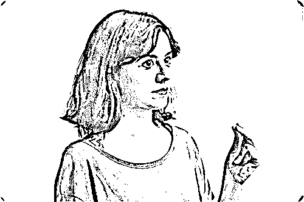

作者/唐娜·坎宁安 翻译/江艺

校对/李含 图片/花瓣网

作为一名资深的占星师，唐娜·坎宁安（Donna Cunningham )的名字已经多次出现在我们的文章中，相信大家对她已经十分熟悉。今天，我们来看看在她四十余年的占星生涯中听到过哪些令人深感遗憾和痛惜的占星事故，这些事故又给咨询者带来了怎样的危害，这些问题并不陌生，也许同样困扰你已久。

**1**

**孩子的星图可以预测吗？**

多年来，我在《戴尔占星杂志》有一个每月意见专栏，读者在里面写下他们的问题，然后我根据他们的占星星图来作答。我收到很多读者来信说，有的占星师为他们解读星图的处理方式让他们备受摧残。

**这些信件说明，在我们的领域中需要正确、负责任的专业训练，尤其是需要一定量的咨询服务训练。**

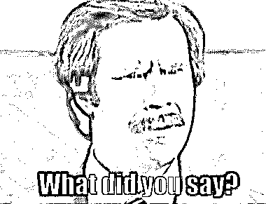

我曾收到许多惊慌失措的年轻母亲来信，她们被告知了许多关于她们子女星图的可怕事情。占星师们，**如果你决定解读儿童的星图，请保持极度的谨慎，设身处地地为这些家长着想**。当我听说占星师对婴儿的星图做出了悲惨的预测时，再没有比这更令我心情沮丧，因为当星图中外行星的影响看似非常强大时，他们就常常这样做。

**2**

**死亡可以预测吗？**

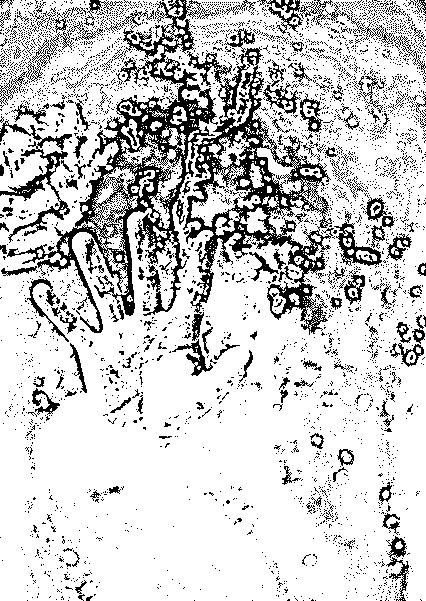

**预测死亡是占星师造成巨大恐慌的另一个领域 —— 这种恐慌太过剧烈以至于它在许多占星组织的伦理法则中被明令禁止**。

**举个栗子**

一位女士写信告诉我一位占星师告诉她，她的父母会死去，因为冥王星行进触及下中天。

**仅凭教科书中那些冗长枯燥的占星落点可能预示的去预测是极为不妥的。他对这位女士行进的解读是一种可能的表现，但每一个相位中都蕴含着无数种其他可能表现的形式**。

**在我的实践中，冥王星行进触及中天/下中天轴线或月亮常常对应于父母退休和搬走、一次重要的搬迁、购置或修整房屋、亲子关系、发现家庭秘密或疗愈过去的家庭创伤 —— 或以上某几种情况同时发生**。

很多时候，当行进冥王星与下中天、中天同时形成相位时，可能伴随着一次**重大、强有力的职业转变**。当行进影响到中天/下中天轴线时，有的客户启动了**以家庭为基础的创业**。通常，职场的政治斗争，如合并、收购也会影响到客户。

这是冥王星行进触及中天/下中天轴线的一些可能表现，但如果我不询问这位女士的情况，就无法知晓这里预示着哪一种结果。

确实，当冥王星穿越中天/下中天轴线或与其成相时，**有时会有一位家长去世**。要分辨这是否会成为一种可能性，我会**审慎地询问这位客户父母的情况和健康，但除非客户极力要求，否则不要提到死亡**。有的客户确实会坚持询问，尤其是当一位家长已经非常虚弱时。如果客户看起来能够应付，那么我们的一部分对话就应该围绕如何解决与这位家长相关的所有遗留问题。

可能这也正是问题中提到的那位占星师所做的，但这位客户离开过后心里全是在劫难逃的感觉。客户常常会选择性记忆，关注甚至放大我们所预测的最糟糕的事情 —— 所以如果有咨询录音供他们之后回顾会对他们很有帮助。

**3**

**“悲惨”配置真的会导致灾难吗？**

另一位读者写信来说，他几年前有过一次不堪回首的星图解读。占星师告诉他决不要再把自己的星图信息告诉任何人，因为星图显示，**他人生艰难，会遭遇灾难性结局，因为他的火星、土星在第八宫合相**。

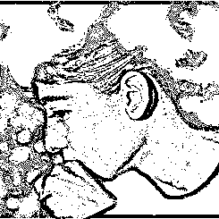 

很自然，他会对未来极度恐惧，从此后对占星师心存忌惮。我的回复是，真是时光倒流了，听起来就像是他去找某人咨询，结果却遇到了卡特·查尔斯·E·O（出生于 1887 年，英国著名占星师）或其他**笃信宿命论**的老者。

在我 40 多年来对拥有困难星图和生活的客户经验研究中，除了飞机失事或自然灾难外，他们的不幸事件**的确并非只是一次的经历**。这些灾祸倾向（包括心理层面和占星层面）似乎有**周期性剧变和毁灭性体验**。这些周期性的爆发与**行进行星触发星图中极其困难的相位有关** —— 这些相位描绘了**长期的自我破坏行为模式和愚蠢的冒险倾向**。

近几年，很欣慰地看到占星会议中包含了针对伦理的讲座、研习和讨论，以及在我们编辑的杂志及其网站上也看到这类文章。**有的原则是不容质疑的，比如不利用客户**。然而，**许多伦理问题并非绝对的，而是视情况而论，对于怎样才是正确的行为，我们在得出结论前必须考虑这些所有的因素和所涉的关系人**。

[**若道核心课程 Level 3**](http://mp.weixin.qq.com/s?__biz=MzA5NjA0NTAxNg==&mid=2651385700&idx=3&sn=30269f14b2209f35d0ed42fbe1d67e7b&scene=21#wechat_redirect)

**让你见识占星学正确的打开方式**

**2016 若道核心课程 Level 3**

**授课时间：**2016 年 7 月 28 日-11 月 10 日（**每周四晚 20：00-22:00**，16 次课）

**授课老师：**大卫·瑞雷

**授课方式：**网络课程，英文授课，中文翻译

**报名截止**：2016 年 7 月 15 日

**费用**：7000 元

**课程负责人：王老师**（**微信： ****2837474346**，请备注 L3 报名咨询）

长按二维码添加课程负责人咨询~

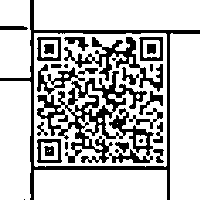

**特别提醒：**

**本文首发于若道平台，**

**转载请联系后台授权。**


**报名及咨询，请点击文末“阅读原文”**


# 测试 | 你是“爱无能”患者么？

> 原文：[`mp.weixin.qq.com/s?__biz=MzA5NjA0NTAxNg==&mid=2651385803&idx=1&sn=9e21c0f82158a30da685565eb13e6ee9&chksm=8b4a5d7cbc3dd46aad5bcca2b0fd0ed0f899def3c91eeb0ef32672f543509b099eb0b587eb41&scene=126&sessionid=1692738811#rd`](http://mp.weixin.qq.com/s?__biz=MzA5NjA0NTAxNg==&mid=2651385803&idx=1&sn=9e21c0f82158a30da685565eb13e6ee9&chksm=8b4a5d7cbc3dd46aad5bcca2b0fd0ed0f899def3c91eeb0ef32672f543509b099eb0b587eb41&scene=126&sessionid=1692738811#rd)

一 个 小 测 试

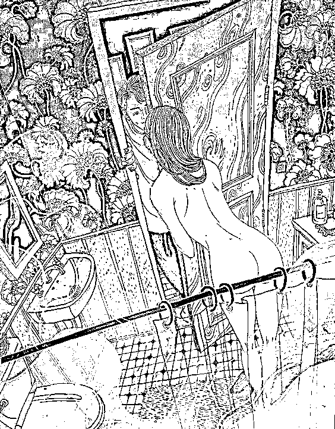

请凭直觉来说说这副图画 

想象一下**两个人的关系**

是在怎样的**情境**下

两个人**心理感受**是怎样

背 后 的 故 事

这是一则关于**内心安全感和敞开度**的测试 

如果你认为他们是

***1，*****亲密的恋人**

***内在安全感：90 分***

你内在是**安全的愿意敞开**的

但也许**容易轻信**

需要适当提高警惕

***2，*****认识的人**

***内在安全感：70 分***

你的安全感**有一些缺失**

内心有一定程度的敞开

同时保持着**比较高的戒备之心**

然而这也许正是**自我保护**的一种表现

***3，*****不怀好意的陌生人**

*****内在安全感：50 分*****

你的内心是**脆弱不安而设防**的

你固守着自我的方寸 

**不愿轻易敞开**心房

也许你经历过一些事件 

他们打碎了你对这个世界的**信任**

无论是哪一种情况

你都可以看看若道君之前推送的这些文章

**▲**[为什么你等不到爱的人？| 严肃人类的情感出口](http://mp.weixin.qq.com/s?__biz=MzA5NjA0NTAxNg==&mid=2651385626&idx=1&sn=a16235612381b85e9d04a485b6342387&scene=21#wechat_redirect) 

[****▲ ****为什么你爱的人都在操控你？](http://mp.weixin.qq.com/s?__biz=MzA5NjA0NTAxNg==&mid=2651385526&idx=2&sn=bd659ad8e7fa4cccc2a60d35c9fc0ee7&scene=21#wechat_redirect)

我们总是在说爱就要大声说出来 

可是有一类人

他们就是**爱你在心口难开**

他们过于**怀疑、敏感、自卑、脆弱**或者**反应迟缓**

在爱里**不断考验对方**

**占有欲**爆棚

拿**虐恋**当爱情

要么就是**冷漠和隔绝**

甚至认为爱是**负担和累赘**

然而 真的是这样吗

**没有了爱 **

**真的可以幸福地活在这个世界上吗**

**？**

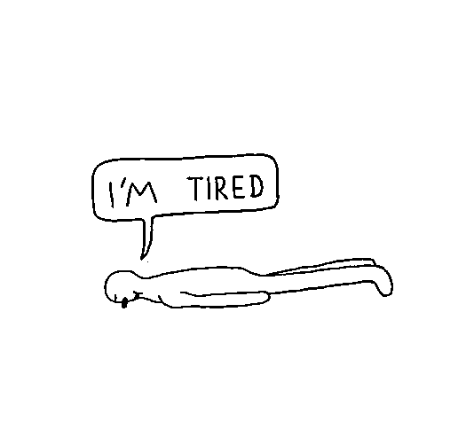
在这里

我们收录了

那些患有**“爱无能”**症状人们的心声

我们明白你们的感受

一个人不是一座孤岛

外面敲门的人也不都是打扰

**告诉自己 **

**我的确无法轻易相信别人和敞开自己**

**我接受自己这样的状态**

**我并不想逼自己去改变**

**我只是想每一次都进步一点点**

**每一个一点点**

**最终会成为我和爱人心意相通的桥梁**

**我相信我值得被爱**

**也拥有爱的能力**

慢慢进行这样的练习

直到心变得柔软

可以大声对所爱之人说出爱意

而不是担心自己不配被爱

担心被拒绝、被嫌弃

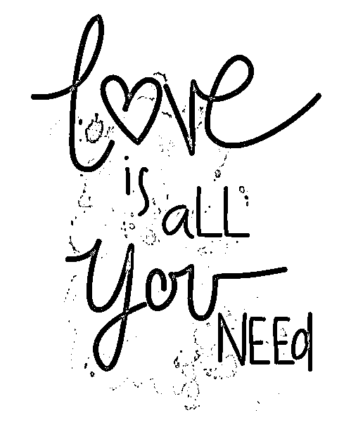

那 些 “爱 无 能” 者 的 心 声

***1. Adele***

我就是金摩羯加金土三分相，

非常晚熟，和自己的初恋结婚了。

其实金星被土星影响也是一件好事，

我们会避开那些轻浮随意的感情关系，

金星掌管审美，

天长地久一生一世才是金土人追寻的美感。

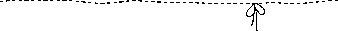

***2. 烟魔***

前夫正好是金土四分，

所以他在各种情感里都和人保持着距离。

表面上他看上去是主动招惹人的，

可深入了解后他和所有人之间都横着一道墙。

他常表示出希望避世的意愿。

他的爱一直存在于他的内心里，

难以表达出来。

他希望得到他人认同，却难以做到去认同他人。

他活得很认真，为人很严肃。

而金土瓶秤的我个人自认是个游戏人间的魔物，

担不起去开导他，支持他，等待他的重任，

于是转身离开了。


***3. 圆梦***

在这种状况下，我经历了一次彻底的失败的婚姻。

也好，让我反省自己，改变自己，

爱自己，付出表达自己的爱。

恢复所有压抑的感知，

这样身心才舒展自在，带给别人爱的能量。

所有的经历都是财富，只为让我们成为更好的自己，

不枉成为人一次，完成自己的使命。

 

***4.Siesamor***

从小父亲对我的要求就很高，言语交流却很少。

即使在班里考了第一，也会说，

这次还行，下次你要继续努力。

可是家里亲戚的小孩，他就会特别和蔼，

还会抚摸他们的头，

笑呵呵的问一问学习生活情况，

我就站在旁边完全被忽略掉。

所以在别人眼里通常觉得我是有一个和蔼可亲的爸爸，呵呵。

 

***5.腿腿***

和金土合摩羯恋爱中，

忽冷忽热不关心我不在意我。

我自己一个太阳空相，总也对亲密关系有些许障碍。

目前谁也不理谁中……知何去何从

……

 

***6. 引路***

金土四分，七宫主金星落水瓶，

土星落一宫，真的对自己太封闭了，

不擅长社交，想与所有人保持距离，

害怕敞开心扉，尤其是感情上。

太缺乏安全感了，害怕不被认可，

从小到大一切都表现出老师，家长，领导期望的样子。

不知道该怎么突破心里这道防线。

 

***7. 乐乐乐儿***

一直以为金星金牛落七宫是非常好的位置，

百思不得其解在亲密关系上到现在还没结果。

在表达感情方面非常笨拙，

特别是从小不懂与男生相处，

非常矛盾，希望得到别人喜欢，

但对他们稍微好一点就会对我表达爱慕，

所以与男生相处一直是我人生学习的一个课程。

 

***8. 女王的小短腿***

命主星金星落天蝎座，和射手座的土星合相，

被前任说比男人还生硬，连身体都是硬邦邦的……

不懂如何表达感情，无比笨拙，

默默的暗恋前任 7-8 年，

最后终于在一起了，受不了折磨自己逃回家了……

我好像是另一个极端，

从很小的时候起就一直逃避责任，

但内心是渴望成功和得到身边所有人认可的……

 

***9\. 猫柒 布甸果冻***

金土四分，亲密关系真是个难题，

跟父母有隔阂但相安无事。

因为我的人设是注定要懂事才行，

但我在懂事的路上吃错了药转为叛逆。

并不觉得自己不值得被爱，

只是确实不懂怎么表达和接受爱的讯息，

小时候和两情相悦的人都无法走到一起，

一方面内心太完美主义，

一方面不能在爱别人这件事上完全敞开心扉，

非要用理性叫醒自己。

 

***10. 午后的丁香儿***

土星 7 宫，很怕亲密关系，

喜欢一个人，也希望和情人伴侣关系有点距离。

不要太近。

 

***11. 杨二表姐***

我是金土一宫合上升摩羯，

父亲就是一个很压抑的土星形象，

严肃，悲观，刻板，

没有一点生活情趣也不会享受生活，

只会不停地干活。

他不为自己而活，觉得活着就是受苦。

还好我木星也很重，

母亲是个超级乐观的人，

我就是在这样两种力量的拉扯下成长的。

 

***12. Kanon***

我是金土四分，金星双鱼座，

小时候跟爸爸的关系非常亲密，

自从上小学，第一次考试成绩出来，

对于分数一无所知的我，随口说考了八十，

爸爸那一瞬间的失落，

跟以后考的好，爸爸永远不会表扬，

永远教育我，骄兵必败。

青春期长胖，爸爸会在外人面前说我胖，无地自容。

我跟男生的关系，朋友关系里，

大家都觉得我可爱有趣，

一旦谈恋爱，我就觉得自己无趣，

说什么做什么都不合时宜。

心好累，30 岁，被催婚催得我想死掉算了。

这人生尼玛太坑爹了，

即使自己有那么多别人羡慕的才艺，

依旧觉得自己有什么值得人爱的，

不如一个人过干净。

若道君，即使懂那么多，

也知道不能这样，可一句走出来，有多难。

 

***13. om***

金土三分女，

至今 24 岁有余，

无恋爱经历。

 

***14. Keylley***

金星双鱼土星处女，

曾有男生评价我太过正经而不适合做女朋友……

 

***15. Astrid ***

金土合相，金星摩羯座，土星七宫——对，是我。

一直都学不会怎么去表达自己的感情，

觉得有人有感情这件事非常的麻烦，

希望最好永远没有感情波动。

没有办法做到自然得赞美别人和坦然得接受赞美。

单身至今，

中了“我永远不会喜欢上一个喜欢我的人”诅咒。

 港真，对未来真的不敢抱希望啦，

所以就努力挣钱准备住最舒服的养老院（这很土星）。

 

***16. 李大毛***

金土天海冥都有相位……

确实小时候大人们都说我懂事老实，

这些话更促使自己规范自己，

要求什么说一次被拒绝就不会提第二次，

从小学自己提出自己上下学。

然而他们一直觉得我是个省心的孩子

更放养我了哈哈哈::>_<::

（其实真的是为了得到他们的关注），

现在对非朋友的异性关系也的确苦，

对于亲密关系或者说去依赖他信任他

暴露自己的缺点给另一半真的很难……

 

***17. Amanda***

月海对冲，对他人和外物很敏感，

经常需要独处，以保全、守护自己。

 

***18. 南 溟***

金冥合相天蝎落三宫。

对伴侣有着极强的控制欲，

因为内在的渺小与自卑，寻找满满的存在感。

激情确实体现在对艺术和大自然的热爱上。

我需要释放情绪的时候，就需要画画，

需要大海，需要花草树木，需要在风中行走……

希望自己能有足够的力量去疗愈金冥天蝎的痛，

把负面能量转为正面，善待自己，善待每一个人。 

如果你看到这篇文章

看到还有这么多人都和你一样

而他们中的一些已经发展出爱的能力

我想你会愿意尝试这样的练习

如果你也有这样那样的故事

欢迎留言与我们分享

如果你爱上了一个爱无能患者

请给他们更多耐心和爱心

帮助他们走出自我困境

然而切记 不要伤害自己

如果认为自己尚不具备疗愈对方的能力

不要勉为其难

因为说到底

这是 TA 自己的功课

你可以陪伴 但无法帮助 TA 完成

我们每个人都有爱的能力

不要让它被埋没

去爱 就像没有受过伤害一般

祝福我们每一个人


**想了解我们的课程，请点击文末“阅读原文”**


# 关乎月亮和母性的星座 | 是的，这很巨蟹座

> 原文：[`mp.weixin.qq.com/s?__biz=MzA5NjA0NTAxNg==&mid=2651385773&idx=1&sn=f3a78fffa027624208fc715455604597&chksm=8b4a5d1abc3dd40c3de6d650a56385b1d268631d36ef17de43b1a781b0eba8fc3b283fc11a08&scene=126&sessionid=1692738811#rd`](http://mp.weixin.qq.com/s?__biz=MzA5NjA0NTAxNg==&mid=2651385773&idx=1&sn=f3a78fffa027624208fc715455604597&chksm=8b4a5d1abc3dd40c3de6d650a56385b1d268631d36ef17de43b1a781b0eba8fc3b283fc11a08&scene=126&sessionid=1692738811#rd)

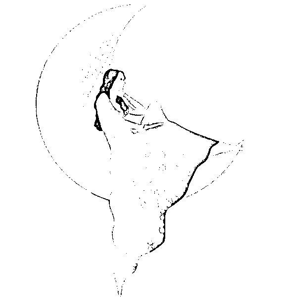

作者/达纳•格哈特  图片/Pinterest

翻译/Elle  校对/王宏

大卫老师这样描述过巨蟹座：火星巨蟹座的人走路都是曲里拐弯，如同横行霸道的大螃蟹。每个人都有巨蟹座特质，它代表着你身体内情绪、母性的部分，同时也代表着你敏感和容易抱怨的气质。巨蟹特质的人需要战胜自身的怨念和委屈，世界不欠你的，而你欠世界一个积极的自己。

1 为什么巨蟹座住在厚厚的硬壳中？

**情感上的支持——关怀、同情、舒缓的抚摸、欣赏会减轻压力、抑郁和疾病。**敞开心扉是将这种好的品质带入你的巨蟹座宫位和落入巨蟹座的行星的最好方式。

**为什么巨蟹座的象征符号是一只硬壳的、带着鳌的螃蟹呢？**

首先，显而易见的是：它的防御性外壳表明了落在巨蟹座的行星会以怎样的方式变得**内向、不外露和自我保护。**

*   **水星在巨蟹座**的人是出色的**倾听者**，有着良好的**直觉**，但此人也可能羞于表达自己所知道的事情。 

*   温柔的**金星落在巨蟹座**的人可能用**热情**来交换**安全感**，然后以**沉默对待**的方式来吸引她所渴望的爱。 

*   愤怒的**火星落入巨蟹座**的人在自己内心忧虑且愤怒时，可能**假装**没什么不对劲。螃蟹还有什么别的暗示呢？它分岔的蟹脚给了它在岩石上和潮汐池里超群的移动能力。但在一般的沙滩上，它急匆匆的横向行走就显得很奇怪。 

    落在**巨蟹座的行星**可能会急匆匆地到处走，**迂回**地靠近目的地，而不是径直走过去。我曾经跟两位火星都在巨蟹座的女士一起工作。她们常常挤在一起，一起小声说话，我推测她们是在密谋什么事。而她们总是会调转到新的方向上，然而却从不会在一个特定的路线上停留很久，这永远都让我感到吃惊。 

*   **木星在巨蟹座**的人也很容易走到岔道上，这增强了其**多愁善感**和**自我放纵**的特质，而不是放大这个擢升的配置所能带来的好运。

*   然而，如果**被激怒**，落在巨蟹座的行星就能变得非常专注。当螃蟹举起它的鳌攻击时，它是**直截了当**的且**不屈不挠**的。 

    如果**月亮在巨蟹座**的人感到**自己或所爱的人受到威胁**，她就会**拼命去复仇**。

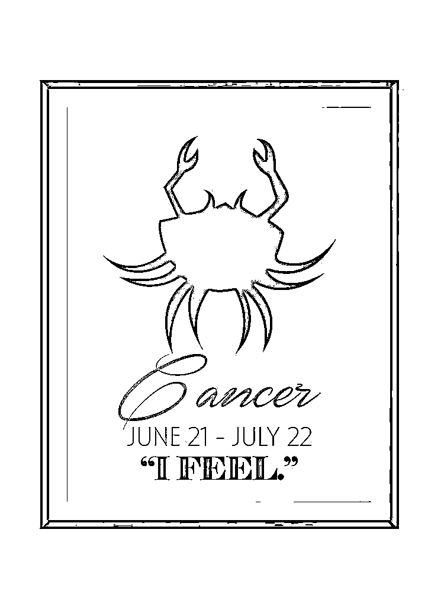 

落在巨蟹座的行星同样可能对付更大的敌人，通过**唠叨或操纵**来行使权力。**被动的进攻和抵抗是巨蟹座其他常见的策略**。甘地由于他的和平抵抗而备受尊崇，他的中天落在巨蟹座。他的人格和全球声誉使得他成为巨蟹座的象征，是母亲的同情心和保护的化身。他的事业传播了巨蟹座伟大而耐心的力量：坚持自己的立场，直到周围的世界屈服让步。

但或许关于螃蟹最说明问题的事实是它们选择在何处居住。螃蟹居住在海滨，这是位于澎湃的大海和坚固的土地之间的过渡空间。这里动荡而多变，在岩石和沙土之间，潮汐来来去去。

螃蟹为什么不像章鱼或鱼类一样，进化到永远在无边、无形的水里游泳呢？为什么不像狮子一样在坚实的土地上奔跑呢？螃蟹一定是**对于有形和无形都抱有爱——或需求**。它们身后有无边无际的海洋，它们依然与造物者伟大子宫的韵律保持着联系，同时它们的身体适合在着陆于坚实的地面时紧紧抓住地面并灵活运动。它们在大海和陆地之间穿梭，设法在这喧杂的交汇之处茁壮成长。它们的栖息地在最大程度上解释了保护壳、横行和善于抓取的鳌。**巨蟹座的螃蟹追求安全感，因为从根本上说它们所知的世界是不断变化的**。

2 各种元素组合下的巨蟹座发展有什么不同？

无论巨蟹座是守护你有关合作的第七宫，还是关于金钱和资源的第二宫，或是关于朋友和未来梦想的第十一宫，你都可以把该领域视为有象征含义的海滨，那是两种接纳性的元素——**土和水的过渡空间。**

水是母亲养育的媒介，是每个人的第一个家。水把心灵和无形的力量结合到一起，无形的力量就是我们感受得到但却看不到的事物：**直觉、记忆、情绪。**

你将特殊的敏感性带到你生活里由巨蟹座守护的一切领域之中，你意识到的不仅仅是呈现在眼前的事物。也存在着周期性的活动，那是在你意识控制之外的节奏。你必须和这种节奏保持一致并随之流动，否则你就要跟潮水相抗争。

**你还需要坚实的土壤，感觉到你是稳固的且安全的。**你落在巨蟹座的行星渴望安全感、有形的感官享受、庇护所带来的愉悦，以及多样地形的纷繁美丽。巨蟹座带来熟悉物品的舒适感，以及和所有坚硬的、顽固的事物之间的冲突。**考虑到水和土不断变换的拉力，很容易理解这个宫位所能包含的深深的焦虑。你的巨蟹座宫位有时可能是一个不安宁的、不稳定的世界。**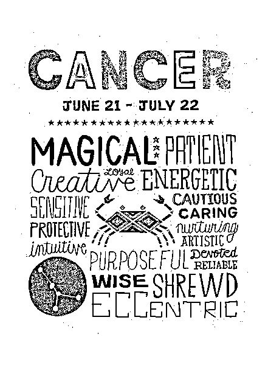

你在这个宫位表现得多好可能取决于你星图的其他部分。

*   如果你的**月亮备受折磨，同时有很多水象的配置**，那你**内在的和周围的混乱的情绪漩涡可能让你感觉很迷惑**，无法让自己脚踏实地地努力，徒劳地抓住安全感和形式。 

*   如果你的星图中**水象元素过少**，你可能会**否认自己的敏感性，向自己隐瞒情绪上的秘密。**否认是把可见的变成不可见的、把现实变成无形的一种方法。当你和周期性的活动失去联系时，你可能无意识地将它们表达为**喜怒无常。**你**对自身所处的不断变化的情境感到无助。**（驱动这些潮汐的通常是你的月亮。） 

*   在最好的情况下，你的巨蟹座宫位可以是一个**极具创造力**的领域。因为耐心和技巧的存在，你能够以无数种方式将无形的调拨为有形的。 

*   你也许会感受到**精神上的震颤和波动**，并将其捕捉下来，写成一首传世的诗作。 

*   你可能只是感受到另一个人对于安慰的需求，并**提供了安慰**。 

*   你可能直觉地意识到一个**社会理想**，并像甘地一样坚守它，而世界会渐渐适应它。 

*   无论你的愿景或使命是什么，你都有能力来**培养和养育生命**的过程。

*   你是那只知道有生命要降临并因此为其筑巢的鸟，你是那个在自己的子宫里腾出空间的母亲。

3 什么是巨蟹座真正的财富？

一位朋友最近发给我一封电子邮件，邮件的内容让我非常难过，以至于我一个小时都无法工作。起因是关于一只金腰燕的照片，照片中显示，这只金腰燕在飞过一条马路时被一辆车撞到了。它的伴侣试图唤醒它，然后营救它；最终它的伴侣意识到，它死了。它的伴侣非常悲恸。随着**在摩羯座的冥王星在接下来的这些年中对分巨蟹座的行星（2008~2024 年）**，我们还会看到很多关于失去、无家可归、虐童和饥饿的更为让人心碎的故事。我们将有很多伤心的机会。

要研究巨蟹座，却不考虑我们用敏感性所体验到的不可避免的痛苦发生了什么情况，那就是否认。并不是我们所有的构想都会变成光鲜的现实。无论我们的爱有多么伟大，我们都无法保护我们珍视的所有东西。即使是在我们的照料下蓬勃生长的事物也会在某一时刻长得高过我们。

我们自己也许有着关于年幼无助的痛苦回忆，当时我们在家长的照料下，他们本该更巧妙地爱我们（或者至少治疗师是这么说的）。不好的事情会发生，而有时是我们自己做了坏事。巢穴可能充满噩梦。梦魇是巨蟹座的依赖性、被养育和养育的不可阻挡的另一面。

“

黑暗母亲尖叫是……/狱中的呼叫或求救的呐喊/黑暗母亲尖叫是……/语言最初的母亲……/不要忘记——罗马沦陷/没有理解黑暗母亲尖叫这个词组。

——诗人安德烈·沃兹涅先斯基 

”

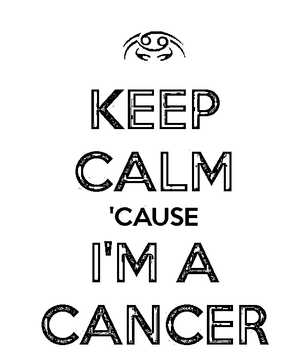

**巨蟹座的敏感是令人心碎的。或者更准确地说，这种敏感将我们的内心打开。我们黑暗尖叫的这份礼物是一种可以改变世界的同情心。这是巨蟹座最终的目的地和任务。这要求在男子气概和女性化——或理智和感受——之间建立新的伙伴关系。**

我们必须**训练我们的头脑去遵循内心的情感生活，不受干扰地跟随我们内心的各种活动，无论将我们带到哪里，我们都要跟随着它。**

但头脑追随感受是不够的。在某一个特定的点上，理智被劫持了。它围绕着同样的故事转圈儿，陷在**旧有的恐惧和怨恨**中。要破除这个魔咒，这种情绪必须脆弱地站在那里，被刺中。**我们经常用愤怒和自恋这类次要的情感来避免我们自己受到伤害。打开我们源头上的痛苦是掌控情绪的关键步骤。**

“

当我们首次打开我们的痛苦时，常常会觉得自己像是在流血。但这种情绪上的流血有助于唤醒内心，让我们内部已经变得凝固的生命力再次流动起来。以这种疗愈的方式让我们的痛苦流动需要觉知、勇气和温柔——与痛苦同在，而不是相信我们头脑中关于痛苦可能将我们带向何方的恐怖故事。

——心理学家约翰·威尔伍德

”

我们必须怀着自己的武士精神投入我们的痛苦之中，而**共情**是我们在醒悟到自己的痛苦时所释放出来的神圣力量。共情是我们巨蟹座宫位真正的宝藏。在未来艰难且具有变革性的岁月中，我想我们会需要很多共情。

我们不能假装月亮女神没有在看——尤其是当我们在寻找她的巨蟹座祝福时。无论我们渴望的是更多的爱意、一个安全的避难所，还是创造性的灵感，我们都必须遵守她的规则。对她视而不见必然会导致她的暴怒。


若道君的一位月亮巨蟹座朋友表示

这个月亮并没有很好

天天的情绪大姨妈各种抓狂

谁要谁拿去吧

你有没有被自己的巨蟹座特质整疯

来留言

**除了好文**

**我们的课程也很不错呢**

**你可别错过了**

**2016 若道核心课程 Level 3**

**授课时间：**2016 年 7 月 28 日-11 月 10 日（**每周四晚 20：00-22:00**，16 次课）

**授课老师：**大卫·瑞雷

**授课方式：**网络课程，英文授课，中文翻译

**报名截止**：2016 年 7 月 15 日

**费用**：7000 元

**课程负责人：王老师**（**微信： ****2837474346**，请备注 L3 报名咨询）

长按二维码添加课程负责人咨询~


**特别提醒：**

**本文首发于若道平台，**

**转载请联系后台授权。**


**欲知报名详情，请点击文末“阅读原文”**


# 阴影面工作坊 | 向来死撑的我，却在那一刻泪流满面……

> 原文：[`mp.weixin.qq.com/s?__biz=MzA5NjA0NTAxNg==&mid=2651385773&idx=2&sn=d597e59abc9b8451d068000ec0248fd0&chksm=8b4a5d1abc3dd40c4cd5c56f9dcb98f3d431363fc85bfae411f61b56db7c40c424831c8c3a39&scene=126&sessionid=1692738811#rd`](http://mp.weixin.qq.com/s?__biz=MzA5NjA0NTAxNg==&mid=2651385773&idx=2&sn=d597e59abc9b8451d068000ec0248fd0&chksm=8b4a5d1abc3dd40c4cd5c56f9dcb98f3d431363fc85bfae411f61b56db7c40c424831c8c3a39&scene=126&sessionid=1692738811#rd)

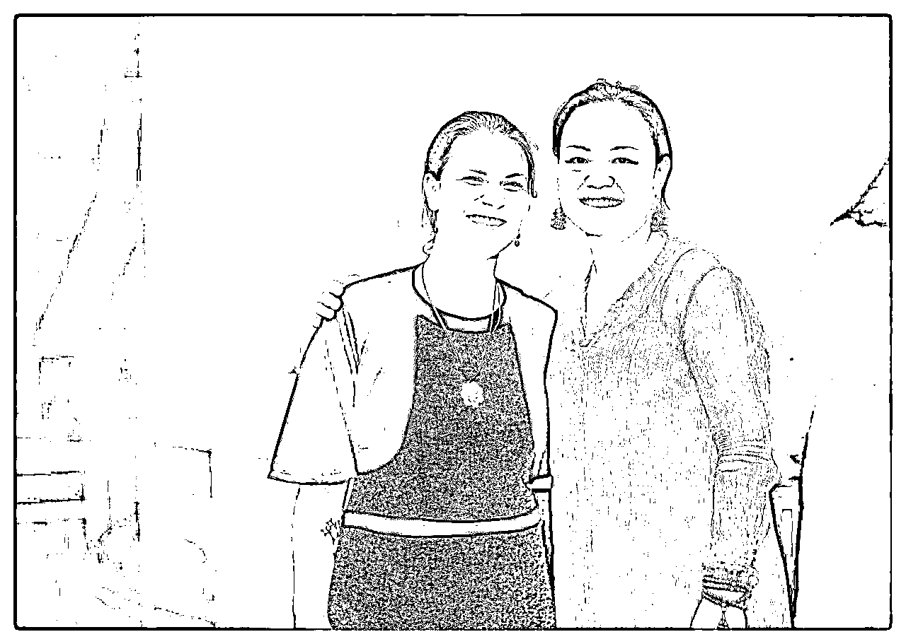

作者/罗淞维 Nancy  摄影/马小跳

每个人都有阴影面，即使无数次研究自己的出生星图，依旧会有照顾不到的地方。而我们需要去疗愈的恰恰是这个照顾不到的地方。来看看杰西卡在阴影面工作坊里是如何疗愈拥有土星特质的人们。

缩在硬壳子里的我

工作坊的三天里，太阳、金星、水星亲密地一起待在温暖的巨蟹座。水星与太阳也依次精准地亲吻了我个人星图中的土星。杰西卡，这位准备以四年时间严肃对待自己土星回归的女性导师，将这个我从未认真凝视过的土星直直地拉到眼前，让我看到自己的星图中那个从未曾被关注过的精准的**月土六分相**。

土星与月亮的相位并没有带给我事件层面上真正的丧失（土星代表丧失），却内化成情感层面深深的**被遗弃感**。这个遗弃感带给我最大的礼物，仍是来自土星的**独自担当与承担责任，于是我在以为得不到可依靠的情感照顾者的情况下，成为与生俱来的自我照顾者**。

音乐、舞动、各种身心灵的疗愈方式，都成为自我滋养的工具，所有艺术化的能带给身心慰藉的东西，我都不会轻易放过。所以，在土星坚忍的担当下，在某种程度上，我把自己照顾得很好。

然而，这超人般的自理与自立，也让那个脆弱的内在小孩深深地隐藏在了硬壳之下，难以真正敞开。从不向人求助，土星像一个沉重的盖子紧紧地盖在上面……

除了哭泣不能做更多

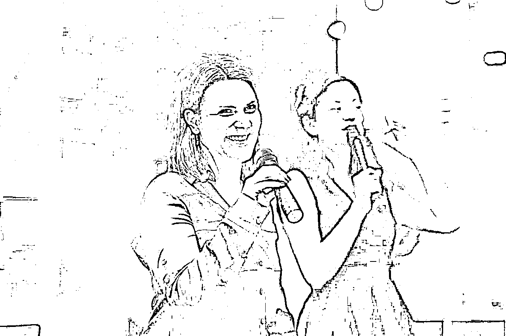

“观想自己回到了宇宙之初的那个白光之中，所有来自远古的祖先都站在你的身后……”洞穿灵魂的鼓点声中，听到杰西卡这样的引导语。在被巨蟹座母亲温柔呵护亲吻祝福的那个时空之下，这个土星的盖子被轻柔地掀开，心中纤细脆弱的内在小孩完全敞开在巨蟹座母亲温暖的怀抱之中，**哭泣，哭泣，除了哭泣不能再多做些什么**……甚至敲下这些文字的片刻，泪水仍然模糊了双眼……

多么的奇妙啊，阴影、光、光、阴影……同样是土星的宇宙能量，就这样穿梭往复，变幻莫测，在这个能量的全谱系中以不同方式的表达在我的生命之中，也呈现出不断转化与穿越的各种可能性。

工作坊的现场案例演示中，杰西卡完全敞开地向我们分享在演示过程中发生在她自己身体上的变化。中国之行对她而言并不容易，也伴随着焦虑，她的月经也已经迟了两周，但就在案例进行的过程当中，她感受到自己开始流血。

这是宇宙共时性的表达。在案例进行中，案主在面对的正是褪下与母亲同感同受的脐带般的联结，真正成为属于自己生命的独立个体的过程。听到她如此敞开的分享，以及看到这样深入和敏锐的洞察，那一刻不是不震撼的。

工作坊后返家的次日，我自己也开始出现非经期的出血，子宫内也在进行着一场褪去与母亲脐带般连接的仪式。

正如杰西卡所言，**生命本身就是完全活出自己人生的一场仪式，每一次呼吸每一个行动都是这仪式的一部分，我们本身就是活着的象征符号**。觉醒的个体，永远不要忘记在自己的身上发生了什么，那是宇宙无时无刻不在向我们表达，每一个个体都是宇宙表达的管道。

我们每个人都是一个巨大的宇宙过滤器，十颗行星的原型落在我们自己的星图之上。这张星图就是神为我们开启的窗口，我们每个人都透过个人星图这个镜头去观察整个宇宙。在宇宙几百亿年的进化过程中，我们都曾经拥有过成千上万个这样的镜头，所以，退后再退后，与这个镜头拉开距离，真正尝试从宇宙的视角来观察和理解这个宇宙。宇宙既是如此宏大，又是如此真实的将自己所有的信息都呈现在我们每一个个体的身上，毫无遗漏。

一切都刚刚好

在另一个案例演示中，杰西卡面对的是一个有着水星和土星相位组合的男性案主。在她自己的星空之下，杰西卡是一位擅长快速出击并且极具稳准狠特质的月亮白羊座女人。而水土的相位组合又是一个在土星耐力的星空下，需要花很长时间来认真思考，且一定要对自己的表达负责任的“慢性子”。

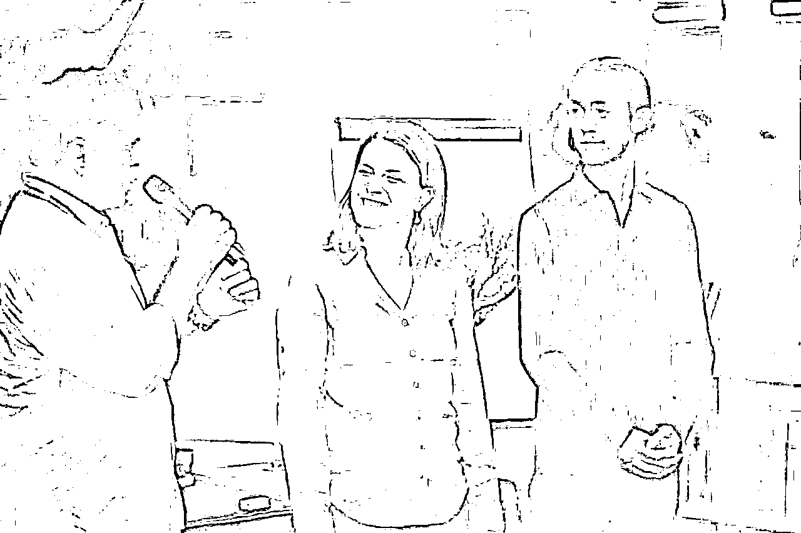

杰西卡在过程中不断放下自己的生命，去臣服于那个水星与土星组合的时空。在结束后的案例回溯中，看到杰西卡眼带泪光地向案主表达感谢，感谢他带给自己的礼物——耐心、尊重、谦卑……再一次，被深深地震撼…… 

杰西卡带给我至深的礼物——**学习臣服与不评判，学习去荣耀土星。我们越能在工作中去荣耀土星，我们工作的容器就越大越有力量越能扎根**。 

每个人都还在执着于一些不能服务于我们的业力。是光抑或阴影，这都是宇宙显化在我们每一个个体之上的礼物。大卫老师在工作坊期间写下的诗歌《Shadow》，是那片时空下再美不过的表达。

完稿之时，太阳与金星都将步入闪耀的狮子座，一周之后太阳也将换座到狮子座。那个内在的小孩在经历了巨蟹母亲温暖的抱持之后，安全感获得了极大的滋养，开始积蓄力量，离开母亲温暖的怀抱，仪式化地完成了一个告别，步入属于自己这个个体的华丽篇章，登上自己的人生舞台，开始闪耀在聚光灯下。一切都刚刚好。

**作者简介**

**罗淞维 Nancy**：2010 年，被妈妈的身份引领走上了自我成长之路。在若道进行系统的占星学习，完成了 level 4 的学习。2016 年在天王回归的时间窗口，暂停了 level5 课程的学习，全身心地投入到生命之旅的开创与变革之中。这次工作坊之前，毅然辞去了国企的管理岗位，以孑然一身又焕然一新的面貌，投入到生命的冒险旅程之中。

**微信号**：Nicky6666

长按二维码，让金钱涌向传播知识与智慧的人~

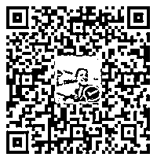

**如果你错过了这次工作坊** 

**你可别再错过**

**若道核心课程 Level 3 哦**

**2016 若道核心课程 Level 3**

**授课时间：**2016 年 7 月 28 日-11 月 10 日（**每周四晚 20：00-22:00**，16 次课）

**授课老师：**大卫·瑞雷

**授课方式：**网络课程，英文授课，中文翻译

**报名截止**：2016 年 7 月 15 日

**费用**：7000 元

**课程负责人：王老师**（**微信： ****2837474346**，请备注 L3 报名咨询）

长按二维码添加课程负责人咨询~


**特别提醒：**

**本文首发于若道平台，**

**转载请联系后台授权。**


**报名点击文末“阅读原文”**


# 人物访谈丨一件事连续干 47 年还越做越 High 是怎样一种体验？

> 原文：[`mp.weixin.qq.com/s?__biz=MzA5NjA0NTAxNg==&mid=2651385756&idx=1&sn=d39ac61599a7e9276d30e0715db593a5&chksm=8b4a5d2bbc3dd43d28fcaec1fcbdf53152bdc7249c7ad18085d1f56130132fdcae1978c2a7ee&scene=126&sessionid=1692738811#rd`](http://mp.weixin.qq.com/s?__biz=MzA5NjA0NTAxNg==&mid=2651385756&idx=1&sn=d39ac61599a7e9276d30e0715db593a5&chksm=8b4a5d2bbc3dd43d28fcaec1fcbdf53152bdc7249c7ad18085d1f56130132fdcae1978c2a7ee&scene=126&sessionid=1692738811#rd)

作者/大卫·瑞雷 访问/若道君

翻译/Christy 校对/江艺

他是若道的创始人之一；他接触占星学 47 年，进行占星咨询已 40 年；他是美国首位在电视上主持占星节目的职业占星师……他就是大卫·瑞雷。关于他的故事，我们知之甚少，这是他第一次向我们展示自己的心路历程。

## **我是如何开始学习占星学的？**

1 首先，请您用一句话给自己下一个定义。

**答：**富有灵感的（无论好坏）！

2 你是多少岁开始学习占星？是什么因素促使你接触占星学？

**答：**19 岁。我的冥想课老师和他的妻子向我介绍了占星学，并借了些书给我。

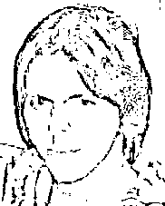 图为青年时期的大卫·瑞雷

3 听说你曾因为家庭原因做过心理治疗，你小时候其实是比较艰辛的，可以聊一聊那个阶段你是怎么走出来的吗？

**答：许多受到心理学或占星学等咨询领域吸引的人，都是在寻找他们自身问题的解决方案。**尽管我在成长过程中有很好的照料者——我的姑姥姥、祖母、母亲和她的女佣欧拉，但是我童年生活围绕的中心是母亲的残疾带来的创伤。

由于神经外科医生的疏忽，我的母亲在我 14 个月大的时候就残疾了。虽然进行了数年的物理治疗，但在后来的 53 年里（她当时 27 岁），她依旧没能从轮椅上站起来。我一直和姑姥姥住在一起，4 岁时才和母亲团聚。**从那时起，一直到我十几岁的时候，她的挣扎、抑郁和愤怒都占据着我的生活。**

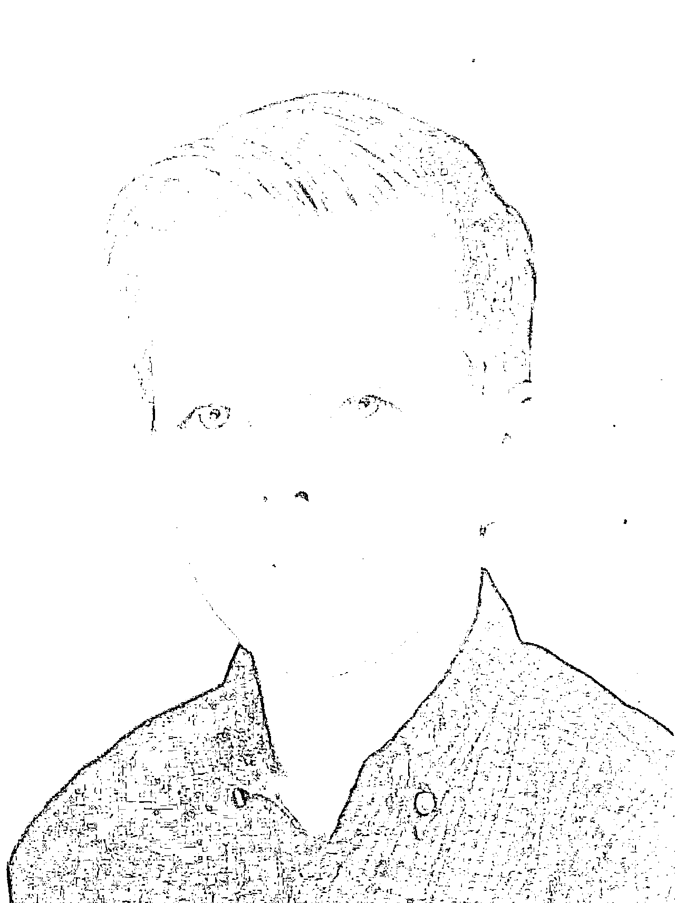

图为少年时期的大卫·瑞雷

我很早就对所有与灵性和宗教有关的事物感兴趣，虽然在 14、15 岁的时候，我曾短暂地信仰过不可知论。然而，在我 20 岁出头时，**我意识到，有许多情感问题是我在逃避的，即便在强大的灵性体验中，我也没有面对这些问题。**

于是，我开始了长达 16 年的治疗探索，包括心理疗法、原始尖叫疗法、再生疗法/身体疗法和全息呼吸法。这些治疗方法的所有阶段都有极大的帮助，让我得以将我的情绪体与精神、肉体整合起来。

自那时起，我一直在不定期地为个人成长寻求咨询或参与工作坊，比如 2015 年 6 月斯坦·格罗夫的全息呼吸法工作坊，以及随后的创伤及压力释放训练。**如果我们敞开胸怀接纳疗愈，生活本身就能带来惊人的疗愈效果**，但是，致力于疗愈常常需要采用一些过程将我们带入**内在的宁静、接纳之地**，让我们更大程度**实现潜能**，以更开放的态度**享受生活**。

**占星学在整个过程中也给了我帮助，它是一名向导，为我的生活经历和疗愈过程提供参考坐标。**

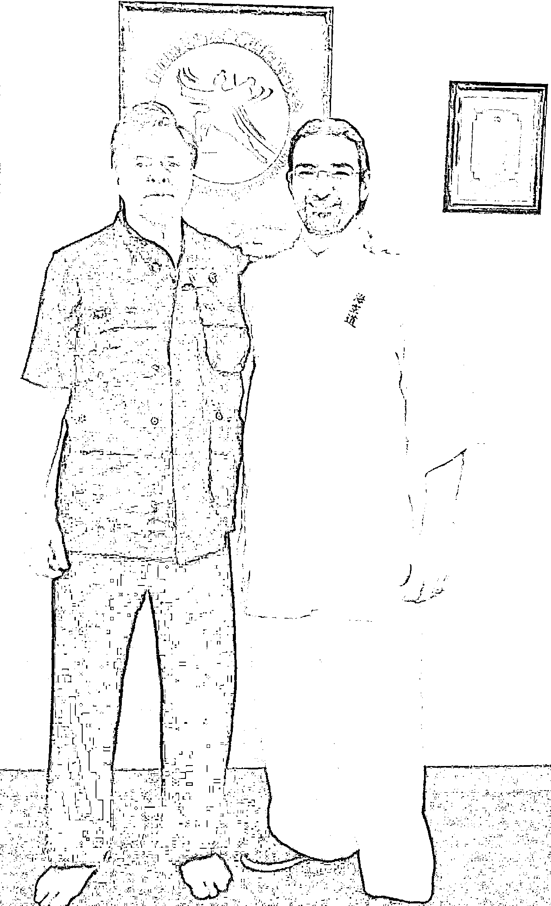
图为大卫·瑞雷与其太极老师

4 你学习占星学的历程是什么？遇见过哪些有意思的老师？

1970 年我刚开始学习占星学时，我把能找到的书都读了，**从中我学会了如何构建星图**。我会把我熟悉的**家人、朋友**拿来与他们的**出生星图进行比照**，发现其中有着**惊人的关联**。

我还参加了许多占星师的工作坊，比如**比尔·蒂尔尼**和**伊莎贝尔·希基**，以及后来的**丹恩·鲁伊尔**和**马克·E-琼斯**，但是我的主要老师是**罗斯玛丽·琼斯**（我在 1971-1974 年间跟随她学习）和维姬·格林（我在 1974 年跟随她学习了一年）。自那以后，我也一直参加其他占星师的工作坊和讲座，或许在 1976 年我拿到职业资格证之后参加得更多。

***若道君：这些名字可都是占星界响当当的呢！***

## 我的职业生涯故事

5 据说你曾经去监狱里为犯人咨询，可以说一说那段经历吗？

这只在我做占星师的时候发生过两次，是同一名犯人。我认为我们的咨询对他很有帮助，因为咨询完之后，他就做出了改变命运的重大决定——参与到 FBI 提供的一项证人保护计划中。（有趣的是，我在二十几岁时是一名业余足球运动员，在亚特兰大联邦监狱做咨询时，我们球队主动提出与犯人球队进行比赛，作为社区服务。两场比赛我们都输了，他们的球队真棒！）

6 你在占星师的职业生涯中取得了哪些成就？

**我做专业咨询已经 40 年了**，其中有 38 年我没有其他收入来源。我与许多企业、名人、政客、政府官员等合作过，奥斯卡影后朱利安·摩尔也是我的客户之一。我为一家名为 A.W. Hutchison and Associates 的建筑有限公司做了 25 年的占星顾问（1980-2005 年），这家公司后来成为了行业最大的公司，并在 2005 年以 2300 万美元的价格被收购。

7 听说你有些客户都超过了 30 年，甚至他们的孩子、孙子都找你咨询，那是一种什么样的感觉呢？

事实上，一些客户与我认识已经 40 年了。是的，包括他们的孩子，有时候甚至是孙子也成为了我的客户。**人本主义占星师要与客户建立关系，成为他们的可靠顾问，引导他们走过生命中诸多困难重重的荆棘之路和充满喜悦的成功之路**。我很荣幸能够有机会为我的客户服务，成为他们生命中的一部分。我与许多客户都非常亲近，在我来中国期间，他们中有许多人依旧每天在 Skype 上向我咨询。

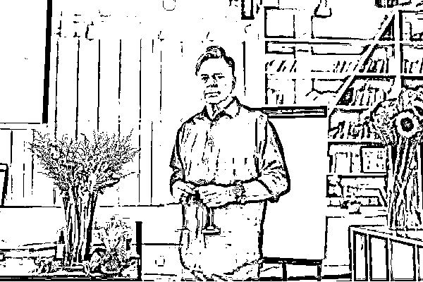
图为大卫·瑞雷在工作坊

8 你的星图上哪些特质利于你成为占星师、老师？

**出生星图的确反映了一个人的潜能**。从出生星图的角度看，我会说，是我星图中强烈的海王星和 12 宫主题暗示我要发展我的共情和直觉潜能，帮助我成为一名占星师。

9 除了占星师，你还做过其他什么职业？

在高中和大学时期，我通过做园林绿化工作和建筑工作来赚外快。在我发现占星学的时候，我正在美联社（美国最大的通讯社）工作，我大学主修的是**新闻学**。作为一名占星师，我成为了 WSB 电视台一档早间电视新闻节目**《早安亚特兰大》**的常驻嘉宾，该电视台隶属于美国广播公司 ABC，而我是**首位受邀上节目的职业占星师**。

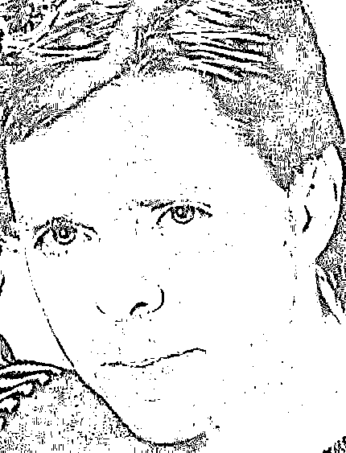
图为该时期的大卫·瑞雷

1982 年至 1985 年，我在 WRFG 广播电台主持了一档节目，叫作**《每周宇宙天气预报》**。在 1985 年至 1988 年之间，我获得了电视与影像制作资格证，并在 1989 年制作主持了一档每周 30 分钟的直播节目**《今日占星》**，这档节目持续了**4 季**（1989-1992 年）。

虽然作为占星师我生活得还不错，但我还在 1993 年至 1998 年间担任了**剧作家和编剧顾问**。1994 年至 2000 年，我住在洛杉矶，写了**六部剧本**，其中一部**《米兰达峡谷》**在 1997 年被派拉蒙选中，但没能投入制作。

10 听说你除了《灵魂的目标》之外，还在创作其他的占星书籍，可以跟我们介绍一下吗？

我的第一部著作是**《灵魂的目标》**（2003 年），2009 年重新编写了第二版，2010 年又重新编写了**中文版**。目前我有两部作品正在创作中：**《个人成长的黄道带》**，完成了 60%；**《人本主义占星学：理论与实践》**，是一本教科书，完成了 15%。这两本书都会翻译成**中文出版**，让中国的读者们看到。

***若道君：小伙伴们，看到这个消息，是不是很激动？又有新书可以期待了！***

****** 

图为《灵魂的目标》

## 关于若道的那些事

11 你和蒋颖创办的若道占星在中国主要提供哪些服务？

若道本质上说是一个**提供占星教育的平台**，当然也出售**占星报告**。我们开办了**工作坊、讲座、课程**，尤其是**在线教育课程**。我们有 9 名正式教员，其中**理查德•塔纳斯和诺•泰尔**两名老师都毕业于**哈佛**。

12 能介绍一下若道现有的课程体系吗？

我们有一个两年的**核心课程**，从 1 阶到 5 阶，帮助学生从对占星一无所知，到成长为**职业占星师**。我们也提供许多选修课，让学生能通过**国际占星研究协会（ISAR）的全部资质认证项目**。2013 年，我们取得了**ISAR 附属占星学校**的资格。许多学生为了成为职业占星师来这里学习，大部分人则是为了**个人的成长和发展**而学习。

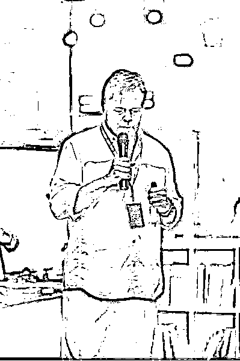
图为大卫·瑞雷在工作坊

13 在若道即将开办的 Level 3 课程中，您是讲师，请告诉大家为什么 Level 3 在占星学的系统学习中如此重要？

在我们的两年核心课程中，**3 阶是最重要的**。在 3 阶课程的学习中，**学生有机会学习如何去真正理解他们在出生星图中所看到的，尤其是所谓的“相位”**。相位是出生图的几何结构，从中我们可以了解一个人**人生经历的“原因”**，并且获得诸多关于**潜能发展**的细节信息。

那些重点关注**个人成长和发展**的学生，如果只学了 1、2 阶就停止了，那就是在自我欺骗。因为在 3 阶中，**出生星图变成了一幅对个人反思和成长都有更大意义和用途的地图**。一旦你理解了相位，感觉就好像：“哇喔！现在我懂了！”仿佛在用一副更清晰的眼镜看出生星图。同样，那些准备成为职业占星师的学生也必须要学习 3 阶，才能完成整个核心课程。**3****阶课程是一段令人兴奋的冒险，向着一个更深入、更有意义的占星学进发。**

14 行星、星座、宫位的组合太多，学员在理解时可能感觉头大，您有什么好方法来解决吗？

是的，这就是为什么 3 阶和 4 阶课程如此重要！几乎所有学占星的学生都在学完 1 阶和 2 阶后感到困惑和招架不住。他们还没有学会**融会贯通**，而这正是 3 阶和 4 阶所教授的内容。

不过，为了让星座、行星、宫位和相位的学习更简单，我们可以学习**黄道带字母表**，认识到所有这些类别在相同的关联因素中都有着特定的**共鸣**。比如：白羊座、火星、第一宫和合相，它们都能彼此共鸣，并且代表了相同的基本原则！一旦学生们开始理解了这一点，学习过程就会变得**简单**。

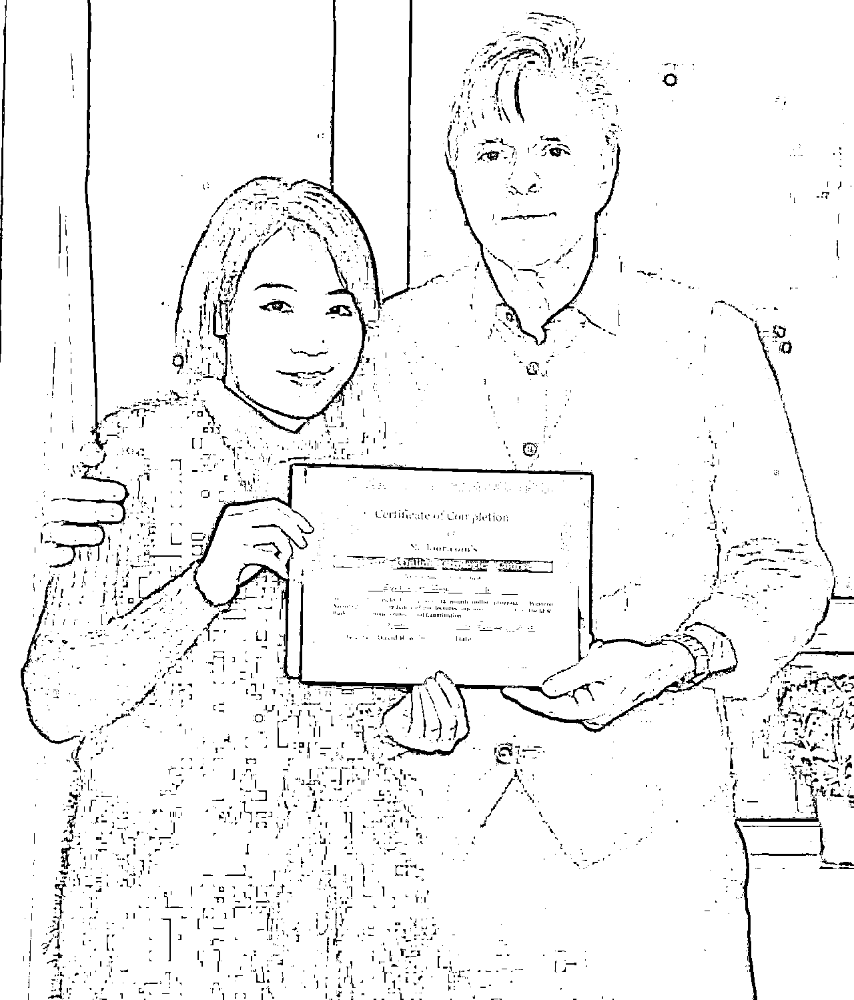
图为大卫·瑞雷与若道学员

15 您觉得目前 Level 3 的学员需要提前读哪些课前读物吗？

我们为整个课程拟了一份推荐阅读书目，以下是 3 阶的推荐阅读书目：

●《内在的天空》斯蒂芬·弗里斯特

●《灵魂的目标》大卫·瑞雷

●《关于黄道带的一切：探索占星学十二星座》比尔·蒂尔尼

●《占星学》罗纳德·C-戴维森

●《傻瓜占星》瑞伊·奥利安

●《你自己的占星学：如何理解和解读你自己的出生图》德梅特拉·乔治

●《傻瓜占星全书》玛德琳·格威克-布洛德尔

●《占星、业力与转化》史蒂芬·阿诺优

●《当代占星研究》苏·汤普金斯

●《心理占星学入门》格伦·佩里

●《土星》利兹·格林

●《占星符号》罗伯特·汉德

●《相位关系链分析》比尔·蒂尔尼

●《占星学习新方法》巴兹尔·费林顿&诺·泰尔

●《宫位、星座和行星：第二卷，占星原则与实践》诺·泰尔

●《阿兰·欧肯完全占星：现代占星学经典指南》阿兰·欧肯

**看了这么多大卫·瑞雷的故事**

**还不跟随他学习占星学？**

[**若道核心课程 Level 3**](http://mp.weixin.qq.com/s?__biz=MzA5NjA0NTAxNg==&mid=2651385700&idx=3&sn=30269f14b2209f35d0ed42fbe1d67e7b&scene=21#wechat_redirect)**开课在即**

**你可别错过了**

**2016 若道核心课程 Level 3**

**授课时间：**2016 年 7 月 28 日-11 月 10 日（**每周四晚 20：00-22:00**，16 次课）

**授课老师：**大卫·瑞雷

**授课方式：**网络课程，英文授课，中文翻译

**报名截止**：2016 年 7 月 15 日

**费用**：7000 元

**课程负责人：王老师**（**微信： ****2837474346**，请备注 L3 报名咨询）

长按二维码添加课程负责人咨询~


**欲知报名详情，请点击文末“阅读原文”**


# 宫位丨二、六、十宮的正确打开方式

> 原文：[`mp.weixin.qq.com/s?__biz=MzA5NjA0NTAxNg==&mid=2651385756&idx=2&sn=f5530fab8eab264c178b3b04ed71cd29&chksm=8b4a5d2bbc3dd43db2ea74f51ecbf56a1923e021d7012a5a11afd8459e45157806a5687e3d25&scene=126&sessionid=1692738811#rd`](http://mp.weixin.qq.com/s?__biz=MzA5NjA0NTAxNg==&mid=2651385756&idx=2&sn=f5530fab8eab264c178b3b04ed71cd29&chksm=8b4a5d2bbc3dd43db2ea74f51ecbf56a1923e021d7012a5a11afd8459e45157806a5687e3d25&scene=126&sessionid=1692738811#rd)

作者/斯蒂芬·弗里斯特  译者/Cora

本文摘自《变幻的天空》  图片来源/Pinterest

“

我们现在生活在冥王星落在摩羯座的大时代，社会主流的价值观都和物质层面的成就息息相关，对应这大时代，我们来了解一下土象宫位的意涵~7 月 28 日，若道明星课程 Level 3 就要开课啦！我们即将学习如何将星座、行星、宫位、相位结合起来解读。还没有报名的小伙伴快点击**阅读原文**报名吧！

”

**第二宫：用“资源”来构筑安全感**

**第二宫**

**阶段**：巩固；保持；势头。

**过程**：贯彻到底；构筑内在和外在的资源；获得信心。

**盟友**：确信。

**未顺利通过**：失去勇气，随之而来的是退回原地。

**还**记得第一宫的经历吗？那时，你像是在坐过山车，所有的一切发生得如此之快，没有任何时间深思熟虑。忙得连轴转，还要随时即兴发挥，这是一段无比充实的时光。到我们进入第二宫时，便已是尘埃落定的时节。我们在新的模式中已经越来越如鱼得水。

**适应新身份后，恐惧与焦虑同时袭来**

一切好像开始变成一件再自然不过的事。然而突然间，有一种我们已经很久不曾享受的感觉——惧怕从我们的天空中划过。焦虑与恐惧感铺天盖地向我们压来。“我的天啊，我对自己做了什么！”面对我们的新身份，我们感到自己像个闯入者。我们开始质疑自己，感觉糟糕，对未来不确定。这时我们常常会怀念起过去生活中的安全感，即使是安全地过着悲惨的生活。

“每天凌晨 5 点起床挤地铁的生活是有多好，我把它弄哪去了！”有时我们的自我质疑会让我们对名和利这样能够带来安全感的外在保障产生一种无法摆脱的执迷。无论发生了什么，我们必须继续走下去。箭已离弦，覆水难收。我们对过去再依依不舍，那扇门也已经在我们的身后关上。我们必须将已经开了头的事情贯彻到底。

**用“金钱”来构筑安全感**

怎么做到呢？**去建造自己的资源库，无论是内在的还是外在的——与我们的新环境相适应。**有时称第二宫为“金钱宫”的传统观念在这里是适用的，我们通过整顿自己的财务状况来适应新的生活方向。其他时候，那些能够巩固我们身份的资源会以顾问或资助人的形式出现。或者也可能是内在的资源，比如通过掌握新的技术或工具而带来的心态上的转变。

**在第二宫，确信和信心是关键，我们必须以令人信服的方式，战胜怀疑的阴影，向自己证明自己。**

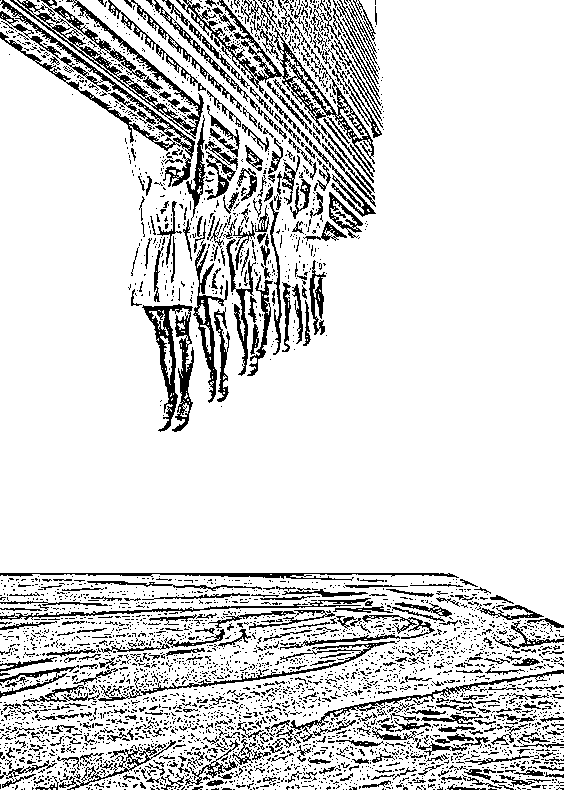

**第六宫：自我太狭隘，我要与他人共存！**

**第六宫**

**阶段**：掌握技能；服务于更大的目的。

**过程**：令自己有用。

**盟友**：能够胜任。

**未顺利通过**：匮乏感，随之而来的是深陷苦役的感觉和对此的愤恨。

**第**六宫的旅程，与本质上是自私导向的第五宫的经验相背离。再一次，我们感到不安，**试图在更大的框架内搭建生命的意义**。经过前五个阶段的学习，**我们现在迫切需要从中提取我们在生命中的有意义的职责。我们对于展示自己有能力在一个更高的水平上胜任充满渴盼。**

**纯粹的利己太过狭隘，我们需要与他人的依存关系**

第六宫反映的深层危机是：**纯粹的自利已经不能继续为我们的生命提供支持。那是一个太过狭隘的世界。我们开始意识到，要维持自我的身份和尊严，离不开与他人的依存关系。**我们从第五宫醉心于“独乐乐”的状态中醒来，通过让自己变得对他人有用，来寻求长久关系的建立。我们也可能失败，令自己陷入苦役，怀着想要学习爱的心，收获的却是愤恨和耻辱。这种建立关系的策略，从很多方面来讲都是原始、粗糙的，但它为我们在下一个阶段的通行打下了基础。

**我们获得了谦卑和责任感**

为什么这样说？因为在这个过程中我们得到了两样礼物，而正是它们令成年人之间爱情关系的维系成为可能：**谦卑和责任感。**在这里我们感到某种变数，有些什么是不确定的，就像大幕揭开，我们却不知道即将上演的是哪一出戏。

通常第六宫和第二宫之间存在着某种呼应：再一次地，我们对于自身的终极价值感到不确定，充满疑问。一般来讲，**进入这个阶段时要准备好付出辛劳的工作和自我牺牲，因为我们开始学着将我们在前半个宫位周期中所学到的东西与这个世界分享——拿到通向后半个宫位周期的门票。**

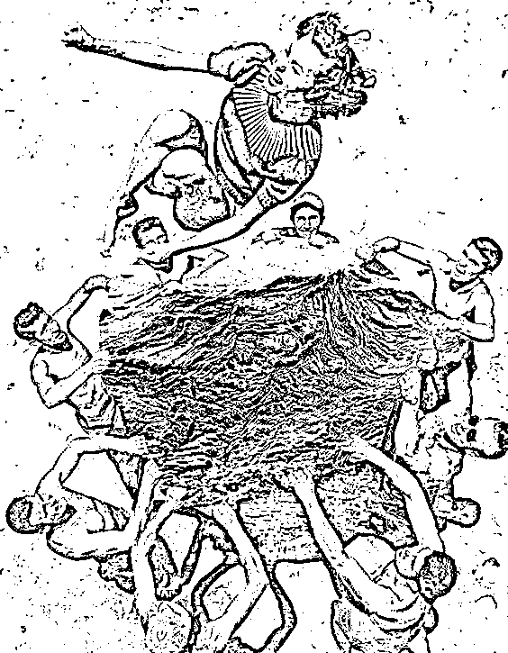

**第十宫：“我”需要社会的关注**

**第十宫**

**阶段**：获得权力；宣示身份；走向公众。

**过程**：连结自我和社会。

**盟友**：正直。

**未顺利通过**：变得虚伪，随之而来的是被身份绑架。

**接**受了第九宫的教育之后，现在的我们准备更直接地参与社会。我们拥有技能。我们也有能为我们提供支持的人际关系网络。我们有价值。现在我们应该“得到一份工作**”，**或是为我们的身份添加一些社会化的、面向公众的注解。**通常这一阶段强调事业的发展，但第十宫的内容并不仅限于职业，它涵盖了社会这个词的全部含义。**

**关于你是谁，我们需要公众的答案**

你是谁？这就是第十宫提出的问题，但我们要明白这个问题是基于什么视角提出的。对于这个问题，我们的好朋友可能有一个答案。但是现在提出这个问题的是作为一个整体的社会。虽然通常来讲事业问题是第十宫的焦点，但我经常见到有人在经历第十宫的行运时结婚。他们建立关系时或许正受第七宫的影响，但他们的婚礼是一个对社会的公开声明，这是第十宫的内容。

**被公众看见才具有意义**

**面对任何需要社会关注才能成全其意义的行为，我们都应将注意力放到第十宫。**不管在这个过程中当事人获得了社会的赞誉、认同，还是挑战了社会规范成为叛逆分子，这都没有关系，**被公众看到才是关键**。现在是繁花盛放的时节。那些在第一宫萌芽的、私人的、内在的梦想的花骨朵儿，现在必须绽放在所有人面前，摆出姿态，接受品评。

[**若道核心课程 Level 3**](http://mp.weixin.qq.com/s?__biz=MzA5NjA0NTAxNg==&mid=2651385700&idx=3&sn=30269f14b2209f35d0ed42fbe1d67e7b&scene=21#wechat_redirect)**开课在即**

**你可别错过了**

**教你将星座、行星、宫位、相位串联起来**

**2016 若道核心课程 Level 3**

**授课时间：**2016 年 7 月 28 日-11 月 10 日（**每周四晚 20：00-22:00**，16 次课）

**授课老师：**大卫·瑞雷

**授课方式：**网络课程，英文授课，中文翻译

**报名截止**：2016 年 7 月 15 日

**费用**：7000 元

**课程负责人：王老师**（**微信： ****2837474346**，请备注 L3 报名咨询）

长按二维码添加课程负责人咨询~


**欲知报名详情，请点击文末“阅读原文”**


# Level 3 报名中丨学相位后，你终于读懂星图了！

> 原文：[`mp.weixin.qq.com/s?__biz=MzA5NjA0NTAxNg==&mid=2651385756&idx=3&sn=36fcbf2854794fac36e4b83bbceed30b&chksm=8b4a5d2bbc3dd43daec1d92aaf9e537138d55a3cf5a9c60d8c78dd6aef13b3446b5aa892ed77&scene=126&sessionid=1692738811#rd`](http://mp.weixin.qq.com/s?__biz=MzA5NjA0NTAxNg==&mid=2651385756&idx=3&sn=36fcbf2854794fac36e4b83bbceed30b&chksm=8b4a5d2bbc3dd43daec1d92aaf9e537138d55a3cf5a9c60d8c78dd6aef13b3446b5aa892ed77&scene=126&sessionid=1692738811#rd)

掌握了星座、行星、宫位知识的你，是不是会时常困惑，将意涵与自己的星图对照，总显得模棱两可，分不清哪部分与自己对应？我们的明星课程 Level 3 可以帮你解决这个问题。你还会在此学到更高阶的知识：宫主星、守护星链、相位格局的使用，搞定自己的出生星图！快点击**阅读原文**报名！

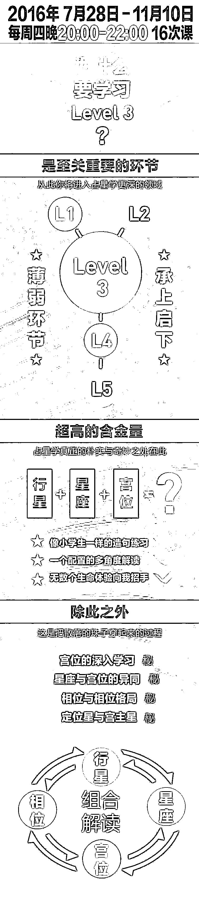

往届学员怎么说？

从 Level 3 开始，大家通过造句交流，不光对占星学，对我们这群学占星的人，也有了更深的认同，我们是在一起窥探宇宙的奥秘，而且我们是个团体，每个人都是其中一员，每个人，都有你没有的脑洞，交流让占星术语变得生动有趣，也让占星的学习更有动力。我是从三阶开始，才感受到占星学习的实质进展。

——2015 届学员 Norah 

我现在是 Level 5 学员，去年在读 Level 3 的时候，一开始是十分不能接受的，为什么每一种配置有那么多可能性，那么占星学的准确性在哪里？它的意义到底在哪里？直到一次案例课，大卫老师精彩的解读让我醍醐灌顶：原来占星学并不是机械教条的是非论，无数种可能性为我们讲述无数种精彩人生，而如果我们不能理解生命精妙的细微变化，我们就无法理解自己和他人的人生。每个人都是有故事的人，尊重个体，尊重生命的发展。通过 Level 3 的学习，我更明白了这一点。

——2015 届学员玫瑰

上 Level 3 以前，我对星图的解读线索是凌乱的。Level 1-2 学习了星座和行星的意象，它们有那么多的关键词，具体解读的时候该使用哪个？如何判断？了解的关键词越多，我心里的疑问就越大。后来，大卫老师给了我们答案。他告诉我们解读星图的脉络，用实例告诉我们如何选择关键词。解读星图的线索逐渐清晰了起来，盘主的故事也随着一次又一次解读而变得历历在目。

——2015 届学员牡沐

报名 Q&A

**Q：**自学占星学的可以直接来上 Level3 么？

**A：**要先进行入学测试哦。长按下方二维码进入测试。

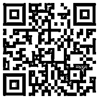 

**Q：**通过此次课程学习，可以达到何种占星水平？

**A：**

通过完成 Level 1-3 的系统、**连贯与严谨**的学习

同学们将熟练掌握占星学最**重要**也最基本的知识

**行星、星座、宫位、相位**

并在此四要素的基础上，学习以下延伸技术：

*   将四要素**组合**起来解读

*   **宫主星**

*   **守护星链**

*   **相位格局**

当你完成 Level 3，就会发现自己已经具备了出生星图解读所需的**重要技巧**。

**Q：**如何报名？缴费后如何听课？

**A：**请点击文末阅读原文进入报名支付页面。缴费成功后课前一周我们的课程顾问会联络您加入学习微信群，领取开课通知书了解详情。

**Q：**错过直播课程如何补课？

**A：**直播课程结束后的 24 小时课程回放会送至您在若道官网注册的个人中心账号里，电脑（目前暂不支持移动端口）登陆官网进入**个人中心**即可收看回放。

**Q：**课程回放有有效期么？

**A：**若道目前的核心课程在视频回放有效期为课程结束后的 3 个月内，点播次数可以支持重复收看完整的 3 次。

师资介绍

**大卫·瑞雷（David Railey）**

若道创始人，《灵魂的目标》作者。拥有四十年的占星咨询的执业经验，曾两任亚特兰大占星协会主席，是全美占星师联盟（AFAN）、美国占星师联合会（AFA）、全美占星研究委员会（NCGR）、国际占星研究协会（ISAR）和职业占星师组织（OPA）的成员，是联合占星大会（UAC, United Astrology Conference）督导委员会委员。大卫曾是 CNN、CBS 的占星节目的常驻嘉宾，多次在 BBC、WGS、WSB、WRGG 等节目中接受采访，并在亚特兰大主持电视节目《每日行星（Daily Planets）》达 4 年之久。

**助 教 介 绍**

1

**天空的空**

2013 年，在若道进行系统的占星学习，研习整套现代占星学资质课程，师从大卫·瑞雷；现任若道专职助教。2015 年获得国际占星研究协会（ISAR）认证和若道“生时校正认证考试”。 

2

**GAFF**

2013 年开始在若道进行系统占星学习，师从大卫·瑞雷。在 2015 年度担任诺·泰尔、斯蒂芬·弗里斯特老师的占星工作坊助教。

**2016 若道核心课程 Level 3**

**授课时间：**2016 年 7 月 28 日-11 月 10 日（**每周四晚 20：00-22:00**，16 次课）

**授课老师：**大卫·瑞雷

**授课方式：**网络课程，英文授课，中文翻译

**报名截止**：2016 年 7 月 15 日

**费用**：7000 元

**课程负责人：王老师**（**微信： ****2837474346**，请备注 L3 报名咨询）

长按二维码添加课程负责人咨询~


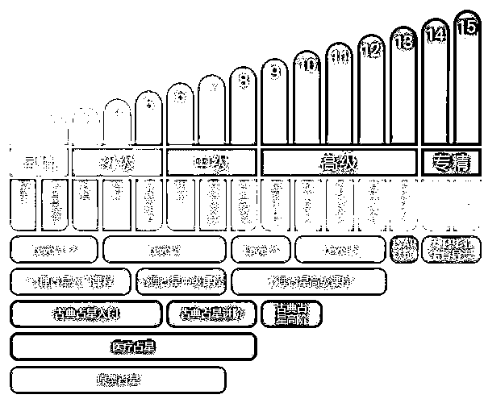


**了解详细课程内容及报名方式，点击文末“阅读原文”**


# 12 月亮星座丨如何用情绪完美地毁掉你的人生？

> 原文：[`mp.weixin.qq.com/s?__biz=MzA5NjA0NTAxNg==&mid=2651385727&idx=1&sn=7fc19414e1c84dd2a428f07b8e53ce78&chksm=8b4a5dc8bc3dd4defad077834430205445a2ec10564bee69932c4b89d6ccc3368e5cc7c0b95c&scene=126&sessionid=1692738811#rd`](http://mp.weixin.qq.com/s?__biz=MzA5NjA0NTAxNg==&mid=2651385727&idx=1&sn=7fc19414e1c84dd2a428f07b8e53ce78&chksm=8b4a5dc8bc3dd4defad077834430205445a2ec10564bee69932c4b89d6ccc3368e5cc7c0b95c&scene=126&sessionid=1692738811#rd)

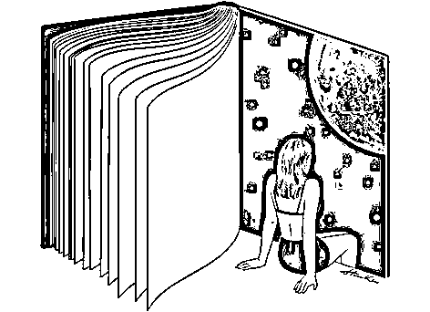

作者/薇安  图片/Pinterest

你有情绪，我有情绪，谁还没个情绪？可是，情绪太泛滥，别人会采访你：“怎么你情绪大姨妈天天来？”情绪太封闭，别人会喷你：“你这个铁石心肠薄情寡义的人！”如果人生被情绪击败，还真是不甘心。

***若道君：首先，让我们搬个小板凳，听听作者从心理学角度解析**“**情绪**”**。***

## **三种“情绪偏见”，你中了几个？**

***1、*****情绪是无用的，行动完全由理智决定。**

**正解：**事实是，在人类祖先几十万年的进化中，是愤怒促使血液流到手部，以方便抓起武器或攻击敌人；是恐惧促使血液留到大块的骨骼肌，例如大腿，以便逃离危险；是悲伤降低了生命活动的能量和热情，把哀伤而脆弱的原始人类留在家的附近，留在更安全的地方。

现代人非常倚重的新脑，不过是近万年才高度发展起来的。而脑科学研究告诉我们，当人的前额叶复杂处理情绪的脑区受损时，人们无法做出任何决策。

***2、*****人们足够理性，可以控制情绪。**

**正解：**那么想一想，当你的头脑对自己说“TA 已经离开了，不应该再想念”时，你的心因为思念而泛起疼痛。事实上，情绪对心理的控制力越强，理性的作用就越弱。而有时我们在被突发而强烈的情绪占领时，甚至无法找到合理的解释，因为它很可能源于我们儿时和照料者的互动模式中形成的情绪经验。

***3、*****我对情绪无能为力，只能任其将我吞没。**

**正解：**事实上情绪在潜意识和意识两个层面运作。在意识层面，我们的想法，即认知，决定了唤起什么情绪。例如一旦我们作出评估——“真丢脸，人们一定在嘲笑我”，窘迫、紧张的情绪随之出现。**人们可以通过重新构建这些情形下的认知，来帮助自己突破负面情绪的困扰。情绪的认知疗法已被许多案例证明其有效性。**

情绪心理和理性心理相互影响，彼此作用。**一个健康的心智发展，必须涵盖对自身情绪模式的清晰意识，以了解由此带来的，我们处理自身及他人情绪的能力及方式。**

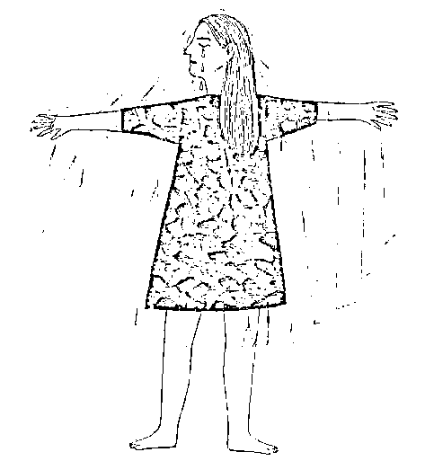

***若道君：在占星学上**“**情绪**”**与月亮息息相关，下面的内容都是干货，有关**12**个月亮星座的优劣势以及升级策略。***

## 12 个月亮星座的情绪心理

**在占星学上，月亮代表我们的情绪和感受，也代表对内在安全感的需求。而月亮所落星座的元素，则反应出为了满足这些需求，****我们最本能回应外界的方式：是透过感受（水元素）、现实的知觉（土元素）、直接行动（火元素）还是智力辨识（风元素）。**由此可见，这些能量模式（星座）会对月亮纯粹表达情绪感受的原型能量做出调整，而我们的情绪模式则是月亮+星座综合的结果。

***1、*****月亮落于水象星座（巨蟹座、天蝎座、双鱼座）**

水元素代表深刻的情感和感受反应，月亮落于水象星座的人，对情绪更加熟悉，有直接的体认。这既是祝福也是“诅咒”。

**月亮巨蟹座**

**优势**：对自己与他人的情绪都能敏感地观测到；能够启动直觉层面，对他人产生同理的共鸣，并传达一种温馨的包容与理解，这几乎是我们可以对另一个人所做的最具滋养性的事。

**挑战：**过于依赖他人提供情绪滋养；容易回到在老旧的创伤里而生气或闷闷不乐；在压力之下，会选择不与人沟通，缩回到自己阴郁的情绪里。

**月亮天蝎座**

**优势：**有强烈的情绪和热情，当将之充分展示时，会以此回应人生或感染鼓舞他人；十分了解一般人的行为和感受；通过揭发阴暗面来帮助对方转化——将人们羞于或惧怕表露的东西一吐为快。

**挑战：**很难释放负面感受；因为足够强烈的情绪才能令其兴奋而成为危机上瘾者，甚至刻意制造情绪上的波澜；觉得情感可能是毁灭性的而选择压抑自己的情感，造成内在的自我攻击，也难以信任他人的情感。

**月亮双鱼座**

**优势：**富有深厚的同情心，擅长大量地吸收情感，就像一块感情的海绵。在慈悲心、同理及直觉性上有与生俱来的本能，具有极高的灵敏度；有反映他人的感觉的能力。

**挑战：**因无法区分是自己的情绪还是他人的情绪而迷失；由于对现实世界的过度敏感，想要摆脱痛苦的感觉而形成强烈的逃避倾向——或扮演拯救者的角色以逃避自身的困境；或因过度需要别人的同情而沉溺受害者角色，自怨自艾。

**月亮落于水象星座的发展策略：**

学会辨识感受与事实；将丰沛而强烈的感受，导入到艺术创作，或对他人情绪疗愈的支持中，是避免月亮落于水象星座的人们过度沉溺情绪的最佳方式。

*   **月亮巨蟹座**要学习接受自己的所有情感，无论哪一种，并发展自爱的能力；培养对过往经验的感受力，而不是卡在其中；

*   **月亮天蝎座**要培养出信赖感是最关键的策略。勇敢地去感受一切，去揭示感受，让感受与行为协调一致；

*   **月亮双鱼座**则要学习培养清明的觉知；试着写下丰富的情绪感受，辨识哪些是自己的哪些是他人的，通过发展艺术来使丰沛的感情得以释放。


***2、*****月亮落于土象星座（金牛座、处女座、摩羯座）**

想象一下水深入土地的画面，土地能够吸收水分，但也可能因此而形成泥沼，使水无法流动。

**月亮金牛座**

**优势：**自身情感安定，不会轻易起伏，不太容易被激怒或心烦意乱，对他人的情感回应也具有镇静、柔和的影响。会通过提供物质照顾或身体按摩帮助他人缓解情绪。

**挑战：**逃入感官享受中，而回避面对不安或不舒服的情绪，因此妨碍了情感的流动。因为渴望化繁为简，而逃避复杂的情绪纠结，选择性地忽略他人的不满意或焦躁情绪。

**月亮处女座**

**优势**：天然具备服务的倾向，对他人需求十分关注，并乐于提供协助，且带着谦虚温和的态度。

**挑战**：对自己的情绪和他人的情绪会过度分析，本能的情感回应是“问题出在哪里？我能帮什么忙？”而其实情绪首先需要的是被理解和接纳，而非被分析。自身也可能因为容易担忧而造成神经紧张和感受压力。

**月亮摩羯座**

**优势：**情绪的自我克制，典型的情绪“压抑者”——没错，最新的情绪理论认为，压抑并非是完全负面的，它也是可能是一种成功的情绪调节策略，比如能缓冲消极情绪，面对困扰情绪仍能保持镇定沉着。心理学家称之为：积极的否定。

**挑战：**感受能力严重压抑，将情感视作分散注意力的麻烦，不擅长回应情感信号，会显得有些冷酷而僵硬；无法自如地适应和回应别人变化的情绪。在压力状态下会变得过度悲观；在情感有关的事情上所呈现出的拘谨害羞倾向，可能导致自我孤立。

**月亮落于土象星座的发展策略：**

月亮落于土象星座的人们，要意识到自己对现实与实际的倚重，会导致将不可见的情绪视为麻烦或干扰。

*   **月亮金牛座**要允许情绪对安稳舒适的冲击，相信情绪自身的流动性会在激烈过后带我们重回平静；

*   **月亮处女座**要允许自己总有解决不了的问题。“什么都不做”的陪伴可能是更好的服务；

*   **月亮摩羯座**要意识到，头脑对情绪的否定并不能消除情绪本身，自然发生的脆弱会让我们在休息之后更好地出发，而堵塞的洪水在决堤时会真正摧毁一切。

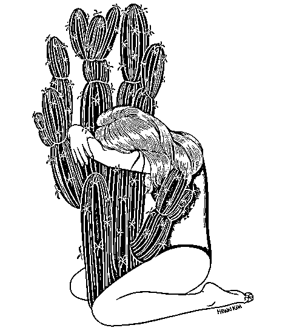

***3、*****月亮落于火象星座（白羊座、狮子座、射手座）**

火元素的热力会增加情绪的强度，也可能会对有些情绪带来的行动延迟失去耐心。

**月亮白羊座**

**优势：**对危险有一种直觉，能够迅速提供协助；充满热情，特别是对自己渴望的事情。能真诚而直接地表达感受。

**挑战：**容易爆发情感火花，也容易冷却。易怒或易激动。对他人的情感回应往往缺乏耐心，常常带有某种行动导向，“别老感觉，采取行动！”对情绪低落的对方采取热情鼓励，与对方的需求可能南辕北辙，对方会说：“别教我该干什么，我就是想让你听我诉说而已”。

**月亮狮子座**

**优势：**骄傲和自信为自己带来情感上的安全感。运用戏剧和幽默感娱乐他人来适应生活压力。能给出温暖、慷慨、热情的态度鼓舞和提升人们的信心。

**挑战：**可能由于渴望关注而带来自身的脆弱易感；有夸大感觉的倾向；因为总想要良好的感觉，可能会打压“不好的”感觉，刻意去创造好的感受而忽略了自己或对方的真实情绪。不断向外散发骄傲、外向的能量，可能会妨碍了个人的感受能力。

**月亮射手座**

**优势**：充沛的乐观情绪，心胸开阔，富有幽默感，温暖，活泼；以自己的乐观精神和哲学鼓舞他人。

**挑战：**在压力下可能很难保持平静的心情，情绪起伏落差极大，或夸大感觉，甚至有歇斯底里倾向。由于太想教导他人，而缺乏对情感的敏感度。如果对方的情感是负面情绪，诸如受伤、无安全感或悲痛，会觉得格外棘手。“适应一下吧”，他们会说，“在如此美妙的世界中你怎么还一蹶不振？”

**月亮落于火象星座的发展策略：**

无论是出于行动的需求，自我感觉的需要或天生的乐观精神，月亮落火象星座的人要意识到，人类的情绪光谱中，快乐热请的亮色与悲伤沮丧的暗色共存；温暖的体验会在寒冷之后更显珍贵。

*   **月亮白羊座**要学习在自己生气时先走开一会儿，而非直接进攻；在对方只想哭泣时轻轻为 TA 掩上房门；

*   **月亮狮子座**要了解真正的自信不一定通过高频的能量展现，真诚的悲伤也会为我们赢得尊重；

*   **月亮射手座**要理解适当的悲观会让我们避免犯错，情绪也不会因说教而消失，当他人无法向我们一样看到希望时，拥抱比语言更能传递力量。

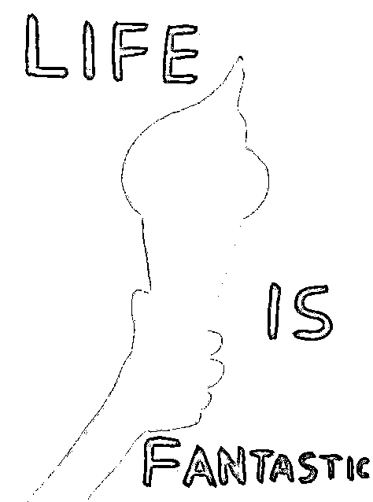

*   **月亮落风象星座（双子座、天秤座、水瓶座）**

风元素的抽离特质，有助于客观地看待情绪；但对思维活动的追求，也会打破情绪心理与理性心理的平衡。

**月亮双子座**

**优势**：情绪和感觉的多变性，带来良好的适应能力，会随着情绪和机会多方面接触社会。对自己的情绪议题渴望了解并获得解释；对他人的情绪感受也会展现好奇心。

**挑战**：本能反应更多是纯理性的，关注对方谈话的信息而忽略了相关的情感内容。会为了适应多方的需求而选择忽略自己的感受，用错综复杂的理念、事实或俏皮话淹了真实的情感。

**月亮天秤座**

**优势：**本能地说出贴切的话，非常愿意倾听别人，也能站在对方的角度看待问题。愿意在对方生气时，采取调和顺从的态度，或在对方感觉受伤或恐惧时提供安慰。

**挑战：**因为不喜欢任何形式的不和谐，为逃避冲突或掩饰社交上的窘态而无法直接、真实地表达自己的感觉。对情感交流倾向于保持礼貌的距离和理性的角度，而缺乏处理深刻的情绪和感受的能力，无论是自己的还是别人的。

**月亮水瓶座**

**优势**：表现出冷静、抽离、客观，但实际上有着强烈的同情心和人道主义情怀。能将对方从过于自我的观点中解放出来，使其避免陷入没有必要的痛苦。

**挑战：**往往将情感抽象化，或给出抽象、理性的回应，造成对方得不到情感的同理。不愿意谈论自己的感觉，甚至根本不信任感觉。在糟糕的情况下，这会使其无法和情绪联结，或是情绪的自主性发展到冷酷的地步。切断情绪的极端发展，可能形成自闭。

**月亮落于风象星座的发展策略：**

月亮落风象星座的人们要意识到，虽然情绪心理和理性心理存在天生的角力，但翘翘板获得平衡的方式，是双方力量的均衡，而非否认真实存在的另一方。

*   **月亮双子座**要练习在适当的时候让心智安静下来，闭上嘴巴，去感受情感携带的信息，它通过非语言的方式在传递。

*   **月亮天秤座**要学习接受，因为真情流露而痛苦流涕的我们，在爱人眼中会更加真实动人；情绪的流露并非令人尴尬，反而使关系更真实。

*   **月亮水瓶座**要意识到，科学研究已证明了情绪在记忆、决策等理性活动中取着重要的作用。人类共享的丰沛情感，往往在苦难时刻提供惊人的慰籍。如若怀疑，不防从尝试谈论自己的感觉开始。

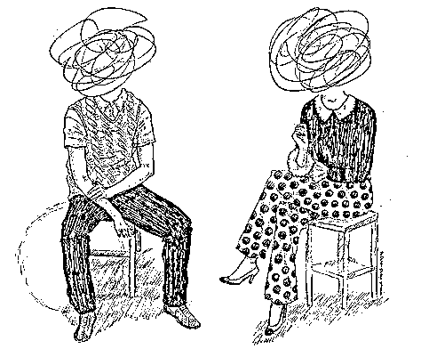

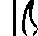

**月亮不讲道理，它也不在乎有没有道理。它是一种情绪，一种想要去爱和被爱的需要。如果月亮枯萎了，生命之心就变成了黑暗之心，我们就成了随机的宇宙中一个不被重视的心碎者。**

**——进化占星学家斯蒂芬·弗里斯特**


出生星图中月亮的配置所象征出的，我们在接纳情绪、表达情绪、及与他人情绪互动中可能存在的挑战，或许正是宇宙为我们在学习“爱”的进程中设置的考验；而苏格拉底的警句“认识自己”，是完成这一进化最重要的基石。亲爱的你，能呵护好自己的情绪了吗？

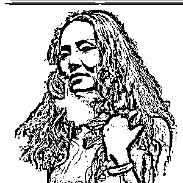

**作者简介**

**薇安**，北大心理学硕士学位，MBTI 的国际认证施测师。若道认证生时校正资质及 COAC 高阶资质毕业生，在若道跟随多名当代著名占星师持续进行深入系统的占星研习。现为全职心理咨询师与占星师。

**微信 ID**：weianhuilai 

长按二维码，让金钱涌向传播知识与智慧的人~

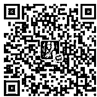 

**除了好文**

**我们的课程也很不错呢**

**你可别错过了**

**2016 若道核心课程 Level 3**

**授课时间：**2016 年 7 月 28 日-11 月 10 日（**每周四晚 20：00-22:00**，16 次课）

**授课老师：**大卫·瑞雷

**授课方式：**网络课程，英文授课，中文翻译

**报名截止**：2016 年 7 月 15 日

**费用**：7000 元

**课程负责人：童老师**（**微信： ****1962657205**，请备注 L3 报名咨询）

长按二维码添加课程负责人咨询~

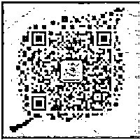

**特别提醒：**

**本文首发于若道平台，**

**转载请联系后台授权。**


**报名点击文末“阅读原文”**


# 宫位丨一、五、九宫的正确打开方式

> 原文：[`mp.weixin.qq.com/s?__biz=MzA5NjA0NTAxNg==&mid=2651385727&idx=2&sn=18fe8eb06c3bf681ec8c2e0697d52510&chksm=8b4a5dc8bc3dd4de4d9e1ca5f690dbcb19daf92dabdd195332edfa5c5b52b56801dbe140e3aa&scene=126&sessionid=1692738811#rd`](http://mp.weixin.qq.com/s?__biz=MzA5NjA0NTAxNg==&mid=2651385727&idx=2&sn=18fe8eb06c3bf681ec8c2e0697d52510&chksm=8b4a5dc8bc3dd4de4d9e1ca5f690dbcb19daf92dabdd195332edfa5c5b52b56801dbe140e3aa&scene=126&sessionid=1692738811#rd)

作者/斯蒂芬·弗里斯特  译者/Cora

本文摘自《变幻的天空》   图片来源/Pinterest

“

7 月 28 日，若道明星课程 Level 3 就要开课啦！我们即将学习如何将星座、行星、宫位、相位结合起来解读。在进入 Level 3 学习之前，先来复习一下宫位知识吧~宫位系列共有四篇，该文为第一篇，专门讲火象宫位 1、5、9 宫。还没有报名的小伙伴快点击**阅读原文**报名吧！

”

**第一宫：改造自我的时候到了！**

****第一宫****

**阶段**：开始；出现；新生。

**过程**：发明；即兴发挥；创造。

**盟友**：勇气。

**未顺利通过**：被压力击倒，随之而来的是无法从惊吓中走出来，自暴自弃。

**此**刻意识是一面空白的墙壁，上面什么都没有，只有将新的环境或现实创造出来的热切渴望——它们要是独立的、空前的，不是对过去任何事物的延续。处于第一宫时我们有必要“自私”一点，以自我和意志的力量为导向。

**在第一宫，自由和冲动并存**

**第一宫象征着一段自由被极度强化的时期，而自由的另一个名字叫不确定。**我们并**不是特别清楚自己在做什么，但是我们感到强烈的冲动**，时不我待，必须行动。

在生命的这个阶段，我们意识到自己的力量，但通常我们也不太清楚该如何使用自己的力量。一个新的开始正在我们的生命中逐渐成型。我们已经抓住了老虎的尾巴，接下来我们能做的就是死不放手，相信直觉，遵循它的指引自发地行动。

**建立新身份**

永远记住，在第一宫，**行动就是一切。**我们正在为新一轮生命经历的循环播下种子——建立一个新的身份——有关这个新身份的一切，只有在我们依次走过接下来各个宫位的过程中，才会逐渐显现。

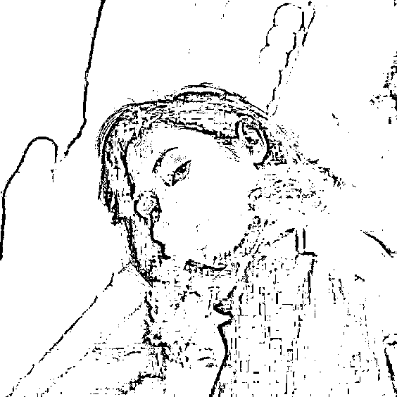

**第五宫：还愣着干吗？HIGH 起来！**

**第五宫**

**阶段**：自我展现；自我揭示；补给心灵燃料。

**过程**：快乐，庆祝生命。

**盟友**：自发性。

**未顺利通过**：纵情声色，自我的陷阱，随之而来的是迷失在幼稚的个人戏剧的迷宫中。

**在**第五宫，我们开始创造，不仅是指艺术创作，还包括对于生命的华丽和快乐的单纯展示。这是为自己庆祝的时刻。怎么庆祝？**通过某种创造，将我们在第四宫探索到的心灵的内部构造以可见的、外显的方式呈现出来。**突然我们出现在跑车上、聚会上，或是手里多了一本醒目的美食攻略。

**全副武装你累不累？**

这个时候，经常会有新朋友或新恋人走进我们的生活——我们的“玩伴”，来帮助我们打破对于过去的痴恋。不要幼稚地以为“玩伴”这个词意味着我们与这些人的关系缺乏深度。**乐趣是我们理解第五宫的关键****，**我们必须对它的意义重新理解。

**只有充满乐趣的自发性行为，能够松懈我们全副武装的自我，打破由习惯和常规所构筑的坚硬外壳，把新鲜的血液输入我们的生命。**

**通过玩耍，为心理上的“成年”做准备**

虽然我们与这些玩伴的关系常常是短暂的，但他们却在我们的生命中起到了重要的作用——在他们的激发下，我们能够自发地、不自觉地展示自我**。**

他们帮助我们去做那些儿童凭本能就会去做的事——通过玩耍，为“成年”做心理上的准备。如果我们接受他们的帮助，**他们将为我们的生命力助产，拉我们离开第四宫的子宫，送我们到“童年”的阶梯上翩翩起舞。**

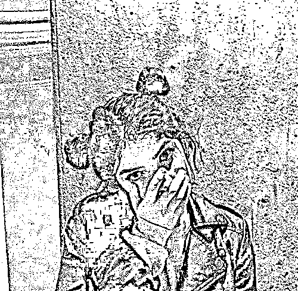

**第九宫：宽阔的世界在等着你**

**第九宫**

**阶段**：扩张；探索；教育；拥有长远目光。

**过程**：打破常规的限制。

**盟友**：感受未知。

**未顺利通过**：教条刻板，随之而来的是乏味和无聊。

**当**我们踏入了第九宫宽阔的场域，视野被打开。再一次，我们在一个“有深度的”宫位接受了洗礼，从中吸足了养分。**在第五宫，我们迎来创造力和自我表达的大爆发**。现在，**在经历了更加激烈的、更让人执迷的第八宫的试炼后，从我们体内生长出了一种对于开阔视界的渴求。**

**我们也许会思考：**

**○生命的意义是什么？**

**○我存在于这个世界上的终极目的是什么？**

**○什么是对，什么是错？**

我们或许不知道答案，但我们想对无知说再见。

如果我们的行程顺利，这将是我们充分探索这个世界、生命得到扩展的一段时间。**我们很可能去旅行。我们也常常在此时进行自我教育。**我们几乎总是能在这一阶段邂逅一些令人着迷的人，他们是我们的正常圈子之外的人，跟我们“不同国”，将新奇的、富于挑战性的事物带到我们面前。

**准备好打破陈旧的模式了吗？**

进入第九宫，**我们准备将那些残渣创造的老旧行为和思维模式打破。令一切焕然一新是这个宫位的精髓。**我们需要更加广阔的视野。现在是我们重新领略未知的时候。我们的任务，简单说就是，欢迎生活让我们感受未知。

[**若道核心课程 Level 3**](http://mp.weixin.qq.com/s?__biz=MzA5NjA0NTAxNg==&mid=2651385700&idx=3&sn=30269f14b2209f35d0ed42fbe1d67e7b&scene=21#wechat_redirect)**开课在即**

**教你串联星座、行星、宫位、相位**

**可别错过了**

**2016 若道核心课程 Level 3**

**授课时间：**2016 年 7 月 28 日-11 月 10 日（**每周四晚 20：00-22:00**，16 次课）

**授课老师：**大卫·瑞雷

**授课方式：**网络课程，英文授课，中文翻译

**报名截止**：2016 年 7 月 15 日

**费用**：7000 元

**课程负责人：王老师**（**微信： ****2837474346**，请备注 L3 报名咨询）

长按二维码添加课程负责人咨询~


**欲知报名详情，请点击文末“阅读原文”**


# 7 月 23 日开课 | 古占结合现占最后的报名机会

> 原文：[`mp.weixin.qq.com/s?__biz=MzA5NjA0NTAxNg==&mid=2651385727&idx=3&sn=397fe309c374d9fc0e0eaf5292647364&chksm=8b4a5dc8bc3dd4dec35bcacf1a69349e1fe6282bd3ef98be321b76c411b519103295328bcefe&scene=126&sessionid=1692738811#rd`](http://mp.weixin.qq.com/s?__biz=MzA5NjA0NTAxNg==&mid=2651385727&idx=3&sn=397fe309c374d9fc0e0eaf5292647364&chksm=8b4a5dc8bc3dd4dec35bcacf1a69349e1fe6282bd3ef98be321b76c411b519103295328bcefe&scene=126&sessionid=1692738811#rd)

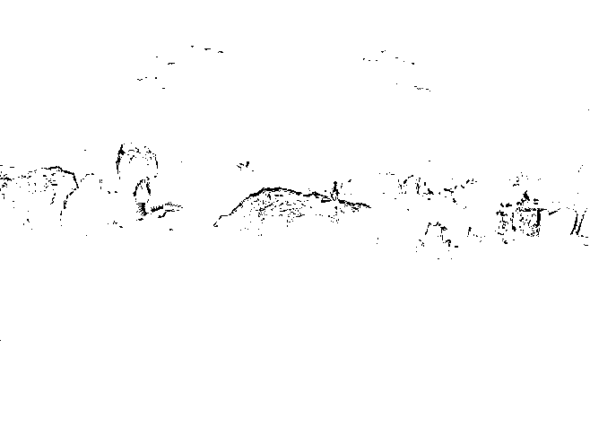

“

罗伯特·汉德，一位被占星界称为“国家宝藏”的人，掘地三尺，阅古卷无数，学习没有人再说的古代语言，学习古代历史，学习古代哲学，挖出了一把传说中的“屠龙刀”。在 37 年的现代占星生涯和 21 年的古典占星研究生涯后，他将为我们带来什么？

”

将 37 年的现代占星和 21 年的古典占星结合， 罗伯特·汉德耗费大量的精力，挖出了这把“屠龙刀”，他擦拭这把锈迹斑斑的刀，粘合它的碎片，钻研刀法，在此过程中引发好奇、热情、疑义、愤怒；他促使原来名不见经传的人获得新立山头的机会，同时又引发了分裂、不满、攻击。

有些现代大师们对他的道路感到惋惜、不解、批评，但仍旧尊敬他；而他又远离那些一门子想要复古、认为“老的就是好的”古典阵营。他跑着，似乎有同伴，又一人独行。

你也许听说过这把“屠龙刀”的传说，从江湖似真似假、似是而非的流言中，从自称使过它的招式的自言得意的小辈中，从以教学谋生、很少实践经验的小有名气的占星师的课程中。

但你真的见过这把刀吗？你知道正确的使用方式吗？这把刀真的能在现代社会应用吗？还是仅仅是应该放入“历史博物馆”中陈列？这次课就是谜底揭晓的时刻。

## 现代占星学的学子们，如果你：

*   对于出生星图——占星学中最重要的星图的秘密，仍有很多不解和好奇；

*   渴望获得古典占星里符合你的哲学理念又实用的好技法；但厌倦了大量复杂却无用的古典知识，又苦于古典文献浩瀚，无从粹取；

*   对自己星图和某些人生大事的对应百思不得其解，渴望获得一位占星大师的解答；

*   曾和妄称“可以更准确预测”的古典占星师们争得面红耳赤，但因为没学过古典而稍微有些心虚；

*   了解占星学界常见的古典和现代占星的纷争，想在真正了解这两门学问的大师面前提出深刻而尖锐的问题；

*   渴望在自己的占星知识拼图中补上能够符合现代占星理念的古典占星学知识，并将现代占星和古典占星融会贯通在咨询中

## **欢迎你来，机不可失，因为：**

*   **这里有世界上唯一能够教授此门课程的占星界泰斗**：72 岁的罗伯特·汉德，两个阵营的旗手型人物，**活着的唯一获得现代占星学大师尊重的横跨两界的泰斗**、占星咨询实践者，历史学家、哲学史研究者，活着的时候就已经成为历史的人。一个怀旧的人，一个试图搭起桥梁的人，一个不满足现有的人，一个思想演化路径让人迷惑的人。

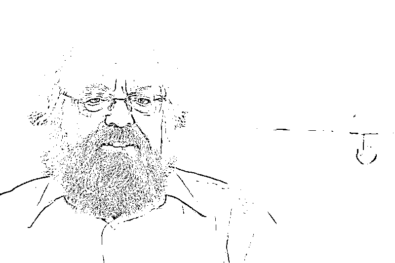

*   **萃取古典的精华，去除古典占星糟粕：**罗伯特·汉德用他综合的知识，为你筛选出古典占星中可以为强调自由意志的发展、个人成长的现代人有益的古典占星实用技法。

*   **从实战演练中学习**：首次以案例教学的方式，除第一堂之外，每堂课皆以案例演示为教学重点。

*   **获得大师的免费解读**：**7 堂课的案例选取皆为学员星图，你有机会入选**。

*   **打尽出生星图的占星学命题！** 出生星图，是一生的预测星图，所谓的命运的因子埋藏在出生星图里。

**讲什么？皆重大常见人生问题：**

*   性格、个性、心智特点、外貌体型

*   挣钱能力、金钱、财富、财务

*   感情生活——恋爱、婚姻、家庭生活

*   原生家庭——父母、兄弟姐妹、姑表亲

*   人际关系——一对一关系、一对多关系、敌人

*   职业发展，谋生之道

*   社会地位

*   旅行

*   灵魂和本我

## 学习该课程，你并不需要有古典占星学基础：

*   你只需要具有一定现代占星学基础。如果对此没有把握，可以联系课程负责人员进行测试。

*   你不需要有任何古典占星学知识，所有出生星图的相关古典占星知识都会在课程前发送讲义或在课程中进行讲解。

给你一个机会，在实战中学习他的研究成果。

这次课程，对于罗伯特·汉德 是一次冒险之旅，对你也是串起历史、现在、未来的旅程。

还等什么？

**更多关于罗布特·汉德的文章在这里：**  

[领军现代占星 35 年、古典占星 21 年，罗伯特·汉德星图秘密大起底](http://mp.weixin.qq.com/s?__biz=MzA5NjA0NTAxNg==&mid=2651385233&idx=2&sn=98799d80abed94a7748acff623747bf7&scene=21#wechat_redirect)

[占星界的“百科全书”，请用您渊博的学识砸晕我！](http://mp.weixin.qq.com/s?__biz=MzA5NjA0NTAxNg==&mid=2651385064&idx=2&sn=647cbe8f5e029abbf16a9f039a6783b1&scene=21#wechat_redirect)

ISAR 选修课·古占与现占结合

**授课时间：**2016 年 7 月 23 日-9 月 10 日 10：00-12：00**（每周六上课，一共 8 节）**

**授课老师：罗伯特·汉德**

**授课方式：**网络在线，英文授课，中文翻译

**报名截止**：2016 年 7 月 15 日

**费用**：****6800 元** **

**课程负责人：李老师**（**微信：18601950700**，请备注古占报名咨询 ）

长按二维码添加课程负责人咨询~

****

**课程具体内容及报名，请点击文末“阅读原文”**


# 金星进入狮子座 | 12 星座未来一个月桃花运怎么样？

> 原文：[`mp.weixin.qq.com/s?__biz=MzA5NjA0NTAxNg==&mid=2651385700&idx=1&sn=024b026b9e19a1b19cde2a51fdb04793&chksm=8b4a5dd3bc3dd4c5de912c490029fbf17185d7853034cc5915c59f8c188a887eb56b0b3115ae&scene=126&sessionid=1692738811#rd`](http://mp.weixin.qq.com/s?__biz=MzA5NjA0NTAxNg==&mid=2651385700&idx=1&sn=024b026b9e19a1b19cde2a51fdb04793&chksm=8b4a5dd3bc3dd4c5de912c490029fbf17185d7853034cc5915c59f8c188a887eb56b0b3115ae&scene=126&sessionid=1692738811#rd)

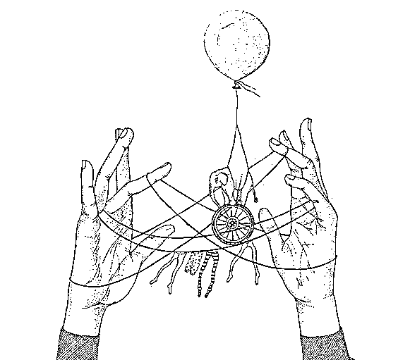

作者/郑玮玲 图片/Pinterest

7 月 12 日 13:34 分，金星，这位太阳系最美的女神从巨蟹座阴柔、包容的海洋中浮出水面，来到了狮子座流光溢彩的舞台上。

未来一个月，宇宙为我们带来了全新的机会以及大桃花，能不能抓住就看你自己了。几个重要的日子都在文章里，仔细找一找！

狮子座最华丽的理想

狮子座是**王者之心**，有着**丰富的表现力和创造力**。金星本是**爱与美**的化身，是吸引力、是欲望、是魅力攻势，狮子座为金星镀上了明星的光环，通过**温暖、热情、鼓舞人心**的方式感召众人，获得**关注、赞美、喝彩和拥戴**。

**被爱，乃是狮子座最终的诉求，最华丽的理想**。

狮子座的金星更因太阳的守护而充满活力，明艳而豪迈，犹如仲夏的一抹金色流光，一束炫烂火花。在热浪鼓舞中，我们可以**学做无畏的王者，投入地出演自己的人生角色，最富生命激情的创造力将会篷勃绽放，谱写出瑰丽的篇章**。

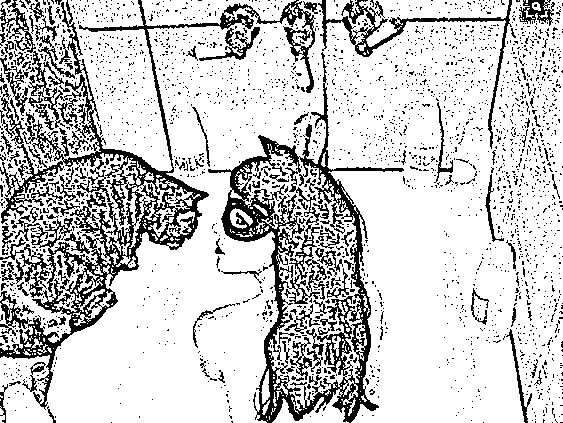

金星在狮子座期间的桃花指南

## 1**别想前任了，赶紧找新欢吧**

金星换座当天正值上弦月发生，月亮在天秤座与摩羯座冥王星四分、与白羊座天王星对分，天冥四分的大背景被上弦月触碰，再加上巨蟹座的太阳和水星共同参与，五大行星构成了完整的**创始星座大十字**，带来一段**短暂激越的盛夏风暴**。

*   你当下的计划、想法是否正受外界各种因素和环境的干扰、考验或挑战？

*   崭新的人世格局为你的安全感带来了什么样的冲击？

*   对于突发状况你有完善的应对措施了吗？

*   陈旧的思想与事物必经过一番历练和淘汰，你想要极力改变、扭转这顽固的现实就需要拿出真正的勇气向过去诀别。

## 2 想求婚要抓紧

金星行经狮子座会与射手座逆行的土星形成三分相，**7 月 18 至 20 日**能量达到顶峰，受影响最明显人群是**个人行星、四轴落于白羊座、狮子座、射手座、水瓶座、金牛座和天蝎座**的人，还包括**上升点在天秤座**的人。

此时，土星的能量内收而隐晦，我们更愿意沉浸于自己的内在空间中，允许情感的流动与表达，也能**建立和加固一些人际关系、亲密关系**。有**出行**计划的你，制定行程，预订酒店、机票正是最佳时机，这时候为自己做的每一个决定，为了欢乐和享受所花费的每一分都是物有所值的。

## 3**激情艳遇好机会**

行进的金星还将在**7 月 31 日到 8 月 2 日**期间与白羊座天王星形成精确的三分相。金星与天王星将在宇宙的舞池里跳起激情的探戈，投射在现实生活中的事件可能是**突然、震惊、不稳定的情感体验，带着极度的兴奋与刺激**。

**个人行星、四轴落于风向星座（双子座、天秤座和水瓶座）和火向星座（白羊座、狮子座和射手座）**的人要注意了，这个夏天有**不同寻常的艳遇**，也需要关注你的**财务收支**，**突然大笔的支**出会令你的生活遭遇不小的冲击。对此，你需要保持理智和清醒，关键时刻不要失去理智，做好日常的**财务规划**。

金星进入狮子座值得去做的事

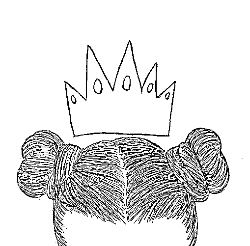 

爱和勇气让我们更坚定做自己，为彼此的生命喝彩，热情会将所有人联系得更紧密。去做那些让你**体内血清素飚升**的事吧。

*   **大胆扮靓自己**！去触摸、拥有华丽的饰物，让斑斓的创意激活你的心，让自己闪耀起来。来个炫目的装扮，做一个惊艳的造型，找到你的舞台和观众，迎得属于你的喝彩，你就是众人的焦点。 

*   **尽情表现**！用动听的语言表达，用丰富的表情和姿态去挥洒喜悦，或者和那些具有强烈感染力的人在一起感受别样的生活。 

*   仲夏热浪里每一个**精彩的派对**都不要错过，唱歌、跳舞、把酒狂欢，在欢声笑语中绽放你自信的光彩，活出你的热情。 

*   **和孩子一起**投入地玩乐，不管是玩泥巴，打水仗还是涂鸦，忘记年龄，制造欢乐。 

*   将你内在特别的**心思表达为现实**，任何的创意都值得实践，哪怕只是创造性地改变居家装饰。 

*   **看电影，看戏剧，看表演，参加舞会**，要不直接尝试去演一把，不要忘了艺术、音乐是最好的情感催化剂。 

*   **野营、徒步**、感受自己的活力，去大山里疯狂，参加露营，看荧火虫，围着篝火来一段野性十足的舞蹈。 

*   **参与公益**。要像狮子一样显现生命的热情与魄力去散播爱，用你的心去温暖他人，付出慷慨，奉爱和施予。

金星狮子座的人是什么样的

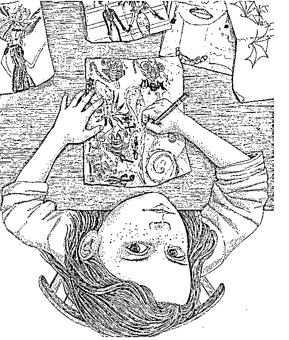

*   **逗逼、爱秀、爱演**，为博众人一笑。最擅长做人前傻白甜，幽默是他们最高的智慧。 

*   **温暖又戏剧化的情感攻势**，最擅长把求爱、求婚仪式搞得跟影视剧一样炫目，不仅能俘获爱人的心，还能收获旁人的掌声与喝彩。没错，你们就是情爱的艺术高手。 

*   婚前**秀恩爱**，婚后都是**炫妻狂、炫夫狂**，最后还会成为**晒娃狂**；他们就是朋友圈里的自拍狂人、高颜值人群中的写真达人、胶片杀手。 

*   别看他们外表浮华，其实都是**长情**的主。狮子座是固定星座，他们用情倒是蛮持久又专注的。 

*   **尊贵的自我价值感**，有如太阳般的温暖照耀，却也有大男子主义和女王情结，关系中总是唯我独尊。 

*   **乐善好施、慷慨热情**。这其实也来自于他们内在欲望的驱使——想要获得他人的爱。 

*   强大的狮子座心脏使他们在情场中拥有超强抗压力，经得起波澜，受得起硬伤，在关系中**主动大胆**，遇到矛盾又很**坚持自我，誓不让步**。 

*   对于示爱的对象从**不善回绝**。因为喜欢被众人崇敬，对他人爱意照单全收。 

*   社交场中的**焦点人物**，或喜欢追随焦点人物。情感生活往往受人关注，会吸引来戏剧性的伴侣关系。 

*   **表演、戏剧、娱乐、文艺业**是他们擅长的领域，就算没有从事这类行业，在表演上也是颇具天赋。 

*   喜欢**夸张的**饰物、发型、衣着、戏剧化的妆容、夺目的发色；服装鲜艳亮丽，还常常印着大型图案，生活中的形象也充满舞台效果。

金星狮子座的阴暗面

*   **盲目自大**，过份期待被人关注和欣赏，最终失去自我；孤独的时候存在感为零。

*   **修正办法**：学习**巨蟹座**的内敛，与自己独处，感受并接纳脆弱的自己。

*   时常有如孩子般**不理智、任性、犟**，这会令他们错失一些真正重要的东西。

*   **修正办法**：学习**水瓶座**冷静、理智的思维方式。

*   经不起他人奉承恭维，容易被花言巧语**蒙骗**。爱炫、要面子、过度慷慨，有时还有**势利和虚荣**倾向。**过份高调**，最终成了落寞舞台上的小丑，反遭冷落。

*   **修正办法**：向**处女座**学习务实和谦卑的作风。

金星狮子座的大咖们

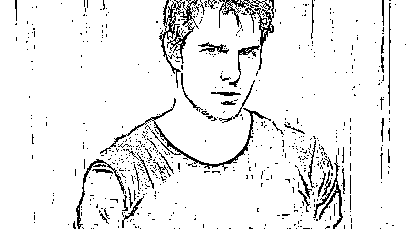

****▲ 汤姆·克鲁斯****

他就像拥有自己王国，每一场恋爱和婚姻都牵动着全世界观众的眼球，就像《谍中谍》中塑造的完美特工形象一样，激情与夸张的戏份吸引了全世界的关注与喝彩。就连女儿苏芮的整个成长过程也一直被媒体记录报道，大多数明星都比较避讳爆光自己子女的生活，而阿汤哥却坦然地说：我觉得狗仔队把我的女儿拍得挺可爱的。

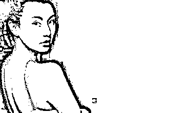

******▲ ********张曼玉******

风华绝代的她扮演的角色风情万种，对于许多女明星来说的最大杀手——年龄，对她来说根本不是障碍。金星狮子座的勇气令她总是绽放着热情与自信，已息影的她在天命之年还成为乐坛新人，玩起了摇滚乐。

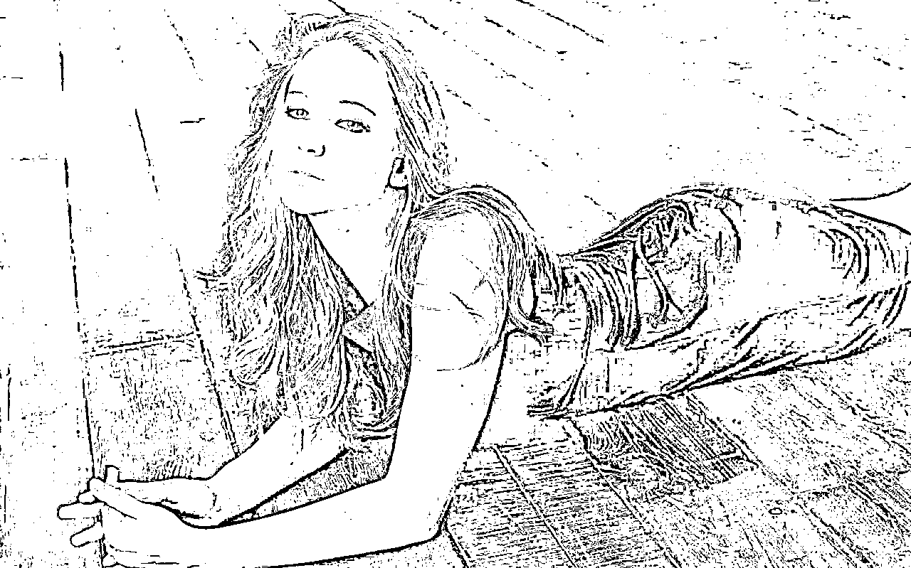

******▲ ********珍妮弗·劳伦斯******

14 岁就闯荡纽约，在演艺事业道途上一路狂奔。她的表演具有独特创造力和爆发力，18 岁开始就拿下世界各大电影节奖项，90 后演员中唯一的好莱坞一线女星。

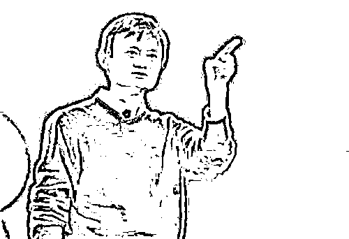

********▲ 马云********

想想每年疯狂的“双十一”，全中国的女人都成了他“背后的女人”，这样的称谓对于金星狮子座的人来说可谓实至名归了吧。他和他的团队创造了中国消费的新时代，金星狮子座被众人所艳羡的才华和财富，他都拥有了。

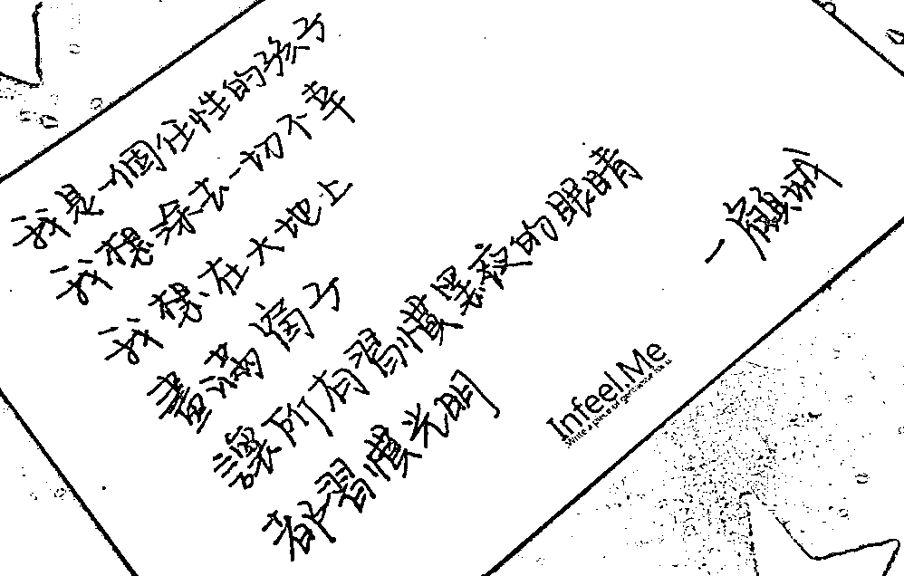

********  ▲ 顾城********

他的诗歌中透露出丰沛的创造力，孩子童般纯真的情结和想象力，也有狂妄的自我和高贵的气质。他的人生和情感世界都是如戏剧般跌宕变幻，最终，他在一场激烈的情感风暴中结束了自己的人生。

“我要汇入你的湖泊

在水底静静地长成大树

我要在早晨明亮地站起

把我们的太阳投入天空”

**金星十二星座系列文章**

▲ [金星进入白羊座 | 那件疯狂的小事叫爱情](http://mp.weixin.qq.com/s?__biz=MzA5NjA0NTAxNg==&mid=403697159&idx=1&sn=59ea2618fe637aafe17ef31b5466f106&scene=21#wechat_redirect)  

[▲ 金星进入金牛座 | 他们也会终其一生无望地爱一人](http://mp.weixin.qq.com/s?__biz=MzA5NjA0NTAxNg==&mid=2651384710&idx=2&sn=8eaa00a5030cb549979720aa595187fb&scene=21#wechat_redirect)

[▲ 金星进入双子座 | 我想和你一起做点不一样的事](http://mp.weixin.qq.com/s?__biz=MzA5NjA0NTAxNg==&mid=2651385000&idx=1&sn=65794941b56a4507aec59cca371652fd&scene=21#wechat_redirect)

[▲ 金星入巨蟹座丨这一生你有没有主动爱一次？](http://mp.weixin.qq.com/s?__biz=MzA5NjA0NTAxNg==&mid=2651385338&idx=1&sn=43f38d536e6ec23c66059ae7d63190d1&scene=21#wechat_redirect)


有人说狮子座真爱你的表现

就是 TA 肯给你跪了

你交往过金星狮子座的人吗

你是金星狮子座吗

一起来聊聊

据说在评论区留言的宝宝们

很快都脱单了


**作者简介**

**郑玮玲（Sampriya）：**若道 COAC 高阶资质认证，国际占星研究协会 ISAR 会员，在若道跟随多名国际知名占星师学习占星。馨光爱妈妈会创始人，国内首批 ICEA 国际生育教育协会产后指导，国际母乳会培训的哺乳互助指导。

**个人公众号及咨询预约**：Sampriya-Astrology 

长按二维码，让金钱涌向传播知识与智慧的人~

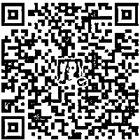

**除了好文**

**我们的课程也很不错呢**

**你可别错过了**

**2016 若道核心课程 Level 3**

**授课时间：**2016 年 7 月 28 日-11 月 10 日（**每周四晚 20：00-22:00**，16 次课）

**授课老师：**大卫·瑞雷

**授课方式：**网络课程，英文授课，中文翻译

**报名截止**：2016 年 7 月 15 日

**费用**：7000 元

**课程负责人：王老师**（**微信： ****2837474346**，请备注 L3 报名咨询）

长按二维码添加课程负责人咨询~


**特别提醒：**

**本文首发于若道平台，**

**转载请联系后台授权。**


**欲知报名详情，请点击文末“阅读原文”**


# 爱情故事丨很遗憾，我的弱点无法喂饱你

> 原文：[`mp.weixin.qq.com/s?__biz=MzA5NjA0NTAxNg==&mid=2651385700&idx=2&sn=f770c652bf3632307f92f1694ed70a28&chksm=8b4a5dd3bc3dd4c5e32f30382efe8567d39416d7effbf4057e9f7460a52b4c6fcdf9dcadd7e4&scene=126&sessionid=1692738811#rd`](http://mp.weixin.qq.com/s?__biz=MzA5NjA0NTAxNg==&mid=2651385700&idx=2&sn=f770c652bf3632307f92f1694ed70a28&chksm=8b4a5dd3bc3dd4c5e32f30382efe8567d39416d7effbf4057e9f7460a52b4c6fcdf9dcadd7e4&scene=126&sessionid=1692738811#rd)

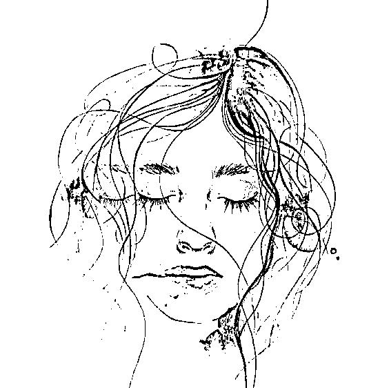 

作者/Miss 柳  图片来源/Pinterest

前些天，若道君推送了一个[关于严肃人群的爱情](http://mp.weixin.qq.com/s?__biz=MzA5NjA0NTAxNg==&mid=2651385626&idx=1&sn=a16235612381b85e9d04a485b6342387&scene=21#wechat_redirect)（点击可阅读），然后就有小伙伴跟若道君讲述了她的故事……

## 对星图的恐惧，使我缩在角落

在我的出生星图中，金星和土星成四分相，土星和海王星在七宫，天王星合相下降，冥王星在五宫。对于星图的宿命论解读，一度让我无比困扰——恋爱不顺被劈腿、婚姻容易出状况……于是，我选择了符合我上升巨蟹特质的应对方式：缩在自己温暖的保护壳里，逃避所有可能的变化。

当然，那时我对占星一无所知，只是被自卑感和自我保护的本能所驱使。

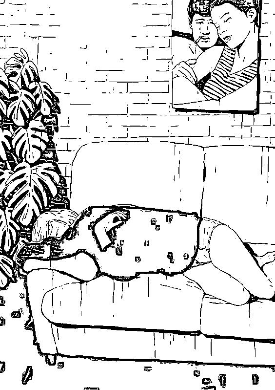

## 专情的暖男居然劈腿了

但我最无法接受的事情依然发生了。如何也没料到，那个处处都不如我、看似很专情的暖男竟然会劈腿，劈腿对象还是他多年的好友。而我，一直以为他们只是普通的基友关系。

后来又听朋友说，他和不少女生有暧昧关系，地球人都知道。他为自己的劈腿辩白：“我爱所有我帮过的人啊，我爱全人类。”多水瓶座式的解释。

我那时觉得自己失败透顶，选择了一个条件一般，自己也不很喜欢的人，谈着一场没有多少乐趣的恋爱，如此委曲求全地呆在 Easy 模式里，还是不得安稳。

诅咒了他俩 N 遍之后，才渐渐发现，所有的纠结都是自找的。我一直任性、情绪化、乱发脾气，以此确认他是否足够“安全”，但这无异于缘木求鱼。因为，安全感缺失是源于爱情的缺席，当我不爱这个人，能量自然是紧缩的、自我防卫的。

**坚信自己不值得被爱，就无法拥有理想的爱情关系**，**于是我吸引来了这样的境遇，不得不看着内心最深的恐惧显化为实相。**业力，或者说人生功课，虽然面目可憎，但终究无法逃避。在逃避的过程中，只会引发更多不必要的纠结与恐惧。

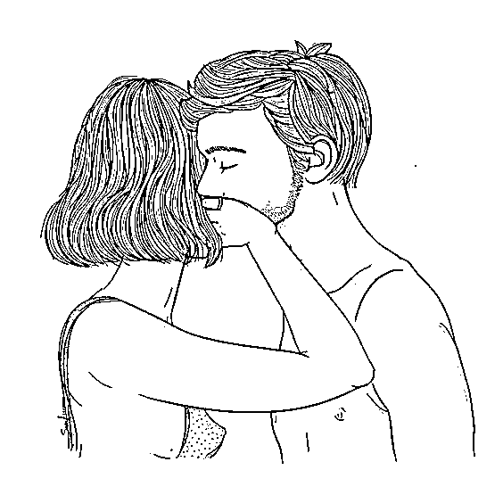

## 看清匮乏感后，我遇到了完美的他

很长时间以来，在处理感情和人际关系时，我都仿佛被沉重的石头牢牢捆绑，无论如何挣扎，都会沉入黑暗的水底。虽然太阳和月亮都落在双子座，但我很难和人有轻松愉悦的互动，总会过分地审视自己，责备自己的笨拙和内向。

在最近的一次占星咨询中，我终于看清了自己内心的匮乏感，同时也发现，惧怕风险、缺乏灵活性，以及强烈的控制欲，是如何让我的亲密关系总在生死边缘徘徊。

死亡亦是重生的起点，之前未完成的功课，会在重生时再次显现。

去年年底，我遇到了他，一个符合我完美伴侣条件的人。唯一的缺憾是，他仍然无法给我足够的安全感。初识他时，他在时差 7 小时的国外，在微信上聊天数月都不曾谋面。虽然言谈甚欢，但他有个习惯很能挑动我的情绪——常常聊着聊着就忽然消失，过了一两个小时才再次出现，继续之前的话题，也毫不解释。

他的太阳摩羯座，月亮和上升都落在金牛座，星图上还有土象大三角。而且他的金星在水瓶座，天王星在七宫，会在感情互动中随性跳脱。我小心翼翼地跟着他的节奏，尽量让自己看起来不那么讨厌，每句话都是再三思考才说出口，生怕惹他不高兴。感情日益升温，但我疲惫又恐惧，担心有一天他看到真实的我之后会拂袖而去。

今年 5 月，几经周折，他终于回到我们的城市。但没过几天，公司又要求他再次去国外，一去就是四个月。这样的动荡不安，让我忍无可忍，决定做一点改变。我鼓起勇气，做好最坏的打算，第一次真实表露了自己的观点：“可不可以不走？”没想到，他和上司交涉未果后，就果断辞掉了那份知名跨国公司的高端科研工作，留在国内。

我这才发现，他从始至终一直很重视我的想法，每当遇到事情也一定会和我商量，问题是我自己认为，必须要和他意见一致，才不会被讨厌。

原来，“我不值得被爱”、“我必须成为他喜欢的样子，否则他会离开”、“他既优秀又有主见，不会重视我的想法”，这一系列信念与事实谬之千里，仅仅是我内在匮乏感的投射。

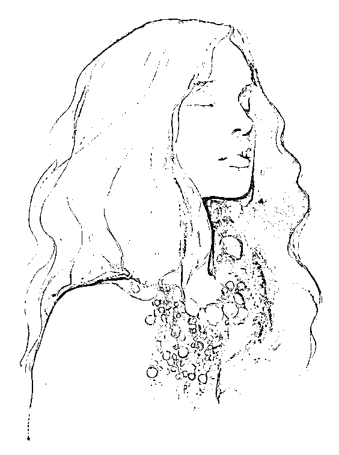

## 直面匮乏感，接纳恐惧的存在

在这件事发生之前，我把这段关系视为宇宙的赏赐，受宠若惊，所有的快乐像偷来的一样心虚，对于它能否经受变化和考验深感怀疑。事实上，它原比我想象得坚固。特别是当我看清了内心的匮乏感，同时真正理解和运用天王星的能量去灵活应对时，关系变得更加有趣。

不再去揣摩他每时每刻的想法，不再去纠结土星和三王星会对我的亲密关系造成怎样不利的局面，每一次的感情互动都很美好。我们从未吵过架，之前是因为我压抑自己，而现在则是双方都找到了舒服的位置，可以顺畅地沟通。

当匮乏感卷土重来，我不会将它和亲密关系“绑定”，认为对方应该对此负责，将我从不良的状态中解救出来；当情绪来临，我会暂停互动，先用诸如零极限或 EFT 这样的工具来处理，往往在我情绪释放后，事情就顺利起来。

**接纳自己对于“变动”的恐惧后，我的生命拥有了更多可能性**。我学习自己感兴趣的知识，写作、运营公众号、主讲微课，和陌生人聊天，挑战多年的社交恐惧症，在我敞开享受生命的丰盛时，他总会很自豪地向别人夸耀我。

直面匮乏与恐惧，接纳生命的“变动”本质，是我在今年上半年这混乱的天象中学会的最重要功课。小到对付内心涌动的恐慌，大到破解人生课题，除了面对自己的内心，本来就别无他法。


**作者简介**

**Miss 柳**，厦门大学文学硕士，九数生命能量解读师，占星学习者。

**微信公众号**：Miss 柳的沙盘室

**个人微信账号**：hongliu526

**除了好文**

**我们的课程也很不错呢**

**你可别错过了**

**2016 若道核心课程 Level 3**

**授课时间：**2016 年 7 月 28 日-11 月 10 日（**每周四晚 20：00-22:00**，16 次课）

**授课老师：**大卫·瑞雷

**授课方式：**网络课程，英文授课，中文翻译

**报名截止**：2016 年 7 月 15 日

**费用**：7000 元

**课程负责人：童老师**（**微信： 196267205**，请备注 L3 报名咨询）

长按二维码添加课程负责人咨询~


**特别提醒：**

**本文首发于若道平台，**

**转载请联系后台授权。**


**欲知报名详情，请点击文末“阅读原文”**


# Level 3 报名中丨恭喜你进入占星学习深水区

> 原文：[`mp.weixin.qq.com/s?__biz=MzA5NjA0NTAxNg==&mid=2651385700&idx=3&sn=30269f14b2209f35d0ed42fbe1d67e7b&chksm=8b4a5dd3bc3dd4c50e6d1a94b74f721046ef51fb286d678d4eec87492f6e9c86ba3dd4deabc4&scene=126&sessionid=1692738811#rd`](http://mp.weixin.qq.com/s?__biz=MzA5NjA0NTAxNg==&mid=2651385700&idx=3&sn=30269f14b2209f35d0ed42fbe1d67e7b&chksm=8b4a5dd3bc3dd4c50e6d1a94b74f721046ef51fb286d678d4eec87492f6e9c86ba3dd4deabc4&scene=126&sessionid=1692738811#rd)

掌握了星座、行星、宫位知识的你，是不是会时常困惑，将意涵与自己的星图对照，总显得模棱两可，分不清哪部分与自己对应？我们的明星课程 Level 3 可以帮你解决这个问题。你还会在此学到更高阶的知识：宫主星、守护星链、相位格局的使用，搞定自己的出生星图！快点击**阅读原文**报名！


往届学员怎么说？

从 Level 3 开始，大家通过造句交流，不光对占星学，对我们这群学占星的人，也有了更深的认同，我们是在一起窥探宇宙的奥秘，而且我们是个团体，每个人都是其中一员，每个人，都有你没有的脑洞，交流让占星术语变得生动有趣，也让占星的学习更有动力。我是从三阶开始，才感受到占星学习的实质进展。

——2015 届学员 Norah 

我现在是 Level 5 学员，去年在读 Level 3 的时候，一开始是十分不能接受的，为什么每一种配置有那么多可能性，那么占星学的准确性在哪里？它的意义到底在哪里？直到一次案例课，大卫老师精彩的解读让我醍醐灌顶：原来占星学并不是机械教条的是非论，无数种可能性为我们讲述无数种精彩人生，而如果我们不能理解生命精妙的细微变化，我们就无法理解自己和他人的人生。每个人都是有故事的人，尊重个体，尊重生命的发展。通过 Level 3 的学习，我更明白了这一点。

——2015 届学员玫瑰

上 Level 3 以前，我对星图的解读线索是凌乱的。Level 1-2 学习了星座和行星的意象，它们有那么多的关键词，具体解读的时候该使用哪个？如何判断？了解的关键词越多，我心里的疑问就越大。后来，大卫老师给了我们答案。他告诉我们解读星图的脉络，用实例告诉我们如何选择关键词。解读星图的线索逐渐清晰了起来，盘主的故事也随着一次又一次解读而变得历历在目。

——2015 届学员牡沐

报名 Q&A

**Q：**自学占星学的可以直接来上 Level3 么？

**A：**要先进行入学测试哦。长按下方二维码进入测试。

 

**Q：**通过此次课程学习，可以达到何种占星水平？

**A：**

通过完成 Level 1-3 的系统、**连贯与严谨**的学习

同学们将熟练掌握占星学最**重要**也最基本的知识

**行星、星座、宫位、相位**

并在此四要素的基础上，学习以下延伸技术：

*   将四要素**组合**起来解读

*   **宫主星**

*   **守护星链**

*   **相位格局**

当你完成 Level 3，就会发现自己已经具备了出生星图解读所需的**重要技巧**。

**Q：**如何报名？缴费后如何听课？

**A：**请点击文末阅读原文进入报名支付页面。缴费成功后课前一周我们的课程顾问会联络您加入学习微信群，领取开课通知书了解详情。

**Q：**错过直播课程如何补课？

**A：**直播课程结束后的 24 小时课程回放会送至您在若道官网注册的个人中心账号里，电脑（目前暂不支持移动端口）登陆官网进入**个人中心**即可收看回放。

**Q：**课程回放有有效期么？

**A：**若道目前的核心课程在视频回放有效期为课程结束后的 3 个月内，点播次数可以支持重复收看完整的 3 次。

师资介绍

**大卫·瑞雷（David Railey）**

若道创始人，《灵魂的目标》作者。拥有四十年的占星咨询的执业经验，曾两任亚特兰大占星协会主席，是全美占星师联盟（AFAN）、美国占星师联合会（AFA）、全美占星研究委员会（NCGR）、国际占星研究协会（ISAR）和职业占星师组织（OPA）的成员，是联合占星大会（UAC, United Astrology Conference）督导委员会委员。大卫曾是 CNN、CBS 的占星节目的常驻嘉宾，多次在 BBC、WGS、WSB、WRGG 等节目中接受采访，并在亚特兰大主持电视节目《每日行星（Daily Planets）》达 4 年之久。

**助 教 介 绍**

1

**天空的空**

2013 年，在若道进行系统的占星学习，研习整套现代占星学资质课程，师从大卫·瑞雷；现任若道专职助教。2015 年获得国际占星研究协会（ISAR）认证和若道“生时校正认证考试”。 

2

**GAFF**

2013 年开始在若道进行系统占星学习，师从大卫·瑞雷。在 2015 年度担任诺·泰尔、斯蒂芬·弗里斯特老师的占星工作坊助教。

**2016 若道核心课程 Level 3**

**授课时间：**2016 年 7 月 28 日-11 月 10 日（**每周四晚 20：00-22:00**，16 次课）

**授课老师：**大卫·瑞雷

**授课方式：**网络课程，英文授课，中文翻译

**报名截止**：2016 年 7 月 15 日

**费用**：7000 元

**课程负责人：童老师**（**微信： 196267205**，请备注 L3 报名咨询）

长按二维码添加课程负责人咨询~


**了解详细课程内容及报名方式，点击文末“阅读原文”**


# 为什么批评会让我受不了？丨一种无法接受缺失的人

> 原文：[`mp.weixin.qq.com/s?__biz=MzA5NjA0NTAxNg==&mid=2651385684&idx=2&sn=63f267f1d001560fab3398e4536245bc&chksm=8b4a5de3bc3dd4f55491da7b60cb47dc9ba429a1f86d70bc75188852e02ab6f891ecf20370c8&scene=126&sessionid=1692738811#rd`](http://mp.weixin.qq.com/s?__biz=MzA5NjA0NTAxNg==&mid=2651385684&idx=2&sn=63f267f1d001560fab3398e4536245bc&chksm=8b4a5de3bc3dd4f55491da7b60cb47dc9ba429a1f86d70bc75188852e02ab6f891ecf20370c8&scene=126&sessionid=1692738811#rd)

作者/唐娜·坎宁安 图片/Pinerest

翻译/徐珊珊 校对/江艺

你是否常常感到莫名的愤怒呢？别人无心的一句话是否就会激起你的愤怒情绪？害怕被别人看到内心的真实想法，害怕别人讲出真相，于是就用愤怒来掩饰。唐娜·坎宁安认为，愤怒就是你的心理防范意识的看门狗，而愤怒的议题主要与火星相关，特别是火星与外行星形成的相位。

## 有一些人，无法面对家庭和自我的缺陷

要是有哪个该死的蠢蛋非要讲出真相，那恐怕是最让人抓狂的事情了！如果我们成长于一个不健全的家庭，为了保持我们的家教，我们要学会高度敏感、灵活应对，而且永远要对现状的不利因素保持警惕。

这样一来，哪怕是用最温和的态度指出我们自身、家庭或不良嗜好的缺陷，我们都会轻易就受伤。**无论是否将这种伤痛外化表现出来，我们都会对甚至最具建设性的批评意见产生愤怒的反应。**为了保护我们的防范心理，我们甚至会不惜和这些不识时务的人断绝关系，谁叫他们非要摆出事实制造不安定因素。（没人说过我们很好相处呀！）

**哪些配置会容易产生这种愤怒？** 

**○ 对于火星和海王星相位来说，这种模式可能尤其明显，但火星与所有外行星的相位都象征着对威胁现状的因素给予某种形式的防御。**

**○ 拥有火星和冥王星相位的人，可能会通过控制行为或者撤退到自我孤立状态来抵制他察觉到的威胁。**

**○ 而有火星和天王星相位的人则可能通过一种惊世骇俗的反抗或骚乱的态度，来保护自我。**

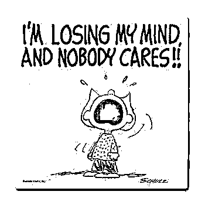

（我失控了！而且压根没人在乎我的失控！）

## 别让愤怒阻止你与他人相爱

愤怒可谓心理防范意识的看门狗。在某些情形下，这种否认心理太强大，或者自尊心过于脆弱，使得愤怒如脱缰的野马。

**你的愤怒如何表现？**

○当有人非要揭穿你的幻想，或当你或你的至爱具备某些癖好或破坏行为，他非要挑衅你的防范心理，或是让你直面你的缺点时，你会怨恨他吗？

○这种时候，你会不会选择自我封闭、掉头跑开或断绝关系？

如果是这样，你的自我成长将就此短路，你会拒绝与他人建立真切的亲密关系——基于双方的坦诚相对的亲密关系。

**愤怒让往事重现。**如果第十宫、第四宫或第一宫的外行星比较强，那么家庭困难带来的痛苦童年会让你挥之不去。

**愤怒的理由有很多：**

在我们的生命进程中，来自缺陷家庭的人往往有着诸多愤怒的理由。由于我们父母的毛病，那些倒霉的事总是找上门来，可能是对我们自己，也可能是其他家庭成员。**作为成年人，因为我们很多人不清楚如何捍卫自我，因此很可能会扮演受害者的角色。**我们这种条件反射式的应对模式很可能会造成关系的破裂。

愤怒可能是把我们同家庭成员、昔日恋人或老朋友联系起来的唯一因素。长此以往，至少在我们自己脑海里，这种关系依旧存在。我们让那个人或那件小事情成为我们生命中非常重要的一部分，赋予他强大的力量。我们也情愿相信，在对方心里，自己也同样重要，无法接受对方其实已然不再关注自己这一事实。

**如果我们将越多的精力以愤怒的形式注入过去，就只剩下越少的精力来享受今日更加亲密的关系和更加美好的生活。**这就仿若派一个民兵去守护一片墓地，其实同样的劳动力可以用来修建一条崭新的道路。

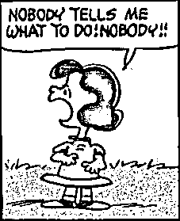 （没人告诉我该怎么办！没！有！人！）

## 愤怒时，你该怎么办？

你是否也在对他人或事件的愤怒中虚耗自己的能量，而其实你本可以调动这份能量去为自己打拼出一片蓝天？这难道不是另一种忽略自我的方式？对那些过往的硝烟老调重弹，甚至会让自己逃避面对亲密关系。

当你怒火中烧时，问问自己下面这些问题，可能会有些帮助：

**●我是如何利用愤怒来保护自己的防范心理的？**

**●我是否愿意放下对过往事情的愤怒，这样才有机会为自己营造当下更幸福的生活？**

**●我能不能为了让自己开心些，而放弃一贯的自以为是？**

每当我极度过分地指责别人时，这些问题就是我抑制愤怒的保护措施。我走到沉思的角落坐下来，打开《奇迹课程》的第一章，重新研读课程的主要教义，我脑海中盘旋不去的那些妄念每每就此被驱散。那段话是这样说的：


**凡是真实的，不受威胁；凡是不真实的，根本不存在。上主的平安即在其中。**


***若道君的一位朋友说：我出生星图有火星和海王星、天王星合相，小时候无法接受别人的负面评价，像文中所说，即使是温和地指出我的不足，也会使我当场崩溃大哭。***

***你也有这类的愤怒故事想分享吗？欢迎留言。***

**作者简介**

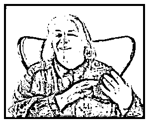

**唐娜·坎宁安**：职业占星师，同时是很多占星书的作者，包括《星群手册》和《职业选择与挑战》。

**除了好文**

**我们的课程也很不错呢**

**你可别错过了**

**2016 若道核心课程 Level 3**

**授课时间：**2016 年 7 月 28 日-11 月 10 日（**每周四晚 20：00-22:00**，16 次课）

**授课老师：**大卫·瑞雷

**授课方式：**网络课程，英文授课，中文翻译

**报名截止**：2016 年 7 月 15 日

**费用**：7000 元

**课程负责人：王老师**（**微信： ****2837474346**，请备注 L3 报名咨询）

长按二维码添加课程负责人咨询~


**特别提醒：**

**本文首发于若道平台，**

**转载请联系后台授权。**


**欲知报名详情，请点击文末“阅读原文”**


# Level 3 报名中丨你终于会解读出生星图了！

> 原文：[`mp.weixin.qq.com/s?__biz=MzA5NjA0NTAxNg==&mid=2651385684&idx=3&sn=d2f1b53ca5be1c9a0868dcbd34198336&chksm=8b4a5de3bc3dd4f5842a7f59f866d81d85fce02bdac649120fe8c56a5207e71a3c735a674996&scene=126&sessionid=1692738811#rd`](http://mp.weixin.qq.com/s?__biz=MzA5NjA0NTAxNg==&mid=2651385684&idx=3&sn=d2f1b53ca5be1c9a0868dcbd34198336&chksm=8b4a5de3bc3dd4f5842a7f59f866d81d85fce02bdac649120fe8c56a5207e71a3c735a674996&scene=126&sessionid=1692738811#rd)

掌握了星座、行星、宫位知识的你，是不是会时常困惑，将意涵与自己的星图对照，总显得模棱两可，分不清哪部分与自己对应？我们的明星课程 Level 3 可以帮你解决这个问题。你还会在此学到更高阶的知识：宫主星、守护星链、相位格局的使用，搞定自己的出生星图！快点击**阅读原文**报名！


往届学员怎么说？

从 Level 3 开始，大家通过造句交流，不光对占星学，对我们这群学占星的人，也有了更深的认同，我们是在一起窥探宇宙的奥秘，而且我们是个团体，每个人都是其中一员，每个人，都有你没有的脑洞，交流让占星术语变得生动有趣，也让占星的学习更有动力。我是从三阶开始，才感受到占星学习的实质进展。

——2015 届学员 Norah 

我现在是 Level 5 学员，去年在读 Level 3 的时候，一开始是十分不能接受的，为什么每一种配置有那么多可能性，那么占星学的准确性在哪里？它的意义到底在哪里？直到一次案例课，大卫老师精彩的解读让我醍醐灌顶：原来占星学并不是机械教条的是非论，无数种可能性为我们讲述无数种精彩人生，而如果我们不能理解生命精妙的细微变化，我们就无法理解自己和他人的人生。每个人都是有故事的人，尊重个体，尊重生命的发展。通过 Level 3 的学习，我更明白了这一点。

——2015 届学员玫瑰

上 Level 3 以前，我对星图的解读线索是凌乱的。Level 1-2 学习了星座和行星的意象，它们有那么多的关键词，具体解读的时候该使用哪个？如何判断？了解的关键词越多，我心里的疑问就越大。后来，大卫老师给了我们答案。他告诉我们解读星图的脉络，用实例告诉我们如何选择关键词。解读星图的线索逐渐清晰了起来，盘主的故事也随着一次又一次解读而变得历历在目。

——2015 届学员牡沐

报名 Q&A

**Q：**自学占星学的可以直接来上 Level3 么？

**A：**要先进行入学测试哦。长按下方二维码进入测试。

 

**Q：**通过此次课程学习，可以达到何种占星水平？

**A：**

通过完成 Level 1-3 的系统、**连贯与严谨**的学习

同学们将熟练掌握占星学最**重要**也最基本的知识

**行星、星座、宫位、相位**

并在此四要素的基础上，学习以下延伸技术：

*   将四要素**组合**起来解读

*   **宫主星**

*   **守护星链**

*   **相位格局**

当你完成 Level 3，就会发现自己已经具备了出生星图解读所需的**重要技巧**。

**Q：**如何报名？缴费后如何听课？

**A：**请点击文末阅读原文进入报名支付页面。缴费成功后课前一周我们的课程顾问会联络您加入学习微信群，领取开课通知书了解详情。

**Q：**错过直播课程如何补课？

**A：**直播课程结束后的 24 小时课程回放会送至您在若道官网注册的个人中心账号里，电脑（目前暂不支持移动端口）登陆官网进入**个人中心**即可收看回放。

**Q：**课程回放有有效期么？

**A：**若道目前的核心课程在视频回放有效期为课程结束后的 3 个月内，点播次数可以支持重复收看完整的 3 次。

师资介绍

**大卫·瑞雷（David Railey）**

若道创始人，《灵魂的目标》作者。拥有四十年的占星咨询的执业经验，曾两任亚特兰大占星协会主席，是全美占星师联盟（AFAN）、美国占星师联合会（AFA）、全美占星研究委员会（NCGR）、国际占星研究协会（ISAR）和职业占星师组织（OPA）的成员，是联合占星大会（UAC, United Astrology Conference）督导委员会委员。大卫曾是 CNN、CBS 的占星节目的常驻嘉宾，多次在 BBC、WGS、WSB、WRGG 等节目中接受采访，并在亚特兰大主持电视节目《每日行星（Daily Planets）》达 4 年之久。

**助 教 介 绍**

1

**天空的空**

2013 年，在若道进行系统的占星学习，研习整套现代占星学资质课程，师从大卫·瑞雷；现任若道专职助教。2015 年获得国际占星研究协会（ISAR）认证和若道“生时校正认证考试”。 

2

**GAFF**

2013 年开始在若道进行系统占星学习，师从大卫·瑞雷。在 2015 年度担任诺·泰尔、斯蒂芬·弗里斯特老师的占星工作坊助教。

**2016 若道核心课程 Level 3**

**授课时间：**2016 年 7 月 28 日-11 月 10 日（**每周四晚 20：00-22:00**，16 次课）

**授课老师：**大卫·瑞雷

**授课方式：**网络课程，英文授课，中文翻译

**报名截止**：2016 年 7 月 15 日

**费用**：7000 元

**课程负责人：王老师**（**微信： ****2837474346**，请备注 L3 报名咨询）

长按二维码添加课程负责人咨询~


**了解详细课程内容及报名方式，点击文末“阅读原文”**


# 12 星座火星逆行成绩单 | 别再回望深渊，请你一往无前

> 原文：[`mp.weixin.qq.com/s?__biz=MzA5NjA0NTAxNg==&mid=2651385684&idx=1&sn=a65ace8d1f007cf8c90e09a8ac45e3cc&chksm=8b4a5de3bc3dd4f50bad2a03b0cac4ddee3db9902185e0b9295f73e43eed59bbdfa3aae8dbfe&scene=126&sessionid=1692738811#rd`](http://mp.weixin.qq.com/s?__biz=MzA5NjA0NTAxNg==&mid=2651385684&idx=1&sn=a65ace8d1f007cf8c90e09a8ac45e3cc&chksm=8b4a5de3bc3dd4f50bad2a03b0cac4ddee3db9902185e0b9295f73e43eed59bbdfa3aae8dbfe&scene=126&sessionid=1692738811#rd)

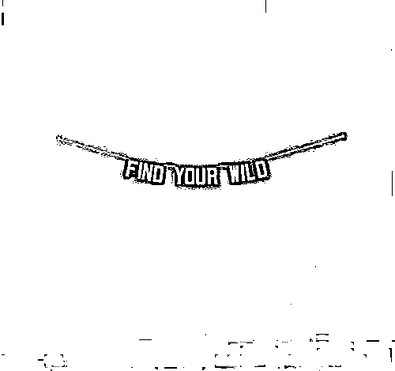
作者/幽南 图片/pinterest

作为一颗逆行时间间隔最长的行星，火星也是挺任性的。这个暴脾气大叔一言不合就起义。上半年，火星在射手座逆行——回到天蝎座老窝——又在天蝎座 23 度 03 分恢复顺行——然而还是提不上劲儿地停在这个度数 24 天……仔细想想火星也是挺累的，咱们来看看它这番折腾的良苦用心，也看看这次逆行的考试你学到了什么，以及火星顺行后需要注意的事项。

若道君向你抛了个媚眼并甩给你一些火星逆行的前情介绍

[**▲ **火星逆行逃生攻略 | 愤怒的巨轮怎能说沉就沉](http://mp.weixin.qq.com/s?__biz=MzA5NjA0NTAxNg==&mid=403873640&idx=1&sn=6105c20bae053c40664cd3f9c79e7754&scene=21#wechat_redirect)

[**▲ **火星逆行再提醒，12 星座如何管理你的愤怒](http://mp.weixin.qq.com/s?__biz=MzA5NjA0NTAxNg==&mid=2651384336&idx=1&sn=4de577dfeb7cafee79a126f1e94feac0&scene=21#wechat_redirect)

[**▲ **火星逆行 | 下一站天蝎座，请准备好深度转化和疗愈](http://mp.weixin.qq.com/s?__biz=MzA5NjA0NTAxNg==&mid=2651385080&idx=1&sn=ee057d7faaab186111cb3d3cc3a8a2fa&scene=21#wechat_redirect)

[**▲ **火星逆行最后一击，把英国整脱欧了](http://mp.weixin.qq.com/s?__biz=MzA5NjA0NTAxNg==&mid=2651385558&idx=1&sn=a713acbedd20385e06ceec3bb3d93b13&scene=21#wechat_redirect)

现在，问问自己这些问题

*   今年 4 月 17 日，火星在射手座 8 度 53 分开始逆行;

*   5 月 28 日，火星逆行回到天蝎座；

*   一直持续到 6 月 30 日，火星终于在天蝎座 23 度 03 分开始顺行了。

*   其实，2 月 18 日火星就已经进入逆行前的阴影期了， 顺行后的阴影期要一直持续到 8 月 22 日。

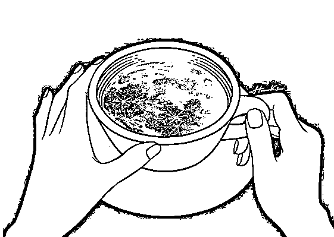

**逆**行意味着回顾和反思，并无好坏的分别。现在，检视成果的时候到了，经过这段时间以后：

*   “你是否更加**确认自己真正所要的**是什么了？”

*   “你是否更加**自信、独立**，活得更加**真实**了？”

*   “你是否能够更加**诚实地**追求自己想要的了？”

*   “你是否对于过去所**执着**的人、事、物有了更深入的了解？”

*   “你是否点燃了内心深处的**激情**，并允许**转变**的发生？”

*   “你现在能够发自内心地**原谅**、对过往**释怀**吗？"

*   “你是否对于内在的**资源和力量**有了更深入的了解？"

*   “对于过去所怀疑的，现在是否更加**信任**了？”

*   “对于已经积累了足够经验的领域，是否进行了更加深入的**整合**工作？

*   “危机来临时，你是否更加镇定自若、敢于直面内在的恐惧，变得更加**勇敢、坚强**？” 


当行星静止不动，即将开始顺行或逆行时，意味着有些事情已经迫在眉睫，呼之欲出，行进行星的停滞通常会令正在发展中的事件变得更加戏剧化。

—斯蒂芬·弗里斯特


还没想好的同学可以继续深挖

**目**前，火星正处于停滞期，在天蝎座 23°的位置（6 月 20 日-7 月 11 日），如果你在火星逆行期间克服了自己内在的恐惧，感觉到自己更加勇敢，也更加确信自己真正想要的到底为何，那么现在，是时候开始行动，把你内在的力量与勇气呈现给世界。

如果你**害怕活出真实的自己**，就持续**清理深挖**。

你可以试着反问自己——

*   我**害怕**的到底是什么？

*   是真实的自己**不被接纳**吗？

*   不被接纳后有又会怎么样呢？

*   这些恐惧的想法都**是真的**吗？……

持续挖下去，直到看到真相为止，但不是所有人都需要真相，重点是**找到潜意识深处有哪些负面程式阻碍你前进，进行疏通**。

一些破坏性的火星能量发挥

**也**有一些人会用非常破坏性的方式来释放火星的能量：战争、争吵、冲突、那些毁灭性的甚至是玉石俱焚的冲动行为。第二次世界大战就是在火星停滞后的顺行阶段爆发的。

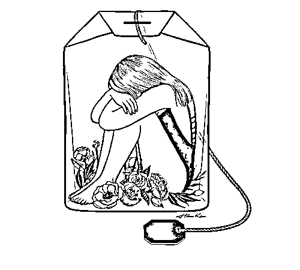

**如果你没有将火星的能量运用到正向的提升，那么它可能就会以破坏性的方式打扰你的生活****。**

*   比如经常吸引过来一些人和你**发生冲突**。

*   还有一些习惯**回避**的人，可能会感觉到**消极、抑郁**，甚至转而向内**攻击自己**，这也是火星的破坏性表达，因为你没有采取任何积极的行动给这颗如此鲜活的行星以正向的回应。

没有谁是天生的勇者，火星的勇猛与脆弱本是一体两面，过去受伤不代表永远，每一次逆行都是一次修正的机会，每一次顺行都是进化与提升的契机，如何行动，在于你自己。 

火星逆行期间发生的

***1，***

**跟随内心真实的感受，**

**勇敢追求自己所爱**

一个群星处女座的女子，火星在天蝎座逆行在她的**第五宫**。父母反对她和喜欢的人在一起，她用所有的理性说服自己**停留在一段自己不喜欢的关系里**，却一直在想着另外那个人，思念到窒息，反复拉黑对方也无济于事，越想忘记只会记得越深。在火星顺行后她准备下一个决定，**跟随内心真实的想法**。

***2，***

**规避系统失灵，** 

**被否认的情绪需要得到释放**

另外一个上升点在双鱼座的女子，只因拿起一块水晶，**情绪**就突然冒出来，头脑却搞不清楚原因。后来她分析这个事情可能是和小时候**被欺负**的事件有关系，她喜欢给欺负她的人找理由，有些双鱼特质强的人不希望看到人性中的黑暗面，但是再怎样严密的自动屏蔽系统，情绪仍旧会在某个点突然冒出来，**被压抑和否认的情绪需要被正视和释放**。

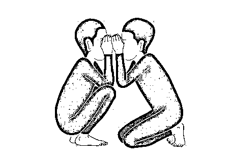 

***3，***

**在危机中转化，**

**战胜内在的阴暗面，**

**释放内在的恐惧和仇恨**

一个上升点在天蝎座的女子，火星逆行在她的**十二****宫**，接近上升点。在这期间她学习了一些通过身体**释放情绪**的方法，并且更多的进行身体上的锻炼。在过程中，她也愈发意识到自己真正想要做的是什么，这期间过去**莫名的情绪困扰和伤害性的事件**像回溯一样再次重演了一遍，她反而更深入地理解了自身的**受害者情结**，对加害者的心理也有了更加深入的理解，在每一次克服恐惧之后，她变得更加勇敢。

和双鱼座刚好相反，有一些天蝎座特质强的人会一直聚焦在**黑暗的部分**，直到有一天能够发自内心的以同理心感受对方的痛苦，神奇的转化就会自动发生，唯有**爱与慈悲**的振动频率才能切断双方数世互相伤害的锁链，把眼睛看的再深一些：**仇恨背后的爱是真正的解药。**

***4，***

**找到人生新方向**

另一位上升点在天蝎座的女子，火星逆行在她的**一宫**，经过这段时间，她对于自己**想要什么**，更加明确了。此次火星顺行后刚好经过她的土星，她正在着手实施搬家到郊区的计划，确立新的**人生方向和目标**。行进的行星经过本命行星会激活那颗行星的能量，在这个例子中，火星会让土星寻求行动上的表现，更加诚实地追求自己想要的。她彻底明白她就是不喜欢城市，更喜欢乡村田野的大自然生活。

值得观察的时间点

*   **2 月 18 日**，火星进入逆行前的**阴影期**，相关领域有一些改变的端倪开始浮现。 

*   **4 月 17 日，**火星正式在射手座 8°53′逆行， 回想那段时间，是不是发生了某些事情或内心的状态与**“回头修正”**相关？ 

*   **5 月 5 日，**逆行的火星在射手座与天王星呈 135°，回想那几天，是不是有一种**“逆生长”**的感觉？如果你之前都比较内敛，那段时间很可能比较向外，把内在的品质带给他人。根据查尔斯·哈维的观察，这个相位与具体的生产出一些东西相关，它们会以非常外向的方式来完成自我实现。 

*   **5 月 21 日**，逆行的火星在射手座与冥王星成 45°，正值射手座满月前夕，回想那几天，你是不是**决心改变些什么**？和 135°类似，这个角度也与具体显现的外在事件相关，特别是如果你之前没有按照内心真实的渴望而活，这段时间你可能会感到格外的躁动不安。 

*   **5 月 27 日**，火星正式逆行回到天蝎座，回想那几天，有没有一种内心深处的**不安**开始浮现的感觉？特别是如果你之前做了某些改变的情况下。 

*   **6 月 12 日**，逆行的火星在天蝎座与凯龙星呈 120°，回想这段时间，有没有进行一些身体和情绪上的**疗愈与释放**？语言有时候可以骗人，但是身体和情绪的反应却是最真实的。那些潜伏在内心深处的情绪需要得到释放和疗愈，经过这个行进之后你会更深入的了解自己，而每面对一次恐惧，你也变得更加勇敢。 

*   **6 月 19 日**，逆行的火星在天蝎座与天王星成 150°，这关乎于做**最真实的自己**。这段时间，会有一些新的突破，回想这几天，有没有一种想要沉静下来，安静做自己的心理状态？因为火星逆行的原因，这段时间的行动也是向内的，这是沉潜、调试、酝酿的状态。 

*   **6 月 30 日**，火星恢复顺行，一扫阴霾，对于内心真正想要的东西，更加**坚定和确信**。 

*   接下来火星逆行的**后阴影期**会一直持续到**8 月 22 日**，这时候我们对于自己真正想要的更加明确了，可以用一种正向、积极的态度去**解决旧的遗留的事情**。但也因为是在后阴影期，所以逆行期间引发的热点问题要到**8 月底**才会结束。 

火星顺行后适合做的以及要注意的

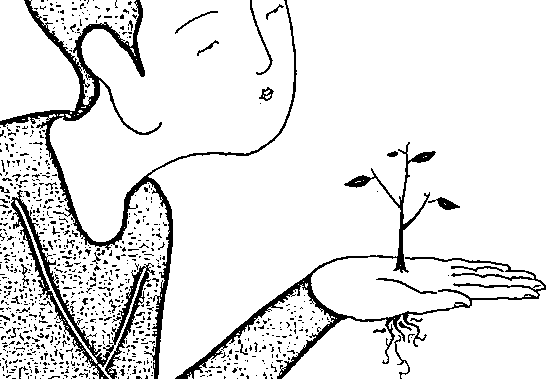

***1，***找到你内心**激情**之所在，开始行动，碰到困难不要紧，继续努力摸索，在克服困难的过程中**磨砺自己的意志力**；

***2，***确保你的追求是**真实的且发自内心的**，这是最大的筹码；

***3，***做一些身体的**动态活动**，恢复活力，参加一些良性的竞争活动。经常运动的人比不运动的人状态会好一些，也更能够确立自己；

***4，*****学习用更具建设性的方式表达你的愤怒和情绪**（带着觉知在不影响别人的前提下进行情绪宣泄：比如打枕头、去某个无人的山头大叫一场、涂鸦，边骂边哭边宣泄，看能让你大笑一场的喜剧……总之找到适合自己的方式）注意：目的是释放，疏导能量，最好一个人进行，不要让负能量影响到其他人。

***5，***观察一下火星顺行**在你出生星图的第几宫**，**有什么特别的相位**。停滞期你可能会觉得相关领域有一种能量快要喷洒出来，呼之欲出，且在这个领域会有一种“我的命运我做主”的感觉，信任你内心的感受，做自己命运的主人。

火星在天蝎座恢复顺行，愿我们不再承担彼此，依循灵魂真实的愿望，勇敢前行。

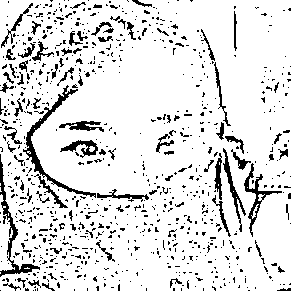

**作者介绍**

**幽南**：浩瀚宇宙中一颗渺小的狮子星。我诉说的星星故事可能充满了我的投射，但我们与星星的故事总有与宇宙共鸣的部分，愿遇有缘人，喜乐共振，爱的流动。

**个人公众号**：星舞心疗室（xingwuxinliao）

长按二维码，让金钱涌向传播知识与智慧的人~

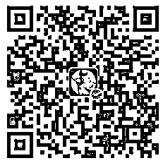


这次火星的逆行之旅

你都学习到了什么

未来又会有怎样的变化

评论区见

**除了好文**

**我们的课程也很不错呢**

**你可别错过了**

**2016 若道核心课程 Level 3**

**授课时间：**2016 年 7 月 28 日-11 月 10 日（**每周四晚 20：00-22:00**，16 次课）

**授课老师：**大卫·瑞雷

**授课方式：**网络课程，英文授课，中文翻译

**报名截止**：2016 年 7 月 15 日

**费用**：7000 元

**课程负责人：王老师**（**微信： ****2837474346**，请备注 L3 报名咨询）

长按二维码添加课程负责人咨询~


**特别提醒：**

**本文首发于若道平台，**

**转载请联系后台授权。**


**欲知报名详情，请点击文末“阅读原文”**


# 因为是你，晚一点也没关系 | 霍建华和林心如爱情扫描报告

> 原文：[`mp.weixin.qq.com/s?__biz=MzA5NjA0NTAxNg==&mid=2651385683&idx=1&sn=b7ce8e9843a371d81a291df966e8e0aa&chksm=8b4a5de4bc3dd4f20695cb914519478ae2e641b24c11b74e81e9b141e8f7be32927694895c63&scene=126&sessionid=1692738811#rd`](http://mp.weixin.qq.com/s?__biz=MzA5NjA0NTAxNg==&mid=2651385683&idx=1&sn=b7ce8e9843a371d81a291df966e8e0aa&chksm=8b4a5de4bc3dd4f20695cb914519478ae2e641b24c11b74e81e9b141e8f7be32927694895c63&scene=126&sessionid=1692738811#rd)

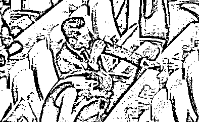 部分图片和文字内容节选自其他公众号  

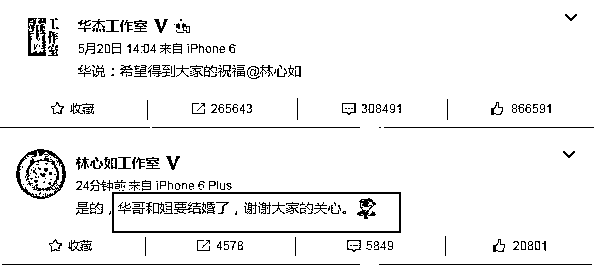

**▼**

**5 月 20 日**  

毫无征兆地

林心如和霍建华先后在微博上**公开恋情**

**7 月 5 日**

大大方方地

这对 CP 先后在微博上**公布婚讯**

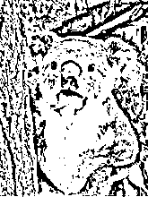

最开始 

若道君是蒙圈的

说好的**是胡不是霍**呢

再说这俩人认识都那么些年了

要有点啥早该有了

何苦等到最佳生育年龄都过了

才来**虐死单身狗**呢

震惊三秒后 

若道君恢复了冷静

毕竟

我是**高冷而博学**的若道君

虽然没有长枪短炮的狗仔队镜头

可我们有出生星图

恋情可以地下

公众形象可以靠公关公司

星图可是不会说谎的

若道君迅速在官网上

制作了一份**“爱情关系扫描”**报告

（内部人员免费，嘘）

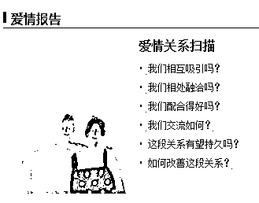 

心如和建华捂得严实的爱情在这份报告里

一目了然

好八卦当然要分享

我们一起来看看这对壁人**本来的样子**

以及他们**眼中的对方**是怎样哈

**他她**

所有相遇 都是久别重逢

**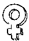
太阳水瓶座的林心如**

*   独立，有主见，不黏人

*   对友情比对爱情还重视

*   朋友超多，异性缘也好

*   天生的理想主义者，内心强大

*   对爱情，有点精神洁癖，而且很难一见钟情

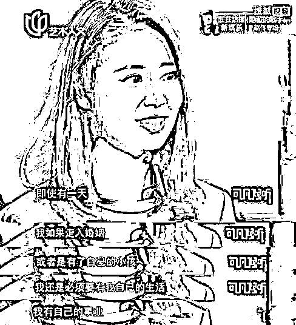

▼

林心如出道至今

在汲汲营营的娱乐圈

一直有种娴雅超脱的离世之感

太阳水瓶女独立自强

从演员到制片人

多次拿过最受欢迎女演员奖

并凭《倾世皇妃》夺得最佳制作人大奖

如今身家十几亿

她有很多好朋友和好闺蜜

但绯闻却少之又少

**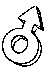 太阳摩羯座的霍建华**

*   比较沉闷，不善于表达心中所想

*   古板、传统、莫名享受孤独感

*   精神洁癖，对另一半在精神上要求很高

*   对人生有很高的要求并付诸努力

*   对待感情认真而实际，重诺言

▼

霍建华说自己平时很宅

低调内敛务实

除了必须情况基本不宣传

也不喜欢蹭头条

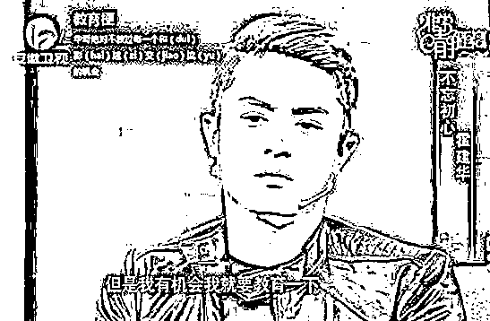 

▼

表达爱的方式妥妥的老干部“训导”法

管你就是关心你

有个著名的梗 

是说两个女粉丝在晚上十点多跑去剧组探班

然后霍建华就穿着大背心大裤衩

在美丽的夜色中揪住两个姑娘滔滔不绝训斥了一个小时

▼

看到这里大家发现了吗

这俩人有几个共性

都是**宁缺毋滥**的类型

都是**慢热**的人

对一个人需要**观察和接触很久**

**才能确定**并交付真心

可一旦爱了就是一辈子

**细水长流精神契合**的爱情是他们向往的

俩人也都**心性极高**

年轻的时候难免**耿直倔强**

需要经过时光打磨

才能懂得人生和爱情真谛

这样看来

他们选择现在才在一起

反而比较合适呢

▼

因此

认识十年

才宣布在一起

然后居然火速就要办婚礼了

这也许就是传说中的

对的时间 和对的人

不早不晚 珠联璧合的爱情吧

写到这里

还是单身狗的若道君不由抹了一把热泪

**他****们**

只愿为你守着约

若道君为这对 CP 分别做了**爱情扫描报告**

来看看他们**二人眼中的彼此**

和**对这段关系的看法**

**▼**

爱情扫描报告是根据二人**比较盘**绘制

如果你和若道君一样对占星学略懂

会发现他们彼此的**太阳和金星都是合相**的

如果不懂也没关系

这份报告说的是你听得懂的人话哟

来看看他们的关系是怎样哒

**吸引力：爱与友谊无处不在**

你们之间，爱与友谊无处不在。你们会以一种积极、互惠的方式照亮彼此的人生。不论你们一起做什么，有了对方的陪伴，愉快总是如影随形。此外，你们也喜欢类似的社会活动和兴趣爱好，这会加强你们的关系。即使并无特别的日程安全，你们也会相处得很愉快。你们之间爱情的吸引力十分强烈，你能够让对方沐浴在爱的阳光之下，从而更加积极、慷慨地回应你。她也会鼓励你的创意精神，鼓励你展现你的才华。

**融洽度：爱意满满**

你会发现对方很了解你的本能反应，所以你们应该能够轻轻松松地互相表达爱意。与她在一起会让你一直散发出某种魅力和吸引力，这让她无法抗拒。对方时时刻刻都能让你意识到自己光彩照人、与众不同，这会让你陶醉于自己美妙的天赋之能，信心满满。你也会是她的忠实粉丝，你们之间真是爱意满满啊，而且还将会一同去追求彼此的共同爱好，乐此不疲呢。

**持久：你们是一个利益共同体**

你们都很重视这段关系，愿意为这段关系负起责任。你们会郑重地许下承诺，对彼此无比忠诚。你们在一起共事时和睦融洽，能够彼此分享一些实际的观点和传统价值观。你们会大力支持对方的目标，形成一种十分紧密的联结。你们很可能会创建一个计划，去共同实现生命中的期许和希望。也许在别人看来，你们像是一个追逐物质财富的利益共同体，从某种程度上说，确实是这样。这是一股强大的凝聚力，将你们凝结在一起，努力奋斗。这也为你们稳固的关系奠定了坚实的基础。

**配合：难以表达心中的爱 **

对你们来说，表达爱并非易事，虽然你们可以肯定那爱的存在。因为各种外部问题，可能会拖延你们走到一起。也许，你们双方认为这是非常严肃的关系，起初都非常谨慎。一旦你们越过这一步，你们就可以在任何事情上彼此依赖。随着时间推移，当你们表达爱，展现天赋的时候，也许依然会视对方为限制。你渴望用你的一切来爱对方，但最细微的拒绝都会将你击碎。对方会认为责任全在你，让关系中全无浪漫可言。你们双方都需要面对这个问题，去敞开真实的自己，接纳对方本来的样子，去表达爱，这样这段关系才有望有品质地持续下去。

**配合：学习妥协，顾及对方的感受**

你们会采取完全不同的方式方法来实现同一个目标。可能一开始你真的很喜欢对方获取所需的方式，但是长期相处或者共事的话，却可能会让你倍感头疼。你们会时不时产生一些摩擦，继而引发矛盾，以至于难以共事和相处。你可能会因此而变得咄咄逼人，绝不服输，就是要证明自己的方法最正确。不过，你也许会发现这样做会造成更激烈的冲突。如果你仍想维持这段关系，那就要学习妥协，顾及对方的感受，有时也按照对方的方式来处理问题，不过在面对那些不可妥协的问题时一定要坚守立场。

浓浓的爱意透着屏幕都嗖嗖往外飙升

配一脸有木有

若道君表示又受到一万点伤害

▼

注意前方

若道君为大家精心整理的

与报告相呼应的一大波八卦事件

即将来袭

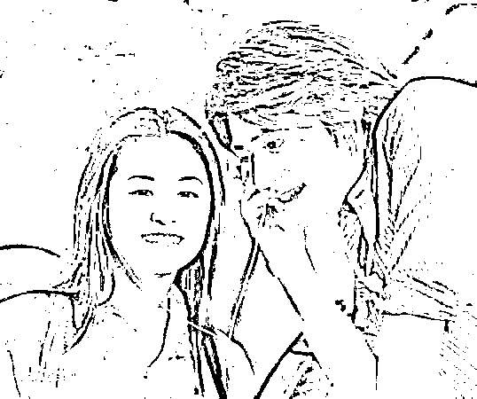 

▼

林心如和霍建华早在 2006 年就因拍戏结缘

而这十年来

两人一直以“友达以上，恋人未满”

的姿势相处

从报告里就可以看出

两人这些年虽然爱你在心口难开

但一直在低调地彼此为对方付出着哟

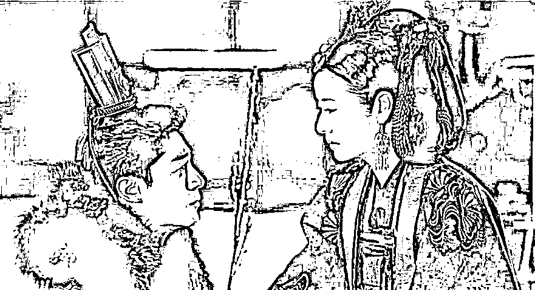

▼

只有林心如能说服霍建华出演她的戏

戏里戏外都是情

看看这剧照

真是超级有爱的眼神啊

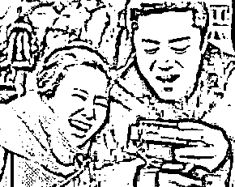

▼

据说情侣在一起看新闻联播也能乐成这样

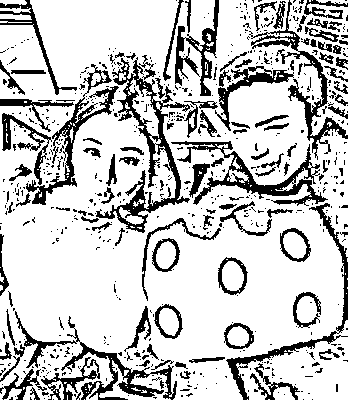

▼

能让严肃脸霍建华秒变小精灵

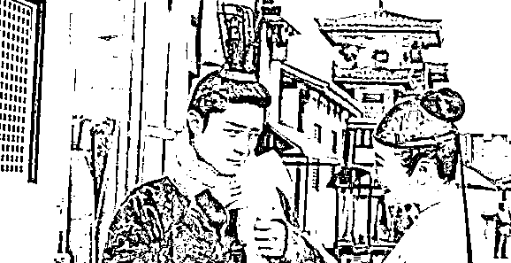

▼

打情骂俏看不下去了啊喂

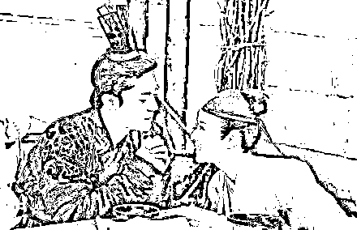 

▼

——“说，爱我不？”

——“你猜你猜你猜猜猜。”

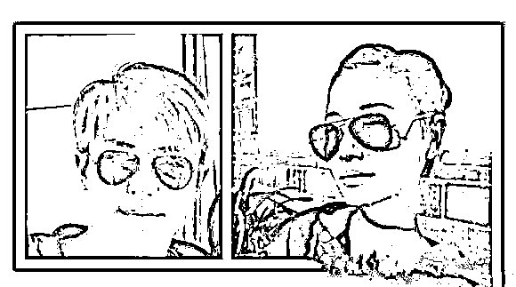

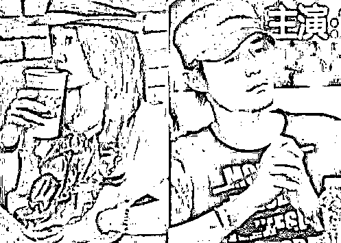

▼

各种同款

暗搓搓恩爱秀一脸

两个人也真的照着认真的承诺去走的

十年后友情变爱情

也是意料之中

而他们相处的过程里也不是没有过矛盾

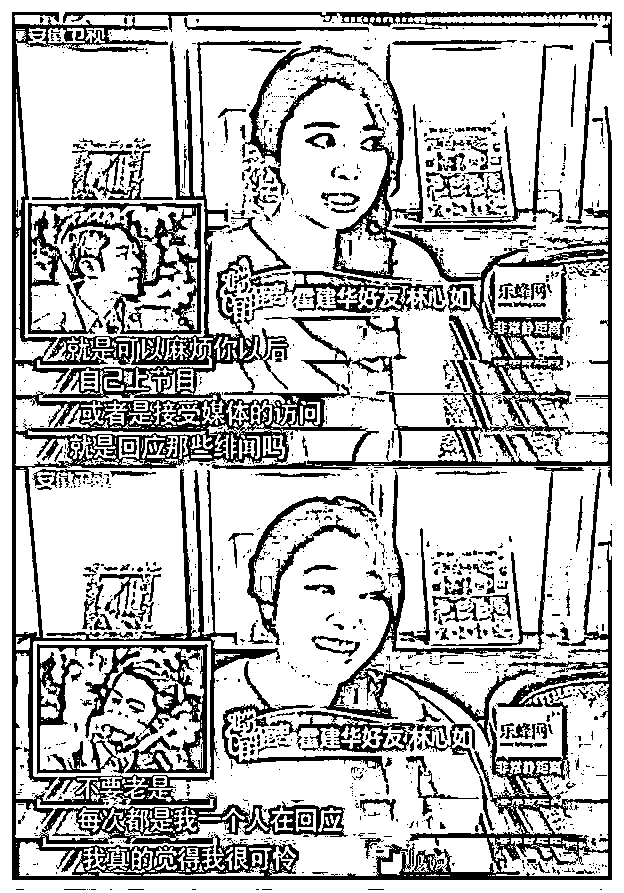 

▼

看看林心如这个委屈呀

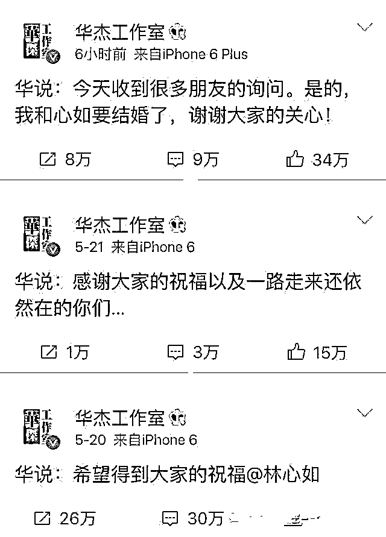

▼

而霍建华也的确有反思

（大摩羯会默默反省然后改变自己）

之后就是三条震惊全国的高调告白哦

心如这下满意了吗

**未****来**

长长的路你们慢慢地走

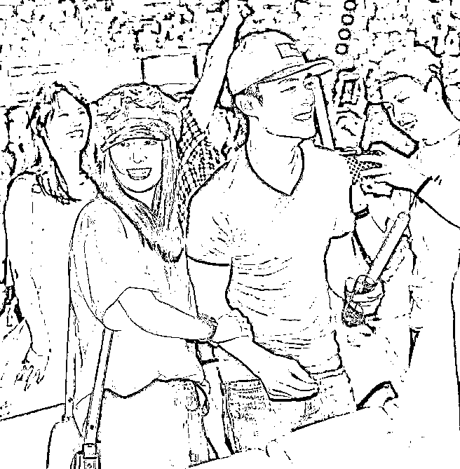

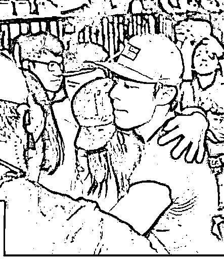 

▼

恋情公开后甜蜜同框

面对媒体拍照

霍建华大方拥住林心如

观光团大呼男友力 MAX

他不是不暖

只是就想暖一个人啊

大摩羯这份爱酷到爆炸有没有

婚姻不是结局 而是刚刚开始

这份报告里还有一些关于两人相处**需要注意**的

建华需要**学习更多接纳、更少评判**

用**积极又充分的沟通**来分享智慧

同时不要用对抗性的语言去**激怒**心如

要通过**尊重她**来赢得**信任和感情**

而心如则需要**接纳**彼此的不同

在出现问题时，要学习**主动开启对话**

不要将这份感情视为**理所当然**

为了这对曾经的大龄困难户能白头偕老 

若道君也是操碎了心啊

啥也不说了

祝福他们吧

最后吆喝一声

**胡歌你打算等到几时啊**

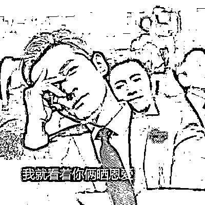

**不是广告**

宝宝们肯定好奇这份报告到底长啥样，

也想和你的 TA 做一份爱情扫描，

那就点击文末“阅读原文”获取链接购买吧，

记得购买后的查看方法是

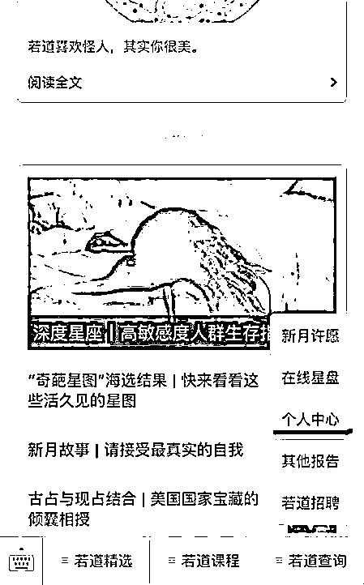 

点击公众号下方菜单栏

“若道查询'——“个人中心”——“我的报告”

就可以查看啦

但是只有购买之后才能看到哦

所以还是要先点击文末“阅读原文”去购买

（为了搞不清楚状况的宝宝们

若道君已经把自己绕晕了）


你还知道啥猛料？

有啥想对这对小夫妻说的？

留言吧！

祝天下所有单身狗早日脱单！


**快来做个爱情扫描吧？点击文末“阅读原文”哦**


# 深度好文 | 当死神来敲门

> 原文：[`mp.weixin.qq.com/s?__biz=MzA5NjA0NTAxNg==&mid=2651385658&idx=1&sn=655b8d414554f3e57509124484e4d495&chksm=8b4a5d8dbc3dd49bad8cdf0aacf304994effbfbaea9df864d1e25e38cd835a3bc1452eaf3b52&scene=126&sessionid=1692738811#rd`](http://mp.weixin.qq.com/s?__biz=MzA5NjA0NTAxNg==&mid=2651385658&idx=1&sn=655b8d414554f3e57509124484e4d495&chksm=8b4a5d8dbc3dd49bad8cdf0aacf304994effbfbaea9df864d1e25e38cd835a3bc1452eaf3b52&scene=126&sessionid=1692738811#rd)

作者/Anastasia  图片来源/花瓣网

好莱坞的类型片里面，灾难片特别受欢迎。人们喜欢的是灾难带来的超出寻常的奇观——海啸、地震、火山喷发、极度冰雪以及世界末日。

巨变下大自然呈现出的宏大景观和生命突然终结带来的陌生和兴奋，足以打断日常生活中持续不断的平庸和乏味，给大脑腾出一个安静的空间，思考。死亡带来的话语权，带来的对未知的奇异想象，带来的戛然而止的人生高峰，都让或普通、或艰辛的平凡人类惊奇和仰望。

对个体而言，经历好莱坞镜头中的灾难的概率太小，但是死亡，却从人一生下来就陪伴在我们左右——

○ 生命是什么？

○ 为什么我们那么害怕死亡？

○ 我们要如何去面对和缓解失去亲人、朋友以及宠物的悲伤？

洪荒世界，洪水滔天。所有文化起源和灭亡的神话里都有关于大洪水的记忆。水是生命的源头，**提到生命的起源、传承和死亡，我们就无法离开星图上的水象星座和宫位，巨蟹座和第四宫、天蝎座和第八宫、以及双鱼座和第十二宫。**

水象元素象征着人类内心深处最柔软的部位，触及的是我们的记忆和童年，本能和潜意识以及直觉和灵感。这些深层次的情感都超出了我们大脑思维可以控制的领域，所以，**对于感情的失去、生命的死亡，以及更高意识的臣服，我们本能地会产生恐惧和抗拒**。那是深埋在海平面之下的冰山，在没有意识之前，我们无法更好地去识别和接纳它们。

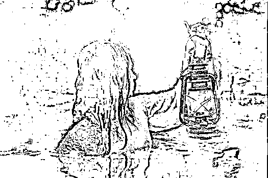

「

死亡是什么？

十二宫的话题

」

十二宫是黄道最后一个宫位，也是第一宫之前的那个宫位。它是终结，也是孕育。正如昼夜往复，四季循环，死亡和新生，都是一种自然现象。浪漫主义诗人雪莱说，冬天来了，春天还会远吗？生命是不息的。

**《一片叶子落下来》**

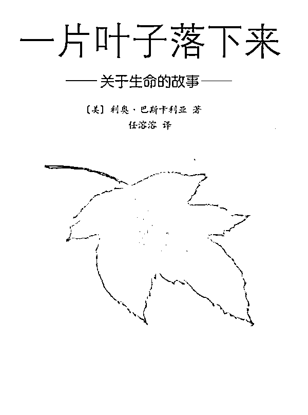

《一片叶子落下来》就是这样一本关于生命故事的绘本。绘本以一片小树叶弗雷迪的视角讲述了它们如何经历春夏秋冬，从幼小的萌芽到零落成泥的全过程。我从哪里来？我要去哪里？我为什么活着？死亡又是什么？弗雷迪的经历回答了这些关于生命的大哉问。

你找不到两枚一模一样的树叶，树上的每一片叶子都不一样。因为高度不同，吸收养分的多寡，面对太阳的角度各异，每一片叶子都是独一无二的。每一片叶子都兴高采烈，享受属于自己的雨水和阳光，就像我们的人生。书中的大树叶丹尼尔对小树叶弗雷迪说：“春天变成夏天，你不害怕；夏天变成秋天，你也不害怕；那你为什么要害怕（冬天）这个死的季节？”

人生如四季，不是只有今生这一段路。死亡是一种自然的经验，是策马穿过原野的一次狂奔。旧的叶子落下去，新的叶子长出来，生命会延续。费雷迪继续追问：“既然我们要飘落下去死掉，我们干嘛生长在这里呢？”

丹尼尔实事求是地回答：“这是为了享受太阳和月亮。这是为了一起过那么长一段快乐的时光。这是为了把影子投给老人和孩子。这是为了让秋天变得五彩缤纷。这是为了四季。难道这些还不够吗？”

一片叶子的一生可以如此有价值，何况我们作为人类漫长的一生？为了经历和体验，为了爱情和友情，为了和父母孩子在一起，为了享受美食……难道这些还不够吗？

冬天来了，弗雷迪从树上落下来的时候，第一次看到了整棵大树。多么强壮、多么牢靠的树！它很确定这棵树还会活很久，知道自己曾经是它生命的一部分，弗雷迪很骄傲。它死的时候，看到了从未见过的整株大树。我也相信，**死亡不是生命的终结，而是让我们得以窥视生命全貌的一个机会。**我们是生命汪洋中的小水滴，**死亡让我们回归源头，看到生命本身**。只不过，当我们体验到那个终极合一的时候，无法再回去告诉后来人。

「

我们为什么恐惧死亡？

八宫的话题

」

说到死亡，我们就想到天蝎座和八宫。八宫代表我们的本能，**八宫被强调的人会自然而然地去关注人类深埋在意识里的那些阴暗面，权力、性、物质资源以及死亡**。恐惧是一种比孤独更具有摧毁性的力量，恐惧会带来阴谋和暴力，自以为拥有了财富和权力就会变得更加高大、更加强壮和更加安全。政治、宗教、爱情、恐怖主义……一切阴谋和暴力都会走向死亡。

八宫人只有了解到，恐惧是更高层次的自我意识，只有接纳它，才能整合它。从对欲望和执着的追求中解脱出来，才能抵达内心的平静。我们大多数人一辈子都在逃避危险，我们为什么会怕死？因为我们知道我们迟早都不免一死，又对此无能为力。为什么亲人的离去会让我们悲伤？因为那是我们和人世之间联结的结，解开一个，我们的牵挂就少了一个，我们离死亡就更近一步。

**《白噪音》**

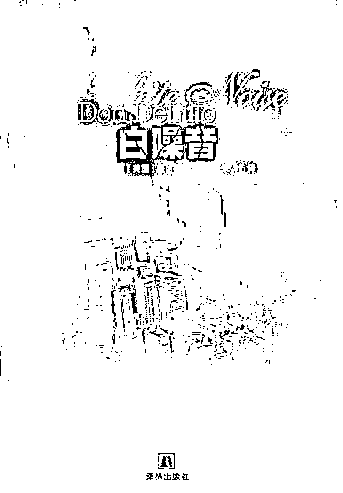

美国死亡之书《白噪音》探讨了人类对于死亡的各种恐惧，儿童对死亡与生俱来的恐惧，亲密爱人之间讨论谁会先死，疾病、灾难和暴力以及面对世界末日的恐惧等等，人类时时刻刻处在死亡空间的阴影之下。

**白噪音，就是与死亡经验相关联的声音。**书中的主人公杰克为了压抑死亡的恐惧，做着三件事，看电视、购物和研究希特勒。看电视和购物是所有现代人都在做的事情，而做研究是杰克独有的，他要以此来增强自己的重要性和力量，保护自己不受死亡的威胁和伤害。

书中描写了生活在死亡恐惧中的日常，以及由人类科技发展引发的毒雾灾难导致的对于世界末日的恐慌。毒雾将死亡植入人类体内，它也有自己的寿命。知识和技术的每一个进步，都会有死亡的一个新种类、新系统与之匹配。人类始终是和死亡生活在一个屋檐下。

死亡在空气中。死亡让我们接近我们尚未了结的有关自身的事情。在死亡面前，政府、宗教都不再起作用。为了克服这种恐惧，有机构斥巨资开发出消解大脑死亡恐惧的药，而杰克选择依靠他的孩子们。看着熟睡中的孩子，他心中油然而起的爱和慈悲，让他体会到精神上的无私和伟大。

死亡到底有多可怕？书中说，“死亡难道不是我们需要的界限吗？难道不是它赋予生活以珍贵的实质、明确性的意识吗？你必须扪心自问，如果你失去了有关最后界线、界限或限度的认识，此生你做过的任何事情还会有美和意义吗？”或许有一天，技术可以更换你衰老损坏的器官，用激光照射你的身体，从而实现永生。到那时，你会在疲倦中意识到，老而不死才是更可怕的一件事。

「

我们如何面对死亡？

四宫的话题

」

人生难免一死，可死亡留下的空洞和孤独如何填补？死亡之所以让人难以接受，是因为它带走了我们熟悉的人，改变了我们熟悉的生活，动摇了我们的安全感。我们的安全感是建立在我们的家人和我们的内在精神之上。这就是位于我们星图上最下方的四宫。四宫是保护我们的壳和茧，代表了我们心底深处的东西。我们的天底，是我们安身立命的基础。

**《托尔斯泰与紫绒椅》**

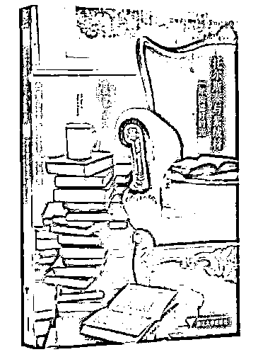

《托尔斯泰与紫绒椅》是一本讲述疗愈死亡哀恸的书。作者妮娜的姐姐罹患癌症，在三个月的治疗后去世。姐姐和她性格各异，但都爱书。患病期间，她每次看姐姐都会带几本书给她。安妮在治病期间只奔溃过一次，她说：“太不公平了”。姐姐知道自己要死了，但妮娜却无法帮助她把这个念头从心中驱走，也没法替她承担，这让她害怕极了。

姐姐去世后，哀恸变成无休无止的痛苦，“我没能在死亡面前保护姐姐” 。这个念头始终缠绕着她，不管她是如何积极地去生活。她参加社区活动，定制健身计划，照顾家人，随叫随到给所有人提供帮助和支持，所有日程都安排得满满的。“凭什么是我活了下来？”姐姐去世三年后，她还是走不出哀痛，直不起腰来。

终于，妮娜意识到要让忙碌的生活停下来，她需要好好想一想到底发生了什么。她给自己制定了一个阅读年的计划，一天读一本书，坚持一年。这是她和姐姐都喜欢做的事情，她想继续下去。

一年的时光过去，她不论多忙多累，都在坚持阅读和写作。一趟又一趟的阅读之旅，让她见证了各种各样、复杂的人类体验。这不但帮助她理解了这个世界，而且更加理解了自己。她像沉入海底，离开她过于细致、过于忙碌的生活，与每一本书的作者畅游，汲取他们字里行间的氧气，而姐姐也在那里。

就像人工呼吸，书里的人物把生命和活力注入她的身体，新的生命。她终于意识到，我们是如何铭记所爱之人的。永远铭记，就是让他们变成我们的一部分。“姐姐是所有这一切的一部分。”妮娜终于学会与死亡留下的空洞、孤独和忧愁泰然相处。“死亡夺走了她的一切选择，但我的选择权还在，我选择让她陪伴我一路走下去，她活在我的记忆里。”

如何处理失去亲人的悲伤？我们可以依赖的是生活和回忆。向后看，是为了向前走。回顾往昔，让我们看到了生活的全貌，我当下的生活，我如何走到了今天，我想得到什么。通过追溯记忆，我们会明白哪些东西是最重要的。我们坚信的东西不尽相同，但是这信念对人生的支持是一模一样的。没有人是孤独的。这就是四宫的力量。

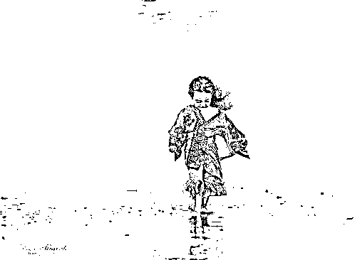

「

生命是不朽的

写在最后

」

优雅热闹的生活可以抵抗死亡吗，显然不能。被宣判死刑的人在震惊过后，往往产生很大的变化。他们抱怨生活的不公，但是又会松了一口气，像是拿到一张许可证书，可以去做最自私最孤僻的自己了。所以，为什么不在活着的时候好好做自己呢？

在日常生活中意识到平凡时刻的重要性，爱和慈悲，**我们要找到属于自己的人生意义，不再惧怕死亡和失去**。生命是一个完整的圆，这里所发生的一切都值得了解和尊重，包括死亡。

在对所有逝去的人的怀念中，我们学会宽恕死亡。宽恕是接纳的提升，是对生活本来就不公平的承认。前方的道路很清晰，我们要追寻安宁，寻找快乐，宽恕人生。**死亡不会束缚我们的人生，我们如何活着会让我们的人生丰盈，我们为彼此做过的事情会让我们的人生永生。**

星图告诉我们，宇宙的确存在秩序。西藏人相信死亡和新生之间有一个过渡状态，死亡事实上是一个等待时期，某个新子宫很快就会接收这个灵魂。**我们对于死亡的认识会让我们的生命更宝贵。一旦我们不再拒绝死亡，我们就可以平静地去死，然后继续向前。**我们对此要有信心，你既然来了，就会走。也许根本没有我们想象出来的死亡，一切都只是精神数据换换手而已。生命是不朽的。

**作者简介**

**Anastasia：**职业占星师，国际占星研究学会 ISAR 会员，若道认证生时校正占星师。太阳射手座，月亮狮子座，上升处女座，擅长讲述个体星图后面隐藏的人生故事和意义。在若道跟随多名国际占星师学习严肃占星学多年，目前从事占星咨询工作。

**个人微信公众号平台：**midnight2evolution

长按二维码，让金钱涌向传播知识与智慧的人~

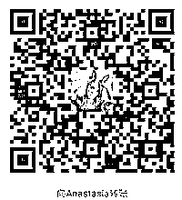


***★课程安利***

**2016 若道核心课程 Level 3**

**授课时间：**2016 年 7 月 28 日-11 月 10 日（**每周四晚 20：00-22:00**，16 次课）

**授课老师：**大卫·瑞雷

**授课方式：**网络课程，英文授课，中文翻译

**报名截止**：2016 年 7 月 15 日

**费用**：7000 元

**课程负责人：王老师**（**微信： ****2837474346**，请备注 L3 报名咨询）

长按二维码添加课程负责人咨询~


**报名及咨询，请点击文末“阅读原文”**


# 走好，美好如栀子花一般的姑娘

> 原文：[`mp.weixin.qq.com/s?__biz=MzA5NjA0NTAxNg==&mid=2651385658&idx=2&sn=dedd81ff37bb7d472e8f74016a173821&chksm=8b4a5d8dbc3dd49bf70990a32e36f32cff2658a04f19e29d94758c36f0ab15dbcab0ec4fca63&scene=126&sessionid=1692738811#rd`](http://mp.weixin.qq.com/s?__biz=MzA5NjA0NTAxNg==&mid=2651385658&idx=2&sn=dedd81ff37bb7d472e8f74016a173821&chksm=8b4a5d8dbc3dd49bf70990a32e36f32cff2658a04f19e29d94758c36f0ab15dbcab0ec4fca63&scene=126&sessionid=1692738811#rd)

“

人生很难，人生真的很难很难。每个人都会受苦。你也会。我也会。痛苦已经够糟糕了。但如果不能从痛苦中学到和获得成长，那就更加糟糕了。“个人成长”并不是说说那么简单的。如果逃避的话，就只是在进行自我欺骗。这就是我作为一个占星师的基本哲学。

——大卫·瑞雷

”

那栀子花一般的姑娘离去了

2016 年 6 月 16 日，在若道公众号后台看到这样一条留言，心下一沉。不可置信之余，哀伤蔓延，六月本就雾霭缠绵的空气中顿时多了另一层阴郁的气息。

“你们的学生坤子今天走了。”

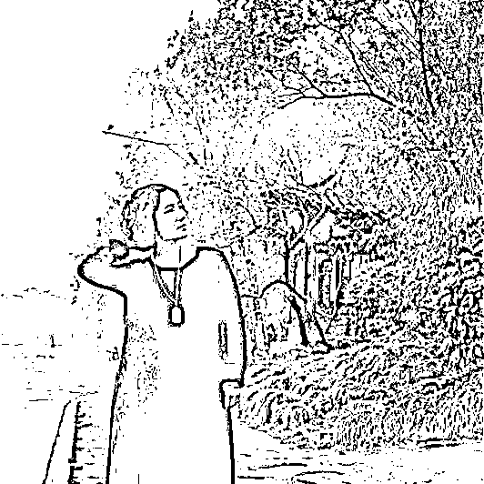
**坤子：淡定自若，清雅脱俗**

**坤子，2015 届若道核心课程 Level 5 在读学员，班里的学习委员。曾在若道公众号发表过精彩的占星感悟，班级里组织的各种活动她一向积极参加，还运用自己熟知的南北交点知识帮助很多同学解答了心中的困惑**。

这是我们所知道的坤子。

还有多少是我们不曾知道的呢？那几天，我们从她的同事和朋友那里，渐渐了解了更多有关于她的信息。

**原来她是重庆《有线报道》的著名记者、《大街小巷的故事》主创人员、《雪山草地的故事》创作团队唯一的女性，原来她在重庆可以说是个家喻户晓的“小明星”**。

而这一切，低调如她，却从未在班里大张旗鼓地宣扬过。

面对无常，向死而生

坤子经历过太多，让人心疼。在她的文章[仰望星空，触摸超越神性的光芒](http://mp.weixin.qq.com/s?__biz=MzA5NjA0NTAxNg==&mid=402168053&idx=1&sn=074b932d0c0d6a19f6580c7218dccd84&scene=21#wechat_redirect)（点击可阅读）中，她提到，父亲在她八岁的时候英年早逝，相依为命的母亲也在 2014 年底撒手人寰。面对生死，她这样描述：

你愤怒没用、坚强没用、求饶没用、喝心灵鸡汤没用、去庙里拜菩萨没用、乐观没用、悲观没用……坦白说，在现实的高墙面前，所能尽的人事非常有限，我们被逼一次次调低心里承受底线，低到尘埃里。

坤子的出生星图中，**北交点在天蝎座六宫**。可以说，她一直在面对**生死**，生死的议题已经融合在她的日常。这个配置的人也**有可能需要面对自身身体的危机，从危机中得到身体和心智层面的深刻转化**。**向死而生，是天蝎座最高阶的能量所在**。

常年的病痛，直至换了肝脏，于常人而言，不郁郁寡欢已是难得。而在这一年多的学习和相处中，她是如此轻松豁达，我们几乎感觉不到她的哀伤；生活里，她举办茶社、邀请朋友来家中开设“周末影院”、热爱插花、茶道，她如此珍惜着生命中一切美好的小事物和小确幸。

正如她文中所言：

*   在我的星图上，月亮合相木星落白羊座，我能感觉到妈妈生前的勇气、独立、乐观、明朗……那种活泼泼的劲头在我体内涌动。 

*   而父亲浓厚的双鱼座气质也流淌在我的血脉里，虽然他在我很小的时候就消失，我曾一直以为他没给我留下什么，但反观我现在不自觉流露出的人文主义气质，不是来自于他的底色又是什么？只是以前没有觉察到而已。

是的，她一直在用自己**月亮合相木星在白羊座**的**热情和能量**融入集体、投入学习，她竞选学习委员，用自己所学帮助更多的同学；在生命最后的几个月，她参加了若道组织的工作坊，为了热爱的占星学，她仍旧在投注巨大的热情。

然而，她一定也有属于**双鱼座感性和脆弱**的一面。在大卫老师的案例分析课中，作为咨询对象的她同老师互动时，一度哽咽。很多听了那节课的同学都共情地流下了泪水。当时并不明白她为何对于生死无常有如此多的慨叹，对生命有如此多的不舍。如今想来，她在当时已经明了人生真正的意义，那也是双鱼座最高阶的能量：**大爱和奉献，与宇宙合而为一**。

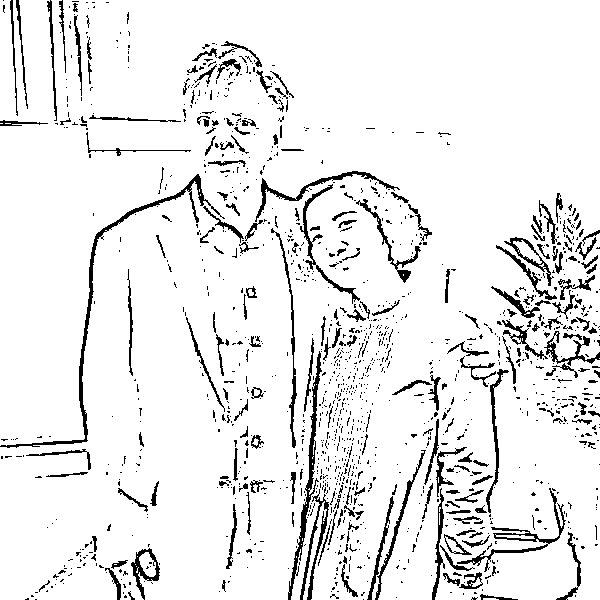
**坤子和大卫老师在一起**

关于**北交点天蝎座在第六宫**，大卫老师有这样精彩的诠释：

Live everyday as if it were your last day.

*将每一天都当做你生命中的最后一天。*

坤子不正是这样做的么？**她并不是不畏惧，而是将这份畏惧深度转化为内在的动力和持续不断的热情，将生命燃烧到最后一刻，不哀怨、不悲恸、没有一蹶不振，天蝎座在危机中的转化和重生在她身上得到了最好的体现**。

走好，坤子

这个栀子花一般清雅秀丽的女子，却散发出最沁人心脾的甜香。她的能量让人折服。当大卫老师在 Level 5 群里公布了她离去的消息，所有的同学震惊惋惜之情溢于言表，泪流不止。当晚，群里自发组织了悼念活动，我们始终不能相信她真的离开了我们，她是那么生动鲜活的样子。很多同学为她诵读经书，抄写经文，回忆起之前和她一同学习的经历，仿佛还发生在昨天：

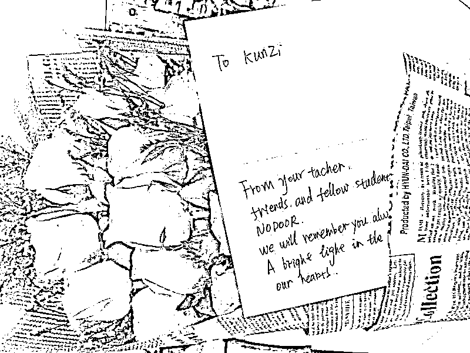
**Level 5 全体成员为坤子献上的鲜花**

**大卫老师亲自为坤子写的一首诗**

*For Kunzi*

*致坤子*

*You walk upon the lake gently*

*The fish cannot hear your footsteps*

*The heron flying over you sees you not*

*你在湖边漫步，那么温柔*

*鱼儿也听不到你的脚步*

*苍鹭也看不见你的身影*

*You think you are alone as you begin to dance upon the water*

*But he is watching from the other side in you*

*He sees the delight in your eyes*

*你以为四下无人，便于波光上起舞*

*但他从你内在的另一面看着你*

*他看见你眼中的欢乐*

*He loves your smile*

*He has watched you from a distance inside*

*Shared the struggles and triumphs of your life*

*他爱你的笑*

*他从遥远的内在凝望你*

*分享你生命中的挣扎与胜利*

*Loved you silently and unconditionally*

*Only now you can see him*

*As he steps out from the shadows*

*他的爱默默无声，不求回报*

*直到现在你才看见他*

*因为他走出了阴影*

*At first he looks like your husband*

*Then he looks like your father*

*And as he walks upon the water coming nearer*

*起初，他好似你的丈夫*

*然后，他好似你的父亲*

*他从湖上向你走来*

*He is the most familiar stranger you have ever seen*

*And he takes your hand as you dance in circles upon the lake*

*And dance up into the light…*

*他就是你最熟悉的陌生人*

*他与你执手共舞，湖面泛起阵阵涟漪*

*踏着舞步走进光明的国度……*

*❤ 诗中的他(He)用以隐喻坤子内在的男性形象*

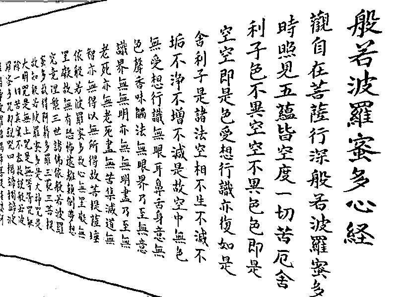
**同学们为坤子抄写的心经**

**同学们眼中的坤子**

**李洁**：我在大理房子出现院子问题时，还和坤子通话，她还在设法帮我找媒体，我们读书会刚开动时，她就在和我反复说，人不够她可以多读。

**娜娜**：好像一个月前还在聊什么样的房子自己会喜欢，记得她说喜欢朋友来家里。

**Norah：**五月初见到她的时候，她看上去那么又活力，而且又年轻美丽，真不可思议。

**Vivi：**眼泪出来了，记得她每次朋友圈发的图片，文艺气息我非常喜欢，经常点赞，跟大卫老师的合影，还活生生地在我脑海里，完全不敢相信！

**阿菩**：医疗占星的时候吃午饭，她坐在我边上，没想到，她就是那个声音如此美好的坤子，相谈甚欢，后来她还邀请我们去她房间休息，非常温暖，安然。

**Valery：**在北京医疗占星遇到她，第一天晚上聚会后回酒店一起拼车，那会儿还不知道她是坤子，聊到 5 阶同学一起录音《变幻的天空》，我很激动的还跟她推荐去听里面一个叫坤子的人读的音频，声音很美，她当时特别开心的笑着说：“真的嘛，我就是坤子，没让大家失望就好，我是专业做这行的。”我当时听她说自己就是坤子，惊讶的不行不行的。这个月初我还在问她如何录音能录的好，她那会儿就在医院里了，说可能没时间跟我交流了，身体不舒服。

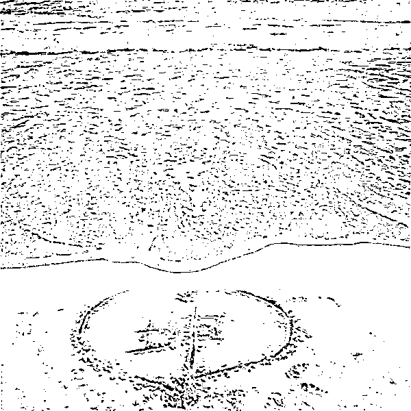
**坤子，走好**

**同学们给坤子的话**

**无忧**：说实话，这一阵都没看到她在群里出现，还以为是她太理想主义，不喜欢现在群里的热闹。她是很特别的一个同学。三阶四阶的时候，她就给人留下深刻的印象。刚才看到消息，很震惊。想起上次她做案例的时候，说到生命无常的时候，她哭了。我不知道坤子是怎么样面对她自己的最后时刻，她的朋友圈一点也没有透露……希望她走的时候已经得到了平静。**我们的宿命感源于我们生命视野的局限感，这就像屏障一样，让我们感受不到更多的意义和真相。这样的“看不见”让我们自己在经历的遭遇里会有无力感和无明感，但是这并不意味着这些遭遇背后没有其它更大的生命礼物存在**。

**尔愔**：积极的信念太重要了，每个人都想活得幸福长久，但是死亡来临的时候，现世的人生已经抓不住了，以什么样的态度来面对余下的生活，不留遗憾，不为灵魂留下创伤性的记忆，是考验这一世的最后一关。太难太难了，不知道她怎么走过来的，这对我们以后学习占星，探寻人生道路可能都会有触动。**很多时候鼓励人们好好生活的，往往是逝者，物质声名头衔对于个人而言既带不走也留不下，唯有精神能被人记住，我们的生命也带着她的精神继续在现世生活，她也和大家一起继续共同成长**。

**陈嘉**：占星的推进，如同一道道在特定时间段内出现的人生试题，而如何回答这些我们在出生时就已经设定好的人生试题？这是我们的自由意志。从某种意义上说我们无法有出题的自由，但是我们确实有答题的自由。**生命的外在事件是宿命，而自由意志是我们在面对外在事件发生时，将外在事件内化成“内在能力”的一个过程**。**宿命与自由意志是占星的一体两面，我们常常执着于外在事件本身而忽略内在能力的转化与蜕变，而内化的过程本身就是一种答案**。

**旖旎初尘**：因为报名了读书小组，听到坤子的朗读章节，声音磁性又柔和，印象特别深刻。这样美好的生命离开了，愿她安息。

**张玉华**：坤子文章中说，其实，父亲并没有离我远去，他是我星图的太阳和火星，他一直在参与我的成长。**坤子，我很感激你，是你的文字让我突然觉得父亲真的没走，就在我生命中**。我收藏了坤子的文章，经常看看，从那天以后，我开心了，觉得我也有父亲疼爱了。坤子，姐姐感谢你！永远记得你！

**秭伊**：人生无常，**我们是不是也可以把每天当做生命中的最后一天来过，爱自己，爱身边的人，全力绽放**。

**刘颖**：再见坤子，**与你短暂的相识收获却是丰厚的，感谢你留给我们美好，那是在困境之下展现出来的美，犹如高山上的雪莲花。带着像你曾经展现给我们的微笑与你告别，尊重命运为你做的安排，愿你前面的路充满光明！再见**！

❤ **坤子生前发表在若道占星公众号的文章**：

[仰望星空，触摸超越神性的光芒](http://mp.weixin.qq.com/s?__biz=MzA5NjA0NTAxNg==&mid=402168053&idx=1&sn=074b932d0c0d6a19f6580c7218dccd84&scene=21#wechat_redirect)

[生命中总有些人和事，需要我们隔着长廊仰望](http://mp.weixin.qq.com/s?__biz=MzA5NjA0NTAxNg==&mid=400096800&idx=1&sn=e0703bad2fdbbf731d770a5c6d32cadb&scene=21#wechat_redirect)

**坤子，在我们的心中，你并没有离去，你依旧是 Level 5 的学习委员，我们会记得你面对人生的勇敢和努力，我们会永远记得你❤**。

若道设立彭坤子奖学金

为纪念 2015 届学员彭坤子女士，若道在 2016 年 6 月 特设立“彭坤子奖学金”，以奖励那些有志于认真学习占星学的学子。 

**奖学金金额**：16000 元 （2016 年额度） 

**奖学金专用**：2016 年若道核心课程 L5 

**奖学金人数**：1 人 

**申请条件： **

一、从 2016 年 Level1 开始学习的占星学的若道核心课程的学员。 

二、学员需提交奖学金申请信，申请信中需包含以下内容： 

1）学习占星学的理由。 

2）有关占星学的长期目标。 

3）本人 经济/财政状况。 

4） 简要介绍自己的占星学旅程。 

**奖学金申请截止时间**：L5 开课前 1 个月（2017 年 3 月） 

**申请邮件发送地址**：nodoor@vip.126.com ，邮件名称请写明“姓名+ 申请彭坤子奖学金” 

奖学金评选：若道将根据申请人的经济状况和学业状况，挑选出 1 名申请人，授予彭坤子奖学金。 

奖学金公布时间：若道核心课程 L5 开课前 2 周   

奖学金解释权归若道咨询（北京）有限公司


# 为什么你等不到爱的人？| 严肃人类的情感出口

> 原文：[`mp.weixin.qq.com/s?__biz=MzA5NjA0NTAxNg==&mid=2651385626&idx=1&sn=a16235612381b85e9d04a485b6342387&chksm=8b4a5dadbc3dd4bbec92f84646f918daeebdcd699feaacc770ff9a705f698db67f877ecbe103&scene=126&sessionid=1692738811#rd`](http://mp.weixin.qq.com/s?__biz=MzA5NjA0NTAxNg==&mid=2651385626&idx=1&sn=a16235612381b85e9d04a485b6342387&chksm=8b4a5dadbc3dd4bbec92f84646f918daeebdcd699feaacc770ff9a705f698db67f877ecbe103&scene=126&sessionid=1692738811#rd)

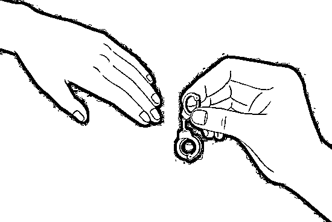

作者/唐娜·坎宁安

译者/Elle   图片来源/Pinterest

情感路上的困难多种多样，有一种困难叫“爱无能”。这样的人是花花公子、风流女郎的反义词。他们过于严肃、不懂风情，当爱情来临也不太能主动把握。不过，随着阅历的增长，他们会变得越来越受欢迎。这是一篇略专业的文章，但聊的是大家都有经历的情感问题，耐心往下看，文末还有一群人说自己和别人的故事呢。

**有一些人，感情路上总有困顿**

虽然金星和内行星形成的困难相位能显示一个人在关系中会遇到挑战，这些相位其实比金星与外行星（土星、天王星、海王星、冥王星）形成的困难相位容易应对。困难相位包括合相、八分之一相位、四分相、梅花相位和对分相。我发现与金星形成的合相是最为困难的，但**所有这些困难相位都能显示此人在建立关系时会遇到挑战。**这样的人通常都是高品质的人。他们努力工作来提升自己，在人生中取得成就，却发现，当他们真正取得了那些成就，他们依然在等待一个伴侣分享自己的成就。

**哪些配置会遭遇情感阻碍？**

○ 最痛苦的情况之一是金星和土星形成相位；

○ 或金星落在摩羯座（土星的星座）；

○ 当出生星图中土星落在第七宫时，你也会发现一些相同的模式。

**你的父母也是严肃之人吗？** 

为什么会这样呢？**金星和土星的各种组合使一个人难以建立关系，也很难感觉自己值得被爱。**一般来说，双亲至少有一方有土星的负面特质——比较冷淡、固执、阴郁、专制，并无法表达爱意。通常，他们把孩子视为一份附加的责任，一个额外的负担，甚至是他们自己实现目标和抱负的阻碍。

**父母不喜欢子女身上爱玩、孩子气的特质，因此孩子学会了快速成长以避免体验父母的不悦。唯一取悦父母的方式是变得和他们一样土星化**，所以孩子学到的是：唯一会被“爱”的方式是变得严肃、有条不紊、有责任感和成功......也就是做一个模范孩子。

金星-土星的相位经常带来一种“进退两难”的设定。有这个相位的孩子必须要自力更生才能取悦父母。但是，这孩子越是自力更生，父母就越不管他们，感激地认为孩子不再需要他们太多的时间和关注。（父母并没有意识到情感的需求也是让他们把注意力从其他职责中转移到孩子身上的正当理由。）因此，对孩子来说，负责和自立也会减少他与父母的亲密。所以这个孩子左右为难——不管他怎么做，他都会失去与父母的亲密。

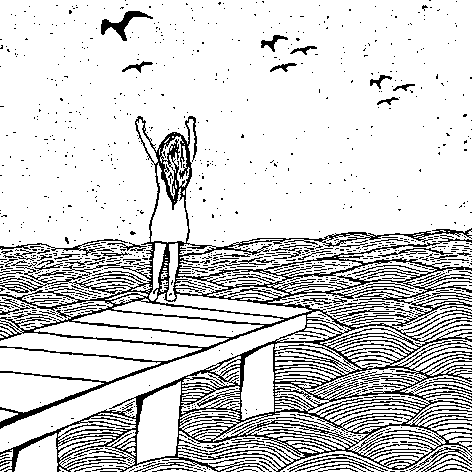

土星与时间和成熟有关。土星的当前（行进）星座及其与出生星图的行星形成的相位触发我们人生中各个典型阶段的成熟。行进土星围绕太阳运转的周期为 29.46 年。因此，行进土星每七年就会与出生星图的土星形成强有力的相位——7 岁时，我们开始上学；14 岁时，我们是青少年；21 岁时，我们在法律上已经正式成为成年人。

自然地，对于一个出生图里有金星-土星相位的人来说，每一次行进土星和出生星盘的土星形成相位时，也会与出生星图的金星形成相位。因此，每一次这样的阶段都是成长、成就、成熟并承担更多责任的阶段，也会带来父母支持的逐步减少。这样的经历会使他们难以相信他人会满足他们的需求。


**他们从父母的身上学到，如果他们不那么土星化就不能被爱；但是，如果他们很土星化也不能被爱。因此，他们得出的合乎逻辑的推断是：他们根本不能被爱。他们会感觉爱被剥夺了。为了要保护自己并不再感受到这种痛苦，他们可能会对这个世界筑起高墙。这堵墙到头来加强了他们觉得自己不值得被爱的感受，因为其他人迟早会停止尝试穿越这堵墙。**


我观察到这些相位有时存在的一个模式，而这个模式可能会造成寻找伴侣时的一系列困难。这种相位有时出现在步步高升的年轻人身上，尤其是女孩。事实上，最常出现在家中的长子和长女的身上。

**因为家庭责任以及父母的不良示范，他们可能在社交礼仪方面发展迟缓。**他们通常对于社交互动中，尤其在两性交往方面比较微妙的差别和提示没有意识甚至一无所知。由于他们不知道，所以他们也无法发出他们潜在的伴侣正在寻找的这样的信号。（所有这些都发生在非语言的、通常是潜意识的层面。）是的，他们的确在成熟以后能学会一些社交技巧，甚至能成为一个优雅的人。

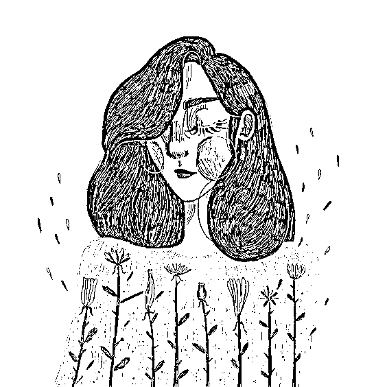

**硬梆梆的你，如何变得柔软？**

有这个相位的年轻人可能通过参加一些**社交礼仪**方面的补习课程来解决一些困难。**用心观察所有的社交互动，尤其是男女交往的行为。甚至是一些日常的互动和调情也值得认真学习。**社交技能与其他技能一样，都是可以学会的——若我们未能在家庭中自然而然吸收这些，我们就需要更努力去学习。

**一位年长的良师益友是这个相位常见的礼物。**因此，也许你能找到一个心地善良的人来保护你并指导你。这样，通过有意识地练习这个缺失的技能，你就不会到了 50 岁还在等待真爱的降临。即使是那些已经过了一个或几个土星回归的人，也可以学习一些金星的优雅风度来增加他们的胜算。

**年纪越大，喜欢你的人越多**

金星-土星相位的积极面向是，**他们不会变老——他们只会变得更好。他们是大器晚成的人。**这些人在十几岁的时候可能看上去普通、笨拙，但**到了****30 岁或 40 岁的时候，会突然变得很美。**他们也不会像其他人老得那么明显——他们可能比同龄人看上去年轻好几岁。

随着年龄的增长，他们会越来越受到欢迎。一个人身上严肃认真的特质在青春期并不会受到同龄人的欢迎，但到了中年和老年，这个特质会很吸引人。他们历经多年，建立起重要他人的互助小组，而这些关系会持续很久。通过严肃的生活态度，他们也能取得很多成就，而这些成就使他们获得尊重。当他们达成了一些重要的目标后，他们也会放松下来，并且心安理得地觉得高兴——他们已经完成了自己应尽的责任。

哪些人有金星-土星的相位呢？出生星图中金星土星合相（这两颗行星最强有力的联结）的名人有：马特·达蒙、丹泽尔·华盛顿、奎恩·拉提法、西恩·潘。

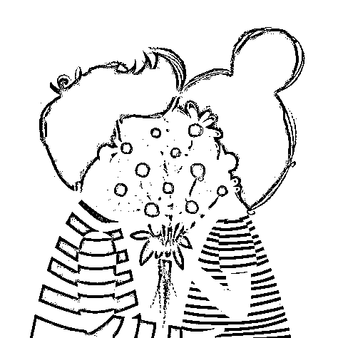

**听听他们的故事**

***1，***

虽然我出生图上是金星三分土星，但对这篇文章也非常有感触。从小我就被赞扬是极其懂事的孩子，从来不给家里人惹事，从幼儿园开始就努力学习，谦让弟妹，尊敬长辈，简直是一个好孩子的典型楷模。**从小就觉得只有一直做一个乖孩子，达到家人的期望，家人才可能爱我，而不能仅仅做一个孩子。**

另外，很小的时候，我就觉得自己有保持家人和谐的责任，因此一发生冲突，就开始妥协。而当家人开始吵架时也会特别紧张。**金星和社交相关，家里人都不爱社交，因此也不知道如何社交，至今社交场合仍然会紧张拘束，诸多不自在。**年轻时对于恋爱非常认真严肃，交往的人屈指可数。

土星还代表期望，我从小就被家人寄予很高期望，小学时如果拿不了满分，会羞愧得“咬牙切齿”，家中老人所给的日记本上题词就是要“立功立德立言”，因此长大后很长时间觉得自己达不到标准，羞愧难当。**不过好在这一切随着年龄的增长，都在慢慢变得从容了。**

**——**Felica

***2，***  

我出生图中土星与金星成四分相。

当土星与金星成四分相时，似乎更多的冲突体验发生在内在，甚至是比较精微和深层的。外显看，进入一段恋情并不难，但无一例外，最后的结果都是“搞砸了”。终于放下那些自己感动自己的爱情幻相，诚实地面对自己的内心，才看到那个“低价值感”的议题。在关系中，下意识地把自己设置在：“如果你有两难选择，请放弃我”的位置，即使表面看是自己潇洒离去。最后，我们印证了那个“魔咒”——我们变得负责而独立，我们失去了亲密。

不仅在关系中，在土星或金星所落的相关领域里，这种自我价值感的匮乏也在弥漫，它带来的最大的障碍——从未体验过为自己而骄傲的欣喜。**无论付出多少努力，取得怎样的成绩，都像个永远在渴望父母为自己骄傲且得不到的孩子。**

但也诚如作者所说，土星也是最好的老师。当我们发展了自我意识，并保持觉察，我们开始更加客观地看待自己，允许自己在土星式的努力之后，享受金星的馈赠，我们获得更加成熟的自信而非空乏的虚荣。也因为经历了那些“不被爱”的情感关系之后，我们更懂得对他人的价值给出真正是的肯定与支持，我们开始给出爱。

或许是否拥有外在伴侣还不是金土相位的终极议题；**成为自己内在的权威，成为自己的内在伴侣，成为一个更完整的人——才是金土相位深藏的珍宝。**

——薇安

***3，***

身边有金星合相土星、金星四分土星的人，金土相位的人即使金星落在擢升位置，依旧会有**需要被肯定才能爱下去**的感觉，**在表达爱的方面也存在一些障碍**。例如他们会不知道该如何表达，或者即使知道也吝于表达，显得木讷而拘谨，面对感情被动。

金土相位的人有点少年老成，我有一个大学同学，他 18 岁的时候看起来就已经像个成熟男子，而如今年界不惑的他依旧是那副模样，如果说林志颖是冻龄在永远的 17 岁，金土相位的人则好像没有少年时代地直接冲到了中年。土星这个时间老人也许剥夺了金土人年轻的样貌，却带给他们十几二十年不变的容貌，**当很多少年时代的男神女神在岁月的标尺丈量下尽显老态，他们反而能够历久弥新地逐渐生出沉稳的美感。**

金土人同时也是会在感情里隔离自己的一群人，常让爱人不知所措，他们需要学习更多地交流和敞开。

——玫瑰

***★若道君：对于这类情感话题你有想分享的吗？欢迎留言。***

**作者简介**


**唐娜·坎宁安**：职业占星师，同时是很多占星书的作者，包括《星群手册》和《职业选择与挑战》。

**特别提醒：**

**本文首发于若道平台，**

**转载请联系后台授权。**


******让占星学帮助你看清自己的情感障碍！由大卫·瑞雷老师**讲授的**若道核心课程 Level 3，会教你将**星座、行星、宫位、相位这些散落的珠子穿起来，**带你进入更深的自我探索与成长的旅程。******

**报名及咨询，请点击文末“阅读原文”**


# 什么？我们恐惧死亡的原因竟是这个……

> 原文：[`mp.weixin.qq.com/s?__biz=MzA5NjA0NTAxNg==&mid=2651385626&idx=2&sn=6ff192297e30d2cbe1264828c43f3956&chksm=8b4a5dadbc3dd4bb0bf9c231153432b52596feeeb69862670527ee32cfed622f32b32e923a99&scene=126&sessionid=1692738811#rd`](http://mp.weixin.qq.com/s?__biz=MzA5NjA0NTAxNg==&mid=2651385626&idx=2&sn=6ff192297e30d2cbe1264828c43f3956&chksm=8b4a5dadbc3dd4bb0bf9c231153432b52596feeeb69862670527ee32cfed622f32b32e923a99&scene=126&sessionid=1692738811#rd)

作者/杰西卡·加菲尔德-卡巴拉 

翻译/luke 校对/Christy

图片来源/Pinerest

在若道君之前发布的[土星是男是女](http://mp.weixin.qq.com/s?__biz=MzA5NjA0NTAxNg==&mid=2651385558&idx=2&sn=e1b743366f6670ac9e5e0f5189a2e407&scene=21#wechat_redirect)一文中（点击可阅读），作者描述了土星女性面向的可能。在本文中，作者通过对女性特质的描述，解开了土星僵化的一面，教我们如何利用女性特质理解土星的象征性死亡。

## 你知道土星女性神灵的特质吗？

这些土星原型衍生的女神告诉我们，希腊的神明克罗诺斯不是土星原型唯一的面孔。不过，我们的思想还要继续超越这些女性神明形象，因为在历史的长河中，这些形象早已在父权制的镜头下遭到了扭曲：因为这些希腊-罗马传统中的女神们向女性诉说的更多的，是她们在父权制下应该成为的样子，而不是她们原本的样子。

荣格派分析家西尔维亚·布林顿·佩雷拉（Sylvia Brinton Perera）在她的大师级作品《下降到女神：女性觉醒的方式》中写道：

**在西方世界，上界女神的大部分特质要不是被神圣化了，要不是就被男性神明取代。这些特质被父系社会制的道德和美学法典过度压缩、或过度理想化，失去了本色。因此大多数的希腊女神都被她们的父亲吞噬，希伯莱的女神失去了力量，只剩下的缩减版或定制版的女神。女神曾经拥有的大多数神力也和今日女性的生活失去了联系：真实、爱玩、充满激情欲望的女性特质；强大、独立、任性的女性特质；野心勃勃，尊贵，多面的女性特质。**

土星原型的女性面向是**尊贵、有情欲、强大和多面的**。老者意识的阴影面是分裂，隔离，失联和孤立：和人际关系分离，因此也和爱与目标分离。

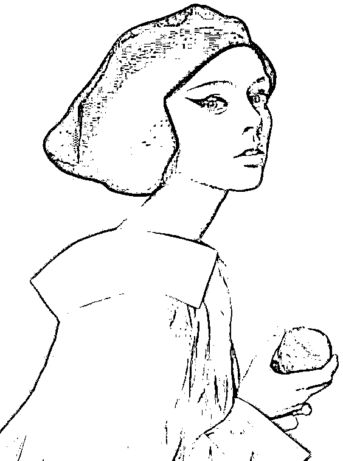

## 女性的智慧帮助我们理解死亡

我们如何书写自己人生的故事，很大程度上来自我们对土星角色的宇宙论理解。如果我们认为世界是分裂的、无意义的，是缺乏精神目标的物质，那么我们的苦难、痛苦和死亡就失去了神圣的光辉。痛苦、苦难和死亡变成了我们要征服和控制的目标，我们会不惜一切代价去避免它们。

**女性的智慧在尊重死亡的生命轮回中扮演中心角色。和死亡相伴的至关重要的过程，是悲痛——即感受、承认和放手已经发生的事情的能力。**悲痛是一套净化的过程，通过尊重过去，我们可以更充分地体会当下。无法悲痛实际上阻止了我们充分体验当下，因为我们还没有释放过去。**悲痛我们所失去的，驱使我们更加感激现在所拥有的。通过承认死亡带来阴阳两隔，我们又重新与周围的世界产生联结。**

时间的女性化观念提醒我们，生命有自己的周期，而且死亡无法避免。史蒂文斯·沙利文写道：

**从女性视角来看，怀孕、生长、出生、萎缩、衰败和死亡都是周期循环的一部分。每种时间段都同样具有效力，同样是固有存在的，是生命整体不可或缺的一部分。女性视角承认，死亡对于生命永续是必须的，因此接纳生命中各式各样象征性的死亡：希望之死、婚姻之死、计划之死。**

我们生命体验中的象征性死亡——受伤、失败、判断错误、过去的决定导致的负面后果——帮助我们逐渐成熟，变得真实。

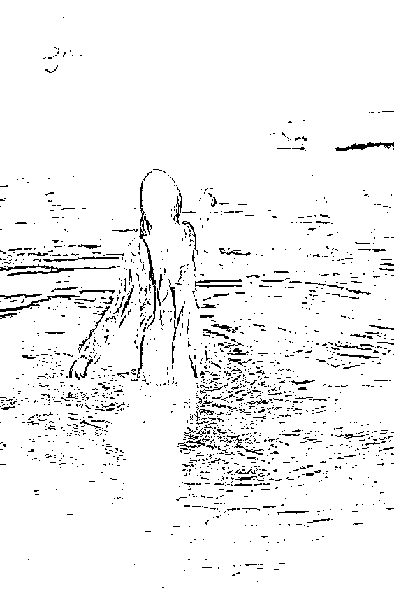 

## 你会在何处经历象征性死亡？

**出生星图中土星的位置暗示了，我们为了灵魂成长，会在何处一次又一次地经历象征性死亡。我们越能对这个过程臣服，土星就越能起到积极的作用。从一个切断我们潜能的消极的土星，转变为帮助我们接纳自己本来的面貌，成为多元多维度的生命。**

塔纳斯转述道：

**土星暗示了我们一生都要克服的难题，目的是达到高层次的灵性觉醒。**

如果我们**允许自己体验象征性死亡，接受它们的教导**，就能让自我变得**审慎、成熟、坚定和深刻，开启自身最大的潜力和创造力，理解生命中的收缩和失去**。不试图减少痛苦和苦难，相反，接纳和尊重悲痛与失落。我们必须给予自己时间和空间，感受悲痛过程带来的每一丝情绪和意象。

**土星是原型万神殿的守门人**，不仅守卫着三颗超个人领域的外行星（海王星、天王星、冥王星），还守卫着每个行星原型最深层的表达。土星也是门槛的守卫者，我们必须在土星的试炼中经历死亡，才能接触原型的多元表达宽度，激活我们深藏的潜力，疗愈的我们个人和集体历史。

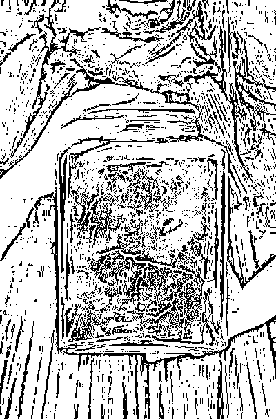 

## 死亡不是一切的终点

死亡必将发生，生命总有尽头，事物必将终结，女性智慧深深了解这些。死亡和痛苦是我们活着的代价。正如荣格所言：“**没有一种觉醒是不带着痛苦的**。”人都在受苦，这一核心的真理赋予我们慈悲，而慈悲的字面意思就是“一起受苦”。从女性视角诠释死亡加深了我们对土星的理解，不断在我们经历的象征性死亡中找寻意义，直到我们的肉体真正死亡。

克里斯多夫 M.巴赫（*Christopher M. Bache*）是一位意识状态的深层探索者，他为我们分享了如下观点：

**在一个人经历了多次死亡和重生后，最终死亡的概念也失去了意义。通过重复地学习，他在内心最深处理解了，死亡是不可能发生的。一个人的身体可以破碎，全部的生活现实可以反复被毁灭，但最深的本质总是会重现，凤凰涅槃，浴火重生。死亡仅仅是检验净化程度的标尺。**

**死亡不再是终点，而是必然和自然的转化过程，最终通向更加复杂和多样的生命体验**，但是在转化过程中，感受痛苦、失落和悲痛也是必不可少的。**重新审视土星的女性面，对于我们经历痛苦和苦难，以及从中找寻意义有直接影响。**这种重新审视属于每一个人，因为女性面和男性面一样，一直并且还将继续存活在我们每个人体内，无论男女。我们每个人对死亡的看法会直接影响到我们生活的方式。

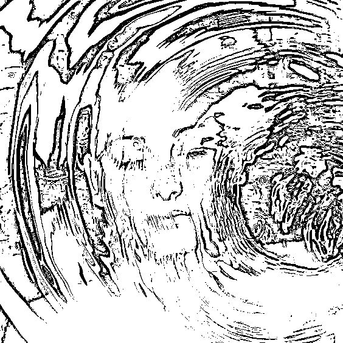 

## 让我们跟随土星一起进化

**土星原型和我们祖先的根源有关，它是塑造和维持自我的无形结构，是我们从过去有意识或无意识之中继承来的。**一位占星师解读土星的方式，从本质上透露出这位占星师对苦难、挣扎、业力、成长过程、天命和个体创造性等与生命境遇共处的深层能力的看法。从心理层面上讲，对土星的诠释直接透露出一个人的命运感和宿命感、自由程度，以及与其他原型之间的共同创造力。

**土星的本质不是囚禁人类的僵固牢笼**，老者意识带来的挑战也不会通过逃往某些新原型就得到解决。一方面，占星传统带有一种结构上的决定性谬误，将土星完全等同于老者，这一思想是目光短浅的，没有重新审视和进化的能力。另一方面，它也带有自生性谬误，不耐心地飞去膜拜我们还一知半解的新神。

其实，解决问题的顺势疗法药方就在土星本身。**通过揭露土星的女性面——经验性的知识变成智慧，苦难是有意义的，死亡起净化作用，时间有质量，存在投胎转世和心灵生命的显化**——这样我们既没有偏离土星原型，同时还发展了它。这就是参与的本质：由我们自己，创造有益生命的新思想形式和形态场。

**当我们不再害怕土星时，我们就能开始与命运合作，信任它并且爱上它。我们不再被压迫和暴政所产生的恐惧控制。****耐心、奉献、慎重、成熟、智慧、转世和化身，都是土星珍贵的教导和无价的礼物。正是在土星的结构下，我们日复一日，通过练习、重复、坚持不懈和积累经验，得到来之不易的能力，共同创造和展现我们的生活。**

通过持续的艰苦工作，我们可以将旧传统转变为新的道德架构和伦理系统，帮助人们提升生活品质与活力，拆下上帝的旧面貌，树立重生的新形象，对生命每时每刻不断进化的复杂多样性满怀敬畏之心。

**关于作者**

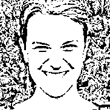

**杰西卡·加菲尔德·卡巴拉**（Jessica Garfield-Kabbara），占星师，心理咨询师，注册的婚姻与家庭治疗实习医师。从 2007 年开始实践原型占星学，提供占星咨询服务。她也是月度播客“关联性：原型占星学播客”（Correlations: The Archetypal Astrology Podcast）的嘉宾，该节目已开播 5 周年。2014 年，杰西卡在帕西菲卡研究生院获得咨询心理学硕士学位，研究方向为深度心理学。她的理论基础主要来源于理查德·塔纳斯、斯坦尼斯拉夫·格罗夫，以及原型占星学和超个人心理学。杰西卡教授原型占星学和深度心理学，也积极进行深度心理治疗方面的实践，将原型占星学的智慧和洞见同深度心理学整合起来。

***若道君：后台回复 杰西卡 能获得其相关文章推送~***


****如何走出“阴影”重获自由？2016 年 7 月 8 日-10 日，杰西卡·卡巴拉老师主讲的工作坊：如何与客户的阴影面工作要开课了！该工作坊会教你如何帮助客户减少痛苦，减少关系和生活中所经历的障碍。****

**报名点击文末“阅读原文”**


# 征稿 | 这闹心的天象，大家一起来吐槽吧

> 原文：[`mp.weixin.qq.com/s?__biz=MzA5NjA0NTAxNg==&mid=2651385626&idx=3&sn=793c519f912d5633c7fd3cf511902ef9&chksm=8b4a5dadbc3dd4bbb8a96f95609099955f7ccb3912b0827ce5d975df7107a365b6773816c6b9&scene=126&sessionid=1692738811#rd`](http://mp.weixin.qq.com/s?__biz=MzA5NjA0NTAxNg==&mid=2651385626&idx=3&sn=793c519f912d5633c7fd3cf511902ef9&chksm=8b4a5dadbc3dd4bbb8a96f95609099955f7ccb3912b0827ce5d975df7107a365b6773816c6b9&scene=126&sessionid=1692738811#rd)

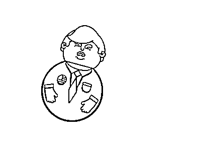

## 若道君征稿啦

```
最近的天象如同过山车
```

```
金冥对分加上火星停滞期
还有巨蟹座新月的
各种爱恨情仇
```

```
宝宝们不开心别忍着
```

```
若道君是你们最好的树洞
别犹豫 拿起笔 写给我们哦
```


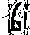

```
本期征稿主要方向
```

```
1\. 虐死单身狗系列 
```

```
写点啥 
```

*   相爱相杀，缠绵悱恻的爱情故事；

*   结合占星学元素的爱情小小说；

*   金冥对分的天象下你和你的 TA 发生了什么？吵架了？分手了？彼此更深刻地连接了？ 

*   其他脑洞大开也欢迎……

```
2\. 宝宝不开心系列 
```

```
写点啥 
```

*   4 月到 6 月火星逆行期间都发生了啥？

*   火星在 6 月 30 日恢复顺行了，这期间又发生了啥？

*   你有排解愤怒和恐惧的好方法吗？

*   你有什么不开心的事儿，说出来让我们开心一下? 

*   其他脑洞大开也欢迎……

***3. *父母皆“祸害”系列**

**写点啥**

*   你和父母之间有哪些提了闹心不提糟心的故事？

*   占星学是如何帮助你同父母和解的？ 

*   其他脑洞大开也欢迎……

三大类主题**任选一类**都可以，

字数在**2000 字以内**，

如果是**小片段**也欢迎投稿，

若道君会把大家的各种吐槽集结成文，

让你知道你并不是一个人在战斗……

**漫画、图片、摄影**为主也行呢

**唯一的要求是**

**投稿文章必须为作者原创，**

**若道保留对文章的选择权和编辑权**

**稿酬**

```
单独稿件（非片段）需在若道平台原创首发，稿酬以文章（周）阅读量为标准。
```

**阅读量>5000**，稿酬 **300 元 **现金

**阅读量>7000**，稿酬 **500 元 **现金

**阅读量>10000**，稿酬 **700 元 **现金

**阅读量>15000**，稿酬 **1000 元 **现金

所有奖励会在文章发表后 **一个月内**兑现

此标准有效期： **2016.1.1~2016.12.31**

**投稿流程**

step

**1**

投稿请发送至 astrology@nodoor.com

step

**2**

若道君审稿，对于好的稿件，将会回复作者；如果没有回复，则可视为不被录用。

step

**3**

对于若道君的建议，也请发至 astrology@nodoor.com

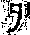

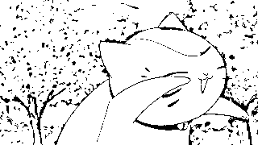

 如果你曾经受益于占星学，

请说出你的故事！

如果你用占星学的镜片来看世界万象，

请说出你看到的世界！

**拿起笔来**

**我们一起改变潮水的方向**

END


# 深度星座丨高敏感度人群生存指南

> 原文：[`mp.weixin.qq.com/s?__biz=MzA5NjA0NTAxNg==&mid=2651385590&idx=1&sn=1aa48bfacb90aecc7f8a8da228233388&chksm=8b4a5c41bc3dd557bd981537538ef597aec3a3459373b1fb0c426e37ae711aa1f8238c46026b&scene=126&sessionid=1692738811#rd`](http://mp.weixin.qq.com/s?__biz=MzA5NjA0NTAxNg==&mid=2651385590&idx=1&sn=1aa48bfacb90aecc7f8a8da228233388&chksm=8b4a5c41bc3dd557bd981537538ef597aec3a3459373b1fb0c426e37ae711aa1f8238c46026b&scene=126&sessionid=1692738811#rd)

作者/格伦·佩里 图片来源/Pinerest

翻译/李含 校对/Christy

你是高度敏感人群吗？一点点事情就能触碰到你的泪腺吗？格伦·佩里老师将从心理学的角度深入分析太阳巨蟹座的情感特征，帮助你走出过度情绪化。一起来阅读并且觉知起来，若道君看好你哟~

PS.由格伦·佩里教授的心理占星学高阶课程也开始报名啦，将于 8 月-10 月上课，想要学习的小伙伴快戳“阅读原文”。

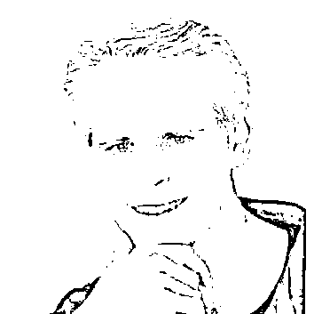

**格伦·佩里**

美国著名占星师/资深心理治疗师

不久前，占星师莉亚·因舍阿吉克（Leah Imsiragic）向我提出了一些问题，希望我就太阳巨蟹座的个人体验作答。因为上两周刚过夏至（巨蟹座的起始日），我想着正好公开我对于这个星座的所思所想。

## 太阳在一张星图中凭什么那么重要？

**问：为何星图中太阳所落的星座具有重要性，它能告诉我们什么呢？**

**答：**我总是说，**太阳在心灵中的地位就如同它在太阳系中的地位。**太阳就是**中央枢纽**，其他一切围绕它而运转；太阳是我们肉体的心脏、是人格的核心、是意识的基座。从心理学上看，它**象征着富于创造性的自我表达、意图和意志，是我们作出选择且通过自己的选择创造身份的一种能力。**

在我们的选择和创造性的自我表达之下潜藏着一种期待，那就是他人会确认这些选择。他们会欣赏和认可我们的表达以及我们成为了怎样的人。**确定和认可支持着自尊的发展，这是太阳的主要目标之一。**

**太阳所落的星座和宫位描绘出此人如何（星座）及在何领域（宫位）试图建立自己的身份，也揭示出此人将以怎样的方式，在哪些领域体验目标感、娱乐、创造性、乐趣和自豪——我们也可以说是一种荣誉感。**

○**什么是荣誉感？**

荣誉感有点像是古代的词汇，今时今日已经很少见了。简单来说，荣誉（或缺乏荣誉）是一个人选择的结果总和，其成就暗示着通过通力合作来采取正确的行动。也就是说，通过可以展现出一个人勇气、友善、可信赖、责任感和仁慈的方式。**荣誉暗示着正直和纯洁的动机，它确保个体能够获得尊重和自尊，始终如一地展现出高贵的品格**。因为采取正确的行动给人带来好的感觉，所以**荣誉也与自尊相当**。


图为《赤胆豪情》剧照

我很喜欢《赤胆豪情*Rob Roy*》这部电影中的一幕，英雄罗伯特·罗伊·麦格雷戈（饰演者连姆·尼森太阳落于巨蟹座）的儿子问他：“父亲，什么是荣誉？”麦格雷戈沉思片刻，然后回答：

“享有荣誉的男人都是王者，但并不是所有的国王都有荣誉。没人能赐予你荣誉，也没人能将属于你的荣誉夺走。荣誉，是一个人给自己的礼物。”

他的儿子回答：“你怎么知道自己拥有它呢？”“在追求荣誉的路上永远不要担心这个问题，”麦格雷戈回答。“它会在你心中成长，它会对你诉说。你需要做的只是去聆听。”


图为《哈姆雷特》剧照

**这是太阳以正当方式赢得的礼物，暗示着太阳对荣誉的一种趋向性，也就是我们内在的太阳（王者）总是指引、劝说、鼓励自我作出符合一个人善良本性的选择**。正如普娄尼亚斯在《哈姆雷特》中所说：

**“这比一切都重要：要忠实于你自己！黑夜终是追随著白日，你也必须如此遵行不渝。这样你便不会欺骗任何人。”**

这无疑就是麦格雷戈告诫儿子时所说的，在心中的荣誉逐渐成长时聆听它的声音。忠实于自己，否则最终将会变得卑劣，终日与失去自尊的痛苦为伴。

**○太阳和太阳星座可不是一个含义**

当然，太阳星座与太阳本身差别很大，即使占星师们试图将二者结合。我并不喜欢把星座视作性格来谈论，比如他是巨蟹座，或她是摩羯座，因为这会留下错误的印象，好像星座可以被简化为性格类型，并且太阳星座就是星座的全部，但事实上，**一个星座与不同的行星结合作出的表达是完全不同的。**

从本质上来讲，**星座是一种动机或驱动力，根据自身性质寻求成就满足。**每个星座都有一些渴望，象征着一种普遍性的需求。这种需求的性质会引发一些满足需求之目的的行为。如果**巨蟹座象征的需求是归属（归属于一个家庭、社区和国家）**，那么**巨蟹座式的行为就是与生俱来的关怀、保护、支持、奉献、忠诚、爱国精神等等**。这强调的是，**一个星座的行为最好是在该行为所服务的需求背景下去理解。**

一个太阳星座的意义远比仅一个星座更为复杂，因为它是两个变量的组合——**太阳和星座**。**太阳星座的概念必须从太阳的自我表达功能、意志和身份方面来定义**。首先人们表达自己的方式会与自己太阳星座的性质保持一致。其次，他们以反映该星座心理状态的方式做出选择——锻炼他们的意志。第三，他们倾向于认同该星座的动机原则和暗含的价值观。我认识到这一切都十分抽象，但是有助于建立起物质基础。

**最终，太阳的星座落点构成了一条属于个人的荣誉之路。一个人必须充分发展和体现出这里的人生信条，在其最高意义上，实现自身的潜能，点亮荣誉的光环。我并不是说太阳星座是抵达荣誉的唯一途径，而是说，它是实现自我与完整生命的长途旅程中重要的一段。**

## 亲密、归属、理解构成了巨蟹座

**问：巨蟹座的本质要素是什么？**

**答：**这真是个好问题。我们还是要注意到，这个问题与“太阳在巨蟹座的功能是什么？”有所不同。我会尝试解释这两个问题。**巨蟹座的本质是需要****亲密****、归属、理解、关怀和无条件的爱，这种需求（或需求集合）是所有巨蟹座行为的基础和动机。**由此可见，巨蟹座的所有行为特质都可以放在行为所服务的这个需求背景之下来理解。**巨蟹座的内省、关怀和对拒绝的敏感都是致力于实现巨蟹座对亲密的重要需求。**

值得一提的是，巨蟹座与狮子座成十二分相，太阳就是狮子座的守护星。**狮子座**是紧随巨蟹座之后的黄道星座。它是太阳的天然家园，是太阳感觉最舒适、最容易做自己位置。**成十二分相的星座是一种补偿性关系**，好像后面一个星座将前面一个星座推开，说：“我超越了你，我与你完全不同！”

所以，太阳在巨蟹座时就像是倒退，严格来说，就是因为巨蟹座在狮子座的后面。通过作出选择来塑造独特个人身份的冲动，被看不见的忠诚压抑了。

在夏至观察巨蟹座这种倒退的特质尤为有趣，这是巨蟹座的起点。太阳停止了向北攀升，盘旋三日后，开始向回走，在天空中越来越低，直到 6 个月后来到冬至日，反过来再走一遍这个过程。这可以**看作是巨蟹座天性中沉默含蓄、犹豫不决和倒退特质的一种隐喻（巨蟹座掌管着过去、祖先和历史）**。实际上，**巨蟹座通过弱化自己的言行抑制了太阳天性中向上、向外的表达。它软化和柔化了太阳，将它的能量转向内在，倾向于关怀、保护那些已经建立的——先例、传统、基础。**

太阳在巨蟹座时，其功能遭到了抑制，没能通过强烈、清晰的个人意志来表达出自己的与众不同，这是因为太阳巨蟹座在表达个人爱好时，可能意外导致了自己和他人的疏远。太阳自己可能会自发地大声宣布：“我是天主教徒、共和党人、洋基队的粉丝，我喜欢乡村音乐！”但是在巨蟹座时，太阳可能担心许多人会因为这些选择而疏远他。这些人肯定是新教徒、民主党人、麦兹队粉丝，肯定讨厌乡村音乐。这令巨蟹座人感到不安。

所有这些都意味着，太阳巨蟹座很难自然地做自己，他可能因为恐惧而拒绝这样去做。“如果我没有归属于新教徒家庭、麦兹家庭……这些人会不喜欢我。”同样还会担心那些作出不同选择的人会感觉太阳巨蟹座人拒绝了他们，没有支持他们的选择。

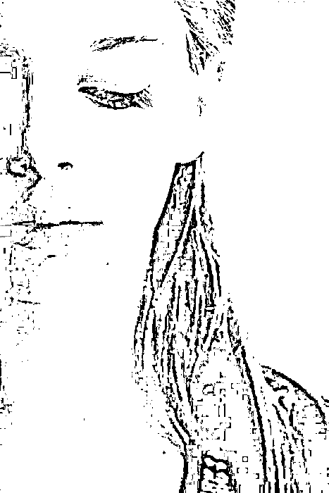 

## 巨蟹座：情感联结是强项

**问：巨蟹座最棒、最强有力的特质是什么？**

**答：**是**情商**。**巨蟹座能够转而向内，去感受、去接纳情绪层面所发生的事情，并能够凭借直觉力去理解人和环境的情绪状态。然后他们会据此调整行为。**

这就是巨蟹座被认为具有变色龙特质的原因，能够与环境融为一体。**对亲密和归属的需求再一次成为主要的驱动力，是巨蟹座所有行为的根源。**我们甚至可以说这也是母爱的动机。**母性维系亲密的本能自然会具备在任何时刻理解子女情绪和需求的能力，有能力与子女共情，于是便维系起了充满爱的关系。**

**太阳落于巨蟹座预示着有能力去表达关怀、理解、共情、保护等等。**太阳巨蟹座人会明确认同这些属性，甚至全力投入其中。这样的感性会延伸到生活的方方面面，尤其是需要保护的生命形式。

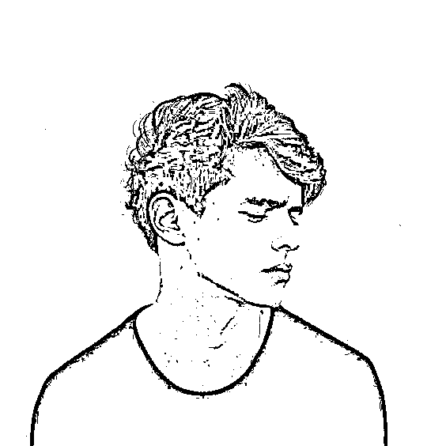 

## 巨蟹座：今天你又敏感了吗？

**问：巨蟹座的弱点是什么？**

**答：**和所有星座一样，**力量被过度发展就会成为其弱点**。在所有巨蟹座的属性前面加上“过度”，你就可以发现问题所在——**过度敏感、过度保护或过于情绪化**。巨蟹座对拒绝敏感、担心伤害到别人、会胆怯、害羞、沉默寡言，尤其是太阳落于此星座。

和其守护的狮子座一样，**太阳对应的是玩耍、娱乐、与朋友社交**。但是当太阳落在了巨蟹座，我会难以主动发起社交，表达想要玩耍的愿望——即使有时候就是简单的给个朋友打电话。因为我觉得这会有些强人所难，显得不够体贴。也许他们有晚餐邀约，或是忙于工作，或是在照顾子女。我习惯于用道歉做开场白：“我很抱歉打扰到你……”我知道这很不理性，但是这就是天生的。相反，如果太阳狮子座人打电话给一位朋友，他们会认为这是对友人的一种赞赏，而这也是事实。

如果我的月亮而不是太阳落在了巨蟹座显然会更好，因为巨蟹座的力量会用来服务于月亮的功能，恰好与这些特质相对应。有许多完全适合于**倾听、理解、表达同情支持**的场景。在这些时间里，月亮是活跃的。如果它落在巨蟹座，那么此人给予敏感回应的能力会十分强大且自然。

要理解，**巨蟹座的弱点并不是固定不变的，而是自我各方面缺乏整合的一个结果**。人可以在任何星座作出糟糕的表现——要么过度，要么不够。但**这不是星座的错**。当一个行星落在一个与其守护星座成困难相位的星座时，就像是太阳落在巨蟹座，那么这个行星的功能就打了折扣，行星很难做自己。

前文有说道，狮子座就是与巨蟹座成十二分相。因为太阳是狮子座的守护星，于是太阳巨蟹座就像是莎剧中的演员，必须扮演朱丽叶的角色，而太阳自己则更想演罗密欧。

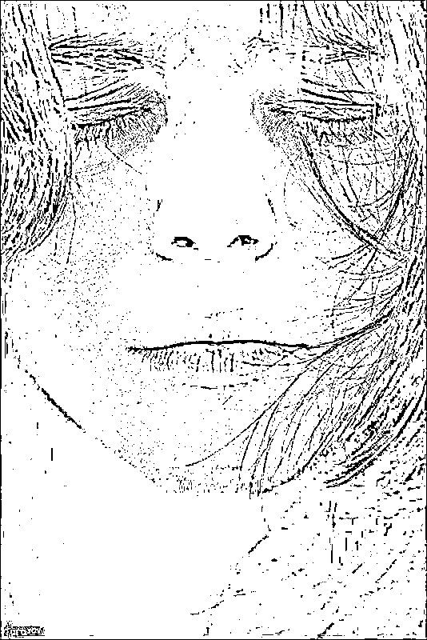 

## 流露脆弱是有力量的

**问：你从自己的太阳星座学到了什么？**

**答：**那就是我更愿意自己是太阳狮子座。好吧，先不开玩笑了。我学习到的就是，**知道该如何应对情绪是很重要的事情**。矛盾的是，**能够流露出脆弱的情感本身就蕴藏着巨大的力量**。愿意敞开分享我的这一面，给我带来了意外的收获，我都没有预料到，因为在我童年成长的家庭中是回避情绪的。**现在我强烈的忠于自己的情绪，将它们视作我最忠诚的盟友。**

人们会不同意你的想法，但并不会不同意你的感受。如果我说：“某个宗教更像是一种政治意识形态而不是宗教，”人们可以合理地提出分歧意见。但是如果我说：“某个宗教教吓到我了。”这就是一种他人无法反对的陈述。这只是我的感觉，并没有对错，即使这是进一步对话的基础。**当个体的思想、价值观和决定得到情绪支持时，这个人会更庄重，更具有人格的实质和深度。情绪就是你的大地、你的舵手、你存在的根源，情绪是我们连接他人的纽带。**

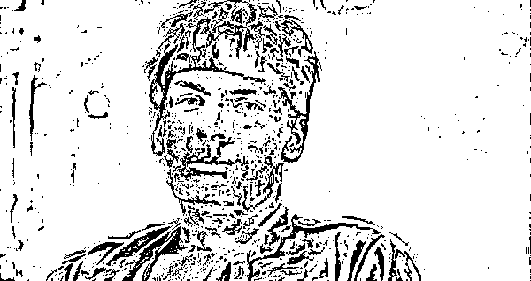

图为《野战排》剧照

我记得在 1986 年看过奥利弗·斯通的一部电影《野战排*Platoon*》。讲述的是美国士兵在越南战争中作战的故事。在一次战斗之后，一些士兵叫嚷着争论对与错，美国是否该卷入战争。就在紧张气氛一触即发之时，演技精湛的福里斯特·惠特克 （*Forest Whitaker*）所扮演的比格·哈罗德只是说了一句：“兄弟，我不知道，但我的内心受到了深深的伤害。”就在那一刻，所有的能量都转移了、安静了、平静了。比格·哈罗德说出了每个人的感受，突然间所有人被联系到了一起。一个简单的情绪表达就能做到。

**巨蟹座（和月亮）与情绪相关，这并不是暗示巨蟹座月亮的原型是情绪感受**。有时候，你会听到占星师们说：“月亮就是感受。”但这是一种误解。确切说，巨蟹座月亮有自己的感受（**温柔、保护、母性的爱**），但是每个星座-行星系统都有某种特征感受，当被激活时，行星会采取恰当的行动。当一个陌生人拿着棒球棍冲过来时，如果一个人感觉到他的生命遭受威胁，那么这就是白羊座的感受——发出警报、激动、有侵略性，触发了火星的战或逃反应。

**巨蟹座月亮的原型象征着一个人去感受全部情感的能力，作为一个人去接纳这些情感，将这些情感的信息传递到恰当的行星功能中。**如果一个人不能有意识的去感受情绪、理解它们的意义，将其注入恰当的反应之中，那么这些情绪对他而言就没有什么益处。一个星图中，**巨蟹座月亮的原型越强大**，比如有太阳（或其他任何行星）落于巨蟹座，此人就越有可能**善于处理情绪**。就仿佛他们的情绪疏导通道比其他没有这类特质的人要更宽更深一些。

***若道君：是不是对格伦·佩里的老师的文章意犹未尽呀？后续会有更多文章推送~既然被感染到了，就报个名再走呗。***

**ISAR 选修课：心理占星学高阶网络课程**

**授课时间：**2016 年 8 月 22 日-10 月 10 日（**每周一晚 20：00-22：00**）

**授课老师：**格伦•佩里

**授课次数**：8 次

**授课方式：**网络课程，英文授课，中文翻译

**报名截止**：2016 年 7 月 31 日

**费用**：**7 月 22 日前付款早鸟价 5800 元，若道老学员特惠价 4800 元，**7 月 23 日起 6800 元

**课程负责人：李老师**（**微信： **18601950700****，请备注心理占星学高阶课程报名咨询）

长按二维码添加课程负责人咨询~

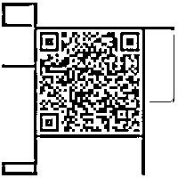


****想要学习更多心理占星学知识？2016 年 8 月-10 月，格伦·佩里老师主讲的网络课：高阶心理占星学要开课了！该课程将教会你用心理学的方式整合出生星图，从而支持人们发挥成长和改变的潜力。****

**报名点击文末“阅读原文”**


# “奇葩星图”海选结果 | 快来看看这些活久见的星图

> 原文：[`mp.weixin.qq.com/s?__biz=MzA5NjA0NTAxNg==&mid=2651385590&idx=2&sn=c09473322c91617d91a06bad48c60db0&chksm=8b4a5c41bc3dd557da19d3a1b6381fca2c5f9a7519e55478b40305db64f0ed73827eef39ccbf&scene=126&sessionid=1692738811#rd`](http://mp.weixin.qq.com/s?__biz=MzA5NjA0NTAxNg==&mid=2651385590&idx=2&sn=c09473322c91617d91a06bad48c60db0&chksm=8b4a5c41bc3dd557da19d3a1b6381fca2c5f9a7519e55478b40305db64f0ed73827eef39ccbf&scene=126&sessionid=1692738811#rd)

大家期待已久的奇葩星图出炉啦

参加了海选的奇葩们

快来看看你**有没有被选中**

本次[寻找奇葩星图活动](http://mp.weixin.qq.com/s?__biz=MzA5NjA0NTAxNg==&mid=2651385504&idx=2&sn=0f679bdc0c2877bbad8aaf35b838f98e&scene=21#wechat_redirect)

若道君收到了海量的星图

并成立了专门的**奇葩星图评选小分队**

三位评委严肃脸挑选出以下奇葩……哦不……奇葩星图

共**七位选手**荣登**奇葩五星榜**

**三十四位选手**位列**奇葩四星榜**

下一步就是**老爷子**亲自**钦点奇葩之最**选手啦

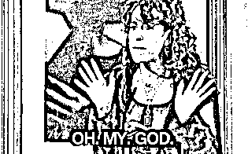

若道君为大家放送七名**五星奇葩**选手的星图

先睹为快

为**保护参与者隐私**

在此只公布奇葩选手的**编号**

大家**自行认领**哈

猜猜会不会是你身边人

也许就是**隔壁老王**呢


奇葩的是

这些星图的某个部分是**被遮盖住**的

能不能**找到奇葩点**

就看你的本事啦

你还可以**点击文末**阅读原文

了解更多老爷子的课程信息

这些奇葩星图

在课上都可能被选中作为**案例分析**哦

五星奇葩选手星图

**1**

奇葩编号：112

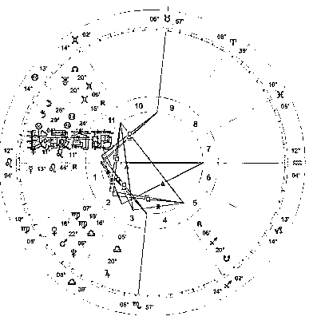

**自荐理由**：所有行星**落在半球**，日月落**12 宫**

**若道君**：你就是传说中的江湖隐士么？

**奇葩指数：★★★★★**

******奇葩评委丁宏**说****：所有行星落在左半球，日月土冥落入 12 宫。日月又各自入庙，12 宫能量很强。有超脱的**精神追求和灵性**，却也伴随强烈的**孤独感**。

**2**

奇葩编号：12

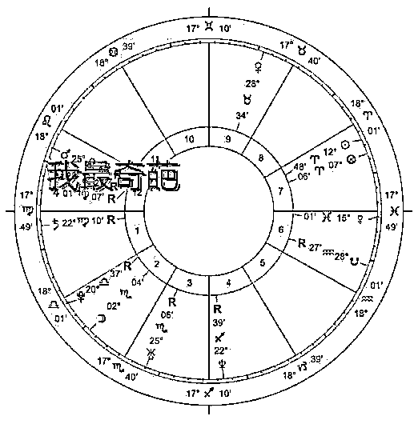

**自荐理由**：**相位太多了**，盘主表示很累

**若道君**：你的行星都很忙！

**奇葩指数：★★★★★**

******奇葩评委丁宏**说****：水土海 T 三角合轴，金火木天 T 三角，日白羊空相，月天蝎。既渴望充满**刺激和戏剧性**的人生，又时常压抑自己**循规蹈矩**。

**3**

奇葩编号：04

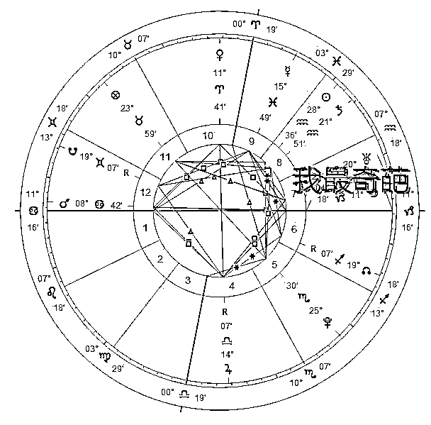

**自荐理由**：我觉得奇葩处在于 感觉星星**位置很分散**……

**若道君**：很分散……分散……散…………

**奇葩指数：★★★★★**

****奇葩评委**占星师 Zora 说**：太阳、月亮、水星、金星、火星全部处在落陷、入弱位置会带来行星能量的**不稳定**和**反传统**的表达方式，星图中的大十字格局更增添了生命中的挑战。

**4**

奇葩编号：37

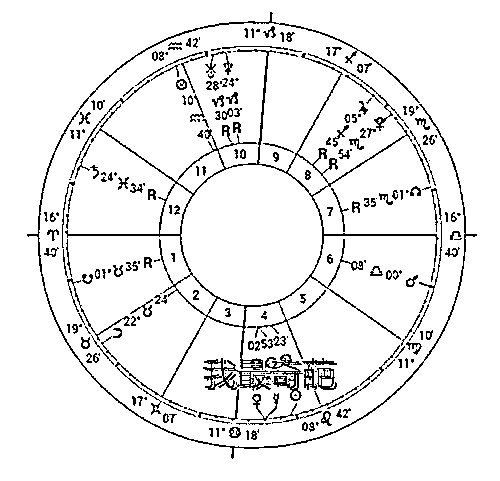

**自荐理由**：**才艺至少十几项**……高中三年不仅是国安局一员还去兰州演习，管弦乐队队长会所有吹奏的乐器二胡特牛，画画特牛，辅导的一个人后来拿了福建美术状元……创立机器人工作室并拿省一等奖第二名，体育达到国家二级运动员，大学前就是他们当地人大代表 加入国民党……高考成绩能上厦大。

**若道君**：没有把你的自荐理由编辑成“此处省略几百字”，你能占这么大的版面，要感谢我哟（捂嘴）。

**奇葩指数：★★★★★**

****奇葩评委**喜悦龄以说**：

南交点金牛座，日水金合相在巨蟹座 4 宫，且与 12 宫双鱼座土星、8 宫天蝎座冥王星形成水象（星座及宫位）大三角，并与 10 宫天海形成大风筝，特别的**创造力、艺术细胞**，并且才华能够**有机会展现**。这样的格局不常见，似得益于家族及人类**集体潜意识资源**，值得赞叹。

同时，辉煌灿烂背后，亦有更丰富的起伏跌宕的**深刻体验**，尤其在**亲密关系**或合作方面。

**5**

奇葩编号：38

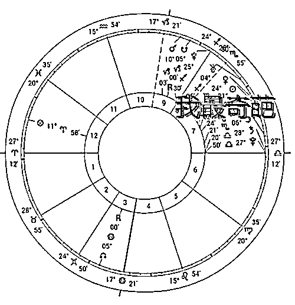

**自荐理由**：群星天蝎，星群格局四级，七颗行星落座七宫。因为土冥合下降落七宫，认识到自己必须要**突破自我**，走上身心灵的道路。因为金木合，走到哪里身边都有**帅哥美女**。行星犹如核弹一般集中，常感觉到内在激情和能量。

**若道君**：我眼里只有帅哥美女。

**奇葩指数：★★★★★**

****奇葩评委****喜悦龄以**说**：很少看到如此星群集中的星图，群星天蝎必定经历**灵魂暗夜**，**自我探索**能够助你深入理解和探索情绪与情感，充分看到和接纳经历**情绪阴暗面**，将之转化为**巨大资源**。祝福你善用激情与能量，在关系中**勇敢体验**、黑暗中**蜕变**，并将你的**深刻敏感**带入关系中，影响和激励他人的转变。

**6**

奇葩编号：55

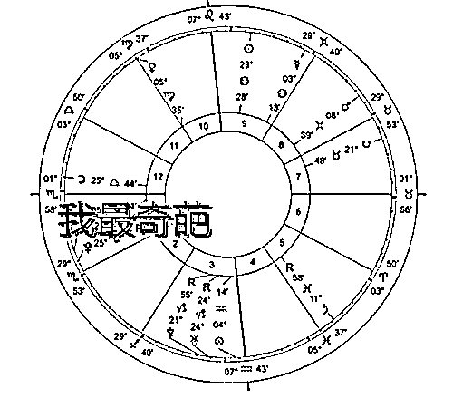

**自荐理由**：**朋友出奇的少**，和人相处时间长就会**讨人厌**。**躁郁症**。**暴躁敏感**的综合体。

**若道君**：来啊，互相伤害。

**奇葩指数：★★★★★**

****奇葩评委****喜悦龄以**说**：金土对分，**自我价值感低**，火土四分，精神动力会受**压抑**，月亮 12 宫与巨蟹座太阳及天海 T 三角，**内在冲突，敏感，自我不确定**，可能有**消极避世**倾向，情感情绪也会被放大，易受环境影响，呈现为**暴躁敏感**。这个星图看起来的确要经历艰难，但改善之道仍然是需要**探索与面对自己的情绪**，过去的经历，发展出**深刻的认识与觉察**，那些影响自己的无意识，才有可能成为资源和力量。

**7**

奇葩编号：63

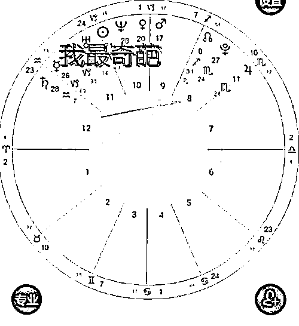

**自荐理由**：我是南京一所高校传媒专业的大四学生。我的星图最奇葩的地方在于这是一个“众星云集”在地平线以上，所落宫位全部是“社会宫”的配置，在个人生活层面几乎无所关注。在这种奇葩的配置下，我本人也深感“业力”太沉重，在今世有必要精进修行，完成“灵魂层面”转化。同时，我对今世最在意的领域，即**“事业”**方向深感**迷茫**（或许是 10 宫主落 12 的缘故？）时常看不清自己真正的目标并经常变化，比如一直有出国读研计划，却反复纠结于到底何种专业适合自己如法律、公关、心理学等，总是拖沓不前。我相信，在中国一定还有很多像我这样“星群”特征明显的朋友，他们或许也很困惑于那些星星最多的宫位，所展示的生命议题。从我个人角度来说，如能获得老师们对我星盘的关注及建议，我会倍感幸运并万分感谢 。如果不能入选也不会遗憾，因为这说明 我个人的灵魂功课总体问题不大，而别人有更亟待解决的困难。无论如何，为这次活动点赞，谢谢聆听。

**若道君**：态度很认真，我看好你哦。

**奇葩指数：★★★★★**

****奇葩评委****喜悦龄以**说**：所有行星落于 8~12 宫，摩羯座 17~26 度落 7 颗星，很难让人不相信有**特别的使命**蕴藏其中。你大概从小就**懂事成熟**，也会有愿望能够在社会**承担更多**。北交射手 8 宫，木星天蝎座 8 宫，**探索、承担、从起伏黑暗中获得洞见**，是你这一生的任务，所以，纠结于选择什么，不如去勇敢地决定，在选择中体验，并承担后果，包括失败、错误，痛苦、调整与改变，先走出一步，接下来的路才会呈现，如此，终会找到自己的路。

四星奇葩选手名单

**四星奇葩选手的编号为**

G1 | 01 | 05 | 08 

11 | 13 | 16 | 18 

19 | 20 | 21 | 23 

24 | 26 | 27 | 29 

35 | 36 | 40 | 43

45| 46 | 49 | 50

53 | 54 | 57 | 60

64 | 66 | 70 | 96

111| 114

**若道君**：很多选手的名字也是够奇葩了，比如**“活活气死”**（摊手）……

**老爷子会不会选中你？**

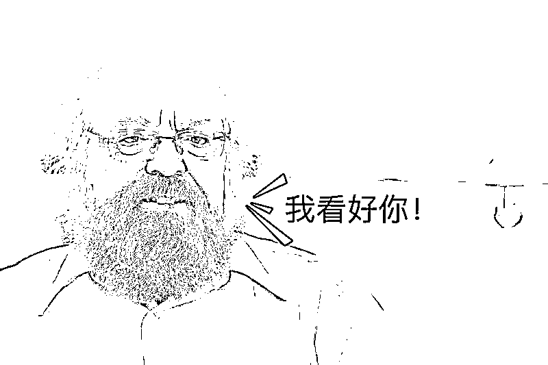

预知**晋级赛结果**如何

敬请持续关注若道君**之后的推送**

谢谢大家的参与哦

再安利一下**罗伯特·汉德**老爷子的课程

戳文末“阅读原文”查看更详细信息吧

ISAR 选修课·古占与现占结合

**授课时间：**2016 年 7 月 23 日-9 月 10 日 10：00-12：00**（每周六上课，一共 8 节）**

**授课老师：罗伯特·汉德**

**授课方式：**网络在线，英文授课，中文翻译

**报名截止**：2016 年 7 月 15 日

**费用**：****6800 元** **

**课程负责人：李老师**（**微信：18601950700**，请备注古占报名咨询 ）

长按二维码添加课程负责人咨询~

****

三位 ISAR 认证占星师评委是谁？

（排名不分先后）

*1. *


**丁宏**，esme。ISAR（国际占星协会）资质认证职业占星师，资深占星课程口译。复旦大学英文系毕业后赴伦敦读研工作，并于伦敦占星学院接受系统的西方职业占星教育。2013 至 2015 年在若道星文化担任课程助教和口译，期间继续跟随多位国际著名占星师深入学习各流派技法，并成为若道第一位中文讲师。2011 年起开展占星咨询至今。在咨询中力求现代占星与古典占星的积极融合，在研判世俗事件的同时关注潜力及心灵力量。

*2.  *


**喜悦龄以**，张征。西安交通大学工学学士，中国人民大学工商管理硕士（MBA）；14 年职场生涯，历任高校教师、世界 500 强企业工程设计及项目负责人、美资纳斯达克上市公司董事长/总裁执行助理。

群星水象，土冥合轴，以柔和敏感之心体验生命起伏变迁，2008 年跟随内心召唤，离职转身，专注于心理学、哲学及神秘学的学习与探索，开启北交 4 宫内在工作，2009 年执业国家二级心理咨询师，2013 年通过国际占星研究协会（ISAR）资质认证（CPA）。现为客户提供心理咨询及占星咨询，并致力于推广占星学、内观等古老心灵智慧。

*3.*

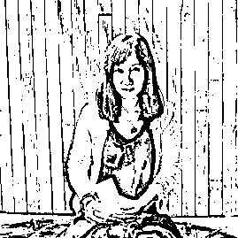 

**Zora**，郜婕。毕业于中国人民大学，国际占星研究协会（ISAR）认证占星师。2012 年在大卫·瑞雷老师指导下开始占星专业学习。曾在若道星文化主办的职业占星师资质课程及古典占星课程中担任助教。

**课程具体内容及报名，请点击文末“阅读原文”**


# 新月故事 | 请接受最真实的自我

> 原文：[`mp.weixin.qq.com/s?__biz=MzA5NjA0NTAxNg==&mid=2651385590&idx=3&sn=9f69211a58f7caf8f087acfc5889fefa&chksm=8b4a5c41bc3dd557238890f91f287f7d71f736755e596d82996cd41e2264043e8dcef8cbf47e&scene=126&sessionid=1692738811#rd`](http://mp.weixin.qq.com/s?__biz=MzA5NjA0NTAxNg==&mid=2651385590&idx=3&sn=9f69211a58f7caf8f087acfc5889fefa&chksm=8b4a5c41bc3dd557238890f91f287f7d71f736755e596d82996cd41e2264043e8dcef8cbf47e&scene=126&sessionid=1692738811#rd)

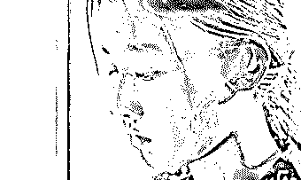 

“

刚刚过去的巨蟹座新月，若道君给小伙伴们推送了一篇[《允许眼泪流下》](http://mp.weixin.qq.com/s?__biz=MzA5NjA0NTAxNg==&mid=2651385536&idx=1&sn=145aca19d7ea6161bf79d37d266d2ef0&scene=21#wechat_redirect)的文章，然后就有小伙伴分享了她的巨蟹故事。

”

巨蟹新月的第二天，决定分享一下这次新月带给我的礼物。

**童年故事：从害怕到伪装强大**

从小我就是一个有点“窝囊”的小姑娘，学前班起就被同桌划三八线，永远是最窄的那一边，也从未萌生过要为自己“做主”的念头，如果感到特别委屈就只会哭。

改变发生自初中的一次“单挑”，一个狂妄无度的捣蛋王和一个内向古怪的受气包的终极对决，班级所有人无一例外地押注另一边。但结果却令所有人，包括我自己，大跌眼镜。不知道哪里来的勇气，我拿起手边的凳子朝对方的头砸了过去……对方哭了，眼睛变成了发肿的青紫色，我待在原地大脑一片空白。

后来班主任叫家长时对我妈说：“不怪她，是那个同学太捣蛋了，但是你要教育她这样做非常危险！”我妈拎着各种好吃的去看望那位同学，还好对方的父亲是我爸的同学才没有闹得更大。

自那之后，我的内心开启了为自己伸张正义这项功能，就算害怕也咬牙去面对。直到二十几岁进入社会时几乎已经看不到当年那个受气包的影子了，连自己都曾一度认为自己真的变成了一个“厉害人”。

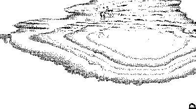

**巨蟹座新月：强迫面对真实的自己**

我的手机是二手的苹果 6，买的时候只花了两千多，但是三个月后便出了问题。

我去买手机的那家店里要求修理，对方不但不同意，店里的三个人反而对我进行了围堵式的语言攻击，甚至有轻微的身体推搡。

我强烈地感知到了愤怒的情绪，它在我身体里像滚动的火山一样即将奔涌爆发，就像回到了小时候，要提起手边的凳子的那一刻。

但是我长大了，我有了比小时候更多的理智和觉知，我一方面压制情绪试图和修理员就解决问题做理智的沟通，因为我知道这样的情况肯定吵不赢，而把事情闹大更是浪费时间和精力。

可是修理员的女朋友却对着我无休止地谩骂。

我觉得我无法再忍受下去，（尤其是在那样一个群星巨蟹的日子里）我强烈地感到我内心的情绪，它们需要一个出口，而不是被无休止的压抑，我必须给它们出口。

**内心的觉知告诉我，我有两种选择：疯狂反击或者哭出来。我选择转过身去让眼泪流出来，同时并不为自己的哭泣感到难为情，也没有刻意掩饰。这时对方似乎也冷静了一些，最后决定让我把手机留在那里进行问题检测。**总算解决了。

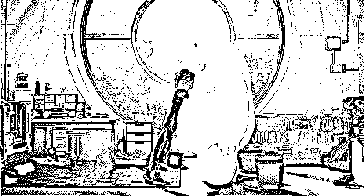

**面对就是成长**

出门后我坐在路边泪如雨下地哭了半小时（作为一个月亮巨蟹座这再正常不过），忽然我想起前段时间看的一个电影，里面的魔法师说：“她是**我见过的最强大的人，因为她接受了真实的自我。“**

也许我应该接受自己就是这样一个人，生性敏感温柔、对别人的遭遇会感同身受。上帝创造这样的人必然有他的用意吧，要不然为什么我会想要做一个能够疗愈别人的人。

电影中一位森林仙子将一只死去的鸟儿放在手心，那只鸟儿就奇迹般地复活飞走；当她双手将手放在断裂的树枝间，树枝立刻连在一起并长出了绿色的新芽。这个画面触动了我内心深处一个无法形容却又重要领域。

擦干眼泪后给一个朋友打电话求救，对方非常够意思地在半小时内出现，带着我骑摩托绕五环飞驰，傍晚一起吃了好吃的牛肉火锅，就像是上帝对这一天辛苦学习的奖励。朋友也给了我关于这件事的另一种解释：“便宜没好货对方并没错，当然无需去据理力争，让自己变有钱就好了。”怎么说呢，另一个角度的太阳光也照射进来了。

最后，分享一句摩托头盔上的话：Life is a crazy ride！

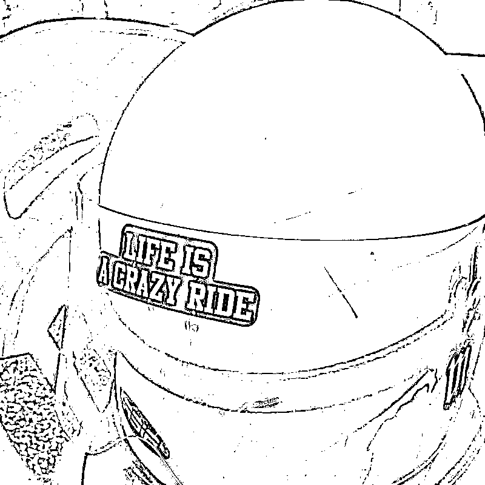

我还想说：Enjoy it!

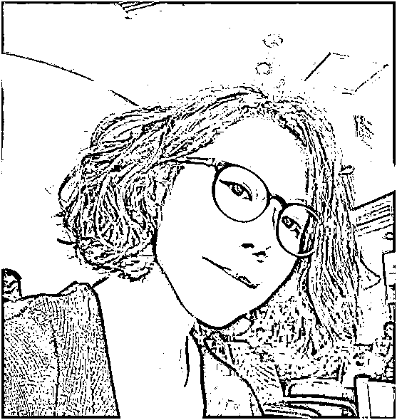

**作者简介**

**Vera 杨浠**：心理占星师，研习占星学近 5 年，先后跟随多位世界级占星大师学习人本主义占星学。在心理治疗方面，曾参加全息呼吸工作坊与占星疗愈课程。热爱能够拓展意识深度与广度的所有领域（西方哲学、心理学、道教、佛教、玄学、萨满文化、神话学、太极拳、中医等）。相信人生最重要的是体验与经历背后的意义——自我的进化与成长。接受个案咨询预约，致力于帮助来访者根据目前症状探索深层心理根源，并进行情绪释放与疗愈。

**个人微信号**：haloace

长按二维码，让金钱涌向传播知识与智慧的人~

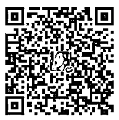


******学习深度的占星学知识，接纳最真实的自己！由大卫·瑞雷老师**讲授的**若道核心课程 Level 3，会教你将**星座、行星、宫位、相位这些散落的珠子穿起来，**带你进入更深的自我探索与成长的旅程。******

**报名及咨询，请点击文末“阅读原文”**


# 古占与现占结合 | 美国国家宝藏的倾囊相授

> 原文：[`mp.weixin.qq.com/s?__biz=MzA5NjA0NTAxNg==&mid=2651385590&idx=4&sn=9a494452e3a1e8101197e6bd78e0f2c8&chksm=8b4a5c41bc3dd55781a96a2223780f40b469b719b6c3d23803de00b03a9b0511d418fd3c43a7&scene=126&sessionid=1692738811#rd`](http://mp.weixin.qq.com/s?__biz=MzA5NjA0NTAxNg==&mid=2651385590&idx=4&sn=9a494452e3a1e8101197e6bd78e0f2c8&chksm=8b4a5c41bc3dd55781a96a2223780f40b469b719b6c3d23803de00b03a9b0511d418fd3c43a7&scene=126&sessionid=1692738811#rd)


“

罗伯特·汉德，一位被占星界称为“国家宝藏”的人，掘地三尺，阅古卷无数，学习没有人再说的古代语言，学习古代历史，学习古代哲学，挖出了一把传说中的“屠龙刀”。在 37 年的现代占星生涯和 21 年的古典占星研究生涯后，他将为我们带来什么？

”

将 37 年的现代占星和 21 年的古典占星结合， 罗伯特·汉德耗费大量的精力，挖出了这把“屠龙刀”，他擦拭这把锈迹斑斑的刀，粘合它的碎片，钻研刀法，在此过程中引发好奇、热情、疑义、愤怒；他促使原来名不见经传的人获得新立山头的机会，同时又引发了分裂、不满、攻击。

有些现代大师们对他的道路感到惋惜、不解、批评，但仍旧尊敬他；而他又远离那些一门子想要复古、认为“老的就是好的”古典阵营。他跑着，似乎有同伴，又一人独行。

你也许听说过这把“屠龙刀”的传说，从江湖似真似假、似是而非的流言中，从自称使过它的招式的自言得意的小辈中，从以教学谋生、很少实践经验的小有名气的占星师的课程中。

但你真的见过这把刀吗？你知道正确的使用方式吗？这把刀真的能在现代社会应用吗？还是仅仅是应该放入“历史博物馆”中陈列？这次课就是谜底揭晓的时刻。

## 现代占星学的学子们，如果你：

*   对于出生星图——占星学中最重要的星图的秘密，仍有很多不解和好奇；

*   渴望获得古典占星里符合你的哲学理念又实用的好技法；但厌倦了大量复杂却无用的古典知识，又苦于古典文献浩瀚，无从粹取；

*   对自己星图和某些人生大事的对应百思不得其解，渴望获得一位占星大师的解答；

*   曾和妄称“可以更准确预测”的古典占星师们争得面红耳赤，但因为没学过古典而稍微有些心虚；

*   了解占星学界常见的古典和现代占星的纷争，想在真正了解这两门学问的大师面前提出深刻而尖锐的问题；

*   渴望在自己的占星知识拼图中补上能够符合现代占星理念的古典占星学知识，并将现代占星和古典占星融会贯通在咨询中

## **欢迎你来，机不可失，因为：**

*   **这里有世界上唯一能够教授此门课程的占星界泰斗**：72 岁的罗伯特·汉德，两个阵营的旗手型人物，**活着的唯一获得现代占星学大师尊重的横跨两界的泰斗**、占星咨询实践者，历史学家、哲学史研究者，活着的时候就已经成为历史的人。一个怀旧的人，一个试图搭起桥梁的人，一个不满足现有的人，一个思想演化路径让人迷惑的人。


*   **萃取古典的精华，去除古典占星糟粕：**罗伯特·汉德用他综合的知识，为你筛选出古典占星中可以为强调自由意志的发展、个人成长的现代人有益的古典占星实用技法。

*   **从实战演练中学习**：首次以案例教学的方式，除第一堂之外，每堂课皆以案例演示为教学重点。

*   **获得大师的免费解读**：**7 堂课的案例选取皆为学员星图，你有机会入选**。

*   **打尽出生星图的占星学命题！** 出生星图，是一生的预测星图，所谓的命运的因子埋藏在出生星图里。

**讲什么？皆重大常见人生问题：**

*   性格、个性、心智特点、外貌体型

*   挣钱能力、金钱、财富、财务

*   感情生活——恋爱、婚姻、家庭生活

*   原生家庭——父母、兄弟姐妹、姑表亲

*   人际关系——一对一关系、一对多关系、敌人

*   职业发展，谋生之道

*   社会地位

*   旅行

*   灵魂和本我

## 学习该课程，你并不需要有古典占星学基础：

*   你只需要具有一定现代占星学基础。如果对此没有把握，可以联系课程负责人员进行测试。

*   你不需要有任何古典占星学知识，所有出生星图的相关古典占星知识都会在课程前发送讲义或在课程中进行讲解。

给你一个机会，在实战中学习他的研究成果。

这次课程，对于罗伯特·汉德 是一次冒险之旅，对你也是串起历史、现在、未来的旅程。

还等什么？

**更多关于罗布特·汉德的文章在这里：**  

[领军现代占星 35 年、古典占星 21 年，罗伯特·汉德星图秘密大起底](http://mp.weixin.qq.com/s?__biz=MzA5NjA0NTAxNg==&mid=2651385233&idx=2&sn=98799d80abed94a7748acff623747bf7&scene=21#wechat_redirect)

[占星界的“百科全书”，请用您渊博的学识砸晕我！](http://mp.weixin.qq.com/s?__biz=MzA5NjA0NTAxNg==&mid=2651385064&idx=2&sn=647cbe8f5e029abbf16a9f039a6783b1&scene=21#wechat_redirect)

ISAR 选修课·古占与现占结合

**授课时间：**2016 年 7 月 23 日-9 月 10 日 10：00-12：00**（每周六上课，一共 8 节）**

**授课老师：罗伯特·汉德**

**授课方式：**网络在线，英文授课，中文翻译

**报名截止**：2016 年 7 月 15 日

**费用**：****6800 元** **

**课程负责人：李老师**（**微信：18601950700**，请备注古占报名咨询 ）

长按二维码添加课程负责人咨询~

****

**课程具体内容及报名，请点击文末“阅读原文”**


# 火星停滞期 | 最后一击，把英国整脱欧了，施主你还能淡定么？

> 原文：[`mp.weixin.qq.com/s?__biz=MzA5NjA0NTAxNg==&mid=2651385558&idx=1&sn=a713acbedd20385e06ceec3bb3d93b13&chksm=8b4a5c61bc3dd5778feea268831503efacfa66e432ab9c383df42d3e0f9aef01bd35d0cb72de&scene=126&sessionid=1692738816#rd`](http://mp.weixin.qq.com/s?__biz=MzA5NjA0NTAxNg==&mid=2651385558&idx=1&sn=a713acbedd20385e06ceec3bb3d93b13&chksm=8b4a5c61bc3dd5778feea268831503efacfa66e432ab9c383df42d3e0f9aef01bd35d0cb72de&scene=126&sessionid=1692738816#rd)

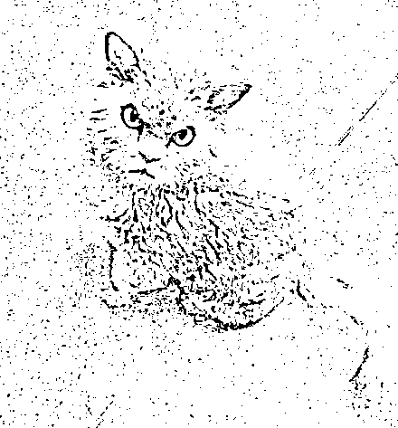
作者/Justine 图片/大爱猫咪控

6 月 30 日，火星结束了为期两个多月的逆行。在长达 24 天的停滞期里，火星正在积蓄力量准备加速，而我们的人生也在内部发生了一些变化。珍惜这段时光，之后，以火星之势，借宇宙之力，向未来进发。

**火星这一路也是够累的**

我们可以期望，可以梦想，可以做宏伟的规划，但是没有火星的行动力，仍然一事无成。这个与肾上腺素、决心、意志力以及愤怒有关的行星，大约每两年逆行一次，是所有行星中逆行间隔周期最长的。作为内行星（火星，金星，水星）之一，其逆行带来的影响直接而不容小觑。

*   **自 4 月 17 日逆行以来，火星终于在 6 月 30 日恢复顺行**。

*   在结束将近 80 天的逆行旅程之前，火星早已偷偷地放慢了脚步。

*   从**6 月 19 日到 7 月 12 日之间**，整整 24 天，火星一直行进在**天蝎座 23 度**。天蝎座 23 度的位置，是火星从逆行转向顺行的位置，称为**行星停滞**。

*   **6 月 30 日是一个分水岭的时刻，火星处于停滞期，同时改变了运动方向**。

*   火星恢复顺行后，需要一个**缓慢加速**的阶段。

*   直到**7 月中下旬**，才能慢慢恢复以前的动量。

*   **8 月 22 日**，才会离开后阴影期，完全恢复能量。

**行星停滞：搞啥呢？**

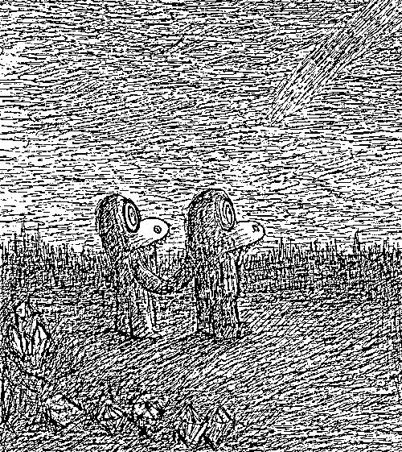

占星师 Michele Finey 在《当时间暂停—探索行星停滞》（*When Time Stands Still - Exploring Stationary Planets，*发布在《大占星师》2015 年 10 月的期刊上*）* 一文中说到停滞行星的几大特点：

① 停滞逆行比停滞顺行**更有挑战性**

② 停滞或运动缓慢的行星其实一点儿都不“迟缓”，可能他们是**最有力量**的。

③  如果本命星图里有一颗停滞的行星，并且将要转换运动的方向，案主很有可能以**最极致的方式表**达这个行星的特质，无论是以最积极还是最消极的。 

**火星停滞：对社会有啥影响**

**在社会层面，火星顺行后会在短期内释放大量的能量，会激发愤怒、挫折的情绪而有可能导致争端，需要谨慎局部的战争或恐惧事件**。

以下的战争或袭击事件发生在火星顺行阶段：

*   **二战 ****1939 年 9 月 1 日** **火星在摩羯座 停滞顺行阶段** 

*   **珍珠港事件 ****1941 年 12 月 7 日**  **火星在白羊座** **顺行后阴影期** 

*   **911 恐怖袭击 ****2011 年 9 月 11 日**  **火星在射手座-摩羯座** **刚离开后阴影期**

**脱欧和火星停滞也有关** 

火星本身跟**离婚与遣散**有关。

英国脱欧的全民选举发生在 6 月 24 日，火星尚在天蝎座 23 度逆行，准备进入停滞的阶段。

在欧盟的星图上，火星在 24 度天蝎座，月亮在 24 度金牛座，土星在 23 度水瓶座，形成固定星座的 T 三角。

当行进中将要转换运动方向的火星触动了欧盟星图中的 T 三角，英国以 51.6%的投票宣布脱欧时，启动了与欧盟“离婚”的谈判。

英国公投时，民众带着云里雾里的不解情绪，不少人是在不完全理性的状态下投的票，他们事后表示：并没有预料到自己的投票会对英国的将来、全球格局产生如此深远的影响。

**火星停滞：对你有啥影响**

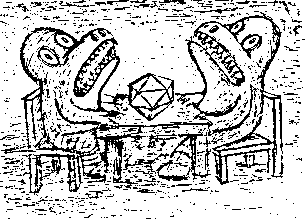 

在 6 月 30 日火星顺行前后，不少人感受到了**愤怒与压力**，或经历了**人际的冲突与纠葛**，这一方面跟火星停滞期的强大力量有关，另一方面也跟火星本身的特质有关。

设想一个人如果把悲伤、受挫、愤怒压抑在胸口，八十天来一直默默承受，任其在内心发酵，现在终于能表达出来了，难免会带来突然向外释放的强烈动力。特别是火星进行在天蝎座，会经历狂风暴雨式的激烈情绪，带来伤害与冲击。

**还好我们有好消息**

 ① 火星顺行后，你就可以**启动停滞的计划或项目**了。在 7 月 1 日到 8 月 22 日之间采取行动没有之前的风险，不需要傻傻等到 8 月 22 日。

② 停滞顺行比停滞逆行要**缓和**很多，最艰难的时刻已经过去。

③ 当火星在后阴影期停滞时，三分了凯龙星，带来了**治疗**的主题，是深入内在、疗愈灵魂、积极成长的好时机。

**哪些人群对火星停滞最敏感**

*   你的**四轴**、**重要行星**落在**固定星座（金牛座、狮子座、天蝎座、水瓶座）23 度**前后

*   **火星**是你的**命主星**（**上升天蝎座或白羊座**）

火星逆行也许让你抓狂，但过去的两个多月，从射手座到天蝎座的旅程，每个人都以独特的方式，重新审视了自己的欲望、行动力与目标。在最后的停滞顺行期内，让我们一起向每两年逆行一次的火星致敬：愿每个人在火逆时播下的种子，都能长成灿烂的花朵。


火星逆行期间，你生活里都发生了什么？

火星停滞期，又发生了什么？

一起来说说。


**作者简介**

**熙淅 Justine**：职业占星师，国际占星研究协会 ISAR 会员，已通过 ISAR 占星师能力测试。毕业于浙江大学，十年跨国企业人力资源管理经验。2012 年起在若道跟随多名国际占星师学习人本主义占星。个人咨询风格结合心理占星与演化占星，对于占星触及的人性、灵魂与疗愈尤为感兴趣。

**个人微信公众号**：AngelAstara

**咨询个案微信**：cicirebacca

长按二维码，让金钱涌向智慧的人~

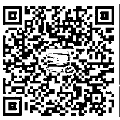

**特别提醒：**

**本文首发于若道平台，**

**转载请联系后台授权。**


******由大卫·瑞雷老师**讲授的**若道核心课程 Level 3，会教你将**星座、行星、宫位、相位这些散落的珠子穿起来，**带你进入更深的自我探索与成长的旅程。******

**报名及咨询，请点击文末“阅读原文”**


# 土星是男是女？99％的人都答错

> 原文：[`mp.weixin.qq.com/s?__biz=MzA5NjA0NTAxNg==&mid=2651385558&idx=2&sn=e1b743366f6670ac9e5e0f5189a2e407&chksm=8b4a5c61bc3dd5779bb711024cf5c6df963ff87ec6874614ce9a4bab202ebc27a1742df74a9e&scene=126&sessionid=1692738816#rd`](http://mp.weixin.qq.com/s?__biz=MzA5NjA0NTAxNg==&mid=2651385558&idx=2&sn=e1b743366f6670ac9e5e0f5189a2e407&chksm=8b4a5c61bc3dd5779bb711024cf5c6df963ff87ec6874614ce9a4bab202ebc27a1742df74a9e&scene=126&sessionid=1692738816#rd)

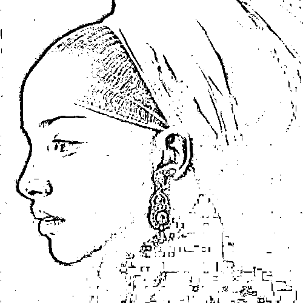 

作者/杰西卡·加菲尔德·卡巴拉 

翻译/luke 校对/Christy

在占星学十颗行星的命名中，令人震惊的是，竟然八颗都是由男性神灵命名而来。占星学在行星的解读上，是否存在过于偏向男性解读，而忽略了女性面向解读的情况？本文将就这一现象重点解读土星的意涵。本次刊发该文的第一部分，其余内容将在 7 月 7 日刊发。

## 灵魂故事、业力都在出生星图中显现

**占星学记录了灵魂的旅途和召唤。**灵魂不断轮回转生，活过了数不清的出生星图，每次转世都要在新出生星图独特的原型结构下生活、成长和创造。**出生星图反映了灵魂的业力、故事，以及显化和表达的潜力，但灵魂活出星图的方式，即原型，也受到了个体出生的历史和文化背景（在任何特定时刻人类的共业）的影响。**

每位占星师都听过这句话：**在某一特定时刻出生的生命体或所做的事，都携带了这一刻的特质。每张星图所代表的人物、地点或事件，都带有那一刻行星位置相应的原型特质。**

如果我们把好奇求知的目光投向原型的众神殿堂，对熟悉女性主义的人来说，不难发现十个行星中有八个都是以希腊罗马的男性神明命名的。这简直令人震惊，因为深度心理学早已指出，**原型、神灵，和人都有男性和女性的面向**。简单说来，男性和女性原则存在于我们每个人之中，不能单纯地把男性原则仅仅与男性相关联，把女性原则仅仅与女性关联，但我们很容易就犯这个错误。

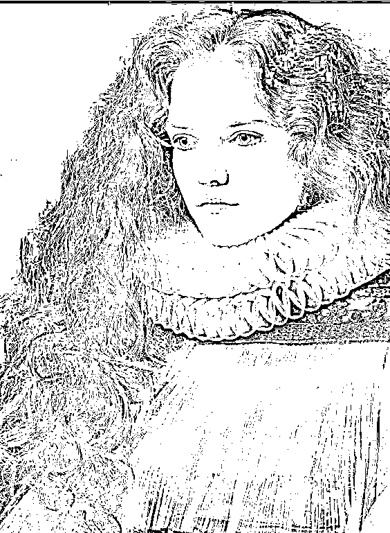

## 让我们一起思考土星的意象

因为土星掌管地球的现象世界，而且占星学是建立在地心说的基础上的，所以重估这个原型需要特别小心谨慎。在探索的过程中，我想要对这个孕育我们的传统（父系传统）保持尊重和敬意，因为我知道它有深刻的智慧和功绩，但也有破坏性的盲点和阴影。接下来我将从女性面重新审视西方宇宙学中的土星，以及和它有关的死亡和苦难的角色。

文化传统是通过不断重复的法律，规范，和制度而建立的，它反映了我们想象中的创世故事，以及我们在其中扮演了什么角色。我们想象中神灵的模样和我们相互互动的方式是紧密相连的。**一个文明对神灵和时间的理解决定了它有什么样的家庭结构、教育机构、科学、政府和宗教**。詹姆斯·希尔曼（James Hillman）在他具有分水岭意义的文献《论老者的意识》（*On Senex Consciousness*）中为西方文明阐述了这一现象：

**上帝在我们文化中的形象是这样的：无所不知，无所不能，永远存在，一把胡子，坐在椅子上，有不言自明的威信，通过抽象的正义、道德和秩序原则领导人民。他天性仁慈，但是当意志遭到侵犯时会发怒。他没有女性特质（没有老婆）和性面向。**

**——詹姆斯·希尔曼**

这幅图描述了一位老者式的上帝，衍生自老者的原型。我们文化最高的上帝就是老者式的，我们都是在这个形象之下创造出来的，我们的意识也反映了这一构架。

希尔曼描述的，是占星家眼中的土星原型，以及我们西方的意识结构是如何反映这位神明形象的。但老者就是土星的本质吗？还是说，像希尔曼暗示的那样，老者意识只是以某种偶然的方式，而非从本质上反映我们时代的文化规范？

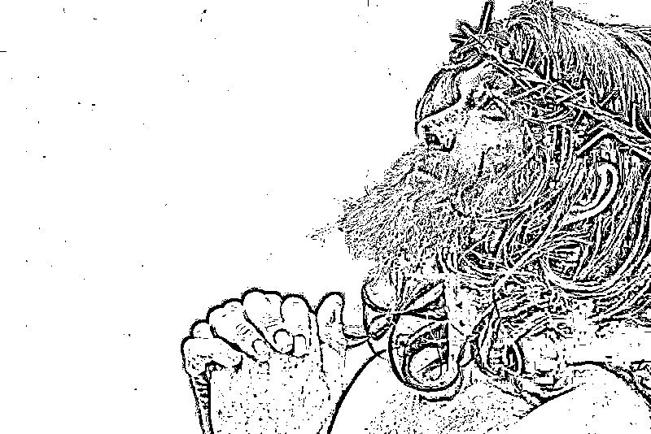

## 试试从母亲分娩的角度理解土星

**每个原型产生的问题，都在该原型之内有顺势疗法**。在不脱离土星本身的前提下，我们必须要找到它的其他面貌，来制约发展过度的老者原型。我们需要更深入地探寻一个多元化土星的本质和潜能，而不是为父权制和我们过度强调的阶级制度寻找解决方法。过度发展的老者意识给人类之间带来了分裂和隔离，治疗这个问题的药方在于找到土星作为女性和母亲的一面。

我们可以通过母亲生产的过程认识土星的女性特质。希尔曼指出，老者原型是没有女性特质和性面向的，但我们最原始的共生关系是和妈妈在一起的。**我们的身体成长于她赋予生命的子宫，那是我们物质身体的起源，时空生命的始点。**胎儿成功长大会给母亲带来极度痛苦的宫缩，毫不夸张地说，就像成千上万磅压力在挤压胎儿通过产道。我们在子宫海洋中的水生生命之旅结束了，重生后变成了呼吸空气的哺乳动物。从婴儿的角度来看，母亲的子宫是它们唯一的家，却被赶出家门走向死亡。

但从**母亲的角度来看，她们在历经艰辛，给予一个伟大的生灵以生命**。史坦·葛罗夫（Stanislav Grof）多次谈到他的发现和研究——基本出生母轴是和出生阶段相对应的，他说，**死亡和出生是同一枚硬币的两面。一个人出生时刻的本质含义，即他的创世故事，从根本上形成并引导了他的身心结构，通过这个身体（一个土星式容器）他将体验生命中发生的种种事件。**从母亲的子宫中排出，来到土星掌管的空间和时间的领域，这是一个残酷的惩罚，还是神圣的礼物？

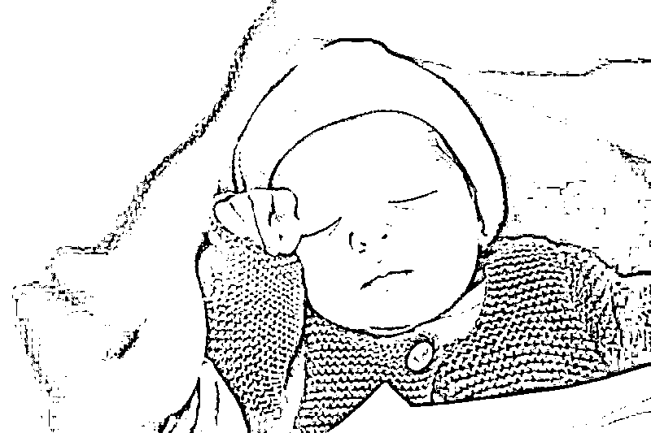

母亲的子宫是我们投胎到物质世界所乘坐的神圣的船只。我们能否看出，我们以肉体形式存在于地球上的生命，实际上是灵魂和心灵生命的神圣围地呢？我们能否看出，我们所面临的那些困境和阻碍，实际上对我们的成长和创造力是有益的呢？我认为，通过爱我们的问题，贴近我们的伤口，发现困境中的美，我们就会意识到，**我们应对挑战的方式，塑造了今天的我们。土星使我们变得真实，为我们带来生命中最珍贵的事物。**

理查德·塔纳斯在文章《原型占星学入门》中这样描述土星原型：

**从某种重要的意义上来讲，土星掌管了出生图本身，因为土星克罗诺斯是时间之主，它将时间中的一瞬间凝固，透过出生创造了一个独立的现实化身，然后用一生的时间来支撑那个原型时刻的全部意义，完成它所带来的全部挑战。**

**——理查德·塔纳斯**

这段描述介绍了土星的女性面向。在出生的时刻，我们和母体分离。我们的身体来自母亲，出生的时间是我们宣告脱离母亲的时刻，也带有该时刻独有的原型特质。正是在离开母亲子宫的时刻我们被打上陪伴我们一生的原型印记。我们出生星图上的行星描述了专属于我们的创世故事，随着时间的推移，这些故事情节将按照经过计算的、定性的行星运动逐渐在我们的人生中展开。因此，土星似乎既是时间之母，也是时间之父。

## 别抗拒土星女性一面的表达

很大程度上，占星学对我们和我们灵魂成长的启迪是：时间也有女性化的一面，它开启了时间质的维度。虽然不能单纯地把量化时间定义为有男性色彩，质化时间定义为有女性色彩，但就这么想也无妨，因为现代人们已经忽略了时间概念的内在性质，而这需要纠正。

数千年来，土星的原型表达已经被老者原则所挟持。老者意识中女性面的缺失反映了一种特定的原型附体状态，一种处于控制和等级制度中的状态。希尔曼写道：

**我们生活所依存的原则、自设的限制、周围的世界、我们价值的天秤（等级制度超越了价值本身），最重要的是，由控制所带来的秩序，包括自控和控制他人。这些都反映了老者的性质。**

****——詹姆斯·希尔曼****

我们生活所依存的原则、自设的限制、周围的世界、我们价值的天秤（等级制度超越了价值本身），最重要的是，由控制所带来的秩序，包括自控和控制他人。这些都反映了老者的性质。

女性面的缺失在心理层面显化为各种不同的形式。超级男性化的土星在心灵之内显化为喜好惩罚的超我，内化的父权制声音，过度膨胀的父亲的声音，却听不到母亲或女性的声音。吃掉自己孩子的父亲会想办法让孩子保持渺小、害怕的状态，这样孩子就会因为恐惧和耻辱而无法成长成熟。这种现象普遍存在于西方人对生命和日常秩序安排的心理取向中。深度心理学家芭芭拉·史蒂文斯·沙利文（Barbara Stevens Sullivan）描述道：

**我们极其抗拒女性化倾向。在各种场合下，我们都被教导，要掌控自己的生活，如果我们掌控得当，生活就会朝着积极的方向前进。我们被督促，不对抑郁和绝望屈服，要正面地思考。有清晰一致的证据表明，我们的文化否认黑暗和死亡，哪怕它们无处不在，没法逃避。就好像如果我们恰当地掌控自己的生活，就能永远开心幸福地活下去。这种态度并没有提高人们的幸福指数，反而使人们对自己的绝望和消沉感到罪恶，加剧了他们的痛苦。因为人生本来就有受苦的成分，只有对痛苦臣服，最后才能带来智慧。**

****——芭芭拉·史蒂文斯·沙利文****

从苦难中获得智慧，从混乱痛苦的生产过程中转世，化身于物质世界（物质的英文 matter 源自拉丁语 mater，指母亲），这些都属于土星的女性元素。

（未完待续）

**关于作者**


**杰西卡·加菲尔德·卡巴拉**（Jessica Garfield-Kabbara），占星师，心理咨询师，注册的婚姻与家庭治疗实习医师。从 2007 年开始实践原型占星学，提供占星咨询服务。她也是月度播客“关联性：原型占星学播客”（Correlations: The Archetypal Astrology Podcast）的嘉宾，该节目已开播 5 周年。2014 年，杰西卡在帕西菲卡研究生院获得咨询心理学硕士学位，研究方向为深度心理学。她的理论基础主要来源于理查德·塔纳斯、斯坦尼斯拉夫·格罗夫，以及原型占星学和超个人心理学。杰西卡教授原型占星学和深度心理学，也积极进行深度心理治疗方面的实践，将原型占星学的智慧和洞见同深度心理学整合起来。

***若道君：后台回复 杰西卡 能获得其相关文章推送~***


****如何走出“阴影”重获自由？2016 年 7 月 8 日-10 日，杰西卡·卡巴拉老师主讲的工作坊：如何与客户的阴影面工作要开课了！该工作坊会教你如何帮助客户减少痛苦，减少关系和生活中所经历的障碍。****

**报名点击文末“阅读原文”**


# 客户阴影面工作坊 | 7 月 8 日开课，果断报名！

> 原文：[`mp.weixin.qq.com/s?__biz=MzA5NjA0NTAxNg==&mid=2651385558&idx=3&sn=5e5b9d30ab17c5fe69883cb7a37eca3e&chksm=8b4a5c61bc3dd5771a9491baa6b1d4ebef9ac948754b944e4c9372c40c3177770f96cadd04b9&scene=126&sessionid=1692738816#rd`](http://mp.weixin.qq.com/s?__biz=MzA5NjA0NTAxNg==&mid=2651385558&idx=3&sn=5e5b9d30ab17c5fe69883cb7a37eca3e&chksm=8b4a5c61bc3dd5771a9491baa6b1d4ebef9ac948754b944e4c9372c40c3177770f96cadd04b9&scene=126&sessionid=1692738816#rd)

『每个人都有自己的阴影面。

我们每个人都会挣扎、受苦、受难，

这是我们作为人类共有的部分，

这部分也将我们作为人类联系了起来。

什么时候需要星图解读

或寻求某种形式的帮助和支持呢？

重要的转变期，

比如结婚、离婚、生小孩、换工作

或在巨变期、危机期和迷茫期。

我们都会在自己人生的不同时期需要帮助，

帮助他人很大一部分工作

就是了解、确认和把握他们的困难。

我惊讶的是，

每一次当我认识并把握住某人的阴影面时，

他们真的变得充满力量，更能做自己，

有了更充实的生活和人际关系。』

——**杰西卡·加菲尔德·卡巴拉**

**客户阴影面工作坊讲师**

**后台回复 杰西卡 可获得她[的相关报导](http://mp.weixin.qq.com/s?__biz=MzA5NjA0NTAxNg==&mid=2651385253&idx=2&sn=554fb5d308f23a0ffa00f9aa3b7bdad3&scene=21#wechat_redirect)**

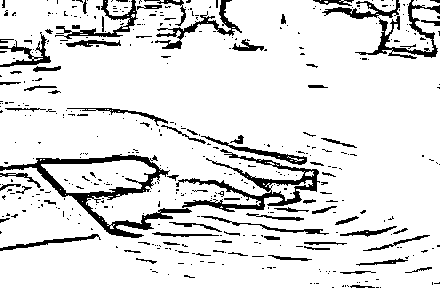

什么是**阴影**？它在心灵中的位置？

10 颗行星原型阴影面示例

出生图和行进中阴影带来什么信息？

作为占星师，你的**阴影面**是什么？ 

如果你无法处理好自己的阴影，

你的咨询会发生什么？

**如何了解、掌握、处理你的阴影？**

原型心理学和深度占星学怎样结合？

**如何和客户的阴影面工作？**

以奇幻的宇宙观看磨难和痛苦所扮演的角色

除了**现身说法，**

本次工作坊还将有

**至少两名现场学员案例分析，**

这是**一次咨询费**即可参加的工作坊，

关于**讲师**，

塔纳斯说，她，是**未来的丽兹·格林。**

你需要做的，

是**果断报名**，

剩下的事情交给我们。

**“如何与客户的阴影面工作”工作坊**

**授课时间：**2016 年 7 月 8 日（晚）、9-10 日（全天）

**授课老师：**杰西卡·卡巴拉

**授课方式：**北京工作坊，英文授课，中文翻译

**报名截止**：2016 年 7 月 5 日

**费用**：2800 元

**课程负责人：Sara**（**微信：2847613491**，请备注阴影报名咨询）

长按二维码添加课程负责人咨询~

**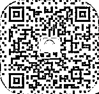**

**适 合 人 群**

这个工作坊是**面向所有程度的占星学生**的，

只需懂星座、行星、月亮交点。

在教学中，

我总是努力让教室中的每个人都能理解我教授的知识，

并且产生共鸣。

我的想法是，

让这个工作坊能够帮助到每一位

想要进行个人或职业占星解读

和/或任何从事帮助性职业的人，

让他们学到大量的知识。

在课上，我会将占星学和心理学恰到好处地融合起来，

我会讲到这两门学科的基础知识，

同时给中阶或高阶的学生讲授更深入的观点和洞见。

来参加工作坊的学员不需要对原型占星学有所了解，

我实践和教授占星学的方式适用于所有形式的占星学。

我会很愿意在工作坊中分享更多传统知识，

这样参加者可以更好地感受和理解原型占星学和深度心理学。

这门课欢迎所有程度的占星学员。

——**杰西卡·加菲尔德·卡巴拉**

**客户阴影面工作坊讲师**

**课 程 安 排**

**7 月 8 日，周五晚上**

*   开场：介绍杰西卡老师的人生经历、周末工作坊的目的

*   生活在一个奇幻的世界：透过占星学的视角观察人类和宇宙的关系

*   占星学解读时机：危机期，转变期，重大人生决策期

*   占星咨询师的角色

*   具有启发性的原型宇宙学与原型占星学

*   原型占星学与深度心理学的关系

*   荣格理论对阴影的理解及其在心灵中的天然位置

*   尊重客户出生星图和行进中阴影所带来的信息

*   占星师在帮助客户从一个有力的、富有意义的全新角度重新界定自己的人生故事时所扮演的角色

*   以奇幻的宇宙观看磨难和痛苦所扮演的角色

*   占星咨询师的伦理道德：处理好自己人生中的痛苦和磨难，我们才能成为更有洞察力、更务实和更能帮助他人的占星师。

**7 月 9 日，星期六**

*   回顾阴影的意义

*   十颗行星原型阴影面的示例

*   原型或神和女神的阴影面，为我们揭示出宇宙的本质：光明面与阴影面共存，改善人生和破坏人生的面向共存。

*   创造一个与客户之间的安全空间以建立联结和信任的原则

*   占星师的指导意图和我们工作目标中的重点和中心：

*   让客户有力量去过更充实的人生 —— 更充分的自我觉知和自我接纳带来更安宁的人生

*   在咨询前、咨询中和咨询后与客户的交流中，我们可以以一种亲密而神圣的方式支持他们的人生—— 黑暗中的光明

*   如何掌握阴影

*   案例展示。研究一位客户的星图，与客户的阴影面一起工作

*   心理教育和咨询技巧：以共情和理解的方式回应客户，使客户内在和外在世界正常化，并确认其人生经历

*   学员的评论和提问

*   以学员（志愿者）自己星图中的阴影面做示例 —— 通过现场解读学员的星图来掌握阴影面

*   学员提出曾遇到过的困难的解读示例，分析如何在将来解开这些难题

**7 月 10 日，星期日**

*   占星师的自我关怀：占星咨询前后的仪式

*   占星师的职业道德需要：要掌握客户的阴影面，首先要把握我们自己的阴影面

*   顺势疗法：问题和解决方案都隐含在每一个行星原型中：一些示例

*   案例展示，研究如何与客户一起应对阴影面

*   学员（志愿者）自己星图中阴影面示例 —— 通过现场解读学员的星图，掌握阴影面

*   学员的评论和提问

*   关于痛苦和磨难的宇宙哲学

*   占星咨询的馈赠：帮助客户疗愈心灵

*   结语：回顾我们在工作坊中所学习的内容


**了解详细课程内容及报名方式，点击文末“阅读原文”**


# Level 3 报名中 | 你能学到什么？来这里找答案

> 原文：[`mp.weixin.qq.com/s?__biz=MzA5NjA0NTAxNg==&mid=2651385536&idx=3&sn=8ea9facea20eb5d8ec4c719c132ba9d7&chksm=8b4a5c77bc3dd561be87fe4047af660e2201a420e83bcf482720ecb61ded0b4b056e378cec09&scene=126&sessionid=1692738816#rd`](http://mp.weixin.qq.com/s?__biz=MzA5NjA0NTAxNg==&mid=2651385536&idx=3&sn=8ea9facea20eb5d8ec4c719c132ba9d7&chksm=8b4a5c77bc3dd561be87fe4047af660e2201a420e83bcf482720ecb61ded0b4b056e378cec09&scene=126&sessionid=1692738816#rd)

为什么学习占星学？

每一个人学习占星学的渠道和途径不同，

但都是为了找到宇宙和我们自身的连接，

找到自我成长的路，

找到那些无数次仰望星空却不可得解的答案，

希望用自己所学去帮助自身的转化，

同时，

更希望用这些知识去帮助更多需要的人。

这是一条漫长的路，

也是一条艰难的路，

我们对于占星学的解读，

无法超越个人经验和成长的阈值，

换句话说，

如果我们自身无法站到更加宽广的地方，

占星学在我们手中也许就会变成生了锈的铁器，

而非屠龙宝刀。

为什么要学习 Level 3？

**Q**：为什么 Level 3 课程在占星学的系统学习中如此至关重要？

**A：**如果 Level 1 和 Level 2 是占星学入门级，

那么从**Level 3**开始，

你将进入**占星学更深入的领域**。

Level 3 课程**非常重要**，

在于它是大部分占星学习者**薄弱**的环节，

也是往下的学习中**承上启下**的一个重要阶段。

**Q**：Level 3 课程含金量最高的部分在哪里？

**A：**很多初学者或自认为有一定占星学经验的学习者，

并不能真正了解占星学的**玄妙之处**，

那就是**行星、星座和宫位**之间有多少种**可能性**，

又如何将它们串联起来，

像小学生**造句**一样去解读它，

通过这些串联，一张星图仿佛鲜活了，

**无数种**人生的体验和未来在向我们招手。

这时候你会发现，

原来一个配置会有**那么多种解读**，

而不仅仅局限于某一种“断命”式的说法。

这种**造句**，

恰恰是 Level 3 最困难但也是最美妙的部分所在，

也是贯穿整个 Level 3 的学习中需要**反复练习**的部分。

可以说，如果你不会运用占星学语言造句，

你就未能领略占星学的精妙所在。

**Q**：Level 3 还有什么有意思的课程安排呢？

**A：**

除此之外，

在这个阶段，

你将**深入学习宫位**，

知道生命的故事发生在哪里，

在解读中，**星座、宫位的差异**到底是什么。

你会学习**相位、行星**能量的行星之间的对话，

一颗行星如何用它的能量影响另外一颗行星。

你要学习如何**将星座、行星、宫位、相位组合起来**进行解读，

这是把散落的珠子穿起来的过程，

形成内容丰富、准确的解读语言。 

往届学员怎么说？

从 Level 3 开始，大家通过造句交流，不光对占星学，对我们这群学占星的人，也有了更深的认同，我们是在一起窥探宇宙的奥秘，而且我们是个团体，每个人都是其中一员，每个人，都有你没有的脑洞，交流让占星术语变得生动有趣，也让占星的学习更有动力。我是从三阶开始，才感受到占星学习的实质进展。

——2015 届学员 Norah 

我现在是 Level 5 学员，去年在读 Level 3 的时候，一开始是十分不能接受的，为什么每一种配置有那么多可能性，那么占星学的准确性在哪里？它的意义到底在哪里？直到一次案例课，大卫老师精彩的解读让我醍醐灌顶：原来占星学并不是机械教条的是非论，无数种可能性为我们讲述无数种精彩人生，而如果我们不能理解生命精妙的细微变化，我们就无法理解自己和他人的人生。每个人都是有故事的人，尊重个体，尊重生命的发展。通过 Level 3 的学习，我更明白了这一点。

——2015 届学员玫瑰

上 Level 3 以前，我对星图的解读线索是凌乱的。Level 1-2 学习了星座和行星的意象，它们有那么多的关键词，具体解读的时候该使用哪个？如何判断？了解的关键词越多，我心里的疑问就越大。后来，大卫老师给了我们答案。他告诉我们解读星图的脉络，用实例告诉我们如何选择关键词。解读星图的线索逐渐清晰了起来，盘主的故事也随着一次又一次解读而变得历历在目。

——2015 届学员牡沐 

**2016 若道核心课程 Level 3**

**授课时间：**2016 年 7 月 28 日-11 月 10 日（**每周四晚 20：00-22:00**，16 次课）

**授课老师：**大卫·瑞雷

**授课方式：**网络课程，英文授课，中文翻译

**报名截止**：2016 年 7 月 15 日

**费用**：7000 元

**课程负责人：童老师**（**微信： 196267205**，请备注 L3 报名咨询）

长按二维码添加课程负责人咨询~

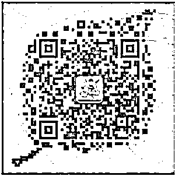

**导 师 介 绍**


**大卫·瑞雷（David Railey）**

若道创始人，《灵魂的目标》作者。拥有四十年的占星咨询的执业经验，曾两任亚特兰大占星协会主席，是全美占星师联盟（AFAN）、美国占星师联合会（AFA）、全美占星研究委员会（NCGR）、国际占星研究协会（ISAR）和职业占星师组织（OPA）的成员，是联合占星大会（UAC, United Astrology Conference）督导委员会委员。大卫曾是 CNN、CBS 的占星节目的常驻嘉宾，多次在 BBC、WGS、WSB、WRGG 等节目中接受采访，并在亚特兰大主持电视节目《每日行星（Daily Planets）》达 4 年之久。

**助 教 介 绍**

1

**天空的空**

2015-2016 年度若道核心课程专职助教。获得 ISAR 认证和“生时校正认证考试”资质认证。

2

**GAFF**

任 2015 年度诺·泰尔、斯蒂芬·弗里斯特老师的占星工作坊助教。

适 合 人 群

*   Level 3 课程需要你具备一定的占星学基础知识；

*   如果你是若道核心课程 Level1-2 的学员，强烈推荐你直接报名参加 Level 3 的学习；

*   如果你是自学或者从其他途径学习占星学的学员，请登录网页版寻找到 Level 3 入学测试来看看你是否可以直升 Level 3。

课 程 内 容

*   **宫位和四轴**

*   我们将会用具体例子看到同一颗行星，相同星座，在 12 个宫位时如何解读 

*   **相位**

*   合相、六分相、四分相、三分相、对分相、梅花相位、十二分相、T 三角、大十字

*   **相位和周期**

*   **组合解读**

*   行星落于星座的综合解读

*   行星落于星座宫位的综合解读

*   行星落于星座宫位加上相位的综合解读 

*   **守护星链**

*   如何通过守护星链解读


**了解详细课程内容及报名方式，点击文末“阅读原文”**


# 巨蟹座新月丨允许眼泪流下

> 原文：[`mp.weixin.qq.com/s?__biz=MzA5NjA0NTAxNg==&mid=2651385536&idx=1&sn=145aca19d7ea6161bf79d37d266d2ef0&chksm=8b4a5c77bc3dd561244fef7a78e08c0de2866979ca779ce07a423d4472a3a9d907ed18c9cfe7&scene=126&sessionid=1692738816#rd`](http://mp.weixin.qq.com/s?__biz=MzA5NjA0NTAxNg==&mid=2651385536&idx=1&sn=145aca19d7ea6161bf79d37d266d2ef0&chksm=8b4a5c77bc3dd561244fef7a78e08c0de2866979ca779ce07a423d4472a3a9d907ed18c9cfe7&scene=126&sessionid=1692738816#rd)

作者/Cora ISAR 认证占星师

图片/Pinterest

**巨蟹座新月**

本次巨蟹座新月发生在 2016 年 7 月 4 日 19:00，月亮合相太阳在巨蟹座 12 度 53 分。新月时刻都是许愿的良机，想要免费获得私人订制版新月报告，快戳“**阅读原文**”。

**允许自己脆弱，是疗愈的开始**

**本次巨蟹座新月发生在 2016 年 7 月 4 日 19:00，月亮合相太阳在巨蟹座 12 度 53 分。**

巨蟹座的太阳和月亮合相准确三分海王星，同时金星、水星也在巨蟹座，形成一个巨蟹座的“星群”。我们似乎**进入了一个被情感疗愈的能量包围的时刻**。在土星和海王星成四分相的“悲悯情怀”的大背景下，这确实是一个机会，让我们对心中的柔软与脆弱敞开，去看到、接纳自己真正的情感需要，去允许眼泪流下。

**允许眼泪流下，是疗愈的结果，也是疗愈的开始。**

**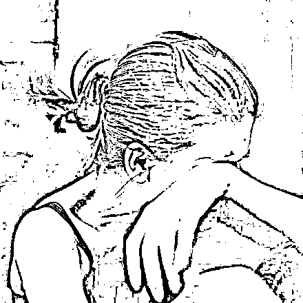** 

**你的情绪、安全感都与巨蟹座有关**

**爱从未远离，爱就在你心里——爱，是你。**

**巨蟹座掌管情绪、安全感来源、与“家”或过去相关的事物——内心的“根”。**它是三个水象星座中，最直接地反映“人类情感”的星座。因为它代表了那些让一个人感到“能够安全存活”的最基础的、本能的需要——来自母亲的保护和照料。这是根植于我们内心的最初的巨蟹式需求，是每个人心中最柔软、敏感的部分，有时也是最不易碰触的部分。

**几乎所有对于情感议题的探索，最终都可以回溯到童年，特别是与母亲的关系，在这里找到答案。在占星学中，这就是“月亮”的部分，是巨蟹座能量原型的部分。**

**那座情感的冰山，冻住了我和母亲**

在我的出生星图中，月亮合相土星、天王星，对于了解占星学的人来说，这个强有力的相位带来的情感模式上的挑战，无需多言。少年时的我，跟母亲有过关系非常紧张的时刻，多年后的今天，那些带来紧张情绪的事件都已过去，关系的水面恢复了平静，但压力和苦楚或许只是被冻在了回忆的冰山。

**在很久的时间里，我以为那只是我的冰山。但当我写到这里的时候，我才忽然想到，那不只是我的冰山，也必然，是她的冰山。在我们心里的某个位置，冻着我们两个人。**

**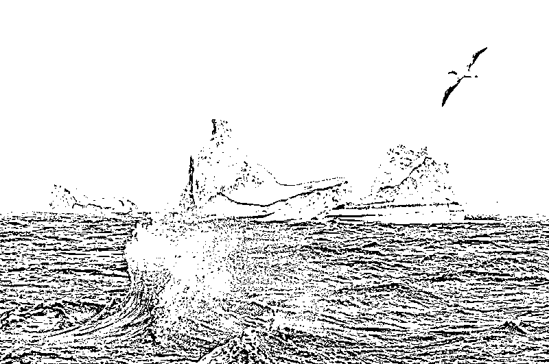** 

最近几年，母亲极少主动联系我，而我也极少主动与她交流；交流时不会有任何“不正常”，但似乎都在回避主动联系对方，这成为我们母女之间的一种“特殊的默契”。最近一次与父亲通电话（大概就是金星刚刚进入巨蟹座的那几天），我突然觉得，应该改变点什么。

我让爸爸把电话交给妈妈。我对她说，你都不跟我说话呢，也不想我。她似乎有些不好意思，说你跟你爸说就好啦，反正他都会告诉我。我说，那怎么能一样，你都不联系我，我怎么知道你关心我呢（是啊，有时真的不知道）。她说，我怕你烦嘛，总觉得以前管你太严了。我以我月亮射手座的玩笑态度“求关心”，她以她月亮水瓶座的洒脱态度从容接招，两个女人以天王星的方式，行月亮之事。

我们又聊了许多家长里短，分享了许多想法态度，挂上电话后，我没有特别的情绪，但觉得，肯定是做对了一件事。一件或许挺重要的事。

**情感的流动，是有方向的；它的凝结，也有方向。而当一个人开始融化，另一端的人也会接收到那份温暖，从而松绑。**

**坚强的人儿，你会照顾内心的小孩吗？**

**成年的我们，内心的某个位置，始终都还住着一个柔弱的、需要被保护和关爱的小婴儿。但如同母亲会不懂得如何面对孩子，我们也常常不懂得如何面对那个心里的“它”。**

社会和环境推崇坚强、自制与成功，而一个敏感、易感、容易流露出自己的情感需求和脆弱面向的人，常被贴上“软弱”的标签。渐渐地，我们都学会了隐藏情绪，将真实的情感需要掩埋，成为一个“成熟”的人。

**这样一个“成熟”的人，不会感情用事，不会妇人之仁——他不会掉眼泪。他在阻止了脆弱和悲伤的同时，也阻止了对爱的感受。**

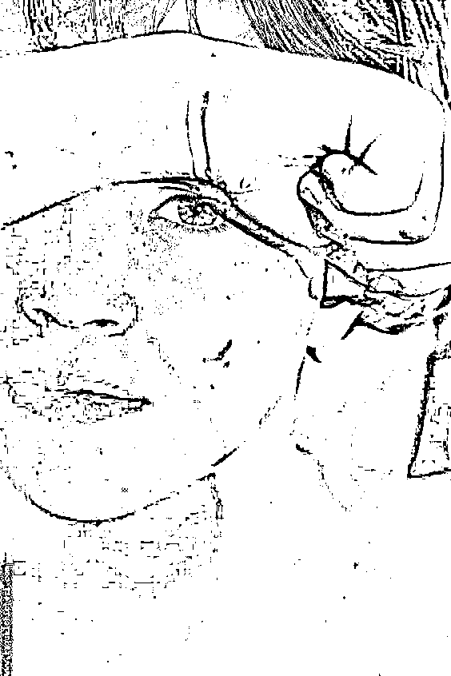

**巨蟹座新月：联结内在的机会**

当巨蟹座新月与海王星成三分相，我们有了一个机会，去接纳内心的柔软和脆弱，去融化冰山。情感的疗愈通常经由“关系”发生，可能是爱人、亲人，也可能是朋友，甚至指向一个更大的存在——世界。**此时的宇宙能量，确实给了我们一个机会，去感受到这个世界上无处不在的情感的流动与联结。**

电影《辛德勒的名单》里有一句话：**拯救一个人，就是拯救全世界。**在灵魂层面上，这是非常真实的。对一个生命的爱，会让我们连接到整个世界的爱。

**允许眼泪流下，不仅是爱自己的方式，也是爱这个世界的方式。因为当你拯救了自己，你也在拯救世界。**

**作者简介**

**占星师 Cora**，本名付凌宇，毕业于中国传媒大学，自 2010 年开始接受系统的西方占星学教育，师从美国占星师大卫·瑞雷老师，于 2013 年获国际占星研究协会（ISAR）职业占星师资质认证。译有《变幻的天空：现代预测占星学》一书（斯蒂芬·弗里斯特 著），曾为《心探索》《北京青年周刊》《上海电视周刊》《空中生活》等杂志媒体撰写星象及星座类稿件。现为全职占星师，接受占星咨询个案预约。对占星学持人本主义态度，致力于帮助客户探索命运的不同可能，活出更加圆满、有成就感的人生。

**微信公众号**：聆宇 FM（ID：lingyudiantai）

**个人微信号**：CoraAstro

长按二维码，让金钱涌向传播知识与智慧的人~


**特别提醒：**

**本文首发于若道平台，**

**转载请联系后台授权。**


******7 月 4 日就是巨蟹座新月了，每到新月时分，都是播种心愿的时刻。点击“阅读原文”，免费领取你的新月报告。******


# 干货 | 怎样从星图上看到升职加薪的可能性

> 原文：[`mp.weixin.qq.com/s?__biz=MzA5NjA0NTAxNg==&mid=2651385536&idx=2&sn=be7624869a650f17440b56ad449ba143&chksm=8b4a5c77bc3dd5619f3910aacd5f7b045a46c3f2efe6d818553d3946f9e50ba20611076238fe&scene=126&sessionid=1692738816#rd`](http://mp.weixin.qq.com/s?__biz=MzA5NjA0NTAxNg==&mid=2651385536&idx=2&sn=be7624869a650f17440b56ad449ba143&chksm=8b4a5c77bc3dd5619f3910aacd5f7b045a46c3f2efe6d818553d3946f9e50ba20611076238fe&scene=126&sessionid=1692738816#rd)

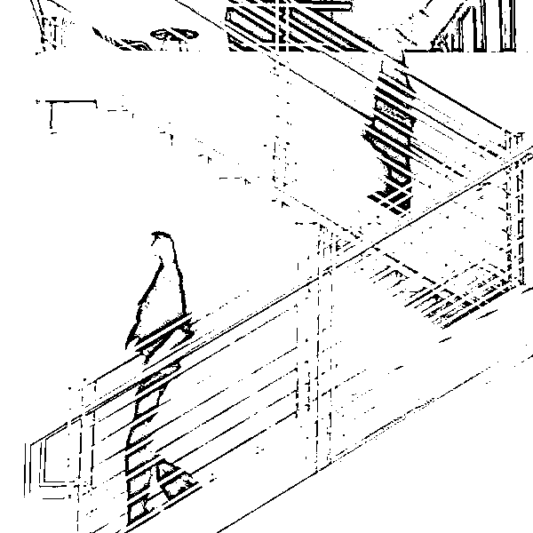
作者/爱丽丝·德维尔 图片/VCG

翻译/轩轩 校对/Christy

“

在此文中，我们假设你对自己的工作和所选择的职业领域非常满意。在找到与你的技能完美契合的工作前，你可能已经进行了大量的深入思考。绩效反馈表明你的贡献正在改善公司的经营状况。老板表现出了赞许。而在你热衷于别人的赞赏的同时，你还想要更多，比如不错的升职和更丰厚的薪水。你应从何处寻找职业轨道上升的依据呢？

”

## 在星图中寻找升职或涨薪的迹象

商业和职业领域是复杂而富有挑战的。我们中的大部分人在决定什么是最适合自己的人生脚本之前，都会走过很多弯路。途中可能非常痛苦，但是在突破瓶颈后，就会获得相当大的认可和回报。

**升职或涨薪的迹象** 

 当你寻找升职或涨薪的迹象时，看看是否有**外行星和出生星图中的职业和工作宫位（十宫、六宫）产生了联系**。外行星指的是**木星、土星、天王星、海王星和冥王星**。这些行星比**个人行星（月亮、水星、金星和火星）**的运行速度慢，所以它们对代表成就的宫位的影响更大。 

和行星产生联系指的是**两颗或多颗行星或宫头之间产生关系或相位。**影响力高的相位之一有**合相**，即**外行星移动到了和出生星图中的行星或宫头相同的度数**。**四分相**（彼此间**90 度的相位**）是**困难的驱动力量**，常常**迫使你重新思考策略**，并最终让你更有市场。你可能会获得升职，但通往升职的每一步你都必须为之付出努力。 

**有利相位**是指**与成就宫位内的行星或宫头形成的和谐相位**，包括**三分相（120 度）和六分相（60 度）**。好运似乎恰到好处，你好像在对的时间处于对的位置。

## 不同的外行星带来的不同境况

**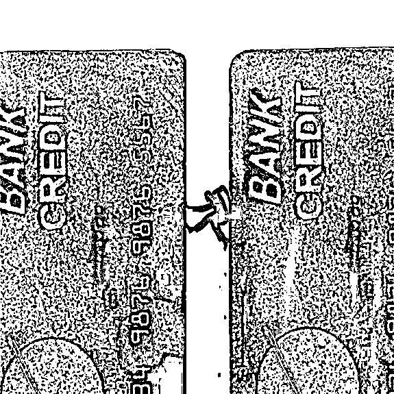** 

**木星**是最常和**升职**联系在一起的行星。**木星和重要的工作、金钱宫位产生相位的个人，经常处于事业上升期，获得别人梦寐以求的升职**。木星几乎每 12 个月换一次星座。

**土星**经过这些宫位会带来更多的**责任**，一般也会有新的**工作动力**。如果**土星**与代表事业的**十宫或十宫内行星**产生联系，常常意味着**上升到最高点**。

**天王星**会带来工作场所的**突然变化**。你常常在现状有变时，获得**意外的升职**。个体在工作环境内外的活动会创造出**新的机遇**。在**天王星与个人行星产生联系**的七年周期中，个体通常会**多次获得升职或变换工作**。

当**海王星**在升职中发挥作用时，常会给工作本身带来**创造性**的或**哲学性**的影响。你会获得更多**内在的满足感**，而不是巨额的涨薪。

**冥王星**行进下的升职意味着，你**对收入的态度**有了深刻的**重大突破**。那些经历冥王星行进到事业或工作宫位的人，常常会**评估工作中的瓶颈**，**摆脱刻板而乏味的生活方式**，拥抱一个**薪水更高**的新的事业领域。

## 其他宫位也会给予事业相关信息

除了六宫和十宫之外，其他一些宫位也会给予事业相关信息。

**二宫**表现了你**推销自己才华和赚钱的个人偏好**。这个宫位也体现了你**花钱的方式和对物质的态度**。

**五宫**体现了你**展现创造力和创业能力**的方式。在适当的行星格局的推动下，你可能会**赌博**、**中彩票**、试着**参加冒险活动**。

看**六宫**时，不仅是看**工作**本身，也是要看**什么类型的工作环境会让你表现最优**，并且有**不断进步**的机会。

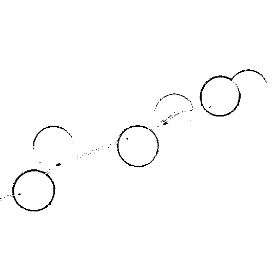

如果你有**事业伙伴**，那么**八宫**会表现出**财务状况和共有资源的配合度**，以及**有利于此合作的重要投资**。

除了代表“**事业宫位**”，**十宫**也描述了你的**老板、职业，**以及在所属领域你将**如何被认可为专家**。认准目标坚持到底，你就能在登顶的路上吸引你渴望获得的关注。

最后，一旦**十宫的权威认可了你的成就**，那么**十一宫**就意味着**你将作为公司成员，分得津贴、加薪、奖金、奖励和喝彩**。

你必须在**至少一个金钱和事业宫位**上有所活动，才能**激活升职周期**。**行进带来的能量将触发渴望的改变，但如果没有行动，那么不管你如何期待，机会都是无效的**。从职业角度来看，停滞对你来说并不妙。有时，升职并不一定来自公司内部。

如果你在职业发展中处于不稳定的状态，那么也许你需要有资质的导师或咨询师给你建议。也有可能是你公司的问题，在职业阶梯更诱人的工作环境中，你会登上最高峰。对你的才能和经验保持自信，像个胜者一样！更新你的简历，发送给万能的网络。不久，就会有猎头给你提供众多就业机会。你的升职近在咫尺。

**作者介绍**

**爱丽丝·德维尔（Alice Deville）：**占星师、工作坊讲师和作家，从业已超过 25 年。在占星实践中结合了多种咨询技巧，包括商业、金融和变更管理、房地产以及直觉洞察。

**特别提醒：**

**本文首发于若道平台，**

**转载请联系后台授权。**


****宫位还可以告诉你更多！由大卫·瑞雷老师**讲授的**若道核心课程 Level 3，会教你将**星座、行星、宫位、相位这些散落的珠子穿起来，**带你进入更深的自我探索与成长的旅程。本课程将于今年 7 月开课，敬请期待！****

**报名及咨询，请点击文末“阅读原文”**


# 你有一份免费的新月报告待查收！

> 原文：[`mp.weixin.qq.com/s?__biz=MzA5NjA0NTAxNg==&mid=2651385535&idx=1&sn=3c23220c0e30ddbf908437076902ab70&chksm=8b4a5c08bc3dd51e48512e4e1624f8118424501a551b23ee05f920088a53cce1c35e7501a77b&scene=126&sessionid=1692738816#rd`](http://mp.weixin.qq.com/s?__biz=MzA5NjA0NTAxNg==&mid=2651385535&idx=1&sn=3c23220c0e30ddbf908437076902ab70&chksm=8b4a5c08bc3dd51e48512e4e1624f8118424501a551b23ee05f920088a53cce1c35e7501a77b&scene=126&sessionid=1692738816#rd)

**7 月 4 日 19：00 我们将迎来巨蟹座新月。**

**在新月来临前，** 

**你就能在若道免费获得专属于你的新月报告，**

**并且进行新月许愿。**

**手机党们，****点击文末“阅读原文”**

**直接在手机上获取报告，** 

**在线许愿并分享吧！**


**提示：如何查看报告**

点击公众号下方菜单栏“若道查询”——“个人中心”——“我的报告”

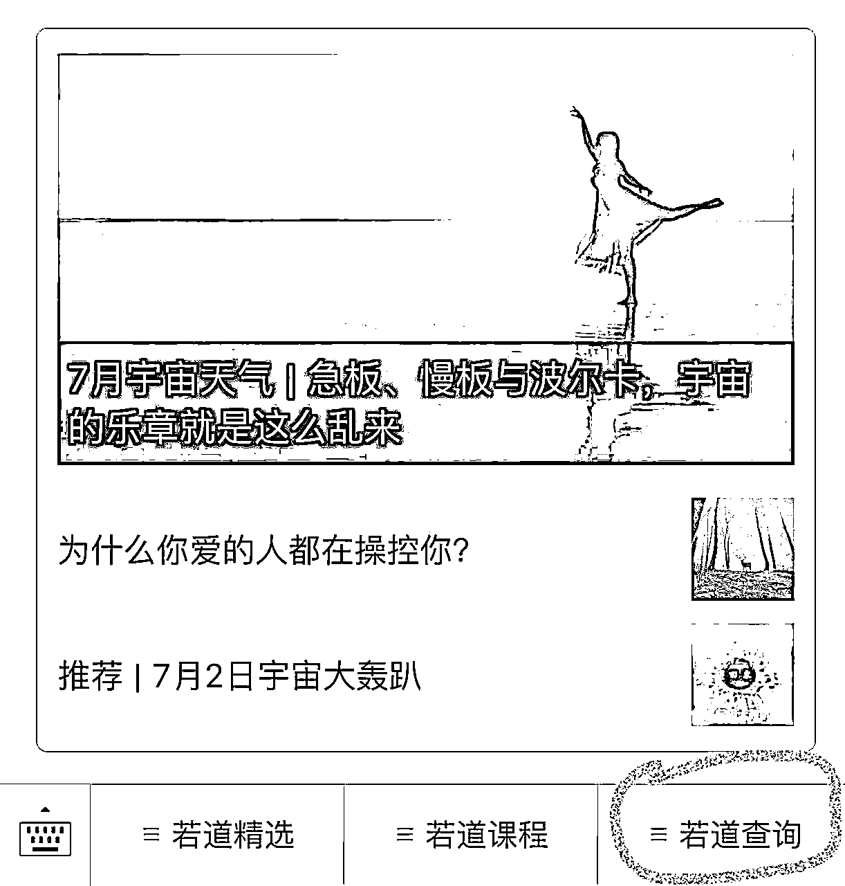

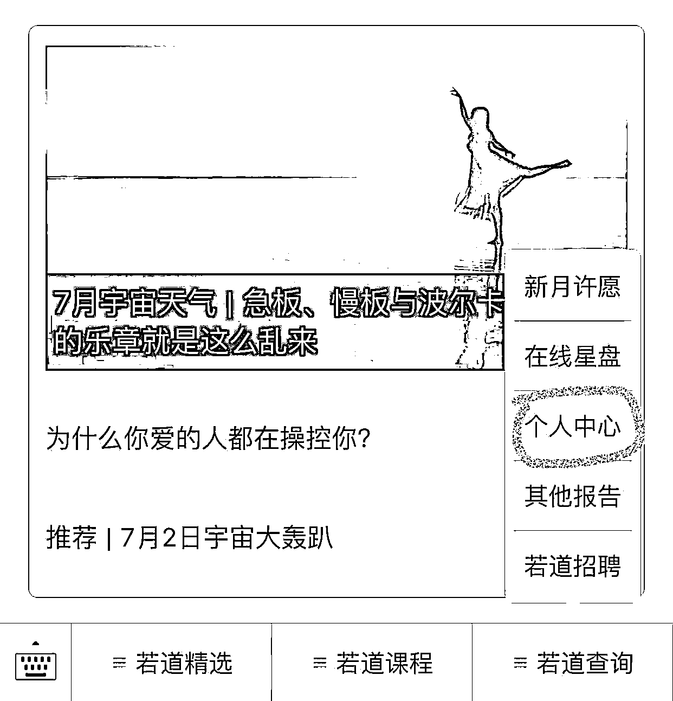

*如果还是找不到，若道君也没办法了……*

**操作起来很简单哦：**

***1\.*** 进入首页

***2.*** 点击“新月祈祷”

***3.***登录账户

***4.*** 填写出生信息

***5.***查看报告、许愿

**【步骤一】点击新月的祈祷**

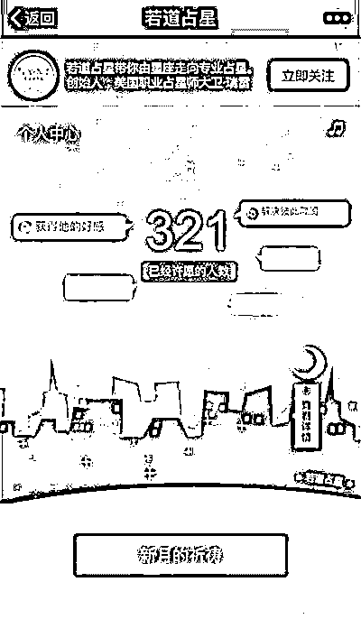

**【步骤二】输入姓名**

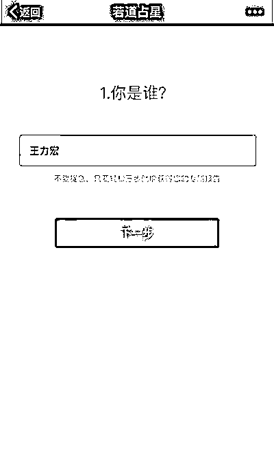

**【步骤三】输入出生信息**

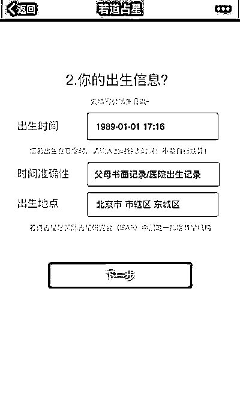

**【步骤四】生成新月报告**

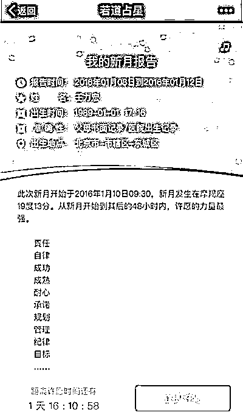

**最下方有许愿按钮，左边是倒计时提醒哟~**

**在合适的时间就可以许~愿~啦~**

**【步骤五】许愿！**

**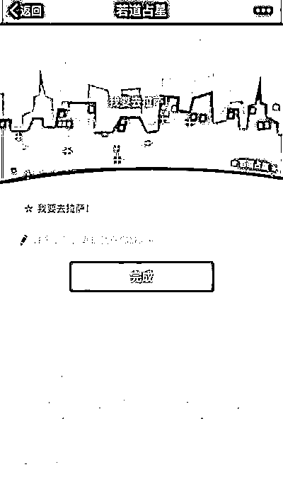** 

**【步骤六】让宇宙看到你的愿望并分享！**

**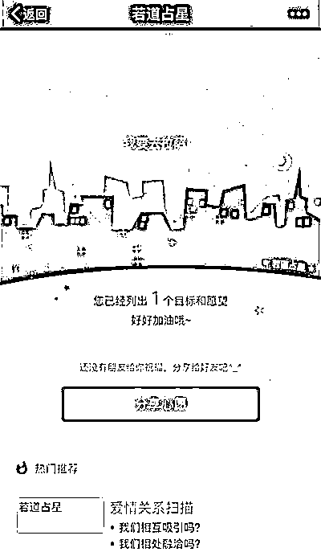** 


**小伙伴们还等什么？**

**赶快点击→左下角阅读原文****吧！**

# 7 月宇宙天气 | 急板、慢板与波尔卡，宇宙的乐章就是这么乱来

> 原文：[`mp.weixin.qq.com/s?__biz=MzA5NjA0NTAxNg==&mid=2651385526&idx=1&sn=eab5564a90d6271c4f1a16b52ec2f0c8&chksm=8b4a5c01bc3dd517e14ac4fb8714952b8cf1cd7422a05c63178b19c746cc8ac97a0aeb5fc10c&scene=126&sessionid=1692738816#rd`](http://mp.weixin.qq.com/s?__biz=MzA5NjA0NTAxNg==&mid=2651385526&idx=1&sn=eab5564a90d6271c4f1a16b52ec2f0c8&chksm=8b4a5c01bc3dd517e14ac4fb8714952b8cf1cd7422a05c63178b19c746cc8ac97a0aeb5fc10c&scene=126&sessionid=1692738816#rd)

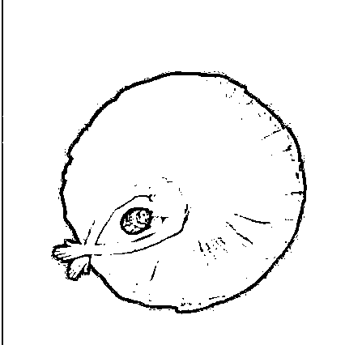
作者/咔咔  ISAR 认证占星师

图片来源/Pinterest

宇宙在 7 月奏响了两部风格迥异的乐曲。7 月上半旬，柔和优美的慢板与风暴降临的急板交织，天空中时而隆隆闷雷，惊醒人们的白日好梦，狂风怒吼、电闪雷鸣，豆大的雨点开始打落。雨过天晴后，夏日的烦闷消散，蓝天白云，枝叶婆娑。

7 月下半旬是轻快洒脱的波尔卡，人们载歌载舞，兴高采烈，欢庆生命的多姿多彩，同时准备迎接秋天的丰收。

***若道君友情提醒***

*天蝎座火星在 6 月的最后一天恢复顺行，在七月上旬余韵犹存，在启动新事务的同时，需要注意冲动和愤怒的情绪。*

七 月 上 半 部

*急板-慢板-急板*「

7 月 1 日-7 月 11 日

激烈的情绪和金钱游戏的博弈

」

**7 月 1 日**  金星（巨蟹座）对分冥王星（摩羯座）

**7 月 2 日**  金星（巨蟹座）六分木星（处女座）

**7 月 4 日** 巨蟹座新月（12 度 54 分）

**7 月 5 日**  水星（巨蟹座）三分海王星（双鱼座）

**7 月 7 日**  金星（巨蟹座）三分火星（天蝎座）

太阳在巨蟹座合相水星，同时对分冥王星（摩羯座）

金星（巨蟹座）四分天王星（白羊座）

**7 月 8 日**  水星（巨蟹座）六分木星（处女座）

**7 月 11 日**  水星（巨蟹座）三分火星（天蝎座）

水星（巨蟹座）四分天王星（白羊座）

《7 月》乐章刚刚开始，就奏响了金星与冥王星碰撞的激烈旋律。

金星在巨蟹座渴望安全与稳定，人们想要在爱人的臂弯里休息，在家里分享美食与欢笑。**当这种浪漫与温柔的情感（金星巨蟹座），遭遇了专制、强大的权力、毁灭和重生的力量（冥王星摩羯座）**，好像风暴要吹翻屋顶，冰雹砸破玻璃，舒适与安全不见了，强烈的情绪爆发出来，贪婪、恐惧、嫉妒、憎恨……人们或者遭遇了外部世界邪恶力量的冲击和诱惑，或者被内心的翻腾的情欲给吞噬，一系列狗血虐心的剧集在上演。

感情关系里患得患失，当局者迷惑在“你到底爱不爱我”、“你爱我多一些，还是我爱你多一些”这样的内心戏里，感情关系里非要拼个你死我活。

这时候还有一场**金钱游戏的博弈**，冥王星同样会在这个部分给予挑战。 

*   **6 月 30 日-7 月 1 日期间，处理房地产交易、投资买卖、家族财产、商业谈判等事宜，需要额外的小心**。因为你很容易陷入到一个权力和金钱的陷阱里。 

*   7 月 2 日看起来更像是一个合适进行**经济往来、交易、谈判、感情交往和联谊**的时段，金星在巨蟹座与木星处女座的组合，利于进行**房屋整修、装饰**等活动。也可以**在家里开 party**，届时人们更容易表现出**性格中温和、包容、带有同情心**的那一面，这种善意可以被更好地用于服务社会或者帮助他人的事情上。

**中招人群**

个人行星（太阳、月亮、水星、金星、火星）在开创星座（白羊座、巨蟹座、天秤座和摩羯座）15-17 度

**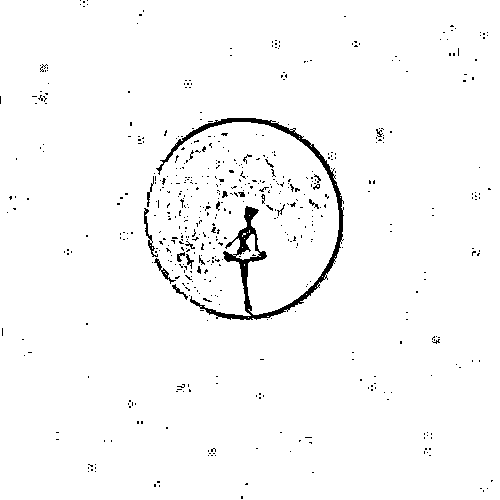** 

**7 月 4 日的巨蟹座新月，《7 月》的乐章进入慢板**。紧张与躁动褪去，天空中飘浮着暴雨后青草和泥土的芬芳。大地母亲张开怀抱，把受伤的灵魂轻轻环住。

“是啊，孩子，这场风雨可真大啊。现在没事儿了，在我这里歇歇吧。”

“你不需要完美和坚强，我看到真实的你，孩子，你在我这里是安全的。”

**这是播下同情和爱的新月，是柔和和包容的爱**，“爱你青春欢唱的时辰，也爱你苍老的脸上的皱纹”。

种下一颗“巨蟹座”的种子，用耐心、包容和同情浇灌它，让它深深地扎根，在家庭与信念里汲取养分，让它向天空延伸，用枝叶与他人连接，相触在云里。

> #### 白羊座、巨蟹座、天秤座和摩羯座 11-13 度的朋友们这次一定许愿哦~

*   7 月 5 日，水星与海王星形成柔和的三分相，水星在巨蟹座与双鱼座的海王星的组合强调了直觉和灵感，在此期间适宜进行**艺术创作、冥想等与情感和直觉相关的事情**，**不利于逻辑性思考和客观的陈述**。 

*   7 月 7 日，金星同时与天王星和火星形成相位，宇宙奏出曼妙的旋律，有情人在风中扭动腰肢，眼波流转间怦然心动。这创新的能量**给现有的感情关系带入新鲜感，帮助人们结识新的异性，也会有益于艺术创作**。当天太阳与水星合相在巨蟹座，紧密对分了摩羯座的冥王星。人们可以**相信自己的直觉和敏感力，打破陈旧和固有的信念，迸发出新的洞察和商业决策**。 

*   7 月 8 日和 11 日是两个很好的推广这些新想法的时机，尽可能多**安排会议、脑力激荡、提案、写作**等活动。对于那些需要出差的人们，需要**小心旅途中发生的意外**。

**中招人群**

*   个人行星（太阳、月亮、水星、金星和火星）在开创星座（白羊座、巨蟹座、天秤座和摩羯座）15-17 度

*   水象星座（巨蟹座、天蝎座和双鱼座）22-24 度

七 月 下 半 部

*波尔卡*「

7 月 12 日-7 月 31 日

温柔的乐曲结束了

」

**7 月 12 日** 金星进入狮子座

**7 月 14 日** 水星进入狮子座

**7 月 17 日** 水星合相金星（狮子座）

**7 月 19 日** 水星（狮子座）三分土星（射手座）

**7 月 20 日** 金星（狮子座）三分土星（射手座）

摩羯座满月（27 度 40 分）

**7 月 22 日** 太阳进入狮子座

**7 月 27 日** 水星（狮子座）三分天王星（白羊座）

**7 月 30 日** 水星（狮子座）四分火星（天蝎座）

天王星在白羊座 24 度 30 分逆行

**7 月 31 日** 水星进入处女座

7 月中旬，金星与水星接连进入狮子座，温柔的乐曲结束了。负责沟通和情感的水星金星离开了内向敏感的巨蟹座，**人们能感受到华丽、慷慨和热情的气氛**。他们对事物充满了好奇，他们要欢唱，跳舞，要对新鲜的事物感到惊喜！他们需要被关注，被称赞，尤其在 17 日金星与水星合相的期间，人们的**表达更加积极正向，甚至是夸大其词**。

但是接下来与土星的三分，会修正这个倾向。土星射手座会调整金星和水星过分夸张和爱面子的特质，人们可以**适当的思考，要怎样带着热情（狮子座）来完成一些自己相信的事业（射手座）**。

**20 日发生的摩羯座满月**呼应了土星的主题，这个满月让人们从上半个月的水相能量中抬起头（水相能量是指群星巨蟹座，火星天蝎座和海王星双鱼座），**在自我（巨蟹座）与责任（摩羯座），事业（摩羯座）与家庭（巨蟹座）中寻找一个平衡点**。

这个满月与天王星有一个略宽的四分相，需要**小心情绪冲动带来的意外事故**。金星与土星的加入，带来了**更积极的能量**。**人们有更多的信心（射手座）和热情（狮子座），尊重直觉（巨蟹座），创造性地（天王星白羊座）寻找解决的方案（摩羯座）**。

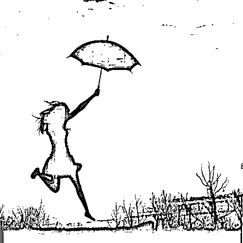

**中招人群**

*   个人行星（太阳、月亮、水星、金星、火星）在开创星座（白羊座、巨蟹座、天秤座和摩羯座）26-28 度

*   火象星座（白羊座、狮子座和射手座）9-11 度

*   **7 月 22 日，太阳进入狮子座**。在狮子月，**人们会为自己和他人感到骄傲、发自内心的喜爱、真心的赞赏和发挥各种创造性的能量**。这是人们前进的动力，也是灵感的来源。 

*   **7 月 27 日水星与天王星形成三分相**，利于**创造性的表达**。但是水星在狮子座的盲点是过于关注和强调自我，甚至是自大和不尊重他人。 

*   **7 月 30 日水星与火星的四分相**，容易因为这种不尊重他人的表现与他人**发生冲突**，由于火星在天蝎座属于强有力的位置，需要**特别小心沟通方式或交通事故造成的暴力伤害事件**。

**天王星逆行预警**

乐章进行到月底，旋律放缓，天王星开始了为期 5 个月的逆行。**12 月 29 日之前，天王星都处于逆行的状态，让变革和创新的力量从外收敛到内部，这时候的革新会是发生在内心深处**。天王星尊重真实，它会在这 5 个月里时不时地问问你，**“你要做一些什么改变呢？是什么让你固守在原地？是什么束缚了你？”**

当然对于那些**个人行星在开创星座（白羊座、巨蟹座、天秤座、摩羯座）在 20-24 度**的朋友们，天王星逆行意味着**再一次地碰触个人行星代表的领域**，“一回生，二回熟”，希望你们不要再被天王星给吓到，主动迎接这些人生变化吧。

*   **7 月 31 日，水星进入处女座**。人们的**沟通和思考回归逻辑和客观**。一个月后，水星在处女座 29 度 05 分开始逆行，建议大家**在 8 月抓紧时间，未雨绸缪，把需要开的会都给开了，需要做的报告都交了，需要出的差都给出了**。咱们踏踏实实来迎接水星逆行。

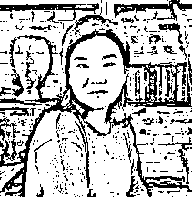

**占星师咔咔**：2010 年开始学习占星学，若道首届学员，国内最早获得 ISAR 职业占星师资质的职业占星师。在国际知名广告公司和市场研究公司从事的市场研究和推广工作十余年，曾任职于阳狮集团、尼尔森市场研究有限公司、MTV 和《Madame Figaro》杂志。现在为《时装男士》、活法儿等媒体供稿。

微信公众账号：咔星人

星盘解读和运势咨询：cji1029@qq.com

长按二维码，让金钱涌向传播知识与智慧的人~


**特别提醒：**

**本文首发于若道平台，**

**转载请联系后台授权。**


**跟随宇宙乐章也要夯实占星基础。由大卫·瑞雷老师**讲授的**若道核心课程 Level 3，会教你将**星座、行星、宫位、相位这些散落的珠子穿起来，**带你进入更深的自我探索与成长的旅程。本课程将于今年 7 月开课，敬请期待！**

**点击“阅读原文”了解详情**


# 为什么你爱的人都在操控你？

> 原文：[`mp.weixin.qq.com/s?__biz=MzA5NjA0NTAxNg==&mid=2651385526&idx=2&sn=bd659ad8e7fa4cccc2a60d35c9fc0ee7&chksm=8b4a5c01bc3dd517a787752ede00df1050c09adcd499485bfcfa5ffcd6b931bf331afcdddeab&scene=126&sessionid=1692738816#rd`](http://mp.weixin.qq.com/s?__biz=MzA5NjA0NTAxNg==&mid=2651385526&idx=2&sn=bd659ad8e7fa4cccc2a60d35c9fc0ee7&chksm=8b4a5c01bc3dd517a787752ede00df1050c09adcd499485bfcfa5ffcd6b931bf331afcdddeab&scene=126&sessionid=1692738816#rd)

授课人/杰西卡·卡巴拉 翻译/幼婷 

整理/佳黛 图片/VCG

6 月 22 日杰西卡·卡巴拉阴影沙龙爆满，没有赶上的小伙伴，若道君整理了精华给你们~在 7 月 1 日的天象中，行进的金星对分冥王星，正巧沙龙提到了金星和冥王星相位，应景读读呗？

7 月 8 日-10 日，[阴影工作坊](http://mp.weixin.qq.com/s?__biz=MzA5NjA0NTAxNg==&mid=2651385430&idx=3&sn=f20735da7c9290a7d02b870831cbacfe&scene=21#wechat_redirect)即将开课，内容会比沙龙更加深入，对阴影面工作感兴趣的话，赶紧点击阅读原文报名吧！

光和阴影面是共生的

一切人和事物身上都有光和阴影的面向。每一个行星、星座、宫位都有光和阴影的面向。它们不是分离的，而是一体两面的。所以，当我们表达原型能量的时候，既可以表达出该原型礼物的部分，也可以表达出挑战的部分。

我的老师理查德·塔纳斯曾经说过：

**“原型要么就是呈现出一种提升我们生命的特质，要么就是破坏我们生命品质的能量。”**

**——理查德·塔纳斯**

**当我们可以用一种清晰和扎根的角度来看待这些行星、星座、宫位原型能量的时候，我们就能够表达出健康且能提升我们生活品质的能量。可是当我们以一种恐惧、扭曲和收缩的形式去表达出原型能量的时候，它们就会呈现出一种痛苦的状态。**

当我们能够在星图中，向客户呈现他的挑战和弱点所在之处的时候，这就是一项伟大的服务。就如同我们能够向他呈现出力量和礼物所在一般。**当占星师这样做的时候，能够帮助个体有一种释放和被看见的感受，让他能够变得更加完整。**

接下来我将给大家举一些例子，告诉大家，我们如何在占星学中与阴影面工作。

如果你有月海相位，你会感受到：

**敏感**

拥有月亮和海王星相位的人，**会拥有情绪上很强的敏感性，这种敏感性会为你带来极强的直觉和慈悲。**但这种敏感性，有时候会让你在亲密关系中失去自己。

**逃避**

当你处在压力状态、或感觉到生命中没有支持的时候，你就会有逃避、或麻痹自己的行为。通过诸如吃、喝、看电视等等上瘾症。

**联结**

**在你身上有一种深深的能力。你可以与周围的人、或是这个世界产生一种深入的、一体化的联结。**因为你对于合一的议题是了解得非常清晰且深入的。有的时候会让你产生对关系的渴求，以及活在幻想的世界当中。如果没有和他人产生这种关系的话，你常常会感到非常孤单。

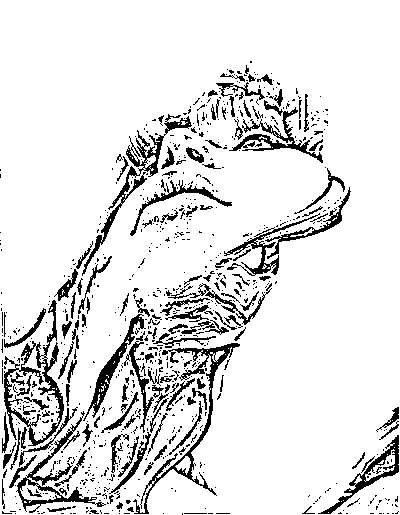 

如何面对月海相位的阴影面？

●**拿出时间照顾自己**

○当你和朋友、家人在一起的时候，你会感觉到自己就像是被**淹没**了一样，因为你完全能够感受到他们身上的感受。这意味着**你需要拿出额外的时间和精力来好好地照顾自己。这样你才能精神抖擞地出现在一段关系当中，而不被这段关系当中的人和事吞没。**

●**设置边界**

○能够去好好照顾你自身敏感性的其中一个方法是：**你能够在关系当中设置清晰的边界。**你可以把它称为一种心理上的照顾。就像我们需要照顾自己的身体一样，心理上你也需要照顾，照顾好自己的能量空间。你可以去做按摩、可以去做和能量相关的工作，比如灵气、太极。当你有空的时候，试试做些灵性上的练习，这些练习可以把你带向很远的地方。

我们想向月海客户**呈现出他们对人和世界的敏感性是很正常的，我们并没有试图让他们摆脱敏感性，而是让他们学习如何与自己的敏感性共处。**当人们能够意识到自己敏感性当中蕴含的礼物的时候，他们就能够用极大的力量向世界去呈现出这份礼物。但是同样的，敏感性也会让他们在关系中迷失自己，所以我们必须在这个层面去提醒他们。

**我们所拥有的挑战和阴影带来的痛苦，让我们没法意识到其实它们也是礼物——可以给世界的礼物。**

如果你有金冥相位，你会感受到：

**激情**

当我想到金冥相位的时候，我就会想到非常强烈、浪漫的关系。**金冥相位的人拥有着极大的激情和力量，这些力量可以通过爱、关系或是艺术呈现出来。**

**操纵**

冥王星的能量从积极的角度说，可以**正向地转换这个世界**。但是同样的，冥王星的力量从负面的角度说，会让你有操纵和控制他人的欲望，产生破坏的作用。这是冥王星身上存在的问题，它虽然赋予你手中的力量，但你要通过哪种方式转化和影响这个世界呢？

**当这种激情和力量以一种正向和清晰的方式呈现出来的时候，它可以显化为一个非常有力量的艺术家、一个非常深化的朋友或者是一个激情的恋人。**在这种情况，这个人就会是一个热爱动物、热爱大自然，并且照顾到周围人的需求的人。

**压抑**

但是当冥王星的能量没能以一种积极、健康的方式呈现出来的时候，它会非常容易地呈现出破坏性的状态。**冥王星最让人痛苦的一个负面能量是：压抑。压抑你内在深深创造性的力量。**当你感觉到自己很渺小，感觉到自己受伤的时候，你在关系中就会呈现出操纵、嫉妒或羡慕的状态，就会想去控制、主导或者操纵朋友和伴侣。如此一来，就会呈现出权力的争夺。

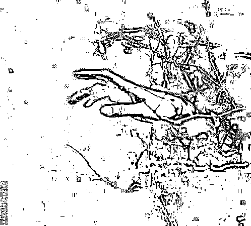

如何面对金冥相位的阴影面？

●**唯有感觉渺小，争斗才会出现**

○唯有当我们感觉到自己很渺小、试图证明什么的时候，我们才会进入到权力的斗争当中。当你有金冥相位且处在阴影面的时候，不仅是你会试图控制和主导别人，当他人认为自己渺小的时候，他们也会来控制和主导你。但是当我们了解这点的时候，我们就能够对自己和生活中的其他人产生一种慈悲心。

这样也能够给我们一个选择的自由：当我们感觉到渺小，或者当我们看到他人觉得自己渺小的时候，我们该做怎样的选择？

●**通过艺术的方式表达激情**

○你想向这个世界呈现和表达的东西太多太多了，只是我们要确保，你能以一种深深的爱的形式表达出来。这就是为什么，你能够通过艺术性和创造性把流进你血液的激情表达出来是重要的。其实你内在这种深深的激情，对于你自己和身边的人来说，都是一份珍贵的礼物。

但是也有可能，你身上承载的激情，让另一方感觉到承受不住。这并不意味着，你身上有如此激烈的面向就有什么错。只是你需要留意你需要在什么时候，以一种怎样的方式去表达身上的激烈。**当你处在均衡状态的时候，你的力量不仅可以转化你，也可以转化其他人，让他们也感觉到力量。**

**关于作者**


**杰西卡·加菲尔德·卡巴拉**（Jessica Garfield-Kabbara），占星师，心理咨询师，注册的婚姻与家庭治疗实习医师。从 2007 年开始实践原型占星学，提供占星咨询服务。她也是月度播客“关联性：原型占星学播客”（Correlations: The Archetypal Astrology Podcast）的嘉宾，该节目已开播 5 周年。2014 年，杰西卡在帕西菲卡研究生院获得咨询心理学硕士学位，研究方向为深度心理学。她的理论基础主要来源于理查德·塔纳斯、斯坦尼斯拉夫·格罗夫，以及原型占星学和超个人心理学。杰西卡教授原型占星学和深度心理学，也积极进行深度心理治疗方面的实践，将原型占星学的智慧和洞见同深度心理学整合起来。

**特别提醒：**

**本文首发于若道平台，**

**转载请联系后台授权。**


****与“阴影”和解，重获自由。2016 年 7 月 8 日-10 日，杰西卡·卡巴拉老师主讲的工作坊：如何与客户的阴影面工作要开课了！该工作坊会教你如何帮助客户减少痛苦，减少关系和生活中所经历的障碍。****

**报名点击文末“阅读原文”**


# 推荐 | 7 月 2 日宇宙大轰趴

> 原文：[`mp.weixin.qq.com/s?__biz=MzA5NjA0NTAxNg==&mid=2651385526&idx=3&sn=5a02c39ef3c76d8ee7c2500c5b9af381&chksm=8b4a5c01bc3dd5178bff63e873829231bb1776849dc061869d3fc19f99da168273a63a3008fd&scene=126&sessionid=1692738816#rd`](http://mp.weixin.qq.com/s?__biz=MzA5NjA0NTAxNg==&mid=2651385526&idx=3&sn=5a02c39ef3c76d8ee7c2500c5b9af381&chksm=8b4a5c01bc3dd5178bff63e873829231bb1776849dc061869d3fc19f99da168273a63a3008fd&scene=126&sessionid=1692738816#rd)

## 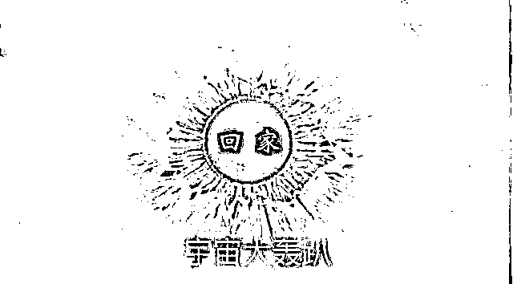

**北京 7 月 2 日  3pm-5pm | 7pm-10pm**

**话说在宇宙中，一颗星的形成，需要基本微粒三千万年漫长的汇集。 而形成人类的基本粒子， 和形成宇宙中星体的粒子其实并无二致。九十亿年前古老星体的核心物质，就蕴含在我们每个人的身体里。**
**在黑暗里，每一颗星都独自闪烁着，但只有众星聚集，其光耀才能穿透苍宇。如果说我们每一个人都是一颗孤独的星，那么所有生命的相遇，都是光的汇聚。在群星闪耀中照见彼此的光芒。****所以我们相聚。这个夏天， Stage Ai 从地球的另一端带回一批“爱的使者”。。。 陪你飞扬、陪你释放、在歌声与舞动中，让我们在星空下彼此关怀， 彼此照耀。**第一部分：活出你的内在星空

7 月 2 日下午   3pm-5pm

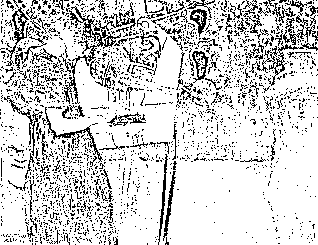

当你注视孩子的眼睛

总能看到难以言喻的动人光芒我们相信这是孩子身体里那未受污染的灵魂之星散发的光芒我们想要呵护这些古老而稚嫩的灵魂我们相信灵魂之星在每个人的身体如果长大后的你变得焦灼彷徨请来和我们一起探索你的智性之光心理咨询师/占星学家**Jessica**和音乐家/哲学博士**Travis**将带给你经历一场奇特的艺术占星体验。结合即兴音乐、舞动治疗、深度心理学和原型占星的理论与实践，这对身为职业音乐家与心理学家的加州情侣，将引导带你经历一系列个性化的艺术体验，用非言语的方式让你了解你的星盘动力，带你活出内在星空。第二部分：星空下手牵手 7 月 2 日晚上   7pm-10pm

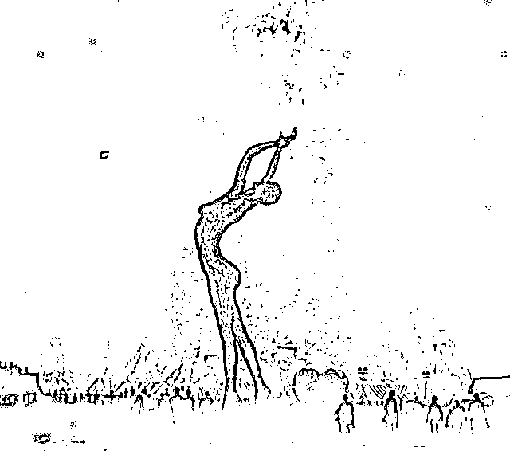

请你来。。。 在仲夏的夜晚！把身体打开， 把声音放开摇摆、舞动、朗诵、歌唱或者只是笑着、坐着、看着、哭着你忘了我吧， 你忘了你 那不觉知的潜意识和原初生命力如同星辰大海潜藏在体内它们源于宇宙洪荒，将在舞动中绽放音乐家/诗人**Richard**运用音乐、冥思和禅步，带你漫步太空，感受万物一体的亲密感。紧接着，**Sophia****、小天、Laura、Jessica、Travis**等多位艺术家和治疗师以各自特有的方式，带领大家在宇宙星辰中舞动、歌唱，在互动中激荡出彼此的想象力、创造力，在万物和谐的震荡中找回内心的归宿，我们共同的家。**我们和你在一起**

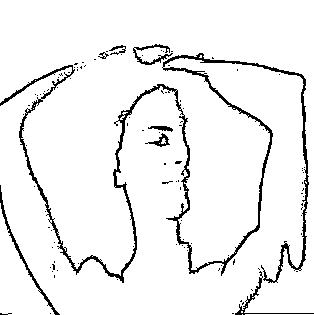

**Jessica**

加州心理咨询师，跟随著名文化史学家塔纳斯修习原型占星八年。结合深厚的原型占星与深度心理学素养，发展出一套独特的心理疗愈方法。

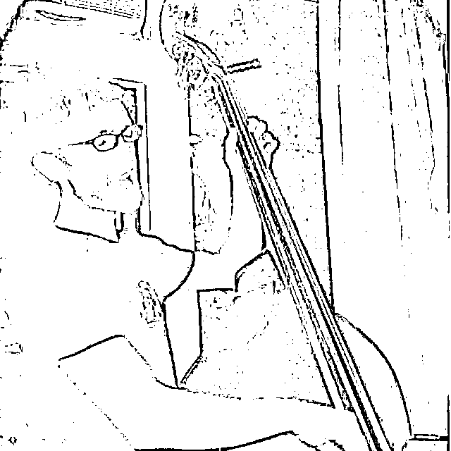

**Travis**

哥伦比亚大学文学与音乐双学士，哲学博士在读。职业低音提琴演奏家，作曲家。曾多年在巴黎居住，并在全世界巡演，足迹从荷兰阿姆斯特丹遍及尼泊尔的加德满都。

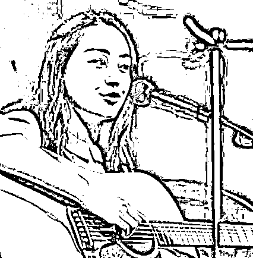

**小天**

加州音乐人，因长期从事临终关怀，频繁面对生死，开始对于人性和信仰的探询。深深相信艺术美的力量，愿追随这力量，求索于真，践行于爱。

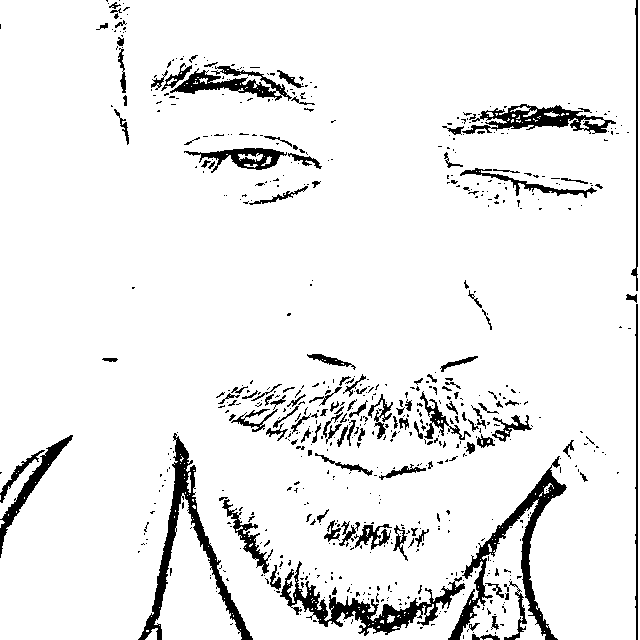

**Richard **

德国音乐家，加州整合研究院哲学博士。擅长结合诗歌和音乐想象，帮助人们体验生命与宇宙的连结与互动。

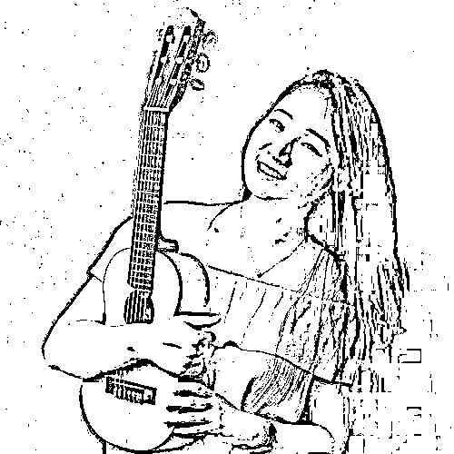

**Sophia**

纽约大学音乐治疗研究生，擅长运用小提琴、吉他、声音等多种方式，探索与建立人与人、人与自身的连结与认识。

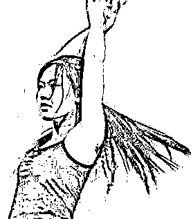

**Laura**

旧金山舞者，并习武多年。目前从事心理咨询实践，通过将舞动与正念的方法结合到心理疗愈的领域，激发自我潜力，探索身体与内在的连结。

**费用:  **

第一部分（下午）：150 元/人     

120 元/人（团票：两人或两人以上）第二部分（晚上）：220 元/人     180 元/人（团票：三人或三人以上）**地址：**北京朝阳区慈云寺桥东住邦 2000 商务 1 号楼 A 座 1501**报名及咨询：**

发送“姓名+人数+活动名称”至微信 **Gloriailp**

**咨询电话：13161962590**

**名额 50 人，报名缴费后锁定**

扫描二维码，加入**夏之花分享群**

**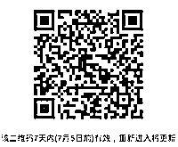**

Stage Ai
自 2015 年开始，**Stage Ai**在纽约、旧金山等地开展系列活动，活动形式突破了传统心理学的“诊断模式”和艺术“高大上”的距离感，通过**沉浸式体验**，将美与创造力带到日常生活里。在短短几个月内，**Stage Ai**迅速成长，在美国华人群体里得到积极反馈，并接受包括美国中文电视等多家媒体的报导。这个夏天，我们携手一批来自纽约和旧金山的青年舞者、音乐家与戏剧治疗师，在北京开展为期一个多月的“夏之花”艺术节，内容包括：**身体舞动、音乐疗愈、诗歌想象**和**艺术占星**等多个活动与工作坊。希望通过互动、参与的形式，与参与者一起探索、体验我们在生活和工作中需要处理的压力、角色、沟通、表达等方面的问题，让更多的人在艺术和美的参与和体验中获取心灵的力量。  

# 怕什么来什么 | 12 上升星座如何搞定自己的阴影？

> 原文：[`mp.weixin.qq.com/s?__biz=MzA5NjA0NTAxNg==&mid=2651385505&idx=1&sn=84a9bcea81239b83cd7d239e4e7536e0&chksm=8b4a5c16bc3dd500bae8cc172b5ddb60d382f35f36e83d6c75db1dcf456e5e3374a14a7108ac&scene=126&sessionid=1692738816#rd`](http://mp.weixin.qq.com/s?__biz=MzA5NjA0NTAxNg==&mid=2651385505&idx=1&sn=84a9bcea81239b83cd7d239e4e7536e0&chksm=8b4a5c16bc3dd500bae8cc172b5ddb60d382f35f36e83d6c75db1dcf456e5e3374a14a7108ac&scene=126&sessionid=1692738816#rd)

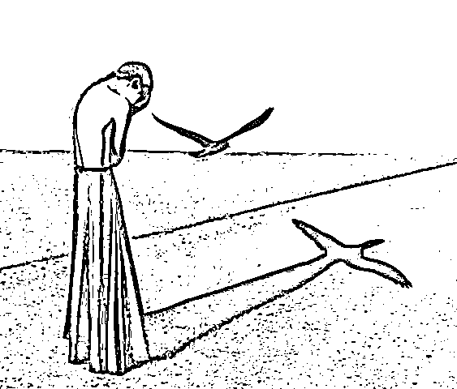

作者/薇安  图片来源/Pinterest

最近若道君常跟大家提到“阴影”，而它其实与“人格面具”紧密关联。说起人格面具，聪明的你一定想到了占星学中的上升点。今天作者就从心理学与占星学的角度，来聊聊 12 个上升星座该如何与其阴影共舞。

**阴影&人格面具**

当我们迎着阳光，双眼微闭，感受温暖的照拂时，在身后留下了什么？是阴影追随着我们，还是我们自己创造了阴影？

荣格将阴影（Shadow）和人格面具（Persona），定义为一组对立统一的子人格，同为完整人格的重要组成部分。

**阴影，是我们朝向光明前进时被留在身后的，自身的影像。而人格面具则是指我们呈现给外部世界的面向。**当自我要调整自身以适应外部世界的要求时，便将那些会与自我认同相冲突的面向交由阴影来承载。**所以一种对阴影更容易的理解方式，是将其看成那些“留在阴影里的”人格特质。**

> #### 比如：
> 
> 当我们认为自己需要向世界展现的永远是彬彬有礼而谦和的自己时，冲动和攻击的倾向就可能被很深的压抑了。但它们并不会消失，在持续的压力下反而会以失控的方式地爆发出来。

事实上，那些被留在阴影里的人格特质，并非全如我们以为的是丑恶的或令人反感的，我们也可能将其所具有的创造性能量压抑下来了。自我趋向整合的发展，需要去拥抱自己的阴影，带着觉知将其正向表达出来。是时候检视一下我们的“阴影”了。

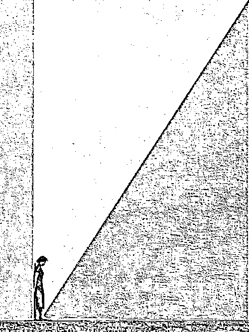

**与上升点冲突的特质被推进阴影**

**人格面具是自我可以自觉加以表达的特质，而阴影在意识之外，需要借助一定的工具来帮助我们觉察，出生星图可以为这种整合提供非常有价值的指引。**

荣格派心理学家派崔克·哈尔丁（Patrick Harding）指出：“一个小孩在出生那一刻穿越无时间性的地带时，很自然地，那个时段正在活跃的原型特质，必然会在这个孩子的精神上留下印记。”

**这里的原型特质，经由出生星图中的上升星座象征出来。**我们不防把上升星座想象成一面滤镜，生命在诞生之时，就透过它，带着某种特定的假设来感知和看待这个世界：“这是一个广袤的空间，我是来探险的，我可以到达高远之地（上升点落在射手座）”；亦或“这是一个充满了限制的世界，我是匮乏而受压迫的（土星合相上升点）”。

而后我们据此来展现出那些适应性的特质。例如，当孩子的精神印记更多与射手座的原型共振时，他们在生命的早期就会更明显地展现出对这个世界的热情，表露大胆的自信心。当这些特质被鼓励时，他们也益发坚定“我与世界的关系就是这样”。

因此，上升点象征出一个人与外部世界的主动融合方式，也代表着我们在别人眼中的形象——在这里，上升点与荣格提出的人格面具的概念吻和了。而**那些与上升点特质冲突的特质，便会被推进阴影中。**

****12 上升星座怎样与其阴影和解？****

首先让我们举一个具体的例子，来认识上升点及其相伴相生的阴影：

#### **●  上升点落于处女座**

上升处女座的人，会透过智力的分析、辨认、自我批评，来培养自我的身份认同。为此，他们会发展出追求秩序、正确性和精准性的特质。那些松散地、沉溺在想象世界或音乐诗歌中的行为，会被视为是低效的、无用的；那些随性的，随遇而安的特质，会被是视为混乱而无序；而那些轻易对他人敞开的同情心，可能会被视为暧昧而无原则。没错，**当我们认同了处女座原型的人格面具时，我们把双鱼座原型的特质留在了阴影里。**

“

宇宙的结构之美是如此精妙，在每个人的出生星图中，我们会在**上升点的对面看到落于其对宫星座中的下降点**——**在一个人诞生的那一刻，这个点会从视线中消失，因此它代表了隐藏在内心的特质**；**下降星座及其第七宫内的行星通常揭露了我们最难“具备”，最难承担，也最难接受的特质**，它与荣格所定义的阴影吻合了。

”

倘若我们能敞开心灵，便会发现，**下降星座特质的正向表达，其实会纠正上升点的过度表现**，将两者融合，自我才能趋于完整。例如，当上升处女座由于对秩序和精准过于执着，以至于失去了自发性和流畅感，变得过度紧绷或严苛时，双鱼座仿佛在对 TA 低语：“放松点，不要执着，放下掌控，偶尔让自己沉溺一下。”

让我们再走的更深入一点，处女座是一个象征服务精神的星座，上升处女座的人很可能意识到自己有服务这个世界的责任与义务，但如果我们陷入到一味的批评与指责中，即便我们的初心是为了“让你变得更好”，恐怕也难以让人愉悦地接受。

事实上，**上升处女座必须透过下降双鱼座，才能领悟到将心打开，接纳一切时所获得的知识，用一种更加有同情心的方式与人相处。也只有在此时，上升处女座也才能发展出其所象征的高阶表达：真正的谦卑。**

如果我们长时间盯着太阳，双眼会被灼伤，任何一极的过度认同，都会带来由分裂而产生的痛苦。追求完整的自我，必须带着觉察、意志力和开放性，完成对阴影的整合。

**其他 11 个上升星座**

各位读者可以参照上述例子，展开想象来感受自己星图中的上升星座和下降星座共舞，会创造出怎样的美妙——

●  上升**双鱼座**

可能以受害者、艺术家或是治疗者的形象面对世界，其或多或少都会被某种事物接管（例如：酒精，艺术或宗教），借此忘记或取代较为世俗的形式或是狭隘的人生观、通常带有一种牺牲个人意志的基调，容易欠缺明确的疆界和限制，倾向沉溺在情绪和喜好之中。而**被他们所排斥的分辨力和常识，能够教导他们如何健康地去看待谨慎和限制。**

●  上升**白羊座**

将生命视为一场探险、追寻或是挑战的上升白羊座，需要适时**拥抱天秤座能够站在他人立场看问题的特质**，来平衡他们可能过度的自我意识。

●  上升**天秤座**

会反射性地判断，意在平衡中衡量各种可能性，然后选择最适当的生存方式或行为。他们需要**拥抱白羊座的果断和勇气，在必须时学着为自己的立场或利益挺身而出。**

●  上升**金牛座**

看重规划、组织、有条不紊向目标迈进的，会花很长的时间，维持或停留在每个阶段的经验里，此时他们**需要像天蝎座一样能够深刻面对和检视自己情感本质中那些由妒忌和占有欲带来的破坏性面向。**

●  上升**天蝎座**

天生具有一种深度，强迫他们去追根究底、探索暗藏的意义和动机。他们在挑战、攻击、破坏或改变时，**需要拥抱金牛座的耐心、稳定、脚踏实地**，借此平衡自己过度混乱又极端强烈的激情。

●  上升**双子座**

带着好奇心和求知欲面对人生，渴望能了解每个人、事、物是如何运作的。他们需要**拥抱射手座的广阔视野和热情抱负，来帮助自己锁定目标方向**，以避免迷失在想法的迷宫或一堆无关紧要的细节之中。

●  上升**射手座**

天性渴望更高境界、高贵理想和崇高成就。他们在把生命当成一趟朝圣之旅的过程中，**需要拥抱双子座的精准表达来澄清自己的广泛概念和感受，也需要双子座的具体计划**来帮助自己实现目标和抱负。

●  上升**巨蟹座**

在内心深处能感受自己的生理时钟和节奏，在坚硬的外壳下拥有丰沛的情绪感受；因此他们需要**拥抱摩羯座的组织与结构能力，在自己反复无常的感受波动中建立一种架构，学习到哪些情绪是必须经过过滤并加以控制的**，以避免淹没在其中。

●  上升**摩羯座**

倾向谨慎规划人生，按部就班地建构人生，以获得某种程度的集体认同和尊重。他们可以极有效率地运用物质世界的资源，善于在混乱中建立秩序。同时他们也**需要拥抱巨蟹座的柔软和圆润，来调和自己的严苛和缺乏弹性，滋养自己很深的内在同样存有的细腻感觉**。

●  上升**狮子座**

渴望创造一个发展权力、权威和创造力的世界，展现独一无二的自己，寻找到爱、掌声和影响力。为此他们**需要拥抱水瓶座的客观性，培养一种正确看待权力、权威和价值的态度，并向水瓶座一样考虑大环境的需求，以调和过度自我中心或自负的心态**。

●  上升**水瓶座**

而拥有平等主义理想的上升水瓶座，能够用一种客观和超越自我的视角看待人生，因此他们更能为了支持或改善集体的运作而付诸行动。同时他们也需要**学习狮子座热情而强烈地感受一切的特质，意识到个体的自我感也应该被视为重要的参考体系**，否则上升水瓶座对体质运作效率的要求，可能会超越了个人的独特性和人道精神，而这本是上升水瓶座渴望为世界所贡献的。

需要说明的是，上述的描述是将星图元素单纯化了的。事实上，我们在解读上升点时，除了上升点的星座以外，还需要同时观察：

*   与上升点形成主要相位的行星、以及落入一宫里的行星。

*   上升点的主宰行星，及其落入的星座、宫位以及形成的相位。

*   太阳星座。（太阳是我们核心认同与自我意识的中心。上升点这个滤镜会调整我们展现太阳能量的方式，而太阳之光也会穿透滤镜而影响着我们的人格面具。）

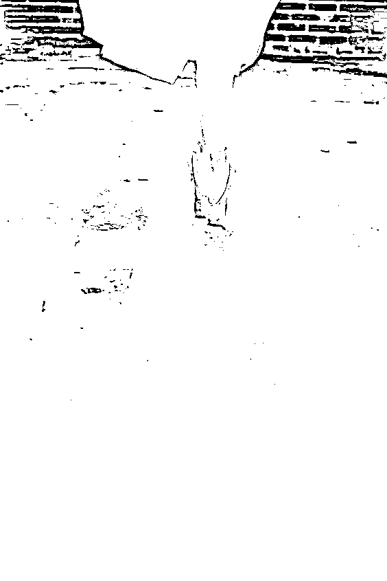

******你极力排斥的，总会与之相遇******

荣格在对自我现象的研究中指出，**倘若有着良好的意愿和足够的洞察力，阴影在某种程度上可以被有意识的人格整合。**但我们也可能将自己始终抵抗的阴影投射到外界，此时人们认为情绪的源头不在自己身上，而在他人身上。除非我们愿意从对方身上收回自己充满情绪偏见的投射，才会发现自己投射的大片阴影。假设一个人无论如何也不能承认自己的投射。投射就会化为现实，或带来与之相符的情境。

这将我们带到了占星学中第七宫的一个象征内涵：公开的敌人。**无论我们总是指责伴侣身上那些“让人厌恶”的特质而破坏了关系，或是在更广义的七宫内涵——合作关系中遇到这样的情形，都是宇宙以外在强有力的示现在提醒我们，是时候检视自己的内在了。**只有当我们接纳并整合了自我的阴影——那些被我们排斥了的特质，我们才能与这些“公开的敌人”握手言和。某种意义上，正是与他们的相遇，甚至是在冲突的过程中，逼迫我们学习与成长。

即使我们幸运地拥有正向展现自己星图中下降点（及七宫宫内星）特质的伴侣，倘若完全依赖伴侣提供这些特质，我们便会如同半个人那样活着。此时，我们深爱的，是对方带给我们的“自我完整感”，而非无条件地爱着那个真实的伴侣。想要挣脱业力习性获得成长的灵魂，唯有在自己的内在完成人格面具与阴影的整合。

**“有些人只拥吻影子，于是只拥有幸福的幻影。”**

**——莎士比亚**


**作者简介**

**薇安**，北大心理学硕士学位，MBTI 的国际认证施测师。若道认证生时校正资质及 COAC 高阶资质毕业生，在若道跟随多名当代著名占星师持续进行深入系统的占星研习。现为全职心理咨询师与占星师。

**微信 ID**：weianhuilai 

长按二维码，让金钱涌向传播知识与智慧的人~

 

**特别提醒：**

**本文首发于若道平台，**

**转载请联系后台授权。**


****如何与“阴影”和解，重获自由？2016 年 7 月 8 日-10 日，杰西卡·卡巴拉老师主讲的工作坊：如何与客户的阴影面工作要开课了！该工作坊会教你如何帮助客户减少痛苦，减少关系和生活中所经历的障碍。****

**报名点击文末“阅读原文”**


# 大卫谈占星 | 吃货，你情绪还好吗？

> 原文：[`mp.weixin.qq.com/s?__biz=MzA5NjA0NTAxNg==&mid=2651385505&idx=2&sn=2acdac2e2b3e4513e4894fa6c0db6cee&chksm=8b4a5c16bc3dd5007a41e385907b6e0b86e620844952bff5f4d3430bd1c76e464bec43d9f904&scene=126&sessionid=1692738816#rd`](http://mp.weixin.qq.com/s?__biz=MzA5NjA0NTAxNg==&mid=2651385505&idx=2&sn=2acdac2e2b3e4513e4894fa6c0db6cee&chksm=8b4a5c16bc3dd5007a41e385907b6e0b86e620844952bff5f4d3430bd1c76e464bec43d9f904&scene=126&sessionid=1692738816#rd)

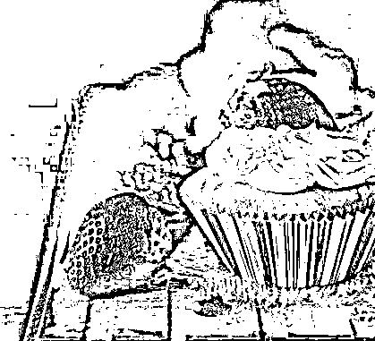

作者/大卫·瑞雷

译者/李含  校对/Christy

“

大概每一个巨蟹座都是一个标准吃货，那么他们都有一些什么样的故事呢？6 月 30 日，刚好水星进入巨蟹座。大卫老师要讲一个他眼中标准的巨蟹座故事，也希望小伙伴们和若道君分享你们身边的巨蟹座故事哟。

”

**巨蟹座备忘录：“你的星座掌管着胃，或者也可以说，是你的胃掌管着你的星座。”**

**——大卫·瑞雷**

星期天的晚上，我和 22 岁的儿子诺亚一起坐着看电视，我们并不常这样，因为我们常常在地球的两端。我已经 24 小时没睡觉了，有 15 个小时在从北京飞回家的航班上。诺亚在看一部我以前看过的单口相声。我问：“他叫什么名字？”，还在倒时差的我努力回忆着。“吉姆·加菲根（Jim Gaffigan）”，诺亚回答。

**人物小贴士**

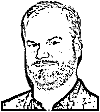

吉姆·加菲根

1966 年 7 月 7 日出生于美国印第安纳州切斯特顿，演员。

代表作品有《加菲根秀 第一季》、《 别惹德州》、《 实验者》、《沃尔特都知道》、《 吉姆加菲根：迷恋》等。

加菲根的喜剧两度获得格莱美奖提名，他是美国前 12 位最富有的喜剧演员之一。

即使我已经精疲力竭地想要闭上眼睛了，加菲根依旧令我捧腹大笑。**他不断地谈论着食物，以及自己多么喜欢吃。**他还向自己的妻子和五个孩子谈论这一话题。

下面就是他们的其中一段交谈：

“我吃得停不下来，真停不下来，但 12 年来其实我从未感觉到饿过。昨晚我冒出了一连串的想法：‘呃，吃好饱。我想我要吃些奶酪。嗯，我甚至都不喜欢这个奶酪，我想我会把它吃完。’我知道这不对。我在不止一个场合吃东西的时候会想：‘**可能这个东西会让我感觉到饿。’若非如此，就是这个东西让我感受到了自己的情绪。**

我的妻子喜欢一针见血地指出：**‘你知道，你只是在啃食自己的情绪。’**我总是回答：‘是的，但这些情绪味道真好，尤其是宵夜吃的那些，我希望自己有更多情绪。’你有没有曾经因为吃太多而感觉不适？好吧，我喜欢那种感觉。”

这时，我转过头对诺亚说：“他应该是太阳巨蟹座。”诺亚在 iPhone 上谷歌了一下，念道：“1966 年 7 月 7 日，是的，巨蟹座。”

下面是另一些加菲根常挂在嘴边的话：

“我常常在吃一顿饭的时候想着下一顿吃什么。我吃东西的时候总是像在度假一样，或是像马上就要开始斋月一样。”

“如果我不想吃东西了，我会认为自己病了，很可能是快死了。我努力坚持一日三餐，然后晚上再加三餐。”

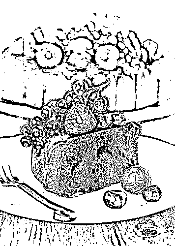

他对美国——这个太阳巨蟹座的国家（出生日 1776 年 7 月 4 日）做出的评价同样非常有趣。

“我们美国人似乎也总是在吃啊。如果外星人对地球进行研究，他们可能会认为，从某种程度上，美国在代表其他国家消费食物。在美国，吃早已不是为了生存，而是一种活动。“我们一起吃午饭吧，披萨怎么样？”

Ok，也许加菲根是夸张了。这也正解释了他的出生星图中**太阳在 1°内合相木星落巨蟹座**！换言之，他出生在 1966 年太阳与这颗最大的行星-木星排成一列的时候。学习占星学的学生都知道，木星与一切和“大”有关的事物相关，包括夸大其词和喜剧演员！或许理解巨蟹座更好的方式是，我们可以将加菲根的夸张视作木星的另一个关联词——“有教育意义的”。

他当然很有趣！你会期望一个巨蟹座太阳合相巨蟹座木星的人讲出怎样的笑话呢？也许是关于食物、家庭、养育子女，感受情绪？是的，下面列出的就是加菲根畅销书的名字：


《胖爸爸》（2013） 

《美食：有爱的故事》（2014）


他的妻子与他一同写作，他们的五个孩子（大家庭——木星合相太阳巨蟹座）常常是他故事和喜剧桥段中的角色。

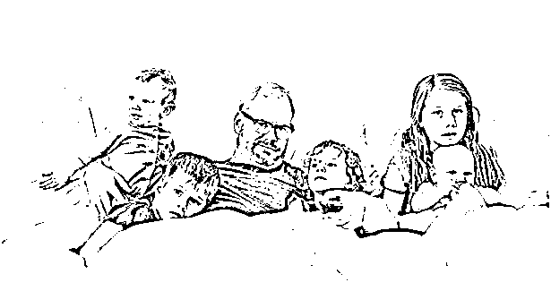

▲加菲根与他的五个孩子在家中的合影。巨蟹座的童话王国！


▲加菲根夫妇与他们的五个子女，或者说他们的篮球队。

这里还有一则巨蟹座味十足的引言：

“婴儿应该归类为抗抑郁药，呆在一个五个月大的婴儿旁边真的很难有坏心情。”

**❀若道君说：**

**把你喜欢的巨蟹座故事或你喜欢的巨蟹座人的故事发送给若道。他们不需要有名，只要是巨蟹座就好！**

**特别提醒：**

**本文首发于若道平台，**

**转载请联系后台授权。**


**占星真奇妙，不学不知道。****由大卫·瑞雷老师**讲授的**若道核心课程 Level 3，会教你将**星座、行星、宫位、相位这些散落的珠子穿起来，**带你进入更深的自我探索与成长的旅程。本课程将于今年 7 月开课，敬请期待！******

**报名及咨询，请点击文末“阅读原文”**


# 阴影面工作坊 | 原型占星学和深度心理学原来可以这样整合

> 原文：[`mp.weixin.qq.com/s?__biz=MzA5NjA0NTAxNg==&mid=2651385505&idx=3&sn=e2bcefaee037e40f433f000c4ddbebfc&chksm=8b4a5c16bc3dd50095215c603a5e64ae4a30295c27ea183c68c12f792820797192e0976b8cd1&scene=126&sessionid=1692738816#rd`](http://mp.weixin.qq.com/s?__biz=MzA5NjA0NTAxNg==&mid=2651385505&idx=3&sn=e2bcefaee037e40f433f000c4ddbebfc&chksm=8b4a5c16bc3dd50095215c603a5e64ae4a30295c27ea183c68c12f792820797192e0976b8cd1&scene=126&sessionid=1692738816#rd)

『每个人都有自己的阴影面。

我们每个人都会挣扎、受苦、受难，

这是我们作为人类共有的部分，

这部分也将我们作为人类联系了起来。

什么时候需要星图解读

或寻求某种形式的帮助和支持呢？

重要的转变期，

比如结婚、离婚、生小孩、换工作

或在巨变期、危机期和迷茫期。

我们都会在自己人生的不同时期需要帮助，

帮助他人很大一部分工作

就是了解、确认和把握他们的困难。

我惊讶的是，

每一次当我认识并把握住某人的阴影面时，

他们真的变得充满力量，更能做自己，

有了更充实的生活和人际关系。』

——**杰西卡·加菲尔德·卡巴拉**

**客户阴影面工作坊讲师**

**后台回复 杰西卡 可获得她的相关报导**


什么是**阴影**？它在心灵中的位置？

10 颗行星原型阴影面示例

出生图和行进中阴影带来什么信息？

作为占星师，你的**阴影面**是什么？ 

如果你无法处理好自己的阴影，

你的咨询会发生什么？

**如何了解、掌握、处理你的阴影？**

原型心理学和深度占星学怎样结合？

**如何和客户的阴影面工作？**

以奇幻的宇宙观看磨难和痛苦所扮演的角色

除了**现身说法，**

本次工作坊还将有

**至少两名现场学员案例分析，**

这是**一次咨询费**即可参加的工作坊，

关于**讲师**，

塔纳斯说，她，是**未来的丽兹·格林。**

你需要做的，

是**果断报名**，

剩下的事情交给我们。

**“如何与客户的阴影面工作”工作坊**

**授课时间：**2016 年 7 月 8 日（晚）、9-10 日（全天）

**授课老师：**杰西卡·卡巴拉

**授课方式：**北京工作坊，英文授课，中文翻译

**报名截止**：2016 年 7 月 5 日

**费用**：2800 元

**课程负责人：Sara**（**微信：2847613491**，请备注阴影报名咨询）

长按二维码添加课程负责人咨询~

****

**适 合 人 群**

这个工作坊是**面向所有程度的占星学生**的，

只需懂星座、行星、月亮交点。

在教学中，

我总是努力让教室中的每个人都能理解我教授的知识，

并且产生共鸣。

我的想法是，

让这个工作坊能够帮助到每一位

想要进行个人或职业占星解读

和/或任何从事帮助性职业的人，

让他们学到大量的知识。

在课上，我会将占星学和心理学恰到好处地融合起来，

我会讲到这两门学科的基础知识，

同时给中阶或高阶的学生讲授更深入的观点和洞见。

来参加工作坊的学员不需要对原型占星学有所了解，

我实践和教授占星学的方式适用于所有形式的占星学。

我会很愿意在工作坊中分享更多传统知识，

这样参加者可以更好地感受和理解原型占星学和深度心理学。

这门课欢迎所有程度的占星学员。

——**杰西卡·加菲尔德·卡巴拉**

**客户阴影面工作坊讲师**

**课 程 安 排**

**7 月 8 日，周五晚上**

*   开场：介绍杰西卡老师的人生经历、周末工作坊的目的

*   生活在一个奇幻的世界：透过占星学的视角观察人类和宇宙的关系

*   占星学解读时机：危机期，转变期，重大人生决策期

*   占星咨询师的角色

*   具有启发性的原型宇宙学与原型占星学

*   原型占星学与深度心理学的关系

*   荣格理论对阴影的理解及其在心灵中的天然位置

*   尊重客户出生星图和行进中阴影所带来的信息

*   占星师在帮助客户从一个有力的、富有意义的全新角度重新界定自己的人生故事时所扮演的角色

*   以奇幻的宇宙观看磨难和痛苦所扮演的角色

*   占星咨询师的伦理道德：处理好自己人生中的痛苦和磨难，我们才能成为更有洞察力、更务实和更能帮助他人的占星师。

**7 月 9 日，星期六**

*   回顾阴影的意义

*   十颗行星原型阴影面的示例

*   原型或神和女神的阴影面，为我们揭示出宇宙的本质：光明面与阴影面共存，改善人生和破坏人生的面向共存。

*   创造一个与客户之间的安全空间以建立联结和信任的原则

*   占星师的指导意图和我们工作目标中的重点和中心：

*   让客户有力量去过更充实的人生 —— 更充分的自我觉知和自我接纳带来更安宁的人生

*   在咨询前、咨询中和咨询后与客户的交流中，我们可以以一种亲密而神圣的方式支持他们的人生—— 黑暗中的光明

*   如何掌握阴影

*   案例展示。研究一位客户的星图，与客户的阴影面一起工作

*   心理教育和咨询技巧：以共情和理解的方式回应客户，使客户内在和外在世界正常化，并确认其人生经历

*   学员的评论和提问

*   以学员（志愿者）自己星图中的阴影面做示例 —— 通过现场解读学员的星图来掌握阴影面

*   学员提出曾遇到过的困难的解读示例，分析如何在将来解开这些难题

**7 月 10 日，星期日**

*   占星师的自我关怀：占星咨询前后的仪式

*   占星师的职业道德需要：要掌握客户的阴影面，首先要把握我们自己的阴影面

*   顺势疗法：问题和解决方案都隐含在每一个行星原型中：一些示例

*   案例展示，研究如何与客户一起应对阴影面

*   学员（志愿者）自己星图中阴影面示例 —— 通过现场解读学员的星图，掌握阴影面

*   学员的评论和提问

*   关于痛苦和磨难的宇宙哲学

*   占星咨询的馈赠：帮助客户疗愈心灵

*   结语：回顾我们在工作坊中所学习的内容


**了解详细课程内容及报名方式，点击文末“阅读原文”**


# 大卫谈占星 | 妈宝男背后的大秘密

> 原文：[`mp.weixin.qq.com/s?__biz=MzA5NjA0NTAxNg==&mid=2651385504&idx=1&sn=9ff25356d39ee879a6506ed40b7e1ab4&chksm=8b4a5c17bc3dd501c0e29e21a4c42de23b517ff97f6f82d04cb31653e1644bcd1354bbbf0ae5&scene=126&sessionid=1692738816#rd`](http://mp.weixin.qq.com/s?__biz=MzA5NjA0NTAxNg==&mid=2651385504&idx=1&sn=9ff25356d39ee879a6506ed40b7e1ab4&chksm=8b4a5c17bc3dd501c0e29e21a4c42de23b517ff97f6f82d04cb31653e1644bcd1354bbbf0ae5&scene=126&sessionid=1692738816#rd)

作者/大卫·瑞雷 翻译/若道翻译团队

图片来源/Pinterest

妈宝男，顾名思义，是指那些把妈妈的话当作最高指导标准的男生。而巨蟹座男生，坊间传闻，他们优柔寡断、暧昧专业户……当然，妈宝男也不是一天产生的。也许，每个优柔的他们，背后都有着一个强势的父亲……

***若道君：本文的巨蟹座包括出生星图中任何一个巨蟹座能量（太阳、月亮、上升点等），即使你的出生星图中没有任何行星落入巨蟹座，巨蟹座也仍然是你的星图的一部分，以某种方式对你造成着影响。如果你在下文**某处**感受到共鸣，那就是你的巨蟹座能量所在。***

## 那些属于巨蟹座的关键词

**安全感** **情绪 **

**感受 饮食**

**居住**

**巨蟹座与我们最基本的安全感，以及基于对安全感的需要而表现出的情绪和感受相关。巨蟹座会对当下的环境做出反应。他们能敏锐地感觉到环境中的情绪氛围，对那些有可能威胁到他们的安全感的事物非常关心。**即便你的出生星图中没有行星落入巨蟹座，巨蟹座也仍是你星图的一部分，会以某种方式对你产生影响。

**巨蟹座在你的星图中所处的位置，代表了你对之怀有强烈情感的生活领域。**你如何才能在情绪上感到安全，你照料他人的动机和方式，都会通过这个领域的活动显示出来——在这里，你一会儿是照料子女的父母，一会儿又成了需要照料的孩子。

没有哪个星座会像巨蟹座这样关心**饮食和居住**。**他们有非常强烈的“筑巢本能”，会充满热情地打造一个舒适的安身之地，用心经营饮食起居。**如人们所知道的，巨蟹座非常情绪化，一方面具有天真的孩子气，另一方面又多愁善感。**他们如潮汐般起落反复的情感是人性的最自然表达。**

想象一位母亲在前一分钟还在为乱丢在地板上的脏衣服而歇斯底里，但是下一秒她却为家人准备好了丰盛的晚餐；或者是在超市排着长队等待付款的父亲，他看起来无精打采、愁眉苦脸，但是当他冲进家门，将大包小包的“战利品”递给家人，他的眼中闪烁着满满的喜悦。

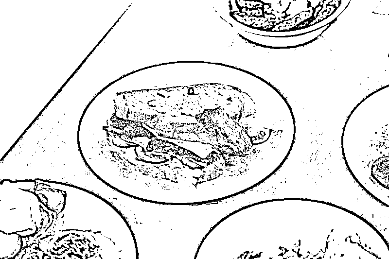 

## 巨蟹座：我只是情绪化，不是软弱！

**巨蟹座成分很重的那些人常会遇到这样一种情况：他们会受外界影响而觉得自己的情绪化是不好的。**经常出现的典型情况便是兄弟姐妹或其他家庭成员对巨蟹的调侃，因为他们知道巨蟹座一定会对此有反应：“嘿，拉长脸干嘛呢？有谁偷吃了你的午餐不成？哈哈哈！”

**巨蟹座人会把情绪摆在脸上，上升巨蟹座尤甚，即便他们很努力地隐藏情绪也是徒劳。**巨蟹座人常常被指责“**不够坚强**”，男孩比女孩更容易遭到这样的批评。当巨蟹小孩儿为死去的金鱼而伤感之时——特别是当他还从杂志上扯下一张金鱼的照片贴在空空如也的鱼缸上——父母也许会批评他太软弱、太多愁善感了。

我儿子诺亚（Noah）月亮在巨蟹座。有一次他欢天喜地地跟我去钓鱼，结果钓上一条三磅重的肥虹鳟时，他求我放了这条鱼，不要用它来做晚餐，甚至，在我放生它之前，还给它起了个名字，鲍勃（Bob）。诺亚恳求道：“你不能杀鲍勃！”而我已经在小心翼翼地将我的晚餐从鱼钩上解下来，轻轻丢进水里，任它曳尾而去。

## 想要巨蟹座积极起来，试试情感联结

巨蟹座人也不会好好地遵守“纪律”，除非出生图中土星的成分比较显著。然而，**巨蟹座小孩儿和年轻的巨蟹座人可以因为针对情绪的正面调动而受到激励。巨蟹座几乎都通过“潜移默化”来学习，如同收集各种生动记忆一般吸收生活中的经验和印象。**

而巨蟹座受到惩戒时，他们根本不记得到底要“吸取什么教训”，记住的只是爸妈凶恶的神情，或是记住了“这个老师不喜欢我”。从和他们感情融洽的老师身上，他们能学到最多，而从他们害怕的老师或是责骂过他们的老师那里，学到得少之又少。

巨蟹座不是一个天生爱竞争的星座。巨蟹特质强烈的运动员需要教练每周不断地激励他们，教练得知道如何跟他们进行情感交流并让他们稳住状态，情绪不偏离轨道。

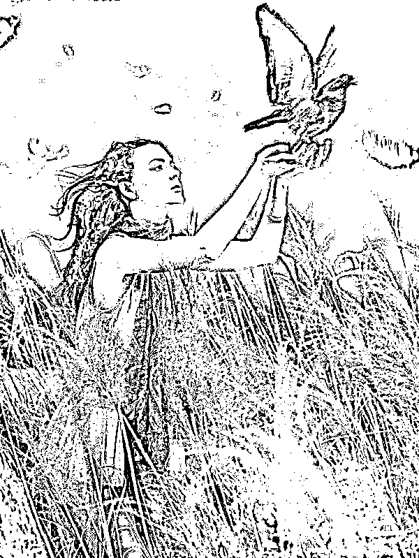 

## 巨蟹座的负面特质

**针对自己的巨蟹座天性做出的片面的负面评价通常是以下几种：“我太多愁善感，太情绪化了”或是“太阴晴不定”之类。**然而，更糟的是，男性巨蟹座似乎更容易受到来自**父亲的负面教养方式**的影响。

我有一些太阳巨蟹座或其他行星落入巨蟹座的男性客户，他们的父亲要不就是对儿子太过严厉——这些人通常有着太阳（或火星）跟土星（或冥王星）的硬相位；要不就是干脆对儿子不管不顾——这些人通常有着太阳（或火星）和海王星的硬相位，或是太阳（或火星）位于 12 宫。

那些严厉的父亲不是过于严肃（土星）就是控制欲过强（冥王星）。冥王型的父亲会灌输的负面思想有“你太软弱了，不适合生存”或是“如果你继续这样的话，没法在这个世界生存下去的。”暴力、虐待、恐吓，或是被抛弃、丧失亲人更会强化这些负面信息。

**举个栗子**

有一个极端的例子是，一个巨蟹座太阳四分天秤座冥王星的客户小时候很害怕父亲，他父亲为了让他乖乖待在床上，晚上会在他耳边说些威胁他的话。他说：“我还记得小时候跟父亲一起去理发店，父亲告诉我毛巾上的红斑点是血迹，有个小男孩不肯乖乖坐着理发，耳朵就被剃掉了。”此人的爸爸是一个黑帮分子，儿子 8 岁的时候他就因谋杀入狱了。“还记得他走了之后我心里感觉是如此的轻松，但我很怕他还会回家。后来我发现有些人因为我爸是黑帮就对我刮目相看。我简直不敢相信他们会怕我，不过我喜欢这种感觉。”

后来他年纪轻轻也走上了犯罪的道路也并不令人奇怪。而他人生的转折点在于儿子的出生，他发誓要结束这种恶性循环，绝不让这个模式在儿子身上重演下去。于是他割断了之前的所有联系，带着妻子和儿子搬家，开了一家合法餐馆，虽然当时经济并不景气。他承认自己对儿子的保护有点过头了，但“至少现在我不用保护他远离我自己、远离我过去的生活。”

## 如何处理这些负面特质？

那些来向我咨询的巨蟹座客户，不管他们潜意识里重复着何种负面信息，这些信息都阻碍了他们在基本的生活层面感受到安全感。**他们所感到的，不仅仅是我们人类心中普遍存在的不安全感，更是对那些针对他们的情绪所做的评判的恐惧。这些评判阻碍了他们情感的自然流动，是不安全感的根源。**

如果你的出生图中带有明显的巨蟹座特质，但当你表达自己的情感时你感到不安全，问问你自己这是为什么？

*   如果你认为家庭对你很重要，但你却不跟你的父母说话，这又是为什么？

*   如果你嘴上说想要孩子，为什么却一直膝下无子？

*   如果你一直想要一段真心实意的感情，却一直无法实现，为什么？

*   如果你只是希望待在家里时能感到安全、躺在床上能安然入眠，但你做不到……为什么呢？

不管阻碍这些基本的巨蟹座式需求被满足的是什么，根源都在于被阻塞的情感。这听来很简单，事实并非如此。**暴露这些“基于恐惧的评判”需要勇气，情绪上的勇气。**

**巨蟹座们可以从创造一个“心灵安全地带”着手，就是你内在感觉到安全的地带。**此处，没有什么能伤害到你。你可以不管不顾地表达你自己，不会有任何负面的后果。在这个心灵安全地带你能创造出一个可以滋养你、支持你的世界。评判性的问题，例如“为什么我这么情绪化？我到底出了什么问题？”是不能达到这种效果的。

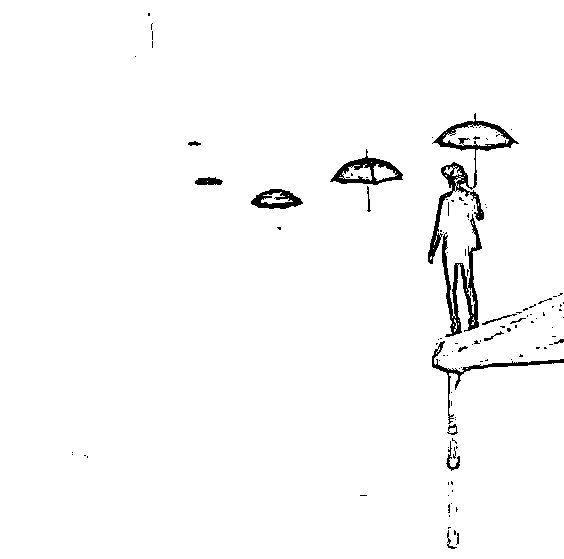 

## **巨蟹座，情绪化一点怕什么？**

**如果你是一个巨蟹座人，你的星图中有很多巨蟹座的成分，你会情绪化是天经地义的！**事实上，**你应该拥有比其他人更加鲜活的情绪，丰富的情感是你的一笔财富**，其他人只有眼馋的份。你生命中的泪水和欢笑都比别人更多。你更容易伤春悲秋，更容易怀旧。**正是认为情绪很“讨厌”这种想法剥夺了你生活的愉悦。**

下面是一首西奥多•罗特克（译者注：Theodore Roethke，美国诗人和教育家，1954 年他因诗集《苏醒》获得普利策奖)的诗《苏醒》（The Waking），在我看来很好地传达了巨蟹座的精神：

**为了睡去，我醒了，慢慢醒，不着急。** 

**在安然的不惧怕里，我感觉到了自己的命运。**

**在必然的旅途中，我学会了该学的。**

**我们通过感受而学习。还需要知道些什么呢？**

**我听到自己的存在在跳舞，欢天喜地。**

**为了睡去，我醒了，慢慢醒，不着急。**

**I wake to sleep and take my waking slow.**

**I feel my fate in what I cannot fear.**

**I learn by going where I have to go.**

**We think by feeling.What is there to know?**

**I hear my being dance from ear to ear.**

**I wake to sleep, and take my waking slow.**

想要了解更多巨蟹座，戳这里~

[小白学占星丨太阳进入巨蟹座，夏至来临](http://mp.weixin.qq.com/s?__biz=MzA5NjA0NTAxNg==&mid=2651385378&idx=2&sn=d09fb8c1dc854559e8d5dd2b681983e6&scene=21#wechat_redirect)

[金星进入巨蟹座丨这一生你有没有主动爱一次？](http://mp.weixin.qq.com/s?__biz=MzA5NjA0NTAxNg==&mid=2651385338&idx=1&sn=43f38d536e6ec23c66059ae7d63190d1&scene=21#wechat_redirect)

[月亮与体重 | 又月半了，让我静静](http://mp.weixin.qq.com/s?__biz=MzA5NjA0NTAxNg==&mid=2651385457&idx=2&sn=4ca1a556b91920931a2de05d0309c0e0&scene=21#wechat_redirect)


想体验大师级的占星疗愈？

大卫老师**占星咨询**预约进行时

**生命议题、职业发展、关系咨询、少儿成长、年度规划和预测**

**预约咨询请联系许小姐 ：010-58263061**

**特别提醒：**

**本文首发于若道平台，**

**转载请联系后台授权。**


**占星真奇妙，不学不知道。****由大卫·瑞雷老师**讲授的**若道核心课程 Level 3，会教你将**星座、行星、宫位、相位这些散落的珠子穿起来，**带你进入更深的自我探索与成长的旅程。本课程将于今年 7 月开课，敬请期待！******

**报名及咨询，请点击文末“阅读原文”**


# 寻找奇葩星图 | 若道喜欢怪人，其实你很美

> 原文：[`mp.weixin.qq.com/s?__biz=MzA5NjA0NTAxNg==&mid=2651385504&idx=2&sn=0f679bdc0c2877bbad8aaf35b838f98e&chksm=8b4a5c17bc3dd5015df39bbc68660c74bb96526e3d3ff32e8c55b59104f5eda4eb7fb35990e7&scene=126&sessionid=1692738816#rd`](http://mp.weixin.qq.com/s?__biz=MzA5NjA0NTAxNg==&mid=2651385504&idx=2&sn=0f679bdc0c2877bbad8aaf35b838f98e&chksm=8b4a5c17bc3dd5015df39bbc68660c74bb96526e3d3ff32e8c55b59104f5eda4eb7fb35990e7&scene=126&sessionid=1692738816#rd)

**为什么我的眼里常含泪水**

**因为我的星图奇葩得深沉**

“奇葩”星图征集令

好消息~

罗伯特·汉德老师的[现占+古占课程](http://mp.weixin.qq.com/s?__biz=MzA5NjA0NTAxNg==&mid=2651385456&idx=3&sn=d2cdc511d52eb8ec88b52601bf7043d9&scene=21#wechat_redirect)（点击可阅读）

即将开课了！

这次课程特别奇葩的部分在于，

罗伯特老师要征集史上最**“奇葩”**星图现场解读哦！

看看老爷子是怎么说的

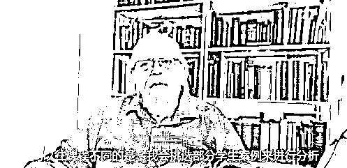 

So，只要你有拿得出手的奇葩星图，

老爷子就能给你精彩的点评，

你开心就好（捂嘴乐）

步骤也是很简单，

**1.广泛征集奇葩星图案例**

**2.精选奇葩星图案例展示**

**3.ISAR 认证占星师判定奇葩案例**

**4.罗伯特老师课上亲自解读**

*   如果你自认拥有独特的人生、不同寻常的人生。

*   如果你的星图中有不同寻常和独特之处。

*   星图中的某个配置让你变得特别（奇葩）？

*   拥有奇葩生活经历，同时在星图中有迹可循？

*   别人有一张神奇的星图？（要争取人家同意哦）

*   大声说出来，就会有 ISAR 占星师帮你鉴定。

ISAR 认证占星师评委

ISAR 认证占星师有什么含金量？

国际占星研究协会（*ISAR, International Society for Astrological Research*）ISAR 可以说是世界上最前沿、最具启发意义的占星组织之一。ISAR 是一个国际组织，成员遍及世界 28 个国家。所有这些不同地域的占星文化彼此碰撞，互通有无，形成积极的交流互动局面，推动了占星学研究和实践的多样性发展。

ISAR 还拥有一个资质认证项目，其内容包括职业道德意识培训、咨询技巧培训及测试，以及专业占星能力方面的严格考试。满足上述各方面要求者，可获占星师资格证（*CAP, Certificate of Astrological Proficiency*），成为 ISAR 认证占星师。

三位 ISAR 认证占星师评委是谁？

（排名不分先后）

*1. *


**丁宏**，esme。ISAR（国际占星协会）资质认证职业占星师，资深占星课程口译。复旦大学英文系毕业后赴伦敦读研工作，并于伦敦占星学院接受系统的西方职业占星教育。2013 至 2015 年在若道星文化担任课程助教和口译，期间继续跟随多位国际著名占星师深入学习各流派技法，并成为若道第一位中文讲师。2011 年起开展占星咨询至今。在咨询中力求现代占星与古典占星的积极融合，在研判世俗事件的同时关注潜力及心灵力量。

*2.  *

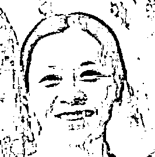

**喜悦龄以**，张征。工学学士，工商管理硕士（MBA），2009 年执业国家二级心理咨询师；2013 年通过 ISAR 国际职业占星师资格认证（CPA）。群星水象，且土星冥王星合轴，柔和敏感之心体验生命动荡起伏变迁，投身探索情绪管理、冥想、内观、正念、占星学、灵性与精神之旅，有幸一窥宁静喜悦之门，享受并传播简单生活理念。

*3.*

 

**Zora**，郜婕。国际占星研究协会（ISAR）认证占星师。2012 年在大卫·瑞雷老师指导下开始占星专业学习。曾在若道星文化主办的职业占星师资质课程及古典占星课程中担任助教。

**你的星图将由三位 ISAR 占星师判断是否奇葩，**

**并获得珍贵的解读短评，**

**机会难得，好好把握哦~**

参与方式

*1.*长按下方二维码添加客服“若道 Echo“为好友

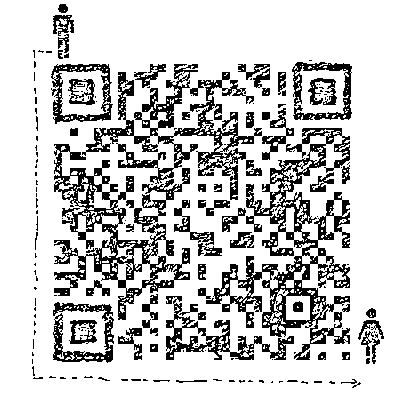 *2.*发送自己的奇葩星图截图给她 

*3.*注明哪个配置让你如此特别奇葩

若道君将于 7 月 6 日公布奇葩星图鉴定结果哦~

ISAR 选修课·古占与现占结合

**授课时间：**2016 年 7 月 23 日-9 月 10 日 10：00-12：00**（每周六上课，一共 8 节）**

**授课老师：罗伯特·汉德**

**授课方式：**网络在线，英文授课，中文翻译

**报名截止**：2016 年 7 月 15 日

**费用**：****6800 元** **

**课程负责人：李老师**（**微信：18601950700**，请备注古占报名咨询 ）

长按二维码添加课程负责人咨询~

****


**课程具体内容及报名，请点击文末“阅读原文”**


# 罗布特·汉德 | 37 年现占+21 年古占精华有啥干货？

> 原文：[`mp.weixin.qq.com/s?__biz=MzA5NjA0NTAxNg==&mid=2651385504&idx=3&sn=322c15833c27e9ec1ea7a8626ffd8b70&chksm=8b4a5c17bc3dd50184c93b44e68e6c4ad8d2e1afe3bb091b3c48fad73fa55bfd0eef86e1aa8d&scene=126&sessionid=1692738816#rd`](http://mp.weixin.qq.com/s?__biz=MzA5NjA0NTAxNg==&mid=2651385504&idx=3&sn=322c15833c27e9ec1ea7a8626ffd8b70&chksm=8b4a5c17bc3dd50184c93b44e68e6c4ad8d2e1afe3bb091b3c48fad73fa55bfd0eef86e1aa8d&scene=126&sessionid=1692738816#rd)


“

罗伯特·汉德，一位被占星界称为“国家宝藏”的人，掘地三尺，阅古卷无数，学习没有人再说的古代语言，学习古代历史，学习古代哲学，挖出了一把传说中的“屠龙刀”。在 37 年的现代占星生涯和 21 年的古典占星研究生涯后，他将为我们带来什么？

”

将 37 年的现代占星和 21 年的古典占星结合， 罗伯特·汉德耗费大量的精力，挖出了这把“屠龙刀”，他擦拭这把锈迹斑斑的刀，粘合它的碎片，钻研刀法，在此过程中引发好奇、热情、疑义、愤怒；他促使原来名不见经传的人获得新立山头的机会，同时又引发了分裂、不满、攻击。

有些现代大师们对他的道路感到惋惜、不解、批评，但仍旧尊敬他；而他又远离那些一门子想要复古、认为“老的就是好的”古典阵营。他跑着，似乎有同伴，又一人独行。

你也许听说过这把“屠龙刀”的传说，从江湖似真似假、似是而非的流言中，从自称使过它的招式的自言得意的小辈中，从以教学谋生、很少实践经验的小有名气的占星师的课程中。

但你真的见过这把刀吗？你知道正确的使用方式吗？这把刀真的能在现代社会应用吗？还是仅仅是应该放入“历史博物馆”中陈列？这次课就是谜底揭晓的时刻。

## 现代占星学的学子们，如果你：

*   对于出生星图——占星学中最重要的星图的秘密，仍有很多不解和好奇；

*   渴望获得古典占星里符合你的哲学理念又实用的好技法；但厌倦了大量复杂却无用的古典知识，又苦于古典文献浩瀚，无从粹取；

*   对自己星图和某些人生大事的对应百思不得其解，渴望获得一位占星大师的解答；

*   曾和妄称“可以更准确预测”的古典占星师们争得面红耳赤，但因为没学过古典而稍微有些心虚；

*   了解占星学界常见的古典和现代占星的纷争，想在真正了解这两门学问的大师面前提出深刻而尖锐的问题；

*   渴望在自己的占星知识拼图中补上能够符合现代占星理念的古典占星学知识，并将现代占星和古典占星融会贯通在咨询中

## **欢迎你来，机不可失，因为：**

*   **这里有世界上唯一能够教授此门课程的占星界泰斗**：72 岁的罗伯特·汉德，两个阵营的旗手型人物，**活着的唯一获得现代占星学大师尊重的横跨两界的泰斗**、占星咨询实践者，历史学家、哲学史研究者，活着的时候就已经成为历史的人。一个怀旧的人，一个试图搭起桥梁的人，一个不满足现有的人，一个思想演化路径让人迷惑的人。


*   **萃取古典的精华，去除古典占星糟粕：**罗伯特·汉德用他综合的知识，为你筛选出古典占星中可以为强调自由意志的发展、个人成长的现代人有益的古典占星实用技法。

*   **从实战演练中学习**：首次以案例教学的方式，除第一堂之外，每堂课皆以案例演示为教学重点。

*   **获得大师的免费解读**：**7 堂课的案例选取皆为学员星图，你有机会入选**。

*   **打尽出生星图的占星学命题！** 出生星图，是一生的预测星图，所谓的命运的因子埋藏在出生星图里。

**讲什么？皆重大常见人生问题：**

*   性格、个性、心智特点、外貌体型

*   挣钱能力、金钱、财富、财务

*   感情生活——恋爱、婚姻、家庭生活

*   原生家庭——父母、兄弟姐妹、姑表亲

*   人际关系——一对一关系、一对多关系、敌人

*   职业发展，谋生之道

*   社会地位

*   旅行

*   灵魂和本我

## 学习该课程，你并不需要有古典占星学基础：

*   你只需要具有一定现代占星学基础。如果对此没有把握，可以联系课程负责人员进行测试。

*   你不需要有任何古典占星学知识，所有出生星图的相关古典占星知识都会在课程前发送讲义或在课程中进行讲解。

给你一个机会，在实战中学习他的研究成果。

这次课程，对于罗伯特·汉德 是一次冒险之旅，对你也是串起历史、现在、未来的旅程。

还等什么？

**更多关于罗布特·汉德的文章在这里：**  

[领军现代占星 35 年、古典占星 21 年，罗伯特·汉德星图秘密大起底](http://mp.weixin.qq.com/s?__biz=MzA5NjA0NTAxNg==&mid=2651385233&idx=2&sn=98799d80abed94a7748acff623747bf7&scene=21#wechat_redirect)

[占星界的“百科全书”，请用您渊博的学识砸晕我！](http://mp.weixin.qq.com/s?__biz=MzA5NjA0NTAxNg==&mid=2651385064&idx=2&sn=647cbe8f5e029abbf16a9f039a6783b1&scene=21#wechat_redirect)

ISAR 选修课·古占与现占结合

**授课时间：**2016 年 7 月 23 日-9 月 10 日 10：00-12：00**（每周六上课，一共 8 节）**

**授课老师：罗伯特·汉德**

**授课方式：**网络在线，英文授课，中文翻译

**报名截止**：2016 年 7 月 15 日

**费用**：****6800 元** **

**课程负责人：李老师**（**微信：18601950700**，请备注古占报名咨询 ）

长按二维码添加课程负责人咨询~

****

**课程具体内容及报名，请点击文末“阅读原文”**


# 不准确新闻丨继公投脱欧后，英国人民又作死了！公投即将脱离地球！

> 原文：[`mp.weixin.qq.com/s?__biz=MzA5NjA0NTAxNg==&mid=2651385475&idx=2&sn=db1cc79e9782a21310f7478d70664c2b&chksm=8b4a5c34bc3dd5225cde5971408a03fadb9ce0f24d1098e7908357ef74ea5f56be9256b11528&scene=126&sessionid=1692738816#rd`](http://mp.weixin.qq.com/s?__biz=MzA5NjA0NTAxNg==&mid=2651385475&idx=2&sn=db1cc79e9782a21310f7478d70664c2b&chksm=8b4a5c34bc3dd5225cde5971408a03fadb9ce0f24d1098e7908357ef74ea5f56be9256b11528&scene=126&sessionid=1692738816#rd)

作者/大卫·瑞雷 图片来源/VCG

翻译/李含 校对/王宏、Christy

2016 年 6 月 24 日，英国上演了一场惊心动魄的公投活动，决定英国是否要脱离欧盟。6 月 25 日，公投结果公布：英国脱离欧盟！当天，英国首相卡梅隆发表离职声明，震惊了全世界。公投结果第二天，英国人民又开始轰轰烈烈地请愿要求第二次公投！好一场大戏~

***若道君：以下内容纯属虚构，如有雷同，纯属巧合~***

**英国人民公投即将离开地球**

继英国盛况空前的脱欧之后，英国人迈出了一位投票者所说的“合乎逻辑的下一步”，在今天以 53.4%的多数票投票决定脱离地球。此次最新的公投要求所有希望离开地球的英国人必须在 2017 年夏至之前离开。

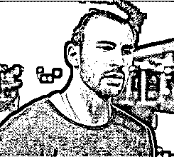

许多人在今日的投票之后热泪盈眶，但大部分人都在酒吧中忙着庆祝这一最新进展，其中一间酒吧新出了一款特色饮品，名为“异形出走”，由杜松子酒、芦荟、石榴和薄荷奶油混合而成。一位酒保称：“保证让你喝到灵魂离体”。

**英国不会再有失业，房价猛跌**

最近这次退欧投票冲击波似乎还不够，伦敦人因看到外星飞船盘旋在市中心而目瞪口呆。“我就知道外星人一定是幕后黑手！”一位以 10 英磅一顶的价格贩卖铝箔纸帽子的男士说：“这帽子能保护你的大脑不受外星人信号的编程。”几个常去酒吧的人已经戴上了这种帽子，他们沿着人行道边走边唱：“女王陛下是个漂亮的女孩，但是她的话不多，投票开始了，又结束了，今天我们就要离开这里！”

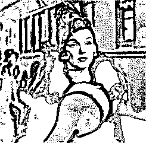

专家们还未将最近这次退欧投票带来的经济影响总结出来，但是著名的经济学家所做的初步评论表示，目前英国人口的 53%离开英国将消除失业，并能够振兴经济，其方式是中世纪末期黑死病瘟疫之后所未曾见过的。

苏格兰经济学家伊恩·麦克法兰说：“毫无疑问，房价将跌回到第二次世界大战以前的水平，这对许多人来说都肯定是幸事。当然，就我而言，所有的英国人都可能被吸入太空之中！自罗马帝国时代起，他们就一直是危害人类的可怕瘟疫。”

**外星飞船的出现引发猜测**

计划离开地球的市民会收到政府颁发的出境通行证。撤离将于 8 月 9 日（七夕节）从巨石阵开始，外星飞船提供的瞬时转移平台上午九点开放，到下午五点关闭，每 90 分钟一班次，一直到 2017 年夏至为止。

交通部长表示：“这将会是一个井然有序的过程，完全不用担心。这些外星人的转移流程是我所见过的最棒的，完全不需要安检，至少不需要常规意义上的安检。任何企图通过携带爆炸装置上去来伤害外星人的人都会在瞬时转移前被检测出来并被安全拘留。”

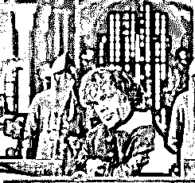

外星飞船出乎意料的出现引得流言四起、猜测不断。科学家称，这些显然很聪明的家伙真实的本性和意图尚不清楚。但是网上传闻扑面而来，担心英国人会被加工成外星香肠，或是会被编程为僵尸战士以企图接管整个地球。

“瞧，如果他们想要接管地球，他们显然不需要英国人就能做到这一点，”一位科学家这样说道。著名希腊人类学家 Zenobia Galaktiadis 博士的推理是，外星人也许是在接回自己的同类。“毕竟，英国人一直就怪怪的，你们不觉得吗？我的意思是，面色苍白中泛红的岛国民众统治了日不落帝国近一百五十年，甚至曾殖民过澳大利亚？真奇怪，我总是这样认为。”

**也许，外星人都是占星学家**

对于选择巨石阵作为撤离地球的预定地点，正在伦敦访友的著名占星师大卫·瑞雷表示：“对于选择巨石阵，我一点都不感到意外，而选择夏至日作为撤离的最终时限则很有趣。”

大卫进一步解释说：“我一直认为，拜访地球的外星人会惊讶地发现，我们的主流科学和学术机构对占星学的真正本质、意义与益处有多么忽视。这些外星人或许对于宇宙有着精妙的占星学式的理解，这使得他们能够认识到局部模式是如何与银河系模式相连接的。或许他们希望教授这些英国人占星学，并传授关于这个宇宙中的人类生活与什么有关的更高阶的、更有意义的一些理解。这可能是首次‘教育之旅’。”

大卫说：“也许其他国家的人，比如美国人或中国人，也会和英国人一起加入到这一史无前例的机遇中，向这种显然很有智慧的物种学习占星学和类似的学科。”其他科学家认为瑞雷的观点“荒谬可笑”。牛津大学的培根博士说：“我还是认为英国人要变成外星香肠了！”

在外星人造访地球并提供课程之前，你可以在若道占星学校学习占星学。

**特别提醒：**

**本文首发于若道平台，**

**转载请联系后台授权。**


******在跟外星人学习占星学之前，先来若道呗。由大卫·瑞雷老师**讲授的**若道核心课程 Level 3，会教你将**星座、行星、宫位、相位这些散落的珠子穿起来，**带你进入更深的自我探索与成长的旅程。本课程将于今年 7 月开课，敬请期待！******


# 深度心理学 | 再见爸爸再见妈妈，我只能拯救自己的人生

> 原文：[`mp.weixin.qq.com/s?__biz=MzA5NjA0NTAxNg==&mid=2651385475&idx=1&sn=57bc141c7ef0bd095bee2d45830ce13d&chksm=8b4a5c34bc3dd522400a0a7b318d5a256a5d43b8a211be428b6c7c9101e6176b024b94e2aed9&scene=126&sessionid=1692738816#rd`](http://mp.weixin.qq.com/s?__biz=MzA5NjA0NTAxNg==&mid=2651385475&idx=1&sn=57bc141c7ef0bd095bee2d45830ce13d&chksm=8b4a5c34bc3dd522400a0a7b318d5a256a5d43b8a211be428b6c7c9101e6176b024b94e2aed9&scene=126&sessionid=1692738816#rd)

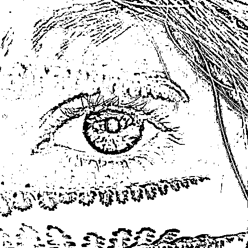

作者/杰西卡·加菲尔德·卡巴拉

译者/Christy 校对/王宏

图片来源/花瓣网

杰西卡·卡巴拉是一名原型占星师及深度心理学咨询师，7 月 8 日她将在若道开办[“如何与客户的阴影面工作”工作坊](http://mp.weixin.qq.com/s?__biz=MzA5NjA0NTAxNg==&mid=2651385430&idx=3&sn=f20735da7c9290a7d02b870831cbacfe&scene=21#wechat_redirect)（点击查看）。这段时间大家已经通过她深度心理学论文内容的推送，了解到她拥抱并疗愈自己阴影的故事。今天这篇文章是“羞耻感”文章的最后一篇，有关作者如何决定从不健康的家庭环境中脱离出来，选择把拯救自己放在第一位。

❀**前文回顾：**

[**深度心理学 | 羞耻，出走父亲给女儿的唯一“礼物”**](http://mp.weixin.qq.com/s?__biz=MzA5NjA0NTAxNg==&mid=2651385363&idx=2&sn=e9a0a7eab1a4563222f65d4facd4ea86&scene=21#wechat_redirect)

[**穿越羞耻 | 我们的痛苦需要一位共情见证人**](http://mp.weixin.qq.com/s?__biz=MzA5NjA0NTAxNg==&mid=2651385403&idx=1&sn=9e92108a307a59c9692e8224c987aefa&scene=21#wechat_redirect)

## 我最需要的接纳是，自己接纳自己

**我的痛苦永远不会消失，但我与自己创伤的关系可以发展进化。**

重点不在于我是否会受苦，因为**我们所有人都会受苦；重点在于我选择如何面对我的痛苦**，是以一种治愈性的并带来完整感的、有爱的方式，还是以一种会对自己造成二度伤害的、羞辱的和谴责的方式？

学会以这种方式面对自我，让我感受到了力量，因为我意识到我可以选择展露并表现真实的自我。**我不再是一个无助的小孩或环境的受害者，我是一位成年人，有能力用一种有爱的、非抛弃的方式与自己相处。**这就是我如何开始在心理上脱离在我的原生家庭和一个更大的文化的父权本质中对女性的贬低、拒绝和抛弃的，作为自己人生的共同创造者，恢复我的力量并重新找回主权意识。

在我开始我的论文研究时，我一味地避免写到自己是失去父亲的女孩，尽管这是我进入心理学研究生学院学习的动因，也是我一开始想写这篇论文的全部原因。虽然现在我可以轻松地谈论羞耻，但在谈论我关于羞耻的真实经历以及羞耻与我的故事的关联时，我仍然感觉到羞耻，对于感到羞耻我深表羞耻。

我为以下情况感到羞耻：我不完美，我没有全部答案，我早期童年的经历以某些严重的方式影响了我，这些方式仍然给我一种不值得爱和归属的感觉。我以前总是希望和认为，我不易受到这些的影响。但如今，我明白了一些道理，**这些道理拯救了我的生命，帮助我在内心挣扎时用对自己有建设性的方式生活，而不是自暴自弃。情绪反应源自未被满足的需求。在童年阶段，围绕未被满足的需求滋生了羞耻。**

**当我们带着爱和接纳直面我们的需求时，我们代谢了羞耻。**

我们否认我们自己的需求，因为我们害怕听到“不”，害怕被拒绝，害怕感到羞耻。我意识到，**跟随羞耻的脚步，进入无意识层面，回想起被抛弃的那部分自我，开始了我的疗愈，让我回归本源，将我与这个星球上和我人性共通的其他所有人联系在一起。**

穿越我的羞耻和痛苦的大门，我已经接触到了我最深层的和最具创造力的潜能，将我更多的真实自我融入我具体化的生命，即血肉之躯中，也正是我父亲帮助创造的那副血肉之躯。痛苦和哀悼痛苦已经成为了我找回自己放弃的那部分自我的主要方式，我内在的父亲将那部分自我打入地狱，直到我足够强大，能够面对自己。**自爱是一种日常的选择和实践**，随着我年龄渐长，这种选择和实践对我来说变得越来越容易，但我必须选择继续成长，因为只有我才能给我自己这份至关重要的礼物。

**我能够开始在这个世界中展现自己，并感觉自己没有问题的唯一方式，是通过接纳和同情来认同自己**，因为其他人不会这么做，尤其是我父亲。对我而言，**成长很大的一部分是意识到我最需要的人的接纳是我自己的，而期待从他人那里获得的认可会带给我深刻的自爱感是不会长久的。**应该由我自己把失去的那部分自我找回来。

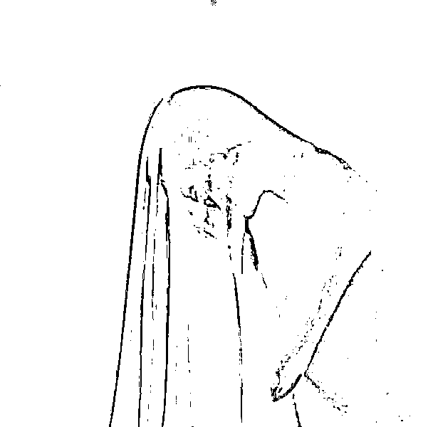

## 曾经，母亲的痛苦就是我的痛苦

我绝不想在这篇论文中谈及我与母亲的关系，或许是因为，作为一个失去父亲的女孩，她的伤痛还没有代谢掉，这种伤痛弥漫于我存在的大部分时间中。然而，我对母亲和她的痛苦有着最深刻和最持久的尊重。我如何在恰当地尊重她的同时，自由地分享我从家族中继承来的痛苦（像所有孩子从自己家族继承的那样）？

**没有明确的区分，也没有界限将我们定义为独立的个体。**

我母亲的痛苦就是我的痛苦，我了解她的内心。谈论失去我的父亲更容易，因为他远在天边，从实际距离上来说更远。但母亲不同，我住在她心里，她用身体承载着我，我们是一个个体、一个有机体。我母亲的身体是我无差别统一体的家。她的情绪就是我的情绪。在回顾我的研究笔记时，任何一本书上没有一页被标记的页码是有关母亲的角色的，我只对父亲的角色做了笔记。

对于失去父亲的女孩来说，**不重视并忽视她们生命中母亲的角色**是极其正常的。从一个层面上来说，这是一种深层的无意识“厌女症”的形式，以及对父权价值体系认为父亲的重要性大于母亲的延续。从另一个层面上来说，**这是一种得到很好诠释的防御机制，避免更近距离地查看自我中特别痛苦的那部分。**

**对于失去父亲的女孩**，包括我的母亲（她也失去了父亲）来说，**致命的流行病是让人衰弱的抑郁、焦虑和极度低下的自尊**，这在症状上显示为沉迷于酗酒，需要**麻痹看似难以忍受的情绪。**由于缺乏自我价值，她的生活变得死气沉沉。在我成长的过程中，我在知道任何其他方式之前就习惯性地成为了一个照顾者。

心理学家伍德曼完美描述了生活萎靡的家长与孩子之间的情境。她写道**：**


**如果家长是自恋狂或整天萎靡不振，他们会把孩子当做自己的镜子。这样一来，孩子的灵魂就受到了侵犯，因为这个灵魂无法自由发展自己的潜能。**它被利用，被迫承载父母的原型投射、情感和破碎的梦想。它承载着家长没能完成的事业，它甚至可能成为家长从未找到的挚爱。在这种没有界限的联结中，家长极为缺乏自我结构，这使得他们可能成为孩子梦想的化身，可能接受孩子的原型投射，无意识地接受一种原型身份用以替代自己无人认领的人性。**于是，孩子和父母无意识间融合在一起，孩子被冰封在一个原型世界中，再也无法自由探索。**


我的母亲同样失去了父亲，她努力想找回自己的价值或声音，在和她的关系中，我继承了照顾者的角色。照顾他人和完美主义占据了我关于自己的信念：只有当我是完美的并完美地照顾你时，我才是有价值的。        

服务你是我配活在这世上的唯一方式，否则，我就是在占用应该属于其他更值得的人的空间。如果你不开心，那错就在我，是我错了。我被训练成甚至可以在你知道之前就通过直觉感知你的所有需求，我习惯于完全感同身受，没有界限。我是你自我反射的一面镜子，我没有自己的脸。**自始至终，我的重心都在你身上。结果，我从来没有学会如何与我自己、我的需求、我想要的以及我的欲望共处。**

**所以说现在，我在这里，创造了一股想象力和一张我自己的脸。**

羞耻会造成分离，而分离是人类体验的对立面，因为我们在这里是为了联结和归属。而声音是联结的一种方式，如果没有人听到自己的声音，那我们就学不会倾听我们自己的能力。作为一个失去父亲的女孩，我如何在父权世界中不受父亲的影响而去了解自己并重视自己呢？如果失去父亲的女孩身边没有父亲的声音，那她们还有什么价值呢？我有什么价值？


**失去父亲的女孩必须找到她们自己的方式来讲述她们的故事，克服对女性的压迫和贬低，而女性在这个世界上是与男人同样强大的力量。失去父亲的女孩所寻求的，是将自己对无价值的核心认同转变为一种可以感受得到的深层的价值感和归属感。**


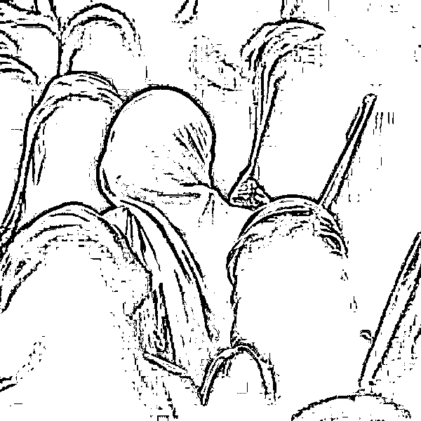

## 脱离不健康的家庭，拯救自己的人生

在我写下我的个人故事时，有好几次，我的启发式研究都受到了阻碍。我会告诉我自己，这篇论文是关于我的疗愈的，因此要讲述我的故事。但是诞生之初的痛苦是极为剧烈的，为了尊重我的话题，我不得不再度摸索去感受整个艰难的旅程。我纠结于自己的羞耻，纠结于分享我的故事的道德困境及我的故事对我生命中其他人的影响。

就像是有一阵风快速吹过我心灵中那些洞穴般的深渊，我突然如醍醐灌顶一般，明确知道了自己要做什么。我祈祷这篇论文可以改造我的灵魂，这样，在另一方面，经过这一艰难的写作过程，我真实的声音就会出现。这就是为什么这篇论文的方法论必须是启发式的，因为我羞于发出自己的声音，而正如我在这篇论文中所提出的——

**治愈****羞耻的方式是把那些束缚个体的羞耻吐露出来。**

因此，在我写这篇论文的时候，我沿着一条蜿蜒不止的道路穿越矛盾的地域，在这里，**回头即是前进，最黑暗的阴影下和最深的洞穴中有最明亮的光线**。我脚下的挑战带来了最意义深远的礼物，一步接着一步，我通过指示清楚了自己最终要做什么。

是时候离开我父亲的家了。受到一股震颤的和阐明的力量的影响，我意识到了非常严峻的现实，即我再次陷入了一段非常不健康的、纠缠的和相互提供权利的关系中。**我再度自我欺骗**，盲目地相信，只要我想出如何给予人们足够的爱，我就能拯救他们。只要我能变成更好的人类，成长得再稍微快一些，证明自己值得他们爱，那或许他们就会选择回爱我，而我们就会幸福地在一起。

可我们在情感上、身体上和精神上变得越来越疏离了。日子一天天过去，我感到越来越孤立和孤独，陷入了越来越深的绝望之中，乞求着宇宙终结我的生命。最引人注意的是，我脑海中的自杀情景，与母亲在我小时候跟我描述的那些极为相似。我们都想在开车时自我了断，她想冲下一座桥，我想在高速行驶时紧急刹车……

在我写这篇论文的时候，尤其是在写到本章关于诞生的痛苦时，我想到了玛丽·奥利弗 1986 年所写的一首题为《旅程》的诗。

> #### 旅程
> 
> 有一天，你终于知道，
> 
> 你必须做什么，并开始去做。
> 
> 虽然你周围的声音，
> 
> 一直喊叫他们坏的建议——
> 
> ……但你并未停下来。
> 
> 你知道自己必须做什么，
> 
> ……渐渐地，
> 
> 当你将他们的声音抛在身后，
> 
> 星星开始散发光辉，
> 
> 穿透云层，
> 
> 出现了一个新的声音。
> 
> 你慢慢，
> 
> 承认那是你自己的声音，
> 
> 一直陪伴着你。
> 
> 当你越来越深地，
> 
> 步入世界，
> 
> 决定去做，
> 
> 你唯一能做的事——
> 
> 决定去拯救，
> 
> 你唯一能拯救的人生。

于是，为了回应我最深处的需求、欲望和直觉上的了解，**我选择去拯救我唯一能拯救的人生。我把自己从照顾者和授权者的身份中解脱出来，我敢于从我不健康的家庭环境中脱离出来。**在这个如愚公移山般的改变过程中，**我不再选择通过抛弃自己来延续我的创伤，而是选择把自己放在第一位。**

（完）

**关于作者**


**杰西卡·加菲尔德·卡巴拉**（Jessica Garfield-Kabbara），占星师，心理咨询师，注册的婚姻与家庭治疗实习医师。从 2007 年开始实践原型占星学，提供占星咨询服务。她也是月度播客“关联性：原型占星学播客”（Correlations: The Archetypal Astrology Podcast）的嘉宾，该节目已开播 5 周年。2014 年，杰西卡在帕西菲卡研究生院获得咨询心理学硕士学位，研究方向为深度心理学。她的理论基础主要来源于理查德·塔纳斯、斯坦尼斯拉夫·格罗夫，以及原型占星学和超个人心理学。杰西卡教授原型占星学和深度心理学，也积极进行深度心理治疗方面的实践，将原型占星学的智慧和洞见同深度心理学整合起来。


****如何走出“阴影”重获自由？2016 年 7 月 8 日-10 日，杰西卡·卡巴拉老师主讲的工作坊：如何与客户的阴影面工作要开课了！该工作坊会教你如何帮助客户减少痛苦，减少关系和生活中所经历的障碍。****

**报名点击文末“阅读原文”**


# 进阶 | 你应该没有亲自学习过这些豪华版宫位知识

> 原文：[`mp.weixin.qq.com/s?__biz=MzA5NjA0NTAxNg==&mid=2651385457&idx=1&sn=4ac67c53492db1cf7626cba40329613a&chksm=8b4a5cc6bc3dd5d096df29d738d8858739da2ca86098f8d929de494855f3a81bb26fad7478bd&scene=126&sessionid=1692738816#rd`](http://mp.weixin.qq.com/s?__biz=MzA5NjA0NTAxNg==&mid=2651385457&idx=1&sn=4ac67c53492db1cf7626cba40329613a&chksm=8b4a5cc6bc3dd5d096df29d738d8858739da2ca86098f8d929de494855f3a81bb26fad7478bd&scene=126&sessionid=1692738816#rd)

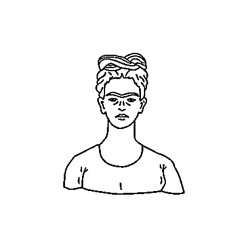

作者/唐娜·坎宁安 翻译/Elle

图片/花瓣网

初学者总是对空宫有很多误解，认为空宫会有不太好的情况发生。在这里，我们来看看到底什么是空宫，什么又是满宫，还有哪些元素可以作为宫位元素的共振，以及行进的行星在空宫对生命的影响。

❤*若道君有话说：*

*这是一篇翻译文章，原文的“empty houses”翻译为空宫，“full houses”翻译为满宫，如果你有更好的翻译方法，可以留言告诉若道君哦。*

何谓空宫和满宫

当你审视一张星图时，你会发现有一些宫位是空的，而有一些宫位则相对比较满。这里，我关注的只是**最基本的十颗行星**，而非很多的小行星和阿拉伯点，因为**基本行星代表了主要的能量焦点和能量消耗**。当然，当你审视一张星图时想包含哪些因素，这由你来决定。

考虑到有 12 个宫位而只有 10 颗行星，至少有两个空位会是空宫。但是，如果几颗行星聚集在同一个宫位中——例如比较常见的太阳、水星和金星——更多的宫位中会没有任何行星。

这是理所当然的事情。**我们只能把能量分散在几个不同的方向，要不然我们就变得像小行星带一样碎片化**。**如果一个人的行星分布在很多不同的宫位，这个人往往有很多的兴趣，并会尽力同时应付很多的责任和关系**。他们可以成功做好这一切，还是会成为一个无能而浅薄的半吊子，这取决于星图中的其他因素。

满宫描绘出生活的重要领域

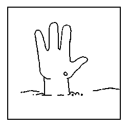

**满宫描绘出生活中的重要领域，在这些领域中我们把很多鸡蛋放在一个篮子里。在满宫中，我们消耗能量之处就是我们会取得收获的地方，因此满宫是一个重要的人物、情境和事件集中的领域**。

*   如果你在**十一宫有好几颗行星**，而在**四宫没有行星**，那么在成年以后，**朋友**将是你的**主要支持者**，可能比**家人**还重要。同样地，**俱乐部领导**通常有很明显的十一宫配置。 

*   **如果一个宫位中有一个星群，或者是包括太阳之内的 2-3 颗行星，那么与这个宫位所关联的事务甚至可以作为此人职业的指征**。 

*   例如，在**第三宫**有一个**星群**的朋友可能开创一个**非常成功的应答服务**。一个**旅行中介工作人员**有好几颗行星落在**第九宫**。许多**学术界的老师和精神导师**也都有**第九宫**的侧重。 

*   **第八宫**可以显示一个人是否有**通灵**的倾向，同时也是**潜在财富**的指征。

*   **空宫显示主要的行星能量并没有集中于与此宫位相关联的事务，而聚焦在了别处。因此，这个宫位所代表的事务常常会让位给满宫宫位所代表的事务**。 

*   一个女士如果在第四宫和第五宫没有行星，而月亮落入第十宫，那么很可能她当**职业女性**会比当传统的家庭主妇更有成就感。

空宫也不代表无事发生

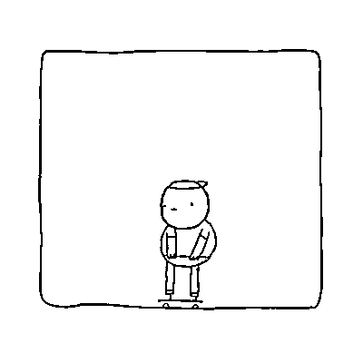

**但我们也不能总结说，在空宫所代表的生命领域就不会有任何事情发生**。美国预言家珍妮• 狄克逊星图中象征交流的第三宫是空宫，但她的专栏和书籍为她的成功奠定了基础。我们还应该看**水星和双子座**，因为他们也都与**第三宫**相关联。他们不同程度地**弥补了空宫**，因为她的**上升点落在双子座**，而**水星合相了中天**。

**一个空的七宫真的是无婚姻么？** 

很多新手在看到自己的**第七宫是空宫**时惊恐万分，认为自己永远不会结婚了。其实我们还应该去考量在一张星图中，有哪些元素可以作为补充。 

*   他们的**金星是不是很强**？ 

*   **行星和四轴（尤其是太阳、月亮或上升点）有没有落在天秤座**？

*   天秤座倾向于结婚，无论他们的选择是否靠谱。

*   **第七宫的守护星在哪里**？

*   如果第七宫的守护星在**第四宫**，而**第四宫里有很多行星**，那么**建立一个家庭和维护家庭生活**将是比婚姻本身更强的一个驱动力。婚姻只是达到这个目标的一个手段。 

当行进行星走入空宫

另外需要考虑的是，出生星图中的空宫在人的一生的中并不永远是空的。**当行进的行星或推进的行星到达一个空宫，可能会在那里呆上几年的时间。他们会激发出一些与那个宫位相关的新事件和新状况**。

例如，**外行星在第二宫的长期行进与一个人财务方面的一系列发展有关**。如果一个人出生星图中的第二宫没没有行星，这个行进意味着此人可能会**在挣钱和理财方面投入比往常更多的关注**。

**来投个票吧**

**📹 /mp/newappmsgvote?action=show&__biz=MzA5NjA0NTAxNg==&supervoteid=4069596#wechat_redirect**


**听懂了吗？记得记笔记哦。**

**有什么实践经验欢迎分享~**

**特别提醒：**

**本文首发于若道平台，**

**转载请联系后台授权。**


**占星真奇妙，不学不知道。****由大卫·瑞雷老师**讲授的**若道核心课程 Level 3，会教你将**星座、行星、宫位、相位这些散落的珠子穿起来，**带你进入更深的自我探索与成长的旅程。本课程将于今年 7 月开课，敬请期待！******

**报名及咨询，请点击文末“阅读原文”**


# 月亮与体重 | 又月半了，让我静静

> 原文：[`mp.weixin.qq.com/s?__biz=MzA5NjA0NTAxNg==&mid=2651385457&idx=2&sn=4ca1a556b91920931a2de05d0309c0e0&chksm=8b4a5cc6bc3dd5d0cdccfc52805352cb6baf83e2c1fd15172e49427718f4d9bcc300cf7cb2b0&scene=126&sessionid=1692738816#rd`](http://mp.weixin.qq.com/s?__biz=MzA5NjA0NTAxNg==&mid=2651385457&idx=2&sn=4ca1a556b91920931a2de05d0309c0e0&chksm=8b4a5cc6bc3dd5d0cdccfc52805352cb6baf83e2c1fd15172e49427718f4d9bcc300cf7cb2b0&scene=126&sessionid=1692738816#rd)

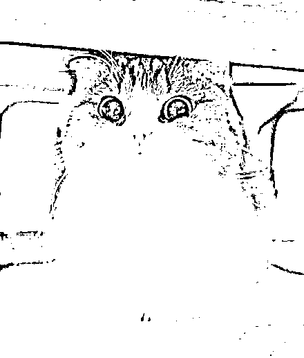

作者/唐纳·坎宁安  图片/花瓣网

江艺/翻译  Christy/校对

“

占星学也可以跟减肥有关吗？当然咯，比如巨蟹座与饮食有关，掌管巨蟹座的月亮也掌管了我们的胃，所以，一直在减肥，从来没成功的各位，没准儿占星学里有减肥秘籍哦。

”

## 饮食习惯问题核心是家庭带来的安全感问题

对我们大多数人来说，成长的家庭环境极大地影响着我们的食物偏好和饮食习惯。我们对食物的大部分习惯和感受在很早以前就已习得，以至于变得无意识——与月亮相关的领域常常都是无意识的。**由于我们与食物之间建立起的情感联系和食物给我们的安全感，任何与改变饮食习惯有关的建议都会遭到极大阻碍。**

有的家庭治疗师甚至通过观察家庭用餐来诊断家庭问题。因为孩子在初期心理模式形成的重要时刻，就是在晚餐时分，在这种近乎仪式的餐食中，孩子了解到他们的年龄和性别角色，家庭成员的期待是什么，什么样的情感表达是被允许的，以及其他的价值。这个时刻发生的事情是家庭关系和冲突的缩影。这样就不难理解**食物和感受**之间如此紧密地纠缠交织。

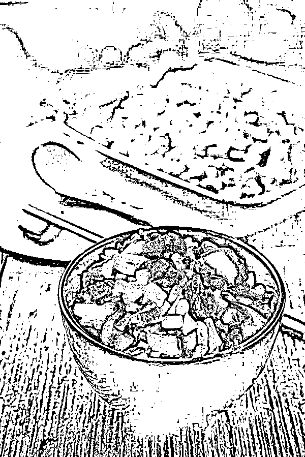

## 佐证：体重与家庭之间的联系

研究显示，体重和家庭影响之间有明确关联。密歇根大学的一个工作组查看了近 3000 名儿童的经历。父母越超重，孩子就越可能超重，而且他们会更加超重。出生在肥胖家庭的孩子中，近 40%的人都极为肥胖，其中只有 15%的肥胖具有偶然性。

女孩是受此影响最严重的，这在占星学中是合理的，因为**月亮和母亲-女儿紧密关联**。到 17 岁时，父母双方都超重的女儿会比父母都瘦的女儿重七倍多。很明显，引发严重肥胖的是一个隐性基因。也就是说，家长双方必须都存在这种基因才有可能显现，然后你有四分之一的几率遗传到它。

如果你有体重问题，你可能会说：“那么都怪我的坏基因咯！”这个研究小组并不否认遗传的重要作用，但他们同时研究了被收养的孩子，发现那些被肥胖家长收养的孩子与那些生在这种家庭的人一样趋向于肥胖，甚至连他们的宠物也存在很高的肥胖几率。

月亮展现了我们很早以前习得的习惯，这些习惯很难打破。这些研究认为，**过度饮食是一种习惯，是由于受过度饮食的家长影响而习得的一种机制。月亮掌管情绪，大多严重的暴饮暴食都是一种习得的针对厌恶情绪的家庭防御**。

> #### 没有被满足的月亮会给我们带来什么？
> 
> **饥饿会造成两种反应：一个是不再索取，另外是过度索取。**前者会造成抑制、否认、冷漠，后者会造成强迫性和贪婪。两种反应都可能在不同阶段出现于同一人的生活中，以一种保护性或防御性机制的方式，而这也可以从他们对于食物的态度看到，也可以从星图中月亮的挑战相位中看到。下面列举两种相位。
> 
> **月天相位**
> 
> 月天相位的人，长大后可能处于非常不稳定的进食状态，没有一日三餐固定的吃饭时间，如果再有木星或射手座的影响，可能会造成暴饮暴食后和神经质的节食。
> 
> **月冥相位**
> 
> 月冥相位的人，也许是能够长期忍受饥饿状态之中的人，让自己处于半饿死状态活着而不自知。或者相反，希望占有尽可能多的食物，但不去享用它们——其实他们也不知道如何享用，只知道占有，觉得只要不会饿死就好了。
> 
> 这样的相位也可能造成强迫性地不断去占有，但也不断分离的状况。因为他们习惯了某种饥饿状态，很难信任供给食物的人，也很难适应没有危机的丰盛人生。在饥饿和危机中的关系，可能反而是让他们感觉最可信、最安全的。

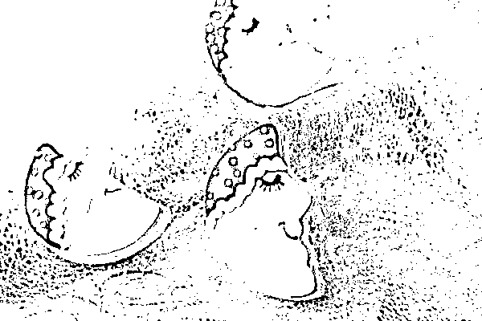

## 建议：月亮的问题由月亮的方式来解决

月亮掌管直觉，**根据直觉而不是糟糕的家庭训练来控制饮食会更加健康。**

在饮食习惯没有遭到主人强制破坏的情况下，大多数动物都知道吃什么对自己有利，也知道什么时候吃饱了。动物生病了不会吃东西，但人如果生病了会被劝导进食，但有时候禁食会更好。

孩子天生就有健全的食物本能。在一项研究中，幼童可以自由地在一系列食物中进行选择。他们的饮食习惯或许在任何一天都不均衡，但一段时候之后却能够完美平衡。

家长的教育抹杀了孩子的本能，他们强迫孩子吃东西，不考虑孩子是否愿意，让孩子按规律吃饭，不问他们是否饥饿，并且给他们吃高糖分的加工食物。

**作者的体重故事**

我的太阳/木星合相在 12 宫巨蟹座，月亮落上中天。

我的家族中有许多超重的女性和酗酒的男性。我也喜欢多喝点酒，但我的酒量很有限，大概一年两瓶玛格丽塔，所以你可以猜到我支持哪一方了。我 70 岁了，过去 55 年一直在控制饮食、饮食失控，试图说服自己节食，或是放弃节食。你知道吗？我仍然对自己感觉良好，因为我尽了自己的职责让这个世界变得更美好。

所以，当我们察觉到我们的饮食习惯有这样那样的问题，先别急着做硬性的调整，检查一下出生星图，**看看我们有没有照顾好自己的月亮，情绪的问题，安全感的问题是不是一直堆积没有得到解决，再从根源解决问题。**

**特别提醒：**

**本文首发于若道平台，**

**转载请联系后台授权。**


**占星真奇妙，不学不知道。****由大卫·瑞雷老师**讲授的**若道核心课程 Level 3，会教你将**星座、行星、宫位、相位这些散落的珠子穿起来，**带你进入更深的自我探索与成长的旅程。本课程将于今年 7 月开课，敬请期待！******

**报名及咨询，请点击文末“阅读原文”**


# Level 3 | 占星自学者与职业占星师的分水岭

> 原文：[`mp.weixin.qq.com/s?__biz=MzA5NjA0NTAxNg==&mid=2651385457&idx=3&sn=f62ae27fcf0b752c6e4654c5bc5d48f7&chksm=8b4a5cc6bc3dd5d080f3c5787c44e8bc8bb29d7cc2e5029e214f3dc9d96c20cd1ab57e457879&scene=126&sessionid=1692738816#rd`](http://mp.weixin.qq.com/s?__biz=MzA5NjA0NTAxNg==&mid=2651385457&idx=3&sn=f62ae27fcf0b752c6e4654c5bc5d48f7&chksm=8b4a5cc6bc3dd5d080f3c5787c44e8bc8bb29d7cc2e5029e214f3dc9d96c20cd1ab57e457879&scene=126&sessionid=1692738816#rd)

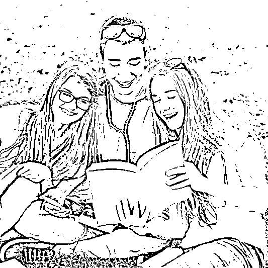

从**Level 3**开始，

你进入了占星学更深入的领域。

Level 3 的课程，

是**占星自学者和职业占星师的分水岭**。

Level 3 课程**非常重要**，

是大部分占星学习者**薄弱**的环节，

也是往下的学习中**承上启下**的一个重要阶段。

在这个阶段，

你将**深入学习宫位**，

知道生命的故事发生在哪里，

在解读中，**星座、宫位的差异**到底是什么。

你会学习**相位、行星**能量的行星之间的对话，

一颗行星如何用它的能量影响另外一颗行星。

然后，

你要学习如何

**将星座、行星、宫位、相位组合起来**进行解读，

这是把散落的珠子穿起来的过程，

形成内容丰富、准确的解读语言。 

**2016 若道核心课程 Level 3**

**授课时间：**2016 年 7 月 28 日-11 月 10 日

**授课老师：**大卫·瑞雷

**授课方式：**网络课程，英文授课，中文翻译

**报名截止**：2016 年 7 月 15 日

**费用**：7000 元

**课程负责人：童老师**（**微信： 196267205**，请备注 L3 报名咨询）

长按二维码添加课程负责人咨询~


**导 师 介 绍**


**大卫·瑞雷（David Railey）**

若道创始人，《灵魂的目标》作者。拥有四十年的占星咨询的执业经验，曾两任亚特兰大占星协会主席，是全美占星师联盟（AFAN）、美国占星师联合会（AFA）、全美占星研究委员会（NCGR）、国际占星研究协会（ISAR）和职业占星师组织（OPA）的成员，是联合占星大会（UAC, United Astrology Conference）督导委员会委员。大卫曾是 CNN、CBS 的占星节目的常驻嘉宾，多次在 BBC、WGS、WSB、WRGG 等节目中接受采访，并在亚特兰大主持电视节目《每日行星（Daily Planets）》达 4 年之久。

**助 教 介 绍**

1

**天空的空**

2015-2016 年度若道核心课程专职助教。获得 ISAR 认证和“生时校正认证考试”资质认证。

2

**GAFF**

任 2015 年度诺·泰尔、斯蒂芬·福里斯特老师的占星工作坊助教。

**适 合 人 群**

*   Level 3 课程需要你具备一定的占星学基础知识；

*   如果你是若道核心课程 Level1-2 的学员，强烈推荐你直接报名参加 Level 3 的学习；

*   如果你是自学或者从其他途径学习占星学的学员，请点击文末“阅读原文”寻找到 Level 3 入学测试来看看你是否可以直升 Level 3。

**课 程 内 容**

*   **宫位和四轴**

*   我们将会用具体例子看到同一颗行星，相同星座，在 12 个宫位时如何解读 

*   **相位**

*   合相、六分相、四分相、三分相、对分相、梅花相位、十二分相、T 三角、大十字

*   **相位和周期**

*   **组合解读**

*   行星落于星座的综合解读

*   行星落于星座宫位的综合解读

*   行星落于星座宫位加上相位的综合解读 

*   **守护星链**

*   如何通过守护星链解读


**了解详细课程内容及报名方式，点击文末“阅读原文”**


# 宇宙福利 | 6 月 26 日，值得在日历上标注下来的好运日

> 原文：[`mp.weixin.qq.com/s?__biz=MzA5NjA0NTAxNg==&mid=2651385456&idx=1&sn=62af1fb6adb7a059e0e6a317a7debd44&chksm=8b4a5cc7bc3dd5d159c88b6801aaa65876edfd81f339c8900f81fcbbb5fd47b8c2f883d58cd1&scene=126&sessionid=1692738816#rd`](http://mp.weixin.qq.com/s?__biz=MzA5NjA0NTAxNg==&mid=2651385456&idx=1&sn=62af1fb6adb7a059e0e6a317a7debd44&chksm=8b4a5cc7bc3dd5d159c88b6801aaa65876edfd81f339c8900f81fcbbb5fd47b8c2f883d58cd1&scene=126&sessionid=1692738816#rd)

五星逆行至四月底，虽然我们迎接了木星和水星的顺行，可是在当前大十字的压迫之下，显然我们的感受没有好到哪里去。不过不要紧，宇宙似乎有心让我们不要完全沉入黑暗，一道指向光明的箭即将射出，那就是——木星与冥王星的精确三分相！

**好消息，木冥三分要来了**

**从五星逆行的四月底，到现在木星顺行、水星顺行，接着 6 月 30 日的时候火星也即将顺行。**虽然目前我们还在经历土海四分、大十字天相，为自己的前途究竟在哪里而焦虑。但木星，已经慢慢走近三分冥王星的相位，好像黑夜的天空，出现一个指向光明的箭头。

我们即将迎来**木星与冥王星成三分相**的祝福。

**从 2016 年 1 月 8 日开始逆行的木星，引领我们修补 2015 年 10 月到 2016 年 1 月期间发生的事件和人物关系。**当时我们可能对人和事有着过高的期待，在今年 1 月到 5 月期间，我们面临了种种，包括反复、可惜、试图挽回等多种姿态，最终归于平静。我们接受了人和事本来的面貌。

**在此期间，上升射手座、双鱼座、处女座、双子座、狮子座尤其进入一段有木星祝福的上升期。****我们通过逆行的木星，花了 5 个月提升自己的能力。**学习到新的技艺后，开始渐渐忙碌起来。通过年头过高期待的那些人和事，形成了自己的地盘、主张和态度，不偏不倚刚刚好。

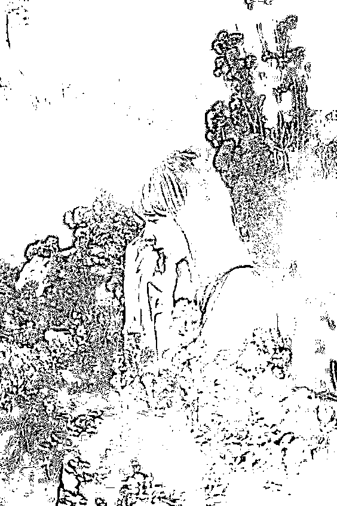 

**木冥三分的三次成相**

冥王星所带来的蜕变和重生之旅，加上木星的扩张和幸运，这个三分相位所形成的祝福，给我们带来的影响是，在事业和生活方面经历心态上天翻地覆的变化。我们会更清楚自己要什么、不要什么。对职业、关系、生活更加明确自己的看法。

木星和冥王星在 2015 年-2016 年一共成相三次：

*   **第一次精确成相：2015 年 10 月 11 日；**

*   **第二次精确成相：2016 年 3 月 16 日；**

*   **第三次精确成相：2016 年 6 月 26 日。**

**第一次木冥三分**

冥王星所带来的蜕变和重生之旅，加上木星的扩张和幸运，这个三分相位所形成的祝福，给我们带来的影响是，在事业和生活方面经历心态上天翻地覆的变化。

**第一次成相是在 2015 年 10 月 11 日，顺行的木星和冥王星在处女座 13°精确成三分相。如果你的出生星图上有重要行星或四轴/南北交点落在处女座、摩羯座、巨蟹座、双鱼座 13°，那么 2016 年相对来说可能过的比较顺利一些。**

**举个栗子**

我的一个客户在这个时间点，着手处理自己的感情问题。她强烈的感觉到自己在关系中无法继续，可是对于离开这个选择，始终感到自己处于被社会环境潜规则压迫的状态。在咨询中，我们重新梳理了一下她的出生星图中的情感模式，以及童年早期的生活经历。在这些经历中，她看到了自己理想的关系渴望，明白了在这段关系中自己的缺失。对于之后做什么决定，她反而变得很轻松。

**第二次木冥三分**

**第二次成相是在 2016 年 3 月 16 日，逆行的木星在处女座 17°与顺行的冥王星在摩羯座 17°精确成相。**

**重点影响人群**

**如果你的出生星图有重要行星或四轴落在处女座、摩羯座、巨蟹座、双鱼座 17°，那么你就是此次成相的重点影响对象。**逆行给你的成长带来很多资源的同时，也在增加你的谦卑、内敛，和对自信态度的历练。

这个逆行期间，很多人谈论最多的是“没有想到”、“突发事件”、“意外的挫折”，特别是和传统势力、领导层面在资源争夺、权威性上的争夺，情绪上的不安全感突然爆发。它所引发的是，我们在**人生信条、职业尊严、家庭归属感、自我认知、情绪安全感、精神归属感和无私奉献等多重层面的震荡和反思。**

在这个阶段，我常接到的咨询，是关于多年婚姻里的夫妻，突然某一方或者双方，经历婚姻关系的反思，面临婚姻关系中“我是谁”的定位茫然。很多人问：我们还相爱吗？我们如何像以前那样彼此相爱？有些人，则出现事业上的停滞期，对自己是否能冲上当时设定的高度，十分怀疑：我的目标设定对吗？我要从哪里得到资源帮助自己获得事业上的成长呢？

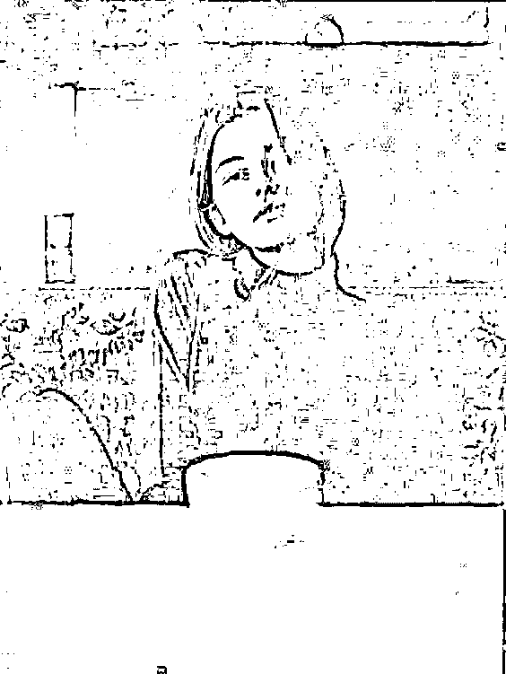 

**第三次木冥三分**

**最后一次成相在 2016 年 6 月 26 日，顺行的木星在处女座 16°和逆行的冥王星在摩羯座 16°精确呈相。它将要验收木星逆行的成果。**

如果说**冥王星来到摩羯座，需要建立一个经典、庄严、有序的心境蜕变和建设**的话；那么位于**处女座的木星，则通过历练我们的专业技能和修养，从每个细节上予以完善打磨**，然后让我们**经历信息混杂的考验**（水星逆行），**面对内在恐惧浮现于表面的挑战**，愤怒和情绪无法压制的时光（大十字），以及信念和自由的选择（两次射手座满月）……**让我们从内心到外表，在应对危机的心态上、在升级生活方向的思索上，完成一场彻底的蜕变**。身份、地位和自我觉察，都进入了新的世界。

**重点影响人群**

**出生星图有重要行星或四轴/南北交点落在处女座、摩羯座、巨蟹座或双鱼座 16°。**

**这个打扫的最终成果，将会在 2016 年 6 月 26 日期间，被我们看到、感受到。**

然后，6 月 29 日，火星在天蝎座顺行了。开足马力奔向夏季的耕耘。

人生，是神的起重机在深夜垒起的高楼，需要不断拆和建，为着是某日离世之前回头，在大地上看到一座写着你名字的城堡，无论大还是小，恢弘还是隽永，华丽还是素简，它呈现了你在这一世和命运共谋，画出的城池。

木冥三分，倾城记。


**作者简介**

**傅迦莎**：全职占星师，IAF 国际引导者协会认证引导师。若道 COAC 高阶资质毕业生，在若道跟随多名当代著名占星师进行深入系统的占星研习。接受萨提亚、NLP、格罗夫全息呼吸理论的心理咨询专业培训。擅长职业规划、个人成长、婚恋关系解读咨询。

**微信个案咨询**：jiangnan2638

**微信公众号**：Helloshajia

长按二维码，让金钱流向带来知识和智慧的人~


**特别提醒：**

**本文首发于若道平台，**

**转载请联系后台授权。**


******想要顺势而为？先掌握如何解读星图。由大卫·瑞雷老师**讲授的**若道核心课程 Level 3，会教你将**星座、行星、宫位、相位这些散落的珠子穿起来，**带你进入更深的自我探索与成长的旅程。本课程将于今年 7 月开课，敬请期待！******


# 土星在 12 宫，还是夜晚出生，我是不是这辈子就完了？

> 原文：[`mp.weixin.qq.com/s?__biz=MzA5NjA0NTAxNg==&mid=2651385456&idx=2&sn=0315150f83816e79912e22ea67a97e90&chksm=8b4a5cc7bc3dd5d173644f9ed3655c1e709c5971a954b961c528d2398d6f21581ccbc94f1f44&scene=126&sessionid=1692738816#rd`](http://mp.weixin.qq.com/s?__biz=MzA5NjA0NTAxNg==&mid=2651385456&idx=2&sn=0315150f83816e79912e22ea67a97e90&chksm=8b4a5cc7bc3dd5d173644f9ed3655c1e709c5971a954b961c528d2398d6f21581ccbc94f1f44&scene=126&sessionid=1692738816#rd)

作者/罗伯特·汉德 图片/Pinterest

译者/Esme 速记/沐心方

7 月 23 日，罗伯特·汉德古占与现占相结合就要开课啦！快点击“阅读原文”报名~我们收集到一些来自读者的问题，请“美国宝藏”罗伯特·汉德来为大家解答！小巴掌拍起来~

## 不是所有的凶宫都只剩下“坏”

➤ **Q1****：古典占星中是不是把角宫（1、4、7、10 宫）、5 宫和 9 宫作为吉宫，2 宫和 11 宫是中性的，其他宫是凶宫？**

**A1**：**确**实是这样，**在古典占星中，是把和 1 宫、上升点没有主要相位的宫位作为凶宫的。**主要相位是指合相、对分相、四分相、三分相和六分相。我们看斐迪南大公这张星图，上升点在射手座，而摩羯座、天蝎座和巨蟹座与射手座没有形成主要相位，这样的宫位就叫做不合意的宫位。把上升点作为 1 宫的话，天蝎座就是 12 宫，是隐藏的敌人、囚禁，而 6 宫是疾病的宫位，巨蟹座是 8 宫的死亡的宫位。

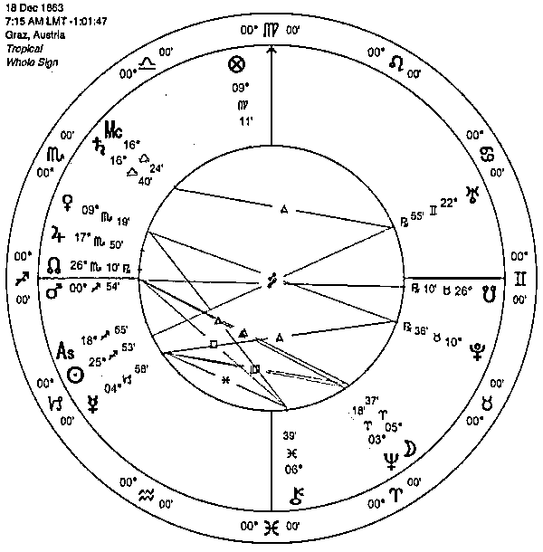
▲图为斐迪南大公星图（整宫制）

此外还有 2 宫，这有些让人奇怪，因为通常大家会认为 2 宫是金钱的宫位，金钱有什么问题呢？我们在英语里有一个表述：“金钱是万恶之源”。在罗马占星学里，2 宫被称为地狱之门。从某种程度上看，它是最坏的宫位，虽然它看起来并不坏。**比如任何帮助你做一些事情的人都是 2 宫掌管的**。打个比方，你雇一个律师，一旦这个律师收了你的钱或者定金，他就是你 2 宫的人。所以 2 宫并不完全是坏的。**所有其他的凶宫也一样，并不全是坏的，它们也有自己的功能。**但是在中世纪占星学里，这些不合意的宫位，除了 2 宫以外，都会被认为是非常糟糕的，这比现代占星学的说法更加黑白分明。

在此我要强调的是：**当我描述到在中世界占星学的一个比较糟糕的落点的时候，如果你们中有人是这样的配置，请不要恐慌，因为现在已经是一个完全不同的时代了。在那些困难和混乱纷杂的时代里，这些凶宫和凶星确实是糟糕的，但是在相对和平繁荣的时代，它们就没有那么糟糕了。**

## **夜生图土星在 12 宫：遇到灾难不易翻身？瞎说！**

➤ **Q2****：如果夜生图中土星在 12 宫、巨蟹座，针对这一配置，如何去趋利避害？**

**A2**：**在**这张图中趋利避害是可能的，但有一些困难。首先你要在夜生图里去理解土星，**土星是象征原则和定义的行星**，而在日光之下，原则会更加清晰一些，在夜间就不是那么清晰了。**夜生图里，土星可以很容易地看到什么东西有问题，却很难看到什么东西是好的。**而且夜生图出生的人，如果目标离他特别远，且很难达到的话，他可能就不去努力了。除非他**可以把目标分解，拆分为一个又一个可行的小步骤。他在每一步走完之后，停下来，认识到自己已经走了一步。这样久而久之，当他慢慢接近目标后，就可以去关注目标本身了。**

其实土星在 12 宫，是有一定禀赋的。**每个行星都有一个自己喜乐的宫位，对于土星来说，它在 12 宫是喜乐的。它要求的，是这个人要时不时从正常的秩序里退隐出来，去冥想和反思**——僧侣就会做这样的事情。

对于土星 12 宫的人来说，很重要的就是**需要阶段性地去切断与社会的联系，然后他们可以看清一些东西，而不是让各种人在耳边喋喋不休。**一旦这个人更加成熟一些，土星在 12 宫就会更正向一些，如果他们不介意时不时独处一下。但是任何土星落在 12 宫的人，不应该没理由地选择这一点，除非他们看到自己真正需要的是什么？因为土星在 12 宫，他们确实有逃避他人的倾向，而逃避、躲藏是土星在 12 宫的一个非常糟糕的表现。**从人群、社会中抽离出来反思，就是对于土星在 12 宫的一个正向的运用。**

## 你知道吗？不同行星的容许度不一样

**➤ ****Q3****：跨星座形成的相位是成立的吗？为什么在中世纪占星学中，相位的容许度都是不一样的？**

**A3**：**比**较通用的一个中世纪占星学的立场就是，**相位是不跨星座的**。我觉得事实上也可以这样去运作，**当相位跨星座的时候，容许度要变得更小，原因是有两种相位：星座与星座之间的相位，以及度数与度数之间的相位。**

**举个栗子**

如果你有一颗行星在 29 度白羊座，那它可能就很有效地跟一个处女座 1 度的行星形成三分相，但是如果第二颗行星是落在处女座的 5 度或者 6 度，可能就没有三分相了。不过如果一颗行星落在白羊座的 1 度，另一个落在狮子座的 10 度，它们之间还是有相位的，虽然弱一点。所以在中世纪的占星学里，相位的概念跟现代占星学有一些区别。

更严格地说，**在中世纪占星学里，容许度的差别不是度数上的，而是行星上的。每一颗行星的容许度都不一样，而这个容许度对于每个相位都适用，所以有时候看起来某个容许度很大，而这其实是跟对应的行星有关。**

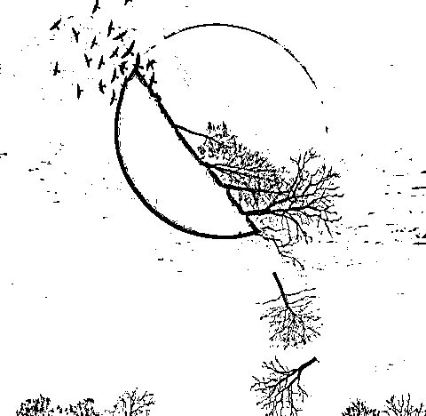

除了相位，还有很多其他要考虑的东西。比如在斐迪南大公的星图里，月亮在白羊座 5 度 37 分，土星在天秤座 16 度 40 分。可能很多的现代占星师会觉得 11 度的容许度太宽了，这个对分相的影响力太弱了。但是因为这个相位没有掺杂任何其他的因素，所以中世纪的占星师还是认为这个相位是很有力的。

**在现代占星学里，相位的紧密度会增加它的力量。而在中世纪占星学里，重要性是根据这个人出生时刻的前后，相位出现的顺序来定的**。

比如说，月亮的一个非常紧密的出相位和非常紧密的入相位之间的解读也会不一样。在这个星图里，我们就看到月亮是和水星刚刚出相位，这意味着该相位暗示着此人出生前的一些状况；而月亮跟土星之间的入相位，则暗示着此人出生以后，在他的生命早期会出现的一些状况。这一点在择时和卜卦占星学里更重要一些，但是在出生星图占星学里也有一定的重要性。

.gif")

**▼点击图片，了解更多罗伯特·汉德**

  

**ISAR 选修课程**古占与现占结合

**授课时间：**2016 年 7 月 23 日-9 月 10 日 10：00-12：00（**每周六上课**）

**授课次数**：8 次

**授课老师：罗伯特·汉德**

**授课方式：**网络在线，英文授课，中文翻译

**报名截止**：2016 年 7 月 15 日

**费用**：****6800 元****

**课程负责人：李老师**（**微信：18601950700**，请备注古占报名咨询 ）

**这么有意思，你不来报个名再走？**

长按二维码添加课程负责人咨询~

****

**报名及咨询，请点击文末“阅读原文”**


# 现占与古占结合 | 占星界“屠龙刀”的正确打开方式

> 原文：[`mp.weixin.qq.com/s?__biz=MzA5NjA0NTAxNg==&mid=2651385456&idx=3&sn=d2cdc511d52eb8ec88b52601bf7043d9&chksm=8b4a5cc7bc3dd5d1115aa3905b17604965be45611ac602cc857ffb6233fa231c688a7d063b46&scene=126&sessionid=1692738816#rd`](http://mp.weixin.qq.com/s?__biz=MzA5NjA0NTAxNg==&mid=2651385456&idx=3&sn=d2cdc511d52eb8ec88b52601bf7043d9&chksm=8b4a5cc7bc3dd5d1115aa3905b17604965be45611ac602cc857ffb6233fa231c688a7d063b46&scene=126&sessionid=1692738816#rd)


“

罗伯特·汉德，一位被占星界称为“国家宝藏”的人，掘地三尺，阅古卷无数，学习没有人再说的古代语言，学习古代历史，学习古代哲学，挖出了一把传说中的“屠龙刀”。在 37 年的现代占星生涯和 21 年的古典占星研究生涯后，他将为我们带来什么？

”

将 37 年的现代占星和 21 年的古典占星结合， 罗伯特·汉德耗费大量的精力，挖出了这把“屠龙刀”，他擦拭这把锈迹斑斑的刀，粘合它的碎片，钻研刀法，在此过程中引发好奇、热情、疑义、愤怒；他促使原来名不见经传的人获得新立山头的机会，同时又引发了分裂、不满、攻击。

有些现代大师们对他的道路感到惋惜、不解、批评，但仍旧尊敬他；而他又远离那些一门子想要复古、认为“老的就是好的”古典阵营。他跑着，似乎有同伴，又一人独行。

你也许听说过这把“屠龙刀”的传说，从江湖似真似假、似是而非的流言中，从自称使过它的招式的自言得意的小辈中，从以教学谋生、很少实践经验的小有名气的占星师的课程中。

但你真的见过这把刀吗？你知道正确的使用方式吗？这把刀真的能在现代社会应用吗？还是仅仅是应该放入“历史博物馆”中陈列？这次课就是谜底揭晓的时刻。

## 现代占星学的学子们，如果你：

*   对于出生星图——占星学中最重要的星图的秘密，仍有很多不解和好奇；

*   渴望获得古典占星里符合你的哲学理念又实用的好技法；但厌倦了大量复杂却无用的古典知识，又苦于古典文献浩瀚，无从粹取；

*   对自己星图和某些人生大事的对应百思不得其解，渴望获得一位占星大师的解答；

*   曾和妄称“可以更准确预测”的古典占星师们争得面红耳赤，但因为没学过古典而稍微有些心虚；

*   了解占星学界常见的古典和现代占星的纷争，想在真正了解这两门学问的大师面前提出深刻而尖锐的问题；

*   渴望在自己的占星知识拼图中补上能够符合现代占星理念的古典占星学知识，并将现代占星和古典占星融会贯通在咨询中

## **欢迎你来，机不可失，因为：**

*   **这里有世界上唯一能够教授此门课程的占星界泰斗**：72 岁的罗伯特·汉德，两个阵营的旗手型人物，**活着的唯一获得现代占星学大师尊重的横跨两界的泰斗**、占星咨询实践者，历史学家、哲学史研究者，活着的时候就已经成为历史的人。一个怀旧的人，一个试图搭起桥梁的人，一个不满足现有的人，一个思想演化路径让人迷惑的人。


*   **萃取古典的精华，去除古典占星糟粕：**罗伯特·汉德用他综合的知识，为你筛选出古典占星中可以为强调自由意志的发展、个人成长的现代人有益的古典占星实用技法。

*   **从实战演练中学习**：首次以案例教学的方式，除第一堂之外，每堂课皆以案例演示为教学重点。

*   **获得大师的免费解读**：**7 堂课的案例选取皆为学员星图，你有机会入选**。

*   **打尽出生星图的占星学命题！** 出生星图，是一生的预测星图，所谓的命运的因子埋藏在出生星图里。

**讲什么？皆重大常见人生问题：**

*   性格、个性、心智特点、外貌体型

*   挣钱能力、金钱、财富、财务

*   感情生活——恋爱、婚姻、家庭生活

*   原生家庭——父母、兄弟姐妹、姑表亲

*   人际关系——一对一关系、一对多关系、敌人

*   职业发展，谋生之道

*   社会地位

*   旅行

*   灵魂和本我

## 学习该课程，你并不需要有古典占星学基础：

*   你只需要具有一定现代占星学基础。如果对此没有把握，可以联系课程负责人员进行测试。

*   你不需要有任何古典占星学知识，所有出生星图的相关古典占星知识都会在课程前发送讲义或在课程中进行讲解。

给你一个机会，在实战中学习他的研究成果。

这次课程，对于罗伯特·汉德 是一次冒险之旅，对你也是串起历史、现在、未来的旅程。

还等什么？

**更多关于罗布特·汉德的文章在这里：**  

[领军现代占星 35 年、古典占星 21 年，罗伯特·汉德星图秘密大起底](http://mp.weixin.qq.com/s?__biz=MzA5NjA0NTAxNg==&mid=2651385233&idx=2&sn=98799d80abed94a7748acff623747bf7&scene=21#wechat_redirect)

[占星界的“百科全书”，请用您渊博的学识砸晕我！](http://mp.weixin.qq.com/s?__biz=MzA5NjA0NTAxNg==&mid=2651385064&idx=2&sn=647cbe8f5e029abbf16a9f039a6783b1&scene=21#wechat_redirect)

ISAR 选修课·古占与现占结合

**授课时间：**2016 年 7 月 23 日-9 月 10 日 10：00-12：00**（每周六上课，一共 8 节）**

**授课老师：罗伯特·汉德**

**授课方式：**网络在线，英文授课，中文翻译

**报名截止**：2016 年 7 月 15 日

**费用**：****6800 元** **

**课程负责人：李老师**（**微信：18601950700**，请备注古占报名咨询 ）

长按二维码添加课程负责人咨询~

****

**课程具体内容及报名，请点击文末“阅读原文”**


# 尼采 | 十二星座的人生有捷径

> 原文：[`mp.weixin.qq.com/s?__biz=MzA5NjA0NTAxNg==&mid=2651385430&idx=1&sn=65255e7a65d39182785d890499087fd2&chksm=8b4a5ce1bc3dd5f7aad247dc3ee00cc867478a9b061c1816be9df1bfb4e5bce5b4c33a5f5e5d&scene=126&sessionid=1692738816#rd`](http://mp.weixin.qq.com/s?__biz=MzA5NjA0NTAxNg==&mid=2651385430&idx=1&sn=65255e7a65d39182785d890499087fd2&chksm=8b4a5ce1bc3dd5f7aad247dc3ee00cc867478a9b061c1816be9df1bfb4e5bce5b4c33a5f5e5d&scene=126&sessionid=1692738816#rd)

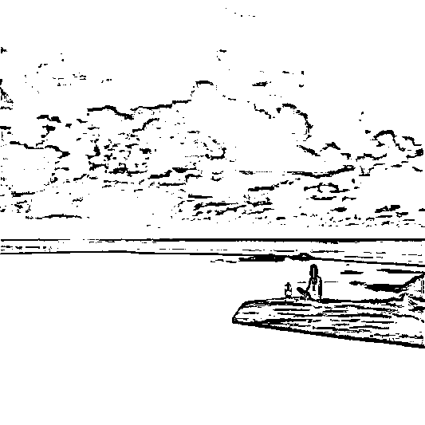

作者/Anastasia 图片/VCG

我们都知道，数学上两点之间最短的距离是直线。但现实中的事情并不会完全按照我们计划的那样笔直地去发展。一些无法预测的意外随时会改变我们原来的计划，一切笔直的都是骗人的，我们以为的捷径并不存在。对多数人而言，处理好人生阴暗面即是人生最大捷径，对此，尼采早已有了建议——别奇怪，哲学和占星学本就一步之遥。

占星学和哲学——跨一步就能触摸彼此

上帝已死，尼采在《愉悦的知识》里写下了他最出名的一句话。在他的世界里，信仰神不再合理，人的思想才可以左右世界。人能创作自己的价值，发展自己的生活方式，最终成为超越一切的超人。

尼采哲学的主题是探索生命的意义，他最出名的作品《查拉图斯特拉如是说》里面说，一切美好的事物都是曲折地接近自己的目标。喜欢库布里克的人会知道，《2001 太空漫游》这部电影的部分灵感就是来自这部书，而电影里的配乐就是理查·施特劳斯之前创作的交响曲《查拉图斯特拉如是说》,这首乐曲因此举世闻名。

尼采的著作对后世的影响无疑是巨大的，他简短、精炼、吉光片羽似的格言、警句和散文诗并没有建立起一个井井有条的哲学体系，但其开天辟地的原创性思想却具有一种无比强大的冲击力，他的字里行间有着取之不尽用之不竭的阶梯，后来人拾阶而上，无不满载而归。

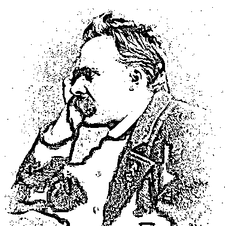
弗里德里希·威廉·尼采

德国著名哲学家，西方现代哲学的开创者

20 世纪初的整整一代思想家和艺术家都在他的著作中找到了激发他们创造性的观念和意象，其中就有精神分析学的奠基人——心理学家佛洛依德，从此心理学从哲学分离出来，转向人的自身，转向人的本能和潜意识。人类不再依赖神，开始了自我救赎的历程。

**我的偏见，占星学和哲学是跨一步就能彼此触摸到的东西**。从尼采的思想中，我们处处可以看到十二星座的光芒和阴影面。所有的真理都是弯曲的莫比乌斯环，越过“此路不通”的牌子也许就是别有洞天。船夫知道，最佳的风向能让船帆鼓起，引导船驶向最短的航路。现实里的经验往往会把看似最远的路变成捷径。

十二星座突破阴影面的诀窍

**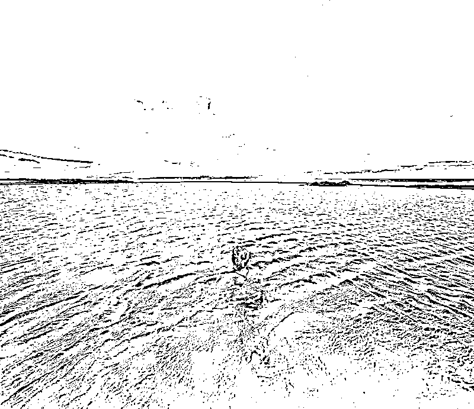** 

**在实际生活中，**

**十二星座的阴影面正是十二星座突破自己的捷径。**

***1***

对于**白羊座**的**愤怒**

尼采说，没有永远的敌人。

想想你真的要抹杀敌人吗？真的要毁掉自己的对手吗？敌人也许会被你抹杀掉，也可能成为你心中一个永远的存在。所以再仔细想想，你真的要抹杀他吗？

——《曙光》

***2***

对于**金牛座**的**物质**

尼采说：过度拥有反而成为占有欲的奴隶。

人生需要金钱、舒适的住所、健康丰富的饮食。拥有了这些，人才能独立、自由地生活。然而，过度拥有这些东西，人就会成为占有欲的奴隶。为了占有，花费许多时间，就连休息时间也被迫与人交际，受组织操控，甚至被国家束缚。人生不应该为了物质金的占有欲而活。

——《各种意见与箴言》

***3***

对于**双子座**的**浮躁**

尼采说：看似不起眼的行为会产生长久的影响。

任何自我的行为都会成为其他行为、思想、决定的诱因，甚至产生莫大的影响。因此，不能小觑自我行为的影响力。自我行为所引发的结果，势必会以某种形式与日后发生的事情产生关联性。就像过往人们的行为，或多或少会与现在发生的好事情有所关联。所有行为或活动都是不死的，意即任何人的一个不起眼的行为，都是不死的。换句话说，你我都是永生的。

——《人性的，太人性的》 

***4***

对于**巨蟹座**的**孤独**

尼采说：孤独是因为不知道怎么爱自己。

当你来者不拒，渴求有人陪在身旁，无法忍受孤独时，表示你正处于非常危险的状态。为了探求真正的自己，想从别人身上找到答案；为了得到别人的关注，而想结交朋友；为了虚无的安全感，而想依赖别人。为什么会这样呢？因为你很孤独。为何孤独呢？因为你不知道怎么爱自己。所以就算结交再多速食朋友，也无法抚平孤独的伤口，更无法爱自己，只是自欺欺人罢了。想要真正地爱自己，必须先靠自己的力量得到什么，用自己的双脚一步步地朝着目标迈进。虽然很辛苦，但这是锻炼心灵肌肉时，必尝的痛楚。

——《查拉图斯特拉如是说》 

***5***

对于**狮子座**的**傲慢**

尼采说：小心狡猾的虚荣心。

人好面子，说穿了就是虚荣心，其实是一种很复杂的情感。就算有人肯主动坦白自己的缺点、怪癖或恶行，充其量也只是虚荣心作祟，企图隐藏自己更邪恶的部分。而且愿意坦白什么，企图隐瞒什么，也会因对象不同而有所改变。只要学会用这样的观点观察他人与自己，就能明白对方羞愧什么，隐瞒什么，又想炫耀什么。

——《人性的，太人性的》

***6***

对于**处女座**的**挑剔**

尼采说：别在疲惫不堪时反省自己。

也许你是在工作结束后，反省自己；或是一天结束时，回顾省思。这么一来，你就会注意到自己和别人的缺点，气自己的无能，憎恨别人，心情反而更郁闷。为什么会这样呢？因为你不是在冷静地反省自己，只是身心疲惫罢了。疲累时进行反省，智慧让自己掉进郁闷的陷阱。所以疲累时，不该省思回顾。

——《曙光》

***7***

对于**天秤座**的**和谐**

尼采说：看似优点，其实未必是优点。

人之所以客气，是不想让别人感到不自在，尽量不给别人添麻烦。这种人看起来似乎颇为别人着想，有着公正、正义的品格。其实，个性胆小的人，也会是这般模样。由此可知，就算看起来是优点，也要清楚分辨优点的本质为何。

——《人性的，太人性的》

***8***

‍

对于**天蝎座**的**欲望**

尼采说：弄清楚动机才能找到方向。

即使读再多理论方面的书，学会企业家、有钱人的处事方法，还是找不到是和自己的做法。就像同一种药，不见得适合每个人的体质。同样的，别人的做法也不见得适用于自己。问题就在于你完全不明白自己处于什么样的动机。为什么想做这件事？为什么希望得到那个东西？为什么想成为那样的人？为什么想朝哪个方向发展？从来没有好好思考过自己的动机，当然抓不到正确方向。只要高清自己的动机，马上就知道下一步该怎么做。不必浪费时间模仿别人，找到自己要走的方向，坚定地走下去就对了。

——《偶像的黄昏》

***9***

对于**射手座**的**说教**

尼采说：用自己的眼睛认识事物之美。

从瑞士的日内瓦看勃朗峰四周的群山是多么美丽，山景变化万千。但观光手册上却只是写：勃朗峰是最高峰，美景天成。受到知识的影响，人们的眼光只集中于勃朗峰。这样就无法真正用双眼看到更多美好的事物。所以我们要用自己的眼睛认识到事物之美，别被知识束缚。

——《漂泊者及其影子》

***10***

对于**摩羯座**的**功利**

尼采说：不要在乎名声。

世人都很好奇别人如何评价自己，希望让别人留下好印象，觉得自己很伟大，更看重自己。其实不必在意别人的评价，那只有百害而无一利。为什么呢？因为人总是会做出错误的评价，所以很难从别人口中得到令人满意的答案，失望也就成了理所当然的事情。为了不让自己有生不完的气，绝对不能在乎自己的名声，也不能在意别人的评价。否则你就会安于“部长”、“社长”、“老师”这些头衔，浑然不知自己成了别人的眼中钉。

——《人性的，太人性的》

***11***

对于**水瓶座**的**抽离**

尼采说：物以类聚，才能相互认同。

只有与你同类型的人，才会称赞你，而你也会称赞与自己同类型的人。若不是同类型的人，不但无法理解，也不知其善恶。而且称赞与自己同类型的人，才能让自己得到认同感。人有不同的层次。唯有在同一个层次的人，才能相互理解、称赞，以迂回的方式得到自我认同。

——《愉悦的知识》

***12***

对于**双鱼座**的**厌倦**

尼采说：睡眠是最好的调节方法。

当你情绪低落，对一切感到厌烦，做什么都提不起劲时，该怎么做才能提振精神呢？参加宗教活动？时下流行的芳香疗法？吃维他命？喝酒？这些方法都比不上饱餐一顿，好好地睡一觉来得有用，而且要睡得比平时更长久一些。当你醒来时，就会发现自己焕然一新，充满活力。

——《漂泊者及其影子》

苦楚和动荡从何而来，看到这里你明白了吗？最远的距离，漫长的时间都不是痛楚，捷径的得失心才是无法忍受的。看见悬崖和冰山，你得绕过去不是吗？对于抵达终点这个目标，绕过去是捷径还是撞上去是捷径呢？在别人眼中，改变路线也许绕了远路，只有你自己才会知道前进道路上的艰难和险阻。亲身的经历是进化的唯一捷径。真相只有一个，当痛苦不再成为痛苦，就是你已经越过它的时候。

**作者的碎碎念**

我想写一些简单的东西，让对占星学一无所知的人也能看明白。不再局限于占星学的性格分析、运势预测和技法钻研，而是试着在一个更广阔的空间里写作，包含的信息量大一些，方方面面的知识涉及得多一些。如果读者在阅读的时候觉得增长了见识，又能多一扇看世界的窗口，并且还能对我们人类，我们的地球多一些了解、同情和爱，这些咿咿呀呀的独语就是值得的。

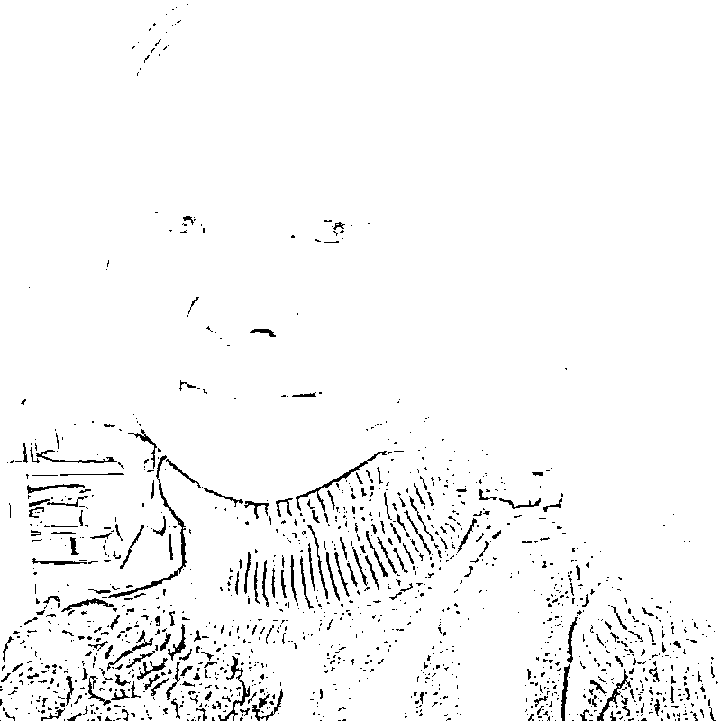

**作者简介**

**Anastasia**：职业占星师，国际占星研究学会 ISAR 会员，若道认证生时校正占星师。太阳射手座，月亮狮子座，上升处女座，擅长讲述个体星图后面隐藏的人生故事和意义。在若道跟随多名国际占星师学习严肃占星学多年，目前从事占星咨询工作。

**个人微信公众号平台**：midnight2evolution

长按二维码，让金钱涌向传播知识与智慧的人~

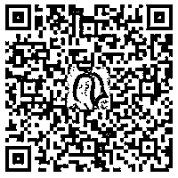

**特别提醒：**

**本文首发于若道平台，**

**转载请联系后台授权。**


******也许只有在若道，你能学习到如此深度的占星学知识。由大卫·瑞雷老师**讲授的**若道核心课程 Level 3，会教你将**星座、行星、宫位、相位这些散落的珠子穿起来，**带你进入更深的自我探索与成长的旅程。本课程将于今年 7 月开课，敬请期待！******

**报名及咨询，请点击文末“阅读原文”**


# 没有人是一座孤岛 | 为什么挖阴影？

> 原文：[`mp.weixin.qq.com/s?__biz=MzA5NjA0NTAxNg==&mid=2651385430&idx=2&sn=05c778622e0beebb5b936ea1591041b8&chksm=8b4a5ce1bc3dd5f7298e56379d465d0a156dbc4a508057efd1e373d2c6e4af9d48559c0a08a1&scene=126&sessionid=1692738816#rd`](http://mp.weixin.qq.com/s?__biz=MzA5NjA0NTAxNg==&mid=2651385430&idx=2&sn=05c778622e0beebb5b936ea1591041b8&chksm=8b4a5ce1bc3dd5f7298e56379d465d0a156dbc4a508057efd1e373d2c6e4af9d48559c0a08a1&scene=126&sessionid=1692738816#rd)

采访/若道君 受访者/杰西卡·卡巴拉

译者/李含  校对/Christy 

杰西卡的[“与客户的阴影面工作”工作坊](http://mp.weixin.qq.com/s?__biz=MzA5NjA0NTAxNg==&mid=2651385300&idx=2&sn=bf5a490ae12d32ddf91b0a8bca15756f&scene=21#wechat_redirect)（点击了解）即将于 7 月 8 日晚在若道开课，为了让小伙伴们进一步了解阴影及原型占星学如何与深度心理学整合，若道君对杰西卡进行了一次专访。（PS.后台回复 **杰西卡** 可获得她的详细目录。）

[🔈 %E6%9D%B0%E8%A5%BF%E5%8D%A1%E7%88%B1%E4%BA%BA%E7%89%B9%E6%8B%89%E7%BB%B4%E6%96%AF%E7%9A%84%E9%9F%B3%E4%B9%90](https://res.wx.qq.com/voice/getvoice?mediaid=MzA5NjA0NTAxNl8yNjUxMzg1NDI5)

## 每个人都有痛苦和挣扎

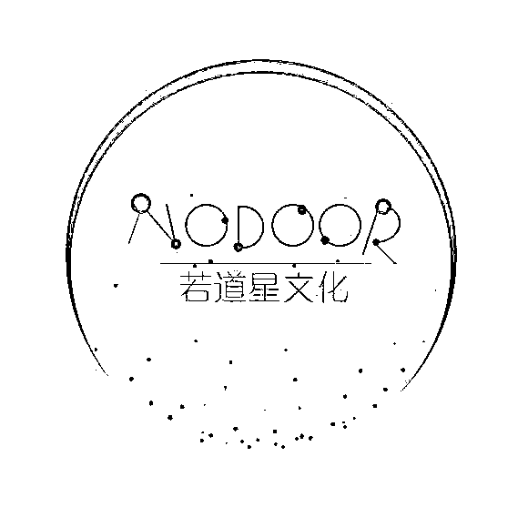

你为什么会选择“与客户的阴影面工作”作为工作坊的主题？

  

每个人都有自己的阴影面。我们**每个人都会挣扎、受苦、受难**，这是我们作为人类共有的部分，**这部分也将我们作为人类联系了起来。**

大部分人会在什么时候需要星图解读或寻求某种形式的帮助和支持呢？会在重要的转变期，比如结婚、离婚、生小孩、换工作或在巨变期、危机期和迷茫期。我们都会在自己人生的不同时期需要帮助，帮助他人很大一部分工作就是了解、确认和把握他们的困难。

在面对客户时，这一过程需要进行很久。我惊讶的是，**每一次当我认识并把握住某人的阴影面时，他们真的变得充满力量，更能做自己**，有了更充实的生活和人际关系。我相信，不论是否做星图解读，在训练如何有效面对和把握人们生活中的困难时，每一位占星师都能从中收获良多。

## 童年塑造人的余生


我们知道你也是心理咨询师，注册的婚姻与家庭治疗实习医师，还拥有咨询心理学硕士学位，研究方向是深度心理学。你是如何将原型占星学的智慧和洞见同深度心理学整合起来的？

 

将占星学和心理学这两个领域融合在一起是我人生道路的一部分。我的梦想是，有朝一日我们不会再有这个问题——每个占星师都是心理医师，每位心理医师也都是占星师（不同程度上的）。不论我们是否认为自己是以心理学为导向的人，**实践占星学都是一种心理学行为**。

美国心理学家詹姆斯·希尔曼对此做出了极佳的诠释，他说：“有什么不是心理学呢？”占星学为我们提供了一份自己的心理学地图，心理学帮助我们以一种有益的、切实可行的方式实践自己占星学的洞见和猜测。**当我们将这两个传统整合在一起时，真正的持续性改变就更容易发生在我们生活中。**我希望能有一个将两个专业同时包含在内的头衔来描述自己，但是目前，我还是同时使用这两个头衔——占星师和心理咨询师。

**深度心理学告诉我们，童年，尤其是生命的头几年，我们与自己父母或抚养者的关系会极大地塑造和影响到我们的余生，包括未来的所有关系。**从心理学上来说，理解我们与父母之间的互动能帮助我们更好地洞悉自我，并最终自由地认识自我，自由地选择如何展现于世，不论是在工作中还是在关系中。通过了解幼年经历带给我们的恩赐和挑战，了解我们从父母那里学到的，以及可能经历的创伤后，我们将对自己成长道路上所要面对的和应对的事物有更清晰的认识。

如果与双亲的关系是我们的基石，那么接下来重要的就是了解父母的出生星图、个性及人生经历，并且仔细审视与父母的比较星图。**占星学上父母与子女的比较星图让我们可以直接看到生命之初的关系互动**，更别说，我们的出生星图正好是父母在我们出生时的个人行进图，这张图将通过我们陪伴父母一生！

**我们会在与父母和子女的关系中看到光明面与阴影面，这有助于让我们更快地领悟到自己从家庭和家族中所继承的积极和消极的东西。**另外，了解我们出生时继承的东西能让我们从更宏观的角度看待自己面临的问题、困境和可能取得的伟大成就。

**没有人是一座孤岛**，至少在西方文化中这是根深蒂固的一点。我们会时常忘记自己的根源会直接影响到我们会成为怎样的人。有时候，这些信念和业力是一种束缚，我们实际上可以努力变得更好，而有时候，我们要感恩于那些祖辈们做出巨大努力才留给我们的馈赠，这一点很重要，我们常常将这些视作理所应当。


你曾说：“做咨询师已经成了我自我疗愈的一部分，这份工作为我带来了持续的转化性改变，丰富了我生活的方方面面。”可以跟我们分享一下吗？

 

咨询治疗是另一种拯救了我生命的疗愈形式。能有一位非常有智慧的治疗师兼占星师，帮助我疗愈过往和现在的关系，我真的太幸运了。我们每一个人都有痛苦，都不同的形式遭受过痛苦的折磨。能够与一个接受过临床训练的人一起进入一个安全的、支持性的环境，在他的帮助下控制住自己的感受、情绪、梦境、幻想、恐惧和希望，这是一生难遇的馈赠。

在很大程度上，**治疗师是证人和镜子，反映出你自身。从宇宙论的观点来看，这也是占星学所做的。宇宙就是通过我们的星图和个人行进扮演着证人和镜子的角色。**然而对我而言，仅仅是占星学本身是不够的。大部分人受到的伤害都与亲属有关，意味着这些伤害都发生在我们最亲密的关系中，发生在我们最爱的人之间。

比如我，4 岁时父母离婚，8 岁时祖父去世，让我感觉自己被遗弃了，生活充满恐惧和失去。其他人可能并不如此明确，但每个人都有自己的故事，都值得花时间去探索和体会，去感受他人给予的神圣帮助。

在治疗之前，我极度自卑，曾有一段时间难以相信我爱的人不会离开我，这是父亲离开后，我潜意识里开始形成的信念。因为这种失去父亲的伤痛，我在治疗师那里治疗了多年。他的缺席产生的影响在我的生活和自我意识中无处不在，我认为他离开是因为他并不爱我，连我自己的父亲都不爱我，那么还会有谁爱我呢？当然，这并不是真的，但是我似乎无法真正触及更深一层。

我的治疗师为我塑造了榜样，教会我自爱和接纳，让我学习如何与自己的情绪和需求共处，学习如何与自己不同的部分，例如与内心的小女孩共处。我最终能够接受与治疗师之间这种富于疗愈性的关系，这为我建立自爱、自尊和健康的成人关系铺平了道路。在治疗的后期，我认识了特拉维斯，我一生的挚爱。特拉维斯和占星学是我生命中最美好的两部分！

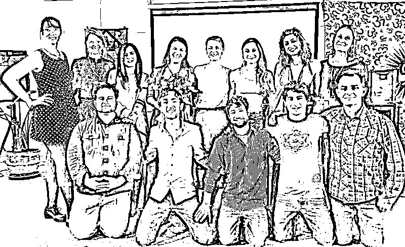

杰西卡在美国与学员一起

## 占星师要疗愈自己的伤口


在美国像你这样年轻的占星师多吗？他们的生活状况如何？

 

在美国有许多各种类型的占星师，其中有许多年轻占星师。我们有一个年轻占星师协会，我认为年轻一代正在以比从前更快的速度意识到占星学实践和世界观。

因为原型占星学是一个新兴的占星学分支，人数会少一些。大部分原型占星师住在海湾地区，因为他们曾跟随或正在跟随理查德·特纳斯学习。和我一样的年轻占星师不多，我也是唯一一位年轻的执业心理医师，其他占星师更偏向于文学、哲学和艺术。

大部分年轻的原型占星师是在位于加州旧金山的加州整合研究学院学习理查德·特纳斯的哲学、宇宙学和意识课程。例如，特拉维斯·狄璐扎是理查德的学生之一，他获得了原型占星学的博士学位，主修玄学。其他非原型占星学的年轻占星师会通过播客、博客、写文章或每日/每周星运来分享他们的工作。

我从事教学的一部分原因也是希望有更多人成为原型占星学领域的执业者（也包括年轻人）。我们需要更多人参与其中，贡献出他们独特的观点。


你对有意以占星为职的学员有什么建议？

 

如果你受到了比自身更大的力量的召唤，想成为一名职业占星师，那么我相信宇宙会指引你去该去的方向。**最重要的是，要投入到自我的疗愈中。通过疗愈自己的伤口，你自然也能够赋予他人自我疗愈的力量。**不要错过每次成长的机会！不要停止对世界和对自我的好奇心，寻求各种看得见或看不见的帮助，以成为最棒的占星师。

向更高层面的自我寻求指引，还要保持耐心，任何命中注定的路途，都需要时间去到达。耐心、投入、洞察力，这些会帮助你一路走下去。全身心地聆听长者、老师、导师的教诲，也不要忘记提问。问问自己，我为何要成为占星师？总是回归到这个问题上。接下来调整自己的人生，使其与你的目标保持一致。你越是这样去实践，收获也会越多。

只要我们在这条道路上保持开放和谦逊，就会收获无限的恩赐、疗愈和领悟。不要怀疑，这就是我们人类最富于灵性的道路……占星学就是一个灵魂塑造的过程。

## 关于工作坊的种种


这个工作坊，是否会将深度心理学的相关知识整合进来呢？没有心理学基础的人，能跟上课程吗？

 

两个问题的答案都是肯定的。这个工作坊当然会涉及到深度心理学的知识，我情不自禁会这么做 J 因为我走到哪里都将深度心理学“随身携带”。我之所以喜欢分享自己对深度心理学的了解和实践经历，是因为这会给每一个人带来收获。所以，没有心理学基础的学生也可以来上我的课。准备好挑战自己，与我一同成长。


你提到会有学员的案例，大概会有几个学员有机会成为案例呢？在现场会跟学员互动吗？需要我们提前多久把学员的信息提交给你呢？

 

我可能至少选择两位学员进行案例分析。是的，我们会在案例诠释阶段进行互动，我希望这些互动是在我向学员介绍技巧时同时进行。我需要至少两位愿意在工作坊众人前中与我坦诚对话的学员，我会使用他们的星图和经历当作示例来说出我看到的，以及我如何分析星图。作为志愿者的学员会感觉自己有暴露隐私的风险，但是我承诺会给予他们最大的关怀和尊重。在我讲授这一部分之前的休息时间将他们的出生信息给我就可以了（可能的话，还有他们父母的信息）。


有其他想分享的话吗？

 

我非常感动能有这样一次机会在这个夏天到中国，在若道见到你们。对我来说这真是太棒了！非常荣幸能够在北京与你们共度一段美好时光。


****如何走出“阴影”重获自由？2016 年 7 月 8 日-10 日，杰西卡·卡巴拉老师主讲的工作坊：如何与客户的阴影面工作要开课了！该工作坊会教你如何帮助客户减少痛苦，减少关系和生活中所经历的障碍。****

**报名点击文末“阅读原文”**


长按二维码添加课程负责人咨询~

****

# 客户阴影面工作坊 | 最低 900 元，还有现场咨询的机会

> 原文：[`mp.weixin.qq.com/s?__biz=MzA5NjA0NTAxNg==&mid=2651385430&idx=3&sn=f20735da7c9290a7d02b870831cbacfe&chksm=8b4a5ce1bc3dd5f75bb87bdc61152bd80ae8adc175e5c2fce5c79b88045e892ff5ca778f5701&scene=126&sessionid=1692738816#rd`](http://mp.weixin.qq.com/s?__biz=MzA5NjA0NTAxNg==&mid=2651385430&idx=3&sn=f20735da7c9290a7d02b870831cbacfe&chksm=8b4a5ce1bc3dd5f75bb87bdc61152bd80ae8adc175e5c2fce5c79b88045e892ff5ca778f5701&scene=126&sessionid=1692738816#rd)

『每个人都有自己的阴影面。

我们每个人都会挣扎、受苦、受难，

这是我们作为人类共有的部分，

这部分也将我们作为人类联系了起来。

什么时候需要星图解读

或寻求某种形式的帮助和支持呢？

重要的转变期，

比如结婚、离婚、生小孩、换工作

或在巨变期、危机期和迷茫期。

我们都会在自己人生的不同时期需要帮助，

帮助他人很大一部分工作

就是了解、确认和把握他们的困难。

我惊讶的是，

每一次当我认识并把握住某人的阴影面时，

他们真的变得充满力量，更能做自己，

有了更充实的生活和人际关系。』

——**杰西卡·加菲尔德·卡巴拉**

**客户阴影面工作坊讲师**

**后台回复 杰西卡 可获得她[的相关报导](http://mp.weixin.qq.com/s?__biz=MzA5NjA0NTAxNg==&mid=2651385253&idx=2&sn=554fb5d308f23a0ffa00f9aa3b7bdad3&scene=21#wechat_redirect)**


什么是**阴影**？它在心灵中的位置？

10 颗行星原型阴影面示例

出生图和行进中阴影带来什么信息？

作为占星师，你的**阴影面**是什么？ 

如果你无法处理好自己的阴影，

你的咨询会发生什么？

**如何了解、掌握、处理你的阴影？**

原型心理学和深度占星学怎样结合？

**如何和客户的阴影面工作？**

以奇幻的宇宙观看磨难和痛苦所扮演的角色

除了**现身说法，**

本次工作坊还将有

**至少两名现场学员案例分析，**

这是**一次咨询费**即可参加的工作坊，

关于**讲师**，

塔纳斯说，她，是**未来的丽兹·格林。**

你需要做的，

是**果断报名**，

剩下的事情交给我们。

**“如何与客户的阴影面工作”工作坊**

**授课时间：**2016 年 7 月 8 日（晚）、9-10 日（全天）

**授课老师：**杰西卡·卡巴拉

**授课方式：**北京工作坊，英文授课，中文翻译

**报名截止**：2016 年 7 月 5 日

**费用**：2800 元（6 月 25 日后）

6 月 25 日之前报名：

| 学员类型 | 价格 |
| ISAR 认证占星师 | 900 元 |
| 原型占星学员 | 900 元 |
| L5 及曾经的高阶学员 | 1500 元 |
| 若道学员 | 1900 元 |
| 非若道学员 | 2400 元 |

**课程负责人：Sara**（**微信：2847613491**，请备注阴影报名咨询）

长按二维码添加课程负责人咨询~

****

**适 合 人 群**

这个工作坊是**面向所有程度的占星学生**的，

只需懂星座、行星、月亮交点。

在教学中，

我总是努力让教室中的每个人都能理解我教授的知识，

并且产生共鸣。

我的想法是，

让这个工作坊能够帮助到每一位

想要进行个人或职业占星解读

和/或任何从事帮助性职业的人，

让他们学到大量的知识。

在课上，我会将占星学和心理学恰到好处地融合起来，

我会讲到这两门学科的基础知识，

同时给中阶或高阶的学生讲授更深入的观点和洞见。

来参加工作坊的学员不需要对原型占星学有所了解，

我实践和教授占星学的方式适用于所有形式的占星学。

我会很愿意在工作坊中分享更多传统知识，

这样参加者可以更好地感受和理解原型占星学和深度心理学。

这门课欢迎所有程度的占星学员。

——**杰西卡·加菲尔德·卡巴拉**

**客户阴影面工作坊讲师**

**课 程 安 排**

**7 月 8 日，周五晚上**

*   开场：介绍杰西卡老师的人生经历、周末工作坊的目的

*   生活在一个奇幻的世界：透过占星学的视角观察人类和宇宙的关系

*   占星学解读时机：危机期，转变期，重大人生决策期

*   占星咨询师的角色

*   具有启发性的原型宇宙学与原型占星学

*   原型占星学与深度心理学的关系

*   荣格理论对阴影的理解及其在心灵中的天然位置

*   尊重客户出生星图和行进中阴影所带来的信息

*   占星师在帮助客户从一个有力的、富有意义的全新角度重新界定自己的人生故事时所扮演的角色

*   以奇幻的宇宙观看磨难和痛苦所扮演的角色

*   占星咨询师的伦理道德：处理好自己人生中的痛苦和磨难，我们才能成为更有洞察力、更务实和更能帮助他人的占星师。

**7 月 9 日，星期六**

*   回顾阴影的意义

*   十颗行星原型阴影面的示例

*   原型或神和女神的阴影面，为我们揭示出宇宙的本质：光明面与阴影面共存，改善人生和破坏人生的面向共存。

*   创造一个与客户之间的安全空间以建立联结和信任的原则

*   占星师的指导意图和我们工作目标中的重点和中心：

*   让客户有力量去过更充实的人生 —— 更充分的自我觉知和自我接纳带来更安宁的人生

*   在咨询前、咨询中和咨询后与客户的交流中，我们可以以一种亲密而神圣的方式支持他们的人生—— 黑暗中的光明

*   如何掌握阴影

*   案例展示。研究一位客户的星图，与客户的阴影面一起工作

*   心理教育和咨询技巧：以共情和理解的方式回应客户，使客户内在和外在世界正常化，并确认其人生经历

*   学员的评论和提问

*   以学员（志愿者）自己星图中的阴影面做示例 —— 通过现场解读学员的星图来掌握阴影面

*   学员提出曾遇到过的困难的解读示例，分析如何在将来解开这些难题

**7 月 10 日，星期日**

*   占星师的自我关怀：占星咨询前后的仪式

*   占星师的职业道德需要：要掌握客户的阴影面，首先要把握我们自己的阴影面

*   顺势疗法：问题和解决方案都隐含在每一个行星原型中：一些示例

*   案例展示，研究如何与客户一起应对阴影面

*   学员（志愿者）自己星图中阴影面示例 —— 通过现场解读学员的星图，掌握阴影面

*   学员的评论和提问

*   关于痛苦和磨难的宇宙哲学

*   占星咨询的馈赠：帮助客户疗愈心灵

*   结语：回顾我们在工作坊中所学习的内容


**了解详细课程内容及报名方式，点击文末“阅读原文”**


# 穿越羞耻 | 我们的痛苦需要一位共情见证人

> 原文：[`mp.weixin.qq.com/s?__biz=MzA5NjA0NTAxNg==&mid=2651385403&idx=1&sn=9e92108a307a59c9692e8224c987aefa&chksm=8b4a5c8cbc3dd59ac6dc0bf4dde02e565db95dd1fd271ef3a21ba753965b10fe472dc50458eb&scene=126&sessionid=1692738821#rd`](http://mp.weixin.qq.com/s?__biz=MzA5NjA0NTAxNg==&mid=2651385403&idx=1&sn=9e92108a307a59c9692e8224c987aefa&chksm=8b4a5c8cbc3dd59ac6dc0bf4dde02e565db95dd1fd271ef3a21ba753965b10fe472dc50458eb&scene=126&sessionid=1692738821#rd)

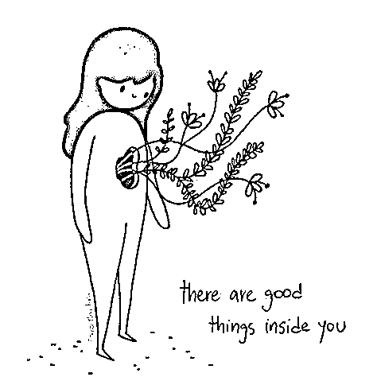

作者/杰西卡·加菲尔德·卡巴拉

译者/Christy  校对/王宏

图片来源/Pinterest

上周若道君刊发了一篇深度心理学的文章：[《羞耻，出走父亲给女儿的唯一“礼物”》](http://mp.weixin.qq.com/s?__biz=MzA5NjA0NTAxNg==&mid=2651385363&idx=2&sn=e9a0a7eab1a4563222f65d4facd4ea86&scene=21#wechat_redirect)（错过的朋友请点击阅读）。作者杰西卡是一名原型占星师及深度心理学咨询师，7 月 8 日她将在若道开办[“如何与客户的阴影面工作”工作坊](http://mp.weixin.qq.com/s?__biz=MzA5NjA0NTAxNg==&mid=2651385300&idx=2&sn=bf5a490ae12d32ddf91b0a8bca15756f&scene=21#wechat_redirect)（点击查看）。

同时，杰西卡也是一位从小“失去”父亲的女孩。她的父亲在她 4 岁时离开家，“抛弃”了她，从此她遭受了羞耻感所带来的一系列人生问题。在之后的自我疗愈过程中，她获得了颠覆性的收获，但仍旧感觉有什么地方不对劲。于是，她去找了一位萨满，而她的父亲居然主动联络她……

**与生父见面：回到痛苦的童年**

难以撼动的疏远和孤立感充斥在我的内在和外在情感世界中。尽管一种充满了意义、智慧、目的、奇迹和敬畏的世界观已经深深扎根在我心中，但总有什么东西一直在扰乱我，刺中我的靶心。我冲到我所知的唯一的灵魂指引之处，见了一位萨满，他践行的是中南美洲的土著方法和传统的植物药物治疗方式。整个晚上，我笔直地坐在另外七个人围成的神圣圆圈里冥想，他们祈祷看到我人生道路的愿景并将其清晰呈现出来。

在植物药物治疗的传统中，作为净化过程不可分割的一部分，个体要在晚上清除掉不再有利于自己人生道路的东西，无论是旧思想、习惯，还是情绪。除了我之外，圈子里的每个人都吐了。**我再次遭到一段共同排斥的经历**，当我坐在自己炼狱般的痛苦中时，**羞耻感压倒并战胜了我**。我真希望太阳赶快升起来。

在我撑过了漫漫黑夜之后，让我无比惊讶的是，在进行仪式的时候，我的父亲给我打了 4 次电话！我们已经半年多没讲过话了，因为他与自己在包办婚姻中结合的妻子以及 3 个孩子一直住在国外。在仪式中，我感觉受到召唤，让我与父亲的灵魂一起祈祷，让他知道我渴望和他联系。

他打电话第一次邀请我去他在中东的故乡。我开始想象与我从未见过面的家人建立深刻而持久的联结，我想象着经过这些年长久的等待和渴望后，我会成为他们中的一员，而我的父亲也终于要认我是他的孩子了。就像在我童年时期反复出现的梦境一样，我会不顾一切去到我父亲身边，跨越千山万水也要抓住建立联结的机会。我身体里有一半的血液都源自他的故土，而那里对我来说是最陌生的国度。

在他的故土降落时，我旧的自我开始死去。我在机场焦急地等待父亲来接我，几个小时后，我与 4 岁大的同父异母的弟弟坐在了同一辆车里（**父亲离开我和母亲时，我正好 4 岁**）。此刻，弟弟正在呕吐，溅了大家一身。如果这是场梦的话，我想说，**我内心那个 4 岁小孩的男性面刚刚把我无法忍受的东西都吐了出来，向我揭示了把我已经内化的东西清除掉的需求**，而这是我在萨满仪式上没能做到的。

沿着海边蜿蜒的悬崖行驶，我们到达了目的地。像梦一般的象征性感受状态还在延续。父亲没有让我为人生做好准备，而我也完全没有为父亲与我之间的文化差异做好准备，**我再一次有了强烈的疏离感**——在那里有一长串事情是我严禁做的，比如露出肩膀、身为女性一个人沿街散步、与男人对视……而最令我惊讶的是，如果这些男性是虔诚的教徒，除非他们主动和我说话，否则我不能跟他们交谈。

我不记得是否想过**那在某种程度上复制了我和父亲的关系**。但回想起来，去他的故土拜访他的时候，我一直以来感受到的情感排斥似乎响彻我当时体验到的文化冲击。第二天，我同父异母的 8 岁妹妹吐到严重脱水，需要送进医院（**我祖父突然离世的时候我就是 8 岁**）。我祖父的离世给我造成了极大的创伤。祖父帮忙养育过我，因此他的离开是我小小年纪感受到的另一次巨大的失去。**也是在 8 岁的时候，父亲回来与我们一起住了痛苦的 6 个月。**

到了我中东之旅的第 4 天，我同父异母的 10 岁弟弟吐了一晚上，**而正是在 10 岁的时候，我父亲承诺要飞回来给我过生日，却在生日当晚取消了航班**。我在心里想：“这是家族疾病，他们又不是我的家人，我肯定不会得病的。”然而，这不仅仅是我血亲大家庭的一部分，它还接收到了**我内心那个小孩痛苦的呐喊**。我虽然不肯承认，但却无法阻止我的病情变得前所未有的严重。

我一会儿呕吐，一会儿拉肚子，如此反复，时间仿佛静止了 24 小时。气温达到 100 华氏度（约 37 摄氏度），没有电，我靠在马桶边，听到父亲在卫生间门外与他另外 3 个孩子追逐玩耍，而那几个孩子的病都好了。当我发高烧抽搐着，还伴随着可怕的幻觉时，他们正欢笑着，享受着我在他们那个年纪幻想过的美好时光。

“

我到父亲故土的朝圣之旅，**本希望收获一段治愈的、新的关系，却变成了一段回归过去和内在的旅程。**连我同父异母的弟弟妹妹都吐了，**反映出我在他们那个年纪时内心有多么难受。**我感觉我的父母不再像是我自己的父母了。

”

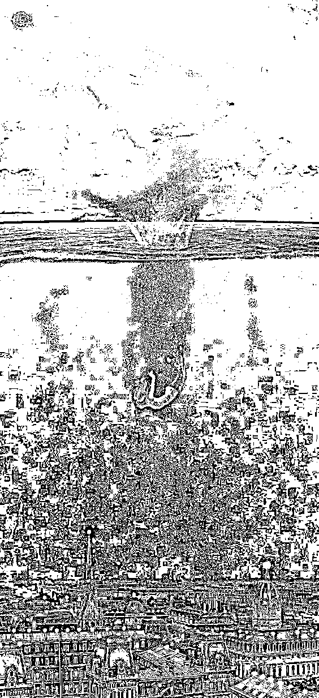

**进入治疗：爱自己本来的样子**

持续一年，我每周都在祈祷，让一位聪明的、年长的、荣格学派的分析师来到我生命中，她要对梦境有着广泛的研究，并且了解原型占星学。我祈祷她能庇护我，教我掌控心灵的方法。每天晚上，我对睡觉变得愈发恐惧，因为我的梦境大多是悲痛的梦靥，会扰乱我的内心。当上天将我的治疗师当做礼物赐予我的时候，仿佛繁星点点的天空在对着深陷苦难的我微笑。

我们第一次见面是在我的一场梦里。我在梦里和一个女人坐在后面的门廊上，我告诉她，我感觉我的父母不再像是我的父母了。她对着我从容地回答说：“听起来是时候进入洞穴了。你知道那个洞穴，对吧？”我点点头，以免看起来太无知。她继续说：“**那个洞穴就是爱之所在。**”

4 天后，我正在参加一个生日派对，这个前几天出现在我梦里的女人走了进来。我把她叫过来与她分享我的梦，她告诉我说，我是本周第四个和她一起在洞穴里做梦的 20 岁左右的年轻女性。她邀请我去她的治疗室，一起看看我做的梦。

我们之间建立起的深层亲密关系开始敞开我们两人完整的内心世界，**那是从未被触碰过和发现过的世界**。通过我们之间亲密关系的联结，我们共同创造了一个安全的空间，在那里，我此前无法接近的那部分自我突然出现了。我开始重新体会说话前的意识状态，那里有**我最深层的痛苦，之前被无意识地锁在了我身体中**。

“

我的治疗师给了我支持和爱，见证了我最深层的苦难。她的爱、接纳和耐心的引导让我慢慢开始学着爱上我自己。**我逐渐开始重视自己本来的样子、我所来自的地方，以及我带着包括光明与阴暗在内的我全部的特质将要去往的地方。在感觉别人完全看到自己之后，我与自我建立起了一种深层的联系。**

”

我与自己治疗师的关系教会了我如何去爱，毫不夸张地说，这拯救了我的生命。某种东西在我和我的治疗师之间产生了。纯粹的脆弱和感怀失去的那部分自我常常也反映出我的治疗师失去的类似的那些部分，让一种至关重要的认知在我意识中生根发芽。我们彼此之间都没有什么伪装。

在这股流动在我们之间的欲望之流中，我感到欣喜若狂。**我学会如何鼓起勇气保持不完美并让联结成为真实的结果**，这使得我站在自己的经历的风口浪尖上，在那里一切再次变得可能实现。正是在此处，我开始选择以一种新的方式应对；在此处，在人际关系领域父权的权力模式和等级制度模式以及与人接触和表现的模式中，**做父亲的女儿不再是我身份的核心原则**。

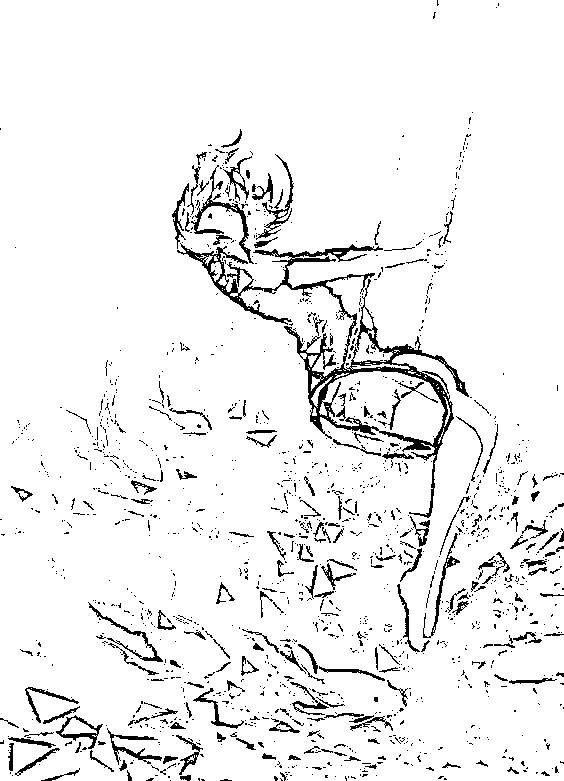

**面对悲伤：痛苦需要一个共情见证人**

对女性而言，羞耻感是父权社会的阴影所带来的决定性情感，这种情感将女性与自己的内在根源相分离，对此我曾有过非常切身的体验。有时候，父权社会狂热地利用羞耻感，来惩罚任何非正统的或它定义为非常态的事物。

深度心理学似乎是最深刻的祈祷形式之一，因为它是通过培育联结和爱来抵达灵魂的道路。**当自我转化发生时，人的整个后半生都会受到影响。**当我开始改变时，我身边的人也会开始改变。我开始能够更多地活在当下，在我的所有人际关系中示弱，这使得更多的自我呈现出来，创造更深刻的联结和亲密关系。这意味着，我必须展现出迄今为止我认为自我中不招人喜爱的所有部分，尤其是我渴望并依赖于另一个人的爱的方式。

我的任务很艰巨，我得学会为我那个一直以来在我内心的被遗弃的小孩感到悲伤。我所学到的是：**在我感到被遗弃、被伤害、失望和绝望的时候，不要试图逃避或抑痛苦，如果痛苦出现时我与另一个人一起面对，允许情绪穿越身体，让自己展现脆弱，以便可以不带评判地旁观我的情绪，那么痛苦就能代谢掉。**

旧的回忆和压抑的感受会渗透我的经历，直到我深入这种情绪的核心，而这种情绪常常与我身体内的某种形像相关联。正是非常原始的地方常常让人感觉难以用语言形容：这里没有文字，只有声音、情感和手势。在这段旅途中存在一种深层的智慧，是心灵试图展示给我的。

“

**原来，痛苦需要的，是一个共情的见证人，是被看见，是以充满爱的方式被呵护。当我到达情绪的另一面时，一旦情绪不再清洗我的细胞，我就会感觉到更多的自爱与接纳，并因而感觉自己更加完整了。**

”

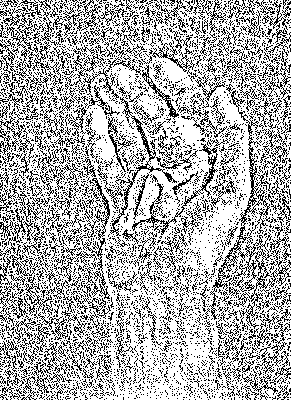

一直以来，我都勇敢地给予自己在被父亲抛弃时恰好所需要的东西，只是为了被看见并与他人保持联系。当我与自己的无意识建立起持续的关系，热爱所发生的一切时，整个旅程就是值得的。带着一种特定的轻松和满足，我生命的意义得以恢复，这比感受我的痛苦、愤怒、悲伤和不幸的一时痛苦更有价值。当我选择面对当下我的经历和自我时，抛弃模式对我就不再起作用了。

我们得体验到一个有爱的存在，才能成为有爱的存在，正是就这一方面而言，对于疗愈源自破碎的亲密关系的羞耻的过程而言，另一个人的相互依赖是至关重要的。羞耻是一种关乎关系的创伤，只有在关系中、利用并通过关系才能真正愈合。深度心理治疗给予的馈赠是：在一个有爱的容器里，治疗师承诺去回忆自己的创伤，该容器创造了一种充满勇气和安全感的疗愈氛围，欢迎、鼓励和接受客户的真实存在。正是通过这种方式，我记起了什么是爱与被爱。

（未完待续）

**关于作者**


**杰西卡·加菲尔德·卡巴拉**（Jessica Garfield-Kabbara），占星师，心理咨询师，注册的婚姻与家庭治疗实习医师。从 2007 年开始实践原型占星学，提供占星咨询服务。她也是月度播客“关联性：原型占星学播客”（Correlations: The Archetypal Astrology Podcast）的嘉宾，该节目已开播 5 周年。2014 年，杰西卡在帕西菲卡研究生院获得咨询心理学硕士学位，研究方向为深度心理学。她的理论基础主要来源于理查德·塔纳斯、斯坦尼斯拉夫·格罗夫，以及原型占星学和超个人心理学。杰西卡教授原型占星学和深度心理学，也积极进行深度心理治疗方面的实践，将原型占星学的智慧和洞见同深度心理学整合起来。

>>>>

剧透

下一篇我们讲那些失去父亲的女孩们的母亲，敬请期待。


****如何走出“阴影”重获自由？2016 年 7 月 8 日-10 日，杰西卡·卡巴拉老师主讲的工作坊：如何与客户的阴影面工作要开课了！该工作坊会教你如何帮助客户减少痛苦，减少关系和生活中所经历的障碍。****

**报名点击文末“阅读原文”**


# 6 月 22 日沙龙提醒 | 有故事的我们，应该如何把自己照顾好

> 原文：[`mp.weixin.qq.com/s?__biz=MzA5NjA0NTAxNg==&mid=2651385403&idx=2&sn=652f40a05bb0c6bab85fc4662024c021&chksm=8b4a5c8cbc3dd59abd85c29da30486de694bfe917a80d49154b8716c2585ec8b8e8636bedf4c&scene=126&sessionid=1692738821#rd`](http://mp.weixin.qq.com/s?__biz=MzA5NjA0NTAxNg==&mid=2651385403&idx=2&sn=652f40a05bb0c6bab85fc4662024c021&chksm=8b4a5c8cbc3dd59abd85c29da30486de694bfe917a80d49154b8716c2585ec8b8e8636bedf4c&scene=126&sessionid=1692738821#rd)

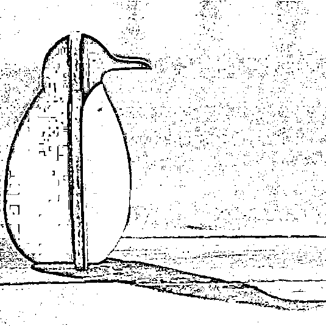

**若道君友情提醒**

说好的**20 个免费名额**已经满啦

再不抓紧报名站票都没了呢

**具体报名步骤**往下看哦

❤她

跟随理查德·塔纳斯学习原型占星学

老师说“**她会成为未来的丽兹·格林**”

拥有咨询心理学硕士学位

研究方向是深度心理学

同时将原型占星学的智慧和洞见

同深度心理学精妙地整合

❤她

也是有故事的女同学

随着学习和自我疗愈的深入

她整合运用原型占星学与深度心理学

疗愈更多人，同时自己也收获了美满的感情

❤她——**杰西卡·卡巴拉老师**

将于**6 月 22 日**

在**若道**举办一次**在线****沙龙**

**全程中文翻译**

英语零基础也能听

沙 龙 内 容

每一张星图都有其阴影面

当客户寻求帮助以减少痛苦

减少关系和生活中所经历的障碍时

他们最大的挣扎常常来自他们的阴影面

通过了解阴影面

我们帮助客户更清楚知道到底什么在阻碍他们

如何处理这些问题

让他们生活更幸福

去面对那些诸如羞耻、内疚、自卑

和压抑等挑战性的阴影面

觉察到光明

而不是让自己留在黑暗和无意识之中

处理好自己人生中的痛苦和磨难

我们才能成为更有洞察力

更务实和更能帮助他人的占星师

你们可以带着自己的故事和困惑

听杰西卡以奇幻的宇宙观讲述阴影的故事

在黑暗中对话，在阴影中探索

讲 座 信 息

**时间：****2016 年 6 月 22 日**星期三 **20：30-22：00**

**方式：****网络直播**（具体方式请长按下图二维码咨询客服）

**参课费用：****50 元****（****若道老学员免费，但也要看下面的报名步骤哦****）**

**特别提醒：****不接收空降，请提前付款确认名额**

**报名截止：2016 年****6 月 22 日中午 12:00**

**咨询电话：****400-619-1014**

报 名 步 骤

**第一步**

▼

点击文末**阅读原文**报名

**新老学员都要经过这一步哦**

**第二步**

▼

**长按下图的客服二维码 咨询具体参与方式**

****

杰 西 卡 老 师 驾 到


**杰西卡·加菲尔德-卡巴拉**（Jessica Garfield-Kabbara），占星师，心理咨询师，注册的婚姻与家庭治疗实习医师。

杰西卡从 2007 年开始实践原型占星学，提供占星咨询服务。她也是月度播客“关联性：原型占星学播客”（Correlations: The Archetypal Astrology Podcast）的嘉宾，该节目已开播 5 周年。

2014 年，杰西卡在帕西菲卡研究生院获得咨询心理学硕士学位，研究方向为深度心理学。她的理论基础主要来源于理查德·塔纳斯、斯坦尼斯拉夫·格罗夫，以及原型占星学和超个人心理学。

杰西卡教授原型占星学和深度心理学，也积极进行深度心理治疗方面的实践，将原型占星学的智慧和洞见同深度心理学整合起来。她从自己的心理治疗客户身上，看到了自己八年来的原型占星学职业实践所取得的成效。所有的临床工作都为丰富她占星学和心理学方面的教学提供了肥沃的土壤。

在生活中，杰西卡一直对人和人际关系充满了强烈的好奇心。我们是谁？我们来自何处？又要去往何方？这些问题一直以来都是她工作的核心所在。2007 年，这种深层的好奇心引导她进入通过咨询帮助他人的行业。无论是个人客户还是配偶客户，她都与他们一起工作，帮助他们在疗愈的路上走得更远。她认为，在人们不断自我探索的道路上，能与他们一起努力，是一种荣幸。在这条道路上，人们能更充分地认识自己、自己的情感关系以及这个世界。

杰西卡相信，与自我建立更深层的关系是一种自爱和自我关怀，因为这能够让我们对其他关系更有觉知，从而提升我们的生活。做咨询师已经成了她自我疗愈的一部分，这份工作为她带来了持续的转化性改变，丰富了她生活的方方面面。现在她希望和中国学子一起分享这一切。


**报名点击文末“阅读原文”**


# 企业占星工作坊，万万没想到的干货

> 原文：[`mp.weixin.qq.com/s?__biz=MzA5NjA0NTAxNg==&mid=2651385403&idx=3&sn=e720cdbc7dab4a3fdc6663c35a054dce&chksm=8b4a5c8cbc3dd59abca98cf172dec2cb305f00e95a91d370981c6b9b92b3c8e6c788d19d8c4c&scene=126&sessionid=1692738821#rd`](http://mp.weixin.qq.com/s?__biz=MzA5NjA0NTAxNg==&mid=2651385403&idx=3&sn=e720cdbc7dab4a3fdc6663c35a054dce&chksm=8b4a5c8cbc3dd59abca98cf172dec2cb305f00e95a91d370981c6b9b92b3c8e6c788d19d8c4c&scene=126&sessionid=1692738821#rd)

6 月 9 日-6 日 11 日，若道星文化创始人大卫·瑞雷为期三天的上海企业占星工作坊圆满落下帷幕。这三天，大卫老师都传授了一些什么样的绝招？学员们又都拿到了什么样的秘籍？

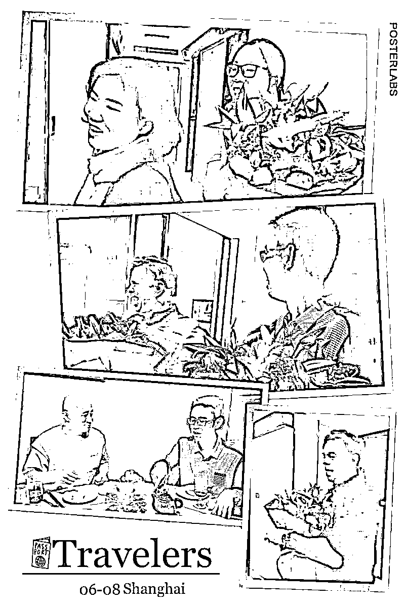

大卫老师到上海

当一个占星师，可以为企业家提供高瞻远瞩的策略咨询，可以成为企业的智囊团，可以为企业招兵买马，更可以帮助企业主度过重重危机，这样的角色听起来就让人觉得激情满满！

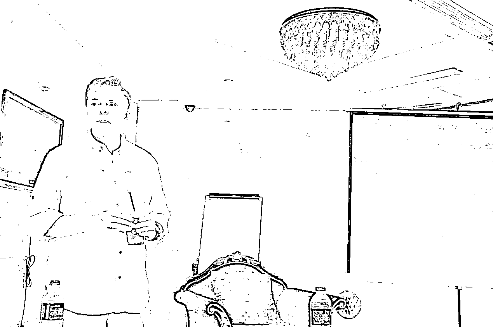
现场授课中

在这个课堂上将出现中国最成功的企业占星师，我相信我的学生将会成为拥有高技能的高收入人群！

——大卫·瑞雷

这样的话并不是空洞的口号，这是凝聚了大卫老师四十多年占星咨询经验的课程。课程中分享了超过六十几张实例的星盘，一个个栩栩如生的商场故事，更是浓缩了深刻的人性洞悉和智慧。

占星学里除了技法以外，更重要的是心法。就好像在功夫的世界里，拳法是表面的东西，内功是更重要的一种内在力量。

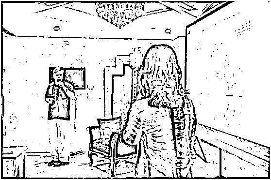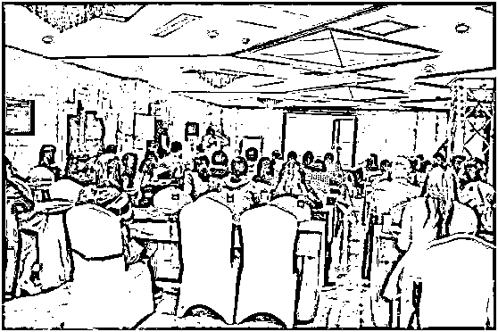

在三天的课堂中，我们可以感受到大卫老师在和客户互动中的种种魅力，从如何在和客户见面的前几分钟，和客户建立联结并且让客户信任，甚至让客户喜欢上占星师。确实没有信任是无法进行后续工作的，而占星师更需要在很短的时间内，让客户放下戒备或者防御，建立信任。这并不是三两句话就能讲述清楚的，在课堂上我们深深感受到了这种魔法和魅力。

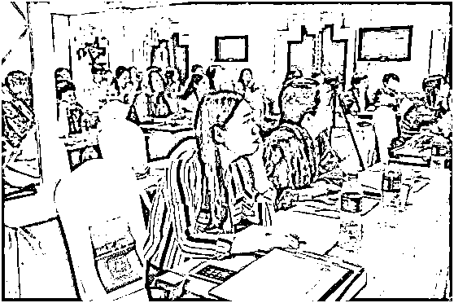

**1**

惊喜：学到如何择日

真的没想到老师会在课堂上讲到如何择日，择日占星是为企业的诞生选择一个最佳的时间，而这似乎是所有的占星师都非常想要学习的内容。毕竟掌握了这门神奇的技能，就好像拥有一把神秘的钥匙，可以在人生中让人的自主能动性发挥到极致。

而在择时占星中，我们也学习到了大卫老师哲学家般的智慧：“在这个世界上没有完美的星图，但从另外的层面来讲，每一张星图都是完美的。关键要看占星师如何帮助企业寻找一个最契合的时刻，一个最适合企业定位和发展的时刻。这并不是一个简单的过程，但却是一个十分挑战和刺激的过程。”

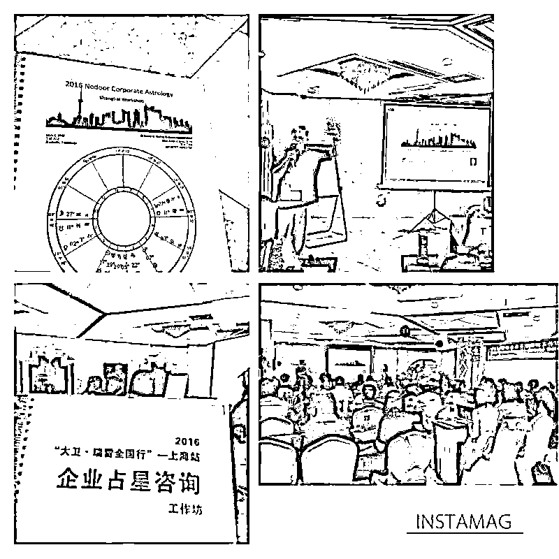**2**

彩蛋：学到如何成为“高级 HR”

更没有想到的是，在课堂上我们学习到了如何成为“高级 HR”。最高级的 HR 的工作是什么？那就是让每个人的天赋得到发挥，那就是管理每个人的天赋物尽其用。这听上去很酷不是吗？用占星学的视角确实可以帮助企业主发现适合某个重要岗位的员工，甚至看看这个员工是否能够和整个团队融洽相处。我们都知道，对于企业来说人才是最重要的，而如何发掘并且培养人才真的是一门高精尖的学问，占星在这个领域的应用真的让人脑洞大开。

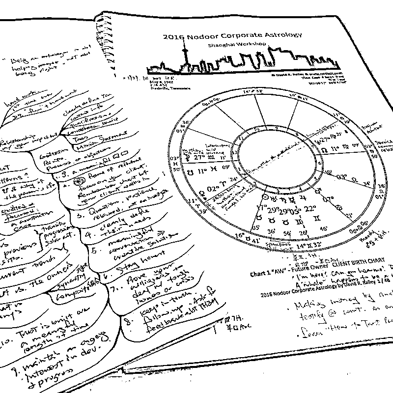

同学专业的笔记

**3**

预测的秘诀

你可以设想自己站在未来往回看。这是预测的秘诀。你预测的时候，把自己设想在 2017 年，2018 年，你往回看。你聆听客户的声音。

你看到他们过去两年的行进，你发现就是行进显示的那样，那就是后见之明。你觉得都是命定的。你忘记了当下你拥有所有的选择，以及所有事情可能发展的方向。你在寻找的是共时的感觉，你用占星学的密码看到这个共时性。

这不仅是个分析的过程，也是个情感的过程。我希望大家都成为整体考量的预测，能发展预测的智慧。所以你想象你在两年后，你希望客户对你说什么呢？你客户也可能做一些比你想象更棒的事情，更让你震惊。对你择时和预测来说，是个很棒的练习。

——大卫·瑞雷 

是的，永远不要忘记客户可能比你想象的更棒，你只需要把一路可能的天气告诉对方，让对方发挥更多的想象力，不要限制客户的发展。你的工作就是帮对方发展出更多的潜能！

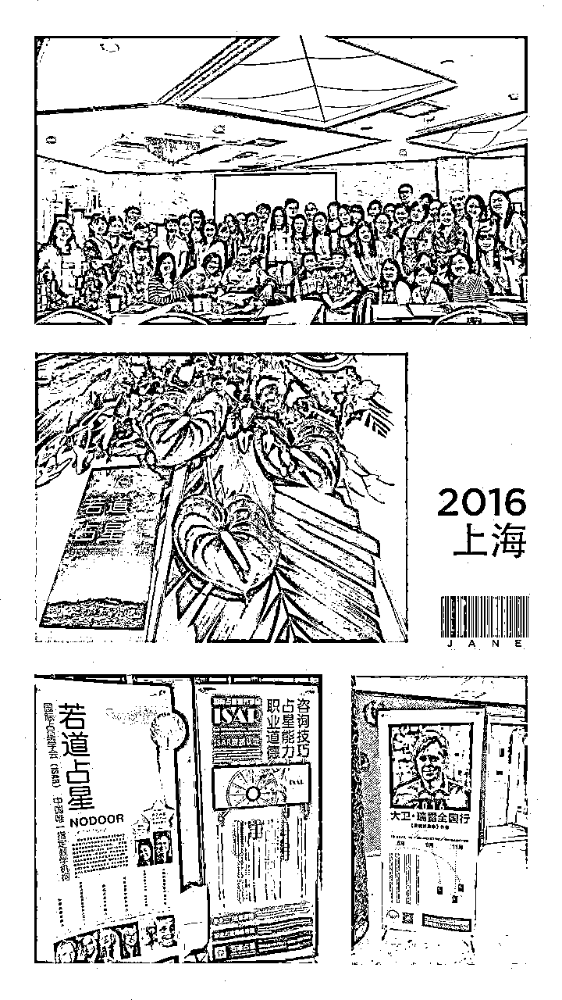

这次课程的每一分钟都没有浪费，这是很多人的心声。更多人也在暗暗希望，有一天，我们也可以成为那么棒的占星师，我们也可以有很多很多精彩的占星故事和大家分享，我们也可以成为企业家创业路上密不可分的好伙伴！短短的相聚又要分离，分离是为了再次相聚，万分期待大卫老师企业占星工作坊的后续，续集一定更精彩！

**特别提醒：**

**本文首发于若道平台，**

**转载请联系后台授权。**


******也许只有在若道，你能学习到如此深度的占星学知识。由大卫·瑞雷老师**讲授的**若道核心课程 Level 3，会教你将**星座、行星、宫位、相位这些散落的珠子穿起来，**带你进入更深的自我探索与成长的旅程。本课程将于今年 7 月开课，敬请期待！******

**报名及咨询，请点击文末“阅读原文”**


# 现占与古占结合 | 早鸟价 6 月 22 日截止哦

> 原文：[`mp.weixin.qq.com/s?__biz=MzA5NjA0NTAxNg==&mid=2651385378&idx=3&sn=0626e1f97cfa34a008d9619ebf283c71&chksm=8b4a5c95bc3dd583102c397ecb3a6f2a9ce688a343d81fe629ae494a0601fb7505bf0e7da7f3&scene=126&sessionid=1692738821#rd`](http://mp.weixin.qq.com/s?__biz=MzA5NjA0NTAxNg==&mid=2651385378&idx=3&sn=0626e1f97cfa34a008d9619ebf283c71&chksm=8b4a5c95bc3dd583102c397ecb3a6f2a9ce688a343d81fe629ae494a0601fb7505bf0e7da7f3&scene=126&sessionid=1692738821#rd)


“

罗伯特·汉德，一位被占星界称为“国家宝藏”的人，掘地三尺，阅古卷无数，学习没有人再说的古代语言，学习古代历史，学习古代哲学，挖出了一把传说中的“屠龙刀”。在 35 年的现代占星生涯和 21 年的古典占星研究生涯后，他将为我们带来什么？

”

将 35 年的现代占星和 21 年的古典占星结合， 罗伯特·汉德耗费大量的精力，挖出了这把“屠龙刀”，他擦拭这把锈迹斑斑的刀，粘合它的碎片，钻研刀法，在此过程中引发好奇、热情、疑义、愤怒；他促使原来名不见经传的人获得新立山头的机会，同时又引发了分裂、不满、攻击。

有些现代大师们对他的道路感到惋惜、不解、批评，但仍旧尊敬他；而他又远离那些一门子想要复古、认为“老的就是好的”古典阵营。他跑着，似乎有同伴，又一人独行。

你也许听说过这把“屠龙刀”的传说，从江湖似真似假、似是而非的流言中，从自称使过它的招式的自言得意的小辈中，从以教学谋生、很少实践经验的小有名气的占星师的课程中。

但你真的见过这把刀吗？你知道正确的使用方式吗？这把刀真的能在现代社会应用吗？还是仅仅是应该放入“历史博物馆”中陈列？这次课就是谜底揭晓的时刻。

## 现代占星学的学子们，如果你：

*   对于出生星图——占星学中最重要的星图的秘密，仍有很多不解和好奇；

*   渴望获得古典占星里符合你的哲学理念又实用的好技法；但厌倦了大量复杂却无用的古典知识，又苦于古典文献浩瀚，无从粹取；

*   对自己星图和某些人生大事的对应百思不得其解，渴望获得一位占星大师的解答；

*   曾和妄称“可以更准确预测”的古典占星师们争得面红耳赤，但因为没学过古典而稍微有些心虚；

*   了解占星学界常见的古典和现代占星的纷争，想在真正了解这两门学问的大师面前提出深刻而尖锐的问题；

*   渴望在自己的占星知识拼图中补上能够符合现代占星理念的古典占星学知识，并将现代占星和古典占星融会贯通在咨询中

## **欢迎你来，机不可失，因为：**

*   **这里有世界上唯一能够教授此门课程的占星界泰斗**：72 岁的罗伯特·汉德，两个阵营的旗手型人物，**活着的唯一获得现代占星学大师尊重的横跨两界的泰斗**、占星咨询实践者，历史学家、哲学史研究者，活着的时候就已经成为历史的人。一个怀旧的人，一个试图搭起桥梁的人，一个不满足现有的人，一个思想演化路径让人迷惑的人。


*   **萃取古典的精华，去除古典占星糟粕：**罗伯特·汉德用他综合的知识，为你筛选出古典占星中可以为强调自由意志的发展、个人成长的现代人有益的古典占星实用技法。

*   **从实战演练中学习**：首次以案例教学的方式，除第一堂之外，每堂课皆以案例演示为教学重点。

*   **获得大师的免费解读**：**7 堂课的案例选取皆为学员星图，你有机会入选**。

*   **打尽出生星图的占星学命题！** 出生星图，是一生的预测星图，所谓的命运的因子埋藏在出生星图里。

**讲什么？皆重大常见人生问题：**

*   性格、个性、心智特点、外貌体型

*   挣钱能力、金钱、财富、财务

*   感情生活——恋爱、婚姻、家庭生活

*   原生家庭——父母、兄弟姐妹、姑表亲

*   人际关系——一对一关系、一对多关系、敌人

*   职业发展，谋生之道

*   社会地位

*   旅行

*   灵魂和本我

## 学习该课程，你并不需要有古典占星学基础：

*   你只需要具有一定现代占星学基础。如果对此没有把握，可以联系课程负责人员进行测试。

*   你不需要有任何古典占星学知识，所有出生星图的相关古典占星知识都会在课程前发送讲义或在课程中进行讲解。

给你一个机会，在实战中学习他的研究成果。

这次课程，对于罗伯特·汉德 是一次冒险之旅，对你也是串起历史、现在、未来的旅程。

还等什么？

**更多关于罗布特·汉德的文章在这里：**  

[领军现代占星 35 年、古典占星 21 年，罗伯特·汉德星图秘密大起底](http://mp.weixin.qq.com/s?__biz=MzA5NjA0NTAxNg==&mid=2651385233&idx=2&sn=98799d80abed94a7748acff623747bf7&scene=21#wechat_redirect)

[占星界的“百科全书”，请用您渊博的学识砸晕我！](http://mp.weixin.qq.com/s?__biz=MzA5NjA0NTAxNg==&mid=2651385064&idx=2&sn=647cbe8f5e029abbf16a9f039a6783b1&scene=21#wechat_redirect)

ISAR 选修课·古占与现占结合

**授课时间：**2016 年 7 月 23 日-9 月 10 日 10：00-12：00

**授课老师：罗伯特·汉德**

**授课方式：**网络在线，英文授课，中文翻译

**报名截止**：2016 年 7 月 15 日

**费用**：****6800 元** （6 月 22 日前报名付款早鸟价 5800 元，若道老学员**4800 元**）**

**课程负责人：李老师**（**微信：18601950700**，请备注古占报名咨询 ）

长按二维码添加课程负责人咨询~

****

**课程具体内容及报名，请点击文末“阅读原文”**


# 小白学占星 | 太阳进入巨蟹座，夏至来临

> 原文：[`mp.weixin.qq.com/s?__biz=MzA5NjA0NTAxNg==&mid=2651385378&idx=2&sn=d09fb8c1dc854559e8d5dd2b681983e6&chksm=8b4a5c95bc3dd583d8178d058f913c88f72e8c609a66726819bac667f2fcc88c3c69bf435991&scene=126&sessionid=1692738821#rd`](http://mp.weixin.qq.com/s?__biz=MzA5NjA0NTAxNg==&mid=2651385378&idx=2&sn=d09fb8c1dc854559e8d5dd2b681983e6&chksm=8b4a5c95bc3dd583d8178d058f913c88f72e8c609a66726819bac667f2fcc88c3c69bf435991&scene=126&sessionid=1692738821#rd)

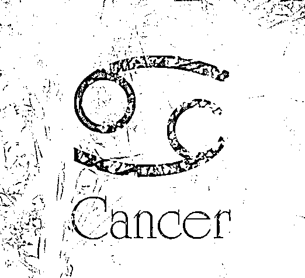

作者/格伦·佩里  译者/若道翻译团队

本文节译自格伦·佩里《占星心理学》一书

图片来源/花瓣网

“

6 月 21 日早上 6 点 34 分，太阳进入巨蟹座。这一天也是中国二十四节气之一的夏至，夏至日是一年中正午太阳高度最高，北半球得到的阳光最多的一天。过了这一天，白日的时间渐渐缩短，所以古语说：夏至日，阴气生而阳气始衰。这也符合了巨蟹这个星座的阴性和孕育的特质。

”****巨蟹座****

       守护星：月亮

　　关联宫位：第四宫

　　关联相位：渐盈的四分相

　　极性：阴性

　　元素：水象

　　形态：基本星座

　　视角：个人

****心理需求（动力/目的）****

养育，滋养，母性，情感上的安全感，归属感，呵护，保护，善解人意，温暖，亲密，接纳，支持

**原型人物**

母亲，保姆，依赖性的孩子，看护人，厨师，照料者，养育者，持家主妇，保护者

**发展阶段**

**8 岁到 12 岁。这是童年时期的一段潜伏期，“安静的插曲。”**在这段时间里会出现感性的自我，具备了一种“内敛、包容”的能力，而不是“外显、表现”的情感，此外还具备了更加强大的内心控制倾向。

孩子们变得更加内向、安静、平静、易受影响、接受能力强。他们能够进行反省，评估情感，越来越能善解人意，感同身受。**记忆被唤醒了**，也有了对“可逆性”的认知能力。孩子们第一次理解了过渡的概念。同时，超我（自抑制）变得更加巩固。**这是一个建立自我表达根基的主要阶段。**

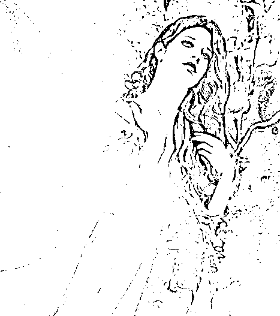

**行为特质和主题**

**1**

**母性本能**

巨蟹座代表了妈妈对自己孩子的母爱。那是一份心甘情愿、无条件、呵护备至的爱。作为个人星座，这份爱非常私人，妈妈之所以对她的孩子付出爱，其根源在于那是她自己的孩子。母子之间存在着一种情感纽带和密切联系，这样他的孩子能够最终将这种母子关系内化、转变成自我关爱的能力。没有哪个星座像巨蟹座这样温柔、呵护、充满爱了。

>>>>

**可能的特质表现：**

养育，母性，母爱，温柔，柔和，关爱，有爱心，善良，和蔼，由衷，溺爱，付出，温暖，呵护，保护，令人窒息，容纳

**2**

**对情绪敏感**

巨蟹座代表在情感上与他人产生联系的能力，对各种情愫能够敏锐地适应，不管是自己的抑或是他人的情感。这种敏感度让巨蟹座能够应对情感变化，做到善解人意，产生感情纽带。所以说，巨蟹座像一个了不起的感受器，能够吸收各种各样的情感信息。

>>>>

**可能的特质表现：**

敏感，接受能力强，容纳，情感导向，直觉力强，吸收性强，长情，观察敏锐，易受影响

**3**

**变色龙或魔镜**

因为巨蟹座强烈需要与他人建立情感关系，所以他们倾向于随环境改变身体颜色。**他们对感情刺激极其敏感，会给予回应；而且会吸收其周围环境中的情感色调或情绪。如此一来，巨蟹座反而很难分辨出哪是自己的情感，哪是他人的情感。因此，巨蟹常常被描述成情绪化、感情多变。**

>>>>

**可能的特质表现：**

回应，感应，像变色龙，调整，吸收，情绪化，映照，反映，多变

**4**

**温柔且易塑**

**巨蟹座会像水一样，根据容器的不同改变自己的形状。**其实，只有当水被装到容器里时才会出现形状变化，否则水会一直向下流直到遇见一个容器——一个小池塘、一片湖水或一片汪洋大海。**一方面，巨蟹座相当敏感，加之其对被爱和被“容纳”的渴求，让巨蟹座无法抗拒他人的影响。**注意了，这点特性与摩羯座的固执己见完全相反。

>>>>

**可能的特质表现：**

易受影响，易弯曲，可塑性，依从，易变，优柔寡断，多变无常，容易被感动

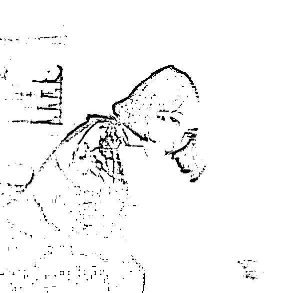

**5**

**像螃蟹一样行动： 走迂回路线**

虽然巨蟹座是个基本星座，但他们像水一样的本性使其行为方式迂回曲折。由于巨蟹座不愿意直接接近人，所以会创造一种情形，让他人必须做出回应。

理想的状况是，巨蟹座激发的回应可以让自己有种被接受的感觉，而且能获得它想要的。不妨想象一下，有个害羞的男孩围着自己心仪的女子转，但却从不上前接近，最终那个女孩看到了他，瞟了一眼正在害羞微笑的男孩后，挪开了眼神，如此反复，最终他们建立了持久的联系。关键就在于那个非语言信息“我能接近你吗？”这类方式或策略可以应用到任何场合。

>>>>

**可能的特质表现：**

不直接，迂回，巧妙操作，害羞，潜伏，掩藏，绕圈子，暗示，不坦率，隐蔽

**6**

**不擅长社交，害羞，孤僻**

巨蟹座对拒绝极其敏感，这让它很难在社交场合与别人建立关系。他们更喜欢一对一的交流，觉得这样更自在；**要不就喜欢在一个能够表达关心关爱的场合**。肤浅、轻浮、爱玩可不是巨蟹座的专长。巨蟹座是典型的内向人，**他们更适合接收内心的感情世界、幻想和想象**。巨蟹这个**感情的把脉者**，他们最关心的是“我现在的感受如何？”

>>>>

**可能的特质表现：**

羞怯，褊狭，被动，内敛，安静，沉思，敏感，温顺，内向，害羞，自我保护

**7**

**住在过去的回忆里： 不忘自己的根**

**巨蟹代表了回忆。**从一方面来看，巨蟹象征着我们需要有一份值得回忆的过去。因此，**巨蟹就与所有关于出身起源、基础和根基的东西挂上了钩，因为这些东西代表了情感安全的源泉，让人有了一份归属感，激起了爱、接受和保护的各种记忆**。

对过去的迷恋，反应到现实中就是收集、保存各种能象征“过去美好时光”的物件，比如各类纪念品、纪念物、遗物、有意义的东西等等。这些东西往往和一堆家庭照片、儿童玩具一起放在某个旧鞋盒或大箱子里。巨蟹会美化过去，而且也倾向于证明自己对家和家园的那份伟大的忠实。

>>>>

**可能的特质表现：**

多愁善感，感情脆弱，氏族感，紧密编织的纽带，爱家，忠诚，美化过去，保留，执着于过去，传统，历史

**8**

**依赖行为**

作为对无条件的爱的需要，巨蟹象征了**依赖的需要**。尽管“依赖”这个词有各种各样贬义的表达，事实上人们都需要彼此依赖从而获得关爱和支持。这种依赖需求也具有健康的表达。但是，由于这个非常基本的需求经常受到挫败，所以会出现的各种问题，导致这种需求被过分表达或产生太过强烈感受。这样一来，巨蟹**对回绝极其敏感，表现脆弱**。对这一特质的最佳诠释者就是原型“南方美人”，每次感情激动时都可能会晕过去。

>>>>

**可能的特质表现：**

依赖，脆弱，容易受伤，易受攻击，不堪一击，依恋，软弱，没有安全感，占有欲

**格伦·佩里的星座文章还有：**

[小白学占星 | 太阳进入金牛座，谷雨到了](http://mp.weixin.qq.com/s?__biz=MzA5NjA0NTAxNg==&mid=2651384349&idx=2&sn=2920f445c2b9e35f03c55f03e4f227cf&scene=21#wechat_redirect)

[小白学占星 | 太阳进入双子座，成熟未满](http://mp.weixin.qq.com/s?__biz=MzA5NjA0NTAxNg==&mid=2651384984&idx=2&sn=f2fd99f40e752a3303923fb2c0faa98b&scene=21#wechat_redirect)

**特别提醒：**

**转载请联系后台授权。**


**心理学与占星学因为彼此的结合而发生了根本性的改变，并获得全新的力量！2016 年 8 月 22 日，格伦·佩里老师教授的****心理占星学高阶·占星疗愈****要开课了！本次课程，格伦·佩里老师将向我们展示如何将建立在心理占星学核心解读概念之上的咨询技巧和星图综合解读技巧整合起来。**

**报名及咨询，请点击文末“阅读原文”**


# 最近过得很艰难？让水星来救你

> 原文：[`mp.weixin.qq.com/s?__biz=MzA5NjA0NTAxNg==&mid=2651385378&idx=1&sn=89b4139889bd875f3a379c3272309cab&chksm=8b4a5c95bc3dd5832eb18e4207ec5b7cd13879e6e4dd7d65c8cf31205832ef8cab9cf5c79ae8&scene=126&sessionid=1692738821#rd`](http://mp.weixin.qq.com/s?__biz=MzA5NjA0NTAxNg==&mid=2651385378&idx=1&sn=89b4139889bd875f3a379c3272309cab&chksm=8b4a5c95bc3dd5832eb18e4207ec5b7cd13879e6e4dd7d65c8cf31205832ef8cab9cf5c79ae8&scene=126&sessionid=1692738821#rd)

作者/喜悦龄以  ISAR 认证占星师

图片来源/Pinterest

在这段时间的[大十字](http://mp.weixin.qq.com/s?__biz=MzA5NjA0NTAxNg==&mid=2651385193&idx=1&sn=6d22e15fd59f3e8f5aa2ae38e49ee7c2&scene=21#wechat_redirect)中（点击可阅读），我们感受到生活的很多变化、混乱与未知。你顺利度过了吗？6 月 19-6 月 23 日，水星加入新的大十字阵营，余波将持续至 6 月底。此次大十字也许会感受到：无边的无助与被限制感、压抑等痛苦体验。我们要做的，是倾听内在的声音，如实观察，如实接受，依心而行。

**行星格局**

5 月底到 9 月底，土星与海王星的四分相如背景一般，无声地运作着，时不时被其他行星触动，变换花样给我们各种提醒。**是时候考虑如何应对土星和海王星四分相最低阶的呈现（还是双双逆行）——无边的无助与被限制感、压抑、沮丧、失落、无意义、沉溺、抑郁等深深的痛苦体验。**当水星入双子座强势地加入变动星座大十字后，或许又会掀起一轮腥风血雨。是艰难，但亦会带来洞见！

**6 月上旬，太阳和金星、木星和土星、海王星、月亮南北交点所组成的变动星座大十字**呈现了许多人的现实生活**：多事、混乱、烦躁、迷茫**。进入 6 月中旬，太阳与金星渐渐远去，**水星于 6 月 19 日~6 月 23 日加入大十字阵营，余波持续至 6 月底**，而**土星与海王星的四分相位将持续至 2016 年 9 月底。**

**影响人群**

这次的大十字与土海四分相依然对所有人都有影响。

**重要影响人群**

**其中出生星图中有个人行星（太阳、月亮、水星、金星、火星）及社会行星（木星、土星）落在变动星座（双子座、处女座、射手座、双鱼座）9~16°的人更易被冲击，也更易感受到影响。**

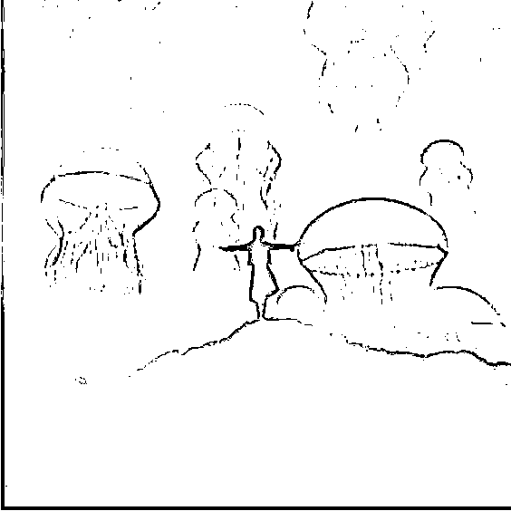 

**你受到影响了吗？**

从 6 月初的动荡开始，你有没有过如下感受：

●有没有经历过情绪的波动起伏？

●有没有在震荡之后整理了自己？

●有没有遭遇金钱、资源、关系、自我价值、目标（现实层面与内心精神层面）等方面的动荡？

●或者已经逐渐平静并整理自己踏上新的旅程？

**双子座水星、处女座木星、射手座土星、双鱼座海王星、双鱼座-处女座轴线的月亮南北交点大十字，将会是一个更加颠覆的旅程。也是整理信息与头脑，连结感性与理性最有挑战，却也有可能获得最大收获的关键旅程。**

**解药在此**

相比太阳与金星，水星本身就更具灵活与变动性，当掌管双子座的水星进入变动星座大十字，无疑掀起的波涛会有更大的起伏。而**水星**是信息之神，**掌管着交通、商务往来、教育、书籍、报纸、杂志、电视、图片与画面、新闻事件、革命、游行、谈判、暴动、剪彩、记者会**……**如果说金星触发大十字可能触动的是有关关系、价值、艺术、金钱的问题，那么水星则是关于一切的变动。**

除此之外，水星主宰思想，又是中性行星，兼具阴性与阳性、理性与感性，是连接太阳、火星、月亮、金星、阳性与阴性、理性与感性的桥梁。思想的力量永远无法被轻视，无论在任何领域：宗教、哲学、教育、政治、经济、医疗、心理、神秘学……在个人的层面，我们也真的需要好好探索与了解，让它能够帮助我们，而非扰乱我们。

在我们的世界和周围，痛苦无处不在。不能拥有的痛苦、得而复失的痛苦、生的痛苦、死的痛苦、比较的痛苦、无助的痛苦、愤怒的痛苦……

**从 5 月底到 9 月底的土星与海王星四分相，会让我们更深切的体验到痛苦。尤其是，曾经被我们隐藏压抑的痛苦、背叛灵魂的痛苦。**

如何让心更纯净？痛苦便是工具。在变动大十字席卷的当下，根据上下一致法则，天上如是，人间亦然。**外在的呈现源头乃是心智和灵性次元**，借此机会深入地了解水星，学习客观的观察。**唯有学会如何真正客观地观察我们的任何经历、感受，用平等心去对待喜怒哀惧，才有机会真正从痛苦中解脱。**

这或许便是土星与海王星的四分相位，以及在此之前的变动星座大十字给我们的警醒：机会就在此时此刻，**顺应宇宙强大的改变能量，去拓展与改变我们的思想（水星双子座）、净化内心、心怀众生（海王星双鱼座）、眼光长远、负起责任、踏实向前（土星射手座），我们将体验因精进、敬业（尊敬灵魂之业，生命真正的目的）而获得的福佑（木星处女座）**。

否则，迎接我们的，便很可能是双双逆行的土星与海王星四分相最低阶的呈现：无边的无助与被限制感、压抑、沮丧、失落、无意义、沉溺、抑郁，陷入深深的痛苦中体验。

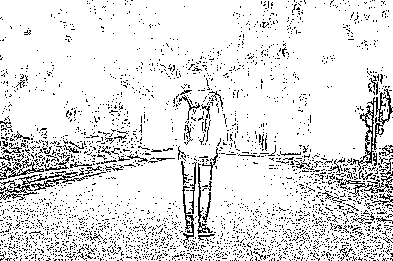

**你可以做的**

**如实观察**

  **放下主观，不带偏见、不臆测、不评判、不妄断。**

  对于外在事件，学习训练将所有的发生都落至现象的描述，而非是非的评判。 

  对于自己而言，学习将所有的感受都落至身体的感觉，看一看愤怒（焦虑/紧张/生气/悲伤/失落……）的时候，身体的哪部分有感觉，是什么样的感觉？不做行为反应，而是观察这些感觉，体验到身心连结，体验到无常的实相。这是“内观”中训练的如实观照，也是训练平等心的基础。

**如实接受**

  **不指责、不抱怨，接受已发生的过去。**那是“我从哪里来”的根源，没有过去便没有今天的你我。

  **接受真实的现状，这是“我是谁”的起点**。接受之后才能不再像飘落的浮萍无处着落，扎根于当下，由一个个选择去一步步创造未来。

**如实表达**

**不讨好、不逃避、不压抑、不发泄。**

  我们生活在尘世，拥有内观的意识会有所帮助，却不能永远闭关禁言。非暴力的沟通之道提倡如实表达，以“我……”“我觉得……”开头，代替“你……”“你让我……”“因为你，我……”表达自己，在“你”与“我”之间划出一个空间，自己选择的空间。**承认自己生命中的事件自己都需要全然负责，他人只是我们灵魂的伙伴，帮助我们照见自己。**

**如实倾听内在声音**

  **聆听内在指引，内在不会指引你无奈、艰难、受控与画地自限。**

那个微小的声音只有当你全然安静时才能听到，TA 永远会接纳、理解与支持你，告诉你：你没有问题，你永远都有更多选择，并可以为选择而负责。TA 永远会无条件的陪伴与滋养你，假如你放弃自己的权利，不去认识和连结 TA，是多么大的遗憾。

去聆听内在的声音，而不是跟随社会的评价标准，看起来有些幼稚和冒险；表达自己，看起来有些费劲；接受现状，看起来有些虚伪；内观，看起来有些逃避现实。

是的，选择这条道路看起来既理想化又不现实，这也是为什么大多数人不会去选择的原因。我们都容易选择最简单的路，那就是重复不变、继续活在过去的循环中，继续在忙碌中度过一天又一天。我们不敢相信真实，却极易相信谎言，这便轻易地滑落到水星的低阶层面：忙碌、欺骗与被欺骗、活在肤浅的表面。

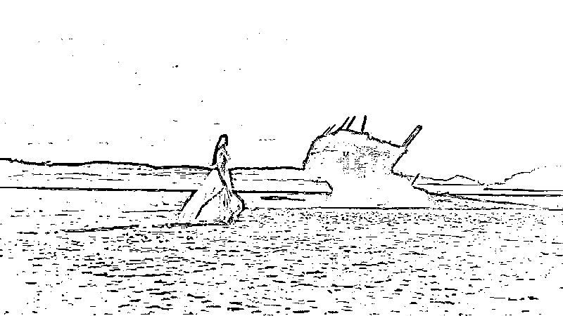 

泰戈尔说：“你的负担将变成礼物，你受的苦将照亮你的路。”这句话共时性地出现，猜想还有另一层意思，也许是说：**负担与受苦，是在提醒你，走错了路，需要停下来，静一静。找到真正属于你的路。**

每人都有此生的使命，每人都有各自的喜欢，如何聆听内在的声音，找到真实的生命目的，请参见前文（错过戳：[大十字可怕吗？关键在于你如何解读它](http://mp.weixin.qq.com/s?__biz=MzA5NjA0NTAxNg==&mid=2651385193&idx=1&sn=6d22e15fd59f3e8f5aa2ae38e49ee7c2&scene=21#wechat_redirect)）。**最大的背叛不是道德的背叛，而是背叛真实的自己，那个本已拥有创造力和资源、拥有慈悲与爱的自己。**

当我们离灵魂（也可称之为精神、大我、内在智慧）太远而茫然无知，生活便可能会以不可控的方式发生状况，以此提醒我们。而**提醒的时间点，每每共时性地发生在行星运行的触发阶段（尤其是土星与三王星的行进阶段**）。**发生时固然令人难以接受，但熬过去之后再看，通常会认出，这原来是一份礼物。因为这比起什么都不发生，我们没有被迫改变，而是浑浑噩噩像工具似的，在麻木中消磨光阴到死要幸运得多。**

我们总有更多选择，生活也会往复循环，只需相信与你内心有共鸣的一点点，在任何一个地方能够“如实”，便可有机会接触真实的自己——有力量和灵性的自己，就可以让生活更简单。


**作者简介**

**喜悦龄以**，工学学士，工商管理硕士（MBA），2009 年执业国家二级心理咨询师；2013 年通过 ISAR 国际职业占星师资格认证（CPA）。群星水象，且土星冥王星合轴，柔和敏感之心体验生命动荡起伏变迁，投身探索情绪管理、冥想、内观、正念、占星学、灵性与精神之旅，有幸一窥宁静喜悦之门，享受并传播简单生活理念。

**微信公众号**：xingchenlaixin 

**喜马拉雅个人电台**：喜悦龄以

长按二维码，让金钱涌向传播知识与智慧的人~

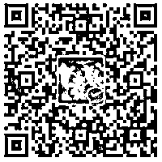


**想要顺势而为？先学习整合星图。由大卫·瑞雷老师**讲授的**若道核心课程 Level 3，会教你将**星座、行星、宫位、相位这些散落的珠子穿起来，**带你进入更深的自我探索与成长的旅程。本课程将于今年 7 月开课，敬请期待！**


# 年度第二次射手座满月 | 真相不止一个！

> 原文：[`mp.weixin.qq.com/s?__biz=MzA5NjA0NTAxNg==&mid=2651385371&idx=1&sn=37a32ce6f56c52f3a66067f111ffd0c1&chksm=8b4a5cacbc3dd5baf1c351a13dced67303fac21c7a44bf178f2dcb387e9e201f3136a9675769&scene=126&sessionid=1692738821#rd`](http://mp.weixin.qq.com/s?__biz=MzA5NjA0NTAxNg==&mid=2651385371&idx=1&sn=37a32ce6f56c52f3a66067f111ffd0c1&chksm=8b4a5cacbc3dd5baf1c351a13dced67303fac21c7a44bf178f2dcb387e9e201f3136a9675769&scene=126&sessionid=1692738821#rd)

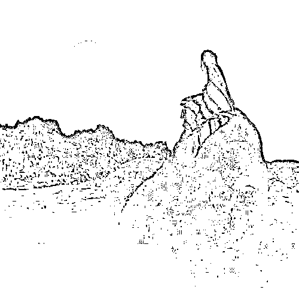
作者/Cora ISAR 认证占星师

图片/花瓣网

6 月 20 日 19：02，将发生射手座满月，月亮在射手座 29 度对分双子座太阳。本次满月是今年第二次射手座满月，也是第二次修订个人信念和前行方向的机会。

****脱离固有模式，重新认识对错****

在满月的前几天，我在朋友圈里看到一篇转发的梁冬的文章，标题是《关于中医，我说的都是错的》。读到这篇文章让我非常感动，这与此时的射手座满月及水星-木星-土星-海王星的“大十字”也非常共振。

梁冬先生是“正安中医”的创始人，多年来为中医的传承和推广做出了重要贡献。他在这篇文章中对他多年前发表并至今流传甚广的一些言论，做出了很多反思，坦承过去说的很多关于中医的见解“都是错的”。在对中医和科学的关系进行很多思考之后，他给出这样的结论：“不要迷信中医，不要迷信一切。每一样东西都是因地、因时、因人而不断变化的。”

**“因地、因时、因人而不断变化”，是非常了不起的觉察，因为在纷繁变幻的人世中，只有无常，是确定的。而能意识到，并说出，“我说的都是错的”，则反映了眼下射手座满月提出的一个命题：重新认识对与错。**

自 4 月份“五星逆行”以来，我就常常反思自己在占星学实践中的一些问题，越来越发现自己从前所坚持的一些理念，并非那么“正确”，至少并不全面；而我之前抗拒接受或了解的一些方式方法，也有行使有效之处，也充满洞见和智慧。

这个反思的过程，经过五星逆行、5 月份的第一次射手座满月、双子座新月、变动星座大十字，一直持续至今。这对我来说，**既是一个对多元信息敞开的过程，也是一个重新确认信念和方向的过程**。这个过程令我受益良多，借着变动星座大十字的东风，我也在不断地学习、消化，渴望理解更多。

“

我相信这并不是我一个人在此期间经历的过程。**这是一个充满变动、反复、启蒙、辨别、再确认的时段，处于这激荡星象中的每一个人，都处于这‘变迁之风’中，面临对之前所坚持的对错判断标准的重新思考。**

”

这体现在每个人身上的事件或内在转变的方向，是不同的，取决于满月和大十字落于你出生星图中的哪个位置，或许指向事业方向的抉择，或许指向婚恋关系的处理，或是一个投资项目的判断……但本质上，这些问题的核心，都指向**射手-双子轴线的关键问题：****观念的自由****。**

许久前，跟一个游历甚广、见闻颇丰的朋友聊天（他的太阳、木星、海王星合相在射手座 3 宫），我总是对他的经历心怀羡慕。我问他，如何寻到好老师？他给了我一个意想不到的答案。他说，常常不是我们能不能遇到好的老师，而是好老师就在你身边时，你能不能认出他。因为他们的样子，有时很“平凡”，有时则脱离常规。这给了我重重一锤。

我想我们每个人心里，都有一个关于“好老师”的标准，或是关于“高人”的样子，再放大些，关于什么是“正确的”“善的”“好的”，什么是“爱”，我们都有一些既定的想法。我们因循着这些现成的想法，去给我们所遇之事和所遇之人贴上标签，分门别类。**我们对这个世界的观察、感知和理解，无时无刻不被既有的观念和习惯性的辨认模式所限定。**并且通常，我们很难意识到我们是在被哪些模式所局限，因为你的整个存在都被笼罩其中。

**跟它剥离，去认识到它，不仅是困难的，也是危险的——因为那意味着要踏出“愚者”的一步，去做一个为真理而不断抛弃当下安全感桎梏的，真正的射手座！**

**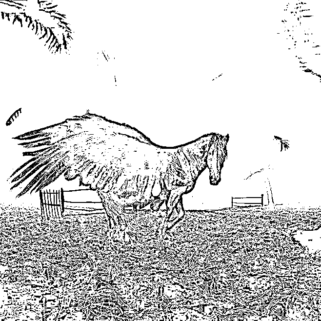** 

**第二次修正方向的机会**

**射手座满月在本年度第二次出现（第一次发生在一个月前的 5 月 22 日），似乎是给我们多一次机会，也是最后一次机会，去对心中的信念和前行的方向进行修正、再确认。**

○ 射手座的守护星木星，此时正紧密合相处女座的北交点，并三分冥王星。说明**在一切变化背后，暗藏着资源和“技能提升”的巨大潜力**。这是一个进行新的尝试与探索的时段，也是一个蓄势待发的时段。**这个过程中我们需要以敏感、细腻、务实的态度，一步一个脚印地为下一步的发展“储备燃料”，静待质变的发生。**

○ 另一方面，木星也参与到了水星-木星-土星-海王星的“大十字”当中。刚刚进入双子座不久的水星，在满月这一天与土星准确对分，形成一个新的变动星座大十字。这暗示，**在广泛吸纳新观点、新事物、新信息的同时，我们也必须有意识地给弥漫的思维加以约束，“不忘初心”**。至于“初心”是什么，这跟我们对于一个内在信念的承诺有关。满月发生在射手座，这个信念有机会被我们更清晰地看到。

○ 在满月这天，火星与天王星形成准确的补十二分相（150 度相位），带来躁动的气流。我们可能感到暴躁，或对外界约束的某种“不爽”。**不要让无处宣泄的攻击性与求胜欲望，打乱前进的节奏。此时耐心是关键，我们需要相信时间。**

“

射手座满月第二次出现，带来某种‘尘埃落定’的意味。**在之前的过程中反复变化，带来纠结、冲突、矛盾的一些问题，此刻面临一个决定，或‘顿悟’**——这是信念的落实带来的礼物。

”

卸掉对与错的枷锁，同时坚持心中心中真理的方向，这看似有些矛盾，关键在于，了解到，**真理是可以以不同的面貌或言行，呈现在我们的生活中的。如同那个看起来十分平凡、让人难以认出的“好老师”。**

促成种子萌发的泥土和阳光雨露已经就位，成长和变化是必然的结果，我们要做的，只是默默努力，“因地、因时、因人”地选择那个变化的时机以及方式。在这个过程中，我们都需要重新认识“对与错的辩证艺术”。

**愿我们都能成为那个不忘初心、自在穿梭的人。**

**作者简介**

**占星师 Cora**，全美占星师联盟（AFAN）成员，国际占星研究协会（ISAR）会员，获 ISAR 职业占星师资质认证，斯蒂芬·弗里斯特《变幻的天空》译者，个人星象文章见诸《心探索》《北京青年周刊》《上海电视》《空中生活》等杂志媒体。曾在若道系统学习占星学，现为全职占星师。

**微信公众号**：聆宇 FM（ID：lingyudiantai）

**个人微信号**：CoraAstro

长按二维码，让金钱涌向传播知识与智慧的人~


**特别提醒：**

**本文首发于若道平台，**

**转载请联系后台授权。**


******射手座满月期间，找到好老师。由大卫·瑞雷老师**讲授的**若道核心课程 Level 3，会教你将**星座、行星、宫位、相位这些散落的珠子穿起来，**带你进入更深的自我探索与成长的旅程。本课程将于今年 7 月开课，敬请期待！******

**报名及咨询，请点击文末“阅读原文”**


# 如何破解大十字 | 天象纷乱，我自从容

> 原文：[`mp.weixin.qq.com/s?__biz=MzA5NjA0NTAxNg==&mid=2651385371&idx=2&sn=ee2d099203488a731ef504bb218fec6d&chksm=8b4a5cacbc3dd5ba49d74b9590d19b408e5f76450d10388c37f4b68743135a0ca180cafc2380&scene=126&sessionid=1692738821#rd`](http://mp.weixin.qq.com/s?__biz=MzA5NjA0NTAxNg==&mid=2651385371&idx=2&sn=ee2d099203488a731ef504bb218fec6d&chksm=8b4a5cacbc3dd5ba49d74b9590d19b408e5f76450d10388c37f4b68743135a0ca180cafc2380&scene=126&sessionid=1692738821#rd)

作者/咔咔  ISAR 认证占星师  

被行进触发的人生通常如同开了挂，利用天象顺势而为，发展建设性的人生，是占星学爱好者们独特而炫酷的技能。作者在被大家谈之色变的“大十字”天象触发后也开了挂地享受了有惊喜也有惊吓的旅程。她不只是经历了这些事情，而是借由这些事情领悟其背后的意义。正如她所说：“知道正在经历的事情的意义，这是一种对自己的能量和宇宙的能量交互作用的觉察。”

“大十字”撞了我的腰

过去两周，天空中的太阳、金星（双子座），与木星和北交点（处女座），土星（射手座）和海王星（双鱼座）组成了 6 月的[第一组大十字](http://mp.weixin.qq.com/s?__biz=MzA5NjA0NTAxNg==&mid=2651385193&idx=1&sn=6d22e15fd59f3e8f5aa2ae38e49ee7c2&scene=21#wechat_redirect)，即太阳合相金星，与木星和北交点呈 90 度，与海王星呈 90 度，与土星呈 180 度。

我的日月中点在海王星射手座，刚好在大十字的一角，新月发生在我的“事业宫”——第十宫，我毫无疑问地“中招”了。在过去的两周内，我跑了全国三个城市，参加了朋友的婚礼，参加了大卫老师在大陆第一次开设的企业占星咨询工作坊，同时完成日常的占星咨询工作，还和几批朋友在上海相聚（吃吃喝喝）。

每一个时刻，都有它的意义，有一天在凌晨醒过来，清晰地感到大十字在生活里的充分作用，我正在体验一段混合着双子座、处女座、射手座和双鱼座意义的时光。这段时光过去就不再重来，而我能做的，就是把这些时光、感受到的宇宙的触发，和我的心得，记录下来。知道正在经历的事情的意义，这是一种对自己的能量和宇宙的能量交互作用的觉察。

大卫·瑞雷的企业占星咨询工作坊

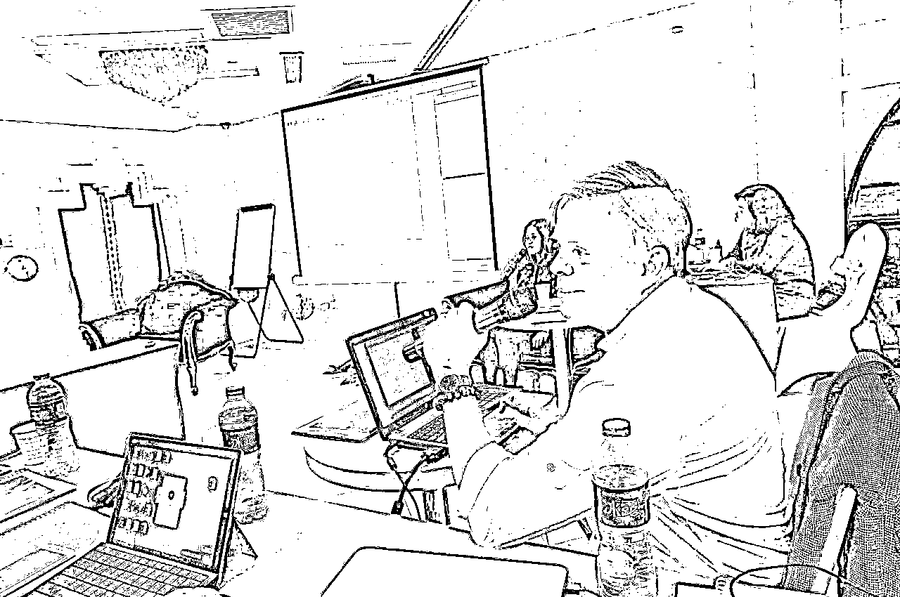

**大卫老师在企业占星工作坊上**  

这是大卫老师第一次在大陆开设企业占星咨询工作坊。1980 年 6 月 11 日，大卫老师与一个客户做了一场 2 小时的个人咨询，随后为这位客户的公司提供了长达 25 年的企业占星咨询服务，展示了占星服务可以如何帮助客户的企业走向成功，这些案例包括了企业注册、企业股份制重组、企业出售、高层招募、重大商业谈判、企业战略规划等方方面面。

三天里，大卫老师带着工作坊的学员们，分析了 50 多张星图，包括企业创始人的本命星图、企业创立的星图、分公司成立的星图、企业股份制重组时的星图、公司 CEO、COO 的星图、重大事件的行进和推进星图（比如分公司成立、重组、新业务的行运、次限、太阳弧）、创始人与高管的比较星图。

这次的工作坊被学员们称作是干货满满，非常烧脑。确实，3 天连续看 50 多张星图，岂止是烧脑，简直感觉脑子要烧坏了。

**工作坊同大十字的共时性** 

大卫老师用一种讲故事的方式（太阳和金星在双子座），分析了足够多的代表性数据（木星在处女座），进行了实用性的培训（木星在处女座） ，尤其是关于择时占星的技术，带着学员看到了企业发生的这些事件背后的意义（土星在射手座），借此带领学员去体会和感受宇宙的共时性（海王星在双鱼座）。

我摘抄了几段在课堂上给我留下很深刻印象的话：


（这个公司择时的星图）不是完美的星图，但是我也没见过一个完美的星图。你们的星图都是完美的，都是完美的符合你。**择时占星学就是找个一个星图，和这个人完美的对应，对应他成立公司的性质，你想要公司怎么发展，想成为什么样的。**你要把公司一切东西都看成发展性的。这是我能找到最好的潜力。因为可以符合个人、公司，符合他要走的道路。当你这么做的时候，你就把客户和人生的流动性关联了。就是策划共时性。要从整体去考虑。这是很严肃的，你可能整夜失眠思考这些。


**带着发展的眼光看待关键职位的候选人，**当下他们是否符合公司的需要，以及在未来一段时间，候选人有没有困难的行进有可能让他们没有办法胜任这个岗位。


择时占星学是和时间一起工作。意味着**你要去理解涉及的人，仔细整体考虑占星学视角下的意义和潜力**。你选择这个时间，星图，这是关于什么的？婚礼？会议？聚会？创业？IPO？资质考核？这是你作为企业占星师你会做的事情。没有完美的时间，但是一切都是好的，都是完美的。你只是要知道这些意义，这就是你们为什么学习占星学，找到意义，尽力而为。


**你会发现，次限新月前两年常常是迷惑期。好像一个人的人生消散了一样。进入次限新月，雾散了，你看清楚自己的方向**。你发现次限新月的时候，重大变化会发生：职业变化、大的迁移。关系的重大变化。我觉得每一年就像书的每一章。新月的周期像是每一卷。如果你 21 岁的时候，你迎来次限新月。之后的 29 年就像是（你人生的）第二卷。通过研究次限周期你能理解人生的成长。


**Q**：如何管理“90 后”？

**A**：“90 后”的天王星和海王星合相在摩羯座，有的人甚至天王星、海王星和土星都在摩羯座。前一种情况的“90 后”想重新创造世界，他们有梦想，但是梦想会迅速的变化。他们能承诺这个梦想，这个梦想要改变世界。**不要期望他们留下，尽可能获取你能获取的一切**。他们不会留下来，当他留下的时候他们会做出特别的贡献，也许他们给你一个想法改变了一个公司，然后她们就走了。天王星和海王星像外星人降落在地球。看看上一个天海合相，1820 年代的人，你会发现一些了不起的人。比如红十字会的创始人，她太阳、海王星和天王星合相在十宫。**90 后们可能很疯狂，尊敬他们，然后获取他们能提供的一切**。

关于“策划共时性”，大卫老师从 1981 年开始为公司的创始人提高个人咨询，为他的企业选择成立时间，并在之后的 25 年里为这个企业提供占星咨询。1981 年到 2016 年，36 年后的同一天，他开始教授企业占星咨询。36 年，经历了 3 次木星回归，也接近月亮交点的一次完整回归，谁说这不是宇宙的完美安排呢？

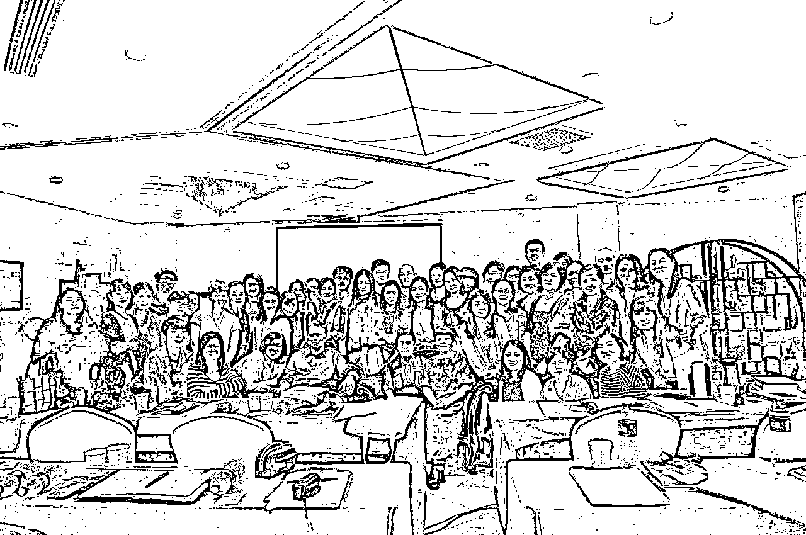
**企业占星工作坊全体合照**

**第一组大十字的行星相位**

*   6 月 3 日 

*   金星（双子座）四分海王星 （双鱼座）

*   太阳（双子座）对分土星 （射手座）

*   6 月 4 日

*   金星（双子座）对分土星 （射手座）

*   太阳（双子座）四分木星（处女座）

*   6 月 5 日

*   金星（双子座）四分木星（处女座）

*   双子座新月

*   6 月 7 日 太阳合相金星（双子座）

**第二组大十字的行星相位**

*   6 月 20 日

*   水星（双子座）对分土星（射手座）

*   射手座满月

*   6 月 21 日 水星（双子座）四分海王星（双鱼座）

*   太阳进入巨蟹座（夏至）

*   6 月 23 日 水星（双子座）四分木星（处女座）


你在第一组大十字的时候中招了么？你的外在世界和内在世界发生了什么变化么？你找到了这些变化背后的意义吗？你看到了哪些共时性呢？

6 月 20 日会迎来水星、木星、土星和海王星的第二组大十字哦，还有射手座满月，有关键行星在变动星座 10-15 度的朋友们有没有很期待呢？你要做什么事来呼应这一个宇宙天气呢？来留言分享下吧……


**占星师咔咔**：2010 年开始学习占星学，若道首届学员，国内最早获得 ISAR 职业占星师资质的职业占星师。在国际知名广告公司和市场研究公司从事的市场研究和推广工作十余年，曾任职于阳狮集团、尼尔森市场研究有限公司、MTV 和《Madame Figaro》杂志。现在为《时装男士》、活法儿等媒体供稿。

微信公众账号：咔星人

星盘解读和运势咨询：cji1029@qq.com

长按二维码，让金钱涌向传播知识与智慧的人~

 

**特别提醒：**

**本文首发于若道平台，**

**转载请联系后台授权。**


******是不是觉得大卫老师酷酷哒？由大卫·瑞雷老师**讲授的**若道核心课程 Level 3，会教你将**星座、行星、宫位、相位这些散落的珠子穿起来，**带你进入更深的自我探索与成长的旅程。本课程将于今年 7 月开课，敬请期待！******

**报名及咨询，请点击文末“阅读原文”**


# Level 3 | 占星自学者与职业占星师的分水岭

> 原文：[`mp.weixin.qq.com/s?__biz=MzA5NjA0NTAxNg==&mid=2651385371&idx=3&sn=d3a3ab4a5770edf5f90620dfb29e4275&chksm=8b4a5cacbc3dd5ba94888a77f71ab3ff8dc9ab1544bbd831f1a92913c835a94c711a406a1947&scene=126&sessionid=1692738821#rd`](http://mp.weixin.qq.com/s?__biz=MzA5NjA0NTAxNg==&mid=2651385371&idx=3&sn=d3a3ab4a5770edf5f90620dfb29e4275&chksm=8b4a5cacbc3dd5ba94888a77f71ab3ff8dc9ab1544bbd831f1a92913c835a94c711a406a1947&scene=126&sessionid=1692738821#rd)


从**Level 3**开始，

你进入了占星学更深入的领域。

Level 3 的课程，

是**占星自学者和职业占星师的分水岭**。

Level 3 课程**非常重要**，

是大部分占星学习者**薄弱**的环节，

也是往下的学习中**承上启下**的一个重要阶段。

在这个阶段，

你将**深入学习宫位**，

知道生命的故事发生在哪里，

在解读中，**星座、宫位的差异**到底是什么。

你会学习**相位、行星**能量的行星之间的对话，

一颗行星如何用它的能量影响另外一颗行星。

然后，

你要学习如何

**将星座、行星、宫位、相位组合起来**进行解读，

这是把散落的珠子穿起来的过程，

形成内容丰富、准确的解读语言。 

**2016 若道核心课程 Level 3**

**授课时间：**2016 年 7 月 28 日-11 月 10 日

**授课老师：**大卫·瑞雷

**授课方式：**网络课程，英文授课，中文翻译

**报名截止**：2016 年 7 月 15 日

**费用**：**6 月 18 日前报名付款早鸟价 6000 元，**6 月 19 日起 7000 元

**课程负责人：童老师**（**微信： 196267205**，请备注 L3 报名咨询）

长按二维码添加课程负责人咨询~


**导 师 介 绍**


**大卫·瑞雷（David Railey）**

若道创始人，《灵魂的目标》作者。拥有四十年的占星咨询的执业经验，曾两任亚特兰大占星协会主席，是全美占星师联盟（AFAN）、美国占星师联合会（AFA）、全美占星研究委员会（NCGR）、国际占星研究协会（ISAR）和职业占星师组织（OPA）的成员，是联合占星大会（UAC, United Astrology Conference）督导委员会委员。大卫曾是 CNN、CBS 的占星节目的常驻嘉宾，多次在 BBC、WGS、WSB、WRGG 等节目中接受采访，并在亚特兰大主持电视节目《每日行星（Daily Planets）》达 4 年之久。

**助 教 介 绍**

1

**天空的空**

2015-2016 年度若道核心课程专职助教。获得 ISAR 认证和“生时校正认证考试”资质认证。

2

**GAFF**

任 2015 年度诺·泰尔、斯蒂芬·福里斯特老师的占星工作坊助教。

**适 合 人 群**

*   Level 3 课程需要你具备一定的占星学基础知识；

*   如果你是若道核心课程 Level1-2 的学员，强烈推荐你直接报名参加 Level 3 的学习；

*   如果你是自学或者从其他途径学习占星学的学员，请点击文末“阅读原文”寻找到 Level 3 入学测试来看看你是否可以直升 Level 3。

**课 程 内 容**

*   **宫位和四轴**

*   我们将会用具体例子看到同一颗行星，相同星座，在 12 个宫位时如何解读 

*   **相位**

*   合相、六分相、四分相、三分相、对分相、梅花相位、十二分相、T 三角、大十字

*   **相位和周期**

*   **组合解读**

*   行星落于星座的综合解读

*   行星落于星座宫位的综合解读

*   行星落于星座宫位加上相位的综合解读 

*   **守护星链**

*   如何通过守护星链解读


**了解详细课程内容及报名方式，点击文末“阅读原文”**


# 深度星座丨双子座与射手座结合的最高境界是……

> 原文：[`mp.weixin.qq.com/s?__biz=MzA5NjA0NTAxNg==&mid=2651385370&idx=1&sn=bd1cffe66e1c93fe29aa7ec65d508eff&chksm=8b4a5cadbc3dd5bb63ad0c41cfdef4fb58b69d21efbb84fc48ed335f239ea16342b339d52e29&scene=126&sessionid=1692738821#rd`](http://mp.weixin.qq.com/s?__biz=MzA5NjA0NTAxNg==&mid=2651385370&idx=1&sn=bd1cffe66e1c93fe29aa7ec65d508eff&chksm=8b4a5cadbc3dd5bb63ad0c41cfdef4fb58b69d21efbb84fc48ed335f239ea16342b339d52e29&scene=126&sessionid=1692738821#rd)

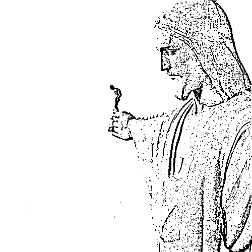

于双子座新月到周一射手座满月来临之际，本文作者想要深刻地聊一聊双子座和射手座的轴线。当急于收集信息的双子座，遇上思想高大的射手座，会产生什么样的化学效应呢？你有双子座和射手座的轴线吗？你是如何整合的？

**腹有诗书气自华**

出生于高知家庭，书是我原生家庭里最多的东西。冥王星落在 3 宫，从小就被教育：知识就是力量！学无止境。童年放学后，小伙伴们在花园里淘气，向来往的路人身上扔苍耳。但我不断提醒他们：不许扔戴眼镜的！因为我爷爷和爸爸都戴眼镜……

某种情结随着保护欲已流淌出来。后来，能令我一见倾心的人，必须腹有诗书气自华。记忆中难以磨灭的画面感，总伴有心智交流灵感思潮在炉火中的啪啪声……我铭刻着他们眼中的光芒——cheerful with passion, naughty and witty. 而他们说：你的眼里有星辰~ 一个拂晓，走在斯坦福的校园里，心下一片眷恋的安祥与平静。偶有帅哥擦肩而过，余光里，那阵晨风都是沁人心脾的……人各有志。

双子座和射手座，这是我最心驰神往的一条轴线。终于水到渠成时，为知识分子们写这一篇。人生有着不同的功课，有人是价值议题，有人是关系议题，还有些人是观念的功课……

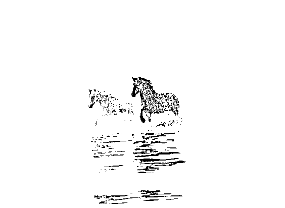 

**万物负阴而抱阳，冲气以为和**

论及 12 星座，我从不愿割裂对宫来谈。两极的星座，对立着、转换着、统一着。比如，我从不认为，双子座或射手座在你的星图中，会孤立地存在——“万物负阴而抱阳，冲气以为和”。 

**基础划分**

双子座和射手座这组对宫共享的支点叫作：**知与行**。他们都不安于室。身体或灵魂，总有一个在路上。读万卷书，或行万里路。区别于远近之分。**地理上，双子对应短途旅行，射手对应长途旅行；精神上，双子座对应早期教育，射手座对应高等教育。**

**人物肖像**

**●射手座**

○绝世的山巅上，他离群索居，心怀高远，满腹经纶。自问自答：“沙漠的那边是什么？…… 嗯，是另一座沙漠。”内心戏时时上演着傲慢与偏见，壮怀激烈地正准备下山时，“啊”地一声，哲学之王，五体投地。脚下一小块顽石绊倒了他……

**●双子座**

○繁忙的人生公路上，他身手敏捷，充满急智，随机应变地轻松处理各种复杂的路况。旺盛的精力、多线程地炫技。噪音是他的空气，谈吐诙谐，不俏皮，毋宁死。当然，他紧盯着路面的视线永远不能移开。你问他，这个车开往哪里？那一刻，他顽劣的眼中竟然闪过了一丝迷茫……而这时电话 AI 已在催促：您有一个来电请马上接听……

**●有一天**

○发生了一场完美的遇见，成就了一次梦幻之旅。当下盘不稳的射手座，邂逅了近视眼的双子座。看这对 CP 是怎么配合的？“悟空。走”“去哪，师父？”“天竺！”双子座立刻拿起电话，找旅行社，订机票，查地图，买来白龙马。射手座只须滔滔不绝地讲述着彼处的风土民情，未知文化，唱着 Only you~ 古往今来，在象征人类知行枢纽的丝绸之路上，始终跳跃着一对对双射 CP 的身影，被传为佳话。

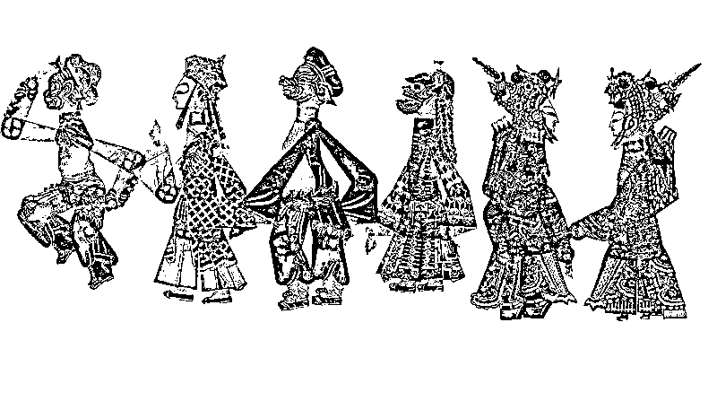

**学术阵营：心即是理 vs 格物致知**

这是一个知识分子阵营，古往今来的学术论战，大多围绕着双子座与射手座特质所秉承的根本矛盾。同为智能精英，但方向侧重截然不同。百科全书的双子座，以小聪明胜出；钻研宗哲的射手座，以大智慧见长。关于二者的零碎解析已有太多。而我想在此开辟出一个新颖视角，从哲学观切入，关于本体论与存在问题，发现它们可以整齐地被划分入两派：

**●双子座相对倾向**

○西方哲学观，物我二分；二元对立；倾向唯物，注重感官认知，理性推论，客观证据，承认事物的客观存在；科学观，定量式认识宇宙各部分变化规律；理学，格物致知，物指向心；“为学”，离心，理主宰心，人作为理的载体；逻辑学，即研究思维的形式规律逻辑方法。智，做加法，博闻强识，去看到事物的不同；擅长与个体事物发生关系，逻辑力强，注重思维。

**●射手座相对倾向**

○东方哲学观，天人合一；一元论，或二元统一；倾向唯心，或辩证唯心，注重意识理念法则，认为世界是精神的产物；哲学观，定性式认知宇宙整体变化规律；心学，心即是理，心驭万物；“为道”，向心，合乎本性即合天理；形而上，即探索本原，自然界规律法则，人与宇宙关系。慧，做减法, 去遮蔽见真相，去看到事物的相同；擅长把握世界的整体性，直观力强，注重存在。

**注：以上仅揭示一种倾向性。且是相对论证，并不绝对。**独家观点，法无定法。欢迎独立思考。且本文中，一切相关双子座与射手座的论断，都勿直接套用太阳星座。皆以真空状态下的“双子座特质或射手座特质”而论。因本文仅从对宫角度论述双子座和射手座的轴线，故对哲学阵营，不站队，不评判。

而**最终方向性的确定，应参照南北交点，冥王星及星群比重等，全盘综合研判才能获悉。**比如**北交点双子座，应更多发展理学，为学式角度，格物穷理，积累经验智巧；北交点射手座，应更多发展心学，为道式角度，良知为本，增强直观体悟……**

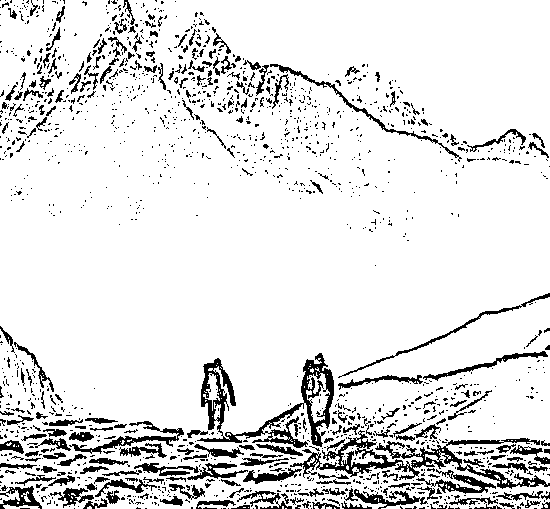

**知行合一：双子座和射手座轴线的最高境界**

天人合一的思想作为中国哲学的最高命题，体现在双子座和射手座轴线，既是“知行合一”的实践原则。**知与行，是这组对宫的终极功课。射手座的知，更有能量，因为是深知；双子座的行，更有能量，因为很当下。**

**知的层面**

**良知不能明觉，言行必失远见。**别因已走了太远，而忘记为何出发。

**●碎片与源头**

○在信息大爆炸的年代，双子座是 fomo（信息焦虑）的主要症候群，刺激源过多，进食过量，消化不良。**提高信商，降低信噪比，培养元认知，刻不容缓**（元认知，即关于知识的知识，对于认知的认知）。没有繁殖能力的知识，毫无价值；缺乏联系的信息，不成体系。知识和信息都将困顿于整合，且难以提取。

**事实的扩充，只能带来知识的广度；只有增加联系，才能达到知识的深度。**点连成了线，才能化为智慧。**像射手座那样采铜于山，先抓住藤条式的知识，建立个人知识体系的骨架，然后再不断纳入新的触点，让漂浮的叶片都找到底线。**且以独立的世界观为引绳，纷杂的方法论才有所依托。能否把握到部分与整体的关系，是射手座与双子座的最大区别。正如我老师常说的话：“取法乎上，寻师经典。物先大体，鉴必穷源。”

**●阅读与思考**

○**在寻找意义的过程中，信息只是原材料，关键是之后炼金的过程。**功利阅读，像塞满流行观点、混乱杂陈、过度拥挤的的图书馆。如果你是这样的双子座，那么，独立思考如精神的君主般的射手座则是你的榜样。叔本华认为，人应在思想干涸时才去读书。手不释卷而放逐了思想，难以收获连贯通透的理解。**应先拥有自身根本思想，深思熟虑，而后发现与权威暗合，才更易握住真理和生命力。**死啃书本，拾人牙慧，只能被洗脑。

独立思考的人，是精神国度的王侯，能如真知的土著般，如数家珍地道出事物来龙去脉及与总体的关系；而随波逐流于权威说法与世俗偏见者，被限制了思维，仅能当个随从。王阳明也主张，读书不是为了获取知识，只是验证和呼唤自我良知已拥有的知识。吾性自足，不假外求。**我们心中有良知，良知无所不能，无所不知。重要的是磨镜，使心的本体光明。**所以，必须让观念与自身形成强力连结，而非单纯搜集归纳他人意见，以致迷失主见。**不深思，无真知。**

**●逻辑与直观**

○**射手座的安全感基于哲学伦理层面，擅长发掘事实的深层意义及抽象的宇宙法则，拥有强烈直观力和第六感**，常受天启，预见未来，也相信命中注定。当然，凭直观所了解的事，常难以用逻辑的语言，通俗易懂地表达。茶壶煮饺子，是射手座的软肋。**双子座的安全感基于因果律的逻辑思维层面，偏重事实的知识，却忘记统合整体景观，于是在二元对立中骑墙犹豫**。逻辑可用以辅助预感，却无关思想根源。若先入为主，只会压制思考，抹煞预感。预感才是思考之路的开端，好的预感能让路越走越远。

老子认为：“为学日益，为道日损。”即**人受思维约束，社会局限得越多，自由想象日渐削弱，在力求与外界社会人际需求的种种反应融合中，渐失独立的存在价值，徒增私欲妄见**。此处神似**双子座在其所擅长的聆听观察分析中，以淹没自身内在声音为代价，迷失与自我的联系**，且因习惯于猜测他人反应，而带来的犹豫不安和难以坚定的立场。而**射手座的为道者，力求寻找和理解自我，置身于自然状态中，感受物我和谐，通过冥想等直观体悟，以把握世界整体作为探索目标，领悟事物未经分化状态的“道”，内索虚静，返朴归真。**

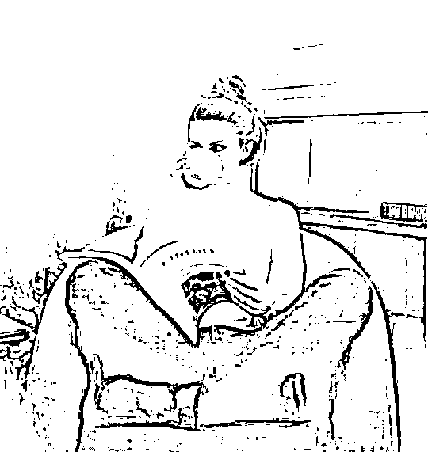 

**行的层面**

**知而不行，只是未知。唯有通过实践，才能对良知建立真正联结，将之转化为自觉意识。即自证良知！**

**●理想与现实**

○许多射手座的内心，住着一个堂吉诃德。

**“堂吉诃德宁可舍掉性命，决不放弃理想。他使得海涅为他伤心流泪，对他震惊倾倒。俄罗斯小说家屠格涅夫也有同样的看法。堂吉诃德有不可动摇的信仰，他坚决相信，超越了他自身的存在，还有永恒的，普遍的，不变的东西；这些东西须一片至诚地努力争取，方才能获得。”**

——1985 年杨绛先生在论述《堂吉诃德》时写道

执着于理想固然可敬，但它首先须是切实可行的。主观上崇高庄严，却僵化不合时宜的信念，对客观世界毫无意义的行为，终将在轻浮的现世中折戟搁浅，空悲切。概念要与实际常识接轨，教条须接受理性的检验，信仰只有被实践时才有意义，而真正的哲学也是鲜活的，离不开实践与思考相结合。

**博闻强识后又能践行，在“有闻，能行，又闻”的过程中，以学做教及创作等形式来输出。把私心发展到愿心，形成教学相长的共赢态度。且言行一致地活着，才算是“知行合一”。**

**●深入与浅出**

○射手座普遍携带自我傲视的基因，在无止境寻求真理的独行路上，相对缺乏做为人类的经验。所以，**放下智力优越感，平易近人地与众生交互信息，而非说教式地推广观念，是个艰巨的功课。**你的内容常常是极富价值的，但沟通态度才决定成败，沟通不是单行道，必须学习双子座式的双向交流。

当你占踞着道德制高点，满怀成见评判他人时；当你关注宏伟格局，而以牺牲速度的代价失去当下成功机会时；当你执迷于意念中的永恒，而不甘于权宜之计时；当你让他人的即时需求苦苦等待你的整套人生哲学时；当你激荡于满腹抽象的真理启示，却深感难以言明的语塞时……对宫双子座，都是你最好的镜子。**用长袖善舞，以人为本，驱策于当下，深入浅出的良药来治愈**你。

其实，**真理无处不在，不一定远赴西天。只要你走下神坛，放下架势，倒空杯子，习得初心，便会在日常的简单，或市井的人群中，与之不期而遇。举步之际，勿念周全。**千里之行，始于足下！

**●捷径与天命**

○**双子座因迫于当下紧张驱动，惯于迷恋捷径与速成。以战术上的勤劳，代替战略上的懒惰，长远中将显现为虚弱**。断章取义，学不到精髓。浅尝辄止，难留下烙印。真正的捷径，是无字天书，是坚持最适合自己的方法。学习射手座那样，以天命为标的，才是捷径的真谛！

“人生的意义是什么？”这是射手座族群，与生俱来的终极追问，因喋喋不休，故上下求索。也许生命本无意义？要由我们赋予它意义，“不同”的意义？也就是“天命”这个词。多年前在《牧羊少年奇幻之旅》中遇见它，它是宇宙为你量身定制的存在使命，那里有你无可替代的天赋，太阳神经丛的默许，而无需努力坚持的内耗，便拥有的纯然酣畅与由衷幸福。找到了它，也就找到了你成功的保证。而它的答案并不在你忙碌的思维中，须侧耳聆听天启，才能发觉随机的命运背后的富于整体性的深层奥义。

惟有厘清了属于你独一无二的生命意义，才能将全部斗志聚焦倾注于此，义无反顾地去实践它。**心学的本质就是使人能够去实现自己的存在，即首先了然于心下那片“良知”，才是行之根本。**

**教学相长，自证良知**

“知之真切笃实处，即是行，行之明觉精察处，即是知”。知中有行，行中有知，知行工夫，本不可离。两者非二元对立，而是以辩证思维，相互流转。知行合一，就是要将知识与实践、功夫与本体融为一体。“致”良知，即是以事为媒来磨炼，使良知见诸客观实际。“致良知”也就是知行合一，以兼知兼行的态度，将心学转为事功，实现“内圣外王”，即心灵上能够宠辱不惊，同时与社会相处得游刃有余。做入世的强者，与出世的智者。

**后记**

将始于我 9 宫新月的成长，沉淀在我 5 宫射手座满月时的文字里。在《自私的基因》一书中有个惊艳到我的观点：假设有一种新型的复制基因叫 meme，在人类文化的汤中漂流……当美妙且富有生命力的观点在传播，渗透，繁殖。让大脑变成了宿主，开创了崭新的进化历程。从模仿式的精确复制，到突变式的随机混合……美妙如我近期学习中始终的微笑。

太阳双子座、月亮射手座的老师说：“人类生存的主要目的是什么？我觉得是知识传承的过程，一代人站在上一代人的肩膀上，走向新的高峰。” Meme is immortal，知识的力量令人战栗！

宇宙最近向我飘来的一句 omen 是：“沉密神采，如对至尊”。于是，冥王星 3 宫人，谨以沉甸甸的这篇良心之作，送给智能精英的双子座和射手座轴线有缘人们。于新月从双子座驶向满月射手座的周期之末……意味深长，共勉“知行合一”！

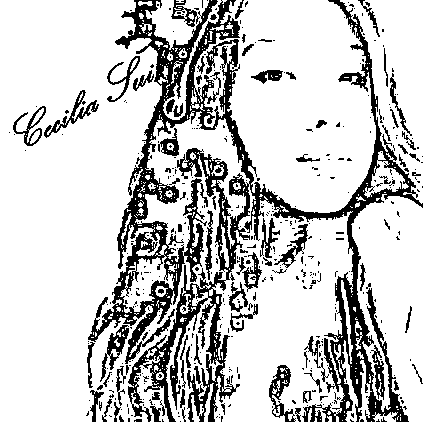

**作者简介**

**蓝女巫 CeciliaSui**：中国首批 ISAR 英文资质认证占星师(2012)；英国伯明翰大学市场营销学硕士；美国 GIA 珠宝设计师；英国 IFPA 认证芳疗师；《占星学刊》专栏作者。日处月蝎，细致精准，专长定位：“帮灵魂穿珠子的人”

**个人公众号及咨询预约**: cecilia_sui

**其他联系方式**：QQ：2413369983，请注明“占星”

**微博**：蓝女巫 CeciliaSui 

长按二维码，让金钱涌向传播知识与智慧的人~

 

**特别提醒：**

**本文首发于若道平台，**

**转载请联系后台授权。**


******如此整合射手座和双子座轴线，是不是很有趣呢？由大卫·瑞雷老师**讲授的**若道核心课程 Level 3，会教你将**星座、行星、宫位、相位这些散落的珠子穿起来，**带你进入更深的自我探索与成长的旅程。本课程将于今年 7 月开课，敬请期待！******

**报名及咨询，请点击文末“阅读原文”**


# 写在父亲节 | 也许你并不是完美的英雄，但是我依然爱你

> 原文：[`mp.weixin.qq.com/s?__biz=MzA5NjA0NTAxNg==&mid=2651385363&idx=1&sn=b880d6ab50165a2e0e3163d50e888981&chksm=8b4a5ca4bc3dd5b21d18c50a54db60d0168a2d4123683293dd87ed54bcbf0bf06d71b9bb694d&scene=126&sessionid=1692738821#rd`](http://mp.weixin.qq.com/s?__biz=MzA5NjA0NTAxNg==&mid=2651385363&idx=1&sn=b880d6ab50165a2e0e3163d50e888981&chksm=8b4a5ca4bc3dd5b21d18c50a54db60d0168a2d4123683293dd87ed54bcbf0bf06d71b9bb694d&scene=126&sessionid=1692738821#rd)


作者/咔咔  ISAR 认证占星师

从什么时候起，父亲不再是小小的我们心中的大英雄，我们看到了他们的软弱、唠叨、专制，甚至一度怀疑他们是否爱我们；而又过了很久很久，当我们经历了人生，有了故事，我们开始理解了父亲，原来，他始终是那个大英雄，因为有他，才有我们。

6 月 19 日父亲节，祝天下所有的父亲节日快乐！

从你的太阳来看你的父亲

个人星图中太阳所在的星座、宫位和相位提供了关于父亲的信息：父亲的性格、重视的生命领域，人生发生了些什么。

**举个栗子** 

*   **太阳在 12 宫**，可能在孩子眼中，父亲是个**安静沉默的男人，心地善良、与世无争**。也可能他们童年时期有一种**被父亲忽略**的感觉。或者父亲在**监狱、医院、教会工作**。 

*   **太阳在 5 宫合相火星**，可能父亲是个**“大小孩”**，**脾气急躁**，小时候经常陪孩子做各种**游戏**，还会为了**谁输谁赢**和孩子吵起来。 

*   **太阳在天蝎座与狮子座的土星四分**：孩子从父亲那里学会**用毅力、勤劳、承诺、纪律来帮助应对人生的危机**。但是父亲是他生活中有**强大能量的权威**，从小对他**严格管教**，让孩子觉得自己“不够好”，“要更加努力才能在社会上生存下来”。

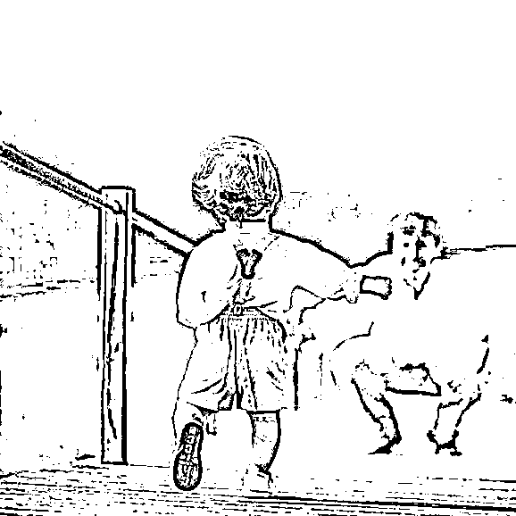

**讲个故事**

***有个姑娘的太阳在巨蟹座，与木星紧密合相，在代表公众领域和事业的第十宫。***

*   她眼中的父亲是个**细腻呵护着她的男人（巨蟹座）**。

*   “他去幼儿园接我回家，把我放在自行车大梁上，每次给我买个酸奶，我喝他看着。”

*   “以前我坐火车回学校，路上带吃的，橙子柚子都是我爸剥好了，分成小块，用保鲜膜包好了再放回皮里。”

*   父亲还是一个“踩着五彩祥云”的**大英雄（木星）。**

*   “我爸很帅的”，年轻的父亲有着修长的身材，椭圆脸庞，手拿一杆长筒猎枪，略显羞涩地看着镜头。

*   “他年轻的时候，是为国争光的运动员，获得的奖杯奖牌塞满了家里的柜子（太阳在 10 宫）。”

*   退役后，父亲成为了教练，为国家培养运动员，运动队是他的另外一个家（巨蟹座），他后来被国家派去其他国家，传授经验，帮助他们提高竞技水平。

*   太阳和木星合相，木星在占星学的意义是宗教信念、人生哲学和政治理念，像古人所说的“读万卷书，行万里路”，出国旅行和教育都可以进一步开阔眼界，探索生命的奥秘。因此木星也带有出国旅行和高等教育的意义。

父亲就是我们的“太阳”

**星图中的太阳除了代表父亲外，还描述了人们希望成为的样子、想要具备的品质**、**想要感到骄傲和荣耀的方向**。

太阳是地球生命的源泉，它带给人们活力。古人们会仰望太阳，祈求大地丰收、生活安康。

**父亲在孩子的生命中，具有“太阳”一样的性质**，**他们是孩子童年和成年后的人生榜样**。在英文里，“look up to”的直译是抬头看，延伸的意思是尊敬和仰慕。父亲是很多孩子生命里第一个抬头仰望的人，看到他的样貌、言谈举止、待人接物，孩子会尊敬和崇拜父亲，自然地把父亲的具备的品质和人生状态，作为自己追求的目标，并在成长过程里，寻求父亲的认同和奖励。

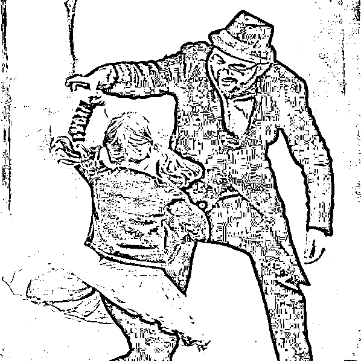

**星图上的太阳描述了你想成为的样子，那是你看到的父亲的样子；描述了你想感到骄傲和荣耀的方向，这多少来自儿时父亲对你的影响和教导**。

*   当我问人们，你是否会为父亲感到骄傲的时候，很多人毫不犹豫地回答，是的！

*   “父亲给予我生命和人生最初的价值观，他就是一个普通人，但是我为他感到骄傲，作为他的后代，理应如此。”

*   “虽然我和爸比之间有不可调和的观念分歧，但是爸比在很多方面都还是非常让我佩服的。是的，我为他骄傲。”

*   “当然咯，我最崇拜的楷模就是我老爹。”

*   也有一些人，在成长的过程里，父亲不再是自己儿时的偶像，也不再让他们感到骄傲了。他们对父亲感到失望、愤怒、为受到父亲的伤害感到无奈和难过。

*   “父亲总是否定我想做的事，对我从来不鼓励。他总是打击我，觉得我一事无成。”

*   “父亲太理想化了，他的那套行不通，他还一直较劲，根本没法和他沟通。”

*   “他每次要事业做出点成绩的时候，就会出这样或那样的问题，让我和我妈各种担惊受怕”。

*   “我婚姻失败，他第一个反应是骂我没用，我太伤心了，哪有父母这样对待孩子的”。

*   “我爸从小到大就没管过我，没尽过做父亲的责任”。

如果你有一个这样的父亲

如果天空中的太阳暗淡无光，地球上的生命将会怎样？**如果孩子感受到的父亲是一个否定自己**、**忽视自己、伤害自己、让自己感到羞耻和无能的男人，孩子对给予自己生命的男人带着愤怒、惧怕、失望，他怎么能树立健康的自我身份，认同自己身上的特质，有勇气开始实现自我价值的人生旅程呢**？

**A 的故事**

***当 A 来做占星咨询的时候，正在经历事业的低谷期，他负责的项目一直没有进展，不得不被公司叫停，他自己也对接下来的工作发展失去了信心，被失败感折磨的他想来咨询是否能换个全新的行业，找到更合适自己的方向。***

**A 的摩羯座太阳与冥王星有一个紧密的四分相位**。咨询的过程里，他回忆起了父亲生命里的一次**重大事业挫折**。

父亲在部队的发展很好，复员转业后经历了几次权力斗争，没有能继续“往上走”，只是在地方上找了个混日子的工作。他和父亲发生事业挫折的年纪差不多，父亲在他的眼中，从威武的穿军装的英雄变成了一个失败的中年人。他曾经为拥有一个“成功”的父亲感到骄傲，父亲“失败”后，在他心目中就是个普通的男人，过着平凡的日子。

当他在父亲“失败”的年岁遭遇到了和父亲经历过的类似的挫折的时候，他才明白，原来挫败的感觉是如此的难受，经历挫败感受到的自我怀疑是如此的沉重，面对挫折能站起来再出发，需要那么多的信心和自我心理建设。他坐在我对面说：“我爸爸当年真心不容易，现在我经历过了，我理解他了。他和妈妈把我和姐姐抚养长大，我们现在都过着精神和物质富足的生活，父亲真是不容易。”

我想，他的潜台词是，**爸爸，你当年没有完全被“失败”打倒，你是个好样的**。

接受不完美的父亲

**谁说我们心目中的父亲只能是个“超级英雄”呢？谁说只有“超级英雄”才能被敬爱和仰慕呢**？

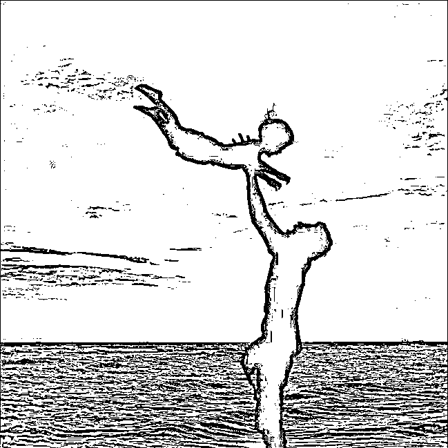

女儿为父亲感到骄傲，因为父亲“保护女儿不受到坏亲戚的干扰”；儿子为父亲感到骄傲，因为父亲经历了挫折，但尽责地给孩子和家庭支持；女儿为父亲感到骄傲，因为父亲经历了病痛和事业的双重打击，晚年开始自学绘画、种花、帮助女儿的生意、享受自己的生活。

**也许，也许并不只是骄傲，而是理解**。

*   当孩子长大了，在和父亲同一水平线的视角去看待人生，经历了父亲当年遇到的困难，体会到了生活的不易。

*   “年纪大了才知道爸爸不易，小时候居然是否定的。”

*   “长大以后意识到自己身上很多要命的缺点和我爸是一样的。自己没有做好的方面，我爸也没强到哪里去。现在觉得更了解他了，他是一个挺有意思的普通人，就像我自己一样。”

*   对于曾经遭到的父亲的伤害，长大的孩子能理解父亲的内心也有一个受伤的小孩，父亲也是他的家庭的受害者。

太阳描述了我们心目中英雄的形象，英雄不是一个“假大空”的角色，在屠魔的旅程中，英雄离开了安全熟悉的环境，途中遭遇了许多障碍，创造了一些胜利，也可能被失败打倒。**也许父亲在自己的英雄之旅里树立了一个成功的榜样，也许孩子从父亲的失败和挫折里学到更多**。**当我们真的理解和接受不完美的父亲，客观地看到父亲作为一个真实的人的存在，有闪光点也有缺点，我们就会摆脱那个对完美的父亲，或者完美的自我的执着**。

当我们看待事物的方法改变了，事物就会改变。当我看待父亲的角度改变了，我和父亲的关系就会改变。当我看待自己的角度改变了，我自己的人生就会改变。

献给每一个经历“英雄之旅”的孩子们，愿你们找到航程的方向。

献给父亲，我接纳你的不完美，我为你是我的父亲感到骄傲。


**占星师咔咔**：2010 年开始学习占星学，若道首届学员，国内最早获得 ISAR 职业占星师资质的职业占星师。在国际知名广告公司和市场研究公司从事的市场研究和推广工作十余年，曾任职于阳狮集团、尼尔森市场研究有限公司、MTV 和《Madame Figaro》杂志。现在为《时装男士》、活法儿等媒体供稿。

微信公众账号：咔星人

星盘解读和运势咨询：cji1029@qq.com

长按二维码，让金钱涌向传播知识与智慧的人~

 

**特别提醒：**

**本文首发于若道平台，**

**转载请联系后台授权。**


******太阳还有这么多的含义，是不是很神奇呢？由大卫·瑞雷老师**讲授的**若道核心课程 Level 3，会教你将**星座、行星、宫位、相位这些散落的珠子穿起来，**带你进入更深的自我探索与成长的旅程。本课程将于今年 7 月开课，敬请期待！******

**报名及咨询，请点击文末“阅读原文”**


# 深度心理学 | 羞耻，出走父亲给女儿的唯一“礼物”

> 原文：[`mp.weixin.qq.com/s?__biz=MzA5NjA0NTAxNg==&mid=2651385363&idx=2&sn=e9a0a7eab1a4563222f65d4facd4ea86&chksm=8b4a5ca4bc3dd5b2e277ffbcb866f2ac4a36e85e2d515b6788e3eb6ef30b7d8c560bf37f4d8c&scene=126&sessionid=1692738821#rd`](http://mp.weixin.qq.com/s?__biz=MzA5NjA0NTAxNg==&mid=2651385363&idx=2&sn=e9a0a7eab1a4563222f65d4facd4ea86&chksm=8b4a5ca4bc3dd5b2e277ffbcb866f2ac4a36e85e2d515b6788e3eb6ef30b7d8c560bf37f4d8c&scene=126&sessionid=1692738821#rd)

**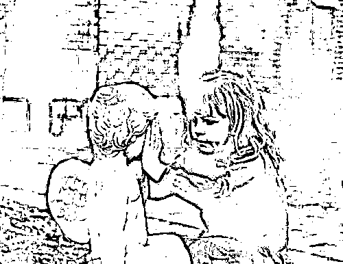**

作者/杰西卡·加菲尔德·卡巴拉

译者/Christy 校对/王宏

图片来源/花瓣网

这篇文章是作者杰西卡的研究生毕业论文。该文从深度心理学角度展开了一次启发式探索，探究对于生活在父权文化中失去父亲的女孩而言，其真实想法与羞耻感之间的关系。作者通过对自己被父亲抛弃的个人经历进行深度心理学的分析，揭开了羞耻的治愈之路。由于篇幅原因，本次刊发该文的第一部分，其余内容将后续刊发。

## 失去父亲的女孩与“羞耻感”

失去父亲的女孩（无论是事实上、情感上、心理上，还是精神上），她们的羞耻感和缺乏自我价值上，一直存在着关联，也就是说，父亲的缺失导致了女儿在价值的投射和验证上有所缺失。

**①   拒绝“真实”自我**

这种抛弃给孩子带来了一种缺陷感和无用感，这会导致羞耻的深层内化。此外，遭父亲抛弃的少女将羞耻内化后，会失去童声，或是**失去表达自己最深层的欲望、情感和梦想的能力**。当一个少女将羞耻内化为核心认同感时，她很快就学会了，**比起体验人生中来自其他人的拒绝，自我拒绝更安全。生父对她的外在抛弃内化为她对自己的内在抛弃。**

生父的外在抛弃对孩子来说是一段羞耻的经历。孩子还没有足够的自我意识从逻辑上去理解，父亲离开她并非她的错。对孩子来说，理解这种创伤经历的唯一方式是，认定被抛弃是因为自己太糟，而不是被视为“神”一般的家长太糟。

在应对这种巨大的失去时，一部分自我结构形成了，防御机制开始显现。通过隐藏真实的自我，孩子学会了如何保护自己不受未来的痛苦和损失的伤害，因为真实的她被拒绝和抛弃了，没有获得接纳。

**②   完美主义**

**这种体验在她心里内化为了羞耻和错误。**现在，她认为自己的先天存在有问题。与其他任何有适应能力的物种相类似，为了生存，她本能地通过创造各种形式的盔甲和错误的自我意识来应对环境。**隐藏在防御盔甲之中的，是完美主义。**对失去父亲的女孩来说，完美主义是一副理想的盔甲，因为它可以抵御她认为导致了父亲离开的自己不完美的天性。      

在一个男性主导的社会里，完美主义还被誉为需要每天在个人生命的全部领域中不断争取的东西，因为在父权社会，定义个人价值和自我价值感的是成就和成功。而当一个人不断努力变得完美时，**脆弱或者害怕、愤怒、悲伤、嫉妒等负面情绪就没有存在的空间，也没有余地去犯错误、冒风险、有创造力、玩耍和率性而为。**

只有时间去工作、达成目标和超越其他所有人，没有时间受苦、感受痛苦、悲伤或哀悼失去；没有时间留给身体、爱情、艺术或音乐；没有时间做自己、了解别人或被别人了解。

**③   自我否定**

当父亲不在身边时，孩子就会在内心塑造一个父亲作为父亲形象的原型，这种倾向在孩子的内心世界变成一幅放大的漫画。父亲缺席导致的空缺由一种超越生命的、通常非个人的存在所填补。这个非个人的父亲以神圣的方式被理想化，带有巨大的力量，同时也因总是轻视孩子的谴责和审视的目光而令人惧怕。

现实中的父亲是容易犯错的，有阴暗面，会犯错，是有着各种各样性格和特质的人。非个人的父亲常常只有一面，孩子很快学会认同这一面，以避免原型父亲的愤怒和拒绝。此时**，这个原型父亲已经成为了孩子内在的一部分，这部分从根本上否定自己，认为自己是罪恶的、不好的。**在遭到父亲遗弃后，萦绕在少女生命中的**羞耻可能对她的人际关系和心理健康产生毁灭性的影响。**

**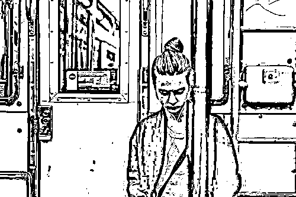**

## 羞耻感带来的症状

羞耻的情绪阻碍人类与自己和周围的世界建立深层的联结感。羞耻是感受到疏离、孤立，以及被家庭、朋友、社会、灵性和全世界隔离的根源。它也是个体生命失去意义和目的的核心所在。

心理学家约翰·布雷萧曾说，**羞耻是所有上瘾和强迫行为的源头**。这种根本上的分离体验让个体无法发挥创造性潜能，无法体会真实的欲望和人类存在的核心信条——爱的感觉与归属感。当个体感到自己不值得有归属时，心灵或自我感就会变得支离破碎。在感到羞耻的时候，冲动对应的是沉默和隐藏。

要想获得那些被羞耻分解到潜意识中的特质、欲望、想象和直觉感，个体似乎必须要从心理学角度探寻羞耻的本质——它是什么？是怎么出现的？如何在心灵中运作？它对个体的内在和外在生活有什么影响？如何治愈它？

整个 20 和 21 世纪，探寻羞耻的现象学一直是精神分析学和深度心理学所做的核心努力之一。**从症状上来说，羞耻会表现在各种形式的上瘾和强迫行为中，是药物滥用、药物依赖、进食障碍、强迫性精神障碍、完美主义、恃强凌弱、暴力和性虐待的根源。**

羞耻是让人感到最不舒服的存在状态之一。当个体试图不去感受自己的存在所带来的可耻的脆弱感和犯错感时，如果不进入一种防御和反抗的冲动之中，想要接触到个体的羞耻就是极其困难的。

## 重复梦魇的“全息”暗示

当我还是个小女孩的时候，在无数个夜晚，我都会梦见一个有父亲陪在我身边的世界。想象着有重要的角色和情节的世界，父亲是我虚拟世界里的大英雄，我想知道我是否曾经出现在他的脑海中。我怀疑他是否像我在心里珍视他一样，把我放在他心里。

当一个没有结局的故事不停重复同样的场景时，我审视自己的整个存在，想象着我本可以变得不同，这样或许父亲就会想花点时间和我在一起了。我爱的第一个男人几乎不承认我的存在。在我 1 岁之前，父亲就不在身边，到我 4 岁时，他彻底在事实上、情感上、心理上和精神上抛弃了我，我成为了失去父亲的女孩中的一员。我会一直将失去父亲的痛苦和美丽同时放在心灵深处，直到我死去。

小时候，一个关于我父亲的梦魇总是不断出现，给我造成了极大的困扰，这个梦魇每次都以同样的方式开头——我站在一栋金属建筑的 4 楼，整栋建筑都没有外墙，内部也没有装修。我看见我父亲站在楼下的草地上，于是激动地向他挥手。我会不顾一切离开这栋建筑，下楼到他身边。这条路并不好走，也并不明确，但不知为何我做到了，他就是我的动力。我想方设法来到地面，高兴地奔向他，渴盼着我们期待已久的拥抱。但当我向他靠近时，他却走到一边，我扑了个空，每一步都比前一步动作更慢。他在我身后，朝我脑后和后心喷油漆，我跌倒在地上，感到无尽的孤独，直到我死去。

**这个梦是一个“全息”暗示，指出了我父亲以及其他诸多代表我与父亲关系的各个面向的男人将给我的生活带来怎样的影响。**这个帮助给予我生命这份礼物的男人，还给了我能力感受一切情感，给了我机会体验爱并处于情感关系之中，可是他抛弃了我，留下我一个人找寻出路，并把人类存在的最基本原因——爱、归属和联系——从我身上夺走。你的创造者之一没能在你身边爱你，这将产生怎样的反射性影响？

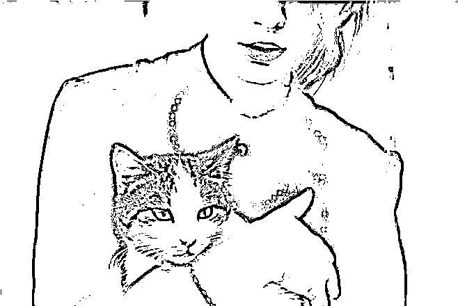

## 不配得到的爱

我父亲从没做过任何一件我成长中需要的、让我感到爱并尊重自己的事；他从来没有说过他以我为荣；他未曾给过我指引或建议，也没有在我人生中任何一个仪式上出现过，无论是我上学的第一天、青春期时身体的变化、开始与男孩子约会时浪漫情怀的触发，还是我离开家开始独立生活的那天。

但事实上，我最怀念的是那些小小的瞬间：他走的那天给我的拥抱，帮我掖好被子，他的微笑，他的笑声和遗传给我的幽默感，我们一起听音乐，促膝长谈讨论着我们是怎么来的以及要到哪儿去，还有一起吃饭。

我父亲对我的**抛弃导致了一种感觉不配得到爱与归属的深刻的无意识感**，这种感觉贯穿于我的余生和身份之中。这种核心的无价值感转变为**无法意识到自己真实的欲望、想法和感受，因为我始终在忙着变成一个别人都喜欢接触的人**。一种内心深处的自我憎恨慢慢开始点燃我的身体，直到我的内心被烧成灰烬，这让我只想死去。

在将父亲对我的抛弃解读为拒绝后，我将父亲内化为我无法与之交谈，也无法听我说话的形象，于是，我抛弃了自己的声音，认为那是没有价值的。从生命之初我就认定，这个世界偏爱男孩，男孩在这个世界上永远比作为女孩的我能得到更多的爱。

我有过的最强烈的上瘾是追求完美。一直以来，我是一个从不惹麻烦的优等生。无论我力求实现什么目标，我总能做到最好。为了成为一个完美的人，我为自己设立了无止境的要求，满足这些要求是我所知的唯一能让我在这个世界上感觉到存在价值的方式，我唯一的指引目标就是要做到最好。

我完全没有意识到自己受到了需要父亲关照的无意识需求的驱动，我拼命地努力让自己获得爱和接受。一定有某种方式让我可以接触到他，让我可以进入他所归属的男性世界。

到 16 岁的时候，我已经和 40 个男人以及少部分女人上了床，其中一半的人我连名字都不知道。我为自己的放纵不羁和不在乎其他人看法的态度感到自豪。我在性方面原始而开放，不像其他大部分人那么假正经。回顾往事，**我能看到我对父亲的愤怒内化并转向了内在：如果他不在乎我，不重视我，我为什么要对我自己、我的行为和别人对我行为的看法那么在意？**发展出无忧无虑、放荡不羁的面具人格，也保护了我不去触碰我内心那个极度在意父亲想法的痛苦少女。

我对男性、对父亲形象无意识的、难以抑制的渴望让我在 18 岁时就结了婚。我嫁给了一个酒鬼兼瘾君子。毒品在我的身边非常猖獗，到我满 20 岁时，我因为身边有各种各样的违禁药品而面临终身监禁。最终我被单独监禁，我的痛苦从监狱灰色的墙上溢出。我是如何走到今天这一步的？我向宇宙祈祷，比以往更强烈地祈祷，希望能把我从自我中拯救出来。

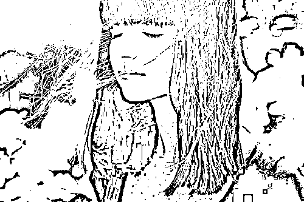

## 心理与精神的重生

几个月后，在我奇迹般地获得释放之后，在一段神圣的药物治疗过程中，我的整个世界观分崩离析。与我以前的任何经历都完全不同，我发现自己在一种非常态意识状态下重新体验了我的出生创伤。我是经过产道的婴儿，我的母亲生了我，同时生了我的自我。与此同时，陪在我身边与助产士一起帮助我出生的男人知道斯坦尼斯拉夫•格罗夫（Stanislav Grof）的研究。

斯坦尼斯拉夫•格罗夫在 20 世纪 50 年代对合法的迷幻药物心理治疗进行了多年的研究。在接触了数千名病人后，格罗夫发现，在迷幻药物诱发的非常态意识状态下，人们会反复重温自己的出生过程，这是心灵开始愈合并趋向完整的一种方式。当我想象着，是时候把自己生下来并养育我自己的时候，我的心灵就已经突破重围了。

我这种改变人生的心理-精神重生，使得我突然与过去彻底决裂了：我与丈夫离了婚，扔掉了我所有的财产，搬到了加州旧金山开始新的生活。这种重生对我而言象征着再度觉醒和深刻的记忆，记得自己是充满爱、意义和目的的世界，即一个神奇的宇宙不可分割的一部分。搬到西部后，我参加了加州整合研究学院的学士学位完成项目，我在那里沉浸于原型占星学和宇宙学，以及文化史学家和原型占星师理查德•特纳斯的作品之中。

在快速进入现实的原型维度之后，我成为了一名职业原型占星师，与我当时的搭档一起做星图解读，这位搭档就是在我体验死亡-重生时一直陪在我身边的那个男人。我们在一起工作和生活了 6 年。

我们俩的相遇有着某种宿命般的感觉。这个男人的角色就像是孩子生活中的父亲一样，但完全不同于我父亲曾经提供给我的，他通过教授我原型宇宙学，让我与外在世界有了更深层的联系，从而给予了我一种稳定感和安全感。这为我提供了一种新的世界观，这种世界观给予了我更强大的生活根基。这个人出现在我的生命之中是上天给我的礼物，我对此永远心怀感激，他以无数种方式让我的存在变得美好。

我继续用我所知道的最神圣的方式，在非常态的意识状态下进行深层的内在功课。这些想象中的经历为我提供了一个运作的宇宙框架，透过这个框架我能清楚地看到，我的心灵和地球上其他所有人的心灵，是如何在本质上体现在个体出生时行星天体的运行和它们彼此之间形成的几何排列中的。

一千年以来，在所有最古老的学科中、在最古老的占星学中和星星的语言中，这早已为众人所知。宇宙魅力的再度回归以及我在其中的位置，让我对宇宙的创造性智慧和编排，以及永远持续的爱和意义完完全全有了极大的领悟和深层的信任感。然而，即便有了这些颠覆性的经历，还是有什么地方不对。

（未完待续）

**关于作者**


**杰西卡·加菲尔德·卡巴拉**（Jessica Garfield-Kabbara），占星师，心理咨询师，注册的婚姻与家庭治疗实习医师。从 2007 年开始实践原型占星学，提供占星咨询服务。她也是月度播客“关联性：原型占星学播客”（Correlations: The Archetypal Astrology Podcast）的嘉宾，该节目已开播 5 周年。2014 年，杰西卡在帕西菲卡研究生院获得咨询心理学硕士学位，研究方向为深度心理学。她的理论基础主要来源于理查德·塔纳斯、斯坦尼斯拉夫·格罗夫，以及原型占星学和超个人心理学。杰西卡教授原型占星学和深度心理学，也积极进行深度心理治疗方面的实践，将原型占星学的智慧和洞见同深度心理学整合起来。

>>>>

剧透

下一篇文章，将讲述作者如何寻找失去的父亲以及失去的自我，敬请期待。


****如何走出“阴影”重获自由？2016 年 7 月 8 日-10 日，杰西卡·卡巴拉老师主讲的工作坊：如何与客户的阴影面工作要开课了！该工作坊会教你如何帮助客户减少痛苦，减少关系和生活中所经历的障碍。****

**报名点击文末“阅读原文”**


# 金星入巨蟹座丨这一生你有没有主动爱一次？

> 原文：[`mp.weixin.qq.com/s?__biz=MzA5NjA0NTAxNg==&mid=2651385338&idx=1&sn=43f38d536e6ec23c66059ae7d63190d1&chksm=8b4a5f4dbc3dd65b86970f2035ec30967bb0d431544bdc5041d52cc4cfcdf3d090443c58a7b5&scene=126&sessionid=1692738821#rd`](http://mp.weixin.qq.com/s?__biz=MzA5NjA0NTAxNg==&mid=2651385338&idx=1&sn=43f38d536e6ec23c66059ae7d63190d1&chksm=8b4a5f4dbc3dd65b86970f2035ec30967bb0d431544bdc5041d52cc4cfcdf3d090443c58a7b5&scene=126&sessionid=1692738821#rd)

作者/郑玮玲  图片/VCG

6 月 18 日 03:38 金星进入巨蟹座，这位爱与美的女神戴上了温柔、乐于滋养、富有母性色彩的面纱，开始接下来 24 天的旅程。

## 金星进入巨蟹座会带来滋养和疗愈

**巨蟹座作为水象创始星座带来了丰沛的感受力，和富于滋养的疗愈力，这是一个极富母性色彩的星座，是人类滋养、保护的本能。**

**巨蟹座的能量令金星迷人、多情、浪漫的光环转向感知的层面，而非行动、表达和占据。巨蟹座富于滋养、疗愈和安全的氛围会助长金星爱享乐和懒散的倾向。金星会放松在双子座时紧绷、敏捷的状态，将爱与美的感受力释放在海洋般温柔的水域中。**

希腊神话中最美丽女神阿芙洛迪忒是金星的守护神，她和战神阿瑞斯、酒神戴奥尼索斯等众多天神的婚外情引发了她丑陋的丈夫赫菲斯托斯的嫉妒。由此可见，**金星既是关乎情感、性爱、审美、社交和选择，也带来竞争和嫉妒。**

而巨蟹座虽是创始星座，但它是防卫性的，金星的竞争性在此得到了适当的缓冲。**巨蟹座会支持直觉与感受的流动，用滋养情感的方式来达成内心愉悦的目的，强调了个人需求的满足和安全感，金星在巨蟹座会感受到慵懒的舒适，还会因创始星座的驱力带来非凡的创造性表达。**

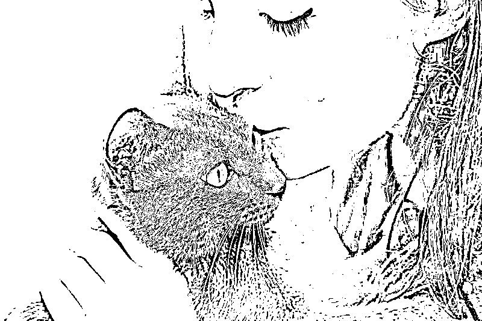

## 金星进入巨蟹座后的重点宇宙天象

**金星行经巨蟹座，将在 6 月最后一周内与在双鱼座逆行的海王星形成三分相，金星和海王星的组合会带来极致浪漫的泡沫，或是梦幻神圣的光环**。此时，双鱼座、巨蟹座强大的水象特质会为这个相位带来**强烈的情感、情绪涌动，或是精神性的收获。**

**重点影响人群** 

**个人行星、四轴落于水象星座（巨蟹座，天蝎座，双鱼座）和土象星座（摩羯座，金牛座，处女座）8-15 度的人会倍受影响。**

*   你渴望的理想爱情会出现吗？

*   你会淋漓尽致地表达内心的情感吗？

*   你对艺术和美好的追寻会找到深入的契机吗？

*   你的感受力能联接到更广大的维度吗？

*   你的创造力和艺术性的表达会带来丰厚的价值回报吗？

三分相会带来些助力，但如果不能清晰表达内心的情感以及对美的感受，没有去实践你的理想，去现实中寻找精神、灵性的诉求，没有做任何创造性的表达，没能取悦你的心或取悦的特定的人，只是沉溺在幻想里的话，那这个极致的相位也不能带来任何对现实的助力。

**金星会在 7 月的第一周与当下的天王星和冥王星的四分相形成 T 三角，金星、天王星和冥王星将带来一股强劲的情感、财务的冲击力**。

**重点影响人群** 

**有个人行星（尤其月亮和金星）和四轴落于创始星座（白羊座、巨蟹座、天秤座、摩羯座）15-25 度的人，这段时期要留意家庭财务的收支，大笔的投资、花费需要三思而行。**

这也是一次转化和疗愈旧情伤的机会，看见和接纳旧有的、束缚内心的黑暗，让情感穿越激流变得更为清澈，有活力。

## 那些金星在巨蟹座的人是什么样子？

●**念旧**

○喜欢岁月的味道、怀念温暖的故乡、有念念不忘的情人、留着小学第一次旅行的票根、中学的情书、妈妈手工缝制的头花。他们乐意搜集那些储存了旧时光的物件，随着时光的流逝，把家变成一生情感印记的博物馆。

●**安全**

○他们的情感需求是基于安全感，需要温柔、相互滋养的情感模式，细水长流是他们的情感诉求，想要惊涛骇浪，轰轰烈烈的爱就不要找金星巨蟹的人。对于金钱财务，他们非常谨慎，对风险把控很在行。

●**敏感**

○就像带壳的螃蟹一样，他们的防护壳是为了保护内在的脆弱的心和家人，也时常过度防卫，以至于用丰富的想像力假想敌人和威胁，因而被忧郁、哀伤、焦虑、愤怒的情绪包围，很难走出阴影的房间。

●**多情**

○多愁善感是巨蟹的基调，金星在此必定带来多情甚至滥情，但出于极强的防卫本能，他们在感情中大多着眼于精神层面，而非真正能做出爱的表达和行为。

●**家庭**

○最喜欢家庭生活的人，最享受和家人一起的时光，舍得为家人花钱，对居家装饰很拿手，是营造家庭的氛围的高手，很可能从事与家庭有关的工作。

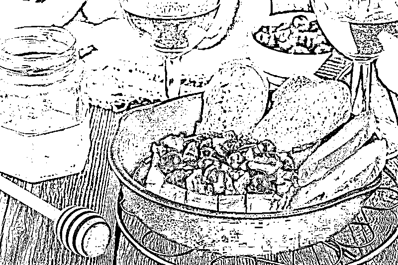 

●**共情**

○金星的镜子效应与巨蟹座丰沛的感受力的组合，很容易投射他人的情感与情绪，带来美妙的共鸣。极高的共情能力用来从事咨询、治疗业，会是深谙疗愈艺术的治疗师，作为艺术工作者则能创造出极富感染力的作品。

●**美食**

○喜欢美食，通常有一位善于厨艺的母亲或妻子，他们若不是料理高手就是吃货，美味的食物能带来慰籍，弥补情感空洞。

●**复古**

○喜欢传统服饰、家饰，对传统文化和艺术有浓厚兴趣。有古旧滋味的事物总让他们嗅出美好的味道，善于从其中发现常人难以觉察的价值。可能从事博物馆、考古相关的工作。

## 金星在巨蟹座的人有什么弱点？

●**懦弱**

○出于保护性的情感需求，关系中处于被动，不善表达心中强烈的情感，以至错失所爱。明明爱，却说不爱，明明不爱，却说有感觉。这是金星巨蟹座怕自己或对方受伤害的驱力所致。你可以学习白羊座的战士，不怕受伤勇敢地爱一次吗？

●**放不下**

○“放下”就意味着不安全，对过去、旧情、熟悉感的占有欲会令他们执著在感觉中，可留着旧物就能一直拥彼时？旧物会升价？总有一天还能用？也可能最后成了一堆无法忘怀也无法使用的杂物，拥堵在生命的长河中。向精挑细选的处女座学习吧，才能修正这臃肿的生活格局。

●**依赖**

○在关系中会不自主地扮演母亲或需要对方扮演母亲，对于被滋养的依赖模式注定了内心不能长大成人，不能作为独立的人为自己的情感负责，自然也会吸引来伤害性的关系。像摩羯座那样成为一个对自己有担当的人吧。

●**封闭**

○螃蟹的壳是自卫的界限，也带来了能量的封闭。他们不喜欢异地，或不能适应国外生活，在熟悉的团体和传承中才能感受到自我价值。试着走出熟悉的世界吧，像双子座那样灵活变通，适应环境，像狮子座那样拥有坚定的自我价值感，打破这封闭的迷局。

## 金星在巨蟹座的大咖们

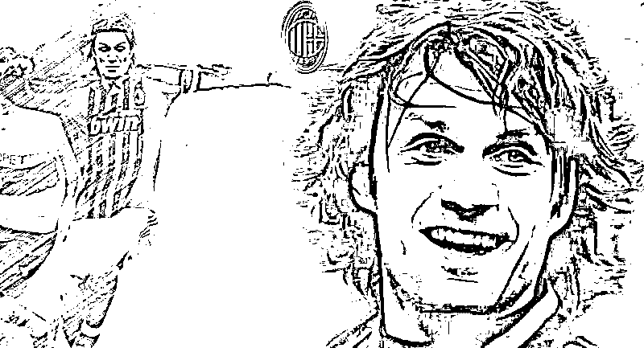

**▲他因忠诚成为了不朽的传奇——保罗·马尔蒂尼**

**他是“活着的大卫雕像”，因为忠诚而被誉为“米兰的象征”，他是世界上最伟大的后卫。马尔蒂尼的太阳、月亮、金星、火星合相在巨蟹座**，他 24 年职业生涯中拒绝了各大俱乐部的邀约，作为 AC 米兰的队长给予圣西罗的球迷具足的安全感。在他的退役赛场上，球迷们身着印有“保罗”的 T 恤，打出各种向他致敬的横幅，连对手罗马队也身着“向马尔蒂尼致敬”的 T 恤，这在足坛是史无前例的荣耀。**作为世界足球先生，他在绿茵场上从未踢伤过任何一位前锋，这就是巨蟹座的保护性的魅力。虽然马队帅气逼人，自从 25 岁结婚后，就不再出入花天酒地，他非常享受家庭生活，也曾坦言最喜欢吃妈妈做的披萨。**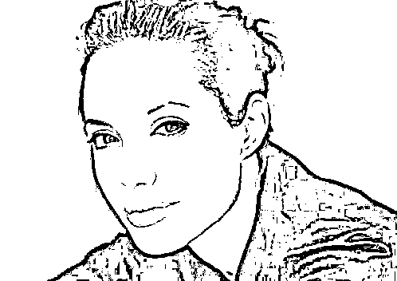

**▲世界上最美丽的女人——安吉莉娜·茱莉**

**她巨蟹座的金星精确合相了上升点，并精准四分天王星，无论在生活中还是影片中，都展现出独特又势不可挡的魅力。**茱莉因为早年家庭的创伤对于家和照料他人有特殊的情怀，她是联合国难民署亲善大使，她和皮特生养了六个孩子。近日，美国媒体披露了茱莉和皮特的离婚传言，令不少影迷心痛惋惜。**当下行进的冥王星与茱莉本命的木星和土星形成了精准的 T 三角，必将上演一段现实生活残酷的段落更迭，因为土星守护了她的婚姻宫，显然，当下对她来说是一段艰辛的亲密关系的净化历程。**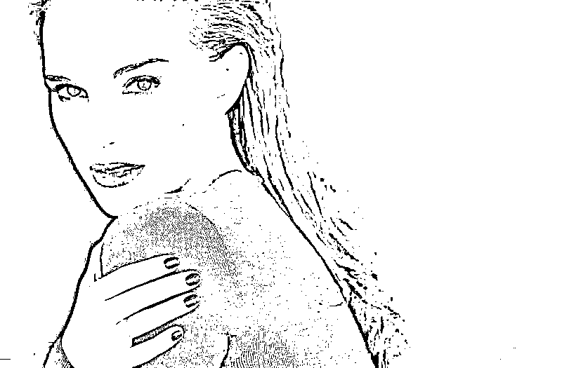

**▲犹太故国的黑天鹅——娜塔丽·波特曼**

**这个聪慧又敏感的犹太女孩金星和水星合相在巨蟹座**。13 岁时出演《这个杀手不太冷》就以她琥珀色的眼睛征服了全世界的观众，而 2010 年因出演《黑天鹅》成为了奥斯卡影后。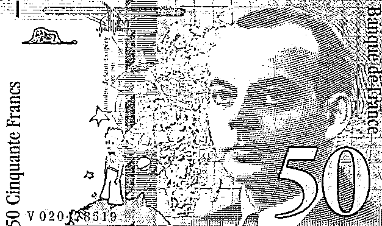

**▲永远的小王子——安东尼·德·圣·埃克絮佩利**

他是《小王子》的作者，那个忧愁而美丽的故事感动了一个世纪的读者。他作品中的小王子和他本人的头像在法国被制作成各种纪念品，甚至被印在货币上。这应该是对**一个金星巨蟹男那颗浪漫、童真的心最佳的回馈**了吧。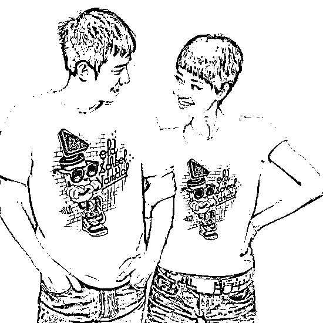

**▲金星巨蟹的银幕眷侶──文章、马伊琍**

**文章的太阳、水星、金星与马伊琍的太阳、金星合相在巨蟹座**，虽然他们从结婚就历经各种质疑，也经历过离婚风波，最后两人还是在一起。两个有巨蟹座群星紧密关联的人对于家庭的依恋，对于关系模式的坚持是难以被外界所打破的，也许，**对于家庭需求的高度一致，能相互滋养的感受只有金星巨蟹座的人能懂得**吧。

**作者简介**

**郑玮玲（Sampriya）：**若道 COAC 高阶资质认证，国际占星研究协会 ISAR 会员，在若道跟随多名国际知名占星师学习占星。馨光爱妈妈会创始人，国内首批 ICEA 国际生育教育协会产后指导，国际母乳会培训的哺乳互助指导。

**个人公众号及咨询预约**：Sampriya-Astrology 

长按二维码，让金钱涌向传播知识与智慧的人~


**特别提醒：**

**本文首发于若道平台，**

**转载请联系后台授权。**


******如何转化金星巨蟹座的盲点？由大卫·瑞雷老师**讲授的**若道核心课程 Level 3，会教你将**星座、行星、宫位、相位这些散落的珠子穿起来，**带你进入更深的自我探索与成长的旅程。本课程将于今年 7 月开课，敬请期待！******

**报名及咨询，请点击文末“阅读原文”**


# 现代占星和古典占星是绝对敌人？NO！

> 原文：[`mp.weixin.qq.com/s?__biz=MzA5NjA0NTAxNg==&mid=2651385338&idx=2&sn=e472bbe7b533def1fedaea48b711bbb1&chksm=8b4a5f4dbc3dd65b91c5b5777d0eb2c2b443b96b9f04d4705d5122425abc697791c63445b18e&scene=126&sessionid=1692738821#rd`](http://mp.weixin.qq.com/s?__biz=MzA5NjA0NTAxNg==&mid=2651385338&idx=2&sn=e472bbe7b533def1fedaea48b711bbb1&chksm=8b4a5f4dbc3dd65b91c5b5777d0eb2c2b443b96b9f04d4705d5122425abc697791c63445b18e&scene=126&sessionid=1692738821#rd)

作者/罗伯特·汉德 文章来源/astrozero

译者/李含   校对/Christy

长久以来，关于古典占星和现代占星学的争论一直不休，可是将二者深度结合的占星界巨匠罗伯特·汉德却认为，我们并不需要如此争论。就这些问题，他给我们带来了有趣且深度的回答，快来看看他的答案吧。PS：罗伯特·汉德的古占与现占结合网络课马上就要开课了，快点击阅读原文报名。

## 古典占星和现代占星才不是敌人

➤ **Q1****：对于纠结于现代 VS 古典占星学的占星师们，您有何建议，该如何协调现代与古典的技巧？**

**A1**：实际上，**学习占星学的好处之一便是，我们并不需要去调和这二者**。现代技巧就是古典的子集，尤其是中世纪。所以，占星师需要做的只是将子集扩大。你看，从现代西方占星学到印度占星学是一步实实在在的认知跨越，因为二者的方法论存在显著区别。但是从现代西方到传统西方（占星学），就只是对现有认知的扩展。这就是为何我要说，站在学习者的角度来看，从现代到传统西方，要比现代到印度更有利。但是，印度和西方技巧的功效大体相当。

➤ **Q2****：您能说说，占星学对您的人生有什么影响吗？很显然，您花了大量的时间从事各种占星学工作，但是这对您的生活方式有何影响呢？**

**A2**：首先，我来回答一个很明显的问题：**我是不是运用占星学安排生活？答案是否定的。我是否会观察自己的重大行进，观察接下来会发生什么，并对此做出预测？是的。**我如果不这么做才是个傻瓜。我偶尔会卜卦，但是通常给自己卜卦并不是明智之举。

但是，我认为，占星学对我的主要影响是，在学习了占星学之后，我的思维方式发生了改变。我试图停止像所谓的“机械唯物主义者”一样思考，并开始由始至终，在生活的方方面面，像占星师那样思考。作为 20/21 世纪的人，这并不容易！但是我认为与大部分占星师相比，我的精神分裂状况要轻微一些。大部分人在进行占星时像占星师一样思考，在做其他事情时就像现代人，选择性地忽略这两种世界观之间不可调和的矛盾。 

我并不是说，你不能既“相信”科学又“相信”占星学。（我使用了引号，因为这里使用“相信”并不是完全恰当）。但是，你不能既“相信”实证主义、唯物主义的世界观，同时又相信占星学的含义。你就是不能。

在这一点上，如果有任何人认为，他可以为占星学现象提出一种可被接受的科学解释，我一定会质疑他，因为这是不可能的！一部分或许可以，但只是非常少的一部分。

所以，**占星学对我的影响体现在整体思考方式上，但是我并不用它来管理我的生活，因为我认为占星学绝不应该代替经验感受。**你应该自己去体验，经历事情的发生。但如果这是一段特别艰难的时期，**你应该利用占星学去理解“这一切都会过去”，或有时候也可以利用它抓住一次良机。**但是，如果真的一早起来就去看自己的行进，然后说：“好吧，我该如何度过今天？”当然不能这样。这太疯狂了！

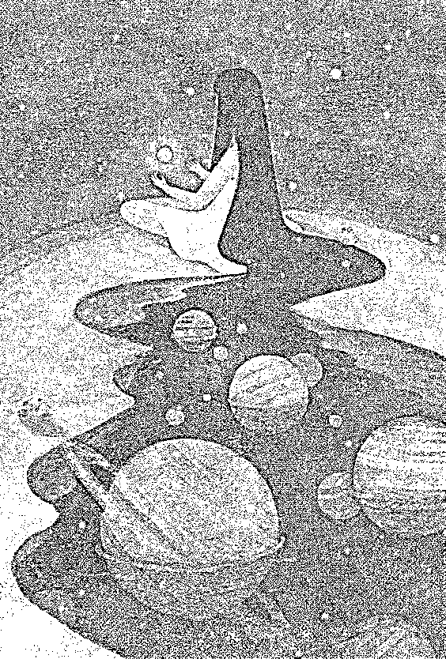

## 别怕，越糟糕的星图证明你的驱动力越强

**➤ ****Q3****：用占星学的话说，是不是意味着你拥有行星能量，通过改变周围环境将其发挥，而不是将它们视作外部驱动力对你施力？**

**A3**：完全正确！就是这个意思。意思就是以这种方式完全改变占星学，**出生星图应该理解为一种灵魂意图的陈述**。用亚里士多德的话来说，是一种形式因的象征性描述。“形式因”是描述的核心。

现在，**出生图中体现的就是形式因，它能够根据个体的实现层面，产生各种不同的结果。**我认为任何星图都有潜力实现觉悟，只是大部分时候，这种潜力都会遭到环境、偶然事件和意外（在中世纪会这样说）的阻碍。在一些星图中，自我实现的驱动力会强于另一些星图。所以，有些星图会比其他星图在这一层面上表现更多。然而这并不是说，“一些星图有能力，而另一些没有。”更准确的说法应该是，“所有星图都有这样的能力，有些有驱动力去实现，而另一些则没有。”

**➤ ****Q4****：怎样的征象显示此人会有这样的驱动力？**

**A4****：**这个问题的最佳答案是，从现代观点看，那些你看了以后会说：“神呐，这真是个糟糕的星图！”所以就是这样的星图，是那种“沉浮全看自己了，朋友！” 

进一步详细来回答，**有两种类型能获得更好的自我实现。一种是生活极度动荡不安、被驱动着向前的类型，一种是具有难以置信的能力去获得平静与安宁的人。**通常，后一种并非格外惹人注目，但你会常常看到，这些人一生都幸福快乐，他们不温不火，行事恰到好处，凡事好似闲庭散步。你可以说：“他们没有经历真正的考验”——错！他们当然是真正的人类。他们已经经历过了！和他们相处感觉很好，他们周遭的人也会快乐，这些就是具有神性的人，但是他们并不追求神性。你可以说，这些人已经实现了星图，真的就是那样。我们有这样一种观点，要获得真正的启蒙顿悟必须首先经历地狱。大部分情况是这样，但并不是所有。

我知道一些人，他们的一切都如行云流水般自如。他们快乐，他们的家庭也快乐，他们被爱，也爱着别人。他们所到之处，总会带来那么一些光亮。他们并不引人瞩目，也完全没有戏剧化的表现，但是他们真的是美好的人。我能说什么呢？愿这样的人越来越多。 

像甘地那样的人，就属于第一种。**甘地是真正经历折磨的灵魂，他战胜了那样的境遇，完成了极高的自我实现**，但是他的确需要以最激烈最极端的方式来克服环境！他所产生的力量和能量解放了一个国家。从他的影响力，以及他实现这一切的方式来看，他可能是 20 世纪最非凡的人。他或许也是继耶稣之后，最为大众所忽视的人。人们实际上在寻找和理解他所做的，并追寻他的足迹。 

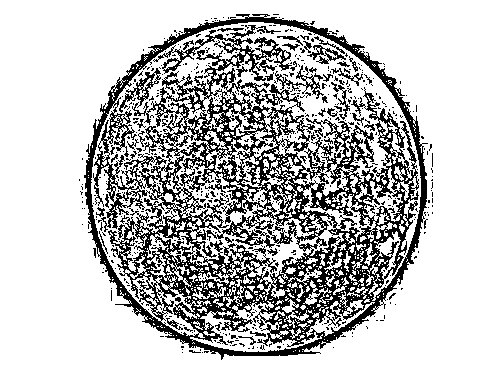

## 年轻的占星师们，努力成为大师吧！

**➤ ****Q5****：您认为占星学是您获得启蒙开悟的一种方式吗？**

**A5**：**它是一个工具。它本身并不是一系列获得启蒙开悟的技巧。但是，它更像是一副地图，一个可以为此目的服务的工具，这正是现代占星学有别于传统，获得重视的主要原因。**古典时期结束后，后异教徒占星学获得了发展，当然在基督教的背景之下，这一议题甚至是遭到禁止的。一些神智学信奉者和占星学派的确想要将占星学用作启蒙开悟的工具，结果遭到了教堂“热烈”的回应。这让我想起了 1600 年被烧死的乔达诺·布鲁诺。 

所以，**把占星学当做自我解放的工具，或者用作他用，是一种现代理念**。即使在印度，我认为它也不是自我解放的主要工具，因为印度有许多其他的灵性传统和技巧上的工具，包括各种形式的瑜伽。我认为，占星学一直以来对印度人而言也是一种非常实用的工具。但是在西方，从传统形式上获得灵性启蒙的机会相对较少，因此占星学开始扮演这样一个角色。我认为，那些将占星学视作启蒙和宗教进化障碍的人是大错特错的。虽然我曾经承认，占星学可以很容易就变成那样，但那是因为，占星学是一个可以被善用也可以被误用的技巧。就像是魔法，就像是核能。

**➤ ****Q6****：关于目前占星圈儿的事儿，最让您兴奋和失望的是什么？**

**A6**：我很高兴地说，我基本上不太失望。我认为事情正在向着正确的方向发展。让我兴奋的是，这门学科越来越成熟了。占星学依然面临着身份危机，它是一种爱好还是职业呢？答案都是肯定的！它既是爱好也是职业，我对此并无疑问。但是我认为，占星圈的这两个阵营应该努力区分彼此，同时在双方之间架起沟通的桥梁。

.gif")

**▼点击图片，了解更多罗伯特·汉德**

  

**ISAR 选修课程**古占与现占结合

**授课时间：**2016 年 7 月 23 日-9 月 10 日 10：00-12：00

**授课老师：罗伯特·汉德**

**授课方式：**网络在线，英文授课，中文翻译

**报名截止**：2016 年 7 月 15 日

**费用**：****6800 元** （早鸟价 5800 元，若道老学员**4800 元**）**

**课程负责人：李老师**（**微信：18601950700**，请备注古占报名咨询 ）

**咨询电话：**400-619-1014

**客服 QQ：**4006191014（若道星文化）

**邮箱：**nodoor@vip.126.com

**这么有意思，你不来报个名再走？**

长按二维码添加课程负责人咨询~

****

**报名及咨询，请点击文末“阅读原文”**


# 现占与古占结合 | 占星界“屠龙刀”的正确打开方式

> 原文：[`mp.weixin.qq.com/s?__biz=MzA5NjA0NTAxNg==&mid=2651385338&idx=3&sn=f9c69084ff205cd6b003b996fef11f7e&chksm=8b4a5f4dbc3dd65b00a083e52b8be05e688fa4a86b41c16aef214ecea36ba3e7479d141e3399&scene=126&sessionid=1692738821#rd`](http://mp.weixin.qq.com/s?__biz=MzA5NjA0NTAxNg==&mid=2651385338&idx=3&sn=f9c69084ff205cd6b003b996fef11f7e&chksm=8b4a5f4dbc3dd65b00a083e52b8be05e688fa4a86b41c16aef214ecea36ba3e7479d141e3399&scene=126&sessionid=1692738821#rd)


“

罗伯特·汉德，一位被占星界称为“国家宝藏”的人，掘地三尺，阅古卷无数，学习没有人再说的古代语言，学习古代历史，学习古代哲学，挖出了一把传说中的“屠龙刀”。在 37 年的现代占星生涯和 21 年的古典占星研究生涯后，他将为我们带来什么？

”

将 37 年的现代占星和 21 年的古典占星结合， 罗伯特·汉德耗费大量的精力，挖出了这把“屠龙刀”，他擦拭这把锈迹斑斑的刀，粘合它的碎片，钻研刀法，在此过程中引发好奇、热情、疑义、愤怒；他促使原来名不见经传的人获得新立山头的机会，同时又引发了分裂、不满、攻击。

有些现代大师们对他的道路感到惋惜、不解、批评，但仍旧尊敬他；而他又远离那些一门子想要复古、认为“老的就是好的”古典阵营。他跑着，似乎有同伴，又一人独行。

你也许听说过这把“屠龙刀”的传说，从江湖似真似假、似是而非的流言中，从自称使过它的招式的自言得意的小辈中，从以教学谋生、很少实践经验的小有名气的占星师的课程中。

但你真的见过这把刀吗？你知道正确的使用方式吗？这把刀真的能在现代社会应用吗？还是仅仅是应该放入“历史博物馆”中陈列？这次课就是谜底揭晓的时刻。

## 现代占星学的学子们，如果你：

*   对于出生星图——占星学中最重要的星图的秘密，仍有很多不解和好奇；

*   渴望获得古典占星里符合你的哲学理念又实用的好技法；但厌倦了大量复杂却无用的古典知识，又苦于古典文献浩瀚，无从粹取；

*   对自己星图和某些人生大事的对应百思不得其解，渴望获得一位占星大师的解答；

*   曾和妄称“可以更准确预测”的古典占星师们争得面红耳赤，但因为没学过古典而稍微有些心虚；

*   了解占星学界常见的古典和现代占星的纷争，想在真正了解这两门学问的大师面前提出深刻而尖锐的问题；

*   渴望在自己的占星知识拼图中补上能够符合现代占星理念的古典占星学知识，并将现代占星和古典占星融会贯通在咨询中

## **欢迎你来，机不可失，因为：**

*   **这里有世界上唯一能够教授此门课程的占星界泰斗**：72 岁的罗伯特·汉德，两个阵营的旗手型人物，**活着的唯一获得现代占星学大师尊重的横跨两界的泰斗**、占星咨询实践者，历史学家、哲学史研究者，活着的时候就已经成为历史的人。一个怀旧的人，一个试图搭起桥梁的人，一个不满足现有的人，一个思想演化路径让人迷惑的人。


*   **萃取古典的精华，去除古典占星糟粕：**罗伯特·汉德用他综合的知识，为你筛选出古典占星中可以为强调自由意志的发展、个人成长的现代人有益的古典占星实用技法。

*   **从实战演练中学习**：首次以案例教学的方式，除第一堂之外，每堂课皆以案例演示为教学重点。

*   **获得大师的免费解读**：**7 堂课的案例选取皆为学员星图，你有机会入选**。

*   **打尽出生星图的占星学命题！** 出生星图，是一生的预测星图，所谓的命运的因子埋藏在出生星图里。

**讲什么？皆重大常见人生问题：**

*   性格、个性、心智特点、外貌体型

*   挣钱能力、金钱、财富、财务

*   感情生活——恋爱、婚姻、家庭生活

*   原生家庭——父母、兄弟姐妹、姑表亲

*   人际关系——一对一关系、一对多关系、敌人

*   职业发展，谋生之道

*   社会地位

*   旅行

*   灵魂和本我

## 学习该课程，你并不需要有古典占星学基础：

*   你只需要具有一定现代占星学基础。如果对此没有把握，可以联系课程负责人员进行测试。

*   你不需要有任何古典占星学知识，所有出生星图的相关古典占星知识都会在课程前发送讲义或在课程中进行讲解。

给你一个机会，在实战中学习他的研究成果。

这次课程，对于罗伯特·汉德 是一次冒险之旅，对你也是串起历史、现在、未来的旅程。

还等什么？

**更多关于罗布特·汉德的文章在这里：**  

[领军现代占星 35 年、古典占星 21 年，罗伯特·汉德星图秘密大起底](http://mp.weixin.qq.com/s?__biz=MzA5NjA0NTAxNg==&mid=2651385233&idx=2&sn=98799d80abed94a7748acff623747bf7&scene=21#wechat_redirect)

[占星界的“百科全书”，请用您渊博的学识砸晕我！](http://mp.weixin.qq.com/s?__biz=MzA5NjA0NTAxNg==&mid=2651385064&idx=2&sn=647cbe8f5e029abbf16a9f039a6783b1&scene=21#wechat_redirect)

ISAR 选修课·古占与现占结合

**授课时间：**2016 年 7 月 23 日-9 月 10 日 10：00-12：00

**授课老师：罗伯特·汉德**

**授课方式：**网络在线，英文授课，中文翻译

**报名截止**：2016 年 7 月 15 日

**费用**：****6800 元** （早鸟价 5800 元，若道老学员**4800 元**）**

**课程负责人：李老师**（**微信：18601950700**，请备注古占报名咨询 ）

长按二维码添加课程负责人咨询~

****

**课程具体内容及报名，请点击文末“阅读原文”**


# 土海又四分了，还都在逆行丨 5 大通关指南拿走不谢！

> 原文：[`mp.weixin.qq.com/s?__biz=MzA5NjA0NTAxNg==&mid=2651385330&idx=1&sn=a0c28d6630a081f75d9c01a75300fc98&chksm=8b4a5f45bc3dd65309ad0ee6433ede1ab3d75ad2c32885245358ddbde0c0e5be093350b2cc0a&scene=126&sessionid=1692738821#rd`](http://mp.weixin.qq.com/s?__biz=MzA5NjA0NTAxNg==&mid=2651385330&idx=1&sn=a0c28d6630a081f75d9c01a75300fc98&chksm=8b4a5f45bc3dd65309ad0ee6433ede1ab3d75ad2c32885245358ddbde0c0e5be093350b2cc0a&scene=126&sessionid=1692738821#rd)

**土星和海王星第二次精准成相** 

6 月 18 日，我们将迎来土星和海王星的第二次精确成四分相。土星又将考验我们对于梦想的决心，你准备好了吗？

**土海四分的意涵**

作为 2016 年最值得关注的相位，从去年 11 月 26 日到今年 9 月 10 日，土海四分有三次精确成相。**6 月 18 日，我们将经历土海第二次精确四分，且两颗行星都在逆行的状态下。**

**土海四分三次精确成相时间：**

*   2015 年 11 月 26 日（射手座/双鱼座 7 度）

*   2016 年 6 月 18 日（射手座/双鱼座 12 度，土星与海王星同时逆行）

*   2016 年 9 月 10 日（射手座/双鱼座 10 度）

**第二次精确成相易感人群：** 

**出生星图的四轴恰好落在射手座/双鱼座 9-15 度之间；太阳、月亮或星群落在射手座/双鱼座/双子座/处女座 9-15 度之间。**

如果你的人生正在经历失控，有如 “在暴风雨的大海上行驶，在流沙中缓慢下沉” 快溺死的感受，很可能是受了这个行进的影响。

如果你不属于易感人群，可以留意行进的海王与土星在你的出生星图的宫位。**海王星行进的位置，是你容易被无意识所困扰的领域；土星行进的宫位，则是需要努力精进、实践梦想、去承担责任的方向。**

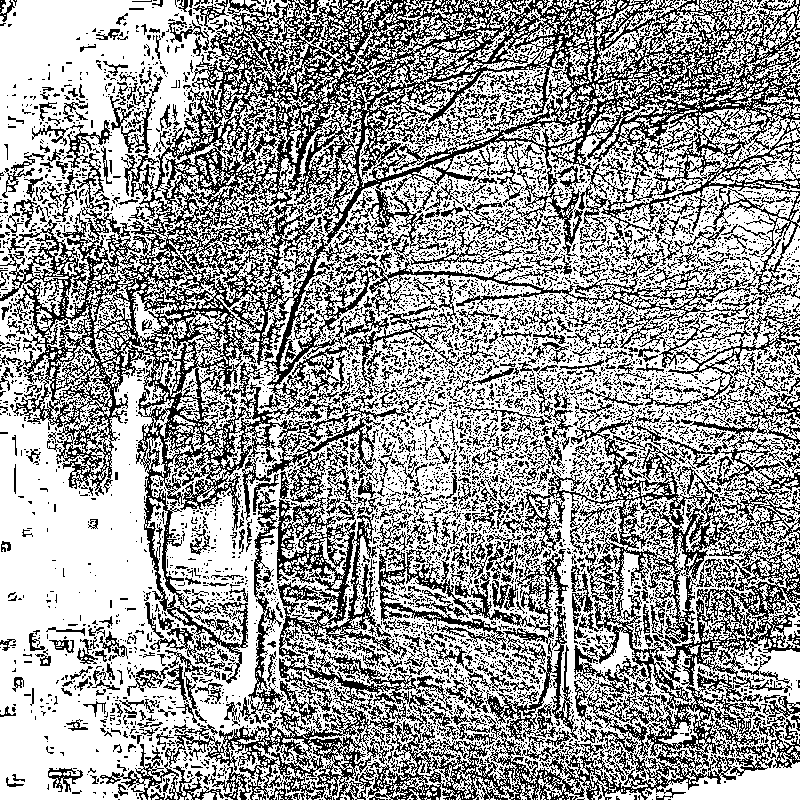 

**你会感受到**

无论对于个人还是集体意识而言，土海四分绝非是一个轻松的相位。

**四分相本身是压力相位，而土星与海王又是两股完全不相融的能量。土星是物质的，海王星是灵性的；土星是现实之墙，海王星是甜美梦境。**

在我们的太阳系里，土星是眼可见的行星的边界，代表有形物质世界的规则；海王星是消融而无形的水域，代表意识与深远宇宙无尽空间之间的边界。**海王星想融化超越土星的边界，而土星会恐惧失控，由此带来一系列的挫折与逃避。**

**土星和海王星的关键词：**

**土星：结构、骨骼、现实、权威、时间、责任、父亲、目标、成熟、纪律、成就**

**海王星：大海、音乐、艺术、图像、梦境、灵性练习、灵感、创造力、迷幻、愿景**

**土海四分相的挑战意象：**

**虚弱的父亲、逃避责任、痛苦的殉道者、沉船或海难、水资源的匮乏与污染议题、乌托邦般的梦想**

**虚幻**

如果你的出生星图里有土星和海王星的硬相位（90°和 180°相位），在人生的早期，可能要面对虚弱的父亲（权威）议题，**被困惑、自我怀疑的受害者心理所困扰，在救赎与被救赎的矛盾之中徘徊**。最坏的情况是，它让你完全不敢确定生活中什么是真实的，沉迷于幻觉之中，用各种方式来逃避现实。

**混乱**

作为一个集体相位，土星和海王星成相是人类共同的功课，可能会引发伤痛的事件。去年 11 月第一次土海四分时，在巴黎发生的恐惧袭击事件及 ISIS 的持续发酵，我们看到了**土海四分带来的混乱——误导的信仰与激进的理念，与稳固的民主社会渐行渐远。**

但正因为苦难，人类才彼此联结，互相理解。通过慈悲、爱与关怀及灵性的修持，我们有把苦难与悲伤转化的力量。国际殿堂级占星师、原型占星学研究者理查德·塔纳斯说：**“在所有的行星组合中，土海相位是最高贵的。土海组合带来强烈的悲痛的感受，也因此涌动出慈悲心”。**

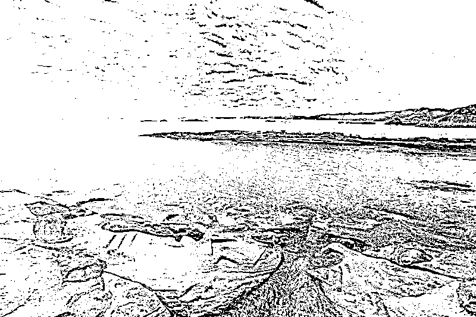

**渐亏四分相的意涵**

**行进的土海与海王星，每 37 年达成一个周期，即每 9 年会看到这两个行星的合相、四分或对分。**目前我们在最后一个四分相（渐亏四分相）的影响下。

*   1989 年 土海合相

*   1998-1999 年土海四分，渐盈的四分相

*   2006-2007 土海对分

*   2015-2016 土海四分，渐亏的四分相

**占星小课堂之渐亏四分相：** 

相位的周期起于合相，对冲达到顶峰，到尾端以新的合相开始。最为大家熟知的周期莫过于月相循环。满月之前，我们称月亮为“渐盈”（waxing），意思是月亮越来越圆，满月之后月亮“渐亏”（waning），体积日渐缩小。因此**在一个周期对分相位之前的相位叫做“渐盈相位”，与之相对的是对分相位之后的叫做“渐亏相位”。**

渐亏的四分相有什么特点？著名占星师丹恩·鲁伊尔（Dane Rudhyar）形容其为**意识中的危机**。在进化占星中，它代表**需要回首过去，完全重新定位与评估，然后经历释放与改变**。悲伤也许不可避免，但意图是未来导向的——**进入下一个崭新的周期，或打开一个全新的世界。**

同时，渐亏四分相会带有“**不在乎要花多少代价，都要促使改变发生**”的特质。**对于个人而言，在渐亏的四分相时，家庭和事业会带来最多的变化，可能经常会发问“我到底身处何处”？**

在某些情况下，会对个人的名誉或职位会带来挑战。

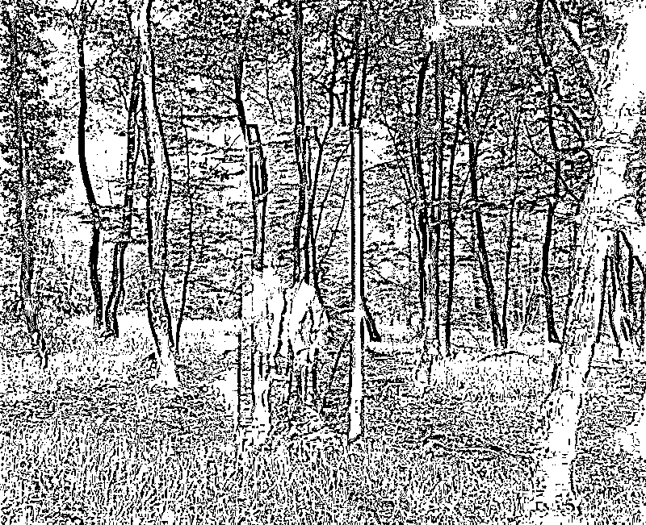

**你可以做的**

**也许你最珍视的梦想，会受到现实的考验。如同剥洋葱一样，内核一层一层地展现，让你泪流满面。这样的痛苦与丧失的经历，是帮助你调整梦想、让你更加成熟？还是启动不健康的防御模式，通过酒精、恶习、网络来逃避现实？ 取决与个人的意识与自律。**

任何牵涉到海王的行进，对于艺术工作者、灵性练习者而言，会相对容易些。因此，**在日常生活中找到表达想象力、创造力的途径，或坚持冥想、祈祷灵性练习，能帮助我们更好地面对土海四分。**

但不是每个人都是艺术工作者或灵性爱好者，也并非说只要能疏导海王星能量，就能免于土海四分的冲击。更好地应对土海四分的 5 点建议：

●**不因迷茫而逃避现实**

○当你觉得在工作上不开心，又暂时不知道自己的目标而感到受挫时，提醒自己：这是非常正常的情绪。更努力工作，不要因为迷茫而逃避现实。

●**不过度悲观**

○当你发现自己在用最糟糕的视角看待人生时，告诉自己：我对自己评价过于悲观了，实际情况并没有那么糟，不要因为绝望而放弃，走下去才能看到新的曙光。

●**不执着于过去**

○释放旧有模式，学习放手，不执着于过去。在经历丧失与悲伤议题时，照顾自己的身体，保持充足的睡眠。向内看，有勇气放下自我，去承认自己的敏感，去倾听内在的声音。

●**保持信念**

○土海四分是对我们的梦想的一次现实检验。不要害怕在实践梦想的过程中迷失，先迷失（海王星）才能被找到（土星），请保持信念。学着管理压力，用心念和魔法的力量缓和情绪上的焦虑。

●**耐心与自律**

无论你在努力实现什么，**保持耐心与自律（土星）**，土星与海王星需要时间来让事情发生，这个四分相的影响会持续 2.5 年以上。

**举个栗子**

我的一个朋友，她的本命星图里也有土海四分。她一直有自己创业、成为百万富翁的梦想。2016 行运的土木海 T 三角，触动了她出生星图中 13 度的双子座太阳，形成大十字的压力格局。

去年投资做得很不错的她，发现创业的抱负在 2016 年依然很难实现。除了是全职妈妈，每天需要花费大量的时间带两个孩子之外，她发现整体的创业环境也不乐观。于是，直觉敏锐的她缩减了对创业金融领域的投资，转向艺术品的鉴赏与投入，并加入很多爱好群，学习各种手工艺，让自己忙碌起来。同时，她还积极保持各种社交关系，为将来做准备。

如果只是从星图上看，2016 年对她是极具挑战的一年。但她转化了理想无法落地的压抑郁闷，对投资孤注一掷的可能性，用创造力与自律来提升了海王四分土星的表达。

在写这篇文章的当下，我在图书馆的文献室，手边有一本国家地理杂志出版的《寻访香格里拉》，是一个位《国家地理》杂志拍摄超过 30 年的资深摄影师探索的茶马古道的摄影集。图片与照相关乎海王星的主题，而追寻马可波罗和郑和等伟大探险家的旅程的美国摄影师，则带着浓厚的土星在射手的色彩。这是一个绝佳的土海四分的积极诠释，宇宙的共识性在此时此刻显现。


你的星图里有土海四分吗？你又是以什么样的心态面对行进中的土海四分？留言和我们分享吧~


**作者简介**

**熙淅 Justine**：职业占星师，国际占星研究协会 ISAR 会员，已通过 ISAR 占星师能力测试。毕业于浙江大学，十年跨国企业人力资源管理经验。2012 年起在若道跟随多名国际占星师学习人本主义占星。个人咨询风格结合心理占星与演化占星，对于占星触及的人性、灵魂与疗愈尤为感兴趣。

**个人微信公众号**：AngelAstara

**咨询个案微信**：cicirebacca

长按二维码，让金钱涌向智慧的人~


**特别提醒：**

**本文首发于若道平台，**

**转载请联系后台授权。**


******想要顺势而为？先掌握如何解读星图。由大卫·瑞雷老师**讲授的**若道核心课程 Level 3，会教你将**星座、行星、宫位、相位这些散落的珠子穿起来，**带你进入更深的自我探索与成长的旅程。本课程将于今年 7 月开课，敬请期待！******

**报名及咨询，请点击文末“阅读原文”**


# 6 月 22 日在线沙龙 | 有故事的你，该如何照顾好自己？

> 原文：[`mp.weixin.qq.com/s?__biz=MzA5NjA0NTAxNg==&mid=2651385330&idx=2&sn=ba1d574676d38d539fc583dfe1d85bc1&chksm=8b4a5f45bc3dd65393b6df75fa1b242f3b42158ca64e5dd976450b5cb916bf4bdb657c474db9&scene=126&sessionid=1692738821#rd`](http://mp.weixin.qq.com/s?__biz=MzA5NjA0NTAxNg==&mid=2651385330&idx=2&sn=ba1d574676d38d539fc583dfe1d85bc1&chksm=8b4a5f45bc3dd65393b6df75fa1b242f3b42158ca64e5dd976450b5cb916bf4bdb657c474db9&scene=126&sessionid=1692738821#rd)


**若道君友情提醒**

**往下看**

**有 20 张免费入场券获取方式**

❤她

跟随理查德·塔纳斯学习原型占星学

老师说“**她会成为未来的丽兹·格林**”

拥有咨询心理学硕士学位

研究方向是深度心理学

同时将原型占星学的智慧和洞见

同深度心理学精妙地整合

❤她

也是有故事的女同学

随着学习和自我疗愈的深入

她整合运用原型占星学与深度心理学

疗愈更多人，同时自己也收获了美满的感情

❤她——**杰西卡·卡巴拉老师**

将于**6 月 22 日**

在**若道**举办一次**在线****沙龙**

**全程中文翻译**

英语零基础也能听

沙 龙 内 容

每一张星图都有其阴影面

当客户寻求帮助以减少痛苦

减少关系和生活中所经历的障碍时

他们最大的挣扎常常来自他们的阴影面

通过了解阴影面

我们帮助客户更清楚知道到底什么在阻碍他们

如何处理这些问题

让他们生活更幸福

去面对那些诸如羞耻、内疚、自卑

和压抑等挑战性的阴影面

觉察到光明

而不是让自己留在黑暗和无意识之中

处理好自己人生中的痛苦和磨难

我们才能成为更有洞察力

更务实和更能帮助他人的占星师

你们可以带着自己的故事和困惑

听杰西卡以奇幻的宇宙观讲述阴影的故事

在黑暗中对话，在阴影中探索

讲 座 信 息

**时间：****2016 年 6 月 22 日**星期三 **20：00-21：30**

**方式：****网络直播**（具体方式请咨询客服）

**参课费用：****50 元**（**若道老学员免费**）

**特别提醒：****不接收空降，请提前付款确认名额**

**报名截止：2016 年****6 月 21 日**

**咨询电话：****400-619-1014**

免 费 入 场 券 在 这 里

**你可以这样做**

**来获取免费入场机会**

**第一步**

▼

将想问**杰西卡**老师的与**阴影面**相关的问题

**回复在本篇文章的留言区**

**第二步**

▼

**转发本文**到你的朋友圈

**第三步**

▼

**长按下图的客服二维码**添加为好友

****

**第四步**

▼

将朋友圈转发**截图发给客服**

等待被告知参课方式

**该怎么问？**

问题可以是对于阴影的不解和好奇

可以是关于自己阴影面的困惑

举几个栗子

1、阴影和创伤一样么？

2、如何辨识自己的阴影？

3、我有……（这貌似是一个悲伤的故事）的阴影，

该如何面对？

**被选中的标准**

①问题走心且具有研究价值；

②问题有共鸣（点赞多）；

③问题很好地切入课程内容；

④（你很暗黑）你真是个有故事的人。

杰 西 卡 老 师 驾 到


**杰西卡·加菲尔德-卡巴拉**（Jessica Garfield-Kabbara），占星师，心理咨询师，注册的婚姻与家庭治疗实习医师。

杰西卡从 2007 年开始实践原型占星学，提供占星咨询服务。她也是月度播客“关联性：原型占星学播客”（Correlations: The Archetypal Astrology Podcast）的嘉宾，该节目已开播 5 周年。

2014 年，杰西卡在帕西菲卡研究生院获得咨询心理学硕士学位，研究方向为深度心理学。她的理论基础主要来源于理查德·塔纳斯、斯坦尼斯拉夫·格罗夫，以及原型占星学和超个人心理学。

杰西卡教授原型占星学和深度心理学，也积极进行深度心理治疗方面的实践，将原型占星学的智慧和洞见同深度心理学整合起来。她从自己的心理治疗客户身上，看到了自己八年来的原型占星学职业实践所取得的成效。所有的临床工作都为丰富她占星学和心理学方面的教学提供了肥沃的土壤。

在生活中，杰西卡一直对人和人际关系充满了强烈的好奇心。我们是谁？我们来自何处？又要去往何方？这些问题一直以来都是她工作的核心所在。2007 年，这种深层的好奇心引导她进入通过咨询帮助他人的行业。无论是个人客户还是配偶客户，她都与他们一起工作，帮助他们在疗愈的路上走得更远。她认为，在人们不断自我探索的道路上，能与他们一起努力，是一种荣幸。在这条道路上，人们能更充分地认识自己、自己的情感关系以及这个世界。

杰西卡相信，与自我建立更深层的关系是一种自爱和自我关怀，因为这能够让我们对其他关系更有觉知，从而提升我们的生活。做咨询师已经成了她自我疗愈的一部分，这份工作为她带来了持续的转化性改变，丰富了她生活的方方面面。现在她希望和中国学子一起分享这一切。


**报名点击文末“阅读原文”**


# 客户阴影面工作坊 | 最低 900 元，还有现场咨询的机会

> 原文：[`mp.weixin.qq.com/s?__biz=MzA5NjA0NTAxNg==&mid=2651385330&idx=3&sn=55ecd6c6fd5de638bbc6a921fde68290&chksm=8b4a5f45bc3dd653b9a0c979855a75c81771cda72450a52b0e793f8cc66abf5a443b475350b6&scene=126&sessionid=1692738821#rd`](http://mp.weixin.qq.com/s?__biz=MzA5NjA0NTAxNg==&mid=2651385330&idx=3&sn=55ecd6c6fd5de638bbc6a921fde68290&chksm=8b4a5f45bc3dd653b9a0c979855a75c81771cda72450a52b0e793f8cc66abf5a443b475350b6&scene=126&sessionid=1692738821#rd)

『每个人都有自己的阴影面。

我们每个人都会挣扎、受苦、受难，

这是我们作为人类共有的部分，

这部分也将我们作为人类联系了起来。

什么时候需要星图解读

或寻求某种形式的帮助和支持呢？

重要的转变期，

比如结婚、离婚、生小孩、换工作

或在巨变期、危机期和迷茫期。

我们都会在自己人生的不同时期需要帮助，

帮助他人很大一部分工作

就是了解、确认和把握他们的困难。

我惊讶的是，

每一次当我认识并把握住某人的阴影面时，

他们真的变得充满力量，更能做自己，

有了更充实的生活和人际关系。』

——**杰西卡·加菲尔德·卡巴拉**

**客户阴影面工作坊讲师**

[**点击查阅更多关于她的相关报导**](http://mp.weixin.qq.com/s?__biz=MzA5NjA0NTAxNg==&mid=2651385253&idx=2&sn=554fb5d308f23a0ffa00f9aa3b7bdad3&scene=21#wechat_redirect)


什么是**阴影**？它在心灵中的位置？

10 颗行星原型阴影面示例

出生图和行进中阴影带来什么信息？

作为占星师，你的**阴影面**是什么？ 

如果你无法处理好自己的阴影，

你的咨询会发生什么？

**如何了解、掌握、处理你的阴影？**

原型心理学和深度占星学怎样结合？

**如何和客户的阴影面工作？**

以奇幻的宇宙观看磨难和痛苦所扮演的角色

除了**现身说法，**

本次工作坊还将有

**至少两名现场学员案例分析，**

这是**一次咨询费**即可参加的工作坊，

关于**讲师**，

塔纳斯说，她，是**未来的丽兹·格林。**

你需要做的，

是**果断报名**，

剩下的事情交给我们。

**“如何与客户的阴影面工作”工作坊**

**授课时间：**2016 年 7 月 8 日（晚）、9-10 日（全天）

**授课老师：**杰西卡·卡巴拉

**授课方式：**北京工作坊，英文授课，中文翻译

**报名截止**：2016 年 7 月 5 日

**费用**：2800 元（6 月 25 日后）

6 月 25 日之前报名：

| 学员类型 | 价格 |
| ISAR 认证占星师 | 900 元 |
| 原型占星学员 | 900 元 |
| L5 及曾经的高阶学员 | 1500 元 |
| 若道学员 | 1900 元 |
| 非若道学员 | 2400 元 |

**课程负责人：Sara**（**微信：2847613491**，请备注阴影报名咨询）

长按二维码添加课程负责人咨询~

****

**适 合 人 群**

这个工作坊是**面向所有程度的占星学生**的，

只需懂星座、行星、月亮交点。

在教学中，

我总是努力让教室中的每个人都能理解我教授的知识，

并且产生共鸣。

我的想法是，

让这个工作坊能够帮助到每一位

想要进行个人或职业占星解读

和/或任何从事帮助性职业的人，

让他们学到大量的知识。

在课上，我会将占星学和心理学恰到好处地融合起来，

我会讲到这两门学科的基础知识，

同时给中阶或高阶的学生讲授更深入的观点和洞见。

来参加工作坊的学员不需要对原型占星学有所了解，

我实践和教授占星学的方式适用于所有形式的占星学。

我会很愿意在工作坊中分享更多传统知识，

这样参加者可以更好地感受和理解原型占星学和深度心理学。

这门课欢迎所有程度的占星学员。

——**杰西卡·加菲尔德·卡巴拉**

**客户阴影面工作坊讲师**

**课 程 安 排**

**7 月 8 日，周五晚上**

*   开场：介绍杰西卡老师的人生经历、周末工作坊的目的

*   生活在一个奇幻的世界：透过占星学的视角观察人类和宇宙的关系

*   占星学解读时机：危机期，转变期，重大人生决策期

*   占星咨询师的角色

*   具有启发性的原型宇宙学与原型占星学

*   原型占星学与深度心理学的关系

*   荣格理论对阴影的理解及其在心灵中的天然位置

*   尊重客户出生星图和行进中阴影所带来的信息

*   占星师在帮助客户从一个有力的、富有意义的全新角度重新界定自己的人生故事时所扮演的角色

*   以奇幻的宇宙观看磨难和痛苦所扮演的角色

*   占星咨询师的伦理道德：处理好自己人生中的痛苦和磨难，我们才能成为更有洞察力、更务实和更能帮助他人的占星师。

**7 月 9 日，星期六**

*   回顾阴影的意义

*   十颗行星原型阴影面的示例

*   原型或神和女神的阴影面，为我们揭示出宇宙的本质：光明面与阴影面共存，改善人生和破坏人生的面向共存。

*   创造一个与客户之间的安全空间以建立联结和信任的原则

*   占星师的指导意图和我们工作目标中的重点和中心：

*   让客户有力量去过更充实的人生 —— 更充分的自我觉知和自我接纳带来更安宁的人生

*   在咨询前、咨询中和咨询后与客户的交流中，我们可以以一种亲密而神圣的方式支持他们的人生—— 黑暗中的光明

*   如何掌握阴影

*   案例展示。研究一位客户的星图，与客户的阴影面一起工作

*   心理教育和咨询技巧：以共情和理解的方式回应客户，使客户内在和外在世界正常化，并确认其人生经历

*   学员的评论和提问

*   以学员（志愿者）自己星图中的阴影面做示例 —— 通过现场解读学员的星图来掌握阴影面

*   学员提出曾遇到过的困难的解读示例，分析如何在将来解开这些难题

**7 月 10 日，星期日**

*   占星师的自我关怀：占星咨询前后的仪式

*   占星师的职业道德需要：要掌握客户的阴影面，首先要把握我们自己的阴影面

*   顺势疗法：问题和解决方案都隐含在每一个行星原型中：一些示例

*   案例展示，研究如何与客户一起应对阴影面

*   学员（志愿者）自己星图中阴影面示例 —— 通过现场解读学员的星图，掌握阴影面

*   学员的评论和提问

*   关于痛苦和磨难的宇宙哲学

*   占星咨询的馈赠：帮助客户疗愈心灵

*   结语：回顾我们在工作坊中所学习的内容


**了解详细课程内容及报名方式，点击文末“阅读原文”**


# Level 3 | 占星自学者与职业占星师的分水岭（早鸟价到 6 月 18 日）

> 原文：[`mp.weixin.qq.com/s?__biz=MzA5NjA0NTAxNg==&mid=2651385321&idx=2&sn=9871ba824e54235bb495c07b6a0676e3&chksm=8b4a5f5ebc3dd64823245b375e2be8b1fb85d6b2c1956c84d186569756b3d0733154b9fac40c&scene=126&sessionid=1692738821#rd`](http://mp.weixin.qq.com/s?__biz=MzA5NjA0NTAxNg==&mid=2651385321&idx=2&sn=9871ba824e54235bb495c07b6a0676e3&chksm=8b4a5f5ebc3dd64823245b375e2be8b1fb85d6b2c1956c84d186569756b3d0733154b9fac40c&scene=126&sessionid=1692738821#rd)


从**Level 3**开始，

你进入了占星学更深入的领域。

Level 3 的课程，

是**占星自学者和职业占星师的分水岭**。

Level 3 课程**非常重要**，

是大部分占星学习者**薄弱**的环节，

也是往下的学习中**承上启下**的一个重要阶段。

在这个阶段，

你将**深入学习宫位**，

知道生命的故事发生在哪里，

在解读中，**星座、宫位的差异**到底是什么。

你会学习**相位、行星**能量的行星之间的对话，

一颗行星如何用它的能量影响另外一颗行星。

然后，

你要学习如何

**将星座、行星、宫位、相位组合起来**进行解读，

这是把散落的珠子穿起来的过程，

形成内容丰富、准确的解读语言。 

**2016 若道核心课程 Level 3**

**授课时间：**2016 年 7 月 28 日-11 月 10 日

**授课老师：**大卫·瑞雷

**授课方式：**网络课程，英文授课，中文翻译

**报名截止**：2016 年 7 月 15 日

**费用**：**6 月 18 日前报名付款早鸟价 6000 元，**6 月 19 日起 7000 元

**课程负责人：童老师**（**微信： 196267205**，请备注 L3 报名咨询）

长按二维码添加课程负责人咨询~


**导 师 介 绍**


**大卫·瑞雷（David Railey）**

若道创始人，《灵魂的目标》作者。拥有四十年的占星咨询的执业经验，曾两任亚特兰大占星协会主席，是全美占星师联盟（AFAN）、美国占星师联合会（AFA）、全美占星研究委员会（NCGR）、国际占星研究协会（ISAR）和职业占星师组织（OPA）的成员，是联合占星大会（UAC, United Astrology Conference）督导委员会委员。大卫曾是 CNN、CBS 的占星节目的常驻嘉宾，多次在 BBC、WGS、WSB、WRGG 等节目中接受采访，并在亚特兰大主持电视节目《每日行星（Daily Planets）》达 4 年之久。

**助 教 介 绍**

1

**天空的空**

2015-2016 年度若道核心课程专职助教。获得 ISAR 认证和“生时校正认证考试”资质认证。

2

**GAFF**

任 2015 年度诺·泰尔、斯蒂芬·福里斯特老师的占星工作坊助教。

**适 合 人 群**

*   Level 3 课程需要你具备一定的占星学基础知识；

*   如果你是若道核心课程 Level1-2 的学员，强烈推荐你直接报名参加 Level 3 的学习；

*   如果你是自学或者从其他途径学习占星学的学员，请点击文末“阅读原文”寻找到 Level 3 入学测试来看看你是否可以直升 Level 3。

**课 程 内 容**

*   **宫位和四轴**

*   我们将会用具体例子看到同一颗行星，相同星座，在 12 个宫位时如何解读 

*   **相位**

*   合相、六分相、四分相、三分相、对分相、梅花相位、十二分相、T 三角、大十字

*   **相位和周期**

*   **组合解读**

*   行星落于星座的综合解读

*   行星落于星座宫位的综合解读

*   行星落于星座宫位加上相位的综合解读 

*   **守护星链**

*   如何通过守护星链解读


**了解详细课程内容及报名方式，点击文末“阅读原文”**


# 趣闻 | 2000 多年前，世界首部“计算机”就用在了占星术上

> 原文：[`mp.weixin.qq.com/s?__biz=MzA5NjA0NTAxNg==&mid=2651385321&idx=3&sn=e1fd67aa96be748293539f054d8e1e9c&chksm=8b4a5f5ebc3dd648002ab1d09bc021c685cad82cba8e7deb4c42673041471b6e127a1a60addb&scene=126&sessionid=1692738821#rd`](http://mp.weixin.qq.com/s?__biz=MzA5NjA0NTAxNg==&mid=2651385321&idx=3&sn=e1fd67aa96be748293539f054d8e1e9c&chksm=8b4a5f5ebc3dd648002ab1d09bc021c685cad82cba8e7deb4c42673041471b6e127a1a60addb&scene=126&sessionid=1692738821#rd)

文章来源/BBC 中文网

这是一部世界上最古老的计算机，它曾于 2000 多年前被用于预测未来。

研究人员发现，一部估计是公元前 60 年制造的古希腊天文计算机曾被用于预测未来。

研究人员运用 X 光来分析这部 2000 多年前生产出来的计算机。这部安提基特拉机械装置被描述为“全世界首部模拟计算机”。这部装置是 1901 年在希腊安提基特拉岛附近海域的一艘失事船只内被发现的。研究人员在过去 12 年里利用 X 光影像技术，将这部装置的零部件逐一组装起来，从而揭开了这部装置的神秘面纱。

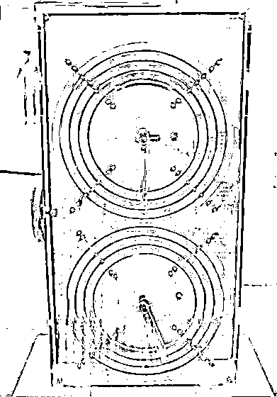
图为复制品

此前人们以为这不过就是古希腊人使用的一个计算器，用来描绘天空中星星的运行轨迹，以帮助当时的人识别方向。然而，科学家们在破解了这部装置表面已经受损的铭文后发现，**它实际上是用来研究占卜星相的。**

英国卡迪夫大学天体物理系的埃德蒙德教授在雅典的学术会议上说：“虽然我们目前还没有把刻在装置表面上铭文准确完整地翻译过来，但有可能像从前说的那样，一个阴影的颜色就代表某种征兆或信号。”他说：“某几种颜色可能会比其他几种颜色更好。**这是我们首次在研究这部装置时触及到的占星术，而不是天文学。**”

安提基特拉机械装置是一个外形像钟表一样的复杂机械。当时公元前 150 年到 100 年的古希腊科学家们给它安装了 30 组咬合的铜制齿轮。在它被发现之前，专家们普遍认为，这部装置被制造出来一千多年后，人类社会才掌握类似技术。目前，安提基特拉机械装置的所有已知的部分都被雅典的国家考古博物馆收藏用于研究。


# 给所有人的对付（转化）天蝎座攻略

> 原文：[`mp.weixin.qq.com/s?__biz=MzA5NjA0NTAxNg==&mid=2651385321&idx=1&sn=8a686d3244b57c1a724068a5527fc71c&chksm=8b4a5f5ebc3dd648cac7eac9c82cc605af61d417dc4520761cdc542be01c7e2f6f23e88c7e52&scene=126&sessionid=1692738821#rd`](http://mp.weixin.qq.com/s?__biz=MzA5NjA0NTAxNg==&mid=2651385321&idx=1&sn=8a686d3244b57c1a724068a5527fc71c&chksm=8b4a5f5ebc3dd648cac7eac9c82cc605af61d417dc4520761cdc542be01c7e2f6f23e88c7e52&scene=126&sessionid=1692738821#rd)

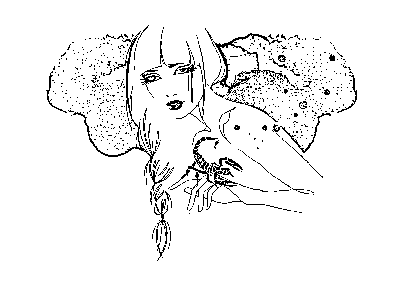

作者/杰夫•焦耳  文章来源/《大占星师》

译者/网络收集  校对/江艺  

图片来源/Pinterest

正值行进的火星逆行在天蝎座，与天蝎座有关的话题依旧是讨论热点。天蝎座，这个带刺的星座，让人又爱又恨，欲罢不能。为什么这个星座在人群里（甚至包括不太了解占星的人）会激起那么激烈的反应呢？

## 死亡、性、权利……

天蝎座之所以看上去黑暗，是因为它触及了太多我们排斥的东西。

*   **死亡**召唤着我们，却在多数人否认，否认年长者的智慧、衰老和生命形态的转化。天蝎座提醒我们，万物必然死亡，这样才会有新的生命诞生。它让我们记起我们是肉体凡胎，终将腐朽，在死亡面前没有欺骗。 

*   我们需要**性**，结合的激情导致怀孕。相互融合的渴望带来新的生命。但我们被教育那是不纯洁的。

*   天蝎座也代表着**权力**，代表**情绪、感觉和金钱的交流**，以及赚钱的时间——我们称之为工作。但我们对这些交流视而不见，想要但不正视，欲求却不肯理会。

*   我们同样在否认**两性关系**，我们太过独立，追求开放的、现代的交往方式，在合理的界限内保持可以协商的伙伴关系。但爱的界限在哪儿，激情和灵魂的界限在哪儿？我们分明被共同的人性捆绑在一起，而那孑然的孤立本身只是幻觉，认为我们是彼此分离的个体从根本上说是一种幻觉，那么为什么还要划清界限，彼此隔绝呢？

天蝎座使我们惊恐，因为我们忘记了我们并不是分离的，我们彼此相连，并且和世间万物联系在一起，不论你叫它上帝、女神、共同精神、自然还是全能的那一位都可以。水象的天蝎座以水侵入我们的肌骨，弥合了我们之间的裂缝，让我们醒悟，我们本为一体。

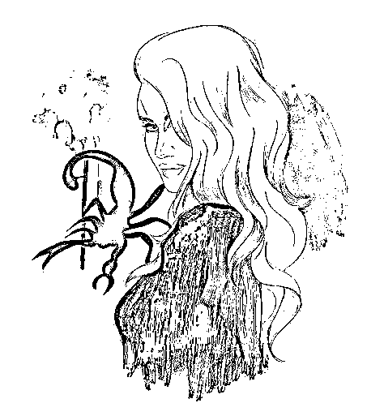 

## 封闭还是有力？

描述天蝎座在某人星图或生活中的作用并不容易，原因在于天蝎座似乎用两种截然不同的方式表达自己。

*   一种是向内的能量：封闭、压抑的感觉，害怕自我表露和力量；

*   另一种是外向的能量：向外的天蝎座能量却是一种强大的改变之力，表现得热情而强烈。

**如果我们不信任自己的能量，天蝎座的特质就会表现得迂回隐蔽，破坏性大于益处。但如果我们对自己的判断有自信并且愿意影响他人，那么能量就能自由而安全地流淌。**

**举个栗子** 

掌管认识和交流的 3 宫宫头落于天蝎座，成长经历中，可能有一个可怕的父亲或母亲压抑了你的表达，他/她教你使用挖苦讽刺来代替直截了当地表达。你可能曾体验过因说错了话而受到惩罚的恐惧。天蝎座的责任意识可能过度严苛，这是由受创伤的父母或者兄妹造成的。因此你可能连自己的话都不相信。你在交流中无法发挥最大潜力，**你看到了很多，但是你害怕说出来。**

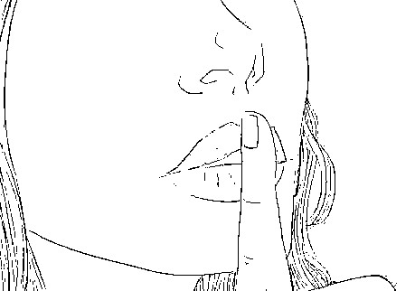

而自信的 3 宫头天蝎座却能有意识地使用它的语言能力和他人沟通情感，他们有深刻的感知能力，却并不消极。**他们专注于相互谅解的心理侦探，而不是在黑暗角落里搜寻你的犯罪证据的探员。**

如果天蝎座执著于惩罚，那么能量会经由统治欲被滥用，或者内化。压抑能量的代价是高昂的。不仅仅让你和世界错失了天蝎座的洞察、帮助和疗愈的正面能量，而且强迫它转向内心，将它钳制于潜意识，把能量转变为毒素。一丛丛欲望，如果在恐惧中被包藏起来，吞进潜意识的黑暗中，就可能会变成各种疾病的温床。

## 关键是信任

天蝎座需要仔细思考一些东西。**它非常矛盾，因为它是关于转化的固定星座**。天蝎座象征了死亡和重生，这并不是一个静止的状态。面对超越理性的欲望，我们也许会不知所措。超越理性，真是天蝎座的美名。它的前一个星座天秤座就是关于理性的，它是平衡的思维，被亲疏之间的完美均衡所磨练的本位风象星座。但天蝎座带我们越过了思维。我们下沉到自己身体、情绪和原始的感受中，也就是更底层的脉轮中。

**如果天秤是关于亲密关系的，天蝎座就是它的极致。**结合的思想在头脑中和真正操作起来是非常不同的，天秤座为彼此之间思想上的联系打开了大门，天蝎座把这种联系深化下去，直到理性的层面之下。天秤座讲求公平，天蝎座只在乎生存；这就是狮子猎食斑马这种生存本能的力量。生存的动力在公平这种智性的层面之下运作，它不是一种思想，天蝎座和思想无关。它是一种生存的状态，是在天秤座所打开的共享之门和射手座所追寻的超越个人层次的亲密关系之间的中间地带。

**天蝎座更需要记住自己的纯真**。如果你的 11 宫头在天蝎座，你仍然有可能身在一个团体中但不会试图操纵它。当你自信的时候，你可以和他人建立开放但有力的联系。你的欲望和恐惧不是你一个人的，而是人性交响曲中的一部分。如果你心怀纯真，联系的通道将更畅通。你自己的故事不会影响这种动力所关联的群体潜在利益。情感还在那里，但它没有被对权力欲望的恐惧扭曲本来面目，心门是敞开的。

**运用天蝎座能量的关键是信任，信任你自己，信任这个世界，信任改变的过程。**正是信任，让死亡中产生出新的生命，让宇宙中有了运动。没有信任，我们看到压抑的典范，天蝎座所辖的领域将充满羞耻的秘密，而不再具有魔力。情感被压抑，深埋于内心，在恐惧中结成冰。而信赖外界的天蝎座充满热情，有着疗愈能力和动人的性感。

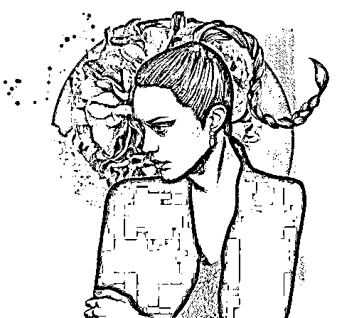 

## 你星图中落 12 宫的天蝎座

出生星座描绘了如何敞开心门，宇宙的能量如何在地球上生存。但星图的结构又不是那么简单，当加入宫位时，星座看上去会伸长、扩大或者收缩。在最常见的宫位制中，一个宫中通常有两个星座。**我强烈推荐你考虑出生星图中一个宫位中存在的所有星座**，这样才能获得更透彻的理解。比如当狮子座在 4 宫宫头，通向家庭的大门就在这个星座，但如果整个处女座都包含在 4 宫，对处女座的理解将大大拓宽对家和家庭的描绘。

**——天蝎座落 1 宫——**

你习惯用怀疑的眼光看世界。权衡意味着在全身投入之前你会有所保留。你在意识的层面下观察并搜集情感信息，你的任务不是做个甜妞儿（尽管你可以做到），而是游过连接我们所有人的地下水。你也许被教导要掩饰你的情感，但小小的气泡聚集起来会变成奔涌的岩浆，随即是势不可挡的爆发。

你可能对自己很严厉，清楚地觉察到掩盖在表面之下的力量，但**接纳自己的阴暗面对你是有帮助的，不满、嫉妒和怀疑可能促使你前进**，如果你接受其目的。你有心理学天分，探索自己和你的动机比评判并拒绝它们要有益得多。

**——天蝎座落 2 宫——**

你最大的天赋就是抓住资源的能力，你不需要尽力去捍卫权力，你天生有整合零散力量、点石成金的能力，在其他人看来是赔本的生意，你却能看到商机。好好利用你的复杂性，它不仅仅是阻碍侵扰的墙壁，更是运用你的魔力的关键。你能够客观地分辨出哪些东西是他人必须付出的，这样你就能帮助他人做最棒的自己。不要太过苛刻地评判你的才华。**你需要一种良好的嗜好，从而找到实现自我价值的路径**，你能够从你的兴趣领域中抽取出那里的一切来获取它。

**——天蝎座落 3 宫——**

当其他人只看到事物表面的时候你却能察觉到隐藏的暗流。你的观察技巧可能可以追溯到儿童时代的沉默寡言，所以你通过观察比同龄的其他孩子学到更多。你的话不是纯粹的装饰、夸夸其谈或甜言蜜语。你想要别人像你那样聚精会神地倾听你的言语，你通过交流改变他人，帮助他们认识那些隐藏的事物。你对声音非常敏感，就连静谧，或者声音的细微变化都能给你很多信息。你认为事物的深层联系比表面的事实更重要，不过**记住，有时候简单的真理真的就那么简单。**

**——天蝎座落 4 宫——**

你在幼年就接触了成人世界里的性、权利和死亡。对阴暗面的本能体会可能很早就结束了你的纯真年代。最好的表现是你和你的家人在健康的基础上，彼此有很深的心理联结，然而有时候这个位置代表了家庭中的难言隐痛。4 宫是星图的基础，天蝎座在这里说明了你确实非常重视自己，**在你的外表下是一颗探求事物真相与内核的心**。你的激情无法计量，但也许绝少被人察觉。冷静的外表下隐藏着你警觉的内心，但是这也是你的保护色——你有不动声色处理危机的本领。

**——天蝎座落 5 宫——**

玩乐对你而言是件严肃的事儿，你游戏的时候绝不允许分神。你的认真程度让你不打倒对手决不罢休。最理想的情况是，你为其付出你的全部。极富激情的行动会带你突破理性的界线，但这本身就是天蝎座的精神。同样，你也不会轻浮地对待爱情。你的心决不虚弱，你的渴望也不。

你可能是个非常性感的孩子，但又会把表达自我看作羞耻的事情，所以隐藏自身欲望在这个位置并不罕见。这种力量太过强大，你抗拒将它表现出来。**小心地引导你的力量让你能够发挥出创造性的影响力！**你可以把无用的材料和念头整合成新的创造。

**——天蝎座落 6 宫——**

你充满激情地工作，你做得最好的是让你心仪的工作，似乎你离开它们就不能活了。有时候这个位置也代表工作时被逼无奈，可能是来自外界的压力过于巨大。但是，最理想的情况是，这是一份必须深入探索，引起变革或者与危机处理有关的工作。可能会出现管理问题，因为**对权利的合理利用可能成为一个重大问题。**能集中精力是你的优点，因为要完成工作常常需要有能力处理相当不愉快的事情。健康和爱好也是第 6 宫所涉及的问题，如果能规律性地洁净身体（就素排毒养颜吧）有很大好处，暗中的憎恨容易引发疾病。

**——天蝎座落 7 宫——**

不管你意识到与否，你都有一种寻求一位有力的伴侣，帮助你突破限制带来改变的欲望。你可能会吸引个性很强并且试图改造你的伴侣，这个问题的两难之处在于你的伴侣在意念强大的同时也会非常顽固。你需要做的是收回自己的能量，认识到你的存在也是为了帮助他人的改变。

亲密关系会涉及最根本的信任和控制问题。寻找一个和你一样乐意同彼此分享恐惧的人会很有帮助，只要那是改变之路上的垫脚石。**亲密关系不是为了让你有安全感，而是通过一个与你力量均衡的人的帮助，让你更加深入了解自己。**

**——天蝎座落 8 宫——**

这里天然是天蝎座的家，所以你可能对天蝎座的核心课题——性、死亡、转化更加熟悉。你是身体、头脑和精神的领路人。你在这里接引众人超越他们本来的限制展现出他们所有的资源。有可能这一宫会被投射出去，你需要其他人用他们的渴望来激烈你并且带领你改变，但你必须克服恐惧，超越舒适熟悉的已知世界。

亲密关系中通过热烈的结合让你重新认识自己的灵魂。冷静的伴侣绝对出局。你在他人遭遇危机时表现最出色，这对疗愈者和帮助者是良好的位置。**不伴随负面剥削的付出和给予是天蝎座在此的一个挑战。**

**——天蝎座落 9 宫——**

由于你对所有事物的意义都充满兴趣，因此有一点儿怀疑主义是很自然的。如果一位老师魅力超凡或者至少通过了你的标准，你就会完全成为他忠实的拥护者。你的信仰不是随随便便的，也不会和你的生活选择无关。你也许在年轻的时候有过宗教狂热或审判他人的行为。

**天蝎座在这一位置的人拒绝宗教的原因常常是为了之后能在一个更新和更有力的层次上重新发现信仰。**你不会游戏你的信仰，它们不仅仅是信念指导下的思想和行为，它们已经深入你的每一个细胞。当你教导别人的时候，你付出全部的自我。当你旅行的时候，你也不是走马观花，而是深入你所游览的地方的精髓之中。

**——天蝎座落 10 宫——**

你的职业有两种可能的选择——要么自己做主要么被人牢牢压迫。只有将天蝎座的能量引向社会可以接受的形式，它才可以为你所用。你的能量足以为你所选择职业领域带来改变。然而没有焦点的话，这种激情会被压抑甚至转为憎恨。你适合做和治疗、危机（身体、情感、金融）和改革有关的职业。

很关键的一点是你感觉自己有权在世界上获取地位，没有这一点许可的话你的能量就不容易有效地发挥。尽管外表淡然，你暗自衡量着公众对你行为的反应。在重压之下你可以成为一个伟大的领导。**选择可以打动你的挑战**，为自己创造压力。当你没有工作焦点的时候反而容易阴沟翻船。 

**——天蝎座落 11 宫——**

这可能是社会或政治狂热者的位置。你可能是忠实的朋友、热情的同志和革命者。你不需要被一大堆朋友围绕，因为彼此间的信任是你更看重的。如果你很受欢迎，那么通常是因为你给团队建设带来了强烈的影响。你不会用外表去引起别人的注意，内在的理想才是你重视的。

你会发现自己被非主流的团体吸引，你生来的任务就不是支持现状，而是去质疑它。**你也许有能力在理想遭到沉重打击后，又在灰烬中重生。**这是典型的天蝎座特质——在无路可退的时候才最坚强。无论如何，你最可能尊敬的人是那些为了追求成功投入一切的人。拖后腿的队友会受到你的谴责。

**——天蝎座落 12 宫——**

认同社会边缘人是 12 宫的特质之一，当天蝎座在这里时表现得更明显，你有在困境中寻找力量的本领，所以会**是弱者的鼓舞**。但你可能会在公开展现力量时遇到些困难，你更希望把它们保存起来直到最令人绝望的时刻。但这有时候可能让你感到不舒服，如果你想要让自己看起来强大有力。即使掌握了所有筹码，你还是觉得自己像个失败者。天蝎座在此的另一个特征是深刻的神秘主义者，对神秘学、疗愈和形而上学感兴趣，你对现实的看法不是传统的，会成为在两个世界之间的引路人。

**特别提醒：**

**转载请联系后台授权。**


******如何转化天蝎座能量？由大卫·瑞雷老师**讲授的**若道核心课程 Level 3，会教你将**星座、行星、宫位、相位这些散落的珠子穿起来，**带你进入更深的自我探索与成长的旅程。本课程将于今年 7 月开课，敬请期待！******


# 6 张图告诉你什么是“阴影面”

> 原文：[`mp.weixin.qq.com/s?__biz=MzA5NjA0NTAxNg==&mid=2651385300&idx=3&sn=1708b26cc265e55ef4ecb909eabfda7c&chksm=8b4a5f63bc3dd675f977b9e53b8952335760d63900e8624189677589d0f0b66b71a17125f230&scene=126&sessionid=1692738821#rd`](http://mp.weixin.qq.com/s?__biz=MzA5NjA0NTAxNg==&mid=2651385300&idx=3&sn=1708b26cc265e55ef4ecb909eabfda7c&chksm=8b4a5f63bc3dd675f977b9e53b8952335760d63900e8624189677589d0f0b66b71a17125f230&scene=126&sessionid=1692738821#rd)

**1**

**什么是阴影面**

在荣格心理学中，

“阴影”或“阴影面”是潜意识的一部分,

由压抑的脆弱、不足与本能组成。

“每个人都有阴影，”

荣格写道，

“它在个人意识生活中体现得越少，

就黑暗，就越密集。”

它在一定程度上是一个人更原始的兽性本能，

在幼年被意识心理所替代。

**阴影是你被拒绝和压抑的部分。**

**这是你不愿被世界所看到的部分**，

因为它是丑陋或令人反感的。

它象征着脆弱、恐惧或愤怒。

在梦境中，

这个角色由跟踪者、杀人凶手、

恶霸或追赶者代表。

它可能是一个令人恐惧的角色，

或甚至是一位亲密的朋友或亲人。

他们的出现会让你愤怒或带给你惊吓。

他们迫使你去面对

你不想要看到或听到的事情。

你必须学会接纳自身的阴影面，

因为它传递的信息常常是对你有益的，

尽管这个益处并不会立刻呈现出来。

**2**

**我们分割、拒绝、否认、隐藏的部分**

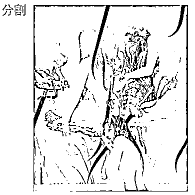
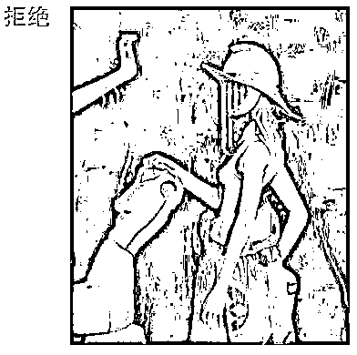
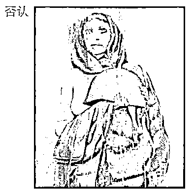
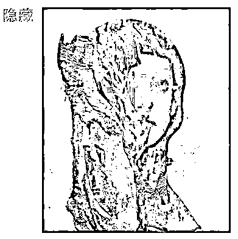

**3**

**我们与之断绝关系的部分**

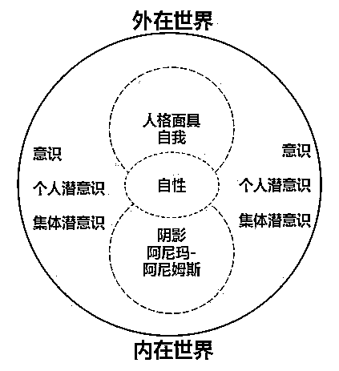

被包围被孤立在阴影里，

不停沉思、探险、投射、寻求可连结的地方

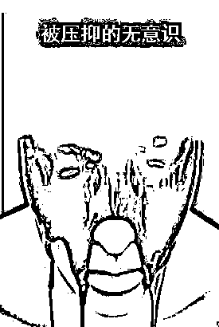

即使我们意识不到阴影，

也不会让它失去影响力。

它会通过扭曲或者不健全的方式表达自己，

或者采用通常被称为“神经症”的方式表达自己。

“如何与客户的阴影面工作”工作坊

**授课时间：**2016 年 7 月 8 日（晚）、9-10 日（全天）

**授课老师：**杰西卡·卡巴拉

**授课方式：**北京工作坊，英文授课，中文翻译

**报名截止**：2016 年 7 月 5 日

**费用**：2800 元（6 月 25 日后）

6 月 25 日之前报名：

| 学员类型 | 价格 |
| ISAR 认证占星师 | 900 元 |
| 原型占星学员 | 900 元 |
| L5 及曾经的高阶学员 | 1500 元 |
| 若道学员 | 1900 元 |
| 非若道学员 | 2400 元 |

**课程负责人：Sara**（**微信：2847613491**，请备注阴影报名咨询）

长按二维码添加课程负责人咨询~

****

阴影面更多内容会陆续推出

敬请关注若道君之后的推送


**了解详细课程内容及报名方式，点击文末“阅读原文”**


# 海王星逆行 12 宫攻略丨要吞下多少痛苦，才可以创造奇迹？

> 原文：[`mp.weixin.qq.com/s?__biz=MzA5NjA0NTAxNg==&mid=2651385300&idx=1&sn=6eed862b36aaf85a94cda65195faef9f&chksm=8b4a5f63bc3dd6757db05e6f9bbb47581c40e0f2d770d2012b97294533811deda257531dfc1b&scene=126&sessionid=1692738821#rd`](http://mp.weixin.qq.com/s?__biz=MzA5NjA0NTAxNg==&mid=2651385300&idx=1&sn=6eed862b36aaf85a94cda65195faef9f&chksm=8b4a5f63bc3dd6757db05e6f9bbb47581c40e0f2d770d2012b97294533811deda257531dfc1b&scene=126&sessionid=1692738821#rd)

**海王星逆行**

6 月 14 日海王星要开始逆行了，此次逆行将经历五个多月的时间。在此期间，我们有可能会经历幻灭、挣扎、痛苦，甚至童年阴影也会参一脚打压我们。但是别忘了，痛苦仍旧拥有力量，顺利通过痛苦，我们会获得治愈。

**海王星逆行的意涵**

**2016 年 6 月 14 日 04:42 海王星在双鱼座 12 度 02 分开始逆行，直到 2016 年 11 月 20 日 12:37 在双鱼座 9 度 14 分顺行。** 

**重点影响人群**

**个人行星或四轴、南交点落于变动星座（双子座、处女座、射手座、双鱼座）10-15 度的人是此次的重点影响人群。**你们可以好好利用这一周期进行一次深入的内在之旅。

进化占星大师**斯蒂芬·弗里斯特**说：**海王星在出生星图中的哪一个宫位，就像一根暴露在外的敏感神经**。观察一个人出生星图中的海王星所落的宫位，可以有这样的线索：**这个人在生命的哪个领域里最容易感觉到理想主义、幻灭和痛苦，同时，也能在那个领域经历治愈，并可能创造一些奇迹。**

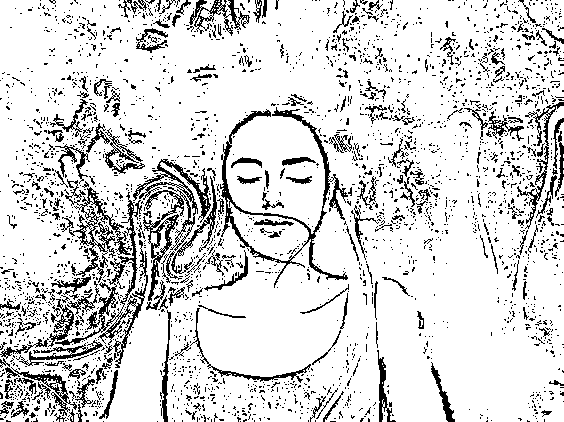 

**你需要学习的**

**治愈**

当海王星行进的时候，你会在它所到之处，经历“神经突然敏感起来，感觉到理想主义、幻灭和痛苦，同时，却也在能够那个领域里经历到治愈，并可能创造一些奇迹。”

**释放**

当海王星逆行的时候，这种暴露更加尖锐：**无力的挫败感和逃避倾向；即将成真的美梦转瞬竟变成一种灾难；而看似悲惨的状况，却可能是塞翁失马焉知非福。**

逆行的海王星，将“**学习释放**”，“**激发潜能**” 的功课，放进了我们的生活里。

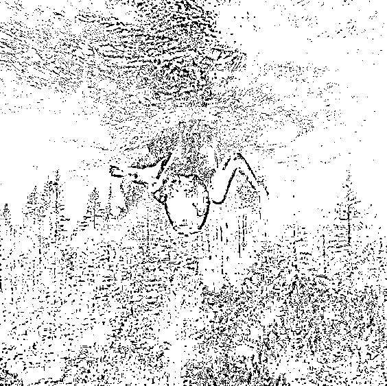

**你需要面对的**

这期间，土星也在射手座逆行。**逆行的土星和逆行的双鱼座海王星，在 6 月 17 日达到精确四分。**意味着**落实信念的坚持（土星射手座）和感受真实心声（海王双鱼座）这两种力量，处于角力状态**，并且力量的方向由向外的拉锯，转向对内的角力凝视。这样的凝视，贯穿六月和七月。 

当这两颗行星互相拉锯，有些人感受到的是深深的无力：哦不，太多波折太复杂了，肯定做不到。但我就是想坚持下去，怎么办？

**迷惑**

有些人感受到的是迷惑：这是真的吗，看上去像个有毒而美好的梦？我是不是在做梦？如果是场梦怎么办？

**纠结**

有些人感受到的是纠结：特别有诱惑力，无法割舍，但是当我清醒独处的时候，我清楚这是假象，就这样每天在两者之间摆荡。

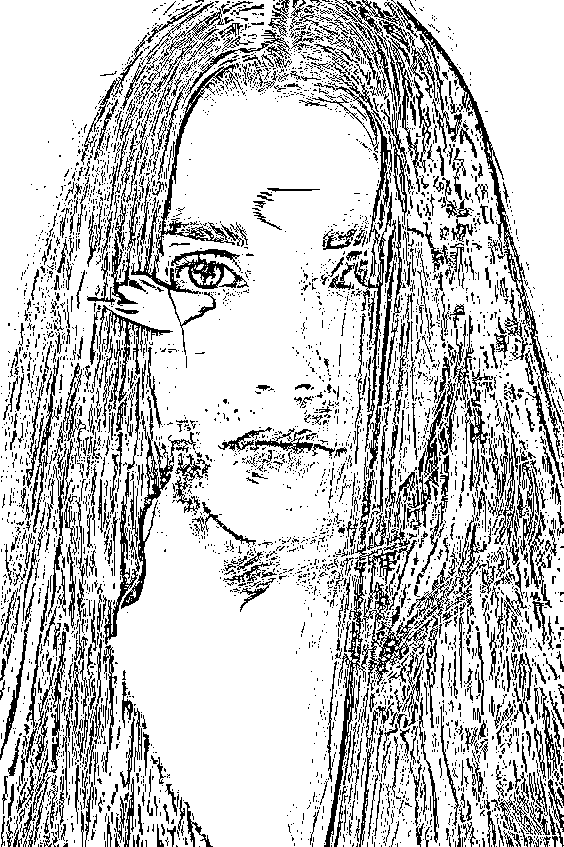 

有梦，才有实现的机会，不是吗？如果你都不信，所有的力量都导向质疑和论证，而不是信任专注的实现梦想，那你将离梦想越来越遥远。海王星和土星同时的逆行，提醒我们一件事：**推动“相信一件看似不可能的事” 的，是我们对爱、精美、理想、慈悲、救赎的渴望。 **

你可以选择是否要再一次经历理想的破灭、逃避责任、在沮丧中哭泣哀叹；你也可以选择**倾听自己真正的需要，肯定自己的感受，运用实际行动，一步一个脚印地走向那个更经得住考验和更有意义的愿景，实现那个内心深处真实的梦想。**

**可能发生的事**

海王星逆行期间，可能发生哪些事情？ 

*   不切实际的梦想＋虚无的承诺

*   无缘由的信任＋无边界的扩大化

*   逃避现实寻求安慰带来的酗酒嗑药问题

*   医疗事件，淋巴系统，血液循环，过敏以及艾滋问题

*   投资追高＋金融证券方面的黑洞难以控制

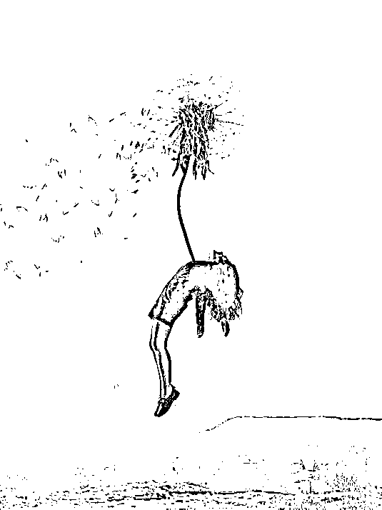

**适合做的事**

海王星逆行期间，适合做哪些事情？

*   重拾艺术，绘画、舞蹈、美术方面的爱好，释放内心的情绪

*   创意、广告、媒体、传播类的活动受到更广泛的关注

*   旅行、健身、养生类话题再度热门

*   选修灵性、玄秘、心理学、催眠课程、参与宗教学习活动等

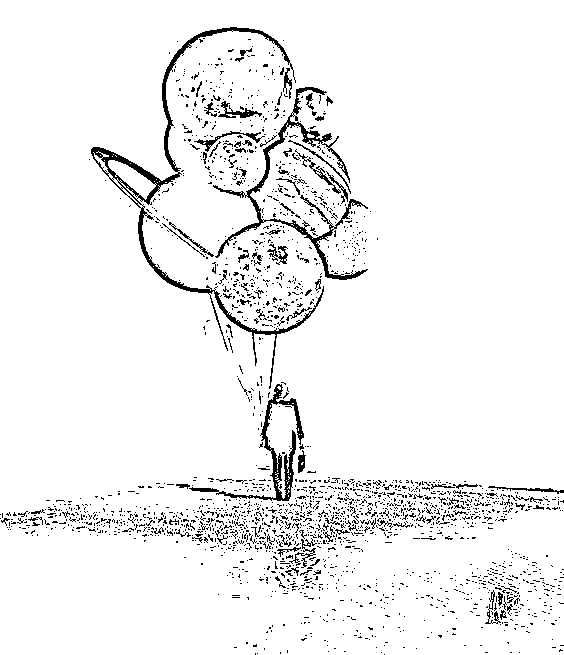

**海王星逆行在 12 宫位的影响**

> **若道君提示**：想知道海王星逆行具体在哪个宫位，可以通过熟知占星软件查阅星图获得。也可以点击若道官网 www.nodoor.com，点击“在线星盘”-“行运盘”，在左栏输入自己的出生信息，在右栏填入想查阅的日期的信息，点击“生成星盘”按钮，就能查看到逆行的海王星在你出生星图的哪个宫位。（如下图所示）

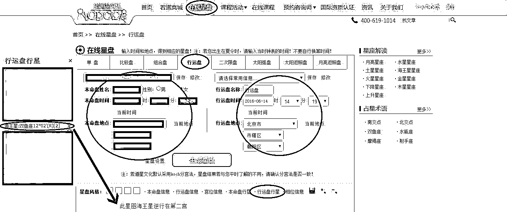
（看不清楚，可以点开大图）

**海王星**逆行在**一宫**

**童年时代的寂寞、恐惧或者被遗弃、被忽视的感觉，又浮上心头**。容易走入牺牲者/拯救者的关系中，情绪起伏不定的时间增加，无助感经常冒出来。**我们需要觉察到，自己已经不是当年的小孩，有能力满足自己的渴望与梦想。**

**海王星**逆行在**二宫**

**请注意开销和投资，可能有失控或者受骗的情况发生**。我们由财富或爱支撑的安全感突然消失；可能发生职业或者兴趣的转换；可能通过艺术、舞蹈、时尚、摄影等方式，获得收入或者结识这样的从业者。也有可能是神父，或者从事与海洋有关工作的人。

**海王星**逆行在**三宫**

**去探索环境中发生的事件和我们内在感受之间的关联**。我们可能会变得非常迷糊或者非常敏感，表达上有模棱两可的危险。容易误解他人或者被他人误解，同时又对潜台词和情绪暗流非常敏感。**这是一个检视内在的自我、理清现状与焦虑感的时期**。可以通过学习艺术类技能，或者接触玄学、宗教、心理学、神秘学知识，增加自我觉察。

**海王星**逆行在**四宫**

**需要花点时间独处，检视我们内心的感受**。重新评估家、父母，以及当下的生活对我们的意义。我们需要倾听自己内心深处最真实的渴望。这是一个处理与父亲之间的关系的好时机。请注意伴侣及家人的健康状况。

**海王星**逆行在**五宫**

探索一下自己在艺术创作领域的潜力。在广告公关媒体等领域会有很不错的成绩。关注一下我们突然爆发的对物质享受产生贪婪、迷恋背后的心理需求。反思一下我们是否过度理想化了恋人？思考一下，我们渴望成为怎样独一无二的、引人注目的人？

**海王星**逆行在**六宫**

**请注意身体状况，你可能会对一些另类疗法十分有兴趣**，比如自然疗法、顺势疗法等。工作中可能会经历一些无能为力的徘徊时刻。有机会可以参观医院、监狱及类似机构，甚至有可能体验其中的工作。

**海王星**逆行在**七宫**

**可能经历不理想的伴侣关系，我们需要把伴侣关系中感到沮丧的部分带到表面加以解决。**可能在法律诉讼方面经历混乱。

**海王星**逆行在**八宫**

**在事业伙伴的选择上需要小心斟酌**。家庭财富上有可能经历一些起伏。有可能接触到性和死亡方面的事件，或者致力于这些主题的研究。

**海王星**逆行在**九宫**

**被宗教、哲学、旅游、高等教育等方面的活动吸引。**有可能遭遇价值观方面的舍弃或者混乱，是去进修心理学、哲学、冥想、宗教、玄学、绘画、音乐、摄影、电影、化学等方面高等教育的好时机。

**海王星**逆行在**十宫**

**一直以来非常确信的事业可能变得混乱，迟疑留在原地还是另辟蹊径**，需要反思一下自己的事业理想到底是什么？可能会经历职场上的失望。母亲可能会经历健康或者情绪上的问题。还有可能经历成为大众偶像的体验。

**海王星**逆行在**十一宫**

容易参与到一些宗教、艺术、瑜伽类团体中。成为朋友们的拯救者或者被朋友们拯救。可能会觉得没有合得来的朋友或群体。有可能遭遇朋友之间的辜负、背叛，但这其实是另一种放弃和开启。**放弃不切实际的期望，学习体谅和接受。 **

**海王星**逆行在**十二宫**

**这是个触及深层真实自我、内在的高层智慧的阶段。**有机会可以寻求心理咨询师、占星师的谘商。**早期的心理阴影可能在这个时期得到释放**。有机会接触慈善、孤儿院、监狱、图书馆、博物馆等机构，带来启发性的经历。


**作者简介**

**傅迦莎**：全职占星师，IAF 国际引导者协会认证引导师。若道 COAC 高阶资质毕业生，在若道跟随多名当代著名占星师进行深入系统的占星研习。接受萨提亚、NLP、格罗夫全息呼吸理论的心理咨询专业培训。擅长职业规划、个人成长、婚恋关系解读咨询。

**微信个案咨询**：jiangnan2638

**微信公众号**：Helloshajia

长按二维码，让金钱流向带来知识和智慧的人~


**特别提醒：**

**本文首发于若道平台，**

**转载请联系后台授权。**


******想要顺势而为？先掌握如何解读星图。由大卫·瑞雷老师**讲授的**若道核心课程 Level 3，会教你将**星座、行星、宫位、相位这些散落的珠子穿起来，**带你进入更深的自我探索与成长的旅程。本课程将于今年 7 月开课，敬请期待！******


# 最低 900 元+现场咨询的机会，客户阴影面工作坊报名中！

> 原文：[`mp.weixin.qq.com/s?__biz=MzA5NjA0NTAxNg==&mid=2651385300&idx=2&sn=bf5a490ae12d32ddf91b0a8bca15756f&chksm=8b4a5f63bc3dd6755224d043ad915ae95f4abbdb7cc9baa904163bb294e6f0e4a9085231d293&scene=126&sessionid=1692738821#rd`](http://mp.weixin.qq.com/s?__biz=MzA5NjA0NTAxNg==&mid=2651385300&idx=2&sn=bf5a490ae12d32ddf91b0a8bca15756f&chksm=8b4a5f63bc3dd6755224d043ad915ae95f4abbdb7cc9baa904163bb294e6f0e4a9085231d293&scene=126&sessionid=1692738821#rd)

『每个人都有自己的阴影面。

我们每个人都会挣扎、受苦、受难，

这是我们作为人类共有的部分，

这部分也将我们作为人类联系了起来。

什么时候需要星图解读

或寻求某种形式的帮助和支持呢？

重要的转变期，

比如结婚、离婚、生小孩、换工作

或在巨变期、危机期和迷茫期。

我们都会在自己人生的不同时期需要帮助，

帮助他人很大一部分工作

就是了解、确认和把握他们的困难。

我惊讶的是，

每一次当我认识并把握住某人的阴影面时，

他们真的变得充满力量，更能做自己，

有了更充实的生活和人际关系。』

——**杰西卡·加菲尔德·卡巴拉**

**客户阴影面工作坊讲师**

[**点击查阅更多关于她的相关报导**](http://mp.weixin.qq.com/s?__biz=MzA5NjA0NTAxNg==&mid=2651385253&idx=2&sn=554fb5d308f23a0ffa00f9aa3b7bdad3&scene=21#wechat_redirect)


什么是**阴影**？它在心灵中的位置？

10 颗行星原型阴影面示例

出生图和行进中阴影带来什么信息？

作为占星师，你的**阴影面**是什么？ 

如果你无法处理好自己的阴影，

你的咨询会发生什么？

**如何了解、掌握、处理你的阴影？**

原型心理学和深度占星学怎样结合？

**如何和客户的阴影面工作？**

以奇幻的宇宙观看磨难和痛苦所扮演的角色

除了**现身说法，**

本次工作坊还将有

**至少两名现场学员案例分析，**

这是**一次咨询费**即可参加的工作坊，

关于**讲师**，

塔纳斯说，她，是**未来的丽兹·格林。**

你需要做的，

是**果断报名**，

剩下的事情交给我们。

**“如何与客户的阴影面工作”工作坊**

**授课时间：**2016 年 7 月 8 日（晚）、9-10 日（全天）

**授课老师：**杰西卡·卡巴拉

**授课方式：**北京工作坊，英文授课，中文翻译

**报名截止**：2016 年 7 月 5 日

**费用**：2800 元（6 月 25 日后）

6 月 25 日之前报名：

| 学员类型 | 价格 |
| ISAR 认证占星师 | 900 元 |
| 原型占星学员 | 900 元 |
| L5 及曾经的高阶学员 | 1500 元 |
| 若道学员 | 1900 元 |
| 非若道学员 | 2400 元 |

**课程负责人：Sara**（**微信：2847613491**，请备注阴影报名咨询）

长按二维码添加课程负责人咨询~

****

**适 合 人 群**

这个工作坊是**面向所有程度的占星学生**的。

在教学中，

我总是努力让教室中的每个人都能理解我教授的知识，

并且产生共鸣。

我的想法是，

让这个工作坊能够帮助到每一位

想要进行个人或职业占星解读

和/或任何从事帮助性职业的人，

让他们学到大量的知识。

在课上，我会将占星学和心理学恰到好处地融合起来，

我会讲到这两门学科的基础知识，

同时给中阶或高阶的学生讲授更深入的观点和洞见。

来参加工作坊的学员不需要对原型占星学有所了解，

我实践和教授占星学的方式适用于所有形式的占星学。

我会很愿意在工作坊中分享更多传统知识，

这样参加者可以更好地感受和理解原型占星学和深度心理学。

这门课欢迎所有程度的占星学员。

——**杰西卡·加菲尔德·卡巴拉**

**客户阴影面工作坊讲师**

**课 程 安 排**

**7 月 8 日，周五晚上**

*   开场：介绍杰西卡老师的人生经历、周末工作坊的目的

*   生活在一个奇幻的世界：透过占星学的视角观察人类和宇宙的关系

*   占星学解读时机：危机期，转变期，重大人生决策期

*   占星咨询师的角色

*   具有启发性的原型宇宙学与原型占星学

*   原型占星学与深度心理学的关系

*   荣格理论对阴影的理解及其在心灵中的天然位置

*   尊重客户出生星图和行进中阴影所带来的信息

*   占星师在帮助客户从一个有力的、富有意义的全新角度重新界定自己的人生故事时所扮演的角色

*   以奇幻的宇宙观看磨难和痛苦所扮演的角色

*   占星咨询师的伦理道德：处理好自己人生中的痛苦和磨难，我们才能成为更有洞察力、更务实和更能帮助他人的占星师。

**7 月 9 日，星期六**

*   回顾阴影的意义

*   十颗行星原型阴影面的示例

*   原型或神和女神的阴影面，为我们揭示出宇宙的本质：光明面与阴影面共存，改善人生和破坏人生的面向共存。

*   创造一个与客户之间的安全空间以建立联结和信任的原则

*   占星师的指导意图和我们工作目标中的重点和中心：

*   让客户有力量去过更充实的人生 —— 更充分的自我觉知和自我接纳带来更安宁的人生

*   在咨询前、咨询中和咨询后与客户的交流中，我们可以以一种亲密而神圣的方式支持他们的人生—— 黑暗中的光明

*   如何掌握阴影

*   案例展示。研究一位客户的星图，与客户的阴影面一起工作

*   心理教育和咨询技巧：以共情和理解的方式回应客户，使客户内在和外在世界正常化，并确认其人生经历

*   学员的评论和提问

*   以学员（志愿者）自己星图中的阴影面做示例 —— 通过现场解读学员的星图来掌握阴影面

*   学员提出曾遇到过的困难的解读示例，分析如何在将来解开这些难题

**7 月 10 日，星期日**

*   占星师的自我关怀：占星咨询前后的仪式

*   占星师的职业道德需要：要掌握客户的阴影面，首先要把握我们自己的阴影面

*   顺势疗法：问题和解决方案都隐含在每一个行星原型中：一些示例

*   案例展示，研究如何与客户一起应对阴影面

*   学员（志愿者）自己星图中阴影面示例 —— 通过现场解读学员的星图，掌握阴影面

*   学员的评论和提问

*   关于痛苦和磨难的宇宙哲学

*   占星咨询的馈赠：帮助客户疗愈心灵

*   结语：回顾我们在工作坊中所学习的内容


**了解详细课程内容及报名方式，点击文末“阅读原文”**


# 水星进入双子座 | 不玩手机电脑和 Ipad，你能坚持几天？

> 原文：[`mp.weixin.qq.com/s?__biz=MzA5NjA0NTAxNg==&mid=2651385293&idx=1&sn=2eee86e2603a00b22a72abbe6e35a049&chksm=8b4a5f7abc3dd66cb6e3d9d438383967a20ff990af7652b7c2e1a8b02f05b046d1e7e7acb70f&scene=126&sessionid=1692738821#rd`](http://mp.weixin.qq.com/s?__biz=MzA5NjA0NTAxNg==&mid=2651385293&idx=1&sn=2eee86e2603a00b22a72abbe6e35a049&chksm=8b4a5f7abc3dd66cb6e3d9d438383967a20ff990af7652b7c2e1a8b02f05b046d1e7e7acb70f&scene=126&sessionid=1692738821#rd)

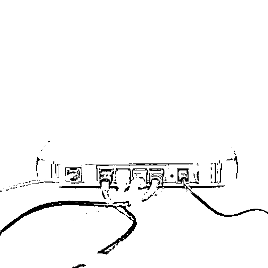

水星于 6 月 13 日进入双子座，水星在双子座如同回到了它的老家，我们将会更关注信息的学习和传播。双子座还有怎样的高阶能量？我们每个人星图中的双子座领域对于我们自身的智性发展起到了怎么样的作用？除了沉迷于各种电子信息产品中不能自拔，其实我们还可以让自己安静下来，做更多安静的思考，这或许是水星在双子座你可以着重关注的部分——双子座的智慧。

双子座：对于信息的渴求

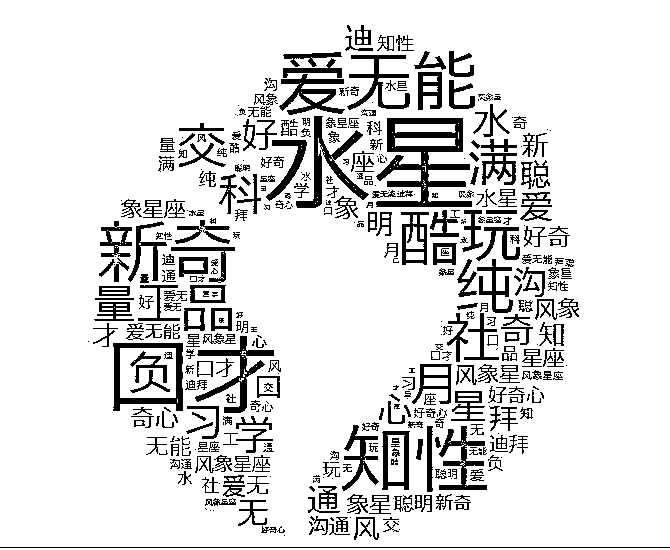
双子座关键词/数据来源：一点资讯大数据

*   每个早晨醒来，你是不是也会拿起床头柜上的手机，看一眼时间？

*   你的手机是不是已经很久没有处于关机状态？

*   你是不是也习惯了睡前扫一遍朋友圈，醒来时看一眼微信上的留言？

*   我们都习惯了这样的生活方式：每天接收大量的信息，不断地想要刷新消息；人与人无间隙地沟通，哪怕远在异国也可以随时交谈无碍。

从这个意义上来说，我们都熟悉双子座：**这种对于信息的渴求，就是双子座的核心**。

**水星主管的双子座，是一个与信息采集、传播以及语言沟通相关的星座**。风象星座的属性，让双子座**对世界、对信息和知识充满好奇心**。双子座总是希望了解更多的东西，体验更丰富的人生；也希望能够通过人际之间，尤其是心智层面的沟通，把自己所知、所想的东西分享出去，找到志同道合的朋友。

另一方面，双子座也是一个坐落在春天尾巴上的变动星座，带有变动星座特有的灵活机动与适应性。所以不难理解，为什么双子座是最具变动性的星座：**它兴趣广泛、心性多变，并拥有转圜自如的应变能力**。

四个变动星座：了解和认识世界

**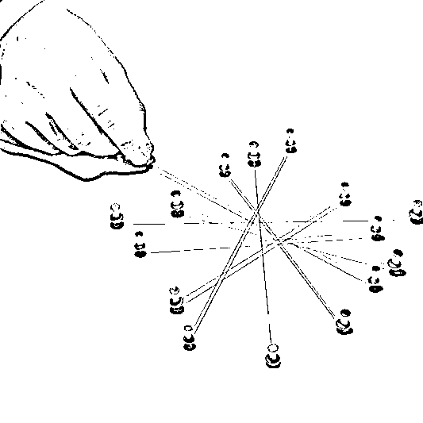** 

**其实，无论双子座、处女座、射手座还是双鱼座，每一个变动星座都与我们了解和认识这个世界的方式有关**。有意思的是，这四个变动星座，两两一组，分别由水星和木星所守护。而它们之间的对应关系，颇类似于中国人所说的“智”和“慧”的差别：

*   水星守护的双子座

*   在此阶段，我们开始学习**认识周围的环境，学习表达的技巧，与环境良好地互动**。双子代表着我们对知识的获取和传播，以及人际沟通交流的能力。

*   水星守护的处女座

*   在此阶段，我们学习**富于逻辑性的思考，学会深入而理性地分析具体事物，并掌握专业的技能，以完美主义的工匠精神，切切实实地服务于这个世界**。

这两个星座，接近我们所说的“智”：知有所合，四时能变，逻辑清晰，思考分明。

*   木星守护的射手座

*   在此阶段，我们将**思考的层次向上提升，学会高屋建瓴地思考和观察，对形而上的东西展开了解和认识，对哲学、理念和价值观进行梳理和传播**。

*   木星守护的双鱼座

*   在此阶段，我们**不再执着于小我，不再希冀通过一己之力去掌控这个世界，也不再认为单凭小我的理智就能弄懂这世界上所有的奥秘。我们学习的是感受与接纳，是直觉和领悟**。

这两个星座，接近我们所说的“慧”：**拂去俗尘，清心净虑，洞察真相，明心见性**。

这四个星座，是我们认识这个世界的四个阶段，按黄道星座的顺序来说，其中确实蕴含着进化的理念。

属于你的双子座：活出自己的智性

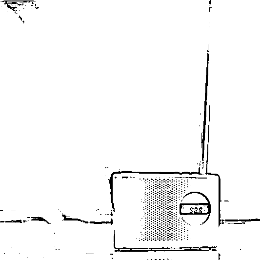

黄道上的第一个风象星座——双子座，就是这段旅程的一个重要的开始。**当我们看向自己星图上双子座所在的宫位，不妨问问自己，是否活出了双子座的智性**？ 

*   我是否具有广泛的兴趣？是否想要追求渊博的知识？

*   双子座具有敞开的态度，对一切都抱有好奇心和探索的欲望，且具有极强的学习能力和模仿能力，像一块海绵那样迅速地吸收知识。

*   因此，**当你的第三宫、第九宫和第十一宫宫头在双子座时，你需要博览群书、接受信息流的洗礼，却也要注意不迷失其中，不随波逐流，不怀疑一切却不睥睨天下；要在大浪淘沙之后，积累深刻的信仰和智慧**。

*   我是否拥有超强的活力？是否拥有改变的勇气？

*   在双子座看来，人活在这个世界上，就是为了体验，体验得越丰富，生命就越有价值。因为总是在发现新的东西、尝试新的生活，所以双子座从来不喜欢固步自封，做安全感的奴隶。

*   **如果你的第一宫、第五宫宫头在双子座，你需要保持高度的好奇，找到自己的兴趣所在，并以此激励生命的活力，鼓励自己尝试新鲜有趣的生活，勇于离开舒适区域，但也要避免流于肤浅，缺乏定性**。

*   比如，我是否拥有超强的沟通能力，以及对“人”的好奇心？

*   双子座是一个擅长与人打交道的星座，对双子座而言，人的想法也是世界上最神奇、最有趣的东西之一。

*   **如果你的第四宫、第七宫、第八宫、第十二宫宫头落在双子座，你也许会从理念、思想、心智的角度去理解人心，用明晰透彻的语言去交谈，以心智对话心灵**；你会学习到，除了“说”之外，“观察”和“聆听”也是最宝贵的能力。同时，你需要学习把纷乱繁杂的思想沉淀到内心的深处，除了看、听、说之外，也要学着去感受。

*   比如，我是否拥有敏捷的风格，变通的能力？

*   希腊神话中的赫尔墨斯穿着有飞翅的凉鞋，手持魔杖，能敏捷地飞来飞去，因而成为宙斯的传旨者和信使。双子座是一个如风的、飞翔的星座，不但能够敏捷地思考，还具有机敏的处世原则，不认死理，不钻牛角尖，灵活变通，具有极强的适应性。

*   **如果你的第二宫、六宫、十宫宫头在双子座，你也许会把这样的聪敏、这样的变通能力变为职业的天赋，或对自身价值的认同。你可以展现你的知识和沟通能力，却也要学习坚持与耐心，不流于虚浮**。

双子座的季节已然到来。当初夏的轻风吹来，你会感受到双子座——它把世间万物都串联在一起，让我们的心智自由地舞蹈，让我们感受到对于新鲜和有趣的渴望，然而，在它的脚步停歇下来的时候，我们也需要静下来思考——双子座的智性是可贵的，但仅有这些还不够。在我们面对大千世界的时候，双子座的旅程，仅仅是一个开始。

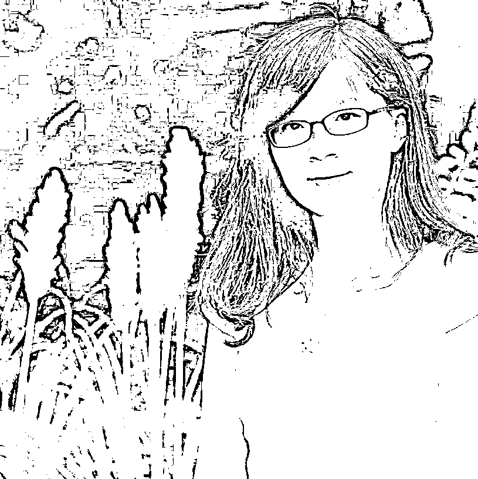

**作者简介**

**沙沙**：占星咨询师，占星专栏作者，国家二级心理咨询师。2010 年创办工作室“九月占星馆”，2013 年通过 ISAR 职业占星师资格认证考试，成为首批在中国大陆通过该测试的占星师之一。长期研习出生图、关系盘、流年预测等技巧。希望通过星图，帮助来访者实现有效的自我觉察。

新浪微博：九月占星馆 

**微信公号**：九月占星馆（jiuyuezhanxing）

**个人微信**：zhouzhe7752（添加请注明“占星咨询”）

长按二维码，让金钱涌向传播知识与智慧的人~

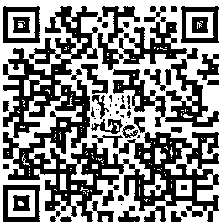

**特别提醒：**

**本文首发于若道平台，**

**转载请联系后台授权。**


******如何发展双子座的智慧？由大卫·瑞雷老师**讲授的**若道核心课程 Level 3，会教你将**星座、行星、宫位、相位这些散落的珠子穿起来，**带你进入更深的自我探索与成长的旅程。本课程将于今年 7 月开课，敬请期待！******


# 现占与古占结合 | 占星界“屠龙刀”的正确打开方式

> 原文：[`mp.weixin.qq.com/s?__biz=MzA5NjA0NTAxNg==&mid=2651385293&idx=2&sn=7eea51a2a216926c3306c261ff94a440&chksm=8b4a5f7abc3dd66ccd77e9bd60928cfe94fd7e06a430543588cfd099daca3988370fbfe13509&scene=126&sessionid=1692738821#rd`](http://mp.weixin.qq.com/s?__biz=MzA5NjA0NTAxNg==&mid=2651385293&idx=2&sn=7eea51a2a216926c3306c261ff94a440&chksm=8b4a5f7abc3dd66ccd77e9bd60928cfe94fd7e06a430543588cfd099daca3988370fbfe13509&scene=126&sessionid=1692738821#rd)


“

罗伯特·汉德，一位被占星界称为“国家宝藏”的人，掘地三尺，阅古卷无数，学习没有人再说的古代语言，学习古代历史，学习古代哲学，挖出了一把传说中的“屠龙刀”。在 37 年的现代占星生涯和 21 年的古典占星研究生涯后，他将为我们带来什么？

”

将 37 年的现代占星和 21 年的古典占星结合， 罗伯特·汉德耗费大量的精力，挖出了这把“屠龙刀”，他擦拭这把锈迹斑斑的刀，粘合它的碎片，钻研刀法，在此过程中引发好奇、热情、疑义、愤怒；他促使原来名不见经传的人获得新立山头的机会，同时又引发了分裂、不满、攻击。

有些现代大师们对他的道路感到惋惜、不解、批评，但仍旧尊敬他；而他又远离那些一门子想要复古、认为“老的就是好的”古典阵营。他跑着，似乎有同伴，又一人独行。

你也许听说过这把“屠龙刀”的传说，从江湖似真似假、似是而非的流言中，从自称使过它的招式的自言得意的小辈中，从以教学谋生、很少实践经验的小有名气的占星师的课程中。

但你真的见过这把刀吗？你知道正确的使用方式吗？这把刀真的能在现代社会应用吗？还是仅仅是应该放入“历史博物馆”中陈列？这次课就是谜底揭晓的时刻。

## 现代占星学的学子们，如果你：

*   对于出生星图——占星学中最重要的星图的秘密，仍有很多不解和好奇；

*   渴望获得古典占星里符合你的哲学理念又实用的好技法；但厌倦了大量复杂却无用的古典知识，又苦于古典文献浩瀚，无从粹取；

*   对自己星图和某些人生大事的对应百思不得其解，渴望获得一位占星大师的解答；

*   曾和妄称“可以更准确预测”的古典占星师们争得面红耳赤，但因为没学过古典而稍微有些心虚；

*   了解占星学界常见的古典和现代占星的纷争，想在真正了解这两门学问的大师面前提出深刻而尖锐的问题；

*   渴望在自己的占星知识拼图中补上能够符合现代占星理念的古典占星学知识，并将现代占星和古典占星融会贯通在咨询中

## **欢迎你来，机不可失，因为：**

*   **这里有世界上唯一能够教授此门课程的占星界泰斗**：72 岁的罗伯特·汉德，两个阵营的旗手型人物，**活着的唯一获得现代占星学大师尊重的横跨两界的泰斗**、占星咨询实践者，历史学家、哲学史研究者，活着的时候就已经成为历史的人。一个怀旧的人，一个试图搭起桥梁的人，一个不满足现有的人，一个思想演化路径让人迷惑的人。


*   **萃取古典的精华，去除古典占星糟粕：**罗伯特·汉德用他综合的知识，为你筛选出古典占星中可以为强调自由意志的发展、个人成长的现代人有益的古典占星实用技法。

*   **从实战演练中学习**：首次以案例教学的方式，除第一堂之外，每堂课皆以案例演示为教学重点。

*   **获得大师的免费解读**：**7 堂课的案例选取皆为学员星图，你有机会入选**。

*   **打尽出生星图的占星学命题！** 出生星图，是一生的预测星图，所谓的命运的因子埋藏在出生星图里。

**讲什么？皆重大常见人生问题：**

*   性格、个性、心智特点、外貌体型

*   挣钱能力、金钱、财富、财务

*   感情生活——恋爱、婚姻、家庭生活

*   原生家庭——父母、兄弟姐妹、姑表亲

*   人际关系——一对一关系、一对多关系、敌人

*   职业发展，谋生之道

*   社会地位

*   旅行

*   灵魂和本我

## 学习该课程，你并不需要有古典占星学基础：

*   你只需要具有一定现代占星学基础。如果对此没有把握，可以联系课程负责人员进行测试。

*   你不需要有任何古典占星学知识，所有出生星图的相关古典占星知识都会在课程前发送讲义或在课程中进行讲解。

给你一个机会，在实战中学习他的研究成果。

这次课程，对于罗伯特·汉德 是一次冒险之旅，对你也是串起历史、现在、未来的旅程。

还等什么？

**更多关于罗布特·汉德的文章在这里：**  

[领军现代占星 35 年、古典占星 21 年，罗伯特·汉德星图秘密大起底](http://mp.weixin.qq.com/s?__biz=MzA5NjA0NTAxNg==&mid=2651385233&idx=2&sn=98799d80abed94a7748acff623747bf7&scene=21#wechat_redirect)

[占星界的“百科全书”，请用您渊博的学识砸晕我！](http://mp.weixin.qq.com/s?__biz=MzA5NjA0NTAxNg==&mid=2651385064&idx=2&sn=647cbe8f5e029abbf16a9f039a6783b1&scene=21#wechat_redirect)

ISAR 选修课·古占与现占结合

**授课时间：**2016 年 7 月 23 日-9 月 10 日 10：00-12：00

**授课老师：罗伯特·汉德**

**授课方式：**网络在线，英文授课，中文翻译

**报名截止**：2016 年 7 月 15 日

**费用**：****6800 元** （早鸟价 5800 元，若道老学员**4800 元**）**

**课程负责人：李老师**（**微信：18601950700**，请备注古占报名咨询 ）

长按二维码添加课程负责人咨询~

****

**课程具体内容及报名，请点击文末“阅读原文”**


# 深度星座 | 慎点！能联结万物的人才看得懂的文章

> 原文：[`mp.weixin.qq.com/s?__biz=MzA5NjA0NTAxNg==&mid=2651385253&idx=1&sn=77e297904a3171e6ce0702fd1bd81328&chksm=8b4a5f12bc3dd6041a0deda5555fe7ace8ebabedaf585edcc4557669b56d7807d2b12316878b&scene=126&sessionid=1692738826#rd`](http://mp.weixin.qq.com/s?__biz=MzA5NjA0NTAxNg==&mid=2651385253&idx=1&sn=77e297904a3171e6ce0702fd1bd81328&chksm=8b4a5f12bc3dd6041a0deda5555fe7ace8ebabedaf585edcc4557669b56d7807d2b12316878b&scene=126&sessionid=1692738826#rd)

作者/Cora ISAR 认证占星师

图片/Pinterest

提到双子座，活跃、天然的消息收集器……这些关键词会蹦到大脑里。每个星座都有阴影面，双子座也不例外：因为信息的过度堆积，给大脑带来了不少压力；过度收集信息导致无法给出成熟的结论……那我们如何走过阴影，来到高阶的双子座呢？

## 占星学被天文学人士批判得不轻

记得几年前，也是在双子月，我去参加过一个以“沟通天文学和占星学”为主题的讲座，很自然地，占星学被“占据了真理制高点的”科学界人士们批得不轻。这本是一场以增进沟通和了解为目的的讲座，却充满了“批斗”的火药味。

作为一个占星人，每每遇见这样的事，我都会想，对一样事物没有足够的了解，就在一些自己假设的前提下展开批判，难道符合科学精神吗？科学的结论不应该建立在真实的观察和研究的基础之上吗？

在这样的“论战”中，我想到**射手座的阴影——执着于自己的绝对真理而进行的道德压迫和批判，以及双子座的高阶能量——了解、倾听、不带偏见地“看”。**

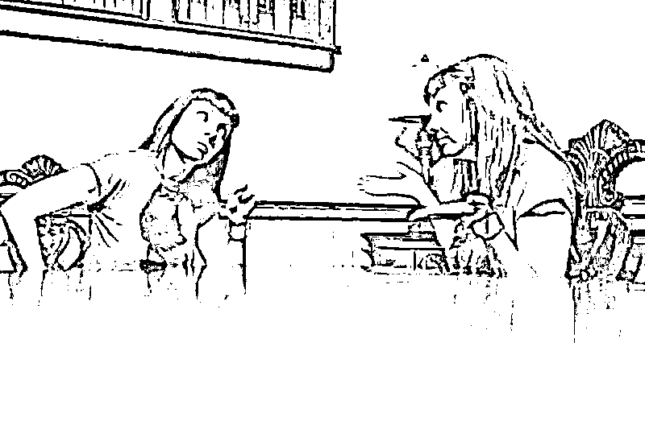 

## 高阶的双子座：不加评判地看待事物

触到高阶的双子座能量，很重要的一点是：**不评判，即不带任何既有偏见地看待事物**。只是看它们原原本本的样子，也接受它们“如其所是”。世间多少痛苦和压迫都由偏见而来，都因为我们无法接受那个参差多态的真实世界，而强行以自己的“真理”去否定和批判其他。

我多年前看奥修的《庄子心解》，其中这部分关于“空船”的描述给我很深的震动，他说：

如果一个人在跨越一条河
有一只空船撞到了他的小船
即使他是一个脾气很坏的人
他也不会生气
但是如果他看到有一个人在船上
他将会对他大声喊，叫他驶开
如果那个喊叫没有被听到，他将会再度高喊
而且他还会开始大骂
这一切都是因为有人在那只船上
但如果那只船是空的
他一定不会大声喊，他一定不会生气

如果你可以空掉你自己的船
来跨过世界的河流
那么就没有人会来反对你
没有人会想要来伤害你
……

他很单纯，不分别
他外表看起来好像是一个傻瓜
他的脚步不留痕迹
他没有权力
他不达成任何东西
他没有名声

因为他不评断任何人
所以也没有人会评断他

这就是完美的人
他的船是空的

这部分内容，虽然是在讲“道”，在讲放下我执，无为而为。但我觉得借用这个“空船”的意象来描绘双子座的理想（高阶）状态，真是美妙极了。

因为“船”本身正是双子座所代表的“交通工具”的一种。而这个船，是空的。**它只履行它“传递信息”的使命：携带，但不干涉。**它只是在真实的世界中穿行，帮助更多人了解到世界本来的样子。**“以沟通信息的方式促进了解”，是双子座的终极目的。**

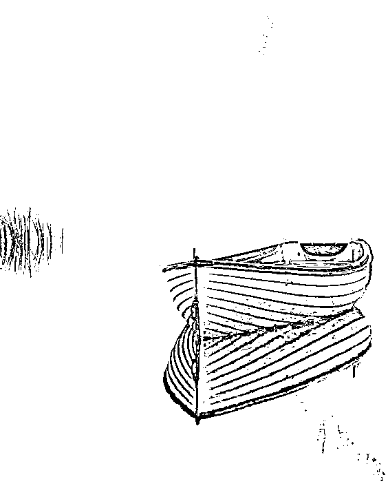 

## 信息没有意识，它不赋予信息意义

想到双子座，我会想到科幻电影里常常出现的“信息的电流”通过电缆传导到世界各处的特效画面，我想那是一种非常典型的双子座过程（当然也有天王星的色彩）。有时则是这样的画面，电脑屏幕上密密麻麻的数据如瀑般洒下。**数据没有意识，没有对错好坏，数据只是数据，它们只是携带信息，它们并不赋予信息意义。**

我们身处一个由数据编织的世界中，而这一切或许不比一部科幻电影更加虚幻。但“背后的意义”并不是双子座关心的，**双子座要在当下去看去听，去感知这个世界实实在在的丰富性。所以从这个意义上讲，双子座比它对宫的射手座，要更贴近“活在当下”的理想。**

另一方面，从“携带数据”这个角度来体会双子座能量，能感受到一种“**抽离**”的意味——虽然“抽离”更是一个水瓶座的关键词，但风象星座毕竟都在提醒我们世界的“客观性”——也就是说，**去面对真实，但并不卷入，不试图改变或扭曲它。**

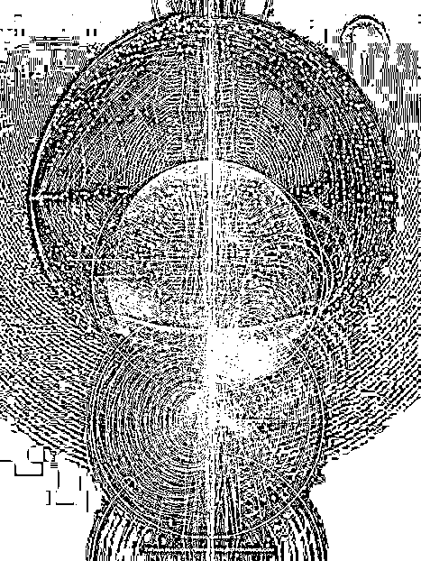 

## 双子座：感受信息流动之美

在身心灵领域，我们时常提到“**联结**(connection)”这个词，我们在很多地方用到它。当我们描述与一个人的关系进入一定的亲密状态，我们说，我们和那个人之间有了联结。占星师常常说要与客户有联结。我们在所有重要的关系中寻找着这样的联结。事实上我们可以跟万事万物有联结。

这也让我联想到双子座的活动，或许只要将“联结”换作“**连接**”，便更加贴近了双子座的本质。因为联结的首要条件也是：**客观地看，以及由此而来的了解**。**双子座**，更代表了那个“**连接**”的过程，是一个神经元触碰到了另一个神经元，于是信息的通道被打通，于是两个独立个体之间，有了了解。

**双子座代表沟通、对话、交流**——观察这些过程会发现，它们都涉及“**双方**”，从一点到达另一点。信息就在这两点之间移动着，只是从此处到达彼处，只是移动。这个过程很单纯，当深入感受这种“单纯”时，就会发现其中的美。

## 双子座灵性表达：一个连接的禅师

之前我读到一篇有关冥想的文章（作者彼尚），里面有这样一段话：

比如你走进公园，去看大自然，不是去辨别每棵树分别是什么品种，而是真正地去看它、观察它！这可能要花你一段时间，但是你会形成一个连接。

突然之间你来到一棵树的旁边，感觉到特别想去触摸它，你能感受到这棵树需要水或者它的水浇得过多了。

就好像它已经在跟你沟通交流了！这才是真正的冥想！或者你到了海报，只是在看，看到海水一波又一波地涌来，就好像是大海在呼吸一样；或者你看着天空，看到美丽的云朵在飘动；或者看你正在熟睡的宝宝，看着他，你的心跳加快了，你已经彻底与他合一了。

这真是一个非常有趣的角度，但并不难理解。我们可以与万事万物沟通交流，反过来说，沟通与交流也可以是“**向内的**”，**即与自己沟通**。

只要有一颗不评判的心，保持一颗孩子般的好奇心，我们总是可以发现新的东西。这里面有一种灵活性和开放性在，而射手座对于真理的探寻，需要建立在这种客观和包容性之上。

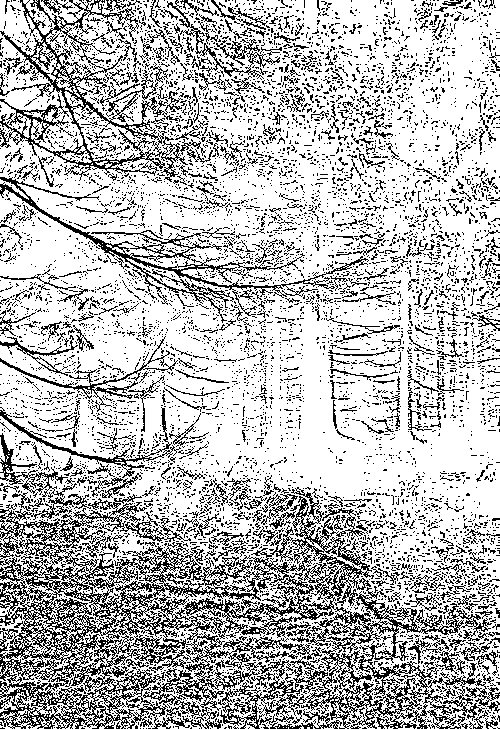

由此我想到，所有星座皆具有灵性层面的表达。抛开我们通常的思维定势中的双子座的（负面）形象，那些淘气的孩子、神经紧张的年轻人、喋喋不休的争辩者……**当双子座能量以最富于爱与美的方式表达出来，那可以是一个洞悉与自然连接的秘密的禅师，可以是一个真正的“连接者”与“传导者”，是让我们看到真相的丰富性和相对性、能够为这个世界带来更多了解和理解的人。**

**作者简介**

**占星师 Cora**，全美占星师联盟（AFAN）成员，国际占星研究协会（ISAR）会员，获 ISAR 职业占星师资质认证，斯蒂芬·弗里斯特《变幻的天空》译者，个人星象文章见诸《心探索》《北京青年周刊》《上海电视》《空中生活》等杂志媒体。曾在若道系统学习占星学，现为全职占星师。

**微信公众号**：聆宇 FM（ID：lingyudiantai）

**个人微信号**：CoraAstro

长按二维码，让金钱涌向传播知识与智慧的人~


**特别提醒：**

**本文发布于若道平台，**

**转载请联系后台授权。**

****了解双子座的意涵，可是如何在星图上实际运用呢？由大卫·瑞雷老师**讲授的**若道核心课程 Level 3，会教你将**星座、行星、宫位、相位这些散落的珠子穿起来，**带你进入更深的自我探索与成长的旅程。本课程将于今年 7 月开课，敬请期待！****


# 理查德·塔纳斯口中“未来的丽兹·格林”是谁？

> 原文：[`mp.weixin.qq.com/s?__biz=MzA5NjA0NTAxNg==&mid=2651385253&idx=2&sn=554fb5d308f23a0ffa00f9aa3b7bdad3&chksm=8b4a5f12bc3dd604062cb1306cab6c49451ae4485330d2a92fe2e9cb1db6abe62e0e426bded9&scene=126&sessionid=1692738826#rd`](http://mp.weixin.qq.com/s?__biz=MzA5NjA0NTAxNg==&mid=2651385253&idx=2&sn=554fb5d308f23a0ffa00f9aa3b7bdad3&chksm=8b4a5f12bc3dd604062cb1306cab6c49451ae4485330d2a92fe2e9cb1db6abe62e0e426bded9&scene=126&sessionid=1692738826#rd)

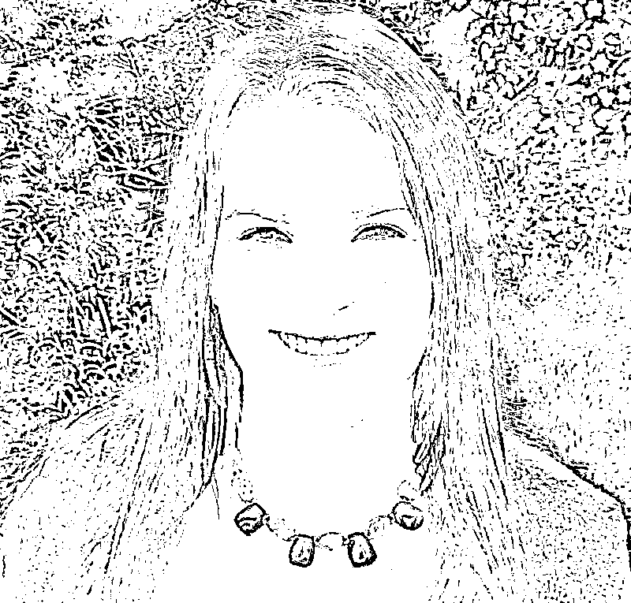

译者/李含  校对/Christy

**4 岁**时，她的父母离婚。

从此，她追求成为一个完美的人、一个从不惹麻烦的优等生。无论什么目标，总要做到最好。

**16 岁**时，这个完美的人已经和 40 个男人以及少部分女人上了床，其中一半的人连名字都不知道。她为自己的放纵不羁和不在乎其他人看法的态度感到自豪。

**18 岁**时，她嫁给一个酒鬼兼瘾君子。

**20 岁**时，她面临涉毒的终生监禁。

随后，她被奇迹般释放。在一段非常态意识的药物治疗过程中，她重新体验出生创伤。她选择离婚，与过去彻底决裂。

同一年，她接受了第一次占星咨询，从此打开新世界大门。

之后她放弃学位，搬家，参加加州整合研究学院的学士学位项目，追随理查德·塔纳斯学习原型占星学。

**22 岁**时，她开始占星实践，现已从事职业占星工作 8 年。

**23 岁**时，她成为理查德·塔纳斯的助教。

**27 岁**时，她在帕西菲卡研究生院获得咨询心理学硕士学位，同时获得注册的婚姻与家庭治疗实习医师资格并将于 2017 年获得认证。

随着学习和自我疗愈的深入，她开始整合原型占星学与深度心理学，同时收获美满的感情。

**30 岁**时，由于其占星学与深度心理学的高超整合，理查德·塔纳斯表示“**她会成为未来的丽兹·格林**”。

今年 7 月，她整合了原型占星学与深度心理学的“**与客户的阴影面工作”工作坊**将在若道举办。

她就是——杰西卡·卡巴拉。

## 失去父亲，小女孩的扭曲人生

杰西卡 4 岁时父母离婚，8 岁时祖父去世，让她感觉自己被遗弃了，生活充满恐惧和失去。这导致她对“追求完美”上瘾。一直以来，她都是一个从不惹麻烦的优等生。无论什么目标，她总能做到最好。满足这些目标是她所知的唯一能让自己在这个世界上感觉到存在价值的方式。

到 16 岁的时候，她已经和 40 个男人以及少部分女人上了床，其中一半的人连名字都不知道。当时她为自己的放纵不羁和不在乎其他人看法的态度感到自豪。成年后回顾往事，她能看到自己对父亲的愤怒内化并转向了内在：“如果他不在乎我，不重视我，我为什么要对我自己、我的行为和别人对我行为的看法那么在意？”

对男性、对父亲形象无意识的、难以抑制的渴望让她在 18 岁时就结了婚，她嫁给了一个酒鬼兼瘾君子。到她满 20 岁时，因为身边有各种各样的违禁药品而面临终身监禁。最终她被单独监禁，在监狱中她痛苦地问自己，如何走到今天这一步？

几个月后，她奇迹般地获得释放，并接受了一段神圣的药物治疗，她的整个世界观分崩离析。这种改变人生的心理和精神的重生，使她与丈夫离婚，与过去彻底决裂。

## 初识占星，一次灵魂的触电

虽然生活艰难，但当杰西卡还是个小女孩的时候，她就知道地球上有一些看不见、在学校里也学不到的事情。也是 20 岁那年，她在美国内华达州沙漠参加了黑岩城的火人节（Burning Man Festival）朝圣：那是一个集音乐、艺术于一体的激进社会参与性活动。6 万人在没有电的帐篷里露营一周，这个经历让她敞开了自己。在露营结束的第二天，她第一次接受了占星解读。

就像一个深度回忆的过程，让她对这个世界的神奇与意义有了新认识。她感受到了强烈的顿悟，知道自己必须改变生活中的一切来追求占星学。于是，杰西卡离开了当时的大学，放弃了在那里主修的社会学专业，两个月后搬到了加州旧金山，开始在加州整合研究学院跟随理查德·塔纳斯和斯坦·格罗夫学习原型占星学。

理查德·塔纳斯是杰西卡的启蒙老师。理查德的著作给了她很大震撼，让她成为这个传统信仰的新拥趸。杰西卡最喜欢的书是理查德·塔纳斯的《宇宙与心灵》(*Cosmos and Psyche*)和史蒂芬·阿若优的《生命的轨迹：深度心理分析手册》(*Astrology, Karma, and Transformation*)、丹恩·鲁伊尔的《变革中的占星学》(*Astrology of Transformation*)，还有斯坦·格罗夫、卡尔·荣格、詹姆斯·希尔曼的著作。

在她第一次学习解读自己星图时，她完全停不下来！连续几个月盯着自己的星图，等待着揭示出新的意义。每一次当她有了关于自我、自己的生活、童年和道路的启示时，就感觉宇宙正在投射着人们。

有一次，她直直地坐着，大声地说：“你是活着的！”这句话是对宇宙说的。那一刻，她的窗外有三声钟响，一只蜂雀飞的房间。了解“共识性”的朋友应该知道这是什么意思。杰西卡认为，**生命是宇宙给予的一份礼物，占星学是另一份礼物，帮助我们记住自己是谁，来自何处，又该去向何方。**

在这里分享杰西卡的星图给大家。

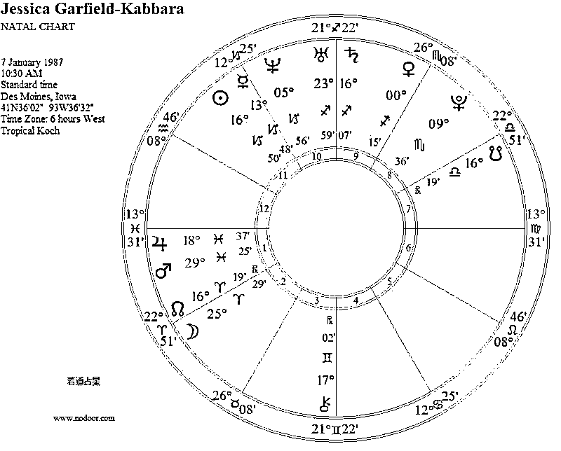

## 占星实践，心理学与占星学的结合

**她最喜欢原型占星学的一点就是，它不仅是占星学，还是一整套世界观，其中包括深层心理学、超个人心理学、原型心理学、哲学、玄学等等。**理查德·塔纳斯不仅是杰西卡的老师、导师，还是她的朋友。2009 年，她成为了他的助教。在 2016 年若道开办的原型占星课程上，塔纳斯也不吝惜对她的夸奖，称她将会是未来的丽兹·格林。

在杰西卡看来，**占星学中最棒的部分之一，就是它帮助人们照亮前路，为人的自我探索提供一个宇宙论的框架。行星的运转能映照出我们的心智或灵魂，当人们领悟到这一点时，对现实、对整个宇宙以及人类和宇宙之间关系的理解就会发生彻底的、根本性的改变。**

她学习原型占星的过程中，她每天研究自己和身边人的星图，包括行进追踪。此外，她还找到一位实践占星学的精神治疗师，开始了自己的心理治疗。

杰西卡表示，每一个人都有痛苦，都不同的形式遭受过痛苦的折磨。大部分人受到的伤害都与亲属有关，意味着这些伤害都发生在她们最亲密的关系中，发生在她们最爱的人之间。在接受心理治疗之前，她极度自卑，曾有一段时间难以相信她爱的人不会离开她，这是父亲离开后，她潜意识里开始形成的信念。因为这种失去父亲的伤痛，她在治疗师那里治疗了多年。

她的治疗师为她塑造了榜样，教会她自爱和接纳，让她学习如何与自己的情绪和需求共处，学习如何与自己不同的部分，例如与内心的小女孩共处。她最终能够接受与治疗师之间这种富于疗愈性的关系，这为她建立自爱、自尊和健康的成人关系铺平了道路。在治疗的后期，她认识了她一生的挚爱，拥有了美满的感情。

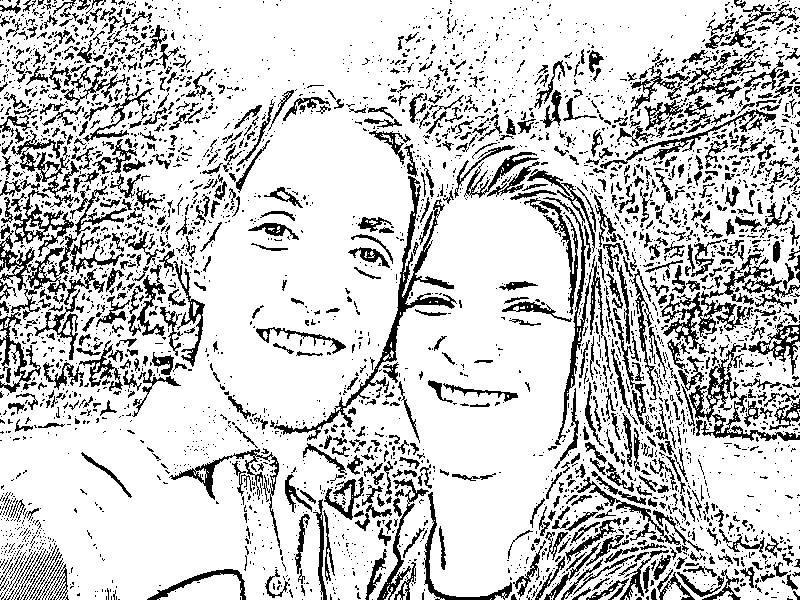

除了是一名占星师外，杰西卡还是一名注册的婚姻与家庭治疗实习医师，拥有咨询心理学硕士学位，研究方向是深度心理学。从 2007-2008 年开始，她将原型占星学的智慧和洞见同深度心理学整合起来，为人们服务。她的梦想是，有朝一日，每个占星师都是心理医师，每位心理医师也都是占星师（不同程度上的）。不论他们是否认为自己是以心理学为导向的人，实践占星学都是一种心理学行为。

## 工作坊，与客户的阴影面工作

今年 7 月 8 日到 10 日，杰西卡将在若道开设一个“与客户的阴影面工作”为主题的工作坊。

她说，每个人都有自己的阴影面。每个人都会挣扎、受苦、受难，这是作为人类共有的部分，这部分也将他们作为人类联系了起来。大部分人会在什么时候需要星图解读或寻求某种形式的帮助和支持呢？会在重要的转变期，比如结婚、离婚、生小孩、换工作或在巨变期、危机期和迷茫期。他们都会在自己人生的不同时期需要帮助，帮助他人很大一部分工作就是了解、确认和把握他们的困难。

在面对客户时，这一过程需要进行很久。她惊讶的是，每一次当她认识并把握住某人的阴影面时，他们真的变得充满力量，更能做自己，有了更充实的生活和人际关系。她相信，不论是否做星图解读，在训练如何有效面对和把握人们生活中的困难时，每一位占星师都能从中收获良多。


杰西卡

大家好！我是杰西卡·加菲尔德·卡巴拉。今年 7 月 8 日到 10 日，我将在若道举办一个三天的工作坊，主题是“与客户的阴影面工作”。非常荣幸我可以来中国，这也是我第一次来中国。

我的理论主要来源于我的老师，理查德·塔纳斯以及斯坦尼斯拉夫·格罗夫，即原型占星学和超个人心理学。我也是一位深度心理咨询师，系属深度心理学。我将深度心理学和原型占星学整合到我的实践之中，做出占星解读。我非常兴奋今年夏天能够向所有人分享这些内容。

欢迎杰西卡！在工作坊上，杰西卡老师会将占星学和心理学恰到好处地融合起来，不仅会讲到这两门学科的基础知识，同时会给中阶或高阶的学生讲授更深入的观点和洞见。来参加工作坊的学员不需要对原型占星学有所了解，老师实践和教授占星学的方式适用于所有形式的占星学。另外，她还可能至少选择两位学员进行案例分析，机会难道哦！

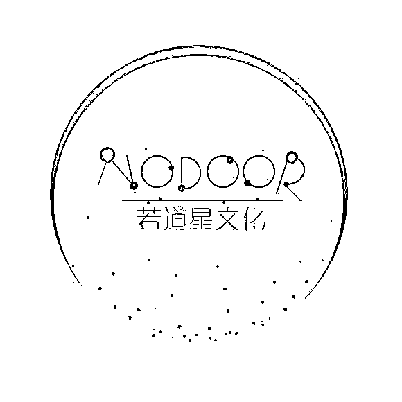
若道君与客户的阴影面工作

**授课时间：**2016 年 7 月 8 日（晚）、9-10 日（全天）

**授课老师：**杰西卡·卡巴拉

**授课方式：**北京工作坊，英文授课，中文翻译

**报名截止**：2016 年 7 月 5 日

**费用**：2800 元（6 月 25 日后）

6 月 25 日之前报名：

| 学员类型 | 价格 |
| ISAR 认证占星师 | 900 元 |
| 原型占星学员 | 900 元 |
| L5 及曾经的高阶学员 | 1500 元 |
| 若道学员 | 1900 元 |
| 非若道学员 | 2400 元 |

**课程负责人：Sara**（**微信：2847613491**，请备注阴影报名咨询）

长按二维码添加课程负责人咨询~

****

杰西卡更多内容会陆续推出

欢迎关注若道君之后的推送

**特别提醒：**

**本文首发于若道平台，**

**转载请联系后台授权。**


**报名请点击“阅读原文”**


# 12 星座可以尝试的 15 件小事丨双子月还能这么玩！

> 原文：[`mp.weixin.qq.com/s?__biz=MzA5NjA0NTAxNg==&mid=2651385247&idx=1&sn=68478dce7965d8266760fe58e75e7d63&chksm=8b4a5f28bc3dd63e67e35b8cc0af83a1643f83f71bd44fb2b66139dffaa93680852e590486b5&scene=126&sessionid=1692738826#rd`](http://mp.weixin.qq.com/s?__biz=MzA5NjA0NTAxNg==&mid=2651385247&idx=1&sn=68478dce7965d8266760fe58e75e7d63&chksm=8b4a5f28bc3dd63e67e35b8cc0af83a1643f83f71bd44fb2b66139dffaa93680852e590486b5&scene=126&sessionid=1692738826#rd)

虽然最近因为大十字给我们的生活带来混乱和压力，但双子座本身的能量还是轻快且愉悦的。继太阳、金星进入双子座后，水星也将在 13 日进入双子座，使双子座的能量成倍增长~我们该做些什么顺应双子座欢快的能量呢？

## 双子座：聪明、有趣、信息、交流

我们往往用双胞胎来形容双子座。的确，大双子们喜欢跟别人分享他们的想法。一个典型的双子座人，有着强烈的好奇心与求知欲。你会喜欢身边的双子座人，他们聪明幽默，总是有新奇有趣的东西跟你分享。

很多双子特质强的人，都有写作、演讲、教学的天赋，或者工作在报刊、杂志、广播等各种媒体领域，还有一些是天生的舞者或手工艺匠人。

当 5 月 22 日太阳进入双子座后，你有没有发现：各种聚会、交流、沟通、信息流转突然活跃起来？

## 双子月，你可以做的 15 件事

除了给身边双子座的朋友过生日，双子月你还可以尝试的十五件事：

**1****与兄弟姐妹一起，参加周末家庭聚会。**

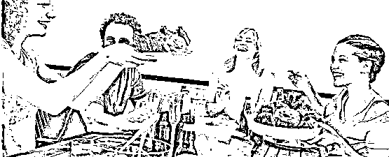

**2****与人拼车，去短途旅行。**

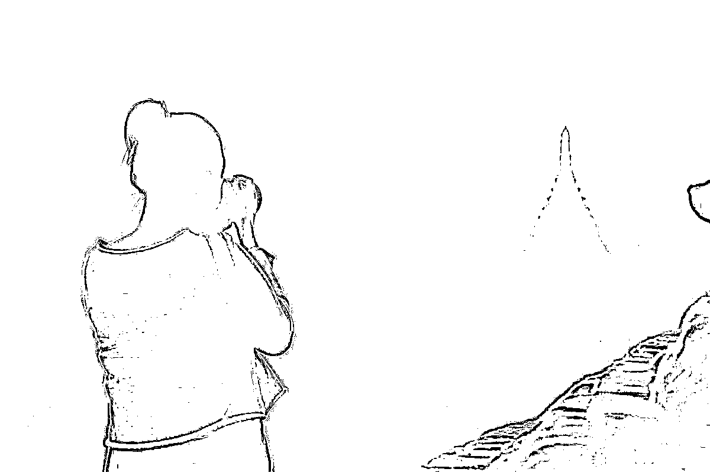

**3****用你的双手创造美丽：手作，园艺，画画，弹奏乐器～**

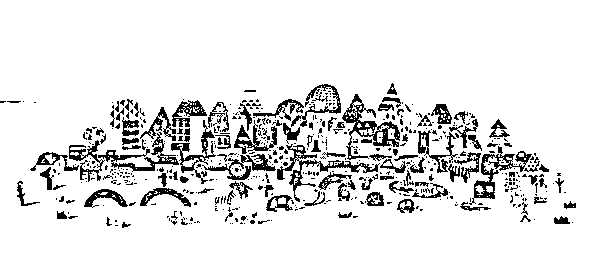

**4****到街头集市购物，试着讨价还价～**

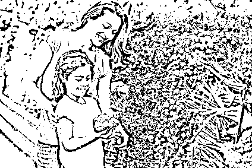

**5****与老友约会，结交新朋友……**

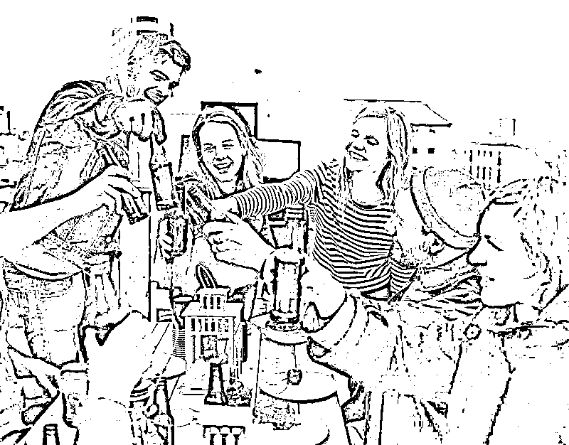

**6****改变自己的着装风格，或取个新昵称、换个新头像……**

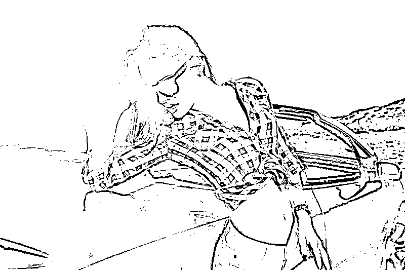

**7****约上闺蜜，一起去做手部按摩与指甲美容～**

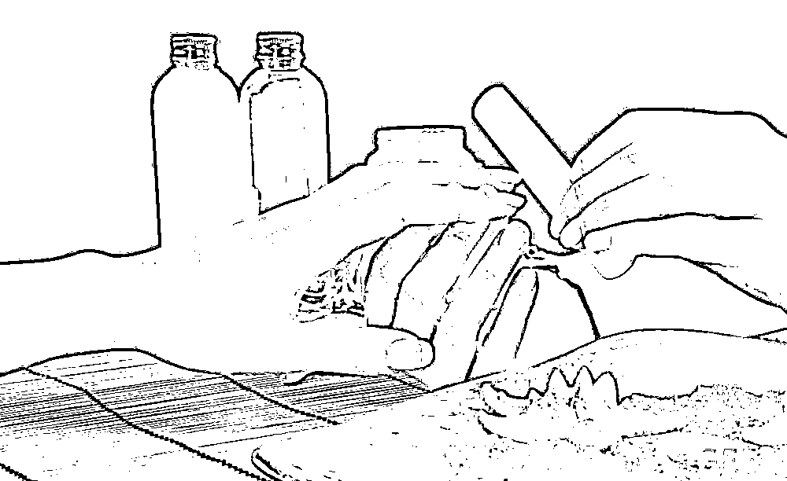

**8****写作，或启动一个自媒体公众号～**

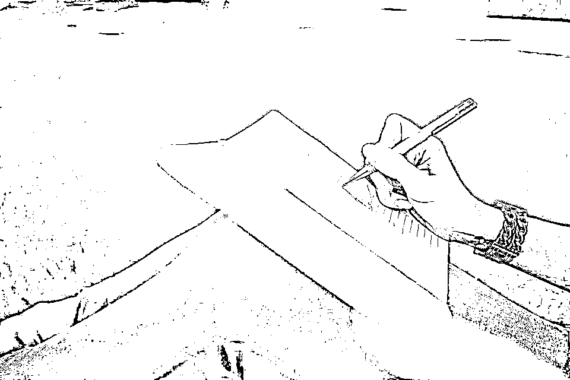

**9****更新公众号或邮件订阅，保持信息流动……**

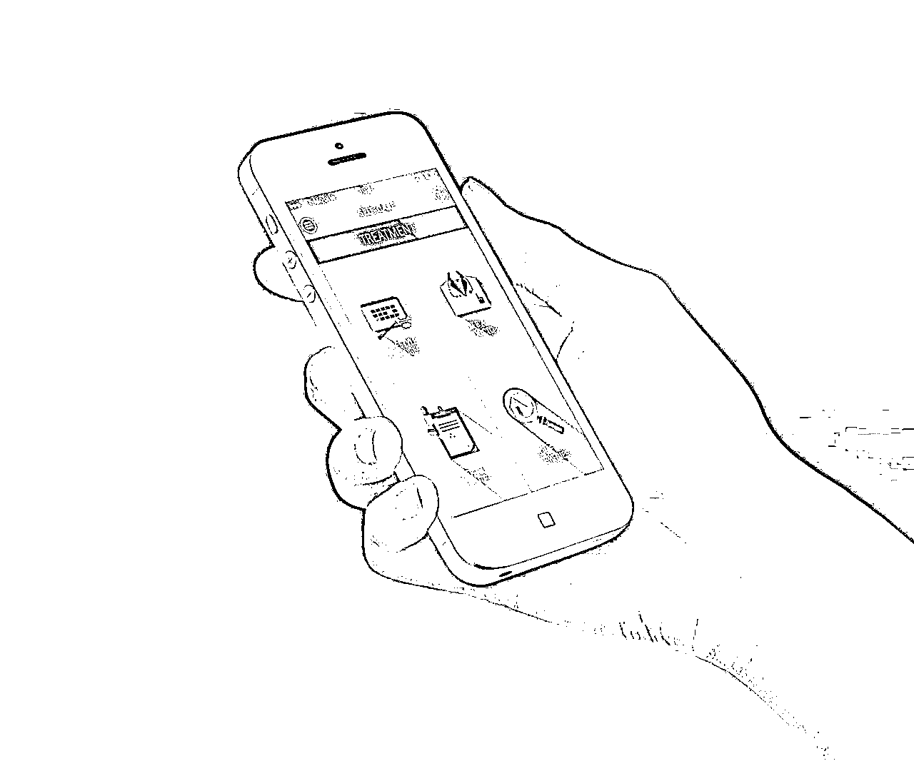

**10****无论你是否在旅途上，给朋友们寄出一张简洁的明信片。**

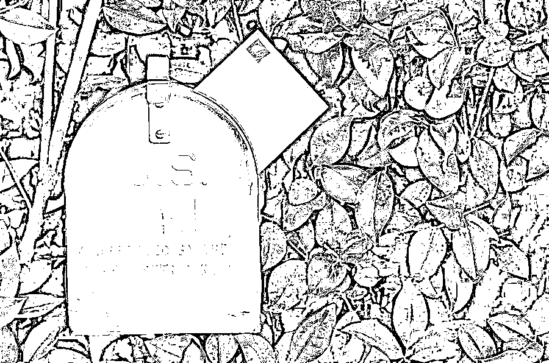

**11****给小朋友们讲故事～～**

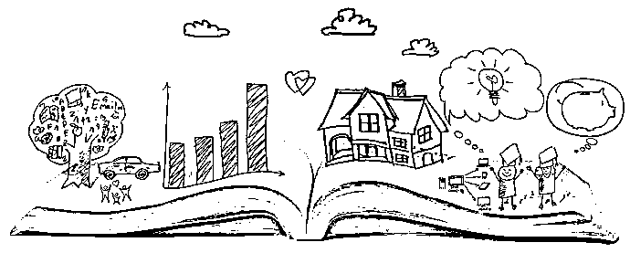

**12****学习新的知识或技能！**

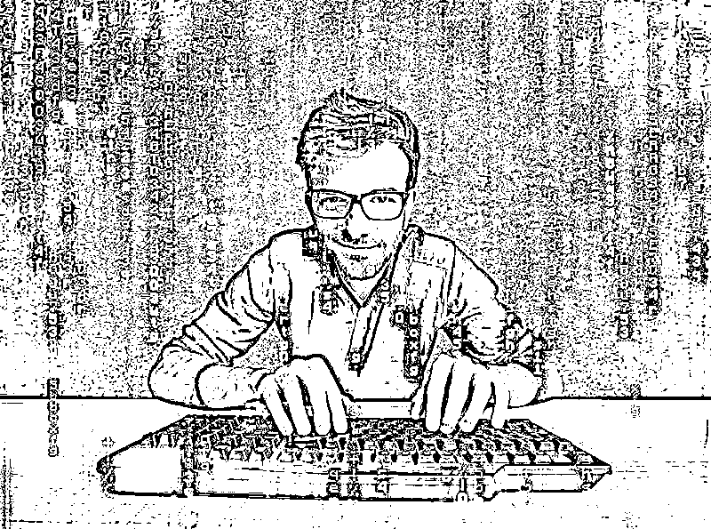

**13****练习肯定句，保持积极的言语与心念～**

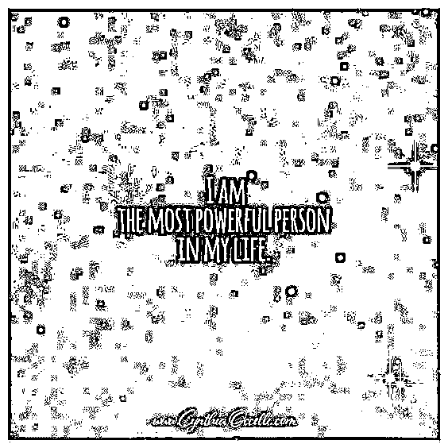

**14****在会议室里，跟同事们练习头脑风暴！**

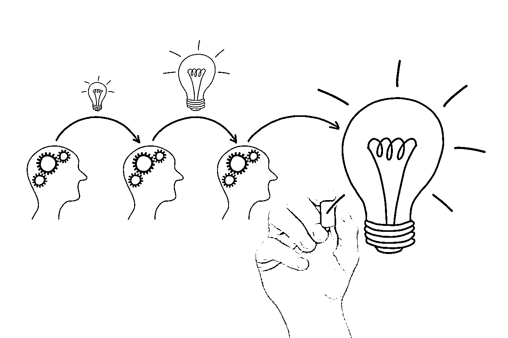

**15****练习打坐与冥想......定能生慧，特别是当你觉得信息过载时。**

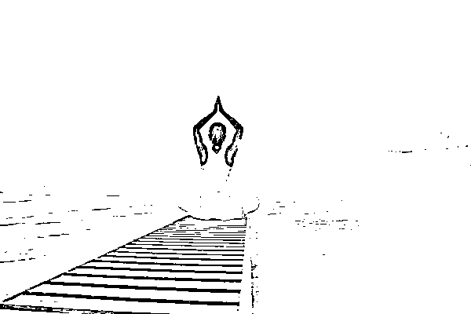


在这个双子月，你准备做哪些事？在你的身边又有什么奇闻轶事？留言跟我们分享吧~

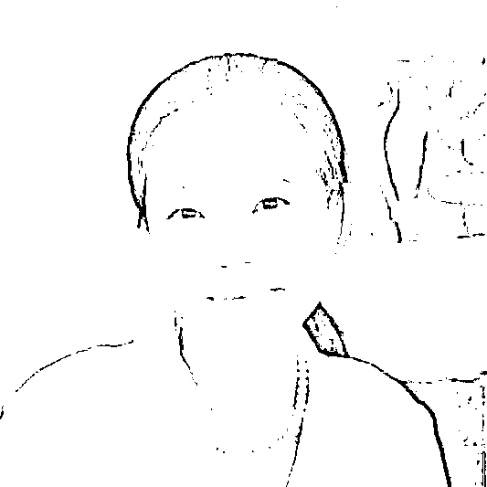

**作者简介**

**熙淅 Justine：**职业占星师，已通过 ISAR 占星师能力测试。

毕业于浙江大学，十年跨国企业人力资源管理经验。2012 年起在若道跟随多名国际占星师学习人本主义占星。个人咨询风格结合心理占星与演化占星。

**个人微信公众号**：AngelAstara

**咨询个案微信**：cicirebacca

**特别提醒：**

**本文首发于若道平台，**

**转载请联系后台授权。**


**了解双子座的关键词，可是如何在星图上实际运用呢？由大卫·瑞雷老师**讲授的**若道核心课程 Level 3，会教你将**星座、行星、宫位、相位这些散落的珠子穿起来，**带你进入更深的自我探索与成长的旅程。本课程将于今年 7 月开课，敬请期待！**

****报名及咨询，请点击文末“阅读原文”****


# 小休 3 天 | 小伙伴们，粽子节快乐

> 原文：[`mp.weixin.qq.com/s?__biz=MzA5NjA0NTAxNg==&mid=2651385247&idx=2&sn=bfdca1839d2f161a841cc2e561fe722f&chksm=8b4a5f28bc3dd63e79a3870be553853f46d39940a70422e4542d6c9775c7f918b6004acd4f98&scene=126&sessionid=1692738826#rd`](http://mp.weixin.qq.com/s?__biz=MzA5NjA0NTAxNg==&mid=2651385247&idx=2&sn=bfdca1839d2f161a841cc2e561fe722f&chksm=8b4a5f28bc3dd63e79a3870be553853f46d39940a70422e4542d6c9775c7f918b6004acd4f98&scene=126&sessionid=1692738826#rd)

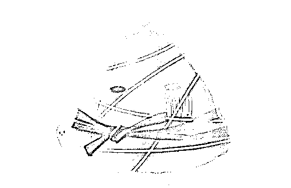

端午节的起源是一个略带悲桑的故事

但是因为粽子君

在很多人的心中

对于这个节日的印象

应该都带着甜甜的或是咸咸的味道

若道君不参与咸甜大战 

因为作为一个严肃的占星界吃货 

咸甜都爱

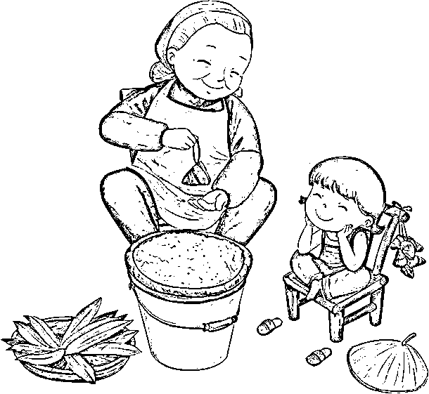

这样的场景 

大家小时候有没有过呢

若道君的奶奶包的粽子可是一绝呢

虽然奶奶不在了

不过每年的粽子节

若道君都会回家陪陪家人

平日工作太忙啦 

节日就是最好的陪伴时间

所以大家也不要忙着在网上争论咸甜粽子谁好吃啦

放下手机

陪家人

好好过个端午吧

**若道君要回家过端午啦**

所以从 9 号到 11 号（周三到周五），若道没有推送哟。

咱们周日再见。

小伙伴们，粽子节快乐！


# 看好了！找占星师咨询，这 5 个常见提问会白白浪费你银子

> 原文：[`mp.weixin.qq.com/s?__biz=MzA5NjA0NTAxNg==&mid=2651385233&idx=1&sn=bd428462756397e4d03ebd29dc4e2d18&chksm=8b4a5f26bc3dd630e3dcca2ebfe5b32e95d737324f1179868c7931b05559780ea2761431ca16&scene=126&sessionid=1692738826#rd`](http://mp.weixin.qq.com/s?__biz=MzA5NjA0NTAxNg==&mid=2651385233&idx=1&sn=bd428462756397e4d03ebd29dc4e2d18&chksm=8b4a5f26bc3dd630e3dcca2ebfe5b32e95d737324f1179868c7931b05559780ea2761431ca16&scene=126&sessionid=1692738826#rd)

作者/Justine 图片/VCG

占星学是对生命问题进行研究的学问。然而正如智者所言，如果你问了错误的问题，那么你只能得到错误的答案。以下 5 个提问是许多人在职业生涯中想要知道的问题，然而这样的问题其实没有真正利用占星学的价值。学习聪明地提问，是解决人生问题的第一步。在双子月，若道君告诉大家如何用聪明的问题向占星师提问，最大化利用占星学的价值！

不聪明的提问 1：**我未来的事业方向？** 

**问**这个问题的，要么是刚毕业的学生，要么面临事业的转型。

首先，我想让你知道一个事实：**不同的占星师会用不同的技法来分析星图的职业需求，但无论用什么方法，如果单是从星图来推测“理想的职业”都不太恰当**。现代社会，职业选择非常丰富，有很多连占星师都不知道的职业路径，但你的内心其实知道！

我们每个人都知道，当我们做一些事情的时候，我们非常开心，即便有困难，我们也愿意去付出格外的努力；而做另外一些事情的时候，我们并不开心，这也让困难显得格外沉重。每个人内心，都存在一个职业的呼唤，只不过因为种种原因——比如过往的教育、社会主流观点的影响、家人的影响、周围人的选择、你内心的恐惧和担忧……让你无法清晰听到那个属于你的呼唤。

星图展示的是职业的一个原型，而包含在生命道路中的职业，有丰富多彩的表达。要不然，“两个星图相近的人会有相同的事业方向”在现实中显然不成立。因此，根据星图的提示，启发你听一下内心的声音，不论是召唤的声音，还是阻碍你不敢听从召唤的声音，都非常重要。

其次，占星师也想了解，**你想做事业转型是来自于越来越强烈的新的渴望，还是仅仅赖来自于对现有事业的失望？**而这个失望中是不是因为你没有去面对一些职业中的破坏性模式，事业转型其实是你的逃避策略？如果是这种情况，可以告诉你的是，很可能，在新的工作中，根据经验而言，**逃避基本没有用**。也许通过逃避可以减轻暂时的痛苦和压力，但这些破坏性的模式在新的工作领域仍然会出现。你逃不开让你成长的东西。

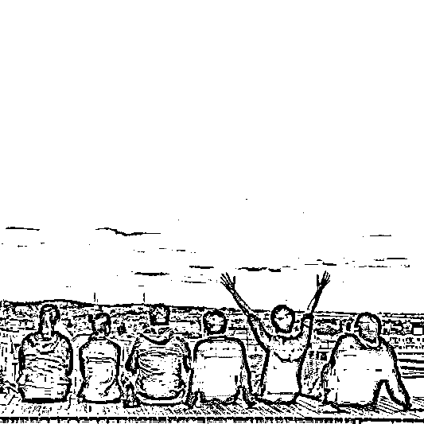 

因此，在咨询过程中，占星师除了关注星图上的职业线索之外，还会跟你一起去探讨很多因素，启发你倾听、发现内心的声音，并结合时机的选择，帮助你对未来的职业方向有更多的洞见，譬如：

*   你最喜欢做什么事情？（与内心真实渴望相关）

*   你的事业挫折感来自于什么？有没有发现一个模式？（寻找事业中的破坏模式）

*   你的原生家庭环境对你过去和现在职业选择的影响？（与自我价值、职业愿景有关）

*   你的教育背景？（有哪些支持你未来事业的因素）

*   你现在所处的人生阶段？（事业是一个发展中的故事，不同的人生阶段有不同的宇宙天气支持你学习不同的职业态度和技能）

*   现实的机会？（你是否有面对现实的能力？你是否有创造新的现实的勇气和耐心，比如如何应对生活在一线城市与三线城市的不同）

*   过往的工作经历？（没有一段职业经历会被真正浪费，哪些职业技能可以转移到新的事业中去）

*   你对报酬期望管理（职业选择上的驱力或自由度，你有没有管理期望的能力）

*   ……

因此，“合适的事业方向”会是一串关键词，而更多的洞见是在咨询探讨过程中产生的。你要容忍占星预测在事件层面的不确定性，并坚信事业的召唤在你的心中。

在关于事业方向的问题上，一些更聪明的问题是**“为了获得事业的满足感，我的事业方向需要满足哪些条件？”“为了成功实现事业转型，我需要考虑哪些问题？”“我想事业转型，需要考虑什么？”甚至，“我现在的事业方向是不是真的不适合我？”**

不聪明的提问 2：我的面试是否会顺利？

**我**们把这种问题称为“抛硬币”问题。“抛硬币”问题的特征是，通常只有“是”或“否”两个答案。大部分情况下，一场面试，要么顺利，要么不顺利；要么通过，要么没有通过，各有 50%的机会。如果答案是不顺利，你不打算去经验或者迎接挑战了吗？如果答案是顺利，你不打算准备了吗？你期待占星师增强你本来没有的自信？或者听凭占星师剥夺你的力量和机会？万一他们错的很离谱呢？

因此，当你准备花钱向一个占星师咨询时，你要想想，你问这个问题想达到什么目的？你能怎样让占星师帮助你？如果只是为了“是”或“否”的答案，这其实浪费了占星学真正的价值。你何必花这个咨询费买一个心理的安慰或打击，你抛硬币就可以的，还免费。

对于面试这个问题，聪明的提问是，**“我如何能加大面试成功的几率？”或者“面试中我应该注意哪些问题？”或者“面试中我可能遇到什么挑战？”此时，占星学就有极大的价值了。这是你的硬币无法做到的。**因为合格的占星师可以根据你的星图特点、岗位特点以及目前你所经历的天象给出很多有用的建议。这些建议将加大了你对自己的认知，对岗位的认知，加大了你对自己在职业周期中处于什么阶段的认知，赋予你更多洞见，而不是剥夺你的力量。

不聪明的提问 3：我事业上升空间在哪儿？

**当**你提出这个问题被时，通常你遇到了事业上的瓶颈。这个瓶颈的出现可能有诸多原因，而在占星师与你的沟通中，会对这些进行排查。

首先要问的是，这是否是一个适合你的职业？是不是你心之所向？ 因为一个人如果呆在在一个不适合自己的职业或者岗位上，如同缘木求鱼，越爬越累，且没有成就感和满足感；如果是适合你的职业，那么就可能有职业态度问题、职业技能问题、人际关系问题、价值观问题、团队协作问题、领导力问题等等。

 同时，你要知道的是，每个人应该为自己的事业上升空间负起责任，职业如同人生，如果你找到了你适合的职业，那么认识到是什么样的破坏性模式在阻止你进一步前进，或者你需要学习什么技能则是更重要的事情。

同时，占星学又告诉我们，职业如果人生，有其周期性，充分认识你现在处于什么周期之中，也可以让你对自己遇到的挑战有更清晰的认知，对于这个挑战的意义更为了解，更有准备，内心更放松。

所以在真实的咨询场景里，需要有一些敏感度去理解这个提问的“言外之意”——

*   是“我一直业绩优异，但跟直接老板关系一般，他一直不肯提拔我”

*   还是“我是留在目前的岗位，还是挑战新职位，更有发展前景”

*   或是“我不觉得晋升承担管理职责有意义，想转化职业轨道。”

*   还是“这个团队让我很不爽”……

**只有在深入探讨的基础上，占星师才会进一步去预测职业运势**（譬如木星可能是遇到职场贵人，土星可能是公司调整策略，冥王星可能是个人的巨大重新定向等等），并给予一些更好的职业发展的建议。

因此，一些更聪明的问题是“**什么阻碍了我拥有更大的事业上升空间？””如果我想获得更大的上升空间，哪些是我应该考虑的？”**

不聪明的提问 4：我适合创业吗？

**这**又是一个“抛硬币”问题，即一道“是与否”的选择题，答案似乎只有两个：是与否。然而真的如此吗？

如果去研究比尔.盖茨、乔布斯、扎克伯格、卡兰尼克（Uber 创始人）这些年创业最成功人士的星图，想从中归纳出一些通用的规则，你会失望。因为创业成功者的星图上没有统一的密码。每个创业者有自己不同的创业动机、才华、挑战。

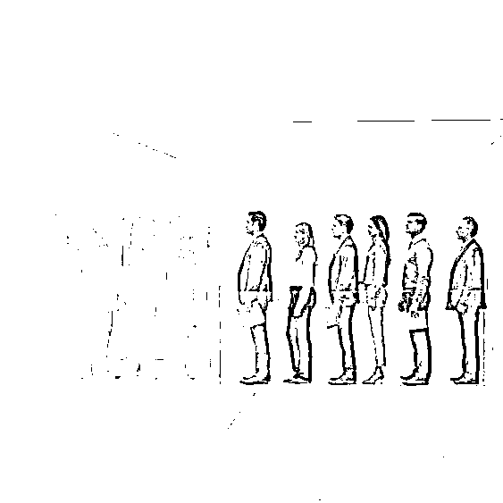

**当你问出“我适不适合创业”这个问题时，我猜想你一定心中有了创业的想法，同时又有一些担忧和恐惧**。一名经验丰富的占星师会珍视你的想法和你内心的火花，和你探讨你的担忧和恐惧，也可以帮助你看到哪些是有利于创业的因素，而哪里会有挑战。

根据经验和数据，我们都知道创业很艰难，创业的失败率很高，有资料显示，创业 5 年的企业存活率低于 10%。同时，我们也看到了当初甚至不被专业的机构风险投资者所看好的一些人在后来取得不可思议的成功。因此，**经验丰富的占星师会和你讨论你的想法，并对你的想法提出一些问题，帮助你在内心寻找答案。你为什么想创业？你有什么样的梦想？你的风险承受力怎样？你怎么看待艰辛和失败**?

创业从开始，就是一个重大的人生选择。一名创业者要也要在创业过程中做出无数的选择。一些选择决定创业的成败。**不成熟的占星师会帮助你选择，而经验丰富的占星师会帮助你学习如何做选择**。决定权终究在你的手上。占星师可以陪着一起走一段路，从星图里提供一些有用的信息，帮助你遵循直觉，踩对生命的节奏，面对避不开的挑战，自信地做出选择。

**作为一个聪明的提问者，与其问一些的只有“是”与“否”答案的“抛硬币问题”，更聪明的、也能够给你带来更大益处的问题是 “如果我打算创业，我首先需要考虑什么？”或者，“我想创业，但是我有这些疑惑和恐惧……我想听听你的看法" **。

不聪明的提问 5：我适合创业的方向是？

**相**信 80%提这个问题的人，对自己“创业的方向”是有头绪的，只是想通过占星确认下，或在一定的范围内做进一步选择。如果你真的完全没有头绪，想通过占星师来了解你的创业方向，那么你还是省省吧！也许你想创业是因为其他原因，比如羡慕他人的成功、旁人的怂恿、想要更自由的工作时间、觉得创业可以带来更多的钱等等。这时，应深入了解的是你为什么想创业！

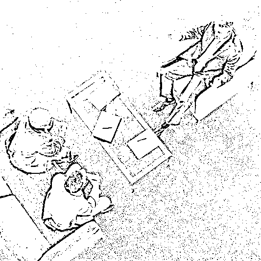

**没错，星图可以给予一些洞见，可以帮助你更好地选择方向，或理解自己的选择，也能给予关于时间点如何把握等建议**。但如果你自己对于创业方向一无所知，求助于占星就是无源之水，无本之木。

创业是很孤独的，需要很多勇气。**占星咨询可以帮助厘清恐惧与不安全感**。也许你的潜意识里不想独自面对选择的压力，在不够成熟的状态下，选择了与占星师分享一段时光。真的希望有人帮忙做决定吗？很可能不，我相信一个决定创业的人，往往是很有主见的。

因此，更聪明的提问方式是，“我想做一个某某方向的企业，你有什么建议”或 “ 我想做一个某某方向的企业，你觉得这个时机如何？”

以上，就是关于占星咨询时更聪明的提问方式。希望对你有帮助。

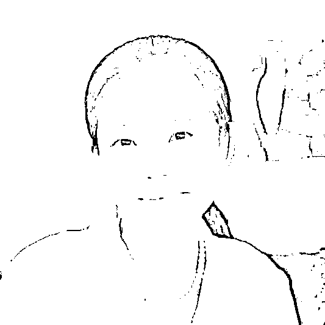

**作者简介**

**熙淅 Justine**：职业占星师，国际占星研究协会 ISAR 会员，已通过 ISAR 占星师能力测试。毕业于浙江大学，十年跨国企业人力资源管理经验。2012 年起在若道跟随多名国际占星师学习人本主义占星。个人咨询风格结合心理占星与演化占星，对于占星触及的人性、灵魂与疗愈尤为感兴趣。

**个人微信公众号**：AngelAstara

**咨询个案微信**：cicirebacca

长按二维码，让金钱涌向智慧的人~


**特别提醒：**

**本文首发于若道平台，**

**转载请联系后台授权。**


**想了解更多企业咨询方面的知识吗？大卫·瑞雷老师主讲的企业咨询工作坊就要在 6 月 9 日（端午节假期）开始啦，教你用占星学理解企业发展，获得属于你自己的成功。**

**报名及咨询，请点击文末“阅读原文”**


# 领军现代占星 35 年、古典占星 21 年，罗伯特·汉德星图秘密大起底

> 原文：[`mp.weixin.qq.com/s?__biz=MzA5NjA0NTAxNg==&mid=2651385233&idx=2&sn=98799d80abed94a7748acff623747bf7&chksm=8b4a5f26bc3dd630f2d4c31212c2d6a55dddec357f296e2a10d5de69e95b18824e69b53c95e8&scene=126&sessionid=1692738826#rd`](http://mp.weixin.qq.com/s?__biz=MzA5NjA0NTAxNg==&mid=2651385233&idx=2&sn=98799d80abed94a7748acff623747bf7&chksm=8b4a5f26bc3dd630f2d4c31212c2d6a55dddec357f296e2a10d5de69e95b18824e69b53c95e8&scene=126&sessionid=1692738826#rd)

很久以前

准确地说在 1942 年 12 月 5 日的晚上 7 点 30 分

一个男孩出生在了新泽西的平原镇

他的名字叫做**罗伯特·斯特林·汉德**

人们也称他**罗布·汉德**

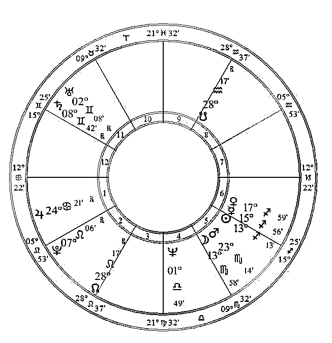

▲图为罗伯特·汉德出生星图

上面这张神秘的图表

将不只是在这个男孩的一生中扮演**象征性的角色**

但是，我们慢慢就会了解

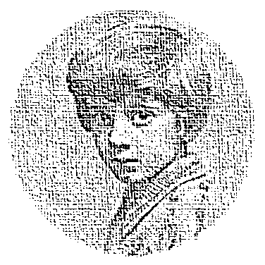

一开始，这个男孩似乎醉心于过去

当其他同龄的男孩女孩都对最新的发明——电视机入迷时

罗布却喜欢听**广播节目**

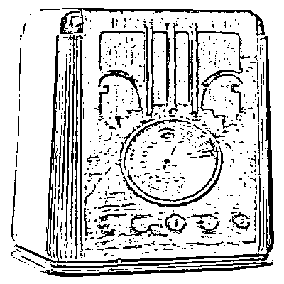

他喜欢闭上眼睛

**想象那些人的样子**

因为没有人再听广播，广播节目逐渐**消失**了

他很难过

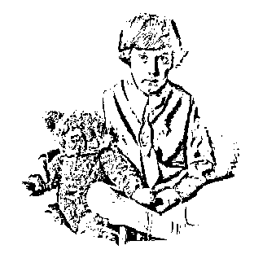

当然，罗布有他心爱的泰迪熊陪伴

这只熊名叫**托勒密**(Ptolemy)，P 不发音

罗布会说：“你直接发 t 的音”

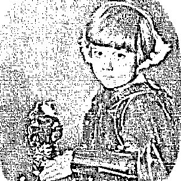

当他不再听广播节目以后

**他喜欢想象自己生活在过去**

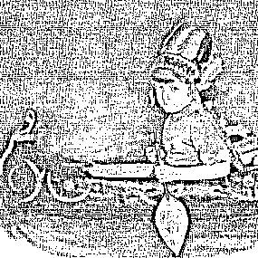

罗布的父亲会说

“**过去始终和我们在一起。我们可能看不见也听不到过去，但如果没有过去，一切都不会存在**。”

当罗布想象自己生活在过去的时候

他常常想到这句话

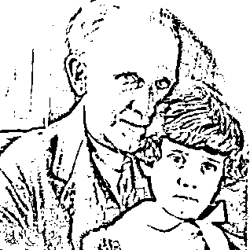

最重要的是

罗布很享受与父亲威尔弗雷德•汉德相处的特别时光

罗布的父亲是一位**证券经纪人**。

他花了很长的时间

**试图运用占星学来找到能预测市场行为的最佳公式**

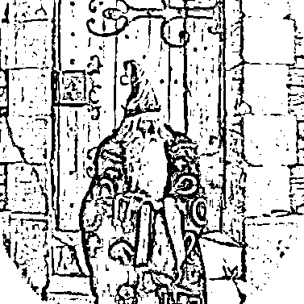

罗布**想象父亲穿着中世纪老占星师的奇装异服**工作的样子

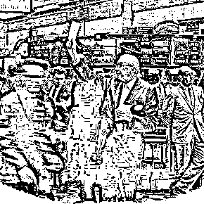

尽管现实与他这个小男孩的想象有很大的差别

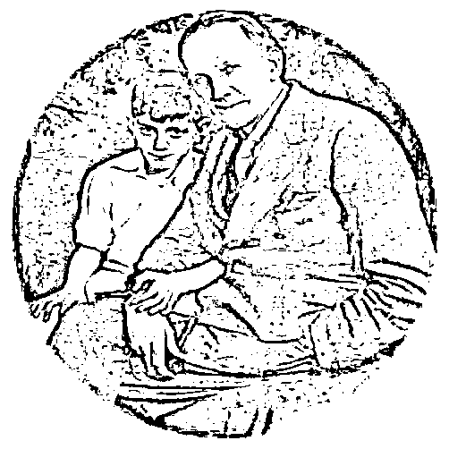

年轻的罗布还是很喜欢翻阅父亲那些神秘的**宇宙生物学**和**日心占星学书籍**

实在太引人入胜了……

虽然对于父亲试图从现代的角度重塑占星学的努力表示尊重

但毋庸置疑

罗布最喜欢的还是那些旧书

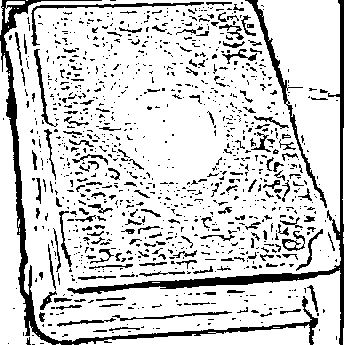

十七岁时

罗布已经成为一名**严肃占星学**的学生

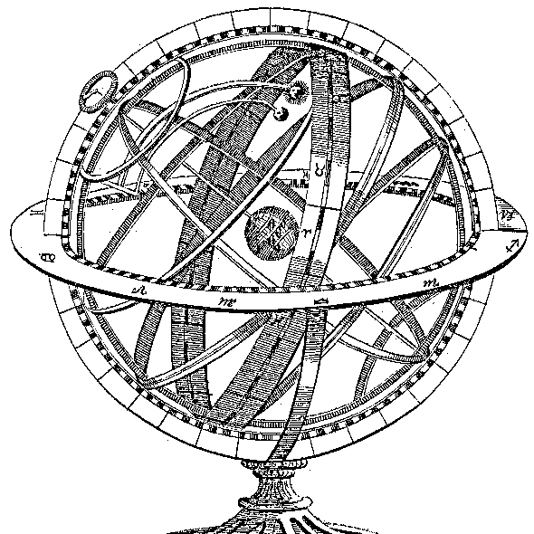

年轻的罗布来到布兰达斯大学求学

在那里，他获得了自己的第一个**思想史学位**

是的

**历史**

**对过去的研究**

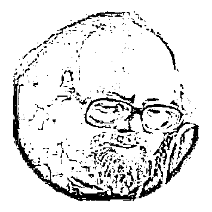

然而，像他父亲一样

罗布也会成为一名**现代占星师**

其作品在现代占星学最佳著作中占据**重要两席**

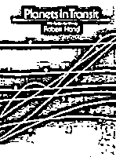

《行星行进与人生周期》

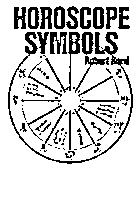

《占星符号》

过去召唤着罗布

当机会来临时，罗布抓住了它

1995 年，罗布开始了名为“**后见之明**”（将希腊、中世纪时期的古代经典翻译注释）的项目

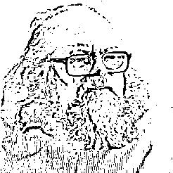

如今

罗布已经是**精通希腊语、拉丁语和希伯来语**的**学者**

他会读很多过去的书

尽管罗布喜欢读古典占星学方面的书籍和他找到的一些零碎资料

但最吸引他、最让他有研究欲望的还是**中世纪占星学**

因此他成为了这个领域**最权威的专家**

然而，在他年轻的时候，现代占星学的情况如何呢

他父亲那个年代现代占星学的情况又怎样

如何将现代占星学与古典占星学协调起来

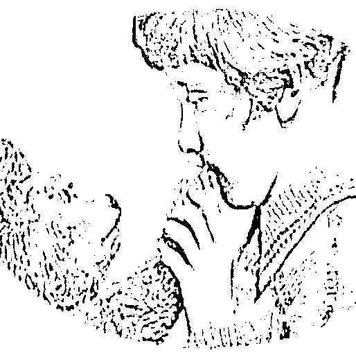

故事尚未结束

故事仍将继续

.gif")

**来若道占星学校**

**听罗布•汉德讲“现代占星与中世纪占星的结合”**

**找到故事的真相**

**8 周神奇之旅**

**7 月 23 日，周六即将开始**

古占与现占结合

**授课时间：**2016 年 7 月 23 日-9 月 10 日 10：00-12：00

**授课老师：罗伯特·汉德**

**授课方式：**网络在线，英文授课，中文翻译

**报名截止**：2016 年 7 月 15 日

**费用**：****6800 元** （早鸟价 5800 元，若道老学员**4800 元**）**

**课程负责人：李老师**（**微信：18601950700**，请备注古占报名咨询 ）

**咨询电话：**400-619-1014

**客服 QQ：**4006191014（若道星文化）

**邮箱：**nodoor@vip.126.com

长按二维码添加课程负责人咨询~

****

**报名及咨询，请点击文末“阅读原文”**


# 在现实里找不到的，走再远也未必能找到 | 三王星行进下的人生危机

> 原文：[`mp.weixin.qq.com/s?__biz=MzA5NjA0NTAxNg==&mid=2651385212&idx=1&sn=82b6bb6514b7fbc60e8f17fd3bdcfeeb&chksm=8b4a5fcbbc3dd6dddaf8dc434f83af40596017cd7836441fa664383366ebd8b6375388f7a0f1&scene=126&sessionid=1692738826#rd`](http://mp.weixin.qq.com/s?__biz=MzA5NjA0NTAxNg==&mid=2651385212&idx=1&sn=82b6bb6514b7fbc60e8f17fd3bdcfeeb&chksm=8b4a5fcbbc3dd6dddaf8dc434f83af40596017cd7836441fa664383366ebd8b6375388f7a0f1&scene=126&sessionid=1692738826#rd)

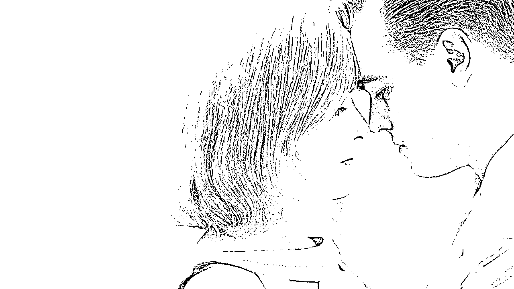

作者/Anastasia

图片来源/《革命之路》同名电影剧照

“

如果你是二十一二岁（行进天王星第一次四分出生星图天王星，行进土星第二次四分出生星图土星）、三十七八岁（行进土星四分出生星图土星）、四十三四岁（行进天王星对分出生星图天王星），如果你经历过三王星（天王星、海王星、冥王星）的行进周期，你会明白作者在说什么。

”**若道君碎碎念**

这又是一篇深度好文。看过《革命之路》同名电影的若道君表示，其“激烈”的情节引人入胜。如果你时间不多不能看这本小说，推荐看看同名电影。PS，文末有彩蛋哦。 

**三王星：天使还是恶魔**

**三王星是我们人生路上注定遇见的天使和恶魔。**如果说太阳、月亮、金星、水星和火星构成我们的性格和天赋，土星和木星的能量让我们与他人和社会联结，那么三王星的能量就是宇宙对我们的召唤，你是顺应它还是无视它，全然在于你内心的力量。

水能载舟亦能覆舟。**任何外行星的能量都必须籍由一个稳固的自我来承载和表达，否则就会成为毁灭的力量。个体内心的稳固程度决定了外行星作用力的大小。**天王星是照亮你人生的明灯，还是击毁你的闪电；海王星是淹没你的人生洪水还是成为承载生命的湖海江河；冥王星是助你破茧化蝶的能量，还是致你于死地的黑暗势力，全在你自己。

**而往往我们为了保有这个“自己”，逃避隐藏在每个人内心的疯狂和罪恶，我们会去避免那些触动我们的东西，但是命运不会。**

**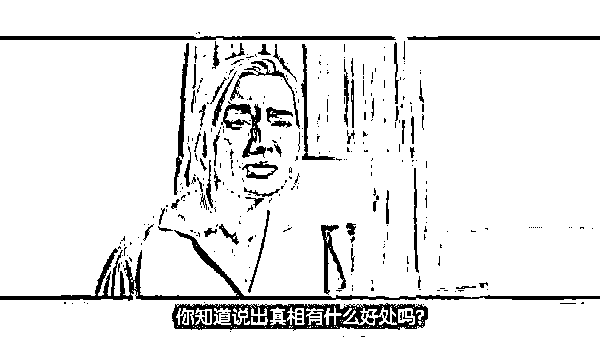** 

**《革命之路》：一本讲述三王星的书**

《革命之路》就是这样一本书，一本让人战栗的书，一本敲响深夜警钟的书，一本让人重新回顾人生的书。书名起得耸人听闻，不少人会下意识敬而远之。潜意识里我们会认为这是一本关于奋斗、流血、献身、牺牲的书。其实，所谓革命之路，就是一条街的名字，革命路。书里讲的是一个关于革命路上的白色小屋里发生的家庭故事。但这条路的名字，无疑隐晦地暗示出本书所包含的**激烈的三王星的能量**。

弗兰克和爱波是一对年轻的夫妻，有两个孩子。当然，他们曾经也年轻过，叛逆过，有梦想、遗弃父母、反抗社会。但是婚后突如其来的孩子改变了这一切。

从那一刻开始，他们对生活就失去了控制。弗兰克选择了一份无聊至极、毫无前途的工作，不过是为了证明自己和任何一个有家的男人一样可以负起责任；他们有了第二个孩子，证明第一个孩子不是一个意外和错误；他们搬进革命路上的新房子，为了证明自己可以拥有有序和健康的生活。

证明、证明、证明，他们证明了自己有能力和别人一样。这是我们所有人的日常，大家彼此心照不宣地活在自欺欺人中。但年轻时候的梦想并没有走远，他们一边嘲笑，一边努力抵抗社会对自我的侵蚀。

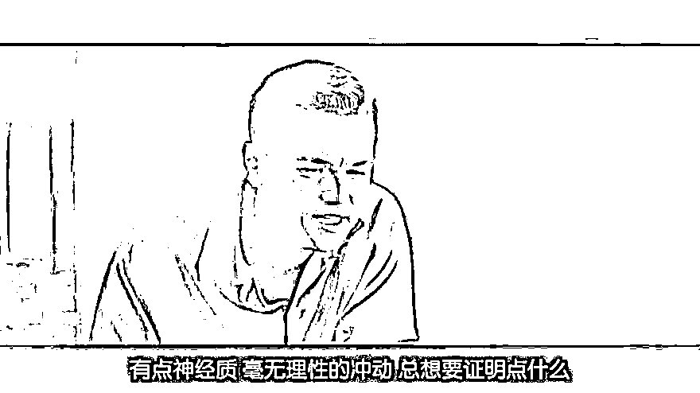

他们参加了一个剧社，一个严肃的、有水平的剧社。革命路上的桂冠剧社，也许这就是往正确的方向迈进了一步。也许自导自演的话剧并不能启发人们，但是有什么关系呢？至少人们会停下来思考，生活里并不是只有火车、共和党和烤肉架子。“就算不成功，我们也不会失去什么。”他们这样彼此安慰着。**这是海王星的浪漫美好的一面，它的另一面，我们都知道是幻灭。**

显然，他们并没有意识到，他们犹疑含糊的海王星力量并不足以支撑他们走太远。演出可以预期地失败了。那些他们看不上的甲乙丙丁难得开明地来看他们的演出，他们失望了。这是一根导火索，点燃了弗兰克和爱波一直在逃避、在积累、不愿去面对的矛盾。不是吗？**如果你没有勇气去面对真相，命运会强迫你去面对。**你逃不掉的。弗兰克和爱波在演出后回家的路上爆发了激烈的争吵，彼此挖苦和指责。他们假装的繁荣、正常的生活开始分崩离析。

**未曾经过土星考验的三王星**

书中接着描写了一个生日，弗兰克 30 岁的生日。这是**土星回归**的阶段。弗兰克滔滔不绝：“让现实见鬼去吧。我们只要那些被漆成白色、粉色或者淡蓝色的可爱小屋。我们要成为好的消费者。我们要把孩子浸泡在虚伪泛滥的情感中抚养——爸爸是一个优秀的男人，因为他挣钱养家，妈妈是一个优秀的女人，因为她和爸爸不离不弃。万一现实不小心露出了真面目，对我们嘘声一片，我们就低头忙自己的事情，假装什么都没有发生过。”

熟悉占星学的人，在这里会感觉到隐隐的、一触即发的危机。**我们知道，三王星的能量，如果没有一颗踏实、现实的土星约束和支持，就会走向失去控制的疯狂和毁灭。**他们内心其实都明白了一件事情，他们并不比任何人高尚，也不是与众不同的。他们就是他们瞧不起的那些虚伪、胆小、沉沦于生活中浪费自己生命的甲乙丙丁们，活在一个“有了家庭/孩子就要脱离真正的生活而安定下来”的浪漫谎言中。

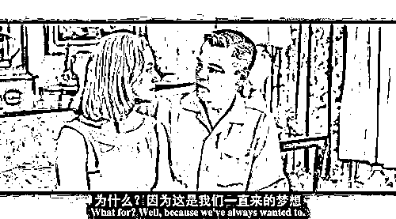 

**分岔路口如何选择**

这个事实让他们崩溃。也促使爱波做出了一个**天王星式**的决定，全家**移民**去欧洲，去巴黎。那是他们年轻时候向往过的生活。在克服内心的恐惧后，弗兰克接受了这个决定。他们向朋友、邻居、同事公布了自己的计划，接受他们的震惊、羡慕和隐隐的嫉妒，这让他们感觉好极了，他们是“与众不同”的。接下来的日子有些飘飘然，弗兰克写出了完美的销售文案，他和爱波之间的关系也重新甜蜜如梦。他们都以为自己已经逃出牢笼，即将重获新生，从此成为更好的人。

但是土星这个严苛的长者是不会轻易放过他们的。随着时间的流逝，不和谐的音符开始出现。在走向新生的过程中，他们充满恐惧。整个过程中能真正理解他们的只有一个邻居家的精神病人约翰，他偶尔会在父母和疗养院的安排下拜访他们。**这就是天王星的行进，短暂的疯狂和解脱。**

弗兰克临走前的工作得到了公司高层的认可，他的事业前景突然光明起来。而爱波沮丧地发现，她又怀孕了。**事情诡异地回到了原点**，回到了他们新婚的那个时候。他们一直认为是意料之外的怀孕将他们拖到了现实生活的泥沼中。现在，历史又重演了。第二次来到命运的分岔路口，他们会如何选择呢？

正如之后精神病人约翰一针见血地指出，他们临阵退缩了。弗兰克把日子安排得多姿多彩，假装地冷静地和爱波讨论关于堕胎的道德和心理问题，然后告诉朋友们他们不走了。弗兰克觉得他终于把他的人生轨道摆正了，但是内心充满了压抑。这一点都不合理。弗兰克出轨，爱波也有了一夜情。**也许，那种无力面对的真实自己，无法填满的内心孤独正是我们一再寻找性的刺激和爱情慰藉的理由。**

当约翰知道弗兰克和爱波不走了的时候，他道出了事实，搞砸了聚会。他被父母带走的时候激动地说：“你知道整个事情中唯一让我高兴的事情是什么吗？”他伸手指了指爱波隆起的腹部：“我高兴自己不是那个孩子。”

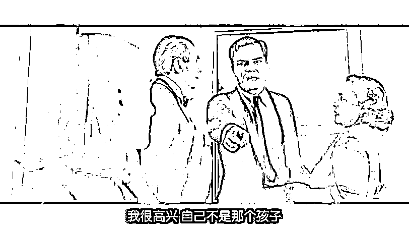 

这是一句多么残忍的大实话。当一切看似风平浪静，弗兰克以为生活恢复了正常的时候，爱波在他上班后选择了独自堕胎，然后死于大出血。旁人都安慰弗兰克这是一场意外，弗兰克激动地说，这不是意外，她是有预谋的，她是自杀。不幸的是，作为旁观者的我们知道，他说出的是真相。**这就是冥王星的行进，要么重生，要么死亡。**

**远方抑或日常，慎重你的选择**

我们会为他们的不幸而伤感，还是嫉妒他们曾拥有过如此激烈、戏剧性的人生？这本书让我在初夏有些闷热的夜晚起了一身鸡皮疙瘩，一种冰冷的共鸣让我不得不去沉思：**假如真的有一个理想生活在远方，难道我们在我们的日常生活中不可以找到它吗？ **

在人生必经的三王星行进中，我们会幸存下来，从此过上与众不同的生活吗？我一再提醒自己，这世界上并没有可以快速实现理想、疗愈创伤的仙女棒。**成长有其时序，我们要做的，是不断地追问自己，从而逼近事情的真相。**终于有一天，我们会开诚布公地面对自己的内心。

成长有风险，人生逃不掉。从某种意义上来讲，人生并没有太多的选择，你将无可逃避去面对灵魂的工作。这就是三王星行进要揭示给我们的人生真相。如果你人到中年，你会知道改变自己是多么艰难的一件事情，更遑论去改变别人。但是，漫长人生中的为数不多的三王星行进，无疑给我们提供了一个诚实面对自己，调整自己，重新打造自己命运的好时机。这当然不简单，但是会给你的余生带来无穷的活力和乐趣。

**文末彩蛋：一生中的社会行星和三王星行进图**

**PS.愚者被星星掌管，智者与星星共舞。**

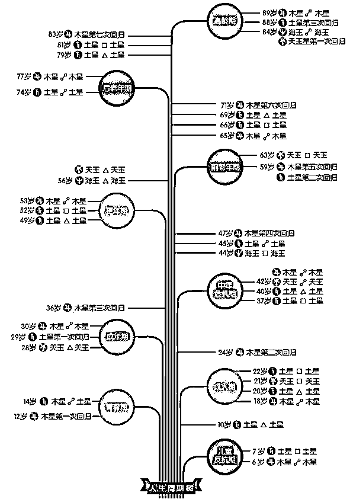


**作者简介**

**Anastasia**：职业占星师，国际占星研究学会 ISAR 会员，若道认证生时校正占星师。太阳射手座，月亮狮子座，上升处女座，擅长讲述个体星图后面隐藏的人生故事和意义。在若道跟随多名国际占星师学习严肃占星学多年，目前从事占星咨询工作。

**个人微信公众号平台**：midnight2evolution

长按二维码，让金钱涌向传播知识与智慧敌人~


**特别提醒：**

**本文首发于若道平台，**

**转载请联系后台授权。**


**由占星学了解人生的秩序，你需要先把基础打好。由大卫·瑞雷老师**讲授的**若道核心课程 Level 3，会教你将**星座、行星、宫位、相位这些散落的珠子穿起来，**带你进入更深的自我探索与成长的旅程。本课程将于今年 7 月开课，敬请期待！**

**报名及咨询，请点击文末“阅读原文”**


# 按惯例，你的免费新月报告在这里

> 原文：[`mp.weixin.qq.com/s?__biz=MzA5NjA0NTAxNg==&mid=2651385211&idx=2&sn=9b8e1cd3b7040b6da251e7c795d5c9ce&chksm=8b4a5fccbc3dd6da4ff453b47f5b8e85bf7ddec5f6caa3273871e53a94e83c2744816ed63435&scene=126&sessionid=1692738826#rd`](http://mp.weixin.qq.com/s?__biz=MzA5NjA0NTAxNg==&mid=2651385211&idx=2&sn=9b8e1cd3b7040b6da251e7c795d5c9ce&chksm=8b4a5fccbc3dd6da4ff453b47f5b8e85bf7ddec5f6caa3273871e53a94e83c2744816ed63435&scene=126&sessionid=1692738826#rd)

**6 月 5 日 10：59 迎来双子座新月。**

**在新月来临前，** 

**你就能在若道免费获得专属于你的新月报告，**

**并且进行新月许愿。**

**手机党们，** 

**点击文末“阅读原文”**

**直接在手机上获取报告，** 

**在线许愿并分享吧！**

**操作起来也很简单哦**

**当新月到来的时候，您只要做如下步骤**

进入首页

点击
“新月祈祷”

登录账户

填写出生信息

查看报告、许愿

**【步骤一】点击新月的祈祷**


**【步骤二】输入姓名**


**【步骤三】输入出生信息**


**【步骤四】生成新月报告**


**最下方有许愿按钮，左边是倒计时提醒哟~**

**在合适的时间就可以许~愿~啦~**

**【步骤五】许愿！**

**** 

**【步骤六】让宇宙看到你的愿望并分享！**

**** 

**◆ ◆ ◆  ◆ ◆**

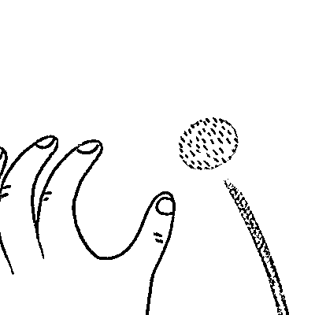

**小伙伴们还等什么？**

**赶快点击→左下角阅读原文****吧！**

# 双子座新月 | 焦虑与痛苦，都为让你“看见”

> 原文：[`mp.weixin.qq.com/s?__biz=MzA5NjA0NTAxNg==&mid=2651385211&idx=1&sn=46f37d72c22dc2d2f0364b80782e4103&chksm=8b4a5fccbc3dd6da25fb7f52028aa4541821bbf7cad92822a17a01dc0967ed01b65b6f9d72a9&scene=126&sessionid=1692738826#rd`](http://mp.weixin.qq.com/s?__biz=MzA5NjA0NTAxNg==&mid=2651385211&idx=1&sn=46f37d72c22dc2d2f0364b80782e4103&chksm=8b4a5fccbc3dd6da25fb7f52028aa4541821bbf7cad92822a17a01dc0967ed01b65b6f9d72a9&scene=126&sessionid=1692738826#rd)

作者/Cora ISAR 认证占星师

图片/VCG

2016 年 6 月 5 日中午 10:59，将发生双子座新月，月亮合相太阳在双子座 14 度。

**双子座新月的意义**

5 月 22 日的射手座满月以来，我们某种程度上一直在经受“火星能量”的洗礼，**太阳和火星的对分相、金星和火星的对分相，引发关系中的冲突和愤怒情绪**，接着**逆行的火星回到天蝎座**，搅动深藏在意识水域底部的污泥，逼我们去重新面对今年 2 月中旬到 3 月上旬期间（火逆的前阴影期中火星在天蝎座的时段），**没有解决清楚的，有关权力、意志、欲望、恐惧的问题。 **

双子座新月在这个时候以一种**轻快、愉悦**的姿态出现，似乎是给这段易有挣扎、对抗和暴戾能量涌出的时段，带来一个喘息的机会，让大家能够看到**危机中令人心动或欣喜的部分，“痛并快乐着”（因为新月与金星紧密合相）。**

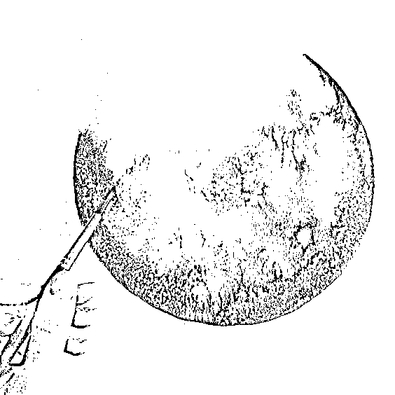

**新月你要思考的**

双子座新月本身教导我们“**不加偏见地看**”。此时我们需要思考的重要问题是：

**○关于自身、关于生活的哪些信息，一直被遮挡或屏蔽了？**

**○我们又是出于什么理由，不让自己全然地看到它们？**

这是双子座新月给出的最重要的题目。

**新月你会感受到**

本次新月的特殊之处在于，新月参与到了发生在变动星座的“**大十字**”中，不仅**与金星紧密合相，与木星成紧密四分相**，还触发了自去年底就开始发生作用的“**土星和海王星成四分相**”议题（土星和海王星四分相渐近准确成相）。

**变化**

变动星座（双子座、处女座、射手座、双鱼座）的称谓本身，已经暗示了此刻存在于大的星象背景中的，**强烈的指向变化、调整与适应的能量**。很多人目前都**处于一个“选择”或“重新判断”的十字路口**，这也是承接 5 月份“五星逆行”的一个主题：**调整与变化。**

**焦虑**

特别是进入 5 月下旬，随着太阳、金星进入双子座，**碎片化信息爆炸带来的焦虑日益明显，周遭新的情况不断刺激着我们的神经**，我们的头脑似乎被迫处于高速运转的状态，难以平静下来。

**敞开**

此时双子座新月“嵌入”大十字，是宇宙在提示我们，要学习“**看的技巧**”——在比较浅显的层面上，是需要去广泛接触新事物，搜集新鲜资讯，以更为“敞开”的态度去与人交往、沟通。在一个更为根本的意义上，则是要**允许自己变换视角，尝试与以往不同的思路，去变通，顺应——看看还有什么可能性能够被发掘。**

很多事，都不是只有一种选择。但**我们囿于过去的经验和狭隘的信念，可能一直局限了自己，带来痛苦。**在大十字星象下出现的双子座新月，**鼓励我们去挑战以往的固定认知**，去问自己：

**○这一切到底是不是真的？**

**○是不是真的没有别的选项？**

**○生命和自我的哪些面向是我们一直没有看到或拒绝看到的？**

**○可以做哪些改变让自己能够更加轻松地接受生活中的富足和快乐？**

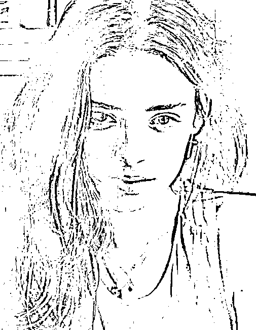
**新月你需要面对**

●**思考什么是真正的价值**

○新月合相金星，则强调了本次新月在价值观、爱情观、审美趣味方面会给我们带来的影响。有趣的是，双子座的守护星水星此刻还在金牛座，而**金牛座由金星守护，本就是财富、资源、价值的象征。**这是一种“双重强调”，要求我们继续深入挖掘金牛座关于价值感的主题：**到底什么是真正有价值的，能够为我们的存在提供最坚固稳定的支撑？**

●**发现生活之美**

○另一方面，**新月合相金星，也让我们能够更容易地“发现生活之美”**，并享受其中。这毕竟是双子座的新月，**双子座善于发现和传播**，金星在这里合相，也暗示这会是一个**“发现快乐”或“沟通情感”的有利时机**。虽然并不能据此判断此刻适合开始新恋情，但我们对于爱的理解和感知，都可能变得丰富。金星毕竟是充满快乐能量的“吉星”，新月与金星合相，给火逆回到天蝎座和“大十字”的紧张背景中，注入了轻快、喜悦的气流。

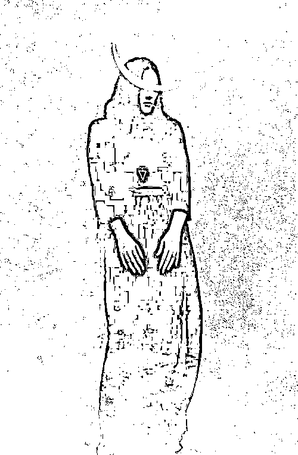 

最后要提醒的是，本次双子座新月，正好出现在火星逆行回到天蝎座后的几天内。火逆回天蝎时，一些**隐秘而复杂**的问题会重新摆在我们面前，其中必定涉及**资源、价值的利用或分享，以及亲密、信任的主题，危机和冲突也来自这里。**

双子座新月在这个时候出现，也给出了一个**应对火逆天蝎的角度，便是放下偏见，增进理解，有效沟通**——**当我们肯去倾听和了解对方到底是谁，以及想要什么时，才可能真正建立起信任和连接**。并且，在某些时候，也需要学习双子座的变通和灵活适应，才能取得双赢的局面。

我们总是选择去看我们希望看到的，所以固定的模式才会反复出现。若想生活真的有所改变，我们大概都需要时不时“换副眼镜”，以便更好地看。

**作者简介**

**占星师 Cora**，全美占星师联盟（AFAN）成员，国际占星研究协会（ISAR）会员，获 ISAR 职业占星师资质认证，斯蒂芬·弗里斯特《变幻的天空》译者，个人星象文章见诸《心探索》《北京青年周刊》《上海电视》《空中生活》等杂志媒体。曾在若道系统学习占星学，现为全职占星师。

**微信公众号**：聆宇 FM（ID：lingyudiantai）

**个人微信号**：CoraAstro

长按二维码，让金钱涌向传播知识与智慧的人~


**特别提醒：**

**本文首发于若道平台，**

**转载请联系后台授权。**


**6 月 5 日就是双子座新月了，每到新月时分，都是播种心愿的时刻。点击“阅读原文”，免费领取你的新月报告。**


# 按惯例，你的免费新月报告在这里

> 原文：[`mp.weixin.qq.com/s?__biz=MzA5NjA0NTAxNg==&mid=2651385210&idx=2&sn=d3c8b1a68cb96868bf406798305ec31c&chksm=8b4a5fcdbc3dd6dbc09df6f608422ed904ad0642f560425b06049a75a8b23d48f7e70a574c44&scene=126&sessionid=1692738826#rd`](http://mp.weixin.qq.com/s?__biz=MzA5NjA0NTAxNg==&mid=2651385210&idx=2&sn=d3c8b1a68cb96868bf406798305ec31c&chksm=8b4a5fcdbc3dd6dbc09df6f608422ed904ad0642f560425b06049a75a8b23d48f7e70a574c44&scene=126&sessionid=1692738826#rd)

**6 月 5 日 10：59 迎来双子座新月。**

**在新月来临前，** 

**你就能在若道免费获得专属于你的新月报告，**

**并且进行新月许愿。**

**手机党们，** 

**点击文末“阅读原文”**

**直接在手机上获取报告，** 

**在线许愿并分享吧！**

**操作起来也很简单哦**

**当新月到来的时候，您只要做如下步骤**

进入首页

点击
“新月祈祷”

登录账户

填写出生信息

查看报告、许愿

**【步骤一】点击新月的祈祷**


**【步骤二】输入姓名**


**【步骤三】输入出生信息**


**【步骤四】生成新月报告**


**最下方有许愿按钮，左边是倒计时提醒哟~**

**在合适的时间就可以许~愿~啦~**

**【步骤五】许愿！**

**** 

**【步骤六】让宇宙看到你的愿望并分享！**

**** 

**◆ ◆ ◆  ◆ ◆**


**小伙伴们还等什么？**

**赶快点击→左下角阅读原文****吧！**

# 双子座新月丨凡是你寻找的，必将找到

> 原文：[`mp.weixin.qq.com/s?__biz=MzA5NjA0NTAxNg==&mid=2651385210&idx=1&sn=2f16891a9955b4c90a551b22608a9bd4&chksm=8b4a5fcdbc3dd6db61c0c6f8b3695b8c113d6a57dd952d519d16ee672a50545c6102add92cc8&scene=126&sessionid=1692738826#rd`](http://mp.weixin.qq.com/s?__biz=MzA5NjA0NTAxNg==&mid=2651385210&idx=1&sn=2f16891a9955b4c90a551b22608a9bd4&chksm=8b4a5fcdbc3dd6db61c0c6f8b3695b8c113d6a57dd952d519d16ee672a50545c6102add92cc8&scene=126&sessionid=1692738826#rd)

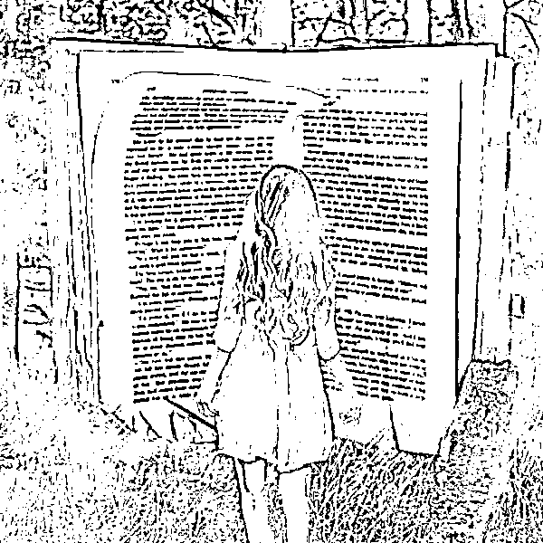

**双子座新月**

2016 年 6 月 5 日 10:59，新一轮新月即将发生在双子座 14 度 53 分。一起来看看这个新月带给我们怎样的启示吧，文末有许愿提醒，点击阅读原文获取免费新月报告哦。

**什么是新月？**

新月是月亮四个主要月相周期（新月、上弦月、满月、下弦月）的其中一个，**发生在农历的每月初一，此时天空中的月亮运行到太阳与地球之间，月亮与太阳成合相。**

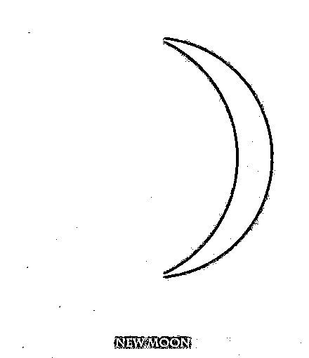

**新月对我们的影响**

**新月的发生往往会调动我们内在的情绪，我们会感到精力充沛，具有上进心。内在的能量被引动，形成较大的内驱力，有想要启动新计划及改变现有生活基调的冲动。**

**新月在占星学中的意义**

**新月非常具有力量，会把出生星图显示的潜力激活或者激化**。**当新月和我们出生星图中的行星形成重要相位的时候（尤其是合相，四分相和对分相），会点燃那颗行星的能量，那部分的生命经验将带来改变。**同时，观察新月发生在本命星盘中具体的**宫位**也是非常重要的，那个**宫位所代表的生命领域的能量峰值将变得活跃。**

**举个栗子**

如我的一位个案，当新月白羊座落入她出生星图七宫，与她四宫里的土星发生四分相时，她下定决心离开让她受困了 8 年的婚姻，开始新的生活。

此轮新月发生在双子座。**新月发生时，行进的金星与新月合相。**双子座是变动的风向星座，对世界充满了好奇，拥有双倍的脑容量，敢于实验人生，能够快速学习及接纳新鲜事物，致力于扫平一切未知，把一辈可以过成好几辈子。而当代表着我们的价值观、喜好倾向及与人建立连接的金星与新月成合相，**会让这种求知求变的动力得以更大的输出。**

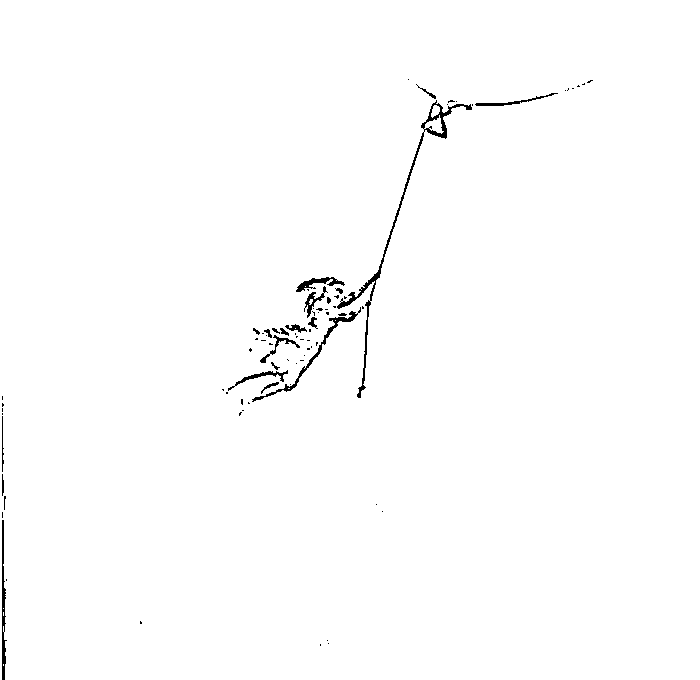

**此次新月你会感受到**

**此轮双子座新月，除了行进的金星与新月合相外，还同时对分土星射手座，又分别四分木星处女座及海王星双鱼座，在天空中形成一个变动大十字。**而这样的格局注定了此次新月有那么一些不一般。

**频繁改变**

变动大十字里的四个成员双子座、射手座、处女座、双鱼座均是变动星座。变动星座的特性是**不以目标为导向，善于变化，有较强的适应能力和弹性**，能较快的学习与接纳新鲜事物，但同时意味着没有定性，做事情缺乏连贯性，不能将精力长久的集中在一件事情上，频繁改变既定的前行方向，很难贯彻始终。

**颠覆**

在此之前，**木星处女座、土星射手座、海王星双鱼座之间形成的变动 T 三角的压力相位**，已经让我们在这几个月里受到强烈的影响。**我们在乐观与悲观之间来回摇荡，在现实与理想之间来回穿梭，在主观感受与客观现实之间拼命挣扎**，在大的人生愿景和当下必须处理的日常事物之间来回游移，在追求灵性发展和物质世界成功之间来回权衡。

我们一会觉得人生充满着希望和美好，转个身，突然又感到一股无力感迎面袭来，瞬间觉得人生没有任何意义，对自己和生活都感到失望。**我们就像大海上行驶的小船，没了灯塔的指引，失去了航行的方向，任由随意飘荡。**我们试图寻找着突破口，为此消耗了很多精力和能量来处理这些需要统合的事情。我们来回的摆荡、穿梭、犹豫、挣扎、失去了抓地的重力感，害怕自己的生活会像泡沫那样随时被刺穿，刹那间，化为乌有。

**机会**

但试着从另外的角度望去，会发现这是宇宙创造给我们的一个机会，一个成长的机会。

**○让我们在这极其不固定的变动状态中去寻觅自己真正渴求的是什么？**

**○最放不下的是什么？**

**○最不能舍弃的是什么？**

这就像是装在我们心口上的一个过滤器，被剔除的是不必要的部分，而剩下来的则是我们最终想要坚守的。**要想获得答案，想是想不出的，问也是问不来的，只能是身体力行的付诸行动，去实践，去经验。在这之后，答案自会呈现于心。**

**自律**

同时，这个过程需要发展出多一些**坚守和自律**，而这正是变动星座需要学习的关键。不要再站在十字路口来回徘徊，受困于自己设定的过高理想，迟迟无法行动，最后自己把自己挡在了生活的门外。

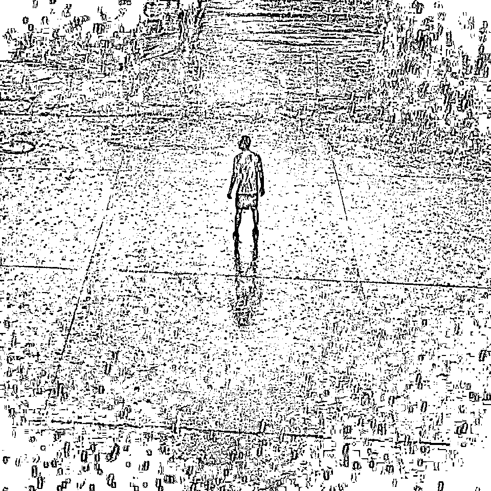

**新月在 12 宫位的影响**

在此天象之下，我们每个人都受到宇宙的邀请，在各自的生命领域启动一股内在的能流，并将其向外投射出，让我们成为某个领域的涉猎者、学习者或分享者。

打开你的出生星图，看看双子座新月即将发生在你出生星图的哪个宫位里。落入的宫位所代表的人生领域将会被注入新鲜血液，给生活带来新的机会和经验。

> **若道君提示**：想知道新月具体在哪个宫位，可以通过熟知占星软件查阅星图获得。也可以点击若道官网 www.nodoor.com，点击“在线星盘”-“行运盘”，在左栏输入自己的出生信息，在右栏填入想查阅的日期的信息，点击“生成星盘”按钮，就能查看到行进的月亮在你出生星图的哪个宫位。（如下图所示）

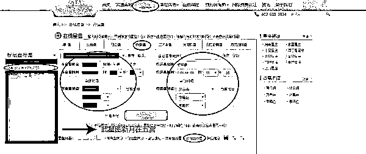

（如果看不清，请点击大图）

**— 新月发生在出生星图第一宫 —**

或许你有些厌倦了旧有的形象，想换个新的造型和面貌示人。接下来你**与外界互动的会更频繁，渴望更多自我展现的机会。**

**— 新月发生在**出生**星图第二宫 —**

对金钱和拥有资源的态度会变得更加多元化。尝试走出一直带给你安全感的舒适区，**接受新的生活理念。**

**— 新月发生在**出生**星图第三宫 —**

新月双子发生在它守护的原始宫位里，将会使得**思考力比以往更加活跃，迫切的想要获取新的知识**，若一直想学习另外一门语言，或许现在是个不错的时机。

**— 新月发生在**出生**星图第四宫 —**

重新布置家里的装饰，创造一个轻松愉悦的居家环境和氛围，**借由改变居家环境来重识新的内在自己**。这段期间，或许你在家会比往常说更多的话。

**— 新月发生在**出生**星图第五宫 —**

开发出新的兴趣爱好，**通过愉快的玩乐和创作激发内在的创造天性，发展出独特的创造性表达**。适度的玩乐具有疗愈作用，尤其对于一直忙于工作的人来说。

**— 新月发生在**出生**星图第六宫 —**

日常事物变得繁忙。工作中开的会议，所需的提案和文书都比平时多，工作电话可能打到爆。**发展出新的工作方式来提高效率**。获取有助于身体健康方面的养生知识。

**— 新月发生在**出生**星图第七宫 —**

较多地参与一对一的朋友聚会。**和亲密关系发展有趣的互动模式，寻找到共同的兴趣爱好将有助于感情升温**。可能达成某种合作关系。

**— 新月发生在**出生**星图第八宫 —**

**着力于探究事物表象之下所暗藏的智慧，对神秘未知的事物充满了好奇**，想要一探究竟。

**— 新月发生在**出生**星图第九宫 —**

**给自己稳定的信仰或信念注入一些新的视角，带着好奇去探索人生的意义**。出国旅行领略异国文化将帮助更加多元化的了解这个世界，收获不一般的心智与精神之旅。

**— 新月发生在**出生**星图第十宫 —**

**将会有更多的机会在公众面前展露自己**。如果由你主动的某个产品和品牌将要推出市场，现在进行宣传或许是个不错的时机，将会比往常获得更多的关注。而事业上或将迎来新的发展契机。

**— 新月发生在**出生**星图第十一宫 —**

积极的参与或组建各种团体活动和沙龙，带着独立的见解投身于社交活动之中，寻找志同道合的朋友和群体，**通过交谈分享共同及不同的理念**。

**— 新月发生在**出生**星图第十二宫 —**

将某个理念和知识传播给众人。**关注自己深层意识**，比如留意梦境，并尝试以写日记的形式将它记录下来，**或许将帮助你带来不一样的深层洞见**。

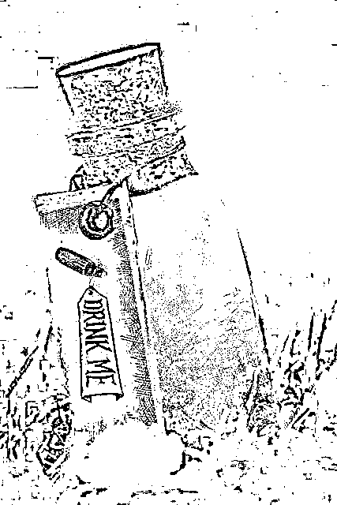

**如何许愿？**

*   **许愿时间**

*   2016 年 6 月 5 日 10:59 后，48 小时内有效、8 小时内最佳。

*   **许愿人群**

*   所有人。

*   **许愿数量**

*   每人最多 10 个。

*   **许愿方式**

*   记录在本子或者纸张上收藏。

*   **许愿格式**

*   请万能的宇宙赐予我 XX 能量，我将以我的 XX 能量吸引……

*   **许愿要则**

*   发心诚善利人。

让我们带着一颗发现者的心（新月双子座合相金星），以负责任和精益求精追寻理想的态度（木星处女座），去落实和明确我们坚守的信念是否符合现实，及足够的稳固（土星射手座），去寻得那最终的灵性发展和启悟（海王星双鱼座）。

**凡是你寻找的，必将找到；凡是你敲击的，门必将为你打开。你内心真正渴望的一定会来到你的身边。那就以这个双子座新月为起点吧！**

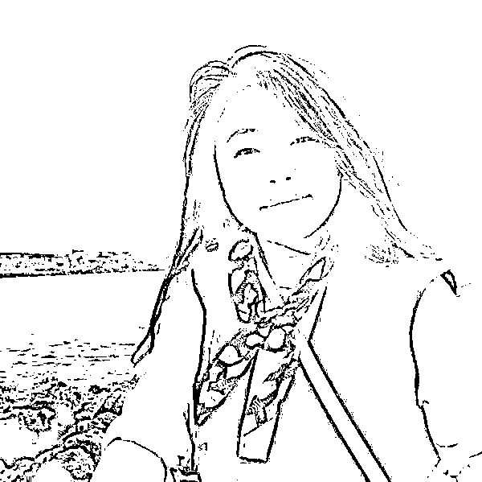

**作者介绍**

**理想国的女巫**：职业塔罗占卜师、人本主义占星师、国家二级心理咨询师、占星专栏作者，国际占星研究协会 ISAR 会员。致力于将心理咨询技术与塔罗占卜和占星咨询进行融合与连接。咨询中注重来访者自身的心理动力，个人自由意志与灵魂的进化成长，而非宿命式的论断。跟随多名国际占星大师系统学习占星学，主要研习人本主义进化占星学以及心理占星学。2015 年在上海创立独立咨询工作室（十二宫塔罗占星咨询工作室）。

**微信公众号**：house12ta 

**咨询预约号**：vivian-yanyan

长按二维码，让金钱涌向传播知识与智慧的人~

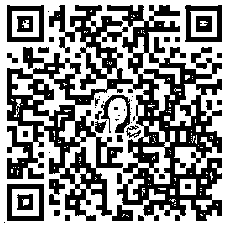

**特别提醒：**

**本文首发于若道平台，**

**转载请联系后台授权。**


**6 月 5 日就是双子座新月了，每到新月时分，都是播种心愿的时刻。点击“阅读原文”，免费领取你的新月报告。**


# 重要天象 | “大十字”很可怕吗？关键看你如何解读它

> 原文：[`mp.weixin.qq.com/s?__biz=MzA5NjA0NTAxNg==&mid=2651385193&idx=1&sn=6d22e15fd59f3e8f5aa2ae38e49ee7c2&chksm=8b4a5fdebc3dd6c89b467db6c43bbbd0bcacb166c2dcc2b099619d79f413b11ae50b76409118&scene=126&sessionid=1692738826#rd`](http://mp.weixin.qq.com/s?__biz=MzA5NjA0NTAxNg==&mid=2651385193&idx=1&sn=6d22e15fd59f3e8f5aa2ae38e49ee7c2&chksm=8b4a5fdebc3dd6c89b467db6c43bbbd0bcacb166c2dcc2b099619d79f413b11ae50b76409118&scene=126&sessionid=1692738826#rd)

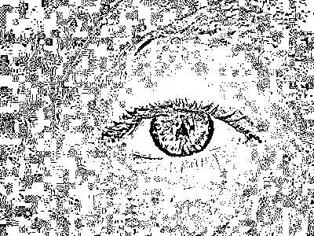

作者/喜悦龄以  ISAR 认证占星师

最近你的生活中是否增添了许多混乱？纷繁复杂的讯息、措不及防的变化、充满未知的选择都让你很头疼吧？这些，都是五颗行星齐聚变动星座并形成“大十字”带来的反应。这是一次充满艰难的挑战，但也是成长与改变的机会。我们要做的，是寻找生命的目标，感受内在的稳定，而非六神无主盲目跟风。

**行星格局**

6 月 1 日到 6 日，太阳与金星合相在双子座，并和位于处女座的木星、逆行在射手座的土星、双鱼座的海王星形成“大十字”。期间，6 月 5 日的双子座新月会加入大十字格局。之后太阳、月亮、金星继续行进，但木星、土星及海王星的“T 三角”相位仍持续至 2016 年 6 月中旬，木星继续行进离开后，土星与海王星的四分相位持续至 2016 年 9 月底。

**占星课堂** 

**什么是大十字？**

四颗行星处于彼此四分（90°）、对分（180°）的相位。大十字，就是由至少两个对冲相位，四个四分相位所构成。此图中由于太阳合相金星，这两颗行星与海王星、木星、土星成形大十字格局（看图中黄色线段）。

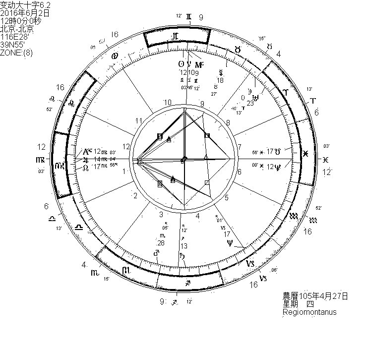

**●四分相的意涵**

两个行星夹角 90°。行星处于不和谐的元素中，两者分别以完全不同的方式表达自己，由于表达方式不同，难以了解彼此，造成**挣扎和冲突**，当然也有可能带来巨大的成长和成就。表现为**外在的人事物总是发生某种冲突**，而如果当事人能够了解和承认冲突来自内在，这个相位也能够成为能量的源头。

**●对分相的意涵**

两个行星夹角 180°。行星能量各自作用于相反方向，但基本上它们会落在互补的元素上。对分相让人感受到**内在的挣扎**，像是对自己不断的争执，因此产生不确定或摇摆的态度，因此带来**限制和困**难。但是，觉察自己的冲突、困顿也是很宝贵的特质，对于内在成长不可或缺。

如果一个人的出生星图具有“大十字”结构，也意味着生命中要面临较大的挑战。而我们如今处于大十字的行运，也会在这个阶段，或多或少受到这些彼此冲突的能量的冲击。此次的大十字位于变动星座，故而有着不稳定、摇摆、动荡的特质。多颗行星聚集在变动星座，跳跃、动荡、变化形成主要的能量氛围。读者可以想象，在四分相和对分相这样双重压力之下，人们可能会呈现出什么样的状态。

**影响人群**

“大十字”对所有人都有影响，**其中出生星图中有个人行星（太阳、月亮、水星、金星、火星）及社会行星（木星、土星）落在变动星座（双子座、处女座、射手座、双鱼座）9-15°的人更易被冲击**，也更易感受到影响。

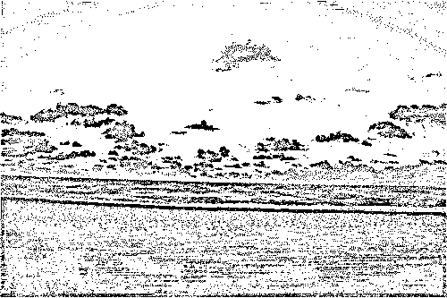

**你中招了吗？**

**最近你有没有遇到下面这些事？**

**○**冲动投资；

**○**过分沉溺于美食、美容、恋爱等享受，例如吃得过多，冲动消费，情感不专一等；

**○**被表面现象迷惑做出错误决定；

**你有没有以下这些迷茫？**

**○**徘徊在乐观与悲观、清晰与迷惑、挑剔与包容、懒散与精进，沉溺与行动之间；

**○**左也不对，右也不对，不确定、摇摆、看不清方向；

**○**长期坚守或者自以为稳定的信念在不知不觉中已然移动了方向。

**关系中你有没有这些感受？**

**○**曾确信的某个人或者关系、事件发展让你大跌眼镜；

**○**之前还可以忍耐、可以沟通的人，到现在感觉实在无法沟通与了解；

**○**沟通不畅、表达不清、意见不和、信念分歧；

**○**关系破裂、谣言误解、真相泄露等。

**你有没有或主动、或因外界原因不得不改变？**

**○**生活状态；

**○**工作、职场关系；

**○**情感关系；

**○**金钱的使用；

**○**你对他人或自己的期待；

**○**对自己的定位。

如果有，那你就是受此次大十字星象影响的学员了。重要的不是发生了什么，而是借此机会更多了解自己，这才是人本主义占星学的意义。别忘记，所有的外在现象，都是我们内在的呈现。

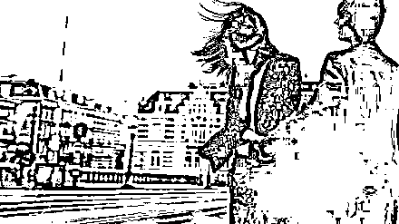

**“大十字”教导什么？**

看看四分相与对分相是要让我们学习什么？

双子座要体验，射手座要意义，处女座要精进，双鱼座要奉献。如果你被变动之流席卷，想想你的人生目的，不是社会性的目的，而是你生命真正的目的。确定你的目的，能让你更稳定。

生命的真正目的，需要越过现存的群体思想形式去看，我们都知道，一百年前的价值观与现在是不同的，社会的信仰总在变迁，假若你将自己的人生目的建立在被周围人认可的价值上，它也将是变动的，未必能反应你的真实目的。

社会性的目的，常以奉献、助人、为公、提倡优秀（与人比较）、尊重权威为标签，自然、人性、心灵的内在规则与独特性常被忽略，也使得生命中充满重重烦恼与纠缠。

“

**那么，什么是真正的人生目的？**

”

每个人都有自己特定的目的，每个人都有自己喜欢、擅长的事。真正的人生目的，就是做自己这艘船的船长，做自己真正喜欢、擅长的，能为自己带来喜悦的事。

**它可以用这四个变动星座的正向能量来描述：开放的体验，精进你所爱之事，发现体验的意义，连结无限与智慧的大我。**

**向自己提问** 

你是自己的船长吗？问自己以下问题，就会得到答案：

①我是在为自己做这件事吗？还是只是为取悦他人（包括你的父母、爱人、孩子、上司、权威……），达到他们对我的期待而做？

②我达成这目的，是为了能得到赞许或好名声吗？还是因为这是我想做的，它合乎我的本来面目，能带给我喜悦？

③如果社会没有任何被标签来让人们羡慕、仰慕、认为是好的或对的形象，我将如何过你的生活？

④如果在我的人生里，既没有任何人会由我所做的得利，也不会受损，那是否会改变我现在的选择？

⑤假若社会并不存在，或拥有截然不同的价值观，我仍会喜爱你正在做的事吗？

.jpg")

也许你会抗拒这些问题，因为它们如此“不现实”，另一个残酷之处在于，它们让我们看到自己离开真实的、自由的生命有多远。你是否相信，这些问题的答案，便是我们安放心灵之处？ 

不需要接受这些观点，不需要让对问题的思考回答改变你的任何方向，只是呼吸一些新鲜空气，给自己的心开一扇窗，允许一束光照进来，看一眼未被充分滋养的心灵。

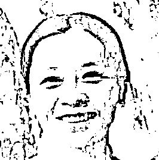

**作者简介**

**喜悦龄以（张征）**：工学学士，工商管理硕士（MBA）；2013 年通过 ISAR 国际职业占星师资格认证，成为首批 ISAR 认证的中国占星师（CPA）之一。国家二级心理咨询师，中德高级系统式家庭治疗培训项目毕业，中法精神分析连续培训项目受训，持续接受督导及每周 3 次个人分析。

**主要工作**：占星咨询、家庭咨询及心理动力学取向个体咨询

**微信公众号**：xingchenlaixin 

**喜马拉雅个人电台**：喜悦龄以


**想要顺势而为？先学习整合星图。由大卫·瑞雷老师**讲授的**若道核心课程 Level 3，会教你将**星座、行星、宫位、相位这些散落的珠子穿起来，**带你进入更深的自我探索与成长的旅程。本课程将于今年 7 月开课，敬请期待！**


# 大卫谈占星 | 原来 12 星座眼里成功的区别这么大

> 原文：[`mp.weixin.qq.com/s?__biz=MzA5NjA0NTAxNg==&mid=2651385157&idx=1&sn=08fd7bb50e219da23e3755f2aef01fb7&chksm=8b4a5ff2bc3dd6e40179b95244f4b1195c225d2f6e27e4a6ae3f236d54083b9ed8ce9924a959&scene=126&sessionid=1692738826#rd`](http://mp.weixin.qq.com/s?__biz=MzA5NjA0NTAxNg==&mid=2651385157&idx=1&sn=08fd7bb50e219da23e3755f2aef01fb7&chksm=8b4a5ff2bc3dd6e40179b95244f4b1195c225d2f6e27e4a6ae3f236d54083b9ed8ce9924a959&scene=126&sessionid=1692738826#rd)

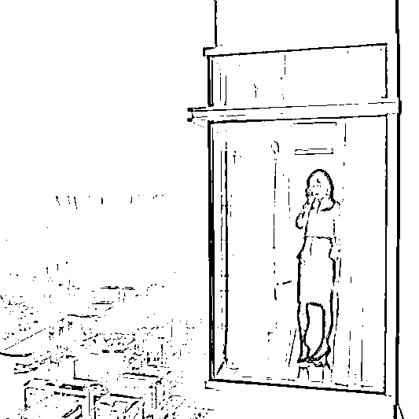

作者/大卫·瑞雷 图片/VCG

翻译/李含 校对/邱荷芸

文章来源/《风度》杂志

*F*

**rom David**

**大卫老师的话**

 

作为一名职业占星师，其中一件有价值的事就是帮助客户发掘他们的成功潜力。我寻找那些会帮助一个人实现自己目标的特质，我倾听所有妨碍他们认识自我潜力的消极情绪之下的信念。这对你而言是真的吗？什么阻碍你成为生而该成为的那个人呢？当你看到自己的星座时，问问自己：“是什么妨碍了我去发展这些特质？”做真正的自己，放下对自己天性的评判，才能获得真正的成功。

十二星座眼里的成功

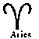
**白****羊座**

与其他星座相比，你的成就更仰赖于**独立自主与积极主动**。

坦率面对他人，你喜欢让生活保持简单。**你需要每天立刻看到结果，喜欢按照自己的方式行事**。在事业上，这常常表现为成为一名企业家，或是自主权较大的职位。如果你的事业不是“一人撑起整片天”，比如遛狗人、私人执业医生、作家、豆腐商贩或独立销售代表，那么在**开始创业时，你会想要雇佣那些不仅能照你吩咐做事，还能够处理所有你不想经手的复杂事情的员工，比如人力资源问题**。成功的人生对你来说，就像是每日清晨的一缕新鲜空气。

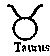
**金****牛座**

你的成功建立在**可靠与坚持**之上。

你举重若轻的行事风格促使人们将你视作依靠。因为你重视舒适，你会**以自己生活的舒适度来评价自己的成功**。你比其他的星座更**重视实质的回报和物质利益**，但并不像摩羯座那样重视身份地位。**成功对你而言仅仅是一种享受生活中美好事物的途径。拥有物质也会给你带来快乐**。在你冷静随和的外表之下，藏着一颗固执的心，一些金牛座人习惯不断购买公司股票，直到拥有大部分公司股权。不管怎样，你**持之以恒的努力**会带给你成功和舒适的生活。

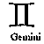
**双****子座**

成功是什么？你的答案是：**交流和聪明的解决方案**。

你是麻烦终结者。你有**快速获得信息**的能力，**人际关系**是你真正的资产。如果其他人愿意听你说，重视你的理念，那么你的人生就是有意义的。如果不是，那么你就需要找出原因，因为**成为一名成功的信使**是你通往自我实现的路径。相信自己的好奇心，遵循它给你的指引，不论是在人还是理念方面。你可以依靠当下市场潮流赚钱，然后又轻而易举地转向下一波潮流。是的，你很容易感到厌倦，需要多姿多彩……但是，**通过追求当下的热潮，充满刺激性的生活会给予你更多机会体验成功**。


**巨****蟹座**

你能够创造令人感到**更加安全和滋养的环境**，这是你成功的关键。

你可以本能地察觉到家庭和职场中的情绪氛围，这促使你去处理所发生的问题。你的同事们喜欢你给予的支持，你能让工作环境变得更安全惬意，这也让你的同事们受益。在你眼里朋友和同事就像是家人，他们会感受到你的关怀和支持。**你感性的方式让你与他人亲密相处，你能够凭直觉感知他人的需求，这有助于你获得情感满足和成功的人生**。相信你的直觉，重视你的感觉，其他人也会这样做。

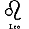
**狮****子座**

你**令人刮目相看的行事方式**常常成为成功的典范，你的**娱乐价值**也是你成功的法宝之一。

这样的天赋组合似乎让成功唾手可得，尤其是在领导角色方面。焦点中心的你光芒万丈，但在阴影下，你的不安和你平时展现出的自信风度格格不入。尽管如此，你的力量和决心还是常常会再度回归。**英雄的基因流淌在你的血液中，人们竞相效仿你的风格，以崇拜的目光看着你，你很享受这一切**。成功是你的创造出来的，你不会等待成功来敲门。

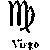
**处****女座**

你**对细节的关注和严苛的眼光**是你成功的关键。

**列出待办事宜，检查每一项是否完成**，会带给你无限快乐和成就感。**警惕你的完美主义倾向**让你的同事远离你。记住，如果控制不当的话，完美主义也可能成为进步的障碍。你能够认识到“魔鬼隐藏在细节中”，希望事情一开始就做得正确，会让老板赞赏你。你完成清单上的全部任务了吗？太棒了！你甚至不用等到一项工作做完就能感受到成功，你的成就感来自**正确完成任务**的过程之中。

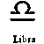
**天****秤座**

成功对你而言常常“并不是”来自于你的头衔，而是你**参与的合作，你在其中的互动**。

你能够**看到局势的正反两面，能够给予他人足够的安全感去卸下防备，探索各种可能性**。你的满足感来源于**打破壁垒，架起桥梁**。你懂得**齐心合力达成目标**的意义，你重视**和谐的工作环境**。其他人的观点总是和你的观点一致吗？不是，但你**极佳的谈判技巧**最终会带来双赢的解决方案，这也是信奉公平的天秤座体验成功的另一个关键。

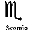
**天****蝎座**

能够**直指问题的核心，并愿意去面对它**是促使你成功的重要特质。

同样关键的还有你在**危机后的复原力**。你能凭直觉感知到他人的潜在弱点，有效利用资源，这些或许能让你最终成为部门主管甚至公司的 CEO。你是一名**幸存者，所以那些给其他人带来破坏的损失，只会让你更加强大**。你会花时间和精力在值得信赖的人身上，这也有助于你的成功，因为你可以依赖的这些关系会成为你力量的基石。此外，非常重要的一点是，你的**热情和强烈的专注力**也增强了你获得成功的可能性。

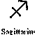
**射****手座**

你常常表现出**积极乐观**的态度，这显然是你成功的因素之一。

另外，你喜欢**从思维方式层面解决最困难的问题**，这常常带给你新的理解，避免将来出现同样的问题。**当你全身心投入自己坚信的事业中时，你的成功潜力会增加**。你以**热爱旅行和冒险**而闻名，你的成就常常展现在国际舞台上，**全球化思维**是你的本能。虽然，**你的乐观会让你错误地估计事情所需的时间，但这种乐观也会让你在其他人都感到气馁的时候坚持下去**。另外，你还有**胜利的微笑和幽默感**，这就是你成功潜能的全部图景。

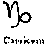
**摩****羯座**

你比其他星座**更重视成功**。同样，**对失败的恐惧**常常成为你的梦魇，被塞进一个个雄心勃勃的计划中。

尽管你具有**无与伦比的长远计划**能力，但**意料之外的状况**还是会短暂地让你的成功火车偏离轨道，让你眼睁睁看着自己的努力付诸东流。但是成功动力十足的你不会在低潮逗留太久，你最终会**拿出新的计划，以更好的进度表来实现目标**。**效率和纪律**进一步描绘出你的成功剪影，其他企图跟上你脚步的人都累得筋疲力尽。颇具**责任感和义务感**的你，会兑现你对那些支持过你工作的同事的承诺。

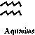
**水****瓶座**

如果可以**另辟蹊径取得成功**，你一定会找到这条路。

事实上，你的成功常常由你的**创造力**定义。**重塑成功是你的标签，甚至专利，因为你的许多发明都可以注册专利**。你的**冷静、客观、理性**让你可以看到别人忽视的点，你还有**“跳脱框架思考”**的能力。尽管你的个性独树一帜，但你也是团队合作中的积极分子，让其他人也为你的理念有所贡献。不过，**你的想法一旦认定就很难改变**，这对你而言是福也可能是祸。对你而言，成功的意义在于**你的理念和努力最终做出了贡献**。

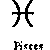
**双****鱼座**

**憧憬、想象和灵感**是你成功的核心，如果失去了这些，你会在失败的土地上失意徘徊，就像是拥有一只破吉他的音乐家。

梦想家常常被视作唾弃成功的人，但你却会取得令人望尘莫及的成就，有时候简直超出了你同僚的想象。大部分双鱼座人对人类都怀有**深深的同情**，你会不知疲倦地**帮助那些被艰难的境遇压垮的人们**。最终，你们可能成为**“无国界事业”**的一分子，成功和失败都冲刷着你人生的海滩。另外，加上你的**心灵直觉**，你能够看到在追求成功的道路上，你与其他人相比优势何在。


想体验大师级的占星疗愈？

大卫老师**占星咨询**预约进行时

**生命议题、职业发展、关系咨询、**

**少儿成长、年度规划和预测**

```
预约咨询请联系许小姐 ：010-58760529
```

**特别提醒：**

**本文首发于《风度杂志》，**

**转载请联系后台授权。**


**想获得成功吗？大卫·瑞雷老师主讲的企业咨询工作坊就要在 6 月 9 日（端午节假期）开始啦，教你用占星学理解企业发展，获得属于你自己的成功。**

**报名及咨询，请点击文末“阅读原文”**


# 大卫谈占星 | 问 12 个星座这个问题，90%都能招到好员工

> 原文：[`mp.weixin.qq.com/s?__biz=MzA5NjA0NTAxNg==&mid=2651385157&idx=2&sn=20d08ecc38908b005b1af78e3160e310&chksm=8b4a5ff2bc3dd6e49cf532b04f6ab9d937b536b00aab1c474114516f327d1cffa24f3e90526a&scene=126&sessionid=1692738826#rd`](http://mp.weixin.qq.com/s?__biz=MzA5NjA0NTAxNg==&mid=2651385157&idx=2&sn=20d08ecc38908b005b1af78e3160e310&chksm=8b4a5ff2bc3dd6e49cf532b04f6ab9d937b536b00aab1c474114516f327d1cffa24f3e90526a&scene=126&sessionid=1692738826#rd)

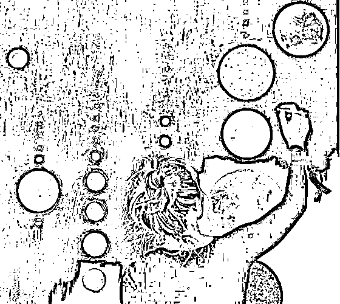

作者/大卫·瑞雷  图片来源/pinterest

翻译/李含    校对/江艺

“

面试的过程，其实就是一个快速观察人的过程，通过简单的几个问题要判断每个人的天赋和适合岗位不是个简单的事情，不过，占星学的很多技能倒是可以对面试这件事情，有所助益。而作为求职人员，如果你能提前问自己这些职场问题，对你的职业生涯也是很有帮助的哦！

”**占星学在工作中的实际效用**

詹妮在一家跨国公司从事人力资源工作。她主要负责各部门面试，包括软件开发、管理、市场、培训和销售部门的面试。詹妮对求职者工作安排的成功率和满意度在公司里首屈一指。她不仅非常勤勉细致地分析求职者的条件和工作经历，还有办法让求职者展现出履历材料中看不见的特质。她的秘诀是什么呢？那就是占星学。

詹妮学习严肃占星学已经五年时间了。她已经学会了**如何辨识一个人的特质、价值和潜在议题。**

○   在学习占星学的早期，她发现即使依靠**太阳星座**也有助于**发现求职者的意愿和适合程度**。

○   随着她对占星学的学习和运用更加熟练精微，她能够将他们的**工作经历与占星趋势**对照，从而看到此人在各种天象状态下表现如何。这些信息让她更有信心判断此人的未来表现。

○   另外，她能够针对应聘者**潜在的薄弱点**提出问题，来评估他们对这些问题处理得如何。詹妮将成功大部分归功于她对占星学的持续运用。

**实战：面试官 VS 十二星座**

如果你的工作是人力资源或管理层，需要面试准雇员，那么即使只是知道对方的太阳星座也可以帮助你更好地评估和选择适当的候选人。你可以通过查看候选人的身份证复印件或直接询问他们的出生日期来了解他们的太阳星座。通过练习，你可以找到方法将下面的提问或主题融入到面试的对话之中。

**白羊座·问冲突**

**提问：**

**“你是否与其他雇员发生过冲突？”**

如果对方回答“是的”，那么你可以问，“你是如何处理这样的纷争的呢？”这会让你了解他们与同事相处的情况。**如果那份工作需要一位积极进取，做事主动的人，那么白羊座应聘者很可能非常适合这个职位，尤其是销售岗位或与开拓新项目或新部门相关的工作。**不过，如果工作涉及直接管理，你要问一下他们与之前主管和老板的关系。

**金牛座·问金钱**

****提问：****

**“你对薪资是否满意？”**

如果对方回答“还没有”，那么这是一个非常不好的信号，预示着他们对这份工作并不太上心。如果回答是肯定的，那么可以问：“你是否满意我们提供的薪水？”如果他们的答案依然是肯定的，并且看起来愉快而放松，这会是一个好兆头。然而，如果他们看起来并不满意或者并没有为所提供的薪酬感到非常高兴，说明应聘者可能并不是非常适合的人选。

**双子座·问兴趣**

****提问：****

**“这个职位让你感兴趣的地方是什么？”**

如果这份工作需要他们“**身兼数职**”，就要留意对方的反应了。如果他们似乎挺兴奋，头脑不断运转，那是个不错的兆头。但是，如果他们似乎无精打采，甚至表现得有些百无聊奈，就是一个明显的负面讯号。也许是这份工作有点平淡乏味，对他们没有足够的吸引力。如果他们条件不错，看一看他们灵光一闪的头脑能否为公司带来其他机遇。如果有更适合的岗位，又为何要浪费时间在这个岗位上呢。

**巨蟹座·问过去**

****提问：****

**“你过去有哪些经验让你能够胜任这份工作？”**

如果他们最初看起来有点害羞或焦虑，这很正常。给他们递一杯饮品，接下来问一问他们过去的经验。“你过去有哪些经验让你能够胜任这份工作？”

问问他们记忆中感觉最棒和最糟的是什么。**如果他们残留着其他工作的负面体验，这就是一份未解决的情绪。**他们很可能带着这一情绪包袱进入新的工作，这并非你所期待的。

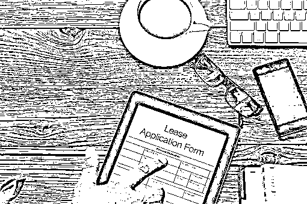 

**狮子座·问管理**

****提问：****

**“你如何保持团队中人员的积极性和效率？”**

如果这个职位要求领导力，他们极具潜力。任何**“主管”角色**：销售主管、教学主管、创意总监等等，都适合。向他们提问：“你如何保持团队中人员的积极性和效率？”如果他们给出三个简练的答案，加分。但如果是一个傲慢自负的回答，“我只是告诉他们该怎么做！”或犹豫，“这样，呃……这要看……”就暗示着有问题。如果这份工作并不需要领导力，就询问他们与之前的上司关系如何。

**处女座·问技能**

****提问：****

**“你有哪些专业技能与应聘的工作匹配？”**

他们常常会递交整洁的申请和简历。不过，对于一份需要较高专业技能的职位，如果他们的工作经历和推荐都井然有序，那么一份草率的申请也并不必然就是个糟糕的信号。对于主流的职位，比如程序员、市场分析师、会计师或执行秘书等，他们均可能胜任**，他们喜欢工作中的任务有预期的结果。如果他们能够列出三个“适合这份工作的理由”，那么他们的确适合。**

**天秤座·问关系**

****提问：****

**“如何处理团队中上下属之间以及自己和客户的关系？”**

如果这份工作与人力资源、客户关系、公共关系或销售相关，那么此人应该成为你名单中的重要候选人。在与客户的互动中你会需要他。你自己也可能在面试进行到一半时就喜欢上他们了。然而，如果他们看起来无精打采，有点不友善，就是个坏的信号。你可以问：“你觉得自己在之前的工作中被公平对待了吗？”但是，如果你必须问天秤座这个问题，你已经知道答案了。

**天蝎座·问危机**

****提问：****

**“你如何应对目前面临的危机与挑战？”** 

在与财务、并购、调研、安保和解决故障纠纷相关的工作中，他们是值得考虑的候选人。但是，不要期待他们自愿透露更多关于自己的信息。相反，他们的回答可能表明，他们不仅调查了公司背景，可能还对你有所了解！不要被这一点吓到。通过询问他们**如何应对该职务可能需要面对的挑战性局面，重新掌控面试对话。**如果你对他们足智多谋的解决方案印象深刻，就聘用他们。


**射手座·问愿景**

****提问：****

**“你对这份工作有着什么样的热情**和**期待****？”**

天生擅长销售、市场、推广等工作，尤其是如果工作还涉及旅行。作为老师/培训师，他们能够**唤起团体的热情，鼓舞士气。**但是，留意其夸张的言辞。他们在向你推销自己，可能会承诺他们无法做到的事情。乐观是一种优秀的品质，但是之前工作的变更可能已经超过了“认知冒险”。他们博学强记，但常常对细节毫无耐心。一份需要准确执行任务的工作可能不适合他们。

**摩羯座·问规划**

****提问：****

**“希望在这个职位上实现什么样的成就？”**

通常非常适合管理者的岗位。他们最初似乎会有些拘谨，问问他们希望在这个职位上实现什么样的成”。如果他们已经有了一套计划，那么这是个好的信号。他们至少应该能够表现出对工作职责了然于胸。如果不是，那么这是个不好的信号。缺乏准备，要么说明他们对此工作并不认真，要么是之前的失望和失败带来的痛苦犹在。

**水瓶座·问创意**

****提问：****

**“你们真正喜欢的是哪种工作？”**

期待惊喜。他们想要做出贡献，但是他们往往不太容易融入团队。如果公司在**寻找创意理念来重塑一个部门或产品**，那么他们可能是合适的人选。询问他们的观点；他们或许已经有了一些想法，一些喜欢这家公司的原因，或改进的方式。但是，如果这个职位是循规蹈矩，遵循传统的，他们似乎会置身事外。问问他们，“你们真正喜欢的是哪种工作？”

**双鱼座·问直觉**

****提问：****

**“这个职务吸引你的地方是什么？”**

如果他们准时，这是个好兆头。如果公司这一职务很难留住人，那么可能是因为这个工作的**复杂性**。这个候选人可能就是你们正在寻找的奇迹。询问应聘者：“这个职务吸引你的地方是什么？”**他/她漫无边际的回答一开始可能让你困惑不解，直到你意识到这实际上已经涵盖了这个工作所有的要点！**这个有适应能力的候选人可以扮演多个角色，但是要仔细检查他们的工作经历。


想体验大师级的占星疗愈？

大卫老师**占星咨询**预约进行时

**生命议题、职业发展、关系咨询、**

**少儿成长、年度规划和预测**

```
预约咨询请联系许小姐 ：010-58760529
```

**特别提醒：**

**本文首发于若道平台，**

**转载请联系后台授权。**


**想获得成功吗？大卫·瑞雷老师主讲的企业咨询工作坊就要在 6 月 9 日（端午节假期）开始啦，教你用占星学理解企业发展，获得属于你自己的成功。**

**报名及咨询，请点击文末“阅读原文”**


# 帮助一个企业走向辉煌，也许是你这辈子做的最牛的事

> 原文：[`mp.weixin.qq.com/s?__biz=MzA5NjA0NTAxNg==&mid=2651385157&idx=3&sn=6111d0f6bd314a2c476b5803ad4f7e29&chksm=8b4a5ff2bc3dd6e4e59cb478c305bbbc0f04bfd6a1776473604bb2419851c9641106debcd1b9&scene=126&sessionid=1692738826#rd`](http://mp.weixin.qq.com/s?__biz=MzA5NjA0NTAxNg==&mid=2651385157&idx=3&sn=6111d0f6bd314a2c476b5803ad4f7e29&chksm=8b4a5ff2bc3dd6e4e59cb478c305bbbc0f04bfd6a1776473604bb2419851c9641106debcd1b9&scene=126&sessionid=1692738826#rd)

“

**我的公司，就像我的孩子。** 

”

于我们，

也许仅仅是一个不知名甚至不起眼的品牌，

于创立这家公司的人，

这就是他们的骨肉。

鲁迅先生说：

“这世上本来没有路，

走的人多了，也便成了路。”

企业之路无疑是最艰难却也最辉煌的一条路。

几乎每一个创业成功的企业家，

都可以给你分享一百种往事，

最初的艰辛和一路的困惑迷茫。

那么为什么还有无数人，

前赴后继在这条路上呢？

因为每一个人有一个，

代表事业成就的中天，

我们都**渴望成功**、**渴望不断向上**、**渴望荣光**。

然而，在这条路上，

光有海王式的梦想是远远不够的，

还需要土星式的实际规划、

火星式的热情燃烧，

有时候甚至需要一点木星的幸运加持。

**“谋事在人，成事在天。”**

占星学能够给到一个企业最大的帮助，

除了可以帮助企业主**“谋事”**，

还可以借助**趋势预测**来帮助他们**“成事”**。

运营企业从来都是一件严肃的事情，

就像若道占星，

一直致力于严肃占星学在中国的传播一样。

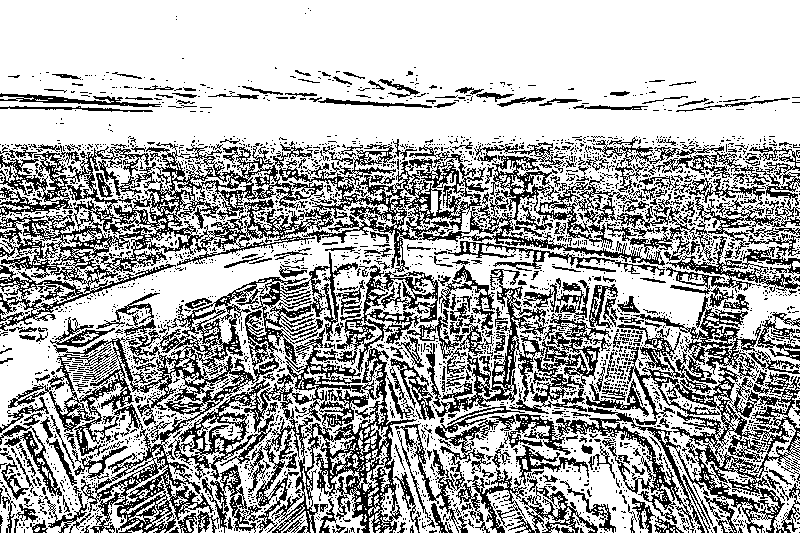

这是**国内第一次**系统讲解

如何运用**占星学给企业做咨询**的工作坊。

这是一个绝好的机会，

你可以**和大卫老师面对面**，

还有机会在中国的经济中心——**上海**，

**体验海派风情**，

**结交**各行各业成熟的**职业人士**，

同各界热爱占星学的**企业精英**交流，

互相切磋各种经验，

**扩展高层人脉**。

这也是一个**严肃**的席位，

它考验你是否真的有十足的准备，

去面对企业主们，

替他们排忧解难。

因此，

我们对于参与这次工作坊的人群有相对严格的筛选，

同时，也会为大家提供**非常高质量**的授课内容。 

**企业占星工作坊非常适合这些人**

● 本身是**创业者**或者**企业主**；

● 本身是**企业管理者**，或**对于企业管理有一定经验**的占星师；

● 对于没有企业管理经验，但有**鸿鹄之志**，想有一天拿下几十万元以上大单的占星师，也欢迎参加。（请提供足够证明自己能力的依据）

**你将得到如下帮助**

*   **经典案例解析**

*   大卫老师将用自己非常熟悉的经典案例，详细讲述**占星学可以在企业创立、运营、出售等一个完整的企业生命流中可以帮助企业所做的方方面面的事宜**。

*   **企业的创业方向**

*   选择适合的**创业方向**，是创业成功的一个要素；**创始人的个性**也创造出不同的企业，会以不同的方式获得成功，也会遇到因创始人的个性而面临的**独特挑战**。

*   每个企业都有不只一个对企业有意义的星图，企业的星图如个人星图一样，有**故事、机会，挑战，起伏**的周期。如何解读**企业星图**中的秘密？如何解读**企业主星图和企业星图**的关系？

*   **产品和服务的定位**

*   根据创始人及企业星图，**优化产品和服务的定位****。**

*   **人的选择**

*   选对人是每个创业者及管理者最重要的任务，而培养、管理、发展企业员工又是管理者最大的职责。

*   帮助企业主**选择、了解其合伙人****；**

*   帮助企业主**设立关键职位****；**

*   帮助企业主对**中高层人力资源的选择、培养、提拔**，将适合的人用到适合的岗位，**了解员工的优势和各个时期的挑战**，了解**关键人员的个人发展趋势是否符合企业发展趋势****。**

*   **团队建设**

*   帮助企业主与企业关键人员**建立信任**，了解什么是更好的**沟通方式****；**

*   帮助**团队**之间的**沟通和协作**，建立**团队成员的归属感**，帮助团队成员**关系**的融洽。

*   **制定计划，管理趋势和变化，防范风险**

*   占星学善于**预测趋势**，运用占星学，可以提早**了解企业趋势的变化**，进而**制定营销计划、财务计划**，更好管理企业的变化，防范风险。

*   **选择时机**

*   学习**择时占星学基础**，帮助企业的**活动、关键时间选择时间点****。**

*   **帮助占星师了解如何与商业企业建立关系**

*   企业咨询不仅可以获得**企业客户**，还可以因此获得**大量的个人客户**。

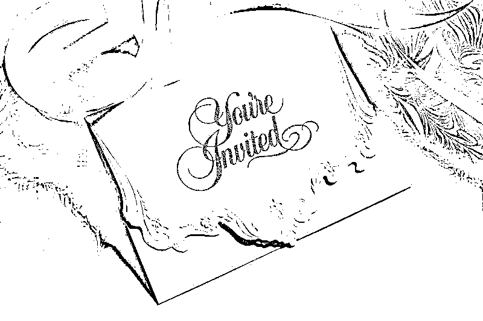

**6 月，与你相约上海，**

**我们虚位以待。**


**大卫·瑞雷（David Railey）**

若道创始人，《灵魂的目标》作者。拥有 46 年的占星咨询的执业经验，曾两任亚特兰大占星协会主席，是全美占星师联盟（AFAN）、美国占星师联合会（AFA）、全美占星研究委员会（NCGR）、国际占星研究协会（ISAR）和职业占星师组织（OPA）的成员，是联合占星大会（UAC, United Astrology Conference）督导委员会委员。大卫曾是 CNN、CBS 的占星节目的常驻嘉宾，多次在 BBC、WGS、WSB、WRGG 等节目中接受采访，并在亚特兰大主持电视节目《每日行星（Daily Planets）》达 4 年之久。

**ISAR 选修课程****工作坊信息**

**授课时间：**2016 年 6 月 9 日、6 月 10 日、6 月 11 日（端午节假期）10：00-18：00（午休 2 小时） 共 18 课时

**授课老师：**大卫·瑞雷

**授课方式：**上海现场，英文授课，中文翻译。（具体上课地址课前 10 天请留意查看短信微信通知）

**费用**：****6800 元** （5 月 20 日前报名可享受早鸟价****5800 元****，若道老学员**4800 元**）**

**课程负责人：**熊老师

**微信号：**13761199137，请备注企业占星工作坊报名咨询

长按二维码添加课程负责人咨询

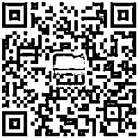


**了解详细课程内容及报名方式，点击文末“阅读原文”**


# 祝每一位受过伤的成年人：儿童节快乐！

> 原文：[`mp.weixin.qq.com/s?__biz=MzA5NjA0NTAxNg==&mid=2651385151&idx=1&sn=b2a0e76d4cd86fcf0add7deac7c5c8e3&chksm=8b4a5f88bc3dd69ea2c1f6b306a1f5e3a24bdb5c26c315f36ef7f7b6c640cf7293d48962234c&scene=126&sessionid=1692738826#rd`](http://mp.weixin.qq.com/s?__biz=MzA5NjA0NTAxNg==&mid=2651385151&idx=1&sn=b2a0e76d4cd86fcf0add7deac7c5c8e3&chksm=8b4a5f88bc3dd69ea2c1f6b306a1f5e3a24bdb5c26c315f36ef7f7b6c640cf7293d48962234c&scene=126&sessionid=1692738826#rd)

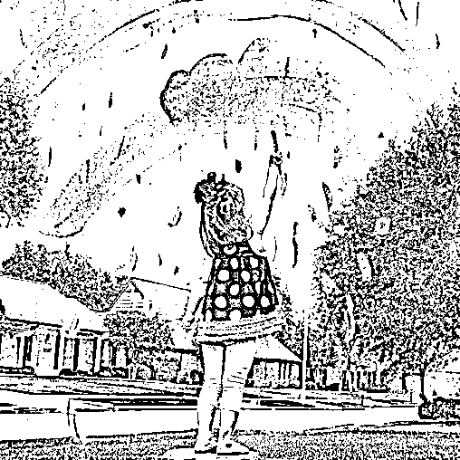

作者/咔咔  ISAR 认证占星师

图片来源/Pinterest

六月一日，儿童节。这一天除了是小孩子的节日外，也是我们和自己的内在小孩共同的节日。

**闹腾的女儿与严厉的母亲**

前几天我坐城铁，看到对面座位上一个妈妈带着女儿，小姑娘大概三四岁，虎头虎脑的，正闹腾着要站在座位上看看窗外的风景。妈妈有点儿被孩子闹烦了，就板起脸来说：“和你说了多少次了，这样太危险了！你再这样儿妈妈就不要你了，你自己在这里坐车吧，妈妈下站下车了。”这句狠话撂出来，小姑娘立刻蔫了，眼睛里虽然还写着点儿不甘心和凭什么，但还是抱着妈妈的腿安静了下来。

我看着这一幕的时候，不禁去猜测，这个小姑娘出生星图上的月亮长成什么样了。

> #### **占星小课堂**
> 
> 占星学里，月亮是母亲的征象星。月亮的星座、相位、宫位描述了人们的情绪、安全感、家庭的样子，也描述了孩子眼中的妈妈的样子。
> 
> 出生星图中的月亮代表了孩子和母亲最初的情感联结，这个最初的情感联结定义了我们之后的每个关系：我们会不自觉地期待在以后的生活里体验我们小时候就熟悉的情感的表达方式。

在这个小姑娘的身上，我感受到一种活泼的能量，她不愿意安静地和妈妈一起坐在椅子上，似乎感到坐在那里是被约束了，非要站在椅子上。会不会是月亮在白羊座？一个小小的女战士？

妈妈对待孩子的语气很直接，看样子女儿一向活泼好动，妈妈这种恐吓式的管教在目前还是比较管用的。这种“你要是不乖妈妈就不要你了”的表达，会不会符合冥王星的特点：妈妈对危险的担心，用一种激烈的方式表达出来，同时带着情感操纵的感觉？这会是一个月亮在白羊座四分摩羯座冥王星的配置么？

假设这个小姑娘有月亮与冥王星的四分相，那当她长大了，这个月冥四分会怎样表现在她和他人的互动关系中？当她遇到心仪的对象的时候，会怎么表达自己的感情呢？

○ 会是像妈妈那样，对危险非常的敏感，因而很难去相信对方么？

○ 还是会因为害怕被背叛和被伤害，过度自我保护，而无法安然进入一段感情，享受这段关系的甜蜜和烦恼？

○ 当她的爱人想要她的情感回应的时候，她会不会脱口而出一些极端的话，模仿妈妈小时候对她的那种斥责的口气，来表达自己对爱人的关心？

○ 她会不会觉得要控制对方，自己才能感到安全和满足？

○ 当她分手后，她会怨恨对方并且想要用一些极端的方式来发泄怒气么？

○ 还是会放大这次失败的意义，陷入极大的自我怀疑，觉得自己怎么做都没办法做好，身上各种缺点？

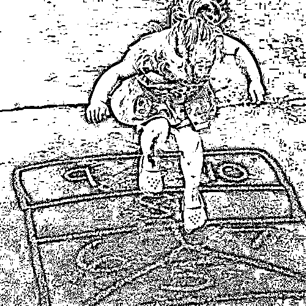

**与父****母****的关系如何影响我们的成年生活**

这是一个占星师无所事事时的脑洞游戏，但是在日常的咨询里，我听到成年人的故事讲述他们和父母的关系，是怎样影响了成年的生活。

举个栗子

有个姑娘说，小时候自己会说一些比较尖锐的话，有点儿像《国王的新衣》里的小男孩，会直率地说国王没有穿衣服。她的火星在天蝎座三宫，说明她有敏锐和机智的思考能力（三宫），有能力看到事情的真相（天蝎座）。她的土星狮子座在十二宫四分火星，爸爸（土星狮子座）会批评她说这些话不恰当。更多时候爸爸只是沉着脸，根本不和她解释，直接叫她闭嘴。

长大后的她，害怕说出自己的真实想法，特别害怕和别人发生言语的冲突，在表达自己和接受别人的意见的时候，表现得特别紧张。她说：“**我总是避免争论，因为我觉得说出自己的看法就会引来批评。当我不同意对方的意见的时候，我就选择闭嘴。但是我并不能永远都避免争论，当我真的忍不住开始争论的时候，就通常变成了一场你死我活的争吵。**闹得大家都挺不愉快的。甚至我还为了这些争吵和朋友绝交了。”

这是一个火星能量被权威的土星压制的案例，**当不能健康地发挥自己的火星能量的时候，火星的反噬就造成了更大的伤害**，导致了友情或者其他的关系的破裂。如果时光倒流，父亲除了叫她闭嘴以外，是不是有其他的方式和她沟通呢？父亲可以询问她为什么会说出这些话，并且告诉她，自己听到她的话的时候是什么感受。告诉她，你可以诚实表达自己的想法，也要同时尊重别人的感受。讲实话是必需的，但是侵犯他人会导致内疚感，并会为此承担后果。

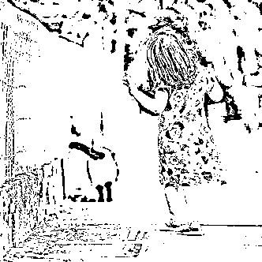

**我们可以疗愈自己的内在小孩**

童年的时光有美好快乐的回忆，也会有一些心灵的伤痕。这些伤痕会隐藏起来，悄悄地影响我们的日常生活，事业、家庭、两性关系，影响我们的人生。直到有一天，你发现自己总是在相似的事情上摔倒，你想寻找原因和解决的方法。

如果你看到自己愤怒、羞耻、压抑、孤独，逃避、不能信任别人种种行为，可能是你小时候心里有一个受伤的孩子；当你长大之后，这个孩子可能会随时跳出来，影响你成年后的行为。除非我们把这个受伤的小孩找回来，守护他，否则他会继续作祟，给我们成年后的生活抹黑。

于是**你扭回头去，看看自己的小时候发生了什么事情，这些事情留下了怎样的伤痕，而这些伤痕又是由于父亲、母亲或照顾者的怎样的态度和做法导致的。这就是面对，是疗愈的开始。**

接触、寻回和守护这个内在受伤的小孩，需要时间，专业的帮助，更需要的是自己的信心。有一个心理学实验，人们把狗关在笼子里，只要蜂音器一响，就给以难受的电击，狗关在笼子里逃避不了电击，只能痛苦地忍耐。多次实验后，蜂音器还是会响，这次不同的是，心理学家在电击前，把笼门打开了，但是笼子里的狗没有逃出来，它还是躺在地上接受电击的痛苦。

我们在年幼的时候可能遭遇了像电击一样的痛苦，那时的小孩没有自保的能力，所以只能忍受这些痛苦的发生。**长大的好处是，你可以选择走出那个充满痛苦的牢笼。**和被关起来的狗不一样的是，成年的你可以不必等待别人打开笼门，而是依靠自己的力量走出来。

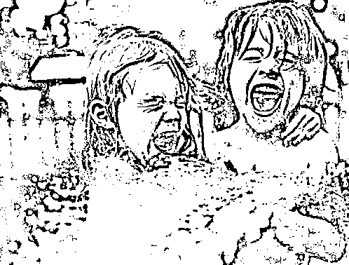 

我们即是有能力的成年人，又在内心有一个受过伤的小孩。今天是儿童节，也是你和自己内在的小朋友共同的节日，去和他一起做一件让心欢唱的事。让我们对心里那个受伤的小孩说：不要害怕，我知道你的需求和渴望，我会陪伴你照顾你，保护你支持你。让我来爱你！


**占星师咔咔**：2010 年开始学习占星学，若道首届学员，国内最早获得 ISAR 职业占星师资质的职业占星师。在国际知名广告公司和市场研究公司从事的市场研究和推广工作十余年，曾任职于阳狮集团、尼尔森市场研究有限公司、MTV 和《Madame Figaro》杂志。现在为《时装男士》、活法儿等媒体供稿。

微信公众账号：咔星人

星盘解读和运势咨询：cji1029@qq.com

长按二维码，让金钱涌向传播知识与智慧的人~  


**特别提醒：**

**本文首发于若道平台，**

**转载请联系后台授权。**


****面对自己的内在小孩也是面对自己的阴影面。2016 年 7 月 8 日-10 日，杰西卡·卡巴拉老师主讲的工作坊：如何与客户的阴影面工作要开课了！该工作坊会教你如何帮助客户减少痛苦，减少关系和生活中所经历的障碍。敬请期待！****


# 亲爱的，生两个孩子吧，一个像我一个像你

> 原文：[`mp.weixin.qq.com/s?__biz=MzA5NjA0NTAxNg==&mid=2651385151&idx=2&sn=6b3dafd3fd5eee69ce37c50807dc60bf&chksm=8b4a5f88bc3dd69e9274a4796a5445c3adafcecb6dca9acb366d0075334aae88a8d904bf0022&scene=126&sessionid=1692738826#rd`](http://mp.weixin.qq.com/s?__biz=MzA5NjA0NTAxNg==&mid=2651385151&idx=2&sn=6b3dafd3fd5eee69ce37c50807dc60bf&chksm=8b4a5f88bc3dd69e9274a4796a5445c3adafcecb6dca9acb366d0075334aae88a8d904bf0022&scene=126&sessionid=1692738826#rd)

作者/郑玮玲  图片/pinterest

六月一日，国际儿童节，在这个欢天喜地的节日里，我们一起来聊一聊有关孩子的话题。2011 年，在天冥刑的大时代背景下，中国迎来了二胎时代，老旧的独生子女模式在时代更迭浪潮中瓦解，经历了木星在巨蟹座时全民备胎的疯狂，到木星处女座时经济收紧的慎重。你适合生二胎吗？星图里有哪些是有关二胎的征象呢？

**二胎政策逐步开放的天象背景**

**● 2011 年 11 月**

○双独政策颁布于**天冥刑的开端**，**时代变革的浪潮初涌**，**木星在金牛座**，民众对于多子女合法生育的殷切期盼终见曙光，四十年来的独生子女政策划上了句号。这是被木星赐予的慷慨，对扩大繁衍的需求的支持，将生育两个孩子作为享受生活的乐趣，**生育二胎带来了生命的丰美、富足感。**

**● 2013 年 10 月**

○单独二胎政策颁布，正值**天冥刑精确成相的时间点**，当时的**木星在巨蟹座，带来了更具同理心的政策，满足更多本能性的家庭扩张需求。**此时，很多期望已久的家庭终于开始了孕育二胎之路，巨蟹座的开创驱力有些迫不急待——这其中不乏出生于 70 年代非独生子女的人，因为年龄渐长，不得不尽快去完成这创造性的心愿。

**● 2015 年 10 月**

○全面开放二胎政策，**天冥刑精确成相时期已过**，变革的余波尚在。从 2015 年 8 月**木星进入处女座**之后，为人们带来了**更多辨析力与计划性，更高的社会秩序感进驻。当前木土四分，经济紧张、缩减或是前景不明朗（木土海Ｔ三角）影响到很多家庭的经济。**中国目前没有全职妈妈和多孩家庭的福利，不管是哺育，医疗，教育都全赖家庭经济收入。很多家庭要生育二胎，母亲都得选择放弃职业，父亲必然就成为家庭唯一的经济支柱，**不少家庭便对生二胎开始有迟疑，更为慎重**。

**● 2016 年 9 月**

**○木星将进入天秤座**，虽然已经全面开放二胎政策，人们会**更多关注亲密关系中的自我成长**，渴望拥有和享受更加完美的家庭关系，用更客观的眼光来考虑家庭成员扩张的计划，对婚姻生活的满足度更为注重，而不光是完成繁衍的渴望。

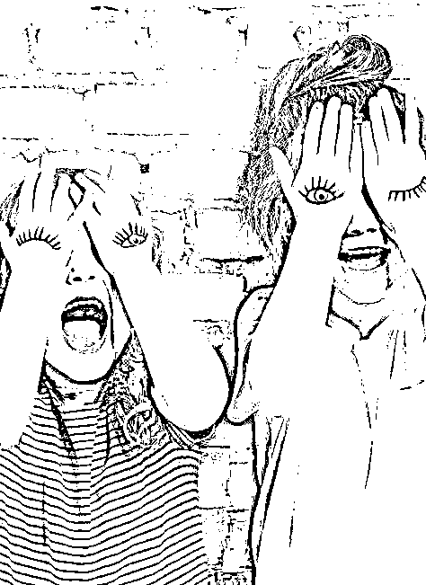

**“生育年”里的家庭矛盾**

亲爱的，我们生两个孩子吧，一个像我一个像你。

多少新婚夫妇、情侣都构想着此番完美的人生图景，凑一个“好”字，仿佛是“人生赢家”的绝妙配置。

可是在中国，生养两个孩子对国人来说还是非常大的挑战。两个孩子要付出的精力并非 1 加 1 等于 2，当孩子年龄相差大时，生活规律就不同，一个要睡觉，另一个要人陪着玩，一个上小学，一个上幼儿园，每天的接送都是生活中占据时间的大事。而年龄相仿的孩子之间也常有争执和不同的需求要满足，要给予不同的满足对父母来说是既花时间又花精力的功课。

**老大弱   老二强**对孩子的影响

当今的父母因为开始的不懂得，大多秉承着“第一个孩子照书养”的原则，只会按图索骥或是听从他人意见去抚养孩子。老大的抚养过程中难免会遇到些许差错，于是在老二的出生之后自然有了实际的经验，更加成熟谈定，也知道如何避免和修正过去不完善的地方。

尤其是在陪伴程度上，会更懂得孩子的需求。而家中的**第二个孩子生来会有更强的竞争意识，并且没有一种“父母的爱被分享”的心理体验，因此很懂得讨好家人，察颜观色，用各种方式表达自己，相比老大，老二们通常会显出更强势一面。**

所以，现在很多二胎家庭中，是大的孩子会更需要诃护，而老二生来就很独立，因为陪伴的足够，更有竞争意识，懂得争宠。所以，父母需要更多安抚和平衡老大的心理需求。

比如，在老二出生时亲自准备一个礼物给老大，告诉他（她）就快有一个弟弟妹妹了，祝福他（她）把家族的荣耀感带给他，还可以请他（她）参与给弟弟妹妹取名的过程，两个孩子相争的过程家长以公平的原则，不因为年龄而指责大的，偏护小的，而是尽量不给予评判，甚至淡化对于孩子之间争执的关注，尽量让他们自己去解决，只做最后的情绪安抚。

**巨大挑战**

对夫妻关系的影响

婴儿诞生的早期，母亲都会付出全身心精力去照料喂养，难免忽略丈夫的需求。男人往往是个长不大的孩子，很难理解女人初为人母时的辛苦，就更加加深男从们童年与母亲分离的创伤。这样的结果就是女人越发成熟有担当，而男人会发现自己从婚姻中被抛弃了，婚姻自然会亮起红灯。

而母亲全职照顾小孩，是不是意味着要牺牲掉这些年里所有的个人社交生活，个人独处的空间，个人成长和学习的机会？一旦不能得到伴侣的理解与支持，作为母亲的价值感也会受挑战。7 天 24 小时的全职工作，没有报酬，没有舞台，没有社交，有的只是日复一日不求回报的付出，再累也要坚持。这样的“工作”多少人可以没有抱怨地坚持三年？

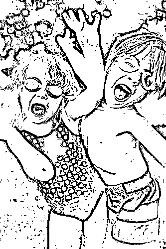

**占星学里关于生二胎的指征**

**●星座 **

○占星学中**月亮与生育直接相关，而巨蟹座与滋养、照料、保护有关**，古典占星里水象星座：巨蟹，天蝎，双鱼都是多产星座。因此，**夫妻双方任一方星图中的月亮落在水象星座都可以被视为“多产”的象征。**

○整张星图中巨蟹座元素强化是与家庭，滋养，照料有关，很可能家中孩子较多，会为孩子付出很多，而双子、狮子座与孩童有关，可能是自己的孩童本性较明显，也或者是喜欢小孩，总围绕着小孩。尤其双子座是与人有关的星座，并且直接代表两个的意思。所以，父母一方是日、月双子，或是双子特质突出的话，生两个孩子的可能性都是相当大。

**●宫位**

 ○四宫是关于家庭，五宫是关于爱与创造力，**这两个宫位与水象星座有关，或该宫位里落入多颗行星，或宫主星与月亮、木星有相位，则意味着对养育多个孩子的潜力。**

**○四、五宫的宫主星以及月亮的相位都说明一个人的喂养、照料方式，在生养过程中的心理体验，**如果母亲星图中这两个宫位落入月亮，则说明母亲的需求与家庭、小孩有密切关系，落入金星，则说明母亲借由家庭、小孩带来爱的体验和自我价值感的实现，这样的母亲会很乐于照料家庭和小孩。

○三宫是和兄弟姐妹有关的宫位，**如果家中第一个孩子星图中三宫里有月亮、水星、金星、火星，那么非常有可能带来兄弟姐妹，**月亮和金星与姐妹有关，火星和弟弟有关，而水星则两种倾向都有，三宫里有海王星也代表更多的可能性。

**● 相位**

**○妈妈的月亮与木星有相位，月亮、木星是命主星或四、五宫宫主星**，这样的妈妈有更突出的滋养孩子，家庭的能量。**爸爸有月木相，月亮落在巨蟹座也带来喜欢小孩子**，喜欢照料人的特质，但毕竟母亲才是家庭的灵魂，母亲来完成生育的整个过程。


**作者简介**

**郑玮玲（Sampriya）：**若道 COAC 高阶资质认证，国际占星研究协会 ISAR 会员，在若道跟随多名国际知名占星师学习占星。馨光爱妈妈会创始人，国内首批 ICEA 国际生育教育协会产后指导，国际母乳会培训的哺乳互助指导。

**个人公众号及咨询预约**：Sampriya-Astrology 

长按二维码，让金钱涌向传播知识与智慧的人~


**特别提醒：**

**本文首发于若道平台，**

**转载请联系后台授权。**


**星座、行星、宫位、相位，散落的珠子如何穿起来？由大卫·瑞雷**讲授的**若道核心课程 Level 3，将带你进入更深的自我探索与成长的旅程。本课程将于今年 7 月开课，敬请期待！**


# 职业方向 | 选错的时候连续 9 次被拒，选对的时候连 Google 都请她演讲！

> 原文：[`mp.weixin.qq.com/s?__biz=MzA5NjA0NTAxNg==&mid=2651385151&idx=3&sn=f5a688fd6ee1fc0a338b8d09cba7f85f&chksm=8b4a5f88bc3dd69e34a9b18851543dfeae00f24f73a250094227b62474422ba8ca811a02caee&scene=126&sessionid=1692738826#rd`](http://mp.weixin.qq.com/s?__biz=MzA5NjA0NTAxNg==&mid=2651385151&idx=3&sn=f5a688fd6ee1fc0a338b8d09cba7f85f&chksm=8b4a5f88bc3dd69e34a9b18851543dfeae00f24f73a250094227b62474422ba8ca811a02caee&scene=126&sessionid=1692738826#rd)

“

你的梦想是什么？

这个问题让你晕眩还是振奋？其实梦一直围绕着我们，等待我们醒来，看见它们。当我们真正醒来，眼前的世界将变得生动和开阔。

而占星学是一门可以让你较快找到方向的工具。点击文末**阅读原文**，那里有为你私人订制的职业报告，让你更快定位自己的职业方向。

”

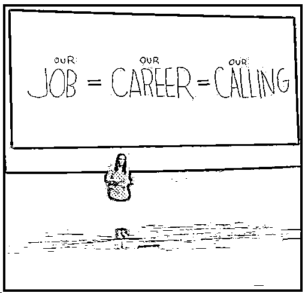 

她在 GOOGLE 做演讲，谈的是人生十字路口的选择。

你可能立马就认定她是人生赢家。  

是，也不是。

她曾经申请了 9 所法学院，全部被拒。

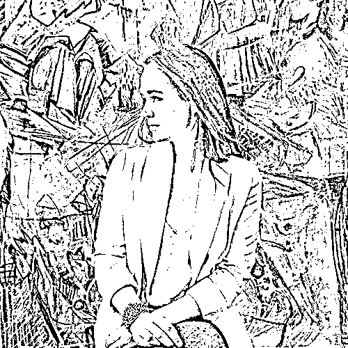

## 当方向错误，停下来，倾听内心

她叫 Elle Luna，出生在达拉斯。父亲是一名律师，小时候经常看父亲做辩护，觉得那样子棒呆了，她想自己也应该这样。在接连收到 9 所法学院的拒信后，她不敢相信，“我这资质，怎么也应该至少有一所学校要我吧。”

问题出在哪呢？时隔多年再谈起往事，Luna 意识到那是自己的心没有认同大脑的判断。“我当时在写申请信的时候肯定不自觉地流露出‘哦，我并不想做律师，千万别录取我’这种意味。” 

**人生十字路口，突然没有了选择，却也是能最清醒做出选择的时候。空白安静的空间里只有自己，这时能够听到心的声音。**

这个场景像极了多年以后，她在一间四面白墙的空屋子里，感到焦灼、脆弱、茫然，但知道自己一定可以做一些事情。突然有一天，她明白了，拿起了画笔。

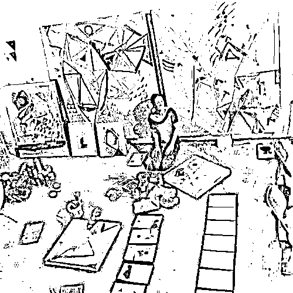

## 当方向正确，一直走，不畏改变

Luna 在告别律师梦之后，默默申请了两所艺术学校：罗德岛设计学院（The Rhode Island School of Design 简称 RISD) 和美国芝加哥艺术学院（The Art Institute of Chicago）结果两所学校都录取了她。“这是我人生中的第一个信号，我在对的路上了。”

后来某一天，Luna 去参加有“科技界奥斯卡”之称的“Crunchies Awards”盛典，她看到 Uber 的 CEO Travis Kalanick 坐在吧台，就走过去直截了当开了口：“我一直用 Uber，但 APP 设计糟透了，你应该让我来做。”当时身着盛装的 Luna 已经喝了三杯 whisky，微醺状态下还没反应过来自己又说了些什么，就听到 Travis Kalanick 让她周一早上 9 点到 Uber 办公室，“会给你一个团队”。结果这款 APP 设计获了 Fast Company 2013 年度的出行类 APP 设计大奖。 

意外加入，意料之中的离开。

Luna 去了 Mailbox。

在 Mailbox 被 Dropbox 收购前夕，Luna 选择了从 Mailbox 离职。“我做到了，Mailbox 昨天上线发布了。CNN 也在报道。我感到很骄傲。但我 31 岁了，我难道还要继续设计邮件吗？不。”

这一次，Luna 并没有回到她的空白状态。 

她周三离开 Mailbox，周四就收到 Medium 公司的邮件邀请。然后她就开始了在新公司的项目。

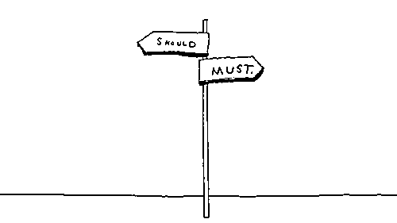  

## 在十字路口，如何选择？

但是很快，Luna 就感觉不对。

作为一名设计师，她的职业成绩已经非常漂亮，所有人都看到她处在职场的高峰。只有她心里明白，现在的自己又站在了人生的十字路口。

在人生岔路口，**选择继续“应该”过的人生，还是尝试“必须”**——自己真正想要的人生？

**我在做的是“工作”（生计）？是“职业”（一颗螺丝钉）？还是（人生）“使命”？**

Luna 选择了“必须”。她想自由画画，办画展，做插画师，拥有属于自己的品牌。

她启动了“100 天项目”，每天都画一幅自画像。

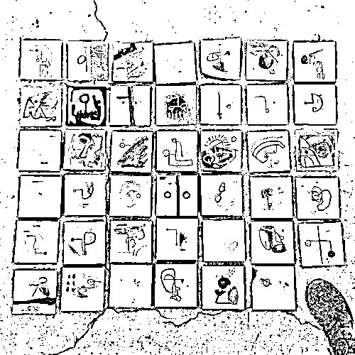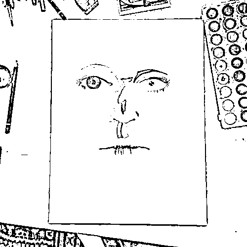

Luna 每天都把画作上传到社交网站，越来越多的人开始关注她的作品。虽然那时她也说不清楚每天都在画画是为了什么，只知道必须这么做。

后来，她收到一个画展邀请，在 Ian Ross Gallery 办一场 pop up show。这是 Luna 的第一场画展，主题叫 Far From Shore （远未抵达），讲的是旅行。“我们启程上路，要去的地方没有地图，甚至没有道路。没有先例，也没有正确答案。”

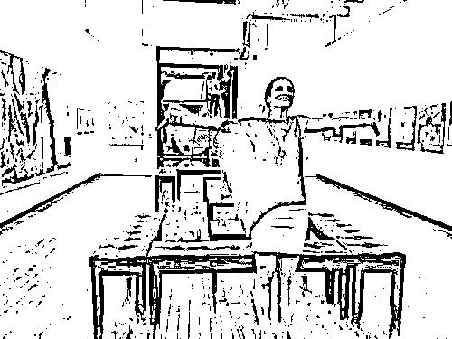

Luna 在画画的过程中，也诞生了她第一本书的雏稿——《人生的十字路口：应该，还是必须？》（The Crossroads of Should and Must ）

这篇文章在 Medium.com 和 Twitter 上被疯转，短短几周有 500 万人次转评。Should and must→→#choose must #这个话题迅速火爆起来。

书中的所有内容都是 Luna 自己手绘设计的，当然也包括封面。

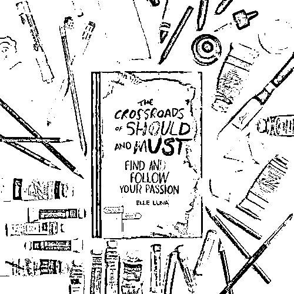 

这本书一出版就成为全北美畅销书，得到 Twitter 创始人 Evan Williams 的推荐。Luna 不断收到媒体和机构的演讲邀请，包括 GOOGLE 和奥普拉中心。

出书只是 Luna 远未抵达的旅行中的一小站，她不仅继续在工作室里作画，而且创立了 Bulan Project 公司，开启了自己的纺织创业之路。

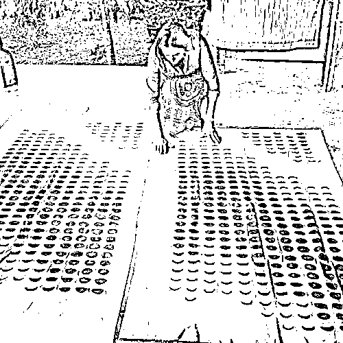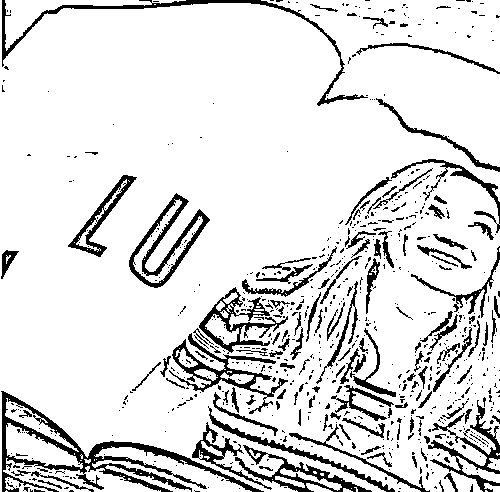

她把自己的画作设计成自己品牌的围巾，然后就登上了 ELLE 杂志。

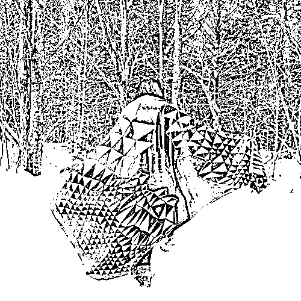 

成了网红的 Luna，现在不能间断的事依然是画画。之前完成了 100 张自画像，如今她又启动了“100 天画出我的梦”项目。

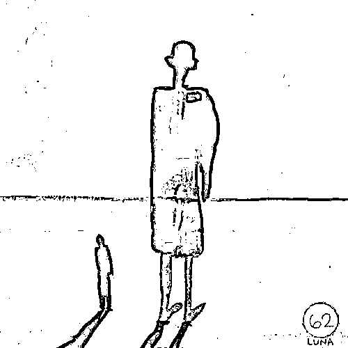

第 62 天

当太阳升起，也会有一些其他东西伴随着升起——那些久远的，在他们出生之前就已存在的——虽然静默如迷，但他们都记得。

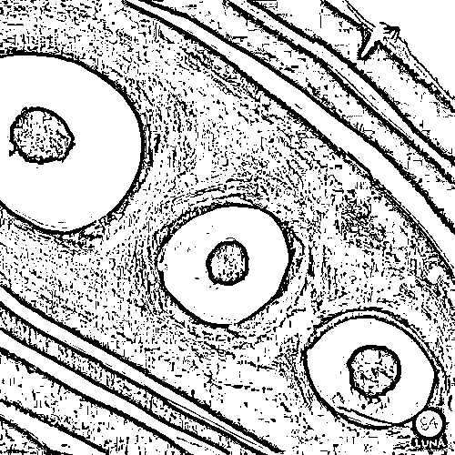

第 84 天

她看不见，也无法解释，但她知道那个它，存在。 

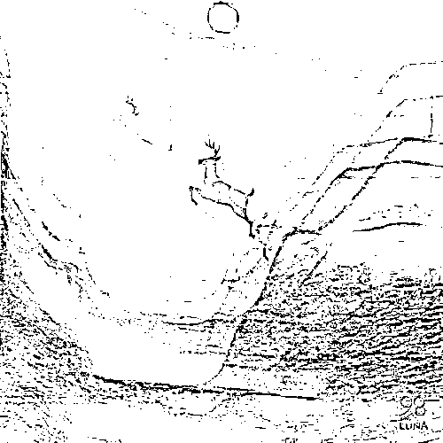

第 98 天

几个月前，梦里有个声音让我跟上那头鹿。我当时有一些预感，似乎明白它意味着什么。这个星期，它现身了。它很明晰，我便在真实生活中跟随着它。

“突然，她明白了**梦还在夜晚的梦境之外存在**。梦一直围绕着她，每天等待、期待着她醒来，看见它们。她醒了，眼前的整个世界变得愈加生动开阔。一切都准备好了，她带着所有梦境中最好的那个梦启程。

## 你也可以找到正确的方向

这样的经历，像不像一碗心灵鸡汤？那我们又如何能像她一样，弄清自己的天赋和方向？

在这里，若道君要提供给你的是美国著名占星师简·斯皮勒为你量身定制的职业报告。

简·斯皮勒是美国占星学会（AFA）的教师，是畅销书《新月占星学》《灵魂占星、《灵性占星学》和《宇宙之爱》的作者，也是各大国际或地方电台节目、电视节目的常客。她独家授权若道星文化在中国代理她的报告。

**这份职业报告将明确指出你的天赋，那些你身上所具有而社会也需要的能力，那些你最擅长又能带给你快乐的事，以及实现你的职业目标的最佳方式。**它也会指出有哪些习性会阻碍你走向成功，它们来自何方，而你又可以如何改善，从而帮助你体验到成功、快乐与尊重。这成功有时候不仅仅是事业上的。

如果这也想像 Luna 一样找到正确的方向，这份报告，很可能会帮到你哟。


**特别提醒：**

**本文由艺非凡授权**

****转载请联系原作者****

**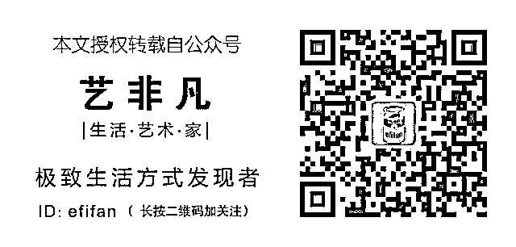**


# 6 月宇宙天气丨又一颗行星即将顺行，朝着梦想一步一个脚印向前走！

> 原文：[`mp.weixin.qq.com/s?__biz=MzA5NjA0NTAxNg==&mid=2651385132&idx=1&sn=d93cf3d1c39327d6fc9337df224b97ca&chksm=8b4a5f9bbc3dd68db15592a69bee626ba46416f6b15424ef93e8639915a887bca805a26269bf&scene=126&sessionid=1692738826#rd`](http://mp.weixin.qq.com/s?__biz=MzA5NjA0NTAxNg==&mid=2651385132&idx=1&sn=d93cf3d1c39327d6fc9337df224b97ca&chksm=8b4a5f9bbc3dd68db15592a69bee626ba46416f6b15424ef93e8639915a887bca805a26269bf&scene=126&sessionid=1692738826#rd)

作者/咔咔  ISAR 认证占星师

图片来源/Pinterest

6 月星象值得期待。本月将迎来火星顺行，这是继木星和水星之后又一个恢复顺行的行星。火星在天蝎座顺行，会坚定人们的意志，提高执行效率。在此之前，天空中的行星会组成两组大十字相位，既创造了交流的机会，也在提醒我们，如果没有实现脑中的想法，交流也只是能量的虚耗。

「

火星要顺行啦

坚定意志，提醒效率

」

本月将喜迎火星顺行，这是继木星和水星之后又一个恢复顺行的行星。**木星的顺行提振了信心，水星顺行缓解了沟通方面的混乱，火星在自己守护的天蝎座顺行，会坚定人们的意志，提升执行效率。**

**火星顺行发生在 6 月的最后一天**，那之前，天空中的行星将组成**两组大十字相位**：**先是太阳、金星与木星、土星和海王星的组合；而后是水星与木星、土星、海王星的组合**。这创造了头脑激荡和交流的机会，但是没有一步步落实脑中的想法，终将造成能量的虚耗。**你需要一步一个脚印，确立明确的目标，并且一步步地朝那个目标走过去。**

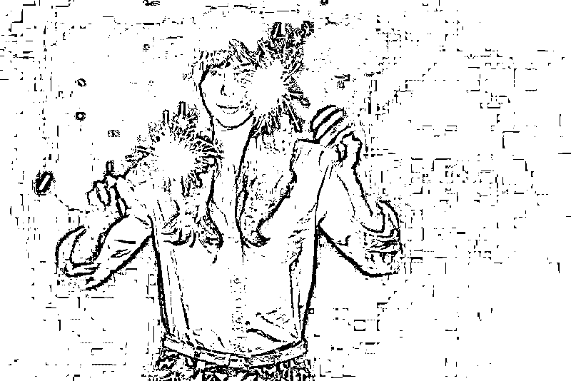

「

6 月 2 日-6 月 7 日

别让没有效率的对话虚耗能量

」

**6 月 2 日：太阳（双子座）四分海王星（双鱼座）**

**6 月 3 日：金星（双子座）四分海王星（双鱼座）、****太阳（双子座）对分土星（射手座）**

**6 月 4 日：金星（双子座）对分土星（射手座）、****太阳（双子座）四分木星（处女座）**

**6 月 5 日：金星（双子座）四分木星（处女座）、****双子座新月**

**6 月 7 日：太阳合相金星（双子座）**

第一个大十字发生在 6 月 2 日-5 日，这几天里，天空中的太阳与金星在双子座的相同度数相伴前进，先后遇到了在双鱼座的海王星、射手座土星和处女座木星。

**占星小课堂之大十字**

大十字，顾名思义，即这四组行星分别与其他行星形成 90 度，在空中各据一方，彼此牵制，彼此拉扯，力量会在拉扯中聚集，也在拉扯中消耗。

本月形成的大十字，行星都在变动星座。**变动星座的特征是善于面对不确定的情况和目标，灵活应变，却缺乏耐心和毅力。当他们面对困难和矛盾的时候，更愿意去转移目标，找到新的关注点，而不是去面对冲突。**

**重点影响对象**

**出生星图上有行星落在处女座、双鱼座、双子座和射手座 11-15 度。**

**双子座和处女座关注信息和理念，射手座和双鱼座关注信仰和理想**。当这四个星座组合在一起的时候，尤其太阳和金星在代表沟通和交流的双子座，人们会有很多的想法和观念的碰撞、讨论、头脑风暴，也可能会有很多会议、商务交流，社会交往活动。这些交流和讨论，不容易达成共识，也不容易得出可执行的下一步操作。

人们可能坐下来交换了新的想法、讨论了现实的制约、探讨了实际的做法，又捎带手把理想、道德、梦想画了几个大饼，就没有结果的散会了。花了很多精力，但是没有带来有效率的结果，这也使得人们会感到能量被消耗掉了、沮丧和焦虑。

**请记得，一步一个脚印，你需要明确每一个会面的目的，然后不管天马行空地聊到哪里，都记得要在这次会面的结束的时候，回到这个目的，就这个单一的目的达成结论。**

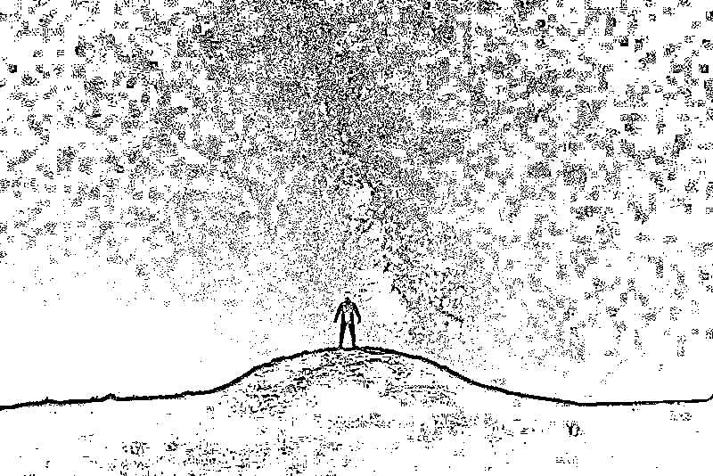

6 月的前半个月，太阳和金星都相伴前进，带来了很多人际交往和交流的机会。6 月 5 日发生的**双子座新月**，提醒我们有意识地发挥双子座的能量：**我们可以变得更好奇，认识新的朋友，多问问题，关注他人身上和我们不一样的地方，打开心灵接收更多的信息，欣赏他人的不同个性。这是提升我们自身社交能力和沟通技巧的好机会。**

「

6 月 10 日-6 月 13 日

走出紧张感，拥抱可能性

」

**6 月 10 日：水星（金牛座）对分火星（天蝎座）**

**6 月 12 日：金星（双子座）六分天王星（白羊座）**

**6 月 13 日：水星进入双子座**

第一个大十字结束后，宇宙行进的脚步加快了一些，**水星先是与逆行的火星形成了对分相**。水星与火星都处于固定星座，**水星在金牛座关注自我的价值，注重实用性和可行性。火星在天蝎座则是深思熟虑，考虑自己和他人的利害得失，可以为了更大的利益隐忍不发。人们需要从自己的立场走出来，和他人做深度的交流**。有可能在这个过程里，会因彼此各不让步而带来言语或肢体的冲突，或者造成经济的损失。

幸好水星很快地进入了自己守护的双子座，紧张感散去，人们客观地思考，开放地交换意见，沟通效率大大提升。**可以把本月重要的会议、学习、教学、社会交往安排在 6 月中期。**

同时，金星与天王星都在阳性星座，形成了活泼的六分相，这给人际交流带来了新的角度，**你可以和朋友一起参加新奇有趣的活动，保持旺盛的好奇心，探索外在的世界**。这是从自己的困境走出来的一个选择：**忘掉自己，拥抱他人，拥抱各种可能性。**

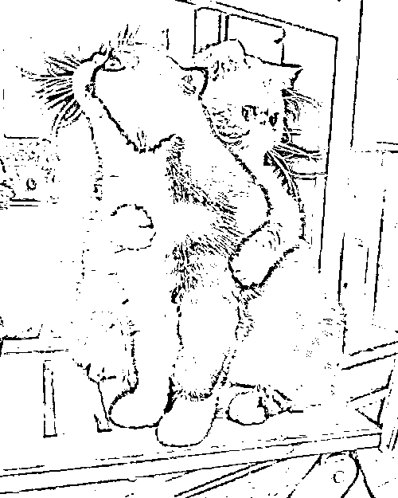

「

6 月 14 日-6 月 26 日

梦想与现实，愿景与行动力

」

**6 月 14 日：海王星开始逆行**

**6 月 18 日：金星进入巨蟹座、****土星（射手座）四分海王星（双鱼座）**

**6 月 20 日：水星（双子座）对分土星（射手座）、****射手座满月**

**6 月 21 日：水星（双子座）四分海王星（双鱼座）、****太阳进入巨蟹座（夏至）**

**6 月 23 日：水星（双子座）四分木星（处女座）**

**6 月 25 日：木星与北交点合相**

**6 月 26 日：木星（处女座）三分冥王星（摩羯座）**

**6 月 14 日，海王星再一次在双鱼座逆行，并与土星第二次形成四分相。**

去年 11 月底土星和海王星准确成相的时候，北京连续 5 天空气严重污染。每一个早上看到窗外灰蒙蒙的天空，下决心起床收拾好自己，照常生活，是一个需要给自己鼓励才能做到的事。我们的生活和经济要又一次在虚无（海王星）中失望（土星）吗？

我在[2015 年 11 月的宇宙天气预报](http://mp.weixin.qq.com/s?__biz=MzA5NjA0NTAxNg==&mid=400459203&idx=1&sn=4b362fd4443dc53c34df561c52ab023d#wechat_redirect)中写道：**土星用它的现实性把海王星代表的泡沫撇去，把梦想具象化：树立带着愿景的实际目标；运用创造力取得现实世界的成就；致力于改善现实世界的愿景与梦想。**

7 个月过去了，木星与北交点再一次合相在处女座，你是否已经在实现自己的梦想了呢？你学到了什么技术和专业知识呢？你给自己制定了哪些有效的进步和改善的计划呢？

需要注意的是，第二次土星和海王星成四分相发生在土星和海王星都在逆行的状态下。让我们把所有的**逆行都看成是一个“向内”的过程**。**向内反思我们的信念体系（土星在射手座逆行），向内聆听我们内在的声音（海王星在双鱼座逆行）**。经历了 2015 年 10 月和 2016 年 3 月的两次成相，木星最后一次与冥王星形成三分相。

**重点影响对象**

**出生星图上有行星落在处女座、摩羯座、双鱼座、巨蟹座、天蝎座和金牛座 16-17 度。**

宇宙在给你们实现野心的机会，你听见内心对成功的呼唤了吗？

**冥王星与木星和北交点的三分相会坚定你内在的信念：面对第二次的土海四分，你可以选择是否要再一次经历理想的破灭，逃避责任，在沮丧中无所事事；你也可以选择积极调整目标，倾听自己真正的需要，肯定自己的能力，运用实际的技能，一步一个脚印地走向那个更经得住考验和更有意义的愿景，走向成功。**

**水星在此时加入了木星、土星和海王星，形成了本月第二个大十字。这次的大十字更多的是思想上的“纠结”，你的想法在不停的调整和校正，也可能会在沟通交流中遭遇一些混乱**，比如被他人挑剔，被误解。**第二次射手座满月提醒我们，在自我的看法与他人的立场之间，存在着不调和的矛盾**。还是之前的建议，沟通的时候，一步一个脚印，每次只讨论一个问题，不管最后天马行空地走到哪里，结束的时候回到这个问题上，尝试达成结论。

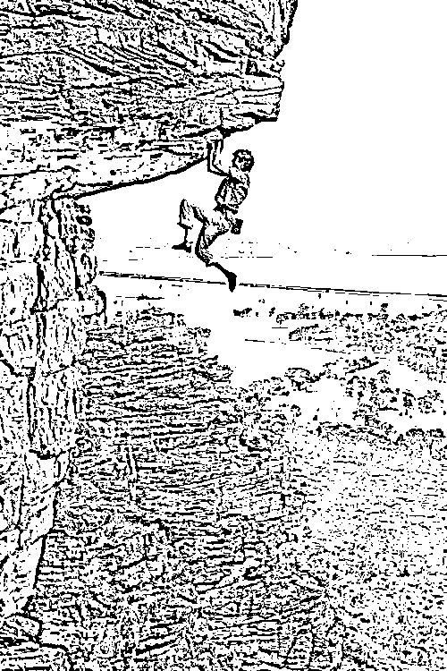

「

6 月 27 日-6 月 30 日

夏天来了，去相爱吧！

」

**6 月 27 日：水星（双子座）六分天王星（白羊座）、****金星（巨蟹座）三分海王星（双鱼座）**

**6 月 30 日：水星进入巨蟹座、****火星在天蝎座顺行**

6 月 21 日，太阳进入巨蟹座，拉开了夏天的帷幕。

太阳、金星和水星在细腻、温柔、有同情心的巨蟹座，我们和自己爱的人在一起。金星与海王三分相，结合了巨蟹座照顾者和双鱼座艺术家的特质，让我们对自己和他人更多包容和体谅，用心去交流。

6 月 30 日，火星在天蝎座顺行。热情和决心回升，经历了火星逆行，经历了本月的变动大十字，亲爱的读者，你有哪些观点被刷新了呢？你又增加了哪些勇气呢？你要向着哪些目标一步步地前进呢？


**占星师咔咔**：2010 年开始学习占星学，若道首届学员，国内最早获得 ISAR 职业占星师资质的职业占星师。在国际知名广告公司和市场研究公司从事的市场研究和推广工作十余年，曾任职于阳狮集团、尼尔森市场研究有限公司、MTV 和《Madame Figaro》杂志。现在为《时装男士》、活法儿等媒体供稿。

微信公众账号：咔星人

星盘解读和运势咨询：cji1029@qq.com

**特别提醒：**

**本文首发于若道平台，**

**转载请联系后台授权。**


**想要顺势而为？先学习整合星图。由大卫·瑞雷老师**讲授的**若道核心课程 Level 3，会教你将**星座、行星、宫位、相位这些散落的珠子穿起来，**带你进入更深的自我探索与成长的旅程。本课程将于今年 7 月开课，敬请期待！**


# 干货 | 大卫老师企业占星微课文字全记录

> 原文：[`mp.weixin.qq.com/s?__biz=MzA5NjA0NTAxNg==&mid=2651385132&idx=2&sn=55820ffbeea0d83101d5361b25d95eac&chksm=8b4a5f9bbc3dd68dc1462bd85632fa229570db9887137966872bb975bfb3f5a35507f6fb7f59&scene=126&sessionid=1692738826#rd`](http://mp.weixin.qq.com/s?__biz=MzA5NjA0NTAxNg==&mid=2651385132&idx=2&sn=55820ffbeea0d83101d5361b25d95eac&chksm=8b4a5f9bbc3dd68dc1462bd85632fa229570db9887137966872bb975bfb3f5a35507f6fb7f59&scene=126&sessionid=1692738826#rd)

授课人/大卫·瑞雷  翻译/蒋颖

整理/玫瑰  图片/VCG

大卫老师的[企业占星微课](http://mp.weixin.qq.com/s?__biz=MzA5NjA0NTAxNg==&mid=2651384960&idx=2&sn=b045c9ae3eae81786a6deb3f51d0e3b4&scene=21#wechat_redirect)爆满，没报上名的小伙伴，没空做文字记录整理的小伙伴，别急，若道君贴心地为你们准备了这份 Q&A，一定要好好收藏哟。

端午节，大卫老师将在上海开设国内首次[企业占星工作坊](http://mp.weixin.qq.com/s?__biz=MzA5NjA0NTAxNg==&mid=2651385035&idx=3&sn=32139523fc7ea43401120ed7e869853e&scene=21#wechat_redirect)，内容会比微课深入很多，对企业管理和创业有兴趣的话，抓紧报名哦。

**Q1**：**我能仅运用太阳星座的知识在商业发展中帮助自己么？**

**A1**：**你可以运用太阳星座，但是，这只是在泛泛地运用，你一定要把太阳星座看做是一个人的潜能，我们是在发展出来太阳星座的潜能**。比如说，一个人不是生来就是一个发展非常完全的狮子座的。假设你在你年轻的管理人员中想找出来一个未来可以成为部门总监的人选，你挑一个狮子座出来也是蛮明智的选择，不过即便是如此，他们在成为一个合格的领导者之前，在他们发展出自己的能力之前，他们还需要有很多的培训和锻炼。**一个 24 岁的狮子座的人可能完全不像是能够去掌控一个事情的人，但是要记得他们有怎样的潜能**。

每个公司都想知道在这些年轻人身上的时间和金钱还有精力的投资，未来会不会给他们带来回报。所以说，即使是知道一些太阳星座的知识也可以给公司对于人才方面带来一些优势。当然，我的意思并不是说每一个狮子座的人，他们都能在领导职位上脱颖而出，不过，毫无疑问，这可以帮助你们在人才选拔和人才培养方面能够进行人力资源方面的改善。

现如今我们都可以很容易地在手机上计算出一个人的星图。用占星学的知识，既可以帮助我们知道这个人的性格，他的长处，也可以帮助我们知道这个人面临什么样的挑战。

**Q2**：**真的可以通过星图来帮助判断一个人是否适合某个职位么？**

**A2**：当然了，占星学可以帮助我们通过星图来判断一个人是否适合某个岗位。不过，非常重要的是你一定要记得这一点，**你要非常了解你这个行业，对于这个职位需要什么样的条件、才华能力，也非常了解**。

如果你是人力资源部的一个经理，那么，你要去挑选一些面试的人，你需要仔细审查他们的简历。当然，选拔人才是人力资源部人员的专业才能，不过**如果你能够知道一点占星学的知识，它可以帮助你去阅读简历里字里行间那些没有被写出来的信息，帮助你更好地对这个面试者进行提问，你所知道的占星学知识越多，你就能问出越恰当的问题**。

大部分情况下你不可能知道候选人出生的准确时间，不过，你可以知道他出生的年月日，即使如此，你也可以得到非常多的关于这个候选人的信息。 比如说，你看到在他的出生星图上，他出生的那一天，**水星和火星呈四分相。意味着这个人可能比较喜欢争辩**。在你的面试中，你就可以去**发现一下这个人在争辩这方面有没有什么进步。就可以问他们这样一个问题，在过去的职位中，他们是如何应对争执的，如何去应对不同的意见的**。如果你的占星学知识更丰富的话，你甚至可以去回顾一下他们过去的人生中发生的不同的行进，那时候发生了什么。

比如说，当你看他的职业简历，你看他过去在其他的公司和岗位中，他们在经历什么样的行进，比如你可以看看，在**土星的行进**下，出现了什么样的事情。那么我们去回顾土星的行进就可以帮我们知道这个人在过去的岗位中，**当工作中有压力、挑战，有很大的责任的时候，他们是如何去应对的**。你也可以发现这个人在未来，当相似的压力出现的时候，他会不会以同样的方式来应对。**问这样的问题实际上能够帮助你去打开那个你正在面试的人的内心世界**。

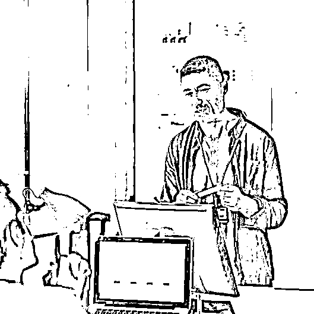

**Q3**：**在创业路上如何通过占星招待自己的优劣势，扬长避短？**

**A3**：你知道这个问题的有趣之处就是你**不能避开你的短处**。运用占星学的益处就是能让你对自己更为诚实。如果有一个议题必须要面对的话，占星学可以帮助你去看看，这个议题的源头是什么。并不是意味着我们就沉溺在那个问题上了，而是指你要在内在找到一个解决这个问题的方法。当然，**尽可能地发展你的长处，你的优势，是在我们的商业中，或者我们的公司管理是一定要做的事**。

**每个星座都有能去创造成功的特性**。比如说**白羊座可以通过主动开创**来获得成功，而**天秤座可以通过建立关系**来获得成功，**巨蟹座的老板可以通过创造一个非常安全的环境，通过去滋养他的下属**来获得成功。每个星座都可以根据自己的特色去获得成功，这方面没有任何的限制。占星学对创业公司尤其有用，因为你可以帮助一个公司从头开始创建。

如果你有一个客户来找你，他想做一个公司，那么你就需要在这个课题上跟他进入一个非常深入的探索，这是一个非常严肃认真的决定，因为他们要投入金钱、时间和精力等等非常多的资源在其中。也许甚至在开始，他都可以跟占星师谈论两三次，这样才可以把他所担心的所有的问题都谈一遍。**占星师可以帮助他真的找到“你的目标是什么？”“在你的内心深处是不是有这样一个承诺，要去坚韧不拔地把你创业的理想贯彻到底？”**

**Q4**：**创业中如何通过占星找到好的合伙人？**

**A4**：**在创业过程中运用占星学**找一个和你合适的合伙人**是非常重要的**。你们在寻找的是两个人拥有**互补的技能**。比如说有一个人他有很多的射手能量，实际上他是一个只看大局的人，这个人就可能需要处女座来配合他，因为处女座能够应对很多细节性的问题。当然，你们在学习严肃占星学的学生也知道，我们找到一个合适的合伙人不是一件容易的事情。我想跟学习占星的学生说，你们要去看看这样一个主要合伙人，他们在创业过程中，他们真的需要什么样的人来作为他们的创业伙伴。**如果是真实的伙伴关系，你们要去看看七宫和八宫**。

**举个栗子** 

有一个客户，她的上升点是双鱼座，她的南交也在双鱼座一宫。非常善于去应对那些复杂的工作的案例。有非常棒的直觉，能够很好地去猜测出问题是什么，但是她没有办法向别人解释她怎么找到了这些答案。那么她就意识到需要找这样一个合作伙伴，这些人能够去做那些更细致的工作去解释她所找到的答案。这并不意味着她的直觉所有时候是对的，因为并非如此。她雇佣了很多处女座的人，通过这样，她能够让这些处女座的人发现那些答案的细节是什么。

这就是我们说要去找到互补的占星要素的原因所在。

**Q5**：**如何透过占星学让创业团队合作分工最优化？**

**A5**：看一个团队如何分工是非常愉快的一件事情，从公司一开始创建你就能做到的话，实际上后面的事情就简单多了，意味着从一开始你就让每个人各尽其责，各就其位，以后这个部门事情的发展就会更加容易了。

我也曾经跟已经创建很久的公司一起工作，他们的团队已经形成了一些很糟糕的习惯。在这种情况下占星学很有用，因为常常工作中的人会觉得**他们的声音没有被听到，没有人倾听他们的心声**。

当一个局外人，特别是一个占星师，最终来听取他们的声音，他们会感觉到，我们的声音终于被聆听到了。**当一个人感觉到自己的心声被聆听了，这是我们走向解决方案的第一步。**现在他们就是我们协商和谈判的一部分了。不仅他们知道他们的议题被聆听了，公司的其他人也听到了这个议题。常常这让团队的其他人非常震惊，因为他们真的不知道到底发生了什么。那么这时候人们就会更好地在一起工作，而不是仅仅互相指责，或者互相抱怨。**就这个意义而言，人本主义占星学在商业中是非常问题解决为导向的**。

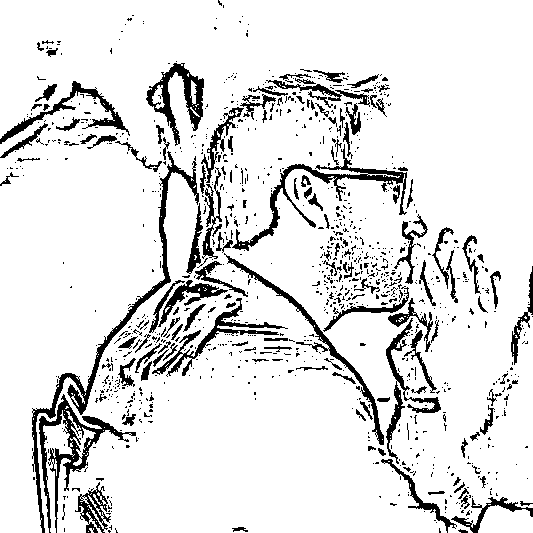

**Q6**：**占星是否可以正确选择创业方向和时机？**

**A6**：当然，就占星学我们有句老话：时机就是一切。但是呢，让我们说得更清楚一些：**创业没有一个完美的时机**。即使有一个完美的时机，这也不能确保你一定能成功。就时机而言，**最重要的是帮助你们的客户找到他们的节奏。帮助你的客户以最和谐的方式，最协调的方式，和宇宙的能量共同运作**。

这不是一件容易的事情，因为总是会有一些挑战，一些困难，在你选择的时机的星图上也同时存在着一些挑战和困难。我们真的开始选择一个时机点之前，我喜欢做的是跟这个创始人或者这个团队深入地探讨一下他们在做什么。

**一个企业的出生星图其实是一个历程**。比如说，如果你的客户知道他想要创业的第一个念头是在什么时候产生的，你可以就这个做一个星图。你还可以做另外一个星图，就是他们拿到营业执照的星图，你还可以再做一个星图，是他们真正开始开业办公那个时间点。那么在美国，因为获得营业执照和成立公司还是两个不同的时间，所以这两个时间点你可以各做一个星图。如果这个公司足够成功，那么上市又有一张星图。每张星图都是一个故事的一部分，这个公司的故事。

既然它是一个公司的故事，故事自然有自己的模式。如果了解占星学，你就可以去看到这个模式的优劣所在，你也会去想，我们如何才能改进。你们知道在美国，一个公司法人和一个自然人他们有同样的权利，所以说，你看一个公司的出生星图，就像看一个个人的出生星图一样，你可能觉得很奇妙，不过在美国真的是如此，因为他们的法律地位是一样的。占星学就是有关于时间和地点的意义的正确的应用。

**Q7**：**占星师在作业的时候，主要考量的是企业的星图，还是企业主的出生星图呢？或者还有其他重要的因素。**

**A7**：**如果你刚开始和一个公司做咨询的时候，毫无疑问，企业主的出生星图是最重要的一张星图**。

如果你在很多年前第一次见到马云，开始给他做商业咨询，那么你首先要看的就是**他的出生星图**。如果你一直做他的企业咨询师到今天，那么你已经有几千个企业相关的星图了。你可以看到这整个企业建立的过程是多么复杂，你可以看到他所创立那么多公司的历程又是如何。

不过，每一个这样的星图都代表着一个成长的阶段，还有一个学习的进程，这就是占星学有价值的所在。这不是关于运用占星学让你行运，通过理解到底在发生什么，你创造了自己的好运。因为这些星图会反应出这个市场状况到底是什么样，能否反应出这个企业到底是什么样。**如果你把每个企业的星图，也就是每个企业的阶段都当做是学习的过程，那么你真正就在受益，哪怕有时候，你会有暂时的挫折**。

我并不想一直用马云的故事来做一个例子，但是我们也知道，在他职业的早期，他也是有很多挫折的。他从每一次挫折中学习了，这就是占星学能够迅速帮助你理解的意义所在。

在我们的战略规划中，我们也可以非常好地运用占星学帮助我们来选择时机，比如说这个公司有一个三年的中长期规划。公司有自己的目标，有自己的时间表。你就可以想，占星学是不是有助于这样的目标，这样的三年的计划呢？**如果你看他们的时间表，和你看到的占星学上的行进，是完全符合的，你就知道会有什么样的结果了**。这种时机的规划不仅是对一个企业的中长期战略计划有帮助，也会对我们的市场计划有帮助。

**占星学甚至能够协助在营销时的创造性的部分**。如果你跟一个市场营销公司，或者跟一个广告公司谈论一个产品的上市计划，你甚至可以利用占星学帮助他们想这个营销计划中可以有什么创意性的部分。

**占星学真的是一个能够帮助我们去发展创意的工具**。四年前，我在北京电影学院做讲座的时候，我甚至跟他们讲，你可以看着星图，用一个星图来写一个创意故事。

占星学在一个公司的各个部门都可以有所帮助，它可以在人力资源部门有很大的应用，可以帮助人力资源去解决员工之间的议题，它可以帮助老板和员工之间更好地理解彼此。对于那些为你工作的人，你能够有更多了解。如果你可以看到他们星图上的行进的时候，你就可以帮助他们去想在那样的挑战实际能够怎样去帮助他们，能够帮助他们其实也在帮助你自己。如果你是一个管理者，正在学习占星学，毫无疑问，它可以让你增加你的优势，你可以把它增加进你的管理技能中去。

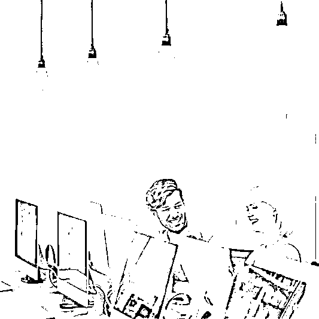

**如果仅仅只知道占星学而不知道其他的话，也没有什么用处，如果你只知道占星学，不知道其他，就进入其他领域，其实也不会有所帮助**。从这个意义上来说，占星学就像给我们的硬件上添上一个软件一样，在你已有的知识上增加了一个更高级的软件系统。给你一个优势，能够给你提供更多的洞见。

**Q8**：**除了上面聊到的，商业占星还能做些什么呢？**

**A8**：**在商业的各个领域都可以应用占星学，但最重要的是，你必须真正了解那个你所在的商业领域，常常占星师出问题的时候是因为他们以为只有占星学可以帮助他们，他们不够深入地了解自己所在的领域**。

在我帮助一个企业客户的时候，实际上我是运用占星学去了解他们所处的行业和所在的企业，我运用占星学帮助他们敞开向我讲述他们这个行业和企业的关键所在。

之后我就告诉他们，你看，这是占星学告诉我你的公司怎样怎样。我可以对他说，我看到在你的员工里面，土象星座是占主要位置，员工都是土象星座。这可能可以告诉我们为什么在营销和销售方面这个方面一直在挣扎。在这样一种情况下，可能应该去雇佣一些有火象和风象结合的员工，如果这个公司真的想去提高他们的营销和市场销售部门的话。当然这又是一个过于简单化的例子。

**案例分析**

**Q**：去年公司人员流失率较大，分析了一下部分未离职员工，土元素都较重，离职率较高的是风元素。如果再次招聘，不考虑其他因素，只考虑员工稳定性来说，是否可以招聘土元素较重的即可？

**A**：当然你想主要雇佣土象多的员工，这可能是一个解决方案，不过一定要记得，对于每个元素的人他有他的正向的，也有他负向的影响。

占星学的问题是，**为什么有这么高的离职率呢**？我们可以理解风象星座，可能火象星座也是如此，他们更喜欢变化。我觉得这也向我暗示着**这个公司有一些沟通方面的问题**。

**如果风象星座的人大批离开一个公司，那就意味着他们觉得没有人倾听他们。如果是你让更多土象星座进入这个公司，那么整个沟通是不是会完全垮掉呢**？

当然我觉得你从占星的角度去分析员工的流失率是非常好的，同时要有一些其他因素，如果你要想找到真正的解决方案的话，你需要去考虑其他的因素。**如果没有良好的沟通，即便很好的员工，他们自己的目标会互相掣肘**。


我希望在上海见到大家，我甚至希望是不是你们有一些人要跟我乘坐同样一趟列车去上海呢？商业工作坊是在中国开的第一个企业占星工作坊，希望有对这个领域感兴趣的朋友们，或者希望用占星学来解决企业实际问题的朋友们来参加这个工作坊。


**6 月，与你相约上海，**

**我们虚位以待。**


**大卫·瑞雷（David Railey）**

若道创始人，《灵魂的目标》作者。拥有 46 年的占星咨询的执业经验，曾两任亚特兰大占星协会主席，是全美占星师联盟（AFAN）、美国占星师联合会（AFA）、全美占星研究委员会（NCGR）、国际占星研究协会（ISAR）和职业占星师组织（OPA）的成员，是联合占星大会（UAC, United Astrology Conference）督导委员会委员。大卫曾是 CNN、CBS 的占星节目的常驻嘉宾，多次在 BBC、WGS、WSB、WRGG 等节目中接受采访，并在亚特兰大主持电视节目《每日行星（Daily Planets）》达 4 年之久。

**ISAR 选修课程****工作坊信息**

**授课时间：**2016 年 6 月 9 日、6 月 10 日、6 月 11 日（端午节假期）10：00-18：00（午休 2 小时） 共 18 课时

**授课老师：**大卫·瑞雷

**授课方式：**上海现场，英文授课，中文翻译。（具体上课地址课前 10 天请留意查看短信微信通知）

**费用**：****6800 元** （5 月 20 日前报名可享受早鸟价****5800 元****，若道老学员**4800 元**）**

**课程负责人：**熊老师

**微信号：**13761199137，请备注企业占星工作坊报名咨询

长按二维码添加课程负责人咨询


**了解详细课程内容及报名方式，点击文末“阅读原文”**


# 帮助一个企业走向辉煌，也许是你这辈子做的最牛的事

> 原文：[`mp.weixin.qq.com/s?__biz=MzA5NjA0NTAxNg==&mid=2651385132&idx=3&sn=a27663560a339d4de70403d94207d988&chksm=8b4a5f9bbc3dd68d7a8d0b17b4847735579669ebc791a4db42665e049982ccd37f932af83459&scene=126&sessionid=1692738826#rd`](http://mp.weixin.qq.com/s?__biz=MzA5NjA0NTAxNg==&mid=2651385132&idx=3&sn=a27663560a339d4de70403d94207d988&chksm=8b4a5f9bbc3dd68d7a8d0b17b4847735579669ebc791a4db42665e049982ccd37f932af83459&scene=126&sessionid=1692738826#rd)

“

**我的公司，就像我的孩子。** 

”

于我们，

也许仅仅是一个不知名甚至不起眼的品牌，

于创立这家公司的人，

这就是他们的骨肉。

鲁迅先生说：

“这世上本来没有路，

走的人多了，也便成了路。”

企业之路无疑是最艰难却也最辉煌的一条路。

几乎每一个创业成功的企业家，

都可以给你分享一百种往事，

最初的艰辛和一路的困惑迷茫。

那么为什么还有无数人，

前赴后继在这条路上呢？

因为每一个人有一个，

代表事业成就的中天，

我们都**渴望成功**、**渴望不断向上**、**渴望荣光**。

然而，在这条路上，

光有海王式的梦想是远远不够的，

还需要土星式的实际规划、

火星式的热情燃烧，

有时候甚至需要一点木星的幸运加持。

**“谋事在人，成事在天。”**

占星学能够给到一个企业最大的帮助，

除了可以帮助企业主**“谋事”**，

还可以借助**趋势预测**来帮助他们**“成事”**。

运营企业从来都是一件严肃的事情，

就像若道占星，

一直致力于严肃占星学在中国的传播一样。


这是**国内第一次**系统讲解

如何运用**占星学给企业做咨询**的工作坊。

这是一个绝好的机会，

你可以**和大卫老师面对面**，

还有机会在中国的经济中心——**上海**，

**体验海派风情**，

**结交**各行各业成熟的**职业人士**，

同各界热爱占星学的**企业精英**交流，

互相切磋各种经验，

**扩展高层人脉**。

这也是一个**严肃**的席位，

它考验你是否真的有十足的准备，

去面对企业主们，

替他们排忧解难。

因此，

我们对于参与这次工作坊的人群有相对严格的筛选，

同时，也会为大家提供**非常高质量**的授课内容。 

**企业占星工作坊非常适合这些人**

● 本身是**创业者**或者**企业主**；

● 本身是**企业管理者**，或**对于企业管理有一定经验**的占星师；

● 对于没有企业管理经验，但有**鸿鹄之志**，想有一天拿下几十万元以上大单的占星师，也欢迎参加。（请提供足够证明自己能力的依据）

**你将得到如下帮助**

*   **经典案例解析**

*   大卫老师将用自己非常熟悉的经典案例，详细讲述**占星学可以在企业创立、运营、出售等一个完整的企业生命流中可以帮助企业所做的方方面面的事宜**。

*   **企业的创业方向**

*   选择适合的**创业方向**，是创业成功的一个要素；**创始人的个性**也创造出不同的企业，会以不同的方式获得成功，也会遇到因创始人的个性而面临的**独特挑战**。

*   每个企业都有不只一个对企业有意义的星图，企业的星图如个人星图一样，有**故事、机会，挑战，起伏**的周期。如何解读**企业星图**中的秘密？如何解读**企业主星图和企业星图**的关系？

*   **产品和服务的定位**

*   根据创始人及企业星图，**优化产品和服务的定位****。**

*   **人的选择**

*   选对人是每个创业者及管理者最重要的任务，而培养、管理、发展企业员工又是管理者最大的职责。

*   帮助企业主**选择、了解其合伙人****；**

*   帮助企业主**设立关键职位****；**

*   帮助企业主对**中高层人力资源的选择、培养、提拔**，将适合的人用到适合的岗位，**了解员工的优势和各个时期的挑战**，了解**关键人员的个人发展趋势是否符合企业发展趋势****。**

*   **团队建设**

*   帮助企业主与企业关键人员**建立信任**，了解什么是更好的**沟通方式****；**

*   帮助**团队**之间的**沟通和协作**，建立**团队成员的归属感**，帮助团队成员**关系**的融洽。

*   **制定计划，管理趋势和变化，防范风险**

*   占星学善于**预测趋势**，运用占星学，可以提早**了解企业趋势的变化**，进而**制定营销计划、财务计划**，更好管理企业的变化，防范风险。

*   **选择时机**

*   学习**择时占星学基础**，帮助企业的**活动、关键时间选择时间点****。**

*   **帮助占星师了解如何与商业企业建立关系**

*   企业咨询不仅可以获得**企业客户**，还可以因此获得**大量的个人客户**。


**6 月，与你相约上海，**

**我们虚位以待。**


**大卫·瑞雷（David Railey）**

若道创始人，《灵魂的目标》作者。拥有 46 年的占星咨询的执业经验，曾两任亚特兰大占星协会主席，是全美占星师联盟（AFAN）、美国占星师联合会（AFA）、全美占星研究委员会（NCGR）、国际占星研究协会（ISAR）和职业占星师组织（OPA）的成员，是联合占星大会（UAC, United Astrology Conference）督导委员会委员。大卫曾是 CNN、CBS 的占星节目的常驻嘉宾，多次在 BBC、WGS、WSB、WRGG 等节目中接受采访，并在亚特兰大主持电视节目《每日行星（Daily Planets）》达 4 年之久。

**ISAR 选修课程****工作坊信息**

**授课时间：**2016 年 6 月 9 日、6 月 10 日、6 月 11 日（端午节假期）10：00-18：00（午休 2 小时） 共 18 课时

**授课老师：**大卫·瑞雷

**授课方式：**上海现场，英文授课，中文翻译。（具体上课地址课前 10 天请留意查看短信微信通知）

**费用**：****6800 元** （5 月 20 日前报名可享受早鸟价****5800 元****，若道老学员**4800 元**）**

**课程负责人：**熊老师

**微信号：**13761199137，请备注企业占星工作坊报名咨询

长按二维码添加课程负责人咨询


**了解详细课程内容及报名方式，点击文末“阅读原文”**


# 古典占星干货丨不了解这些东东，你怎么好意思说自己是达人？

> 原文：[`mp.weixin.qq.com/s?__biz=MzA5NjA0NTAxNg==&mid=2651385113&idx=2&sn=28f264f88a271b8ad8850ee986e43369&chksm=8b4a5faebc3dd6b8efd9e36272c8814ea50c3a92936e5939684c663c623348428f685a4dbbaf&scene=126&sessionid=1692738831#rd`](http://mp.weixin.qq.com/s?__biz=MzA5NjA0NTAxNg==&mid=2651385113&idx=2&sn=28f264f88a271b8ad8850ee986e43369&chksm=8b4a5faebc3dd6b8efd9e36272c8814ea50c3a92936e5939684c663c623348428f685a4dbbaf&scene=126&sessionid=1692738831#rd)

```
素材提供/Zoe 整理/佳黛 
```

古占与现占结合的网络课在 6 月 19 日就要开课啦！由当今世界上最伟大的占星师之一——罗伯特·汉德授课！[在前篇中，我们回顾了入庙、入旺的知识](http://mp.weixin.qq.com/s?__biz=MzA5NjA0NTAxNg==&mid=2651385080&idx=2&sn=c524917f3448f74654e0d400cd2d59cd&scene=21#wechat_redirect)（点击可阅读）。已经掌握了基础知识的你，来试着进阶一下吧~

**昼星和夜星**


知识点 5**昼星和夜星**

昼星：太阳 木星 土星

夜星：月亮 火星 金星

特别：水星

水星的判定法则：

●在太阳之前升起为昼星，在太阳之后落下为夜星；

●或与一个日间行星成入相位为昼星，与一个夜间行星成入相位为夜星。

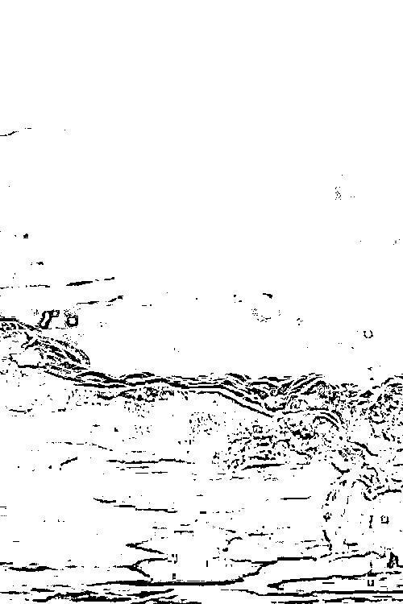

**象征星**


知识点 6**天然象征星**

又称为一般象征， 与一个行星本质或必然的特质关联（比如：金星象征爱，火星象征战争，太阳象征统治等等）。

***注意：这是不会随行星落点而改变的，不过尊贵和无力会影响这种征象的强度。（比如：火星在天秤座落陷，容易有更多的暴力冲突）***

**后天象征星**

后天象征星由落点决定，行星对宫位有守护关系。阿卡比特司分宫制中，这种守护关系，由对于宫头所在星座度数拥有最多尊贵的行星指示。（比如，第五宫代表子女，对于宫头所在度数拥有最多尊贵的行星，就代表子女的状态。）

整宫制中，这种守护关系由对于宫位这整个星座拥有最多尊贵的行星指示。以这种方式形成守护关系的行星接管成为这个宫位所指示事件的象征星。

***注意：分宫制不同会有差异。***

**定位星**


知识点 7**定位星**

任何一个点，在黄道度数上，都有五种定位星，分别是入庙、入旺、三分、界、外观。这个点不论是一个行星或是中天、上升。

比如：ASC 在摩羯座 10°，入庙的定位星是土星；入旺的定位星是火星；三分的定位星有金星、月亮、火星；因为在 10°，所以没有界的定位星；外观的定位星为土星。

***若道君：定位星常用于接纳系统和卜卦占星。***

**补充知识点**

当一个快速运行的行星与一个慢速运行的行星成入相位，且这个相位差不多要完成时，快速行星被称为是“把定位关系给予”后者。

接下来，第二个行星可以把定位关系给将要完成一个入相位的第三颗更慢速的行星。这个链接的最后一个行星就是“最终定位星”，通常是木星或土星，它们的一般情况会描绘出第一个行星象征事务的结果。

***若道君：最终定位星这一用法在卜卦和择时占星中较为常见，出生星图占星中比较少见。同学们可以选择记忆。***

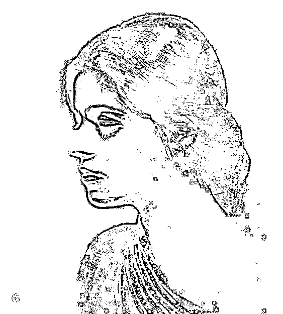

**胜利星**


知识点 8**胜利星**

阿拉伯词源是 al mubtazz。字面意思是获胜者或胜利者。

这是一种守护星，但是守护关系这个术语，如果无特定限制，通常指代对于五种必然尊贵，即入庙、入旺、三分性、界、外观的守护的一种。

我们可以通过上面定位星的寻找方法，找到必然尊贵最强的行星，这个行星就是胜利星。（比如，假设星图金星和土星比较强，金星在天秤座入庙，是天秤座的定位星；土星在天秤座入旺，又是天秤座的三分性。所以土星比金星更强，是胜利星。）

**再举个栗子**

询问父亲的状态，我们需要考虑太阳的位置，就必须根据前面的五种尊贵方式去观察太阳所在位置的守护关系行星，如果某颗行星是所有这五种必然尊贵的的守护星，我们认为这颗行星是可以预测这个问题的，如果某颗行星是两种或者三种必然尊贵的守护星，我们要考虑它的影响力没有那么强烈。

**接纳**


知识点 9

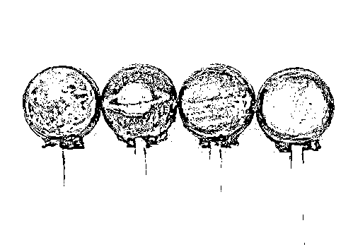

**接纳**

当行星与其五种必守然尊贵守护星形成任一相位时（入相位更好），就产生接纳关系。

被接纳的行星把定位关系给接纳它的行星，这意味着，接纳的行星对被其接纳的行星的事件处理或安排负有责任。

***若道君：这就像是既然我罩着你，所以你出了什么事我管着。***

**最有力的接纳** 

●与入庙或入旺的守护星形成相位。

但是如果一个行星被任意两种次要尊贵，即三分性和界、界和外观、或三分性和外观的守护星接纳，这也具有重要意义。

●其次，如果接纳者自己落在尊贵位置，就会让这个接纳更加有力。

单一的接纳和互容之间的主要区别是，在于是否需要有相位或合相。接纳在出生星图占星学中，是入相位还是出相位并无关系，但是至少在卜卦占星学中，要求必须是入相位。 

.gif")

**▼点击图片，了解更多罗伯特·汉德**

  

古占与现占结合

**授课时间：**2016 年 6 月 19 日-8 月 13 日 10：00-12：00

**授课老师：罗伯特·汉德**

**授课方式：**网络在线，英文授课，中文翻译

**报名截止**：2016 年 6 月 15 日

**费用**：****6800 元** （早鸟价 5800 元，若道老学员**4800 元**）**

**课程负责人：李老师**（**微信：18601950700**，请备注古占报名咨询 ）

**咨询电话：**400-619-1014

**客服 QQ：**4006191014（若道星文化）

**邮箱：**nodoor@vip.126.com

**这么有意思，你不来报个名再走？**

长按二维码添加课程负责人咨询~

****

**报名及咨询，请点击文末“阅读原文”**


# 古占与现占结合丨 1+1＞2，新技法提升你的咨询能力，妥妥的

> 原文：[`mp.weixin.qq.com/s?__biz=MzA5NjA0NTAxNg==&mid=2651385113&idx=3&sn=e4f2a5a6fc14b7c12d2e04d77f7a7d3c&chksm=8b4a5faebc3dd6b89d4da6e69b59a31a6de504fa55f1eec6e02501f9ebf99f180f695cfbd8cf&scene=126&sessionid=1692738831#rd`](http://mp.weixin.qq.com/s?__biz=MzA5NjA0NTAxNg==&mid=2651385113&idx=3&sn=e4f2a5a6fc14b7c12d2e04d77f7a7d3c&chksm=8b4a5faebc3dd6b89d4da6e69b59a31a6de504fa55f1eec6e02501f9ebf99f180f695cfbd8cf&scene=126&sessionid=1692738831#rd)


继成功举办过中世纪占星学初阶、进阶课程之后

当今最伟大、最博学的占星师之一

**罗伯特·汉德**老师

将于 2016 年 6 月至 8 月

带来中世纪占星学进阶网络课程

**古占与现占结合**

此次**星图解读**

**我们将采用学员星图进行讲解**

让大家了解如何运用古占与现占结合解读星图

古典占星自带的逻辑性

**可以让你在解读星图时更加得心应手哟**

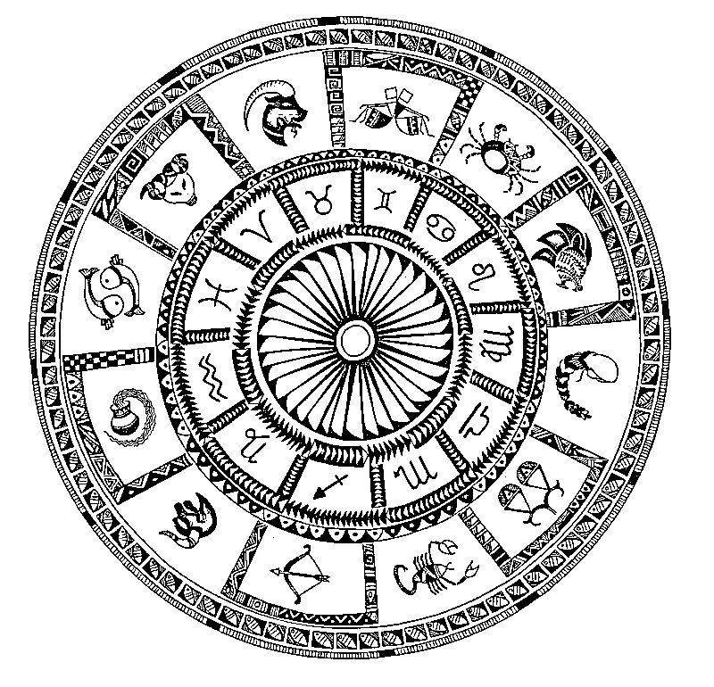

课程信息

**授课时间：**2016 年 6 月 19 日-8 月 13 日 10：00-12：00

**授课老师：罗伯特·汉德**

**授课方式：**网络在线，英文授课，中文翻译

**报名截止**：2016 年 6 月 15 日

**费用**：****6800 元** （早鸟价 5800 元，若道老学员**4800 元**）**

**课程负责人：李老师**（**微信：18601950700**，请备注古占报名咨询 ）

**咨询电话：**400-619-1014

**客服 QQ：**4006191014（若道星文化）

**邮箱：**nodoor@vip.126.com

古占与现占结合

课程价值

☆ 跟随当今最博学的占星学者，学习原汁原味的古典占星学

☆ 回归占星学最古朴、传统的面向，从中汲取新的智慧

☆ 将古典占星学和现代占星学整合起来

☆ 领略世界顶级占星师的星图解读技巧

☆ 为自己的占星工具箱增添一把利器

课程内容

**主题 1：复习古典占星学的概念**

**一、大体介绍课程的总体安排以及如何选择学员星图作为案例**

1.上课形式更为灵活。**这里提到的课程安排可能会在上课过程中根据需要进行调整。**

2.如何挑选课程中作为案例的学员星图。除了这部分之外，课程中用到的星图都会是学员的星图。我们不可能逐一分析每个人的星图，因此会挑选部分星图作为案例。

**二、运用的方法、工具和基本概念**

对于只学习过一般占星学知识的人，可能会有一些不太熟悉的**术语和概念**，比如：

⑴行星的先天秉赋表及其运用。

⑵对于现代行星（天王星、海王星和冥王星）、小行星和其他所有已知或未知的行进星体的应用，以及这些星体与古典行星在用法上的区别。

⑶整宫制：什么是整宫制，它与常用的分宫制有什么区别。

⑷胜利星：包括单一胜利星和复合胜利星。

⑸点宫制：从福点和精神点算起的分宫制，它们的用途，它们给占星学带来了什么。

⑹如何处理中天：因为第一宫是从上升星座算起，所以可以在第十个星座之外的星座中发现中天。这种情况如何处理？

**在这一部分会用到一些名人的星图作为例子，但在之后的课程会使用学员的星图为例。**

**主题 2：用古典占星学解读学员星图**

1.距离上升点、中天、下降点和下中天 7.5 度以内的行星重要程度依次递减（上升点和中天的重要程度几乎相当）。

2.寻找相位异常多的行星，尤其是与太阳、月亮、中天或上升点形成相位的行星。

3.被强调的星座，有四颗或四颗以上的行星，加上中天或上升点。

4.太阳星座、月亮星座和上升星座的关系，它们的特质是类似的还是不同的？

5.上升星座的守护星或上升星座的胜利星，它落在什么星座、什么宫位？它所在星座是否与上升所在的星座形成相位？

**这些知识都将通过学员的星图来学习、展示。**

**主题 3：通过学员星图分析其个性、健康、疾病**

**1.行星或其他星图征象可能影响的因素**。介绍：

⑴体型、体态和外貌。

⑵心智特性。

⑶性格和个性。

⑷与环境的互动。

⑸本我。

**2.哪些因素对体型、体态和外貌影响最大？**

⑴遗传和种族血统。不要把一个人的血统不太可能有的身体特质强加到这个人身上。然而，在现代化妆品的帮助下，人们对自身外表所做出的改变可能实际上将他们带到传统占星学所暗示的方向上。

⑵太阳、月亮和上升星座。

⑶任何被众多因素集中强调的星座。

⑷任何接近上升点或中天（士 7.5°）的行星。任何与上升点或中天形成非常紧密的（士 2-3°）主要相位的行星也有一定的影响。

⑸星图中任何与上升点、太阳或月亮有关的其他常见重复主题。

⑹疾病。

**补充：在这部分星图分析的讨论中，星图被选中的学员附上电子照片效果会更好。**

**主题 4：现代和古典之比较，分别解析个性、性格和心智**

这一主题一直是 20 世纪占星学最为重要的关注点之一。然而，却有着两种极为不同的切入方法。

⑴现代方法，基于上面所提到的分析外形类型所运用的方法。

⑵中世纪方法。（简化版，老师会在必要和适当的时候介绍其更为复杂的面向。）

完全取决于星图中与心智功能特定征象星有守护关系的行星。主要是那些围绕星图中三个关键点的行星，以及关键点所在星座的守护星和与关键点形成相位的行星。

①植物的生长灵魂：主要象征是上升点及其守护星。

②感性灵魂或动物的灵魂：主要象征星是月亮及其守护星。

③智性灵魂或理智的灵魂：主要象征星是水星及其守护星。

④这些都受到任何与主要象征星成相位的行星的影响。

**主题 5：情感关系（家人、爱人、朋友）**

尽管在传统上，每一宫所赋予的主题似乎通常可以表明该宫位是否主要是个人宫位，是否与人际关系有关，或完全是外界环境层面的；但实际上，每组象征符号和星图都可以也确实体现了所有这三个层面。不过，此次课程余下的时间我们将主要讨论人际关系和纯环境因素。

情感关系：

⑴父母和原生家庭，也包括本人（就是你）可能拥有的自己的家庭。该主题下还包含与权威人士的关系。

⑵兄弟姐妹和堂表亲，也包括叔叔/舅舅、阿姨/姑姑。

⑶亲密的一对一关系。

⑷朋友和一对多的关系。

⑸敌人。

**主题 6：财富、投资、职业**

⑴金钱、财富，理财观念。

⑵个人工作或职业的日常活动。

⑶职业和社会地位，毕生的追求以及谋生之道。

**主题 7：移民、旅行、学习**

⑴旅行和与其他国家的交流互动。

⑵学习其他文化。

⑶移民倾向

师资力量

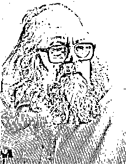

**罗伯特·汉德**

他是当今最伟大、最博学的占星师之一，被美国占星学界称为“国家宝藏”。他 17 岁起跟随父亲学习占星，并于 1972 年开始占星实践。

罗伯特以优等成绩毕业于布兰迪斯大学，曾在普林斯顿大学完成科学史研究生课程，并取得了美国天主大学中世纪及拜占庭研究博士。罗伯特将学术作为自己毕生的热情，他已出版诸多占星著作，其中最著名的是《行进的行星》。

罗伯特精通拉丁语、希腊语、阿拉伯语，是古典占星学复兴运动的积极倡导者，为古典占星的复兴和古典文献翻译做了很多贡献。此外，罗伯特还是著名占星软件公司 Astrolabe 的创立人。罗伯特的渊博学识使他被同行称为“占星字典”，在职业实践中，他综合运用返照、日心占星、恒星、汉堡虚星、宇宙生物学等技巧和流派。

为表彰他对占星学的卓越贡献，罗伯特·汉德在 2008 年被授予占星学界最高荣誉轩辕十四奖。

适合人群

**此次课程并非针对初学者**，但所需要的占星学知识并没有超出常规现代占星学的范畴。任何对于学员来说可能是新知识的内容都将在课程中进行解释。参加过之前中世纪占星学入门和进阶课程的学员会有一点优势，但并不要求参加过之前的课程，才能参加本次课程。

**占星程度：具备若道核心课程 level 4 及以上水平**，即了解星座、行星、宫位、相位等，可以独立进行出生星图解读。不确定自己占星水平的同学，可以点击参加若道古占和现占结合网络课程入学水平测试。

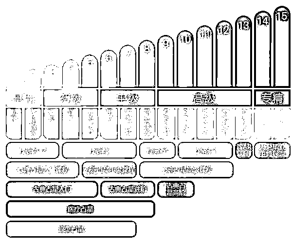

长按二维码添加课程负责人咨询~

****

**报名及咨询，请点击文末“阅读原文”**


# 要么变通，要么厌倦 | 双子座的礼物和诅咒

> 原文：[`mp.weixin.qq.com/s?__biz=MzA5NjA0NTAxNg==&mid=2651385113&idx=1&sn=035218405cda2d6f281c69bc7b4fe828&chksm=8b4a5faebc3dd6b8772c0d15316a066a777380b7ea80d89d38ecac2fe2b83fc43986267734bc&scene=126&sessionid=1692738831#rd`](http://mp.weixin.qq.com/s?__biz=MzA5NjA0NTAxNg==&mid=2651385113&idx=1&sn=035218405cda2d6f281c69bc7b4fe828&chksm=8b4a5faebc3dd6b8772c0d15316a066a777380b7ea80d89d38ecac2fe2b83fc43986267734bc&scene=126&sessionid=1692738831#rd)

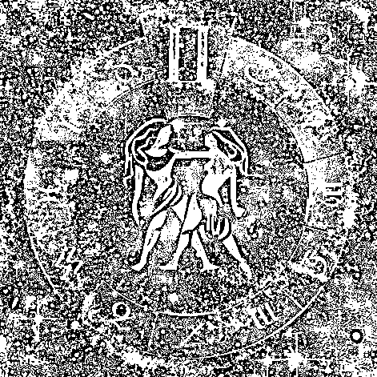
作者/唐娜·格哈特  图片/Pinterest

翻译/沙沙  校对/Christy

“

对于双子座最好的类比，可能就是人类的心智，每个人的星图中都有双子座，它聪明灵巧，可以告诉我们一切。可以谈论任何话题，也能看到一件事情的多个侧面。它渴望着刺激。想要读书、看电视、与邻居聊天，想要找些事情来做。

”

## 发现每个人的双子座能量

很多年前，我在一个高原沙漠区上冥想课。课程都不记得了，到现在唯一记得的，是那里的风。

这风简直就是恶作剧能手，它在沉思室外呼啸，拍打着百叶窗，它一会儿把门吹开，一会儿又归于平静。早晨，当我给宿舍外的植物浇水时，风会把水桶吹翻，让水倒在人行道上，那么珍贵的水就这样白白浪费了。

风敏捷、机智又爱开玩笑；它吵吵闹闹，不知疲惫，不可预测，叫人生气。如果要我用一个黄道星座来形容沙漠里的风，那么只有双子座了——**多才多艺、难以捉摸、富于创造力和发散性思维的双子座。**

> #### **通过风，我们可以看到外在世界的双子座精神；而通过心智，我们可以发现内心的双子座。**
> 
> **每个人的星图上都有水星（双子座的守护星），都有第三宫（双子座的本宫），都有某个宫位落在双子座，因此每个人都在传达着双子座的能量，只是程度不同罢了。**

**我们总是用黄道星座来给人分类，假装某些星座与己无关，但****事实上，所有的星座都以某种方式在我们的身体里舞蹈**，正是双子座的原型让这一切成为可能。

白羊座负责开创，金牛座负责稳定，而**双子座负责联结**。

正是通过双子座，我们的身体才能够把讯息从一个细胞传递到另一个细胞。通过双子座，我们与环境取得了联系，并从中学习。我们把触角伸向他人，用语言沟通，并理解各种不同的观点。通过双子座，我们星图上那些复杂混乱的潜在性格才能综合作用、顺利切换。

## 如何应对双子座的头脑游戏？

凭借着灵巧的双手，双子座可以成为杰出的机械师或手工艺者，但相比之下，双子更着迷于头脑和心智的游戏，“**我思考**”，这是双子座的关键词。

通过双子座及其守护星水星的能量，我们才得以思考、阅读、说话、写作。如今，有了微信和微博，我们犹如置身于永远不倒的巴别塔。在网吧里，我们或许喝着红牛、咖啡提神，但我们真正喝下的，是包裹在双子座外衣下的信息流。

然而另一方面，这些头脑游戏也会变得无聊、虚幻、**自相矛盾**——

○ 星期二，你喜欢上一个姑娘；星期四，你脑子里却全都是她那些显而易见的缺点。

○ 今天的报纸上有一篇某项改革的社论，你觉得很有道理，但是你又读了下面一篇观点相反的文章，觉得也说得没错。

○ 你想也许自己应该买一份人寿保险，哦不，还是把钱留着给孩子们当学费吧……

在过去的一小时里你的脑子转过了多少念头？你又能记住几个呢？

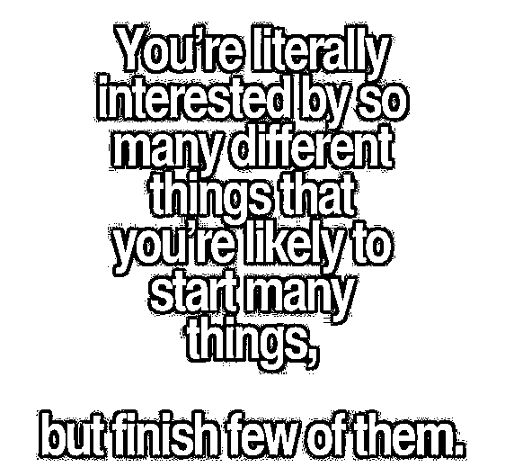 

人的**想法总是在变动**之中，而且，你星图上的双子座特质越强烈，你的想法就变得越快。许多双子座的咨询者一直苦于**不能集中注意力，或是不敢做出承诺。**

比如史蒂夫，他总是从一个工作换到另一个工作，做得时间长了（通常是六个月），他就会准备跳槽。他很恐惧一辈子只做一件事情。

有一个优秀的占星师跟我传授过一句有关双子座的秘诀，我也把这个秘诀传授给了史蒂夫，那就是：**双子座出现在哪里，哪里就要做 “两件事“**。

这是双子座符号本身透露的信息——双生子。**双子座出现在星图的哪个位置，你就要在那里找到至少两件让自己满意的事情。**

○ 比如，如果**中天在双子座**，就同时做两份工作吧（我自己这么做的时候就很开心）；

○ 如果**上升在双子座**，那么你会有两件外衣，两副外表；

○ 如果**十一宫在双子座**，你会有两群完全不同的朋友；

○ 如果**双子座在三宫或九宫**，那么你可以同时读两本书，或是同时修两门不同的专业。

有时候，我们会听说**月亮双子座**或**四宫双子座**的人在某地有一个家庭，同时在另一个地方还有一个维持数年的秘密家庭。当然，保持两个目标并不总是那么轻松愉快的。我听说过**金星双子**的人同时深爱着两个人，他们难以抉择，十分痛苦。我们的文化倾向于一夫一妻制，但是从出轨率和离婚率来看，或许双子座有一些别的想法。

## 如何让生活保持有趣？

我们如何让生活保持有趣呢？这是一个真正的双子座问题。我们可以像风一样从一个地方飘向另一个地方，或者，我们也可以**变得更像双子座的另一个象征——讲故事的人**。**把丰富的想象力运用到生活之中**。

也许我们就能把双子座无穷无尽的兴趣编织到一系列成功的冒险中，秘密就在于情节的构造。就像传说中《一千零一夜》的故事讲述者山鲁佐德，她凭借着高超的口才，让国王连续一千零一夜津津有味地听她讲故事。如果国王对她的故事感到乏味，她可是要掉脑袋的。而她的秘诀就是每晚在**精彩处停下，留下一点悬念，**吊足国王的胃口，而第二天在**解开这个悬念之后，马上就开始说另一个故事。**

同样，**一个极具吸引力的目标，也能够让双子座战胜内心的厌烦和恐惧。**

有一个太阳金牛、上升双子的商人曾经告诉我，成功的公司都有着相似的战略。当他们目前的项目达到巅峰时，他们会立即开始新的项目。当旧商品正在热销时，一个好的公司会马上着手开发其配套产品的市场。这样，当旧产品的销售业绩不可避免地下滑时（他说：“巅峰就意味着只有下坡路可走。”），配套产品会成为后起之秀，填补损失。当然，**企业创新**也必须要有双子座的能力，以满足时代变化的需要。**在一系列安排得当的目标之间灵活切换，**将带来长时间的成功。这也是一条相当适合双子座的策略。

**另一方面**

如果双子座人的梦想太过不切实际，甚至连他们自己也不相信会成真，从而放弃努力，过了一段时间，双子座就会放弃梦想，摆出一副愤世嫉俗的样子，声称“一切都是虚无，没有什么是真的。”这时，恐惧、不安、厌倦，真的会打倒双子座。

而在这个时候，双子座应该**重新找到自己无知的一面**。

在双子座的多重性格里，藏着一个叫“傻瓜”的角色，他一无所知，也没人对他抱有任何期待，就像是在童话故事里常常写到的三兄弟里最年幼无知的一个，他不会骑马，不会打猎，也不知道该怎样与国王讲话，但他就是能碰到有魔法的小鸟、金苹果或是会说话的松鼠，并在它们的帮助下找到宝藏。

**这个“傻瓜”就藏在孩子一般的好奇与热情之中。**如果他必须得每天做同样的事情，他也会投入地去做，他完全不知无聊为何物。

## 从神话看双子座成功的关键

从英雄赫拉克勒斯（又名海格力斯）面对他双子座苦役的神话中，我们可以更好地理解双子座。

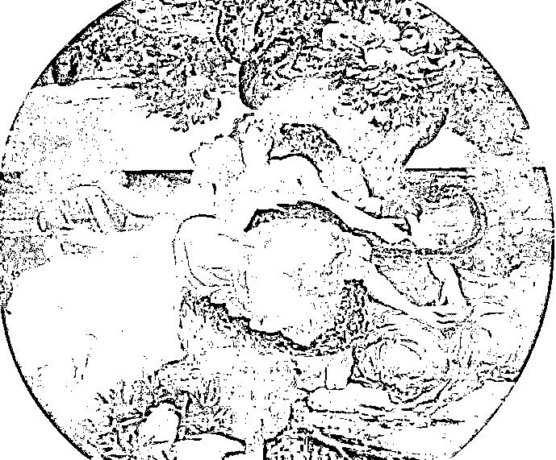

他的任务是把三个金苹果从守护它们的赫斯珀里得斯那里夺回来。金苹果树是大地女神盖亚送给赫拉的结婚礼物，宙斯派凶猛而长生不死的百头巨龙拉冬看守金苹果。拉冬的一百个头上，有一百条舌头，它们会发出不同的声音，怒吼着、咆哮着。

除此之外，还有赫斯珀里得斯围在金苹果树的周围，她们是阿特拉斯（夜神）的女儿，住在极乐园，她们也是与死亡有关的女神，除了吃饭，她们从来不离开金苹果树。

赫拉克勒斯用他的剑刺向拉冬的头，却徒劳无功。他又把巨石、火球向拉冬身上扔去，用拳头打它，用脚踢它，却不能伤它分毫。赫拉克勒斯累坏了，他坐下来，仔细观察着拉冬。几天后，他发现了一件有趣的事情：每天早上在鸡鸣之前，有那么短短的一秒钟，拉冬的两百只眼睛会短暂地合上，但只有一秒钟而已。赫拉克勒斯在山坡上练习奔跑，以提高自己的速度。练成之后，他便成功地趁巨龙合上眼睛的那一秒钟，从它的身边跑了过去。

然后，他遇见了夜神的女儿们。她们看见他，便停止跳舞，向他发出冷笑。赫拉克勒斯礼貌地向她们索要金苹果，但她们只是朝他嘶叫，吐口水。于是他又仔细地观察她们三个，发现其中一个有着非常美丽的脚踝，另一个有着非常美丽的手指，第三个的嗓音则异常动听。于是他编了一首歌，巧妙地歌颂了这三位女神各自的魅力，并唱给她们听。她们听得心花怒放，要求他再唱一遍。赫拉克勒斯说：“你们得把金苹果给我，我才唱。”于是三个女神一人给了他一个金苹果，他的任务就此完成了。

在双子座的工作中，**倾听是至关重要的**。赫拉克勒斯在完成这项任务的过程中，必须表现得像一个学生，而不是一个英雄。为了打败他的敌人，他得学着成为双子座——**机智敏锐、善于观察，并且花言巧语**。

而他的**敌人们则以一种极致而夸张的方式描绘出双子座的消极面向**。

拉冬扭动着的一百个巨头、同时发出不同声音的一百条舌头，象征了双子座**对于言谈的嗜好：他们时常转换话题和立场，即使没什么可说，也要喋喋不休**。而赫斯珀里得斯们则让我们想起双子座的两面性：他们**一会儿表现得对某件事情充满热情、兴致勃勃，一会儿又变得尖酸刻薄，发出轻蔑的嘲笑**。

金苹果代表了这个世界上永远学之不尽的知识，这对于好奇心十足的双子座来说，有着难以抵挡的诱惑。拉冬和赫斯珀里得斯实际上扮演了**守卫知识**的角色，而**好辩论**的双子座有时候也会扮演类似的角色。

爱怀疑的双子座迫使我们把心智打磨得更加锋利，宣传人员知道，当公众的批判声甚嚣尘上时，他们唯一能讲的是真话。双子是一个有弹性的星座，但是他们会在这种伸缩中间歇性地感到疲惫。于是，他们转而把矛头对准自己，或是在自己的错误中间泥足深陷。**停下来重新思考自己的战略**，**这是金苹果的另一重意义：它代表了双子座自我滋养的需求。**

## 请保持真诚的好奇心

我是从自己落在第十宫双子座的木星身上学到这一点的。**有一个简单的方法可以用来理解任何一颗落在第十宫的行星，那就是在它所代表的东西前面加上“专业的（professional）”这个词。**

第十宫双子座的木星可能让我成为一个专业的教师、作家，或研究符号语言的人（事实上这三项工作我都做过）。在我二十多岁的时候，我在哥伦比亚大学攻读硕士学位，准备成为一名专业的文学理论家，这同样是木星的领域，但我在半途就退出了，我背叛了木星。我对于这颗行星的抱怨是，它能让我把每件事变得有意义。

在双子座木星的引领下，我会在电话黄页、贺卡或人行道的树叶形状上看出深刻的原型意义，我会在任何一项事物上辨认出它在莎士比亚著作中的象征精神。我对于象征意义的解读天赋显得漫无目的、缺乏甄别能力和毫无意义。我在研究生阶段退学了，接下来的十年里，我抽烟、种盆栽、看肥皂剧。我想写故事，却一个也没有写成。就像那巨龙一样，我只是在唠唠叨叨，说个没完。

后来，社区学校的一门写作课拯救了我。那个老师——赫兹先生唤醒了我双子座木星的天赋。赫兹先生读文学作品的方式，和我之前遇到过的任何老师都不同。他并不是像学者们那样解读象征符号、提出主题，而是以更私人、更尖锐的方式来读懂作者，他**在每一本书里寻找自己有关生命问题的答案，相信自己能发现真相。**

几周之后，我领悟了：**不管我读的是糖纸上的文字，弥尔顿的著作，还是后来的占星符号，这都不重要。重要的是，我所追问的问题是什么？它是否真诚？**如果你问一些愚蠢的问题，你只会得到愚蠢的答案。但是，如果你对于你的工作和生命抱有真诚的好奇心，你就会在一切事物上找寻到意义。这不是一种诅咒，而是一项天赐的礼物。

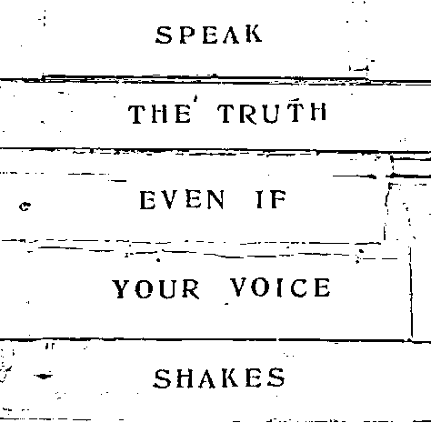 

**关于作者**

**唐娜·格哈特**：知名占星师、占星专栏作者，1991 年开始在《大占星师》杂志上撰写专栏，作品曾在世界各大洲出版，并广受欢迎。

**特别提醒：**

**本文首发于若道平台，**

**转载请联系后台授权。**


**每个星座都有诅咒也有礼物，重要的是将知识运用到实际生活当中。由大卫·瑞雷老师**讲授的**若道核心课程 Level 3，会教你将**星座、行星、宫位、相位这些散落的珠子穿起来，**带你进入更深的自我探索与成长的旅程。本课程将于今年 7 月开课，敬请期待！**


# 宁静的背后 | 致杨绛先生

> 原文：[`mp.weixin.qq.com/s?__biz=MzA5NjA0NTAxNg==&mid=2651385112&idx=1&sn=015d646c6f360f8571554929690b647b&chksm=8b4a5fafbc3dd6b9c8340da74631f22ee6178ff833a3e90806ae10c756c8a839b0f4bcda95bf&scene=126&sessionid=1692738831#rd`](http://mp.weixin.qq.com/s?__biz=MzA5NjA0NTAxNg==&mid=2651385112&idx=1&sn=015d646c6f360f8571554929690b647b&chksm=8b4a5fafbc3dd6b9c8340da74631f22ee6178ff833a3e90806ae10c756c8a839b0f4bcda95bf&scene=126&sessionid=1692738831#rd)

作者/大卫·瑞雷

译者/李含   校对/Christy

5 月 25 日，104 岁的杨绛先生辞世。作为一名长期在中国生活的美国占星师，大卫老师对于南交点天蝎座的杨绛先生充满好奇和敬意。在着手撰写这篇文章的同时，他也了解到是什么力量在驱动他了解“背后的故事”。

**很多时候人们只去看表象**

在过去两天里，我读到了许多许多写在杨绛先生离世后的文章。恕我愚昧，作为一个美国人，我对杨绛先生的人生完全不了解，但对这位显然备受尊敬的女士充满好奇。照片中的她似乎散发出一种愉快的气息，这种异乎寻常的从容平静吸引了我的注意。

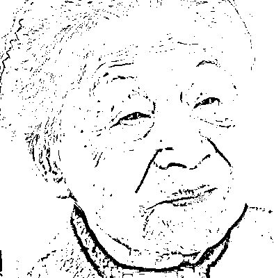

作为一名占星师，为了更深入地了解她，我从她的出生日期 1911 年 7 月 17 日着手思考（她的月亮南交点在天蝎座）。我从中解读到的内容大部分都与她的平和宁静有关，她展现出的“平和宁静”伴随了她一生。事实上，每一篇文章都在呼应这个宁静的主题，这开始让我陷入了沉思。

很多时候，我们只是看到了最终结果的表象，“亲切的女人，那么平和，那么贴心，是她丈夫的理想伴侣。”但是，她的经历如何呢？她是一位洞悉世事、聪慧睿智、受过良好教育的女子，在这漫长的人生路上，她也会经历令人悲伤甚至恐惧的风景。她忍受了朋友和亲人离她而去，忍受了女婿自杀离世，她经历过深深的痛苦。

最近发表的这些文章极少谈到她人生的挣扎、痛苦和悲伤。我不得不上网调查，阅读她书中的片段来深入挖掘，只为了解那些转瞬即逝的黑暗岁月。起初，我并不理解是什么在驱动着我这么做，但如今通过撰写这篇文章，我明白了缘由。

**真正的尊重不仅仅是敬畏**

我们看到一尊佛陀的塑像，时而宁静安详，时而微笑，甚至是大笑。我们看到了什么？他获得了最原始最深层的宁静。我们能够领悟这些么？我们能够在一尊宁静的面容前冥想，然后获得领悟么？佛陀的旅程是什么？他曾是悉达多，对么？他的内心曾经历过怎样的地狱，将他推向极端，推向痛苦和苦难的彼岸？**我们是否能够不经历痛苦，就了解平静？**

在我母亲人生的最后几年，她开始变得宁静安详，时而微笑、开怀大笑，静谧平和。我儿子甚至为她写了一首歌，叫做“宁静于心”（Center Peace），这个名称在英语中一语双关。正如在一张桌子的中心，常常摆着用来装饰的花，她就是我们家的中心，全家人都簇拥在她周围。2005 年她去世时，已经在轮椅上生活了 57 年。在最后的岁月里，她脸上洋溢着以前从未有过的平和与微笑。

我曾目睹了她挣扎在黑暗中的日子，年轻时，她想要尝试行走，结果摔倒，于是她再尝试，再摔倒，再尝试，再摔倒。在她绝望时，我就陪她坐着，她感到无比痛苦，试着去理解为何自己的人生是这样。

她经历痛苦的那段岁月正是我的童年。是的，她的灵魂进化到了一种真正宁静平和的状况，那温柔的眼睛和微笑甚至可以温暖陌生人的心灵。

但是，我知道这背后的故事。


**如果想真正尊重前人的生活，我们所要做的，就不仅仅是敬畏他们的成就。**

****只有当我们对他们经历的苦难感同身受时，我们才有能力欣赏如杨绛先生这样的人生。****


她可能在尽力拭去自己的眼泪，但请不要忘记她漫长的人生旅途。让我们带着敬意，为这样一位老人沉默片刻，只在心中就好。尽管她已离世，但我仍要感谢她与这么多人分享了自己的故事。


**特别提醒：**

**本文首发于若道平台，**

**转载请联系后台授权。**


# 火星逆行 | 下一站天蝎座，请准备好深度转化和疗愈

> 原文：[`mp.weixin.qq.com/s?__biz=MzA5NjA0NTAxNg==&mid=2651385080&idx=1&sn=ee057d7faaab186111cb3d3cc3a8a2fa&chksm=8b4a5e4fbc3dd75963f0305ee9c2f6d968f8d65e81c6f57650ab9aba7ed0f8ff7aeaefb8b6a4&scene=126&sessionid=1692738831#rd`](http://mp.weixin.qq.com/s?__biz=MzA5NjA0NTAxNg==&mid=2651385080&idx=1&sn=ee057d7faaab186111cb3d3cc3a8a2fa&chksm=8b4a5e4fbc3dd75963f0305ee9c2f6d968f8d65e81c6f57650ab9aba7ed0f8ff7aeaefb8b6a4&scene=126&sessionid=1692738831#rd)

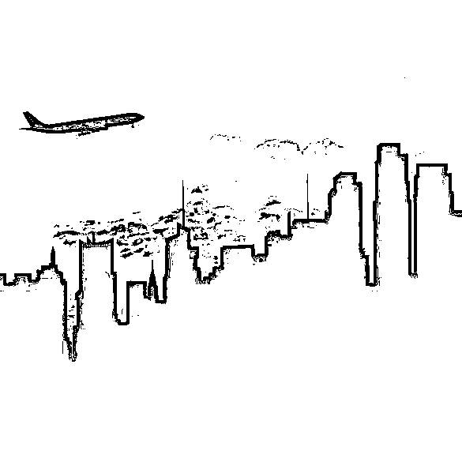

从 4 月 17 日开始，一直持续到 6 月 30 日，火星从射手座 8°53′逆行到天蝎座 23°03′，5 月 27 日 21 点 51 分，火星会从射手座退回到天蝎座。从 4 月初开始，火星逆行的影响就已经显现。很多人可能感到自己的脾气变得急躁，对他人配合度低，容易生气，还有的人无力感较强，这段时间你经历了怎样的感受呢？（点击文末阅读原文有火逆攻略哦）

**火星逆星+射手座满月=启航**

> #### 在经过射手座满月以及日火对分（5 月 22 日）的释放之后，火星会在 27 日退回到天蝎座。

就像一个从晦暗的山洞里爬出来准备上路去探险的山顶洞人，再次返回山洞，因为他遗忘了最重要的干粮，天蝎座不仅关乎灵魂，更在乎生存本身，这段时间需要深入挖掘,找到内心深处真正要的是什么。

> #### **5 月 22 日的满月发生在射手座初度且与火星合相，初始的度数与白羊座和开创的状态相关。**

这次满月就像是一架飞机经停时卸载下一些不再需要的行李后重整待发准备重新起航，虽然火星仍然在逆行的状态，有些事情无法立即顺利的开展，但从情绪上，已经处在蓄势待发的状态了。**这次航程，信念与希望是燃料，自由是导航仪，最重要的行李是勇气。**

> #### **火星在 5 月 27 日逆行回到天蝎座后，将会在 6 月 12 日 19:11 分与双鱼座的凯龙星形成三分相；在 6 月 19 日 13:56 分与白羊座的天王星形成梅花相位,。我们会从更深层的情绪中转化与疗愈，突破过去的制约。**

**天蝎座：转化并释放自己的阴暗面**

天蝎座的激情与火象星座的直接不同，他们有着无穷的潜力，就像潜藏在地底幽冥深处的能量源源不绝，如果说火象星座的火焰能够带来热情，激发活力。那天蝎座的烈焰就是死亡与重生的转化之火、受到强烈天蝎座影响的人可能会**对危机上瘾**。

天蝎座的原型是掌管着生死循环的**冥界之神**，就像海格力斯力战九头龙的故事，**天蝎座必须战胜自己内在的阴暗面并加以转化，释放内在的恐惧和仇恨**。每个人的出生星图中都有天蝎座，它的原型就在每个人心灵深处。

> #### **火星逆行回到天蝎座敏感人群：个人行星或四轴落在固定星座（金牛座、狮子座、天蝎座、水瓶座）后 10 度（20-29 度）的小伙伴。**

**火星逆行期间需要检视的**

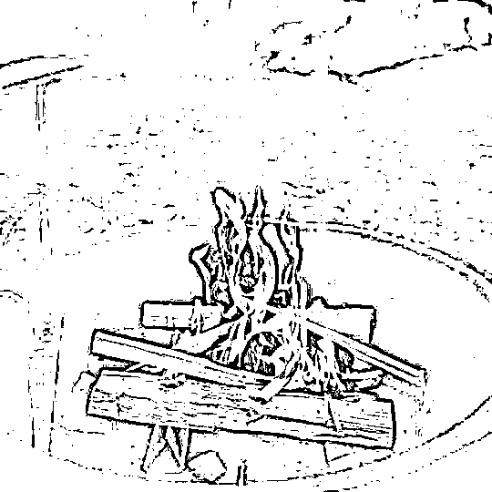 

火星的原型是**战争之神**，它象征心灵中**驱使我们行动、发展自我、应对困难、勇往直前、英勇作战、应对竞争和战斗的部分**。火星也与**意外和伤害**相关，是所有**发炎情况**的促成者。在火星逆行期间，我们需要重新检视一下与火星的关系。

**检视与火星的关系是否健康的几个要点** 

*   你是否能够确认自己要的是什么？

*   你是否能够肯定自己？

*   在面对困难的时候你是否能够越挫越勇？

*   你是否目标明确并且总是积极行动？

*   你是否能够诚实地追求自己想要的东西？

*   你是否能够在合理的范围内表达愤怒？

*   你是否能够自在的享受性或表达你的需求？

**你接纳了自己的火星能量么**

如果你认为以上行为属于**自私**的行为，那说明你没有接纳自身的火星能量，你可能在以和为贵的教育下成长，特别是很多女性从小就被教育成大家闺秀或乖乖女，她们并没有接纳允许自己火星能量的展现。

火星不会因为你假装它不存在就消失，这些能量被压抑到哪里去了？它们可能在生活中以各种方式提醒你他们的存在。

你可能会**吸引**来一个人和你飙车，和你发生**争吵**，之后你突然觉得释然好多，因为你终于连结上了自己压抑已久的火星；可能你会**投射**出去，比如当你看到一个有“爷们”气概的男性时，瞬间就被吸引了，或是身体某些部位容易**发炎**或经常不小心**割伤受伤**等。

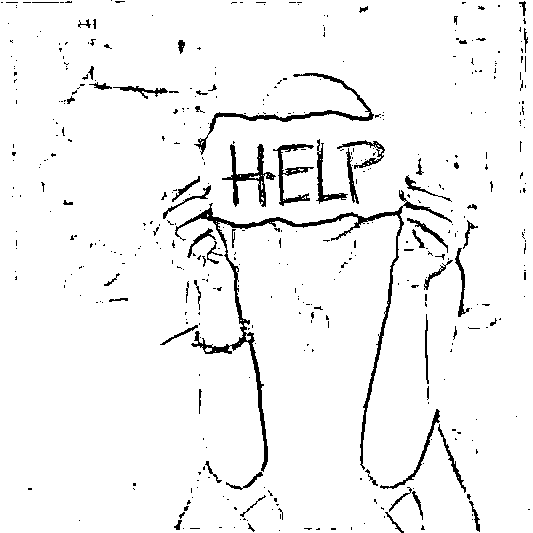

压抑自己时，也同时压抑了生命最初和最自然的活力和热情。**如果你非常想做某些事情，却迟迟不肯行动，或者当你面临巨大的压力和竞争时并没有越挫越勇，而是逃避怯懦，那说明你的火星没有及格**！

火星无法忍受懦夫，它要求我们无惧地活着，它需要竞争的刺激、它需要有激情、有目标能够为之奋斗。真正的勇气不是天生的莽夫，对任何事情都不会感到畏惧，而是害怕受伤甚至觉得自己不够好，依旧壮着胆子向前冲，这**迎难而上**的精神，正是火星精神。

生活中处处可见“火星老师”，就像那天看到一位因为车祸而失去一条腿的人依旧恢复跳舞，而且跳得很棒。一个身体残疾却意志力坚强的人比一个身体健康却躲起来逃避人生的人的火星要健康多了。

**这段时间适合做的**

如果你与火星的关系非常良好，目标明确，能够确立自己，意志力也足够坚强，但是在火星逆行期间有些事情依旧不能够马上显现，特别是接下来火星逆行回到天蝎座，这时候最好能够**回到内心深处去找原因，看看无意识中有哪些不安**。

找一个你足够信任的**咨询师**陪你一起度过这段时间，或者**对自己的行动和情绪保持多一份的觉察，特别是那些非理性的部分。**

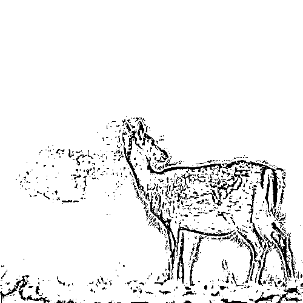 

火星退行回到天蝎座就像一位外科医师拿着手术刀，对陈年旧伤进行解剖，过程可能会痛苦，但挤出毒脓后的你会有重获新生的释然感。

与天蝎座相关联的行星是火星和冥王星，这两颗行星目前都在逆行。

> #### **从今年 4 月 18 日起，一直持续到 9 月 27 日，冥王星在摩羯座 17 度 29 分逆行到摩羯座 15 度 55 分。**

*   观察一下行进的火星与冥王星在你的第几宫逆行？

*   相关领域经过了怎样的内在转化的过程呢？

*   逆行的行星经过后，你可能会觉得什么也没有留下，但是有些东西却永远内化成为了你性格中的一部分。

*   就像摆脱烦恼和痛苦的疗伤过程， 由最初的厌恶与恐惧终于蜕变为包容与接纳，这个已经转化后的品质就是独属于你的珍宝。

火星逆行回到天蝎座，愿我们每个灵魂从此不再沉沦，找到各自的救赎之路。


**作者介绍**

**幽南**：浩瀚宇宙中一颗渺小的狮子星。我诉说的星星故事可能充满了我的投射，但我们与星星的故事总有与宇宙共鸣的部分，愿遇有缘人，喜乐共振，爱的流动。

**个人公众号**：星舞心疗室（xingwuxinliao）

长按二维码，让金钱涌向传播知识与智慧的人~


**更多火星逆行相关文章**

[火星逆行逃生攻略 | 愤怒的巨轮怎能说沉就沉](http://mp.weixin.qq.com/s?__biz=MzA5NjA0NTAxNg==&mid=403873640&idx=1&sn=6105c20bae053c40664cd3f9c79e7754&scene=21#wechat_redirect)

[火星逆行再提醒，12 星座如何管理你的愤怒](http://mp.weixin.qq.com/s?__biz=MzA5NjA0NTAxNg==&mid=2651384336&idx=1&sn=4de577dfeb7cafee79a126f1e94feac0&scene=21#wechat_redirect)


火星逆行至此，你的生活里发生了什么？

一起来说说。

**特别提醒：**

**本文首发于若道平台，**

**转载请联系后台授权。**


**从 4 月 17 日开始，一直持续到 6 月 30 日，火星这颗代表着愤怒和行动力的行星处在逆行状态。如何应对火星这颗大脾气行星的逆行期？点击“阅读原文”来看看若道推出的火星逆行攻略吧。**

**查看火星逆行攻略，请点击文末“阅读原文”**


# 古典占星干货丨这里标注的都是重点，还不快掏出小本子记好？

> 原文：[`mp.weixin.qq.com/s?__biz=MzA5NjA0NTAxNg==&mid=2651385080&idx=2&sn=c524917f3448f74654e0d400cd2d59cd&chksm=8b4a5e4fbc3dd759e2032140ae493fa525ecdfb469f3d9bbcff9eb43bfe7d6470a82f3662f1a&scene=126&sessionid=1692738831#rd`](http://mp.weixin.qq.com/s?__biz=MzA5NjA0NTAxNg==&mid=2651385080&idx=2&sn=c524917f3448f74654e0d400cd2d59cd&chksm=8b4a5e4fbc3dd759e2032140ae493fa525ecdfb469f3d9bbcff9eb43bfe7d6470a82f3662f1a&scene=126&sessionid=1692738831#rd)

```
素材提供/Zoe 整理/佳黛 
```

[古占与现占结合的网络课](http://mp.weixin.qq.com/s?__biz=MzA5NjA0NTAxNg==&mid=2651385064&idx=3&sn=9aae87a22f926319f43f72f80dedb635&scene=21#wechat_redirect)（点击可查阅）在 6 月 19 日就要开课啦！由当今世界上最伟大的占星师之一——罗伯特·汉德授课！想要学习这门课程的小伙伴们，为了帮你们更好地适应课程，贴心的若道君准备了古典占星入门资料！知识在手，上课不愁~

**何为入庙和入旺**


知识点 1**占星小课堂之入庙** 

**当七大行星落入自己守护的星座时，即为入庙**。当一个行星落入自己的领地，就像回到自己家里一样。

**七大行星与其入庙星座**

●太阳

○入庙星座：狮子座

●月亮

○入庙星座：巨蟹座

●水星

○入庙星座：双子座、处女座

●金星

○入庙星座：金牛座、天秤座

●火星

○入庙星座：白羊座、天蝎座

●木星

○入庙星座：射手座、双鱼座

●土星

○入庙星座：摩羯座、水瓶座

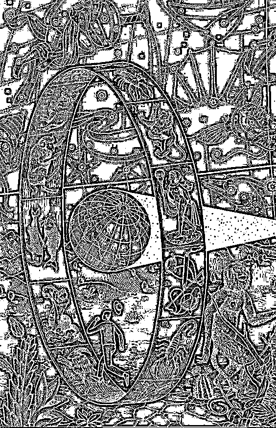

**占星小课堂之入旺** 

七大行星不仅有守护的星座，还有入旺的星座。一个行星入旺就像一个人位于他的最高阶层。

**七大行星与其入旺星座**

●太阳

○入旺星座：白羊座

●月亮

○入旺星座：金牛座

●水星

○入旺星座：处女座

●金星

○入旺星座：双鱼座

●火星

○入旺星座：摩羯座

●木星

○入旺星座：巨蟹座

●土星

○入旺星座：天秤座

***若道君：敲黑板，这都是干货，同学们可以笔记、可以截图，务必记牢。***

**何为入陷和入弱**


知识点 2**占星小课堂之入陷（落陷）**

**当行星落入与其入庙星座相反的星座时，就称为入陷（落陷）**。一个行星落在入陷的位置就像一个人与自己战斗。

**七大行星与其入陷星座**

●太阳

○入陷星座：水瓶座

●月亮

○入陷星座：摩羯座

●水星

○入陷星座：射手座、双鱼座

●金星

○入陷星座：天蝎座、白羊座

●火星

○入陷星座：天秤座、金牛座

●木星

○入陷星座：双子座、处女座

●土星

○入陷星座：巨蟹座、狮子座

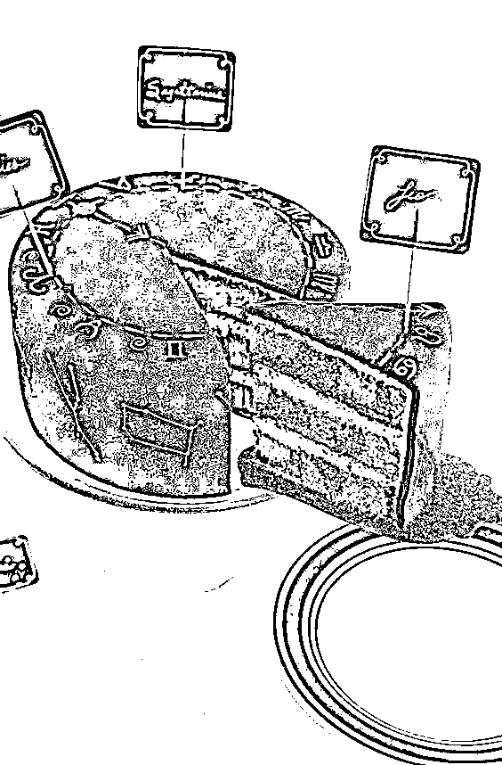

**占星小课堂之入弱（失势）**

**当行星落入与其入旺星座相反的星座时，就称为入弱（失势）。**一个行星落在入弱的位置就像一个人从最高处落下。

**七大行星与其入弱星座**

●太阳

○入弱星座：天秤座

●月亮

○入弱星座：天蝎座

●水星

○入弱星座：双鱼座

●金星

○入弱星座：处女座

●火星

○入弱星座：巨蟹座

●木星

○入弱星座：摩羯座

●土星

○入弱星座：白羊座

***若道君：在古占与现占结合网络课的第一节课中，会讲到行星先天秉赋表以及运用，适当熟记，会减轻烧脑程度哟~***

**其他关键词解释**


知识点 3

**三分性**：也有翻译三分主星。三分性的系统至少有三套，在这里，我们使用多罗修斯系统。一个行星落在其三分性，就像一个人与亲戚在一起 。

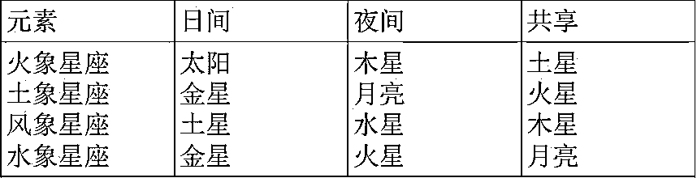

▲图为多罗修斯系统

***若道君：可以对照表格理解三分性。比如说太阳射手座，就落在了三分性；而金星天秤座，就没有落在三分性。***

**界**：界的系统也不止一套，我们这里使用埃及界。一个行星落入自己的界，就像落入自己的居所之中 。

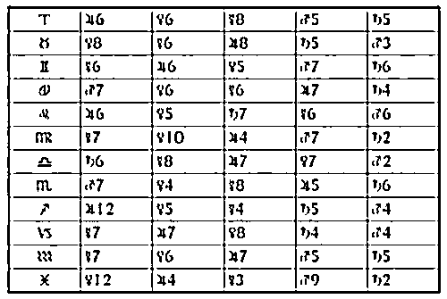
▲图为埃及界系统

***若道君：来对照表格试一下。先找星座，再找行星（注意，这里的行星只有五大行星，太阳和月亮不包括），最后看度数（就是行星符号后面的数字）。比如说木星白羊座在 5°，就落入界；而火星天蝎座 12°，就没有落入界。***

**外观**：也有翻译成面、十度。外观的系统也不止一套，我们这里使用中世纪系统。一个行星落入外观中，就像一个人穿戴了漂亮的饰品和衣服 。

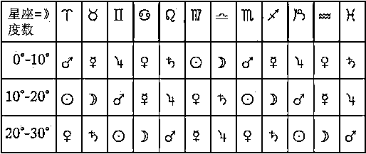
▲图为中世纪系统

***若道君：继续举一反三。比如说火星白羊座在 5°，就落入外观；而太阳摩羯座 12°，就没有落入外观。***

**外来的**：当一个行星没有落在任何入庙、入旺、三分、界或外观的尊贵位置，它就被视作是外来的。一个行星落在无主权的位置，就像一个人在异国他乡 。

***若道君：这些概念都是掌握下面的必然尊贵和必然无力的基础呢，快记下来~***

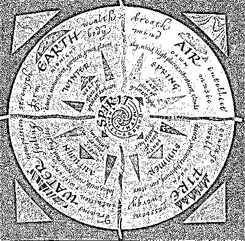

**何为必然尊贵和必然无力**


知识点 4

**何为必然尊贵：当行星所落的黄道区间允许该行星按照其特质更加恰当地运作能量（即行星落入其守护星座、入旺星座、界、三分或外观）**，从而使这颗行星的必然性质效力更强时，这个黄道区间就赋予行星“**尊贵**”。

**何为必然无力：当行星所落的黄道区间不允许该行星按照其特质更加恰当地运作能量（即行星落入其入弱星座、入陷星座或外来）**，从而使这颗行星的必然性质效力减弱时，这个黄道区间就使行星“**无力**”。

这里要注意，**一颗行星无力，但是也不会无力到像不存在一样。行星力量是不会消失的。**

**举个栗子** 

比如太阳在白羊座是入旺的，在天秤座是入弱的。在白羊座入旺是因为白羊座具有非常热、非常强力的特质，可以去做自己想做的事情，这点跟太阳是比较符合的。太阳在白羊座非常适合去做自己想要的事情，它也不是很关注其他人是怎么想的。这对于领袖来说是非常好的特质，当然，前提是不去滥用这个特质。

太阳在天秤座的时候，会容易有一些困惑，不知道自己到底要做什么，也不知道如何与其他人相处，所以太阳强力的特质就被弱化了，但是没有消失。

***若道君：“必然尊贵”和“必然无力”的概念也是古典占星解盘的常用概念哟~***

.gif")

**▼点击图片，了解更多罗伯特·汉德**

  

敬请关注若道君之后的推送，

更多古典占星干货等你掌握！

古占与现占结合

**授课时间：**2016 年 6 月 19 日-8 月 13 日 10：00-12：00

**授课老师：罗伯特·汉德**

**授课方式：**网络在线，英文授课，中文翻译

**报名截止**：2016 年 6 月 15 日

**费用**：****6800 元** （早鸟价 5800 元，若道老学员**4800 元**）**

**课程负责人：李老师**（**微信：18601950700**，请备注古占报名咨询 ）

**咨询电话：**400-619-1014

**客服 QQ：**4006191014（若道星文化）

**邮箱：**nodoor@vip.126.com

**这么有意思，你不来报个名再走？**

长按二维码添加课程负责人咨询~

****

**报名及咨询，请点击文末“阅读原文”**


# 大卫谈占星 | 解决这 9 个问题，成为不撒谎的双子座

> 原文：[`mp.weixin.qq.com/s?__biz=MzA5NjA0NTAxNg==&mid=2651385064&idx=1&sn=55fe0ec9554f761c8d09a95949af4782&chksm=8b4a5e5fbc3dd74925736ad28c5a2d2532977bc3092004a2eceb7f16bfe8ffbdb126f4e46aec&scene=126&sessionid=1692738831#rd`](http://mp.weixin.qq.com/s?__biz=MzA5NjA0NTAxNg==&mid=2651385064&idx=1&sn=55fe0ec9554f761c8d09a95949af4782&chksm=8b4a5e5fbc3dd74925736ad28c5a2d2532977bc3092004a2eceb7f16bfe8ffbdb126f4e46aec&scene=126&sessionid=1692738831#rd)

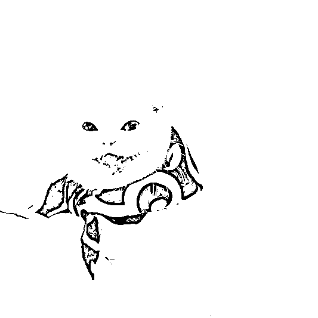

作者/大卫·瑞雷 图片/VCG

翻译/李含 校对/Christy

“

我说话时不会有所保留或谨慎小心。我不想做计划。我喜欢直言不讳。

——**安吉丽娜·茱莉**

”

## 你是这样的双子座

在经过了放松、平静、舒适的金牛座阶段，我们的高速黄道铁路之旅会开始出现不安与烦躁，甚至是好奇。

“我现在到哪儿了？”你疑惑，“我正在经过什么地方？”

你看向窗外瞬息而过的风景，同时检查着自己口袋里车票的信息，想要弄清楚自己在哪里。你看了一眼车门上方滚动的红色数字信息。也许你开始阅读自己随身带的杂志，或查看自己的 iPhone 是否能够联网，想着“我要查看邮箱了”或“看看我的微信是否连上了”。

接下来你注意到自己身边坐的人，于是你开始与他们交谈，想了解他们要去哪儿，以及如今自己身在何处。即使简短的交谈也让你们双方了解甚多。这就是双子座，由始自终从未变过。我们都有对信息分享的基本需求，而双子座对此尤其执迷。

## 双子座擅长的事

没有任何星座比双子座更迫切地想要对任何时刻发生事情做出评论，或比他们更关心浮光掠影般相互关联的不断变化的信息碎片。**“模仿”是最基本的交流层面，而双子座就特别善于“复制”或“模仿”他们看到或听到的任何事物。**传奇音乐创作人鲍勃·迪伦说：“我模仿每个人，然后他们称我为原创者。”

**交流**是双子座的强项，他们擅长将语言与音乐结合，无论是与我同辈的流行音乐人迪伦、保罗·麦卡尼，还是沙滩男孩中的布赖恩·威尔逊，或者才华横溢的歌剧天才理查德·瓦格纳，都是如此。

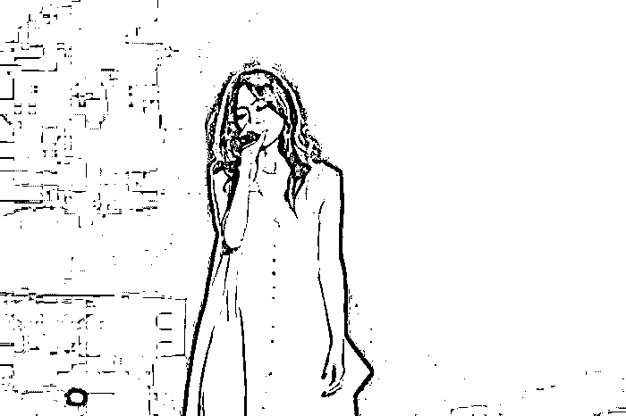
陈绮贞

*   三位中国的双子座音乐创作人，**黄家驹**、**张雨生**、**陈绮贞**，都展现出无与伦比的词作才华。

*   虽然黄家驹和张雨生都英年早逝，但他们的词曲作品依然是代表他们双子座天赋的宝贵遗产。

*   随意选取几个双子座作家，我们都能看到各种各样惊人的才华，比如**但丁·阿利吉耶里**——他创造的《神曲》被认为是最伟大的意大利语文学作品，堪称世界文学的杰作；

*   著名童话大王**郑渊洁**，香港小说家、剧作家**倪匡**，富有魅力的诗人、作家、建筑师**林徽因**等。 

另一种双子座表达特色是**“手势”**，也就是边讲话边利用手部动作来强调或描述事物。同样双子座还以**手快、手指灵活、心灵手巧**著称。我们可以在杰出的乒乓球选手身上看到这种敏捷灵巧，比如中国 3 届世界冠军王励勤；羽毛球方面也是一样，类似的还有台球项目。

也许你还没有驾轻就熟的乒乓球、羽毛球或台球技能，但是如果你的**太阳、月亮或上升落在双子座**，你很可能擅长**巧妙应对各种局面**。

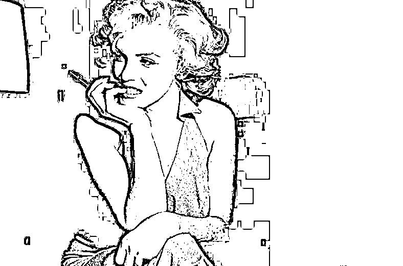
玛丽莲·梦露

年轻的玛丽莲·梦露拍摄“裸照”的传闻甚嚣尘上，当记者问她：“拍照时有穿着什么吗？”（*"Had anything **on** while being photographed?"*）

她回答：“嗯，收音机开着。”(**"*Well, the radio was **on**.*"**) （on 在英文中既可指“穿着”，又可指“开着”。）

除了机智应答之外，**制定短期解决方案，同时处理多个任务**也是这个停不下来的星座所具有的特色，这样的“权宜之计”是双子座的主要特征之一。另外，**不管双子座落在你星图的什么位置，该位置都显示了你感兴趣的知识和充满好奇的领域**。在这些领域，你或许是信息提供者，抑或是可以为他人提供应急措施的人。

认识一个具备典型双子座特质的人，也就意味着你认识了一个**出色的联系人和社交联络员**。双子座将会把自己所知的统统告诉你，通常是不会有删减或改动的原版。**好奇心**通常也是双子座受人喜爱的特质之一，这种特质有助于双子座始终保持年轻聪慧，博学广闻，紧跟潮流，即便老了以后也是如此。

## 好奇心救了双子座

我一直无法理解对于一个双子座人来说，“好奇心”到底有多么重要，直到我的双子座父亲告诉我一个他曾对我隐瞒多年的秘密。

“在你母亲情况最不好的时候，（在我小时候，她腿部残疾坐在轮椅上），我们失去了房子，我必须从你祖母那里借钱度日，情况越来越糟，以至于有一天晚上我完全绝望了，不论我怎么努力想办法，我觉得我们都无法再坚持两周。我陷入绝望，我真的想到了自杀，但是后来我想‘我要坚持下去，就为看看会发生什么！因为我完全不知道该如何解决困境。’所以，是好奇心啊，儿子，就**是好奇心让我度过了那个夜晚**。我就是想要看看会怎么解决。”

结果，机会来了，我父亲利用这些机遇创造了极其成功的生活。所以，好奇心就是当生活暂时变成绝望海洋时他紧紧抓住的救生筏。

## 双子座的负面特质

当然，像所有的星座一样，双子座的这些特质都可能以某种负面或毁灭性的方式表现出来。双子座就以**爱说闲话**臭名昭著，有时还会被控以**传播谣言**的恶名，要不就是一刻不停地喋喋不休，要不就是**肤浅、目光短浅**。

这些消极的表现不仅是针对双子座的老生常谈的刻板印象，还可能是某种症状，反映了**内心深层对自我的基于恐惧的评判**。更糟的是受损的双子座特质，即因为负面评价或辱骂，双子座的沟通能力和智慧遭到破坏或压抑。

一个具有明显双子座特质的孩子神经系统是非常活跃的。他们对世间万物充满好奇，比任何其他星座的孩子更喜欢**刨根问底**。他们愿意拉着父母或其他家庭成员谈天说地，如果他们的父母当时没有其他需要专心做的事，那将是最理想的。

**最佳情形是，洞察力强的父母会意识到这个孩子有着源源不断的好奇心，所以一定要让这样的孩子较早地学习阅读、写作和计算机技能，并且对每一次谈话设置挑战，让他们从中学习新词汇。鼓励这些不安分的双子座孩子们去发现各种不同问题的解决方案，会让他们活跃的大脑找到发泄的出口，不过仍然要留出时间跟他们交谈**。

诚然，这样的最佳情形并不总是存在。大多数的家长都得长时间工作，基本没空进行长时间夜谈。如果这个典型的双子座小孩有愿意跟他无休止谈天说地的祖父母，那真是太幸运了！

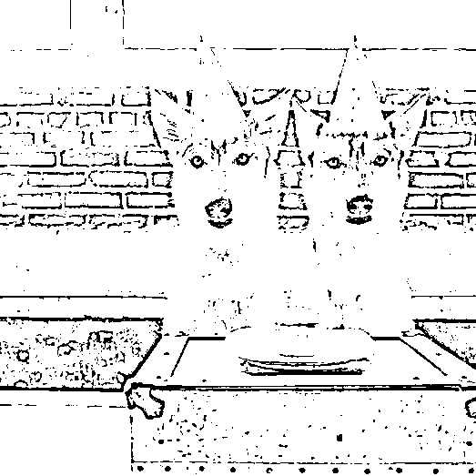

但不幸的是，具有双子座特质的孩子通常都会被警告要“安静”或“闭嘴”。当然，**负面影响的程度取决于他们受到忽视的程度。双子座会把缺乏沟通交流视为“被拒绝”**。他们对很多信息都可能做出这样的理解：没有人愿意跟我谈话，因为：“我太笨了，我很讨人烦，我很无聊，我有问题。”被忽视的程度越高，这种自我暗示就越强烈。

如果双子座小孩潜意识里携带着这些评判长大，觉得“没人跟自己说话是因为自己很招人烦”，那么他们渐渐会认同自己就是“烦人的”，并且真的会表现出让人讨厌的行为。同样地，“我很笨，我很无聊”等类似的评判，都会导致不良的结果。每当他们遭到忽视，这种暗示就会重复出现，与之相关的行为也会变得更加根深蒂固。

如果是父母或其他家庭成员在强化这种信息，那就更糟糕了，比如家长经常说**“你这个笨蛋！”“你就不能闭上嘴吗？！难道你不知道没人关心你说什么吗？”**这些被拒绝的经历对情绪是有影响的，如果这些负面的言语跟特定的情绪结合并反复出现，便可能在头脑中留下印记。不可否认，这些都是很简单的例子，但揭示了这些评价形成的过程。

**举个栗子** 

我有个太阳和水星都在双子座的顾客，说他在高中时曾经向其父母隐瞒过不好的成绩，他当时把成绩单复印了一份，然后把差成绩改成了好成绩。这个小秘密一直挺奏效，但到申请大学的时候，终是纸包不住火，他父母惊讶地发现，他的平均成绩竟然差到许多大学和学院都上不了。

在这个例子中， 短期的权宜之计解决了提高成绩的“燃眉”之急，但悲哀的是，这种计谋太鼠目寸光。”然而真正内在的问题是：“我爸在我的成长过程中很少听我的想法（土星在处女座四分他在双子座的太阳、水星）。他总是忙工作，只是偶尔发表一下他所谓的‘建设性批评’。其实我在小学时还是个不错的学生，但只要我考得不理想，他就只盯着我不够好的那一面。到了高中阶段，我觉得为学习付出努力是不值得的。”

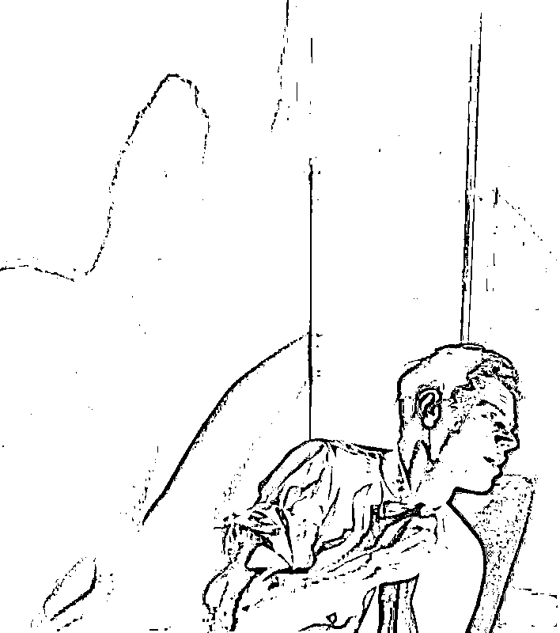

## 你有这 9 个沟通问题么？

如果你是一位双子座，**你是优秀的沟通者么？其他人有在听么？他们是否感兴趣或想要听你所说？**

如果“是”，那么你的生活很可能是充实而满足的，如果“不是”，那么也有办法获得更多满足。

**有效沟通**是关系、工作和家庭成功的关键之一。作为双子座，你比其他星座更有潜力成为优秀的沟通者。**如果你纠结于沟通，或想要提升沟通技巧，思考一下是什么干扰或抑制了你的沟通过程**。

下面是一些常见的沟通问题，包括口头和书面沟通：

①害怕自己听起来像个傻瓜

②认为没人对你想要说的感兴趣

③对你的评论或书面作品不加修饰

④回避困难的交谈

⑤做出应对而不是反应

⑥没有完全做好准备

⑦以为别人已经理解你所说的了

⑧缺乏敏感性

⑨侵犯对方隐私

## 如何处理这些问题？

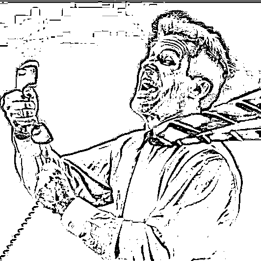

前两个问题，害怕自己听起来像个傻瓜和认为没人对你想要说的感兴趣，很明显是**基于情绪**。引发痛苦的核心原因是**被拒绝**，克服这样的情绪压抑需要**面对自己潜在的痛苦**。如果这种痛苦来源于**身体的或强烈的精神虐待**，那么你需要找到一位合格的**治疗师**。如果情况不那么严重，你或许能学着**自己面对痛苦**。找一位合格的**冥想老师**，告诉他你想达到什么目的。至少他们可以推荐适合的人给你。**催眠疗法**同样也有帮助。

作为一名双子座，你有资格成为一名成功的**信息使者**。不要让过去阻碍你实现自己的潜力。当你开始面对自己的痛苦，让自己从这种恐惧模式的压抑中解放出来时，你会惊讶地发现，自己成为了更好的**沟通者**。

也许你害怕，你会因为自己的地方口音或外国口音使自己听起来像个傻瓜？虽然你可以学习去掉这些口音，但也许你不必如此去做。CCTV 优秀播音员罗京虽然出生在北京，但他承袭了父母的四川方言，而这也没有能够阻碍他在 2009 年去世前成为中国最有辨识度的嗓音。**接纳你的口音，其他人也会接受。你越是不焦虑，越放松，你的口齿越清晰，不论你口音如何**。

许多双子座需要学会如何**修饰自己的评论和书面作品**。我说的修饰并不是删改！我的意思是“**更简练**”。**过度阐述，说太多陈述你的观点会让听众没耐性，常常也意味着他们会错过你试图表达的关键信息**。在书面作品中，要**修饰你的拼写、语气和语法，否则你会给人感觉粗心大意**。不要仅依靠拼写检查程序，这些程序并不知道你词句的意思。你的疏漏会让其他人因为你的错误而分心，更糟的是，导致他人无法理解或误解你全部的意思。

**回避困难的对话**是许多人存在的另一个问题，不管是什么星座。尽管如此，作为双子座，你们很容易在交谈中**绕着“房间中的大象”（指闭口不谈却确实存在的事实）兜圈子**。

你越是“兜圈子”，对方就越难理解你。他们会想：“这场谈话是要说什么？”**除非你是直觉极强的双子座，为下面的困难对话做铺垫，做出礼貌的问询的确有帮助。**

> “我们这个谈话是否时机恰当？有些事情我想要和你谈谈。”
> 
> “好的。”对方回答。
> 
> “你知道我发邮件跟你说了上次合约中你弄错的地方？我想要和你讨论一下，防止以后再发生这样的问题。”
> 
> 为这样的对话铺垫好舞台，邀请对方加入。

**反应而不是应对意思是，你在情绪冲动之下触发了舌头**。这是双子座的常见问题，（尤其是**月亮或火星与水星成困难相位或同样落在双子座**）。也许你的成长过程中有一些坏榜样？好消息是，**认知治疗师和放松技巧**能够帮助你改变这个坏习惯。

不论当下的场景触发了你怎样的感受都没有错，问题在于你如何处理。为了做出更有效的应对，你需要“**放松地处理信息**”。俗话说，在说话前先“**深呼吸**”，这的确能帮你**放松情感思维，理性思考，快速抓住要义，更冷静应对**。**如果是对压力做出反应，而不是应对压力的话，常常会在说出更准确的信息之前，脱口而出谎话或半真半假的话作为防御。学会让自己的头脑保持放松也同样是一种预防措施，是改变反应模式的一种方法**。

## 做一个准备充分的信息传播者

作为一名双子座，你会十分擅长在最后一分钟拿出解决方案，你常常会觉得自己并不需要做好准备。但是，用于闲谈或非正式文本的内容并不一定适用于公开演讲或工作相关的书面材料。

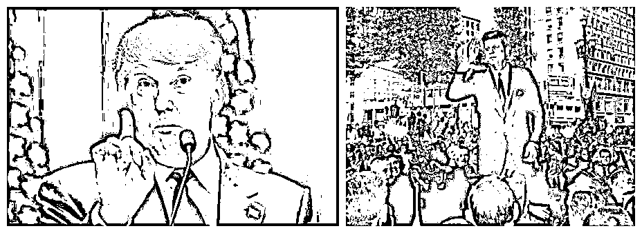
唐纳德·特朗普（左）和约翰·F·肯尼迪（右）

在美国就有一个显而易见的例子——**双子座的唐纳德·特朗普**。尽管特朗普在大型政治集会上的演讲获得媒体广泛报道，但实际上，这些演讲听起来都是没做过充分准备的。他只是把一堆支离破碎的语句串起来，缺乏修辞上的组织和规划。特朗普的演讲时间不长，他显得焦虑，想要尽快离开演讲台，好像并未准备好一次真正的演讲。

与此形成鲜明对比的是另一位准备充分、演讲生动的双子座，他是一位货真价实的总统——**约翰·F·肯尼迪**。尽管 JFK 面对记者时的机智幽默让他备受媒体喜爱，但他也会花很长时间与撰稿人斟酌字句。一流的作家会做好幕后工作和研究，做好准备是获得有效沟通的关键。

不要总是以为对方已经理解了你的讯息，要寻求反馈。这非常简单，但是要求你在说的过程中获得反馈。列表中的最后两项，**缺乏敏感性和侵犯他人隐私是相互关联的**。如果你在对话或社交媒体中一直侵犯他人隐私，那别人就会躲开你。同样，你对他人感受的迟钝会导致对方终止对话。除非你只是想要自言自语，对与他人进行有效沟通不感兴趣，否则，作为一个有以上问题的双子座，你急需去解决这些问题。


想体验大师级的占星疗愈？

大卫老师**占星咨询**预约进行时

**生命议题、职业发展、关系咨询、少儿成长、年度规划和预测**

```
预约咨询请联系许小姐 ：010-58760529
```

**特别提醒：**

**本文首发于若道平台，**

**转载请联系后台授权。**


**想了解更多关于星座的知识？若道核心课程 Level 1-5 连报适合你。**

**报名及咨询，请点击文末“阅读原文”**


# 占星界的“百科全书”，请用您渊博的学识砸晕我！

> 原文：[`mp.weixin.qq.com/s?__biz=MzA5NjA0NTAxNg==&mid=2651385064&idx=2&sn=647cbe8f5e029abbf16a9f039a6783b1&chksm=8b4a5e5fbc3dd74943bc6c0da94dc503e76fe61efd94be9064020247b3a72b7a45531e77a8a3&scene=126&sessionid=1692738831#rd`](http://mp.weixin.qq.com/s?__biz=MzA5NjA0NTAxNg==&mid=2651385064&idx=2&sn=647cbe8f5e029abbf16a9f039a6783b1&chksm=8b4a5e5fbc3dd74943bc6c0da94dc503e76fe61efd94be9064020247b3a72b7a45531e77a8a3&scene=126&sessionid=1692738831#rd)

*A*

BOUT HAND

关于罗伯特·汉德

全球最伟大的占星师之一

古典占星复兴运动的先行者

掌握好几种**古老文字**的伟大学者

当今最博学的占星**百科全书**

美国国家**宝藏**

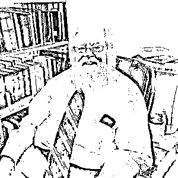

还没给罗伯特·汉德老师做翻译和助教之前，我便久闻老师的盛名，如雷贯耳。这张照片让我觉得罗伯特老师像极了一位白胡子圣诞老人，厚厚的镜片背后藏着一双深邃的眼睛，圆圆的肚子装满学识，不禁让人觉得亲切。

**最伟大的占星师之一**

**现今在世的西方著名占星师有：**

**罗伯特·汉德**

**诺·泰尔**

**丽兹·格林**

**斯蒂芬·弗里斯特**

**理查德·塔纳斯**

**苏·汤普金斯**

**格伦·佩里**  ……

做全职占星师这些年来，我参与过很多课程，一起工作过的占星大师级人物也有好多了，但想到即将与这样一位超重量级大师合作，我的心中还是溢满了兴奋和紧张。我不禁回想起占星界另外两位伟大的占星师：幽默大气却又如孩子一般任性的诺·泰尔老师以及深刻高冷而时不时要毒舌一下的丽兹·格林老师，不知道这位老爷子又是什么怎样的人呢，我热情地期待着。

一路与他合作下来，罗伯特老师的确是一位可敬又可爱的老爷爷，毫无架子，也没有任何古怪的脾气。上课的时候，他一直都会照顾到翻译的节奏，偶尔不小心说得多了，还会跟我道歉；对于同学们，他也一向是超级耐心地有问必答。萝卜爷爷、大爷、老爷子……这些都是同学们给他取的昵称。这一口一声都是满满的爱。

对于我种“水星人”来说，跟随大爷学习，是赴一场知识的盛宴。他的课程以“烧脑”著称。从占星学的起源与历史传承，到中世纪占星中各种星图组成元素的意涵，再到星图主题分析和阿拉伯点的计算应用，海量的知识点，旁征博引，娓娓道来。每节课的信息量都大得让人犯晕，却又不禁大呼过瘾。我等凡人还曾怀疑，读过那么多书，懂得那么多历史典故知识技法，大爷您该不是直接从中世纪穿越过来的吧！

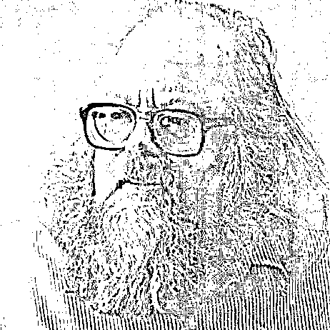**严谨博学又谦逊的学者**

占星学的学习过程中，选择一位好老师太重要。跟随博学有名望的老师学习，不仅可以受教于他们丰富的经验学识技法，也可以感受他们的人格魅力。大爷在授业解惑的同时，还以身作则，向大家展示严谨治学的态度，以及什么是真正的大家风范。

最感动的是他在一次课上说：“越是历史上有名望的占星师，犯的错误会引发越多混乱。所以大家不要盲从，要保持批判。如果将来我在历史长河上留下名声，那你们也要对我有批判性。”大爷也从不随意下结论，对于一些有争议的占星方法和知识点，他会说，我正在查文献寻找证据，也许不久就可以论证了。他博学严谨，在知识面前保持谦卑，不滥用自己的地位和影响力。如此种种，让我对大爷愈发敬佩。

总而言之，在我心中罗伯特·汉德老师是位严谨谦逊的大学者，一位真正的大师。期待新一期课程中，大爷继续用他的学识砸晕我们。

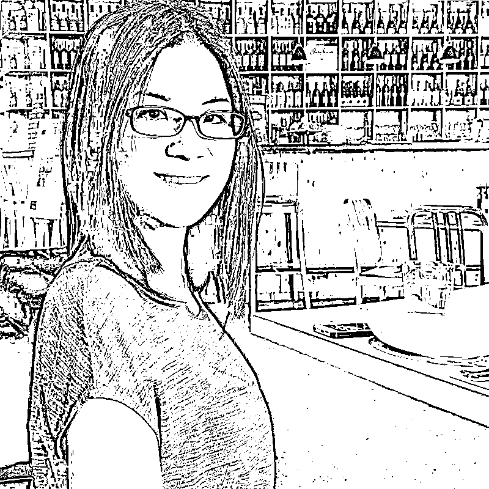

**作者简介**

**丁宏**，esme。ISAR（国际占星协会）资质认证职业占星师，资深占星课程口译。复旦大学英文系毕业后赴伦敦读研工作，并于伦敦占星学院接受系统的西方职业占星教育。2013 至 2015 年在若道星文化担任课程助教和口译，期间继续跟随多位国际著名占星师深入学习各流派技法，并成为若道第一位中文讲师。2011 年起开展占星咨询至今。在咨询中力求现代占星与古典占星的积极融合，在研判世俗事件的同时关注潜力及心灵力量。

**咨询预约**：hding527@163.com

长按二维码，让金钱涌向传播知识与智慧的人~

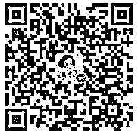


**想学习更多关于古占和现占结合的知识？6 月 19 日，由占星界著名学者、久负盛名的占星师罗伯特·汉德教授的古占与现占结合**的网络课程**就要开课啦！如果你是“技法控”，这门课程你可不能错过！**

**报名及咨询，请点击文末“阅读原文”**


# 古占与现占结合丨 1+1＞2，新技法提升你的咨询能力，妥妥的

> 原文：[`mp.weixin.qq.com/s?__biz=MzA5NjA0NTAxNg==&mid=2651385064&idx=3&sn=9aae87a22f926319f43f72f80dedb635&chksm=8b4a5e5fbc3dd749b898908c8c29609ca4c806974528ae15ee176be1060b631d58cab2b694f6&scene=126&sessionid=1692738831#rd`](http://mp.weixin.qq.com/s?__biz=MzA5NjA0NTAxNg==&mid=2651385064&idx=3&sn=9aae87a22f926319f43f72f80dedb635&chksm=8b4a5e5fbc3dd749b898908c8c29609ca4c806974528ae15ee176be1060b631d58cab2b694f6&scene=126&sessionid=1692738831#rd)


继成功举办过中世纪占星学初阶、进阶课程之后

当今最伟大、最博学的占星师之一

**罗伯特·汉德**老师

将于 2016 年 6 月至 8 月

带来中世纪占星学进阶网络课程

**古占与现占结合**

此次**星图解读**

**我们将采用学员星图进行讲解**

让大家了解如何运用古占与现占结合解读星图

古典占星自带的逻辑性

**可以让你在解读星图时更加得心应手哟**


课程信息

**授课时间：**2016 年 6 月 19 日-8 月 13 日 10：00-12：00

**授课老师：罗伯特·汉德**

**授课方式：**网络在线，英文授课，中文翻译

**报名截止**：2016 年 6 月 15 日

**费用**：****6800 元** （早鸟价 5800 元，若道老学员**4800 元**）**

**课程负责人：李老师**（**微信：18601950700**，请备注古占报名咨询 ）

**咨询电话：**400-619-1014

**客服 QQ：**4006191014（若道星文化）

**邮箱：**nodoor@vip.126.com

古占与现占结合

课程价值

☆ 跟随当今最博学的占星学者，学习原汁原味的古典占星学

☆ 回归占星学最古朴、传统的面向，从中汲取新的智慧

☆ 将古典占星学和现代占星学整合起来

☆ 领略世界顶级占星师的星图解读技巧

☆ 为自己的占星工具箱增添一把利器

课程内容

**主题 1：复习古典占星学的概念**

**一、大体介绍课程的总体安排以及如何选择学员星图作为案例**

1.上课形式更为灵活。**这里提到的课程安排可能会在上课过程中根据需要进行调整。**

2.如何挑选课程中作为案例的学员星图。除了这部分之外，课程中用到的星图都会是学员的星图。我们不可能逐一分析每个人的星图，因此会挑选部分星图作为案例。

**二、运用的方法、工具和基本概念**

对于只学习过一般占星学知识的人，可能会有一些不太熟悉的**术语和概念**，比如：

⑴行星的先天秉赋表及其运用。

⑵对于现代行星（天王星、海王星和冥王星）、小行星和其他所有已知或未知的行进星体的应用，以及这些星体与古典行星在用法上的区别。

⑶整宫制：什么是整宫制，它与常用的分宫制有什么区别。

⑷胜利星：包括单一胜利星和复合胜利星。

⑸点宫制：从福点和精神点算起的分宫制，它们的用途，它们给占星学带来了什么。

⑹如何处理中天：因为第一宫是从上升星座算起，所以可以在第十个星座之外的星座中发现中天。这种情况如何处理？

**在这一部分会用到一些名人的星图作为例子，但在之后的课程会使用学员的星图为例。**

**主题 2：用古典占星学解读学员星图**

1.距离上升点、中天、下降点和下中天 7.5 度以内的行星重要程度依次递减（上升点和中天的重要程度几乎相当）。

2.寻找相位异常多的行星，尤其是与太阳、月亮、中天或上升点形成相位的行星。

3.被强调的星座，有四颗或四颗以上的行星，加上中天或上升点。

4.太阳星座、月亮星座和上升星座的关系，它们的特质是类似的还是不同的？

5.上升星座的守护星或上升星座的胜利星，它落在什么星座、什么宫位？它所在星座是否与上升所在的星座形成相位？

**这些知识都将通过学员的星图来学习、展示。**

**主题 3：通过学员星图分析其个性、健康、疾病**

**1.行星或其他星图征象可能影响的因素**。介绍：

⑴体型、体态和外貌。

⑵心智特性。

⑶性格和个性。

⑷与环境的互动。

⑸本我。

**2.哪些因素对体型、体态和外貌影响最大？**

⑴遗传和种族血统。不要把一个人的血统不太可能有的身体特质强加到这个人身上。然而，在现代化妆品的帮助下，人们对自身外表所做出的改变可能实际上将他们带到传统占星学所暗示的方向上。

⑵太阳、月亮和上升星座。

⑶任何被众多因素集中强调的星座。

⑷任何接近上升点或中天（士 7.5°）的行星。任何与上升点或中天形成非常紧密的（士 2-3°）主要相位的行星也有一定的影响。

⑸星图中任何与上升点、太阳或月亮有关的其他常见重复主题。

⑹疾病。

**补充：在这部分星图分析的讨论中，星图被选中的学员附上电子照片效果会更好。**

**主题 4：现代和古典之比较，分别解析个性、性格和心智**

这一主题一直是 20 世纪占星学最为重要的关注点之一。然而，却有着两种极为不同的切入方法。

⑴现代方法，基于上面所提到的分析外形类型所运用的方法。

⑵中世纪方法。（简化版，老师会在必要和适当的时候介绍其更为复杂的面向。）

完全取决于星图中与心智功能特定征象星有守护关系的行星。主要是那些围绕星图中三个关键点的行星，以及关键点所在星座的守护星和与关键点形成相位的行星。

①植物的生长灵魂：主要象征是上升点及其守护星。

②感性灵魂或动物的灵魂：主要象征星是月亮及其守护星。

③智性灵魂或理智的灵魂：主要象征星是水星及其守护星。

④这些都受到任何与主要象征星成相位的行星的影响。

**主题 5：情感关系（家人、爱人、朋友）**

尽管在传统上，每一宫所赋予的主题似乎通常可以表明该宫位是否主要是个人宫位，是否与人际关系有关，或完全是外界环境层面的；但实际上，每组象征符号和星图都可以也确实体现了所有这三个层面。不过，此次课程余下的时间我们将主要讨论人际关系和纯环境因素。

情感关系：

⑴父母和原生家庭，也包括本人（就是你）可能拥有的自己的家庭。该主题下还包含与权威人士的关系。

⑵兄弟姐妹和堂表亲，也包括叔叔/舅舅、阿姨/姑姑。

⑶亲密的一对一关系。

⑷朋友和一对多的关系。

⑸敌人。

**主题 6：财富、投资、职业**

⑴金钱、财富，理财观念。

⑵个人工作或职业的日常活动。

⑶职业和社会地位，毕生的追求以及谋生之道。

**主题 7：移民、旅行、学习**

⑴旅行和与其他国家的交流互动。

⑵学习其他文化。

⑶移民倾向

师资力量


**罗伯特·汉德**

他是当今最伟大、最博学的占星师之一，被美国占星学界称为“国家宝藏”。他 17 岁起跟随父亲学习占星，并于 1972 年开始占星实践。

罗伯特以优等成绩毕业于布兰迪斯大学，曾在普林斯顿大学完成科学史研究生课程，并取得了美国天主大学中世纪及拜占庭研究博士。罗伯特将学术作为自己毕生的热情，他已出版诸多占星著作，其中最著名的是《行进的行星》。

罗伯特精通拉丁语、希腊语、阿拉伯语，是古典占星学复兴运动的积极倡导者，为古典占星的复兴和古典文献翻译做了很多贡献。此外，罗伯特还是著名占星软件公司 Astrolabe 的创立人。罗伯特的渊博学识使他被同行称为“占星字典”，在职业实践中，他综合运用返照、日心占星、恒星、汉堡虚星、宇宙生物学等技巧和流派。

为表彰他对占星学的卓越贡献，罗伯特·汉德在 2008 年被授予占星学界最高荣誉轩辕十四奖。

适合人群

**此次课程并非针对初学者**，但所需要的占星学知识并没有超出常规现代占星学的范畴。任何对于学员来说可能是新知识的内容都将在课程中进行解释。参加过之前中世纪占星学入门和进阶课程的学员会有一点优势，但并不要求参加过之前的课程，才能参加本次课程。

**占星程度：具备若道核心课程 level 4 及以上水平**，即了解星座、行星、宫位、相位等，可以独立进行出生星图解读。不确定自己占星水平的同学，可以点击参加若道古占和现占结合网络课程入学水平测试。


长按二维码添加课程负责人咨询~

****

**报名及咨询，请点击文末“阅读原文”**


# 大卫谈占星 | 自卑的女孩如何成为人生赢家？

> 原文：[`mp.weixin.qq.com/s?__biz=MzA5NjA0NTAxNg==&mid=2651385035&idx=2&sn=0cf3ea739cb73475f246ccf7b043bece&chksm=8b4a5e7cbc3dd76a289e9aa3da68d3af06f5d2ff7fa8d31b33ddc669c407a8670f8d2a84882c&scene=126&sessionid=1692738831#rd`](http://mp.weixin.qq.com/s?__biz=MzA5NjA0NTAxNg==&mid=2651385035&idx=2&sn=0cf3ea739cb73475f246ccf7b043bece&chksm=8b4a5e7cbc3dd76a289e9aa3da68d3af06f5d2ff7fa8d31b33ddc669c407a8670f8d2a84882c&scene=126&sessionid=1692738831#rd)

在职业中，我们会面临多种复杂的选择。假设你是一个部门经理，在取悦团队和老板中左右为难；公司重组，是否跟随总部继续发展？如何组成一支更高效的队伍？来看莉雅如何完美迎接这些挑战。

## 面对职业挑战，她为何这么淡定？

莉雅是一家中型制造公司的部门经理。最近，她的公司进行了重组，总部搬到了另一座城市。她之前团队中的许多人离开了公司，新的人力总监发给她一份待面试员工名单。但是，在面对这些职业挑战时，莉雅有自己的优势——占星学。

首先，她在公司搬迁消息最终宣布之前就预测到了这种可能性。通过分析公司创建时的星图和 CEO 的星图，她注意到一些与搬迁相关的趋势。她同样研究了自己的星图，看到这种搬迁的可能性。这让她可以提前考虑自己的选择：是否要搬迁？如果可能的话，她是否想要保留自己在公司的职位？她的长期事业目标是否与公司的发展方向一致？这些问题需要那些愿意坦诚面对自己的人进行深入的客观分析，而占星学可以提供帮助。

在公司搬迁时，莉雅已经认真学习占星学 3 年了，参加了各种网络课程和工作坊。她已经学会运用占星学来更好地界定自己和自己的目标。她在部门经理的职位上获得了更富成就感的体验，并学会了如何辨识和面对自己恐惧、焦虑的源头，同时认识到自己的成长潜力。

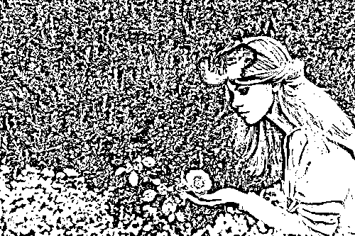

## 她也曾在取悦团队和老板中左右为难

以前在做部门主管的时候，她既要努力取悦团队，又要让老板高兴，这种压力让她纠结不已。尽管能保持相当不错的绩效评价，但她总是感觉对可能发生的局面力不从心。长时间的工作使她身心俱疲。更糟的是，虽然她努力与自己的团队建立友谊，但是似乎让一些人因此得寸进尺。她感觉自己没有得到赏识，对此心生怨气，但是又不确定该做什么。另外，她的老板也总是两极化。大部分时间里，他是友善、理性，甚至随和的，但他可能突然发怒，对她大声叫嚷，让她接下来一天都如坐针毡。

**如何用星图观察职场困境**

和大多数学生最开始做的一样，莉雅将占星学应用于自身，并学会了从星图中观察她的工作困境。

●首先，她必须解决缺乏自信的问题。

○她可以从星图中看到，自己有潜力成为更自信、更成功的管理者，但“她为何还不是呢”？

●其次，她的星图展现出了一种想成为成功的团队管理者的强烈愿望。

○那么，她为何在这方面感到失败呢？

她的占星学老师告诉她，要在自己的星图中寻找模式。

●“问问自己，这些模式在你早年成长过程中有何表现”？

○“你的童年经历是如何表现在出生图模式中的，而这意味着什么”？

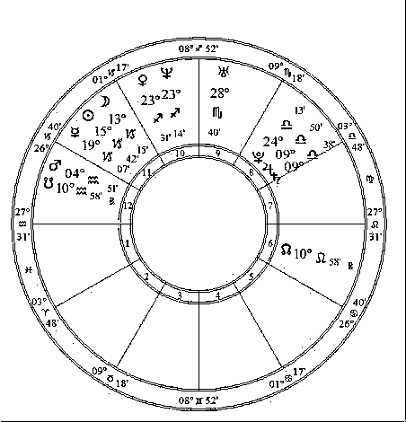
▲莉雅的出生星图

## 追溯童年记忆，走出不自信的阴影

莉雅慢慢地理解了老师的意思。在她最早的记忆中，父亲在她六岁时失去了工作，原因是数名工人在一个建筑项目事故中死亡和受伤，她的父亲背了黑锅。但那时她只知道父亲入狱，他们失去了家，被迫搬到另一个城市，与外公外婆一起住。

她记得自己难过地离开了幼儿园和一年级的好朋友，之后总是在想他们过得怎样。她也清楚地记得离开时母亲脸上的羞愧。她们搬家时，她一年级才读到一半，她试图结交新朋友，但新的同学并不接纳她。虽然最后父亲被无罪释放，但出狱后他就开始酗酒。喝醉后，他会对她母亲叫嚷，他的叫嚷让她们两人都十分害怕。

她的母亲是一位坚强但却宽容的人，长时间辛勤工作来维持家庭生计。大部分时间里，她的父亲都亲切友善，热心帮助街坊邻里。最后，父亲在一家大型国企建筑公司找到了工作，他不再酗酒，并在事业上取得了成功，但这时莉雅已经十三岁了，念初二。

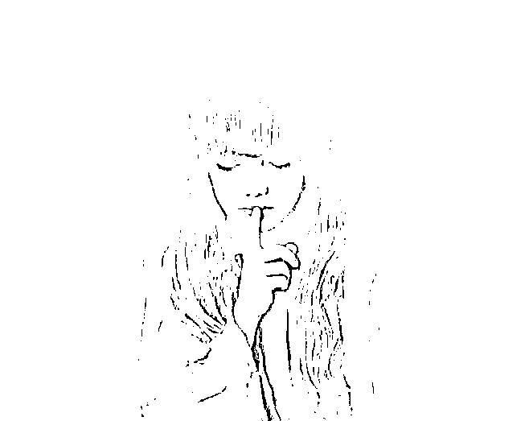

莉雅反思了童年的生活经历，并渐渐明白这些经历是如何反映在她出生图模式里的。慢慢地，她意识到自己过去一直将童年经历表现在工作中。对童年的反思唤起了她强烈的情绪和情感，于是她寻求占星咨询来探讨这些感受，这又进一步加深了她的理解。如今，她内心中有些东西有了不同的感受。

## 占星学帮她找到职场定位

现在，她决定作出改变。在认识到自己的期待虽然美好但却“并不实际”之后，她开始设定更易达成的工作目标。

在工作中，她与团队划定界线，不再试图成为每个人的好朋友。虽然对待下属依然公正，但她明确了一点——“她”才是领导。渐渐地，下属们领会了她的用意，开始遵照她的指示行事，她获得了连自己都难以置信的满足感。

在老板发脾气时，她依然坚守自己的立场，之后，老板私下向她道歉。渐渐地，老板开始对她有了信心。她查出老板的出生信息，研究了他的星图。她很快就发现，他的主要问题是害怕没人倾听，他的星图中双子座满月合相火星，意味着他有时候会爆发。她学会了在他说话时仔细倾听，并复述她所听到的关键信息。另外，通过研究老板的星图，莉雅对他的观点态度有了深入了解，老板很快就感觉，莉雅比其他部门经理更理解他。

最后，莉雅成为了策略讨论中的关键一员。在她第一次发现公司有搬迁的可能时，她就能够找到方法与老板就此展开讨论。她的老板并不知道她学习占星学，只知道他有了一名能干的经理，能够带领一支更成功、更高效的团队。很快，莉雅收到了她有史以来最好的绩效评价，即使公司重组搬迁，老板也下定决心要留住她。那时，莉雅就可以轻松地回答这个问题了：她愿意留在这个职位，随公司搬迁。

莉雅决心在公司的新总部创造一个更高效、更和谐的工作团队。

**她如何利用占星学面试**

●通过查看应聘者的出生信息（至少是年月日），莉雅能够提出关键问题，这些问题能帮助她更容易决定该雇佣谁。

●通过出生图信息，她还能更清楚地了解应聘者是否真的符合应征职务的要求。

●通过对比图信息，莉雅还能在应聘者中挑选与她最“契合”的，以及互相之间相处最融洽的。

在所有这些领域中，占星学都成为了这位成功的部门经理手中的一把利剑。


想体验大师级的占星疗愈？

大卫老师**占星咨询**预约进行时

**生命议题、职业发展、关系咨询、少儿成长、年度规划和预测**

```
预约咨询请联系许小姐 ：010-58760529
```

**特别提醒：**

**本文首发于若道平台，**

**转载请联系后台授权。**


**想了解更多关于占星学和职场的关系吗？大卫·瑞雷老师主讲的企业咨询工作坊就要在 6 月 9 日（端午节假期）开始啦，教你用占星学理解企业发展，与客户建立关系。** 

**报名及咨询，请点击文末“阅读原文”**


# 企业占星工作坊 | 帮一个企业走向辉煌，你可以

> 原文：[`mp.weixin.qq.com/s?__biz=MzA5NjA0NTAxNg==&mid=2651385035&idx=3&sn=32139523fc7ea43401120ed7e869853e&chksm=8b4a5e7cbc3dd76ad6ffc3424e7082ce38f815d8ac3fd653a5bb7645e2713832eb3515d0468a&scene=126&sessionid=1692738831#rd`](http://mp.weixin.qq.com/s?__biz=MzA5NjA0NTAxNg==&mid=2651385035&idx=3&sn=32139523fc7ea43401120ed7e869853e&chksm=8b4a5e7cbc3dd76ad6ffc3424e7082ce38f815d8ac3fd653a5bb7645e2713832eb3515d0468a&scene=126&sessionid=1692738831#rd)

“

**我的公司，就像我的孩子。** 

”

于我们，

也许仅仅是一个不知名甚至不起眼的品牌，

于创立这家公司的人，

这就是他们的骨肉。

鲁迅先生说：

“这世上本来没有路，

走的人多了，也便成了路。”

企业之路无疑是最艰难却也最辉煌的一条路。

几乎每一个创业成功的企业家，

都可以给你分享一百种往事，

最初的艰辛和一路的困惑迷茫。

那么为什么还有无数人，

前赴后继在这条路上呢？

因为每一个人有一个，

代表事业成就的中天，

我们都**渴望成功**、**渴望不断向上**、**渴望荣光**。

然而，在这条路上，

光有海王式的梦想是远远不够的，

还需要土星式的实际规划、

火星式的热情燃烧，

有时候甚至需要一点木星的幸运加持。

**“谋事在人，成事在天。”**

占星学能够给到一个企业最大的帮助，

除了可以帮助企业主**“谋事”**，

还可以借助**趋势预测**来帮助他们**“成事”**。

运营企业从来都是一件严肃的事情，

就像若道占星，

一直致力于严肃占星学在中国的传播一样。


这是**国内第一次**系统讲解

如何运用**占星学给企业做咨询**的工作坊。

这是一个绝好的机会，

你可以**和大卫老师面对面**，

还有机会在中国的经济中心——**上海**，

**体验海派风情**，

**结交**各行各业成熟的**职业人士**，

同各界热爱占星学的**企业精英**交流，

互相切磋各种经验，

**扩展高层人脉**。

这也是一个**严肃**的席位，

它考验你是否真的有十足的准备，

去面对企业主们，

替他们排忧解难。

因此，

我们对于参与这次工作坊的人群有相对严格的筛选，

同时，也会为大家提供**非常高质量**的授课内容。 

**企业占星工作坊非常适合这些人**

● 本身是**创业者**或者**企业主**；

● 本身是**企业管理者**，或**对于企业管理有一定经验**的占星师；

● 对于没有企业管理经验，但有**鸿鹄之志**，想有一天拿下几十万元以上大单的占星师，也欢迎参加。（请提供足够证明自己能力的依据）

**你将得到如下帮助**

*   **经典案例解析**

*   大卫老师将用自己非常熟悉的经典案例，详细讲述**占星学可以在企业创立、运营、出售等一个完整的企业生命流中可以帮助企业所做的方方面面的事宜**。

*   **企业的创业方向**

*   选择适合的**创业方向**，是创业成功的一个要素；**创始人的个性**也创造出不同的企业，会以不同的方式获得成功，也会遇到因创始人的个性而面临的**独特挑战**。

*   每个企业都有不只一个对企业有意义的星图，企业的星图如个人星图一样，有**故事、机会，挑战，起伏**的周期。如何解读**企业星图**中的秘密？如何解读**企业主星图和企业星图**的关系？

*   **产品和服务的定位**

*   根据创始人及企业星图，**优化产品和服务的定位****。**

*   **人的选择**

*   选对人是每个创业者及管理者最重要的任务，而培养、管理、发展企业员工又是管理者最大的职责。

*   帮助企业主**选择、了解其合伙人****；**

*   帮助企业主**设立关键职位****；**

*   帮助企业主对**中高层人力资源的选择、培养、提拔**，将适合的人用到适合的岗位，**了解员工的优势和各个时期的挑战**，了解**关键人员的个人发展趋势是否符合企业发展趋势****。**

*   **团队建设**

*   帮助企业主与企业关键人员**建立信任**，了解什么是更好的**沟通方式****；**

*   帮助**团队**之间的**沟通和协作**，建立**团队成员的归属感**，帮助团队成员**关系**的融洽。

*   **制定计划，管理趋势和变化，防范风险**

*   占星学善于**预测趋势**，运用占星学，可以提早**了解企业趋势的变化**，进而**制定营销计划、财务计划**，更好管理企业的变化，防范风险。

*   **选择时机**

*   学习**择时占星学基础**，帮助企业的**活动、关键时间选择时间点****。**

*   **帮助占星师了解如何与商业企业建立关系**

*   企业咨询不仅可以获得**企业客户**，还可以因此获得**大量的个人客户**。


**6 月，与你相约上海，**

**我们虚位以待。**


**大卫·瑞雷（David Railey）**

若道创始人，《灵魂的目标》作者。拥有 46 年的占星咨询的执业经验，曾两任亚特兰大占星协会主席，是全美占星师联盟（AFAN）、美国占星师联合会（AFA）、全美占星研究委员会（NCGR）、国际占星研究协会（ISAR）和职业占星师组织（OPA）的成员，是联合占星大会（UAC, United Astrology Conference）督导委员会委员。大卫曾是 CNN、CBS 的占星节目的常驻嘉宾，多次在 BBC、WGS、WSB、WRGG 等节目中接受采访，并在亚特兰大主持电视节目《每日行星（Daily Planets）》达 4 年之久。

**ISAR 选修课程****工作坊信息**

**授课时间：**2016 年 6 月 9 日、6 月 10 日、6 月 11 日（端午节假期）10：00-18：00（午休 2 小时） 共 18 课时

**授课老师：**大卫·瑞雷

**授课方式：**上海现场，英文授课，中文翻译。（具体上课地址课前 10 天请留意查看短信微信通知）

**费用**：****6800 元** （5 月 20 日前报名可享受早鸟价****5800 元****，若道老学员**4800 元**）**

**课程负责人：**熊老师

**微信号：**13761199137，请备注企业占星工作坊报名咨询

长按二维码添加课程负责人咨询


**了解详细课程内容及报名方式，点击文末“阅读原文”**


# 测试 | 你的职业能否获得成功？怎么破？

> 原文：[`mp.weixin.qq.com/s?__biz=MzA5NjA0NTAxNg==&mid=2651385008&idx=1&sn=962f2639c9d578320d77f1a15bcc07e3&chksm=8b4a5e07bc3dd71107aac27649eb9a65b47332561b975f4a357a66198d5c20d0f8b8cb592180&scene=126&sessionid=1692738831#rd`](http://mp.weixin.qq.com/s?__biz=MzA5NjA0NTAxNg==&mid=2651385008&idx=1&sn=962f2639c9d578320d77f1a15bcc07e3&chksm=8b4a5e07bc3dd71107aac27649eb9a65b47332561b975f4a357a66198d5c20d0f8b8cb592180&scene=126&sessionid=1692738831#rd)

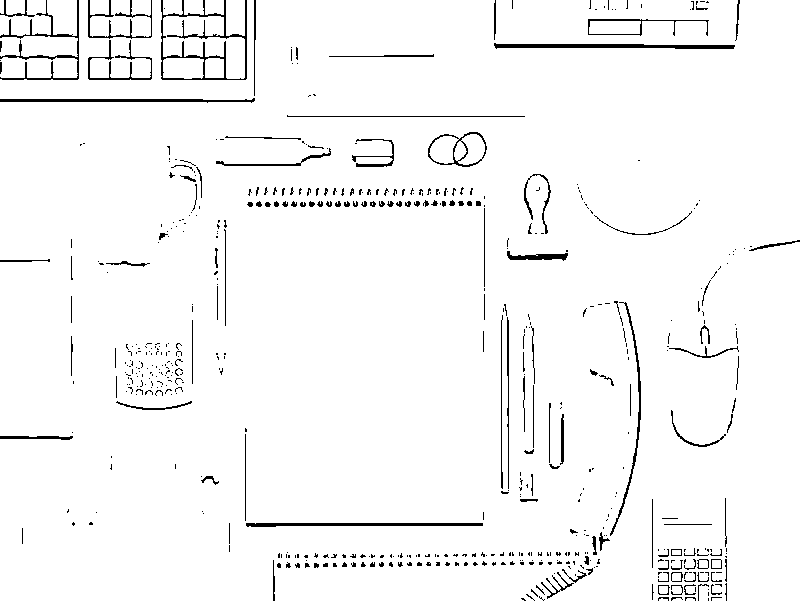
作者/唐娜•坎宁安  图片/VCG

译者/Elle  校对/Christy

文章来源/《大占星师》杂志

本文节选自唐娜•坎宁安的新书《职业选择与挑战：占星学的指导》。

利用出生星图分析你的潜在职业以及你能在其中获得多大成功的时候，可以去关注落在第二宫、第六宫或第十宫的行星，以及与中天形成相位的行星。这些落入职业宫位的行星是关于你职业的最强指征。通常，其中的一颗或两颗行星会有主导性的影响。

## 找出影响力最大的行星

要确认哪一颗行星起主导作用，关键是看每一颗行星自身有多强。按照影响力大小排序，我列出了一颗强有力行星所具备的特征：

①**落在第十宫或第九宫，且在 10 度以内合相中天**；

②**与中天成四分相、三分相或对分相**；

③**是整个星图中形成相位最多的行星**；

④**这颗行星****位于职业相关的土相星座——金牛座、处女座或摩羯座**。

## 看看你属于那种行星主导

下面，我将对那些可能落在你职业宫位内的行星进行描述，请认真阅读，看看哪一个最符合你，以及它们会如何影响你的潜力。如果以下描述显示，你正在运用一些不可取的潜质阻碍自己的成功，不要泄气，你可以有意识地努力减少这些负面影响。我也会给出一些建议，帮助你提升对这些行星的表达。

**落入你职业宫位的行星的最好和最坏表达：**

**Sun 太阳主导**

**如果太阳落在某个职业宫位或得分很高，那么你可能是一个太阳型的人。**你可能有**很强的个人色彩**，是一个**高于生活**的人。太阳的星座、宫位，以及和其他行星形成的相位都会显示出你完善自我定义、身份、自我表达、自我价值和自信的方式。

记住，**困难的星座和相位——尤其是和运行缓慢的行星形成的合相——可以改变太阳和这里列出的所有行星的基本特质**。如果是这样，以下描述中有一部分可能就不完全适用了。

太阳给你的职业生涯所能带来的**最佳潜能**：

*   你主要的能量强烈地聚焦在这个宫位所代表的事务及职业上。

*   太阳所在的宫位掌管的人生领域引人注目，别人无法对你视而不见。

*   自信和沉着会让他人对你和你的职业产生信任。

可能**需要克服的不足**（尝试下面的**解决方案**）： 

*   自高自大和哗众取宠会使你在工作中与他人产生距离。

*   自尊心大部分建立在职业成就上，因此遇到挫折容易一蹶不振。

*   以自我为中心，深信在职业中发生的所有事情都与你相关。

太阳可能的**建设性特质**： 

自信、引人注目、魅力非凡、有王者风范、让人印象深刻、英俊潇洒、阳光、慷慨、鼓舞人心、积极、关注自我表达和自我发展。

可能的**困难特质**： 

自负、自满、虚荣、自命不凡、浮夸、妄自尊大、苛刻、难伺候、以自我为中心、利己主义、固执、自私、自恋、小题大做。

太阳的**解决方案**： 

在自尊上下功夫，清除脑海中对自己的负面评价；做让自己更自信的事；时常想象，你的太阳神经丛有一团金色的火焰在散发光芒。

**Moon 月亮主导**

**如果月亮落在职业宫位并且得分很高，你可能是一个月亮型的人。**根据月亮的星座、宫位，以及和其他行星形成的相位，这类人可能主要聚焦于**滋养自我和他人**、**家和家庭**，或者**女性和情感**。你可能把过多的精力花在了**过去和家庭的事务**上，也可能有很多**情绪起伏**。你很可能把身边的人融合成一个大家庭。

月亮给你的职业生涯所能带来的**最佳潜能**：

*   女性强有力的支持，在月亮所在宫位创造出一个大家庭；

*   能够在工作中给予并接受滋养；

*   工作常常关注女性和家庭，并为其带去福利。

可能**需要克服的不足**：

*   月亮周期和月经周期可能导致职业生涯中情绪起伏不定。

*   缺乏安全感，依附于过去的模式和习惯，而不是应对现状。

*   对与此宫位有关的事务以及职业相关的各种关系过于依赖。

月亮可能的**建设性特质**：

滋养、关心他人、有情绪上的感知力、相信直觉、直觉敏锐、会当家、善于接纳、与月亮周期合拍、喜欢家庭生活、维持家庭和传统。

可能需要**克服的不足**：

溺爱、情绪性暴饮暴食、依赖心强、情绪化、活在过去、超级敏感、粘人、缺乏安全感、爱担忧、保守、容易被人冒犯、难以改变自己的习惯。

月亮的**解决方法**：

尽量把自己家里布置得温馨一些；拜访或打电话给一个感情深厚的老相识，重温过去；如果你喜欢烹饪，就做一顿特别的饭菜，如果不喜欢，就去一家特别的餐厅享用美食；遵循月亮每月在你星图中留下的轨迹。

**Mercury 水星主导**

**如果水星落在职业宫位而且得分很高，你可能是一个水星型的人。**你很可能在**沟通、学习、思考、写作或动手能力**方面脱颖而出。根据水星的星座、宫位以及与其他行星形成的相位，你可能关注于**沟通交流**，以及**建立**一个相互关联的**人际网**。

水星给你的职业生涯所能带来的**最佳潜能**：

*   良好的沟通技巧能使职业生涯受益，带来幽默感和很多新鲜的想法。

*   快速学习的能力，适应能力强，能够在不同任务之间轻松转换。

*   头脑敏捷，好奇，渴望学习更多知识并与人分享。

可能**需要克服的不足**：

*   坐立不安，很容易厌倦，容易分心，注意力容易分散并且转移到别的兴趣上。

*   光说不做，无法将好的想法付诸行动。

*   神经系统高度紧张，容易兴奋，难以安静下来或冥想。

水星可能的**建设性特质**：

健谈、学习能力强、足智多谋、善于表达、有悟性、适应能力强、多才多艺、聪明、有丰富的想象力、幽默、时髦、消息灵通、好奇、有说服力。

可能的**困难特质**：

容易分心、坐立不安、善变、不安分、过于理智、喜欢赶时髦、反复无常、肤浅、油腔滑调、好管闲事、八卦、说谎、假装博学/口无遮拦、对互联网上瘾、是个长不大的孩子。

水星的**解决方案**：

试着用黄芩或野燕麦等草药安抚神经系统；吃燕麦片；服用一片复合维他命 B 或顺势疗法的磷酸钾；脚踏实地地做点实事。

**Venus 金星主导**

**如果金星落在职业宫位或得分很高，你可能属于金星型的人。**根据金星所在的星座、宫位以及与其他行星形成的相位，你可能聚焦于**建立关系**——**恋爱、分享和亲密关系**——让你自己和周围的环境变得**美丽而和谐**。

金星给你的职业生涯所能带来的**最佳潜能**：

*   你优秀的社交技能帮助你在职场中俘获人心，是一名很好的亲善大使和公关。

*   你是一名很好的团队成员，能促进团队和谐与合作；

*   你有艺术天赋；良好的设计和时尚品味能为宣传品打造出吸引人的图案。

可能**需要克服的不足**：

*   不合时宜的调情或绯闻（与老板，同事或生意中的客户）会分散对职业的专注度；

*   不断寻求别人的肯定和喜爱，以此作为职业回报；

*   在与人相处中过于妥协，压抑了自己的需求。

金星可能的**建设性特质****：**

善于交际、有魅力、有吸引力、热心、适应力强、友好、有礼貌、善于调解、有人情味、可爱、讨人喜欢、人际交往能力强、有团队精神、能妥协。

可能的**困难特质**：

爱取悦别人、过度注重外表、想通过魅力而不费力地取得成功、虚荣、不诚恳、懒惰、享乐主义、贪婪、肤浅、优柔寡断。

金星的**解决方案**：

剪一个新的发型，或打扮一番；买一套新衣服，或者找一个跟你品味相同的人交换饰品或珠宝；买花，种花；打电话给一个很久没有联系的爱慕你的人，跟你的伴侣安排一次晚上的约会，或者和你最好的朋友一起做点特别的事情。

**Mars 火星主导**

**如果火星落在职业宫位或得分很高，你可能属于火星型的人。**根据火星所在的星座、宫位以及与其他行星形成的相位，你的职业领域可能聚焦于以下主题：**坚持己见，愤怒，竞争，能量的正确使用，性欲，自主性，以及能承受多大程度的挫败**。

火星给你的职业生涯所能带来的**最佳潜能**：

*   身体强壮，主动出击，以积极进取的方式达成职业目标。

*   勇敢，积极主动，一种“我能做到”的态度让你成为天生的领导者。

*   大胆，勇于追求自己想要的，直面困难。

可能**需要克服的不足**：

*   行事鲁莽，不会花时间想清楚这些行为的长期后果；

*   太专注于自己的目标而忽视自己的行为对他人的影响。

*   易怒，缺乏耐心，如果想做的事情遭到阻挠，可能很容易发脾气。

火星可能的**建设性特质**：

勇敢、大胆、坚强、有主见、精力充沛、不知疲倦、坚决果断、热情、有活力、敢于冒险、活泼、健壮、英勇、独立、积极主动。

可能的**困难特质**：

咄咄逼人、鲁莽、傲慢、一意孤行、好斗、粗鲁、性急、刻薄、冲动、无情、刚愎自用、顽固、被不断驱使着向前、不考虑他人需求。

火星的**解决方案**：

多休息；有规律地锻炼身体；学一门武术；开始一个新的项目（这个项目时间不会太长，难度也不太大）；参加一项比赛或一个游戏。

**Jupiter 木星主导**

**如果木星落在职业宫位或得分很高，你可能属于木星型的人。**根据木星所在的星座、宫位以及与其他行星形成的相位，你可能**执着于一种对成长与扩张的渴望**——最大限度**探索生命和我们所处的这个世界**——希望**寻找到智慧并将智慧传播给他人**。

木星给你的职业生涯所能带来的**最佳潜能**：

*   对事情有积极的预期；将成功的几率最大化；对于挫折采取达观的态度；

*   永远在寻求知识和更广阔的视角，然后把这些教授给他人；

*   喜欢冒险，热爱旅游，世界公民；热切地迎接新的体验。

可能**需要克服的不足**：

*   你可能会过度依赖自己的运气，而采取一些愚蠢的冒险行为，相信上帝始终站在你这一边。

*   事情容易做得过头，扩张过度，永远不知道什么时候该停下来。

*   喜欢说教，心胸狭隘，喜欢评判别人，过于执着于自己是正确的。

木星可能的**建设性特质**：

乐观、快乐、有抱负、满怀希望、达观、乐观、愿意冒险、幸运、慷慨、好学、充满智慧、能整合信息、是一个终身学习者。

可能的**困难特质**：

过度放纵、固执己见、教条主义、华而不实、盲目乐观、过于自信、贪婪、伪善、赌徒、喜欢夸张和过分依靠自己的好运气。

木星的**解决方案**：

发现你专业领域的最新信息；在你的领域中找到一位新的能带给你启发的老师或者最新的理论；每天列一个感谢清单；练习说，“我不知道”或“我错了”，并感受那种偶尔犯错带来的释然。

**Saturn 土星主导**

**如果土星落在职业宫位或得分很高，你可能属于土星型的人。**根据土星所在的星座、宫位以及与其他行星形成的相位，你可能聚焦于**结构、纪律，以及对品质和成就的渴望**。

土星给你的职业生涯所能带来的**最佳潜能**：

*   完美的时间管理，不懈的努力，对于事业的缓慢发展有耐心；

*   自律，对工作高要求；值得信赖，有条理、负责任。

*   能建立并维护体系和常规，以确保重要工作的完成。

可能**需要克服的不足**：

*   悲观主义，总是预期最坏的情况，对于尝试新事物缺乏信心。

*   容易抑郁和焦虑，尤其是在经历挫折以后。

*   抗拒改变，对失去的东西不愿放手。

土星可能的**建设性特质**：

工作努力、自律、有耐心、有抱负、效率高、严肃认真、实事求是、有远见、谨慎、系统化、可靠、负责、刻苦、高标准。

可能的**困难特质**：

完美主义倾向、悲观、负面、爱担忧、焦虑、抑郁、拘谨、死板、冷漠、缺乏想象力、要求高、专制独裁、苛刻、保守、吝啬。

土星的**解决方案**：

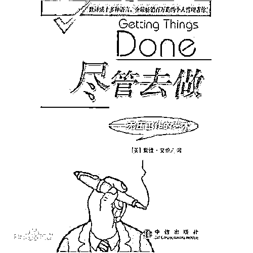

整理你的工作场所；为你要完成的工作制定详尽的计划；阅读大卫•艾伦的《尽管去做》（*Getting things done*）一书，并加入他的在线网络粉丝群；用目标设定的方法完成你工作中的各种任务。

**Uranus 天王星主导**

**如果天王星落在职业宫位或得分很高，你可能属于天王星型的人。**根据天王星所在的星座、宫位以及与其他行星形成的相位，你可能**聚焦于找到自己的独特之处**，以及**如何融入团队或成为社区的一份子**，并**成为你自己的权威**。

天王星给你的职业生涯所能带来的**最佳潜能**：

*   有远见、有创造力、能跳出定势思维独立思考（你也许从来就没有按照定势思维思考过。）

*   能和各种人建立关系，和来自不同文化和背景的人交朋友

*   独立，走自己的路；轻松自在地引领时代潮流；

可能**需要克服的不足**：

*   可能是一个叛逆者，一个本能地排斥现状、蔑视权威的另类。

*   任性；当想做的事遭到阻碍时，会发脾气。

*   永远不成熟，拒绝做那些对你最有利的事。

天王星可能的**建设性特质**：

先锋派、有前瞻性、顶尖、引领潮流、天才、新奇、理想主义、创新、才华横溢、客观超然、自由、人道主义者、能跳出定势思维独立思考。

可能的**困难特质**：

本能的叛逆者、破坏者、煽动者、另类、任性、挑衅、古怪、冷漠、乖戾、精英主义、飘忽不定、靠不住、容易分心、暴躁、固执。

天王星的**解决方案**：

周五请一天病假，出去走走；找一些不会伤害到你职业利益的叛逆的事来做；为你所坚信的一项事业做志愿者；通过互联网找到一群志趣相投的朋友。

**Neptune 海王星主导**

**如果海王星落在职业宫位或得分很高，你可能属于海王星型的人。**你可能有**出色的服务奉献精神、通灵能力、创造力、同情心和灵性**。根据海王星所在的星座、宫位以及与其他行星形成的相位，你可能想要**超越自我**，**臣服于更大的力量**，**透过眼前的现实**，**看到更高的境界**。

海王星给你的职业生涯所能带来的**最佳潜能**：

*   有创造力，有灵性，能感受到更大的现实和精神的无限可能性。

*   有同情心，同理心，直觉强，想帮助那些正在受苦的人。

*   可以看到人们的潜能，忽略他们的缺点，宽容。

可能**需要克服的不足**：

*   充当受气包和牺牲者；试图去“拯救”和救赎那些并不想自救的人。

*   受虐狂，沉溺于扮演受害者和得到每个人的同情。

*   当现实令人沮丧的时候沉溺于自己幻想的世界中，个性上可能容易上瘾。

海王星可能的**建设性特质**：

有创造力、有同情心、直觉强、想象力丰富、有同理心、完美主义、愿意服务、宽容、接纳、有奉献精神、爱沉思和冥想、非物质主义、灵性追求者。

可能的**困难特质**：

喜欢做白日梦、活在幻想中、不肯面对现实、容易受骗、拿不定主意、依赖心强、反复无常、混乱、不现实、不切实际、容易上瘾、不诚实、逃避现实。

海王星的**解决方案**：

冥想、唱诵、音乐、舞蹈、太极或游泳；用山艾树清洁你的空间；学习在精神上和心理上保护自己，并坚持下去。

**Pluto 冥王星主导**

**如果冥王星落在职业宫位或得分很高，你可能属于冥王星型的人。**根据冥王星所在的星座、宫位以及与其他行星形成的相位，你可能**聚焦于力量**、**控制和信任的议题**，**分析表面现象下更深层的含义**，**清理**掉不想要的东西，**感受离别并学会应对**，给自己和他人带来**疗愈和转化**。

冥王星给你的职业生涯所能带来的**最佳潜能**：

*   有洞察力；你能够透过现象找到问题的根源，并努力解决问题。

*   你在真相和残酷的现实前面从不退缩，能在困境中幸存下来。

*   可以成为一个强有力的疗愈者，或推动一项急需进行的改变。

可能**需要克服的不足**：

*   多疑，愤世嫉俗，缺乏信任，把别人预想得很糟糕——一朝被蛇咬，十年怕井绳。

*   不轻易原谅，可能非常记仇或因为怨恨而导致工作上的失败。

*   可能是一个爱耍心眼的人，尤其是和有权势的人在一起时，或为了能掌控自己的职业。

冥王星可能的**建设性特质**：

深刻、理解力强、心理上警惕性很高、有洞察力、有同理心、有转化的能力、坚韧不拔、经历困境能迅速复原。

可能的**困难特质**：

多疑、不信任、怨恨、心存报复、不宽容、占有欲强、执迷不悟/强迫症、恶毒、善于操纵别人、容易陷入权力斗争、不合群。

冥王星的**解决方案**：

每天都列一个感谢清单；释放心中的怨恨；把自己置于淡紫色的光中，并试着原谅自己；参加或组织一个自我帮助的工作坊。

## 接下来的步骤

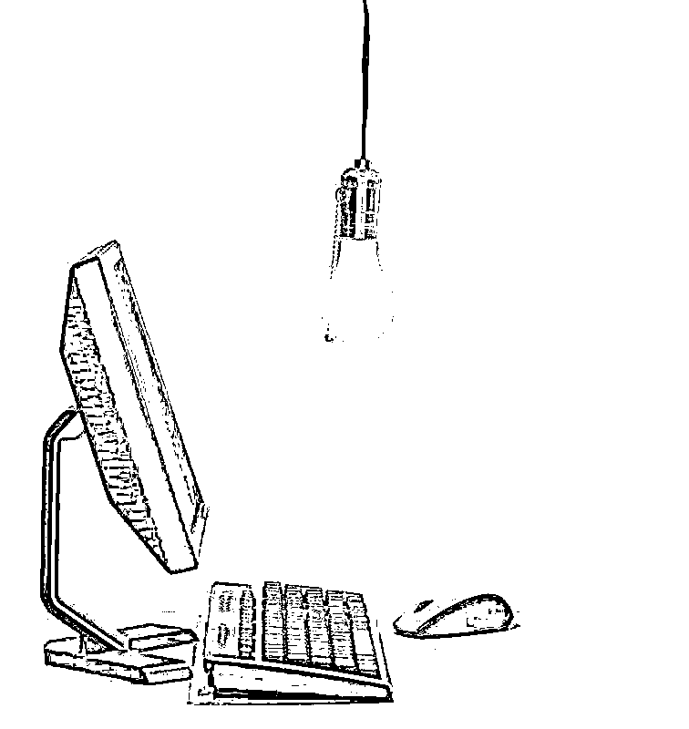

我们已经探讨了你出生星图中与职业宫位相关的主导行星的一些利与弊。接下来怎么做呢？

*   思考这些与职业相关的行星的正向品质，尤其是在行星力量测试中得分很高的那些行星。

*   如果你能更有意识、更主动地利用那些力量，你将能为自己的职业带来提升。

*   你是否还记得你的高分行星下面列出的负面特质呢？

*   你是否因为展现出了这些负面特质而无法获得成功呢？

*   要想缓解这些负面特质，首先要在你表现出它们的时候有所意识。

*   另外，在每颗行星的解决方案中也都提供了一些缓解负面特质的方法。

**特别提醒：**

**本文首发于若道平台，**

**转载请联系后台授权。**


**想了解更多关于占星学和职场的关系吗？大卫·瑞雷老师主讲的企业咨询工作坊就要在 6 月 9 日（端午节假期）开始啦，教你用占星学理解企业发展，与客户建立关系。**

**报名及咨询，请点击文末“阅读原文”**


# 让占星学的实用性扩大 10 倍，他有秘诀

> 原文：[`mp.weixin.qq.com/s?__biz=MzA5NjA0NTAxNg==&mid=2651385008&idx=2&sn=9e3b02021fbe294b88db7784d8098d89&chksm=8b4a5e07bc3dd7115845598b2b681596554d12daf7e2e80bfadda3c336651961f81df28223e1&scene=126&sessionid=1692738831#rd`](http://mp.weixin.qq.com/s?__biz=MzA5NjA0NTAxNg==&mid=2651385008&idx=2&sn=9e3b02021fbe294b88db7784d8098d89&chksm=8b4a5e07bc3dd7115845598b2b681596554d12daf7e2e80bfadda3c336651961f81df28223e1&scene=126&sessionid=1692738831#rd)

人本主义占星学是我们了解个人潜力的工具，它满足了我们对自我认知的需求；如果再加上古典占星的精准预测，将潜力和预测双管齐下，简直是咨询利器！6 月 19 日，占星界“祖师爷”罗伯特·汉德将教你将古典占星与现代占星结合。下面就让他告诉你，现代占星学与古典占星学是不矛盾的。

**点击图片了解占星界的“祖师爷”▼**


QA**若道君**某个公众号的编辑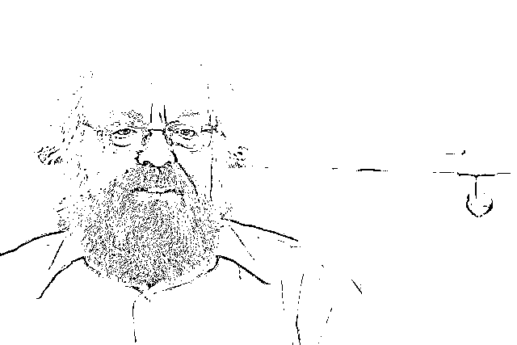**罗伯特·汉德**占星界“祖师爷”

▼**古典占星是不是宿命的？**

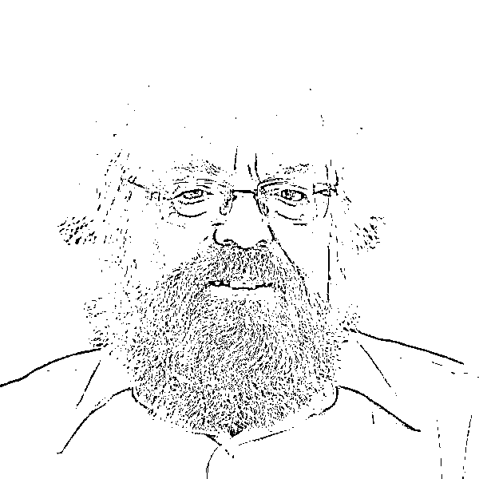

**罗伯特·汉德**

占星界“祖师爷”

从历史角度来讲是这样的。在中世纪，人们是很少有自由去做一些事情的，所以**如果有困难的配置，那么展示出来的结果可能就是困难的，因为人们在当时很难选择。但是这并不是占星学的错，而是占星学被使用的原因**。

三种最主要的占星学形式就是印度占星学、中世纪占星学、罗马占星学，这些占星学都被用在那个时代的社会里，那是人们受到很大限制的社会。**如果人生是被限制的，就很容易去预测会发生什么**。所以**占星学从总体上来说，并不是宿命的，但是文化可以是**。

我会用到当时的语境去教授这门课程，但是我总是会指出它和现在的占星学有什么区别。如果是完全纯粹的中世纪占星学在现代社会中是不可能行得通的，但是如果你加入更广阔的理解，就会让中世纪占星学非常有效。所以很重要的一点是，**当你听到或者读到中世纪占星学很可怕的论断的时候，你不要害怕，因为你没有生活在中世纪**。

▼**人本主义占星学更科学吗？**


**罗伯特·汉德**

占星界“祖师爷”

人本主义占星学在很多方面都是令人满意的。**它满足了我们对自我认知的需求；它符合有关人类潜力的基本理念；通过强调成长和提高自我觉察，它帮助客户从令人沮丧的、达不到预期目标的宿命论中解脱出来。**我想，我们可以说，人本主义心理占星学是非常有益的占星发展。

总的来说，相对于古典占星学而言，人本主义占星学（以及所有强调性格和个性，而不是命运和宿命的占星学）似乎对科学范式提出的挑战不那么严峻。很多的心理占星师都指出，我们可以借由出生星图讨论命运的唯一原因，是因为出生星图可以显示出心理倾向，而心理倾向相应地会影响我们看待事物和对事物做出反应的方式。由于命运是观念和行为造成的结果，所以星图只是在某种程度上显示了命运。

人本主义占星学和心理占星学把出生星图这道难题摆在了科学面前。并且由于这些占星学流派的大部分执业占星师也使用行进、推进、次限或太阳弧，所以，这些流派对我所提到过的科学观还提出了很多其他的挑战。但有一种观点我深信不疑：**一种将自己限制在主观经验性质之内的占星学——其中全部或大部分现象都发生在一个人的心灵之中，这种占星学会与科学更加兼容。而且显然这种占星学也与深度心理学更加兼容**。

占星学与深度心理学都使用神话和传说作为语言，这种语言完全产生于人类意识（或者更准确地说是人类的潜意识）。除了一些激进的荣格主义者之外，大多数深度心理学家都认为，这种语言并非来自于大自然，因为它是独立于人类意识而存在的。这与占星学有很大不同，占星学认为神话传说的语言不仅植根于人类的心灵，还植根于大自然。

▼**除了******趋利避害，古典占星学有没有让人成长的能量呢？****


**罗伯特·汉德**

占星界“祖师爷”

是这样的。中世纪占星学的优势在于，作为一门占星学的语言，比现代占星学更加复杂、更加精细。

其实我真正宣扬支持的是**加入现代的解读再去运用中世纪占星学**，我要创造的是这样的占星学。现代占星学部分地运用了中世纪占星学，现代占星学中也有灵性导向的，它的理念很好，但是技法不够理想。

我要更多说一点，占星学不是一种宗教，它跟任何的宗教形式都是可以匹配的，只要这种宗教不认为占星学是邪恶的。而任何相信占星学就是命定的宗教也不可能接受占星学。占星学和无神论也有一定的匹配度，但是很难去解释占星学在这样的情境中是如何运作的。

学习占星学你并不需要有任何这方面的知识，比如关于神学，关于上帝，但是**你确实要相信人类是可以成长的**。所以占星学会有一些宗教或者灵性的暗示，但是它自身不是宗教。所以我说，**如果你运用中世纪占星学的一些技法，然后加入现代占星学的解释去解读星图，跟你用纯粹的中世纪占星学或纯碎的现代占星学去解读星图结果确实会不一样。**

.gif") 

往期学员分享

什么是古典占星？从时间来说，古典占星是指 18 世纪之前的占星学。从分类来说，它包括了国家、个人、择时、问事（卜卦）。从它的哲学思想来说，包含了行星反映论、行星决定论、魔法炼金论。从它所使用的技巧来说，是以七层行星运行圈、以及最外圈的星座（恒星）圈层层包裹的地心天球模型为基础，形成各式各样用来描述地球上万事万物的方法。

古典占星虽有其独特的思考模型，可是在这个理性主义盛行的年代，它赖以生存的神秘理论却很容易被人质疑，这也是无法回避的问题。不过它所使用的规则，是经过了历代占星家的不断总结和修正，流传了下来的。我认为**这些规则并非定理或者公式，把它们当作前人经验的总结更为恰当。**

比如说，判断事件是否能够成功的标识之一的光之转移，但并非星图上出现了这样的征象就代表事件一定能够成功。这些规则只能作为判断时参考，在理解这些规则背后的原理和用意之后，占星师根据实际情况灵活运用才能真正做到向顾客传达有效和正确的信息。

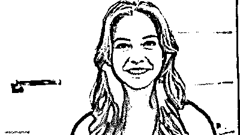

说了这么多我对古典占星系统的理解，那么学习古典占星又给我带来了哪些收获呢？

**●首先，古典占星本身所具备的系统性，让我在分析星图时更加有逻辑、更加具体了。**

●其次，**古典占星注重预测**，它的规则都是针对现实生活中会遇到的事情，所以学习古典占星以后我发现，自己能够通过预测，帮助顾客分析和处理现实存在具体事件了。

●最后，古典占星可以被当成一项特殊技能。它既可以表现自己的才华，又可以帮助他人，而且也可以有可观的收入。我从 2010 年开始，就已经是卜卦占星的从业人员了。

总之，古典占星确实令我受益匪浅。所以当听闻我所尊重的占星学者罗伯特·汉德即将在若道讲授古占与现占结合课程，我非常开心。更重要的是，我希望大家能够认真对待古典占星，**不要因为它某些内容老旧了、过时了、或者不好理解，就彻底否定它。事实证明，古典占星还是有效的**。系统地学习古典占星学，对提高自信和占星能力很有必要，当然，一定要勤加练习哦！

**学员简介**

**王薇**：80 后，2001 年接触占星，2010 年成立了占星工作室，潜心研究古典占星，尤其擅长卜卦占星。系统学习的占星课程有：卜卦占星，中世纪占星，以及希腊占星课程。 


**想学习更多关于古占和现占结合的知识？6 月 19 日，由占星界“祖师爷”罗伯特·汉德教授的古占与现占结合**的网络课程**就要开课啦！如果你是“技法控”，这门课程你可不能错过！**

**报名及咨询，请点击文末“阅读原文”**


# 古占+现占丨我想和你一起开始神奇的旅行，好不好？

> 原文：[`mp.weixin.qq.com/s?__biz=MzA5NjA0NTAxNg==&mid=2651385008&idx=3&sn=71e7de4d8d89f5a301a32a4f20ed8a18&chksm=8b4a5e07bc3dd711ecbd045370208e88b8b35d97b41ad02b66fb682bdf1eb0e2e3254d0c41fd&scene=126&sessionid=1692738831#rd`](http://mp.weixin.qq.com/s?__biz=MzA5NjA0NTAxNg==&mid=2651385008&idx=3&sn=71e7de4d8d89f5a301a32a4f20ed8a18&chksm=8b4a5e07bc3dd711ecbd045370208e88b8b35d97b41ad02b66fb682bdf1eb0e2e3254d0c41fd&scene=126&sessionid=1692738831#rd)


继成功举办过中世纪占星学初阶、进阶课程之后

当今最伟大、最博学的占星师之一

**罗伯特·汉德**老师

将于 2016 年 6 月至 8 月

带来中世纪占星学进阶网络课程

**古占与现占结合**

此次**星图解读**

**我们将采用学员星图进行讲解**

让大家了解如何运用古占与现占结合解读星图

古典占星自带的逻辑性

**可以让你在解读星图时更加得心应手哟**


课程信息

**授课时间：**2016 年 6 月 19 日-8 月 13 日 10：00-12：00

**授课老师：罗伯特·汉德**

**授课方式：**网络在线，英文授课，中文翻译

**报名截止**：2016 年 6 月 15 日

**费用**：****6800 元** （早鸟价 5800 元，若道老学员**4800 元**）**

**课程负责人：李老师**（**微信：18601950700**，请备注古占报名咨询 ）

**咨询电话：**400-619-1014

**客服 QQ：**4006191014（若道星文化）

**邮箱：**nodoor@vip.126.com

古占与现占结合

课程价值

☆ 跟随当今最博学的占星学者，学习原汁原味的古典占星学

☆ 回归占星学最古朴、传统的面向，从中汲取新的智慧

☆ 将古典占星学和现代占星学整合起来

☆ 领略世界顶级占星师的星图解读技巧

☆ 为自己的占星工具箱增添一把利器

课程内容

**主题 1：复习古典占星学的概念**

**一、大体介绍课程的总体安排以及如何选择学员星图作为案例**

1.上课形式更为灵活。**这里提到的课程安排可能会在上课过程中根据需要进行调整。**

2.如何挑选课程中作为案例的学员星图。除了这部分之外，课程中用到的星图都会是学员的星图。我们不可能逐一分析每个人的星图，因此会挑选部分星图作为案例。

**二、运用的方法、工具和基本概念**

对于只学习过一般占星学知识的人，可能会有一些不太熟悉的**术语和概念**，比如：

⑴行星的先天秉赋表及其运用。

⑵对于现代行星（天王星、海王星和冥王星）、小行星和其他所有已知或未知的行进星体的应用，以及这些星体与古典行星在用法上的区别。

⑶整宫制：什么是整宫制，它与常用的分宫制有什么区别。

⑷胜利星：包括单一胜利星和复合胜利星。

⑸点宫制：从福点和精神点算起的分宫制，它们的用途，它们给占星学带来了什么。

⑹如何处理中天：因为第一宫是从上升星座算起，所以可以在第十个星座之外的星座中发现中天。这种情况如何处理？

**在这一部分会用到一些名人的星图作为例子，但在之后的课程会使用学员的星图为例。**

**主题 2：用古典占星学解读学员星图**

1.距离上升点、中天、下降点和下中天 7.5 度以内的行星重要程度依次递减（上升点和中天的重要程度几乎相当）。

2.寻找相位异常多的行星，尤其是与太阳、月亮、中天或上升点形成相位的行星。

3.被强调的星座，有四颗或四颗以上的行星，加上中天或上升点。

4.太阳星座、月亮星座和上升星座的关系，它们的特质是类似的还是不同的？

5.上升星座的守护星或上升星座的胜利星，它落在什么星座、什么宫位？它所在星座是否与上升所在的星座形成相位？

**这些知识都将通过学员的星图来学习、展示。**

**主题 3：通过学员星图分析其个性、健康、疾病**

**1.行星或其他星图征象可能影响的因素**。介绍：

⑴体型、体态和外貌。

⑵心智特性。

⑶性格和个性。

⑷与环境的互动。

⑸本我。

**2.哪些因素对体型、体态和外貌影响最大？**

⑴遗传和种族血统。不要把一个人的血统不太可能有的身体特质强加到这个人身上。然而，在现代化妆品的帮助下，人们对自身外表所做出的改变可能实际上将他们带到传统占星学所暗示的方向上。

⑵太阳、月亮和上升星座。

⑶任何被众多因素集中强调的星座。

⑷任何接近上升点或中天（士 7.5°）的行星。任何与上升点或中天形成非常紧密的（士 2-3°）主要相位的行星也有一定的影响。

⑸星图中任何与上升点、太阳或月亮有关的其他常见重复主题。

⑹疾病。

**补充：在这部分星图分析的讨论中，星图被选中的学员附上电子照片效果会更好。**

**主题 4：现代和古典之比较，分别解析个性、性格和心智**

这一主题一直是 20 世纪占星学最为重要的关注点之一。然而，却有着两种极为不同的切入方法。

⑴现代方法，基于上面所提到的分析外形类型所运用的方法。

⑵中世纪方法。（简化版，老师会在必要和适当的时候介绍其更为复杂的面向。）

完全取决于星图中与心智功能特定征象星有守护关系的行星。主要是那些围绕星图中三个关键点的行星，以及关键点所在星座的守护星和与关键点形成相位的行星。

①植物的生长灵魂：主要象征是上升点及其守护星。

②感性灵魂或动物的灵魂：主要象征星是月亮及其守护星。

③智性灵魂或理智的灵魂：主要象征星是水星及其守护星。

④这些都受到任何与主要象征星成相位的行星的影响。

**主题 5：情感关系（家人、爱人、朋友）**

尽管在传统上，每一宫所赋予的主题似乎通常可以表明该宫位是否主要是个人宫位，是否与人际关系有关，或完全是外界环境层面的；但实际上，每组象征符号和星图都可以也确实体现了所有这三个层面。不过，此次课程余下的时间我们将主要讨论人际关系和纯环境因素。

情感关系：

⑴父母和原生家庭，也包括本人（就是你）可能拥有的自己的家庭。该主题下还包含与权威人士的关系。

⑵兄弟姐妹和堂表亲，也包括叔叔/舅舅、阿姨/姑姑。

⑶亲密的一对一关系。

⑷朋友和一对多的关系。

⑸敌人。

**主题 6：财富、投资、职业**

⑴金钱、财富，理财观念。

⑵个人工作或职业的日常活动。

⑶职业和社会地位，毕生的追求以及谋生之道。

**主题 7：移民、旅行、学习**

⑴旅行和与其他国家的交流互动。

⑵学习其他文化。

⑶移民倾向

师资力量


**罗伯特·汉德**

他是当今最伟大、最博学的占星师之一，被美国占星学界称为“国家宝藏”。他 17 岁起跟随父亲学习占星，并于 1972 年开始占星实践。

罗伯特以优等成绩毕业于布兰迪斯大学，曾在普林斯顿大学完成科学史研究生课程，并取得了美国天主大学中世纪及拜占庭研究博士。罗伯特将学术作为自己毕生的热情，他已出版诸多占星著作，其中最著名的是《行进的行星》。

罗伯特精通拉丁语、希腊语、阿拉伯语，是古典占星学复兴运动的积极倡导者，为古典占星的复兴和古典文献翻译做了很多贡献。此外，罗伯特还是著名占星软件公司 Astrolabe 的创立人。罗伯特的渊博学识使他被同行称为“占星字典”，在职业实践中，他综合运用返照、日心占星、恒星、汉堡虚星、宇宙生物学等技巧和流派。

为表彰他对占星学的卓越贡献，罗伯特·汉德在 2008 年被授予占星学界最高荣誉轩辕十四奖。

适合人群

**此次课程并非针对初学者**，但所需要的占星学知识并没有超出常规现代占星学的范畴。任何对于学员来说可能是新知识的内容都将在课程中进行解释。参加过之前中世纪占星学入门和进阶课程的学员会有一点优势，但并不要求参加过之前的课程，才能参加本次课程。

**占星程度：具备若道核心课程 level 4 及以上水平**，即了解星座、行星、宫位、相位等，可以独立进行出生星图解读。不确定自己占星水平的同学，可以点击参加若道古占和现占结合网络课程入学水平测试。


**准备好了吗？等你来加入！**

长按二维码添加课程负责人咨询~

****

**报名及咨询，请点击文末“阅读原文”**


# 免费微课 | 26 年间，他如何用占星学协助美国创业公司成为国际顶尖企业？

> 原文：[`mp.weixin.qq.com/s?__biz=MzA5NjA0NTAxNg==&mid=2651385000&idx=2&sn=afdef65ec344fc47c6676170e1871840&chksm=8b4a5e1fbc3dd709a755ef16c916569ed9e983ab12e6fa52c58a2ace70dd0915885ddbcc773c&scene=126&sessionid=1692738831#rd`](http://mp.weixin.qq.com/s?__biz=MzA5NjA0NTAxNg==&mid=2651385000&idx=2&sn=afdef65ec344fc47c6676170e1871840&chksm=8b4a5e1fbc3dd709a755ef16c916569ed9e983ab12e6fa52c58a2ace70dd0915885ddbcc773c&scene=126&sessionid=1692738831#rd)

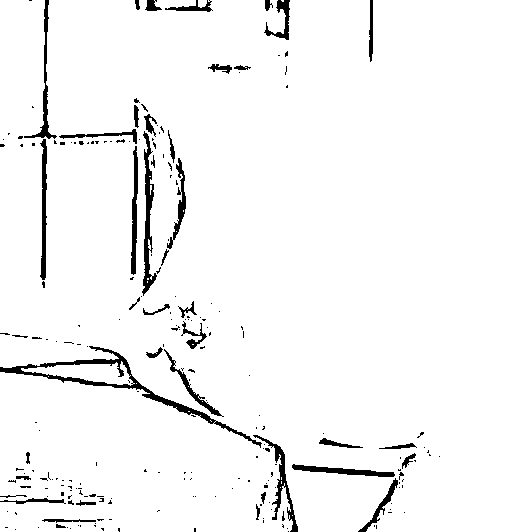

大卫老师**首次商业占星秘籍大披露**，

免费微课招募中。

（报名流程往下看）

与**商业占星**相关的问题想问大卫·瑞雷老师，

**回复在本篇文章的留言区即可。**

作为企业创始人或者管理者，

在职场上以及创业过程中的困惑和谜团，

我们来帮助你。

大卫老师亲自授课，

**全程中文翻译**，

英语零基础也能听呢。

问题标准

①问题实际且走心；

②问题有共鸣（点赞多）；

③问题够独特，或者够深刻；

④（你长的好看）老师看好你。

Duang~福利

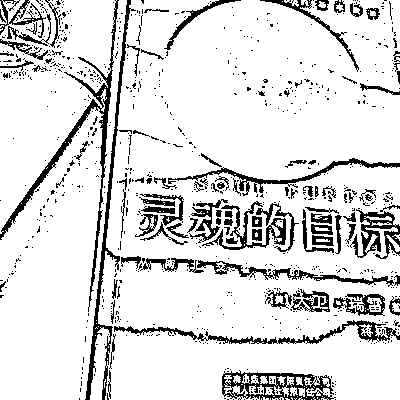

**前三名**精彩问题提问者，

**大卫· 瑞雷老师亲笔签名的《灵魂的目标》**等着你。

（好福利，好羡慕！）

举个栗子

**你可以这样问**

*   很多人想了解自己是否适合创业，请问可以从占星学得到解答吗？

*   你会为新产品上线择时吗？这个很重要吗？

报名微课条件

**满足其一即可。**

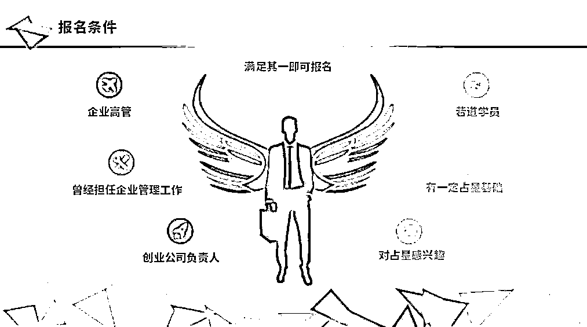 

微课详情

**活 动 时 间**

▼

**2016 年 5 月 25 日**周三

**晚上 8 点-9 点**

**活 动 形 式**

▼

**微信群活动**

45 分钟商业占星访谈

15 分钟互动问答

**怎 样 报 名**

▼

统共分三步

**第一步**

**转发本文**到你的朋友圈

**第二步**

**长按客服二维码**添加为好友

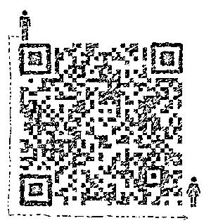 

**第三步**

将朋友圈转发**截图发给客服**

等待被拉入微信群

大卫·瑞雷老师简介


若道创始人，《灵魂的目标》作者。拥有 46 年的占星咨询的执业经验，曾两任亚特兰大占星协会主席，是全美占星师联盟（AFAN）、美国占星师联合会（AFA）、全美占星研究委员会（NCGR）、国际占星研究协会（ISAR）和职业占星师组织（OPA）的成员，是联合占星大会（UAC, United Astrology Conference）督导委员会委员。大卫曾是 CNN、CBS 的占星节目的常驻嘉宾，多次在 BBC、WGS、WSB、WRGG 等节目中接受采访，并在亚特兰大主持电视节目《每日行星（Daily Planets）》达 4 年之久。


**了解企业占星工作坊详情，请戳“阅读原文”**


# 帮助一个企业走向辉煌，也许是你这辈子做的最牛的事

> 原文：[`mp.weixin.qq.com/s?__biz=MzA5NjA0NTAxNg==&mid=2651385000&idx=3&sn=edff6fec7323ec4b46e5cf55c9a6c0ff&chksm=8b4a5e1fbc3dd7092bc0727ff5f3e134737883f5e1d9773c9518686ddb188010aa555d69dc51&scene=126&sessionid=1692738831#rd`](http://mp.weixin.qq.com/s?__biz=MzA5NjA0NTAxNg==&mid=2651385000&idx=3&sn=edff6fec7323ec4b46e5cf55c9a6c0ff&chksm=8b4a5e1fbc3dd7092bc0727ff5f3e134737883f5e1d9773c9518686ddb188010aa555d69dc51&scene=126&sessionid=1692738831#rd)

“

**我的公司，就像我的孩子。** 

”

于我们，

也许仅仅是一个不知名甚至不起眼的品牌，

于创立这家公司的人，

这就是他们的骨肉。

鲁迅先生说：

“这世上本来没有路，

走的人多了，也便成了路。”

企业之路无疑是最艰难却也最辉煌的一条路。

几乎每一个创业成功的企业家，

都可以给你分享一百种往事，

最初的艰辛和一路的困惑迷茫。

那么为什么还有无数人，

前赴后继在这条路上呢？

因为每一个人有一个，

代表事业成就的中天，

我们都**渴望成功**、**渴望不断向上**、**渴望荣光**。

然而，在这条路上，

光有海王式的梦想是远远不够的，

还需要土星式的实际规划、

火星式的热情燃烧，

有时候甚至需要一点木星的幸运加持。

**“谋事在人，成事在天。”**

占星学能够给到一个企业最大的帮助，

除了可以帮助企业主**“谋事”**，

还可以借助**趋势预测**来帮助他们**“成事”**。

运营企业从来都是一件严肃的事情，

就像若道占星，

一直致力于严肃占星学在中国的传播一样。


这是**国内第一次**系统讲解

如何运用**占星学给企业做咨询**的工作坊。

这是一个绝好的机会，

你可以**和大卫老师面对面**，

还有机会在中国的经济中心——**上海**，

**体验海派风情**，

**结交**各行各业成熟的**职业人士**，

同各界热爱占星学的**企业精英**交流，

互相切磋各种经验，

**扩展高层人脉**。

这也是一个**严肃**的席位，

它考验你是否真的有十足的准备，

去面对企业主们，

替他们排忧解难。

因此，

我们对于参与这次工作坊的人群有相对严格的筛选，

同时，也会为大家提供**非常高质量**的授课内容。 

**企业占星工作坊非常适合这些人**

● 本身是**创业者**或者**企业主**；

● 本身是**企业管理者**，或**对于企业管理有一定经验**的占星师；

● 对于没有企业管理经验，但有**鸿鹄之志**，想有一天拿下几十万元以上大单的占星师，也欢迎参加。（请提供足够证明自己能力的依据）

**你将得到如下帮助**

*   **经典案例解析**

*   大卫老师将用自己非常熟悉的经典案例，详细讲述**占星学可以在企业创立、运营、出售等一个完整的企业生命流中可以帮助企业所做的方方面面的事宜**。

*   **企业的创业方向**

*   选择适合的**创业方向**，是创业成功的一个要素；**创始人的个性**也创造出不同的企业，会以不同的方式获得成功，也会遇到因创始人的个性而面临的**独特挑战**。

*   每个企业都有不只一个对企业有意义的星图，企业的星图如个人星图一样，有**故事、机会，挑战，起伏**的周期。如何解读**企业星图**中的秘密？如何解读**企业主星图和企业星图**的关系？

*   **产品和服务的定位**

*   根据创始人及企业星图，**优化产品和服务的定位****。**

*   **人的选择**

*   选对人是每个创业者及管理者最重要的任务，而培养、管理、发展企业员工又是管理者最大的职责。

*   帮助企业主**选择、了解其合伙人****；**

*   帮助企业主**设立关键职位****；**

*   帮助企业主对**中高层人力资源的选择、培养、提拔**，将适合的人用到适合的岗位，**了解员工的优势和各个时期的挑战**，了解**关键人员的个人发展趋势是否符合企业发展趋势****。**

*   **团队建设**

*   帮助企业主与企业关键人员**建立信任**，了解什么是更好的**沟通方式****；**

*   帮助**团队**之间的**沟通和协作**，建立**团队成员的归属感**，帮助团队成员**关系**的融洽。

*   **制定计划，管理趋势和变化，防范风险**

*   占星学善于**预测趋势**，运用占星学，可以提早**了解企业趋势的变化**，进而**制定营销计划、财务计划**，更好管理企业的变化，防范风险。

*   **选择时机**

*   学习**择时占星学基础**，帮助企业的**活动、关键时间选择时间点****。**

*   **帮助占星师了解如何与商业企业建立关系**

*   企业咨询不仅可以获得**企业客户**，还可以因此获得**大量的个人客户**。


**6 月，与你相约上海，**

**我们虚位以待。**


**大卫·瑞雷（David Railey）**

若道创始人，《灵魂的目标》作者。拥有 46 年的占星咨询的执业经验，曾两任亚特兰大占星协会主席，是全美占星师联盟（AFAN）、美国占星师联合会（AFA）、全美占星研究委员会（NCGR）、国际占星研究协会（ISAR）和职业占星师组织（OPA）的成员，是联合占星大会（UAC, United Astrology Conference）督导委员会委员。大卫曾是 CNN、CBS 的占星节目的常驻嘉宾，多次在 BBC、WGS、WSB、WRGG 等节目中接受采访，并在亚特兰大主持电视节目《每日行星（Daily Planets）》达 4 年之久。

**ISAR 选修课程****工作坊信息**

**授课时间：**2016 年 6 月 9 日、6 月 10 日、6 月 11 日（端午节假期）10：00-18：00（午休 2 小时） 共 18 课时

**授课老师：**大卫·瑞雷

**授课方式：**上海现场，英文授课，中文翻译。（具体上课地址课前 10 天请留意查看短信微信通知）

**费用**：****6800 元** （5 月 20 日前报名可享受早鸟价****5800 元****，若道老学员**4800 元**）**

**课程负责人：**熊老师

**微信号：**13761199137，请备注企业占星工作坊报名咨询

长按二维码添加课程负责人咨询


**了解详细课程内容及报名方式，点击文末“阅读原文”**


# 金星进入双子座 | 我想和你一起做点不一样的事

> 原文：[`mp.weixin.qq.com/s?__biz=MzA5NjA0NTAxNg==&mid=2651385000&idx=1&sn=65794941b56a4507aec59cca371652fd&chksm=8b4a5e1fbc3dd70957dfe9a63a8df6fd5cc79596aab316ce90c89f172b612e82adae04023349&scene=126&sessionid=1692738831#rd`](http://mp.weixin.qq.com/s?__biz=MzA5NjA0NTAxNg==&mid=2651385000&idx=1&sn=65794941b56a4507aec59cca371652fd&chksm=8b4a5e1fbc3dd70957dfe9a63a8df6fd5cc79596aab316ce90c89f172b612e82adae04023349&scene=126&sessionid=1692738831#rd)

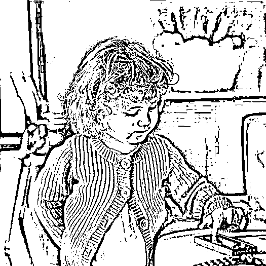
作者/郑炜玲 图片/VCG

金星在 5 月 24 日 17:45 分进入双子座，直至 6 月 18 日离开，在接下来 25 天内我们会通过双子座友善、灵活、善变的模式去感受和表达情感。你可能在社交生活中更加健谈，对新鲜事物充满好奇，也可能借由学习来获得享乐体验，脑子里生出的新奇理念会令你倍感有价值。

## 金星进入双子座会带来的改变

双子座不再像金牛座一样着眼在私欲，执著于拥有，满足于感官。而是走到人群中搜集信息，交流，传输，为着无法满足的好奇心去学习和思考，享受心智的乐趣，玩起思维的游戏。

**金星在双子座令心性流动而开敞，会鼓励我们说出充满爱的，令人愉悦的语言，言谈轻松，幽默，用有趣的方式表达情感。**恋人之间则会更懂得沟通情感，运用语言的艺术，说更多甜言蜜语。

## 金星行进带来的宇宙气象

**金星在持续行进过程中，将精确参与到木土海的Ｔ三角中，将这本已充满张力的时空背景升级为金木土海在变动星座的大十字**。

金海相位**极至浪漫**的潮水，迎上木星的乐观、**扩张**和**土星的限制、收缩感**共同运作，交混变幻的能量会令人陷入**左右摇摆的现实与梦想**激流，在这浪潮中或穿梭，或沉浮，抑或让理智与情感展开一场声势浩大的风云对决。

*   在飘摇不定中你将如何坚定自我价值？

*   被现实制约的大梦会不会在多变的可能性中求得圆满？

*   内心正活跃涌动的创造力如何才能更好地运用到现实当中？

 尤其**个人行星落在变动星座**，或**四轴落于变动星座 10-15 度**的人，在 6 月的第一周你的生活可能像彩云追月一般充满奇妙与变幻，打开你灵巧的双手去承接这份宇宙礼物吧。

在 6 月中旬，**金星**离开变动星座大十字以后，又将与**行进在白羊座的天王星**形成**六分相**。**独立，革新的意识**会给金星带来焕然一新的机会。

*   是突如其来的财富增值？

*   还是情感的剧烈波动？

*   一场令人兴奋、惊喜的邂逅？ 

你期待的是什么呢？不过天王星总是带来出奇难料的状况，如果我们在内心生出突破革新的意识，则会令自己在更大的宇宙力量中把握更多主动权。

## 来学习一点关于金星的知识吧

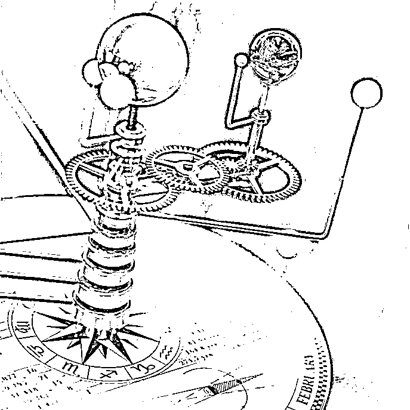

金星进入爱学习的双子座，非常适宜来学习一点关于金星的知识。

**金星和月亮一样是阴性行星，代表我们内在的女性面向，如果说每个人生来都是孤单而残缺的，那金星就是那颗能带我们找到另一半令自己完满的行星**。

**在男性星图中，金星往往代表着他所喜爱、渴求的伴侣的形象，他们会将金星能量投射给身边的女性，而女性星图里的金星则更代表自己的情感取向与价值观。**

与金星有关的除了情爱，还有我们所**喜爱和欣赏的一切美好事物，关系，财富与价值感**——它也预示着人生最难也最迷人的功课，每个人都会为金星的魅力迷恋眩晕，欲罢不能，甚至沉迷坠落。

**一些关于金星的冷知识** 

*   金星与太阳系中大多数行星自转的方式不一样，它是自东向西旋转的。

*   太阳系里的行星轨道大多是椭圆的，而金星的轨道是最接近圆形的。

*   铜是与金星有关的金属。

*   与金星有关的泛音数字是 5。

*   英语、法语和日语里的星期都由行星的名字而来，其中星期五的词都是金星日，法文：Vendredi（女神 Venus），日文：金曜日，英文：Friday(北欧神话中的 Freya)。

## 金星在双子座最适宜做的事情

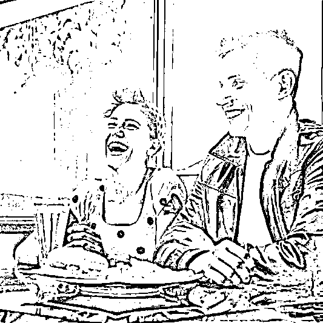

*   爱上**学习**，无论是什么，只要是**新鲜，没尝试过**的知识都可以去接触。当然和**语言有关**的学习是最适宜不过了。 

*   学习**肢体语言**的表达，尤其是**手语，手势**，这在生活中会显得别有乐趣。 

*   **短期游学**，享受轻松学习的乐趣。 

*   **装扮爱车**，如果你希望它更靓一点，可以改装一下外观让它看上去更炫酷。当然，也可以是买车，包括玩具车。 

*   学习**化妆，造型**，扮靓自己，尤其是做**美甲和手部护理**，让你的双手变得更灵动、美丽。 

*   **买书**季，如果遇到大折扣的话，一定不要错过了。 

*   参加一些**新奇的社交活动**，可以结交不同的朋友。 

*   购买、流通**时尚用品**，**艺术品**的好时机，如果你正在从事此行业的话，可以好好努力一把了。 

*   **赞美他人**是语言的施予。 

*   双子座与买卖有关，此时**为你的爱人买一件爱的信物**，TA 一定会很喜欢。 

*   **学会说情话**，令爱情加温，天下的爱人都喜欢甜言蜜语。

## 那些金星在双子座的人是什么样的呢？

*   双子座是友善，开朗，灵活的，金星在双子座的人就**拥有非凡的社交手腕，能说会道，长袖善舞，在社交场合充满机智的对谈，能灵活的表情达意。** 

*   他们拥有**极高的语言才华**，或是有副**迷人的嗓子**。 

*   他们**注重精神性，文化层面的情感交融，喜欢谈论的话题多变、广泛，也喜欢结交不同类型的朋友来满足善变的口味，但还是喜欢与思维活跃，多才多艺的人交往**。 

*   **自我价值感**依赖于对自己**智性，理念的满足**，他们希望**因智慧而被他人赏识**，喜欢他人**赞赏自己的聪明才智**。 

*   他们**邮件，短信，微信传情达意**，也**喜欢写日记**，**在微博，朋友圈表达自己的情感与思**想，有不少人也是**通过写作赚钱**。 

*   **通情达理，头脑清晰的异性**比较受他们**青睐**。 

*   喜欢玩**五子棋，猜字**这样的**智力游戏**。 

*   爱**讲故事，听故事**，也是**八卦高手**。 

*   对**手足之情颇为看重**或是**与伴侣情同手足**。 

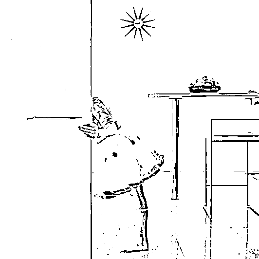

*   因为双子座的**天真和好奇**，金星双子座的人也会**很喜欢孩子**。 

*   双子座对应着**手部**，金星双子座的人往往拥有一双**漂亮的手**，女性常常是**在意手部保养**，喜欢**美甲**，喜欢用**戒指，手链，手串，手镯**来美化双手。金星双子座的男性尤其**喜欢欣赏女性的手**。他们也**喜欢被恋人触摸的感觉**。 

*   在关系中**擅长甜言蜜语**，但也**容易招蜂引蝶**，因双子的**善变**，总是在感情中**浅尝辄止**，喜欢在情感世界里**探寻新奇体验**。对深层的关系**缺少耐心和专注力**。 

*   出于友善，**就算分手也愿意和对方做朋友**。

## 金星在双子座的人有什么弱点

*   只**擅长说**而**不是做**。 

*   **持久性弱**，**变动性强**，常常带给人**轻佻**的感觉。 

*   太喜欢思考，太喜欢说话，**大脑很难放空**，容易**耗尽精力**，非常需要**放松神经**，允许自己疲惫，休息。 

*   喜新厌旧，薄情不忠，肤浅善变，**劈腿或是容易吸引劈腿的伴侣**。 

*   喜欢买书，却**不一定看**。 

*   花言巧语，**害怕承诺**。 

*   **信息焦虑**，手机不离手症。 

*   太过好奇，对于新奇事物挖掘试探，有时会**触碰他人的底线**。

## 金星在双子座的人可以这样调整

*   常常变换胃口就不能深入在一个领域之中，要向天蝎座学习**让自己的生命经验深刻起来，向射手座学习深究学术，摆脱泛泛而论，融合，总结出自己的观点，传达更高的信念与智慧**。 

*   总是滔滔不绝而忘记聆听，要**学习优雅的天秤座，用聆听创造更美妙稳定的关系**。

## 金星在双子座的大咖们

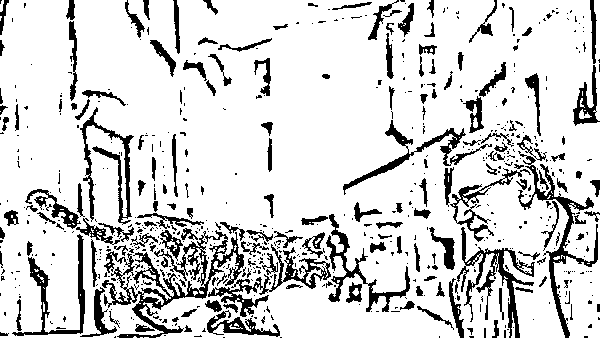

****▲ 土尔其最著名的小说家——奥尔罕·帕慕克****

帕慕克是 2006 年诺贝尔文学奖得主，他的太阳、水星和金星合相在双子座，金星与土星三分，他的文字灵动而富有现实质感，作品视角多变，包罗万象。尤其是《我的名字叫红》是以一位说书人的口吻叙述繁杂罗织又充满悬疑与哲思的故事，帕慕克用非凡的语言神功抓住无数读者的心，这本书成为了很多人向往伊斯坦布尔的第一个也是唯一的理由。

只要爱人的面容铭刻于心，世界就还是你的家。

当你热爱一座城市并且时常漫步探索其间时，不仅你的灵魂，就连你的身体，也会对这些街道极为熟悉，以至于多年之后，在一股或许因为忧伤飘落的轻雪所引起的哀愁情绪中，你的腿会自动带着你来到最喜爱的一个山丘。

——《我的名字叫红》

每次看见她的笑容，一种无法抗拒的幸福感和乐观情绪，依然会用同样的力量在我心里像向日葵那样一下绽放开来，一种从她的美丽、她那些让我感觉非常亲近的动作和肌肤散发出来的光芒，在告诉我，那个我应该去的世界中心就是她的身旁。

——《纯真博物馆》

所有真正的文学，都源于这种童真的，盛满希望的信念，即人人彼此相似。一个作家持续多年将自己关在屋中，他正是以这样的姿态来暗指那单一的人性，一个不设置中心的世界。

——《别样的色彩》

写作，就是要将凝视内心的眼光化为语言，去控索一个幽居独处时所进入的那个世界。

——《别样的色彩》

许多人相信，没有注定的人生，所有的事基本上是一连串的巧合。然而，即使抱持如是信念的人也会有这样的结论，在生命中的某一段时期，当他们们回头审视，发现多年来被视为巧合的事，其实是不可避免的。

——《白色城堡》

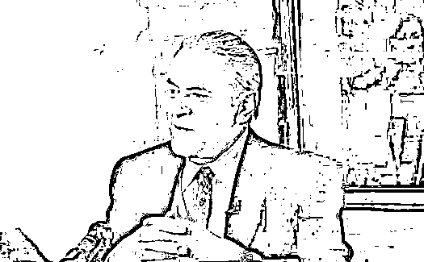

******▲ ************全息呼吸创始人——斯坦尼斯拉夫·格罗夫 ******

格罗夫博士的金星在双子座合相了下降点，作为精神病学家他常年和妻子克丽丝汀娜一起工作，并共同创立了全息呼吸，合著了《灵性紧急状态》等多本书籍。同时他总是和不同领域的专家学者有合作，包括西方禅修大师杰克·康菲尔德，原型占星创始人理查德·塔纳斯，致幻药剂发明者荷夫曼博士，画家 Giger，神话学家约瑟夫坎贝尔。

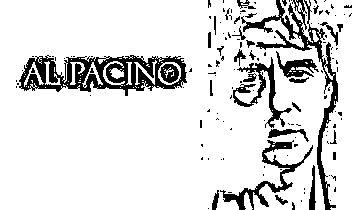

******▲ ************奥斯卡和金球奖双料影帝——阿尔·帕西洛******

金星双子座的他自幼喜欢戏剧表演，《闻香识女人》是他最有魅力的代表作，他在影片中扮演一位双目失明的退伍老兵，却拥有超人的听觉与嗅觉，能从女人用的香水辨识她们的身高，发色，身材，眼睛的颜色，这一切源于他对生活的体验与内化的感知。

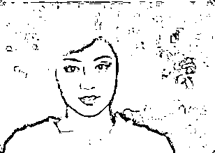

********▲ 香港影星翁美玲********

伶牙利齿的俏黄蓉，香消玉殒 30 年后也无人能撼动她在 70,80 后心中的地位。

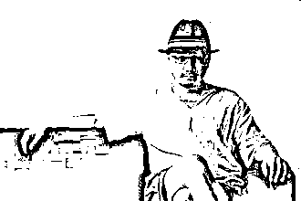

********  ▲ 实力派演员兼导演徐峥********

从扮演会说甜言蜜语的“猪哥哥”到执导亿元票房的大导演。

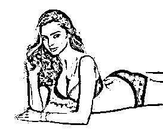

********▲ 米兰达·可儿********

最甜美的维秘天使，33 岁“高龄”依然不失清新，自然的活力，是“孩童国际”组织的积极支持者，通过“孩童帮助热线”在澳大利亚为孩子们提供咨询帮助。


**作者简介**

**郑玮玲（Sampriya）：**若道 COAC 高阶资质认证，国际占星研究协会 ISAR 会员，在若道跟随多名国际知名占星师学习占星。馨光爱妈妈会创始人，国内首批 ICEA 国际生育教育协会产后指导，国际母乳会培训的哺乳互助指导。

**个人公众号及咨询预约**：Sampriya-Astrology 

长按二维码，让金钱涌向传播知识与智慧的人~


**特别提醒：**

**本文由作者授权首发于若道平台，**

**转载请联系后台授权。**


**想了解更多关于行星的知识？若道核心课程 Level 1-5 连报适合你。**

**报名及咨询，请点击文末“阅读原文”**


# 射手座满月丨行动！实践你的真理！

> 原文：[`mp.weixin.qq.com/s?__biz=MzA5NjA0NTAxNg==&mid=2651384999&idx=1&sn=85a8c40fde72246a29b7caaa0c308139&chksm=8b4a5e10bc3dd706111b34c93f10a443d9fc7046f2f53ea7cb2fc159642a82031105e7acc9b3&scene=126&sessionid=1692738831#rd`](http://mp.weixin.qq.com/s?__biz=MzA5NjA0NTAxNg==&mid=2651384999&idx=1&sn=85a8c40fde72246a29b7caaa0c308139&chksm=8b4a5e10bc3dd706111b34c93f10a443d9fc7046f2f53ea7cb2fc159642a82031105e7acc9b3&scene=126&sessionid=1692738831#rd)

作者/Cora ISAR 认证占星师

图片/VCG

**射手座满月**

本次射手座满月发生在 2016 年 5 月 22 日早上 05:14，月亮在射手座 1 度 13 分，对分双子座的太阳。

**射手座满月的意涵**

**射手座代表对真理和意义的探寻，这个星座教导我们超越表象去看到事物背后的原理和法则，以及为了奔向更高的真理而必须要经历的——冒险**。射手座满月带来的最明显的影响，便是“**智慧的启迪**”。

在满月前后的两三天里，如果我们能够对自己保持诚实，我们将有机会了解到更为深刻丰富、能为我们带来更多自由的，生活的真相。

**本次满月值得关注的**

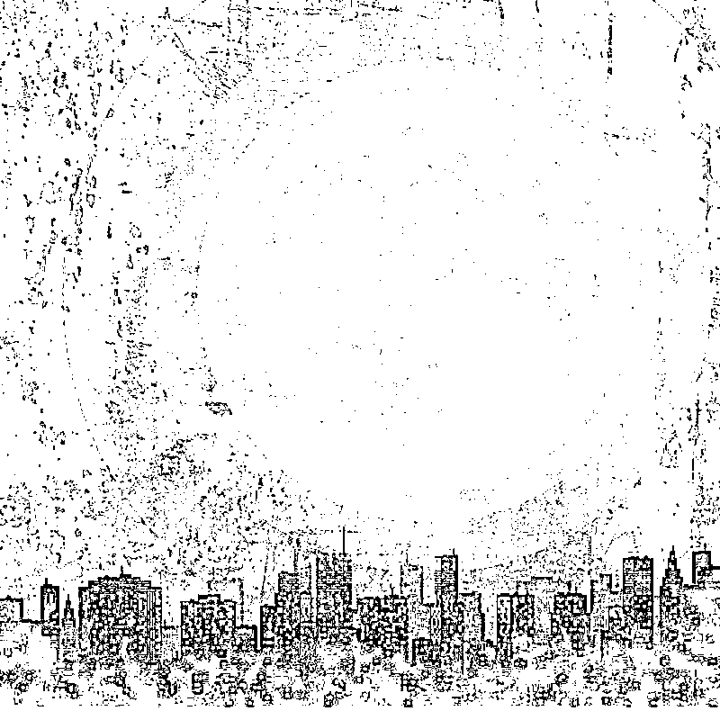

本次射手座满月值得关注的特殊之处有：

○ **满月（月亮）合相火星**

○ **满月发生在星座的初始度数**

○ **与满月同天发生的是，****水星恢复顺行**

○ **射手座的守护星木星，与土星、海王星形成“T 三角”，与水星、冥王星形成“大三角”**

**满月通常暗示事情走到“顶点”或“尽头”，是“爆发”或“结束”的时刻。**

这样的解读对本次满月依然适用，不过要注意到，这次满月发生在射手座初度，并与具有开创意味的火星在 1 度内紧密合相，这暗示，**本次满月将带来一个“开始”，而这个开始，是经由对所经历事件的“更高意义和背后法则”的理解而来。**

**你会体验到的**

**转变**

满月发生在射手座 1 度，也意味着，就在一天前，太阳变更了星座，从金牛座来到双子座。

这意味着**我们能够以更加客观理性的态度，来面对生活中的混乱和躁动——我们愿意去观察、思考、问问题，并变通行事**（双子座），而不是固着在自己的习惯和安全需要上，死抓着那些必然要失去或改变的东西不放（金牛座的负面表达）。

而紧接着太阳的换座，月亮也变换星座，来到与太阳对分的位置，形成满月。相当于给这个刚刚发生的变化，又增加了一份“推动力”，令一次“**突然的意识飞跃**”成为可能。

**乐观**

半个月前，几乎与金牛座新月同时，[木星恢复顺行，结束了“五星逆行”的局面](http://mp.weixin.qq.com/s?__biz=MzA5NjA0NTAxNg==&mid=2651384759&idx=1&sn=7edc692de7be9cdf94a2630b507d34a5&scene=21#wechat_redirect)（点击可阅读）。**木星的顺行，某种意义上为我们迎接射手座满月的“意识进化”提供了准备和支持**，因为木星是射手座的守护星。

木星顺行（5 月 9 日）以来的这十几天里，很多人已经能够感受到**视野的打开、视角的提升，对事物发展背后的原理和模式有更多理解，以及由这份理解带来的自由**。木星的顺行，为我们接受射手座满月的“智慧注入”奠定了某种“心理基础”，让我们愿意以更加乐观、敞开的态度去面对未知与未来。

**价值**

**在本次射手座满月的同一天，水星也会恢复顺行。满月当天，水星停滞，此时也是水逆影响最强烈的时段。**水星在金牛座逆行期间，我们对于“**价值**”和“**（物质）安全感**”问题都有了一些新的思考和梳理。

具体的是：

○什么是真正有价值的？

○什么值得，什么不值得？

○如何在物质世界站稳脚跟？

○如何获得真正稳定持久的、内心的宁静？

**对于这些问题的考量，将在射手座满月期间，迎来一次“彻底的回答”**。没有终极的真理，也没有绝对正确的答案，但是，在人生的每个阶段，我们总要**“给自己”一些原则性的结论以指导生活。**

**射手座满月和水星恢复顺行同时发生**，暗示本次满月预示的“**爆炸性的启迪**”，或许能够解答水星在逆行期间提出的问题。这是利用本次射手座满月的能量去进行智慧与意识的提升的又一角度。

**你需要面对的**

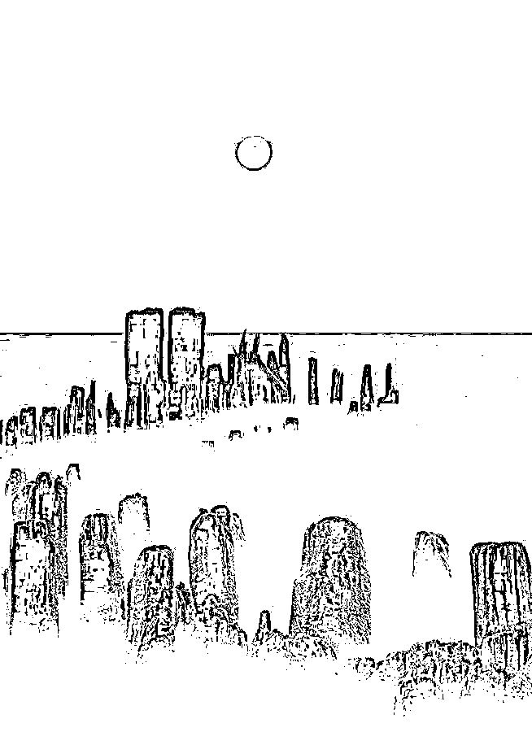

除此之外，本次射手座满月发生之时，射手座的守护星——木星，参与到了天空中的两幅重要的“行星画卷”中：

**●****木星准确四分土星，对分海王星，形成变动星座的“T 三角”；**

**●木星准确三分水星，三分冥王星，形成土象星座的“大三角”。**

前者说明，**我们仍需面对“理想与现实的差距”，在“眼前的苟且”与“诗和远方”之间，找到一种可持续的动态平衡**。后者则描绘了一幅较为乐观的图景，也是给出了一个应对困惑和混乱的“解决之道”，那便是：**对真相和实相彻底的坚守。**

最后，我想回到与满月合相的这颗火星上，给出一个或许是**最重要的提醒**。

> 我们唯有拿出自己的勇气、意志和力量，去实实在在地行动，才有可能接收到宇宙对我们的“嘉奖”——或者去打赢我们注定要面对的那场战役。无论如何，**是我们的行动和选择，决定了事件的结果和人生的走向。**

**突出的火星主题参与到充满智慧光辉的射手座满月中来，似乎是在告诫我们“行胜于言”的重要性**。毕竟这世上有太多“思想上的巨人，行动上的矮子”。

用你的臂力去拉开那张弓，这就是你实践属于你的**真理的时刻**！

**作者简介**

**占星师 Cora**，全美占星师联盟（AFAN）成员，国际占星研究协会（ISAR）会员，获 ISAR 职业占星师资质认证，斯蒂芬·弗里斯特《变幻的天空》译者，个人星象文章见诸《心探索》《北京青年周刊》《上海电视》《空中生活》等杂志媒体。曾在若道系统学习占星学，现为全职占星师。

**微信公众号**：聆宇 FM（ID：lingyudiantai）

**个人微信号**：CoraAstro

长按二维码，让金钱涌向传播知识与智慧的人~

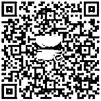 

**特别提醒：**

**本文由作者授权首发于若道平台，**

**转载请联系后台授权。**


**想了解如何运用行运顺势而为？若道核心课程 Level 1-5 连报适合你。**

**报名及咨询，请点击文末“阅读原文”**


# 高阶的“性”是一种怎样的体验？

> 原文：[`mp.weixin.qq.com/s?__biz=MzA5NjA0NTAxNg==&mid=2651384999&idx=2&sn=578a1fb6442e3cb2cd7b8a14d16655e7&chksm=8b4a5e10bc3dd706a773fadd806b5057b0601a83729e341d3d541ccda094b90f78f5a0e03187&scene=126&sessionid=1692738831#rd`](http://mp.weixin.qq.com/s?__biz=MzA5NjA0NTAxNg==&mid=2651384999&idx=2&sn=578a1fb6442e3cb2cd7b8a14d16655e7&chksm=8b4a5e10bc3dd706a773fadd806b5057b0601a83729e341d3d541ccda094b90f78f5a0e03187&scene=126&sessionid=1692738831#rd)

作者/Crystal 图片/VCG

沉溺于短暂肤浅的身体欢愉并不是个长久之计，对于高等动物的人来说，过于沉溺还有可能抑郁。那么，爱可以有觉知，性应该也是可以的吧？

## 射手座满月，我们来一起挖掘“性”

5 月 20 日又要满月啦，这次满月发生在射手座。射手座的能量意味着不断扩张边界、探索新事物、追问最深的意义、为了灵魂的最高使命勇敢冒险。

金牛月的射手座满月，不妨让我们谈谈性的更深意义。

人类是唯一全年 365 天都可以有性趣的动物。如果只为了繁殖后代，好像不需要这么卖力吧？

如果除了繁殖后代，只用性来获取短暂肤浅、过后还可能觉得抑郁的身体欢愉，虽然没有什么“不对”（自由意志是这个宇宙的核心规则），但如果你也有很强大的射手能量、喜欢追寻事物的最深意义，可能觉得，唔，好像有点浪费。

我曾经在一次非常深刻的体验中，真正认识到，性是一个奇迹。那时候我突然明白了为什么人类要做爱。我们的本质是纯粹的意识，能够显化在三维世界，拥有一个物质身体，是一件多么神奇的事啊，我们可以用多么实在可见的方式来表达爱啊——牵手，拥抱，亲吻，做爱！那么强烈的爱，非最激烈的身体碰撞不足以表达。

我相信**有觉知的性是一扇回家的门**。那稍纵即逝的愉悦，只是一个吸引我们伸手推门的糖果。只是有人还没有准备好推门回家，所以只是在门外不断地吃糖。

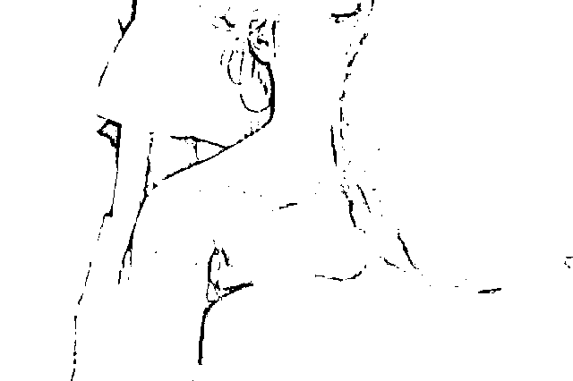

## 性既不肮脏，也不低级

去年夏天，我给一位著名的美国占星师做个案翻译，每当他看到月亮天蝎座、火星八宫之类的星图配置，都会提到这**可能意味着在关系里过度看重身体吸引的倾向，却忽略了更深刻的爱的连结。**

这时候，月亮合冥王星在天蝎座，火星在八宫的翻译就默默地在心里想“唔，是吗？”

致力于整合爱与性并没有问题，但这个灵肉合一的渴望时常被扭曲和误用，导致人们，尤其是女性，将性视为肮脏、可耻、低级之事。如果没有一起接纳两样东西，又何谈整合二者，让它们融合、开花、创造奇迹呢？

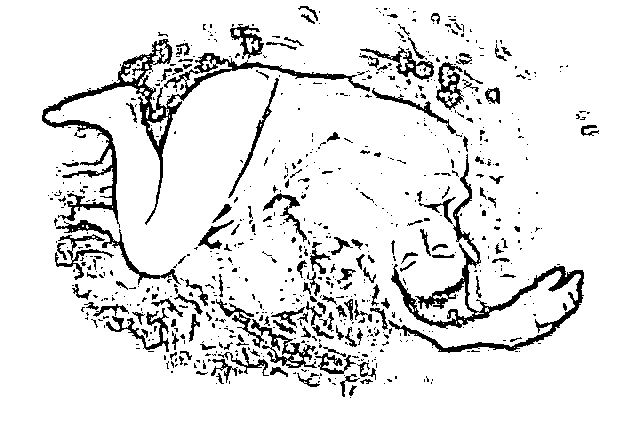 

## 羞耻：你的内在小孩在恐惧什么？

羞耻感或许是人类唯一后天习得的感受。孩子自然而然地就会伤心、快乐、兴奋、害怕、生气……而羞耻，并非一种自然的情感，或许是人类社会在某个发展阶段中制造出来的管理控制手段。

几天前若道有一篇文章谈到了[内疚](http://mp.weixin.qq.com/s?__biz=MzA5NjA0NTAxNg==&mid=2651384921&idx=1&sn=704c154e5562a1dcc12fbfc7e29d56bc&scene=21#wechat_redirect)（点击可阅读）。羞耻和内疚是不同的——内疚让人想做些事去弥补，而羞耻是对自己的存在感到羞耻，只想找个地缝把自己藏起来，它对生命力的破坏性比内疚还要大。

许多人深信羞耻和内疚是必要的，然而，他们认为羞耻和内疚能够做到的事，**爱和尊重可以做得更好**。

比如说，“我不能对这个人表现出性欲，因为我很可能会被拒绝，那将让我觉得很羞耻”。这是一种出于恐惧的对性能量的压抑。这种压抑会不断在身心积累紧张，让生命越发收缩枯萎；

而“我对这个人有性欲，我接纳这个欲望，至于要不要表达，则视具体情境而定。我可以坦然地表达，但完全尊重对方的自由意志，不给对方施加任何压力，我尊重个体的自由意志，没有人欠我性，我也不欠别人性”。则是能量的顺畅流动。

## 性本身不可耻，重要的事情说三遍

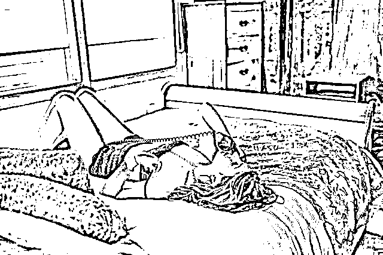

我遇到过一些心智足够成熟的人，可以大大方方地表达欲望，也非常尊重我的意愿，面对他们，我并不觉得被威胁，而他们如果被拒绝了，也不会觉得羞耻。

我认为，**在性的世界里，尊重比羞耻好用得多**。

**性本身并不可耻，跟性有关的种种侵犯、压迫、羞辱、操控、苦难、悲剧……原因在于缺乏爱与尊重，不是性的错。**

性本身并不可耻。性本身并不可耻。性本身并不可耻。重要的事情说三遍。

释放羞耻感，是让性能量全然绽放、接通天地的第一步。这一步完成之后，想再往前走，宇宙充满了各种各样的资源供你取用。一旦意图清晰，生命里有无数条回家的路。

祝你性福。

**作者简介**

**Crystal**，略懂占星，超越占星，是一条爱与奇迹的管道。

**微信公众号**：Crystal 的奇迹山谷（ID：CMiracle_7） 

长按二维码，让金钱涌向传播知识与智慧的人~ 

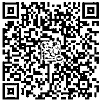 

**特别提醒：**

**本文由作者授权首发于若道平台，**

**转载请联系后台授权。**


**你知道吗，羞耻也是阴影面的一种。想了解更多关于星图的阴影面吗？2016 年 7 月 8 日-10 日，杰西卡·卡巴拉老师主讲的原型占星进阶工作坊：如何与客户阴影面工作要开课了！教你如何帮助客户减少痛苦，减少关系和生活中所经历的障碍。敬请期待！**


# 行星 | 残酷的是，要想活出太阳能量，你必须与妈妈分离

> 原文：[`mp.weixin.qq.com/s?__biz=MzA5NjA0NTAxNg==&mid=2651384984&idx=1&sn=13c27b705db17c59a873eb7b1869b1c7&chksm=8b4a5e2fbc3dd73979fabfca19c7593929fc82eae67ded6ac56e1f15215dcd49fab9fd74b9b4&scene=126&sessionid=1692738831#rd`](http://mp.weixin.qq.com/s?__biz=MzA5NjA0NTAxNg==&mid=2651384984&idx=1&sn=13c27b705db17c59a873eb7b1869b1c7&chksm=8b4a5e2fbc3dd73979fabfca19c7593929fc82eae67ded6ac56e1f15215dcd49fab9fd74b9b4&scene=126&sessionid=1692738831#rd)

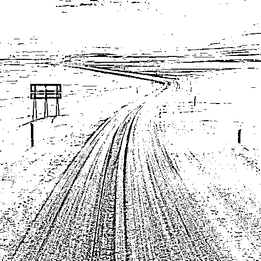 作者/Persephone Peng  ISAR 认证占星师  

图片/VCG

上篇文章里和大家聊了[太阳的重要性](http://mp.weixin.qq.com/s?__biz=MzA5NjA0NTAxNg==&mid=2651384960&idx=1&sn=f4f6b84ed8760df5e1503464c805575d&scene=21#wechat_redirect)（点击链接阅读），那么该如何才能踏上寻找太阳能量之旅呢？这个旅程中会遇到什么，又会得到怎样奇妙的体验呢？这篇文章给你解答。

## 离开母亲，为自己出征

在古苏美神话中，世间最初还是一片混沌未明的海洋，海洋母亲 Primal mother 不允许自己的孩子独立，她把他们都吞回了自己的肚子里。其中有一个孩子，他不甘于永远生活在母亲的子宫里，他需要被诞生。他就是 Solar God 太阳神 Marduk，于是，他在母亲肚子里把母亲切开成了两半，从此以后，世间才有了天与地，有了人类存在的空间。

**我们每一个人去成为太阳的路途上，都需要经历一个心理过程——弑母**。我们必须先完成自己星图中“月亮”的功课，月亮是渴望融为一体的，它要的是安全感、归属感和亲密感，也是我们与母亲和养育者最深的连结，家族中潜在的业力模式。

可是，要去成为太阳，就要先切断与母亲的脐带，分离父亲的期望，脱离父母的保护，走出家族的限制，处理家族历代的业力模式。你会发现，所有英雄故事的开端，英雄们都会要离开母亲，甚至是灰姑娘、白雪公主、冰雪皇后等等女性找到自己之前母亲也会先死去。

为什么好莱坞的那些英雄式的电影那么吸引大众？男性渴望成为他们，女性渴望拥有他们，即便故事情节几乎大同小异，却还是票房大卖。因为在那些英雄身上，我们看到了一颗熊熊燃烧、光芒四射的太阳。这些电影里没有哪一个英雄是父母安排的人生，也没有哪个钢铁侠、蜘蛛侠、美国队长是在父母的陪同下去成为英雄的。

每一个人成为英雄的旅程的最初，都需要与母亲分离，只有这样，我们才可以诞生一个“自我”，才可以从心理上独立和成长。太依赖母亲和家庭，无论是情感、物质、精神、价值观都依附在原生家庭上的话，当我们受到家庭“保护”的同时，也限制了自己的人生，我们永远都只可能成为家庭的附属品，永远不可能去成为自己的太阳。

**在寻找太阳这条路上，我们必须要经历一个“独自”的过程**。所有英雄的出征，都会有一段一个人上路，**没有人在他旁边理解他、陪伴他、支持他，他需要自己去探索、去寻找、去相信自己的直觉**。

如同《奇幻森林》中的男孩，在他离开养育了他多年的狼群之后，与黑豹也走散，他只有一个人去往丛林的深处。这是他出生以来，第一次一个人在不知道何处是尽头、何处有危险的丛林中冒险。

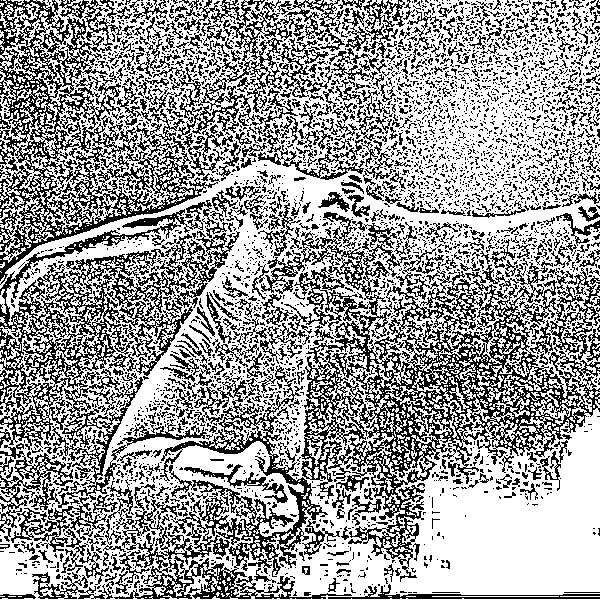

## 成为英雄的旅途上需要“屠龙”

没有哪个英雄的故事是一帆风顺的，一定会经历失败，甚至失败很多次。没有失败过的成功，那一定不是太阳之旅。

**成为英雄的路上，有一个很经典的象征——屠龙**。**龙是蜿蜒盘曲的，就像是与母亲相连的脐带，父亲的生殖器，我们需要有勇气砍断它，我们需要面对与原生家庭分离的罪恶感和焦虑。**

这绝对不是一件容易的事，对于一个孩子来说，最害怕就是对父母意愿的背叛。如果父母亲本身有活出自己的太阳能量，那么当他们面对孩子的独立和成长时，就会比较好的选择放手并且给予理解和支持。

《奇幻森林》中的男孩在离开狼群的时候，狼妈妈也曾经不想让男孩离开自己，害怕他受到伤害，可是当男孩勇敢的说出“我会离开”的时候，并且跪下和狼妈妈道别时，狼妈妈也勇敢的选择了放手。

在炼金术中，我们需要经历很多道程序才能把铅变成黄金，**太阳就是我们星图中的黄金。土星、天王星、海王星、冥王星、凯龙星都会是我们的挑战，是来帮助我们炼出黄金的材料**。

**太阳需要土星的否定和打压、时间的磨炼；需要冥王星的毁灭与重生；需要天王星的破坏和分裂；需要海王星的迷茫与诱惑；需要凯龙的伤口**。

那个男孩，一路上经历了老虎的追杀、泥石流里死里逃生、蟒蛇的诱惑、被蜜蜂蜇得满身是包、大猩猩的绑架，如果没有这些困难，我们一定不会觉得这趟丛林之旅有多么奇幻、多么吸引。

**就像没有漫漫长夜，我们不会觉得太阳有什么可贵；没有经历过挫折与险境，我们不会觉得成为一个英雄有什么好值得敬佩和崇拜。**之所以，英雄不是每一个人都可以成为的，太阳也不是每一个人都可以去达到的，就是因为一路上的艰难险阻、挑战诱惑，我们需要太多的勇气、勇气、勇气去战胜和克服。

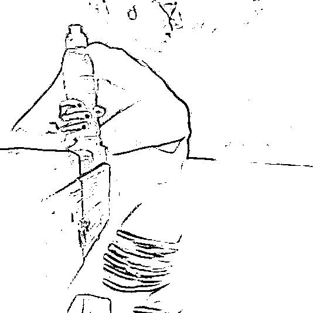

## 只要走上这条路，就一定会遇到贵人

虽然一路上男孩遇到很多挑战，但最危急的时候都会出现贵人来帮助他，第一次被老虎追杀的时候，是黑豹帮他引开了老虎，为他的逃跑拖延了时间；遇到泥石流的时候，正好遇到了犀牛的迁徙，让他巧妙地躲过了一劫；被蟒蛇诱惑，失去意识，陷入昏迷时，是大熊吓退了蟒蛇，解救了他；被大猩猩绑架时，黑豹和大熊愿意费很大力气合力去救他。

为什么这个幸运的男孩总是在危险的关头，就会有人来帮助他？

因为**当我们勇敢的面对生命给我们的考验，就像在星图中，踏实地去做土星、三王星、凯龙星的功课时，我们会发现最初它们给我们的困难逐渐地都成了我们生命中的助力。**

**土星会建立我们内在的成熟和自律，冥王星会赠予我们生命的韧度和力量，天王星会开启我们的创新和进步，海王星会为我们散发爱和魅力，凯龙星会连结我们的同理心以及疗愈的本能。**

只有当我们踏上“真我”道路，活在太阳的中心点，身上那种特别的磁力和气场，才会吸引到这些礼物、这些贵人来到我们身旁。而且可以肯定的是，每一趟注定要走的太阳之旅，都会按剧本出现那些注定会出场的人事物。

## 实现自我之后才能获得永恒的喜悦

可能我们今天吃了一餐美食、买了一件漂亮衣服、看了一集有趣的节目就会觉得很快乐，可是转瞬间当面对增加的体重、缩水的钱包、节目结束的时候，我们的快乐就消失了。

人生总会充满着很多压力和挑战、痛苦和悲伤，这些会阻止快乐，但是却阻止不了我们去感受喜悦。快乐是短暂的，而喜悦是长久的。

**喜悦不是靠外在的拥有而获得，而是透过内在不断突破限制、发挥潜能来获得。**每一次超越困境，虽然会感到很累很苦，但也一定会感到一种内在的满足。只有当一个人活出自己的太阳能量，才会不断地前进，不断地挑战和突破自我，一次又一次的实现自己的可能性。

闪闪发光的“钻石”和“黄金”象征着星图中的太阳，钻石和黄金之所以可贵，因为它们是永恒的，是永远不会变质、不会腐烂的。

**如果我们练就了生命中的黄金，就能获得永恒的喜悦，这种自我实现的满足感是多少外在物质的回馈都比拟不了的。**

太阳之旅是没有尽头的，只要拥有太阳，我们就不需要和任何人比较，不需要别人来告诉我们“你是谁”，我们清楚的知道“我就是我”，直到我们老去，依旧可以很有热情地去活着生命的每一天。

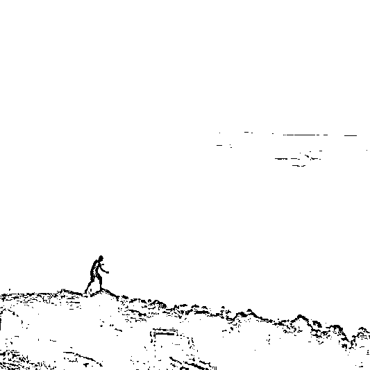

## 用你的太阳能量服务于大众

太阳所代表的我们的天赋才华都是我们一诞生就拥有的，当我们能够使用自己的才华实现自我时，一定要记得感恩这些上天赠与自己的礼物，而不是自满骄傲。我们每一个人都具有神性，但是我们并不是神；我们每一个人都是独特的，但是我们也没有什么了不起。

太阳是守护狮子座的，在狮子座原型神话中，帕西法尔在追寻圣杯、拯救老国王的过程中，第一次圣杯的画面出现在他眼前时，他没有问对正确的问题，圣杯就消失了。那时的他还是一个没有同理心、不懂得爱的骑士，对母亲的麻木不仁、为了炫耀而杀人、狠心的抛弃女人，经历了很多的历练和困难后，帕西法尔才懂得要有慈悲心、爱和怜悯，戒除了自满和骄傲。

圣杯再一次出现时，他问了正确的问题——“**圣杯是为谁而服务？**”这一次，老国王立刻恢复了健康，而他也成为了新国王。

《奇幻森林》中，最初的丛林之王老虎可汗是如何走向灭亡的，而男孩又是如何成为新的丛林领导者的，不同结局的关键在于当我们发挥了自己的才华和天分，获得一些成功之后，这些收获的果实只是给自己还是为给大家。

太阳可以照亮他人温暖世间，是它在源源不断的燃烧着自己，男孩可以最终赢得所有动物的尊重和支持是因为他愿意付出自己的生命为狼群、为象群、为所有的动物服务。

**太阳的强势发挥的位置是在狮子座、白羊座，而这两个星座的面对星座是水瓶座和天秤座，其实看上去相反的东西都是一体两面。**水瓶座是关于群体的，天秤座是考量他人的，如果没有群众和他人，“领导”和“我”也是不存在的。我们终究要把自己的太阳能量贡献出来，为群体服务。

**作者介绍**


**Persephone Peng**：ISAR（国际占星协会）资质认证职业占星师（CAP）。中学时代开始研习占星，以心理占星见长，涉猎不同门派的占星学，跟随多名国际大师系统学习占星学。 现将占星学作为一种觉察疗愈工具与个人成长相结合，帮助个案实现自助疗愈。

**微信公众号**：Persephone 占星与个人成长工作室（ID：PPPAASHS）

**咨询微信号**：persephone_p

长按二维码，让金钱涌向传播知识与智慧的人~ 

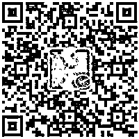 

**特别提醒：**

**本文首发于若道平台，**

**转载请联系后台授权。**


**想了解更多关于行星的知识？若道核心课程 Level 1-5 连报适合你。**

**报名及咨询，请点击文末“阅读原文”**


# 小白学占星 | 太阳进入双子座，成熟未满

> 原文：[`mp.weixin.qq.com/s?__biz=MzA5NjA0NTAxNg==&mid=2651384984&idx=2&sn=f2fd99f40e752a3303923fb2c0faa98b&chksm=8b4a5e2fbc3dd7395673fb846c296f40a00d1aff7353d7e15a463e081f438173b82927e169e4&scene=126&sessionid=1692738831#rd`](http://mp.weixin.qq.com/s?__biz=MzA5NjA0NTAxNg==&mid=2651384984&idx=2&sn=f2fd99f40e752a3303923fb2c0faa98b&chksm=8b4a5e2fbc3dd7395673fb846c296f40a00d1aff7353d7e15a463e081f438173b82927e169e4&scene=126&sessionid=1692738831#rd)

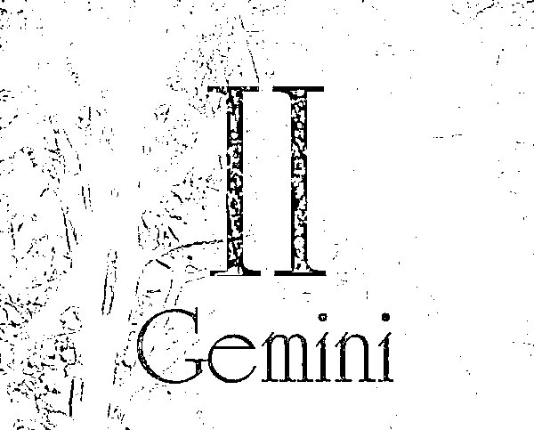

作者/格伦·佩里  译者/若道翻译团队

本文节译自格伦·佩里《占星心理学》（*Astro-Psychology*）一书

5 月 20 日 22 点 36 分，行进的太阳进入双子座。这一天，也是二十四节气中的小满，它是夏季的第二个节气。其含义是夏熟作物的籽粒开始灌浆饱满，但还未成熟，只是小满，还未大满。这样的状态，不就是双子座那种孩子一样的状态吗？

****双子座** **

守护星：水星

关联宫位：第三宫

关联相位：渐盈的六分相

极性：阳

元素：风象

形态：变动星座

视角：个人

**心理需求**

信息，学习，知识（事实），精神激励，数据，输入，语言，沟通

**原型人物**

信使（赫尔墨斯），学生，“半吊子”，报信者，记者，观察者，业余人士，永远的少年，科学家，小飞侠

**发展阶段**

**4 到 7 岁。**从幼儿园到小学 2 年级。这一阶段**形成了对具体世界的头脑印象。**学习阅读和写作，语言发展，不断问问题。也是学习爆发期，讨论或汇报已知事物（信使）。

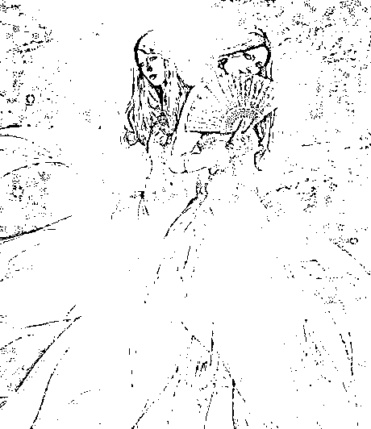**行为特质和主题**

>>>> **信息狂人**

双子座性格中最突出的特质是其目光炯炯，机警能干，还有一个不断问这问那的头脑。双子座就像一个机器人，**强烈希望获得更多的“输入”**。双子座就像个虚拟学习机，能够接收信息，并用一种可以令人惊骇的技术不断重复，举一反三。

然而，双子座这种对信息来者不拒，迫切想获得更多内容的特点，会让他变得紧张、不安。正如一只不断左右摇晃脑袋的小鸟，对传过来的每一条讯息都异常敏感。

可能的特质表现：紧张，不安，异常活跃，忙碌，聪明，有知识，反应敏捷，敏锐，急切，机警

>>>>

**笼统学习**

曾经有一个双子座的客户来找我做占星咨询。当问及她有没有需要我专门处理的地方时，她回答：“没有。你教教我就行，我想学！”

换句话说，她不想学任何特定的知识，她就是想**笼统的学一下**。她甚至都不在乎学的内容是否关乎自己，因为对她来说，学习占星本身就充满刺激。不难想象，对我们两个来说那是一段轻松、自在的时光。关键就在于**双子座代表了对未分化的知识的需求**。因此，双子座也是黄道 12 星座中**最具有好奇心、最善于观察**的一个星座。

可能的特质表现：好奇，爱打听，善于观察，刨根问底，爱调查，贴标签，喜欢尝试

>>>>

**缺抽象思维**

因为双子座象征了认知发展期的相对早期阶段，所以**不具备什么抽象思维能力**。尽管双子座是一个贪婪的学习者，但是对抽象的意义观念不是很感兴趣，而**对具体的事实和实验数据更感冒**。作为个人星座，双子座也是以自我为中心的星座，不善于换位思考。

因此，**双子座在将意义抽象化或评判价值这方面能力较差，而这正是射手座的强项**。像其他个人星座一样，双子座也相对无道德感，或者用**前道德（premoral）**来形容可能更准确一些。

可能的特质表现：根据事实，具体，无道德意识（前道德），模仿，经验主义，没有判断力，死读书，肤浅，不加选择地吸收，线性思维

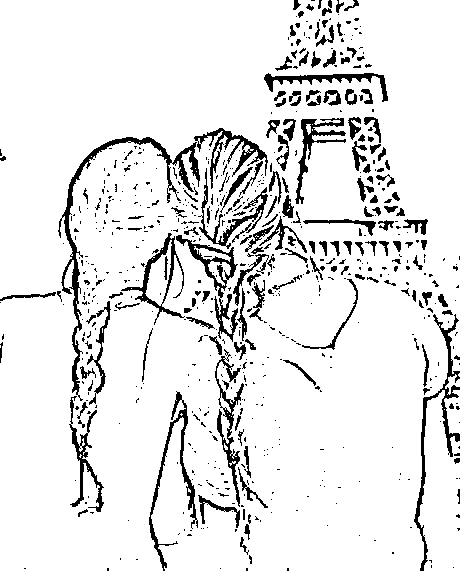>>>>

**什么都“略懂”**

对各种新事物的学习速度很快，那些一下子就吸引眼球的东西才是双子座思维和行动最擅长的。在 4 到 7 岁这个阶段，也就是双子座的阶段，小孩子们具备了眼手的协调能力，从而可以参与体育运动，这点不足为奇。在这之前，协作能力还不完全具备。

在心智层面上，双子座**在文字与概念对应方面也表现出同样的敏捷度**。语言和交流相对而言要简单。**双子座具备的这种能迅速抓住事物本质的能力，让他们可以时刻应对不断变化的情况（不像金牛座，金牛座很难适应新环境）。**因此，双子座给人的感觉就是什么事情都知道那么一点点，但对任何一个具体事物了解的不够深入。换句话说，双子座为了获得广阔的学习领域而牺牲了学习的深度。

可能的特质表现：适应力强，随机应变，灵活，手巧，两面性，机敏，多才多艺，协调能力好，学习知识快

>>>>

**喋喋不休**

电影《星球大战》中有个口才一流、可以自由走动的机器人，就是双子座原型的另一个典型代表。它对不同的文化、行星、语言、习俗和宇宙飞船都了如指掌，绝对是个完美的信使和译者。

不过，也有很多让人厌烦的特点，其中之一就是它总是喋喋不休，不知什么时候应该住口，结果就是好多次它不得不被勒令“闭嘴”。此外，它也给我们带来欢乐，是电影里的笑料，总是像个机器大孩子一样焦躁不安、喋喋不休。这就是典型的双子座，除了不知何时住口，还因为自己的轻浮的态度、小聪明和小玩笑而背负恶名！

可能的特质表现：交流，语言，闲聊，轻浮，喋喋不休，聪明，话多，油嘴滑舌，信口开河，爱用双关

>>>>

**不稳定**

双子座的问题来源于过分表达。当双子座将这一特点过分发挥，就会导致事物分散、找不到根基，就像一个人无法集中自己的思维一样。对此最极端的例子就是被诊断为注意力缺陷多动障碍症（ADHD）的孩子们，这种情况在处于双子座阶段的小孩中非常常见。该病的症状特点是注意力集中时间短，精力分散，不能完成任务。所有这些特质都是典型的双子座特点。重要的是，ADHD 指的是一种“学习紊乱”症。问题是头脑反应过度，以至于不能有效地吸收、消化知识。

这方面还有另外一个原型变体，叫做“永远的少年”，大概是指“永远的青春”。他就像一个过度发挥的双子座，少年的特征就是缺乏担当、反复无常、性情轻浮（经常幻想自己像小飞侠一样飞翔）、纪律性差、多动，常常不能判断是非。

可能的特质表现：善变，分散，轻浮，一知半解，不专一，纪律性差,不可靠,肤浅，琐碎，轻率

**格伦·佩里的星座文章还有：**

[小白学占星 | 太阳进入金牛座，谷雨到了](http://mp.weixin.qq.com/s?__biz=MzA5NjA0NTAxNg==&mid=2651384349&idx=2&sn=2920f445c2b9e35f03c55f03e4f227cf&scene=21#wechat_redirect)

**特别提醒：**

**转载请联系后台授权。**


**心理学与占星学是可以结合的！2016 年 8 月 22 日，格伦·佩里老师教授的****心理占星学高阶课程****要开课了！敬请期待！**


# 行星 | 以为自己已经活出了太阳的能量？那可真难说

> 原文：[`mp.weixin.qq.com/s?__biz=MzA5NjA0NTAxNg==&mid=2651384960&idx=1&sn=f4f6b84ed8760df5e1503464c805575d&chksm=8b4a5e37bc3dd721340cf41103dbae60fb489cc3b64976e6c6f679e65c0927b26ec232c9cf16&scene=126&sessionid=1692738831#rd`](http://mp.weixin.qq.com/s?__biz=MzA5NjA0NTAxNg==&mid=2651384960&idx=1&sn=f4f6b84ed8760df5e1503464c805575d&chksm=8b4a5e37bc3dd721340cf41103dbae60fb489cc3b64976e6c6f679e65c0927b26ec232c9cf16&scene=126&sessionid=1692738831#rd)

作者/Persephone Peng  ISAR 认证占星师

图片/VCG

还记得若道君推送的[如何活出太阳](http://mp.weixin.qq.com/s?__biz=MzA5NjA0NTAxNg==&mid=2651384368&idx=2&sn=c870d7254a29932e43e20d92dd5c1fb1&scene=21#wechat_redirect)（点击链接可阅读）的文章吗？大家都知道太阳星座，但是很少有人了解作为一颗行星，太阳代表的意涵是什么。一起来看看这颗行星是多么的重要吧。

## 太阳是什么

 几乎每一个人都知道自己是什么星座，很多人都开始进阶去了解自己的月亮星座、金星星座、火星星座是什么。可大家平时所谈论的最普遍的星座还是我们的太阳星座。

那么太阳这一颗行星究竟是什么呢？或许，我们想到“太阳”这个词，脑海中会闪现一片橙光，感受到一种温暖的力量。**太阳是我们星图中最重要的一颗行星，只有了解了自己的太阳，才能知道“我是谁”。**

**太阳最基础的含义有生命力、自我、身份认同 、人格特质、目标、成就、父亲、生命中的男性。**这样看上去理解它似乎很简单，可是再往下深入挖掘一点，我们将可以看到一个更加生动的太阳。

在心理占星中，神话和童话是从来不可缺少的，不要以为这种故事情节简单又很夸张，它们能够流传几千年都还在传播着，是因为每一个故事都浓缩了人类世界中很重要的原型。

我们透过这些神话故事，可以更加生动和直观地了解每一颗行星、每一个星座在我们的生命中是怎样的展开、运作以及产生影响。而当我们真的理解了神话原型，我们会发现这些故事一点都不幼稚，而且还非常精确、没有丝毫多余的描绘了我们的人生。

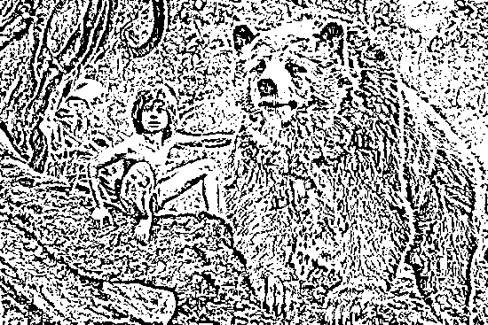
**△****《奇幻森林》剧照**

电影《The Jungle Book/奇幻森林》，这个故事从创作出来到现在，已经流传了一百多年，我有一些外国朋友说这是从小陪伴他们长大的故事。 我也很喜欢这个故事，因为在一个心理占星师的眼中，它很好的为我们诠释了什么是太阳，以及怎样去成为我们的太阳。

## 太阳是神圣的，具有神性的

在古希腊神话中，太阳的守护神是太阳神阿波罗，他是众神之神宙斯的儿子。他一被诞生出来，就是神圣孩童，是和凡人、普通神的孩子不一样的。

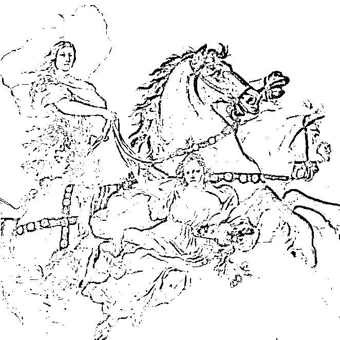
**△****太阳神阿波罗**

**我们每一个人在感受自己的太阳时，都需要感觉自己是特别的、独一无二的，是有神的恩宠和照顾的**。这是太阳很重要的一点，却也是很困难的一点，因为不是每一个人都能很自然的连结到“神性”，并且信任自己的“神性”。

**在传统占星学中，太阳在火象星座，特别在狮子座、白羊座是强势的发挥，因为火象本来就是“精神的”“灵性的”，他们会有一种本能的相信。**这种相信，是不受物质世界的限制、不需要理性逻辑的分析、也没有情感纠葛的牵绊，就是直觉地相信自己赋有神圣使命，自己具有无限的潜能和可能性，自己可以做得到。

如同《奇幻森林》中，男孩毛克利刚开始是和狼群生活在一起的，他不被允许使用人的智慧，他的语言行为生活方式都要和狼保持一致。当他第一次使用智人技术“提桶”从湖中打水上来喝时，被他的养育者呵斥并制止，因为他必须成为一匹狼，才能在丛林中继续生存。可是这个男孩毕竟不是狼。他需要被唤醒，并且从内在去相信：自己不是一匹狼，而是一个人，而且是丛林中唯一的人类。

这对于只见过狼的样子，没有见过其他人类的样子的他来说，要去相信自己是一个人，并且成为一个人，不是一件容易的事，**就如同我们可以深深的相信自己与他人是不同的吗？我们是特别的吗？**所以，直到他受到老虎的生命威胁，黑豹对他说“你是一个人，你必须回到人类的世界”，这个男孩，才开始了他的太阳之旅。

## 重要的是找到太阳符号中的那个“点”

**太阳是中心点，是关于我们如何成为自己。**大家都知道太阳是太阳系的中心，所有的行星都围绕着太阳运转。不记得曾经在哪里看到过这样一句话：在你人生感到最迷茫最困惑的时候， 你一定要先回到你的太阳，这样其他行星才会依序就定位，你的人生才会恢复平静。

**如同太阳星符号一样，一个圆圈正中有一个点，我们只有先找到那个点，才能感受到平衡和圆满。**

*   那个点，是“**自我**”，它帮助我们站在自己生命的中心点，我们才会有一种内在的力量不被外在世界随意的干扰； 

*   那个点，也是“**真我**”，是我们打破外在假我之后，显现出来的最内核的自己； 

*   那个点，还是“**意志**”，虽说这个世界不是以我们的意志为转移，但是当我们拥有坚定的意志时，我们就能够吸引到我们想要的人事物进入我们的生命。太阳神阿波罗驾驶的马车每天运送太阳从东边到西边，他没有使用绳索的，他用的就是他的意志。

## 太阳神需要你保护心中那个孩童

**太阳神阿波罗是保护孩童的，保护的是孩子的纯真、玩乐的天性和即兴的表达。**如果有人侵犯孩童，阿波罗会用瘟疫毁掉整座池城来惩罚那些人。在我们每一个人都还是孩子的时候，我们不会懂得要遵守社会规范、要符合社会标准、不要讲错话表错情，没有现实的压力和责任、没有人与人之间防备与戒心、没有深思熟虑和苦心积虑，我们大多都有一颗纯净的心去看待这个世界，而且最大的快乐就是玩。

我们开心就会唱歌就会跳舞就会大笑，我们爱一个人就想拥抱和亲吻，我们看到沙子就想抓，看到水就想踩，这都是我们跟随自己的心最直接的反映。

即便你的星图中太阳和土星有很紧密的相位，即便我们生活在土象很重的东方社会中，也许过早失去了孩子应该享受的生活，成年以后，太阳也一定会反扑的。

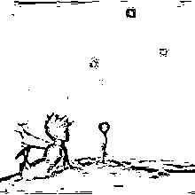

**△****小王子和玫瑰**

**就如同阿波罗惩罚那些侵犯孩童的人一样，我们每一个人都有义务去保护自己内在的纯真、允许自己去玩乐、不害怕去即兴的表达。**法国著名小说《小王子》流传多年，感动很多人，就是因为我们每一个人心中都住着一个小王子，不管你是否记得他的存在。

“大人劝我不要再画剖开的或闭合的蟒蛇了，还是关心一下地理、历史、算术和语法吧。就这样，我在六岁的时候放弃了辉煌的画家生涯。”有多少人，在自己六岁的时候放弃了画家、歌唱家、舞蹈家、海盗、宇航员、探险家的生涯，忘记了照顾那一颗全世界独一无二的玫瑰。

## 你愿意活在一个没有音乐的世界吗？

**太阳代表着我们特有的天分才华，源源不断的创造力。**太阳神阿波罗是多才多艺的，他守护着创造力，掌管着音乐、艺术、诗歌、寓言、神谕、医药、箭术......

在这趟奇幻之旅中，男孩和大熊在河水中玩乐时，大熊欢快地唱着《The Bare Necessities》，他问男孩你会唱吗？男孩说我会背“丛林法则”，然后大声的背诵起来，大熊连忙说：“NO，NO，那不是唱歌……”而歌声有神奇的能量的，男孩之后也学会了和大熊一起尽情的歌唱。

背诵和音乐有什么不同呢？我们几乎每个人都可以拿着一本书大声的照着念，甚至背得很多法则、教条、唐诗三百首。可是，音乐是需要我们去创造的，每一个音符的组合可以千变万化，我们永远可以创造出无限不同的曲调，没有限制。

所有的音乐、诗歌、艺术、医药、箭术都无法不透过创造而诞生，想象一下如果这个世界，每一个人都只是为了求存的存在，那么这个世界会是多么无聊，那和地狱有什么区别。你愿意活在一个没有音乐的世界吗？

## 早晨醒来，你的能量满满吗？

**太阳是我们的生命力，衡量自己有没有活出太阳星座有一个很简单的标准，就是我们有没有生命力？**早上醒来睁开眼睛，是想继续闭上眼睛不想起床，宁愿睡觉度过一天，还是感觉自己精神抖擞，迎着朝阳活力满满的开始新的一天。

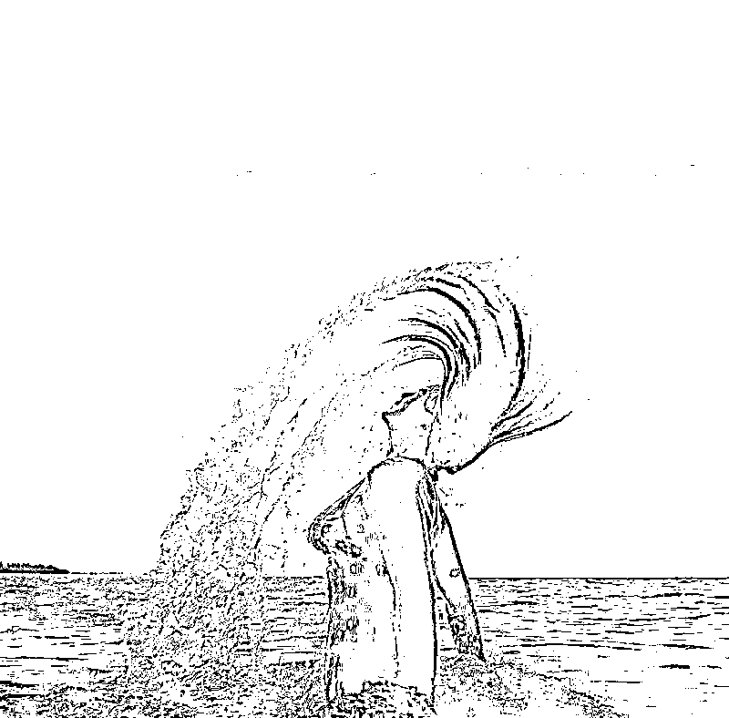

在中国社会，小学生就背负了很多的课业压力和生活压力，即便是一些有权又有钱的成年人，他们可能在社会标准下是成功的，可是当你看到他们的体形、神态和生活状态时，却感觉不到他们的活力。

电影《Intern/实习生》，讲述的是一个 70 多岁的老年男人退休后想找些事情做，于是应聘了安妮·海瑟薇主演的女主的公司，这是一家新型互联网卖服装的公司，公司里几乎都是年轻人，作为一名老年实习生，他没有觉得这对于他来说不可能，反而非常兴奋得到这样一个挑战。

每天不论对于生活还是工作都保持着积极的态度，热情、开放、乐观、温暖、谦逊……不但赢得了老板的信任和赏识，为公司的发展做出了贡献，学会了使用 Facebook，还收获了一段美好的爱情。

其实只要我们找到我们自己的太阳能量，我们就会一直拥有充沛的生命力和活力去支持人生的挑战和各种可能性，如同这位男主一样，所谓最美不过夕阳红，就是到了老年还能拥有一颗温暖自己照亮他人的熊熊燃烧的太阳吧。

请记住，是太阳散发的光与热，才使得世间有了生命，如果没有太阳，植物会死、动物会死、人类也会死。所以如果没有去活出我们的太阳，我们就会感觉到空虚寂寞冷和不满足不快乐没意义。

## 一个懒惰的太阳摩羯座并不会真的快乐

太阳是独立自主化的进程，是一趟英雄之旅，是找到真我的过程，是自我实现，是明白“我是谁”并且成为那个独一无二的自己。**我们明白了太阳是什么，可是要成为太阳绝对不是一件容易的事情。并不是每一个人在一生中，都可以找到自己的太阳，并且勇敢地去活出来的。**

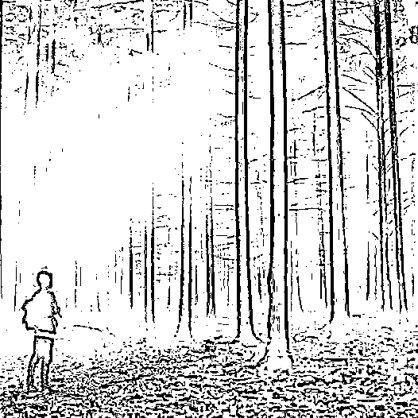

**在心理占星学的观点里，你的太阳在什么星座，不代表你就已经成为了那个星座，而是你要学习这个星座，透过这个星座去成为你的太阳。**

比如，一个太阳摩羯座，你可能发现身边有一些摩羯座一点都不像书里或者网路上写得很有毅力、很有事业心、很负责任，可能还恰恰相反，这代表这个人还没有找到自己的真我，没有开启他的英雄之旅，没有找到他的太阳，还在摇篮里和父母家族之间有一些议题没有解决。

不要以为这个或许家庭条件本来就很好、整天可以无所事事、很“轻松”的太阳摩羯座会很快乐，在他们没有成为一个知道什么是意志力和耐力、坚持做完一件事情直到收获经得起时间考验的成果、发展出内在的成熟和自律、对自己的生命负起责任的摩羯座之前，他们不会真的快乐。

**敬请关注若道君之后的推送**


下篇教你如何活出你的太阳能量**作者介绍**


**Persephone Peng**：ISAR（国际占星协会）资质认证职业占星师（CAP）。中学时代开始研习占星，以心理占星见长，涉猎不同门派的占星学，跟随多名国际大师系统学习占星学。 现将占星学作为一种觉察疗愈工具与个人成长相结合，帮助个案实现自助疗愈。

**微信公众号**：Persephone 占星与个人成长工作室

（ID：PPPAASHS）

**咨询微信号**：persephone_p

长按二维码，让金钱涌向传播知识与智慧的人~ 

 

**特别提醒：**

**本文由作者授权首发于若道平台，**

**转载请联系后台授权。**


**想了解更多关于行星的知识？2016 年 5 月 19 日，若道占星核心课程****Level 1-2****要开课了，没有报上名的朋友，还有 Level 1-5 连报可选择。**

**报名及咨询，请点击文末“阅读原文”**


# 免费微课 | 26 年间，他如何用占星学协助美国创业公司成为国际顶尖企业？

> 原文：[`mp.weixin.qq.com/s?__biz=MzA5NjA0NTAxNg==&mid=2651384960&idx=2&sn=b045c9ae3eae81786a6deb3f51d0e3b4&chksm=8b4a5e37bc3dd721301e40160c6e177312777ba93d4bc1f7b3c583526460f20655955825a971&scene=126&sessionid=1692738831#rd`](http://mp.weixin.qq.com/s?__biz=MzA5NjA0NTAxNg==&mid=2651384960&idx=2&sn=b045c9ae3eae81786a6deb3f51d0e3b4&chksm=8b4a5e37bc3dd721301e40160c6e177312777ba93d4bc1f7b3c583526460f20655955825a971&scene=126&sessionid=1692738831#rd)


大卫老师**首次商业占星秘籍大披露**，

免费微课招募中。

（报名流程往下看）

与**商业占星**相关的问题想问大卫·瑞雷老师，

**回复在本篇文章的留言区即可。**

作为企业创始人或者管理者，

在职场上以及创业过程中的困惑和谜团，

我们来帮助你。

大卫老师亲自授课，

**全程中文翻译**，

英语零基础也能听呢。

问题标准

①问题实际且走心；

②问题有共鸣（点赞多）；

③问题够独特，或者够深刻；

④（你长的好看）老师看好你。

Duang~福利


**前三名**精彩问题提问者，

**大卫· 瑞雷老师亲笔签名的《灵魂的目标》**等着你。

（好福利，好羡慕！）

举个栗子

**你可以这样问**

*   很多人想了解自己是否适合创业，请问可以从占星学得到解答吗？

*   你会为新产品上线择时吗？这个很重要吗？

报名微课条件

**满足其一即可。**

 

微课详情

**活 动 时 间**

▼

**2016 年 5 月 25 日**周三

**晚上 8 点-9 点**

**活 动 形 式**

▼

**微信群活动**

45 分钟商业占星访谈

15 分钟互动问答

**怎 样 报 名**

▼

统共分三步

**第一步**

**转发本文**到你的朋友圈

**第二步**

**长按客服二维码**添加为好友

 

**第三步**

将朋友圈转发**截图发给客服**

等待被拉入微信群

大卫·瑞雷老师简介


若道创始人，《灵魂的目标》作者。拥有 46 年的占星咨询的执业经验，曾两任亚特兰大占星协会主席，是全美占星师联盟（AFAN）、美国占星师联合会（AFA）、全美占星研究委员会（NCGR）、国际占星研究协会（ISAR）和职业占星师组织（OPA）的成员，是联合占星大会（UAC, United Astrology Conference）督导委员会委员。大卫曾是 CNN、CBS 的占星节目的常驻嘉宾，多次在 BBC、WGS、WSB、WRGG 等节目中接受采访，并在亚特兰大主持电视节目《每日行星（Daily Planets）》达 4 年之久。


**了解企业占星工作坊详情，请戳“阅读原文”**


# 看完 12 星座办公室攻略，我想去上班了

> 原文：[`mp.weixin.qq.com/s?__biz=MzA5NjA0NTAxNg==&mid=2651384936&idx=1&sn=9de814cfc5c5ed8434891f82ddd34b35&chksm=8b4a5edfbc3dd7c94422e6e548273b5babe99ef8f514a2cd710fba6c565a8a65112fa7cb6dda&scene=126&sessionid=1692738836#rd`](http://mp.weixin.qq.com/s?__biz=MzA5NjA0NTAxNg==&mid=2651384936&idx=1&sn=9de814cfc5c5ed8434891f82ddd34b35&chksm=8b4a5edfbc3dd7c94422e6e548273b5babe99ef8f514a2cd710fba6c565a8a65112fa7cb6dda&scene=126&sessionid=1692738836#rd)

作者/爱丽丝·德维尔 图片/VCG

翻译/轩轩 校对/Christy

你是公司高层，想构建一个有活力善沟通的团队。

你是公司员工，想拥有一个正向积极的工作团队。

该从哪里着手呢？也许，应该先了解 12 星座的四元素。火、土、风、水的职场人有不同的行为模式，当你越了解他们的正负能量，就越能在人际互动中得心应手。

## 你理想的工作氛围是……

你是否曾想过，在一个理想的世界，你的同事不必完全相同，但是他们需要具有一定的凝聚力？我们来设定一个正面的基调。

没有人喜欢在潜规则是“嚼舌头”的场所工作。当环境鼓励参与时，沟通就是敞开的、充满关怀的。同事间的化学反应嗞嗞作响。甚至当有人持不意见时，用健康的方式表达分歧也会为改进产品提供契机。 

你工作的地方在发生什么呢？你说话的时候人们会聆听吗？同样，你对其他人说的话感兴趣吗？会将感兴趣的话题筛选出来和他们交流吗？你是否喜欢整体的工作强度，并且期待不断晋升的职业轨道？又或者，你是否曾预感这是你最后一次乘坐电梯到地面？

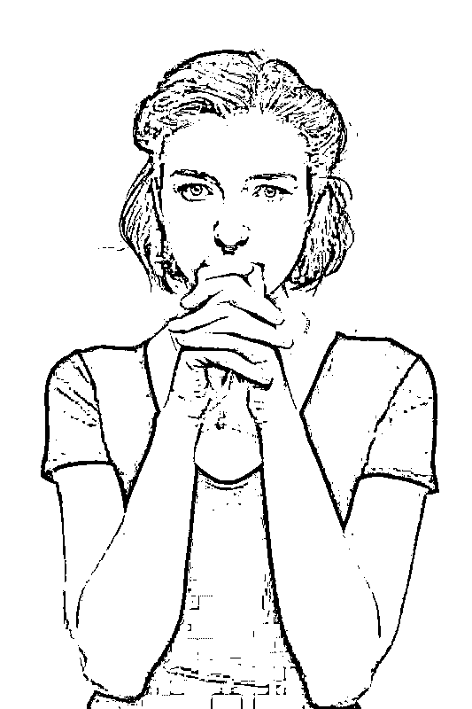

## 如何搞定四元素同事？

你知道吗？**占星学能让我们更加深入地理解个体工作和表达意见的方式**。

*   12 个星座按照元素可以分为：**火**、**水**、**土**和**风**。

*   **火象星座**（白羊座、狮子座和射手座）**充满热情、激情和能量**。

*   **水象星座**（巨蟹座、天蝎座和双鱼座）**对于工作和同事有着直觉和敏感的联结**。

*   **土象星座**（金牛座、处女座和摩羯座）**渴望稳定、组织性和稳定的薪水**。

*   **智力驱动**的**风象星座**（双子座、天秤座和水瓶座）**在沟通、多才多艺和独立性方面绽放光芒**。

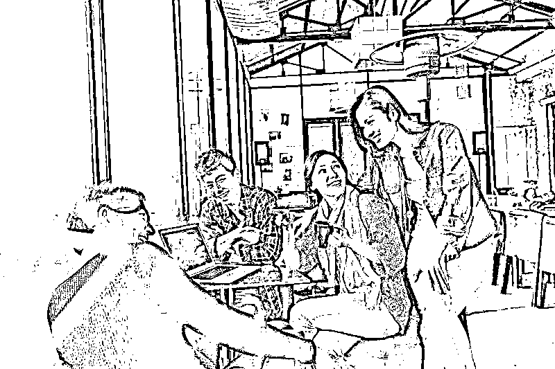

除了你太阳星座的特点，你还有其他九颗行星，它们位于不同元素的星座上，组成了你整体的表达和沟通风格。然而，这篇文章中，我们只会讨论不同太阳星座元素在工作场所的表现方式。

**办公室里的火象星座攻略（白羊座、狮子座和射手座）**

**火象星座**流露出**自信**，让你觉得很高兴加入这家公司。作为团队成员，他们渴望获得大部分的关注，但他们也会确保同事的贡献同样得到认可。**他们的自尊很容易受伤，但气也消得很快。**

当你和火象星座的成员开会或会面时，一个微笑、一次有力的握手、邀请拉个椅子过来，都是问候的方式。**火象是行动导向的元素**，这类人想要**事情保持运转**。如果讨论前你能够制定计划、进展报告或提案，那将是明智的选择。如果你漫无边际，那么你就会让火象星座的人厌倦。他们想要快速直达主题，因而可能会觉得你没有准备好。

**火象星座对于无法清晰回答问题的应聘者会感到不耐烦**。大部分火象星座的人会在创纪录的时间内将职位提供给你。如果你没有被选中，那么就必须主动联系。等你意识到职位已经招满人的时候，他们已经忘记你的名字了。

**办公室里的水象星座攻略（巨蟹座、天蝎座和双鱼座）**

**水象星座用眼神交流**。在团队中他们常常是比较安静的，但会参与到讨论的方方面面。**他们在执行指定任务时展现出毅力，以所有老板都喜欢的语言说话——生产力**。

**水象星座在竞争有威望的工作任务方面，会直觉性地去冒险**。他们的韧性会让他们获得认可和奖金。**很多水象星座的人都在人力资源领域游刃有余，因为他们擅长与人交流**。作为沟通者，他们风度翩翩，知道如何让你感觉舒适。作为雇佣者，他们会提升整个个人概念，吸引寻求工作和家庭生活平衡的应聘者。

水象人很少专制，让你节假日还工作，他们通常会自己去加班。他们会对此发牢骚，请注意我的用词。有时候雇员将水象星座的同理心视为理所当然，编造煽情的故事来掩盖自己的无能。如果你有这种倾向的话，那可不是好事——你的水象星座老板正盯着你撒谎的双眼。

**办公室里的土象星座攻略（金牛座、处女座和摩羯座）**

**土象星座沟通者会权衡自己的用语**。他们以客观著称，在说话、演讲或回答问题之前会组织好想法。**他们拥有精湛的语言技能，并且以自己做出的或对团队的贡献而感到骄傲**。

如果你为难土象人，他们会通过提问来赢取时间。短暂的拖延让他们有机会重新掌控局面。他们**看重正确性**，不想收回说过的话或者让人感觉被误导了。他们会**深思熟虑着走上成功的阶梯**。**对于大部分土象人来说，改变并没有那么容易，他们更喜欢例行公事**。

当你进入土象人的工作空间时，虽然他们是热情友好的，但是大部分人在同事或下属频发打扰时都会眉头紧锁。土象星座人会使用“**距离**”策略——他们会突然必须离开去参加会议（上洗手间），直到四下无人。如果你的雇主是土象人，那么记得预约或提前打电话。**土象人对时间表尤其敏感**。

**办公室里的风象星座攻略（双子座、天秤座和水瓶座）**

**风象星座的人是行走的讲坛**，他们总是在咖啡室开着小会或搅动小道消息。风象人极具**亲和力**，他们**会从言语交流中获得能量**。他们喜欢说话，常常以**销售、励志演讲、辩论、写作、娱乐或咨询为业**。

**风象人通过调侃自己和与观众互动来打破坚冰**。风象人常被指定为公司庆典的发言人、主持人。有时候，他们会收不住，导致活动超时。当然，会议本来就开始的晚，因为风象人可能在大厅里遇见了老朋友，停下来和他们聊天。

**风象人中有着天才、外交家、有远见的人，但也有浪费时间者、喋喋不休者和无可救药的理想主义者**。作为雇主，他们需要一个坚定的二把手帮助他们收获工作的成果。另一方面，风象人的老板则必须在电话账单到达时，选择性忽视。考虑到风象人将友好带到了工作环境中，电话账单是需要付出的一点代价。

以上我们简单分析了不同元素的太阳星座在工作场合是如何表现的，希望这能帮助你理解不同类型的同事。你也可以自己去观察，火象星座的动力如何激发土象星座作出坚实承诺，而水象星座的洞见如何通过风象星座的善辩得到表达。让这些信息帮助你营造友好的氛围、建立一支充满活力的团队。

**作者介绍**

**爱丽丝·德维尔**（Alice Deville）是一名占星师、工作坊讲师和作家，从业已超过 25 年。她在占星实践中结合了多种咨询技巧，包括商业、金融和变更管理、房地产以及直觉洞察。

**特别提醒：**

**本文首发于若道平台，**

**转载请联系后台授权。**


**想了解更多关于占星学和职场的关系吗？大卫·瑞雷老师主讲的企业咨询工作坊就要在 6 月 9 日（端午节假期）开始啦，教你用占星学理解企业发展，与客户建立关系。** 

**报名及咨询，请点击文末“阅读原文”**


# 帮助一个企业走向辉煌，也许是你这辈子做的最牛的事

> 原文：[`mp.weixin.qq.com/s?__biz=MzA5NjA0NTAxNg==&mid=2651384936&idx=2&sn=ea247a42ff5dea5f85810b43967b8168&chksm=8b4a5edfbc3dd7c9aebf459300a234b3d16a285f2f17a1fe0cb4fdfbd91af61f811a692ed542&scene=126&sessionid=1692738836#rd`](http://mp.weixin.qq.com/s?__biz=MzA5NjA0NTAxNg==&mid=2651384936&idx=2&sn=ea247a42ff5dea5f85810b43967b8168&chksm=8b4a5edfbc3dd7c9aebf459300a234b3d16a285f2f17a1fe0cb4fdfbd91af61f811a692ed542&scene=126&sessionid=1692738836#rd)

“

**我的公司，就像我的孩子。** 

”

于我们，

也许仅仅是一个不知名甚至不起眼的品牌，

于创立这家公司的人，

这就是他们的骨肉。

鲁迅先生说：

“这世上本来没有路，

走的人多了，也便成了路。”

企业之路无疑是最艰难却也最辉煌的一条路。

几乎每一个创业成功的企业家，

都可以给你分享一百种往事，

最初的艰辛和一路的困惑迷茫。

那么为什么还有无数人，

前赴后继在这条路上呢？

因为每一个人有一个，

代表事业成就的中天，

我们都**渴望成功**、**渴望不断向上**、**渴望荣光**。

然而，在这条路上，

光有海王式的梦想是远远不够的，

还需要土星式的实际规划、

火星式的热情燃烧，

有时候甚至需要一点木星的幸运加持。

**“谋事在人，成事在天。”**

占星学能够给到一个企业最大的帮助，

除了可以帮助企业主**“谋事”**，

还可以借助**趋势预测**来帮助他们**“成事”**。

运营企业从来都是一件严肃的事情，

就像若道占星，

一直致力于严肃占星学在中国的传播一样。


这是**国内第一次**系统讲解

如何运用**占星学给企业做咨询**的工作坊。

这是一个绝好的机会，

你可以**和大卫老师面对面**，

还有机会在中国的经济中心——**上海**，

**体验海派风情**，

**结交**各行各业成熟的**职业人士**，

同各界热爱占星学的**企业精英**交流，

互相切磋各种经验，

**扩展高层人脉**。

这也是一个**严肃**的席位，

它考验你是否真的有十足的准备，

去面对企业主们，

替他们排忧解难。

因此，

我们对于参与这次工作坊的人群有相对严格的筛选，

同时，也会为大家提供**非常高质量**的授课内容。 

**企业占星工作坊非常适合这些人**

● 本身是**创业者**或者**企业主**；

● 本身是**企业管理者**，或**对于企业管理有一定经验**的占星师；

● 对于没有企业管理经验，但有**鸿鹄之志**，想有一天拿下几十万元以上大单的占星师，也欢迎参加。（请提供足够证明自己能力的依据）

**你将得到如下帮助**

*   **经典案例解析**

*   大卫老师将用自己非常熟悉的经典案例，详细讲述**占星学可以在企业创立、运营、出售等一个完整的企业生命流中可以帮助企业所做的方方面面的事宜**。

*   **企业的创业方向**

*   选择适合的**创业方向**，是创业成功的一个要素；**创始人的个性**也创造出不同的企业，会以不同的方式获得成功，也会遇到因创始人的个性而面临的**独特挑战**。

*   每个企业都有不只一个对企业有意义的星图，企业的星图如个人星图一样，有**故事、机会，挑战，起伏**的周期。如何解读**企业星图**中的秘密？如何解读**企业主星图和企业星图**的关系？

*   **产品和服务的定位**

*   根据创始人及企业星图，**优化产品和服务的定位****。**

*   **人的选择**

*   选对人是每个创业者及管理者最重要的任务，而培养、管理、发展企业员工又是管理者最大的职责。

*   帮助企业主**选择、了解其合伙人****；**

*   帮助企业主**设立关键职位****；**

*   帮助企业主对**中高层人力资源的选择、培养、提拔**，将适合的人用到适合的岗位，**了解员工的优势和各个时期的挑战**，了解**关键人员的个人发展趋势是否符合企业发展趋势****。**

*   **团队建设**

*   帮助企业主与企业关键人员**建立信任**，了解什么是更好的**沟通方式****；**

*   帮助**团队**之间的**沟通和协作**，建立**团队成员的归属感**，帮助团队成员**关系**的融洽。

*   **制定计划，管理趋势和变化，防范风险**

*   占星学善于**预测趋势**，运用占星学，可以提早**了解企业趋势的变化**，进而**制定营销计划、财务计划**，更好管理企业的变化，防范风险。

*   **选择时机**

*   学习**择时占星学基础**，帮助企业的**活动、关键时间选择时间点****。**

*   **帮助占星师了解如何与商业企业建立关系**

*   企业咨询不仅可以获得**企业客户**，还可以因此获得**大量的个人客户**。


**6 月，与你相约上海，**

**我们虚位以待。**


**大卫·瑞雷（David Railey）**

若道创始人，《灵魂的目标》作者。拥有 46 年的占星咨询的执业经验，曾两任亚特兰大占星协会主席，是全美占星师联盟（AFAN）、美国占星师联合会（AFA）、全美占星研究委员会（NCGR）、国际占星研究协会（ISAR）和职业占星师组织（OPA）的成员，是联合占星大会（UAC, United Astrology Conference）督导委员会委员。大卫曾是 CNN、CBS 的占星节目的常驻嘉宾，多次在 BBC、WGS、WSB、WRGG 等节目中接受采访，并在亚特兰大主持电视节目《每日行星（Daily Planets）》达 4 年之久。

**ISAR 选修课程****工作坊信息**

**授课时间：**2016 年 6 月 9 日、6 月 10 日、6 月 11 日（端午节假期）10：00-18：00（午休 2 小时） 共 18 课时

**授课老师：**大卫·瑞雷

**授课方式：**上海现场，英文授课，中文翻译。（具体上课地址课前 10 天请留意查看短信微信通知）

**费用**：****6800 元** （5 月 20 日前报名可享受早鸟价****5800 元****，若道老学员**4800 元**）**

**课程负责人：**熊老师

**微信号：**13761199137，请备注企业占星工作坊报名咨询

长按二维码添加课程负责人咨询


**了解详细课程内容及报名方式，点击文末“阅读原文”**


# 内疚综合症 | 没人应该让你内疚，包括你自己

> 原文：[`mp.weixin.qq.com/s?__biz=MzA5NjA0NTAxNg==&mid=2651384921&idx=1&sn=704c154e5562a1dcc12fbfc7e29d56bc&chksm=8b4a5eeebc3dd7f86eb710264318d34df8d4662d1115b80ba3925c61fc61f3c3a595245623d2&scene=126&sessionid=1692738836#rd`](http://mp.weixin.qq.com/s?__biz=MzA5NjA0NTAxNg==&mid=2651384921&idx=1&sn=704c154e5562a1dcc12fbfc7e29d56bc&chksm=8b4a5eeebc3dd7f86eb710264318d34df8d4662d1115b80ba3925c61fc61f3c3a595245623d2&scene=126&sessionid=1692738836#rd)

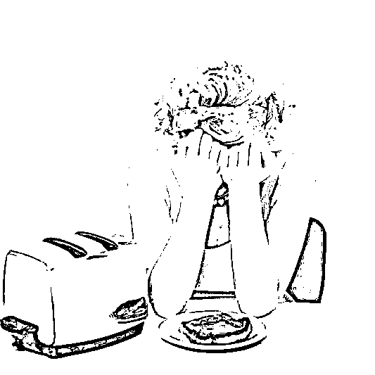
作者/凯西·萝丝 图片/VCG 

译者/Elle 校对/王宏

“

“没有得到你的同意，任何人都无法让你感到自惭形秽（或内疚）。”

——前美国“第一夫人”

**埃莉诺·罗斯福**

”**是什么导致了你的内疚感？**

**在占星学实践中，我观察到，在出生星图中与太阳或月亮形成困难相位的土星，可以显著地预示此人敏感于“内疚”，对负责在自己掌控范围之外的事也很敏感。**

我们知道，当出生星图中的行星与土星接触而被强化时，在表达自我扩张以及个体统治需求时，就存在越来越强的紧张感。通常呈现出**紧张的**、**过度控制或压抑**的自我感觉。当我们在星图上看到这样的特征时，就可以预见到这种紧张感，因此应该寻找方法来释放并重导发展中的限制。

当我在一张出生星图中看到这些相位时，我经常会对客户说：“你如何看待内疚在你人生的早期所扮演的角色？”然后我停下来，等待客户的答案。

通常，这会打开客户情绪的闸门，随后我们会展开一场很有效的探讨。

**这是个栗子**

 我跟一位叫塔米的女性客户交谈。她的**太阳落在双子座 0 度，合相中天，对分在天蝎座 29 度逆行并合相下中天的土星**。当我问她内疚在她人生中所扮演的角色时，她大声喊道：“我对一切都有内疚感！！！”接着，她承认，**无论什么事出了问题，她都会觉得是她的错；她觉得自己要对所有事负责，对每个人的幸福和成功负责。**

在我们之后的交谈中，塔米描述了她充满身体和言语虐待的童年。她的父亲个性非常固执，控制欲很强，也非常爱挑剔。她在小的时候注意到，只要家里不是完全有秩序并尽善尽美的，她父亲就会爆发。

**土星和太阳之间的对分相将她与“抱负'和‘构建组织“联系到一起——她以这种方式而被设定。**

塔米很快就明白了，如果她能处理好家里的所有问题，她和她的兄弟姐妹就可以避免受到虐待。她用自己的能力解决家里的问题变成了常态。通过**挺身而出并处理事务**，她提高了别人对她行为的预期。**当她没有达到这些标准时，她就会受到很强的、虐待性的责难。**

**这就形成了条件反应——她把高效、有序以及觉得自己有责任完成所有事的信念同没有责难联系在一起。**她还把**犯错**（或除了“超高效率”以外的所有事情）和**虐待性的惩罚**联系在一起。她发展出来的模式一直试图确保她的生活以及跟她有关系的每个人都有秩序并获得成功。

在我和塔米的交谈中，我们关注于当她**发现自己处在一个她不能控制或无法解决问题的状况中时，她所感受到的恐慌和可怕的内疚感**。她觉得自己有完全的责任去解决此类任何问题。时至今日，**她在自己的世界不是井井有条时仍然会感到害怕**——她害怕“当头一棒”就在附近，在残酷地等着她。

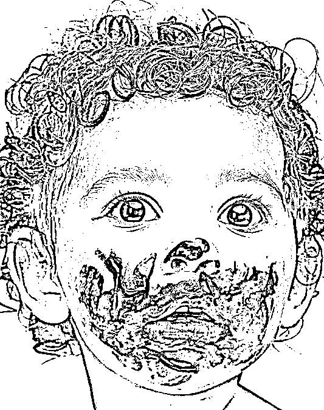

**这也是个栗子**

另一位女性客户凯特的**土星合相摩羯座的月亮，四分天秤座的太阳**。她的模式与塔米的非常相像，但她**没有受过虐待**。

凯特也**总是感到内疚**，尤其是当她**把时间花在个人需求上**的时候。在咨询中，她承认自己被她所接受的天主教的教育以及“**自我骄傲不值得骄傲**”的理念所影响。她被设定了一个坚定的信念：**你永远不应该关注自身，因为那是自私而浅薄的**。

与她们一家共同生活的奶奶为该信念提供了进一步的示范。她的奶奶一生都过着**沉默而殉道式**的生活：**永不停息地工作，从不休息，也从来没有自己的时间**。这与她母亲形成了鲜明的对比。她的母亲有着**完全自由的灵魂**，但一直生活在**应接不暇和杂乱无章**的状态中。她的父亲是非常**严格、刻板**的军人。一旦家里**杂乱无章**，他就用他所擅长的**沉默**来表达**不满和评判**。

在凯特的出生星图中，**土星守护第三宫**，在形成了**土星、木星和月亮都在摩羯座**的星群格局。她的心态是**摩羯式**的，倾向于**战略成果和效率**；而这与她**月亮的统治性需求**是**一致**的——**让事情发生并管理其过程**。她天生就有一种倾向来**组织事情并把事情做完**，通过**全身心地按照该定位行事**，她感觉**心满意足**。

凯特了解到，她有着**令人难以置信的能力来处理所有她母亲无法应对的混乱和未完成的任务，并因此赢得她父亲的赞许**——或者**至少会避免责难**。她采取了”感受到痛苦的自我评判和内疚“的”有条件“的模式，**即便在没有混乱的迹象时也是如此。她承担起对一切的责任**。

在我们进行咨询时，凯特 49 岁，是 5 个孩子的母亲。**因为长期处于内疚和焦虑的生活状态中而精疲力竭、倍感压力、萎靡不振**——她担心自己无法一直领先于家里那些永远也做不完的工作。

凯特和塔米是**土星做好事情、推动事情进展并通过努力工作解决问题的结构化、有效驱动的范例**。这些特点被外部的不满所放大并点燃。极端情况出现了，**责任从何开始并从何结束的边界议题由此产生**。**责任感横行蔓延——这些都是为了避免内疚感和自我评判而痛苦地超出预期表现的案例。**

**相反的情形也会发生**

另一位女性客户——**太阳合相双子座的月亮，对分射手座的土星**——表现出了**放弃**的行为。在她人生的早期，**当她感觉到被评判或责难时，就会出现故意失败的模式**。她在童年所承受的高强度的否定打垮了她的士气，使她的自我价值受挫。作为一个新月时出生的人，她无法找到内在的推动力或驱动力，而她正需要这些才能够在自己早年时期承受严酷的能量。

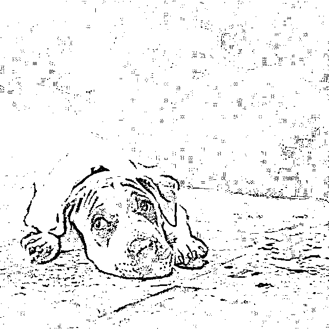

**她发展出一种本能的道歉的语言习惯，每次与人交谈都会插入很多个“对不起”**。她的土星能量从未去应对成就的挑战，相反，**她每天都向自己证明她是“不好的”、“不值得的”，就像她感觉到她的父母投射在她身上的一样。**

她并没有努力去避免内疚，而是用自己的**表现不佳**来欣然接受它——她的**自我破坏感**和**失败感**让她总是感到**很安全**。她的**内疚侵蚀了她的自我价值，并使她困在一种功能极为失调的模式中**。

**内疚综合症如何破解**

无论是由于**对责任的过度苛求所带来的高成就**，还是**为了安全故意表现不佳而确保让人失望**，这种**内疚综合症**呈现的是一场**必输无疑**的战斗。正是在内心冲突中该人无论做什么都会失败。

内疚是一种情绪状态，该情绪状态由以下想法所导致：**我们没有活出理想的自我，我们可以，或者说“应该”做得更好**。

**克服这种内疚模式需要放下自我评判**。个人需要**创造出积极的自我形象，并成熟地认清责任（或部分责任）所在**。建立起**自我接纳**。我们必须**创造新的习惯**，这些新习惯聚焦于**如何应对外部责难**。

这是治疗占星学真正的闪光之处。**如果我们足够自信去理解通过从土星到太阳或月亮的紧张状态所看到的内疚的结构和象征意义，那我们就能帮助我们的客户识别出控制他们的行为并使他们一直陷于负面模式的程序化反应**。我们可以帮助他们打破内疚的循环周期，帮他们摆脱自我强加的负担。

当人们对自己的内疚模式有更深入的觉察时，他们就可以撕毁他们在无意识下写下的许可证——该许可证允许世界让他们感觉糟糕。

**关于作者**

**** 

**凯西·萝丝（Kathy Rose）**：诺·泰尔的硕士学位认证项目的最高荣誉毕业生。自 1984 年起就作为职业占星师为全世界的客户提供直觉式、富有洞见的占星咨询。她积极投身于占星实践已超过 20 年，客户遍布世界各地。她的文章经常发表在《大占星师》杂志上。


如果你也有一颗发挥不良的土星，

你也患有内疚综合症，

除了留言，你还可以选择 ISAR 认证咨询师。

**特别提醒：**

**本文首发于若道平台，**

**转载请联系后台授权。**


**想了解更多关于星座的知识？2016 年 5 月 19 日，蒋颖老师主讲的若道占星核心课程****Level 1-2****要开课了！没有报上名的朋友，还有 Level 1-5 连报可选择。**

**报名及咨询，请点击文末“阅读原文”**


# Duang~快来膜拜占星界的“祖师爷”

> 原文：[`mp.weixin.qq.com/s?__biz=MzA5NjA0NTAxNg==&mid=2651384921&idx=2&sn=9b989e6e6b87ee2a50924356018a7df7&chksm=8b4a5eeebc3dd7f8982be9335086d4c69b6e71476e80400e814c0beecf33b6183ee462b661f1&scene=126&sessionid=1692738836#rd`](http://mp.weixin.qq.com/s?__biz=MzA5NjA0NTAxNg==&mid=2651384921&idx=2&sn=9b989e6e6b87ee2a50924356018a7df7&chksm=8b4a5eeebc3dd7f8982be9335086d4c69b6e71476e80400e814c0beecf33b6183ee462b661f1&scene=126&sessionid=1692738836#rd)

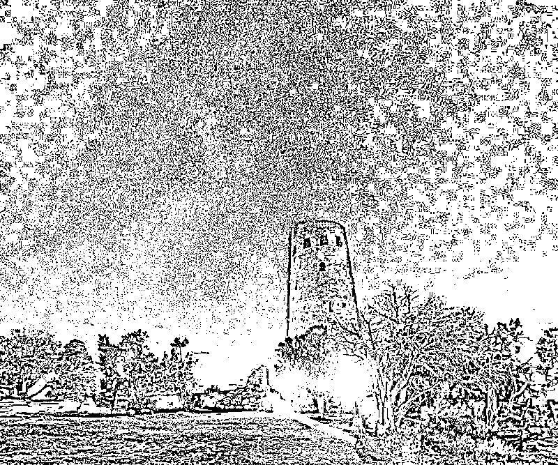
 译者/李含  校对/Christy  图片/VCG

➢他，从上世纪 60 年代开始学习占星学。

➢他，是**首位为计算机编写占星学程序的执业占星师**，创办了占星制图服务公司（Astro-Graphics Services），也就是**Astrolabe 公司的前身。** 

➢他，是多个专业占星团体的领袖。

➢他，是英国占星学院的资助人。

➢他，著有无数本占星畅销书。

他就是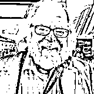

**罗伯特·汉德**

**ROBERT   HAND**

全球最杰出，最受人尊敬的占星家和历史学家之一！

全球最杰出，最受人尊敬的占星家和历史学家之一！

全球最杰出，最受人尊敬的占星家和历史学家之一！

重要的事情说三遍~

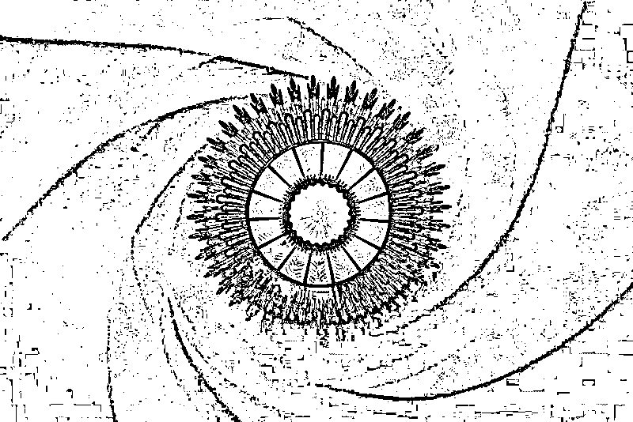

**以下是罗伯特·汉德金光闪闪的简历**

**1**

家学渊源

1942 年 12 月，他出生于新泽西州，17 岁时，他开始从事占星学工作。上世纪 50 年代至 60 年代初，**他的父亲**威尔弗雷德·汉德，**是研究将天文学周期应用于金融市场的先驱者。**于是，罗伯特跟随他的父亲学习了基础星图演算。罗伯特·汉德从上世纪 60 年开始学习占星学，并于 1972 年开始成为全职占星师。

**2**

造福后人

早在职业生涯初期，他就成为**首位为计算机编写占星学程序的执业占星师**，让占星师们可以享受计算机带来的福利。因为这一项成就，他在 1979 年创办了占星制图服务公司（Astro-Graphics Services），也就是**Astrolabe 公司的前身。**

在他早期的职业生涯中，罗伯特曾在中学教授过化学和历史课。他毕业于布兰迪斯大学和美国天主教大学。获奖无数，成就卓越的罗伯特·汉德，还是**中世纪晚期意大利军事占星学首屈一指的专家**。

**3**

荣誉满满

汉德先生是许多占星学和历史学组织的成员，目前任**开普勒学院委员会主席**，曾任美国占星研究协会主席。

他参与的其他团体组织包括美国历史学会、美国科学史学会、美国占星联盟（AFA）、全美占星师联盟（AFAN）、国际占星研究协会（ISAR）、伦敦占星学社（Astrological Lodge of London）、英国占星协会（Astrological Association of Great Britain），他本人还是英国占星学院的资助人。 

**4**

成就众多

罗伯特·汉德著有畅销书《行星的行进》《占星学符号》《组合星图中的行星》（惠特福德出版社，席夫出版社）《夜&日》《整宫制》《占星学随笔》等等。他在世界各地的线上研讨课、讨论会、线下研讨会和工作坊举办讲座。

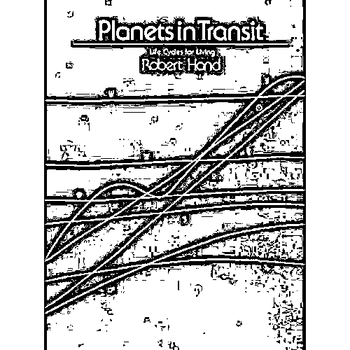
《行星的行进》

1997 年，他成为阿罗汉媒体（Arhat Media）的创办人之一，这是一家保护和出版历史占星学及其相关手稿的研究档案馆兼出版社。罗伯特·汉德为其他占星师和普罗大众提供了专业的占星学媒介与服务，在职业实践中，他使用返照、日心占星、恒星、汉堡虚星、宇宙生物学、占星学绘图以及重新发现的用于古代及中世纪的 mundo 术。

* * *

**当今最博学的占星学者之一的罗伯特·汉德将在若道开课啦！2016 年 6 月 19 日，由他主讲的**古典**占星学进阶网络课程**即将**开课！本课程可作为 ISAR 职业占星师资质认证项目的三门选修课之一。在下面的视频中，你能初步了解本课程的部分内容。**

📹 [`v.qq.com/iframe/preview.html?vid=i0198v3ijnd&width=500&height=375&auto=0`](https://v.qq.com/iframe/preview.html?vid=i0198v3ijnd&width=500&height=375&auto=0)


# 干货 | 我们为什么要找学习占星学的妹子做老婆

> 原文：[`mp.weixin.qq.com/s?__biz=MzA5NjA0NTAxNg==&mid=2651384909&idx=1&sn=5a6c7a3b625b1e1003ee4271bd21b6a6&chksm=8b4a5efabc3dd7ecf56cd2c0cf3426a0a7fa437fc463803ac4fb7aa88d029edaee90a8aaaff4&scene=126&sessionid=1692738836#rd`](http://mp.weixin.qq.com/s?__biz=MzA5NjA0NTAxNg==&mid=2651384909&idx=1&sn=5a6c7a3b625b1e1003ee4271bd21b6a6&chksm=8b4a5efabc3dd7ecf56cd2c0cf3426a0a7fa437fc463803ac4fb7aa88d029edaee90a8aaaff4&scene=126&sessionid=1692738836#rd)

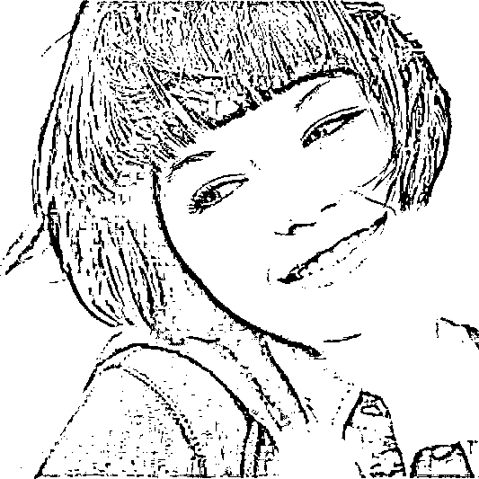

作者/杰西卡·默里 图片/VCG

译者/Christy 校对/王宏

稿件来源/ANS

为什么要找学习占星学的妹子当老婆？那是因为学习占星学——尤其是人本主义占星学的妹子，气质脱俗颜值高，自带疗愈功能，一技在身，搞定老板教好下一代，更妙的是她们把用来“作”你的功夫都拿去做自我觉知了，多省心啊！占星师妹子们还有多少奇妙的功用等待你去发掘呢？来看看吧。

**占星师妹子们是怎样工作的**

占星学是一种符号化语言。出生星图正是用这种符号语言设定的、展现个人人生目标的地图。出生星图源于在你出生的那一刻，你所出生的确切地点上天空中行星的排列。这些符号之所以抽象是有原因的。正如埃及象形文字指代的概念远比一个单独的字可以传达的概念复杂得多，行星文字和星座以及行星之间的几何角度都有着丰富的多层意义。

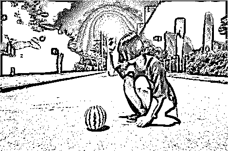

如果你想让占星师绘制你的星图，你可以进行预约，要么去他们的办公室进行解读，要么在电话里进行。占星师会让你提供出生日期和地点，理想状态下，还要说明是几时几分出生的。不知道自己具体出生时间的人也能让人绘制出自己的星图，虽然精确性会打折扣，但仍然会揭露大量信息。

我喜欢当面做解读，尤其是在第一次与某人见面时，因为面对面能提供更多的渠道让直觉信息流动。占星学包含一个神秘的（隐藏的）部分，该部分将死记硬背的技巧与更为玄妙的东西结合在一起。当我们坐下一起喝茶时，我们的对话从纸上的数据开始，然后快速扩展到这些数据在心理—精神层面的含义上。星图成为了通往心灵的渠道。

在解读完你的星图后，大多数占星师都会给你一份星图以及咨询的录音。

**占星师妹子们能给你提供什么信息**

利用你的出生星图（这通常是一个人的切入点），占星师可以提供给你关于你是谁的不偏不倚的概述。**星图向占星师展示了你潜在的优势、挑战和先天禀赋，以及你容易陷入困境的领域。**你的占星师会向你描述，星图展示出了你怎样的内在资源，以及你需要努力的地方。更倾向于精神层面的执业占星师会从灵魂的目标角度来进行描述。

星图中有一些主题暗示了为什么我们每个人会来到这一世。

*   在**行进或推进**的解读中，占星师可以解读出**那时发生在你身上的任何事件的更大的意义**。她可以看出，星图展现出的在你人生的这一阶段、这个月、这一周，甚至这一天，你更高的自我正在努力学习的是什么。比如，导致你换工作的真正原因是什么？你可能认为是财务问题，但她或许会查看你的星图并看出一种不可避免的情绪转变，无论你在做什么工作，或你挣多少钱，这种转变都会发生。

*   在**比较盘**中，占星师能帮你认清，**你的需求是否与你新男友的需求看起来相像**。占星学很擅长精确地找出一个人的需求、品味、信仰和欲望，并将之与另一个人的进行对比。一段关系背后可能不那么明显的主题因此得以揭露。当你知道你与某人在哪些方面有本质上的不同，以及在哪些方面是步调一致的时，你就有了许多可利用的信息。

**占星师妹子们可不只是用来预测的**

一个常见的错误观念是，现代占星学可以进行预测。事实上，几个世纪以前，占星师的确这么做过，一些占星学派依然在这么做，最显著的是在印度这类社会中，在那里主流的世界观更具宿命论特色。

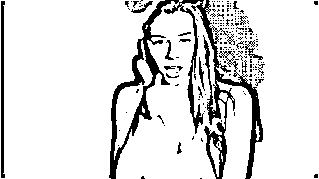

**然而，大多数西方当代占星学是基于心理学而非占卜的。**的确，由于占星学具有超越几何的超感官层面，因此你可能在做星图解读的过程中听到一些来自你的占星师的极其精准的反馈。甚至连占星师自己也很难解释她是如何想到自己所想到的这些情境的。

比如，她可能在你的星图中看到，一场朝向清理的突如其来的转变即将发生在你身上，她可能想到旧货出售的场景。她可能尝试将这一场景作为比喻告诉给你，却得知你真的在下周安排了旧货出售。

这种情况之所以发生，是因为人生中的一切都是象征符号。你的人生已经选择了旧货出售的象征符号来表达那一清理的主题，无论以什么方式，这一主题都会在提及的时间段里被表达出来。**占星师能看出该时间段的意义所在，但只是以主题的形式。**你更高的自我选择完美的方式来将其表达出来。

**如何正确使用占星师妹子**

占星师能够看出你星图中的趋势，无法看到细节。她不需要知道你如何体现自己特定的主题，她会以一般形式来看待它们，这对你而言是去看它们的最有用的方式。这样一来你就能开始领会你不断变化的细节之下始终如一的趋势。

**尤其是初次做星图解读的时候，你的占星师所用的比喻可能非常抽象。**她根本就不认识你，只会解读整体的模式，而不会试图猜测它们所采取的形式。在查看你的星图时想象出旧货出售情景的占星师并不知道你是否要精简你的公司、扔掉你的旧鞋，或是对你的内在价值推陈出新。这取决于需要发生什么样的事件才能教会你即将到来的宇宙功课。

而这才是你真正想知道的。在你急着把背景故事告诉给占星师之前，要考虑到，通过在这一层面倾听你星图的真相，你会从首次星图解读中获得更多的信息。

**行星本身不会预测你会做些什么，它们只会透露你为什么要这么做。知道原因能让我们更有意识地参与到所发生的事件中。**

**然而妹子不能告诉你什么是“正缘”**

**你的出生星图是一张编码的地图，而不是一张等待发生的刻板事件的清单。**大多数占星师认为，不存在与人类意志相分离的名为“命运”的这种东西。因此，所有这一切之中的未知因素是自由选择，一个人变得越有意识，他的选择就越自由。

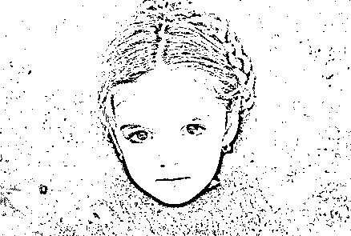

有些人听到以下内容可能会很失望：**没有特定的事件会因为天空中的天体形成特定的角度而发生。**天体周期也不会强迫我们理解任何事，它们没有得到授权。**它们只是宣布主题**，这些主题如果是带有洞察力地被解读，就可能变成我们的经验教训。它们还明确了这些经验教训何时会被教授。

星图会说出我们与谁相处最和谐吗？在我们吸引的是与自己相同的人这一方面而言，星图确实会给出答案。比如，我们每个人对于理想的男子气概都有自己的版本，这是通过火星这一行星表达的。星图中如果有颗好战的火星，就会比带有内敛火星的星图更有可能倾心于海军、警察和竞技运动员。

但是你的星图完全不会真的描绘外在现实，它只会描绘你自己心灵的状态。一个有着炽热火星的、有自我意识的人可以将其展现为无畏的勇气，并容易吸引其他表现出这种特质的人。

占星师可以帮助你了解你内在的雄性特质（无论男人、女人，我们都有火星，无论我们的性倾向如何）的最高潜能。占星学的目标是让你重新认识你的火星最强且最优的特质。这让你重新接触自己心灵中可能变得疏远的或未被充分利用的部分。逐渐了解你的火星会让你更有可能遇见这种增强形式的男性能量。你可能会开始吸引英雄，而不是恶霸。

你星图中的其他所有行星也都是如此，每一颗都往往会在其他人的镜子中，以更有创造力的方式反射到你身上。

**外面没有别的妹子，只有你自己**

别让你的占星师告诉你，你是否会在今年夏天遇见你一生的挚爱。你的亲戚可能知道，而你的占星师却不知道。**占星师只看哪些主题被强调了。如果一位新男友会主动教给你有关其中一个主题的事，那么你就可能遇见一位新男朋友。**

当然，一个人的星图上会显现出重要的情感和心理功课，而众所周知，宇宙常常将人际关系运用到极致，来教授这类经验教训。**但是如果一位男友在这类行进期间出现了，他会作为那个主题的载体而来到你身边，不一定会满足你想象中男友应有的样子。**

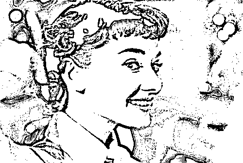

也就是说，你的占星师可能看出，今年夏天你的工作场所对你而言会成为热点，或者你与父亲之间的老矛盾即将显现，同样可能看到你的人际关系区域被激活了。这将意味着议题会出现。你可能发觉自己更在意浪漫了，你可能真的遇到某个对你很浪漫的人，你可能沉浸在展现浪漫的一部电影、一本书或一首歌当中。

**所以说，虽然你不能在星图本身中看到你的灵魂伴侣，但星图可能展现出去找到他的强烈欲望（因为意向创造现实，所以这常常等同于一回事）**。这种欲望在某些时候会比其他时候更强烈，这一点是在星图中能确切看到的。同样地，你无法从自己的出生图中看到你配偶的变化，但你能看到你对这些变化的态度。

简单来说，**你的星图中没有其他人，但有许多关于你人际关系业力及其发展方式的征象。**比如，占星师可能看到一种想要从关系的限制中挣脱的迫切需求。如果这种态度转变导致了你婚姻的实际转变，那也没什么奇怪的，对吧？

**但星图所展现的肯定都是内在事件。这是一位好的占星师可以帮助你理解和准备的。**

**现在你明白了么？赶紧娶她吧！**

占星学以加密的形式揭示了你的人生路径，并准确指出你现在所处的位置。占星师能帮助你看到难以言说的欲望和强烈的渴望背后的神秘含义，以及在不同方面可能让你感觉武断、难以理解和尴尬的日常情绪和方向的变化。她能向你展示，这些是如何与你整个一生的四季相契合的。这种观点能让人以更优雅的姿态生活。

**关于作者**

**杰西卡·默里**

在旧金山从事执业占星 40 年。在从布朗大学心理学、美术和语言学专业毕业后，1975 年搬到西部，在那里她开始研究卡尔·荣格，并因此接触到占星学。她著有《灵魂生病的国度》和《在十字路口》，并曾在《超个人占星学》选集中贡献笔耕。


你是这种占星师妹子吗？

别谦虚了，留言吧，

也许你的 Mr.right 正在评论区寻找你呐(⊙o⊙)。

**特别提醒：**

**本文首发于若道平台，**

**转载请联系后台授权。**


**想了解更多关于星座的知识？2016 年 5 月 19 日，蒋颖老师主讲的若道占星核心课程****Level 1-2****要开课了！没有报上名的朋友，还有 Level 1-5 连报可选择。**

**报名及咨询，请点击文末“阅读原文”**


# 错过 Level 1-2 的童鞋，还有 Level 1-5 连报等着你哦

> 原文：[`mp.weixin.qq.com/s?__biz=MzA5NjA0NTAxNg==&mid=2651384909&idx=2&sn=1e3c88a1bf9fbaae327021c511d4be3a&chksm=8b4a5efabc3dd7ecbe467cefd66ac317270f804e76d95663f1aadd6b510bede5cc774086a87d&scene=126&sessionid=1692738836#rd`](http://mp.weixin.qq.com/s?__biz=MzA5NjA0NTAxNg==&mid=2651384909&idx=2&sn=1e3c88a1bf9fbaae327021c511d4be3a&chksm=8b4a5efabc3dd7ecbe467cefd66ac317270f804e76d95663f1aadd6b510bede5cc774086a87d&scene=126&sessionid=1692738836#rd)

**蒋颖老师主讲的占星学入门课程**

****Level 1-2 就要在 5 月 19 日**开课了**

**还没有参与课程的同学可以点击：**

**[惊呆了，这真的只是若道一年级新生的水平吗？](http://mp.weixin.qq.com/s?__biz=MzA5NjA0NTAxNg==&mid=2651384523&idx=2&sn=05b55df84becd8db236864012cb60079&scene=21#wechat_redirect)**

**提前感受下若道的学习氛围**

**很可惜该课程已经结束报名了**

**错过的童鞋不要着急**

**在这里若道君有个好消息要告诉大家**

**若道已经开通了 Level 1-5 连报通道**

**你可以一步到位学习占星学了**

**最最吸引人的是**

**连报特惠价是 27000 元** 

**比起单独报名 1 阶到 5 阶**

**足足优惠了 7400 元！**

**** 

**那么吸引人，来看看******Level 1-5 具体学什么吧！****

L1-5 联报

课程简介

****

** Level 1：星座，太阳和月亮**

12 星座是占星学最基本却又最深刻的概念，黄道 12 星座，是伟大的生命周期，而太阳和月亮是我们阴阳之本。  

　　     

**Level 2：**遇见行星和月亮交点****

在这个阶段，你将遇见行星们，还有与灵魂的过往和未来相关的月亮交点。这既是你，你的性格，也是你在生命故事中将会遇到的人、事、物的显化，也是你灵魂轨迹的线索。


**Level 3：五彩线穿起来——宫位、相位及元素组合**

在这个阶段，你将学习宫位，知道生命的故事发生在哪里。你会学习相位，那是行星之间的对话，是一颗行星如何用自己的能量去影响其他行星。

然后，你要学习如何将星座、行星、宫位、相位组合起来进行解读，这是把散落的珠子穿起来的过程。这个部分非常重要，是大部分占星学习者薄弱的环节，也是从爱好者走向职业占星师道路时承上启下的一个重要阶段。


**Level 4：星图舞会——星图综合解读 24 小时**

在这个阶段，你终于可以学会星图的综合解读了！前一阶段你学习得越扎实，现在就越开心。你可以看到，当那些行星、星座、宫位、相位穿起来的丝线开始跳舞，一个个故事图景就像织锦一样展现在你的面前。个性、爱情、事业，看到一个人的出生星图，你就可以开始讲他们生命故事的梗概了。在这里，大卫老师会分别讲解如何通过出生图进行性格、爱情、事业分析。在爱情解读部分，你还会提前学到比对图。


**Level 5：气象预报——预测技术和咨询技巧**

在这个阶段，你将学习各种预测技术——行进、月亮次限、太阳弧、返照图。你会学到行星周期！宇宙天象如何变化？它又会如何影响每个人的人生？通过这些预测工具，你就能够开始预测和规划人生了。

有关毕业

**考试和实习：**对于那些想要获得大卫老师资质班证书的朋友，我们将帮助大家在开始成为职业占星师之前，将由专业占星师组织小型督导工作坊，帮助大家实战解盘，为正式的收费咨询做好准备。通过毕业考试，参加督导工作坊，星盘解读的同学，将获得大卫老师颁发的职业占星师资质证书。

授课优势

**①先进的教学平台**

网络教学平台，支持手机、电脑、iPad 上网，可以随时随地学习。

**②回放复习**

学员可登录网站收看课程回放，在线复习课程，每次课可完整重看 3 次，课程结束后的 3 个月内有效。　

课程特色

**①与名师面对面**：北京同学可以来若道现场上课，和大卫老师面对面互动。大卫老师也可能前往主要学员所在城市，实现零距离教学。

**②互动答疑**：论坛、微信群随时提问；老师课上答疑；助教线上线下全程协助。

**③线下沙龙**：定期举办沙龙活动，复习上课内容。

**④强大的同学网络**：若道作为中国最顶尖的占星教学机构，在 4 年的占星教学中，培养了很多占星人才。若道让你和师兄师姐切磋，让你和国内著名占星师学习。（简单来说，就是，人脉！）网络授课，在北京开设免费现场参与名额，全程英文授课，配备实时翻译。

师资力量

**讲师团队**


**大卫·瑞雷（David Railey）**

若道创始人，《灵魂的目标》作者。拥有 46 年的占星咨询的执业经验，曾两任亚特兰大占星协会主席，是全美占星师联盟（AFAN）、美国占星师联合会（AFA）、全美占星研究委员会（NCGR）、国际占星研究协会（ISAR）和职业占星师组织（OPA）的成员，是联合占星大会（UAC, United Astrology Conference）督导委员会委员。大卫曾是 CNN、CBS 的占星节目的常驻嘉宾，多次在 BBC、WGS、WSB、WRGG 等节目中接受采访，并在亚特兰大主持电视节目《每日行星（Daily Planets）》达 4 年之久。


**蒋颖（Felicia）**

若道创始人，职业占星师。在若道系统学习占星，师从大卫·瑞雷。长江商学院 MBA，厦门大学经济学硕士，化学学士。国际占星研究协会（ISAR）中国区副主席。第一批获得国际占星研究协会（ISAR）认证的职业占星师。《灵魂的目标》译者。

**在后台回复**** 蒋颖 即可查看她的全部文集**

长按二维码添加课程负责人~

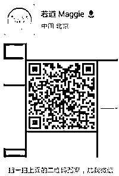

**报名及咨询，请点击文末“阅读原文”**


# 开课通知 | Level 1-2/原型占星学员请入

> 原文：[`mp.weixin.qq.com/s?__biz=MzA5NjA0NTAxNg==&mid=2651384909&idx=3&sn=c3758f2823ed11139870e767f4e10136&chksm=8b4a5efabc3dd7ec553ee3057b3ead53369dc0bd14edcf880d557b43df2a7e93f05e837b571d&scene=126&sessionid=1692738836#rd`](http://mp.weixin.qq.com/s?__biz=MzA5NjA0NTAxNg==&mid=2651384909&idx=3&sn=c3758f2823ed11139870e767f4e10136&chksm=8b4a5efabc3dd7ec553ee3057b3ead53369dc0bd14edcf880d557b43df2a7e93f05e837b571d&scene=126&sessionid=1692738836#rd)

**本周若道开课两堂**

**分别报名了 Level 1-2 或原型占星学的同学**

**要准时参加哦**

**若道核心课程 Level 1-2 网络课（蒋颖老师主讲）**

**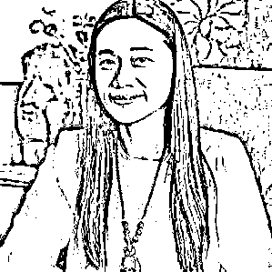** 

开课时间：2016 年 5 月 19 日周四晚 8 点

课程顾问：Maggie（长按二维码添加咨询）

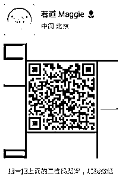

May. 19

2016

+

更多内容请点击以下链接 

**[蒋颖老师 Level 1-2 就要开讲了，学员们，你们在哪？](http://mp.weixin.qq.com/s?__biz=MzA5NjA0NTAxNg==&mid=2651384881&idx=2&sn=f2292076e7ce4aac34088a4289c6306e&scene=21#wechat_redirect)**  

**塔纳斯原型占星学网络课**

**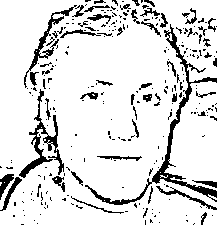** 开课时间：2016 年 5 月 21 日周六上午 10 点

课程顾问：Sara（长按二维码添加咨询）

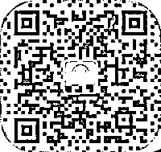

May. 21

2016

+

后台回复 **原型** 获取更多内容

**报名及咨询，请点击文末“阅读原文”**


# 苏·汤普金斯中国行圆满结束丨博学又机智，还这么可爱！

> 原文：[`mp.weixin.qq.com/s?__biz=MzA5NjA0NTAxNg==&mid=2651384881&idx=3&sn=7cba2f862c805b1e1514a5842b056727&chksm=8b4a5e86bc3dd7906bce468f10953697474c731a2434ef274a3605926a665586ce3e5e2c1a9e&scene=126&sessionid=1692738836#rd`](http://mp.weixin.qq.com/s?__biz=MzA5NjA0NTAxNg==&mid=2651384881&idx=3&sn=7cba2f862c805b1e1514a5842b056727&chksm=8b4a5e86bc3dd7906bce468f10953697474c731a2434ef274a3605926a665586ce3e5e2c1a9e&scene=126&sessionid=1692738836#rd)

4 月 26 日到 5 月 11 日，国际著名占星师苏·汤普金斯老师受若道占星之邀抵达中国，在中国开展了医疗、顺势工作坊，还与中国读者亲密接触。我们来一起回顾一下~

**医疗占星学工作坊**

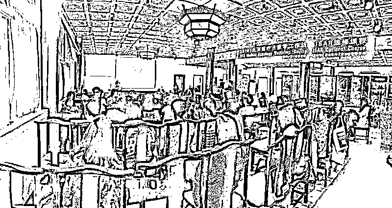

2016 年 4 月 30 日，苏·汤普金斯老师的首站——为期三天的医疗工作坊开始了。在工作坊上，苏·汤普金斯老师详细介绍了星座与行星与身体相对应的部位，以及相关疾病。还有干货满满的案例分享。

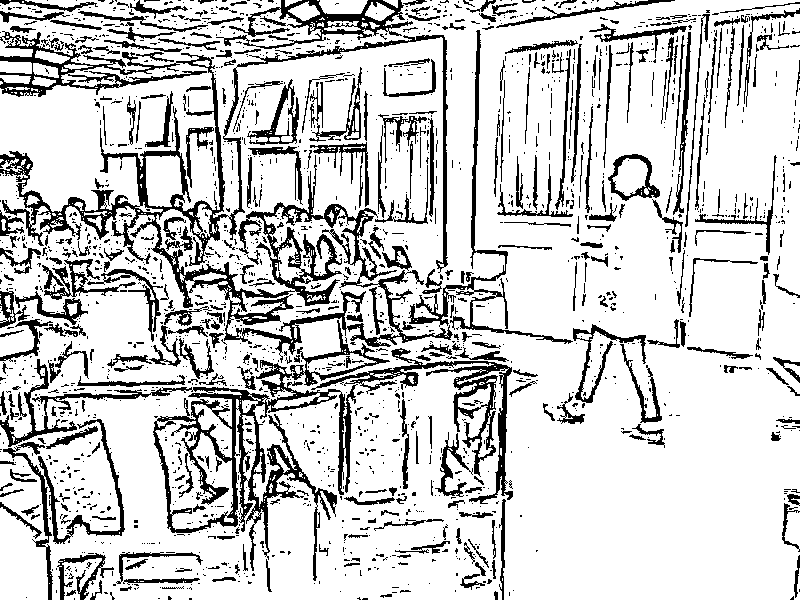

精彩内容分享：木星与动脉、身体的新陈代谢相关，与肺部也有一些关系。与木星相关的金属是硒。与木星相关的疾病通常都与“过度”相关，与土星相关的疾病通常与“匮乏”相关。与木星相关的器官是肝脏，肝脏会接纳你所有摄入的东西，你喝的咖啡、酒精、肉……肝脏会把你所有接纳进来的东西消化掉，它是一个保护者，除非你摄入很多过量的东西才会把它击垮。

**苏·汤普金斯签售**

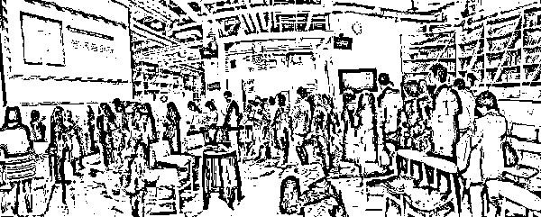

2016 年 5 月 5 日，苏·汤普金斯的中国行进入签售书籍阶段。签售现场，苏·汤普金斯细致地回答了来自若道读者和现场的问题。身体的疾病也不一定全部是心理的原因导致的，如果顺势疗法能够对症下药，找到正确的药物，对于人身心健康的疗愈是非常有帮助的。

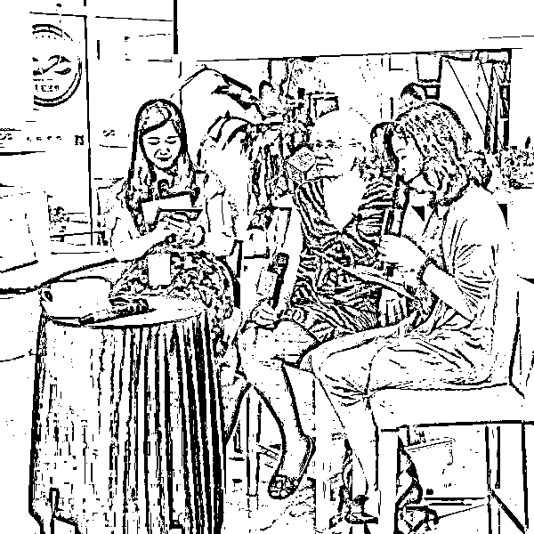

苏·汤普金斯老师对于占星学的付出始终是无怨无悔的。她说，如果她重返 20 岁，她依旧会选择占星学。

**顺势疗法工作坊**

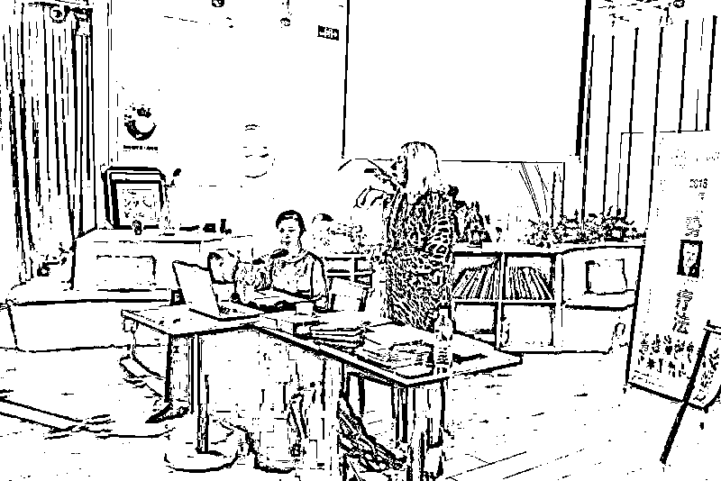

2016 年 5 月 7 日，苏·汤普金斯老师的中国之行进入最后阶段——顺势疗法工作坊。苏·汤普金斯老师既是占星师也是顺势治疗师，她曾说到：“顺势疗法提倡的理念是以人为本，顺势治疗是基于一个人的整体，而不是疾病本身。哪怕是同一种疾病，原因不同每个人的用药也不同。”顺势疗法的整体治愈理念就是去激活人体自身的疗愈程序。

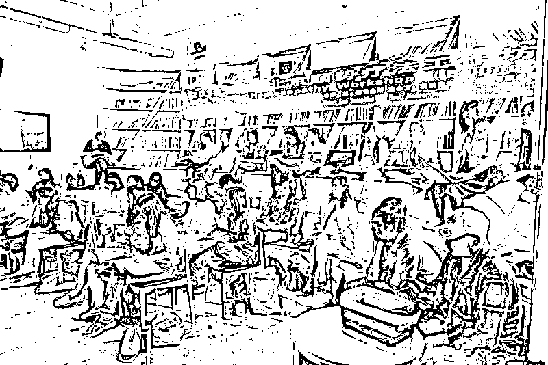

课程中不仅有关于顺势疗法的原理和理念的介绍，还有大量的互动环节和实战个案环节。最有趣的的是“送药环节”，苏·汤普金斯老师现场演示如何配置顺势药剂，虽然在场的同学争先恐后，但老师还是补充了一句：“希望你们用不着这些药……”小编觉得，留作纪念也是满满的幸福。

**福利来啦**

**访谈内容大放送**

QA**若道君**若道占星工作人员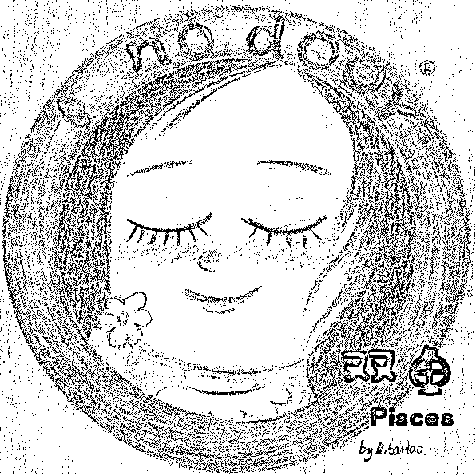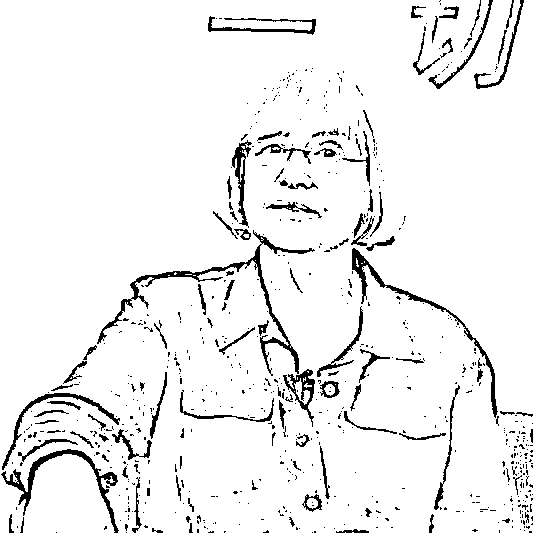**苏·汤普金斯**著名占星师若道君众所周知，您是一位有影响力，和丰富实践经验和教学经验的占星学家。回望您与占星学同行的这么多年里，您对占星学的认识，是否经历过什么变化？没有变化。因为当一个人随着年龄增长的时候，他会逐渐的成熟。占星学不是一个你可以马上辨知一切的学科，总是有一个学习的曲线。而且在一个学习的曲线中你会不断发现新的东西，这是占星学很好的一点。苏·汤普金斯若道君在您的生活当中学习和使用占星学给您带来的最重要的实际价值是什么?您的日常生活当中什么情况下会使用占星学呢？使用的频率是？假如某一天你感觉不对劲，可以抬头望一望天空，或许你对于一些事情会有新的理解，有时候也会给你一些警告。很多年前，我看到自己的星图有很多复杂的行进，后来有一天，我感觉到开车会不安全，所以就步行去遛狗，但是还是被一只狗扑倒了，摔成了骨折，当再次返回看到星图时，我对星图有了一些全新的看法和理解，回想这件事情，我觉得是有一点搞笑的。苏·汤普金斯若道君不同的人星图中的星座元素不同，不同的行星在每个人身上发挥的能量也不同，每个人是应该尽可能地将自己能量最强的部分发挥地淋漓尽致呢，还是尽量去弥补能量不足的部分？充分的、尽可能的做你自己，很多人对于自己缺失的那部分都太放不下了。你可以轻柔的碰触缺失的部分，但是仍然要做自己，比如你是土象星座，你可以多种花，与大地打交道。那些以为没有在做自己的人，其实你本来就是你自己，你只需要接纳自己，然后充分发挥自身特长，最重要的是跟随内心的声音。苏·汤普金斯若道君这个问题关于占星学中的预测，有人问，如果我们看到一张星图上有非常具有挑战的相位，比如冥王星和火星、火星和天王星呈四分相，同时行运冥王星、天王星又触及这个相位，您会对此进行负面的可能性预测么？我们要告知一切可能发生的意外么？在这个情况下，我会尽量正向地向客户描述这些发生的行运。但是我们要和天空一起工作，假如这个客户有行进的冥王星，我们就要做冥王星的事情。当然，假如有危险要发生的话，也是需要去提示这位客户的。但我们要摆脱好与坏的概念，这个把生活过于简化了，生活不是简单的好与坏。比如说你会成为某位了不起的人物，你的星图里有一些非常紧张且有压力的相位出现，这些相位实际上是来帮助你成长，因为四分相就意味着成长。苏·汤普金斯若道君您最近有出版新书的计划么？如果有会是哪一个方向呢？我写一本书会花很长的时间。但是现在我在筹备写一本顺势疗法的书籍，会重点面向中国的读者。我觉得顺势疗法在中国市场将会有很大的发展。很多人对于顺势疗法如何对人的身心健康起到疗愈的效果比较好奇。顺势疗法和中医一样，是作用于一个人的整体的，而不单单是疾病本身。身体的疾病也不一定全部是心理的原因导致的。如果顺势疗法能够对症下药，找到正确的药物，对于人身体健康的疗愈是非常有帮助的。苏·汤普金斯

.gif")

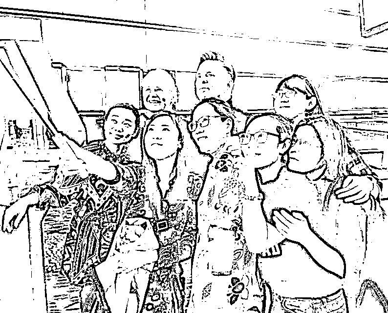

▲苏·汤普金斯老师与若道工作人员一起合影

**欢乐的相聚总是结束得特别快，期待我们下一次的相聚。**


# 蒋颖老师 Level 1-2 就要开讲了，学员们，你们在哪？

> 原文：[`mp.weixin.qq.com/s?__biz=MzA5NjA0NTAxNg==&mid=2651384881&idx=2&sn=f2292076e7ce4aac34088a4289c6306e&chksm=8b4a5e86bc3dd790928df083c28b005aec0dc5d3bb59b8b12567b44de346f98a39c81f87aee7&scene=126&sessionid=1692738836#rd`](http://mp.weixin.qq.com/s?__biz=MzA5NjA0NTAxNg==&mid=2651384881&idx=2&sn=f2292076e7ce4aac34088a4289c6306e&chksm=8b4a5e86bc3dd790928df083c28b005aec0dc5d3bb59b8b12567b44de346f98a39c81f87aee7&scene=126&sessionid=1692738836#rd)

**若道 2016 年核心课程 Level1-2 蒋颖老师专场将于 5 月 19 日正式开课！**

**上课时间、如何登录、课后复习、资料查询……**

**所有你的疑问都能在这里找到答案！**

**▼**

<fieldset data-width="100%" style="border: 0px; width: 100%; clear: both; overflow: hidden; box-sizing: border-box;">


什么时候报到入群？


</fieldset>

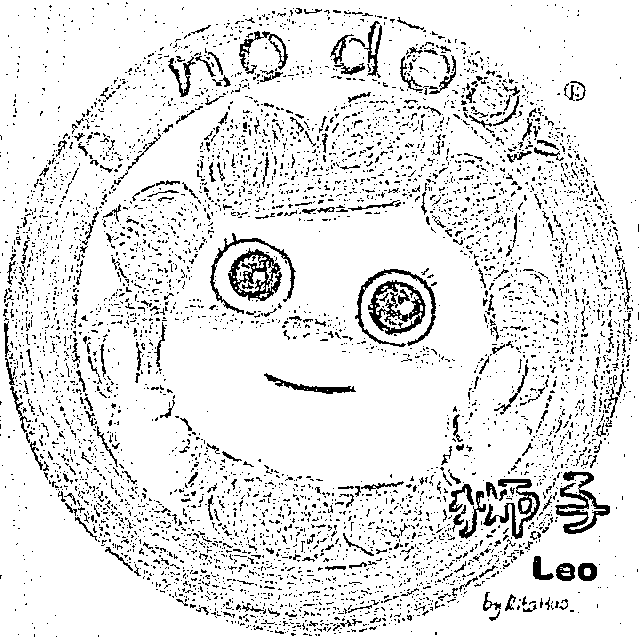


5 月 15 日（周日）我们将组建课前微信群，课程顾问会邀请您入群。5 月 16 日（周一）晚 19：00，我们会举办开学典礼，同时为大家进行线上教室测试，详情请大家留意微信和手机短信。


<fieldset data-width="100%" style="border: 0px; width: 100%; clear: both; overflow: hidden; box-sizing: border-box;">


请问每周上课时间？


</fieldset>


5 月 19 日起每周四晚 8 点-10 点黄金时间，请将网络锁定在若道 2016level1-2 在线教室。助教答疑互动时间请参看课前发放的课程表。


<fieldset data-width="100%" style="border: 0px; width: 100%; clear: both; overflow: hidden; box-sizing: border-box;">


在哪上课呢？


</fieldset>


我们的暗号……（会议号、密码）。请登录若道官网 www.nodoor.com，点击个人中心，查看开课通知书。如果别人问，打死也不能说！


<fieldset data-width="100%" style="border: 0px; width: 100%; clear: both; overflow: hidden; box-sizing: border-box;">


错过当晚直播怎么办？  


</fieldset>


别急！谁家里还没点事儿吶？错过了直播请在课程结束后的 24 小时登录若道官网 www.nodoor.com，进入在线课程收看课程回放补课。特别提示：请务必在课程有效期内温习和补课！！


<fieldset data-width="100%" style="border: 0px; width: 100%; clear: both; overflow: hidden; box-sizing: border-box;">


课程资料哪里找？


</fieldset>


登录官网 www.nodoor.com——个人中心——在线课程——课程资料栏对应讲数下载课件！


<fieldset data-width="100%" style="border: 0px; width: 100%; clear: both; overflow: hidden; box-sizing: border-box;">


懒得阅读这么多文字，还不了解开课须知怎么办？ 


</fieldset>


请呼叫若道课程顾问，萌萌的课程顾问会为你详细解答。不过没有语音版，仍然是文字版！哈哈哈哈~


<fieldset data-width="100%" style="border: 0px; width: 100%; clear: both; overflow: hidden; box-sizing: border-box;">


若道课程顾问的工作时间？


</fieldset>

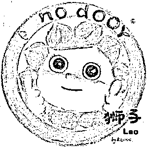


周一至周五早 10：30-19：30，课程顾问会一直守护着您~偶尔课程顾问不在服务区会提前告知您~  


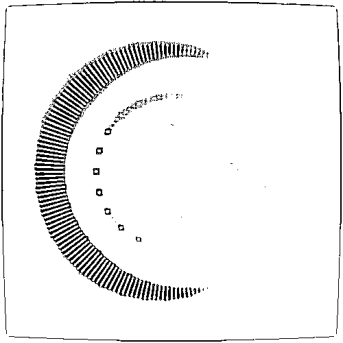

**若道课程部联系方式**

若道客服电话：**400-619-1014**

若道客服邮箱：**nodoor@vip.126.com**

您有学习中有困惑：请在课程群里请**@若道助教**

关于课程咨询：请**@若道课程顾问**

任何投诉建议可联络若道**课程总监 Freya** 

电话:**18601950700**

邮箱：**freya.li@nodoor.com**

我们还有以下福利：

****①****

**班级微信群**

请联系**工作人员**，他们会邀请你进入

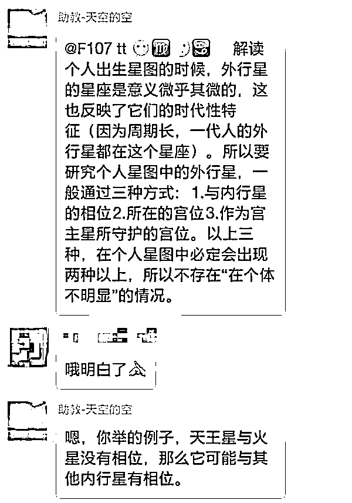

**②**

**若道论坛班级版**

传说中的隐秘树洞，若道带你重温做作业的 Feel~

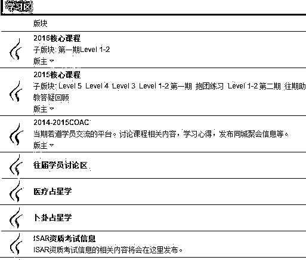

**③**

**若道荔枝 FM 读书会**

可点击二维码进入！还有**喜马拉雅**！点击喜马拉雅，搜索“**若道占星**”，在占星海洋中拾贝，收听往期**公开课录音**！

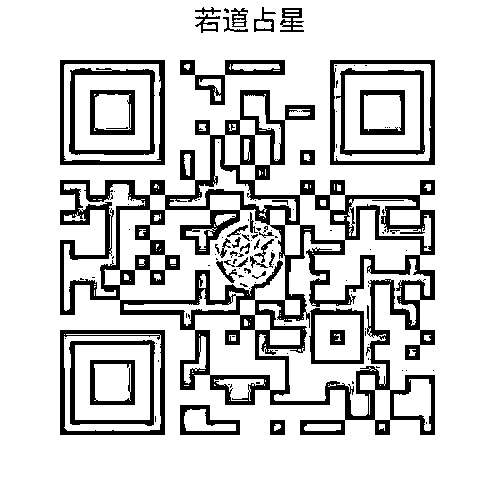

**④**

**若道新浪微博**

点击**新浪微博**，搜索“**若道占星**”。当占星文字遇见绚丽图片，轻松的媒体触发你的所有感觉。

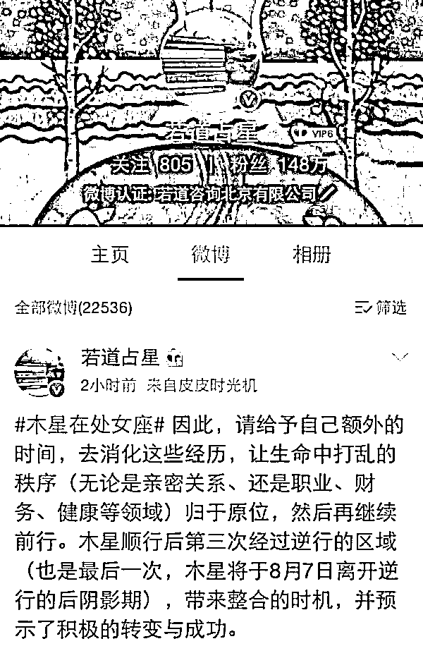

**⑤**

**若道微信订阅号**

每日推送精彩文章、最新活动。


**⑥**

**若道微信服务号**

搜索课程、查询咨询请点击菜单。

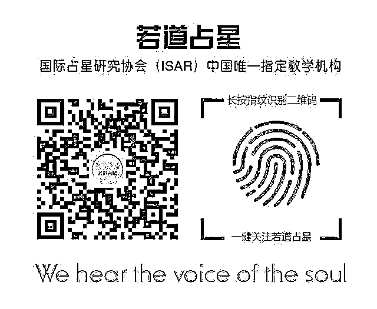

**马上就要开始学习占星啦！2016 年 5 月 19 日，蒋颖老师主讲的若道占星核心课程****Level 1-2****要开课了！没有报上名的朋友，还有 Level 1-5 连报可选择。**

长按二维码添加课程负责人~


**报名及咨询，请点击文末“阅读原文”**


# 十二星座扮靓全攻略 | 你的星图就能告诉你这个春夏该怎么穿

> 原文：[`mp.weixin.qq.com/s?__biz=MzA5NjA0NTAxNg==&mid=2651384881&idx=1&sn=dc103f7ece1498286abe1611c6744da7&chksm=8b4a5e86bc3dd79075bb547dd1318217576e318bd990a4e2667e21680f2b155da2eb5807e320&scene=126&sessionid=1692738836#rd`](http://mp.weixin.qq.com/s?__biz=MzA5NjA0NTAxNg==&mid=2651384881&idx=1&sn=dc103f7ece1498286abe1611c6744da7&chksm=8b4a5e86bc3dd79075bb547dd1318217576e318bd990a4e2667e21680f2b155da2eb5807e320&scene=126&sessionid=1692738836#rd)

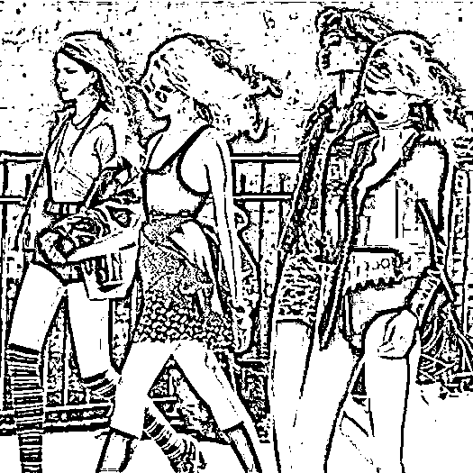

作者/理想国的女巫 图片来自网络

她迷人的五官和惊艳的嗓音散发出无穷魅力，但她真该减肥了。

**——“老佛爷”卡尔·拉格斐**

﹁

**你真懂穿衣打扮吗**

﹂

一个人的穿着打扮透露着 TA 对生活的基本态度，及生活习性和个性倾向。同时，也代表着 TA 偏向以怎样的姿态向外界展示自己，又是如何向世界这面镜子 say hello 的。

外在的即是内在的。内在的能量会在外在有相应的显现，古人云：相由心生。外在形象的转变，也会带动我们内在的能量转换，在穿着休闲装昨天的你和穿着职业装今天的你，所呈现出的心情状态肯定是不一样的。而无论你喜欢的是帅气的裤装，还是婉约的裙装，无论钟意于低调的简约风，还是奢华的珠光宝气范，那都是属于你内在能量的一种向外投射与显现。 

﹁

**十二星座该怎么穿**

﹂

**从占星学指征看穿衣打扮** 

在占星学中，如果想要了解一个人的日常生活中的审美风格，着装喜爱与品味可以通过观察 TA 出生星图中**金星的落点**来予以了解，而金星所落入的星座是一个重要的指针。

除此之外，同时查看**上升点和太阳所落入的星座**，将会一同帮助我们综合了解与判断个人在形象装扮上的喜好倾向。

**如果你的金星落入天蝎座，而太阳落在天秤座，上升点却在白羊座，那以下文章中关于天蝎座、天秤座及白羊座的部分或许对你都是有效的。**

这将会给你带来一些不一样的审美洞见，以及从多维度来发现适合自己的装扮，然而，得体适合的穿着打扮，的确能够让我们内在能量得到加持。

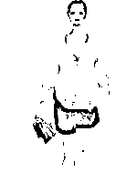
**▲**

**金星、上升、太阳落入白羊座** 

*   **白羊座性格基底**

*   开创的火象星座，守护星火星。个性鲜明，表达直接；超级行动派；行事干脆利落，不绕弯；笑起来天真爽朗，发狠起来直接抡东西；开心与不开心全都在脸上。 

*   **白羊座审美哲学**

*   有精神，有气场；可以帅气的很妩媚；偏爱裤装，喜欢干练的着装风格。 

*   **白羊座春夏扮靓单品**

*   简约 T 恤 or 衬衫，帅气牛仔裤+气场高跟鞋，运动短裤+小白鞋，大号包包，外加灿烂的笑容。

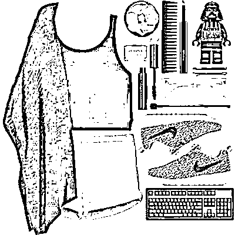 

**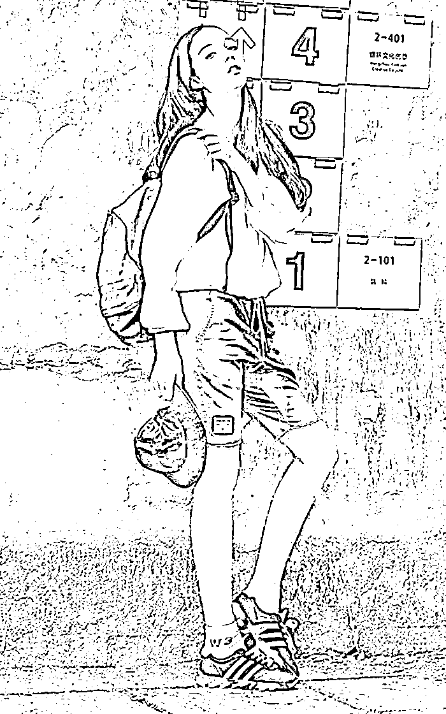** 

**********▲**********

****白羊座出街 LOOK**** 

**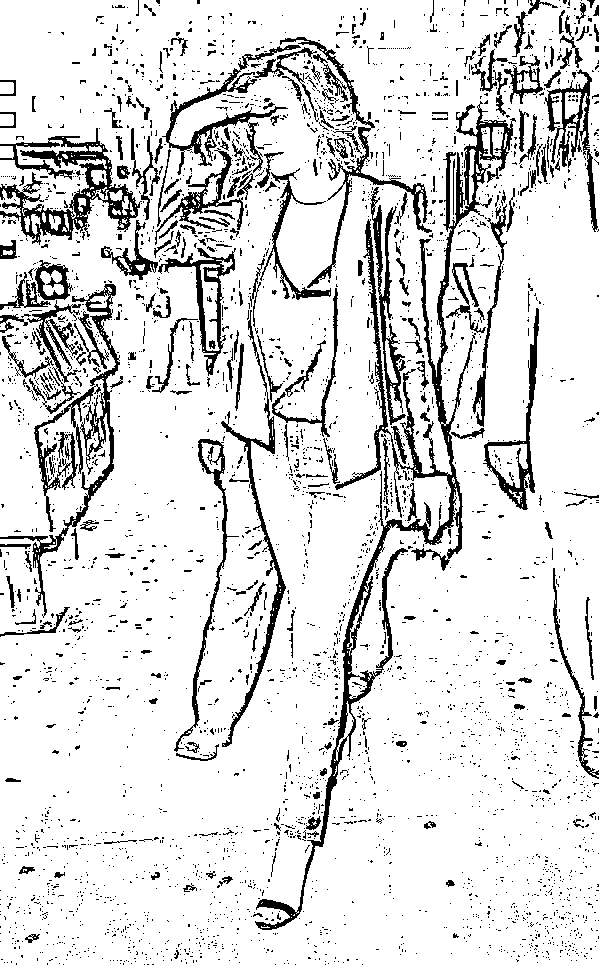** 

********▲********

**白羊座时尚星典范：**

**米兰达·可儿**

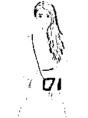
******▲******

**金星、上升、太阳落入金牛座**

*   **金牛座性格基底**

*   固定的土象星座，守护星金星。稳重沉着，情绪稳定；话语不多,但不吝啬展现甜美的微笑；拥有岁月静好的生活态度。 

*   **金牛座时尚哲学**

*   喜欢淡雅脱俗，不张扬的装扮；注重衣着的品质感与舒适感，对于面料的触感非常有要求；善于诠释大家闺秀的淑女范；偶尔来下田园风。 

*   **金牛座**春夏**扮靓单品**

*   真丝面料的衬衫，印花连衣裙，半高跟暖色系皮鞋，精致手链，外加浅浅的微笑。

 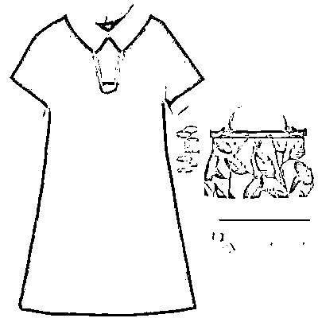 

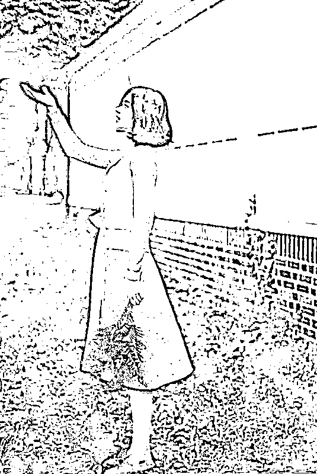

********▲********

**金牛座出街 LOOK**

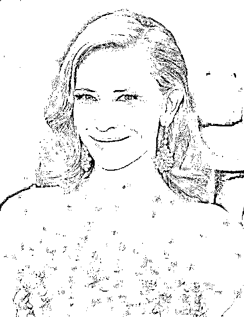

********▲********

**金牛座时尚星典范 凯特·布兰切特、**奥黛丽·赫本**** 

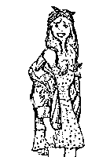

**********▲**********

**金星、上升、太阳落入双子座** 

*   **双子座性格基底**

*   变动的风向星座，守护星水星。喜欢新鲜的事物，遇见有趣的人；古灵精怪，活泼俏皮；神经系统异常活跃。 

*   **双子座时尚哲学**

*   没有什么是双子们不敢穿出街的，的确也没有什么是双子们驾驭不了的；会随着心情的变化来决定当下的装扮；偏爱颜色明亮活泼的装束，不喜欢过于沉闷老气的颜色。 

*   **双子座春夏扮靓单品**

*   跳色的指甲油（双子座主管人体的手指部位，因此双子非常注重手指保养与美丽），俏皮可爱的短裙，各种有趣的小饰品与配件。 

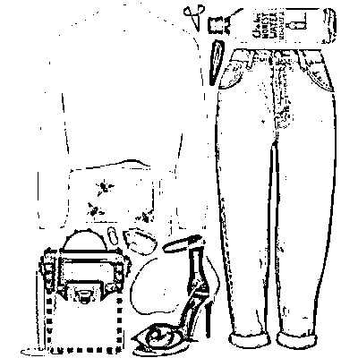

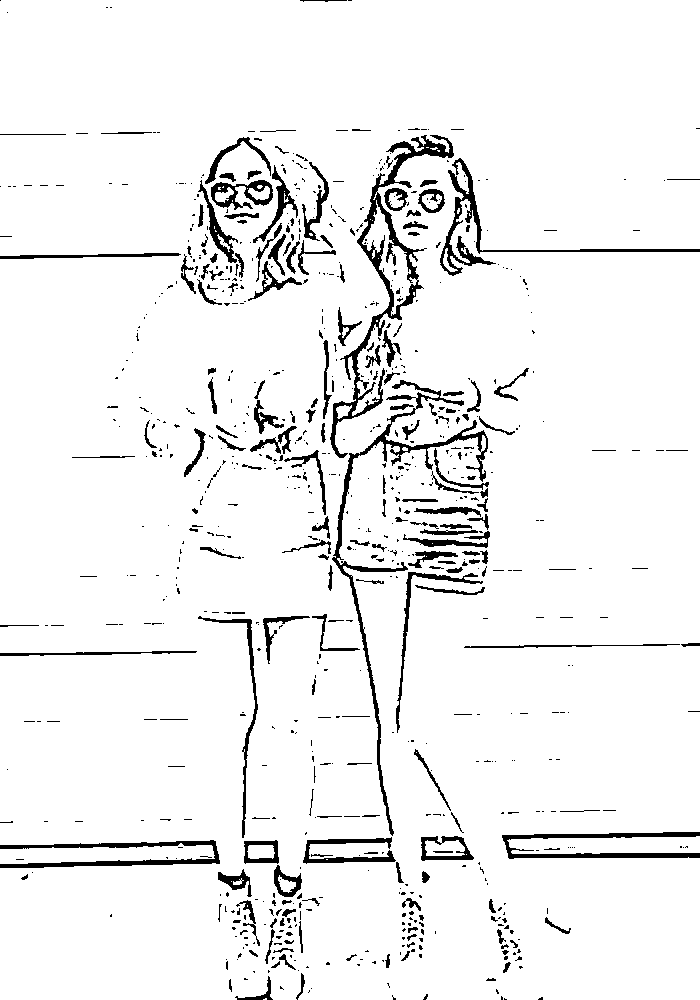 

**********▲**********

**双子座出街 LOOK**

**********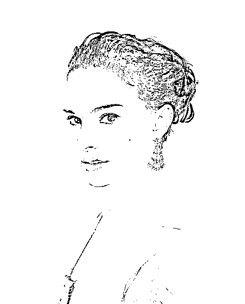********** 

************▲************

**双子座时尚星典范**

**娜塔莉·波特曼**

**
**********▲************

**金星**、**上升**、**太阳落入巨蟹座**

*   **巨蟹座性格基底**

*   开创的水象星座，守护星月亮。温柔，敏感，情绪；善于照顾与滋养；不要试图与蟹蟹讲大道理，蟹蟹们是情感渗透一切，要与他们谈感受。

*   **巨蟹座时尚哲学**

*   喜欢能体现女性柔美的装扮；不喜欢过于夸张的服饰与造型；喜欢淡色系并带些宽松飘逸的服装。

*   **巨蟹座春夏扮靓单品**

*   浅色系的碎花连衣裙，薄款淡色针织衫，婉约风的头饰，外加一脸的温柔。

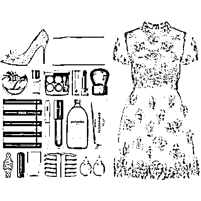 

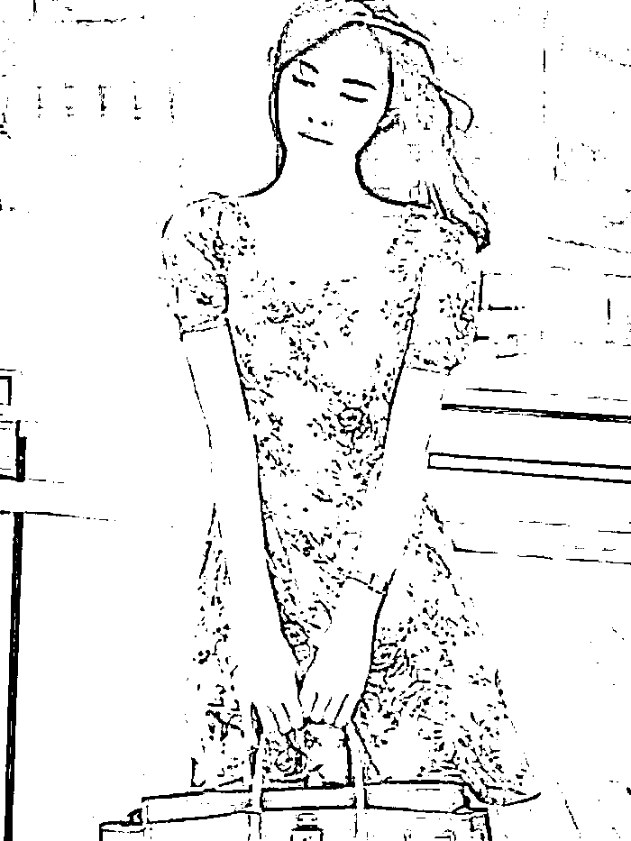 

****************▲****************

****巨蟹座出街 LOOK****

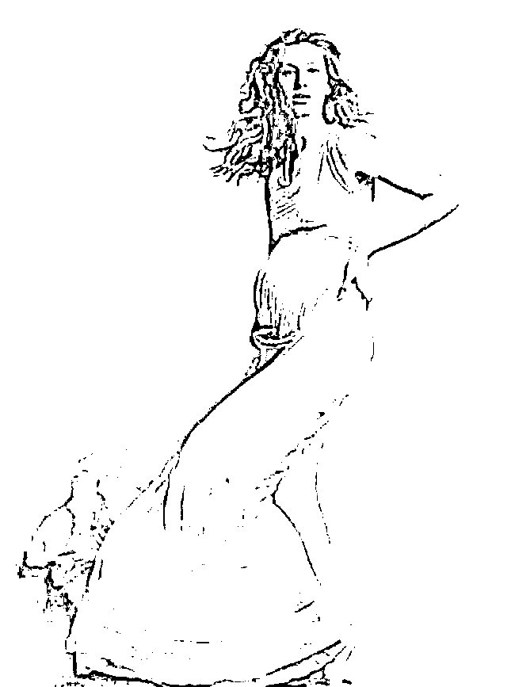 

****************▲****************

****巨蟹座时尚星典范****

****吉赛尔·邦辰****

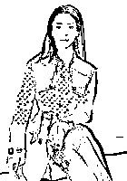
 ************▲************

**金星****、****上升****、****太阳落入狮子座**

*   **狮子座性格基底**

*   固定的火象星座，守护星太阳。个性阳光开朗，带着一些戏剧性；人前能自如的展现自己和表达自身观点；慷慨大方，魅力四射。 

*   **狮子座时尚哲学**

*   太低调没亮点的行头肯定是无法让狮子座们出街的；喜欢穿着靓丽鲜艳的服饰，配饰一定要闪亮；无论如何装扮，能引起他人的瞩目是第一大定律。 

*   **狮子座春夏扮靓单品**

*   几何图形的连衣裙，夸张的耳环，女王范的高跟鞋，大镜框的太阳眼镜，外加高昂的头。

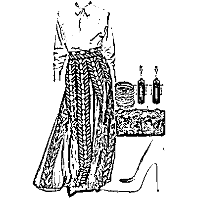 

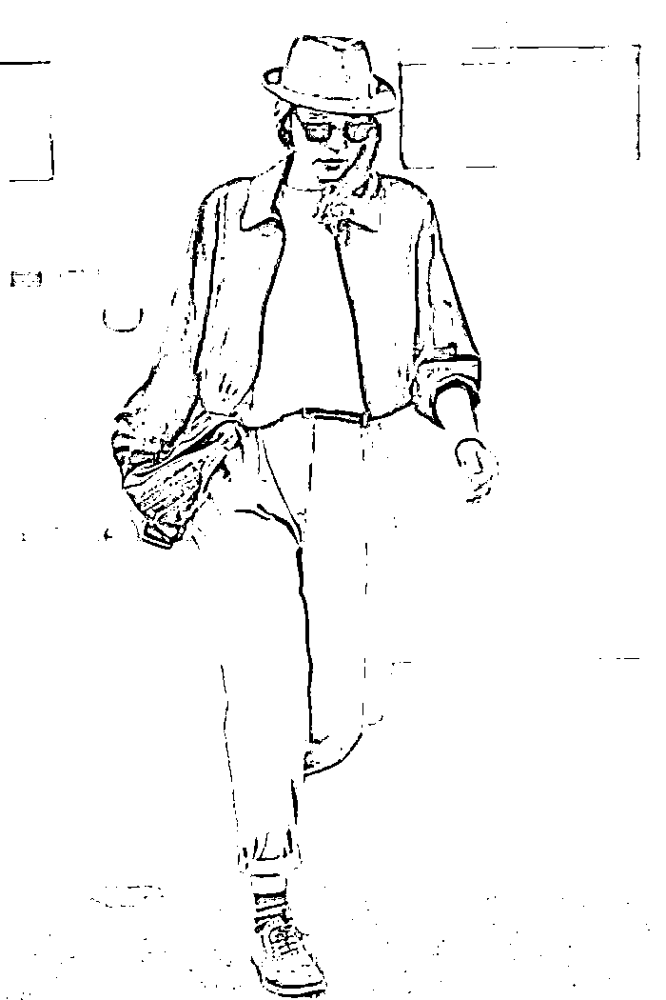 

******************▲******************

******狮子座出街 LOOK******

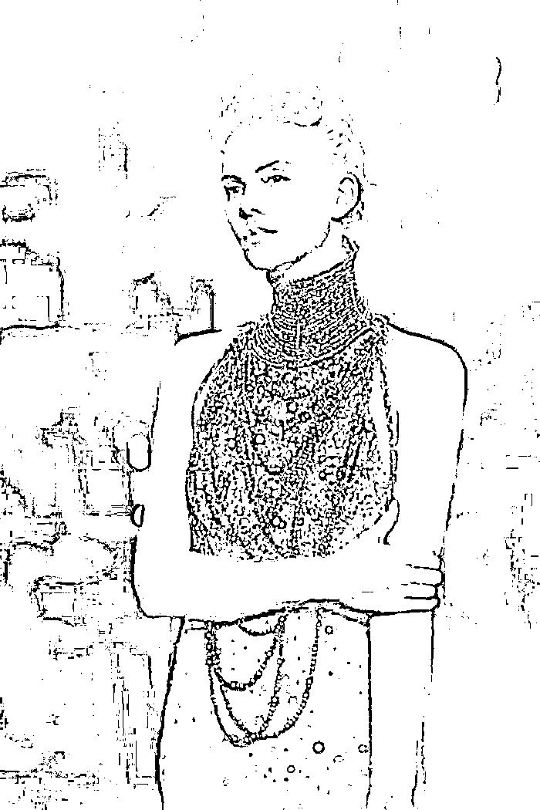 

******************▲******************

******狮子座时尚星典范******

****** 查理兹·塞隆、张雨绮******


************▲************

**金星****、****上升****、****太阳落入处女座**

*   **处女座性格基底**

*   变动的土象星座，守护星水星。逻辑思考力强；性格坚韧；具有服务精神，做事专注；善于思考，注重细节。 

*   **处女座时尚哲学**

*   喜欢干净利落的装扮；注重整体装束呈现出的精致感，及细节的处理；偏爱中性的颜色。

*   **处女座春夏扮靓单品**

*   细线条衬衫，精致的耳钉，胸针，修身连衣裙，小巧手拿包。

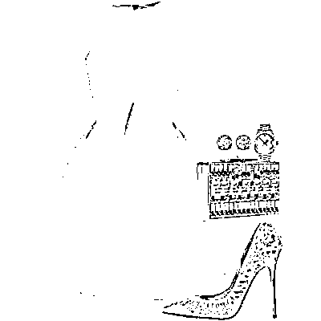 

 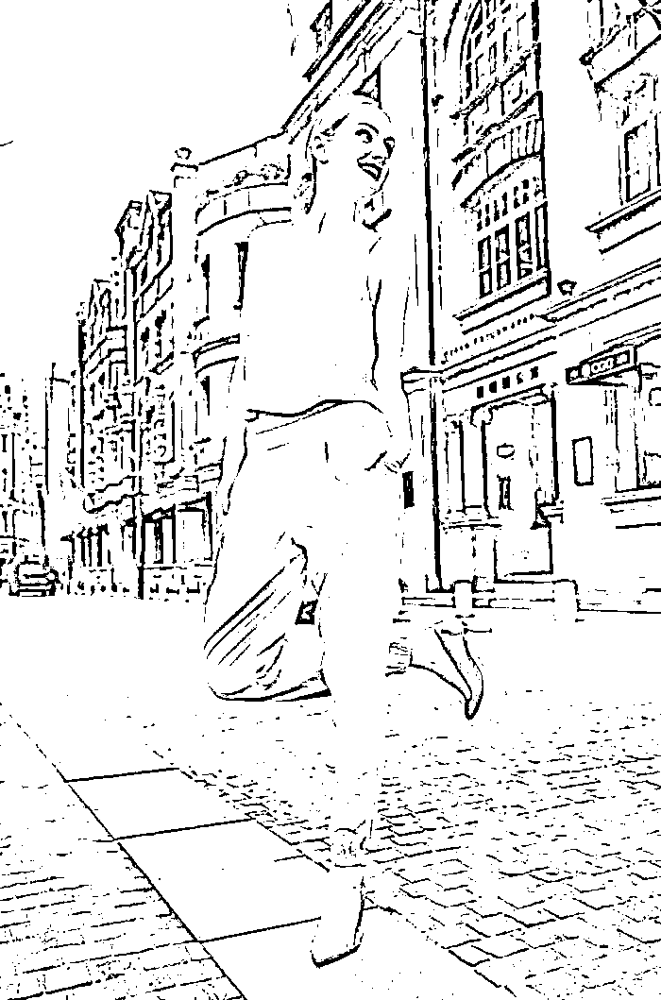 

******************▲******************

******处女座出街 LOOK******

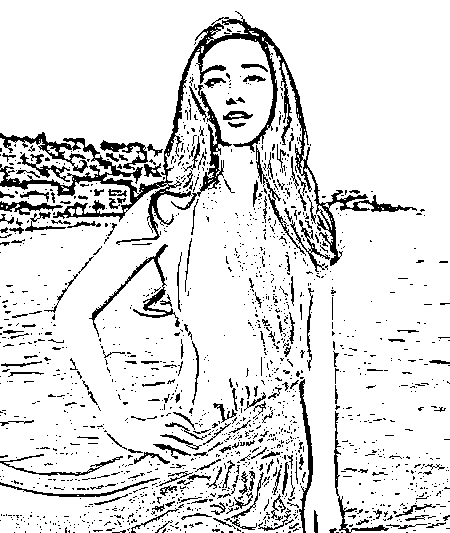 

******************▲******************

******处女座时尚星典范******

******范冰冰、******刘亦菲************

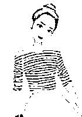 

******金星、上升、太阳落入天秤座******

****** ************▲******************

*   **天秤座性格基底**

*   开创的风向星座，守护星金星。身与心的平衡对秤子们来说很重要；注重礼仪，气质优雅；善于换位思考，具有亲和力。

*   **天秤座时尚哲学**

*   无论是颜色的选取还是款式的选择，很注重搭配感及整体视觉的和谐性；喜欢柔和的颜色；能驾驭优雅的中性风。

*   **天秤座春夏扮靓单品**

*   丝巾，到膝裙，简约裤装，外加甜美的笑容。

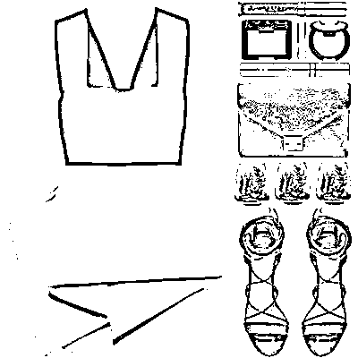

******************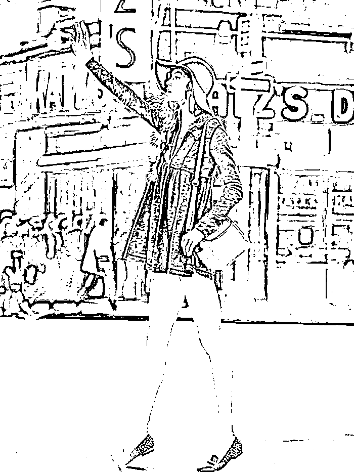****************** 

************************▲************************

******天秤座出街 LOOK******

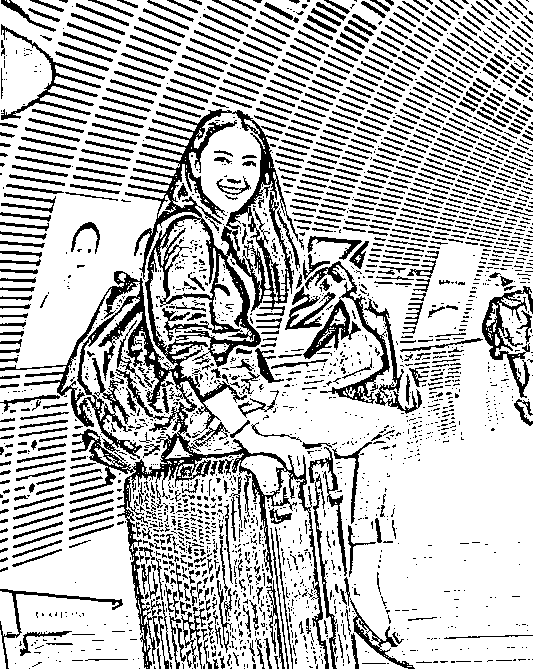 

************************▲************************

******天秤座时尚星典范******

******高圆圆、周迅******

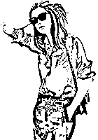
******************▲******************

******金星******、******上升******、******太阳落入天蝎座******

*   **天蝎座性格基底**

*   固定的水象星座，守护星冥王星。超强的洞察力，行事果决老练；不轻易开启的心房；激烈的内心，淡定的外表；从骨子里渗透出的性感。

*   **天蝎座时尚哲学**

*   喜欢强烈又能透露丝丝性感的穿衣风格；炙热的红和嗜血的黑都是天蝎大爱的颜色；喜欢剪裁合身的服饰。

*   **天蝎座春夏扮靓单品**

*   Dior999 号口红就像是为蝎子们定制的，细高跟凉鞋，黑色修身连衣裙，黑超，外加一双深邃的眼眸。 

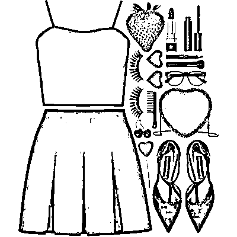 

******************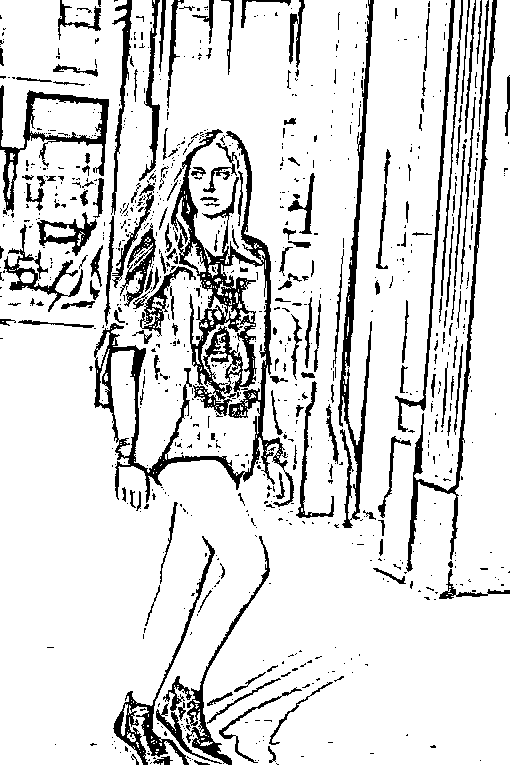****************** 

************************▲************************

******天蝎座出街 LOOK******

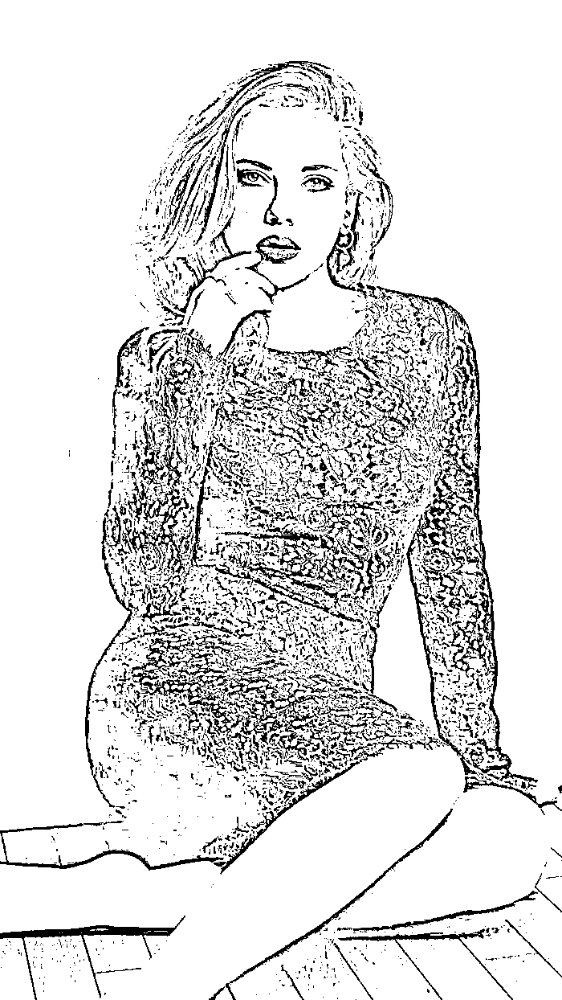 

************************▲************************

******天蝎座时尚星典范******

******斯嘉丽·约翰逊、******全智贤************

 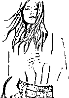
******************▲******************

******金星******、******上升******、******太阳落入射手座******

*   **射手座性格基底**

*   变动的火象星座，守护星木星。性格奔放外向，不拘小节；待人真诚友善；热爱自由；最爱去的是远方，最爱讲的是人生哲学。

*   **射手座时尚哲学**

*   喜爱随意大气的着装风格，要能突显个人风格与气质；注重腿部线条的勾勒（射手座能量被强化的人喜欢穿突显腿部线条的着装）。

*   **射手座春夏扮靓单品**

*   棉麻质地的阔腿裤，机车包，罗马凉鞋，时尚运动鞋，外加一颗奔赴远方的心。

************************************ 

******************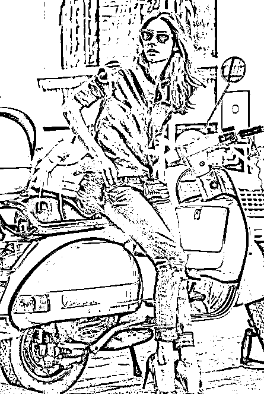**************** ****************************************▲******************************************

******射手座出街 LOOK******

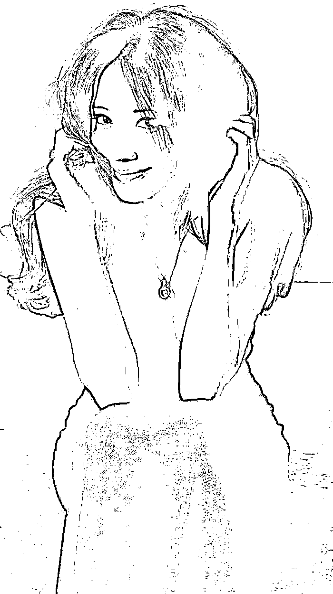 ************************▲************************

******射手座时尚星典范******

******林志玲、******刘嘉玲************

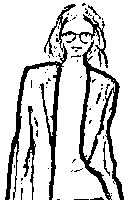
******************▲******************

******金星、上升、太阳落入摩羯座******

*   **摩羯座性格基底**

*   开创的土象星座，守护星土星。性格稳健保守；讲究秩序，不喜欢一切没有章法的事物；原则性较强，有责任感；不善于表达情感。

*   **摩羯座时尚哲学**

*   喜欢比较素雅不花哨的装束；希望能够突显专业化的形象；偏爱大地色的服装。

*   **摩羯座春夏扮靓单品**

*   利落的套装，白衬衫，Prada 大号的杀手包，薄款气质风衣，外加一脸的严肃范。

 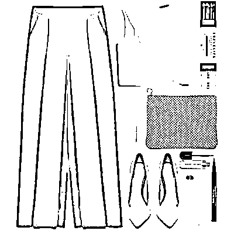 

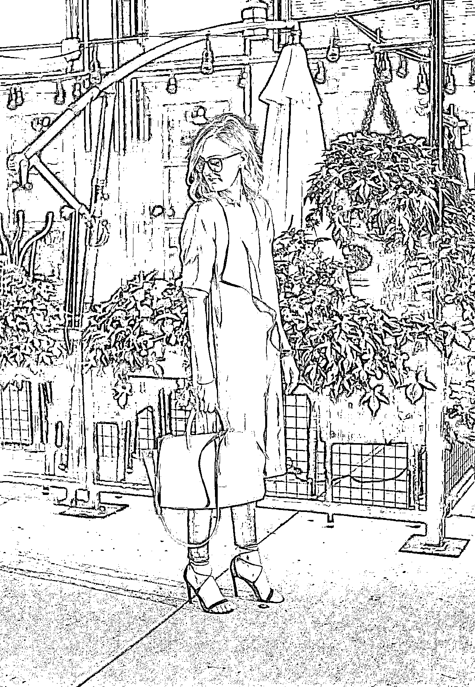

************************▲************************

******摩羯座出街 LOOK******

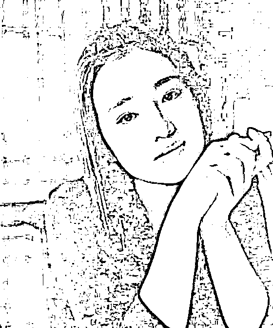

************************▲************************

******摩羯座时尚星典范******

******巩俐******

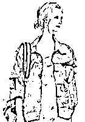

******************************▲******************************

****金星******、******上升******、******太阳落入水瓶座****

*   **水瓶座性格基底**

*   固定的风象星座，守护星天王星。有原创精神，不喜欢中规中矩；看待事物客观，有人道主义精神；个性化。

*   **水瓶座时尚哲学**

*   喜欢混搭的装扮；不一定需要抢眼，但一定得有强烈的个人风格；偏爱冷色系，喜欢中性风。

*   **水瓶座春夏扮靓单品**

*   破洞牛仔裤，个性配饰，boyfriend 衬衫，外加一脸的不羁和抽离。

 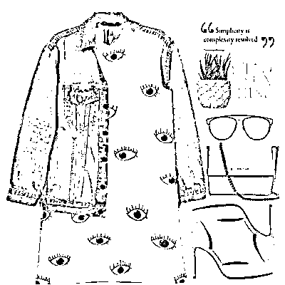 

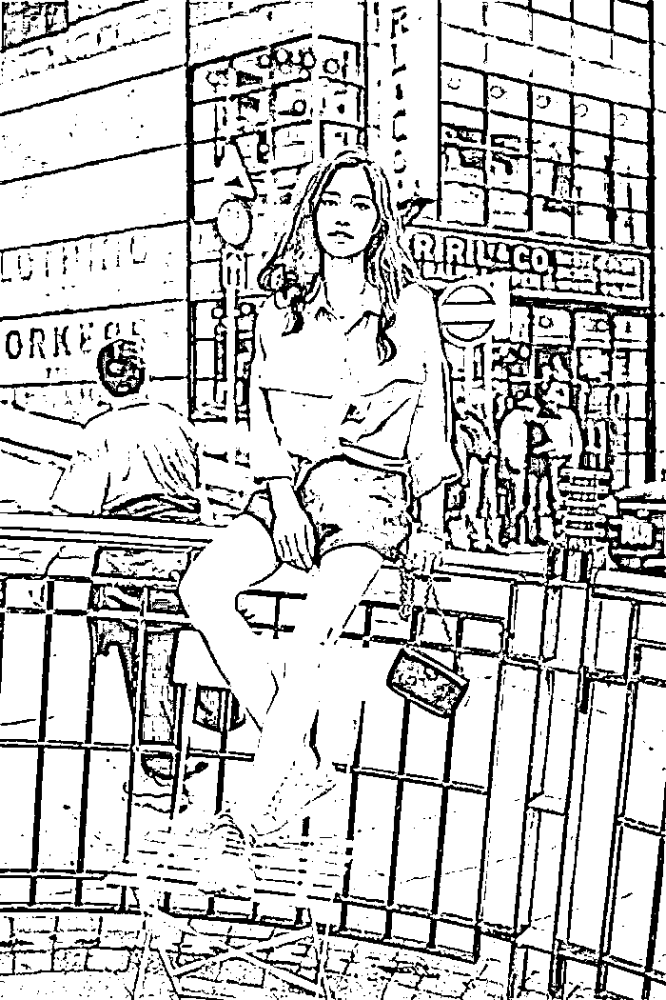 

**********************▲**********************

****水瓶座出街 LOOK****

**************************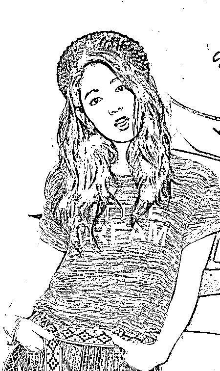************************** ******************************▲******************************

****水瓶座时尚星典范****

****朴信惠、宋茜****

****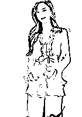**** 

**********************************▲**********************************

****金星******、******上升******、******太阳落入双鱼座****

*   **双鱼座性格基底**

*   变动的水象星座，守护星海王星。爱浪漫，爱幻想；富有同情心，个性具有包容性；容易范迷糊，有公主情结。

*   **双鱼座时尚哲学**

*   偏爱甜美系；喜欢飘逸宽松的着装；能驾驭波西米亚风，也能驾驭森女风；喜爱暖色系，大爱粉红色。

*   **双鱼座春夏扮靓单品**

*   浅色系可爱蛋糕裙，粉红色小高跟鞋，精致的项链，外加一双忽闪忽闪的大眼睛。

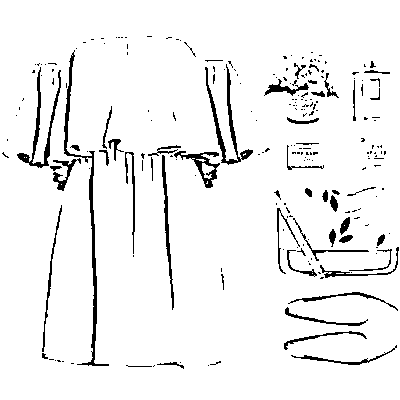 

****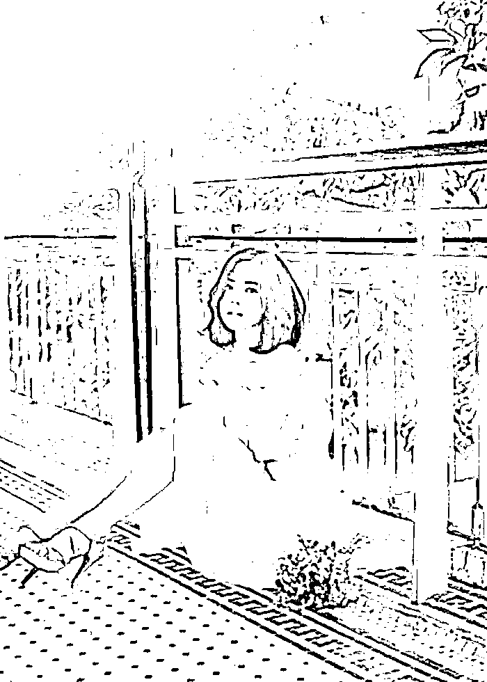****  ******************************▲******************************

 ****双鱼座出街 LOOK****

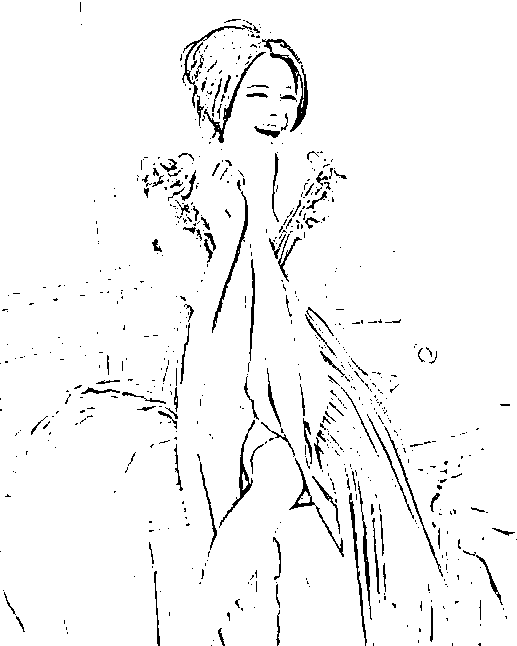 

**********************************▲**********************************

****双鱼座时尚星典范****

****徐若瑄、Angelababy****

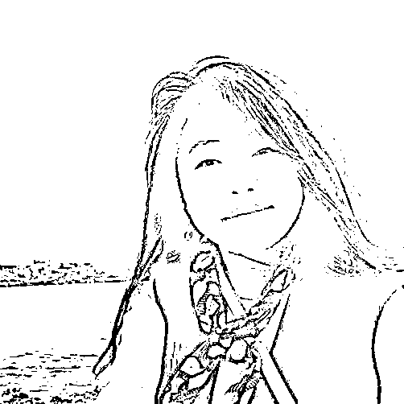

**作者介绍**

**理想国的女巫**：职业塔罗占卜师、人本主义占星师、国家二级心理咨询师、占星专栏作者，国际占星研究协会 ISAR 会员。致力于将心理咨询技术与塔罗占卜和占星咨询进行融合与连接。咨询中注重来访者自身的心理动力，个人自由意志与灵魂的进化成长，而非宿命式的论断。跟随多名国际占星大师系统学习占星学，主要研习人本主义进化占星学以及心理占星学。2015 年在上海创立独立咨询工作室（十二宫塔罗占星咨询工作室）。

**微信公众号**：house12ta 

**咨询预约号**：vivian-yanyan

长按二维码，让金钱涌向传播知识与智慧的人~

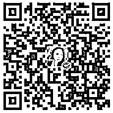


你穿对了吗？

快分享给宝宝们吧~

**特别提醒：**

**本文由作者授权首发于若道平台，**

**转载请联系后台授权。**


  **想了解更多关于星座的知识？2016 年 5 月 19 日，蒋颖老师主讲的若道占星核心课程****Level 1-2****要开课了！没有报上名的朋友，还有 Level 1-5 连报可选择。**

**报名及咨询，请点击文末“阅读原文”**


# 错过 Level 1-2 的童鞋，还有 Level 1-5 连报等着你哦

> 原文：[`mp.weixin.qq.com/s?__biz=MzA5NjA0NTAxNg==&mid=2651384873&idx=3&sn=a0ae4b6b9ce8b7eccfd4924970f3b6eb&chksm=8b4a5e9ebc3dd7882cf4c5ab13e1a4bcd031a10d8ab6f0a0a06fcd53cd73e8a669b69629d537&scene=126&sessionid=1692738836#rd`](http://mp.weixin.qq.com/s?__biz=MzA5NjA0NTAxNg==&mid=2651384873&idx=3&sn=a0ae4b6b9ce8b7eccfd4924970f3b6eb&chksm=8b4a5e9ebc3dd7882cf4c5ab13e1a4bcd031a10d8ab6f0a0a06fcd53cd73e8a669b69629d537&scene=126&sessionid=1692738836#rd)

**蒋颖老师主讲的占星学入门课程**

****Level 1-2 就要在 5 月 19 日**开课了**

**还没有参与课程的同学可以点击：**

**[惊呆了，这真的只是若道一年级新生的水平吗？](http://mp.weixin.qq.com/s?__biz=MzA5NjA0NTAxNg==&mid=2651384523&idx=2&sn=05b55df84becd8db236864012cb60079&scene=21#wechat_redirect)**

**提前感受下若道的学习氛围**

**很可惜该课程已经结束报名了**

**错过的童鞋不要着急**

**在这里若道君有个好消息要告诉大家**

**若道已经开通了 Level 1-5 连报通道**

**你可以一步到位学习占星学了**

**最最吸引人的是**

**连报特惠价是 27000 元** 

**比起单独报名 1 阶到 5 阶**

**足足优惠了 7400 元！**

**** 

**那么吸引人，来看看******Level 1-5 具体学什么吧！****

L1-5 联报

课程简介

****

** Level 1：星座，太阳和月亮**

12 星座是占星学最基本却又最深刻的概念，黄道 12 星座，是伟大的生命周期，而太阳和月亮是我们阴阳之本。  

　　     

**Level 2：**遇见行星和月亮交点****

在这个阶段，你将遇见行星们，还有与灵魂的过往和未来相关的月亮交点。这既是你，你的性格，也是你在生命故事中将会遇到的人、事、物的显化，也是你灵魂轨迹的线索。


**Level 3：五彩线穿起来——宫位、相位及元素组合**

在这个阶段，你将学习宫位，知道生命的故事发生在哪里。你会学习相位，那是行星之间的对话，是一颗行星如何用自己的能量去影响其他行星。

然后，你要学习如何将星座、行星、宫位、相位组合起来进行解读，这是把散落的珠子穿起来的过程。这个部分非常重要，是大部分占星学习者薄弱的环节，也是从爱好者走向职业占星师道路时承上启下的一个重要阶段。


**Level 4：星图舞会——星图综合解读 24 小时**

在这个阶段，你终于可以学会星图的综合解读了！前一阶段你学习得越扎实，现在就越开心。你可以看到，当那些行星、星座、宫位、相位穿起来的丝线开始跳舞，一个个故事图景就像织锦一样展现在你的面前。个性、爱情、事业，看到一个人的出生星图，你就可以开始讲他们生命故事的梗概了。在这里，大卫老师会分别讲解如何通过出生图进行性格、爱情、事业分析。在爱情解读部分，你还会提前学到比对图。


**Level 5：气象预报——预测技术和咨询技巧**

在这个阶段，你将学习各种预测技术——行进、月亮次限、太阳弧、返照图。你会学到行星周期！宇宙天象如何变化？它又会如何影响每个人的人生？通过这些预测工具，你就能够开始预测和规划人生了。

有关毕业

**考试和实习：**对于那些想要获得大卫老师资质班证书的朋友，我们将帮助大家在开始成为职业占星师之前，将由专业占星师组织小型督导工作坊，帮助大家实战解盘，为正式的收费咨询做好准备。通过毕业考试，参加督导工作坊，星盘解读的同学，将获得大卫老师颁发的职业占星师资质证书。

授课优势

**①先进的教学平台**

网络教学平台，支持手机、电脑、iPad 上网，可以随时随地学习。

**②回放复习**

学员可登录网站收看课程回放，在线复习课程，每次课可完整重看 3 次，课程结束后的 3 个月内有效。　

课程特色

**①与名师面对面**：北京同学可以来若道现场上课，和大卫老师面对面互动。大卫老师也可能前往主要学员所在城市，实现零距离教学。

**②互动答疑**：论坛、微信群随时提问；老师课上答疑；助教线上线下全程协助。

**③线下沙龙**：定期举办沙龙活动，复习上课内容。

**④强大的同学网络**：若道作为中国最顶尖的占星教学机构，在 4 年的占星教学中，培养了很多占星人才。若道让你和师兄师姐切磋，让你和国内著名占星师学习。（简单来说，就是，人脉！）网络授课，在北京开设免费现场参与名额，全程英文授课，配备实时翻译。

师资力量

**讲师团队**


**大卫·瑞雷（David Railey）**

若道创始人，《灵魂的目标》作者。拥有 46 年的占星咨询的执业经验，曾两任亚特兰大占星协会主席，是全美占星师联盟（AFAN）、美国占星师联合会（AFA）、全美占星研究委员会（NCGR）、国际占星研究协会（ISAR）和职业占星师组织（OPA）的成员，是联合占星大会（UAC, United Astrology Conference）督导委员会委员。大卫曾是 CNN、CBS 的占星节目的常驻嘉宾，多次在 BBC、WGS、WSB、WRGG 等节目中接受采访，并在亚特兰大主持电视节目《每日行星（Daily Planets）》达 4 年之久。


**蒋颖（Felicia）**

若道创始人，职业占星师。在若道系统学习占星，师从大卫·瑞雷。长江商学院 MBA，厦门大学经济学硕士，化学学士。国际占星研究协会（ISAR）中国区副主席。第一批获得国际占星研究协会（ISAR）认证的职业占星师。《灵魂的目标》译者。

**在后台回复**** 蒋颖 即可查看她的全部文集**

长按二维码添加课程负责人咨询~

**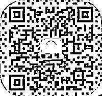**

**报名及咨询，请点击文末“阅读原文”**


# 心累，为什么我总把事情往坏处想？

> 原文：[`mp.weixin.qq.com/s?__biz=MzA5NjA0NTAxNg==&mid=2651384873&idx=1&sn=f8c8f75fb9bcf15b788ec67fd3286273&chksm=8b4a5e9ebc3dd78869f0241fab33ae2cceb18b3bdaefd468856e3288ebfb908360d983084dba&scene=126&sessionid=1692738836#rd`](http://mp.weixin.qq.com/s?__biz=MzA5NjA0NTAxNg==&mid=2651384873&idx=1&sn=f8c8f75fb9bcf15b788ec67fd3286273&chksm=8b4a5e9ebc3dd78869f0241fab33ae2cceb18b3bdaefd468856e3288ebfb908360d983084dba&scene=126&sessionid=1692738836#rd)

📹 [`v.qq.com/iframe/preview.html?vid=t0175yf4n0b&width=500&height=375&auto=0`](https://v.qq.com/iframe/preview.html?vid=t0175yf4n0b&width=500&height=375&auto=0)

****悲观主义到底是怎样的？在这支动画短片中，虽然作者阿兰德·波顿最后说“That's OK",但若道君希望在此为大家提供解决悲观主义的占星学及心理学方法。（注意流量，土豪随意）****

*   我的工作没做好，老板一定对我不满意了。

*   他对我愈发没耐心，我的婚姻太不幸了！

*   大家没有对我积极回应，我感觉自己是个 nobody。

*   我再努力也无法像他们一样优秀，我就是一个 loser。

……

世界真的如此悲观，还是我们把它“看”得太悲观？

**首先我们来做个测试**

仔细阅读每一个情景，并想像你在那个情境下的想法：

*你忘记了伴侣（男/女朋友）的生日*

A：我对记生日是很差劲的

B：我太忙了

*你在应征工作的面试上表现得很好*

A：我在面试时觉得非常地自信

B：我很会面试

*你在一次重要的考试中失败了*

A：我没有其他的考生那么聪明

B：我准备得不够

*你的老板只给你一点点时间去完成一个计划，但是你还是如期达成了*

A：我对我的工作很内行

B：我是一个很有效率的人

*你在开车去朋友家的中途迷路了*

A：我错过了一个路口没转弯

B：我朋友给我的指引讲得不清不楚

*你中了彩票*

A、真是运气

B、我选对号码

当我们在人生中遇到各种情境时，每个人都会不加思索地对当前的情境做出某种解释。这里的选择并无对错之分，但它却折射出了我们一个很重要的心理特质——乐观性。

美国著名心理学家、积极心理学的创始人之一，马丁·塞利格曼（Martin E.P. Seligman）用人们**对自己说“为什么这件事会这样发生”的习惯性解释方式（或归因方式），**来定义乐观与悲观。乐观者更倾向看到希望与可能性；悲观者更聚焦风险和保守行为。上述例题既选自其编制的解释方式测评问卷（*Explanatory Style Questionnaire*）。而不同的解释方式，就会引发个体在面临相似情境下不同的行为反应，带来不同的结果。

****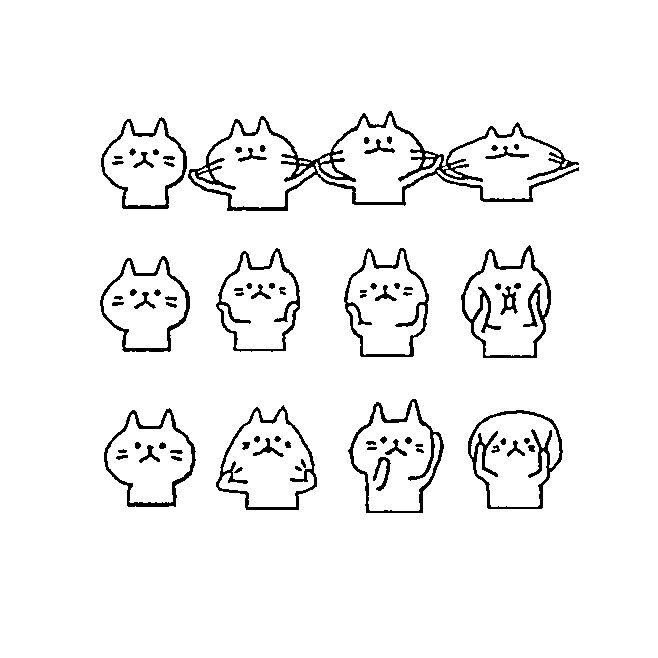****

诚然，研究者们也指出，在某些情况下，乐观主义驱动的行为可能会指向一些无意义的或不现实的目标。而另外也有一些工作，在其中有适度的悲观主义是有益的，例如：安全系统的工程技术工作或财务控制和会计方面的工作。

因此，我们在此所做的讨论，是为了让我们客观地去观察解释方式对自己产生的真实影响，并勇敢做出更有效的调整。**这里的有效，指的是：更少的抑郁情绪、增进成就及身体健康，以及提升自我了解。**

**你是什么人，星图不撒谎**

在占星学上，最直接的，**人们的语言、觉知和理解力（即认知）的风格，经由水星及其在出生星图中的配置象征出来**，因此它也象征出个体解释方式的风格——

*   水星与土星成相位，水星落处女座或摩羯座，特别是以上两者同时出现时，拥有这样配置的人，更可能倾向悲观的解释方式；

*   而水星与木星成相位，水星落狮子座或射手座，更可能倾向乐观的解释方式。

塞利格曼进一步指出：解释方式不仅仅是嘴里说出来的话，它是一种**习惯性的思考方式**。它直接从人的自尊水平衍生而来——我们看自己是很值得尊敬的，还是看自己是一文不值，一点希望都没有的。

出生星图中更多的行星及其配置的征象也加入进来了——

*   太阳（自我身份认同）与土星成困难相位，月亮（情绪反应模式）与土星成困难相位，金星（自我价值感）与土星成困难相位的配置，象征出悲观倾向的可能；

*   而上述行星与木星的和谐相位则象征出乐观倾向的可能；这些行星与木星的困难相位，则可能有“过度乐观”的倾向。

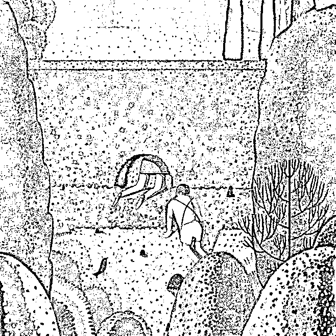

如果你的出生星图中，出现了彼此“矛盾”的征象，是完全可能的，人格不同面向的矛盾，是内在产生焦虑的原因之一。这时需要更精微地去看到自己在哪些面向是乐观的，在哪些面向则相反。

比如，我们有去追寻高目标的渴望（太阳与木星成相位，或太阳落于射手座），**但当支持我们获取成就的机会来临时，我们却选择了放弃。**这可能源于我们思考方式——更容易聚焦风险和可能的糟糕结果（水星土星困难相位，水星处女座）；也可能源于我们的低价值感——我不配拥有这样的机遇（金星与土星成困难相位）。

放弃行动的机会，自然也不会有目标的达成，这与我们渴望高目标的意愿相冲突，产生了很大的内在焦虑。如果我们能够在这样精细的层面去了解自己的心智运作，也就有了整合的可能性。通过调整思维模式或逐步提升价值感，并在追逐高目标的意愿的驱动下，在真实世界把握机会，获取成就。

**涨姿势，悲观也有三个 Level**

塞利格曼从：永久性、普遍性和个别性，三个向度来测量人们的解释方式。

**1****永久性（Permanence）**

***若道君：意思就是你被别人打了一拳，结果痛了一辈子。***

悲观者相信发生在 TA 身上的坏事霉运是永久的，永远在那里影响着 TA 的生活：“我忘记伴侣的生日是因为‘我对记生日是很差劲的’”；乐观者则相信糟糕事件的原因是暂时性的,因为“我太忙了”。

当面临好运事件时，情况则相反。乐观者将好运看成是永久性的原因，例如人格特质上的原因、能力的关系；“我在应征工作的面试上表现很好是因为‘我很会面试’”。悲观者则反之。

失败或逆境，会使人暂时性地无助，就像腹部被人狠狠打了一拳，它很痛，但是这个痛会消失——对某些人来说它几乎会立即消失；但对悲观者来说，这个痛会持续的更久，甚至最后变成一种怨恨，凝聚心头。对于后者，即使挫折是微不足道的，他们可能几天或几个月无法做事；一但遇到真正的灾难时，就崩溃了。

这种永久性的悲观解释倾向，让我们感受到一种非常深层的无力感——

*   在出生星图中更可能由太阳与土星（身份感的匮乏）或太阳与冥王星（深层的被陷害被威胁感）的困难相位象征出来；

*   还有一种典型的征象：太阳对分了南交点——拥有这个配置的个体，似乎根本找不到身份感，连自尊自信建立的那个基础都没有。

然而，再悲观的情形，都可以被独立意志的强大力量所超越，只是需要历经更为困难的过程，需要更有针对性的改进策略。

**改进策略** 

○**太阳与土星成困难相位者**，需要去检查与权威的议题，尝试自己在重大事件上做决断，建立对自己的遭遇自行负责的意识。

○**太阳与冥王星成困难相位者**，可能需要更深入地去追溯自己无意识里“被迫害”的感受来源；即使无法追溯到，也要意识到现在自己面临的真实境遇里，自己不再是一个“必然的 Loser”。正相反，在经历了那些困难事件后仍然生存下来，昭示出了强大的生存意志（太阳与冥王星成困难相位的人，似乎生命确实会遭遇一些“极端”事件，真实的，或心理感受上的，来历练个体向死而生的勇气和力量）。

○在**南交点对分太阳的个体**身上，我们会观察到那种身份感的模糊，如果海王星或双鱼座加入进来，情况会更突显。这种情况下，从完成一些力所能及的，具体的，并让自己感受到“我很愉悦”的事情开始，体验到“我存在”，是改善的开始。

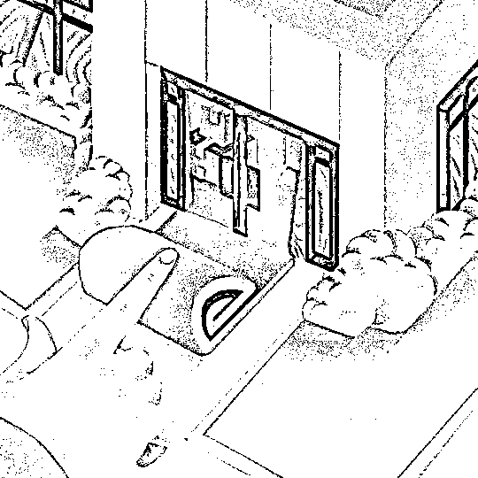

**2****普遍性（Pervasiveness）**

***若道君：你只是在一件事情上没成功，不是所有事，别多想。***

永久性是时间上的向度，普遍性是空间的向度。

悲观者将失败看成是普遍性的：“我考试失败是因为‘我没有其他考生那么聪明’”（所以只要是考试我都会失败）。乐观者则将失败看成是特定的，只是因为“我准备得不够”（所以只是这一次失败了）。

而在好事情上，情况相反。乐观者将之看成是普遍性的：“我在很短的时间里完成了老板交办的任务是因为‘我效率很高’”（所以其他任务我也能高效完成）；悲观者反之。

泛化失败的一般性解释方式，会使个体在许多不同的情境都造成无助。

**水星落在带有批判倾向的处女座，或者水星与土星成困难相位者，要小心检视自己是否有这种泛化的思维方式。**客观辨识自己的能力与优势领域。

**3****个别性（Personalization）**

***若道君：总给自己挑错才是好学生？别闹了。***

当不好的事情发生时，悲观者倾向怪罪自己（内在化）：“我在开车去朋友家的路途中迷路了，是因为‘我错过了一个路口没有转弯’”；而乐观者会认为“是朋友给我的指引不清不楚”，归因旁人或环境（外在化）；对好运的乐观解释方式则是内在化的，“我中奖是因为‘我选对了号码’”。

在这个向度上，中国读者很容易引起困惑，这样的“乐观”不是很自大吗？它与我们从小受到的“自我批评”的教育似乎冲突很大。事实上，在中国人群中进行这一测试时，相较前述两个向度，也更容易在这个向度显示出悲观的解释方式。

这里我们需要深入一些去理解。事实上，这个向度只控制“你如何看待你自己，对自己的感觉如何”。在个别性向度过于悲观，会使我们自视很低，认为自己一文不值，不讨人喜欢，造成低自尊或自卑；而这个向度采取乐观解释方式的人更喜欢自己，对自己的满意度远比前者要高得多。从这个角度看，**适当地提升这个向度上解释方式的乐观倾向，对个体的身心健康会更有益**。

我们与自己的关系以及对自己的喜欢程度，由金星这颗关于关系与欣赏能力的行星所象征。**金星与土星成困难相位的人，容易在自己真实创造了成就时，仍旧感受不到快乐。**

我高考时以家乡第一名的成绩考上北京大学金融系，但大学四年中，自卑的情结让我终日躲在图书馆里，不敢走进那些自信阳光的同学，尽享珍贵的大学生活。我本人的星图中，就有金星与土星的四分相。如要不辜负生命，我们确实需要发展出对自己的喜爱，才会觉得自己有资格拥有美好。

当然，太阳或金星与木星成困难相位者，或出生星图中射手能量被强化的人，也要小心过度的“自我感觉良好”，而忽视了实际能力的锻造与提升。毕竟，要取得实际的成果，只靠良好的感觉是远远不够的。

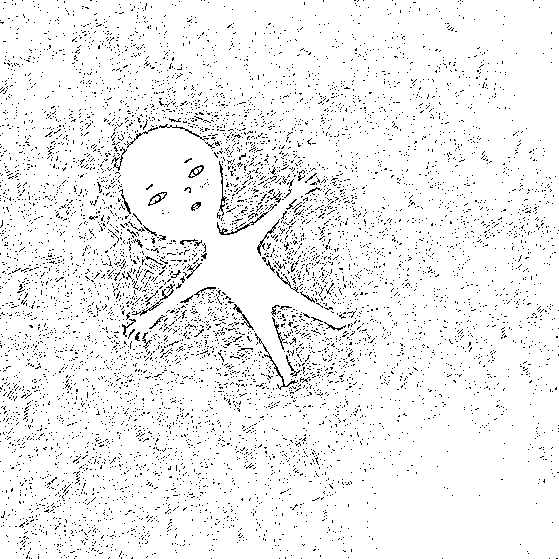

**还有救，从悲观到乐观的 A-E**

乐观与悲观并无绝对的好坏对错；但如果我们在多个向度都显示出悲观的解释方式，那么在以下四个范畴中我们会碰到困难：

①很容易沮丧；

②没有发挥自己的潜能，以真实的能力本应该表现得更好；

③健康、免疫机能低于一般的标准；

④生命没有情趣，灰暗。

特别是在生命中遭遇危机或重大挫折时，悲观的解释方式很可能使我们永远被击败。

拥有生命的意义之一是去经验生命的美妙之处，它是宇宙神妙的杰作。正如悲观无助是习得的，乐观也一样可以通过练习习得，我们的认知在其中起到关键作用。

除了上述从占星学的角度给出的一些建议之外，在此简要介绍塞利格曼提出的 ABCDE 模式。

**占星学外的解决方式：** 

A：Adversity（事件）

B：Belief（信念）

C：Consequence（结果）

D：Disputation（反驳信念）

E：Energization（新的结果）

观察那些给自己带来无助感的事件，先按 ABC 的顺序把它如实写下来，去检视那个悲观的信念，并学习去反驳它，写下更有建设性的乐观解释方式，看到它可能带来的新结果，并据此行动。这个看似简单的练习，坚持去做，会给我们带来很大的改善。

生命的成长无疑是伴随痛苦的，但灵魂的一个意图似乎就是在训练自我寻找各种途径去经验对生命的爱。它未必是狂喜的状态，更可能是一种经历考验之后获得的宁静。无论我们的星图如何配置，我们都有一颗水星，科学运用我们的认知能力，或多或少会帮助我们提升生命的品质。即使只是一朵小小的蔷薇花，也停下脚步去嗅闻它，生命在那一刻，便是美好。

**注：**

1、文章中关于解释方式的学术部分皆引自塞利格曼博士的著作：《学习乐观》，如果您对这个课题想要更加深入地了解，这本书能帮助到您，里面也含有解释方式测评量表。

2、星图的内涵是广阔而丰富的，文章只是一些示例，如果您希望更加客观深入地认识自己，请寻找专业的人本占星师协助您一起完成这个过程。


**作者简介**

**薇安**，北大心理学硕士学位，MBTI 的国际认证施测师。若道认证生时校正资质及 COAC 高阶资质毕业生，在若道跟随多名当代著名占星师持续进行深入系统的占星研习。现为全职心理咨询师与占星师。

**微信 ID**：weianhuilai 

长按二维码，让金钱涌向传播知识与智慧的人~

 

**特别提醒：**

**本文首发于若道平台，**

**转载请联系后台授权。**


  **心理学与占星学是可以结合的！2016 年 8 月 22 日，格伦·佩里老师教授的****心理占星学高阶课程****要开课了！敬请期待！**


# 听说，有两颗行星能量的组合是最“高贵”的

> 原文：[`mp.weixin.qq.com/s?__biz=MzA5NjA0NTAxNg==&mid=2651384873&idx=2&sn=7390e0f9e318cc51e3cc79d0a847802e&chksm=8b4a5e9ebc3dd788176b78ac91dd0173633a3ea8ec356a8f10d64fb410f55bf6dc3f35194b54&scene=126&sessionid=1692738836#rd`](http://mp.weixin.qq.com/s?__biz=MzA5NjA0NTAxNg==&mid=2651384873&idx=2&sn=7390e0f9e318cc51e3cc79d0a847802e&chksm=8b4a5e9ebc3dd788176b78ac91dd0173633a3ea8ec356a8f10d64fb410f55bf6dc3f35194b54&scene=126&sessionid=1692738836#rd)

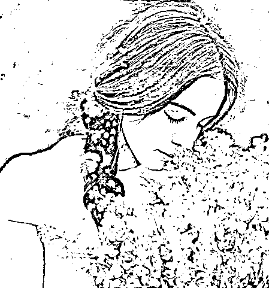

作者/理查德·塔纳斯  译者/庄西、栗幼婷

文章来源/瑞珈瑜伽  图片/花瓣网

有一位古代哲学家用非常美丽的语言描述说，星辰就像是每一个时刻在天空中写下的字母，这世上的一切充满了象征和符号，所有事件都在协调运行，一切事物依赖于彼此，同呼吸共命运。

**万事万物同为一体**

万事万物同一体的说法，中国人的大脑比西方人更容易接受。在这样的世界观里，万事万物都是紧密联系在一起的，共同置身于一个整体的、大的场域之中。

**占星学指出的方向是宇宙里面的万事万物都互相关联**，人类也好地球也好，与整个宇宙息息相关，这就是荣格提出的共时性。共时性的意思是说，有两件事同时发生了，并且它们在意义上彼此关联在一起，然而这两件事并非是因为其中一件事引起了另一件事发生。

**三种星图：个人、行进、世界**

每一个行星在我们人生中会以三种不同的方式存在：

1 个人的出生星图

**第一种是以出生星图的形式**，显示在你出生的时刻天空中各个行星基于你在地球上出生的位置进行的排列。

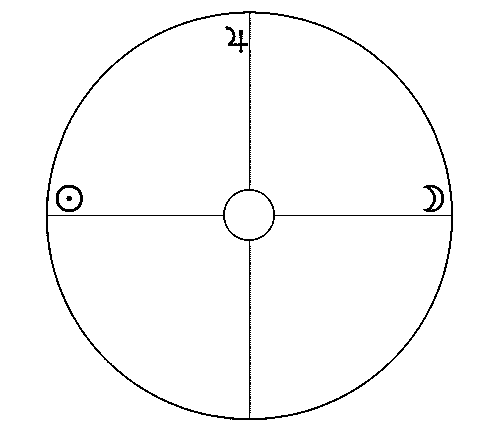

举个例子，上面这张星图呈现出，一个人出生时，太阳刚从地平线升起，月亮刚从地平线上落下，左边是东方地平线太阳在升起，右边是西方地平线月亮在下降。

当太阳和月亮的地平线对立时，我们会把它称为满月。如果你出生时，太阳和月亮合在一起，我们称为新月，这个时候看不到月亮，因为太阳的光亮太耀眼。如果你中午出生，太阳会在星图的最高点；如果你在午夜出生，太阳就会在星图的最低点；如果你是日落时候出生，太阳会在星图的右边。

**当我们把所有行星都放入一张星图时，你就拥有了自己的个人星图，它代表你出生时刻的天象，但这和行星的实际位置是不一样的。**

出生星图和实际的天文学星象有两大不同：第一，出生星图是二维的，实际的天文学星相是三维的；第二，为简化起见，星图中的行星与中间点的距离是一样的，中间点代表地球；实际天文学中，水星、金星、太阳、月亮等离地球非常近，而天王星、海王星、冥王星三个外行星离地球非常遥远；用简化的方式呈现的优势在于我们能够看到各个行星相对于地球之间的几何关系。

2 个人的行进星图

第二种星图是行进。行进是说天空中的行星是不断运动着的，运行中会和我们的本命星图中的各行星形成不同的关联位置。

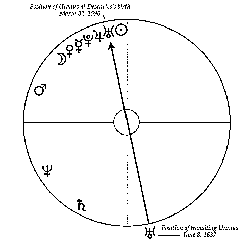

上图是哲学家笛卡尔的星图。笛卡尔是欧洲现代哲学的创始人，他的一句名言广为人知：“我思故我在。”当行进的天王星走到星图下面那个位置时，就是他现代哲学成形的时候，这时候笛卡尔写下了思想史上非常重要的著作包括《几何学原理》《方法论》等。天王星是非常重要的一颗行星，它往往意味着突破，突然的觉醒和地平线的打开。

3 世界的行进星图

**第三种是最古老的星图，我们称为是世界的行进**。世界的行进针对某个具体时间，行星在天空中的位置和天象，它所呈现出来的是人类世界所经历的具体事件和某一种能量。

举个例子，每个月都有满月，满月发生时会伴随某种能量，比如护士会注意在满月的时候医院里发生的事情较多一些。同样的原理，在时间较长的时间内，世界的行进也会出现类似的情形。

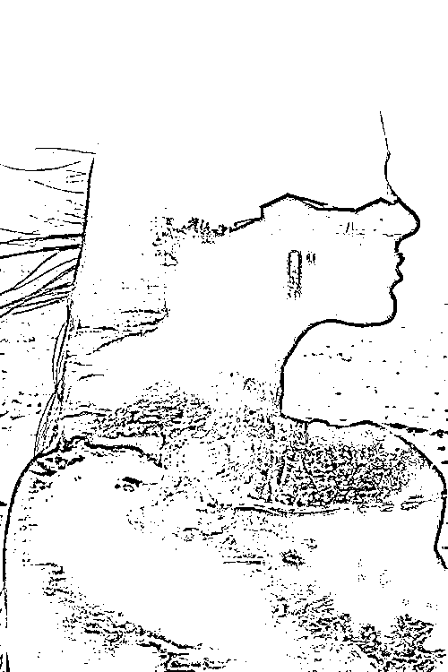

**天冥行进的威力**

现在我们处的这个时代，很大程度上被**冥王星和天王星形成的精准四分相所影响**。这种力量体现在**快速朝向新事物、摒弃旧事物的变化之中**。冥王星所带来的力量与天王星所带来的自由联系在一起，两种行星原型能量带来诸如**女权运动、追求平等或全球范围内的生态革命**等。

行星组合起来表达的含义是有不同层次、不同面向的，就像彩虹一样。**同一个元素能量既可以在我们内心世界表达出来，也可以在外在世界表达出来**；会以不同方式在我们的人生包括天气、情绪、人与人关系上进行种种不同层面的表达。这就是为什么理解原型所具有的原则和意义十分重要，只有如此我们才能够明白不同层面的含义。宇宙用原型的语言传达了多么丰富的含义，而我们要了解并且欣赏宇宙传达给我们的信息。

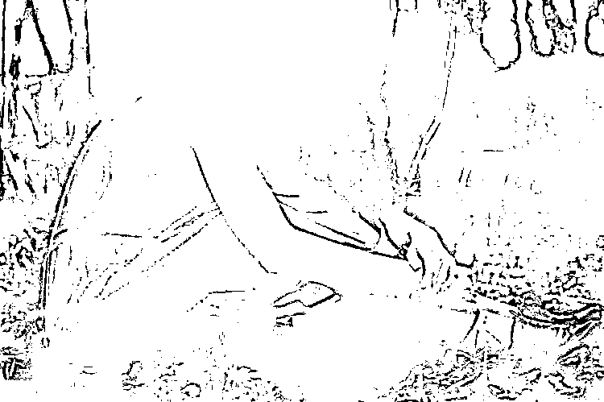**土海四分：丧失与悲痛**

我们所有人现在也在经历**土星和海王星的四分相**，这个相位会历时两年半之久。土星、海王星的能量和天王星、冥王星的能量非常不同。**土星不管碰到哪颗行星，总会带来一种试炼、挑战、反对的能量，引发出与之关联的那颗行星的黑暗、困难的力量。**

**土星和海王星的世界行进的硬相位**，可能会有一个挚爱的人死去了，或者内心一个珍贵的东西被夺走了，从而**引发一种深深的、悲剧式的、丧失的感受**。比如 1963 年美国总统肯尼迪被刺杀身亡，引发了美国本土的哀痛感受。当年王妃戴安娜车祸死去，也发生土海硬相位的时期。

还有两个例子，一是 1945 年美国前总统富兰克林的死引发了全国范围内的大规模哀悼活动，二是前苏联斯大林的过世也引发了全国范围内的群众哀悼。此外，还有一些人们心中理想化的、极具魅力的人物的死亡，比如 1962 年玛丽莲·梦露的死，1980 年约翰·列侬的死，都引发了人们内在悲伤的感受。

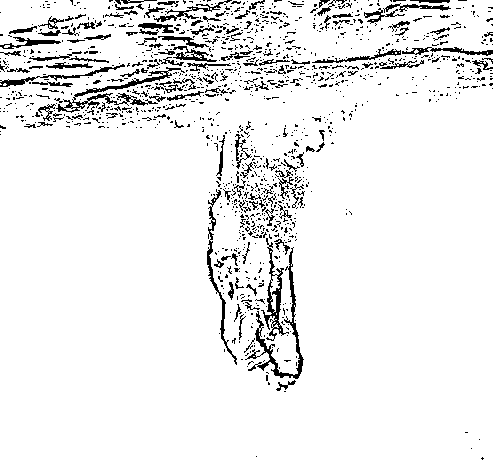

**这种死亡还体现在另一个层面**，比如 1945 年，当时的日本天皇被迫承认自己不是神的时候，引发的宗教性的丧失。因为海王星也代表一种神性、宗教性或灵性的原型，而土星会对这所有一切进行挑战，当两者汇集到一起的时候，就**会带来一种灵性或宗教的丧失感，甚至会引发灵性危机。**

比如 2005-2007 年，世界范围内发生了大规模的海啸事件，此时正是土星四分海王星，人们会产生质疑，为什么一个好的神要引发这样的悲剧？另一个明显例子是 1943-1945 年，土星四分海王星发生了纳粹对数百万的犹太人的屠杀，虔诚的犹太人会质疑，我的神为什么你要抛弃我？我们这些现象称为“灵魂的暗夜”，这个暗夜不仅出现在个人层面，也会反应在世界行进中。

在现在这个时代，土星和海王星四分发生了叙利亚战争，很多人无家可归、逃出祖国，发生了全世界关注的儿童溺水身亡事件，而水也是海王星的元素。当时新闻上有这样一个画面：一个小男孩在逃亡过程中溺水身亡，他的父亲非常无助的抱着孩子。这张照片引发了全世界的哀悼。

土星和海王星四分相的个人例子，比当年伟大的雕塑家米开朗琪罗雕塑出圣母玛利亚抱起受难之后的耶稣，整个作品充满了一种悲剧性的丧失感，好像神性已经死亡。

所以，在所有的行星组合中，土海相位组合是最高贵的。**土海组合带来强烈的悲痛的感受，也因此涌动出慈悲心。**灵性导师如果有土星和海王星的相位，你会在他身上看到极大的悲心，他会想让众生远离疾苦，无论是用祈祷、静坐、冥想或任何修行方式。

**海王星代表灵性、慈悲，土星代表传承、修行本身，它可以把灵性显化在每天的日常之中。**土星和海王星在一起会有一种驱动：想要把理想状态下的灵性和物质的、社会的、经济的世界联系在一起。

**总结一下**，我们这个时代有两大原型能量交织在一起，**一是天王星和冥王星的组合，**充满了深层次的、解放的、有时甚至让人害怕惊恐的向前推进的能量；**二是土星跟海王星的组合，**一方面有一种平静的品质，另一方面有一种悲痛的、哀伤、灵性或情感上的绝望。

所以人都可以进入到这四颗行星形成的原型能量中，不论感受到的是情绪上或其他层面的丧失也好，还是爆发式的觉醒和探索也好，我们要去对这一切臣服，要明白这是你的内在疗愈智慧在寻求属于自己的表达。斯坦·格罗夫说过，当你能够完全去表达这股情绪的时候，你就是在为这股情绪的熄灭架起了柴火，你**对于这股情绪的体验本身就是在释放它**。


我也给大家补充几个资源，第一个是我针对原型占星所写的一篇较为简短的文章，大家有兴趣可以在若道网站 www.nodoor.com 查看。

如果想读英文原版，可以到 http://cosmosandpsyche.com/网站去查。《宇宙与心理》（*Cosmos and Psyche*）是一本很厚的书，有信心的同学可以自己去看。这本书现在还没有中文版，将来可能会翻译。另一本书叫《西方思想史》（*The Passion of theWestern Mind*）。 

**后台回复**** 原型 二字，可获得更多原型占星学内容。**

**课程信息**

**** 

**课程名称：**原型占星学（ISAR 选修课之一）

**讲师：**理查德·塔纳斯

**开课时间**：**2016 年 5 月 21 日**

**授课时间**：每周六上午 10：00-12：00，共 8 节课 16 课时

**费用**：6800 元 （**若道老学员 4800**）

**授课形式**：网络在线授课（英文授课，中文翻译）

**课程负责人**：李老师、熊老师

**微信号**：2847613491（请备注原型课程报名咨询）

**特别提醒：**

**本文经授权发布，**

**转载请联系瑞伽瑜伽。**


**2016 年 5 月 21 日，西方著名文化历史学家、研究原型占星学 30 年余年的**理查德·塔纳斯**将为我们打开**原型占星学网络课**的大门。**

**报名及咨询，请点击文末“阅读原文”**


# 企业占星咨询工作坊丨大卫·瑞雷教你把握企业命运

> 原文：[`mp.weixin.qq.com/s?__biz=MzA5NjA0NTAxNg==&mid=2651384840&idx=3&sn=7806df03916122f9a3024dbdac0c7457&chksm=8b4a5ebfbc3dd7a90da93b909556f4de1256b0863c205250e9167e60a47342799ada76e06ce9&scene=126&sessionid=1692738836#rd`](http://mp.weixin.qq.com/s?__biz=MzA5NjA0NTAxNg==&mid=2651384840&idx=3&sn=7806df03916122f9a3024dbdac0c7457&chksm=8b4a5ebfbc3dd7a90da93b909556f4de1256b0863c205250e9167e60a47342799ada76e06ce9&scene=126&sessionid=1692738836#rd)

**大卫·瑞雷老师主讲的企业占星咨询工作坊**

**就要在 6 月 9 日（端午节假期）开始啦**

**教你用占星学理解企业发展**

**与客户建立关系**

**能够亲眼见到大卫老师**

**与老师零距离接触**

**是不是很 high 啊**

**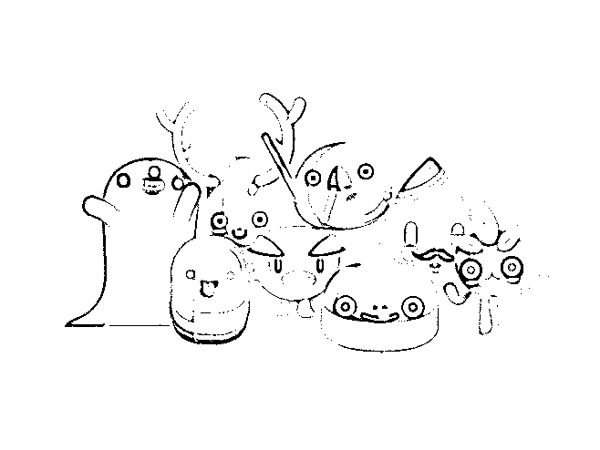** 

**ISAR 选修课程**工作坊信息

**授课时间：**2016 年 6 月 9 日、6 月 10 日、6 月 11 日（端午节假期）10：00-18：00（午休 2 小时） 共 18 课时

**授课老师：**大卫·瑞雷

**授课方式：**上海现场，英文授课，中文翻译。（具体上课地址课前 10 天请留意查看短信微信通知）

**费用**：****6800 元** （5 月 20 日前报名可享受早鸟价****5800 元****，若道老学员**4800 元**）**

**课程负责人：**熊老师

**微信号：**13761199137，请备注企业占星工作坊报名咨询

企业占星咨询工作坊

课程价值

☆ 受益于大卫·瑞雷老师多年的企业占星咨询经验

☆ 掌握企业占星咨询的基本原理和思路

☆ 通过一家企业 25 年来的真实情况展示，巩固所学的理论知识

☆ 帮助你开拓新的占星领域，成为更专业的占星师

课程内容

**①企业占星学的定义**

将占星学用作处理企业事务的参考框架

以整体论方法找出解决方案

从占星学的角度定义业务的性质

业务关联的占星学分类

**②占星学在商务中的实际运用**

定义一家公司或企业的特性

公司决策者的出生星图

人力资源——人事关系问题

关键岗位的适当性

雇佣关键职员和上层管理者

趋势、预测和时机

公司/产品/服务的定位

所有者的商务发展趋势

合伙人的商务发展趋势

上层管理者的商务发展趋势

**③与你的商业客户建立关系**

帮助客户明确定义他们的目标

帮助客户明确定义他们的需求

进行创新性地讨论来帮助他们找到解决方案

明确定义你的服务

保持联系——随访/反馈

对客户企业的发展和结果保持持续的兴趣

保持耐心/放松——不具侵略性

愿意用相当长的时间来建立信任感

保持全然坦诚，“你不知道”时要告知对方

在你们的互动和富有意义的对话中让他们找到解决方案

证明你愿意且有能力去解决棘手问题和危机

师资力量


**大卫·瑞雷（David Railey）**

若道创始人，《灵魂的目标》作者。拥有 46 年的占星咨询的执业经验，曾两任亚特兰大占星协会主席，是全美占星师联盟（AFAN）、美国占星师联合会（AFA）、全美占星研究委员会（NCGR）、国际占星研究协会（ISAR）和职业占星师组织（OPA）的成员，是联合占星大会（UAC, United Astrology Conference）督导委员会委员。大卫曾是 CNN、CBS 的占星节目的常驻嘉宾，多次在 BBC、WGS、WSB、WRGG 等节目中接受采访，并在亚特兰大主持电视节目《每日行星（Daily Planets）》达 4 年之久。

适合人群

相当于若道核心课程 level5 以上水平即了解星座、行星、宫位、相位等，可以独立进行出生星图解读。


**准备好了吗？等你来加入！**

长按二维码添加课程负责人咨询~

****

报名及咨询，请点击文末“阅读原文”

# 深度星座丨劳碌又细节控的处女座，健康你们真的不如金牛座

> 原文：[`mp.weixin.qq.com/s?__biz=MzA5NjA0NTAxNg==&mid=2651384840&idx=1&sn=227ee1d44c64b30fb92ae67df569f900&chksm=8b4a5ebfbc3dd7a98d6f453af037fd1f8b1aa82230db4197bc7075887e55f1349bbb3e0d0943&scene=126&sessionid=1692738836#rd`](http://mp.weixin.qq.com/s?__biz=MzA5NjA0NTAxNg==&mid=2651384840&idx=1&sn=227ee1d44c64b30fb92ae67df569f900&chksm=8b4a5ebfbc3dd7a98d6f453af037fd1f8b1aa82230db4197bc7075887e55f1349bbb3e0d0943&scene=126&sessionid=1692738836#rd)

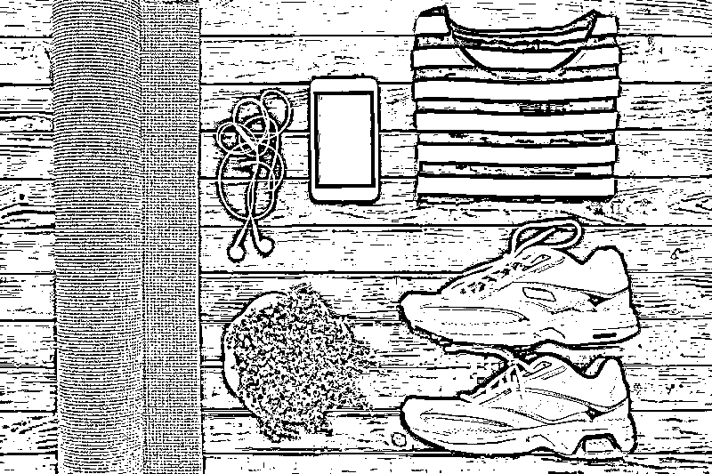 作者/Justine  图片来源/VCG

每年的 4 月 19 日到 5 月 20 日，太阳行进在金牛座。当我们说起金牛座，大概首先会想到享乐主义、缓慢慵懒、顽固坚持等种种关键词。不过你是否想过，金牛座在各种”美名”或被贴歪的标签之下，也是最懂得健康的星座？ 

**金牛座与五官享受直接相关**

相对于轻盈的灵魂，现代大多数人的身体似乎过于沉重。对于五官的功能，也会有些怠慢。而金牛座有着“饥来餐饭倦来眠”的本能，能自然去感知和保养自己的身体。

**色——**哪个星座最容易出美人？也许你的第一反应是天秤座。天秤座优雅并充满平衡感，却不免带着秋天收敛萧瑟的气质。同是金星守护的金牛座，它的美是丰盛富饶、朝气蓬勃的。金牛月里，百花盛开，万物生长，绿树成荫。抑或雍容华贵、抑或自然沉稳，滋养着心灵的窗户，给予我们美而不甜腻的视觉盛宴。

**声**——金牛特质强的人，抑或有着美妙的嗓音、抑或是音乐欣赏家。清晨的鸟鸣声、流水的叮咚声、雨打芭蕉声、海浪拍礁石声，这些自然之声都让人放松。如果没有自然的场景，他们便躲进自己的小空间里，播放一张美妙的新专辑，把耳朵叫醒。

**香**——在人类全部感官中，嗅觉是最敏感的。也是同记忆和情感联系最密切的感官，其准确度比视觉记忆要高一倍。母亲怀里的温馨、恋人手腕间的体香、下雨天泥土的清新、面包房里奶油的香甜，都在金牛座的记忆与情感库里。

**味**——食色，性也。金牛座会百分百赞同。没有什么比享用一顿大餐更让金牛座放松的了，要贿赂他们最好的方式大概是美食。

**触**——你有多久没有赤脚踩踏过草地，双手触摸过泥土了？金牛座擅于通过与土地之间保持连接，来实现自我疗愈。让手穿越陶土来创作，仰躺在布满阳光的草地上，给自己种一株花……从而把烦恼吐出来，把负能量导入大地。

在这个令人窒息的高速时代，在迈向成功的道路上奔驰时，愿我们都不失去用五官（而不是用智能手机等高科技）去体验美好生活细节的感受能力。**享受五官但不沉溺，通过五官去感知身体，喂养灵魂的庙宇，这是金牛座的智慧**。

**物质很重要，健康也很重要**

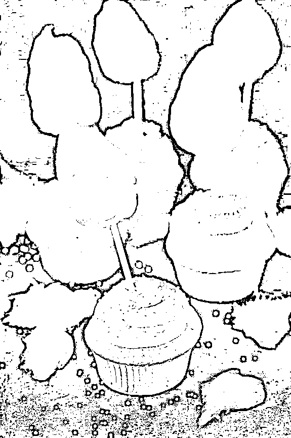

在这个物质越来越丰盛的社会，信息以指数级的速度更新翻滚着，每个人的生活都不同程度地伴随着焦躁不安和恐惧。压力成为健康的最大敌人之一。而金牛座天生有着不被焦灼绑架、不慌不忙的气质。当你在高压状态下，只需呆在一个金牛特质强的朋友身边，他们笃定清醒、耐心务实的气质就能让你平静下来。

金牛座是最物质的星座，而健康则是最大的财富，掌管第二宫（财务与个人价值）的金牛座显然生来懂得这个道理。有趣的是，他并不会声嘶力竭地把其当作标语，而是低调地身体力行，无论刮风下雨，每天坚持锻炼，关注日常饮食与生活作息。

没有一个星座比金牛座更容易实践“活在当下”的美德。佛陀（太阳星座恰好也在金牛座）曾说过：“**身心健康的秘密在于，不悔恨过去，不担忧将来，以真诚和智慧之心好好活过现在**”。领悟这个道理简单，实践却很难，有着心到脑的鸿沟。所以怡然自得、不背负将来的金牛座在这点上则显得更为聪慧。这大概是忧心忡忡、对未来关注过多的处女座最羡慕金牛座的地方。

**“慢下来”和“简单”的智慧**

**金牛座有着能“慢下来”的特质**。同样是享受一顿美食，如果对面的你狼吞虎咽，金牛座的朋友会觉得无法理解。不要忘了，金牛座是介于“现在就像要、马上就要行动”的白羊座与“能同时处理千头万绪”的双子座之间的星座。对于他们而言，**慵懒惬意的节奏是必须的**。

但放缓节奏并不意味着放弃对成功的努力，金牛座凭着有条不紊、持之以恒的天然优势，往往让其成为权势、财富、成功的持有者——龟兔赛跑的故事最好地阐释了这点。当生命内在的节奏与大自然的一开一阖相呼应，则能更好地得到天地、日月、星辰的滋养。

**金牛座最懂得“简单”的智慧**。与金牛座相对的天蝎座是复杂的，能洞悉人性的黑暗与曲折。而**金星守护的金牛座，注重价值、自然与美，对一切复杂的东西不感兴趣，对夸张与戏剧性有着天生的反感，善于用直觉来做简单地判断**。因此，**金牛座能很好地储存而不是浪费能量，去应对不时之需。**

**金牛月，让我们关注自己的身体**

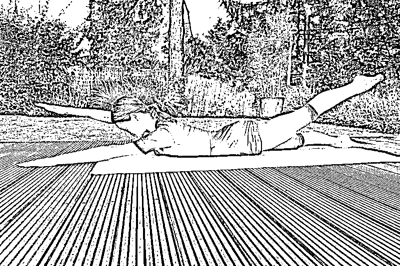

在医疗占星中，每一个星座都有对应的人体器官。**在金牛月里，我们可以特别关注肩颈的压力，以及喉咙，声带，甲状腺，扁导体这些金牛座掌管的器官。**如果有相关的隐疾或疾病的先兆，及时检查，防患于将来。

由此可见，金牛座不只关注于身体或感官层面，在化解压力方面也有其独特资源与优势。身体、心灵与精神本是三位一体、互相影响的。这些金牛座教会我们关于健康的智慧，不只对于太阳金牛或金牛特质强的人，对于任何一个人都适用。

“

金牛月里，愿每个人在紧张、焦虑与烦躁之中找到优雅的平衡，停下来亲吻野花，触摸泥土，感知身体，活在当下。

”

📹 /mp/newappmsgvote?action=show&__biz=MzA5NjA0NTAxNg==&supervoteid=3517762#wechat_redirect

**你可以更深入认识金牛座：**  

**▼**

[金牛月独家话题 | 如何成为有钱人](http://mp.weixin.qq.com/s?__biz=MzA5NjA0NTAxNg==&mid=2651384368&idx=1&sn=6b98cf58afecf6cc62f90ce95629e995&scene=21#wechat_redirect)

[大卫谈占星 | 数数这些年金牛座被贴歪了的标签](http://mp.weixin.qq.com/s?__biz=MzA5NjA0NTAxNg==&mid=2651384546&idx=1&sn=0fd1724e243b810b6abd77422dc3719d&scene=21#wechat_redirect)

[大卫谈占星 | 金牛座：即使不爱动弹，也得改变自己啊！](http://mp.weixin.qq.com/s?__biz=MzA5NjA0NTAxNg==&mid=2651384575&idx=1&sn=28208517e22e0e76fab3bbe5b9a91186&scene=21#wechat_redirect)

[小白学占星 | 太阳进入金牛座，谷雨到了](http://mp.weixin.qq.com/s?__biz=MzA5NjA0NTAxNg==&mid=2651384349&idx=2&sn=2920f445c2b9e35f03c55f03e4f227cf&scene=21#wechat_redirect)


**作者简介**

**熙淅 Justine**：职业占星师，国际占星研究协会 ISAR 会员，已通过 ISAR 占星师能力测试。毕业于浙江大学，十年跨国企业人力资源管理经验。2012 年起在若道跟随多名国际占星师学习人本主义占星。个人咨询风格结合心理占星与演化占星，对于占星触及的人性、灵魂与疗愈尤为感兴趣。

**个人微信公众号**：AngelAstara

**咨询个案微信**：cicirebacca

长按二维码，让金钱涌向智慧的人~


**◆ ◆ ◆  ◆ ◆**

******特别提醒************：本文由作者授权首发于若道******，**转载需联系后台获得授权。******

想了解更多关于金牛座？**2016 年 5 月 19 日**，蒋颖老师主讲的若道占星核心课程**Level 1-2**要开课了！没有报上名的朋友，还有**Level 1-5 连报**可选择。


# 你和“过度评判”做了好盆友吗？

> 原文：[`mp.weixin.qq.com/s?__biz=MzA5NjA0NTAxNg==&mid=2651384840&idx=2&sn=9eaaf91d3ca31ded2005ca9beb97d217&chksm=8b4a5ebfbc3dd7a909050ca952423a18e382c993b1b89e08455790c6bc15e8380db81a20013f&scene=126&sessionid=1692738836#rd`](http://mp.weixin.qq.com/s?__biz=MzA5NjA0NTAxNg==&mid=2651384840&idx=2&sn=9eaaf91d3ca31ded2005ca9beb97d217&chksm=8b4a5ebfbc3dd7a909050ca952423a18e382c993b1b89e08455790c6bc15e8380db81a20013f&scene=126&sessionid=1692738836#rd)

作者/唐娜·坎宁安 译者/李晓庆 校对/王宏

图片来源/VCG

行进的冥王星在我们发展职业方面的作用越来越大，也许在这个时期，你会面对来自外界及自我各种鸡毛蒜皮的质疑，这种质疑让人不爽且久了还容易产生自我质疑。如何认识及良性应对这种质疑？

行进的摩羯座冥王星在我们发展自己的职业方面所起到的作用越来越大。并且很不幸的，在我们如何评判自己和他人方面所起到的作用也越来越大。

## 什么是“恶性的完美主义”？

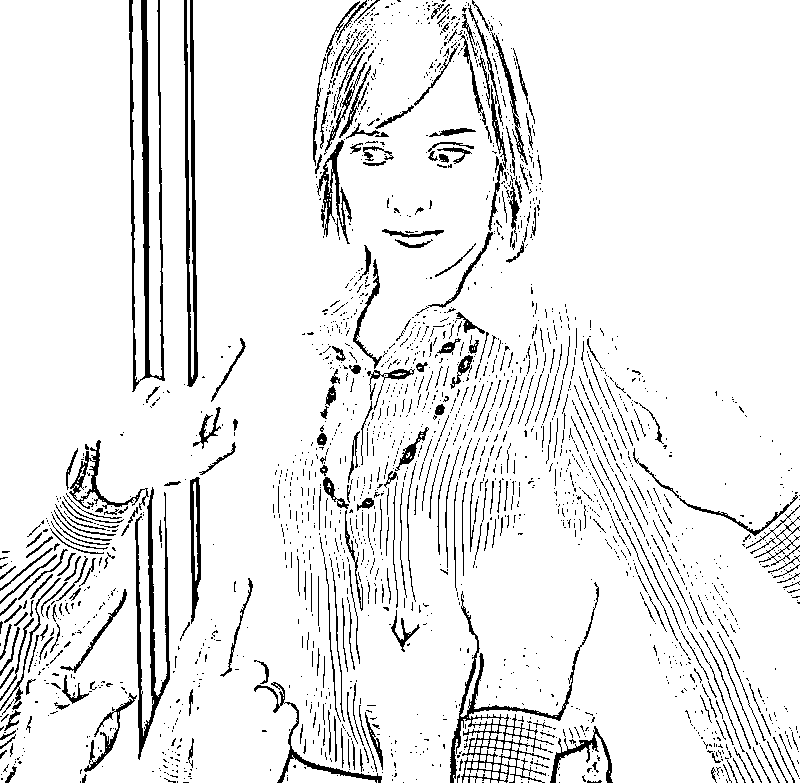

完美主义居然有“恶性的”这一说法？这听起来是不是很有趣？但当你以努力积极的态度向世界展现自己的工作时，“恶性的完美主义”绝对不是你想听到的评价。

对“恶性”还可以有进一步的解释：破坏性的、或致命的，但经常以一种不易被察觉到的方式隐秘地进行。于是你知道，这种评价更像是在敲响警钟。

当冥王星行进到完美主义的摩羯座时，我经常注意到，行进的冥王星具有了一个更让人难以接受的特质就是有点势利——不，等一下，我的意思是自大——“完美主义”和“急于评判”。如果一个人所做的、或提供的事物在表面上看起来并非顶尖水准的，它就会立刻被否认，甚至还没有机会向外界展示它的本质。

这就好像你穿着现成的礼服去参加奥斯卡颁奖礼，尽管你因出色的表演而获得了提名，但因为你买不起设计师设计的礼服而你备受冷落。随后，琼·里弗斯（注：以“毒舌”闻名的美国时尚名嘴）就会在《时尚警察》节目中嘲讽你。

## 如何应对“恶性的完美主义”

我认为很多人目前都受到恶性完美主义的折磨，不管是作为被折磨者还是折磨他人者。我们因为自己的着装方式和看起来的样子、以及我们的工作看起来的“样子”而非“质量”受到评判，同时也去评判别人。

这对于我们当中试图努力取得成功、努力以某种方式让这个世界变得更好的人来说，这些因为表面的特质而遭到否定的现状，实在很令人沮丧。况且很多时候，那些评判的人不会因为我们的沮丧而放我们一马。

为了与时俱进，我们都必须要将自己的表现提升几个层次，尤其是在网络上将我们的工作曝光给更广泛的受众的那些事物，如果我们的数字表现不是最高水平的，那这些受众就不会与我们见面。这就是令人气馁的现实。

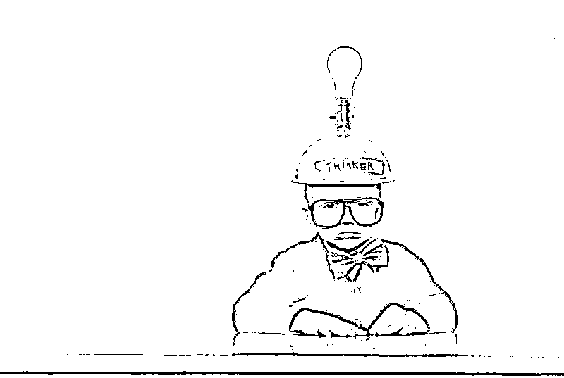

但是你知道吗？将我们的表现提升几个层次并准备好去满足我们目标受众的新需求是一件好事，虽然很有压力。现在的生活复杂得多，如果我们想过得有意义，并对人有所帮助，那我们就需要了解世界上和人们的生活中正在发生什么。

嘿，冥王星应该与转化相关，对吧？（然而，在此次行进中，它看起来更像是要么大刀阔斧，要么无所作为。）

毫无疑问，我们中的一些人正在利用摩羯座的冥王星来转化自己，并使自己重生。**想要利用现在的冥王星需要洞察力、自我意识、谦卑、自我提升的动机，以及大量持久的努力。缺乏这些特质的人有可能去关注并纠缠于其他人的错误，而非自己的错误。**

我确实发现，摩羯座的行星会让进化得不太好的人变得更加势利和具有批判性，因为他们过分强调成功和地位，不惜以将自己弄得更糟糕为代价。

## **什么是“良性的完美主义”**

对于一部分人而言，这次行进会让你以健康的方式爆发出对现阶段工作的不满——**想要从自己身上收获更多并渴望有所突破**。

这可以被称作**良性的完美主义**。这种对完美的努力追求与痛苦的自我怀疑是有差别的，痛苦的自我怀疑阻止了许多有才华和创造力的人完成自己的工作并将其与整个世界分享。

以事业为导向的此次摩羯座冥王星行进，其有利影响是：**提升职业水平——以前足够好的地方现在已经不够好了，我们都在受到挑战去提高标准**。也许这来自于对成长的内在渴望，又或许来自于你的工作领域更上一层楼的需求。压力就在那里。

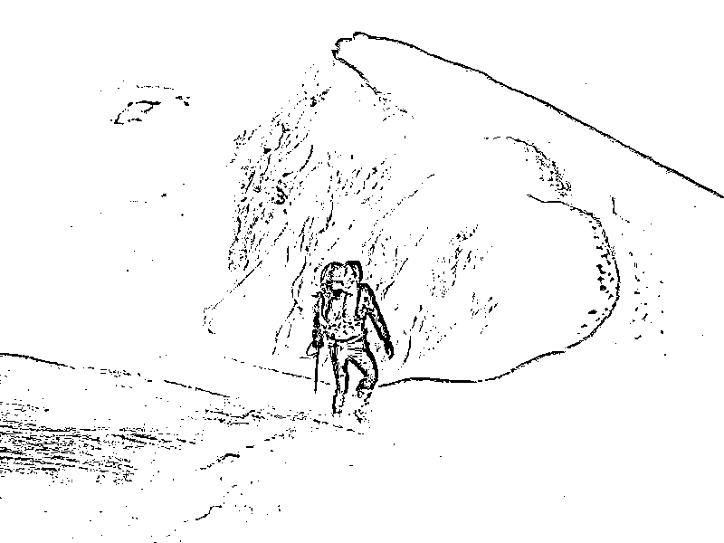

你们中的许多人发现了需要攀登的新顶峰，就像摩羯座这头山羊一样，努力不断攀登。虽然攀登新的顶峰并不足够有趣，但是我们需要这样做，至少土星和摩羯座的影响让我有耐心和毅力去这么做。

如今，一些人会对“职业化”这个词产生反感。可是想象一下，医生或其他辅助人员在自己的工作中非常职业，并且达到最高水平，这不是很好吗？职业化可以是一件好事，但也确实需要我们对自己有更高、更严格的期许。这就是**摩羯座式的转化中的冥王星，因为摩羯座追求我们能够在职业这个定义上变得更加高标准。**

为了抵制当下严苛的完美主义，我所做的一件事就是：当我喜欢人们身上的某个特点时，我会让他们知道——即使这个人是走在路上的我完全不认识的陌生人。

欢迎留言

**以貌取人和驳斥任何不完美之人的普遍趋势影响到你了吗？**

**你是以什么方式面对的？**

**关于如何应对这一问题你们有什么小建议吗？**

**欢迎在留言区回复**

**和我们一起分享你的小故事或建议**

欢迎留言

**.gif")**

**特别提醒****：************转载需联系后台获得授权。**************  

如何利用占星学在职业上更上一层楼，来上企业咨询工作坊吧！**2016 年 6 月 9 日-11 日**，大卫老师主讲的**企业咨询工作坊**要开课了！他将带领你了解什么是企业占星学，如何将企业占星学运用到实际商务活动中，让你将占星学运用到实际生活！

报名及咨询，请点击文末“阅读原文”


# 大卫谈占星 | 被暗杀还能活命，这位总统有颗超强的木星

> 原文：[`mp.weixin.qq.com/s?__biz=MzA5NjA0NTAxNg==&mid=2651384829&idx=2&sn=4cff38cd4aac3076538e5e07d0ccf059&chksm=8b4a594abc3dd05ce173116a0320d83e7a328cf286cee63f1986585d3fcef7019af97c95f146&scene=126&sessionid=1692738836#rd`](http://mp.weixin.qq.com/s?__biz=MzA5NjA0NTAxNg==&mid=2651384829&idx=2&sn=4cff38cd4aac3076538e5e07d0ccf059&chksm=8b4a594abc3dd05ce173116a0320d83e7a328cf286cee63f1986585d3fcef7019af97c95f146&scene=126&sessionid=1692738836#rd)

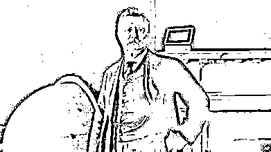
作者/大卫·瑞雷

翻译/Christy 校对/轩轩

作为美国历史上遇刺而坚持完成演说的总统，西奥多·罗斯福无畏而镇定的气势令人折服。人们认为他的行为不是愚蠢或作秀，而是一个强者的勇敢行为。那么，是什么让他死里逃生，又是什么支撑着他带着子弹完成了演说？大卫老师带你一起来看看罗斯福总统遇刺事件中的占星学指征。

## 罗斯福总统生命中最惊心动魄的一刻

天蝎座比其他星座更有能力从致命的灾难中存活下来，这是他们的名声所在。不过，出生图中有颗耀眼的木星对此也有帮助，看看美国前总统被暗杀的经历就知道了。

1912 年 10 月 14 日，在密尔沃基参加竞选活动的罗斯福正赶往发表演讲的路上，就在他向人群挥手时，一名暗杀者开枪打中了他的右胸。子弹的大部分威力，击中了总统胸前口袋里的眼镜盒和 50 页厚的演讲稿。子弹就击在了肺部附近的地方，鲜血淋漓，但罗斯福仍然艰难地站上了讲台。

他恳请台下的人群：“保持安静，请允许我发表一个长篇演讲，我将尽力而为，但我身上有一颗子弹……我有话要说，只要我活着，我就要把这些话说出来。”然后，他挥舞着那份再也无法参看的、中间被打出不规则大洞的带血的演讲稿，讲了整整 90 分钟。

罗斯福对惊恐不已的人群说：“这样是杀不死一个进步党党员的！”罗斯福的政党被称作进步党，一个试图参与总统竞选的第三党派。后来，罗斯福被匆忙送往医院，震惊不已的医生将子弹从他胸腔里取出来，惊叹他竟然没有流血而死或者休克。

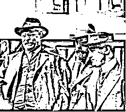
上图拍摄于暗杀发生前不久

（据报纸报道暗杀发生在晚上 8:05）

1 罗斯福总统的出生星图告诉我们什么**罗斯福总统的出生星图**

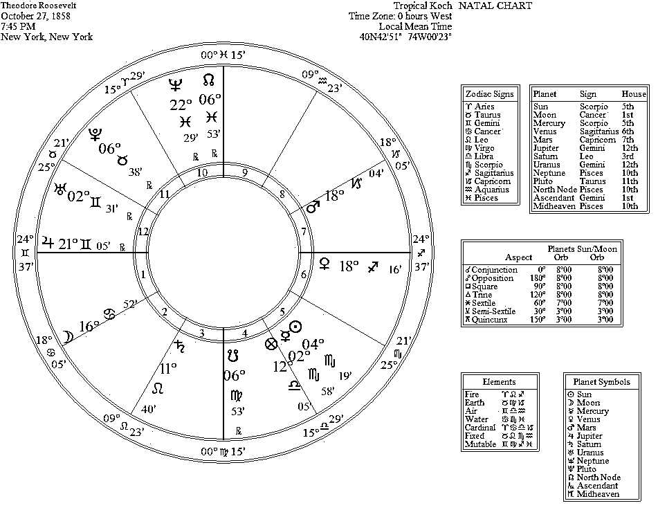

*   **他的太阳和水星落在天蝎座、对分冥王星，因此他有着显著的天蝎座主题！**

*   然而，有着双子座上升点、木星合相上升点的他，也以其大型演讲而闻名，这也解释了为什么他会将一个 50 页厚的演讲稿折叠后放进胸前的大衣口袋！

*   所以，是他对大型演讲的热爱挽救了他的生命！火星摩羯座准确合相八宫头，则近一步强调了罗斯福的恢复力，这一硬朗的组合配置带有明显的政治野心。

2 木星救了他的性命**罗斯福总统遇刺当天的行进星图**

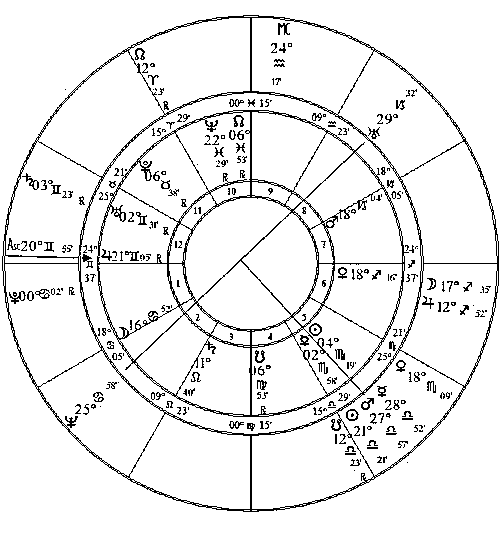
*外圈为暗杀发生时的星图*

*1912 年 10 月 14 日晚上 8:05
美国威斯康星州密尔沃基*

最令人震惊的是，从暗杀发生的准确时间我们可以看到，**子弹发射的那一刻，行进上升点正位于双子座 20 度 55 分，与罗斯福的木星合相！**在一天之中，上升点距离罗斯福的木星如此之近的时间只有 1 分钟。然而就在那 1 分钟，竟然有暗杀者想要送他上一条不归路，多么令人难以置信的概率啊！

当天的“世俗行进”，的确与一个被法院认定为精神病的人做出的冲动行为相符合。我们可以注意到，**行进火星正与水星形成合相（入相位），与天王星呈四分相（入相位），与海王星呈四分相（出相位）。因此，火星和水星加入了当年的天王星和海王星对分格局，形成 T 三角。**而这个世俗行进正在靠近罗斯福的水星。

我们只能猜测，如果这个行进的相位更加精准，罗斯福可能就活不了了。 

而事实上，这个火星行进导致罗斯福的竞选进程暂时中断，随后的两周，他在抱怨和愤怒中慢慢从枪伤中恢复过来。


想体验大师级的占星疗愈？

大卫老师**占星咨询**预约进行时

**生命议题、职业发展、关系咨询、少儿成长、年度规划和预测**

```
预约咨询请联系许小姐 ：010-58760529
```

**.gif")**

**特别提醒****：转载请注明“转自若道”并标明作者。**  

占星学是如此神奇，一起来学习吧！**2016 年 5 月 19 日**，蒋颖老师主讲的若道占星核心课程**Level 1-2**要开课了！没有报上名的朋友，还有**Level 1-5 连报**可选择。

报名及咨询，请点击文末“阅读原文”


# 错过 Level 1-2 的童鞋，还有 Level 1-5 连报等着你哦

> 原文：[`mp.weixin.qq.com/s?__biz=MzA5NjA0NTAxNg==&mid=2651384829&idx=3&sn=b3f7ac3578583d48712ea21c1858596c&chksm=8b4a594abc3dd05cd5c88ee6421c634206611900bf804736bdaf96db70ac0a3fca611d904f53&scene=126&sessionid=1692738836#rd`](http://mp.weixin.qq.com/s?__biz=MzA5NjA0NTAxNg==&mid=2651384829&idx=3&sn=b3f7ac3578583d48712ea21c1858596c&chksm=8b4a594abc3dd05cd5c88ee6421c634206611900bf804736bdaf96db70ac0a3fca611d904f53&scene=126&sessionid=1692738836#rd)

**蒋颖老师主讲的占星学入门课程**

****Level 1-2 就要在 5 月 19 日**开课了**

**还没有参与课程的同学可以点击：**

**[惊呆了，这真的只是若道一年级新生的水平吗？](http://mp.weixin.qq.com/s?__biz=MzA5NjA0NTAxNg==&mid=2651384523&idx=2&sn=05b55df84becd8db236864012cb60079&scene=21#wechat_redirect)**

**提前感受下若道的学习氛围**

**很可惜该课程已经结束报名了**

**错过的童鞋不要着急**

**在这里若道君有个好消息要告诉大家**

**若道已经开通了 Level 1-5 连报通道**

**你可以一步到位学习占星学了**

**最最吸引人的是**

**连报特惠价是 27000 元** 

**比起单独报名 1 阶到 5 阶**

**足足优惠了 7400 元！**

**** 

**那么吸引人，来看看******Level 1-5 具体学什么吧！****

L1-5 联报

课程简介

****

** Level 1：星座，太阳和月亮**

12 星座是占星学最基本却又最深刻的概念，黄道 12 星座，是伟大的生命周期，而太阳和月亮是我们阴阳之本。  

　　     

**Level 2：**遇见行星和月亮交点****

在这个阶段，你将遇见行星们，还有与灵魂的过往和未来相关的月亮交点。这既是你，你的性格，也是你在生命故事中将会遇到的人、事、物的显化，也是你灵魂轨迹的线索。


**Level 3：五彩线穿起来——宫位、相位及元素组合**

在这个阶段，你将学习宫位，知道生命的故事发生在哪里。你会学习相位，那是行星之间的对话，是一颗行星如何用自己的能量去影响其他行星。

然后，你要学习如何将星座、行星、宫位、相位组合起来进行解读，这是把散落的珠子穿起来的过程。这个部分非常重要，是大部分占星学习者薄弱的环节，也是从爱好者走向职业占星师道路时承上启下的一个重要阶段。


**Level 4：星图舞会——星图综合解读 24 小时**

在这个阶段，你终于可以学会星图的综合解读了！前一阶段你学习得越扎实，现在就越开心。你可以看到，当那些行星、星座、宫位、相位穿起来的丝线开始跳舞，一个个故事图景就像织锦一样展现在你的面前。个性、爱情、事业，看到一个人的出生星图，你就可以开始讲他们生命故事的梗概了。在这里，大卫老师会分别讲解如何通过出生图进行性格、爱情、事业分析。在爱情解读部分，你还会提前学到比对图。


**Level 5：气象预报——预测技术和咨询技巧**

在这个阶段，你将学习各种预测技术——行进、月亮次限、太阳弧、返照图。你会学到行星周期！宇宙天象如何变化？它又会如何影响每个人的人生？通过这些预测工具，你就能够开始预测和规划人生了。

有关毕业

**考试和实习：**对于那些想要获得大卫老师资质班证书的朋友，我们将帮助大家在开始成为职业占星师之前，将由专业占星师组织小型督导工作坊，帮助大家实战解盘，为正式的收费咨询做好准备。通过毕业考试，参加督导工作坊，星盘解读的同学，将获得大卫老师颁发的职业占星师资质证书。

授课优势

**①先进的教学平台**

网络教学平台，支持手机、电脑、iPad 上网，可以随时随地学习。

**②回放复习**

学员可登录网站收看课程回放，在线复习课程，每次课可完整重看 3 次，课程结束后的 3 个月内有效。　

课程特色

**①与名师面对面**：北京同学可以来若道现场上课，和大卫老师面对面互动。大卫老师也可能前往主要学员所在城市，实现零距离教学。

**②互动答疑**：论坛、微信群随时提问；老师课上答疑；助教线上线下全程协助。

**③线下沙龙**：定期举办沙龙活动，复习上课内容。

**④强大的同学网络**：若道作为中国最顶尖的占星教学机构，在 4 年的占星教学中，培养了很多占星人才。若道让你和师兄师姐切磋，让你和国内著名占星师学习。（简单来说，就是，人脉！）网络授课，在北京开设免费现场参与名额，全程英文授课，配备实时翻译。

师资力量

**讲师团队**


**大卫·瑞雷（David Railey）**

若道创始人，《灵魂的目标》作者。拥有 46 年的占星咨询的执业经验，曾两任亚特兰大占星协会主席，是全美占星师联盟（AFAN）、美国占星师联合会（AFA）、全美占星研究委员会（NCGR）、国际占星研究协会（ISAR）和职业占星师组织（OPA）的成员，是联合占星大会（UAC, United Astrology Conference）督导委员会委员。大卫曾是 CNN、CBS 的占星节目的常驻嘉宾，多次在 BBC、WGS、WSB、WRGG 等节目中接受采访，并在亚特兰大主持电视节目《每日行星（Daily Planets）》达 4 年之久。


**蒋颖（Felicia）**

若道创始人，职业占星师。在若道系统学习占星，师从大卫·瑞雷。长江商学院 MBA，厦门大学经济学硕士，化学学士。国际占星研究协会（ISAR）中国区副主席。第一批获得国际占星研究协会（ISAR）认证的职业占星师。《灵魂的目标》译者。

**在后台回复**** 蒋颖 即可查看她的全部文集**

**准备好了吗？等你来加入！**

**2016 年，和若道老师一起，开启占星学的探索之旅！**

长按二维码添加课程负责人咨询~

****

报名请点击文末“阅读原文”

# 12 星座测试丨你的太阳活出几分？50 还是 100？

> 原文：[`mp.weixin.qq.com/s?__biz=MzA5NjA0NTAxNg==&mid=2651384829&idx=1&sn=207050994dd04ab44d0b08843e368334&chksm=8b4a594abc3dd05cfa8f0cfaecf13c4c46f3985e79d2d5ad28e1d7b43c16d8847c9800331d8e&scene=126&sessionid=1692738836#rd`](http://mp.weixin.qq.com/s?__biz=MzA5NjA0NTAxNg==&mid=2651384829&idx=1&sn=207050994dd04ab44d0b08843e368334&chksm=8b4a594abc3dd05cfa8f0cfaecf13c4c46f3985e79d2d5ad28e1d7b43c16d8847c9800331d8e&scene=126&sessionid=1692738836#rd)

在若道君之前发布的关于[太阳星座能量](http://mp.weixin.qq.com/s?__biz=MzA5NjA0NTAxNg==&mid=2651384368&idx=2&sn=c870d7254a29932e43e20d92dd5c1fb1&scene=21#wechat_redirect)的文章里，谈到了健康的太阳和疯狂的太阳，你是否活出了太阳能量，我们来测试一下。在测试之前，看了若道君这么久，你知道我们人本主义占星学是如何来的吗？先来涨涨姿势。

## 你知道人本主义占星学的历史吗？

在中国，每一个人都知道自己的黄道星座。

2010 年我初来中国时就发现了这一点。但是大部分人并不了解在这股流行风潮背后是占星学的现代复兴。在进入二十世纪之前，占星学在西方消失了近两百年。**17 世纪的科学革命中涌现出了一批伟大的先驱者，诸如伽利略、笛卡尔、培根、开普勒**，但他们并没有为验证占星学留下科学模型。

尽管天文学家/占星师开普勒为占星学辩解说，“不要把婴儿和洗澡水一起倒掉”，但学术界和新兴的科学界却是这么做的。只是后来，当伟大的心理学家卡尔·荣格说，“**占星学就是古代心理学知识的总和**”（1935 年）时，占星学在西方才走上了重新发现和自我改造之旅。事实上，**在西方，占星学的自我改造与心理学的发展是并驾齐驱的**。


▲图为卡尔·荣格

在这一并行发展之下，西方最重要的占星师之一，毕业于巴黎梭尔邦大学的**丹恩·鲁伊尔在 1969 年命名了一个全新的占星学分支：人本主义占星学**。正如他所描述的，“它（人本主义占星学）在 1969 年被挑出来表明一种主张，这种主张多少与‘人本主义心理学家’的主张呼应”。


▲图为丹恩·鲁伊尔

**人本主义心理学是一种现象级的发展**。“需求层次”的创始人、心理学家**亚伯拉罕·马斯洛**（1908-1970）**从关注“人有什么问题”的沉闷心理学中脱颖而出，决定去关注人们的正面特质。马斯洛的目标是实现我们每一个人身上所具有的潜能**。占星师丹恩·鲁伊尔和其他占星师认识到这正是占星学所关注的。当我 1970 年首次开始认真学习占星学时，正是这种占星学让我兴奋不已。

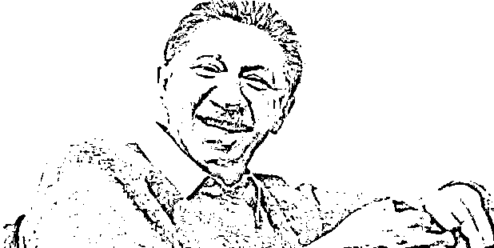
▲图为亚伯拉罕·马斯洛

**每一个黄道星座都代表着一种“潜能”，我们可以将其视作一种宇宙 DNA。黄道星座就是你所要发展的。我们的地球围绕太阳每运转一周，你们就有一次机会发展自己星座的特质。**

**举个栗子**

一位有些不安的狮子座人在 23 岁时，可能并不像他在书中读到的狮子座那样充满自信地“主导全局”。但是，30 岁时当他有机会在一个领导岗位上证明自己之后，再去问他，他可能就与狮子座有更多共鸣了。你们可能会说，“好吧，这就是成熟呀。”是的，但是他成熟的方向是什么？一只狮子！

**让我们用每一个黄道星座来验证这一点，看你是否与自己的太阳星座和谐共振，尤其是你们的个人发展方面。**

OK，在下面的星座列表里找到你自己的太阳星座，深吸一口气，放松你的大脑，不要过多的思考，以直觉回答对应星座的两个问题。记住你的答案。

**开始测试**

**白****羊座**：  

✪**我可以照顾好自己。**

（是）

（否）

✪**我已经学会如何更有力地表明自己的主张。**

（是）

（否）

**金****牛座**：

✪**我可以分辨什么有价值，什么没有价值。**

（是）

（否）

✪**我已经学会如何创造一种舒适的生活。**

（是）

（否）

**双****子座**：

✪**人们听我所说，思我所想。**

（是）

（否）

✪**我已经学会了倾听。**

（是）

（否）

**巨****蟹座**：

✪**我擅长营造一种安全的环境。**

（是）

（否）

✪**我已经学会相信自己的直觉。**

（是）

（否）

**狮****子座**：

✪**我喜欢主导。**

（是）

（否）

✪**我已经学会让项目更有趣。**

（是）

（否）

**处****女座**：

✪**我擅长组织。**

（是）

（否）

✪**我已经学会对自己不再那么苛责。**

（是）

（否）

**天****秤座**：

✪**我擅长与人互动。**

（是）

（否）

✪**我已经认识到我无法取悦所有人。**

（是）

（否）

**天****蝎座**：

✪**我韧性十足。**

（是）

（否）

✪**我已经学会如何建立值得信赖的关系。**

（是）

（否）

**射****手座**：

✪**我通常具有乐观精神。**

（是）

（否）

✪**我已经学会诚实并不总表示我是对的。**

（是）

（否）

**摩****羯座**：

✪**我擅长计划。**

（是）

（否）

✪**我已经学会接纳：自己对失败的恐惧源自对成功的渴求。**

（是）

（否）

**水****瓶座**：

✪**我既倾向于参与又倾向于抽离。**

（是）

（否）

✪**我已经认识到我的个性可以为团队做出贡献。**

（是）

（否）

**双****鱼座**：

✪**我可以感觉到其他人的感受。**

（是）

（否）

✪**我已经认识到一个更好的梦最终可以取代已经结束的梦。**

（是）

（否）

如果上述测验，你回答了“是”，恭喜你！这表明在这个问题上，你能与自己的星座或星座的发展和谐共振。如果你回答了“否”，表明在这个问题上你还有潜力可以挖掘。**你可以参照下面的建议，拥抱自己的星座能量，活出更好的自己。**

**解析与建议**

白羊座

**你是否想要更自立？**如果不是，让我们设想你喜欢自己的样子。否则，就审视你幼年的生活。**是什么削弱了你的自我形象，培养了依赖性？不要再认为自己不够好或是一个受害者，这样你就可以发展自立。**是的，你依然在学习**如何有力地表明自己的主张**。

你可能咄咄逼人，甚至有侵略性，也可能不够自信。白羊座是直率的，但**直率并不是粗鲁**，如果你常常让其他人感到愤怒或不安，那么你可能是粗鲁。如果不够自信，那么上面的建议在此处也适用。

金牛座

**无法去评估一些事物的价值，意味着你并不能感受到自身的价值。**在成长过程中感觉不被欣赏是最常见的原因。**建议你列一份个人价值清单。列出你看重自己的地方**。即使是小事物也计算进去。随着这份清单加长，你也会有能力去评估其他一切的价值。

创造一种舒适的生活常常需要时间，所以如果你还年轻，你会找到方法的。同时，接受你自己对舒适的渴望！如果你感觉内疚，为什么呢？**放下那些否定自己真正渴望的信念吧。**

双子座

如果人们忽视你，那么是因为这些原因：

糟糕的剧本；

糟糕的表达；

时机不对。

糟糕的剧本意味着“无趣”。**谈论那些真正让你觉得有趣的东西**。糟糕的表达和风格有关。如果与你的眼神交流和身体语言配合得当的话，即使一种奇怪或有趣的声音也可以变成一种长处。时机意味着，“这对其他人来说是个好时机吗？”**倾听他人需要深呼吸、关注、偶尔重复你所听到的，这样他们就知道你在听。**

巨蟹座

**去创造一个安全的外部环境，你需要一个安宁的“内在环境”。**你**情绪上的焦虑需要被疗愈**。如果你在成长过程中很少感觉安全，那么是时候重新滋养你自己了。从你的厨房开始。烹调你自己最喜欢的食物，去感受关爱自己是多么幸福的事情。这就是开始的方式。猜猜看？

**你很可能有良好的直觉。**也许在儿时你的感受被父母忽视了，他们嘲弄你的直觉，认为那是恐惧和迷信。**现在你可以听从自己的直觉，意识到感觉包含了许多有价值的信息。**

狮子座

如果你想要成为领导却未能如愿，那么很可能童年时有一些事情影响了你发展**自信**。一个常见的主题是一位疏远、软弱或缺席的父亲。你可以通过**在小项目上建立自信**来克服这一点。**你的成功会获得关注和更大的项目**。**想办法让你的项目更有趣，你需要面对自己“内在的小孩”。**

儿童凭本能玩耍。也许在成长过程中有一些事情限制了你的玩耍时间。如果是这样，现在你已经成年，就让你内在的小孩出去玩耍吧。

处女座

没有**条理**意味着在你的幼年生活中有优先级很高的事物给了你很多压力，比如努力获得完美成绩。现在，可能在你的生活中有些部分是井井有条的，有些部分则是一团糟，形成了鲜明的对比。这里的情感构成是：“如果我不完美，你还爱我吗？”**如果你可以学会足够喜爱自己，放下你对自己的苛责，内在的压力会释放，奇妙的是，你也会变成更有条理。**

天秤座

**你社交功能失调的根源是对被拒绝的恐惧**。面对这种恐惧常常意味着面对家人或同学残忍拒绝带来的老旧的愤怒和伤害。一旦这些情绪感觉得到了安全、充分地表达，那么社交中的尝试很可能会流畅自如。

你有一种强迫性的取悦他人的冲动。你会为自己在面对最过分的冒犯时表现出的调解能力感到自豪。因此，**当你无法取悦他人时，你的自尊心会受到伤害。承认这种伤害，不要将自己视作失败者。**

天蝎座

**缺乏韧性意味着你因为执着于深深的伤害**，比如背叛、被抛弃和失去，而耗尽了心力。“执着”正是问题所在，“你被卡住了！”**走出困境意味着放手，让自己经历悲伤的所有阶段**。然后你就可以恢复，表现出韧性。

学会信任他人对你而言并非易事。你的直觉就像是雷达、探针、疑心重重。**首先试着信任自己。相信你不论受到多大伤害都会活下来，涅槃重生。**然后你可以**从一个充满力量的所在建构对他人的信任。**

射手座

**你不乐观是因为幼年所经历的失望**。为了保护自己不失望，你变成了一个“现实主义者”，甚至愤世嫉俗。问题是，你是现实主义者还是悲观主义者？**如果你想要找回失去的乐观，你需要去面对那些依然让你情绪激动的失望。**

关于诚实与正确，人们可能犯下诚实的错误。你们中有一些人可能表现得“无所不知”，从而掩盖自己对犯错的恐惧。“嘿，你不可能无所不知的。”**保持诚实，但同时也保持开放的学习心态。**

摩羯座

你是否有一种失败主义者的态度？“为何要计划？反正无论如何都不会成功。”**早年的失败是痛苦的**。现在你假装“过一天算一天”。没有计划，你就是安全的！没有收获，没有痛苦！**尝试一些短期可达成的目标。一旦你尝到了成功的甜头，你会开始谋划更多。**

害怕失败常常困扰着大部分摩羯座人。但是如果你认识到，“**害怕失败的唯一原因就是我迫切渴望获得成功**”，你就可以微笑着面对自己，知道你无论如何都会继续努力。

水瓶座

你介意自己投入某个团体吗？也许你觉得还是置身事外比较好？很有可能你在成长过程中没能适应环境。**保持距离，与众不同，是你为自己的身份感到骄傲的重要原因。但即使远离社会，你依然是社会的一部分，不是吗？**

事实上，你想要让世界更美好，但是你知道自己不能独自奋斗。所以，去寻找合适的团队，合适的组织。**去寻找那些不在乎你特立独行的人，他们需要你！**

双鱼座

无法共情并不意味着你没有共情能力，它只是被掩埋了。早年的生活将你压垮了。**逃避**似乎是唯一的选择。逃避变成了一种习惯。但是，世界一直与你同在，即使在你睡觉的时候。**一旦你认识到你不可思议地与每一个人联结在一起，与所有人分享快乐与悲伤，你就能与他人共情。**

关于梦，有一些梦根深蒂固。但是**幻灭过后，一个新的愿景会渐渐浮现**，开启一个更好的人生愿景。**相信你的灵感，这是你最大的天赋。**

**.gif")**

******特别提醒************：********转载请注明“转自若道”并标明作者。******

想了解更多关于星座的知识？**2016 年 5 月 19 日**，蒋颖老师主讲的若道占星核心课程**Level 1-2**要开课了！没有报上名的朋友，还有**Level 1-5 连报**可选择。


# 五月好消息 | 代表好运的大木星第一个恢复顺行了呢

> 原文：[`mp.weixin.qq.com/s?__biz=MzA5NjA0NTAxNg==&mid=2651384759&idx=1&sn=7edc692de7be9cdf94a2630b507d34a5&chksm=8b4a5900bc3dd01641903b83d26ce1e3c2e808351ddd0ab5b74b54f6a8a2858a309b88521d94&scene=126&sessionid=1692738836#rd`](http://mp.weixin.qq.com/s?__biz=MzA5NjA0NTAxNg==&mid=2651384759&idx=1&sn=7edc692de7be9cdf94a2630b507d34a5&chksm=8b4a5900bc3dd01641903b83d26ce1e3c2e808351ddd0ab5b74b54f6a8a2858a309b88521d94&scene=126&sessionid=1692738836#rd)

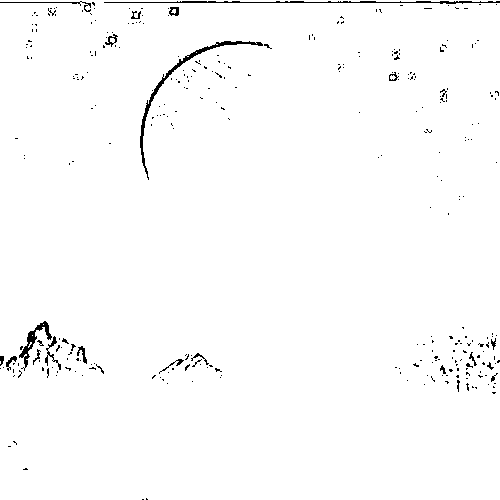

作者/熙淅 Justine 图片/花瓣网

“

2016 年在木星与水星的逆行中徐徐展开。这个五月，当木星首先恢复顺行时，星空中还有四颗行星在逆行。

每一颗在黄道上行进的行星，都带领我们穿越时光的旅程。只要是旅程，就会有潮汐起伏。而我们需要时不时的回顾，是否行驶在正确的航道上——这是行星逆行带来的意义。

”

**阅读木星逆行相关文章请点击**

[当你还在谈论水逆的时候，木星已经悄悄逆行啦](http://mp.weixin.qq.com/s?__biz=MzA5NjA0NTAxNg==&mid=402694441&idx=1&sn=bb1423e2777b81826c3191d46fd1f7d7&scene=21#wechat_redirect)

## 木星在处女座的旅程

每个人的出生星图上都有一颗木星，或许有重要显赫的位置（**譬如你的上升点在射手座或双鱼座，木星是你的命主星；木星与太阳合相；木星跟很多行星都有紧密的相位**），或许只是躲在星图里容易被忽略的角落，等待着被某个行运触发。 

作为一颗社会行星，木星行进的星座及逆行的规律会对社会与文化带来直接的触动，同时木星跟个人生命中的信念有关，是带来机会与扩展的“幸运之神”，其行进会对个人带来深远的影响。 

**这颗太阳系行星家族里的大块头，以轻快敏捷的身姿，约 13 个月穿越一个黄道星座，这其中有 4 个月在逆行。**

**木星在这两年的旅程** 

*   **2015 年 8 月 11 日**，木星离开**狮子座**进入**处女座**，直到**2016 年 9 月 9 日**驶入**天秤座**。

*   其**逆行**的旅程开始于**2016 年 1 月 8 日**（**处女座 23 度 14 分**），四个月后的**5 月 9 日**，在**处女座 13 度 15 分**停滞并开始顺行。

## 木星恢复顺行给你带来的

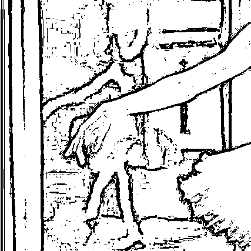 

当木星顺行，从宇宙能量上可以期待怎样的转变，又有哪些利好或需要注意的事项呢？

**如果你的出生星图符合以下任一条件，你恰好是此次木星逆行深度影响的人群：**  

*   出生星图的**四轴**恰好落于**处女座 11 度到 26 度**

*   **太阳、月亮或星群**落在**处女座 11 度到 26 度**之间

*   **上升点**落在**射手座或双鱼座**（木星是命主星）

 **在过去的四个月里，你可能：**

*   从自己**盲目扩张**或**沉溺**的习惯中，经历了**失控**，看到了**改变**的紧迫性。

*   从外在的喧哗与匆忙的脚步中，转向去**聆听内心**的声音。

*   从俗世或物质的**成功**，转向了对**灵性**、**哲学**或**精神层面**的关注。

木星逆行的目的，并不是为了让成长停滞，让我们沉浸在悲伤之中。虽然被触动的契机与领域各不相同，个人在木逆期所经历的成长，是非常重要的。**木星逆行时，一直跟行进在处女座的北交点合相，这代表着对于某些人而言，逆行的木星开启了一扇不愿意去直面、陌生的进化之路。**

因此，请给予自己额外的时间，去消化这些经历，**让生命中打乱的秩序（无论是亲密关系、还是职业、财务、健康等领域）归于原位**，然后再继续前行。

木星顺行后第三次经过逆行的区域（也是最后一次，木星将于 8 月 7 日离开逆行的后阴影期），带来**整合的时机，并预示了积极的转变与成功**。

## 木星顺行可以做的几件事情

**5 月 9 日，木星处在顺行停滞期时，与在处女座的北交点合相，与在摩羯座的冥王星呈三分相，与在双鱼座的海王星呈对分相。** 

这是非常强大的能量，帮助我们去看清实相，不被幻觉所迷惑；去平衡脚踏实地与高瞻远瞩，在宏观的框架中落实微观与现实的锚，并期待世俗的财富与成功。

**作为双鱼座与射手座的守护星，木星与灵性智慧与成长扩展息息相关；当木星行进在处女座，又与职场工作、个人健康紧密相连。**

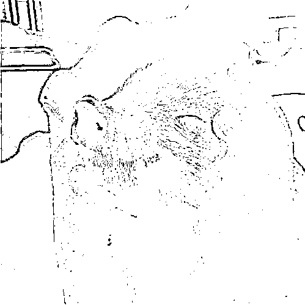

木星行进在处女座的最后四个月，我们可以顺应宇宙的能量，去探索以下几个方面：

*   **整合在木星逆行期所获得的洞见、经历的内在成长**（特别会在灵性探索、健康、服务、技能等处女座相关的领域发生）。对于木星逆行深度影响人群，这点尤其重要。 

*   对于出生星图上处女座特质明显的人群，可以利用木星行进在处女座的契机，**让自己更加自信**，不让担忧阻碍前行的步伐，不让自谦成为自我束缚，不让完美主义成为自我挑剔。 

*   在 9 月 9 日木星进入天秤座之前，每个人都可以从狮子座的自信与表达的天赋，迈向天秤座的优雅与人际平衡之间，**进一步锤炼处女座精湛的技能、高效落地与服务精神。** 

*   如果每天要挣扎着起床去上班，或长期处于亚健康状态，可以借机**改善工作环境、日常作息、锻炼习惯性，或是争取工作职责的调整，让工作更自由，让专业技能有更多可以发挥的领域**。 

*   **请怀着耐心去期待成功，期待健康、职业等相关领域的好消息**。如果你在木星逆行期耗费了太多的信心，除了继续坚持努力以外，是时候去调整心态。要不然，如何接受宇宙在顺行期奖励与馈赠？ 

**作为“五星逆行”中第一颗恢复顺行的行星，木星顺行会带来外显的前行动量。但只有当我们完成了木星逆行的功课——审视外在的发展是否与内在的信念相符合，并用积极的行动作出调整，才最大化这个提升信心的天象。**

顺行后的木星，与生活在同一个星空下的我们，会一起编织怎么样的崭新故事？这取决于你。


**作者简介**

**熙淅 Justine：**职业占星师，国际占星研究协会 ISAR 会员，已通过 ISAR 占星师能力测试。

毕业于浙江大学，十年跨国企业人力资源管理经验。2012 年起在若道跟随多名国际占星师学习人本主义占星。个人咨询风格结合心理占星与演化占星，对于占星触及的人性、灵魂与疗愈尤为感兴趣。

**个人微信公众号**：AngelAstara

**咨询个案微信**：cicirebacca

长按二维码，让金钱涌向传播知识与智慧的人~

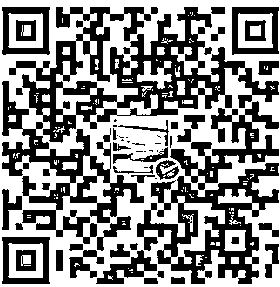


在木星逆行的这段时光，

说说你的感悟吧。

**.gif")**

**特别提醒****：本文由作者授权首发于若道平台，转载请注明“转自若道”**并标明作者**。**  

想了解更多关于星座的知识？**2016 年 5 月 19 日**，蒋颖老师主讲的若道占星核心课程**Level 1-2**要开课了！没有报上名的朋友，还有**Level 1-5 连报**可选择。

报名及咨询，请点击文末“阅读原文”


# 干货 | 职场突发事件，也许和天王星行进有关

> 原文：[`mp.weixin.qq.com/s?__biz=MzA5NjA0NTAxNg==&mid=2651384759&idx=2&sn=fb88af0560ab14fb9e0ade4d2f62b356&chksm=8b4a5900bc3dd016abb4665012fb5801c17c8856ce99590f27ccc2f99d85c3823e6127a4e1f2&scene=126&sessionid=1692738836#rd`](http://mp.weixin.qq.com/s?__biz=MzA5NjA0NTAxNg==&mid=2651384759&idx=2&sn=fb88af0560ab14fb9e0ade4d2f62b356&chksm=8b4a5900bc3dd016abb4665012fb5801c17c8856ce99590f27ccc2f99d85c3823e6127a4e1f2&scene=126&sessionid=1692738836#rd)

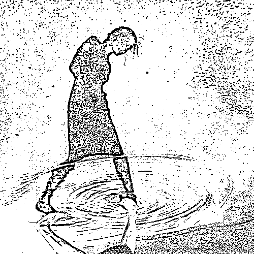
作者/唐纳·坎宁安 图片/花瓣网

翻译/李晓庆 校对/王宏

天王星代表着变革，所到之处，总会发生出人意料的事儿。当天王星行进在代表着职业的宫位，你是大跌眼镜，还是大呼神奇？来看看专业的分析。

## 天王星和你的职业之间的关联

*   **如果天王星行进到代表你职业宫位中的其中一个——第二宫、第六宫，或是第十宫，那么该行进可能就代表你在职场上会有所突破**。

*   在天王星处于这些宫位中的某个期间，你可能会发现希望，也可能发现需要应对的挑战。

*   当然，每个人受影响的程度都不同。如果在你的出生图中没有行星落入这些宫位，你就不太可能经历重大的改变。

*   **如果在你的出生图中有行星落入这些宫位，当出现精准的相位时，就很有可能触发重大的事件。**

**你是天王特质强的人吗？** 

 如果你的出生星图中天王星的相位较多，或是太阳、月亮、上升点、中天或有几颗行星落入水瓶座，那么你可能就是一个天王星特质强的人。

**如果在你的出生星图里天王星的相位与上面提到的关键配置相似，那么天王星的行进就可能是你开启全新轨迹的时机。**我总是说，天王星人有着定期改造自我的天赋，特别是在天王星行进期间。

天王星穿行经过一个宫位可能需要 7 年或更长的时间，具体取决于宫位的宽度以及该宫位的度数。

## 行进天王星会给职业配置带来些什么

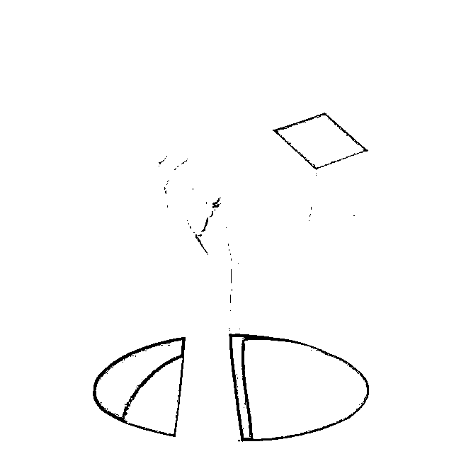 

✔** 在最佳状态下的天王星，会带给职业领域的一些潜能：**

*   有远见的，富有创造力的，跳出固有思维模式的（甚至可能从未受限于固有思维模式的）。

*   能够理解各类人，可以与来自不同文化和背景的人做朋友。

*   独立自主，走自己的路，乐于走在时代的前端。 

✘ **可能需要克服的不足之处有：**  

*   自动拒绝现状和藐视权威的叛逆者和持异议者。

*   任性顽固，想做的事被阻碍时会脾气暴躁。

*   拒绝去做对自己最有利的事情的不愿长大的青少年。 

## 天王星行进到职业宫位

当你回顾过去天王星行进到职业宫位期间所发生的事件和情况时，想一想自己应对其能量的方式是怎样的。如果你正在这些领域里经历困难的行进，问问自己可能在表达哪些非建设性的特质，这些特质可能最终如何导致更为困难的局面。 

*   你在运用那些不太让人满意的特质吗？

*   通过积极应对当下和未来的行进，你能从中取得更好的结果吗？

*   你是否也展示出了你可能在当前的行进中获取的可能有建设性的特质和潜能？ 

**对照列表看看自己做得怎样** 

**天王星的角色**：发明家、科学家、技术支持者、引领者、持异议者、激进分子、青少年。 

**可能的建设性表达**：前卫的、指向未来的、最先进的、领先的、天才的、独特的、人道主义的、跳出固定思维的、理想主义的、创新的、杰出的、超然的、自由的。 

**可能的困难性表达**：任性、下意识的叛逆者、从事破坏活动者、煽动者、持异议者、挑拨离间者、反常的、冷漠的、对立的、利己的精英主义、古怪的、不可靠的、容易分心的、暴躁的、固执的。

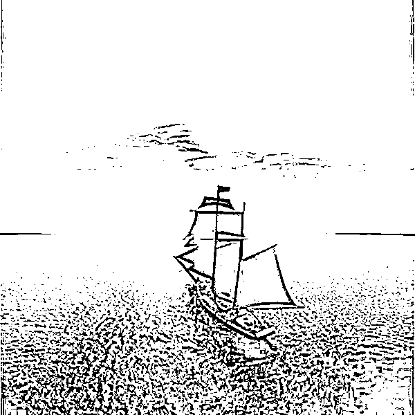 

天王星的行动是不断发展的、不固定的，并且可能对应为了新事物而改变一切的渴望**。鉴于这种不安分的表现，你可能会接触到可以激发创造力并在很大程度上改变你的方向的前沿性想法和工具。你可能会被令人激动的新鲜想法、方法和人所吸引，这些人是与你志同道合的灵魂，将在这些转变之中支持你。** 

**我们当中的很多人会体验到坚持我们自己的权威而非外部权威的需求。在领导地位频繁更迭的不稳定的市场中，你被迫发展出独立性与主动性。**这些意料之外的发展可以把你引向你从未梦想过你会追随的方向上——或是你梦想过但从未想到会实现的方向上。

这些行进可能让不易适应改变的人感到不安。**典型的事件可能包括一系列突然的工作变迁以及所做的工作类型上不可预见的变化。具体情形可能涉及奇怪的工作条件、独特甚至古怪的老板和同事、裁员或是公司倒闭，甚至是因调任而导致的地点变迁。**

我们可能在工作和职业方向方面经历一系列突发的改变，包括看似错误的开端。然而，这些重复的改变，即使是那些没有结果的改变，也可以看成是我们尝试新可能性的实验。

道路中的每一部分都是一大张拼图中的一块，每一部分都有助于达成整合我们独特天赋的各个方面的最终成果。 

## 期待职业生涯里的全新方式吧

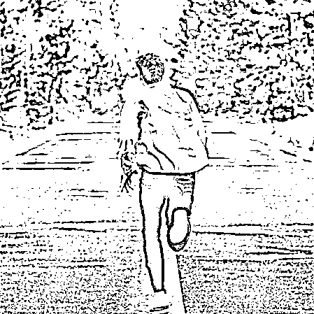 

就像许多占星师一样，我承认天王星行进非常不可预知，很难确定。天王星的行动是不断发展的、最先进的、不固定的。天王星行进可以创造出改变一切的渴望，只是为了新事物的缘故。

通常默认的情况是，面对快速的新发展时，我们有机会脱离传统并为我们自己考虑。我们中的一些人被迫也被允许变得不那么传统，抛下孕育大众文化的安全子宫，去追求一种崭新的生活方式，这种生活方式可能最后会成为常态。 

**如果天王星正行进到职业宫位，或者与中天形成相位，而你很好地利用了这次行进，那些意料之外的发展就可能把你引向你从未梦想过你会追随的方向上——或是你梦想过但从未奢求会实现的方向上。**有一件事情是可以肯定的，那就是我们都生活在有趣的时代里！


说说看你的天王星行进对职场的影响吧。

**.gif")**

**特别提醒****：转载请注明“转自若道”并标明作者。**  

想了解更多关于占星学和职场的关系吗？大卫·瑞雷老师主讲的企业咨询工作坊就要在 6 月 9 日（端午节假期）开始啦，教你用占星学理解企业发展，与客户建立关系。

报名及咨询，请点击文末“阅读原文”


# 企业咨询工作坊丨一盘大棋：如何把握企业命运？

> 原文：[`mp.weixin.qq.com/s?__biz=MzA5NjA0NTAxNg==&mid=2651384759&idx=3&sn=c5944fdac763ad2e63d3b42212c1d93d&chksm=8b4a5900bc3dd016ec8eee70d35b926cb7620656dd77e8815e9dc363b23928e42899fee542c7&scene=126&sessionid=1692738836#rd`](http://mp.weixin.qq.com/s?__biz=MzA5NjA0NTAxNg==&mid=2651384759&idx=3&sn=c5944fdac763ad2e63d3b42212c1d93d&chksm=8b4a5900bc3dd016ec8eee70d35b926cb7620656dd77e8815e9dc363b23928e42899fee542c7&scene=126&sessionid=1692738836#rd)

**大卫·瑞雷老师主讲的企业咨询工作坊**

**就要在 6 月 9 日（端午节假期）开始啦**

**教你用占星学理解企业发展**

**与客户建立关系**

**能够亲眼见到大卫老师**

**与老师零距离接触**

**是不是很 high 啊**

**** 

**ISAR 选修课程**工作坊信息

**授课时间：**2016 年 6 月 9 日、6 月 10 日、6 月 11 日（端午节假期）10：00-18：00（午休 2 小时） 共 18 课时

**授课老师：**大卫·瑞雷

**授课方式：**上海现场，英文授课，中文翻译。（具体上课地址课前 10 天请留意查看短信微信通知）

**费用**：****6800 元** （5 月 20 日前报名可享受早鸟价****5800 元****，若道老学员**4800 元**）**

**课程负责人：**熊老师

**微信号：**13761199137，请备注企业占星工作坊报名咨询

企业咨询工作坊

课程价值

☆ 受益于大卫·瑞雷老师多年的企业占星咨询经验

☆ 掌握企业占星咨询的基本原理和思路

☆ 通过一家企业 25 年来的真实情况展示，巩固所学的理论知识

☆ 帮助你开拓新的占星领域，成为更专业的占星师

课程内容

**①企业占星学的定义**

将占星学用作处理企业事务的参考框架

以整体论方法找出解决方案

从占星学的角度定义业务的性质

业务关联的占星学分类

**②占星学在商务中的实际运用**

定义一家公司或企业的特性

公司决策者的出生星图

人力资源——人事关系问题

关键岗位的适当性

雇佣关键职员和上层管理者

趋势、预测和时机

公司/产品/服务的定位

所有者的商务发展趋势

合伙人的商务发展趋势

上层管理者的商务发展趋势

**③与你的商业客户建立关系**

帮助客户明确定义他们的目标

帮助客户明确定义他们的需求

进行创新性地讨论来帮助他们找到解决方案

明确定义你的服务

保持联系——随访/反馈

对客户企业的发展和结果保持持续的兴趣

保持耐心/放松——不具侵略性

愿意用相当长的时间来建立信任感

保持全然坦诚，“你不知道”时要告知对方

在你们的互动和富有意义的对话中让他们找到解决方案

证明你愿意且有能力去解决棘手问题和危机

师资力量


**大卫·瑞雷（David Railey）**

若道创始人，《灵魂的目标》作者。拥有 46 年的占星咨询的执业经验，曾两任亚特兰大占星协会主席，是全美占星师联盟（AFAN）、美国占星师联合会（AFA）、全美占星研究委员会（NCGR）、国际占星研究协会（ISAR）和职业占星师组织（OPA）的成员，是联合占星大会（UAC, United Astrology Conference）督导委员会委员。大卫曾是 CNN、CBS 的占星节目的常驻嘉宾，多次在 BBC、WGS、WSB、WRGG 等节目中接受采访，并在亚特兰大主持电视节目《每日行星（Daily Planets）》达 4 年之久。

适合人群

相当于若道核心课程 level5 以上水平即了解星座、行星、宫位、相位等，可以独立进行出生星图解读。


**准备好了吗？等你来加入！**

长按二维码添加课程负责人咨询~

****

报名及咨询，请点击文末“阅读原文”

# 蒋颖谈占星 | 我想告诉你一个母亲节背后的故事

> 原文：[`mp.weixin.qq.com/s?__biz=MzA5NjA0NTAxNg==&mid=2651384752&idx=1&sn=4d89dc78cf640e3b1c663cfb722eeddd&chksm=8b4a5907bc3dd0113facf7bc01ca7c3e9a677949504f6618a99058e78787307f62593b094155&scene=126&sessionid=1692738836#rd`](http://mp.weixin.qq.com/s?__biz=MzA5NjA0NTAxNg==&mid=2651384752&idx=1&sn=4d89dc78cf640e3b1c663cfb722eeddd&chksm=8b4a5907bc3dd0113facf7bc01ca7c3e9a677949504f6618a99058e78787307f62593b094155&scene=126&sessionid=1692738836#rd)

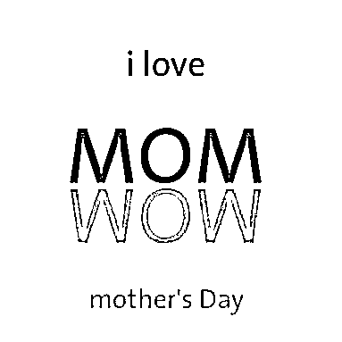
作者/蒋颖 若道占星创始人

 图片/花瓣网

**想阅读更多蒋颖老师的文章，请在后台回复**** 蒋颖 **

“

今天，我看到全世界感受到伟大母爱的人们在向母亲表达爱意，对母亲心怀不满的人们在画讽刺和幽默漫画，分析人类行为的心理治疗师在宣讲母亲对生命的复杂影响，勤奋的商家在努力利用这个节日把商品销售给打算表达爱意和孝顺的儿女。而这一切热闹的人类社会活动都源于一个出生在上个世纪的女性，母亲节的创始人**安娜·玛丽·贾维斯**和她的母亲的故事。

”

## “母亲节”创始人的母亲

故事要先从安娜的母亲讲起。安娜的母亲**安娜·玛丽·瑞威斯·贾维斯**（文中我们将称呼她为瑞威斯）出生于一个神职人员家庭。她的父亲是牧师，而她嫁给了另一位牧师的儿子，她的丈夫后来成为了一个成功的商人。

贾维斯家族，和那个年代许多的家族一样，经历了很多的悲伤故事（**瑞威斯出生星图中太阳和冥王呈对分相**），比如她生育了 13 个孩子，其中只有 4 个活到了成年。瑞威斯不仅是一位非常虔诚的教徒，也是一个积极的社会活动先行者。因为自己的苦难，她决定采取行动，帮助她的教区对抗儿童疾病和糟糕的卫生条件。

她建立了“母亲日工作俱乐部”（**瑞威斯南交水瓶座合相海王星**），俱乐部成员们积极参与到当时兴起的卫生健康运动中（那是在 1800 中期哦！）他们筹集捐款，拜访家庭，宣传卫生知识，为母亲提供教育和其他帮助，以降低儿童疾病和死亡率。

瑞威斯还是一个坚定的和平主义者。内战爆发后，瑞威斯所生活的弗吉尼亚州首先受到冲击，这个州分裂成两个部分，人们纷纷加入南方阵营和北方阵营。而瑞威斯作为俱乐部的领导人，坚持中立（**北交狮子座，太阳天秤座**），拒绝了教会的分裂，坚持为南北双方的士兵和家庭提供服务和援助。她的俱乐部成为美国内战时期的一股团结和统一的力量。

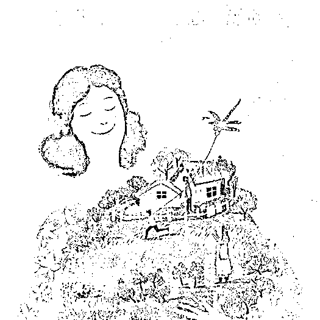

战后，为了消除战争的敌对所带来的憎恨，她和她的俱乐部成员建立了母亲友谊日，尽管受到威胁（**太阳冥王对分**），但她仍旧勇敢地站上舞台（**北交狮子座，太阳天秤座**），最终，北方南方的士兵及其家人手拉手唱着歌，把憎恨和敌对变成了眼泪及和解。

瑞威斯一生致力于帮助女性，荣耀和帮助母亲们。她是虔诚的教徒，一直在主日学校（孩子们在去教会前会到主日学校学习圣经）教书，积极参与教会的活动。瑞威斯的月亮很可能在射手座，在维基百科的词条中，她是一个“被信仰所定义的女人”。

这是母亲的故事，是整个母女故事的前半部分，听起来鼓舞人心，充满爱、信仰、勇气、慈悲。然后我们来看看瑞威斯的女儿，母亲节的创始人安娜·玛丽·贾维斯的故事。

## “母亲节”创始人安娜的故事

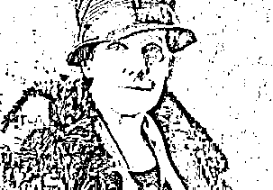

图为安娜

在安娜的出生星图上，月亮在双鱼座。稍微懂一点占星学的人，都能看到这个月亮反映了安娜眼中的母亲——那个充满了大爱、虔诚和奉献精神的圣徒。对月亮双鱼座而言，把这样一个母亲及其精神放入圣坛，似乎就是自然而然的事情。

安娜非常敬爱她的母亲，同时也非常虔诚。她是教会成员，帮助她母亲的社会工作。母女之间的关系亲密，她们不在一起的时候，常常通信，母亲为女儿在职业上获得的成就感到自豪。没错，太阳合相冥王星在金牛座的安娜在创办母亲节前，职业上很成功，是忠诚互助人寿保险公司的第一位女性编辑（在当时，职业女性很少） 。

然而母亲节改变了她的人生。创立母亲节的念头源于 12 岁时在主日学校课程中，她听到母亲念的一段祈祷词“我希望，某天，某人，在某个时刻，找到一天纪念母亲，纪念她无与伦比的奉献”。

当她的母亲去世 3 年后，在 1908 年 5 月 10 日，她终于找到了这个日子。这天，她在自己所属教堂举办了一个母亲纪念日典礼，买了她母亲生前最喜欢的花——500 株白色康乃馨装饰这个典礼，以纪念她的母亲和她所在的教会的所有母亲。这成为母亲节的开端。

此后，她投入了一场要把“母亲日”变成全国性节日的运动，她从工作中辞职，不断地写信游说教会、州和国家议员、商业领袖，在她的坚忍不拔的努力下，1914 年，当时的美国总统伍德罗·威尔逊把母亲节定位全国性节日，而这个节日也流传到其他很多国家。

## “母亲节”和商业化的斗争

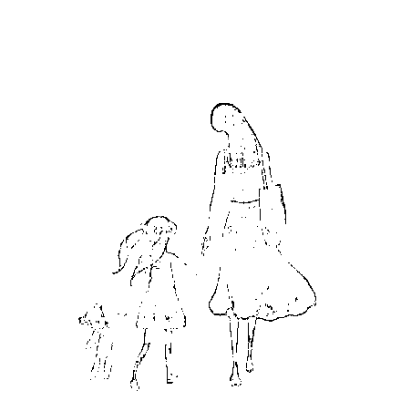 

如果这个故事到此结束，那么可能就是一个皆大欢喜的故事，也不会引起我的深思。

故事发展了下去。安娜创立了母亲节后，和当年她天秤座的母亲（**太阳冥王对分相**）为保持中立维持和平的信念而进行抗争一样，她也陷入了一场信念的抗争（ **安娜北交点在天蝎座，木星合相北交点，太阳紧密合相冥王在金牛座**）。不过这是一场和母亲节变得商业化而进行的抗争。

因为人们要庆祝节日，给母亲买礼物，因此花、糖果、甜食、卡片成为母亲节最大的消费品，比如原来庆祝母亲节的白色康乃馨价格大涨。当数量不够时，商家就出售红色康乃馨，用红色献给活着的母亲，白色康乃馨献给死去的母亲。因为商家热情的参与和推动，母亲节变得如火如荼，花朵、糖果、珠宝、卡片、餐馆等众多行业因此受益。

然而，安娜痛恨这种商业化的行为，抨击这种行为，认为这种行为亵渎了母亲节的虔诚和神圣。安娜把自己所有投入这个抗争中，后来在美国大萧条时期，她又失去了从商的哥哥留给她的遗产。最后，安娜一贫如洗，双目近盲。1943 年 11 月的某一天，她來到費城的大众医院，要求医院以慈善的名义收容她，在朋友的帮助下，她住进一家私人疗养院（**月亮双鱼座**），1948 年 11 月 24 日，安娜在疗养院去世。这位母亲节的创始人一生没有结婚，也没有成为母亲。

最后死于疗养院、没有因这个节日获得任何金钱收益的安娜可能不会料到的是，她创始的这个尊崇母亲和母爱的节日成为美国第三大节日，每年母亲节，美国人大概每年花费 26 亿美元在这个节日中。我想今天，即使在中国，也有数不清的商家因此而获利，他们可能完全不知道谁是安娜·玛丽·贾维斯，不知道她所挚爱的母亲的故事。当然，也有数不清的人因为这个节日，借此向母亲表达自己的爱。

## 母女的天蝎座议题：冲突和挑战

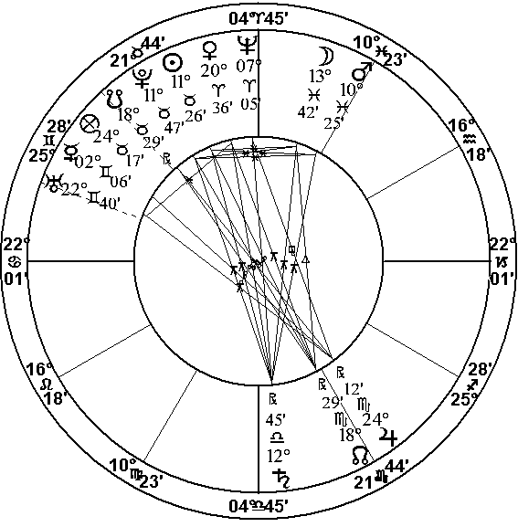

安娜的出生星图

*1864 年 5 月 1 日，9:38:21am，West Chester，PA*

没有占星学背景的朋友看这个故事，可能会有一些唏嘘感叹，也许甚至认为这是一个悲剧性的故事，但作为占星师，有了母女二人的星图做指引，我总是会想这样一个问题： 

*   安娜的灵魂想在世上寻求什么？

*   她为什么有这样一个生命故事？

*   为什么母亲的故事到了女儿这里，有了这样的演化？

*   从世间法而言，她所倡导的事情获得了全世界的认同，但在纯粹的信仰和利益导向的商业化战争中，这位神职家庭出生的女儿又似乎输了一场战争，那么从灵魂的目标而言，她的成绩单分数又怎样？

 **仅仅看母女二人星图，都有非常明显的天蝎座议题（冥王星议题），而且全部是太阳和冥王星的挑战相位，并通过和各自月亮交点的联系而成了人生的主要故事。**

也就是说，**母女二人的灵魂都在寻求一些激烈的冲突、挑战，通过面对危机、甚至丧失转化她们自己，获得太阳的光辉和荣耀。女儿北交天蝎座的要求则让她的人生道路变得愈加激烈。**如果，我们相信，灵魂在选择自己的道路的话，这是需要勇敢的灵魂才敢于选择的道路，虽然作为人的我们不知道这个召唤和选择。

**一般而言，如果女儿星图上出现和父母相似的相位，代表着女儿承继了这个相位所代表的议题，家族中这个相位代表的动力持续存在，需要有人把这个议题解决。仅就冥王星而言，其要求的献祭常常是丧失，通过丧失而走向更深的生命道路和与生命的联结。**

安娜的家族历史中有很多的痛苦，仅仅从母亲一面而言，**安娜的母亲失去了 9 个孩子，这是她的献祭；而安娜失去了所有的财富和视力，这似乎是她的献祭。**而她们通过这种“献祭”完成了一生的故事。尽管安娜的母亲是勇敢而伟大的女性，但这种丧失的悲伤显然没有在母亲那里完结。

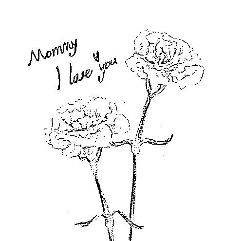

不管她们的故事在一般人眼里是什么样的，我想说这是一对非常勇敢的母女，而她们也确实成了时代的先锋。圣经中虽然有圣母和一些圣女，但 100 多年前，西方女性的地位其实和中国一样，并不高，在 19 世纪中期和 20 世纪早期，西方女性主义运动还远远没有开始。那时，波伏娃还没有谈到“第二性”，女性在社会的地位无非是作为女儿、妻子和母亲，最大的贡献无非是作为母亲，而通过生育而繁衍后代则是女性天经地义的义务。

历史上因为生育条件的恶劣，很多母亲失去了自己的儿女，或者因为生育而失去生命。而这种生死的历程从来没有得到过承认或者颂扬。安娜以一己之力，推动母亲节在世界范围内的庆祝，让更多人看到作为女性的角色之一，也是女性在那个时代最主要的角色——身为母亲的奉献之伟大。

非常有趣的是，安娜本人没有结婚，也没有孩子，不论我们怎样去想她个人的故事及其含义，但从社会角度而言，却似乎是一个很有趣的先兆性的象征，这个完成了歌颂女性作为母亲角色，并将这个角色放上神坛的女性却以自身的姿态预兆着女性的另外一条道路，不是作为妻子、也不是作为母亲而存在，未来的女性也许可以追求更丰富的生命光谱。

## 与外界的抗争？抑或内心的挣扎？

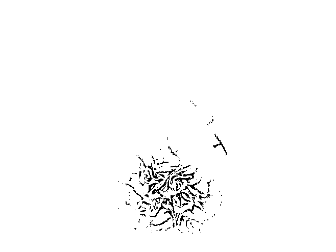

另外非常有趣的一个观察当然是安娜对抗商业化的战争，从占星学上看尤其有趣，如果金牛象征商业社会的一切东西，这似乎是一个月亮在双鱼座的孩子和月亮在金牛的孩子的战争，他们都在为了荣耀母亲的需要而战。**月亮在双鱼座的孩子要纯净的宗教情感和神圣化母亲，而月亮在金牛座的孩子要通过商业贸易让母亲得到丰盛的生活。**

现在写故事的我月亮在水瓶座，我看到是对社会进步影响，女性解放的意义。我们都在为自己的母亲书写着。有着不同月亮星座的人们有没有可能互相理解、合作，而不需要战争？

进一步看安娜的星图，这个战争是不是安娜内心的战争呢？毕竟母亲节是一个虔诚的信教的月亮双鱼座、太阳金牛座的孩子发起的节日，在代表着安逸和富足土相星座金牛座的月份里。懂得占星的人都明白太阳代表父亲，安娜和她母亲的星图上都有非常紧密的太阳冥王星的相位，预示着和父亲/丈夫之间的权力斗争，并通过这样的斗争获得力量的生命故事。

在历史上，我们读到安娜和她母亲的故事，家族里的男性似乎没有留下什么印迹。我们知道安娜的父亲和兄长都是成功的商人，如果不是因为大萧条，兄长留下的钱足够安娜和她的姐姐度过舒适的一生。而安娜最终丧失了这些钱，她最终进入月亮双鱼所代表的疗养院也似乎说明这场内心战争的结果。

这张星图上还有许多值得探讨的地方，有兴趣的朋友可以自己探讨。总之，这个故事提醒我们，母亲节是一个精神性的节日，也是一个物质性的节日，愿我们两者都能取得平衡。

历史是一个神话。历史中的重要人物也是一个神话。我无法评价这些神话，只能遥远地眺望着，深思着，并祝福安娜的灵魂安息。


母亲节，

想对妈妈说的话却又不好意思开口，

留言给若道君吧。

**.gif")**

**特别提醒****：本文由作者授权首发于若道平台，转载请注明“转自若道”**并标明作者**。**  

想了解更多关于星座的知识？**2016 年 5 月 19 日**，蒋颖老师主讲的若道占星核心课程**Level 1-2**要开课了！没有报上名的朋友，还有**Level 1-5 连报**可选择。

报名及咨询，请点击文末“阅读原文”


# 冥王星的母爱，痛并温暖着

> 原文：[`mp.weixin.qq.com/s?__biz=MzA5NjA0NTAxNg==&mid=2651384752&idx=2&sn=fd0d59a488f65878a8c46bb326c76faf&chksm=8b4a5907bc3dd0118f5177b981924695d58d7a64e86b8fbd1291fb761b8fc84362013d1cec8a&scene=126&sessionid=1692738836#rd`](http://mp.weixin.qq.com/s?__biz=MzA5NjA0NTAxNg==&mid=2651384752&idx=2&sn=fd0d59a488f65878a8c46bb326c76faf&chksm=8b4a5907bc3dd0118f5177b981924695d58d7a64e86b8fbd1291fb761b8fc84362013d1cec8a&scene=126&sessionid=1692738836#rd)

图片来源/花瓣

正值母亲节，我们来听一个女儿与母亲的故事。女儿有在 12 宫的月亮和冥王星合相，她和母亲有怎样的关系呢？

我面前放着一张太阳双子座的星图，我对面坐着一个沉默少语的女孩小双，沉静得如秋风中的落叶，在风中静静打着旋儿，轻轻地落在地上。如此沉默的双子座，似乎不太科学啊，但看看星图中其他因素，缘由在于那颗月亮吧，是的，她的月亮合相冥王星，落在 12 宫。

她给我讲述了一个控制欲很强的母亲，控制着她的人生。

**太阳双子座，曾经开朗健谈过**

在我很小的时候，我不是这样子的，那时侯的我，话特别多，总喜欢出去跟别的小朋友一起玩，淘气捣蛋，爬墙上壁，似乎无所不能，是一个快乐的初生牛犊。我们可以在大中午大人们都睡午觉的时候，到大院的葡萄藤下偷葡萄，也可以自顾着自己做游戏而吵闹声穿透天空，我也喜欢扮老师给小朋友们讲课，讲课内容都是从幼儿园老师那里听来的。这样的日子并没有持续到我长大。

太阳是生命、意志、个人重心的代表，双子座的太阳给了小双对事物的好奇心，让她开朗、善谈，而她的月亮，却在她成长过程中，她的照料者给她的关怀中，改变了她活泼的个性。

****月亮 12 宫，潜移默化的引导****

到了上小学的时候，我妈妈对我教育特别严厉，总是把我一个人关在家里，不让我出门与小朋友们一起玩。她觉得作为一个学生，首要是学习、学习、再学习。课外书都是不应该看的，更别说与小朋友一起玩耍了。做完作业，看完书，也仍然是一个人在家里，不会讲话的玩具陪我渡过了我静寂的童年，我总是与它们讲心里话。

后来不知道什么时候，我变得不爱说话了，见到陌生人不知道该如何开口，见到陌生的叔叔、阿姨，我会躲到妈妈身后，她总会说“这孩子不爱说话，太内向了”。从此，我便有了一个不开口说话的理由。

月亮代表着感受和情绪，代表着潜意识，以及母亲或其他照顾者。12 宫是一个禁闭的宫位，它打乱了自我认知，月亮落于 12 宫，让小双在心理上渐渐迷失，让她感觉自己被监禁起来，她也变成了一个容易逃避的人。或许她对于妈妈的认识，也是不清晰的，她与妈妈之间的沟壑从此开始，并越来越深。

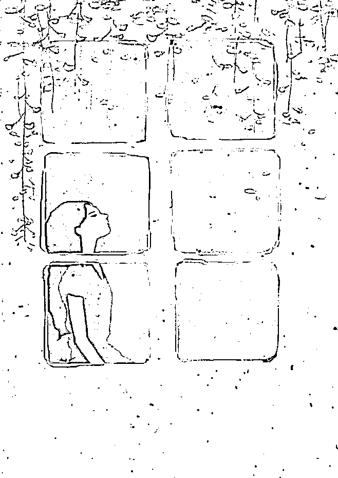

****月亮合相冥王星的冷漠****

再到后来似乎连一个朋友都没有了呢，我那时只知道学习。妈妈对我的要求特别高，单元考试拿第一了，也批评我哪道题目不该做错；单元考试得满分了，也严厉地说期末考试拿第一才算是第一。

妈妈对我如此冷漠，是不喜欢我，还是真的高要求？每当我看到她生气的表情，批评的眼神，教训我时紧绷又扭曲着的嘴巴，我都觉得一丝温暖都没有。好羡慕小红的妈妈，在暑假的时候送她去绘画班学画画，于是美术课上她画得不错而被老师选拔代表学校去参加绘画比赛，然后拿了名次；好羡慕小丽的妈妈，在周末的时候请老师教她学琴，她最后能弹出大家都喜欢听的音乐。而她们，并没有像我妈妈常说的，学那些会影响成绩，她们的成绩仍然是班里数一数二的。妈妈是不喜欢我吧？

冥王星是太阳系中离太阳最远的行星，冰冷黑暗，触碰不到太阳的温暖，它代表着征服和转化，但它也代表着说教、教条、冷漠。月亮与冥王星的合相，让小双从小在妈妈的严格掌控之下，被给予了过高的期望，却听不到赞扬。

这些力量转变了她的个性。从妈妈那里传递过来的不认可，让小双感觉妈妈冷漠极了，内心受到了无数次伤害后，加之 12 宫的助力，渐渐失去了双子座的吵闹特征，转而成为了一个沉默的人，习惯了一个人静静地做事，静静地想事情。

******12 宫的救赎******

由于一次意外，我生病住院了，要做手术，我清楚记得妈妈当时的表情，完全没有小时候训斥我时的严厉，一双大眼睛里满是担忧。当医生让她在我的手术承诺书上签字时，她犹豫了，她被承诺书上的条款吓到了，甚至不愿意签字。直到医生强调说是万一，不代表一定会产生风险时，她才在再三犹豫之下，签了字，然后目送我进了手术室。

如果不是这次手术与住院经历，我永远也不知道妈妈爱我。

手术后需要住院一个月，妈妈便每日每夜地陪在我身边，早上我还没醒，她便为我准备好了可口的早餐，白天要打三次吊点滴，她看着吊瓶一滴一滴地落入软管，眼中都是担忧与慈爱，她说宁愿做手术的是她，她愿意替我受这个罪。晚上她要等我睡好了，她才能合眼入睡。那一个月她每天都睡眠不足，在医院守着她也睡不安稳。每天循环的照看生活，让我内心深入有些触动，原来妈妈是爱我的。

12 宫，也代表医院，也正是在这里，小双读懂了母爱，这份母爱很浓很深。月亮合相冥王星的母爱是让人窒息的，妈妈强烈的控制欲都打上了母爱的烙印。无论何时何地，妈妈给小双的爱都是强迫性的，是一种一定要抓住，怕丢了的感觉。

小时候把她一个人关在家里，是怕她出去玩走丢了，虽然给她的性格造成了不良的影响；长大一点的时候不让她做课外事情，是怕她把学习弄丢了，虽然这是一个不合理的教育方法；后来小双生病住院，妈妈日夜不离的守护，更突显了妈妈不能丢了小双，要时刻知道小双的健康情况，而正是此时妈妈的反应，让小双触动了，她感受到了母爱。

或许小双与妈妈之间需要的是一次心灵的沟通，与其把妈妈当作恶魔来看，不如让自己内心真正强大起来，不要逃避，勇敢去追寻迷失在心底很久的梦想，挖掘出自己潜在的能量，突破它、超越它。找回双子座善辩的能力，让早已沉睡的双子座能量复活，重新整装成新的能力。12 宫是终结之宫，也是开始新的旅程的重新酝酿的位置。只有让妈妈看到强大的自己，让妈妈放心自己已经有足够的能力，妈妈才能宽心。

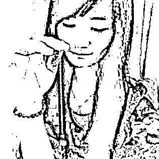

**作者简介**

**海王家的微分**：海内存知己，天涯若比邻。浩瀚宇宙中低调的占星师一枚，在若道师从多名国际著名占星师学习严肃派占星学，有丰富的占星咨询经验，擅长流年推运。

个人咨询 QQ：1846189082

微信订阅号：wh_astro

长按二维码，让金钱涌向传播知识与智慧的人~

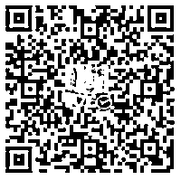

**.gif")**

**特别提醒****：本文由作者授权首发于若道平台，转载请注明“转自若道”**并标明作者**。**  

想了解更多关于星座的知识？**2016 年 5 月 19 日**，蒋颖老师主讲的若道占星核心课程**Level 1-2**要开课了！没有报上名的朋友，还有**Level 1-5 连报**可选择。

报名及咨询，请点击文末“阅读原文”


# 蒋颖谈占星丨如果我不是完美小孩，你还爱我吗？

> 原文：[`mp.weixin.qq.com/s?__biz=MzA5NjA0NTAxNg==&mid=2651384737&idx=2&sn=68487aee2166225f31d01d6721e208da&chksm=8b4a5916bc3dd00018ad383d9b1cfa78b1b684c67038e1e3fcff0e4661d60ec8189c303f54af&scene=126&sessionid=1692738836#rd`](http://mp.weixin.qq.com/s?__biz=MzA5NjA0NTAxNg==&mid=2651384737&idx=2&sn=68487aee2166225f31d01d6721e208da&chksm=8b4a5916bc3dd00018ad383d9b1cfa78b1b684c67038e1e3fcff0e4661d60ec8189c303f54af&scene=126&sessionid=1692738836#rd)

在前段时间，若道君发布了蒋颖微课的前两个故事：关于[职业](http://mp.weixin.qq.com/s?__biz=MzA5NjA0NTAxNg==&mid=2651384368&idx=2&sn=c870d7254a29932e43e20d92dd5c1fb1&scene=21#wechat_redirect)和[爱情](http://mp.weixin.qq.com/s?__biz=MzA5NjA0NTAxNg==&mid=2651384523&idx=1&sn=503a2e2e09cea90f832d067ca9e73023&scene=21#wechat_redirect)（点击可阅读），第三个故事与一个小男孩有关。如果你发现自己的孩子有很明显的性格缺点，比如暴躁易怒，你会粗暴的解释为，这是个坏孩子吗？

## 一个爱讽刺人的孩子

第三个故事是关于一个八岁小男孩的故事。这个男孩的母亲来找我咨询，因为她感觉自己的孩子做事很毛躁，并且他还有个很不好的习惯，就是特别喜欢嘲讽别人。

为此母亲感到非常头痛。学校里的老师也不喜欢他，老师说“这个孩子为什么这么傲慢？老是喜欢嘲讽他人。”

于是我打开这个孩子的星图，我一眼就看到了他有双子座的群星，并且这个群星还四分了天王星、四分了火星。

**占星小课堂**

如果理解一点占星学，我们就可以从另外一个角度去看这个孩子。我们知道双子座是非常聪明的星座，它又常常需要用语言来表达这种聪明。那么天王星又是什么意思呢？天王星说“我有独特的观点”。所以双子座群星四分天王星的意思，就是这个孩子能够看到一些别人没有看到的东西，他有一些独特的观点。

**只是因为他没有把这股能量很好地活出来，所以他就用一种很奇特的方式——用嘲讽他人的方式活了出来。而且这个孩子还有群星双子座四分火星呢。也就是说他这种用语言攻击他人的倾向，其实是在练习他的自我，只不过在练习自我的时候走偏了。**

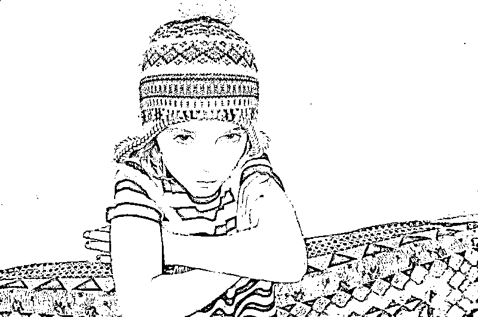

所以，如果你不理解这个孩子，你就可能说，这个孩子缺点真明显，太喜欢嘲讽别人，他对人不尊重等等。你看见的只是他的缺点。

**但是作为一个占星师，当你打开了孩子的星图，你就会明白，他不过是在练习他的群星双子座和天王星的四分相，还有群星双子座和火星的四分相的能量表达。**

那么对于这股能量的表达，我们是否可以让他通过更健康的方式表达呢？我们可以与这个孩子对话，理解他为什么会嘲讽他人，是不是他真的看到了一些可笑之处？如果是真的，那也许他将来可以成为一个讽刺小说的作家，这是不是也是有可能呢？

## **你听得见星星的声音吗？**

人生对我们每个人来说都是在地球上的一个旅程。当然，地球对我们来说也是一个陌生的地方。一个不会占星学的人，面对这个陌生的地方也许是一眼抹黑，只能靠自己去摸索道路；而拥有了占星学，我们就相当于拥有了一台车载 GPS，是不是很棒呢？

当你进入占星学的圈子里，可能会遇到一些有着神秘生命经验的人。我的一些朋友也是这样的人，我跟他们一比就是一个乡巴佬。每次听他们奇妙经历的时候，我就像一个还没有掉到兔子洞的爱丽丝，听掉到兔子洞的爱丽丝讲故事一样。我们之间有一个兔子洞的距离。

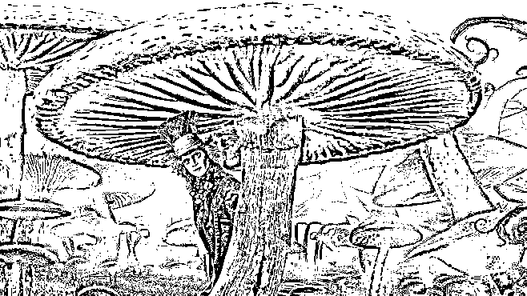

不过我还是沉得住气的。因为我知道每个人都有他独特的道路，而且我的兔子洞里的朋友也是有很多烦恼的。

**我所有的就是手上的这张星图，我感觉它像是宇宙给我们每个人定制的生命秘籍。我们可以把玩它，也可以对自己的星图进行不断的沉思，选择在你。就算是生命最困难的时候，你也可以盯着你的星图，像一个铁匠一样，你看着另外一个自我在炉火中翻滚，另外一个自我被搁在铁架上，被落下的锤子捶打。然后你会恍然大悟，明白发生了什么。**

当然很多时候我们接触占星学都是从太阳星座或是运势开始的。这个太阳星座和运势有时候就像生命秘籍被印成小人书一样，使得人人随手可取。但是如果你把真正的占星学请回家中，你将它放到你的掌心，日日揣摩，你诚心正意，我相信有一天它会露出它的庄严宝相。

当你拥有占星学的时候，你就好像把宇宙星辰都请回家一样，而你在其中跋涉。有一天，一扇门吱呀一声打开。我相信所有学占星学的人，都会有这样一种感受，你从那扇门进去之后就再也不想回头。

最后，我想用鲁道夫斯塔纳的一首诗结束分享，这首诗是这样的：

“

星星一度对人类说话

说着世界的命运

然而现在它们沉默了

意识到这个沉寂

可能是一种痛苦

然而在最深的静默中

人类渐渐对星星说话

话语渐渐生长

并在星空下成熟

意识到那个声音

将成为人类的力量

”

最后我祈愿让永恒的占星学引领我们上升，谢谢大家。

**想阅读更多蒋颖老师的文章，请在后台回复 蒋颖 **即可。****

****◆ ◆ ◆  ◆ ◆****

******特别提醒************：若道拥有本文版权******，**转载请注明作者及出处。******

**你想了解更多占星学吗？**2016 年 5 月 19 日，**蒋颖老师**主讲的若道占星核心课程**Level 1-2**要开课了！没有报上名的同学，还可以**连报 1-5 阶。**

报名及咨询，请点击文末“阅读原文”


# 新月到！快来领取你的免费报告~

> 原文：[`mp.weixin.qq.com/s?__biz=MzA5NjA0NTAxNg==&mid=2651384737&idx=3&sn=433744f3765ca2b2f7d9b176edecfdfb&chksm=8b4a5916bc3dd00057ef962526fd5e16c661c737970e38fa84aa35ad97f8d26720d59e55bc3c&scene=126&sessionid=1692738836#rd`](http://mp.weixin.qq.com/s?__biz=MzA5NjA0NTAxNg==&mid=2651384737&idx=3&sn=433744f3765ca2b2f7d9b176edecfdfb&chksm=8b4a5916bc3dd00057ef962526fd5e16c661c737970e38fa84aa35ad97f8d26720d59e55bc3c&scene=126&sessionid=1692738836#rd)

**5 月 7 日 03：29 迎来金牛座新月。**

**每到新月时分，** 

**你都能在若道免费获得专属于你的新月报告，**

**并且进行新月许愿。**

**手机党们，** 

**点击文末“阅读原文”**

**直接在手机上获取报告，** 

**在线许愿并分享吧！**

**操作起来也很简单哦**

**当新月到来的时候，您只要做如下步骤**

进入首页

点击
“新月祈祷”

登录账户

填写出生信息

查看报告、许愿

**【步骤一】点击新月的祈祷**


**【步骤二】输入姓名**


**【步骤三】输入出生信息**


**【步骤四】生成新月报告**


**最下方有许愿按钮，左边是倒计时提醒哟~**

**在合适的时间就可以许~愿~啦~**

**【步骤五】许愿！**

**** 

**【步骤六】让宇宙看到你的愿望并分享！**

**** 

**◆ ◆ ◆  ◆ ◆**


**小伙伴们还等什么？**

**赶快点击→左下角阅读原文****吧！**

# 大卫谈占星 | 黄道星座不是天文星座，重要的事情说 N 遍

> 原文：[`mp.weixin.qq.com/s?__biz=MzA5NjA0NTAxNg==&mid=2651384737&idx=1&sn=e21277e3a4fc84e2b70e24049ddc9012&chksm=8b4a5916bc3dd000cf177b9e44776682678e6550e317a4915c8dbf8d2d4745606c3a9a6151fa&scene=126&sessionid=1692738836#rd`](http://mp.weixin.qq.com/s?__biz=MzA5NjA0NTAxNg==&mid=2651384737&idx=1&sn=e21277e3a4fc84e2b70e24049ddc9012&chksm=8b4a5916bc3dd000cf177b9e44776682678e6550e317a4915c8dbf8d2d4745606c3a9a6151fa&scene=126&sessionid=1692738836#rd)

作者/大卫·瑞雷  译者/李含 校对/江艺

图片/Maremagnum

有关黄道的知识，属于占星学习入门中的入门。在大卫·瑞雷老师的 Level 1-2 初阶课程的第一堂课里，他就会普及有关黄道的知识。小伙伴们，你能讲清楚黄道到底是什么吗？黄道星座和天上的星群又有什么关系吗？

每个人都知道自己的黄道星座，甚至知道所有十二星座的名字。但是你真的了解这些星座是什么吗？

你可能认为星座就是高挂在天空中的星群，毕竟它们与八十八个主要星座中的十二个具有相同的名字。真相是，此星座非彼星座。

事实上，黄道就是一份日历。这份日历的星座或“月份”的名称来源于星群，这些星群的位置与古希腊占星学发展早期（公元前 4 世纪-公元 2 世纪）的**春分、秋分和夏至、冬至**位置相同。但是，远在希腊文明之前，历法的发展就占据了人类的头脑。

## 黄道日历的开端是什么？

如今，我们很难认识到历法对于我们古老祖先的重要性。没有手表和时钟，那时候没有办法测量时间，或去搞清楚日期，或甚至是周。随着农业社会的发展，知道何时播种何时收割成为生存的关键。冬末温暖的一周让人忍不住想要播种，但你如何知道这是冬末？离结束还有多久？你是在哪个季节？最早的历法就是用来为这些关键性问题提供可靠的参考框架。

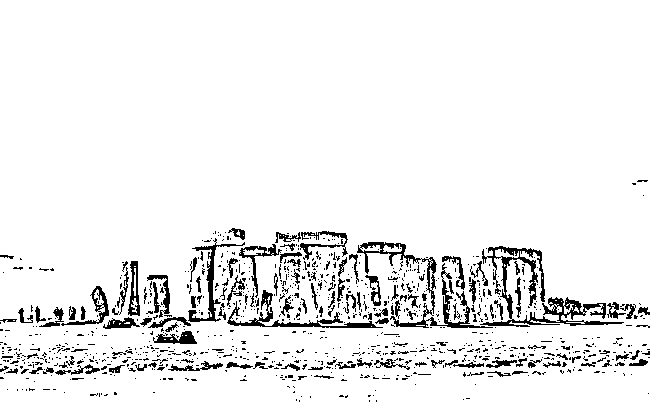  

从新石器时代过渡到农业社会过程中，也出现了石头日历。其中，最著名的是英国的巨石阵，修建时间从公元前 3000 年一直延续到公元前 1500 年。残存的各种大型石块被称作“巨石”，在欧洲、亚洲和非洲各处都有发现。这样的巨石常常是巨大的日历，成为我们早期社会组织的一部分。一年间的各种时间都有其特殊的意义。每年相同的时间，都会举行相同的社会发展仪式。

令人惊艳的是，**即使到了今日，巨石阵依然像 4000 多年前一样准确地标记出至日的日出和日落**。冬至白天最短，夜间最长，而夏至则白天最长，夜间最短。这些至日是早期石头太阳历的关键标尺，因为昼夜平分日是后来才被纳入体系。

现在使用最广泛的“格里高里”历法中，冬至日为 12 月 21/22 日，夏至日为 6 月 21/22 日，春分秋分分别是 3 月 20/21 日，和 9 月 23/24 日。（“标粗”日期 3 月 20/21 日，是因为这是**黄道日历和白羊座的开端，也就是每年的春分日**。）

## **请问：天空中星群变了，黄道星座变没？**

天文学家依旧使用白羊座的符号标记春分日，在他们天文学的著作中作为春分日的速记标志。这非常便捷，源自传统 —— 而他们的解释和他们的下一句话常常会指出，西方占星师使用的黄道星座是错误的，因为天空中的星群位置在过去 2000 年里发生了改变。事实上，西方占星师在公元前大约 127 年的时候就已经知道这一点了，感谢勤勉且数学能力卓越的希腊天文学家/占星师希巴克斯。

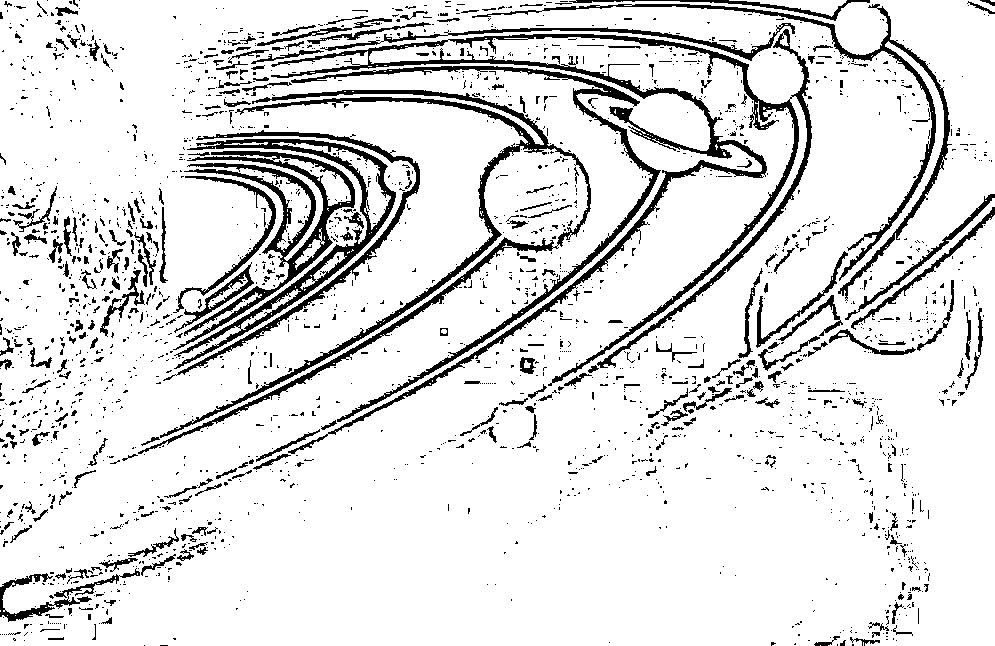

希巴克斯观察到他计算出的星体位置与六百年前巴比伦人星图中的位置有些许差异。凭借这一点差异，希巴克斯创造出一个公式来计算星体沿着黄道移动的速率，大约是每 72 年 1°。希巴克斯并不知道为何会这样，但是他的发现说明了**如果依赖天空中的星群作为持续的参考框架，就需要不断地调整**。

在希巴克斯那个时代的天文学家/占星师并没有弄清楚与太阳相比这些星体和我们相距几何。但是，他们看到了在**巨石阵里每一年的日升日落都与上一年落在了相同的位置**，一如今日。太阳，也是可靠的参照物。所以，希巴克斯的发现影响了占星学在西方的发展。

到了著名的天文学家/占星师托勒密（公元 100-170 年）时代，**“白羊座 0°”成为春分和黄道星历的准确标识度数**。白羊座的名称很简单地借用于白羊座星群，而白羊座星群在西方占星学发展的最初几个世纪里逐渐地移动，穿过了太阳背后的春分点。

现在的天文学家准确地认识到了希巴克斯的发现，这被称作是“**分点岁差**”，一个为期 26000 年的长周期，在这期间，我们的两极轴缓慢的旋转着，以非常缓慢的速度改变着我们对天空中环伺星体的视角。因为我们地球自身运转法则，所以岁差意味着我们与希巴克斯以及 23900 年以前的视角并不相同。然而，如果希巴克斯还在世，还居住在希腊雅典，他依然会发现至日和春秋分时日升日落的坐标与他的时代相同。

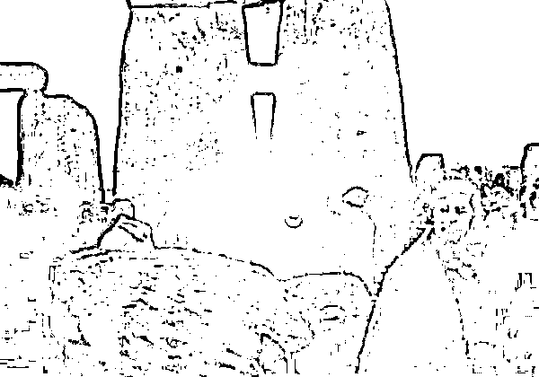

摄于 1980 年代中期巨石阵冬至的日落

照片来源自维基百科共享资源

这也就是占星师们将黄道星座称为太阳星座的原因，因为**它们是与太阳的位置保持同步，而不是闪耀星群**。所以别让被误导的怀疑论者或天文学家将你带入歧途或嘲笑你**，黄道 12 星座是固定的！**黄道 12 星座是固定的！** **黄道 12 星座是固定的！** ！！（重要的事情说三遍！）**它们真实地反映出地球与太阳的关系。这个地球与太阳的关系是固有的周期，所以我们也并不意外人类天性也是其中一部分。

## 如果还不清楚，此为加强版

从地球上看，我们所说的太阳在“白羊座”，始于每年春分，也就是 3 月 20-21 日。然而，从太阳的角度看，地球却位于天秤座。如下图所示。

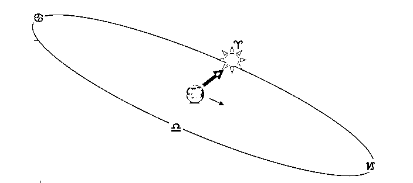

这种对立性的关键在于**视角的不同**。有趣的是，这种对立性却增添了下面这一传言的可信度：“**天秤座不过是有礼貌的白羊座**”。我指出这一点，目的在于消除关于“回归黄道”和“季节”的一些困惑。

**黄道星座（不要将它们与天文星座 constellation 混淆，那只是黄道星座名称的来源）是一种历法，其依据是昼夜平分点（春分点、秋分点）和两至点（夏至点、冬至点）。**这也正是它在学术上被称为“回归黄道”的原因。所有学过地理知识的人都知道，春、夏、秋、冬四季是我们地球轴线倾斜的结果。由于它的倾斜，所以在六、七月份春末夏初之际，北半球会受到更多的阳光直射，而南半球正在经历秋冬的更替。

我们从地球上观察太阳，这种视角并不会因为季节的改换而有所转变。北京寒冷刺骨时澳大利亚却有可能骄阳似火，但无论你在南半球还是北半球，地球和太阳之间 9.3 亿英里的距离都会给我们“相同的视角”（地球赤道的直径只有 7926 英里）。

回归黄道或黄道带中熟悉的 12 星座不是“气候”的日历，相反，它标志着我们绕太阳运转的轨道，并且将这个轨道分割为 360°（而不是 365.25 天），每个星座拥有平等的 30°（而不是每月各不相同的 30、31 或 28 天）。**黄道带的物理基础是地球和太阳的轨道运转关系，而不是气候意义上的季节。**


想体验大师级的占星疗愈？

大卫老师**占星咨询**预约进行时

**生命议题、职业发展、关系咨询、少儿成长、年度规划和预测**

```
预约咨询请联系许小姐 ：010-58760529
```

**◆ ◆ ◆  ◆ ◆**

******特别提醒************：若道拥有本文版权******，**转载请注明作者及出处。******

**你想了解更多占星学吗？**2016 年 5 月 19 日，**蒋颖老师**主讲的若道占星核心课程**Level 1-2**要开课了！没有报上名的同学，还可以**连报 1-5 阶。**

报名及咨询，请点击文末“阅读原文”

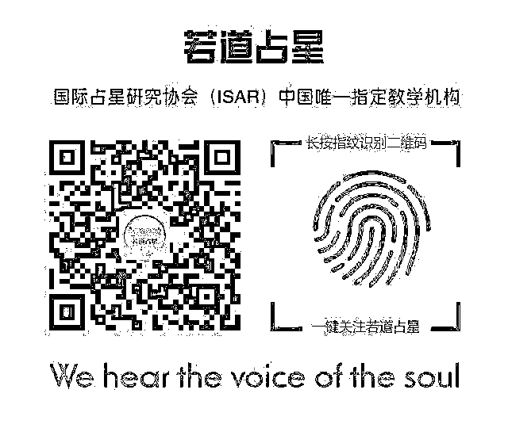

# 金牛座新月 | 五百万，你会用来做什么？（内附免费新月报告）

> 原文：[`mp.weixin.qq.com/s?__biz=MzA5NjA0NTAxNg==&mid=2651384723&idx=1&sn=6166b05ccf3c4431c96b46123dcdbdd2&chksm=8b4a5924bc3dd0324b106e31dbc9c9dddd0033cd5d3c3bb48914d95f90598d0aad2a9d365042&scene=126&sessionid=1692738841#rd`](http://mp.weixin.qq.com/s?__biz=MzA5NjA0NTAxNg==&mid=2651384723&idx=1&sn=6166b05ccf3c4431c96b46123dcdbdd2&chksm=8b4a5924bc3dd0324b106e31dbc9c9dddd0033cd5d3c3bb48914d95f90598d0aad2a9d365042&scene=126&sessionid=1692738841#rd)

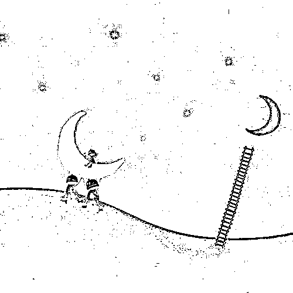

**金牛座新月** 

2016 年 5 月 7 日北京时间 03:29 迎来金牛座新月，太阳与月亮精准合相于金牛座 16 度 41 分。一起来看看这个新月带给我们怎样的启示吧，文末有许愿提醒，点击阅读原文获取免费新月报告哦。

新月小贴士

*   **新月时刻**

*   太阳与月亮精准合相。外在与内在、身与心的整合。 

*   **新月许愿**

*   新月代表从开启走向成熟的过程，故而适合制定计划、开启愿望。

新月的意涵

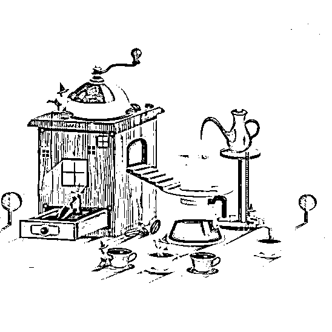

金牛座是土象固定星座，沉默、踏实、宁静。金牛座像是一双沉稳的手，引领我们的身体感官（眼耳鼻舌身）触摸宇宙创造的现实万物，找到我们在宇宙中坚实的家园，与万物共享宁静与安详。

**五星逆行** 

自 4 月 28 日水逆，五大行星（水星、火星、木星、土星、冥王星）进入集体逆行的共行周期，为每一个人带来对生命前期进行检视与反省的机缘，直至 5 月 9 日木星首先恢复顺行，打破五星逆行的格局。

**此次金牛座新月，发生在五星逆行的周期尾端**，好像宇宙特意为在迷宫中探险、反复检视路径的人们打开一扇门、敞开一条出路——**扎根现实、活在当下，尽情享受物质带来的满足、价值感带来的宁静。**

你会体验到的

**触动**

从 2016 年 3 月，随着土星逆行和木星逆行的渐进，[土木海 T 三角格局](http://mp.weixin.qq.com/s?__biz=MzA5NjA0NTAxNg==&mid=403676355&idx=1&sn=f6d3344a9daa34c5aa3e3dae543349dd&scene=21#wechat_redirect)（点击链接可阅读相关文章）对我们的生活形成有力影响： 

*   你是否体验到来自关系、环境、金钱、梦想的考验与困境？

*   你是否感受到内心逐渐浮现的失落与无力、彷徨与恐惧？

*   你是否想去奔跑，却又在起跑瞬间不知奔向何方、失去力量？

*   你是否想要微笑，却又在牵动嘴角的瞬间感到内心的承重、难以勉强？ 

**质疑**

上述体验和感受，会被外部的人和事触发，也让我们对内部信念开始产生质疑： 

*   我的梦想可能实现吗？我有能力可以做到吗？

*   我是不是该放下他/她？这段感情会有前景吗？

*   这份工作是我喜欢的吗？这样的生活是我想要的吗？

*   现在的我是我希望成为的样子吗？ 

**意外**

进入 2016 年 4 月，随着火星、冥王星、水星逐步加入到逆行的队列中来，生活中一些事件开始戏剧般地上演。你可能惊讶于某件事发生了意想不到的变化、曾经暗暗直觉的结果昭然若揭：

*   **亲密关系无常上演**

*   旧日恋情幡然回头，或者亲密情侣分道扬镳。 

*   **未完的议题再次出现**

*   旧日伤痛突然爆发，或者新伤中重遇旧日议题。 

*   **职场发生剧烈震荡**

*   新岗新职机会出现，转变过快或后讯无期；职场人际可能在瞬间导致你或他人出局。 

*   **财务发生低迷或纠纷**

*   投资、股票、房市形势起伏；借贷关系、商业关系不和不顺。

你可以去做的

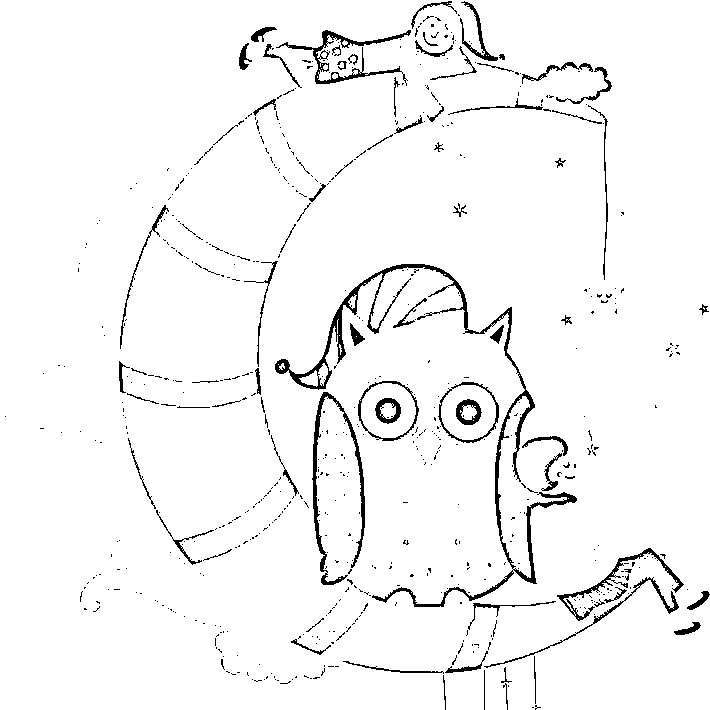

宇宙为我们安排了一个检视前期信念与选择的机会，即五星逆行期间（4 月 28 日—5 月 9 日）。**在此期间，我们可以检视并反省：困难、曲折事件的背后根源，以及再次触发、过往未完成的生命议题。**

*   **重要的议题**

*   如果多次被卡在一个点上、跌倒在一个问题上，说明外界的触发事件在提示完成这个重要议题是生命的功课与使命。勇敢面对、解决，还是在无尽的类似风浪中再一次被掀翻？这是生命中重要的选择。 

*   **必要的承诺**

*   无论是对自己、对伴侣，无论对学习、对工作，承诺意味着有能力承担责任、有意志落实责任，承诺的必要性在于：给自己机会证明自己。 

*   **内在的信念**

*   全面、细致地评估，真实、坚定地自信，而不是在口号、行动中盲目的投入。事实是，很多付出巨大热情与努力却依然失落的信念，是因为不具备坚实、可行的计划，并且内在总有个悲观的声音在悄悄地暗示“**我不行、我没有那么好运**”。 

*   **明智的准备**

*   世界上最有效的保护便是“不打无准备之仗”。我们总想去保护些什么，无论是自我的意志、尊严，还是自我的价值、利益。做好准备、练好内功，否则恼羞成怒的情绪、竭尽全力的抗衡根本无济于事。 

*   **终极的意义**

*   物质与金钱构架了生命在这个世界存活的基础。它们是必须，但不是仅需。在此之上，觉知生命价值的终极意义：生命与万物，宁静地存在、安详地活着。

你还需要注意

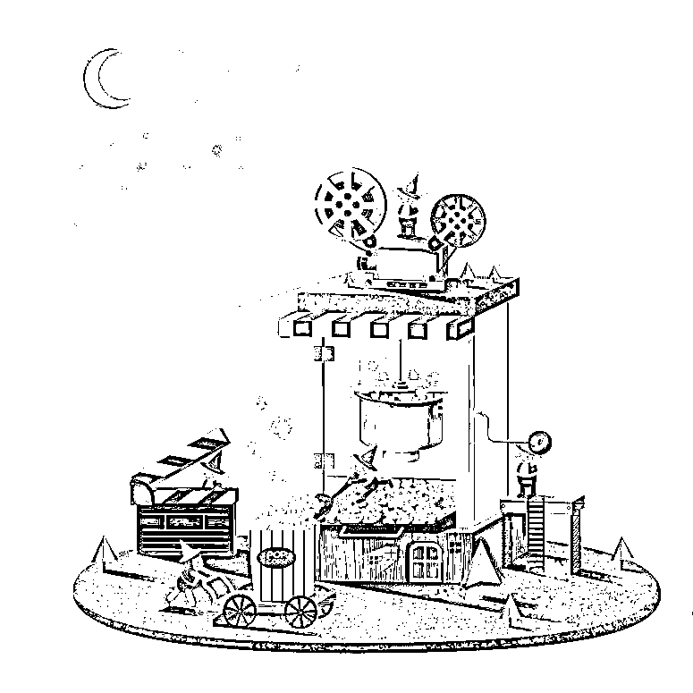

金牛座联结着生命中的“拥有”，拥有外在的物质、金钱，拥有内在的安全、宁静。这些拥有都是必不可少的珍贵价值。当物质与金钱、安全与宁静之间：

*   **协调一致的时候**

*   外在的物质与金钱带来内在的安全与宁静，内在的安全与宁静指引创造外在的物质与金钱，由此觉知到生命与地球万物本自存在，只需在每一个当下投入享受其中。 

*   **冲突矛盾的时候**

*   过度依赖外在的金钱与物质，无法获得、无法满足内在的安全与宁静，在依赖性的追逐与不安全的恐惧之间无意识地循环。 

此次金牛座新月，**给自己一点时间沉默、独处，像一棵树、像一朵花般，放下内心的欲望、头脑的思绪，享受阳光、微风、花香、美食，感受活着的简单与安然 。** 

可以观察的领域

*   **情感**

*   在前一段时间的情感波动中，你可能已经逐渐看清楚无法挽回的关系、需要铭记的人。**将那些桃花泛滥、暧昧无望的情感大门关上，打开一扇通往承诺性亲密关系（不单是婚姻承诺，也包含情感承诺）的大门。** 

*   **职场**

*   如果职场问题已经缓解，做好下一步的规划，避免以往的问题重来。如果问题还没有解决，**此次新月建议先对职业方向做个梳理，你可能需要理清收益与快乐、任务与热爱之间的排序。**

*   **财务**

*   前段时间财务出现红灯、纠纷的朋友，你的财务危机处理得如何了？你可能需要与你的金钱能量面对面做个深度的沟通。**将金钱能量想象成一个人，或者找个朋友扮演你的金钱能量，记得要入戏、要投入，看看你和金钱能量之间的互动关系。**如果你不尊重金钱能量，它当然也不会尊重你。 

*   **活动**

*   **无论是公关、商业活动，还是休闲、聚会活动，你会发现自己与外界有一些价值观、消费观的碰撞，也有对生活品质、享受偏好的摩擦。**新的视野或许会为你带来更多的反思与完善。切记，莫勉强自己，也莫勉强他人，观念如此，快乐也是如此。 

*   **健康**

*   如果想休息，就休息吧。如果感觉因为休息浪费了时间、耽误了赚钱，那么，可能有一天你会被动地消耗更多的时间与金钱。**对于想整容、身体护理的朋友，建议水逆期过后不迟。注意皮肤过敏、肠胃疾病，眼睛、牙齿病痛，以及淋巴、肩颈健康。** 

许愿前的功课

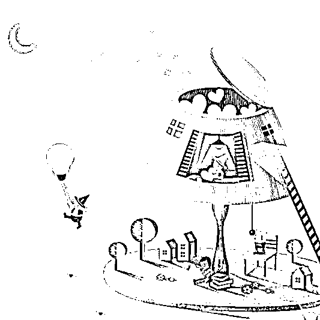

 此次金牛座新月，与每个人的金钱能量、价值信念相关，建议在新月许愿前做足功课、理清重点： 

*   金钱和物质可以为你带来什么好处？

*   它们是否可以为你带来内心的快乐与宁静？

*   在享受金钱与物质的丰盛时，你的内心涌现着什么样的感受与情绪？

*   如果给你 500 万，你会做哪些事？好好想想，不要冲动回答。

 这些问题没有统一的答案，也没必要被价值道德评断，只要真实就好。**了解自己的价值信念、金钱意义，再去新月许愿，或许，你的愿望会更有意义、更加落地。** 

重要的总在最后

*   **许愿时间**

*   2016 年 5 月 7 日 03:29 后，48 小时内有效、8 小时内最佳。

*   **许愿人群**

*   所有人。

*   **许愿数量**

*   每人最多 10 个。

*   **许愿方式**

*   记录在本子或者纸张上收藏。

*   **许愿格式**

*   请万能的宇宙赐予我 XX 能量，我将以我的 XX 能量吸引……

*   **许愿要则**

*   发心诚善利人。


**作者简介**

**王芝桦**：职业占星师。擅长心理咨询、催眠治疗、占星咨询个案经验。结合心理学、灵性疗法、占星学等不同专业流派，以及 NLP、艾瑞克森催眠、家族系统排列等专业技术，开创系列生命主题课程。创办天津道玺身心灵中心。

**微信公众平台账号**：daoxi-life

**个案预约微信账号**：zhihua0621

长按二维码，让金钱涌向传播知识与智慧的人~

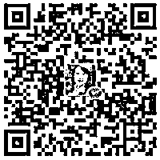

**.gif")**

**特别提醒****：本文由作者授权首发于若道平台，转载请注明“转自若道”**并标明作者**。**  

5 月 7 日就是金牛座新月了，每到新月时分，都是播种心愿的时期。点击文末“**阅读原文**”，免费领取你专属的新月报告！

报名及咨询，请点击文末“阅读原文”


# 原型占星学真实案例 | “魔鬼”的行进

> 原文：[`mp.weixin.qq.com/s?__biz=MzA5NjA0NTAxNg==&mid=2651384723&idx=2&sn=ee9572b3c726ab2421b8ba6b812fe55a&chksm=8b4a5924bc3dd032ca44d69d69825f9d34e2ab50f860c11d8bafafd1ebea8e9595ba34772304&scene=126&sessionid=1692738841#rd`](http://mp.weixin.qq.com/s?__biz=MzA5NjA0NTAxNg==&mid=2651384723&idx=2&sn=ee9572b3c726ab2421b8ba6b812fe55a&chksm=8b4a5924bc3dd032ca44d69d69825f9d34e2ab50f860c11d8bafafd1ebea8e9595ba34772304&scene=126&sessionid=1692738841#rd)

作者/斯坦·格罗夫、理查德·塔纳斯

译者/庄西、栗幼婷

文章来源/瑞珈瑜伽  图片/花瓣网

有时行星的行进会反映人生的冲击性事件。本文讲述了全息呼吸创始人斯坦·格罗夫遇到的一个真实案例。针对此事件的行进，原型占星学研究者理查德·塔纳斯通过星图为大家进行了详细的分析。本文适合有中阶占星学基础的朋友阅读。

## **塔纳斯：每颗行星对应一个原型**

每个人的个人星图行进都非常完美地描述出当下这个人会拥有哪一种类型的体验。不仅过去的行进是这样，未来的行进会描述出即将发生的体验类型，而验证之后发现事实与星图完美符合。

比如我在几周之后的行进描述出我在意识上将有一个深度的拓展，或者会有很深的洞见，当这一点得到验证时我非常惊讶，因为我做梦也没想到我确实发生了一个觉醒体验。这让我对占星学有了极深的洞见和了解，我们每个人的生命就像是一匹渐进式展开的锦缎，沿着星图的运转在有条不紊地叙述着自己的人生故事。

我发现当一个人经历某种类型的行进时，他会经历到突然的觉醒或是突破、重生的体验；而当他在经历另外一种类型行进时，他的人生中会经历危机、抑郁，或者坠入爱河。所有这一切都指向了一幅宏大的宇宙图景。

也就是说，我们人类的体验是嵌刻在一幅巨大的、极具意义的宇宙图景当中的。整个宇宙、行星，包括太阳、月亮的运行模式，是在完成一曲非常优美的乐曲或交响乐，而这首乐曲对应的是我们人类个体的生活轨迹和体验。

**我发现每一颗行星都和一个“原型”紧密关联在一起，我称之为“宇宙原型”。**“原型”是从古希腊柏拉图时代开始在哲学上使用的一个术语，它怎么解释呢？比如我们在这个世界上会看到很多美丽的东西，美丽的人、美丽的日落、美丽的音乐……**从原型角度讲，在这个世界上存在一种美的原则，而这种美的原则又和一颗叫做金星的行星联系在一起。**当我们在人生中体验到美、体验到爱的时候，会和星图中的金星行进发生关联。

此外还有其他行星，比如**土星和我们的受限、收缩、阻碍的体验有关**，**同时也为我们打下基础，带来扎根、成熟的体验**。也就是说，同样的这颗土星，既可以让我们去感受年纪又大又疲惫的感觉，也可以让我们体验到自己是成熟的、扎根的，这和占星的视角有很大关系。

“

**你在人生中经历的某个行进，并不意味着是这样的行进导致了你有这样的体验，并非一种决定论或宿命论的意思，而是取决于你用什么样的态度去面对这样的行进和能量**。

”

也就是说，不要将行星看成是导致这些体验发生的原因，好像我们是傀儡一样，而是当我们了解到自己的行进时，能够更有意识地参与到行星呈现出的能量中来。

**一颗行星的能量表达方式可以是多种多样的**，而这种多样性正展示出每个人所拥有的自由。**是把一颗行星能量最好的可能性表达出来还是用一种破坏性的方式呈现，取决于我们的自由。**

有人对占星学还有一种误解，类似于你拿一个物体击中另一个物体，被击中的物体就会以某种形式运动。这就是所谓的线性因果关系，是一种常见的误解。好像是说火星向一个人发送了它的能量光束，这个人就会变得愤怒——这是过于简化地把占星学看成了一种因果论。

其实我更愿意把占星学看成是一个钟表，比如现在的时间是 5:44，并不意味着是这个钟表让 5：44 发生了，只是 5：44 反映和呈现了这个时间而已。以此角度来看，无论是行星行进也好，还是我们个人的心理活动也好，都在一个紧密联系的整体之内协调着发生。

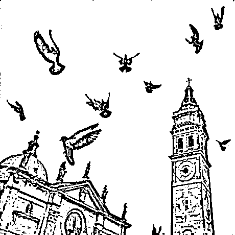 

## **格罗夫：一位女精神病人的真实案例**

现在我来讲讲原型占星学是如何对人的情绪产生作用的。以下我要讲的故事可能是我作为精神科医师和病患之间进行角力的最强有力的案例。

这个案例发生在马里兰州一家非常老旧的精神病院。我初来美国那两年，在这所精神病院旁边建立了一个致幻药物研究所。有一天，精神病院邀请我去参加他们的例会。他们那儿有一位待了 11 个月的女病人叫 Flora，任何治疗都对她无效，这个会议就是要讨论是继续对她治疗还是放弃。

Flora 是被法院送过来的，她是一位海洛因上瘾者，在毒品的影响下开枪射击了她的朋友，朋友没有死但受伤了，她就被法官当成精神病案例处理。

Flora 少年时代曾是一个打劫团伙的成员，有一次打劫过程中她负责开车，而团伙中的另一位成员把守夜人杀死了，因此她作为少年犯进了教养院，在里头关了四年。枪击事件发生在她的假释期内，她再次违法被送到了精神病院。

Flora 患有抑郁症，有严重的自杀和暴力倾向，甚至开车时出现过冲向悬崖或撞到对面墙上的冲动。她抑郁的一部分原因可能因为她是同性恋者，还是一个酒鬼，有许多身心症状，神经似乎也有问题，面颊部位经常出现疼痛和抽搐，正打算去做手术。

精神病院医生把她的情况介绍给我，问我可不可以用致幻药物来治疗她。这对我们是一个难题，因为当时很多记者、媒体都在爆料致幻药物多么危险，而这位女病人还会使用手枪，我知道无论对她怎样治疗，最后的结果都可能会怪到我们头上，但如果不对她进行治疗，她将会长期被关在精神病院。

出于一些奇怪的理由，精神病院限制我们对她的治疗不能超过三次，认为第四次就太多了。我作为守护者先跟她进行了两次治疗，两次治疗都非常有力量。Flora 来自一个意大利移民家庭，家庭里有很多暴力状况，她自己则有一段非常艰难曲折的成长史。两次治疗中，她释放了一些情绪但不太多，面部的抽搐被发现与出生时在产道里的能量阻塞有关。

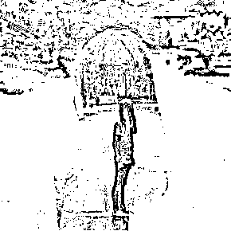 

第三次治疗最为关键，也是我们的最后一次机会。这个过程一开始和前两次没什么两样，但忽然有些不寻常的事情发生了，她开始哭泣，面部抽搐变得越来越剧烈，还伴随着巨大的疼痛。

她的面孔逐渐在我面前收缩、扭曲、变形，好像成了一个邪恶的面具，而她的双手扭曲得像爪子一样，然后一个很深沉的男声忽然从她身体里发出来：“我就是魔鬼，你最好从我面前滚开，她属于我……”接下来是各种语言上攻击、大量的污言秽语，这个男声威胁我，如果现在不放弃对 Flora 的治疗，在我身上以及我的研究项目中将会有可怕的事情发生……

这是一个很不寻常的状况，看起来像是某种黑暗势力进入到我的治疗房间里来。这种情况我以前在书上读到过，但还是头一次真的看见它发生。当时我们的研究项目是一男一女组合，我作为主治医生，而我的护士是一位女性。她是虔诚的天主教徒，这时候整个人开始喘息不止，一直退缩到墙边，就像是冥界降临在了她的身上。

更加不可思议的事情发生了。这个男声开始说出关于我和我的同事的一些隐私。Flora 平时待在精神病院，只是为了治疗被护士带到我们这里来。有时候护士会和病人建立良好关系，可能会告诉病人一些事，但看护她的护士来自另一家机构，因此不可能知道我们这些信息。

从任何方面看，Flora 都不可能知道关于我们的事情，但是她说出了她原本不可能知道的信息，展示出一种通灵现象。当时我感觉到一种形而上的恐惧，我的头脑一直在转，对自己说，一个荣格原型很清晰地浮现了，把它钉上十字架是最合适的方法……

可是当时我手头没有十字架，那还有其他办法吗？我意识到如果我在情绪上对这种状况有任何回应的话，情形只会更加可怕，可是如果我不能像一个灵性战士那样去勇敢面对她，一不留神流露出恐惧的样子，整个事态会变得更为糟糕不可控制。

我决定让自己安静下来，进行光的冥想。我想象自己和病人身处在一团光之中，我感到自己在这个过程里出现了一种绝对“空”的感受，好像归零了。我还想象自己变得透明，让那些负面能量穿透我，进入到无限的“空”之中。

这样过了很长很长时间，Flora 的脸部开始放松，慢慢地又恢复到原先的样子；手也开始抖动，放松之后不再是爪子的形状……我们又可以和她沟通了，她整个人感觉良好，脸上没有任何抽搐、紧张的状态，心情也非常放松，治疗结束后就被带回了病房。

第二天，她又来研究院做了一个面试，我发现这些改变在她身上持续着。一段时间内，她的状况非常好，很快就从精神病院被放出去了。后来她加入了当地一个社区基督教组织，变成一位非常虔诚的教徒，还找了一份出租车司机的工作。

她的抑郁症也消失了，面部也恢复正常不再需要做神经手术。她不再需要任何医院和治疗，甚至又开始尝试和异性交往，最后结婚了，当然三个月之后她就离了婚，她真的是一位女同性恋，但她没有任何抗争，她接纳这一点，可以开始拥抱自己的生命。

现在请理查德讲讲她接受治疗那段时间的星图行进情况。

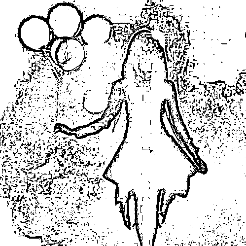 

## **塔纳斯：个案与治疗者的行进分析**

感谢斯坦为我们带来这样一个真实的案例。Flora 的案例中有很明显的附体能量。一方面我们可以说病患身上魔鬼式的能量架起了焚烧她魔鬼式的情绪的柴火，另一方面我们也看到原型的能量有时候远远超出了个人的体验和理解范围。

荣格原型是个人内在的东西，而这个附体是男人的声音，并且还改变了女病人的面孔和身体，说出了女病人在生活中绝无可能获知的信息。人类很多古老文化都认识到是有其他维度存在的，比如附体的恶魔，比如萨满的能量。

萨满会用一些仪式性的东西把附体的邪恶能量驱赶出去，但这一切对西方精神病学来说，是无法理解的。西方精神病学把附体现象说成是精神紊乱，是个人内在心理的荣格原型。但在这个治疗中，女病人身上的原型能量远远超过了她个体生命所能承受的力量，也由此扩展了荣格原型的内容，表明**当下的共时性不仅塑造了外在，也同时塑造了内在**。

在个人行进上，这是**冥王星的能量**。我们可以把冥王星看成是冥王哈迪斯（Hades）。斯坦说当男声出现的时候，好像整个冥界都被打开了，而治疗过程中突然出现的呓语和谩骂，说明天王星的能量也是存在。所有这一切又与海王星的能量紧密结合，因为**海王星代表非常态意识的转化**。

我们把这些能量和女病人的星图行进结合在一起看。这次治疗发生在 1968 年 9 月 17 号。1960 年代一直有非常显著的天王星和冥王星的相位，又与木星合相，又进一步拓展了天王星和冥王星的能量，而进行治疗的那一周，太阳也进入到三大行星所形成的合相中。

1968-1969 年，天王星、冥王星、木星和太阳的合相是非常显著的一个能量天象，整个 1960 年代所呈现的那种爆发式的自由文化运动在此期间到达高潮。这次治疗 10 个月后，也就是 1969 年 7 月，人类首次登月成功。

所以，那是一个极具创造力、突破性、在很多领域都能取得成功的时期，而超个人心理学也在那个时间点上开始生发，斯坦就是超个人心理学的创始人之一。接下来，原型占星学也开始创立。

除了这种积极的、创造性的能量之外，黑暗能量也在这一时期显现，因为**冥王星既可以是昆达利尼式的净化，也可以原型能量中的黑暗面**，比如吞噬女神卡莉（Mother Kali），包括治疗过程出现的附体——魔鬼的临在。

当年人们说滚石乐队的乐曲就是魔鬼交响曲，滚石乐队开场敲起鼓点，然后主唱说“请允许我介绍我自己，我就是魔鬼，我是每个人内在的魔鬼，我是所有坏事的起因，我是谋杀领袖的凶手，请你们猜猜我的名字……”

这个天象期间还拍了一部非常重要的电影，名叫 Rosemary’s Baby（中文名为《罗斯玛丽的婴儿》或《魔鬼圣婴》，著名导演罗曼·波兰斯基的作品），电影讲述的就是魔鬼的故事。从这些事件我们可以看到共时性，冥王星一方面是转化的、创造式的能量，另一方面也把黑暗力量揭露出来，两者都是那个年代的原型能量。

**Flora 的行进星图解读**

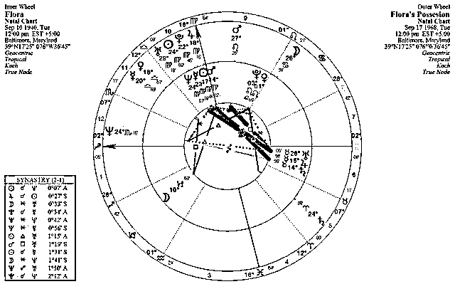

Flora 在 9 月 10 日出生，这张行进星图是 9 月 17 日的，她刚过了 28 岁生日，所以出生星图和行进星图的两个太阳如此接近。在她的出生星图中，**太阳与海王星合相，这个相位代表这个人的意识是可渗透的，很容易被外在或内在的力量所影响**。我们提到过荣格的星图有太阳四分海王星，代表心理上比较容易被渗透的品质。

这个女病人成长在一个男权家庭，父亲曾经虐待过她，本身她就有一个十分脆弱的自我结构，也就是太阳所代表的自我身份认同，再加上合相海王星，自我边界单薄易被渗透，使她很容易被那些比如冥王星所代表的魔鬼能量入侵。当她处于天王星、冥王星、木星、太阳这些非常有力量的行进时，最深层次的潜意识能量就浮现到了意识表面。

在她的星图中，太阳还合相了火星，所以她从小就跟一些小混混在一起玩枪支，这些都是火星元素。同时，冥王星合相金星，这个原型好像冥王哈迪斯绑架了地母德墨忒尔（Demeter）的女儿珀耳塞福涅（Persephone），强迫她做自己的新娘。在治疗中呈现的原型是，魔鬼对斯坦说，你离她远一点，这个女人是我的。

**金星合相冥王星的积极表达，代表全身心地投入去爱，以及风格鲜明的艺术**，比如画家非常强烈的色彩表达；**另一方面也使爱和禁忌联系在一起**，因为冥王星代表禁忌。弗洛伊德的星图中就有金星与冥王星合相，所以他对性能量有强迫式的关注。

在万千行进之中，天王星、冥王星和木星的合相分别代表了冥王星火山地震般的能量爆发、天王星自由且突然的释放、木星喜悦而开心的成功，这些能量交织在一起，全部跟出生星图的太阳合相，因此她自身的魔鬼能量被释放出来的同时，也开启了成功的疗愈。

行进木星合相出生星图太阳的相位，每 12 年会出现一次，Flora 在治疗过程中正好经历了这一行进。斯坦刚才讲到，结束治疗后这位女士的感觉非常好，脸上泛着笑容，这呈现的是太阳式乐观、开心的感觉。

再看她的**出生图水星与海王星合相，这个相位使人通常具有通灵的能力**，能够很犀利地感知到对方在想什么。因此，魔鬼通过女病人可渗透的头脑，向斯坦传达了一些女病人本身不可能知道的信息，还通过女病人去威胁斯坦和他的项目，说了一大通污言秽语。

行进的冥王星此时恰好经过她出生图的水星，水星代表语言，**冥王星的负面能量表现为污言秽语和敲诈、勒索、绑架之类**。当行进冥王星碰到水星时，一般会出现洗脑以及强制别人用某种方式去说话思考。有个作家叫乔治·奥威尔（Geoge Orwell），他的星图里就有冥王星与水星的相位，这一能量在小说《1984》中得到了表达。

再说海王星，**海王星可以代表灵性的觉醒和意识的转化**。行进天王星正好经过出生图的海王星，触发了海王星和天王星的三分相位，代表灵性上的觉醒。而行进的海王星则对分了行进的天王星，并和出生图海王星形成一个六分相，这样的相位再次强化了灵性上的觉醒。因此在治疗之后，这位女病人皈依了基督教。

在以上相位中，个人所经历的行进与当时大环境所产生的共时性非常显著。我们不仅看到了占星学在个人命运上的显化，也看到整个集体层面的原型力量如何在某一时刻集中呈现在某个人身上。伴随着全世界行进的影响，个体变成了能量大爆发的载体，魔鬼般的体验架起了焚烧的柴火，对案主的身体与灵性进行深度的转化。

**斯坦的行进星图解读**

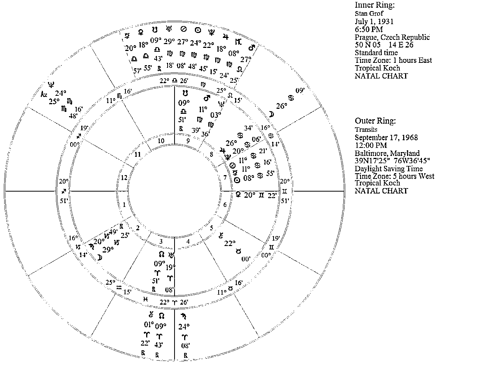

而经历这个行进的不光是女病人 Flora ，还有治疗师斯坦。斯坦说过，除了他人生当中的个人体验外，这一案例他职业生涯中经历的最漫长的两小时。

在斯坦的星图中，行进土星四分了出生图的土星、木星，并且和冥王星呈对分相。**土星和冥王星的力量，代表个体会经历灵性当中非常强大的黑暗势力**，这也是斯坦在整个治疗过程中体验到的。

斯坦的相位被激活，是通过他的来访者来直面自己内心的黑暗，就像是他跟魔鬼下了一盘两小时的棋局。在斯坦的星图中，行进天王星和出生图的月亮形成一个精准的三分相，这个正相位显化出来的就是一位年轻的女士突然得到了出乎意料的解放。实际上在与黑暗能量角力的过程中，不仅这位年轻女士得到了解放，也许斯坦本身的阿尼玛层面，也得到了释放和解脱。

透过这个案例的分析，我们可以看到原型占星在个人、文化和历史层面显化出的细腻性和丰富性。此外，在非常态意识状态下，人的心灵觉醒和转化通常需要参与各方具有极大的勇气。

**后台回复 原型 二字，可获得更多原型占星学内容。**

**课程信息**

**** 

**课程名称：**原型占星学（ISAR 选修课之一）

**讲师：**理查德·塔纳斯

**开课时间**：2016 年 5 月 21 日

**授课时间**：每周六上午 10：00-12：00，共 8 节课 16 课时

**费用**：6800 元 （若道老学员 4800）

**授课形式**：网络在线授课（英文授课，中文翻译）

**课程负责人**：李老师、熊老师

**微信号**：2847613491（请备注原型课程报名咨询）

**◆ ◆ ◆  ◆ ◆**

**特别提醒****：本文由瑞珈瑜伽授权发布，转载请注明出处。**  

**2016 年 5 月 14 日**，西方著名文化历史学家、研究原型占星学 30 年余年的**理查德·塔纳斯**将为我们打开**原型占星学**的大门。

课程详细内容请点击文末“阅读原文”


# 5 月 21 日，理查德·塔纳斯带你触碰原型占星学

> 原文：[`mp.weixin.qq.com/s?__biz=MzA5NjA0NTAxNg==&mid=2651384723&idx=3&sn=483185fe6a11dacddd9ab931a97052aa&chksm=8b4a5924bc3dd032c977a82fcae1799007e05f135a16eff69ac6f41f566487b78353a8ac5153&scene=126&sessionid=1692738841#rd`](http://mp.weixin.qq.com/s?__biz=MzA5NjA0NTAxNg==&mid=2651384723&idx=3&sn=483185fe6a11dacddd9ab931a97052aa&chksm=8b4a5924bc3dd032c977a82fcae1799007e05f135a16eff69ac6f41f566487b78353a8ac5153&scene=126&sessionid=1692738841#rd)

**男神驾到**

**童鞋们**

**小板凳搬起来**

**小巴掌拍起来**

**气氛嗨起来**

**毕业于哈佛大学的若道新晋男神**

**旧金山加州整合大学心理学和文化历史教授**

**理查德·塔纳斯的原型占星学要开讲啦！**


**课程信息**

**开课时间**：2016 年 5 月 21 日

**授课时间**：每周六上午 10：00-12：00，共 8 节课 16 课时

**费用**：6800 元（若道老学员 4800）

**授课形式**：网络在线授课（英文授课，中文翻译）

**课程负责人**：李老师、熊老师

**微信号**：2847613491（请备注原型课程报名咨询）

**课程简介**

占星学的基本原则是，**每颗行星都代表了特定的原型力量或法则，影响着人类的世界。**天上行星形成的模式和地上人们生活的模式息息相关。对于每个个体来说，其出生时的时间和地点反映了他们人生和性格中的基本原型模式。

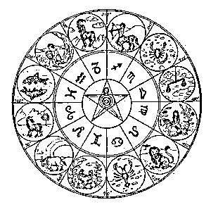

占星学使人们有机会更加了解自己的生命。它的周期、高潮与低谷、危机和突破、重大变化和转化的时期，都写在行进星图上。行进指的是相对于出生时行星的位置，当下天空中的行星位置构成的特定几何图形。这些图形的特性所涉及的行星及其位置，几乎总是与当时人生体验的原型特性一致。

因此了解原型对透彻理解和运用占星学格外重要。那么，**什么是原型？什么是原型占星学呢？它在我们的生活中是如何运作的呢？**西方著名文化历史学家、研究原型占星学 30 年余年的**理查德·塔纳斯**将为我们打开原型占星学的大门。你关于原型占星的诸多疑问都将得到解答。在这门课上，**我们不仅会学到理论知识，还会在各种示例中感受到原型的力量和它的运作，音乐、视频、图像也会是这些示例的一部分**。

**男神来了**

**理查德·西奥多·塔纳斯**：出生于 1950 年 2 月 21 日，是一位文化历史学家，凭所著的《西方思想史》（*The Passion of the Western Mind: Understanding the Ideas That Have Shaped Our World View*，繁体版译为《西方激情的心灵：理解那些曾塑造我们世界观》） 和《宇宙和心灵的思想：新世界观的宣言》（* Cosmos and Psyche: Intimations of a New World View *）而广为人知。塔纳斯在加利福尼亚整合学院担任哲学和心理学教授，是哲学、宇宙论和意识专业的研究生项目创始人。 

## 不知道男神是谁？那你 OUT 了 点击下方图片阅读文章


* * *

 **[**塔纳斯：天冥四分威力将持续到 2020 年**](http://mp.weixin.qq.com/s?__biz=MzA5NjA0NTAxNg==&mid=402587687&idx=1&sn=d81ed86727c7b561dc487374c5846935&scene=21#wechat_redirect)**

* * *

**课程安排**

**>>>>**

**授课重点**

☆ 原型占星学的基础

☆ 实际应用（用于自我认知、从容生活、情感关系、心理治疗）

☆ 更大的意涵（哲学的、宇宙的、历史的）

**>>>>**

**知识点**

☆ 一致性的基本形式：出生星图、个人行进、世界行进

☆ 占星学如何运作，共时性的角色

☆ 占星学中的命运和自由意志问题

☆ 原型的本质/基本特征

☆ 行星的意义以及它们的组合

☆ 主要相位

☆ 如何把握一张出生星图最重要的主题

☆ 评估个人行进

☆ 评估世界行进

☆ 重要的是认识到原型的多元性，以及在共同创造性地展现我们出生星图和行进的潜能的过程中我们所扮演的角色、所具有的力量和所肩负的责任。

**第一次课：5 月 21 日**

开课欢迎致辞

介绍我们将在该课程中涵盖的内容

占星学和心理学如何互相启发，互相增强

我的占星学之旅

是什么让原型占星学与众不同

课堂讨论，提问与回答

**第二课：5 月 28 日**

原型占星学的基本概念框架

运作方式：因果关系和共时性的议题

命运和自由意志

理解原型

**第三课：6 月 4 日**

行星的意义，从发光体太阳、月亮开始，到水星、金星、火星、木星、土星

**第四课：6 月 11 日**

外行星天王星、海王星、冥王星：“银河使者”

**第五课：6 月 18 日**

观察运转中的行星，第一部分：艺术、音乐、电影、喜剧（指定的电影）中的示例

**第六课：6 月 25 日**

观察运转中的行星，第二部分：艺术（指定的电影）中的更多示例

**第七课：7 月 2 日**

个人行进，以及如何带着占星学的觉知投入到生活之中

**第八课：7 月 9 日**

世界行进，以及以占星学更宏大的哲学意涵来理解我们在历史上所处的时刻

**>>>>**

**学员要求**

具备若道核心课程 Level3 的基础

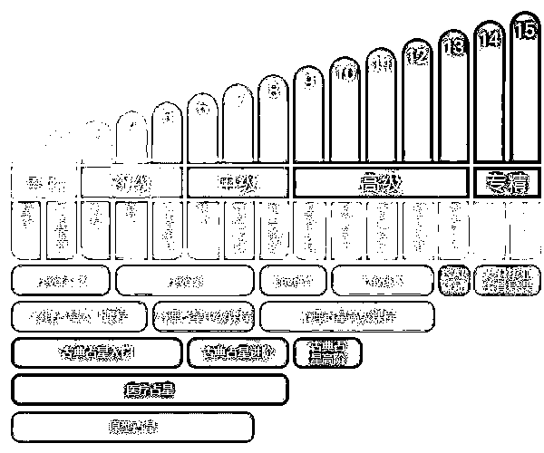

**>>>>**

**如何报名**

请点击文末“阅读原文”立即报名，以及在线完成学费支付

咨询请打电话**4006191014 **或 **课服 QQ：4006191014** （若道星文化）

或直接写信给**nodoor@vip.126.com**，我们会回复您的疑问

长按二维码添加课程负责人咨询~

****

报名请点击文末“阅读原文”

# 大师印象 | 奇妙的苏，如一杯奇妙的茶

> 原文：[`mp.weixin.qq.com/s?__biz=MzA5NjA0NTAxNg==&mid=2651384710&idx=1&sn=7bed31f2c1f1f2d21d7eef29e16d4844&chksm=8b4a5931bc3dd027df11c0a3373af9a6196040087dec7561c86adfbdf1e508379ece36b3cda9&scene=126&sessionid=1692738841#rd`](http://mp.weixin.qq.com/s?__biz=MzA5NjA0NTAxNg==&mid=2651384710&idx=1&sn=7bed31f2c1f1f2d21d7eef29e16d4844&chksm=8b4a5931bc3dd027df11c0a3373af9a6196040087dec7561c86adfbdf1e508379ece36b3cda9&scene=126&sessionid=1692738841#rd)

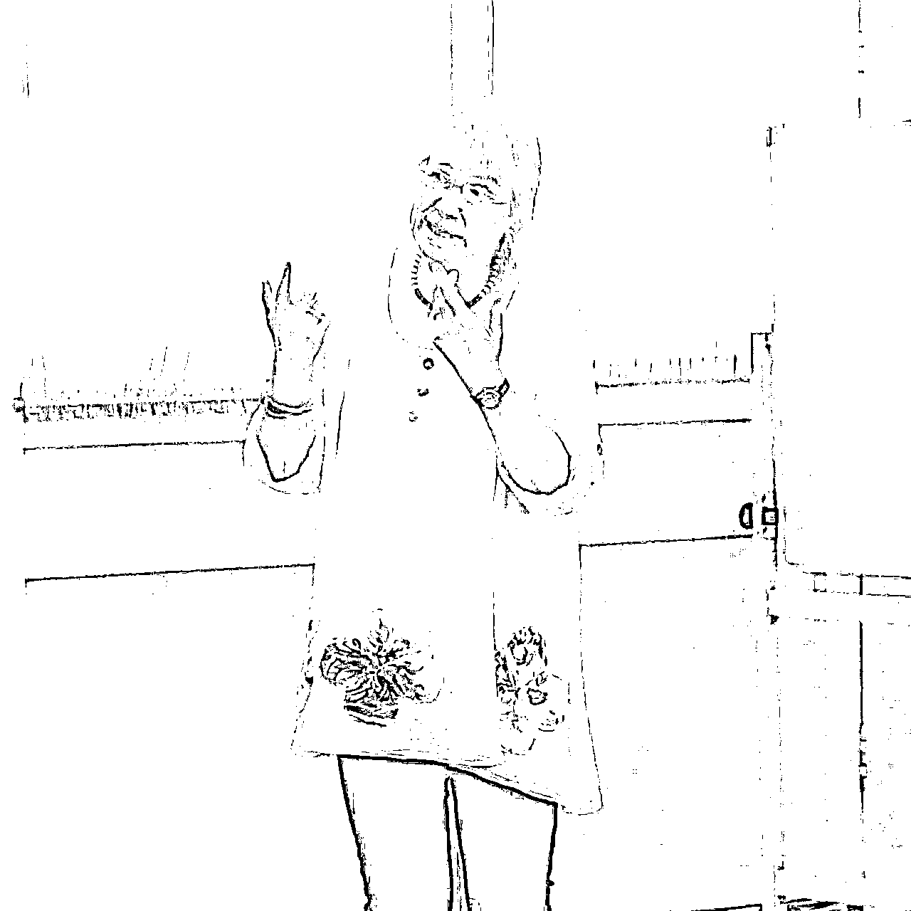

今天晚上，若道将在北京做一场苏·汤普金斯的签售和访谈（点击“阅读原文”了解），因为我们很期望那些对占星学好奇、对顺势疗法好奇的朋友，有机会从一位从业多年的、在世界范围内受到尊敬的老师那里获得一些知识和智慧。

**1**

我因为工作的关系，常常有机会深入接触占星学界的大师们，每位老师都各有特色。

对我来说，苏，如果是一杯茶，那么真的是一杯很奇特的茶。一开始，这杯茶水在众多名茶中，散发出一股子水瓶座的高冷气息，可能让人不大敢靠近。接着，你出于好奇端起来，第一口尝下去，发现它真的有一股独特的味道。你甩甩头，未必能够理解这个味道，因为它既平凡又奇妙，平凡得不像名茶，而又奇妙得让你欲罢不能。你再尝一口，发现有一些更有趣的味道渗透出来，很微妙，一层层，每一层都不同。

你不禁好奇，这杯茶到底有多少种味道呢？于是，吸引你一饮再饮，在这种既平凡又奇妙的味道中探索下去，一次次下巴掉下来，为其中奇妙而又深邃的味道。这就是我个人的体会。

**2**

苏是我见到的最不像大师的大师。

她写出了占星学的经典著作。我常常听到真正在从事占星咨询的职业占星师说，当实践时，苏的书是他们最常翻阅的书。但是，**她却又是敢于说“我不知道”次数最多的老师。她既不怕让学员失望，也不怕让自己尴尬。**因为“无所不知”是人们通常的对大师级人物的期盼，而大师们也经常去回应这种期盼。她则不会。她有一种可以令人尴尬的“诚实”品质。

职业占星师常常被期待提供信息，行业的特殊性、客户的期待给从业者带来很大压力，连一个占星初级的学生说“不知道”时，也感觉到无能、无力和担忧。但苏以行动提供榜样，让我们能够诚实面对占星学这门学问、面对自己、面对客户。

占星学子的成长和前进，不仅仅是学识的传承，而且也是来自于榜样的示范和模仿，每个人去摸索适合自己的独特道路。苏以她赤裸裸的诚实态度，在占星学的世界中示范出一种独特的榜样。

**3**

她是博学的，而这种博学奠定在非常扎实的实证基础上。在占星学界中，有一些有名的占星师是以著书而闻名，但这些著作未必是他们实践的积累，很多是吊书袋子的产物。对于研究占星学，这是很大的贡献；而对于实践占星学，对于真正要每天面对客户的实践占星师来说，对于以疗愈为目标的占星师而言，却并非如此。

而苏是一位扎根在实践中的占星师。她不把自己摆在高高在上的学者位置或者告知天命的大师位置，她聆听客户，陪伴客户。

她是一位疗愈者。不仅仅是心理的疗愈，还有身体的疗愈。她有心理学学位，也学习过很多心理学知识，并身体力行，对自己做了很多疗愈的工作。她赞同曾经引起占星业界引起轩然大波的丽兹·格林的说法，“每一个占星师都应该作为客户对自己进行深入的疗愈工作”。

苏深入学习并实践顺势疗法，作为一名顺势医师，她一次次用顺势疗法解决病人的身体痛苦和精神痛苦。我们也很荣幸，通过苏把顺势疗法引入中国，让这一自然疗法在中国这片崇尚自然的土壤开始播下种子。

**4**

苏是幽默的。英国式的幽默不像美国式的幽默，大卫老师的美国式幽默是射手座的直接，一头泼将下来；而苏的英国式幽默是含蓄而幽微的，有时很考验智商，不过，像我这种低智商的人也可以跟着高智商一起笑。

苏有时又如此孩子气而天真，有时我看着她说自己感兴趣的事情，眼中闪烁着调皮而欣喜的光芒，南交巨蟹座的孩子气的光芒。

**我无法在一篇文章中说尽她的好，不过，如果你对这个人好奇，对占星学好奇，对让英国皇室如此青睐的顺势疗法好奇，欢迎你来。**

▼

5 月 5 日在北京彩虹书吧，**苏·汤普金斯**女士联合若道占星举办独家签售会。

还有对苏·汤普金斯的**若道独家专访**！

粉丝们，见偶像啦！

快把你们珍藏的**《当代占星研究》**拿出来~

近距离感受偶像如海洋般的思想深度！

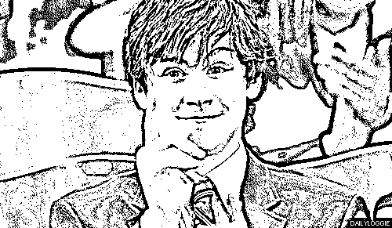

**活动信息**

**活动时间**：2016 年 5 月 5 日 19:00-21:00（18:30 开始签到）

**签售人**：苏·汤普金斯

**活动地点**：彩虹书吧，东三环中路 39 号建外 SOHO 西区 15 号楼 B1578

**活动费用**：150 元（限量 80 张）

**报名方式**：点击**阅读原文**直接报名

**惊天福利！**

**价值 88 元的《当代占星研究》你可以免费获得！**

（占星爱好者进入严肃占星领域必备书籍）

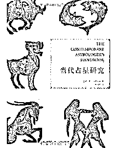

你只需要以下四步操作即可获得：

①转发该条微信到朋友圈，若道老学员注明学号

②截图

③添加若道客服 Echo 微信

④发送截图至客服微信并标注“**苏汤签售**”

仅限前 60 名哦！

客服二维码在此~

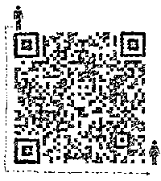

**如何到达**

```
地址：北京市朝阳区东三环中路 39 号建外 SOHO 西区 15 号楼 B1578-1579 彩虹书吧

交通路线：地铁 1 号线，永安里站 C 出口南行至华彬艺术博物馆东侧；或地铁 10 号线，国贸站 D 出口西行至恒惠西路问路

电话：010-58699117
```

.gif")

**近距离接触苏·汤普金斯的机会**

**还不快快把握！**

**购票请戳“阅读原文”**


- END -

# 金星进入金牛座 | 他们也会终其一生无望地爱一人

> 原文：[`mp.weixin.qq.com/s?__biz=MzA5NjA0NTAxNg==&mid=2651384710&idx=2&sn=8eaa00a5030cb549979720aa595187fb&chksm=8b4a5931bc3dd027d9a6190012330c8c79a636c5026edc760af2673a9d03cbade71199af965c&scene=126&sessionid=1692738841#rd`](http://mp.weixin.qq.com/s?__biz=MzA5NjA0NTAxNg==&mid=2651384710&idx=2&sn=8eaa00a5030cb549979720aa595187fb&chksm=8b4a5931bc3dd027d9a6190012330c8c79a636c5026edc760af2673a9d03cbade71199af965c&scene=126&sessionid=1692738841#rd)

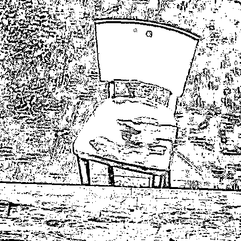

“

4 月 30 日 08:35 分，金星进入它守护的金牛座，会在它舒适的“家”中待上 24 天，金牛座与自然相连的复原之力将带来丰沛的生机，帮助每个人开启感官，享受生活。金牛座的领域犹如生命的小船驶入宁静的浅滩、海湾，有丰饶的土地，饱满的果实，仿若伊甸园般的自在，满足。我们可以在大自然的怀抱中坐看星辰，时光如河，缓慢阔绰，任由消遣。

”

## 黄道第二个星座——金牛座

**金牛座是黄道第二个星座，它是稳健，踏实，从容，保守，慢热，它有关财富，自然，艺术，享受和现实的安适。**它最擅长积累，保持，塑形与固定，因此也带来情绪稳定，不被外界风吹草动影响，也有明显的固执，僵化和私欲。 

金牛座作为土向固定星座，是用感官而不是头脑、意识或行动力来涉足世界，会将强大衡定的持久力，专注力用于财富的追求。**金牛座最懂得享用大自然的馈赠，善于构筑高品质生活，食物，居室，土地，财富，性欲这些生命最根基的需求就是金牛座获得内在满足的领域，它是十二星座里的欲望代名词，也是最现实的星座。** 

从生命进化的角度看，金牛座追求并实践着拥有——而不是争取。稳健的金牛座不再如白羊座战士般抗争，开拓，吸引纷挠，冲锋陷阵，取而代之的是一种属于阴性法则的存在感，是非竞争的安住于当下的定力，所以它能享受独处与宁静。

持续在对事物，实体的关注与追求中，在一个领域里坚守，构筑和积累资源，不受外部侵挠，少有情绪展露。切实具体的物质需求对他们才具吸引力，这股磁力也能将物质世界获得的体验固守在内心，继而往复维持着金牛座的内外一致的衡定力。 

## 金星在金牛座——我的小确幸

 就像《天使爱美丽》里的艾米丽，把手深深地插进谷物袋，用勺子敲碎碎煮好的焦糖奶油，这些小小的举动，都能让心融入生活，感受当下。

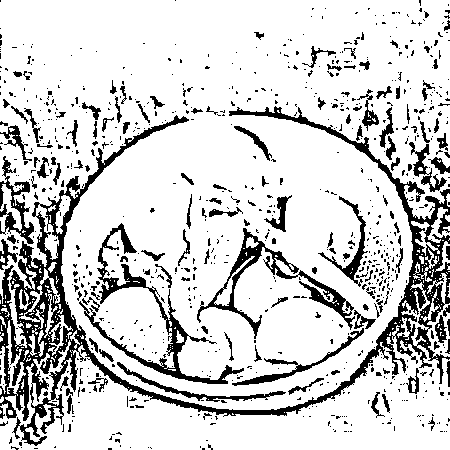

我们是不是在生活中忽略了很多细节？错过了很多小小的乐趣？其实时时处处都可以获得满足，愉悦，关键是，请打开感受力的开关，去感受每一处小确信——这就是金牛座简单快乐的法宝。诚然，每个人都有感知与感官，只有金牛座，最擅于此，也乐享于此。 

金星进入金牛座适宜去做的事情：

**金星进入金牛座适宜去做的事情** 

*   感受一下双脚稳稳踩在松软的土地上的力量与触感；

*   触摸阳光下的花瓣，凑近嗅闻幽幽的花香；

*   在清晨睁眼的静默中聆听窗外的鸟鸣声；

*   穿上一件亚麻质地舒适而精致衣服；

*   旅途中车窗外掠过的田园风光；

*   在丛林秘境里感受雨水的浸润与野草芳菲；

*   黄昏时分坐在湖边欣赏西边彩云变幻；

*   烛光下享用米其林厨师烹饪的野生松露大餐；

*   沉浸在精油的香氛中感受芳疗师的手指在肌肤上的舒缓滑过带来的放松；

*   在精美的居室中享受宁静独处的时光；

*   闻一闻新鲜出炉的烤面包的味道；

*   去歌剧院欣赏一出优美绝伦的意大利歌剧；

*   抚摸着纯然天成的水晶宝石，观赏着不同光线折射出的效果；

*   当然，还有享受数钱的乐趣。

金星需要愉悦，而金牛座引领着我们进入感官的世界，学习将身体作为通道，让知觉去啜饮生活的甘泉，吸收环境中的丰美养份，让心里的花朵绽放开来。 

## 更高阶的金星金牛座

*   常年生活在清静深山中的人都懂得观云识天，并不需要头脑、书本的教化就能预知天气。

*   音乐家在经年累月的演奏中已经建立了与乐器融为一体的表达力与感染力。

*   画家在年老失明时还能凭借感觉画出精美绝伦的插画。

*   园艺师在常年与土地和植物的相处中对它们的生长时序了然于心。

*   金星的愉悦与价值感通过金牛座感官的通道自然而然走入了灵性深处，对任何物质世界的体察，了悟，融入与专注，都是精神性与宇宙性的意涵。

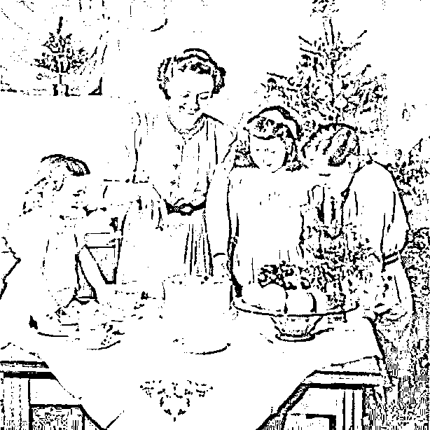 

由感官出发，直至灵觉的升起，将技艺转化为道法，这只是金牛座作为固定星座更深刻的面向。通过物质世界与外在形式到精神领域的内在升化，这也是天蝎座的超然链接力。**金星在金牛座的最高表达即是善用持久的专注力达成“一沙一世界，一花一天堂”的境界。**

金星要实现和谐，通过金牛座的感官体悟世界，截取于自然，创造出价值，物质财富的构建带来了内心的满足，在精神与物质世界达成了和平共识，也是一种人类与自然相处的和平之道。金星在金牛座的人，也特别容易在艺术领域中实现价值，或是从现实生活中提取艺术价值，创造出富有质感的艺术品。 

金星带来爱与美，它有需要取悦和被取悦的特性，金牛座就是感官和享受，金星在这里喜欢用肉体悦人，散发性感的吸引力，也会贪恋舒适，发散庸懒，令享乐本性尽情展现，鼓励我们去爱，去享受，去触摸，去畅饮，去细嗅，去聆听所有舒适和丰美。 

## 金星在金牛座的盲点

 金星在金牛座初陷情网往往是因为肉体吸引力，若要维持长期亲密关系，就得放弃一味的占有欲，实现超越肉体的交流与融合，否则再强的持续力换来的也只是固执与决裂。**金星金牛座在关系中需要学习的是相互的拥有，而非：“你是我的，我是自己的。”** 

****✘****金星和金牛座共有的负面特质即是：贪婪。**** 

*   贪恋甜食，就会有发胖和糖尿病的隐患；

*   贪恋财物与美色，可能带来生命的危险；

*   贪恋感官享受，可能引发财物的然机；

*   而执著于私有，就会失去他人的信任。

 **✔******金星金牛如何超越盲点**** 

*   放下固执的积习，走出自己的小小安适的城堡，不仅在自然中，人群中感受，还要更多参与交流，表达自己的思想 ，情感，与他人情感互动，像敞开感官一样去打开情感世界的大门。

*   每一个星座对面是它可以学习的面向，**金星金牛座可以学习天蝎座对不同生命经验的渴求，尝试一超越自我，物质，固定模式的体验，固定的城池会带来安全感。**

*   但要相信生命的另一种可能，失去一部分自我，才能换来关系中的信任，融合。 

## 金星在金牛座的大咖

1****威廉·巴特勒·叶慈（William Butler Yeats）****

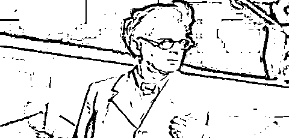

威廉·巴特勒·叶慈（William Butler Yeats），20 世纪爱尔兰现代主义诗人，剧作家，1923 年诺贝尔文学奖得主。他最为世人熟知的作品即是《当你老了》（*When you are old*），《在莎丽的花园》(*Down by the salley gardens*)。

**叶慈的金星落于金牛座，与冥王星有紧密的合相，他的作品浪漫，华丽，唯美，充满哲思，还带有神秘主义色彩。**叶慈的一生苦恋一个女人，但这段金牛座般的痴恋直至他去世也未得到对方的回应，而诗人将执著无望的爱恋都化为细腻，富有质感的诗歌，他的文字都是他一生内心的写照。 

**The lover tells of the rose in his heart**

*ALL things uncomely and broken, all things worn out and old,  *

破碎而丑陋的世事，陈旧又残败的万物，

*The cry of a child by the roadway, the creak of a lumbering cart,*

路旁孩子的啼哭声，马车簸荡的嘎吱声，

*The heavy steps of the ploughman, splashing the wintry mould, * 

农夫迈着沉闷的步伐，溅洒冬季的霉菌，

*Are wronging your image that blossoms a rose in the deeps of my heart.* 这些都令你的容颜黯然失色——我心底盛开的一朵玫瑰花。 

*The wrong of unshapely things is a wrong too great to be told;*

那丑陋的世事浊乱不堪，难以言状，

*I hunger to build them anew and sit on a green knoll apart,  *

我渴望重建世界，独坐那青翠山丘，

*With the earth and the sky and the water, remade, like a casket of gold ，*

望着初生的大地、天空、河流，闪耀如一匣黄金，

*For my dreams of your image that blossoms a rose in the deeps of my heart.*

一切都因我梦中你的容颜——我心底盛开的一朵玫瑰花。

2** **米兰·昆德拉（Milan Kundera）****

米兰·昆德拉（Milan Kundera）捷克著名小说家，他出生音乐世家，幼年就浸淫在音乐环境之中，早年对于雕塑、绘画、电影、音乐都曾擅长并一一涉足，他在各个艺术领域中都如鱼得水。著有长篇小说《生命中不能承爱之轻》，《笑忘录》，《玩笑》等，他的文学作品有强烈的批叛现实主义色彩，总是通过情欲与肉欲的故事情节和心理描述，来表达哲思，并影射当时的集权主义社会现实，在当时的捷克文学中独数一帜。其作品在苏联占领捷克期间一度被列为禁书，但终在 1989 年解禁重新出版。


**作者简介**

**郑玮玲（Sampriya）：**若道 COAC 高阶资质认证，国际占星研究协会 ISAR 会员，在若道跟随多名国际知名占星师学习占星。馨光爱妈妈会创始人，国内首批 ICEA 国际生育教育协会产后指导，国际母乳会培训的哺乳互助指导。

**个人公众号及咨询预约**：Sampriya-Astrology 

长按二维码，让金钱涌向传播知识与智慧的人~


**◆ ◆ ◆  ◆ ◆**

******特别提醒************：本文由作者授权首发在若道平台******，**转载请注明“转自若道”并标明作者。******

想了解更多关于金星和金牛座？**2016 年 5 月 19 日**，蒋颖老师主讲的若道占星核心课程**Level 1-2**要开课了！没有报上名的朋友，还有**Level 1-5 连报**可选择。

报名及咨询，请点击文末“阅读原文”


# 5 月 7 日金牛座新月 | 你可以提前拿免费报告啦~

> 原文：[`mp.weixin.qq.com/s?__biz=MzA5NjA0NTAxNg==&mid=2651384710&idx=3&sn=dffe3d812250346719331ce9c7a8b688&chksm=8b4a5931bc3dd0274ff73523a87a7bb9ab5fb43fd4b9bc90e70a76a370f4bdb3fa5cf0767df6&scene=126&sessionid=1692738841#rd`](http://mp.weixin.qq.com/s?__biz=MzA5NjA0NTAxNg==&mid=2651384710&idx=3&sn=dffe3d812250346719331ce9c7a8b688&chksm=8b4a5931bc3dd0274ff73523a87a7bb9ab5fb43fd4b9bc90e70a76a370f4bdb3fa5cf0767df6&scene=126&sessionid=1692738841#rd)

**5 月 7 日 03：29 迎来金牛座新月。**

**在新月来临前，** 

**你就能在若道免费获得专属于你的新月报告，**

**并且进行新月许愿。**

**手机党们，** 

**点击文末“阅读原文”**

**直接在手机上获取报告，** 

**在线许愿并分享吧！**

**操作起来也很简单哦**

**当新月到来的时候，您只要做如下步骤**

进入首页

点击
“新月祈祷”

登录账户

填写出生信息

查看报告、许愿

**【步骤一】点击新月的祈祷**


**【步骤二】输入姓名**


**【步骤三】输入出生信息**


**【步骤四】生成新月报告**


**最下方有许愿按钮，左边是倒计时提醒哟~**

**在合适的时间就可以许~愿~啦~**

**【步骤五】许愿！**

**** 

**【步骤六】让宇宙看到你的愿望并分享！**

**** 

**◆ ◆ ◆  ◆ ◆**


**小伙伴们还等什么？**

**赶快点击→左下角阅读原文****吧！**

# 大卫谈占星丨五星逆行终结前，你需要学会的三个姿势

> 原文：[`mp.weixin.qq.com/s?__biz=MzA5NjA0NTAxNg==&mid=2651384668&idx=1&sn=fe54f635f34287788df4908f3ae869bb&chksm=8b4a59ebbc3dd0fd3982e576f17dc99e94f0428d68473b8e4f7a96d25326df8f8751862da91f&scene=126&sessionid=1692738841#rd`](http://mp.weixin.qq.com/s?__biz=MzA5NjA0NTAxNg==&mid=2651384668&idx=1&sn=fe54f635f34287788df4908f3ae869bb&chksm=8b4a59ebbc3dd0fd3982e576f17dc99e94f0428d68473b8e4f7a96d25326df8f8751862da91f&scene=126&sessionid=1692738841#rd)

作者/大卫·瑞雷 翻译/李含 校对/王宏

图片来源/VCG

从四月份开始，行星们就一颗一颗开始逆行了。除了早已逆行的木星外，4 月中下旬，火星和冥王星开始逆行，4 月底水星开始逆行。4 月 28 日-5 月 9 日期间，有五颗行星会同时逆行。如何有效应用逆行，了解逆行区域的巨大潜力，大卫老师来给你答案。

**1**

**五星逆行是个什么鬼？**

最近我注意到，有 5 颗行星将会同时逆行大约 11 天，对这一现象可能需要做一些解释：

**4 月 28 日-5 月 9 日期间，总共会有 5 颗行星穿越黄道带而逆行：水星、火星、木星、土星和冥王星。**

当然，不同的行星逆行时间也不一样：

**○冥王星有 42%的时间在逆行；**

**○土星有 37%的时间在逆行；**

**○木星有 33%的时间在逆行；**

**○火星是逆行最少的行星，每两年逆行一次，持续两个半月；**

**○水星每年逆行 3 次，每次逆行 21 到 23 天。**

在 5 月 9 日，木星会恢复顺行，此次同时逆行的行星就只剩下 4 颗。

每颗逆行的行星都是两件事所造成的一种现象：

**○我们在地球上的视角；**

**○行星轨道长度不同。水星和金星环绕太阳运转的速度比地球快，而火星和其他行星围绕太阳运转的速度更慢。**例如，冥王星环绕太阳运转一周，地球上经历了 248 年。

**从我们在地球上的视角观察黄道带上的行星，一颗行星会显得慢下来、停顿，然后开始向后转——这并不是行星真的向后运行了。**

然而，这些逆行周期的确符合了一颗行星和我们的地球、太阳之间非常真实的排列。这样的排列构成了每一个逆行周期的特点。

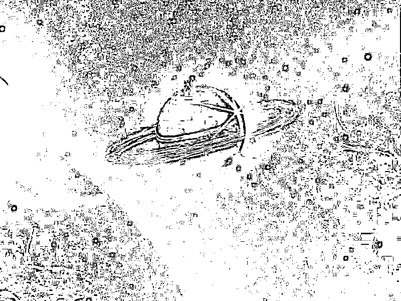

**2**

**逆行区域的巨大潜力**

认为逆行周期就意味着消极或有问题是很荒谬的。**去观察这些行星在你的星图中顺行、逆行、再次顺行的黄道带领域更有实际意义。一颗行星会 3 次穿越黄道带的同一区域。我称之为“逆行区域”。**

**这在黄道带上形成了一个“集中区”，该区域表明，无论这类逆行发生在你星图中的哪个区域，你都有巨大的潜力去学习。**

**举个栗子**

例如，**如果火星在你的第十宫中逆行，你就很可能在自己的事业和公众生活中经历一段更为集中的活动期**。这样强调第十宫给了你机会去展现你的专业努力并赢得认可。当然这在很大程度上取决于火星最初进入你的第十宫时，你准备得怎么样以及你的职业状态。如果你正与你的老板闹矛盾，那么当火星在你的第十宫来回运行时，这可能会火上浇油。

不管怎样，冲突都会提高你对于自己的自身利益的意识，而这样的火星行进可以代表一个阶段，在该阶段中你学习如何在你的职业上更“有效地捍卫”自己。

让我们看看列出了目前的 5 个逆行区域的列表。该列表会向你展示黄道带中我称为逆行区域的部分。打印出你的星图并在其中划出这些逆行区域所在的领域会很有意思。这些是在你目前的生活中被特别强调的领域，像冥王星这样更为长期的行进会展示一个领域被强调数年。

**目前的 5 个行星的逆行区域**

○水星：从金牛座 23°逆行回 14°

○火星：从射手座 8°逆行回天蝎座 23°

○木星：从处女座 23°逆行回 13°

○土星：从射手座 16°逆行回 9°

○冥王星：从摩羯座 17°逆行回 14°

**再举个栗子**

下面是土星逆行区域的一个示例。**如果你有任何个人行星或关键点落在变动星座，即双子座、处女座、射手座和双鱼座的 6—19 度之间，那你就要更为认真地观察你生活的哪个部分与现在到 2016 年 12 月之间的此次土星逆行区域相对应。**

如果你在想，为何我会说 6°-19°，而不是 9°-16°，这是因为**在行进相位中使用了 3°的容许度。**

**土星行进对应了考验你意志承诺的阶段**，如果行进到第七宫，对应的就是伴侣关系和婚姻，如果行进到第四宫是家庭义务和责任，行进到第一宫则是你对自己和自己身体的承诺。

当然，今年还有其他行星的其他逆行区域——每年都是如此。我只列出了目前的 5 个逆行区域。其他的行星逆行区域如下：

**其他的行星逆行区域如下：**

○海王星：从双鱼座 12°逆行回 9°

○天王星：从白羊座 24°逆行回 16°

**3**

**如何观察水逆重要度数**

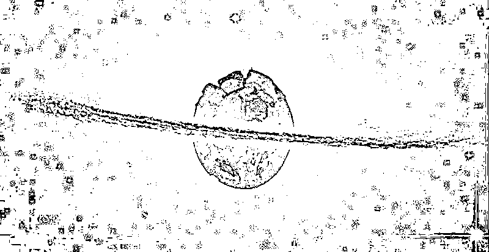

下一个水星逆行区域是：8 月 30 日处女座 29°逆行—9 月 22 日处女座 14°。

**重要的是观察行星“何时”第一次运行到它在逆行结束时开始顺行的度数。**

**举个栗子**

例如，水星在 2016 年 4 月 28 日于金牛座 23°逆行，并将在 5 月 22 日金牛座 14°开始顺行。因此金牛座 14°是重要的度数。

如果你在星历表中回溯，你就会看到水星在 2016 年 4 月 15 日前后第一次穿过金牛座 14°。这意味着逆行区域的第一阶段实际上始于 4 月 15 日。

让我们将这次水星逆行拆分为 3 个阶段：

○水星在 4 月 15 日穿过金牛座 14°，在 4 月 28 日于金牛座 23°开始逆行。

○4 月 28 日，水星在金牛座 23°逆行，5 月 22 日在金牛座 14°开始顺行。

○5 月 22 日水星在金牛座 14°，6 月 8 日穿过金牛座 23°。

所以说水星的整个逆行区域是从 2016 年 4 月 15 日到 2016 年 6 月 8 日。

首先，**金牛座与我们感受事物价值的能力有关**。假设你出生时上升点落在金牛座 14°。你重视自己的身体，过完冬天你的体重增加了一点。现在你在考虑节食来减轻一些体重。

**可能事件**

○当水星穿过金牛座 14°时，你买了一本新的减肥书，承诺“你只需 6 周就会见到成效！”你在读书的过程中，开始按照首先推荐的步骤开始节食，但是接下来你忙于其他事，并没有读完你的减肥书。

○在 4 月 28 日前后，在你遵照书中的一些节食建议之后，你称体重时发现自己只轻了 1 公斤。你决定重新阅读这本书，也许会读完，继续按你目前所做的那样去节食。你发现了一些之前忽略的重要信息，据此开始调整你的节食计划。

○到 5 月 22 日，你减重 2 公斤，你相信现在节食起作用了，因此你向朋友们推荐这本书。你的目标是减重 3 公斤，到 6 月 8 日你愉快地达标了——现在穿上你的夏装你感觉舒服极了。

毕竟，上升金牛座的人都喜欢感觉舒适！当然，完全有可能减肥书的计划并没有效果，也许会导致你去寻找更好的计划。如果找到并验证了更好的计划，那就可能实现同样的目标。**在水星逆行区域的关键就是得到正确的信息，也就是，让你能够做出更明智的决定的正确信息或理念。**


想体验大师级的占星疗愈？

大卫老师**占星咨询**预约进行时

**生命议题、职业发展、关系咨询、少儿成长、年度规划和预测**

```
预约咨询请联系许小姐 ：010-58760529
```

**.gif")**

**特别提醒****：本文由作者授权首发于若道平台，转载请注明“转自若道”并标明作者。**  

想要了解如何顺势而为，来系统学习占星学吧！**2016 年 5 月 19 日**，若道占星核心课程**Level 1-2**要开课了！将带领你学习星座、太阳、月亮、行星、月亮交点等知识，让你进入占星学的世界！**连报 1-5 阶还可以省下 7400！**

报名及咨询，请点击文末“阅读原文”


# 若道独家 | 你可以向伦敦占星学院创办人苏· 汤普金斯提问了

> 原文：[`mp.weixin.qq.com/s?__biz=MzA5NjA0NTAxNg==&mid=2651384668&idx=2&sn=ed44833b5468adb257534af966288ec7&chksm=8b4a59ebbc3dd0fdfe41d0e1e304cf53601fea5ca73bbebab620050596be8ed7e958f3b5386d&scene=126&sessionid=1692738841#rd`](http://mp.weixin.qq.com/s?__biz=MzA5NjA0NTAxNg==&mid=2651384668&idx=2&sn=ed44833b5468adb257534af966288ec7&chksm=8b4a59ebbc3dd0fdfe41d0e1e304cf53601fea5ca73bbebab620050596be8ed7e958f3b5386d&scene=126&sessionid=1692738841#rd)

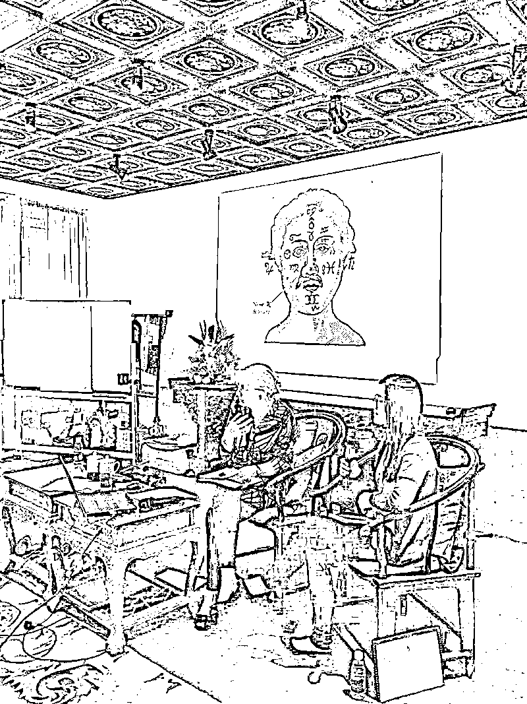

五一期间，若道君参加了苏· 汤普金斯老师的医疗占星工作坊，课程中老师机智幽默，金句频出，一双深邃的蓝眼睛里满满都是智慧与灵气。

若道君森森觉得，单凭自己的智慧实在难以驾驭和苏·汤普金斯老师深刻的访谈对话。

特此，若道君在这里向大家征集访谈提问了！**大家可以将你们心中想问苏·汤普金斯老师的问题回复在本篇文章的留言区。我们会选取其中最好的问题在签售访谈中向苏· 汤普金斯老师提问。**

评判标准： 

①问题获赞多！ 

②深刻有内涵！ 

③老师看好你！ 

**福利：**

**问题一旦获选，提问者将有机会免费获得价值 150 元的签售入场券，亲临现场，听到来自苏·汤普金斯老师本人的回答，并获得由老师亲笔签名的《当代占星研究》一本。**

辣么诱人的奖励，快去留言区提出你的问题吧！

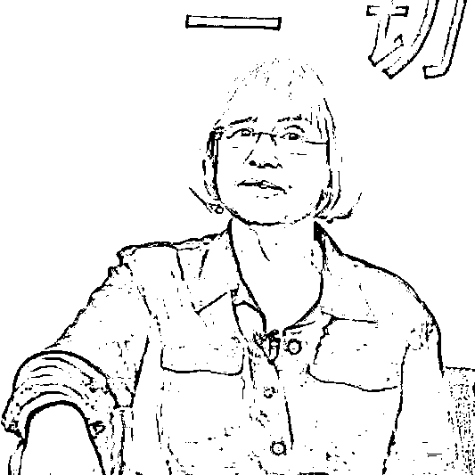“

**她**在 2000 年**创立**了**伦敦占星学院**，培养出许多优秀占星师。

**她**在 2003 年因卓越贡献而获得英国占星协会的**查理斯·哈维终身成就奖。**

**她**是英国资深的占星学家和咨商师，拥有超过四十年的占星经验，并经常在世界各地举办占星研讨会和公开演讲。

**她**同时也是一位接受过心理学与心理咨询训练的**顺势疗法专业治疗师**。

**她**就是著名而又低调的**苏·汤普金斯女士**。

”

**她来到中国啦！**


5 月 5 日在北京彩虹书吧，**苏·汤普金斯**女士联合若道占星举办独家签售会。

还有对苏·汤普金斯的**若道独家专访**！

粉丝们，见偶像啦！快把你们珍藏的**《当代占星研究》**拿出来~

近距离感受偶像如海洋般的思想深度！


**活动信息**

**活动时间**：2016 年 5 月 5 日 19:00-21:00（18:30 开始签到）

**签售人**：苏·汤普金斯

**活动地点**：彩虹书吧，东三环中路 39 号建外 SOHO 西区 15 号楼 B1578

**活动费用**：150 元（限量 80 张）

**报名方式**：点击**阅读原文**直接报名

**惊天福利！**

**价值 88 元的《当代占星研究》你可以免费获得！**

（占星爱好者进入严肃占星领域必备书籍）


你只需要以下四步操作即可获得：

①转发该条微信到朋友圈，若道老学员注明学号

②截图

③添加若道客服 Echo 微信

④发送截图至客服微信并标注“**苏汤签售**”

仅限前 60 名哦！

客服二维码在此~


**如何到达**

```
地址：北京市朝阳区东三环中路 39 号建外 SOHO 西区 15 号楼 B1578-1579 彩虹书吧

交通路线：地铁 1 号线，永安里站 C 出口南行至华彬艺术博物馆东侧；或地铁 10 号线，国贸站 D 出口西行至恒惠西路问路

电话：010-58699117
```

.gif")

**你想向苏·汤普金斯老师提什么问题？**

**去留言区回复吧**。

**购票请戳“阅读原文”**


- END -

# 直播苏·汤普金斯中国行 | 严谨谦逊，还有冷幽默

> 原文：[`mp.weixin.qq.com/s?__biz=MzA5NjA0NTAxNg==&mid=2651384668&idx=3&sn=88da42985ed55dd60a4962e90fc532ee&chksm=8b4a59ebbc3dd0fdc49509126f858918a2da6d9af1f1131cd8e253d98e24318d4c28f7c4f35f&scene=126&sessionid=1692738841#rd`](http://mp.weixin.qq.com/s?__biz=MzA5NjA0NTAxNg==&mid=2651384668&idx=3&sn=88da42985ed55dd60a4962e90fc532ee&chksm=8b4a59ebbc3dd0fdc49509126f858918a2da6d9af1f1131cd8e253d98e24318d4c28f7c4f35f&scene=126&sessionid=1692738841#rd)

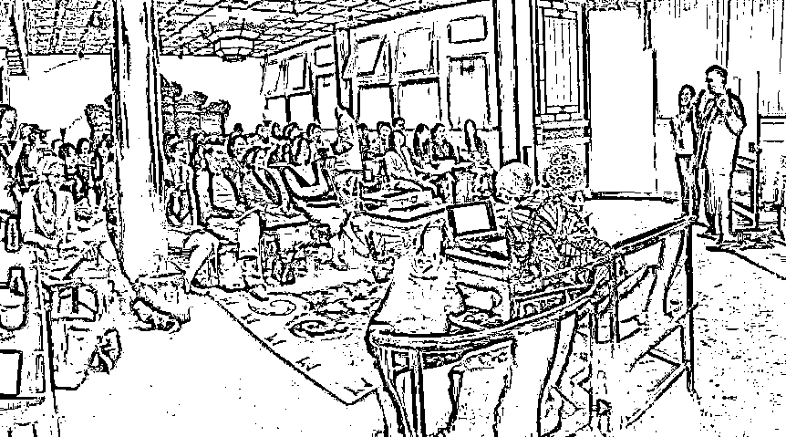

2016 年 4 月 30 日，为期三天的医疗占星工作坊拉开序幕。苏·汤普金斯老师以“保持质疑精神是很好的，希望我的学员也不要全盘接纳我的论断，作为水瓶座，我将持续探索。”作为医疗占星工作坊的开场。

医疗占星工作坊

◆◆回顾

关于健康，苏·汤普金斯老师有独特的视角。她说：“不同的植物适合生活在不同的环境，就像每个人对于不同事物都有不同的敏感度，长期和太多的压力都会对健康造成损害。一个残障但生活态度积极的人与一个身体强健但酗酒打老婆的人，哪个更健康呢？我们都知道健康是重要的，但却都不会依照健康的生活方式而生活，比如上瘾或经常做一些有害健康的事情。”老师每提出一个问题，都引人深思。

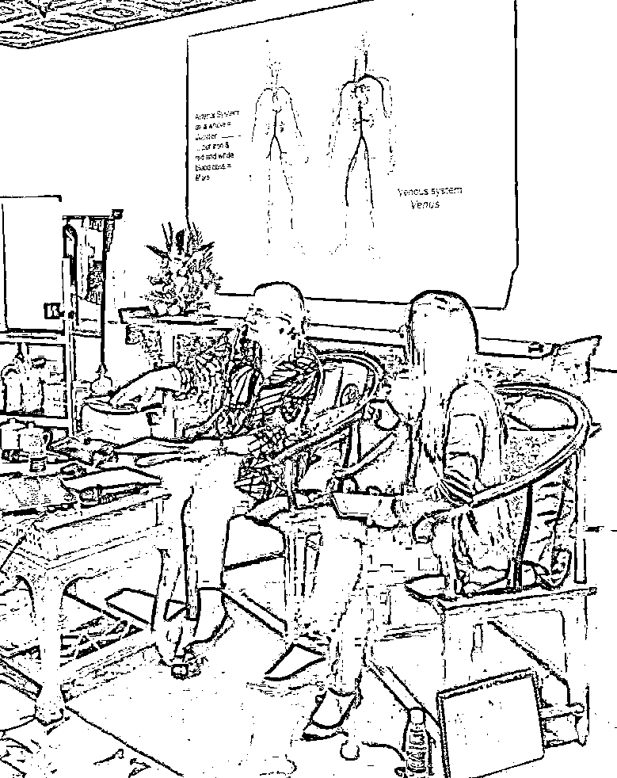 

老师依次介绍了星座与行星对应的身体部位以及相关疾病，还有干货满满的案例分享，她还对目前一些流行疾病做了非常细致的数据调研工作。

在讲到行星环节时，最有趣的一项是金星，她说：“如果你与金星的共振比较强的话，你得的疾病可能会影响你的外貌，似乎是上帝在提醒你不要过于在乎你的外貌。铜元素不足可能会引起长皱纹，有的人认为皱纹会让人魅力降低，但当我逐渐变老的过程中我觉得皱纹是非常有致命吸引力的。”最后她还补充一句：“我不想听到任何评价。”老师平实又幽默的教学风格时常引来在场学员的阵阵笑声。

还有与三王星相关的疾病，比如天王星对应的突变以及细胞变异，还有心脏病发作时的电击疗法等。老师认为三王星、特别是冥王星都在提醒我们：当面对大自然的力量时，我们的力量是非常有限的，行进的三王星经常会以某种方式提示我们，什么是不可避免的，从而更加谦卑的面对人生。 

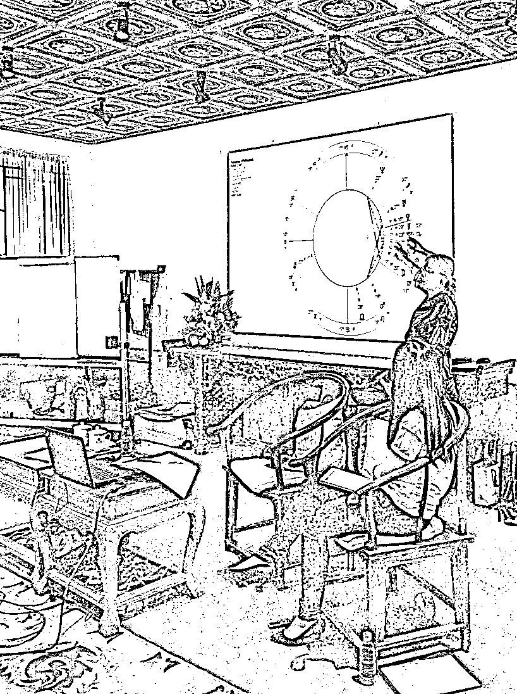 

老师讲到一个特别的案例，是一位非常有名的足球运动员，心脏病发倒在地上，当时心脏停跳 78 分钟，在他发病那天，太阳弧太阳对分他出生星图中的冥王星，行进的木星触发了太阳弧的太阳。但他现在恢复得不错，他是一个非常虔诚的基督徒，他的朋友与教徒都在为他祈祷，对他来说这是一个非常深刻的宗教体验。

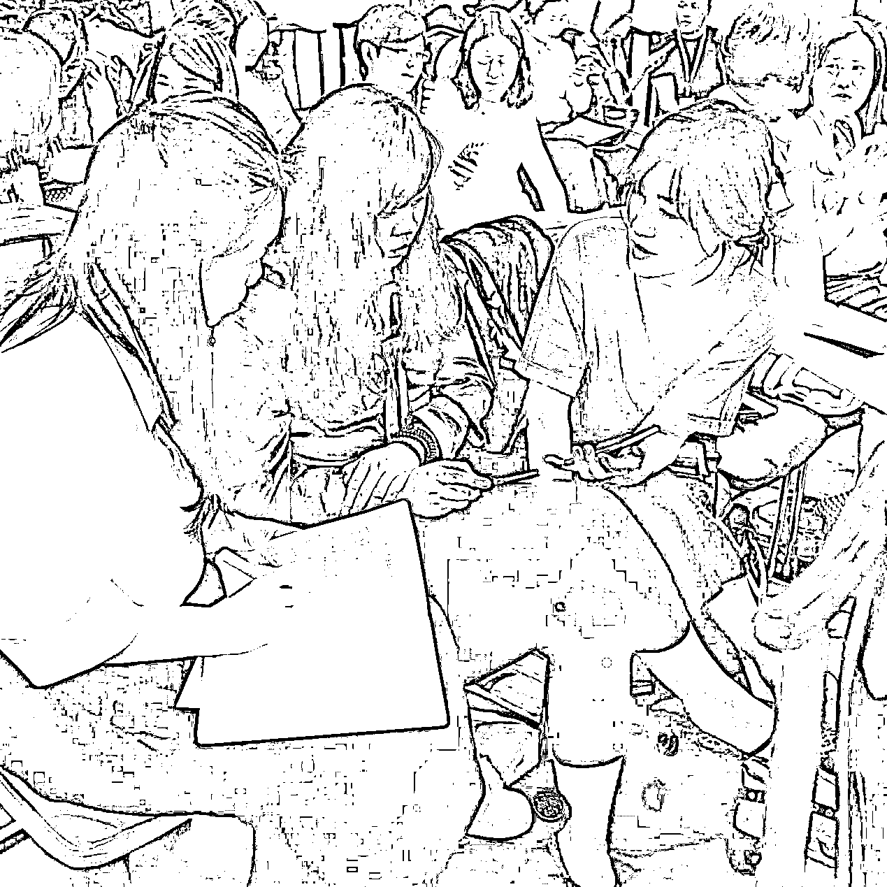 

**▲最精彩的莫过于学员互动与讨论阶段，生活中比比皆是的真实案例就在其中。**

老师还特别提到冥王星在摩羯座与老龄化相关的议题，以及痴呆症、抑郁症、糖尿病、心脏病、哮喘、类风湿性关节炎、癌症等常见疾病的预防及如何处理压力的相关研究。老师还指出，相关研究表明，养宠物、吃紫薯、每个月一次断食、跳舞、走路、做一些平时不习惯做的事情能够起到预防疾病与纾解压力的作用。老师还打趣说：“虽然她把断食列在这里，但也没有足够的论据，不过她还是蛮确信的，你认识的水瓶座可能都是一副言之凿凿的样子。” 

虽然老师说自己一副言之凿凿的样子，但在小编看来，她始终保持着严谨与谦逊的作风，每当有人提问关于如何治疗身体上的病症，老师都会给予一些建议，但从来不铁口直断，每一件事情背后的成因都是很复杂的，需要经年累月的观察才能得以证实。

作为一位顺势疗法的医师，苏·汤普金斯老师更是细致认真的询问病患的每一个细节与感受，审慎斟酌后再给予建议，当她并不知道某些事情时，她则坦然的回答：“我不知道。”她曾说：“虚怀若谷的态度是必要的，我们需要承认自己给不出所有的答案，更不能保证真理在握。”

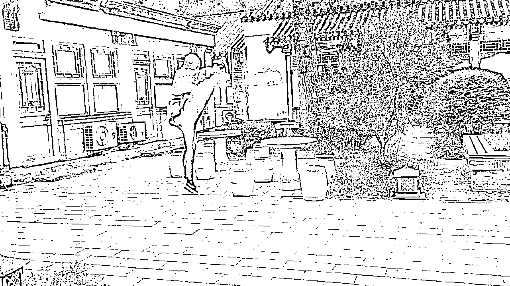

上图为学员秀时间，这位学员是一名中医，他在课前为大家展示太极拳，这不仅仅只是一次医疗占星工作坊，而是一次不同文化之间的交融与互动。  

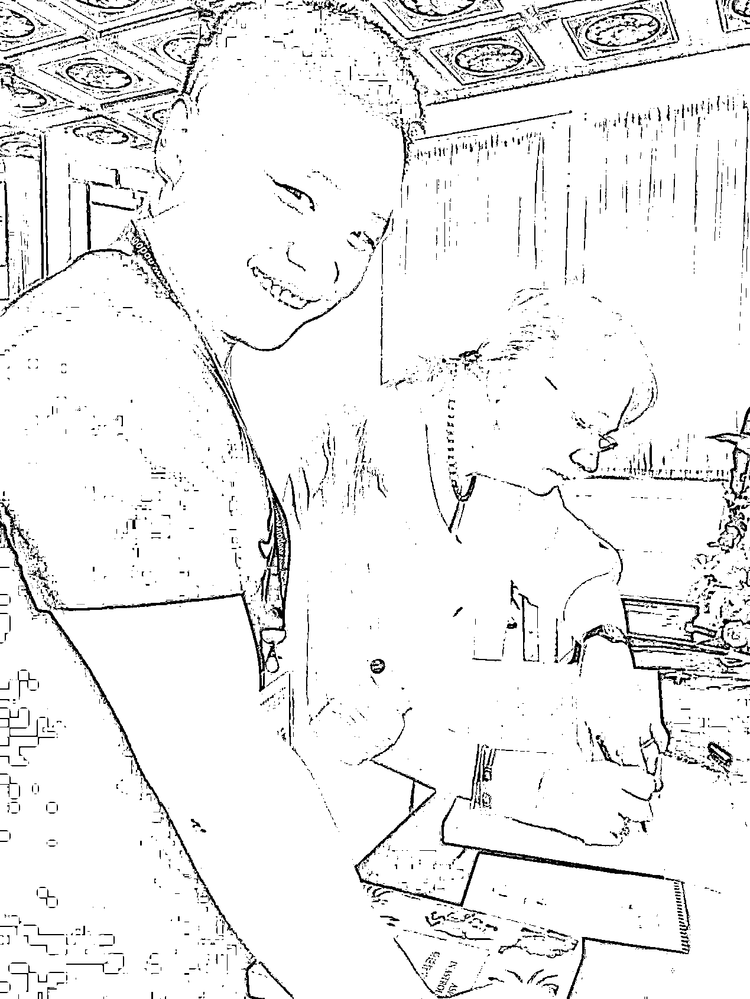 

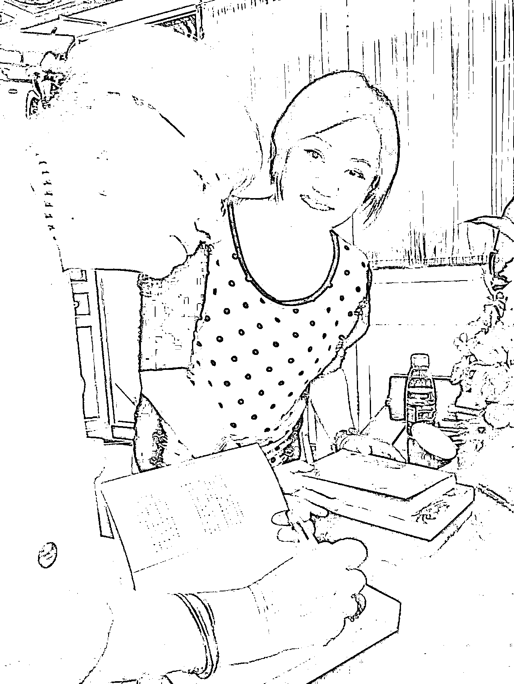 

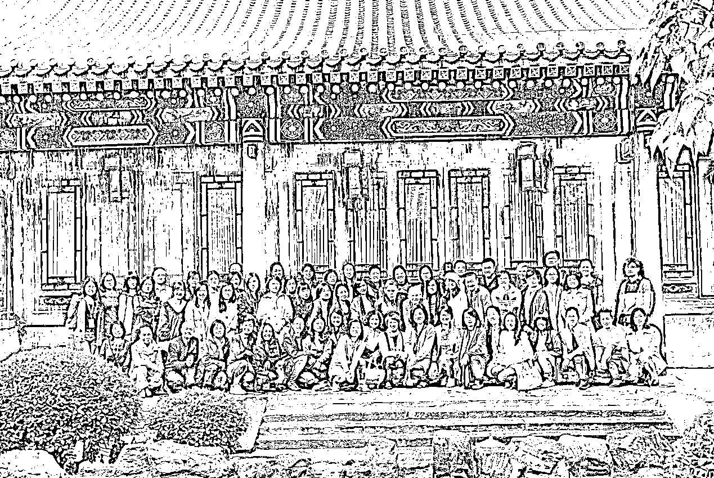 

最后是愉快的签书时光以及大合影时光！期待下一次再相聚！

**◆ ◆ ◆  ◆ ◆**

**医疗占星工作坊虽然结束了，但在 2016 年 5 月 7、8 日**，**由**苏·汤普斯金**亲授的顺势疗法工作坊也会开课！顺势疗法是目前全球使用最广泛的自然医学疗法，对个体的身体、精神和情绪三个层面进行治疗。本课程为那些想要增加自我及家庭身体保健和疗愈能力的人所设置。想进举例接触苏·汤普金斯老师，这个机会不容错过哦。**

报名及咨询，请点击文末“阅读原文”


# 签售会丨 5 月 5 日，在北京与苏·汤普金斯相见！

> 原文：[`mp.weixin.qq.com/s?__biz=MzA5NjA0NTAxNg==&mid=2651384634&idx=4&sn=bc5ad059eaf717ec6cc2d34f1e149ba6&chksm=8b4a598dbc3dd09b48915c1600066d15badb44f618abbc08c1391f4f4c283b5ac759855baf74&scene=126&sessionid=1692738841#rd`](http://mp.weixin.qq.com/s?__biz=MzA5NjA0NTAxNg==&mid=2651384634&idx=4&sn=bc5ad059eaf717ec6cc2d34f1e149ba6&chksm=8b4a598dbc3dd09b48915c1600066d15badb44f618abbc08c1391f4f4c283b5ac759855baf74&scene=126&sessionid=1692738841#rd)

“

**她**在 2000 年**创立**了**伦敦占星学院**，培养出许多优秀占星师。

**她**在 2003 年因卓越贡献而获得英国占星协会的**查理斯·哈维终身成就奖。**

**她**是英国资深的占星学家和咨商师，拥有超过四十年的占星经验，并经常在世界各地举办占星研讨会和公开演讲。

**她**同时也是一位接受过心理学与心理咨询训练的顺势疗法专业治疗师。

**她**就是著名而又低调的**苏·汤普金斯女士**。

”

**她来到中国啦！**


5 月 5 日在北京彩虹书吧，**苏·汤普金斯**女士联合若道占星举办独家签售会。

还有对苏·汤普金斯的**若道独家专访**！

粉丝们，见偶像啦！快把你们珍藏的**《当代占星研究》**拿出来~

光有签售满足不了你们对偶像的敬仰之心对不对？

还想近距离感受偶像如海洋般的思想深度对不对？


若道君最懂你们了！

活动信息

**活动时间**：2016 年 5 月 5 日 19:00-21:00（18:30 开始签到）

**签售人**：苏·汤普金斯

**活动地点**：彩虹书吧，东三环中路 39 号建外 SOHO 西区 15 号楼 B1578

**活动费用**：150 元（限量 80 张）

**报名方式**：点击**阅读原文**直接报名

**惊天福利！**

**价值 88 元的《当代占星研究》你可以免费获得！**

（占星爱好者进入严肃占星领域必备书籍）


你只需要以下四步操作即可获得：

1.转发该条微信到朋友圈，若道老学员注明学号

2.截图

3.添加若道客服 Echo 微信

4.发送截图至客服微信并标注“**苏汤签售**”

仅限前 60 名哦！

客服二维码在此~


**活动现场如何到达**

```
地址：北京市朝阳区东三环中路 39 号建外 SOHO 西区 15 号楼 B1578-1579 彩虹书吧

交通路线：地铁 1 号线，永安里站 C 出口南行至华彬艺术博物馆东侧；或地铁 10 号线，国贸站 D 出口西行至恒惠西路问路

电话：010-58699117
```

.gif")

走近苏·汤普金斯

以下为苏·汤普金斯之前访谈内容：


当下的我不会拘泥于任何一种僵化的模式来进行咨询。首先我会好好观察客户的星图，事无巨细都一一掌握，然后我会通过交谈了解曾经发生了什么。

如果在星图上看到过多的讯息，占星师往往会只见树木不见森林。每张星图上都会有几个至关重要的故事，把这些故事连接在一起就能勾画一个人的人生。**首先要发现的就是星图的本质问题。**小行星和其他因素只能提供一个更加个人和具体的信息，但并不能对主要问题提供更多帮助。

.gif") 

以下为学员工作坊感想：

苏·汤普金斯老师从极为基础的占星知识、理念入手，之后通过大量案例、结合星图进行分析解读，详细地展示综合解读技巧，并让学员领会到基础的重要性。此外，老师还初步介绍了占星学与顺势疗法如何结合运用。

苏·汤普金斯老师深入浅出地让我们体验到她占星分析系统的特点：**视野开阔却不失结构性，让繁琐的信息、分析，回归于简约清晰的本质，进而带来明确、实际、易懂的启发。** 

.gif") 

以下为粉丝个案感想：

汤普金斯老师通过抽丝剥茧的分析、穿针引线的连接，**巧妙地将过去、现在、未来进行整合**，这种**整体式的重组**，让人在情绪上充满感应与共鸣，在思维上也觉得原由充分、方向清晰，这也给我日后的占星咨询工作，提供了许多有益的启发。

老师专注的审视星图一阵之后，给出的答案，让我全身都起了鸡皮疙瘩！因为她指出的问题，正是我的家族中多名成员现在已经表现出来的问题！太神奇了！

.gif")

**看了这么多之前的精彩内容**

**你还不快来？**


- END -

# 巧用顺势药剂，缓解孩子病症（下）

> 原文：[`mp.weixin.qq.com/s?__biz=MzA5NjA0NTAxNg==&mid=2651384634&idx=3&sn=e2856bd6e3cda707c507df08c1a4ddff&chksm=8b4a598dbc3dd09bca57b3e51f91010df4c90beb6859d674521b9ae46898aa3b43585275b476&scene=126&sessionid=1692738841#rd`](http://mp.weixin.qq.com/s?__biz=MzA5NjA0NTAxNg==&mid=2651384634&idx=3&sn=e2856bd6e3cda707c507df08c1a4ddff&chksm=8b4a598dbc3dd09bca57b3e51f91010df4c90beb6859d674521b9ae46898aa3b43585275b476&scene=126&sessionid=1692738841#rd)

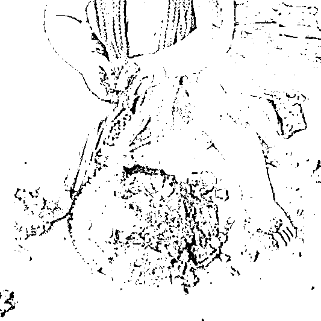

图片来源：VCG

顺势疗法作为家庭健康管理的辅助手段，副作用极低，对人体基本无害，我们可以运用顺势疗法针对不同体质治疗孩子的疾病。来看看这些顺势疗法的药品都适合哪些体质类型的孩子吧。特别提醒：使用顺势药剂需要遵照医嘱哦。


<sectin style="margin-top: 46px; margin-left: -76px; display: inline-block; vertical-align: top; line-height: 2em; box-sizing: border-box;">**磷型体质**</sectin>

磷型体质的人喜欢交际，有同情心，渴望陪伴，具有敏锐力洞悉力。他们有非常典型的外貌，通常是高挑或者修长的，胸部比较狭窄，个性活泼。

**具有开放性，喜欢学习灵性的东西，对于很多事物会很有热情，但是三分钟热度，容易分心。**他们通常是恐惧焦虑的，害怕天黑，雷雨天等。典型的磷型体质的病人总是充满着恐惧和焦虑，他们总是吊着神经和焦虑，但是很容易被安慰，只要稍微关心一下，就能马上安静下来。对气味噪音、碰触敏感、气候的变化以及对别人的情绪都很敏感。

好像所有人都喜欢磷型体质的儿童，他们亲切友好，热情又富有同情心，如磁铁一般——这种形容非常贴切，他们能吸引相互友好的伙伴。特别重要的是，当他们生病时，爱他们的人会在身边，倾全力相助。

他们当然是外向的孩子，充满自发性与好奇心，老是静不下来，热衷追求新事物。他们容易因为兴奋不已而生病，或因鲜活的想象力而玩过头。他们付出太多，也需要他人回馈很多关注，但人们常以为他脾气好又爱玩，所以没有人会太在意。磷型体质的孩子很少羞怯，偶尔如此也只是想博得同情，如果给予赞美或疼惜，他们很容易就能克服害羞。

**他们容易口渴、喜欢冷饮，也可能爱吃辣。偶尔出现血糖骤降的情形会使他们头晕。胃部可能是弱点，奇怪的是有时生病期间，他们会呕吐出胃中温度升高的冷食。**

他们很少便秘，可能有流鼻血的问题，容易喉咙痛，也可能声音沙哑。感冒容易直接感染他们的胸部（这是另一个弱点），喉头炎会快速感染支气管，所以会抱怨胸部紧绷和胸闷感。

磷型体质的孩子生病时会坦然表达他们的痛楚与需求，他们觉得被安慰、被拥抱能获得改善，而事实证明，最好的治疗就是给他们关爱，同时搭配一些磷药丸服用。


<sectin style="margin-top: 46px; margin-left: -76px; display: inline-block; vertical-align: top; line-height: 2em; box-sizing: border-box;">**白头翁体质**</sectin>

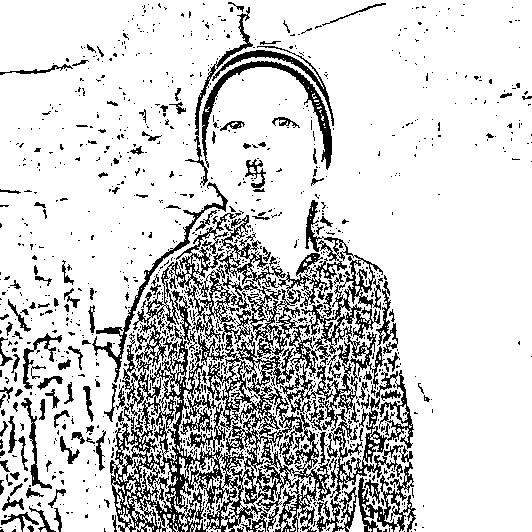 

他们通常很善变。病症也是不断在变化的，前一秒是这样的，后一秒可能就是那样的，或者每一次大便的样子都是不一样的。它的性情其实是柔和温和的，不太容易愤怒，感觉是很温柔的那种。它带有迷人的特质，喜欢被拥抱，渴望被关注。

他们渴望有人交流，希望沮丧的时候，可以有个肩膀依靠，告诉他们说没事的，一切都会好的，也希望得到积极地回馈。

他们很敏感于被抛弃的感觉，需要有人不停地给予肯定，就好像代表人类生活中不成熟，互相依赖的那种状态。有一个关键词是它是有依赖感的它很需要被渴望，有依靠。

白头翁体质的人是希望有安全感的，希望有一个住所，或者避难所，它希望有同情和爱在身边。不喜欢闷热的房间，渴望呆在室外，通常不会觉得口渴。

**白头翁体质的孩子主题是被遗弃的恐惧，他们是温和、轻柔的灵魂，颇为羞怯，很希望被取悦，认为这就是父母或朋友对他们的认同，证明自己没有受人排拒。**他们大致上是爱哭的，在陌生环境下会形影不离地紧跟着父母，这是害怕的天性使然。他们是很乖的小孩，很听话，对别人斥责很敏感，被责备时很容易情绪失控。

虽然他们有温和、可爱的天性，不过性格中也有嫉妒与刁钻的一面，例如认为兄弟姊妹博得父母所有的宠爱。因为极敏感，有时你会发现他们的病痛是因为以往的伤痛，例如最好的朋友因转学而离开了他。

他们的心境起伏很大，一会儿哭、一会儿笑。当然所有孩子都是这个样子，只是易变的白头翁特质会让你觉得，长大后的他们还是老样。怜爱与同情很能安慰他们，晚上和父母亲同睡一张床，对他们来说最好不过的事了。

白头翁型的孩子体温较高，觉得户外的新鲜空气最好，不容易口渴，但喜欢冷饮，他们不适合浓郁、油腻的食物，那些食物可能会使他们恶心和呕吐。

他们优柔寡断，要他们做任何决定都很难。生病的症状正如他们的本性一样变化不定。病痛似一处转到另一处，一会是胸部，一会又是胃部。容易耳痛，感冒会潜入胸部，经常鼻塞，充满黄绿色的鼻涕。睑腺炎也容易复发。

有人疼爱，大哭一场、冷敷和新鲜空气都有助于改善这些病痛，白头翁也包含在内。当你的孩子是这样的性格特质的时候，如果感到身体不适，可以尝试用急救箱中白头翁，一天一粒。


<sectin style="margin-top: 46px; margin-left: -76px; display: inline-block; vertical-align: top; line-height: 2em; box-sizing: border-box;">**硫磺体质**</sectin>

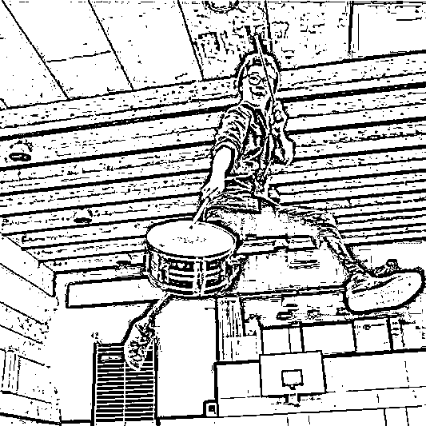

硫磺体质人的特性是他有很多非常伟大的想法，但是很难将想法转变为行动。他们总是想把事情弄清楚，对任何事情都有想法，通常很有创造力的人。愿意坐着而不愿站着，更愿意躺着。希望自己的想法得到认可，可能是自我满足的、以自我为中心的、虚荣的；夸张的、自吹自擂的。这些人有一些木星的特性。

硫磺体质的人是仓促的和冷漠的，因为他们有些宏大的想法。他们往往懒惰、迟缓、凌乱而不整洁。硫磺是从火山这得到的，是火元素，水和火不要混合。所以硫磺的病人遇到水病情会恶化。令人讨厌的放屁、粪便或口气会让症状恶化。也会“察觉到体味”并且“厌恶”。 

*   **一种硫磺型体质的孩子风头很健，有十足的活力与好奇心，觉得自己发育良好使他们成了天生的领袖。天生的敏捷与聪慧使他们能迅速消化新资讯，也敢实际运用。** 

*   另一种硫磺型的孩子**比较安静，但一样聪慧，好奇，具有一种非得全部弄懂的闹人特质。**

这两种类型的孩子总会提问，他们的固执有时会令父母抓狂。硫磺型体质的孩子有天生的自信，加上几分顽固，相当自我中心，不顾别人对他的看法，所以很容易破坏比较脆弱的感情。常常认为规则就应该打破，很少害怕下场如何。

他们是脏乱的小孩，也不讲究打扮。天生就懒，也是世上最拖拖拉拉的人，他们宁可瘫坐而不站着。除了粗鲁与静不下来的性格，硫磺型孩子算是相当温和，喜欢助人，尤其能借此展现高度优越感时。

**体格通常较同年龄的孩子壮，但安静的硫磺型孩子可能比较瘦小。**他们的脸或许很红，皮肤容易产生问题，如发痒、会灼痛的湿疹，特别是洗完澡后。洗澡不是他们拿手的，所以他们会一副脏兮兮的模样。

幼年时，他们脸上挂着两行鼻水、满头汗，老是发红的眼睛和耳朵，习性上时常显得很没教养的样子。不怕冷，晚上睡觉时两只脚还能探出棉被外纳凉。

早上十一点左右是他们无精打采的时段，那时可能已经饥肠辘辘，他们通常喜欢甜食与口味浓郁的食物，很容易口渴，但可能对乳品过敏。

当孩子身体不适，如果孩子的性格特质恰好符合硫磺的特质，那么就可以尝试服用硫磺，每天一次，观察五天。

* * *

*参考文献：*

**本文摘录自苏·汤普金斯老师的顺势疗法课程内容，另有部分节选自《同类疗法》**


**提醒：安全性问题**

顺势疗法作为辅助医学，对我们日常的家庭健康管理起到了非常好的辅助作用，并且在某些急性病症或者严重疾病中也能起到舒缓的作用。但是罹患严重或者不知名的病症，或者一般人在 2-3 周内、5 岁以下儿童在 48 小时内情况未获得改善，应向现代医学求诊。

> #### 阅读更多顺势疗法
> 
> 点击图片即可阅读

 

[](http://mp.weixin.qq.com/s?__biz=MzA5NjA0NTAxNg==&mid=403741311&idx=2&sn=06da349083483f2f8080a503b1e69e90&scene=21#wechat_redirect)▲想搞定顺势疗法？先拿好这份攻略~


▲顺势疗法的药物安全吗（上）？


▲顺势疗法的药物安全吗（下）？

**◆ ◆ ◆  ◆ ◆**

**********特别提醒：****本文由作者授权首发于若道，转载请注明“转自若道”并标明作者。**********

想更多了解关于顺势疗法的知识吗？**2016 年 5 月 7、8 日**，由**苏·汤普斯金**亲授的**顺势疗法工作坊**就要开课啦！顺势疗法是目前全球使用最广泛的自然医学疗法，对个体的身体、精神和情绪三个层面进行治疗，加强个体自身免疫力，提升个体生命能量。本课程为那些想要增加自我及家庭身体保健和疗愈能力的人所设置。

报名及咨询，请点击文末“阅读原文”


# 十二星座恋物癖 | 有个星座竟然是垃圾桶

> 原文：[`mp.weixin.qq.com/s?__biz=MzA5NjA0NTAxNg==&mid=2651384634&idx=1&sn=01bf9978095417b032e63b6f480c379a&chksm=8b4a598dbc3dd09b2087249a7f5a558362b8766dbf93ca255ff207b03592e6306e9999fc8b3f&scene=126&sessionid=1692738841#rd`](http://mp.weixin.qq.com/s?__biz=MzA5NjA0NTAxNg==&mid=2651384634&idx=1&sn=01bf9978095417b032e63b6f480c379a&chksm=8b4a598dbc3dd09b2087249a7f5a558362b8766dbf93ca255ff207b03592e6306e9999fc8b3f&scene=126&sessionid=1692738841#rd)

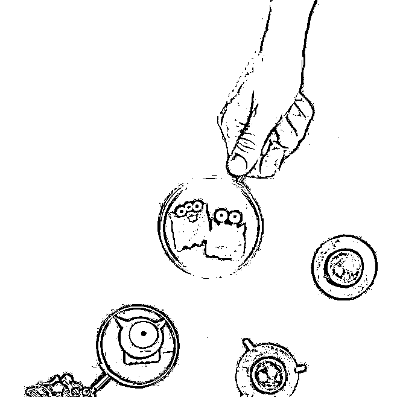
作者/Anastasia 图片/花瓣网

“

一句见面的问候语“一切事物都好吗？”引出了无穷尽的愁思，这些愁思汇集起来，写成了一本书。这些麻团一样的愁思，线头处正是金牛座的大哉问，哪一些事物是属于我的？——**《**51 种物恋**》**，一本好书，教你看懂自己的恋物癖。

”**最恋物的星座是金牛座**

**最恋物的星座无疑是金牛座，金牛宝宝无疑是一个物质宝宝，喜欢结结实实的物质以及实实在在的触摸。**安抚一个金牛宝宝（尤其是月亮金牛座或上升金牛座）的最好方式就是吃好的，穿好的，牵他们的手，给他们大大的拥抱。在星图上，直接聚集金牛座能量的领域是第二宫。

按照格伦·佩里老师的理论，**黄道上的星座对应着人生发展的不同年龄阶段。**

**白羊座是新生的婴儿**，他们意识不到世界的存在，他们以为自己就是全世界，无所不能。

**金牛座象征着我们从两岁到四岁的幼年时期。**这个阶段的人类幼儿刚刚开始有了自己的意识，开始有了人我界限，开始意识到什么是“我的”。为了安全，我们会紧紧抓住熟悉的事物，在潜意识里，我们希望一切都是永恒，事物是不会变的。或者可以说，过度恋物就是一种幼稚病。

**执着都是一样的**

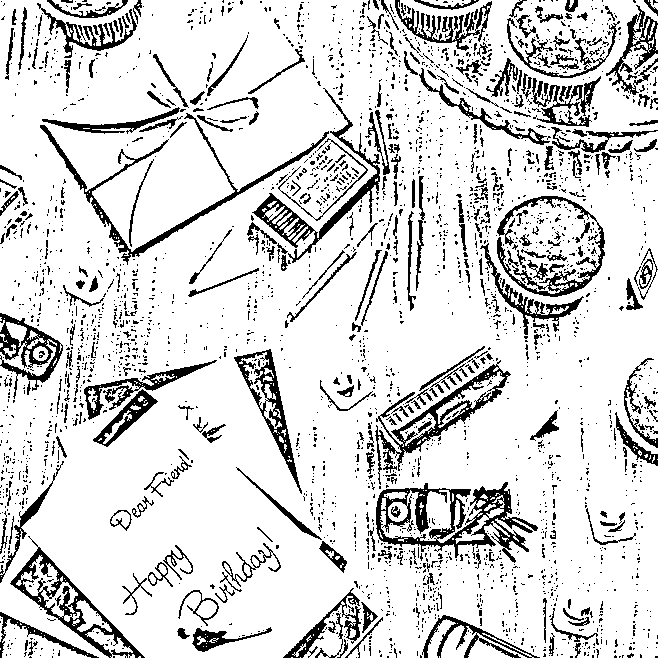 

**每一个人的星图上都有金牛座和第二宫（和金牛座相关联的宫位，代表着自我价值、金钱、身体等领域）。**人人都幼稚，人人都恋物。实实在在的物体，或高或矮，或大或小，或坚硬或柔软，或轻盈或沉重，它们占有空间，也占有时间。它们可以填充、可以延伸、可以存活。

也许射手座口袋里装的是整个银河系，而处女座口袋里装满了回形针。你能说这二者有区别吗？那种执着都是一样的，那种口袋塞满以后的满足感也是一样的。我们喜欢的是性质迥异的物质，射手座要诗和远方，天蝎座要股票基金，金牛座要舒适日常，本质上都是一样的。在这个消费的时代，我们需要物质带来的安全感，所以买买买大法是新时代的宗教，教徒无数，横行无阻。

**我们拥有**的能**代表我们**

可是，实实在在的物体还是迥异的。不一样的材质，不一样的形状，不一样的颜色和纹理。每一件事物都是独一无二的。要留心事物，凝神注视，仔细观察。

作者在书中细细碎碎地写了自己身边的五十一种事物。我一边看，一边在这样的碎碎念中跑野马。不同的第二宫，不同的金牛座能量，给予事物完全不同的视角和意义，我们迷恋、沉溺，和事物纠缠难分。我们是在谈论事物吗，我们其实是在谈论我们自己。我们不想把自己摊开在众人眼前，于是，我们穿的带的，吃的喝的，谈的笑的，我们周围的事物替我们抛头露面了。

十二星座的恋物

**上升白羊座****：****碗**

**书****里写到的第一件事物，是碗。**碗是容器，可以让四处流散的液体聚集起来，不再流动。碗是一个神奇的存在，手掌的大小，胃的容量，用来承载水和食物。不管什么材质的碗，都有一种母亲和家的感觉，稳固、舒适、平和。

**这简直就是金牛座的图腾，他们需要实在的、物质的、可触摸的、基本的安全感，全部都在一只大碗里。**  也许月亮巨蟹座喜欢一只刻着图腾的碗，也许月亮射手座喜欢一只适合登山的轻便的铝制碗，也许月亮天秤座喜欢一只半透明的白釉碗。**上升白羊座的宝宝，他们的二宫头正是金牛座，这样一个充满金牛能量的宝宝入睡后，梦都会是一碗一碗的。**

**上升金牛座：****遥控器**

**对****物质和信息的好奇是上升金牛座（二宫头双子座）宝宝们关注的事物，他们喜欢的也许是一只遥控器。**  遥控器是一样神奇的东西，比手机更古老。上面布满大部分你根本用不上的按钮。可是简单按一下，你就可以调节温度，转换频道，控制音量，开关门。你坐着不动，就可以让自己舒舒服服，让世界在眼前打开和关上。我们的想法得以延伸，我们的意志似乎无所不能。**上升金牛座的宝宝，终有一天会创造一个按钮出来，缔造永生。**

**上升双子座：****钥匙**  

**上****升双子座（二宫头巨蟹座）的宝宝，他们对物质更加敏感，你的还是我的，他们分得非常清楚。钥匙这件事物很像他们**。

钥匙都是坚硬的、笔直的、上面有着各种奇怪的凹槽和凸起。如果你了解巨蟹座，就会知道这多么像他们的壳。这把钥匙保护的，其实是门口后面脆弱敏感的一颗心。所有的钥匙，无论什么材质，都象征一股浓缩的保护力量。外面洪水滔天，进得门来，我们就是一家人，彼此契合，彼此慰藉，彼此护佑。不管在外面多么花枝招展，口若悬河，在家里，我们才能回归自我。

**上升巨蟹座：****太阳眼镜** 

**上****升巨蟹座（二宫头狮子座）的宝宝会迷恋大牌的太阳眼镜。**  如此引人注目，也如此像一个谜。**墨镜呈现出来的距离感，正是狮子座喜欢的高高在上的感觉，请仰视我吧，我是王。**我如此出类拔萃，但我们目光相遇，你却无法看透我。这也正是权力的特性。二宫头狮子座的宝宝，赚钱也是要仰着头直着腰来赚的。

**上升狮子座：****笔记本**   

**猜**一猜上升狮子座（二宫头处女座）的宝宝喜欢什么，各种颜色形状的回形针、笔记本或者 Bling Bling 的开瓶器？这无疑都是可能的。

**他们喜欢的是事物的实用性和计划性。**笔记本的厚度就像时间的厚度，可以安抚情绪。一页一页，一行一行，日子有序地展开。再闪耀的想法也不能一下子呈现出来，无数的可能性也只能一笔一划地写出来。完美与现实。

**上升处女座：****雕像**  

**上****升处女座（二宫头天秤座）的宝宝们，在他们严谨、低调、小心翼翼的外表下面，是一颗热爱艺术的心。**

他们低头匆匆走过一条道路，却又猛然停下来，像受到了惊吓。他们打量路边一个庞然的、石头的雕像，灵魂悸动不安。他们四下张望，看有没有注意他们。随后他们又凝神专注地欣赏，为什么一块石头会具有这么大的力量？灵魂吗？还是我们无知的代名词？**他们喜欢这样的事物，充满想象、幻觉和美，因为过度丰盈而不断大量溢出，打湿他们生活的事物。**

**上升天秤座：****垃圾桶**  

**上****升天秤座（二宫头天蝎座）的宝宝们，我如果给他们选的象征物是垃圾桶，会不会有人在背后记我的小黑帐。**

垃圾桶里承载的都是无用之物，或者丢弃之物。包装纸盒、果皮、空瓶子、旧的报纸，它并不是不存在。它们存在下来，也许更充实，也许变废为宝。垃圾桶收纳了那些黑暗、肮脏、见不得人的，垃圾桶外的世界才光鲜亮丽。**无可避免的，人类的生活、知识、社会、文明也一次次地被扔进垃圾桶，毁灭，再生，一次次重新再来。**  

**上升天蝎座：****行李箱**  

**那**么上升天蝎座（二宫头射手座）的宝宝呢？他们要面对的是一个不安全的世界。

**虽然旅行让人兴奋，但也让人焦虑不安。而一个大小合适、四四方方、坚固耐用的行李箱也许适合。**你又不可能带走所有的东西，在最小的空间里需要选择最多的可能性，行李箱是有一点点禁欲的哲学在里面。如果将欲望保持在有限的空间里，便有可能得到幸福。

**上升射手座：****珠宝**  

**下****面我们说一下珠宝，再没有人会比上升射手座（二宫头摩羯座座）的宝宝们更明白，那些无助于我们生存的事物，其实也有着不可或缺的必要性。**

我们会追随、赞扬它们，并为之奋斗。也许我们要去想一想，为什么在原始蒙昧的时代，我们衣食褴褛，生存飘荡，却仍然会在手臂脖颈上缠绕贝壳或彩色的石头？那时候，我们没有文字，没有时尚，没有产业，我们什么都没有，却有了珠宝。我们是在展现什么呢，财富、权力、荣耀？

**上升摩羯座：****电脑**  

**人****类发明电脑，是为了延伸我们的大脑。上升摩羯座（二宫头水瓶座）宝宝喜欢一切新鲜的高科技。**

电脑其实是光，传输、处理、计算、研究，工作稳定，对处理的内容无动于衷。打开电脑，就好像打开了我们的大脑，里面存储了我们的一些想法，一些隐私，一些可能用得上可能用不上的片段。这是一个半事物半生物的物体，属于我们这个变幻无常的时代，令人畏惧。而所谓的云，又让我们存储的资料档案不分彼此地融合成巨大的一片，在持续不断地、无意识地计算之中。

**上升水瓶座：****床**  

**一****张舒适的床是最适合上升水瓶座（二宫头双鱼座）的宝宝做稀奇古怪的梦的地方。**

床是世界的延伸，一躺在床上，我们就意识不到床是一个事物，床好像和我们合体了。下床后，我们马上意识到床是一件物体。我们躺下的世界和站立的世界并不是同一个世界。而床是在两个世界之间穿梭航行的太空船。

**上升双鱼座：****雨伞**  

**作****者说，发明雨伞的人一定是个诗人。雨伞最大的好处是：自私。**

我们携带着自己的屋顶，自己举着自己的一片天空。上升双鱼座（二宫头白羊座）的宝宝们一定很喜欢这样的说法。**雨伞是我们的武器，为我们阻挡了所有的侵犯。有没有觉得，举着伞，走在雨中，我们的思路会特别的清晰。** 

**你是个怎样的物质宝宝**

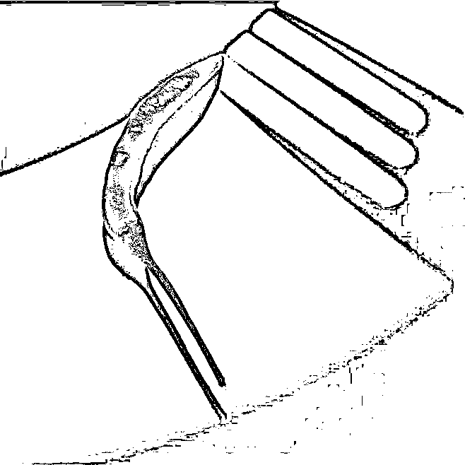

走进事物，再从事物中走出来，世界会有另一种样子。**跳出对物质的沉溺和漠然，让人和事物最终相互依存。这就是金牛座-天蝎座轴线需要思考的。**说到底，我们的生命是最大的事物。我们可以创造生命，繁衍后代。有些人相信只能活这一次，有些人相信有轮回。但不管怎么样，**我们都要学会享受生活，享受我们的金牛能量，在享受中发现人生的意义，让我们的人生物有所值。** 

请你继续这个问题，一切事物都好吗？这个简单的问题让你看到了什么？在金牛月，以你自己的事物来进行，这当然是完全不同的。我会从我腕上的手表开始，上升处女座，二宫头天秤座，九宫头金牛座，我是一个喜欢时间和品质，会在思考中得到无穷享受和满足的物质宝宝。

**作者的话**

*   **《51 种物恋》**，作者是法国当代哲学家德瓦 Roger-Pol Droit。此书没有引进大陆版，台版已经绝版。

*   每一件事物都有一个故事，相关物恋图书都是我压箱底的好书。推荐大家在金牛月阅读**松浦弥太郎的《日日 100》**，**黑川雅之的《素材与身体》**，**许舜英的《我不是一本型录》。**

*   你读过什么相关的物恋好书，也可以推荐。

**你可以更深入认识金牛座：**  

**▼**

[金牛月独家话题 | 如何成为有钱人](http://mp.weixin.qq.com/s?__biz=MzA5NjA0NTAxNg==&mid=2651384368&idx=1&sn=6b98cf58afecf6cc62f90ce95629e995&scene=21#wechat_redirect)

[大卫谈占星 | 数数这些年金牛座被贴歪了的标签](http://mp.weixin.qq.com/s?__biz=MzA5NjA0NTAxNg==&mid=2651384546&idx=1&sn=0fd1724e243b810b6abd77422dc3719d&scene=21#wechat_redirect)

[大卫谈占星 | 金牛座：即使不爱动弹，也得改变自己啊！](http://mp.weixin.qq.com/s?__biz=MzA5NjA0NTAxNg==&mid=2651384575&idx=1&sn=28208517e22e0e76fab3bbe5b9a91186&scene=21#wechat_redirect)

[小白学占星 | 太阳进入金牛座，谷雨到了](http://mp.weixin.qq.com/s?__biz=MzA5NjA0NTAxNg==&mid=2651384349&idx=2&sn=2920f445c2b9e35f03c55f03e4f227cf&scene=21#wechat_redirect)


**作者简介**

**Anastasia**：职业占星师，国际占星研究学会 ISAR 会员，若道认证生时校正占星师。太阳射手座，月亮狮子座，上升处女座，擅长讲述个体星图后面隐藏的人生故事和意义。在若道跟随多名国际占星师学习严肃占星学多年，目前从事占星咨询工作。

**个人微信公众号平台**：midnight2evolution

长按二维码，让金钱涌向传播知识与智慧敌人~


*告诉我*

*你是一个什么样的物质宝宝？*

**◆ ◆ ◆  ◆ ◆**

******特别提醒************：本文由作者授权首发于若道******，**转载请注明“转自若道”并标明作者。******

**恋物和占星学有什么关联？**2016 年 5 月 19 日，**蒋颖老师**主讲的若道占星核心课程**Level 1-2**要开课了！她将带领你学习**星座、太阳、月亮、行星、月亮交点**等知识，让你进入占星学的世界！


# 巧用顺势药剂，缓解孩子病症（上）

> 原文：[`mp.weixin.qq.com/s?__biz=MzA5NjA0NTAxNg==&mid=2651384634&idx=2&sn=2151d21594024d0ea22aeceedbb86131&chksm=8b4a598dbc3dd09b4bf43e0dbcfedad069e01bcc50a6294869611cd5a92dabf2e683f586a8aa&scene=126&sessionid=1692738841#rd`](http://mp.weixin.qq.com/s?__biz=MzA5NjA0NTAxNg==&mid=2651384634&idx=2&sn=2151d21594024d0ea22aeceedbb86131&chksm=8b4a598dbc3dd09b4bf43e0dbcfedad069e01bcc50a6294869611cd5a92dabf2e683f586a8aa&scene=126&sessionid=1692738841#rd)

图片来源：VCG

顺势疗法作为家庭健康管理的辅助手段，副作用极低，对人体基本无害，我们可以运用顺势疗法针对不同体质治疗孩子的疾病。来看看这些顺势疗法的药品都适合哪些体质类型的孩子吧。特别提醒：使用顺势药剂需要遵照医嘱哦。


<sectin style="margin-top: 46px; margin-left: -76px; display: inline-block; vertical-align: top; line-height: 2em; box-sizing: border-box;">**碳酸钙体质**</sectin>

碳酸钙是由牡蛎壳的中间部分制成，所以符合碳酸钙的婴儿有时就像是牡蛎中的肉一样，软软的胖乎乎的，碳酸钙的婴儿往往发育缓慢，因为他们可能很晚才学会走路或说话。长牙也可能延迟，并有困难。

碳酸钙体质的孩子喜欢依照自己的步伐行事，若有人勉强他们做不愿意做的事情，他们会不高兴。身心两方面都属于慢调子的他们，也像其他类型的孩子一样聪明，只是需要时间去学习，消化，归纳外面的事物。

这类孩子看似“冥顽不灵”，其实是因为**他们行动前，都会先了解事物到底是怎么回事。**尽管他们天性内向、喜欢慢慢来，但若遭受超出忍耐限度的对待，他们也会发脾气。

这样的孩子需要安全感，他们不爱冒险，不喜欢高处。他们怕黑，怕暗，怕电视中的幽灵鬼怪，碰到老鼠或蜘蛛会变得神经兮兮，狗可能也会带来困扰。噩梦使他们尖叫、吓醒，往往杞人忧天，需要别人保证大难不会临头，而且还要明白的解释给他们听。有时对超自然事物感到好奇，小小年纪就会追问很多关于神的问题。

碳酸钙型体质的人喜欢不易消化的食物，例如面包、意大利面和各种碳水化合物，特别爱吃蛋，尤其是半熟的鸡蛋，或者想吃糖果。

容易便秘，经常好几天没有排便，但似乎不会有不适感。他们通常都是胖嘟嘟的体型、容易流汗，尤其是头部和手，晚上会发现他们的枕头有汗渍。他们的脚踝较脆弱，容易扭伤。头部怕冷，所以喜欢戴帽子。这型小孩比较怕冷，容易咳嗽、耳痛、喉咙痛、扁桃体发炎，感冒或潮湿可能引起或加重这些病痛。温暖通常能使他们舒服很多。

当你的孩子有不舒服而正好符合碳酸钙体质的特点，就可以每天给予一粒 30c 的碳酸钙用来治疗，直到他感觉舒服为止，也可以当做保健品给予服用。如果他们发高烧可以用颠茄来急救。


<sectin style="margin-top: 46px; margin-left: -76px; display: inline-block; vertical-align: top; line-height: 2em; box-sizing: border-box;">**石松型体质**</sectin>

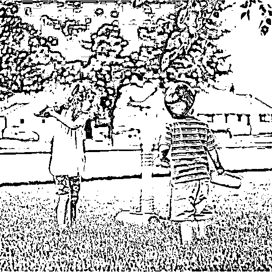

石松是一款非常适合懦夫或者自感能力不足的药物，总是感觉自己能力不足因为害怕而不敢于冒险，他们可能会试图去逃避责任，但又有点喜欢发号施令。

石松型体质的孩子有缺乏自信的问题，总让你难以猜透。他们可能用挑剔、嚣张和霸道的行为掩饰不自信，和其他人耍心机。另一方面，在陌生人面前却又显得胆怯、紧张，需要人陪伴、鼓励才能安心。这些孩子深受预期心理所苦：害怕考试，担心在全班面前讲话或面对失败。他们严肃地看待自己，不想让自己像傻瓜一样。

他们怕黑，怕鬼，怕大型动物，所以夜间可能需要点灯，当他们很小时可能需要与人共眠。

这些小孩的体型往往比平均体型瘦，头部比例大。即使幼儿都会以皱眉头表达不满，直到觉得安全后才会露出笑容。虽然喜欢头部保持凉爽，但他们仍怕冷。

下午和傍晚是石松型孩子的容易感到不适的时段，醒来时或肚子饿时的脾气特别坏，胃部常常是弱点。恐惧和焦虑不断，所以他们为胀气和便秘所苦。这类型的孩子要避免食用会加剧胀气的食物，如包心菜、豆类和洋葱等。他们胃口往往很大，但有时又吃没几口就饱了。喜欢甜食、热食与热饮。

这些孩子容易罹患大多数小儿科的病痛，特别是耳痛、感冒和咳嗽，这些疾病可能会蔓延到胸部，引起支气管炎。

疾病的症状通常从身体右侧发作，然后移到身体左侧，或者右侧的病情较重。湿疹有时会影响到头部，尤其是耳朵后面的部位。

如果出现反复感冒与感染，而且性格与身体特质大致符合前面所述，那么石松就有帮助。


<sectin style="margin-top: 46px; margin-left: -76px; display: inline-block; vertical-align: top; line-height: 2em; box-sizing: border-box;">**氯化钠型体质**</sectin>

氯化钠适用于慢性的悲伤，在一生中不断搭建起来的状况，可能不知道自己处于这个状况，是一种静默的悲伤。过度的敏感，一点点拒绝都会让他们感到不开心，所非常保守或者谨慎。很害怕约会，因为害怕被拒绝所以根本不敢去。情绪上的悲伤或者别人的悲伤会让他们觉得像世界末日，他们看上去是冷酷的，其实是为了隐藏情绪上的脆弱和敏感。氯化钠适应的这类人总是坐在边缘的地方观察这个世界，会倾向于和已婚的人或者因为某些原因无法在一起的人陷入爱河，这会让他们制造他们更加内向的特点。

**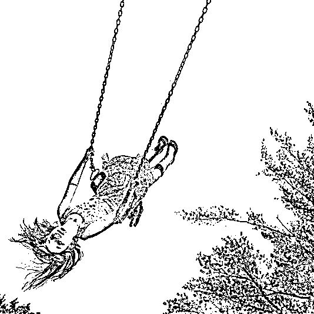** 

**氯化钠型体质的孩童情绪很敏感，大多沉默寡言、性格内向，他们的难处在于对事物的感受深刻，但又觉得难以与他人分享沟通。**容易受伤，也知道痛苦是怎么回事，很怕伤害别人。害怕被责备，所以做事一板一眼以免犯错。倾向独自在房间里哭泣，或许会播放悲伤的音乐来安慰自己，借此松开卡住的感觉。

他们把事情安排得井然有序，要求完美，把自己和自己的房间打理得干干净净。本性上沉默寡言与独立，能享受独自一人，害怕受人瞩目。讨厌被人发现他们犯了错。很容易陷入尴尬的状况，不喜欢被称赞或安慰，除非是很可靠的人。

他们具有早熟的聪慧与责任感，这类孩子常严以律己，内心充满罪恶感和悲伤，可能连父母都没察觉他们的恐惧。你永远不知道他内心的怨恨才是个大问题，他们对事情耿耿于怀，往往很久才能谅解，很多问题都出自于他们冰封的情绪。

**氯化钠是一种重要的悲伤治疗药，有此需要的小孩常有某些情绪创伤未处理，例如双亲离异、痛失朋友或宠物等，这些突如其来的悲痛，会使他们的身体生病。**他们害怕任何超出自己控制的事，像是家里闯入窃贼，看到蜘蛛或想到父母亲可能死掉等。

当你的孩子有什么不适又符合氯化钠的特质，那么可以尝试服用氯化钠，每天一粒 30c。

* * *

*参考文献：*

*本文摘录自苏·汤普金斯老师的顺势疗法课程内容，另有部分节选自《同类疗法》*


**提醒：安全性问题**

顺势疗法作为辅助医学，对我们日常的家庭健康管理起到了非常好的辅助作用，并且在某些急性病症或者严重疾病中也能起到舒缓的作用。但是罹患严重或者不知名的病症，或者一般人在 2-3 周内、5 岁以下儿童在 48 小时内情况未获得改善，应向现代医学求诊。

> #### 阅读更多顺势疗法
> 
> 点击图片即可阅读

 

[](http://mp.weixin.qq.com/s?__biz=MzA5NjA0NTAxNg==&mid=403741311&idx=2&sn=06da349083483f2f8080a503b1e69e90&scene=21#wechat_redirect)▲想搞定顺势疗法？先拿好这份攻略~


▲顺势疗法的药物安全吗（上）？


▲顺势疗法的药物安全吗（下）？

**◆ ◆ ◆  ◆ ◆**

**********特别提醒：****本文由作者授权首发于若道，转载请注明“转自若道”并标明作者。**********

想更多了解关于顺势疗法的知识吗？**2016 年 5 月 7、8 日**，由**苏·汤普斯金**亲授的**顺势疗法工作坊**就要开课啦！顺势疗法是目前全球使用最广泛的自然医学疗法，对个体的身体、精神和情绪三个层面进行治疗，加强个体自身免疫力，提升个体生命能量。本课程为那些想要增加自我及家庭身体保健和疗愈能力的人所设置。

报名及咨询，请点击文末“阅读原文”


# 5 月宇宙天气丨拨开混乱迷雾，重拾希望之光

> 原文：[`mp.weixin.qq.com/s?__biz=MzA5NjA0NTAxNg==&mid=2651384633&idx=1&sn=fced0bd70798dc26e60e35f76dbfcbf1&chksm=8b4a598ebc3dd098d095cdf34a6225cace4055b0d39203a5a8460203b6e455b901ed0dbc2fea&scene=126&sessionid=1692738841#rd`](http://mp.weixin.qq.com/s?__biz=MzA5NjA0NTAxNg==&mid=2651384633&idx=1&sn=fced0bd70798dc26e60e35f76dbfcbf1&chksm=8b4a598ebc3dd098d095cdf34a6225cace4055b0d39203a5a8460203b6e455b901ed0dbc2fea&scene=126&sessionid=1692738841#rd)

作者/咔咔  ISAR 认证占星师

图片/花瓣网

2016 年 5 月的星象比起上月来说要温和一些。重要星象上我们将迎来木星顺行、太阳进入双子座，逆行的火星从射手座逆回到天蝎座。整个五月的宇宙天气将让我们思考什么是真正的价值。

**本月值得关注的两个星象**

●**木星在 5 月初恢复顺行**

○顺行的木星给疲惫的人们和市场多了一些前行的信心。

●**5 月底木星与土星再一次形成的四分相（本年度最后一次木星土星成四分相）**

○人们将有机会最后完善自己的计划，社会经济结构的困难调整也将暂时告一段落。

如同我在[三月的宇宙天气（点击可阅读）](http://mp.weixin.qq.com/s?__biz=MzA5NjA0NTAxNg==&mid=403042499&idx=1&sn=97835e4cd3e1245bbb8be6abf9dc6875&scene=21#wechat_redirect)中解释的：“此时人们被迫要按照法律、规范、现实的要求调整自己的愿景和计划，有时候我们需要在一些地方消减，才能在另外一个领域增长。”

不过不要忘记，虽然本月木星与水星相继恢复顺行，太阳与金星进入活泼敏捷的双子座，但是天空中仍然有三颗重量级行星-**火星**、**土星**、**冥王星正在逆行**。**此时仍不宜贸然开始新的计划**，让我们积蓄信心，迎接**6 月的海王星逆行和重要的土海四分相**吧**。**

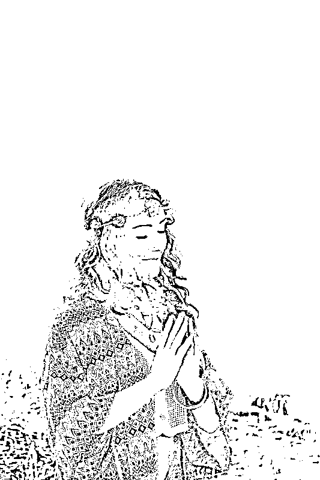

**5 月 7 日-14 日：享受生活，思考价值**

> ●**5 月 7 日金牛座新月**
> 
> ●5 月 9 日木星在处女座恢复顺行、金星（金牛座）六分海王星（双鱼座）、太阳与水星合相在金牛座
> 
> ●5 月 11 日金星（金牛座）三分木星（处女座）
> 
> ●5 月 13 日水星（金牛座）三分冥王星（摩羯座）
> 
> ●5 月 14 日水星合相金星（金牛座）、金星（金牛座）三分冥王星（摩羯座）

五月的上旬比较让人愉快。

**5 月 7 日的新月发生在金牛座 16 度 41 分**。太阳与月亮相会在金牛座这个代表着自然之美与丰沛物质资源的星座，人们将寻找让自己感到安全和舒适的方法。

无论是走进自然，享受美食美酒、手工劳作等活动，人们通过眼睛、耳朵、鼻子、嗅觉、触觉、直觉去感知世界。这些感知帮助人们在浮躁的外部世界中抛下稳定的“锚”，获得内在的安全感和稳定感。**金牛座新月也预示着金钱与自我价值的议题**。金牛座的提示是“**行胜于言**”。

**新月你可以思考的是：**

**1.你的行为和生活方式是怎样体现你的自我价值的呢？**

**2.除了夸夸其谈，你又是如何实践你的价值观的呢？**

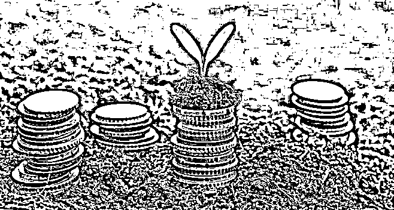

谈到实践，就来看看木星顺行吧。从 1 月 8 日到 5 月 9 日，木星整整逆行了四个月。

**经过木星逆行你可以反思的是：**

**1.在这四个月里，你吸收和练习了什么新的技能和实用技巧吗？**

**2.你的生活作息、健康状态、内在信念发生了什么样的改变呢？**

木星恢复顺行后，人们的信心、市场的活跃程度将得到改善，适度缓解了火星、土星和冥王星逆行造成的压抑与紧张。

在接下来的一周之内，**金星与水星位于金牛座，分别与海王星、木星、冥王星形成柔和的相位，并且金星与水星也将形成合相**。这一些列相位的发生，延续了金牛座新月的主题：**安全、舒适、金钱、自我价值**。

**5 月 9 日-15 日，这一周的宇宙天气利于商业会面、商务条款的协商，投资和商业计划的筹备与完善**。

**这一周的可能事件：**

1.人们在这一周中将以务实、合作、共赢的精神，延伸和扩大社会交往的范围（**金星三分木星**）；

2.分析、研究、搜集资讯（**水星三分冥王星**）；

3.发想、修改、沟通商业和投资计划（**水星合相金星，太阳合相水星**）；

4.引入投资（**金星三分冥王星**）。

**温馨小提示**

由于水星仍处于逆行状态，所有商业合同的条款均需再三检查。**考虑到天空中四颗行星在逆行，建议还是关注在已有的项目上，勿盲目开始新的项目**。

**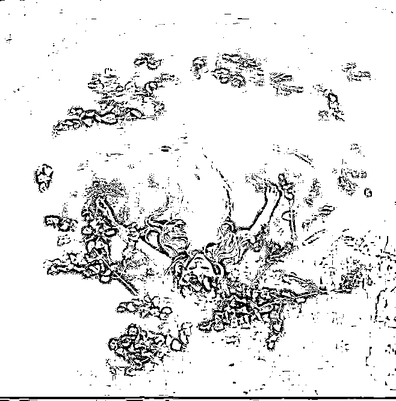**

**5 月 20 日-31 日：金星 VS 火星，真理之战**

> ●5 月 20 日太阳进入双子座
> 
> ●5 月 22 日水星在金牛座恢复顺行、**射手座满月**
> 
> ●5 月 24 日金星进入双子座
> 
> ●5 月 25 日金星（双子座）对分火星（射手座）
> 
> ●5 月 26 日木星（处女座）四分土星（射手座）
> 
> ●5 月 27 日火星逆行进入天蝎座
> 
> ●5 月 31 日水星（金牛座）三分冥王星（摩羯座）

**太阳在 5 月 20 日进入双子座**，带来更多交流的机会，新鲜的信息，更多的社会交往。要注意到双子座的守护星**水星在 22 日恢复顺行**，水星仍处于金牛座，这给交流的风格加上了务实的色彩。**满月发生在射手座 1 度 14 分，人们可能体会到高度精神紧张、烦躁，沟通和情绪上的混乱、误解、来回反复。**  

满月带来的紧张情绪仍在延续，**金星进入双子座后迅速与逆行的火星形成对分相**。金星在双子座喜欢简单轻松的关系，而火星射手座则要为事情安上意义，必要时为捍卫真理而战。在人际关系中，这两个不协调的元素可能会造成冲突，人们的欲望难以被满足，或者制造事端来满足自己对兴奋和刺激的渴望。

火星进入天蝎座后，由于火星处于逆行的状态，愤怒将进一步积蓄，这个愤怒被内化，不容易释放出来。不妥善处理内化的愤怒可能会造成更大的伤害。虽然**木星与土星在 5 月 26 日准确成相，木土四分的威力在整个 5 月都有所体现。**

调整仍然继续，现实与目标仍然暂时未能达成一致。此时需意识到，当下没有捷径，事情暂时无法取得飞速发展，关注当下的每一个脚印，即使是 baby steps，也将让我们走的更远。**运用 5 月 31 日的水星三分冥王星的机会，看清眼前的道路，谋定而后动**。


**占星师咔咔**：2010 年开始学习占星学，若道首届学员，国内最早获得 ISAR 职业占星师资质的职业占星师。在国际知名广告公司和市场研究公司从事的市场研究和推广工作十余年，曾任职于阳狮集团、尼尔森市场研究有限公司、MTV 和《Madame Figaro》杂志。现在为《时装男士》、活法儿等媒体供稿。

**微信公众账号**：咔星人

**星盘解读和运势咨询**：cji1029@qq.com

长按二维码，让金钱涌向传播知识与智慧的人~ 


**◆ ◆ ◆  ◆ ◆**

******特别提醒************：本文由作者授权首发于若道平台******，**转载请注明“转自若道”并标明作者。******

担心行星逆行之前，你要先搞懂行星的意涵。**2016 年 5 月 19 日**，蒋颖老师主讲的若道占星核心课程**Level 1-2**要开课了！她将带领你学习星座、太阳、月亮、行星、月亮交点等知识，让你进入占星学的世界！

报名及咨询，请点击文末"阅读原文"


# 原型占星学 | 为什么塔纳斯也说不能预测具体事件？

> 原文：[`mp.weixin.qq.com/s?__biz=MzA5NjA0NTAxNg==&mid=2651384633&idx=2&sn=7c2775eaac9e3b40f243aa890ffef65a&chksm=8b4a598ebc3dd098fe642e19e85fd907da20af6451acbbf630ec2b46ad44ee08b23166f5e526&scene=126&sessionid=1692738841#rd`](http://mp.weixin.qq.com/s?__biz=MzA5NjA0NTAxNg==&mid=2651384633&idx=2&sn=7c2775eaac9e3b40f243aa890ffef65a&chksm=8b4a598ebc3dd098fe642e19e85fd907da20af6451acbbf630ec2b46ad44ee08b23166f5e526&scene=126&sessionid=1692738841#rd)

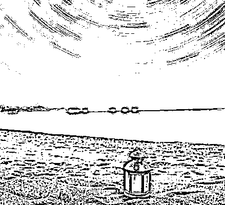

作者/理查德·塔纳斯

译者/Luke 校对/轩轩

当行星与行星之间不再是独立的个体，当它们发生互动，世界就变得丰富和精彩了。

**相位的定义**

**相位是行星之间的几何关系，指示相应原型互动和表达的方式。**

相位是两颗行星之间特定的角度关系（比如 90 度或 180 度）。**行星之间存在相位意味着相应的原型彼此激活。**就是说，当两颗行星处于特定角度关系的时候（采用黄经度数），两个相应的行星原型产生互动，体现在心理性格和人事福祸上面。（比如说，如果水星和冥王星在出生图上形成了紧密相位，那么水星和冥王星原型之间的能量互动会呈现在此人的性格和生命事件上）。

**5 个主要相位**

● 合相（行星间约为 0 度）

● 对分相（约 180 度）

● 三分相（约 120 度）

● 四分相（约 90 度）

● 六分相（约 60 度）

主要相位中，**合相和对分相最重要、力量最强**，代表行星周期达到了峰值（比如，新月和满月，分别意味着日月合相和对分相）；三分相和四分相的能量中等；六分相最弱。此外，大体说来，相位的角度越精准（比如说，两颗合相行星之间只有 2 度而不是 7 度），原型的互动就越显著。

**三分相和六分相一般代表着行星之间和谐（“柔和”）的互动关系**，这种情况下，两种行星法则或能量之间的流动更加顺畅。**对分相和四分相对应更加剧烈或冲突（“强硬”）的互动。**两种行星法则针锋相对，在合作与对抗之间交替。一个人要花费很大力气才能使它们握手言和并积极合作。**合相意味着行星能量的融合，互动方式既可能合作也可能对抗。**因此行星之间的相位不仅让它们产生互动，也同时决定了互动的本质。

对这一话题感兴趣的读者，相位的性质是由**毕达哥拉斯法则**决定的。主要相位的度数是分别用数字 1、2、3、4 和 6 除以 360 度得到的。每个数字的毕达哥拉斯含义赋予对应相位特别的性质。

比如数字 1 象征一体或协作，代表合相；数字 2 象征两极对立或二元性，代表对分相；数字 3 象征的均衡或稳定代表三分相；四分相（数字 4）和六分相（数字 6）取它们的分量（2x2 和 3x2）。因此四分相和对冲相类似，六分相和三分相类似。

**中点的配置**

分析时还要注重一种称作中点的配置，它可被看作**微型的相位**。**当一颗行星和另外两颗行星的中点成相位时，就认为相应的原型产生了互动。**这种配置意味着这三种原型存在复杂的相互激活的关系。

虽然出于必要我们单独地探讨了两到三颗行星之间的各种相位和中点结构，但实际上它们是更大整体的组成部分。这个整体，也就是出生图，最终无法被智力完全理解。但通过关注单个相位和它们的原型动力，我们就可以对整个出生图和它象征的人生产生更加清晰的理解。

我要强调虽然**柔和相位**的确**代表天赋**，但通常是出生图和行进中的**强硬相位**最能**促使人成长**，有时还会结出丰硕的成果。虽然它们的确和困难、危机和挑战相关，但是**硬相位倾向于引发事件**。冲突的压力创造出更大的动能，挑战个人创造性地整合能量。它们也因此更有可能产生成果、加强性格、深化灵魂。

此外，随着一个人逐渐疏通这种相位的负面能量，就能以更有创造性、更能提升生命的方式，来表现相应原型情结中贮藏的心灵能量（比如说，土星和冥王星的硬相位伴随的强迫性的固执态度可以被转化为达成目标的坚定意志，等等。）在生命中卓有成就的人，通常在出生图中，和他们的成就最为相关的行星之间存在硬相位，并且这些主要成就通常出现在硬相位被激发的行进行进时期。

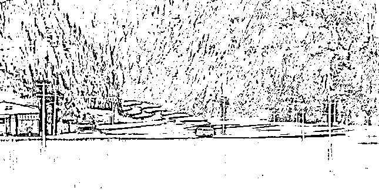

**行进的价值**

研究行进尤其有价值，因为它让我们知道行星原型在人生中显现的时机。**或许在占星学的所有领域中，研究行进最能证明占星学真实有效，**揭示其巨大的实践价值。

行进法则建立在这一事实上：行星在一个人出生后继续移动，并和出生图的行星位置形成相位。因此行星当前在天空中的位置和出生时的行星形成相位（举例说，当前天王星在天上的位置和出生图上的金星位置相合），那么在这一时期，一个人可能经历到和相应行星相位相关的体验（在这个例子中，会有两三年的时间倾向于体验到新爱情的觉醒，激发艺术创造力或美学素养，变动和不可预测的关系，等等。）

**虽然出生图展示了一个人生命和性格的整体图景，行进却反映了这一整体图景以事件和体验的方式动态开展的过程。**行进激活了出生图蕴含的潜力。

由于行星运转的速度不同，它们行进的持续时间也不同：月亮行进仅仅持续几个小时，太阳或火星行进持续几天，外行星行进数月甚至几年。内行星行进可用来了解生命中的短期周期和每日变化，但是外行星行进——土星、天王星、海王星和冥王星——对理解生命重大转变最为重要。

出生图中有数个重要因素值得关注，比如行星星座（白羊座、金牛座、双子座等）、宫位、元素和性质、半球分布、泛音图，以及其他预测技术，如推进、太阳弧、太阳和月亮返照等。我认为这些都是值得探究的重要元素，有时也会拿出来讨论。

但我的专业领域和研究的主攻方向在于**行星原型组合、主要相位和行进**。经我多年研究，**我认为它们是占星学的主要因素，具有极高的准确度和丰富的含义，清晰地反映了原型形态和力量的几何分布**，是一条通往占星学奥秘的康庄大道。

我建议大家向遇到的每位优秀占星师提出解读的请求，因为占星学如此复杂，每张星图都有诸多层次和意涵，不同的占星师能帮你从多个角度理解自己。此外，我也关注生命的心理和灵性面向（还有长期文化和历史周期）。也有占星师擅长医疗、金融、卜卦或其他的占星领域，或许更能引发你的兴趣。不过找占星师做解读，不如亲自动手学习计算行进图（这并不难），然后检验证据，体验它给你带来的洞见和理解。

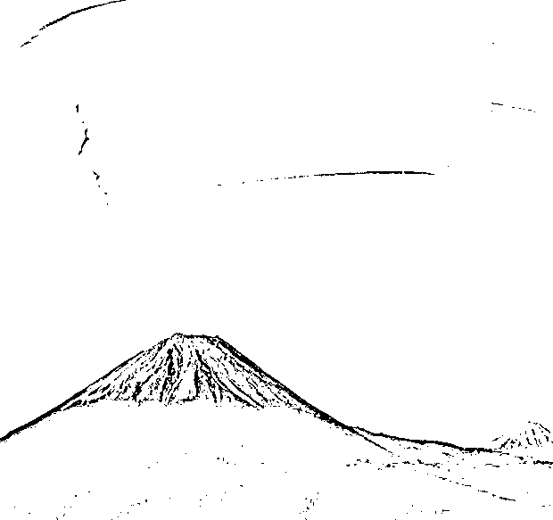

**占星学不能预测具体事件**

每个行星组合都有积极面和消极面，我一直尽量清楚地表明这点。但是行星间的强硬相位（出生图和行进图皆是）更可能带来挑战性的能量。不必为这些相位裹上糖衣，就好像人生应该享有不间断的美妙体验和拥有完美的性格。没人是这样的。

出生图是一幅生动的自画像，只有愿意面对真实的自我，包括那些困难的或是被隐藏的自我和人生部分，才能使它对你有所帮助。星图就像 X 射线一样照进灵魂，剥离肤浅的外皮，直达生命和存在的原型基础。

一定要懂得，**占星学不能预测具体事件，只能预测原型能量。**也就是说，出生图和行进会告诉你，宇宙法则会在什么时间以什么方式发挥影响，却不能告诉你具体的信息。诸如“你会在 2004 年 4 月 26 日在一家大型出版社担任主编”，或“2005 年新年在夏威夷，你将在日落时分遇到你的灵魂伴侣”。一位天赋异禀的遥视者或许能做到这些，但占星学不行。

同理，出生图中的一些原型动力对于我们来说是真实有效的，但是我们的性格，却不像所吸引的外在体验、事件和关系的本质那样匹配对应。这是因为**出生图中的原型模式描述了我们生命体验的性质。没有人能知道，特定的原型能量是会进入意识之内，成为性格，还是会显化在外，成为生命的事件、关系和环境。**

但无论怎样，它们最终都是自己意识的反映。尤其是如果我们没有在心理上“承认”这些特质在我们之内，我们就会将它们投射到他人身上，因此在人生中吸引到具备这些能量的人。正如荣格经常说的，被迫留在无意识层面的事物会变成我们的“命运”。

好的占星学分析能够带你穿透生命纷繁复杂的表象，清楚地窥见背后的原型模式。就连星图中暗示的问题也变得无关紧要，因为我们已经活出过它们，充分体验了它们带来的挑战，并超越那一阶段。

此外，我们还将会整合这些相位，发挥它们积极的一面。因为本就应该如此。占星分析的意义在于加速这一过程。一句古老的密意格言说：“农夫利用自然，而智者协助万物”。

最后，还要认识到，在某种重要的意义上，**占星学是超越善恶的。**如前所述，所有的原型都有正反两面。没有占星师能够单单只在星图的基础上判断这个人是“好”还是“坏”。

出生图不决定性格是否道德，也不决定最后会“成功”还是“失败”。它只显示一个人生命和性格的原型动力。至于一个人如何通过这些动力了来学习和成长，如何有创造性地体现和整合出生图中蕴含的多种潜能，全仰赖个人因素。同一原型有多种表现形式——建设性或毁灭性，崇高的或卑鄙的，很大程度上，会以何种方式显化，和带到情境的意识状态有关。诸神要被尊重，原型也会显化，但方式有很大弹性。 

而这就是占星学的作用所在了，**因为如果能提前预知未来原型显化的性质以及时机，就能朝积极的方向影响结果。**这样生命就变成了一场舞蹈——原型力量和人类意识的微妙互动，诸神和人类心智、意志、心灵一起出演的的游戏。

**有关原型占星的干货，你也许想看这篇：**

****▼****

[塔纳斯 | 到底什么是“原型”？](http://mp.weixin.qq.com/s?__biz=MzA5NjA0NTAxNg==&mid=403892891&idx=2&sn=0d5aecb6a7e038f7a8f3b2efa9eb9860&scene=21#wechat_redirect)

[塔纳斯 | 读懂七大行星的原型意涵](http://mp.weixin.qq.com/s?__biz=MzA5NjA0NTAxNg==&mid=2651384440&idx=2&sn=00b65f4fd689189cc845e88c97fc551a&scene=21#wechat_redirect)

[塔纳斯 | 原型占星学之三王星大解密](http://mp.weixin.qq.com/s?__biz=MzA5NjA0NTAxNg==&mid=2651384602&idx=3&sn=1422588bb8b7497f60669be994d42aba&scene=21#wechat_redirect)

**课程信息**

**** 

**课程名称：**原型占星学（ISAR 选修课之一）

**讲师：**理查德·塔纳斯

**开课时间**：2016 年 5 月 14 日

**授课时间**：每周六上午 10：00-12：00，共 8 节课 16 课时

**费用**：6800 元 （若道老学员 4800）

**授课形式**：网络在线授课（英文授课，中文翻译）

**课程负责人**：李老师、熊老师

**微信号**：2847613491（请备注原型课程报名咨询）

**◆ ◆ ◆  ◆ ◆**

**特别提醒****：本文由作者授权发布于若道平台，转载请注明“转自若道”并标明作者。**  

**2016 年 5 月 14 日**，西方著名文化历史学家、研究原型占星学 30 年余年的**理查德·塔纳斯**将为我们打开**原型占星学**的大门。

课程详细内容请点击文末“阅读原文”


# 官方招聘 | 听说你每天都想炒老板鱿鱼？

> 原文：[`mp.weixin.qq.com/s?__biz=MzA5NjA0NTAxNg==&mid=2651384633&idx=3&sn=0e6d6aae6cf9d6d0fd1473125e8fb3f2&chksm=8b4a598ebc3dd0986705613a74f298953fec3644ca5ee63db166285726fdece1e80e55d0d465&scene=126&sessionid=1692738841#rd`](http://mp.weixin.qq.com/s?__biz=MzA5NjA0NTAxNg==&mid=2651384633&idx=3&sn=0e6d6aae6cf9d6d0fd1473125e8fb3f2&chksm=8b4a598ebc3dd0986705613a74f298953fec3644ca5ee63db166285726fdece1e80e55d0d465&scene=126&sessionid=1692738841#rd)

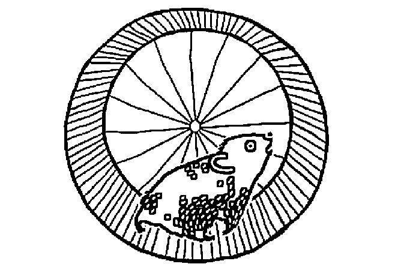

**每天干着自己不喜欢的事**

**是不是有点浪费生命？**

**你心有信仰并坐拥情怀**

**何不为占星学在中国的推广贡献一己之力？**

**如果你除了一腔热血还踏实肯干**

**请考虑加入若道**

**我们一起**

**做些实事 **

**为生命中的坚守**

**﹁关于若道**

**﹂**

若道星文化是由美国著名占星师大卫·瑞雷和国际占星研究协会（ISAR）中国区副主席蒋颖创办的一家占星教育、传播、咨询机构，我们通过以 O2O 垂直类教育的互联网产品，来实现帮助自己和他人的愿望。

**﹁招聘职务**

**﹂**

1 全职课程顾问（2 人）>>>>

**工作内容与职责**

*   负责以网络咨询、电话咨询、现场咨询等形式，介绍若道文化及若道所有核心课程； 

*   解答客户与占星学相关的问题，包括占星文化理念、若道课程结构、若道授课模式、老师背景等，为客户推荐适合课程； 

*   负责以电话回访、问卷调查、平台互动等方式与学员保持联络（微信群和社区管理维护）； 

*   了解占星文化传播动向，通过与学员的交流了解市场趋势和方向，参与课程设计； 

*   完成课程的招生任务以及课程报名情况统计分析； 

*   了解学员需求和反馈，及时解决问题，协助授课老师、翻译和助教做好课程服务工作； 

*   协助市场宣传部做好网络推广工作；

*   参与线上和线下课程的值课和现场服务。

>>>>

**任职资格**

*   爱好占星学，有现代占星学理论，掌握占星学基础知识； 

*   服务意识强，愿意应对高难度工作，目标感强，抗压能力强； 

*   有线上课程销售服务经验优先； 

*   完成若道 level5 核心课程、获得 ISAR 认证或 COAC 认证或相关心理咨询师证书者优先。

>>>>

**福利待遇：6000-8000+**

工作地点

**北京**

**地址：**北京市朝阳区百子湾路 32 号院苹果社区南区 10 号楼 A 座 2006 室

应聘方式

简历、占星水平、作品集、出生星图请发邮件至** freya.li@nodoor.com **

**简历请注明薪金要求**

**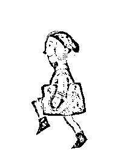**

2 技能交换（若干）

会琴棋书画，爱好占星学；爱电影、会 P 图，想学占星学；啥也不会，就擅方言土话，扎堆扯淡，偏喜欢占星学的……没关系，只要你能创意地将你的能力用在专业占星学的传播中，以此来交换学习，只管联络我们。**所有酬劳以若道课程学习方式置换，可任意挑选所喜欢的课程。**

>>>>

**微信编辑**

**具体工作是：**

*   微信文章的文字编辑及美术加工；

*   微信后台维护及回复读者提问；

*   选题策划及约稿；

*   软文写作；

*   创作美文。

**我们需要你：**

*   有驾驭文字的能力，专业编辑优先、英语能手优先；

*   紧跟潮流，有好点子；

*   会使用如 135 编辑器或秀米一类的微信编辑器；

*   会简单的 P 图、制图；

*   脑袋灵光又吃苦耐劳。

>>>>

**英文翻译**

**具体工作是：**

*   翻译及校对占星学专业文章；

*   去国外网站寻找占星学新资讯。

**我们需要你：**

*   英语 6 级以上、英语专业优先、有口译经验者优先；

*   具备占星学专业知识，通过 ISAR 认证或参加若道课程的系统学习优先；

*   会具有服务精神、抗压能力强。

>>>>

**图片设计**

**具体工作是：**

*   为即将发表的文章画图；

*   P 图、设计海报。

**我们需要你：**

*   有专业功底，会图片软件操作；

*   深知怎样的图既贴切文意，又吸引眼球，还能另类酷炫地表达出深刻的情感与体验。

>>>>

**视频制作**

**具体工作是：**

*   视频剪辑、制作。

**我们需要你：**

*   有专业功底，会视频软件操作；

*   有想法，能创新。

>>>>

**文章传播小蜜蜂**

**具体工作是：**

*   像蜜蜂传播花粉一样，将若道文章精编、搬运到各发布渠道；

*   参与诸多平台的互动，收集回馈并分析改进。

**我们需要你：**

*   像小蜜蜂一样勤（Hua）奋（Lao）；

*   热衷分享交流，融入社团，思维活跃。

>>>>

**文字整理**

**具体工作是：**

*   记录若道老师的精华语句；

*   搜集学员群重点文字、图片；

*   搜集助教答疑精华语句

**我们需要你：**

*   为若道现任学员，有一定占星学水平；

*   对交代工作能准时、高质量完成。

工作地点

**不限**

应聘方式

简历、占星水平、作品集、出生星图请发邮件至** freya.li@nodoor.com**

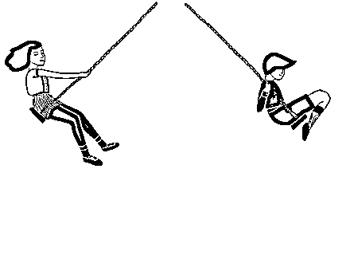

**如果你真的想为占星学做点事儿，若道欢迎你**


# Level 1-5 连报 | 占星学习一步到位，还帮你省 7400 元！

> 原文：[`mp.weixin.qq.com/s?__biz=MzA5NjA0NTAxNg==&mid=2651384633&idx=4&sn=2c5461669f931cbcbaaf497b5c4c14ee&chksm=8b4a598ebc3dd0987dc107e2ae52be3f1960d7257cb83b215bb9f5cab315a6e25e98a565c347&scene=126&sessionid=1692738841#rd`](http://mp.weixin.qq.com/s?__biz=MzA5NjA0NTAxNg==&mid=2651384633&idx=4&sn=2c5461669f931cbcbaaf497b5c4c14ee&chksm=8b4a598ebc3dd0987dc107e2ae52be3f1960d7257cb83b215bb9f5cab315a6e25e98a565c347&scene=126&sessionid=1692738841#rd)

**蒋颖老师主讲的占星学入门课程**

****Level 1-2 就要在 5 月 19 日**开课了**

**还没有参与课程的同学可以点击：**

**[惊呆了，这真的只是若道一年级新生的水平吗？](http://mp.weixin.qq.com/s?__biz=MzA5NjA0NTAxNg==&mid=2651384523&idx=2&sn=05b55df84becd8db236864012cb60079&scene=21#wechat_redirect)**

**提前感受下若道的学习氛围**

**在这里若道君有个好消息要告诉大家**

**除了****Level 1-2 的报名******

**若道还开通了 Level 1-5 连报通道**

**最最吸引人的是**

**连报特惠价是 27000 元** 

**比起单独报名 1-5 阶**

**足足优惠了 7400 元！**

**** 

**那么吸引人，来看看******Level 1-5 具体学什么吧！****

L1-5 联报

课程简介

****

** Level 1：星座，太阳和月亮**

12 星座是占星学最基本却又最深刻的概念，黄道 12 星座，是伟大的生命周期，而太阳和月亮是我们阴阳之本。  

　　     

**Level 2：**遇见行星和月亮交点****

在这个阶段，你将遇见行星们，还有与灵魂的过往和未来相关的月亮交点。这既是你，你的性格，也是你在生命故事中将会遇到的人、事、物的显化，也是你灵魂轨迹的线索。


**Level 3：五彩线穿起来——宫位、相位及元素组合**

在这个阶段，你将学习宫位，知道生命的故事发生在哪里。你会学习相位，那是行星之间的对话，是一颗行星如何用自己的能量去影响其他行星。

然后，你要学习如何将星座、行星、宫位、相位组合起来进行解读，这是把散落的珠子穿起来的过程。这个部分非常重要，是大部分占星学习者薄弱的环节，也是从爱好者走向职业占星师道路时承上启下的一个重要阶段。


**Level 4：星图舞会——星图综合解读 24 小时**

在这个阶段，你终于可以学会星图的综合解读了！前一阶段你学习得越扎实，现在就越开心。你可以看到，当那些行星、星座、宫位、相位穿起来的丝线开始跳舞，一个个故事图景就像织锦一样展现在你的面前。个性、爱情、事业，看到一个人的出生星图，你就可以开始讲他们生命故事的梗概了。在这里，大卫老师会分别讲解如何通过出生图进行性格、爱情、事业分析。在爱情解读部分，你还会提前学到比对图。


**Level 5：气象预报——预测技术和咨询技巧**

在这个阶段，你将学习各种预测技术——行进、月亮次限、太阳弧、返照图。你会学到行星周期！宇宙天象如何变化？它又会如何影响每个人的人生？通过这些预测工具，你就能够开始预测和规划人生了。

有关毕业

**考试和实习：**对于那些想要获得大卫老师资质班证书的朋友，我们将帮助大家在开始成为职业占星师之前，将由专业占星师组织小型督导工作坊，帮助大家实战解盘，为正式的收费咨询做好准备。通过毕业考试，参加督导工作坊，星盘解读的同学，将获得大卫老师颁发的职业占星师资质证书。

授课优势

**①先进的教学平台**

网络教学平台，支持手机、电脑、iPad 上网，可以随时随地学习。

**②回放复习**

学员可登录网站收看课程回放，在线复习课程，每次课可完整重看 3 次，课程结束后的 3 个月内有效。　

课程特色

**①与名师面对面**：北京同学可以来若道现场上课，和大卫老师面对面互动。大卫老师也可能前往主要学员所在城市，实现零距离教学。

**②互动答疑**：论坛、微信群随时提问；老师课上答疑；助教线上线下全程协助。

**③线下沙龙**：定期举办沙龙活动，复习上课内容。

**④强大的同学网络**：若道作为中国最顶尖的占星教学机构，在 4 年的占星教学中，培养了很多占星人才。若道让你和师兄师姐切磋，让你和国内著名占星师学习。（简单来说，就是，人脉！）网络授课，在北京开设免费现场参与名额，全程英文授课，配备实时翻译。

师资力量

**讲师团队**


**大卫·瑞雷（David Railey）**

若道创始人，《灵魂的目标》作者。拥有 46 年的占星咨询的执业经验，曾两任亚特兰大占星协会主席，是全美占星师联盟（AFAN）、美国占星师联合会（AFA）、全美占星研究委员会（NCGR）、国际占星研究协会（ISAR）和职业占星师组织（OPA）的成员，是联合占星大会（UAC, United Astrology Conference）督导委员会委员。大卫曾是 CNN、CBS 的占星节目的常驻嘉宾，多次在 BBC、WGS、WSB、WRGG 等节目中接受采访，并在亚特兰大主持电视节目《每日行星（Daily Planets）》达 4 年之久。


**蒋颖（Felicia）**

若道创始人，职业占星师。在若道系统学习占星，师从大卫·瑞雷。长江商学院 MBA，厦门大学经济学硕士，化学学士。国际占星研究协会（ISAR）中国区副主席。第一批获得国际占星研究协会（ISAR）认证的职业占星师。《灵魂的目标》译者。

**在后台回复**** 蒋颖 即可查看她的全部文集**

**准备好了吗？等你来加入！**

**2016 年，和若道老师一起，开启占星学的探索之旅！**

长按二维码添加课程负责人咨询~

****

报名请点击文末“阅读原文”

# 科普 | 此次水星逆行影响力最大的时间点在哪？

> 原文：[`mp.weixin.qq.com/s?__biz=MzA5NjA0NTAxNg==&mid=2651384602&idx=1&sn=5f7cfda62916cc0696ceb99614c8bb62&chksm=8b4a59adbc3dd0bb60def4c537507a16fc82d762b2a3a8da5219ec97e21d0bc68f1767f1bd4f&scene=126&sessionid=1692738841#rd`](http://mp.weixin.qq.com/s?__biz=MzA5NjA0NTAxNg==&mid=2651384602&idx=1&sn=5f7cfda62916cc0696ceb99614c8bb62&chksm=8b4a59adbc3dd0bb60def4c537507a16fc82d762b2a3a8da5219ec97e21d0bc68f1767f1bd4f&scene=126&sessionid=1692738841#rd)

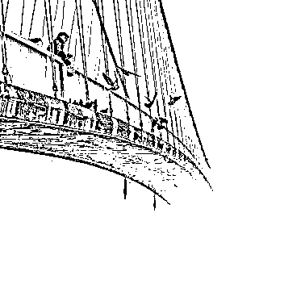 作者/Cora  ISAR 认证占星师 

图片来源/花瓣网

4 月 29 日 01:19，水星正式开始了 2016 年的第二次逆行，至此，四月份的五星逆行大戏也正式上演。在大家都谈水逆色变之际，若道君想和大家谈谈水星逆行的阴影期。

**再谈水星的“倒退”**

顾名思义，“逆行”是指行星的“倒退（retrograde）”。也就是说，在水星逆行期间，我们从地球上观察水星，它是在其正常绕太阳运行的轨道上倒着走的。为什么会有这样的现象呢？**这其实是地球和水星的相对位置的变化所造成的一个视觉上的假象。**


简单说就是，由于地球和水星都在绕太阳运转，但速度不同（水星位于地球和太阳之间，运动速度比地球快），所以二者的“相对速度”在不断变化。这就造成有时候从地球上看水星，它似乎是在“逆行”（如果我们的坐标不是地球而是太阳，就不会看到水星逆行了）。 


水逆通常一年会有三次，有时候是四次。**从地球上看水星，它跟太阳之间的距离不会超过 28 度（这也是为什么很多人的水星都跟太阳同星座），每当它到达这个度数，就会改变运动的方向（从地球上看！）**。

**注意 4 月 29 日与 5 月 22 日前后**

按照我们在地球上观察到的水星运动方向的变化，可将整个水星逆行过程分为三个阶段，分别是**前阴影期、逆行期和后阴影期**。

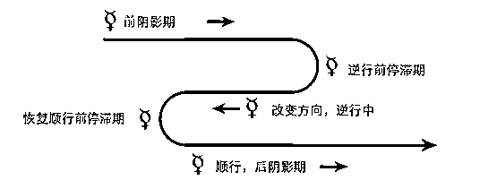

上图三条紫色直线属于水星逆行区域

“阴影期”是指**：水星在顺行的状态下，经过它逆行区域的时期。**

> #### 以本次“金牛座水逆”为例来说明
> 
> #### （以下时间均为北京时间）：
> 
> ○ 本次水星正式开始逆行的时间是 4 月 29 日，逆行结束恢复顺行的时间是 5 月 22 日。在这段时间内，水星从金牛座 23 度退回到金牛座 14 度。
> 
> ○ 而在此之前的**4 月 14 日，水星就已经“第一次”经过了金牛座 14 度这个度数**——4 月 14 日到 4 月 28 日这段时间即为水星逆行的前阴影期。
> 
> ○ 同理，水星在已经恢复顺行后的**6 月 8 日，将再次到达金牛座 23 度这个位置**，所以 5 月 23 日到 6 月 8 日这段时间即为水星逆行的后阴影期。
> 
> ○ 也就是说，在 4 月 14 日到 6 月 8 日，水星会在金牛座 14-23 度进行“顺－逆－顺”三段迂回式的行进。

**当顺行的水星开始放慢速度（尚未正式开始逆行之前），影响力就逐渐显现了。**当行星到达第一个停滞点（逆行停滞点）的时候，开始准备掉头。当逆行到第二个停滞点（顺行停滞点）的时候，恢复顺行。**在两个停滞点的位置，水逆的影响力最大。** 

也就是说**4 月 29 日和 5 月 22 日**，**是特别需要注意的两个日子**，而因为顺行停滞点标志着逆行的结束，所以**5 月 22 日前后几天带有一定“收尾”性质，更可能有重要的事件在这几天显现**。

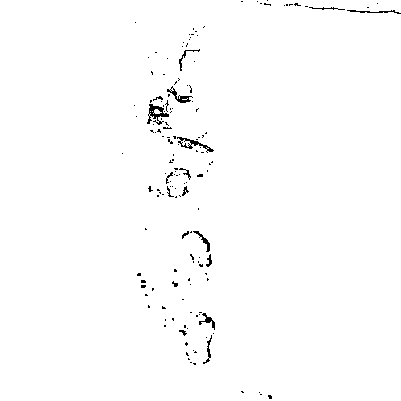

**别做什么&能做什么**

在占星学中水星是智能和语言之星，掌管思维活动、言语交流、学习、处理信息的过程以及一切形式的交通和传播，也跟部分情况下的贸易和教育相关。与木星和射手座掌管的“高等智慧”相比，水星掌管较低级的心智模式——我们如何从环境中接收到讯息并加以处理，以及如何将它们传递给他人。

**✘水逆期间做这些事要慎重：**

○ 说话、谈判、交易、文书、合约、邮递、信件、交通等等，都跟水星有关。也就是说，这类事件都会受到水星的影响。

○ 水星逆行有可能带来沟通误解、思考上的疏漏、外在干扰或是事情的延误，对谈判、贸易、交通、销售领域影响尤为严重。

○ 手机或网络故障、数据丢失、航班延误等是水星逆行期间的常见状况。

**○ 在水星逆行期间做重要的决定不太明智，因为你所了解到的情况很可能跟事实有偏差，或考虑不够全面。**

健康运作的水星会带来清晰的思维，以正确的决策彰显其意义，**而当水星逆行时，会让智力和理智显得力有不逮，我们的脑子好像不如平时那么好使唤，或是头脑中有个想法却不知道如何组织好语言将它表达出来，最终说出来的也未必是真正所想——别人也是一样。**

不用说，这个时候也不适合签合约或做任何重要的决定。**在水星逆行期间决定的事，待水星恢复顺行之后你很可能会后悔。**所以有一个最简单的提醒是，这个时候不要随便花钱，否则很可能东西买回家就后悔了。

**✔水逆期间适合做这些事：**

水逆当然也有积极的一面。

**○ 这段时间会是自省或重新处理过去遗留问题的好时候。我们与外在世界的沟通虽然似乎变得困难，但内在却可能有新的领悟和重要的觉醒升起。**我们看待世界、吸收信息的方式可能会跟平时不太一样，所以也可能发现一些平时被忽略或掩盖的、非常重要的真相。我们可能不太容易让别人了解我们，但我们或许能够对自己了解更多。

○ 在这段时间进行冥想、沉思、清理遗留问题、重拾旧计划，都是不错的选择。很重要的是，我们可以在这段时间充分思考，然后在水星逆行结束之后，再决定如何行动。**但对于已经开始的工作，则没有必要因为水星逆行就停下脚步，只要知道该如何防患于未然就好。**

你的故事

最近 5 星逆行，

给你带来了什么影响？

你又有什么体会？

欢迎留言分享。

你也可以将你的故事投稿给若道，

投稿邮箱 astrology@nodoor.com

你的故事


**作者简介**

**占星师 Cora**，全美占星师联盟（AFAN）成员，国际占星研究协会（ISAR）会员，获 ISAR 职业占星师资质认证，斯蒂芬·弗里斯特《变幻的天空》译者，个人星象文章见诸《心探索》《北京青年周刊》《上海电视》《空中生活》等杂志媒体。曾跟随大卫·瑞雷系统学习占星学，现为全职占星师。

微信公众号：聆宇 FM（微信号：lingyudiantai）

个人微信号：CoraAstro

**◆ ◆ ◆  ◆ ◆**

**特别提醒：****本文由作者授权发布于若道平台，**转载请注明“转自若道”并标明作者。****

顺势而为从占星基础做起！**2016 年 5 月 19 日**，蒋颖老师主讲的若道占星核心课程**Level 1-2**要开课了！她将带领你学习星座、太阳、月亮、行星、月亮交点等知识，让你进入占星学的世界！

报名及咨询，请点击文末“阅读原文”


# 水星终于加入逆行阵营了，别方，水逆锦囊在此

> 原文：[`mp.weixin.qq.com/s?__biz=MzA5NjA0NTAxNg==&mid=2651384602&idx=2&sn=6cc15570ba230b92b0aa01989f9a0de6&chksm=8b4a59adbc3dd0bbfefea5187c7c24df3ac1f46014649c54ee1db7966176c4452f5fb2dd6629&scene=126&sessionid=1692738841#rd`](http://mp.weixin.qq.com/s?__biz=MzA5NjA0NTAxNg==&mid=2651384602&idx=2&sn=6cc15570ba230b92b0aa01989f9a0de6&chksm=8b4a59adbc3dd0bbfefea5187c7c24df3ac1f46014649c54ee1db7966176c4452f5fb2dd6629&scene=126&sessionid=1692738841#rd)

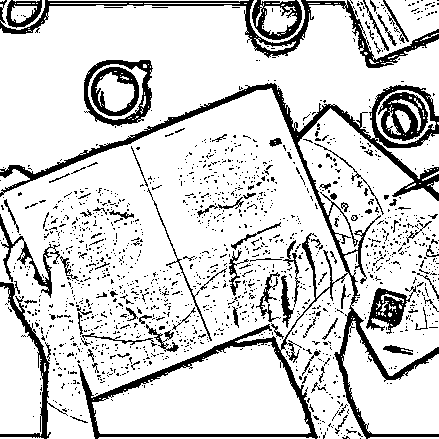

说起水星逆行，相信大家都已经不陌生了。2016 年 4 月 29 日，水星要在金牛座开始逆行了，一直到 2016 年 5 月 22 日才恢复顺行（好漫长的一个月啊）。 

今年水星逆行比往年还要多一次，都发生在土象星座（摩羯座、金牛座、处女座），已经旷日持久的木星、土星、火星以及冥王星的逆行又有了水星的加入，这么华丽丽的天象也是太炫酷了……

你招架得住吗？来看看十二星座的逆行锦囊吧。

Apr. 29

2016

+

by: 若道君

当任性的水星遇上稳稳的大金牛

金牛座是一个喜欢稳定、舒适，不喜欢变动的星座，离开了熟悉的事物，会让金牛缺乏安全感，金牛是极其抗拒的。而水星是一颗变数极高的行星，飞快的运转速度、迅速的应对表达，就连逆行次数也比其他行星多一些，就是这么任性。

**易变的水星遇上求稳的金牛座，并在金牛座的领域里肆意逆行，美丽宁静的春末因此无法惬意平和。**

车到山前必有路，更何况是金牛座这片肥沃的田原，水星驾着逆行的风火轮驰骋，搅乱了田原上的宁静，也是在提醒田原上生命，是时候接受变化了，迎接变化才能让你过得更舒适安宁。

给十二星座的逆行锦囊

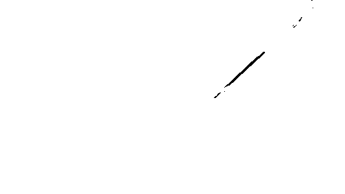

***若道君提示**：想知道水星逆行在出生星图第几个宫位，请打开熟知软件查看行进星图，或登陆若道官方网站 http://www.nodoor.com，点击“在线星盘”-“行运盘”，输入个人资料，即可查看。*


**上升****白羊座****或水星逆行在出生星图****第二宫**

*   **这段时间尽量不要借钱给别人。**

*   如果你从事财务工作，会发现工作上出现了一些问题，或许这个问题在半个月前就已经发现了，至今没有解决，你需要把更久以前的工作重新检查一遍，这也需要你的耐心。

*   你们中很多人都做事有点急躁呢，多与你信任的人交流，他们会给你合理的见解，让你踏实处理工作中的问题。

*   哪些事情让你感觉很没有安全感，觉得自我价值受挫，放松呼吸，回归内在找回你的自信，你会发现，此时已经感觉到了内心的宁静。


**上升****金牛座****或水星逆行在出生星图****第一宫**

*   适合探索自我，你可能不知道自己一直坚守的是不是正确的，也可能有些事情没有好好计划就开始行动了而让你乱了阵脚。不要紧张，**太阳与金星在水逆期间会给你加油，让你充分表现出自信与魅力。**

*   内心仍然有一些盲点，似乎不知道未来的方向，遇到难题不知道如何解决，时刻表现出自信与优雅，放慢追逐的步伐，就不会慌张了。

*   可以去做按摩，放松身心，回归自然，舒缓情绪。

****

**上升双子座或水星逆行在出生星图第十二宫**

*   很多人会告诉你，你是本次水逆的重灾区，你就觉得自己灵活的大脑无法正常运转了，发现自己巧辩的舌头不能动弹了。

*   放松些，**不能正常使用的不是你的大脑和你的舌头，而是你的内心。**

*   内心如困兽般困住时，是否已经忘记了来时的路，忘记了初衷，以至于你忘记了自己现在的方向。

*   现在，你需要回想起你的初衷，超越自我。 

****

**上升巨蟹座或水星逆行在出生星图第十一宫**

*   你对自己一直以来追求的东西产生了疑问，坚持的事情是否是对的？

*   请用积极的态度去面对，坚持的事情有了成效，这也源自你不断的尝试。

*   你可能**与失联已久的朋友再次取得了联系，你的热情与交际能力，让你身边的朋友越来越多**。

*   此时你也可以去参加一次朋友聚会，或者同学聚会，再次见到多年未见的朋友，也会让你满心双喜，说不定就遇到能给你提供支持的人。 

****

**上升狮子座或水星逆行在出生星图第十宫**

*   你在追求成功的路上奋斗了这么久，仍然会有困惑的问题出现，无论你多么努力，努力到哪个位置，都会出现让你目标不清晰的难题，让你时而怀疑自己所获得的经验是否是正确的。

*   **有个成语叫“持之以恒”，请你要牢记。**

*   无论身处什么位置，达到什么成就，仍需持之以恒，不骄傲不气馁。

*   你的大胆、阳光、自信会温暖到你身边的每一个人，也为你吸引来更多的动力，指引你前进。 


**上升处女座或水星逆行在出生星图第九宫**

*   **如果你有出远门的计划，建议缓一缓，最好等到水星逆行结束之后再去旅行。**

*   你会与信仰一致的朋友在一起分享各自心得，把之前自己所学所悟分享给志同道合的朋友。

*   当听到其他朋友的见解时，也若有所思，从中体会到了新的知识。

*   你会发现，分享自己之前的知识与体验，是一件如此开心的事情。

****

**上升天秤座或水星逆行在出生星图第八宫**

*   一直以来，你内心都有一处伤痛，它刺痛你的心，让你体验到死神般的绝望。

*   真正让你绝望的不是那处伤，而是你自己不愿意转变的心。

*   **恰到好处的沟通、温暖深入的文字，**会让你体验到一股暖流，将冰封化开，将伤口治愈。

*   固执已见只是一意孤行，没有人能永远伤害你，除了你自己。

** 上升天蝎座或水星逆行在出生星图第七宫**

*   学会与人稳固合作，学会处理人际关系，揭开你一直隐藏着的神秘面纱，让更多的人看到你，你会发现，生活如此美好，并不只有冷漠与仇恨。

*   你们其中一部分人可能已经被婚姻逼疯了，无论你是单身被逼婚，还是已婚在处理二人关系。

*   **学习换一个角度想问题，适当的沟通，会改善一对一关系的现状。**

 **上升射手座或水星逆行在出生星图第六宫**

*   你或许已经开始关注你的健康了，**制定合理的锻炼身体的方法，能给你带来身心的愉悦。**

*   你的工作也许会遇到一些小麻烦，请一定心平气和地处理，并虚心学习业务知识，一步一个脚印，做完工作后也要认真再检查一遍哦。

*   如果你对于自己所在岗位的业务不太熟悉，那么这是一个很好的机会让你温习业务，扎实的业务知识、完美的交际能力，会给你的工作带来新的活力。


**上升摩羯座或水星逆行在出生星图第五宫**

*   **你可能会收到之前朋友的消息**，真诚面对吧，这是上帝赐予你的礼物。

*   长久以来你可能都太认真忙于工作而忽视了娱乐、运动，紧张的工作给你带来很多压力，是时候放松自己了。

*   去大自然走走，听风的声音，看花的飞舞，你会发现精力充沛后能更好的工作，也能给你带来更多灵感。

*   尤其是对于从事创作的朋友，放松并不是浪费工作时间，而是给你的创意增添灵动的色彩。

****

**上升水瓶座或水星逆行在出生星图第四宫**

*   你有一颗飘忽不定的灵魂，一个与众不同的生命，一直以来，你总是追求不一样的人生，却容易找不到归属感。

*   享受当下，感受当下的平静、热烈、美好。让不羁的心渐渐安定下来，当下就是最好的归宿。

*   **如果水逆期间你打算搬家，最好再缓缓，再等等或许会找到更好的住处。**    

 **上升双鱼座或水星逆行在出生星图第三宫**  

*   **最近可能会与亲朋好友频繁联系，或是突然听到关于他们的消息，如果你们长久没见，是该在一起聊聊天了。**

*   最近也可能会遇到一件不知如何解决的问题，不要太固执已见，回忆、思考、与人交流会让你获得更多的信息，当你整合各方传来的信息时，你就了解了更多之前不知道的事情。

*   可以重新拜读之前读过的一本书，书中的语言、人物、事件，会让你有新的感悟。 

“

水星逆行并不可怕，可怕的是你不愿意改变、不愿意接受的心。固执的糖衣总会在灼热的阳光下化掉，想要优雅行走，需要深入思考、学习沟通技巧，提升自我，不断改变，才能不断进步，迎难而上。

”

**作者简介**

**海王家的微分**：海内存知己，天涯若比邻。浩瀚宇宙中低调的占星师一枚，在若道师从多名国际著名占星师学习严肃派占星学，有丰富的占星咨询经验，擅长流年推运。

个人咨询 QQ：1846189082

腾讯微博：@海王小巫

长按二维码，让金钱涌向传播知识与智慧的人~


**.gif")**

**特别提醒****：本文由作者授权首发于若道平台，转载请注明“转自若道”并标明作者。**  

顺势而为从占星基础做起！**2016 年 5 月 19 日**，蒋颖老师主讲的若道占星核心课程**Level 1-2**要开课了！她将带领你学习星座、太阳、月亮、行星、月亮交点等知识，让你进入占星学的世界！

报名及咨询，请点击文末“阅读原文”


# 塔纳斯 | 原型占星学之三王星大解密

> 原文：[`mp.weixin.qq.com/s?__biz=MzA5NjA0NTAxNg==&mid=2651384602&idx=3&sn=1422588bb8b7497f60669be994d42aba&chksm=8b4a59adbc3dd0bbb1256e34713dac2332630de42ae824c320aa37642ab6262b27f2a7fbf411&scene=126&sessionid=1692738841#rd`](http://mp.weixin.qq.com/s?__biz=MzA5NjA0NTAxNg==&mid=2651384602&idx=3&sn=1422588bb8b7497f60669be994d42aba&chksm=8b4a59adbc3dd0bbb1256e34713dac2332630de42ae824c320aa37642ab6262b27f2a7fbf411&scene=126&sessionid=1692738841#rd)

作者/理查德·塔纳斯  译者/Luke  校对/轩轩

激烈、革命、灵性、深刻、彻底转化……涉及到三王星的领域总是给人生带来复杂的事件和感受，因为这三颗外行星的原型就极有深度和多面性。

**1**

**天王星**

天王星代表**变化、自由、叛逆和革命**的法则。它和各种**不期而遇的现象**、**突然的惊喜和觉醒**，以及**智性、心理和灵性的突破**有关。它掌管结构的突然崩塌，带有兴奋和电性的特质。

它同时掌管个人主义和原创性、发明和科技、有创造力的天才和出色的心智洞见。天王星是进入现代以来发现的第一颗行星。那是在 1781 年，一个激进的文化变革和革命的时代。它的原型和希腊神话人物普罗米修斯最接近，他叛逆天庭，从诸神那里偷来火种带给人类，使人们的生活更加自由。

**和天王星相关的普罗米修斯冲动，代表着我们内在的某部分想要走自己的路，在人生中选择个人主义道路。**它的影响力使我们**变动不安、不可预测（有时还不负责任）**，**不断寻求个人自由和新的体验。**

天王星游走于创造和创新之间：**低级表达**包括行为怪异和无视法律，但**最高表达**代表真正的天才、突破文化和人际界限的能力。

天王星相关的普罗米修斯原型代表从受限的产道挤出并见到光明的阶段，突然经历到自由、觉醒、新生、新身份和新视野的扩张——解放了的普罗米修斯。

然而这个原型还有另外一面，这是和之前截然不同的天王星体验。**如果一个人没有充分在内在整合创造性的自由冲动、自主的个人主义、接受改变的能力，那么这一原型就会在外在生活中显化动荡不安的情境。**

也就是说，如果我们自己没有发展出求新求变、独立自主、欢迎新鲜事物的能力，那么充满变化、不可预测的事件就会降临到我们头上，迫使我们向新视野和新可能性开放。天王星冲击了我们内在土星的部分，后者希望我们安于现状、保持原样，遵守传统、秩序，抵制变革。

因此**普罗米修斯原型的叛逆面可以来自内在或外在，后者的情况会导致一个人不断经历改变，调整人生的方向**。无论这些改变由其他人、新的身心条件，还是外在环境引发，都要学会用开放的心态释放过去，接受新事物。

如果一个人过分地认同过去，尝试攀附过时的结构，天王星就会化身一股动荡的力量，迫使其改变发生。但无论什么时候都可以学习整合天王星原型，学习联结获得自由和兴奋的能力，对未知的新事物保持开放。

**无论哪颗行星和天王星形成主要相位，该行星原型的表现方式就多了一份自由色彩，通常以突然发生、不同寻常或无法预期的方式呈现。**这一行星原型被赋予新鲜刺激、创造创新的特点，成为自由和变化的源头。

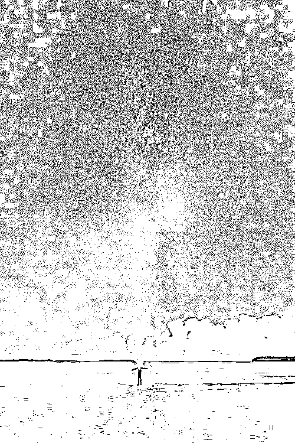

**2**

**海王星**

**海王星原型象征超自然、理想世界、想象和灵性。**它代表着意识的海洋，消融了自我和他人、自我和宇宙、自我和神、具体现实和其他现实之间的辩解。

从“围产期”的角度来讲，海王星和子宫内婴儿的意识尚未和母体分裂的状况有关，这里有一种共栖的结合，如海洋般融为一体的感觉。在深入的自我探索中接触到原始记忆的人认为，这种状态本质上是与自然、上帝、万物合为一体的神秘体验，意识自由流动，穿越多种实相——灵性、想象或幻觉，互相交错、难以区分。

海王星掌管理想世界，可以将其定义为完美包容一切的母亲子宫、灵性世界的理想实相，或一个人最高的梦想和愿望。

然而，和其他的行星原型一样，海王星也有阴影面。它既能启蒙一个人**达到超越俗****世的最高灵性真理**，也能诱人**沉溺于逃避主义的幻想、幻觉和欺骗**。海王星代表涅槃（*Nirvana*）——至高的极乐，超越所有俗世的分裂和对立；但也代表玛雅（*Maya*）——神圣的游戏，创造无数的幻相世界、引诱意识迷失。海王星与疯狂和神秘相关，两者之间的界限难以划分。

**海王星也和自恋原型相关——被自己的镜像深深吸引**。这也可以被理解为永远在体验自身无穷意识的神性，反映到现实的例子包括——神秘家在冥想中体验至乐、自恋者被自己的样貌深深吸引、瘾君子和酒鬼、窝在沙发追剧、逃避主义者、无法分辨真实和虚幻的精神病人、沉溺于某种意识模糊的状态。

海王星有一种无私和超俗的特质，可以在圣人和烈士、社会工作者、瑜伽士或和尚的身上看到。然而同样的特质也可导致不健康的自我否认、虚弱无助感、脱离社会和现实，或夸大灵性，以至于否认了物质世界和身体。和以往一样，我们要做的就是为海王星和其他行星的需求找到平衡。

海王星掌管人类渴望超越现实的欲望：渴求海市蜃楼一般的理想、想要消融界限融入宇宙、和梦境融为一体、超越分离和限制的世界、体验爱和慈悲的流动、超越自我的局限。正是这种驱力或渴望驱使人们探索灵性。因为海王星和理想、天堂、大海一般的子宫有关，心灵模糊地记得关于它们的原型记忆，所以**星图中海王星坐落的区域通常伴随着一种失落或渴望的感觉。**

海王星会消融一个人的界线，因此它使一个人对所有事情敏感，包括其他人的内在状态、外在的刺激、其他的实相等。海王星大大地加强了直觉，但它也使人倾向自欺地投射自己的内在状态到别人身上。

海王星与身体和心灵的疗愈能力有关。它有种调谐、净化、升华的功效。但生理上海王星倾向使人的身体变得虚弱（却加强了灵性），同时心理上也削弱了自我（却加强了和意识整体的联系）。海王星不变的动能是消融结构，使一切回归不可分化的联合状态。它似乎也和各种水或液体有关，无论是外面的海洋还是承载胚胎的羊水。

由于它掌管想象的领域，海王星还可被看做想象创作和艺术图像的源头。它掌管神话、梦境、符号和意识中流动的图像。它也是宇宙灵魂的灵性源头。同样地，作为万物一体的灵性象征，海王星也可以被看作爱和慈悲的源泉。它掌管信念和希望，对不可见的事情的确信，和对灵性之美的探寻。它是灵性宗教的原型。

**当一颗行星和海王星成主要相位，这颗行星就多了一份敏感的性质，变得弱化或灵性化，或两者皆是。这一行星倾向于变得理想主义，一方面容易陷入幻觉，另一方面也多了一分神秘色彩，汇合了想象和灵性的法则，并有潜力成为扩展意识的渠道。**

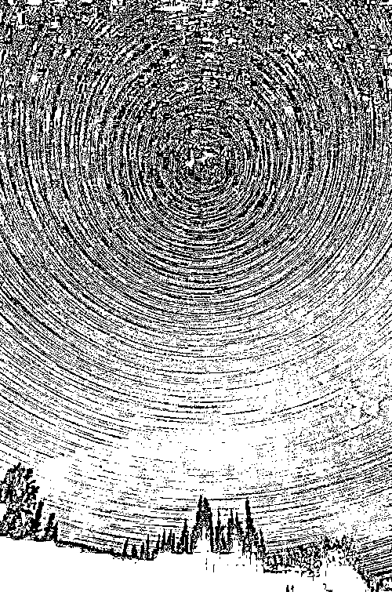

**3**

**冥王星**

最后是冥王星：**原始能量的原型，推动进化和转化的宇宙力量。**冥王星代表力量法则、大自然的威力、原始的性力、侵略本能。它基本和弗洛伊德的本我概念等同。它是生命的狂欢能量、“拙火”、昆达里尼。它推动、加强、吞噬、转化、毁灭和重生。

**冥王星掌管本能和自然的力量，也掌管出生、性行为和死亡的生理过程。**最深的层面上，它与死亡和重生的秘密相连。冥王星掌管动荡、崩溃和腐化，但也催动重生复苏和涤荡净化。它反映了原型层面的地底世界，那个黑暗、神秘、恐怖的地方，隐藏在表象之下、自我和文明的假面背后，不时出现，释放巨大的毁灭和转化力量。

许多人类心灵深处的毁灭本能，如杀人的仇恨、愤怒的嫉妒、无法抑制的贪婪和欲望等，都反映了冥王星的活动，这就是弗洛伊德说的沸腾的本能。

冥王星的活动显现于火山喷发、狮子狩猎、战争、性高潮、母亲生产的高潮阶段。它代表郁积能量的暴力释放——地球地震、人类身体和心灵的治疗或精神崩溃。从许多方面来看冥王星是海王星的对极互补，在一起它们组成了酒神狄俄尼索斯和太阳神阿波罗的两极对立：冥府和天堂、火山和海洋、自然和灵性、本能和想象。并且，跟海王星一样，冥王星是深不可测的。

原型出生阶段中，冥王星对应婴儿被母亲身体排挤，经历生死挣扎的生理阶段，此时性本能和侵略本能得到了最大的激发。因此冥王星也有两面，体现在自然活动中：**毁灭的一面**由卡利女神代表，吞噬子嗣的母亲；**建设性的一面**由女神夏克提代表，是推动生命和进化的宇宙神圣能量。

冥王星就是叔本华和尼采说到的宇宙意志——在某一层次上像是盲目驱动的本能，另一层次上却具有自然的进化智慧。冥王星是自然本身，象征大宇宙间生命永恒地进化和转变。

有句话说得好——在人生的历程中，我们都被生命的火焰吞噬：唯一的问题，也是我们面对的挑战就是，这一过程会使我们更加完美还是更扭曲。

**当一颗行星和冥王星形成主要相位，该行星原型将在此人的生命和性格得到加强，变得剧烈，有时走向极端。它可能成为此人生命中是权力斗争的源头，但是也能引发深刻个人的转化。**


那么，到这里十种行星原型就讲完了。原型具有深度和多面性，并且随着研究深入，还会不断开启新的含义。一定要记住，虽然这里我是一个个分别介绍了它们，但在现实中这些原型总在互动，比如冥王星与金星一起，或火星跟天王星，常常还会看见三四个原型同时互动。正是出生图和行进图中的这些复杂原型互动——形成了占星学分析的基础。

**敬请关注若道君之后的推送**


下一篇我们讲原型占星学的相位和行进

**有关原型占星的干货，你也许想看这篇：**

****▼****

[塔纳斯 | 到底什么是“原型”？](http://mp.weixin.qq.com/s?__biz=MzA5NjA0NTAxNg==&mid=403892891&idx=2&sn=0d5aecb6a7e038f7a8f3b2efa9eb9860&scene=21#wechat_redirect)

[塔纳斯 | 读懂七大行星的原型意涵](http://mp.weixin.qq.com/s?__biz=MzA5NjA0NTAxNg==&mid=2651384440&idx=2&sn=00b65f4fd689189cc845e88c97fc551a&scene=21#wechat_redirect)

**课程信息**

**** 

**课程名称：**原型占星学（ISAR 选修课之一）

**讲师：**理查德·塔纳斯

**开课时间**：2016 年 5 月 14 日

**授课时间**：每周六上午 10：00-12：00，共 8 节课 16 课时

**费用**：6800 元 （若道老学员 4800）

**授课形式**：网络在线授课（英文授课，中文翻译）

**课程负责人**：李老师、熊老师

**微信号**：2847613491（请备注原型课程报名咨询）

**◆ ◆ ◆  ◆ ◆**

**特别提醒****：本文由作者授权发布于若道平台，转载请注明“转自若道”并标明作者。**  

**2016 年 5 月 14 日**，西方著名文化历史学家、研究原型占星学 30 年余年的**理查德·塔纳斯**将为我们打开**原型占星学**的大门。

课程详细内容请点击文末“阅读原文”


# 大卫谈占星 | 金牛座：即使不爱动弹，也得改变自己啊！

> 原文：[`mp.weixin.qq.com/s?__biz=MzA5NjA0NTAxNg==&mid=2651384575&idx=1&sn=28208517e22e0e76fab3bbe5b9a91186&chksm=8b4a5848bc3dd15e0032170639d7f0253cccde3dab6a4512faad2d7ecf89bd69af2c7c4b59ba&scene=126&sessionid=1692738841#rd`](http://mp.weixin.qq.com/s?__biz=MzA5NjA0NTAxNg==&mid=2651384575&idx=1&sn=28208517e22e0e76fab3bbe5b9a91186&chksm=8b4a5848bc3dd15e0032170639d7f0253cccde3dab6a4512faad2d7ecf89bd69af2c7c4b59ba&scene=126&sessionid=1692738841#rd)

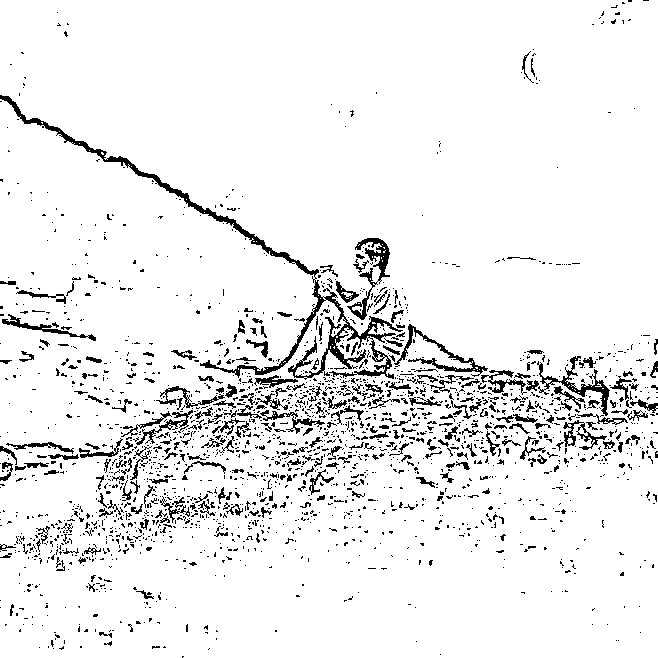

作者/大卫·瑞雷 图片/花瓣网

如果你的出生星图中金牛座特质很强烈，并且[上篇文章](http://mp.weixin.qq.com/s?__biz=MzA5NjA0NTAxNg==&mid=2651384546&idx=1&sn=0fd1724e243b810b6abd77422dc3719d&scene=21#wechat_redirect)（点击阅读）提到的负面标签让你深有同感的话，你要认识到这些关于“我是谁”的根深蒂固的自我设定是可以改变的。

**你可以改变根深蒂固的自我设定**

改变并不简单，但绝对值得！你得到的回报将是一个更有乐趣、更丰富的人生，你能用轻松的心态感激生命中所有美好的事物。毕竟，你生来就比其他星座有更强的享受舒适的能力，尤其是触觉、味觉、嗅觉等感官体验。

你总是表现得轻松沉着，你的行为鼓励他人将你视作依靠。当人们说，他们想要一个强大有力的依靠时，指的就是你这种人，尤其是当他们再加上一句：“噢，还要性感！”金牛座的感官特质就像在说：“我不着急。我们应该花些时间享受这一切。”舒适对你来说十分重要。事实上，**舒适指引着你的感官，让你可以感知什么是有价值的，什么是没有价值的！**

但是，如果有人因为你被动的外在表现而错误地认为你容易任人摆布，那么这些人一定会大吃一惊！在你不想动的时候，哪怕试图推动你半步，你都会岿然不动！**没有任何星座比你更顽固，更抗拒改变。这仅仅是因为你不想去做那些你觉得没什么价值的事情，尤其是在你已经感觉很舒适的时候！**除非有相当大的机会能获得回报或收益，否则为什么要离开那把舒服的椅子呢？ 

你的肢体语言是不慌不忙、平静温和的。在运动中，你可以看似轻松地完成艰难的壮举。看到李连杰在电影中展现出的高超武技，那些能力稍逊的人也想试一试，结果发现自己根本做不到。**这种表面上的轻松是建立在一个强有力的“核心”基础之上。**

**大师们教授的根植于身体更深处的“气”是武术的精要，也是金牛座的天性。这种根基更强的力量是金牛座力量的核心。**即使是金牛座著名的“耐力”也部分归功于其对精力的合理分配，不浪费，才能有更多的能量储备。

**你无法预计金牛座的财富收入数字后有多少个零，这一点取决于他们的“舒适区”。**金牛座以贪婪闻名，一些人甚至因此招来指责，比如煤炭巨富邢利斌花费 1500 万位女儿举办婚礼。但是这样的奢侈 —— 如果是真的话—— 并不是典型的金牛座作风。

金牛座是最重视物质舒适的星座，无论是新宝马车中的真皮座椅，还是最爱的老座椅上已经老旧磨损的柔软舒适的面料。同样，**金牛座人能够敏锐感知有价值有品质的东西。**

**那些著名的金牛座人士**

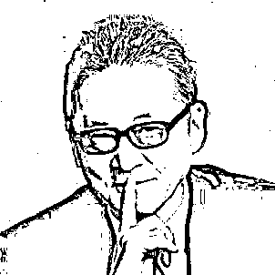

********▲ 作家/社会评论家李敖********

他在台湾顽强地对抗批评者，年事已高的他，比自己的任何政敌都活的更久。根据十二星座的数据统计，金牛座在长寿和忍耐力上“略有优势”。 

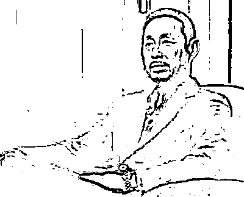

************▲ 演员陈道明************

“事业”长青也是金牛座演员的标志，他被称作中国演艺界的皇帝，在各种各样的影视作品中熠熠生辉。

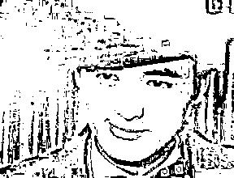

******▲ ****香港演员**********周润发****

周润发轻松惬意的表演方式就是典型的金牛座自然悠闲的行事本性。

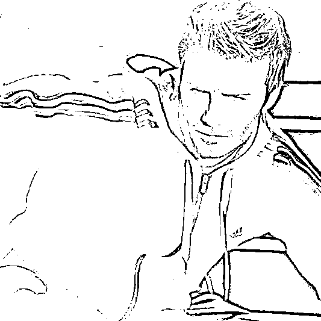

********▲ ********英国足球明星********大卫·贝克汉姆********

力量和耐力是金牛座的标志，始终保持着外场球员出场的记录。当然贝克汉姆将他帅气的外表和长久的职业生涯转化为了可观的财富，这常常是另一个金牛座的标志 —— 吸金。

  **其他金牛座的名人 ** 

—— 其他金牛座人包括 —— 

*   杰克·尼科尔森；

*   《星球大战》中的乔治·卢卡斯；

*   演员阿尔·帕西诺、勃拉姆斯；

*   演员兼导演奥森·威尔斯、奥斯卡·辛德勒（《辛德勒名单》的故事原型）；

*   二十世纪最著名、最令人惊艳的艺术家张大千。起初，他是一位国画家，到 1960 年，他又成为了一位著名的现代印象派和表现派画家。

——著名的中国女性包括——

*   陈冲（1961 年 4 月 26 日）

*   胡因梦（1953 年 4 月 21 日）

*   林忆莲（1966 年 4 月 26 日）

*   翁美玲（1959 年 5 月 7 日）

*   陈淑桦（1958 年 5 月 14 日）

*   谢娜（1981 年 5 月 6 日）

*   梅婷（1975 年 4 月 30 日）

**金牛座的爱情**

**沉着冷静 精力充沛 自然真实** 

**危机应对****占有欲 务实**

**顽固 ****抗拒改变**** 自私**

*   在爱情关系中，你的积极特质就是**在危机之中沉着冷静，在床上精力充沛持久，以及一种自然真实的魅力。**

*   因为你优秀的**危机应对能力**，让可以成为支撑关系长久下去的 “坚强后盾”。

*   你面对的挑战是**占有欲**。你认为你“拥有”你的爱人，也就是说“他们属于你”！**你非常顽固，抗拒改变，可能表现出自私的行为。**

*   你非常看重**伴侣的身体特征和物质资产**，这样务实的考虑影响着你对关系问题的决策。

**金牛座的事业**

**敬业精神**** 直觉 可靠**

**稳定****市场价值 消费者要求**

**坚持****耐力 抗拒革新**

*   你的决心会带来回报，至少你会因为在任何情况下都坚持工作的**敬业精神**而获得奖励。

*   因为你对**事物的价值**有着良好的**直觉**，所以人们常常仰赖你做出有关资金的正确判断。

*   金融市场常常对你有着巨大的吸引力，你喜欢用**可靠**的方式赚钱。

*   **建筑、不动产、银行业、农产品或稳定的能源资源**，比如煤炭，可以作为收入来源或职业。

*   即使你从事创造性工作，你依然会关注自己工作的**市场价值**。

*   你不会满足于成为一个“快饿死的艺术家”，你会按照**消费者的要求**改变自己的创造性工作。

*   一旦你找到一种赚钱的好方法，你就会**坚持**下去。

*   你在商界**耐力十足**，你的企业以长久屹立而令人刮目相看。

*   你对改变的**缓慢适应力**会让你处于危险之中，在新的理念被证明具有实际价值之前，你都会**抗拒革新**。

**若道君还为你准备了这些金牛座的文章**

****▼****

[](http://mp.weixin.qq.com/s?__biz=MzA5NjA0NTAxNg==&mid=2651384368&idx=1&sn=6b98cf58afecf6cc62f90ce95629e995&scene=21#wechat_redirect)

[金牛月独家话题 | 如何成为有钱人](http://mp.weixin.qq.com/s?__biz=MzA5NjA0NTAxNg==&mid=2651384368&idx=1&sn=6b98cf58afecf6cc62f90ce95629e995&scene=21#wechat_redirect)

[大卫谈占星 | 数数这些年金牛座被贴歪了的标签](http://mp.weixin.qq.com/s?__biz=MzA5NjA0NTAxNg==&mid=2651384546&idx=1&sn=0fd1724e243b810b6abd77422dc3719d&scene=21#wechat_redirect)

[小白学占星 | 太阳进入金牛座，谷雨到了](http://mp.weixin.qq.com/s?__biz=MzA5NjA0NTAxNg==&mid=2651384349&idx=2&sn=2920f445c2b9e35f03c55f03e4f227cf&scene=21#wechat_redirect)


想体验大师级的占星疗愈？

大卫老师**占星咨询**预约进行时

**生命议题、职业发展、关系咨询、少儿成长、年度规划和预测**

```
预约咨询请联系许小姐 ：010-58760529
```

*大卫老师教你的妙招都 get 了吗*

*来说说吧*

**◆ ◆ ◆  ◆ ◆**

**特别提醒****：若道拥有本文版权，转载请注明“转自若道”并标明作者。**  

**星座真奇妙，想不想来学学？**2016 年 5 月 19 日，**蒋颖老师**主讲的若道占星核心课程**Level 1-2**要开课了！她将带领你学习**星座、太阳、月亮、行星、月亮交点**等知识，让你进入占星学的世界！

报名及咨询，请点击文末“阅读原文”


# 北京签售会丨这可能是你最接近苏·汤普金斯的机会

> 原文：[`mp.weixin.qq.com/s?__biz=MzA5NjA0NTAxNg==&mid=2651384575&idx=2&sn=69e10ff6c7552c8808989cf645341bf6&chksm=8b4a5848bc3dd15e037c7c1c3a0874c26e9ed9fe307af6a8e560a2a3f3a139a25a1050f57d01&scene=126&sessionid=1692738841#rd`](http://mp.weixin.qq.com/s?__biz=MzA5NjA0NTAxNg==&mid=2651384575&idx=2&sn=69e10ff6c7552c8808989cf645341bf6&chksm=8b4a5848bc3dd15e037c7c1c3a0874c26e9ed9fe307af6a8e560a2a3f3a139a25a1050f57d01&scene=126&sessionid=1692738841#rd)

“

**她**在 2000 年**创立**了**伦敦占星学院**，培养出许多优秀占星师。

**她**在 2003 年因卓越贡献而获得英国占星协会的**查理斯·哈维终身成就奖。**

**她**是英国资深的占星学家和咨商师，拥有超过四十年的占星经验，并经常在世界各地举办占星研讨会和公开演讲。

**她**同时也是一位接受过心理学与心理咨询训练的顺势疗法专业治疗师。

**她**就是著名而又低调的**苏·汤普金斯女士**。

”

**她来到中国啦！**


5 月 5 日在北京彩虹书吧，**苏·汤普金斯**女士联合若道占星举办独家签售会。

还有对苏·汤普金斯的**若道****独家专访**！

粉丝们，见偶像啦！快把你们珍藏的**《当代占星研究》**拿出来~

光有签售满足不了你们对偶像的敬仰之心对不对？

还想近距离感受偶像如海洋般的思想深度对不对？


若道君最懂你们了！

活动信息

**活动时间**：2016 年 5 月 5 日 19:00-21:00（18:30 开始签到）

**签售人**：苏·汤普金斯

**活动地点**：彩虹书吧，东三环中路 39 号建外 SOHO 西区 15 号楼 B1578

**活动费用**：150 元（限量 80 张）

**报名方式**：点击**阅读原文**直接报名

**惊天福利！**

**价值 88 元的《当代占星研究》你可以免费获得！**

（占星爱好者进入严肃占星领域必备书籍）


你只需要以下四步操作即可获得：

1.转发该条微信到朋友圈，若道老学员注明学号

2.截图

3.添加若道客服 Echo 微信

4.发送截图至客服微信并标注“**苏汤签售**”

仅限前 60 名哦！

客服二维码在此~


**活动现场如何到达**

```
地址：北京市朝阳区东三环中路 39 号建外 SOHO 西区 15 号楼 B1578-1579 彩虹书吧

交通路线：地铁 1 号线，永安里站 C 出口南行至华彬艺术博物馆东侧；或地铁 10 号线，国贸站 D 出口西行至恒惠西路问路

电话：010-58699117
```

.gif")

走近苏·汤普金斯

以下为苏·汤普金斯之前访谈内容：


当下的我不会拘泥于任何一种僵化的模式来进行咨询。首先我会好好观察客户的星图，事无巨细都一一掌握，然后我会通过交谈了解曾经发生了什么。

如果在星图上看到过多的讯息，占星师往往会只见树木不见森林。每张星图上都会有几个至关重要的故事，把这些故事连接在一起就能勾画一个人的人生。**首先要发现的就是星图的本质问题。**小行星和其他因素只能提供一个更加个人和具体的信息，但并不能对主要问题提供更多帮助。

.gif") 

以下为学员工作坊感想：

苏·汤普金斯老师从极为基础的占星知识、理念入手，之后通过大量案例、结合星图进行分析解读，详细地展示综合解读技巧，并让学员领会到基础的重要性。此外，老师还初步介绍了占星学与顺势疗法如何结合运用。

苏·汤普金斯老师深入浅出地让我们体验到她占星分析系统的特点：**视野开阔却不失结构性，让繁琐的信息、分析，回归于简约清晰的本质，进而带来明确、实际、易懂的启发。** 

.gif") 

以下为粉丝个案感想：

汤普金斯老师通过抽丝剥茧的分析、穿针引线的连接，**巧妙地将过去、现在、未来进行整合**，这种**整体式的重组**，让人在情绪上充满感应与共鸣，在思维上也觉得原由充分、方向清晰，这也给我日后的占星咨询工作，提供了许多有益的启发。

老师专注的审视星图一阵之后，给出的答案，让我全身都起了鸡皮疙瘩！因为她指出的问题，正是我的家族中多名成员现在已经表现出来的问题！太神奇了！

.gif")

看了这么多之前的精彩内容

你还不快来？


- END -

# 直播苏·汤普金斯老师中国行 | 想不到你是这么萌萌哒~

> 原文：[`mp.weixin.qq.com/s?__biz=MzA5NjA0NTAxNg==&mid=2651384575&idx=3&sn=81a10e5a57a5771d83564cd8d8bdd80c&chksm=8b4a5848bc3dd15e5a3fcf81be2a3376693f9308b86de5f23ff26e0b9bccfcf4141ff03f5ccb&scene=126&sessionid=1692738841#rd`](http://mp.weixin.qq.com/s?__biz=MzA5NjA0NTAxNg==&mid=2651384575&idx=3&sn=81a10e5a57a5771d83564cd8d8bdd80c&chksm=8b4a5848bc3dd15e5a3fcf81be2a3376693f9308b86de5f23ff26e0b9bccfcf4141ff03f5ccb&scene=126&sessionid=1692738841#rd)

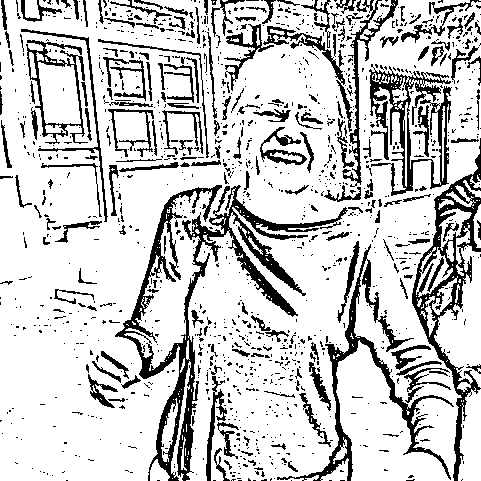 

**苏·汤普金斯这个名字大家一定不陌生：**

**《当代占星研究》的作者；**

**还著有《占星相位研究》、《顺逆皆宜的人生》；** 

**在英国占星学院（FAS）执教多年；**

**创建伦敦占星学院（LSA）；**

**获得英国占星协会颁发的查尔斯·哈维奖项。**

**4 月 26 日，苏·汤普金斯老师受若道占星之邀抵达中国，**

**在若道北京开设医疗占星工作坊和顺势疗法工作坊。**

**一起来看看前线记者发来的消息，**

**众多荣誉加身，**

**苏·汤普金斯老师私下又是怎样的呢？**

**想要了解这位国际大师，**

**请**[**点击链接阅读专访**](http://mp.weixin.qq.com/s?__biz=MzA5NjA0NTAxNg==&mid=2651384386&idx=1&sn=ebfcce755984c491efcca07acc6bee3a&scene=21#wechat_redirect)

 2016 年 4 月 26 日中午 13 点 13 分，

苏·汤普金斯老师抵达中国，

几位老师望眼欲穿的等待中…

▼▼▼

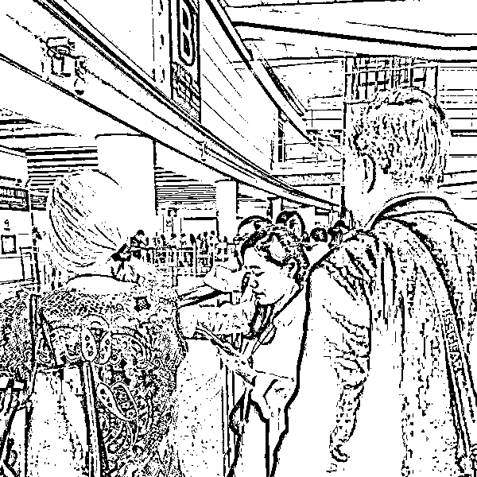 

大卫老师是一枚暖男，

手捧鲜花等待着…

▼▼▼

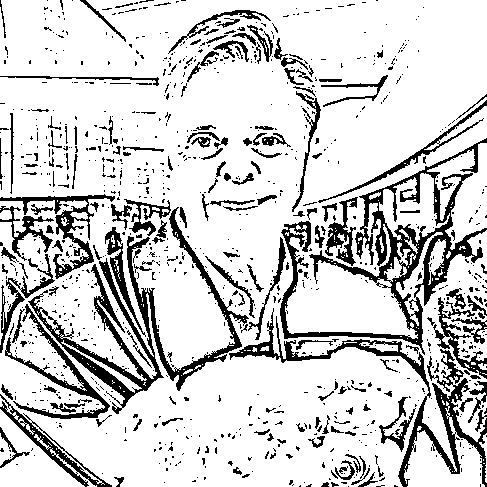 

终于迎来了老师！

话不多说，全在拥抱中。

▼▼▼

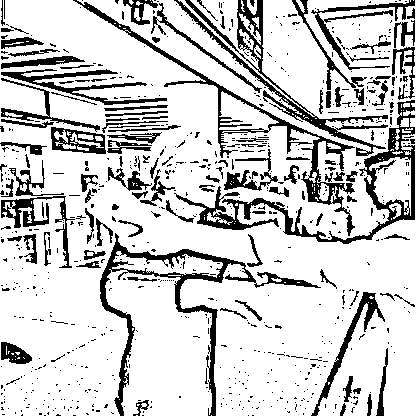 

不仅仅是交谈，

还有喜悦、激动、久违的重逢和莫名的感动。

▼▼▼

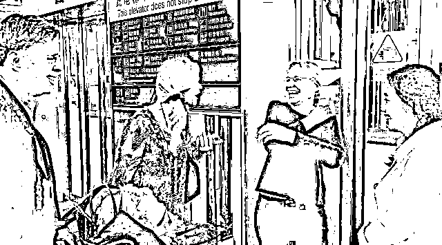 

苏·汤普金斯老师教学态度严谨端正，

平时的她平易近人、亲切自然。

▼▼▼

 

老师灵动的眼神好似魔法的咒语：

“无限的宝藏潜藏其中。”

▼▼▼

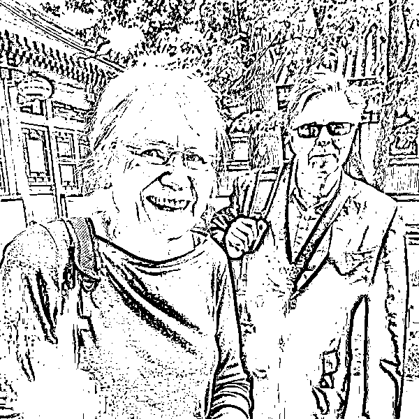 

老师曾描绘关于职业的幻想：

比如野生动物摄影师或喜剧演员。

在团队作业中，

她常常会扮演类似小丑的角色讲一些搞笑的段子。

瞧！现在老师是不是像充满喜感的演员，特别可爱！

▼▼▼

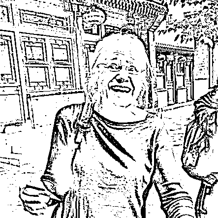 

苏·汤普金斯老师的太阳和金星在第六宫准确合相，

且与土星成四分相（90 度角）。

老师不仅喜欢教书，

更乐于参与到他人自我发现的历程当中去，

老师曾说，

她不太相信积极的反馈，需要持续不断地寻求明证。

▼▼▼

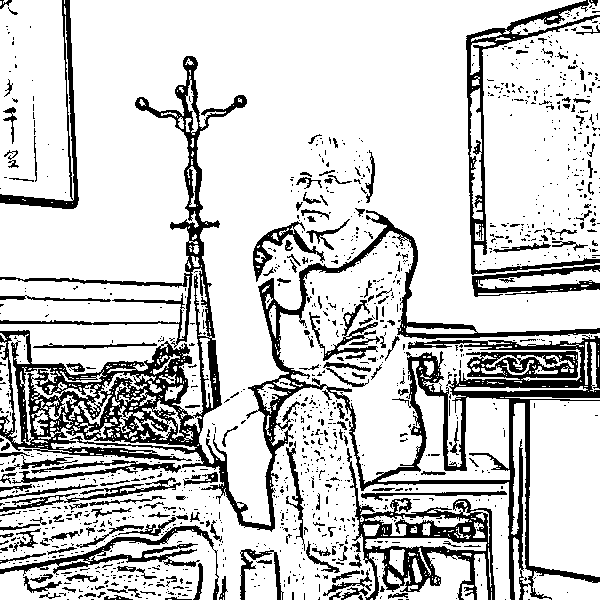 

老师与自然元素连结紧密，

不仅喜欢观察花朵与树木，

还喜欢独具创意地用垃圾桶当花瓶，

在暂时没有花瓶的情况下，

能够养活花朵才是至关重要的。

▼▼▼

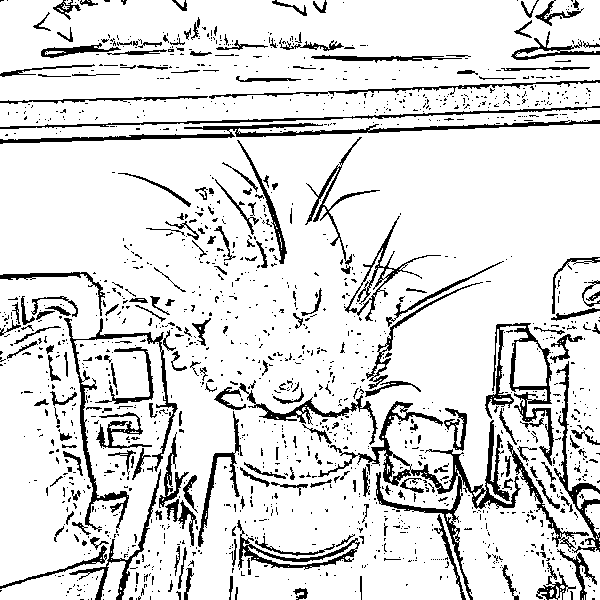 

在以前的采访中曾提到，

在从事占星教学的工作前，

她是个羞怯的人。

占星学赋予了她更好地认识自我、

他人和世界的语言、以及智慧的满足感。

老师曾强调：

“想要成为一名咨询师，

获得必要的辅导和治疗培训是非常有裨益的，

但更为重要的则是给自己做治疗，

这是成为占星师的先决条件。”

▼▼▼

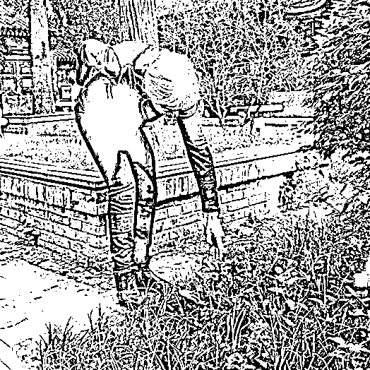

.gif")

**关于苏·汤普金斯老师的更多** 

太阳在水瓶座，月亮在射手座，上升在处女座的她喜欢细致的观察周围的一切，她曾说：“聆听能力应该排在占星师需求单的最上方，聆听不仅需要一双耳朵，它需要五个感官同时的，积极地投入。虚怀若谷的心态也是必要的，我们需要承认自己给不出所有的答案，也更不能保证真理在握。”

她对传统占星学和古典占星不是很感兴趣。更喜欢在平常的生活和与客户的沟通中独立地探索出什么管用，什么不管用。现在老师最感兴趣的问题是由占星学引发的大多数人关于生死的灵性问题。

老师曾这样描述自己的占星家身份：“老土与愤世嫉俗皆有之。”但这也许不是大众想听到的答案，真相是，老师是一个洞察心性、有哲学思维、有现代意识、追求实用性、脚踏实地的人，对“意义”最为关心，她相信占星学有用且有治愈之用。

老师喜欢对基础的东西进行深入的探讨，喜欢通过亲自去观察发展自我的觉知。现在很热衷于了解顺势疗法患者的病例，跟他们从占星学的角度来探讨，且常常在探讨中发现疗救的措施。

.gif")

**2016 年 5 月 7、8 日**，由**苏·汤普斯金**亲授的**顺势疗法工作坊**就要开课啦！顺势疗法是目前全球使用最广泛的自然医学疗法，对个体的身体、精神和情绪三个层面进行治疗，加强个体自身免疫力，提升个体生命能量。本课程为那些想要增加自我及家庭身体保健和疗愈能力的人所设置。

长按二维码接通课程负责人~


报名及咨询，请点击文末“阅读原文”

# 大卫谈占星 | 数数这些年金牛座被贴歪了的标签

> 原文：[`mp.weixin.qq.com/s?__biz=MzA5NjA0NTAxNg==&mid=2651384546&idx=1&sn=0fd1724e243b810b6abd77422dc3719d&chksm=8b4a5855bc3dd14379ef11574fb83bf03a1832255819a5b87aac7dbe6f8f281d47c19705c294&scene=126&sessionid=1692738841#rd`](http://mp.weixin.qq.com/s?__biz=MzA5NjA0NTAxNg==&mid=2651384546&idx=1&sn=0fd1724e243b810b6abd77422dc3719d&chksm=8b4a5855bc3dd14379ef11574fb83bf03a1832255819a5b87aac7dbe6f8f281d47c19705c294&scene=126&sessionid=1692738841#rd)

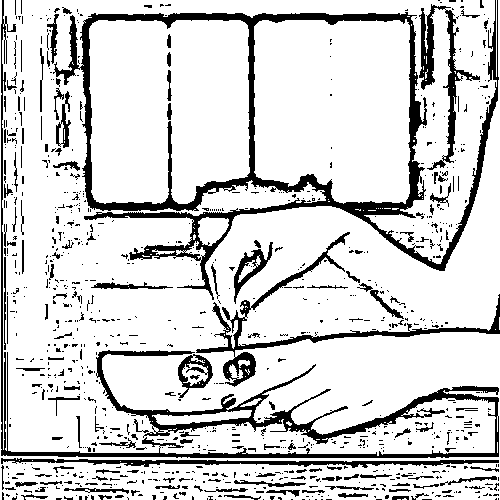

作者/大卫·瑞雷 图片/花瓣网

金牛月，来说说金牛座。提到金牛座，也是被黑得没 sei 了——懒惰、固执、贪婪、爱钱，STOP！真的是这样吗？你真的了解金牛宝宝吗？拒绝贴歪了的标签，否则你会失去本宝宝的！

“


*As you get older and ease your way into being a character actor you have to be comfortable with where you are in life and career, and I'm very comfortable with what I'm doing.*  

**——George Clooney**

当你随着年龄的增长，开始放松地做一个有性格的演员时，你必须喜欢你此刻的生活和工作，我就十分享受现在的工作。

**——乔治·克鲁尼**

”**金牛座那些美好的特质**

**价值 **保养** 持久**

**耐力****毅力** **冷静** **可靠**

**值得信赖** **舒适感**

如果白羊座是一次旅程的起点，那么金牛座就是我们在旅途中开始放松的地方。我们长舒一口气，然后深呼吸。我们坐在自己舒适的位子上，享受这次旅程。也许随着越来越放松，我们甚至会小憩一下。我们知道旅程尚远，所以本能地开始保存体力。

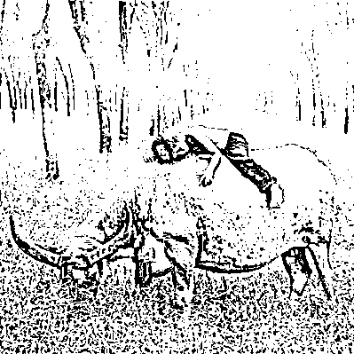

金牛座比其他星座更有能力感知事物的价值。金牛座代表着一种尽情享受所拥有之物的能力，以及对获得有价值之物的欲望。我们想拥有一切自认为有价值的事物，这便是“占有”的本质。

*   占有原则首先应用于自己的**身体**。

*   如果出生图中金牛座特质强烈，你会本能地有意识地去**保养**自己的身体：累的时候会休息，饿的时候会吃东西。

*   在明确一件事的**价值**之前，你不会在上面浪费或消耗精力。

*   然而，一旦决定全力以赴，你就能够付出**持久**的努力。

*   当感知到自身努力会有回报时，你的**耐力**和**毅力**就会自然发挥出来。

*   在危机中你能保持**冷静**，除非绝对必要，否则不会仓促行事。

*   通常，你有着从容不迫的步调，因此在别人眼里你是**可靠**又**值得信赖**的。

*   你非常喜欢感官上和物质上的**舒适感**，同时排斥任何没有明确价值意义的改变。 

**对金牛座负面的评判**

**自私 贪婪 反应迟缓**

**懒惰顽固** **不中用** 

**占有欲** **缺乏主动性**

  对金牛座来说，恐惧之下的评判会削弱他们的享乐能力，阻碍他们创造丰裕的生活，还会引发极端的惰性，导致他们无法享受生活的乐趣。  

没有什么星座比金牛座更容易困在一成不变之中了！如果在他们的人生经验中，生活确实没有回报他们什么，要说服他们信任这种回报的话，的确太难了。

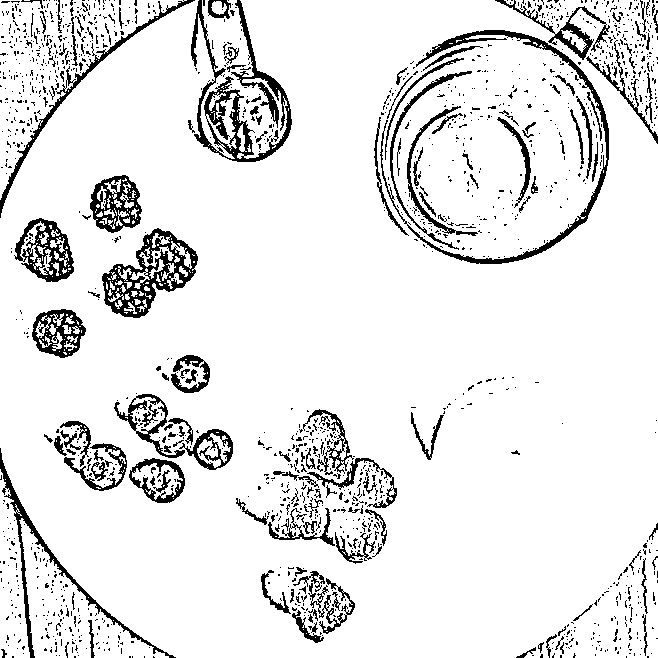

负面信息能通过各种方式强化“恐惧之下的评判”，认识到这一点非常重要。**对金牛座来说，这种评判常常附带着“自私”或“贪婪”的标签，如果此人成长于经济实力薄弱的家庭，这些标签也许产生于负罪感。或者，也可能来自惩罚之中。**

*   每当一个小孩拒绝与其他小孩分享玩具时，他的玩具就会被收走，并始终被斥责为“自私的坏小孩”，只是因为他想要**保护**或是**抓住**自己**拥有**的东西不放而已。

*   更可怕的后果来自于**虐待**，当孩子对自己身体的所有权遭到大人侵犯时，不管是暴力还是性虐待，都会严重破坏这个孩子未来享受愉悦的能力。

**举个栗子**

有个带有两倍金牛特质（指：太阳、月亮、上升中有两个位置都在金牛）的客户回忆起小时候妈妈常骂她：**“自私又贪婪的猪！对什么都不会心存感激，什么也不配拥有！****”** 

当我们一起探索是什么导致她信用卡欠债 9 万美元、濒临破产的边缘时，上述童年记忆浮现了出来。
 **如此巨大的金额代表着心理的严重失衡，她负债消费的都是她“买不起的，或是买来后似乎能享用很久的东西”**（引言来自客户档案）。

**对金牛座的批评性标签常见的还有“懒惰、顽固、不中用”等版本。**就如上文所言，金牛座从容不迫的作风甚至可以让棘手的任务看起来变简单了，但这样的小孩也许会让父母失去耐心。**这些父母醉心于把小孩培养成看上去勤奋积极的样子，如果小孩做不到，就做出“反应迟缓”或“缺乏主动性”的结论，也就是通俗的“懒惰”。**

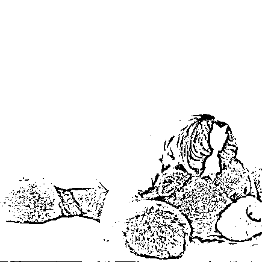

早上穿衣上学不是什么需要争分夺秒冲到终点的比赛，父母催促得越快，金牛小孩就更加倾向于拖拖拉拉，拒绝穿上材质不够柔软舒适的衣物，因此被贴上**“顽固”**的标签。**“不中用”则是非常有害的标签，是对自我价值的直接攻击，为小孩日后不思上进埋下伏笔。**因为“无用”的标签一旦在一个人的头脑中留下印记，他会下意识地暗示自己，无论付出怎样的努力，最终还是什么都得不到的。

**“占有欲”是另一个典型的金牛标签**。我又要开始讨论失衡的行为了。一点点“占有欲”是健康、正常的金牛特质，但金牛座和其他固定星座（狮子座、天蝎座、水瓶座）一样，都容易变得“固着”。**金牛座的“固着”表现在“所有权”上——**“她是我的！”或者，“他属于我！”这种对所有权的宣示可能会变得极端。我的客户中有位金牛座男性，在跟妻子离婚后，还持续数年跟她睡在一起——金牛座放手很慢。然而，**极端的占有欲通常产生于早年得到的评判。**

**再举个栗子** 

我的一位月亮金牛座的客户曾回忆起小时候当他晚上在母亲床边逗留太久，父亲就会被激怒。他说，当父亲抓住他时，他紧紧抓住被子，而母亲则对父亲尖叫，让他把儿子放下，然后他被父亲拽着，连带着被子什么的，被拖回到自己的房间。

“我还能听到爸爸在耳边吼着‘这才是你的房间！’，他一边说一边狠狠把我摔倒床上，再砰地把门甩上。”“这孩子一定哪里不对劲！”他听爸爸这么说过很多次。后来父母离婚的时候，他才 9 岁。这位客户说，他记得当时无比确信，是自己导致了父母的婚姻破碎。

早在这位客户首次来我这里咨询的时候，他正在为一段两年恋情的结束痛苦挣扎。

“我越是努力不要产生占有欲，占有欲就变得越强！”在一次咨询中，他大声喊出这句话。

渐渐地，他开始认识到，对父母离婚这件事的内疚感强化了他对于占有欲的负面评判，这种评判进而又不断地给他和女友的关系带来负面影响。当他学会不带“评判”地“承认”自己对占有欲的感觉时，他的焦虑变少了。更棒的是，一年之后，他遇到了在相处中“没人能像她那样让我放松”的人。现在，他俩的婚姻已经持续了 18 年，有一个儿子和一个女儿。

**敬请关注若道君之后的推送**


下篇教你如何破解歪掉的标签

**若道君还为你准备了这些金牛座的文章**

****▼****

[金牛月独家话题 | 如何成为有钱人](http://mp.weixin.qq.com/s?__biz=MzA5NjA0NTAxNg==&mid=2651384368&idx=1&sn=6b98cf58afecf6cc62f90ce95629e995&scene=21#wechat_redirect) 


想体验大师级的占星疗愈？

大卫老师**占星咨询**预约进行时

**生命议题、职业发展、关系咨询、少儿成长、年度规划和预测**

```
预约咨询请联系许小姐 ：010-58760529
```

*你是被贴歪了标签的金牛座宝宝吗*

*留言吧*

**◆ ◆ ◆  ◆ ◆**

**特别提醒****：若道拥有本文版权，转载请注明“转自若道”并标明作者。**  

**那么金牛座到底是什么样呢？**2016 年 5 月 19 日，**蒋颖老师**主讲的若道占星核心课程**Level 1-2**要开课了！她将带领你学习**星座、太阳、月亮、行星、月亮交点**等知识，让你进入占星学的世界！


# 成为苏·汤普金斯的个案是怎样一种体验？

> 原文：[`mp.weixin.qq.com/s?__biz=MzA5NjA0NTAxNg==&mid=2651384546&idx=2&sn=226e9c836923cd975fab4f7c18b091e6&chksm=8b4a5855bc3dd1438485570f5c31951a771551a9a4de5f6d28baecd2e57bf25be993e04e774f&scene=126&sessionid=1692738841#rd`](http://mp.weixin.qq.com/s?__biz=MzA5NjA0NTAxNg==&mid=2651384546&idx=2&sn=226e9c836923cd975fab4f7c18b091e6&chksm=8b4a5855bc3dd1438485570f5c31951a771551a9a4de5f6d28baecd2e57bf25be993e04e774f&scene=126&sessionid=1692738841#rd)

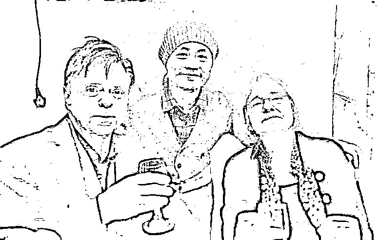
大卫·瑞雷（左）、作者（中）与苏·汤普金斯（右）

毋庸置疑，苏·汤普金斯老师几乎是所有占星爱好者或从业者心中的大师，所以，有幸和她有过亲密接触，简直是太令人兴奋了！本文作者参加过老师的星图解读工作坊、请老师做过个案咨询，还学习了医疗占星学。让他来说说对老师的印象吧。

○ **她**在 2000 年**创立**了**伦敦占星学院**，培养出许多优秀占星师。

○ **她**在 2003 年因卓越贡献而获得英国占星协会的**查理斯·哈维终身成就奖**。

**○ 她**是英国资深的占星学家和咨商师，拥有超过四十年的占星经验，并经常在世界各地举办占星研讨会和公开演讲。

○**她**同时也是一位接受过心理学与心理咨询训练的顺势疗法专业治疗师。

**○她**就是著名而又低调的**苏·汤普金斯女士**。

初见老师 

这段难忘的经历，发生在 2013 年，汤普金斯老师在北京举办星图综合解读工作坊，全国各地的同学们都满怀欣喜跑去学习，顺便朝拜大神。

这是我记忆中，参加人数最多的一次占星工作坊。整个过程，汤普金斯老师也没有辜负这么多人的热情。从极为基础的占星知识、理念入手，之后通过大量案例、结合星图进行分析解读，详细地展示综合解读技巧，并让学员领会到基础的重要性。此外，老师还初步介绍了占星学与顺势疗法如何结合运用。

汤普金斯老师深入浅出地让我们体验到她占星分析系统的特点：**视野开阔却不失结构性，让繁琐的信息、分析，回归于简约清晰的本质，进而带来明确、实际、易懂的启发。**

工作坊中，汤普金斯老师在面对学员提问时，对于自己不太肯定的问题，会很真诚的回答**“不知道”**，时不时的英式冷幽默，收揽了所有现场粉丝的朝拜之心。

重点来了 

工作坊之后，汤普金斯老师给我做了一对一的占星个案咨询。咨询当天到达老师住处时，老师已备好了茶点，很暖心。

当时我正处于职业发展方向的困惑期，面临多种选择，于是我们就从职业开始聊起，老师打开我的出生星图，通过提问互动，梳理我的原生家庭、早年经历、情感关系、职业经历。当时我并没有告诉老师我有当占星师的想法，但老师通过我的星图，建议我成为一名职业占星师。

汤普金斯老师通过抽丝剥茧的分析、穿针引线的连接，**巧妙地将过去、现在、未来进行整合**，我慢慢明白，应该如何综合利用过去人生的经验，来从事职业占星师的工作，以及如何根据自己的个人特质、人生经验去建立占星工作的模式，达到何种状态、效果和目的。

这种**整体式的重组**，让人在情绪上充满感应与共鸣，在思维上也觉得原由充分、方向清晰，这也给我日后的占星咨询工作，提供了许多有益的启发。

汤普金斯老师既是卓越的占星家，也是一位同类疗法专业治疗师，早就听说，她会定期前往印度深造，在这个领域也是一个特别特别牛的大师，好机会当然不能错过。我一股脑问了好多健康保健、预防方面的问题。

老师专注的审视星图一阵之后，给出的答案，让我全身都起了鸡皮疙瘩！因为她指出的问题，正是我的家族中多名成员现在已经表现出来的问题！太神奇了！

学术严谨 

由此，我对老师的膜拜又加深了一层，所以后来一有机会，我就参加了汤普金斯老师的**医疗占星**课程。

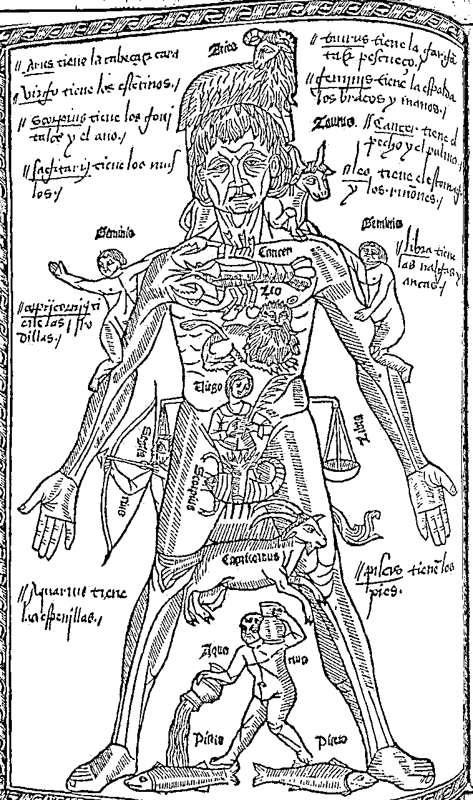

课程中，老师通过行星、星座、器官、病症等要素，为学员呈现出一套明确、完整的医疗占星结构，并对应性的提供实际案例分析、讲解，让学员理解、熟悉这一结构，为学员日后在医疗占星领域的探索与实践，建立起了相对稳固、整体的基础性架构。

对于医疗占星这个主题，汤普金斯老师的态度显得更为审慎，在整个授课过程中，老师回答出了许多的“不确定”与“不知道”，在我看来，老师这样做，一方面依然保持着她的真诚与实事求是，另一方面也留下了充足的空间，让占星学子通过自身的思考、实践，去深入研究探索。

通过这个课程，我们不仅学习了医疗占星的知识与分析技法，更为重要的是，我们学会了对这个领域，持有更多的敬畏与谦卑，因为在这个领域，我们仅仅是刚入门，专业技术之外，老师给予的观念和态度也是极为珍贵的。

**2016 年 5 月，汤普金斯老师将再度来到中国，举办医疗占星与顺势疗法的工作坊，**我们将又一次从这位严谨的大师身上，汲取到经验和智慧，以帮助我们运用占星学，为健康、生命带来指引。

**苏·汤普金斯粉丝留言**

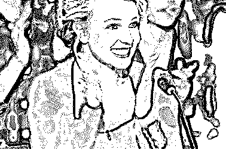

虽然我了解苏·汤普金斯有多牛，但是我还是想要说。

《当代占星研究》知道么？公认的占星学经典专业著作！

《占星相位研究》《顺逆皆宜的人生》知道么？教材级别的！

都是苏·汤普金斯大师写的哟！

我就是这么爱我的大师，么么哒 O(∩_∩)O 哈哈~

**★后台回复 医疗 即可获得苏·汤普金斯医疗占星学相关内容**

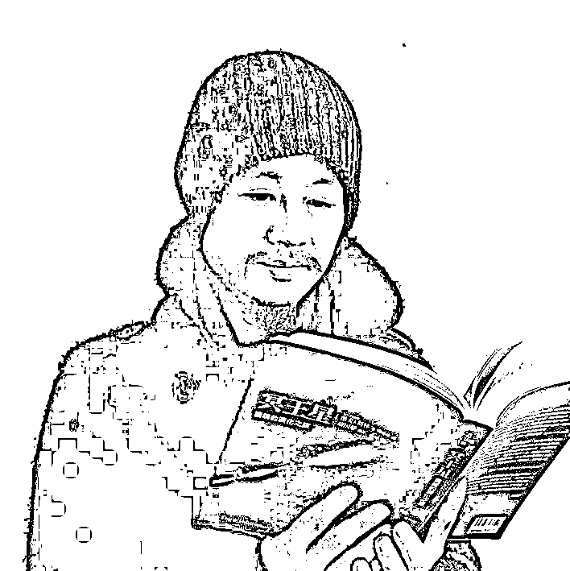

**作者简介**

**Gaff：**既是占星师，也是疗愈者。在若道跟随多名世界知名占星师长期深入学习，并探索占星学与心理、艺术、瑜伽、疗愈、宗教、灵修等领域的整合运用。目前为全职占星师，提供一对一的咨询服务，基于个案咨询的经验，曾多次开设面授的占星课程。

**微信号：**gaff_astrology

**公众微信平台：**weiyanshenghuo

**◆ ◆ ◆  ◆ ◆**

**********特别提醒：****本文由《占星学刊》授权发布于若道，转载请注明出处。**********

大名鼎鼎的苏·汤普金斯已经来到中国啦！2016 年 4 月 30 日，苏·汤普金斯老师的医疗占星工作坊将在北京举办。此次工作坊还是 ISAR 职业占星师资质认证项目的三门选修课之一，要好好把握哦！

报名及咨询，请点击文末“阅读原文”


# 医疗占星学工作坊 | 4 月 30 日北京开课

> 原文：[`mp.weixin.qq.com/s?__biz=MzA5NjA0NTAxNg==&mid=2651384546&idx=3&sn=4908f93a72728b29e33e6a64d4a797f4&chksm=8b4a5855bc3dd143132ed6cadbbbfb920b3b7870754dac870744f656e3161a8b4cd1569e079e&scene=126&sessionid=1692738841#rd`](http://mp.weixin.qq.com/s?__biz=MzA5NjA0NTAxNg==&mid=2651384546&idx=3&sn=4908f93a72728b29e33e6a64d4a797f4&chksm=8b4a5855bc3dd143132ed6cadbbbfb920b3b7870754dac870744f656e3161a8b4cd1569e079e&scene=126&sessionid=1692738841#rd)


4 月 30 日

国际占星界重量级人物

《当代占星研究》作者苏·汤普金斯老师

将在若道举办医疗占星学工作坊

教你用占星学来管理健康

既能学到占星学技法

又能亲眼见到大师

真是太令人激动了

**ISAR 选修课程****工作坊信息**

**授课时间：**2016 年 4 月 30 日、5 月 1 日、5 月 2 日 10：00-18：00（午休 2 小时） 共 18 课时

**授课老师：**苏·汤普金斯

**授课方式：**北京现场，英文授课，中文翻译。（具体上课地址课前请留意查看短信微信通知）

**费用**：****6800 元** （若道老学员**4800 元**）**

**课程负责人：**王晓鸥  

**微信号：**2837474346，请备注医疗占星课程报名咨询

**咨询电话：**400-619-1014

课程简介

星座、行星、相位、宫位还能从什么角度进行阐释？

我们的占星工具箱里，还能增添哪些利器？

疾病和健康的相关议题能不能在星图中找到相应的征象？

我们怎样运用占星学来更好地认识身体，保持健康？

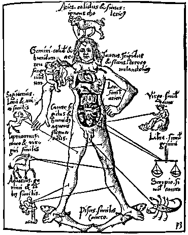

>>>>

**用占星学管理身体健康**

疾病一直以来在我们的生活中有两个作用。一方面，疾病是生活的一部分，虽然我们人类大多数不愿意被提醒这个事实。疾病也为个人成长提供机会和对人生更深刻的理解。疾病让我们谦卑。另一方面，许多健康问题是由于我们选择了错误的生活方式，因此可能是可以避免的。

今年 4 月 31 日至 5 月 2 日，伦敦占星学院创办人、《当代占星研究》作者、经验丰富的顺势疗法医师苏·汤普金斯老师将通过独到有趣的讲解和精彩的专题及案例分析带你进入医疗占星这个神奇的占星学分支领域。

名人推荐

苏·汤普金斯的《顺逆皆宜的人生》令人赞叹！苏是一名备受爱戴的老师，并且在占星研究学院及后来自己创建的伦敦占星学院任教多年。苏以自己的冷幽默、抽丝剥茧的研究天分和占星直觉而闻名。她是一名执业占星师，也是一名顺势疗法医师，是心灵和身体的敏锐诊断专家。

 ——国际占星研究会（ISAR）法国副主席琳恩·贝尔

师资力量


****苏·汤普金斯****

苏·汤普金斯是英国目前最资深的占星学家和咨询师之一，曾任占星研究学院（The Faculty of Astrological Studies）及伦敦占星学院（London School of Astrology）院长。2003 年，英国占星协会为表彰她的卓越贡献授予她查尔斯·哈维斯终身成就奖。

苏·汤普金斯老师不仅希望对心理和心灵进行疗愈，也一直希望能够找到一种安全又切实可行的方法帮助人们在人生旅途中得到身心的整体疗愈，而顺势医学的哲学与疗效让她惊叹，于是她于 1996 年完成在伦敦顺势疗法学院的培训成为一名专业顺势治疗师，目前，已经积累 20 年的顺势医学治疗师经验。

课程价值

得到苏·汤普金斯老师亲授的“独门绝技”，受益于大师在占星、心理学、医疗多维度的丰富经验

增加对身体各部分、健康和疾病的认识与觉察

收获实用的改善健康小技巧

巩固已有的占星学知识，拓展对星图象征符号的理解并掌握更多星图解读的方法和技巧

将医疗占星纳入你的占星工具箱，用它来助人助己，成为更专业的占星师

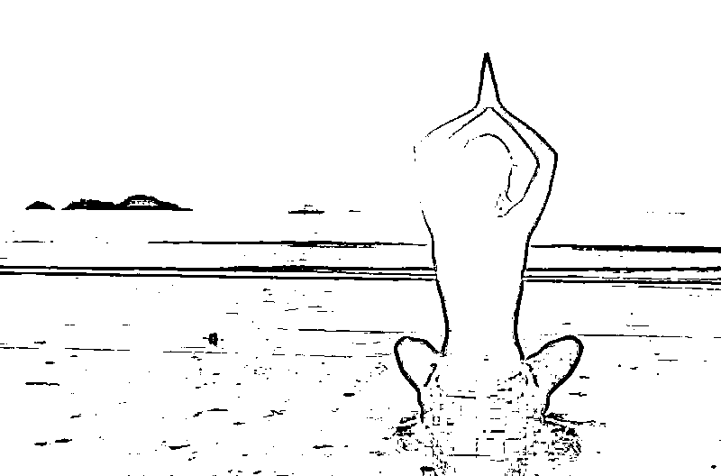>>>>

课程内容

心灵和疾病的关系

我们的健康问题是由什么样的生活方式造成的？

疾病如何为我们提供个人成长的机会？

医疗占星学的普遍性原则

各种疾病的常见星图征象是什么？

从星图看，你身体的哪些部位是最脆弱的？对此，你可以做什么？

饮食与健康

我们的饮食能在星图上体现出来吗？ 

如何从星图看我们的身体疗愈之道？

顺势疗法和占星学

如何让自己更健康？

改善健康的实用性技巧

**我们会抽取个案进行现场讨论，会有 6 个个案讨论的机会（可以用家人的案例）。**

**参与个案讨的必须提供：**

**1） 病情细节      2）出生信息       3）生病日期或确诊日期**

**我们欢迎有癌症和心血管疾病的同学（包括家人）提供个案。 **

我们还将分组讨论，在这个工作坊上，帮助大家在用占星学对个人健康进行管理方面获得知识和洞见。

**特别说明：本课程不涉及任何医疗行为 **

>>>>

适合人群

相当于若道核心课程 level3 以上水平即了解星座、行星、宫位、相位等，可以独立进行出生星图解读。


长按二维码接通课程负责人~


更多内容及报名，请点击文末“阅读原文”

# Level 1-2 | 本年度最后一次入门占星学殿堂的机会

> 原文：[`mp.weixin.qq.com/s?__biz=MzA5NjA0NTAxNg==&mid=2651384523&idx=3&sn=cde52afc57f7381cbd23597f187681a7&chksm=8b4a587cbc3dd16a2666e2bb53fd0ef9c7887abdfcbcced215f89a1fc067303cd7e9fe230602&scene=126&sessionid=1692738841#rd`](http://mp.weixin.qq.com/s?__biz=MzA5NjA0NTAxNg==&mid=2651384523&idx=3&sn=cde52afc57f7381cbd23597f187681a7&chksm=8b4a587cbc3dd16a2666e2bb53fd0ef9c7887abdfcbcced215f89a1fc067303cd7e9fe230602&scene=126&sessionid=1692738841#rd)


你很懂星座，但能准确说出 12 星座的关键词吗？ 

你知道人的性格不只由一个太阳星座影响吗？

作为国际占星研究协会（ISAR）中国唯一指定教学机构

若道 2016 年占星核心课程 Level 1-2 蒋颖老师专场将于 5 月开课 

中文老师出山 

能有效拿捏学员需求

**授课时间更长**

**交流互动更多**

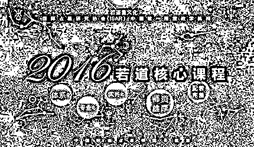

**课程信息**

**授课时间：**2016 年 5 月 19 日**-7 月 7 日**

**授课老师：**蒋颖**（8 次）、**大卫·瑞雷**（4 次）**

**授课方式：**网络课

费用：**2400 元**

**报名截止：**2016 年 5 月 6 日

**课程负责人：童老师（微信号：80248863）、**王老师（微信号：2837474346）****

**咨询电话：**400-619-1014

**课服 QQ：4006191014 （若道星文化）**

**邮箱：nodoor@vip.126.com**

课程简介

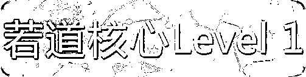

**星座、太阳和月亮**

12 星座是占星学最基本却又最深刻的概念，黄道 12 星座，是伟大的生命周期，而太阳和月亮是我们阴阳之本。

**●12 星座：**深入了解 12 星座的特色。了解星座正面的、负面的表达，了解其资源，了解其破坏生命的模式。了解其原型人物、了解其指代的人事物。

**●12 星座原则：**按照极性、形态和元素给星座分类。

**●12 星座关键词：**关键词非常重要！是解读准确性的关键。

**●太阳和月亮：**了解你的太阳，生命的发动机，让你在世界闪光的方式，生命获得力量的方法；了解你的月亮，让你生命获得幸福的方法。了解它们，了解你生命中已经出现的、将会出现的男人和女人。

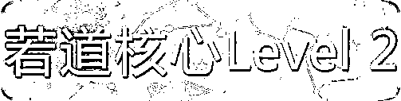

**遇见行星和月亮交点**

在这个阶段，你将遇见行星们，还有与灵魂的过往和未来相关的月亮交点。这既是你，你的性格，也是你在生命故事中将会遇到的人、事、物的显化，也是你灵魂轨迹的线索。    

**●内行星：**水星、金星、火星

**●中间行星：**木星、土星

**●外行星：**天王星、海王星、冥王星

**●灵魂的线索：**月亮南交点、月亮北交点

**●行星逆行：**行星逆行的天文现象和意义

**●宫位初解：**了解黄道 12 宫的基本含义

时间安排

共 12 次课，24 课时。

**●8 次理论课程**（蒋颖老师主讲）

北京时间每周四晚 20：00-22:00

**●4 次线上互动课程**（大卫老师主讲、配有中文实时翻译）

北京时间每周一晚 20：00-22:00

授课优势

**①先进的教学平台**

网络教学平台，支持手机、电脑、iPad 上网，可以随时随地学习。

**②回放复习**

学员可登录网站收看课程回放，在线复习课程，每次课可完整重看 3 次，课程结束后的 3 个月内有效。　

课程特色

**①与名师面对面**：北京同学可以来若道现场上课，和大卫老师面对面互动。大卫老师也可能前往主要学员所在城市，实现零距离教学。

**②互动答疑**：论坛、微信群随时提问；老师课上答疑；助教线上线下全程协助。

**③线下沙龙**：定期举办沙龙活动，复习上课内容。

**④强大的同学网络**：若道作为中国最顶尖的占星教学机构，在 4 年的占星教学中，培养了很多占星人才。若道让你和师兄师姐切磋，让你和国内著名占星师学习。（简单来说，就是，人脉！）网络授课，在北京开设免费现场参与名额，全程英文授课，配备实时翻译。

师资力量

**讲师团队**


**蒋颖（Felicia）**

若道创始人，职业占星师。在若道系统学习占星，师从大卫·瑞雷。长江商学院 MBA，厦门大学经济学硕士，化学学士。国际占星研究协会（ISAR）中国区副主席。第一批获得国际占星研究协会（ISAR）认证的职业占星师。《灵魂的目标》译者。

**在后台回复 蒋颖 即可查看她的全部文集**


**大卫·瑞雷（David Railey）**

若道创始人，《灵魂的目标》作者。拥有 46 年的占星咨询的执业经验，曾两任亚特兰大占星协会主席，是全美占星师联盟（AFAN）、美国占星师联合会（AFA）、全美占星研究委员会（NCGR）、国际占星研究协会（ISAR）和职业占星师组织（OPA）的成员，是联合占星大会（UAC, United Astrology Conference）督导委员会委员。大卫曾是 CNN、CBS 的占星节目的常驻嘉宾，多次在 BBC、WGS、WSB、WRGG 等节目中接受采访，并在亚特兰大主持电视节目《每日行星（Daily Planets）》达 4 年之久。

**助教团队**


**熊鹰（天空的空）**

国际占星研究协会（ISAR）认证占星师。在若道系统学习占星，师从大卫·瑞雷，现任若道专职助教。将传播系统、严谨、真实的占星学作为职业使命。与此同时，提供一对一占星咨询服务与生时校正咨询。目前正致力于占星学与个人真修实证的整合。2014 年起主讲读书会，助教答疑课程累计超过 100 小时。

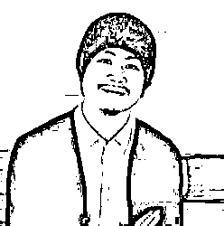

**Gaff**

全职占星师，既是占星师，也是疗愈者。2013 年开始在若道进行系统占星学习，师从大卫·瑞雷。任 2015 年度诺·泰尔、斯蒂芬·福里斯特老师的占星工作坊助教。提供一对一的咨询服务（已有超过 100 小时的咨询经验），基于个案咨询的经验，曾多次开设面授的占星课程。

长按二维码接通课程负责人！

 

报名及咨询，请点击文末"阅读原文"

# 蒋颖谈占星丨“好”男人为何贪恋“坏”女人？

> 原文：[`mp.weixin.qq.com/s?__biz=MzA5NjA0NTAxNg==&mid=2651384523&idx=1&sn=503a2e2e09cea90f832d067ca9e73023&chksm=8b4a587cbc3dd16a0d243189340346525cd16ba0c0e8462685adc991d1f9ce6d4a79ef02cd38&scene=126&sessionid=1692738841#rd`](http://mp.weixin.qq.com/s?__biz=MzA5NjA0NTAxNg==&mid=2651384523&idx=1&sn=503a2e2e09cea90f832d067ca9e73023&chksm=8b4a587cbc3dd16a0d243189340346525cd16ba0c0e8462685adc991d1f9ce6d4a79ef02cd38&scene=126&sessionid=1692738841#rd)

你会觉得无论如何都无法与人亲密？你发现无止境的付出并不是爱情幸福的前提？你觉得另一半是你人生完整的关键？可是你知道吗？真正的亲密始于与自己的亲密。

上周若道君发布了蒋颖微课讲述的[第一个故事](http://mp.weixin.qq.com/s?__biz=MzA5NjA0NTAxNg==&mid=2651384368&idx=2&sn=c870d7254a29932e43e20d92dd5c1fb1&scene=21#wechat_redirect)（点击可阅读），第二个故事与我们如何在爱情部分运用占星学活出星图的能量有关。

**真正的亲密是与自己的亲密**

已故的占星大师杰夫·焦耳老师曾在 2012 年的一次工作坊里告诉我们：**真正的亲密是和自己的亲密**。当时我非常困惑，我虽然听见了这句话，但是根本不明白这句话的意思。直到最近两年，我才逐渐明白这句话。如果你学习了占星学，这句话就相对容易理解一些。因为如果你没有学习占星学，你也许会觉得“跟自己亲密是什么意思？我怎么就跟自己不亲密呢？”

如果你学习了占星学，你就会明白，你需要诚实的面对你星图中的每个星座、每个行星的需求。

**缺乏爱的教育，无法对自己诚实**

若道把世界上最有名的占星大师请到中国来，有时候会开放一些咨询，他们后来跟我分享：在中国客户中，婚姻中出轨、性生活不幸福的比例似乎比国外大很多。

这牵涉到具体的社会历史原因，但是，如果简单而言，我想这种现象可能的一部分原因是：我们很多人是跟随社会的潮流、根据社会的标准在恋爱和结婚，而不是根据我们自己。这跟我们在职业上的选择如出一辙。

我们既缺乏爱的教育，也无法对自己诚实。因为在我们的教育中，没有教导我们如何了解自己的需求，也没有教导我们如何对自己的需求保持诚实。

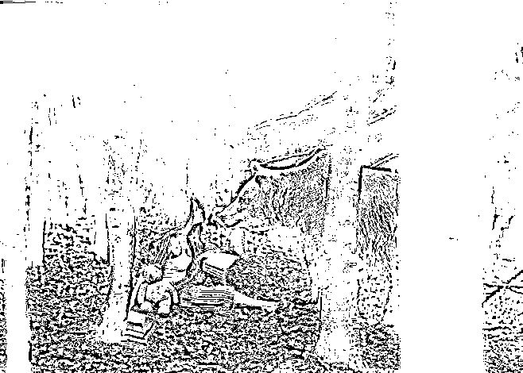

前两天有一个标题在朋友圈刷屏，关于许晴说的好小三和坏小三是什么样子，我想道理是这样的，不论男性还是女性，如果你无法活出爱情在你星图中的能量，基本上就有两种结局：

●一种结局

你坚持维持这段爱情和婚姻，即使它存在持久的不满足感，但你仍不敢离婚。我们可以说，TA 没有离婚，但在这段婚姻中 TA 活得并不快乐。

●另一种结局

你会在这段爱情和婚姻之外，寻找另一个情感的出口。也就是说，你需要寻找所谓的“第三者”来填补你在爱情和婚姻中无法满足的地方。

**他被一个放荡不羁的女孩吸引**

我记得在我的一篇文章中，曾经提到一位巨蟹座的男性。这位男性是我的一个朋友，他是一个很好的男人、一个很好的朋友、同时也是一个很好的父亲、很好的儿子和很好的丈夫。总之各个方面而言，他都很好。

他为了能带给家庭更美好的生活，在职业上辛苦打拼了很多年。他的妻子是一名大学老师，他认为妻子也是他所称赞的贤妻良母。当然，每一对夫妇都有一些性格上的不合之处，哪对夫妻没有呢？这样看上去他的生活一切都是美满的。但是他所坚持的家庭和美满出现裂痕，就是他在一次俱乐部的活动中，被一个放荡不羁的女孩所吸引。

这个女孩没有固定工作，也没有固定住所，一个人浪迹天涯。她有时候靠写写文章专栏、给杂志提供摄影作品来生活。她还吃迷幻药，甚至尝试过双性恋的生活。

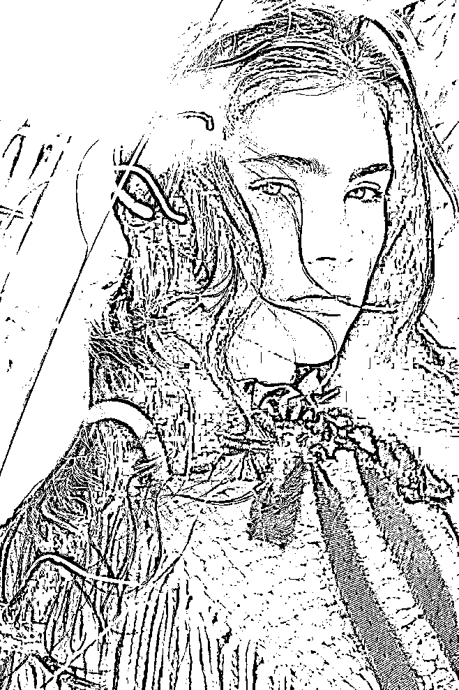

这个女孩对我们来说算是一个比较奇怪的人了，所以我们都有些奇怪这个巨蟹座的好男人，怎么会被这样一个有些奇特的女孩所吸引？认识这个女孩之后，他发现自己像着了魔一样，对这个女孩朝思暮想，他每天盯着女孩的朋友圈，如果有什么新动向立马留言，不断刷新她的朋友圈。完全忽视他的家庭。

他非常痛苦，当然，他没法向他的妻子和父母分享这种痛苦，他只能向我们这些好朋友宣泄。有的朋友嘲笑他是“女人不坏，男人不爱”。

**你的星图哪部分在尖叫？**

这个男性非常痛苦，因为他真的想做一个好男人，可是他又无法自拔。我原来没有看过他的星图，因为这个事情我打开了他的星图，我一看才发现，他的星图上有一颗非常醒目的天王星。就好像他这颗天王星的能量，四十多年来一直在沉睡。

如果没有占星学的帮助，一般人可能无法理解这种能量。可是如果你看到这个星图就可以立刻知道，这颗天王星一直在尖叫。可能是在行进中，由这个女孩触发，让这颗天王星终于活了过来。

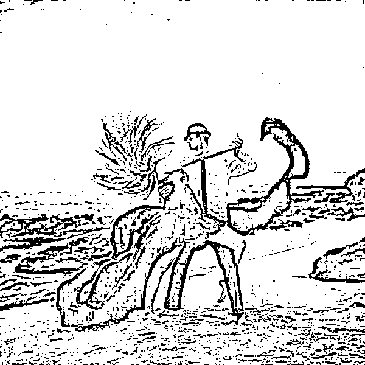

作为占星师而言，只要打开星图，听几句故事，我马上就会寻找他们所说故事里那些用一种非常狂野的方式在尖叫的能量。这些行星的能量好像在梦游一样，它们已经失控，无法宣泄，只能投射在其他人身上，最后主导了当事人的人生。

**爱情要求我们不断变得完整**

我们常常在文学作品、电影、电视剧中歌颂爱情，有些人也在寻找着自己的灵魂伴侣。实际上爱情是有一个秘密的，那就是：**爱情是一个要求我们要不断变得完整的过程。**

**你深深爱上的那个人，甚至有时候，你深深爱上的某个明星，你所深爱的那些特质都是你本来就具有，但却没有被表达出来的部分。**

所以当你遇到某个人的时候，就如同久旱逢甘霖。你惊呼“这个人怎么那么契合我”！那是因为你的星图上本来就有着这个能量，而你根本没有把它活出来。

这几乎是世界上所有浪漫爱情故事的强烈动力之一，如果你在这方面没有觉察，这个爱就会失去控制，也许会在你的生活中重复上演。

我曾经在文章里所写，“**我们自身所有的，但是我们却没有真正拥有的，就变成了我们的渴望；我们自身所有的，但是却被我们否认、排斥或者没有健康发展的能量，就变成了干扰我们的人和事件。**”

**爱情是人生的疗愈仪式**

我们常常说要找另一半，这就好像是我们自身是残缺的，必须通过找到另外一个人才能完整。好像是两块壁，得找到另一块对应的壁才能完整。**但在爱情里，如果你是残缺的，你基本也只能找到另一个残缺的人而已**。

**所以在更高的层面上，在爱情中找另一半不是只找“另一个人”作为另一半，而是找到被我们所遗忘的、被我们所否定的、被我们所误解的另外一半，组成一个完整的自己。**就像那个男性，他需要在他的星图中、在他的生活中、在他的爱情中活出那股天王星的能量，如果不能，要么他继续过着无法满足的婚姻生活，要么他会和另一个有着天王星能量的女孩发生婚外恋。

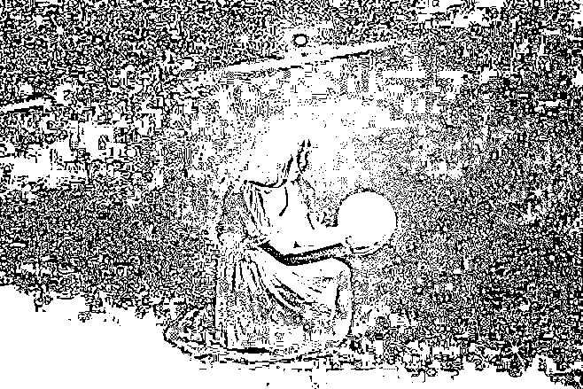

所以从这个角度来说，**爱情其实是我们生命历程中一个神圣的疗愈仪式**。因为在生命道路上，我们都是盲目的，就像一匹带着眼罩的马在行走。我们没法不依靠任何人的帮助完成生命的整个历程，我们必须遇到一个又一个人。这些人可能是爱我们的人，也可能是伤害我们的人，但只有通过这些人，**我们才能重新发现、重新学习，进而整合成一个完整而健康的自我。**

**当你的自我越完整，你才越有可能遇见一个同样完整且健康的人。**

（未完待续）

**想阅读更多蒋颖老师的文章，请在后台回复 蒋颖 **即可。****

**课程信息**

**授课时间：**2016 年 5 月 19 日**-7 月 7 日**

**授课老师：**蒋颖**（8 次）、**大卫·瑞雷**（4 次）**

**授课方式：**网络课

费用：**2400 元**

**报名截止：**2016 年 5 月 6 日

**课程负责人：童老师（微信号：80248863）、**王老师（微信号：2837474346）****

**咨询电话：**400-619-1014

****◆ ◆ ◆  ◆ ◆****

******特别提醒************：若道拥有本文版权******，**转载请注明“转自若道”并标明作者。******

**你想了解更多关于自己在爱情中的议题吗？**2016 年 5 月 19 日，**蒋颖老师**主讲的若道占星核心课程**Level 1-2**要开课了！她将带领你学习**星座、太阳、月亮、行星、月亮交点**等知识，让你进入占星学的世界！

长按二维码接通课程负责人！

 

报名及咨询，请点击文末“阅读原文”

# 惊呆了，这真的只是若道一年级新生的水平吗？

> 原文：[`mp.weixin.qq.com/s?__biz=MzA5NjA0NTAxNg==&mid=2651384523&idx=2&sn=05b55df84becd8db236864012cb60079&chksm=8b4a587cbc3dd16a9e2194419fc812e75943a24b7a859ef1c097892d78c46d48979b395de261&scene=126&sessionid=1692738841#rd`](http://mp.weixin.qq.com/s?__biz=MzA5NjA0NTAxNg==&mid=2651384523&idx=2&sn=05b55df84becd8db236864012cb60079&chksm=8b4a587cbc3dd16a9e2194419fc812e75943a24b7a859ef1c097892d78c46d48979b395de261&scene=126&sessionid=1692738841#rd)

特别鸣谢王鹤整理并提供素材

**2016 年若道核心课程已经开课一段时间了**

**这一届学员们在若道老师和助教团队的带领下**

**已经渐入佳境**

**千里之行 始于足下**

**一门学科的基础是最重要的**

**五湖四海的同学们在这个集体里**

**重新做回一年级新生**

**带着孩子般的双眼**

**进入奇妙的占星世界**

**若道君带你去看看**

**他们是怎么学习的哦**

热闹的群内讨论

**除了精彩的课程**

**若道学员群一直是一大亮点**

**各种热情讨论脑洞大开简直 Hold 不住**

**内容之深度广度令人咋舌**

**且来看看这些花絮**

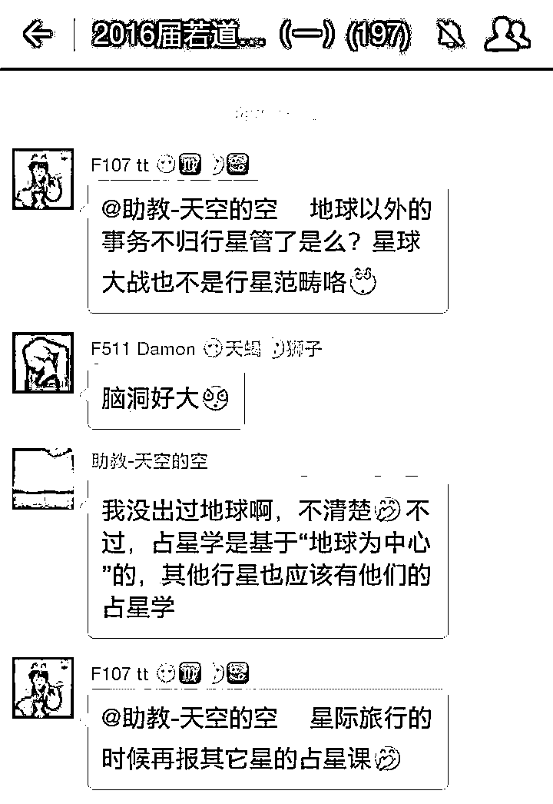
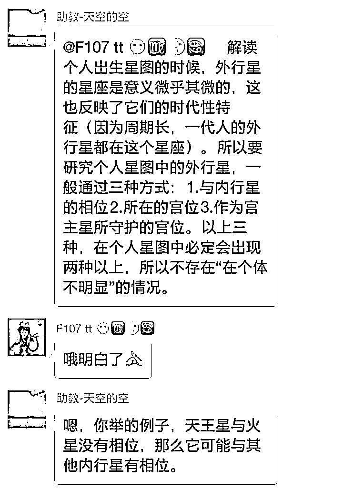
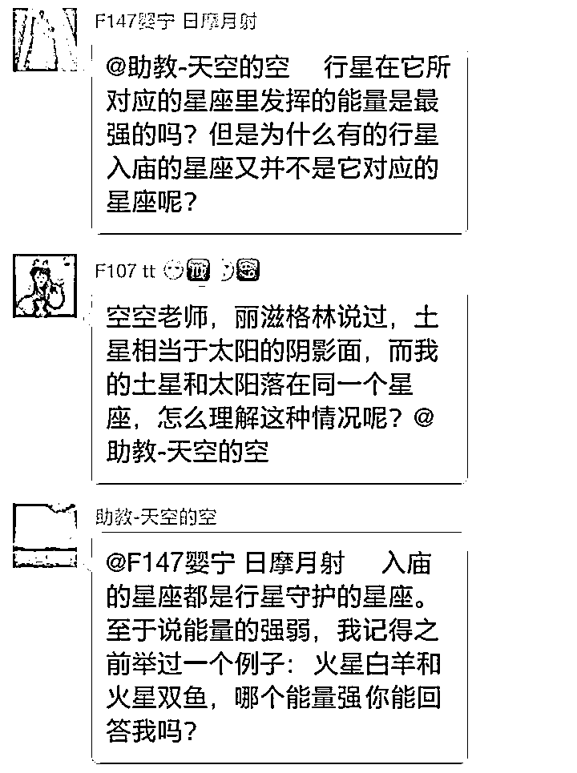
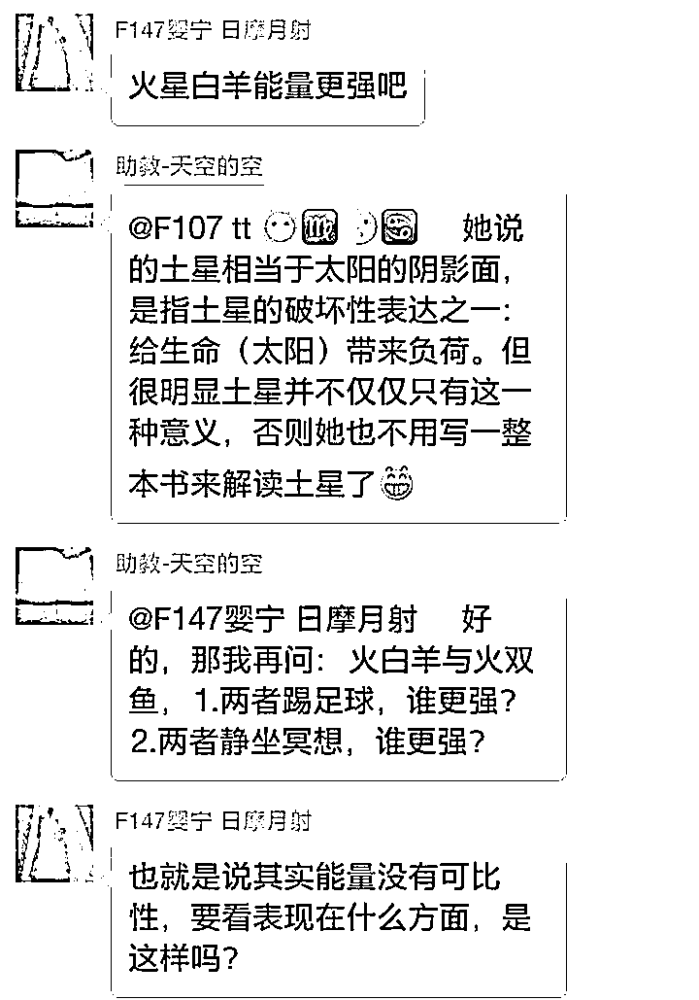

**能想象这是一年级新生们问出的问题吗**

**若道君还是一年级新生的时候**

**连劫夺是什么都搞不清楚咧**

**再来看看同学们和助教的精彩过招**

**随手一摘都是金句啊**

**进阶版群讨论：双子座和射手座**

**F150 柚子 日鱼月蟹**

对于射手座，双子座有哪些优点是射手座没有的？ 

**若道课程顾问-童老师**

当然有，双子座没有射手座的固执己见，更容易听取他人的意见，完善自己。 

**F124 析木 日蝎月狮**

双子对一切新鲜的都保持好奇学习的态度，射手座更注重对有意义的领域的研究吧。 

**若道课程顾问-童老师**

射手座一般除非遇上真正的大师了，否则不会听进别人的建议。

可能换个说法，射手座是偏执，坚信自己相信的是正确的。

**F105 Linn 日鱼月射**

双子座接地气！ 

**F005 Aimee 日摩月鱼**

感觉双子座的观察是细致入微的。而且出于习惯，比如去同事的座位那里只是拿一下东西，但是眼神很明显在看对方的电脑屏幕显示什么，打开的本子在记什么。

双子座的这种观察不是恶意，应该只是本能的吸收信息的需要，而摩羯这种重视隐私的星座 就会觉得被冒犯。 

*（若道君：双子座就是小小八卦收集器）*  

**F150 柚子 日鱼月蟹**

那是不是可以理解射手座相对于双子座更自信自己的想法，这点是不是有点像水瓶座。 

**F150 柚子 日鱼月蟹**

那我那个客户像射手座，会看不起专业能力不强的。

需要被大神折服才可以。

那水瓶座和射手座一样吗，感觉水瓶座也很自信自己的想法，觉得别人不理解我。

**若道助教 Gaff**

是的，射座手一旦陷入某些自认的教条、信奉的信仰时，就会显得比较教条，丧失了灵活性，而双子座则不易落入这种教条主义，双子座可以说是黄道星座中，最不易僵化的。 

**F124 析木 日蝎月狮**

双子座传递信息是不是比较迅速，又不作加工？ 

**F105 Linn 日鱼月射**

进化双子座方向，是不是会比较轻松一下。 

**F069 Wendy 日月射手**

以前总在想南交射座手今生的功课，因为以前印象里的双子座属于那种很八卦，对任何事很流于表面的。听了 Gaff 助教说的，终于明白了今生的功课。

觉得那不是要越来越肤浅，射手座多深刻啊哈哈。

**F105 Linn 日鱼月射**

双子座更接地气，范围更宽泛，更轻松的感觉。

也能看到更多世间的种种。 

**F108 张昕欣 日处月射**

对啊对啊，以前觉得射手座多高深啊，北交双子座这是要去学堕落嘛。

**若道课程顾问-童老师**

套用一句话，轻松的选择，不利于真正的个人成长。 

**若道助教 Gaff**

其实射手座的想法不是个人的想法，而是群体的想法，你想射手座所代表的宗教、哲学、信仰等，都是众人共同认可的，而双子座却更具个人，双子座所在的先天黄道宫位处于第一象限，是自我的象限，而射手座处于第三象限，那是偏向集体的象限。 

**伍德**

双子座只是看见、接收和传播信息。射手座的不同在于对信息的思考、理解和加深。 

**若道课程顾问-童老师**

也没有，南交射手座，通常很难将自己的想法，让他人认同。

北交双子座的路线，则是一句话——深入浅出，才是大师。

这就是南交射手座，到北交双子座的途径。

但凡大师到一定程度的，都是说白话，醒人济世。 

**F005 Aimee 日摩月鱼**

射手座更具深度，双子座具广度。 

**F069 Wendy 日月射手**

但射手座的原型不就是做一个信使吗？

**Damon.T**

北交双子座的人是不是有传播者的意思？ 

**若道助教 Gaff**

（简单而言）北交双子座，学习自身去体验、观察生活，不再停留在南交射手座的理论与象牙塔之中…… 

**F069 Wendy 日月射手**

这么说来射手座属于更从众的一类人。 

**F124 析木 日蝎月狮**

从精神性到物质性。 

**若道助教 Gaff**

太阳射手座月亮射手座北交双子，发展得好，可以将最难懂的理论，用最通俗的语言，讲解给 5 岁的小孩，并让其理解，这样是大师吧？ 

**若道课程顾问-童老师**

大卫瑞雷老师的《灵魂的目标》有详细的解读。大家可以当作课外读物。南北交点的核心，其实与大家的日月星座相关。

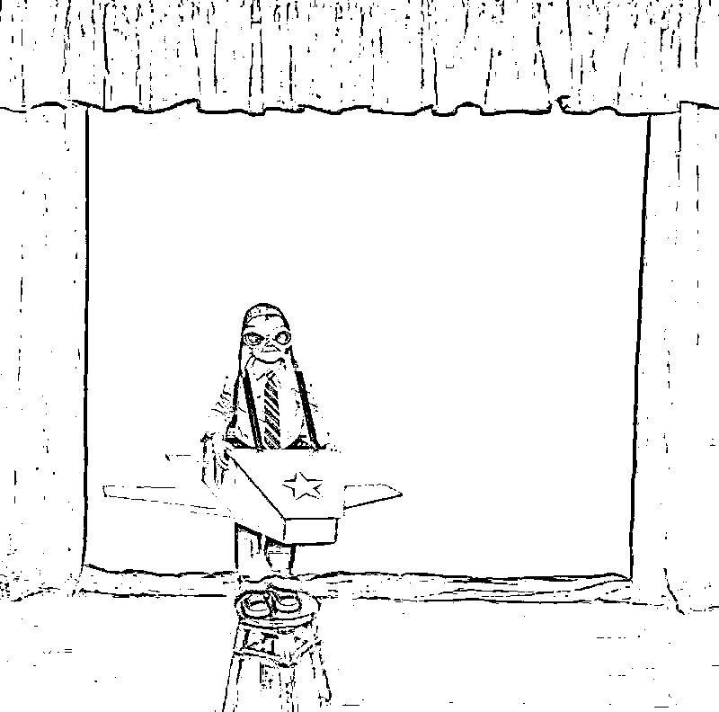

**八卦版群讨论：发散脑洞大集合** 

**F005 Aimee 日摩月鱼**

南交摩羯座，北交巨蟹座的功课是什么呢？太阳摩羯座总觉得奋斗多带感啊，很想了解南交摩羯座，北交巨蟹座的大师模式。 

**若道助教 Gaff**

你这问题超纲太厉害啦，不过，我们可以借机与大家讨论下巨蟹座的特质，你需要发展去的方向。 

**F005 Aimee 日摩月鱼**

我知道我今生的功课是巨蟹座——我妈巨蟹座，我儿子还是巨蟹座。陪伴孩子的时候会觉得平静幸福，但是太阳摩羯座又时常有无力感 ，巨蟹座太敏感，有时候是过于敏感，比如我爸妈吵架很多时候是因为射手座忽略了巨蟹座的敏感，其实射手座完全是无意识的。

**若道助教 Gaff**

巨蟹座非常懂得滋养他人，甚至疗愈别人。还有情绪来了，能健康、自然的表达出来，也是种魔法。摩羯座不太善于这个噢。

**F005 Aimee 日摩月鱼**

对，摩羯有情绪一般就憋着，憋久了就爆发一次。 

*（若道君：的确，属“憋”的）* 

**F108 张昕欣 日处月射 **

中天巨蟹座难道是要做家庭妇女？ 

**若道助教 Gaff**

中天巨蟹座，哈哈，工作就是陪人哭闹一场，收钱走人吧。

小时候，参加白事，总有一个中年妇女，来帮主人哭丧，哭得很有感觉，加上特别会念念有词的说些死人家庭的旧事，所以可以煽动哭不出来的人一起哭，这个职业牛吧？她收钱的。那个女人一度是我的偶像。

*（若道君：神比喻）* 

**F159 陈琛 日蟹月摩**

好吧，我承认作为月摩羯座，我比较相信汗水。 

**若道助教 Gaff**

摩羯座相信汗水这个比喻还真好。 

**若道课程顾问-童老师**

魔羯座的问题在于，当你过度在意汗水的时候，也容易忽略泪水。

*（若道君：此为金句）* 

**F507 JaneWu 日秤月蟹**

我是太阳天秤座，我朋友是太阳金牛座。同为金星守护。大家都说天秤座讲平等，但我觉得金牛座也讲，不过是天秤座讲求更多的是公平这感觉，而金牛座更像是收支平等，付出和得到要值得这种…… 

**若道课程顾问-童老师**

金牛座老师讲过，是我拥有的。天秤座老师也讲过，我是委婉的白羊座，虽然是我们的，但是天秤也希望自己拥有…… 

存钱，与，花钱。

金牛因为是拥有，所以可能更倾向于存钱。

天秤会因为别人有，而自己没有，倾向于买过来。

所以，金牛的平等是，AA 制，我花我的钱，我吃我的饭。

天秤的平等是，均摊制，大家一起花钱，一起吃饭。

而在工作中，金牛一般会比较老实的承担责任。

天秤可能就会借故集体，微妙一点。

这就是，土相与风相的差异。

* （若道君：话题又发散到了金牛座和天蝎座……）*

**F151 王聪 日双子月双鱼**

我认识的很多巨蟹座都爱吃，巨蟹座美食上都很在行，不是喜欢吃就是喜欢做。金牛座和巨蟹座爱吃有什么区别呢？

**若道助教 Gaff**

因为食物可以在一定程度代替情绪上的滋养，所以一些巨蟹座就容易吃吃吃咯，金牛座的吃偏感官享受，巨蟹座的吃偏情感滋养。 

**F151 王聪 日双子月双鱼**

是不是可以理解金牛座喜欢法式大餐的食物本身美味带来的享受，而巨蟹座喜欢妈妈的味道更侧重情感的滋养。 

**F158 若离儿 日蟹月蝎**

请问天蝎座与金牛座这对对宫星座该学习对方的什么呢？这对对宫我拿不太准，不如其他五对好比较。多谢。 

**助教-天空的空**

金牛座与天蝎座这组星座是关于“所有权”的。金牛座是土象星座，注重的是物质所有权，把控物质。所以它需要向天蝎座学习分享资源。天蝎座是水象星座，看重情感的归属，比如在关系中控制另一方，害怕背叛等等。所以它需要向金牛座学习保持安适与享受当下。 

**F158 若离儿 日蟹月蝎**

天蝎座也是乐于分享的吗？天蝎座给我的感觉是更喜欢控制，独占。所以天蝎座如何分享资源呢？ 

**助教-天空的空**

天蝎座的控制是基于生存的原因，害怕被迫害。“你会伤害我吗？”“你值得我信任吗？”更多是一种情感层面的控制。 

**F095 程业**

天空师兄，老师说到狮子座和摩羯座可能是最有领导力的星座，从另一角度理解，狮子座和摩羯座可能同时也是最需要别人认可的？狮子座需要他人瞩目、尊重，摩羯座也需要他人敬重，总觉得这两种外在认可有些微妙，怎么区别呢？

*（若道君：话题继续发散到狮子座和摩羯座）*  

**助教-天空的空**

从元素和形态的角度思考，狮子座是火，固定；摩羯座是土，开创。

火元素对应生命力的展现，所以狮子座在舞台上表演，吸引目光关注，这代表一种认可。土元素对应物质，所以摩羯座要开拓事业，获得世俗的成就，站在巅峰会让他感觉安全。

助教的答疑课


**再来看看助教答疑课的资料** 

**是一年级新生问题的 Q&A 环节**

**这里仅仅是节选哦**

**若道君已经膜拜了……**

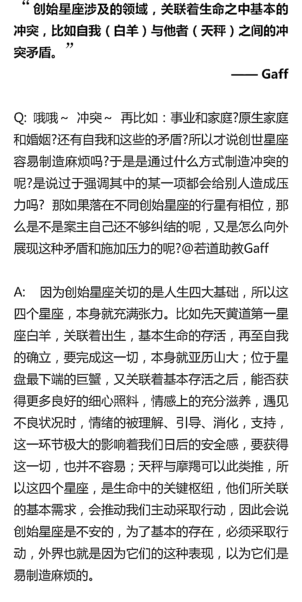

笔记和教案

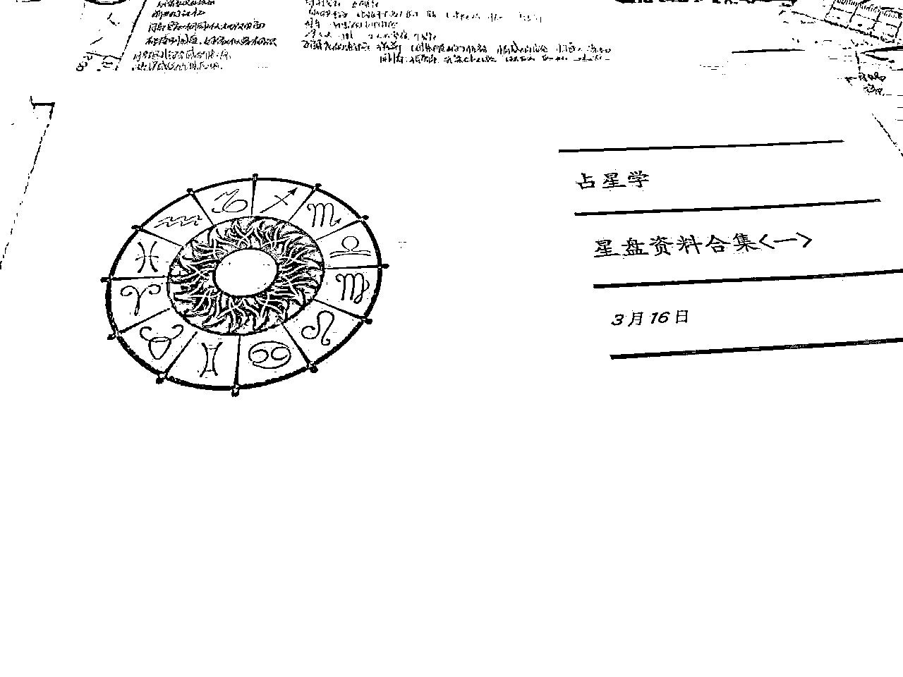
**同学们整理的教案**

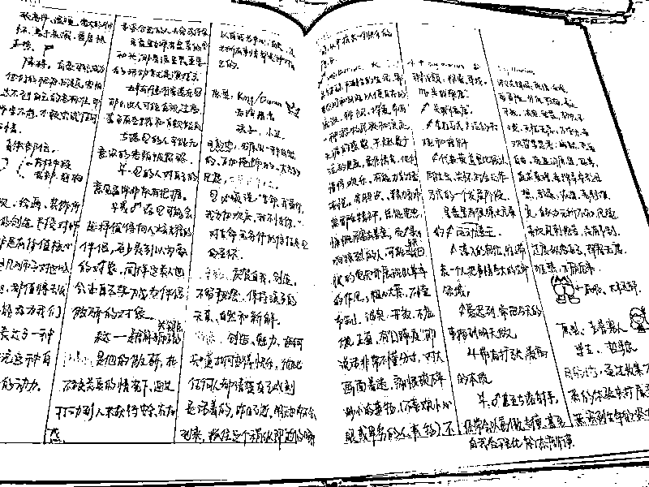
**工整的笔记……**

**上大学也没有这么认真过吧**

**看到这里**

**有没有迫不及待也想加入呢**

**在这里告诉大家一个好消息**

**为满足广大占星学爱好者的需要**

**若道第二期新生班将在 5 月 19 日正式启动**

**学员招募中**

**速度报名**

**加入新生行列吧**

**课程信息**

**授课时间：**2016 年 5 月 19 日**-7 月 7 日**

**授课老师：**蒋颖**（8 次）、**大卫·瑞雷**（4 次）**

**授课方式：**网络课

费用：**2400 元**

**报名截止：**2016 年 5 月 6 日

**课程负责人：童老师（微信号：80248863）、**王老师（微信号：2837474346）****

**咨询电话：**400-619-1014

**想了解更多占星学初阶内容，请在后台回复 入门 **即可。****

长按二维码接通课程负责人！

 

报名及咨询，请点击文末“阅读原文”

# 苏格拉底说过，认识自己是最重要的人生大事

> 原文：[`mp.weixin.qq.com/s?__biz=MzA5NjA0NTAxNg==&mid=2651384489&idx=1&sn=50161075eac9085e80eda5bc6fbfc1d5&chksm=8b4a581ebc3dd108b849fbebc80ca7e2240a3a1445e9a5e6c57c797dd8d8a89f840f65a723dc&scene=126&sessionid=1692738841#rd`](http://mp.weixin.qq.com/s?__biz=MzA5NjA0NTAxNg==&mid=2651384489&idx=1&sn=50161075eac9085e80eda5bc6fbfc1d5&chksm=8b4a581ebc3dd108b849fbebc80ca7e2240a3a1445e9a5e6c57c797dd8d8a89f840f65a723dc&scene=126&sessionid=1692738841#rd)

你认识自己吗？这个问题也许有些奇怪，但是你真的了解你自己吗？在与他人交往的时候，你的身体里是否有一部分在大叫“这不是我！”你会忽略这种声音吗？

**占星学能帮助我们什么：**

●了解自己的天赋

●探索自己的灵魂，与宇宙相链接

●更加宽容地看待他人和世界

●更有效地过好一生

●看到生活的美好之处

●认识到逆境并没有那么糟

●意识到生命的无常

●明白无论个体进化到多么强大，终要回归本源

**1**

**如果你是花，请选择花的方式生长**

人生如井，深不可测。

**你能获取多少水，取决于你拥有多少力量。而你拥有多少力量，取决于你对自我的认知有多深。**

**认识自己，方能认识人生。**

**——苏格拉底**

如果你是一颗苹果树，你就不要奢望收获橘子。所以，如果你是一朵花，就不要指望自己去长成参天大树。而实现自我认知的途径有很多，你可以培养个人志趣，可以打坐冥想灵修，可以皈依宗教或者参与社会活动，但无论如何，你要往前走，就要选择一种工具。面对各种工具犹豫不决、无所适从只能是在浪费你有限的生命长度。

**2**

**了解自己的方式**

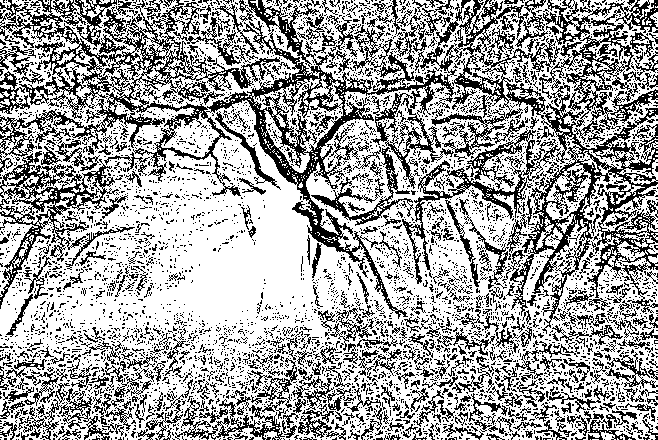

进化路上，我选择的工具是占星学。

人各有命，出生星图可以帮助我们尽早尽快地认识到早已刻在我们生命基因中的命运。了解并勇敢地接纳自己，善用星图上或流畅或冲突的能量，可以让我们的人生意义非凡。 

占星学能够帮助我们了解自己的天赋，个体的智力和才华有着丰富的类型。有的人的天赋具体，并且显而易见的，比如擅长画画、运动或者歌唱；有的人的天赋就需要更长的时间来探索和接纳，比如善于倾听、善于交流或者善于带动气氛。可能后者在人生的前半程容易充满挫折感，他们意识不到，他们的存在本身就会给周围的人带来很大的勇气和感动。而星图可以帮助我们了解到这些，尤其是帮助个体在青少年期的教育和成长。

**3**

**占星学教我发现自己**

占星学能够帮助我们了解到自己是独一无二的个体，同时也是这个世界的一部分。

**能够发现自己的天赋，这只是第一步，虽然这是非常关键的一步。之后我们需要了解，每个人都是宇宙这个整体的一部分。**我曾经在文章里写过，如果今年的你没有比去年的你更好一点，你凭什么来期望这个世界变得更好一些呢？

发现自己的天赋，贡献自己的力量，这才是完整的循环。给自己和世界之间树立一个高墙，并不能让你变得更有力量，也不会对世界有任何影响，反而会阻碍你去认清世界的真相。**占星学可以帮助我们探索我们的灵魂，和更大的宇宙智慧相连，从而找到自己的人生使命。**

**4**

**占星学助我安全走向灵魂的暗处**

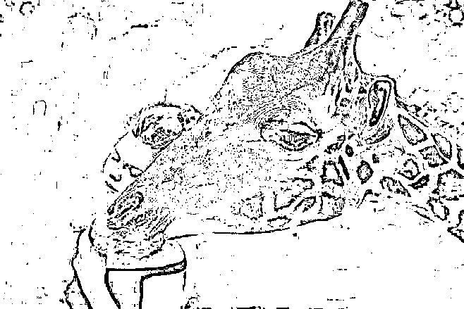

占星学能够帮我们迅速发现成长过程中形成的思维模式和行为模式。

客户在咨询结束后会对我说，感觉你是心理医生，和你聊一聊，心情就好了很多。我说，如果没有星图的帮助，单纯只是心理咨询，可能我们需要花上更多的时间才能发现问题的根源。**有了星图的帮助，我们可以很快地知道，我们的人生在哪里出了问题，我们应该怎么去帮助我们的人生。**

占星学能够帮助我们了解人生的轨迹。透过一张本命星图，我们既可以看到个人业力能量的呈现，也可以看到个人生命循环模式，以及外行星在人的一生中可能带来的生命挑战和转机。

通过对人生不同阶段行运的把握，我们可以提升自我觉察，知道什么时候该进、什么时候该退、什么时候该抓住、什么时候该放手。人生漫长，与其盲目地、惴惴不安地前行，不如把握住生命的节奏，安然过好每一天。

**5**

**占星学教我宽容待人待己**

**占星学可以帮助我们更加宽容地对待他人和世界。了解个体的差异性可以帮助我们消除偏见。**

每个人都是带着自己既有的性格特点和思维行为模式出生，从星图上能看出我们的父母是如何对待我们的，我们的成长环境、我们的情感特质、我们和他人的互动模式、我们的事业路径、我们人生路上会遭遇的困难和挑战。意识到这一点，我们就没有理由迁怒或者归罪于他人和社会。

要知道，是我们自己的特质和业力吸引来了能够帮助我们发现问题、解决问题的人和事。越是讨厌的人和讨厌的事情，越像一面镜子，能够照亮我们心底隐藏的阴暗面。而我们能不能经由这些获得成长，就要看我们是否有勇气去接纳和面对它们。

**6**

**占星学帮助我有更效地面对人生**

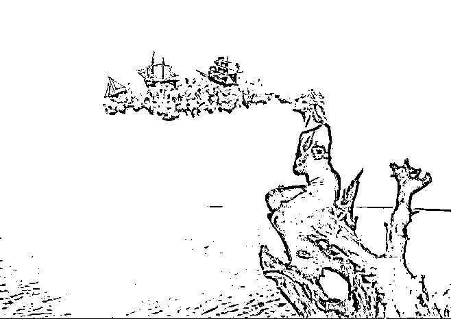

占星学能够帮助我们更有效地过好一生。了解自己的天赋，把握生命的轨道，可以让我们不再盲目和急躁。我们不会在坏情绪里面浪费时间，不会去做无用功。

我们知道顺境和逆境都会在某个周期结束的时候停止。我们也会知道让我们摔跤的模式是什么，从而在下一个周期来临的时候做好准备。我们不会在同一个坑里跌倒无数次，在命运的滚滚车轮下头破血流，还负隅顽抗。我们对于挫折和机会更有觉知，而不是在自怨自艾中虚度一生，或者在得意忘形中浪掷时光。

**7**

**占星学助我察觉美好**

占星学可以帮助我们认识到生活的美好。

我们每天的工作和家务、春天开的花、早市上热气腾腾的粥和包子、孩子的笑声和吵闹，我们如此熟悉它们，熟悉到熟视无睹。通过占星学，我们会意识到在它们之中有着超越日常的意义，没有一件事情是小事，没有一个人是无意地出现在我们的生命中。**整个宇宙是一个整体，你变化了，世界就会变化。**一想到这里，就会觉得人生还是很美好的。

占星学可以帮助我们认识到逆境并没有那么糟糕。**没有人的人生是一帆风顺，遇到挫折和磨难的时候，星图可以帮助我们理解到已经发生的坏事没有那么糟糕。**有时候，你必须允许自己失败一下，做一个不那么完美的人。与其一直想除掉自己不完美的那一面，不如试着与不完美和平共处，从而培养出一种谦逊的处事方式。

**8**

**占星学告诉我一体两面**

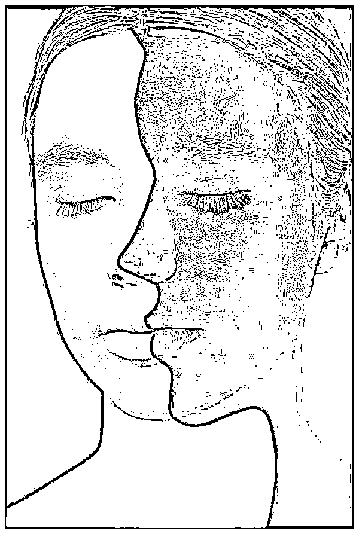

占星学可以帮助我们意识到生命的无常。熟悉占星学以后，你会知道，同样的占星学符号可能代表着完全相反的意义。

木星可能是机会，也可能是夸大其词；土星可能是压力，也可能是功成名就。不同的人生阶段和应对方式，它们呈现出来的意义可能是完全相反的。成也萧何败也萧何，一念之差，你的未来可能就会不一样。所以，把握住当下，就是把握住未来。你不会知道，你的人生会在哪一时刻戛然而止。

**9**

**占星学告诉我要回归本源**

占星学告诉我们，不管个体多么独立和强大，最终我们要回归本源。

个体感受到的强烈的经验和经历，不过是人类文明在漫长历史发展中不断遭遇的共同困境。这也是为什么我们的科技已经如此发达，人性还是和几千年前没有什么两样。我们的身体和头脑不过是宇宙智慧的通道，我们的一生都在为自己的累世进化累积经验。站在前人的肩膀上，我们最终获得的是一种视野，一种独一无二的回归本源的进化路径。

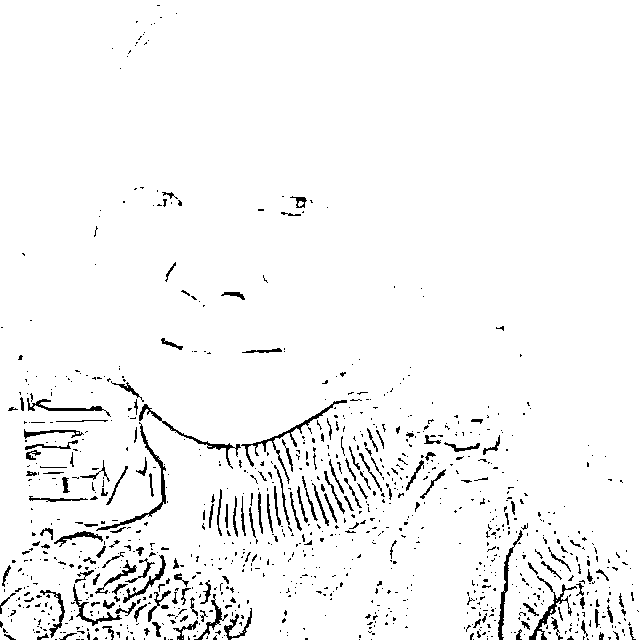

**作者简介**

**Anastasia**：职业占星师，国际占星研究学会 ISAR 会员，若道认证生时校正占星师。太阳射手座，月亮狮子座，上升处女座，擅长讲述个体星图后面隐藏的人生故事和意义。在若道跟随多名国际占星师学习严肃占星学多年，目前从事占星咨询工作。

**个人微信公众号平台**：midnight2evolution

长按二维码，让金钱涌向传播知识与智慧的人~


**◆ ◆ ◆  ◆ ◆**

******特别提醒************：本文由作者授权发布于若道******，**转载请注明“转自若道”并标明作者。******

想学习占星学吗？**2016 年 5 月 19 日**，蒋颖老师主讲的若道占星核心课程**Level 1-2**要开课了！她将带领你学习星座、太阳、月亮、行星、月亮交点等知识，让你进入占星学的世界！

报名及咨询，请点击文末“阅读原文”


# 顺势疗法 | 你也和她一样害怕去医院吗？

> 原文：[`mp.weixin.qq.com/s?__biz=MzA5NjA0NTAxNg==&mid=2651384489&idx=2&sn=6152ceb4043daca19d95c19881f4a0fe&chksm=8b4a581ebc3dd10827fc0f3fcf40caa4a38f00c727e680344fbcb2b7b436190e1203e8718156&scene=126&sessionid=1692738841#rd`](http://mp.weixin.qq.com/s?__biz=MzA5NjA0NTAxNg==&mid=2651384489&idx=2&sn=6152ceb4043daca19d95c19881f4a0fe&chksm=8b4a581ebc3dd10827fc0f3fcf40caa4a38f00c727e680344fbcb2b7b436190e1203e8718156&scene=126&sessionid=1692738841#rd)

过于敏感拒绝所有化学制品，而童年西医的粗暴治疗让她产生了不敢去医院的阴影。那么有病了怎么办？机缘巧合下研习顺势疗法让她不但照顾好了自己的身体，还帮助了最亲爱的人恢复健康。获益于自然疗法的她，想跟大家分享她和顺势疗法的缘分以及使用顺势药物的经历。


<sectin style="margin-top: 46px; margin-left: -76px; display: inline-block; vertical-align: top; line-height: 2em; box-sizing: border-box;">**自然疗法帮助了害怕西医的我**</sectin>

双鱼座、海王星和第四宫是我生命的主题，从小我就是个非常敏感焦虑的孩子。出生时医生为了保全我的生命，将我放入保育箱而留下了惊恐的创伤。由于过度敏感，我不喜欢用任何化学的物品，尤其是与身体会发生连结的物品。而童年时，因为恐惧我会得心脏病，母亲逼迫我打了五年的长效青霉素，每月一针，特别的长特别的痛。西医治疗的粗暴痛苦让我不喜欢去医院。

但人总会有身体不适，两年前，行运土星经过本命星图十二宫的时候，我的肠胃系统彻底崩溃了，几乎每隔一个月肠胃炎就会爆发，这让我的身心非常痛苦和绝望。

在大家的鼓励下，我选择了自然疗愈之路。从生食疗法到果汁断食，从家庭系统排列到人智学基础到自传学，从花精疗法到顺势疗法。通过各种疗法，今年，肠胃功能问题痊愈了，焦虑惊恐症状几乎不犯了，我的生命力开始复苏和活跃起来。


<sectin style="margin-top: 46px; margin-left: -76px; display: inline-block; vertical-align: top; line-height: 2em; box-sizing: border-box;">**顺势疗法初接触**</sectin>

十年前，妹夫从德国给我带回一支贝曲急救花精，用以调节坐飞机时的焦虑症状。这支花精的神奇作用让我印象深刻和惊叹。

更深入接触到花精，才知道贝曲医师以前是一位顺势疗法的医生。通过阅读他的经历和文献获得了更多关于花精和顺势疗法的知识。最好奇的是**顺势药物超越物质的势能作用是怎么运作的，到底它能否真的在人体身上起效呢？**

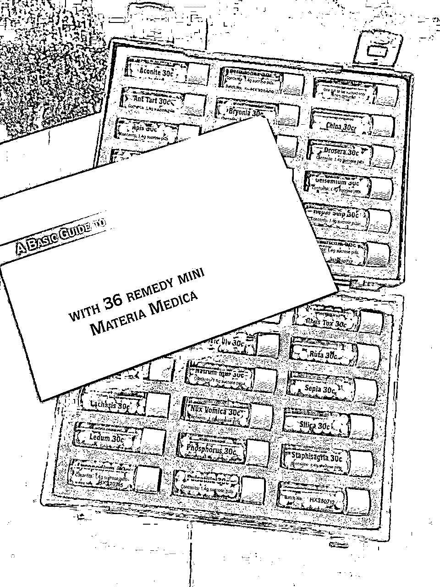

**▲**

顺势小药箱

今年，苏·汤普金斯老师带来了顺势急救药箱的课程，让我有机会亲近这门神奇而玄妙的学科，一探究竟。苏·汤普金斯老师的教学态度严谨端正，完全没有故弄玄虚。神奇的顺势药物和它玄妙的疗愈能力在老师的口中是那样有理有据，符合逻辑。老师判断一种药物是否适合病人使用时严肃认真的态度，让作为学生的我深深折服。


<sectin style="margin-top: 46px; margin-left: -76px; display: inline-block; vertical-align: top; line-height: 2em; box-sizing: border-box;">**我用顺势疗法缓解了爱人的病**</sectin>

拿到药箱一段时间，一直没有合适的机会尝试。3 月和先生去老挝旅行时，我将小药盒放进了旅行箱，以备不时之需。

我们从琅勃拉邦城搬去山里居住的那天，中午太阳非常的毒辣，路途又比较远，先生光着头没有做任何防暑的措施。下午到山上的时候，他告诉我头疼，当时我们都没有很在意。傍晚，他觉得症状在加重，身体感觉忽冷忽热，像感冒的初期症状，而头疼还在持续。

我仔细的询问了他身体和心理的感受，以及这些感受发展变化的过程，总结出了几个关键词：**阳光、中暑、发烧、头疼，感冒初期症状**。于是我在小药箱的说明书里找到了中暑这个病症，第一个药物颠茄的适应症里就有疼痛，发烧，感冒症状——因为光恶化。

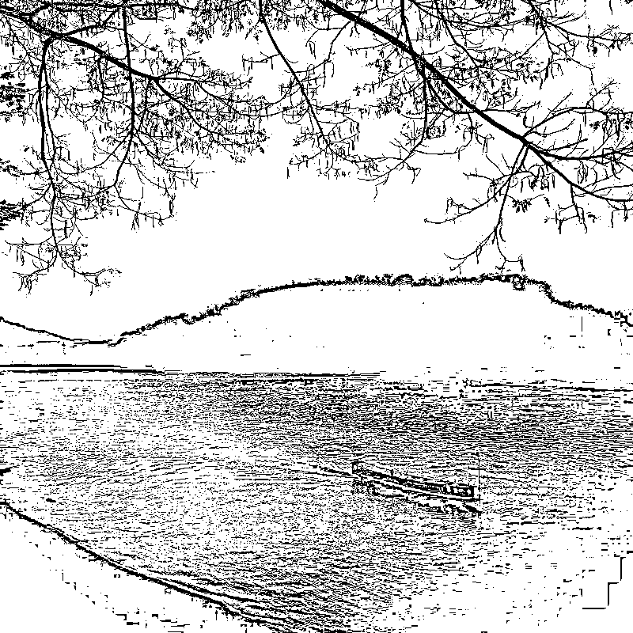
**▲**

老挝的风景

我记得苏·汤普金斯老师曾经说过，**当你的症状中有四个或以上符合这个顺势药物的治疗范畴，你就可以选用这款药。**于是，临睡前，我给先生服用了一颗颠茄的顺势小药丸，很快他就睡着了。我发现他的身体的温度非常的高，起初我还有点担心，叫醒他询问状况，他说不难受就是想睡觉。第二天早上醒来的时候，先生的体温正常了，所有的头疼，感冒症状都消失了。我们爬山探险，去湖边野餐，度过了愉快兴奋的一天。

第一次使用顺势药物的成功，也增加了我对它的信心。

课程已经接近尾声，我对顺势自然疗法的理解慢慢深入。**它不仅仅是一门关注身体疾病疗愈的学科，更是一门关注心理，习性甚至意识状态的艺术，我们的身体与我们的心我们的意识状态紧紧相连。**

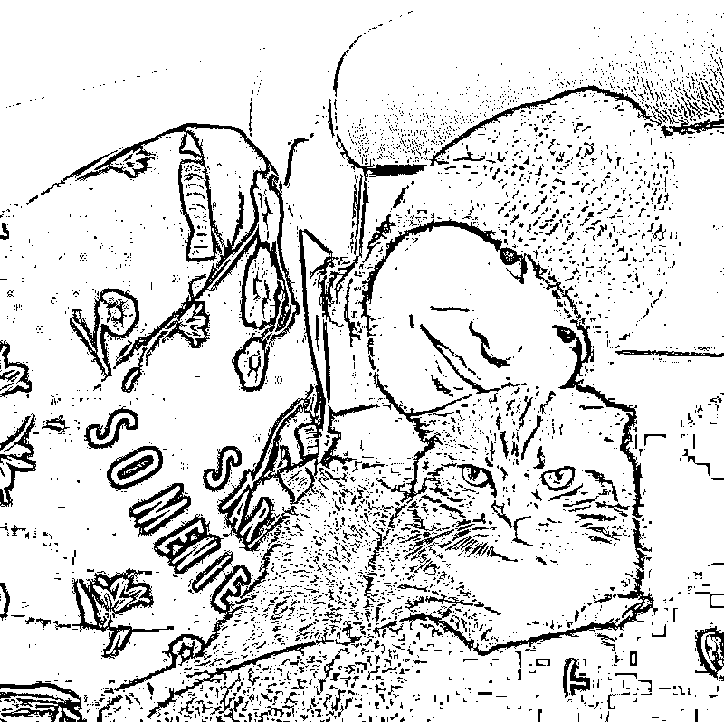

**作者介绍**

**封雪 Dobi **：密宗瑜伽修行人，自然疗法的践行和受益者。八年的大学设计专业讲师经历，让我对美，对生活有独特深刻的视角。成都星墅工作室创办人，致力于推广生活美学，自然生活方式，自然疗法以及占星学。

**微信联系方式**：fx197931

> #### 阅读更多顺势疗法
> 
> 点击图片即可阅读


**▲想搞定顺势疗法？先拿好这份攻略~**

**◆ ◆ ◆  ◆ ◆**

**********特别提醒************：本文由作者授权首发于若道******，**转载请注明“转自若道”并标明作者。**********

对顺势疗法好奇吗？**2016 年 5 月 7、8 日**，由**苏·汤普斯金**亲授的**顺势疗法工作坊**就要开课啦！顺势疗法是目前全球使用最广泛的自然医学疗法，对个体的身体、精神和情绪三个层面进行治疗，加强个体自身免疫力，提升个体生命能量。本课程为那些想要增加自我及家庭身体保健和疗愈能力的人所设置。

报名及咨询，请点击文末“阅读原文”


# 世界读书日 | 碎片化阅读够了吧？12 星座快来看书！

> 原文：[`mp.weixin.qq.com/s?__biz=MzA5NjA0NTAxNg==&mid=2651384488&idx=1&sn=a352227478963dee37e82b9ca13f1801&chksm=8b4a581fbc3dd10934fd0eb294419e24bd05ba64a2f927f9c472024ed2e2298852e4169b0c0e&scene=126&sessionid=1692738846#rd`](http://mp.weixin.qq.com/s?__biz=MzA5NjA0NTAxNg==&mid=2651384488&idx=1&sn=a352227478963dee37e82b9ca13f1801&chksm=8b4a581fbc3dd10934fd0eb294419e24bd05ba64a2f927f9c472024ed2e2298852e4169b0c0e&scene=126&sessionid=1692738846#rd)

今天是世界读书日，读书与信息传播相关，是水星的领域，水星又对应了一位希腊神话人物——赫尔墨斯。本文将教你如何通过他的故事来了解水星。此外，水星位于 12 星座具有怎样的特质呢？12 星座的水星又适合看什么样的书呢？一起来看看吧！

**1**

**走进希腊神话——赫尔墨斯**

**我们在星图中看到的每一颗行星都会对应一位希腊神话中的人物。**

**水星的代表人物，就是奥林匹斯山上作为十二主神之一的神使赫尔墨斯。**

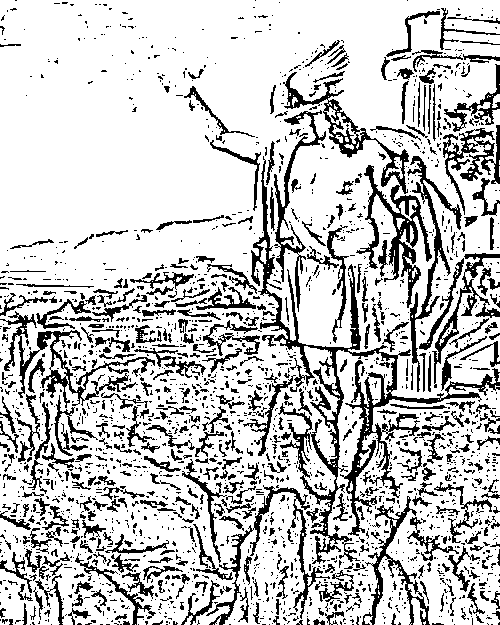

△图为赫尔墨斯（右）

他是众神之王宙斯与女神迈亚的儿子，职责是负责传达宙斯的旨意。除此之外，赫尔墨斯还被称为众神的使者，以及亡灵的接引神。而**在占星学中，水星守护着双子座与处女座，是一个负责传输的星体**：学习是知识的传输；你的兄弟姐妹，则是亲情的传输；你的写作，是思想的传输。甚至赫尔墨斯作为亡灵接引神，也是灵魂的传输。

赫尔墨斯在希腊神话故事中第一次出场，是在普罗米修斯盗天火之后，引起了宙斯的愤怒，就决定与众神一起创造潘多拉释放灾祸给人类。而赋予魔女潘多拉语言技能的，就是神使赫尔墨斯。因此，**语言能力是赫尔墨斯，也是水星的重要象征之一**。要说赫尔墨斯的语言能力有多好，可以看看他是怎么搭救伊娥的。

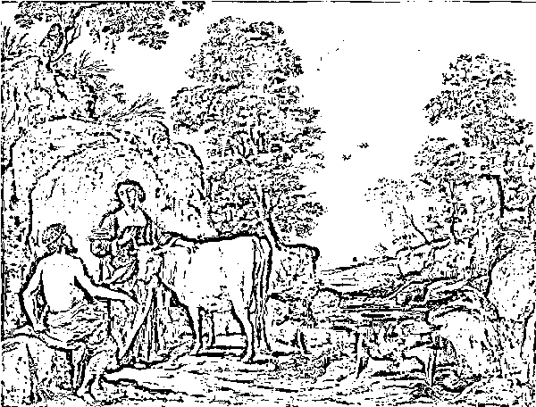

△图为宙斯和变为母牛的伊娥

伊娥是一个人类的公主，被宙斯看上并与之偷情。我们都知道宙斯有一个善妒的老婆赫拉，尽管宙斯把伊娥变成了一只牛，但还是没有逃过赫拉的眼睛。赫拉把变成牛的伊娥交给有一百只眼睛的阿尔戈斯来看管。宙斯没有别的办法，只能拜托赫尔墨斯想办法救出伊娥。赫尔墨斯还真是有办法，他拿着一支魔笛在阿尔戈斯的附近吹安眠曲，声音又美妙又温柔，还给阿尔戈斯讲了魔笛的来历，终于让阿尔戈斯慢慢睡着了，一百只眼睛全都闭上了。最终赫尔墨斯夺回了伊娥，还用一把利剑把阿尔戈斯杀掉了。

赫尔墨斯作为神使，不仅能自由地出入天上和人间，还能下到地狱中去。大英雄赫拉克勒斯在完成十件不可能完成的任务之前，赫尔墨斯还送给了他一把宝剑。后来在与地狱三头犬的任务中，带大英雄抵达冥界深处的，就是神使赫尔墨斯。这种能力好像我们的孙悟空一样，可以上天入地。**从本质上看，他就是一位传输者的角色**，可以去人间带孩子，也可以带人去地狱天堂。

赫尔墨斯给人的印象，除了可以游走于世间的每一个角落，还是一个**机巧、聪慧、会对兄弟亲人施以援手、不贪恋财宝、极具语言天赋的神**。我们注意到，尽管希腊神话中对男女神情事的描写很多，但赫尔墨斯并没有成为主角。不过赫尔墨斯也是有后代的，最著名的三位，一个是代表摩羯座的牧神潘，一个是雌雄同体神赫玛佛洛狄忒斯，一个是命运女神堤喀。一句题外话，我身边总是有摩羯座的朋友抱怨搞不定双子座，会不会和赫尔墨斯与潘的父子关系作祟有关呢？哈哈~

**2**

**水星位于 12 星座的特质**

我们通过简单的神话故事来了解赫尔墨斯，那么作为代表他的水星在 12 星座中是怎样的呢？下面我们将一一道来。由于本日是国际读书日，我们在说 12 星座水星的同时，还会推荐一本书给大家，要记得阅读哟。

● **水星在白羊座**

○ 如果你的水星在白羊座，那么你会拥有将赫尔墨斯加速的能力。你的语言和思维能力比较追求短平快，在表达上也很直接，甚至会忽略一些技巧。有的时候，别人会跟不上你的速率，不过速度快也会牺牲一些正确率。

因此，可能长篇的巨作不适合你阅读，所以推荐给你欧·亨利的短篇小说集。欧·亨利是三大短篇小说巨匠之一，并且小说经常有出奇的结尾。

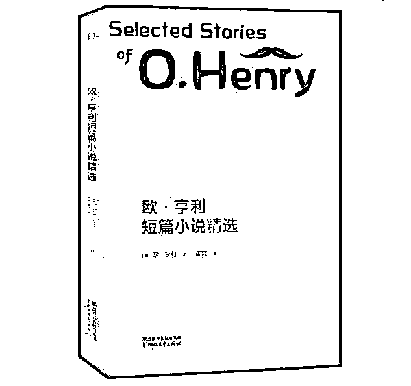

● **水星在金牛座**

○ 如果你的水星在金牛座，那么赫尔墨斯的速度是舒缓的。金牛座是一个非常恬静的星座，安宁而祥和。我很多金牛座的朋友都喜欢漂亮的美食和甜品，这与前面的白羊座反差极大。给水星在金牛座的朋友们推荐的书，需要带有甜美的色彩，并且兼顾现实性。

所以，我向你推荐汪曾祺的散文集《汪曾祺谈吃》，将吃的氛围、吃的感受，怎么个来历说得头头是道。他是口腹之欲和高雅文学拉得最近的人。

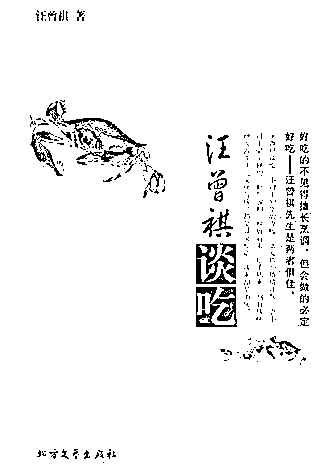

● **水星在双子座**

○ 如果你的水星在双子座，恭喜，这相当于赫尔墨斯回到了自己的家。双子座是一个代表聪明和机智的地方，水星在这里会显得好奇心极为旺盛。这虽然不同于金牛座的舒缓，但也不同于白羊座急速。双子座的特点是跳跃和好奇，擅长急转急停。

因此，我为水星在双子座的朋友们推荐岛田庄司的本格派推理小说。本格派的特点是，在最后揭开谜底之前，读者完全可以利用已知的线索破案，挑战智商哦~

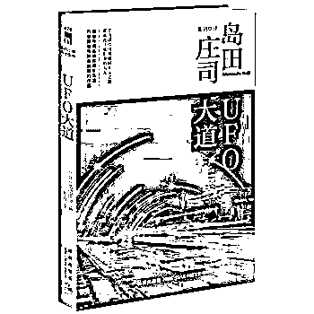

● **水星在巨蟹座**

○ 如果你的水星在巨蟹座，那么赫尔墨斯的表面并不会有特别的变化，但是内心会变得深情款款。巨蟹座是一个非常有爱心的星座，并且会像对待亲子一样给与呵护。所以水星在这里的表达是非常细腻的。

当我的巨蟹朋友们听说我要荐书的时候，不遗余力的给与我帮助。《傲慢与偏见》是一本情感很细腻的小说，五姐妹的爱情故事也蕴含了丰富的情感。此外还有巨蟹代表的家居类书籍《无印良品生活研究所》等，也体现了家的温馨。

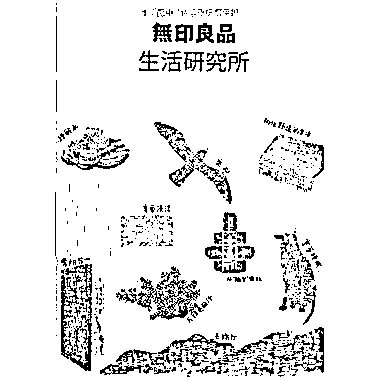

● **水星在狮子座**

○ 如果你的水星在狮子座，那么赫尔墨斯会显现出戏剧性的张力，也很有表演的欲望。所以，狮子座通常需要稍带夸张的文艺性。

从这个角度来讲，《希区柯克悬念故事集》也许比较符合水星在狮子座的口味。此外，《小说课》这本书将教会你如何讲一个成功的故事，需要背后努力的朋友们，可以看看这本秘籍。

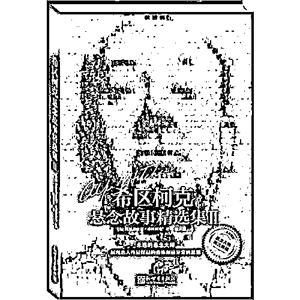

● **水星在处女座**

○ 如果你的水星在处女座，那么赫尔墨斯会呈现出分析性和清晰的辨析能力。并且由于处女座是土相星座，因此他们很能从实际出发，考虑现实意义。

这里给水星在处女座的朋友们推荐现实主义作品《人间喜剧》。这部被称为社会百科全书式的作品。除此之外我还推荐《匠人》这本书，里面充满了处女座的精致。

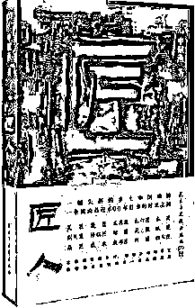

● **水星在天秤座**

○ 如果你的水星在天秤座，那么赫尔墨斯可能会变成《奇葩说》里的颜如晶，很注意表达的分寸感，力图不让每一个人难受。但是，天秤座也是有底线的，并不是一味的妥协。

这里给水星在天秤座的朋友推荐《天使的愤怒》来探讨什么是应守的底线，此外我还推荐《蔡康永的说话之道》，保证不会让别人听话难受。

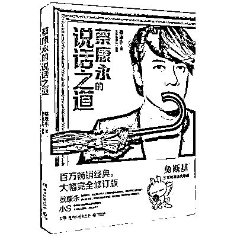

● **水星在天蝎座**

○ 如果你的水星在天蝎座，赫尔墨斯会变得内心激烈。天蝎座是一个外表平静内心激烈的星座，并且有一针见血的高超技能。天蝎座是一个最能洞察人心有多深的星座，所以，我们需要给水星在天蝎座的朋友推荐最能揭露人性的作品。

《冰与火之歌》是一部在架空的历史框架中讲述真实人性的作品，唯一不足的是，这部小说还没有最终完成，但这不妨碍它是近年来最伟大的作品。另外还可以推荐一部日本作品《甲贺忍法帖》，里面讲述了伊贺与甲贺两大忍者派别的悲剧。

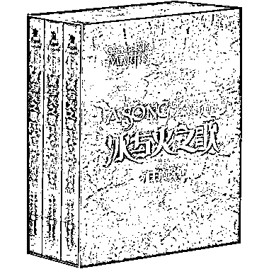

● **水星在射手座**

○ 如果你的水星在射手座，那么赫尔墨斯会有一个大心脏，那里有晓松老师说的诗和远方。射手座是一个心胸开阔、乐观向上的星座，所以射手座的人有可能看上去呆呆的，甚至会被人说成傻人有傻福。只不过这个“呆”和“福”还有一个名字叫做希望。

史蒂芬·金的《四季奇谭》描述了四个希望的故事，其中最有名的就是《肖申克的救赎》，它告诉人们：无论人生到何种地步，都不要放弃希望。


● **水星在摩羯座**

○ 如果你的水星在摩羯座，那么赫尔墨斯会显得缓慢而有计划性。摩羯座是一个小心谨慎、又有野心的星座。他们喜欢打大仗、打硬仗、啃难啃的骨头，一步一步小心翼翼的实现自己的目标。

在这里我给他们推荐山冈庄八的长篇巨著《德川家康》，还有盐野七生的《罗马人的故事》。这两部名作里面既有荣耀又有历史，相信可以满足水星在摩羯座的朋友们。

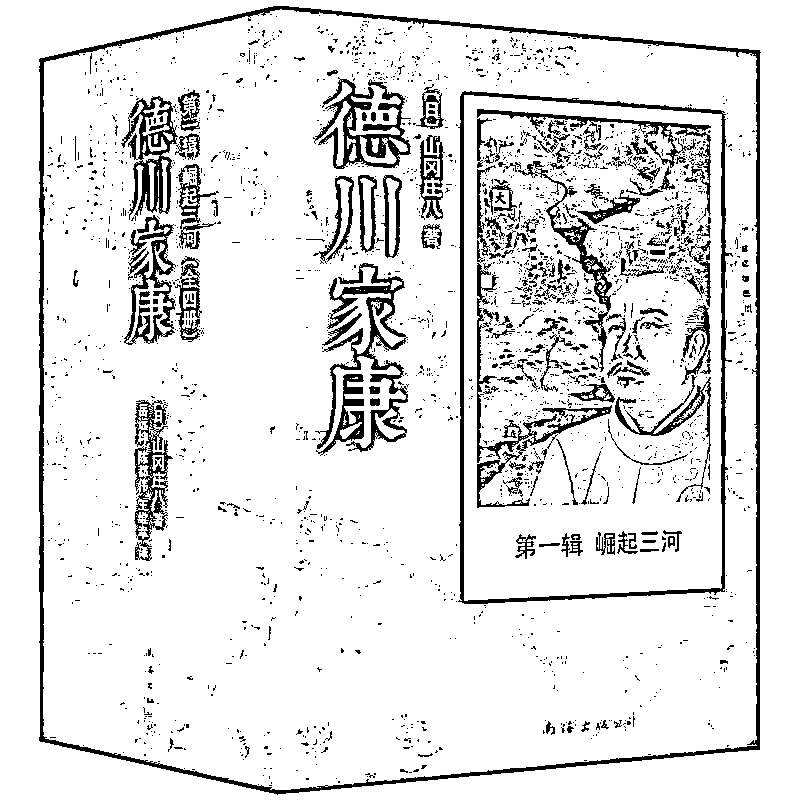

● **水星在水瓶座**

○ 如果你的水星在水瓶座，那么赫尔墨斯会非常有个性。水瓶座是一个有很强独立见解，同时具备客观视角的星座。他们不但有个性，还自身携带每个人都是独特个体的概念。

因此，推荐给水星在水瓶座的书一定要独特，《百年孤独》是一部魔幻现实主义作品，里面融合了许多特别的要素。我还推荐《岛上书店》这本书，封皮上直接写着“没有谁是一座孤岛，每本书都是一个世界。”

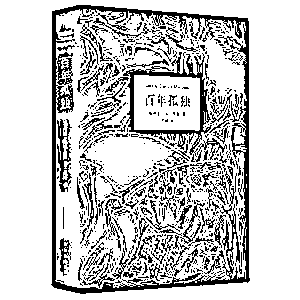

● **水星在双鱼座**

○ 如果你的水星在双鱼座，那么赫尔墨斯会变成非常有爱心、有救赎心理的人。双鱼座是非常有同情心和同理心的星座，并且经常在受害者与救赎者之间变换角色。双鱼座很有梦幻色彩，经常显得萌萌的，并伴有“要是 XXX 该有多好”的梦想。

因此我推荐著名作家维克多·雨果的《悲惨世界》与查尔斯·狄更斯的《雾都孤儿》这两本具有人道主义色彩的小说。

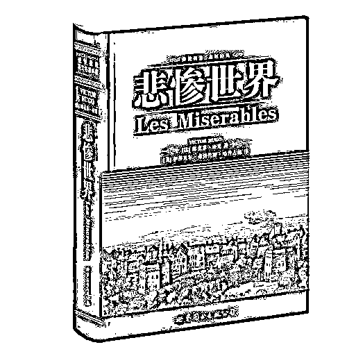 


**书是人类最好的朋友，书是人类进步的阶梯。**

**——高尔基**


读书有很多的作用。它可以学习，也可以帮你走万里路，体味多样的人生感悟。祝愿大家度过一个愉快且有收获的周末。


**作者简介**

**Conrad：**本名王嘉祺，处女座。曾在墨尔本的 MONASH 大学留学 2 年，IT 专业，主攻多媒体游戏开发。喜欢阅读历史、社科与心理学书籍。2010 年开始学习占星学，至今咨询数百次，于职业问题上颇有心得。

**个人公众号**：young_dreamers

长按二维码，让金钱涌向传播知识与智慧的人~ 

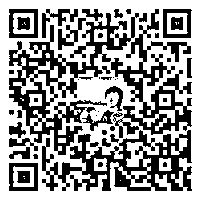

**◆ ◆ ◆  ◆ ◆**

 ****特别提醒：********本文由作者授权首发于若道****，转载请注明“转自若道”并标明作者。****

**你想了解更多行星的知识吗？**2016 年 5 月 19 日，**蒋颖老师**主讲的若道占星核心课程**Level 1-2**要开课了！她将带领你学习**星座、太阳、月亮、行星、月亮交点**等知识，让你进入占星学的世界！

课程详细内容请点击文末“阅读原文”


# 荐书 | 若道助教团推荐书目，接好哦！

> 原文：[`mp.weixin.qq.com/s?__biz=MzA5NjA0NTAxNg==&mid=2651384488&idx=2&sn=09fb244ad6547a5b36ea5fcf2f9f2e9d&chksm=8b4a581fbc3dd109d2d97a57d982636960e2d7f156bc6efce50186c509c78df4c418b81e5310&scene=126&sessionid=1692738846#rd`](http://mp.weixin.qq.com/s?__biz=MzA5NjA0NTAxNg==&mid=2651384488&idx=2&sn=09fb244ad6547a5b36ea5fcf2f9f2e9d&chksm=8b4a581fbc3dd109d2d97a57d982636960e2d7f156bc6efce50186c509c78df4c418b81e5310&scene=126&sessionid=1692738846#rd)

4 月 23 日是联合国教科文组织设立的“世界读书日”，恰巧遇到四星逆行的混乱天象，所以，窝在家里泡杯茶，读本书，才是这个周末的正确打开方式。读点什么呢？来看看若道助教的推荐吧。

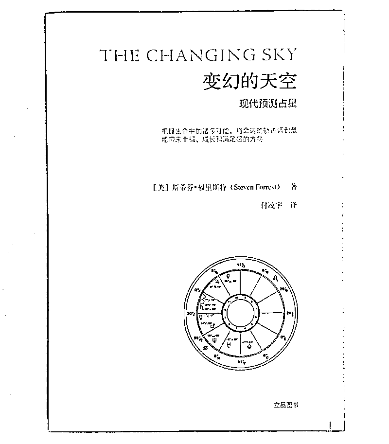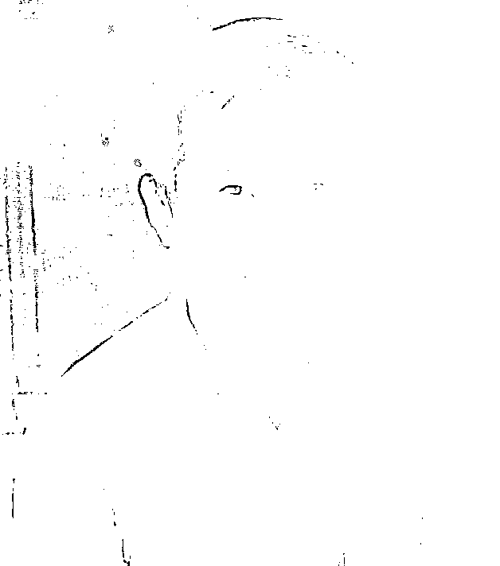**《变幻的天空》**

作者：斯蒂芬·弗里斯特

推荐人：海星程

## 推荐理由

在国内占星圈大家都把斯蒂芬·弗里斯特的《内在的天空》作为占星学的基本入门书籍，但是你知道吗，他除了这本书，还有被占星界称为**天空三部曲的天空系列占星经典著作**，这里给大家推荐的就是三部曲中的另外一部**《变幻的天空》**。

翻开《内在的天空》的第一页就写到“占星为我们带来的不是答案，而是问题、我们可以给出自己的答案……对我们来说，关键都是成长。”成长是需要时间的，而在**这时间的潮流中我们如何发现自己的问题，给出自己的答案呢？这就需要用到我们占星学的预测方法。**

你出生的那一刻记录下来的天上行星的位置就是你的出生星图，之后天上的行星并没有停下来还在不停的按照自己的规律运转，不停的在你的成长过程中奖励你（木星）、考验你（土星）、同时也不断的让你重塑自我（天王）、超越自我（海王）、转化自我（冥王）。

如果你从《内在的天空》中能够找出自己的人生议题，相信你也会通过《变幻的天空》给出自己的答案。

书中除了形象生动的以正反两个角色（老师和把戏师）讲解了行运预测方法带给我们的影响，同时还给介绍了次限推进预测方法，这是国内很少见到的有关详细介绍次限推进方法的书籍，也比**较适合想更进一步了解占星预测的爱好者阅读。**

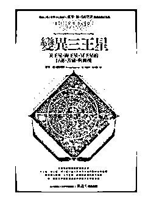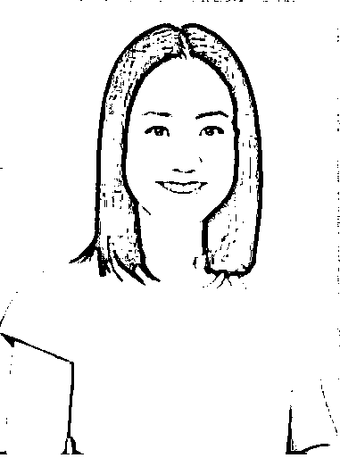**《变异三王星》**

作者：霍华．萨司波塔斯 

推荐人：莎珈  

## 推荐理由

格罗夫的全息呼吸工作坊指出心理学流派的创建和三王星的相位有密切联系的；**三王星在星盘上的位置描述了一个人从子宫受精，到整个出生过程中的心理。**

出生过程中的情绪，是我们塑造整体性格重要的组成部分，通常看一眼星盘上三王星和土星的位置，有经验并且喜欢格罗夫理论的占星师能大致描述出这个人出生过程可能经历的事情；三王星加上土星和木星也是研究代际文化重要征象。

如果你想了解个人之外，这一代人所具有的共有个性和文化特征，读这本“变异三王星”会给你很大启发。**特别推荐给日常工作需要接触潮流，文化，趋势研究的占星爱好者。**

我们是时间的新欢，命运的故人。

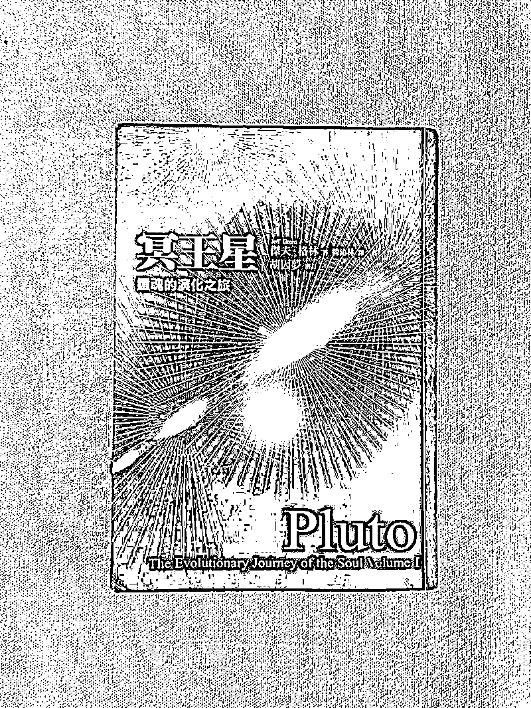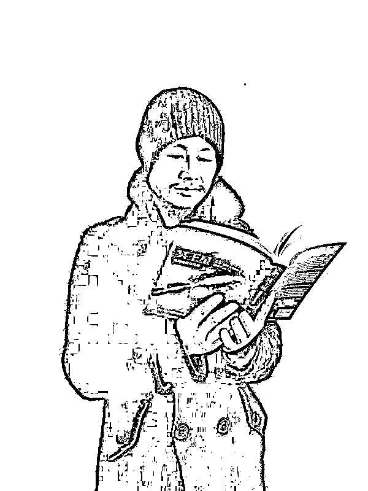**《冥王星——灵魂的演化之旅》**

作者：杰夫 · 格林

推荐人：Gaff

## 推荐理由

本书的作者杰夫·格林，既是进化占星学的创始者之一，也是斯蒂芬·弗里斯特在进化占星学上的亲密战友。杰夫·格林对于冥王星有深入、独到的理解，洞悉冥王星与灵魂、进化之间的关联性。

书中所介绍的诠释系统，**着重于对冥王星与南北交点的理解、分析**，也比较完整的**将心理占星学与奥秘占星学结合**。透过细腻、详细、逻辑的理论阐述，并运用实例、名人星盘予以示范、佐证，引导读者学习运用冥王星的能量，提升自我的意识层次，去理解、洞察、转化自身的议题，推动心理的成长和灵魂的进化。

**本书非常适合对占星学、深度心理、灵性发展有深入探索渴求的读者。**

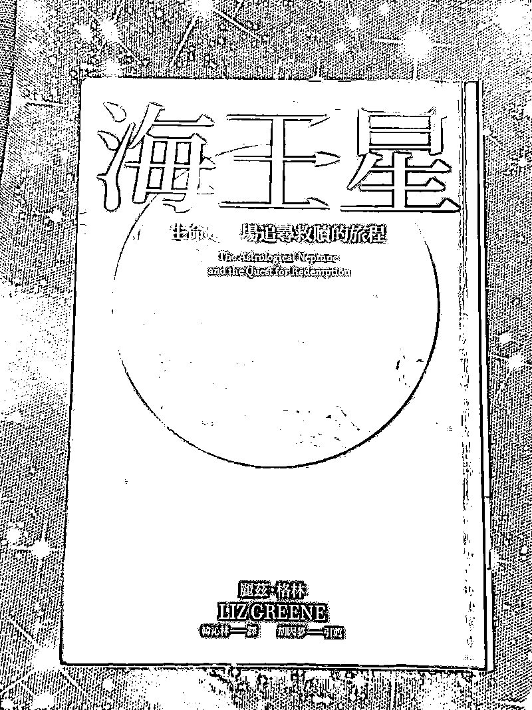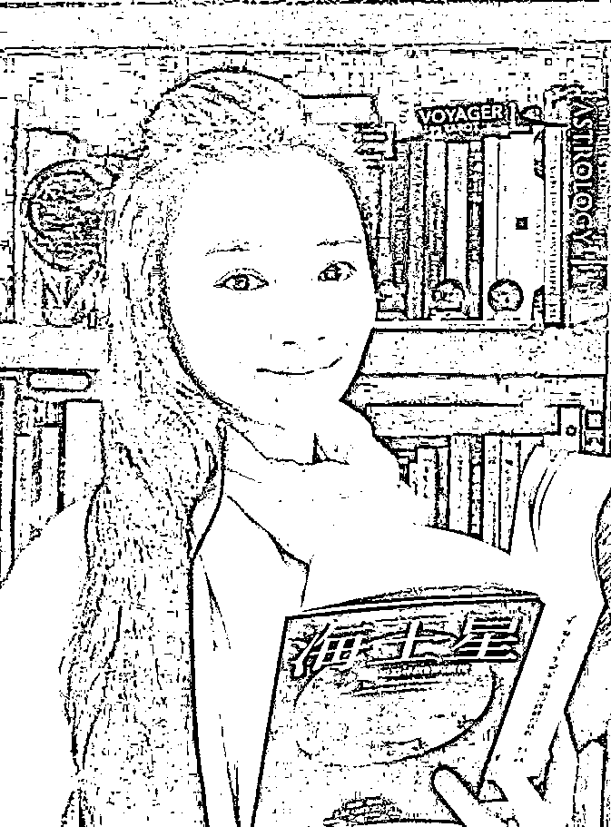**《海王星：生命是一场追寻救赎的旅程》**

作者：丽兹·格林

推荐人：郑玮玲(Sampriya)

## 推荐理由

跟随当代殿堂级占星师丽兹·格林的智慧，去揭开海王星神秘的面纱。

本书架构磅礴，旁征博引，以神话学、宗教学、心理学为起点，深入探索了**神秘学、艺术、情爱、时代潮流和政治中海王星所扮演的角色**，从社会、历史、心理各个层面一窥海王星陷匿的踪迹，发掘人类无意识底端的海王星暗流。

占星学子可以从中掌握海王星对人类心理，行为的影响及运作模式，作为荣格派心理占星师，丽兹·格林给出了**大量分析海王星的思路和方法**，有力地帮助我们用全息的思维认识海王星，发展深刻的洞悉力。书中提供的神化学史料也是职业占星师的必修课之一。

就算**没有占星学基础的读者，也可以利用此书进行深入的自我探索**。有心理学背景的读者则能通过占星学的诠释重审人类与母性源头的分离之痛，获得新的思路与智慧洞见。

这是一本以点概面，层层深入的占星学与人类意识领域的百科书，丽兹·格林创作于上世纪 90 年代海王星与天王星合相的时期。当下的我们正在经历海王星运行在双鱼座的时代，每个人有意识或无意识地追求着自我救赎，或是灵性的开启，探索和了解海王星为现实生活带来影响是与时代的同步。尤其那些出生星盘被海王星强烈影响的人，通过了解海王星如何在心底深处运作，可以敏锐觉察它的把戏，善用海王星高阶能量发展创造力，爱与慈悲。

此书于 2015 年 9 月在台湾出版，上架的第一天就遇见它，也是一种奇特的缘份。竖排繁体字版对国人的阅读习惯有一定挑战，在畅读上会稍有障碍。我在喜玛拉雅电台有公开阅读本书，用听觉语言帮助理解海王星的庞大架构及意义，有兴趣的同学可以去下载收听。

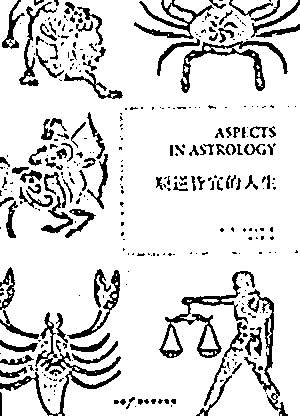
**《顺逆皆宜的人生》**

作者：苏·汤普金斯

推荐人：薇安

## 推荐理由

英国目前最资深的占星学家和咨询师之一，伦敦占星学院创办人，苏·汤普金斯继《当代占星研究》之后的又一力作。集作者在其占星实践与教学中，以经验式研究方法观察相位意涵而成的研究成果。突破了以往占星学相位著作的不足与局限，成为当代的一本**相位研究的经典之作。**

正如心智的各个子人格会相互协同工作，星图中的行星，当彼此形成一些具有典型象征意义的几何角度时，它们之间的“合作”，往往成为个人明显的心理动力或“情结”。

这些动力模式也主导着个体的外显行为，构建出我们吸引来的外境。人本占星对相位的阐释，**突破了传统的“好相位或坏相位”的评判，**甚至将一些所谓的“坏相位”看做更具创造力的心理动力源泉，这无疑对支持咨询者的成长与进化取到非常积极的作用。

在本书中，苏·汤普金斯对各行星及重要交点之间相位进行的原型性的解读，为我们带来极具启发性的洞见。也正如苏在书中所说：“阐释相位的最佳方式，或是看待任何一种占星信息的方式，都应该是通过自己的长期观察和仔细的检视，然后富于创造性地去运用它们。书籍所能提供的阐释只能为你带来一些启发”。

**◆ ◆ ◆  ◆ ◆**

占星学的大门为你敞开！2016 年 5 月 19 日，**蒋颖老师**主讲的若道占星核心课程**Level 1-2**要开课了！她将带领你学习**星座、太阳、月亮、行星、月亮交点**等知识，让你进入占星学的世界！

课程详细内容请点击文末“阅读原文”


# 天蝎座满月 | 那些奇怪的梦和愤怒都有个答案

> 原文：[`mp.weixin.qq.com/s?__biz=MzA5NjA0NTAxNg==&mid=2651384440&idx=1&sn=168a807230159a28bcae5513ae4f4042&chksm=8b4a58cfbc3dd1d9a3df396ed73f3e891e5c5bd83cb2c0e51ac4feec6ee6e443d88dae8941f9&scene=126&sessionid=1692738846#rd`](http://mp.weixin.qq.com/s?__biz=MzA5NjA0NTAxNg==&mid=2651384440&idx=1&sn=168a807230159a28bcae5513ae4f4042&chksm=8b4a58cfbc3dd1d9a3df396ed73f3e891e5c5bd83cb2c0e51ac4feec6ee6e443d88dae8941f9&scene=126&sessionid=1692738846#rd)

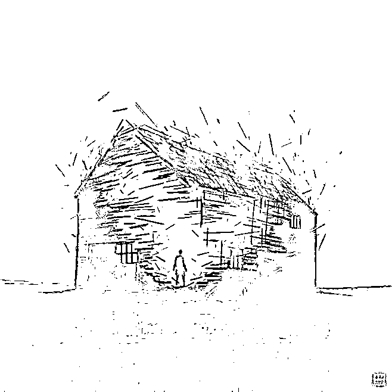

作者/王芝桦 图片/花瓣网 

**天蝎座满月**

北京时间 2016 年 4 月 22 日 13:23，我们迎来天蝎座满月，天蝎座月亮与金牛座太阳于 2 度 30 分精准对分。

最近不少人都会有怪诞的梦境以及无法遏制的怒火和背后的恐惧。让我们深入到生命内里本质的部分，挖掘内在根源、释放情绪，走向生命与灵魂的救赎之路。然后，在这个金牛月，享受植物与阳光、美食与音乐，享受生命内在的神秘与灵性、真诚与生动。

重点影响人群

出生星图中，**太阳星座、月亮星座及其他行星和四轴（上升、下降、中天和下中天）**落入如下位置的人，会受到更大的影响： 

*   固定星座（金牛座、狮子座、天蝎座、水瓶座）**0-5 度**的人；

*   基本星座（白羊座、巨蟹座、天秤座、摩羯座）**14-20 度**的人；

*   变动星座（双子座、处女座、射手座、双鱼座）**5-18 度**的人。 

可能发生的影响

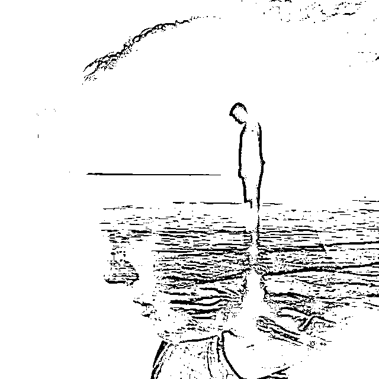

*   **情感的转变——情感出现红灯或转机**

*   试着处理亲密关系中，有关信任、财产、性、关系本质的深刻议题；对于悬而未决的暧昧、隐秘关系可以考虑进一步规划；亲密关系议题的解决，彼此坦诚的态度、积极改善的发心相当重要。 

*   **财务状况起伏——财务状况获得改善或产生危机**

*   前期因金钱引发的矛盾和困扰，真诚面对、讲出实情，有可能得到理解和缓解；在投资与财务的决策上需要谨慎；留意外出时的财务安全。

*   **评估价值——评估内在的价值需求**

*   将复杂繁多、难以取舍的选择做个排序，看清自己真正的需求是什么，将时间和精力集中到真正需要、重要的事物上。 

适合清理的

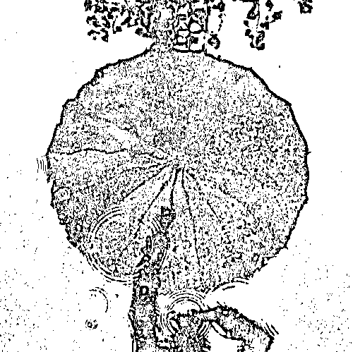

满月代表从成熟走向转化的过程，故而适合清理情绪、整合议题。

天蝎座总是被冠以**深刻、决绝**的标签，它的确包含这些特质。

借着天蝎座满月，将那些折磨和困扰都抖落出来，检视它已经多么的腐朽、糟粕，还要不要留着它呢？将那些终将死亡、毫无意义的部分“咔嚓”，将珍贵的生命能量投注在更重要、更必要的部分中去。

*   **悬而未决的亲密关系，还有比目前状态更糟糕的结果吗？**

*   置之死地而后生，也是一种选择：如果关系死亡，也许它本来就只能死亡；如果关系重生，或许彼此的信任会进入更加深入的向度。 

*   **排山倒海的恐惧与焦虑，还有比它更能搞砸生活的吗？**

*   停留在恐惧中，就会逐渐变成恐惧的代言人，用呼天喊地的言行、意念，不断吸引带着恐惧特质的人事物进入生活。 

*   **挥之不去的欲望，还有比它更让人期待数次、失望数次的吗？**

*   被欲望烧红了双眼，最能辨识那双红眼的便是那些乘虚而入、招摇撞骗的“机会”，与欲望的急不可待一拍即合，共同演出一场虚度年华的戏码。 

*   **欲罢不能的抗争，还有比它更让人疲惫不堪、欲哭无泪的吗？**

*   与其说抗争，不如说渴望征服、渴望认同，只是没有能力和方法表达实现和表达，就好像搬起一块石头想证明自己的力量，却因为蛮力而将石头砸向自己的双脚。 

......当然，还有很多可能性。 

行星逆行：最好的安排

乐观地来讲，此次天蝎座满月，是对前几日火星和冥王星逆行最好的安排。

天蝎座的守护行星火星、冥王星，于前几日分别进入逆行状态： 

**2016 年 4 月 17 日，火星于射手座逆行。**

**2016 年 4 月 18 日，冥王星于摩羯座逆行。** 

行星的逆行，将觉知开始向内卷动，为生命带来反思、了悟的空间。暂缓脚步、回头检视、深入探究前一段时间冥王星触动的议题及痛苦、火星迸发的激情及愤怒——这一切从何发生、为何如此？ 

你可能会有这样的感觉： 

*   **内心突如其来的惶恐与不安，仿佛进入茫然不知所措、恐惧前途未卜的境地，等待如此飘渺、前景如此虚空，想要抓住却无处着手，抓空的瞬间却又忍不住再去捕捉。** 

*   **内心深处慌乱、无助的呐喊——为什么？怎么办?谁来帮我？**   

    挖掘和释放

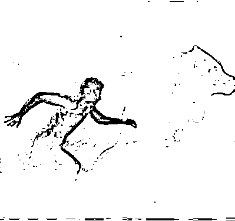

> #### **挖掘！挖掘！挖掘！**
> 
> 重要的事情说三遍

*   **你也许正感受着撕扯与痛苦，你认为这是某些人事物造成的，为什么要这样对我？！**

*   你可以不允许这些人事物对你造成伤害，为什么要将“鞭子”交给别人呢？是不是应该对自己选择的生活 100%负责呢？ 

*   **你可能前不久将愤怒的炸弹，冲动地投射到了某人的身上。**

*   你正在悔恨、自责自己的愚蠢与暴力：随着炸弹的毁灭，你的能量也随之毁灭了；随着炸弹的轰炸，你的内心也被炸开了一个深洞，惊讶地发现简单、粗暴背后隐藏的无能为力，难道没有更加优雅、友善的方法来表达观点和立场了吗？ 

*   **你可能试图拼命抓住什么、以此获得解救。**

*   在这样的期待中看到自己的脆弱与侥幸，在一次次升起的欲望、落空的失落中，看到自己能量的丧失、自尊的流逝。 

*   **你可能一直恐惧失去什么。**

*   问自己：我真的拥有过吗？可以失去的，是真正拥有吗？早或晚的失去，有什么区别吗？并且，失去得晚一些，似乎恐惧也久一些。 

> #### **释放！释放！释放！**
> 
> 重要的事情说三遍

*   **你愿意释放那些撕扯与痛苦吗？**

*   为自己的选择负起 100%的责任，那些你认为造成痛苦的人事物不会再贴着痛苦的标签，你将学会尊重自己的生命主权。 

*   **你愿意释放那些悔恨与自责吗？**

*   接纳自己作为凡人的真相、宽恕自己投射愤怒的伤害，在他人拿你当成炮灰轰炸的时候接纳、宽恕他人，并且在宽恕的慈悲中，为世界留下更多优雅、友善的印记。 

*   **你愿意释放自己的脆弱与侥幸吗？**

*   从生命拥有的本源汲取能量、唤回尊严，你会惊讶地发现自己原来是强大的解救专家。

*   **你愿意释放自己的恐惧吗？**

*   向宇宙交出你信任、愿意顺应生命的运势起伏，你会吸引所有奇迹与幸福来到你的生命中。

 此次天蝎座满月，是逆行的火星、冥王星的救赎机缘；逆行的火星、冥王星，是此次天蝎座满月的救赎通道。 

生命一直走在救赎的路上，生命从来不缺少慈悲。放过自己，放过他人。我们的痛苦与愤怒、恐惧与欲望，将在这个天蝎座满月得到净化与宽恕，并且将整合、进化得更高阶的生命频率投射到社会与宇宙中去，我们每一个人都是更宏大范畴的一部分。 

给你的建议

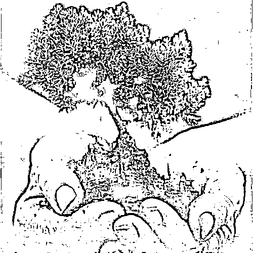

*   **独处**

*   挖掘与释放，安静而真诚地面对自己。 

*   **哭泣**

*   必要的时候，不要吝惜眼泪，无论你是谁。 

*   **朝圣**

*   充满灵性或信仰的地方可以给你灵感。 

*   **咨询**

*   运用直觉找到属于你的占星师、咨询师，做一个专业的深度咨询吧。 

*   **想象死亡**

*   想象如果生命只剩三天：你会做什么事、见什么人？那些一直撕扯、折磨你的痛苦或恐惧，真的重要吗？ 

*   **走进大自然**

*   抚摸树的身体、感受风的波动、倾听鸟的语言，你会发现，大自然一直爱你。

祝福大家。

**天蝎座满月的主要星象**

**——本次天蝎座满月发生时的天象图——**

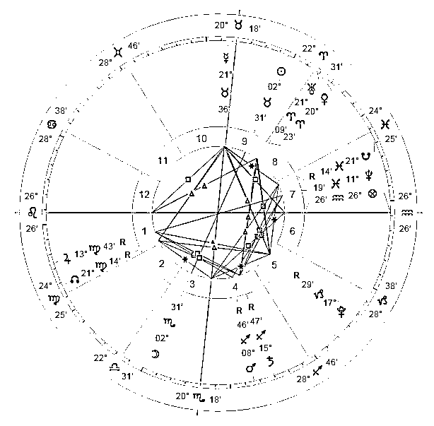
**——本次天蝎座满月发生时的重要天象——** 

***①*** *月亮在天蝎座精准对分在金牛座的太阳；*

***②*** *天蝎座的守护星火星在射手座逆行、另一颗守护星冥王星在摩羯座逆行；*

***③*** *金牛座的守护星金星在白羊座，合相天王星；同时四分在摩羯座的冥王星（天冥四分）；*

***④*** *土星在射手座四分在处女座的木星及在双鱼座的海王星（土木海 T 三角）。*


**作者简介**

**王芝桦**：职业占星师、身心灵治疗师。具有丰富的心理咨询、催眠治疗、占星咨询个案经验。结合心理学、灵性疗法、占星学等不同专业流派，以及 NLP、艾瑞克森催眠、家族系统排列等专业技术，开创系列生命主题课程。创办天津道玺身心灵中心。

**微信公众平台账号**：daoxi-life

**个案预约微信账号**：zhihua0621

长按二维码，让金钱涌向传播知识与智慧的人~


**◆ ◆ ◆  ◆ ◆**

**特别提醒****：本文由作者授权首发于若道平台，转载请注明“转自若道”**并标明作者**。**  

如果你也有很多恐惧……占星学可以帮助你。**2016 年 5 月 19 日**，蒋颖老师主讲的若道占星核心课程**Level 1-2**要开课了！她将带领你学习星座、太阳、月亮、行星、月亮交点等知识，让你进入占星学的世界！

报名及咨询，请点击文末“阅读原文”


# 塔纳斯 | 读懂七大行星的原型意涵

> 原文：[`mp.weixin.qq.com/s?__biz=MzA5NjA0NTAxNg==&mid=2651384440&idx=2&sn=00b65f4fd689189cc845e88c97fc551a&chksm=8b4a58cfbc3dd1d9397adb485c1c3a5f1a32f7f365ff5e695ef70fad6a989afd62be3b157b6d&scene=126&sessionid=1692738846#rd`](http://mp.weixin.qq.com/s?__biz=MzA5NjA0NTAxNg==&mid=2651384440&idx=2&sn=00b65f4fd689189cc845e88c97fc551a&chksm=8b4a58cfbc3dd1d9397adb485c1c3a5f1a32f7f365ff5e695ef70fad6a989afd62be3b157b6d&scene=126&sessionid=1692738846#rd)

行星

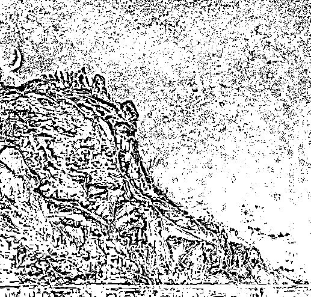**太 阳  **月 亮****

****水 星  ******金 星  **********火 星 ********

**木 星  **土 星****

****天王星  海王星  冥王星****

作者/理查德·塔纳斯   译者/Luke  校对/轩轩

图片/花瓣网

要读懂出生图和行进图，有两类因素最为重要，它们分别是行星和相位。行星本质上代表原型力量本身，也是星图解读最重要的一环，今天先来看一看除了三颗外行星之外的七大行星。

**1**

**太阳**

总共有**十种行星原型**，它们构成了**占星分析的基础**。（我们采用古希腊的用法，“行星”也被用来指代太阳和月亮）。虽然每个行星原型在星图中都起到重大的作用，但唯有**太阳和月亮对人格的影响尤为重大**。

**太阳在出生图中代表生命力和有意识的自我**。正如太阳是太阳系的核心星体一样，太阳也在星图中象征核心的自我。太阳代表核心自我身份、有意识的自我、自主的有意志的自我，它和一个人的自我导向感和自我表达有关。

它掌管一个人基本的活力、存在的意愿、自主的自我表达。它代表个人意志的动态表达，影响和引导其他的行星能量。简单地说，它就是一个人想要“发光”、表现、创造、达成的那个部分。它和个人的基本身份认同紧密相关：“我是乔治·史密斯，我是这样的一个人，做过这些事情，未来要做哪些事情”等等。

用神话学的术语来说，太阳代表英雄原型，本质是阳性。

**当太阳和星图中另一颗行星形成主要相位时（比如与金星合相或与火星对分），那么这第二个行星原型会显著地出现在这个人的生命和性格中，将它的特质融入太阳代表的自我能量中。**因此，太阳的任何主要相位在星图中都是十分重要的。此外，无论在女性还是男性的星图中，太阳都倾向于反映生命中主要男性的特质。

**2**

**月亮**

与此相对的是，**月亮代表心灵的阴性面向**，荣格学派称它为阿尼玛。它象征**情绪和本能上的反应性人格**，与一个人的身心基础和早期母婴关系有密切的关联。在某种意义上，月亮象征一个人的根源。

太阳反映了个体自主自治的自我、身份认同和意志，具有更加主动和自我导向的性质。而**月亮代表一个人深层的心理性格**，那些连自己也感到模糊不清的部分，更具有接受性，**倾向于自发地被动反应**。总的说来，**月亮对应一个人的感觉，以及那些源自过去，无处不在却几乎意识不到的心理模式**。

并不是说月亮完全代表无意识，而是现代人的自我通常无法意识到这些内容——心灵的情感、物理、想象、家族，以及祖先的根基或源头。

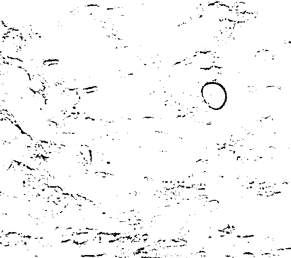

**月亮对应一个人先于思想的自我感觉**，以及与他人和生命情境自发互动的方式。就像月相每天都在变化，心灵的阴性部分，与心情和感觉相关，也有善变不稳定的特质。但在另一个层次上，那些深刻烙印在心灵中的模式却十分持久稳定。

月亮和一个人早年形成的身心反应模式有关，这有一部分遗传因素，也有一部分是和世界的早期互动留下的痕迹，尤其是与母亲、母亲角色的扮演者、家庭（亲属、父亲）、早期家庭环境的互动。它掌管一个人的归属感、养育和被养育的方式，与母性本能以及婴儿和童年时期的本能有关。

**成人后，月亮反映一个人所有的亲密关系、亲属关系、家庭生活的性质。**从神话学的观点来看，月亮和伟大母亲女神原型有关，本质是阴性。

和太阳一样，**如果月亮和另一颗行星形成了主要相位，那么该行星原型就会在生命中扮演重要的角色。但这次它的能量主要会导向月亮管辖的领域**：包括一个人的情绪和心境、婴儿和童年、母亲和早期家庭环境、亲密关系和家庭生活等。同样地，无论是男性还是女性的星图，月亮反映了人生中主要女性角色的特质。

要记住无论男性女性都有太阳和月亮，每个人的心中都具备基本的男性和女性原型。阴阳对立的法则贯穿存在的各个层面。目前还不清楚男性和女性的“本质”有多少是受文化塑造，有多少是天生的。不过显然月亮原型与女性在生育和养育时的身心状态有天然的关联。

然而，在另一个层面上，每个人都面临平衡内在阴阳两极的挑战，要在追求个体自主还是整体连结、主动还是被动、意志和感受、有意识和无意识、自我和心灵之间进行取舍。

**3**

**水星**

**水星代表心智和思考的法则，**通过演讲、写作和其他形式完成沟通交流。它掌管概念化和沟通，以及运用语言文字、分析理解、学习、感知、调停、运输和联结的能力。

水星原型和希腊神话人物赫尔墨斯有关，他是罗马的神祗墨丘利和上帝的信使。**水星和其他行星形成主要相位会影响一个人的心智和神经系统、其接收和给与信息的方式、受教育的性质和智力程度**。

**4**

**金星**

金星代表爱和美的法则。水星代表理性，那么金星就代表爱欲。**金星掌管爱情和社会关系、吸引和被吸引、参与艺术活动、追求和谐、美丽或感官欲望。**

金星原型和希腊神话人物阿芙洛狄忒有关，也是罗马的维纳斯——爱和美的女神。**金星形成的主要相位会影响一个人处理爱和感情的方式、社会和爱情关系的性质，以及艺术品味和美学素养。**

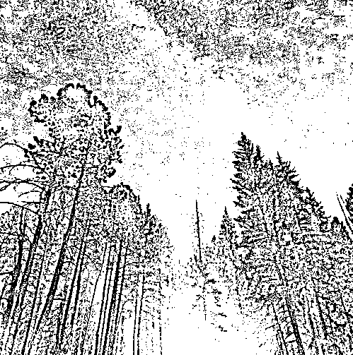

**5**

**火星**

火星代表活力和力量的法则。它象征心灵中驱使我们行动、发展自我、应对困难、勇往直前、英勇作战、应对竞争和战斗的部分。火星是战士的原型：**它掌管侵略、愤怒、身体能量、同时也倾向于受伤、暴力和冲动行为。它和运动能力相关。**同时，作为金星的对极，掌管两性关系的阳面。

火星原型和希腊神话人物阿瑞斯相关，是罗马神话的马尔斯——战争之神。**火星的主要相位指示一个人在人生中如何行动、坚持自我、应对冲突和攻击。**

**6**

**木星**

**木星代表扩展和成功的法则**。它掌管扩张和成长、发展和提升，追求更高、更好、提升和加强，包容外物，组成整体的倾向。它也掌管获得成功、荣誉、丰盛、幸福、好运的倾向，和豁达、慷慨、骄傲、乐观的特质有关。

此外木星还关注道德和哲学理念及原则，拥有长期或宏大的视野，追求更广阔的智性和文化幅度，追求更加多元的体验。（比如通过旅行、广泛阅读、内在探索）。**负面的角度来看，木星和铺张浪费、自我膨胀、过度关注财富地位、自我放纵、自满、过度自信和个人优越感有关。**

木星原型和希腊神话人物宙斯相关，他是奥林匹亚的众神之王、罗马神话中的朱庇特。它被称作是大吉星，和命运及天意相关。**木星的主要相位指示个人在人生的各个领域体验扩张、成长和成功的性质，以及这些倾向是否会走向过度。**

**7**

**土星**

土星原型较为复杂，我会更详细地谈论它。**土星代表限制、结构、必要性的法则**。它掌管物质世界、时间、传统、过去、老化、死亡和事物的终结。土星原型和希腊神话人物克罗诺斯有关，是众神之父、罗马神话的萨顿。传统占星学称其为大凶星。它和诸如命运、时间之父、死亡、死神等原型相关。在荣格和原型心理学中，土星被称作老头。

土星代表事物的硬件结构、实相原则和底线。很多方面看来它是木星的对极：木星代表扩张和成功，土星代表收缩和限制；木星慷慨豁达而土星保守严厉；木星提升而土星压迫。的确是这样，占星学的诸神中唯有土星呈现一边倒的负面性质，虽然实际情况可能比这更加复杂。

**土星压迫和限制，但在这一过程中，它也加强、塑造、训练我们，使我们的灵魂举止庄严、实在，使我们真实。从某种重要的意义上来讲，土星掌管了出生图本身，因为土星克罗诺斯是时间之主。而透过出生，一瞬的时间成为了实体，这一具有原型意义的时刻寓意了未来漫长的人生中将面临的挑战。**

土星原型也掌管了生命的结构。它是万物的源头，因为它提供了限制和结构，定义了事物的界限和始终，才使得万物得以显化。土星也是审判的法则，掌管我们行为的后果，迫使我们为过去的行动负责。

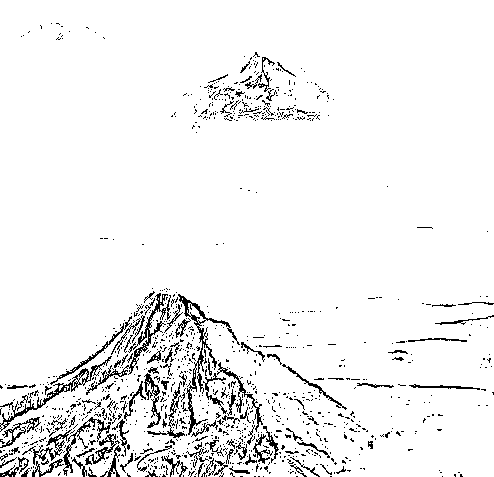

密意哲学认为它是业力的行星，带给我们过去世的业力，迫使我们在此生面对。或许可以把它看做我们背负的十字架，因为表面看来，它的试炼和苦难我们本不应承受，也无法用常理解释。

从神学来看，土星和希伯来人的上帝有些相似（不完全相似）；它是严厉的世界执法者和法律制定者。它是正义和报应的上帝，宣判人类经历分离、劳作、受苦、疾病、痛苦和死亡的命运。土星是有限、不完美、凡人世界的君王。在更深的层面上，土星可被看作象征生存的苦难：迫使我们和万物一体的源头分裂，从子宫出生，但也赋予了我们实体、形式、稳定、质量和物质实相。

土星的符号是骷髅，象征死亡——时间的尽头，也象征事物的结构骨架和基础，因为没有它们就没有形体，会失去稳定性，也不能给予力量支撑事物抵抗住时间和经验的改变。

土星使我们了解孤独，忍受寂寞；它将我们和其他人分离——出生时和子宫分离，长大后和家庭分离，最后面对死亡时和所有人分离。但也是土星塑造了我们的人格，为我们的存在赋予纪律和秩序，净化我们的本质。

它代表我们的超我，内在的良心和判官，反映了内化的社会规矩、宗教传统和道德律法。土星掌管了犯错的后果、罪恶感、悲观主义、自卑、抑郁、贫困；但也教会我们谨慎、秩序、集中力、耐力、严肃认真、守信、负责、成熟。

继续与木星作对比，木星可能是膨胀、夸大或过度乐观的，而**土星是公正、踏实、实际的**。土星的运转缓慢渐进、辛苦费力，却能达成持久有效的成果。

**土星也掌管工作，辛勤劳作确保收支平衡。**它掌管“现实”——向我们提出具体要求的现实，它带来物质的局限，迫使我们脚踏实地。它使我们承认失败，压制抱负，否认梦想。

土星抵制压迫我们，但也同时定义了我们，带给我们经验和智慧，使我们为自己负起责任，成为自己的主人。正如尼采所说：“没有自制力的人就要受制于人。”正是依靠土星，我们才获得了一种特别的内在权威感，这只有时间和经验才能换来。

因此**土星在出生图中的位置十分重要，它和其他行星形成的主要相位会告诉我们此人在人生中重视什么。牵涉土星的行进昭示一段重大发展期，这段时期通常要经历个人试炼，变得成熟**，并构筑起事业和重要人际关系的架构，承担业力带来的责任。或许我们要记住的关键，或者一种奏效的**假设是土星指示了今生的课业，毕业后才能达到更高的灵性觉知。**它带来的苦难和挫折可以被看作走向成熟的通行证。

最后强调的是，在出生过程中，土星是象征压迫和隔离的原型，它缓慢地塑造和构筑，最终帮我们达成存在的新层面。它是业力之神。

**敬请关注若道君之后的推送**


下一篇我们讲原型占星学中三王星

**有关原型占星的干货，你也许想看这篇：**

****▼****


**点击图片阅读文章  **

塔纳斯 | 到底什么是“原型”？

* * *

**课程信息**

**** 

**课程名称：**原型占星学（ISAR 选修课之一）

**讲师：**理查德·塔纳斯

**开课时间**：2016 年 5 月 14 日

**授课时间**：每周六上午 10：00-12：00，共 8 节课 16 课时

**费用**：6800 元 （若道老学员 4800）

**授课形式**：网络在线授课（英文授课，中文翻译）

**课程负责人**：李老师、熊老师

**微信号**：2847613491（请备注原型课程报名咨询）

**◆ ◆ ◆  ◆ ◆**

**特别提醒****：本文由作者授权发布于若道平台，转载请注明“转自若道”并标明作者。**  

**2016 年 5 月 14 日**，西方著名文化历史学家、研究原型占星学 30 年余年的**理查德·塔纳斯**将为我们打开**原型占星学**的大门。

课程详细内容请点击文末“阅读原文”


# 顺势疗法 | 不再青春的你还爆青春痘吗？

> 原文：[`mp.weixin.qq.com/s?__biz=MzA5NjA0NTAxNg==&mid=2651384440&idx=3&sn=a730adf2850204bf31e957060b97f48d&chksm=8b4a58cfbc3dd1d95c5b32c2680340f24be4a7a0e6fe03de25bc2de081b2598ca9b2916161ba&scene=126&sessionid=1692738846#rd`](http://mp.weixin.qq.com/s?__biz=MzA5NjA0NTAxNg==&mid=2651384440&idx=3&sn=a730adf2850204bf31e957060b97f48d&chksm=8b4a58cfbc3dd1d95c5b32c2680340f24be4a7a0e6fe03de25bc2de081b2598ca9b2916161ba&scene=126&sessionid=1692738846#rd)

人生最大的痛苦——就是发现自己的青春已不在，但青春痘却依然在。不过，也许顺势疗法可以帮帮忙。

痤疮是非常常见的皮肤病症，其特征是粉刺（黑头和白头），脓包。痤疮常常始于青春期，严重程度各有不同，从出现在面部、颈部、后背和胸部的几个小包，这是大部分青少年在某段时间都有的情况，到更为严重的情况，可能留下疤痕，影响自信。


<sectin style="margin-top: 46px; margin-left: -76px; display: inline-block; vertical-align: top; line-height: 2em; box-sizing: border-box;">**引发痤疮的原因**</sectin>

对于大多数人来说，痤疮往往在即将进入二十岁和二十岁出头时痊愈，但是在有些人身上可能会持续更长的时间。痤疮患者的皮脂腺（分泌油脂的）对正常血液中特定荷尔蒙的水平十分敏感，男性和女性都是如此。这会导致皮脂腺分泌过多的油脂。同时，毛孔内层的死去的皮肤细胞并没有正常脱落，阻塞了毛囊。这两个原因导致油脂增多，产生了黑头（黑色的油栓，可见死皮）和白头。

每个人的皮肤上都有痤疮细菌（也就是痤疮丙酸杆菌），通常并不会引发问题，但在容易产生痤疮的人身上，油脂的增多创造了这些细菌繁殖的理想环境。这会引发炎症和红斑或脓疱的形成。多囊卵巢综合征和肾上腺或脑下垂体的肿瘤等疾病也会引发痤疮。

在中医中，皮肤是肺的表征；痤疮常常是肺热和肠热的信号。因此中医治疗痤疮的方法是清热、净肺、解肠毒，治疗外表病症。

现代社会由于工业和科技发展的原因，空气污染也已经对我们内在器官和外在皮肤造成了很多严重的伤害。普遍来说越来越多的人都受到了皮肤疾病的困扰，对于年轻人来说痤疮和疖子是非常常见的病症了。


<sectin style="margin-top: 46px; margin-left: -76px; display: inline-block; vertical-align: top; line-height: 2em; box-sizing: border-box;">**顺势疗法中的痤疮治疗**</sectin>

在顺势疗法中根据痤疮不同症状，也会有很多不同顺势疗法药物可以对症治疗：

**——症状 1——**

Q： 分泌大量脓液？

A :   是的，并且有可能会留疤。

药物建议：**硅石**

**——症状 2——**

Q： 分泌大量脓液？

         A :   是的，但不太像会留疤。

药物建议：**硫肝**

**——症状 3——**

Q： 分泌大量脓液？

A :   不是。

          Q :   清洗后爆发？

A： 是的。

药物建议：**硫磺**

这些都是根据患者不同的症状对应了不同药物的病症采取的疗法，通常只要是对症下药，都可以有效的治疗痤疮的产生。

这里有一个参加苏·汤普金斯老师课程的学员在使用顺势疗法治疗疖子的案例，疖子是疮中最小最浅之疾，发炎只限于皮肤：

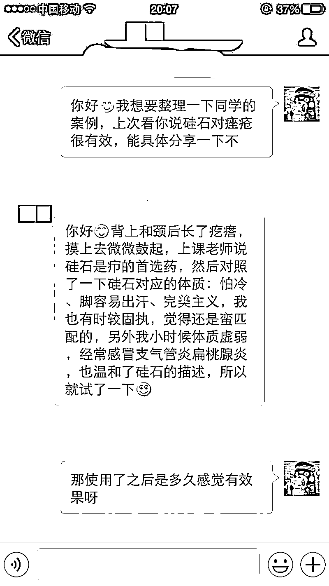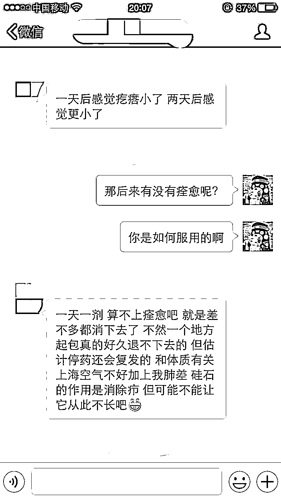

非常感谢同学的分享，诸如此类的案例其实还有很多，顺势的药物在对于我们生活中常见的疾病还是有很好的辅助作用的，常常可以缓和很多慢性病症的症状，以及对于一些急性的病症也起到缓解的作用。但是要使用顺势疗法药物之前还是需要对于药物有更专业的了解或者去咨询专业的顺势疗法医师。

在顺势疗法的药品中也有类似于家庭的急救的急救药箱，关于这个大家如果想了解更多，可以参加**苏汤普金斯老师在五月的顺势疗法工作坊**，不仅会有现场的案例演示，还可以更深刻的了解顺势的急救药物的使用方法。


**提醒：安全性问题**

顺势疗法作为辅助医学，对我们日常的家庭健康管理起到了非常好的辅助作用，并且在某些急性病症或者严重疾病中也能起到舒缓的作用。但是罹患严重或者不知名的病症，或者一般人在 2-3 周内、5 岁以下儿童在 48 小时内情况未获得改善，应向现代医学求诊。

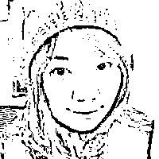

**作者介绍**

**Elias:** 若道核心课程 Level 5 在读。太阳水瓶座，月亮天蝎座，一直喜欢占星，直到进入若道才明白真正的占星学，特别喜欢挖掘真相，喜爱身心灵和各种传承，爱好佛法和中医。

**个人微信号**：pan217 

长按二维码，让金钱涌向传播知识与智慧的人~


> #### 阅读更多顺势疗法
> 
> 点击图片即可阅读

 

[](http://mp.weixin.qq.com/s?__biz=MzA5NjA0NTAxNg==&mid=403741311&idx=2&sn=06da349083483f2f8080a503b1e69e90&scene=21#wechat_redirect)▲想搞定顺势疗法？先拿好这份攻略~ 


▲顺势疗法的药物安全吗（上）？


▲顺势疗法的药物安全吗（下）？

**◆ ◆ ◆  ◆ ◆**

**********特别提醒：****本文由作者授权首发于若道，转载请注明“转自若道”并标明作者。**********

想更多了解关于顺势疗法的知识吗？**2016 年 5 月 7、8 日**，由**苏·汤普斯金**亲授的**顺势疗法工作坊**就要开课啦！顺势疗法是目前全球使用最广泛的自然医学疗法，对个体的身体、精神和情绪三个层面进行治疗，加强个体自身免疫力，提升个体生命能量。本课程为那些想要增加自我及家庭身体保健和疗愈能力的人所设置。

报名及咨询，请点击文末“阅读原文”


# 自我探索游园会 | 周六，记得来找若道君

> 原文：[`mp.weixin.qq.com/s?__biz=MzA5NjA0NTAxNg==&mid=2651384440&idx=4&sn=2157dae8f261b6e9adec33f0793e440c&chksm=8b4a58cfbc3dd1d9d3f63c4072a9144cf2d5c8d3373b017e9fa9cc031aadd852ddd8142f0cda&scene=126&sessionid=1692738846#rd`](http://mp.weixin.qq.com/s?__biz=MzA5NjA0NTAxNg==&mid=2651384440&idx=4&sn=2157dae8f261b6e9adec33f0793e440c&chksm=8b4a58cfbc3dd1d9d3f63c4072a9144cf2d5c8d3373b017e9fa9cc031aadd852ddd8142f0cda&scene=126&sessionid=1692738846#rd)

**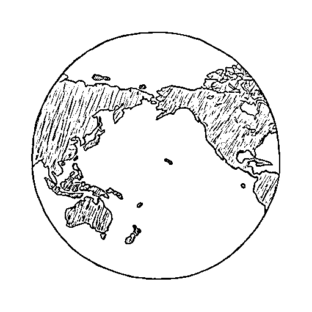**

**自我探索**的文字看了那么多

还是不得其法怎么办？

**星图是地图**，听了这么多遍仍觉得无法具象理解？

太阳星座、月亮星座和上升星座又说出了我的哪一部分？

**我的星图到底说了些什么？**

想知道上面的问题吗？

**现在机会来啦！**

一场名为**自我探索**的春季游园会

教你用心理学和占星学这两个工具来探索自我

**作为市集现场唯一占星机构**

若道占星专门邀请了**ISAR 认证占星师**

**想解答最困扰自己的问题**

想看看占星师都是什么样的神存在

就来参加游园会吧

**认识自己你只差一张星图**

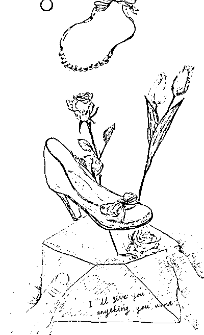

**活动资讯**

**名称**：2016 自我探索春季游园会

**主办方**：Know Yourself、爱蹭 FUN

**时间**：**4 月 23 日星期六 10:00-18:00**

**地点**：东城文化人才（国际）创业园，中关村科技园东城园内（青龙胡同甲 1 号）

**若道摊位**：5 楼露台

**在若道摊位怎么玩**

1.免费打印星图

2.专业的小伙伴为你解释太阳、月亮及上升星座

3.你有任何占星学方面的问题，不管是个人星图还是占星学习，都可以询问现场专业占星师

**都是免费！免费！免费！**

**重要的事情说三遍**

**我们豪华的专业占星师团队**

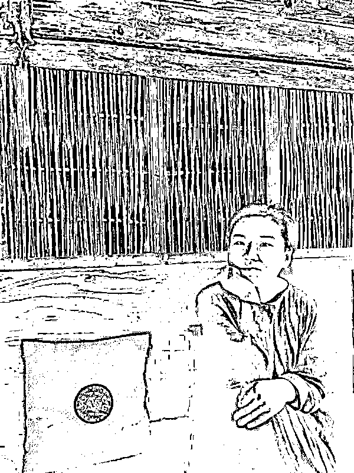Caroline

首届若道学员，国内最早获得 ISAR 职业占星师资质的专业占星师。现为《时装男士》、活法儿等媒体供稿。 

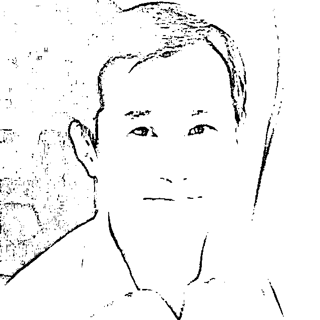海星程

职业占星咨询师、塔罗咨询师，2014 年获得 ISAR 国际占星研究学会认证、2015 年若道首次“生时校正认证考试”中获得满分。 

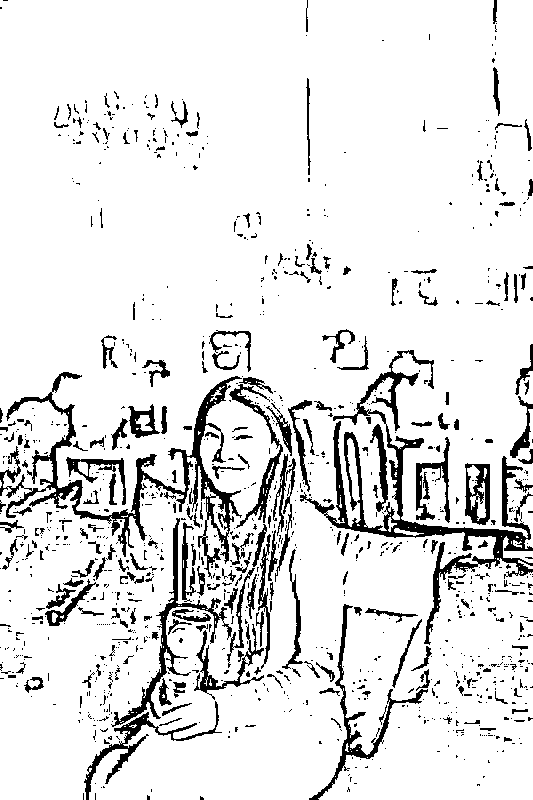Iris

国际占星研究学会（ISAR）认证国际职业占星师，曾就职于京城广播电影电视机构。在个案咨询中擅长以进化占星学契入，结合灵数学和塔罗启发客户深刻的自我察觉。 

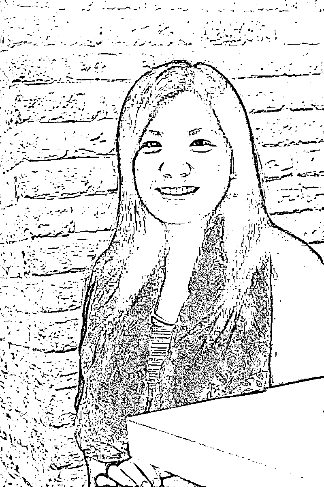

昕心

昕心工作室创办人，资深心理咨询师。ISAR 首批中国籍认证专业占星师，国家二级心理咨询师，中美精神分析联合会 CAPA 成员。 

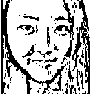Cora

全职占星师，斯蒂芬·弗里斯特《变换的天空》译者。全美占星师联盟 AFAN 成员，获得 ISAR 国际占星研究学会认证。

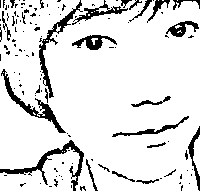Jennie

曾任职于三联书店出版社，现作为职业占星师提供亲子家庭、亲密关系、职业方向的咨询。

这么多高大上的占星师坐镇，还怕搞不定你的星图？

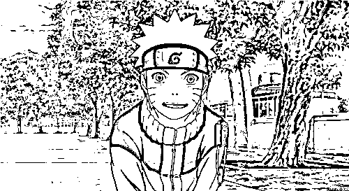

**如何到达**

**地址：**青龙胡同甲 1 号，东城文化人才（国际）创业园

**行车路线：**二环路小街桥向南 200 米右转，歌华大厦西侧，5 层小白楼

**停车场一：**青龙胡同里，歌华大厦南门

**停车场二：**歌华大厦地下

**公交信息：**

东直门北小街北口(公交站)674 路(惠新东桥南--北京华侨城)

特 16 路(慧忠里--单店)

夜 28 路(惠新东桥南--地铁宋家庄站)

612 路(张仪村南站--北官厅)

674 路(北京华侨城--惠新东桥西)

特 16 路(单店--慧忠里)

夜 28 路(地铁宋家庄站--惠新东桥西)

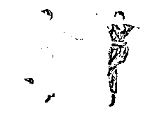

等你来探索自己~

-END-

**购票链接请戳“阅读原文”**

# 《当代占星研究》作者苏·汤普金斯专访 | 占星师的三种能力

> 原文：[`mp.weixin.qq.com/s?__biz=MzA5NjA0NTAxNg==&mid=2651384386&idx=1&sn=ebfcce755984c491efcca07acc6bee3a&chksm=8b4a58f5bc3dd1e3b3cfcef98a1b15f2f7a5f6ec506e4dcf8b21aae1a0ef7e0de9e6820be1d0&scene=126&sessionid=1692738846#rd`](http://mp.weixin.qq.com/s?__biz=MzA5NjA0NTAxNg==&mid=2651384386&idx=1&sn=ebfcce755984c491efcca07acc6bee3a&chksm=8b4a58f5bc3dd1e3b3cfcef98a1b15f2f7a5f6ec506e4dcf8b21aae1a0ef7e0de9e6820be1d0&scene=126&sessionid=1692738846#rd)

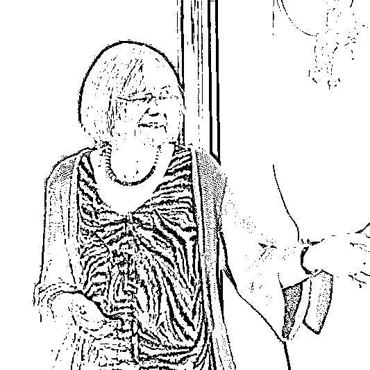 

本文转自《占星学刊》创刊号，有删节

即使没听过苏·汤普金斯这个名字，也一定看过她所著的《当代占星研究》！1972 年正式踏入占星学领域，先在英国占星学院（FAS）执教多年，后创建伦敦占星学院（LSA），并获得了占星学界的最高荣誉之一——英国占星协会颁发的查尔斯·哈维奖项。苏·汤普金斯将于本周末在若道北京开设[医疗占星工作坊](http://mp.weixin.qq.com/s?__biz=MzA5NjA0NTAxNg==&mid=2651384349&idx=4&sn=946fa8b008bdf4480b01cb409b371904&scene=21#wechat_redirect)，你可别错过哟。

个 人 篇**1****杰夫·梅奥是我的第一个导师**

我曾是一个内向又忧郁的小孩，常常独自思考一些形而上的东西，比如死亡到底是怎么回事，上帝是否存在，自幼就对所谓灵光一闪的东西感兴趣。

我对于占星学抱有很开放的想法。跟其他占星学家不同的是，18 岁的时候，我是通过太阳星座，尤其是通过阅读琳达·古德曼的著作开始首次进入占星界的。现在我当然不会再紧抓“星座”不放，但当年一度为各种星座征象而痴迷。

那时候，我常常会想：“这个星座一定说明了什么，我非得把它们找出来不可。”在占星学上，我曾孜孜不倦努力了两年却全无长进，因为生活的小镇太偏远，根本见不到占星学方面的书。

那时，我甚至不知道有严肃的占星学书籍存在。1974 年，我取得了相当大的进展，那一年差不多都待在加拿大多伦多，我终于读到了真正的占星学书。在自学了基础知识以后，我师从国际公认的占星家和占星学教育家杰夫·梅奥（JeffMayo）在现在的梅奥占星学院（*Mayo Astrology School*——由杰夫·梅奥于 1973 年创办，总部设在英国的占星函授学院。）念了函授课程。

杰夫是我的第一个老师。后来我追着他，跑遍所有地方学习他的课程。回到英国后，只要有占星方面的课程，听众里一定少不了我。1981 年我获得了讲师资格，同年幸运地得到英国占星学院（FAS——1948 年成立于英国伦敦，是国际知名的专业占星学校）夜校授课的机会。机缘巧合，我开始在当地夜校授课。这对我来说是一个急速上升的曲线，因为大概从此时我才开始真正地学习占星学。现在我认为，学习的最佳途径就是在传授中学习。

**2****占星学带给我的除了收入还有很多**

它赋予我表达自我的信心，在从事占星学教学的工作前，我是个羞怯的人。它给予我更好地认识自我、他人和世界的语言。它还馈赠我智慧的满足感。另外，我还可以这么说吗，它赐给了我一份工作和一份收入！

**3****医疗角度看，顺势疗法比占星学更为有效**

直到上世纪 90 年代，我才开始了顺势疗法的训练，对我个人来说，占星学比顺势疗法领先了一英里，甚至几公里。我总是对替代医学的一些治疗手法很感兴趣，甚至还学了针灸。

占星学对个人来说是非常有用的，因为一个人的星图其实就是他的生命地图。它可以帮助你寻找人生意义，提升自我认识。占星学和顺势疗法都可以改变一个人对于世界的看法，要解释清楚顺势疗法，我恐怕得给读者们长篇大论一番。大多数人对此并不是很了解，不过这也没关系，因为病人并不需要了解病理和疗法根据。**要比较这两者的效果需要参考很多因素，但一般来说，顺势疗法更为有效。我认为，顺势疗法在身体、精神和情感上的治疗潜力怎么赞誉都不为过。**

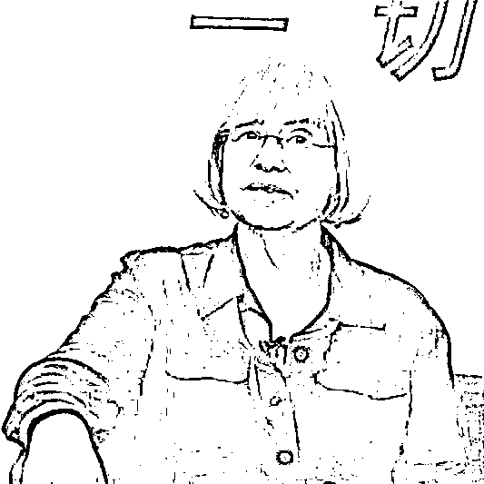

**若道君有话说**

顺势疗法，又称同类疗法，由德国医生塞缪尔·哈内曼于 18 世纪创立，理论基础是“类似法则”，即能够在健康的人身上引发特定症状的物质，同样能有效治疗患者身上类似的症状。

**4****如果不做占星师，我也许是喜剧演员**

我钟爱我的工作，但要放任关于职业的幻想，我想我会做的职业大概包括：**野生动物摄影师或喜剧演员。**

在团队作业中，我常常会扮演类似小丑的角色讲一些搞笑的段子。我想我真的可以成为一名优秀的喜剧演员。或许我还可以成为一名非宗教性的灵性导师，或者和声歌手也不错！也许我能成为一名动物园的饲养员，虽然我对动物园这一机构的设立本身就不赞成。我也曾梦想成为一名作家，但我知道我的文学功底不足以让我成为一个伟大的小说家，甚至作一个平庸的小说家也不够。幻想过后，我想我很可能只是一个女服务员或咨询工作者——这是我最喜爱的世俗工作。

**5****教学中，积极的反馈尚无法满足我**

如果老师教学技艺突出，就能调动全班同学的学习激情，他们会如饥似渴地想要学更多知识。在教学中，**能够参与他人自我发现的历程也是一桩妙事。**从这点来说，没错，我喜欢教书。在我的出生星图中，**太阳和金星在第六宫准确合相，这就意味着如果我能把工作做好，就会得到的积极反馈。不幸的是，日金合相还与土星成四分相（90 度角），导致我不大相信积极的反馈，需要持续寻求明证！**随着年龄增长，我发现自己渴望一个转变，我想把注意力从教学转移到著书立说和接待客户咨询上来。 

咨 询 篇

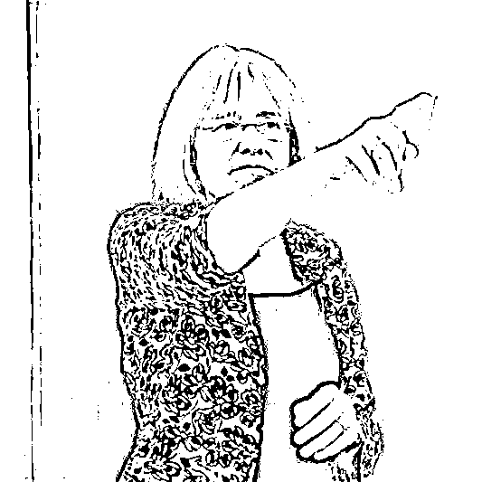

**1****占星师需要具备的三种能力**

这是一份低收入高职业满意度的工作。这份工作令我最为钟情的一点是，我每天都可以跟许多人展开格外亲密的交谈，另外还要持续不断地解决人生中的重大问题。

**① 占星师所要具备的素质，我想第一条是认识自我，认识自我，不断地认识自我。**这是占星师工作的中心。认识自我是历经一生也不可能完成的任务，而不是一个可以在某刻到达的目的地，但占星师在认识自我的道路上要勇往直前才能有所建树。认识自我之所以如此重要，很重要的一个原因是，一个连自己都认不清的占星师很容易把别人生命中的包袱当做自己的给扛起来。

**② 想要成为一名咨询师，获得必要的辅导和治疗培训是非常有裨益的，但更为重要的则是给自己做治疗，这是成为占星师的先决条件。**

**③ 聆听的能力排在占星师能力需求单的最上方**。健谈往往会是学习和领会的障碍，喜欢高谈阔论的人往往处在劣势地位。我认为**如果一个人不能做到真正的聆听，不能细致地观察他人以及周围世界，那他也根本不适合做一名优秀的占星师。**聆听不仅需要一双耳朵，它需要五个感官同时的，积极地投入。虚怀若谷的心态也是必要的，我们需要承认自己给不出所有的答案，也更不能保证真理在握。

**2****占星领域最吸引我的是灵性**

我对传统占星学和古典占星学不是很感兴趣。我觉得古旧的文本太难理解，也太容易被现在的人错误阐释。我喜欢在日复一日的生活和与客户的沟通中独立地探索出什么管用，什么不管用。我想，现在我最感兴趣的问题是由占星学引发的大多数人关于生死的灵性问题。

**3****我的客户都是怎样的人**

有一些人是在自我认知上产生了困扰。

还有一些人则仅仅是对占星学是否真管用抱有好奇心。

甚至还有些人就是想要证明占星学就是骗人的把戏。（曾有一个化名的记者来找我。我说她擅长笔墨，可以成为一名记者，但她并没告诉我这就是她的职业。好像当时她什么都没有讲。一周后一篇关于我的文章出现在了一份全国性的报纸上！这位记者后来还不时地到我这里来请教，但她坚持说不相信占星学！）

客户们经常会在外行星移位或次限星图变动时寻求帮助，他们通常来自社会各个阶层，我喜欢这样的工作状态。

我的客户们或老或幼，或贫或富，或聪或敏，或愚或钝。

客户群有大概 80％是女性，但总体上来说并没有什么确定的类型。 

某些特别的日子里出现的客户可能会凸显比较强的类型特征。比如某天可能会遇到 3 个上升点在白羊座的客户，而另一天，则会接连不断地遇到行星落在金牛座 18 度位置的客户。**这些日常的模式通常反映的或者是天空中正在发生变化的星相，又或者是某个人的星图中正在发生的变化。**

**4****尽量不要拘泥于小行星**

当下的我不会拘泥于任何一种僵化的模式来进行咨询。首先我会好好观察客户的星图，事无巨细都一一掌握，然后我会通过交谈了解曾经发生了什么。

**咨询工作的一个重要因素是要优化人，而不是星图本身。**星图只是水中倒影，而不是池边花朵！客户才是花。

当然，星图的相位尤其是冲突（180 度或 90 度）相位会告诉我们，客户的困惑到底来自于何方。

我知道有些人喜欢使用小行星、恒星乃至其他上帝才知道的分析方法，但是我个人认为大道至简。是的，小行星、恒星等等并非无用，但在运用它们的时候不能忘记根本。在我看来，基本的星图要素才会提供判断依据，重现当时的情状。至于小行星等其他因素，只要稍加留心即可。

如果在星图上看到过多的讯息，占星师往往会只见树木不见森林。每张星图上都会有几个至关重要的故事，把这些故事连接在一起就能勾画一个人的人生。**首先要发现的就是星图的本质问题。**小行星和其他因素只能提供一个更加个人和具体的信息，但并不能对主要问题提供更多帮助。

建 议 篇

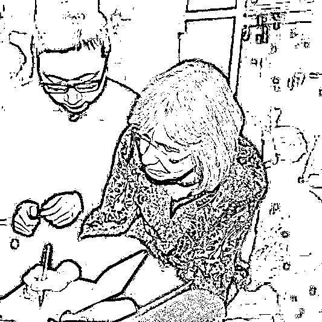

**1****这些书也许对你有帮助**

**查尔斯·卡特（Charles Carter）**放到现在已经有点过时了，但是我做学生时非常青睐他，因为他所提供的材料非常精准，令我难以释卷。

我不太喜欢阅读由讲座转录成的著作，不过我还要热情推荐**利兹·格林（Liz Greene）**的讲座录系列。**斯蒂芬·阿若优（Stephen Arroyo）、霍华德·萨斯波塔斯（Howard Sasportas）和特雷西·马科斯（TracyMarks）**的作品也不容错过**。不过首要推荐的应该是丹尼斯·艾维尔（Dennis Elwell）的著作《混沌宇宙》（Cosmic Loom）**。我敢肯定在德国、法国、芬兰、瑞典和其他国家也有大量优秀的有关占星学的著作，遗憾的是我只懂英文，因此书籍推荐仅限于英文著作。

**2****我是怎样写出这些作品的**

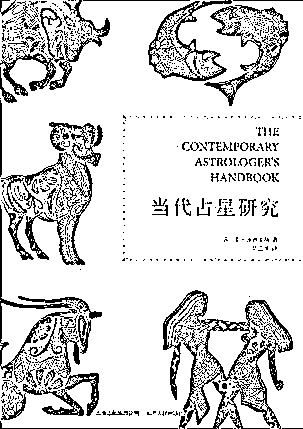

▲《当代占星研究》

我写《顺逆皆宜的人生》这本书是在上世纪 80 年代，我认为这个议题相当重要，所以就拿来书写。但这些议题很难被阐释清楚，当时手边可用的资料很少，所以我做了独立的调研。

《当代占星研究》则是对我多年来教学记录的一个整理。虽然当时市面上已经出现了大量的占星学的书，但我认为在给学生们提供一个全面的知识介绍的书籍方面还有空白。我当时想要做的是一本充满当代气息的信息量丰富的教材。

**3****给中国占星爱好者们的一些建议**

① 了解你的强项，这可能需要些年头才能弄清楚。给所有你认识的人都建立一个星图档案，这样你就可以在和亲友的交往中不断地学习。在兼职的基础上逐步开展专业的占星工作。

② 要先把自己置身于这个事业中，这非常重要。即使在欧洲和美国也鲜有专职的占星师，所以理想要与现实相结合。话虽这么说，但若占星真的是你内心深处的召唤，那就坚持走下去，梦想终会实现。

**◆ ◆ ◆  ◆ ◆**

**********特别提醒：****本文由《占星学刊》授权发布于若道，转载请注明出处。**********

大名鼎鼎的苏·汤普金斯要来中国啦！2016 年 4 月 30 日，苏·汤普金斯老师的医疗占星工作坊将在北京举办。此次工作坊还是 ISAR 职业占星师资质认证项目的三门选修课之一，要好好把握哦！

报名及咨询，请点击文末“阅读原文”


# 一不小心就会挂的人生，他是如何超越的？

> 原文：[`mp.weixin.qq.com/s?__biz=MzA5NjA0NTAxNg==&mid=2651384386&idx=2&sn=6cfdb363dfe8c320c79a094ef890b8da&chksm=8b4a58f5bc3dd1e36df8300bd9ec9875d40e09f442ee29eaef4a52d8ad1bfcb7b8d9a09ebfbc&scene=126&sessionid=1692738846#rd`](http://mp.weixin.qq.com/s?__biz=MzA5NjA0NTAxNg==&mid=2651384386&idx=2&sn=6cfdb363dfe8c320c79a094ef890b8da&chksm=8b4a58f5bc3dd1e36df8300bd9ec9875d40e09f442ee29eaef4a52d8ad1bfcb7b8d9a09ebfbc&scene=126&sessionid=1692738846#rd)

从小就饱受扁桃体折磨，做了手术后不注意身体 14 年后复发疾病，这是土星开的玩笑，还是严肃的考验？

## 风骚的扁桃体君折磨着我

我从小就体弱多病，说来也不算太弱，因为人高马大而且绝大多数器官都很正常，除了咽喉部位。

已经记不得是几岁开始了，反正我的嗓子眼儿从小就爱发炎。先是扁桃体发炎，然后就变成哮喘。哮喘这个毛病，可大可小，往小了说就是呼吸有点急促，往大了走就窒息了。

后来就习以为常了：习惯于我身体的第一重卫兵，也就是扁桃体君，叛变（病变）了。而且我天生不爱运动，于是着急的家人只能选择食补，事实证明，大量的优质食物，在增强体质的同时也养肥了那一对叛变的卫兵。

再后来，医生说可以借助青春期的生长发育把一些长久的疾病给消除掉，当然结果想必你也猜到了，那对叛军很善于借助各种优势不断强化自己——一如他们曾经的主人那样潇洒与风骚。

于是乎，2002 年暑假，也就是我来到上海的第二年，一家上下都无法忍受那每个月发作两次的哮喘，终于痛下决心把那两位叛变者干掉——扁桃体切除手术。

扁桃体切除只是一个临床小手术，很成功，我和两位叛变十多年的哨兵终于 Say Goodbye Forever 了。但时隔 14 年，如果不是上个月末发生的那件事，或许我根本不会注意到，有些东西，我从未与它们说再见。

 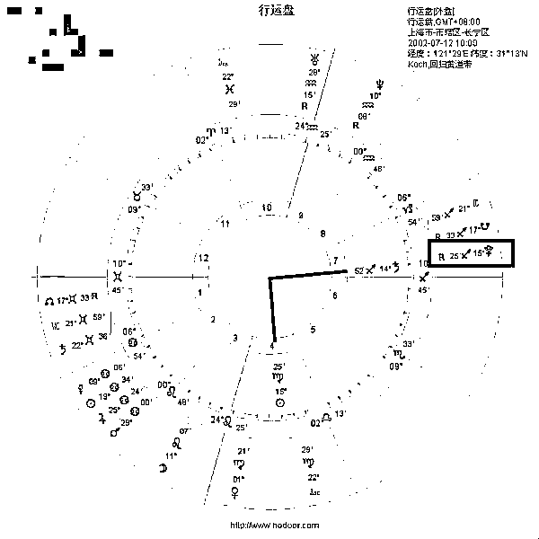

从那时候的星图，我想熟悉占星学的各位读者也可以看到：行进的冥王星合相出生星图土星，也触发了出生星图的太阳土星四分。

什么意思呢？简单说来就是，从小体弱、生命活力不足的我（太阳土星四分），在这个时间点上，终于与过去做了个小告别，消灭掉了一些身体上的叛徒（冥王星）。

这可是一个压力行进（有些宿命论者会称之为毁灭、死亡之类的）的积极表达啊！事实也的确如此，从那以后，我的咽喉部位明显好转，只是间隔更长的时间会发作一些咽炎（扁桃体炎，在扁桃体被切除之后的变化），而哮喘则再没有发作过。换句话说，我的小命安全多了！

## 过去的病痛抓着我不放

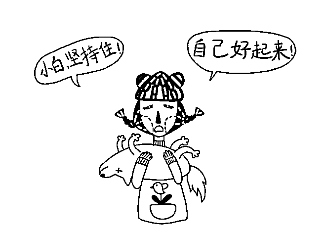

然而，“神奇”的事情发生了。

2016 年 3 月 25 日，也就是十几天前，我正在北京出差。早晨起床发现喉咙不对劲，本以为是小感冒，随意对付了几粒泡腾片，也就没当一回事，继续玩继续浪……哦不对，是继续努力工作。

谁愿意在异地他乡出差的时候生病呢？第二天（26 日），我意识到情况不对，因为我平时的感冒或者咽炎，很少出现头晕目眩的状况，而当时具体的症状是：发热、头晕、头疼，感觉就像酒喝高了那样，脑子里有一种“阻滞感”；同时，喉咙口充血，吞咽时有强烈的“撕裂痛感”，早起黄痰多。（别问我为啥描述症状的时候如此专业，爹妈都学医+从小药罐子+群星处女座就是这么牛掰~）

当我描述到“吞咽时有强烈的撕裂痛感”的时候，脑海里猛然间浮现出那场扁桃体手术，因为在我的记忆中，那次术后麻药消退后的刀割痛感和这一次的吞咽痛感，一模一样。

14 年后，蓦然回首，忆起曾经的初恋是什么感觉？我不知道，因为 14 年前还没有初恋……但回想起当年的痛感，依旧让我十分酸爽。于是一边养病治病，一边想着这一切到底是为嘛，一边就顺手打开了星图（占星师的臭毛病）：

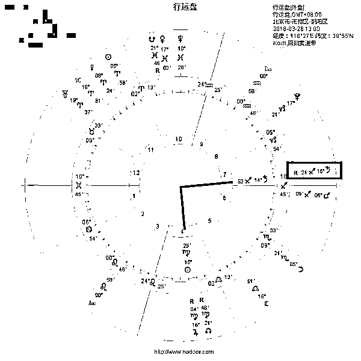

诸位看官，有没有觉得很熟悉？

对，上一次是行进的冥王星，这一次换成了行进的土星。其他没变过，还是出生星图的太阳土星四分被触发。

## 土星提醒我曾经忽略的事情

都说土星是“业力之星”，深信佛法的我自然也知道这里面肯定有业力的成分。但是今天我并不想讨论业力或者灵魂之类的东西，只是就这两个时间节点、两张星图、两件生病的事，来谈一谈。

14 年前，冥王星行进的时候，我满怀希望地接受了扁桃体切除手术，满以为一切都会好起来（事实也如此，起码在表面上），于是继续忽视原本缺乏锻炼而羸弱的体质，依靠着青春期发育的势头，一路混到了如今。然后在土星行进的今天，我体会到了当年一模一样的痛楚，痛到吞咽的时候连耳根都在疼。

为什么？我不断地问自己，只是因为土星来了，我就要重温当年冥王星留下的痛吗？看起来如此。可是为什么如此“巧合”呢？在几乎一模一样的位置上，冥王星曾经走过，如今土星来了，就仅是为了让我受苦让我痛？当然不。

冥王星走过的那一年，我留了血，尝了痛，然后享受到健康的美好，却忘记了身体的健康——就像关系或者家庭的健康一样——是需要付出的。我透支着生长发育带来的勃勃生机，一路混到 29 岁（有没有觉得很熟悉？没错，每个人都会在 29 岁经历第一次土星回归），在上月末终于又一次体会到了当年的痛。

**那是土星，它来到了曾经冥王星停留过的地方，考察我是不是真的努力认真地改变过。如果没有，它会把曾经我痛过的、我忽视的、我没有严肃对待的、真正重要的东西**——健康（出生星图太阳土星四分），**以几乎相同的方式、毫不留情地统统挖了出来**。

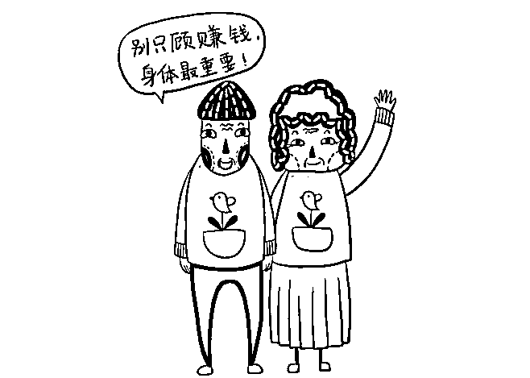  

看起来我是不幸的，出差的时候病了，还病得不清。可我也真的非常幸运，因为在土星第一次回归的第一个回合里（由于逆行的原因，每一次土星回归都会有三个回合），就能在疾病与占星学的帮助下，认识到“主动锻炼，保持身体健康”对于我来说有多么重要。（或许我会因此而“避开”今后更大的疾病呢，哦呵呵呵~）

当时发着烧的我，怎么也想不明白。直到清明之后完全康复，细细整理回顾，我才意识到这是一个多么深刻而有意义的礼物——由冥王星与土星携手带来的，跨越 14 年光阴的生命礼物。

谨以此“不太像医疗占星却又是医疗占星”的文，献给即将来到中国的苏·汤普金斯老师。

也献给每个人生命中的那一颗土星。

**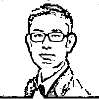** 

**作者简介**

**天空的空**：国际占星研究协会（ISAR）认证占星师。在若道系统学习占星，师从大卫·瑞雷，现任若道专职助教。将传播系统、严谨、真实的占星学作为职业使命。与此同时，提供一对一占星咨询服务与生时校正咨询。目前正致力于占星学与个人真修实证的整合。2014 年起主讲读书会，助教答疑课程累计超过 100 小时。

长按二维码，让金钱涌向传播知识与智慧的人~

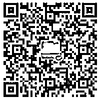 

想了解更多医疗占星的知识吗？请戳下方文章

**▼**

[入门医疗占星，看这里就对了](http://mp.weixin.qq.com/s?__biz=MzA5NjA0NTAxNg==&mid=403676355&idx=2&sn=8b0e3e0b57c5dee37abc1792ef7205e9&scene=21#wechat_redirect)

[医疗占星学丨 12 星座分别对应身体的哪个部位？](http://mp.weixin.qq.com/s?__biz=MzA5NjA0NTAxNg==&mid=403849226&idx=3&sn=de4a2409d9089f06b8df2bbdb8bc243a&scene=21#wechat_redirect) 

**◆ ◆ ◆  ◆ ◆**

**特别提醒：****本文由作者授权首发于若道平台，**转载请注明“转自若道”并注明作者。****

你还想了解更多占星学与健康的小知识吗？2016 年**4 月 30 日**，**苏·汤普金斯**老师的**医疗占星工作坊**将在北京举办。此次工作坊还是 ISAR 职业占星师资质认证项目的三门选修课之一，要好好把握哦！

报名及咨询，请点击文末“阅读原文”


# 4 月 30 日你就能见到苏·汤普金斯了，激不激动？

> 原文：[`mp.weixin.qq.com/s?__biz=MzA5NjA0NTAxNg==&mid=2651384386&idx=3&sn=209feffcbad7d53e4fc72d08cfa32cdf&chksm=8b4a58f5bc3dd1e3d5b3617d48d17d612aea7075e1b023fd2a5977f2e1d31a24e2eb7d1d1cf8&scene=126&sessionid=1692738846#rd`](http://mp.weixin.qq.com/s?__biz=MzA5NjA0NTAxNg==&mid=2651384386&idx=3&sn=209feffcbad7d53e4fc72d08cfa32cdf&chksm=8b4a58f5bc3dd1e3d5b3617d48d17d612aea7075e1b023fd2a5977f2e1d31a24e2eb7d1d1cf8&scene=126&sessionid=1692738846#rd)


就在这个月底

占星界重量级人物

《当代占星研究》作者苏·汤普金斯老师

就要来到中国

在若道举办医疗占星学工作坊

教你用占星学来管理健康

能见到老师大家是不是很激动呢

**ISAR 选修课程****工作坊信息**

**授课时间：**2016 年 4 月 30 日、5 月 1 日、5 月 2 日 10：00-18：00（午休 2 小时） 共 18 课时

**授课老师：**苏·汤普金斯

**授课方式：**北京现场，英文授课，中文翻译。（具体上课地址课前 10 天请留意查看短信微信通知）

**费用**：****6800 元** (若道老学员**4800 元**）**

**课程负责人：**王晓鸥  

**微信号：**2837474346，请备注医疗占星课程报名咨询

**咨询电话：**400-619-1014

课程简介

星座、行星、相位、宫位还能从什么角度进行阐释？

我们的占星工具箱里，还能增添哪些利器？

疾病和健康的相关议题能不能在星图中找到相应的征象？

我们怎样运用占星学来更好地认识身体，保持健康？


>>>>

**用占星学管理身体健康**

疾病一直以来在我们的生活中有两个作用。一方面，疾病是生活的一部分，虽然我们人类大多数不愿意被提醒这个事实。疾病也为个人成长提供机会和对人生更深刻的理解。疾病让我们谦卑。另一方面，许多健康问题是由于我们选择了错误的生活方式，因此可能是可以避免的。

今年 4 月 31 日至 5 月 2 日，伦敦占星学院创办人、《当代占星研究》作者、经验丰富的顺势疗法医师苏·汤普金斯老师将通过独到有趣的讲解和精彩的专题及案例分析带你进入医疗占星这个神奇的占星学分支领域。

名人推荐

苏·汤普金斯的《顺逆皆宜的人生》令人赞叹！苏是一名备受爱戴的老师，并且在占星研究学院及后来自己创建的伦敦占星学院任教多年。苏以自己的冷幽默、抽丝剥茧的研究天分和占星直觉而闻名。她是一名执业占星师，也是一名顺势疗法医师，是心灵和身体的敏锐诊断专家。

 ——国际占星研究会（ISAR）法国副主席琳恩·贝尔

师资力量


****苏·汤普金斯****

苏·汤普金斯是英国目前最资深的占星学家和咨询师之一，曾任占星研究学院（The Faculty of Astrological Studies）及伦敦占星学院（London School of Astrology）院长。2003 年，英国占星协会为表彰她的卓越贡献授予她查尔斯·哈维斯终身成就奖。

苏·汤普金斯老师不仅希望对心理和心灵进行疗愈，也一直希望能够找到一种安全又切实可行的方法帮助人们在人生旅途中得到身心的整体疗愈，而顺势医学的哲学与疗效让她惊叹，于是她于 1996 年完成在伦敦顺势疗法学院的培训成为一名专业顺势治疗师，目前，已经积累 20 年的顺势医学治疗师经验。

课程价值

得到苏·汤普金斯老师亲授的“独门绝技”，受益于大师在占星、心理学、医疗多维度的丰富经验

增加对身体各部分、健康和疾病的认识与觉察

收获实用的改善健康小技巧

巩固已有的占星学知识，拓展对星图象征符号的理解并掌握更多星图解读的方法和技巧

将医疗占星纳入你的占星工具箱，用它来助人助己，成为更专业的占星师

>>>>

课程内容

心灵和疾病的关系

我们的健康问题是由什么样的生活方式造成的？

疾病如何为我们提供个人成长的机会？

医疗占星学的普遍性原则

各种疾病的常见星图征象是什么？

从星图看，你身体的哪些部位是最脆弱的？对此，你可以做什么？

饮食与健康

我们的饮食能在星图上体现出来吗？ 

如何从星图看我们的身体疗愈之道？

顺势疗法和占星学

如何让自己更健康？

改善健康的实用性技巧

**我们会抽取个案进行现场讨论，会有 6 个个案讨论的机会（可以用家人的案例）。**

**参与个案讨的必须提供：**

**1） 病情细节      2）出生信息       3）生病日期或确诊日期**

**我们欢迎有癌症和心血管疾病的同学（包括家人）提供个案。 **

我们还将分组讨论，在这个工作坊上，帮助大家在用占星学对个人健康进行管理方面获得知识和洞见。

**特别说明：本课程不涉及任何医疗行为 **

>>>>

适合人群

相当于若道核心课程 level3 以上水平即了解星座、行星、宫位、相位等，可以独立进行出生星图解读。


长按二维码接通课程负责人~


更多内容及报名，请点击文末“阅读原文”

# 有福利 | 本年度最后一次入门占星学殿堂的机会

> 原文：[`mp.weixin.qq.com/s?__biz=MzA5NjA0NTAxNg==&mid=2651384368&idx=3&sn=017cc7fc512f28cdad4d54e6be456f44&chksm=8b4a5887bc3dd191faafa12e0f78082244f2b3bcf9cd562c7003968451acd67842dfc4a92490&scene=126&sessionid=1692738846#rd`](http://mp.weixin.qq.com/s?__biz=MzA5NjA0NTAxNg==&mid=2651384368&idx=3&sn=017cc7fc512f28cdad4d54e6be456f44&chksm=8b4a5887bc3dd191faafa12e0f78082244f2b3bcf9cd562c7003968451acd67842dfc4a92490&scene=126&sessionid=1692738846#rd)

这是一篇福利贴。

4 月 23 日星期六，在北京中关村科技园东城园内，

将举办一场名为[自我探索的春季游园会](http://mp.weixin.qq.com/s?__biz=MzA5NjA0NTAxNg==&mid=2651384338&idx=3&sn=8eb8aef7c32de6a906f8aa9916621d58&scene=21#wechat_redirect)（点击可查看），

教你用心理学和占星学这两个工具来探索自我。

**作为市集现场唯一占星机构，**

**若道占星**将在现场为大家解答困扰自己的问题。

**价值 35 元的游园门票你可以免费获得！**

你只需要以下四步操作：

1.转发该条微信到朋友圈

2.截图

3.添加客服微信

4.发送截图至客服微信并标注“若道游园”

即可有机会获得门票！

客服二维码在此~


你很懂星座，但能准确说出 12 星座的关键词吗？ 

你知道人的性格不只由一个太阳星座影响吗？

作为国际占星研究协会（ISAR）中国唯一指定教学机构

若道 2016 年占星核心课程 Level 1-2 蒋颖老师专场将于 5 月开课 

中文老师出山 

能有效拿捏学员需求

**授课时间更长**

**交流互动更多**


**课程信息**

**授课时间：**2016 年 5 月 19 日**-7 月 7 日**

**授课老师：**蒋颖**（8 次）、**大卫·瑞雷**（4 次）**

**授课方式：**网络课

费用：**2400 元**

**报名截止：**2016 年 5 月 6 日

**课程负责人：童老师（微信号：80248863）、**王老师（微信号：2837474346）****

**咨询电话：**400-619-1014

**课服 QQ：4006191014 （若道星文化）**

**邮箱：nodoor@vip.126.com**

课程简介


**星座、太阳和月亮**

12 星座是占星学最基本却又最深刻的概念，黄道 12 星座，是伟大的生命周期，而太阳和月亮是我们阴阳之本。

**●12 星座：**深入了解 12 星座的特色。了解星座正面的、负面的表达，了解其资源，了解其破坏生命的模式。了解其原型人物、了解其指代的人事物。

**●12 星座原则：**按照极性、形态和元素给星座分类。

**●12 星座关键词：**关键词非常重要！是解读准确性的关键。

**●太阳和月亮：**了解你的太阳，生命的发动机，让你在世界闪光的方式，生命获得力量的方法；了解你的月亮，让你生命获得幸福的方法。了解它们，了解你生命中已经出现的、将会出现的男人和女人。


**遇见行星和月亮交点**

在这个阶段，你将遇见行星们，还有与灵魂的过往和未来相关的月亮交点。这既是你，你的性格，也是你在生命故事中将会遇到的人、事、物的显化，也是你灵魂轨迹的线索。    

**●内行星：**水星、金星、火星

**●中间行星：**木星、土星

**●外行星：**天王星、海王星、冥王星

**●灵魂的线索：**月亮南交点、月亮北交点

**●行星逆行：**行星逆行的天文现象和意义

**●宫位初解：**了解黄道 12 宫的基本含义

时间安排

共 12 次课，24 课时。

**●8 次理论课程**（蒋颖老师主讲）

北京时间每周四晚 20：00-22:00

**●4 次线上互动课程**（大卫老师主讲、配有中文实时翻译）

北京时间每周一晚 20：00-22:00

授课优势

**①先进的教学平台**

网络教学平台，支持手机、电脑、iPad 上网，可以随时随地学习。

**②回放复习**

学员可登录网站收看课程回放，在线复习课程，每次课可完整重看 3 次，课程结束后的 3 个月内有效。　

课程特色

**①与名师面对面**：北京同学可以来若道现场上课，和大卫老师面对面互动。大卫老师也可能前往主要学员所在城市，实现零距离教学。

**②互动答疑**：论坛、微信群随时提问；老师课上答疑；助教线上线下全程协助。

**③线下沙龙**：定期举办沙龙活动，复习上课内容。

**④强大的同学网络**：若道作为中国最顶尖的占星教学机构，在 4 年的占星教学中，培养了很多占星人才。若道让你和师兄师姐切磋，让你和国内著名占星师学习。（简单来说，就是，人脉！）网络授课，在北京开设免费现场参与名额，全程英文授课，配备实时翻译。

师资力量

**讲师团队**


**蒋颖（Felicia）**

若道创始人，职业占星师。在若道系统学习占星，师从大卫·瑞雷。长江商学院 MBA，厦门大学经济学硕士，化学学士。国际占星研究协会（ISAR）中国区副主席。第一批获得国际占星研究协会（ISAR）认证的职业占星师。《灵魂的目标》译者。

**在后台回复 蒋颖 即可查看她的全部文集**


**大卫·瑞雷（David Railey）**

若道创始人，《灵魂的目标》作者。拥有 46 年的占星咨询的执业经验，曾两任亚特兰大占星协会主席，是全美占星师联盟（AFAN）、美国占星师联合会（AFA）、全美占星研究委员会（NCGR）、国际占星研究协会（ISAR）和职业占星师组织（OPA）的成员，是联合占星大会（UAC, United Astrology Conference）督导委员会委员。大卫曾是 CNN、CBS 的占星节目的常驻嘉宾，多次在 BBC、WGS、WSB、WRGG 等节目中接受采访，并在亚特兰大主持电视节目《每日行星（Daily Planets）》达 4 年之久。

**助教团队**


**熊鹰（天空的空）**

国际占星研究协会（ISAR）认证占星师。在若道系统学习占星，师从大卫·瑞雷，现任若道专职助教。将传播系统、严谨、真实的占星学作为职业使命。与此同时，提供一对一占星咨询服务与生时校正咨询。目前正致力于占星学与个人真修实证的整合。2014 年起主讲读书会，助教答疑课程累计超过 100 小时。


**Gaff**

全职占星师，既是占星师，也是疗愈者。2013 年开始在若道进行系统占星学习，师从大卫·瑞雷。任 2015 年度诺·泰尔、斯蒂芬·福里斯特老师的占星工作坊助教。提供一对一的咨询服务（已有超过 100 小时的咨询经验），基于个案咨询的经验，曾多次开设面授的占星课程。

长按二维码接通课程负责人！

 

报名及咨询，请点击文末"阅读原文"

# 金牛月独家话题 | 如何成为有钱人

> 原文：[`mp.weixin.qq.com/s?__biz=MzA5NjA0NTAxNg==&mid=2651384368&idx=1&sn=6b98cf58afecf6cc62f90ce95629e995&chksm=8b4a5887bc3dd1914c08b4b9e2317a3adbe9904322fd007d0ad16a8705e2169c3d3aa8c58d7e&scene=126&sessionid=1692738846#rd`](http://mp.weixin.qq.com/s?__biz=MzA5NjA0NTAxNg==&mid=2651384368&idx=1&sn=6b98cf58afecf6cc62f90ce95629e995&chksm=8b4a5887bc3dd1914c08b4b9e2317a3adbe9904322fd007d0ad16a8705e2169c3d3aa8c58d7e&scene=126&sessionid=1692738846#rd)

作者/Anastasia 图片/VCG

金牛月，让我们来谈一谈金牛座以及金牛座的两个土象小伙伴处女座和摩羯座，谈一谈金钱和价值。

## 与财富、工作、事业相关的星图元素

相信很多人都会为钱的事情烦恼。作为一个占星师，我也经常会遇到这样的提问，**我的财运怎么样？我的事业运怎么样，我能发财吗？**如何成为一个有钱人，这真是一个亘古不变的永恒问题。

**在星图上，和财富关联的是金牛座和第二宫，和工作关联的是处女座和第六宫，和事业关联的是摩羯座和第十宫。**没错，和我们的物质生活紧密相关的星座和宫位，都是土象元素的。

**土象元素是金牛座、处女座和摩羯座，以及它们代表的第二、六、十宫。**土象元素代表了我们和物质世界的联结方式，我们的身体就是物质构成的，我们的生存也离不开物质。

星图上土象元素多的人，具有天生的和物质打交道的能力，他们重视物质、有耐心、也更自律。他们天生就知道如何谋生，如何享受，如何打磨自己的一技之长，以及坚定地达到自己的目标。土象人往往是谨慎的、有计划性的、保守的以及可靠的。他们会通过世俗的挑战来激励自己，通过现实成就来表现自己。

## 当我们谈钱的时候，我们在谈价值

说到金钱，其实我们说的是价值。很多人可能都忘记了，货币的产生，就是为了实现价值的等量交换。**金钱可以衡量一个人的价值，但是一个人的价值并不能完全由金钱来体现。**

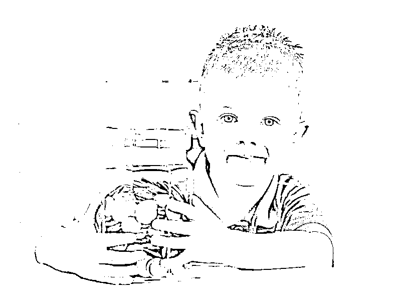

《生活手贴》总编辑、独立书店老板、日本的美学生活大师松浦弥太郎也曾经为钱的事情很苦恼，好在他有很多有钱的朋友。在询问了很多有钱人“如何成为一个有钱人”之后，他得到的回答如出一辙：**“找到有价值的生活方式和工作方式”以及“自己成为一个有价值的人”。**

在这里“有价值”，他用的表述是“金钱喜欢的”。**要成为一个有钱人，首先要成为一个钱大人喜欢的人，和钱大人做好朋友。既不轻视金钱，也不成为金钱的奴隶。朋友间的关系是不卑不亢的。**

## 从金牛座看向天蝎座

“我没有钱”，“我最穷了。”往往喜欢这样说的人，潜意识里都是耻于谈钱的人。这是金钱的第一个陷阱，认为钱是万恶之源，是肮脏下流的。

但是事实呢？杀人的是人心底的恶意，而不是手里的刀。同样，用金钱做坏事的是人心底的贪欲，而不是钱。

**所以，想成为有钱人的第一步，就是要勇敢地、大声地承认，我爱钱。如果害羞，你可以在洗澡的时候小声地告诉自己“我喜欢钱。”**

*   因为匮乏，而吝于付出，这是金钱的另一个陷阱。**懂得分享，让金钱流动起来，这样才会交到更多的朋友。**

*   有人会觉得付出、分享、各种社交活动都是在浪费钱，他没有想过存钱是存不出大钱的。

*   **开源节流，重要的是开源。只有懂得付出和分享，才能得到更多朋友的帮助。**

*   在内心建立起一个健康向上的价值观，是个体在现实世界安身立命的基础，这也是我们说的星图上的第二宫以及金牛座的核心。

*   **去看看落入你第二宫的行星，以及落在金牛座的行星，去了解造成你不自信、匮乏的根源是什么，去了解你的自我价值和赚钱模式，以及应该用何种方式来发现它和使用它。**

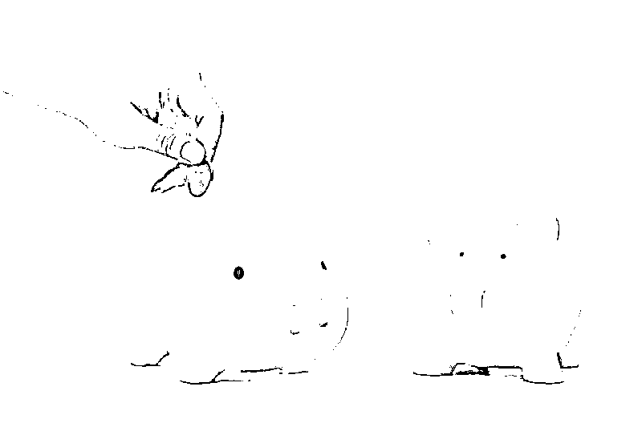

同样，我们不能忘了金牛座对面的天蝎座。

*   **金牛座和天蝎座是黄道十二星座里面代表价值财富的两个星座。**

*   **金牛座象征着拥有，是一种对于匮乏的恐惧，而天蝎座象征的是对于金钱的欲望。**

*   欲望永无止境，如果一个人始终活在和别人比较的阴影里面，是无法获得金钱的青睐的。

*   这里我们要谈到金钱和奢侈品的关系。同样是购买奢侈品，出于攀比的目的和出于体验高品质的目的，是完全不同的。

*   很明显，后者才是使用金钱的正确方式，而且带来的快乐要持久得多。

*   **把欲望转化为对品质的深入探索，这才是天蝎座能量的提升。**

## 处女座 VS.摩羯座

对于普通人来讲，最主要的经济来源就是你的工作。**这就是在说你的第六宫和处女座。**

*   **如果说二宫和金牛座是一个人赚钱的哲学层面，那么六宫和处女座就是一个人赚钱的技术层面。**

*   你的收入取决于你的工作。

*   想要找到好工作、想要加薪、想要得到肯定和机会，你首先要做的是付出努力。而不是“如果给我高薪，我就努力工作”，“如果认同我，我就卖力”。

*   这种有条件的付出不算付出。**在别人保证一定可以成功后，才愿意采取行动的人，不可能得到宇宙的支持。**

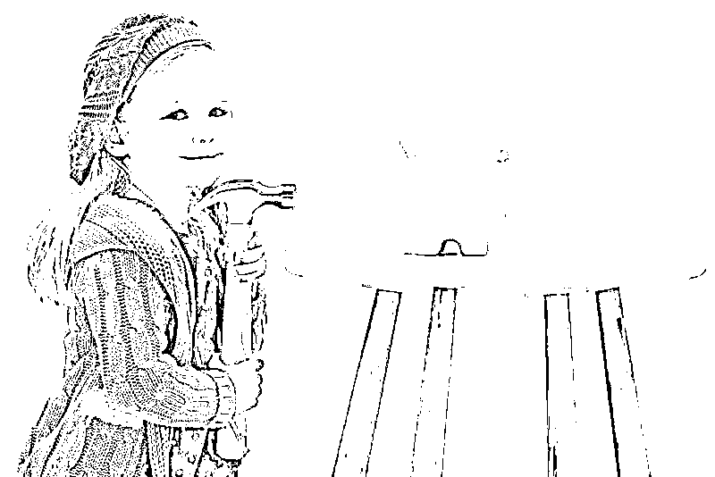

下面我们说说金钱和时间的关系。**提到时间，就需要考虑我们的土星和摩羯座，以及第十宫事业宫。**

*   我们常说，时间就是金钱。

*   “有没有珍惜金钱”其实和“有没有珍惜时间”是一个道理。

*   懂得运用金钱的人，也会懂得运用时间。

*   松浦说，有钱人都早起早睡，不看电视，不玩电脑游戏。因为他们档期很满，需要思考和判断的事情也很多。所以他们需要有效利用时间，保持身体健康。

*   **如果你可以有效地利用你的时间，就可以完成人生最伟大的事业。没有花费足够时间投入的事情，往往无法给你留下应有的价值。**

*   走捷径带来的成果只能是暂时的，钱来得快，去得也会快。

## 把金钱当作公司来管理经营

**学会当一个农夫，我们又回到了金牛座。**

*   如果金钱是人生的果实，那么我们更需要像农夫一样，慢慢栽培它。

*   要花很多时间来分析、研究，要不断去尝试怎样的种植方式最适合自己。

*   环境恶劣的情况下该怎么处理，风调雨顺的时候又该做什么，都是需要我们自己好好考虑和实践的。

*   别人的经验都不可靠，必须依靠自己的力量，找到最适合自己的种田方式。只有自己苦干得来的经验才会变成人生的智慧。

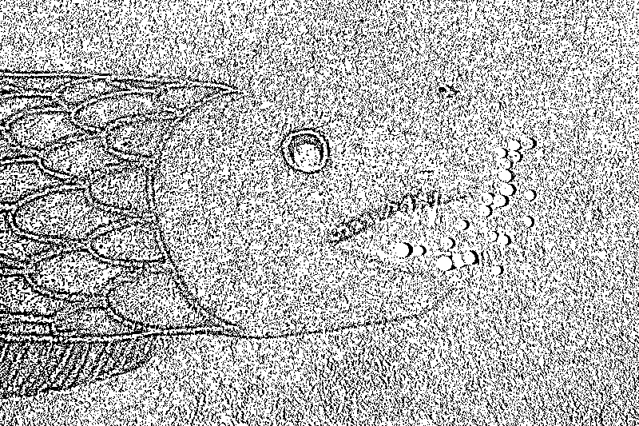

**制定和年龄相符的金钱计划。有计划，就不会慌张。我们又来到了处女座。**

*   处女座是十二星座里面计划性最强的星座。

*   处女座令人诟病的事多和挑剔，也是源于计划被意外打乱后的不安和焦虑。

*   如果你要赚钱，你需要做计划，如果你想要有备无患，就需要事先做好准备。

*   要发挥星盘上的处女座能量，安排好你的时间和金钱。

**把自己当做一个公司来经营，也许你会对金钱和价值有了更深入的了解。管理，这就是摩羯座的领域。**

*   公司需要经营，金钱需要流动。

*   一味存钱显然对财富的积累没有什么帮助。

*   钱该怎么花？松浦的答案是，要么投资自己，要么帮助他人。

*   用钱的时候要问问自己，是消费，浪费还是投资？消费是必要的生活开支；浪费是为了满足欲望或者安抚受伤的心而冲动花的钱。

*   投资不仅仅是理财，还包括对未来有所帮助所花的钱，学习、旅游、接触美好的事物等等。

*   在做计划的同时，去检讨一下自己之前的用钱方式，也会很有帮助。

## 北交点落在金牛座的人“越老越有钱”

**以十年为单位，发挥自己的想象力，可以提升对金钱和时间的意识。**

*   松浦的观点是，五十多岁之后，才是一个人之前播种渐渐开花结果，有持续收成的时候。那么，年轻的你，着什么急呢？

*   人生很长，完成了“收成、播种、浇水、收成、播种、浇水”的循环之后，你就和钱大人交了朋友，有了持续性的金钱收入，可以挑战更多的新的事物。

*   你的经验，不论是成功的还是失败的，只要愿意和人分享，都可以成为你的财富。

土象人是扎根物质世界的，物质世界的生存以及生产力是他们意识和经验的源头。作为土象星座中的固定星座，钱对金牛座非常重要。对待金钱的态度，是金牛座重要的议题之一。金牛座在乎拥有，懂得享受。如何没有吃好喝好，没有得到舒适的物质照顾，没有足够金钱给予的安全保障，就容易变得脆弱、疲惫和易怒。所以他们会花很多时间和精力在赚钱上。**占星师往往会开玩笑地说，北交点落在金牛座的人会越老越有钱。**


▲

《不再为金钱烦恼》

每个人都有一个不同的出生星图，每一个人都有不同的二宫和十宫，所以这个世界衡量成功的标准也很多，得到满足的方式也因人而异。回到最初的问题，我如何成为一个有钱人？不如我们换成，我如何才能不再为金钱烦恼，或者，我如何过一个有满足感的人生？**如果没有一个靠谱的占星师帮助你，推荐你在金牛月看一看松浦弥太郎的这本书《不再为金钱烦恼》，也许会给你带来启发和帮助。**

**你可以更深入认识金牛座：**  

**▼**

[小白学占星 | 太阳进入金牛座，谷雨到了](http://mp.weixin.qq.com/s?__biz=MzA5NjA0NTAxNg==&mid=2651384349&idx=2&sn=2920f445c2b9e35f03c55f03e4f227cf&scene=21#wechat_redirect)


**作者简介**

**Anastasia**：职业占星师，国际占星研究学会 ISAR 会员，若道认证生时校正占星师。太阳射手座，月亮狮子座，上升处女座，擅长讲述个体星图后面隐藏的人生故事和意义。在若道跟随多名国际占星师学习严肃占星学多年，目前从事占星咨询工作。

**个人微信公众号平台**：midnight2evolution

长按二维码，让金钱涌向传播知识与智慧敌人~


**◆ ◆ ◆  ◆ ◆**

******特别提醒************：本文由作者授权首发于若道******，**转载请注明“转自若道”并标明作者。******

占星学还能帮助你赚钱呢——**2016 年 5 月 19 日**，蒋颖老师主讲的若道占星核心课程**Level 1-2**要开课了！她将带领你学习星座、太阳、月亮、行星、月亮交点等知识，让你进入占星学的世界！

报名及咨询，请点击文末“阅读原文”


# 蒋颖 500 人微课群爆满，她都讲了啥？

> 原文：[`mp.weixin.qq.com/s?__biz=MzA5NjA0NTAxNg==&mid=2651384368&idx=2&sn=c870d7254a29932e43e20d92dd5c1fb1&chksm=8b4a5887bc3dd191d66efd75f7f75db994aa2f24931d0f524a38747df40de71fa6e66983ef54&scene=126&sessionid=1692738846#rd`](http://mp.weixin.qq.com/s?__biz=MzA5NjA0NTAxNg==&mid=2651384368&idx=2&sn=c870d7254a29932e43e20d92dd5c1fb1&chksm=8b4a5887bc3dd191d66efd75f7f75db994aa2f24931d0f524a38747df40de71fa6e66983ef54&scene=126&sessionid=1692738846#rd)

上周五蒋颖老师微课爆满，还有很多朋友没能参加到，不过不用遗憾，文字版来了~

我们都知道太阳星座，可是你知道太阳星座所代表的能量吗？你如何了解你拥有的是一颗健康的太阳，还是病态的太阳？你怎样确认你活出了太阳的光芒？这篇文章会给你答案。

**当大家进入占星学的门槛，可能会看到很多的技法、很多的流派。但是占星学的秘密其实很简单，简单且精华——就是你要运用占星学成为你自己，全面而极致地成为你自己。**

**——蒋颖**

**我的职业梦想破灭了**

首先我想说一个故事，它与在工作中运用占星学和出生星图的能量相关。我想讲的这个故事也是我第一次遇见占星学。

我曾经在离开最初进入的并购行业后，在寻找职业的道路上流浪了很多年。我在占星学上代表梦想和梦想破灭的海王星行进时期，为了一个疯狂的梦想，在商学院毕业后，以全班最低工资进入了一个不知名企业，并在毕业的两年后就失业了。

那个时期，是我人生非常低谷的时期，就在我梦想破灭的时候，我遇到了占星学。

我当时非常想明白的是，为什么我会在职业道路上做出一个在外人、在亲人和同学看来都是非常疯狂的选择？我这个人到底出了什么问题，同时我也想了解为什么我的梦想会破灭？我的家人也非常不解，因为我从小是一个学习成绩都比较优异的人，我在大学毕业的时候有机会选择留在大学任教，但我却选择走上了一条奇怪且崎岖的职业道路。

很多人没有职业满足感。在我看来，这其实是没有找到一份工作，或者说职业可以活出你星图的能量。这两者是密切相关的。我们知道星图上有十二个星座、十大行星，还有四轴南北交点等等，如果你只是刚入门，你不用懂这么多技术。

如果你知道星座的含义，请看看星图上行星落点集中的星座，然后简单问自己一个问题：在你的职业生涯中，你活出了这个星座的哪些特质？哪些是正向的，哪些是负向的，而哪些在阻碍你？

**你的太阳健康吗？**

这里我和不懂占星学的朋友们解释一下，当占星师接到一个来访者，这个来访者会有问题，这些问题通常是生命问题，比如说在职业上所遇到的问题。作为职业占星师，我们会从星图上寻找答案。从最基本的层面而言，占星学是对符号密码的解读。而这些符号是什么呢？就是星图上你看见的那些符号。我们不讲那么复杂，来简单讲讲太阳星座的能量。

比如以我的星图而言，我的太阳是天蝎座。**太阳是个人身份的象征，同时也是照耀我们人生的光芒。**所以说每个人可能都需要在一天最重要的时间点，活出一点太阳的光芒。

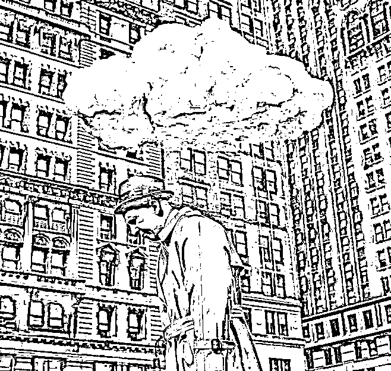

对于我们大部分人而言，工作占据了我们一天的白天时间。那也就是说，这个清醒时光的八个小时，**如果你不活出太阳的光芒，那么太阳在这个重要的生命时间段就是隐蔽的**——这就好像是，你的生命中完全没有太阳。

我们说太阳作为符号很抽象，那么换个说法。请你抬头看看天空中的太阳，你感觉一下：如果今天是阳光灿烂，而明天是阴雨绵绵，你的心情会有什么不一样？你的幸福会不会受到影响？当然，生命中只有一天没有太阳，那可能没有什么关系；如果一个月都没有太阳，你的生命会是什么样子？如果一年、两年，甚至三年都没有太阳，你的生命又会是什么样子？这个就是太阳在我们心中的意义。

既然太阳是如此重要的一颗行星，而在我们一天中大部分清醒的时间段，大部分人都是要工作的。那么如果在工作上，你无法活出太阳的光芒，这就像我上面所说的一样，你的一天、一个月、一年，甚至一生，你的生命里都是阴天。

**你的能量会暴走吗？**

星图中的能量一直在运作着能量守恒，能量是没有办法消失的。如果你无法清醒地运用能量，它就可能以其他极端的方式表达出来。**如果你的太阳能量完全无法发挥，它就会外溢到其他领域，且以这个领域无法承受的方式表达出来。**

比如以我为例，或者以任何太阳在天蝎座的人为例。如果在工作中没有实现天蝎座能量的话，它就一定会在生命的其他领域中要求得到补偿。比如说，有的人必须在爱情的领域活出这股能量，那 TA 在爱情中得多折腾啊？因为这个人完全没法在工作中发挥这股能量，就只能在爱情或是亲子领域发挥这股能量。

那如果活出了太阳的能量呢？比如说我，如果我在工作中活出了天蝎座的能量，我会感觉到太阳这个行星所代表的骄傲，我会以我的职业感到自豪，以我的工作感到骄傲，我会能感到身心健康、神清气爽。

但是，这并不是件容易的事情，我们仅仅在说太阳的能量，还没有把更复杂的东西带入。你要知道，仅仅是熟悉你的太阳星座能量，就有可能是我们一生都需要不断练习的事。

****你听，生命在召唤****

还是举我个人的例子：天蝎座的能量有许多表达，金融领域资源整合就是它的表达方式之一。

我读研究生的专业是经济学。经济学是一个跟资源整合相关的行业，不过我在研究生毕业之后，并没有直接从事经济学方面的事情，也没有做经济学的研究，而是开始做投资银行里的并购咨询业务。过了不久之后，我就和一些朋友开始创业。那是一段非常辛苦的时光，但同时，也是非常有激情的。激情这两个字，满足了天蝎座的需求。

那我为什么要离开这个职业呢？因为在这个职业中，有一些在天蝎座表达里非常巨大的阴影。这些阴影对于当时的我而言，根本没有办法面对和转化。

天蝎座是一个非常有力量的星座。**它和钱、权力、资源紧密相连，但同时它也有阴影面。就是钱、权力、资源甚至说情感所带来的强烈的控制欲望**。我在进入工作的早期，就很快接触到了天蝎座阴影的原型。

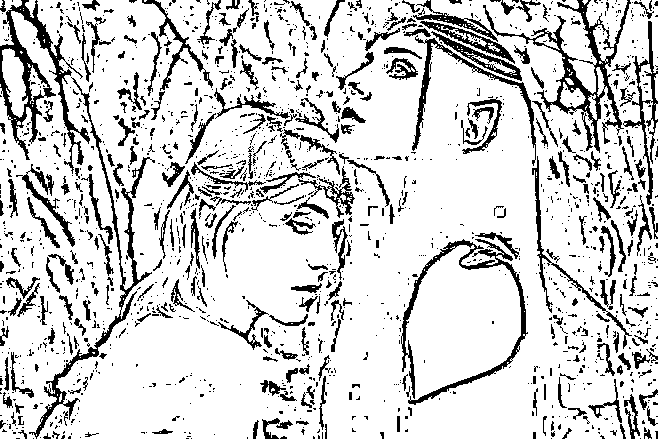

在这个职业领域，可以接触到很多钱，接触到很大的权力，而且可以看到这个职业领域，怎样通过钱和权力交易去掌控和分配资源。这个事情可以是好事，也可以是坏事。如果你把这些资源是从有利于社会或是这个企业的方向去分配，当然就是好事；如果纯粹是出于个人私利，就会变成一件非常坏的事。

我之所以离开这个行业的另外一个原因是：它满足不了我在其他方面的需求。比方说，我的星图中还有很强的射手座和水瓶座的特征。射手座是一个在比较高的层面上有强烈道德感的星座，并且它会追求你所做事情是否有意义。而水瓶座，它只是希望能对这个社会、群体有所贡献。

**其实，生命的潮水会一直带着你向前走，它一定会给你机会，让你离开你不适合的地方。哪怕这种离开是一种非常痛苦的方式，它会把你推到一个你更适合的地方去，只要你有足够的勇气。生命迟早会对你发出召唤，你在接到这个召唤之前的所有经验，都是在为这个召唤做准备。**

后来在一次冥王星的行进中（**冥王星也是一颗和天蝎座相关的行星，在冥王星的行进中，人们往往会发生巨大的转折，这些转折和改变都是非常痛苦的**），我的职业发生了天翻地覆的变化。

这样的事件对于当时的我而言是非常痛苦的经历，但当我回头看，因为我学习了占星学，我理解了这颗行星。虽然在我了解占星学之前，我也充满了疑惑。但是**当人们了解占星学之后，通常发生的第一个效应就是它对你的生命历程进行了一个确认——即你所走的道路，没有一条是白走的。它会让你明白，你为什么会发生那样的事件，为什么会有这样的经验，而这些经验都有深刻的含义。**

（未完待续）

**想阅读更多蒋颖老师的文章，请在后台回复 蒋颖 **即可。****

**课程信息**

**授课时间：**2016 年 5 月 19 日**-7 月 7 日**

**授课老师：**蒋颖**（8 次）、**大卫·瑞雷**（4 次）**

**授课方式：**网络课

费用：**2400 元**

**报名截止：**2016 年 5 月 6 日

**课程负责人：童老师（微信号：80248863）、**王老师（微信号：2837474346）****

**咨询电话：**400-619-1014

****◆ ◆ ◆  ◆ ◆****

******特别提醒************：若道拥有本文版权******，**转载请注明“转自若道”并标明作者。******

**你想更透彻地了解自己的生命吗？**2016 年 5 月 19 日，**蒋颖老师**主讲的若道占星核心课程**Level 1-2**要开课了！她将带领你学习**星座、太阳、月亮、行星、月亮交点**等知识，让你进入占星学的世界！

长按二维码接通课程负责人！

 

报名及咨询，请点击文末“阅读原文”

# 12 星座冥王星逆行攻略丨从大爆炸的废墟中站起来

> 原文：[`mp.weixin.qq.com/s?__biz=MzA5NjA0NTAxNg==&mid=2651384349&idx=1&sn=5f00de237048a4e8fdb292d0e5f3ce22&chksm=8b4a58aabc3dd1bc27bbe29f6fa1d1a451e9cf2997f26136ef2374b06fbbd7d4e6e2b2a45d08&scene=126&sessionid=1692738846#rd`](http://mp.weixin.qq.com/s?__biz=MzA5NjA0NTAxNg==&mid=2651384349&idx=1&sn=5f00de237048a4e8fdb292d0e5f3ce22&chksm=8b4a58aabc3dd1bc27bbe29f6fa1d1a451e9cf2997f26136ef2374b06fbbd7d4e6e2b2a45d08&scene=126&sessionid=1692738846#rd)

在若道君前些天推送的[冥王星逆行攻略](http://mp.weixin.qq.com/s?__biz=MzA5NjA0NTAxNg==&mid=2651384338&idx=1&sn=b7bd5bc4bfc740ca5ad18496d25f75e0&scene=21#wechat_redirect)（点击可阅读）中，作者讲述了冥王星逆行会带来的影响，以及应该如何安抚内在。在这篇中，我们将针对 12 星座来聊聊，12 星座如何应对冥王星逆行。

## 12 星座人如何应对冥王星逆行？

**若道君提示**：想知道冥王星在自己星图上哪个宫位逆行，请去若道官网（www.nodoor.com）上输入生日数据，建成自己的星图后，点击行运按钮，就能查到行进的冥王星在星图上的宫位。请看下面操作：

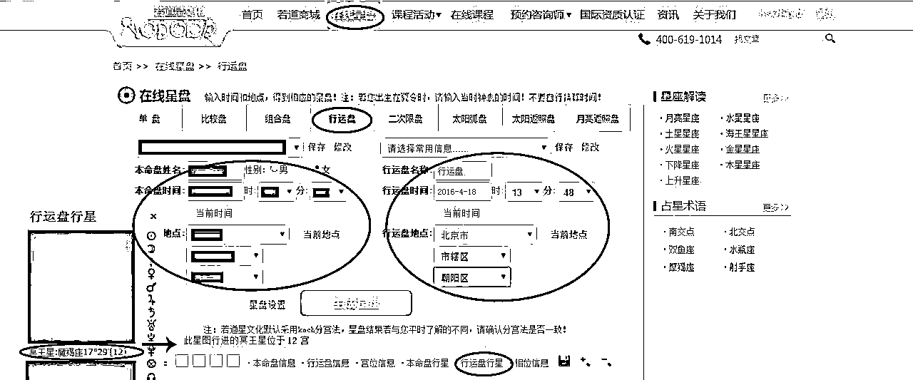 

（看不清记得点开戳大图）

**特别说明**：有些读者曾反馈，按照自己的上升星座，文章列出的行进宫位与自己实际行进宫位不符。下文列出的上升星座，是方便大家按需查询，准确的冥王星行进宫位需通过在线星图查阅自己的具体逆行宫位。以行进星图为准。

**上升白羊座，冥王星在 10 宫逆行**

这个时期，你容易发现自己在名誉、声望、权利、地位等方面存在强烈的企图心。同时也会感到来自权威人物、领导或长辈带来的压力，不用担心，这种压力会转化为成长道路上的动力。

对于某些白羊座人来说，有可能会经历领导的更换或离职；或者面对事业方面的重新洗牌。长辈的健康在这个时间段也值得注意。需要提醒的是，只有了解到自己追求权利、名望的深层动机，你才有机会掌握和使用冥王星所赋予你的强大动力。

**上升金牛座，冥王星在 9 宫逆行**

需要注意的是，有可能你所相信、总结或体悟到的观点和信念，会在这个时间段面临自我的一次次质问和检视。你会发现自己的某些信念束缚了生命的自由度，有一种原始动力在驱使你，试图让你突破自我，穿越教条打破旧模式。

你有可能会在传媒推广、知识学术、长途旅行等领域里体验到冲破重重阻碍的海阔天空；与法律法规、签证护照等相关事务可能会出现反复确认或者滞后拖延等状况。

**上升双子座，冥王星在 8 宫逆行** 

8 宫里是冥王星的家，这里和他人钱财、生意、资源整合相关。我们会发现自己在上述领域有极度的渴求，试图通过资源整合拓展自己的财富影响力。逆行的冥王星令我们有机会回头检视自己的扩张是否合理。

不容忽视的是，这个领域也和死亡疾病、厄运相关。所以在这段时期我们更容易接触到此类事件，或是被某种恐惧感侵扰。与金融贷款、保险税务相关的事物也会在这个时期凸显。某些被隐藏的真相和阴暗面也容易暴露出来。另外，一些人有可能会体验到和性有关的事件。

**上升巨蟹座，冥王星在 7 宫逆行**

7 宫代表着和我们有合作、合约关系的人，给予我们支持的人，和我们产生对立关系的人等。同时也代表贸易、合伙、咨询、诉讼、合约等事务。冥王星逆行于 7 宫的时候，这些事物和人让我们感觉到危险和紧张。容易因坚持各自的利益诉求而产生互不相让的局面，使得事情的进展缓慢或停滞。冥王星在第七宫，也代表婚姻或合约关系有类似的紧张主题出现，使我们深刻地感悟“共赢”的真谛，认识到支持他人的重要性，只是其过程充满了压抑与强迫感。

**上升狮子座，冥王星在 6 宫逆行**

冥王星在 6 宫的逆行，意味着一个人需要意识到在生活和工作方面，存在着转变和改善自身某些习气的可能性。有可能会接收到日常工作中来自他人或是事物的警示：必须要改变某些态度和行为模式，否则会遭遇误解或者诽谤。也有人会在这段时间出现身体比较明显的不适，这就是冥王星的警示，需要你觉察到自己的一些不良生活习惯。

**上升处女座，冥王星在 5 宫逆行**

冥王星所代表的深刻性和掌控欲，使得我们在爱的生命领域里拥有极致的情感体验。我们有可能在背叛与被背叛的感情故事里逐渐完成自我蜕变，最终收获到深刻并亲密的真爱。

同时也需要在这段时间里关注自己的投资理财能力。在各种聚会娱乐活动当中也尽量远离危险和诱惑；尽量避免冒险性运动项目。

**上升天秤座，冥王星在 4 宫逆行**

我们有机会重新检视自己的生命根基，这包括原生家庭的影响、祖辈所传承的文化等。一些人有机会清理和改善家宅、土地、房屋、祖屋。

家人或者家族中某些隐藏的事物容易在这段时期显现。容易与家中长辈之间在这段时间产生权利博弈。长辈的健康值得关注。一种彻底改变的决心和动力，会在经历自己被连根拔起之后，油然而生。

**上升天蝎座，冥王星在 3 宫逆行 **

冥王星在 3 宫逆行会让我们隐身暗处默默观察和磨练自己。在学习、商务会议、短途旅行等方面你会感觉自己是独行侠，需要付出更多时间和精力才能取得他人理解和支持。同时冥王星逆行也意味着，我们的智力发展正在突破某种局限。

这个阶段可能会有来自亲戚或邻里带来的令我们感到紧张的事件。不用担心，这一切的经历都是为了成就更智性和完美的我们。

**上升射手座，冥王星在 2 宫逆行**

这是一个与物质基础和自我价值感相关的生命领域，冥王星的逆行使得我们对于物质财富方面的安全敏感性凸显。有可能我们会问自己，自我价值与拥有的财富可以匹配吗？这个问题需要我们了解自己的金钱观念。创造财富并合理运用是一种能力。我们需要相信，精神的成长能够通过物质的丰盈获得转化，同时物质的丰盈也能够推动精神的成长。

**上升摩羯座，冥王星在 1 宫逆行**

冥王星在 1 宫逆行，有可能让我们变得非常主动且有决断力，或者深深的隐藏自己的诉求。我们的身份和对自我的定义会发生彻底的改变，有人会通过事业方向的改变来表达自己；有人会通过伴侣关系的改变来表达自己；有人回通过变换居所来表达自己。

冥王星逆行使得蜕变能量彰显，周围的世界也许还没有适应，我们难免要分神分精力不断证明自己。坚持和耐心是冥王星带来的宇宙之贺礼。

**上升水瓶座，冥王星在 12 宫逆行**

之前被我们忽视的隐秘性事件有可能爆发；某些耿耿于怀的担忧和恐惧会突然袭来。这时候，就我们需要主动、及时地清理心灵淤结，或者勇敢承担，面对内在的脆弱或阴暗。

当我们习惯了黑夜，走到了黑暗尽头，光明之门自然为我们打开。只是这个过程一定是需要本人带着极大的意志力和主动性坚持下来，才不至于被动。这是一个特别需要寻求精神引领的时期。

**上升双鱼座，冥王星在 11 宫逆行**

我们的理想和愿景有可能因太过超现实而遭遇到某种程度的打击。关于未来发展我们需要一段时间重新梳理，这个过程使得你更加明确方向，从而变得脚踏实地。

同时你也会在朋友、同事中发现某些与你面和心不和的人，使得你能够有机会清理隐患。对待他人所表达的爱意你有可能会猜疑。接纳冥王星的洞察力，它让我们在理智和情感之间获得平衡。

## 为了好好活下去，反思愤怒，净化疯狂

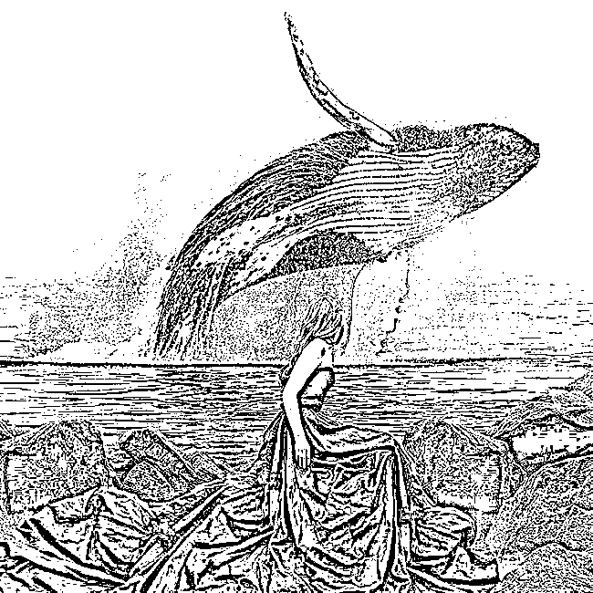

进化占星大师斯蒂芬·弗里斯特说：**这个月，我们集体在宇宙能量的受邀下反思我们的愤怒，净化它的疯狂，或许是为了我们继续好好生活下去**——尤其是在这两颗星体顺行之后，6 月 30 日火星顺行，9 月 26 日冥王星顺行。 

**当世界被愤怒灌醉，我们要做的是勇敢的心理探索活动**。我们在黑暗中感受到的道路，指引的神谕是“宽恕”。

**占星小知识**

**冥王星**

1930 年 2 月 18 日，一名 24 岁的天文学研究者克莱德·汤博（Cylde Tombaugh）在太阳系边缘发现了一颗很小的行星。这颗以希腊地狱之神命名的冥王星，自被发现之日起，就让众多占星师为之着迷。

在希腊神话中，冥王将年轻少女珀尔塞福涅从地面绑架到冥府。通过众神的努力，珀尔塞福涅终于从冥府逃脱，但是作为交换，每年有 6 个月她要回到冥府（有些版本说是 3 个月）。在这段时间里，大地上万物停止生长，冬天就这样来临。

这个故事描述了很多冥王星的本质和特点，以及它是如何影响我们的健康和幸福的。在这个关于绑架和最终被释放的故事里，存在一种转化的过程。我们很多人都体验过艰难的转化过程，比如说，失去朋友或挚爱的人，经历人际关系和经济上的困难时期。这些经历带来的情绪紧张会直接影响我们的身体健康，我们也许会觉得疲惫、沮丧、焦虑。

虽然这些经历有时候似乎令人恐惧，但我们也能从中学到一些重要的东西。通过不同的治疗方式，我们能够触碰到事件的核心，发现隐藏的根本原因。**在我们意识到核心和原因时，我们能体验到心灵的转化，以及一种更博大的同理心**。 

四月的天象可不平静呢，快戳下面文章了解~

**▼**

[四月宇宙天气丨五颗星集体逆行，是要召唤神龙吗？](http://mp.weixin.qq.com/s?__biz=MzA5NjA0NTAxNg==&mid=403602107&idx=1&sn=1e9d493d23402515e2a87b907ab54c85&scene=21#wechat_redirect)


**傅莎珈**：全职占星师，IAF 国际引导者协会认证引导师。毕业于若道占星学校，Coac 高阶占星资质。接受萨提亚、NLP、格罗夫全息呼吸理论的心理咨询专业培训。擅长职业规划、个人成长、婚恋关系解读咨询。

**微信个案咨询**：jiangnan2638

**微信公众号**：Helloshajia

**◆ ◆ ◆  ◆ ◆**

**特别提醒****：本文由作者授权首发于若道平台，转载请注明“转自若道”并标明作者。**  

重新认识冥王星吧。**2016 年 5 月 19 日**，蒋颖老师主讲的若道占星核心课程**Level 1-2**要开课了！她将带领你学习星座、太阳、月亮、行星、月亮交点等知识，让你进入占星学的世界！

报名及咨询，请点击文末“阅读原文”


# 小白学占星 | 太阳进入金牛座，谷雨到了

> 原文：[`mp.weixin.qq.com/s?__biz=MzA5NjA0NTAxNg==&mid=2651384349&idx=2&sn=2920f445c2b9e35f03c55f03e4f227cf&chksm=8b4a58aabc3dd1bcc8f052ff40f613e5d90108374435ea959ad683133acc89cd0587d9689fbc&scene=126&sessionid=1692738846#rd`](http://mp.weixin.qq.com/s?__biz=MzA5NjA0NTAxNg==&mid=2651384349&idx=2&sn=2920f445c2b9e35f03c55f03e4f227cf&chksm=8b4a58aabc3dd1bcc8f052ff40f613e5d90108374435ea959ad683133acc89cd0587d9689fbc&scene=126&sessionid=1692738846#rd)

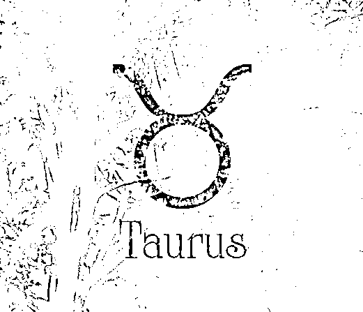

作者/格伦·佩里

本文整理自格伦·佩里《占星心理学(*Astro-Psychology*)》一书

图片来源/花瓣网

4 月 19 日 23：29，行进的太阳离开白羊座进入金牛座。此时也是二十四节气的“谷雨”。古人说，“雨生百谷”。在这一天之后，寒潮结束，降雨增多，万物都在生长。细细感受，这不就是金牛座么？稳定，舒适，孕育……

**金牛座**

**守护星：金星**

**关联宫位：第二宫**

**关联相位：渐盈的半六分相**

**极性：阴**

**元素：土**

**形态：固定**

**视角：个人**

**心理需求**

安全&保障，自我&物体恒常性，可预见性，稳定性（动态平衡），一致性&熟悉度，舒适，感官满足。

**原型人物**

大地母亲，殖民者/新土地定居者，富饶女神，自耕农，吃货，电视迷，得墨忒耳女神，谷类女神，森林女神，感官主义者，享乐主义者，酒色之徒。

**发展阶段**

**从 18 个月到大约 4 岁。**这是弗洛伊德模型理论中的**肛门期**。是皮亚杰体系中的**感知运动末期，前运算思维期的早期阶段**。思维固执。专注或“固定思维”。和睦。“失乐园”，相应的安全和依附感。除了自我和物体恒常性，还要获得物体的永久性。

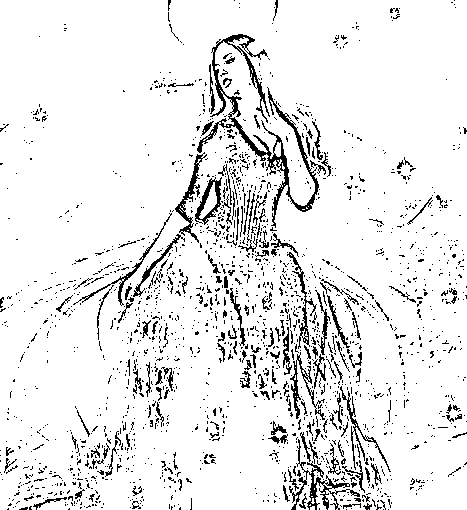

**行为特质和主题**>>>>

**体态丰满和关注感官**

没有哪个星座比金牛座更适合享有“世俗”这个绰号了。木星在金牛座落于上升点的梅·韦斯特（Mae West）说的话最典型：“拥有太多的好东西是非常棒的事情。” 

**金牛座具有天然的魅力和吸引力。它用一种温和的方式吸引着你。**不一定是什么绝世的美，可能会是某种天然的美，比如法国乡下挤牛奶的姑娘，或者是一个强健的户外男子——可能是个吸万宝路的男人（他的烟不算）。在更为极端的例子中，它还可能完全贪得无厌，甚至淫荡好色。在杰克·尼克尔森的某些电影中，他就演绎了该星座的这一面。

**可能的特质表现：自然美、肉欲、世俗、吸引力、感官刺激、诱人、想触摸/拥抱、性感、体格强健**

>>>>

**关注愉悦、安全和感官满足** 

金牛座不但有魅力，而且也很会招引他人。众所周知的金牛座**物质主义和占有欲特性暗示出他们需要物质安全感**。不管是物质的积累，还是对事物和人物的强烈依恋，都表明金牛座最关心的就是安全感。**该星座一个最主要的特质就是其获得、节约以及储存金钱、财务的能力。**快乐和满足就是“拥有物质”的代名词，尤其是依恋的那个人（这就是金牛座的占有欲）。其实，**金牛代表了依恋行为及其发展的结果：自我和物质的恒常性。**

**可能的特质表现：贪得无厌、享乐导向、物质主义者、囤积、寻找舒适感、依恋、储藏、溺爱、占有欲**

>>>>

**以表面价值对待事物**

皮亚杰将前运算阶段的思维描述为“僵化”。他注意到 2 到 5 岁的小孩比较倾向于“分散”，也就是只关注物体或事件最突出的一个特质，而忽视掉其他特征。这一时期的典型特点就是思维死板，所以处于这一阶段的小孩很难做到“合理推论”。他们反而会**将关注力放在那些能一眼就可以看出的事物上，而很少或者几乎不会明白事物是如何从一种状态变化到另一个状态的（缺乏可逆性）**。

在此阶段，还会出现相当大的自我中心意识，反映出孩子还无力同时应对一种情况的多个方面。蹒跚学步的孩子不能马上理解事情是如何变化的，这也反映在他们过分关注自身安全和稳定性上，有这样的执念，当然很难理解任何变化了。所有这些也是金牛座典型的感知能力。

**可能的特质表现：实实在在的、基础的、简单的、缺乏想象的、物质的、浓稠的、可触及的、缓慢的**

>>>>

**外表冷静**

因为金牛需要稳定和安全，所以他们具有一种天然的冷静特质。事实上，金牛座最突出的一个特质就是其柔和、优哉游哉的品质。加利·库帕（Garry Cooper）是个很好的例子；要不就回想一下（如果你能记得）歌手佩里·柯莫（Perry Como）那令人舒缓的嗓音。金牛座既令人舒服，也令人慰藉。金牛座不太可能被激怒或被煽动，在这方面，其他星座都稍逊一筹。

**可能的特质表现：冷静、满意、审慎、保守、柔和、安静、牢固、稳定、温顺、文静、镇定、保障、定居、宁静、温和、慰藉、讨人喜欢、安全、天真**

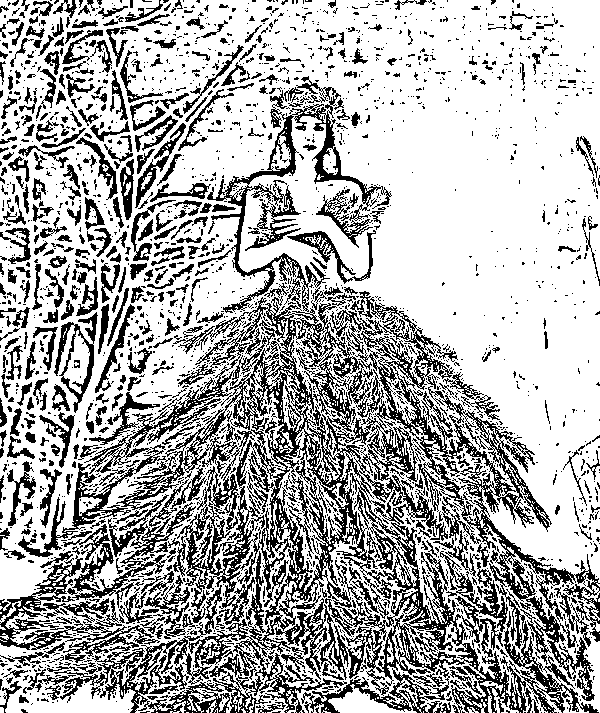

>>>>

**熟悉孕育舒适**

金牛座**喜欢舒适舒服**，这让他**天生就排斥变化**，因为变化相当于缺乏可预测性和确定性。金牛座就像心灵的平衡机制，防止体系失去平衡感。从而保证那些已知的熟悉、稳固的根基会继续提供舒适、安全的性能。

没有哪个星座比金牛座更坚定、更坚决。“就让她慢慢、稳稳地走吧”，这是金牛座的陈词滥调。我们身体中金牛座的部分想让我们对任何不可预见的情况或可能出现的潜在危险都筑起一道防御之墙。因此，这个星座非常愿意让事情保持他们原来的摸样，无论实际上他们可能有多么不满意。

记得在 20 世纪中期，当精神分析在欧洲风靡一时的时候，有人问德国诗人里尔克是否考虑去做精神分析。他说，“我担心，如果我的恶魔离开了我，我的天使们也会随之飞走。”就是这样，金牛座会固执地坚持已有已知的事物，努力去避免在改变的过程中失去那些美好的东西。

**可能的特质表现：坚定、可预知、熟悉、系统有序、耐心、持久、缓慢、稳定、前后一致、单调乏味、固执、可依赖、坚持不懈、坚韧不拔、可靠的**

>>>>

**玩之有度**

**所有的行为都是针对自身的安全和保障**，这就是金牛座。没有哪个星座比金牛座更墨守成规或不爱冒险了（记得冒险者是白羊座的原型，金牛座就正好补偿了这一点）。他们对舒适更感兴趣，也比任何事物都珍惜这一点。所以，金牛座是出了名的电视迷，可以用懒惰无精打采、相对乏味无趣来形容。如果形势要求向前推进，那就令人恼火了。但是，如果目标是“坚守阵地”，不妨纠集一伙金牛，那将坚不可摧。

**可能的特质表现：守旧、保守、沉默寡言、传统、退化、克制、质疑变化、没精打采、懒惰、谨慎、刻意、乏味、懒散**

>>>>

**极度排斥变化**

金牛座的人害怕变化，几乎到了病态、极端的地步。没有了安全感和眷恋是最可怕的噩梦。很有趣的是，边缘型人格障碍正是因为无法实现自我恒常以及物体恒常，从而造成了他们依恋、不安全的行为，而这正是这种障碍的典型特征。同样，如果我们金牛式的感官性没有很好的整合，就会出现极端嫉妒、占有欲和固执。所有这些极端行为的出现都是为了弥补内在安全感的缺乏。

**可能的特质表现：顽固、倔强、懒惰、勉强、眷恋、固定、拘谨、死板、固执、不可移动、抵制、不情愿**

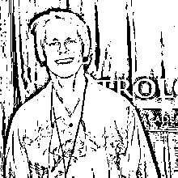

**格伦·佩里(Glenn Perry)**，赛布鲁克学院(Saybrook Institute)心理/意识研究专业博士，是拥有三十多年从业经验的美国职业占星师和注册心理治疗师，曾任国际占星研究协会 （ISAR）以及联合占星大会董事会（UAC）副主席，是占星心理学学院（Academy of AstroPsychology）的创办人。在过去的三十余年里，格伦通过对心理学概念和实践经验的系统性整合，对占星学进行了扩充。

**◆ ◆ ◆  ◆ ◆**

**特别提醒****：转载请注明“转自若道”并标明作者。**

出生星图是一个人的心理地图。2016 年 8 月 22 日，由格伦·佩里老师教授的心理占星学高阶·占星疗愈即将开课。该课程是 ISAR 选修课之一。敬请期待！


# 顺势疗法的药物安全吗？（下）

> 原文：[`mp.weixin.qq.com/s?__biz=MzA5NjA0NTAxNg==&mid=2651384349&idx=3&sn=48c13f9504319499a284ae44235953f1&chksm=8b4a58aabc3dd1bc253ffec9b732f8de71a3a753cd130b74dd6a53310bb51a931e480385f3ee&scene=126&sessionid=1692738846#rd`](http://mp.weixin.qq.com/s?__biz=MzA5NjA0NTAxNg==&mid=2651384349&idx=3&sn=48c13f9504319499a284ae44235953f1&chksm=8b4a58aabc3dd1bc253ffec9b732f8de71a3a753cd130b74dd6a53310bb51a931e480385f3ee&scene=126&sessionid=1692738846#rd)

文章来源/homeopathyplus 网站 译者/轩轩

图片来源/VCG

有关[顺势疗法药物的上一篇文章](http://mp.weixin.qq.com/s?__biz=MzA5NjA0NTAxNg==&mid=403873640&idx=2&sn=5769ed2ca836bd191f51bca708a0bcb3&scene=21#wechat_redirect)（点击可阅读），讲到了顺势疗法药物的来源，以及接受了顺势治疗的三个反应，本篇将继续说明余下的四个反应。一起来学习如何接受顺势疗法治疗吧。

## 服用顺势药物后都有啥反应？

已有症状获得改善，但同时短期内出现了一种新的症状

这意味着

该处方仅部分符合你的症状。虽然该药能够改善你的病情，但是对于你来说，也有足够的差异和敏感性来感受到药品的其他一种或多种效果。

解释

有时，一份处方既可以改善你的病情，也可以引发新的症状，即副症状。当处方只是部分适应你的现有问题时，就会引发副症状。该处方适宜的部分会让你感到舒服，而不适宜的部分会引发温和的症状改变。这是一个副症状的例子：顺势治疗风湿性关节炎时出现头皮瘙痒。

你该做的

告知你的顺势治疗师。只要副症状不棘手，那么治疗师可能会选择继续治疗。因为副症状会在停止用药时自行消失。直到那时，治疗师可能会给出更温和的药方，来最小化副症状带来的不便。

如果副症状较为严重，或让你觉得不舒服，那么治疗师会停止治疗，并给出基于当前症状（包括副症状）的新处方。这种结合会带来更好、更匹配的治疗方案。如果副症状非常恼人，治疗师就会采取化解方法。

**现有症状获得改善，但同时过去的症状在短期内再次出现**

这意味着

该处方是正确的。你正在经历一种被称为“旧症状再次出现”的积极现象——深度疗愈正在发生。

解释

**“旧症状再次出现”指的是处方不仅在治愈现有问题，同时也在作用于你过去的健康问题——它们潜藏或压抑在你身体的能量层面**。大部分人意识不到深层能量疗愈正在发生，他们只能注意到自己眼下的问题改善了。一些人确实体验到突破性的疗愈效果——当处方消除了压抑的效果，过去的问题一个接一个浮现到了表面。当旧症状重现时，他们一般是温和且短暂的，并且最终会永远消失。

你该做什么

告知你的顺势治疗师。他们将鼓励你去注意那些症状，以及症状发生的先后次序，来证实这是“旧症状再次出现”而不是恶化。如果你正在经历“旧症状再次出现”，那么即使有着重现的那些问题，你也应该感觉到健康舒服。不管你做什么，都不要再次压抑它们——那并不是健康变差的征兆。相反地，请保持愉快，因为深度疗愈正在发生，而结果将会是令人满意的！

短期内出现替代性的流脓或出疹子，而深度疗愈正在发生

这意味着

处方是正确的。让你生病的能量失衡在通过体表的释放而得到缓解，内在正经历深层次疗愈。

解释

人体总是试图“外化”健康问题、将问题推到表面，来保护对生命至关重要的内在器官。令人痛心的是，我们常规用来控制表层症状的治疗方法，经常会加重内在的失衡，影响更多重要的器官。当真正的疗愈发生时，我们的生命力可能会在身体表面引起替代性的流脓或起疹子，来将能量失衡从深层器官中抽走。例如，治疗心脏病时，病人可能会出现皮肤烫伤、流脓，而内在更重要的层面正在改善。

你该做什么

告知你的顺势治疗师，他会鼓励你监控整体健康的变化。如果表面症状是深层问题的替代而不是症状改变性的恶化，那么就顺其自然，因为它会随着身体的痊愈而消失。不管你做什么，都不要压抑它，否则治疗进程会逆反，你将前功尽弃。

完全没有任何反应

**这意味着**

很明显，你并没有在康复。在这种情况下，要么处方是正确的，但是你“不敏感”，没能出现反应；要么处方是错误的。

解释

就像一些人对特定或所有处方敏感，也有一些人可能会“不敏感”。这并不意味着这些人是铁石心肠或者没有感觉，他们只是在对于合适处方的疗效上，反应比一般人稍微慢一点。如果你就是这种情况，那么你将需要增大每次用药剂量，或者是增加频率，直到症状改善。更常见的情况是，没有反应意味着处方选择不当。如果处方不符合你的病症，而你对其又不是过度敏感，那么在治疗过程中就不会产生任何反应。

你该做的

如果你的顺势治疗师怀疑你对处方不敏感，那么他/她会选择增大剂量、或提高频率、或改变效力，或三种方法同时进行。他们可能也会要求你在每次服用药物之前，更多地去剧烈振荡药瓶，来增强药物的能量。这些简单的变化完全能够解决最不敏感人群的问题。在治疗进程中，敏感不足和过于敏感的状态都需要进行调整，来接近正常的药剂反应度。

另一方面，如果是因为错误的药方才让你没有任何反应，你的顺势治疗师会重新检视你的症状，并给出新的处方。

顺势治疗需要双方的努力，所以知道治疗会对你产生效果是至关重要的。你需要知道：**治疗师开处方的基础是你的陈述以及他们在诊疗中的观察。记住，顺势治疗师治疗的是“生病的”人而不是疾病，所以在决定正确的药方时，你的异常、奇怪的症状比相同疾病会出现的一般症状更加重要——一定要将那些症状告诉治疗师。**

顺势疗法是一种神奇的医药系统，有着康复路上必须的所有制约和平衡来指导医生和病人。技能娴熟并且富有智慧地使用它，你就将获得深度疗愈、增强的生命力和免疫系统，以及对未来疾病更强的抵抗力。顺势疗法是上帝送给苦难人类的礼物，等着我们去充分利用。

> #### 阅读更多顺势疗法
> 
> 点击图片即可阅读


▲顺势疗法丨春天一到，你就过敏？


▲想搞定顺势疗法？先拿好这份攻略~


▲顺势疗法观点丨疫苗到底打不打？

**◆ ◆ ◆  ◆ ◆**

******特别提醒：****转载请注明“转自若道”并标明作者。******

想要自己掌握顺势疗法的技能？**2016 年 5 月 7、8 日**，由**苏·汤普斯金**亲授的**顺势疗法工作坊**就要开课啦！顺势疗法是目前全球使用最广泛的自然医学疗法，对个体的身体、精神和情绪三个层面进行治疗，加强个体自身免疫力，提升个体生命能量。本课程为那些想要增加自我及家庭身体保健和疗愈能力的人所设置。

报名及咨询，请点击文末“阅读原文”


# 冥王星逆行攻略丨别让恐惧掌控你大脑

> 原文：[`mp.weixin.qq.com/s?__biz=MzA5NjA0NTAxNg==&mid=2651384338&idx=1&sn=b7bd5bc4bfc740ca5ad18496d25f75e0&chksm=8b4a58a5bc3dd1b37ecaaa9ba3bcdf71ecfe9546db316375c49accf48713e99fcfd3786889ec&scene=126&sessionid=1692738846#rd`](http://mp.weixin.qq.com/s?__biz=MzA5NjA0NTAxNg==&mid=2651384338&idx=1&sn=b7bd5bc4bfc740ca5ad18496d25f75e0&chksm=8b4a58a5bc3dd1b37ecaaa9ba3bcdf71ecfe9546db316375c49accf48713e99fcfd3786889ec&scene=126&sessionid=1692738846#rd)

你知道吗？三王星（天王星、海王星、冥王星）每年逆行半年。2016 年，冥王星带头逆行，从 4 月 18 日开始，到 9 月 26 日停止逆行。一颗象征重生、转化与恐惧的行星，我们该如何应对它的逆行呢？

## 冥王星：死而后生的启示

在占星学的象征上，**冥王星往往与人的生存紧紧联系在一起：控制什么样的资源让自己可以生存下来？**人在面临生存危机的时候，往往会遭遇一些看起来像是某些东西在生命里被带走的事情，这正是冥王星要告诉我们的：当你再没有什么可以失去的时候，也就没有了恐惧。转化、重生即是这样的一个含义。

**冥王星让我们经验痛苦，之后喜极而泣。带给我们不破不立、置之死地而后生的生命原始驱力。**

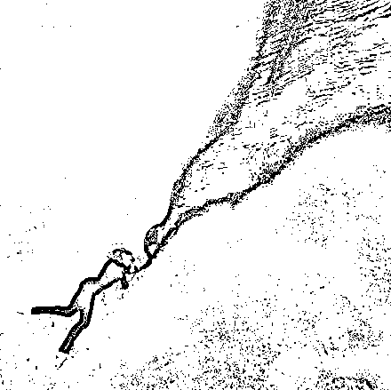

因为冥王星是太阳系中离地球最远的一颗行星，它所象征的力量通常是隐晦的、隐藏性的。当其逆行的时候，反而有机会让我们发现它的破坏力量的存在：这几天很多人感觉心里有一股愤怒在爆发。那是我们内心回避很久的东西，因为冥王星的逆行，从内心深处升起，通过一些事件、人物被激发，引起了我们无法控制的愤怒。这些事件、人物，投射的是你的内心情绪。加上前一天，火星也开始逆行。火星本身是个冲动好斗的行星，破坏力很强，两个好斗暴力的行星“take five”：砰！

## 争端与事件同时爆发

外在环境上，随着 4 月 7 日白羊座新月，新月时冥王星四分白羊座太阳，代表着冥王星和火星之间的角力拉锯升温。我们会发现在现实生活里，平时很和善的友人，突然变得犀利好斗。生活中的争执突然增加。外在环境里，冥王星所代表的性和财务上的丑闻，暴力，权力斗争信息突然增多。

○3 月 30 日，柳岩被扔水里引发大众对闹伴娘尺度，女性的性魅力突出是否就该受辱的各种讨论（性、暴力）。

○4 月 2 日，柯以敏粗口骂超女，最终被辞退，后爆发是芒果台炒作（语言暴力、丑闻）。

○4 月 5 日，女生酒店遭劫持，引发女性住店安全，男性暴力，以及性工作者人群的讨论（性、暴力）。

○4 月 8 日，黄晓明因代言的东虹桥投资倒闭被投资者微博留言讨债（财务欺诈、倒闭）。

○4 月 9 日，奇葩说讨论闺蜜要去打小三，你去还是不去（性、权力争夺）。

**通常行星在从顺行到逆行的过程中的停滞，是张力最大的时候**。大卫·瑞雷老师在若道 Level 5 的占星课上比喻说：**顺行相当于有人穿着鞋踩在你的脚上，停滞是它把两只脚都踩在你的这只脚背上**。这种张力，将在 4 月 17 日火星在射手座逆行，4 月 18 日冥王星在魔羯座逆行的前后 5 天，达到高潮。

**容易中招人群**

出生星图里有太阳、月亮、上升星座、水星、金星、火星，以及四轴位于 17°29’至 14°55’之间，都会在此次冥王星逆行中受到明显影响，尤其是基本星座（白羊、巨蟹、天秤、摩羯）。

## 冥王星逆行会发生什么？

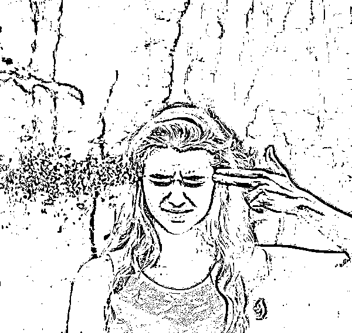

冥王星逆行期间，我们的生活中会发生什么事情呢？

○症状一：心情烦闷，不愿倾诉，但痛苦无法压制，烦躁得厉害；

○症状二：以前可以沉默、忽视的事情，突然态度激烈、咄咄逼人地表达自己的真实看法；

○症状三：财务、性的亲密关系上，突然爆发事件，然后发现已经进行了很久，突然被曝光；

○症状四：牙齿、骨骼、关节上出现问题；或者无来由的发烧；

○症状五：人工授精，生育主题的医疗事件；

○症状六：权威、长辈突然被公检法带走，涉及权力或者财务上的贪污。

一般情况下，有负面情绪及时发泄出来，问题就不是很大。但是冥王星代表转化的力量，即向内在的转化，对一般人来说难以掌控包括愤怒、自我批评、以及消极自我毁灭的情绪。如果有机会的话，请寻求专业的心理咨询师的帮助。

## 如何应对冥王星逆行？

那么，在冥王星逆行期间，怎样才能应对这些变化呢？

**转化内在情绪 Tips**

**- 艺术创作 -**

通过艺术性的、非理性的方式应对。很多艺术家和音乐家都能自如的通过某种表达媒介释放根深蒂固的情感。

你可以通过文字、绘画、音乐等方式的表达去释放情感，理解困境存在的意义。更深层次的自我探索和接受，对那些正在挣扎的人抱以深切的同情心，感受和帮助他们，也许不能完全消除你正在经历的痛苦，但你会更加意识和感受到了这种痛苦经历的意义。

**- 寻找咨询师，深入探索无意识 -**

有经验的进化占星或者心理占星师，能在星图解读与交谈中，帮助你了解这种困境在家族成长中的共鸣，让你又机会对家族有更多了解，从而产生转化的力量。

好的心理咨询师善于找出问题的根源和导致现有困境的起因。如果身边有全息呼吸工作坊、海灵格家庭排位、萨提亚家庭治疗模式等心理工作坊，也是个非常好的机会去了解自己深层的内在痛苦。据我所知这半年大量国外知名心理大师正在陆续进入中国开办工作坊，不妨留意一些这方面的信息，看你能和哪种咨询结缘。

催眠也是个很好用的咨询渠道，通过催眠进入潜意识，会更深切的意识到并且理解自己的心理，将尘封的曾经难以处理的痛苦记忆和经历，释放出来，进行清理，疗愈和转化。

**- 身体按摩 -**

要想解决冥王星问题，就需要抓住事件的核心。身体的肌肉和韧带会储存起由痛苦经历带来的大部分紧张和痛苦。为了缓解这一影响，不妨找一位受过训练的能量按摩师，帮助我们减轻身体的紧张和僵硬。

当身体的特定部位被按摩时，肌肉的深度组织被刺激，激发我们的情感反应，比如按摩腹部能激发安全感问题。按摩颈部能激发交流和自我表达的问题。通过训练有素的治疗师的帮助，我们能在身心之间建立更有意识的联结，这种意识能将深深隐藏在身体中的情感问题激发出来，从而得到释放。中国这类能量按摩师很少，相对比较普遍的是传自日本的灵气 Rriki 按摩。

（未完待续）

**敬请关注若道君之后的推送**


下篇还有 12 星座冥王星逆行指南等你看

四月的天象可不平静呢，快戳下面文章了解~

**▼**

[四月宇宙天气丨五颗星集体逆行，是要召唤神龙吗？](http://mp.weixin.qq.com/s?__biz=MzA5NjA0NTAxNg==&mid=403602107&idx=1&sn=1e9d493d23402515e2a87b907ab54c85&scene=21#wechat_redirect)


**傅迦莎**：全职占星师，IAF 国际引导者协会认证引导师。若道 COAC 高阶资质毕业生，在若道跟随多名当代著名占星师进行深入系统的占星研习。接受萨提亚、NLP、格罗夫全息呼吸理论的心理咨询专业培训。擅长职业规划、个人成长、婚恋关系解读咨询。

**微信个案咨询**：jiangnan2638

**微信公众号**：Helloshajia

长按二维码，让金钱流向带来知识和智慧的人~

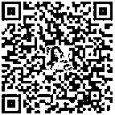 

**◆ ◆ ◆  ◆ ◆**

**特别提醒****：本文由作者授权首发于若道平台，转载请注明“转自若道”并标明作者。**  

重新认识冥王星吧。**2016 年 5 月 19 日**，蒋颖老师主讲的若道占星核心课程**Level 1-2**要开课了！她将带领你学习星座、太阳、月亮、行星、月亮交点等知识，让你进入占星学的世界！

报名及咨询，请点击文末“阅读原文”


# 打假热线 | 我最深爱的人，伤我却是最深

> 原文：[`mp.weixin.qq.com/s?__biz=MzA5NjA0NTAxNg==&mid=2651384338&idx=2&sn=207d2a6f04ead2b72c3bcc622bc617f8&chksm=8b4a58a5bc3dd1b3782546c064c9472f7c6013fd97fc833a31488970631e97e73f80a9152458&scene=126&sessionid=1692738846#rd`](http://mp.weixin.qq.com/s?__biz=MzA5NjA0NTAxNg==&mid=2651384338&idx=2&sn=207d2a6f04ead2b72c3bcc622bc617f8&chksm=8b4a58a5bc3dd1b3782546c064c9472f7c6013fd97fc833a31488970631e97e73f80a9152458&scene=126&sessionid=1692738846#rd)

“我的太阳与冥王星是四分相位，是不是另一半的性格就不好啦？”

“你懂你和你的爱人吗？”

此文献给所有出生星图中拥有日冥相位的人；

以及在感情里具有控制、信任、恐惧议题的虐恋爱好者们。

## 日冥四分——太阳在转角遇见冥王星

**出生星图中拥有日冥四分相位（太阳与冥王星呈 90 度夹角）的朋友，在你的生命历程中，无论你的生活中发生的事件或情景是否激烈，都会为你的内在心灵带来激烈的演化与进化。**可以说，在你看似正常与平静的生活表象下，隐藏的暗涌毫无停留地流过、内在的意识不见声色地变化。

*   你可能会在一次次周而复始的类似议题中，产生什么都掌控不住、甚至连自己都掌控不住的恐惧感。体会自己掌控的欲望、抗争的模式。 

*   这些类似的议题，是你需要关注、面对、转化的生命议题，也是灵魂在过去世未曾转化、今生需要完成的议题。

**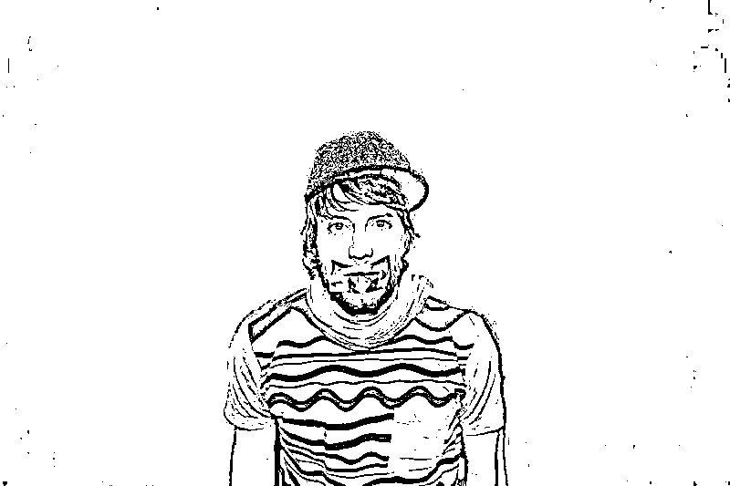** 

**你会在这种深邃而透彻的洞悉中，感到生活的不可掌控，这会给你带来强烈的恐惧感。**对你而言，最重要的是要了解——日冥四分的意义在哪里： 

*   你拥有强大的能量去洞察、挖掘你的生命议题，但是这些议题的意义、结果的未知性是你恐惧的原因。 

*   生命的成长从觉察到对于自己和他人的无法掌控、感受到痛苦而开始，这是难得的机会。不是所有人都有这样的机会，所以，其实从某个角度来讲，你很幸运。

日冥四分会时常让你陷入希望或绝望、坚持或放弃的两难选择境地：

*   在每一次经历毫无进展、面临失败的时候，是坚持还是放弃？ 

*   在每一次洞察到自己的无法掌控的时候，是重新燃起希望还是被绝望吞没？

我从不怀疑拥有日冥四分相位朋友的能量和智慧——在欲望中撕扯、在绝望中重生；在周而复始、循环往复的磨砺中，等待真相示现、虚妄落地。即使现在的你，正在认为这些经历糟糕透了、可能会扛不过去了，但是生命的潜能、日冥四分的推动一定会让你在这些激烈的经历中拿到一些什么——不单是现实经验，更是有关于你的灵魂转化与生命使命的内在深刻向度。

## 日冥四分的人——伴侣性格一定不好吗？

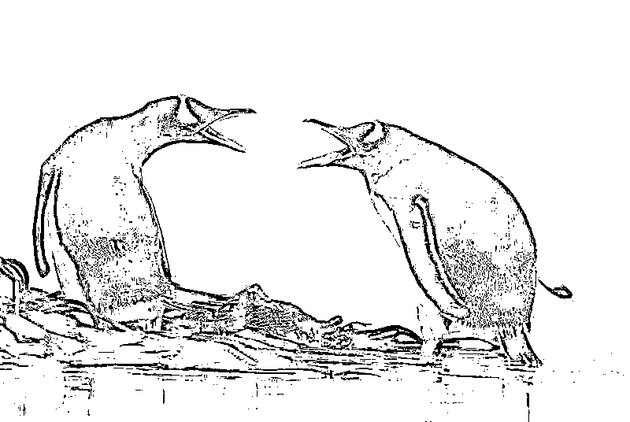

日冥四分对亲密关系的影响，可能性很多、故事版本很多、心理过程也很多。我们从其中一种可能性，分析一下日冥四分为亲密关系带来的生命议题。

**举个栗子**

一位拥有日冥四分相位的朋友，在原生家庭拥有一位强势的父亲。

TA 可能会**从儿时便体会到一种被监管、掌控的束缚感与无力感，也可能在生命早期的生活中感受到渴望逃离或反抗的内在欲望。**

但是对于 TA 而言，**获得父亲的认同感是潜意识中的欲求，或者说是价值感的体现。**对于一个生命早期阶段的孩子而言，没有什么力量、方法达成这样的欲求，**TA 可能会尝试乖顺讨好、逃离反抗，却又不见奇效、无可奈何。**

父母与我们的之间的关系模式，会作为一种客体关系模式投放到日后的人际关系中。让我们将上面例子中那位孩子长大后的生活引申一步：

*   TA 可能会在亲密关系中寻找与父亲不同的伴侣、自己扮演“父亲”的角色，以爱之名对伴侣监管、掌控。 

*   TA 可能会在亲密关系中扮演“孩子”的角色，被伴侣监管、掌控。TA 可能会在似乎直觉到儿时的束缚感与无力感之后，乖顺讨好或逃离反抗。 

我们可以理解为——TA 投射、吸引上面两种可能性的亲密关系。

对于拥有日冥四分相位的人而言的**“另一半的性格不好”**：

*   是否意味着投射、吸引了一位像强势父亲一样监管、掌控你的伴侣呢？ 

*   是否意味着在亲密关系中，似乎又感到儿时的束缚感与无力感呢？ 

*   在这段亲密关系中是如何与他相处、互动的呢？ 

*   内心存在着不满和恐惧。是否也有想去逃离、反抗的想法或模式呢？ 

*   在与伴侣的相处、互动过程中，一直在采取逃离、反抗的想法或模式，想获得什么呢？对方的认同感？价值感的体现？ 

*   在相遇、恋爱的初期，当时伴侣的态度与现在有什么变化和差异吗？如果没有变化，为什么当时可以接受，而现在会不满、恐惧？如果有变化和差异，那么，当时是什么样子、现在是什么样子呢？是什么变了呢？

类似这样的恋情，发生多少次，才能为我们带来一些内在的觉察与反省，并且一次一次透过生活和事件的表象接近真实的自己、直面进化的使命、转化业力的轮回。

你可能在每一次的经历中拥有几个不同的选择：

*   选择放弃这段充满矛盾、让你不快乐的关系——但是那样**你可能无法透过矛盾向内在本质走近一步；无法觉察并体悟矛盾议题背后的启示，甚至可能再次吸引一段同样“掌控权大战”的亲密关系。** 

*   **觉察到你和伴侣间斗争的力量**——因为真相所带来的恐惧，因为恐惧衍生的反抗、掌控的欲望，因为恐惧和欲望导致亲密关系中流逝与消磨、放弃与死亡的那部分。 

*   **领悟到你和伴侣之间谁都无法掌控谁**——那些无法预知何时来临的恐惧与欲望、那些随时随地可能掀翻两情缱绻的对抗与情绪，早已在你们的感情与关系间搞得充满战火，一点一点粉碎着你们相爱的初衷。 

*   **觉知到掌控的虚妄与危害**——就好像因为恐惧会被饿死，执着地掌控食物来源、拼命地满足内在荒芜的欲望，结果将自己撑死；就好像走在深夜的小巷，被墙上浮现的怪物吓到，当你试图掌控安全而与之搏斗的时候，发现原来那只是自己被光线扭曲的影子。看看，恐惧创造了什么，掌控帮了什么忙。 

*   **臣服于宇宙安排的所谓“命运”**——接纳真实的自己，在真实中逐渐放下未知的恐惧、欲望的虚妄。**臣服，不是对“命运”妥协、对议题放弃，而是在“命运”的起伏与流转中将自己全然交付予宇宙，全然迎接日冥四分所示现的经历、顺势走进生命进化的使命。**

世界上，没有好与不好的性格，只有进化与未进化的生命；亲密关系中，没有好与不好的爱人，只有懂与不懂的内心。

📹 /mp/newappmsgvote?action=show&__biz=MzA5NjA0NTAxNg==&supervoteid=3257705#wechat_redirect

往期打假热线文章你不想看看吗？ ▼

[](http://mp.weixin.qq.com/s?__biz=MzA5NjA0NTAxNg==&mid=403340983&idx=1&sn=48ae8e17808724a749658532571e5da6&scene=21#wechat_redirect)[打假热线第一弹 | 婚运正缘那点事儿](http://mp.weixin.qq.com/s?__biz=MzA5NjA0NTAxNg==&mid=403340983&idx=1&sn=48ae8e17808724a749658532571e5da6&scene=21#wechat_redirect)

[](http://mp.weixin.qq.com/s?__biz=MzA5NjA0NTAxNg==&mid=403511401&idx=1&sn=7b36df4765406f15ccdc7ff23f63dce2&scene=21#wechat_redirect)[打假热线情感类问题大起底，困扰你的，我们来回答](http://mp.weixin.qq.com/s?__biz=MzA5NjA0NTAxNg==&mid=403511401&idx=1&sn=7b36df4765406f15ccdc7ff23f63dce2&scene=21#wechat_redirect)


**作者简介**

**王芝桦**，职业占星师，身心灵服务者。具有丰富的心理咨询、催眠治疗、占星个案经验。结合心理学、灵性修炼、自然疗法、占星学等不同专业流派，以及 NLP、艾瑞克森催眠、家族系统排列等专业技术，创办了天津道玺身心灵中心。

**微信公众平台账号**：daoxi-life

**王芝桦个人微信账号**：zhihua0621

长按二维码，让金钱涌向传播知识与智慧的人~


**◆ ◆ ◆  ◆ ◆**

**特别提醒****：本文由作者授权首发于若道平台，转载请注明“转自若道”并标明作者。**  

占星学可以帮助更好地去爱——**2016 年 5 月 19 日**，蒋颖老师主讲的若道占星核心课程**Level 1-2**要开课了！她将带领你学习星座、太阳、月亮、行星、月亮交点等知识，让你进入占星学的世界！

报名及咨询，请点击文末“阅读原文”


# 周末游园活动丨春风十里，不如见见占星师

> 原文：[`mp.weixin.qq.com/s?__biz=MzA5NjA0NTAxNg==&mid=2651384338&idx=3&sn=8eb8aef7c32de6a906f8aa9916621d58&chksm=8b4a58a5bc3dd1b37608bcb3e00c9e8b27928a6b9fc7a76d74864a26e8754e88a6af3f8780da&scene=126&sessionid=1692738846#rd`](http://mp.weixin.qq.com/s?__biz=MzA5NjA0NTAxNg==&mid=2651384338&idx=3&sn=8eb8aef7c32de6a906f8aa9916621d58&chksm=8b4a58a5bc3dd1b37608bcb3e00c9e8b27928a6b9fc7a76d74864a26e8754e88a6af3f8780da&scene=126&sessionid=1692738846#rd)

**** 

**自我探索**的文字看了那么多

还是不得其法怎么办？

**星图是地图**，听了这么多遍仍觉得无法具象理解？

太阳星座、月亮星座和上升星座又说出了我的哪一部分？

**我的星图到底说了些什么？**

想知道上面的问题吗？

**现在机会来啦！**

一场名为**自我探索**的春季游园会

教你用心理学和占星学这两个工具来探索自我

**作为市集现场唯一占星机构**

若道占星专门邀请了**ISAR 认证占星师**

**想解答最困扰自己的问题**

想看看占星师都是什么样的神存在

就来参加游园会吧

**认识自己你只差一张星图**


**活动资讯**

**名称**：2016 自我探索春季游园会

**主办方**：Know Yourself、爱蹭 FUN

**时间**：**4 月 23 日星期六 10:00-18:00**

**地点**：东城文化人才（国际）创业园，中关村科技园东城园内（青龙胡同甲 1 号）

**若道摊位**：5 楼露台

**费用**：游园会 35 元（**若道小伙伴有机会免费参加**），魔法工作坊 198 元

**活动内容**：魔法学院工作坊（室内）+ 游园会（5 楼露台）

**在若道摊位怎么玩**

1.免费打印星图

2.专业的小伙伴为你解释太阳、月亮及上升星座

3.你有任何占星学方面的问题，不管是个人星图还是占星学习，都可以询问现场专业占星师

**都是免费！免费！免费！**

**重要的事情说三遍**

**我们豪华的专业占星师团队**

Caroline

首届若道学员，国内最早获得 ISAR 职业占星师资质的专业占星师。现为《时装男士》、活法儿等媒体供稿。 

海星程

职业占星咨询师、塔罗咨询师，2014 年获得 ISAR 国际占星研究学会认证、2015 年若道首次“生时校正认证考试”中获得满分。 

Iris

国际占星研究学会（ISAR）认证国际职业占星师，曾就职于京城广播电影电视机构。在个案咨询中擅长以进化占星学契入，结合灵数学和塔罗启发客户深刻的自我察觉。 


昕心

昕心工作室创办人，资深心理咨询师。ISAR 首批中国籍认证专业占星师，国家二级心理咨询师，中美精神分析联合会 CAPA 成员。 

Cora

全职占星师，斯蒂芬·弗里斯特《变换的天空》译者。全美占星师联盟 AFAN 成员，获得 ISAR 国际占星研究学会认证。

Jennie

曾任职于三联书店出版社，现作为职业占星师提供亲子家庭、亲密关系、职业方向的咨询。

这么多高大上的占星师坐镇，还怕搞不定你的星图？


**价值 35 元的游园门票你可以免费获得！**

你只需要以下四步操作：

1.转发该条微信到朋友圈

2.截图

3.添加客服微信

4.发送截图至客服微信并标注“若道游园”

即可有机会获得门票！

客服二维码在此~


等你来探索自己~

-END-

# 大卫谈占星 | 火星逆行再提醒，12 星座如何管理你的愤怒

> 原文：[`mp.weixin.qq.com/s?__biz=MzA5NjA0NTAxNg==&mid=2651384336&idx=1&sn=4de577dfeb7cafee79a126f1e94feac0&chksm=8b4a58a7bc3dd1b125d56f7043a27d85f7e4f48d05be30219e003a3e14fb45f9162f72db01a4&scene=126&sessionid=1692738846#rd`](http://mp.weixin.qq.com/s?__biz=MzA5NjA0NTAxNg==&mid=2651384336&idx=1&sn=4de577dfeb7cafee79a126f1e94feac0&chksm=8b4a58a7bc3dd1b125d56f7043a27d85f7e4f48d05be30219e003a3e14fb45f9162f72db01a4&scene=126&sessionid=1692738846#rd)

**作者/大卫·瑞雷 图片/VCG**

从 4 月 17 日开始，火星在射手座逆行。若道君之前推送的[火星逆行逃生攻略](http://mp.weixin.qq.com/s?__biz=MzA5NjA0NTAxNg==&mid=403873640&idx=1&sn=6105c20bae053c40664cd3f9c79e7754&scene=21#wechat_redirect)大家都牢记在心了吗？在这里，大卫老师再给大家一份锦囊妙计，看看你该如何管理你的愤怒。

## 关于愤怒，你了解多少

关于愤怒，有许多至理名言，比如**孔子曰：“言寡尤，行寡悔”**，或是**佛陀所说的“对愤怒耿耿于怀就像是自己喝着毒药，却期盼另一个人死去。”**

然而在愤怒中，智慧与思考常常是最先阵亡的。肾上腺素的反应回路要比理性思考的反应更快。但是，正如佛陀所强调的那样 —— 对愤怒耿耿于怀并不是一种健康的方式。所以我们该如何去做呢？这就是愤怒管理所关注的。

## 愤怒管理的关键点——自我觉知

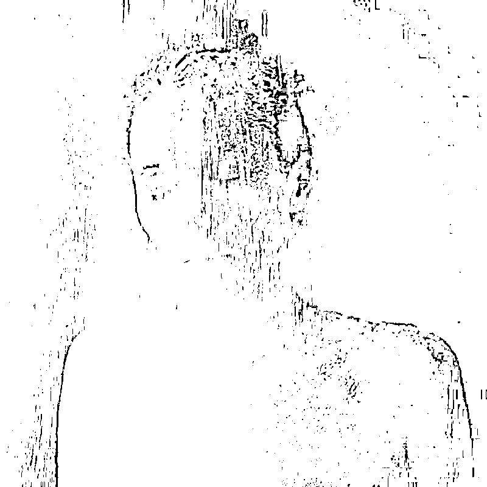

人们往往认为他们的愤怒是由境遇造成的，也就是心理学家所说的触发事件。人们会说，“我发怒是因为前面的司机拦了我的路，”或是“是那个人让我失控的。”言下之意是，是那些人和事情直接导致他们发怒的，而且没有其他缓和因素。当然，我们知道事实并非如此。如果真是这样，那么每个人都会以同样的方式回应这种境遇了。换言之，我们在开车被抢道或受辱时都会做出同样的反应。

**事实证明，我们每个人评估形势都是依据自己的性情和愤怒之前的状态。所谓性情，我指的是天性与教养共同形成的个性/行为。显然作为一名占星师，我感兴趣的是天性的部分，但是我们成长的环境也会塑造我们的天性。父母或祖父母留下的印记也必须纳入考量。**

也许你的太阳星座是金牛座， 这个星座的愤怒是迟缓的，或是天秤座，这是一个和平使者的星座，但是**如果影响你成长的成人常常发火，那么这会影响到你的体验方式和表达愤怒的方式。**

**所以自我觉知需要坦诚地评估自己的天性和自己的家族历史，或是其他的发展影响，比如恐吓或被恐吓，或创伤性的人生体验。**如果你知道自己有愤怒议题，强烈建议进行咨询。

在我列出一些有助于愤怒管理的星座线索之前，让我们谈谈预防和我们“愤怒之前的状态”。简单来说，它的意思就是触发事件发生之前我们心理上的感受。

如果你的前状态是疲惫或焦虑的，那么你更有可能发火。你可能会说，“在他们那样做之前，我心情挺好的，”这也是可能的。但是如果你心情很好，却突然发怒，你可能压抑了对此人或这一局面的愤怒。换句话说，你的压力可能超出你的意识 ，因为压抑的愤怒制造了压力！因此**更好地监控你每日的情绪和心理状态就是预防的关键。**

## 12 星座的愤怒管理

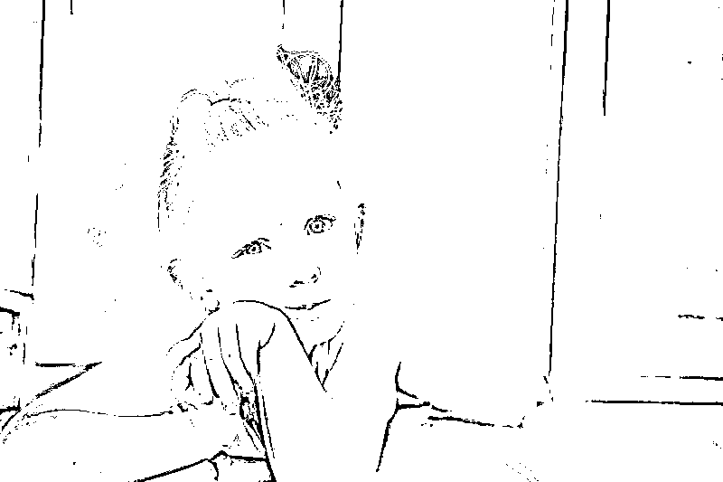

前 方 高 能


**白 羊 座**

你们是出了名的急性子，你们是最不可能囤积愤怒的星座。说到自我觉知，直爽是没错，但是你们的无礼会招来愤怒的敌人，让你们的朋友精疲力竭，所制造的局面随后又会激怒你。**明智地做好防范，当你们的努力获得更直接的结果就可以缓解焦虑。那些带来即时满足的活动，比如身体锻炼，能让你们快乐，这样你们就不会那么容易生气了。**


**金 牛 座**

平静而放松，你们是最慢生气的星座。你们会顽固地抗拒那些逐渐破坏你们舒适的人或局势，直到你们的愤怒像地震爆发，大厦倾覆！那些被你们视作威胁你们生活平静和稳定的人和局势会激发你的愤怒。**明智地做好防范，只要你的努力让你拥有舒适有益的生活，那为何还要发怒呢？**


**双 子 座**

你们的愤怒会让你们说出尖刻的侮辱之词。你们会认为自己太聪明了不会发火，但是当人们无视你或蔑视你的理念时，你会愤怒咆哮。你们积极的思维需要表达和刺激。**满足你们的好奇心可以预防发怒，你们可以通过阅读、交谈、发信息和上网来满足你们的好奇心。**你们需要多样性。无聊和不安会让你们变得焦虑、烦躁，更容易愤怒。

 

**巨 蟹 座**

你们对情绪氛围十分敏感，会对那些威胁到自己家庭、环境和情感依恋的情况做出反应。你们的怒火就像是一阵暴风雨很快会过去。预防措施可以是扮演一个角色创造出更直接的情感满足。**你们感受到越多安全、滋养和你们在乎的感受，就越少陷入愤怒。食物也能帮助你们。**


**狮 子 座**

当你们自尊心受挫，你们很有可能变得愤怒。当你们的权威受到威胁时会感觉好像受到了侮辱。你们生气的声音和怒火表现出你们不那么勇敢的灵魂。**更好地维持你们已经信心满满的角色，能够防止这样愤怒的戏码上演。**害怕表现得懦弱，你们可能去做自己并没有信心的事情，变得害怕嘲笑，被动而愤怒。


**处 女 座**

没有人比你们自己更苛责自己的努力，这让其他人的批评变得更难接受。另外，任何会威胁或打扰你们完成任务的人或事都会引发你们的愤怒。但是，只要你们认为自己的角色是相对不可或缺的，你们就比较少表现出愤怒。**锤炼自己的技能，对自己少一些苛责就能帮助你们预防愤怒。**


**天 秤 座**

即使是最友善的人也有他们的底线。你们厌恶愤怒。你们会为了和平而压抑自己的愤怒，对不良行为包容过久。即使如此，你们还是会因为看到他人被威胁或不安而最终爆发愤怒。你们压抑的愤怒有多少，暴怒的时候就会宣泄多少。**经常坦率待人能够帮助你们不要累计如此极端的愤怒。**


**天 蝎 座**

“不要生气要报复”，你们说。试图用报复计划来疏导愤怒和压抑愤怒一样都是毒药。背叛是你们心底最深的恐惧，你们强烈的愤怒十分可怕。预防？不要无视自己的直觉，这样是对自己的背叛。**将你们的信任交付给那些值得信赖的人，而不是折磨自己，试图去控制那些不值得信赖的人。**


**射 手 座**

微笑、玩笑、大笑，但你们依然会在自己的信念被驳斥时迸发愤怒。你们可能会感觉被自己的愤怒困住了，你们讨厌被困住。所以你们变得更加暴怒，就像是一只猫头鹰竖起了羽毛，看起来巨大而令人害怕！嘿，是什么吓到你们了？是你们可能错了？**如果你们的真理并不需要他人接纳，那你们为何愤怒？坦诚面对这一切，这会防止你们陷入暴怒。**


**摩 羯 座**

是什么让愤怒完美？你对天蝎座“不要生气要报复”的回答是:“成功就是最好的报复。”你们渴望获得尊敬，所以无礼的行为会惹怒你们。你们的愤怒在上升。你们如何在表达愤怒的同时保持尊严？**预防愤怒需要一个计划，这个计划涉及到花点时间去面对你们对失败的恐惧。将这种恐惧视作软弱是你们愤怒的原因。接受它：你们害怕失败只是因为太想获得成功。**


**水 瓶 座**

你们太酷了，才不会发火呢，对吧？你们是天生的科学家，对于所谓的人生体验超然物外。也许你们关心人类，但是你们并不太喜欢具体的人。你们会参与到某些致力于让这个世界更美好的团体中，但是你们并不确定自己想要归属于任何团体，成为其中一份子。是谁拒绝了谁？**参与是必须的，除非你们想要被排除在外，并感到愤怒。**


**双 鱼 座**

又是海边美好的一天，直到海啸来袭！之后，海岸线上充斥着过去和现在的一切纷乱陈杂。你们的愤怒就像是一场海啸，愤怒过后留下一团糟，你们的朋友希望你们能够去寻求治疗。对你们来说**，预防愤怒需要一个敏锐的自我监控系统来防止你们压抑愤怒。这个系统必须有音乐和冥想，有一个创造性的出口。另一个线索，当你们获得灵感启迪， 你们就不会愤怒。**如果感到幻灭， 你们就很有可能怒火中烧。

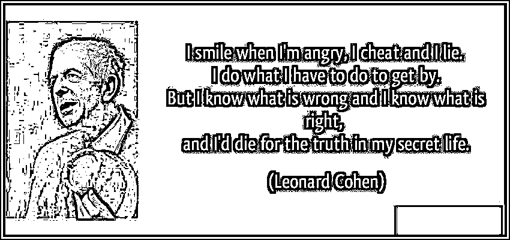

和大家分享一段歌词。我喜欢这段歌词，它出自伟大的词作者**莱昂纳德·科恩**。他是处女座，月亮落在双鱼座（金星与海王星合相）。

*生气时我会微笑，若无其事地掩饰；*

*I smile when I'm angry, I cheat and I lie;* 

*我必须尽我所能来躲避。*

*I do what I have to do to get by.* 

*但我知道对与错，知道是与非；*

*But I know what is wrong and I konw what is right;* 

*在我秘密的生活中，我为真理而死。*

*And I'd die for the truth in my secret life.*

最后，和大家分享佛陀的一句话，它强调了愤怒的业力。

**你不会因为生气而被惩罚，你只会被自己的愤怒惩罚。**


想体验大师级的占星疗愈？

大卫老师**占星咨询**预约进行时

**生命议题、职业发展、关系咨询、少儿成长、年度规划和预测**

```
预约咨询请联系许小姐 ：010-58760529
```

*你是如何管理愤怒的*

*留言让大家学学*

**◆ ◆ ◆  ◆ ◆**

**特别提醒****：若道拥有本文版权，转载请注明“转自若道”并标明作者。**  

如果你很容易感觉到愤怒，是时候看看这份报告了——从 4 月 17 日开始，一直持续到 6 月 30 日，火星这颗代表着愤怒和行动力的行星处在逆行状态。如果应对火星这颗大脾气行星的逆行期？点击“阅读原文”来看看若道最新推出的火星逆行攻略吧。


# 人物专访 | 从长江商学院走出来的若道占星创始人

> 原文：[`mp.weixin.qq.com/s?__biz=MzA5NjA0NTAxNg==&mid=2651384312&idx=1&sn=e0bb6be5aec2cbe0e2e6af35c0c9f8a9&chksm=8b4a5b4fbc3dd25969aac4b10a881353a237d8f94b5db915010ebc67b723ee47dd4ffadefed6&scene=126&sessionid=1692738846#rd`](http://mp.weixin.qq.com/s?__biz=MzA5NjA0NTAxNg==&mid=2651384312&idx=1&sn=e0bb6be5aec2cbe0e2e6af35c0c9f8a9&chksm=8b4a5b4fbc3dd25969aac4b10a881353a237d8f94b5db915010ebc67b723ee47dd4ffadefed6&scene=126&sessionid=1692738846#rd)

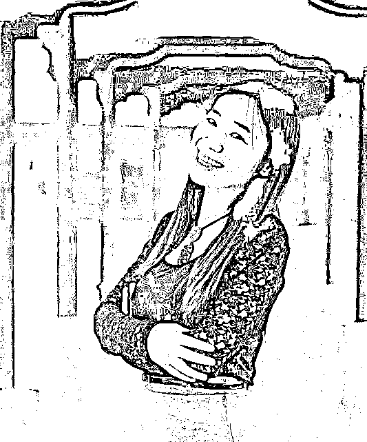

「

人物专访

Her Story

」

她是若道创始人之一，对她所创立的若道，我们并不陌生。然而对于她本人，坊间知之甚少。这也是她第一次面对公众全面解读自己的经历和感悟。如果你也曾觉得自己和别人不同，却又不知为何不同以及该如何坚持这份不同，去保有独特性地找到人生最热爱的人和事物，去看到生命的实相，如果你也愿意探索和感悟人生，我们一起来看看她的感受吧。

访问及整理 | 若道君

图片提供 | nodoor

在公众号后台回复 **蒋颖** 即可阅读她的文集

‍

「 学霸的日常 」

我属于比较适应现代教育体制的人，我的风向星座比较强，因此学习成绩一直还不错。但是和很多死读书的“学霸”不同，我会看很多动画片（哈哈），在高考前为了逃避考试的压力也曾一头扎入武侠小说之中，看得昏天黑地，结果考得一塌糊涂。

同时，现代教育体制也造成我不知道自己喜欢什么，虽然我一直是个好学生，也喜欢读书，但年少时更多是为了让家里为我的成绩感觉到骄傲。

本科，父母为了让我好出国，帮我选了厦门大学化学系，结果我们班的很多同学都出国了，我还在国内，我实在不喜欢化学，也不擅长。然后，我对经济学感兴趣，因此学习了经济学，有幸考上了中美经济学教育培训班（福特班），老师中有获得诺贝尔奖经济学奖的经济学家。后来，我对商业方面又感兴趣，因此进入长江商学院学习。

「 为何我和别人不同 」

我的工作经验主要在金融并购领域，是国内比较早从事并购的人，也曾经和一些同事创建并购咨询公司，做过一家大型集团的投资总监和一家中型软件公司的市场总监。但回想起来，我最怀念的是最早在并购咨询领域的经历，因为那是在我青春懵懂，还不知道什么叫创业的时候的一个创业经历，我非常怀念和伙伴们共同奋斗的时光。我喜欢这种充满激情、共同奋斗的感觉。

我是 2007 年开始学占星， 当时是因为我个人在事业上有一个比较大的挫折感，一个曾经的梦想破灭，而新的梦想尚未出现。我非常苦闷，不知道下一步该怎么走，也不知道自己的人生出现什么问题。一个偶然的机会，我在胡因梦老师的博客上看到了一些克里希纳穆提的文章和书籍，进而又随着她的博客读其他身心灵导师的书籍，这给我打开了一个新世界。我从来不知道有这样的世界，我的人生观几乎被颠覆了。

后来我又看到她提占星学，说这是一门非常深入的学问。于是我开始看一些占星书籍。我想了解自己。想知道为什么我是这样一个人，我会走这样的道路，我的道路和我的同学们为什么如此不同。

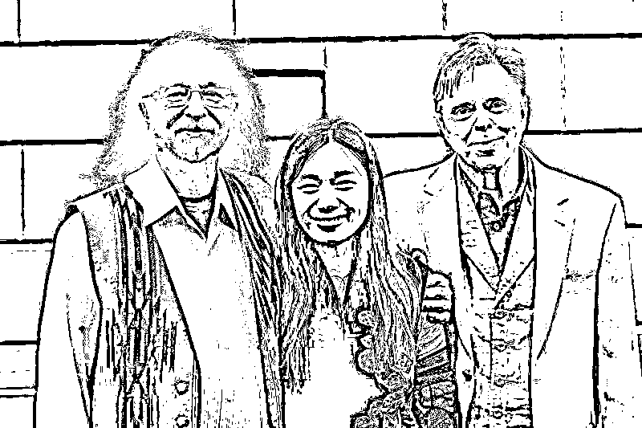
若道占星的两位创始人：

大卫·瑞雷（右）、蒋颖（中）与斯蒂芬·弗里斯特（左）在一起

另外，我想提一句很多占星老师们曾经说的，且他们深有同感的话，最早是现代占星家丽兹·格林（Liz Greene）说的：**“不是你选择了占星学，而是占星学选择了你”**。这好像是说宇宙会决定在某个时间向你打开一些秘密。我现在回想，都觉得非常荣幸，非常非常荣幸。

星图是一个整体，我想我星图中每个元素都对这个结果有所贡献。比如，我的南交守护星月亮落在 9 宫水瓶座、水星在射手座合轴、天王星三分中天水瓶座、水星和土星的对分相、太阳天蝎座、上升双子座等，这些都有所贡献。

「 Nodoor=？」

最开始想到的是英文的名字，我想我要起一个大家容易记忆，琅琅上口的名字。当时和大卫老师及其他一些朋友一起头脑风暴，风暴的结果就是有了英文名字，**Nodoor**。这个名字很好记，而且**大卫老师讲，当我们看向天空和宇宙时，那里没有门，只要想了解，都可以进来。**根据这个英文名字，找中文的谐音，又有了中文名字。

我看到一首诗句：“**大道无门，千差有路；透得此关，乾坤独步。”**我想，那时的我无意中想寻找一条路径，是一条可以通向“道”的路径，但谁知道哪条道路是真的是“道”呢，也许是吧，因此就是“若道”了。

「 我的占星学之路 」

2007 年开始自学，2010 年正式跟着老师研习，2012 年参加 ISAR 职业占星师资质考试获得认证，5 年时间。

占星学给我带来很多很多，可以说感恩不尽。

从事业上而言，在我从并购行业出来后，我经过了很长时间的“流浪”。找不到方向，不知道自己该投入什么。

**我必须做我热爱的事情，否则我没有激情；我需要感觉到我做的事情是有意义的，而且不能仅仅对我个人有意义；另外，这个事业也能够获得经济上的收益，能够欣欣向荣，让和我一起奋斗的人可以有所回报，并且越来越好。**

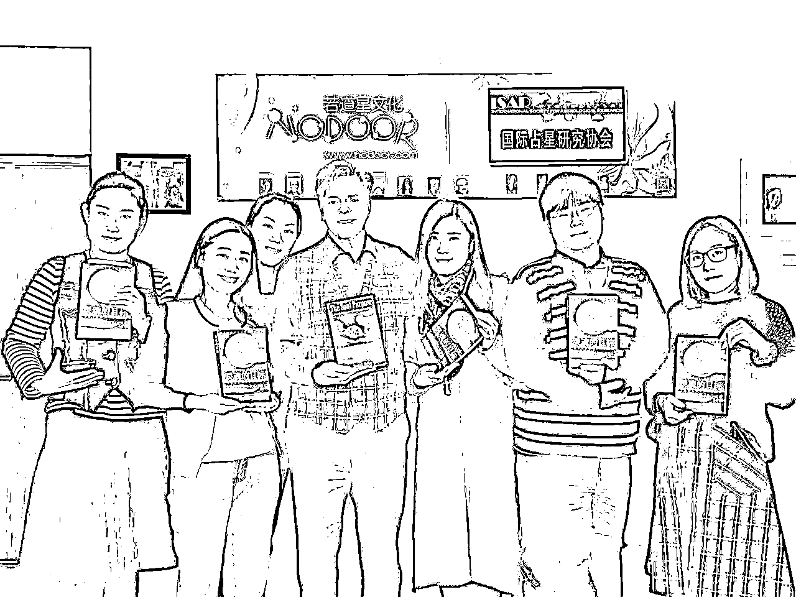
和同事在一起

**而找到占星学之后，我觉得我找到了一个我既热爱，又可以为整个社会做出贡献的事情，我可以为之承诺的事情，而且当我们坚持了 5 年之后，回报也在开始产生。**

**另一方面，因为占星学，我交到了很多好朋友，这也是非常开心的事情。**各行各业、各种各样的朋友，因为同样的兴趣，同样的爱好走到一起来，共同在学习着，分享着，共同成长着，这非常让人开心。

占星学让我更理解这个世界和他人，了解这个世界和他人可能在经验着什么，让我有更广阔的视角。

**对我个人成长来说，更是非常重要。** 我觉得我和宇宙有这么一个联接，就不再是在大海中漂浮的孤单的人，而是有一个地图和灯塔，给我指引，让我知道冥冥中有一种意义存在。占星学又像一个定海神针，哪怕在最困难的时候，因为可以看到那个困难的意义所在，也知道当我跋涉而过后，会得到什么奖赏。占星学让我时不时反躬自省，又让我接纳个人的独特之处。

**我也从我的客户身上学到了不放弃。**每个来找我的客户都没有放弃成长。有的人经历了非常艰难的事情，比我的人生艰难很多。我非常感动，感动他们的努力。**我看到个人可以承受怎样的苦难，也看到这些苦难会变成珍珠。** 

「 什么人适合学占星」

**我从来不认为这会是一个问题，也不认为这是我可以去做评论的事情。占星学是生命的学问，适合每一个有生命的人。如果你适合学习走路、说话，那么就适合学习占星。**

另外，学习，和其他事情一样，是每个人的个人选择，这个选择发乎于内心的声音。占星学想要做的，就是启发每个人去听自己内心的声音，而不是由一个外在的专家告诉你，什么适合，什么不适合。

对大众而言，更重要的问题是：**你感觉到你被占星学吸引吗？**如果是，那么，若道的门就为你们敞开。不论你在这条道路上走得远，还是近，我们会陪伴。

拿我当例子，人生就是在打怪升级，如果满分是 100 分，现阶段的我也许完成了 50 分吧，所以，我还有很多可以期盼的东西。

蒋颖老师主讲的

若道核心课程 Level 1-Level 2

（小白也适用）

报名中

点击**阅读原文**获取更多信息

还可以在后台回复 蒋颖

阅读更多她的文字和故事


# 周五免费微课 | 若道大 BOSS 教你玩转占星学，打败生活里的小怪兽

> 原文：[`mp.weixin.qq.com/s?__biz=MzA5NjA0NTAxNg==&mid=2651384312&idx=2&sn=98a1aa5e9c6bfe4f62dd1eeb11b58564&chksm=8b4a5b4fbc3dd259a5a2821bff0b95d76ff7d05b62238a6867fbf18386a71d536be17d2d784c&scene=126&sessionid=1692738846#rd`](http://mp.weixin.qq.com/s?__biz=MzA5NjA0NTAxNg==&mid=2651384312&idx=2&sn=98a1aa5e9c6bfe4f62dd1eeb11b58564&chksm=8b4a5b4fbc3dd259a5a2821bff0b95d76ff7d05b62238a6867fbf18386a71d536be17d2d784c&scene=126&sessionid=1692738846#rd)

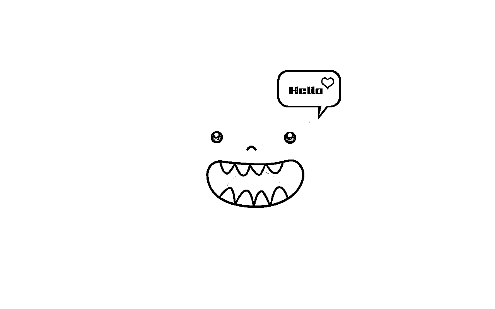

「**占星学在爱情中可以打怪兽**」

▼

天底下再没有什么事比爱情让我们操心的了。

我们因为“误解”而相遇，因为“了解”而分手。

「**占星学在工作中可以打怪兽**」

▼

古话说“男怕入错行”，现在男女其实都怕入错行。

这不仅仅是金钱的事，还有关成就感和快乐。

要惩罚一个人，

就让他/她一天 8 小时做着既不擅长也不喜欢的事情。

「**占星学可以教你如何对付熊孩子**」

▼

你的父母了解你吗？

他们的不了解给你童年带来了什么样的时光？

「**占星学帮你打败重复出现的心理大怪兽**」

▼

上了一堆身心灵的课程，花了一大堆钱，

可是总有不断让你烦恼的问题冒出来，

个人的成长有没有一个尽头？

心理学给你一种答案，

佛学给你一种答案，

哲学给你一种答案，

如果你了解占星学，对这个问题，

你可能有更深刻的理解。

若 道 君 喊 你 来 看 

免 (tong) 费 (guan) 微 (mi) 课 (ji)  啦

▼

这次微课你可千万别错过 

若道星文化联合创始人 蒋颖老师 亲自坐阵

给大家讲讲怎么玩转占星学

来对付生活里各种小怪兽

教你如何打怪升级

掌握通关秘籍

解锁优质人生

蒋颖老师的时间很贵的耶

有没有觉得自己赚到 

在后台回复「蒋颖」就能查看她的所有文章

看过后你一定会爱上她哒

/文末还有蒋颖老师的独家介绍哦/

想要了解更多微课内容

长按文末二维码关注「若道公众号」就可以啦

最最最重要的事情说三遍

占星学小白也可以听的课

占星学小白也可以听的课

占星学小白也可以听的课

想知道自己的占星水平如何？

点击链接「[占星知识小测试](http://mp.weixin.qq.com/s?__biz=MzA5NjA0NTAxNg==&mid=403697159&idx=2&sn=e4ab5b3f62dc73c70c59d51d0bfcf041&scene=21#wechat_redirect)」来测一测吧  

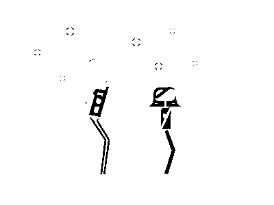

**活 动 时 间**

▼

2016 年 4 月 15 日周五

晚上 8 点-9 点

**活 动 形 式**

**▼**

微信群活动

45 分钟语音授课

15 分钟互动问答

**怎 样 报 名**

**▼**

统共分三步

第一步

转发本文到你的朋友圈

并注明“我是 XX 星座报名参加”

第二步

长按客服二维码【见下图】添加为好友


第三步

将朋友圈转发截图发给客服

**是将截图发给客服**

**而不是发给若道君**

**也不是在本文后面留言**

**一定要记住哦**

「添加时备注“通关秘籍”

我们会在**4 月 15 日下午三点**

统一邀请大家进群哦」

蒋颖老师何许人也

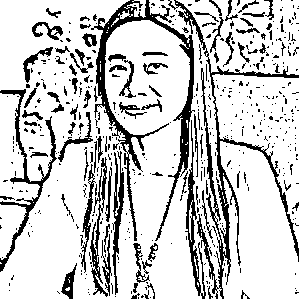
**蒋颖（Felicia）**

若道创始人，职业占星师。在若道系统学习占星，师从大卫·瑞雷。长江商学院 MBA，厦门大学经济学硕士，化学学士。国际占星研究协会（ISAR）中国区副主席。第一批获得国际占星研究协会（ISAR）认证的职业占星师。《灵魂的目标》译者。

**<投票>**

📹 /mp/newappmsgvote?action=show&__biz=MzA5NjA0NTAxNg==&supervoteid=3268907#wechat_redirect

还想听什么类型的微课

留言吧


# 深度好文 | 如果生命只剩五年时光

> 原文：[`mp.weixin.qq.com/s?__biz=MzA5NjA0NTAxNg==&mid=403892891&idx=1&sn=8a68b2e3660f4cfc2cb70968a7b9ac36&chksm=0d50582c3a27d13af605eb44510c652bc174ed53e072054176dbebf408b8d5ed22d27ff05bd3&scene=126&sessionid=1692738846#rd`](http://mp.weixin.qq.com/s?__biz=MzA5NjA0NTAxNg==&mid=403892891&idx=1&sn=8a68b2e3660f4cfc2cb70968a7b9ac36&chksm=0d50582c3a27d13af605eb44510c652bc174ed53e072054176dbebf408b8d5ed22d27ff05bd3&scene=126&sessionid=1692738846#rd)

作者/Anastasia 图片/VCG

什么是恩宠？恩宠就是双鱼座的能量。恩宠是大我，大我无处不在。我们并不需要向外追寻。我们只需要认识到它的存在。万事万物都是一体的。

什么是勇气？勇气就是白羊座的能量。通过勇气和行动，人最终变成的其实是自己早已具备的状态。所有的行动，只是为了去除我们被现实苦难所限的错误印象。

## 疾病和死亡只是一种存在


▲

《恩宠与勇气》/肯·威尔伯

很早就看过《恩宠与勇气》，然后束之高阁。几年前有个朋友得了场不大不小的病，曾想把这本书送她，可又怕她问这书是写什么的？我不知怎么开口告诉她这是一本记录与癌症抗争的书，但结局并不美好。犹豫再三，这本书还是在我的书架上静静地躺着。

白羊月的机缘巧合，又重新翻开了这本书。合上书，我想我已经有勇气推荐它给任何人了。疾病和死亡，本身并没有什么价值判断，它们和我们生活中发生的所有事情一样，只是一个存在。就像一座山，它们在那里，没有好坏。而我们的文化却赋予它们太多的意义，恐惧、希望、故事、评判……足以令人谈及色变。人类从出生开始，就被各种价值和评判和意义所包围，似乎没有价值，找不到意义，就无法存在。

## 初相遇——从海中孕育出了火焰

说到存在，我们就是在说白羊座。白羊座是黄道星座的第一个，是星图上十二宫位的第一宫。如果你多少了解一些占星学，你会知道每一个星座都是对前一个星座的补充和修正，它们是完全不同的。

**十二星座从白羊座开始到双鱼座结束，然后再从白羊座开始新一轮的演化。宇宙依时序，从双鱼座的汪洋中孕育了火一样的白羊座。**

双鱼座是模糊随缘的，允许事情自然地发生，随波逐流，不抓取更多，不渴望更多。就像遇见肯之前的崔雅，美丽、能干、独身，在经过自我质疑和担忧后，本来已经安适地接纳了自己的状况。

崔雅在写给友人的信中说：“直到遇见肯，我才发现，原来自己早就坚信再也找不到一个想嫁的人了。坚信自己会以这种古老的、舒服的、独立的方式终老一生。”

而肯也在第一见面后就意识到，“我找到她了，是的，我找到她了”。

两人都在寻找某些科学无法提供的东西，都在灵修，都在试图自证圆满。两人遇见了，感觉又如此相像，仿佛命运做好了所有的安排。**自古以来，爱情就是转化自我，升华人生的催化剂。灵性的觉察，浪漫的相遇，美好的结合，故事的开始充满双鱼的能量，梦幻得像一个完美的新世界。**地平线上只有一件事情，就是幸福快乐的生活。 

## 灵修有用么？——找到病痛的意义

地平线上的新世界，我们看到了白羊的能量。芽从土壤里冒出来，每一个都是独一无二的个体。我们也知道所有的开始都充满了冲突和挑战。

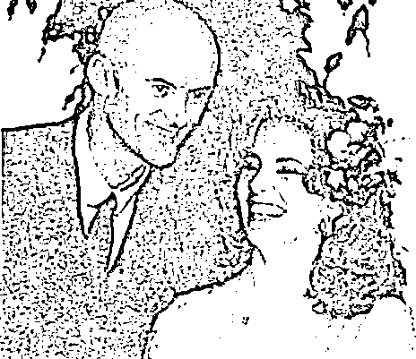 

崔雅和肯相识十天后决定结婚，婚后两周，崔雅确诊患了乳癌。

崔雅十三岁时就有过神秘体验，一直在灵修，而肯更是研究意识和后人本心理学的专家，著作等身。面对如此灾难，两人也如同所有普通人一样，经历了茫然失措，恐惧、愤怒、自怜、反省为什么是我、讨论接下来该怎么做的各种阶段。

看到这里，我们不禁会质疑——

*   灵修到底有什么用呢？

*   如果灵修只是让人们活在一个想象的神秘世界中，脱离生活现实，它并不能帮我们抗拒人生中的各种挫折和打击，修行到底有用吗？

*   这里我们质疑的是双鱼的低阶能量。

在震惊过后，两人终于为癌症找到了意义，**在灵性层面上实践内观修行，在哲学层面上观察死亡，在心理学层面上更加接纳自己善待他人，在生活层面上改变生活方式。**不是因为癌症，而是因为他们需要改变。从此，他们开始漫长而艰苦的治疗。

## 比起占有，爱更多的是失去

他们取消了蜜月旅行，开始了五年的治疗之旅。他们选择了主流治疗，切除部分肿瘤并且进行放疗。

崔雅意识到了她身上的阳性价值观，就是总要去做点什么，她无法什么也不做，只是存在。与之相反，阴性价值观却是拥抱当下，接纳每一个人，不是因为他们做了什么，而是因为这个人本身。这是崔雅一生最重要的议题，也是白羊座代表的生存意志的重大议题，病痛让它变得分外清晰。

崔雅意识到，她会沮丧，是因为她不知道为什么自己会得癌症，可是她也因此而意识到自己必须做的改变是什么。**和活下去的意志力同样重要的是学习放下、臣服、随顺因缘而不加以抗拒。存在和做，抗争和臣服、意志和接受，他们一而再，再而三地讨论这个平衡的议题。**肯爱崔雅，但崔雅可能死去。这样的状况一直提醒肯，万事无常，只有通过静修和觉察，才能超越个人的牢笼，尝到圆满的滋味。肯慢慢明白，爱不是占有，爱更多是失去。

## 看见情绪，地平线再度诱人

一年后，崔雅的癌症复发了，她选择了切除一侧乳房，接受激进的化疗，并且开始尝试另类疗法。病情的反复，崔雅甚至产生了自杀的念头，“去你的生命，我不想被你再摆布了”。

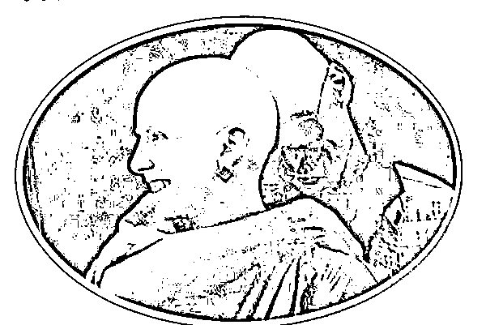

这场磨难开始升级，崔雅的阴影面开始浮现并且强化，肯也越来越沮丧。但同时，他们的觉知也开始提升，“如果你能明白你并非自己的忧虑的时候，那些烦恼和忧虑就不再威胁你了。因为你已经完全与它无关了。你不在惧怕、反抗或逃避它。你完全接纳焦虑，并且允许它自由活动”。

**那些情绪并不是你，因为你能看见它。超越它们，未来仍然光明。**为了陪伴崔雅，肯放弃了写作和编辑工作，也停止了静修。结束化疗后，两人搬入了塔霍湖的房子，生命的地平线再度变得清朗诱人。

## 转变需要放下意志

然而还是有些东西改变了。身体上的痛苦容易忍受，心灵上的痛苦却无穷无尽，让人无处可逃，无法喘息。从痛苦中生出的是憎恨、愤怒、荼毒和责难。潜藏在二人心底的恐惧和愤怒再次浮现，崔雅变得顽固专横，肯变得尖酸刻薄。

肯觉得自己的生活已经完全无法自主，因为崔雅握有金牌：“我有癌症。”一次激烈的争吵之后，肯打了崔雅。这件事情的爆发让两人看到了深藏在心中的绝望。崔雅开始了深沉的自我转变，从“做”转变成了“存在”。

她持续做静修练习，重拾惊人的平静与定力。她曾经认为自己如此与众不同，而现在却意识到，“自己并没有什么不同之处，我的问题和无数个世纪以来的人类企图解决的问题是一样的。”她生出了一种深层的谦卑感，一种与其他人联结得更强烈的感觉，这意味着，她不再与其他人疏离或孤立。这转变让她更随缘、更开放。“有点像恩宠的味道”她说，**“意志力可以帮助我们培养觉知，但要有真正的转变，意志力反而是阻碍。”**

疾病带给崔雅的第一个力量是战斗意志，这是白羊座的能量，而第二个力量则是臣服，这是双鱼座的能量。宇宙再次指引她，请走这条路。她不再充满斗志，肩负一切，而是放开自己，让一切穿过。一次完美的觉醒，不是吗？

## 努力生活，但并无执着

但考验并未结束，崔雅发现自己得了糖尿病。**长青哲学的大问再次浮现，“为什么是我？”答案似乎是：“为什么不是你？”**

**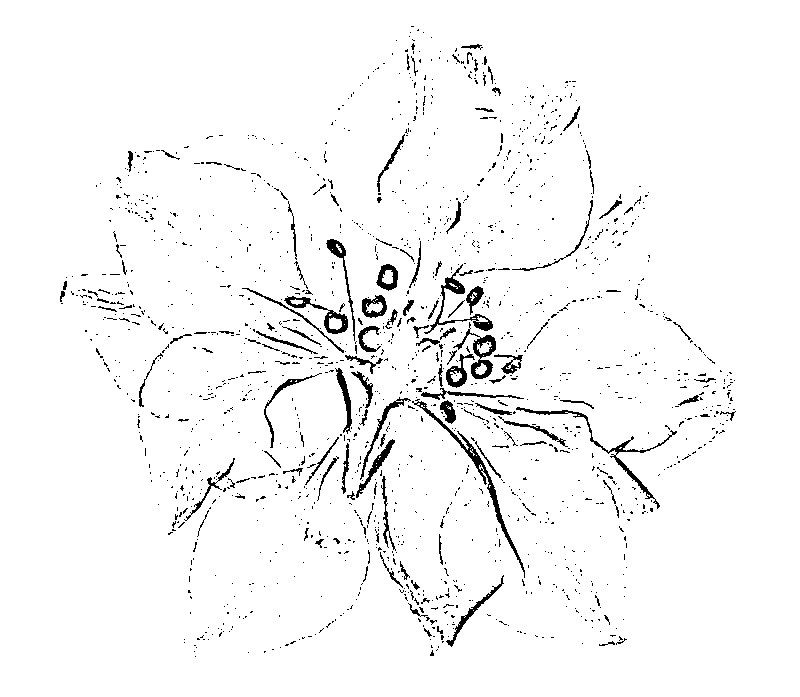**   

这一切什么时候是个头？短暂的沮丧和忧郁后，崔雅的内心再次发生巨大的转化。她发现了自己真正喜欢做的事情，手工创造和帮助人。她对疾病的态度更加慈悲。她仍然会发脾气，抱怨和自怜，但是她的感受不再那么强烈，甚至觉得这些情绪有些乏味。她知道自己真的有进展了。

崔雅的癌症又复发了。但这一次，她非常的平静与放松，甚至没有因此而落泪。她没有抱怨、逃避和险恶，如果说有的话，也只是一些情绪的起伏。她感觉到老旧的自己已死，全新的自我正在诞生。**“因为有些奇妙的事发生了，过去的我背负的恐惧、重担，现在都已离我远去，虽然我不知道它们是在何时、以何种方式离去的。”**

肯恢复了工作。崔雅的癌症在肺部和脑部又复发了。他们选择了最激进的化疗。崔雅活下去的意志足够坚强，但是她已经不执着于结果。她意识到，“痛苦不是惩罚，死亡不是失败，活着也不是一项奖赏。”她保持了稳定和喜悦。**崔雅又经历了一次内在的转变，她统合了“存在”与“做”，并使它们更和谐地表现出来，她为之起了名字，“热情的静定”。意思是对人生的每一个面向都充满热情，对每一个生命都有最深的关怀，但是没有丝毫的执着。**

**意志并不是一种努力，而是一种允许，允许灵性的来临和恩宠的流入。接纳并不是不行动，而是真正的行动，其中并没有努力。**“我不能迫使生命有意义或变得公平。”崔雅如是说，“我愈是能接受生命的本然，包括所有的哀伤、痛苦、磨难与悲剧，愈是能得到内心的安宁。”

崔雅最终安然离世。**五年的时间，崔雅对待癌症的态度从抗拒、抗争、接纳倒热情的静定，经历了层层的反复和提升。她用恩宠和勇气告诉我们，活着不是一种奖赏，死亡也不是一种惩罚。**

## 出生不是起点，死亡不是终点

从双鱼座到白羊座，从白羊座再到双鱼座，是一条完全不同的路。每一次回到起点，都是更高一个层次上的开始。你不可能一直停留在终点，你必须主动往前走，或者被推着往前走。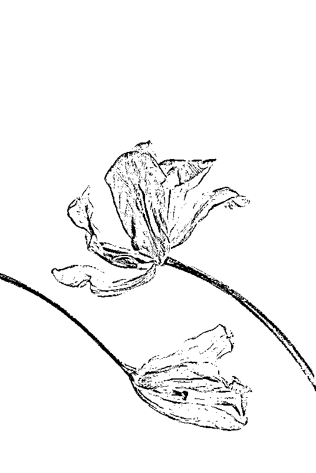

**灵性的修行永远和真实的体验相关，就像喝一杯酒，看一次日出，聆听巴赫的音乐，看梵高的画，你必须去体验，才能了解那是怎么一回事。**

但是，当你有过一次灵光乍现，你就会更艺术地对待生活。因为你已经知道，在这日常琐碎的背后会有什么。去做任何对你有效的事情，阅读、写作、跑步、烘焙、绘画、摄影……它们会帮助你认清你的初心，认清它其实是和宇宙的精神合一的。

出生不是起点，死亡不是终点。生命是一场自然的疗愈过程。黄道十二星座是螺旋上升的进化时序。**白羊座是一个崭新的开始，双鱼座是再一次的孕育。成、住、坏、空，一个世界建立、持续、破坏，又转变为另一世界之成立、持续、破坏。生命周而复始，万象更新变幻，生生不息。**

崔雅用自己的亲身经历告诉我们，前进、后退、再前进，要过一个智慧的、有觉知的生活，只有反复磨练和体验，在旧的经验上螺旋提升，没有别的秘诀。


**作者简介**

**Anastasia**：职业占星师，国际占星研究学会 ISAR 会员，若道认证生时校正占星师。太阳射手座，月亮狮子座，上升处女座，擅长讲述个体星图后面隐藏的人生故事和意义。在若道跟随多名国际占星师学习严肃占星学多年，目前从事占星咨询工作。

**个人微信公众号平台**：midnight2evolution

长按二维码，让金钱涌向传播知识与智慧敌人~


**◆ ◆ ◆  ◆ ◆**

******特别提醒************：本文由作者授权首发于若道******，**转载请注明“转自若道”并标明作者。******

占星学是一门关于灵性的学问——**2016 年 5 月 19 日**，蒋颖老师主讲的若道占星核心课程**Level 1-2**要开课了！她将带领你学习星座、太阳、月亮、行星、月亮交点等知识，让你进入占星学的世界！

报名及咨询，请点击文末“阅读原文”


# 塔纳斯 | 到底什么是“原型”？

> 原文：[`mp.weixin.qq.com/s?__biz=MzA5NjA0NTAxNg==&mid=403892891&idx=2&sn=0d5aecb6a7e038f7a8f3b2efa9eb9860&chksm=0d50582c3a27d13a724afeab2852556dd297a6d8d55c01a00f2576fc3d210a481dcc82878a13&scene=126&sessionid=1692738846#rd`](http://mp.weixin.qq.com/s?__biz=MzA5NjA0NTAxNg==&mid=403892891&idx=2&sn=0d5aecb6a7e038f7a8f3b2efa9eb9860&chksm=0d50582c3a27d13a724afeab2852556dd297a6d8d55c01a00f2576fc3d210a481dcc82878a13&scene=126&sessionid=1692738846#rd)

作者/理查德·塔纳斯

译者/Luke  校对/轩轩  图片/VCG

理查德·塔纳斯的[原型占星学课程](http://mp.weixin.qq.com/s?__biz=MzA5NjA0NTAxNg==&mid=403401654&idx=2&sn=a786c22055b0b60dd19b02f13e3c5d06&scene=21#wechat_redirect)（点击可阅读）即将在 5 月 14 日开课。有关原型占星学的内容，若道君发布过好几次，但“原型”究竟是什么？今天我们来听男神好好讲讲这个话题。

**塔纳斯如是说**

**出生星图展示了一个人出生时天空的模样。**太阳、月亮和行星在星图上的位置反映了它们环绕地球的实际位置。比如说，太阳符号在星图上的位置反映了案主在一天中的哪个时间段出生——如果生在正午，太阳将会处于星图的最高点（叫做中天）；如果生在黎明，太阳将位于星图的左侧接近地平线的位置（叫做上升）。

星图和实际天文现象的区别在于，**星图只有两个维度**，而不是三个。它不会反映行星和地球之间的距离，它反映的是**出生时在出生地，所观察到的行星和地球之间的精准角度关系模式。**

占星学的基本原则是，**每颗行星都代表了特定的原型力量或法则**，影响着人类的世界。**天上行星形成的模式和地上人们生活的模式息息相关**。对于每个个体来说，其出生时的时间和地点反映了他们人生和性格中的基本原型模式。

**占星学使人们有机会更加了解自己的生命。**它的周期、高潮与低谷、危机和突破、重大变化和转化的时期，都写在了行进星图上。

**行进指的是：相对于出生时行星的位置，当下天空中的行星位置构成的特定几何图形。**

**这些图形的特性，即所涉及到的**行星及其位置**，几乎总是**与当时人生体验**的**原型特性一致。****

首先，我想要谈论和占星学息息相关的三个重要元素。

**原型占星学的三个基础元素**

①原型的本质

②决定论和自由意志的取舍

③占星学的因果机制，或占星学为什么有效

这三个元素紧密相关。

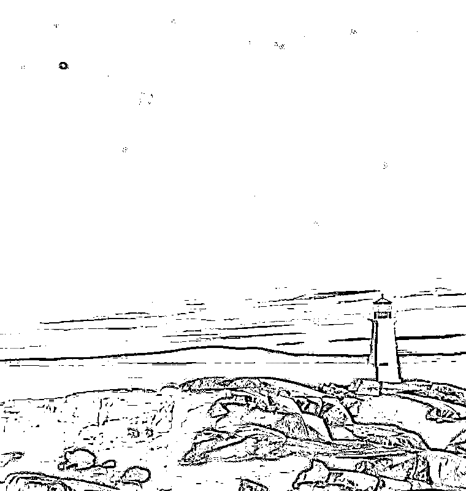

**1**

什么是原型？

有许多种理解和描述原型的方式。事实上从柏拉图和亚里士多德起，西方思想史一直在关注这个问题。不过为了简单起见，我们可以将**原型定义为宇宙法则或宇宙力量，影响力无处不在，并在许多层面上构建和推动人类心灵和人类行为**。你可以和弗洛伊德一样，将原型看做原始本能。或像柏拉图一样，将其看作超验的第一原则，或像詹姆斯·希尔曼一样，把它们当成心灵的神祗。

原型，比如金星或火星，似乎有种超脱、神秘的特质，不过它们也有特定的心理表现。比如**金星代表渴望爱和美的体验，而火星代表充满力量的活动或侵略战斗的冲动**。此外，**原型活跃于内外两个层面，既可以表现为内在心灵的冲动和影像，也可以化身为外在世界的事件和情境。**

荣格认为原型是人类心灵的基本组成部分，超越文化边界，为全人类所共享。他将原型看作集体无意识的表现形式。更早些时候，柏拉图哲学认为原型不仅是心理的，同时也是宇宙性的和客观存在的，是宇宙心智的原初形态，超越人类心灵。

占星学似乎既支持柏拉图也支持荣格的观点，因为它证明荣格的原型不仅体现在人类的心理、经验和行为，同时也和大宇宙本身联系到一起（即行星及其运动）。因此占星学支持“宇宙灵魂”这个古老的概念，或称世界灵魂，人类心灵也是它的一部分。根据这一观点，荣格所称的集体无意识最终也是宇宙本身的一个单元。

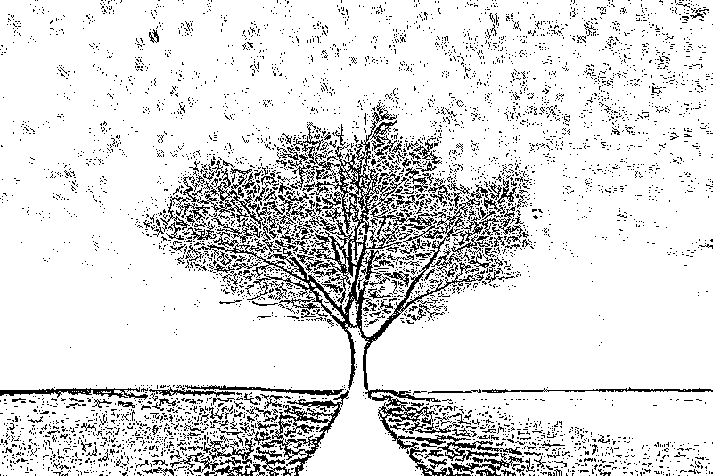 

**2**

自由意志 VS 决定论

过去人们相信占星学揭示了一个人注定的命运，出生图的昭示绝对无法避免。然而如果理解得当，**占星学会极大地促进而不是限制个人自由**。部分原因是：对出生图中原型结构意义的觉知会帮人更有意识地实现自己最深的潜能和本质。

占星学的启蒙特质还源于一个事实，那就是**如果我们越能了解影响我们生命的原型力量，就越不受它们的束缚，就越能得到自由**。

如果我们对这些力量毫无知觉，就会变成它们的傀儡：我们会受到无意识的动机驱使，不知道到底发生了什么。如果充分觉知这些原型，就能以自主和自觉的姿态回应。

自弗洛伊德和荣格开始，这就成为了深度心理学的全部理论根据：用意识之光照亮无意识的黑暗，不再盲目行动，探索和体验人类心灵中的隐藏力量。**占星学最大的价值在于，它精确地指出每个人受何种原型的影响最为重大，这些原型之间以何种方式互动，以及它们最有可能在生命中以何种方式显化。**

说到这里，就不能不谈谈出生的问题。我们的出生图上的行星组合，有多少是命运的旨意？又有多少是随机的成分？我个人相信我们出生的环境不是偶然的，而且在某种意义上是业力和灵性品格的产物。和许多其他人一样，我开始相信是我们自己选择了生命的境遇、投生的家庭、文化背景和时代。而且这个选择是某个高层的灵性自我决定的，我们通常对此毫无意识。

从这一观点来看，出生图不再是命运的牢笼，而成为了我们潜能的蓝图，显示了我们此生携带的天赋和必经的试炼。**占星学为我们揭示了深深影响我们生活的基本原型动力，而这并不意味着我们的人生是注定的。**因为我们如何回应生命的情境，很大程度上是无法预测的，我们有着潜在的自由。

此外，占星学让我们能更加了解我们的基本原型结构以及时机，对于出生图和行进的了解也能大幅度扩大我们的选择范围，让我们能以更加灵活和智慧的方式应对人生。因此，研习占星学其实会使我们更加自由。

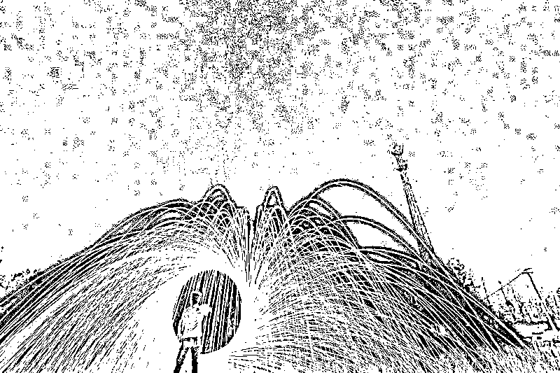

**3**

因果机制

最后要谈的是因果机制——占星学的工作原理：对我来说，行星发射某种物理辐射，机械地影响人类事务的观点略显荒诞。行星和人类的同时性联系太过宏大、复杂，具备微妙之美和无穷的创造力，以至于无法单纯用物理因素解释。

我相信另有更加合理全面的解读，那就是**存在一个全息模式，贯穿宇宙的各个层面，使得行星运动和人类活动之间存在有意义的共时性关系**。正如这条密意格言“天上如是，地下亦然”，宇宙的各个部分整合起来形成了一个有智慧的整体。

根据这一观点，**行星本身不是引发我们人生事件的原因**，就像钟表的指针不是导致现在是晚上 7:30 的原因一样。**行星的位置只不过指示了此时此刻原型力量的宇宙状态而已。**

行星恒常地成为宇宙状态的精确指征，表明宇宙的秩序比传统信仰所认为的更加广博深奥。因此最好认为特定行星模式和人类体验之间具备有意义的联系，而不是单纯的线性因果关系。

然而，占星学也存在某种意义上的因果关系，但这是在原型层面的因果关系（类似亚里士多德的形式原因和最终原因）。虽然行星本身和人类体验只有**共时性的联系**，但这些体验终归是被相关的行星原型所影响、塑造、推动、引发的。从这一意义上讲就可以说，比如土星原型以特定的方式“影响”了某个人，或者“掌管”了某类体验。

但是为什么宇宙要将行星模式和人类生命中的原型现象建立联系？这个问题有许多种可能的答案，其中之一是宇宙具备美学本性，生来喜欢看到数字的天文学和神话的诗歌联姻。但从一个更实际的人类角度来看，我感觉**占星学是一种宇宙的密码**，等待人们解读，以便更好地了解自身和世界，重新发现我们与宇宙的深层连接，从而成为更完整的人类。

**敬请关注若道君之后的推送**


下一篇我们讲原型占星学中的行星**课程信息**

**** 

**课程名称：**原型占星学（ISAR 选修课之一）

**讲师：**理查德·塔纳斯

**开课时间**：2016 年 5 月 14 日

**授课时间**：每周六上午 10：00-12：00，共 8 节课 16 课时

**费用**：6800 元 (4 月 16 日前报名可享受早鸟价 5800，若道老学员 4800）

**授课形式**：网络在线授课（英文授课，中文翻译）

**课程负责人**：李老师、熊老师

**微信号**：2847613491（请备注原型课程报名咨询）

你想了解的原型占星学在这里：

[有关原型占星学你最想知道的 12 个答案](http://mp.weixin.qq.com/s?__biz=MzA5NjA0NTAxNg==&mid=403602107&idx=2&sn=23e3625cf81a820c2ac5cd72d59f70f7&scene=21#wechat_redirect)

**◆ ◆ ◆  ◆ ◆**

**特别提醒****：若道享有本文授权，转载请注明“转自若道”并标明作者。**  

**2016 年 5 月 14 日**，西方著名文化历史学家、研究原型占星学 30 年余年的**理查德·塔纳斯**将为我们打开**原型占星学**的大门。

课程详细内容请点击文末”阅读原文“


# 原型占星学 | 早鸟价只到 4 月 16 日哦

> 原文：[`mp.weixin.qq.com/s?__biz=MzA5NjA0NTAxNg==&mid=403892891&idx=3&sn=48444517c18d7545c1a9cbeedc410ae1&chksm=0d50582c3a27d13a56aba1ac1bb76685b5ee91364a0f8eb39d884c970a1481bbd7c8f6a89622&scene=126&sessionid=1692738846#rd`](http://mp.weixin.qq.com/s?__biz=MzA5NjA0NTAxNg==&mid=403892891&idx=3&sn=48444517c18d7545c1a9cbeedc410ae1&chksm=0d50582c3a27d13a56aba1ac1bb76685b5ee91364a0f8eb39d884c970a1481bbd7c8f6a89622&scene=126&sessionid=1692738846#rd)


**男神驾到！！！**

童鞋们！！！

小板凳搬起来！小巴掌拍起来！气氛嗨起来！

毕业于哈佛大学的若道新晋男神

旧金山加州整合大学心理学和文化历史教授

**理查德·塔纳斯**的原型占星学要开讲啦！


**课程信息**

**开课时间**：2016 年 5 月 14 日

**授课时间**：每周六上午 10：00-12：00，共 8 节课 16 课时

**费用**：6800 元 (4 月 16 日前报名可享受早鸟价 5800，若道老学员 4800）

**授课形式**：网络在线授课（英文授课，中文翻译）

**课程负责人**：李老师、熊老师

**微信号**：2847613491（请备注原型课程报名咨询）

**课程简介**

占星学的基本原则是，**每颗行星都代表了特定的原型力量或法则，影响着人类的世界。**天上行星形成的模式和地上人们生活的模式息息相关。对于每个个体来说，其出生时的时间和地点反映了他们人生和性格中的基本原型模式。


占星学使人们有机会更加了解自己的生命。它的周期、高潮与低谷、危机和突破、重大变化和转化的时期，都写在行进星图上。行进指的是相对于出生时行星的位置，当下天空中的行星位置构成的特定几何图形。这些图形的特性所涉及的行星及其位置，几乎总是与当时人生体验的原型特性一致。

因此了解原型对透彻理解和运用占星学格外重要。那么，**什么是原型？什么是原型占星学呢？它在我们的生活中是如何运作的呢？**西方著名文化历史学家、研究原型占星学 30 年余年的**理查德·塔纳斯**将为我们打开原型占星学的大门。你关于原型占星的诸多疑问都将得到解答。在这门课上，**我们不仅会学到理论知识，还会在各种示例中感受到原型的力量和它的运作，音乐、视频、图像也会是这些示例的一部分**。

**男神来了**


**理查德·西奥多·塔纳斯**

出生于 1950 年 2 月 21 日，是一位文化历史学家，凭所著的《西方思想史》（*The Passion of the Western Mind: Understanding the Ideas That Have Shaped Our World View*，繁体版译为《西方激情的心灵：理解那些曾塑造我们世界观》） 和《宇宙和心灵的思想：新世界观的宣言》（* Cosmos and Psyche: Intimations of a New World View *）而广为人知。塔纳斯在加利福尼亚整合学院担任哲学和心理学教授，是哲学、宇宙论和意识专业的研究生项目创始人。

## 不知道男神是谁？那你 OUT 了 点击下方图片阅读文章


* * *

 **[**塔纳斯：天冥四分威力将持续到 2020 年**](http://mp.weixin.qq.com/s?__biz=MzA5NjA0NTAxNg==&mid=402587687&idx=1&sn=d81ed86727c7b561dc487374c5846935&scene=21#wechat_redirect)**

* * *

**课程安排**

**>>>>**

**授课重点**

☆ 原型占星学的基础

☆ 实际应用（用于自我认知、从容生活、情感关系、心理治疗）

☆ 更大的意涵（哲学的、宇宙的、历史的）

**>>>>**

**知识点**

☆ 一致性的基本形式：出生星图、个人行进、世界行进

☆ 占星学如何运作，共时性的角色

☆ 占星学中的命运和自由意志问题

☆ 原型的本质/基本特征

☆ 行星的意义以及它们的组合

☆ 主要相位

☆ 如何把握一张出生星图最重要的主题

☆ 评估个人行进

☆ 评估世界行进

☆ 重要的是认识到原型的多元性，以及在共同创造性地展现我们出生星图和行进的潜能的过程中我们所扮演的角色、所具有的力量和所肩负的责任。

**第一次课：5 月 14 日**

开课欢迎致辞

介绍我们将在该课程中涵盖的内容

占星学和心理学如何互相启发，互相增强

我的占星学之旅

是什么让原型占星学与众不同

课堂讨论，提问与回答

**第二课：5 月 21 日**

原型占星学的基本概念框架

运作方式：因果关系和共时性的议题

命运和自由意志

理解原型

**第三课：5 月 28 日**

行星的意义，从发光体太阳、月亮开始，到水星、金星、火星、木星、土星

**第四课：6 月 4 日**

外行星天王星、海王星、冥王星：“银河使者”

**第五课：6 月 11 日**

观察运转中的行星，第一部分：艺术、音乐、电影、喜剧（指定的电影）中的示例

**第六课：6 月 18 日**

观察运转中的行星，第二部分：艺术（指定的电影）中的更多示例

**第七课：6 月 25 日**

个人行进，以及如何带着占星学的觉知投入到生活之中

**第八课：7 月 2 日**

世界行进，以及以占星学更宏大的哲学意涵来理解我们在历史上所处的时刻

**>>>>**

**学员要求**

具备若道核心课程 Level3 的基础


**>>>>**

**如何报名**

请点击文末“阅读原文”立即报名，以及在线完成学费支付

咨询请打电话**4006191014 **或 **课服 QQ：4006191014** （若道星文化）

或直接写信给**nodoor@vip.126.com**，我们会回复您的疑问

长按二维码添加课程负责人咨询~

****

报名请点击文末“阅读原文”

# 顺势疗法的药物安全吗？（上）

> 原文：[`mp.weixin.qq.com/s?__biz=MzA5NjA0NTAxNg==&mid=403873640&idx=2&sn=5769ed2ca836bd191f51bca708a0bcb3&chksm=0d502ddf3a27a4c96f364195a58b697a08997568cedd05a8c70f8e8e7fcdb418a67c506c539a&scene=126&sessionid=1692738846#rd`](http://mp.weixin.qq.com/s?__biz=MzA5NjA0NTAxNg==&mid=403873640&idx=2&sn=5769ed2ca836bd191f51bca708a0bcb3&chksm=0d502ddf3a27a4c96f364195a58b697a08997568cedd05a8c70f8e8e7fcdb418a67c506c539a&scene=126&sessionid=1692738846#rd)

文章来源/homeopathyplus 网站 译者/轩轩

图片来源/VCG

顺势疗法是一种整体性疗法，它比其他医疗方式更具有互动性，你需要在治疗的过程中与你的医师进行更为紧密的沟通，才能达到最好的疗效。有朋友问若道君“顺势疗法的药剂从何而来？是否安全？”，阅读下面的文章，就能给你答案。

## **顺势疗法如何治病？**

**顺势疗法是一种有关天然药物的科学，利用剂量非常小的各种植物、矿物质或动物来刺激病人自身的抵抗力**。药物根据个人情况而选择，这些药物如果过量服用能够导致病人所正在经历的相似的症状。

**本质上说来，顺势疗法由两种高度系统化的方法所构成：毒理学和病案记录**。首先，顺势疗法医师找出各种物质在过量时所导致的特定的身体、情绪和精神症状。与其他任何来源相比，**顺势疗法教科书在毒理学方面有着更为详细的介绍**。其次，顺势疗法医师极为详细地问询其患者，以发现该人所经历的身体、情绪和精神的全部症状。**顺势疗法医师试图找到一种物质，该物质会导致此人身上的类似症状，然后以特别准备好的小剂量的方式给药**。

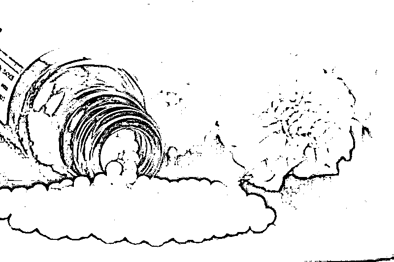

## 顺势疗法的药物是安全的吗？

**顺势疗法药物所采用的小剂量使得它们格外安全。当然，重要的是知晓如何开这些药物**。戴纳·厄尔曼和斯蒂芬·卡明斯（*Stephen Cummings*）博士共同撰写的图书《每个人的顺势疗法药物指南》（*Everybody's Guide to Homeopathic Medicines*）（出版社：Jeremy Tarcher/Putnam，2004 年）提供了关于如何利用这些药物以及何时有必要寻求医疗护理的每一个步骤的信息。 

顺势疗法药物被美国食品及药品管理局官方认可为“非处方药”，因此任何人无需处方就可以订购这些药物。**因为它们被视为药品，所以其制造受美国食品及药品管理局的监管，以确保消费者所买即所得**。

## 服用顺势药物后都有啥反应？

不同的人在首次顺势治疗中都有着不同的体验。有些人能获得显著而深刻的成果，而有些人的成果则轻微、不易察觉。如果能了解到这些差异出现的原因及意义，那么这将帮助你从治疗中获取最大的益处。**请记住，顺势疗法是一种双方的责任：虽然你依赖着顺势治疗师来给你开处方、控制病症，但他们也依赖着你提供准确的信息，并需要你注意到自身发生的所有变化**。那么，知道了这些之后，让我们一起来看看治疗中涉及到的过程。

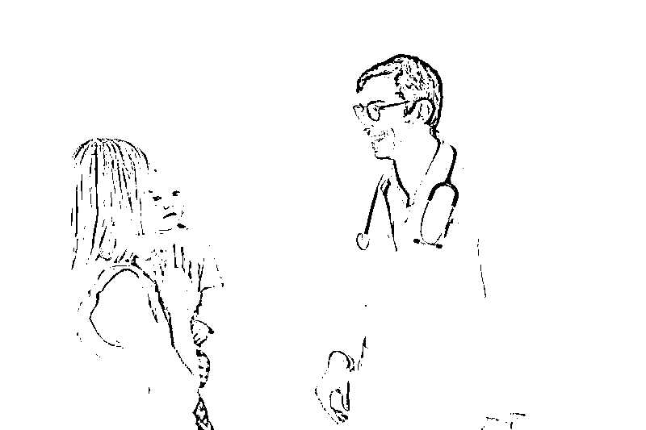

在你第一次服用完顺势治疗药品时，将会出现以下任一情况：

● 治疗效果：症状变轻或消失。

● 病情恶化：症状先加重后改善。

● 症状改变：短期内出现新的症状，但已有症状不变。

● 副症状：已有症状获得改善，但同时短期内出现了一种新的症状。

● 旧症状再次出现：现有症状获得改善，但同时过去的症状在短期内再次出现。

● 短期内出现替代性的流脓或出疹子

● 完全没有任何反应

这些情况意味着什么呢？顺势治疗师能从中获取很多信息！每种反应都揭示着所开药方是否正确，也将提供给治疗师有价值的信息，用于调整治疗方法以帮助你痊愈。那么，现在让我们来详细看看每种反应。

**症状变轻或消失** 

**这意味着**

处方是正确的，与你的症状相匹配并且有着：

● 适当的强度（效力）

● 适当的量（剂量）

● 适当的服用次数（频率）

**解释**

这是每个人都渴望的神奇效果，而这也是经常发生的情况。对于急症，如膀胱炎或牙龈脓肿，此疗效会很快出现，有时只需一次剂量。而慢性病症，比如从童年就反复出现的扁桃体炎或哮喘，则需要静待稍长的时间。如果有数种病症或问题经年累积，那么可能就需要一系列治疗措施及加强的药效来治愈。

**你该做的**

享受改善的健康和精彩的生活

**症状先加重后改善** 

**这意味着**

该处方是正确的，但是效力太强。在激起相应疗效之前，它加重了你的症状。

**解释**

在这些情况下，即使处方十分适合你的症状，它也可能暂时让病情加重：

● 剂量过大

● 效力不对

● 频率过高

这种顺势性的病情恶化之所以会发生，是因为过强的药效和现有症状合并。

幸运的是，**这种恶化通常是温和的。其持续时间也不长——当药品的能量离开你的身体时就会消失**。随后你自身的生命力就会重新焕发，抵抗正在消失的药效，从而激起康复进程。病情加重向我们证实处方是正确的，而你的顺势治疗师现在需要根据你自身的敏感度来调整下次用药的剂量。万一你的恶化期延长，治疗师可以通过其他顺势处方进行化解。

**你该做的**

告知你的顺势治疗师。他们很可能建议你让加重的症状自然消失，这样就能看到随后改善的病情。为了避免再次恶化，治疗师会调整剂量、效力或用药频率以适应你的敏感性。

**短期内出现新的症状，但已有症状不变** 

**这意味着**

处方是不适合的；它与你的症状并不匹配，但是你的身体足够敏感，可以感受到该处方所引起的不同症状。

**解释**

当处方是错误的、几乎不符合你的病情时，你可能会经验到变异的或非顺势的症状，如果你对药品敏感则更是如此。该处方会引发其特有的一些症状.因为这些症状和你起初的症状不同，所以这一情况被称为症状改变，而不是病情恶化。因为症状之间缺乏相似性，所以这一处方并不能帮助到你。

幸运的是，**就像病情加重一样，症状改变通常也是温和且短暂的**。药品能量离开你的身体时，症状就会渐渐消失。但不幸的是，后续你看不到反弹的自愈效果。你的顺势治疗师必须给出更加匹配病情的其他处方。万一症状改变的时间较长，治疗师将以顺势的方法来化解。

**你该做的**

告知你的顺势治疗师。他们将重新检视你的病情，给出更合适的处方。此时治疗师尤其关注你在改变期所出现的症状，因为这将指导后续治疗。

特别说明：

**恶化**（包括病情恶化和症状改变），**虽然不是顺势治疗中必然出现的情况，但有时也是无法避免的。**当病人对处方非常敏感，或者治疗师技法不纯熟，开出了超量或过频的剂量，都会出现病情恶化。因此，**在治疗初期，有经验的治疗师都会先给出测试剂量来确定病人的敏感度。**而药品也通常是液体而不是药片，因为如果需要更温和的剂量，液体可以很轻松地被稀释。

**当病情出现恶化时，其持续时间一般不长，症状也较温和**——这倒是一种有趣的体验。这种情况的益处之一在于：**挑战病人的生命力，让他们拥有更强的抵抗力。**

（未完待续）

> #### 阅读更多顺势疗法
> 
> 点击图片即可阅读


▲想搞定顺势疗法？先拿好这份攻略~


▲顺势疗法观点丨疫苗到底打不打？

**敬请关注若道君之后的推送**


下篇还有四个反应等你看

**◆ ◆ ◆  ◆ ◆**

******特别提醒：****转载请注明“转自若道”。******

想要自己掌握顺势疗法的技能？**2016 年 5 月 7、8 日**，由**苏·汤普斯金**亲授的**顺势疗法工作坊**就要开课啦！顺势疗法是目前全球使用最广泛的自然医学疗法，对个体的身体、精神和情绪三个层面进行治疗，加强个体自身免疫力，提升个体生命能量。本课程为那些想要增加自我及家庭身体保健和疗愈能力的人所设置。

报名及咨询，请点击文末“阅读原文”


# 火星逆行逃生攻略 | 愤怒的巨轮怎能说沉就沉（火逆报告在此）

> 原文：[`mp.weixin.qq.com/s?__biz=MzA5NjA0NTAxNg==&mid=403873640&idx=1&sn=6105c20bae053c40664cd3f9c79e7754&chksm=0d502ddf3a27a4c9311d30fa8c4160e4c29cda3cef5280030a8bb5d2190b95c54384e2331157&scene=126&sessionid=1692738846#rd`](http://mp.weixin.qq.com/s?__biz=MzA5NjA0NTAxNg==&mid=403873640&idx=1&sn=6105c20bae053c40664cd3f9c79e7754&chksm=0d502ddf3a27a4c9311d30fa8c4160e4c29cda3cef5280030a8bb5d2190b95c54384e2331157&scene=126&sessionid=1692738846#rd)

从 4 月 17 日开始，火星将在射手座逆行，并于 5 月底从射手座逆行回天蝎座，逆行一直持续到 6 月 30 日。水星逆行已经很恐怖了，火星逆行岂不是更吓人？莫慌，抱紧若道君，除了看到此次火星逆行对大家的影响外，你还可以点击阅读原文的火星逆行攻略。攻略在手，火逆不愁。

**火星逆行射手座：反复尝试的时期**

火星代表活力和力量的法则。它象征心灵中驱使我们行动、发展自我、应对困难、勇往直前、英勇作战、应对竞争和战斗的部分。

**火星是战士的原型：它掌管侵略、愤怒、身体能量、同时也倾向于受伤、暴力和冲动行为。火星原型和希腊神话人物阿瑞斯相关，是罗马神话的马尔斯——战争之神。它象征心灵中驱使我们行动、发展自我、应对困难、勇往直前、英勇作战、应对竞争和战斗的部分。**

**                                ——理查德·塔纳斯**

是的，“战争之神”火星要逆行了。下图可以看到，火星逆行到底怎么个“逆”法。

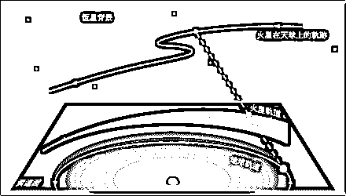 

**占星小知识：行星逆行**

行星的“逆行”是指，由于地球和行星绕太阳运转的速度不同，导致在地球上观察行星，有时看起来行星是在“倒退”，所以并不是真的行星在倒退。

火星逆行大约两年发生一次，可回想上次火星在天秤座逆行（2014 年 3 月 2 日～5 月 20 日）的时候发生了怎样的事情？

本次火星逆行发生在射手座，从 4 月 17 日开始，一直持续到 6 月 30 日，从射手座 8°53′逆行到天蝎座 23°03′，5 月 28 日火星会从射手座退回到天蝎座，而从 4 月初开始，火星逆行的影响就已经显现。

很多人可能感到自己的脾气变得急躁，对他人配合度低，容易生气，也有一些人会再次延续以前搁置的进修计划。**火星在射手座逆行，是通过反复尝试、探索、冒险，开阔眼界的时期，也是容易为某种信念而导致冲突与摩擦的高发期**，由于这次火星会退行回到入庙的位置：天蝎座，所以大家各自看好自己的怒火、心火、肝火，胃火、爱火、欲火、妒火……就显得格外重要。

由于这次火星逆行时会与海王星形成 90 度、与天王星形成 150 度、与土星成合相，所以有些人起初可能会感觉到有很强的无力感，想突破又迷茫，基于长远考虑，又不得不保守行事，有种被束缚住的感受。**其实无力感是动力的反面，只要经过这个阶段，相信你会做出更加成熟与智慧的选择**。

**火星逆行天蝎座：深入挖掘，获取力量**

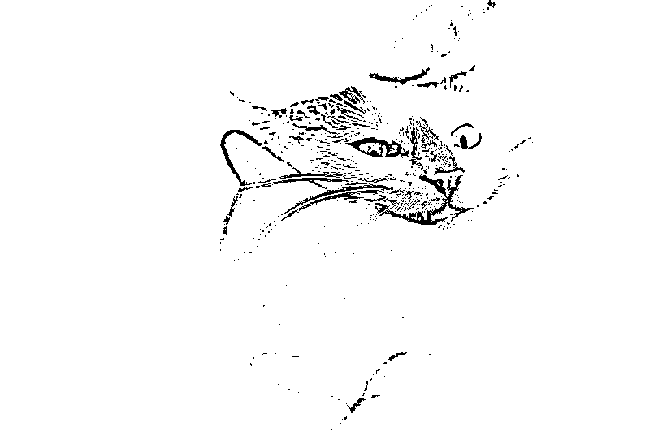

**火星逆行回到天蝎座，是一段深刻、强烈又充满激情的时期，也是通过切实的行动深入挖掘与转化的时期**，欲望与激情的烈焰在此时燃烧的更加炽热了，但也转向了内在，此时，危机感更强，我们会从内在更强烈的意识到爱与恨、欲望、生存的意志以及死亡的恐惧，火星以更为直接的方式帮助我们检视，我们是否能够信任别人、信任你自己、乃至信任整个世界。

**如果直接的表达你的欲求对你来说是困难的，那么现在就是你需要去学习如何与火星相处的时候，你要检视自己是否无意识的压抑或否认自身的欲望。**如果你过度放纵自己的欲望，现在就需要去学习如何适度的控制它，或者找到一个更具建设性的渠道来抒发它。

欲望活着，欲望交配，欲望传延生命，不经修饰的欲望也许使人害怕，但却如此真实的存在着，**在火星逆行经过天蝎座这段时间，我们会通过更为深入与内在的转化，找到自己真正的力量**。

**火星逆行注意事项**

火星逆行期间注意事项或可能发生的状况：

○ 争吵与冲突可能反复发生，宜学习尊重彼此的个人利益。

○ 想行动但缺乏动力，方向不明，或想做的太多反而不知从何下手。

○ 平时过于压抑愤怒的人可能在这期间爆发出来。

○ 避免过度乐观或莽撞的采取行动。

○ 投入过多精力的领域需要重新调整、适度减缓速度。

○ 可能有较多突发事件需要处理，宜提前准备好应对措施，以免手忙脚乱。

○ 警惕外伤、上火、发炎等伤害性事件的发生。

○ 从内在意识到自己真正的勇气与力量。

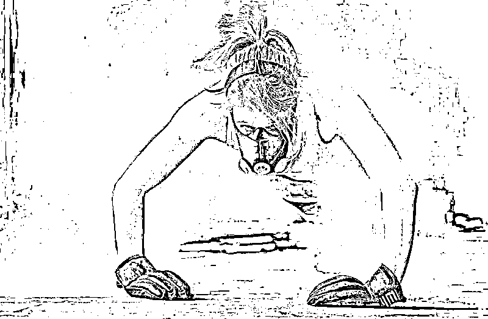

这段时间，如果你发现自己变得消沉退缩、无精打采，这说明你在火星这颗行星所代表的议题上出现问题，说明你还没有学会为自己争取利益，你需要了解自己真正需要的到底是什么？是什么阻碍着你前行的步伐？

此时，找到行动的动力和开始新项目可能更具挑战性。我们的行为模式、行动速度、情绪宣泄等方式，也会有和以往不同的表现。有些人会出现冲动紧张、焦躁不安等情绪反应。但是所有的骚动与混乱，其实只是在提醒你：**这是一个重整步调的阶段，也是通过行动更加了解“自己真正想要的到底是什么？”的时期**。

**火星逆行在 12 宫的影响**

**若道君提示**：想知道自己火星逆行在第几宫，请打开熟知软件查看行进星图，或打开若道网站 www.nodoor.com，点击“在线星盘”-“行运盘”，输入个人资料，即可查看火星逆行在第几宫。

**火星在第一宫逆行**

**尝试新的冒险计划，做更加独立的自己**

此时，识别出自己想做什么，拿回生命的主导权，肯定自己，进行新的冒险计划并为自己的需要果断采取行动，就是这个阶段的主题。锻炼是非常好的一种帮助我们增强决断力、提出自己需要的方法。

如果你无法做自己想做的事情，找不到未来的方向与目标，你的沮丧感和无力感会比平时更强，或者你会发现自己更容易发火，甚至身体出现上火、发炎症状。这些状况都在提醒你，你该学习新的方法行动了。在这个时候，回过头来检视一下自己深层的情绪与渴望。

**火星在第二宫逆行**

**探索不同的赚钱方式，应对自我价值感的挑战**

你如何认定自己的价值？是取决于外在或他人的肯定吗？还是从内在肯定自己？现在，探索更多可能性的时候到了。此外,这也是一个深入挖掘、重整自身资源的时期。这段时间你会非常忙碌，卷起袖子干活，实现财务目标的时候来了。

此时，找到赚钱的意义与动力显得格外重要，否则你会愤怒，沮丧，抑郁。如果你常常在这个阶段感到生气或者沮丧，你需要仔细看一下自我价值感的问题。自我价值感越弱，越容易在这个阶段出现愤怒、沮丧等负面情绪。或者你需要学会更具智慧的赚钱技巧，让别人看到你的价值，并为之买单。

**火星在第三宫逆行**

**积极沟通，传播信念与真理**

这段时间是沟通交流活跃期，适宜主动与他人沟通。如果你本身的工作跟“传播某种信念”有关，那么这是出成绩的好时候。你可以更有力、更有热情、更快速地传递信息，只要不让别人觉得你进攻性太强。这个时期也容易和他人斗嘴、吵架，可能为了某种信念，在沟通时变得急躁、缺乏耐心。

这段时间有利于学习新知识和复习之前所学的内容，进行深入和内化的整理工作。此时脑子比平时转得快，手头也勤快，在这个周期过完，你会高兴地发现自己积攒了不少信息，或者写了不少东西。此时，注意交通与短途旅行时的安全问题，避免因过于急躁而引发的不必要的麻烦。

**火星在第四宫逆行**

**积极深入探索内心，忙碌的家庭事务**

此时适合深入内心去探索，你内心真正渴望的是什么？在此阶段中，你会将关注点转向家庭和居住环境。一方面，家庭事务可能会让你非常忙碌，另一方面，家庭也可能成为冲突的场所。你也会在家中为自己争取到更多自由空间。

此时，心里容易莫名焦躁不安，如果出现冲突，你可以适当将关注点投向自己的内心，看看往日所积累的不满和抱怨，怎样以激烈的方式表达出来。你有可能窥见其中那些无意识的行为模式，甚至重新调整与释放童年和父母关系互动时留下的不安与恐惧的情绪。尽量不要过于情绪化和冲动地做任何事情，是这段时期需要注意的。

**火星在第五宫逆行**

**乐享生命，开展你喜欢的活动**

你是如何保持快乐的？做什么事情的时候你最开心？生命活力在这个阶段向你发出了召唤。你热情地想要享受生命、甚至挥霍生命。即使是最谨慎的人，在这个时段也会试图向外表达自己的特殊存在感。

参与到更多能够发挥自身创造力的活动当中去吧！唤醒对生命的热情，自信很重要。这会极大激起你的热情——每一件你所创造出来的东西，都打上了你的标记，它们会成为你的代言人，以坚实的方式告诉这个世界“你是谁”。

**火星在第六宫逆行**

**积极努力工作，注重身心健康**

在此阶段，你的关注点迅速被日常工作所吸引。一方面，你希望在工作中投注更多精力，通过努力的工作，既提高自己的技能，同时也能证明你是一个“对他人有价值”的人，这些都是这一阶段中可能获取的特殊成就感。

另一方面，你可能会与同事产生一些争执，你需要花费更多的心思去处理冲突。另一个你需要关注的领域是健康。从身心联结的角度来说，这些健康问题有时是在提醒你个人能量的不恰当使用。尝试做一些规律的运动或养生保健活动、重新调理身体是这个阶段的主题。

**火星在第七宫逆行**

**拓展合作关系，建立深层信任**

你通常是如何与他人互动的呢？你容易感同身受的理解他人吗？此时，你的关系生活正在经历一段异乎寻常的活跃、忙碌期。在这段时期，你会花很多时间和精力发展一对一的关系。合作伙伴、合作项目、亲密关系的机会纷至沓来。此时，你会特别需要拓展合作关系的领域，通过关系中的互动建立更深层的信任，也许你会发展出一段新的伴侣关系。

此时，关系中充满着能量，如果不去适当的抒发调整，这种能量可能会转变为负面的争执与争吵，与其这样，不如共同筹划未来，一起行动起来，让两人的互动更具意义。如果你之前忙着拓展合作伙伴，那么现在需要调整步伐，进一步的理清关系中最重要的部分，建立更深入的诚信是这个时期的重点。

**火星在第八宫逆行**

**对抗带来转化，直面潜藏议题**

这段时间，与共有资产、利益关系和深层亲密关系相关的领域会变得非常活跃。而这是一个十分敏感的地带，其中不仅包括有紧密利益牵扯的商业合作关系、（通常是涉及到性的）亲密关系，还包括冲突、秘密、危机、转化、伤痛、背叛等敏感议题。这段时间，在上述领域可能出现一些由于信念、信任议题引发的激烈情形，

此时，心灵深处的不安全感可能增强，你希望展开一些行动，更深入的了解自己的内心，或是去探索过去自己不知道的面向，也更有勇气了解自身或他人的黑暗面，这些行动往往会带来我们对生活及对自我认识的改变。亲密关系与性也是这个阶段的主要议题，如何控制自己的操纵欲或贪婪的欲望、同时确定自身的利益，是在这一段时间中必须面对的重要课题。

**火星在第九宫逆行**

**开拓视野，坚定信念，捍卫信仰**

这段时间，旅行和心智探索的领域会变得异常活跃。你可能会花很多时间和精力出门远游，或探索道德、哲学、法律、人生意义等宏观议题。比如，你决定去一个你一直向往的国家，开阔眼界、感受当地的风土人情。或者，你报名参加了某个大学开办的心理学课程，进行了一场心智的旅行。无论如何，这时候你会有一股冲动，想要出去拓展自己的视野。

这个阶段也是深入研究与反复实证的阶段，你一直以来所秉持的理念和信奉的真理是什么？现在是时候通过行动来验证它们了。如果你无法做想做的事情，找不到未来的方向与目标，你的沮丧感和无力感会比平时更强。如果出现这种情况，说明你需要调整一下行动方案了，如果你想做的太多，导致精力过于分散，现在也需要减缓速度，抓住重点再行动。

**火星在第十宫逆行**

**提升社会地位，获得公众认可的好时机**

此次逆行的火星行经你星图中与职业目标、职业期望、个人声望、公众形象、名誉、地位相关的领域，这个领域也和我们与权威人物的关系、我们对他们的看法相关。此时，你可能会有强烈的驱动力，想要在这些领域有所斩获。

但是，在这个过程中，你也许需要面对自己内心的恐惧和外界压力。这段时间，你手头的工作可能会比较费事费力，业绩和实现目标的压力考验了你的担当。或者工作中涉及的环节会经历更多的反复与周折，同时你也会以发展的长远眼光来看待自己在事业领域的作为。此时，也适合进行深入的资源重整工作。

**火星在第十一宫逆行**

**突破过往，加深友谊，实现愿景的好时机**

此次逆行的火星行经你星图中与未来、愿景、朋友、社团、人道主义等相关的领域。此时，你可能会有强烈的驱动力，想要在这些领域有所斩获。

更多团体活动是这段时间的特征。你的一些朋友可能出现冲突矛盾，这会考验你们是否能够更明确的去定义共同理想的时期，首先你先要理清楚自身对于理想的信念到底为何？你希望未来在哪些方面有更多的发展？这个阶段，个人利益和集体利益之间也可能会发生冲突，甚至我们的目标，会与集体目标产生分歧。在对峙中，你对归属问题的焦虑可能会加剧，这也是更深入了解彼此的时刻。对于理想的信念以及你们之间是否能够信任彼此会成为这个时期的重点议题。

**火星在第十二宫逆行**

**清理负面模式，获得宁静的好时机**

此次逆行的火星行经你星图中与潜意识、梦想、神秘主义、灵性倾向、悲悯等相关的领域。此时，你可能会有强烈的驱动力，想要有所改变，在这些领域走得更远。

此时，你不妨相信自己的直觉和灵感。它们可能会以梦境的形式出现，改变你看待事物的视角，带给你某种启示，让你得以改善你的人生。将这些梦境也好，幻想也好，白日梦也好，用艺术的形式来表达，无论是诗歌、小说、音乐、绘画、摄影、电影、舞蹈……它总能打动一些人，激励一些人，也许它们就来自别人的梦境和想象，你只是捕捉到了它们。

你可能需要留更多的时间来独处，去静心，去冥想，去做瑜伽，去学习神秘学和灵性知识，到自己的内在去探索，去修自己的心。远离尘嚣，寻求灵性的慰藉或庇佑的渴望可能会促使你常去拜访庙宇或其他宗教场所。

四月的天象可不平静呢，快戳下面文章了解~

**▼**

[四月宇宙天气丨五颗星集体逆行，是要召唤神龙吗？](http://mp.weixin.qq.com/s?__biz=MzA5NjA0NTAxNg==&mid=403602107&idx=1&sn=1e9d493d23402515e2a87b907ab54c85&scene=21#wechat_redirect)

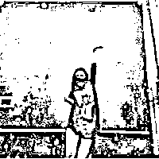

**作者简介**

**幽南**：太阳狮子座、上升天蝎座、北交点双鱼座。爱跳舞、爱创造的疗愈狂人。热爱神秘学，儿时的梦想是在宇宙中穿梭。现主要研习结合学习占星的内在感受编创舞蹈动作，疗愈与宇宙分裂的”初生之痛。“

**微信公众账号**：星舞心疗室 xingwuxinliao

****◆ ◆ ◆  ◆ ◆****

**特别提醒****：**本文由作者授权首发于若道平台**，转载请注明“转自若道”并标明作者。**  

如果你很容易感觉到愤怒，是时候看看这份报告了——从 4 月 17 日开始，一直持续到 6 月 30 日，火星这颗代表着愤怒和行动力的行星处在逆行状态。如果应对火星这颗大脾气行星的逆行期？点击“阅读原文”来看看若道最新推出的火星逆行攻略吧。


# 与海王星有关的干货 | 你对谁过敏？心理还是身体？

> 原文：[`mp.weixin.qq.com/s?__biz=MzA5NjA0NTAxNg==&mid=403849226&idx=1&sn=8643eba3ba211f44fd4ef00d78280edb&chksm=0d50f2bd3a277bab2444857b8278917d3de1d66062346ff5239ef30e644c9e693a4fd10cf282&scene=126&sessionid=1692738851#rd`](http://mp.weixin.qq.com/s?__biz=MzA5NjA0NTAxNg==&mid=403849226&idx=1&sn=8643eba3ba211f44fd4ef00d78280edb&chksm=0d50f2bd3a277bab2444857b8278917d3de1d66062346ff5239ef30e644c9e693a4fd10cf282&scene=126&sessionid=1692738851#rd)

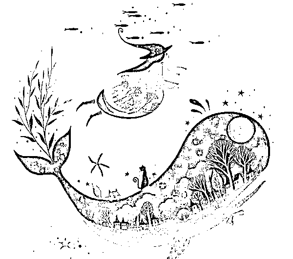

作者/郑玮玲 图片/花瓣网

春天是疾病多发季节，过敏等疾病会如春笋般冒出来干扰我们的生活。你知道吗？这些疾病其实与海王星相关。

## 年年过敏按时来

小时候每年春天就会满身出红色丘疹，浑身抓痒，吃睡不宁。皮肤过敏就像春姑娘她妹一样，年年春天来看我，那时没有被查过过敏源，每年轮流吃过中药、息斯敏、注射维生素 B12、涂药水，也用草药泡澡，还泡过高锰酸钾……直到木星第一次回归才摆脱春天的瘟神。虽然后来它偶尔还回来看我，但随着年龄增长，总算彻底再见。

**过敏，是个体免疫机能对好坏物质难以分辨的过度防御模式，免疫系统反应过度时，对身体组织器官造成不利影响，甚至直接攻击身体器官。**

占星学里，与过敏有直接关联的即是：**海王星**。

**占星小课堂：海王星**

海王星的原型是众水之母，而水是生命的摇篮也是颠覆生命的载体。海王星为人类带来渗透性、无边界、混乱不清、消融物质、泛滥、虚幻、脆弱，这些都与过敏症的本质有共振。

我的星图中五颗行星都落在变动星座，意味着渴望变化，易随外界作出调整，射手座海王星与变动星座行星形成了四分相，强化了身心的敏感度。再加上幼年免疫系统尚未完善，处在与各种外来物质的对抗和壮大中，就很容易过敏。虽不知过敏源是什么，但过敏症总是在万物生发的春天出现，环境中充满各种新生物质，身体面对繁杂不明的状况自发开启了攻击模式。

## 那些与海王星有关的疾病

过敏症状和海王星一样，也存在些复杂不清的面向。

除了最常见的皮疹、皮炎、风团、发痒、脱皮等，还有一些容易隐藏的过敏症状，诸如：局部肿胀、打喷嚏、流涕、流泪、咳嗽、呼吸道充血和发炎、腹泄、便秘、肠胃胀气、疼痛等。这些症状很容易误诊为普通感冒或消化道疾病，而误诊恰恰也与海王星的欺骗性，模糊不清有关。

**当过敏发生时，最重要的就是回忆一下最近时段吃过什么食物、到过什么地方、接触过些什么物品，找到过敏源。**

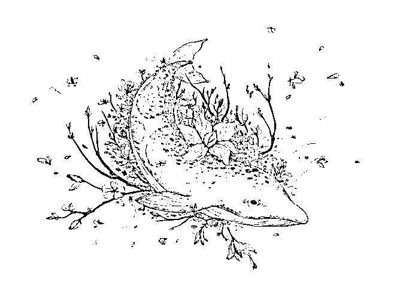

而生理过敏也会在心理上带来同样的敏感。也许因为过敏的经验，或对身体信心不足，对环境不安和对陌生事物的恐惧、排斥，身体采取过度的防卫模式，以表达对安全感的需求。在过敏面前，放松身心防线颇为重要。问问自己一些问题，也许就能找到过敏背后的答案。

**◯ 你是否在某些情况下失去疆界和防御力或者被外界渗透了？**

**◯ 你是否否定了自己内心的力量？**

**◯ 在哪些人、事、物面前你的安全感是不足的？**

**◯ 在哪些情况下你的防卫是过度的？**

**◯ 需要什么你才感觉安全和有力？**

除了过敏，与海王星有关的疾病与健康征兆还包括了：上瘾、中毒、寄生虫、真菌感染（如脚气，阴道炎）、传染病、免疫系统脆弱、疲劳、慢性损耗性疾病、器官脱垂、幻觉、意识混乱、复杂难以诊断的疾病，以及误诊、逃避和掩盖现实的心理倾向。

**占星小课堂：海王星与疾病的关联**

—海王星和月亮—

一起掌管着淋巴系统，月亮代表我们的情绪、灵魂，月海相位往往带来情绪和身体的敏感，同时，月亮与荷尔蒙、消化系统和生育有关，与胸部、肺的下半部有关，月海相往往意味着消化和呼吸系统的疾病，如有不明原因的不孕，也值得考虑是否生殖系统上的过敏。

—海王星和水星、木星—

同时作用下会对肺部和呼吸系统产生影响，比较典型的就是过敏性哮喘。水星守护的双子座掌管着身体管道（代表沟通）和呼吸系统，水星落在变动星座会特别渴望变化、新鲜、非常规、思维过度运转、易受外界侵扰，需要特别关注呼吸系统健康。

—金星和海王星—

与肾脏、皮肤病、静脉有关，也代表美丽的外貌，皮肤是暴露在外最大的器官。当海王星与金星共同作用，再加上白羊座和天秤座的能量时，常常伴随着皮肤过敏。很多皮肤极度敏感的人脸部肌肤会透出清晰的毛细血管，而脸颊也正是肾经经过的区域，这种透见的情形即是皮肤边界的消失。

—海王星和火星—

共同运作与免疫系统脆弱、注射药物、心理防线脆弱和抑郁产生有关，火星代表的愤怒如果被海王星消融内化就会转为抑郁。而火星也是自我保护的力量，当精疲力尽时，免疫大军的力量就薄弱，过敏、感冒、潜伏的病毒便有了可乘之机，甚至会被传染细菌。

—海王星和土星—

意味着精力弱，也与器官脱垂有关，土海相位也跟抑郁症有强烈关联，土星的现实主义与海王星的理想主义带来内心的矛盾、悲痛、自我丧失、消沉与幻灭感。而抑郁症也不能单凭土海作为指征，还应该参考星图和行进、次限推进中更多与土星有关相位以及摩羯座、水瓶座元素。

还有其他因素与健康相关：

宫位也与身体有一定关联。一宫，是自我身分确认，六宫与健康养身有关。这两个宫内的行星与宫主星可以作健康的参考。比如，海王星在此宫内会带来身体界限的脆弱性和易渗透性。而上升双鱼和六宫头双鱼座也值得考虑海王星带来的健康风险。如果要在星盘中寻找其它海王星的健康指征，还应包括太阳，月亮落入双鱼座，太阳、月亮、命主星落入 12 宫。

所有的困难相位，150 度和 135 度相位都可以作为健康与疾病的指征。150 度相位与处女座有共振，是有关日常作息和健康生活，135 度相位是苏汤普金斯老师在医疗占星中运用的特殊相位。

## **其实占星学也与医疗有关**

在西方，中世纪的医生都必须懂得占星学，用医学和占星学两个领域的专业知识作出精确、客观的诊断。出生星图能直接反映个案应对压力的模式、抗压能力，以及在哪些领域抗压能力较弱，因为压力常常就是致病的主要诱因。还可以通过星图中四宫、八宫、十宫、太阳、月亮等看到家庭环境和家族遗传的指征，这些都是与健康紧密相连的因素。

需要说明的一点是，**在没有严格、系统的医学背景和丰富临床经验的情况下，不能单从出生星图判断任何人会患某种疾病**。星图蕴含了个体与环境和宇宙共振的能量，然而，每一种能量都可能以不同方式展现，并非占星师所能预测的。尽管在医疗占星的运用中，**出生星图的确有某些疾病指征可作参考，但唯有医学诊断才能作为患病的依据**。

 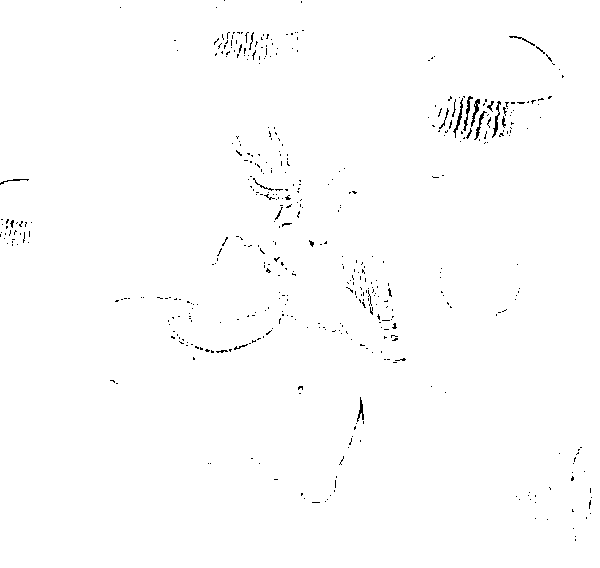

比如，太阳和土星形成相位意味着患心脏病的风险，并不意味有此相位的人，一定会得心脏病。但是，当他们年老时，生理机能下降，心脏功能会更加脆弱，患心脏病的风险就大过没有太阳土星形成相位的人。身体潜藏的弱点和隐患会随着年龄增长。

事实上，是我们的习惯导致了自己的身心的疾病，而习惯本身潜藏于星图中表现为各种行为，意识，情感模式，生活方式。**星图就是一张映证我们习惯的地图，去看见并带着觉知地做一些改变和调整，才会让生命之树健康，富有生机**。

**能量是不能被创造和消灭的，但是，可以转化它**。


**作者简介**

**郑玮玲（Sampriya）：**若道 COAC 高阶资质认证，国际占星研究协会 ISAR 会员，在若道跟随多名国际知名占星师学习占星。馨光爱妈妈会创始人，国内首批 ICEA 国际生育教育协会产后指导，国际母乳会培训的哺乳互助指导。

**个人公众号及咨询预约**：Sampriya-Astrology 

长按二维码，让金钱涌向传播知识与智慧的人~


**◆ ◆ ◆  ◆ ◆**

******特别提醒************：本文由作者授权首发在若道平台******，**转载请注明“转自若道”并标明作者。******

除了海王星，你还想了解其他行星与健康的关系吗？2016 年**4 月 30 日**，**苏·汤普金斯**老师的**医疗占星工作坊**将在北京举办。此次工作坊还是 ISAR 职业占星师资质认证项目的三门选修课之一，要好好把握哦！

报名及咨询，请点击文末“阅读原文”


# 顺势疗法丨春天一到，你就过敏？

> 原文：[`mp.weixin.qq.com/s?__biz=MzA5NjA0NTAxNg==&mid=403849226&idx=2&sn=b55eb8cc14595fb528359a20a314a754&chksm=0d50f2bd3a277bab6919036976f324107cb0df040a7240f0dd4b30d4d08e8e31afccbab5434b&scene=126&sessionid=1692738851#rd`](http://mp.weixin.qq.com/s?__biz=MzA5NjA0NTAxNg==&mid=403849226&idx=2&sn=b55eb8cc14595fb528359a20a314a754&chksm=0d50f2bd3a277bab6919036976f324107cb0df040a7240f0dd4b30d4d08e8e31afccbab5434b&scene=126&sessionid=1692738851#rd)

春季是一个万物复苏的季节，连疾病也不例外，除了常见的流感之外，各种过敏也成了很多人的苦恼。


<sectin style="margin-top: 46px; margin-left: -76px; display: inline-block; vertical-align: top; line-height: 2em; box-sizing: border-box;">**总是过敏？顺势疗法来帮你**</sectin>

最常见的过敏反应表现在皮肤上，比如荨麻疹和湿疹，但也有呼吸道疾病。

比如，对于儿童来讲主要是支气管炎、哮喘和花粉热。

**导致呼吸道疾病的原因**

○ 工业化难辞其咎，它使空气、水、食物和衣服中产生了很多可能导致各种过敏反应的刺激性物质。

○ 家庭结构的改变也为过敏的产生提供了便利条件：小家庭、父母是双职工、共同点少了、婚姻不稳定等。

许多现代西医的抗过敏药物只能使机体对引起过敏的因素不再产生过敏反应，却没有触及疾病的根本。所以在成功进行了一次减敏剂治疗之后，常常会出现对另一种物质的过敏反应。**在思考和观察的过程中保持宽容和灵活，远离盲目，这才是成功治愈疾病的前提**。而对过敏症恰恰需要进行彻底的、个性化的治疗。

**顺势疗法一直都是基于个体症状给予药物治疗疾病的，不会将所有的过敏症状都归纳为一种药物，更注重观察个体的生理健康、用药史、环境、个性、生命事件、生活管理等综合的评估。**

下面为大家介绍一下常见的用于治疗过敏的个别顺势药物。

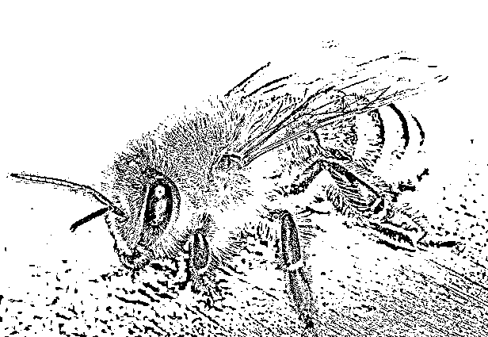

**意大利蜂**：常见的荨麻疹症状多是出现强烈发痒的突起红斑，有时红斑中心部位颜色较淡，食物过敏、特定药物，咬伤。蛰伤或者压力都可能引发荨麻疹，这种时候意大利蜂治疗就能减轻症状。

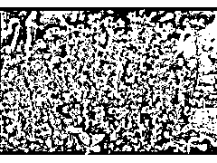

**小米草属**：有些感冒和花粉热会影响眼睛部位的情况，有时也会影响中耳和鼻窦的过敏反应，对于这样类型的过敏反应可以使用小米草属。

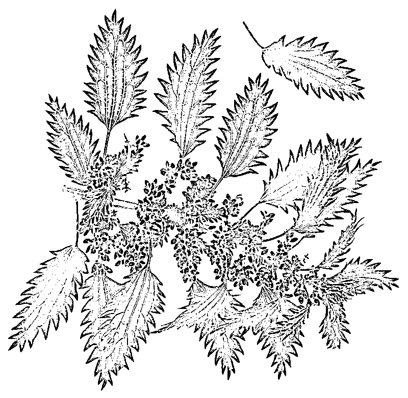

**荨麻**：理所当然，荨麻疹是荨麻治疗的主要病症。它能舒缓伴随荨麻疹出现的发红、烧灼、刺痛的皮肤发疹情况，这种疹子可能会红肿或发痒，而且经常因为气温温暖、沐浴或是剧烈运动而恶化。另外发痒的情形很容易在早晨起床时恶化。

```
特别提醒：顺势药物需在医师指导下服用 
```

> #### 阅读更多顺势疗法
> 
> 点击图片即可阅读


▲想搞定顺势疗法？先拿好这份攻略


**作者介绍**

**Elias:**若道核心课程 Level 5 在读。太阳水瓶座，月亮天蝎座，一直喜欢占星，直到进入若道才明白真正的占星学，特别喜欢挖掘真相，喜爱身心灵和各种传承，爱好佛法和中医。 

长按二维码，让金钱涌向传播知识与智慧的人~

 

**◆ ◆ ◆  ◆ ◆**

******特别提醒：****本文由作者授权首发于若道，转载请注明“转自若道”并标明作者。******

想要学习更多顺势疗法的技能？**2016 年 5 月 7、8 日**，由**苏·汤普斯金**亲授的**顺势疗法工作坊**就要开课啦！顺势疗法是目前全球使用最广泛的自然医学疗法，对个体的身体、精神和情绪三个层面进行治疗，加强个体自身免疫力，提升个体生命能量。本课程为那些想要增加自我及家庭身体保健和疗愈能力的人所设置。

报名及咨询，请点击文末“阅读原文”


# 医疗占星学丨 12 星座分别对应身体的哪个部位？

> 原文：[`mp.weixin.qq.com/s?__biz=MzA5NjA0NTAxNg==&mid=403849226&idx=3&sn=de4a2409d9089f06b8df2bbdb8bc243a&chksm=0d50f2bd3a277bab999c489ff1eafb8640d801b00bd99097760e11fa9d33c21bd6c8aa6e2ac8&scene=126&sessionid=1692738851#rd`](http://mp.weixin.qq.com/s?__biz=MzA5NjA0NTAxNg==&mid=403849226&idx=3&sn=de4a2409d9089f06b8df2bbdb8bc243a&chksm=0d50f2bd3a277bab999c489ff1eafb8640d801b00bd99097760e11fa9d33c21bd6c8aa6e2ac8&scene=126&sessionid=1692738851#rd)

作者/简·里德尔-帕特里克 译者/黄纤越 张弛

图片来源/花瓣网

在若道君之前发布的[入门医疗占星，看这里就对了](http://mp.weixin.qq.com/s?__biz=MzA5NjA0NTAxNg==&mid=403676355&idx=2&sn=8b0e3e0b57c5dee37abc1792ef7205e9&scene=21#wechat_redirect)中，我们了解到医疗占星学可以为现代医学提供帮助。那么医疗占星学是如何具体操作的，在这篇文章里，若道君将给你答案。

## 星座与身体部位相对应

在这张传统图片中可以看出，每个星座都会与身体的不同部位相关联。

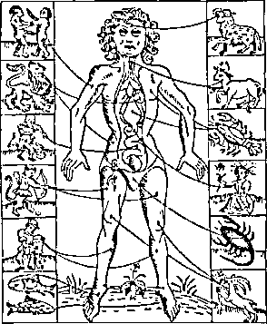

看不明白？没有关系，我们来解释一下。

**星座与身体不同部位的对应**

○　白羊座：头部

○　金牛座：颈部

○　双子座：手臂

○　巨蟹座：胃部

○　狮子座：心脏

○　处女座：小肠

○　天秤座：肾脏

○　天蝎座：性器官和大肠

○　射手座：臀部和大腿

○　摩羯座：膝盖

○　水瓶座：小腿

○　双鱼座：脚

## 行星掌管身体部位

以下列表将说明行星所掌管的内容并给出部分关键词。


通过这一表格，你可以使用这些关键词和功能栏找出当两颗行星相互作用会给身体带来怎样的影响。

**举例**

○ 如果月亮与冥王星形成了一个困难相位就可能是激烈（冥王星）的月经周期（月亮）；

○ 如果困难相位存在于金星与天王星之间，就有可能是内分泌系统（金星）痉挛作用（天王星）；

○ 若是存在于海王星与火星之间，则可能是虚弱的（海王星）免疫系统（火星）。

**◆ ◆ ◆  ◆ ◆**

******特别提醒************：********转载请注明“转自若道”并标明作者。******

想了解更多医疗占星学？2016 年**4 月 30 日**，**苏·汤普金斯**老师的**医疗占星工作坊**将在北京举办。此次工作坊还是 ISAR 职业占星师资质认证项目的三门选修课之一，要好好把握哦！

报名及咨询，请点击文末"阅读原文"


# 医疗占星工作坊 | 用占星学管理健康是怎样一种体验？

> 原文：[`mp.weixin.qq.com/s?__biz=MzA5NjA0NTAxNg==&mid=403849226&idx=4&sn=1d79d80b785a68193f535982fd2c0e30&chksm=0d50f2bd3a277bab3729ffdf39ecfeafe726426f2521cf9b7a370c48a1c1dcc2388b1840c473&scene=126&sessionid=1692738851#rd`](http://mp.weixin.qq.com/s?__biz=MzA5NjA0NTAxNg==&mid=403849226&idx=4&sn=1d79d80b785a68193f535982fd2c0e30&chksm=0d50f2bd3a277bab3729ffdf39ecfeafe726426f2521cf9b7a370c48a1c1dcc2388b1840c473&scene=126&sessionid=1692738851#rd)


白羊座主管人的头、脸、大脑、上排牙齿……

射手座主管人的腰部、坐骨神经、动脉循环、臀部、大腿、小腿上部……

这些知识点，你都知道吗？

如果知道，你会运用在身体健康的管理中吗？

来来来，让苏·汤普金斯告诉你，如何用占星学来管理你的身体健康。

此外，本工作坊还是 ISAR 选修课程之一哦！

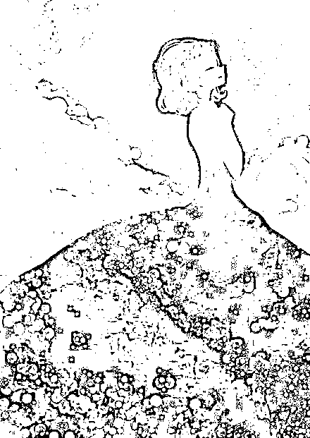

**ISAR 选修课程****工作坊信息**

**授课时间：**2016 年 4 月 30 日、5 月 1 日、5 月 2 日早 10：00-18：00（午休 2 小时） 共 18 课时

**授课老师：**苏·汤普金斯

**授课方式：**北京现场，英文授课，中文翻译。（具体上课地址课前 10 天请留意查看短信微信通知）

**费用**：****6800 元** (**4 月 18 日**前报名可享受**早鸟价 5800 元**，若道老学员**4800 元**）**

**课程负责人：**王晓鸥  

**微信号：**2837474346，请备注医疗占星课程报名咨询

**咨询电话：**400-619-1014

课程简介

星座、行星、相位、宫位还能从什么角度进行阐释？

我们的占星工具箱里，还能增添哪些利器？

疾病和健康的相关议题能不能在星图中找到相应的征象？

我们怎样运用占星学来更好地认识身体，保持健康？


>>>>

**用占星学管理身体健康**

疾病一直以来在我们的生活中有两个作用。一方面，疾病是生活的一部分，虽然我们人类大多数不愿意被提醒这个事实。疾病也为个人成长提供机会和对人生更深刻的理解。疾病让我们谦卑。另一方面，许多健康问题是由于我们选择了错误的生活方式，因此可能是可以避免的。

今年 4 月 31 日至 5 月 2 日，伦敦占星学院创办人、《当代占星研究》作者、经验丰富的顺势疗法医师苏·汤普金斯老师将通过独到有趣的讲解和精彩的专题及案例分析带你进入医疗占星这个神奇的占星学分支领域。

名人推荐

苏·汤普金斯的《顺逆皆宜的人生》令人赞叹！苏是一名倍受爱戴的老师，并且在占星研究学院及后来自己创建的伦敦占星学院任教多年。苏以自己的冷幽默、抽丝剥茧的研究天分和占星直觉而闻名。她是一名执业占星师，也是一名顺势疗法医师，是心灵和身体的敏锐诊断专家。

 ——国际占星研究会（ISAR）法国副主席琳恩·贝尔

师资力量

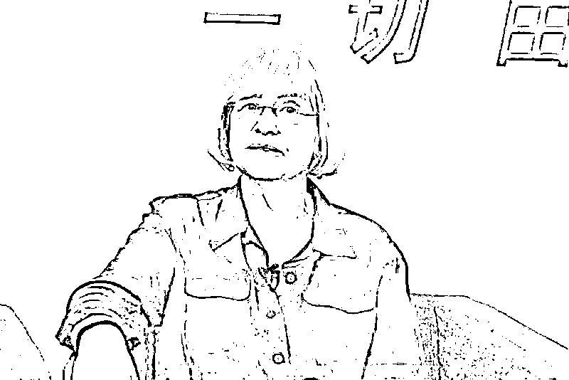
****苏·汤普金斯****

苏·汤普金斯是英国目前最资深的占星学家和咨询师之一，曾任占星研究学院（The Faculty of Astrological Studies）及伦敦占星学院（London School of Astrology）院长。2003 年，英国占星协会为表彰她的卓越贡献授予她查尔斯·哈维斯终身成就奖。

苏·汤普金斯老师不仅希望对心理和心灵进行疗愈，也一直希望能够找到一种安全又切实可行的方法帮助人们在人生旅途中得到身心的整体疗愈，而顺势医学的哲学与疗效让她惊叹，于是她于 1996 年完成在伦敦顺势疗法学院的培训成为一名专业顺势治疗师，目前，已经积累 20 年的顺势医学治疗师经验。

课程价值

得到苏·汤普金斯老师亲授的“独门绝技”，受益于大师在占星、心理学、医疗多维度的丰富经验

增加对身体各部分、健康和疾病的认识与觉察

收获实用的改善健康小技巧

巩固已有的占星学知识，拓展对星图象征符号的理解并掌握更多星图解读的方法和技巧

将医疗占星纳入你的占星工具箱，用它来助人助己，成为更专业的占星师

>>>>

课程内容

心灵和疾病的关系

我们的健康问题是由什么样的生活方式造成的？

疾病如何为我们提供个人成长的机会？

医疗占星学的普遍性原则

各种疾病的常见星图征象是什么？

从星图看，你身体的哪些部位是最脆弱的？对此，你可以做什么？

饮食与健康

我们的饮食能在星图上体现出来吗？ 

如何从星图看我们的身体疗愈之道？

顺势疗法和占星学

如何让自己更健康？

改善健康的实用性技巧

**我们会抽取个案进行现场讨论，会有 6 个个案讨论的机会（可以用家人的案例）。**

**参与个案讨的必须提供：**

**1） 病情细节      2）出生信息       3）生病日期或确诊日期**

**我们欢迎有癌症和心血管疾病的同学（包括家人）提供个案。 **

我们还将分组讨论，在这个工作坊上，帮助大家在用占星学对个人健康进行管理方面获得知识和洞见。

**特别说明：本课程不涉及任何医疗行为 **

>>>>

适合人群

相当于若道核心课程 level3 以上水平即了解星座、行星、宫位、相位等，可以独立进行出生星图解读。


长按二维码接通课程负责人~


更多内容及报名，请点击文末“阅读原文”

# 致我们的终极自恋

> 原文：[`mp.weixin.qq.com/s?__biz=MzA5NjA0NTAxNg==&mid=403817056&idx=1&sn=26f6ab461bb9d3b618521ccd9e400756&chksm=0d5370d73a24f9c187559417703a6e5a6587c89d457a5535cd43dd602cae2e24d0669a405ed6&scene=126&sessionid=1692738851#rd`](http://mp.weixin.qq.com/s?__biz=MzA5NjA0NTAxNg==&mid=403817056&idx=1&sn=26f6ab461bb9d3b618521ccd9e400756&chksm=0d5370d73a24f9c187559417703a6e5a6587c89d457a5535cd43dd602cae2e24d0669a405ed6&scene=126&sessionid=1692738851#rd)

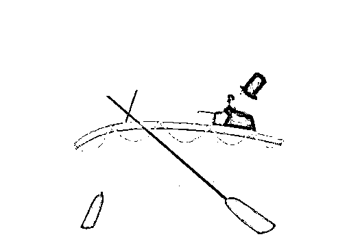

作者/理想国的女巫

图片来源/花瓣网

纳喀索斯（*Narcissus*），水仙花，自恋者，源自古希腊神话美少年纳喀索斯的故事。美少年纳喀索斯有一天在水中发现了自己的影子，爱慕不己难以自拔，最终落水变为水仙花。那么，你也是一朵水仙花吗？

**一场硝烟弥漫的谈话**

 一天， 和友人在一家餐厅吃饭，我们正在浅声聊着，在离我们三桌开外的距离传来一男一女的对话声。

我无意要听他人的谈话，但他们的分贝实则很难让人忽略。

从他们一来一回的对话中得知他俩是兄妹，谈话的核心内容是围绕着哥哥想劝妹妹主动给父母打个电话，而妹妹态度鲜明的表示肯定不会主动打这个电话。

哥哥：“你就不能给父母主动打个电话吗？”

妹妹：“我为什么要主动给他们打电话啊，他们为什么不能主动给我打电话呢？”

哥哥：“他们是父母啊，是长辈啊，当然是作为女儿的你主动打电话给他们了！”

妹妹：“作为父母怎么了，他们对我像父母的样子吗？你不要再站在他们角度说话了，我不想听，我是不会打的！”

哥哥：“你怎么能这么说啊，你什么时候变成这个样子了？！”

妹妹：“我变成什么样子了？难道我说的不对吗，他们的眼里只有你这个儿子，对我这个女儿从来都是不不管不顾的，他们有真正的关心过我吗？自从我嫁人到现在，孩子都有了，他们有打过电话关心我吗，有说过来看看自己的外孙女吗？这么多年过去了，现在突然想到我了？！”妹妹带着哭腔回击着。

这回哥哥并没有像刚刚那样马上予以反斥，他顿了顿，过了会继续说道：“但这总要有人先妥协一次的呀，你是做女儿的，理应你让让，先妥协的啊。”

妹妹：“好了，不说了，我想我们的谈话再这样继续下去也没有什么意义，我不想说了，真的不想再说了。”妹妹深深的叹了口气。

那刻，他俩座位上方的空气已凝结成冰，在这场充满着硝烟味的对话中，两人都败下阵来。妹妹一颗受伤的心渴望得到抚慰，而哥哥的心里只记挂着说服妹妹给爸妈打个电话，完全无视她在声嘶力竭的背后所暗藏的深深无助。两人均各自手握心中旗帜，站在自身立场的至高点，叫嚣着内心宣言，一场谈话最后衍变成了双方的严酷对峙，陷入了情感的僵局。

如此类似这般的场景与对话，在我们日常生活中并不是什么稀罕事，或许说司空见惯。

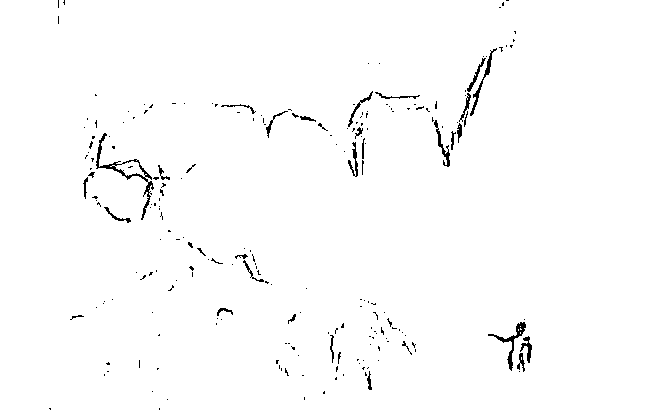

是的，我们的心与灵魂都安住在自己的身体中，很自然的会以自身的立场去表达见解，去解读世界，去与外界建立联系，带着主观与人产生连接，这是我们的本能。**我们本能的爱着自己，若将这本能冠以一个名词，那便是自恋。**而自恋对于我们每个人而言，唯一的区别仅只在于或轻或重，或多或少，我们每天都在人世间演练着自己的自恋。

比如路过落地玻璃橱窗，我们停下脚步，侧身看看自己的身影是否依然美丽与俊朗；在爱你的人面前，以为心中的想法即使不说出来，他也能明白；微信的语音发送完毕之后，会回听自己的声音是否够动人；彩票购买点的生意每天都很好，人人内心都默念着这次必定中大奖。

在心理学中，**自恋是指自我陶醉的行为或习惯。**心理学家科胡特提出自恋其实是人类的一般本质，也就是说我们每个人本质上都是自恋的。它是一种依托胜任的经验而产生的真正的自我价值感，是一种自信的积极态度，这对个人的发展是有利的并且是健康的。但若过度，则会给我们的心理与生活带来负面的影响，甚至是制造困苦。

**十二星座如何自恋**

让我们站在现代占星学的视角，来看看十二星座以及它们守护行星适度和过度的自恋分别是如何呈现的，又将如何影响着我们的心理情境与外在行为，如何影响着我们生活的。

**自恋之白羊座及守护星火星**

适度的建设性表达：

良好的竞争意识与上进心；拥有斗志，不轻易向挫折低头；乐于面对人生挑战，行事果决不拖沓；积极投入体能训练，拥有良好的身体协调力；明确的自我主张，直接表达心中所想；敢为天下先。

过度的破坏性表达：

争强好胜，惹是生非；心中和眼中拥有无数个假想敌，表现出强烈的攻击性；行事冲动，盲目，为了行动而行动，易制造流血事件；内心躁动不安，易怒，无法平静下来；不喜欢与人合作，只爱单打独斗，无法融入集体。

**自恋之金牛座及守护星金星**

适度的建设性表达：

对自我的笃定，不容易受到外界和他人的影响；稳定的情绪，能够感受岁月静好；个性坚定不移，做事有始有终；性情温和，带给人安全感；注重感官，善于营造有品质的生活；对金钱有概念，拥有良好的理财观念。

过度的破坏性表达：

对自我信念与价值过分坚守，导致固执；只按照自己节奏来的慢性子，导致办事效率缓慢；过于追求安稳的生活，不想改变现状而变得懒惰，没有进取心；对物质与金钱过分认同，化身为欧也妮葛朗台。

**自恋之双子座及守护星水星**

适度的建设性表达：

优秀的语言表达力，健谈，乐于与人沟通交流；对世界有着好奇心，对知识保持开放的态度，博览群书；思维反应快，聪明机敏，对信息的获取效率很高。

过度的破坏性表达：

过强的好奇心，导致涉猎太广，显得不够专业；容易因头脑皮层过于活跃导致神经系统紧张；容易一心多用，导致分心，专注力不够；语言的过度运用，绘声绘色让人觉得天花乱坠，缺乏信任感。

**自恋之巨蟹座及守护星月亮**

适度的建设性表达：

对自己及他人的情绪敏感，拥有良好的直觉；重视身与心的健康，注重日常的饮食起居；细心温柔，很会照顾家人与亲密朋友；情绪与情感渗透一切，给予人滋养。

过度的破坏性表达：

多愁伤感，唉声叹气；过于敏感，外界一点风水草动就能激起内心万千波澜；非常情绪化，情绪常常反应过度；自怨自艾，容易陷入受害者情境；只相信自己的直觉和判断，疑神疑鬼。

**自恋之狮子座及守护星太阳**

适度的建设性表达：

自信，拥有良好的感染力，很能调动他人的情绪，拥有领袖气质；慷慨待人，给予人太阳般的温暖；对生活充满热情，持续的活力与创造力；极佳的表现力，带给人欢乐。

过度的破坏性表达：

自已为中心，认为心中所想即是他人心中所想；张扬跋扈，希望所有人听命于自己；只愿听到赞美声，容不得他人半点质疑；极度渴望引起他人驻足的目光，穿着打扮夸张，行事浮夸；

**自恋之处女座及守护星水星** 

适度的建设性表达：

优秀的逻辑思考能力，对复杂的事物也能抽丝破茧的分析；对投身的专业刻苦钻研，拥有专注力；注重日常生活中的仪式感，精致化的生活细节并带有秩序感；精益求精的精神，有专家品质；善于对事物进行分类与规整，井井有条。

过度的破坏性表达：

过于追求完美，容易导致强迫思维与行为；喜欢挑剔的评论他人，不易于人际相处；有过分自我审视的倾向，导致不够自信，总觉得自己不够好；太注重细节，容易导致对事物没有宏观概念。

**自恋之天秤座及守护星金星**

适度的建设性表达：

容易发现生活中的美，拥有良好的品鉴力和审美；对人和事物保持着客观，让人觉得对事不对人；恰到好处的表达，让人感到舒适与自然，易于关系的和谐；注重礼仪礼节，保持着一份优雅。

过度的破坏性表达：

过于追求关系的和谐，导致过分取悦他人而失去自我；想要人见人爱，花间花开，非常注重外表；待人接物想要面面俱到，反而让人产生距离感；追求各方平衡，容易导致犹豫不决，迟迟行动不了；社交辞令的娴熟运用，导致关系游于表面。

**自恋之天蝎座及守护星冥王星**

适度的建设性表达：

足智多谋，拥有良好的洞察力，攻守兼备，运筹帷幄；从骨子里透露着的性感，让人感觉神秘；爱憎分明，情感炙热；拥有敏锐的嗅觉，拥有危机意识；面对危机，不慌乱，能从容应对，具有风险控制能力。

过度的破坏性表达：

过于注重个人隐私，让人感到无法靠近；自以为能洞悉人心，而导致的极强防御心，对他人不信任，疑心重；对于资源和权力的拼命抓取，表现出强烈的占有欲；一旦认定的事物，他人很难改变，表现出偏执倾向。

**自恋之射手座及守护星木星**

适度的建设性表达：

对生活持有积极乐观的态度，遇到困境积极面对；对世界保持着开放的态度，拥有探索精神，爱冒险；待人接物真诚开朗，不拘小节；懂得自嘲式的幽默，与人相处轻松自在；相信真理的存在，从小就爱问为什么。

过度的破坏性表达：

过分的自信，常因对事物判断过于乐观，导致失败；一颗狂热之心，缺少纪律性，太随性，导致没有节制；以为无所不能，缺少风险意识，不计后果的行动容易陷入危险境地；自以为是，常常给人说教。

**自恋之摩羯座及守护星土星**

适度的建设性表达：

非常自律，强烈的责任心，做事尽职尽责；成熟的心智，待人接物稳健；非常清楚自己要什么，目标性明确；等级观念明确，尊老爱幼；拥有长远的志向，会有计划和带着韧性去实现。

过度的破坏性表达：

太想证明自身价值，过载的野心，成为工作狂；僵化的纪律心，让人感觉严厉，缺少人情味；对于事物的结构和秩序要求过于严谨，容易导致思想上禁锢；不苟言笑，僵硬的面部神经常常吓哭小朋友。

**自恋之水瓶座及守护星天王星**

适度的建设性表达：

拥有独立的思考力，不跟从主流，拥有原创精神；不受等级观念及权威的约束，待人平等友善；拥有开放的心智，带着自由的态度与人相处交往。

过度的破坏性表达：

过度的个人主义，行事没有章法和规矩；为了彰显自身独特性，为了叛逆而叛逆，行为乖张，不合群；反传统，反权威上瘾症；过度的客观，让人感觉抽离与冷漠。

****自恋之 双鱼座及守护星海王星****

适度的建设性表达：

关注精神世界，发展出灵性的觉知；良好的幻想力，带来很好的艺术创造力；拥有浪漫主义情怀，文艺范，让人常能感触到美好；敏感的心识，对他人拥有极强的同理心。

过度的破坏性表达：

沉溺在精神世界之中难以抽身而出，无法投身于与物质世界，常伴有幻灭感；泛滥的同情心，容易上当受骗；没有边界感，导致没有自控力，容易对事物上瘾；表达过于复杂繁琐，让人感到迷惑。

适度的自恋给予我们灵魂力量，而一旦过度，则会将我们拽入自私与自负的心里之网中，让我们陷入孤芳自赏，自顾自怜的沼泽之中无法自拔。它会如同一面高墙，耸立在我们的心门之上，让我们的情感之水无法抵达他人的心里城池，阻碍与他人建立情感连接。让我们受困于眼前的方寸之地，狭隘的解读外在的一切，最后，我们就像那只井底之蛙，以为上方的那片天空已是世界的全部。

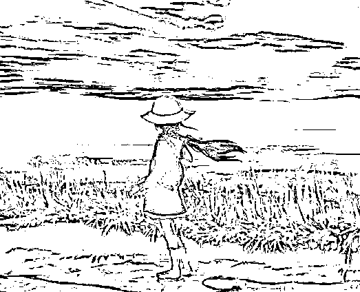

然而，人类的意识在不断的进化，我们都在不断的成长，有些品质虽然还待完善，但我们会越来越好。

●愿过马路的行人，都能跟随着交通信号灯的红与绿，来选择是停还是走，而不是认为所有车子都有自动刹车功能；

●愿为人父母者，能明白孩子与你一样有着独一无二专属于他的灵魂，注重他的个性发展与三观的培养，而不成为被你价值观所强加的附属品；

●愿所有的销售员在销售产品之前，都能先弄明白客户的需求再开口，而不是上来就像打了鸡血一样背诵着产品信息；

●愿参加朋友聚会的时候，不仅仅是在看某个人的脱口秀表演，而是能侧身倾听朋友的心声；

●愿只允许听溢美之词的你，偶尔也能听听中肯的建议，哪怕是批评，因为那将带来明察；

●愿在陌生人面前就脸红的你，不在那么在意他人投向的目光，能够更加自如与舒适的呈现自己；

●愿我们在坚守自己信念的同时，也能适时的换位思考，去看看他人灵魂不一样的风景；

●愿每个正处于心灵困苦之中的人，都能有力量抽身而出，不再继续沉溺于痛苦的梦网中。

愿我们脚踩着大地的同时，偶尔也能抬头看看蓝天。愿我们在深深爱恋着自己的同时，也能向他人投去一丝爱慕之情。

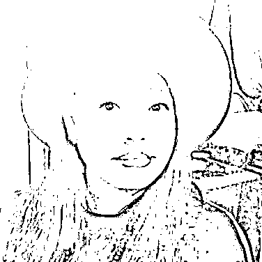

**作者简介**

**理想国的女巫**：全职塔罗占卜师，人本主义占星师，国家二级心理咨询师，国际占星研究协会 ISAR 会员。致力于将心理咨询技术与塔罗占卜和占星咨询进行融合与连接。咨询中注重来访者自身的心理动力，个人自由意志与灵魂的进化成长，而非宿命式的论断。跟随多名国际占星大师系统学习占星学，主要研习人本主义进化占星学以及心理占星学。2015 年在上海创立独立咨询工作室（十二宫塔罗占星咨询工作室）。

**微信公众号**：house12ta  

**咨询预约号**：vivian-yanyan

长按二维码，让金钱涌向传播知识与智慧的人~


**◆ ◆ ◆  ◆ ◆**

******特别提醒************：本文由作者授权首发于若道******，**转载请注明“转自若道”并标明作者。******

说到自恋，你能立即联想到什么星座？**2016 年 5 月 19 日**，蒋颖老师主讲的若道占星核心课程**Level 1-2**要开课了！她将带领你学习星座、太阳、月亮、行星、月亮交点等知识，让你进入占星学的世界！详细内容请点击“**阅读原文**”了解。

报名及咨询，请点击文末“阅读原文”


# 免费微课 | 若道大 BOSS 教你玩转占星学，打败生活里的小怪兽

> 原文：[`mp.weixin.qq.com/s?__biz=MzA5NjA0NTAxNg==&mid=403817056&idx=2&sn=9496fddd3ea2ef8cb919a5da8c860f73&chksm=0d5370d73a24f9c16c7e89fcb4d4db0d302fab49da58ff310623665aa3c44bf80a7aa9b2f902&scene=126&sessionid=1692738851#rd`](http://mp.weixin.qq.com/s?__biz=MzA5NjA0NTAxNg==&mid=403817056&idx=2&sn=9496fddd3ea2ef8cb919a5da8c860f73&chksm=0d5370d73a24f9c16c7e89fcb4d4db0d302fab49da58ff310623665aa3c44bf80a7aa9b2f902&scene=126&sessionid=1692738851#rd)


「**占星学在爱情中可以打怪兽**」

▼

天底下再没有什么事比爱情让我们操心的了。

我们因为“误解”而相遇，因为“了解”而分手。

「**占星学在工作中可以打怪兽**」

▼

古话说“男怕入错行”，现在男女其实都怕入错行。

这不仅仅是金钱的事，还有关成就感和快乐。

要惩罚一个人，

就让他/她一天 8 小时做着既不擅长也不喜欢的事情。

「**占星学可以教你如何对付熊孩子**」

▼

你的父母了解你吗？

他们的不了解给你童年带来了什么样的时光？

「**占星学帮你打败重复出现的心理大怪兽**」

▼

上了一堆身心灵的课程，花了一大堆钱，

可是总有不断让你烦恼的问题冒出来，

个人的成长有没有一个尽头？

心理学给你一种答案，

佛学给你一种答案，

哲学给你一种答案，

如果你了解占星学，对这个问题，

你可能有更深刻的理解。

若 道 君 喊 你 来 看 

免 (tong) 费 (guan) 微 (mi) 课 (ji)  啦

▼

这次微课你可千万别错过 

若道星文化联合创始人 蒋颖老师 亲自坐阵

给大家讲讲怎么玩转占星学

来对付生活里各种小怪兽

教你如何打怪升级

掌握通关秘籍

解锁优质人生

蒋颖老师的时间很贵的耶

有没有觉得自己赚到 

在后台回复「蒋颖」就能查看她的所有文章

看过后你一定会爱上她哒

/文末还有蒋颖老师的独家介绍哦/

想要了解更多微课内容

长按文末二维码关注「若道公众号」就可以啦

最最最重要的事情说三遍

占星学小白也可以听的课

占星学小白也可以听的课

占星学小白也可以听的课

想知道自己的占星水平如何？

点击链接「[占星知识小测试](http://mp.weixin.qq.com/s?__biz=MzA5NjA0NTAxNg==&mid=403697159&idx=2&sn=e4ab5b3f62dc73c70c59d51d0bfcf041&scene=21#wechat_redirect)」来测一测吧  


**活 动 时 间**

▼

2016 年 4 月 15 日周五

晚上 8 点-9 点

**活 动 形 式**

**▼**

微信群活动

45 分钟语音授课

15 分钟互动问答

**怎 样 报 名**

**▼**

统共分三步

第一步

转发本文到你的朋友圈

并注明我是 XX 星座报名参加

第二步

长按客服二维码添加为好友

第三步

将朋友圈转发截图发给 TA

等待被拉入微信群

「添加时备注“通关秘籍”

将统一于 4 月 15 日下午 3 点进群」


蒋颖老师是何许人也


**蒋颖（Felicia）**

若道创始人，职业占星师。在若道系统学习占星，师从大卫·瑞雷。长江商学院 MBA，厦门大学经济学硕士，化学学士。国际占星研究协会（ISAR）中国区副主席。第一批获得国际占星研究协会（ISAR）认证的职业占星师。《灵魂的目标》译者。

**<投票>**

**📹 /mp/newappmsgvote?action=show&__biz=MzA5NjA0NTAxNg==&supervoteid=3217341#wechat_redirect**

还想听什么类型的微课

留言吧


# Level 1-2 | 占星学入门，今年 5 月你还有机会！

> 原文：[`mp.weixin.qq.com/s?__biz=MzA5NjA0NTAxNg==&mid=403817056&idx=3&sn=8d20f55d6b0ee504729dbe4f9fb1de17&chksm=0d5370d73a24f9c13e3d3ed0a89dd154718bca6126ab68c0d8100e448a9c94cefc1704af1da5&scene=126&sessionid=1692738851#rd`](http://mp.weixin.qq.com/s?__biz=MzA5NjA0NTAxNg==&mid=403817056&idx=3&sn=8d20f55d6b0ee504729dbe4f9fb1de17&chksm=0d5370d73a24f9c13e3d3ed0a89dd154718bca6126ab68c0d8100e448a9c94cefc1704af1da5&scene=126&sessionid=1692738851#rd)


国际占星研究协会（ISAR）中国唯一指定教学机构

若道 2016 年占星核心课程 Level 1-2 上线

**主讲人若道创始人**蒋颖****

将带你畅游“星座小白”到“星座达人”之旅

中文老师出山

能有效拿捏学员需求

**授课时间更长**

**交流互动更多**


**课程信息**

**授课时间：**2016 年 5 月 19 日**-7 月 7 日**

**授课老师：**蒋颖**（8 次）、**大卫·瑞雷**（4 次）**

**授课方式：**网络课

费用：**2400 元**

**报名截止：**2016 年 5 月 6 日

**课程负责人：童老师（微信号：80248863）、**王老师（微信号：2837474346）****

**咨询电话：**400-619-1014

**课服 QQ：4006191014 （若道星文化）**

**邮箱：nodoor@vip.126.com**

课程简介


**星座、太阳和月亮**

12 星座是占星学最基本却又最深刻的概念，黄道 12 星座，是伟大的生命周期，而太阳和月亮是我们阴阳之本。

**●12 星座：**深入了解 12 星座的特色。了解星座正面的、负面的表达，了解其资源，了解其破坏生命的模式。了解其原型人物、了解其指代的人事物。

**●12 星座原则：**按照极性、形态和元素给星座分类。

**●12 星座关键词：**关键词非常重要！是解读准确性的关键。

**●太阳和月亮：**了解你的太阳，生命的发动机，让你在世界闪光的方式，生命获得力量的方法；了解你的月亮，让你生命获得幸福的方法。了解它们，了解你生命中已经出现的、将会出现的男人和女人。


**遇见行星和月亮交点**

在这个阶段，你将遇见行星们，还有与灵魂的过往和未来相关的月亮交点。这既是你，你的性格，也是你在生命故事中将会遇到的人、事、物的显化，也是你灵魂轨迹的线索。    

**●内行星：**水星、金星、火星

**●中间行星：**木星、土星

**●外行星：**天王星、海王星、冥王星

**●灵魂的线索：**月亮南交点、月亮北交点

**●行星逆行：**行星逆行的天文现象和意义

**●宫位初解：**了解黄道 12 宫的基本含义

时间安排

共 12 次课，24 课时。

**●8 次理论课程**（蒋颖老师主讲）

北京时间每周四晚 20：00-22:00

**●4 次线上互动课程**（大卫老师主讲、配有中文实时翻译）

北京时间每周一晚 20：00-22:00

授课优势

**①先进的教学平台**

网络教学平台，支持手机、电脑、iPad 上网，可以随时随地学习。

**②回放复习**

学员可登录网站收看课程回放，在线复习课程，每次课可完整重看 3 次，课程结束后的 3 个月内有效。　

课程特色

**①与名师面对面**：北京同学可以来若道现场上课，和大卫老师面对面互动。大卫老师也可能前往主要学员所在城市，实现零距离教学。

**②互动答疑**：论坛、微信群随时提问；老师课上答疑；助教线上线下全程协助。

**③线下沙龙**：定期举办沙龙活动，复习上课内容。

**④强大的同学网络**：若道作为中国最顶尖的占星教学机构，在 4 年的占星教学中，培养了很多占星人才。若道让你和师兄师姐切磋，让你和国内著名占星师学习。（简单来说，就是，人脉！）网络授课，在北京开设免费现场参与名额，全程英文授课，配备实时翻译。

师资力量

**讲师团队**


**蒋颖（Felicia）**

若道创始人，职业占星师。在若道系统学习占星，师从大卫·瑞雷。长江商学院 MBA，厦门大学经济学硕士，化学学士。国际占星研究协会（ISAR）中国区副主席。第一批获得国际占星研究协会（ISAR）认证的职业占星师。《灵魂的目标》译者。

**在后台回复 蒋颖 即可查看她的全部文集**


**大卫·瑞雷（David Railey）**

若道创始人，《灵魂的目标》作者。拥有 46 年的占星咨询的执业经验，曾两任亚特兰大占星协会主席，是全美占星师联盟（AFAN）、美国占星师联合会（AFA）、全美占星研究委员会（NCGR）、国际占星研究协会（ISAR）和职业占星师组织（OPA）的成员，是联合占星大会（UAC, United Astrology Conference）督导委员会委员。大卫曾是 CNN、CBS 的占星节目的常驻嘉宾，多次在 BBC、WGS、WSB、WRGG 等节目中接受采访，并在亚特兰大主持电视节目《每日行星（Daily Planets）》达 4 年之久。

**助教团队**


**熊鹰（天空的空）**

国际占星研究协会（ISAR）认证占星师。在若道系统学习占星，师从大卫·瑞雷，现任若道专职助教。将传播系统、严谨、真实的占星学作为职业使命。与此同时，提供一对一占星咨询服务与生时校正咨询。目前正致力于占星学与个人真修实证的整合。2014 年起主讲读书会，助教答疑课程累计超过 100 小时。


**Gaff**

全职占星师，既是占星师，也是疗愈者。2013 年开始在若道进行系统占星学习，师从大卫·瑞雷。任 2015 年度诺·泰尔、斯蒂芬·福里斯特老师的占星工作坊助教。提供一对一的咨询服务（已有超过 100 小时的咨询经验），基于个案咨询的经验，曾多次开设面授的占星课程。

2016 年，和若道老师一起，开启占星的探索之旅！

长按二维码接通课程负责人！

 

报名及咨询，请点击文末"阅读原文"

# 白羊座 | 女战士，你不知道你有多性感！

> 原文：[`mp.weixin.qq.com/s?__biz=MzA5NjA0NTAxNg==&mid=403765078&idx=1&sn=638dab5cac2ee2f3040695c2238d7cde&chksm=0d5245e13a25ccf7caee72d1590de3a64d315d2d4c5b7f3a733a055de9e3969e2e90b3bfdbaf&scene=126&sessionid=1692738851#rd`](http://mp.weixin.qq.com/s?__biz=MzA5NjA0NTAxNg==&mid=403765078&idx=1&sn=638dab5cac2ee2f3040695c2238d7cde&chksm=0d5245e13a25ccf7caee72d1590de3a64d315d2d4c5b7f3a733a055de9e3969e2e90b3bfdbaf&scene=126&sessionid=1692738851#rd)

作者/Kathy Rose

译者/Cora

传统的社会价值观普遍认为女人应该温婉和顺，这会造成一些女性抗拒自身的白羊座能量。事实上，只有当真正接纳自己的白羊座能量时，才会感受到别人的接纳，那时候，你就会发现，原来自己是如此性感。

我是一个**月亮在白羊座**的女人，我还有一颗非常**强势的火星**，它落在金牛座，合相我的上升点，并且跟木星、天王星成硬相位。我知道自己**富有战斗精神，竞争心强，追求独立，充满热情。**但如果你问我，作为一个强势的大女人，我是不是总能获得他人的爱、认可和欣赏呢？我只能遗憾地说，并不是这样。

**偶尔，我会怀疑自己是不是应该被动一点，适当示弱，更有耐心，从而更像一个传统意义上的女人。**也许作为白羊座的女性，你也有着这样的挣扎，那么现在请跟我一起去探索白羊座能量，看看它会给女性带来怎样的机遇和挑战。

**真实的白羊座女人是这个样子**

白羊座在占星学的黄道十二星座中排第一位。这帮**事事都想争第一**的家伙会喜欢这个位置的！这一火象星座的内涵涉及**领导、独立、坚持自我**。白羊座由火星守护，其能量是原始、粗糙的——受本能驱使、未经雕琢、勇猛无畏、骁勇善战。**白羊是战士，是征服者的原型**——它热爱挑战，渴望不断攀登自我实现的新高峰。

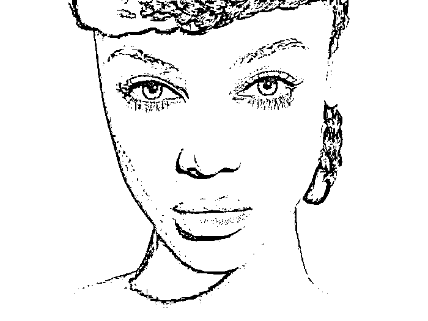

**白羊座的心声是“我是”**。自我发现是这个星座与生俱来的固有动力。也是因为这个原因，白羊座会特别重视自力更生和保护个人的独立性不受侵犯。这从他们快速的行动、高水平的生理本能和不死的竞争意识上就可以看出来。**白羊座的座右铭是，直截了当、不兜圈子**，他们一心向前、无所畏惧——随时准备好冲锋陷阵、攻城掠地。

○ 如果你的**太阳落在白羊座**，在火爆的白羊能量的驱动下，你会**以一种勇敢纯粹、甚至稍显莽撞的方式展示自己，向这个世界宣示你的存在**。是激情的火花让你感觉到自我的存在，激励着你前进，让你的自我散发光芒。

○ 如果你的**月亮落在白羊座**，你需要**做一个战士或领导者，如此才能感到舒服或满足。**你需要走自己的路，做一个独立、勇敢的人。你需要成为开路先锋，不断迎接新的挑战并把它们踩在脚下。这些是你要获得快乐、满足和圆满必须要做的事。以这样的方式证明自己的存在对你来说就像为灵魂奉上一顿大餐，让你身心愉悦、充满享受。

**她们真的不像女人吗？**

然而多数情况下，这种**火星能量在男性身上会运作得更好**。勇猛强悍的男人通常会受到人们的钦羡与赏识，他们毫不掩饰自己对成功的渴望和成为领导者的野心。我们的社会欢迎这类充满竞争力的英雄典范，光荣与赞许对他们敞开了大门。对于男性来说，展示火星或白羊座的能量是简单又自然而然的事，因为白羊座是阳性星座。

然而，如果你是一个太阳或月亮落在白羊座的女性，可就没有男性那么幸运了。个性强又爱竞争的女人遭受的批评与责难比男人要多得多。**有主见、有野心，特别是位高权重的女人通常都会被想象成专横、冷血、不通人情的模样。**接纳并展示自己身上的白羊座能量对女性来说不总是那么容易，因为这与温柔敏感、给予他人关爱与支持的传统女性形象相悖。

社会语言学家 Deborah Tannen 博士曾提到，在女性社会化的过程中，竞争是不被鼓励的；相反，她们学会了如何跟人打交道、建立亲密关系。女人被教导要合作，不要竞争。她们的目标（特别是在人际关系中）是维持和谐，重视互助合作。代代相传的社会文化传统，让人们更加认可温柔、优雅的女孩——更符合金星形象的女孩，而不是独立、胜负欲强的火星女性。

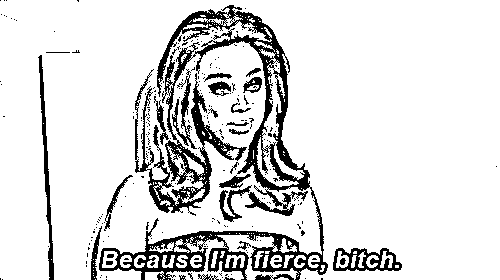

美国超模泰拉•班克斯（Tyra Banks）的**月亮和火星都在白羊座**，她为人坦率、个性活泼，风格热辣。她是第一批跻身“超模”行列的非裔美国人之一，是第一个登上《GQ》杂志封面和《体育画报泳装特刊》的黑人模特，也是第一个为知名内衣品牌“维多利亚的秘密”做代言的黑人模特。

泰拉承认自己热爱竞争，不仅是跟别人也是跟自己——她将自己的事业推向一个又一个的新高峰，从没停止过对个人潜能的探索。

从模特界退役之后，体重略有增加，有一次八卦小报刊登了她的一些角度不太好的照片，羞辱她身材走样。泰拉的火星白羊爆发，对媒体的批评给予了有力反击。在捍卫自己名誉的过程中，她展现了真正的白羊座精神。

她在自己的脱口秀节目中穿上了泳装，勇敢地展示自己的身材，告诉人们，即使是超模，也不是从所有角度看都完美。她面对批评所表现出来的强硬、火爆的态度将她推上了舆论的风口浪尖，掀起了一股对于胖瘦判断标准的新争论。那对泰拉来讲是一场严峻的考验，但是她没有退缩，反而给了对手迎头痛击。

然而，像泰拉•班克斯这样能活出自我的白羊座女人，似乎并不是大多数。

在着手这篇文章时，我采访了许多太阳、月亮或火星落在白羊座的女性。在和她们的交流中我发现，无论这个白羊座特质的女人是在职场上叱咤风云的女强人，还是在家里相夫教子的主妇，她们都曾有过一些相似的经历和感受。**竞争的冲动会让她们感到内疚，好像这是一件让人蒙羞的事。**

○ “我真的觉得很不好意思……”

○ “我没有向任何人承认过这一点……”

○“我知道这让我听起来挺吓人的……”

这样的开场白反复出现，颇为耐人寻味，这些女人会为她们有强烈的竞争心而道歉。

****没必要因**展示火星能量而羞愧**

我非常能理解她们的感受。有一次，我向我的一位女性友人讲述我是如何成功讨价还价、用非常划算的价钱买了一辆车。

我告诉她，我拒绝了销售方一开始的报价，并且坚持压价不松口，最后我不仅以非常不可思议的价格得到了那辆车，还拿到了一些附加的好处。我还跟她说，整个交易过程中我毫不留情、一点也不退让，最后那个男推销员一直在擦汗，眼泪都快流出来了。“真是好玩极了！”我脱口而出——拿下这场交易就像赢得一场战役，这感觉真棒！当我跟朋友讲述这件事的时候，我仍然充满了白羊座的激情。 

但是，在我向她复述完这件事之后的几小时，**我开始感到不自在。**我心里开始犯嘀咕，觉得我的女性朋友或许并不能理解我的快乐，那种火星能量自由流动时带来的充满力量的快乐，**我担心她会认为我不过是在炫耀、自吹自擂。我陷入了自我怀疑的陷阱**，觉得自己应该为如此享受胜利的喜悦而感到羞愧，**好像我做了对不起谁的事。 **

这种愧疚感给原本纯粹的快乐蒙上了污点，给精彩的体验缚上了情感包袱。对很多女人来说，这阻止了她们全然地展现她们的白羊座能量。在这种情况下，**女性需要对这种情感模式有所觉察，意识到羞耻感是如何产生的，而不是每当坚持了自己就觉得对不起谁。**女人应该明白，大部分情况下，为自己展示出的强势火星能量而感到羞愧是没有必要的。

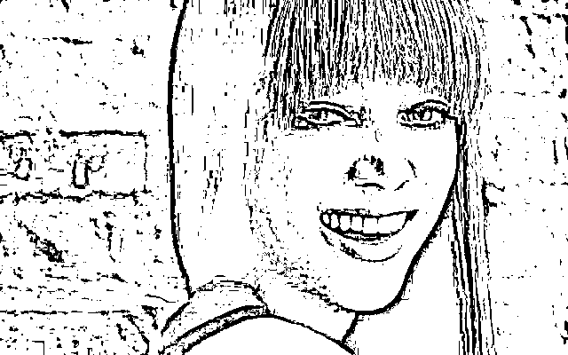

**压抑能量 or 自然流动？**

**在旁人的攻击下，在自我的谴责中，女性很容易压抑自己的白羊座能量。**被压抑的能量如同火山的熔岩，不知道什么时候就会从火山口喷薄而出。她们给自己的阳性能量贴上了封条，不让自己参与竞争，不敢争取自己想要的东西，变得消极被动，将决定自己命运的权力拱手让给了别人。被阻塞的火星能量会带来很多不健康的表现，**通常会伴随自我否定和自我打击的倾向，甚至导致抑郁。**

很多压抑了自己白羊座能量的被访者都承认，她们会表现出**不同程度的饮食失调、强迫症、上瘾倾向。**最终，当能量压抑了太久，怒气积压得太多，熔岩管也会被撑破。此时的结果将是**彻底的失控**，爆发出最具破坏性的一面，通常会造成非常负面的影响——而这些负面的影响又进一步让她们觉得压抑自己是必须的。这样就造成了恶性循环，阳性能量又开始在她们的内部积压起来。

如果对这类问题有更多的**觉察**，并且有意识地**调整、改变**，相信越来越多的白羊座女性能够学会**接纳**、拥抱自己身上阳性的战士精神，展现出个性中富于开拓性的一面。以下是给白羊女性们的一些**建议**：

①记住，在何时、如何表现我们内在的战士一事上，我们**需要针对具体的环境灵活处理**。总会有人反对我们、要求我们做出改变，这是不可避免的。

那些能够从容面对竞争、**在阳性能量和女性身份之间游刃有**余的白羊座女性，都是能够时刻对环境保持清醒认识的人。她们知道身边哪些人有可能被她们的强势吓跑，哪些人甚至会因此站到她们的对立面。这些女人成功发展出了辨识这些情况的能力和应对方法——她们会**采取必要的适应策略，同时不会放弃她们的权力，也不会为自己感到羞愧**。

②**觉察他人的需要和感受**。这确实不是白羊座的长项。你无法总是让所有人都满意，但是你的心意能够被人感知到，这样你就不至于激怒他人——同时，如果对他人有所感知，你会发现自己也不那么容易发怒了。

③**不要总拿自己跟传统意义上金星类型的女性比较。**做一个火星导向的女人不会减少你的女人味——这仅仅意味着你的生活态度跟他人不同。时刻清楚自己是谁。挑战和竞争能够让你焕发出生命的活力，这是事实，你要接受它。每一次实现了新的目标，成功超越自己的时候，请微笑着享受这胜利的时刻。

④如今我不再如痴如醉，也不想再将远方的美以及自己的在交谈中直截了当、直奔主题，可以提高效率，你应该为你的这一优点感到自豪。**享受你的活力、独立和勇敢**。很重要的是，当你从心里接纳了自己强悍、强硬的那一面，并且你也愿意根据情况的需要调整自我表达的方式，那么这些意念的能量将渗透于你生活的每一个角落，在点滴之处产生影响，最终，你会获得更多的爱与支持。 

最后，请记住：正如你希望别人接受你真实的样子——你的积极主动、你的强悍勇猛——你也要接受那些跟你持不同生活态度的女人。这同样是一种礼貌。

**◆  ◆  ◆  ◆  ◆  **

**特别提醒****：转载请注明“转自若道”。**  

当你接纳了自己的能量，别人才会接纳你。**2016 年 5 月 19 日**，**蒋颖**老师主讲的若道占星核心课程**Level 1-2**要开课了！她将带领你学习星座、太阳、月亮、行星、月亮交点等知识，让你进入占星学的世界！

报名及咨询，请点击文末“阅读原文”


# 投票 | 你都看我这么久了，也该介绍一下自己呗

> 原文：[`mp.weixin.qq.com/s?__biz=MzA5NjA0NTAxNg==&mid=403765078&idx=2&sn=7c7ef0e9a6203570f750aa4c81327503&chksm=0d5245e13a25ccf78f3930033f20e9d075848b93f7b69ed7fc68da59d23f9332145afddc9ed1&scene=126&sessionid=1692738851#rd`](http://mp.weixin.qq.com/s?__biz=MzA5NjA0NTAxNg==&mid=403765078&idx=2&sn=7c7ef0e9a6203570f750aa4c81327503&chksm=0d5245e13a25ccf78f3930033f20e9d075848b93f7b69ed7fc68da59d23f9332145afddc9ed1&scene=126&sessionid=1692738851#rd)

与 君 初 相 识 

犹 如 故 人 归

**白羊座** **金牛座** **双子座** **巨蟹座**

 **狮子座** **处女座** **天秤座 天蝎座** 

**射手座** **摩羯座 ****水瓶座****双鱼座**

认 识 这 么 久

还 不 知 道 你 的 星 座

伦 家 好 伤 心 的

 如 果 你 爱 若 道 君 就 **投 个 票** 呗

了 解 你 们 才 能 推 送 好 文 哦

也 来 猜 猜 若 道 君 是 什 么 星 座

**留 言 哦**

爱 你 们 么 么 哒

📹 /mp/newappmsgvote?action=show&__biz=MzA5NjA0NTAxNg==&supervoteid=3218441#wechat_redirect


# 你有很多愤怒，为什么还不能说不？(视频有惊喜)

> 原文：[`mp.weixin.qq.com/s?__biz=MzA5NjA0NTAxNg==&mid=403741311&idx=1&sn=83f490fb1cc28556165fd17383b11cef&chksm=0d5228c83a25a1ded0876bb8623de76fa5944cb54a826e16d4c0cbc1f722c51395754839b5fe&scene=126&sessionid=1692738851#rd`](http://mp.weixin.qq.com/s?__biz=MzA5NjA0NTAxNg==&mid=403741311&idx=1&sn=83f490fb1cc28556165fd17383b11cef&chksm=0d5228c83a25a1ded0876bb8623de76fa5944cb54a826e16d4c0cbc1f722c51395754839b5fe&scene=126&sessionid=1692738851#rd)

作者/薇安   图片/Casarsa、花瓣

太阳白羊座就一定能勇往直前，直接了当，个人利益当先吗？他们总是能够“我要的，我现在就要”，轻松拒绝不合心意的人事物吗？那为什么白羊月出生的她，却难以说“不”？

**说不出 No 的白羊座小至**

小至给人的第一印象总是很好，友善亲切，有些隐约的羞涩，但并不妨碍恰到好处的周全；在工作中，一贯干脆利落的高效作风，面对挑战迎面而上；这样“完美”的内外结合，才将近 30 岁，已是某大型企业的中层管理骨干。

小至来找我时，是想要厘清一个 Yes 或 No 的问题。和现在的 BF 交往两年了，双方无论生活境况或工作发展都“门当户对”，交往的日子里，既无惊喜也无惊吓，顺其自然到了该说 Yes 的时候。

“可是，我想说 No，特别大声，特别大声地说一声 No”，小至涨红着脸有些激动，泪水夺眶而出，委屈地像个孩子——

我想对我的长直发说 No，我想把它们剪短，然后染成大红色；

我想对我的职业套裙说 No，我想随时穿上跑鞋出去冲刺一百米；

我想对我的彬彬有礼说 No，我想大声说话大声笑，看到有人受欺负就上去帮忙打一架；

我想对我的老板说 No；

对我爸妈说 No；

我最想对现在这个“我”和她的一切说 No，因为那个真正的我好像一直就没有舒展地活过……

小至一直想要舒展的那个“我”，就像生命最原始的冲动，是让种子破土而出肆意生长的力量，亦是对所身处的世界的信任——我用我本来的方式作为，世界都会给我支持。

或许你也会在人生的某些面向有着和小至相同的感受，当需要对一些人或事说“不”，以确立自己的立场，维护自己的利益时，却发现很难说出口。

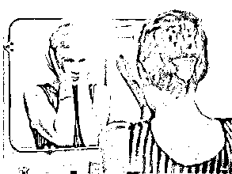 

**      为什么有受阻的愤怒？**

从心理学的角度分析，一个行为的背后有多种的可能性。

**无法开口说“不”可能有的原因：**

①婴儿初期建立对外部世界的信任时受挫，不相信自己的需求会被满足；

②自我力量不足，低自尊；

③成长过程中受到权威的“压制”；

④天生的性格倾向的影响；

⑤社会文化的影响：集体主义文化背景下的人们强调和睦相处，不让他人丢面子，于是很少正面对抗和率直表达，也很少表现得很自我。

以上因素常常交织在一起发生作用。针对每个个体，我们要很小心地去探索其行为模式的成因。

美国心理学家詹姆斯·希尔曼的橡实理论认为，每个生命都是由一个特定模式组成（命运的图像），它代表了灵魂的命运密码。个人出生星图，好似一张 X 光片，透过这张光片，我们可以快速地看到怎样的内在动力模式在与外境的互动中发生了的冲突，带来了成长的堵塞，我们又该如何调整。

从占星学的符号体系看，生命最初那个破土而出的力量——生存的意志、确立自我的渴望、维护自我利益的冲动，以及当上述种种受阻时产生的愤怒，包括出生后早期阶段的外界境况，经由**白羊座、其守护星火星、第一宫**，三位一体的符号体系所象征。出生星图中，这些符号相关的挑战性配置，生动地映射出个体在自我确立方面可能遭遇的挑战。

小至的太阳落白羊座一宫，与七宫的土星形成精准的对分相，四分了落于四宫巨蟹座的火星。在这些征象中，我们看到这样一些可能：

○ 实际或阴郁的人生观，不容易相信人，防卫性强；

○ 早年缺乏自信心，原生家庭管教严格，很难摆脱“自己不够好”的信念；

○ 和权威人物相处困难；

○ 对威胁过于敏感，常觉得被冒犯而愤怒却不易表达出来……

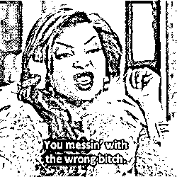

在现实中，小至在婴儿时期，曾有过被双职工的父母无奈地独自留在家中，母亲只能定时回来哺乳的经历。儿时调皮莽撞的性格不断被父母和老师教育修正；在和同伴玩耍中自然展露的竞争天性，被视为没有礼貌的行为而屡遭斥责……

在不知不觉中内化了这些规则后，小至甚至开始为自己的“出格”行为而感动羞愧。不断被修枝剪叶后的小至终于成了人见人赞的有“教养”的人。

“可每当我想要而又不能或不敢按自己意愿去做事的时候，我都有一股很大的怒气，要耗费很大的气力去压制住它。特别是面对一些权威人物的时候，我很难表明自己立场……有时候，我觉得我就像是被死死地抵在一堵厚厚的墙面上，身体里有个东西要出来，想要冲出去，可被按在铜墙铁壁上的我，无法行动。”

小至成长过程中，自我确立的意愿和能力发展受到阻扰，使她无法成为自己的权威，而是将这个权威投射到了外部世界。

甚至当她遇到一个被她认同为权威的人物（职场领导，或在当下情景中比自己更有主导权的人），即使对方并未展现出权威行为，小至也会不由自主地进入到一种战备状态，就像随时可能会遭遇挑战和打压；但她又自觉自己必然在对抗中失败，如此反复，进入到一个糟糕的循环中。

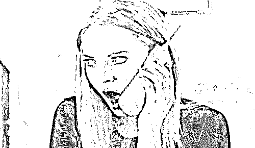 

**      怎么做才能有所改进？**

小至要做的，首先是要认清那个真实的自己。

太阳白羊座的她，就像一个无知无畏的勇士诞生到这个世界上，带着最纯粹的新生热情。

○ 天然的她，喜欢抢第一，天真而不造作，具备探究未知的勇气，强烈、热切、不成熟、冲动，甚至有些鲁莽而不计后果；

○ 天然的她喜欢快速行动，不需求他人的赞同、许可或合作，而只想以自己的方式做事；

○ 对他人缓慢的步调会不耐烦，不喜欢等别人做决定，或是花太多时间准备行动；

○ 善于处理事情或完成手上的工作，但缺乏持续力。

这个她在其成长过程中遇到了“权威”和外境的干预甚至阻挠，但这并不意味着她这个人“出了错”。甚至，我们也不能说这些权威“出了错”。事实上伴随我们走到当下的每一个过去的境遇，都一定为我们的生存提供了一些正面的意义。我们不难想象，天然的小至如果完全本色地行为，会遭遇或引发哪些挫败。

重要的是，而今的小至，已发展出足够成熟的心智，去学习平衡自我和他人。就像白羊座象征着生命最原生的力量一样，她需要热爱自己这个生命，感受它本真的活力，让这些极富生命活力的特质得以舒展，在外境中去创造出优质的成果。例如：追寻目标，开拓新疆域，展现勇气激励和鼓舞他人。

同样，她也可以学习土星的自律、成熟，稳重，耐心；客观看待现实的制约，学习计划和坚持。此外，她可以学习用更多元的方式来释放自己过多的精力，一些可以运用到爆发力的运动都是不错的选择。

在提升自我认知，正面运用自己的能量的同时，小至可以渐进地学习在与他人的互动中勇敢表达自己的立场或意愿，从一些比较容易做到的事情开始。

**例如：**

①在非正式的场合，按自己的意愿装扮和展示自己；

②在工作中与上司或合作者有相左的意见时，学习用平静有力的语气表达出自己的想法，寻找共识，而非非此即彼的选择；

③在亲密关系中，学习真实地表达自己的感受，“我此时感到惶恐，无法清晰自己的想法”，与伴侣共同讨论自己所担忧之事；

④更深入地，小至可以与父母一起回溯童年经历，表达出自己儿时被压抑的感受，以及自己对得到父母理解与支持的需要。

结合小至星图中其他的配置，我们还可以探索更多整合的方式，帮助小至发展内在的潜能。

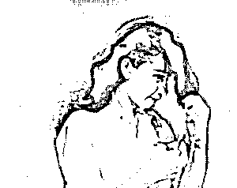 

**     无法说“不”就不会说“是”**

事实上，星图中看似处于两极的星座，例如白羊座与天秤座，并非真正对立的两极。它们更像是八卦图中的阴阳鱼，相互包含、渗透和转化。**在现实中，白羊座的能量若能以天秤座的优雅方式来展现，那几乎是无往不利的。**如若我们只是因为害怕自己真实的能量状态，而强行披上天秤座的外衣，便容易转变成内在的自我攻击。

正如小至所说：“我并不是单纯想要拒绝婚姻或拒绝某个人，我就是觉得长久以来的那种压抑让我对所面对的一切都产生了恐惧，我分不清这是不是我想要的，我就想任性地说：No！No！No！”

是的，**当我们无法按自己的心意说出“不”的时候，我们一样无法自在地说出“是”。**因为真正的问题并不在这两个字之间；而是在于我们能否经验到自我的力量。

研究人类发展的领军人物埃里克森认为，人类在早期心理发展的第一阶段（对应白羊座、一宫），是建立信任的关键期，而信任在人格中形成了"希望"这一品质。埃里克森把希望定义为："对自己愿望的可实现性的持久信念，反抗黑暗势力、标志生命诞生的怒吼"。如若自我无法发出健康的怒吼，地球这趟从自我开始的旅程恐怕也无法健康地驶向无我的终站。

我们每个人都拥有白羊座的能量，无论你是否出生在白羊月。而我们拥有的，都需要得到健康的表达。**出生星图中，当白羊座、火星或一宫被以不同方式强化——例如：太阳、火星、月亮或上升点落白羊座、群星落白羊座、群星落一宫；或白羊座行星与土星或外行星形成挑战相位等，都意味着我们的生命旅程中在某些面向上有关于自我确立的议题要去学习。**

不过我们无需对此惊慌，正如神话学家坎贝尔所言：英雄并非自动地生来就是英雄；为了寻找 TA 一直拥有而不自知的一切，TA 必须历经考验和苦难才能抵达英雄之路。

而在更大的原型意义上，这些携带白羊座能量的英雄们，也终将发现，他们是旧世界的摧毁者，新世界的推介者，并从中寻求到个人灵性上的身份认同。

**最后，来看一个轻松的视频“大胆说 No”。（注意流量，4G 土豪随意~）**

📹 [`v.qq.com/iframe/preview.html?vid=i0192fizttl&width=500&height=375&auto=0`](https://v.qq.com/iframe/preview.html?vid=i0192fizttl&width=500&height=375&auto=0)

你是一个不会说不的人吗？

知道是因为你星图中的哪些元素在影响？

欢迎留言分享。


**作者简介**

**薇安**，北大心理学硕士学位，MBTI 的国际认证施测师。若道认证生时校正资质及 COAC 高阶资质毕业生，在若道跟随多名当代著名占星师持续进行深入系统的占星研习。现为全职心理咨询师与占星师。

**微信 ID**：weianhuilai 

长按二维码，让金钱涌向传播知识与智慧的人~

 

**◆ ◆ ◆  ◆ ◆**

**特别提醒****：本文由作者授权首发于若道平台，转载请注明“转自若道”并标明作者。**  

认识你的白羊座和火星，面对你的愤怒。**2016 年 5 月 19 日**，蒋颖老师主讲的若道占星核心课程**Level 1-2**要开课了！她将带领你学习星座、太阳、月亮、行星、月亮交点等知识，让你进入占星学的世界！

报名及咨询，请点击文末“阅读原文”


# 想搞定顺势疗法？先拿好这份攻略~

> 原文：[`mp.weixin.qq.com/s?__biz=MzA5NjA0NTAxNg==&mid=403741311&idx=2&sn=06da349083483f2f8080a503b1e69e90&chksm=0d5228c83a25a1de47b057c2755a91c35631b5155d7e4f14c8214425d50eede8d70104d191a0&scene=126&sessionid=1692738851#rd`](http://mp.weixin.qq.com/s?__biz=MzA5NjA0NTAxNg==&mid=403741311&idx=2&sn=06da349083483f2f8080a503b1e69e90&chksm=0d5228c83a25a1de47b057c2755a91c35631b5155d7e4f14c8214425d50eede8d70104d191a0&scene=126&sessionid=1692738851#rd)

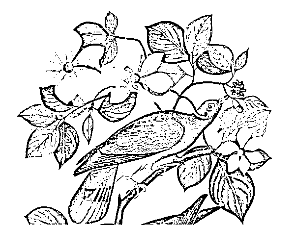

顺势疗法从去年 12 月开课至今，小伙伴们表示 get 到好多身体、精神及情绪疗愈的技能，不仅能解决自己的病痛，还能疗愈家人，简直棒到没朋友！没有赶上去年的小伙伴是不是心痒痒呢？不要着急，4 月 30 日，苏·汤普斯金即将在北京举行为期三天的顺势疗法工作坊。在迫不及待参加工作坊之前，先来涨涨姿势~

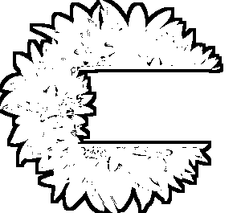

 <sectin style="margin-top: 46px; margin-left: -76px; display: inline-block; vertical-align: top; line-height: 2em; box-sizing: border-box;">**顺势疗法的起源和基本原理**</sectin> 

> ① 18 世纪以前，希波克拉底和帕拉切尔苏斯的发现持续影响顺势疗法
> 
> ② 18 世纪末，哈内曼命名了顺势疗法

长久以来，医学临床专家一直仰赖顺势疗法来治疗患者。

顺势疗法的关键就是临床专家在给予患者处方前后，对于患者症状的理解和诠释能力，也就是解释，外在的征兆如何显示内部的异常。在传统医学领域，通常同样的药物治疗同样症状的人；**在顺势疗法上，患者接受的则是整体的治疗**。顺势疗法临床专家会先考虑症状以外的因素，如性情、心智状态和生活方式等，然后才会建议处方。

顺势疗法**安全、温和**的方法遵守医疗介入原则中最重要的一点：**不应造成任何伤害**。

因此，**患者可以用顺势疗法，在家安全而有效地治疗许多平日常见的病痛**。


<sectin style="margin-top: 46px; margin-left: -76px; font-family: 微软雅黑; display: inline-block; vertical-align: top; line-height: 2em; box-sizing: border-box;">**个人体质说明了我们的健康状态**</sectin>

**顺势疗法的作用原理主要是基于心理和生理的密切关联**。因此，对于患者的体质和性格若是没有充分了解，就无法成功治疗生理上的症状。以顺势疗法的用语来说，一个人的“体质”说明了他们的健康状态，包括他们的气质和任何先天及后天的特质。在判断患者的体质时，医疗人员必须询问患者相当多问题。

顺势疗法专家相信，**当健康的人在生命力很强而敏感性很低的时候，即使持续暴露在数量众多且具有潜在伤害的病毒和细菌之中，也能够抵御疾病的发展**。

**类似法则**

哈内曼发展出的“**类似法则**”的概念，最初是由希波克拉底所建立的。根据这个理论，**能够在健康的人身上引发特定症状的物质，同样能有效治疗患者身上类似的症状**。列如颠茄中毒引起的症状和猩红热类似，所以能用颠茄治疗猩红热。 

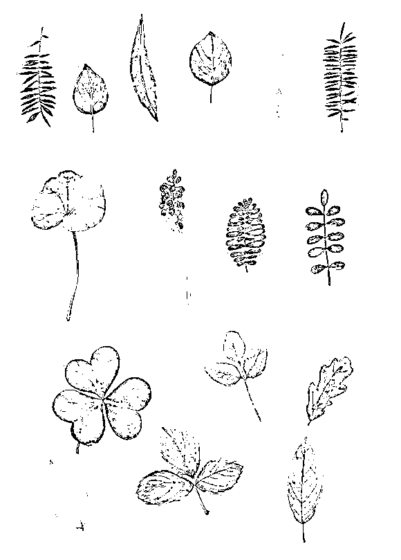


<sectin style="margin-top: 46px; margin-left: -76px; font-family: 微软雅黑; display: inline-block; vertical-align: top; line-height: 2em; box-sizing: border-box;">**顺势疗法的治疗定律**</sectin>

在患者逐渐治愈的过程中，症状会从体内重要器官转移到体外次要器官。**产生疗效的顺序通常由上而下**。举例来说，头部症状通常是最先消失，接着肢体末端的症状逐渐好转。顺势疗法的治疗过程中，就有症状经常会以相反的顺序再度出现。免疫学家认为人体有“记忆攻击”的能力，会“记住”系统中它所反应过的每次“攻击”，而症状再现的过程正好证实了这一理论。

**特别提醒**

当然，无论在任何情况下，患有严重病痛或不确定罹患何种病痛的患者，都不应该考虑自我治疗，他们应该询问受人推崇的顺势疗法专家或是西方现代医生。

**某些严重病痛可借由顺势疗法得到舒缓**，在治疗过程中，合格顺势疗法专家的经验就是重要的开始。


**作者介绍**

**Elias:**若道核心课程 Level 5 在读。太阳水瓶座，月亮天蝎座，一直喜欢占星，直到进入若道才明白真正的占星学，特别喜欢挖掘真相，喜爱身心灵和各种传承，爱好佛法和中医。 

长按二维码，让金钱涌向传播知识与智慧的人~

 

**◆ ◆ ◆  ◆ ◆**

******特别提醒：****本文由作者授权首发于若道，转载请注明“转自若道”并标明作者。******

想要学习更多顺势疗法的技能？**2016 年 4 月 30 日**，由**苏·汤普斯金**亲授的**顺势疗法工作坊**就要开课啦！顺势疗法是目前全球使用最广泛的自然医学疗法，对个体的身体、精神和情绪三个层面进行治疗，加强个体自身免疫力，提升个体生命能量。本课程为那些想要增加自我及家庭身体保健和疗愈能力的人所设置。

报名及咨询，请点击文末“阅读原文”


# 星图的奥秘丨你的经历，原型来对应

> 原文：[`mp.weixin.qq.com/s?__biz=MzA5NjA0NTAxNg==&mid=403741311&idx=3&sn=c9641745130d1a226af15d4ce3950654&chksm=0d5228c83a25a1def334d6aa6004f119f2b444f373639b053445b208661a695978f19b8c6016&scene=126&sessionid=1692738851#rd`](http://mp.weixin.qq.com/s?__biz=MzA5NjA0NTAxNg==&mid=403741311&idx=3&sn=c9641745130d1a226af15d4ce3950654&chksm=0d5228c83a25a1def334d6aa6004f119f2b444f373639b053445b208661a695978f19b8c6016&scene=126&sessionid=1692738851#rd)

作为若道的新晋男神，塔纳斯不仅颜好、学识丰富，还是枚暖男，若道君可喜欢听塔纳斯说原型知识啦。快快快，搬起小板凳来听翻译 YT 说说理查德·塔纳斯。

## **一枚严肃认真的超级暖男**

塔纳斯的风格是那种典型的儒雅学者，对于他人的需求几乎都想在前面。在和斯坦·格罗夫共同举办的全息呼吸和原型占星工作坊上，他讲着讲着突然停下来，问前面的摄像哥：“我需要不需要停一下，我看你正在调整？”或者问身为翻译的我，“这个语速你看可以吗？”

哈佛毕业的他身上有一种冷幽默的气质。冷幽默在英语中叫 dry humor，土星式的幽默。他其实很擅长讲冷笑话，说自己迄今为止最热爱的工作之一还是当守夜人（他 20 多岁的时候曾是举世闻名的伊莎兰学院的守夜人）。

他当年博士论文是写致幻药物的心理疗法。于是专门跑到伊莎兰学院和当年超个人心理学的创始人——致幻疗法的世界权威斯坦·格罗夫一起学习，后来一起工作并成为挚友。

格罗夫和塔纳斯的研究互为补充，一个是对于出生前后（围产期阶段）对于人心理的影响做了深入研究，一个是对原型占星做出了巨大贡献。他们发现，在当年伊莎兰学院很多人经历某些行进时，会带来深刻的心理和灵性转化。而这种转化的性质也是和他们出生星图当中行星所显示的原型能量紧密相关的。

## **希腊诸神的经历是原型能量的表达**

他看重希腊神话，认为希腊神话较完整地描绘出了诸神的神殿。各文化当中诸神的不同样貌，其实都是宇宙同一原型能量的不同表达。

例如：

****➤** **木星合相冥王星：死亡重生的大祭司

比如斯坦的星图，呈现出紧密的木星合相冥王星的能量。冥王星代表深入到地府，穿透到最深层的潜意识（斯坦本人当年也有直面魔鬼的经历），代表死亡与重生。而木星代表天神宙斯，还能从地府中出来，并扬升到新的意识维度，将最深的潜意识照耀在阳光下。所以塔纳斯把这两个原型结合在一起，把斯坦称为“死亡重生的大祭司”。

**➤** 太阳天王星合相：普罗米修斯

太阳和天王星的相位，被他称为普罗米修斯，去盗来天火解放人类。

**➤** 土星：时光老人

土星被他称为时光老人，门槛（交界）的守护者。

## **你知道浓缩体验吗？**

斯坦和塔纳斯两人拓宽了我对人类心理的认识。他们的工作，让我不再把人类心理局限于出生之后（童年）对人性格所产生的影响，而是贯穿到出生前后“围产期”，包含在子宫和产道当中的体验，甚至前世体验，以及宇宙原型体验。斯坦把这些体验称为浓缩体验（COEX）。让我们能够了解到自己具有怎样的浓缩体验，星图是最好的地图。如果要看什么时候触发这些浓缩体验，行进则是另一张地图。

补充一句，塔纳斯用的容许度比较宽，太阳和月亮的合相或对分相，他认为 11 度的容许度也是可以的。而就个人体验层面，这种解读的确比较符合我的实际情况。

就像塔纳斯所说：每个人的星图都是宇宙原型能量的一种独一无二的表达。你的星图就是一幅世间无二的曼陀罗，就是一幅大放异彩的艺术品。去了解你的星图和原型能量吧！

想知道塔纳斯原型占星课程说什么吗？请戳下方文章

**▼**

[塔纳斯丨有关原型占星学你最想知道的 12 个答案](http://mp.weixin.qq.com/s?__biz=MzA5NjA0NTAxNg==&mid=403602107&idx=2&sn=23e3625cf81a820c2ac5cd72d59f70f7&scene=21#wechat_redirect)

**课程信息**

**开课时间**：2016 年 5 月 14 日

**授课时间**：每周六上午 10：00-12：00，共 8 节课 16 课时

**费用**：6800 元 (**4 月 14 日前**报名可享受早鸟价 5800，若道老学员 4800）

**授课形式**：网络在线授课（英文授课，中文翻译）

**课程负责人**：李老师、熊老师

**微信号**：2847613491（请备注原型课程报名咨询）

```
若道君提醒：早鸟价截止日期 4 月 14 日哦！ 
```

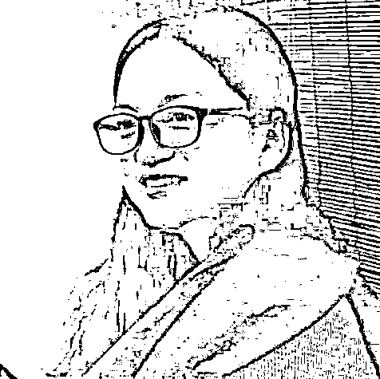

**作者简介**

**YT**：栗幼婷，英国利兹大学英汉双语会议口译硕士。自由译者（交替、同声、课程翻译）。心灵成长领域资深翻译。

**微信**：liyouting2012

长按二维码，让金钱涌向传播知识与智慧的人~

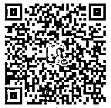

**◆ ◆ ◆  ◆ ◆**

**特别提醒****：本文由作者授权首发于若道平台，转载请注明“转自若道”并标明作者姓名。**

想要了解更多的原型知识？**2****016 年 5 月 14 日**，**理查德·塔纳斯**教授将在若道开办“**原型占星学**”课程，正如丽兹·格林所言，更多是占星学选择了你，而非你选择了占星学。让占星学选择你吧！

报名及咨询，请点击文末“阅读原文”


# 免费新月报告出炉，还能许愿哦

> 原文：[`mp.weixin.qq.com/s?__biz=MzA5NjA0NTAxNg==&mid=403718856&idx=3&sn=d976a1b125e20368563e02f6f2c461bc&chksm=0d52f07f3a2579697dc6c24bdab823b340a8651fcc5aa855e0ee1ab31d837e013c8ec59c05ab&scene=126&sessionid=1692738851#rd`](http://mp.weixin.qq.com/s?__biz=MzA5NjA0NTAxNg==&mid=403718856&idx=3&sn=d976a1b125e20368563e02f6f2c461bc&chksm=0d52f07f3a2579697dc6c24bdab823b340a8651fcc5aa855e0ee1ab31d837e013c8ec59c05ab&scene=126&sessionid=1692738851#rd)


4 月 7 日 19：23-4 月 9 日 19：23，

是新月许愿及查看新月报告的时候。

手机党们，

你可以直接在手机上获取报告，

在线许愿并分享！

无论你在地铁上、聚会时、还是等餐途中，

随时随地许愿祈祷，

是不是很酷呢？

**操作起来也很简单哦**

**当新月到来的时候，您只要做如下步骤**

进入首页

点击
“新月祈祷”

登录账户

填写出生信息

查看报告、许愿

**【步骤一】点击新月的祈祷**


**【步骤二】输入姓名**


**【步骤三】输入出生信息**


**【步骤四】生成新月报告**


**最下方有许愿按钮，左边是倒计时提醒哟~**

**在合适的时间就可以许~愿~啦~**

**【步骤五】许愿！**

**** 

**【步骤六】让宇宙看到你的愿望并分享！**

**** 

**在平时，您只要做如下步骤**

进入首页

点击
“立即许愿”

开始许愿

点击分享

完成许愿

**◆ ◆ ◆  ◆ ◆**


**小伙伴们还等什么？**

**赶快点击→左下角阅读原文****吧！**

# 清明到新月：死亡为镜，勇敢新生

> 原文：[`mp.weixin.qq.com/s?__biz=MzA5NjA0NTAxNg==&mid=403718856&idx=2&sn=0a1bb35410efccc6b0dda7ce0def6a98&chksm=0d52f07f3a257969b5b3ac065a21021871c472bfd54b031f25455cebc4d69dcf27834b0b89e7&scene=126&sessionid=1692738851#rd`](http://mp.weixin.qq.com/s?__biz=MzA5NjA0NTAxNg==&mid=403718856&idx=2&sn=0a1bb35410efccc6b0dda7ce0def6a98&chksm=0d52f07f3a257969b5b3ac065a21021871c472bfd54b031f25455cebc4d69dcf27834b0b89e7&scene=126&sessionid=1692738851#rd)

作者/喜悦龄以  ISAR 认证占星师

图片/花瓣网

4 月 4 日清明，在仲春与暮春之交，通常指春分后第 15 天，是中国传统节日之一，也是最重要的祭祀节日之一，是祭祖和扫墓的日子。4 月 6 日金星进入白羊座。4 月 7 日白羊座新月，太阳和月亮精确合相于白羊座 18 度 4 分，合相天王星于白羊座。祭祖、扫墓、初生，不由让人联想到生死之旅。

## 拥抱伤痛，迎接新生

一起看看今年清明的星图。

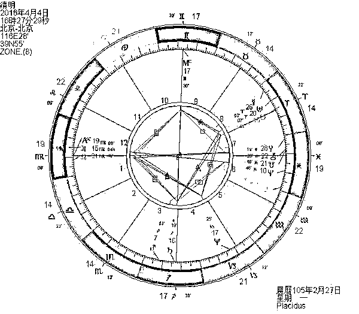

太阳趋近天王星，意味着即将触发已经搅扰许久的天冥四分，太阳和水星都在白羊座，使得这次的天冥四分更多火药味，同时也带着更多要推翻之后重新开始的“生”——蠢蠢欲动。金星和海王星都在双鱼座，同在双鱼座的凯龙星合相南交点，也意味着这一次的“死”，更多几分伤痛、幻灭与丧失之感。

这伤痛也许与久远的过去（童年、或者世代家族的过去）有关，也许无法疗愈，却要带伤前行。双鱼座群星落在 7 宫，象征着这创伤与生命中重要的关系（婚姻、伴侣、密友、合作伙伴）有关，唯有看到、直视，了悟丧失不是我一人，痛苦不是我独自承受，那是你、我、他/她/它共同的命运，才能产生接纳与承受，最终，才可能成为带伤的疗愈者。

## 即使灵魂紧密相连，苦难仍由自己承担

受双鱼座能量影响强的人（例如出生星盘双鱼座、海王星或 12 宫能量较强、南北交点在双鱼座等），在压力状态下容易沉溺和陷落于受害者、牺牲者的角色，在此天象更易触发。而解药，就在行进的 1 宫处女座——从我开始。

此时提醒自己，连结处女座的理性、清明的头脑，拣选的天赋，伸出手，开始去做一点点小的、实际的事情（木星合相北交处女座），去服务，为自己、为他人，带着谦卑，了知此时此刻的现状正是生活的实相——而不是自己脑中幻想的假设与应该。那会让我们陷入追求虚幻与完美的误区，**因为无法落地，也必将遭遇幻灭**。

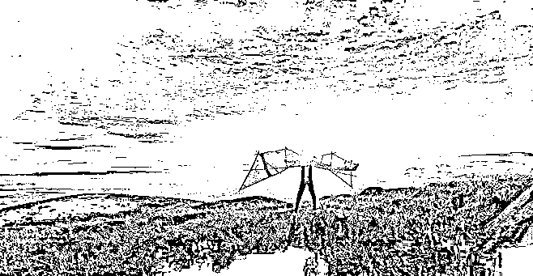

幻想中众生一体的美妙与喜悦，在遭遇现实时会无比脆弱，是的，我们源于一体，在潜意识的某处，我们紧紧连结。但是，我们无法将自己的幸福寄托于他人或潜意识，纵然身上承担着过往的业力、家族的历史、国家、种族、集体潜意识的创伤，来到这世上，我们依然要成为个体，成为自己。

行进的北交 1 宫处女座是双鱼座能量的解药，即**我自己正在创造实相**。这也是**白羊座的初生原型能量：无论外面是什么，都要冲出来，成为自己**。只有成为自己，才谈得上去连结、去融合、去影响。那时，一体感又会回来，重新有某种连结发自于你自己，在上如在下，在内如在外。

## 新月：审慎判断，避免鲁莽行事

4 月 7 日是白羊座新月，一起来看看新月星图。

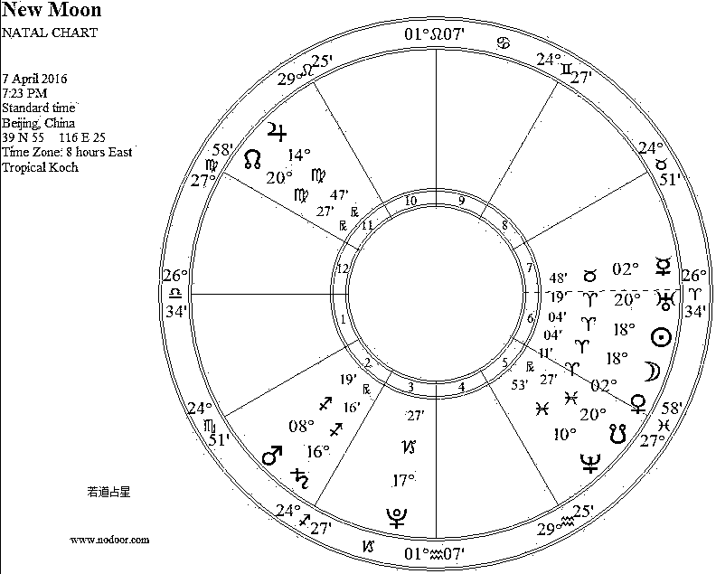

行进的太阳、月亮和天王星合相白羊座，似箭在弦上，亦有朝气蓬勃万马奔腾之势，加之土星助阵，冥王星角力，使得白羊无畏勇猛天性之下蕴藏了厚实与凝重。

群白羊座落于 6 宫，意味着要将勇气与冲劲落于实处，身体、工作、生活，实实在在地创造。在这个过程中，可能沟通不畅、遭遇压制、冲突、纠纷（与 3 宫冥王星成四分相，交通也要小心），或许长久隐藏的真相、积压已久的旧怨爆发，不再能继续维持表面和谐。当某个状况的隐藏情形从底层被掀翻，也不得不面临着重新建构、整理拣选。

另一面，提醒我们行动也要避免盲目冲动，适当考虑策略与权衡，带着智慧与远见，或有可能将冲突转化为沟通；运气好的话，不打不相识，或可因此结交盟友，加入团体，获得支持（木星冥王星三分）。

同时，在我们善用这些能量之时，也会在行动中获得物质或精神的财富——现实资源或内在“我能行”的价值感（太阳、月亮、天王星三分 2 宫土星）的回报。

## 星图在呼唤——以死亡为镜，让生命勇敢

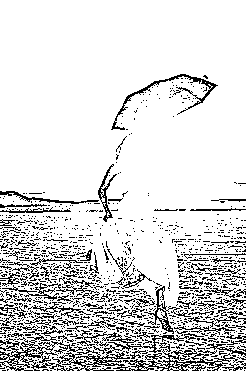

每个节气持续 15 天，从新月的行动到满月收获也是 15 天，在这两个交错的 15 天里，与死亡和出生都那么接近。苦与无常都是真相，众生一体也是真相，但唯有对前者真正的体验、正视与承担，对后者的理解才不至于流于口号或逃避的借口，无处生根。对过去人事物的追忆、思念与哀伤，能让我们更加珍惜拥有的宝贵光阴，无论是爱是恨，都鼓励我们把从此刻开始的生命活的更淋漓尽致。

这是一个机会，连结内在白羊能量无畏的勇气，**迎着恐惧，去行动、体验生命的喜怒哀乐、苦痛悲伤，这才是我们灵魂选择的使命——去体验**。每一个痛苦都是为了造就我们成为独特的自己，我们都喝了孟婆汤，忘记了我是谁、想成为谁，痛苦是来提醒我们。而当我们迎面向前，也许会发现，痛苦也是无常，**进与退是一体两面，面对与告别相连，平静与喜悦会在直面之后渐渐浮现**。

> **注**：除上述天冥四分被触发，白羊座、处女座、双鱼座能量影响之外，土星木星四分、火星土星合相、木星海王星对分（土星、木星和海王星 T 三角）在不同时期也有不同冲击。总体而言，**若出生星图个人行星落在基本星座（白羊座、巨蟹座、天秤座、摩羯座）12°~22°、变动星座（双子座、处女座、射手座、双鱼座）8°~23°，近期更易感受到影响。**

**以下事项需注意**：交通意外、交流过于唐突莽撞、身体运动勿过于突然剧烈、手术需更谨慎、注意头部、心脏方面及神经系统疾病、忌不了解状况的冲动投资、整容等（上述度数更易躺枪）。


**作者简介**

**喜悦龄以（张征）**：工学学士，工商管理硕士（MBA）；2013 年通过 ISAR 国际职业占星师资格认证，成为首批 ISAR 认证的中国占星师（CPA）之一。持续接受心理学专业训练，为国家二级心理咨询师，专注于精神分析及家庭治疗的实践与探索，中德高级系统式家庭治疗培训项目毕业，中法精神分析连续培训、Brigitte Rasmus 教授、施琪嘉教授创伤心理研究与治疗培训项目成员，持续接受督导及每周 3 次个人分析。

**主要工作**：占星咨询、家庭咨询及心理动力学取向个体咨询。

**微信公众号**：xingchenlaixin 

**喜马拉雅个人电台**：喜悦龄以

长按二维码，让金钱涌向传播知识与智慧的人~

 

**◆ ◆ ◆  ◆ ◆**

**特别提醒****：本文由作者授权发布于若道平台，转载请注明“转自若道”并标明作者。**  

4 月 7 日就是白羊座新月了，每到新月时分，都是播种心愿的时期。点击文末“**阅读原文**”，免费领取你专属的新月报告！

点击文末阅读原文领取新月报告


# 白羊座新月 | 有些改变来不及等你去想好（附新月攻略）

> 原文：[`mp.weixin.qq.com/s?__biz=MzA5NjA0NTAxNg==&mid=403718856&idx=1&sn=4e6c7230d33ae913cd5c14d014765343&chksm=0d52f07f3a25796941e69d35654527d66fb7adb3cfc8790c6fe25838c0f4ec0538d68ac6eb4a&scene=126&sessionid=1692738851#rd`](http://mp.weixin.qq.com/s?__biz=MzA5NjA0NTAxNg==&mid=403718856&idx=1&sn=4e6c7230d33ae913cd5c14d014765343&chksm=0d52f07f3a25796941e69d35654527d66fb7adb3cfc8790c6fe25838c0f4ec0538d68ac6eb4a&scene=126&sessionid=1692738851#rd)

**作者/沙沙 图片/VCG**

**白羊座新月**

4 月 7 日 19：23，新月发生在白羊座 18 度 04 分的位置。如果你的出生星图上有重要星体或南北交点落在基本星座（白羊座、巨蟹座、天秤座、摩羯座）17~20 度左右的位置，那么这轮新月对你而言，可能具有特殊的意义，甚至可能富于戏剧化的色彩。

**白 羊 座 新 月 —— 改 变**

新月是一个月亮周期的开始，是种子萌芽的时刻，新月与开创新局面、启动新计划有关。它代表着清理过去，打破旧格局，创造一个全新的开始，走一条没有走过的路。

而白羊座恰好是黄道上的第一个星座，它像一朵小小的火花，划破冬夜的寒冷与沉寂，带来春天的勃勃生机。

**在占星学语言中，白羊座与强烈的自我意识有关。**典型的白羊座，胸中仿佛有一团火焰——他们强大的“自我”熊熊燃烧，让他们急于向世界宣示“我”的面貌、“我”的存在、“我”的力量。

因此，白羊座新月也许是所有新月中与“开创”意义最为吻合的一个。**这一轮新月充满白羊式的热情、勇敢、纯真甚至莽撞。再加上与天王星的合相，更给这轮新月的带来了强烈的“创新”和“独立”的意义。它鼓励人们去想、去做、去确立自我，打破生活的常规与平淡，为一种新的生活样貌而努力。**

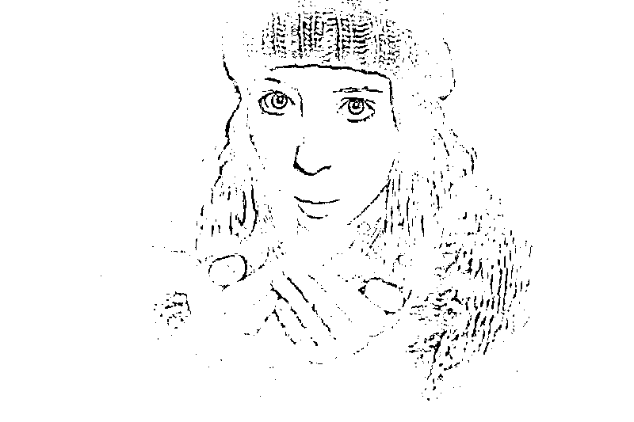

**这轮新月也代表着改变，而这种改变可能是以一种令人意想不到的方式来进行的。**别忘了冥王星也在这幅新月的图景里扮演着重要的角色：冥王星和天王星是两个霸道又不守规矩的家伙，当他们联手时，你可能发现生活的平静一下子被打破了，你被逼着站在命运的岔路口，像白羊座那样面对挑战，确立自我。

**当然，在此之前你需要先弄明白真正的“自我”是什么。**你的动作必须要快，因为白羊座和天王星都没有什么耐心，你得灵活应变，勇敢应对，迅速行动。

有时候，你甚至来不及思考，而是要依赖直觉，白羊座那样的直觉——也许，**脑中的那一个闪念，就能为你揭示出自我的真正需求，或指出你将要去到的方向。**

届时金星也将在白羊座闪耀，并与射手座的火星形成和谐的三分相位，你完全可以更自信一些：**相信你将要展现出的，是充满热情与魅力的自我。**

**属 于 你 的 新 月 提 示**

*这里特别要说明下，有些读者曾反映：按照自己的上升星座，文章列出的新月发生的宫位与自己的实际发生宫位不符，因此下文一并列出新月发生的上升星座和宫位，方便大家按需查询。*


**上升白羊座或**

**新月发生在出生星图第一宫**

**这正是调整自我定位的好时机。**你可能会想尝试一种富有挑战性的生活方式，让自己以全新的面貌示人。事业方面易出现变动，想要挑战权威和规矩，可能会收到高层或长辈的压力。勇气、直觉以及创意，将帮助你获取成功。


****上升**金牛座或**

**新月发生在出生星图第十二宫**

虽然这是一个代表“幕后”或“休息”的宫位，但这并不代表你的生活会停滞不前。这个时候，**你需要的是运筹帷幄的智慧和实力。**你的价值观可能会受到某种挑战，但你正好可以趁这个机会想清楚自己的目标和价值所在。


****上升**双子座或**

**新月发生在出生星图第十一宫**

**新月为你的朋友圈、商业往来带来一些新的机遇。**也许你会从朋友那里得到意想不到的消息，也许你会结识一个与你过去的朋友圈截然不同的人，而你需要保持的是灵活以及真诚。财务方面可能会有一些压力，特别是牵涉到他人的财务事宜要多加小心。


****上升**巨蟹座****或**

**新月发生在出生星图第十宫**

**事业再度成为你的关注焦点。**你也许需要面临一个新项目甚至一份新工作的挑战，而创意和独立性正是这份工作所需要的。在事业领域，你将得到众人的注目和支持，当然也可能会有强劲的竞争对手出现。稳住局面，恪守职责，虽然辛苦一点，但终将有回报。


****上升**狮子座或**

**新月发生在出生星图第九宫**

**新月发生在你出生星图的第九宫，为旅行、求学、出国、传播及法律工作等带来利好消息。**你可以趁此机会给自己一场难忘的远行，或是学一些新的东西，但这些都只是途径而已，最重要的是扩大自己的见识，让自己拥有更为宏大的视野、更为成熟的价值观。身体健康也是近期需要关注的内容，不要让自己太过疲惫。


****上升处女**座或**

**新月发生在出生星图第八宫**

**新月发生在你出生星图的第八宫，这是一个与“意外之财”有关的宫位，加之天王星正在此宫内，你可能会发现自己的财务状况要面临较大的波动，可能有意外之财，也可能有损失。**而因为冥王星行进在你出生星图的在第五宫，这个宫位同样与投机有关，如果你不希望财务波动太大，尽量避免风险投资。


****上升天秤**座或**

**新月发生在出生星图第七宫**

新月发生在你出生星图的第七宫，这是一个与“他人”和“关系”相关的宫位，这个宫位里带来的变化，可能是你难以把握，也难以预料的。总之，**原有的关系状态会发生某种变化，不管是关系更进一步也好，共同面临挑战也好，都需要你以更大的勇气去应对。**


****上升天蝎**座或**

**新月发生在出生星图第六宫**

**新月发生在你出生星图的第六宫，职场关系可能成为你关注的重点。**沟通方面可能会存在一些意外的状况，文书、物流等事项需多加注意。总之，你需要以更旺盛的精力应对职场上的种种繁杂事务，比如下属的工作变动，或一些意料之外的细节问题。你需要在细心的同时也保持决断力。


****上升射手**座或**

**新月发生在出生星图第五宫**

**新月发生在你出生星图的第五宫，这个与恋爱、创意、子女有关的宫位将迎来新的变化。**你的爱情生活可能会出现新的转机或遇到新的挑战，财务方面的事情也会同时让你感到头疼，而在这个过程中，保持热情和乐观是十分必要的。工作中或是在证明自我价值的过程中，创意和独特性都会为你加分。


****上升摩羯**座或**

**新月发生在出生星图第四宫**

**新月发生在你出生星图的第四宫，家庭或住宅问题会成为你关注的焦点。**某个家庭成员可能会为你带来一些意想不到的消息，而这会影响到你的自我定位，你可能需要发现自己新的职责、新的角色；你也可能会有装修房子的计划，甚至你的住宅可能会面临突然的变动，这些都需要你打起精神灵活应对。


****上升水瓶**座或**

**新月发生在出生星图第三宫**

**新月发生在你出生星图的第三宫，这是一个和沟通、交流有关的宫位，你可能会面临忙碌的工作，特别是沟通中难以说清楚的麻烦，需要花费更多的时间来应对**。你也可能需要面临一场突如其来的差旅，需要及时做好准备如果你计划写一些东西的话，这个新月正是好时机，与众不同的创意和丰盈的想象力都会成为你的好帮手。


****上升双鱼**座或**

**新月发生在出生星图第二宫**

新月发生在你出生星图的第二宫，这是与财富以及个人价值有关的宫位。**你可能会面临某个与财务有关的意外消息，不管是意外的开销还是意外的收入，都会促使你改变计划，以不同于以往的姿态去处理与金钱有关的问题。**你也可能从领导或朋友那里得到帮助，帮助你对自我价值、自我定位有新的思考。

许愿时间

**2016 年 4 月 7 日 19：23~4 月 9 日 19：23**

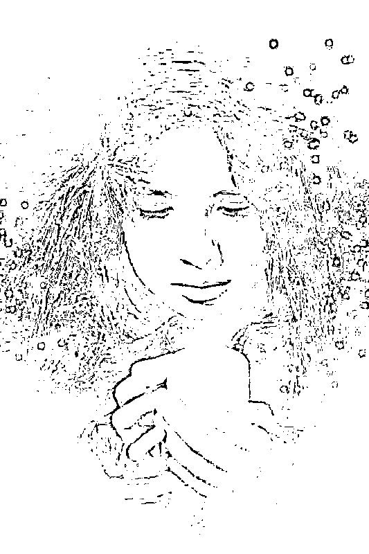

**点击文末“阅读原文”领取免费新月报告，
分享你的愿望哦~**


**作者简介**

**沙沙**：占星咨询师，占星专栏作者，国家二级心理咨询师。2010 年创办工作室“九月占星馆”，2013 年通过 ISAR 职业占星师资格认证考试，成为首批在中国大陆通过该测试的占星师之一。长期研习出生图、关系盘、流年预测等技巧。希望通过星图，帮助来访者实现有效的自我觉察。

新浪微博：九月占星馆 

**微信公号**：九月占星馆（jiuyuezhanxing）

**个人微信**：zhouzhe7752（添加请注明“占星咨询”）

长按二维码，让金钱涌向传播知识与智慧的人~


 **◆◆ ◆  ◆ ◆** 

**特别提醒：****本文由作者授权发布于若道平台，**转载请注明“转自若道”并标明作者。****

4 月 7 日就是白羊座新月了，每到新月时分，都是播种心愿的时期。点击文末“**阅读原文**”，免费领取你专属的新月报告！ 

点击文末阅读原文领取新月报告


# 测试 | 占星学入门知识小测试，看看你能答对多少

> 原文：[`mp.weixin.qq.com/s?__biz=MzA5NjA0NTAxNg==&mid=403697159&idx=2&sn=e4ab5b3f62dc73c70c59d51d0bfcf041&chksm=0d4d5cb03a3ad5a6d5610fb8343478653b34258d71b230980f4796bdb4d8be31839490d8ed7c&scene=126&sessionid=1692738851#rd`](http://mp.weixin.qq.com/s?__biz=MzA5NjA0NTAxNg==&mid=403697159&idx=2&sn=e4ab5b3f62dc73c70c59d51d0bfcf041&chksm=0d4d5cb03a3ad5a6d5610fb8343478653b34258d71b230980f4796bdb4d8be31839490d8ed7c&scene=126&sessionid=1692738851#rd)

你知道吗？占星学与天文学、历史学、哲学、医学、政治学等等也有十分紧密的关联，在中世纪甚至更早的时期，占星学家为皇室工作，他们需要学习非常丰富的、来自各行各业知识。

如今，占星学不再像曾经那样被皇室所垄断。但作为一名占星学爱好者，不论你是初入师门、还是登堂入室、抑或是荣登殿堂，丰富的知识储备，永远是必须的。

**下面，**

**我们来测试一下与占星学相关的部分基本知识吧！**

**看看你掌握了多少**

**第一部分：选择题。（每个正确选项 5 分，共 55 分）**

1. 将地球绕太阳运转的轨道等分成 12 个部分（即 12 个星座），称之为 _______。

A. 赤道带

B. 热带

C. 温带

D. 黄道带

2. 地球赤道延伸至宇宙所形成的平面是 _______。

A. 天球黄道

B. 天球赤道

C. 恒星赤道

D. 天体黄道

3. 在黄道上的实际度数只占 7 度的星座是 _______。

A. 处女座

B. 天秤座

C. 白羊座

D. 天蝎座

4. 西方占星学中所使用的黄道带是 _______。

A. 回归黄道

B. 宇宙黄道

C. 天球黄道

D. 恒星黄道

5. 秋分点对应的星座是 _______。

A. 巨蟹座

B. 天秤座

C. 水瓶座

D. 射手座

6. 夏至点对应的星座是 _______。

A. 白羊座

B. 处女座

C. 狮子座

D. 巨蟹座

7. 同为基本星座和阴性星座的两个星座是 _______。（本题有两个答案）

A. 巨蟹座

B. 天秤座

C. 水瓶座

D. 双鱼座

E. 摩羯座

F. 处女座

8. 阴性、变动的水象星座是 _______。

A. 处女座

B. 天蝎座

C. 巨蟹座

D. 双鱼座

9. 对应身体的眼睛、耳朵、手臂的星座是 _______。

A. 双鱼座

B. 白羊座

C. 双子座

D. 射手座

10. 对应身体的后背下部、肾和膀胱的星座是 _______。

A. 天蝎座

B. 天秤座

C. 处女座

D. 狮子座

**第二部分：判断题（每题 5 分，共 45 分）**

11. 白羊座因果断自信而闻名。

A. 对

B. 错

12. 金牛座会在感到值得的时候行动。

A. 对

B. 错

13. 双鱼座因守时而闻名。

A. 对

B. 错

14. 水瓶座、摩羯座和处女座是三个最不感情用事的星座。

A. 对

B. 错

15. 射手座最基本的恐惧就是受到限制。

A. 对

B. 错

16. 巨蟹总是看起来疏远又冷酷。

A. 对

B. 错

17. 天秤座因总是制造麻烦而闻名。

A. 对

B. 错

18. 天蝎座总是被指控为表面和肤浅。

A. 对

B. 错

19. 双子座众所周知很顽固。

A. 对

B. 错

 作为一个占星学爱好者，你对这些问题了解多少呢？在后台回复**【入门测试答案】**，看看你答对了多少吧。

哦，对了！这些小知识，在即将开始的《2016 若道占星核心课程 Level 1-2》中，都会提到，而且更全面！快来参加吧！

**4 月 6 日是早鸟价最后一天哦！**

**课程信息**

**授课时间：**2016 年 5 月 19 日**-7 月 7 日**

**授课老师：**蒋颖（8 次）、大卫·瑞雷（4 次）

**授课方式：**网络课

**费用：****2400 元（2016 年 5 月 6 日前报名付款）**

**早鸟价：****1980 元**（2016 年 4 月 6 日前报名付款）

**报名截止：**2016 年 5 月 6 日

**课程负责人：**童老师（微信号：80248863）、王老师（微信号：2837474346）

**咨询电话：**400-619-1014

课程简介


**星座、太阳和月亮**

12 星座是占星学最基本却又最深刻的概念，黄道 12 星座，是伟大的生命周期，而太阳和月亮是我们阴阳之本。

**●12 星座：**和大卫一起，深入了解 12 星座的特色。了解星座正面的、负面的表达，了解其资源，了解其破坏生命的模式。了解其原型人物、了解其指代的人事物。

**●12 星座原则：**按照极性、形态和元素给星座分类。

**●12 星座关键词：**关键词是解读准确性的关键。

**●太阳和月亮：**了解你的太阳，生命的发动机，让你在世界闪光的方式，生命获得力量的方法；了解你的月亮，让你生命获得幸福的方法。了解它们，了解你生命中已经出现的、将会出现的男人和女人。


**遇见行星和月亮交点**

在这个阶段，你将遇见行星们，还有与灵魂的过往和未来相关的月亮交点。这既是你，你的性格，也是你在生命故事中将会遇到的人、事、物的显化，也是你灵魂轨迹的线索。    

**●内行星：**水星、金星、火星

**●中间行星：**木星、土星

**●外行星：**天王星、海王星、冥王星

**●灵魂的线索：**月亮南交点、月亮北交点

**●行星逆行：**行星逆行的天文现象和意义

**●宫位初解：**了解黄道 12 宫的基本含义

时间安排

共 12 次课，24 课时。

**●8 次理论课程**（蒋颖老师主讲）

北京时间每周四晚 20：00-22:00

**●4 次线上互动课程**（大卫老师主讲、配有中文实时翻译）

北京时间每周一晚 20：00-22:00

课程特色

**①与名师面对面**：北京同学可以来若道现场上课，和大卫老师面对面互动。大卫老师也可能前往主要学员所在城市，实现零距离教学。

**②互动答疑**：论坛、微信群随时提问；老师课上答疑；助教线上线下全程协助。

**③线下沙龙**：定期举办沙龙活动，复习上课内容。

**④强大的同学网络**：若道作为中国最顶尖的占星教学机构，在 4 年的占星教学中，培养了很多占星人才。若道让你和师兄师姐切磋，让你和国内著名占星师学习。（简单来说，就是，人脉！）网络授课，在北京开设免费现场参与名额，全程英文授课，配备实时翻译。

师资力量

**讲师团队**


**蒋颖（Felicia）**

若道创始人，职业占星师。在若道系统学习占星，师从大卫·瑞雷。长江商学院 MBA，厦门大学经济学硕士，化学学士。国际占星研究协会（ISAR）中国区副主席。第一批获得国际占星研究协会（ISAR）认证的职业占星师。《灵魂的目标》译者。


**大卫·瑞雷（David Railey）**

若道创始人，《灵魂的目标》作者。拥有 46 年的占星执业经验，曾两任亚特兰大占星协会主席，是全美占星师联盟（AFAN）、美国占星师联合会（AFA）、全美占星研究委员会（NCGR）、国际占星研究协会（ISAR）和职业占星师组织（OPA）的成员，是联合占星大会（UAC, United Astrology Conference）督导委员会委员。大卫曾是 CNN、CBS 的占星节目的常驻嘉宾，多次在 BBC、WGS、WSB、WRGG 等节目中接受采访，并在亚特兰大主持电视节目《每日行星（Daily Planets）》达 4 年之久。

**助教团队**


**熊鹰（天空的空）**

国际占星研究协会（ISAR）认证占星师。在若道系统学习占星，师从大卫·瑞雷，现任若道专职助教。将传播系统、严谨、真实的占星学作为职业使命。与此同时，提供一对一占星咨询服务与生时校正咨询。目前正致力于占星学与个人真修实证的整合。2014 年起主讲读书会，助教答疑课程累计超过 100 小时。


**Gaff**

全职占星师，既是占星师，也是疗愈者。2013 年开始在若道进行系统占星学习，师从大卫·瑞雷。任 2015 年度诺·泰尔、斯蒂芬·福里斯特老师的占星工作坊助教。提供一对一的咨询服务（已有超过 100 小时的咨询经验），基于个案咨询的经验，曾多次开设面授的占星课程。


**◆  ◆  ◆  ◆  ◆  **

长按二维码接通课程负责人


报名及咨询，请点击文末“阅读原文”

# 金星进入白羊座 | 那件疯狂的小事叫爱情

> 原文：[`mp.weixin.qq.com/s?__biz=MzA5NjA0NTAxNg==&mid=403697159&idx=1&sn=59ea2618fe637aafe17ef31b5466f106&chksm=0d4d5cb03a3ad5a6caff68094fabac76c6000c5d086003d4547641794ec53083b5fa73480637&scene=126&sessionid=1692738851#rd`](http://mp.weixin.qq.com/s?__biz=MzA5NjA0NTAxNg==&mid=403697159&idx=1&sn=59ea2618fe637aafe17ef31b5466f106&chksm=0d4d5cb03a3ad5a6caff68094fabac76c6000c5d086003d4547641794ec53083b5fa73480637&scene=126&sessionid=1692738851#rd)

4 月 6 日 0:51 金星进入白羊座，在接下来 24 天内，金星会经过每个人星图中白羊座所在的宫位，点燃一波火红的激情。金星运行速度比较快，它会在短期内触发、启动和波及白羊座以及与之有相位的行星，不同于外行星行运的深长影响。白羊座的金星促使情感的反应更积极、迅速，用行动争取价值，也会带来彰显的个性美。

**金星进入白羊座**

金星是一种阴性能量，是情感、享乐；是爱与美、财富与价值；是女性的象征。它迷人也令人愉悦。白羊座被火星守护，是战士原型、是率真、热血、快速、直接、冲动、勇气和意志力。

金星守护的是金牛座与天秤座，金牛座的享乐主义与天秤取悦、和谐都与金星的本质共振。这两个星座对面的天蝎座与白羊座在传统意义上被认为是金星较难正常发挥的位置，天蝎座的深邃孤僻令金星难以愉悦，白羊座的冲劲与血气方刚则与金星的婉约柔美相背离。然而，正是这种刚柔相济、阴阳合一的碰撞带来了非凡的吸引力——不拐弯抹角地表情达意、主动大胆、柔情之中自有决断力、穿透力，拥有令人无法抗拒的魅力。 

**金星在白羊座的爱情打开方式**

**“一见钟情”正是金星白羊座人的恋爱打开方式，他们如孩童般简单、纯真，是恋爱中的傻白甜，唯有快速撞入心扉的人才迎合他们对爱热切的期盼，根本没有耐心微火慢炖。**

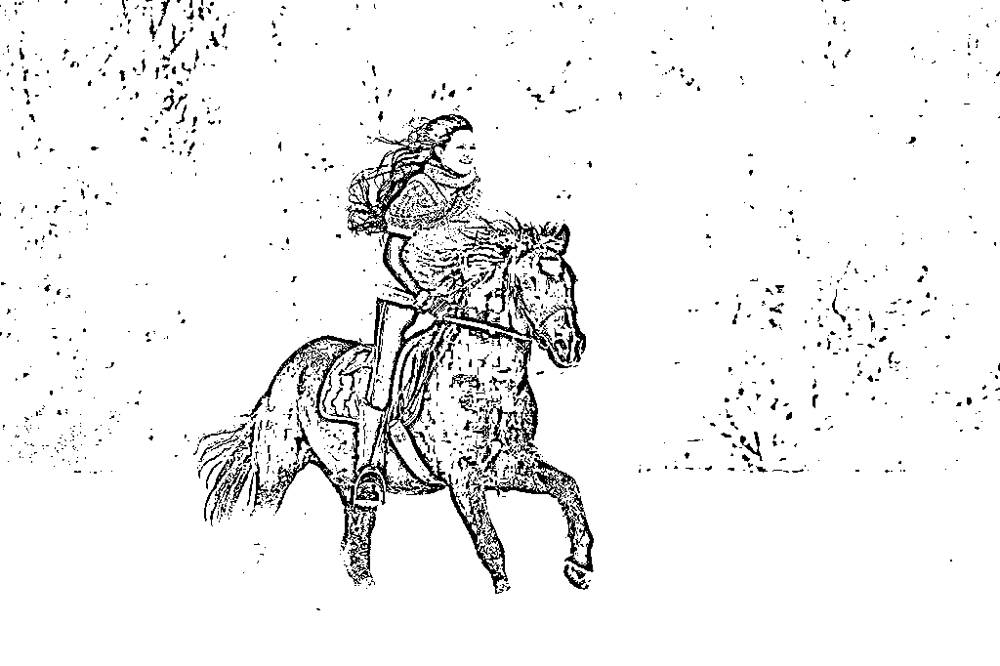

“女为悦已者容”说的是天秤座的金星。**而白羊座的金星是：为已而容。不做作、不为他人粉饰、真挚无虚——爱，就请爱我真实的样子，勇敢热切，赤诚如火。**

金星白羊座的人在感情世界中与竞争好斗的伴侣相互吸引，也容易进入三角关系或是参与金钱与价值的角逐。他们会在关系中占据主动，也倾向于和伴侣互保鲜明的个性。由于白羊的自我中心，即便在情感的争端中也不为关系妥协，有时是盲目，有时却明知对方需求，也不原牺牲自我尊从对方的价值观。

**极少犹豫，主动示爱，也意味着更多的冲动与挫败。**白羊座的战士原型给金星带来为爱无畏的勇气与果决，宁可受伤，战死沙场，也要赴汤蹈火。于是，白羊金星总在伤痛中吸取营养，学习成长为更有力量的爱的战士。只有在经历万水千山之后，依然拥有天真去爱的勇气，才是金星在白羊座巨大的财富。

**金星在白羊座爱的方程式是：我爱你，与你无关。**奉你一颗滚烫的心，若你承接，这炽热的爱火将照亮你心。只因无畏爱过的每一次，才令自己的生命更有价值。

**金星在白羊座的名人**

雷诺阿、加西亚·马尔克斯、奥黛丽·赫本、伊丽莎白·泰勒、玛丽莲·梦露、吕克·贝松、伊能静、徐若萱、舒淇、范晓萱、蕾哈娜、Lady Gaga……他们的面孔、眼神、肢体语言、艺术作品，无不散发出鲜明、自我、真挚的吸引力，他们的情感世界亦然。


****▲ 玛丽莲·梦露****

玛丽莲·梦露用手按住被风掀起裙摆的经典照片，如此摄人心魂，没有一个男人不为之迷醉，所谓倾国倾城，不过如此。

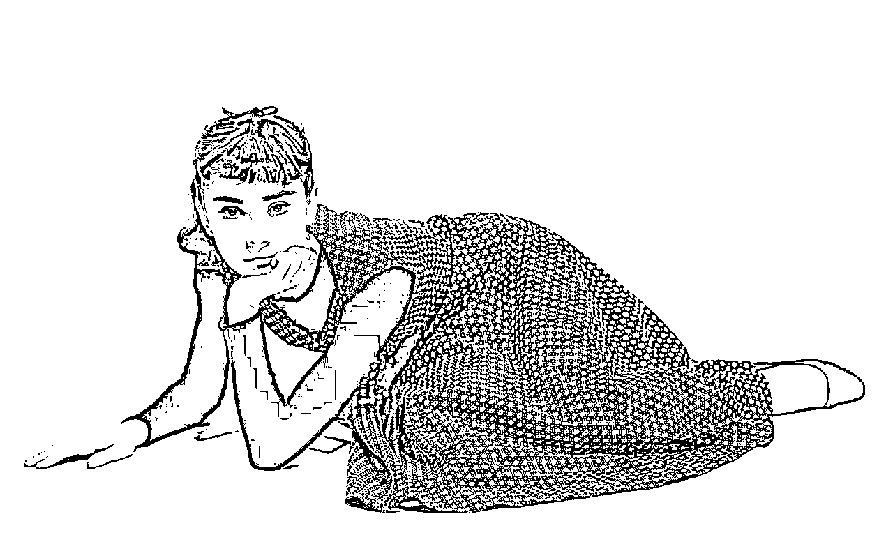

****▲ 奥黛丽·赫本****

奥黛丽·赫本的可爱、纯真深入人心，在很多人心中她是无人能替代的女神。她的一生都勇敢为爱追寻，最终将这份纯真的爱献给了孩子们，建立了自己的儿童基金会。

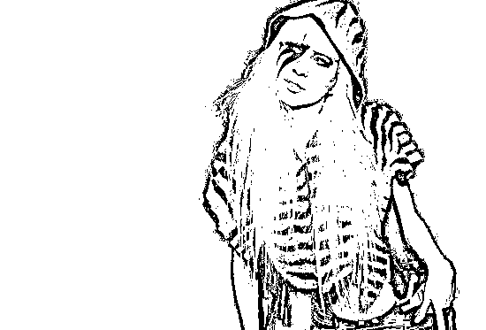

******▲ Lady Gaga******

蕾哈娜和 Lady Gaga 都是这个时代大胆时尚的标志性人物，以鲜明的个人风格著称。


********▲ 伊能静********

伊能静曾站在 TED 演讲台上，铿锵道出金星在白羊座真实的宣言：

**“我就是要跳出这个时代，成为一个勇敢的人。虽然我的先生小我 10 岁，当我更年期的时候，他还非常年轻帅气，我相信他会爱我的内在，我只需要是我自己。”**

> **伊能静作词的《春泥》**
> 
> 迷雾散尽 一切终于变清晰
> 
> 爱与痛都成回忆……
> 
> 我会提起勇气  好好地呵护你
> 
> 不让你受委屈 苦也愿意
> 
> 那些痛的回忆  落在春的回忆里
> 
> 滋养了大地  开出下一个花季……

**金星在白羊座的金星冥王星相位**

出生星图中金星落在白羊座的人里有相当一部分人带有金星冥王星对分相（如：出生于 1973 年到 1983 年期间，当时的冥王星在天秤座），当然，同时期出生，金星落于其它开创星座（巨蟹座、天秤座、摩羯座）的人也有相当一部分有金星冥王星困难相位。当下的冥王星正在摩羯座，这个时代出生的金星白羊座的孩子很多也会有金星冥王星四分相。

冥王星是高八度的火星。它具有比火星更强烈的战斗力、催毁力和颠覆力，它是黑暗不可见的炼狱，也是转化重生的火炉，赋予人类蜕变的魔力。当白羊座的金星与冥王星碰撞，激起的火花带有致命吸引力。

不管冥王星终级表现如何，在体尝它的过程中总带着黑暗的驱力。**拥有金星冥王星相位的人生命中难免吸引来激烈、隐密的地下恋情。纵然他们内心已汹涌澎拜，电闪雷鸣，外表依然风平浪静。**很多感情困惑的人会寻求占星师或是心理咨询师的帮助，但**拥有金星冥王星相位的人甚至不会向最信任的挚亲好友倾诉。因为冥王星强迫的隐密性令他们的情感生活无论炽热程度还是面对普世道德都是极端甚至越界的，尤其在他们内心深处会给自己贴上罪恶、羞耻、禁忌的标签。**所以，金星冥王星相位的人很难打开内心最隐秘，复杂又瑰丽的城堡。

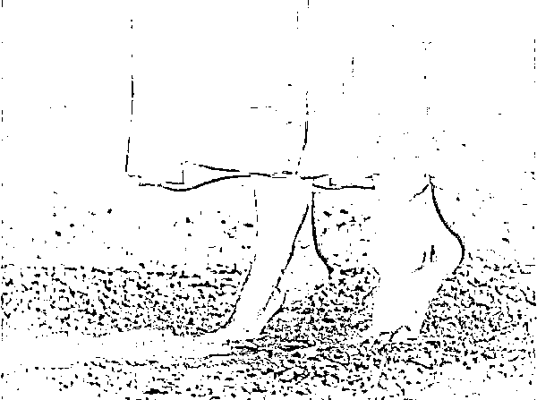

**很多拥有金星冥王星相位的人早年生活经历了黑暗、冷酷、被控制、挣扎、受虐、生存的危机、彻底的丧失和激烈的对峙。成年以后，依然会在关系里寻求同等的体验来符合内心对爱的感受。**

他们心底深蕴着对真爱的渴求，用冥王星无意识的强迫性不懈追寻，往往吸引来刻骨铭心的爱，一次次深入情爱险境，甚至陷入毁灭性的危机。然而，早年的经验驱使他们做出无悔而绝决的行动，即便瞬间燃烧，粉身碎骨，舍身为爱也在所不惜。

再加上金星白羊的冲动盲目倾向，在生命中总会如飞蛾扑火般奋力投入爱的烈焰，以至欲火焚身。仿佛只能待烈焰成灰时才觉伤痛难耐，而血泪交融的过程也许正是金冥相位的人最适宜的自我疗愈方式，深入炼狱，才能浴火重生。

冥王星不会如此轻易放过勇敢的金星，在伤痛过后仍难以释怀，执著如渊，无法觉醒。于是任狂风巨浪拍打吞噬，然后，纵身跃入无底深渊，去找寻那些困住自己的童年情境，承认那些伤痛的源头有着从未改变的吸引力，在灵魂深处寻找终级答案：

*   为何要在爱的关系里寻求而不得？

*   为何总是被那些痛苦的感情所吸引？

*   为何总在黑暗中体尝激情？

**金星冥王星相位——直面恐惧**

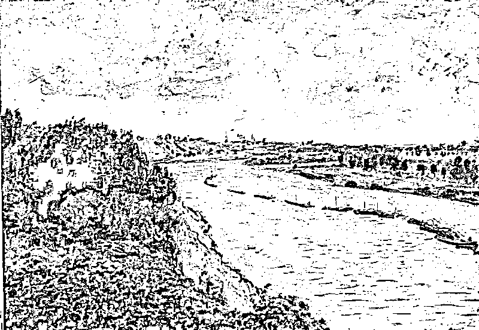

******▲ 雷诺阿的作品******

著名的印象派画家雷诺阿的金星和冥王星合相在白羊座。他一生贫困，却画出美伦美幻，充满生机的大自然，柔润、明丽、青春活力的女性，纯洁无邪的儿童。他说：**世界上丑恶的事已经够多的了。艺术为什么不能是美的呢？**

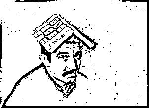

******▲ 加西亚·马尔克斯******

20 世纪拉丁美洲文学标杆加西亚·马尔克斯，他的白羊座金星与冥王星四分，具有白羊座的优越价值感与先驱精神。幼年的加西亚听外祖母讲很多神鬼故事，童年的记忆就是鬼怪幽灵的世界，这冥王星色彩的童年便成为了《百年孤独》的创作源泉，筑就了他魔幻现实主义文学先驱的地位。 

从现实的黑暗中提取纯美的元素，从死亡的事物中升华出绝世之美，化腐朽为神奇，是金星和冥王星相位的人将才华用于艺术创造的最佳表达方式。


******▲ 伊丽莎白·泰勒******

伊丽莎白·泰勒有着金星和冥王星的四分相，一生有过六次婚姻，每一次彻底的丧失后再度以白羊勇士的面貌重燃爱火，演绎了比电影还具颠覆色彩的人生。


********▲ 舒淇********

舒淇的的金星在白羊座与冥王星零度对分，早年的她因生活所迫以三级片出道，用禁忌、挑战大众审美底限的方式出卖自己的魅力。然而，金星白羊令她无惧嘲讽、挑剔和责难，用自己不屈不挠的努力和鲜明的个性赢得荣耀，证明了自己独特的价值。她与张震戏剧般的恋情终以分手收场，两人共同出席活动时，她认真地质问张震：“你不是也娶了别人吗？”既是白羊座金星的率真，也带着冥王星的强迫与报复。你既离去，我心何甘。

在爱中直面最深的恐惧是金星冥王星相位的人的功课。最深的黑暗与他们生命中的源头之爱紧紧相连，若要逆转，寻求开解和疗愈，必入黑暗探寻、穿越、焚烧，从中提炼出如金子般纯然可贵的美好。金星冥王星相位可能是所有相位中与炼金术最贴切式，所以，它何尝不是生命中难能可贵的礼物？

让灵魂无惧真实，接受所有的发生，并坚信自己的爱纯洁无邪，用真挚的心与黑暗伤痛拥抱，任情感通过黑暗的炼狱，无论黑白都是自己无畏的人生。


**作者简介**

**郑玮玲（Sampriya）：**若道 COAC 高阶资质认证，国际占星研究协会 ISAR 会员，在若道跟随多名国际知名占星师学习占星。馨光爱妈妈会创始人，国内首批 ICEA 国际生育教育协会产后指导，国际母乳会培训的哺乳互助指导。

**个人公众号及咨询预约**：Sampriya-Astrology 

长按二维码，让金钱涌向传播知识与智慧的人~


**◆ ◆ ◆  ◆ ◆**

******特别提醒************：本文由作者授权首发在若道平台******，**转载请注明“转自若道”并标明作者。******

想更多了解金星和金冥相位？**2016 年 5 月 19 日**，蒋颖老师主讲的若道占星核心课程**Level 1-2**要开课了！她将带领你学习星座、太阳、月亮、行星、月亮交点等知识，让你进入占星学的世界！

报名及咨询，请点击文末“阅读原文”


# 重要星象 | 木土海 T 三角，你种下的梦想，经由努力终会实现

> 原文：[`mp.weixin.qq.com/s?__biz=MzA5NjA0NTAxNg==&mid=403676355&idx=1&sn=f6d3344a9daa34c5aa3e3dae543349dd&chksm=0d4d2e743a3aa76289f83f7726e91aea18388446f96cd07bcfcf85d0935458d0a51af32cb6c6&scene=126&sessionid=1692738851#rd`](http://mp.weixin.qq.com/s?__biz=MzA5NjA0NTAxNg==&mid=403676355&idx=1&sn=f6d3344a9daa34c5aa3e3dae543349dd&chksm=0d4d2e743a3aa76289f83f7726e91aea18388446f96cd07bcfcf85d0935458d0a51af32cb6c6&scene=126&sessionid=1692738851#rd)

作者/PersephonePeng  ISAR 认证占星师

图片/花瓣网

从立春算起，2016 年已经过去两个月了，可是在占星学中，白羊座的开启才算是拉开了新的一年的序幕。就让我们趁着白羊座这股直接的、醒目的、热情的能量，把之前冥冥之中感觉到的“一股拉扯”搬上台面来谈一谈吧。

## 土星、海王星和木星的较量

今年的星象有一个非常夺目的相位， 那就是土星分别与海王星和木星形成两个四分相，分别落在射手座、双鱼座、处女座三个变动星座上。其实这组相位从 2015 年 9 月 18 日土星正式进入射手座就已经开始发酵，随着 10 月 18 日南北交点进入双鱼座和处女座轴线能量增强，2016 年 3 月 25 日土星逆行，能量开始往每个人的内心深化，6 月 14 日海王星逆行、6 月 27 日凯龙星逆行，能量继续深化，直到今年 8 月 13 日土星恢复顺行、9 月 9 日木星移步天秤座才会告一段落。

**这段时期，梦想与现实的拉扯、乐观与悲观的较量、幻觉与真实的疑惑、逃避与压力的冲突，都会是大重点**。再加上，天王星在白羊座和冥王星在摩羯座持续四分相带来的革新、改革的张力，我相信，**很多人都会在内心的声音和外在现实的拉扯中，冥冥中想做出一些决定来改变自己的人生，或者转换职业跑道、或者从一段感情中解放、或者只是单纯不再看某人的脸色、或者你决定不再逃避某件事或者某个人、又或者你只是已经厌倦了 PS 的你，想要展现真实的你。**

而这些决定，都不再像是从前，只是一个想法而已，星象给了我们更加踏实的能量，我们会付出实际行动、制定出一个实际可行的计划、甚至很多人会开始学习一门专业或精进的磨练技能，用本领去实现自己的改变。

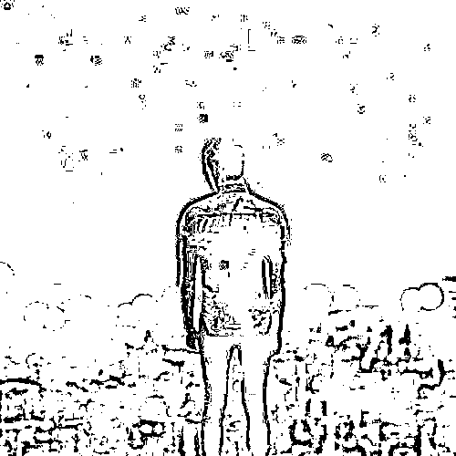

通常，在那一年可以红透全世界、感染一大片群众的影片都是极具当年重要星象能量的影片，譬如今年奥斯卡的热门电影，《火星救援》《荒野猎人》《聚焦》《房间》等，关键词都有孤独、艰难、技术、希望、失望、漫长、战胜、伤痛、旅程、信仰。

又如前阵子在网路上传播很广的一则六小龄童老师某饮料广告，为什么触动了那么多人的内心？这单纯只是出于对猴王的怀念吗？在我看来，这则广告很好的诠释了土星、海王与木星的能量，也给了我们具体的启示，如何去顺应这股能量，帮助我们改革自己。

## 土星在射手座：保有精神，脚踏实地

> 孙悟空与师徒四人历经八十一难，整整 16 年的时间才从西天取经成功。这是很形象的“土星在射手座”的象征。

所有的火象能量都是关于“精神”的，射手座的这把火代表着在长途旅行、异国文化中的旅者、在哲学、宗教、高等教育中的探索者、以及关于信仰、真理的追寻者，他们不断的追问、不断的冒险、不断的学习、不断的传播再教育。

土星代表的磨难、延迟、辛苦、历练、漫长的时间也开始显现。世界上只有一样东西无法被摧毁，那就是“真实”。土星给我们否定和挫折、给我们现实压力和残酷、给我们磨难和拖延，为的是让我们确保人生的地基是建立在“真实”之上：

*   我们是不是带着面具生活，而不是做真正的自己？

*   我们是不是只是满足了父母、学校、社会的期望，而不是我们内心的渴望？

*   我们是不是只是被外界所定义的“责任”“义务”所捆绑，而不是遵从内在的自律？

*   我们是不是无法面对我们内心的恐惧和不自信，转而用一种“稳定”“安全感”来让我们的人生不再前行？

同时，土星也是时间之神和农业之神，当你活出真实的你并且看清楚现实之后，一步一个脚印，日复一日、年复一年的持续耕耘，土星一定会成就你一个经典。

在今年，**从积极的角度来看，如果我们可以保有一种射手座的精神，去学习土星的法则，那么你会拥有一种更为强大而扎实的精神力量来支持你真正想要的未来生活。**这世界上最宝贵的不过是知道自己是谁，并且可以去做真实的自己吧。

## 海王星在双鱼座：让梦想照进现实

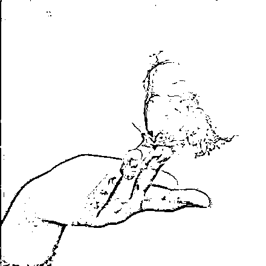 

> 孙悟空师徒四人明知西天取经艰苦异常，为什么他们还要去？我想不仅仅是一种来自天界的任务和对众生的责任，更是一种天命。海王在双鱼座很好地诠释了这种宇宙的召唤。

海王星，它的核心含义是一种“与宇宙合为一体的原欲”，那是一种无法遗忘的内在渴望和萦绕不去的内在声音，编织着集体潜意识中的梦。而双鱼座正面的发挥是灵性的追求、精神的升华、想象力的发挥；是艺术、是电影、是音乐、是图画；是感觉、是敏感、是美、是无条件的爱。是不是听上去都非常的美好？

我们每个人星图上都一颗海王星，我们每个人都有这样一种原欲，可是海王星给我们编织的梦，常常太大太美好，以至于太难实现，再加上每个人还有一颗重视现实的土星，于是大部分的我们都在被土星的现实和海王星的幻想拉扯着。

有些人选择了屏蔽海王星，忙忙碌碌毫无美感活在机器般的日子里，有些人选择了逃避土星，活在一个白日梦的幻觉中。可是所有的行星都是有能量的，每一个天神都需要一个出口被我们活出来，如果我们没有有意识的活出它们，它们便会用一种破坏性的方式来提醒我们——他们需要被看见！

不过，有时候不是我们刻意逃避，只是我们真的分不清什么是梦？什么是真？但好消息是，今年的星象会清清楚楚告诉我们： 

*   “哪些只是你的幻觉？哪些会是你的真实？”

*   “哪一些是你一直在逃避的？哪一些又是你应该要放下的？”

*   “你的梦想是什么？你的现实又是什么？”。

**这真的是一段非常好的时期，如果你是一个愿意让梦想照进现实的人。当然，我们也会不可避免的被这两股能量拉扯的很焦虑，这时候要记得连结双鱼的正面能量——电影、音乐、艺术、冥想，这些活动都会提供给我们灵感和放松。**

## 木星在处女座：解药在此

> 六小龄童如何能够成为美猴王的经典塑造者，不就是靠每天的练习、再每天的练习吗？这正是“木星在处女座”给我们的解药。

星图中处女座能量比较强的人最近都非常感慨吧，你们的努力终于被自己肯定、被他人看见。处女座是土象的能量，这代表我们的解药是要非常实际的、扎实的、来不得半点虚假和敷衍。

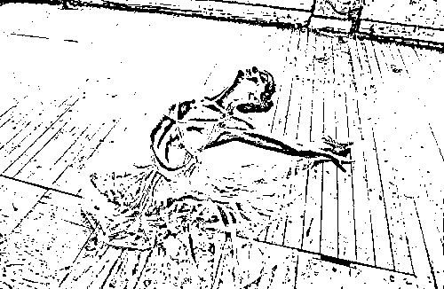

处女座代表着技术、挑选、雕刻、练习、记录、内在秩序的完善，“practice makes perfect 以及去其糟粕，取其精华”是可以代表其本质的。木星代表着学习、探索、扩张、赋予意义、信心，在此期间，我们不妨做如下的事情：

*   透过学习一门专业、打磨一项技能来提升信心；

*   用一种规律工作的踏实感来应对土星&海王的焦虑；

*   透过不断的练习，运用“记录”的方式，从每一个细节中发现我们努力的意义和生命的礼物。

木星处女座会让大家特别关注到身体、养生、健康、健身的话题。**如果你近段健康有出问题，那么代表你受这个星象影响是比较大的，这时候要好好思考为什么生病。我们生病，大部分时候本质不在身体，而在心灵，身体是心灵的显化，我们需要去看看我们的内在出了什么问题，或者我们是不是忘记连结自己的身体很久了。**木星的能量会帮助我们重新找到自己与身体的关系。

## 主要影响人群

今年这组具有强大能量的星象提醒你关注如何面对土星和海王星以及木星的关系议题。另一方面，天王星也正和土星形成三分相，对于愿意改变的人来说是机会。

**在这里想对出生星图中有土星、海王星、木星行成相位的人，以及变动星座（射手座、处女座、双鱼座、双子座）能量很强的人说：我们不是不懂得现实，只是我们还有精神、还有感觉、还有感受、还有梦想，所以我们会慢一点点，再慢一点点，我们只是需要不断调整、不断整合，因为我们需要每一步都是稳稳的。**

最后，时刻谨记：我们要持续的给自己注入土星的“耐心”、海王星的“爱”、木星的“希望和信心”、变动星座的“弹性”能量，“苦练七十二变，方能笑对八十一难”。

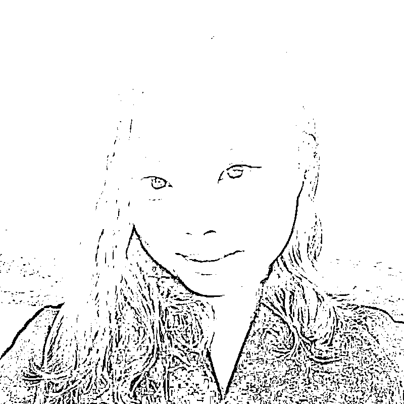

**作者简介**

**PersephonePeng**：ISAR（国际占星协会）资质认证职业占星师（CAP）。中学时代开始研习占星，以心理占星见长，涉猎不同门派的占星学，跟随多名国际大师系统学习占星学。 现将占星学作为一种觉察疗愈工具与个人成长相结合，帮助个案实现自助疗愈。

**微信公众号：**Persephone 占星与个人成长工作室（ID：PPPAASHS）

长按二维码，让金钱涌向传播知识与智慧的人~

 

**◆ ◆ ◆  ◆ ◆**

**特别提醒****：本文由作者授权首发于若道平台，转载请注明“转自若道”并标明作者。**  

梦想依然模糊？来若道寻找线索吧！**2016 年 5 月 19 日**，蒋颖老师主讲的若道占星核心课程**Level 1-2**要开课了！她将带领你学习星座、太阳、月亮、行星、月亮交点等知识，让你进入占星学的世界！

报名及咨询，请点击文末“阅读原文”


# 入门医疗占星学，看这里就对了

> 原文：[`mp.weixin.qq.com/s?__biz=MzA5NjA0NTAxNg==&mid=403676355&idx=2&sn=8b0e3e0b57c5dee37abc1792ef7205e9&chksm=0d4d2e743a3aa76298675c913720cf7d5e1aff3b04c59f39774c889e9d187098ced163ee3d25&scene=126&sessionid=1692738851#rd`](http://mp.weixin.qq.com/s?__biz=MzA5NjA0NTAxNg==&mid=403676355&idx=2&sn=8b0e3e0b57c5dee37abc1792ef7205e9&chksm=0d4d2e743a3aa76298675c913720cf7d5e1aff3b04c59f39774c889e9d187098ced163ee3d25&scene=126&sessionid=1692738851#rd)

作者/简·里德尔-帕特里克 译者/黄纤越 张弛

图片/VCG

你造吗？占星学可以为诊断、预测以及为个体和疾病找寻有效治疗方法方面提供洞见呢，想要知道占星学能为医疗带来哪些帮助吗？

## 占星学可为医疗提供帮助

医疗占星学是占星学中的一个重要分支，主要通过对星体特质和运行的研究帮助我们了解和改善人体健康。在 17 世纪之前，占星学一直被广泛运用于欧洲医学系统内。

**占星学可以为诊断、预测以及为个体和疾病找寻最有效治疗方法方面提供洞见**。尤其在处理一些特别个案时，占星学有着更加明显的优势。

颇具影响力的加拿大医生威廉·奥斯勒爵士（Sir William Osler）曾说过，找出哪种类型的病人远比找出病人罹患哪种类型疾病更为重要。出生星图可以明确地指出哪一类人会罹患疾病，而行进（transits）和推进（progressions）又会告诉你患病原因以及为什么会在特定时间病发。

**出生星图也会反映出个人应对压力的可能反应**。由于难以缓解的压力也是致病的重要因素之一，所以星图反映出来的这一信息也就变得尤其重要。

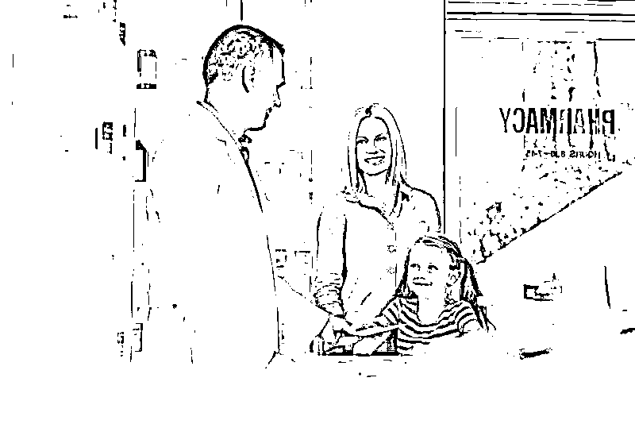 

## 医疗占星学的作用和基本象征

医疗占星学可以为我们做什么呢？

◯ 按照潜在的占星学动力分类诊断；

◯ 帮助病人找出最缓和却最有效的治疗方法，为每个人度身定制；换而言之，医疗占星学可以针对性地指出如何治疗得病的人，而非病人得的病；

◯ 指出成功治疗的最佳用药时机。

**>>>>**

**占星小课堂**

**行星、星座等在医疗占星学的象征**

**—行星—**

会显示出心理驱动力以及因此导致的生理反应过程。举例来说，火星是我们坚持个人主张和保护自身的驱动力，而在身体内部则会通过消化系统、肌肉活动和免疫系统释放热能。

**—星座—**

代表着行星能量是怎样展现以及在身体的哪个部分展现。举例来说，火星落在天秤座象征着肾炎的可能性。

**—相位—**

会显示出行星能量如何交互以及相互影响。例如，土星刑相位火星可以与免疫或消化系统的功能放缓（土星）相关联。

**—宫位—**

显示出可以影响个人健康的外界和环境因素。例如，火星落在第七宫意味着强势的另一半可能影响你的健康。

**—行进—**

可以显现出个人在何时更容易罹患疾病或需要为保持健康而做出的改变。

**◆ ◆ ◆  ◆ ◆**

******特别提醒************：本文由作者授权发布于若道平台******，**转载请注明“转自若道”。******

想了解更多医疗占星学？2016 年**4 月 30 日**，**苏·汤普金斯**老师的**医疗占星工作坊**将在北京举办。此次工作坊还是 ISAR 职业占星师资质认证项目的三门选修课之一，要好好把握哦！

报名及咨询，请点击文末"阅读原文"


# 医疗占星工作坊 | 4 月 18 日前有早鸟价

> 原文：[`mp.weixin.qq.com/s?__biz=MzA5NjA0NTAxNg==&mid=403676355&idx=3&sn=c6e3c8ae5b17ce0702e5ffd00a38a3da&chksm=0d4d2e743a3aa76251167939006ad943e1b9454fc741553b52aa0665755dba3a83d15d47461a&scene=126&sessionid=1692738851#rd`](http://mp.weixin.qq.com/s?__biz=MzA5NjA0NTAxNg==&mid=403676355&idx=3&sn=c6e3c8ae5b17ce0702e5ffd00a38a3da&chksm=0d4d2e743a3aa76251167939006ad943e1b9454fc741553b52aa0665755dba3a83d15d47461a&scene=126&sessionid=1692738851#rd)


白羊座主管人的头、脸、大脑、上排牙齿……

射手座主管人的腰部、坐骨神经、动脉循环、臀部、大腿、小腿上部……

这些知识点，你都知道吗？

如果知道，你会运用在身体健康的管理中吗？

来来来，让苏·汤普金斯告诉你，如何用占星学来管理你的身体健康。

此外，本工作坊还是 ISAR 选修课程之一哦！


**ISAR 选修课程****工作坊信息**

**授课时间：**2016 年 4 月 30 日、5 月 1 日、5 月 2 日早 10：00-18：00（午休 2 小时） 共 18 课时

**授课老师：**苏·汤普金斯

**授课方式：**北京现场，英文授课，中文翻译。（具体上课地址课前 10 天请留意查看短信微信通知）

**费用**：****6800 元** (**4 月 18 日**前报名可享受**早鸟价 5800 元**，若道老学员**4800 元**）**

**课程负责人：**王晓鸥  

**微信号：**2837474346，请备注医疗占星课程报名咨询

**咨询电话：**400-619-1014

课程简介

星座、行星、相位、宫位还能从什么角度进行阐释？

我们的占星工具箱里，还能增添哪些利器？

疾病和健康的相关议题能不能在星图中找到相应的征象？

我们怎样运用占星学来更好地认识身体，保持健康？


>>>>

**用占星学管理身体健康**

疾病一直以来在我们的生活中有两个作用。一方面，疾病是生活的一部分，虽然我们人类大多数不愿意被提醒这个事实。疾病也为个人成长提供机会和对人生更深刻的理解。疾病让我们谦卑。另一方面，许多健康问题是由于我们选择了错误的生活方式，因此可能是可以避免的。

今年 4 月 31 日至 5 月 2 日，伦敦占星学院创办人、《当代占星研究》作者、经验丰富的顺势疗法医师苏·汤普金斯老师将通过独到有趣的讲解和精彩的专题及案例分析带你进入医疗占星这个神奇的占星学分支领域。

名人推荐

苏·汤普金斯的《顺逆皆宜的人生》令人赞叹！苏是一名倍受爱戴的老师，并且在占星研究学院及后来自己创建的伦敦占星学院任教多年。苏以自己的冷幽默、抽丝剥茧的研究天分和占星直觉而闻名。她是一名执业占星师，也是一名顺势疗法医师，是心灵和身体的敏锐诊断专家。

 ——国际占星研究会（ISAR）法国副主席琳恩·贝尔

师资力量

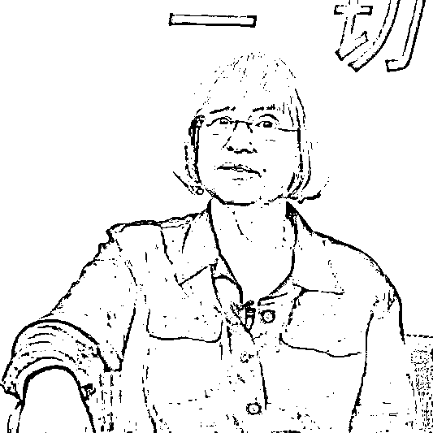
****苏·汤普金斯****

苏·汤普金斯是英国目前最资深的占星学家和咨询师之一，曾任占星研究学院（The Faculty of Astrological Studies）及伦敦占星学院（London School of Astrology）院长。2003 年，英国占星协会为表彰她的卓越贡献授予她查尔斯·哈维斯终身成就奖。

苏·汤普金斯老师不仅希望对心理和心灵进行疗愈，也一直希望能够找到一种安全又切实可行的方法帮助人们在人生旅途中得到身心的整体疗愈，而顺势医学的哲学与疗效让她惊叹，于是她于 1996 年完成在伦敦顺势疗法学院的培训成为一名专业顺势治疗师，目前，已经积累 20 年的顺势医学治疗师经验。

课程价值

得到苏·汤普金斯老师亲授的“独门绝技”，受益于大师在占星、心理学、医疗多维度的丰富经验

增加对身体各部分、健康和疾病的认识与觉察

收获实用的改善健康小技巧

巩固已有的占星学知识，拓展对星图象征符号的理解并掌握更多星图解读的方法和技巧

将医疗占星纳入你的占星工具箱，用它来助人助己，成为更专业的占星师

>>>>

课程内容

心灵和疾病的关系

我们的健康问题是由什么样的生活方式造成的？

疾病如何为我们提供个人成长的机会？

医疗占星学的普遍性原则

各种疾病的常见星图征象是什么？

从星图看，你身体的哪些部位是最脆弱的？对此，你可以做什么？

饮食与健康

我们的饮食能在星图上体现出来吗？ 

如何从星图看我们的身体疗愈之道？

顺势疗法和占星学

如何让自己更健康？

改善健康的实用性技巧

**我们会抽取个案进行现场讨论，会有 6 个个案讨论的机会（可以用家人的案例）。**

**参与个案讨的必须提供：**

**1） 病情细节      2）出生信息       3）生病日期或确诊日期**

**我们欢迎有癌症和心血管疾病的同学（包括家人）提供个案。 **

我们还将分组讨论，在这个工作坊上，帮助大家在用占星学对个人健康进行管理方面获得知识和洞见。

**特别说明：本课程不涉及任何医疗行为 **

>>>>

适合人群

相当于若道核心课程 level3 以上水平即了解星座、行星、宫位、相位等，可以独立进行出生星图解读。


长按二维码接通课程负责人~


更多内容及报名，请点击文末“阅读原文”

# 南北交点的人生地图 | 什么样的人适合为爱走天涯

> 原文：[`mp.weixin.qq.com/s?__biz=MzA5NjA0NTAxNg==&mid=403642671&idx=1&sn=137fa17072adcf5ddda6e8be36052cb3&chksm=0d4dab983a3a228e819e308edd705e05d74462b7bcfc365a717a10232ddd4ece6d556309e09b&scene=126&sessionid=1692738851#rd`](http://mp.weixin.qq.com/s?__biz=MzA5NjA0NTAxNg==&mid=403642671&idx=1&sn=137fa17072adcf5ddda6e8be36052cb3&chksm=0d4dab983a3a228e819e308edd705e05d74462b7bcfc365a717a10232ddd4ece6d556309e09b&scene=126&sessionid=1692738851#rd)

放弃如日中天的事业和城市生活，同爱人一起移居大理，这样的故事可不只出现在小说中。南北交点的议题在这里得到最真切的演绎，找到星图里你的这两颗月亮交点，它们帮助你更加通透地掌握自己的人生。

**南北交点指给我的路**

2007 年开始接触占星学，工作之余总爱对照星图分析自己的性格，在占星网站的解读中，最让我感兴趣的就是南北交点，被称作灵魂发展方向的那两颗月亮交点。

**我的北交点在巨蟹座，今生课题是学习柔软的情感表达和满足内心对家庭和滋养的渴望。然而，在潜意识层面中，受到南交点摩羯座负面特征的影响，有过度压抑情感而致力于追求显赫社会地位，来获得凌驾別人的权威和尊严的议题。**

对于这样的组合，星图中给出的线索是，我需要适度卸下对权力和事业的野心，让整个人柔软下來，学习情感的的感受能力，建立温暖而充满柔情的家庭氛围。**南交点在摩羯座的人，早年追求事业地位和财富之后，很有可能在某个时间节点解甲归田，回归自然温暖的家居生活。**

**南交点的成功，我并不快乐**

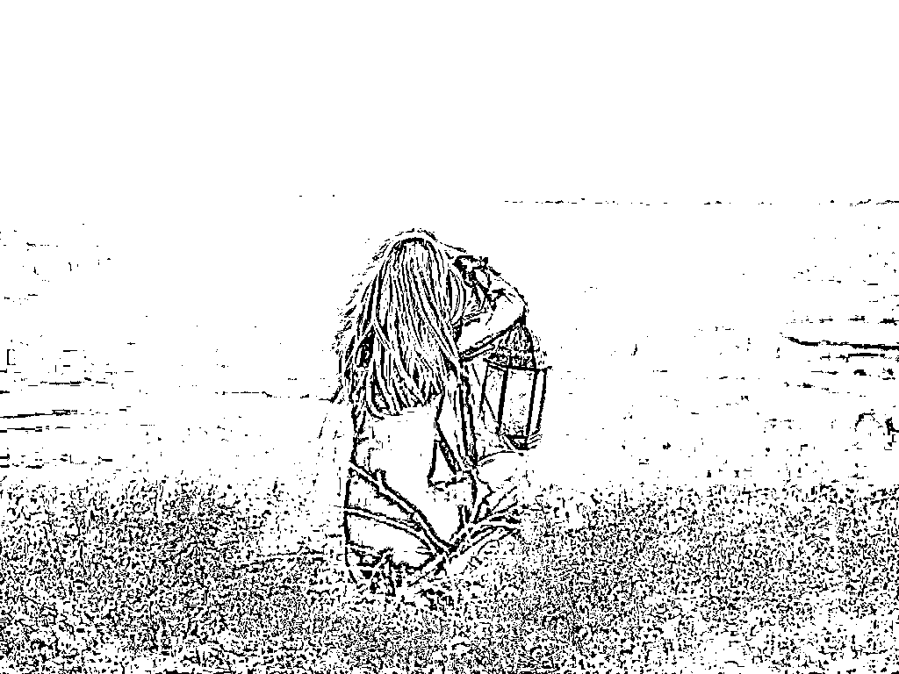

当时的我奋战在销售一线，并不太能理解这些话，也并不清楚家居生活是个什么样子。作为一个海王星特质很重的人，从青春萌动时，有一句话就深深的烙在我的心里——

我将于茫茫人海中寻访我唯一之灵魂伴侣，得知，我幸，不得，我命。

当时的我是那么笨拙，那么执拗，一次又一次摔倒在爱情的神坛下。事业却一路平顺，从最开始的文职工作转为销售岗位，后因销售业绩突出被猎头挖到了银行。也正是在那个时候，结束了自己长达 6 年的初恋，六年的京津异地恋，败给了各自不同的价值观：我努力工作，应酬着各种社会人际关系，而他研究生刚毕业不经世事，无法理解我的夜夜笙歌。

在南交摩羯座与生俱来的“人往高处走”的推动下，我重新选择了令人艳羡的钻石王老五作为男友。这段以成就和物质为基础的恋爱在不到 1 年半的光景中结束在对方母亲的反对下。钻石男听从母亲的意愿，狠心抛下了还在幻想更高更远的我。

失恋的打击让我更加全身心的投入到工作中，行业翘楚成为我至高无上的人生目标。如我所愿，星图中代表工作的三个宫位都落在土象星座，6 宫头在摩羯座、南交点在摩羯座、火星在天蝎座的自己，最终完成了这个人生目标。**走马上任第一天的行进图中，行进太阳、月亮、水星、冥王星全部合相我的南交点，而行进木星却合相在我的北交点。**

事业上的成就并未给我带来预想中的巨大满足，我开始感觉到对自己不断重复追名逐利物欲横流的模式的厌倦，于此同时，对于温情和家庭的渴望却在我的步步高升中变得越发遥不可及。

我，并不快乐。

**在云南，我遇见了他**

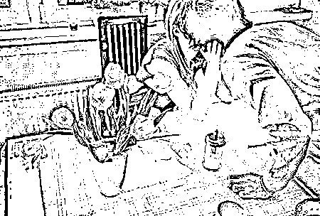

可能每个星图中冥王能量重的女人都会经历一些刻骨的爱情和锥心的虐恋，于我亦是如此。在遭遇又一段虐心的爱情后，我挺了将近三个月，闷闷的完成了一季度的销售指标，向领导提交了所有的年假后，出发去了云南。

为什么是云南而不是海南呢？无从得知，也许这就是命运。出发前，我特地涂上了最艳丽的蔻丹。

与他的相遇是在到达丽江的第三天，在客栈休整，与院子里的小伙计和老板打趣。没想到《阳光的快乐生活》这部电视剧火在大江南北，让天津口音的一句“你不阳光”出了名。在给上海人贵州人东北人矫正口音的时候，我身后传来一句地道的天津话：

“谁说天津话呢？”

“我啊！”

两个独自在丽江游走的天津人就这么遇上了。

若干年后，在若道学习，好奇去查看了那天的行进，**金星精准合相我的下降点，**果不其然，这就是一次冥冥中的姻缘际遇。

学习了比较盘后，第一件事就是认真研究了和他的关系盘：**他的金星合相我的上升点，我的火星合相他的上升点，**在这样的配置下，一见钟情也就不奇怪了！

**灵魂伴侣被我找到了**

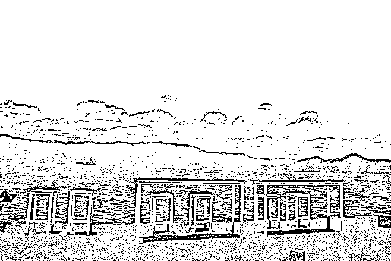 

但当时，失败的恋情还留在我的心里，表面上谈笑风生，内心的痛根本没有释放出来。在丽江游玩四天后，我约上了这位刚刚认识的天津老乡同行泸沽湖。丽江通往泸沽湖的路还没有修好，一路颠簸，我们挤在最后一排靠左侧窗户的位置。

他把一个耳机塞给我，里面循环播放着两张专辑《the room in the tree》《风起的瞬间》。也许是因为旋律过于优美，路途过于颠簸，沿路风景过于悦目，我溃不成军，泪流满面。

不记得到底哭了多久，也不知道在一旁的他是不是装作没有看到，用掉了包里所有的纸巾，也没有擦完脸上的眼泪**。南交摩羯座压抑的情绪，在这一刻被北交巨蟹座的温柔安抚。北交点就是当你寻找满是宝藏的路径时触手可及而未曾被你注意到的那张地图，在这一刻，我终于明白了这句话的意涵。**

**在我与他的关系盘中，他的太阳照耀在我的 12 宫，这是一种怎样的感觉呢？如同印证少女时期便一直追逐的爱情之终极要义——于茫茫人海中寻访到了我唯一之灵魂伴侣。**

**北交点的功课——爱之渴望**

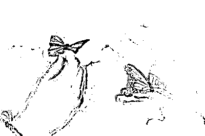 

现在我们幸福地生活在蓝天白云下的云南大理。是的，你没看错，我倾听到了自己那个被压抑了不知多少个世代的内在孩童的呐喊！一个以努力工作努力向上爬为目标的女人，放下了她为之奋斗 11 年的职位，放弃了更多更高的职场机会。随着爱护她的男人来过男耕女织的田园生活了。而这个男人曾经放弃了自由自在的丽江生活回归城市，只为了有朝一日同她一起解甲归田，给她一个温暖的家，完成从南交点向北交点转化的关键一步。

写到这里不禁眼眶湿润。感恩上苍的同时，亦问自己：自此我的爱情就圆满了吗？北交巨蟹座的今生课题就达成了吗？答案是没有。

**南北交点呈螺旋形在我的人生轨迹中不断转化着，当北交点这条腿走得不够熟悉和顺畅的时候，我依旧需要南交点这条腿更加有力的支撑，而学习占星的道路让我不断审视自己，摒除南交点负面的特质，开发北交点更多的意涵，而上天赐给我的伴侣在不断告诉我物质名利无穷尽，身边触手可及的一切，还有爱的滋养，才是我之终极渴望。**

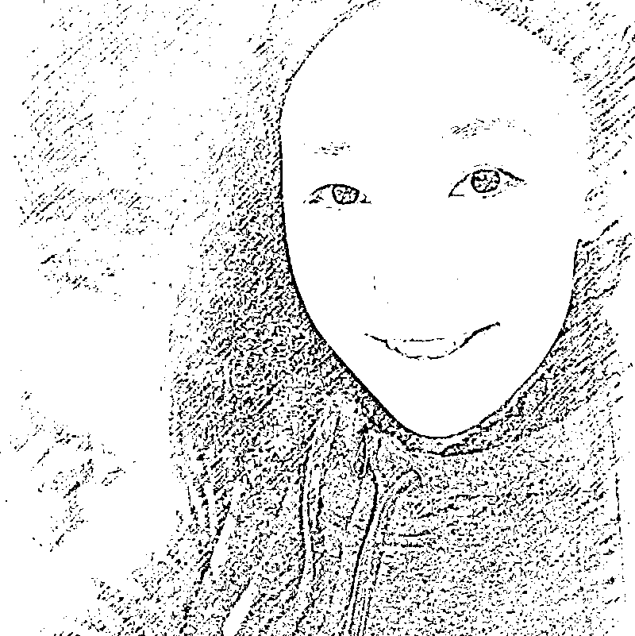

**作者简介**

**李洁**：若道 level5 学员，在若道系统学习占星学，自 2007 年开始对占星学产生浓厚兴趣，继而一发不可收地走上了成为一名职业占星师的道路。喜爱花艺与茶道，非常重视北交点的发展，励志要将此生灵魂的功课做好。

长按二维码，让金钱涌向传播知识与智慧的人~

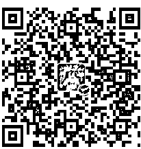 

**◆ ◆ ◆  ◆ ◆**

**特别提醒****：本文由作者授权首发于若道平台，转载请注明“转自若道”并标明作者。**  

想了解自己的人生地图么？**2016 年 5 月 19 日**，蒋颖老师主讲的若道占星核心课程**Level 1-2**要开课了！她将带领你学习星座、太阳、月亮、行星、月亮交点等知识，让你进入占星学的世界！

报名及咨询，请点击文末“阅读原文”


# 愚人节敢和十二星座男开这些玩笑，你咋不上天呢！

> 原文：[`mp.weixin.qq.com/s?__biz=MzA5NjA0NTAxNg==&mid=403621838&idx=1&sn=ad53556ec52f742fe98580d5f5cbd210&chksm=0d4c75793a3bfc6f08e1a35eb9809272d006d7fac482f8cd17581ccbbcb715505e31b7c926b1&scene=126&sessionid=1692738851#rd`](http://mp.weixin.qq.com/s?__biz=MzA5NjA0NTAxNg==&mid=403621838&idx=1&sn=ad53556ec52f742fe98580d5f5cbd210&chksm=0d4c75793a3bfc6f08e1a35eb9809272d006d7fac482f8cd17581ccbbcb715505e31b7c926b1&scene=126&sessionid=1692738851#rd)

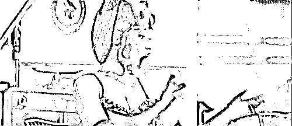
**数据来源/一点资讯大数据研究中心（iota 实验室）**

*小伙伴们，你们的愚人节过得好吗？*

*（被严肃的若道君整到的感觉不错吧~HIAHIA）*

*在这个大好时机，*

**有木有鼓起勇气对你的男神表白一下？**

**▼**

**最近，一点资讯偷偷 share 给我们一些机要档案，**

**一起来看看**

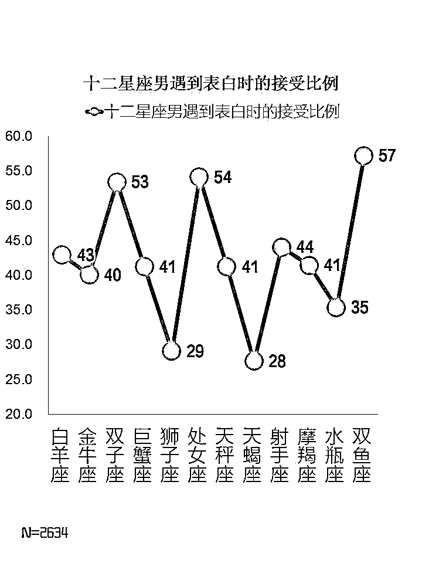

翻译成人话—— 

*   如果你在某一天对男神表白，你被接受的平均成功率是 42.3%，比中六合彩容易多了有木有？**男神还是很容易推倒的**有木有？ 

*   最容易接受妹子表白的星座男是**双鱼座、双子座和处女座，**三个变动星座分列三甲。（果然是**最狂放**的一组星座，摔……） 

*   对妹子表白接受度最低的是**狮子座和天蝎座。**（两个固定星座分列倒数第二和倒数第一，然而这也**并不代表他们很羞射**，且听后面分解） 

*   举个栗子：假设妹子同时对两个**双鱼男**表白，其中一个妥妥就跟你走了，另外一个有 7%的可能也蠢蠢欲动了。而如果你对三个**天蝎男**表白，也许只有其中一个能被你攻克，还不是全心全意的那种。 

*   **双鱼男**位列榜首的原因，我们需要追溯到他们的童年。双鱼座是有奶就是娘的典型，那也不是他们的错，照顾他们的人老换啊。他们也分不清，有人管就行了啊。于是双鱼男也很好追，**谁对他好就跟谁去了。**想想也是挺心酸的…… 

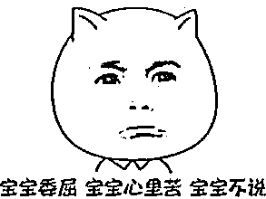

**这还不是最惨的，看看这组数据：** **▼**

**12 星座男单身指数**  

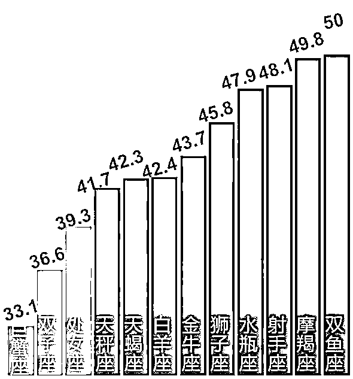

*   **双鱼座**的**单身指数高居榜首**，甚至超过了扑克脸工作狂摩羯座，真心为双鱼男鞠一把泪……找一个爱自己的人咋就那么难呢……也难怪他们被表白的成功率这么高了。 

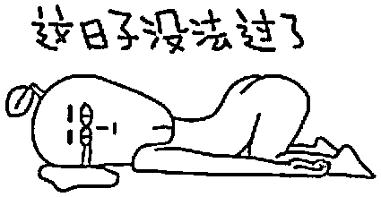

*   那么是不是说明**天蝎男**就比双鱼男**要求更高**呢？然而并不是那样，只不过面对表白，天蝎男更容易**开启装逼模式**，等他内心无数 OS“我果然是女性杀手”，再回头去看也许妹子早被他高冷的外表吓退了，然而即使**内心再炸裂也不会表露丝毫**的，这就是我们天蝎座！ 

*   特别要提一句的是**狮子男**，其实他们不是拒绝妹子表白好吗？狮子男爱一个女人能把你宠爱成王后，但你不是女王，因为王只能是他。即使面对心仪的妹子表白，他也一定要拒绝一次，再带着鲜花钻戒对妹子表白回去，总之**啥事都得我老大**，表白这么炫酷的事儿你怎么能抢了我的风头！ 

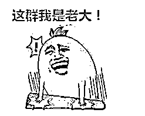

**（耐心点，彩蛋在后面）**

**愚人节那天主动表白不一定能成功，**

**开了出格的玩笑倒是有可能被分手哟。**

**▼**

**看看这组数据：**

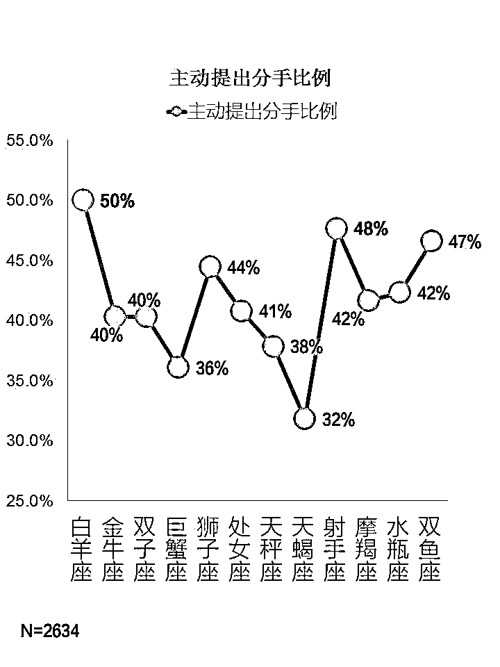

*   最容易主动提出分手的果然是**火象星座**：**白羊男**第一名，**射手男**第二名，**狮子男**第四名。 

*   **双鱼男**，你们能找到妹子已经很不容易了，主动提分手比例还那么高，这是闹哪样？**No zuo no die**懂不懂啊……

*   **天蝎男**主动提分手的名次最低，然而**你敢和他们提分手试试**……

*   **巨蟹男**主动提分手排名倒数第二，讲真，巨蟹男暗恋数年确定安全才肯出手的个性决定了他们一旦认真就恨不得赶紧进入婚姻的坟墓，**又缺乏安全感又念旧**，这样的男人的确是很难主动提出分手的！ 

下 面 是 彩 蛋

**愚人节那天和男神开怎样的玩笑你会被分手？**

*以下内容纯属虚构，如有雷同，*

*那你也是够倒霉的。*

**▲**

**** 

**白羊男**  

白羊座属于**冲动型分手群组**，而一旦他决定分手，基本没有回转余地，白羊座掌管的是头部，虽然他们经常被称为“没脑子”，其实可精明着呢，只是有时候嘴管不住大脑罢了。如果在这一天你敢**不停激怒他说他不长脑子**，那八成你可以达到分手的目的。可千万别后悔，即使是玩笑，白羊男做了的决定也都是**不走回头路**哦。

**金牛男**

金牛座很在意“我的”，他拥有的没想给你的时候你可千万别乱拿乱动，金星守护的金牛座对于精美度和舒适度都非常看中，如果这一天你偷偷溜进他家里，**把他最喜欢的超贵限量版音响给拿走，换上一套又丑又劣质的**，那么他至少对你黑脸一个月以上，即使分手也要把给你的所有物品列清单索要回来，就是这么炫（kou)酷(men)。

**双子男**

双子座思路敏捷舌灿莲花，一个双子座可以左右手互博，一对双子座就能凑成一桌麻将。和他们相处你得跟得上他的思路，满足得了他跑马场一样奔腾的 idea，所以如果在愚人节当天你给他一张伪造的医院证明，**告诉他你似乎患有失语症，**那么他多半是要忍痛割爱的……他可受不了和一个一整天说不了一句话的女人呆在一起……

**巨蟹座**

巨蟹座和前任这个词有着千丝万缕的联系，他的心里有座坟，葬着未亡人，时不时拿来凭吊，这时候你就当没看到，他自己抽风完了就好了，可千万别争风吃醋。如果你敢在愚人节这天告诉他**你把他手机电脑里偷偷存放的所有前任照片都删了，把他前任送的各种礼物也都烧了，**那他即使念着情分不和你划清界限，也会在小本本上默默给你打 100 个小黑×。

**狮子座**

狮子男平素炫耀狂魔，一分钟不被夸就浑身难受，其实单纯要死，只要摸到他的命门要钱给钱要命给命。对付狮子男的方法很简单，只要你能每天闭着眼猛夸他就行了，无论多离谱他都可以接受的，你要天上的星星他也会给你摘下来。然而如果你敢在愚人节那天把他的狐朋狗友都聚在一起，**当众驳他的面子，尤其是批评他的性能力，**那基本上你离前任也就不远了。

**处女座**

和处女座在一起要时刻注意自己仪表仪容尤其是细枝末节，例如鼻毛黑头头屑，和处女男约会一定要注意，得体的外观里面，还要有得体的内衣以及纯洁的内心。处女男对自己也许要求不高，但对女友的要求必须是百分百挑剔的。如果你在愚人节那天和他约会故意穿上**黑丝皮裤，满头皮屑眼屎都不擦干净并且告诉他以后少叨叨老娘就这样了，**那么你将再也找不到这个被你吓得花容失色的男人。

**天秤座**

天秤男很少会主动提分手，第一，他们太怕孤单，有个伴总是好的；第二，他们太纠结，选女友需要掷骰子，“谁是最爱”这个问题够他们自问自答一整年；再有，他们太需要和谐气氛，分手这么伤和气的事，一点都不优雅，实在说不出口只能冷暴力玩失踪。所以如果你真的想和他们分手，就在愚人节那天**当众求婚逼他一定要答应，**他会自己把自己纠结死，然后躲你远远的。

**天蝎座**

如果你有一个天蝎座的男盆友，在愚人节那天劝你还是乖巧一些，**别想着开玩笑整他了，**否则接下来的一年他都会整得你生不如死的。乖。

**射手座**

十二星座男里射手座的艳遇指数是最高的，他们生性狂放不羁爱自由，勇敢探索新鲜事物，还特别心大，如果你不能跟上他们那颗说走就走的心，不能给予他们足够广阔的天地，他们多半是很快会被下一个对象吸引的。因此愚人节那天，告诉他们从今天起他们只属于你**，把他们的护照和身份证没收，**让他们哪儿都别想去，然后**把门反锁起来，**保证第二天醒来他就人间蒸发，有多远跑多远了。

**摩羯座**

摩羯男是十二星座里看起来最老实最勤奋的。生活规律，想法实际，对感情也一样，按部就班，胜在坚持。然而他们的红颜数绝不亚于水瓶座和双鱼座。比起打扰他们的工作，如果你敢在愚人节那天**打印一份他的 QQ 聊天记录请他过目，**那他八成会恼羞成怒把你拉黑——努力营造正直形象的摩羯男无法忍受你看到他并不“老实”的一面。

**水瓶座**

水瓶座是最难捉摸的一个星座，也许每一个摩羯座都差不多，而每一个水瓶座绝对都是不一样的。水瓶座讨厌和别人一样，如果你拿他和谁比较，他一定会告诉你“我就是我，颜色不一样的烟火。”水瓶男也不喜欢人家懂他，迷之存在的他自己都搞不懂自己，更何况你。水瓶座对女朋友的底线基本为零，开什么样的玩笑他都可以接受，还觉得你很特别。所以唯一杀手锏就是**直接告诉他“分手吧”**。他一定会当真而且绝不挽留。因为貌似冷静抽离的瓶子最怕的其实就是**被心爱的人说分手。**

**双鱼座**

对于愚人节开什么样的玩笑会让双鱼男提分手，我还真的没想出太好的招，因为双鱼座每天都活在真真假假的幻想中，每天都在过愚人节的节奏。在这里需要澄清一下，双鱼座真的不是说谎大户，因为他们真把自己催眠了，说谎说到自己都相信啊，测谎仪都测不出的啊。如果说这个世界上有可以骗天蝎的人那只有是双鱼座啊，但是双鱼座自己也是被人卖了还给人数钱的主！作为一枚被双鱼男折腾得七荤八素的群天蝎女，我已无力吐槽。**如果你有更好的点子，欢迎评论。**

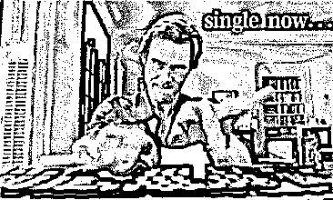


**你中招了吗？**

**欢迎留言**

**吐槽踢馆**


# 4 月宇宙天气 | 五颗星集体逆行，是要召唤神龙么？

> 原文：[`mp.weixin.qq.com/s?__biz=MzA5NjA0NTAxNg==&mid=403602107&idx=1&sn=1e9d493d23402515e2a87b907ab54c85&chksm=0d4cc80c3a3b411aab50c6d237f22c67ec843adf4dcc13572a6865a6052938b695c5a04a7b9a&scene=126&sessionid=1692738851#rd`](http://mp.weixin.qq.com/s?__biz=MzA5NjA0NTAxNg==&mid=403602107&idx=1&sn=1e9d493d23402515e2a87b907ab54c85&chksm=0d4cc80c3a3b411aab50c6d237f22c67ec843adf4dcc13572a6865a6052938b695c5a04a7b9a&scene=126&sessionid=1692738851#rd)

作者/咔咔  ISAR 认证占星师

图片/花瓣网

2016 年的 4 月，宇宙安排了五颗星体同时逆行，这么多星体在“刹车”和“跑偏”，我们要注意点儿什么呢？

**4 月重大星象** 

● 4 月初，水星合相天王，威力大于水逆。

● 4 月中，金星与水星换星座后出动多颗行星，是在理性和感性层面最活跃的时机，宜联谊、出行和恋爱。做做白日梦也蛮好。

● 4 月中下旬，火星和冥王星开始逆行，金星刑冥王合天王，有什么不痛快的去找占星师聊聊吧，不 zuo 不 die，作得快死得快。  

● 4 月底，水星逆行，水逆这概念太深入人心，我就不浪费口舌了。个人行星和四轴在固定星座 14-23 度的朋友们请多小心。

「

4 月 1 日-4 月 7 日

加强版水逆要注意哟

」

**4 月 1 日水星合相天王星（白羊座）** 

**4 月 6 日金星进入白羊座、水星进入金牛座**

**4 月 7 日白羊座新月**

本月第一天就迎来水星在白羊座合相天王星。白羊座是**直接的、鲁莽的、急躁的**。天王星是**反叛的、脱轨的、藐视常规的**。鲁莽急躁地去打破常规，这个组合发生在了水星代表的语言、教育、交通、信息、合约的领域。这是一个**类似于水星逆行**的组合，但是水星与天王星在白羊座的组合可能惹出的麻烦，会更甚于水星逆行。

人们更多地依靠直觉而不是缜密的逻辑快速地思考，快速地反应，快速地承诺。思维的火花像闪电一样噼里啪啦，一切都需要在当下做出回应。人们冲动、紧张，对别人的看法不耐烦，此时最重要的就是自己的原创性的想法。交通也会出现过载、超速、急躁造成的事故。此时建议大家像对待水逆一样，尽可能地把握自己的语言、**避免出口伤人**，**遵守交通法规**。在此期间**签的合同要多看几遍**。**家用电器小心线路短路**。

几天后，水星与金星同时换星座。**水星进入了重视实际收益的金牛座，金星进入了冲动自我的白羊座。**这个搭配很有意思，人们在感情上转换到了冲突和直接的模式，但是在沟通的时候又不慌不忙，固执于自己的看法。

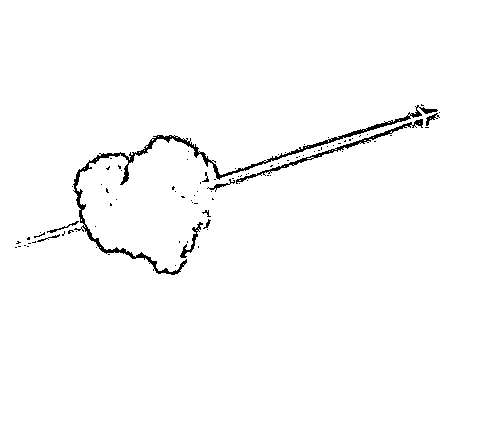

「

4 月 12 日-4 月 17 日

交友季，别错过

」

**4 月 12 日水星（金牛座）六分海王星（双鱼座）** 

**4 月 13 日金星（白羊座）三分火星（射手座）**

**4 月 14 日水星（金牛座）三分木星（处女座）**

**4 月 17 日水星（金牛座）三分冥王星（摩羯座）**  

金星与水星换星座后，轮番与火星、木星、海王星和冥王星产生相位，这激发了 4 月中旬人们**交换观点，换位思考**；社会交往和恋情也在春天里升温。

**水星六分海王星**，人和人之间的互动交流是温柔的，这是产生灵感和相信直觉的时间。你会启动自己的直觉，去体会和感受沟通中的细节；也会运用自己的灵感，创作或者欣赏艺术、诗歌、摄影、小说、诗集。

随后的**金星三分火星**意味着热情似火的活动“春天来了，万物复苏，大草原又到了动物们交配的季节”，情侣们请做好防范措施。单身青年请一定要走出屋门，投入到蓬勃地春天里。

水星接下来会分别与在处女座的木星和在摩羯座的冥王星形成融合的三分相，此间合适旅游，开班授课，进修培训（尤其学习那些能给你带来收入的实际技能，又或者是和美、美食、大自然有关的插花、园艺、烘焙、摄影等课程。）四月中在北京举行的北京国际电影节上，会有上千场国内国外的商业和艺术电影，水星与木星告诉你，去学习吧、去开阔眼界吧，去被启发然后把信息和你的感受传递出去吧……

**水星与冥王的三分相**的时候，**要去看的再深入一些，找到问题的核心并想出实际的解决方法。**另外金牛座与冥王星代表了两种层次的经济资源，我们可以密切关注届时社会层面是否会发布一些有关经济的调查数据和政策法规。

「4 月 17 日-4 月 18 日

天蝎宝宝撑过去

」

**4 月 17 日火星在射手座逆行** 

**4 月 18 日冥王星在摩羯座逆行**

**天蝎座的传统守护星和现代守护星几乎同时开始了逆行**，天蝎座的宝宝们说，心里再苦偶们也忍着……

火星将从射手座 8 度 54 分，逆行回到天蝎座 23 度 03 分，6 月 30 日恢复顺行。冥王星的逆行周期则会更长，它将从摩羯座 17 度 29 分，逆行回到摩羯座 14 度 55 分，在 9 月 26 日恢复顺行。

如果你有个人行星或者四轴在以上度数区间内，需要特别关注之前你经历过的**火星和冥王星主题事件将再次出现**，如果经历的第一次行运带来的是震惊和不适应，希望第二次逆行，你可以花上一些时间去感受这些事件的主题（是的，主题是非常重要的，这会让你了解你经历这些“糟心事”是为了什么，从而对症下药。）

火星与冥王星都与行动力和控制有关，火星的逆行有两个可能，一是“**刹车的性质**”，火星在射手座的探险和冒进被遏制了，正在进展的项目放缓了，或者迟迟没有结果。另外一个可能是“**跑偏的性质**”，因为没有结果或者进度放缓，人们在焦急和盲目地妄图把它推回到原来的速度，因此判断失据，造成了失误或者更大的风险。当人们丧失耐心和控制的时候，我们有理由担心在社会层面上出现激烈的局部冲突、交通事故（尤其是飞行事故）、火灾、犯罪、枪支滥用等事件。如果运动，请避免过度和超负荷导致的受伤。

外行星逆行的速度越慢，作用力越明显。**冥王星逆行**将对人们**心理层面造成影响**，它代表的是“集体意识”的阴影面：控制、信任、秘密、禁忌、淘汰、死亡等。这段时间适合做一些内化的功课，关注那些在我们生活中重复出现的模式，那些让我们感觉失去控制或者感到脆弱的地方，思考为什么在这些地方感到无力，以及在什么情况下我们的作出了过激反应。有些人会在冥王星逆行期间寻求心理咨询、占星咨询等专业帮助。

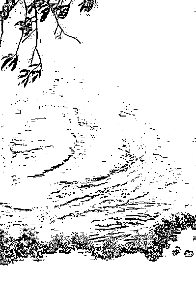

「

4 月 18 日-4 月 23 日

稳定与不安交织的感情

」

**4 月 18 日金星（白羊座）三分土星（射手座）** 

**4 月 19 日太阳进入金牛座**

**4 月 20 日金星（白羊座）四分冥王星（摩羯座）**

**4 月 22 日天蝎座满月**

**4 月 23 日金星合相天王星（白羊座）  **

4 月中下旬的宇宙主题是**金星**，太阳在 19 日进入金星守护的金牛座。

在未来的一个月里，人们会**从简单的事物里得到快乐**，比如大自然、园艺、乡村生活。金牛座注重可触摸的事物，比如银行里的存款，美食美酒，身体抚触。但是守护金牛座的金星此时还停留冲动的白羊座，白羊座欠缺金牛座的稳定感，关注自己的兴趣大于关注合作。

18 日**金星与土星的三分相**强调了**关系中的稳定感和责任感**，寻找理念相似、简单直接的合作伙伴。但是，随着**金星触发了天王星和冥王星的紧张相位**，在感情关系和合作关系中，就**显现极端的不安全感和操控性**，为了自己的利益去控制关系中的另外一方，渴望伴侣对你的全部的关注和投入（不管这种投入是时间上的、精力上的还是物质上的）。

**金冥四分相位**也可能意味着你生活中的伴侣在用感情或者金钱来操纵你们的关系。**金星与天王星的合相**显示了人们渴望冲动地投入一个关系，体验刺激、无拘束的感情。这段时间开始的感情关系，难免“来得快，去的也快”。

「

4 月 29 日-4 月 30 日

五星逆行，且行且珍惜

」

**4 月 29 日水星在金牛座逆行** 

** 4 月 30 日金星进入金牛座**   

4 月底，当水星也开始逆行的时候，天空中就同时有五颗星体在逆行了，从代表沟通交流的水星、代表行动力的火星、代表信念和愿景的木星、代表规则和限制的土星和代表集体阴影面的冥王星。既然这么多行星在“刹车”和“跑偏”，我们这些渺小的人类就学着慢一些和谨慎一些好了。金星进入金牛座之后，大家不妨赏花饮酒，享受和珍惜每一个美好，莫负春光吧……


**占星师咔咔**：2010 年开始学习占星学，若道首届学员，国内最早获得 ISAR 职业占星师资质的职业占星师。在国际知名广告公司和市场研究公司从事的市场研究和推广工作十余年，曾任职于阳狮集团、尼尔森市场研究有限公司、MTV 和《Madame Figaro》杂志。现在为《时装男士》、活法儿等媒体供稿。

**微信公众账号**：咔星人

**星盘解读和运势咨询**：cji1029@qq.com

长按二维码，让金钱涌向传播知识与智慧的人~ 


**◆ ◆ ◆  ◆ ◆**

******特别提醒************：本文由作者授权首发于若道平台******，**转载请注明“转自若道”。******

担心行星逆行之前，你要先搞懂行星的意涵。**2016 年 5 月 19 日**，蒋颖老师主讲的若道占星核心课程**Level 1-2**要开课了！她将带领你学习星座、太阳、月亮、行星、月亮交点等知识，让你进入占星学的世界！

报名及咨询，请点击文末"阅读原文"


# 有关原型占星学你最想知道的 12 个答案，还是塔纳斯亲自回答的

> 原文：[`mp.weixin.qq.com/s?__biz=MzA5NjA0NTAxNg==&mid=403602107&idx=2&sn=23e3625cf81a820c2ac5cd72d59f70f7&chksm=0d4cc80c3a3b411a9d12e26f7f7f06e4d66a09549c491f3d49087d5b1952a6a1185f765ae355&scene=126&sessionid=1692738851#rd`](http://mp.weixin.qq.com/s?__biz=MzA5NjA0NTAxNg==&mid=403602107&idx=2&sn=23e3625cf81a820c2ac5cd72d59f70f7&chksm=0d4cc80c3a3b411a9d12e26f7f7f06e4d66a09549c491f3d49087d5b1952a6a1185f765ae355&scene=126&sessionid=1692738851#rd)

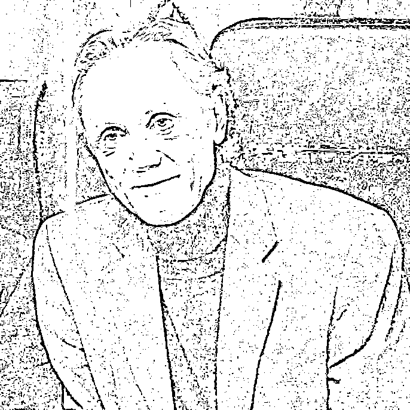
译者/李含 校对/王宏

今年 1 月，国际占星界著名学者理查德·塔纳斯博士来到中国，在若道举办了一场有关原型占星学的沙龙，立即凭借其高知、儒雅与冷幽默笼络了一票粉丝。之后不断有小伙伴在后台问若道君：“塔纳斯的原型占星课程什么时候开课啊？”好消息来了！就在今年 5 月 18 日，本课程将在线开课（点击文末阅读原文了解详情）。在开课前，若道君专门采访了塔纳斯博士，让他来回答小伙伴们最关心的话题。

**1****什么是“原型”？**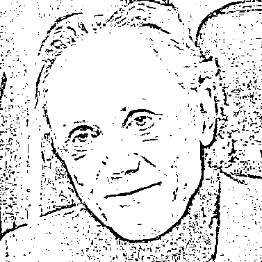

“原型”源自 archetype 一词，指的是一种原始的普遍性模式，正如在荣格心理学中，一种集体继承的无意识观念或思维模式、意象等普遍出现在我们个体的心灵之中。

**2****您所说的“原型”和荣格所说的原型是一回事吗？**

是的。与荣格的类似，但是我的工作对原型的意义进行了进一步的探索。例如，在《宇宙与心灵》中，我展示了历史上普遍的占星学原型，这些原型获得了极深刻的认可。

**3****什么是“原型占星学”？**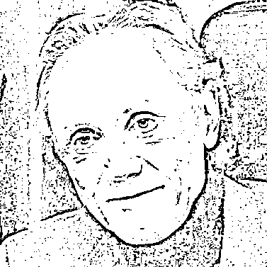

是人本主义占星学的一个分支，强调在我们个人生活、文化和历史中原型的重要性。

**4****您可以给我们举一个例子吗？**

**火星对应的是武士的原型。**火星就是我们每个人心中的武士。你是哪一种武士？如果你的火星合相海王星，就像超个人心理学创始人斯坦·格罗夫一样，你就可能是一位灵性武士——这是武士原型多种变形中的一种。

一个灵性武士可能会在面对明显的威胁时表现出同情。在斯坦的案例中，他曾经应对过一个服食毒品还拿着刀的男人，这个人显然很危险。斯坦用一条毯子紧紧抱住了他，但却充满同情心地与他说话，鼓励他闭上眼睛并面对自己内心的恐惧。斯坦的行为最终拯救了这个年轻人，而这个年轻人在其他情况下可能会被警察逮捕或伤害。相反的，这位年轻人经历了奇迹般的疗愈，变得平静、放松、正常了——不再对任何人表现出威胁或危险。

**5****如何将原型占星学应用到我们的日常生活中？**

在理解一个原型的过程中，我们对我们自己的现象和我们现实的现象有了更深入的洞察。

例如，你正在经历天王星在你的星图中极为活跃的那几年。**天王星对应的是普罗米修斯的原型。**普罗米修斯在希腊神话中教会了人类如何生“火”和用“火”。这样的原型对应的是个人生活中具有潜在深远意义的重塑！他们在学习新的方法将他们从自己的过去中解放出来，去创造新的生活。理解这样的原型意味着理解建设性重塑个人生活的可能性，并觉察到鲁莽行为的危险性。

**6****原型占星学和心理占星学有什么区别？它与一般的占星学又有什么区别？**

心理占星学与原型占星学都是人本主义占星学的分支。原型占星学的不同之处在于，它在个体身上确认出具体的原型，帮助个人更清醒地意识到如何在创造更有意义、更充实的人生时“应用”这种原型。所有人本主义占星学都有着这一共同目标，但是原型占星学是唯一具体关注原型模式和过程的分支。

**7****您 5 月份在若道开设的“原型占星学”课程会讲些什么？**

我正在创建一种新的形式将原型占星学引入中国，尤其是针对若道而言。我的课程包含 8 次网络课程，每次 2 小时，因此我将原型占星学入门浓缩为 16 个小时的演讲以及音乐、视频和图像的互动演示之中。

**8****您在若道开设的“原型占星学”课程中，只会讲解“原型占星学”的理论，还是也会教学员们如何在星图解读中应用“原型占星学”的技巧？**

我不仅会教授理论知识，课上还会讲到许多示例，但是并不是所有的示例都源自星图。仅仅通过 8 次课不可能完全学会如何将原型占星学的技巧应用于星图解读。我希望还有第二阶课程，最终可能还有第三阶课程。

**9****如果想上您的“原型占星学”课程，需要掌握占星学或原型占星学的基础知识吗？**

我与大卫老师讨论过这个问题，我们都认为学习该课程至少需要具备“中等水平”的占星学知识（懂相位及单盘解读）。

**10****对于已经是高阶占星学员或职业占星师的人来说，他们还需要学习“原型占星学”吗？会给他们带来怎样的帮助？**

这个问题问错人了。我当然认为理解原型占星学会让所有占星师、占星学生和新的执业者们都受益。

**11****您以后会开进阶课程吗？**

会，我希望和若道合作开设后续课程。

**12****可以推荐一些原型占星学方面的书籍吗？**

我的《宇宙与心灵》（*Cosmos and Psyche*）、菲比·韦斯（Phoebe Wyss）所著的《深入宇宙心灵：原型占星学和新宇宙学》（*Inside the Cosmic Mind: Archetypal Astrology and the New Cosmology*）、雷恩·巴特勒（Renn Butler）所著的《走向完整》（*Pathways to Wholeness*）。

在我自己的网站*www.cosmosandpsyche.com*上也有很多文章，若道也已经将我的许多文章译成了中文，我相信在接下来的数周和数月里会有更多文章被翻译成中文。

**课程讯息**

**开课时间**：2016 年 5 月 14 日

**授课时间**：每周六上午 10：00-12：00，共 8 节课 16 课时

**费用**：6800 元 (4 月 16 日前报名可享受早鸟价 5800，若道老学员 4800）

**授课形式**：网络在线授课（英文授课，中文翻译）

**课程负责人**：李老师、熊老师

**微信号**：2847613491（请备注原型课程报名咨询）

**◆ ◆ ◆  ◆ ◆**

## 走进塔纳斯：点击下方图片即可阅读


[**塔纳斯：自称专业占星师的你们做到了这 7 点吗？**](http://mp.weixin.qq.com/s?__biz=MzA5NjA0NTAxNg==&mid=402587687&idx=1&sn=d81ed86727c7b561dc487374c5846935&scene=21#wechat_redirect)

* * *

 **[**塔纳斯：天冥四分威力将持续到 2020 年**](http://mp.weixin.qq.com/s?__biz=MzA5NjA0NTAxNg==&mid=402587687&idx=1&sn=d81ed86727c7b561dc487374c5846935&scene=21#wechat_redirect)**

* * *

**◆ ◆ ◆  ◆ ◆**

**特别提醒****：若道享有本文授权，转载请注明“转自若道”。**  

**2016 年 5 月 14 日**，西方著名文化历史学家、研究原型占星学 30 年余年的**理查德·塔纳斯**将为我们打开**原型占星学**的大门。

课程详细内容请点击文末”阅读原文“


# 愚人节 12 星座大攻略

> 原文：[`mp.weixin.qq.com/s?__biz=MzA5NjA0NTAxNg==&mid=403602107&idx=3&sn=9532a9ca52472687189b7ec301cb7ba9&chksm=0d4cc80c3a3b411a06b7beca82b3e38b088e60b070bcc5d52fe98e54f98c93fad98dd16e9a78&scene=126&sessionid=1692738851#rd`](http://mp.weixin.qq.com/s?__biz=MzA5NjA0NTAxNg==&mid=403602107&idx=3&sn=9532a9ca52472687189b7ec301cb7ba9&chksm=0d4cc80c3a3b411a06b7beca82b3e38b088e60b070bcc5d52fe98e54f98c93fad98dd16e9a78&scene=126&sessionid=1692738851#rd)

**哈哈，你被骗了！** 

**别生气，若道君明天有补偿。**

**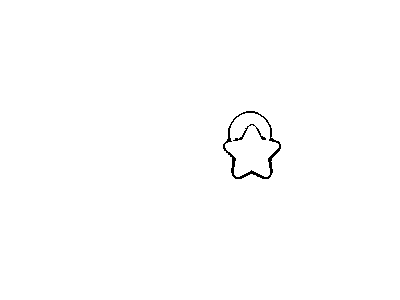** 

# 12 星座的压力源在哪里？

> 原文：[`mp.weixin.qq.com/s?__biz=MzA5NjA0NTAxNg==&mid=403585131&idx=2&sn=ba059adbd6f8521853081c56c57ec023&chksm=0d4c8adc3a3b03cadf2981a5d29079e4a3c1d0028e688943b25f78bbe828804b8cde120c5bd5&scene=126&sessionid=1692738857#rd`](http://mp.weixin.qq.com/s?__biz=MzA5NjA0NTAxNg==&mid=403585131&idx=2&sn=ba059adbd6f8521853081c56c57ec023&chksm=0d4c8adc3a3b03cadf2981a5d29079e4a3c1d0028e688943b25f78bbe828804b8cde120c5bd5&scene=126&sessionid=1692738857#rd)

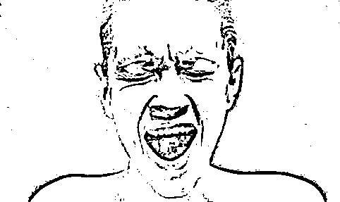

作者/ 苏·汤普金斯

译者/昕心 整理/Lulu 轩轩

压力是现在一个很流行的话题，我们身边充斥着关于压力的信息。它能不能被管理呢？能不能完全避免呢？今天我们就来从占星的角度谈一谈压力。

**有关压力的种种**

压力这个词在西方语言中是一个很现代的词，在 1926 年才第一次被瓦尔特·坎农（Walter Cannon）使用，来描述**会打乱体内平衡的外在事件**。但是第一个真正研究压力并做出定义的人是匈牙利人赛来（Hans Selye）。他在加拿大住了很久，写了数百篇关于压力的文章，让人们开始关注压力。

我们不知道他的具体出生时间，只知道是 1907 年 1 月 26 日。他的星图上，**天王星在摩羯座 10 度，海王星在巨蟹座 10 度。这样的天海配置激发了他对压力的研究**。

现代生活充满了紧张的事件，如截止日期、挫败、要求、堵车等。对于人们来说，压力已经成为了生活的一部分。

压力可以是生理、心理、情绪和灵性上的

**生理**：健康、没有地方住、太冷或太热、淋湿了、睡眠不够、工作太忙。

**情绪**：悲伤、失业、失去爱人、不愉快的亲密关系。

顺势疗法中认为压力的形成有三种原因。首先是**功能性的原因**，即基因继承。其次是**维持的原因**，比如你因为婚姻不幸福而感觉不好。在你解决婚姻问题前，没有任何药物能治愈你。第三是**兴奋性**的原因，就像导火索。对于小部分人来说，理发就构成一种导火索。

压力的原因多种多样，让一个人感到有压力的事，未必让别人有压力。占星师们都知道，**每个人的敏感点都不同**，**不同的人对不同的事情敏感**。

**压力在星图上是如何表现的**

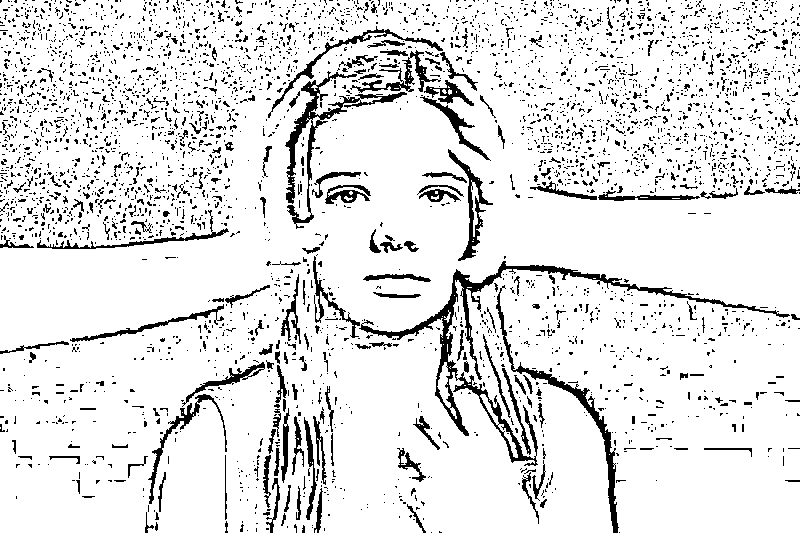

内在压力可以通过星图表现出来。

**○ **内源性压力和**不切实际的期待**有关，是我们的期待让我们失望。期待和**木星、海王星及射手座**有关，这些占星元素具有夸大的效应，包括正面和负面的夸大。

****○ ** 完美主义**与**处女座、火星、土星**有关。

****○ ** 负面思维**与**水星、土星**有关，但其实还有很多其他影响因素。缺乏自信，不管面对什么任务，都觉得自己完成不了。我们中的大多数人在坚持自我的方面都有障碍，也有一些人会过度坚持自己。在这一方面，占星师可以帮助客户，毕竟有些客户需要得到允许才会去行动；

****○ ** 过度负责或不负责**。解决这些问题都需要良好地运用**火星和土星**的能量。 

**12 星座的压力来源**

**白羊座**：事情进展不快的话就会觉得有压力。有人阻碍了自己也会觉得有压力。

**金牛座**：不吃饭出门、搬家、改变都会给金牛带来压力。

**双子座**：喜欢一边走路一边走神。没人聊天、无聊、陷在某个情境中、被困监狱中都会带来压力。

**巨蟹座**：担心家庭，包括房子和钱。

**狮子座**：不被欣赏、没有站在最高位、没办法完成责任都会造成压力。

**处女座**：操碎了心的人，没有完成工作、没有足够的功能，没有很好地工作或完成工作，即使是别人的错。

**天秤座**：孤单、被迫独立选择，看到不公平的情境和其他人的粗鲁。

**天蝎座**：背叛、便秘。

**射手座**：没有空间和自由、被困住。

**摩羯座**：失败，为自己不尊重的事物工作，觉得别人不尊重自己，计划出错，没时间做计划。

**水瓶座**：永远没压力的星座。与自由有关，不是很大的自由，而是不去想晚饭吃什么的小自由。没耐心。

**双鱼座**：活在没有酒的世界、和心胸狭隘的人在一起。

**关于压力的建议**

✦避免过度承诺、喝酒、悲观主义、完美主义、拖延症；

✦避免同时处理多项任务，研究表明在进行多项任务时，我们并没有想象的那么有效率；

✦避免压力大的人；花时间运动、接触大自然、简化生活，试着减轻责任，冥想、静心，固定时间休息。摩羯座总是在制定计划，细分任务，决定优先度。处女座和冥王星能量强的人都有组织计划能力。

✦我们还需要练习正向思维、感恩，学会时间管理，让自己变得更有条理更有组织性。

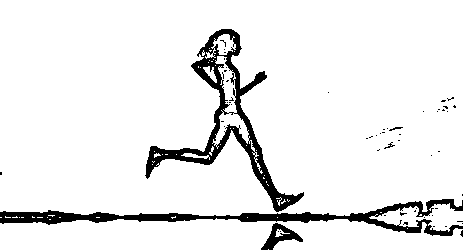  

前文提到的研究压力的赛来，认为压力有两种类型：好的压力和坏的压力。**坏的压力**指的就是你生活在一种紧急情况下。而**好的压力**就是正向压力，能提升我们表现的功能性压力。比如考试就是正向压力，它能让你努力。

最后分享几句赛来的名言：所有的压力都会留下不可修复的伤疤，而应对压力也会对机体造成伤害，即衰老。但是人们不应该逃避压力，就像不应该逃避爱、食物和锻炼一样。如果你有正确的态度，那就能把负面的压力转化成正面的压力。

**致死的原因不是压力，而是我们对压力的反应**。

**◆ ◆ ◆  ◆ ◆**

******特别提醒************：本文由作者授权发布于若道平台******，**转载请注明“转自若道”。******

疾病和健康的相关议题能不能在星图中找到相应的征象？我们怎样运用占星学来更好地认识身体，保持健康？2016 年**4 月 30 日**，**苏·汤普金斯**老师的**医疗占星工作坊**将在北京举办。此次工作坊还是 ISAR 职业占星师资质认证项目的三门选修课之一，要好好把握哦！

报名及咨询，请点击文末"阅读原文"


# 医疗占星工作坊 | 用占星学认识健康缓解压力

> 原文：[`mp.weixin.qq.com/s?__biz=MzA5NjA0NTAxNg==&mid=403585131&idx=3&sn=ac07863a26deeafdc5fd5455fdcef46f&chksm=0d4c8adc3a3b03ca61e1fd1cfa9592981cfa96a58c95d97f36b533bfd49f839bfd1951092076&scene=126&sessionid=1692738857#rd`](http://mp.weixin.qq.com/s?__biz=MzA5NjA0NTAxNg==&mid=403585131&idx=3&sn=ac07863a26deeafdc5fd5455fdcef46f&chksm=0d4c8adc3a3b03ca61e1fd1cfa9592981cfa96a58c95d97f36b533bfd49f839bfd1951092076&scene=126&sessionid=1692738857#rd)


白羊座主管人的头、脸、大脑、上排牙齿……

射手座主管人的腰部、坐骨神经、动脉循环、臀部、大腿、小腿上部……

这些知识点，你都知道吗？

如果知道，你会运用在身体健康的管理中吗？

来来来，让苏·汤普金斯告诉你，如何用占星学来管理你的身体健康。

此外，本工作坊还是 ISAR 选修课程之一哦！


**ISAR 选修课程****工作坊信息**

**授课时间：**2016 年 4 月 30 日、5 月 1 日、5 月 2 日早 10：00-18：00（午休 2 小时） 共 18 课时

**授课老师：**苏·汤普金斯

**授课方式：**北京现场，英文授课，中文翻译。（具体上课地址课前 10 天请留意查看短信微信通知）

**费用**：****6800 元** (**4 月 18 日**前报名可享受**早鸟价 5800 元**，若道老学员**4800 元**）**

**课程负责人：**王晓鸥  

**微信号：**2837474346，请备注医疗占星课程报名咨询

**咨询电话：**400-619-1014

课程简介

星座、行星、相位、宫位还能从什么角度进行阐释？

我们的占星工具箱里，还能增添哪些利器？

疾病和健康的相关议题能不能在星图中找到相应的征象？

我们怎样运用占星学来更好地认识身体，保持健康？


>>>>

**用占星学管理身体健康**

疾病一直以来在我们的生活中有两个作用。一方面，疾病是生活的一部分，虽然我们人类大多数不愿意被提醒这个事实。疾病也为个人成长提供机会和对人生更深刻的理解。疾病让我们谦卑。另一方面，许多健康问题是由于我们选择了错误的生活方式，因此可能是可以避免的。

今年 4 月 31 日至 5 月 2 日，伦敦占星学院创办人、《当代占星研究》作者、经验丰富的顺势疗法医师苏·汤普金斯老师将通过独到有趣的讲解和精彩的专题及案例分析带你进入医疗占星这个神奇的占星学分支领域。

名人推荐

苏·汤普金斯的《顺逆皆宜的人生》令人赞叹！苏是一名倍受爱戴的老师，并且在占星研究学院及后来自己创建的伦敦占星学院任教多年。苏以自己的冷幽默、抽丝剥茧的研究天分和占星直觉而闻名。她是一名执业占星师，也是一名顺势疗法医师，是心灵和身体的敏锐诊断专家。

 ——国际占星研究会（ISAR）法国副主席琳恩·贝尔

师资力量

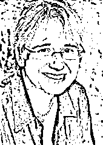

****苏·汤普金斯****

苏·汤普金斯是英国目前最资深的占星学家和咨询师之一，曾任占星研究学院（The Faculty of Astrological Studies）及伦敦占星学院（London School of Astrology）院长。2003 年，英国占星协会为表彰她的卓越贡献授予她查尔斯·哈维斯终身成就奖。

苏·汤普金斯老师不仅希望对心理和心灵进行疗愈，也一直希望能够找到一种安全又切实可行的方法帮助人们在人生旅途中得到身心的整体疗愈，而顺势医学的哲学与疗效让她惊叹，于是她于 1996 年完成在伦敦顺势疗法学院的培训成为一名专业顺势治疗师，目前，已经积累 20 年的顺势医学治疗师经验。

课程价值

得到苏·汤普金斯老师亲授的“独门绝技”，受益于大师在占星、心理学、医疗多维度的丰富经验

增加对身体各部分、健康和疾病的认识与觉察

收获实用的改善健康小技巧

巩固已有的占星学知识，拓展对星图象征符号的理解并掌握更多星图解读的方法和技巧

将医疗占星纳入你的占星工具箱，用它来助人助己，成为更专业的占星师

>>>>

课程内容

心灵和疾病的关系

我们的健康问题是由什么样的生活方式造成的？

疾病如何为我们提供个人成长的机会？

医疗占星学的普遍性原则

各种疾病的常见星图征象是什么？

从星图看，你身体的哪些部位是最脆弱的？对此，你可以做什么？

饮食与健康

我们的饮食能在星图上体现出来吗？ 

如何从星图看我们的身体疗愈之道？

顺势疗法和占星学

如何让自己更健康？

改善健康的实用性技巧

**我们会抽取个案进行现场讨论，会有 6 个个案讨论的机会（可以用家人的案例）。**

**参与个案讨的必须提供：**

**1） 病情细节      2）出生信息       3）生病日期或确诊日期**

**我们欢迎有癌症和心血管疾病的同学（包括家人）提供个案。 **

我们还将分组讨论，在这个工作坊上，帮助大家在用占星学对个人健康进行管理方面获得知识和洞见。

**特别说明：本课程不涉及任何医疗行为 **

>>>>

适合人群

相当于若道核心课程 level3 以上水平即了解星座、行星、宫位、相位等，可以独立进行出生星图解读。


长按二维码接通课程负责人~


更多内容及报名，请点击文末“阅读原文”

# 12 星座土逆全攻略 | 请通过现实的考验

> 原文：[`mp.weixin.qq.com/s?__biz=MzA5NjA0NTAxNg==&mid=403585131&idx=1&sn=3238ff8e8a2e4ba92c8201e5682d4cc0&chksm=0d4c8adc3a3b03ca2df1f5560edeec6d422479e2c83188b90519a8f64e3175f0801a3d11b042&scene=126&sessionid=1692738857#rd`](http://mp.weixin.qq.com/s?__biz=MzA5NjA0NTAxNg==&mid=403585131&idx=1&sn=3238ff8e8a2e4ba92c8201e5682d4cc0&chksm=0d4c8adc3a3b03ca2df1f5560edeec6d422479e2c83188b90519a8f64e3175f0801a3d11b042&scene=126&sessionid=1692738857#rd)

作者/咔咔  ISAR 认证占星师

图片/花瓣网

2016 年 3 月 25 日 18：02 开始，土星将开始为期四个多月的逆行，从射手座 16 度 24 分，逆行回到射手座 9 度 47 分。在 2016 年 8 月 13 日 17：49 恢复顺行。在这四个多月里，我们需要回头检查曾经做过的承诺，进行的项目和承担的责任。

**土星的现实法则**

毛姆在《月亮与六便士》里写道：上帝的磨盘转动的很慢，但是却磨得很细。这是一句非常合适来形容土星的话。在接下来将四个多月的土星逆行期间，我们可能会对这句话有更深的体会。

土星一直以来与**“业果”、“限制、“”压抑”和“局限”**这些词联系在一起，所以通常大家谈到土星的时候都不会太高兴，几千年来传统占星学也一直给土星戴着“凶星”的帽子。

土星的核心意义是“**现实的法则”、“规则”和“界限”**，人们的生存要遵从这些现实的法则，人际的交往也需要设定界限。土星像是一个质量检查员，不能合理运作和经不住长期考验的人和事，会在这个磨盘的研磨下，露出马脚，淘汰出局。而**经过了考验站住了脚的人和事，就会被土星给予它做代表的“现实”和“物质”的奖赏。**

我发现一些客户在土星行进至上中天时取得的升职和加薪的幅度，比传统意义的“吉星”木星行进到上中天时得到的幅度，更为丰厚和令人满意。需要记得的是，**土星是一颗代表“时间”的行星，它不会立刻带来好运，你需要花一些时间，有一些耐心。**

**土逆让你回头看**

当土星逆行的时候，人们要借此机会回头看看土星行进所触发的领域：包括行进土星的宫位、与个人行星形成的相位），检查在这些领域里，土星代表的功课做得怎么样，查漏补缺，尤其是土星代表的承诺、责任、规则和结构等方面。

**○ **如果你充分评估了之前做出的承诺，感到不舒服，这些承诺让你承受了过大的压力，那么在土星逆行期间，你可以说：“对不起，我做不到”。

**○ **如果你的合作伙伴（或者伴侣）之前信口开河，你发现他根本不能兑现他的承诺，那么在土星逆行期间，你可以说：“这么做不行，我们要重新看下这个合作关系（感情关系）”。

**○ **如果正在执行的项目效率不高，那么在土星逆行期间，你可以重新调整项目组人员结构和分工。

既然每个行星逆行都代表了一段**“向内看”**和**“回头看”**的期间，那么**这个阶段需要先把重点放在处理现有的问题，不宜开启新的项目和计划**。

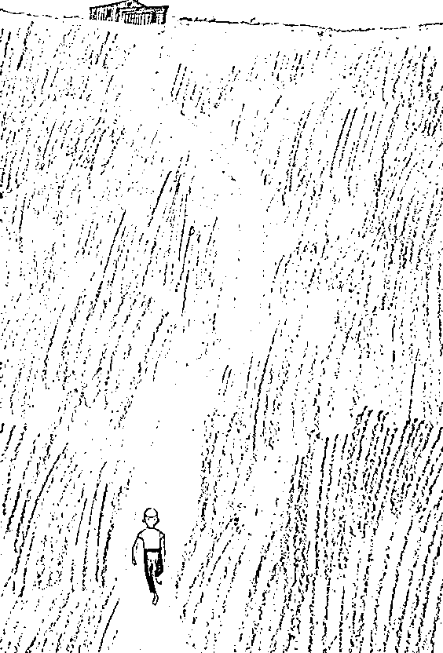**此次土星逆行的影响**

以下列出了土星在射手座逆行对 12 星座人的影响，主要考虑了上升星座（也是土星行进的宫位），对于那些有个**人行星在变动星座（双子座、处女座、射手座、双鱼座）8-19 度的人**，鉴于行进的土星已经与这些个人行星形成过相位，也许你的生活的某个领域已经发生了变化，你可以和你的占星师一起讨论，这些变化对你造成的影响和你的感悟，来迎接土星的第二次（逆行）和第三次（恢复顺行）的碰撞。

*这里特别要说明下，有些读者曾反映：按照自己的上升星座，文章列出的行进宫位与自己的实际行进宫位不符，因此下文一并列出上升星座和宫位，方便大家按需查询。另外，土星逆行可能会逆回到上一宫，大家需要通过在线星图查询自己星图上土星逆行的宫位。*

**12 星座土逆 Tips** 

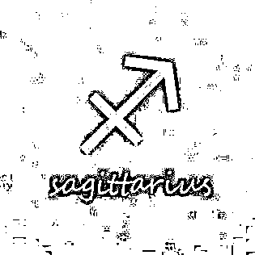 

**上升射手座 or 行进土星在第一宫逆行**

行进土星进入第一宫首先会带来的是**失望、沮丧和自我怀疑**的感觉。尤其对上升射手座，当向外的征途停滞或者被迫停下，这种感觉确实非常糟糕。土星是撕破幻象的镜子，戳破了膨胀的自我，过度的自信，自我感觉良好的外形。

当土星逆行的时候，人们会**调整自己的饮食结构和健康习惯，给自己一个能长久受益的健康的身体**。这个时候也可以回顾自己的人生缺口，寻找那些因为自己跑得太快而忽视掉的责任。也可以寻找那些曾经阻碍你进一步成长的限制，尤其是父母或者师长曾经对你做出的批评或者过高的期待，是时候甩掉这些包袱了。**找到“我是谁”之前，可能你要先看看 “我不是谁”**！

 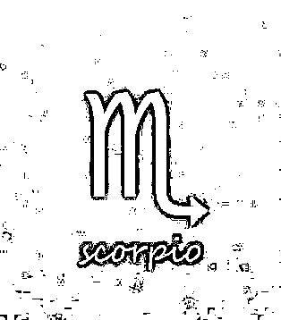 

**上升天蝎座 or 行进土星在第二宫逆行**

第二宫关系到一个人的**自我价值感和财务状况**。行进土星进入第二宫之后，财务状况虽然不会突飞猛进地改善，但是随着个人做出**切实的财务规划和持久的努力**，通常在土星离开第二宫的时候发现自己在这段期间的收益可观。

比如有的客户在行进土星进入二宫后开始做基金定投。当土星在第二宫逆行的时候，可以评估自己的财务状况，在工作中的投入产出回报，调整存款与理财的比例。

与外在物质世界相对应的，是我们的自我价值。当你用“我拥有什么”来定义“我是谁”的时候，逆行的土星有可能会刻意让你失去这些你拥有的东西，然后你被迫要从**外在世界回归到寻找内心的强大与自我肯定这条路上**来，用你在行进土星在一宫获得的技能和信心，在现实世界重新把失去的东西夺回来。

 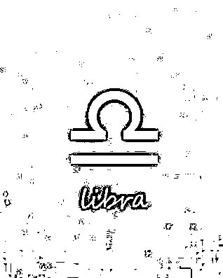 

**上升天秤座 or 行进土星在第三宫逆行**

很多上升天秤座在行进土星进入“沟通宫”的感觉是：**沟通不畅**，要沟通的人和事多了很多，陷入文山会海。而且由于上升天秤座习惯于顾及到各方面的感受，就会愈发感到自己的时间不够用，或者过度消耗精力，但是事情进展并不顺利。

也有一些升天秤会在这个过程里学会“土星射手座”的方式：**关注大方向，把话说清楚，把责任理清楚，让自己和他人都明确各自的权责。**在土星逆行阶段，可以看看自己有没有浪费时间和精力在繁杂琐碎的信息和沟通上，清除这些干扰，**给自己的生活做“减法”**。

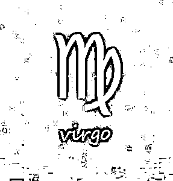 

**上升处女座 or 行进土星在第四宫逆行**

经历行进土星在第四宫的可能会感受到自己的**人生正在进入“静默期”**。第四宫解释的是“我从哪里来”，“我的根在哪里”。在行进土星进入第四宫的时候，人们会**关注自己的家庭、家族和居家议题**。

可能你会重新布置房子或者修缮房屋，增加自己的安全感。如果房屋成为一个负担，你也会考虑出售这个房子，重新找到一个让你更感到舒服的新居所。鉴于这是一个重塑安全感的时期，你也会改变与父母的互动关系，或者重新聆听家族的故事，在这个过程里，**修补童年的伤痕，面对曾经的无助、恐惧和愤怒。**

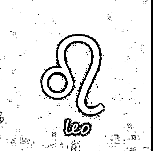 

**上升狮子座 or 行进土星在第五宫逆行**

五宫关于爱情、荣耀、创造力和孩子。在土星行进五宫的时候，有些上升狮子座正在为“创造”一个“孩子”而付出时间和精力。有些人则陷入在“爱情”的漩涡里。爱情让人感到自己充满活力，自己是特殊的和值得被关注的。

土星在五宫的逆行会夺走这些“特殊的”和“良好的”感受，**让人产生自己被忽视和不再被爱的感觉**。当这些感受出现的时候，人们很难再有自信去表达自己，很难相信自己的创造力和活力。不再生活在别人的视线下，**肯定自己，找到自己真正的天分，为自己感到骄傲**，这是土星在第五宫完成行进后人们的收获。

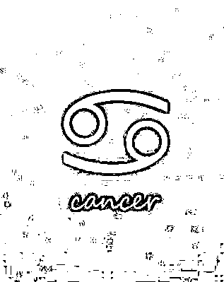 

**上升巨蟹座 or 行进土星在第六宫逆行**

行运土星行进在第六宫的时候，首先检验的是人们**日常的生活作息**。如果你之前过着不规律生活，难免在健康方面被亮了红灯。

土星在六宫的任务很简单，帮你**养成生活的良好习惯**：健康饮食，合理锻炼，检查身体，养成规律，提高效率。曾经困扰你的健康问题可能在土星逆行期间又抬头了，请不要忽视，及时就医。

行进土星进入六宫的时候也会带来**工作量翻倍，或者琐事增加**的情况。人们会哀叹在这段期间“累成狗”。土星在用它的方法逼迫你学习合理安排时间，提高工作效率。趁着土星逆行的时候，不妨**总结事半功倍的好技巧，调整或者夯实已经养成的好习惯。**

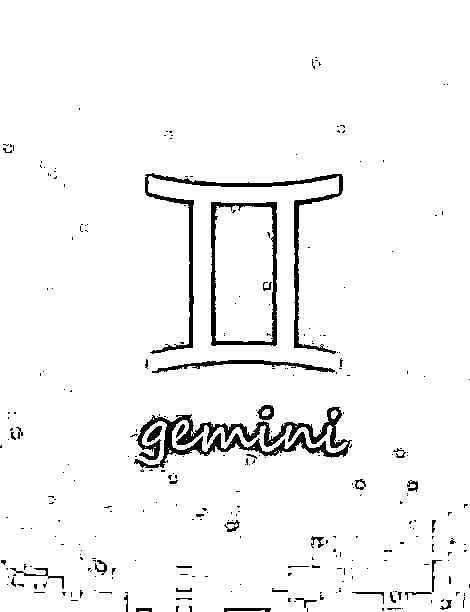 

**上升双子座 or 行进土星在第七宫逆行**

行进土星进入“伴侣宫”和“合作宫”，意味着人们需要**划清楚和他人的界限**，了解自己和他人的这段关系，是否建立在务实和责任的基础上。在此期间，要么你成为别人的“问题”，要么别人成为你的“痛点”。当亲密关系中隐藏的问题浮现出来的时候，人们会感到面对冰冷的现实之后的失望、孤独和沮丧。

请记住，土星会去掉已经对你没有帮助的关系。在它的帮助下，你的**人际关系因为经历了重新评估、重新承诺的过程，而变得更能经受时间的考验**。逆行期间人们不妨放缓发展新的关系，关注在你现有的感情关系、合作关系。**不要轻言承诺，也无需轻言放弃。**

 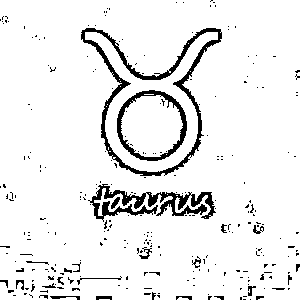 

**上升金牛座 or 行进土星在第八宫逆行**

行进土星进入第八宫**引发了埋藏在心底的不安**，有些人在这段期间经历了自己或者伴侣的出轨，或者创业投入了大笔资金却收效甚微。无论是经济上面的担忧，还是被背叛或者欺骗伴侣引发的愤怒、性冲动、攻击和发泄，土星在提醒你生命里的痛苦都是有意义的。

当你成长到一定阶段，是时候**面对自己的不安全感**，重新定义自己与他人在金钱和物质上的关系，找到新的生存法则。当土星逆行的时候，可以**回顾曾经让你恐惧的事情**，找到这些恐惧是否源于童年的阴影。

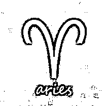 

**上升白羊座 or 行进土星在第九宫逆行**

第九宫与射手座都于**高等教育、海外事物、宗教律法**有关。土星代表了**时间和现实的考验**，而射手座和第九宫是木星代表的远大理想。行进土星在第九宫会**检查你的信念、希望和愿景**，是否是叶公好龙或好高骛远。

土星同时代表了务实的态度，当你去海外旅行、进修求学的时候，是否有不切实际的期望，或者盲从社会的潮流，这个经历是否真的能对你的个人成长带来帮助。土星逆行期间，你可能**拿起来一本之前看了一半就放下的书，重修课程，做更详细实际的旅行计划。**

 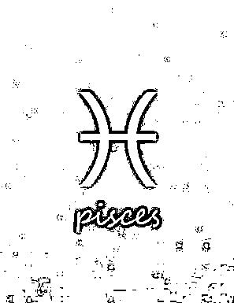

**上升双鱼座 or 行进土星在第十宫逆行**

行进土星进入第十宫并不一定会带来事业上的失败或者挫折，如果已经在事业上持续耕耘和努力，土星进入第十宫会带来升职加薪这样的物质回报。当然如果之前对待工作一直拖拉或者怠惰，行进土星会拿走你现有的职位或者薪酬，让你重新意识到要“**一分耕耘、一分收获**”，有计划和踏实地面对工作。

土星逆行期间可以**重新评估自己的工作能力，调整工作目标，**同时可以重新评估之前的项目，尤其是和项目质量有关的细节。

 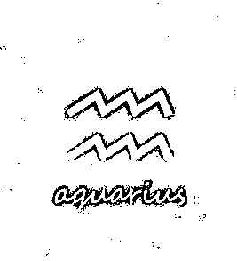 

**上升水瓶座 or 行进土星在第十一宫逆行**

行进土星来到和水瓶座相关的宫位，第十一宫。在这个地方，人们把自己与其他人联系起来，因为共同目标形成了团体和组织。土星在射手座在第十一宫，强调了这些团体要和你有着相似的信仰或者价值观。

你可能不再满足于在微信朋友圈里给别人点赞，或者发一些“岁月静好”的图片，肤浅空洞的互动不再让人满意。土星逆行期间，你会**用实际的眼光去评估你所在的群体，是否值得你继续留在那里。**

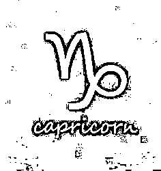 

**上升摩羯座 or 行进土星在第十二宫逆行**

代表规则和结构的土星来到了没有规则和限制的第十二宫。第十二宫像海面下的巨大冰层，虽然没有浮出水面，却极大地影响我们的人生。行进土星进入第十二宫是要**在潜意识层面做一个大扫除**，翻起冰面下隐藏的东西。有些人可能会选择独居或者静修，有些人有可能在精神层面经历这个“静修”。

去意识到曾经忽略的习性已经是进步。行进土星在第十二宫**并不是要你开始**，而是要你给一些事**划上句号**。你可以利用土星逆行期间，**看看你在做的事情，是要对哪一部分自己说再见。**


**占星师咔咔**：2010 年开始学习占星学，若道首届学员，国内最早获得 ISAR 职业占星师资质的职业占星师。在国际知名广告公司和市场研究公司从事的市场研究和推广工作十余年，曾任职于阳狮集团、尼尔森市场研究有限公司、MTV 和《Madame Figaro》杂志。现在为《时装男士》、活法儿等媒体供稿。

**微信公众账号**：咔星人

**星盘解读和运势咨询**：cji1029@qq.com

长按二维码，让金钱涌向传播知识与智慧的人~ 


**土星逆行你有什么感受**

**留言分享给小伙伴们吧**

**◆ ◆ ◆  ◆ ◆**

******特别提醒************：本文由作者授权首发于若道平台******，**转载请注明“转自若道”。******

好好用功夯实占星学基础吧。**2016 年 5 月 19 日**，蒋颖老师主讲的若道占星核心课程**Level 1-2**要开课了！她将带领你学习星座、太阳、月亮、行星、月亮交点等知识，让你进入占星学的世界！

报名及咨询，请点击文末"阅读原文"


# 白羊座 | 不负春光，野蛮生长！

> 原文：[`mp.weixin.qq.com/s?__biz=MzA5NjA0NTAxNg==&mid=403541862&idx=1&sn=3b95fb1ea25235cad8c3f1713645fed3&chksm=0d4f3dd13a38b4c7aa1a809a721e177ef78593f5df8b77ea310dbc5e686723181407714f6dce&scene=126&sessionid=1692738857#rd`](http://mp.weixin.qq.com/s?__biz=MzA5NjA0NTAxNg==&mid=403541862&idx=1&sn=3b95fb1ea25235cad8c3f1713645fed3&chksm=0d4f3dd13a38b4c7aa1a809a721e177ef78593f5df8b77ea310dbc5e686723181407714f6dce&scene=126&sessionid=1692738857#rd)

“最初什么都不存在，随后出现了一些东西。生命突然冲出来，要求在虚空之中占有一席之地。这个过程是无所畏惧的。”你看，这就是白羊座。

中土大地之上，烽烟四起，群雄逐鹿，天冥两军交战已有时日，双方势均力敌，互有攻守，胜负迟迟未定。夕照之下，人疲马乏，但甲未下身，刀未离手。 

夜色渐暗，双方暂偃旗息鼓，各自落营休憩，黑夜中，一双双眸子欲透过风烟明辨前方路。

待旭日东升，破晓之时，号角起，鼓声鸣，旗帜扬，面迎风沙，横刀立马，再战起！

## 白羊座，烈火之姿

在刚过去的一段时间里，众星睁着半梦半醒的双眼，陆续游走在充满灵性及慵懒范的双鱼座里。被宇宙的毛毯环抱着的我们，无论从中体验到的是舒适的浸润或滋养，还是恼人的无力感与虚无，都已成为昨日。命运之轮还在持续不断的向前滚动着。

太阳经过一轮的巡回，途径 12 星座，在穿过黄道最后一个星座——双鱼座之后，再次回到了守护黄道第一宫的白羊座，宣告又一新的轮回被开启，而这里是起点！

> ○ **3 月 20 日 12:18**，太阳进入白羊座；
> 
> ○ **3 月 22 日 08:13**，水星入白羊；
> 
> ○ **4 月 6 日 0:41**，金星入白羊；
> 
> ○ **4 月 7 日 19:22**，白羊座新月。

看到以上的天象列表，有没有瞬间感到一股炽烈的阳刚之气侵入鼻尖，整个人抖擞了起来？

白羊座，被火星守护。**战士，冒险家，无畏者**是它的原型。**白羊座属开创的火象星座**，开创，即初始。因此白羊的火不是含带浪漫气息微醺的烛火，也不是郊外玩耍时一群人围跳的篝火，而是如**生命之初，不受限的野火**！

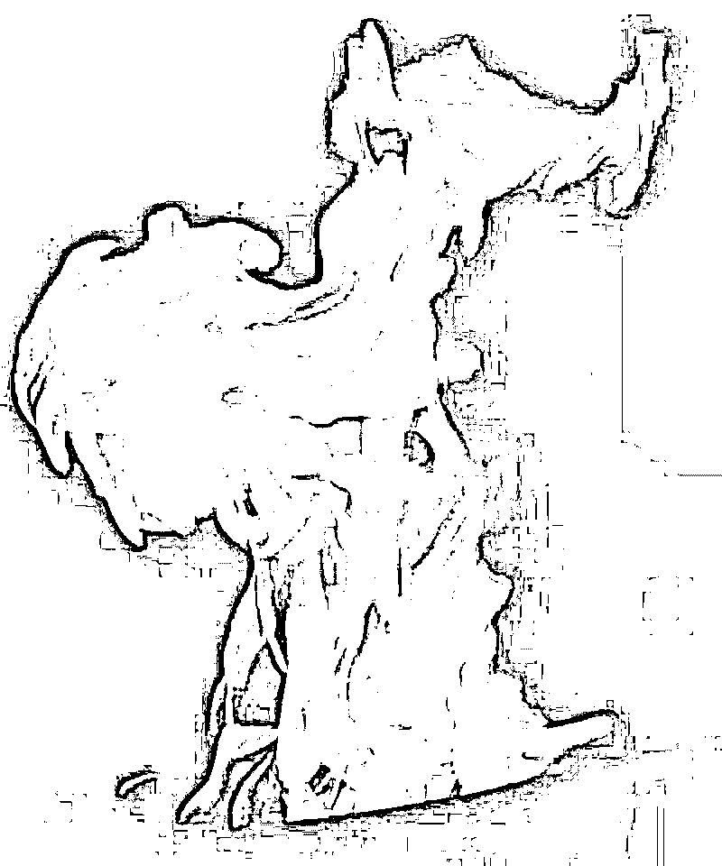

## 白羊座，勇猛是我的 middle name

白羊座常常因为过于直接让人看起来有些粗鲁，甚至是野蛮，但他却是真实的。


白羊座的能量不委婉，不柔和，不关乎迂回与含蓄，是直接的传递与全然的释放，他天性自主和独断，同时带着竞争性，是个绝对的行动派。


当朋友在精心打扮之后，带着被赞美的期待问他看起来如何时，如果他觉得真的不适合，会马上直接的告诉朋友：“不好看，不适合你，换身吧！”这个回答注定让朋友感到失望，但他朋友听到的却是真话。这是白羊座！

喜欢上一个人，不管自己是不是对方心中的那盘菜，不管三七二十一就直接了当的表白了，因为他无法隐瞒他的真心。这是白羊座！

对待仇敌，会不远万里，哪怕追到天涯海角都要把他给揪出来。这是白羊座！

若他不喜欢你，他会直接的说我对你没有感觉，而不会给你创造供你想象的暧昧空间，耗损你的时间与能量。这是白羊座！

若他明确了一个方向，他会不顾一切阻挡，眼中只有目标，全然的奋力直追。这是白羊座！

或许白羊座不是一个合格的谋略家，但绝对是一个称职的当兵打战，开辟疆土的勇敢将军。

## 白羊月之天象的显化

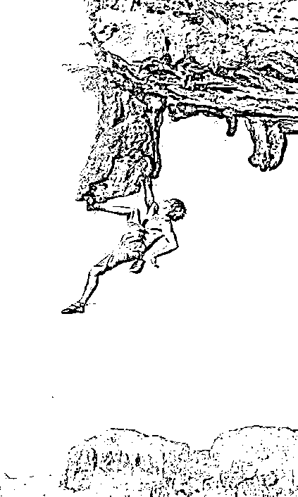

而当代表自我核心意志的太阳和代表沟通交流与思维方式的水星，及象征自我价值感的金星陆续迈进白羊座的城池中，让我们在这个明媚的春天时节里，除了闻到四处洋溢的花草芬芳之外，还能在空气中嗅到一股活跃与不安分的躁动因子。 

看此天空之象在地球上的各种显化：

*   健身房里人满为患，男生女生各种 muscle 与马甲线练起；

*   企业老总和 HR，近期会收到比较多的辞职信，因为员工们渴望换个新的工作环境继续 fighting；

*   发现身边以往沟通表达比较温婉内敛的同仁，现在会以更加直接明朗的方式与你交流；

*   工商所及税务局营业大厅比以往更繁忙，因为想要自立门户，自主创业的人多了；

*   路怒族比平时有增无减，因为比起踩刹车白羊座更喜欢踩油门；

*   从事销售类工作的同胞们，内心充满着斗志，力争用最好的成绩拿下王牌销售的称号；

*   户外运动和极限运动又迎来新的一波热潮，因为白羊座的肾上腺素无比发达。

## 激发你内在的勇敢与活力

而在这个阳气生发，万物复苏的季节里，我们地球人又适合做些什么呢？

*   若旧有的生活模式已经过于陈旧与过时，请勇敢的走出舒适区，拓展新的人生疆界；

*   活动你的四肢，让它们得到伸展，激活已经昏昏欲睡了整个冬季的身体，身体的活跃才能带动脑部神经的活跃；

*   有个学习计划在你脑海盘旋了许久，迟迟未有付之行动，而现在是时候将计划落实于行动了，just do it;

*   在部门项目讨论会上，你一直是默默无声的好听众，即使心里翻滚着无数多的 idea，都没能让你张开大嘴。而现在是时候说出你的点子，请为自己发声；

*   在心中默默喜欢着一个人，一直未能告诉对方。现在试着骨起勇气向她表白，万一有惊喜等着你呢，即使传递回来的是“对不起，谢谢你”，起码在爱的面前你曾勇敢过；

*   如果之前在人际交往上是被动的，现在不妨主动些，给好朋友主动打给电话，聚会约起；

*   孩童般的开怀大笑如果已经太久未能显露在你的脸上，在面部神经尚未完全僵硬之前，赶紧找个爆笑喜剧片看看，快速拉伸下你的笑神经；

除此之外，你可以为自己做的还有很多，请与你的生活实相相结合，做任何可以激发你内在勇气与提升活力的事。

## 让我们回归天性

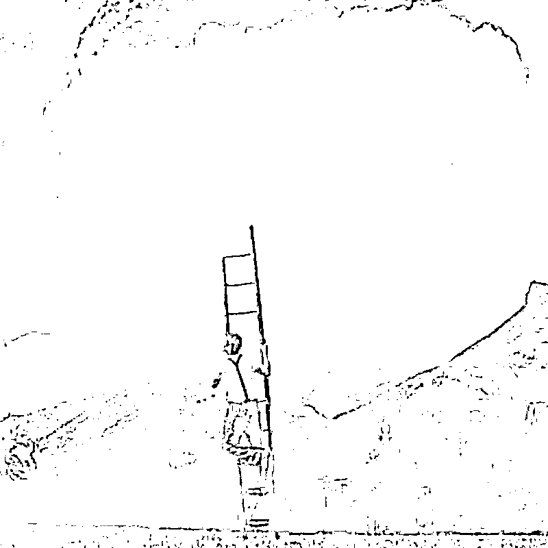

随着人类自身的不断进化，我们每个人早已习惯以文明与和谐的方式融入到现代社会中，适应于礼貌的待人接物，一切有章可循的按规则来，这点本该毋庸置疑，因为这正是人类社会进步的彰显，发展出的文明和章程有效的管束住了我们天性中的阴影，让大家得以共同在一个更加和谐的空间里生活。

但硬币不仅只有一面，当我们从一端走向另一端时，或许又在制造着另一种极端。在阴影被管束住的同时连同把我们天性中难能可贵的一面也一起被管束了起来，比如我们对于生活的创造力及激情。

想想因碍于社交礼仪，你有多久没有在公共场合咧嘴哈哈大笑了；为了在职场中竖立气场女王的形象，天天踩着 10cm 的恨天高出入写字楼，哪怕脚已经被挤出了 N 个血泡都不肯换上舒适的平跟鞋；因害怕无法融入集体，有多久没有直接表达内心的真实想法了；因心中的各种患得患失，有多久没有为了自我主张挺身而出了？

在钢筋水泥里呆了太久的我们，是时候在这个万物复苏之季，穿上跑鞋，走出户外，去到大自然中，在阳光雨露下，寻回本属于我们的天性，野一把！

## 天冥的重压，你怕不怕？

自 2010 年天王星进入白羊座起，与处于摩羯座的冥王星在天空中来来回回多次的形成激烈的四分相位。两个外行星大 BOSS 之间的角逐所形成的革新浪潮，一波又一波的拍打在我们现实和精神两个世界之中。在此天象之下，古老的规则得以撼动，旧有的体制在不断调整。而这与我们每个人都息息相关，因为我们都身在其中，都在天幕之下。

**2016 年 4 月 7 日 19:22，日月合相在白羊座，即白羊座新月**，与天王星形成只有 2 度之差的紧密合相，同时，新月白羊与土星射手形成三分相。

这无疑是给天冥大军的激战又添了一把烈火。而这烈火又将烧向何处？这又会在我们各自心中撞击出怎样的火光呢？

请在你的出生星图中找到专属于你的白羊座的坐标，并带着以下的问题问向自己。或许在渐渐发展出的觉知中，我们心中的某个迷思将得以慢慢解套。

**你觉得自己勇敢吗？你对生活充满热情吗？为了自我主张你敢于挺身而出吗？你忠于自己的信念吗？你敢于走出安全区开拓新的人生疆土吗？你敢于打破常规吗？那打破常规，对你而言只是为了证明自己的反叛精神呢，还是对自我内心的真实遵从呢？你是如何看待自己的生命的？你的信仰是什么？你的信念旗帜还在迎风飘扬吗？而在这个春天里，你愿意野蛮生长一次吗？**


**作者简介**

**理想国的女巫**：全职塔罗占卜师，人本主义占星师，国家二级心理咨询师，国际占星研究协会 ISAR 会员。致力于将心理咨询技术与塔罗占卜和占星咨询进行融合与连接。咨询中注重来访者自身的心理动力，个人自由意志与灵魂的进化成长，而非宿命式的论断。主要研习人本主义心理占星学以及进化占星学。2015 年在上海创立独立咨询工作室（十二宫塔罗占星咨询工作室）。

**微信公众号**：house12ta  

**咨询预约号**：vivian-yanyan

长按二维码，让金钱涌向传播知识与智慧的人~

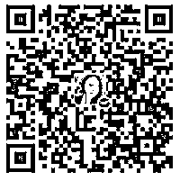

**◆ ◆ ◆  ◆ ◆**

**特别提醒****：本文由作者授权首发若道平台，转载请注明“转自若道”。**  

想要学习更多星座知识？**2016 年 5 月 19 日**，蒋颖老师主讲的若道占星核心课程**Level 1-2**要开课了！她将带领你学习星座、太阳、月亮、行星、月亮交点等知识，让你进入占星学的世界！

报名及咨询，请点击文末“阅读原文”


# 顺势疗法观点 | 疫苗到底要不要打？

> 原文：[`mp.weixin.qq.com/s?__biz=MzA5NjA0NTAxNg==&mid=403541862&idx=2&sn=ff0fb773a6d72afdc01cf99731f1456d&chksm=0d4f3dd13a38b4c7312d09d3e579aedd5ef122d739c8fef4e1f959531154cb38ee4666bece7c&scene=126&sessionid=1692738857#rd`](http://mp.weixin.qq.com/s?__biz=MzA5NjA0NTAxNg==&mid=403541862&idx=2&sn=ff0fb773a6d72afdc01cf99731f1456d&chksm=0d4f3dd13a38b4c7312d09d3e579aedd5ef122d739c8fef4e1f959531154cb38ee4666bece7c&scene=126&sessionid=1692738857#rd)

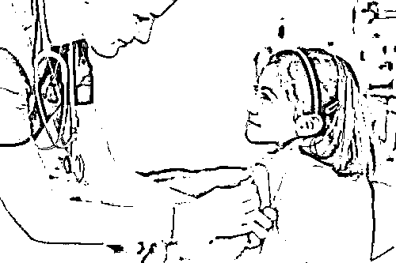
作者/苏·汤普金斯  整理/Elias

最近，疫苗的问题沸沸扬扬，对于接种疫苗一事，顺势疗法的视角和观点非常多，有整本的著作阐述这一主题。下面就来看看累积 20 年顺势治疗经验的苏·汤普金斯如何看待疫苗问题。


<sectin style="margin-top: 46px; margin-left: -76px; display: inline-block; vertical-align: top; line-height: 2em; box-sizing: border-box;">******注射疫苗就能搞定疾病？未必******</sectin>

在一个美国的医学学术中，40%患了麻疹的幼儿接受过麻疹疫苗。然而发现这个疫苗的科学家，在 1977 年的杂志上说这个小儿麻痹症的疫苗就是小儿麻痹症为什么会一直存在的原因。

中国或者大多数国家会选择在孩子三四五个月的时候注射百日咳的疫苗。百日咳是一个非常严重的疾病，但是如果这个孩子是母乳喂养的话，那么他天生对这种疾病的抗体就会比较强大。在英国有这样的例子，在百日咳的流行期间，注射疫苗的孩子反而更容易患上这个疾病。所以在注射这个疫苗上确实比较有争议。

有一本书叫做《不被注射疫苗的小孩》，在书中说到，如果这个世界上所有的疾病都被疫苗完全杀尽，这并不有利于健康。因为对顺势疗法来说，疾病是一种自然的、存在的、状态的反射，如果把它全都杀绝，疾病会产生一种变异体，这个变异体可能更加难以治愈。

有时候，孩子打了疫苗后发生了一些反应，而这些症状如果是因为注射疫苗而引起的，顺势疗法发现，如果把引起反应的疫苗做成顺势疗法的药物给这个孩子服用，往往都会解决因为疫苗而产生的情况。


<sectin style="margin-top: 46px; margin-left: -76px; display: inline-block; vertical-align: top; line-height: 2em; box-sizing: border-box;">**要相信，**机体有自己的免疫力****</sectin>

顺势医师会有这样一种态度：**疾病有时候对于个人来说是一件正向的事情，因为疾病可以让个人的免疫系统得到发展**。如果一个孩子小时候得了麻疹，这其实有助于增强他的免疫系统。痊愈之后，他可能更加头脑清晰，也更加能够抵御外在疾病。

全息的医学观点，比如中医有这样的说法：你要把身体看成一个整体，一些疾病的产生是一种病菌来侵袭你的身体，**最主要的事情是让你的机体达到更高的免疫状态去对抗疾病**。

我们先要了解**个体是有免疫性，大多数时候是可以抵抗外来病菌的**。疫苗这个事情，可能在中国是没有选择，在西方也是这样。但如果有一些选择的话，你要如何选择呢？

**顺势疗法医师的建议**

如果一定要注射疫苗，**尽量选在孩子六个月之后，**因为这个时候孩子的免疫系统比较强健。另外，**尽量不要注射多种疫苗结合在一起的复合制剂**。

比如在英国有一种疫苗叫做 MMR（麻腮风疫苗，属二类疫苗，非必须注射），它是把麻疹和另外两款病的疫苗结合在一起，这种疫苗就很有可能会导致一些问题的产生。因为我们的免疫系统是这样的，它没有办法一下子面对太多的外来入侵物。

总而言之，注射疫苗是个很有争执的话题。如果真的要决定是否要注射疫苗我是这样建议的：需要弄清楚，**如果不注射疫苗这个疾病的风险是如何，要把风险和好处做个评估，**最后得出结论。就我个人而言，我不会频繁的种植疫苗，除非是必须注射的。要记住，**机体有自己的免疫力**。 

**◆ ◆ ◆  ◆ ◆**

******特别提醒：****本文由作者授权发布于若道，转载请注明“转自若道”。******

想要更多地了解顺势疗法？**2016 年 5 月 7、8 日**，由**苏·汤普斯金**亲授的**顺势疗法工作坊**就要开课啦！顺势疗法是目前全球使用最广泛的自然医学疗法，对个体的身体、精神和情绪三个层面进行治疗，加强个体自身免疫力，提升个体生命能量。本课程为那些想要增加自我及家庭身体保健和疗愈能力的人所设置。详细内容请点击“**阅读原文”**了解。

报名及咨询，请点击文末“阅读原文”


# 打假热线情感类问题大起底，困扰你的，我们来回答

> 原文：[`mp.weixin.qq.com/s?__biz=MzA5NjA0NTAxNg==&mid=403511401&idx=1&sn=7b36df4765406f15ccdc7ff23f63dce2&chksm=0d4faade3a3823c806abf58f6caff4d76bd5405fb431ffb9220094c168a1f8878960b53ed408&scene=126&sessionid=1692738857#rd`](http://mp.weixin.qq.com/s?__biz=MzA5NjA0NTAxNg==&mid=403511401&idx=1&sn=7b36df4765406f15ccdc7ff23f63dce2&chksm=0d4faade3a3823c806abf58f6caff4d76bd5405fb431ffb9220094c168a1f8878960b53ed408&scene=126&sessionid=1692738857#rd)

情 感 类 微 问 答

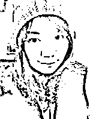

****作 者 介 绍****

****Elias****

若道核心课程 Level 5 在读。

曾在若道公众平台发表文章[《土星落七宫，女人注定离婚？》](http://mp.weixin.qq.com/s?__biz=MzA5NjA0NTAxNg==&mid=402988680&idx=1&sn=9cdc79f3ba46a3108c810c0ffb514699&scene=21#wechat_redirect)

**Q：****金星与天王星有紧张或和谐相位，是否意味着当事人有婚外遇的倾向，感情无法专一？**

**A：**事实上，任何人都可能出现婚外遇的行为或者拥有这种想法，但每个人的心理动因不尽相同。 

*   可能因为在对方身上找不到想要的安慰，或者得不到理想中的关注而希望另一个人可以给与；

*   可能因为经受不住诱惑与刺激而迈出这一步但内心受到极大的自我谴责。

天王星是一颗追求与众不同，创新，特立独行等意义的行星，它可以激发人的创造力，给出更新鲜的点子，不按常理出牌，认为权威也是可以挑战的。

当它与金星相遇，它会让金星更能够发展出一种独特的魅力，同时也会让代表爱与美的金星想要寻求更多不一样的东西。这确实是金星与天王星行成相位的一个表达。但是我们也明白，我们的星图上有很多星体，**如果一个人有很强烈的土星能量的规则或者木星能量的道德感，那么他的很多脱离轨道的行为就会有一定的尺度。**我们不能单凭一个配置就武断的说这个人是个无法专一的人，这也是给他人机会的方式。 

**若道君：****小编就是金天合相，亲测的确是会喜欢带有天王特质的异性，然而却是个相当专一的选手，亲你的问题让我好委屈……**

**Q：****凯龙星不好一辈子都要单身？**

**A：**在某些学派的占星理论中，凯龙星被称为过去世的伤痛或者无法愈合的伤口，如果你是一个相信轮回转世的人，那么这个关于凯龙星的解释可能是让你觉得适用的。

在大卫老师的占星体系里，基本是不会用到小行星的。星图中的那些大星体已经能够很完整的描述我们的人生，潜力和经验了。归根结底，无论是哪一种占星体系，都是帮助人们发现更多可能，挖掘自身潜力的。**如果只是以一个配置去判断一个人会如何，这其实也是对自己的人生不负责任。**

也许你可以更多的去看看星图中关于金星和月亮、五宫和七宫等宫位，**观察分析一下是什么样的内心抗拒造成一直单身的原因，接纳自己内心深处的抗拒，是寻找伴侣的关键之一。**

**若道君：单身的原因很多，看到自己内心的感受方是正途。**


**Q：****10 宫主土星落 7 宫 是母亲影响了我对婚姻的态度吗？**

**A：**是的，这确实会成为一个影响。

四宫和十宫会在占星学中被看做原生家庭的父亲角色和母亲角色。十宫不一定代表母亲，也可能是父亲，主要是哪一个人引导你走向社会。不过在星图中代表父母的还有太阳、火星、月亮和金星，这些也是父母对我们造成影响的领域。

**十宫的宫主星在七宫，可能造成的影响是对于伴侣的选择会更期望对方是个权威人士或者更有事业心等么这个期望很可能也是在成长过程中父亲或母亲的引导造成的。**  

**若道君：****父母亲在成长过程中对自己的影响是非常深刻的，发现其中破坏性的一面，加以改善，就会改变命运。 **

**Q：****七宫头双鱼，七宫主海王星落三宫刑上升冲天顶（与水土冥皆舒适相位），请问是不是在婚姻中就是自甘受虐加自虐的命？**

**A：**在回答这个问题之前，我很想知道是什么样的经历让你想要在一段关系中扮演受害者的角色呢？在任何关系中我们都是拥有权利去选择的，究竟是什么原因造成你放弃自己的权利，甘愿扮演受害者的角色呢？或者你是经常想要去拯救对方而进入一段关系吗？

就你所提供的这些配置，也有可能会出现在一个特别有创造力，有灵感的艺术家身上。你或许也会遇到这样的伴侣，或者你的伴侣对各种精修感兴趣。**这是你星图中的配置，你是拥有这份力量的人，而不是将海王星的力量拱手让人，让他人决定你的人生。**

****若道君：**最后一句三十二个好评！  **

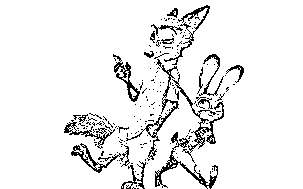

**Q：****出生星图婚神星落第 12 宫真的会被第一个对象算计吗？**

**A：**不会，不会，不会，重要的事情说三遍。婚神星落在十二宫的人一年里会有很多。没有证据显示他们都会被第一个对象算计。

然而如果你经历了被第一个对象算计的情况，如果你是男生，我建议你看看自己的月亮和金星的星座、宫位和相位，如果你是女生，则要去看看太阳和火星的相关信息。这些星体的配置会影响我们的择偶观。

**当一个人被算计的时候，我们得考虑到这个事件背后的可能，是太过度幻想对方的美好？或者很轻易地就去相信对方了呢？**我们人生中遇到的每一个人，不是无缘无故来到我们身边，他们在不同程度上都是在引导我们看到真实的自己。也许被算计之后，你反而会更加明白什么样的人可以信任，也会更懂得自己要的是什么。

**若道君：谁年轻的时候没爱过几个人渣，最重要的是懂得反思。**

**Q：****金星八宫的女生注定被包养？**

**A：**金星代表我们的审美、价值观，喜好魅力，第八宫代表共同资源、性、生死等领域。**当一个人的金星落在第八宫时，也许这个人拥有洞察金钱价值的能力，因此会热衷于他人的资源或者金钱带给自己的便利。**

体现在实际层面，可能造成的一些情况是**她特别善于和有钱人打交道，或者在性方面很有魅力。又或许她会是从事医疗保险类、投资类的工作**（通过生死疾病而赚钱、八宫也代表利用他人的资源投资以及保险业领域）。

另一方面，**如果拥有这个配置的女生希望选择急功近利的方式，利用自身外在以及性魅力在短期内获取自己想要的资源，相对于其他人来说，她会更容易被包养。**然而她需要为此付出的以及内心真正的感受，只有走过这条路之后才会知道。

八宫也代表着最深层次的对于亲密关系的渴望，包养的关系是否可以真正满足她对于感情深度融合的需求，我想是很难的。即便获得了金钱和物质的满足，内心的渴望无法填补，会变成黑洞反噬自己，这样真的值得么？

**若道君：小编再次中招……在此声明，并不是所有金星落在八宫的女人都会被包养！你这样子让我很难做人你造吗~**

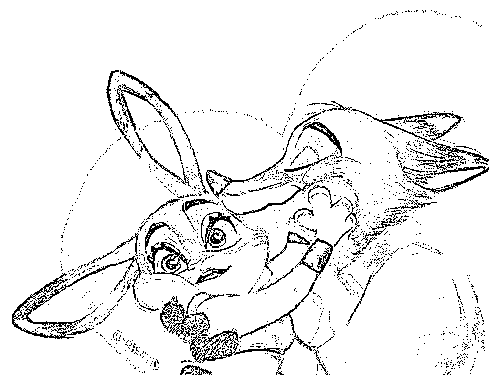

**Q：****冥王星在八宫一定会经历性方面的背叛吗？**

**A：****冥王星是时代行星，运行周期很长，除了和个人行星有相位或者合轴的情况，在个人星图上更多只参考它所落的宫位。**与其说冥王星落在八宫的人会经历性背叛，不如说冥王星代表我们深层的恐惧，因此**冥王星落在八宫的人可能会恐惧在性方面的背叛问题，也会恐惧破产或者死亡的经历，并且很难接受各种形式的失去。**

同样，冥王星也会帮助我们在经历转化后更容易明白世间的爱别离，怨憎会，从而发展出更宽容，更圆滑的处事态度。冥王星落在八宫，这个宫位也是天蝎座和冥王星能量共振的宫位，落在这里的冥王星可能对与舍和得有更多的精神资源。

**拥有这个配置的人需要更多去深入挖掘，看到事件背后恐惧的到底是什么，也要相信自己拥有洞悉并转化的能力，这是宇宙赐予的天赋。**

**若道君：同样是半杯水，乐观的人看到的是还有半杯呢，你这么聪明一定懂得我在说什么。**

支持

**Q：****月冥相位一定会抑郁吗？**

**A：**拥有月亮和冥王星相位的人对于周围人的情绪背后所隐藏的真相有非常敏锐的洞悉力，也很容易看穿事物背后所隐藏的本质。这种与生俱来的洞察力，很可能会造成拥有这个配置的人对于周围事物有一种“看透了”的感觉。

而拥有这个配置的人在其早年的生活经历里也许经历过一些被掌控、被逼迫，或者是极端事件的发生，导致情绪容易阴暗偏激、执念和占有欲过强、有一定程度的信任议题。

**如果结合这个人的星图中有很强烈的道德感的议题，那么当他总是能看到事物背后的真相，或者面对社会一些表面的虚伪，而内心负面的情绪无法疏导径自压抑累计，则会容易导致抑郁。**

但是如果了解到自身情绪的运作方式和破坏性表达，并且采用良性的方式去引导和转化则能够运用月冥相位深刻的洞察力去获得巨大的心理能量。大卫老师在讲解星图中着重强调要结合整张星图的整体论，我们无法单从一个星图配置去判断这个人一定会如何，我们都有权利选择，如何运用自己星图的能量，这就是自由意志。 

**若道君：问这个问题的小伙伴，也许你已经感受到自己体内的洪荒之力，请登录若道官网**http:www.nodoor.com ** 预约认证咨询师，通过咨询更好地了解自己的情绪，不要怕。**

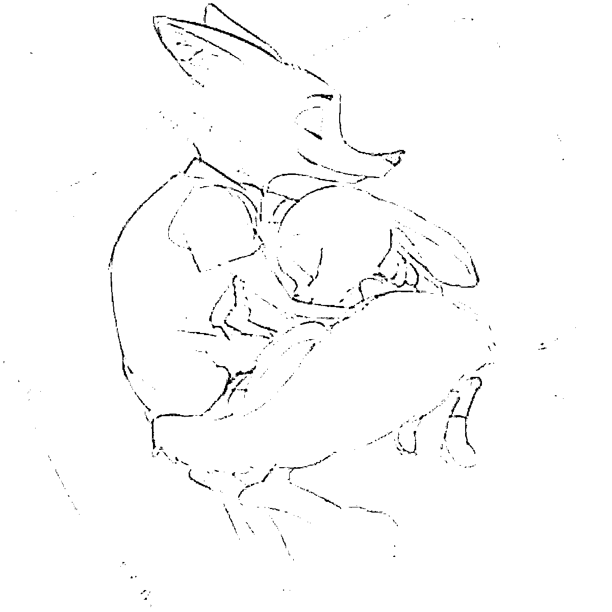

支持

**Q：****占星师说我的另一半必须是远道而来不同城市或不同背景，是不是如果和同乡的人在一起感情就不会长久？**

**A：**不知这位占星师是以怎样的自信如此论断。也许这位案主本身**太阳或者月亮，金星或者火星（这取决于你的性别）跟木星、天王星有相位，或者七宫主星是木星、天王星，或者九宫能量很强。**这些都可能会让有些占星师判断你可能会吸引到异地而背景相差很大的伴侣。

而，若是因为木星被强调，那么也可能这个人会找一个老师或者是受过高等教育的人。也许他欣赏与自己有共同信念，信仰的人。也许他会追寻不同寻常的人，对方和自己太过相似的背景让 TA 觉得无趣。这些都仅仅是可能性。

**我们需要警惕“必须”、“一定”这样的词汇，因为这些断命式的词汇不但会限制我们生命的可能性，更容易造成对于未知的恐惧，这是有百害而无一利的。**

**若道君：即使你是立志要爱上飞鸟的鱼，也不代表不能考虑一下身边的对象，用你的心去爱，而不是眼睛。**

END

**特别提醒****：若道拥有本文版权，转载请注明“转自若道”。**  

还有更多疑问，何不来若道学习？**2016 年 5 月 19 日**，蒋颖老师主讲的若道占星核心课程**Level 1-2**要开课了！她将带领你学习星座、太阳、月亮、行星、月亮交点等知识，让你进入占星学的世界！

报名及咨询，请点击文末“阅读原文”


# Level 1-2 | 占星学入门，今年 5 月你还有机会！

> 原文：[`mp.weixin.qq.com/s?__biz=MzA5NjA0NTAxNg==&mid=403511401&idx=3&sn=3b24ab3397105a6df03b32cb7c2ceb1e&chksm=0d4faade3a3823c8a65c41968ddb0dc9e17c4171f650d6340ba0ec22fd18e673049a03c78e45&scene=126&sessionid=1692738857#rd`](http://mp.weixin.qq.com/s?__biz=MzA5NjA0NTAxNg==&mid=403511401&idx=3&sn=3b24ab3397105a6df03b32cb7c2ceb1e&chksm=0d4faade3a3823c8a65c41968ddb0dc9e17c4171f650d6340ba0ec22fd18e673049a03c78e45&scene=126&sessionid=1692738857#rd)


国际占星研究协会（ISAR）中国唯一指定教学机构

若道 2016 年占星核心课程 Level 1-2 上线

**这是若道首次推出中文老师**

带你畅游“星座小白”到“星座达人”之旅

主讲人若道创始人**蒋颖**

有效拿捏学员需求

**授课时间更长**

**交流互动更多**


**课程信息**

**授课时间：**2016 年 5 月 19 日**-7 月 7 日**

**授课老师：**蒋颖**（8 次）、**大卫·瑞雷**（4 次）**

**授课方式：**网络课

费用：**2400 元（2016 年 5 月 6 日前报名付款）**

**早鸟价：****1980 元（2016 年 4 月 6 日前报名付款**）

**报名截止：**2016 年 5 月 6 日

**课程负责人：童老师（微信号：80248863）、**王老师（微信号：2837474346）****

**咨询电话：**400-619-1014

**课服 QQ：4006191014 （若道星文化）**

**邮箱：nodoor@vip.126.com**

课程简介


**星座、太阳和月亮**

12 星座是占星学最基本却又最深刻的概念，黄道 12 星座，是伟大的生命周期，而太阳和月亮是我们阴阳之本。

**●12 星座：**深入了解 12 星座的特色。了解星座正面的、负面的表达，了解其资源，了解其破坏生命的模式。了解其原型人物、了解其指代的人事物。

**●12 星座原则：**按照极性、形态和元素给星座分类。

**●12 星座关键词：**关键词非常重要！是解读准确性的关键。

**●太阳和月亮：**了解你的太阳，生命的发动机，让你在世界闪光的方式，生命获得力量的方法；了解你的月亮，让你生命获得幸福的方法。了解它们，了解你生命中已经出现的、将会出现的男人和女人。


**遇见行星和月亮交点**

在这个阶段，你将遇见行星们，还有与灵魂的过往和未来相关的月亮交点。这既是你，你的性格，也是你在生命故事中将会遇到的人、事、物的显化，也是你灵魂轨迹的线索。    

**●内行星：**水星、金星、火星

**●中间行星：**木星、土星

**●外行星：**天王星、海王星、冥王星

**●灵魂的线索：**月亮南交点、月亮北交点

**●行星逆行：**行星逆行的天文现象和意义

**●宫位初解：**了解黄道 12 宫的基本含义

时间安排

共 12 次课，24 课时。

**●8 次理论课程**（蒋颖老师主讲）

北京时间每周四晚 20：00-22:00

**●4 次线上互动课程**（大卫老师主讲、配有中文实时翻译）

北京时间每周一晚 20：00-22:00

授课优势

**①先进的教学平台**

网络教学平台，支持手机、电脑、iPad 上网，可以随时随地学习。

**②回放复习**

学员可登录网站收看课程回放，在线复习课程，每次课可完整重看 3 次，课程结束后的 3 个月内有效。　

课程特色

**①与名师面对面**：北京同学可以来若道现场上课，和大卫老师面对面互动。大卫老师也可能前往主要学员所在城市，实现零距离教学。

**②互动答疑**：论坛、微信群随时提问；老师课上答疑；助教线上线下全程协助。

**③线下沙龙**：定期举办沙龙活动，复习上课内容。

**④强大的同学网络**：若道作为中国最顶尖的占星教学机构，在 4 年的占星教学中，培养了很多占星人才。若道让你和师兄师姐切磋，让你和国内著名占星师学习。（简单来说，就是，人脉！）网络授课，在北京开设免费现场参与名额，全程英文授课，配备实时翻译。

师资力量

**讲师团队**


**蒋颖（Felicia）**

若道创始人，职业占星师。在若道系统学习占星，师从大卫·瑞雷。长江商学院 MBA，厦门大学经济学硕士，化学学士。国际占星研究协会（ISAR）中国区副主席。第一批获得国际占星研究协会（ISAR）认证的职业占星师。《灵魂的目标》译者。

**在后台回复 蒋颖 即可查看她的全部文集**


**大卫·瑞雷（David Railey）**

若道创始人，《灵魂的目标》作者。拥有四十年的占星咨询的执业经验，曾两任亚特兰大占星协会主席，是全美占星师联盟（AFAN）、美国占星师联合会（AFA）、全美占星研究委员会（NCGR）、国际占星研究协会（ISAR）和职业占星师组织（OPA）的成员，是联合占星大会（UAC, United Astrology Conference）督导委员会委员。大卫曾是 CNN、CBS 的占星节目的常驻嘉宾，多次在 BBC、WGS、WSB、WRGG 等节目中接受采访，并在亚特兰大主持电视节目《每日行星（Daily Planets）》达 4 年之久。

**助教团队**


**熊鹰（天空的空）**

国际占星研究协会（ISAR）认证占星师。在若道系统学习占星，师从大卫·瑞雷，现任若道专职助教。将传播系统、严谨、真实的占星学作为职业使命。与此同时，提供一对一占星咨询服务与生时校正咨询。目前正致力于占星学与个人真修实证的整合。2014 年起主讲读书会，助教答疑课程累计超过 100 小时。


**Gaff**

全职占星师，既是占星师，也是疗愈者。2013 年开始在若道进行系统占星学习，师从大卫·瑞雷。任 2015 年度诺·泰尔、斯蒂芬·福里斯特老师的占星工作坊助教。提供一对一的咨询服务（已有超过 100 小时的咨询经验），基于个案咨询的经验，曾多次开设面授的占星课程。

2016 年，和若道老师一起，开启占星的探索之旅！

长按二维码接通课程负责人！

 

报名及咨询，请点击文末"阅读原文"

# 大卫谈占星 | 有一种白羊座不敢手撕对方，咩~

> 原文：[`mp.weixin.qq.com/s?__biz=MzA5NjA0NTAxNg==&mid=403494379&idx=1&sn=9751d4be506af86e5f88605dba52064a&chksm=0d4e675c3a39ee4ac393f21e5df43a52286bdbfbaa6946d48d9143a04c76012cda2f3b6b8ed7&scene=126&sessionid=1692738857#rd`](http://mp.weixin.qq.com/s?__biz=MzA5NjA0NTAxNg==&mid=403494379&idx=1&sn=9751d4be506af86e5f88605dba52064a&chksm=0d4e675c3a39ee4ac393f21e5df43a52286bdbfbaa6946d48d9143a04c76012cda2f3b6b8ed7&scene=126&sessionid=1692738857#rd)

作者/大卫·瑞雷  译者/李含 校对/江艺

昨天若道君发布了[“典型性白羊座”的文章（点击可阅读）](http://mp.weixin.qq.com/s?__biz=MzA5NjA0NTAxNg==&mid=403478109&idx=1&sn=fe133f777346927a5850ef8231b5b776&scene=21#wechat_redirect)，可有些白羊座表示：我没有这些特质啊！这是怎么回事？

首先来看看这份有趣的名单——白羊座名人录：

▶导演侯孝贤（1947 年 4 月 8 日）

▶演员葛优（1957 年 4 月 19 日）

▶小说家琼瑶（1938 年 4 月 19 日）

▶歌手张信哲（1967 年 3 月 26 日）

▶作家三毛（1943 年 3 月 26 日）

▶台球神童丁俊晖（1987 年 4 月 1 日）

▶女演员徐静蕾（1974 年 4 月 16 日）

▶女演员/歌手梁咏琪（1976 年 3 月 25 日）

▶美国心理学先驱亚伯拉罕·马斯洛（1908-1970 年，4 月 1 日）

▶女演员艾玛·汤普森（1959 年 4 月 15 日）

▶日本电影制作人黑泽明（1910-1998 年，3 月 23 日）

▶人类学家珍妮·古德尔（1934 年 4 月 3 日）

▶网球明星莎拉波娃（1987 年 4 月 19 日）

▶传奇演员查理·卓别林（1889-1977 年，4 月 16 日）

看完以上名单，你也许会发现，啊？这个人也是白羊座啊。怎么不像呢？

非典型性白羊座

**白羊座的两种极端**

让我们严格审视白羊座的对立两极。你可以决定哪一种更吸引你，或更像是你知道的白羊座。大部分白羊座人日常的行为都不会有如此极端的情况。

**● 被动的白羊座**：安静，温和；你们会尽量避免与人冲突。你们很少表达愤怒。你们拥有亲密的好友圈，尽管你们相对独立自主。尽管这样，你们会感到一些焦虑，容易疲倦。你们可能患有头痛和/或胃痛的毛病，尤其是胃酸逆流和胃灼热。你们有失眠的问题。

**● 过度咄咄逼人的白羊座**：你们声音洪亮、进取心强、喜欢强求。你们准备好甚至是迫切想要争吵或战斗。对待他人，你们几乎毫无耐心。你们少有亲密的朋友，熟人或朋友圈频繁更替。你们会头疼多于胃痛，但你们可能患有胃酸逆流和胃灼热。你们有睡眠困难。你们有时候会心跳过快。

这是两个显而易见的极端，但是两种情况都会有类似的健康问题。我们的身体会对内在星座主题的极端情况做出反应。在白羊座身上会体现出一种“战或逃”的动态变化 ——就像肾上腺素。我们是战斗还是逃跑呢？

被动的白羊座会将它们的愤怒转向内。他们会避免冲突，甚至逃开。也许他们想要有力地坚持主张，但是遇到了阻碍。内化愤怒或恐惧会引发焦虑、头痛和胃痛等病症。而过于咄咄逼人的白羊座是真正的好战分子。他们的肾上腺素会激发“战斗”反应。但是这种准备战斗的状态意味着肾上腺素就守在门内待命—— 同样影响他们的健康。

白羊座中的温和派侯孝贤

▼

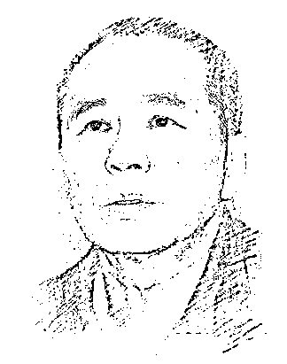 

**被打败的父亲**

被动型白羊座和过度咄咄逼人的白羊座展现出不同的行为模式，代表各自在察觉到威胁后的极端反应。**两种极端都将这个世界和其他人视作潜在的威胁，讽刺的是，这两种人都有类似的童年和青少年经历——目睹一位双亲，尤其是父亲，被生活打败很可能会留下深深的心理印记。**

也许他们父亲的脆弱是因为患病、酗酒或经济上的灾难而一撅不起。从一个孩子的视角来看，目睹强大父亲崩溃会是非常可怕的事情，令人恐惧痛苦。

在我的客户中，有两位白羊座兄弟，出生相隔四年。他们的父亲有一次心脏病发的时候，哥哥在寄宿学校，而弟弟依然住在家里。白羊座弟弟目睹了爸爸在家中休息康复。他的父亲总是好像一名司令官带着不可战胜的光环，现在却蹒跚着脚步从一个房间到另一个房间 —— 一个他自身的阴影形象。

我的客户曾回忆说：“那好可怕，当然也很悲剧，”他补充说，“完全改变了我的人生观。我变得更加更谨慎，安静，更少吵闹争斗……”这位白羊座弟弟长大后变成深思熟虑，有时候害羞，但是友好的“被动白羊座”。他写诗、研究宗教，成为了一名文学教授，在一所预科女校就职。

而他的哥哥并没有目睹父亲每天的痛苦，他依然是典型的那种充满坚定自信的白羊座。他一生都是举重运动员，大学毕业后就在海军担任军官，之后又成功开办了一家广告公司，后又进军政坛。

随着岁月荏苒，白羊座弟弟学会了更有力的捍卫自己，在差不多六年的时间里他与学校里一位控制型的管理人员不断斗争。“我想我应该感谢她，”他曾说，“让我为自己而战，让我感到愤怒。”他在与她的斗争中凯旋而归，因为校方最终站在了他的一边，解雇了她。

白羊座中的温和派张信哲

▼

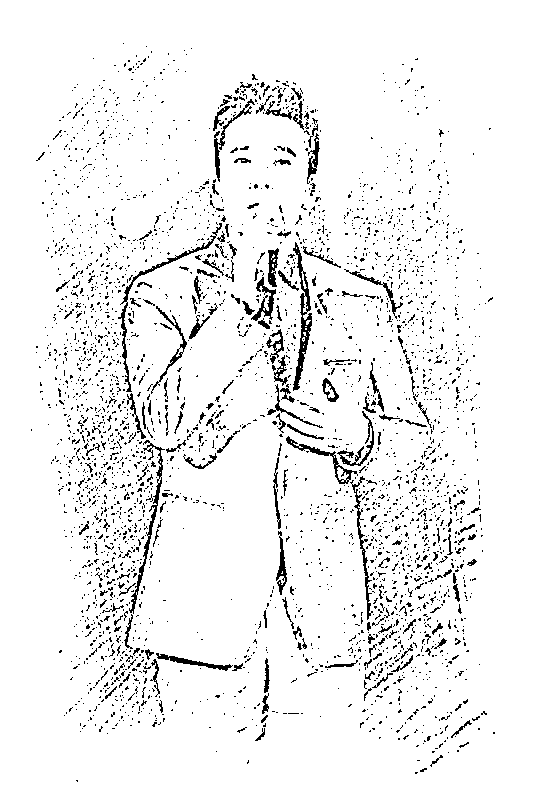

**缺失的父亲**

**还有另一种因素影响着被动 VS 过度咄咄逼人的白羊座两极，那就是父亲的缺席**，指的是父亲，或甚至是双亲在童年和青少年早期并未陪伴或很少陪伴。**不论童年情况如何，如果一个白羊座孩子在成长过程中缺少一个成年人示范该如何有力的捍卫自己，那么他们有可能要么因为过度补偿而表现出过分的咄咄逼人，要么感觉力不从心，选择一种被动的防御。**

**占星课堂**

你们作为占星学生都知道，一份出生星图提供的线索可以帮助我们辨识出一种潜力，既可能成为太阳星座的例外，也可能增强极端的可能性。

● 第一种最显著的指征就是当**太阳落在了第十二宫**，预示着这一位白羊座大约出生在日出后两个小时。

● 有一个非常类似的因素就是**太阳如果与海王星在出生星图中形成合相、对分相、四分相**时。

任何人出生星图中有这样的占星学特征都像其他人一样可以创造富于满足感的人生，事实上他们的成就很可能涉及到面对和战胜出生星图中所描绘的挑战。

● 第二种是**太阳落于第八宫，或是合相、对分、四分冥王星**。如果是第八宫的太阳落在白羊座，或与冥王星成困难相位，与父亲关系和幼年生活的紧张体验可能也会强化这种极端。

被动白羊座变得自我毁灭，在极端的案例中会显示出自我虐待，比如割伤自己。过度咄咄逼人的白羊座会表现出极度无礼、具有对抗性，甚至是潜在的暴力。同样，这也是极端情况，代表着例外。

当你们看到历史上和现代生活中著名的白羊座人士时，你们会看到各种各样极具活力的个体，他们勇敢自信有魄力，让我们刮目相看。在许多案例中，他们的生活都表现出光明战胜黑暗的剧情，甚至是自决战胜了牺牲。这样的生活常常会面对难以置信的阻碍和困境境遇。

在我与客户的互动中，我认识到，**关键是首先认识到自己的真理，然后接纳它，只有这样才能开始创造更富于满足感的人生**。对于我的白羊座客户来说，获得这样的觉悟和接纳似乎比其他星座更快。

**温和的白羊座在哪里？**

**欢迎留言讲讲你们的故事**


想体验大师级的占星疗愈？

大卫老师**占星咨询**预约进行时

**生命议题、职业发展、关系咨询、少儿成长、年度规划和预测**

```
预约咨询请联系许小姐 ：010-58760529
```

**◆ ◆ ◆  ◆ ◆**

**特别提醒****：若道拥有本文版权，转载请注明“转自若道”。**  

重新认识占星学吧。**2016 年 5 月 19 日**，蒋颖老师主讲的若道占星核心课程**Level 1-2**要开课了！她将带领你学习星座、太阳、月亮、行星、月亮交点等知识，让你进入占星学的世界！

报名及咨询，请点击文末“阅读原文”


# 医疗占星工作坊 | 用占星学管理健康是一种怎样的体验？

> 原文：[`mp.weixin.qq.com/s?__biz=MzA5NjA0NTAxNg==&mid=403494379&idx=2&sn=102f4a11602612d74bd0a8fb1283da3a&chksm=0d4e675c3a39ee4a01f8e460e2c336edb32359677303777a6bb08ff2f6e7c84043d30901fc9a&scene=126&sessionid=1692738857#rd`](http://mp.weixin.qq.com/s?__biz=MzA5NjA0NTAxNg==&mid=403494379&idx=2&sn=102f4a11602612d74bd0a8fb1283da3a&chksm=0d4e675c3a39ee4a01f8e460e2c336edb32359677303777a6bb08ff2f6e7c84043d30901fc9a&scene=126&sessionid=1692738857#rd)


白羊座主管人的头、脸、大脑、上排牙齿……

射手座主管人的腰部、坐骨神经、动脉循环、臀部、大腿、小腿上部……

这些知识点，你都知道吗？

如果知道，你会运用在身体健康的管理中吗？

来来来，让苏·汤普金斯告诉你，如何用占星学来管理你的身体健康？


**工作坊信息**

**授课时间：**2016 年 4 月 30 日、5 月 1 日、5 月 2 日 10：00-18：00

**授课老师：**苏·汤普斯金

**授课方式：**北京现场，英文授课，中文翻译。（具体上课地址课前 10 天请留意查看短信微信通知）

**费用**：****6800 元** (**4 月 18 日**前报名可享受**早鸟价 5800 元**，若道老学员**4800 元**）**

**报名截止：**2016 年 4 月 18 日

**课程负责人：**王晓鸥  

**微信号：**2837474346，请备注医疗占星课程报名咨询

**咨询电话：**400-619-1014

课程简介

星座、行星、相位、宫位还能从什么角度进行阐释？

我们的占星工具箱里，还能增添哪些利器？

疾病和健康的相关议题能不能在星图中找到相应的征象？

我们怎样运用占星学来更好地认识身体，保持健康？


>>>>

**用占星学管理身体健康**

疾病一直以来在我们的生活中有两个作用。一方面，疾病是生活的一部分，虽然我们人类大多数不愿意被提醒这个事实。疾病也为个人成长提供机会和对人生更深刻的理解。疾病让我们谦卑。另一方面，许多健康问题是由于我们选择了错误的生活方式，因此可能是可以避免的。

今年 4 月 31 日至 5 月 2 日，伦敦占星学院创办人、《当代占星研究》作者、经验丰富的顺势疗法医师**苏·汤普金斯**老师将通过独到有趣的讲解和精彩的专题及案例分析带你进入医疗占星这个神奇的占星学分支领域。

名人推荐

苏·汤普金斯的《顺逆皆宜的人生》令人赞叹！苏是一名倍受爱戴的老师，并且在占星研究学院及后来自己创建的伦敦占星学院任教多年。苏以自己的冷幽默、抽丝剥茧的研究天分和占星直觉而闻名。她是一名执业占星师，也是一名顺势疗法医师，是心灵和身体的敏锐诊断专家。

 ——国际占星研究会（ISAR）法国副主席琳恩·贝尔

师资力量


****苏·汤普金斯****

**苏·汤普金斯**是英国目前最资深的占星学家和咨询师之一，曾任占星研究学院（The Faculty of Astrological Studies）及伦敦占星学院（London School of Astrology）院长。2003 年，英国占星协会为表彰她的卓越贡献授予她查尔斯·哈维斯终身成就奖。

苏·汤普金斯老师不仅希望对心理和心灵进行疗愈，也一直希望能够找到一种安全又切实可行的方法帮助人们在人生旅途中得到身心的整体疗愈，而顺势医学的哲学与疗效让她惊叹，于是她于 1996 年完成在伦敦顺势疗法学院的培训成为一名专业顺势治疗师，目前，已经积累 20 年的顺势医学治疗师经验。

课程价值

得到苏·汤普金斯老师亲授的“独门绝技”，受益于大师在占星、心理学、医疗多维度的丰富经验

增加对身体各部分、健康和疾病的认识与觉察

收获实用的改善健康小技巧

巩固已有的占星学知识，拓展对星图象征符号的理解并掌握更多星图解读的方法和技巧

将医疗占星纳入你的占星工具箱，用它来助人助己，成为更专业的占星师

>>>>

课程内容

心灵和疾病的关系

我们的健康问题是由什么样的生活方式造成的？

疾病如何为我们提供个人成长的机会？

医疗占星学的普遍性原则

各种疾病的常见星图征象是什么？

从星图看，你身体的哪些部位是最脆弱的？对此，你可以做什么？

饮食与健康

我们的饮食能在星图上体现出来吗？ 

如何从星图看我们的身体疗愈之道？

顺势疗法和占星学

如何让自己更健康？

改善健康的实用性技巧

**我们会抽取个案进行现场讨论，会有 6 个个案讨论的机会（可以用家人的案例）。**

**参与个案讨的必须提供：**

**1） 病情细节      2）出生信息       3）生病日期或确诊日期**

**我们欢迎有癌症和心血管疾病的同学（包括家人）提供个案。 **

我们还将分组讨论，在这个工作坊上，帮助大家在用占星学对个人健康进行管理方面获得知识和洞见。

**特别说明：本课程不涉及任何医疗行为 **

>>>>

适合人群

相当于若道核心课程 level3 以上水平即了解星座、行星、宫位、相位等，可以独立进行出生星图解读。


长按二维码接通课程负责人~


更多内容及报名，请点击文末“阅读原文”

# 大卫谈占星 | 纯粹的白羊座，纯粹的利己，but……

> 原文：[`mp.weixin.qq.com/s?__biz=MzA5NjA0NTAxNg==&mid=403478109&idx=1&sn=fe133f777346927a5850ef8231b5b776&chksm=0d4e24ea3a39adfc667d6581cb38819c3d5d4988029d0024de7a9c84d208e249cc6ce1274e37&scene=126&sessionid=1692738857#rd`](http://mp.weixin.qq.com/s?__biz=MzA5NjA0NTAxNg==&mid=403478109&idx=1&sn=fe133f777346927a5850ef8231b5b776&chksm=0d4e24ea3a39adfc667d6581cb38819c3d5d4988029d0024de7a9c84d208e249cc6ce1274e37&scene=126&sessionid=1692738857#rd)

作者/大卫·瑞雷  译者/李含  校对/江艺

昨日已成历史，明天充满神秘，而今天才最重要。如果你的星图中有太阳、月亮或上升点落在白羊座，那么，你会比任何其他星座都更清楚的感觉到“当下就是一切”……是吧？

典型性白羊座**别挡道！白羊座驾到！**

白羊座是黄道日历中的第一个月。在天文学上，白羊座的起点就是每年我们地球围绕太阳运转向上穿越天球赤道平面的时间点。也许这听起来有点学术，但是这就是旅程的起点。

旅程的起点总会令人兴奋。我们做好准备迫不及待要出发了。我们等不及要奔赴目的地，尤其是那些我们从未踏足的新大陆。我们大口呼吸，快速奔跑。**“任何事、任何人都无法阻挡我们的脚步！”这就是白羊座。**

美国著名的灵性导师拉姆·达斯，本名理查德·阿尔珀特，出生于 1931 年 4 月 6 日，他是 1960 年代最畅销的反文化著作作者，写出了生动的白羊座标语：“活在当下。” 

我最喜欢拉姆·达斯这一句名言：

**“除非你是我，方可与我同在。”**

这是更高层次的白羊座智慧。

对于大部分白羊座人来说，与他人交谈似乎是一种不幸的必修课，尤其是如果你得重复自己的话。你有时过于坦率直接，你喜欢表达自己的观点，过自己的生活。如果你有疑问，你会希望尽快得到答案。

● 从积极的角度看，你们的直率有时候挺有吸引力，传递了一种新鲜的行为举止，伴随着能量的迸发。

● 但是从消极角度看，你也可能因为失去耐心而离开，粗鲁甚至是无礼。

白羊座代表马龙·白兰度

▼

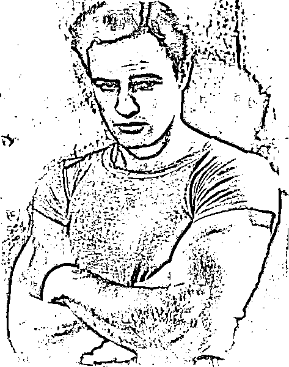

**“我就是我，别管我！”**

你不需要有人告诉你该做什么，你也不会给予好的回应。就像是著名演员马龙·白兰度曾在一次受访时谈到他在“飞车党”一片中扮演的角色时说道，**“电影中，在他一团糟的时候，有一条规则，‘不要别人告诉我该做什么。’这正是我自己生活的写照。”**

你可能会注意到其他人是如何给予你回应，但是你的态度常常是“那是他们的问题，而不是我的问题。”**当然，这会变成你的问题**，如果你的行为导致你丢掉工作。

不管怎样，即使被炒鱿鱼也不能让你长时间慢下脚步，你会像个足球运动员那样绕过障碍物和阻碍，奔向目标。你们大部分人的能量运作水平都令人惊讶，其他一开始想要跟上你脚步的人，都会精疲力竭或感到愤怒。

白羊座代表舒淇

▼

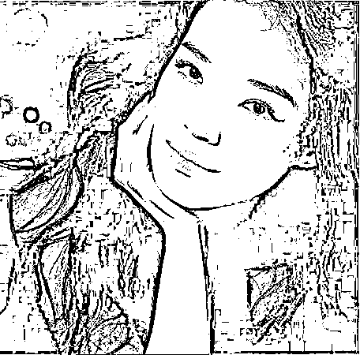 

**“不真实的事，我最讨厌！”**

白羊座的大胆进取和无礼唐突也有其迷人之处，兴奋刺激和冒犯伤害同时出现，快速浏览这些著名白羊座人的名字，这一点尤为明显：Lady Gaga、成龙、舒淇、罗素·克劳都是靠自己奋斗的类型。

他们积极主动，坚持以自己的方式行事。舒淇从早期的色情明星华丽蜕变为现在广受大众赞誉的主流获奖女演员。Lady Gaga 最近在 2016 年奥斯卡的颁奖礼上表演了“Til It Happens to You”。她在歌词中表达了一个性侵犯受害者对那些善意却不真实的建议给出的回应，歌词非常具有白羊座色彩：

Till it happens to you

you won't know

it won't be real

(How could you know?)
No it won't be real
(How could you know?)
Won't know how I feel

**它没有发生在你的身上**

**你不会感受过这种真实的痛苦**

**（你怎么可能知道？）**

**这种真实的痛苦**

**（你怎么可能知道？）**

**你不会知道这种感觉**

**如果你是一名自认为诚实的白羊座，那么你会对那些你认为不真实的事情做出强烈的反应。**

我有一位上升白羊座的朋友对我说，白羊座是一个“纯粹的星座”，是他认为“最棒的星座”。“还有什么比利己主义更纯粹？”他曾对我说。“它真诚、坦率 、真实！不隐藏，不复杂。”以白羊座的方式来说，他说的很有道理。

“如果每个人都坦诚自己的私心，那么想象一下，这会是多么好的一件事。”他强调道。于是太阳天秤座的我问他：“但是当你的利己主义与其他人的利己主义产生冲突时会怎样？”他回答：“那……我们只好决一胜负了！”

白羊座代表 Lady Gaga

▼

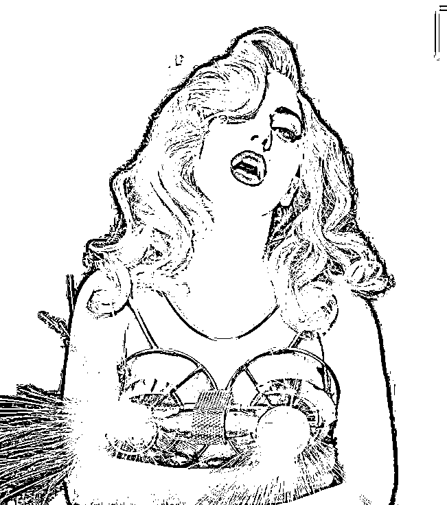 

**与人合作，白羊座的课题**

白羊座人喜欢让事情保持简单不复杂，但这并不是说你们就头脑简单。然而，**有力地捍卫自己的利益，与妨碍自己利益的任何人、每一个人交战，这二者之间是有差别的。**

这里有一个简单的方式来检视自己的行为，那就是你的社交生活。

**如果大部分甚至是你所有的长久友谊关系都是远距离的关系，而你当前的朋友圈总是定期变化，你常常混迹于新圈子 ——那么也许是应该重新审视一下自己的行为了。除非你觉得这样并无不妥。**

不可否认，自力更生有其优势，如果你是白羊座，你可能喜欢这样的自己，因为你可能常常需要如此！至少在分手或离婚后，你会是十二星座中最善于将过去抛在脑后，继续生活的那一位。

有“自己”作为依靠的后盾的确很赞！但是，人类是社会生物，**更了解自己的行为如何影响他人也符合你的“私利”**。合作并不需要连累你的个人利益。合作通常需要你与他人协同努力。

如果你的伴侣或室友常常占用洗手间很久，尤其是在工作日的早晨，而你又非常赶时间，你们可以共同协商拟定一份时间表，满足双方的需求。这样的情况似乎太简单，是一个微不足道的生活琐事，但是**关键在于合作**。

> 事实上，有一些白羊座人可能已经有点困惑，并感到一些愤怒了。“我才不是那样，”你说。“我从来不咄咄逼人，我不会像你描述的白羊座那样捍卫自己。”
> 
> 假设在中国目前的人口中有一千万各种各样的人对应“白羊座主题”，当然会有一些人的攻击性要低于另一些人。如果你是基本白羊座主题的例外，并不具有有力而坚定的捍卫行为，那么问题就很简单，“你是怎么做到的？”

**来跟大家贡献白羊座的段子吧**

**他们咋做事？咋对人？**

**欢迎留言，尽情吐槽**

**反正白羊座也不会 niao 你**


想体验大师级的占星疗愈？

大卫老师**占星咨询**预约进行时

**生命议题、职业发展、关系咨询、少儿成长、年度规划和预测**

```
预约咨询请联系许小姐 ：18710235923
```

**◆ ◆ ◆  ◆ ◆**

**特别提醒****：若道拥有本文版权，转载请注明“转自若道”。**  

重新认识占星学吧。**2016 年 5 月 19 日**，蒋颖老师主讲的若道占星核心课程**Level 1-2**要开课了！她将带领你学习星座、太阳、月亮、行星、月亮交点等知识，让你进入占星学的世界！

报名及咨询，请点击文末“阅读原文”


# 大卫谈占星 | 你一定不知道复活节与占星学的关系

> 原文：[`mp.weixin.qq.com/s?__biz=MzA5NjA0NTAxNg==&mid=403478109&idx=2&sn=fd7c90d660d45b137e599248b5877ea8&chksm=0d4e24ea3a39adfca4d5ae0b6714c1c272b01a4ae2262eb97161fd55b006c4f0962688b03fff&scene=126&sessionid=1692738857#rd`](http://mp.weixin.qq.com/s?__biz=MzA5NjA0NTAxNg==&mid=403478109&idx=2&sn=fd7c90d660d45b137e599248b5877ea8&chksm=0d4e24ea3a39adfca4d5ae0b6714c1c272b01a4ae2262eb97161fd55b006c4f0962688b03fff&scene=126&sessionid=1692738857#rd)

作者/大卫·瑞雷  译者/李含 校对/江艺

3 月 27 日是西方重要节日复活节。复活节象征着重生与希望。今天大卫老师要跟大家探讨的，不是复活节的意义，而是它时间确立的依据是与占星学联系在一起的。

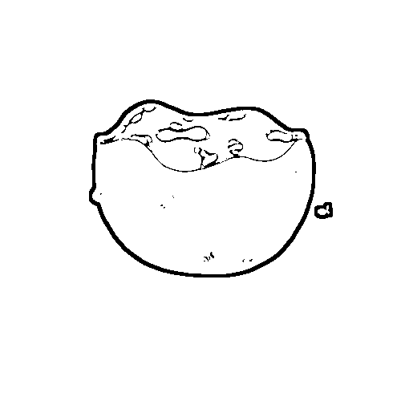

在我们深入探讨该主题之前，先要弄清楚一点。

**占星小贴士** 

**占星学“不是”一种宗教**，它是一种世俗的领域，就像心理学一样，尽管对占星学更为精准的定义应该是，它是一种**整体科学**。

你可以是无神论者，或信仰任何一种宗教，但对这门人们熟知黄道十二星座的西方占星学依然可以进行研习、使用甚至执业。

## 复活节和逾越节的争议

黄道是一份“日历”，正是它在无意中将复活节与占星学联系到了一起。

复活节是基督教的节日，是为了纪念耶稣基督在公元 30 到 33 年之间被罗马人钉死在十字架上之后的复活。复活节本身总是在周日进行庆祝，是在受难日后的第三天。基督徒将周五视作第一天。

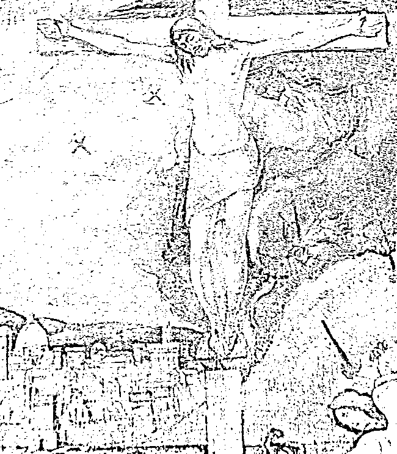 

**复活节和逾越节的关系**

复活节日期最初是根据《圣经》里的描述而确定的，这些描述将耶稣的受难与犹太人的逾越节联系在一起（据说是逾越节的第三天）。但关于受难的准确日期却没有一致的说法。但圣经学者一般都认同是在逾越节期间或前后的周五，在罗马总督本丢·彼拉多执政期间（公元 26-36 年执政）。

## 复活节日期的确定

到了公元 725 年，伟大的英国修道士比德写道：“春分或春分后满月之后的星期日就是法定的复活节。”

**“春分”当然就是白羊座的开端，或者说是白羊座 0°**，可能是 3 月 19 日，但常常是在 3 月 20 日或 21 日。从占星学上来看，这意味着复活节在天秤座满月，也就是春分后第一个满月之后的星期日。2016 年春分后的首个天秤座满月发生。

在罗马延续统治的位于东地中海的希腊世界，一直并存着两种历法，即希伯来历法和占星学历法，两者都以白羊座，也就是春分点为起点。罗马统治者一直允许当地延续本土节日和假期，此外还经常加入或混入罗马的节日，并随着时间的推移相互融合。随着基督教在罗马世界的广泛传播，这些传统也进一步地相互混合。所以尼西亚会议试图给复活节固定日期，避免已经出现的混淆。

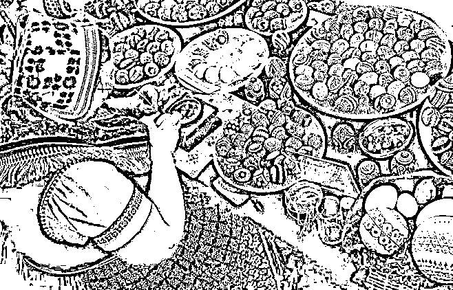

所以说复活节和占星学之间的关联是与历法有关的。

现在的孩子们会在复活节用篮子收集颜色鲜艳的彩蛋，收到装满糖果和巧克力兔子的复活节篮子。还有一些孩子会收到鸡宝宝或鸭宝宝作为宠物。人们还会身着盛装奔赴教堂，然后让自己的孩子们去玩“寻蛋游戏”。当小孩子们四处寻找藏在草丛里和树后面的彩蛋时，根本没有意识到这些简单的庆祝游戏混合了很多传统，有一些还是源自占星学。

重点强调

大部分人并没有意识到**黄道十二星座实际上就是黄道历法中的十二个月，而不是天空中的星群**。

有关这方面的更多详情，请阅读我之后将奉上的文章**《黄道是什么》**。


想体验大师级的占星疗愈？

大卫老师**占星咨询**预约进行时

**生命议题、职业发展、关系咨询、少儿成长、年度规划和预测**

```
预约咨询请联系许小姐 ：18710235923
```

**◆ ◆ ◆  ◆ ◆**

**特别提醒****：若道拥有本文版权，转载请注明“转自若道”。**  

重新认识占星学吧。**2016 年 5 月 19 日**，蒋颖老师主讲的若道占星核心课程**Level 1-2**要开课了！她将带领你学习星座、太阳、月亮、行星、月亮交点等知识，让你进入占星学的世界！

报名及咨询，请点击文末“阅读原文”


# 土星逆行，你怕不怕？

> 原文：[`mp.weixin.qq.com/s?__biz=MzA5NjA0NTAxNg==&mid=403441850&idx=1&sn=477c378455e7d7b1868260715afbb283&chksm=0d4eba0d3a39331b869da4b78bc9562514b3924c440bd4843a6c4633bffa298d814d3ab052fc&scene=126&sessionid=1692738857#rd`](http://mp.weixin.qq.com/s?__biz=MzA5NjA0NTAxNg==&mid=403441850&idx=1&sn=477c378455e7d7b1868260715afbb283&chksm=0d4eba0d3a39331b869da4b78bc9562514b3924c440bd4843a6c4633bffa298d814d3ab052fc&scene=126&sessionid=1692738857#rd)

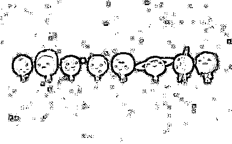

作者/海王家的微分

数据来源/一点资讯大数据研究中心（iota 实验室）


今天要宣布一个“坏”消息：3 月 25 日开始土星要在射手座逆行啦！

如果你还没有听说过行星逆行，今天咱们普及一下知识，已经听说过的朋友就吃颗定心丸，以后不用再遇到逆行就夜不能寐、食不知味啦。当然很多人肯定会问，土星逆行是个啥啊，凭啥就是个坏消息啊，跟我有熟么关系呢？

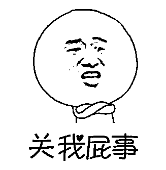

**用数据说话**


行星逆行和我们的关系

懂特瓦瑞，大部分人都是这个反应。据一点资讯大数据研究中心提供的调研发现，在大众中有超过 83%的人没有听说过“行星逆行”的概念。

**➤你是否听说过行星逆行的概念？**

**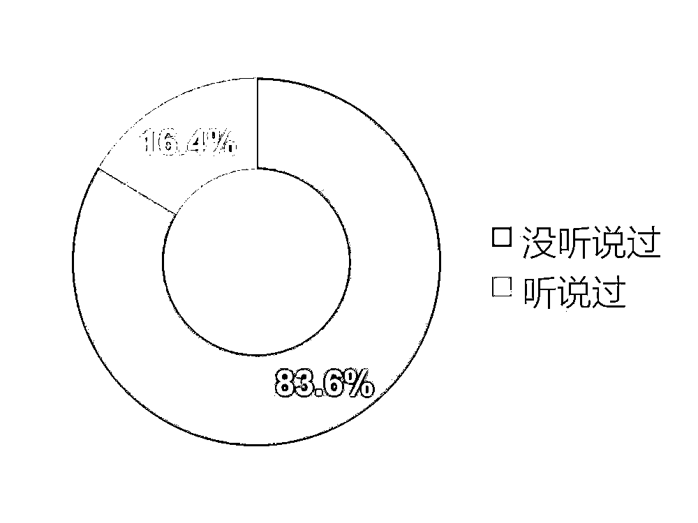** 那么，“听说过”的这 16%的用户是怎么看待“行星逆行”的呢？

**➤和“行星逆行”关联最紧密词云分析**

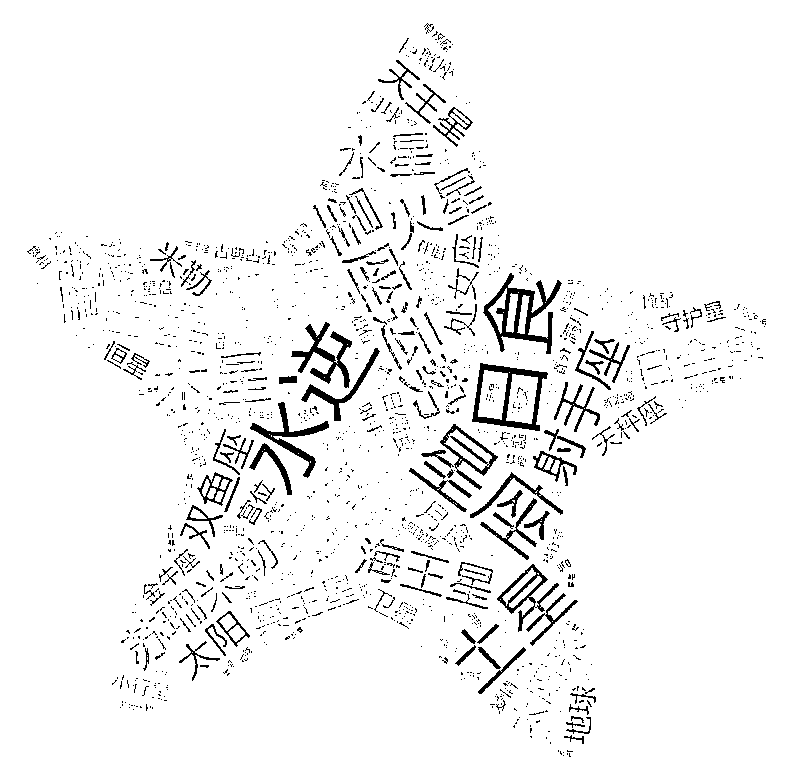

可以看到有个词与行星逆行的相关性非常紧密，那就是“水逆”。在“行星逆行”中“水逆”是知名度最高的一个，大家一想到行星逆行首先就觉得是水逆。另外，从调研结果也能看到，在听说过“行星逆行”的用户中，有 48.7%的用户，听到行星逆行时候，都会感觉害怕。

**➤提起行星逆行，你的感觉是？**

**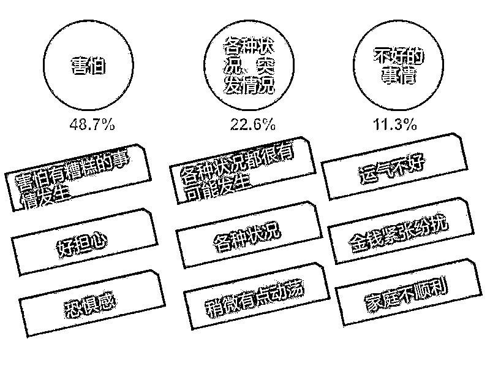** 

**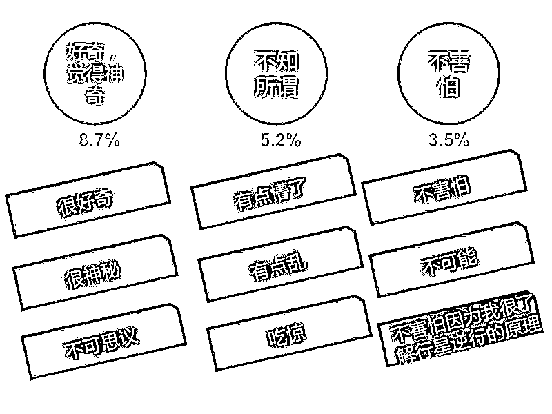** 

所以从听说过的用户角度看来，“土星逆行”确实不是个好消息呀。但更重要的问题是，大多数人对“行星逆行”的认知都是有偏差的，“没听说过”的人觉得“逆行”这东西真是无稽之谈，“听说过”的人又视它如洪水猛兽。所以若道君今天要好好跟大家聊聊“行星逆行”那点事儿。

**科普开始**


**行星逆行没那么糟**

行星逆行，被各大 12 星座运势描绘成了混世魔王，似乎行星一逆行便会天下大乱——水星逆行出门要小心交通问题啊，金星逆行要注意感情问题啊，木星逆行会打翻你的信仰啊……这些逆行随着占星学知识的普及，如今通过恐慌制造，渐渐站上头条位置，也给人们留下了行星逆行就会带来灾难的印象。可是，到底什么是行星逆行？

**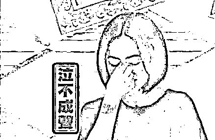** 

**>>>>**

**行星逆行是个什么鬼？**

行星逆行，顾名思义反方向运行。在浩瀚的宇宙中，各大行星与地球一起，围绕着太阳旋转。人们站在地球上观察行星，一般情况下，行星与太阳运行方向是相同的，而当发现行星运行方向与太阳运行方向相反时，好像行星渐渐停下来，开始向相反的方向运行，便称行星在逆行。

行星逆行按照行星运行轨道，大致分为以下两类：

第一类

**一是在地球公转轨道内侧运行，即金星、水星的逆行。**当逆行发生时，行星（金星、水星）并没有真正的反方向运动，仍然与地球运动方向一致，只是运行轨道方向与地球不同了，行星逆行通常容易发生在近地点。（近地点是指行星绕地球公转轨道距地球最近的一点。）

第二类

**二是在地球公转轨道外侧运行，即火星及外行星的逆行。**行星（火星、木星、土星、天王星、海王星、冥王星）由于其运行速度比地球慢，而被地球追赶并超越了，在地球上观察，外行星好像在后退一样，从而形成行星逆行。

**行星逆行的时间**

除了太阳和月亮，每颗行星都会逆行。由于每颗行星的运行轨道及运行速度不一致，其逆行的时间及周期也不一样。

●水星每年都会逆行三到四次，每次逆行大约 20 天；

●金星一年半会逆行一次，每次逆行大约 45 天；

●火星两年会逆行一次，每次逆行约 2 个月；

●其他外行星每年会逆行一次，木星每次逆行大约 4 个月；

●土星每次逆行约 4.5 个月；

●天王星每次逆行 5 个月；

●海王星每次逆行约 5 个月；

●冥王星每次逆行近五个半月。

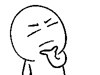

**>>>>**

**行星逆行你要学会什么？**

行星逆行会带来各类灾难、种种不顺吗？会让人颠覆真相、不辨黑白吗？**答案是否定的。**行星的逆行会让人**回归内在，自查、自省**，从而自我升华，你会在行星逆行的过程中，学习懂得很多从未懂得，或者是从来不认同的道理，让你由内而外的成熟。

在行星逆行期，你或许受到了前所未有的“挫折”，受到了不公平的待遇，这些都是你成长路上的辅路石而已。如果你感到彷徨，感到绝望，那么说明此时的你仍然不够成熟，即使你在某一方面已经达到了登峰造极的地步。

人生是一个多面体，你在这一面成为了受人瞩目的明星，而在另一面，可能也只是三岁孩童的程度，看待事情的眼光与处理事情能力仍然不足，行星逆行只是将你的弱点展露在你面前，让你可以清晰地直面它，然后思考并改正。你疯狂、你失望是因为你之前一直隐藏着的弱点突然被脱光了衣服，暴露在你面前，你尚且还不知道如何正面应对。

行星逆行期间，你便可以探索这些问题，通过学习、思考找到解决问题的方法，从而改变自己，改变发展中的事情。所以，行星逆行只是在打造更完美的你，并不是让人闻风丧胆的恶魔。

**>>>>**

**土星逆行：换个角度看世界**

3 月 25 日 18 点，土星在射手座开始逆行，历时四个多月，直到 8 月 13 日，土星才恢复顺行。土星逆行开始于土星四分木星，结束于土星四分海王星，你也许会发现自己没有了梦想与希望，现实的打击，制度的束缚，让你身心俱疲。如果这样，你该换个视角看世界了。

其实，土星逆行每年都会发生，由于土星行进速度较慢，所以每次逆行的时间约四个半月左右。在这四个多月中，土星会给我们带来诸多层面的历练。这次严肃的土星在欢乐的射手座逆行，不免为射手座这个乐观的星座，带来了沉重的压力，因为土星大人想要大大咧咧的你们，学会严肃认真的态度，让你有一双担得起重任的肩膀。并且，土星也引导我们去冷静思考，反省之前是否走得过于匆忙。

丰富自己的阅历，开阔自己的眼界，转换自己的心态，会让你更好地接受土逆带来的挑战。土星逆行并不是恶魔，只是在时光的打磨中，创造出更好的风景。


**作者简介**

**海王家的微分**：海内存知己，天涯若比邻。浩瀚宇宙中低调的占星师一枚，在若道师从多名国际著名占星师学习严肃派占星学，有丰富的占星咨询经验，擅长流年推运。

个人咨询 QQ：1846189082

腾讯微博：@海王小巫

长按二维码，让金钱涌向传播知识与智慧的人~


**◆ ◆ ◆  ◆ ◆**

**特别提醒****：本文由作者授权首发于若道平台，转载请注明“转自若道”。**  

重新认识占星学吧。**2016 年 5 月 19 日**，蒋颖老师主讲的若道占星核心课程**Level 1-2**要开课了！她将带领你学习星座、太阳、月亮、行星、月亮交点等知识，让你进入占星学的世界！

报名及咨询，请点击文末“阅读原文”


# 爱情 | 破碎三遍你会不会醒？

> 原文：[`mp.weixin.qq.com/s?__biz=MzA5NjA0NTAxNg==&mid=403441850&idx=2&sn=48ebdb17a0ec9bff2e46e863138ea8a0&chksm=0d4eba0d3a39331b00f44b55eef0b97bddf96af529b5a7b9c25f06ac521a243074b646701901&scene=126&sessionid=1692738857#rd`](http://mp.weixin.qq.com/s?__biz=MzA5NjA0NTAxNg==&mid=403441850&idx=2&sn=48ebdb17a0ec9bff2e46e863138ea8a0&chksm=0d4eba0d3a39331b00f44b55eef0b97bddf96af529b5a7b9c25f06ac521a243074b646701901&scene=126&sessionid=1692738857#rd)

爱情来临的时候从不问我们愿不愿意，是否做好了准备。跟随爱情前来的，也不全然都是美好的恋人，我们都会遇见那个危险的情人，它们也许会把我们带进爱情的边缘地带。可是遇见这样的恋人完全没有任何好的地方吗？这篇文章的作者表示不尽然。

“我们要明白，爱不是人类发明出来的东西。它一直存在，而且很强大，可以让我们能够超越时空的纬度来感知它的存在。也许我们应该相信它，尽管我们还不能真正理解它。”

 ——《星际穿越》

## 我遇见那个危险的人

这人是 Yoga。那时我是个少女，与他同龄。那年春，朋友把他介绍给我。我满意于听到的外在条件——帅警察。我金星金牛座重视感官，我太阳白羊座火星狮子座，心中的理想男性就是阳刚的。怎不期待？通过几次电话后，我怀着忐忑之心与他相见了。太阳处女座，上升摩羯座的他果真一表人才。望着饭桌前侃侃而谈的这位水星处女座人，我懵了！他的魅力像带着魔性的森林，我莫名地害怕……

我的出生星图上，金星位于七宫金牛座，好貌有品的人是我的菜。他的太阳星座和我的月亮星座都是处女座，我月亮六合他的火星，对，我欣赏他的个性与气质。他的天蝎座火星对分了我的金星。强烈的吸引力像惊涛骇浪般冲击我！

那天约会时间短，因我话少。他送我到校门口后分开，我稍感遗憾。

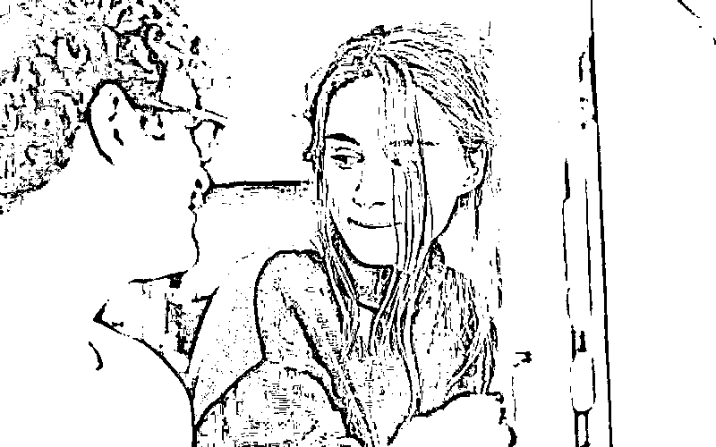

## 他竟不做我男朋友

这之后他主动电联我几次。

再之后，我就被他约到出租屋了。我不谨慎？太阳白羊座，上升天蝎座、天王星落一宫的我真没多想。

他的处所简洁干净。这一天是快乐的！他这个“神棍”跟我有很多共同语言，我不再话少了。他给我好几本“迷信”的书。他也说其他，包括他过去做特种兵缉拿毒贩的经历。我听得好激动，对胃口！他做的饭也一样。如果他对我展开攻势，我定不会拒绝。可他说不会和我做情侣，只会共事。我有些伤感，喜悦里夹杂着忧郁。我在他身旁就触电。他竟说不做我男朋友。

那年我们仅在上半年又见两次。时间还短。我应他要求给他做了一点事。他杂七杂八的事情太多，工作调动等等。

再见面就是第二年初。之前好不容易联系上的。他打电话到宿舍，我正好在。我带着几本我俩感兴趣的书去见他。我说借他看。这只是给日后约见他找个理由。他说他不久离开本市，去外地工作发展。我都不记得他说没说离开多久。那次见面是个道别。

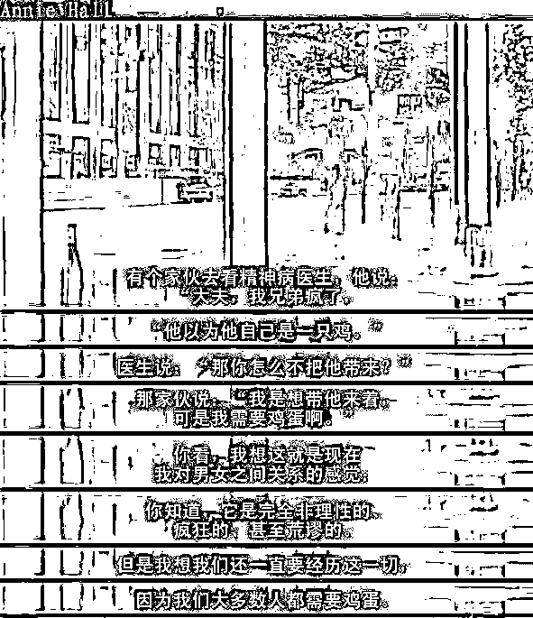

## 爱情不是我们唯一的可能

我内在的问题在星图上昭然若揭。

*   天王星对分了金星，天王星和金星又分别四分命主星火星

*   火星这里有星群，它还三分海王星

和 Yoga 第一次见，我就隐约感觉到内在的战争。多年来，我不得不努力解决那些艰辛的内在问题。

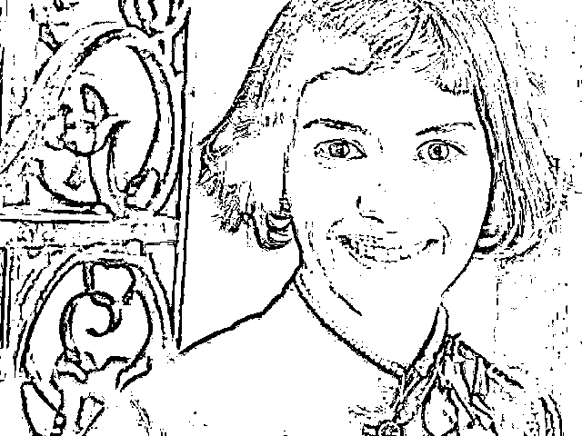 

后来我成了画家，Yoga 早在这事上鼓励过我。也就是近年，我刚崭露头角，还经常被其他事情分心，不如他名气大。

成功对于人有多重要？对于 Yoga 和我而言，成功是生命主题，使命相似。

**他的星图** 

*   除了月亮在地平线以下，其他行星都在地平线以上

*   命主星土星在处女座宫头的九宫天顶形成星群，南北交点在二宫八宫

他经历的死亡训练和医药工作，正表达了这生死的轴线。

**我的生命主题** 

*   位于天顶的多相位命主星火星合相我的北交点和木星，木星又与月亮合相

和他的组合图中：

*   水星合相下降，在思维方式上能感觉到一种连接

*   七宫的太阳合相金星，我们之间有着自然的吸引力

命运真有意思。

也许某天一高兴，我就去他的店里撞运气。如果他不在，我可以隐藏成一个普通顾客，也许遇见了……结果不太重要。作为能把握住自己命运的人，自在出行，邂逅有趣的人，也是人生一大乐趣……

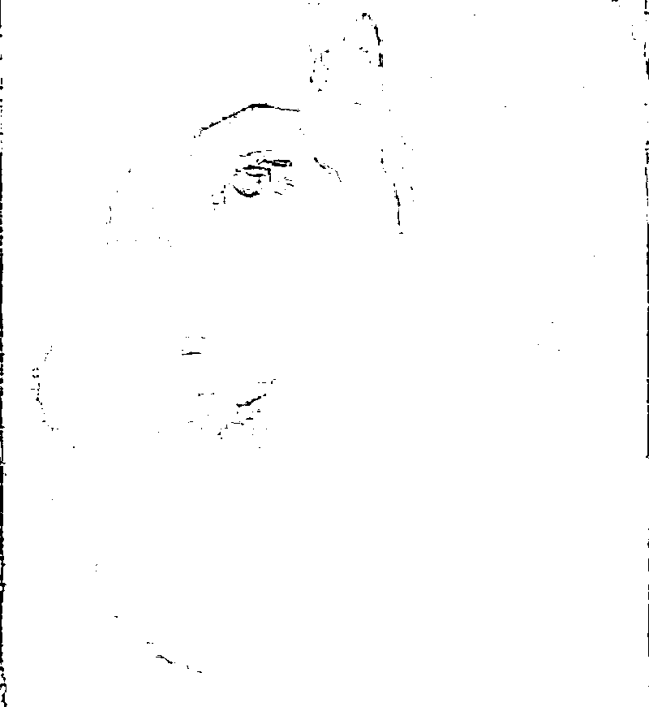

**作者简介**

**铃番：**太阳白羊座，月亮处女座，上升天蝎座，火星十宫合相北交点。创新型人物画国画家，风格独树一帜。是当今很具潜力的女性人物画高手。作品在等多家国内报刊杂志书刊上发表，并被制成邮票电话卡等发行。对灵修、占星学有浓厚兴趣。若道占星的忠实粉丝，占星爱好者。

**微信号：**Monica6587

长按二维码，让金钱涌向传播知识与智慧的人~

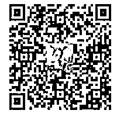 

**◆ ◆ ◆  ◆ ◆**

**特别提醒****：本文由作者授权首发于若道平台，转载请注明“转自若道”。**  

想要掌握更多占星知识？**2016 年 5 月 19 日**，蒋颖老师主讲的若道占星核心课程**Level 1-2**要开课了！她将带领你学习星座、太阳、月亮、行星、月亮交点等知识，让你进入占星学的世界！

报名及咨询，请点击文末“阅读原文”


# 如果一定要恐惧，也请优雅一些好吗？

> 原文：[`mp.weixin.qq.com/s?__biz=MzA5NjA0NTAxNg==&mid=403423499&idx=1&sn=70b233d2a928c7f21734e3f285977a04&chksm=0d4973bc3a3efaaa232892466010092bd42f36394cc3e8899b143dd4ad9ca1d717dc485e8eec&scene=126&sessionid=1692738857#rd`](http://mp.weixin.qq.com/s?__biz=MzA5NjA0NTAxNg==&mid=403423499&idx=1&sn=70b233d2a928c7f21734e3f285977a04&chksm=0d4973bc3a3efaaa232892466010092bd42f36394cc3e8899b143dd4ad9ca1d717dc485e8eec&scene=126&sessionid=1692738857#rd)

一部《太阳的后裔》看得人欲罢不能，可如果你作为男女主角面对战争和暴徒的枪口，面对垂死的病人，能够保持自己的优雅而不会落荒而逃吗？还真难说。最近月食的星象引发了一系列灾难，国内的疫苗安全问题也再度进入公众视线。面对未知，你恐惧吗？该如何正确处理自己的情绪？一起来思考这个问题。

**1**

**一个容易恐惧的人**

我是个挺容易就恐惧的人。 

十几年前 SARS 横行的时候，大家都挺镇定，就我躺在床上惊恐地望着天花板，想着这要是得了病可怎么办，不但要被关起来，见不到亲人，最主要的是也许会死哎！没办法，**群星天蝎座落八宫就是那么怕死。** 

日本核泄漏那一次，坊间传言要囤积食盐，我赶紧打电话问我爹：“家里盐够吗？够吃多久？千万千万要买够盐！”——**在恐惧面前，我的水星处女座毫无检验传言的能力，满脑子都被月亮巨蟹四宫“没吃的会不安全”的念头占领**，遑论真伪，屯了再说。 

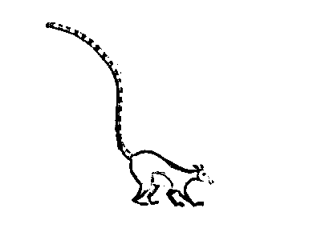

原是个混不吝的命主星落射手座在九宫的人，想上哪儿临时起意买张票就去了，迷恋坐车坐飞机那种“一直在路上”的文艺范儿。谁知生了儿子后就特别留意起负面新闻来，满世界的坠机啊、劫持啊、连火车都能雷雨天脱轨，还有什么是安全的？

不行我可不能死！我要是死了儿子怎么办，爹娘怎么办？于是**前三十年背包走江湖的火星四分木星的那点儿气魄**没了，还是**宅在家比较符合月亮在四宫安全感的需求**。 

这些年我们一起哭过骂过的汶川地震、爆炸事件、有毒奶粉、拐卖儿童，还有这几天被刷屏的“疫苗之殇”，几乎每一个都能第一时间激发起我深深的恐慌，以及异常悲愤的转发、声讨。

虽然我的太阳天秤座尚可保持尽量优雅的仪态，不至于在各路信息来源面前参与骂战，但内心的情绪足以让自己泪流不止脑回路崩溃忘了探索事件的真相到底是怎样。 

**2**

**开始学习占星学，我是拒绝的**

说起学习占星学，刚开始我是拒绝的。怕的就是会“参破”各种即将来到的“厄运”，又好奇又担忧。 

**先是被“满月”一说吓到屁滚尿流。**一到满月就一定会发生些什么！那些知名占星师们传递的信息深深印刻在当时尚属麻瓜的我脑子里。一次正逢满月，我娘忽然说自己脖子上长了一个包——莫非满月真的会发生什么？吓得我班也不上了直接带她去医院非逼着她检查，医生摸了摸说不好确诊，去做 B 超吧，我娘走到半路拒绝检查要回家，把我给气得！在医院当场翻脸。最后换了一家日本诊所，大夫那就是个有点肿大的淋巴结，没事儿！ 

虚惊一场。有种“虎口脱险”的感觉。 

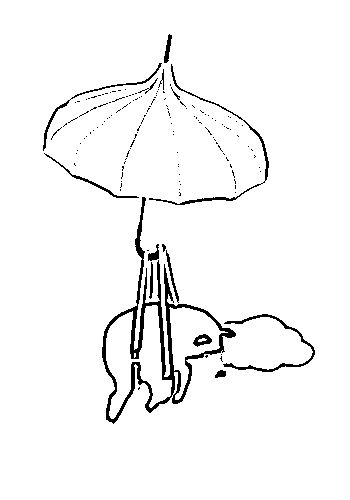

渐渐发现，原来满月每个月都有啊……难不成每个月都会“发生”点儿什么？可到底会发生什么啊！我就像那个等待楼上另一只鞋子掉落地板的年轻人一样，非要鼓捣点儿事儿出来方可安心。

于是当时的男朋友就惨了，一到满月，我不是找个鸡毛蒜皮的小事儿闹一场分手，就是各种怨念别扭不顺心。到后来索性直接告诉他，又要满月了，本宫不爽了，你看着办吧……

然后，某个满月……就真的……再也没有然后了。 

**3**

**看看自己到底在恐惧什么**

这么些年了，遇到大事儿的反应模式没啥变化，反正怪天灾怪人祸怪有关部门怪生不逢时怪天象，哭一阵骂一阵祈福一阵声讨一阵，沸沸扬扬也就过去了。情绪宣泄完，日子该咋过还咋过。

**真正去看到自己恐惧背后的心理动因，当属去年 9 月 28 日和今年 3 月 23 日发生在天秤座-白羊座轴线的日月食。** 

和一般的满月不同，这样的食相一年内发生的次数一只手都数得过来，每次的影响力是“半年”——众口一词的说法。 

看到这两次食相，行进的太阳星座和月亮星座都妥妥儿地压着我的出生星图太阳和月亮的时候，我算了一下，一次食相影响半年，两次正好一年。得，这一年我就家蹲着吧，反正大事儿是注定要发生了！ 

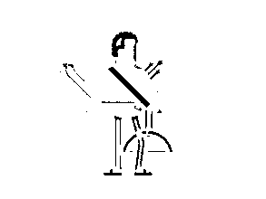 

但这个时候，我已经不再是当年的麻瓜了。我不信这个邪了！

观察被触发的太阳和月亮星座，我用自己强大的处女座水星和群星天蝎座的能量仔细观察了这些年恐惧的到底是什么。 

*   **对失去生命的恐惧。**这通常发生在战乱、天灾、恐怖袭击发生在自己或者其他人身上的时候。（例如恐怖袭击、地震海啸等） 

*   **对失去最爱的人的恐惧。**这可以是自己的父母、爱人，而最能触动情绪的，是自己的孩子。（例如人口贩子、假疫苗等） 

*   **对未知的恐惧。**（例如满月和食相在未来即将会发生什么） 

*   **对个人无法改变的恐惧。**我们无力改变天灾，甚至无力改变人祸，于是会**将恐惧转化为愤怒以及相关的迁怒，在不明事件真相的情况下失去了公允和理性思考能力，也拒绝接受别人理性公允的分析。这愤怒的背后，是对自身情绪无法健康关照而失去控制的无力。** 

**4**

**灾难面前，选择你的应对方式**

每个人都有十二种不同面向相互组合的星体能量，这就意味着当我们面临集体重大灾难性事件的时候，每个人的应激反应都是差不多的。

然而，即使无法避免灾祸和未知的厄运到来，至少我们可以选择相对正向的应对方式。 

**正常的反应链条** 

*   **“幸好不是我”（射手座）**——**“我的一切还在”（金牛座)**——**“受难者很可怜”（双鱼座）**——**“我想为他们做些什么”（巨蟹座）**——“**停止声讨寻找公正的态度”（天秤座）**——**“事件的真相到底是怎样”（双子座和处女座）**——**“能做些什么去改革这种现状”（水瓶座）**——**“领导大众执行改变”（狮子座、白羊座和摩羯座）**——**“深度了解并转化自己的恐惧”（天蝎座）**。 

*   内心深层第一时间被激发起的恐惧得到观察和改善，朝着相对理性而积极的方向发展。 

*   在灾难面前，将恐慌以及被煽动和被欺骗的可能性减少到最低。 

*   内心的创伤和冲击得到正面的释放，避免积累。

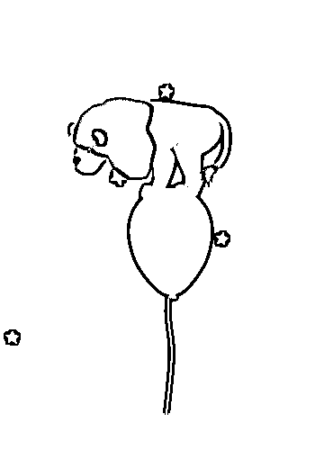

**过激的反应链条** 

*   **“也许我也会和他们一样失去一切”（双鱼座）**——**“我感到恐惧”（天蝎座）**——**“不安而情绪不稳定”（巨蟹座）**——**“老天对我太不公平”（天秤座）**——**“我只能先顾自己”（金牛座和摩羯座）**——**“不论真假地传播小道消息”（处女座和双子座）**——**“愤怒地声讨”（狮子座和白羊座）**——**“固执于自成信念体系而反叛社会”（射手座和水瓶座）。** 

*   在这样的情绪驱动下，个体因无限地负面联想陷入恐慌，看不见也拒绝接受事件真相。 

*   沉浸在自身的情绪中，成为传播谣言和浑水摸鱼假捐款的受害者。 

*   内心的恐惧无法真正被观察和释放，只会在一次次事件后愈演愈烈。

** 5 **

**人不是被吓死的**

恐惧的成因非常复杂，需要追溯到原生家庭以及自我成长沿革，然而这都不能作为不去自我改变的借口。灾难面前，即使平素再沉稳的人也一定有那个触发到他深层恐惧的点，在那个点他一样会感受到体内蓬勃而出的洪荒之力。 

**然而我们比别人好那么一点点的地方恰恰是觉察到了那个点，安抚好它。学习占星学就是为了觉知自己恐惧的源头，而不是被所谓“命中注定”的灾难搞得惶惶不可终日。毕竟咱们谁都不希望自己是被吓死的，那样的死法也太不酷了。**  

说了这么多，下回恐惧到来的时候，咱能让自己优雅一点儿吗？


**作者简介**

**玫瑰：**生于七十年代尾巴，毕业于 Cass Business School，并获管理学硕士学位。现居上海。太阳天秤座，月亮巨蟹座，群星天蝎座。对于占星学自少年时便有浓厚兴趣，师从大卫·瑞雷学习严肃占星学，现为若道 Level 5 学员。

**个人微信号**：stillrosy

**◆ ◆ ◆  ◆ ◆**

**特别提醒****：本文由作者授权首发于若道平台，转载请注明“转自若道”。**  

十二星座原来和人的心理如此相关！**2016 年 5 月 19 日**，蒋颖老师主讲的若道占星核心课程**Level 1-2**要开课了！她将带领你学习星座、太阳、月亮、行星、月亮交点等知识，让你进入占星学的世界！

报名及咨询，请点击文末“阅读原文”


# 有两个星座能创造新世界，猜猜是哪两个？

> 原文：[`mp.weixin.qq.com/s?__biz=MzA5NjA0NTAxNg==&mid=403423499&idx=2&sn=c41822f4f0e96e87a46799dbc764392c&chksm=0d4973bc3a3efaaaaad1d3c220db1e75613826a67fd45eda1b3a22994c7c8cd533bbe314d345&scene=126&sessionid=1692738857#rd`](http://mp.weixin.qq.com/s?__biz=MzA5NjA0NTAxNg==&mid=403423499&idx=2&sn=c41822f4f0e96e87a46799dbc764392c&chksm=0d4973bc3a3efaaaaad1d3c220db1e75613826a67fd45eda1b3a22994c7c8cd533bbe314d345&scene=126&sessionid=1692738857#rd)

给大家提个问题：作为一个普通的、平凡的、默默无闻的人，怎样才能生活得更好？本文作者提出一个思路：发展星图上一条轴线两端的星座。而这两个星座，每个人都有。

**1**

我曾经深信，人类所有的困境都可以通过独立思考来解答。今年春天，我在微博上关注的大学教师江绪林自杀了，随后，研究历史的天才少年林嘉文又自杀了。他们都选择了主动结束自己的生命。我毫不质疑他们头脑的清醒和对世事的洞察，他们身上有着我仰慕的智识和独立思考的能力。令我产生动摇的是，智识和独立思考在这里失效了，它无法帮助他们去应对人生中的贫穷、孤独、迷惘、恐惧和痛苦。

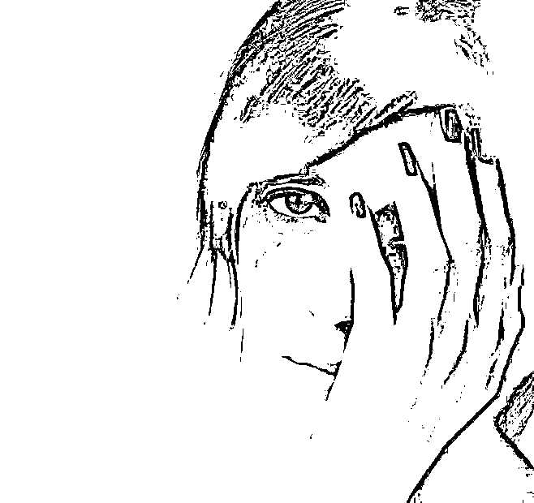

痛苦伴随人的一生。小孩子被抢走玩具时撕心裂肺的哭嚎，和成年人信念崩塌后无法自拔的悲凉，这二者的痛苦说到根本并没有高低的差别，原因都是“我的”。差别只是“我的”认知范围扩大了。小时候，你认为玩具就是自己；大了，你会认同的是美好的伴侣、大的房子、新款的车以及你的思想和信仰。

人，会迷失在这种对事物的认同中。人类最大的困境，就是无觉知的思考。这就是为什么经历时代巨变的时候，往往是拥有独立思考能力的人最容易放弃自己的生命。

哥哥张国荣在辞世时，也给世人留下一句：“我一生未做坏事，为何会这样？”努力去做一个好人，显然是不够的。它并不会让你的状况变得更好，甚至，在世事震荡变化中，做一个好人，也许会让你更绝望。那么，作为一个普通的、平凡的、默默无闻的人，怎样才能生活得更好呢？

**2**

双鱼月，我正好读了《新世界 灵性的觉醒》这本书。书里说，超越小我，找到隐藏在你内心的良善，并把它呈现出来，你才会变好。你会觉醒，抵达新世界。这里提到了小我和新世界。什么是小我，何处又是新世界呢？这里我们可以看到处女座和双鱼座的影子。

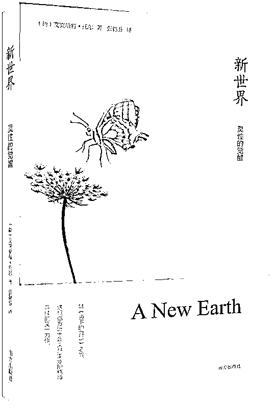

作为两个终结星座，处女座和双鱼座是一条轴线的两端。

● 处女座是地平线以下的六个个人星座的最后一个。经过一到五宫的发展，孩子会将自己的性别和身体（白羊座）、自己拥有的东西（金牛座）、自己的认知和知识（双子座）、自己的情绪和家（巨蟹座）、自己的喜好和创造力（狮子座）整合在一起，投射为良好的自我感（处女座）。到达处女座，你就自以为拥有了一个认识世界、改造世界的工具，你自己，也就是你的小我。你努力工作，追求完美，精益求精，你以为这就是确立自我。

● 而后，自我需要的是构建和谐的人际关系。我们来到了地平线之上的六个集体星座。双鱼座是地平线以上的六个集体星座的最后一个，通过社交（天秤座）、分享资源（天蝎座）、追求真理（射手座）、拥有地位（摩羯座）、改革社会（水瓶座）的发展，双鱼座正是十二星座的尽头，它要做的就是消融小我，整合全部，最终与宇宙的源头合一。

没有事物是随机的，没有事物独一存在的，宇宙（COSMOS）这个词的本意就是次序。我们和万事万物息息相关，这就是新世界。工作专注，做到极致，我们称之为忘我。忘我，就是处女座抵达了双鱼座。生命绽开花朵，这就是美。我们也称之为匠心。

**3**

让时间消失。这世上能够让人产生美好感觉的事物很多，最典型的就是花朵和专注工作的人。大自然中的花朵自然不用多说，娇弱美丽，转瞬即逝，会让人忘记烦恼，带来美的体验。

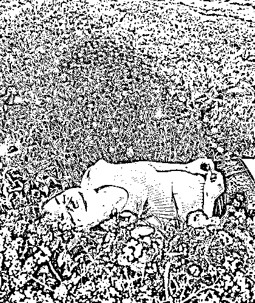

而作为人类，如何在自身绽放出花朵的美丽，那就是工作。专注于工作的人最美，这是我们常常能够感受到的。美需要高度专注，专注于当下的一刻。时间消失，我们的意识空间就出现了。面对花朵，我们心中会升起喜悦和爱。同样，面对一件凝结着手工艺者用心血制作的器物，我们一样会产生喜悦和爱。

● 过度认同心智的作用，给万事万物贴上标签，这是处女座的领域。观察、分类、理解、加工、处理。在处女座眼里，这是一个概念构成的世界。你看到一朵阳光下黄色的花，“这是向日葵”，你大声地说。是的，这并没有错，我们通过命名和分类来观察世界。可是要进一步的话，**你不能停下，**你要去观察去体会，这朵黄色的花带给你的情绪，你体会到了吗？梵高体会到了那种联接的喜悦和热情。在那个时刻，他和向日葵融为一体。所以他画的向日葵现在收藏在博物馆里——处女座抵达双鱼座。

● 渴望和世界融为一体，追求灵性的发展，逃避现实，这是双鱼座的领域。想象、沉迷、忘我、逃避。在双鱼座眼里，这是一个捉摸不定的世界。你擅长做白日梦，或者强迫性地投入到工作、酒精、毒品等可以让你逃避冷库现实的一切救命稻草中去。你永远生活在别处。可是当下呢，你迫不及待地要逃离它。美是一种品质，需要你当下的关注，伴随着觉知。始终只有这一步，把所有注意力投入到当下——双鱼座抵达处女座。

一个觉醒的世界，需要的是处女座的当下专注和双鱼座的无我意识。

找到你星图上的处女座和双鱼座，看一看你的六宫和十二宫，利用它们的能量去发现自己内在的花朵。

○ **如果你的双鱼能量比较强**，你要去看一下，你有没有确立自己的风格？你的梦想是不是太高太虚，以至于你一想到它就会被它吓倒？解决的办法就在对面的处女座。你需要设立一个具体的、方便执行的计划，一个稍微努点力就可以做到的目标，这样一步一步，慢慢养成习惯。突然有一天，你会发现你已经比之前的你高出很大一块。

○ **如果你的处女能量比较强**，你要去看一下，你是不是太纠缠细节而将自己折磨的疲惫不堪？你是不是做事没有弹性，遇到突发状况就会焦虑？解决的办法就在对面的双鱼座。你需要放慢脚步，放空大脑，让自己做做白日梦。遇事顺其自然，不强求结果，每天多爱自己一点点。这样你就会和宇宙的秩序同步，发现最好的自己，心满意足。

不要想着脱胎换骨，毕加索说过，我不发展我，我就是我。你是完美的，你只需要去发现自己。让内在的花朵呼吸和绽放，让它成为习惯。让觉知流入你所做的每一件事情，成为你的生活方式。


**作者简介**

**Anastasia**：职业占星师，国际占星研究学会 ISAR 会员，若道认证生时校正占星师。太阳射手座，月亮狮子座，上升处女座，擅长讲述个体星图后面隐藏的人生故事和意义。在若道跟随多名国际占星师学习严肃占星学多年，目前从事占星咨询工作。

**个人微信公众号平台**：midnight2evolution

长按二维码，让金钱涌向传播知识与智慧敌人~


**◆ ◆ ◆  ◆ ◆**

******特别提醒************：本文由作者授权首发于若道******，**转载请注明“转自若道”。******

新世界的大门为你敞开！**2016 年 5 月 19 日**，蒋颖老师主讲的若道占星核心课程**Level 1-2**要开课了！她将带领你学习星座、太阳、月亮、行星、月亮交点等知识，让你进入占星学的世界！

报名及咨询，请点击文末“阅读原文”


# 开课通知 | Level 5 启程，小伙伴们快来报道！

> 原文：[`mp.weixin.qq.com/s?__biz=MzA5NjA0NTAxNg==&mid=403423499&idx=3&sn=aced1bf269fc20e78ba0ea8a5e18c458&chksm=0d4973bc3a3efaaaeaf8249d36b4659ab72141f0354f705672f02f840f7f7b34e18ffd5020f8&scene=126&sessionid=1692738857#rd`](http://mp.weixin.qq.com/s?__biz=MzA5NjA0NTAxNg==&mid=403423499&idx=3&sn=aced1bf269fc20e78ba0ea8a5e18c458&chksm=0d4973bc3a3efaaaeaf8249d36b4659ab72141f0354f705672f02f840f7f7b34e18ffd5020f8&scene=126&sessionid=1692738857#rd)

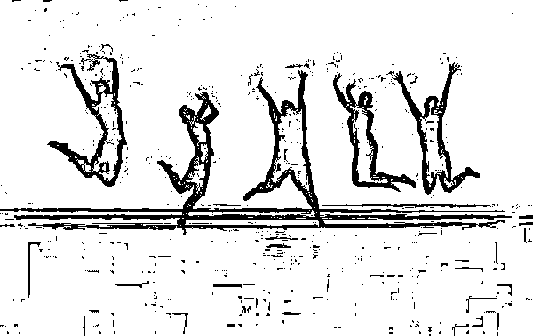

若道核心课程 Level 5 将于 2016 年 3 月 29 日周二晚间开课，小伙伴们准备好了吗？快来报道吧！

﹁

最强阵容

﹂

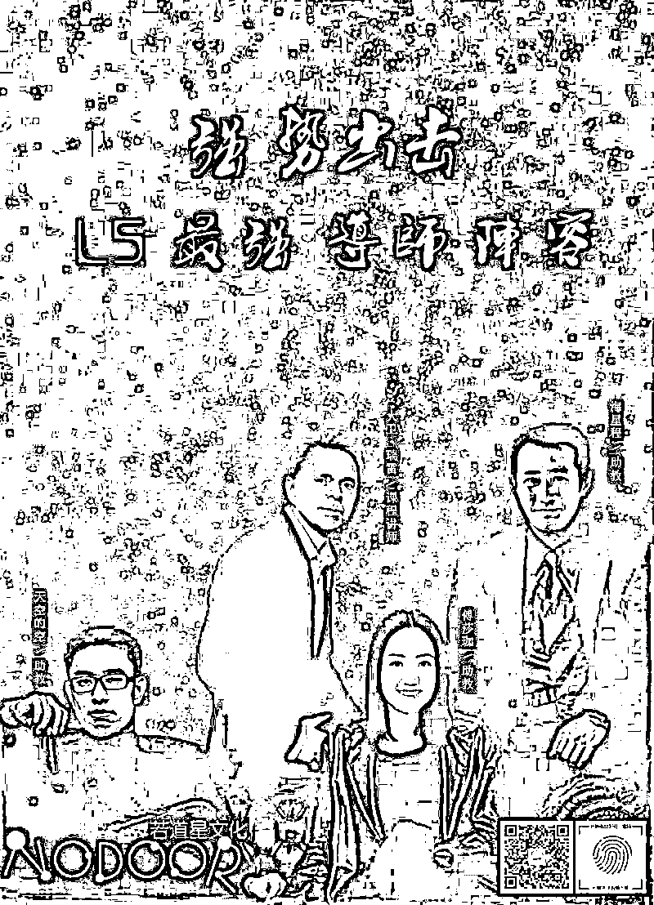

**导 师 介 绍**


**大卫·瑞雷（David Railey）**

若道创始人，《灵魂的目标》作者。拥有四十年的占星咨询的执业经验，曾两任亚特兰大占星协会主席，是全美占星师联盟（AFAN）、美国占星师联合会（AFA）、全美占星研究委员会（NCGR）、国际占星研究协会（ISAR）和职业占星师组织（OPA）的成员，是联合占星大会（UAC, United Astrology Conference）督导委员会委员。大卫曾是 CNN、CBS 的占星节目的常驻嘉宾，多次在 BBC、WGS、WSB、WRGG 等节目中接受采访，并在亚特兰大主持电视节目《每日行星（Daily Planets）》达 4 年之久。

**助 教 介 绍**

1

**天空的空**

2015-2016 年度若道核心课程专职助教。获得 ISAR 认证和“生时校正认证考试”资质认证。

2

**海星程**

ISAR 认证职业占星咨询师、塔罗咨询师、2015 年若道首次“生时校正认证考试”满分获得者。

3

**傅莎珈**

全职占星师，COAC 高阶占星资质，接受萨提亚、NLP、格罗夫全息呼吸理论的心理咨询专业培训。

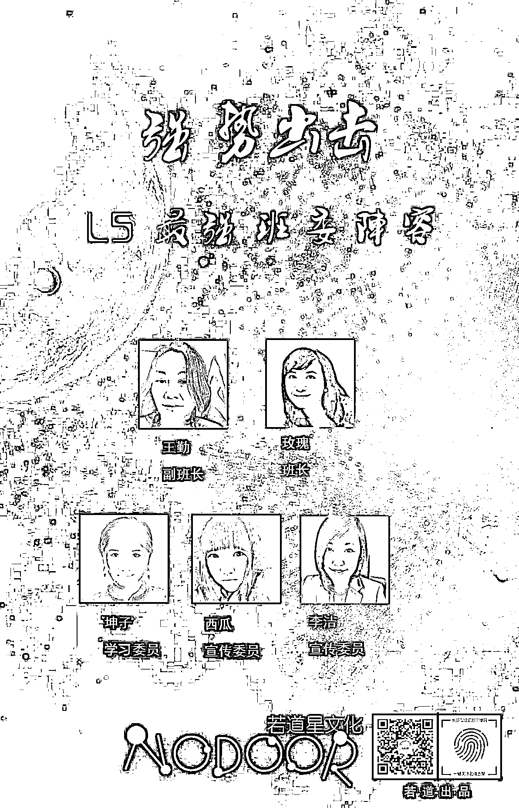

**五位班委是从 Level 4 全体学员中选拔而出，**

**品学兼优，多为外企、银行、媒体行业管理从业背景。**

**班委会将同助教组一同，**

**为学员们组织更丰富多彩的学习和活动。**

彩蛋时间

在 Level 4 的授课中，

大卫老师在学员里**随机抽取案例进行爱情合盘、事业现场解读**，

受访者几度哽咽，

大卫老师精湛的解读技巧令人难忘。

在这一届 L5 课程中，

大卫老师仍旧会**在学员中抽取若干名案例，** 

**现场进行星图解读，**

**相当于免费进行一次咨询。**

一句话课程揭秘 1

预测行进——含演练及学生案例

行进，也称为“行运”，是各种占星预测中最基本的，也是使用最广泛的技术。占星师**结合出生星图与某一时刻的宇宙天气**（天象），即可做出相应的趋势预测分析。

2

周期——含演练及学生案例

从某种程度上来说，占星学就是建立在周期之上的，熟练掌握星图中**各组成部分（行星、月亮交点、四轴等）的周期**，是职业占星师的必杀技。

3

趋势预测——爱情和职业周期（含演练及学生案例）

在这里，大卫老师将承接**Level 4**的内容，再**结合 Level 5 行进预测技巧**，对亲密关系与职业发展的解读，做更深入地教导。

4

推进——含演练及学生案例

推进，也称为“推运”，是仅次于行进的被广泛使用的技术，而其本身的涵盖面也非常广。在 Level 5 中，大卫老师将详细讲解推进中最出众的**“次限推进”**。通过次限推进，我们将领略生命**“一天对应一年”**的神奇。

5

太阳弧——含演练及学生案例

在人本主义占星学领域有一位大宗师：诺·泰尔。他对占星学最显赫的贡献之一，即发现了**“太阳弧正向推进”**。这是一种非常霸气的技巧，星图中的所有行星、虚点与四轴，都按照**“一度对应一年”**的平均速度正向推进。

6

日月回归——含演练及学生案例

**每年**，行进的太阳都会回到出生时太阳的位置，这一刻的宇宙天气（天象星图），似乎在暗示着什么？

**每月**，行进的月亮都会回到出生时月亮的位置，这一刻的宇宙天气（天象星图），似乎也在暗示着什么？

7

组合中点图——含演练及学生案例

在关系解读的领域，占星师们最常用的两项技术，除了 Level 4 中的比对星图（比较盘）外，就是组合中点图了。如果说比对星图显示了关系双方的**“匹配度”**，那么组合中点图就暗示着关系相处中的**“议题”**。

8

综合预测分析——含演练及学生案例

把行进、次限推进、太阳弧与日月回归等技术**综合**起来使用，是怎样的滋味儿？

9

历史概览及占星学中的天文学

占星学有超过 8000 年的历史，在西方的传承也超过 2000 年。这不仅仅是一门学问，更是一部恢宏的**史诗**。

在 1781 年天王星被发现之前，漫长的几千年中，占星学与天文学不分家，天文学家就是占星师，占星师也是天文学家。观测并熟知天上行星的运转，也是一名成熟的占星师需要了解的。**“天上如此，地上亦然。”**

10

ISAR 考试词汇表及咨询技巧培训

国际占星研究学会（ISAR）是一群志同道合的占星师携手开办的非营利性组织。作为国际上最具声望的占星组织，也是 UAC 大会的四个举办方之一（其他三个主办方是 AFAN，NCGR，ACVA/CVA），ISAR 所颁发的**占星师资质认证**受到国际占星界的广泛尊重和认可。“君子和而不同。”

走到这一步，你已经学习了几乎所有常用的人本主义占星学技术，加以练习，一定能成为一名“解盘高手”。但是，想要成为一名优秀的占星师，光光会解盘可不够，还需要学习一门很重要的技术：**咨询技巧**。占星师们需要学会如何把星图翻译成人们日常的语言，**平和、生动地表达**给客户。简而言之，你需要学会“说人话”。


错过如此优秀的班级，

黄金组合的助教团队和班委团队，

一定是你 2016 年最大的遗憾。

目前尚有少量席位，

请点击文末 **阅读原文** 获取详细课程信息。

**想成为 ISAR 认证占星师吗？**

**欢迎选择 2016 年度职业占星师成长套餐** 

▼

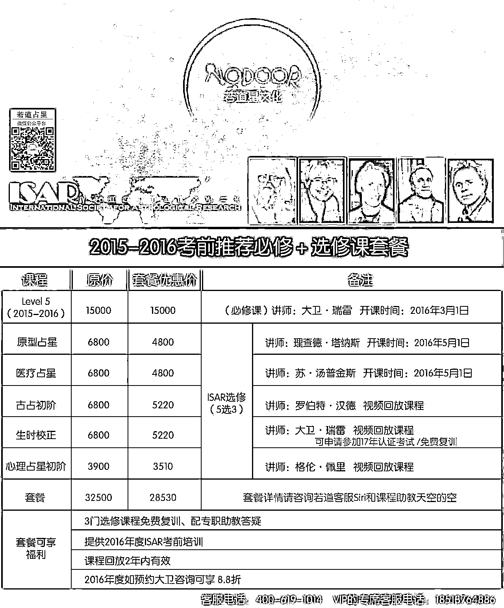

**2016 年，和大卫老师一起，开启占星的探索之旅！**

长按二维码添加课程负责人~

**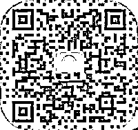**

报名及咨询，请点击文末“阅读原文”

# 男神开讲 | 没有宋仲基，没事，我们有他！

> 原文：[`mp.weixin.qq.com/s?__biz=MzA5NjA0NTAxNg==&mid=403401654&idx=2&sn=a786c22055b0b60dd19b02f13e3c5d06&chksm=0d49d9013a3e501777a4f6300e339d9921799f27fc3789dc24536af14949a9bcf8d905629040&scene=126&sessionid=1692738857#rd`](http://mp.weixin.qq.com/s?__biz=MzA5NjA0NTAxNg==&mid=403401654&idx=2&sn=a786c22055b0b60dd19b02f13e3c5d06&chksm=0d49d9013a3e501777a4f6300e339d9921799f27fc3789dc24536af14949a9bcf8d905629040&scene=126&sessionid=1692738857#rd)


**男神驾到！！！**

童鞋们！！！

小板凳搬起来！小巴掌拍起来！气氛嗨起来！

毕业于哈佛大学的若道新晋男神

旧金山加州整合大学心理学和文化历史教授

**理查德·塔纳斯**的原型占星学要开讲啦！


**课程信息**

**开课时间**：2016 年 5 月 14 日

**授课时间**：每周六上午 10：00-12：00，共 8 节课 16 课时

**费用**：6800 元 (4 月 16 日前报名可享受早鸟价 5800，若道老学员 4800）

**授课形式**：网络在线授课（英文授课，中文翻译）

**课程负责人**：李老师、熊老师

**微信号**：2847613491（请备注原型课程报名咨询）

**课程简介**

占星学的基本原则是，**每颗行星都代表了特定的原型力量或法则，影响着人类的世界。**天上行星形成的模式和地上人们生活的模式息息相关。对于每个个体来说，其出生时的时间和地点反映了他们人生和性格中的基本原型模式。


占星学使人们有机会更加了解自己的生命。它的周期、高潮与低谷、危机和突破、重大变化和转化的时期，都写在行进星图上。行进指的是相对于出生时行星的位置，当下天空中的行星位置构成的特定几何图形。这些图形的特性所涉及的行星及其位置，几乎总是与当时人生体验的原型特性一致。

因此了解原型对透彻理解和运用占星学格外重要。那么，**什么是原型？什么是原型占星学呢？它在我们的生活中是如何运作的呢？**西方著名文化历史学家、研究原型占星学 30 年余年的**理查德·塔纳斯**将为我们打开原型占星学的大门。你关于原型占星的诸多疑问都将得到解答。在这门课上，**我们不仅会学到理论知识，还会在各种示例中感受到原型的力量和它的运作，音乐、视频、图像也会是这些示例的一部分**。

**男神来了**


**理查德·西奥多·塔纳斯**

出生于 1950 年 2 月 21 日，是一位文化历史学家，凭所著的《西方思想史》（*The Passion of the Western Mind: Understanding the Ideas That Have Shaped Our World View*，繁体版译为《西方激情的心灵：理解那些曾塑造我们世界观》） 和《宇宙和心灵的思想：新世界观的宣言》（* Cosmos and Psyche: Intimations of a New World View *）而广为人知。塔纳斯在加利福尼亚整合学院担任哲学和心理学教授，是哲学、宇宙论和意识专业的研究生项目创始人。

## 不知道男神是谁？那你 OUT 了 点击下方图片阅读文章


* * *

 **[**塔纳斯：天冥四分威力将持续到 2020 年**](http://mp.weixin.qq.com/s?__biz=MzA5NjA0NTAxNg==&mid=402587687&idx=1&sn=d81ed86727c7b561dc487374c5846935&scene=21#wechat_redirect)**

* * *

**课程安排**

**>>>>**

**授课重点**

☆ 原型占星学的基础

☆ 实际应用（用于自我认知、从容生活、情感关系、心理治疗）

☆ 更大的意涵（哲学的、宇宙的、历史的）

**>>>>**

**知识点**

☆ 一致性的基本形式：出生星图、个人行进、世界行进

☆ 占星学如何运作，共时性的角色

☆ 占星学中的命运和自由意志问题

☆ 原型的本质/基本特征

☆ 行星的意义以及它们的组合

☆ 主要相位

☆ 如何把握一张出生星图最重要的主题

☆ 评估个人行进

☆ 评估世界行进

☆ 重要的是认识到原型的多元性，以及在共同创造性地展现我们出生星图和行进的潜能的过程中我们所扮演的角色、所具有的力量和所肩负的责任。

**第一次课：5 月 14 日**

开课欢迎致辞

介绍我们将在该课程中涵盖的内容

占星学和心理学如何互相启发，互相增强

我的占星学之旅

是什么让原型占星学与众不同

课堂讨论，提问与回答

**第二课：5 月 21 日**

原型占星学的基本概念框架

运作方式：因果关系和共时性的议题

命运和自由意志

理解原型

**第三课：5 月 28 日**

行星的意义，从发光体太阳、月亮开始，到水星、金星、火星、木星、土星

**第四课：6 月 4 日**

外行星天王星、海王星、冥王星：“银河使者”

**第五课：6 月 11 日**

观察运转中的行星，第一部分：艺术、音乐、电影、喜剧（指定的电影）中的示例

**第六课：6 月 18 日**

观察运转中的行星，第二部分：艺术（指定的电影）中的更多示例

**第七课：6 月 25 日**

个人行进，以及如何带着占星学的觉知投入到生活之中

**第八课：7 月 2 日**

世界行进，以及以占星学更宏大的哲学意涵来理解我们在历史上所处的时刻

**>>>>**

**学员要求**

具备若道核心课程 Level3 的基础


**>>>>**

**如何报名**

请点击文末“阅读原文”立即报名，以及在线完成学费支付

咨询请打电话**4006191014 **或 **课服 QQ：4006191014** （若道星文化）

或直接写信给**nodoor@vip.126.com**，我们会回复您的疑问

长按二维码添加课程负责人咨询~

****

报名请点击文末“阅读原文”

# 年度重要星象 | 天秤座月食，你还在维持表面的和平么？

> 原文：[`mp.weixin.qq.com/s?__biz=MzA5NjA0NTAxNg==&mid=403401654&idx=1&sn=9b692e03b14462a3bc979ccf51b9a586&chksm=0d49d9013a3e5017e35ede4955cb1b6dc2c81512049a023beed3c19979df2bf583e95af84e9b&scene=126&sessionid=1692738857#rd`](http://mp.weixin.qq.com/s?__biz=MzA5NjA0NTAxNg==&mid=403401654&idx=1&sn=9b692e03b14462a3bc979ccf51b9a586&chksm=0d49d9013a3e5017e35ede4955cb1b6dc2c81512049a023beed3c19979df2bf583e95af84e9b&scene=126&sessionid=1692738857#rd)

**年度最重要月食**

**即将上演**

2016 年 3 月 23 日北京时间 20:00，迎来天秤座满月，天秤座月亮与白羊座太阳于 3 度 17 分精准对分。此次天秤座满月，同时伴随月食发生。

**此次天秤座月食发生在天秤座-白羊座轴线，将 2016 年开年至今，我们对“关系”议题的梳理与整合推向阶段性尾端，并邀请我们做出选择性决定——断舍离的整合与改变。**

**文末有关于月食的介绍和本次月食发生时的天象能量导图，适合具有一定基础的占星爱好者阅读。**

**关系议题** **我和我们**

此次天秤座月食，发生在天秤座-白羊座轴线。白羊座太阳与自我创造有关，天秤座月亮与和关系意愿有关。**此次月食，正是整合“我与我们”关系议题的机缘。**

或许，你一直在梳理这样的关系议题：

*   **遵从自己的意愿，还是顺从于家人、伴侣的意愿？** 

*   **坚持自己的立场，还是妥协于同事、团体的立场？** 

*   **维持目前的关系，还是断舍离的整合与改变目前的关系？**

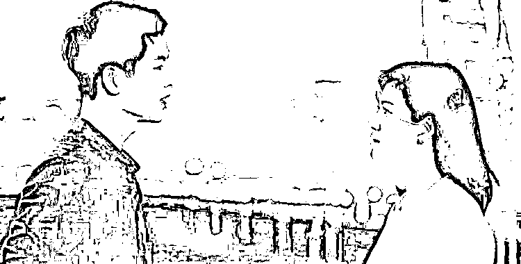 

每个人都有自己的视角与主张，但是生命个体的独一无二性决定了个体的视角与主张必然存在差异与不同。于是，生命总是在遵从和坚持自我与顺从和妥协他人之间纠结不休。每个人当然更熟悉、喜欢自己的视角与主张，顺从、妥协于他人似乎在表达“我”的不够正确、不够强大。

*   **即使因为恐惧、弱势顺从或妥协于他人，但是我的内在感受却是非常不舒服；** 

*   **为了证明我是正确的、强大的，我要为自己斗争；** 

*   **即使“我们”有爱，依然会有对抗；即使“我们”是伴侣，依然会有竞争**。

此次天秤座月食，**我们需要有意识地学习、整合来自白羊座太阳与天秤座月亮的差异与张力：白羊座太阳的勇气与意志，帮助我们面对关系的困惑与问题；天秤座月亮的友善与平静，指引我们觉察自我的脆弱与恐惧。**

**月食发生时宇宙的**

**精妙布阵**

01

白羊座太阳的守护星射手座火星，正与天秤座月亮的守护星双鱼座金星形成四分相，同时，射手座火星分别与白羊座太阳成三分相、与天秤座月亮成六分相。 

宇宙布置了一个非常精妙的阵局：**让有着截然不同工作方式、实现路径的太阳与月亮、火星与金星，共同肩负整合关系议题的任务。**白羊座象征自我，天秤座象征关系；白羊座代表“我”，天秤座代表“我们”；火星直接果敢，金星温和客气；火星喜欢战斗，金星喜欢合作。

这正像我们面临的关系议题：**遵从、坚持“我”，还是顺从、妥协“我们”。但是无论它们如何不同，面对共同的目标任务必须达成共识与和解、成为彼此的补充。**

**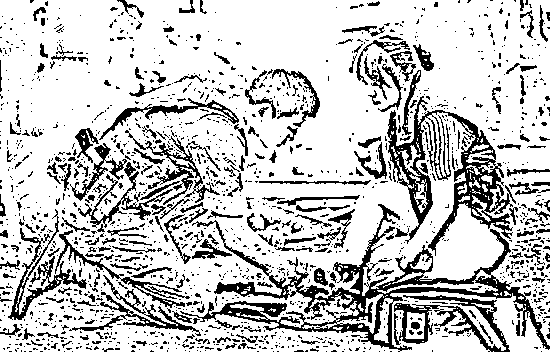** 

02

**射手座土星、处女座木星、双鱼座金星组成 T 三角格局，预示着大范围的集体规则、经济环境，将会对个体关系的内在信念、外在选择产生影响。**

03

天冥四分这组影响我们长达十年之久的宇宙背景能量，也在为土木金组合推波助澜：摩羯座冥王星三分处女座木星、白羊座天王星三分射手座土星。**天冥刑将土木金的能量整合推进到更深的层次、更必然的境地。**

**本次月食重点**

**影响人群**

此次天秤座月食，为每个人的关系议题开启全新的向度。

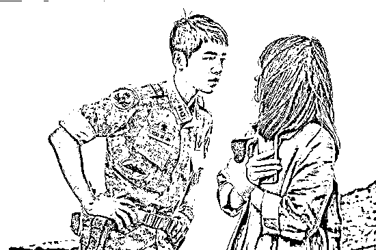

对于**出生星图中有行星或四轴落入变动星座（双鱼座-处女座、射手座-双子座）10-19 度，以及有个人行星或四轴落入（白羊座-天秤座）星座 0-6 度**的朋友们，你可能会在发生的事件、内在的感受中体会到此次月食的强烈影响，当然也会为你的人生带来强而有力的标志性进程。

我们会在现实生活随处可见的精微事件中，体验到此次月食的影响——无论个体生命的亲密关系、合作关系，还是世界局势的政治格局、财经走向。

**也许你需要做**

**如下的决定**

01

放弃那些无建设性、极具破坏性的自我内在模式与关系互动模式，无论出自于“我是对的”，还是出自于“我的恐惧”。

02

**学习爱与信任、允许与尊重。**爱并信任自己的忠诚与创造，才能爱并信任他人的忠诚与创造；允许并尊重自己的完美与不完美，才能允许并尊重他人的完美与不完美。

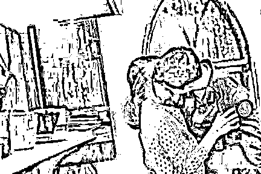

我们吸引并创造着自己的生活和关系。在这个触动关系议题的天秤座月食时刻，让我们再次走向自己的生命深处，对关系议题做出梳理与整合：

*   **我对关系的初衷已偏离了多少？** 

*   **关系初期的我与现在的我有什么不同？对方对我的态度有什么变化？** 

*   **通过委曲求全、顺从妥协的交换，我会得到什么好处？我有什么样的内心感受？** 

*   **我希望掩盖自己哪方面的不完美？什么情况下我会向对方发起攻击？** 

*   **关系中哪些部分仍然鲜活、哪些部分已经死亡？哪些部分可以延续、哪些部分需要调整？** 

*   **我需要转化哪些破坏性的方式与言行、做出哪些建设性的改变与努力？**

03

**关系的整合进入生命，生命的进化进入关系。**我们需要有意识地引导那些关系的议题进入生命，觉察、整合“我”的功课，然后让成长的、进化的“我”再次进入“我们”的关系。由此，一段全新的关系历程，在生命的行进中开启。

祝福大家。

**占星小课堂**

**——占星学中的月食相是怎么回事儿？——**

满月代表从成熟走向转化的过程，故而适合清理情绪、整合问题。当满月之时，如果太阳和月亮恰好在月亮南北交点 12 度左右范围内，地球位于太阳与月亮之间遮挡住太阳的光芒，月食便发生了。月亮的南北交点代表 180 度相对星座轴线的整合议题，揭示灵魂进化的路径与轨迹。月食会触动有关灵魂进化的深刻议题。

**——本次天秤座月食发生时的天象图——**

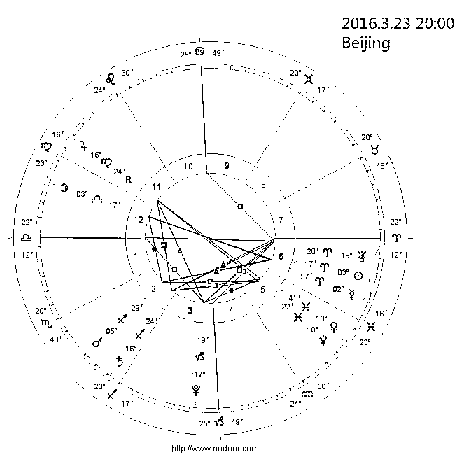

**——本次天秤座月食发生时的能量导图——**

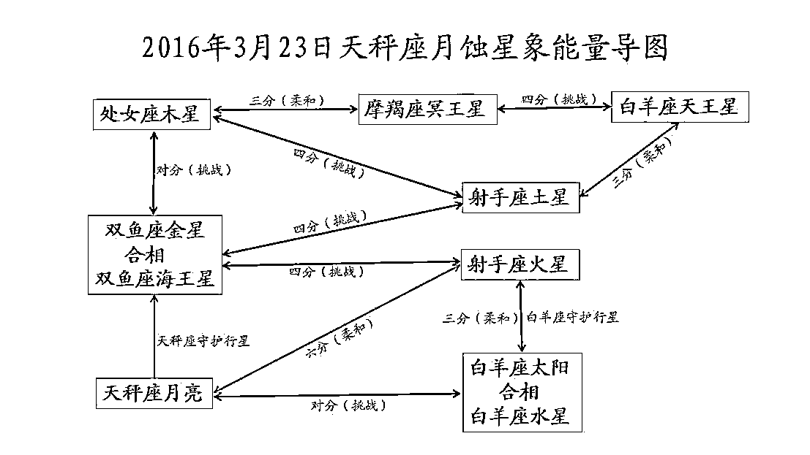

**①***天秤座月亮对分白羊座太阳；* 

***②** 白羊座太阳合相白羊座水星；*

***③** 射手座火星四分双鱼座金星；*

***④** 双鱼座金星合相双鱼座海王星；*

***⑤** 双鱼座金星、射手座土星、处女座木星形成 T 三角格局；*

***⑥** 摩羯座冥王星四分白羊座天王星、三分处女座木星；*

***⑦** 白羊座天王星三分射手座土星。*


**作者简介**

**王芝桦**，职业占星师，群星八宫的身心灵服务者。具有丰富的心理咨询、催眠治疗、占星个案经验。结合心理学、灵性修炼、自然疗法、占星学等不同专业流派，以及 NLP、艾瑞克森催眠、家族系统排列等专业技术，创办了天津道玺身心灵中心。

**微信公众平台账号**：daoxi-life

**王芝桦个人微信账号**：zhihua0621

长按二维码，让金钱涌向传播知识与智慧的人~


**◆ ◆ ◆  ◆ ◆**

**特别提醒****：本文由作者授权首发于若道平台，转载请注明“转自若道”。**  

如果你希望对自我做更多探索和认知——**2016 年 5 月 19 日**，蒋颖老师主讲的若道占星核心课程**Level 1-2**要开课了！她将带领你学习星座、太阳、月亮、行星、月亮交点等知识，让你进入占星学的世界！

报名及咨询，请点击文末“阅读原文”


# 北京亲子发展工作坊 | 爱 TA，用 TA 接受的方式

> 原文：[`mp.weixin.qq.com/s?__biz=MzA5NjA0NTAxNg==&mid=403387107&idx=3&sn=4b43241a577730590bc1866f94289490&chksm=0d4980543a3e0942506811fcb1e5e62955f31dedda5eb118f6cd03e2383df1b4f0908eed8a3f&scene=126&sessionid=1692738857#rd`](http://mp.weixin.qq.com/s?__biz=MzA5NjA0NTAxNg==&mid=403387107&idx=3&sn=4b43241a577730590bc1866f94289490&chksm=0d4980543a3e0942506811fcb1e5e62955f31dedda5eb118f6cd03e2383df1b4f0908eed8a3f&scene=126&sessionid=1692738857#rd)

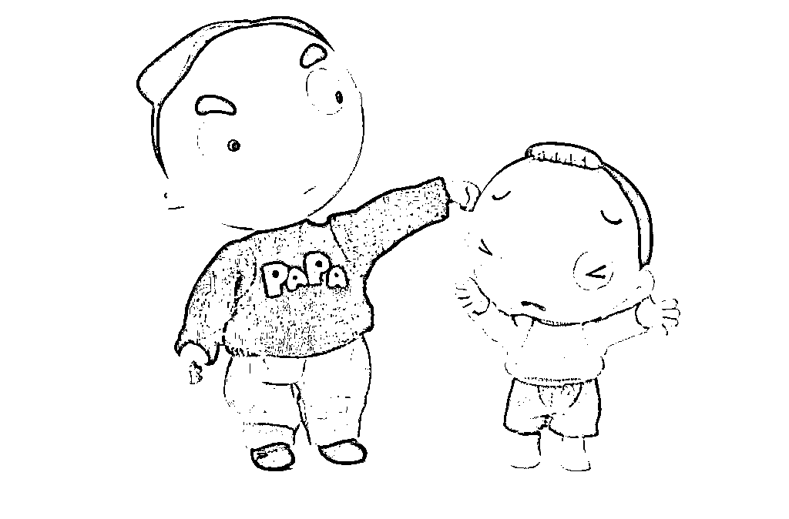

📹 [`v.qq.com/iframe/preview.html?vid=w0186djlgj4&width=500&height=375&auto=0`](https://v.qq.com/iframe/preview.html?vid=w0186djlgj4&width=500&height=375&auto=0)

——“爸爸，为什么我们家的房子怎么这么小啊？玲玲家的房子又大又漂亮。”

——“孩子，你不知道现在的房价有多贵，爸爸没有太多的钱买呀！所以你要好好学习，将来挣钱买大大的房子！” 

——“可是爸爸，那你小时候为啥不好好学习？！”

教育的议题是家族一代代传承的。在教育你的孩子时，是否思考过如下的问题呢？

►►**你成长期的外在人格？你的孩子成长期的外在人格？**

**►►****你成长期的家庭环境？你的孩子的家庭环境？** 

►► **在成长期你是否相信其他小朋友？你的孩子在成长期是否相信其他小朋友？**

►►**你成长期对于成就和成功有多少渴求？你的孩子对于成就和成功有多少渴求？**

教育从来都不是孤立的，是否父母将自己未尽的童年情结和梦想加诸孩子身上？“我都是为了你好。”孩子真的需要你这样的“好”吗？

**如果你为孩子和你的互不理解感到伤心**

**请在心里问问自己：**

**你，理解你的父母么？**

他们希望你是快乐幸福的，希望你远离人间的疾苦，然而也许他们自己也不过是个平凡的人，他们没有“善待”你，因为他们用错了方法。

**我们都是第一次做父母，** 

**如果做得不够好，**

**你希望你的孩子理解原谅还是叛逆顶撞？**

若你希望你的孩子爱你、尊重你、理解你的爱，请先尊重、理解父母的爱吧。唯有这样，才能将原生家庭的坏模式切断，好模式延续。


这个三月，来加入我们的**亲子发展工作坊**吧。

大卫老师以近四十年的经验，教你如何更好地同父母和解，更好地了解孩子水晶般真纯的心；

了解他有着怎样的梦想和潜能；

了解他的情绪背后有着怎样的心理动因；

你想知道的关于孩子的一切都能在这里找到答案。

**工作坊信息**

**授课时间：**2016 年 3 月 26-27 日 （10:00-18：30，午休 1 小时）

**授课老师：**大卫·瑞雷

**授课方式：**北京面授，英文授课，配中文翻译

**费用**：**5000 元（若道老学员可享受优惠价 3500 元）**

**早鸟价：**4000 元

**课程负责人：**Freya.Li  微信号：18601950700（请备注报名咨询）

**咨询电话：**400-619-1014

**课服 QQ：4006191014 （若道星文化）**

**邮箱：nodoor@vip.126.com**

课程简介

这两天，我们将聚焦在学习如何通过“觉知”与“接纳”的方式为孩子的成长创造一个充满“接受”“理解”和“爱”的家庭氛围。

我们将会根据家长和孩子的星图，谈论：

**★ 孩子怎么学习更有效？孩子适合报什么样的专业？说话孩子不听怎么办？孩子很叛逆该如何沟通？该如何激励孩子？**

**★ 在孩子成长过程中，家长会有哪些特别的挑战，如何面对这些挑战？**

**★ 哪些社会压力是非理性的，怎么放下这些非理性的压力？**

**★ 自己的人生议题是什么，这些议题和焦虑会怎样影响孩子？**

**★ 孩子今生的议题和挑战是什么，如何接受孩子的议题？**

**★ 孩子的潜能是什么？**

在这两天，我们不仅会根据孩子出生图的主题分组，还会根据家长出生图的主题分组，研讨案例将采用学员及学员孩子的出星图实例贯穿。这样学员们不仅可以从老师那里学习，而且还可以互相学习，通过在发生在身边的案例深刻感受出生星图如何影响家长、孩子及相互关系。

适合人群

**★ **致力于亲子关系成长的咨询师和占星师

**★ **希望更好理解童年与父母之间关系互动的人群

**★ **对占星学感兴趣的人群，需具备若道核心课程 Level1-2 的占星学基础

师资力量


****大卫·瑞雷（David Railey）****

若道创始人，《灵魂的目标》作者。拥有四十年的占星咨询的执业经验，曾两任亚特兰大占星协会主席，是全美占星师联盟（AFAN）、美国占星师联合会（AFA）、全美占星研究委员会（NCGR）、国际占星研究协会（ISAR）和职业占星师组织（OPA）的成员，是联合占星大会（UAC, United Astrology Conference）督导委员会委员。大卫曾是 CNN、CBS 的占星节目的常驻嘉宾，多次在 BBC、WGS、WSB、WRGG 等节目中接受采访，并在亚特兰大主持电视节目《每日行星（Daily Planets）》达 4 年之久。

长按二维码接通课程负责人~

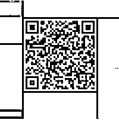

报名及咨询，请点击文末“阅读原文”

# 占星师手记 | 你知道占星学最正确的打开方式么？

> 原文：[`mp.weixin.qq.com/s?__biz=MzA5NjA0NTAxNg==&mid=403387107&idx=1&sn=a9cbed9a554e7373241f31f70094341a&chksm=0d4980543a3e09422332c0c8f75f69d050f4cfbd310263021897fecc561a0a1985e7317d933a&scene=126&sessionid=1692738857#rd`](http://mp.weixin.qq.com/s?__biz=MzA5NjA0NTAxNg==&mid=403387107&idx=1&sn=a9cbed9a554e7373241f31f70094341a&chksm=0d4980543a3e09422332c0c8f75f69d050f4cfbd310263021897fecc561a0a1985e7317d933a&scene=126&sessionid=1692738857#rd)

挚友的离世让 30 岁的她如醍醐灌顶，毅然选择了自己热爱的道路；从不屑于占星学到朋友二十分钟的讲解后被狠狠击中从此倾心于此，作者的一字一句都在告诉我们，生命中有无限可能，永远不要拒绝任何一扇门，而占星学最正确的打开方式并非只是预测，它还有更美妙的地方。

**生命太短，没时间浪费了**

准确地说，是将要以职业占星师的身份正式“出柜”了。为这一天，准备了十年。积极点说，是群星金牛座特有的执着与踏实；真实点说，同时受阻于金星和土星的硬相位所象征的自我价值的深层自卑。无论多努力也觉得尚未准备好被接纳，怀疑自己能否真正提供出价值，阻碍了行动的勇气。好在初衷不改，还是怀揣着恐惧，倔强前行到此刻。

每个人的人生，都会有能量执着的面向。就像龙卷风一样，在心智中逐步酝酿，在你被动应对着现世生活的常规时，它自不管不顾地长大，直到有一天席卷整个人，仿佛为了让一切重新来过。**这一天的到来，在每个人生命轴点的位置可能不同。占星系统以土星第一次回归为重要象征。**我的，恰好就在三十岁。

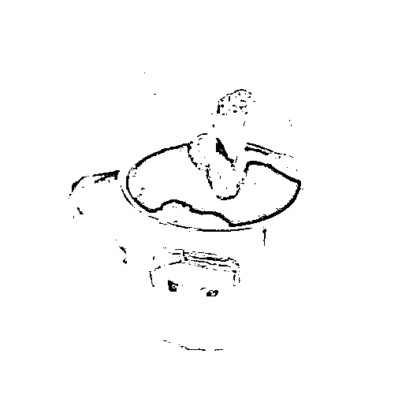

那一年，第一次经历挚友的突然离世。36 岁事业正好的他，在一个周末如常地打了一场乒乓球，放下球拍时说了句：“累了”，就再没醒来。在那些震惊、不知所措、悲伤……逐一袭来又逐渐退去之后，我在寂寞的海滩上看到一个触目惊心的问题：**“亲爱的，在最后那一刻，你对你的人生会如何陈词？”**我无法从朋友那里亲自听到答案了，这是一个唯有“自我“这个个体才拥有解释权的问题。它就像道姆·柯布在梅尔的潜意识里旋转的那枚陀螺，无论你是否意识到它，都无一日不浸染在它制造的旋律中。某日某种契机，你打开了那个柜子看到它时，你再无处可逃。

**因此下定决心，逐步脱离常规无害也算坦途的人生路另辟蹊径，去拥抱内心自动燃起从此跃动不息的火苗——成为一名心理咨询师，然后一直做到呼吸停止的前一天。**没有成熟的职业发展道路可因循，但意识里有一个警铃一直在提醒自己：没有足够的专业，心灵的伤害更大过肉体。所以给自己一个时间：十年，踏踏实实从学校的学习开始。

**该遇到的，总会遇到**

正式学习心理学伊始，也“嘲笑”过占星学（后来也看到自己的水星落在双子座的暗面：一知半解的小聪明），至今仍被好友时时拿出来嘲讽我，只能呵呵承受。

只是该遇到的，总会遇到。4 年前的某日，与一好友聊天，毫无逻辑地，她突然说，“我给你讲讲星座吧，十二星座并不是太阳星座那么简单，它其实就是人的生命周期。”说罢要来纸笔开始给我图解起来。

## 十二星座的人生周期

**白羊座**：生命的初生；

**金牛座**：自我意识成形，建立主体与客体的关系；

**双子座**：学习说话与交流；

**巨蟹座**：原生家庭及由此塑造的内在自我形象；

**狮子座**：青春期发展出的自我认同；

**处女座**：开始从事社会工作；

**天秤座**：建立伴侣关系；

**天蝎座**：亲密关系的深入；

**射手座**：心智拓展；

**摩羯座**：事业成就；

**水瓶座**：回向社会的志业；

**双鱼座**：灵魂回到万有；准备新一轮的重生。

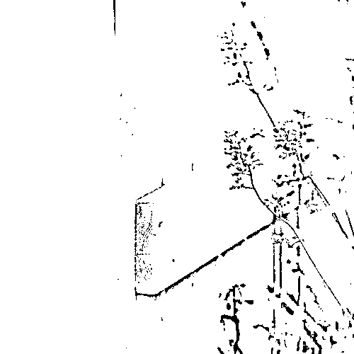

短短二十分钟，我被狠狠击中，这一切的描述，不正与心理学界埃里克森人格发展八阶段理论惊人的吻合吗？在当时，我惊讶的还不是占星本身丰富的象征意义（事实上，占星学的象征意义比这也要广阔的多）。让我震惊的是自己的狭隘与偏见，活在头脑的把戏中而不自知；门都没有勇气去推开，就轻易地转身，还自以为是地未知的世界批判起来。**幸运的是，在那一刻我敞开了：对占星，对自己的狭隘，我渴望推开那扇门，一窥究竟。**

自此，从斯蒂芬·弗里斯特的《内在的天空》开始，丽兹·格林、史蒂芬·阿诺优、苏·汤普金斯……结缘若道后，大卫·瑞雷，以及他带领我们去领略的一系列师者及其思想与研究，在这片星海里，我深深的沉迷了。

**最让人着迷的并非预测**

每个个体和占星结缘的起心动念不尽相同，**学习占星最让我收获的，首先是它的哲学体系。**占星学，以它自有的方式，扩张了我意识领域中对“生命”的认知。关于占星学有效性的解释，各家不同，荣格提出的“共时性”击中了我。**它赐予我一种突破逻辑思考的新的认知途径。**当以象征的新视角去看到个体，社会和宇宙时，我为其中的韵律之美深深折服。**于我，比起对占星预测性的期待，这些部分更是让我着迷这个古老学问的动因。**这个深邃广博的领域，深深滋养着我落入八宫，并三分落在十二宫冥王星的水星，和同样落于八宫的太阳。

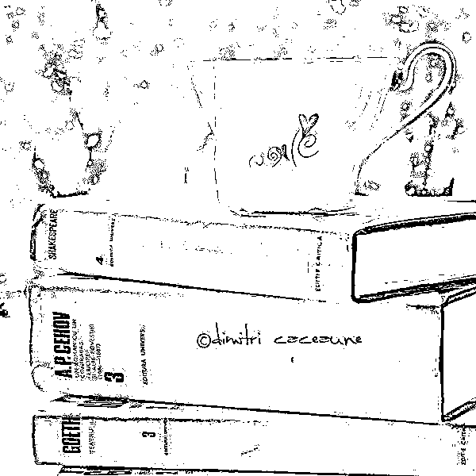

跟随人本占星学派的各位老师学习的过程中，发现**占星学精准的象征性，在心理咨询中最大的助益之一，就是可以非常快速地切入到来访者最富成长性的心理动力面向，这往往也是当事人的痛苦所在。**就像每个人会认同一个体系理论，往往始于在自己身上的验证。当我一步步学习体悟自己星图时，诸多对自己心理面向的困惑逐一解开。

当有一面镜子，如此生动地昭示出内在能量聚焦的面向，那些暗面的驱力吸引来的外部事件，以及那些可能转化的光亮面，你对自己开始升起真正的接纳。当评判和怀疑的喧嚣声开始慢慢平息，发展和成长的力量也悄然升起。**就像船只在浩瀚的海面航行，当你抬头在星空中找到航线的指引，即使到达彼岸的过程中仍然挑战重重，风云莫测，但因由方向的清澈，心里的海洋变得平静而有力。**

**在风暴里陪伴，只因为热爱**

在命运的海洋中，个人意志终于成了掌舵者。事实上，每个灵魂的蓝图都如此个体化，个体成长的路径，没有一种理论体系是真正完全普适的。而个体携带的这份蓝图，提供了精确的指引。星图以一种复杂精细却又极富韵律的几何之美，将我们直接带到一种更深的认知体验中。

学习心理学多年，一直没有找到一个有共振的路径令我有信心真正开始一对一的个案咨询。一位资深心理咨询师曾对我说，“疗愈或咨询的工具有很多，但每个咨询师都会有一两个自己最称手或者说最擅长的，比如于我是音乐和沙盘。”我也一直在找寻这样一个“工具”，直到与占星学相遇。

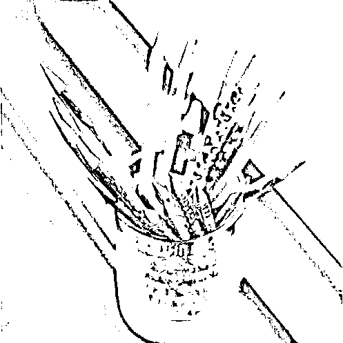

若道学习平台引荐的大多是当代人本占星学杰出的实践者和运用者，我在他们身上不断学习将此前的心理学储备、咨询技巧与星图解读合一运用。逐渐领悟到**，无论哪种形式的咨询，更大的意义在于陪伴的过程。这并不意味着不作为，或不精进技巧，事实恰恰相反。但放下自以为是的救赎之心，完全与对象一起深入到其星图昭示的命运蓝图中去，去支持自由意志的发生、发展，是成为一个有效的咨询者的关键。**当这样一些觉知在内在升起，那个成为咨询师的理想被越点越亮，勇气也开始生出。在自己和自己的契约到期之时，是时候正式“出柜”了。

每次被朋友误会成算命师，或者鄙夷，或者兴高采烈地要你给算一卦时，也颇觉尴尬。当金星和土星的硬相位昭示的“情结”又作祟时，也生出恐惧与犹豫。只是也越来越明白，你所爱的，就要去爱。**就像愿意在爱人的世界边缘找个合适的位置站着，陪伴他的欢喜忧愁，不走近，不远离，任情绪的风暴席卷穿越直至平静，你还因为爱，一直在那里，直到完结金星和土星给我的礼物：学习到爱。**


**作者简介**

**薇安**，若道认证生时校正资质及 COAC 高阶资质毕业生，跟随若道多名当代著名占星师持续进行深入系统的占星研习。

**微信 ID**：weianhuilai 

长按二维码，让金钱涌向传播知识与智慧的人~

 

**◆ ◆ ◆  ◆ ◆**

**特别提醒****：本文由作者授权首发于若道平台，转载请注明“转自若道”。** 

重新认识占星学吧。**2016 年 5 月 19 日**，蒋颖老师主讲的若道占星核心课程**Level 1-2**要开课了！她将带领你学习星座、太阳、月亮、行星、月亮交点等知识，让你进入占星学的世界！

报名及咨询，请点击文末”阅读原文“


# 女儿是汉纸，儿子慢吞吞，怎么破？

> 原文：[`mp.weixin.qq.com/s?__biz=MzA5NjA0NTAxNg==&mid=403387107&idx=2&sn=080b7e10d4fc55a242cdcb6ca0e0a695&chksm=0d4980543a3e0942a10976c570057d17e43d8d50be201317fd52945174c04986a37909844867&scene=126&sessionid=1692738857#rd`](http://mp.weixin.qq.com/s?__biz=MzA5NjA0NTAxNg==&mid=403387107&idx=2&sn=080b7e10d4fc55a242cdcb6ca0e0a695&chksm=0d4980543a3e0942a10976c570057d17e43d8d50be201317fd52945174c04986a37909844867&scene=126&sessionid=1692738857#rd)

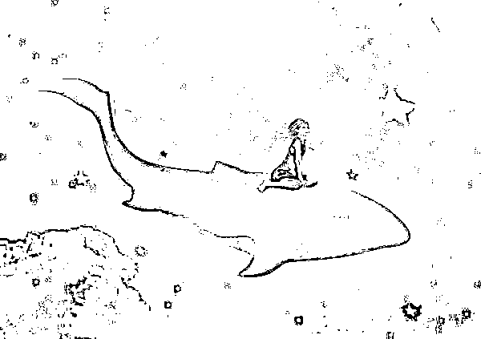

为人父母可能都会有这样的体会，那就是孩子虽然是自己生的，但是很多时候都有自己的想法，让人气，让人恼，让人忧，有的时候又让人捉摸不透。文章作者从占星学的角度，为大家提供了思考维度。另外，点击文末“阅读原文”报名参加大师亲子工作坊，只要你有信心和决心，一定能成为绝世好父母。

占星学也能看出孩子们的性格吗？

“占星学也能看出孩子们的性格吗？” 很多人这样问过我。我觉得，**答案是肯定的**。

我很喜欢关注身边朋友小孩的出生星图，小小的生命，看着 TA 一点一点地成长，然后比对着星图中各要素的发展变化，着实是一件神奇的事情。更加现实的点在于，这些轨迹的走向，还可以帮助父母在亲子关系中能看到孩子和自己的差异，从而理解包容这种差异，更加好地引导和陪伴孩子的成长。
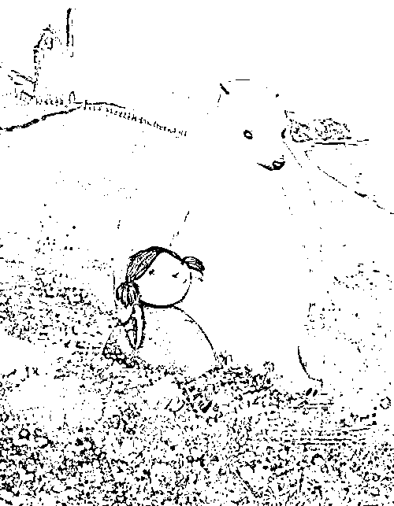1 对付白羊座女汉子，要多理解包容

在 2014 年初，我一位朋友生了一个白羊座宝宝。我当时就要了孩子的出生时间做了星图。哇！是群星在白羊座 10 宫的女孩子。太阳、月亮、天王星都在白羊座。我当时对他说：“恭喜你生了个女汉子！”他不相信，温柔地看着小宝贝的脸说：“我女儿应该会是温柔的淑女。” 我笑着跟他打赌：“我们走着瞧吧。”

白羊座姑娘叫甜甜，上升巨蟹座，太阳、月亮、天王星都是白羊座，在 10 宫。

太阳代表我们的生命力、活力、成就感等外在特质，而月亮代表情绪满足、被滋养等内在特质。这孩子有两颗行星都落在热情外向的白羊座，不会太温柔，会透着一股子自信、热情、冲动、不服输、急躁的味道。加上太阳还合相了天王星，会更加特立独行、不受约束。

所以我看小甜甜会是个我行我素，自信独立，行动力很强也很急躁的孩子。果然，过了一段时间，朋友无奈地说女儿果然不是他想象中的乖乖女，脾气非常着急，要吃奶时马上就要喂到嘴里，不然就会手舞足蹈的大哭，总之不能等。

我笑着说你要去理解她，根据她的性格尽量满足她吧。现在她还小，以后大了可能会是个要强不服输的孩子，你们的理解包容对她很重要的。朋友想想还真是这样，说还好有你提醒，我也好有个心理准备，以后一定尽量去理解包容她。

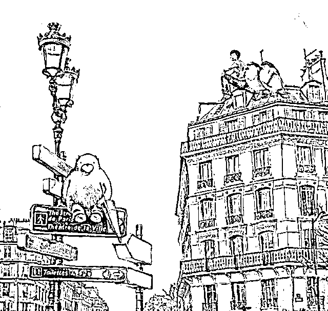2 对付金牛座慢性子，要耐心再耐心

我另外一个朋友，恰好就是群星白羊座 10 宫，性格特别急躁，偏偏又摊上一个金牛座儿子。儿子刚上学那段时间，她很焦虑，说儿子动作慢吞吞，放学回家从来不会先做作业，总是磨磨蹭蹭到睡前才做。她很着急，怕儿子学习跟不上，就来找我看看她儿子到底怎么了。

打开星图一看，他儿子太阳金牛座、月亮水星双子座落 12 宫，而且星图里缺乏火象元素。金牛座素来以慢节奏和稳定性著称，而他妈妈是雷厉风行的行动派，两个风格形成了强烈的拉锯。

白羊座妈妈越是催促，固执的金牛座儿子越是产生抗拒心理。月亮水星在双子座需要好好的互动沟通，而白羊座妈妈却只会一味催促他抱怨他动作慢。互动只能往恶性循环里走了。

所以我建议他妈妈先不要急，多陪孩子玩玩，一起看他喜欢的书然后讨论，形成良好的互动后，再帮他养成好习惯，以金牛座的稳定性来讲行成习惯的时候没那么容易改变的。后来我这个朋友就耐着性子陪儿子玩耍，虽然有点累，但一段时间下来，她自己也看了好多平常没看过的书，觉得还是很有收获，而且和儿子有共同话题了，儿子也会尽量把时间安排好，她也没那么焦虑了。从星图中了解孩子的个性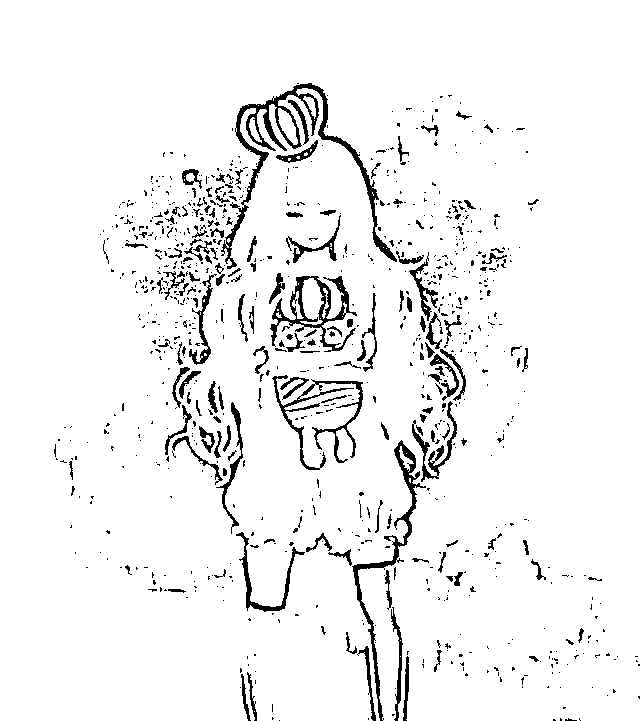

这些有趣的事例都说明了我们可以从星图中看到孩子的个性，从而了解他的行为模式，并以此来选择我们对待孩子的方式，用正确的方法来爱他们。当然，提醒一句，星图元素不是孤立的，需要观察整张星图，所以并不是说所有的太阳白羊座和金牛座的孩子都应该被这样对待。

在这个浩瀚的宇宙里，每个人的生命都像是一颗颗独特的，闪亮的星星，它们都有耀眼的光芒，在这黑夜里闪烁着。而**生命的有趣之处就在于差异性。**不少父母和孩子都会有完全不同的个性，我曾经听到好多父母抱怨说：“他怎么会是这样啊？我们从来就不这样的，怎么我的孩子会和我完全不一样呢？”我想，其实这就是生命的安排吧，它可能会给你一个和你自己差异很大的孩子，让你在和他相处的过程中感到苦恼，又感到惊喜。

而**占星学就是我们了解这种差异的利器，它让我们知晓，然后接受，进而包容并且理解这些差异。**当我们做到这些，我们能通过星图，读懂孩子的秘密，获得更加和谐的亲子关系。

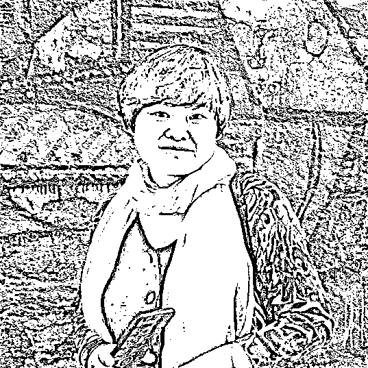

**作者简介**

**西邪**，占星师、塔罗占卜师，热衷于占星学、塔罗的学习和应用，热爱芳疗和旅行。善于综合运用占星学、塔罗牌、OH 卡、生命故事卡等进行疗愈咨询。

**微信号**：h133275

**◆ ◆ ◆  ◆ ◆**  

********特别提醒************：本文经作者授权首发于若道平台******，**转载请注明转自若道。********

如何当好妈？**2016 年 3 月 26 日**，大卫老师将在北京举办两天的占星学与亲子工作坊！让你找到“ 因材施教”的操作说明，学习应对不同时期亲子关系发展的成长挑战！

报名及咨询，请点击文末“阅读原文”

****

# 视频 | 作为 ISAR 代表，格伦·佩里要来中国了！

> 原文：[`mp.weixin.qq.com/s?__biz=MzA5NjA0NTAxNg==&mid=403374471&idx=3&sn=7483552a25b4246b6b0a4d331f7290eb&chksm=0d49b3303a3e3a26be409824e337a7c58e089c928ca0a7048cd9632618f5a09172fa9e24402d&scene=126&sessionid=1692738857#rd`](http://mp.weixin.qq.com/s?__biz=MzA5NjA0NTAxNg==&mid=403374471&idx=3&sn=7483552a25b4246b6b0a4d331f7290eb&chksm=0d49b3303a3e3a26be409824e337a7c58e089c928ca0a7048cd9632618f5a09172fa9e24402d&scene=126&sessionid=1692738857#rd)

周日的国际占星日

格伦老师通过视频问候大家

今年 8 月

他将在若道开设有一门新课程

10 月

他将作为 ISAR 代表

第一次来中国与大家见面

11 月

他还将在北京举办工作坊

一起期待吧

▼

点击视频立即呈现

注意流量 土豪随意

📹 [`v.qq.com/iframe/preview.html?vid=l01898zmqyg&width=500&height=375&auto=0`](https://v.qq.com/iframe/preview.html?vid=l01898zmqyg&width=500&height=375&auto=0)

格伦老师课程的具体内容之后将在若道平台发布，敬请期待！


# 视频 | 若道新添国际老师，她是男神理查德·塔纳斯的徒弟

> 原文：[`mp.weixin.qq.com/s?__biz=MzA5NjA0NTAxNg==&mid=403374471&idx=4&sn=a48eedb3bdcf2b228c7e481c1a754105&chksm=0d49b3303a3e3a26aed3503032d4da9ab548655f136fab344c733dfca434cb9dff44b1695f04&scene=126&sessionid=1692738857#rd`](http://mp.weixin.qq.com/s?__biz=MzA5NjA0NTAxNg==&mid=403374471&idx=4&sn=a48eedb3bdcf2b228c7e481c1a754105&chksm=0d49b3303a3e3a26aed3503032d4da9ab548655f136fab344c733dfca434cb9dff44b1695f04&scene=126&sessionid=1692738857#rd)

国际占星日之际

若道又迎来一位新老师

杰西卡·加菲尔德-卡巴拉

今年 7 月

她将第一次来中国

为大家带来三天的

有关“客户阴影资料的解码工作”的工作坊

敬请期待

▼

点击视频立即呈现

注意流量 土豪随意

📹 [`v.qq.com/iframe/preview.html?vid=e0189jhuhoo&width=500&height=375&auto=0`](https://v.qq.com/iframe/preview.html?vid=e0189jhuhoo&width=500&height=375&auto=0)

杰西卡老师课程的具体内容之后将在若道平台发布，敬请期待！


# 大卫谈占星 | 坚持百分百预测？你 sa 还是客户 sa？

> 原文：[`mp.weixin.qq.com/s?__biz=MzA5NjA0NTAxNg==&mid=403374471&idx=1&sn=07ccf0bec20b6e318cad77e2d790f44c&chksm=0d49b3303a3e3a26b430df3bac70b2708266f4d2dfc8815fa32e52bd3f1ae8c7f0030d80011b&scene=126&sessionid=1692738857#rd`](http://mp.weixin.qq.com/s?__biz=MzA5NjA0NTAxNg==&mid=403374471&idx=1&sn=07ccf0bec20b6e318cad77e2d790f44c&chksm=0d49b3303a3e3a26b430df3bac70b2708266f4d2dfc8815fa32e52bd3f1ae8c7f0030d80011b&scene=126&sessionid=1692738857#rd)

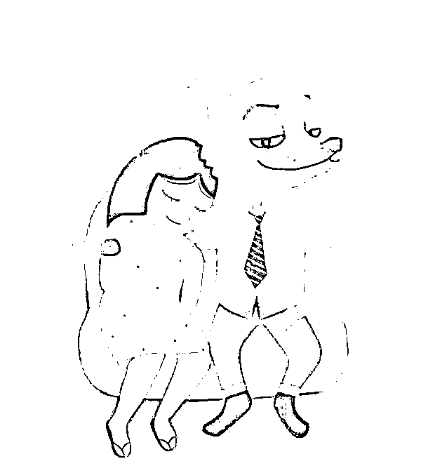

前段时间，在若道君发布的[《不能答，这些问题不能答》](http://mp.weixin.qq.com/s?__biz=MzA5NjA0NTAxNg==&mid=403111743&idx=2&sn=7ca4ed275341d13172bc07d7a06d54d7&scene=21#wechat_redirect)中，大卫·瑞雷告诉我们哪些问题占星师可以回答，哪些问题不能。在这篇文章里，大卫·瑞雷将告诉那些年轻的占星师们，遇见自己预言被打破的时候应该如何应对，以及应该如何引导客户。

大卫·瑞雷：我非常理解，新的职业占星师想要给新客户留下深刻印象，从而实现占星事业的腾飞，而给客户留下深刻印象的最好方式就是准确描述客户曾经历过的事件。这是唯一方法吗？

## **我们先看一段对话**

从星图里我看到你和丈夫三年前分开了，但是直到一年之后才正式离婚。

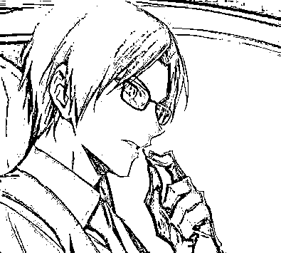
某占星师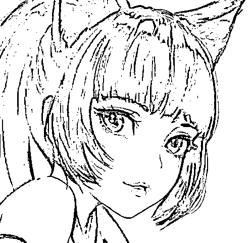

客户

你说的太准了！就是这样的！快告诉我，我会和现在的男朋友结婚吗？

根据星图显示，你和男朋友会在七月份结婚。

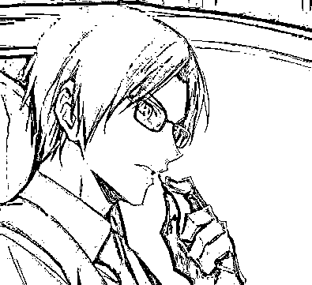
某占星师

客户

太棒了！大师么么哒！我要把我的朋友都介绍来！

然而，七月还没到，这位占星师就接到了客户的电话：


客户

我男朋友离开我了，找了别的女人。你对我的过去推断得那么准确，怎么对未来的预言一点不准呢？

## **为什么会变成这样？**

这里我要再次强调**区分事件预言和趋势预测的重要性**。如果你将自己的工作变成事件预言，那你就是一个算命师，那你应该告诉你的客户你是算命的。如果你将自己的工作变成事件预言，你就会限制客户的自由意志和选择——很可能你“注定”要这么做。

你会让客户更加确信他们的人生是注定的，他们无论做什么都无法改变命运。打着“占星学”的幌子，这样的占星实践不仅可能对客户有害，而且也不会有客户重复找你，推动你的占星事业蓬勃发展。

**将占星实践仅仅建立在事件预言上的占星师最终会失败**。是的，也许他们对事件的预言时不时是正确的，而且会吸引“新的”客户。但是，没有客户会长时间留在这样的占星师身边。这样的占星师或算命师会一直挣扎着争取新的客户，但是当他们对事件的预言错了的时候，客户又会离开他们。

对于一个不道德、不关心个人的“占星师”，这种算命不过是迅速赚钱的一种方式，只会招致客户的不满。对于勤勤恳恳的年轻占星师来说，依赖事件预言也并不是能够获得成功占星实践的方式。

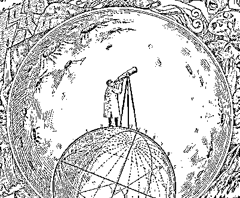

## **占星学真正价值所在**

**占星学可以帮助人们学会创造更令人满足的人生**。

正是因为这个原因，我的客户们才一直持续向我咨询，有的人向我咨询了 38 年。很多其他西方占星师的客户们也是这样。我的客户们**之所以持续接受咨询，并不是因为我会为他们预测事件，而是因为我帮助他们更加了解自己和自己的生活**，从而让他们创造了更满足的人生。

许多时候我也会预言事件，但并非总是如此，我给客户们举的例子恰好是他们过去的经历，或者是他们未来的确遇到了这样的事件。可是，我对具体事件的预言并不感兴趣，我感兴趣的是**帮助客户成长、改变，并且创造更有意义更有价值的人生**。和客户一起工作是一项“工作”，这是一个“双方”（占星师和客户）共同参与、共同努力的过程。

## **要明白占星学是艺术**

很多年轻的或新的占星师都下定决心要找到一个更好的预言系统，他们会去考察占星学的许多分支。几乎所有的年轻占星师都这么做。

我在学习和实践占星的前 12 年也一直在寻找这样的系统，我也鼓励我所有的学生去探索任何吸引他们的占星学分支。每一个高阶学员或新的职业占星师都需要找到最适合他们的方法和技术。

因为，虽然占星学本身是一种行为科学，但是实践占星学，特别是预测，是一门“艺术”。**占星师需要意识到他们在实践一门艺术**。在我居住的亚特兰大，医生们有一栋医学楼，名叫“医学艺术楼”。之所以取这个名字并不是因为楼里有很多医生在绘画，而是因为大部分医生都意识到医学的实践虽然是一门应用“物理科学”，但同时也是一门艺术。

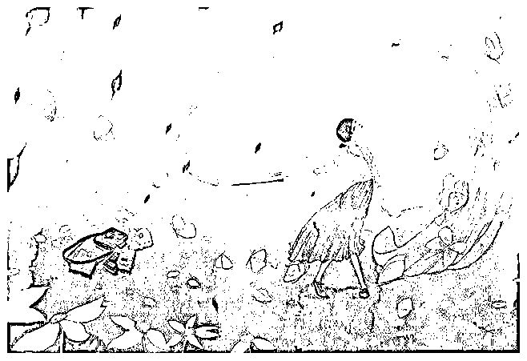

## **占星师应该如何做**

占星师需要深呼吸来放松自己，通过教育客户让他们形成更加合理的期待，通过更深刻地理解生命、掌握基础知识、提高咨询能力来服务客户。

中国的年轻占星师们，鼓起勇气吧！不要让潜在客户错误的期许对你产生的压力，让你陷入同样错误的假设和论断中。是的，占星师的确预测趋势，但是我们不应该误导客人去更加相信我们能准确预言他们人生中所有的或大部分事件。

与此相比，我们还有一个更好的方式来建立稳定的、蓬勃发展的占星事业，这个方式也一定能更好地服务于客户。了解你所从事的工作的真正的价值，掌握它助人的技术和艺术，比去寻找“万能法则”更能让客户，也让占星师收获更令人满意的人生。


想体验大师级的占星疗愈？

大卫老师**占星咨询**预约进行时

**生命议题、职业发展、关系咨询、少儿成长、年度规划和预测**

预约请在电脑端复制打开以下网址

 http://www.nodoor.com/consultantApply.do?contentId=3670 

**◆ ◆ ◆  ◆ ◆**

******特别提醒************：若道拥有本文版权******，**转载请注明“转自若道”。******

成为一名成熟的占星师，你需要了解什么能预测，什么不能预测。**2016 年 3 月 15 日**，大卫老师主讲的若道占星核心课程**Level 5**要开课了！在这个阶段，你将学习各种预测技术及行星周期。通过这些预测工具，你能够预测和规划人生。提前报名付款有**早鸟价**哦！详细内容请点击“**阅读原文**”了解。

报名及咨询，请点击文末”阅读原文“


# 职业占星师之路 | 大卫老师免费咨询的机会，你可别错过哦

> 原文：[`mp.weixin.qq.com/s?__biz=MzA5NjA0NTAxNg==&mid=403374471&idx=2&sn=7ab42313111914552adc147242b411a4&chksm=0d49b3303a3e3a264b5d7fde93deee1cd3d6b62c0ab43c01e7d10b2f2cb1898e7ce3e8d75bec&scene=126&sessionid=1692738857#rd`](http://mp.weixin.qq.com/s?__biz=MzA5NjA0NTAxNg==&mid=403374471&idx=2&sn=7ab42313111914552adc147242b411a4&chksm=0d49b3303a3e3a264b5d7fde93deee1cd3d6b62c0ab43c01e7d10b2f2cb1898e7ce3e8d75bec&scene=126&sessionid=1692738857#rd)

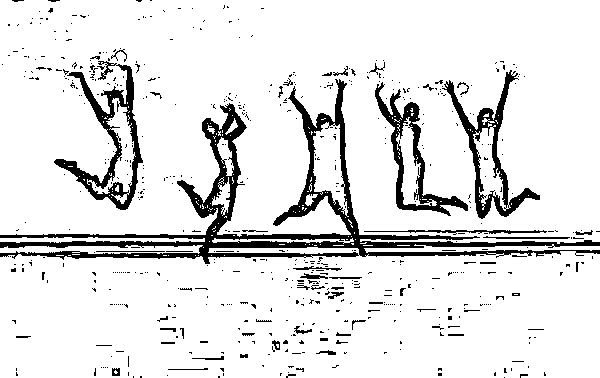

若道核心课程 Level 5 即将开课

﹁

最强阵容揭秘

﹂

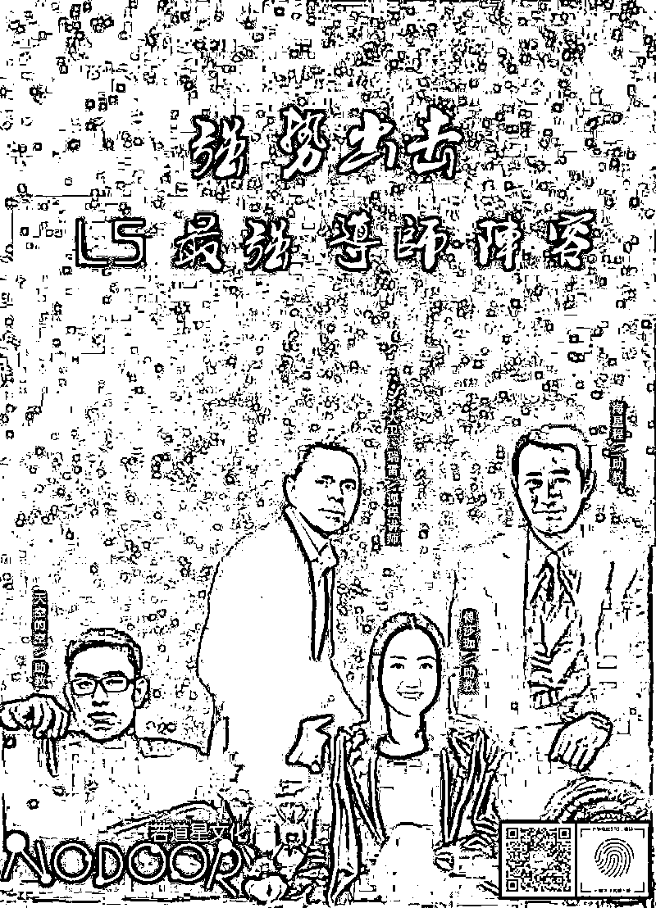

**导 师 介 绍**


**大卫·瑞雷（David Railey）**

若道创始人，《灵魂的目标》作者。拥有四十年的占星咨询的执业经验，曾两任亚特兰大占星协会主席，是全美占星师联盟（AFAN）、美国占星师联合会（AFA）、全美占星研究委员会（NCGR）、国际占星研究协会（ISAR）和职业占星师组织（OPA）的成员，是联合占星大会（UAC, United Astrology Conference）督导委员会委员。大卫曾是 CNN、CBS 的占星节目的常驻嘉宾，多次在 BBC、WGS、WSB、WRGG 等节目中接受采访，并在亚特兰大主持电视节目《每日行星（Daily Planets）》达 4 年之久。

**助 教 介 绍**

1

**天空的空**

2015-2016 年度若道核心课程专职助教。获得 ISAR 认证和“生时校正认证考试”资质认证。

2

**海星程**

ISAR 认证职业占星咨询师、塔罗咨询师、2015 年若道首次“生时校正认证考试”满分获得者。

3

**傅莎珈**

全职占星师，COAC 高阶占星资质，接受萨提亚、NLP、格罗夫全息呼吸理论的心理咨询专业培训。

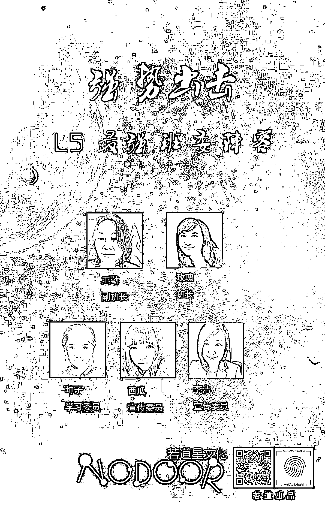

**五位班委是从 Level 4 全体学员中选拔而出，**

**品学兼优，多为外企、银行、媒体行业管理从业背景。**

**班委会将同助教组一同，**

**为学员们组织更丰富多彩的学习和活动。**

彩蛋时间

在 Level 4 的授课中，

大卫老师在学员里**随机抽取案例进行爱情合盘、事业现场解读**，

受访者几度哽咽，

大卫老师精湛的解读技巧令人难忘。

在这一届 L5 课程中，

大卫老师仍旧会**在学员中抽取若干名案例，** 

**现场进行星图解读，**

**相当于免费进行一次咨询。**

一句话课程揭秘 1

预测行进——含演练及学生案例

行进，也称为“行运”，是各种占星预测中最基本的，也是使用最广泛的技术。占星师**结合出生星图与某一时刻的宇宙天气**（天象），即可做出相应的趋势预测分析。

2

周期——含演练及学生案例

从某种程度上来说，占星学就是建立在周期之上的，熟练掌握星图中**各组成部分（行星、月亮交点、四轴等）的周期**，是职业占星师的必杀技。

3

趋势预测——爱情和职业周期（含演练及学生案例）

在这里，大卫老师将承接**Level 4**的内容，再**结合 Level 5 行进预测技巧**，对亲密关系与职业发展的解读，做更深入地教导。

4

推进——含演练及学生案例

推进，也称为“推运”，是仅次于行进的被广泛使用的技术，而其本身的涵盖面也非常广。在 Level 5 中，大卫老师将详细讲解推进中最出众的**“次限推进”**。通过次限推进，我们将领略生命**“一天对应一年”**的神奇。

5

太阳弧——含演练及学生案例

在人本主义占星学领域有一位大宗师：诺·泰尔。他对占星学最显赫的贡献之一，即发现了**“太阳弧正向推进”**。这是一种非常霸气的技巧，星图中的所有行星、虚点与四轴，都按照**“一度对应一年”**的平均速度正向推进。

6

日月回归——含演练及学生案例

**每年**，行进的太阳都会回到出生时太阳的位置，这一刻的宇宙天气（天象星图），似乎在暗示着什么？

**每月**，行进的月亮都会回到出生时月亮的位置，这一刻的宇宙天气（天象星图），似乎也在暗示着什么？

7

组合中点图——含演练及学生案例

在关系解读的领域，占星师们最常用的两项技术，除了 Level 4 中的比对星图（比较盘）外，就是组合中点图了。如果说比对星图显示了关系双方的**“匹配度”**，那么组合中点图就暗示着关系相处中的**“议题”**。

8

综合预测分析——含演练及学生案例

把行进、次限推进、太阳弧与日月回归等技术**综合**起来使用，是怎样的滋味儿？

9

历史概览及占星学中的天文学

占星学有超过 8000 年的历史，在西方的传承也超过 2000 年。这不仅仅是一门学问，更是一部恢宏的**史诗**。

在 1781 年天王星被发现之前，漫长的几千年中，占星学与天文学不分家，天文学家就是占星师，占星师也是天文学家。观测并熟知天上行星的运转，也是一名成熟的占星师需要了解的。**“天上如此，地上亦然。”**

10

ISAR 考试词汇表及咨询技巧培训

国际占星研究学会（ISAR）是一群志同道合的占星师携手开办的非营利性组织。作为国际上最具声望的占星组织，也是 UAC 大会的四个举办方之一（其他三个主办方是 AFAN，NCGR，ACVA/CVA），ISAR 所颁发的**占星师资质认证**受到国际占星界的广泛尊重和认可。“君子和而不同。”

走到这一步，你已经学习了几乎所有常用的人本主义占星学技术，加以练习，一定能成为一名“解盘高手”。但是，想要成为一名优秀的占星师，光光会解盘可不够，还需要学习一门很重要的技术：**咨询技巧**。占星师们需要学会如何把星图翻译成人们日常的语言，**平和、生动地表达**给客户。简而言之，你需要学会“说人话”。


错过如此优秀的班级，

黄金组合的助教团队和班委团队，

一定是你 2016 年最大的遗憾。

目前尚有少量席位，

请点击文末 **阅读原文** 获取详细课程信息。

**想成为 ISAR 认证占星师吗？**

**欢迎选择 2016 年度职业占星师成长套餐** 

▼


**2016 年，和大卫老师一起，开启占星的探索之旅！**

长按二维码添加课程负责人咨询~

****

报名及咨询，请点击文末”阅读原文“

# 视频 | 你造吗？占星师们都庆祝国际占星日去了

> 原文：[`mp.weixin.qq.com/s?__biz=MzA5NjA0NTAxNg==&mid=403365451&idx=2&sn=f486de41fa1c70411177fe5fd9c2daf5&chksm=0d486cfc3a3fe5ea4f129ef51c839dc4a71d2b43260b26433e9f477ee245912123c95d9243d9&scene=126&sessionid=1692738862#rd`](http://mp.weixin.qq.com/s?__biz=MzA5NjA0NTAxNg==&mid=403365451&idx=2&sn=f486de41fa1c70411177fe5fd9c2daf5&chksm=0d486cfc3a3fe5ea4f129ef51c839dc4a71d2b43260b26433e9f477ee245912123c95d9243d9&scene=126&sessionid=1692738862#rd)

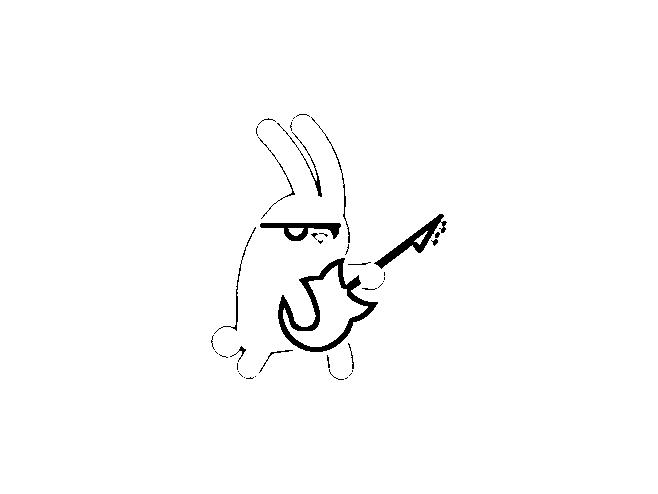Let's have fun !

2016 年

3 月 20 日

太阳进入白羊座

+国际占星日

在占星界的重大节日

国际占星日这一天

你会如何度过呢

为了庆祝这一节日

若道在上海和成都

陆续举办了庆祝活动

若道创始人大卫·瑞雷和蒋颖

也有一些贴心的话要对大家讲

▼

点击视频立即呈现

注意流量 土豪随意

📹 [`v.qq.com/iframe/preview.html?vid=k01894q2x3x&width=500&height=375&auto=0`](https://v.qq.com/iframe/preview.html?vid=k01894q2x3x&width=500&height=375&auto=0)

明天还有另外两位国际占星师的视频传送，敬请期待！


# 蒋颖谈占星 | 作为一枚占星师，我是怎样“出柜”的

> 原文：[`mp.weixin.qq.com/s?__biz=MzA5NjA0NTAxNg==&mid=403365451&idx=1&sn=e504713f210ad11b458ba15eab4f29cf&chksm=0d486cfc3a3fe5ea6ed6957c209f65a85859194611020c274b92f39356ecc27380a9c2d7844e&scene=126&sessionid=1692738862#rd`](http://mp.weixin.qq.com/s?__biz=MzA5NjA0NTAxNg==&mid=403365451&idx=1&sn=e504713f210ad11b458ba15eab4f29cf&chksm=0d486cfc3a3fe5ea6ed6957c209f65a85859194611020c274b92f39356ecc27380a9c2d7844e&scene=126&sessionid=1692738862#rd)

作者/蒋颖 若道占星创始人

图片/花瓣网

这年头还有什么职业是让人躲躲闪闪不敢说的？占星师算一个吧……如果做一名占星师像宣布自己出柜一般需要莫大的勇气，你坚持下去的理由是什么？3 月 20 日是国际占星日，趁着这个特殊的日子，本文作者向全世界庄重声明：我，是一名占星师！

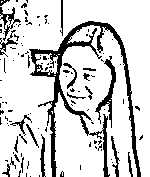
**“我是蒋颖，**

**若道占星创始人+职业占星师，**

**我爱占星学，**

**国际占星日，**

**我为占星正名。”**

如果你也是一名占星爱好者/潜在占星师/职业占星师，如果你也热爱占星学，**在你的朋友圈里大声说出属于你自己的宣言，勇敢地为占星学出柜吧**，不为别的，只因为占星学让你变成更好的人。

一个“不能说”的职业

我是到了这两年才能气定神闲地在公众场合说自己的职业是占星师。

在刚开始从事占星行业，别人问我职业是什么，我都支支吾吾，顾左右而言他。

*“哈哈，我在咨询业”，*

*“哈哈，我在软件业”，*

*“哈哈，我在互联网业”。*

这么说的时候，我既慌张又惭愧。慌张因为自己说谎，惭愧因为自己没有勇气。

我很希望对方就此而止，但大部分人都有火眼金睛，他们很快问:  

*“那么你是咨询什么呢？”*

*“心理吧。”*

*“你是心理咨询师？”*

*“呃，也不是。”*

或者“哦，什么软件？” 又或“哪个网络公司？”

那时我会尴尬地露出原形，毕竟我有很强的射手座能量，“呃，我是做占星的”。

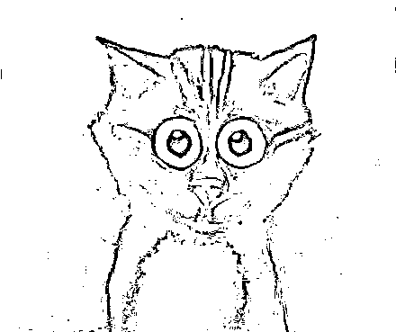

感觉自己在说谎的时候，就如大尾巴的狐狸，尾巴总是漏在外面。而最终露出原形之时，更是尴尬万分。

不止如此。更“尴尬”的是和家人一起在家人的朋友前。

*“老蒋啊，你女儿是什么职业啊？” *

*“噢，她自己做点事情。”*

*“哪方面事情呢？”*

*“一点小生意。”*

那些阿姨叔叔们会一脸狐疑，但是他们那代人比较有“教养”，看我父母欲言又止的模样，不会追问下去。

我呢，则尴尬地陪着笑，赶紧找借口溜出房间。

有时，家人也和我一样撒谎，“哦，计算机方面的事情”。而那时我则有些腹诽，如阿 Q 一些忿忿的，“为什么不能说你女儿就是干占星的，我到底做了什么见不得人的事情呢？”

当然，我也知道我没有生气的本钱，因为我自己跟父母一样。

我为什么害怕说出自己的职业

有一天，我终于非常厌烦了这样的模式。我自问为什么会如此？ 我把自己脑袋里能想到的原因一条条写出来：

**我害怕对方看我是怪物**

**我害怕对方觉得我迷信**

**我害怕对方不尊重我**

**我害怕对方不接受我**

立刻，我脑子里迸出大卫老师教课时的“老生常谈”——**“你在哪里评判自己，别人就会在哪里评判你”**，跟随他学习这么多年，这句话听得我耳朵都起茧子了。（所以啊，有时候唐僧的唠叨是有用的…….）

我随后开始和自己对话， 

*“你觉得自己怪吗？”*

*“挺怪的。”*

*“你接受自己怪吗？”*

*“一部分接受，甚至有些骄傲自己怪，但一部分不接受。”*

*“我们都知道你有很强的天王星，也有很强的土星。”*

*“嘿嘿。”*

*“哪一部分不接受？”*

*“我不太清楚，我只是想，如果不这么怪，我的人生是不是就不用这么曲折，我可以更让父母省心。”*

*“让父母费心，你是不是有些内疚？”*

*“是的，我很抱歉，我不能让他们为我感到骄傲。”*

然后，眼泪掉下来，哭了一场。

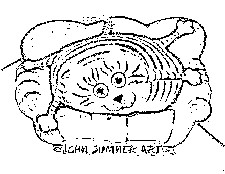

对话继续……

*“你为你自己感到骄傲吗？”*

*“有时候能，有时候不能。”*

*“先说说什么时候能吧。”*

*“当我感觉我确实在做一件对人类有益的事情。”*

*“什么时候不能呢？”*

*“我没有达到对自己的期望。”*

*“你能具体讲讲对自己的期望吗？”*

*“……”*（此处省略 100 字）

*“看来你对自己有很高的期望，让我们来谈谈你的土星好吗？”*

*“……”*（此处省略 100 字）

对话之后，我有些放松了，虽然仍然不能完全接受自己怪（天王星部分），但我知道我在进步，已经从“不知道自己怪”，到“知道自己怪”，到“有点接受自己怪”，到“去看看是哪部分不能接受自己怪了”。

这是我的“升级打怪”，哈哈！

我在害怕什么

对话继续。

*“那么我们再来谈谈你觉得占星是迷信吗？”*

*“不是。”*

*“你肯定不是吗？非常笃定？百分之百笃定？你在心里说一声，慢慢说，感觉心里什么感受。”*

*“好像心里有点抖……”*

*“抖的那部分，如果能说话，在说什么？”*

*“有一部分我不确知的东西。”*

*“你的意思是，有一部分你不确知的东西，你怀疑是迷信吗？”*

*“我不是怀疑是迷信，而是我不知道。怎么说呢，这个领域有一些最基本的概念，但大师都彼此观点不同，但他们又是大师，怎么会这么基本的概念都有差异呢，为什么不能弄清楚呢？”*

*“在其它领域没有吗？心理学界大师们的观点不也是常常相反吗？宗教界不也是吗？”*

*“我不知道，但感觉不一样。”*

*“怎么不一样？”*

*“和心理学界比，规范的研究太少。”*

*“你很在意规范的研究。”*

*“是的。”*

*“你读的近 100 年来的占星学的书有多少本？*”

*“不够多。”*

*“那么是不是能说，你‘感觉’规范的研究不够多，虽然你并不知道规范的研究有多少？”*

*“是的。”*

*“你觉得规范的研究少，就有可能有迷信的成分？”*

*“是的。”*

*“所以，你不能百分之百笃定占星学里面没有迷信的成分？”*

*“是的。”*

*“心理学中规范的研究多，你觉得就没有迷信的成分吗？”*

*“当然有，尤其在懂得占星学之后，读到一些心理学家的著作，就会觉得，哦，如果他们懂一点占星学，就不会这么说了。”*

*“所以，能不能这样说，在各个学科领域中，都有一些无知的部分，都有一些“迷信”的部分，哪怕自然科学？”*

*“是的。”*

*“那么当你说你怕别人说你迷信，其实来自于你内心有些不笃定的地方？”*

*“是的。”*

*“你可以做些什么，应对这些不笃定？”*

*“认真研究或者组织一些研究。”*

*“好，当你说你可以认真研究的时候，你内心的抖动会怎样？”*

*“会减轻。”*

*“很好。”*

*“如果你从事的是科学，或者是心理学，你内心会有这些不笃定吗？哪怕学科内部都有些无知的地方？”*

*“不会。”*

*“为什么？”*

*“因为从来没有人会说科学、心理学是迷信，我当然也不会把这些和迷信这个词联系起来。”*

*“所以，你受到大众看法的影响？”*

*“不是大众看法，是知识分子的看法，特别是精英知识分子的看法。”*

*“你想要占星学获得他们的尊重？”*

*“是的。”*

*“你知道研究范式不同？”*

*“我知道。”*

*“你认为占星学是超前的吗？超过大多数人类的认知，研究宇宙和人类行为关系的学科。”*

*“是的，是这样。”*

*“在这点，你是完全笃定吗？百分之百确信吗？”*

*“完全笃定，百分之百确信。”*

*“这是你研究得来的吗？”*

*“经验得来。”*

*“但你仍然完全笃定，百分之百确信？”*

*“是的。”*

* “你认为占星学是真实的吗？完全笃定，百分之百确信？”*

*“是的。”*

*“你可以重复这句话吗？占星学是真实的。”*

*“可以。”*

*“那么，当其他人说占星学是迷信的时候，你可以很自信的说，占星学是真实的而内心没有抖动吗？”*

*“可以。”*

*“你认为占星学对人有帮助吗？”*

*“有帮助，非常大的帮助。”*

*“那么，当其他人说占星学是迷信的时候，你可以很确定的说，了解占星学会对人有非常大的帮助吗？”*

*“可以。”*

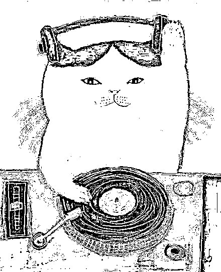

这部分对话后，我就没那么害怕担心别人认为我迷信了，也知道怎么应对。

作为一名占星师，我“出柜”了！

对话转到下面一个“害怕”上。

*“你害怕当你说自己是占星师的时候，对方不尊重你？”*

*“是的。”*

*“你害怕对方不尊重你，只是在这个事情上吗？还是在很多事情上？”*

*“不止在这个事情上。”*

*“所以，这个不是仅仅跟职业相关的议题，对吗？”*

*“我们都知道你的北交点在摩羯座，你有很强的土星。”*

*“哈哈。”*

*“小时候谁不尊重你？”*

*“………..此处省略 1000 字”*

*“你可以尊重自己吗？ 尊重自己所有的部分，小时的你，现在的你，土星的部分、天王星的部分，这就是独特的你。”*

*“我尊重自己所有的部分。”*

*“你为占星师这个职业感到骄傲吗？”*

* “有些混杂的情感。”*

*“这么说吧，你哪部分感觉到骄傲？”*

*“我觉得我做了对他人很有帮助的事情。”*

*“复杂的情感是……”*

*“很多人不能理解，而且国内这个行业鱼龙混杂，20 多岁自称大师的不少，我记得当我第一次开始了解占星学，看到那些人的花名和他们的言行，我就觉得这到底是个什么行业啊，哪个受到尊重的行业中，可以自封大师呼来称去的；哪个受到尊重的行业中，有那些看书不多经验有限的年轻人只凭个人经验随意张口评判，而不是以认真读书、提问、切磋、探讨的方式来研究学问，大概只有占星界和‘星宿派’吧。”*

*“因此，你不敢说自己是占星师，因为行业的形象。”*

*“一部分是的。”*

*“你可以为占星界的形象做什么？ 你不敢说自己是占星师，那么大众只能从那些自称大师的人的那里获得信息，对这个行业形象有帮助，还是没有帮助？”*

*“没有帮助。”*

*“那么你期待怎样提升占星师这个职业群体的形象？通过不敢承认自己是占星师的方式吗？”*

*“你接纳你自己的职业是占星师吗？”*

*“……”*

*“你自己不完全接纳，但你期待他人完全接纳你所不能接纳的吗？”*

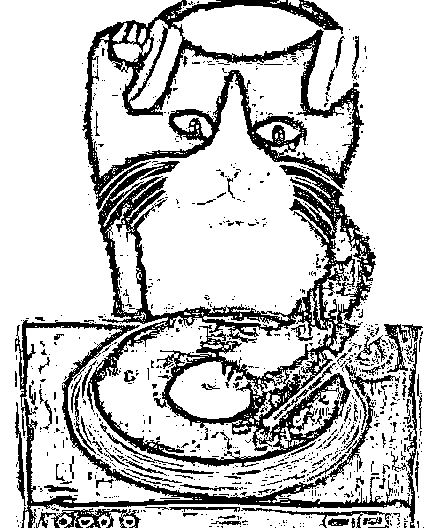

在经历了这样的对话后，有一天，当别人问我从事什么职业的时候， 我犹豫了一下说，我是一个占星师。我心里还是有些抖。感觉跟出柜一样。但是我不打算再隐藏自己、欺骗别人和自己。我决定尊重自己。为我深深受益并感激不已的占星学，我至少可以做到这一点，承认自己的身份。

后来，我说的越多，我就越气定神闲。我是一个占星师，这是我的职业身份的一部分。我尊重这个身份。

**你是干什么的？**

**我是一个占星师。**

3 月 20 日是国际占星日，祝所有占星师的前辈、同行、隐形占星师、未来的占星师节日快乐！


**喜欢蒋颖老师的文字吗？**

**在后台回复 蒋颖 即可查看她的全部文集哦。**

**◆ ◆ ◆  ◆ ◆**

**特别提醒****：若道享有本文授权，转载请注明“转自若道”。** 

喜欢蒋颖老师的文章吗？**2016 年 5 月 19 日**，蒋颖老师主讲的若道占星核心课程**Level 1-2**要开课了！她将带领你学习星座、太阳、月亮、行星、月亮交点等知识，让你进入占星学的世界！

报名及咨询，请点击文末”阅读原文“


# 蒋颖谈占星 | 3 月 20 日，白羊座拽着我们奔向春分

> 原文：[`mp.weixin.qq.com/s?__biz=MzA5NjA0NTAxNg==&mid=403355251&idx=1&sn=f9d739564ab8e57fdcd804a6e8e6de56&chksm=0d4804c43a3f8dd2ce4e6da0593d406abe72df4c6be148ef4fe3011719f2f5bb4f00fafebc61&scene=126&sessionid=1692738862#rd`](http://mp.weixin.qq.com/s?__biz=MzA5NjA0NTAxNg==&mid=403355251&idx=1&sn=f9d739564ab8e57fdcd804a6e8e6de56&chksm=0d4804c43a3f8dd2ce4e6da0593d406abe72df4c6be148ef4fe3011719f2f5bb4f00fafebc61&scene=126&sessionid=1692738862#rd)

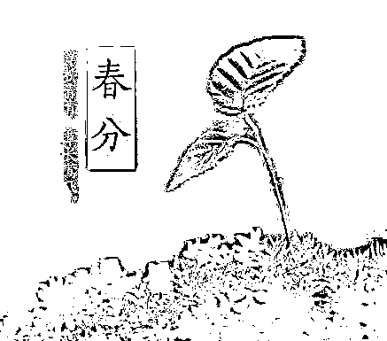

作者/蒋颖 若道占星创始人

﹁

春

分

﹂

3 月 20 日，太阳进入白羊座，这一天刚好是北半球的春分时节。春分是一年二十四节气中的第四个节气，在每年 3 月 20 日～22 日的其中一天，这时太阳到达黄经 0 度。春分日是春季九十天的中分点，此时南北半球昼夜相等。而这一天也是占星界著名的国际占星日，当天若道君会推出特别内容，敬请关注哦。

> #### Tips：星座与 24 节气
> 
> 白羊座：春分到谷雨   金牛座：谷雨到小满   双子座：小满到夏至   巨蟹座：夏至到大暑   狮子座：大暑到处暑   处女座：处暑到秋分   天秤座：秋分到霜降   天蝎座：霜降到小雪   射手座：小雪到冬至   摩羯座：冬至到大寒   水瓶座：大寒到雨水   双鱼座：雨水到春分

**白羊座之生命力**

在双鱼座，我们结束了一个轮回，生命隐入神秘的存在之中。就像神话故事里一样，白雪覆盖一切，大地上的生命进入酣眠和梦境，好像被一个嘘声封住声音。

突然有一天，空气中什么东西不一样了。活的东西都能感觉到——我、冬眠的蛇、枯草的根、蛰伏的种子、僵了一冬的枝条、冰封的河流……那是天地所孕育的胎心跳动，如鼓点一样，一旦开始，就越来越强劲。 

天地之间，“春心”萌动，春分点到了，白羊座来了！

生命从其纯粹意志开始，这是火的意志，白羊座的意志。观察初春植物，看它们的芽，常常会看到芽是红色的，我们仍可瞥见即将隐在具体形态之内的生命意志。最初的意志是无形之火，到芽时已显化成形。

在花朵出现之前，花的意志早已出现。这是纯粹的火的能量。白羊座的能量。

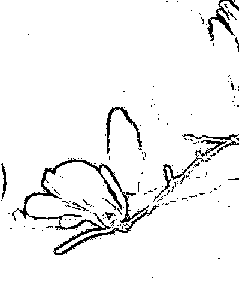

**白羊座之勇气**

虽然到了春分，北方其实仍是春寒料峭，倒春寒是常见之事，初春一场雪也并非罕见。当我穿过寒风，看到那些柔嫩新叶和花朵，不由去想是什么样的勇气让它们径直来到这个世上呢？也许一冒头就被寒风吹死，被小鸟啄去，然而就这么不管不顾地冲到世界中来，只有白羊座的勇气才可以做到吧。如果你靠近枝条，也许你可以听到藏在枝条中的生命自我激励的窃窃私语——勇敢一些，再勇敢一些……

所有选择诞生的生命都很勇敢——嫩芽、小婴儿、小马、小蝌蚪、冰川上的第一滴水……特别是我们的灵魂都知道这是一个什么样的世界，这是凶猛的、充满竞争的、弱肉强食的“动物世界”。

真的以为你的出生是偶然事件吗？那些精子卵子偶遇吗？还是像隐藏在枝条里的生命一样，你带着一股勇气，睁大眼睛，握紧拳头，瞅准机会，选择直截了当、一头冲到这个世界上？

生命有时候，什么都不需要。只需要勇气。稚嫩的勇气。鲁莽的勇气。行动的勇气。这是白羊座告诉我们的。

生命，是一个机会主义的事情。想想看那些等待投胎的灵魂，可是如落叶一样多啊！想象那些攒动着、焦灼地在生命之河的那一边的灵魂，都在等待着这么一个可以出生的机会。

为什么要选择出生呢？因为死后，我们会恍若大悟，然后我们会说：“我知道了，我明白了，给我一次机会，让我再来！”

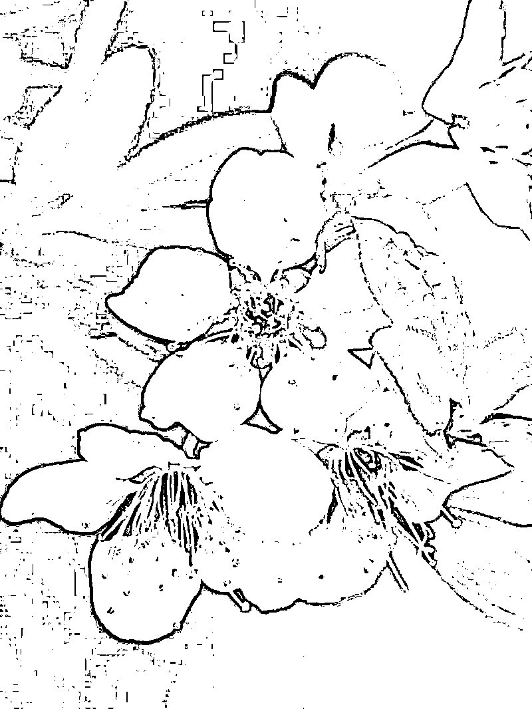

**白羊座之速度**

然而谁会捷足先登？谁能首先拿到那张船票呢？

一定是那些跑得快的人。

你想礼貌一下，让别人先走？那你估计要再等一万年才拿到船票！你想计划周全，万无一失了再来，那你估计没机会诞生！你天性敏感，多愁善感，那你就留在与“神”合一的河流中吧！

初春的白羊座是一切“急切的”“自私的”灵魂，他们管不了那么多的，他们现在就要，他们是冲锋战士，他们来了再说。

你准备挡道，那可别怪他们粗鲁的力量，那是等待了一冬、再没有耐心等待下去的力量。生命的原力本来就是粗鲁的，否则春天怎么会如油井喷发，用绿色恣意任性涂抹这个沉睡了 3 个月的乌突突的世界？

不论是钻出坚硬的泥土，冲破枝条，还是啄破蛋壳，爬出产道，都需要一股蛮力，没有这股子蛮力，生命就不会存在。来到这个世间不是手牵手的双人舞或者集体行动，这是个人英雄主义的努力。当春分号角吹响，白羊座就以百米冲刺的速度闯入世界，他们跟随本能向前，有用不完的精力和能量。

初春的一切又是清新、简单、充满朝气的。柳芽、小草、花蕾、小狗，都透着那种“小儿无赖”的天真之美。他们不懂世故，他们的眼睛还没有经历太多复杂。初生婴儿没有过去、也不知道未来，他们自己就是整个世界，在他们眼中，世界也不过是他们的一部分，为他们而存在。

白羊座开创了一片世界，其他 11 个星座才能尾随到来，而他们自己则继续朝前奔跑。

我们喜欢白羊座，如我们喜欢阳春三月的到来。

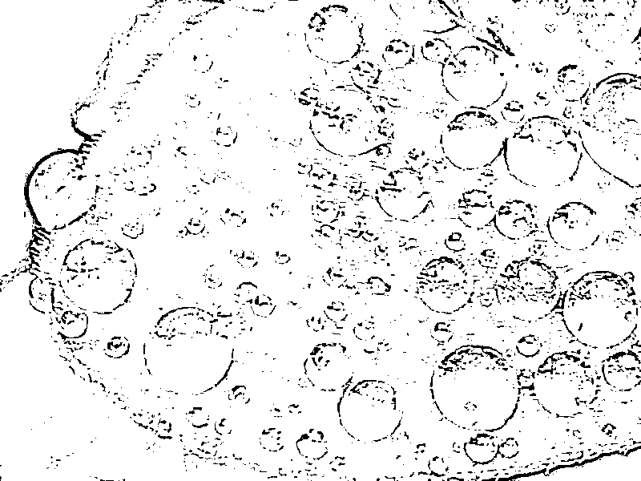

**➤****春分一到，雨水明显增多。春分时，人们在保健养生时应注意保持人体的阴阳平衡状态。此时的时令菜包括有养阳之用的韭菜；助长生机的豆芽、莴苣、葱、豆苗、蒜苗；滋养肝肺的晚春水果，如草莓、青梅、杏、李、桑葚、樱桃等。**

最后送给大家一段大卫老师写的白羊座祈祷：

**Make me impatient **

**to do the right **

**and eager to **

**live the day. **

**让我迫不急待去做那些正确的事，**

**让我热切地活在今天。**


**喜欢蒋颖老师的文字吗？**

**在后台回复 蒋颖 即可查看她的全部文集哦。**

**◆ ◆ ◆  ◆ ◆**

**特别提醒****：若道享有本文授权，转载请注明“转自若道”。** 

喜欢蒋颖老师的文章吗？**2016 年 5 月 19 日**，蒋颖老师主讲的若道占星核心课程**Level 1-2**要开课了！她将带领你学习星座、太阳、月亮、行星、月亮交点等知识，让你进入占星学的世界！

报名及咨询，请点击文末”阅读原文“


# 电影｜隐秘的十二宫：我和妈妈被囚禁了 7 年

> 原文：[`mp.weixin.qq.com/s?__biz=MzA5NjA0NTAxNg==&mid=403355251&idx=2&sn=3677986c2d96d175e8a5c0a2e515654c&chksm=0d4804c43a3f8dd20de4d592cec3f6f8d848c1cf57db13c8412d3961ba0374780e40a077013e&scene=126&sessionid=1692738862#rd`](http://mp.weixin.qq.com/s?__biz=MzA5NjA0NTAxNg==&mid=403355251&idx=2&sn=3677986c2d96d175e8a5c0a2e515654c&chksm=0d4804c43a3f8dd20de4d592cec3f6f8d848c1cf57db13c8412d3961ba0374780e40a077013e&scene=126&sessionid=1692738862#rd)

十二宫在传统占星学中有灾难宫一称，以前的人们相信，进入到十二宫的行星往往会给我们带来灾难、监禁，还象征着阴暗的鬼神。行星落入十二宫，有可能带来相当复杂的议题，那么我们如何通过十二宫的课题？来看看《房间》这部电影吧。有轻微剧透~

## 十二宫

又称为秘密宫。

占星学关键词：隐居、逃避、修行、隐密。

**奥斯卡热门影片及同名小说《房间 ROOM》** 

**感受**

**母爱，和她所能爆发的巨大力量**

**体会**

**房间，那个你我或许都有的房间** 

**体验**

**救赎，及被救赎之后的心灵疗愈**

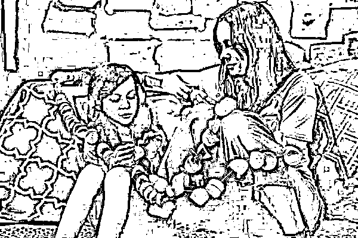

由爱尔兰导演兰纳德·阿伯拉罕森执导，改编自爱尔兰女作家艾玛·唐纳修的同名小说电影《房间》，于 2016 年 1 月 15 日在爱尔兰上映。同名小说于 2010 年出版。

这部书很好地诠释了关于爱和救赎的主题，是一个发生在双鱼座十二宫的隐秘事件经过了涅槃般的转化，最终获得新生的故事。这本书体现了 “比电影《美丽人生》更艰难、更伟大的爱。”入围纽约时报 2010 年十佳图书、2010 年曼布克奖短名单，荣获爱尔兰年度小说大奖。

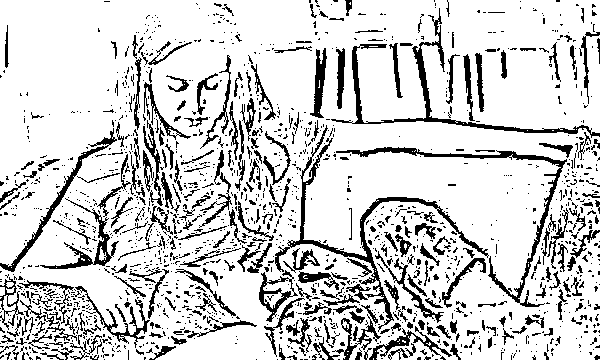 

**房间之中，这就是世界**

**“我哭到再也流不出一滴眼泪。”她告诉我，“我就在这里读秒。”**  

《房间》以一个 5 岁孩子的口吻来叙述，讲述了“妈”和她的儿子“杰克”被“老尼克”囚禁在一间 11 英尺乘 11 英尺的房间内。在被囚禁的 7 年里，“杰克”跟着“妈”学习、阅读、吃饭、睡觉、做游戏。

在这样一个特殊、残酷的生存环境下，被骗子囚禁的母亲用全部的力量为孩子构建一个童话世界。 

**“有时候，我们摘下星星放进百宝囊背包里，我选择了可以吵醒所有东西的‘吵醒星’和能够变成任何形状的‘闪烁星’。”**

这是一个残酷的犯罪题材，却被作者以一个孩童的视角写的温暖人心。从这个 5 岁孩子的口中，你看到的不是悲惨的现实，不是恐怖的囚禁，而是充满了童话色彩的，视角独一无二的世界。

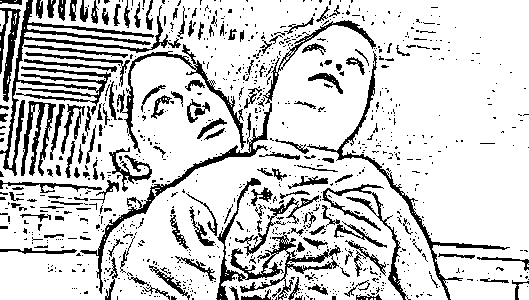 

**走出房间，世界才是世界**

**“我认为‘人类’这个词用来说我们是名副其实的，而电视上的那些‘人’都是色彩编制出来的。”** 

但是终于有一天，妈妈告诉了渐渐长大的杰克房间外的世界，告诉杰克事情的真相。对来杰克来说，房间是他全部的世界，去理解外面才是真实世界，是有着很多不可思议的。但是最终杰克记住了复杂的求救流程，与妈妈一起来到了外面的世界。

然而故事并没有就此画上一个圆满的句号，对于这对被解救的母子，这个突然变大的世界，存在着各种的困境。这个妈妈曾经所熟悉的世界，在七年后完全变了样子，不得不面对的是已经被摧毁的人生。

而对于杰克来说，外面的世界，是一个新奇的存在。他用一个孩子的视角，一点一点的接受着这个全新的世界。那个被囚禁时，因为孩子无比坚强的母亲，在脱离囚禁，重回自己本来的角色之后，甚至一度选择了自杀。

**“我一直在搞砸。我知道你需要我做你妈妈，可是同时我也要试着想起来怎么做我自己，而这……”**

**“但我以为‘她’和‘妈’是一样的。”** 

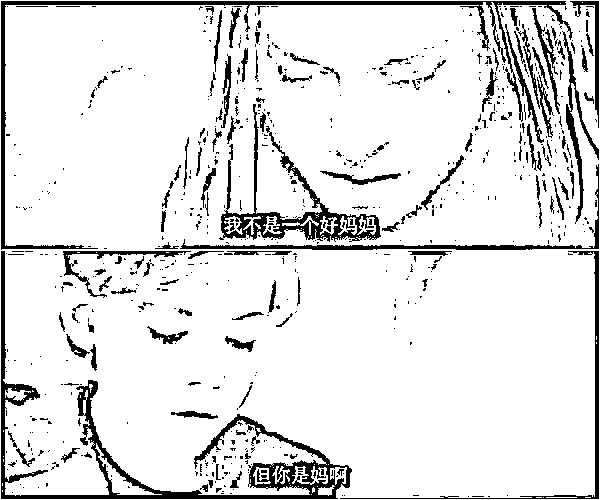 

**关于获救之后的自我救赎**

因此这个囚禁的故事并没有止于被救赎，还同时用大量的笔触继续了被救赎后的自我救赎。当主人公走出房间的时候，更大的挑战和转化需要他们完成——真正实现灵魂的独立。小主人公杰克需要从精神上切断脐带才能长大，才能真正摆脱牢狱生活的阴影。

终于在最后，杰克和妈妈都战胜了自我，重新找到了面对现实的力量，接受这彻底被改变的人生。

**“也许门打开了，它就不是房间了。”**  

**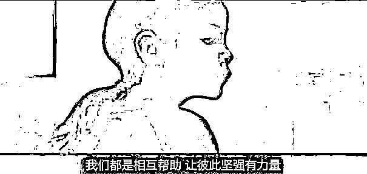** 

**最后，关于爱与转化**

**“没有人可以独自坚强，我们都是互相帮助，让彼此坚强有力量。”**

妈妈和杰克经过漫长的时间，尽管不完美、却在足够多的帮助下走出痛苦，接纳外面的阳光。

影片的最后是导演安排的极具象征意义的画面。妈妈和杰克回到了曾经生活长达七年的房间，杰克看着空无一物的房间向曾经的“伙伴”一一告别，最后杰克拉着妈妈说：“妈妈，跟房间说再见吧。”

**走过痛苦是不容易且漫长的，但绝对值得期待**。

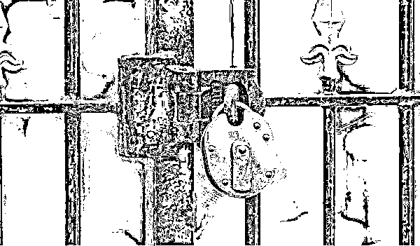

**困住我们的那扇门是什么？**

一个失去乐趣但是却不得不坚持的工作？
一个早已千疮百孔却不得不维系的婚姻？
抑或仅仅是日常中的日复一日？
而你的房间外又有什么？

……

**十二宫，走到尽头，便是新生！找到那把打开的钥匙和寻找再次重生的力量！**

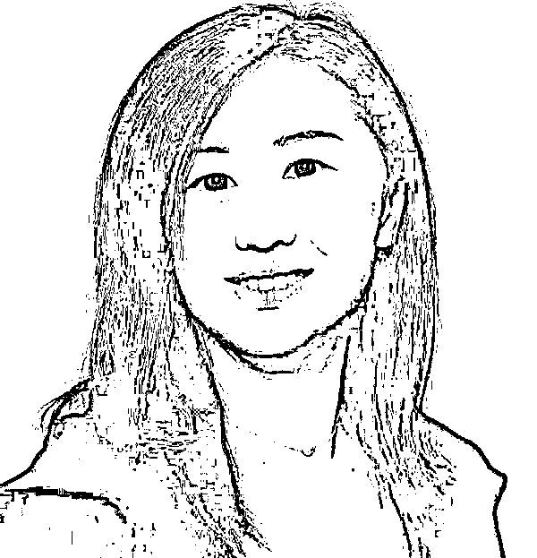

**作者简介**

**柳柳**：若道 L5 学员，2013 年开始追随若道进行严肃占星学的学习，开启了从星座小白到占星小达人的进化之路。上升射手座合相海王星，非常相信自己的直觉和强大的想像力，希望能够用自己所学帮助他人。

**个人微信公众号：**这一刻星空


**如果你也有关于十二宫的故事**

**欢迎留言分享**

**也许你的评论可以帮助更多小伙伴呢**

**◆ ◆ ◆  ◆ ◆**

******特别提醒************：本文由作者授权发布于若道******，**转载请注明出处。******

重生一次，掌握自己的人生！**2016 年 5 月 19 日**，蒋颖老师主讲的若道占星核心课程**Level 1-2**要开课了！她将带领你学习星座、太阳、月亮、行星、月亮交点等知识，让你进入占星学的世界！

报名及咨询，请点击文末”阅读原文“


# 打假热线第一弹 | 婚运正缘那点事儿

> 原文：[`mp.weixin.qq.com/s?__biz=MzA5NjA0NTAxNg==&mid=403340983&idx=1&sn=48ae8e17808724a749658532571e5da6&chksm=0d48cc003a3f45164785da209b03f94a82915c3d96496ab67490d2a8810b3dda99c16b887c89&scene=126&sessionid=1692738862#rd`](http://mp.weixin.qq.com/s?__biz=MzA5NjA0NTAxNg==&mid=403340983&idx=1&sn=48ae8e17808724a749658532571e5da6&chksm=0d48cc003a3f45164785da209b03f94a82915c3d96496ab67490d2a8810b3dda99c16b887c89&scene=126&sessionid=1692738862#rd)

[【打假热线】](http://mp.weixin.qq.com/s?__biz=MzA5NjA0NTAxNg==&mid=403144724&idx=2&sn=65a2047203e5b629b989b68dceb9a9b3&scene=21#wechat_redirect)（点击可阅读）接到了很多求助，

其中 “婚运““正缘”的问题荣登榜首。

究竟婚运是如何推算出来的呢？

正缘特质有什么玄妙之处？

是不是坐在家里等婚运就可以安枕无忧了呢?

若道专职助教 **天空的空** 为大家解开这些疑问。


**天空的空**

国际占星研究协会（ISAR）认证占星师。若道专职助教。助教答疑课程累计超过 100 小时。

*1*

占星师究竟是如何推算出婚运/正缘特质的呢？

作为一名人本主义占星师，在尝试使用星图来帮助来访者之前，我会先就 TA 目前正遭遇的问题与之做一些探讨。

比如这里提到的“婚运/正缘”，我会先问问对方：

*   **你如何看待婚姻呢？**

*   **你认为的正缘应该是怎样的？**

在没有明确来访者当下的状态之前，盲目进入星图是徒劳的，有时候甚至会犯下大错。很多时候，我们的来访者不是找不到伴侣，而是出于以下一些原因，仓促地尝试进入婚姻：

*   **不清楚自己的真实需求，不知道怎样的另一半才适合自己。**比如，“老娘我就要找宋仲基这样的！” 

*   **没有准备好进入一段亲密关系。**比如，一边想自由自在多“疯”几年，另一边又想要有个稳定的伴儿。 

*   当下并没想过要恋爱/结婚，只是**受到一些外界的影响而试着进入关系。**比如父母的催促、同龄友人都已婚的压力等。

到了这里，我想大家已经明白为什么在正式开始占星解读之前，专业的占星师需要问那些看似“没什么营养”的问题了吧？

从占星学来解读关系，不同阶段的伙伴会有不同的感受：星座爱好者们，或许会尝试使用太阳星座配对的方式来看待两个人之间的亲密关系；刚入门的占星学生，或许会试着用内行星的星座来看两个人的关系（比如：太阳、火星对应男性，月亮、金星对应女性）；中阶水平的进修者们，或许还会加入宫位与相位。

以上的方式都是正确的，却也都是不够专业的。

因为，人不是简单的及其，不能通过一系列零部件的拼接就使其变得生动活泼。简而言之，人有“灵”。一人如此，更何况两人的亲密互动？

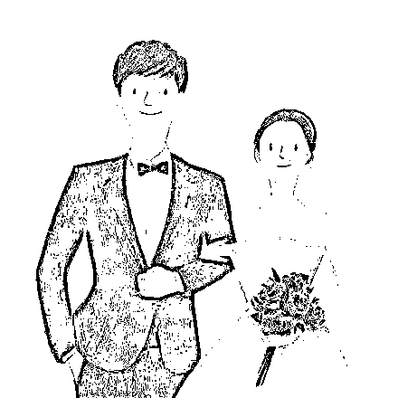

**在若道，大卫·瑞雷老师一直在尝试教授学员们以“整体论”的方式解读星图。所谓“整体论”，就是以更全面、更宏观的角度去面对眼前的那个人和那张星图：**

*   **阴：星图中的每一个重要配置，都需要整合起来思索。**

*   “**金星在天蝎座合下降，下中天在处女座，月亮在白羊座 12 宫对分土星，南交点在射手座 8 宫合相天王星**……这些暗示亲密关系的重要配置整合起来，会告诉我这位来访者在面对关系的时候，究竟是怎么样的一个人呢？”诸如此类的探索，经常在占星师的脑海里闪现。 

*   从上面列出的几个配置，熟练的占星师或许很快就能在心里得出一个小结：“**看起来这位先生渴望一段稳定的关系，同时也希望保留一定的个人空间。可是，他似乎总是会吸引来一些喜欢紧贴着他、过度挖掘他的隐私甚至给他很多期待与压力的女性……时间一长，他受不了了，可能会提出分手甚至逃走……这或许与他的母亲曾经遭遇过的一些事情有关……**”

*   **阳：询问并了解来访者的真实状况。**

*   当来访者敲门进入你的咨询室，你会像一台电子分析仪器一样，直截了当不带喘气地对他说出上面那些话吗？或者，你想先做点别的？ 

*   可以先问他一些问题嘛！
    **“你在咨询问卷表上说，正遇到一些恋爱/婚姻的问题，可以谈谈吗？”**
    **“你理想中的另一半是怎样的呢？”
    “是什么原因造成你之前的关系结束呢？”
    “能谈谈你和你母亲的关系吗？”**

    **……**
    是不是觉得很熟悉？对，就是本文一开始提到的那些重要的问题。类似的问题还有很多，有时我们只需要抓住一到两个，就可以直戳客户的内心，让他与你分享更多他真实的经历。 

*   **阴与阳：整合后的星图信息，必须与来访者的实际情况结合。**

*   到了这一步之前，你甚至还没有真正用上占星学。对于一些白羊座、火星特质强的占星师们，估计已经憋坏了……不过现在，当阴阳终于汇聚的时候，你已然可以安心地释放出这股洪荒之力。 

*   个别时候，通过第二步的互动，来访者甚至能自己把“交错的毛线球”理顺，而你只需要倾听，时不时补充一些来自占星学视角的建议。

为什么要那么麻烦走这三步呢？

原因很简单：**当你围绕着那些来访者已经给出“答案”的问题而使用占星学做出帮助、提出建议的时候，你把主导权始终放在来访者手中，在这一段咨询的进程中，你是无害的——不对他人造成伤害。你始终带着对生命的尊敬在使用占星学。而且你会发现，这样的帮助也是你能提供给来访者的帮助中，最大的。**

也正是如此，作为一名占星学从业者，我很难在 5-10 分钟内快速、准确地回答你：你的婚运如何、你的正缘怎样、你的另一半会不会是胡歌、霍建华、宋仲基……不是我做不到，而是**你值得拥有更清晰、更准确——源自你的内心，呼应你的星图，也真正适合独一无二的你——的答案。**

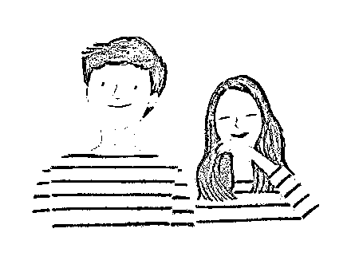

*2*

遇到正缘或婚运时间，真的会遇见正缘或结婚吗？

基于上面的描（lao）述（dao），这个问题的回答是：**不一定。**

就像在本文最初提到的几个“找不到伴侣”的原因，有时候你在一位来访者的星图中看到了强烈的“艳遇”指针，TA 却没有喜结良缘。有时候，遇见了错的人；有时候，错过了对的人；更有时候，啥都没发生。一起来看看吧：

*   **遇见了错的人。**很大程度上，这是因为没弄清楚自己的真实需求。比如： 

*   **以为面前的翩翩贵公子/风情美娇娘就是此生的另一半，冲动地投入关系，相处久了发现对方是抠脚帮帮主，并兼任打呼噜协会名誉主席；** 

*   **各方面条件都合适，但却因为原生家庭的一些议题，最终无法走到一起。**这在中国大陆，十分常见。有时候人们只注重“门当户对”的物质意义，却完全没有意识到这个词的精神意义。

*   错过了对的人。往往是因为某种原因，**没有准备好进入一段亲密关系。**这很可惜，但将来仍旧有机会。

*   **分别之后，时过境迁，追忆往昔，甜蜜依旧，蓦然回首，那人已作他人夫（妇）；** 

*   **把一个人的温暖转移到另一个的胸膛，把另一个人的温暖再转移到另另一个人的胸膛……**  

*   **啥都没发生。**这很奇怪吧？但还真有，其实挺常见。随意举两个例子： 

*   一位适婚年龄的姑娘，在行进木星即将合相她出生星图金星之前，算命师断定她 6 个月之后（精准合相）会有大桃花运。半年以后，她半个男友都没交到，原因是——她每天宅在家里看男明星的电视剧，在卧室墙壁上贴满了钟爱的男明星的照片与海报——男明星成了她的“桃花”。 

*   刚开始占星咨询的时候，有一位来访者询问起我的正缘什么时候到？我打开她的太阳弧，一眼看到一年之后有“太阳弧中天对分出生星图的金星”。这何止是正缘啊，简直就是要结婚嘛！于是不假思索地告诉了对方这个“好消息”……结果姑娘啥桃花也没遇到，更别提结婚了！后来才知道，**她无法忘记异地的前男友，每天沉醉在回忆与分手的悲伤里，根本不愿意与其他男性社交，自然不会有正缘出现。** 

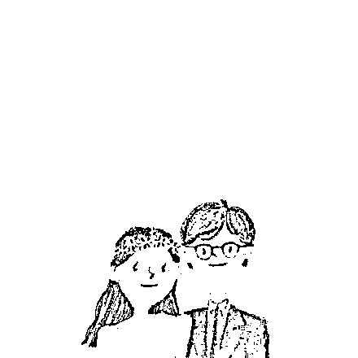

*3*

常见的正缘或婚运的占星学指针

 关注了来访者的生命状态，又结合其出生星图进行了分析，通过两者相呼应，帮助当事人对自身婚恋状态有所觉知之后，我们再来简单看一看常见的正缘或婚运的占星学指针：

*   **出生星图的下降点、7 宫的宫主星、金星、月亮、太阳（女）、火星（女），与行进的木星、金星（行进金星为短期行进，需要结合其他指针来确认）形成托勒密相位（合相、对分相、四分相、三分相和六分相）的时候；**另外，在一些案例中，**行进土星或者天王星合相出生图金星、下降点，也观察到结婚。** 

*   **上述出生星图的指针，与太阳弧正向推进的中天、上升、金星、木星、太阳、月亮形成托勒密相位或者一些次要相位（150 度、30 度）的时候**；另外，在一些案例中，**太阳弧土星或者天王星与出生图金星、下降点形成硬相位，也观察到结婚。** 

*   **以上两条结合起来看响应度更高。容许度越紧密，发生事件的可能性越高。**  

*   **在太阳弧中，相同性质的行星或者虚点的相位，不做参考。**例如，太阳弧金星与出生图金星，太阳弧中天与出生图下降点等等。 

*   以上仅为本文写作之方便而简单举例，具体情况，**请务必垂询你的占星师。**

对于两个人之间亲密关系，我一直以来的看法都是：**只要你带着一颗真诚的心灵，一份清晰的觉知，一股坚韧的勇气，总能遇见合适的伴侣。而占星学，毫无疑问是你正视自己、寻觅伴侣的绝佳助手，金牌僚机。**有一天，当你与 TA 迈入甜蜜的关系殿堂时，回首看，那所谓的“正缘”，并不是你求来的，TA 好像就在某个时间、某个地方，等着你去轻轻地那么一碰——花开蝴蝶来，水到自然成。

**◆ ◆ ◆  ◆ ◆**

**特别提醒：****本文由作者授权首发于若道平台，**转载请注明“转自若道”。****

求人不如求己，想学习推导运势么？**2016 年 3 月 15 日**，大卫老师主讲的若道占星核心课程**Level 5**要开课了！在这个阶段，你将学习各种预测技术及行星周期。通过这些预测工具，你能够预测和规划人生。提前报名付款有**早鸟价**哦！详细内容请点击“**阅读原文**”了解。

报名及咨询，请点击文末”阅读原文“


# 我挺过了行星大混战，你也可以

> 原文：[`mp.weixin.qq.com/s?__biz=MzA5NjA0NTAxNg==&mid=403340983&idx=2&sn=fc7cf33b5a0306dcf36b217c6d1b4b7b&chksm=0d48cc003a3f45165590ed000411f6048567bb49aaff633d775d0715933a680e296233ab64bc&scene=126&sessionid=1692738862#rd`](http://mp.weixin.qq.com/s?__biz=MzA5NjA0NTAxNg==&mid=403340983&idx=2&sn=fc7cf33b5a0306dcf36b217c6d1b4b7b&chksm=0d48cc003a3f45165590ed000411f6048567bb49aaff633d775d0715933a680e296233ab64bc&scene=126&sessionid=1692738862#rd)

当你问占星师：“我的星图硬相位那么多，是不是人生会很艰难？”“我的土星在二宫，是不是将来会很穷？”时，其实你忘了，有个词，叫“自由意志”。

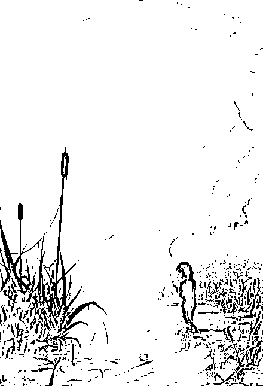

**在宿命的迷雾中找到成长途径**

小时候因好奇心驱使，我从寺庙带回一本小册子，其中有个故事大意是讲：一个书生让一位算命先生算一算自己能否金榜题名大富大贵。算命先生掐指摇头道“你屡试不中，潦倒一生，沦为乞丐”。书生怒斥算命先生一派胡言后愤然离去，越想越憋闷，发誓一定不能做乞丐。书生苦读两年果然金榜题名，十数年后已官居三品。

这则故事犹如一束光劈开混沌照进我蒙昧的幼小心灵。哦哦，**原来并不存在所谓不可改变的宿命，原来我们有能力选择自己的生命之路。**

就这样那颗叫做**自由意志**的启蒙种子在我的心中生根发芽，并伴随着我的成长而郁郁葱葱，枝叶与根须伸进我每一个细胞中。

很多年后当我接触到**强调个人成长与转化，并从每个人独特的星图中发现自我成长的内在潜能，从而向着建设性方向发展**的人本主义占星学时，对它一见倾心。

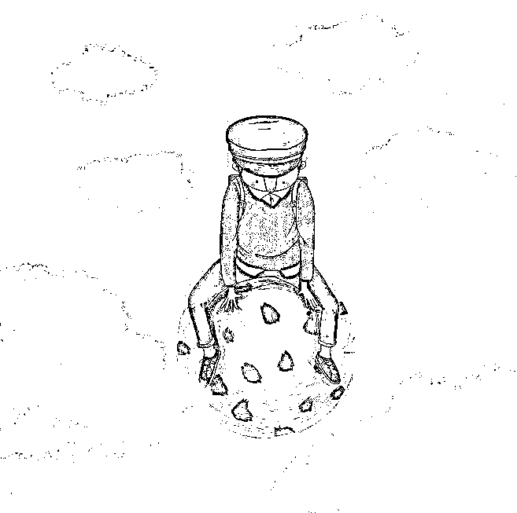

**一沙一世界，起心动念都是变化**

然而在修习占星的过程中总会遇到一些朋友问： “算算我什么时候能找到男/女朋友”、“算算我什么时候会结婚”、“算算我什么时候能发大财”……

我会向他们解释人本主意占星学的观点：每个人的出生便是一个宇宙的诞生，在时空的某一剎那开始，成长、转化，意识由模糊到清晰。一切可能发生的事，都存在这个小宇宙的枝枝桠桠上，**每一起心动念都会使小宇宙发生微不可察的变化**。

同样，**每个人的出生星图都是一张充满可能性的地图**，而人本主意占星学的目的亦不是断命，发掘星图中呈现的建设性能量与我们的自由意志产生持久的化学反应，觉知、成长、进化才是关键。

**事情会因自我觉知而改变，内在的潜能永远伴随着想法的转变而转变。也许当你决定从星图中寻找答案的那刻起，命运的轨道已经开始发生变化。**

不可否认我们个人的命运受制于社会、历史乃至宇宙的宏大命运，但依然有着某种程度的自由意志。我们带着与生俱来的全能性出生，如同“佛祖下生之时就步行七步，一手指天一手指地，称天上天下唯我独尊”的全能性。

然而自降生之后外在的重重枷锁就处处围追堵截，束缚着、裹挟着我们在时间的洪流中踉跄前行，我们必须努力地调动每一个细胞学习言语、行走、思考，就像希腊神话中的英雄赫拉克勒斯，要依靠自己内在的力量和意志争取所有的荣光。

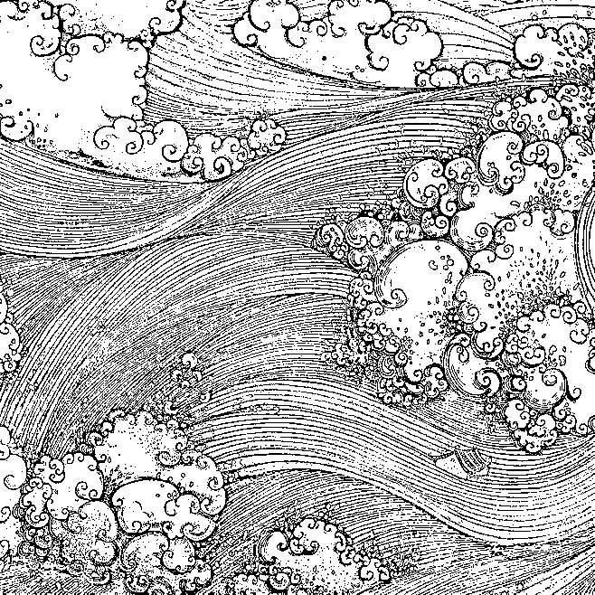

**感受拉锯，接受生命的考验**

星图所呈现的便是各种力量的博弈和流动，它们在星图中犬牙交错，互相渗透。

以我的星图为例，土星、木星和天王星都与太阳有相位，于是感受它们之间的撕扯与拉锯便成了家常便饭。

○ 土星率先发难，有占星基础的人都知道，**土星触及到的领域总会让人产生缺憾感和恐惧感。**被权威压抑，微不足道，不被认同，渴望关注和赞美的感觉如影随形，几乎让我的内核塌缩为黑洞。我努力砌起一座高高的堡垒，把这种感觉隐藏起来，假装自己不需要。

○ 这时木星从沉睡中醒来， “啊哈！”木星嘲弄土星，“胆小鬼、可怜虫，循规蹈矩？谨小慎微？对权威唯唯诺诺？多可笑的论调！要知道我可是**受神庇佑**的，来吧，我要让你看看什么是**无所不能**，什么是**梦想**，什么是**生命的意义**。”

但是这座历经岁月磨砺而始终屹立不倒的堡垒又岂是那么容易被摧毁的？木星几个暴击仅仅使堡垒晃动了几分，掉下些砖块瓦砾。

“Oh，no！不是这样的，我可是无所不能的木星！”木星沮丧得泄了气，耷拉着脑袋蹲墙根儿开始怀疑人生，但是天性乐观的木星没多久便恢复了活力和自信，发誓要彻底摧毁这个堡垒，把那些隐匿的恐惧和缺憾解救出来，让每一寸心灵都变得快乐舒适。

○ 与此同时，天王星带着**强大的反叛性和革命性**异军突起、奇兵深入，投下惊心动魄的霹雳，点燃了燎原大火，连同我那高墙堡垒中坍塌的内核也被映照得炙热沸腾。所过之处，断瓦残垣，它所带来的震撼力和冲击力是如此巨大，连木星都惊讶不已。

但它也决不仅仅是一个破坏者，还是一个前所未有的建设者。于是土星避其锋芒，坚壁清野，等待转机。各方势力陷入僵局，谁也奈何不了谁。

战场上一片狼藉，土星的堡垒摇摇欲坠，膨胀的木星如同一只过胀的气球一戳即破，天王星还没有品尝到胜利的快感，就已发现后院起火，出现了动摇军心奸细，一股害怕改变的保守情绪在迅速蔓延。

○ 星星们尖锐地对立可不是什么好事，饱受战火之苦的太阳以和事老的姿态站出来，提议它们停战休火，将走岔路的能量转进另一个方向，各展所长——

## 星图能量如何重构

○木星负责乐观自信，依靠智慧追求人生的信仰和意义；

○土星负责接受真实生活中的局限和制约，依靠耐力、毅力建构自我认同感；

○天王星负责打破权威的压制，依靠改革和创新保持自我的自由和独立性。

硝烟散尽，霁月风光，如此，星图中呈现的建设性能量已与自由意志共同作用产生了美妙的反应。

猜猜我的水星在哪里？


**作者简介**

**包子**：出版社编辑，国家二级心理咨询师，2015 年 1 月入若道跟随大卫老师学习占星。天生梦想家，相信向内行走的力量能打破身体的藩篱。愿借助日月星辰之力触摸到灵魂的温度。

**微信号**：huihuiwing

长按二维码，让金钱涌向传播知识与智慧的人~

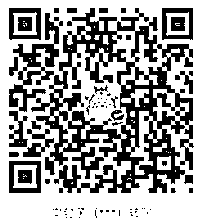

**◆ ◆ ◆  ◆ ◆**

******特别提醒************：本文由作者授权首发于若道******，**转载请注明“转自若道******”******。******

猜到作者的水星在哪里了吗？**2016 年 5 月 19 日**，蒋颖老师主讲的若道占星核心课程**Level 1-2**要开课了！她将带领你学习星座、太阳、月亮、行星、月亮交点等知识，让你进入占星学的世界！

报名及咨询，请点击文末”阅读原文“


# 如何说孩子才肯听之土象篇【金牛座、处女座、摩羯座】

> 原文：[`mp.weixin.qq.com/s?__biz=MzA5NjA0NTAxNg==&mid=403326082&idx=3&sn=0e17be7dcd4dfba4ec0fe68b4ad1258a&chksm=0d48f6353a3f7f2334a4648c66ef5982c83649f2bc9b45e85f59f17cf2f65f2293648cb8d6f8&scene=126&sessionid=1692738862#rd`](http://mp.weixin.qq.com/s?__biz=MzA5NjA0NTAxNg==&mid=403326082&idx=3&sn=0e17be7dcd4dfba4ec0fe68b4ad1258a&chksm=0d48f6353a3f7f2334a4648c66ef5982c83649f2bc9b45e85f59f17cf2f65f2293648cb8d6f8&scene=126&sessionid=1692738862#rd)

****本文首发于《为了孩子》杂志**** 

该如何让孩子活出自己？了解他很重要！若道君找来亲子专家帮你支招，参考孩子的太阳星座来看看他的“罩门”在哪儿吧。不过也要记得孩子的星图还有很多其他元素和配置，切忌生搬硬套，无论什么星座的孩子，你温柔而坚定的爱永远是他最坚强的后盾。

土 象 篇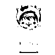金牛座**4.21-5.20**

**优点**：安静、守规矩、富于对物质世界的感受能力

**需要注意的地方**：占有欲强，变通性较弱

**教育技巧**：尊重孩子的所有权；让孩子依照自己的节奏成长

在通常的观念中，金牛座的孩子是比较“好带”的孩子。他们一般会显得比较安静，特别是小的时候，只要吃饱了、喝足了，尿布是干爽的，被子是柔软而暖和的，手边又有喜欢的玩具，他们就不会乱哭乱闹。

**作为黄道上的第一个土象星座，金牛座最擅长的就是打开自己所有的感官，感觉、触摸、享受这个丰盛的物质世界。**小金牛也是天生的美食家，食物对他们来说绝不仅仅是用来果腹而已，而是快乐感、满足感的一大来源，没有什么比一块芳香四溢的草莓蛋糕或一块细腻柔滑的芒果布丁更能让小金牛开心。他们喜欢柔软的衣物，比起漂亮与否，他们更在意衣服穿在身上是否舒服。

他们也非常需要与大自然亲密相处，即使是身处都市，**父母也应该给小金牛合适的机会走进大自然**，闻一闻春天的气息，看一看花朵绽放的样子，把自己的小脚在泥土里踩一踩……对于金牛来说，这样的时刻就像给电池充电一样重要。这是因为在大自然里，蕴藏着典型的金牛式的智慧，那就是质朴和宁静。

不过，当你带小金牛去郊游时，可能会发现他想带的玩具太多了，他恨不得把每一样东西都放进背包里，一样也不想放弃！**占有欲是金牛座最大的问题之一。**他们对物权有着特殊的敏感。如果你侵犯了他的所有权，别忘了金牛的“牛脾气”也是臭名昭著的，一个安安静静的小天使会在瞬间变身小恶魔！

如果深究其原因，那是因为，**金牛座是一个土象星座，金牛座最基本的安全感，就在于物质层面的“拥有”。**物质层面的“拥有”，是金牛座，也是我们每一个人在生命的最初阶段，与世界取得联结的基本方式。

**如果你有一个金牛座的小孩，你需要花费一些时间去处理这些有关物质和占有欲的问题。**需要让他明确如下几点：

*   你想要的东西应该自己去拿；

*   并不是你的所有要求爸爸妈妈都会无条件满足。

*   也请尊重他对于玩具的占有权。只有当他的所有权得到尊重时，他才会尊重别人的所有权。

**金牛座还有一个广为人知的特征，那就是“犟”。**你可能会惊讶于面前这个小小的人儿竟然有这么强的意志力，只要他认准的事情就一定要做。在这个时候，聪明的办法不是跟孩子争高下，而是尊重他自己的节奏和规律，让他自己发现什么是对，什么是错。事实上，在金牛座的顽固背后，藏着更大的问题，那就是他们**习惯于选择一条舒服、安全的路，而不愿冒险让生活发生变化。**你需要让小金牛明白，有时候，唯有改变才能带来更好的成长。

但是，就像那个关于蜗牛的故事所讲的那样，养育孩子本来就像牵着蜗牛在散步，而金牛座的孩子也许就是那只走得最慢的蜗牛。他们习惯“慢慢来”，因为他们懂得缓慢里所蕴含的智慧。所以，作为成人，也请尊重他的节奏，允许他慢慢地、稳稳地，走好自己的生命之路。

处女座**8.23-9.22**

**优点**：认真、仔细、自律，擅长分析，善于学习，脚踏实地

**需要注意的地方**：自我评价低，习惯批评别人

**教育技巧**：充分鼓励孩子，让他们成为一个心中充满暖意的人

处女座，无疑是最常被“黑”被吐槽的星座。不过，如果你的孩子是处女座，你应该已经领略了这个星座的诸多好处。**处女座的孩子一般比较乖巧听话，愿意遵守规则，不会肆无忌惮地淘气。处女座的孩子追求完美，即使没有父母在旁边唠叨，他们也会对自己有所要求。**他们很少自恃聪明而不努力。那种疯玩一个暑假、把功课堆在最后两天完成的孩子，往往也不是处女座。

**处女座是一个具有服务精神的星座，处女座的孩子会以生活能自理、能帮大人做事情为骄傲。通过切切实实地做事情，他们证明了自己的价值。**所以，处女座的孩子可能比其他孩子更早地学会分担家务。并不是每个处女座都有洁癖，但处女座的确喜欢整齐与规律，有的处女座孩子甚至会主动把自己的衣服、袜子按照季节、颜色等标准分好类，在抽屉里摆得整整齐齐。这样的孩子怎么不让父母省心？

我想，人们不喜欢处女座，不是不喜欢处女座的孩子，而是不喜欢某些处女座的大人。他们擅长批评而吝于表扬，在他们那里，你很难获得毫无保留的赞美、认同和包容。更糟糕的是，有些处女座害怕承认错误，会想方设法把错误推到别人头上。这样的处女座，的确不怎么讨人喜欢。

每一个星座都有正面和负面的特质，如果有足够的自我觉知，你的孩子完全可以扬长避短，成为一个受欢迎的、优秀的处女座。不过，在那之前，他需要一个良好的成长环境，一个对他的内心足够敏感的妈妈。

处女座的人心里时刻架着一根完美的标杆，他们会时不时地用这根标杆去衡量，并一眼看出问题的不足。然而，并不是每个人都知道，**处女座的苛求不仅仅针对别人，更会针对自己。这是一个容易精神紧张的星座，他们对自己有非常诚实的评判，他们很清楚地知道，自己还不够完美。**

从正面来说，这种自我反省会赋予处女座低调、谦虚的品质。而从负面来说，过度的自我担忧不但会伤及孩子的活力，还会让他们渐渐习惯于被动的状态，难以主动开拓人生。所以，作为父母，你首先要做的是**给处女座的孩子无条件的支持和包容，让他们感受到“即使我不小心犯了错，也会得到原谅，因为爸爸妈妈是爱我的”。**这能让他们学会自我接纳：即使镜子里的那个自己并不完美，也要充满自信地活着，不要害怕把真实的自己展现出来。

另一个与处女座孩子相处的艺术，是**恰到好处的赞美**：处女座不是一个喜欢被吹捧的星座，空洞的表扬（比如“你真是太棒了”）会让处女座的孩子很不好意思，甚至怀疑大人在说假话，因为他们会想“我并没有你说的那么好”。**他们需要的赞美是能落到实处的，比如“你这段曲子弹得很有进步”、“你会帮妈妈剥毛豆了，真不错”。**这能让处女座的孩子更自信，更能让他们学会赞美别人——很多处女座都不懂得如何赞美别人，甚至在这方面有某种困难症。而当他们习惯了真挚的赞美，便能把这种温暖传递给别人。

**一个充满暖意和包容的成长环境，能让处女座的孩子自在地表达自我，而不是自我拘束。**否则，你可能会看到一个小时候很乖、长大了却变得叛逆的处女座，他会毫不客气地告诉你：“我不想再做你们眼里的乖孩子了，现在我要听自己的话。”

摩羯座**12.22-1.19**

**优点**：懂事、自律、努力、坚定、讲道理

**需要注意的地方**： 自信心不足、不擅长处理情绪

**教育技巧**： 为孩子建立自信，鼓励孩子表达情绪与情感

对大人来说，有一个摩羯座孩子是相当省心的。他们从小就比较懂事，很少为了某个玩具大哭大闹，只要跟他们讲明白道理，他们一般都会接受。他们也很有计划性，就算大人忙昏了头，他们的小脑袋也会把每一天要做的事情都记得清清楚楚。

与同龄的孩子相比，摩羯座的孩子常常显得早熟、守规矩，富于耐心和理性。当然由于年纪小，他们也会有调皮捣蛋的时候。**在这样的时刻，请不要批评他“平时你都那么乖，今天是怎么回事！”你甚至可以小小地放任他发泄一下**，要知道，当你的摩羯座孩子长大之后，他会背负起更多来自社会的条条框框。对他来说，童年的小小任性可能是非常宝贵的。

摩羯座也是一个很懂得自律的星座，摩羯座的小孩也是如此。所以，**请爸爸妈妈在和你们的摩羯座孩子相处时，也一定要遵守自己许下的诺言。**“妈妈晚上六点回家”、“妈妈今晚会给你讲五个故事”、“爸爸下星期带你去公园玩”。如果你对你的摩羯座孩子作出了这样的承诺，却没有做到的话，他会特别难过和迷茫，因为自律、守信是摩羯座所珍视的品质，请你一定要帮助他一起维护他的价值观！

一般而言，**摩羯座的孩子比较偏向于低调的作风，与其在台前展示自己，他们情愿默默地做好自己的事情。**在他们还没有准备好的情况下，请不要强迫你的摩羯座孩子上台表演。然而，他们也需要在自己擅长的领域获得肯定——可以是一次绘画竞赛，也可以是来自长辈的真诚的肯定，对他们来说都是建立自信心的良好途径。

摩羯座的符号是一种羊身鱼尾的动物，它能像山羊一样攀上最高最险的山峰，也能像鱼一样在海洋中畅游无阻。无论在陆地还是在水中，摩羯都充满了力量。这个象征符号也向我们透露了摩羯座的一个重要特质：他们渴望成为强者，渴望攀上最高的山峰。

不过，这并不意味着你的摩羯座孩子必定会与世俗权力或金钱挂钩。**摩羯座本质的目标是获得独立与自由。**他们知道，为了获得独立与自由，他们必须学会与各种社会规范相处，熟练地让它们为我所用，而不是被它们束缚。因此，坚强的信念、独立的性格对于摩羯座来说尤为重要。

关于这种羊身鱼尾的动物，还有一个秘密：它非常害羞，它的鱼尾一般不轻易示人。而鱼尾正是情感的象征。以坚毅、理性、自律、谨慎而著称的摩羯座，通常来说并不是表达情感的高手。其实在他们心里一样会激起情感的涟漪，可是摩羯座的孩子会倾向于默默消化，甚至认为情绪是无用的、无益的，并进一步压抑它。

然而作为成年人，我们都知道温暖的情感对于一个人有多么重要。正常的情绪表达不仅是必要的，也是有益的。没有人一生下来就是强者，也没有人一生下来就懂得如何压抑自己。**帮助你的摩羯座孩子在童年阶段形成通畅的情感表达机制，是我们作为父母，所能够送给他或她的最好的礼物。**

**也许你对下面的文章感兴趣：**

[如何搞定“熊孩子”？双鱼座妈妈有高招](http://mp.weixin.qq.com/s?__biz=MzA5NjA0NTAxNg==&mid=403134604&idx=2&sn=10ddd5ba2fb07a1d3da3654d3e93a2dc&scene=21#wechat_redirect)

[抽离的水瓶座也能成好妈妈](http://mp.weixin.qq.com/s?__biz=MzA5NjA0NTAxNg==&mid=402783748&idx=2&sn=42f6908140bcbc5883db68f8fa580316&scene=21#wechat_redirect) 

[宝宝，我不要最成功的你，要最好的你](http://mp.weixin.qq.com/s?__biz=MzA5NjA0NTAxNg==&mid=402970780&idx=2&sn=ab3533c8c56e1b945a2c67d19a6b746c&scene=21#wechat_redirect)

**作者简介** 

**沙沙**：占星咨询师，占星专栏作者，国家二级心理咨询师。2010 年创办工作室“九月占星馆”，2013 年通过 ISAR 职业占星师资格认证考试，成为首批在中国大陆通过该测试的占星师之一。长期研习出生图、关系盘、流年预测等技巧。希望通过星图，帮助来访者实现有效的自我觉察。 

**新浪微博**：九月占星馆

**微信公号**：九月占星馆（jiuyuezhanxing）

**个人微信**：zhouzhe7752（添加请注明“占星咨询”）

**◆ ◆ ◆  ◆ ◆**  

********特别提醒************：本文经作者授权发布******，**转载请注明出处。********

想了解更多内容？**2016 年 3 月 26 日**，大卫老师将在北京举办两天的占星学与亲子工作坊！让你找到“ 因材施教”的操作说明，学习应对不同时期亲子关系发展的成长挑战！

报名及咨询，请点击文末“阅读原文”

****

# 如何说孩子才肯听之水象篇【巨蟹座、天蝎座、双鱼座】

> 原文：[`mp.weixin.qq.com/s?__biz=MzA5NjA0NTAxNg==&mid=403326082&idx=4&sn=0e5d1d99181ed7887203c96d00638f2f&chksm=0d48f6353a3f7f23665d90560fb001174c5bdfc53146807a6ca549c04beb7928aa199a7b8b99&scene=126&sessionid=1692738862#rd`](http://mp.weixin.qq.com/s?__biz=MzA5NjA0NTAxNg==&mid=403326082&idx=4&sn=0e5d1d99181ed7887203c96d00638f2f&chksm=0d48f6353a3f7f23665d90560fb001174c5bdfc53146807a6ca549c04beb7928aa199a7b8b99&scene=126&sessionid=1692738862#rd)

****本文首发于《为了孩子》杂志**** 

该如何让孩子活出自己？了解他很重要！若道君找来亲子专家帮你支招，参考孩子的太阳星座来看看他的“罩门”在哪儿吧。不过也要记得孩子的星图还有很多其他元素和配置，切忌生搬硬套，无论什么星座的孩子，你温柔而坚定的爱永远是他最坚强的后盾。

水 象 篇巨蟹座**6.22-7.22**

**优点**：温柔、乖巧、体贴、感受力强，擅长照顾别人

**需要注意的地方**：过于害羞、敏感，不愿表现自己

**教育技巧**：关注孩子的情绪，适当地鼓励孩子冒险  

巨蟹座的孩子从小就显得安静乖巧。如果你带着他去朋友家做客，那么几乎不用担心他成为令大人头疼的捣蛋鬼。即使是男孩子，也不会特别着迷于那些打打杀杀的游戏；而巨蟹座的女孩子呢，只要有一套过家家的玩具，不管是模拟做饭、布置房间还是给布娃娃做衣服，都会让她们乐此不疲地玩上一下午。

巨蟹座的孩子往往比较害羞。他们就像螃蟹一样，把柔软的身体藏在坚硬的壳里，生怕受到外界的伤害。在众人面前讲话或表演都可能让他们脸红，在课堂上，面对老师的提问，哪怕他们心里知道正确答案，也会因为“不敢举手”而错过表现自己的机会。

**巨蟹座的孩子内心是非常敏感的，他们的情绪也非常丰富。**他们容易因为一些小小的事情而担忧，比如“今天我跟老师说话，她没有回答我，她是不是不喜欢我了？”其实老师只是匆忙中没有听到他们说话而已。

**巨蟹是一个水象星座，这意味着他们不是通过理智来分析世界，而是通过情绪来感受世界。**他们心里仿佛有一条河，在他们幸福的时候，这条河是宽阔而平静的；如果情绪问题得不到健康的处理，这条河便会波澜起伏，甚至酿成洪灾；而一旦情绪被一味地压抑，那么洪灾不但不会消减，反而会愈演愈烈。作为巨蟹座孩子的妈妈，你需要时刻关注孩子心里的那条河流。

对于巨蟹座来说，要想成为一个内心健康而强大的人，一个温暖、安全、可以信赖的原生家庭是不可或缺的。对于他们来说，童年有着格外关键的意义，因为这就是他们对“家”的最初的体验。**在这个家里，是否有足够的关爱？是否有足够的信任？是否能得到足够的保护？这些问题的答案，关系到巨蟹座的孩子未来将如何建立属于他们自己的家**——这个“家”既包括具象层面的家庭，也包括抽象层面的心灵家园。

在童年，巨蟹座尽情享受着 “当一个孩子”的感觉，被细心地照顾着、滋养着。但另一方面，他们也是天生的照顾者，即使他们还是小孩，就知道如何去照料别人，如何去保护自己所重视的人。在巨蟹座安静甚至柔弱的外表之下，其实有着一颗强者的心。**作为父母，你需要做的就是帮助巨蟹座孩子把内心强大的一面激发出来、建立起来。**

不妨从巨蟹座最擅长的一些事情开始吧，比如，**养一盆植物，或几条小鱼，或小猫小狗，总之，让巨蟹座的孩子学着照顾一些比自己更弱小的生命。**作为天生的“照顾者”，他们一定很乐于扮演这样的角色。不管是植物还是小动物，都能为巨蟹座孩子拓展生命的宽度，让他们不再是仅仅接受别人的关爱，更成为一个懂得付出关爱的人。

然后，我们可以试着做一些更大的冒险，比如，**偶尔换一个新环境生活几天，或在陌生人面前展示自己。**“冒险”对于巨蟹座来说是一个令人恐惧的词，他们习惯于呆在某个固定的壳里，而“冒险”意味着从壳里出来，把柔软的心灵袒露在陌生的环境之中。但你如果了解螃蟹的成长，你就会知道，没有蜕壳的过程，螃蟹就不会长大。巨蟹座也是如此，必须通过令人畏惧的蜕变过程，才能有真正的成长。

天蝎座**10.23-11.22**

**优点**：安静，专注，内心充满热情，意志坚定，行动力强

**需要注意的地方**： 过于敏感

**教育技巧**：“尊重”和“坦诚”是永不失效的法宝

据说有统计数据显示，天蝎座是中国人口占比最多的星座，比例高达 15%。如果这个数据是真实的，那就意味着有 15%的中国父母要做好迎接天蝎座小孩的准备。这可不是一个令人轻松的消息。

我在一个论坛上看到过一群天蝎在回忆他们的童年，有人说自己曾经遭受老师不公正的批评，然后趁其不备，把捉来的毛毛虫和蜘蛛放在老师的衣服上；有人说自己曾经想方设法打开父母上锁的抽屉，找出爸爸的秘密追求者写来的情书；有人回想起小时候父母的教育方式，把父亲的“放养式教育”和母亲的“权威式教育”都归结为“情商太低”的表现——“天蝎座的小孩真可怕啊！”最后，这些长大了的天蝎座小孩由衷地说。

不过，在一般情况下，天蝎座孩子并没有那么激烈的表现。他们可能不那么爱说话，更喜欢安安静静做自己的事情，或者站在一边扮演观察者的角色。有时候，他们表现出来的样子有点冷漠，但是碰到自己真正感兴趣的事情，他们又会以极大的热情一头钻进去。**他们是意志坚定、行动坚毅的孩子，他们不在乎别人说什么，自己认定要做的事情，不做到极致便不罢休。**

关于天蝎座的一个经典的比喻是冰山——天蝎座有一种想要把自己藏起来的倾向，所以你看到的只是露出海面的一小部分，他们的内心非常热烈而丰富。就像蝎子喜欢呆在石头底下那样，有一点隐私感对天蝎来说才是安全的。所以，**千万不要在众人面前谈论你孩子认为是个人隐私的话题，那会让他们感觉尴尬、受伤，严重的会愤怒。**并不是只有十三四岁爱写日记的少男少女才有这样的问题，即使现在你的天蝎座小孩只有三四岁，也要像对待大人一样尊重他，与他平等地沟通。否则，他们会展现出天蝎的负面特质——怀疑别人、难以建立信任。

**其实，“对付”天蝎座，有两件永远不会失效的法宝，那就是尊重和坦诚。**爸爸妈妈能够真诚、敞开地与他们交流内心的感受，把他们的感受真正当回事，那将是极大的温暖和支持。小孩子的痛苦和烦恼在大人看来也许不值一提，也许就是一颗巧克力，也许就是爸爸妈妈一句无心的话，但是对孩子来说，那真的就是天大的痛苦和烦恼。如果你认为“他还小，不会有什么问题的”，那么，你可能错过了抚慰孩子心灵的机会，而天蝎座的记性又是那么好，童年的小伤痕有可能会留存很久很久。

而说到坦诚，作为父母，你很可能有一种想要保护孩子的本能，希望他能够远离痛苦和悲伤。可是，天蝎座宁愿听一句残酷的真话，也不愿听一百句好听的假话，因为后者只会让他心生怀疑，有一种受欺骗的感觉。如果你的孩子是天蝎座，那么一旦遇到问题，**请你给他们面对现实、处理负面情绪的机会。**

美国教育专家海姆·G·吉诺特提倡一种育儿方式，那就是**在孩子晚上睡觉之前给他们一段时间与爸爸或妈妈独处的亲密时光，这种方式我觉得对于天蝎座的孩子特别适用。**这是一段温暖而私密的时光，虽然只有短短的十分钟、二十分钟，可是父母与孩子平等而坦诚地交谈，听他们讲述一些小秘密，并守口如瓶。**这样一种交心的方式，将有助于天蝎座孩子成为一个内心丰富、感受深刻的人，同时也成为一个能够信赖、懂得交流的人。**通过这种方式，天蝎座会回到他们的核心——一个具有超强感受力的水象星座，强烈地体验爱与被爱，享受人与人之间情感的联结。

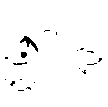双鱼座**2.19-3.20**

**优点**：温柔、细腻、体贴、富于想象力和包容心

**需要注意的地方**： 迷糊、逃避、情感较脆弱

**教育技巧**：珍惜孩子的想象力、创造力和感受力

我曾经不止一次地听到双鱼座宝宝的妈妈和准妈妈们，用担忧的语气说：“我家宝宝是双鱼座，可怎么办啊！”——与其他星座相比，双鱼座孩子带给妈妈焦虑指数明显高出一筹。

双鱼到底有什么不好，让人这么担心？这些妈妈们列出了好几条理由。比如，太多愁善感、心思太细腻、脑袋太迷糊、整天爱做梦……特别是那些生了双鱼座男孩的妈妈，非常担心这个星座会让孩子不够坚强和踏实。

不可否认，以上这些确实都是双鱼座的特质。而且，从 2012 年开始的十三四年里，双鱼座的守护星——海王星会一直呆在双鱼座，在这十几年里出生的双鱼宝宝，太阳可能与海王星位于黄道的相同度数，这意味着他们将成为罕见的“超级双鱼”。

作为水象星座，双鱼座细腻敏感，情绪丰富。而与巨蟹、天蝎相比，双鱼既没有坚硬的壳，也没有厉害的钳子和毒针，它是最柔弱的水象星座。双鱼的心软，也没有那么多的自我防御机制。而作为变动星座，双鱼擅长适应和学习。总之，**双鱼座孩子习惯于感知，而不是分析；习惯于顺从，而不是对抗。他们懂得如何体谅别人的情绪，但有时，却不懂得如何坚持自己。**

要深入了解双鱼座的特质，不得不提它的守护星——海王星。在占星学中，海王星掌管着梦、想象、潜意识，也与精微的艺术感受和表达相关。海王星不满足于粗糙的现实生活，它总是听从幻想和理想的指引，希望达到更精致、更脱俗的理想世界。因此，双鱼座的直觉、想像、创造力和艺术感受力都比较强，而相应地，要论逻辑分析和思维能力，则略逊一筹。很可惜的是，在我们的教育体系里，更重视的往往是逻辑思维，而不是想象力。然而，正因我们的教育制度没有给双鱼的“优势项目”以足够的重视，所以做妈妈的才应该**格外珍惜双鱼孩子的想象力、感受力和创造力。**

小心翼翼沿着逻辑和现实的道路行走，固然有望达到目标，但双鱼志不在此。他们是以梦为马的族群，想象、感受、创造，这些能量会带他们去别人或许连想也没有想到过的地方。双鱼座天生的卓越直觉和想像力，会让他们敏锐地把握住时代的潮流、把握住人们心灵最深处的需求，这样一种天赋无论对于科学家、艺术家、政治家还是商人，都将成为出奇制胜的一把利剑。所以，我们才会看到爱因斯坦、肖邦、米开朗基罗、雨果、周恩来、乔布斯等双鱼座成为各个领域的杰出人物。爱因斯坦说过：“逻辑可以带你从 A 到 B，而想象可以带你去任何地方。”这句话简直是双鱼精神的最佳诠释！

然而，天赋再高，也需要踏实用功。所有双鱼座的成功人士都概莫能外。双鱼容易陷在想象的世界里自得其乐，因此必须**从小就让双鱼座孩子明白：若没有坚实的努力、积极的行动，那么想象不会把你带到任何地方，只会让你原地打转！**

从情感的角度而言，由于双鱼具有强烈的感知力和同理心，能够充分地体会到父母的情绪，所以**他们也会期待父母以同样细腻、温柔、包容、体谅的态度来对待他们。**这样，双鱼座孩子不但能够慢慢地学到知识和技能，更能始终感受到亲情的温柔抚慰。

**也许你对下面的文章感兴趣：**

[如何搞定“熊孩子”？双鱼座妈妈有高招](http://mp.weixin.qq.com/s?__biz=MzA5NjA0NTAxNg==&mid=403134604&idx=2&sn=10ddd5ba2fb07a1d3da3654d3e93a2dc&scene=21#wechat_redirect)

[抽离的水瓶座也能成好妈妈](http://mp.weixin.qq.com/s?__biz=MzA5NjA0NTAxNg==&mid=402783748&idx=2&sn=42f6908140bcbc5883db68f8fa580316&scene=21#wechat_redirect) 

[宝宝，我不要最成功的你，要最好的你](http://mp.weixin.qq.com/s?__biz=MzA5NjA0NTAxNg==&mid=402970780&idx=2&sn=ab3533c8c56e1b945a2c67d19a6b746c&scene=21#wechat_redirect)

**作者简介** 

**沙沙**：占星咨询师，占星专栏作者，国家二级心理咨询师。2010 年创办工作室“九月占星馆”，2013 年通过 ISAR 职业占星师资格认证考试，成为首批在中国大陆通过该测试的占星师之一。长期研习出生图、关系盘、流年预测等技巧。希望通过星图，帮助来访者实现有效的自我觉察。 

**新浪微博**：九月占星馆

**微信公号**：九月占星馆（jiuyuezhanxing）

**个人微信**：zhouzhe7752（添加请注明“占星咨询”）

**◆ ◆ ◆  ◆ ◆**  

********特别提醒************：本文经作者授权发布******，**转载请注明出处。********

想了解更多内容？**2016 年 3 月 26 日**，大卫老师将在北京举办两天的占星学与亲子工作坊！让你找到“ 因材施教”的操作说明，学习应对不同时期亲子关系发展的成长挑战！

报名及咨询，请点击文末“阅读原文”

****

# 占星师手记 | 走歪了路，越努力越糟糕

> 原文：[`mp.weixin.qq.com/s?__biz=MzA5NjA0NTAxNg==&mid=403326082&idx=1&sn=308f6b10c38b3dc76fbf4cbf8dba54fc&chksm=0d48f6353a3f7f236974f55fc2cda7d2e6c9b53e79a6d681725b5874482b30f7edb881a5aa26&scene=126&sessionid=1692738862#rd`](http://mp.weixin.qq.com/s?__biz=MzA5NjA0NTAxNg==&mid=403326082&idx=1&sn=308f6b10c38b3dc76fbf4cbf8dba54fc&chksm=0d48f6353a3f7f236974f55fc2cda7d2e6c9b53e79a6d681725b5874482b30f7edb881a5aa26&scene=126&sessionid=1692738862#rd)

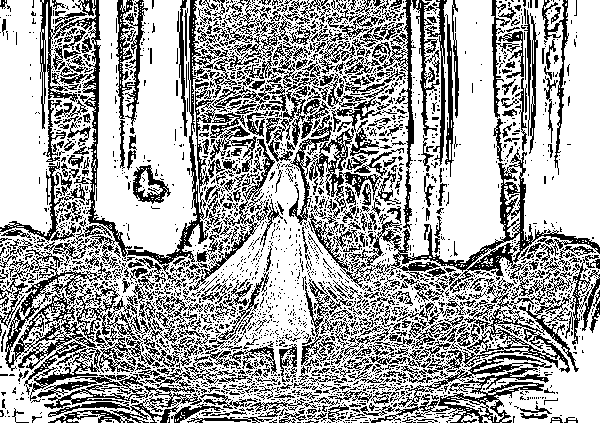

方向歪了，路越走越窄；技法歪了，当心走火入魔哦。在这篇文章里，作者将多年学习占星学的教训和心得同大家分享，快来看看这些年你所走的占星之路到底有没有误入歧途吧。

**大家都开始了解和学习占星学**

随着占星学的普及，星座成为一个很好社交话题，人际交往的初期，用星座话题来破冰非常见效。也因此，越来越多的人从了解 12 星座开始，明白了通常说的 12 星座是指太阳星座，每个人还有上升星座，太阳星座与上升星座有不同的意义；从水星逆行开始，了解到原来不止水星，其他的行星也会逆行。继续深入，则会了解到太阳系的 10 颗星体会在我们的人生不同领域，起到引领或者推波助澜的作用。就这样慢慢地，越来越多的人走进了占星学习的大门，了解这门解读行星作用与人类经验之间关系的语言。

学习这门高深复杂的学问是一个漫长的过程，在现代计算机普及之前，光是手动计算行星和四轴的度数，行星运行的速度，就把普罗大众拦在了门外。而随着占星学在近现代的再一次复兴，学习的门槛降低了，不管是古典流派还是与现代心理学结合的心理占星学，都在逐渐走近民众。 

**那些年学占星走过的弯路**

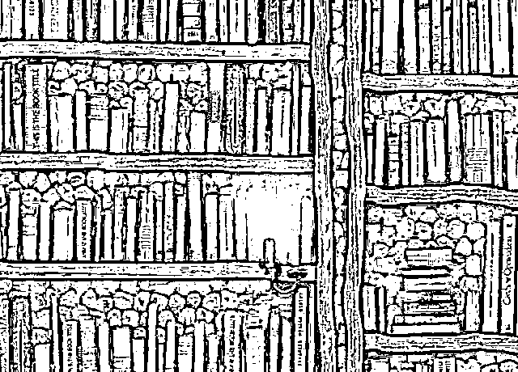

占星学习不是一个轻松的过程，我就把自己观察到和亲身体会到的经验，曾经走过的弯路，分享给大家，谨代表我学习占星学和成为专业占星师以来的个人领悟。

**1**

**肤浅而不精准的关键词**

在星座爱好者的论坛里，看到最多的就是“某某星座特别腹黑”，“某某星座特别花心”，“我是某某星座，所以我特别纠结”。

我相信用星座来给周边人和自己贴上好或不好标签背后的动因，是出于人们希望被了解和希望去了解别人的需要。我自己，包括身边的占星小伙伴，学习占星学的第一个动机就是用这种工具来更好地解别人。但是，这些形容词也太单调和潦草了吧……

**每个星座，都有它们对应的象征、符号、特质、色彩、动物、身体部位、职业。**与其用“腹黑”、“纠结”、“花心”这样含糊不清的形容词，不如掌握每个星座的关键词，这些关键词从星座的核心概念出发，丰富得足够撑起每一场八卦谈话。

**这是个例子** 

**—— 巨蟹座的关键词 ——**

内向、含蓄、矜持、易动感情、 情绪激动、敏感的、神经质的、有细腻感情、体贴、善解人意、感觉敏锐、艺术感觉好、有同情心、在意安全、记忆力强、喜爱（或关心、热心于、习惯于）家庭生活的、享受家庭乐趣、善理家务、专心照顾家庭、母性、保护性强、小心谨慎……

**接下来，我们可以从星座对应的行星出发，学习是什么核心概念，延展出了以上的关键词。**比如，巨蟹座对应的星体是月亮，古人说“月有阴晴圆缺”，那么月亮快速行进和变化的特性，就让巨蟹座具有“情绪激动、敏感”的特点。而月亮对应的家庭和妈妈，当我们看到星图上有巨蟹座的特性的人，就可以和他多聊聊他的妈妈和家庭，如果谈话者是个女性的话，还可以问问她对美食的看法，有什么收拾家务的小妙招。

未必每个巨蟹座都热爱家庭，善于理家，但是这些关键词可以让我们更丰富和更到位地了解这个人可能的性格，达到更好地互相沟通和增进了解的目的。

相应的，和射手座聊天，能打动他们的话是“真理和探索对射手座是非常重要的”、“射手座关注的是未来、成长和道德原理”、“射手座乐观、渴望探索”。可以和他们聊聊旅游、国外有关的事、高等教育或者哲学。

**2**

**武断地“贴标签”**

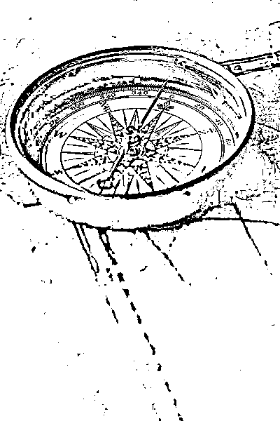

这种方式是更进阶的学习者会使用的：**用自己学习的占星知识，评判自己与他人行星、星座、宫位等配置的“好坏”，进行单一武断的“断命式”解读，给当事人带来了负面的感受：要么是被吓着了，要么是感到自我价值被贬损。**

作为占星师，我也多次收到咨询者的询问例如：

*   “我的月亮在天蝎座，这是很不好的，是吧？”

*   “因为我的金星合相冥王星，所以我的感情生活就是不顺利，或者我就会没钱”。

如果我们在和当事人讨论星图中金星与冥王星的配置时，只强调冥王星的暴虐与伤害，而忽略了冥王星转化与重生的意义，我们就是在用占星这个工具来误导对方。

学占星学一定会接触到行星的“庙旺落陷”这个概念，如果学习者不去理解古人把行星与星座的特性关联背后的逻辑，不去理解古典占星学如何反映古典哲学观，也容易误用和滥用这个概念。

关于古典占星学是如何反映了古典哲学观，古人是如何看待幸福的，古典占星判断吉凶好坏的依据，我就不在这里展开了，推荐大家在**本杰明·戴克博士的《当代古典占星研究》**这本书里寻找更多的内容。

▼

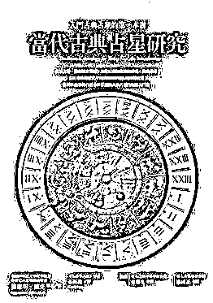 

**几个值得思考的问题** 

*   我们使用占星学的初心和本心是什么？ 

*   基于天生和后天养成的品质、性格和能力，如何能够积极地面对生活，活出有意义的一生？ 

*   我的哪些行为和思想是我具有的配置的建设性表现，哪些行为和思想是这些配置的破坏性表现？ 

*   当我在评判星图的好与坏，贵与贱的时候，这对我的人生有什么积极的意义？是不是在用这些好坏吉凶作为自己人生怠惰和失败的借口？ 

*   无论占星师还是爱好者在解读星图的时候，是不是客观地向我描述了这些配置的建设性和破坏性的表现？并且和我探讨怎样能够更好地发展这建设性的表现，让我的生活过的更好，得到内心和外在的幸福。

以上问题的回答是非常个人化的，也无关对错。占星学是一种工具，无论现代心理占星学还是古典占星学、中医还是西医、黑猫还是白猫，能帮助你走向幸福的就是好工具。

**3**

**见树不见林的肢解性解读**

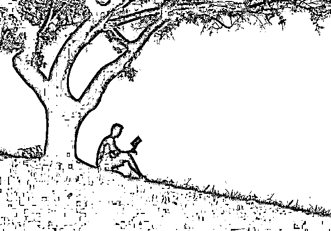

学习占星学就如同盖房子，行星、星座、相位、宫位、月亮交点、四轴、小行星、虚点等等相当于要用到的地基、砖块、钢筋、水泥、门窗、居室结构。

了解行星所在星座、所落宫位、彼此的相位，是了解这座房子的基础。但要记得，**我们在看整栋房子，而不是单一地去解读某扇窗户在这个房子中的位置**，因而得出这个房子是什么风格这样的结论。

**这是个例子** 

当我们看到**冥王星在摩羯座落在三宫**的时候，是要理解当事人“思想相当深刻，不会从表面看待事情，喜欢刨根问底，他的言语可能会推翻传统价值或者规范”。

但是如果**星图里没有特别多的天蝎座主题**的时候，比如**不符合如下情况：**

1.  重要个人行星落在天蝎座，

2.  重要个人行星落在 8 宫；

3.  冥王星与四轴有相位；

4.  其他的冥王星和天蝎座的主题；

5.  冥王星和内行星的主要相位；

6.  当前的行进或推进触发冥王星；

7.  行进或推进冥王星活跃；

那么这个冥王星在摩羯座三宫就不会成为这个星盘解读的重点。

**我们应该去关注那些被重复、被强调的主题，以及当事人正在经历的让他感到痛苦和不舒服的行运对应的主题。**

**推荐阅读** 

**苏·汤普金斯**的占星经典著作**《当代占星研究》**共有 393 页，她用 10 页的篇幅阐述了**“星盘综合诠释”**的方法和原则。这 10 页值得每个占星学习者反复翻阅、理解和回味。**斯蒂芬·弗里斯特**在**《内在的天空》**一书中条理清晰、简明扼要地解释了他的方法，实用性非常高。

吾生有涯而知无涯，以上心得仅代表个人看法，望各方友好共同探讨，共同进步。


**占星师咔咔**：2010 年开始学习占星学，若道首届学员，国内最早获得 ISAR 职业占星师资质的职业占星师。在国际知名广告公司和市场研究公司从事的市场研究和推广工作十余年，曾任职于阳狮集团、尼尔森市场研究有限公司、MTV 和《Madame Figaro》杂志。现在为《时装男士》、活法儿等媒体供稿。

**微信公众账号**：咔星人

**星盘解读和运势咨询**：cji1029@qq.com


**如果你也有占星学之路的经验教训，**

**留言分享给小伙伴们，**

**也许你的评论可以帮助更多困惑的人儿呢。**

**◆ ◆ ◆  ◆ ◆**

******特别提醒************：若道拥有本文版权******，**转载请注明“转自若道”。******

想要学习严肃专业的占星学？**2016 年 5 月 19 日**，蒋颖老师主讲的若道占星核心课程**Level 1-2**要开课了！她将带领你学习星座、太阳、月亮、行星、月亮交点等知识，让你进入占星学的世界！

报名及咨询，请点击文末”阅读原文“


# 职业占星师之路 | 大卫老师免费咨询的机会，你可别错过哦

> 原文：[`mp.weixin.qq.com/s?__biz=MzA5NjA0NTAxNg==&mid=403326082&idx=2&sn=e2e8df5fbf0d7790187e19356c92911a&chksm=0d48f6353a3f7f232e6c28c0bb24ae2c8397f39439649355649be0b67dc89985d742111356bb&scene=126&sessionid=1692738862#rd`](http://mp.weixin.qq.com/s?__biz=MzA5NjA0NTAxNg==&mid=403326082&idx=2&sn=e2e8df5fbf0d7790187e19356c92911a&chksm=0d48f6353a3f7f232e6c28c0bb24ae2c8397f39439649355649be0b67dc89985d742111356bb&scene=126&sessionid=1692738862#rd)


若道核心课程 Level 5 即将开课

﹁

最强阵容揭秘

﹂


**导 师 介 绍**


**大卫·瑞雷（David Railey）**

若道创始人，《灵魂的目标》作者。拥有四十年的占星咨询的执业经验，曾两任亚特兰大占星协会主席，是全美占星师联盟（AFAN）、美国占星师联合会（AFA）、全美占星研究委员会（NCGR）、国际占星研究协会（ISAR）和职业占星师组织（OPA）的成员，是联合占星大会（UAC, United Astrology Conference）督导委员会委员。大卫曾是 CNN、CBS 的占星节目的常驻嘉宾，多次在 BBC、WGS、WSB、WRGG 等节目中接受采访，并在亚特兰大主持电视节目《每日行星（Daily Planets）》达 4 年之久。

**助 教 介 绍**

1

**天空的空**

2015-2016 年度若道核心课程专职助教。获得 ISAR 认证和“生时校正认证考试”资质认证。

2

**海星程**

ISAR 认证职业占星咨询师、塔罗咨询师、2015 年若道首次“生时校正认证考试”满分获得者。

3

**傅莎珈**

全职占星师，COAC 高阶占星资质，接受萨提亚、NLP、格罗夫全息呼吸理论的心理咨询专业培训。


**五位班委是从 Level 4 全体学员中选拔而出，**

**品学兼优，多为外企、银行、媒体行业管理从业背景。**

**班委会将同助教组一同，**

**为学员们组织更丰富多彩的学习和活动。**

彩蛋时间

在 Level 4 的授课中，

大卫老师在学员里**随机抽取案例进行爱情合盘、事业现场解读**，

受访者几度哽咽，

大卫老师精湛的解读技巧令人难忘。

在这一届 L5 课程中，

大卫老师仍旧会**在学员中抽取若干名案例，** 

**现场进行星图解读，**

**相当于免费进行一次咨询。**

一句话课程揭秘 1

预测行进——含演练及学生案例

行进，也称为“行运”，是各种占星预测中最基本的，也是使用最广泛的技术。占星师**结合出生星图与某一时刻的宇宙天气**（天象），即可做出相应的趋势预测分析。

2

周期——含演练及学生案例

从某种程度上来说，占星学就是建立在周期之上的，熟练掌握星图中**各组成部分（行星、月亮交点、四轴等）的周期**，是职业占星师的必杀技。

3

趋势预测——爱情和职业周期（含演练及学生案例）

在这里，大卫老师将承接**Level 4**的内容，再**结合 Level 5 行进预测技巧**，对亲密关系与职业发展的解读，做更深入地教导。

4

推进——含演练及学生案例

推进，也称为“推运”，是仅次于行进的被广泛使用的技术，而其本身的涵盖面也非常广。在 Level 5 中，大卫老师将详细讲解推进中最出众的**“次限推进”**。通过次限推进，我们将领略生命**“一天对应一年”**的神奇。

5

太阳弧——含演练及学生案例

在人本主义占星学领域有一位大宗师：诺·泰尔。他对占星学最显赫的贡献之一，即发现了**“太阳弧正向推进”**。这是一种非常霸气的技巧，星图中的所有行星、虚点与四轴，都按照**“一度对应一年”**的平均速度正向推进。

6

日月回归——含演练及学生案例

**每年**，行进的太阳都会回到出生时太阳的位置，这一刻的宇宙天气（天象星图），似乎在暗示着什么？

**每月**，行进的月亮都会回到出生时月亮的位置，这一刻的宇宙天气（天象星图），似乎也在暗示着什么？

7

组合中点图——含演练及学生案例

在关系解读的领域，占星师们最常用的两项技术，除了 Level 4 中的比对星图（比较盘）外，就是组合中点图了。如果说比对星图显示了关系双方的**“匹配度”**，那么组合中点图就暗示着关系相处中的**“议题”**。

8

综合预测分析——含演练及学生案例

把行进、次限推进、太阳弧与日月回归等技术**综合**起来使用，是怎样的滋味儿？

9

历史概览及占星学中的天文学

占星学有超过 8000 年的历史，在西方的传承也超过 2000 年。这不仅仅是一门学问，更是一部恢宏的**史诗**。

在 1781 年天王星被发现之前，漫长的几千年中，占星学与天文学不分家，天文学家就是占星师，占星师也是天文学家。观测并熟知天上行星的运转，也是一名成熟的占星师需要了解的。**“天上如此，地上亦然。”**

10

ISAR 考试词汇表及咨询技巧培训

国际占星研究学会（ISAR）是一群志同道合的占星师携手开办的非营利性组织。作为国际上最具声望的占星组织，也是 UAC 大会的四个举办方之一（其他三个主办方是 AFAN，NCGR，ACVA/CVA），ISAR 所颁发的**占星师资质认证**受到国际占星界的广泛尊重和认可。“君子和而不同。”

走到这一步，你已经学习了几乎所有常用的人本主义占星学技术，加以练习，一定能成为一名“解盘高手”。但是，想要成为一名优秀的占星师，光光会解盘可不够，还需要学习一门很重要的技术：**咨询技巧**。占星师们需要学会如何把星图翻译成人们日常的语言，**平和、生动地表达**给客户。简而言之，你需要学会“说人话”。


错过如此优秀的班级，

黄金组合的助教团队和班委团队，

一定是你 2016 年最大的遗憾。

目前尚有少量席位，

请点击文末 **阅读原文** 获取详细课程信息。

**想成为 ISAR 认证占星师吗？**

**欢迎选择 2016 年度职业占星师成长套餐** 

▼


**2016 年，和大卫老师一起，开启占星的探索之旅！**

长按二维码添加课程负责人咨询~

****

报名及咨询，请点击文末”阅读原文“

# 家暴后遗症 | 找寻艰辛人生的占星学扳机

> 原文：[`mp.weixin.qq.com/s?__biz=MzA5NjA0NTAxNg==&mid=403311164&idx=1&sn=897cf53818bb5621a21e5e412340e8bb&chksm=0d48b88b3a3f319deeede29a66dbc86e87d8ceebdf7e692e6420c3ff7d5ce25801136d031416&scene=126&sessionid=1692738862#rd`](http://mp.weixin.qq.com/s?__biz=MzA5NjA0NTAxNg==&mid=403311164&idx=1&sn=897cf53818bb5621a21e5e412340e8bb&chksm=0d48b88b3a3f319deeede29a66dbc86e87d8ceebdf7e692e6420c3ff7d5ce25801136d031416&scene=126&sessionid=1692738862#rd)

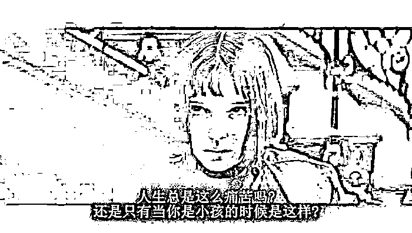

作者/蒋颖 若道占星创始人

这篇让你看到真相的文章由来于《反家暴法》的正式实施。在所有类型的家庭暴力中，父母对孩子的伤害不容小觑。可是，很多曾经遭受过不良对待的人，在成年后，有意或无意地否认自己曾受过家暴。有人说，只是被骂而已，怎么就成了家暴？有人说，又不是被打得很厉害，被“管教”是正常且普遍的现象啊。

真的正常吗？本文作者通过多位咨询者的真实故事，为你揭露遭受父母身体和精神暴力的小孩在成年后所遇到的各类深刻议题，希望以此引起更多人关注。看到，是解决创伤的第一步。

Is life always this hard,or is it just when you are a kid? 

人生总是那么艰难吗？还是只有小时候这样？ 

Always like this. 

总是如此。

当经常遭父亲殴打的玛蒂尔达第一次跟莱昂相遇时，她问了这句话。我清晰地记得莱昂不带表情地说，“总是如此”。很多年前看这个电影的时候，我觉得莱昂太残忍，为什么不给小女孩一些希望？而电影，在玛蒂尔达长大之前就结束了，我无法知道儿时曾经遭到家暴的她后来怎么样，是不是像莱昂所预测的那样一直充满艰辛？

**不是身体的虐待就是精神的虐待**

很多年后，我体会到了这句“总是如此”的真实性和残酷性。从来找我咨询的客户身上，从我所听到、看到的许多故事之中。

有一位从小犯错就被父亲吊起来打的女性，现在 50 多岁了，说起童年往事已云淡风轻，“这不是正常的吗？那个年代，孩子犯错都会被吊起来打，又不是只打我一个，有时皮带都抽断了。”她的父亲是一位革命军人。

我的脑海里立刻出现了刑讯的场面，但她肯定是看到了我的这个“错误”念头，立刻说：“他其实挺爱我们的，是我不好，太调皮了，又爱撒谎。”她现在事业很成功，但是她不快乐，用她自己的话说：“她总是不让自己的人生好过。”这个女性有火星和冥王星的挑战相位，结婚又离婚，自己有暴力倾向，发怒时会打丈夫和孩子，无法控制自己。

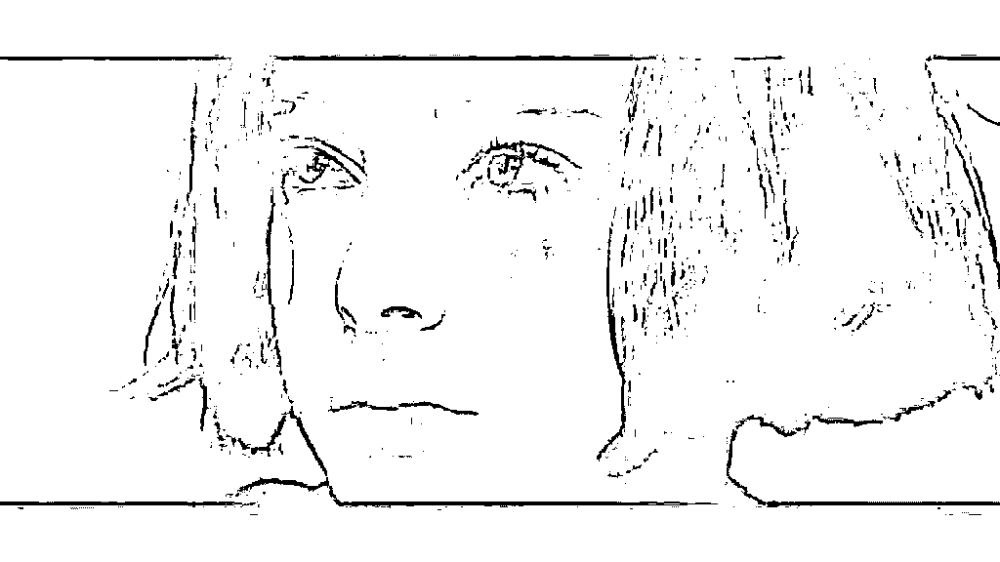

身体上的虐待是可怕的，同样可怕而更被忽视的是情感上的虐待。

有一位女性说，有几年，她母亲每天都会骂她一顿，不论她怎样小心翼翼，努力学习，做好家事，挨骂成为生活日常的一部分。她无法记得太多童年往事，只记得有一次，母亲几天没有骂她，她非常害怕，想母亲怎么会忘记骂她，母亲是不是疯了。当时她虽然年纪很小，但是已经知道有“疯狂”这种精神疾病。

她忍受这个担忧，默默观察母亲的一举一动，不敢跟其他家人说，直到有一天，母亲又开始骂她，她的心终于落地，这证明母亲很正常，并没有发疯，她甚至有些欢喜起来。“她从来不打我，我的舅舅会随时用大巴掌扇我的表弟呢，我想和被打的孩子相比，我这点算不了什么。”这位女性有月亮和海王星的挑战相位，对于外界的一切极其敏感，有严重的焦虑症，在职场上总是承担过于繁重的工作，无法设定界限，直到焦虑、严重的失眠症和工作负担一起把自己压垮。

**小时候被虐待的人长大了会怎样？**

更加让人惊讶的是当开始探讨童年的时候，她们的回答都是：我的童年很平常，很普通。

当我越来越多听到这些“普通”的童年故事，让我看到我们文化的一个共通之处，“被虐待”，不论是身体，还是情感，曾经是我们养育文化中的一个“常态”。我们信奉“棍棒之下出孝子”、“打是亲、骂是爱”，因此不论是虐待方还是被虐待方都将之轻描淡写，甚至美化其必要性，完全意识不到其影响和后果。

然而稍微做一个调查，你就会发现童年遭受情感和身体严重虐待的人的成年生活常常如同他们的童年一样失常：严重的焦虑症、忧郁症、拖延症、无法管理的愤怒、自卑感、情感婚姻的坎坷、职场的波折，甚至因为情绪问题而引发的身体疾病都可能出现在生活中。

某段时间，真的如莱昂所说，一切都很艰难。他们自己也觉得有什么地方不对头，只是在深入探索之前，他们不知道哪里真正不对头。

一切有因，也有果。

●如果童年我们不懂得什么是爱，我们怎么在成年懂得什么是爱呢？什么样的表现算是爱？我又怎样表达爱？

●如果童年我们所依恋的人，最亲近的人，打我们，用恶毒的语言骂、嘲笑我们，我们怎么能够信任他人？

●如果童年时，爱和愤怒、憎恨、羞愧、内疚等感情掺杂在一起，我们怎么在日后的爱的道路中不迷惑？

●如果我们童年我们的生活中上演的是恐怖片，那么成年后我们怎么会不被不安全感、焦虑感萦绕？

古人说，三岁看老。童年是人生的序幕。我们来简单看看这些“小玛蒂尔达”们长大后会遇到哪些可能的问题吧。

 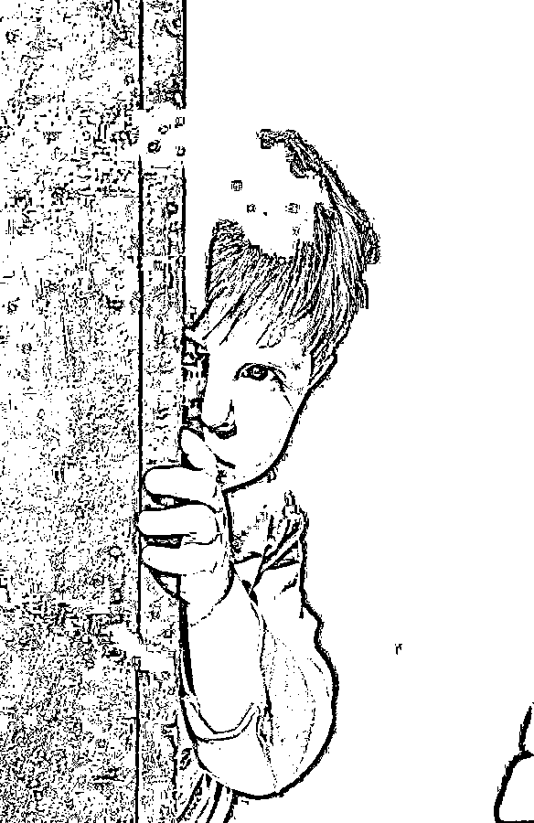 

**1****金星议题：**

认为自己没有价值

小时受到严重虐待的孩子，都可能有很深的“无价值感”。这个孩子内心深处会得出一个结论，自己在这个世界上并不值得被爱。

从很小的时候，这些孩子内心都可能会有一种，我不值得活下来、我不配活下来、我不配过得好、不配被爱的绝望感，有的甚至会有一种罪恶感，强烈的内疚感。

在这种无意识的感情的影响下，他们不断做自我伤害的事情以证明，自己的确没有价值，不值得被爱。在成人以后，这个潜意识中的“自我陈述”成为“自我实现”的预言。正如开头的那位女士一样，“我总是不让自己的人生好过”。

●一位女士推掉了很多优秀的男性，找了一个让大家都有些惊讶的人，多年后她说“我无法接受别人对我太好，我总觉得那根本不真实。因此我找了个普通人嫁了，我以为这样我会幸福”。当然，她并不幸福。

●另外一位女士喜欢泡夜店，她觉得有点坏、有点危险的男人对她来说更有魅力，她作为被虐方配合他人玩ＳＭ游戏，她无法识别出哪些是更正常、更健康的男士，在爱中充满困惑。她的梦境却泄漏出她的严苛的自我评判，一个重复出现的主题是，她是一个坏女人，尿液、粪便污染的澡盆、池塘、下水道是梦中常见环境。

●一位女士经常遭受上司的责骂，大庭广众下的羞辱，动不动被克扣工资，她全部忍受下来，而且常常觉得上司讲的有道理，是为了她的成长和进步，并且因为能够和上司保持一种很奇妙的亲密关系感到自豪。

●一位女性说“我总是和混蛋交往，好像我的鼻子能嗅出来谁更混蛋，我就闻着味道去了，让他欺负我”。

以上种种，常常出自于“低自我价值感”。这个可怕的感觉如病毒埋藏在意识深处，就像一个自我攻击的程序一样，挫败着成年后为幸福所做的努力。

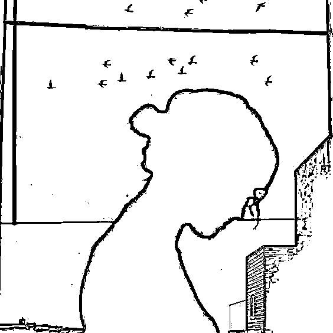

**2****火星议题：积压的愤怒有多种表现**

被殴打和辱骂的孩子心中当然有愤怒。我想现在和过去，可能很多“被侮辱和被损害的”孩子们心里也想对正在虐待过他们的大人怒吼：“你凭什么打我伤害我？你以为我小、没有力量、不得不依赖你，难以离开你，我就不会心碎，不会愤怒吗？你想错了，我和你有一样的灵魂，一样的心。如果老天赐予我一点魔法，我会让你饱尝你所施加给我的痛苦；如果我可以独自生活，我就要离开你，离开这个家！”

当然，不会有大人听到这样的怒吼。这些怒吼留在了心中。

根据孩子的天性不同，有的孩子小时会反抗，当然由于力量悬殊的差异被镇压。有的孩子会默默忍受。而长大以后，这些积压的，没有被发泄的愤怒会以各种不当的形式表现出来。

①你可能有无法控制的愤怒议题

●“我无法控制对孩子的怒火。他不自律，磨磨蹭蹭，我必须打他，他才能听话。小时候还行，现在他更反叛了，我完全管不了他。”

●“我无法控制对我老公的愤怒。我甚至会打他。”

●“我的同事关系很糟。他们都怕我。但直到我离职那一天，我才知道，原来没有一个人跟我说实话，我感觉更愤怒了。”

②你可能很害怕发怒和冲突

●“我总是竭尽全力不合任何人起冲突。想到会发生冲突，我的身体就会发抖。然后，我就躲开了。但是最后还是躲不过，因为对方得寸进尺。然后我像发疯一样，我觉得我杀人的心都有了，我把自己也吓坏了。”

③你可能有严重的抑郁症和焦虑症

很多人没有意识到焦虑症之下有可能是愤怒。因为不敢表达愤怒，甚至否认自己愤怒，因此情绪转移成当事人理智上更能接受的其他情感，比如抑郁、焦虑，以非理性的恐惧、担心的方式呈现在生活中。

●“即便什么都没有发生，我也会感觉生活会出错。”

●“我觉得一切都没有希望。”

而实际上是，你很生气！

④你有挥之不去的无力感

火星既是愤怒，也是力量。如果火星没有力量，你感觉到自己似乎被阉割了一样。一种做什么都没有用的感觉，也无力去为自己奋斗、争取、抗争点什么。这种感觉就像一只在温水中慢慢变得麻痹、坐以待毙的青蛙。不论是在与人的互动，还是为了自己而去坚持和努力的道路上，你都感觉到没有力量，无法捍卫、追求自己的利益。

**⑤你可能用力过度**

●“我好像总是用力过猛，不论锻炼、工作、爱情，常常把人吓着。比如锻炼吧，我把我的肌肉和膝盖都伤了，不得不做了两次手术”。

这位女士可能不知道，她之所以这么用力，是因为她想保护自己。但是她没有掌握好力道。

⑥你有被动攻击倾向

●“我总是犯错。总是忘记时间。总是迟到。总是不按时完成任务。”

●“我答应他们，但我就是不做。”

你总是让别人生气，而你自己也很委屈，这些都可能是你采取了被动攻击方法。其实，你很生气！　

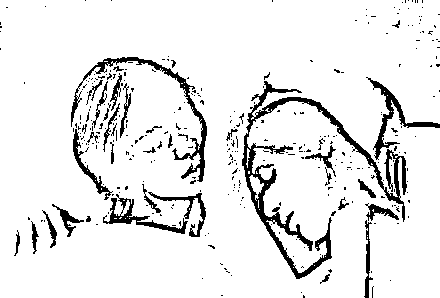

**3****月亮议题：严重缺乏安全感**

毋庸置疑，受到身体和精神家暴的孩子长大以后，有很强烈的不安全感。因为从小，那个本来应该给他们安全感的容器——他们的家，没有给他们安全感。长大后，如果没有走上疗愈的旅程，他们的内心仍然是惊弓之鸟。

●“只要他们窃窃私语，我就觉得他们一定是在说我的坏话。”

●“我是一个特别敏感的人，光、风、声音都容易影响我，让我心情低落。陌生环境也让我害怕。或者是熟悉的环境突然改变了，来了个陌生人。”

●“今天领导批评我了。我觉得他迟早会辞退我。”

●“我总觉得不安全。不论我自己挣多少钱，多成功都不够。我总是还是觉得不安全。我必须要找个能保护我的男人。他必须得比我强，这样我才能有足够的安全感。我终于找到一个，结果他还背叛了我。”

**4****土星+海王星议题：不适当的边界及成为牺牲者**

小时候受到家暴的孩子被不当地侵犯了他们的边界，不论是身体上还是精神上的边界。他们没有被尊重（土星），没有被无条件的接纳（海王星），反而因为自己的弱小，无力保护边界，被大人侵犯，变成功能失常的大人的牺牲品（海王星）。而这个世界上，有太多功能失调的大人。

这会造成两种反应机制，都和边界有关：

①建立太高的心墙，没有一个人可以接近、进入他们的内心。

有些孩子长大后，用这种方式保护自己，变成形成了自然的防御机制。他们在自己的周围建了一堵厚厚的高墙，自己走不出去，他人走不进来，因此一直孤独的生活着。孤独不意味着不结婚，有些结婚的人比单身的人更孤独。

②根本没有边界和规则，任由他人入侵自己的领地践踏。

●“我无法对别人说‘不’，因此只能看着自己的事情越来越多，下班越来越晚，而他们则把更多的事情给我。他们说我是好人，能者多劳。”

●“我负担家庭的一切，我一直承担主要的家庭开支，我接孩子、陪孩子学习，我为家庭牺牲了一切，而他则在外面找了其他人。他哭着求我原谅。我原谅了。后来他又出轨了。我又原谅了。后来他变得肆无忌惮。”

**5**土星+海王星议题：内疚感和错误的现实感

当父母暴打、责骂孩子的时候，他们总是会说这是孩子的错，他们应该受到这样的处罚。有的父母有严重的人格失调问题，但孩子们却不知道，孩子们也会觉得自己真的错了，是自己引起父母的愤怒，因此会产生内疚感和负罪感。这种内疚感有时会深深扎根到心灵之中。

●“我知道他很糟糕，配不上我，但是我好像是上辈子欠他的。我就是离不开他。如果我离开他，也许他就活不下去了。我无法一个人过得好，我有强烈的负疚感。爱不就是要承担一切吗？”

有的父母设定了孩子无法到达的严苛标准（土星），甚至过于理想化的甚至病态的标准（海王星），但是这个标准从此在孩子的心中驻扎了下来。他们有了错误的“现实感”和“徒劳感”。当他们长大以后，哪怕父母不再要求，但是内化了的父母的声音仍然陪伴着他。

●“我总是无法按时完成任务，有严重的拖延症，好像我就是想毁了自己似的。”

●“我反正也做不到完美，索性连试也不去试好了。”

●“我不断跟周围人比较，我必须让自己比其他人都强，否则我就觉得我是个彻底的失败者，哪怕现在很多人都羡慕我，但骨子里我还是觉得我是个失败者”。

因为现实是那么得难以忍受，一些孩子童年会编故事让自己的精神甚至肉体离开这个现实，而他们在成年后则成了各种各样的上瘾症患者：购物癖、电子游戏癖、嗜酒、性瘾、拖延症等。

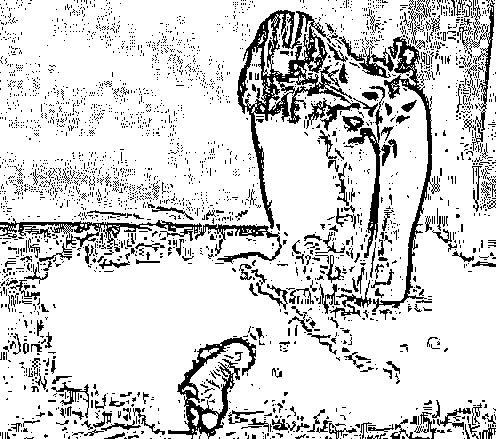

**6****冥王星议题：不信他人也不信自己**

受到家庭暴力的孩子在童年就经历了地狱。天真之花没有开放，就被摧残，如同玛蒂尔达那样。而世界上为什么会有地狱的存在，为什么即便是慈爱的父母也会有这样阴暗的一面，这是孩子们甚至成年人们都所无法理解的。

但是，就像被冥王掳走的波赛凤无法再用同样的天真姿态走在河边，无忧无虑地去采撷花朵和青草一样。当她看到一棵树，她首先看到的不再是茂密的枝叶、跳跃的阳光、累累的果实，而是黑色的影子。她时刻会警惕，危险会从哪个角落，哪个人那里冒出来，这些孩子长大无法再轻易相信他人、自己和生活。他们的眼睛上架着看不见的墨镜，也因此看到更多充满恶意和敌意。这种猜疑会达到一个偏执的过分的程度，但他们自己往往信以为真，结果毁了自己成年后的生活。

最可怕的是无法相信自己。无法相信自己的力量。

●“我无法信任他，所以我只能去监视他的一切”。

这句话翻译一下就是：“我无法信任自己可以获得他全部的爱”。或者“我无法信任自己，不相信哪怕他离开我还会找到更好的”。　 

他们甚至会被“阴暗面”所吸引，不论是自己还是他人的阴暗面，而这常常又是在无意识之中的演化。因此，他们被“容易背叛的人”吸引，被“暴烈的争斗吸引”，被“危险的事物”吸引，甚至变成了黑暗的一部分。因为上天安排这些被侮辱和损害的孩子在成年后需要用重新回到地狱的方式去看清楚伤口所在，看到黑暗和光明的意义，并且拿回属于自己的力量。

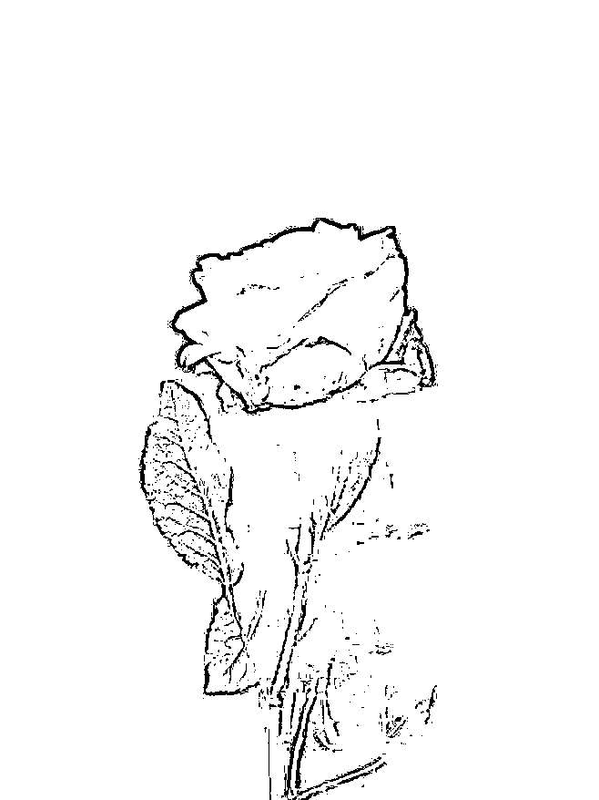 

为什么会有这么多家庭暴力，我想既和我们的文化相关，也和我们 100 年来的历史相关。我们 100 年来的历史是火星、冥王星的历史，不断的外战、内战、文化大革命、社会不公，有很多的愤怒积压在个人内心、家庭之中。一个没有经过疗愈的民族，无法真正解决家暴问题。因为历史会传承和重演。

不过，一个小的进步也是进步。希望随着《反家暴法》的实施，在我们这代人，和更年轻的那代人中，曾经被当作常态的家庭暴力逐渐变得更让人关注，并有越来越多曾经遭受过家庭暴力的人去寻求帮助，对于自己内在的暴力更有觉察，从而疗愈几代人的伤口。

爱的想法将会成功。

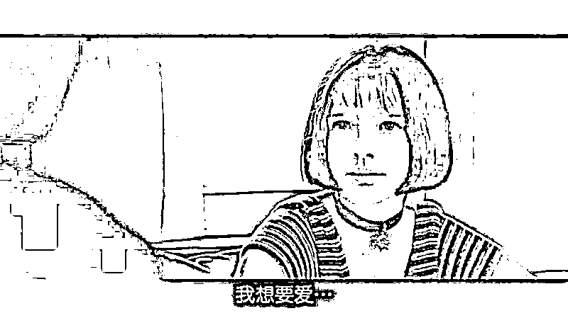

▶有人说，曾经被身体和精神虐待过的小孩，长大之后脸上会留有曾经被家暴的影子……你有什么话想讲吗？在这里或后台留言，若道君和作者都能看到。


**喜欢蒋颖老师的文字吗？**

**在后台回复 蒋颖 即可查看她的全部文集哦。**

**◆ ◆ ◆  ◆ ◆**

**特别提醒****：若道享有本文授权，转载请注明“转自若道”。**

喜欢蒋颖老师的文章吗？**2016 年 5 月 19 日**，蒋颖老师主讲的若道占星核心课程**Level 1-2**要开课了！她将带领你学习星座、太阳、月亮、行星、月亮交点等知识，让你进入占星学的世界！

报名及咨询，请点击文末”阅读原文“


# “打你是为你好！”你是这样的家长吗？

> 原文：[`mp.weixin.qq.com/s?__biz=MzA5NjA0NTAxNg==&mid=403311164&idx=2&sn=ce0f7b1b486d859a5d4776c6e08c686b&chksm=0d48b88b3a3f319d6d393989aa62a15d252e723eac33d6406ab888ce1d6d4c2eb28123c5c473&scene=126&sessionid=1692738862#rd`](http://mp.weixin.qq.com/s?__biz=MzA5NjA0NTAxNg==&mid=403311164&idx=2&sn=ce0f7b1b486d859a5d4776c6e08c686b&chksm=0d48b88b3a3f319d6d393989aa62a15d252e723eac33d6406ab888ce1d6d4c2eb28123c5c473&scene=126&sessionid=1692738862#rd)


📹 [`v.qq.com/iframe/preview.html?vid=w0186djlgj4&width=500&height=375&auto=0`](https://v.qq.com/iframe/preview.html?vid=w0186djlgj4&width=500&height=375&auto=0)

——“感冒了？谁让你不多穿点衣服，是有多笨哪你？”

——“你看看你们班上谁谁谁的成绩，我怎么生出你这样的孩子，真给我丢人！” 

——“打你怎么了？打你是为你好，哭什么哭，不准哭！”

他打了你，还不准你哭；他撞到你，还怪你站的地方不对。他骂你你不能还嘴，他打你你不能还手。

就因为他是你的父母……

而你，是否也在潜移默化地成为这样对待孩子的父母？

**在为人父母的时候，请思考如下问题：**

►►**你成长期的外在人格？你的孩子成长期的外在人格？**

**►►****你成长期的家庭环境？你的孩子的家庭环境？** 

►► **在成长期你是否相信其他小朋友？你的孩子在成长期是否相信其他小朋友？**

►►**你成长期对于成就和成功有多少渴求？你的孩子对于成就和成功有多少渴求？**

教育从来都不是孤立的，父母对待你的方式，你是照单全收同样施暴于孩子，还是即使内心不认同，想改变，却又在第一反应里毫无意识地将不当教育以各种形式施加在了你的孩子身上？“我都是为了你好。”孩子真的需要你这样的“好”吗？

**如果你为孩子和你的互不理解感到伤心**

**请在心里问问自己：**

**你，是否真的和你的父母不同呢？**

想要改善原生家庭的不当教育模式是一个漫长而艰难的过程。那些深刻的烙印的融化，需要不断觉知和调整。

专业力量的帮助可以有效缩短这个周期。


这个三月，来加入我们的**亲子发展工作坊**吧。

大卫老师以近四十年的经验，教你如何更好地同父母和解，更好地了解孩子水晶般真纯的心；

了解他有着怎样的梦想和潜能；

了解他的情绪背后有着怎样的心理动因；

你想知道的关于孩子的一切都能在这里找到答案。

**工作坊信息**

**授课时间：**2016 年 3 月 26-27 日 （10:00-18：30，午休 1 小时）

**授课老师：**大卫·瑞雷

**授课方式：**北京面授，英文授课，配中文翻译

**费用**：**5000 元（若道老学员可享受优惠价 3500 元）**

**早鸟价：**4000 元

**课程负责人：**Freya.Li  微信号：18601950700（请备注报名咨询）

**咨询电话：**400-619-1014

**课服 QQ：4006191014 （若道星文化）**

**邮箱：nodoor@vip.126.com**

课程简介

这两天，我们将聚焦在学习如何通过“觉知”与“接纳”的方式为孩子的成长创造一个充满“接受”“理解”和“爱”的家庭氛围。

我们将会根据家长和孩子的星图，谈论：

**★ 孩子怎么学习更有效？孩子适合报什么样的专业？说话孩子不听怎么办？孩子很叛逆该如何沟通？该如何激励孩子？**

**★ 在孩子成长过程中，家长会有哪些特别的挑战，如何面对这些挑战？**

**★ 哪些社会压力是非理性的，怎么放下这些非理性的压力？**

**★ 自己的人生议题是什么，这些议题和焦虑会怎样影响孩子？**

**★ 孩子今生的议题和挑战是什么，如何接受孩子的议题？**

**★ 孩子的潜能是什么？**

在这两天，我们不仅会根据孩子出生图的主题分组，还会根据家长出生图的主题分组，研讨案例将采用学员及学员孩子的出星图实例贯穿。这样学员们不仅可以从老师那里学习，而且还可以互相学习，通过在发生在身边的案例深刻感受出生星图如何影响家长、孩子及相互关系。

适合人群

**★ **致力于亲子关系成长的咨询师和占星师

**★ **希望更好理解童年与父母之间关系互动的人群

**★ **对占星学感兴趣的人群，需具备若道核心课程 Level1-2 的占星学基础

师资力量


****大卫·瑞雷（David Railey）****

若道创始人，《灵魂的目标》作者。拥有四十年的占星咨询的执业经验，曾两任亚特兰大占星协会主席，是全美占星师联盟（AFAN）、美国占星师联合会（AFA）、全美占星研究委员会（NCGR）、国际占星研究协会（ISAR）和职业占星师组织（OPA）的成员，是联合占星大会（UAC, United Astrology Conference）督导委员会委员。大卫曾是 CNN、CBS 的占星节目的常驻嘉宾，多次在 BBC、WGS、WSB、WRGG 等节目中接受采访，并在亚特兰大主持电视节目《每日行星（Daily Planets）》达 4 年之久。

长按二维码接通课程负责人~


报名及咨询，请点击文末“阅读原文”

# 如何说孩子才肯听之火象篇【白羊座、狮子座、射手座】

> 原文：[`mp.weixin.qq.com/s?__biz=MzA5NjA0NTAxNg==&mid=403311164&idx=3&sn=b75673ccd10a0480db7af63e280b085e&chksm=0d48b88b3a3f319d604a6e8d03cf217017e17c6302007551df48044747134cf43417932913b5&scene=126&sessionid=1692738862#rd`](http://mp.weixin.qq.com/s?__biz=MzA5NjA0NTAxNg==&mid=403311164&idx=3&sn=b75673ccd10a0480db7af63e280b085e&chksm=0d48b88b3a3f319d604a6e8d03cf217017e17c6302007551df48044747134cf43417932913b5&scene=126&sessionid=1692738862#rd)

**本文首发于《为了孩子》杂志**

该如何让孩子活出自己？了解他很重要！若道君找来亲子专家帮你支招，参考孩子的太阳星座来看看他的“罩门”在哪儿吧。不过也要记得孩子的星图还有很多其他元素和配置，切忌生搬硬套，无论什么星座的孩子，你温柔而坚定的爱永远是他最坚强的后盾。

火 象 篇白羊座**3.21-4.19**

**优点**：好动、大胆、纯真、勇敢，具有开拓和创造力

**需要注意的地方**：易怒、冲动、过于自我

**教育技巧**：以游戏方式，教孩子学习换位思考；尊重孩子，欣赏他的勇气

如果你的孩子是白羊座，请打起精神、储备好体力，因为这个精力充沛的小家伙很可能会让你一刻都不得消停。不管男孩还是女孩，白羊座似乎都比其他孩子更会乱摸、乱爬、乱跑。这也令白羊座女孩的爸爸妈妈有点头疼。

白羊座是一个火象星座，火的寓意是“行动”，它代表了一股灼热的、喷发的能量，能够冲破黑暗、战胜阻碍，实现目标。白羊座也是春天的第一个星座，它代表了开拓、创造以及自我表现的能量。**白羊座是天生的战士，他们有一种“英雄情结”，非常希望“自我”能够被别人看到。**所以，你会发现白羊座的孩子对竞争特别敏感，一旦他们意识到有竞争，就会奋力表现。而一旦他们的行动遭到了明确的阻挠，就会变成一头被激怒的小羊，顶着两只还稚嫩的羊角，摆出一副以攻为守的姿态：“来吧，我不怕你！”

**白羊座最深层的议题，是用行动确立“自我”的存在。**对白羊座来说，“自我”太重要了，所以一个白羊座特质非常明显的人，往往是一个在社交上不敏感的人。**让白羊座的孩子学会换位思考就特别重要。**当他表现出愤怒时，如果你也以愤怒还击，只会让这场争斗进一步升级，甚至让他学会以暴制暴；对待白羊座，需要用到一些更有策略的教育方式。

比如，如果白羊座孩子上课不听话、不守纪律，有老师向你告状了，那么你应该做的不是把他打骂一顿，而是首先让自己冷静下来，用温柔的交谈，或借助扮演游戏，让他想一想，在那样的情境下，如果他是老师，会不会生气？这种教育方式的要点，是让他真正体会别人的感受，而不是急着为他下定义：“你就是一个不听话的孩子！”

其实，白羊座的孩子也有非常脆弱的一面，这是因为他们太单纯，也太想得到别人的重视。对待纯真的白羊座孩子，我们要做的很简单，就是告诉他，“在爸爸妈妈心里，你比什么都重要。”**父母的重视是白羊座孩子安全感的来源，因为有了你的爱，这朵小火花会更努力地发光发热。**

最后，或许也是最重要的一点：**如果你的孩子是白羊座，请你欣赏他的勇气。**在这个社会上，并不是每个白羊座的成年人都敢于做“出头鸟”，但是，勇气是多么珍贵的天赋！不妨给他空间，由他驰骋，即使暂时遭遇小小失败，白羊座也一定能够迅速地站起来重新投入战斗。相信他的这份激情也会让你感动：所谓赤子之心，不就是白羊式的纯真和勇敢吗？

狮子座**7.23-8.22**

**优点**：自尊、自信、富于领导力

**需要注意的地方**：爱面子，易骄傲，固执，爱现

**教育技巧**：让孩子快乐、自由而有创造性地表达自己

要把小“狮子”从一群孩子里分辨出来，不是一件困难的事情。狮子座非常乐于表现自己，在舞台上，不管水平如何，他们都会全心全意地沉浸在表演的快乐中，享受观众的注目和掌声。他们快乐而自如的表达征服了观众，使得技巧之类的东西反倒显得不那么重要了。狮子座的孩子，似乎从来就不知道“怯场”是什么意思。

在操场上，狮子座也是最容易成为“孩子王”的那一个。**狮子座总是自信满满，仿佛拥有某种不可动摇的“气场”，行动起来也毫不犹豫，绝不拖泥带水。**而且，狮子座是大方的孩子，很乐意把自己的玩具或好吃的东西给大家分享。**狮子座的自信，连同他的温暖和慷慨，都会让他成为一群孩子最容易获得信赖的那一个。**

如果你的孩子是狮子座，你不需要花费时间去告诉他什么是自尊、自信、自爱，因为那正是他与生俱来的特质。相反，你倒是得**留心别让这只小“狮子”变得太骄傲、太以自我为中心了**——别人身上也有很多闪光的地方，这是你需要提醒小“狮子”去注意的。

狮子座是一个有坚持的星座，有时会显得固执——虽然他很乐意受到大家的夸奖，可是他并不会样样都顺从你的要求。如果你的指令让他觉得自我、自尊受到了威胁，如果你每件事都要替他做决定而不顾及他的想法，那么他就会非常坚决地对你说“不”。想象一下狮子发威怒吼的样子——对他来说，宣泄怒气同样是一种确认自尊的手段。

被太阳所守护的狮子座，在内心深处会有一种渴望：他们希望成为一个特别的人、重要的人，一个被人们赞美和仰望的英雄。“这个世界不能没有我”，也许这样的信念对于某些星座来说太过夸张，但是对于狮子座来说，这个信念中蕴含着生命的激情。

“我很重要”，这样的概念对于一个小孩子来说是很自然的。但不同的是，狮子座的孩子不仅现在是孩子，在他长大以后，他内心的那个小孩也始终强烈地存在着——他渴望快乐地玩耍，渴望被注视，渴望毫无保留地表达自己。他是否能一直以这样的状态生活，决定了他是不是一个快乐的、能够自我实现的狮子座。

为了让狮子座的孩子实现这个目标，在童年阶段，你可以帮助他做两件事情：

*   **自由自在地表达自己。**与其说这是对孩子的要求，不如说是对父母的要求——因为狮子座的孩子从小是懂得表达自己的，反倒是大人，会因为各种各样的原因去给孩子活泼的生命套上各种限制。就让他像一棵野生的植物一样恣意生长吧！他喜欢运动也好，音乐也好，他想要做个科学家也好，做个厨师也罢……只要是他满怀热情想要做的事情、想要追求的梦想，都请你给他无条件的支持！ 

*   **学会在没有关注和掌声的情况下坚持自己。**狮子座的孩子生来有一种舞台感，他们的行为举止常有浮夸的成分。但无论是撒娇还是炫耀还是发脾气，所有夸张甚至虚张声势的表现，其实都是为了“求关注”而已。狮子座最害怕的就是被忽视。所以，**首先要让他确信父母的爱和关注是永远不变的；然后告诉他，并不是每一个人都必须为你鼓掌，你得到的关注越多，批评和挑剔也越多。**但在没有掌声的时候，也要坚持真正的、独特的自我。

射手座**11.23-12.21**

**优点**：乐观、自信，具有创造力和探索的热情

**需要注意的地方**： 不拘小节，神经大条

**教育技巧**： 允许孩子探索世界；教会孩子注意细节

我在网上看过一项调查，题目是“你最想生哪个星座的宝宝”。投票结果显示，射手座的得票率是相当高的。这个星座确实有得天独厚之处：人们让太阳系中最大的吉星——木星来守护射手座，并用这个星座来代表人类精神中乐观向上、积极进取的一面，比起其他星座，射手座似乎天然地多了一份幸运和快乐。**射手座孩子的自信、乐天和不拘小节，是许多妈妈很希望自己的孩子能够拥有的品质。**

如果你的孩子是射手座，那么恭喜你，在你的家里，从此有了一个“开心果”。**射手座的孩子很爱笑，他们对大多数事情都有高昂的兴致，也不害怕与人接触。**从很小的时候起，他们就不畏惧社交，愿意被家里的亲戚或是父母的朋友抱在手里。长大一些之后，他们会很喜欢和亲戚家或是邻居的孩子一起玩，因为他们喜欢热闹、愉快的氛围。

**射手座孩子喜欢宽敞的空间、自由地活动，讨厌拘束与刻板。**如果让他们整天呆在一个小房间里做机械的事情，对他们简直是一种折磨。所以，在你为射手座的孩子考虑兴趣的确培养时，请选择那些需要高度的活力和创造性的项目。当然体育运动也会是很好的选择，一般来说，在运动场上，射手座女孩子的能量不比男孩子来得逊色。

和其他火象星座的孩子一样，**射手座孩子不太会长时间陷入负面情绪之中。他们可能哭一场就迅速地把负面的情绪发泄出去；而比起狮子和白羊，射手座另有一件法宝，那就是他们富于前瞻性的态度。**射手是一个以未来为导向的星座，他们懂得如何超越眼前的困难，把眼光放在更长远的地方。

“探索”是射手座的关键词，每一个射手座的孩子都是一个小小的探索者。作为父母，请**欣赏他这种勇于探索的能力，不要拘束他，让他像植物那样自由地生长，给他充分的可能性去拓展生命的边界。**不管是学习还是与人交流，或出门旅行，对射手座的孩子都很有好处，因为这一切都能让他们了解更多的东西。射手座很容易对具有文化差异的东西感兴趣，所以，如果有机会的话，不妨**带射手座孩子认识一些与自己生活背景差异很大的同龄人；也不妨给他们阅读一些讲述异国文化和旅行趣闻的书。**射手座喜欢拓展自己的知识面，你也会惊喜地发现这个星座的孩子只要有兴趣，学起东西来真是非常的快！

射手座的第二个关键词，是“信念”。射手座是活在未来的。这种对远方、对未来的坚定信念，鼓舞着射手座去体验、去学习、去前行，而不会被一时的困难打败。这当然是一种积极而温暖的特质，但需要警惕的是，要**防止射手座孩子因为过度乐观而忽视了当下的问题。学着管好自己、对自己严肃地负起责任，会成为射手座成长过程中比较有挑战的一项功课。**从这个角度来说，**不妨从小就给射手座孩子一点挫折教育，让他懂得细节的重要、脚踏实地的重要**——如果没有坚实的努力，射手座可能会成为一个空谈未来的星座，却不知道通往未来的那条路究竟该怎么走。

**也许你对下面的文章感兴趣：**

[如何搞定“熊孩子”？双鱼座妈妈有高招](http://mp.weixin.qq.com/s?__biz=MzA5NjA0NTAxNg==&mid=403134604&idx=2&sn=10ddd5ba2fb07a1d3da3654d3e93a2dc&scene=21#wechat_redirect)

[抽离的水瓶座也能成好妈妈](http://mp.weixin.qq.com/s?__biz=MzA5NjA0NTAxNg==&mid=402783748&idx=2&sn=42f6908140bcbc5883db68f8fa580316&scene=21#wechat_redirect) 

[宝宝，我不要最成功的你，要最好的你](http://mp.weixin.qq.com/s?__biz=MzA5NjA0NTAxNg==&mid=402970780&idx=2&sn=ab3533c8c56e1b945a2c67d19a6b746c&scene=21#wechat_redirect)

**作者简介** 

**沙沙**：占星咨询师，占星专栏作者，国家二级心理咨询师。2010 年创办工作室“九月占星馆”，2013 年通过 ISAR 职业占星师资格认证考试，成为首批在中国大陆通过该测试的占星师之一。长期研习出生图、关系盘、流年预测等技巧。希望通过星图，帮助来访者实现有效的自我觉察。 

**新浪微博**：九月占星馆

**微信公号**：九月占星馆（jiuyuezhanxing）

**个人微信**：zhouzhe7752（添加请注明“占星咨询”）

**◆ ◆ ◆  ◆ ◆**  

********特别提醒************：本文经作者授权发布******，**转载请注明出处。********

想了解更多内容？**2016 年 3 月 26 日**，大卫老师将在北京举办两天的占星学与亲子工作坊！让你找到“ 因材施教”的操作说明，学习应对不同时期亲子关系发展的成长挑战！

报名及咨询，请点击文末“阅读原文”

**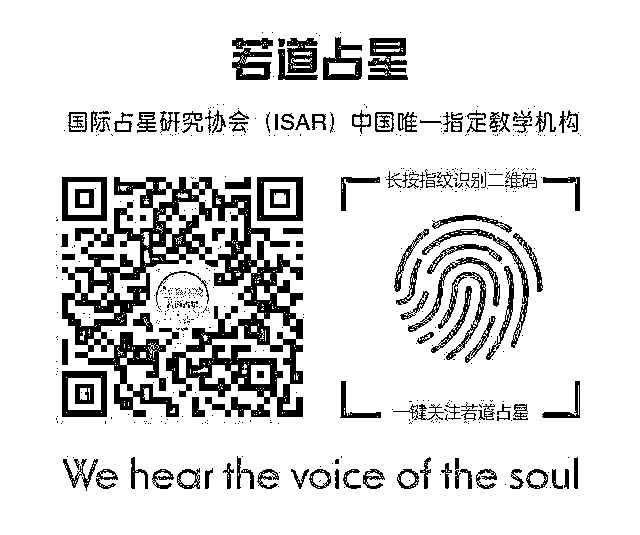**

# 如何说孩子才肯听之风象篇【双子座、天秤座、水瓶座】

> 原文：[`mp.weixin.qq.com/s?__biz=MzA5NjA0NTAxNg==&mid=403311164&idx=4&sn=e23467e10489168dd3ed7a05573a7065&chksm=0d48b88b3a3f319db7c9d35ec9d521b977bc9e4b0894a09e36d47e35a00e08ac188e36f8f320&scene=126&sessionid=1692738862#rd`](http://mp.weixin.qq.com/s?__biz=MzA5NjA0NTAxNg==&mid=403311164&idx=4&sn=e23467e10489168dd3ed7a05573a7065&chksm=0d48b88b3a3f319db7c9d35ec9d521b977bc9e4b0894a09e36d47e35a00e08ac188e36f8f320&scene=126&sessionid=1692738862#rd)

****本文首发于《为了孩子》杂志**** 

该如何让孩子活出自己？了解他很重要！若道君找来亲子专家帮你支招，参考孩子的太阳星座来看看他的“罩门”在哪儿吧。不过也要记得孩子的星图还有很多其他元素和配置，切忌生搬硬套，无论什么星座的孩子，你温柔而坚定的爱永远是他最坚强的后盾。

风 象 篇双子座**5.21-6.21**

**优点**：聪慧、敏捷、充满好奇心、善于学习，社交能力强

**需要注意的地方**：专注程度弱，兴趣易转移

**教育技巧**：培养专注力和耐性；给孩子探索世界的自由

对于双子座孩子，很多人的第一反应是“聪明”。不止一个做中学老师的朋友告诉我，在他们的班级里，双子座学生的成绩常常是名列前茅的。的确，双子这个星座是和敏捷的头脑联系在一起的。双子座的孩子有很强的学习能力，他们很可能比别的孩子更早学会说话、数数、认字。他们也有相当好的记忆力，只要他们愿意，多学几首唐诗，或是把圆周率小数点后面的数字多背上几位，几乎是不在话下的。

双子是一个风象星座。所有的风象星座都是与心智有关的。双子座的守护行星又是水星，水星本来就是掌管思维、学习、交流的行星，所以**双子座最引人注目的天赋，就是超强的好奇心。**没有哪个星座比双子座更能配上“好奇宝宝”这个称谓了。他们降生在这个世界上的使命，就是尽一切可能去看、去了解、去体验。他们总是睁大了双眼，观察周遭的一切，并不断地问你：“这是什么？那是什么？为什么会这样？……”

但是，你一定也已经发现了，双子座的兴趣并不怎么持久。因为在他们眼里，有趣的东西实在太多了，他们就像那个既想捡玉米、又想捡西瓜，同时也觉得芝麻很不错的小猴子一样，兴趣点时刻都在转移。

**培养专注力和耐性，是爸爸妈妈必须帮助双子座的小孩去完成的一项功课。**不妨告诉他们，通过坚持学习，在进入下一阶段之后，他可以掌握哪些更有趣的知识。这会让双子座的孩子有持续学习的动力，而不会觉得学习的过程是一成不变的。否则，他们就很容易变成那种什么都知道一点儿、但什么也不精通的人。

**对于双子座的孩子，爸爸妈妈最不应该说的话就是“你很聪明，就是不用功！”这会让双子座的孩子强化“我很聪明”的骄傲心理，而对于“不用功”的批评，他们却未必会上心。**所以，当别人夸奖你的孩子聪明时，不妨告诉他们，“这是因为他花了很多时间来学习”，或“他在这方面有很强的兴趣”。这样的鼓励方式会比单纯强调他的智力更有正向的作用。

**双子座还有着超强社交能力。**随着他的年龄慢慢增长，你会发现对他来说，社交的重要性会越来越凸显。**他们很擅长建立自己的朋友圈，也很享受和朋友一起玩、一起交谈的乐趣。如果你有一个双子座的孩子，你需要明白的一点是，他们的世界很大很大，而家只是这个世界的一小部分。**而等到羽翼渐丰，他们会像小鸟一样出发，满世界去游荡。到了那个时候，作为妈妈，也不需有太多的不舍，因为双子座的孩子就是需要自由，就是应该去探索世界的。

这并不意味着对双子座来说家庭不重要、父母的爱不重要。**在他们小的时候，请你好好与他亲密互动，让他获得充分的爱与安全感，因为这是他长大以后拥有良好人际关系的基础。**而等到他长大了，相信他会对你充满感激，因为你对他的爱、你对他的理解，已经为他的人生打下了一个最健康的根基。

天秤座**9.23-10.23**

**优点**：乖巧、优雅、体贴、有审美天赋，人际交往能力强，擅长换位思考

**需要注意的地方**：过于在意别人的评价 

**教育技巧**：鼓励孩子表达自己的想法；激发孩子的行动力

在生孩子之前，很多妈妈会幻想着把女儿打扮成“最漂亮的小公主”，或把儿子培养成“最帅气的小王子”。如果你的孩子是天秤座，那么恭喜你，这些愿望很有可能会实现。**天秤座是一个与美感密切相关的星座，这个星座的孩子天生有一种对美的直觉，也知道怎样把美的一面表现出来。这种美并不一定是长得漂亮，更多是一种和谐感、优雅感。**它如同基因一般，写在天秤座孩子的生命密码中。

天秤座的这种和谐感、优雅感，在人际交往的领域表现得特别明显。他们知道如何把自己变成社交场合最受欢迎的小天使。**他们通情达理，也知道如何谦让容忍，如何平衡关系、如何保持公正。**

天秤座的孩子很会察颜观色，他们会随时根据旁人的反应来调整自己的行为。他们也知道在怎样的场合该有怎样的表现，比如在外面吃饭时喝汤要尽量不发出声音，在图书馆里不能吵吵闹闹，这些规矩他们都会乖乖遵守，不会让大人感到丢脸。

天秤座的孩子之所以能够如此乖巧，至少有两方面的原因。

*   天秤是一个以理智为主导的风象星座，且风象星座对于沟通、交流有着强烈的渴望，自然知道如何用理智引导自己，成为一个在社交上更受欢迎的人。 

*   天秤座是一个与“人际关系”有关的星座，他们本能地知道这个世界上不仅有“我”，还有“他人”。**天秤座具有“换位思考”的能力，这是其他任何一个星座都比不上的。他们会在乎别人的看法，当他们的脑子里形成了自己的意见时，马上也会跳出另一个念头：“别人会怎么想？”多为别人想一点，是天秤座孩子受欢迎的一个主要原因。**

“我这样做，妈妈会喜欢吗？爸爸会高兴吗？”这是天秤座孩子内心经常会出现的念头。他们会通过别人的眼光来评判自己、定义自己，并努力做一个让别人感到愉快的人。通过这样的努力，他们可以获得赞美。这赞美有两方面的意义：**一是强化他们的自我认同，二是创造出一种和谐愉快的气氛。这对于天秤座孩子是至关重要的。**

这样的孩子显然能让父母高兴，但作为父母，你也许会担心：一个总是在意“别人的想法”的孩子，该如何坚持自我，如何发展出决断力和行动力呢？

天秤座的确容易犹豫，但天秤座真的没有行动力吗？并非如此。**天秤座与白羊座是对宫星座，他们有共同的目标，就是表现自我。只不过白羊座是通过行动、竞争来表现自我，而天秤座是通过他人的肯定来表现自我。**此外，天秤座是北半球秋天的第一个星座，每个季节的第一个星座，往往具有卓越的开创意识，愿意主动参与、为明确的目标努力。新的理念、明确的目标会让天秤座兴奋，他们愿意立即行动，只不过，在他们迈出第一步时，他们很希望有你在旁边鼓励。所以，**如果你能经常鼓励天秤座的孩子去表现自我，去做一些富于开创精神的事情，那么他们的表现会让你十分欣慰。**

在感情和心理层面，你也可以给天秤座孩子必要的疏导。**“你有什么想法，都可以告诉妈妈，不用担心。”“如果别人的做法让你觉得不高兴，你可以提出来，和别人讨论。”**这样的鼓励对于天秤座孩子也是很有必要的，不然，他们很可能会隐忍过多、不懂拒绝、不能争取必要的利益。

水瓶座**1.20-2.18**

**优点**：富于创造力和独立的理性，具有独辟蹊径的智慧

**需要注意的地方**：不守“规矩”；对他人情绪不敏感

**教育技巧**：自主的成长，平等的交流，切忌用权威压迫孩子

有一位妈妈这样向我抱怨她的孩子：“他总是在唱反调。上课的时候，其他小朋友都乖乖地听老师的话，他非要给老师挑出一点毛病来；其他小朋友都乖乖地站好了拍集体照，只有他站在旁边一点也不配合，还说‘我从来不喜欢拍照。’”

**那个“总是不乖”的孩子，是水瓶座。**

另一些水瓶座的孩子没有这么极端。他们看上去很温和，也不主动反抗家长和老师的意见，但他们其实很犟。无论别人怎么说，他们都会坚持自己的想法。即使他沉默不说话，你也会感觉到他其实是在说“不”。那个“不”字很明确，你无法忽视它。

如果你有一个水瓶座的孩子，首先你需要明白，这个星座有一种把自己与旁人区分开来的强烈驱动力。他们需要确认自我的独特性，他们坚持独立的理性，不愿意为了“和别人一样”而放弃自己真正的立场，也从来不会屈服于某种权威。**对待这样的孩子，最要不得的就是强迫式的教育。**千万不要动用家长的权威来逼他做某件事，“因为我是你妈妈，所以你必须听我的”，这样的教育方式对于水瓶座是行不通的，因为这样除了激发他的叛逆情绪之外，没有任何好处。

这个社会不太容易接纳那些个性过于强烈的人。但水瓶座生来就应该成为以完全不同的方式去思考的人，这是水瓶独有的天赋，如果一味抹杀它，不但可惜，对孩子而言也十分痛苦。**如果水瓶座的天性能够得到良好的保护和发展，他们既可以顺应现实社会的种种规则，又能够保有充分的个性和冷静的智慧。**但反之，水瓶也可以成为庸庸碌碌的人，而他们心中仍有对个性的向往，为了标榜个性，他们会说一些怪话、做一些毫无意义的出格的事。到底“向左走”还是“向右走”，就看父母如何引领他们了。

其实，教育水瓶座的方式并不难，那就是给他们充分的自由。**给他空间去探索，给他时间去学习。**比如，如果你想让他学画画或弹琴，那么正确的方式不是逼着他去老师那里上课，而是让他自己接触色彩或音乐，感受到其中的乐趣，萌发学习的动力。如果你想告诉他某个与人相处的道理，那么正确的方式不是强迫他按照你要求的方式去做，而是允许他犯错、允许他碰壁，在受挫之后，他会慢慢领悟到你想要告诉他的东西。这种教育方式的核心，就在于**把“妈妈要我做的”变成“我想要做的”，把“妈妈告诉我的”变成“我自己学到的”，让他自由选择、自主成长。**

因为水瓶座太强调自由和理性，在情感上，他们可能会显得有点冷漠和疏离。**虽然水瓶座的孩子不喜欢和别人粘在一起，也不擅长用甜言蜜语来讨大人的欢心，但就和其他的风象星座一样，水瓶非常需要沟通和交流，他们愿意和喜欢的人在一起，谈论自己感兴趣的话题**。所以，请**常常拥抱他，让他感觉到爱，但不是束缚与制约；常常和他并肩坐着，把他当成真正的朋友一样平等交谈，尊重他、引导他、宽容他，让他按照自己的节奏愉快地成长。**

**也许你对下面的文章感兴趣：**

[如何搞定“熊孩子”？双鱼座妈妈有高招](http://mp.weixin.qq.com/s?__biz=MzA5NjA0NTAxNg==&mid=403134604&idx=2&sn=10ddd5ba2fb07a1d3da3654d3e93a2dc&scene=21#wechat_redirect)

[抽离的水瓶座也能成好妈妈](http://mp.weixin.qq.com/s?__biz=MzA5NjA0NTAxNg==&mid=402783748&idx=2&sn=42f6908140bcbc5883db68f8fa580316&scene=21#wechat_redirect) 

[宝宝，我不要最成功的你，要最好的你](http://mp.weixin.qq.com/s?__biz=MzA5NjA0NTAxNg==&mid=402970780&idx=2&sn=ab3533c8c56e1b945a2c67d19a6b746c&scene=21#wechat_redirect)

**作者简介** 

**沙沙**：占星咨询师，占星专栏作者，国家二级心理咨询师。2010 年创办工作室“九月占星馆”，2013 年通过 ISAR 职业占星师资格认证考试，成为首批在中国大陆通过该测试的占星师之一。长期研习出生图、关系盘、流年预测等技巧。希望通过星图，帮助来访者实现有效的自我觉察。 

**新浪微博**：九月占星馆

**微信公号**：九月占星馆（jiuyuezhanxing）

**个人微信**：zhouzhe7752（添加请注明“占星咨询”）

**◆ ◆ ◆  ◆ ◆**  

********特别提醒************：本文经作者授权发布******，**转载请注明出处。********

想了解更多内容？**2016 年 3 月 26 日**，大卫老师将在北京举办两天的占星学与亲子工作坊！让你找到“ 因材施教”的操作说明，学习应对不同时期亲子关系发展的成长挑战！

报名及咨询，请点击文末“阅读原文”

****

# 那些让占星师们生无可恋的小事

> 原文：[`mp.weixin.qq.com/s?__biz=MzA5NjA0NTAxNg==&mid=403281007&idx=1&sn=a0664bf31cfad15bf13a5ac00953c74b&chksm=0d4b26d83a3cafcea4f4687b3191eaae68a3f863dcc0b77e40866bb7984f06f901e2305f2796&scene=126&sessionid=1692738862#rd`](http://mp.weixin.qq.com/s?__biz=MzA5NjA0NTAxNg==&mid=403281007&idx=1&sn=a0664bf31cfad15bf13a5ac00953c74b&chksm=0d4b26d83a3cafcea4f4687b3191eaae68a3f863dcc0b77e40866bb7984f06f901e2305f2796&scene=126&sessionid=1692738862#rd)

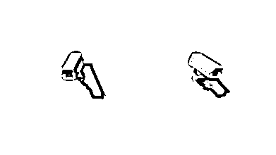

**那 些 让 占 星 师 们**

占星师不是神仙，他们也是人，他们也是人，他们也是人！

重要的事情说三遍！ 

占星不是算命看相，通过星图发现自我，通过天象了解大势，趋利避害，活出自己，才是占星的终极目的。 

来看看这些让占星师生无可恋的小事，你中招了吗？

**生 无 可 恋 的 小 事****生 无 可 恋 之**


**形 象 篇** 

**占星师眼中的自己是这样的**

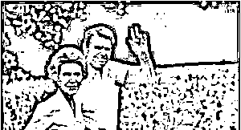
**师琼·奎格利（Joan Quigley） 美国前总统里根的占星师**

**外人眼中的占星师是这样的**

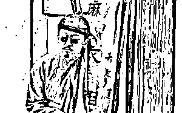

**占星不是算命！我们看的不是命，是人性。**

**生 无 可 恋 之**


**误 解 篇 **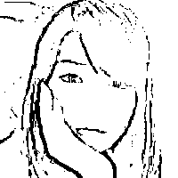

**你会看星盘？来，给我看个一百块的……**

_ 副本.jpg")

**亲，看星图不是买肉，还能买个一百块的……**


**一家子三代来咨询，咨询完之后说一句，“恩，和香港那个算命大师说的一样。”**

_ 副本.jpg")

**要如何告诉你，我不是算命师……**

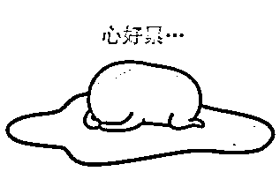


**我能结婚吗？我有钱吗？我老公啥样?我会离婚吗?**

_ 副本.jpg")

**妹妹，你才 15 岁啊……**


**在吗？我有抑郁症，你能治吗？**

_ 副本.jpg")

**这里不是心理诊所，确诊抑郁症请寻求专业人士救助……**

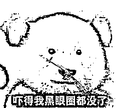


**我的月亮是上升天蝎么？为啥你有三个巨蟹而我只有一个？**

_ 副本.jpg")

**这事儿只能问你妈……**

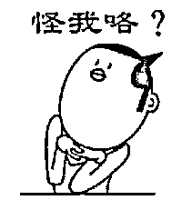


**——在干吗？——看盘呢。——哟，你炒股炒得不错吧？**

_ 副本.jpg")

**咱俩说的不是一回事儿……**


**生 无 可 恋 之**


**家 庭 篇 **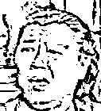

**你这孩子是学算命看相了吗？！**

_ 副本.jpg")

**妈，说一百遍了占星不是算命看相……**

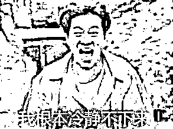


**你们老师教你的时候别让人给催眠了啥都往外说！**

_ 副本.jpg")

**妈，银行卡号密码我一定严防死守！::>_<::**

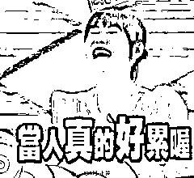

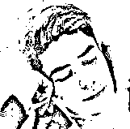

**媳妇儿，你学了占星，以后咱家就靠你养了。**

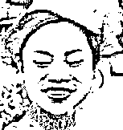

**老公，你长那么好看，说什么都对！%>_<%**

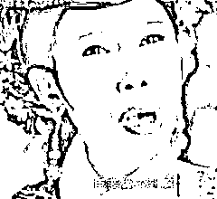

**生 无 可 恋 之**


**咨 询 篇 **

**大师在吗？大师您给看看呗！**

_ 副本.jpg")

**大姐您可别，折煞老夫了……**

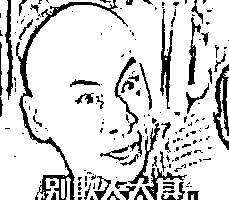


**一个太阳狮子，多年来一直认为自己是太阳处女，并以此为荣，然后死活不愿意接受自己真正的太阳星座。**

_ 副本.jpg")

**药不能停哒……要不您改成蛇夫座算了……**

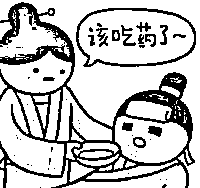


**给我往好了算啊，不然不给你钱。**

_ 副本.jpg")

**（还好这样的客户基本已经绝迹了）**

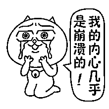


**自己聊着聊着，突然自己就发现自己的问题所在了，然后就开始自己分析了。**

_ 副本.jpg")

**这样的客户多多益善。**

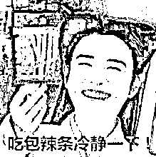


**您做这行女朋友肯定很好找吧？**

_ 副本.jpg")

**你咋知道我学占星就是为了泡妞^_^**

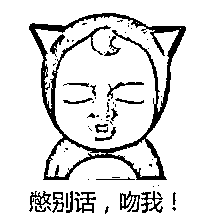


**上回给我看得真准，我好崇拜你哦！**

_ 副本.jpg")

**哪里哪里……（其实是拿了另外一个人的星图给你看，谁让你俩名字一样……）**

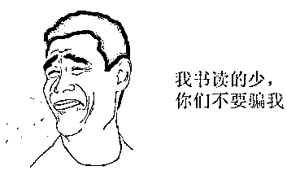

P.S.：这样的情况毕竟是少数，

要相信占星师们还是有敬业精神哒，

但也要允许他们偶尔的脑抽……

这位犯错的占星师已经闭关四个月，

我们就原谅他吧……

**生 无 可 恋 之**


**同 行 日 常 篇 **

**谁能给我矫正一下生时，把我矫成金星三分上升点，美美哒。**

_ 副本.jpg")

**——给我五十块，保证给你矫正成精准三分。——二十我就干！**

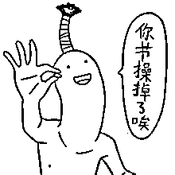


**自打矫正过生时和蓝朋友四轴就不合了，整个人都不好了。**

_ 副本.jpg")

**要不让他再重新生一次，要不换个合四轴的蓝朋友。**

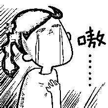


**最近行运海王星过我本命太阳，天天迷迷糊糊呢。**

_ 副本.jpg")

**我土星回归，比你好不了多少啦。（你们听不懂的聊天语言）**


**不知道这次造人能不能成功呢……**

_ 副本.jpg")

**行运月亮过五宫主星，肯定没问题哒！（然后果然就怀上了）**

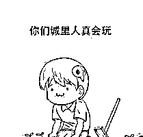

**这是一群顶着家庭的压力，外界的不解，**

**默默走在自我疗愈和疗愈他人道路上的勇敢者。**

**请好好爱惜你身边的占星师们，**

**他们需要付出的努力和可以给你的帮助**

**远远大过你的想象……**


意犹未尽？也想来吐槽？若道君恭候您的评论哦~

# 公益微课 | 为啥别人都富了，你还穷着？

> 原文：[`mp.weixin.qq.com/s?__biz=MzA5NjA0NTAxNg==&mid=403281007&idx=2&sn=6a0e38bd7b652d1da878e90d89de25b8&chksm=0d4b26d83a3cafce8216c47ff43a84093bdd88ee554a61537463475aaa716abc63bc73eaeb9f&scene=126&sessionid=1692738862#rd`](http://mp.weixin.qq.com/s?__biz=MzA5NjA0NTAxNg==&mid=403281007&idx=2&sn=6a0e38bd7b652d1da878e90d89de25b8&chksm=0d4b26d83a3cafce8216c47ff43a84093bdd88ee554a61537463475aaa716abc63bc73eaeb9f&scene=126&sessionid=1692738862#rd)

为什么你那么拼，钱还是不够多？

为什么到手的钱会飞，好像它和你没缘分？

为什么你工作那么多年，还实现不了财富自由？

……

难道，你跟金钱的关系不好？

那怎么办？

来参加若道 2016 年度第一堂微课吧

本期我们聊聊财富那些事

微课话题

**从金钱能量到财务自由**

具体内容

➤你了解贫穷吗？贫穷会伤害人吗？伤害你的到底是什么？藏在贫穷背后的又是什么？

➤金钱能量是什么？什么在影响你的金钱能量？如何才能够让你的金钱能量流动起来？

➤大家都在说财务自由，到底什么是自由？你现在自由了吗？如何才能真正的获得自己？

授课老师

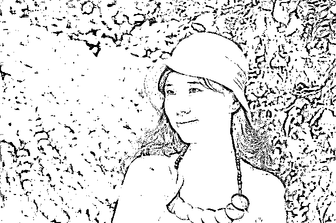

**慕棉**，吉林大学工学博士，美国催眠协会（ABH）&美国加州催眠学院（P.A.S.H）认证催眠师，国际医学最高认证中心（WMECC）认证 EFT 情绪释放技术治疗师，国际整体暨自然医学学会（IHNMA）认证完型治疗执行师。 现居北京，从事各类心理心灵整合治疗工作。 

参与方式

**时间**

2016 年 3 月 22 日周二晚上 8 点-9 点

**形式**

微信群活动，45 分钟语音授课，15 分钟互动问答

**报名**

长按客服二维码添加为好友，等待被拉入微信群。

**（添加时备注“报名微课”，将统一于 3 月 19 日下午进群）**


**◆ ◆ ◆  ◆ ◆**

**等你哟~**

# 国际占星日@成都 | 春天里，星星龙门阵摆起

> 原文：[`mp.weixin.qq.com/s?__biz=MzA5NjA0NTAxNg==&mid=403281007&idx=3&sn=63b847e1472e534250df20c5c72e0dda&chksm=0d4b26d83a3cafce326d07a054b474504ebdf457872bd0d600e75a0ff5d00f0acf095566522a&scene=126&sessionid=1692738862#rd`](http://mp.weixin.qq.com/s?__biz=MzA5NjA0NTAxNg==&mid=403281007&idx=3&sn=63b847e1472e534250df20c5c72e0dda&chksm=0d4b26d83a3cafce326d07a054b474504ebdf457872bd0d600e75a0ff5d00f0acf095566522a&scene=126&sessionid=1692738862#rd)

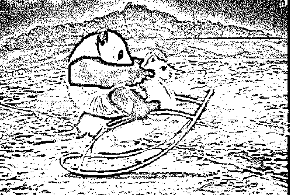

昨儿短袖今天羽绒的

这天气早乱了

可 3 月 21 日

白天和黑夜

它们如约等长了

昨儿安静今天激进的

这心情早乱了

可在心底

倔强的灵魂

想要找到真正的家

来吧来吧

**春天里我们一起**

**关于星星的龙门阵摆起**

**茶喝起图卡耍起**

 春光乍泄也好 

暗香浮动也罢

底牌亮出来

找到彼此的你我 TA


**3 月 20 日**，**若道四川同学会**，诚邀在各个卡卡角角蛰伏的**占星同好们**，**盖碗茶**喝起，**占星壳子**冲起，**占星骰子**耍起.......**塔罗、OH 卡、花卡**啥啥的，你若带来我们热烈欢迎，目的只有一个：耍到全世界都知道，有个 day 叫：**国际占星日**！

**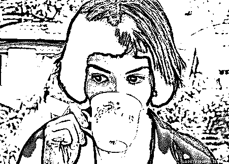**

活动安排

**时间**

3 月 20 日周日下午 14:30～妈妈喊你回家吃饭

**活动费用**

50 元/人（场地、茶水费用）

**地点**

屋顶上的樱园（东玉龙街 37 号）

**问路电话**

028-86788498

**联系人**

薇安回来（微信 ID：weianhuilai ）

**付款方式**

微信红包 to 薇安回来

**报名截止**

3 月 18 日，谢绝空降


**我们的口号：**

**让占星学充满趣味！**

**就等你来冲壳子了~**

# 宇宙天气 | 奔向春天的脱缰野马（3.14~3.20）

> 原文：[`mp.weixin.qq.com/s?__biz=MzA5NjA0NTAxNg==&mid=403182648&idx=1&sn=6e30414f2a7f7626835eaf49f4441093&chksm=0d4aa68f3a3d2f9996b5680d1e6016be833a4a78a6b8598f5cd01d2ec66db19bafd62bbf10a1&scene=126&sessionid=1692738862#rd`](http://mp.weixin.qq.com/s?__biz=MzA5NjA0NTAxNg==&mid=403182648&idx=1&sn=6e30414f2a7f7626835eaf49f4441093&chksm=0d4aa68f3a3d2f9996b5680d1e6016be833a4a78a6b8598f5cd01d2ec66db19bafd62bbf10a1&scene=126&sessionid=1692738862#rd)

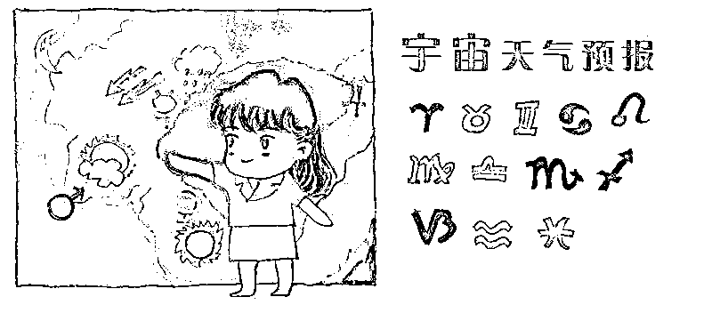
作者/占星师 Cora

插画/七沐 图片/花瓣网

**一 周 星 象 综述**

本周月亮经过双子座、巨蟹座、狮子座。

由于目前天空中的大量行星聚集在变动星座（太阳、水星、海王星、金星在双鱼座，火星、土星在射手座，木星在处女座），所以月亮在双子座时，也就是周一和周二，将是**特别容易感到思绪繁杂混乱、心情和计划多变、行事混乱**的时段。

周三到周五的大部分时间，月亮在巨蟹座，与其他行星形成多个和谐相位，混乱的感觉会平息下来，但可能变得**敏感，多了些愁绪**。

周六和周日月亮在狮子座，与土星、天王星形成三分相，**这个周末将是心情大好、给点阳光就灿烂的日子。**

> **本周重点星象事件是：**
> 
> **① 周二双鱼座水星与处女座木星、射手座土星形成“T 三角”**
> 
> **② 周二双鱼座金星四分射手座火星**
> 
> **③ 周四处女座木星三分摩羯座冥王星**
> 
> **④ 周日太阳进入白羊座**

**每 日 星 象**

**3 月 14 日**

星期一

**关键词：沟通**

今天月亮在双子座，会在上午四分双鱼座金星，对分射手座火星，并在晚上四分双鱼座海王星。这是容易感到**心神不宁**的一天。我们脑中可能突然冒出很多想法，或是接触到太多会干扰到我们的决策和行动的信息，带来计划的变动或方向不清的混乱感。与人的沟通交流中，也容易出现沟通不畅、鸡同鸭讲、没有耐心的状况，我们可能对自己的意思表达不清，或是急于兜售自己的观点，却无法耐心、有效地倾听和理解他人。在这一天，我们需要**有意识地提醒自己冷静、客观、心平气和地面对问题**。无法专注会是一个问题，啃不下硬骨头的话，也不要对自己太过苛责了。

**当日星象**

**05:03**月亮离开金牛座进入双子座

**08:22**双子座月亮四分双鱼座金星

**09:43**双子座月亮对分射手座火星

**22:08**双子座月亮四分双鱼座海王星

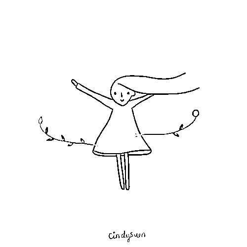

**3 月 15 日**

星期二

**关键词：爆发**

今天月亮依然在双子座，在早上对分土星，临近中午时则会与水星、土星、木星形成变动星座的大十字。今天的混乱情况比昨天还要严重一些，因为水星在今天与土星、木星都形成挑战相位，同时金星与火星的四分相也准确发生。这很可能是所有问题集中爆发的一天。**自上周的双鱼座新月以来，一直积累的“求新求变”的能量，可能在这一天集中爆发出来，令事情出现变化。**

由于金火四分的原因，这也是恋情中迸发出激情火花的时刻。我们**对浪漫爱情的渴望会变得强烈，也更有冲动去做一些带来心跳与刺激的事。**无论有没有恋人，这都是去追求更多快乐的时刻。同时，此相位也有利于创造力和想象力的表达，有助于艺术方面的创造。

**当日星象**

03:27  双鱼座水星四分射手座土星

**04:49**  双鱼座金星四分射手座火星

**08:55**  双子座月亮对分射手座土星

**09:45**  双子座月亮四分双鱼座水星

**10:52**  双子座月亮四分处女座木星

**13:37**  双子座月亮六分白羊座天王星

15:00  双鱼座水星六分摩羯座冥王星

17:43  双鱼座水星对分处女座木星

**3 月 16 日**

星期三

**关键词：放松**

今天月亮进入巨蟹座，前两天的混乱和躁动开始平息下来。我们开始**收敛情绪，能够更多地关注内心**。水星-土星-木星的 T 三角相位依然在起作用，我们仍需**深入思考一些新方向、新计划在现实层面的可能性，确定一些路线问题**。但此时我们的心情会变得平静一些，不是急于从外部搜集信息，而是能够回到自己的感受和直觉，从内心找答案。傍晚时分巨蟹座月亮三分双鱼座金星，带来柔情蜜意的时刻，我们能够感受到爱的流动，获得情感上的疗愈。

**当日星象**

**01:04**  双子座月亮四分双鱼座太阳

**08:56**  月亮离开双子座进入巨蟹座

**17:45**  巨蟹座月亮三分双鱼座金星

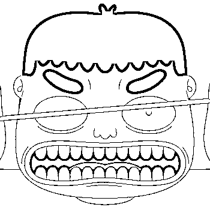

**3 月 17 日**

星期四

**关键词：情绪**

月亮依然在巨蟹座，并在下午对分冥王星，在晚上四分天王星。**这是易有情绪波动的一天，特别是下午到晚间，危机感和不安全感易加重，合作关系或情感关系中的问题也有可能在此时暴露出来。**我们渴望对事情有更多掌控，也希望能够突破限制实现心中所想，但生活总是不那么容易。在积极的方面，这会是一个了解自己深层的恐惧、渴望和情感需要的机会。而真正的了解，会帮助我们确定对的方向。

**当日星象**

**03:11**  巨蟹座月亮三分双鱼座海王星

**04:07**  处女座木星三分摩羯座冥王星

**16:01**  巨蟹座月亮六分处女座木星

**16:09**  巨蟹座月亮对分摩羯座冥王星

**19:40**  巨蟹座月亮四分白羊座天王星

**3 月 18 日**

星期五

**关键词：娱乐**

今天白天的大部分时间，月亮在巨蟹座，下午四点左右月亮进入狮子座，没有挑战相位。总的来说这会是**心情不错**的一天，特别是晚间，狮子座的月亮会带来更多**自信和活力**，这是一个适合玩乐的晚上，恰好又是周末，很适合安排一些有趣的娱乐活动。接近午夜时月亮三分火星，带来旺盛的精力和行动力，可能很多人会玩到很晚都不累。如果在这个晚上选择工作，效率也会比较高。

**当日星象**

**00:19**  巨蟹座月亮三分双鱼座水星

**12:10**  巨蟹座月亮三分双鱼座太阳

**15:53**  月亮离开巨蟹座进入狮子座

**23:47**  狮子座月亮三分射手座火星

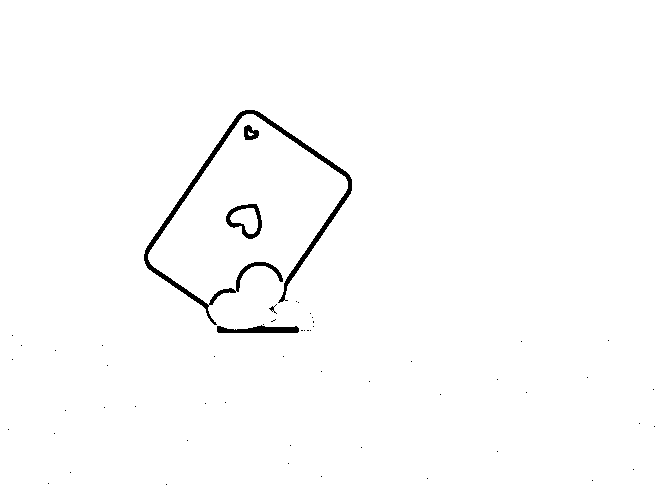

**3 月 19 日**

星期六

**关键词：享受**

这是相对平顺的一天。因为没有特别的星象事件，所以月亮在狮子座带来的感受会更加明显。建议利用这一天去做些有趣的、能带来活力的事。这是自带快乐光环的一天，做什么都会比较顺利。尽情享受美好春光吧。

**当日星象**

**23:09**  狮子座月亮三分射手座土星

**3 月 20 日**

星期日

**关键词：激情**

今天月亮依然在狮子座，并且中午太阳进入了白羊座，也是一个火象星座。所以今天我们会感觉到“突如其来”的激情、活力和能量。我们能够感受到有些事情在飞速开启。未来一个月的“白羊月”，是我们一往无前地奔向新目标的时候。不要犹豫和回头，跟随着冲动和直觉去行动。“开始”，是未来一个月的重要主题。

**当日星象**

**04:44**  狮子座月亮三分白羊座天王星

**12:31**  太阳离开双鱼座进入白羊座


**作者简介**

**占星师 Cora**，全美占星师联盟（AFAN）成员，国际占星研究协会（ISAR）会员，获 ISAR 职业占星师资质认证，斯蒂芬·弗里斯特《变幻的天空》译者，个人星象文章见诸《心探索》《北京青年周刊》《上海电视》《空中生活》等杂志媒体。曾跟随大卫·瑞雷系统学习占星学，现为全职占星师。

微信公众号：聆宇 FM（微信号：lingyudiantai）

个人微信号：CoraAstro

长按二维码，让金钱涌向传播知识与智慧的人~

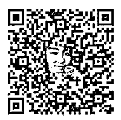

**◆ ◆ ◆  ◆ ◆**

**特别提醒：****本文由作者授权首发于若道平台，**转载请注明“转自若道”。****

如何掌握星象，顺势而为？**2016 年 3 月 15 日**，大卫老师主讲的若道占星核心课程**Level 5**要开课了！在这个阶段，你将学习各种预测技术及行星周期。通过这些预测工具，你能够预测和规划人生。提前报名付款有**早鸟价**哦！详细内容请点击“**阅读原文**”了解。

报名及咨询，请点击文末”阅读原文“


# 若道 Level 1-5 | 占星学习一步到位，还帮你省 7400 元！

> 原文：[`mp.weixin.qq.com/s?__biz=MzA5NjA0NTAxNg==&mid=403182648&idx=2&sn=7191d856c204e3a2aac3a9d3954e65be&chksm=0d4aa68f3a3d2f99c32f6b950e21be521cb4ef1184a5a8d5561f440eee4b4ed22af161330daa&scene=126&sessionid=1692738862#rd`](http://mp.weixin.qq.com/s?__biz=MzA5NjA0NTAxNg==&mid=403182648&idx=2&sn=7191d856c204e3a2aac3a9d3954e65be&chksm=0d4aa68f3a3d2f99c32f6b950e21be521cb4ef1184a5a8d5561f440eee4b4ed22af161330daa&scene=126&sessionid=1692738862#rd)

在大家的期盼中

若道核心课程 Level 1-2 开课了
3 月 8 日

来自全国各地的新学员

在线参加了若道 2016 年开学典礼

跟大卫老师、助教及若道课程团队见面

▼

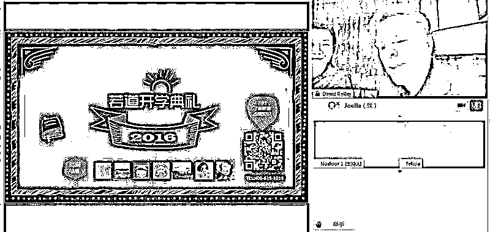

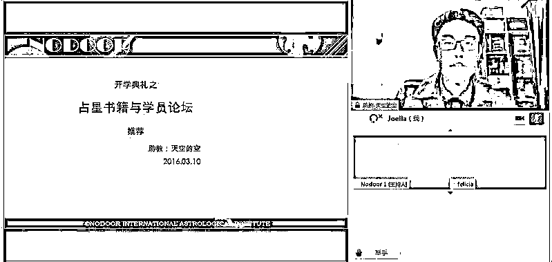

3 月 10 日

由大卫老师主讲的 Level 1-2 正式开课

除了在线的小伙伴外

北京若道现场

被前去听课的小伙伴挤满

▼

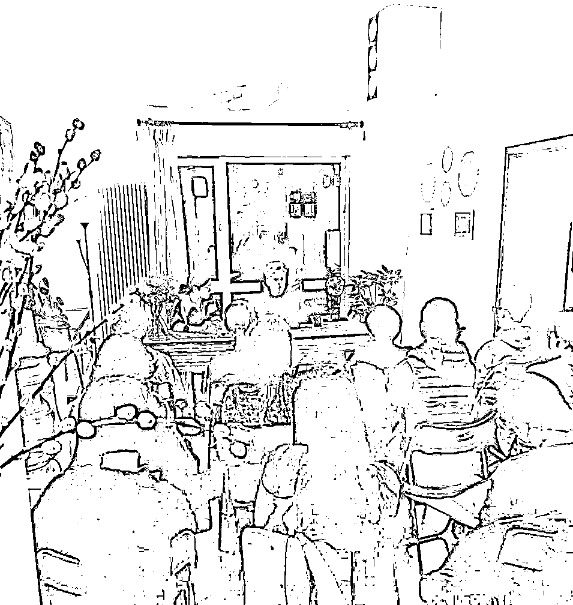 

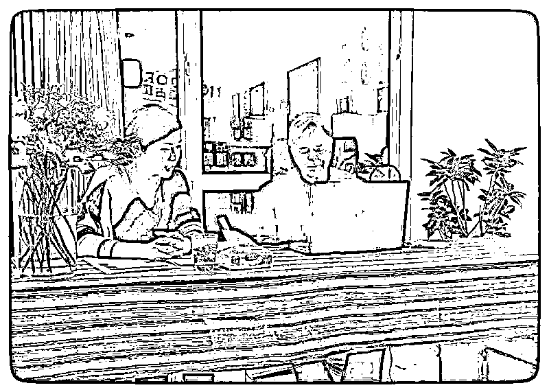
摄影/刘洋

大卫老师 40 年的占星学经验果真不同凡响  

即便是简单的 12 星座内容

也极大地激发了大家的学习兴趣

课后有同学立即报名 Level 1-5 的联报课程

打算跟定大卫老师

从初阶一直学到高阶

此外哦

若道君悄悄告诉大家

为满足大家的学习热情

本已关闭的 Level 1-5 的联报

又新增了 20 个名额

关键是

**联报特惠价是 27000 元** 

**比起单独报名 1 到 5 阶**

**足足优惠了 7400 元哦**

L1-5 联报

课程简介

****

** Level 1：星座，太阳和月亮**

12 星座是占星学最基本却又最深刻的概念，黄道 12 星座，是伟大的生命周期，而太阳和月亮是我们阴阳之本。  

　　     

**Level 2：**遇见行星和月亮交点****

在这个阶段，你将遇见行星们，还有与灵魂的过往和未来相关的月亮交点。这既是你，你的性格，也是你在生命故事中将会遇到的人、事、物的显化，也是你灵魂轨迹的线索。


**Level 3：五彩线穿起来——宫位、相位及元素组合**

在这个阶段，你将学习宫位，知道生命的故事发生在哪里。你会学习相位，那是行星之间的对话，是一颗行星如何用自己的能量去影响其他行星。

然后，你要学习如何将星座、行星、宫位、相位组合起来进行解读，这是把散落的珠子穿起来的过程。这个部分非常重要，是大部分占星学习者薄弱的环节，也是从爱好者走向职业占星师道路时承上启下的一个重要阶段。


**Level 4：星图舞会——星图综合解读 24 小时**

在这个阶段，你终于可以学会星图的综合解读了！前一阶段你学习得越扎实，现在就越开心。你可以看到，当那些行星、星座、宫位、相位穿起来的丝线开始跳舞，一个个故事图景就像织锦一样展现在你的面前。个性、爱情、事业，看到一个人的出生星图，你就可以开始讲他们生命故事的梗概了。在这里，大卫老师会分别讲解如何通过出生图进行性格、爱情、事业分析。在爱情解读部分，你还会提前学到比对图。


**Level 5：气象预报——预测技术和咨询技巧**

在这个阶段，你将学习各种预测技术——行进、月亮次限、太阳弧、返照图。你会学到行星周期！宇宙天象如何变化？它又会如何影响每个人的人生？通过这些预测工具，你就能够开始预测和规划人生了。

有关毕业

**考试和实习****：**对于那些想要获得大卫老师资质班证书的朋友，我们将帮助大家在开始成为职业占星师之前，将由专业占星师组织小型督导工作坊，帮助大家实战解盘，为正式的收费咨询做好准备。通过毕业考试，参加督导工作坊，星盘解读的同学，将获得大卫老师颁发的职业占星师资质证书。

授课优势

**①先进的教学平台**

网络教学平台，支持手机、电脑、iPad 上网，可以随时随地学习。

**②回放复习**

学员可登录网站收看课程回放，在线复习课程，每次课可完整重看 3 次，课程结束后的 3 个月内有效。　

课程特色

**①与名师面对面**：北京同学可以来若道现场上课，和大卫老师面对面互动。大卫老师也可能前往主要学员所在城市，实现零距离教学。

**②互动答疑**：论坛、微信群随时提问；老师课上答疑；助教线上线下全程协助。

**③线下沙龙**：定期举办沙龙活动，复习上课内容。

**④强大的同学网络**：若道作为中国最顶尖的占星教学机构，在 4 年的占星教学中，培养了很多占星人才。若道让你和师兄师姐切磋，让你和国内著名占星师学习。（简单来说，就是，人脉！）网络授课，在北京开设免费现场参与名额，全程英文授课，配备实时翻译。

师资力量


**大卫·瑞雷（David Railey）**

若道创始人，《灵魂的目标》作者。拥有四十年的占星咨询的执业经验，曾两任亚特兰大占星协会主席，是全美占星师联盟（AFAN）、美国占星师联合会（AFA）、全美占星研究委员会（NCGR）、国际占星研究协会（ISAR）和职业占星师组织（OPA）的成员，是联合占星大会（UAC, United Astrology Conference）督导委员会委员。大卫曾是 CNN、CBS 的占星节目的常驻嘉宾，多次在 BBC、WGS、WSB、WRGG 等节目中接受采访，并在亚特兰大主持电视节目《每日行星（Daily Planets）》达 4 年之久。

**2016 年，和若道老师一起，开启占星的探索之旅！**

长按二维码添加课程负责人咨询~


报名请点击文末”阅读原文“

# 电影 | 金星入双鱼座，那些年我们看过的浪漫

> 原文：[`mp.weixin.qq.com/s?__biz=MzA5NjA0NTAxNg==&mid=403156927&idx=2&sn=ac4d7f4e905475ca5728e8bbb5edf04c&chksm=0d451d083a32941e54cd0726d6f750263f7e0496e07b9e99de4e7778c6f66000aeca9301d3ce&scene=126&sessionid=1692738862#rd`](http://mp.weixin.qq.com/s?__biz=MzA5NjA0NTAxNg==&mid=403156927&idx=2&sn=ac4d7f4e905475ca5728e8bbb5edf04c&chksm=0d451d083a32941e54cd0726d6f750263f7e0496e07b9e99de4e7778c6f66000aeca9301d3ce&scene=126&sessionid=1692738862#rd)

金星于 3 月 12 日进入双鱼座，空气都将变得微甜。双鱼座的浪漫与梦幻，牺牲与奉献，天真与世故，构成了幻化无穷的情感。这个周末，一起来聊聊这些双鱼座特质的电影吧，即使现实生活中找不到如此曼妙完美的爱情，我们还可以在屏幕前感受这一场美梦。

▼

**《唯爱永生》**

**“爱并不会因瞬息的改变而改变，**

**它巍然矗立直到末日的尽头，如果我说错了，**

**并被证明不正确，即便我没有写诗，也没真爱过。”**

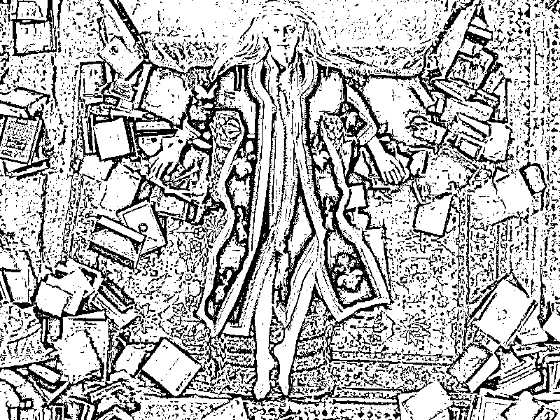

 导演/吉姆·贾木许

领衔主演/蒂尔达·斯文顿、汤姆·希德勒斯

如果我们都要死了，还有什么选择呢。亚当和夏娃过着当代文艺人的生活，唱歌弹琴彼此隔着大洋倾诉衷情，和其它艺术家一样有着对于终极死亡的渴望与哀伤。不同的是这对恋人是已经活了几千年的吸血鬼。吸血鬼的生活里唯一的奢侈品是食物，人类的血充满了欲望与病毒，只有少量的熊猫血是可以保证没被污染的。尽管这对恋人创造了大量的艺术作品，会跳舞、弹琴、作曲、写作甚至掌握了丰沛的自然和科学知识，他们也难逃食物的短缺。他们活的美丽而浪漫，消弭了年龄和婚姻等一切现代社会的牵绊，只有最单纯的爱情——如同金星双鱼座一般完美理想化。故事的最后，洁净的血消失了，浪漫纯美如金星双鱼座也有一对锋利的獠牙。

▼

**《了不起的盖茨比》**

**“如果打算爱一个人，你要想清楚，**

**是否愿意为了他，放弃如上帝般自由的心灵，**

**从此心甘情愿有了羁绊。”**

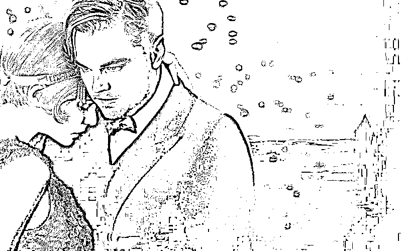

导演/巴兹·鲁赫曼

领衔主演/莱昂纳多·迪卡普里奥

爱有多脆弱，就有多繁华。人世间最可笑的是我们希望的爱情脆弱得禁不起任何现实的考验，一幕又一幕的美景把它层层遮掩，终是虚幻到连自己也骗。盖茨比的局设得很大，环环相扣夜夜笙歌，歌舞升平声誉全城只为了引心上人的一个回眸。他站在海湾这边遥望雾中绿色灯光的对岸，那里是他心上人住着的地方，残忍的是到最终抱着纯真恋爱心情的盖茨比先生都不能接受，他的心上人对他的爱竟比那灯光还要遥远和渺茫。再多金钱也填不满易变的心，倔强的他抱着瑰丽的梦期望有一天金钱可以搭出鹊桥天梯，就像金星的实体落进双鱼座，你也许只能听见金钱叮当的涟漪，最终沉没深不见底。这是金星双鱼座沉默的警告：亲爱的，这里只有繁华，没有你要的爱情。

▼

**《春光乍泄》**

**“我一直没告诉何宝荣，**

**他受伤的日子是我最开心的日子。”**

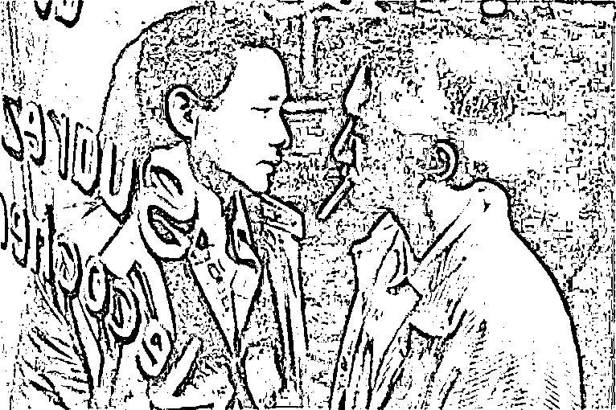

导演/王家卫

领衔主演/张国荣 、梁朝伟

爱情是个骗子，你不知道它什么时候敲门，也不知道它什么时候离开。黎耀辉能听见“噗通噗通”的心跳声，却不知道嘴里说出了些什么，他看不见自己眼里的悲伤。“黎耀辉，不如我们由头来过？” 这是何宝荣给他下的降头，无数次让黎耀辉张开手臂送出一个温暖的拥抱。爱是无声的，是感性的，我们被爱意深深浸没。可惜的是默契的爱情正如那颗温柔的双鱼座金星，毫无界限的淡入淡出抓不住。他们拥抱着对方，油腻的厨房也变成辉煌的舞厅，王子和王子的爱情来与去、浅或深、对亦错说不清道不明。最终能确定的一件事是：爱情平淡到深深刻进骨髓里，专一到只有那个人能将这痕迹轻轻拂去。金星双鱼座的爱情，绝美。

▼

**《寻找梦幻岛》**

**“我只是以为，她会永远陪伴着我们。**

**我也是这么想。然而，其实她一直都在，在你每一年的想像之中。”**

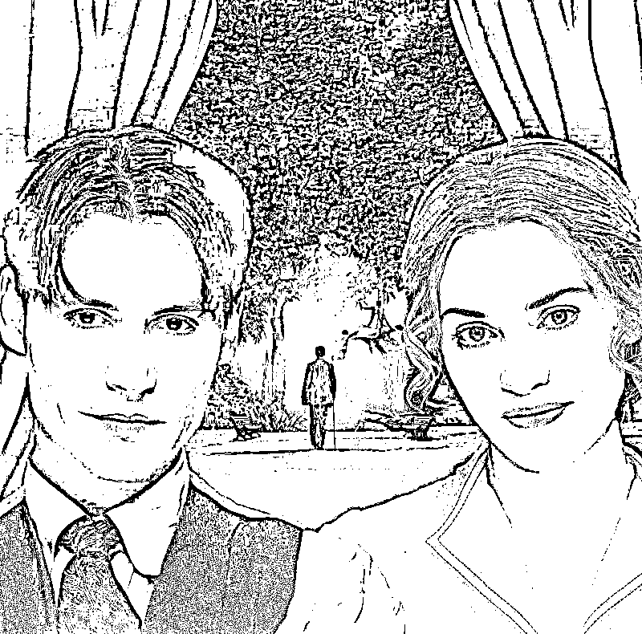

导演/马克·福斯特

领衔主演/约翰尼·德普、凯特·温斯莱特

爱有形式么？我们心里总有一个地方不会让父母去也不会让爱人去，那里是我们心灵最终栖息的天堂，它叫梦幻岛。作家贝瑞有个梦幻岛，西维亚家的孩子在一起时，贝瑞为孩子们开启了去往自己心灵之岛的路，他像个父亲一样指引着孩子们开启想象力，走出沉重的生活阴影。贝瑞爱孩子也爱着孩子们的妈妈，这种爱是明知不可得才深深寄托的感情。无论称之为对现实的逃避还是对婚姻的精神出轨，这让贝瑞对一家四口付出了几乎全部，有些爱不能建立在真正的现实关系上，只有带着想象和虚幻的地方才有真正的爱，这是贝瑞与西维亚一家的感情，也是金星双鱼座独有的升华。最后它生了根传承到了孩子们的想象力里，变成了新的美与浪漫。

▼

**《天生爱情狂》（又名《唐璜》）**

**“生命中有四个值得回答的问题：**

**什么东西是神圣的？**

**灵魂由什么构成的？**

**什么东西值得为它而生？**

**什么东西值得为它而死？**

** 这些问题的答案都一样：只有爱。”**

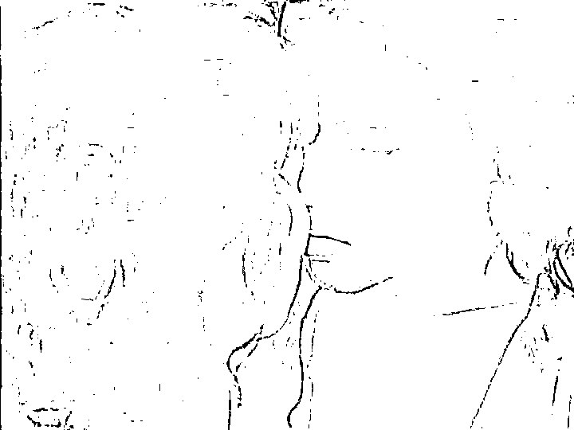

导演/约瑟夫·高登-莱维特

领衔主演/约翰尼·德普、马龙·白兰度

双鱼座的浪漫是疯狂的，是脑洞过大的，正因如此它美得不得了。你见到的是一个臆想症患者？他说他是个情圣。唐璜到过的地方，最古板的护士甚至男性也开始翩翩起舞，走路时带着曼妙的姿势。活在真实世界的我们觉得这事儿不可思议，滑稽极了。唐璜说：“你在不完美的世界里追求着真实，直到它将你的生命耗尽。我的完美世界，其真实性毫不逊色。只有在我的世界里，你才能呼吸。”你无法证明唐璜的观点是错的，甚至无法证明自己的现实究竟是不是现实。浪漫让一切都变得美好极了，在漫长的自我挣扎和妥协后，我们终于承认：浪漫是一种病，无法痊愈且高度传染。

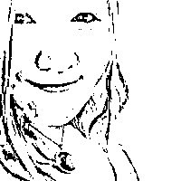

**作者简介**

**金钱龟 Doris**：受现代占星启迪，跟随多名国际占星师系统学习各类占星知识，国家二级心理咨询师。致力于以占星结合心理学解决现实生活中的各类问题。

长按二维码，让金钱涌向传播知识与智慧的人~

.jpg")


**还有比它们更符合双鱼座特质的电影吗？**

**欢迎分享~**

**◆ ◆ ◆  ◆ ◆**

******特别提醒************：本文由作者授权首发于若道平台******，**转载请注明“转自若道”。******

想知道什么配置的人特别喜欢看电影？**2016 年 5 月 19 日**，蒋颖老师主讲的若道占星核心课程**Level 1-2**要开课了！她将带领你学习星座、太阳、月亮、行星、月亮交点等知识，让你进入占星学的世界！

报名及咨询，请点击文末”阅读原文“


# 国际占星日@上海 | 听说长得好看的都报名了……

> 原文：[`mp.weixin.qq.com/s?__biz=MzA5NjA0NTAxNg==&mid=403156927&idx=3&sn=b4390e9e6c036c68b13fb784fa1d1f91&chksm=0d451d083a32941e0494621fd6d1d8c04e771afbff313c8d8e62d55c385ffa6fa8859d111684&scene=126&sessionid=1692738862#rd`](http://mp.weixin.qq.com/s?__biz=MzA5NjA0NTAxNg==&mid=403156927&idx=3&sn=b4390e9e6c036c68b13fb784fa1d1f91&chksm=0d451d083a32941e0494621fd6d1d8c04e771afbff313c8d8e62d55c385ffa6fa8859d111684&scene=126&sessionid=1692738862#rd)

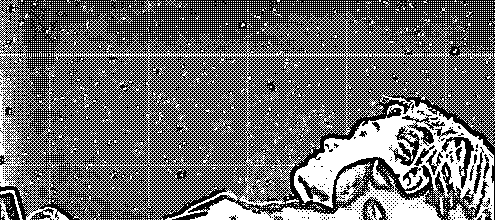

春天来了 你是否已经卸下厚重的衣服

小草发芽了，你知道需要多大的力量才能成长

要卸下沉重的包袱，向上生长真的很不容易

还好我们是一群读得懂星星的语言的“星语者”

我们有星星的指引，为我们点亮前行的路

**占星学告诉我们，这是一个充满梦想的月份**

**让我们一起创造一场美丽的邂逅**

**邂逅你、邂逅我、邂逅占星**

**快来和小伙伴们，开启不一样的 2016**

让我们用唱诵歌颂春天

让我们逛一逛春天的星空市集

让我们一起游戏一起遇见

一年之计始于春

带走专属于你的祝福


**活动针对人群**

**占星学爱好者、占星学学习中、或者职业占星师**

**都欢迎哦**

**活动攻略**  

**No.1**

**本次活动代号**

**国际占星日活动**** AT 上海**

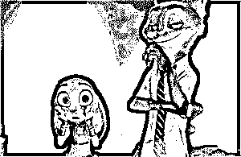

**No.2**

**炫酷的主办方**

**若道华东区同学会**

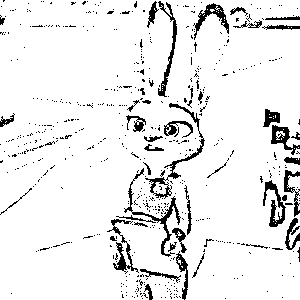

**No.3**

**活动时间**

**2016 年 3 月 19 日下午 1:30-5:30**

**下午 1:00 开始签到**

**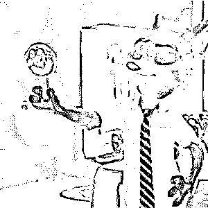**

**No.4 **

**如何找到组织**

**上海市徐汇区源咖啡**

**上海市徐汇区乐山路 33 号,交大慧谷创业园 1 号楼一楼**

**靠近徐家汇地铁站哟**

********

**No.5**

**需要准备多少银子**

**80 元/人（含一杯指定饮料）**

**其他消费请自理。**

**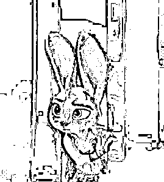**

**No.6**

**要怎么报名**

**接头人**

**玫瑰**

**微信：stillrosy**

**请加玫瑰微信报名并付款**

**（支持支付宝或微信付款）**

**现场不收款**

**谢绝空降**

******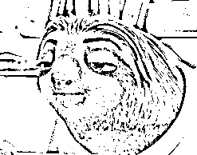******

**No.7**

**报名到啥辰光**

**3 月 17 日之前**

   

本次活动由 **源咖啡** 提供场地

官方网站：*http://www.yuancoffee.com/*

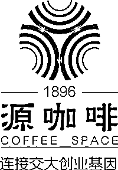 

源咖啡坐落于交大慧谷创业园区内，是由交大人众筹发起的科技创业为基调的创业咖啡平台。通过为创业者提供提供硬件和软件的服务，搭建一个具有技术与信息分享、人才交流、市场拓展、项目对接、共享办公等服务的创新型创业孵化平台。

**听说长得好看的都报名了，嗯……你懂的……**

# 占星师手记 | 春天都来了，你怎么还是高兴不起来

> 原文：[`mp.weixin.qq.com/s?__biz=MzA5NjA0NTAxNg==&mid=403156927&idx=1&sn=5ab405f8ac606e1406caa6b5e43afce5&chksm=0d451d083a32941e07d881dfbc56651d0aa5e6d4e8b277795814ec8d885e42c30df95a802cf8&scene=126&sessionid=1692738862#rd`](http://mp.weixin.qq.com/s?__biz=MzA5NjA0NTAxNg==&mid=403156927&idx=1&sn=5ab405f8ac606e1406caa6b5e43afce5&chksm=0d451d083a32941e07d881dfbc56651d0aa5e6d4e8b277795814ec8d885e42c30df95a802cf8&scene=126&sessionid=1692738862#rd)

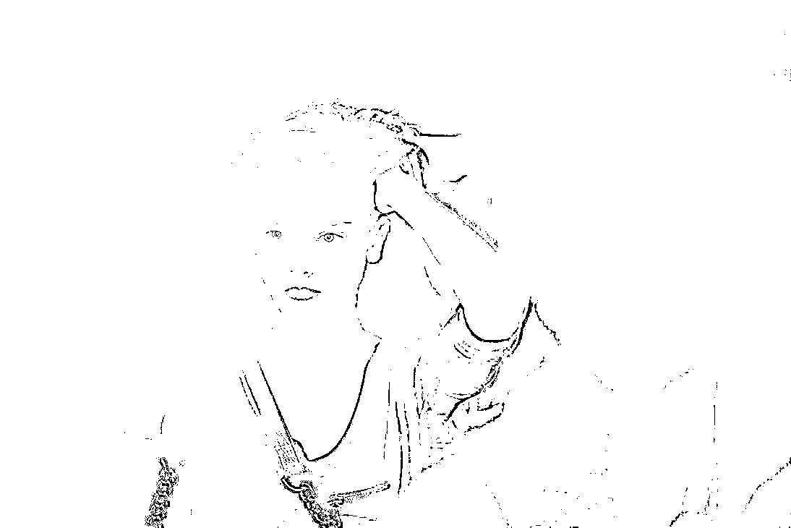

“你怎么老是不开心，全身都是负能量！”
“怀孕不能哭，否则宝宝长不好的。”
“要做一个温婉的女子，永远向阳。”

这些“正能量”有没有在某个时刻把你压得抬不起头来？不阳光就不配谈人生的理念只能把人逼入更深的暗黑中？

然而你知道么？暗黑，这个看起来不太祥和的词汇，在心理学中有一个对应名词，即“阴影”——被压抑的无意识。阴影人人有之，占星学所能做的，是更为迅捷准确地切入暗黑的源头，配合心理治疗，达到疗愈的效果。

你还害怕你的“暗黑”么？

**我和我的抑郁症**

送走个案，喝茶听音乐看书，感受时间缓缓流淌，就有了写作的心情。看看自己的星图：天蝎座群星位于一宫，强烈的存在感。我是谁？天王星合相上升点、四分中天与月亮，宽泛一点甚至跟太阳也有相位。我的星图有一个强烈的表达：我是——暗黑系占星师！

有一段时间，我得了一种目前比较“流行”的病——抑郁症。那是一段每天都在生与死之间煎熬的日子。作为一名心理治疗师，我很相信心理治疗的作用，于是，我去找我的同行求助，她是位非常优秀的治疗师，但是，仅仅这个还是不够。为什么？**我发现我的问题已经超过了心理的范畴，到了更大的哲学存在的层面，我们存在的意义上。**

**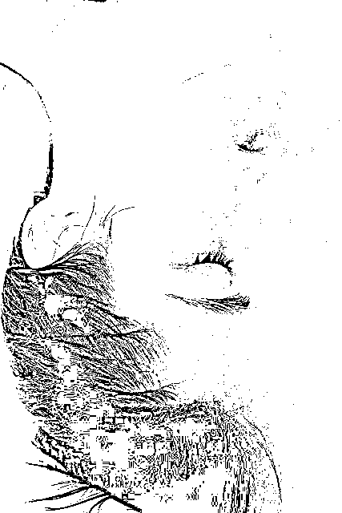**

**生死间，占星学帮助了我**

**在这个时候，我的另一重身份——占星师，帮助了我。**我看到自己行进星图中，土星、冥王星的原型力量在经过我。不知道被打碎了重生后的自己会构建成什么样子，但透过星图，我看到浩渺的星空，宇宙能量的交汇，我相信发生的这一切都只是神圣历程的一部分，会过去的。我边研究自己的行进星图，边坚持心理治疗，撑了过来。

这段经历让我坚定了学习和应用占星学的决心。同时，这段艰难的，可以说是灵魂暗夜的历程，完全重塑了我，修复了很多的心理创伤，现在的我可以更有力的行走在大地上，活出自己。

关于抑郁症，我当时的情况还不算太严重，但也意识到药物的重要性，药物可以让神经不那么活跃疲惫。身体安住，才可缓缓图之，坚持心理治疗，也可配合占星咨询，了解自己生命历程的意义。需要提醒的是，当觉得自己或者亲人朋友有抑郁倾向，请先去医院诊断并寻求专业帮助。

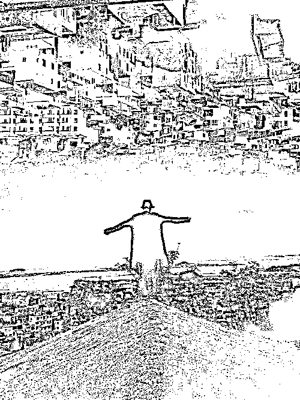

**暗黑是种怎样的力量**

星图里群星落天蝎座的我，自然是天蝎座特质很强的人。冥王星管辖下的天蝎座，天生就有黑暗气质，并不是人见人爱、花见花开、很有亲和力的感觉。**天蝎座人天生对所有黑暗面有本能的觉察，我们就像猎犬，能嗅出人们拼命隐藏的那些面向。**

出于保护小我的本能，人们遇见天蝎座特质的人一开始会有排斥，甚至害怕、隔离。连我自己遇见天蝎座特质强的人，都比较谨慎尊重，任何掩饰强装都没有用，TA 有能穿透表象看到本质的能力。

人最大的恐惧是什么？也许就是死亡！除了肉体的消逝，我们最害怕的是失去“自我”，一切的防御抗拒由此而生。**遇见暗黑系的天蝎座人，小我的防御机制有可能会被激发，因为人们多少都会感到，在这样的人面前，有些东西会瓦解、消失，会“死去”一部分。可是当你敢于挑战自己的恐惧，想去直面自己的本性，或者就是最好的选择**。****因为，天蝎座人具有强大的重生力量！

**有光的地方皆有阴影**

现在的社会过度强调光明、空性、正向。这是个过度“阳”的男性能量世界。即使是向内觉察，依然是强调正能量、正念、积极。谈到女性能量，也大多是强调美、温柔、滋养、爱等等正面特质。好像要成为一个成功有价值的人，必须要这样，一直要在光明里，不能有黑暗，不能有负面感觉。黑暗、死亡、毁灭、 重生、性似乎成为一种禁忌。很多灵性、心理疗法也是在说当下的转化，不要去深究过去怎么样，要马上、当下、快速、积极、正能量……每次听到这些，都会有种感觉，觉得生命的某些部分被割裂了，不完整。

从我的个案经验而言，**疗愈真不是光积极正向地喊几句口号，“爱自己”、“做自己”、“成长”就能喊好的。**

 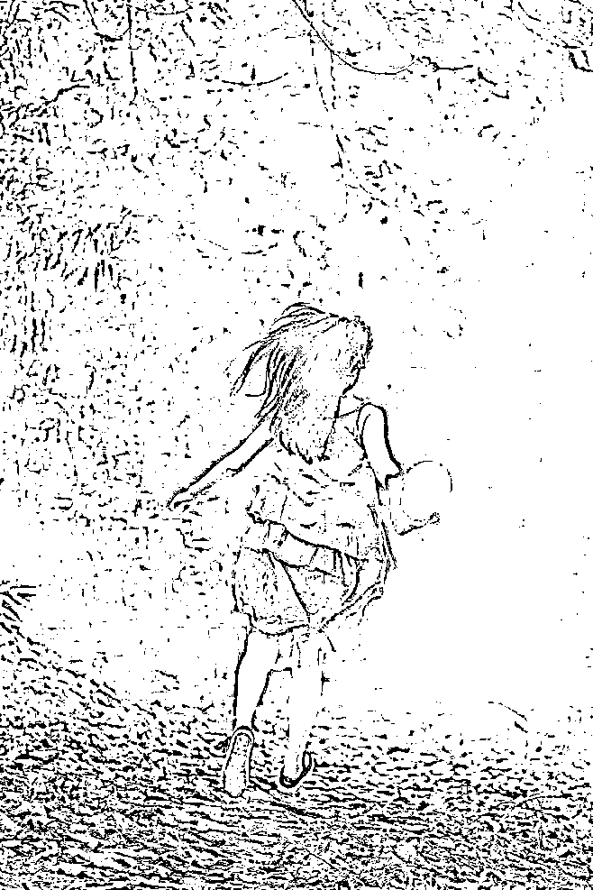

**陪伴 TA，走出灵魂暗夜**

曾经有个个案，几乎是一夕之间遭遇各种灾难，我留意到她行进星图中，行进冥王星与出生图的行星有重要相位，又被别的行进行星触发，似乎在逼迫她去面对最深层的恐惧和渴望。**看着这样的来访者的星图，我觉得仅仅给出解读和建议太过苍白。黑暗中会有光亮，可是她没有力量去走向光。**

我用占星、催眠和心理咨询技术陪伴她在那样的历程里很长一段时间，去探索所有事件背后的意义，直到她愿意走向光明。**在这样的黑暗中，我感受到的是她缓慢的重建自己的过程，非常踏实有力。每一点改变，每一次拨动能量的弦，都需要很大的勇气去面对很多恐惧！但每面对一点点，改动一点点，都像大树的根往地下扎入更深。**根扎得越深，树才会越茁壮，既向阳伸展，也经得起大风大雨！

无论自己的经历，还是陪伴个案的过程，都能感觉到光明背后黑暗的力量，黑暗就像清流下面的淤泥，给我们提供丰富的矿物质，也像地下的煤炭，燃烧出我们生命的火焰……**有白天就有黑夜，有光明就有阴暗，一体两面、相辅相成才完整。**

陪伴个案沉入泥沼，陪伴 TA 慢慢渡过灵魂暗夜、陪伴 TA 探索最深的痛、最无力的绝望、最破碎的空虚……做个可以陪伴人们在黑夜中前行寻找光明的人，一名暗黑系占星师，这，是我的选择！

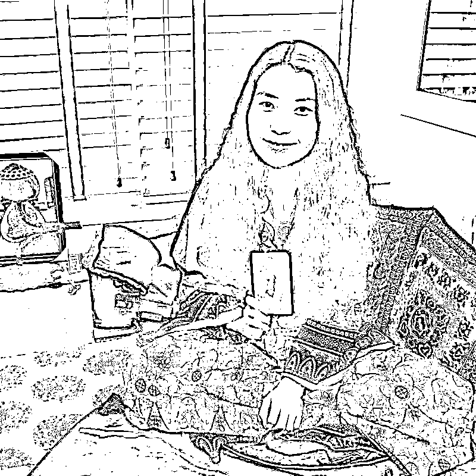

**作者简介**

**奕然**：职业占星师；国家二级心理咨询师；美国 ABH／PASH 执照国际催眠师；系统式家庭治疗师；中国 OH 卡学院首届授权培训师；美国塔罗协会（ATA）会员；若道 2013 年 COAC 资质班学员，并通过考试。系统的心理学培训背景：萨提亚转化治疗项目，国际青少年叙事治疗项目，中德高级家庭治疗师培训。占星塔罗咨询根据个案需要结合玛雅历 OH 卡的综合解读，配合心理咨询技术，形成自己独特风格，致力于实战疗愈。

**预约微信**：yrsxmx

长按二维码，让金钱涌向传播知识与智慧的人~

.png")


**这个春天，把你的“暗黑”拿出来晒晒吧，也许 TA 能长出一颗嫩芽来呢。**

**◆ ◆ ◆  ◆ ◆**

******特别提醒************：本文由作者授权首发于若道平台******，**转载请注明“转自若道”。******

有点小心动想体验一下“暗黑系“占星师的感觉？**2016 年 5 月 19 日**，蒋颖老师主讲的若道占星核心课程**Level 1-2**要开课了！她将带领你学习星座、太阳、月亮、行星、月亮交点等知识，让你进入占星学的世界！

报名及咨询，请点击文末”阅读原文“


# 被这些说法坑过吗？【打假热线】24 小时开放中

> 原文：[`mp.weixin.qq.com/s?__biz=MzA5NjA0NTAxNg==&mid=403144724&idx=2&sn=65a2047203e5b629b989b68dceb9a9b3&chksm=0d4532a33a32bbb5559d980cb28f35fd36b4565a6c1f12c317fdeb29d34df161f801d02adb4b&scene=126&sessionid=1692738862#rd`](http://mp.weixin.qq.com/s?__biz=MzA5NjA0NTAxNg==&mid=403144724&idx=2&sn=65a2047203e5b629b989b68dceb9a9b3&chksm=0d4532a33a32bbb5559d980cb28f35fd36b4565a6c1f12c317fdeb29d34df161f801d02adb4b&scene=126&sessionid=1692738862#rd)

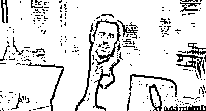

**打 假 热 线 2 4 小 时 开 放 中**


**“结婚生子后一切都挺幸福的，但是有一天看了孩子的星图，发现他的月亮在天蝎座，顿时整个人都不好了，现在好担心我的孩子会不会变得黑暗，经常自责。”** 

**“有人给我看过星图，说我是离婚的命。”**

**“据说木星进天秤座的时候运势就好了，那我还要等半年，那时候一切都好了。”**

**“占星师告诉我这个男人是我的正缘，即使我俩现在分手了，半年后他肯定会回来找我的。”**

**“能不能看看今年我做生意是不是肯定会赚钱？”**

**这些话语你熟悉吗？**

**你遇到过吗？**

**有人可以通过一张星图看穿你的未来，你害怕吗？**

**为什么好运总不准，坏运一说就中呢？**

**占星师真的可以看到你的另一半长什么样子吗？**

**占星师说前任会回头，你要等吗？**

**离婚的命真的躲不掉吗？**

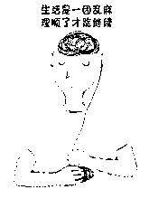

**如果你对于占星学到底能做什么有疑问**

**如果在学习占星学的过程中遇到了瓶颈**

**欢迎咨询我们的【打假热线】**

**截止日期：3 月 12 日**

**具体联系方式：**

**进入若道公众号后台**

**发送【打假热线】+你想咨询的问题**

**（字数请控制在 50 字以内）**

**请不要发送你的个人星图**

**解答仅针对普遍问题**

**不解读个人星图**

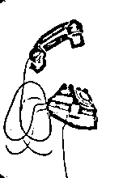

**举个栗子吧**

**你可以这样问**

**【打假热线】土星在第七宫的人注定会离婚吗？**

**也可以这样问**

**【打假热线】占星师究竟是如何推算出婚运的呢？**

**若道君将安排专业而资深的占星师坐诊**

**回答你的疑问和困惑**

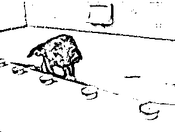

**了解星图是为了活出自我**

**而不是被“命运”吓死**

**医治身体的病痛**

**请信赖有资质的医院**

**寻求心灵的解惑**

**请信赖专业认证占星师**

**我们一起**

**为严肃占星学正名**

**<  END  >**

# Level 5 | 进阶专业占星师，你还差这一课

> 原文：[`mp.weixin.qq.com/s?__biz=MzA5NjA0NTAxNg==&mid=403144724&idx=3&sn=157f65812dc3a93efd31d6971df882bb&chksm=0d4532a33a32bbb50d71c682f334342a0cb99a69316224ec1bb1a68445fd7204fff834658ebe&scene=126&sessionid=1692738862#rd`](http://mp.weixin.qq.com/s?__biz=MzA5NjA0NTAxNg==&mid=403144724&idx=3&sn=157f65812dc3a93efd31d6971df882bb&chksm=0d4532a33a32bbb50d71c682f334342a0cb99a69316224ec1bb1a68445fd7204fff834658ebe&scene=126&sessionid=1692738862#rd)

若道，一所有信仰的学校

你可以选择花这笔钱去买一个奢侈品包包；

办一年美容卡；

报一个私人健身课程； 

又或者来一场说走就走的奢侈游；

你也可以选择花这笔钱来若道学习；

通过学习了解自己的人生轨迹；

站在星图上，活出强大的自我。

**若道的学费贵不贵？**

来听听学员们的声音吧——

**@L4 在读学员喵呜 **

**21 岁/学生**

对我来说，当然贵呀，可我乐意花这个钱去学，对我来说学习先是要搞清楚原理、由来、哲学观的。在理念这一块，放眼行业内没有比若道做得好的，这就是独一家的价值，所以价格再高都会来的。

这一年所收获的各种，体验到的、学会的，真的是没办法用金钱衡量。**若道从某方面来说，丝毫不夸张，改变了我整体的人生轨迹**。

**@L4 在读学员西瓜 **

**25 岁/会计**

选择续报是觉得很多知识都熟悉着，万一断了课程，还断了**和同学交流的平台**，再隔一年会生疏。而且我担心万一涨价了可咋整，我还担心大卫他是美国人，万一哪天回国咋整，趁他现在还在中国教，赶紧学下去……

**@L4 在读学员 Satan**

**48 岁/工程师**

乍看有点贵，等慢慢学习后觉得值得的。看个人需要，作为职业方向或者学得专业些，还是要系统学习，不能靠自学或野路子，会学偏了。若道文化教学理念和核心课程在中国还是第一位，其教学配置比较国际化，看到了**若道文化在用心做这件事。包括大卫讲课激情和敬业，助教和教务的全方位服务，值得的。能请国际上的大师级人物来讲课办工作坊是不容易的，因此我们的起点也高了**。

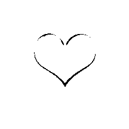
在这里，有一群有信仰的人

致力于严肃占星学在中国的推广

这是一笔对你未来人生的投资

贵，但是值得

和若道一起

来为我们自己做点什么吧

就从今天开始

L5 课 程 报 名 在 即

在这个阶段

你将学习各种**预测技术**

**行进、月亮次限、太阳弧、返照图**

你会学到**行星周期**

天上哪朵云什么时候会飘到这个人的头顶呢

会如何影响这个人的人生呢

通过这些预测工具

**你就能用它来预测和规划人生了**

**课程讯息**

**授课时间：**2016 年 3 月 29-9 月 27 日

**授课老师：**大卫·瑞雷

**授课方式：**网络课

****费用**：15000 元**

**课程负责人：**siri**（微信号：2847613491）**

**咨询电话：**400-619-1014

**课服 QQ：4006191014 （若道星文化）**

课程简介

****课程安排太丰富**了！**

行进

行星周期

爱情中的机会和挑战时机

职业周期

月亮次限

太阳弧

太阳返照、月亮返照

综合预测

组合图

占星学历史

占星学中的天文学

ISAR 考试词汇表

咨询技巧培训

**●**在整个教学过程中，不仅用名人案例讲解，而且将会抽取同学星图，进行实战咨询示范。另外，会有 4 节课的咨询技巧培训帮助大家准备好进入实战。

授课时间

2016 年 3 月 29 日-9 月 27 日

每周二晚 20：00-22:00（北京时间）

共 27 次课

有关毕业

**考试和实习****：**对于那些想要获得大卫老师资质班证书的朋友，我们将帮助大家在开始成为职业占星师之前，将由专业占星师组织小型督导工作坊，帮助大家实战解盘，为正式的收费咨询做好准备。通过毕业考试，参加督导工作坊，星盘解读的同学，将获得大卫老师颁发的职业占星师资质证书。

授课优势

**①先进的教学平台**

网络教学平台，支持手机、电脑、iPad 上网，可以随时随地学习。

**②回放复习**

学员可登录网站收看课程回放，在线复习课程，每次课可完整重看 3 次，课程结束后的 3 个月内有效。　

课程特色

**①与名师面对面**：北京同学可以来若道现场上课，和大卫老师面对面互动。大卫老师也可能前往主要学员所在城市，实现零距离教学。

**②互动答疑**：论坛、微信群随时提问；老师课上答疑；助教线上线下全程协助。

**③线下沙龙**：定期举办沙龙活动，复习上课内容。

**④强大的同学网络**：若道作为中国最顶尖的占星教学机构，在 4 年的占星教学中，培养了很多占星人才。若道让你和师兄师姐切磋，让你和国内著名占星师学习。（简单来说，就是，人脉！）网络授课，在北京开设免费现场参与名额，全程英文授课，配备实时翻译。

师资力量


**大卫·瑞雷（David Railey）**

若道创始人，《灵魂的目标》作者。拥有四十年的占星咨询的执业经验，曾两任亚特兰大占星协会主席，是全美占星师联盟（AFAN）、美国占星师联合会（AFA）、全美占星研究委员会（NCGR）、国际占星研究协会（ISAR）和职业占星师组织（OPA）的成员，是联合占星大会（UAC, United Astrology Conference）督导委员会委员。大卫曾是 CNN、CBS 的占星节目的常驻嘉宾，多次在 BBC、WGS、WSB、WRGG 等节目中接受采访，并在亚特兰大主持电视节目《每日行星（Daily Planets）》达 4 年之久。

**想成为 ISAR 认证占星师吗？**

**欢迎选择 2016 年度职业占星师成长套餐** 

▼


**2016 年，和大卫老师一起，开启占星的探索之旅！**

长按二维码添加课程负责人咨询~

****

报名请点击文末”阅读原文“

# 30 岁后才看上升？也太迟了吧

> 原文：[`mp.weixin.qq.com/s?__biz=MzA5NjA0NTAxNg==&mid=403144724&idx=1&sn=0df7632afcad25b79feb026a709e7e3a&chksm=0d4532a33a32bbb56e81837012896d74e835b36ada0be77e8a5b087f9c8bd124b9f1fe912585&scene=126&sessionid=1692738862#rd`](http://mp.weixin.qq.com/s?__biz=MzA5NjA0NTAxNg==&mid=403144724&idx=1&sn=0df7632afcad25b79feb026a709e7e3a&chksm=0d4532a33a32bbb56e81837012896d74e835b36ada0be77e8a5b087f9c8bd124b9f1fe912585&scene=126&sessionid=1692738862#rd)

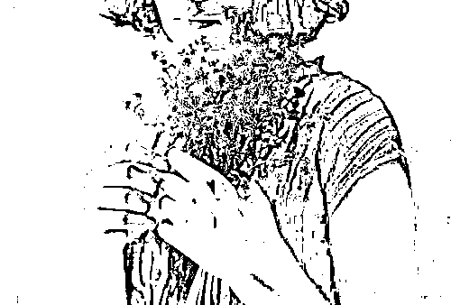

作者/Mireille（大 M）

图片/花瓣

时不时会有人这么问若道君：“是不是一个人 30 岁以后会越来越像 TA 的上升星座？”其实这是一个需要被纠正的误解。不过本文作者并非意在解读这个误区，而是从专业的角度告诉大家，如果说星图中影响人 30 岁之后的不是上升星座，那是什么？

PS. 这阵子若道君配合春天走了些文艺路线，可咱们的强项还是学术哦。这一篇纯干货拿走不谢，一般人我可不告诉。

**浅谈上升星座**

作为一名占星研习者，与一些客户或朋友聊天，指着星图左边第一根线直指的星座，告诉对方，这是你的上升星座时，他们会跃跃欲试地说：“我知道，30 岁以后会越来越像上升星座！”真的是这样吗？

其实整个星图的配置，都反映了你出生时天上星体所在的位置，以及星体之间的关系。太阳星座因为可以通过生日日期简单查找，因此相关的个性分析、运势建议都大行其道。与太阳星座相比，上升星座从查找到理解都更显神秘。而且对于业内的占星师来说，上升星座的作用和意涵，并未达成完全一致共识。

简单来说，上升星座是你出生的瞬间，地平线上升起的第一个星座。话虽如此，**要如何理解上升星座对个人生命的影响，还需要结合整张星图去分析**。从现在开始，我们看待星图的所有配置，要习惯以一个整体的角度出发，上升星座也好，太阳星座也罢，都不能脱离整张星图而单独讨论它的作用。

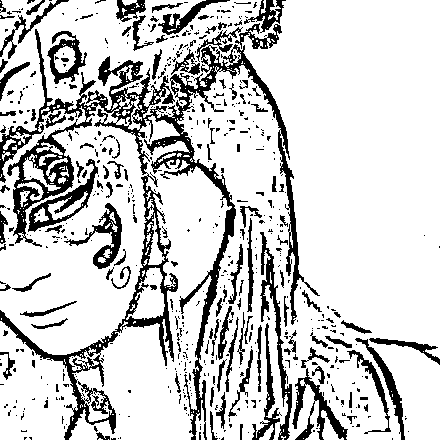

上升星座在西方占星学中，常常与“人格面具”这个概念连在一起。在东方人的语境里，更容易理解为“第一反应”。我们本着某一个态度面对大众，也在侧面反应了我们在遇事时，第一时间做出的反应，这种下意识的态度更多与上升星座相关。

**上升星座与“第一反应”** 

○**上升星座落火象**的朋友，容易冲动，但优势是行动力较强，看准机会就出击；

○**上升星座落风**象的朋友，乐于沟通和思考，也具有明显的理想主义色彩；

○**上升星座落土象**的朋友，遇到突发情况更容易冷静下来，从实际情况考虑解决之道；

○**上升星座落水象**的朋友，直觉力和感知力较强，与人相处容易察觉到对方的情绪和需求，需注意不要过分退让或妥协。

如果你的上升星座和太阳星座属性有冲突（比如上升星座属水象，太阳星座属火象），那处理突发情况时，上升星座往往更突显下意识的态度。但世界上没有不相容的属性，只有你意识不到的整合方向，因此上升星座和太阳星座彼此取长补短，会带给你更为圆融和成熟的处事之道。

**活用上升星座的解读**

在这里和各位分享一个简单的使用法则：上升星座适合与每个宫头的星座综合分析，以便我们更清楚个人对待某个领域的生命态度和观念。

○上升星座作为第 1 宫的宫头，**与 2/6/10 宫头星座综合**，能看出你对物质生活、工作事务、职业规划等领域的主观需求和态度；

○上升星座作为第 1 宫的宫头，**与 3/7/11 宫头星座综合**，能看你对基础教育、书写表达、与人相处、融入组织等领域的主观需求和态度；

○上升星座作为第 1 宫的宫头，**与 4/8/12 宫头星座综合**，能看你在原生家庭、情绪情感情欲、宗教思想等领域的主观需求和态度。

如果你有星图的解读经验，在论述某一个领域的时候，可能会同时参考相关宫位及星体，这时再结合上升星座的诉求，往往更为全面。


说到这里，聪明如你，是不是早就发现，上升星座对于一张星图来说很重要？没错，因为它奠定了你性格的一个基调和需求！


30 岁后到底看什么？


那如果，上升星座是我们从出生开始就在塑造的“下意识态度”，甚至是奠定生命各个领域的基本态度和需求，那有没有“30 岁以后更容易活出来”这一说呢？


首先我们要意识到，以进化的角度看，我们对生命、对宇宙的了解是随着人生阅历和智慧的提升在不断变化的，对星图的解读也一样。没有一个配置像空气开关一样，到了 30 岁会突然“跳闸”，若是你有足够的福报或智慧，很多配置在你生命早期就会以圆满成熟的态度来实现。相反，若你对自我探索的程度不足，并没有花很多时间去自我检视和修正，那可能你在某个领域还是会有缺失，或重复犯同样的错误。

古人说：“三十而立”。三十岁是一个比较有标志性的年纪，这时你对自己的过去有足够深的反省，对当下有更清晰的认知，对未来会有一定的展望，并且以开放、接纳的态度去看待，这说明你具有基本独立的人格特质来承担往后的责任和使命。这时，你再看自己的星图，有一些配置可以引起足够的重视：

①出生图中土星所在宫位的功课是否已经完成

说到 30 岁，很容易联想到土星约 29 年的周期，也就是我们活到 29/30 岁时，行进的土星会回归到出生星图中土星的位置。若你打开行进星图与出生星图比对，会发现两颗土星重叠在一起。

此时，出生图中土星所在宫位的议题，是否一如生命初期那种匮乏和不安？如果你能以更成熟的态度去面对，不抗拒不自卑，并且已经获得了一定程度的发展，从中学习到的经验能支持日后生命不同领域的成长，那就说明你可能较好地通过了土星的考验。往后每一年，都可以结合行进的木星、土星所在的宫位，抓住机会发展该宫位的课题。

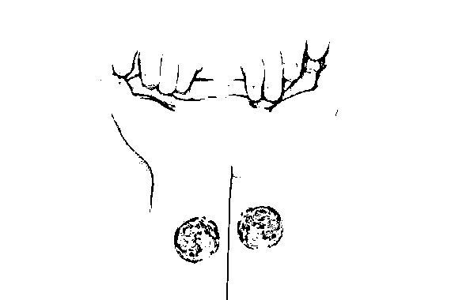  

②南北交点轴线的能量是否整合

南北交点一直被进化占星学的学者深度挖掘，以前世今生的时间轴线来诠释，虽然只是星图上的两个虚点，但从南交点的业力模式往北交点的方向走，再结合太阳、10 宫、命主星等配置，有助于我们寻找今生努力方向的线索。

在这里，很想和大家分享一个观点，解读星图，应该秉持一个原则，看似对立的配置，往往更应该花一点时间去做整合。对立的宫位都会落在 180 度轴线的两端，传统意义上的解读往往比较极端，但人到了三十岁以后，生命应该往更平衡的方向走，因此南北交点这一对“对立”的虚点可以整合，共同的议题结合星图相关征象，往往在下一个土星周期将有更清晰的发展方向，也意味着我们有更大的机会活出今生的使命和自由意志。

③三王星能量的转变和提升

此点提供给大家参考，就我个人观察，我们在年轻的时候，都很容易带着天王星、海王星、冥王星其中一个星体的特质，这是与生俱来的，在生命早期往往没有被意识到，或深陷其中无力作出反抗，这就是所谓的“灵魂的特质”。

但随着个人生命历程的发展，人开始拥有主观意识，并对过往较为极端的特质作出反省和修正，往往会在二十岁到三十岁期间，发展出另外一个星体的能量，一方面可以补充原有的不足，或平衡两种特质；另一方面可以发展出第二个三王星较为成熟和发展的能量，有助于丰富我们的生命态度和素养。

**两个例子** 

➤例 1：低阶天王星的转变

比如当事人在生命早期过度发展了天王星较为业力的特质，形成孤僻、自命不凡、疏离且冷眼旁观不愿插手俗世事务的特质，对人际关系和感情都有一定的破坏作用，你可能会感到自己追求真理的道途漫长而孤独。

到了一定的年纪，因为人生阅历的增长，在生命机缘的促成下，你可能会往海王星的方向发展，因为宗教信仰或人道主义的慈悲，更能理解大众的需求和苦难，知道每个人的业力功课不一样，所以在自我实现的过程中也乐于帮助他人，逐渐从孤立走向独立，也找到了更多志同道合的朋友，发展出慈悲为怀的态度。海王星的能量在一定程度上消融了天王星的过分自我，也鼓励你以同理心来看待每一个人的独立意识的觉醒。

➤例 2：低阶海王星的转变

再举例，如果我们在早年过分地展现海王星的滥好人特质，不懂得拒绝他人，耗费了过多能量帮助他人，但自己的成长议题并未得到很好的实现。

这时我们可以提醒自己不要借此回避自己的责任和义务，要正视自己的需求，养成天王星独立自主的意识，通过发展自己独有的天赋来帮助自己和他人成长；或者发展冥王星高度专注的特质，提炼出个人特质的精髓，将其发挥得淋漓尽致，并且不再满足于与外界过分同质化的关系，深入与特定对象的亲密关系，不回避不投射，实在地建立起一种互相探索共同成长的关系模式。

后面提及的三种模式，包括土星的功课、南北交点的轴线、三王星两两配合的灵魂发展特质，都充满了个性化的解读。除了要有整合的思维之外，有一点需要特别强调：整张星图的配置，既没有必要年龄局限化、也没有必要妖魔化，任何时候都秉持一种开放、接纳的态度去迎接生命的每一个大大小小的蜕变。

所以，有关 30 岁看上升星座的传言可以终止了。我们到了 30 岁，最该活出的，是一种知而不畏的态度。

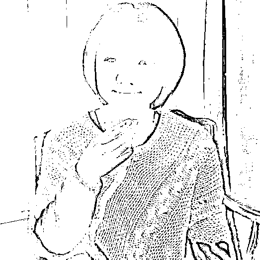

**作者简介**

**Mireille**，大 M。人力资源管理学士，企业行政管理硕士，2010 年开始研习现代占星学，广泛接触过花精疗愈、心理图卡解读、叙述治疗等，日常生活离不开占星、茶道、书写。

微信号：Mireille302 

公众号：珊珍逸录

◆ ◆ ◆  ◆ ◆

******特别提醒************：若道拥有本文版权******，**转载请注明“转自若道”。******

单单一个上升星座就有很多学问！**2016 年 5 月 19 日**，蒋颖老师主讲的若道占星核心课程**Level 1-2**要开课了！她将带领你学习星座、太阳、月亮、行星、月亮交点等知识，让你进入占星学的世界！

报名及咨询，请点击文末”阅读原文“


# 都是吃饭，为啥人家能拿大单而你只长了二两肉？

> 原文：[`mp.weixin.qq.com/s?__biz=MzA5NjA0NTAxNg==&mid=403134604&idx=1&sn=afe3e5340792589a1b511ad1cc1b1778&chksm=0d45ea3b3a32632dbfff5c5f49dfcf47abec71ee1a627baff93880e5ec5a100be81a3cfc5863&scene=126&sessionid=1692738862#rd`](http://mp.weixin.qq.com/s?__biz=MzA5NjA0NTAxNg==&mid=403134604&idx=1&sn=afe3e5340792589a1b511ad1cc1b1778&chksm=0d45ea3b3a32632dbfff5c5f49dfcf47abec71ee1a627baff93880e5ec5a100be81a3cfc5863&scene=126&sessionid=1692738862#rd)

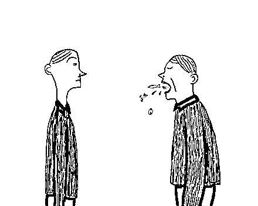

作者/大卫·瑞雷  翻译/李含  校对/江艺

本文首发于《风度》杂志  图片/花瓣

前几天若道君发布了文章《[不能答，这些问题占星师不能答](http://mp.weixin.qq.com/s?__biz=MzA5NjA0NTAxNg==&mid=403111743&idx=2&sn=7ca4ed275341d13172bc07d7a06d54d7&scene=21#wechat_redirect)》（点击可阅读），让一些小伙伴产生误解，以为占星学这也不能问，那也不能答。“那还有什么用呢？”有人问。其实，除了自我了解和成长外，占星学也可以很实用！不信就来看看大卫老师这篇文章。

01

单单太阳星座就能提供实用线索

当我六年前第一次来中国时，人们常常把我拉到一边，悄悄跟我说：“我们中国人可是很务实的。”刚开始时我会想：“很好，中国人是很务实的。”可这种情况一再发生，我不禁开始思考起原因来。他们是不是有潜在的恐惧，觉得自己不够务实？是不是因为他们认为占星学是一门神秘的学科，在当今时代里缺乏实用性，而他们知道我是一名占星师，于是善意地提醒我？我认为是后者。

归根结底，中国接受过中高等教育的人们为什么应该认为这种被主流科学否认的，看起来肤浅的星座消遣有实用价值呢？占星学不是封建迷信吗？占星学难道不是在我们了解真实世界的样子之前，一些人观察世界的方式吗？这些问题在西方也多次被问及。

但是，在研习占星学 46 年，执业 40 年之后，我知道占星学是非常实用的，而且与现代生活密切相关。当然，我所使用的占星学并不是肤浅的星座消遣，而是一门严肃的学科，需要多年的学习和准备。不管怎样，即使是最基础的 12 星座也能提供一份有意义的人类天性的模型。知道一个人的太阳星座并不会帮助你深入洞悉他们内心的秘密，但是它可以给你提供实用的线索。

举个栗子 2

你要与巨蟹座和摩羯座共进晚餐

假设你准备招待两位商业伙伴共进晚餐。两位都来到你所在的城市，与你们公司探讨合作事宜；所以很自然，你会想要给对方留下一个好印象。一位合作伙伴是巨蟹座人，另一位是摩羯座人。

> #### 巨蟹座
> 
> 巨蟹座的商业伙伴很可能会留意餐厅和食物，他偏爱家常口味，喜欢有家一般温馨友好的环境。不妨去打听一下他最爱的菜单，最喜欢哪类餐厅。一般来说，巨蟹座人喜欢不那么嘈杂的环境，他们会喜欢角落的座位，最好是僻静的包间这种远离众人瞩目的位置。
> 
> 在商谈生意之前应该谈一下与家庭有关的话题。因此，不妨在你的手机里存几张家庭照片给他看。巨蟹座人会比较感性和怀旧，会敏感地接收到你传递的情绪。因此，你可以在情感层面向他们提出诉求。在放松而友好的环境中，你更容易赢得巨蟹座人的信任。
> 
> 别担心在交谈中出错。即使你看起来有些紧张，也不用担心。你的紧张让你看起来很有“人味儿”，他甚至会想要聊聊食物、家庭或谈谈过去的好时光来让你放松。如果他在与你的互动中扮演了一个安抚、关怀的角色，这是一个好的信号，这意味着他开始把你当自己人看待了。

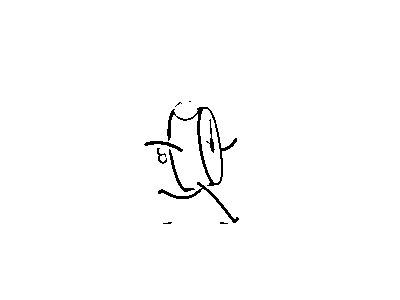

> #### 摩羯座
> 
> 摩羯座在黄道带中处于巨蟹座的对面，所以你会发现这两位商务伙伴截然不同。
> 
> 摩羯座人不在乎菜式或餐厅环境是否熟悉，但他们会在意人们是如何对待自己的。提前做好预定安排，和经理、领班都说好。告诉他们，你邀请了几位重要的外地商务客人，你希望晚宴顺利。在西方，我们会先给领班小费，如果可能的话，可以安排能干的服务生，待客细致有礼。闲聊家常从来不是摩羯座人的风格，所以不要试图用生动的交谈来给他们留下好印象，否则你会感到尴尬。
> 
> 因为巨蟹座和摩羯座都同时在场，当你与巨蟹座交换家庭照片时，不妨谈一谈你的子女有何长远的学业或事业目标。这种谈论要实事求是，不要吹嘘。这个摩羯座人很可能会谈谈他的某位家庭成员的成就。即使他尚未为人父母，他也可能会说：“我的侄子考了高分，他秋天就去北京大学读书了”，诸如此类的话题。摩羯座人最重视的是身份、地位，而不是你的孩子很可爱或很萌，那是巨蟹座人所关心的。
> 
> 在晚餐过程中，摩羯座人会将话题引入工作，这才是他最关注的，否则他宁愿独自在酒店房间里吃点简餐。顺便说一句，为他们预订的酒店如果不是五星级的，最好也是四星级的。摩羯座人优先关注长期计划。“如果我们选择现在与贵公司合作，这一合作会给双方带来长期的发展，这是我们双方都乐见其成的发展。”
> 
> 你很可能已经将一些支持性的事实和数据发送给他们了，但是你要记住这些数据，这会让摩羯座人对你刮目相看。摩羯座人会对那些可能出现问题的地方提出很多质疑。不要认为他对你，或你的陈述持否定态度就是坏兆头。他们就是这样。恭敬地听取摩羯座人的意见，想一想哪些内容是值得担心的，拿出务实的解决方案。如果你做出过多的承诺反而不能取信于他们。

干货来了 3

你要和 12 星座这样谈

在这个商务晚餐的例子中，占星学提供了实用的指南，帮助你更好地驾驭这种场合。占星学能做的当然不只这些，但是即使是相对表面的内容也有许多基于占星学常识的建议。除了上面列举的巨蟹座和摩羯座外，那么另外十个星座呢？下面就是与太阳落在这些星座的人进行商业洽谈时，大体实用的指南。相信聪明的你可以举一反三，将这些谈判桌上的技巧也运用到生活中去。

——白羊座——

开诚布公地与他们交谈。他们相信率直。保持简单，复杂让他们头疼。如果他们已经准备与你进行商务合作的话，你就要准备好快速行动。白羊座人认为越快越好。不要让他们将你逼入一场战斗。

——金牛座——

在一个令人舒适的安排中保持平稳和轻松。展现出你们公司或产品的可靠性。强调回报，以及如何展现天衣无缝的合作过程。不要太急迫，这会让他们变得固执。

——双子座——

准备好交谈。听取他们的诸多想法。注意他们的用词，在你的回答中也加入这些词句。不要因为他们聪明的计划而偏离方向，但让他们有选择的余地。你可以稍后再处理这些。

——狮子座——

让他们知道你对他们印象深刻。让商谈变得有趣。准备好迎接一些戏剧化的场面。尽量不要延长商谈过程；他们也许想要来场庆功会，尤其是事情进展非常顺利的情况下。

——处女座——

让一切井井有条。保证你之前发给他们的文件充分列出了相关细节。为他们担心的问题拿出理性的解决方案。不要让任何吹毛求疵将你带离了正轨。

——天秤座——

像他们一样友善。他们会是彬彬有礼的谈判对象，他们希望你也是如此。情绪上的争执或讨论会让他们不悦。保持公平，如果可能的话，做出一些妥协。

——天蝎座——

不要被他们最初的沉默吓倒。坦率地提出可能遇到的问题或危机，以赢得他们的信赖。一旦你抛出了最糟糕的情况，你就可以谈一谈盈利和收获了。

——射手座——

准备好，这是一场包罗万象的讨论。他们喜欢在讨论宏观构想时保持选择的余地。在“原则上”达成一致，但不要纠缠于细节。起草一份联合政策的声明。以防万一，要规定**退出策略**！

——水瓶座——

以开放的心态接纳更具创意的计划或协议。将可能达成的合作视作一种尝试。强调共同合作能够带来产业的进步，能够给社会带来积极的贡献。

——双鱼座——

搞清楚他们的愿景。他们认为可能出现的长期构想是什么？对他们的想象力表现出兴趣。使用图像或影像给予他们灵感的启迪。准备好一份带有“**免责条款**”的复杂协议。

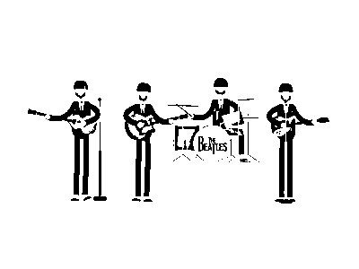

**▶你是如何利用占星学搞定 12 星座的呢？欢迎留言~**


想体验大师级的占星疗愈？

大卫老师**占星咨询**预约进行时

**生命议题、职业发展、关系咨询、少儿成长、年度规划和预测**

预约请在电脑端复制打开以下网址

 http://www.nodoor.com/consultantApply.do?contentId=3670 

**◆ ◆ ◆  ◆ ◆**

******特别提醒************：若道拥有本文版权******，**转载请注明“转自若道”。******

占星学还有更多的实用技巧！**2016 年 5 月 19 日**，蒋颖老师主讲的若道占星核心课程**Level 1-2**要开课了！她将带领你学习星座、太阳、月亮、行星、月亮交点等知识，让你进入占星学的世界！

报名及咨询，请点击文末”阅读原文“


# 如何搞定“熊孩子”？双鱼座妈妈有高招

> 原文：[`mp.weixin.qq.com/s?__biz=MzA5NjA0NTAxNg==&mid=403134604&idx=2&sn=10ddd5ba2fb07a1d3da3654d3e93a2dc&chksm=0d45ea3b3a32632de80e80566b6349fd3c83a0c9515ed81a9e13a5a2e40847b6fe4cb58bc12c&scene=126&sessionid=1692738862#rd`](http://mp.weixin.qq.com/s?__biz=MzA5NjA0NTAxNg==&mid=403134604&idx=2&sn=10ddd5ba2fb07a1d3da3654d3e93a2dc&chksm=0d45ea3b3a32632de80e80566b6349fd3c83a0c9515ed81a9e13a5a2e40847b6fe4cb58bc12c&scene=126&sessionid=1692738862#rd)

作者/沙沙 

本文首发于 2016 年 3 月《为了孩子》杂志 

怎样才能做个好妈妈呢？家有“熊孩子”该怎么教育？双鱼座有她们独特的必杀技能，我们一起来看看吧！其他星座的姑娘们也别急，点击文末“阅读原文”报名参加大师亲子工作坊，只要你有信心和决心，每个姑娘都能成为绝世好妈妈。

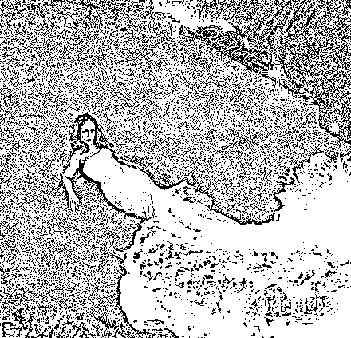

**培训师 ID**：双鱼座妈妈（出生在 2.19~3.20 日的适龄女性）

**所属科系**：水象的变动星座

**培训特长**： 敏感、细腻、宽容、富于想象力、情绪化

**育儿高招**：能读懂孩子的心，对孩子充满包容，陪孩子一起幻想

**相处最融洽的星座宝宝**：巨蟹座、天蝎座、天秤座、金牛座

**好妈妈培训师档案**

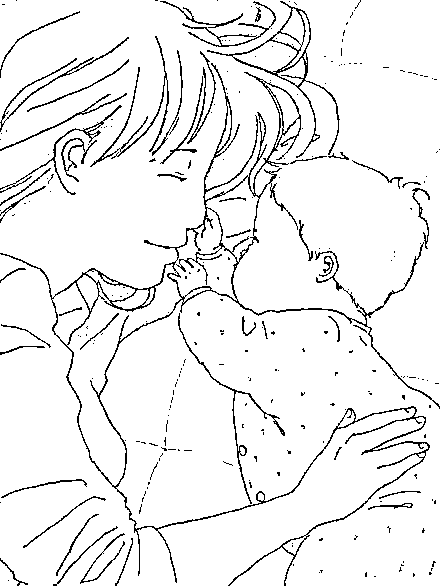

水象星座，是十二星座中最柔软、最细腻、最敏感的人群。而作为黄道上最后一个星座，双鱼座比起同为水象家族的巨蟹座和天蝎座，没有了那层坚硬的“壳”，少了一些自我防御、自我保护的机制，而更富于想象力和浪漫主义的气质。 

双鱼座是一个酷爱幻想的星座，常常沉醉于自己白日梦的世界里。我曾不止一次听到典型的双鱼座说：“我们的心里，一直在上演各种各样的电影。”从小女孩的时代起，双鱼女们就已经无数次地玩过“办家家”的游戏，幻想过自己当妈妈的样子。她们希望自己成为一个美丽而温柔的妈妈，牵着同样美丽而乖巧的孩子，陪他做游戏，给她讲故事……这画面就像童话里一样完美。 

终于有一天，孩子出生了。孩子的小手和她们想象中一样柔软，孩子的眼睛和她们想象中一样清澈，当孩子咯咯乱笑，或是叫出第一声“妈妈”时，双鱼座妈妈的心都要被萌化了。

在育儿方面，双鱼座妈妈有什么独特的秘籍呢？一起来看看吧！

*1*

**秘籍 1/ 将理想照进现实**

刚刚生产之后，包括整个哺乳期，身体难免有各种不适；和家人一起照顾孩子的过程中，也难免有各种或明或暗的矛盾和冲突。双鱼座无论是从身体上还是情感上来说，都是一个相当敏感的星座，因此也难免会在此时经历情绪的波动。有时候别人无心的一句话，也可以在双鱼座妈妈心中掀起不小的波澜，甚至加重她们的挫折感。而孩子的到来，也多多少少会给夫妻关系带来一些改变，这也有可能给双鱼座妈妈的内心带来一些冲击。

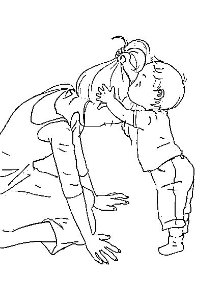

*2*

**秘籍 2/ 学习控制情绪**

 对于任何一个水象星座而言，控制情绪都并非易事。在初为人母之时，双鱼座妈妈需要度过这段情绪易波动的时期，并学习一种新的智慧——更真实地活着，关切现实的因素，**把注意力放在如何解决问题上，而不是仅仅停留于情绪和感受本身**。

*3*

**秘籍 3/ 责任感，责任感，责任感，重要的事情说三遍**

 还有一件很重要的事情，也许是双鱼座在幻想自己当妈妈时不曾认真考虑的，那就是作为母亲的**责任感**。这份责任可以是很现实、很沉重的，眼前的这个孩子和他即将铺展开来的人生，又是那样的真真切切，她们不能像走出电影院那样从母亲的角色里跑开。“妈妈”是一份 24 小时、全年无休的工作。她们必须学着去**承担这份责任，去面对孩子成长过程中一切不可控的因素，一切不理想和不完美**。

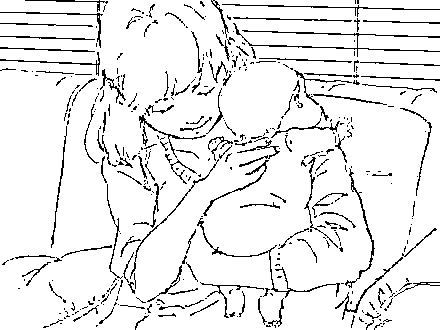

*4*

**秘籍 4/ 调整焦虑和迷茫**

 面对现实，也许并非双鱼座擅长的，她们需要慢慢地学习这一切。双鱼座妈妈可能常常会因为这种责任而感觉到**焦虑和迷茫**（“迷茫”也是一个非常双鱼式的词汇），面对各种各样的选择和可能性，常常不知道该怎么办才好。

*   今天听了某人讲亲密育儿法，觉得很有道理；明天听了另一个人讲严格管教的益处，又想给孩子做规矩；

*   今天想给一个孩子轻松快乐的童年，明天又觉得不能让他输在起跑线上，又害怕再拿不定主意，孩子很快就要长大了……

*   双鱼座妈妈常常生活在这样的纠结之中，就像双鱼的符号中那两条向相反方向游去的鱼一样，不知该做怎样的抉择。

*5*

**秘籍 5/ 感受情绪，交流和宽容**

 心理学家约翰·鲍威尔曾经谈到，沟通大致上可以分为几个层次：

step

**1**

**一般性的交谈/日常问候之类的浅层次交流**

step

**2**

**陈述事实的沟通/进行信息交换**

step

**3**

**分享个人观点和判断/已经有个人化的因素，但仍停留在理性的层面**

step

**4**

**分享感受和完全敞开/真正的信任、关心和安全感，有爱的流动**

step

**5**

**“心有灵犀”的亲密体验**

相对其他星座来说，双鱼座一方面**更愿意谈论情绪感受**，另一方面也**更能够觉察到别人的情绪感受，并给予包容**。这**对于孩子安全感和信任感的养成是非常有益的**。当然，要做到**包容而不溺爱**，**掌握好宽容和让步的分寸**，也都考验双鱼座妈妈的智慧。

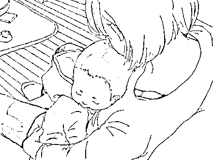

*6*

**秘籍 6/ 想象力**

 **双鱼座出色的想象力，也会在她们当上妈妈之后，成为养育孩子的另一个法宝**。

*   孩子本来就喜欢生活在童话和幻想的世界中，而双鱼座妈妈有充足的耐心和想象力，陪孩子去做那些幻想的游戏。

*   当孩子期盼圣诞老人时，当孩子宣布自己会飞时，当孩子想要去童话世界探险时，双鱼座妈妈会成为他们的好伙伴，和他们一起遁入想象世界，一起编故事。

*   最好的教育，往往孕育于这些故事和游戏之中。当孩子长大，再回想起童年，一定会因为妈妈的这种陪伴而充满感激。

**也许你对下面的文章感兴趣：**

[抽离的水瓶座也能成好妈妈](http://mp.weixin.qq.com/s?__biz=MzA5NjA0NTAxNg==&mid=402783748&idx=2&sn=42f6908140bcbc5883db68f8fa580316&scene=21#wechat_redirect) 

[宝宝，我不要最成功的你，要最好的你](http://mp.weixin.qq.com/s?__biz=MzA5NjA0NTAxNg==&mid=402970780&idx=2&sn=ab3533c8c56e1b945a2c67d19a6b746c&scene=21#wechat_redirect)

[感谢她们的隐忍和抗争，才有你的自由人生](http://mp.weixin.qq.com/s?__biz=MzA5NjA0NTAxNg==&mid=403123919&idx=1&sn=4f0e9622b79daf9dd849e935b3073707&scene=21#wechat_redirect)

**作者简介** 

**沙沙**：占星咨询师，占星专栏作者，国家二级心理咨询师。2010 年创办工作室“九月占星馆”，2013 年通过 ISAR 职业占星师资格认证考试，成为首批在中国大陆通过该测试的占星师之一。长期研习出生图、关系盘、流年预测等技巧。希望通过星图，帮助来访者实现有效的自我觉察。 

新浪微博：九月占星馆

微信公号：九月占星馆（jiuyuezhanxing）

个人微信：zhouzhe7752（添加请注明“占星咨询”）

长按二维码，让金钱涌向传播知识与智慧的人~

 

**◆ ◆ ◆  ◆ ◆**  

********特别提醒************：本文经作者授权发布******，**转载请注明出处。********

如何当好妈？**2016 年 3 月 26 日**，大卫老师将在北京举办两天的占星学与亲子工作坊！让你找到“ 因材施教”的操作说明，学习应对不同时期亲子关系发展的成长挑战！

报名及咨询，请点击文末“阅读原文”

****

# 对 TA 好，TA 还不领情？来找大卫老师支招吧！

> 原文：[`mp.weixin.qq.com/s?__biz=MzA5NjA0NTAxNg==&mid=403134604&idx=3&sn=1c5f5a29f2f46cc9170f965844764702&chksm=0d45ea3b3a32632df583ac22586b6c069909cef39e35aaf8aa90f345f5f7cf277f3bb33f265e&scene=126&sessionid=1692738862#rd`](http://mp.weixin.qq.com/s?__biz=MzA5NjA0NTAxNg==&mid=403134604&idx=3&sn=1c5f5a29f2f46cc9170f965844764702&chksm=0d45ea3b3a32632df583ac22586b6c069909cef39e35aaf8aa90f345f5f7cf277f3bb33f265e&scene=126&sessionid=1692738862#rd)


📹 [`v.qq.com/iframe/preview.html?vid=w0186djlgj4&width=500&height=375&auto=0`](https://v.qq.com/iframe/preview.html?vid=w0186djlgj4&width=500&height=375&auto=0)

——“爸爸，为什么我们家的房子怎么这么小啊？玲玲家的房子又大又漂亮。”

——“孩子，你不知道现在的房价有多贵，爸爸没有太多的钱买呀！所以你要好好学习，将来挣钱买大大的房子！” 

——“可是爸爸，那你小时候为啥不好好学习？！”

在若道君[**妇女节的头条推送**](http://mp.weixin.qq.com/s?__biz=MzA5NjA0NTAxNg==&mid=403123919&idx=1&sn=4f0e9622b79daf9dd849e935b3073707&scene=21#wechat_redirect)（点击可阅读）中蒋颖老师提出，教育的议题是家族一代代传承的。在教育你的孩子时，是否思考过如下的问题呢？

►►**你成长期的外在人格？你的孩子成长期的外在人格？**

**►►****你成长期的家庭环境？你的孩子的家庭环境？** 

►► **在成长期你是否相信其他小朋友？你的孩子在成长期是否相信其他小朋友？**

►►**你成长期对于成就和成功有多少渴求？你的孩子对于成就和成功有多少渴求？**

教育从来都不是孤立的，是否父母将自己未尽的童年情结和梦想加诸孩子身上？“我都是为了你好。”孩子真的需要你这样的“好”吗？

**如果你为孩子和你的互不理解感到伤心**

**请在心里问问自己：**

**你，理解你的父母么？**

他们希望你是快乐幸福的，希望你远离人间的疾苦，然而也许他们自己也不过是个平凡的人，他们没有“善待”你，因为他们用错了方法。

**我们都是第一次做父母，** 

**如果做得不够好，**

**你希望你的孩子理解原谅还是叛逆顶撞？**

若你希望你的孩子爱你、尊重你、理解你的爱，请先尊重、理解父母的爱吧。唯有这样，才能将原生家庭的坏模式切断，好模式延续。


这个三月，来加入我们的**亲子发展工作坊**吧。

大卫老师以近四十年的经验，教你如何更好地同父母和解，更好地了解孩子水晶般真纯的心；

了解他有着怎样的梦想和潜能；

了解他的情绪背后有着怎样的心理动因；

你想知道的关于孩子的一切都能在这里找到答案。

**工作坊信息**

**授课时间：**2016 年 3 月 26-27 日 （10:00-18：30，午休 1 小时）

**授课老师：**大卫·瑞雷

**授课方式：**北京面授，英文授课，配中文翻译

**费用**：**5000 元（若道老学员可享受优惠价 3500 元）**

**早鸟价：**4000 元

**课程负责人：**Freya.Li  微信号：18601950700（请备注报名咨询）

**咨询电话：**400-619-1014

**课服 QQ：4006191014 （若道星文化）**

**邮箱：nodoor@vip.126.com**

课程简介

这两天，我们将聚焦在学习如何通过“觉知”与“接纳”的方式为孩子的成长创造一个充满“接受”“理解”和“爱”的家庭氛围。

我们将会根据家长和孩子的星图，谈论：

**★ 孩子怎么学习更有效？孩子适合报什么样的专业？说话孩子不听怎么办？孩子很叛逆该如何沟通？该如何激励孩子？**

**★ 在孩子成长过程中，家长会有哪些特别的挑战，如何面对这些挑战？**

**★ 哪些社会压力是非理性的，怎么放下这些非理性的压力？**

**★ 自己的人生议题是什么，这些议题和焦虑会怎样影响孩子？**

**★ 孩子今生的议题和挑战是什么，如何接受孩子的议题？**

**★ 孩子的潜能是什么？**

在这两天，我们不仅会根据孩子出生图的主题分组，还会根据家长出生图的主题分组，研讨案例将采用学员及学员孩子的出星图实例贯穿。这样学员们不仅可以从老师那里学习，而且还可以互相学习，通过在发生在身边的案例深刻感受出生星图如何影响家长、孩子及相互关系。

适合人群

**★ **致力于亲子关系成长的咨询师和占星师

**★ **希望更好理解童年与父母之间关系互动的人群

**★ **对占星学感兴趣的人群，需具备若道核心课程 Level1-2 的占星学基础

师资力量


****大卫·瑞雷（David Railey）****

若道创始人，《灵魂的目标》作者。拥有四十年的占星咨询的执业经验，曾两任亚特兰大占星协会主席，是全美占星师联盟（AFAN）、美国占星师联合会（AFA）、全美占星研究委员会（NCGR）、国际占星研究协会（ISAR）和职业占星师组织（OPA）的成员，是联合占星大会（UAC, United Astrology Conference）督导委员会委员。大卫曾是 CNN、CBS 的占星节目的常驻嘉宾，多次在 BBC、WGS、WSB、WRGG 等节目中接受采访，并在亚特兰大主持电视节目《每日行星（Daily Planets）》达 4 年之久。

长按二维码接通课程负责人~


报名及咨询，请点击文末“阅读原文”

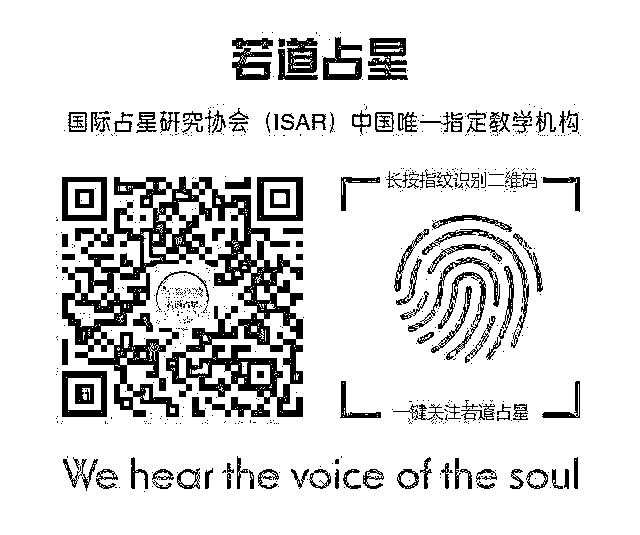

# 免费报告 | 这个新月，你该注意什么？

> 原文：[`mp.weixin.qq.com/s?__biz=MzA5NjA0NTAxNg==&mid=403134604&idx=4&sn=cfc42a42c2981ac5d7ab9b6d9d604074&chksm=0d45ea3b3a32632d01d9567728a7d3a70d25b05f1f40189750438619410c0fcb2f276ddea1f9&scene=126&sessionid=1692738862#rd`](http://mp.weixin.qq.com/s?__biz=MzA5NjA0NTAxNg==&mid=403134604&idx=4&sn=cfc42a42c2981ac5d7ab9b6d9d604074&chksm=0d45ea3b3a32632d01d9567728a7d3a70d25b05f1f40189750438619410c0fcb2f276ddea1f9&scene=126&sessionid=1692738862#rd)


手机党们，

不用再跑到网站上查看新月报告了~

在新月的时候，

你可以直接在手机上即可获取报告，

在线许愿并分享；

平常的时候，

也可以戳在线许愿并分享！

无论你在地铁上、聚会时、还是等餐途中，

随时随地许愿祈祷，

是不是很酷呢？

**操作起来也很简单哦**

**当新月到来的时候，您只要做如下步骤**

进入首页

点击
“新月祈祷”

登录账户

填写出生信息

查看报告、许愿

**【步骤一】点击新月的祈祷**


**【步骤二】输入姓名**


**【步骤三】输入出生信息**


**【步骤四】生成新月报告**


**最下方有许愿按钮，左边是倒计时提醒哟~**

**在合适的时间就可以许~愿~啦~**

**【步骤五】许愿！**

**** 

**【步骤六】让宇宙看到你的愿望并分享！**

**** 

**在平时，您只要做如下步骤**

进入首页

点击
“立即许愿”

开始许愿

点击分享

完成许愿

**◆ ◆ ◆  ◆ ◆**


**小伙伴们还等什么？**

**赶快点击→左下角阅读原文****吧！**

# 妇女节 | 感谢她们的隐忍和抗争，才有你的自由人生

> 原文：[`mp.weixin.qq.com/s?__biz=MzA5NjA0NTAxNg==&mid=403123919&idx=1&sn=4f0e9622b79daf9dd849e935b3073707&chksm=0d459c783a32156edc365842263ff9a53509679c158769004813c56eff3b96f46f36ab8c75b6&scene=126&sessionid=1692738867#rd`](http://mp.weixin.qq.com/s?__biz=MzA5NjA0NTAxNg==&mid=403123919&idx=1&sn=4f0e9622b79daf9dd849e935b3073707&chksm=0d459c783a32156edc365842263ff9a53509679c158769004813c56eff3b96f46f36ab8c75b6&scene=126&sessionid=1692738867#rd)

**作者/蒋颖 图片/花瓣网**

“我们坐在高高的谷堆上面，听妈妈讲那过去的事情……”有人说过，如果你想娶一名女子，就该去看看她的母亲是什么模样。家族的传承和议题是无法割裂的，你的血脉里继承着祖母、母亲的基因。在这个妇女节，一起来看看星图是如何阐释了家族的议题，随着历史的洪流，那些家族女性的故事，你应该知道。在此祝大家妇女节快乐！

**“妇”字看似离我很远**

小时候不喜欢妇女这个称呼，不明所以就不喜欢。

**“妇”字对当时的我来说，和岁月流逝、无趣、疲惫、沉闷、黯哑人生联系在一起。**

如果生活是一列火车，“妇”字让我觉得这列车开入煤烟之中，熄火在一个没有期望的小镇，有说不出的无奈和怅惘。我曾期望所有曾如开花的苹果树一般的女性都不要变成“妇女”，哪怕有一天她们变成老妇人。

**妇，服也。从女，持帚，洒埽也。会意。谓服事人者。**

**——《说文》**  

妇是一个拿着扫帚的女人，服从、服侍的女性形象。我明白自己为什么不喜欢这个字了。我不是传统女性，尽管在青春时代的挣扎中，当不清楚应该是什么样女性，可成为什么样女性之时，我曾经非常期望自己拥有传统女性的很多美德。也曾和宿舍的女生一起试图编织毛衣、做女工，然而发现自己真的不感兴趣，也不擅长。做持帚洒扫这些事情更不是我的长项，把房间搞乱而不是搞整齐更是我所擅长。我甚至对女性最神圣的任务，养育孩子也没有太大兴趣，自己的人生过得有趣比养一个孩子让我开心对我更重要，而对此，我并无愧疚之感和恐惧之心。

**1**

**天蝎座外祖母的故事**

**她是如此能干**

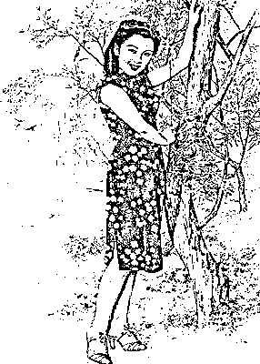 

然而其实我离“妇”字又并不远，我的祖母辈都是拿着扫帚的女性。两位祖母都是几乎一辈子没有工作，在家里操持家务，相夫教子的类型。一位太阳天蝎座的外祖母生了 7 个孩子，虽然曾是黄埔军校后备部队的护士，经历过死人和炮火，但嫁人后也就回归家庭。

她年轻时，以精明能干著称，即使在最困难的岁月，也让一家人吃好穿暖。从重庆搬家到郑州，一人带着 7 个孩子和曾外婆搬运家什，连一块手帕都没有丢失。她做菜非常好吃，过节时，可以几夜不眠，发明一些新的菜式。她的能干不仅撑起了偌大的一家人，也构成了我对童年节日最美好的记忆。

外祖父把挣来的钱全交给她，在她的伙伴之中，她似乎算一个幸福的女人。

**梦想还未开始就结束了**

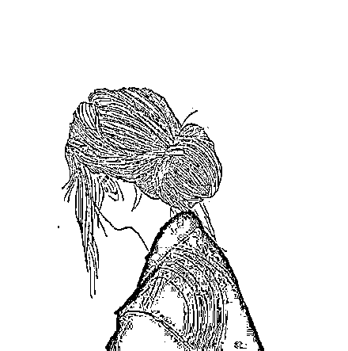

但我永远记得她陈述自己的故事：一天，已经有了 7 个孩子但年纪不过 30 多岁的她因为能干，被街道推荐到人民大学读大学，外祖母高兴地做了一桌的菜，而当外祖父回来时，一把掀翻了整个桌子，问她：“如果你去，孩子怎么办？！”我从来没有想到对我来说无比慈爱的外祖父曾经做过这样的事情。她描述中的丈夫和我经历的外公似乎并非一人。

她的梦想没有开始就结束了。后来我经历了她带着很多天蝎座的怨毒，非常激烈的可怕情绪和她的能干一同塑造了我的童年。当然也有一些祖孙二人特有的时光，年幼时，我坐在小板凳上，她在沙发上，一根香烟袅袅升起，我们一同看古戏，听戏文的呀呀咿咿。我喜欢戏文里那些袅娜温婉的青衣，喜欢她们的样貌和形态，发饰和服装，而外祖母喜欢看历史故事。我们一同与更远古的女人的故事连接在一起。“人生如戏，都不过如梦境一样”，外祖母的叹息和香烟一起在我年幼的头顶萦绕。

**2**

**白羊座祖母的故事**

**冬日卧床不起，三月后依旧返青**

另一位太阳白羊座的祖母生了 5 个孩子，死了两个，她不如外祖母幸运，她虽是商人的女儿，但一生都没有自己的钱，全部要仰仗祖父。祖父幼年丧父，青年丧母，16 岁的祖母年纪轻轻由媒妁之约嫁给这个陌生的男子是因为他和他的家族需要一个帮助收拾、照顾、收租的女主人。

祖父人生的不幸加倍地施加在年轻的祖母身上。祖父年轻时暴烈，稍不如意会对祖母拳打脚踢，祖母只是忍耐躲避，一声不吭。后来祖父被打成右派逃亡，家中只剩祖母和幼子女，作为地主婆被批斗，这些境遇和灾荒一起压在祖母的人生中，以至于她年轻时就得了精神疾病，每年冬日有三月卧床不起，想死不想生。

然而三月过去，她仍如春草一样返青，继续操持家务、照料子女、孙子女。祖母做饭也是无比好吃，我还记得青春期的自己曾经迷上一本国宴菜谱，一次信誓旦旦要用奇葩菜肴和祖母比赛。她笑眯眯端出一道猪肝汤，只尝一口我就知道自己技艺相去甚远，而其美味更让我至今无处可寻。最为难得的是，在我的记忆中，这位南交双鱼座的祖母从来没有出过一句恶言，总是如羔羊般忍耐顺从，连我这样的人小时也敢于欺负她。祖母虽然历经人生折磨，但仍然高寿而终。

**她们都很美丽，但毫无自由**

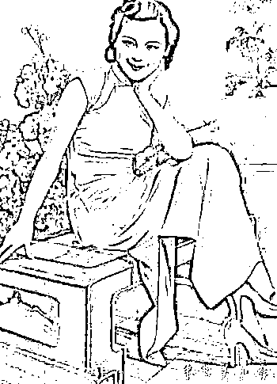

两位祖母都是非常好看的女性，照片中年轻的她们都曾烫着一头美丽的卷发，身着旗袍，温婉而优雅，比我母亲年轻时留下的许多知识青年照片美丽多了。那种女性风韵在多年之后，仍透过发黄的照片透出暖香。

女性解放，对于这两位祖母而言，估计是闻所未闻的词汇。虽然她们不久的前辈人中，有诸如丁玲这样的极其解放的左翼女性（其解放程度曾让比她小半个世纪不止的我惊叹不已，惶惑世纪后的女性反而似乎走进远古），有张爱玲这样夹在新旧时代之间的临水照花人，有萧红这样以性命抗争要求自由爱情而身世坎坷的女性，有也有朱安这样的殉道人。

不过民国著名女性丰富多彩的戏剧人生终究是小部分人的故事。大部分祖母辈的女性，我想如我两位祖母一样，过着没有自己的工作、事业，没有自主独立的经济收入，需要养活 3 个以上的孩子，和公婆生活在一起，男性的家庭暴力可能是家常便饭，以丈夫的意志为家庭意志的人生。

**3**

**母亲的故事**

**坚持自己的理想，选择自己的爱情**

我的母亲似乎是一个解放的女性，她的青春记忆是和当时飞扬的共产主义理想联系在一起的。那时的女性和男性同样顶半边天，而且要求上进的铁姑娘们甚至在体力活也拼命不输给男性。虽然母亲个子小，做不到，但是这让她更喜欢不仅会写诗、有革命理想、立志要用科学把飞船送上天，且养猪养地呱呱叫的父亲。

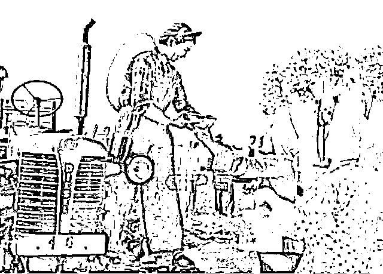

虽然非常苦，虽然后来父亲的伟大理想一个都没有实现，但青春而充满理想的农场生活仍然是南交双鱼座的母亲回忆中最闪亮的片段。母亲和两位祖母不同，她基于爱情选择了自己的配偶，虽然受到家庭的反对；她有自己的工作，有可以独立支配的收入，有和父亲同样的家庭地位。母亲的孩子也远远少于“像养猪娃一样养孩子的”祖母们。

**她生活的时代**

当然，母亲年轻时没有选择事业的自由，她只能服从国家的意志，一生中只服务于 3 个“单位”之中，在其中一个单位呆了 20 多年。她的年代没有跳槽一词，提倡“做革命的一块砖的螺丝钉精神”，情书基本以思想汇报、学习领袖精神为主，婚前性关系基本等于流氓罪，离婚是整个家庭要合力阻止的丑事。被社会思潮所染色的她如她的同龄人一样，虽然有了独立的工作和事业，但基本上没有过个人精神的独立探索，后期经历的更是理想主义的幻灭，逐渐安于、臣服于尘世生活。

我的母亲也不知道，在她把青春献给共产主义理想，在农场充满激昂地上山下乡种地喂猪之时，太平洋的那一边正在经历性解放和女性解放运动，这个运动影响了希拉里·克林顿这一代人。她们和我母亲一样找寻精神家园，但不同的是，她们走上了个人精神解放和启迪的道路，她们对女性的权利、女性人生有了和我母亲截然不同的深入探索。

**4**

**她们的故事**

**即使你遗忘历史，它也会抓住你**

我之所以回顾历史，是因为年纪越大越会发现，我们都是活在历史之中，即便你遗忘了它，它也会抓住你。

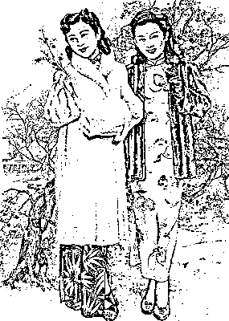

早年坐地铁，我很喜欢观察一对对母女的脸，沉思如何从年纪大的那张脸中脱胎而出那张青春洋溢的脸，又感慨生活如何将一张年轻的脸转化为另外一张写满忧思、沧桑、疲惫、甚至憎恨的妇人之脸。有时两人对比程度之强烈会让我唏嘘，甚至惊怖不已。

**青春流逝之后而没有美、爱和智慧的妇人的脸是不忍卒读的。我也非常喜欢看那些上了年纪，但是有着独特美、爱、勇敢和智慧的妇人之脸， 看着她们，如品尝红酒，或者欣赏经霜后的红叶林，给我自己无限鼓励**。

**你看到家族女性的议题了吗**

一代人是上一代人的承继者。由于祖母、母亲这一辈人和西方女性完全不同的探索方向，我们这一代女性在成年后会遇到她们所想解决而未能解决的问题。比如，**现代社会干得好不如嫁得好，凤凰男孔雀女现象、大龄女性的婚姻焦虑、社会对于剩女的嘲笑、离婚且带子女女性再婚的困难、对于职业和婚姻的个性化道路的畏惧、在职业和家庭之间的挣扎**等等这些问题如此弥漫，有时很难相信我们是经历了民国女性主义解放时期后 100 年的人，中国女性似乎除了娱乐明星之外，仿佛我们并未有西方女性更为多姿多彩的可供参考的榜样。

然而上一代人没有解决的议题必然要求下一代解决，从家族女性的星图中就可以看出来，女性前辈的渴望和挣扎铭刻在我们各自的星图上。

**在星图里向祖辈致意**

**我的祖母和外祖母的星图上都有金星或者月亮和天王星的挑战相位，象征着她们想要获得自由的渴望，然而她们的人生最终没有获得自由**；她们渴望成为不同的女性，但是时代没有给她们这样的机会，因此天蝎座的外祖母年老时很多怨恨遗憾，而白羊座的祖母一生受到深度抑郁症的困扰。**她们的女儿们，基本都有金星和天王星的挑战相位，在婚姻生活中皆有挣扎。**

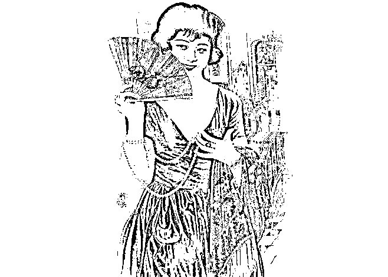

而到我这一代，我自己、表妹、表姐的金星、月亮都和天王有紧密联系。**当我看到母亲星图上的金星天王星、金星土星的四分相已经变成我星图上金星天王星合相、金星土星三合相位的时候，我的心中充满对于家族女性前辈的感激，及对她们人生挣扎的敬意**。我也很庆幸自己学了占星学，因此可以从这样的角度看到我们生命的关联，理解自己生命的故事，从更广阔的角度看到这些挣扎的意义。

**忠于自己，就是美好**

曾经认为女性的美及德有特定的标准，现在我知道，每个女性都有一张与其他女性不同的星图，就像每一朵花都有不同的姿态一样。每一个女性也在自己家族前辈未完成的故事之中。**敢于实现自己独特人生的女性则是全体女性的荣耀和榜样。你可以选择成为持帚之妇，也可以重新定义“妇”的写法，只要忠实于自己，都同样美好**。

愿所有的女性在这个节日里都走在实现自己星图最美好的样子的道路上。

愿所有的女性都拥有一张可以经历岁月的脸。


**喜欢蒋颖老师的文字吗？**

**在后台回复 蒋颖 即可查看她的全部文集哦。**

**◆ ◆ ◆  ◆ ◆**

**特别提醒****：若道享有本文授权，转载请注明“转自若道”。**

喜欢蒋颖老师的文章吗？**2016 年 5 月 19 日**，蒋颖老师主讲的若道占星核心课程**Level 1-2**要开课了！她将带领你学习星座、太阳、月亮、行星、月亮交点等知识，让你进入占星学的世界！

报名及咨询，请点击文末”阅读原文“


# 年度重要星象 | 双鱼座日食，新月报告免费送

> 原文：[`mp.weixin.qq.com/s?__biz=MzA5NjA0NTAxNg==&mid=403123919&idx=2&sn=1d25ed10ad62fc786df49cb914420098&chksm=0d459c783a32156eba7e721f1c3ca0a9248c05806e01b4d141c2b53395313f25bcff74c047b8&scene=126&sessionid=1692738867#rd`](http://mp.weixin.qq.com/s?__biz=MzA5NjA0NTAxNg==&mid=403123919&idx=2&sn=1d25ed10ad62fc786df49cb914420098&chksm=0d459c783a32156eba7e721f1c3ca0a9248c05806e01b4d141c2b53395313f25bcff74c047b8&scene=126&sessionid=1692738867#rd)

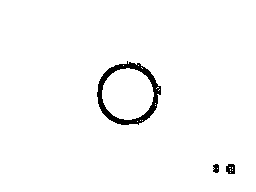

双鱼座新月（日食）

双鱼座新月终于来了。这次新月发生在北京时间 2016 年 3 月 9 日 09：55，位于双鱼座 18 度 56 分，并与处女座木星成对分相，与摩羯座冥王星成六分相，与射手座土星成四分相。

这次的新月还是日食，日食的能量要远远大于一般的新月，因为此时新月非常靠近月亮交点，月亮交点会为新月带来更多业力上的意义。本次日食发生在双鱼座，并与处女座的木星对分（木星合相北交点），将极大地激发我们的想象力和对于未来的预见力。

**我们潜意识中的梦想、渴望和恐惧有机会被挖掘出来，被更清楚地感知到。此时我们能看到关于未来的各种可能性在眼前展开，所以如何许下愿望，设定目标，变得尤其重要**。

这是开启“追梦之旅”的时刻，尽可能地去感受你的美梦，就像那是真的一样，此刻的渴望越真实，渴望之物就越有机会成真。

双鱼座的正面能量与更加敏感，与消融限制，与无条件的爱相关，这股加倍的新月能量会为人们开启一扇新的大门，不但会让那些麻木的心灵角落抹去灰尘，意识到埋葬已久的创伤需要疗愈，也更加渴望与他人紧密相连。人们的同情心也会因此被高度激发，比较容易更能去感受他人的苦难，给这个伤痕累累的世界带来更多的悲悯色彩。

这股能量，会将更多的如无边无际海洋一般的情感和大爱情怀激发出来，每个人内心，都会更加柔情蜜意。它是如此的玄妙，甚至还没有完全准备好捕捉它的痕迹，已然悄悄要来了。它带来的感觉，如狄金森的诗一样“会在意义隐居的深处，留下记忆”。

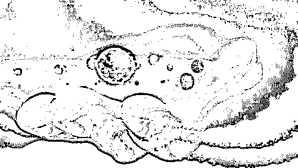

每次新月，都会带来一些新的机会，给生活带来一些希望和梦想。在占星的轮回里，双鱼座也是最后一站，如果你是个热爱在新月时刻许愿的人，可以回顾一下前面的 11 个新月里，都许了什么愿望，哪些是已经实现的，为宇宙送来生命的礼物深深感恩。哪些是没有实现的，看看是否有些已经不是当初的心境，而又有一些依然是需要继续追寻下去的……这一切，都可以在双鱼座的新月做一次整合。

这是一次具有灵感、具有创意的许愿时刻，也是适合张开翅膀，尽情梦想的时刻，它带来的能量是无限的。这个世界上有很多很多，人类所能涉及的方方面面，都蕴含着无尽的梦想。而你，可以找到属于你的梦想，这个梦想可以非常的伟大，不仅会为自己，也会为很多人带去美好。

嘘，轻轻地，没准你会在睡梦里，许下一些美丽的愿望，醒来可要记得它们哦。

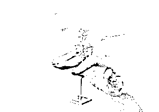

许愿之举个栗子

*   我希望我的爱可以传达出去，也希望能够接收到他人更多的爱。 

*   我希望自己内心的创伤可以得到治愈。 

*   我希望可以学习到宽恕的更多意义，接收到更多宽恕的力量。 

*   我希望自己创作出一首诗、一首旋律优美的音乐、一幅画，或者创作一件艺术品。 

*   我希望自己的 ______ 梦想能够得到实现。 

*   我希望自己可以更加敏感的发现生活中的浪漫细节。 

*   我希望潜入心爱人的梦境里，一起体验更加神秘的世界。 

*   我希望可以学会游泳，或会更加喜欢走路，改善身体健康，也会带来心灵上的愉悦。 

*   我希望能够与更多的人有更深层精神方面的联结。 

许愿时间

**2016 年 3 月 9 日 09：55~3 月 11 日 09：55**

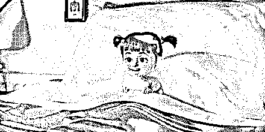

**点击文末“阅读原文**”**领取免费新月报告，
分享你的愿望哦~**

**/本文有部分内容节选自[本周周运](http://mp.weixin.qq.com/s?__biz=MzA5NjA0NTAxNg==&mid=403111743&idx=1&sn=c055e7a8e5e429cc1aab81ed70add33d&scene=21#wechat_redirect)（点击可阅读）/**

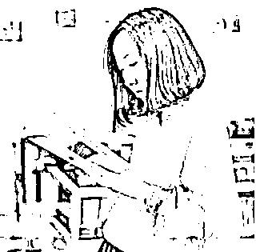

**作者简介**

**Amor，**独立职业占星师，持 ISAR 国际职业占星师资质认证，ISAR 中国活动委员，擅长生时校正，侧重研习占星与家族业力、亲子关系、职业发展、感情关系等。曾跟随西方多位国际优秀的占星老师学习，温暖、疗愈的风格建立在严谨、古老的占星学基础之上，在新时代帮助个人探索成长的路径，挖掘个人的潜能。目前居住杭州，长期与占星爱好者进行沙龙分享活动，活跃在占星一对一咨询和占星教学前沿。 

**咨询邮件**：rouruan@163.com

**微信平台**：Amorastro

 **◆◆ ◆  ◆ ◆** 

**特别提醒：****本文由作者授权发布于若道平台，**转载请注明“转自若道”。****

3 月 9 日就是双鱼座新月（日食）了，每到新月时分，都是播种心愿的时期。点击文末“**阅读原文**”，免费领取你专属的新月报告！ 

点击文末阅读原文领取新月报告


# 新月 | 抓紧时间在线许愿！

> 原文：[`mp.weixin.qq.com/s?__biz=MzA5NjA0NTAxNg==&mid=403123919&idx=3&sn=cc0cefbcdd743d2cbf1c1332ebb78b73&chksm=0d459c783a32156e6c686b5f1f353d553d48868871589a55cfd5ca4ec98ba173f46f50f7a04c&scene=126&sessionid=1692738867#rd`](http://mp.weixin.qq.com/s?__biz=MzA5NjA0NTAxNg==&mid=403123919&idx=3&sn=cc0cefbcdd743d2cbf1c1332ebb78b73&chksm=0d459c783a32156e6c686b5f1f353d553d48868871589a55cfd5ca4ec98ba173f46f50f7a04c&scene=126&sessionid=1692738867#rd)


每到新月

你都可以在线许愿！

若道新月报告可以在线祈祷、分享幸福！

手机党们，

不用再跑到网站上查看新月报告了~

在新月的时候，

你可以直接在手机上即可获取报告，

在线许愿并分享；

平常的时候，

也可以戳在线许愿并分享！

无论你在地铁上、聚会时、还是等餐途中，

随时随地许愿祈祷，

是不是很酷呢？

**操作起来也很简单哦**

**当新月到来的时候，您只要做如下步骤**

进入首页

点击
“新月祈祷“ 

登录账户

填写出生信息

查看报告、许愿

**【步骤一】点击新月的祈祷**


**【步骤二】输入姓名**


**【步骤三】输入出生信息**


**【步骤四】生成新月报告**


**最下方有许愿按钮，左边是倒计时提醒哟~**

**在合适的时间就可以许~愿~啦~**

**【步骤五】许愿！**

**** 

**【步骤六】让宇宙看到你的愿望并分享！**

**** 

**在平时，您只要做如下步骤**

进入首页

点击
“立即许愿”

开始许愿

点击分享

完成许愿

**◆ ◆ ◆  ◆ ◆**


**小伙伴们还等什么？**

**赶快点击→左下角阅读原文****吧！**

# 蒋颖老师 Level 1-2 | 星座小白进阶星座达人

> 原文：[`mp.weixin.qq.com/s?__biz=MzA5NjA0NTAxNg==&mid=403123919&idx=4&sn=36a29e6b97e1fd9633ccbeb59f889de4&chksm=0d459c783a32156e7cdf74fe29611c5025210e57f8df37544e6d36d0ae437e4ca089c59ab255&scene=126&sessionid=1692738867#rd`](http://mp.weixin.qq.com/s?__biz=MzA5NjA0NTAxNg==&mid=403123919&idx=4&sn=36a29e6b97e1fd9633ccbeb59f889de4&chksm=0d459c783a32156e7cdf74fe29611c5025210e57f8df37544e6d36d0ae437e4ca089c59ab255&scene=126&sessionid=1692738867#rd)


国际占星研究协会（ISAR）中国唯一指定教学机构

若道 2016 年占星核心课程 Level 1-2 上线

**这是若道首次推出中文老师**

带你畅游“星座小白”到“星座达人”之旅

主讲人若道创始人**蒋颖**

有效拿捏学员需求

**授课时间更长**

**交流互动更多**


**课程信息**

**授课时间：**2016 年 5 月 19 日**-7 月 7 日**

**授课老师：**蒋颖**（8 次）、**大卫·瑞雷**（4 次）**

**授课方式：**网络课

费用：**2400 元（2016 年 5 月 6 日前报名付款）**

**早鸟价：****1980 元（2016 年 4 月 6 日前报名付款**）

**报名截止：**2016 年 5 月 6 日

**课程负责人：童老师（微信号：80248863）、**王老师（微信号：2837474346）****

**咨询电话：**400-619-1014

**课服 QQ：4006191014 （若道星文化）**

**邮箱：nodoor@vip.126.com**

课程简介


**星座、太阳和月亮**

12 星座是占星学最基本却又最深刻的概念，黄道 12 星座，是伟大的生命周期，而太阳和月亮是我们阴阳之本。

**●12 星座：**深入了解 12 星座的特色。了解星座正面的、负面的表达，了解其资源，了解其破坏生命的模式。了解其原型人物、了解其指代的人事物。

**●12 星座原则：**按照极性、形态和元素给星座分类。

**●12 星座关键词：**关键词非常重要！是解读准确性的关键。

**●太阳和月亮：**了解你的太阳，生命的发动机，让你在世界闪光的方式，生命获得力量的方法；了解你的月亮，让你生命获得幸福的方法。了解它们，了解你生命中已经出现的、将会出现的男人和女人。


**遇见行星和月亮交点**

在这个阶段，你将遇见行星们，还有与灵魂的过往和未来相关的月亮交点。这既是你，你的性格，也是你在生命故事中将会遇到的人、事、物的显化，也是你灵魂轨迹的线索。    

**●内行星：**水星、金星、火星

**●中间行星：**木星、土星

**●外行星：**天王星、海王星、冥王星

**●灵魂的线索：**月亮南交点、月亮北交点

**●行星逆行：**行星逆行的天文现象和意义

**●宫位初解：**了解黄道 12 宫的基本含义

时间安排

共 12 次课，24 课时。

**●8 次理论课程**（蒋颖老师主讲）

北京时间每周四晚 20：00-22:00

**●4 次线上互动课程**（大卫老师主讲、配有中文实时翻译）

北京时间每周一晚 20：00-22:00

授课优势

**①先进的教学平台**

网络教学平台，支持手机、电脑、iPad 上网，可以随时随地学习。

**②回放复习**

学员可登录网站收看课程回放，在线复习课程，每次课可完整重看 3 次，课程结束后的 3 个月内有效。　

课程特色

**①与名师面对面**：北京同学可以来若道现场上课，和大卫老师面对面互动。大卫老师也可能前往主要学员所在城市，实现零距离教学。

**②互动答疑**：论坛、微信群随时提问；老师课上答疑；助教线上线下全程协助。

**③线下沙龙**：定期举办沙龙活动，复习上课内容。

**④强大的同学网络**：若道作为中国最顶尖的占星教学机构，在 4 年的占星教学中，培养了很多占星人才。若道让你和师兄师姐切磋，让你和国内著名占星师学习。（简单来说，就是，人脉！）网络授课，在北京开设免费现场参与名额，全程英文授课，配备实时翻译。

师资力量

**讲师团队**


**蒋颖（Felicia）**

若道创始人，职业占星师。在若道系统学习占星，师从大卫·瑞雷。长江商学院 MBA，厦门大学经济学硕士，化学学士。国际占星研究协会（ISAR）中国区副主席。第一批获得国际占星研究协会（ISAR）认证的职业占星师。《灵魂的目标》译者。


**大卫·瑞雷（David Railey）**

若道创始人，《灵魂的目标》作者。拥有四十年的占星咨询的执业经验，曾两任亚特兰大占星协会主席，是全美占星师联盟（AFAN）、美国占星师联合会（AFA）、全美占星研究委员会（NCGR）、国际占星研究协会（ISAR）和职业占星师组织（OPA）的成员，是联合占星大会（UAC, United Astrology Conference）督导委员会委员。大卫曾是 CNN、CBS 的占星节目的常驻嘉宾，多次在 BBC、WGS、WSB、WRGG 等节目中接受采访，并在亚特兰大主持电视节目《每日行星（Daily Planets）》达 4 年之久。

**助教团队**


**熊鹰（天空的空）**

国际占星研究协会（ISAR）认证占星师。在若道系统学习占星，师从大卫·瑞雷，现任若道专职助教。将传播系统、严谨、真实的占星学作为职业使命。与此同时，提供一对一占星咨询服务与生时校正咨询。目前正致力于占星学与个人真修实证的整合。2014 年起主讲读书会，助教答疑课程累计超过 100 小时。


**Gaff**

全职占星师，既是占星师，也是疗愈者。2013 年开始在若道进行系统占星学习，师从大卫·瑞雷。任 2015 年度诺·泰尔、斯蒂芬·福里斯特老师的占星工作坊助教。提供一对一的咨询服务（已有超过 100 小时的咨询经验），基于个案咨询的经验，曾多次开设面授的占星课程。

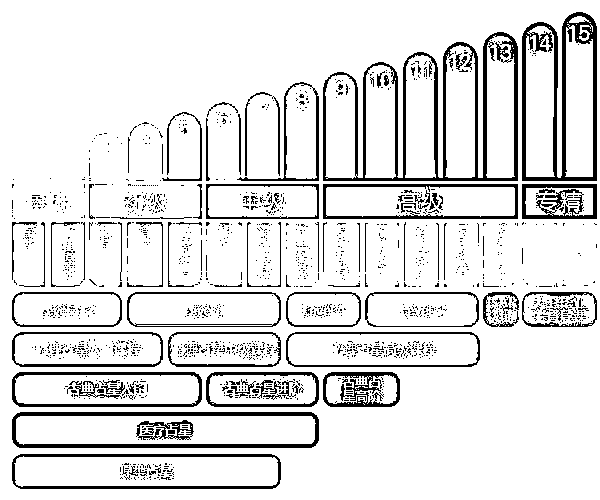

2016 年，和若道老师一起，开启占星的探索之旅！

报名及咨询，请点击文末”阅读原文“

长按二维码接通课程负责人！

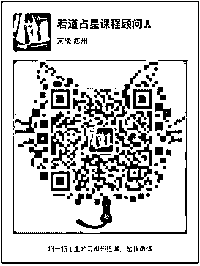

# Level 5 | 进阶专业占星师，你还差这一课

> 原文：[`mp.weixin.qq.com/s?__biz=MzA5NjA0NTAxNg==&mid=403111743&idx=3&sn=1f59dddfa16d360d31611986ca082712&chksm=0d444d883a33c49ee8e8a844a9a080d81304f8df43b9cc2e689acf0e40db3cca1d9c4175225a&scene=126&sessionid=1692738867#rd`](http://mp.weixin.qq.com/s?__biz=MzA5NjA0NTAxNg==&mid=403111743&idx=3&sn=1f59dddfa16d360d31611986ca082712&chksm=0d444d883a33c49ee8e8a844a9a080d81304f8df43b9cc2e689acf0e40db3cca1d9c4175225a&scene=126&sessionid=1692738867#rd)

若道，一所有信仰的学校

你可以选择花这笔钱去买一个奢侈品包包；

办一年美容卡；

报一个私人健身课程； 

又或者来一场说走就走的奢侈游；

你也可以选择花这笔钱来若道学习；

通过学习了解自己的人生轨迹；

站在星图上，活出强大的自我。

**若道的学费贵不贵？**

来听听学员们的声音吧——

**@L4 在读学员喵呜 **

**21 岁/学生**

对我来说，当然贵呀，可我乐意花这个钱去学，对我来说学习先是要搞清楚原理、由来、哲学观的。在理念这一块，放眼行业内没有比若道做得好的，这就是独一家的价值，所以价格再高都会来的。

这一年所收获的各种，体验到的、学会的，真的是没办法用金钱衡量。**若道从某方面来说，丝毫不夸张，改变了我整体的人生轨迹**。

**@L4 在读学员西瓜 **

**25 岁/会计**

选择续报是觉得很多知识都熟悉着，万一断了课程，还断了**和同学交流的平台**，再隔一年会生疏。而且我担心万一涨价了可咋整，我还担心大卫他是美国人，万一哪天回国咋整，趁他现在还在中国教，赶紧学下去……

**@L4 在读学员 Satan**

**48 岁/工程师**

乍看有点贵，等慢慢学习后觉得值得的。看个人需要，作为职业方向或者学得专业些，还是要系统学习，不能靠自学或野路子，会学偏了。若道文化教学理念和核心课程在中国还是第一位，其教学配置比较国际化，看到了**若道文化在用心做这件事。包括大卫讲课激情和敬业，助教和教务的全方位服务，值得的。能请国际上的大师级人物来讲课办工作坊是不容易的，因此我们的起点也高了**。


在这里，有一群有信仰的人

致力于严肃占星学在中国的推广

这是一笔对你未来人生的投资

贵，但是值得

和若道一起

来为我们自己做点什么吧

就从今天开始

L5 课 程 报 名 在 即

在这个阶段

你将学习各种**预测技术**

**行进、月亮次限、太阳弧、返照图**

你会学到**行星周期**

天上哪朵云什么时候会飘到这个人的头顶呢

会如何影响这个人的人生呢

通过这些预测工具

**你就能用它来预测和规划人生了**

**课程讯息**

**授课时间：**2016 年 3 月 29-9 月 27 日

**授课老师：**大卫·瑞雷

**授课方式：**网络课

****费用**：15000 元**

**课程负责人：**siri**（微信号：2847613491）**

**咨询电话：**400-619-1014

**课服 QQ：4006191014 （若道星文化）**

课程简介

****课程安排太丰富**了！**

行进

行星周期

爱情中的机会和挑战时机

职业周期

月亮次限

太阳弧

太阳返照、月亮返照

综合预测

组合图

占星学历史

占星学中的天文学

ISAR 考试词汇表

咨询技巧培训

**●**在整个教学过程中，不仅用名人案例讲解，而且将会抽取同学星图，进行实战咨询示范。另外，会有 4 节课的咨询技巧培训帮助大家准备好进入实战。

授课时间

2016 年 3 月 29 日-9 月 27 日

每周二晚 20：00-22:00（北京时间）

共 27 次课

有关毕业

**考试和实习****：**对于那些想要获得大卫老师资质班证书的朋友，我们将帮助大家在开始成为职业占星师之前，将由专业占星师组织小型督导工作坊，帮助大家实战解盘，为正式的收费咨询做好准备。通过毕业考试，参加督导工作坊，星盘解读的同学，将获得大卫老师颁发的职业占星师资质证书。

授课优势

**①先进的教学平台**

网络教学平台，支持手机、电脑、iPad 上网，可以随时随地学习。

**②回放复习**

学员可登录网站收看课程回放，在线复习课程，每次课可完整重看 3 次，课程结束后的 3 个月内有效。　

课程特色

**①与名师面对面**：北京同学可以来若道现场上课，和大卫老师面对面互动。大卫老师也可能前往主要学员所在城市，实现零距离教学。

**②互动答疑**：论坛、微信群随时提问；老师课上答疑；助教线上线下全程协助。

**③线下沙龙**：定期举办沙龙活动，复习上课内容。

**④强大的同学网络**：若道作为中国最顶尖的占星教学机构，在 4 年的占星教学中，培养了很多占星人才。若道让你和师兄师姐切磋，让你和国内著名占星师学习。（简单来说，就是，人脉！）网络授课，在北京开设免费现场参与名额，全程英文授课，配备实时翻译。

师资力量


**大卫·瑞雷（David Railey）**

若道创始人，《灵魂的目标》作者。拥有四十年的占星咨询的执业经验，曾两任亚特兰大占星协会主席，是全美占星师联盟（AFAN）、美国占星师联合会（AFA）、全美占星研究委员会（NCGR）、国际占星研究协会（ISAR）和职业占星师组织（OPA）的成员，是联合占星大会（UAC, United Astrology Conference）督导委员会委员。大卫曾是 CNN、CBS 的占星节目的常驻嘉宾，多次在 BBC、WGS、WSB、WRGG 等节目中接受采访，并在亚特兰大主持电视节目《每日行星（Daily Planets）》达 4 年之久。

**想成为 ISAR 认证占星师吗？**

**欢迎选择 2016 年度职业占星师成长套餐** 

▼


**2016 年，和大卫老师一起，开启占星的探索之旅！**

长按二维码添加课程负责人咨询~

****

报名请点击文末”阅读原文“

# 招聘 | 别犹豫了，快加入！(课程顾问、行政)

> 原文：[`mp.weixin.qq.com/s?__biz=MzA5NjA0NTAxNg==&mid=403111743&idx=4&sn=c48d59eaee88256d25d03278bbb91a29&chksm=0d444d883a33c49ebf73befd4aeb67adec08367110d28b681248bfd313e69c19bc0e7feccbad&scene=126&sessionid=1692738867#rd`](http://mp.weixin.qq.com/s?__biz=MzA5NjA0NTAxNg==&mid=403111743&idx=4&sn=c48d59eaee88256d25d03278bbb91a29&chksm=0d444d883a33c49ebf73befd4aeb67adec08367110d28b681248bfd313e69c19bc0e7feccbad&scene=126&sessionid=1692738867#rd)

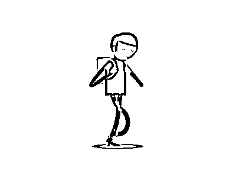
**懂得占星学的人知道它是有力的工具**

**帮助人类促进自我了解**

**让人更有智慧地和宇宙展开互动**

**如果你心有信仰并坐拥情怀**

**愿意为占星学在中国的推广贡献一己之力**

**如果你除了一腔热血还有踏实肯干的精神**

**请考虑加入若道**

**我们一起**

**做些实事 **

**为我们生命中想要坚守的东西**

若道星文化是由美国著名占星师大卫·瑞雷和国际占星研究协会（ISAR）中国区副主席蒋颖创办的一家占星教育、传播、咨询机构，我们通过以 O2O 垂直类教育的互联网产品，来实现帮助自己和他人的愿望。2016 年，我们期望有人文理想、想要在占星学传播和教育方面做出贡献、有职业成熟度的朋友加入我们！

**﹁**

**全职**

**课程顾问**

**﹂**

招聘人数：2 人>>>>

**工作内容与职责**

*   负责以网络咨询、电话咨询、现场咨询等形式，介绍若道文化及若道所有核心课程； 

*   解答客户与占星学相关的问题，包括占星文化理念、若道课程结构、若道授课模式、老师背景等，为客户推荐适合课程； 

*   负责以电话回访、问卷调查、平台互动等方式与学员保持联络（微信群和社区管理维护）； 

*   了解占星文化传播动向，通过与学员的交流了解市场趋势和方向，参与课程设计； 

*   完成课程的招生任务以及课程报名情况统计分析； 

*   了解学员需求和反馈，及时解决问题，协助授课老师、翻译和助教做好课程服务工作； 

*   协助市场宣传部做好网络推广工作；

*   参与线上和线下课程的值课和现场服务。

>>>>

**任职资格**

*   爱好占星学，有现代占星学理论，掌握占星学基础知识； 

*   服务意识强，愿意应对高难度工作，目标感强，抗压能力强； 

*   有线上课程销售服务经验优先； 

*   完成若道 level5 核心课程、获得 ISAR 认证或 COAC 认证或相关心理咨询师证书者优先。

>>>>

**福利待遇：6000-8000+**


**﹁**

**全职**

**行政**

**岗**

**位**

**﹂**

招聘人数：1 人>>>>

**工作内容及职责**

*   根据公司部门负责人的要求完成人事行政部的工作内容； 

*   行政方面：来访接待、考勤记录、办公用品申领，快递邮寄、档案整理等； 

*   人事方面：招聘简历筛选、电话邀约及相关人事工作。 

*   后勤方面：负责对接工作餐的物资采购，保持办公环境整洁； 

*   负责学员的课程咨询、转介、售后服务的解答并及时反馈信息； 

*   线上和线下课程的值课和现场服务；

*   与各部门密切沟通，参与营销活动，协助市场销售。

>>>>

**任职要求**

*   本科学历，人力资源或管理方面的专业优先，有相关证书者优先；

*   热爱占星学，可熟练使用常用的办公软件及网络应用，善于进行数据分析，为工作提供数据报告；

*   具有良好的职业道德和职业操守，认同公司理念，抗压能力强，擅于沟通与协调，具备良好的团队合作精神；

*   良好的学习力，适应力强，愿意为工作投入 100%的努力； 

*   有职业理想，愿意从基础职位起步，和公司一起成长发展。

>>>>

**福利待遇：4000-5000+**

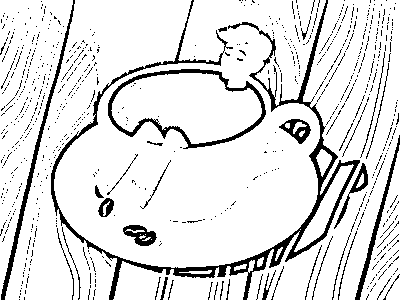

**加入若道，你会享受如下福利**

你付出才华和汗水，收获友谊、成就感、职业发展和金钱的回报：

○ 薪资体系=基本工资+绩效工资；

○ 提供五险、工作午餐、加班补助，带薪年假，年底奖金；

○ 享受每年员工占星培训课程；

○ 可以和大卫老爷子以及翻译姐妹练习英语口语，提高你的职业素质；

○ 有机会各种有意思的人喝茶、聊星图、人生，让你收获友谊和成长；

○ 中午由聘请的阿姨做家常饭，让你品尝妈妈的味道；

○ 各种零食、茶、咖啡、红酒、啤酒、懒人沙发、休息室让你劳逸结合；

○ 带薪假期。春节两周假期，你有比别人多一周的时间在家里孝敬爸妈，不再为买回家的车票发愁。

工作地点

**北京**

**地址：**北京市朝阳区百子湾路 32 号院苹果社区南区

应聘方式

简历和作品集请发邮件至** freya.li@nodoor.com**

请在简历中附上个人出生星图

**如果你真的想为占星学做点事儿，若道欢迎你**


# 不能答，这些问题占星师不能答

> 原文：[`mp.weixin.qq.com/s?__biz=MzA5NjA0NTAxNg==&mid=403111743&idx=2&sn=7ca4ed275341d13172bc07d7a06d54d7&chksm=0d444d883a33c49efa994bd25f2927b2e9718ab0cbcc3bbbcb6d60e03af3057a6af40e53f028&scene=126&sessionid=1692738867#rd`](http://mp.weixin.qq.com/s?__biz=MzA5NjA0NTAxNg==&mid=403111743&idx=2&sn=7ca4ed275341d13172bc07d7a06d54d7&chksm=0d444d883a33c49efa994bd25f2927b2e9718ab0cbcc3bbbcb6d60e03af3057a6af40e53f028&scene=126&sessionid=1692738867#rd)

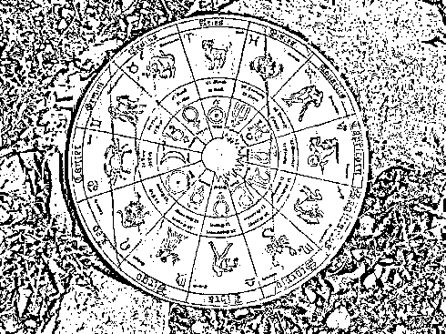

作者/大卫·瑞雷

译者/轩轩 校对/江艺

无论你是一个资历老辣的占星师，还是一个正奔往占星师路上的新手，总有一天你都会碰到一个款款深情的眼神，接下来是一句：大师，帮我算算吧！可那些指望你推算出的东西，怕是只有天生的神仙才知道，可你确认你并没被神仙选做代言人。这个时候你该怎么办？该怎么回应那样的请求？大卫老师在此传授出他的武林秘笈，告诉各位哪些问题能回答，哪些不能。

**哪些提问占星师无法回答？**

●你能通过星图来判断它的主人是男人还是女人吗？

答案是“不能”，除非有人告诉你。

●你能分辨星图的主人是狗是树，还是其他任何事物吗？

答案还是“不能”，除非有人告诉你。

●从星图上能看出一个人是不是同性恋吗？

不能。

●从星图上能确切判断一个人是罪犯还是守法公民吗？” 

不能。

●从出生图能判断一个人是圣人还是杀人犯吗？

不能。

如果这些都让你沮丧，更让你沮丧的问题还在后面。

●你能看出这个星图的主人有多少钱？

不能！

●你能够绝对准确指出这个星图的主人什么时候结婚吗？

答案仍然是“不能！”

**对不可知的事物应当保持谦逊**

我怀疑没有任何占星师能够从厚厚的一叠星图中，挑出富人星图，把他们和普通工薪阶层的星图分开。这是不可能的任务。

“真的吗？”你问。

真的！

即使是一些关于绝对“命运”的观念，也不仅不符合现代的理解，而且和我们居住的物质世界不调和。人类生命中绝对注定的只有两件事：1. 在某个时刻你会死去；2. 如果你活得足够久，你会变老。

这些简单的事实强调了解客户“背景”的重要性。在这个无法避免的现实面前，占星师应该保持谦逊，尤其在做出论断或不假思索认定占星学具有某种特性时，占星师更应当保持谦虚的态度。

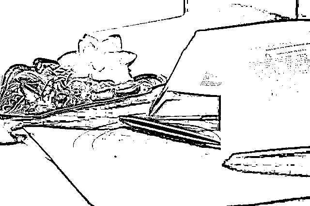

**占星学预测的是行为和趋势**

但是，我们同样可以非常自信的是，只要有个合理的“背景”，占星学不仅可以为我们提供一个富有意义的解释，还可以预测行为和趋势，这一预测基本符合事情发展或发生的大致主题。请注意，这里我使用的是“趋势”一词，而不是“事件”，这一区分是十分重要的。

天气预报员能预测一场发生概率为 70%的雨，但是却不能预测小英会把她的泰迪熊落在甲板上被浸湿，也不能预测到她妈妈因为忘了带雨伞，所以从地铁站走回家时被淋湿。事实上，这场 70%概率的雨会引发什么样的具体事件，对于像住在北京这么大的城市里的每个人来说，都有无数种可能性。

同样，一个人在一年甚至几个月里会遇到的情境也有着无数的可能性。在变化万千的独特（占星）组合中，人们能展示和发展出的个性和行为特征也有着无数的可能性。当考虑到有这么多可能性的时候，一位训练有素、经验丰富的占星师能够在很大程度上精准地描述一个人的个性和行为已经令人惊叹了。

然而，如果没有和客户的“互动”，不管是面对面的，还是在电话、QQ、微信上的互动，如果针对事件，即使是经验丰富的占星师也只能对星图作出比较“中庸的”解读。

**占星师不是算命仙**

如果对星图进行“盲读”，一位具有丰富人生阅历的占星师，至少会举出好几个“例子”，从正反两面说明星图的主人在面对人生挑战时可能会做出怎样的举动。或者，用好的隐喻性故事进行有治疗性质的解读。

可是，如果没有互动的背景，占星师描述和诊断的准确性将受限。类似地，即使是经验最丰富的占星师，其预测的相关性也会根据他对背景的了解程度而有所降低。请注意，我这里的用词是“预测的相关性”，而不是“预言事件”。

在负责任的占星预测中，对趋势和具体事件的区分是非常重要的。中国很多年轻的、刚入行的职业占星师都从他们的新客户那里感受到了预言具体事件的压力。这种对算命的期待让我们经常听到这样的要求：“告诉我会发生什么？”客户以为占星师就是做这个的呢，我们能怪他吗？因为在占星行业，我们占星师做为一个整体，还没有有效地去告诉客户：占星到底是什么，能做什么，不能做什么。

一些占星师在急切寻找能够预测事件的魔弹；一些占星师在告诉另一些占星师他们知道这些魔弹；一些占星师在忙着写运势，抛出这些“魔弹”；一些占星师埋头咨询，知道没有这些魔弹，但是他们的客户已经让他们够忙碌了，因此没有时间让公众听到他们的声音。所以通常，人们几乎无法分辨算命师和占星师的区别，他们对占星师的期待也常常是算命而已。这能怪谁呢？


想体验大师级的占星疗愈？

大卫老师**占星咨询**预约进行时

**生命议题、职业发展、关系咨询、少儿成长、年度规划和预测**

预约请在电脑端复制打开以下网址

 http://www.nodoor.com/consultantApply.do?contentId=3670 

**◆ ◆ ◆  ◆ ◆**

******特别提醒************：若道拥有本文版权******，**转载请注明“转自若道”。******

成为一名成熟的占星师，你需要了解什么能预测，什么不能预测。**2016 年 3 月 15 日**，大卫老师主讲的若道占星核心课程**Level 5**要开课了！在这个阶段，你将学习各种预测技术及行星周期。通过这些预测工具，你能够预测和规划人生。提前报名付款有**早鸟价**哦！详细内容请点击“**阅读原文**”了解。

报名及咨询，请点击文末”阅读原文“


# 宇宙天气 | 梦想启程的重要时刻来临！(3.7~3.13)

> 原文：[`mp.weixin.qq.com/s?__biz=MzA5NjA0NTAxNg==&mid=403111743&idx=1&sn=c055e7a8e5e429cc1aab81ed70add33d&chksm=0d444d883a33c49e98d1b5861f9775c111ff5bfd5f35cbbd2ae21feef0ee288051b7dc590779&scene=126&sessionid=1692738867#rd`](http://mp.weixin.qq.com/s?__biz=MzA5NjA0NTAxNg==&mid=403111743&idx=1&sn=c055e7a8e5e429cc1aab81ed70add33d&chksm=0d444d883a33c49e98d1b5861f9775c111ff5bfd5f35cbbd2ae21feef0ee288051b7dc590779&scene=126&sessionid=1692738867#rd)

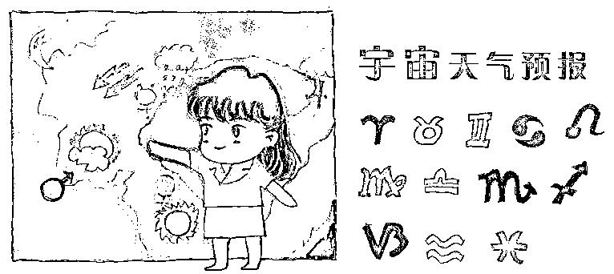
作者/占星师 Cora

插图/七沐 图片/花瓣

**一周星象综述**

本周月亮经过水瓶座、双鱼座、白羊座、金牛座。

> **本周重点星象事件是：**
> 
> **①  周二双鱼座太阳对分处女座木星**
> 
> **②  周三上午的双鱼座新月日食**
> 
> **③  周五双鱼座水星合相海王星**
> 
> **④ ****周六金星离开水瓶座进入双鱼座**

显然，本周的重要星象事件都与“双鱼座-海王星”这组共振的星象能量有关。所以，如何应对“双鱼座议题”，即有关梦想、想象、灵性渴望、疗愈与慈悲的主题，将是本周重点。

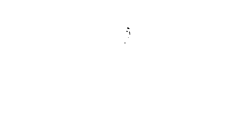

**每日星象**

**3 月 7 日**

**星期一**

**关键词：愉悦**

今天月亮在理性又洒脱的水瓶座，在早上六分土星与天王星，在下午合相金星，带来心情愉悦，充满自由气息的一天。晚间适合与好友聚餐，或是与恋人约会，这是有利于社交、娱乐以及恋情发展的一个晚上。

中午双鱼座太阳六分冥王星，**此相位重点影响今明两天**。我们将能对自己的身份与目标有更加透彻的、直觉性的领悟。对于我们是谁，要往哪里去以及有能力往哪里去，将有更多感性上的了解。

**当日星象**

04:02 水瓶座月亮六分射手座土星

08:12 水瓶座月亮六分白羊座天王星

**12:42** 双鱼座太阳六分摩羯座冥王星

16:47 水瓶座月亮合相金星

**3 月 8 日**

**星期二**

**关键词：敏感**

**今天月亮进入双鱼座，依次与双鱼座的水星、海王星合相。**这是灵感和直觉大大提升的时刻。我们很可能“没有缘由”地了解到一些事的真相，非语言的沟通将带来很多信息，感觉会告诉我们答案。我们也会对他人的情感状态更加敏感，这是进行情感沟通的好时候，我们会更容易跟他人彼此理解，建立情感上的连接。同时这也是进行任何形式的艺术创作的好时候。

此外，双鱼座的太阳对分处女座的木星，将燃起我们的梦想之火。一些萦绕许久的美梦会在此时放大，让我们看到更多实现它们的机会，但也应注意不要被虚幻的可能性蒙蔽了头脑。未来有无穷的可能，但我们还是要选择一个方向坚定行走。

**当日星象**

03:07 月亮离开水瓶座进入双鱼座

04:12 双鱼座月亮四分射手座火星

10:30 双鱼座月亮合相水星

**18:58**双鱼座太阳对分处女座木星

19:12 双鱼座月亮合相海王星

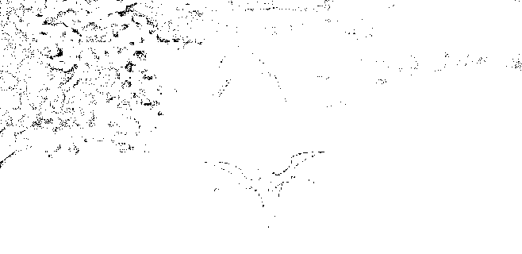

**3 月 9 日**

**星期三**

**关键词：梦想**

今天是双鱼座新月日食，并且新月与木星准确对分。**日食的能量要远远大于一般的新月**，因为此时新月非常靠近月亮交点，月亮交点会为新月带来更多业力上的意义。本次日食发生在双鱼座，并与处女座的木星对分（木星合相北交点），**将极大地激发我们的想象力和对于未来的预见力**。**我们潜意识中的梦想、渴望和恐惧有机会被挖掘出来，被更清楚地感知到。**此时我们能看到关于未来的各种可能性在眼前展开，所以如何许下愿望，设定目标，变得尤其重要。

这是开启“追梦之旅”的时刻，尽可能地去感受你的美梦，就像那是真的一样，此刻的渴望越真实，渴望之物就越有机会成真。

**当日星象**

05:30 双鱼座月亮四分射手座土星

06:57 双鱼座月亮六分摩羯座冥王星

08:48 双鱼座月亮对分处女座木星 

**09:55**双鱼座新月日食（月亮合相太阳在双鱼座，并且合相南交点）

**3 月 10 日**

**星期四**

**关键词：行动**

今天月亮进入白羊座，并在早晨三分射手座的火星。这是适合积极行动的一天，工作效率也会有所提升。无论过去的两天里有怎样的梦想和渴望在你心里生根发芽，现在都是快速进入到具体行动中的时刻。以最直接的方式推进你的目标，就是此时该做的。

**当日星象**

03:39 月亮离开双鱼座进入白羊座

05:52 白羊座月亮三分射手座火星


**3 月 11 日**

**星期五**

**关键词：幻想**

月亮依然在白羊座，并在早晨三分土星、四分冥王星，在上午合相天王星。这带来充满活力和开创精神的一天。月亮在白羊座时总是提升勇气的时刻，这时应拿出不服输的精神，去尝试，去冒险，去争取，感受竞争和胜利带来的快感。

下午双鱼座的水星合相海王星，带来的影响将贯穿今天全天。此时我们想事情的态度和风格会比较浪漫、理想化，充满想象，沟通交流中更加容易理解他人，更有同情心和同理心，也会变得十分敏感。这是容易“被催眠”的时刻，不宜做决定，但适合做需要发挥创造力和想象力的事。直觉和幻觉是需要区分的。

**当日星象**

05:38  白羊座月亮三分射手座土星

07:03  白羊座月亮四分摩羯座冥王星 

09:44  白羊座月亮合相天王星

**14:02 **双鱼座水星合相海王星

**3 月 12 日**

**星期六**

**关键词：舒适**

今天月亮进入金牛座，并在晚间六分双鱼座的海王星、水星。这是心情悠然舒适的一天，晚间适合做些悦纳身心的事，比如做按摩，跟朋友小酌。

今天金星离开水瓶座进入双鱼座，这是一个浪漫美妙的位置，金星将在这里一直待到 4 月上旬。未来 20 天左右的时间里，是用心感受爱情中的美妙与甜蜜的时刻。我们会更加渴望无条件的爱，也更容易在爱情中享受到梦幻般的甜蜜与感动。

**当日星象**

02:25 白羊座月亮六分水瓶座金星

03:43 月亮离开白羊座进入金牛座

**18:25**金星离开水瓶座进入双鱼座

19:56 金牛座月亮六分双鱼座海王星

23:57 金牛座月亮六分双鱼座水星

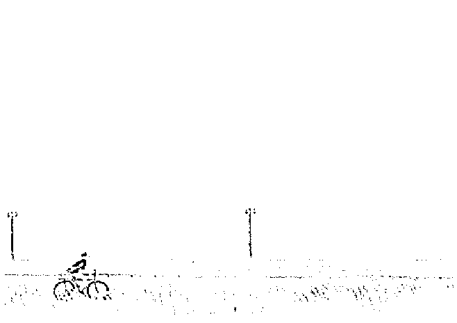

**3 月 13 日**

**星期日**

**关键词：平静**

月亮依然在安闲的金牛座，并且与冥王星、木星、太阳成和谐相。这是情绪平稳安适的一天，事情的进展也会比较顺利。适合静静地放松自己，享受生活。跟朋友或家人出去腐败也是不错的选择。

**当日星象**

07:42 金牛座月亮三分摩羯座冥王星

08:37 金牛座月亮三分处女座木星

**17:48**金牛座月亮六分双鱼座太阳


**作者简介**

**占星师 Cora**，全美占星师联盟（AFAN）成员，国际占星研究协会（ISAR）会员，获 ISAR 职业占星师资质认证，斯蒂芬·弗里斯特《变幻的天空》译者，个人星象文章见诸《心探索》《北京青年周刊》《上海电视》《空中生活》等杂志媒体。曾在若道系统学习占星学，现为全职占星师。

微信公众号：聆宇 FM（微信号：lingyudiantai）

个人微信号：CoraAstro

长按二维码，让金钱涌向传播知识与智慧的人~


**◆ ◆ ◆  ◆ ◆** 

**特别提醒：****本文由作者授权首发于若道平台，**转载请注明“转自若道”。****

如何掌握星象，顺势而为？**2016 年 3 月 15 日**，大卫老师主讲的若道占星核心课程**Level 5**要开课了！在这个阶段，你将学习各种预测技术及行星周期。通过这些预测工具，你能够预测和规划人生。提前报名付款有**早鸟价**哦！详细内容请点击“**阅读原文**”了解。

报名及咨询，请点击文末”阅读原文“


# 火星入射手座 | 你可以选择愤怒，也能选择勇气

> 原文：[`mp.weixin.qq.com/s?__biz=MzA5NjA0NTAxNg==&mid=403087124&idx=1&sn=4c166f0b9f12b4afeee5a4d2043d787c&chksm=0d442da33a33a4b508c0f71b245440e56cb6ad6f9c5a7e09310ab5ecbe7d6eee789df953e5db&scene=126&sessionid=1692738867#rd`](http://mp.weixin.qq.com/s?__biz=MzA5NjA0NTAxNg==&mid=403087124&idx=1&sn=4c166f0b9f12b4afeee5a4d2043d787c&chksm=0d442da33a33a4b508c0f71b245440e56cb6ad6f9c5a7e09310ab5ecbe7d6eee789df953e5db&scene=126&sessionid=1692738867#rd)


火星 3 月 7 日就要进入射手座啦！火星代表着什么，火星的换座和逆行会对我们造成怎样的影响呢？快来看看吧。针对十二星座的运势千万别错过哦。

星 象 时 间 轴

► 3 月 7 日火星入射手座

► 4 月 17 日火星在射手座逆行

► 6 月 29 日火星在天蝎座恢复顺行

► 8 月 4 日火星再次进入射手座

► 9 月 28 日火星离开射手座进入摩羯座

► 这期间，水星有两次逆行。

► 土星也在射手座，给火星的能量带来更多的压力。

**火星进入射手座需要思考的**

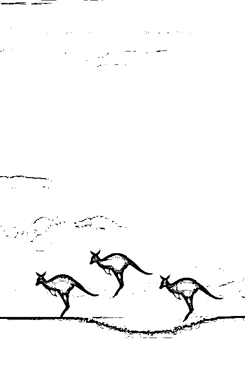

火星和一个人的自我坚持紧密相联，如果你想了解你会如何捍卫自己的权力，星图上的火星会告诉你这一切。火星行进会告诉我们，当我们面对冲突和挑战的时候，会有多少勇气和决心去面对它。

很多人不喜欢火星，因为火星是出了名的只顾自己、不顾他人、粗野又冲动。这种放纵的本能往往让火星带来冲突和竞争，而冲突和竞争又会引起愤怒和挫败感。没有人会喜欢愤怒、挫败和低自尊的感觉。 

*   火星马上进入射手座，并在 4 月 17 日开始逆行，直到 6 月 29 日在天蝎座恢复顺行。**整个春夏两季火星都在射手座**。

*   射手座的原型是智慧老人，代表更多的理解力和更强的判断力，在更高的智慧上达到一种自我的整合。

*   火星进入射手座，你需要考虑的是，**关于自我的坚持，关于愤怒情绪的表达，关于挫败能量的疏导，你是不是还有做得更好的能力？**所有火象元素都代表积极的态度和行动。

*   火星入射手也要**小心冲动的能量会让你一意孤行**。好在这个阶段土星也在射手座，这会让火星慢下来。

**火星逆行，选择愤怒还是勇气**

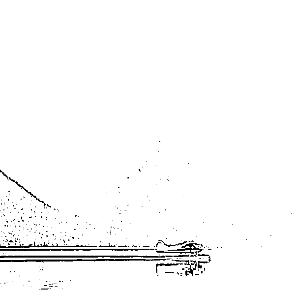

通常火星在一个星座停留两个月，但是今年火星会在射手座逆行，**这意味着有半年多的时间火星会停留在射手座。**

*   行星逆行，就是提醒我们慢下来，回顾和反思过去的种种事情，是否用了最好的方式，是否还有更进一步的可能性。

*   **你是否处理好坚持自我、捍卫自我的能量。当你表达你的火星能量的时候，你是否处理好你的野心、对自我的坚持、竞争？你如何处理你的愤怒和挫败感**？

这对十二星座来说是一个好机会，**向内、向更深处去寻找自己实现理想的勇气**。这世界上的愤怒已经够多了，你是愿意再加入一些自己的愤怒，还是**在这个世界上已有的勇气中加入自己的勇气**？**随着火星在射手座的逆行，你有机会对之前的想法和行动进行一些修正和改变**。

**给十二星座的建议**

火星逆行的时候，特别适合我们去**反思三件事情**： 

*   我们如何坚持自己的权力，争取自己的利益。

*   是什么引起我们的愤怒，有没有更好的方式来表达我们的愤怒。

*   在哪个领域我们投入了过多的精力，以致影响到我们的生活品质。

前 方 高 能

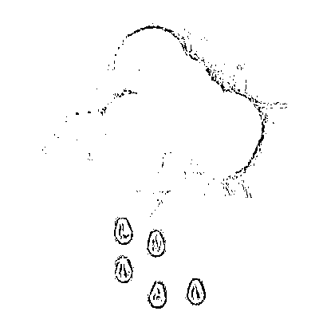

**火星在射手座对十二星座的影响** 

**参考上升星座和太阳星座，以上升星座为主。并结合文中的重点和自己的现实，自由想象。**

**—— 白羊座 ——** 

火星是白羊座的守护星，火星逆行对羊羊们的影响自然会很大。但是羊羊们不要担心，射手座的火星会在你们的旅行宫来来回回，差不多半年的时间。你们可以**好好安排你们的假期，可以多做计划，妥善安排，防止出现各种小意外**。你们可以去很远很远的地方，以前想去而不敢去，想去又没有时间去的天涯海角。你们的木星在婚姻宫，冥王星在事业宫，都会给你们带来好运。加油吧。

**—— 金牛座 ——**

牛牛们，你们很实际，今年的火星逆行给你们一个好机会**重新安排你们的钱财**。射手座的火星会提醒你们去**考虑以往的投资计划是否合适，财务规划是否合理**。可能你会**调整自己的储蓄计划或者投资项目**。牛牛们也要**注意自己的身体健康**，因为今年的火星并不在状态，可能你会**觉得精力不够**，或者**需要做些小手术**。

**—— 双子座 ——**

今年你们会**在关系和合作领域投入更多的能量**。火星会在你们的婚姻宫停留半年多的时间，你们需要**小心地去平衡他人和自己的需求之间的关系**。对于有伴的双子座来说，不要着急做任何重大的决定，你们有足够的时间来好好考虑你们的关系和合作。双子座从来不缺伴侣和伙伴，但是一个长期的伙伴还是需要你们去慎重对待的。也许会有一些小麻烦，不过不用担心，会有人向你伸出援手，也许是你的父母，也许是你的贵人。

**—— 巨蟹座 ——**

对于蟹蟹们来说，今年将是**忙碌的一年**，射手座的火星将会在你们的日常工作宫来来回回。你们需要**认真做好今年的工作计划，又要保留一些弹性**，对于逆行的火星来说，改变和修整几乎是不可避免的，你要做好思想准备。也许领导改变了想法，或者客户又提出了新要求，你需要有足够的准备，才不会让自己陷入手忙脚乱的地步。不过经过这样的考验，你会发现自己的**交流沟通能力有了长足的进步**，对于害羞的蟹蟹们的来说，这可是一个足够好的新技能。

**—— 狮子座 ——**

对于活力十足的狮子们来讲，今年是个好年份。火星在同样火象的射手座逆行，给了你们更多的机会去**学习、恋爱和表现自己**。火星在你们的恋爱宫逆行，你们可能会**纠结于一段关系**。好好去了解对方，也好好了解一下自己。这是认清彼此的好时机。或者你可以**把精力放在培养自己的小爱好上面，好好挖掘一下自己的创造力**，这方面的精力投入从来不会让你失望的。 

**—— 处女座 ——**

虽然说处女座是网络上的万年黑，但是我们都知道处女座又细心又周到又低调。如果你忽略掉他们有时候吹毛求疵的唠叨，处女座其实是居家旅行出门必备的好伙伴。今年的处处们又是**家里的顶梁柱和灭火器**。也许是老人，也许是房子，也许家居，总之家里总是有让处处们操不完的心。当然你会完成的很好，因为大吉星木星一直到九月都会在处女座，你会很幸运，**会有很多人来帮助你**。

**—— 天秤座 ——**

秤秤们，火星会在你们的兄弟宫来回。也许你有很多**亲朋关系需要去维护**。多联系你的兄弟姐妹，以及邻居好友，也许他们有事情需要你的帮助。很多人都需要你，虽然你可能并不想有很多的社交活动，你更喜欢自己宅在家里，放松、思考，或者做些个人的安排。但这段时间也非常适合你去**处理家务，走亲访友**，你会很受大家欢迎。

**—— 天蝎座 ——**

蝎子们**需要休息**，不要让自己太累。今年上半年，你们可能会觉得精力不够用。但是你们一定要合理安排好时间。今年是**社交的好时期，也有很多赚钱的机会**。多抽时间出去走走，也许你们会认识很多对你们今后工作有用的好伙伴。朋友会给你提供一些好建议和机会，会帮助你分担一些压力。

**—— 射手座 ——**

大射手，今年对你们很重要。你们可能会**对自己有了更深入的了解，会更坚定和自信**。你们会**找到方向，适合采取新行动，做出一些承诺和决定**。火星和土星都在你们代表自我的宫位，一定要慎重。可能你已经**进入了一个新领域，有了新的社会角色，还有些迟疑和盲目，一定要努力和坚持**。经过火星和土星的淬炼，你会变得更强大。

**—— 摩羯座 ——**

大摩羯，这半年多的时间，是你们**韬光养晦**的时候。你们需要大量的时间去思考和研究，而不是急匆匆地做决定。**事业上有很多机会，但也有不少考验**。一定要三思而后行，也许你会遇到一些麻烦，有些工作会反复和调整。调整一下你们的工作习惯和生活习惯，以便更好地去应对各种变化。

**—— 水瓶座 ——**

大水瓶们，今年会有很多的**社交机会**让你闪闪发光，火星在你们的社交宫，会认识很多新朋友，也可能是老朋友需要你的帮助。或者你可能有一些**更远大的愿望，去做一些公益活动**，帮助一些陌生的人，这对于你们来说，是太平常不过的事情了。今年的**投资运也很好**，一定要把握住机会。

**—— 双鱼座 ——**

鱼鱼们，火星进入射手座，会在你们的事业宫徘徊半年多。火星让你更受人瞩目。你**有更多的行动力和热情，去投入到你的工作中**。如果你之前已经付出了很多，那么现在就是收获的时候了。领导会看到你，合作伙伴也会肯定你。如果你足够努力，你会得偿所愿。三月是你们的生日月，是一个很幸运的月份啊，会有愿望成真。

**作者简介**

**Anastasia**：职业占星师，国际占星研究学会 ISAR 会员，若道认证生时校正占星师。太阳射手座，月亮狮子座，上升处女座，擅长讲述个体星图后面隐藏的人生故事和意义。在若道跟随多名国际占星师学习严肃占星学多年，目前从事占星咨询工作。

**个人微信公众号平台**：midnight2evolution

**◆ ◆ ◆  ◆ ◆**

******特别提醒************：本文由作者授权首发于若道******，**转载请注明“转自若道”。******

火星是“凶星”吗？**2016 年 5 月 19 日**，蒋颖老师主讲的若道占星核心课程**Level 1-2**要开课了！她将带领你学习星座、太阳、月亮、行星、月亮交点等知识，让你进入占星学的世界！

报名及咨询，请点击文末”阅读原文“


# 三月线下活动 | 植树节，与占星师一起“植民”外星球多肉

> 原文：[`mp.weixin.qq.com/s?__biz=MzA5NjA0NTAxNg==&mid=403087124&idx=2&sn=531464b9d7f3e963fbe6978f1c218e75&chksm=0d442da33a33a4b5eb5cef580daa761804a887b95d4c1bae9ab9f9354ae2c93761b33b1fed73&scene=126&sessionid=1692738867#rd`](http://mp.weixin.qq.com/s?__biz=MzA5NjA0NTAxNg==&mid=403087124&idx=2&sn=531464b9d7f3e963fbe6978f1c218e75&chksm=0d442da33a33a4b5eb5cef580daa761804a887b95d4c1bae9ab9f9354ae2c93761b33b1fed73&scene=126&sessionid=1692738867#rd)

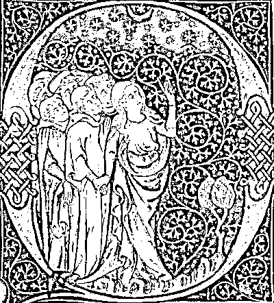

北京的或能来北京的占星爱好者们！3 月 12 日，欢迎来到占星界的“霍格沃茨学院”——若道占星，“植民”一颗可以藏于室内的多肉星球。

植树节，是人类少有的为植物而设立的节日。在久远的农业时代，人类抬头仰望日月星辰，是为了了解季节气候，俯下身来继续耕种。

现代人类为了保证植物在地球上占有足够的比例而创造了“植树节”，每年“惊蛰”过后就要植树，这些人类的生活经验，印证着天体运行和种植活动之间蕴涵着深厚的因缘道理。最近 NASA 的科学家们甚至想效仿电影，通过种植活动来征服宇宙。     

电影《火星救援》中，马特·达蒙饰演的宇航员为了让自己活着等待救援重返地球，在鸟不拉屎的火星上种起了土豆。这是人类的第一次外星球种植。

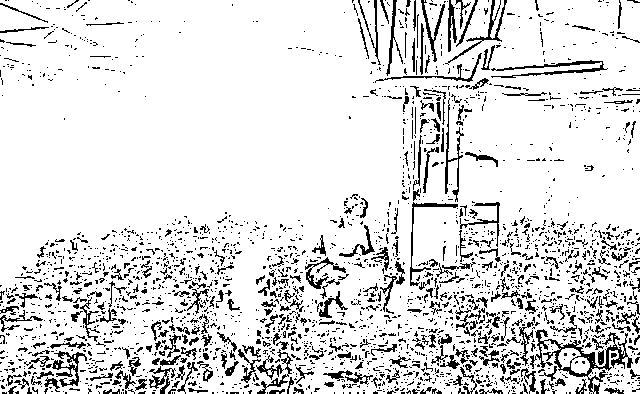

电影中芝加哥大学的邮件提到这样一个理论：

**“一旦你在一个地方种植作物，你就正式“殖民”这里了。”**

**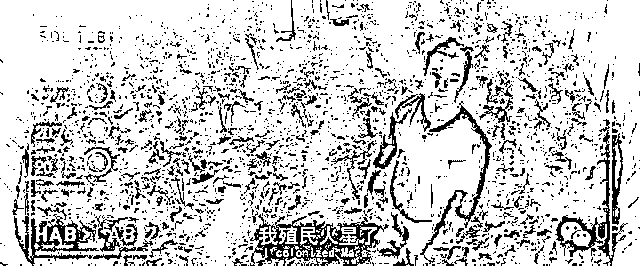**

**今年植树节，占星师们将齐聚占星界的“霍格沃茨学院”若道占星，每人“植民”一颗可以藏于室内的多肉星球。**多肉植物是植物里造养率最高的，一盆茂盛的肉肉植物置于室内，净化空气的能力不亚于一棵树。

**“一个人就是一个星球”**

这次种植活动我们为大家准备了五颜六色的彩色种植土、多种高矮胖瘦的植物以及宇宙摆件，现场 DIY 你最中意的星球颜色，种下你认为的星球植物种类型态，无论是日月水金火、还是木土天海冥，你想“植民”哪个星球都可以！

**植树节种植活动适合报名人群**  

对“天与地”“占星与园艺”都感兴趣的小伙伴

正好需要一盆好看又独特的肉植的占星师

想把宇宙、园艺与艺术完美结合的人

希望开发自然灵性的森系少女

爱种花爱种草但害怕打扫阳台的巧手主妇

出生图有重要星星落入金牛座、处女座、双鱼座、巨蟹座、狮子座、天秤座的你

以及想知道星星有没有落入以上星座的你

想活跃自己土象元素&水象元素的你

土象元素&水象元素过多无处消耗的你

只是单纯觉得多肉植物萌萌哒的你

当然，本次课程还会教你怎么种多肉更健康，活得更久。根据多肉植物生长缓慢、易存活的特质，你的这盆肉肉只会陪你一起慢慢增值，而不会是一时欢愉过后的不断贬值。

****而且，只要咨询种植老师，这些植物就享受终身免费分株、移盆、看病的服务哦！妈妈再也不用担心我购（can）买（hai）小绳命了……****

想做多肉拼盆大神，好奇动手的过程，快点报名做个 planter 吧！U can u up！

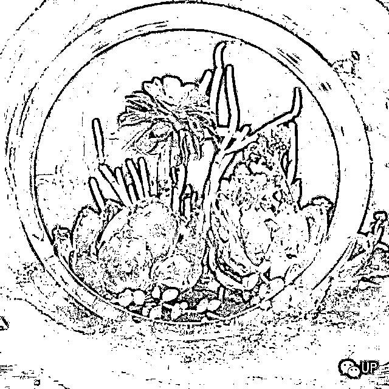

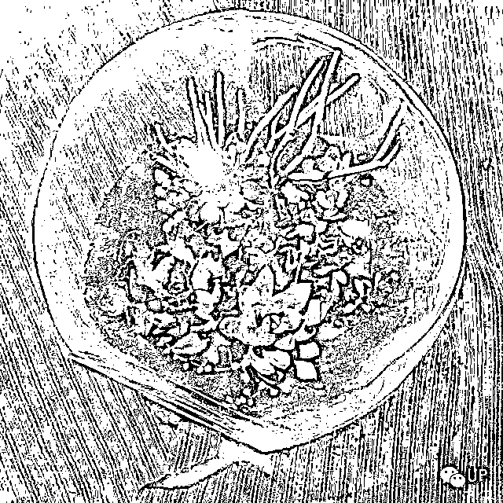

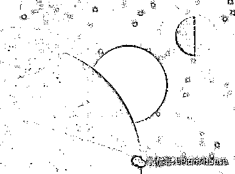

**本次植树节的种植内容**

多肉植物家庭养护的习性介绍

每人种植一颗自己的多肉星球

学习制作 20cm 直径的玻璃花器种植

**课程难度**

**零基础园艺课**

**课程时间**

**3 月 12 日星期六**

**下午 3-5 点**

**课程价格** 

**230 元/人**

****若道老学员 **180 元/人 **

**上课地址**

若道占星

（北京市朝阳区百子湾路 32 号院苹果社区南区 10 号楼 A 座 2006 室）

**人来就行**

**什么都不用带来**

**可以带走一个独一无二的多肉星球盆景**

**种植老师简介**

**狄与菲**：UPlant house 有种房子店主，若道占星 2015 高阶学员。上升狮子座、群星巨蟹座、中天金牛座，南交天秤座。慵懒随意的天性，以及对植物艺术和家的迷恋，命中注定在 2012 年与朋友创立了像家一样温暖的多肉植物工作室，为客人提供多肉 DIY 以及植物订制创意，被称为京城植物实体店里最文艺的。目前工作室举办园艺、画画、手工、疗愈等多种工作坊沙龙，希望把每次课堂变成身心放松又享受美的好玩 Party！

报名请点击文末”阅读原文“

还可长按活动负责人微信咨询、报名~

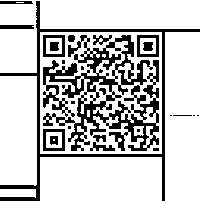

# 冥王星之旅 | 不入深渊，何以见苍穹！

> 原文：[`mp.weixin.qq.com/s?__biz=MzA5NjA0NTAxNg==&mid=403075483&idx=1&sn=752e634278c14728505c147108773e7e&chksm=0d44c32c3a334a3addeb8c7fb71be6ccc8316dece0df21c78ab6ceb09beff94c518503a3a76d&scene=126&sessionid=1692738867#rd`](http://mp.weixin.qq.com/s?__biz=MzA5NjA0NTAxNg==&mid=403075483&idx=1&sn=752e634278c14728505c147108773e7e&chksm=0d44c32c3a334a3addeb8c7fb71be6ccc8316dece0df21c78ab6ceb09beff94c518503a3a76d&scene=126&sessionid=1692738867#rd)

情结、秘密、执念、妄念、绝望、漩涡、恐惧、操控、救命稻草……这些关键词都和冥王星有关。它们深潜于你的人生，等待某个行运的触发，将你拖进深渊。然而不用害怕，潜得越深，疗愈越彻底。在人生的某个黑暗时刻，静静体验冥王星带给你的转化之旅吧。废墟上开出的花朵最为娇艳，而爱是一切的救赎。好好爱自己，是冥王星在耳边的低语。

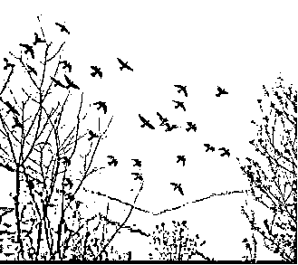

**走过的隧道有多黑， 见到的阳光就有多灿烂；
落入的深渊有多深，
看见的天空就有多湛蓝；
心中的呐喊有多撕裂，
蜕变之路就有多彻底！**

**1**

**安的故事**

**第四宫里的冥王星**

安是个群星天秤座和射手座的女孩，乐天开朗，有一群志同道合的朋友，喜欢探索未知的事物。同时，在安的出生星图中**冥王星落在第四宫**，一个幽暗不明的内在王国。这个配置给安乐天开朗的性情中植入了另外一个灵魂面。安**在向外探索生命的广袤无垠的同时，也需要适时潜入到深渊般的内心深处，探寻更加深刻维度上的那部分自己**。而这需要勇气。 

安从小住在一幢四层楼的房子里，有一层是地下室。平日里外祖母陪伴安的时间最多，两人的感情很好。她给安做各种可口的美食，给安讲故事，陪安玩耍。而地下室是安和外祖母玩躲猫猫时最喜欢的藏身之地。

在安念初三的时候，身体一直不好的外祖母突然去世了。这打击让安无法接受与面对，连葬礼都没有去参加。安的妈妈把外祖母生前的东西收拾整理好放进地下室封存了起来。自此之后，安再也没有去过地下室，地下室成为了安在家中和心中的禁区。封存的是对外祖母的情感连接与记忆。

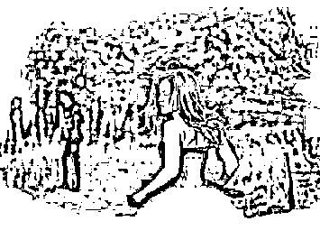 

**等待一个契机和过去告别**

生活仍在继续着，表面上看，这并没有影响到安。但不经意之时，安总能感到某些情绪在内心深处暗涌和发酵着，虽然被她有意识或无意识地压抑下去了。

**内在的情绪暗流用按捺和抑制的方式是行不通的，总有一天会按捺不住，喷涌而出**。

冥王星拖着它深沉而静谧的脚步一直在行走着，它现在走到的位置，与安出生星图中的某个敏感点形成了一个关键的角度线。而这个角度线的形成，对于安会意味着什么呢，会给她带来什么呢？

**未完成的仪式产生的未完情结总归是要完结的，唯一的解决方式是直面。一切只是在等待着某个契机的来临**。

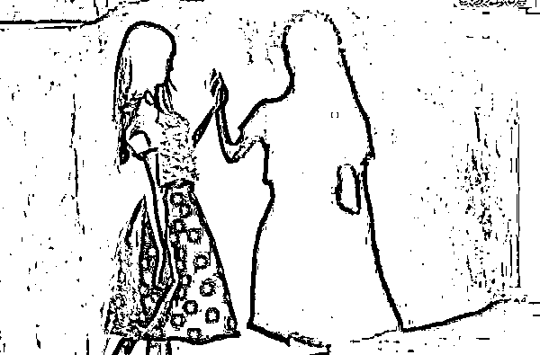

**你好吗？我很好。**

安常带着女儿小恩回娘家玩。小恩生性好动，每次来楼上楼下四处乱跑，安对于女儿的天性也不太多强加管制，但除了地下室。小恩每次都想进去玩，都被安阻止了。 

直到有一天，安带着小恩到娘家参加家人聚会，大人都在忙活着准备着晚餐，小恩独自玩耍着，溜进了地下，在沙发上睡着了。安满屋找，看见地下室的门是开着的，直觉告诉安，小恩很可能就在地下室里。她的脚步停在地下室的门口，感觉呼吸与时间都静止了。**一直不愿面对的事情，这次或许是到了不得不直面的时候。**安深深吸了一口气，沿着扶梯走了下去。十几阶的楼梯感觉仿若走了几个世纪。

看见小恩躺在沙发上呼呼大睡，安心中的大石落了地。本想抱起小恩马上离开，而视线在一个书架上停了下来，落在了一张发黄的老照片上。照片上是过世的外祖母和童年时候自己的合影，看着照片，曾经与外祖母的所有记忆瞬间都被回射进脑海里，安的泪水喷涌而出。

**被封存住的记忆，其实早已铭刻在心**。安拿着照片哭了好久好久，这么多年被她压抑的对外祖母的思念，随着泪水一起涌出，她竟是如此的想念外祖母。安边哭边对着照片上的外祖母说着：“您在天堂还好吗？我好想你……”

安环顾地下室的四周，这个她曾经如此喜欢又那么不想靠近的地方。不知过了多久，小恩睡醒了，安抱着小恩从地下室走出来，感觉整个人都和以往不一样了。脚下轻盈了很多，有种如释重负的感觉，像是重生了一样。推开门，她走进后花园，看着远处的斜阳和天空中的飞鸟，感觉一切都比往日的更加美好。在天空中，她仿若看到了外祖母慈祥的微笑。

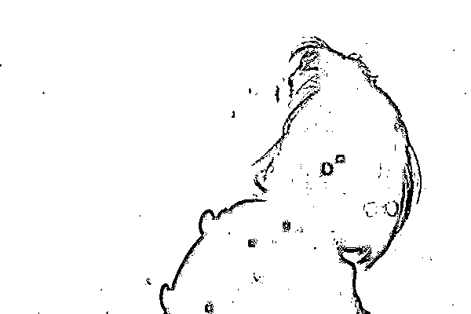

安经历了一次专属于她的冥王星之旅，在这旅程中，安从回避拒绝外祖母的突然离世，到迸发出勇气直面外祖母的离世，并在心中与外祖母进行了真正意义上的告别。这个过程让安更加深刻的理解了生命，理解了生于死。

**2**

**你的议题**

**看到属于你的那颗冥王星**

我们每个人都和安一样，在出生星图中都会有颗冥王星。落点可能不尽相同，而**在我们各自的生命实相中，它能量的显现方式或许是不一样的**。

**未转化前的冥王星能量显现形式** 

*   某个人生情节和情境一直未能得到完成，最后变成了**心理情结和症结**； 

*   某个深埋心中，无法与人分享的**秘密**，快要按捺不住，想要告知于天下； 

*   心中长达数十年不断折磨自己与他人的某个**执念**； 

*   将自己对生命的所有希望和赌注全都寄托于他人身上的**妄念**，即便在这妄念中一次次等来的是失望，都始终屹立原地不肯跳转枪头，直到最后衍变成了心中的某个**绝望**； 

*   眼看着将要被心中的洪流引动的**漩涡**给淹没，还站在一旁，任凭卷入，不实施自救。 

*   因为恐惧失去，而生出对**权力**操控的上瘾。但手握流沙，抓的越紧流失的越快，最终注定要从指缝中散去，埋藏了自己。 

*   紧握在手中始终不肯放下的某根**救命稻草**，实则那稻草早已化作利器，不断戳向自己。

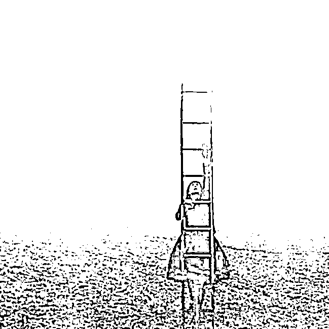

**心底那片深渊总是要去面对的**

专属于我们各自的冥王星之旅的路径不一样，在心中引动的纠葛与挣扎不一样，外在展现的的情境也会不一样。无论冥王星的能量是以怎样的形式在我们各自的生命中存有和运作着，它都代表着我们内在被埋藏的很深的，不能轻易触及的，像深渊一般的幽冥之地。但无论深埋多久，你终有一天还是要面对的！这是宇宙的法则。 

冥王星的力量是强大的，同时也是很难被理解的。**可以借以占星学，以及对出生星图中冥王星的落点来进行解读，从而帮助我们带着更好的觉知来了解自身**。

**观察个人星图中冥王星落入的宫位，试着问自己：** 

 —— **落入第一宫 **——

*   是否能把真实的自己展示给外界？

*   身处陌生的环境中是否感到安全？

—— **落入第二宫 **—— 

*   是否把物质与金钱视作安全的保证，死抓不放？

——  **落入第三宫** —— 

*   是否在向他人表达自己观点的时候有一种语不惊人死不休的气势，非要把自身的想法灌输给他人？

—— ** 落入第四宫** —— 

*   是否试图控制与切断与自己内心深层次的情感连接？哪怕它已经快要让你按捺不住。

——  **落入第五宫** —— 

*   是否试图通过各种能力的展现来证明自己的重要性和权威感？

——  **落入第六宫** —— 

*   是否被日常事物中的各种细节所缠，导致焦虑？比如今天应该穿哪双袜子来配这双鞋子。

—— **落入第七宫** —— 

*   在亲密关系中，是否很难信任对方，并且试图去控制支配对方，在关系中想要拥有绝对的主权？

—— **落入第八宫** —— 

*   是否能够成功的控制和驾驭自己内心的欲望与本能？

—— **落入第九宫** —— 

*   是否对自己所坚守的信念或信仰，丝毫不容他人的质疑及反驳？

—— ** 落入第十宫** —— 

*   是否对于在世俗层面获取成功充满了野心，并且对于权力紧抓不放？

——  **落入第十一宫** —— 

*   对于融入到团体或集体中，是否会感到不舒服与不自在？

——  **落入第十二宫 **—— 

*   对于精神层面未开发的特质是否允许被挖掘出，浮出水面？

**在废墟之上重燃新的希望**

**无论冥王星落在你星图中的什么位置，都意味着落入位置所代表的领域是要经历摧毁和重建的过程，在废墟之上重燃新的希望**。不破不立，这是冥王星的规则。

当**天空中行进的冥王星与我们出生星图中的某个行星和关键点形成关键相位时，那内在转化之旅的大门就已为我们开启**。冥王星走的很慢，一般冥王星的行进长达数年，带给人的影响也是深远的。但凡被它触及之地，引动的则是一场旷日持久之战。

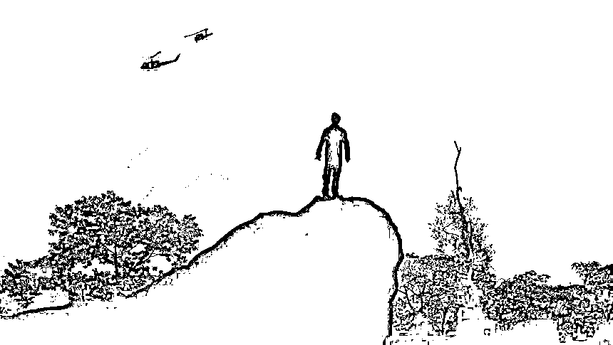 

冥王星的旅程不是一次奇幻的漂流，更不是一次野外的探险，而是**需要带着觉知和破釜沉舟之气概，进到如深渊般的谷底之中，去探寻被埋藏和埋葬已久的已知或未知**。**将它从潜意识的暗流中挖掘出，让它浮出水面，进入我们的意识，从而开启灵魂的深层清理与净化之旅**。

这个过程不是轻松的，而是不适和痛苦的，更多的是不能自已的。但若你把冥王星的旅程视作为人生的一份礼物，带着觉知迎向它，不畏惧，不退缩，那在经历过这一切之后，你会仿若新生。

**来自冥王星的礼****物****冥王星之旅的收获** 

*   冥王星带我们进到黑暗之中，让我们更加清楚的看见我们的**欲望与恐惧是如何的操控着自己**。而在这之后我们会不再任其操控，因为已**从不明到明**。 

*   冥王星会让我们用**更深度的视角去看待自己和生命**。让我们看到并接纳生命中除了光明的一面，还有黑暗的一面。它们的共同存有构起我们人生的真相，无须排斥任何的一面，才能发展出真正的内在力量。 

*   冥王星让我们**拒绝以任何肤浅的方式来对待人生**，让我们发展出对生命认知的深刻。 

*   冥王星将一切**隐藏起来的事物**带到阳光之下，让深藏海底的宝藏有机会浮出水面。让我们看到潜藏在暗处事物的珍贵价值。 

*   冥王星帮助我们发展出**良好的洞察力和觉知**，让我们有能力看破表象去发现灵魂的基底。 

*   冥王星让我们懂得**对自我灵魂的萃取**是如此的重要，让我们不苟活于世！

冥王星是一颗有着极端倾向的行星，它不友善，也不随和。它赋予我们的意义与价值，只有在我们切身去经历和体悟之后才能被了解。而只有当我们跌到谷底，感觉即将要失去一切生的希望的时候，转化才会发生！

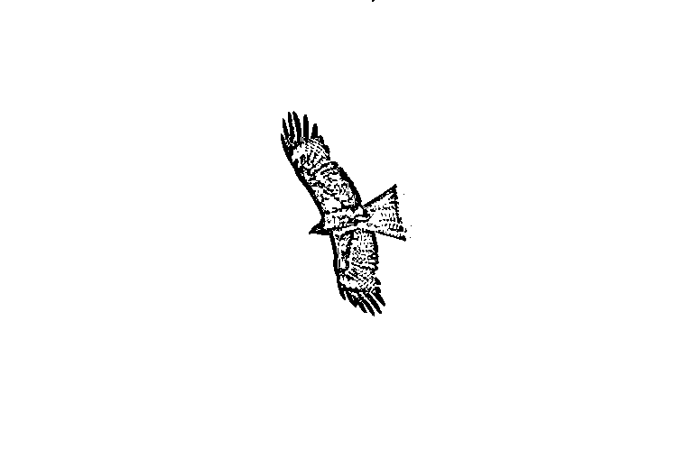   

—— **诗 一 首** —— 

有种恐惧深埋于心底，

这次不想再耽搁与逃避，

鼓足所有勇气，

坠入如深渊般的谷底，

去探寻冰封千年的谜，

在黑暗中起舞，呐喊，与之周旋，

不沉溺，不抗拒，

恐惧逐步褪去，黑暗渐渐散去，

推开门，瞥见远处的一抹阳，

一只鹰从天空中掠过，

此刻的你，懂得了，

不入深渊，何以见苍穹！


**作者简介**

**理想国的女巫**：全职塔罗占卜师，人本主义占星师，国家二级心理咨询师，国际占星研究协会 ISAR 会员。致力于将心理咨询技术与塔罗占卜和占星咨询进行融合与连接。咨询中注重来访者自身的心理动力，个人自由意志与灵魂的进化成长，而非宿命式的论断。主要研习人本主义心理占星学以及进化占星学。2015 年在上海创立独立咨询工作室（十二宫塔罗占星咨询工作室）。

**微信公众号**：house12ta  

**咨询预约号**：vivian-yanyan

长按二维码，让金钱涌向传播知识与智慧的人~


关于冥王星的转化之旅，你有何感悟？

正在经历，

还是已经触摸过谷底之后见到了光明？

若道君一直在这里，安静地听你的故事。

**◆ ◆ ◆  ◆ ◆**

******特别提醒************：本文由作者授权首发于若道******，**转载请注明“转自若道”。******

想了解冥王星的意涵么？**2016 年 5 月 19 日**，蒋颖老师主讲的若道占星核心课程**Level 1-2**要开课了！她将带领你学习星座、太阳、月亮、行星、月亮交点等知识，让你进入占星学的世界！详细内容请点击“**阅读原文**”了解。

报名及咨询，请点击文末”阅读原文“


# 被这些说法坑过吗？【打假热线】24 小时开放中

> 原文：[`mp.weixin.qq.com/s?__biz=MzA5NjA0NTAxNg==&mid=403075483&idx=2&sn=ff09cbc71f815b0fb74967f0650182ab&chksm=0d44c32c3a334a3af2cc080e9b0f0a7038e7dd56a590216508f3e42035b4b7fce1e653508b89&scene=126&sessionid=1692738867#rd`](http://mp.weixin.qq.com/s?__biz=MzA5NjA0NTAxNg==&mid=403075483&idx=2&sn=ff09cbc71f815b0fb74967f0650182ab&chksm=0d44c32c3a334a3af2cc080e9b0f0a7038e7dd56a590216508f3e42035b4b7fce1e653508b89&scene=126&sessionid=1692738867#rd)


**打 假 热 线 2 4 小 时 开 放 中**


**“结婚生子后一切都挺幸福的，但是有一天看了孩子的星图，发现他的月亮在天蝎座，顿时整个人都不好了，现在好担心我的孩子会不会变得黑暗，经常自责。”** 

**“有人给我看过星图，说我是离婚的命。”**

**“据说木星进天秤座的时候运势就好了，那我还要等半年，那时候一切都好了。”**

**“占星师告诉我这个男人是我的正缘，即使我俩现在分手了，半年后他肯定会回来找我的。”**

**“能不能看看今年我做生意是不是肯定会赚钱？”**

**这些话语你熟悉吗？**

**你遇到过吗？**

**有人可以通过一张星图看穿你的未来，你害怕吗？**

**为什么好运总不准，坏运一说就中呢？**

**占星师真的可以看到你的另一半长什么样子吗？**

**占星师说前任会回头，你要等吗？**

**离婚的命真的躲不掉吗？**


**如果你对于占星学到底能做什么有疑问**

**如果在学习占星学的过程中遇到了瓶颈**

**欢迎咨询我们的【打假热线】**

**截止日期：3 月 10 日**

**具体联系方式：**

**进入若道公众号后台**

**发送【打假热线】+你想咨询的问题**

**（字数请控制在 50 字以内）**

**请不要发送你的个人星图**

**解答仅针对普遍问题**

**不解读个人星图**


**举个栗子吧**

**你可以这样问**

**【打假热线】土星在第七宫的人注定会离婚吗？**

**也可以这样问**

**【打假热线】占星师究竟是如何推算出婚运的呢？**

**若道君将安排专业而资深的占星师坐诊**

**回答你的疑问和困惑**


**了解星图是为了活出自我**

**而不是被“命运”吓死**

**医治身体的病痛**

**请信赖有资质的医院**

**寻求心灵的解惑**

**请信赖专业认证占星师**

**我们一起**

**为严肃占星学正名**

**<  END  >**

# 选择一个 LV 包还是一场自我认知之旅？决定在你

> 原文：[`mp.weixin.qq.com/s?__biz=MzA5NjA0NTAxNg==&mid=403075483&idx=3&sn=682c54fc53932b01ba3da03a51b902de&chksm=0d44c32c3a334a3a1fe150789acf84c9df1bca1a0100499d5c9351f968c827fdea3a26bd3255&scene=126&sessionid=1692738867#rd`](http://mp.weixin.qq.com/s?__biz=MzA5NjA0NTAxNg==&mid=403075483&idx=3&sn=682c54fc53932b01ba3da03a51b902de&chksm=0d44c32c3a334a3a1fe150789acf84c9df1bca1a0100499d5c9351f968c827fdea3a26bd3255&scene=126&sessionid=1692738867#rd)

若道，一所有信仰的学校

你可以选择花这笔钱去买一个奢侈品包包；

办一年美容卡；

报一个私人健身课程； 

又或者来一场说走就走的奢侈游；

你也可以选择花这笔钱来若道学习；

通过学习了解自己的人生轨迹；

站在星图上，活出强大的自我；

也许那时候，

你会更加明白，

一个奢侈品包包除了带给你虚荣，别无长物；

一张美丽的容颜需要由内而外的修为衬托；

强健的体魄需要通透的头脑去引领它的方向；

修行，并非只是漫无目的地在路上；

是的，这些都很重要，

然而，明白你是谁，你要去哪里，

会更重要。

**若道的学费贵不贵？**

来听听学员们的声音吧——

**@L4 在读学员喵呜 **

**21 岁/学生**

对我来说，当然贵呀，可我乐意花这个钱去学，对我来说学习先是要搞清楚原理、由来、哲学观的。在理念这一块，放眼行业内没有比若道做得好的，这就是独一家的价值，所以价格再高都会来的。

这一年所收获的各种，体验到的、学会的，真的是没办法用金钱衡量。**若道从某方面来说，丝毫不夸张，改变了我整体的人生轨迹**。

**@L4 在读学员西瓜 **

**25 岁/会计**

选择续报是觉得很多知识都熟悉着，万一断了课程，还断了**和同学交流的平台**，再隔一年会生疏。而且我担心万一涨价了可咋整，我还担心大卫他是美国人，万一哪天回国咋整，趁他现在还在中国教，赶紧学下去……

**@L4 在读学员 Satan**

**48 岁/工程师**

乍看有点贵，等慢慢学习后觉得值得的。看个人需要，作为职业方向或者学得专业些，还是要系统学习，不能靠自学或野路子，会学偏了。若道文化教学理念和核心课程在中国还是第一位，其教学配置比较国际化，看到了**若道文化在用心做这件事。包括大卫讲课激情和敬业，助教和教务的全方位服务，值得的。能请国际上的大师级人物来讲课办工作坊是不容易的，因此我们的起点也高了**。


在这里，有一群有信仰的人

致力于严肃占星学在中国的推广

这是一笔对你未来人生的投资

贵，但是值得

和若道一起

来为我们自己做点什么吧

就从今天开始

L5 课 程 报 名 在 即

在这个阶段

你将学习各种**预测技术**

**行进、月亮次限、太阳弧、返照图**

你会学到**行星周期**

天上哪朵云什么时候会飘到这个人的头顶呢

会如何影响这个人的人生呢

通过这些预测工具

**你就能用它来预测和规划人生了**

**课程讯息**

**授课时间：**2016 年 3 月 29-9 月 27 日

**授课老师：**大卫·瑞雷

**授课方式：**网络课

****费用**：15000 元**

**课程负责人：**siri**（微信号：2847613491）**

**咨询电话：**400-619-1014

**课服 QQ：4006191014 （若道星文化）**

课程简介

****课程安排太丰富**了！**

行进

行星周期

爱情中的机会和挑战时机

职业周期

月亮次限

太阳弧

太阳返照、月亮返照

综合预测

组合图

占星学历史

占星学中的天文学

ISAR 考试词汇表

咨询技巧培训

**●**在整个教学过程中，不仅用名人案例讲解，而且将会抽取同学星图，进行实战咨询示范。另外，会有 4 节课的咨询技巧培训帮助大家准备好进入实战。

授课时间

2016 年 3 月 29 日-9 月 27 日

每周二晚 20：00-22:00（北京时间）

共 27 次课

有关毕业

**考试和实习****：**对于那些想要获得大卫老师资质班证书的朋友，我们将帮助大家在开始成为职业占星师之前，将由专业占星师组织小型督导工作坊，帮助大家实战解盘，为正式的收费咨询做好准备。通过毕业考试，参加督导工作坊，星盘解读的同学，将获得大卫老师颁发的职业占星师资质证书。

授课优势

**①先进的教学平台**

网络教学平台，支持手机、电脑、iPad 上网，可以随时随地学习。

**②回放复习**

学员可登录网站收看课程回放，在线复习课程，每次课可完整重看 3 次，课程结束后的 3 个月内有效。　

课程特色

**①与名师面对面**：北京同学可以来若道现场上课，和大卫老师面对面互动。大卫老师也可能前往主要学员所在城市，实现零距离教学。

**②互动答疑**：论坛、微信群随时提问；老师课上答疑；助教线上线下全程协助。

**③线下沙龙**：定期举办沙龙活动，复习上课内容。

**④强大的同学网络**：若道作为中国最顶尖的占星教学机构，在 4 年的占星教学中，培养了很多占星人才。若道让你和师兄师姐切磋，让你和国内著名占星师学习。（简单来说，就是，人脉！）网络授课，在北京开设免费现场参与名额，全程英文授课，配备实时翻译。

师资力量


**大卫·瑞雷（David Railey）**

若道创始人，《灵魂的目标》作者。拥有四十年的占星咨询的执业经验，曾两任亚特兰大占星协会主席，是全美占星师联盟（AFAN）、美国占星师联合会（AFA）、全美占星研究委员会（NCGR）、国际占星研究协会（ISAR）和职业占星师组织（OPA）的成员，是联合占星大会（UAC, United Astrology Conference）督导委员会委员。大卫曾是 CNN、CBS 的占星节目的常驻嘉宾，多次在 BBC、WGS、WSB、WRGG 等节目中接受采访，并在亚特兰大主持电视节目《每日行星（Daily Planets）》达 4 年之久。

**想成为 ISAR 认证占星师吗？**

**欢迎选择 2016 年度职业占星师成长套餐** 

▼


**2016 年，和大卫老师一起，开启占星的探索之旅！**

长按二维码添加课程负责人咨询~

****

报名及咨询，请点击文末”阅读原文“

# 爱情 | 鱼儿们，伤够了吗？解药在此

> 原文：[`mp.weixin.qq.com/s?__biz=MzA5NjA0NTAxNg==&mid=403055129&idx=1&sn=6488311bdb50da2989f4337eed6fe19c&chksm=0d4490ae3a3319b893e1a17c4c5fabdc72e4c127c7ec298804a3d68cec54bccbecce72bccc72&scene=126&sessionid=1692738867#rd`](http://mp.weixin.qq.com/s?__biz=MzA5NjA0NTAxNg==&mid=403055129&idx=1&sn=6488311bdb50da2989f4337eed6fe19c&chksm=0d4490ae3a3319b893e1a17c4c5fabdc72e4c127c7ec298804a3d68cec54bccbecce72bccc72&scene=126&sessionid=1692738867#rd)

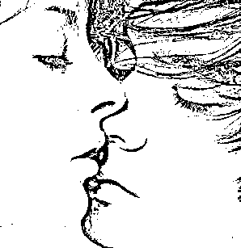

作者/斯蒂芬·弗里斯特、朱迪·弗里斯特

译者/李含

部分内容编译自《天空的伴侣 I：爱、性和进化占星学》

双鱼座是黄道十二星座中最后一个星座，从某种意义上说，它是最高级的星座，更实在的说法是，双鱼座的赌注是最高的——我们获得很多，也失去很多。要如何走出阴影，成就自我呢？在这里，有很多双鱼座小伙伴的分享，还有斯蒂芬老师的建议。希望对鱼儿们有帮助。

**读者分享第一弹**

*1*

**微岚**

总觉得自己是个接收器，脑海中突然闪出图像，有时一段自创旋律，再勾勒出实体的线条。

*2*

**Lolita 鄢嫣**

在现实与理想，出世与入世，分离和合一，这些无定解的问题让双鱼座在海中游弋，终找到平衡。作为双鱼的我，慢慢有了整齐的房屋，规律的禅坐，这一切都让混乱散发出了自性之光。从自我厌恶到喜欢到接受，这路曲曲折折，异常凶险却耐人寻味，令人着迷。

*3*

**无界行者**

双鱼值得你（上天）温柔以待；有些双鱼在尘世饱受身心的磨砺，已经悟到人生是一场修行，因此而不断地进化，至于能进化到哪种程度，随它……

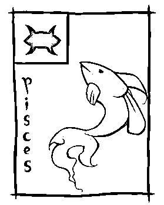

**双鱼座原型**

神秘主义者

梦想家

诗人

先知

爱幻想的人

浪漫的理想主义者

**一个关于逃离的星座**

双鱼座擅长置身事外，好像生活是一场电影。“不落地”是它很强的一个特质。双鱼座的阴影，那当然是逃避现实。而且相当普遍！除了酗酒，还有药物滥用、沉迷于电视、食物、性、睡觉、小说、工作、音乐、金钱、艺术、旅行、购物、癖好、教育、社会行动主义、宗教。事实上，所有双鱼座喜欢的东西都可以成为一种逃避的途径。

○关键并不是要放弃寻欢作乐，关键是要避免双鱼座企图消失于其中的行为。

○此外，“逃离”并不是要逃离这个世界，而是从自我意识扩张的暴政中逃离。

**一个关于进化的星座**

任何被染上双鱼座色彩的行星都会体验到一段进化之旅，充满了知觉认知，促进成长，与信仰和人类理性并无关系。他们都是以直接、神秘的方式与更深次元的现实联系在一起的。

双鱼座的目标是，最终，我们会保持个性并有意识地表现出来。要实现目标，我们必须脱离性命、等级这些标签，体验本质的自我。我们必须超越那些属于人类社会的身份角色认同。我们把这个过程称为“冥想”。这种冥想并不涉及任何一种宗教信仰体系。我们谈论的是一种大脑的状态：原生态，不用解释，意识自身觉醒的过程。闭上双眼，深呼吸，关注思考深处静谧的角落。对！这就是冥想。非常简单。

这个方法有赖于将这些宁静的空间串联起来，直到形成一段长期、不断裂的纯粹的意识觉醒。如果双鱼座完成了这个过程，他将开始真正地感受到自己的意识经验，就好像一个人经常去打篮球，久而久之就会形成一套身体的条件反射。

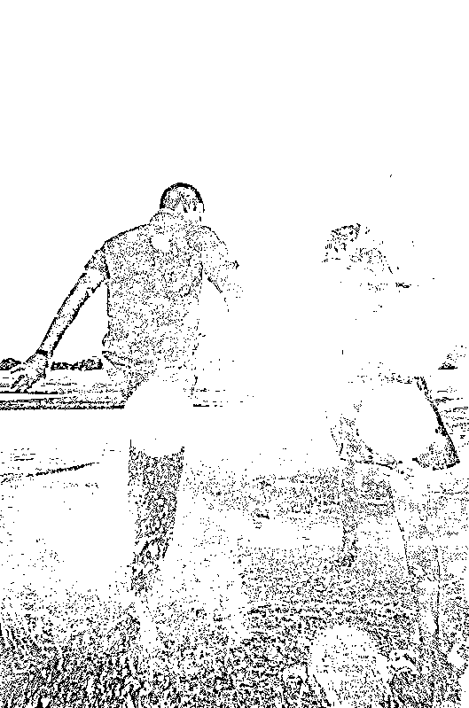

**读者分享第二弹**

*4*

**岁月静好**

我是鱼，特别怕孤单，选择恐惧症，多愁善感到自己都无法接受。朋友们都说我太作了，但是我丝毫不觉得。我觉得我爱别人比爱自己多，但是感情却总是得不到回报。我好像很喜欢摩羯座的人，感觉一辈子要伤在摩羯座手里了，是我一个人这样吗？还是大家都一样？

*5*

**洁**

我就一直弄不清自己，似乎敏感看透了所有，又糊涂到一片混乱，对所有都有怜悯心同理心。

*6*

**A 馃挒 Synly**

双鱼总是情不自禁的照顾周围人的小脾气，简单的只想自己周围一切都好好的，然而却成为了别人眼中的心机婊……双鱼是有多忘自己的本能？还有最最重要的是，双鱼为自己所爱之人想太多，对自己想太少……讨厌自己的多愁善感，尤其面对感情，凭空给自己增加超多烦恼。

*7*

**戴小梦儿**

如果你问鱼“你喜欢不喜欢我？”鱼给的答案是：“什么是喜欢，什么是不喜欢？”这代表什么呢？

*8*

**33**

不是双鱼，也没有被强调的 12 宫。只是海王星合了天底。2015 年初，觉得自己去了天堂。一个暗恋、明恋默默追了 7-8 年的人终于接受了我，只身去了他的城市、他的家。默默的 7-8 年里，他一直说我是不爱的，因为他感受不到……从不做家务的我，每日 5-6 点起床，做好一天的饭菜，8 点出门上班，晚上 8 点左右到家（既不敢在外逗留也不敢回去，所以不自觉的每天加班。）吃完晚餐，马不停蹄地收拾、打扫每一处角落，等洗完澡上床，每日都近一点了……从来不知道原来我可以长期只睡 4-5 小时。这些都不是最难的。难的是尽了全力仍达不到他要求的万分一。于是每日的冲突，暴力与冷暴力，最终在 2015 年底，我逃命似地逃回了家。他说：“没有比这更好的事了，这一年就像生活在地狱一样恐怖！”我没说出口，但他说的，也是我切身感受。

*9*

**王鹤耳莫斯**

月双鱼，日水木 12 宫表示经常好想大街上揪一头人回来爱啊！不然不知道把体内那些个富裕出来的爱往哪放啊！哭~

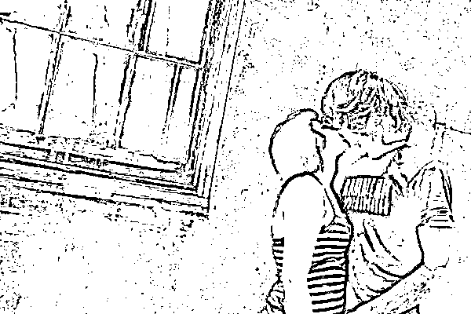

**斯蒂芬的爱情良药**

**1****太阳双鱼座**

除非是走上了自我麻木的黑暗之路，否则太阳双鱼座的人会是非常温柔敏感的。没有任何一个星座的浪漫，能如此真切地触动灵魂。因此，对于双鱼座，爱情唯一的粘合剂就是灵性的基础。请注意，不要随口说“灵性关系”。

两个双鱼座的教徒坐在一起，彼此有许多共同的教徒体验，但他们并不是“灵性关系”。为什么？简单说，他们的灵魂并没有发生关联。另一方面，两个无神论者静静坐在篝火前，默默地进入冥想状态 ——火焰之梦。他们能够觉知对方的存在，他们能够分享想象的空间，无须解释交谈，不用担心彼此的意志被对方侵入。两个灵魂在积极的触碰彼此。他们进入了意识的变化，依然感受到交流接触，这就是双鱼座的天堂。

**太阳双鱼座的爱情良药**

○静静的陪伴

○黄昏时分，安静地在海边树林散步

○走进教堂、庙宇

○参加其他形式的冥想小组

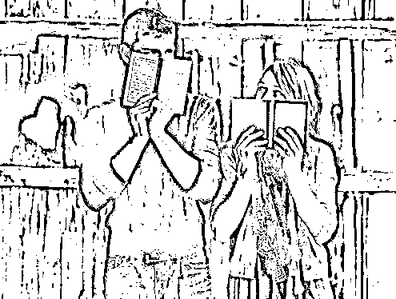

**2****月亮双鱼座**

基本上，关于太阳双鱼座的种种对于月亮双鱼座也一样适用，只不过更柔软、更内化、以更直觉的方式表现。在最好的状态下，月亮双鱼座的人就象是一个仓库，蕴藏着人类最高等的渴求，灵魂中潜在的爱神，将珍贵的、无常的灵性的结合融入到化学反应促生的有意识的性行为之中。但月亮双鱼座也可能是不活跃的、主观的。同样，还可能有自我牺牲或是殉难的状况，这有心理学或生物学两种方式的意思（精神上和肉体上）。

**月亮双鱼座的爱情良药**

○伴侣要学习询问月亮双鱼座的需要

○伴侣要学习积极引领月亮双鱼座进入更深的精神领域

○鼓励月亮双鱼座的多愁善感

○月亮双鱼座要学习不要放弃太多

○让家带有神圣的庙宇的色彩

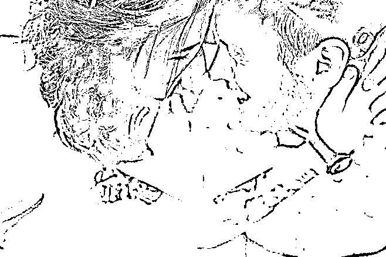

**3****上升双鱼座**

双鱼座的守护星是海王星，所以上升双鱼座的人，海王星是命主星。双鱼座上升的人，从海王星所落的宫位和星座能够反映出当事人在亲密关系中的表现，特别是如果海王星落在亲密关系的宫位。

上升双鱼座的人戴着演员的面具，可以扮演任何角色。他们在社会上颇有优势：他们能够很好地适应任何境遇，即使是非常有攻击性、非常混乱的状况，让太阳、月亮双鱼座都难以应付的状况。

**上升双鱼座的爱情良药**

○上升双鱼座要警惕不要过多地披上变色龙的外衣，迎合伴侣的期望和风格。

○升鱼的伴侣要符合星座真实的原型：神秘主义和理想主义者。以下行为是这些原型的天性本能：冥想、沉思、创造性活动。

○上升双鱼座要避免沉溺于付出型的感情关系中。许多真相被牺牲在了“演员的面具”背后。许多真实的自我被放弃了。所有“演员的细胞”必须重返鱼儿的最基本行为：深深地潜入意识的海洋。

**◆ ◆ ◆  ◆ ◆**

******特别提醒************：本文由作者授权发布于若道平台******，**转载请注明“转自若道”。******

用太阳、月亮、上升了解自己与伴侣！**2016 年 5 月 19 日**，蒋颖老师主讲的若道占星核心课程**Level 1-2**要开课了！她将带领你学习星座、太阳、月亮、行星、月亮交点等知识，让你进入占星学的世界！详细内容请点击“**阅读原文**”了解。

报名及咨询，请点击文末”阅读原文“


# 土海雾未散，天冥刑未央【下篇】

> 原文：[`mp.weixin.qq.com/s?__biz=MzA5NjA0NTAxNg==&mid=403055129&idx=2&sn=3b810ffd50a298971dece14657241ed9&chksm=0d4490ae3a3319b85f090158dc44e4afd659c5e81b7db5ba8ee59757ff1902f7dd2614f667c2&scene=126&sessionid=1692738867#rd`](http://mp.weixin.qq.com/s?__biz=MzA5NjA0NTAxNg==&mid=403055129&idx=2&sn=3b810ffd50a298971dece14657241ed9&chksm=0d4490ae3a3319b85f090158dc44e4afd659c5e81b7db5ba8ee59757ff1902f7dd2614f667c2&scene=126&sessionid=1692738867#rd)

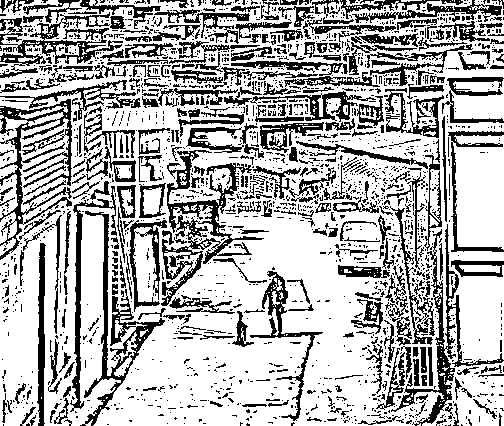

[上一篇](http://mp.weixin.qq.com/s?__biz=MzA5NjA0NTAxNg==&mid=403023167&idx=1&sn=32d9c3eb22c0824b06500fb1897a78b6&scene=21#wechat_redirect)（点击可阅读）讲到了行进的土星与海王星正处于四分相中，我们会不断遭遇到现实与理想的碰撞。而从 2016 年 3 月开始，逆行的木星将渐渐参与到土海的组合中形成有力的Ｔ三角，与此同时我们仍处在天冥刑的大气候下。听起来事情似乎变得更复杂了，如何拨开迷雾，倾听到清明的天籁之音呢？机会就在迷雾之中。

**2016 年木土海Ｔ三角上演**

**从 2016 年 3 月开始，逆行的木星渐渐参与到土星、海王星的组合中形成有力的Ｔ三角，影响力会持续到 6 月。**不同于海王星消融边界的魔力，木星通常被誉为小太阳，它是关于我们内心的信仰、真理、追寻与愿景，因此它又与海王星的理想主义产生了共振。

**但木星是属于个人的理想，而海王星是集体潜意识的理想，不易察觉**。木星与海王星的对分意味着要将这两者能量平衡相待。由于海王星总是潜在不易觉知的集体层面的反射，这也意味着只需去觉知并投入个人的理想化道路之中，就能将海王星的集体意识带入表达。就如一些灵性、艺术工作者，当他们去表达自我精神时，个人理想化的表达已经整合出大众的内心诉求，自然会得到集体情感回应，因为他们表达的就是集体潜意识。

**给梦制定一个时间表**

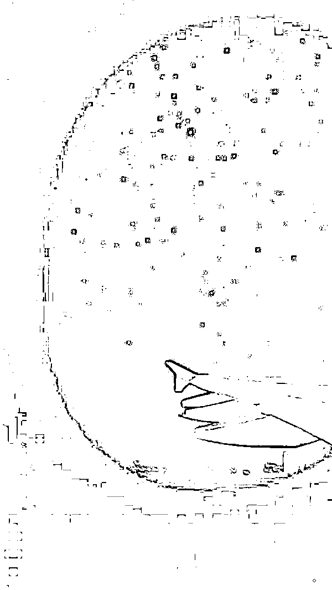

土星对这两者都不是轻松和友善的，它会令木星的乐观、幸运受到限制，比如一向过度索求的资源开始受限或变得贫脊。**土星与木星每五年就会形成困难相位，土星是现实，而木星是幸运，现实的幸运——这很自然联想到财富、经济**。而土星与木星的相位也确实与经济有关联：**通货紧缩与通货膨胀**。社会经济也是潜意识载体，也会随着土海的行运进入到现实与理想的摩擦中。土星所代表的传统、老旧模式，与木星所代表的愿景、扩张欲、国际化，再加上海王星的融合、超越的理想，三方的冲突必定要在这股潮流中寻求到平衡，所有行星的能量都是走向整合的。

土星的权威与规则将成为木海式大梦的最终调和点，理想很丰满，现实却很骨感。我们在现实中孜孜索求的、被潜意识驱动所造出的美梦，光鲜亮丽的远方都只能从脚下起步。现实的厉练就是最好的修行，给梦打造一个庙宇不如给它制定一个时间表，持之以恒，**只有切实扎根于当下，用规则作为度量，去明晰现实与未来的距离，并用努力与坚持作为代价，才能让梦想的光芒照进现实。**否则就将是一场声势浩大的幻灭之梦。

**天冥四分的未央歌**

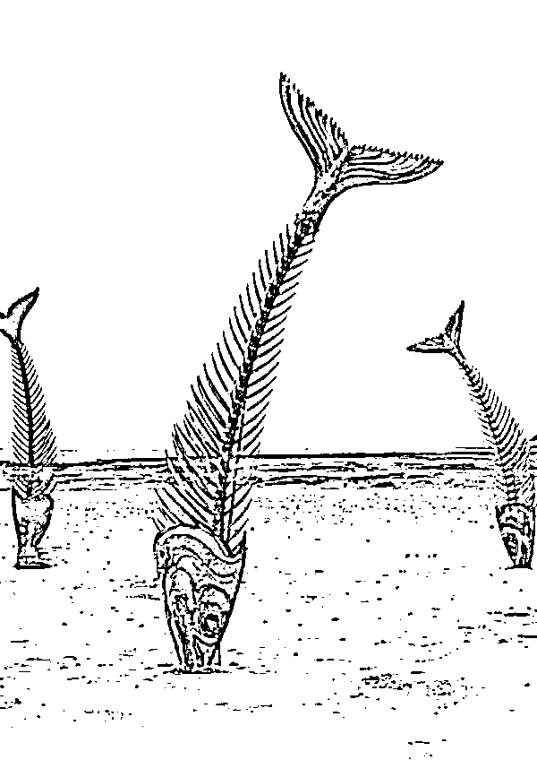

我们仍处在天王星四分冥王星的大气候下，虽然精确成相的时期已过，但余波仍在。**塔纳斯博士认为天冥四分的影响力会持续到 2020 年，天冥带来的革新与进化驱力会比之前很多人认为的持续到 2017 年还更深广有力**。

这是自上世纪 60 年代以来天王星与冥王星能量最活跃、外显的时期。世界正在经历一系列的转化、动荡——**科技迅猛发展，革命性、解放性的运动的发生，如同性恋权益运动、女权运动、移民潮、生态改革、民权运动，中国也在高度现代化的进程当中**。当下的时代，一切皆有火山爆发的可能。人类的意识被唤醒，变革的驱力已深入进每个人的意识之中，我们都需要去和宇宙调频，感受它的心跳，才能跳出和谐的舞步。

塔纳斯博士在全息呼吸与原型占星工作坊中展示了一些 60 年代天冥合相时期通过全息呼吸获得疗愈重生的案例，每个案例的星图都在激烈的天冥行进下被触动，有如神话般的现实。而同样的，60 年代的世界也处于极大的动荡与变革之中，尤其 1968 年当木星加入天冥的合相之中，人类成功登月、摇滚音乐的狂热浪潮、致幻剂在心理治疗上的使用，超个人心理学和原型占星学术理论的创立等，都是参与转化觉醒的浪潮，人类各个领域的创造力都带来前所未有的突破。

**出生星图天冥四分的大祭司**

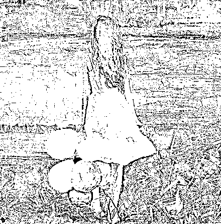

作为超个人心理学的重要奠基人，格罗夫博士的出生图里就有天冥的四分相（天王星在白羊座，冥王星在巨蟹座并合相木星）。塔纳斯因此称格罗夫是**“掌管死亡重生的大祭司”**。他是全息呼吸体验者灵魂重生的助产士，事实上他已为很多人打开了“灵魂的封印”，体验到自我重生。

在全息呼吸的场域里，每个人都描述经历了不同的体验：除了全息呼吸过程中典型的围产期四个阶段的体验，还有分娩的、前世的死亡或前世场景，与神性的联接，宇宙意识的注入，婴儿时期，性爱，极乐，死亡，与母体融合或是生命当下议题的松解。

对很多人而言这都是绝妙的体验，带着冥王星的强劲原动力与不可逆的净化驱力，有海王星的迷幻氛围、充满魔力的音乐，也有天王星的破除、瓦解、解放之力，还有土星的压抑、沉重感。全息呼吸带来疗愈性的过程，都是在导师们悉心帮助下展开的内在旅程，让每位体验者全然经历并超越它。

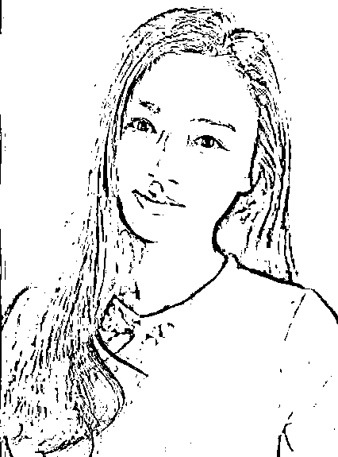

我在现场作为观察者时，一次次被格罗夫和导师们对呼吸体验者进行帮助治疗的场景感动到落泪。眼前的他们带着无限的爱，用母亲般的情怀去照料和帮助呼吸者通过情绪的激流，跨越重生之门。为了达成疗愈，他们很多时候都得长时间保持一个姿势，为呼吸者提供温柔坚定的支持，直到呼吸体验者从哭喊、伤痛、黑暗中穿越出来，所有的负面情绪消失。

有时，为了呼吸者的需要，他们还得与呼吸者长时间拥抱在一起，给予他们足够的安全感。他们所做的工作根本就是穿越时空的疗愈，他们是当之无愧的灵魂疗愈者，用生命的力量帮助越来越多的人走向新生的光芒之中。他们用行动阐释了宇宙的爱在人间的温暖流淌，在陌生人之间无缝的传递。这种爱也终将通过接受疗愈的学员再次传递出去，一波又一波。

在全息呼吸的体验过程中，格罗夫博士正是那位帮助我重生的“助产士”，他让那个神圣的时刻发生，在敏感而激烈的时空里让我感受到温暖、包容的爱与疗愈力（他是群星巨蟹座）。格罗夫当下正处于天王星回归之际（天王星 84 年回归至出生图的位置），而他又在天冥四分的大背景下，将全息呼吸带到了中国，为更多的人开创出了自我重生的灵性途径。

在天冥、土海所构成的两大原型交织的时代格局之中，**每个人都有机会也都需要去深入内在觉知。每时每刻，善用天冥充满动能的原力去推进自我革新与创造，同时又将土海灵性悲痛化作希望与慈悲，在清醒中升华灵性，在迷雾中重生**。

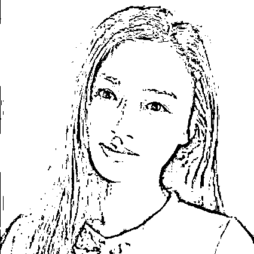

**作者简介**

**郑玮玲（Sampriya）：**若道 COAC 高阶资质认证，国际占星研究协会 ISAR 会员，在若道跟随多名国际知名占星师学习占星。馨光爱妈妈会创始人，国内首批 ICEA 国际生育教育协会产后指导，国际母乳会培训的哺乳互助指导。

**个人公众号及咨询预约**：Sampriya-Astrology 

长按二维码，让金钱涌向传播知识与智慧的人~


►**塔纳斯关于天冥四分的独家解读**

[塔纳斯：天冥四分威力将持续到 2020 年](http://mp.weixin.qq.com/s?__biz=MzA5NjA0NTAxNg==&mid=402527351&idx=2&sn=53ab9dc1fc25a53ca738aae92d2834b2&scene=21#wechat_redirect)

**◆ ◆ ◆  ◆ ◆** 

******特别提醒：本文由作者授权首发在若道平台******，**转载请注明“转自若道”。******

想要更好地了解天象大势？**2016 年 3 月 15 日**，大卫老师主讲的若道占星核心课程**Level 5**要开课了！在这个阶段，你将学习各种预测技术及行星周期。通过这些预测工具，你能够预测和规划人生。提前报名付款有**早鸟价**哦！

报名及咨询，请点击文末”阅读原文“


# 荐书 | 6 本占星新手必看读物

> 原文：[`mp.weixin.qq.com/s?__biz=MzA5NjA0NTAxNg==&mid=403055129&idx=3&sn=da946aaead9d7f67d9f257cb983ce9d4&chksm=0d4490ae3a3319b8c1d7f4ac3ceb64c7c851448263c6554dafda5f2b327e0a79ec166c3a7164&scene=126&sessionid=1692738867#rd`](http://mp.weixin.qq.com/s?__biz=MzA5NjA0NTAxNg==&mid=403055129&idx=3&sn=da946aaead9d7f67d9f257cb983ce9d4&chksm=0d4490ae3a3319b8c1d7f4ac3ceb64c7c851448263c6554dafda5f2b327e0a79ec166c3a7164&scene=126&sessionid=1692738867#rd)

课程部荐书

若道 2016 年度全新 Level 1-2 课程即将开课

作为占星小白

以下书目你可要好好学习哦

这是若道课程部专门为大家推荐的

诚意满满！

课程部荐书

﹁

灵魂的目标

﹂

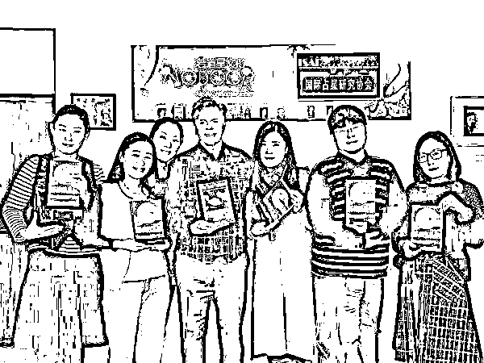

**荐书人**

**本书作者大卫·瑞雷+译者蒋颖**

**推荐理由**

人有两种基本需求，即对安全感的需求以及对成就感的需求，并不断在两者之间切换。实际上我们完全可以通过平衡这两种需求而打造出理想的人生，其中的关键是要清晰地知晓我们的渴望与惯性各是什么。

本书主要研究的是占星学中的月亮交点与人生阶段、生命道路之间意味深长的联系。通过几十年来大量积累的个案，作者发掘了十二组月亮交点与人的安全感需求、天赋才华、内在渴望，以及成就感召唤之间的深层联结，并对有关职业发展、亲密关系、亲子关系、生命周期等重要议题进行了精要分析与概括总结。作者以大量名人故事及咨询个案作具体讲解，立论建立在严谨的逻辑分析和科学实证的基础上；同时，行文又充满意趣，展现出广博的人文视野和丰富的哲学蕴涵。

﹁

当代占星研究

﹂

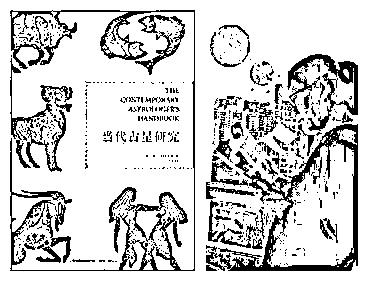

**荐书人**

**课程部总监 Freya.liyang**

**推荐理由**

本书为伦敦占星学院的指定教材，由伦敦占星学院创办人、当代占星权威苏•汤普金斯女士集三十年研究成果撰述而成。全书观点独到犀利，展现出作者对占星这门学问极富洞察力和启发性的理解。胡因梦老师笔优美流畅，将重量级的专业论述演绎为精彩绝伦的札记，让人着迷而不忍释卷。

本书架构严谨清晰，语言易于理解，诠释深入精微，其内容涵盖占星学的历史背景、理论基础、星座意义、宫位象征、相位图形、星盘解读，可用以检视人格模式、心理需求、情绪处理、人际互动、生涯发展等各个人生面向。

入门和初学者的必备占星工具书。

﹁

内在的天空

﹂

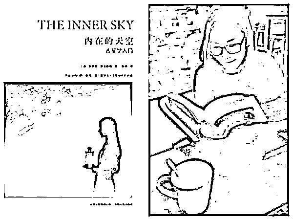

**荐书人**

**课程部销售主管 Maggie.Wang**

**推荐理由**

本书是占星爱好者、初学者的必备入门工具书。作者斯蒂芬·弗里斯特（Steven Forrest）在占星界享有盛誉，是进化占星学创始人，所著书籍被译成多国语言，伴随占星师们一路成长。

阅读《内在的天空》时，你会感受到，这位慈爱的老者在通过传递自己几十年的占星智慧让我们明白"成长才是占星的关键"。占星学是通往自我内在的途径之一，了解、学习占星的过程是我们认知自己、觉知自己、接纳自己的过程。

也许，你已经向外寻了很久，即便获得却依旧内心不平静，那么何不与本书一起，从内出发，再一次认识自己？！

﹁

生命四元素

﹂

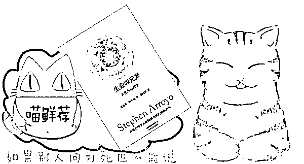

**荐书人**

**课程部销售****喵鲜人**

**推荐理由**

大师，名著。曾获得 1973 年英国占星学会的大奖。

所谓生命四元素，大家都耳熟能详。没错，就是目前玄学中几乎通用的基础：地、水、火、风。不论中西文化如何差异都一致认为，基本元素构成了我们所知的一切事物，甚至牵动我们的意志与内心。因此，通过阅读本书，能够彻底了解四元素的内涵、意义。也阐明占星学为何能成为“人本主义心理学”的有力工具。 

占星方面，众所周知的黄道十二星座，也是由这四元素所组成的。占星学体系中，也有四大基本功：行星、星座、宫位、相位。在职业占星师的解读中，是星盘中明暗相间的两条主线。 

所以在占星学习中，如果将四大基本功比喻为“武功招式”。那么这本书所讲的生命四元素，就是不折不扣的“内功心法”。

﹁

灵魂的功课

﹂

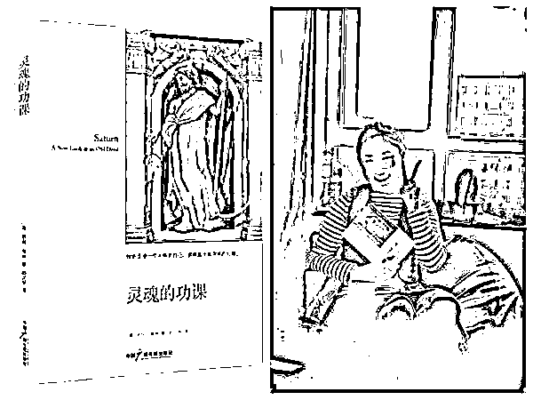

**荐书人**

**课程部****课务夏冰 Siri**

**推荐理由**

丽兹·格林的著作《灵魂的功课》这本书籍类似一本占星手册，专项讨论了土星在星座和宫位上的影响，以及其他行星形成的相位。土星表面上看来是受到限制和宿命的，但是丽兹·格林在本书中提供说明，我们拥有拓展和控制自己人生的能力，让我们了解星图中的所有象征都可以转化，土星不仅仅是出生图的限制，也是潜能的所在。

《灵魂的功课》曾经在一系列的推荐书单中名列前茅，如此受欢迎的原因，大概是书中不仅有洞察、有文采、同时也有深刻的学术研究，专攻神话学和荣格派精神分析的丽兹 1 格林，以太阳落处女座的精密分析和建言，为我们解析了人性里的黑暗野兽（土星），摇身转化后的另一面是光明界的王子。

﹁

生命的轨迹

﹂

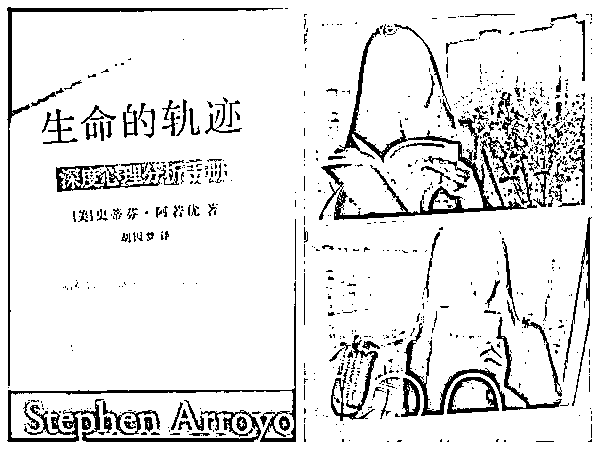

**荐书人**

**课程部****行政 JOELLA**

**推荐理由**

本书提供了一整套奠基于荣格心理学和东方哲学的深度占星方法，与传统占星学书籍不同，这本书是奠基于业力法则与自我转化驱力之上的。作者对占星学、心理学与东方哲学的整合，反映出一种深层的包容力与统和力。此书深刻、清晰与简朴的风格既能使初学者认识到星象诠释的心理学背景也能满足有一定自我认识与成长经验的学者，阅读此书，能够对繁杂的思绪起到重新梳理的作用。适合所有对自我认识和灵性成长有兴趣的读者。

**◆ ◆ ◆  ◆ ◆**

错过了大卫老师的课程也不用担心！2**016 年 5 月 19 日**，**蒋颖**老师主讲的若道占星核心课程**Level 1-2**要开课了！她将带领你学习星座、太阳、月亮、行星、月亮交点等知识，让你进入占星学的世界！

报名及咨询，请点击文末”阅读原文“


# 活动 | 植树节，与占星师一起“植民”外星球多肉

> 原文：[`mp.weixin.qq.com/s?__biz=MzA5NjA0NTAxNg==&mid=403055129&idx=4&sn=e4045ceb388c7b766a938e983a3ffe1f&chksm=0d4490ae3a3319b861861035f049f3be66e5d3c13909afc805993cb3668a43a53946e8ecca0b&scene=126&sessionid=1692738867#rd`](http://mp.weixin.qq.com/s?__biz=MzA5NjA0NTAxNg==&mid=403055129&idx=4&sn=e4045ceb388c7b766a938e983a3ffe1f&chksm=0d4490ae3a3319b861861035f049f3be66e5d3c13909afc805993cb3668a43a53946e8ecca0b&scene=126&sessionid=1692738867#rd)


北京的或能来北京的占星爱好者们！3 月 12 日，欢迎来到占星界的“霍格沃茨学院”——若道占星，“植民”一颗可以藏于室内的多肉星球。

植树节，是人类少有的为植物而设立的节日。在久远的农业时代，人类抬头仰望日月星辰，是为了了解季节气候，俯下身来继续耕种。

现代人类为了保证植物在地球上占有足够的比例而创造了“植树节”，每年“惊蛰”过后就要植树，这些人类的生活经验，印证着天体运行和种植活动之间蕴涵着深厚的因缘道理。最近 NASA 的科学家们甚至想效仿电影，通过种植活动来征服宇宙。     

电影《火星救援》中，马特·达蒙饰演的宇航员为了让自己活着等待救援重返地球，在鸟不拉屎的火星上种起了土豆。这是人类的第一次外星球种植。

电影中芝加哥大学的邮件提到这样一个理论：

**“一旦你在一个地方种植作物，你就正式“殖民”这里了。”**

**今年植树节，占星师们将齐聚占星界的“霍格沃茨学院”若道占星，每人“植民”一颗可以藏于室内的多肉星球。**多肉植物是植物里造养率最高的，一盆茂盛的肉肉植物置于室内，净化空气的能力不亚于一棵树。

**“一个人就是一个星球"**

这次种植活动我们为大家准备了五颜六色的彩色种植土、多种高矮胖瘦的植物以及宇宙摆件，现场 DIY 你最中意的星球颜色，种下你认为的星球植物种类型态，无论是日月水金火、还是木土天海冥，你想“植民”哪个星球都可以！

**植树节种植活动适合报名人群**  

对“天与地”“占星与园艺”都感兴趣的小伙伴

正好需要一盆好看又独特的肉植的占星师

想把宇宙、园艺与艺术完美结合的人

希望开发自然灵性的森系少女

爱种花爱种草但害怕打扫阳台的巧手主妇

出生图有重要星星落入金牛座、处女座、双鱼座、巨蟹座、狮子座、天秤座的你

以及想知道星星有没有落入以上星座的你

想活跃自己土象元素&水象元素的你

土象元素&水象元素过多无处消耗的你

只是单纯觉得多肉植物萌萌哒的你

当然，本次课程还会教你怎么种多肉更健康，活得更久。根据多肉植物生长缓慢、易存活的特质，你的这盆肉肉只会陪你一起慢慢增值，而不会是一时欢愉过后的不断贬值。

****而且，只要咨询种植老师，这些植物就享受终身免费分株、移盆、看病的服务哦！妈妈再也不用担心我购（can）买（hai）小绳命了……****

想做多肉拼盆大神，好奇动手的过程，快点报名做个 planter 吧！U can u up！


**本次植树节的种植内****容**

多肉植物家庭养护的习性介绍

每人种植一颗自己的多肉星球

学习制作 20cm 直径的玻璃花器种植

**课程难度**

**零基础园艺课**

**课程时间**

**3 月 12 日星期六**

**下午 3-5 点**

**课程价格** 

**230 元/人**

****若道老学员** 180 元/人** 

**上课地址**

若道占星

（北京市朝阳区百子湾路 32 号院苹果社区南区 10 号楼 A 座 2006 室）

**人来就行**

**什么都不用带来**

**可以带走一个独一无二的多肉星球盆景**

**种植老师简介**

  **狄与菲**：UPlant house 有种房子店主，若道占星 2015 高阶学员。上升狮子座、群星巨蟹座、中天金牛座，南交天秤座。慵懒随意的天性，以及对植物艺术和家的迷恋，命中注定在 2012 年与朋友创立了像家一样温暖的多肉植物工作室，为客人提供多肉 DIY 以及植物订制创意，被称为京城植物实体店里最文艺的。目前工作室举办园艺、画画、手工、疗愈等多种工作坊沙龙，希望把每次课堂变成身心放松又享受美的好玩 Party！

报名请点击文末”阅读原文“


# 3 月宇宙天气 | 真是一个乱人心的春天

> 原文：[`mp.weixin.qq.com/s?__biz=MzA5NjA0NTAxNg==&mid=403042499&idx=1&sn=97835e4cd3e1245bbb8be6abf9dc6875&chksm=0d4742743a30cb620bdcf293b5a4134313669733f46b2ce2026e84ecac4e5d12c2b87daae896&scene=126&sessionid=1692738867#rd`](http://mp.weixin.qq.com/s?__biz=MzA5NjA0NTAxNg==&mid=403042499&idx=1&sn=97835e4cd3e1245bbb8be6abf9dc6875&chksm=0d4742743a30cb620bdcf293b5a4134313669733f46b2ce2026e84ecac4e5d12c2b87daae896&scene=126&sessionid=1692738867#rd)

作者/占星师咔咔 

图片/花瓣网

三月的宇宙天象真是乱成一锅粥：金星、水星、火星换星座后和木星、土星、海王星形成各种相位也就罢了,一年总共 5 次的日食月食，三月就发生两次啊！更别提标志着社会经济周期变化的木星和土星的紧张相位，和一逆就是半年多的土星开始逆行，我不禁要仰望星空，诚恳地问宇宙，这个三月还能好么？（占星小伙伴诚恳地回复我：看了星历表之后，宇宙也不想劝你什么了……）

**特别提醒** 

本月受到行星行进影响最大的就是**变动星座**的盆友们啦，无论您是**太阳、月亮、上升点、下降点、水星、金星、火星落在了双鱼座、处女座、双子座还是射手座**，您的生活将感受到更多的滋味和更丰富的色彩：**旧的模式、情感、关系、工作会被画上句号。宇宙需要你从舒服的地带中走出来，打破人生的桎梏，选择新的人生方向**。

「

3 月 1 日-3 月 3 日

小伙伴们约起来

」

**3 月 1 日，金星（水瓶座）六分土星（射手座）**

**3 月 3 日，金星（水瓶座）六分土星（射手座）**

金星在友善冷静的水瓶座先后与土星和天王星形成 60 度，这是一段**利于社会交往**的时间，人们会被不同的价值观吸引和启发，愿意尝试新奇的事情。**有伴侣的朋友可以试试给平稳的感情生活加入一些新鲜的元素，点燃爱的小火花。单身者则可以参加兴趣团体的活动，结识新的朋友，开阔人脉**。

「

3 月 5 日-3 月 6 日

与其争吵，不如旅行

」

**3 月 5 日，水星（水瓶座）四分火星（天蝎座），水星进入双鱼座**

**3 月 6 日，火星进入射手座**

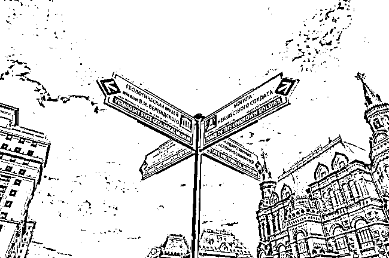 

水星和火星在换星座之前，先形成了 90 度挑战相位。

*   水星水瓶座代表的是独立客观的思考和诚恳的表达，而火星在天蝎座会用隐秘的方式行动，在暗处操纵事情的进度。

*   这种观念和行为上的矛盾表现为争吵、嘲讽等言语攻击，或者为了寻找“真相”而挑动事端，激化矛盾，看到隐藏在背后的动机。

**随后水星与火星双双从固定星座进入到变动星座，让僵化的矛盾变为动态的调整**。水星进入双鱼座的三周内，人们的**表达方式更加敏感和富有想象力**，和水瓶座的固执不同，**此刻的人们也更愿意换位思考，体谅他人的立场和感受**。火星在射手座则是不安于室的，他们的征途是星辰大海。脱离压抑的天蝎座后，**人们不愿再被日常事务困扰，要在向外探索冒险的过程里开阔眼界和思路**。

「3 月 9 日

本年度最重要的日食

」

**3 月 9 日，双鱼座新月（日全食）**

**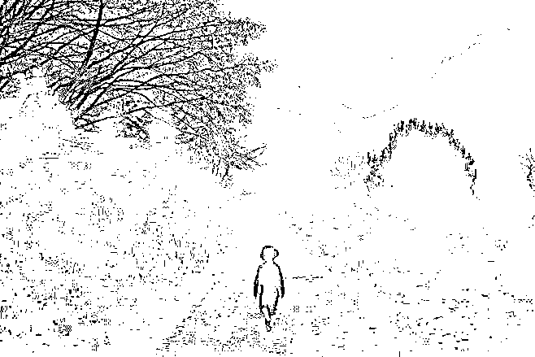** 

**2016 年共有两次日食，分别发生在 3 月 9 日双鱼座 18 度 56 分和 9 月 2 日处女座 9 度 21 分**。

此次的**新月与南交点合相**，代表了**在未来的三个月到半年里，到了面对曾经发生在生命里的不完美、遗憾、缺失的时候。这些旧的模式已经不能帮助我们成长，阻碍了我们走向北交点处女座代表的务实、效率、谦逊和精益求精**。

与双鱼座负面表现的被动、消极、躲避、失望相反，我们可以**不要被动等待负面情绪的消失、恐惧减弱，等待我们的大脑分泌让人心情愉悦的激素让我们度过低潮**。相反，可以更积极和敏感地去了解我们的情绪：**为什么我会有这样的感受，是什么引发了它，它的规律是什么**。这样做的目的，是为了让我在以后**知道要如何创造、延续和管理这些情绪，而不是被动地被它驱使，盲目地陷入其中，造成新的遗憾和缺失**。

「

3 月 11 日-3 月 15 日

梦想与现实，理智与情感

」

**3 月 11 日，水星合相海王星（双鱼座）**

**3 月 12 日，金星进入双鱼座 **

**3 月 15 日，水星（双鱼座）四分土星（射手座）， 金星（双鱼座）四分火星（射手座），水星（双鱼座）六分冥王星（摩羯座），水星（双鱼座）对分木星（处女座）**

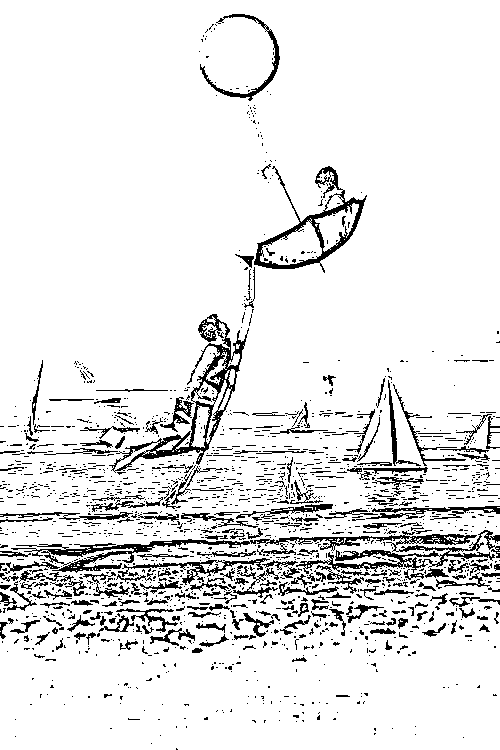 

**这段时间的主题是梦想与现实，理智与情感**。

首先水星合相海王星，是多重双鱼能量的共振，**思考偏向感性，表达含糊不清产生歧义**。需要提醒自己，**事情并不会是像听上去的那么美，甜言蜜语其实是一种麻醉剂。3 月 11 日这一天避免进行重大的商业决策**。

金星进入双鱼座之后，我们会在**人际交往和感情关系中包容、体谅、理解对方。但是也会倾向于理想化和美化这些关系**。

3 月 15 日水星同时与土星、冥王星和木星形成相位，土星位于 T 三角的顶端，**愿景与计划是否能经过现实的考验，将是在这一天人们关注的焦点**。此时宜借助摩羯座冥王星的力量，深入看到问题的本质，谋定而后动。**当天适宜讨论的话题包括：教育、健康、工作、感情、甚至生命的意义，我们将从务实和深入的互动中看到自己与他人的内在智慧的光芒**。

当天的另一主题是金星和火星四分助燃的**感情关系**。**金星在双鱼座美化了爱的感受，而火星在射手座则奋不顾身地向着爱冲了过去。可以想见当天既有头脑的风暴，也有情感的电闪雷鸣**。

「

3 月 17 日-3 月 23 日

动心忍性，增益其所不能

」

**3 月 17 日，木星（处女座）三分冥王星（摩羯座）** 

**3 月 20 日，太阳进入白羊座**

**3 月 21 日，金星合相海王星（双鱼座）**

**3 月 22 日，水星进入白羊座**

**3 月 23 日，天秤座满月（半影月食），木星（处女座）四分土星（射手座）**

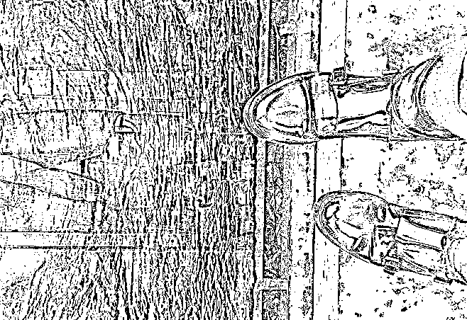 

这是木星在处女座第二次三分冥王星，上一次发生在去年 10 月。

这一次的三分相伴随着木星与土星的四分相位同时发生。这两个重量级相位的同时发生，昭示着**社会经济和商业层面的巨大调整**。木星代表的扩张与土星代表的收缩，这个矛盾相位的威力已经在 2 月中显现。此时人们**被迫要按照法律、规范、现实的要求调整自己的愿景和计划，有时候我们需要在一些地方消减，才能在另外一个领域增长**。而木星与冥王星的三分相位增加了影响力，信念和洞察力。激励人们**“动心忍性，增益其所不能”**。

3 月 20 日太阳进入白羊座。一年之计在于春，处于木星、土星和冥王星强烈行运影响下的大至社会小至个人，可以**提振精神，自我激励，坚定和充满活力地作出新的改变**。

3 月 21 日发生的处女座月亮对分了双鱼座的海王星和金星，与 3 月 23 日发生的半影月食都是**关于人际关系和感情**的主题。在这两天里，我们会感受到**理想化的爱恋与实际相处细节上的矛盾，看到无条件的包容与贬低自己或者批评对方的矛盾，看到强调自我主张、独立思考与注重和谐关系的矛盾**。这两个行运的同时作用，提醒我**们尊重个体差异，给自己和他人留下足够的发展的空间，彼此博弈，寻找最佳的结合点，达成良好的合作**。

「

3 月 25 日-3 月 26 日

土星逆行了

」

**3 月 25 日，水星（白羊座）三分火星（射手座），土星逆行，金星（双鱼座）对分木星（处女座）**

**3 月 26 日，金星（双鱼座）四分土星（射手座），金星（双鱼座）六分冥王星（摩羯座）**

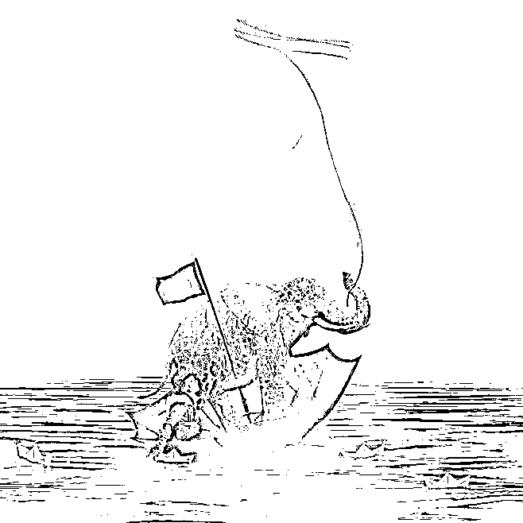 

3 月 25 日土星从 16 度 24 分射手座开始逆行，此次土星将逆行回到射手座 9 度 47 分，于 8 月 13 日恢复顺行。所有行星的逆行都是一场“回头看”和“向内看”的过程。**土星代表的结构、规则、责任在逆行的阶段需要被修复和检验**。在这 5 个月里，我们需要**回头检查曾经做过的承诺，进行的项目和承担的责任**。**土星逆行期间不宜开启新的项目和计划**。当天水星三分火星，人们**思考活跃，新概念可能层出不穷，但是请将这些新鲜大胆的想法帮助你整理好土星逆行的功课**。

金星加入木星、土星和冥王星系列行运，这是宇宙又一次在重复之前的感情和关系的主题。**在感情中你得到的是温柔的呵护还是细心的服务？你又有哪些幻想被打破了？我们将在感情的动荡变化中看到这个关系能否持续地走下去，彼此的信任度又能被拉伸到何种程度**。

「

3 月 30 日

语言是利器

」

**3 月 30 日，水星（白羊座）三分土星（射手座），水星（白羊座）四分冥王星（摩羯座）**

水星在白羊座与摩羯座冥王星四分相可能带来**大胆的言辞触犯社会禁忌，或者用语言作为武器操纵和扭曲事实**。土星与水星的三分相位则让人们可以**务实地考虑自己的想法，并作出可持续性的计划**。


**占星师咔咔**：2010 年开始学习占星学，若道首届学员，国内最早获得 ISAR 职业占星师资质的职业占星师。在国际知名广告公司和市场研究公司从事的市场研究和推广工作十余年，曾任职于阳狮集团、尼尔森市场研究有限公司、MTV 和《Madame Figaro》杂志。现在为《时装男士》、活法儿等媒体供稿。

微信公众账号：咔星人

星盘解读和运势咨询：cji1029@qq.com

**◆ ◆ ◆  ◆ ◆**

******特别提醒************：本文由作者授权发布于若道******，**转载请注明“转自若道”。******

如何掌握星象，顺势而为？**2016 年 3 月 15 日**，大卫老师主讲的若道占星核心课程**Level 5**要开课了！在这个阶段，你将学习各种预测技术及行星周期。通过这些预测工具，你能够预测和规划人生。提前报名付款有**早鸟价**哦！

报名及咨询，请点击文末”阅读原文“


# 如果希望你的孩子爱你，就先去理解你的父母吧

> 原文：[`mp.weixin.qq.com/s?__biz=MzA5NjA0NTAxNg==&mid=403042499&idx=2&sn=ce5340be75b0f4d1ba7021036eeca14c&chksm=0d4742743a30cb6205fe68e21771c35ad455c81ec0fcd1c1ef754dad20b5da9d591c62f76cac&scene=126&sessionid=1692738867#rd`](http://mp.weixin.qq.com/s?__biz=MzA5NjA0NTAxNg==&mid=403042499&idx=2&sn=ce5340be75b0f4d1ba7021036eeca14c&chksm=0d4742743a30cb6205fe68e21771c35ad455c81ec0fcd1c1ef754dad20b5da9d591c62f76cac&scene=126&sessionid=1692738867#rd)

📹 [`v.qq.com/iframe/preview.html?vid=w0186djlgj4&width=500&height=375&auto=0`](https://v.qq.com/iframe/preview.html?vid=w0186djlgj4&width=500&height=375&auto=0)

父母都爱自己的孩子，但目前中国的现状是大部分孩子都感觉不到父母的爱，甚至是对立关系。

——若道调查

►►在若道君的一项民意调查中，我们发现，大多数**父母关注的孩子教育问题**，集中在如下两点：

*   **如何从孩子的自身特点来培养孩子；**

*   **与孩子实现内心的互动沟通；**  

**►►孩子们呈现的主要问题**有：

**性格急躁，容易发脾气；情绪问题；敏感，心思重，胆小，不合群；叛逆，**等等。

**►►父母希望通过占星学获得的帮助**有： 

*   **如何从占星角度来增进孩子与父母之间的理解与沟通**

*   **如何透过占星，让父母接纳孩子的天性，将关注点从改变孩子的行为到自我的修行成长。**

**要解决这些问题，**

**我们需要来观察自己原生家庭的模式，**

**如果你为孩子和你的互不理解感到伤心**

**请在心里问问自己：**

**你，接纳你的父母么？**

**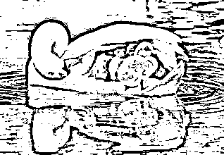** 

Your parents ruined your life,they don't want to ,but they did.

你的父母毁了你，他们也许不想这样，但却这样做了。

把一切的错误归结到父母身上也许是最简单的方式了。

因为我的母亲这样对我，所以我才……

如果我的父亲没有……我就不会……

然而，你知道他们曾经如何因为你的到来而狂喜落泪么？你知道母亲在怀你的时候需要忍受的孕吐、情绪低落、生育的疼痛和漫长的身体恢复么？你知道父亲立志要把你培养成和他一样强壮有力的男人，又或者你是他心中的掌上明珠么？

你知道自己刚出生的时候每天只是无穷无尽地啼哭和吃奶，你不会讲话却整夜烦躁，你的一点小恙，一点气喘，你的母亲需要整个身心地照料你，为你的一丁点变化而担心，而欣喜么？

你知道当你长大成人离家去了远方，你一向不苟言笑的父亲坐在你的床上哭得像个小孩么？

他们也曾和你一样是孩子，他们也向往着自由自在的人生，然而你的到来，让它们心甘情愿背负上了重任，还有希望。

他们希望你是快乐幸福的，希望你远离人间的疾苦，然而也许他们自己也不过是个平凡的人，他们没有“善待”你，因为他们用错了方法。

**没有按照你想要的方式去爱你，**

**不代表他们不爱你啊。**

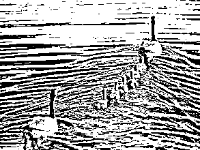

如今你也长大了，结婚了，有了心爱的人，并期待和 TA 有个孩子。于是这一切的体验，都轮回到了你的身上。

所以你是多么充满希望而又惶惑不安，亦步亦趋跟在孩子身后，想给 TA 最好的，你的父母就曾对你给予同样的，甚至更多。

无人照拂的孩子，甚至无法活过出生后的第一个月。所以他们给你的爱，和你现在希望给你的孩子的一样多。

**我们都是第一次做父母，** 

**如果做得不够好，**

**你希望你的孩子理解原谅还是叛逆顶撞？**

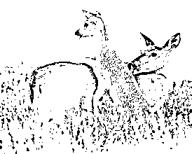

接纳，从理解开始。

若你希望你的孩子爱你、尊重你、理解你、接受你的爱，请先尊重、理解、接受父母的爱吧。唯有这样，才能将原生家庭的坏模式切断，好模式延续。

**改变，从你开始。**

**请相信，**

**如果你能迈出向父母和解的这一步，** 

**你的孩子也一定会。** 


这个三月，来加入我们的**亲子发展工作坊**吧。

大卫老师以近四十年的经验，教你如何更好地同父母和解，更好地了解孩子水晶般真纯的心；

了解他有着怎样的梦想和潜能；

了解他的情绪背后有着怎样的心理动因；

你想知道的关于孩子的一切都能在这里找到答案。

**大 卫 老 师 是 何 许 人 也**


**大卫·瑞雷（David Railey）**

若道创始人，《灵魂的目标》作者。拥有四十年的占星咨询的执业经验，曾两任亚特兰大占星协会主席，是全美占星师联盟（AFAN）、美国占星师联合会（AFA）、全美占星研究委员会（NCGR）、国际占星研究协会（ISAR）和职业占星师组织（OPA）的成员，是联合占星大会（UAC, United Astrology Conference）督导委员会委员。大卫曾是 CNN、CBS 的占星节目的常驻嘉宾，多次在 BBC、WGS、WSB、WRGG 等节目中接受采访，并在亚特兰大主持电视节目《每日行星（Daily Planets）》达 4 年之久。

**若道君的话**

您有怎样的育儿经验和教训，欢迎评论和大家分享，若道君等你哦~

报名及咨询，请点击文末”阅读原文“


# “小棉袄”塑造记 | 北京占星学与亲子发展工作坊

> 原文：[`mp.weixin.qq.com/s?__biz=MzA5NjA0NTAxNg==&mid=403042499&idx=3&sn=f69376e373a2fbf02e72725a484802b5&chksm=0d4742743a30cb62c99ca8a0ff79bea15c1b687762e24686bc2bb96a2fe6c41378344c8b494a&scene=126&sessionid=1692738867#rd`](http://mp.weixin.qq.com/s?__biz=MzA5NjA0NTAxNg==&mid=403042499&idx=3&sn=f69376e373a2fbf02e72725a484802b5&chksm=0d4742743a30cb62c99ca8a0ff79bea15c1b687762e24686bc2bb96a2fe6c41378344c8b494a&scene=126&sessionid=1692738867#rd)

📹 [`v.qq.com/iframe/preview.html?vid=l0186vpg0sw&width=500&height=375&auto=0`](https://v.qq.com/iframe/preview.html?vid=l0186vpg0sw&width=500&height=375&auto=0)


两分钟前你还幸福感满溢

两分钟后恨不得举起棍子收拾 Ta

这是怎么了？

　　不是说孩子是上天的礼物吗？

What，这礼物没法由我控制开关机？

　　　我如何接纳 Ta 与我完全不同的样子？

2016 年 3 月 26 日

北京两天工作坊

大卫老师邀您一起探讨学习"占星"这个解码器

　　　　从出生星图中发现每个父母与孩子的独特潜能及成长主题

学习应对不同时期亲子关系发展的成长挑战

按图索骥，及时保养！

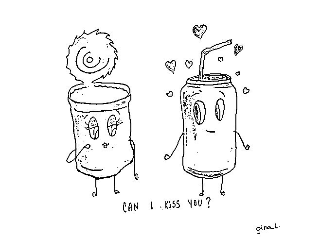

**工作坊信息**

**授课时间：**2016 年 3 月 26-27 日 （10:00-18：30，午休 1 小时）

**授课老师：**大卫·瑞雷

**授课方式：**北京面授，英文授课，配中文翻译

**费用**：**5000 元（若道老学员可享受优惠价 3500 元）**

**早鸟价：**4000 元

**报名截止：**2016 年 2 月 29 日

**课程负责人：**Freya.Li  微信号：18601950700（请备注报名咨询）

**咨询电话：**400-619-1014

**课服 QQ：4006191014 （若道星文化）**

**邮箱：nodoor@vip.126.com**

课程简介

这两天，我们将聚焦在学习如何通过“觉知”与“接纳”的方式为孩子的成长创造一个充满“接受”“理解”和“爱”的家庭氛围。

我们将会根据家长和孩子的星图，谈论：

**★ 孩子怎么学习更有效？孩子适合报什么样的专业？说话孩子不听怎么办？孩子很叛逆该如何沟通？该如何激励孩子？**

**★ 在孩子成长过程中，家长会有哪些特别的挑战，如何面对这些挑战？**

**★ 哪些社会压力是非理性的，怎么放下这些非理性的压力？**

**★ 自己的人生议题是什么，这些议题和焦虑会怎样影响孩子？**

**★ 孩子今生的议题和挑战是什么，如何接受孩子的议题？**

**★ 孩子的潜能是什么？**

在这两天，我们不仅会根据孩子出生图的主题分组，还会根据家长出生图的主题分组，研讨案例将采用学员及学员孩子的出星图实例贯穿。这样学员们不仅可以从老师那里学习，而且还可以互相学习，通过在发生在身边的案例深刻感受出生星图如何影响家长、孩子及相互关系。

适合人群

**★ **致力于亲子关系成长的咨询师和占星师

**★ **希望更好理解童年与父母之间关系互动的人群

**★ **对占星学感兴趣的人群，需具备若道核心课程 Level1-2 的占星学基础

师资力量


****大卫·瑞雷（David Railey）****

若道创始人，《灵魂的目标》作者。拥有四十年的占星咨询的执业经验，曾两任亚特兰大占星协会主席，是全美占星师联盟（AFAN）、美国占星师联合会（AFA）、全美占星研究委员会（NCGR）、国际占星研究协会（ISAR）和职业占星师组织（OPA）的成员，是联合占星大会（UAC, United Astrology Conference）督导委员会委员。大卫曾是 CNN、CBS 的占星节目的常驻嘉宾，多次在 BBC、WGS、WSB、WRGG 等节目中接受采访，并在亚特兰大主持电视节目《每日行星（Daily Planets）》达 4 年之久。

往期回顾

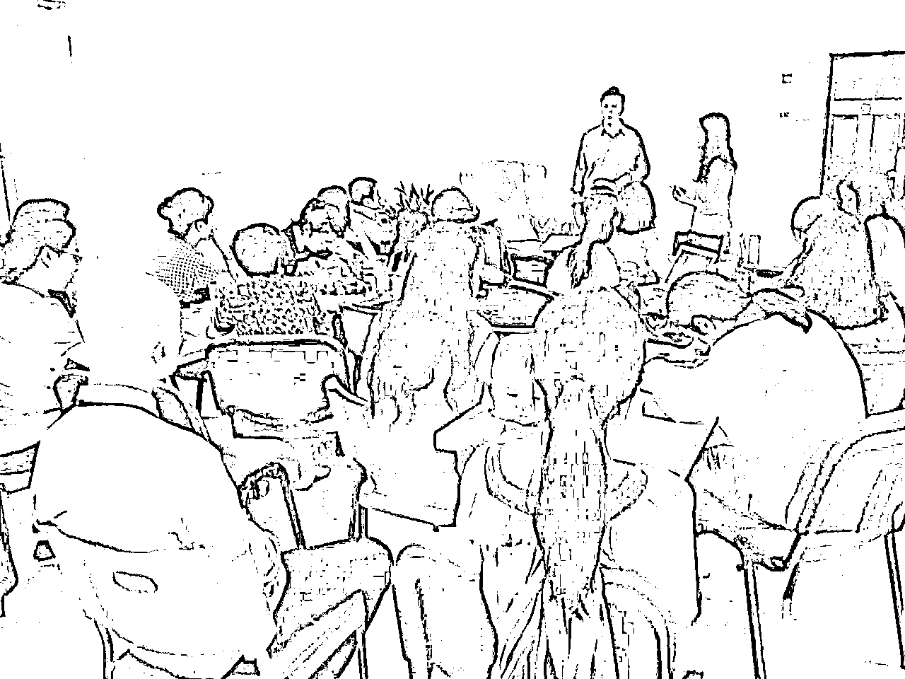

▲2015 年成都  占星学与亲子发展工作坊

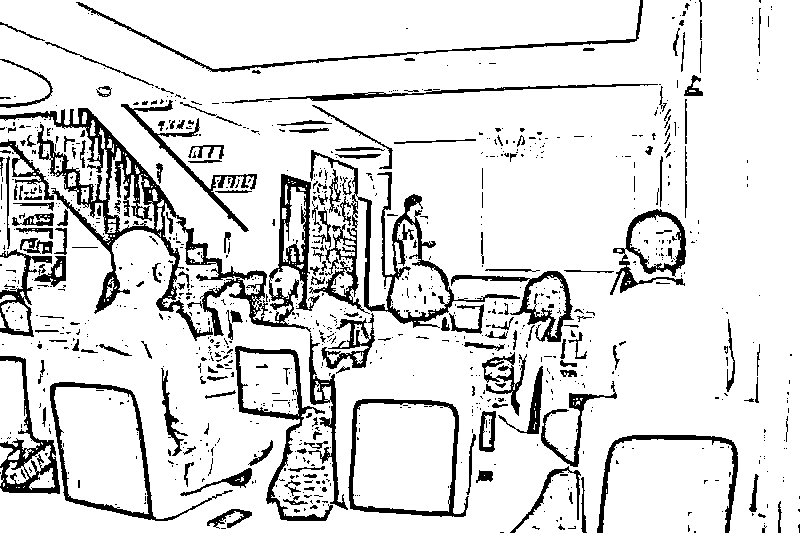

▲2014 年深圳   占星学与亲子发展工作坊

长按二维码接通课程负责人~


报名及咨询，请点击文末“阅读原文”

# 选择一个 LV 包还是一场自我认知之旅？决定在你

> 原文：[`mp.weixin.qq.com/s?__biz=MzA5NjA0NTAxNg==&mid=403023167&idx=4&sn=a4519cd0074d7590125f929a6ab31fe2&chksm=0d4717883a309e9ef48a6c46faa875f7073f10fe6563c4afe7f95b86d57ca038f4f5b70bfed5&scene=126&sessionid=1692738867#rd`](http://mp.weixin.qq.com/s?__biz=MzA5NjA0NTAxNg==&mid=403023167&idx=4&sn=a4519cd0074d7590125f929a6ab31fe2&chksm=0d4717883a309e9ef48a6c46faa875f7073f10fe6563c4afe7f95b86d57ca038f4f5b70bfed5&scene=126&sessionid=1692738867#rd)

若道，一所有信仰的学校

你可以选择花这笔钱去买一个奢侈品包包；

办一年美容卡；

报一个私人健身课程； 

又或者来一场说走就走的奢侈游；

你也可以选择花这笔钱来若道学习；

通过学习了解自己的人生轨迹；

站在星图上，活出强大的自我；

也许那时候，

你会更加明白，

一个奢侈品包包除了带给你虚荣，别无长物；

一张美丽的容颜需要由内而外的修为衬托；

强健的体魄需要通透的头脑去引领它的方向；

修行，并非只是漫无目的地在路上；

是的，这些都很重要，

然而，明白你是谁，你要去哪里，

会更重要。

**若道的学费贵不贵？**

来听听学员们的声音吧——

**@L4 在读学员喵呜 **

**21 岁/学生**

对我来说，当然贵呀，可我乐意花这个钱去学，对我来说学习先是要搞清楚原理、由来、哲学观的。在理念这一块，放眼行业内没有比若道做得好的，这就是独一家的价值，所以价格再高都会来的。

这一年所收获的各种，体验到的、学会的，真的是没办法用金钱衡量。**若道从某方面来说，丝毫不夸张，改变了我整体的人生轨迹**。

**@L4 在读学员西瓜 **

**25 岁/会计**

选择续报是觉得很多知识都熟悉着，万一断了课程，还断了**和同学交流的平台**，再隔一年会生疏。而且我担心万一涨价了可咋整，我还担心大卫他是美国人，万一哪天回国咋整，趁他现在还在中国教，赶紧学下去……

**@L4 在读学员 Satan**

**48 岁/工程师**

乍看有点贵，等慢慢学习后觉得值得的。看个人需要，作为职业方向或者学得专业些，还是要系统学习，不能靠自学或野路子，会学偏了。若道文化教学理念和核心课程在中国还是第一位，其教学配置比较国际化，看到了**若道文化在用心做这件事。包括大卫讲课激情和敬业，助教和教务的全方位服务，值得的。能请国际上的大师级人物来讲课办工作坊是不容易的，因此我们的起点也高了**。


在这里，有一群有信仰的人

致力于严肃占星学在中国的推广

这是一笔对你未来人生的投资

贵，但是值得

和若道一起

来为我们自己做点什么吧

就从今天开始

L5 课 程 报 名 在 即

在这个阶段

你将学习各种**预测技术**

**行进、月亮次限、太阳弧、返照图**

你会学到**行星周期**

天上哪朵云什么时候会飘到这个人的头顶呢

会如何影响这个人的人生呢

通过这些预测工具

**你就能用它来预测和规划人生了**

**课程讯息**

**授课时间：**2016 年 3 月 22-9 月 20 日

**授课老师：**大卫·瑞雷

**授课方式：**网络课

****费用**：15000 元**

**报名截止：**2016 年 3 月 11 日

**课程负责人：**siri**（微信号：2847613491）**

**咨询电话：**400-619-1014

**课服 QQ：4006191014 （若道星文化）**

课程简介

****课程安排太丰富**了！**

行进

行星周期

爱情中的机会和挑战时机

职业周期

月亮次限

太阳弧

太阳返照、月亮返照

综合预测

组合图

占星学历史

占星学中的天文学

ISAR 考试词汇表

咨询技巧培训

**●**在整个教学过程中，不仅用名人案例讲解，而且将会抽取同学星图，进行实战咨询示范。另外，会有 4 节课的咨询技巧培训帮助大家准备好进入实战。

授课时间

2016 年 3 月 22 日-9 月 20 日

每周二晚 20：00-22:00（北京时间）

共 27 次课

有关毕业

**考试和实习****：**对于那些想要获得大卫老师资质班证书的朋友，我们将帮助大家在开始成为职业占星师之前，将由专业占星师组织小型督导工作坊，帮助大家实战解盘，为正式的收费咨询做好准备。通过毕业考试，参加督导工作坊，星盘解读的同学，将获得大卫老师颁发的职业占星师资质证书。

授课优势

**①先进的教学平台**

网络教学平台，支持手机、电脑、iPad 上网，可以随时随地学习。

**②回放复习**

学员可登录网站收看课程回放，在线复习课程，每次课可完整重看 3 次，课程结束后的 3 个月内有效。　

课程特色

**①与名师面对面**：北京同学可以来若道现场上课，和大卫老师面对面互动。大卫老师也可能前往主要学员所在城市，实现零距离教学。

**②互动答疑**：论坛、微信群随时提问；老师课上答疑；助教线上线下全程协助。

**③线下沙龙**：定期举办沙龙活动，复习上课内容。

**④强大的同学网络**：若道作为中国最顶尖的占星教学机构，在 4 年的占星教学中，培养了很多占星人才。若道让你和师兄师姐切磋，让你和国内著名占星师学习。（简单来说，就是，人脉！）网络授课，在北京开设免费现场参与名额，全程英文授课，配备实时翻译。

师资力量


**大卫·瑞雷（David Railey）**

若道创始人，《灵魂的目标》作者。拥有四十年的占星咨询的执业经验，曾两任亚特兰大占星协会主席，是全美占星师联盟（AFAN）、美国占星师联合会（AFA）、全美占星研究委员会（NCGR）、国际占星研究协会（ISAR）和职业占星师组织（OPA）的成员，是联合占星大会（UAC, United Astrology Conference）督导委员会委员。大卫曾是 CNN、CBS 的占星节目的常驻嘉宾，多次在 BBC、WGS、WSB、WRGG 等节目中接受采访，并在亚特兰大主持电视节目《每日行星（Daily Planets）》达 4 年之久。

**想成为 ISAR 认证占星师吗？**

**欢迎选择 2016 年度职业占星师成长套餐** 

▼


**2016 年，和大卫老师一起，开启占星的探索之旅！**

长按二维码添加课程负责人咨询~

****

报名及咨询，请点击文末”阅读原文“

# Level 1-2 新学员，你们在哪里？集合啦！

> 原文：[`mp.weixin.qq.com/s?__biz=MzA5NjA0NTAxNg==&mid=403023167&idx=3&sn=467ca08f38a0f28d68d378e753212a80&chksm=0d4717883a309e9ec993e7f2cf8ec56e560f376bae02ccb48a42964ac15400192cfd1faf0ddc&scene=126&sessionid=1692738867#rd`](http://mp.weixin.qq.com/s?__biz=MzA5NjA0NTAxNg==&mid=403023167&idx=3&sn=467ca08f38a0f28d68d378e753212a80&chksm=0d4717883a309e9ec993e7f2cf8ec56e560f376bae02ccb48a42964ac15400192cfd1faf0ddc&scene=126&sessionid=1692738867#rd)

**若道 2016 年核心课程 Level 1-2 将于 3 月 10 日正式开课！**

**上课时间、如何登录、课后复习、资料查询……**

**所有你的疑问都能在这里找到答案！**

**▼**

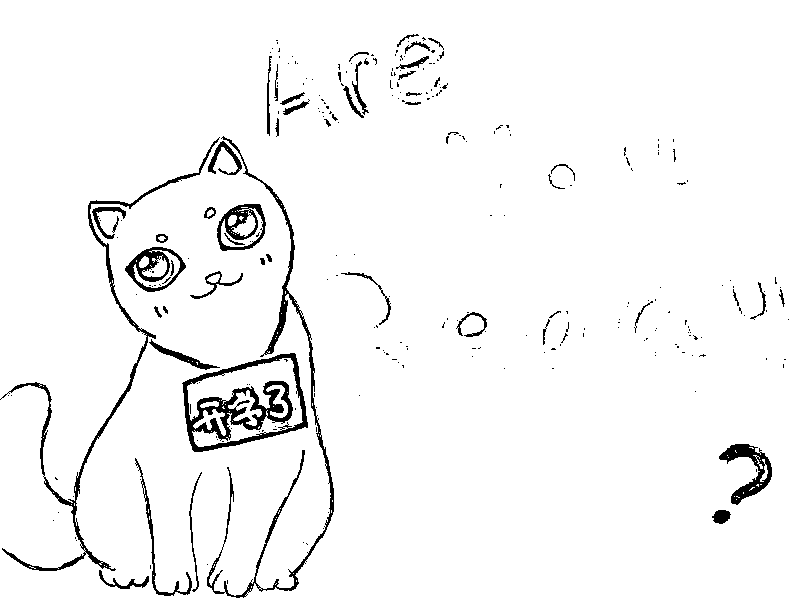
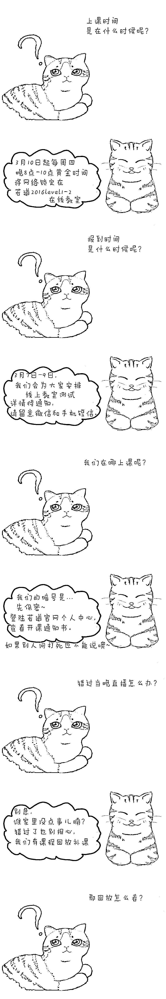
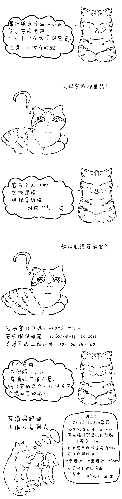
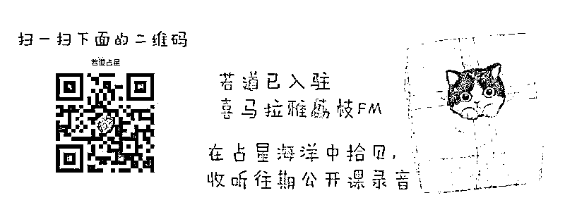
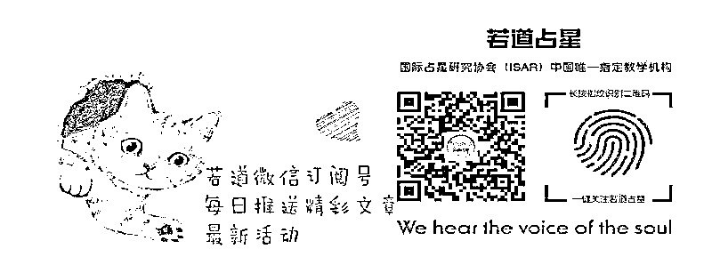

**◆ ◆ ◆  ◆ ◆** 

错过了大卫老师的课程也不用着急，**2016 年 5 月 19 日**，**蒋颖**老师主讲的若道占星核心课程**Level 1-2**要开课了！她将带领你学习星座、太阳、月亮、行星、月亮交点等知识，让你进入占星学的世界！

报名及咨询，请点击文末”阅读原文“


# 你们都在聊奥斯卡影帝，我想谈的是天蝎座莱昂纳多

> 原文：[`mp.weixin.qq.com/s?__biz=MzA5NjA0NTAxNg==&mid=403023167&idx=2&sn=5c113df4116ce1b402fe7303d86e5e67&chksm=0d4717883a309e9e6ab640623545ef63cf0218b5eff2afbcc0b2f4c1282e1cad11f40164ae30&scene=126&sessionid=1692738867#rd`](http://mp.weixin.qq.com/s?__biz=MzA5NjA0NTAxNg==&mid=403023167&idx=2&sn=5c113df4116ce1b402fe7303d86e5e67&chksm=0d4717883a309e9e6ab640623545ef63cf0218b5eff2afbcc0b2f4c1282e1cad11f40164ae30&scene=126&sessionid=1692738867#rd)

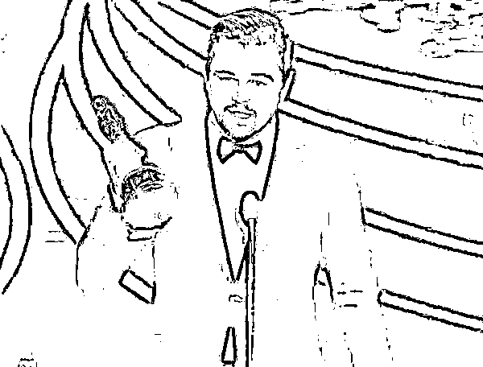

作者/大卫·瑞雷

译者/Christy  校对/江艺

在等待了 22 年、4 次与奥斯卡影帝失之交臂、人人都喊快让他得奖吧否则他要自残了之后，莱昂纳多·迪卡普里奥终于获得了第 88 界奥斯卡影帝殊荣，再不用等到终身成就奖了。

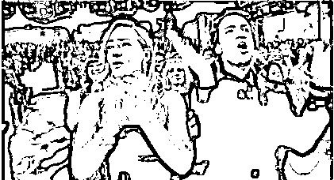

**叫他莱昂纳多·迪卡天蝎座**

“我不惧怕死亡，因为我已经死过了。”——休·格拉斯

莱昂纳多·迪卡普里奥在《荒野猎人》中生动刻画了这位 19 世纪的北美拓荒者。在经历了四次奥斯卡最佳男主角提名后，莱昂纳多终于收获了奖杯。他的成名作是与凯特·温斯莱特联合主演的电影《泰坦尼克号》。当然值得一提的是，**在迪卡普里奥拍过的二十多部电影中，近乎一半他都“死了”。**

《泰坦尼克号》中，他握住罗斯的手渐渐松开，悲惨地沉入冰冷的深海；《致命的快感》中，他在与父亲的枪击比赛中被枪杀；《全蚀狂爱》中他死于癌症；《罗密欧与茱丽叶》中自杀而死；《无间行者》中因背叛遭一枪崩头；《血钻》中死于枪弹雨林；《胡佛传》中饰演的著名 FBI 局长死于心脏病发作；《被解救的姜戈》中饰演的邪恶的庄园主被枪杀；《伟大的盖茨比》中被一个妒火中烧的丈夫从背后射穿了心脏。

或许他应该改名为莱昂纳多·迪卡天蝎座。

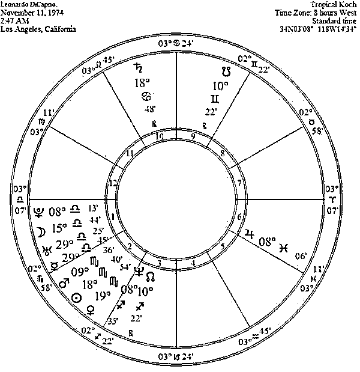

莱奥纳多出生星图

这种死去的电影角色自然符合一个出生时太阳、金星和火星落在天蝎座人，但好像这还不够，莱昂纳多的**冥王星（天蝎座的守护星）落在上升点以下仅仅五度的位置，与天秤座上升和天秤座月亮形成合相**。演员们总是会被与自身产生共鸣的角色所吸引，这就是好莱坞的选角秘籍。死亡或经历死亡是天蝎座所关注的，或者说痴迷的。

**强烈的天蝎座主题**

**危机中的恢复力**

**在暴力中存活**

**悲痛的失去**

**抛弃**

**背叛**

**复仇**

**转化**

**《荒野猎人》，一部天蝎座式的电影**

📹 [`v.qq.com/iframe/preview.html?vid=w01866a4r8x&width=500&height=375&auto=0`](https://v.qq.com/iframe/preview.html?vid=w01866a4r8x&width=500&height=375&auto=0)

《荒野猎人》中，迪卡普里奥展现了所有这些主题。他所饰演的休·格拉斯在一开始就展现了恢复力，他帮助解救了遭到印第安人激烈攻击的猎队。然而，在格拉斯被一头熊攻击致重伤后，他的一些队友却将他视为队伍存活的负担。不过那些忠于格拉斯的队友，包括他的儿子一直对他不离不弃，下决心要照顾到他恢复健康为止。  

忠心的队友遭到了背叛，被队里其他人杀害。格拉斯眼睁睁看着儿子死在自己面前，所有忠于格拉斯的人都被掩埋，包括他自己也被那些他曾经从印第安人手里救出来的人抛弃并活埋了。但迪卡普里奥饰演的男主角却用尽全力爬出了埋葬他的黑暗坟墓，坚强地活了下来。**电影的大部分都在讲他在经历了这些悲惨暴力事件后的生存和转变**，因为他被一股强烈的执念牵引，要为他深爱的儿子报仇。

影片根据大约 1823 年发生在美国边境上的真实故事改编，绝对值得一看。熟悉天蝎座人生主题的朋友或许会更喜欢！

**支撑获奖的各种占星学标志**

学习占星学的朋友可能会对莱昂纳多·迪卡普力奥星图中其他相关特征感兴趣。我相信你们已经注意到了，**行进的太阳-海王星合相与迪卡普力奥出生图中位于第六宫**双鱼座**的木星形成合相**。这当然意味着给予一份出色的工作以回报。还有一些朋友注意到了，**行进中成四分相的天王星和冥王星与迪卡普力奥的月亮成相，而月亮是他中天的守护星。**

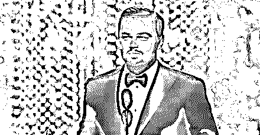

天王星与冥王星在过去几年多次成相，而在拍摄《荒原猎人》时两颗星精准成相。虽然迪卡普里奥的电影事业已经足以展现他冥王星式的强烈，但这样强有力的行进依然毫无疑问加深了他作为演员的情感共鸣。

如果你是天蝎座，又想当演员的话，我觉得有个天秤座上升会对外表很加分。我的老师过去常说，即便是一只上升落在天秤座的青蛙也是只帅气的青蛙。迪卡普里奥性感迷人的外表与他的宇宙 DNA 天秤座和天蝎座搭配得恰到好处。

**其他与影帝有关的占星学标志**

**其他与迪卡普里奥现状细节有关的占星学标志有：**

○他的推进中天正与出生时的月亮（出生时中天的守护星）成紧密六分相。

○推进上升点依然与出生时的天蝎座火星合相，而在拍摄这部火星式的影片时，二者成入相位并逐渐精准成相。

○推进火星合相落在射手座的出生图海王星。是的，他出生时北交点与海王星以小于两度的误差成合相。

○猜猜还有什么？他的推进月亮落在白羊座十度，与落在射手座十度的出生北交点成三分相。

○有趣的是，《荒原猎人》开拍自 2014 年 10 月，场地和人员的问题使影片延迟到 2015 年 8 月才拍摄结束。在这段期间，太阳弧冥王星与迪卡普里奥的天蝎座太阳合相。

○可以看到，这部电影是在外景地拍摄，常常在极冷的环境下（包括冰冷的河水中）一待就是几个小时。莱昂纳多历经艰险才最终完成了这部电影，这是冥王星/天蝎座带来的又一个关联。

恭喜他！我们都期待未来在大荧幕上再次看到你的死亡与重生！

下面是一些供我学生查阅的星图：

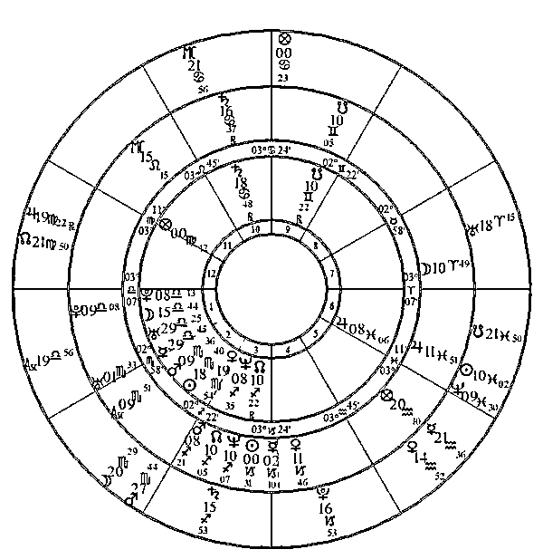

外圈是获得奥斯卡时的行进，中间一圈是次限推进，内圈是出生图

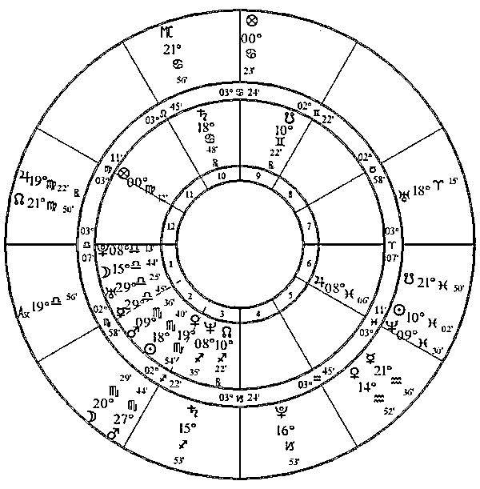

外圈是获得奥斯卡时的太阳弧，内圈是出生图


想体验大师级的占星疗愈？

大卫老师**占星咨询**预约进行时

**生命议题、职业发展、关系咨询、少儿成长、年度规划和预测**

预约请在电脑端复制打开以下网址

 http://www.nodoor.com/consultantApply.do?contentId=3670 

**◆ ◆ ◆  ◆ ◆**

******特别提醒************：若道拥有本文版权******，**转载请注明“转自若道”。******

求人不如求己，想自己写运势吗？**2016 年 3 月 15 日**，大卫老师主讲的若道占星核心课程**Level 5**要开课了！在这个阶段，你将学习各种预测技术及行星周期。通过这些预测工具，你能够预测和规划人生。提前报名付款有**早鸟价**哦！详细内容请点击“**阅读原文**”了解。

报名及咨询，请点击文末”阅读原文“


# 土海雾未散，天冥刑未央【上篇】

> 原文：[`mp.weixin.qq.com/s?__biz=MzA5NjA0NTAxNg==&mid=403023167&idx=1&sn=32d9c3eb22c0824b06500fb1897a78b6&chksm=0d4717883a309e9eb23b26c0a48677fd7f6ab26fee9c1a8babfd191f3c13fef47ab8126562ae&scene=126&sessionid=1692738867#rd`](http://mp.weixin.qq.com/s?__biz=MzA5NjA0NTAxNg==&mid=403023167&idx=1&sn=32d9c3eb22c0824b06500fb1897a78b6&chksm=0d4717883a309e9eb23b26c0a48677fd7f6ab26fee9c1a8babfd191f3c13fef47ab8126562ae&scene=126&sessionid=1692738867#rd)

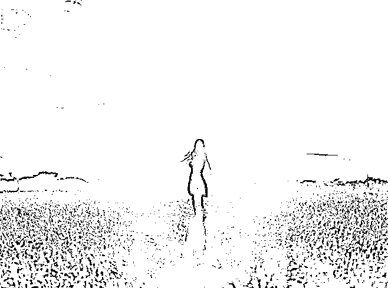

土星——现实，海王星——理想。仰望星空，行进的土星和海王星正处于四分相中，现实与理想一再出现摩擦。2015 年 11 月 26 日，土海形成第一次精准四分相；而在 2016 年，土海会于 6 月 17 日、9 月 10 日再度精确成相。实际的土星与虚幻的海王星通过四分的相位相逢，会给大众带来什么样的议题呢？这篇文章是作者参加了格罗夫与塔纳斯的全息呼吸与原型占星工作坊后所写，来一起看看她的体会。

**土海四分：理想丰满，现实骨感？**

海王星的原型具有阴性特质，是创世原初的母神，有如大海、子宫般完美的融合。它所象征的集体潜意识、集体情感也都是非理性的，流动，隐晦而神秘，驱动着人类牺牲与救赎、回归本源的情结。

土星的原型与海王星是相对的，虽然看起来土星与大多数行星交手时，都会呈现出与该行星截然对立的面向，但其与海王星的对立面更显出父性、限制、小我的疆界与现实主义。

土星既是海王星永远的敌人，也是海王星永恒的弥补。

                                  ——丽兹·格林

**土星四分海王星带给大众的议题**

*   如何在跨越老套规则的同时去实现超越自我的梦想？

*   逃避现实或许是更有利于真我表达的理想之途？

*   一再地回避责任可能是对现实的无力感或是对某些物质的沉溺？

*   现实太过复杂，已经分不清是将理想坠落于尘世还是在历炼中苦寻理想的出路？

*   如何穿越僵化的头脑与灵感建立有效连接？

现实与理想本就隔着重重障碍，土星与海王星的行进更将这一议题摆在了每个人的生活之中。所有人，不得不面对这个课题，因为宇宙的时钟对所有人都有效。

**今年夏天土海四分达到顶峰**

这两颗行星的特质完全对立，也就是说土星和海王星各自的基础就像天生相刑一般。土星不是海王星的敌人，真相和现实不是精神的敌人，土星和海王星现在正努力用它们困难的相刑方式彼此合作，提高每个人，深化每个人。

——斯蒂芬·弗里斯特 

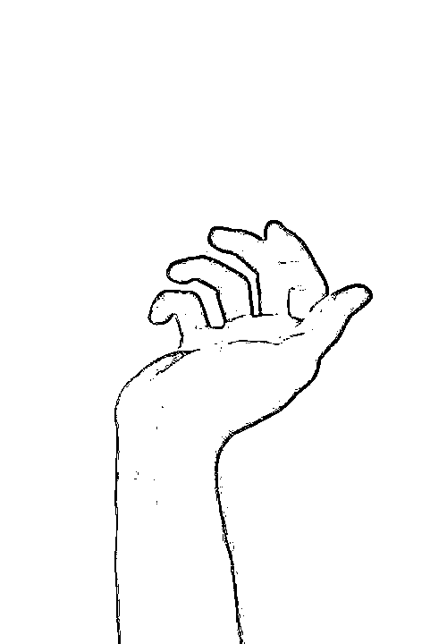

土星在 2016 年 3 月至 8 月期间会逆行在射手座，而海王星在 6 月至 11 月也会经历每年 5 个月的逆行期，所以，6 月 17 日的土海四分是在逆行中形成的。两股深刻而内化的驱力在六七月会达到一个顶峰。

在此期间能找到机会**深入内在神秘的海洋去触碰冰山的一角，消融保守、禁锢的城池与隔阂，将情感、直觉、灵性与现实生活进行整合，将理想的殿堂转为生活实修的庙宇，该是土海逆行中四分相最佳的实践方式**。

尤其对于那些**个人行星或四轴、南交点落于变动星座（双子座、处女座、射手座、双鱼座）10-15 度**的人，可以好好利用这一周期进行一次深入的内在之旅。

塔纳斯博士 1 月在北京举行的全息呼吸与原型占星工作坊中，展示了原型占星的理论架构，用哲学与神性相融合的描绘解释了人与宇宙的关系，以及原型占星心理治疗结合的疗愈力。

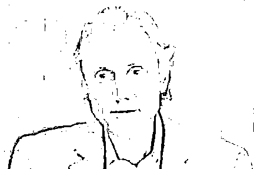

**土星碰到的行星都会带来试炼，引出该行星困难黑暗能量。土星挑战海王星，会带来灵性危机，灵性、神圣的丧失感，悲痛，哀伤。**肯尼迪、戴安娜、富兰克林、玛丽莲梦露、斯大林去世时都是土海式的集体衰悼，人们感受到了心中梦幻偶像消逝的悲痛。

——塔纳斯

**天空之下，发挥我们的自由意志**

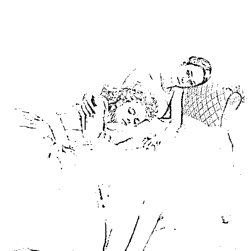

从**2014 年 12 月持续到 2016 年 12 月**，我们都处于土星四分海王星的影响力之下，行星只是外在能量，我们可以在现实生活中去整合利用它们。

1 药品开发

提及海王星，总是容易与药物、毒品、酒精扯上关系，而土海行进必然会带来与这些易上瘾物质有关的体验。然而，除了滥用、依赖的负面行径，我们依然可以在此领域追寻正途，并将它们引入光明地带。

2015 年 10 月（临近土海第一次精确四分），屠呦呦获得了诺贝尔医学奖（土星），她创造性的中药学研发成果抗疟药青蒿素被誉为“拯救 2 亿人口”（海王星）的发现。有趣的是：她早在 1972 年（土星与海王星对分的时期）就已成功提取出青蒿素，而她本人也是中国第一个获得诺贝尔医学奖的女性。相信会有更多人会在她的影响下进行持续深入的中药学研究，将**中国传统医学**（土星）发扬光大。

2 灵感呈现

海王星的灵性面与土星的落实感足以激发出创造力、想像力，对于从事**艺术、灵性**工作的人而言，意味着将大把的灵感呈现为具体事物的机会。

3 贡献集体

放下了土星的小我界限就能像海王星般全然的融入集体，放下个人利欲就能更好参与实现集体意识。海王星神圣原型能帮助个人走上灵魂净化的道途，通过切实的奉爱善举、志愿服务进行自我救赎。诸如**山区支教、参与志愿者工作、慈善捐助、呼吁和倡导环保**等，这些都出于海王星的慈悲心。

4 落地修行

各种各样的**灵性修习**（海王星）方兴未艾，都对传统思想、生活经验（土星的固有、僵化）形成冲击。而土星与海王星的行进将这股冲击最大化，并帮助人们更加自律地实施灵性生活计划，通过持戒、日行一善等方式净化身心，获得与神性合一的体验。

5 回归田园

离世隐居的生活对于很多人而言不再只是一个梦，已经有越来越多的人离开曾经赖以维生、满足习性的城市生活，放弃对物质世界（土星）的依赖与沉溺（海王星），**迁徒至空气纯净，民风纯朴的居处，实现理想的山居生活**。在某种意义上，这是一种对现实的逃避，但是为了身心健康的逃避（海王星），同样也是一种自我救赎与回归本源的行为。

6 低碳生活

当今中国大面积城市空气污染，人们对于经济，教育，食品安全，药疗健康的基础保障都心存不满（土星），并构建出个人化的理想（海王星）。而有多少人真正会去实践这样的理想？诚然，不是每个人都有放弃城市生活的勇气与能力，但是每一个人都有责任和义务去过一种更简朴的城市生活：反思对物质无遏制的渴求，尝试**低碳生活，素食简衣**。

7 传统教育

土海的行进也会为父母们带来更多着眼未来，接触真理并创造理想现实的机会（土星在射手座还要待到 2017 年 12 月）。比如**家庭式的教育**，传承古典学派的教育，**自然教养**方式已经在不少团体中自发互助开展起来。

8 实践梦想

就算是普通人也能进行一些**创造性的工作**，尤其当个人星图中有被土星与海王星激发的行星时，便可以开展艺术、灵性的探寻，表达或是学习。也许你儿时有一个画家的梦，现在可以拿起画笔去实践它；你有一个舞蹈家的情怀，可以找到机会去修习。结果不是那么重要，跟随心，就能发挥出生命本身的潜能，走到一个意想不到的美妙境地。

9 母性联结

世界的大趋势已一再展现出女权的回归、女性时代的到来，人们开始认识到**母性的力量与伟大**，包括不同派别灵性教育在全球的传播也总是强调对母亲的联结与归属感的认同，只有与母源同在（海王星），人类才能找回真正的自我救赎之道，而土海的机会就是让我们通过努力去找到那一条与她融合之道。

**高贵的土海组合****占星课堂**

**—— 历史上的土海困难相位时期 ——**

从土星与海王星行进的历史印记中，我们也能找寻到一些对当下有益的提醒与联接。历史上最近几次土星与海王星呈困难相位的时期：

**1962 年 2 月-1963 年 4 月**：土星（水瓶座）四分海王星（天蝎座）

**1971 年 5 月-1972 年 6 月**：土星（双子座、金牛座）对分海王星（射手座）

**1978 年 10 月-1979 年 2 月、1979 年 7 月-1980 年 8 月**：土星（处女座）四分海王星（射手座）

**1988 年 11 月 28 日-1990 年 2 月、1990 年 9 月-1990 年 10 月**：土星（摩羯座）合相海王星（摩羯座）

在这些年代里，社会大环境、经济都在经历一些动荡与失衡：

*   **1961-1963 年**，中国经历了**大面积粮食紧缺与饥荒**，经历那个年代的人在身心上都留下了对于资源匮乏的痛苦体验。

*   **1971-1972 年**，正值中国十年浩劫之中，许多人留下了难以愈合的灵魂重创。

*   **1978-1980 年**，十一届三中全会开启了**改革开放**的时代，中国的政治、文化、经济开始了日新月异的复苏与发展，民众也从无意识疯狂的境地转入将理想与现实融合的行动中去。

*   **1988-1990 年**，天王星也加入到土海的合相之中，一波巨变的能量推动着**人类潜意识壁垒的融合**：柏林墙倒塌，东西德统一，冷战结束，整个欧洲打开了与世界的连接，苏联解体，海湾战争爆发，而中国也正在经历改革开放十年翻天覆地的经济与意识浪潮之中。

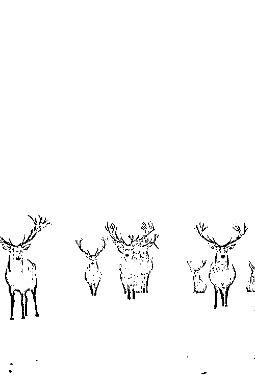

所有出生于这些年份的人，**天生具有对人类痛苦的高敏感度，集体潜意识深刻影响着他们的人生经验，所以也时常带有抑郁气质或有患抑郁症的倾向**。其中有的人会对酒精、毒品、药物上瘾。而当他们深入内在意识的海洋探索，通常就发展出清晰的洞见与智慧，有如从土海的迷雾中拨云见日。

带着天生对集体，甚至全人类疾苦的同理心，从日常生活中提取带有精神、灵性意义的元素，将想像力实现为艺术创作，或是化为灵性、宗教的表达实现情感的救赎，用非理性方式带来令大众共振的情感体验。

这即是土海的组合赋予的有如炼金术般艰辛又充满理想化的动力过程，也是这个高贵的相位所赋予的个人使命。


出生星图中的土星、海王星相位是浪漫主义的忧思。**所有行星的组合中，土海的组合是最高贵的，带来极强的灵性悲痛，很多灵性导师、音乐家都有这个相位，他们拥有让众生离苦得乐的悲心，或是谱写肃穆庄严乐曲的音乐家。**土星的传承能将修行、纪律，显化在每天的修行中，土海的冲动把理想灵性具体化，将全人类紧密地联系在一起。

——塔纳斯

**敬请关注若道君之后的推送**


下篇更精彩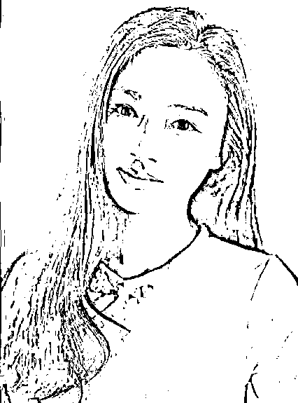

**作者简介**

**郑玮玲（Sampriya）：**若道 COAC 高阶资质认证，国际占星研究协会 ISAR 会员，跟随大卫·瑞雷、斯蒂芬·弗里斯特、罗伯特·汉德、哈德利·菲茨杰拉德、苏·汤普金斯、诺·泰尔、罗宾·阿姆斯特朗等当代著名占星师在职业占星师的进化道路上。馨光爱妈妈会创始人，国内首批 ICEA 国际生育教育协会产后指导，国际母乳会培训的哺乳互助指导。

**个人公众号及咨询预约**：Sampriya-Astrology 

长按二维码，让金钱涌向传播知识与智慧的人~

 

**这些文章也不要错过哟** 


**◆ ◆ ◆  ◆ ◆**

******特别提醒************：本文由作者授权首发在若道平台******，**转载请注明“转自若道”。******

想了解天象对于未来大势的影响？**2016 年 3 月 15 日**，大卫老师主讲的若道占星核心课程**Level 5**要开课了！在这个阶段，你将学习各种预测技术及行星周期。通过这些预测工具，你能够预测和规划人生。提前报名付款有**早鸟价**哦！详细内容请点击“**阅读原文**”了解。

报名及咨询，请点击文末”阅读原文“


# 人人都适用的运势就得这样写

> 原文：[`mp.weixin.qq.com/s?__biz=MzA5NjA0NTAxNg==&mid=403013050&idx=2&sn=cab1359b0cb8df1e3264ae345ff26dda&chksm=0d47cf0d3a30461ba0bc8d964bd70dc9fa7fc20310b9328ca4ba23acfbb444cef7321a1d59ac&scene=126&sessionid=1692738867#rd`](http://mp.weixin.qq.com/s?__biz=MzA5NjA0NTAxNg==&mid=403013050&idx=2&sn=cab1359b0cb8df1e3264ae345ff26dda&chksm=0d47cf0d3a30461ba0bc8d964bd70dc9fa7fc20310b9328ca4ba23acfbb444cef7321a1d59ac&scene=126&sessionid=1692738867#rd)

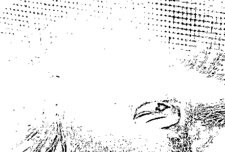

还记得上周[若道君卖的关子（点击可阅读）](http://mp.weixin.qq.com/s?__biz=MzA5NjA0NTAxNg==&mid=402979083&idx=2&sn=d40d238500563a75415a3f56e88d6445&scene=21#wechat_redirect)吗？到底该怎样才能写出人人适合的宇宙天气预报呢？当当当，现在就来揭晓答案啦~

**到底该怎样写运势？**

地球上有 68 亿人，显然不可能在大众媒体为每一个人做出针对他个人出生星图的每日运势。退一步讲，即便是参考出生年、月、日来写每日运势，一天也要写 365 份——或许可以做到，但太不现实了。你要怎么告诉你的报纸专栏编辑，每日运势需要 365 篇的空间？！

这个问题我想了很多年，终于找到了这个问题的解决办法，它扎根于非常基本的占星学原理——**“共振”**。

很多年之前，准确地讲是在 1974 年，一位佛教徒在晨间的冥想之后睁开眼睛，直视着我，说：**“一切都是振动。不仅仅是声音、颜色，一切物质都是振动。”**那时我还是一个年轻的占星学学生，我将这句话牢牢记在了心里。6 年之后，当我为亚特兰大的 WSB TV 写作第一份宇宙天气预报时，我应用了这一原理。

**秘诀在于“共振”**

我意识到在不知道一个人出生星图的具体细节的情况下，试图用运势为他做预测的基本缺陷在哪里，然而我还知道，占星学的符号系统建立在相同性质振动的彼此联系之中，或说共振。

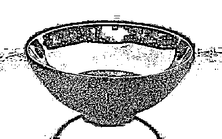

**共振是怎样形成的？**

如同**白羊座与火星、第一宫相联系，金牛座与金星、第二宫相联系，诸如此类**。黄道上的每一个星座都有一组对应的要素与之发生共振，这种关系通常被称为**“守护”或“统治”**，它们以类似的影响作用于人们的行为、体验和关系。

所以有理由推断，出生星图中**火星突出的人**，包括**火星合了上升点，太阳、月亮、上升点落在白羊座，有重要的个人行星落在第一宫**的人，他们将体现出一些共有的特征，即表现出能量的共振。而**这部分人也会对与之发生共振的宇宙天象有所感应，并作出反应，比如这几天正好有火星的重要相位在起作用，又或者月亮或其他行星正经过白羊座**，等等。

**既有效又有趣的运势写法**

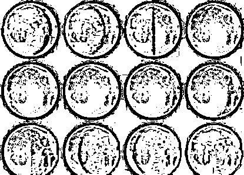

了解这些这对我来说意义重大。然而问题是，我所在的这个社会人们对严肃占星学的了解非常有限。我不能写一篇预测说“如果你的出生星图第一宫内有许多个人行星，或是火星的位置很突出，或是白羊座被强化，那么你会怎样怎样……”因为大部分人不会明白我在说什么。那么我该怎么办呢？

我想到，人**们至少对自己是个什么样的人会有一个大概的判断**。友善而擅长合作的人会知道自己是容易相处的，急于求成、缺乏耐心的人也会知道自己有这样的问题。换句话说，大部分人可以容易地辨别哪些描述是符合自己的，哪些不是。

所以我的解决办法是，只要可能，便给出**最可能受到当下宇宙气象影响的人群类型**。虽然我明白我们每个人都是不同性格特质的复杂结合体，不过那又如何呢？**不管太阳、月亮和行星的影响是怎样的，它们总会和我们的某一部分发生共振**。

于是我有了办法。我知道**宇宙天气预报并不完美，它永远无法取代一对一的专业占星咨询，因为占星师会针对你的出生星图做全面的分析，不过至少它可以提供关于某一天或某周的一般信息**。从占星学的角度看，宇宙天气预报确实可以描述太阳系正在发生的事，即宇宙天气。更重要的是，只要把握好写作方式，它可以是既有效，又有趣的。宇宙天气预报首次发表是在 1980 年，在此后的许多年，它都是亚特兰大当地广播电台的特色节目。

**看看宇宙天气如何出炉**

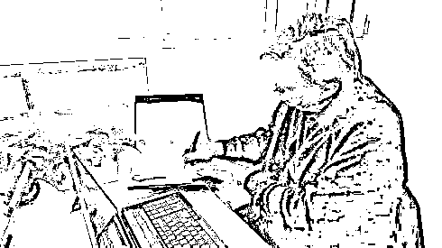

大卫老师曾经撰写宇宙天气预报的情景

这样的宇宙天气预报**综合了每天月亮的位置和月相，以及每天太阳、月亮和其他行星的相位**。通过分析每周里每一天的天象，可以知道主要的行星影响趋势是什么。而要解读这些影响在日常生活中的表现，并不是一件容易的事。那些读过我以前撰写的宇宙天气预报的人会知道，我经常这样描述一类人的性格特质——

*   “那些希望所有人都和谐相处的人”

*   “爱冒险的人”

*   “控制欲强的人”，等等。

这些描述是**“关键词”**，**具有此类性格特质的人会与特定的一系列占星学要素相关联，或说共振**。

*   **“爱冒险的人”**是指出生星图中**天王星位置显著**的人；

*   **“控制欲强的人”**指**冥王星强大、八宫被强化或者有太阳、月亮、上升点及其他行星落在天蝎座**的人。

*   当然，你可以是既爱冒险又喜欢控制的，所以宇宙天气预报将从不同方面讨论星体对你的许多影响。

当觉得需要时，还可以尝试加入了一些有关**太阳星座和生日日期的考虑**。

假设这一周天上的水星和火星合在了射手座的 17 度，由此可以推断出生星图中太阳在变动星座（双子座、处女座、射手座、双鱼座）14 度到 18 度的人将更加直接地受到此合相的影响，然后再列出太阳位于这些位置的人的生日（月、日）。

**并不完美，但合理**

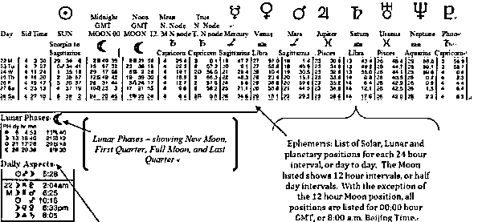

《宇宙天气预报》写作方法示意图

宇宙天气预报并不完美，学过占星学的学生都知道，**占星学使用的是符号和象征的语言，每一个简单的符号有非常丰富的含义，这就造成这种语言有多种的解读方式。**

具体体现在生活中，每一种天象（比如火星四分水星）如龙的变化一样，气象万千，表现形式多种多样，在短短的一篇文章里，不可能穷尽所有这些可能的表现方式。虽然不一定完全正确，但我相信，这是一种为大众提供预测的合理方法。**通过提高对自身的觉察，我们将可以做出对我们的人生更有利的选择**。


想体验大师级的占星疗愈？

大卫老师**占星咨询**预约进行时

**生命议题、职业发展、关系咨询、少儿成长、年度规划和预测**

预约请发送邮件至** felicia.jiang@nodoor.com**

**◆ ◆ ◆  ◆ ◆**

******特别提醒************：若道拥有本文版权******，**转载请注明“转自若道”。******

求人不如求己，想自己写运势吗？**2016 年 3 月 15 日**，大卫老师主讲的若道占星核心课程**Level 5**要开课了！在这个阶段，你将学习各种预测技术及行星周期。通过这些预测工具，你能够预测和规划人生。提前报名付款有**早鸟价**哦！详细内容请点击“**阅读原文**”了解。

报名及咨询，请点击文末”阅读原文“


# 想成为占星师？占星界"霍格沃茨学院"招募中

> 原文：[`mp.weixin.qq.com/s?__biz=MzA5NjA0NTAxNg==&mid=403013050&idx=3&sn=cabd8fb6174326e867dac5bd195ac59d&chksm=0d47cf0d3a30461b1e6cf17f89a2cf3b7345ce11162abd8b2b31d75625ead88e483ba2ec93b7&scene=126&sessionid=1692738867#rd`](http://mp.weixin.qq.com/s?__biz=MzA5NjA0NTAxNg==&mid=403013050&idx=3&sn=cabd8fb6174326e867dac5bd195ac59d&chksm=0d47cf0d3a30461b1e6cf17f89a2cf3b7345ce11162abd8b2b31d75625ead88e483ba2ec93b7&scene=126&sessionid=1692738867#rd)

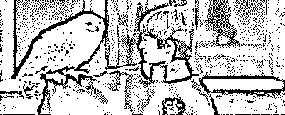

占 星 界 的 霍 格 沃 茨 学 院 招 募 中

如果有一天

猫头鹰送来一封占星学院的录取通知书

你会惊讶吗

我只是一个麻瓜呀

没错

你曾经是一个麻瓜

但现在 你有一百种理由成为一名神奇的占星师

看到自己的前世今生

开启自己的疗愈之路

若道 占星界的霍格沃茨学院

我们有最专业的占星知识

最权威的国外大师

最贴心的助教全程跟进服务

最自由的学术氛围

最亲密的同窗友情

想成为神奇的占星师吗

想拥有一段奇幻的占星之旅吗

猫头鹰已经带着信飞来了

你 还在等什么

占 星 界 的 霍 格 沃 茨 学 院 招 募 中三 月 占 星 课 程 表**1**

**若道核心课程 Level 5**

**授课时间**/2016.3.22-9.20

**授课方式**/网络、视频互动

**讲师**/大卫·瑞雷

**主要内容/**各种预测技术，行进、月亮次限、太阳弧、返照图，通过这些预测工具，你就能够预测和规划人生了！

**神奇指数**/☆☆☆☆☆

**适合人群**/已经对占星学有一定了解和研究，需要进一步认识预测知识的**占星学院中级占星师们**

**报名状态/****开放中（点击文末“阅读原文”）**

**2**

**若道核心课程 Level 1-2**

**授课时间**/2016.3.10-4.28

**授课方式**/网络、视频互动 

**讲师**/大卫·瑞雷

**主要内容/**了解星座特色，12 星座的原则和关键词，遇见行星和月亮交点，了解行星逆行和宫位

**神奇指数**/☆☆☆

**适合人群**/**占星界的小白和麻瓜们**

**报名状态/****已截止。错过这次课程还可以选择蒋颖老师 5 月的 Level 1-2 课程**（点击文末“阅读原文”）****

**3**

**北京大卫亲子工作坊**

**授课时间**/2016.3.26-27

**授课方式**/北京现场  

**讲师**/大卫·瑞雷

**主要内容/**如何通过“觉知”与“接纳”的方式为孩子的成长创造一个充满接受、理解和爱的家庭氛围。

**神奇指数**/☆☆☆☆

**适合人群**/想更好了解原生家庭互动模式、致力于亲子关系成长的**占星界母性爆棚人士** 

**报名状态/开放中**（点击文末“阅读原文”）****

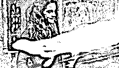

想知道自己会被哪个学院帽选中吗？

又会有哪些同学陪着你，

哪些老师和助教传授占星知识呢？

快点击文末**“阅读原文”**报名，

收拾好行囊，

在国王十字火车站第 9 与 10 月台之间的九又四分之三月台,

乘搭霍格华兹快车，

开始你的占星之旅吧！

# 宇宙天气 | 对情人和敌人，都要知己知彼（2.29~3.6）

> 原文：[`mp.weixin.qq.com/s?__biz=MzA5NjA0NTAxNg==&mid=403013050&idx=1&sn=c6d5da79428df4774c8bb1d7bc434476&chksm=0d47cf0d3a30461b54121f69a1643d28125f254227e8d6b90cd51c18d3c9f92dc36fb66eb11c&scene=126&sessionid=1692738867#rd`](http://mp.weixin.qq.com/s?__biz=MzA5NjA0NTAxNg==&mid=403013050&idx=1&sn=c6d5da79428df4774c8bb1d7bc434476&chksm=0d47cf0d3a30461b54121f69a1643d28125f254227e8d6b90cd51c18d3c9f92dc36fb66eb11c&scene=126&sessionid=1692738867#rd)


作者/占星师 Cora

插画/七沐 图片/花瓣网

**一周星象综述**

本周月亮经过天蝎座、射手座、摩羯座、水瓶座，总的说来这一周的主题是“缔结有利盟约”，无论是在工作上还是在感情上，而真正的沟通和理解是基础。对情人或敌人，都需知己知彼。

> **本周重点星象事件是：**
> 
> ①金星六分土星
> 
> ②金星六分天王星
> 
> ③水瓶座水星四分天蝎座火星
> 
> ④水星离开水瓶座进入双鱼座
> 
> ⑤火星离开天蝎座进入射手座
> 
> ⑥双鱼座太阳四分土星

其中，分别发生在周二和周四的金星的两个六分相，可看做是一组，是本周前半周的一个“小主题”，带来合作、结盟或婚恋方面的助力。在这股力量的影响下，本周从周一到周五，都是有利于我们与合作伙伴或伴侣增进了解、稳定关系、缔结盟约的时候。天王星和水瓶座的参与也会令我们能够跳出原有的思维束缚，带着创造性的眼光，去看待关系发展的更多可能性。

周六和周日两天，是重要星象事件密集的时刻。其中两颗内行星（水星、火星）的换座，是重中之重。

周六水星离开水瓶座进入双鱼座，并将在这里待到 3 月下旬。未来不到二十天的时间里，我们需要去更多地开发我们的直觉、灵感和想象力，因为依靠逻辑、理性和条分缕析很容易感到力不从心，看事情的态度宜顺其自然一些。

周日火星离开天蝎座进入射手座，然后会在 4 月中旬逆行，并在 5 月下旬回到天蝎座。从现在到 4 月中旬这一个多月的时间里，我们需要胆大心细，敢于冲锋，但不能胡来。4 月中旬火星逆行之后，我们就知道哪里需要“补课”了。未来几个月，都是我们淬炼自己的勇气和力量的时候，现在才刚刚开始。

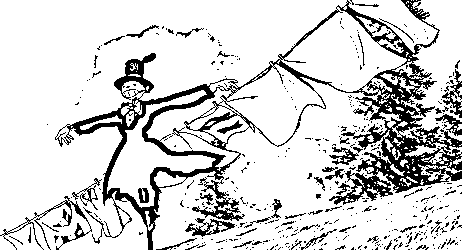

**每日星象**

**2 月 29 日**

星期一

**关键词：激烈**

今天到明天早上，月亮在天蝎座，加上火星也在天蝎座，天蝎座的朋友在今天会感受到更多力量，有精力旺盛、体力充沛的感觉。晚间特别是临近午夜时，由于月亮越来越靠近火星，是战斗力和行动热情提升的时候，也是**易愤怒累积或爆发冲突的时刻**，十二星座都应注意。

天蝎座月亮四分水星，则可能带来沟通交流中的“心口不一”，或是头脑所设想的与情绪反应不一致。希望很多事可以以客观冷静、公正的态度来处理，但是情感上的怀疑、敌意和不安全感却很难消除。**这不是适合沟通谈判的时候，沟通的结果容易受情绪因素或“过往恩怨”的影响。在今天少说话多做事是比较好的选择。**

此外，今天月亮在天蝎座六分冥王星和木星，会提升我们对于利益、资源、权力和机会、好运的敏感度，**有助于我们发现隐藏的机会，或洞察到对我们有利的事物的隐秘面向。**同时这也有助于我们**深入了解一段关系中的复杂议题，探索关系双方的深层情感和不同的心理动机**。

**当日星象**

**00:18**天蝎座月亮四分水瓶座金星

**05:40**天蝎座月亮六分摩羯座冥王星

**10:43**天蝎座月亮六分处女座木星

**15:31**天蝎座月亮四分水瓶座水星

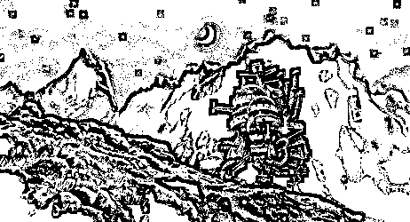

**3 月 1 日**

星期二

**关键词：希望**

早上，月亮离开天蝎座进入射手座，令人情绪放松很多。未来两天射手座的朋友会感受到更多的活力、力量和快乐。其他星座的朋友也**容易感受到更多乐观情绪，能够看到事物积极的、有希望的一面。**这是有助于我们放下忧虑、重整旗鼓的一天。

水瓶座金星六分射手座土星，有助于我们与他人缔结稳定、务实的合作关系，也有助于恋情的稳定。该相位主要影响本周的前三天，**这几天我们需要以更加认真、严肃的态度去评估一段关系的价值和回报，并找到最稳妥、有效的结盟方式。**

**当日星象**

03:56  天蝎座月亮合相火星

07:55  月亮离开天蝎座进入射手座

09:08  水瓶座金星六分射手座土星

**3 月 2 日**

星期三

**关键词：放松**

今天总体来说还算做事顺利。晚间心情会比白天更好一些。早晨由于射手座的月亮四分海王星和太阳，**会在上午制造一些“迷迷糊糊”的感觉，容易有目标不清、注意力不集中或虚弱乏力的感觉**。下午月亮合相土星，则易有悲观情绪，可能将一些困难或阻力看得太严重，而有沮丧或抑郁的心情。

晚间月亮三分天王星、四分木星，是能感受到更多自由和快乐的时刻。此时**我们有机会换一个角度，带着更多创造力和“未来视角”，去发现问题的不同解决方式**。但也应注意木星的夸张和放大倾向，会让我们对某些事物的判断过于乐观。但不管怎样这是一个适合玩乐放松的晚上。

**当日星象**

02:50  射手座月亮四分双鱼座海王星

07:12  射手座月亮四分双鱼座太阳

15:16  射手座月亮合相土星

18:30  射手座月亮六分水瓶座金星

19:55  射手座月亮三分白羊座天王星

21:17  射手座月亮四分处女座木星

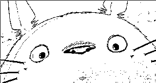

**3 月 3 日**

星期四

**关键词：沟通**

今天白天月亮依然在射手座，晚间月亮进入摩羯座。上午和午后是有利于沟通交流的时间，学习能力和理解能力也比较强，适合开会、讨论问题、谈判、协商，或是进行跟写作、创意、学习相关的事。

上午水瓶座金星准确六分天王星，**此相位重点影响周三到周五这几天**，这期间我们在人际关系、合作关系及婚恋关系中，可能有突然出现的新思路，或是新机会。**我们能够跳出原有的思维束缚，去看待关系发展的更多的空间和可能性。**

总的说来，今天整个白天都比较有利于沟通交流或人际关系的建立和巩固，我们可能对一些人有新的认识，进而促成新的合作与结盟。这个过程中**沟通和理解是关键**。晚间随着月亮进入严肃理智的摩羯座，我们的情绪会变得内敛克制，考虑事情会更加务实。

**当日星象**

09:14  水瓶座金星六分白羊座天王星

10:56  射手座月亮六分水瓶座水星

18:00  月亮离开射手座进入摩羯座

**3 月 4 日**

星期五

**关键词：理性**

这是相对平静的一天，月亮在摩羯座并且六分海王星和太阳，我们能够以稳定、理性、负责的态度处理工作和感情生活中的事。我们会对自己需要承担的责任有更多认识，特别是涉及到感情问题，或需要保护我们所爱的人时。这也是**认真考虑我们能够为我们所爱的人或事做怎样的承诺的时候**。

晚间特别是临近午夜时，由于月亮越来越靠近冥王星，**易有感情上的挣扎和痛苦感受，人际关系中的不信任感和不安全感加重，是需要关注信任议题的时候。**

**当日星象**

11:58  摩羯座月亮六分双鱼座海王星

20:33  摩羯座月亮六分双鱼座太阳

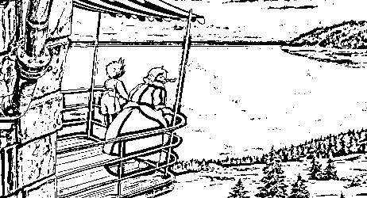

**3 月 5 日**

星期六

**关键词：对抗**

**今天水星四分天蝎座火星，令很多观点意见上的分歧，赤裸裸地暴露出来，变成意志的对抗。**这是容易出现言语争执的一天，沟通不畅、误解、急躁、争吵都很有可能出现。此相位在今天的影响力最强，但在周五和周日也会有所体现。**今天应特别注意对话时要拿出更多的耐心，并且不要把意见的不和上升为人身攻击**。在一个积极的意义上，这也是学习如何有效地倾听他人并恰当地表达自己的机会。

晚间，水星离开水瓶座进入双鱼座，并将在这里待到 3 月下旬。这不到二十天的时间里，我们可能对一些需要我们使用逻辑、理性和分析能力的事感到有些力不从心，因为这不是双鱼座水星的特长，但这期间我们的直觉和想象力会变强，**很多结论的得出或许是通过“感觉”而不是“分析”。这期间放下对于“逻辑正确”的执着，以顺其自然的态度去做规划，是更有效的。**

**当日星象**

01:18  摩羯座月亮合相冥王星

03:59  摩羯座月亮四分白羊座天王星

04:31  摩羯座月亮三分处女座木星

13:44  水瓶座水星四分天蝎座火星

18:25  水星离开水瓶座进入双鱼座

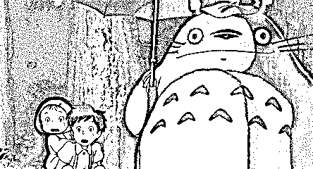

**3 月 6 日**

星期日

**关键词：打击**

今天凌晨月亮离开摩羯座进入水瓶座，水瓶座的朋友能够在未来两天感受到更多自信和活力。而**对十二星座的朋友来说这两天都是适合聚会访友、增进友谊的日子。**

上午火星离开天蝎座进入射手座，然后会在 4 月中旬逆行，并在 5 月下旬回到天蝎座。从现在到 4 月中旬这一个多月的时间里，是我们“初尝冒险滋味”的时刻。一些艰难的挑战刚刚过去，一些新的决定被做出，此时是我们朝新目标大胆迈进的时候，**这期间的尝试很重要，我们需要胆大心细，敢于冲锋，但不能胡来**。4 月中旬火星逆行之后，我们会看到在那之前我们有哪些问题没有处理好，需要“补课”。**未来几个月，都是我们淬炼自己的勇气和力量的时候，现在才刚刚开始。**

下午双鱼座的太阳四分射手座土星，现实条件和理想目标的强烈反差可能打击到我们的自信心。这股力量重点影响周五到下周一这三天，在今天会有集中的表现。**需要做的或许只是持续地努力和坚持，静静等待挫折感的离去**。因为心情上的好坏都会过去，但汗水换来的收获是坚实而不可击败的。

**当日星象**

00:06  摩羯座月亮六分天蝎座火星

00:21  月亮离开摩羯座进入水瓶座

10:30  火星离开天蝎座进入射手座

14:05  双鱼座太阳四分射手座土星


**作者简介**

**占星师 Cora**，全美占星师联盟（AFAN）成员，国际占星研究协会（ISAR）会员，获 ISAR 职业占星师资质认证，斯蒂芬·弗里斯特《变幻的天空》译者，个人星象文章见诸《心探索》《北京青年周刊》《上海电视》《空中生活》等杂志媒体。曾跟随大卫·瑞雷系统学习占星学，现为全职占星师。

微信公众号：聆宇 FM（微信号：lingyudiantai）

个人微信号：CoraAstro

长按二维码，让金钱涌向传播知识与智慧的人~


**◆ ◆ ◆  ◆ ◆**

**特别提醒：****本文由作者授权首发于若道平台，**转载请注明“转自若道”。****

如何掌握星象，顺势而为？**2016 年 3 月 15 日**，大卫老师主讲的若道占星核心课程**Level 5**要开课了！在这个阶段，你将学习各种预测技术及行星周期。通过这些预测工具，你能够预测和规划人生。提前报名付款有**早鸟价**哦！详细内容请点击“**阅读原文**”了解。

报名及咨询，请点击文末”阅读原文“


# 一位占星师的独白：在我还不是占星师之前

> 原文：[`mp.weixin.qq.com/s?__biz=MzA5NjA0NTAxNg==&mid=402997209&idx=1&sn=2ec4bbeea83d7b59e5fab166ef3228a2&chksm=0d478d6e3a30047889aea58d2b2a255e5e4bfffb90368c5ba17961970cd712fca0070002e096&scene=126&sessionid=1692738867#rd`](http://mp.weixin.qq.com/s?__biz=MzA5NjA0NTAxNg==&mid=402997209&idx=1&sn=2ec4bbeea83d7b59e5fab166ef3228a2&chksm=0d478d6e3a30047889aea58d2b2a255e5e4bfffb90368c5ba17961970cd712fca0070002e096&scene=126&sessionid=1692738867#rd)

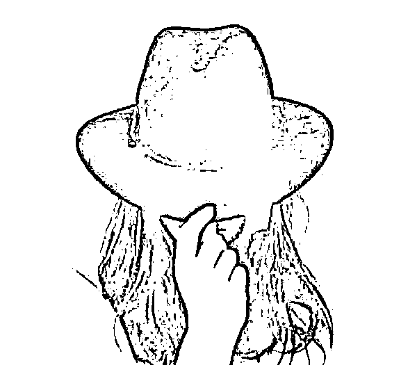

作为一个占星师，这件事本身不是礼物，从中理解我们不过是万千生灵中的一员，才是礼物。

在若道君还不是若道君的时候

很天真地认为占星师应该是仙人

无爱无恨却又**心纳海川**

后来才知道

占星师的心

其实是**滚烫** **慈悲** 又**闪闪发光**的水晶


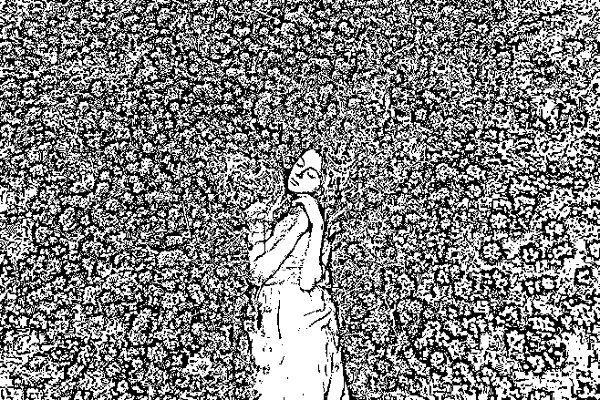

在还不是占星师之前

我以为自己眼中的世界就是世界本有的样子

之后，我知道了

**100 个人眼中的世界有着 100 种样子**

在还不是占星师之前

我以为心中的想法即使不说出来 

爱我的他也应该会知道，所以常常感到失望 

之后，我知道了  

**这个想法只是源于自我为中心的对于爱情的一种美好期待与假设而**已

在还不是占星师之前

我以为我们的命运是既定和宿命式的

之后，我知道了

**命运有部分是既定的，但还有部分是在建立在自我觉知之上**

**它可以有选择性地自行塑造，我们拥有自由意志**

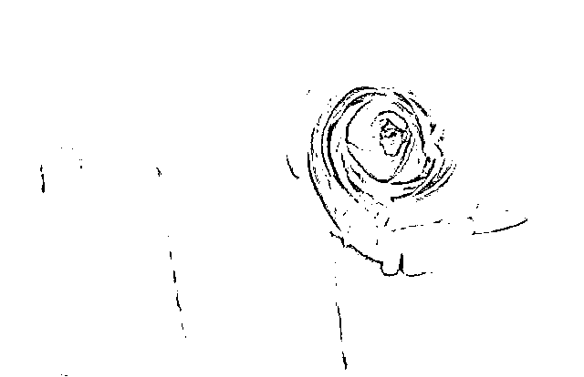

在还不是占星师之前

我以为我的妈妈不爱我 

之后，我知道了  

**她只是没有以我所希望的和期待的方式来爱**我

在还不是占星师之前

我认为天秤座就是个犹豫不决的和事佬

之后，我知道了

**天秤座只是比较懂礼貌的白羊座而已**

在还不是占星师之前

我认为人类是地球上唯一的高等物种

是主宰

之后，我知道了

**众生皆平等**

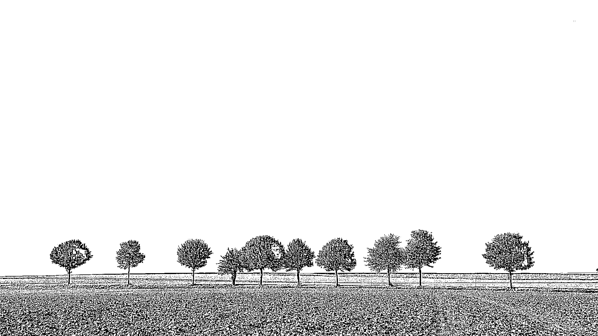

在还不是占星师之前

我以为我们的个性只是分为十二星座、十二生肖、四种血型而已

之后，我知道了

**我们每人都拥有一张属于自己的出生星图**

**包含着十大行星、十二星座、十二个宫位、还有交织在一起错综复杂的相位线**

**它们汇成了我们每个个体独一无二的生命蓝图**

在还不是占星师之前

我以为我很了解自己

之后，我知道了

**我所了解的自己与真实的自己相差还太远**

在还不是占星师之前

我认为所有来自他人的蔑视与看轻都源自人性的卑劣

之后，我知道了

**是你教会他人如何来对待自己的**

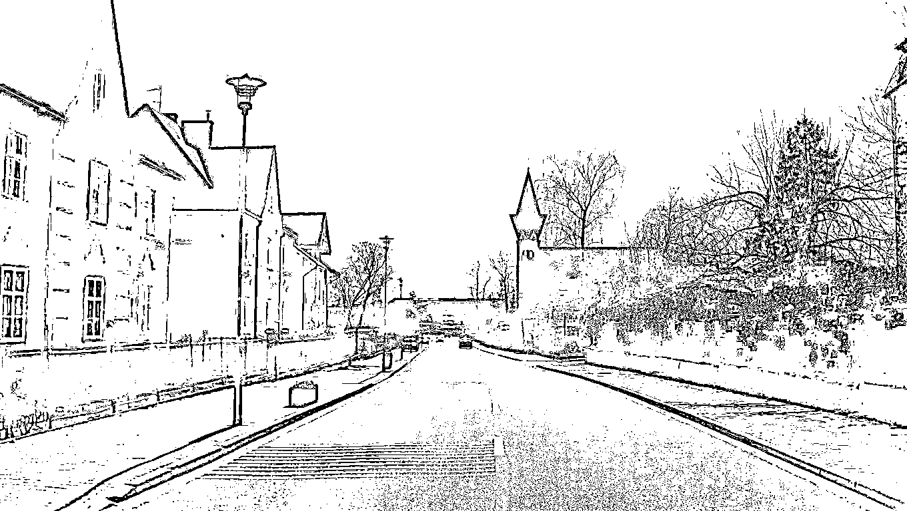

在还不是占星师之前

我以为解决问题的最佳方式是忽视它，绕开它，逃避它

之后，我知道了

**这只会让问题变得更加严重**

**而唯一的可行方式是正视它，直勾勾的盯着它**

**不闪躲，不逃避，直面它**

在还不是占星师之前

我认为有理走遍天下

之后，我知道了

**爱才能让我们走的更远**

在还不是占星师之前

我以为所有的东西都可以被逻辑定义，都可以用语言表达

之后，我知道了

**在有的时候，逻辑只是小我的把戏**

**而在有些瞬间，语言竟是如此的苍白**

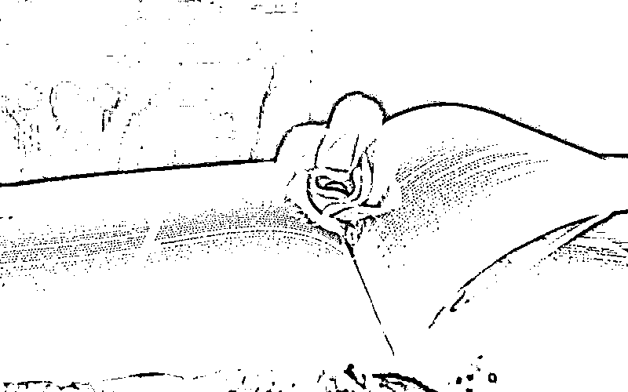

在还不是占星师之前

我以为占星师就是个西洋的算命师

之后，我知道了

**占星师是手中持有生命蓝图，心中怀着接纳之心，传递宇宙之爱的能量管道**

在还不是占星师之前，我知道人性是复杂的

之后，我发现

**人性远比我想象的还要复杂的多得多**

在还不是占星师之前

我认为当下所受的困苦与束缚都是源自命运或他人的强加

之后，我知道了

**其实，更多的源自自我的信念**

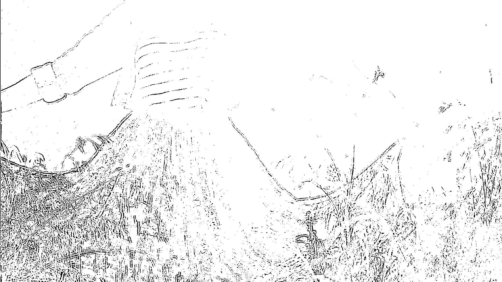

在还不是占星师之前

我以为有所谓的巧合与不期而遇

之后，我知道了

**所有发生的事与遇见的人，一切的一切都是有其机缘和意义**

在还不是占星师之前

我知道我还有些潜能待开发

之后，我知道了

**我的潜能超乎我想象**

在还不是占星师之前

我以为每次发生在自己身上的冲突事件都应归于运气不好、遇人不淑等外界原因

之后，我知道了

**其实那是源于我们内在未被抚平的伤痛和未解决的议题，一直未能被我们所正视**

**它们演变成外在的事件，直接地展露在眼前，逼迫我们发展出更高的觉知**

**从而转化才会发生**

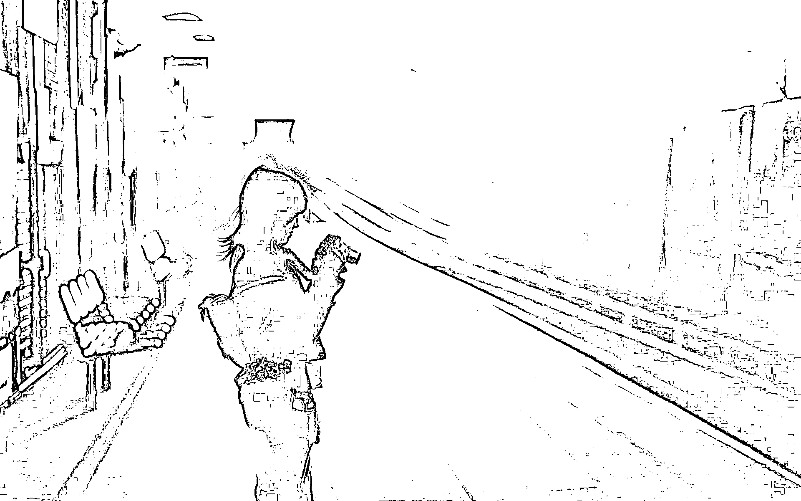

在还不是占星师之前

我只能看到他身上的光环，成功与荣耀

之后，我知道了

**在成功与荣耀的背后，也有着属于他的无奈和辛酸**

在还不是占星师之前

我不太喜欢巨蟹座，因为星座网上说天秤座和巨蟹座极其不配

事实好像也是如此

之后，我知道了

**原来我不喜欢的是一部分的自己，而不被自己所接纳的那部分在向外寻找投射对象而已**（我上升点在巨蟹座，群星落四宫，巨蟹座的原始宫位）

在还不是占星师之前

我以为肉眼能看到的才是生命的实象

之后，我知道了

**那只是宇宙的沧海中一滴水而已**

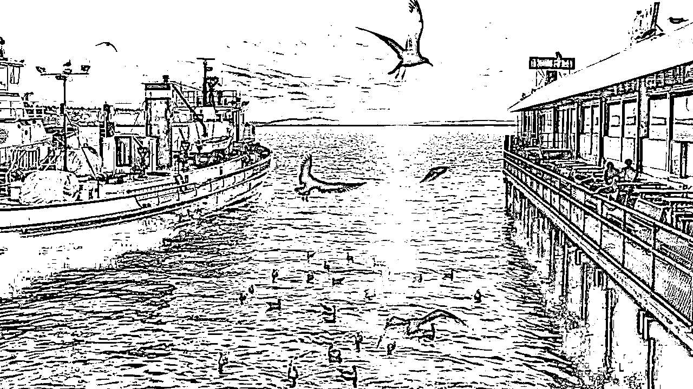

在还不是占星师之前

我以为我可以改变他人

之后，我知道了

**我能改变的只有自己**

**而奇迹般的发现，当我改变了，他人也改变了**

在还不是占星师之前

我认为事物是分好与坏，对与错，黑与白，善与恶

之后，我知道了

**在两极之外是无极**

在还不是占星师之前

我以为当此生走到尽头的那天，所有的一切都将灰飞烟灭

之后，我知道了

**一切都还将未完待续**

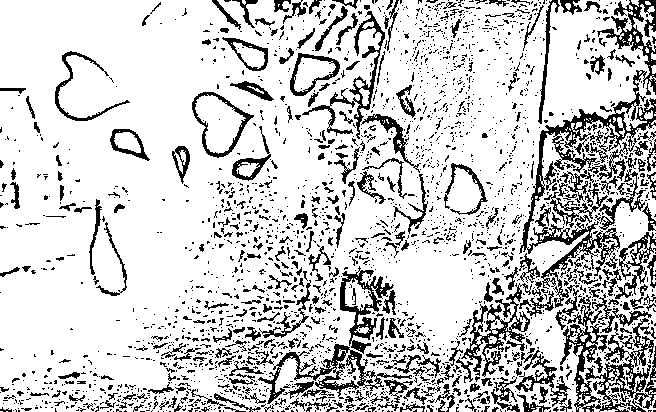

在还不是占星师之前，我以为所有答案都得向外探寻

之后，我知道了

**答案其实就在我们的心中**

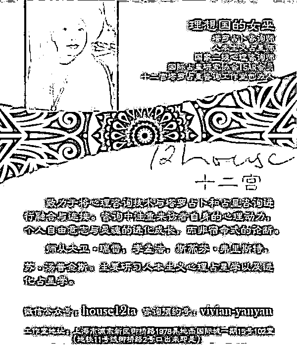

长按二维码，让金钱涌向传播知识与智慧的人~

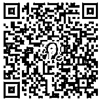 

**◆ ◆ ◆  ◆ ◆**

**特别提醒：****本文由作者授权首发于若道平台，**转载请注明“转自若道”。****

想要成为占星师吗？**2016 年 5 月 19 日**，**蒋颖**老师主讲的若道占星核心课程**Level 1-2**要开课了！她将带领你学习星座、太阳、月亮、行星、月亮交点等知识，让你进入占星学的世界！详细内容请点击“**阅读原文**”了解。

↓


# 土星落七宫，女人注定离婚？

> 原文：[`mp.weixin.qq.com/s?__biz=MzA5NjA0NTAxNg==&mid=402988680&idx=1&sn=9cdc79f3ba46a3108c810c0ffb514699&chksm=0d47ac3f3a302529f200570b5180975850db09d1961810b0a8ef6ff18ba92b5b6ef10cd9e24c&scene=126&sessionid=1692738867#rd`](http://mp.weixin.qq.com/s?__biz=MzA5NjA0NTAxNg==&mid=402988680&idx=1&sn=9cdc79f3ba46a3108c810c0ffb514699&chksm=0d47ac3f3a302529f200570b5180975850db09d1961810b0a8ef6ff18ba92b5b6ef10cd9e24c&scene=126&sessionid=1692738867#rd)

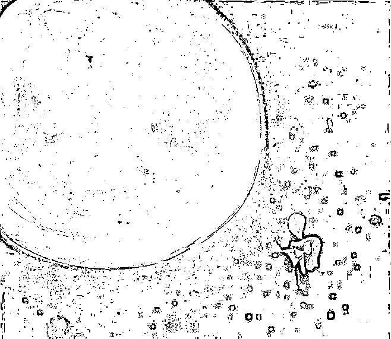

当我们对于自己的人生有困惑和担忧的时候，我们会去寻找所谓的“先知”例如占星师，期望通过他们给自己的未来指引方向。然而是否想过，当占星师说：“你的婚姻注定失败”的时候，你该如何自处？为什么占星师会这样说？我的婚姻真的毫无指望吗？断命带来的恶劣后果是命“越算越薄”。然而占星学真的等同于“算命”吗?

**1****对占星学的疑问：命中就一定是注定的么？**

每当仰望星空时，我的内心常会有一种更高远、更深邃的感受。或许我的灵魂所属于的国度是离开这个地球很遥远的地方吧，这是直到现在都深信不疑的事，也是一直热爱占星学的原因。

在若道学习之前接触到的占星知识都是十分零散的，不是各大网站的娱乐占星，就是一些占星师写的运势分析。即使在之后逐渐阅读的占星书籍里，也依旧搞不明白星图具体是怎么回事。

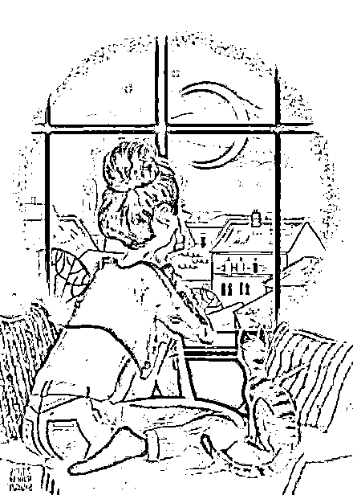

我是个**群星落在七宫的人**，对于此，坊间的传言，不外乎**土星落在七宫会晚婚，七宫里有土星、天王星、海王星会婚姻不顺，金星落在七宫会带来美满的婚姻**等等。对于这些说法，我一方面十分怀疑那些论断的话语，一方面直觉地相信星图一定有它更深的含义。

可是，即使在很早以前就知道了星图，我依旧没有办法接触到真正的占星学，也不知道那些行星星座的符号，蕴藏着怎样的深意。我只是时而在“好的”行星，“好的”相位，“好的”星座中对生活充满希望；时而又在“坏的”行星，“坏的”相位，“坏的”星座中恐惧不已。好像人生被禁锢，命运就是定死的没有出口一般。

**2****真正的占星学是智慧的流动**

直到开始在若道学习占星学，我才明白，**真正的占星学带给我们的是更多的人生智慧，行星的意义也绝对不是用好与坏来界定。**

就像尤迦南达在他的自传中说到的——


占星学是研究人类对行星的感应。星座只是放射出正或负的辐射能，他们本身并不帮助或伤害人类，只提供了一个平衡每个人过去所造的因果的途径。只有具备直觉智能的人才能正确地解释星图。


如同**土星并不只是带来压抑和挫折，同时它也带来了成就和责任**；**冥王星带来的也不光是背叛与怀疑，它同样给予我们转化与深刻。**同样的，**在金星魅力的背后充斥着欲望，在木星幸运的背后游走着自大。**我们不能够简单地去断定星图的好坏，因为在星图照耀下的我们是活生生的人，占星学也是一门充满智慧的学问，通过行星之间的互动让我们看到我们自己是谁。

**3****为什么会有“断命”的说法？**

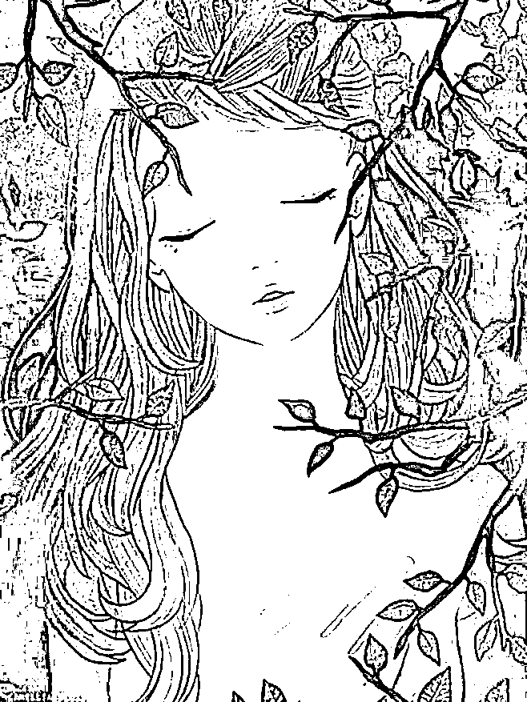

**当一个人的土星落在第七宫时，真的就是会晚婚或者婚姻不顺吗？**

1**这样的论断是无意义的**

*   姑且不论有多少人拥有这个配置，也不否认拥有这些配置的人当中是有一部分晚婚或者婚姻不顺。

*   **这样的论断本身是没有任何意义的。**

*   因为论断之后呢？生活总是要继续，不会因为一句话就定了乾坤，生命有其前因后果，没有任何一件事是没有原因的发生。而**占星学中行运的触发点恰恰是心理层面的动因在一系列有关联的事件上面的显化。**

*   **当心理层面发生了改变，事件常常会朝着无法预测的方向去发展。**这就是为什么过去通常“算得准”，而未来却往往“算不准”的原因。

2**行星背后的深层解释**

占星学告诉我们这背后还有更深层的因素，它所引发的现象也有更多可能性。

*   土星落在七宫的人，说明**你吸引的伴侣身上带有土星的特质，比如是有责任心的，当然也会有点无趣，特别擅长规划，很有纪律性等等。**

*   这样一个配置也会说明**你自己本身对于关系的态度是谨慎的，对于关系也不太懂得变通。**

3**发生这些事件的原因**

更深入来看，也许这个人确实存在以上的特征，但**发生这一切事件的原因是什么呢？**

*   形容一个人固执或者有责任都只是表面的，还要配合其他的配置。

*   在这些**责任的背后只是一种害怕变化，恐惧意外的不安而已。**

*   土星落在七宫，就是**不希望因为关系上的变化而打破自己本来生活的步调，这也是一种无法去处理危机的表现。**

4**转化的过程**

**生命是一个觉知和转化的过程。**

*   很有可能**他的生活会发生一些突如其来的事来冲击他的执着。**

*   通过一系列相关联的时间，他**重新明白了如何去处理危机，并且在这个过程中负起责任。**

*   **当自身完成了心理层面的转化，一个人的命运也就会朝着“无法预测”的良好方向去发展了。反之亦然，即使有看似不错的行星配置，如若不能完成生命中转化的议题，依旧会发生一手好牌打得稀罕的遗憾。**

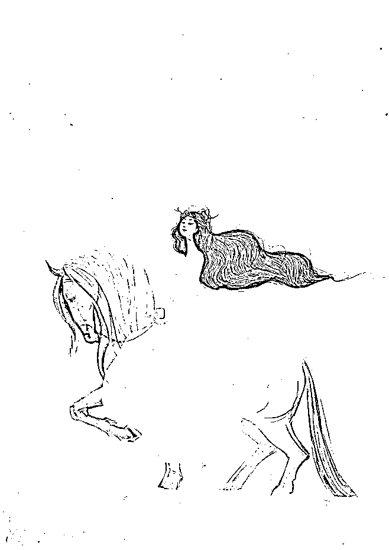 

**土星落在七宫会婚姻不顺，可能的几点原因——**

*   **结婚后不愿意去改变，一直墨守陈规，不懂得如何维护关系。**只是希望随波逐流的过日子，放任自己的身材一天天变臃肿，放任自己的头脑每天只想一些陈旧的话题。

*   长久下来**关系失去了互动性，少了养分。**

*   这并不是责任的体现，**真正的责任往往是从对自己的言行举止负责开始的，真正地懂得运用土星的力量去规划，并且脚踏实地的生活才是这个责任最终的意义。**

**如果我们不知道这些深层的因素，可能就真的像那些论断一样，土星成为了一颗“凶星”。**但这些破坏性的特征也很有可能不会发生，因为每个人的人生都有无限种可能。不到生命的最后一刻，可能我们都不会知道真实的意义是什么。

**与其被断命的言论禁锢和限制而惶惶不可终日，如何将“凶星”发展成建设性的远景，才是我们需要真正去关注的。**

**4****站在星图之上，活出强大自我**

就是这样逐渐在学习占星的过程中了解到自己的许多不足，以及对于生活的很多误解。让现在我的明白我生命中有太多不敢面对的东西其实是隐藏在我内心深层的恐惧，**我所惧怕的并不是某个事件带来的可能，而是不想去面对更加真实的世界以及自己。**

**我们所遇见的一切并非只是巧合，其中的深意若是没有更高的智慧是无法得知的**。占星学提供给我们这样一个了解自己的“捷径”，也同样让我们明白了**不要将自己放在星图之下，而应该站在星图之上，让星图成为你生命中的蓝图，去相信自己内在拥有着的强大力量，在这个不断深入探索的过程，不再受外在的物质和现象控制，明了“我命由我不由天”。**

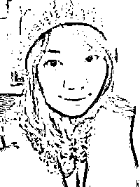
**作者介绍**

**Elias:**若道核心课程 Level 4 在读。太阳水瓶座，月亮天蝎座，一直喜欢占星，直到进入若道才明白真正的占星学，特别喜欢挖掘真相，喜爱身心灵和各种传承，爱好佛法和中医。 

长按二维码，让金钱涌向传播知识与智慧的人~

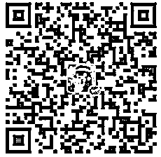 

►**占星学带给我哪些成长？**也**许你还对这些文章感兴趣**

[我就是我，颜色不一样的烟火](http://mp.weixin.qq.com/s?__biz=MzA5NjA0NTAxNg==&mid=402546517&idx=2&sn=ad05d363c1fc673aecc5ce7b86c3fafd&scene=21#wechat_redirect)

[一败涂地的爱情之后，如何再度拥抱幸福？](http://mp.weixin.qq.com/s?__biz=MzA5NjA0NTAxNg==&mid=402519167&idx=1&sn=19a2fa8d2af185d4a24468ea48e4f1b7&scene=21#wechat_redirect)

[仰望星空，触摸超越神性的光芒](http://mp.weixin.qq.com/s?__biz=MzA5NjA0NTAxNg==&mid=402168053&idx=1&sn=074b932d0c0d6a19f6580c7218dccd84&scene=21#wechat_redirect)

[愿桥都坚固，隧道都光明](http://mp.weixin.qq.com/s?__biz=MzA5NjA0NTAxNg==&mid=402168053&idx=2&sn=84d229561550f7e5580fbe57a4a4e351&scene=21#wechat_redirect)

[苛责过自己，方知随波逐流才得完美](http://mp.weixin.qq.com/s?__biz=MzA5NjA0NTAxNg==&mid=401908407&idx=2&sn=0472632631e46c331fc1f8c2612fae6c&scene=21#wechat_redirect)

[相亲失败，却收获最心动的礼物](http://mp.weixin.qq.com/s?__biz=MzA5NjA0NTAxNg==&mid=401827948&idx=1&sn=ecce3c656815682fd0c8a1eda1da9f93&scene=21#wechat_redirect)

**◆ ◆ ◆  ◆ ◆**

******特别提醒：****本文由作者授权首发于若道，转载请注明“转自若道”。******

如果你所了解的占星学都是“断命”，那么你一定要来听蒋颖老师的课！**2016 年 5 月 19 日**，蒋颖老师主讲的若道占星核心课程**Level 1-2**要开课了！这是若道历史上第一次有中文老师出山，她将带领你学习星座、太阳、月亮、行星、月亮交点等知识，让你进入占星学的世界！详细内容请点击“**阅读原文**”了解。

报名及咨询，请点击文末”阅读原文“


# 测测 | 12 星座的你是哪一个圣斗士？

> 原文：[`mp.weixin.qq.com/s?__biz=MzA5NjA0NTAxNg==&mid=402988680&idx=2&sn=2dd6e1a9f9ca5cc1b79deeb4c52936d1&chksm=0d47ac3f3a302529c44d493420043941278874c000f7651511b80eb589ca7ab3ce098bc489bc&scene=126&sessionid=1692738867#rd`](http://mp.weixin.qq.com/s?__biz=MzA5NjA0NTAxNg==&mid=402988680&idx=2&sn=2dd6e1a9f9ca5cc1b79deeb4c52936d1&chksm=0d47ac3f3a302529c44d493420043941278874c000f7651511b80eb589ca7ab3ce098bc489bc&scene=126&sessionid=1692738867#rd)

**圣斗士来了，燃烧吧，小宇宙！**

（注意流量，土豪随意）

📹 [`v.qq.com/iframe/preview.html?vid=r0185btdmvm&width=500&height=375&auto=0`](https://v.qq.com/iframe/preview.html?vid=r0185btdmvm&width=500&height=375&auto=0)

还记得星矢、紫龙、冰河、舜、一辉吗？想当年，一部动漫《圣斗士星矢》是多少 70 后、80 后心中的年少英雄梦。一帮乳臭未干的青铜圣斗士，为了自己的雅典娜，通往圣域，一关关攻克由黄金圣斗士守护的 12 宫。2 月 26 日，同名电影将于全国上映啦！在去大荧幕温习年少记忆之前，带着你的小宇宙和若道君一起重新唤起对黄道十二宫的记忆，再一次拯救雅典娜吧！

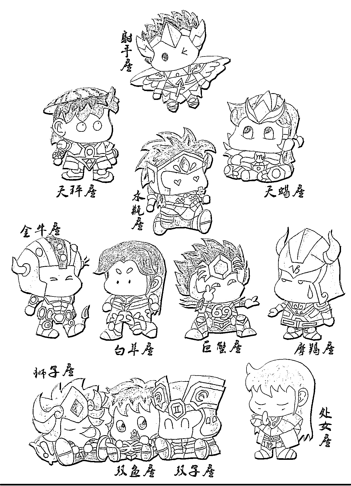
**我们不剧透，我们只是黄金圣斗士的搬运工~**

插画/艾米粥

若道君提示

保护雅典娜、打败十二宫黄金圣斗士需要我们有毅力、有勇气，更重要的是，我们有绝密档案呢~

若道君提示

铛铛铛~首先来袭的是白羊座穆先生~

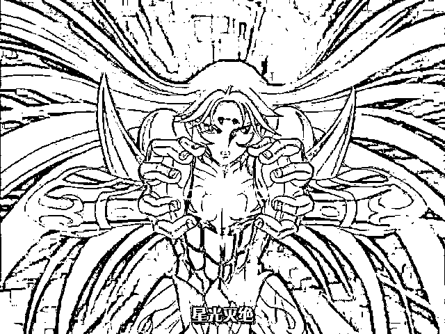

**白羊座——勇气圣斗士**

**黄金圣斗士：穆先生**

**宫位：**镇守黄道第一宫

绝密小档案

**星座特质：**率真、热情、极具线条感的五官轮廓。身形矫健，肌力卓越，勇猛无畏，果敢强劲，行动力快速如劲风

**招牌绝技：**最强冲锋陷阵力，击破一切阻抗

**软肋：**弯路作战

**元素：**火

**诞生日：**春分

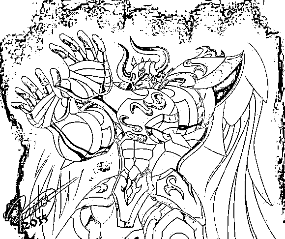

金牛座——稳健圣斗士

黄金圣斗士：阿鲁迪巴（被称赞为十二宫中最勇猛的人）

**宫位：**镇守黄道第二宫

绝密小档案

**星座特质：**粗壮脖子、优美的歌喉、身形敦实、沉默少语。大自然是他最好的老师，教会他如何安详自在沉浸其中

**招牌绝技：**稳步渐进，情绪稳定，不被环境影响的定力与持久力

****软肋**：**金钱、食物、美色

**元素：**土

**诞生日：**谷雨

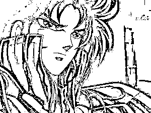

双子座——交流圣斗士

**黄金圣斗士：撒加**（电影中的最大反派会不会也是他呢？）

**宫位：**镇守黄道第三宫

绝密小档案

**星座特质：**话最多、点子最多圣斗士。口齿伶俐，快速聚焦也能快速转移注意力。对万事万物都有兴趣，能吸纳世间一切。

**招牌绝技：**呈几何状打开的话匣子，善长五花八门功法，活力和灵通全宇宙第一

****软肋**：**给他很多信息，就会自耗精力，神经系统崩溃

**元素：**风

**诞生日：**小满

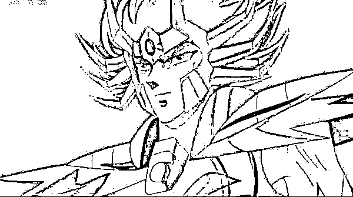

巨蟹座——温情圣斗士

**黄金圣斗士：迪斯马斯克**

**宫位：**镇守黄道第四宫

绝密小档案

**星座特质：**身段玲珑的娇羞美厨娘，“喂”你诗、“喂”你弹琴、“喂”你做不可能的“食”，喂你到失去理智。爱一个人就是喂养他，恨一个人就是喂死他

**招牌绝技：**温柔的直觉力，精通情绪的语言。擅长生育、防卫和泪水攻势，可以代表月亮的力量消灭敌人

****软肋**：**旧情攻势，37 度 2 的体温可以将他融化

**元素：**水

**诞生日：**夏至

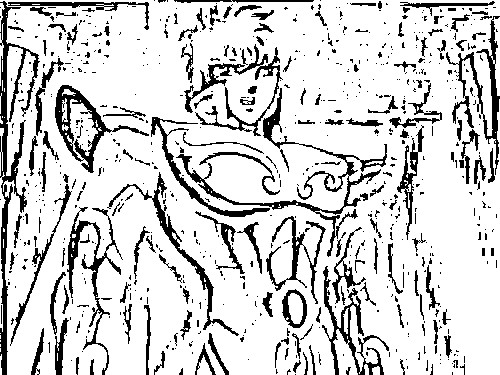

狮子座——魄力圣斗士

**黄金圣斗士：艾欧里亚**

**宫位：**镇守黄道第五宫

绝密小档案

**星座特质：**拥有浓密的头发，无处不彰显的真我风采。天真如孩子童的创造力，走到哪里都是个耀眼的角。全世界都是他的舞台

**招牌绝技：**狮吼功，豪迈无敌的王者勇气，十八般武艺

****软肋**：**爱他，赞美他，爱死他，赞美死他

**元素：**火

**诞生日：**大暑

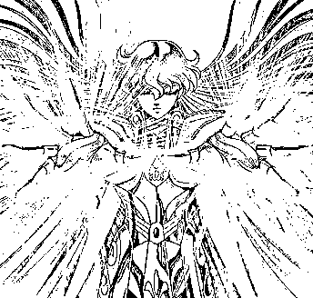

处女座——精细圣斗士

黄金圣斗士：沙加（女神雅典娜的最高级别守护者）

**宫位：**镇守黄道第六宫

绝密小档案

**星座特质：**纯洁的处女圣斗士有着一张精致的脸蛋，修长的手指——用来挑眼中钉、肉中刺。心里容不下一颗沙粒，不断完善的的完美主义战士

**招牌绝技：**绝世挑刺功，谦卑服务功，细密分析功

****软肋**：**完美癌，自我批评致死

**元素：**土

**诞生日：**处暑

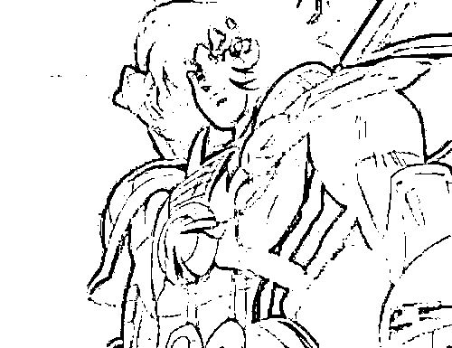

天枰座——和平圣斗士

黄金圣斗士：童虎（紫龙的老师）

**宫位：**镇守黄道第七宫

绝密小档案

**星座特质：**时尚的弄潮儿，作为一个优雅的恋人为了博得爱人欢心，从头到脚都精致臻美。所有的时尚潮流他都不会错过，“饭型”标杆。以和为贵是他的圣战信条

**招牌绝技：**谦和功，公平法则，宇宙无敌聆听功

****软肋**：**让他二选一

**元素：**风

**诞生日：**秋分

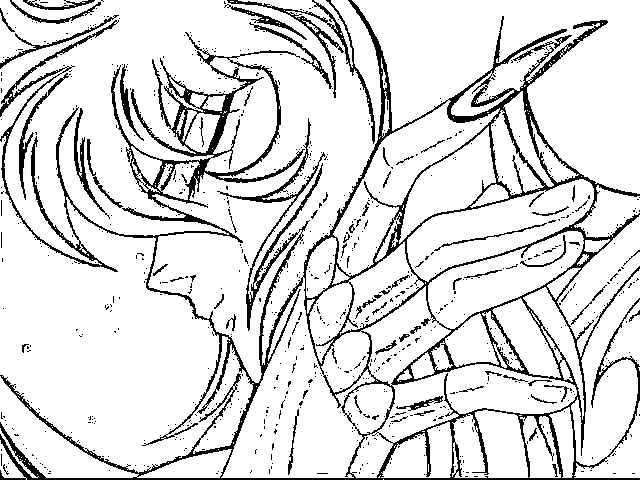

天蝎座——激情圣斗士

黄金圣斗士：米罗

**宫位：**镇守黄道第八宫

绝密小档案

**星座特质：**长着一张怀疑主义的脸，对危机和死亡的敏感度极高。冷酷的外表下藏着一颗似火的心，有如利剑般的意识，常常给人致命一击，强迫性的斗志

**招牌绝技：**致之绝地而后生的康复力与疗愈力，深藏不露的间谍功力

****软肋**：**点燃他的小宇宙

**元素：**水

**诞生日：**霜降

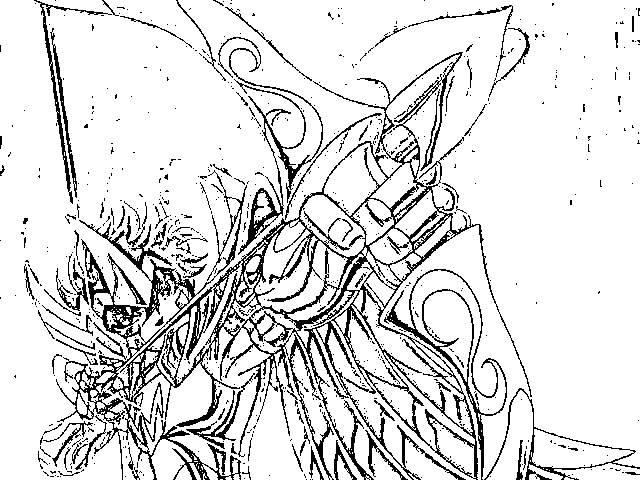

射手座——信念圣斗士

**黄金圣斗士：艾欧罗斯**

**宫位：**镇守黄道第九宫

绝密小档案

**星座特质：**一张吉普赛人的脸，波西米亚风的打扮，游牧民族的作风——喜好风餐露宿。用火热一颗心追过狂风大地，遨遊天地，追寻世间真理。拥有傲视群圣的高等智慧

**招牌绝技：**冒险探险越险越来劲，无比强大的信念

****软肋**：**把他困家里

**元素：**火

**诞生日：**小雪

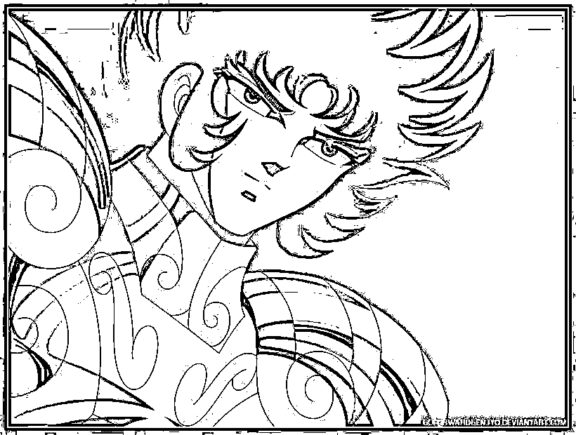

摩羯座——世尊圣斗士

**黄金圣斗士：修罗**

**宫位：**镇守黄道第十宫

绝密小档案

**星座特质：**稳重老成，实事求是，瘦削凝重却威力无比。无论强攻软磨也无法被撼动的毅力，绝不流露喜怒哀乐等寻常情感。以正义凛然的英姿矗立天地之间

**招牌绝技：**超强的毅力，加上无惧艰险的成就之心

****软肋**：**直接给他跪了

**元素：**土

**诞生日：**冬至

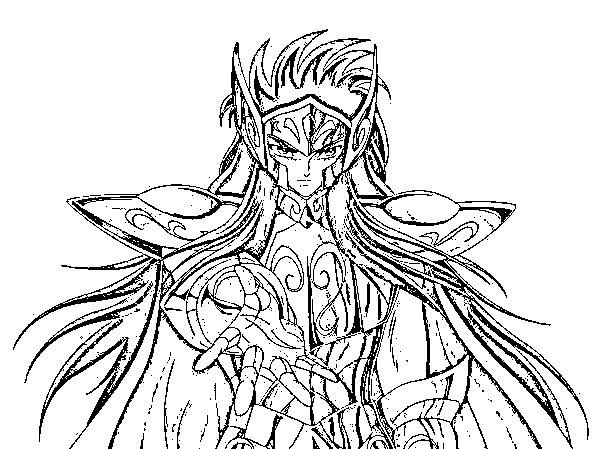

水瓶座——天才圣斗士

**黄金圣斗士：卡妙**

**宫位：**镇守黄道第十一宫

绝密小档案

**星座特质：**独立特行，不走寻常路，冰雪一般冷峻的容颜下却拥有一颗骚逼的心。对各种高科技武器谙熟于心，喜欢和同样的天才结盟而行，引领时代

**招牌绝技：**冷幽默功力宇宙第一，天才智商无人能敌

****软肋**：**和他结盟 

**元素：**风

**诞生日：**大寒

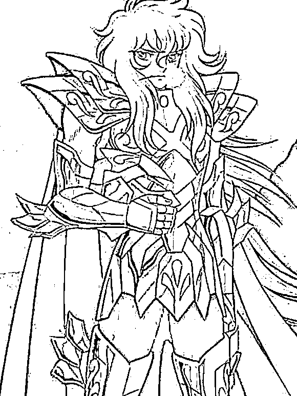

双鱼座——灵感圣斗士

**黄金圣斗士：阿布罗狄（**号称“与天地争辉的美之战士”）

**宫位：**镇守黄道第十二宫

绝密小档案

**星座特质：**长着一张似幻似真的脸，因为天生的灵感带来非人类的创造力。慈悲又博爱，不战而胜。 

**招牌绝技：**超强灵感，冥想和做梦功力非凡

****软肋**：**给他一杯酒

**元素：**水

**诞生日：**雨水

**穿越了黄道十二宫，你看，雅典娜女神在等你~**

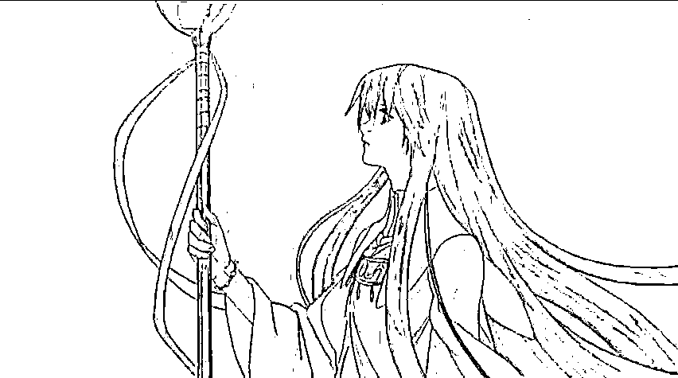

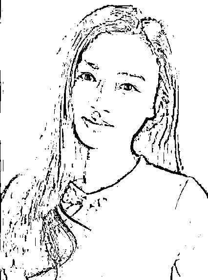

**作者简介**

**郑玮玲（Sampriya）：**若道 COAC 高阶资质认证，国际占星研究协会 ISAR 会员，跟随大卫·瑞雷、斯蒂芬·弗里斯特、罗伯特·汉德、哈德利·菲茨杰拉德、苏·汤普金斯、诺·泰尔、罗宾·阿姆斯特朗等当代著名占星师在职业占星师的进化道路上。馨光爱妈妈会创始人，国内首批 ICEA 国际生育教育协会产后指导，国际母乳会培训的哺乳互助指导。

**个人公众号及咨询预约**：Sampriya-Astrology 

长按二维码，让金钱涌向传播知识与智慧的人~

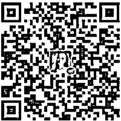

**◆ ◆ ◆  ◆ ◆**

******特别提醒************：本文由作者授权首发在若道平台******，**转载请注明“转自若道”。******

想了解更多有用有趣的 12 星座知识吗？**2016 年 5 月 19 日**，**蒋颖**老师主讲的若道占星核心课程**Level 1-2**要开课了！她将带领你学习星座、太阳、月亮、行星、月亮交点等知识，让你进入占星学的世界！详细内容请点击“**阅读原文**”了解。

报名及咨询，请点击文末”阅读原文“


# 双鱼座 | 什么都失去了，才看到那道光

> 原文：[`mp.weixin.qq.com/s?__biz=MzA5NjA0NTAxNg==&mid=402979083&idx=1&sn=44e12039e1e296b5e4125a5f27dcc01e&chksm=0d464bbc3a31c2aa3da648bf2efad91e2b9a29a0c8828f59d1eccd152569374090eb3cc16ab8&scene=126&sessionid=1692738872#rd`](http://mp.weixin.qq.com/s?__biz=MzA5NjA0NTAxNg==&mid=402979083&idx=1&sn=44e12039e1e296b5e4125a5f27dcc01e&chksm=0d464bbc3a31c2aa3da648bf2efad91e2b9a29a0c8828f59d1eccd152569374090eb3cc16ab8&scene=126&sessionid=1692738872#rd)

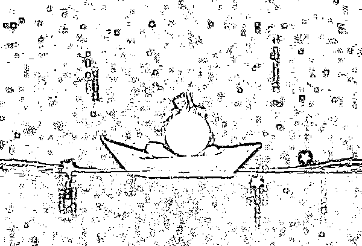

作者/大卫·瑞雷

译者/李含 校对/江艺

图片/花瓣网 

在[上一篇文章](http://mp.weixin.qq.com/s?__biz=MzA5NjA0NTAxNg==&mid=402970780&idx=1&sn=cf13c0daadc98fa97b0c2eb42997fff6&scene=21#wechat_redirect)里，双鱼座的复杂，梦幻，和出口令人惊叹。其后，要如何去面对疲倦的灵魂和这一场人生的幻灭之旅，疗愈源自何处？仔细阅读本文，也许你会折服到落泪。

**关于双鱼座的众说纷纭**

*   创造力会帮助你们感到更明智，减少被生活压垮的感觉。

*   因为你们的思维常常漫游在宇宙的外部和内部边缘，就像一条鱼试图在渔网周围或之外找到一条路。

*   你们双鱼座人常常有逃避和回避的坏名声。极端的消极情况是，这可能表现为易受到上瘾的诱惑，毒品、酒精和食物 —— 一切物质。逃避到电影、音乐之中，就像前面提到的那条鱼一样逃避世界。

这样的逃避是一种敏感反应。**没有任何一个水象星座像双鱼座这样敏感，对万事万物敏感**。你们的敏感可能是**生理上的**，比如一种过敏性的反应，或是**对其他人敏感 **——尤其是在同情的意义上。这种与**他人分享感受的能力**同样可能表现为对人的一种直觉，甚至是**通灵**的能力 —— 就像美国著名的**通灵师埃德加·凯西**。虽然他关于失落大陆亚特兰蒂斯的通灵预言更广为人知，但凯西最主要的还是进行**“健康解读”**。

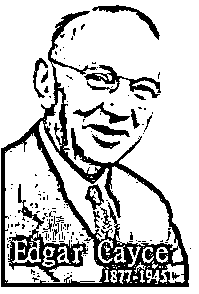

埃德加·凯西

（Edgar Cayce 1877 – 1945）

**凯西的一生就是一项双鱼座研究**。他喜欢像摄影师那样生活，担心自己的通灵能力可能给他人带来伤害或误导。但是那些来找他为他们的病痛寻找解决方案的人唤醒了他的同情心。许多年来，他都拒绝任何金钱上的回报，直到前来寻求帮助的来访者太多导致他无法工作。有超过 8000 份他的健康解读被记录了下了，现在有部分资料由 ARE（探索与领悟学会——Association for Research and Enlightenment）收藏。

**你的灵魂疲倦么？**

**有许多双鱼座人会感到灵魂疲倦**。那是一段长途的旅行。你可能会想“真是一段奇怪的长途旅行啊。”你在长途跋涉之后，终于找到了去往遥远神庙的路。你的鞋都磨破了，精疲力竭的四下张望，苍蝇在你面前飞来飞去。庙宇的地板布满灰尘、肮脏不堪，你会想，“就是这样么？这就是我不远万里寻觅而来的目的地么？”

凝望着太阳西沉没入村庄，**内心中一种深深的悲切之情与巨大的慈悲心交织在一起，因为你想到了每一个为生活而奔波的人，每一个你认识的人**。黑暗降临，灯火星星点点。你漫不经心地弹着吉他，唱着下面的歌词：


当我的吉他轻轻地哭泣

我看到了你深眠的爱情

我注视着狼藉的地面

我的吉他仍在轻轻地流泪

难道没有人告诉你 如何开启你尘封的爱情

是谁让你着了魔 和你在一起却又把你抛弃

当我的吉他轻轻地哭泣

我注意到世界正在经历着巨变

我们不能再伤害对方

我的吉他仍在轻轻地流泪

《当我的吉他轻轻地哭泣》

乔治·哈里森/双鱼座披头士


 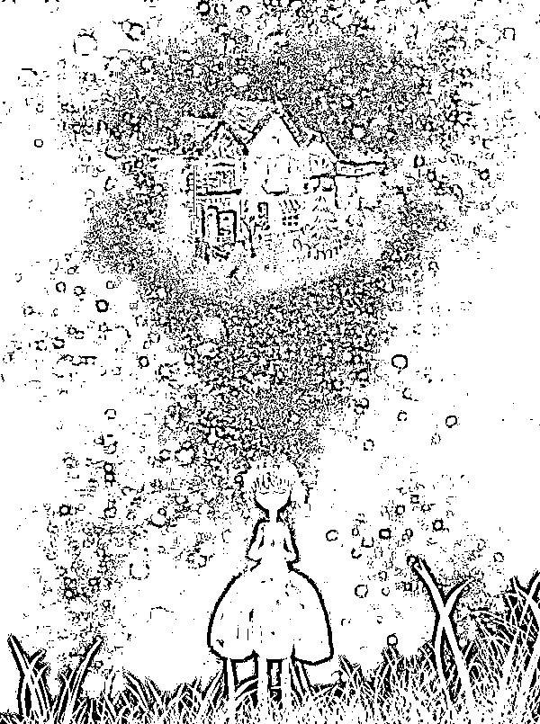

我八岁的双鱼座孙女儿丽兹从来没有听过乔治·哈里森，她也从不知道“当我的吉他轻轻地哭泣”这首歌，但是有一天当她在一条死胡同里玩的时候，我和她聊天，她看着我，说道，“有时候我感觉到了地球在旋转。”“真的么？”我好奇地点头答道。“是的，”她看着我的眼睛说，“我的确有感觉到。”

**没有人比你们双鱼座更令人惊讶了。你们让每个人惊叹于现实的真相。**

**伴随一生的幻灭之痛**

从负面来看，有一些双鱼座人制造了许多幻想，直到现实与虚构之间的差异拧成了麻花。**你为何撒谎？你在回避什么？痛苦，当然是—— 但是哪一种痛苦？让人难受的幻灭之痛**。幻灭比失望糟糕多了；它是启迪灵感的对立面。避免幻灭的痛苦也会关上灵感启迪的大门。你的风景黯然失色，酗酒和吸毒让你对痛苦越来越麻木。

伟大的创作歌手约翰尼·卡什（1932-2003）一生都沦陷在酒精和滥用药物之中，最终认识到了这一点。

我终于明白，天堂和地狱之间并没有围墙。那里有一条深深的鸿沟，一个裂谷，裂谷之中空无一人。”

约翰尼·卡什

**双鱼座客户的案例**

在 1985 年，一位年轻的双鱼座客户安妮第一次向我咨询。她最关心的是法院对她冒充顾客行窃的指控。这是她第二次被抓，她想要知道趋势上对这次的结果有何预示。

**同安妮的对话** 

*“有一半的时间我在想，也许进监狱更好，至少那时候我没什么可偷。”*

*“我不想偷窃。我真的不想，我只是不得不去偷。”*

*我知道这种病症是偷窃癖，但是这是我第一次遇见。*

*“你的律师怎么说？”我问她。*

*“他说我很可能被判缓刑，然后强制进行咨询。”*

她看起来感觉无聊，似乎她希望并没有约见我的咨询。

*“听着，安妮（并不是她的真名），我并不是上瘾症的咨询师，但你的星图有显示出一些出现上瘾的问题 ——偷窃癖是一种瘾症。 ”*

*“我知道。”她边看手表边说。*

*“你的双亲是否忽视了你？”我问她。*

*“是的，你可以这么说，”她回答。* 

她接着告诉我，她的母亲是一位卫理公会牧师的女儿，她与母亲是疏远的 ——她的母亲很狂热。她讲述了母亲是如何突然笃信宗教，开始引用圣经的语句。安妮说，即使在她的成长过程中，家庭财务状况优渥，母亲依然在旧衣店给她买衣服，即使她母亲的穿着紧跟时尚。 

*“你还在发育期，亲爱的，为什么要把钱浪费在衣服上呢，你每晚都在发育生长。”她母亲会说。*

她还谈到，她有天听到了母亲与另一位男性偷情。

*“妈妈不知道我提前放学了。所以我听到这个男人和妈妈一起回家的声音，我就藏起来了。”*

安妮非常崇拜她的父亲。

*“我的父亲工作时间很长，在很长一段时间里，他都非常成功，但是他对我很和蔼。他常常在出差时给我买礼物。”* 据所知，她父亲在安妮 17 岁时因为税务问题损失了财富。这让她非常痛苦，认为父亲是被她的母亲和国税局所害。那段时间里，25 岁的安妮与母亲很少接触，但是依然与父亲很亲密。她似乎很羞愧，因为父亲必然会知道她的偷窃，但是他有帮她支付律师费。

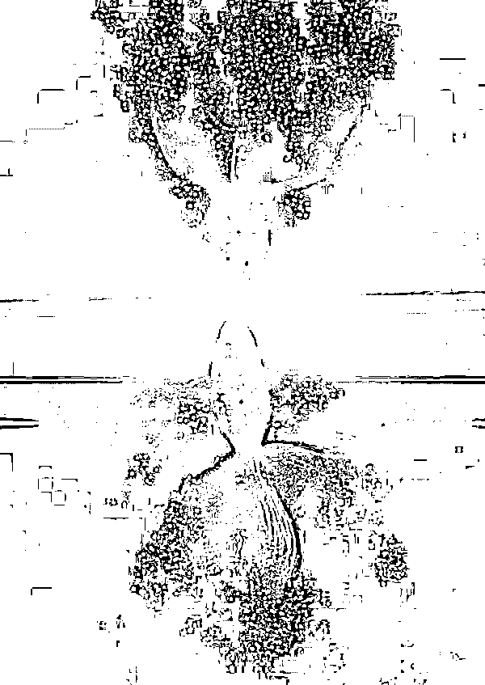

**安妮的星图解析** 

**在 1985 年，冥王星行进经过她的合相的月亮和海王星**。我告诉她，这是她人生中非常紧张的一段时期，但是也是一次天赐良机去面对她自己对过去未解开的感受和情绪。

 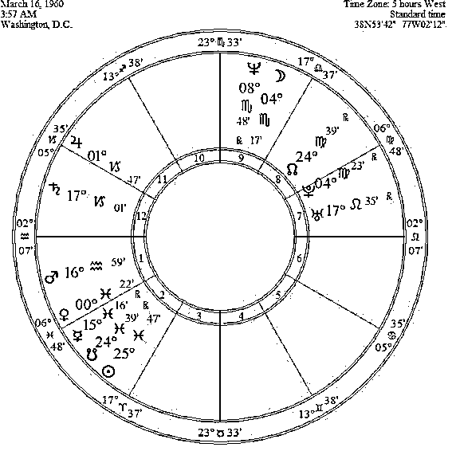
安妮的出生星图

从星图中可以观察到，安妮不仅是一位双鱼座，双鱼座还是她被强调的星座，她还有月亮合相双鱼座的守护星海王星。双鱼座和海王星都象征着她**童年被忽视**的问题，同时还预示着**理想化和幻灭**的趋势。 

在她第一次咨询的尾声，我告诉安妮去做一些**自我引导的冥想，告诉她记录一份梦境日记**。在 1980 年代，我开始广泛地运用这两种技巧帮助客户。**自我引导冥想可以带给人巨大的力量，因为它运用了一个人内在的创造性可视化的能力 —— 而不是由治疗师引导想象**。另外，一份**梦境日记是了解一个人潜意识的好方法，你情感的真相就蕴藏于此**。在第一次咨商中，并没有重大的发展，但是我可以感觉到安妮对体验这一过程很好奇。

她的案子结果一如她律师所预测的那样。但是，我在接下来的咨商中发现，安妮对她的瘾症咨询师并不太感兴趣。“我觉得和你交谈更有收获，”她说。到 1986 年安妮对自己的情感模式有了更清楚的认知。但是她依然几乎每天都要与偷窃癖的诱惑作斗争。

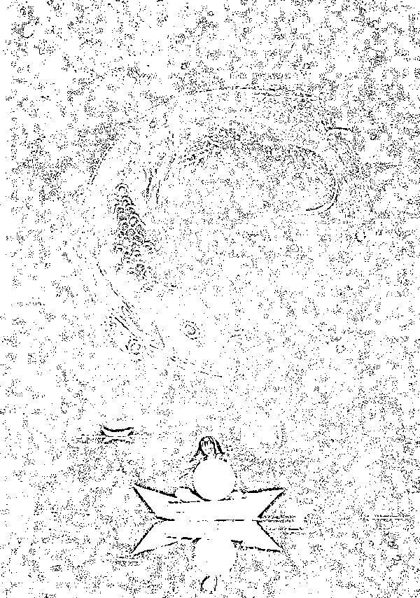

**安妮的疗愈之旅**

我后来推荐她参加杰基·斯莫尔的**全息呼吸工作坊** ——杰基·斯莫尔是**斯坦·格罗夫**的学生。我感觉她在自己的过程中被卡住了，获得清晰的思维可以帮助她做决定，摆脱她自己的情感挣扎。

 在她第一次参加工作坊时，她体验到排山倒海而来的悲伤和失落感。“我跌入了地狱，”她说。她又进行了好多次全息呼吸周末工作坊 —— 我都记不清有多少次。但是，她终于戒掉了自己的偷窃癖。 

她面对了内心中巨大的幻灭 —— 体验到了情感的层层剥茧 —— 直到幻灭变得彻底。“除了黑暗，别无他物。一切都失去了。”她说。“然后一束光出现了，我知道自己就要痊愈了 —— 比痊愈更棒。” 

安妮成为了我的长期客户，差不多每年都会约见一次。她的丈夫是她在全息工作坊遇见的一位男人，他们有两个孩子。她说自 1986 年起，她偷窃癖的冲动就很少出现了，但是**当她面对自己的情感时，发现她有时候会感觉自己是受害者，会对生活中的有些事情感到幻灭**。

如果**你是双鱼座，或是有月亮和上升落于此星座，或是你的出生星图中海王星占据了重要的一席，你会知道面对自己的幻灭是多么多么困难的一件事 **—— 不论它在何时出现。但是你也知道**灵感启迪带来的狂喜**。你们拥有的是接近一段长途旅行末端，一段周期尾声时出现的人生憧憬。前路有何风景？只有你自己可以看见，然后在这被称作的人生的旅途上给我们其他人留下线索。


想体验大师级的占星疗愈？

大卫老师**占星咨询**预约进行时

**生命议题、职业发展、关系咨询、少儿成长、年度规划和预测**

预约请发送邮件至** felicia.jiang@nodoor.com**


鱼鱼们，你们爱做梦吗？
体会过一场美梦终付黄梁的幻灭吗？

留言说出你的故事，你的那场爱情，

你为 TA 做过的那些事，

那些等待，失去，和泪水。

说出它们，是疗愈的开始。

**PS. 若道长期征稿，详情请见**

[创造 2016 | 召唤占星“科普”作者 ，分享你和占星学的故事](http://mp.weixin.qq.com/s?__biz=MzA5NjA0NTAxNg==&mid=401613091&idx=2&sn=8a49d99a2fc4118106674a83f6aa9bbd&scene=21#wechat_redirect)

## 了解鱼鱼：点击下方图片即可阅读


**双鱼座 | 符号里的两尾鱼为什么相背而游**

* * *


**还有谁比双鱼座更复杂？**

* * *

**◆ ◆ ◆  ◆ ◆**

******特别提醒************：若道享有本文版权******，**转载请注明“转自若道”。******

双鱼座是饱经世事的老灵魂？**2016 年 5 月 19 日**，蒋颖老师主讲的若道占星核心课程**Level 1-2**要开课了！她将带领你学习星座、太阳、月亮、行星、月亮交点等知识，让你进入占星学的世界！

报名及咨询，请点击文末”阅读原文“


# 好惨，某些星座运势只有 1/12 的准确率……

> 原文：[`mp.weixin.qq.com/s?__biz=MzA5NjA0NTAxNg==&mid=402979083&idx=2&sn=d40d238500563a75415a3f56e88d6445&chksm=0d464bbc3a31c2aa2a0cd000b8ca590dadb85e3dbc62b5ed4fa0265ea9fc774041bca9524c4a&scene=126&sessionid=1692738872#rd`](http://mp.weixin.qq.com/s?__biz=MzA5NjA0NTAxNg==&mid=402979083&idx=2&sn=d40d238500563a75415a3f56e88d6445&chksm=0d464bbc3a31c2aa2a0cd000b8ca590dadb85e3dbc62b5ed4fa0265ea9fc774041bca9524c4a&scene=126&sessionid=1692738872#rd)

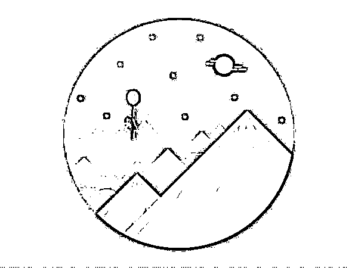

作者/大卫·瑞雷

翻译/若道翻译团队

图片/花瓣网

日运、周运、月运，甚至年运层出不穷。有些看起来是那么回事，有些又觉得太不靠谱。到底是什么原因？星座运势该不该信？让大卫·瑞雷老师来告诉你。

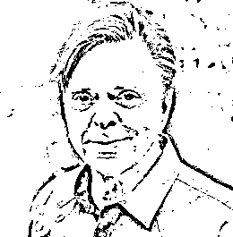

“流行的星座运势有用吗？”答案取决你的心理定位。如果你把报纸杂志的星座运势当成“娱乐占星”，那么答案是肯定的，它们确实很娱乐，在娱乐之余，也许还能给人启发，让人明白一些道理，虽然这些道理也大都是泛泛而谈。 

——大卫·瑞雷

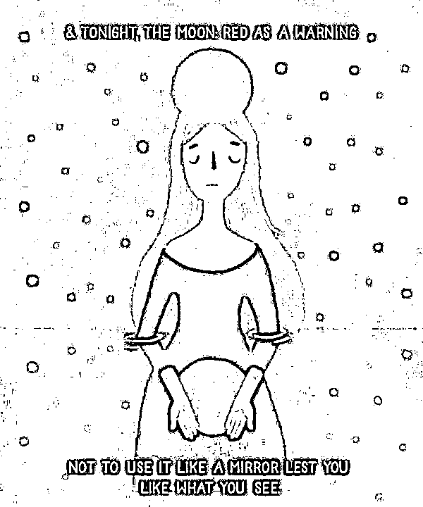

**星座运势对你适用么？**

我个人不反对娱乐，但我希望让大众了解星座运势的写法和理论假设适合哪些人，不适合哪些人，这样一来可以防止误导，二来避免一些人因为娱乐的“流行星座运势”而认为占星学是无稽之谈，让大众对严肃占星学获得更多的关注，最重要的是，我非常希望占星学真的给大家带来一些可以有所帮助的东西。

首先我希望大家了解，仅凭一个人的出生月、日所提供的信息，远不足以进行有效的占星学预测。

○在严肃占星学中，出生图是由你的具体出生时间（年、月、日、小时、分钟）以及出生地（城市）决定的，其中包含着大量细节性的信息；

○而太阳星座运势的编写依据只是你出生的月份，与前者相比它最重要的问题是，它所得出的结论所依据的理论假设有很大问题。

占星从业者懂得这个，但是既然市场有需要，自然就有供给，不仅在中国，世界其他地方也同样如此。根据我对中国的了解，由于专业的占星学教育还待普及，甚至大部分喜欢占星学、学习占星的学生都不大明白这样的运势是如何出炉的，那么对于一般大众来说，要判断哪些是可以相信的更不是一件容易的事了。

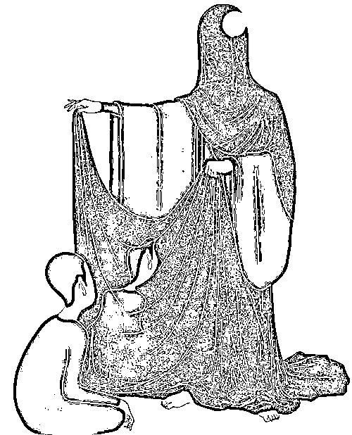

**星座运势是怎么写出来的？**

但星座运势为什么又在预测每个星座呢？为什么还有人觉得准呢？我们来看看例子吧。

## 大部分星座运势的基本写法

○运势的基本写法是，为了达到给 12 星座（普通的读者只知道自己的太阳星座，所以大部分的星座运势也是在说太阳星座）都做出大一统的预测的目的，写这些运势的占星师通常会把 12 星座排成 12 张星图，把每张星图分为 12 等分（也即 12 等宫），假设所有人都是在太阳升出地平线左右的晨曦时刻出生，这样强迫所有人的太阳落在星图的第一宫。

○然后，看看在预测时段，天上的行星落入这 12 个星图的哪个 12 等分（即哪个宫位）中，因为宫位和预测的领域相关。每个宫位代表的领域不同，比如经常说的财运看 2 宫、8 宫；而恋爱看 7 宫、8 宫、5 宫；工作事业看 6 宫、10 宫等。

○最后，占星师就根据这个写预测了。假设有一个人的生日是 2 月 12 日，我们知道他是水瓶座的。现在我们假设这个水瓶座的人在读 2010 年 10 月 21 日这一天的每日星座运势。而水瓶座周运势的基本写法是，观察这周那一天的月亮落在晨曦时刻出生的人的星图的哪一宫内。

比如在 10 月 21 日这天，月亮在白羊座，按照之前排好的星图顺序，白羊座被排在了第三宫，所以便认为现在月亮落在这个人的第三宫。而第三宫有短途旅行的含义，比如逛街、在街坊邻里间走动，而白羊座又与任性武断、坚持自我相关，所以 10 月 21 日这天的水瓶座运势可能这样造句：“你自信满满，迫不及待。在忙碌的一天结束之后，你计划着短途旅行一下，并可以考虑怎样抄近路才能节省你的时间。”

在成千上万的水瓶座人之中，总会有一些人出生在太阳初升的晨曦时刻，因此这种一般性的描述对这类人或多或少有些预测意义，他们也会觉得，哦，蛮准。然而，1 天有 24 个小时，平均而言，可是有 11/12 的人不会出生在晨曦时刻啊。当然，你可能要说，起码有 1/12 的概率，这个数字听起来好像还不坏？

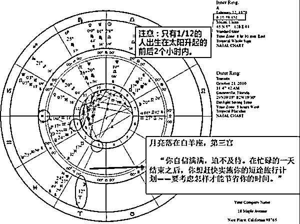

太阳星座运势写作依据示意图

不过，如果这个水瓶座人是生于 1979 年的 2 月 12 日呢？都不用知道他出生在几点几分，只是把出生年份加上就可以得到许多不一样的信息。假设这个人在早上喝咖啡的时候读到了这篇星座运势，随后他便坐上驾驶座放心地飞驰电掣了。

或许他还在为刚刚看的运势而沾沾自喜，又或许他早已忘记了刚刚看过什么，但这时突然“哐”的一声！一个急刹车！是的，显然他不是唯一一个想在车流中见缝插针的人。或许一会儿，当他从医院回到家里，他会将那篇运势从报纸上剪下来或者是把它发到网上以说明占星学是胡扯，或是用以自我调侃，以及纪念他在这一天撞坏了他的本田。

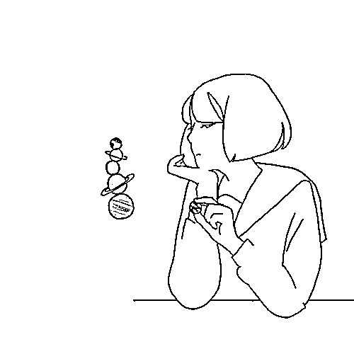

**严肃占星学又怎样预测？**

那么对严肃的占星而言，到底发生了什么？如果在 10 月 21 日前，这个生于 1979 年 2 月 12 日的水瓶座的人去向一位专业的占星师咨询，这个占星师绝对不会忽略在这段时间行进的火星四分了这个人出生星图的水星。这一相位容易导致错误的理解和判断，通常是因为缺乏耐心，所以骑车或开车上班的人要留神了。

我经常跟我的客户讨论这类相位以及类似的星图配置的影响，希望能够避免交通事故，通常这跟暂时性的手眼不协调有关。针对这类情况我的建议是尊重常识。我会告诉我的客户在这几天需要小心，要对自己的冲动及冒险行为有所察觉。许多客户向我反映当他们保持了基本的小心谨慎时，他们成功避开了交通事故。

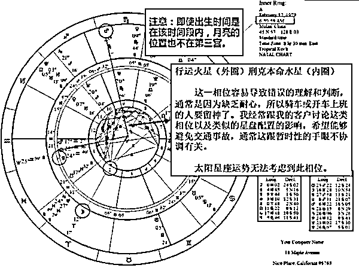

你瞧，只是加上出生年份，还不用说几点几分，就可以得到更多的信息。如果我们把时间加上，假设这个人出生在傍晚，按照严肃占星学的星图设置，他个人的太阳一定不是落在第一宫，而此刻的行进月亮就肯定无法落在他的第三宫了，所以，对这个人而言，星座运势的大部分的预测都是和他无关的，或是对他可能产生误导的。

单凭出生月日信息无法准确预测

刚才我举的是周运的写法，12 星座月运，年运预测也遵循同样的原理。也就是说，写运势的占星师简单地把星图分成 12 个等分（绝大部分专业占星师在预测时都不会等分星图），把所有的人当做都是晨曦时刻出生的人。比较可乐的是，有的运势预测还依据这个简陋的假设，言之凿凿指出几月几日之后，由于行星换宫位，某些领域会发生什么事情。大众们可不知道，只有太阳星座信息，完全无法推断宫位的！这纯属无稽之谈！

确实，这是一个简单化了的例子，并且我也不是说读星座运势会带来危险。而且，有些占星师也会在太阳运势中夹杂一些不依赖于你是哪个太阳星座，而只是根据现在天上行星的排列或移动而写些内容，或者，指出在某一阶段，对于出生日期在某日和某日之间的人有些什么影响（此时天上的某颗行星和这些人的太阳产生影响角度），而不是简单说对那个星座的所有人都有影响。所以，也有些东西可读。

然而，由于非要写太阳星座运势，这些有用的东西只能和无稽之谈的东西混在一起，泥沙俱下，普通读者根本无从判断。普通读者因为完全不了解运势写作的原理，不了解运势预测的弊端，大部分人又只知道自己的太阳星座，喜欢随便看看和自己的太阳星座相关的简便易懂的东西，不会深究到底有没道理，所以这也造成了谬误百出的太阳星座运势的流行。

通过上述的文章，我希望你已经了解，无论如何都不可能仅凭一个人的出生月、日做出全面准确的预测。

**你一定对下面这篇大师文章感兴趣：**

[占星预测有多准？ 什么时候预测不准？](http://mp.weixin.qq.com/s?__biz=MzA5NjA0NTAxNg==&mid=211794852&idx=1&sn=096c2970807baec5b2ac90da8b746923&scene=21#wechat_redirect)

读了这篇文章，你一定会想，完了，没有适合我的运势了。其实不然。下周，大卫会告诉你人人都适用的占星预测，敬请期待！


想体验大师级的占星疗愈？

大卫老师**占星咨询**预约进行时

**生命议题、职业发展、关系咨询、少儿成长、年度规划和预测**

预约请发送邮件至** felicia.jiang@nodoor.com**

**◆ ◆ ◆  ◆ ◆**

******特别提醒************：若道享有本文版权******，**转载请注明“转自若道”。******

星象运势不求人！**2016 年 3 月 15 日**，大卫老师主讲的若道占星核心课程**Level 5**要开课了！在这个阶段，你将学习各种预测技术及行星周期。通过这些预测工具，你能够预测和规划人生。提前报名付款有**早鸟价**哦！

报名及咨询，请点击文末”阅读原文“


# 若道 Level 5：进阶专业占星师的必修课

> 原文：[`mp.weixin.qq.com/s?__biz=MzA5NjA0NTAxNg==&mid=402979083&idx=3&sn=eb360662950279a58ef9ce873c219aa0&chksm=0d464bbc3a31c2aa0b3a25484223da2f66bd11fe00792ac25949bd10bc0b098533e55dfe2ddd&scene=126&sessionid=1692738872#rd`](http://mp.weixin.qq.com/s?__biz=MzA5NjA0NTAxNg==&mid=402979083&idx=3&sn=eb360662950279a58ef9ce873c219aa0&chksm=0d464bbc3a31c2aa0b3a25484223da2f66bd11fe00792ac25949bd10bc0b098533e55dfe2ddd&scene=126&sessionid=1692738872#rd)


在这个阶段

你将学习各种**预测技术**

行进、月亮次限、太阳弧、返照图

你会学到行星周期

天上哪朵云什么时候会飘到这个人的头顶呢

会如何影响这个人的人生呢

通过这些预测工具

**你就能用它来预测和规划人生了**

**课程讯息**

**授课时间：**2016 年 3 月 22-9 月 20 日

**授课老师：**大卫·瑞雷

**授课方式：**网络课

****费用**：15000 元**

**报名截止：**2016 年 3 月 11 日

**课程负责人：**siri**（微信号：2847613491）**

**咨询电话：**400-619-1014

**课服 QQ：4006191014 （若道星文化）**

课程简介

****课程安排太丰富**了！**

行进

行星周期

爱情中的机会和挑战时机

职业周期

月亮次限

太阳弧

太阳返照、月亮返照

综合预测

组合图

占星学历史

占星学中的天文学

ISAR 考试词汇表

咨询技巧培训

**●**在整个教学过程中，不仅用名人案例讲解，而且将会抽取同学星图，进行实战咨询示范。另外，会有 4 节课的咨询技巧培训帮助大家准备好进入实战。

授课时间

2016 年 3 月 22 日-9 月 20 日

每周二晚 20：00-22:00（北京时间）

共 27 次课

有关毕业

**考试和实习：**对于那些想要获得大卫老师资质班证书的朋友，我们将帮助大家在开始成为职业占星师之前，将由专业占星师组织小型督导工作坊，帮助大家实战解盘，为正式的收费咨询做好准备。通过毕业考试，参加督导工作坊，星盘解读的同学，将获得大卫老师颁发的职业占星师资质证书。

授课优势

**①先进的教学平台**

网络教学平台，支持手机、电脑、iPad 上网，可以随时随地学习。

**②回放复习**

学员可登录网站收看课程回放，在线复习课程，每次课可完整重看 3 次，课程结束后的 3 个月内有效。　

课程特色

**①与名师面对面**：北京同学可以来若道现场上课，和大卫老师面对面互动。大卫老师也可能前往主要学员所在城市，实现零距离教学。

**②互动答疑**：论坛、微信群随时提问；老师课上答疑；助教线上线下全程协助。

**③线下沙龙**：定期举办沙龙活动，复习上课内容。

**④强大的同学网络**：若道作为中国最顶尖的占星教学机构，在 4 年的占星教学中，培养了很多占星人才。若道让你和师兄师姐切磋，让你和国内著名占星师学习。（简单来说，就是，人脉！）网络授课，在北京开设免费现场参与名额，全程英文授课，配备实时翻译。

师资力量


**大卫·瑞雷（David Railey）**

若道创始人，《灵魂的目标》作者。拥有四十年的占星咨询的执业经验，曾两任亚特兰大占星协会主席，是全美占星师联盟（AFAN）、美国占星师联合会（AFA）、全美占星研究委员会（NCGR）、国际占星研究协会（ISAR）和职业占星师组织（OPA）的成员，是联合占星大会（UAC, United Astrology Conference）督导委员会委员。大卫曾是 CNN、CBS 的占星节目的常驻嘉宾，多次在 BBC、WGS、WSB、WRGG 等节目中接受采访，并在亚特兰大主持电视节目《每日行星（Daily Planets）》达 4 年之久。

**想成为 ISAR 认证占星师吗？**

**欢迎选择 2016 年度职业占星师成长套餐**

▼


2016 年，和大卫老师一起，开启占星的探索之旅！

长按二维码添加课程负责人咨询~

**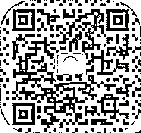**

报名及咨询，请点击文末”阅读原文“

# 还有谁比双鱼座更复杂？

> 原文：[`mp.weixin.qq.com/s?__biz=MzA5NjA0NTAxNg==&mid=402970780&idx=1&sn=cf13c0daadc98fa97b0c2eb42997fff6&chksm=0d466a2b3a31e33dba9b35077be42c0161caabfc5bd4c0f07e4fab984a41c5af39f5be30c9e4&scene=126&sessionid=1692738872#rd`](http://mp.weixin.qq.com/s?__biz=MzA5NjA0NTAxNg==&mid=402970780&idx=1&sn=cf13c0daadc98fa97b0c2eb42997fff6&chksm=0d466a2b3a31e33dba9b35077be42c0161caabfc5bd4c0f07e4fab984a41c5af39f5be30c9e4&scene=126&sessionid=1692738872#rd)

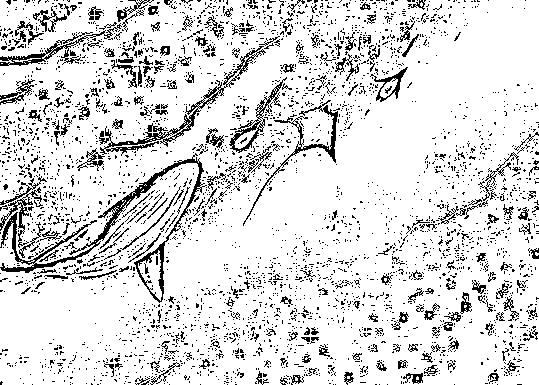

作者/大卫·瑞雷

译者/李含 校对/江艺

图片/花瓣网

两只鱼，一只向上，一只向下。**一只鱼向上游向光明**：“光明”常常是精神世界或理想的代名词，光明令人眩目惊羡，使人着迷，给人启迪。光明让阴影无从遁形，将一切都纳入无条件的爱与合一的光芒羽翼之下。**而另一只鱼向下游向水域深处**：在这个世界中寻求庇护，水域昏暗，一隅藏身，从而避开那耀眼的光明，暂时地隐藏，将自己隐于沙砾之中。但这两条鱼是拴在一起的，正是这种张力、这种挣扎，定义了双鱼座。

若道君碎碎念

**这篇文章适合我吗？**

即使你的出生图中没有任何行星落入双鱼座，但它仍是你星图中的一部分，以某种方式对你产生影响；而如果你的太阳、月亮、上升点或其他重要行星落入双鱼座，或是与其“共振”的宫位被强调，那么双鱼座的特质与主题将在你身上反映得更加明显。

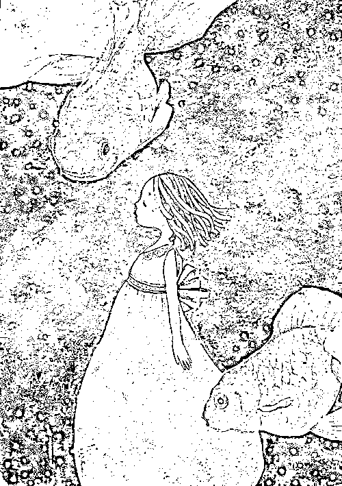

**1**

**双鱼座的世界很梦幻**

精神世界有时候会被描述为“这个世界之中的另一个世界”。两难之境显而易见。一个人该如何同时存在于两个世界之中呢？那些出生星图中太阳、月亮或上升点落在双鱼座人的性格复杂性可以被理解为，将两条鱼合二为一是多么不可能。这是一种不可能实现的状态！

我能不能逃避？我能不能超越？是什么让两条鱼系在一起？人生的主线，由人生的旅程和经历编织在一起。这是接近一个周期末端的一段旅程。这段旅程从白羊座开始，双鱼座就是最后一个星座，第十二个阶段，也是最后一个阶段。

白羊座

金牛座

双子座

巨蟹座

狮子座

处女座

天秤座

天蝎座

射手座

摩羯座

水瓶座

双鱼座

“我们为什么不是只有十个星座呢？”有一次曾有人这样问我，“那么我们就停在摩羯座，第十个星座，掌管成就与造诣的星座。”我回答：“因为水瓶座是‘以上皆非’，双鱼座是‘以上皆是’。”水瓶座，第十一个星座，似乎是要反叛前面十个星座，好像在说：“我与你们都不同”。而双鱼座则要说：“我和你们都很像，全部，同时。”另外，在完整的人生中，我们世俗的成就造诣并不是故事的终点。

▶▶水瓶座紧随摩羯座的脚步，回应了摩羯座对成败的执着。“身份地位有什么好？”水瓶座说，“如果你的成就只是给你自己和你的家庭带来好处的话？你看不到身边的世界么？你是不是忽略了你的成功有赖于社会大众的支持？你是不是该回馈社会？”

▶▶双鱼座感觉到了水瓶座邻居的担忧，但是它更宽容慈悲。刚经历了水瓶座，吸纳了它的天赋，但是现在思想转向了诗歌、音乐和电影，甚至在科技层面的呈现也侧重启迪那些让我们敬畏、惊叹的愿景。


梦想家这个词常常用于描述著名的双鱼座人，比如终极梦想家科学家阿尔伯特·爱因斯坦，或斯蒂夫·乔布斯，他富有想象力的设计让所有人连接在了一起。只有双鱼座，这个有着惯性迟到坏名声的星座，会用“相对论”解释时间。“亲爱的，在这里我们只是迟到了 15 分钟，而在巴黎我还提前了 45 分钟呢。”

> #### 社会共有的双鱼座体验
> 
> 双鱼座会流出边界或溢出边界。时间与空间都是曲线，所以为什么不打破电脑公司的业务范围呢？为什么不能有 MacBook Pro、iPad、iPod、iPhone 和无穷的多得多的 app 呢？我们可以用 iPhone 编辑照片、电影、文本，玩游戏，与所有人、所有团体在所有地点和时间里进行分享。现在，海量的图片将我们连接在了一起，让我们有幸一瞥双鱼座眼中的世界 —— 充满图像和音乐 —— 现在流向了我们所有人。手指的触碰和滑动让我们所有人都变得更像双鱼座，同时存在于两个世界。
> 
> 我们都看到人们一边开车一边发简讯，往来穿梭于车道边界，或可能有些人会着迷于玩游戏或看视频而错过了你们要搭乘的地铁。这就很像是一位双鱼座人。迷失或沉迷在自己生动而复杂的内心世界，却又与所有人连接 —— 依然努力在这个世界上正常运转。

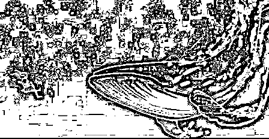

**2**

**双鱼座的内心很庞杂**

如果你是双鱼座，或有月亮和上升落在这个星座，你会理解我所说的你们复杂的内心世界。

> #### 令大家都头疼的问答
> 
> 例如，当某个人向你们提出一个问题，你们许多人会努力去找到一个答案。在你们的脑中浮现了许多个可能的答案。
> 
> 你想：“他们真正想知道的是什么呢？他们能够了解什么呢？他们准备听到怎样的答案呢？我对他们的感觉和直觉是怎样的？对这个问题有没有另一种表述可以让我更好地回应他们想要询问的内容呢？”
> 
> 到你们真的想要说些什么的时候，对方可能觉得你们在“回避推诿”，有些事情你们不想要告诉他们。你们可能开始生气甚至愤怒。当然有的事情你并没有告诉他们！可能要过差不多半个小时，你们才开始告诉他们，关于他们的提问，你们的脑中都想到了些什么。

生命是复杂的。所以你们需要选择该说些什么，常常这是听从你们的直觉或第六感的指引。选择说什么和选择做什么并不容易，如果选项很多的话。正如史蒂夫·乔布斯所说，选择一种，“就意味着拒绝其他数百种想法”。

所以这种复杂性从何而来呢？这是因为接近了一段漫长旅行的末端。十一个星座来来去去，就像是一段十一个月的长途旅行，或游历了十一个国家。已经获得了丰富的经历。功课学了又忘了，但会有一些东西沉淀下来。

**而这些东西就是一个谜，终极的神秘。许多双鱼座人会追随这条神秘之路，不论这条路将会去往何方。**这条路将史蒂夫·乔布斯带到了印度，那还是他年轻的时候，他甚至尝试了致幻剂。回到加州后的一个夜晚，他敲开了寺院禅师的门，与住持进行了交流。“我相信自己开悟了，”在一番长谈之后乔布斯对僧人说道。僧人说：“让我看到。”乔布斯再次来时交给僧人一个他早期的微芯片。“这让我看到了你的聪慧。”僧人说：“但这并不意味着你获得了启迪。”乔布斯后来学习了禅修冥想，断断续续地跟随乙川弘文修习。

接近周期末尾，就像是一段旅行的结束，意味着积累了经验和故事。这是属于你灵魂的旅程，一段关于诗歌、摄影、摄像和音乐的旅行 —— 沿途记录这一切。你的灵魂就像是堆满艺术品的杂乱房间，东西放的到处都是，就像是许多双鱼座人的公寓。但是！当你阅读你的灵魂之旅时，人们会停下他们正在做的事情来聆听。

▶▶你读到：“我是怎样地爱你，让我一一细数。”然后你回答，“我爱你尽我的心灵所能及的深邃、宽广和高度。”这是双鱼座诗人伊丽莎白·巴雷特·勃朗宁（Elizabeth Barrett Browning ）（1806-1997）的诗作。阅读这篇完整的诗作能够感受到双鱼座的爱是什么。

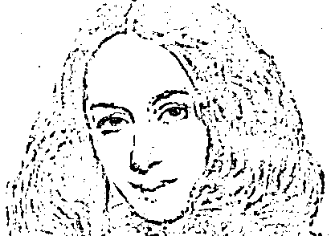
伊丽莎白

▶▶另一位双鱼座诗人阿娜伊斯·宁(Anaïs Nin)（1903-1997）写道：“放飞你的梦想，你不知道它会给你带回怎样的礼物，一个新的朋友，一种新的生活，一份新的爱情，一个新的国家。”以及，“梦想总是走在我们的前方，抓住梦想，有那么一瞬间与梦想合二为一，就是一种奇迹。”

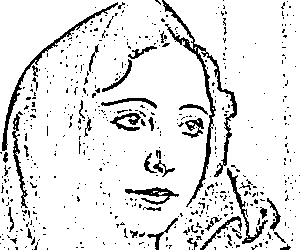
阿娜伊斯

**3**

**双鱼座的出口是创意**


**逻辑可以让你从 A 到达 B，而想象力可以带你去任何地方。**

**——阿尔伯特·爱因斯坦**

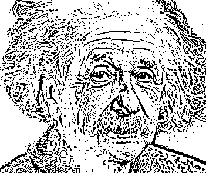


除了以上提到的名人，你们双鱼座的梦想家们还囊括了双鱼座电影人，比如娄烨 ，他是中国电影公司“梦想者公司”的合作创始人。其他广受赞誉的双鱼座电影人包括：罗伯特·阿特曼、山姆·佩金法、彼得·伯格、大卫·柯南伯格、克劳德·朱特等。

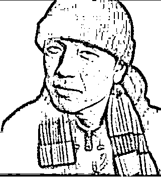
娄烨

音乐和词作的灵感显然也属于双鱼座，这份音乐家名单囊括了各种各样的天才 —— 有钢琴诗人肖邦，前甲壳虫乐队成员乔治·哈里森，或田汉（1898-1968），他是中国国歌的词作者，还是一位诗人和作家。另一些典型的著名双鱼座音乐家/歌手还包括埃尔顿·约翰、奎恩·拉提法、贾斯汀·比伯、科特·柯本、乔·邦·乔维等。

但不要被误导认为大部分富于创造力的人都有双鱼座太阳、月亮或上升，或所有双鱼座人都选择以创意为生。爱因斯坦喜欢拉小提琴，他常常练习，但在听者看来，他还需要更多练习！史蒂夫·乔布斯弹吉他，但是点击率前四十的歌曲中并没有他的作品。相反，他对音乐的热情，尤其是对甲壳虫乐队和鲍勃·迪伦的热爱，最终成为他创造 iPod 和 iTunes 的动机。

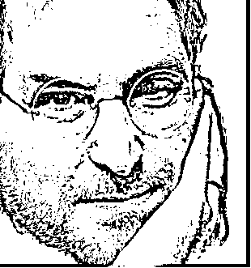
乔布斯

在苹果公司创办之初，乔布斯曾经用他的吉他胡乱弹奏着鲍勃·迪伦的曲子。在阳光灿烂的加州，乔布斯坐在自家后院弹吉他，此时他和苹果公司另一位合伙人沃兹尼亚克集思广益，憧憬着苹果的未来。

拥有一个创意出口，不管是否与你的工作或专业领域有关，对双鱼座人来说，都是十分重要的。任何一种创造性的自我表达：绘画、陶艺、诗歌、摄影、编剧、写作、表演课程、舞蹈、音乐、雕塑等等都激发了你们的灵感。当你们获得启迪，你们可以用超出其他人想象的神奇方式解决问题，找到解决方案。

**互动** 

**双鱼座宝宝是一群什么样的人？双鱼月，你有什么想说的吗？请在留言区尽情分享、吐槽。**

**PS. 若道长期征稿，详情请见：**[创造 2016 | 召唤占星“科普”作者 ，分享你和占星学的故事](http://mp.weixin.qq.com/s?__biz=MzA5NjA0NTAxNg==&mid=401613091&idx=2&sn=8a49d99a2fc4118106674a83f6aa9bbd&scene=21#wechat_redirect)

**有关双鱼座，也许你还想看：**


**◆ ◆ ◆  ◆ ◆**

******特别提醒************：若道享有本文版权******，**转载请注明“转自若道”。******

想了解更多星座知识？**2016 年 5 月 19 日**，蒋颖老师主讲的若道占星核心课程**Level 1-2**要开课了！她将带领你学习星座、太阳、月亮、行星、月亮交点等知识，让你进入占星学的世界！详细内容请点击“**阅读原文**”了解。

↓


# 宝宝，我不要最成功的你，要最好的你

> 原文：[`mp.weixin.qq.com/s?__biz=MzA5NjA0NTAxNg==&mid=402970780&idx=2&sn=ab3533c8c56e1b945a2c67d19a6b746c&chksm=0d466a2b3a31e33d68aa14f1ab3a7054dbb2f277a2ecf240059cc6cf56ab1e5d65419fe9698d&scene=126&sessionid=1692738872#rd`](http://mp.weixin.qq.com/s?__biz=MzA5NjA0NTAxNg==&mid=402970780&idx=2&sn=ab3533c8c56e1b945a2c67d19a6b746c&chksm=0d466a2b3a31e33d68aa14f1ab3a7054dbb2f277a2ecf240059cc6cf56ab1e5d65419fe9698d&scene=126&sessionid=1692738872#rd)

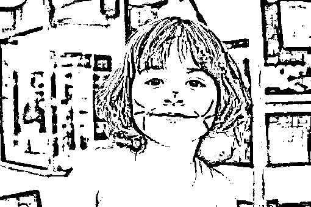

作者/大卫·瑞雷

译者/王宏 校对/江艺

图片/花瓣网

孩子闹腾不爱受管教？孩子总不听话打一顿就好？这么粗暴可不好。其实有可能你并不是那么了解你的孩子，想通过占星学让彼此关系更进一步？快来阅读下面的文字。


**占星课堂**

**理解孩子的三个步骤**

step

**1**

首先要查看**月亮交点**。这些交点对于**理解孩子人生的主要方向以及他们用来保护自己的行为**都非常重要。这对于**理解潜在的目的和激励孩子的驱动力**来说至关重要。

step

**2**

接下来查看**上升点**。这是因为学习过程由“个性”所引导。换言之，上升点是个性的“过滤器”，通过这个过滤器，世界第一次被体验到，而且**基本的自我认同**也是通过它形成的。

step

**3**

查看**行星和宫位**。这里我们也粗略分解一下星图，好让大家对这张学习和发展的地图的各个部分有个大致了解。既然大家对星座已经有所了解了，我们这里来谈谈行星和宫位吧。

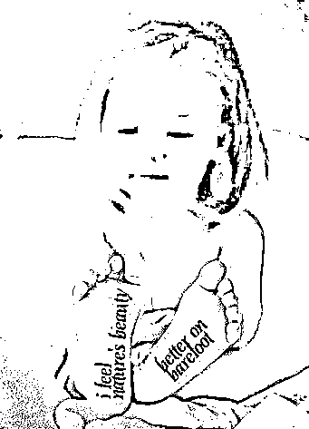

**十大行星与孩子的成长**

太阳：孩子发展中的自我，内在的自信，以及做决定的核心动机，男性的影响，父亲或父亲形象。

月亮：孩子的情绪和情感模式，以及对情感健康和安全的整体感觉，孩子更为“本能”的一面，母亲和母亲形象。

水星：孩子的基本认知过程和沟通思想的方式，以及孩子的精神关注点和焦点。

金星：社会化，感情的风格，喜好和厌恶，爱与恨，对颜色、衣服、艺术的品味，审美趣味。

火星：行为风格，对愤怒的表达，愤怒的管理问题，自信果断对攻击性的问题，身体的宣泄出口和身体活动。

木星：幽默，源于掌握新知识和新真理的欢笑，大思想，旅行、冒险，认识世界，国际性的视野。

土星：及时完成任务，处理义务和责任，规划和自律的能力。

天王星：应对意料之外的事情，惊奇、冲击、突变、混乱、毁坏，向新的思维方式开放，跳出固有思维模式，独创性和创造性。

海王星：开发想象力，学习如何拥有灵感以及“敬畏”和“惊叹”，了解通过电影和音乐表现出来的生活的“魔法”……

冥王星：发展生存技能，变得更有策略性，学习如何处理危机，学习如何面对恐惧，变得更能意识到如何与他人建立信任。

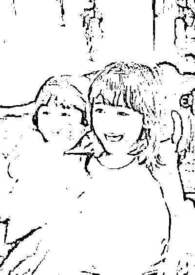

**十二宫位与孩子的成长**

第一宫：身体发展，找到适合孩子体型的活动。

第二宫：对于所有物、玩具和财产的关切。

第三宫：对周围环境的意识，常识，对邻里的意识，电话，以及基本的日常沟通技巧。

第四宫：在家里的行为，家庭动力，私生活，隐私，领地。

第五宫：学会玩耍，游戏的规则，娱乐！

第六宫：卫生保健，任务的日常组织，实践和技能发展。

第七宫：对他人的意识，最亲密的友情，合作。

第八宫：同他人的信任问题，对暴力或伤害的恐惧，对被拒绝的恐惧，与他人建立信任，学习如何同他人分享事物。

第九宫：对大世界的意识！开始意识到其他国家和其他人，还有他们如何生活在这个世界中，以及他们的观点和信仰……

第十宫：公共行为，认可，成就，荣誉，责任，目标。

第十一宫：同龄人，亲密朋友之外的同伴关系，群体认同，“你被同你来往的人所了解。”

第十二宫：孩子最“敏感的”或“隐秘的”问题，可能是孩子的“盲”区，但也可能是他们灵性的一面，以及当他们面对宇宙时，感受到“敬畏”的地方，像是一个观察日落或日出的孩子，或是在郊外仰望夜空，第一次看到夜空中繁星密布的孩子！

如果你能够掌握孩子的基本目的、习性，以及它们个性的本质，那这就是通向“与”孩子之间真正合作的良好开始。

**◆ ◆ ◆  ◆ ◆**

 ****特别提醒：********若道享有本文版权****，转载请注明出处。****

想进一步了解自己的小孩？**2016 年 3 月 26 日**，大卫老师将在北京举办两天的占星学与亲子工作坊！让你找到“ 因材施教”的操作说明，学习应对不同时期亲子关系发展的成长挑战！详细内容请点击“**阅读原文**”了解。

↓


# “小棉袄”塑造记 | 北京占星学与亲子发展工作坊

> 原文：[`mp.weixin.qq.com/s?__biz=MzA5NjA0NTAxNg==&mid=402970780&idx=3&sn=b569f3a7a589e72bf18879d6567a3d15&chksm=0d466a2b3a31e33d0e49388d3ef57fa1548f2f478deb6dff30e5c63ddc5476d1093f0e8f35eb&scene=126&sessionid=1692750542#rd`](http://mp.weixin.qq.com/s?__biz=MzA5NjA0NTAxNg==&mid=402970780&idx=3&sn=b569f3a7a589e72bf18879d6567a3d15&chksm=0d466a2b3a31e33d0e49388d3ef57fa1548f2f478deb6dff30e5c63ddc5476d1093f0e8f35eb&scene=126&sessionid=1692750542#rd)


两分钟前你还幸福感满溢

两分钟后恨不得举起棍子收拾 Ta

这是怎么了？

　　不是说孩子是上天的礼物吗？

What，这礼物没法由我控制开关机？

　　　我如何接纳 Ta 与我完全不同的样子？

2016 年 3 月 26 日

北京两天工作坊

大卫老师邀您一起探讨学习"占星"这个解码器

　　　　从出生星图中发现每个父母与孩子的独特潜能及成长主题

学习应对不同时期亲子关系发展的成长挑战

按图索骥，及时保养！


**工作坊信息**

**授课时间：**2016 年 3 月 26-27 日 （10:00-18：30，午休 1 小时）

**授课老师：**大卫·瑞雷

**授课方式：**北京面授，英文授课，配中文翻译

**费用**：**5000 元（若道老学员可享受优惠价 3500 元）**

**早鸟价：**4000 元（2016 年 2 月 29 日前报名付款）

**报名截止：**2016 年 2 月 29 日

**课程负责人：**Freya.Li  微信号：18601950700（请备注报名咨询）

**咨询电话：**400-619-1014

**课服 QQ：4006191014 （若道星文化）**

**邮箱：nodoor@vip.126.com**

课程简介

这两天，我们将聚焦在学习如何通过“觉知”与“接纳”的方式为孩子的成长创造一个充满“接受”“理解”和“爱”的家庭氛围。

我们将会根据家长和孩子的星图，谈论：

**★ 孩子怎么学习更有效？孩子适合报什么样的专业？说话孩子不听怎么办？孩子很叛逆该如何沟通？该如何激励孩子？**

**★ 在孩子成长过程中，家长会有哪些特别的挑战，如何面对这些挑战？**

**★ 哪些社会压力是非理性的，怎么放下这些非理性的压力？**

**★ 自己的人生议题是什么，这些议题和焦虑会怎样影响孩子？**

**★ 孩子今生的议题和挑战是什么，如何接受孩子的议题？**

**★ 孩子的潜能是什么？**

在这两天，我们不仅会根据孩子出生图的主题分组，还会根据家长出生图的主题分组，研讨案例将采用学员及学员孩子的出星图实例贯穿。这样学员们不仅可以从老师那里学习，而且还可以互相学习，通过在发生在身边的案例深刻感受出生星图如何影响家长、孩子及相互关系。

适合人群

**★ **致力于亲子关系成长的咨询师和占星师

**★ **希望更好理解童年与父母之间关系互动的人群

**★ **对占星学感兴趣的人群，需具备若道核心课程 Level1-2 的占星学基础

师资力量


****大卫·瑞雷（David Railey）****

若道创始人，《灵魂的目标》作者。拥有四十年的占星咨询的执业经验，曾两任亚特兰大占星协会主席，是全美占星师联盟（AFAN）、美国占星师联合会（AFA）、全美占星研究委员会（NCGR）、国际占星研究协会（ISAR）和职业占星师组织（OPA）的成员，是联合占星大会（UAC, United Astrology Conference）督导委员会委员。大卫曾是 CNN、CBS 的占星节目的常驻嘉宾，多次在 BBC、WGS、WSB、WRGG 等节目中接受采访，并在亚特兰大主持电视节目《每日行星（Daily Planets）》达 4 年之久。

往期回顾


▲2015 年成都  占星学与亲子发展工作坊


▲2014 年深圳   占星学与亲子发展工作坊

详细内容及报名请点击文末“**阅读原文**”。

长按二维码接通课程负责人~


# 若道 Level 5：进阶专业占星师的必修课

> 原文：[`mp.weixin.qq.com/s?__biz=MzA5NjA0NTAxNg==&mid=402962781&idx=3&sn=1b785e396ba42e38265f3f99e5ba7721&chksm=0d460bea3a3182fc0a6694dac21319541a3c874ac2dfc22a757ac84b06e9863dd2740b11483f&scene=126&sessionid=1692738872#rd`](http://mp.weixin.qq.com/s?__biz=MzA5NjA0NTAxNg==&mid=402962781&idx=3&sn=1b785e396ba42e38265f3f99e5ba7721&chksm=0d460bea3a3182fc0a6694dac21319541a3c874ac2dfc22a757ac84b06e9863dd2740b11483f&scene=126&sessionid=1692738872#rd)


在这个阶段

你将学习各种**预测技术**

行进、月亮次限、太阳弧、返照图

你会学到行星周期

天上哪朵云什么时候会飘到这个人的头顶呢

会如何影响这个人的人生呢

通过这些预测工具

**你就能用它来预测和规划人生了**

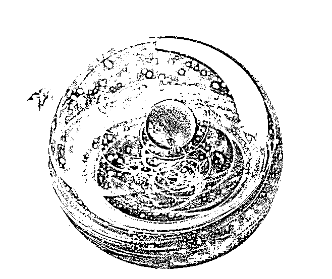

**课程讯息**

**授课时间：**2016 年 3 月 22-9 月 20 日

**授课老师：**大卫·瑞雷

**授课方式：**网络课

****费用**：15000 元**

**报名截止：**2016 年 3 月 11 日

**课程负责人：**siri**（微信号：2847613491）**

**咨询电话：**400-619-1014

**课服 QQ：4006191014 （若道星文化）**

课程简介

****课程安排太丰富**了！**

行进

行星周期

爱情中的机会和挑战时机

职业周期

月亮次限

太阳弧

太阳返照、月亮返照

综合预测

组合图

占星学历史

占星学中的天文学

ISAR 考试词汇表

咨询技巧培训

**●**在整个教学过程中，不仅用名人案例讲解，而且将会抽取同学星图，进行实战咨询示范。另外，会有 4 节课的咨询技巧培训帮助大家准备好进入实战。

授课时间

2016 年 3 月 22 日-9 月 20 日

每周二晚 20：00-22:00（北京时间）

共 27 次课

有关毕业

**考试和实习：**对于那些想要获得大卫老师资质班证书的朋友，我们将帮助大家在开始成为职业占星师之前，将由专业占星师组织小型督导工作坊，帮助大家实战解盘，为正式的收费咨询做好准备。通过毕业考试，参加督导工作坊，星盘解读的同学，将获得大卫老师颁发的职业占星师资质证书。

授课优势

**①先进的教学平台**

网络教学平台，支持手机、电脑、iPad 上网，可以随时随地学习。

**②回放复习**

学员可登录网站收看课程回放，在线复习课程，每次课可完整重看 3 次，课程结束后的 3 个月内有效。　

课程特色

**①与名师面对面**：北京同学可以来若道现场上课，和大卫老师面对面互动。大卫老师也可能前往主要学员所在城市，实现零距离教学。

**②互动答疑**：论坛、微信群随时提问；老师课上答疑；助教线上线下全程协助。

**③线下沙龙**：定期举办沙龙活动，复习上课内容。

**④强大的同学网络**：若道作为中国最顶尖的占星教学机构，在 4 年的占星教学中，培养了很多占星人才。若道让你和师兄师姐切磋，让你和国内著名占星师学习。（简单来说，就是，人脉！）网络授课，在北京开设免费现场参与名额，全程英文授课，配备实时翻译。

师资力量


**大卫·瑞雷（David Railey）**

若道创始人，《灵魂的目标》作者。拥有四十年的占星咨询的执业经验，曾两任亚特兰大占星协会主席，是全美占星师联盟（AFAN）、美国占星师联合会（AFA）、全美占星研究委员会（NCGR）、国际占星研究协会（ISAR）和职业占星师组织（OPA）的成员，是联合占星大会（UAC, United Astrology Conference）督导委员会委员。大卫曾是 CNN、CBS 的占星节目的常驻嘉宾，多次在 BBC、WGS、WSB、WRGG 等节目中接受采访，并在亚特兰大主持电视节目《每日行星（Daily Planets）》达 4 年之久。

想成为 ISAR 认证占星师吗？

欢迎选择 2016 年度职业占星师成长套餐

▼


2016 年，和大卫老师一起，开启占星的探索之旅！

报名及咨询，请点击文末“**阅读原文**”。

长按二维码添加课程负责人咨询~

****

# 处女座满月 | 谢谢你，我爱你

> 原文：[`mp.weixin.qq.com/s?__biz=MzA5NjA0NTAxNg==&mid=402962781&idx=1&sn=14e1e2d2de49abf65180e2dc50ed30b8&chksm=0d460bea3a3182fc8fc0709253ca85ed71a39464d70f2a5c9139f8f5cb4ca4d52680fbda79e9&scene=126&sessionid=1692738872#rd`](http://mp.weixin.qq.com/s?__biz=MzA5NjA0NTAxNg==&mid=402962781&idx=1&sn=14e1e2d2de49abf65180e2dc50ed30b8&chksm=0d460bea3a3182fc8fc0709253ca85ed71a39464d70f2a5c9139f8f5cb4ca4d52680fbda79e9&scene=126&sessionid=1692738872#rd)

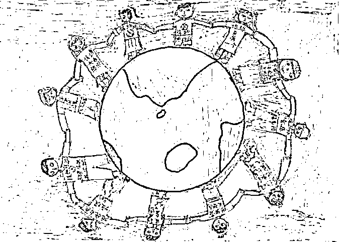

本次满月发生在北京时间 2 月 23 日 02:18 分（处女座 3°33′），满月时情绪更容易起伏、敏感，之前忽视的问题可能会被凸显出来。本次满月发生在处女座，虽然我们有可能会不安、害怕犯错、甚至用放大镜去检视挑剔一切，但目前落在双鱼座的太阳则提示我们：爱一直都在。这是理性与感性之间的摇摆，现实与梦想之间的平衡。满月是进行自我疗愈最好的时机，照着文中的指引去和内在的自己对话吧。

**本次满月的意涵**占星课堂

满月：满月是从新月出发，月亮渐渐充盈的过程。满月发生时间在每个农历月的十五，此时行进的太阳与月亮呈 180 度对分相，适合释放、清理。

>>>>

**太阳**

太阳代表阳性能量，在太阳的世界里我们渴望点燃生命的火焰、让自身发光发热的同时也温暖照亮了旁人，目前行进的太阳正在经过双鱼座且靠近海王星（相距约 6 度）更加强调了梦想的力量。

*   此时，我们更加**理想化、对于艺术、影视、灵性、爱与奉献、牺牲与救赎等话题关注度更高**。

*   强调自我的太阳遇见了代表消融与无我的双鱼座和海王星，看似对立的两股力量也可以完美地结合在一起：**认识到自身的渺小即是伟大的开始**。

*   虽说“宇宙间唯一不变的真理就是变”，快节奏的社会、快餐式的生活、太多无常的发生，普遍民众内心深处的安全感已经极度缺失，这些永恒的美景，也似乎暂时解脱了我们“无明”的恐惧。

*   **当我们真正意识到自身的渺小性之后，反而会生出一股谦卑与臣服的力量**，这股力量大概就是太阳在双鱼座的英雄之旅吧。

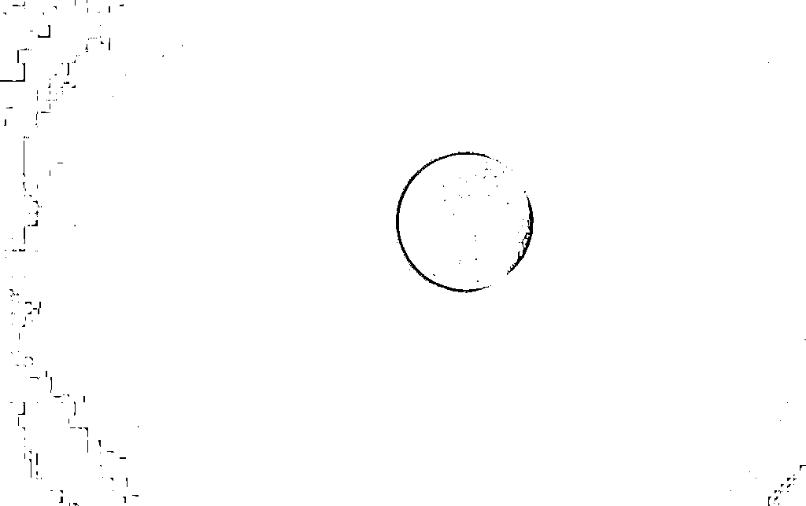

>>>>

**月亮**

月亮代表阴性能量，与我们内在的情感需求与日常生活息息相关。

在新月时，我们用念力播种下一颗种子，现在迎来了满月，之前半个月的累积到达了一个临界点，回想水瓶座新月（大年初一）时，你许了什么愿望？接下来的半个月你做出了哪些努力？亦或是压抑了些什么？它们都有可能在满月宣泄显现出来，并随即影响到他人。

处女座有着精益求精与专注敬业的服务精神和井井有条的逻辑分析能力。满月发生在这里，我们的情绪反应倾向于更加敏感、寻求完美、或因不够完美而焦虑不安、在意细节。双鱼座与海王式的理想梦境如果没有处女座一点一滴的勤勉努力，一切就真的犹如梦幻泡影，最后只剩幻灭虚无，而真正的灵性只有在落地之后才能够开花。

**观察你的星图中满月（太阳对分月亮）发生在哪两个宫位？代表相关两个领域可能需要调整与平衡。**

**此次满月敏感人群：** 

**个人行星落在变动星座（双子座、射手座、处女座、双鱼座）0-6°的人**。

此次满月发生时，您可能会感觉到**你的需求与其他事物之间的矛盾性、有可能引发复杂纷繁的情绪**。但是没有矛盾也就没有进步，在调整的过程中，也收获了成长的经验。

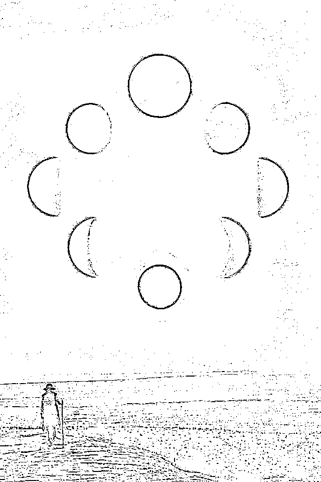

**满月前后最适合做的几件事**

► **旧物断舍离。**摆太久不用的东西容易逐渐形成腐朽运，以“我真的需要吗？”向内发问，重新收拾房间，分类整理，并对现有物品进行重新梳理与理性评估，清理环境的同时也清空了杂念，让身心重获简单清爽。

► **重新梳理**新一年的工作计划，并进行文件与信息删减与重整分类。

► 进行手机内存以及朋友圈的重整与**信息的清理**，去芜存青后是思绪轻盈的畅快感。

► **释放**僵化老旧的负面信念与阻碍身心健康的破坏性模式（具体操作方法下面满月仪式中有简易介绍）。

► **调整饮食，多饮水，保证充足的睡眠**。带着无比尊敬的心情对待自己宝贵的身体。特别是春节期间吃的过于油腻或吃了垃圾食品，在满月前后多吃素食、喝天然蔬果汁与健康有机食物，体质敏感的人可能在处女座满月前后身体自动进行排毒。

.jpg")

►** 多与大自然亲密接触**，在家中布置鲜花或点香薰和蜡烛，蜡烛有很好的净化效果，在天气好时候多出去走走，多做几次深呼吸，释放旧有能量。

► **做喜欢的事情和有益健康的事情：**按摩、拍打、拉筋、芳疗、泡温泉、安静独处、与老友相聚、欢快畅谈、烹饪、享受美食、冥想、阅读、运动、唱歌、跳舞、绘画、写感恩日记、练习瑜伽、与宠物玩耍、伺弄植物花草等。找到自己喜欢的抒发方式。

► 再精益求精也**别太苛责自己**，练习以本来面目爱自己，安静独处，回到自身，理清头绪。

► **对亲近的人多表达爱**，也许你不善于表达，那就用行动来表示吧，彼此按摩，为对方下厨，制作一份爱心便当，如果您是单身就美美的为自己下厨，记得对食物进行感恩与祝福。

►** 进行满月净化疗愈仪式**（比较适用于心理/灵性工作者，或想要深入净化与疗愈自己的人士）。

**满月净化疗愈仪式的方法**

需要安静的环境，在开始前先对所在房间进行清理与打扫。

**—— 需准备的物品 ——** 

*   水晶；没有可暂时以木头手串或与大自然相关的物品代替（地元素）

*   一杯柠檬水或纯净的白水（水元素）

*   羽毛（风元素）

*   点燃的蜡烛（火元素）

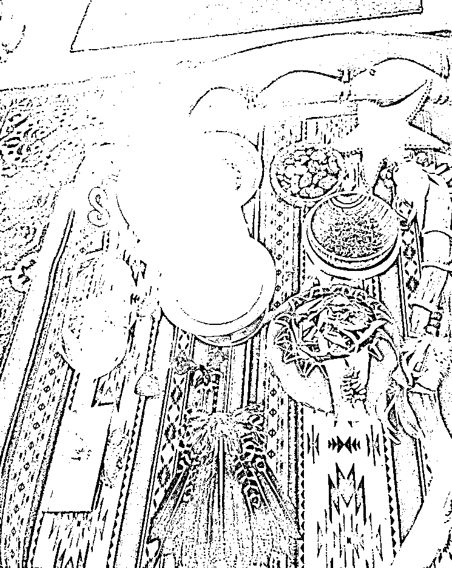

对自己下一个意念:“我愿意释放掉那些对我身心健康无益且不再适合我的老旧能量”，并运用涂鸦、焚烧、曼陀罗、抄经、创意绘画/书写、舞动/运动/瑜伽、冥想、唱诵、或是倾诉、心与心的对谈等形式进行释放（任选一种或两种）。

►** 自我疗愈。**以书写的方式写出让你不爽的人事物或你讨厌自己的地方，试着与这些负面能量共处，如果有任何情绪，允许自己，可配合涂鸦宣泄情绪，然后再写出你喜欢和欣赏他人/自身的品质，同时学会欣赏自己，你不喜欢的品质你决定怎么改进？列举出对策，决心改正即为自己的情绪负责，如果是改变不了的事实就练习接纳。

►**互相疗愈。**与爱人、家人或亲朋好友相距在一起，点燃蜡烛，放一首舒缓的音乐，彼此倾诉谈心，真诚的说出对对方的看法或意见，再回想对方的优点和长处，感恩对方，互相拥抱，练习互相凝视，静静感受彼此心与心之间的连结。

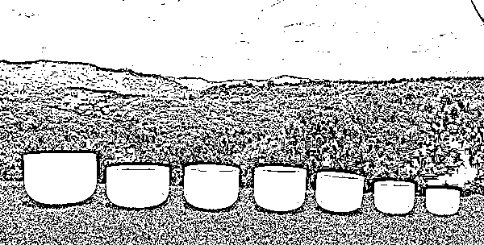

►根据自身喜好进行**冥想与静心**，推荐朵林·芙秋天使系列冥想音频，在喜马拉雅 FM 中可搜索到。

►带着爱惜与感恩的心情来一场美好的**沐浴**，用喜欢味道的精油皂/沐浴露，或是无添加自然手工水晶皂提升效果。

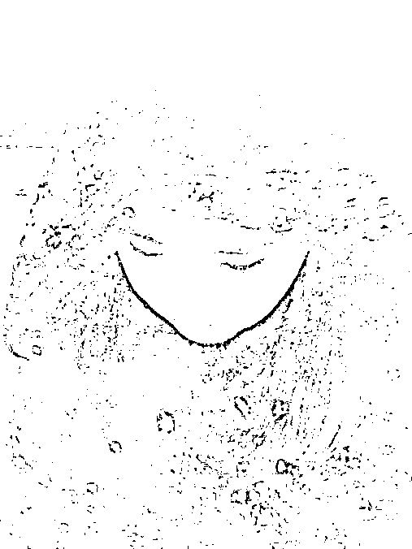

**作者简介**

**幽南**：上升天蝎座，太阳狮子座，北交点双鱼座。爱跳舞的疗愈狂人，崇尚自然与返璞归真的生活、虽向往无忧无虑却经常杞人忧天的自我折磨狂。2008 年开始接触占星，学习占星的意义在于“顺应宇宙的规律”就像了解季节的规律从而选择播种的时间一样，只有在相应的季节播种才能收获丰盛的果实。2010 年开始研习塔罗牌。

**微信公众号：**星舞心疗室 xingwuxinliao


你是满月的易感人群么？

本次满月你的感受如何呢？

你又做了些什么来清理旧有自我迎接新生？

欢迎留言分享你的感受。

**特别提醒：****本文由作者授权首发于若道平台，**转载请注明“转自若道”。****

如何掌握星象，顺势而为？**2016 年 3 月 15 日**，大卫老师主讲的若道占星核心课程**Level 5**要开课了！在这个阶段，你将学习各种预测技术及行星周期。通过这些预测工具，你能够预测和规划人生。提前报名付款有**早鸟价**哦！详细内容请点击“**阅读原文**”了解。

↓


# 土星过境第八宫 | 你在怕什么？

> 原文：[`mp.weixin.qq.com/s?__biz=MzA5NjA0NTAxNg==&mid=402962781&idx=2&sn=56480f5734aa3b5e911c5570bea1975c&chksm=0d460bea3a3182fc55113e378797ded8233733dfd77a9c7ccc3ec0f5838feb848ab9b0373229&scene=126&sessionid=1692738872#rd`](http://mp.weixin.qq.com/s?__biz=MzA5NjA0NTAxNg==&mid=402962781&idx=2&sn=56480f5734aa3b5e911c5570bea1975c&chksm=0d460bea3a3182fc55113e378797ded8233733dfd77a9c7ccc3ec0f5838feb848ab9b0373229&scene=126&sessionid=1692738872#rd)

曼珠沙华，出自法华经，意思是，开在天界之红花。传说此花是接引之花，花香有魔力，能唤起死者生前的记忆。灵魂便籍由着这花的指引，走向天界。花落后叶才生，花和叶是不能见到的，于是有人煽情的用它来比喻没有结果的爱情。曼珠沙华盛放在涅槃重生之时，“重生”，正是土星经过第八宫的奥义。

*1***土星经过第八宫，你将面对什么？**

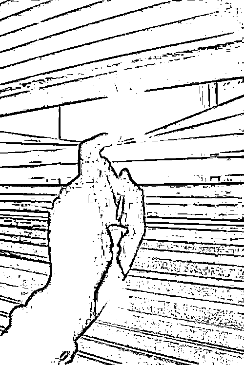

三年前的这个时候，土星带着天蝎座的洪荒之力，以不可抗拒的姿态缓缓碾压过我的出生星图第八宫。

第八宫，一个用所有令人畏惧的词语去形容仍不为过的宫位，一个也被称为“厄疾宫”的宫位。

我有三颗行星落在第八宫。曾经很为自己这几颗重量级的行星感到暗爽，在某一次心理测试里，当测出的神话角色是冥后波西凤的时候，简直不能再美，觉得自己就是那个冥王深爱入骨的女人，在我心里，冥王如同霸道总裁一般阴郁深情，至死不渝。

三年过去，从最后一波土星逆行回天蝎座的震荡中回过神来的我，战战兢兢，看到自己是如何被这股力量裹挟进八宫的荒漠时，一阵寒栗。

你只道荒漠壮观，然而亲历过的人，怕是一分钟都不想在里面多待。土星是严苛的老者，它所缓缓行进过的地方，必受考验。

**土星经过第八宫的考验**

他是对一个人最根本的生存，最深层的恐惧，最渴切的欲望，最需要的资源的一次大洗礼，如同毫无选择的人徒步过大漠，水分匮乏，荒无人烟，经受炙烤和涂炭后，经历过也许会死的感觉，土星的碾压逼迫着你去面对最原始的本能，对“生存”的渴求，信任的崩塌和重建，求之不得的贪嗔痴的自我疗愈和放下。

土星在天蝎座第八宫的这两年多里，我感受到更多的是一直在回避但不得不直面并且去转化的恐惧。

*2***你敢于直面自己的恐惧吗？**

每一个人的恐惧是一样的吗？它到底能够被深探到何种程度？

**关于分离的恐惧**

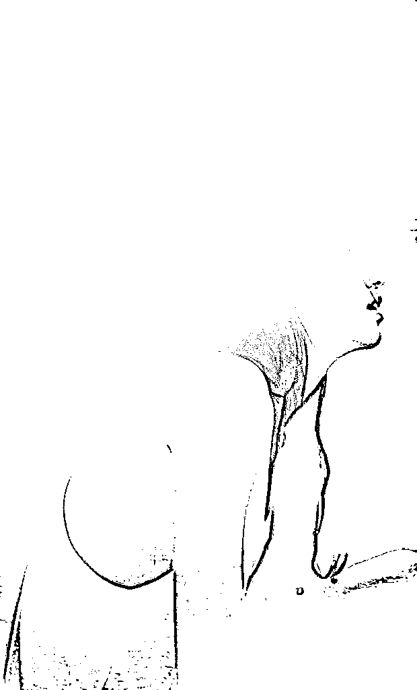

小时候看一部日本连续剧，正逢暑假，每天都在电视机前守着，直到有一天，连续剧播完了。那一刻我脑中一片空白，一股巨大的恐慌感席卷了我。

**“它”离开了，再也不会回来**。这是我当时萦绕脑海的感觉。

在那时，娱乐很贫乏。还没有光碟，电视不能回放，更没有 IPAD 手机可以重复播放视频想什么时候看都可以。这部我投入了全部精力和期待的连续剧结束了，就再也不会回来了。

然而我还记得每一天等在电视前的期待，以及每天想着第二天还能够再看它时候的愉悦，很长一段时间，它是我精神上的支柱。

这个支柱忽然宣布结束了。

我花了很久时间才调节好自己那种恐慌的感觉。

也许你会说，这有什么，你可以再去看一部别的连续剧啊，你可以去看会儿书，听会儿音乐，找小伙伴玩一玩，这不是一件很大的事啊。

但是不知为何，生出了执念。我至今记得这件事，从那之后我便很少追电视剧，因为害怕那种全神贯注之后忽然结束的失落感。

同样的感觉发生在分手之时。和爱人之间最终划清界限终结感情的时候，意识到无论如何，都将失去了的时候，再回想起童年这段往事，忽然明白了，我所害怕的，正是这种全神贯注，全身心投入后忽然“离开”了的感觉。

就是这个人，这个你认为永远不会离开的人，你曾经倾其所有期待了那么久的人，忽然间他走了，然而你根本无法接受“换一个人”，如同无法说服自己“换一部”电视剧去看就可以了。

这恰恰是冥王式的执念，唯其是他，才成就爱。在爱里，我是那个即使水漫过大腿依旧抱着柱子紧紧不放的尾生。哪怕再下去会死，然而如果放弃了这线希望，也许生不如死。

**冥王人典型的行为特征**

因为害怕被“抛弃”，而拼命抓住一线生机，执拗不放，甚至不惜背叛自己的感受一味曲意讨好，而往往这样的纠缠反而将关系越走越僵。

我在害怕什么？害怕不被爱？害怕失去爱人就失去了生活的支柱？害怕如果他不爱我，我就失去了价值，变得一文不值？害怕再也遇不到和他一样的人？

还是我在渴望一个人来爱我，因为我自己都没有好好爱自己呢？

土星停留在八宫的这段时日里，得以反观过去的情感模式方才发现，对分离的恐惧原来一直萦绕着我。同时，也有越发清晰的声音在告诉我，即使和爱人的分离，并不能让你失去一切，你还可以爱自己，你身边还有爱你和值得你爱的人，不要因为害怕失去一个人而“背叛”自己的感受，去做让自己痛苦而根本无法因此挽回对方的事情。为了这些美好，你要努力地好起来，快乐地活下去。

**关于孤独的恐惧**

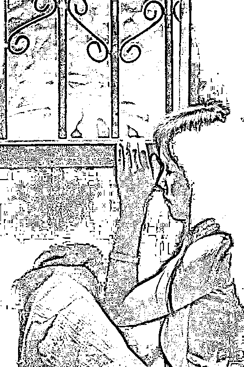

我是一个没有上过幼儿园的人，小的时候经常被锁在家里，自己和自己的影子玩儿，四岁的我就闹着要去学校，后来成为班级里没上过学前班而直接升入一年级的班级里最小的孩子。

到现在仍旧不能理解为什么母亲不送我去幼儿园，但是毋庸置疑，这给我之后的人生带来了并不那么愉快体验的伏笔。

也许是被“关”得久了，之后的求学之路，即使大人们不再管我，我依旧在假期不爱出门，自己躲在家里弹琴看书。

但是，时不时地，会有一种彻骨的孤独，出现在某个不经意的角落，也许是工作间的断档，自己赋闲在家的时候，也许是看到同龄的人们都在忙碌地工作，或者向外施展自己，而我只能缩在家里，躺在床上，无法出门的时候。

被“锁”在家里的体验，无形中成为了我人生的桎梏，在用同样的模式复制着同样的感受。而我同这样的模式共处如许多年仍不自知。也许因为生活的扰攘很快驱散了那点孤独，也许这样的情况并不多见，也许我即使发现了它的存在，却不知所措索性不予面对。

直到一年前，结束了当时的工作，在寒冷阴沉的冬日每天醒来的时候都有着同样孤独的体验而完全不知道该如何是好的时候，我开始不再回避那样的感受，而是同它共处，我看着蜷缩在床上的自己，我想知道她在想些什么。

渐渐地，我听到了那个童年的自己，她在说：为什么要把我锁在家里，我想和他们一样，自由地去玩耍，去做自己可以做的事情。

听到这个声音，眼泪潸然而下。我抱住自己内在的孩子，告诉她，别怕，你没有错，现在你已经长大了，你是自由的，走出去，和他们一起，你可以做得和所有人一样，甚至比他们更好。

这样做的时候，内心那个害怕被“锁住”的孩子慢慢痊愈了。而我亦不再拼命认为自己必须和“别人”一样出门工作才是唯一的路。我找了一份自己真心喜欢的兼职的工作，将自己的生活安排得很充实，这种“锁住”的控制力被自由意志代替，渐渐地，孤独的感觉出现得越来越少了。

*3***拥抱恐惧，拥抱自己，期待光明**

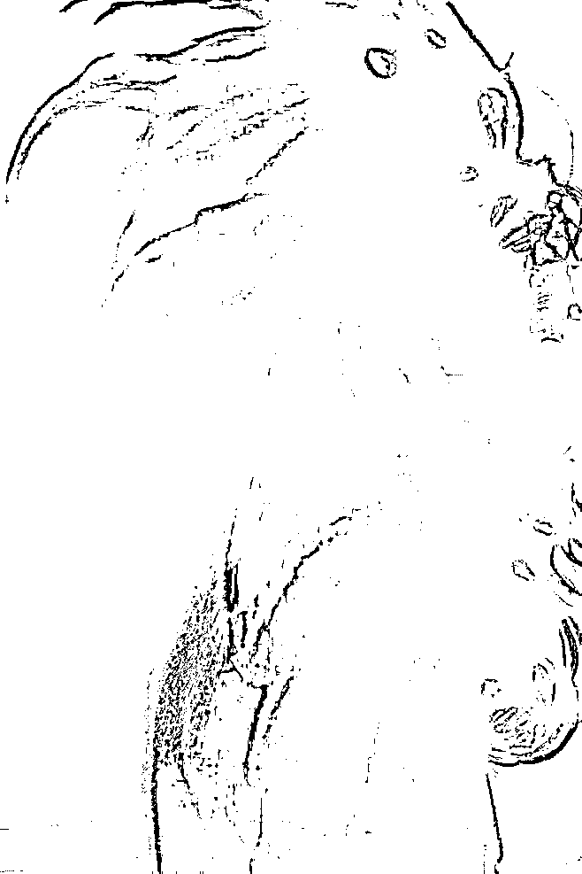

有人害怕老，有人害怕死，有人害怕不被爱，有人害怕亲人离世，有人害怕没有钱，甚至有人连老鼠都害怕。**这些害怕的东西，其实就深藏在我们的第八宫里。**平时不会触及，你可以躲，可以装作他们不存在，但土星偏偏要慢慢地，一点一点地，捡起你这些怕，如同冥王那般嘴角带着邪魅的笑容，一个个在手里把玩，你所害怕的，他偏偏要你去面对。直到激发起那股原始的蛮力，直到你对着他退无可退，而挥舞起最后的战旗，孤注一掷同他拼死一搏。他才肯放过你，因为**逼迫你面对的，恰恰是成就了克服这些恐惧而能够在人生路上走得更远的自己。而涅槃般重生便是天蝎座最需面对的议题。**

只有直面的人可以通过荒漠无人区。走过这一遭，面对未来的种种未知还会心生恐惧吗？我想是的。然而回望三年前那个还很懵懂地踏入荒漠的自己，忽然想对她说，来吧，别怕，**那些杀不死你的，都会让你更坚强**，当土星在天蝎座穿过第八宫这个荒漠的时候，**去拥抱内心的恐惧，找到它的源头，安抚它，陪伴它，疼爱你内在被搁置已久的恐惧的小孩，即使无法让它痊愈，至少你可以和它一起玩耍，一起成长，一起走向明天，因为让你恐惧的，也是你身体的一部分**。

等这一路艰难走来，你会看到片最娇艳的曼珠沙华，你将拥抱自己，并和你所爱的一切永远相守，最重要的，体验过最深的黑暗后，你将更加懂得什么是值得珍惜的光明。

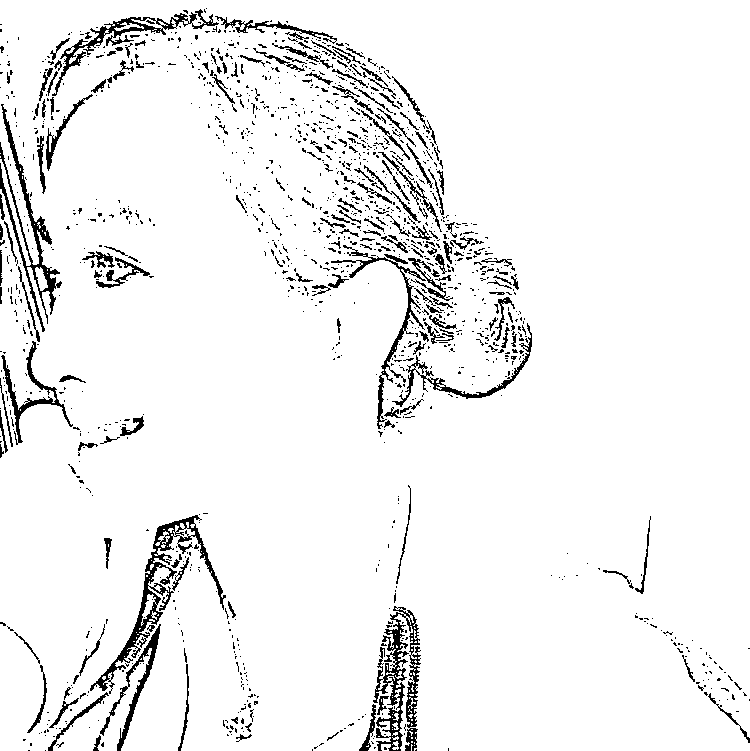

**作者简介**

**玫瑰：**生于七十年代尾巴，毕业于 Cass Business School，并获管理学硕士学位。现居上海。太阳天秤座，月亮巨蟹座，群星天蝎座。对于占星学自少年时便有浓厚兴趣，师从大卫·瑞雷学习严肃占星学，现为若道 Level 4 学员。

**个人微信号**：stillrosy

**◆ ◆ ◆  ◆ ◆**

******特别提醒：************本文由作者授权首发于若道******，**转载请注明“转自若道”。******

土星正行进在你的第几宫？**2016 年 3 月 15 日**，大卫老师主讲的若道占星核心课程**Level 5**要开课了！在这个阶段，你将学习各种预测技术及行星周期。通过这些预测工具，你能够预测和规划人生。提前报名付款有**早鸟价**哦！详细内容请点击“**阅读原文**”了解。

↓


# 宇宙天气 | 爱让梦想照进现实（2.22~2.28）

> 原文：[`mp.weixin.qq.com/s?__biz=MzA5NjA0NTAxNg==&mid=402955538&idx=1&sn=b025d4f77df77e74850debd8de1f6b52&chksm=0d462fa53a31a6b33d7b718953e1886c8bb6943818886cfd30141a6c43cef79a0f37d48b494a&scene=126&sessionid=1692738872#rd`](http://mp.weixin.qq.com/s?__biz=MzA5NjA0NTAxNg==&mid=402955538&idx=1&sn=b025d4f77df77e74850debd8de1f6b52&chksm=0d462fa53a31a6b33d7b718953e1886c8bb6943818886cfd30141a6c43cef79a0f37d48b494a&scene=126&sessionid=1692738872#rd)

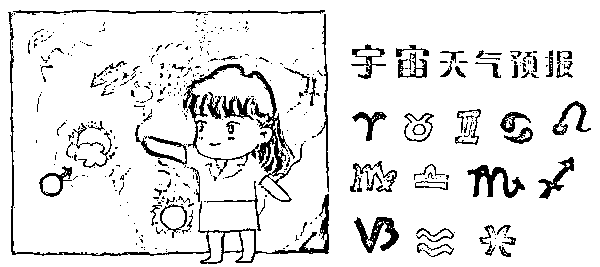

作者/占星师 Cora

插画/七沐 图片/花瓣

**一周星象综述**

本周月亮经过狮子座、处女座、天秤座、天蝎座。处女座满月与海王星形成紧密相位，令本周成为一个重要的“感受梦想召唤”的时刻。沉浸在想象和憧憬的的汪洋中时，我们需要保持一丝清醒，找出让梦想落地的具体、有效的方法。本周也是情感关系发生重要转变的时候，对爱的感受和需要都变得强烈，无论结局如何，都是让人感动的时刻。

> **本周重点星象事件是：**
> 
> **①   处女座满月**
> 
> **②   水星六分土星、天王星**
> 
> **③   太阳合相海王星**

祝大家元宵节快乐！

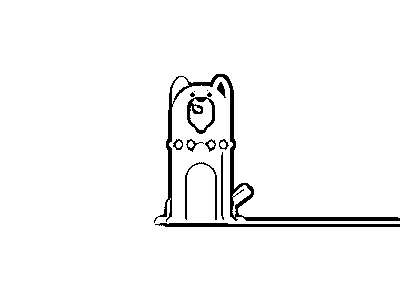

**每日星象**

**2 月 22 日（元宵节）**

星期一

**关键词：喜庆**

元宵节这一天依然是欢乐喜庆的日子。狮子座的月亮带来玩耍嬉戏的好心情。上午可能有些暴躁的情绪，或者是事情太多忙不过来。晚间月亮进入处女座之后，情绪会平静下来。

处女座满月将在周二凌晨两点多出现，我们在今天就能感受到它的影响，特别是晚间。一些缥缈的梦幻在我们的心里翻起涟漪，渴望升起的同时，美梦与现实之间的差距也可能带来幻灭感。

**当日星象**

09:18  狮子座月亮四分天蝎座火星

19:23  月亮离开狮子座进入处女座

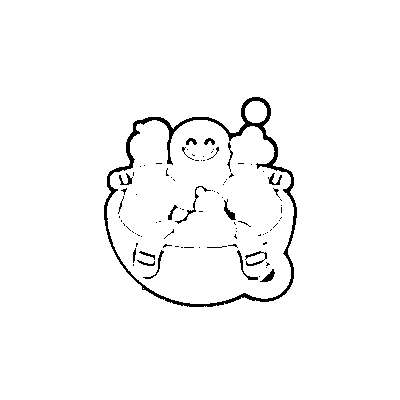

**2 月 23 日**

星期二

**关键词：情绪**

处女座满月发生在今日凌晨 02:21，这是易有情绪起伏的日子，很多事会激发我们的灵感和想象，带来心潮澎湃的同时，也让人怅然若失。有很多美妙梦幻升起，令心中充满喜悦和感动的同时，也可能带来失落和幻灭的情绪。此时的挑战在于，为心中美梦找到具体的、现实的实现途径，用真诚的心念和切实的努力，让梦想照进现实。另一方面，这也是接纳、原谅和放手的时刻，有些人，我们需要学习带着爱，接受他们离开。这一天容易有能量低迷的感觉，易犯困，不宜安排太多工作或活动，适合独自静心，多休息，做安静的事。

**当日星象**

02:21  处女座满月（处女座月亮对分双鱼座太阳）

13:33  处女座月亮对分双鱼座海王星

**2 月 24 日**

星期三

**关键词：梳理**

满月的影响仍在，今天是静下心来做内在梳理的好时候，我们对一些事情的判断也会更加清晰。今天我们能够以更加冷静的态度来面对脑中纷乱的想象，也能够更有效率地工作，有条理、有秩序地安排事务。今天适合做任何跟分析、梳理、总结、规划统筹相关的工作。晚间精力和效率会有提升。

**当日星象**

02:04  处女座月亮四分射手座土星

04:18  处女座月亮三分摩羯座冥王星

10:45  处女座月亮合相木星

22:24  处女座月亮六分天蝎座火星

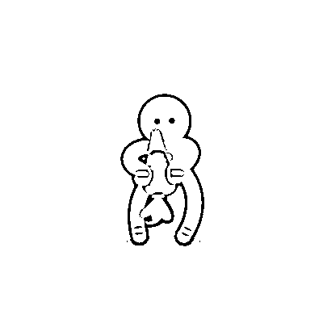

**2 月 25 日**

星期四

**关键词：沟通**

早晨月亮离开严谨细致的处女座，进入长袖善舞的天秤座。未来两天我们会更加关注关系议题，有更多注意力放在人际交往相关的事情上。

下午水瓶座水星六分射手座土星，令这一天的思考和交流表达都非常高效。我们能够准确、有效地表达自己的观点，或对事情进行合理的分析。这是适合沟通想法、分析问题、进行头脑活动的一天。学习效率和理解力也比较高。

**当日星象**

06:41  月亮离开处女座进入天秤座

16:06  水瓶座水星六分射手座土星

**2 月 26 日**

星期五

**关键词：紧张**

这是需要跟人打交道的一天。关系中的一些复杂问题令人的情绪变得紧张，这是在情感关系或合作关系中费力周旋的一天。虽然有些问题可能因立场的不同而各怀心意，但大家是可以沟通的，很多事情讲出来后能够互相理解，或至少场面上不太难看。

**当日星象**

04:18  天秤座月亮三分水瓶座金星

14:30  天秤座月亮六分射手座土星

16:41  天秤座月亮四分摩羯座冥王星

17:39  天秤座月亮三分水瓶座水星

19:19  天秤座月亮对分白羊座天王星

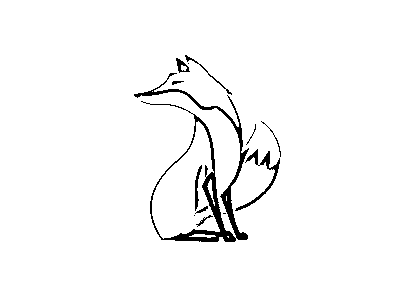

**2 月 27 日**

星期六

**关键词：创意**

上午是头脑清醒、思维活跃的时候，可能有新点子在这个早晨冒出来。这是充满创造力和想象力的一天，适合去做一些带有创意性质的工作，或者考虑去用一些特殊的方法、另辟蹊径地解决问题。晚间月亮进入天蝎座，可能会有紧张、敏感的情绪出现，但也是能够洞察问题本质的时候。

**当日星象**

07:03  水瓶座水星六分白羊座天王星

19:25  月亮离开天秤座进入天蝎座

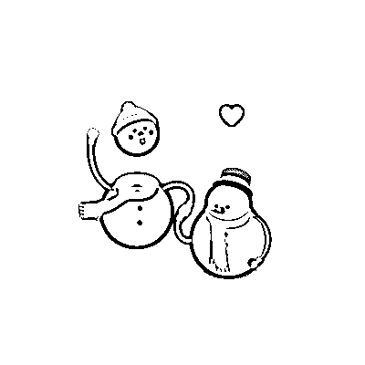

**2 月 28 日**

星期日

**关键词：敏感**

这是敏感多情、充满情绪能量的一天。我们对激情和爱的渴望变得强烈，恋人间的感情会变得更加深沉、深刻，伤痕似乎也变得甜蜜起来，令人感到“痛并快乐着”。这是我们重新认识自己的感情的时刻，爱情关系中有重要转变出现。

**当日星象**

13:52  天蝎座月亮三分双鱼座太阳

14:41  天蝎座月亮三分双鱼座海王星

23:48  双鱼座太阳合相海王星


**作者简介**

**占星师 Cora**，全美占星师联盟（AFAN）成员，国际占星研究协会（ISAR）会员，获 ISAR 职业占星师资质认证，斯蒂芬·弗里斯特《变幻的天空》译者，个人星象文章见诸《心探索》《北京青年周刊》《上海电视》《空中生活》等杂志媒体。曾跟随大卫·瑞雷系统学习占星学，现为全职占星师。

微信公众号：聆宇 FM（微信号：lingyudiantai）

个人微信号：CoraAstro

长按二维码，让金钱涌向传播知识与智慧的人~

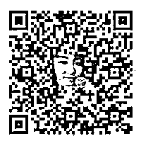

**特别提醒：****本文由作者授权首发于若道平台，**转载请注明“转自若道”。****

如何掌握星象，顺势而为？**2016 年 3 月 15 日**，大卫老师主讲的若道占星核心课程**Level 5**要开课了！在这个阶段，你将学习各种预测技术及行星周期。通过这些预测工具，你能够预测和规划人生。提前报名付款有**早鸟价**哦！详细内容请点击“**阅读原文**”了解。

↓


# 招聘行政 | 优秀的你，若道在等你

> 原文：[`mp.weixin.qq.com/s?__biz=MzA5NjA0NTAxNg==&mid=402955538&idx=2&sn=2f9c7eb2f2bf063f6fe88f2491045fcc&chksm=0d462fa53a31a6b387aab5a53d0e47c4bcc67387df537468ea0c79728ee87f0f1422f1826909&scene=126&sessionid=1692738872#rd`](http://mp.weixin.qq.com/s?__biz=MzA5NjA0NTAxNg==&mid=402955538&idx=2&sn=2f9c7eb2f2bf063f6fe88f2491045fcc&chksm=0d462fa53a31a6b387aab5a53d0e47c4bcc67387df537468ea0c79728ee87f0f1422f1826909&scene=126&sessionid=1692738872#rd)

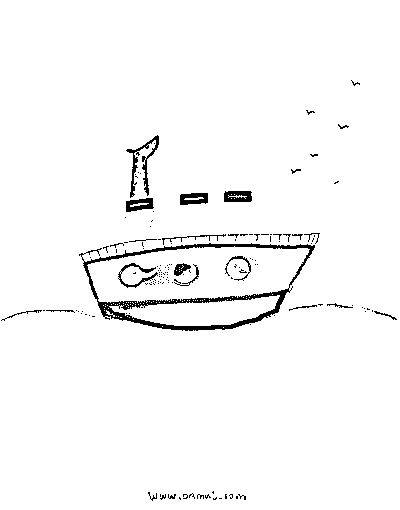

**懂得占星学的人知道它是有力的工具**

**帮助人类促进自我了解**

**让人更有智慧地和宇宙展开互动**

**如果你心有信仰并坐拥情怀**

**愿意为占星学在中国的推广贡献一己之力**

**如果你除了一腔热血还有踏实肯干的精神**

**请考虑加入若道**

**我们一起**

**做些实事 **

**为我们生命中想要坚守的东西**

若道星文化是由美国著名占星师大卫·瑞雷和国际占星研究协会（ISAR）中国区副主席蒋颖创办的一家占星教育、传播、咨询机构，我们通过以 O2O 垂直类教育的互联网产品，来实现帮助自己和他人的愿望。2016 年，我们期望有人文理想、想要在占星学传播和教育方面做出贡献、有职业成熟度的朋友加入我们！

**﹁**

**全职**

**行政**

**岗**

**位**

**﹂**

**招聘人数：1 人**>>>>

**工作内容及职责**

*   根据公司部门负责人的要求完成人事行政部的工作内容； 

*   行政方面：来访接待、考勤记录、办公用品申领，快递邮寄、档案整理等； 

*   人事方面：招聘简历筛选、电话邀约及相关人事工作。 

*   后勤方面：负责对接工作餐的物资采购，保持办公环境整洁； 

*   负责学员的课程咨询、转介、售后服务的解答并及时反馈信息； 

*   线上和线下课程的值课和现场服务；

*   与各部门密切沟通，参与营销活动，协助市场销售。

>>>>

**任职要求**

*   本科学历，人力资源或管理方面的专业优先，有相关证书者优先；

*   热爱占星学，可熟练使用常用的办公软件及网络应用，善于进行数据分析，为工作提供数据报告；

*   具有良好的职业道德和职业操守，认同公司理念，抗压能力强，擅于沟通与协调，具备良好的团队合作精神；

*   良好的学习力，适应力强，愿意为工作投入 100%的努力； 

*   有职业理想，愿意从基础职位起步，和公司一起成长发展。

>>>>

**福利待遇****：4000-5000+**


**加入若道，你会享受如下福利**

你付出才华和汗水，收获友谊、成就感、职业发展和金钱的回报：

○ 薪资体系=基本工资+绩效工资；

○ 提供五险、工作午餐、加班补助，带薪年假，年底奖金；

○ 享受每年员工占星培训课程；

○ 可以和大卫老爷子以及翻译姐妹练习英语口语，提高你的职业素质；

○ 有机会各种有意思的人喝茶、聊星图、人生，让你收获友谊和成长；

○ 中午由聘请的阿姨做家常饭，让你品尝妈妈的味道；

○ 各种零食、茶、咖啡、红酒、啤酒、懒人沙发、休息室让你劳逸结合；

○ 带薪假期。春节两周假期，你有比别人多一周的时间在家里孝敬爸妈，不再为买回家的车票发愁。

工作地点

**北京**

**地址：**北京市朝阳区百子湾路 32 号院苹果社区

应聘方式

简历和作品集请发邮件至** freya.li@nodoor.com**

请在简历中附上个人出生星图

**如果你真的想为占星学做点事儿，若道欢迎你**


# 双鱼座 | 符号里的两尾鱼为什么相背而游？

> 原文：[`mp.weixin.qq.com/s?__biz=MzA5NjA0NTAxNg==&mid=402934935&idx=1&sn=d2280665e7d481c88b5907478f9689e2&chksm=0d46fe203a317736e6d4c3e7dd5d0eceae12bda71e2ae401442e672ee291dce7e57a54f01808&scene=126&sessionid=1692738872#rd`](http://mp.weixin.qq.com/s?__biz=MzA5NjA0NTAxNg==&mid=402934935&idx=1&sn=d2280665e7d481c88b5907478f9689e2&chksm=0d46fe203a317736e6d4c3e7dd5d0eceae12bda71e2ae401442e672ee291dce7e57a54f01808&scene=126&sessionid=1692738872#rd)

# 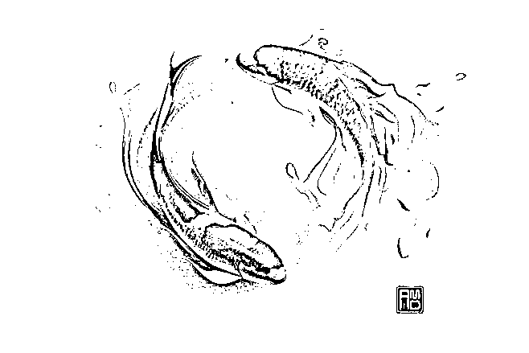

作者/琳恩•贝尔

译者/江艺 校对/李含

2 月 19 日，太阳进入双鱼座，这个星座也代表从雨水到春分的阶段。

如果大家想象自己是第一次看到十二星座的符号，这很难做到，因为我们已经习惯看到它们，我们不仅仅在报纸专栏中，也会在最为奇怪的地方看到它们：谷类食品的包装盒上、广告牌上、手机标识上。对于双鱼座的符号**♓，**大家并不陌生，但是它是怎么来的呢？

**1****变动星座的符号****更具有神秘意味的是变动星座的那些符号。**

当你第一次看到射手座半人半马的符号，或是双子座的连体双胞胎符号时，你的内心是否有所触动？

在欧洲，也就是我所生活的地方，中世纪幻想中的奇怪生物仍然在大教堂的石板上跃动。由于那时大多数人都无法阅读或书写，因此这些图像具有非常强大的力量，可以唤起各种各样的思想、故事、神话。现在它们仍然如此。我想知道我们有多少人是因为对一些占星学意象着迷而第一次接触占星学的？

**2****双鱼座符号：鱼要去哪里？****我们可能会问，双鱼座的这两条鱼要到哪里去？**

*   想象力从一条鱼流动到另一条鱼，一直延伸到最遥远的海洋。我们知道这里有关联，但是它意味着什么呢？

*   当鱼儿成群游过时，它们的动作是完美自如的；有一种被称为侧线的非常微妙的导向系统位于鱼身两侧，用以辨别其他鱼的运动。

*   在这水下芭蕾之中，水声通讯系统作用关键，这一系统让鱼儿在相隔一段距离时也能保持联系。每条鱼在游动时，都乘着前面的鱼划起的水涡，然后摆动鱼鳍，为后面的鱼设置另一个小小的漩涡。通过这种方式，个体既接收到水波，又为鱼群中其他的鱼重新划起水波。

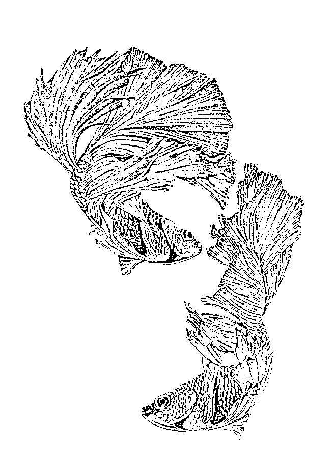

**双鱼座告诉我们一些我们在大自然中看到的神秘关联**，如鸟集群而飞，畜群聚集而生，鱼成群游动。天王星在双鱼座的 7 年旅程可能更多地揭示我们每个人如何与整体建立可感知却不可见的联系。人类有其自身的无形之舞，他们的生生灭灭和这些模式都被那些有行星落在此星座的人感知并加以运用。

**3****它们为何反向游动？****我们会看到双鱼座的鱼儿朝着相反的方向游动。**

想象一下，如果所有的鱼都简单地顺流而下，那么河口将会挤满鱼鳍。

双鱼座并不是简单地漂流，正如我们所知，鲑鱼会逆流而上去产卵。其他的鱼类，如梭子鱼和鳟鱼，也会逆流游动，它们有时溜走以便休息一下，游到河水深处；或是安驻在码头之后躲藏起来，之后再一次去挑战激流。无论是顺水漂流还是逆流而上都是这一星座的本性。

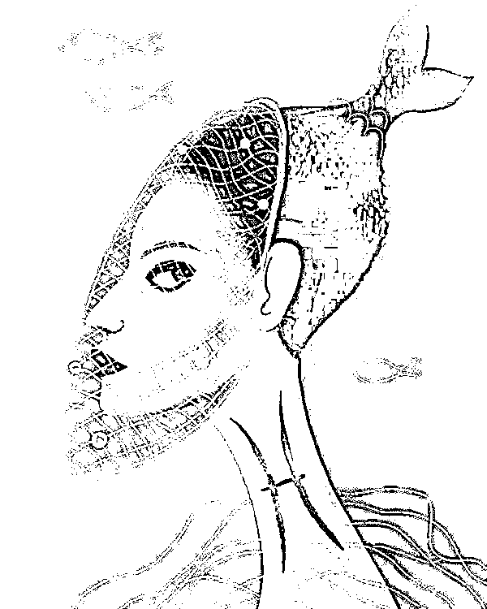

可能有人会说双鱼座被要求在他们人生的特定时期违背所有的逻辑和理性，投身于看起来疯狂、危险，甚至是不可能完成的事情之中。当这种时刻来临时，逆流而行可能对任何具有创造性的生命都必不可少的。这一过程既不可预知，也不是直截了当的，会有一定程度的随波逐流，会有待在浅滩上的时候，有些日子可能看似被浪费或虚度了，而之后就会出现一股强大的推力，逆着浪潮，让人出乎意料。即使在那时，双鱼座也能找到一种方法，缓缓绕过水流，用不同的方式运用水流漩涡，逆着河水而去。

**4****当它们感受到两股拉力时******同时感受两股拉力，**变动星座对此毫不陌生。******

*   除了要选择大海或是河流，要选择放手或是排除困难完成之外，内心里觉得不只被拖拽向一种存在方式，这可能几乎将人压倒。

*   有一种双鱼座的漩涡，可能让这些星座筋疲力尽，让他们在试图对不止一个内心的方向做出回应时反复兜圈子。不管他们做出什么选择，他们都会觉得还可能有其他的选择。

*   双鱼座像其他变动星座一样，并不会真的聚焦于一个目标。这些星座与旅行相关，与通过不断变化、时常转变的对自己和对世界的感觉有关。

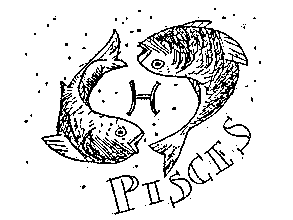

双 鱼 座

**符 号 的 含 义**

> 再来看看星座的符号，背对背的鱼儿似乎没有意识到彼此的存在，它们的双眼注视着远方。双鱼座的鱼儿被联结起来，却并不是以寻常的观看方式联结起来的，这是变动星座所特有的一种**超出感官之外的觉知**。它们的注意力关注于什么正在转变，什么不同步。它们注意到色彩怪异的小鸟或扭曲的符号。它们知道世界的衰退，能意识到突变和矛盾，它们的注意力被不同寻常的事物所吸引。

**5****双鱼座：是梦还是真？**

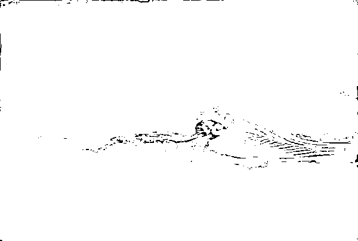

我有一个朋友上升点在双子座，水星在双鱼座，她常常从去另一个世界的梦中醒来。她身边躺着的男人不是她的丈夫，她住的房子不是她的房子，她所在的城镇也不是这座城镇。她曾经很害怕，但是在做了多年这样的梦以后，她被说服了，她只须选择另外的那种生活，那她就将醒过来进入那种生活，而不是进入现在这种生活。她这种处在两个世界之间的体验极其真实。这些星座赋予我们一种能力，能够摸索不同世界之间的空间，溜进溜出。在她的日常生活中，她是翻译，在语言之间来回转换。

**变动星座常常处在运动之中，但是它们并不是真的和行动有关。那是基本星座的领域，基本星座是新方向的提供者，是占星世界的发起者和建造者。**事实上基本星座过去曾被称作“可移动的”。

*   把变动星座看作事物之间的运动。

*   它们来来回回，将各个领域编织在一起。它们更为古老的名字之一就是共同（common），源于拉丁单词 communis，意思是“被所有人或很多人所共享”。

*   它们同时具有固定和基本的性质，而且总是将两者混合起来。**它们是占星世界里的 O 型血。**

*   你几乎可以把它们带到任何地方，和任何人在一起。它们上上下下，进进出出，到处奔波，在你我之间周旋；因为不同的方向都汇聚到这些星座的中心。

**6****变动是永存不变的准则**

# 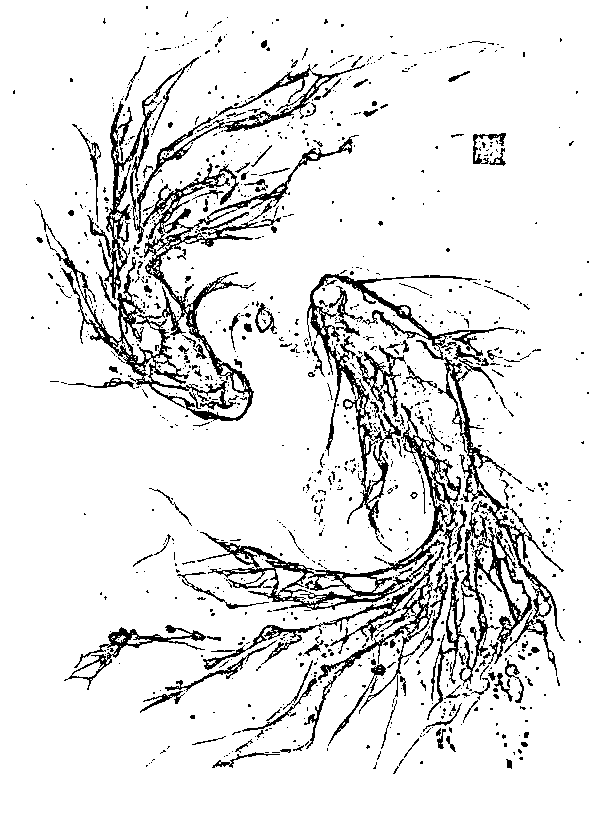

对于那些极为固执，或在内心深处受到指引的人来说，这可能看起来漫无目的、浪费精力，并且考虑问题不周全。我们可以这么来考虑这个问题，花粉被传播，种子被播撒，新的生命诞生了。我们已不再去过多地关注果实背后的富饶之风，或是带来春季肥沃土壤的洪水。河流之上建造了水坝，果实经过基因改造，我们的肉食是打包好的，而不是通过打猎获得，我们很少有人会在刚刚犁过的土地上播种。

中国哲学谈到两种基本能量，即创造性的和接受性的，这两种基本能量通过运动和变化产生了万事万物。这就是**道，世界上永存不变的准则**。他们将变动原则作为核心，建立了他们对世界的理解。**当变动被漠视或轻视时，文化就可能在对行动的恒定需求（基本原则）和对持久的渴求（固定原则）之间被扭曲。那可能是让人相当不安的旅程。**


**小贴士**

双鱼座代表**雨水到春分**这个阶段，雨水位于每年正月十五前后（公历 2 月 18-20 日），是二十四个节气中第二个节气。此时，气温回升、冰雪融化、降水增多，所以雨水也是反映降水气象的节气。

《月令七十二候集解》中说：“正月中，天一生水。春始属木，然生木者必水也，故立春后继之雨水。且东风既解冻，则散而为雨矣。”

雨水时尚属早春，气温尚低，不应急于脱去冬衣。雨水前后应当着重养脾。

**◆ ◆ ◆  ◆ ◆**  

 ****特别提醒：****本文由作者授权首发于若道，转载请注明“转自若道”。****

双鱼座是饱经世事的老灵魂？**2016 年 5 月 19 日**，蒋颖老师主讲的若道占星核心课程**Level 1-2**要开课了！她将带领你学习星座、太阳、月亮、行星、月亮交点等知识，让你进入占星学的世界！详细内容请点击“**阅读原文**”了解。

↓


# 忘掉那些不切实际的新年目标吧，干货在这里！

> 原文：[`mp.weixin.qq.com/s?__biz=MzA5NjA0NTAxNg==&mid=402927198&idx=1&sn=ef3315fb45ef06e04ab6f4260647e571&chksm=0d469ce93a3115ff1b305bdf3e36a7f96a1f1fb6abca12dd993bcd40668ffa812e87a1a8f336&scene=126&sessionid=1692738872#rd`](http://mp.weixin.qq.com/s?__biz=MzA5NjA0NTAxNg==&mid=402927198&idx=1&sn=ef3315fb45ef06e04ab6f4260647e571&chksm=0d469ce93a3115ff1b305bdf3e36a7f96a1f1fb6abca12dd993bcd40668ffa812e87a1a8f336&scene=126&sessionid=1692738872#rd)

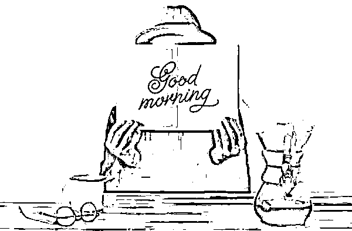

作者/唐娜·坎宁安

译者/Elle 校对/Christy

■ 我 2016 年的新目标就是完成 2015 年那些本该在 2014 年完成的 2013 年就信誓旦旦要完成的 2012 年制定的目标。

⊙﹏⊙ ⊙﹏⊙

from 焦虑的你

■ 很多新年愿望其实都挺蹩脚的，过于笼统。你信誓旦旦地宣称假期后“应该要做点什么”，却很快将誓言抛之脑后。现在教你一招特别管用的目标制定法：紧跟你星图中的行进。

from 占星师唐娜·坎宁安

**1**

**制定企图而非愿望**

对于我来说，多年来屡试不爽的一招是：设立一组当年可达成的目标，然后，我试着将它们当作“企图”，而非愿望，并将这个列表放在我的一堆文件里。我想每个人都有一堆堆的文件，不是吗？

很多时候，当我定期清理文件再次看到这张列表时，我已经完成了其中的大部分事项。这个方法成功的秘诀之一在于，制定目标的时候要紧密联系个人出生图中来年的行进。关键在于制定计划的过程以及对于目标的专注度，而不是强迫自己盯着这个列表看。


**占星课堂**

行进的意思是，行星当前在天空的位置和出生时的位置构成的特定的几何图形。出生星图是不变的，但天上的星星是变动的，它们的行进会触发出生星图的行星或相位，进而引发心理和现实层面的事件。

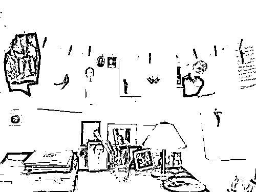

**2**

**制定计划的 5 个方法论**

①首先，将你出生星图上的行星以度数为顺序进行排列。将星图上重要的元素都列出来：太阳、月亮、上升点、中天、各个行星，以及其他你喜欢的元素。将这些元素按照度数而不是黄道上星座的顺序进行排序。**这样做可以让你找到你星图上在今年会受行进影响的“热点区域”。**

**热点区域是指，若干个星图上的元素聚集在一段小范围的度数段。**比如上图巴拉克·奥巴马的出生星图度数列表中的**0-8 度和 27-28 度**。（他的出生证明显示他出生于美国夏威夷火奴鲁鲁当地时间 1961 年 8 月 4 日，晚上 7:24 分。）

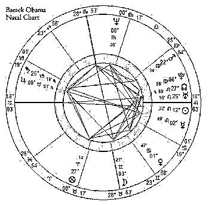

巴拉克·奥巴马的出生星图


**奥巴马星图的热点区域**

**0° 52’ 水瓶座木星**

**1°46’ 巨蟹座金星**

**2°22’ 狮子座水星**

**3°22’ 双子座月亮**

**5°19’ 双鱼座凯龙星**

**6°59’ 处女座冥王星**

**8°36’ 天蝎座海王星**

12°33’ 狮子座太阳

18°03’ 水瓶座上升点

22°35’ 处女座火星

25°16’ 狮子座天王星

25°20’ 摩羯座土星

**27°18’ 狮子座北交点**

**27°18’ 水瓶座南交点**

**28°54’ 天蝎座中天**

②找到这一年重要行进的度数范围。

③定位出生图行星以及行进行星的宫位。这会告诉你，在这一年中，你可以在生活的哪些领域进行努力。事实上，较为困难的行星和相位指明了那些你不得不采取行动做出改变的局面。

④设立一些与行进相关的可行的计划和目标。行进会给你额外的能量和驱动力，去完成那些与行进覆盖的行星、星座、宫位相关的目标。

⑤有意识地运用企图的力量来“确定”你的目标。我非常建议你去读一读韦恩·W·戴尔博士在《企图的力量》(*the Power of Intention*)一书中提及的技巧。

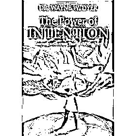

**3**

**祝愿你的目标都实现**

一天早晨，我收到一封一年前我写给自己的信，祝福我 2015 年的目标都能实现。我已经完全忘了写信这件事，所以收到信很惊喜。我忘了有一个网站叫做“未来的我”，在那里你可以存储你想写给自己的信息。这条信息会在你设定的日子通过电子邮件发送给你。我打算立马再写一封信，寄给来年这个时候的自己！也许你也可以多给自己一些爱与支持。

读者们，你自己的星图呢？你的星图上有热点区域吗？今年的行进显示哪些生活的领域应该是你重点关注的呢？**如果你觉得公开这些目标会增强你实现它们的决心，欢迎大家在留言区分享彼此与行进相关的目标。**

**◆ ◆ ◆  ◆ ◆**

******特别提醒：本文由作者授权发布于若道******，**转载请注明“转自若道”。******

根据行进制定不同的年度计划！**2016 年 3 月 15 日**，大卫老师主讲的若道占星核心课程**Level 5**要开课了！在这个阶段，你将学习各种预测技术及行星周期。通过这些预测工具，你能够预测和规划人生。提前报名付款有**早鸟价**哦！详细内容请点击“**阅读原文**”了解。

↓


# 金星入水瓶座 | 我爱你，但我不属于你

> 原文：[`mp.weixin.qq.com/s?__biz=MzA5NjA0NTAxNg==&mid=402920194&idx=1&sn=ee06353b79733e1cee30d684e3637e61&chksm=0d46a1b53a3128a32defade66c9d185ee038050ec90ce05d66c12c095a6165620652e9811d19&scene=126&sessionid=1692738872#rd`](http://mp.weixin.qq.com/s?__biz=MzA5NjA0NTAxNg==&mid=402920194&idx=1&sn=ee06353b79733e1cee30d684e3637e61&chksm=0d46a1b53a3128a32defade66c9d185ee038050ec90ce05d66c12c095a6165620652e9811d19&scene=126&sessionid=1692738872#rd)

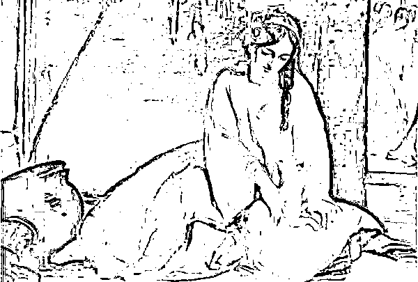

有一种冷叫你妈觉得你冷，这样的感受你有过吗？你是否抵触这种感觉？而同时，你又在对你爱的人去做同样的事？2 月 17 日中午 12：18 左右，金星进入黄道上的第十一个星座——水瓶座，并将在此停留至 3 月 12 日左右。当金星进入水瓶座，我们不妨去思考那些爱与边界感的问题。

**你被亲戚们盘问了吗？**

在刚刚过去的春节假期，你是否也被亲戚们问了这样一些问题：

——“你都这个年纪了，怎么还没有男朋友？”

——“你们结婚这么久了，怎么还没有孩子？”

——“你为什么不找一份稳定的工作？”

——“之前那份工作多好，为什么要辞职，你到底想做什么？”

面对这些问题，如果你感到委屈、不满，想要反驳一句“这是我自己的人生，不需要你来指手画脚”，那么，就是星图上的**水瓶座或天王星**在对你说话了。

中国历来是一个人情社会。在这样的社会里，人与人之间很亲密，却缺乏边界感；主流的价值观是和谐、从众，用占星学的语汇来说，**水瓶座追求个性和人格独立的价值观，在我们的文化里是相对缺失的。**

2 月 17 日中午 12：18 左右，金星进入黄道上的第十一个星座——水瓶座，并将在此停留至 3 月 12 日左右。当金星进入水瓶座，我们不妨去思考那些爱与边界感的问题。

**金星——与美貌和爱情有关**

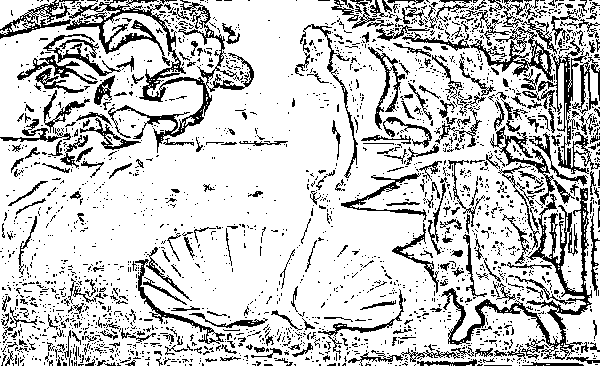

金星是一颗带有强烈的女性色彩的行星。在西方各国的神话中，金星都被描述为美丽的女性形象，其中最为人所熟知的要数希腊神话中的爱与美之女神——**阿佛洛狄忒**。她与美貌有关，与爱情有关，也告诉我们人生在世，不妨尽享种种声色之乐。

我们星图上的金星，描述着我们如何给予爱、接受爱；它描述着我们的审美标准，以及我们用怎样的方式享受人生。

**金星水瓶座，会是个怎样的姑娘呢？**

当爱享受、爱和谐的金星来到了水瓶座，我们不妨想象，这位女神**少了一些温柔、和顺的气质，而变得自由洒脱，颇具个性****。**

她来去如风，有自己独立的思想，也只想按照自己认定的真理行事。因为水瓶是一个风象的固定星座，**真理、个性和自由在水瓶座的价值观中具有高于一切的地位，所以水瓶座金星关切的不再是物质层面的享受，而是精神层面的丰富与满足。**

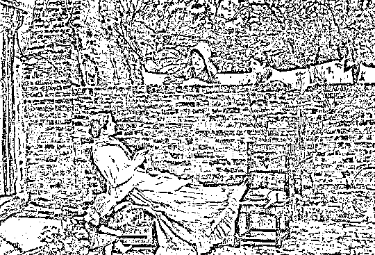

她**好奇心十足，想要了解各种新的事物**；她对一切人和事物都抱有**开放的心态，愿意理解和包容各种不同的生活方式，也不乏尝试的勇气，**这让她看起来很酷。

水瓶座金星是**独立的，她不希望依赖别人**。她乐于交朋友，**“朋友”关系对她来说是最为舒适的，因为朋友意味着相似的兴趣和价值观。**我们会看到水瓶座金星在社交场合与人们谈笑风生，却始终保持着淡淡的距离感。那距离感，并非出于对安全感的执念，也并非因为害羞而不愿展现自己，而是因为她需要某种距离来保护独立的自我。

在外人看来，水瓶座金星有时候显得并不那么容易亲近，但有一点却是不容否认的，那就是**水瓶座金星的真诚态度**。她或许不爱多说什么，却也不会说假话，而且，那些**不够真诚、不够独立、没有独立思考能力的人，也难以得到水瓶座金星的青睐**。她不想装腔作势，也不想刻意讨好自己不喜欢的人，以维持一段表面上和谐的关系。所以，当金星落入水瓶座，这颗行星本身的和平、谐调的特质难免会有所减弱。

**金星水瓶座如何去爱**

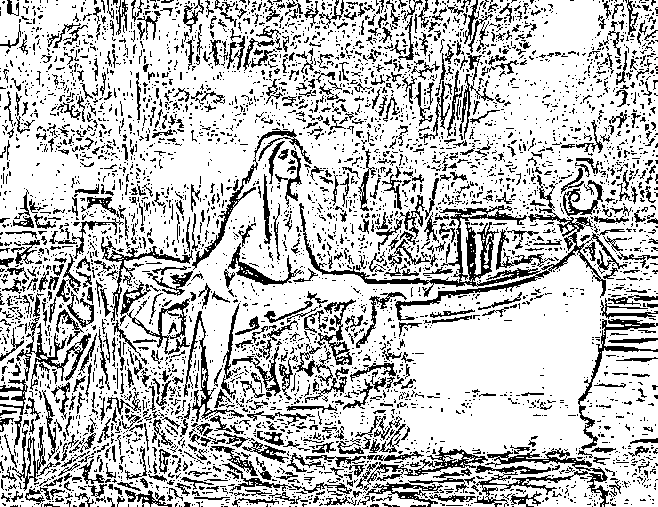

**金星在水瓶座教给我们边界感和独立自我的重要性，可是对于金星水瓶座来说，这一切也可能是挑战。**

**金星水瓶座的爱情**

水瓶座金星的爱情，常常是从朋友开始的，但即使成为了恋人，她还是希望和对方像朋友一样相处，不希望任何一方以爱之名来控制对方。尽管她对爱有着同样的渴望，但她不想让任何一种爱变成对自己的束缚。

在水瓶座金星的恋爱关系之中，“自由”、“空间”就像空气一样重要。如果没有了这些，水瓶座金星一定会想方设法尽快逃走。要维护一份稳定而亲密的关系，特别是在关系中为对方着想、为对方妥协，都并非易事。

**金星水瓶座的沟通**

**水瓶座的沟通方式是理智为先的，这种态度可能会让对方感觉冷漠、疏远甚至受伤**。金星水瓶确实喜欢交流，但他们的交流更多停留在心智的层面，停留在对“真理”、“原则”的探讨。

心理学中提到了沟通的四种模式，其中的“超理智”模式就有水瓶座的影子：遇到事情，他们关注的不是对方的感受，而是道理本身。这样做，给对方的感觉可能是：**你懂这个世界上所有的道理，就是不懂得我的感受；你关心一切真理，就是不关心我。**

在关系中，既保留自我，又不过分疏离；既有情绪的表露、情感的沟通，又有观念的交流。这是金星水瓶的理想形态，却也不仅仅是金星水瓶需要学习的功课。

**金星水瓶座教会我们的事**

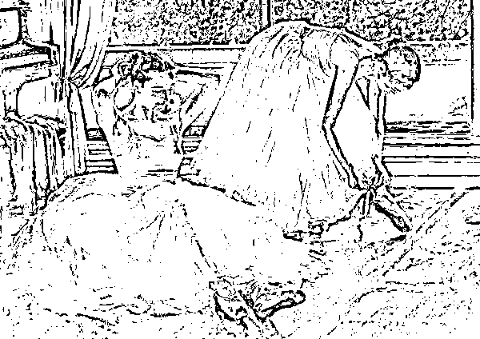

当金星进入水瓶座，我们也可以一起得到这样的启示：

*   即使是和最亲密的人在一起，仍然需要**保留自我，保留必要的边界感。**在伴侣关系中，尊重对方的自我；当为人父母时，让孩子的自我有独立成长的空间。

*   每个人都有自己的生活方式，与其秉持着自己的价值观评判别人，不如**试图了解对方的想法，并从中看到可取之处**。

*   在亲密关系中，既需要有心智层面的交流，但更可贵的，是**把自己的情绪感受向对方真诚地敞开。**除了告诉彼此“我在想什么”，还要记得分享“我的感受是什么”。如此，才有深层次的亲密体验。

**作者简介** 

**沙沙**：占星咨询师，占星专栏作者，国家二级心理咨询师。2010 年创办工作室“九月占星馆”，2013 年通过 ISAR 职业占星师资格认证考试，成为首批在中国大陆通过该测试的占星师之一。长期研习出生图、关系盘、流年预测等技巧。希望通过星图，帮助来访者实现有效的自我觉察。 

新浪微博：九月占星馆

微信公号：九月占星馆（jiuyuezhanxing）

个人微信：zhouzhe7752（添加请注明“占星咨询”）

长按二维码，让金钱涌向传播知识与智慧的人~

 

**◆ ◆ ◆  ◆ ◆**  

****特别提醒：****本文由作者授权首发于若道平台，转载请注明“转自若道”。****

想更多了解 12 星座吗？**2016 年 5 月 19 日**，**蒋颖**老师主讲的若道占星核心课程**Level 1-2**要开课了！她将带领你学习星座、太阳、月亮、行星、月亮交点等知识，让你进入占星学的世界！详细内容请点击“**阅读原文**”了解。

↓


# 在这里，拥有属于你的年度运势

> 原文：[`mp.weixin.qq.com/s?__biz=MzA5NjA0NTAxNg==&mid=402920194&idx=2&sn=737e0ccd071341355c223898a63401f3&chksm=0d46a1b53a3128a334a4a6b11685b8c9ccfa5be546ce3fd17b36aa14c26bf0cbf0f20daa1ae0&scene=126&sessionid=1692738872#rd`](http://mp.weixin.qq.com/s?__biz=MzA5NjA0NTAxNg==&mid=402920194&idx=2&sn=737e0ccd071341355c223898a63401f3&chksm=0d46a1b53a3128a334a4a6b11685b8c9ccfa5be546ce3fd17b36aa14c26bf0cbf0f20daa1ae0&scene=126&sessionid=1692738872#rd)

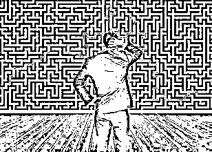

很多星座专家都在发布运势，

但久了你开始思考：

难道这个世界上只有十二种运势么？

难道所有的白羊座的运势都是一样的吗？

**在哪里能够找到既专业，又不昂贵的个人年度运势呢？**

**让若道君来回答你吧**

若道隆重推出年度运势报告，你想要的，我们都有！

拥有这份报告，你将看到未来一年重要行运的影响，

什么时候适合恋爱，什么时候适合大展宏图，

哪段时间要注意身体健康，哪段时间开车旅行得小心，

这些问题，在报告里都能找到答案。

**最重要的，只要 198 元哦！**


**>>>>**

**有关报告的各种提问**

**①付款后什么时候可以看呢？**

付款以后就可以看了。查看方法详见页面最下面的“重要提醒”。

**②点不开购物车？** 

点击购买页面的“加入购物车”，然后点击页面右上角的购物车图标，进入“我的购物车”，在那个页面填写订单信息。需要特别提醒的是，填写订单时，**需要仔细核对每一项信息哦。出生时间、误差时间、出生地，以及运势开始时间的确认**。因为它们跟报告的准确性和你想要的运势开始时段相关。

**③报告都包括哪些内容呢？各方面运势都会概括到吗？**

主要是接下来一年的天象对你的影响，也许各方面都有涉及，但也不排除接下来一年，你的运势主要集中在某一特定领域。具体内容要视你个人的出生星图而定。

**④刚提交就能看了，这是提前写好的吗？**

是的，报告是提前写好的。虽然报告的发送不过几秒，但这背后是漫长的准备时间，且不说写作者多年的占星积累和经验，报告的写作、翻译、编排、讨论、测试以及技术开发和支持可不是几秒钟就能完成的哦。嗯，若道君认为，衡量报告的标准在于内容是否对您有帮助，而不是它抵达您的时间的长短。

**⑤报告能详细到什么程度？能举些栗子吗？**

根据测试，报告大多在 5000 字以上，七八千上万字的不在少数。具体的情况，根据出生星图不同而不同。基本结构是，按照时间顺序，将接下来一年会当事人产生较大影响的天象进行阐释和解读，提出相应的应对之策。

**⑥没有看过每个人的星图，怎么会先写好报告呢？**

如果你懂一点占星学，会了解预测是根据行运星图行星和出生星图的行星的比较来的。大卫·瑞雷老师已经把各种比较的解读事先写出来了。因此，根据你的星图和行运图，一年的运势的大概就出来了。

**⑦为什么报告里会出现“在这两年”“今后两年”这类的文字，时间段明明是一年的期限啊？**

因为有的运势的影响时间不仅仅只有一年。有这类文字的亲是赚到了哦。

**⑧填写订单详情中“选择报告开始时间”是指什么？**

就是你可以选择运势开始的时间，从那个时间开始以后的一年是报告涵盖的时间。

**⑨出生时间有 30 分钟左右误差的话会影响报告的准确性吗？**

会有一定影响，但如果重大天象没有经过你星图的敏感点的话，影响不会太大。请仔细填写订单，**在填写出生时间时，根据情况选择“偏差在半小时之内”或者“偏差在 2 小时之内”，系统会根据你的选择，绘制星图，做出判断。**

**⑩这个报告收藏起来，打开就可以看吧？**

进入若道公众号，点击下方菜单栏的“各类查询”——“个人中心”——“我的报告”就可查看过往的报告。

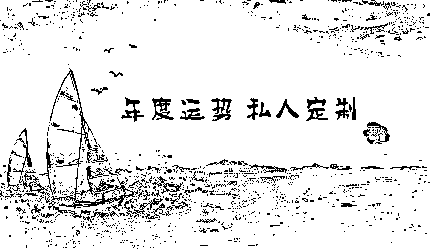

不要矜持啦

赶快点击**阅读原文**获取专属于你的年运报告吧！


**重要提醒**

春节期间，如果您购买了若道的报告，请通过下列方式查看：

■ 点击下方菜单栏的“各类查询”——“个人中心”——“我的报告”即可查看。很方便的~


# 报告查看传送门~

> 原文：[`mp.weixin.qq.com/s?__biz=MzA5NjA0NTAxNg==&mid=402920194&idx=3&sn=68b36d9d4349430bf0918bb8093bbd9c&chksm=0d46a1b53a3128a37f37f6c1f0632f7d14ee6573dd149d265a32cfc50b705411e7c1f4ac4759&scene=126&sessionid=1692738872#rd`](http://mp.weixin.qq.com/s?__biz=MzA5NjA0NTAxNg==&mid=402920194&idx=3&sn=68b36d9d4349430bf0918bb8093bbd9c&chksm=0d46a1b53a3128a37f37f6c1f0632f7d14ee6573dd149d265a32cfc50b705411e7c1f4ac4759&scene=126&sessionid=1692738872#rd)

若道君还在家过年

不能在后台勾搭各位

下周一再见

◑﹏◐

文末重要提醒

附上报告查看传送门

└(^o^)┘


**重要提醒**

春节期间，如果您购买了若道的报告，请点击“**阅读原文**”查看。

# 拉斯维加斯算什么，到 D 星球领结婚证才酷呢

> 原文：[`mp.weixin.qq.com/s?__biz=MzA5NjA0NTAxNg==&mid=402914468&idx=1&sn=9f3765b3681467550f51f71e8c3ce774&chksm=0d414e133a36c70598eb6aac5f0c7204d076929476ee4ce493adca128f983c11ede16f795674&scene=126&sessionid=1692738872#rd`](http://mp.weixin.qq.com/s?__biz=MzA5NjA0NTAxNg==&mid=402914468&idx=1&sn=9f3765b3681467550f51f71e8c3ce774&chksm=0d414e133a36c70598eb6aac5f0c7204d076929476ee4ce493adca128f983c11ede16f795674&scene=126&sessionid=1692738872#rd)

作者/大卫·瑞雷 蒋颖

译者/李含 校对/江艺

柏拉图曾经在理想国里幻想由哲学家来做国王。我有天做了一场爱情咨询后，喝了一些糊辣汤，然后就做了一个梦。以下是梦境。 

此故事纯属虚构。

**D 星球老大的四个结论**

在银河系的一角，有一个 D 星球上，这是一个非常年轻的星球，年轻到只有 3 代人生活在这个星球上。第一代是不知道从哪里乘“六月花号”来的移民，他们看了《星际穿越》后，找到了《火星救援》的飞船，到了 D 星球。

开始的时候，这个 D 星球没有什么婚姻制度，大家开心了就住在一起，开心了就生下下一代 D 宝宝。到了第三代，有一个智者说，这样下去，情况比较混乱，我们需要有一个婚姻制度来管理。听说银河系中，听说地球人最重视爱情和婚姻，也是婚姻制度最发达的地方，于是 D 星球老大决定亲自去一趟，学习考察。

但是 D 星球的老大去了地球某国一趟回来后，向 D 星球人民代表大会报告，他认为地球人的行事非常匪夷所思。

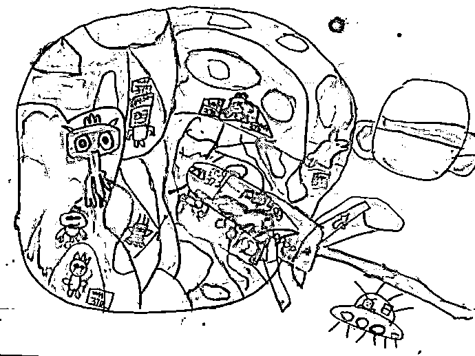 

1 地球人觉得“开车”比“结婚”重要

他观察到，在地球上开车上路是需要如下程序的：

**进驾校→培训→笔试→路考→拿驾照→上路→违规开罚单→年检→年检不合格吊销驾照**

而结婚的程序是这样的：

**恋爱→体检→结婚证→离婚证**

“开车还有笔试、路考，而婚检只有体检！仿佛结婚的是两只狒狒！”这是 D 老大脑子里冒出的话。

你一定要原谅 D 星球老大， 他是一个非常轴的处女座，得出结论完全使用推导方式。比如，在他的星球上，对管理者而言，一个事情的重要性是由流程检查的缜密性决定的。因此，他认为，对于地球人而言，“开车”比“结婚”更重要。

2 地球人觉得“手机”比“结婚”重要

他还看到，在地球上，人们推崇新近诞生的两个伟大的手机厂商，苹果和小米，以及两个伟大的人物，乔布斯和雷军。

但 D 星球老大没有看到有什么有名的大企业，是为帮助人们“婚姻幸福”服务的。

从大企业组织在做什么事情，可以看到社会资源的分配，因为钱、“油菜花”的人都到大企业去了嘛。从社会资源的分配，可以看到管理者认为什么更重要。

因此，D 老大断定，对地球人而言，“手机”比“结婚”重要。

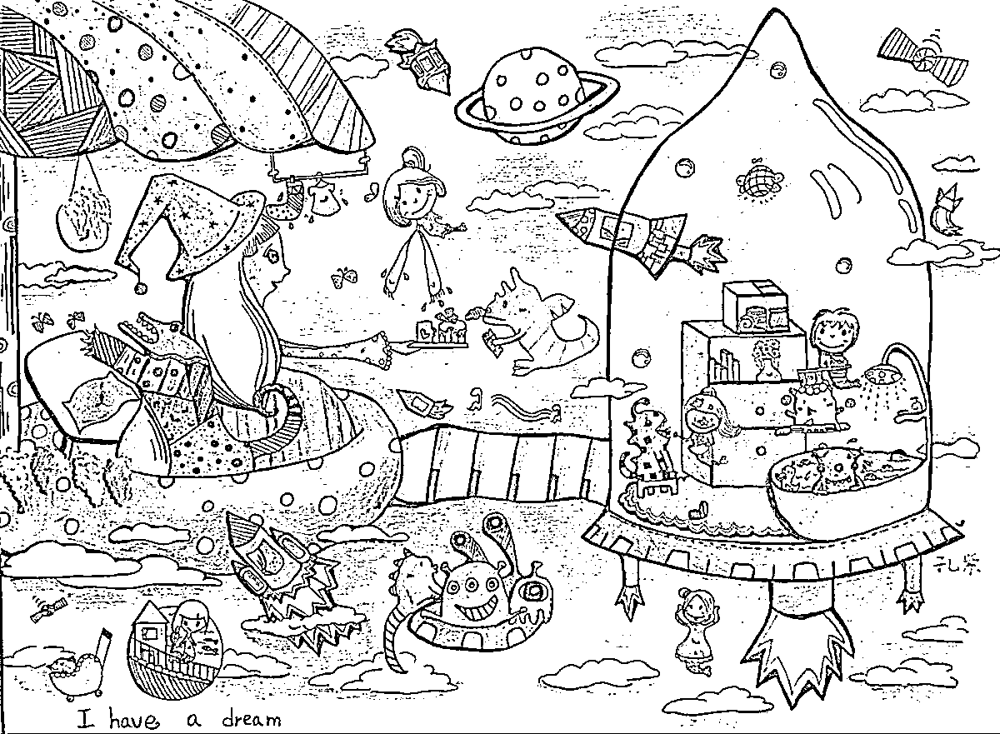 

3 地球人觉得“余弦定理”比“结婚”重要

他看到，在地球上，人们要上数不清数不清的学，考数不清数不清的试，高中生，连 Sin、Cos 都学了，然而没有一门课是跟爱情、性、婚姻相关。

他还观察到，地球人一半的痛苦来自于“爱情婚姻”的痛苦，刑事犯罪中的仇杀一半来自于情杀。

因此，D 老大断定，地球人根本不想追求爱情婚姻的幸福。

4 地球人的结婚证书是样怪东西

对喜欢文书的处女座 D 星球老大看来，地球的结婚证是非常奇怪的一样东西。

证书有几类。

*   基于身份的证书，如身份证，这是一种基于人口属性的证书，合法公民皆可有。

*   资格证书，毕业证、驾照、会计师证都属于资格证书，这些证书需要通过考试，达到一定要求获得；

*   荣誉证书，这些证书属于为了表彰个人的贡献颁发。

**而地球上的结婚证是哪一类呢？似乎是人人皆可获得，但又需要体检；一辈子不领结婚证的人，似乎很奇怪，因此不太荣誉；但如果拥有几个结婚证，似乎也属于不太荣誉。**

这可真是奇怪。

你说为了保护公民权利，那么属于合同吗？这个合同又没有清晰的条款。结婚时都说一心一意，结婚中一心几意的人到处都是，到处都是看不到的“不可抵抗力”条款，除了离婚时分财产，基本很难监督执行。

对于一是一，二是二，一切需要清楚明了的处女座 D 星球老大来说，地球的结婚证是最奇怪的证书，是他处女座的大脑无法理解的。

**D 星球人不得与地球人通婚！**

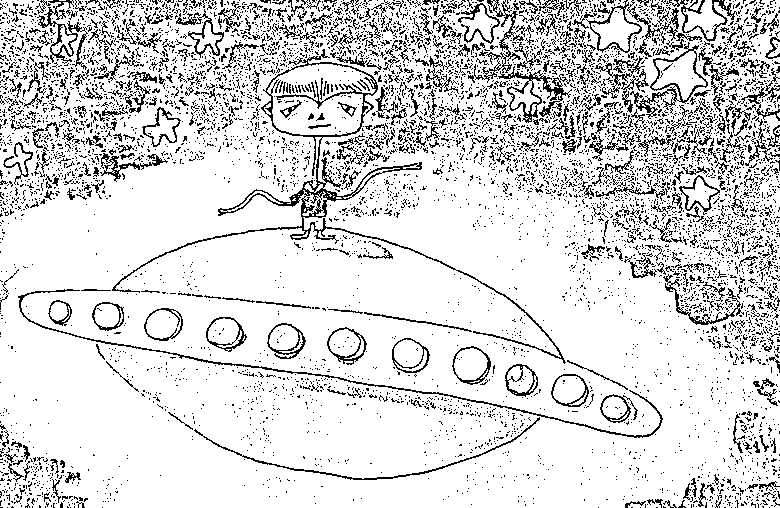

因此，综上所述，在 D 星球人民代表大会上，按照处女座 D 星球老大的爱情婚姻取证标准，地球的上跑的都是“文盲”、“无证驾驶者”和“无证驾驶者”的后代，属于爱情婚姻的“马路杀手”。

最后，通过了“D 星球三届一中全会”决议， 决议规定，**D 星球居民不得与地球人通婚！**

**D 星球人该怎么结婚？**

处女座 D 星球老大是一个爱情婚姻狂人，一个占星师，也是一个驾驶爱好者，他决定模仿地球的教育体制、驾驶证的管理制度，综合他的占星学知识来制定 D 星球的婚姻教育和婚姻制度。以下是他的政策。

*   从幼儿园开始直到大学，教“爱的课程”，作为必修课，考试不及格者不得升学

*   从高中开始教“占星课程”，这门了解自我改进自我的课程，作为必修课

*   在大学设爱情婚姻学院，该系对于一切影响爱情婚姻的幸福程度的科目进行研究和教学，甚至包括“婆媳关系”

*   星球投入资源，组建爱情婚姻培训企业

*   所有想要结婚的人必须进婚姻培训学校进行学习

*   想要取得结婚证的人必须通过相关考试，包括爱的真情考试、沟通考试、冲突处理能力考试、性爱考试、家族关系考试等等

*   考试分笔试、口试、实习期，全部通过者可以领取结婚证

*   对于结婚证进行年检，年检不合格者吊销结婚证

**D 星球人可以领取不同的结婚证书**

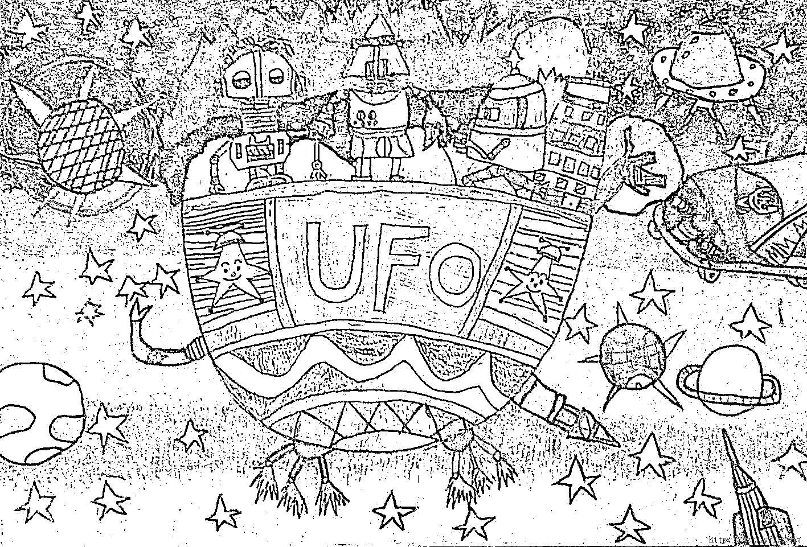 

结婚证呢，考虑到 D 星球人的 D 星人性，考虑了考试成绩，综合了占星学的智慧，是这么颁发的。

火星结婚证

**** 

**时长**：2 年

**适用人群**：

这个结婚证对于那些想要通向更长久的婚姻，考试成绩虽合格但不太理想，或者恐惧长期承诺的人制定。它可以让你们知道彼此应付争吵的能力如何。

但要注意，火星结婚证对家庭计划并无帮助。

**具体条款**：

*   选择这种结婚证仅适用于**你们还没有对组建家庭感兴趣，或者你们也已经过了生育年纪。**

*   这一结婚证非常适合于那些**由初次约会的激烈争吵而开始的冲动关系：**天雷勾动了地火，发生了性关系，或一起去了地球的拉斯维加斯或澳门。

*   在拥有时就好好享受吧。**如果这段关系可以继续，那么你们可以在两年后续期，或者选择结束。**

土星 1/4 周期结婚证

**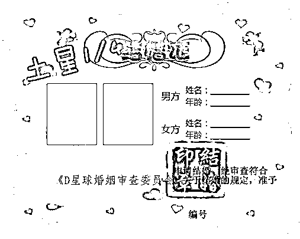** 

**时长**：7 年

****适用人群**： **

**这个结婚证适用于期望走向更长久关系的人。**我们都听说过地球人说“七年之痒”。每隔 7.4 年，土星会与它 7.4 年前的位置成四分相，也就是 90 度。这是一个考验承诺的时间。你们有没有担负起作为夫妻的责任呢？有没有以公平约定的方式完成任务？你们在一起共渡的美好时光够不够多？

**具体条款**： 

*   土星是功能的代言人。你们的婚姻是否像地球上的瑞士手表那样运转良好？还是像宝路华那样从一段传奇变成了一个笑话？婚姻需要努力！

*   土星结婚证说明你们要挽起袖子努力奋斗了！如果你们是“认真的”，那么这一计划适合你们，尤其如果你们双方都有事业抱负，想要在获得成就和财富之后建立一个家庭。

*   如果在 7 年之后无法继续，你们可以结束，如果运转良好，则可以续期！

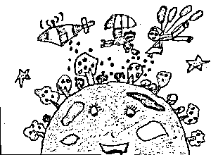

木星结婚证

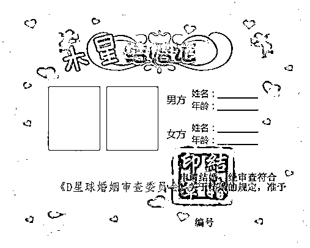 

**时长**：12 年

**适用人群**：

 你们俩都是乐观的人吧？好，那么木星结婚证会适合你们！**领取这一结婚证的伴侣们会用幽默与自嘲来应对生活中的小小意外。**

**具体条款**：

*   丈夫失去了工作？没关系！用婚礼时收的份子钱来应对紧急情况吧！

*   想要孩子？为什么不呢？生一个。

*   觉得子女束缚自己了？送他们去地球！或者自己去星际旅行吧！分离让心也变得温柔，对么？所以这 12 年似乎只有 3 年那么久。

*   **这份结婚证书非常适合一同或分开旅行的伴侣们。**如果在 12 年后，你们欢笑依旧，你们就可以续期，带上升级版的旅行包！如果没有续期，好吧，人生毕竟就是一场不断学习的冒险之旅，对么？

冥王星结婚证

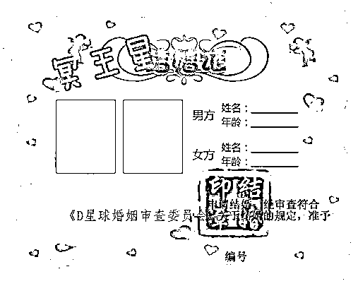 

**时长**：248 年

****适用人群**： **

**这个结婚证适用于来世。**

**具体条款**： 

*   如果你们深爱彼此，3 辈子不愿意分离，需要海枯石烂的婚姻，且愿签下来世契约；

*   或者你们之间有深仇大恨，且愿意不要孩子。

*   如果您身体不好，更要慎重，因此没准就变成了 N 辈子无法分开。

*   我们会慎重颁发，也请你请慎重领取。此生一诺，来世必践。

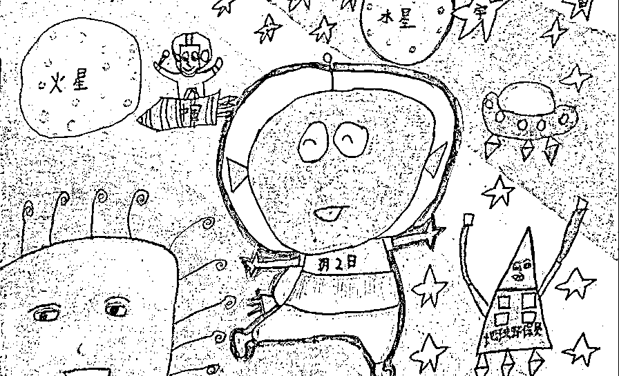

**你愿意移民到 D 星球吗？**

以上就是 D 星球老大的施政纲领，在实行这样的政策后，D 星球的爱情婚姻学院成为录取考分最高的学院，因为 D 星球最伟大的企业是爱情婚姻行业的企业，需要源源不断地人才。

有了这样的爱情婚姻政策，D 星球在银河系中，成了最受欢迎的移民星球，移民授理量大增。他们还建立了新移民培训班，为饱受爱情婚姻之苦的地球人进行培训。

而我，成了 D 星球国立大学爱情婚姻学院的荣誉教授，获得了终身教职。

哈哈哈哈！


**你愿意到 D 星球扯证吗？**

**想知道 TA 和你选择的结婚证是否心有灵犀？**

**转发让 TA 看到吧，没准 TA 正在 D 星球等你呢~**

投出你庄严而宝贵的一票

📹 /mp/newappmsgvote?action=show&__biz=MzA5NjA0NTAxNg==&supervoteid=2701948#wechat_redirect

**◆ ◆ ◆  ◆ ◆**  

 ****特别提醒：****若道享有本文版权，转载请注明“转自若道”。****

想知道占星师眼中的地球是啥样子？**2016 年 5 月 19 日**，蒋颖老师主讲的若道占星核心课程**Level 1-2**要开课了！她将带领你学习星座、太阳、月亮、行星、月亮交点等知识，让你进入占星学的世界！详细内容请点击“**阅读原文**”了解。

↓


# 宇宙天气 | 调整够了，能量 up up(2.15~2.21)

> 原文：[`mp.weixin.qq.com/s?__biz=MzA5NjA0NTAxNg==&mid=402908294&idx=1&sn=e3fc7c48d41adb5a1c19efb5daa5b7b7&chksm=0d4156313a36df27a055854f4ac7f3bb754ac07611993cc59ebb450f74f0309e7bedf782183a&scene=126&sessionid=1692738872#rd`](http://mp.weixin.qq.com/s?__biz=MzA5NjA0NTAxNg==&mid=402908294&idx=1&sn=e3fc7c48d41adb5a1c19efb5daa5b7b7&chksm=0d4156313a36df27a055854f4ac7f3bb754ac07611993cc59ebb450f74f0309e7bedf782183a&scene=126&sessionid=1692738872#rd)


作者/占星师 Cora

插画/七沐 图片/花瓣

**一周星象综述**

本周月亮经过金牛座、双子座、巨蟹座、狮子座。这是充满内省能量的一周，本周的关键词是“调整”。金星和太阳两颗内行星换座，也带来除旧迎新的气象，推动我们投入到新目标的建设中去。

> **本周重点星象事件是：**
> 
> **①   金星离开摩羯座进入水瓶座**
> 
> **②   太阳离开水瓶座进入双鱼座**

在过去 20 天里，经由摩羯座的金星，我们学会了以更加理性、务实的态度对我们身边的人事物进行价值评估，去严肃对待金钱和爱情议题。随着本周三（2 月 17 日）金星来到水瓶座，未来 20 多天的时间里，我们会更重视友谊、团体和人心所向的力量，同时我们的审美趣味和恋爱风格也可能变得更加别具一格，喜欢特别的东西或特别的人。

太阳在周五（2 月 19 日）进入双鱼座，带来“双鱼月”。未来的一个月，是迈向新生之前的孕育期，这阶段我们需要学习放手，让那些已经没有生命力或给我们的发展带来阻碍的事物安静地离去。腐败的落叶，将化作春天的肥料，滋养新生命的成长。

预祝大家元宵节快乐！

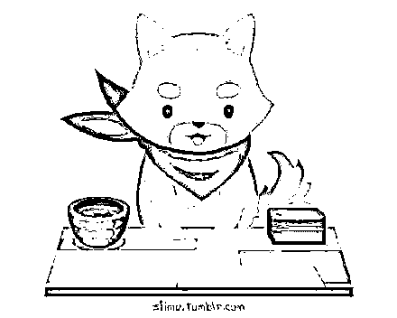

**每日星象**

**2 月 15 日**

星期一

**关键词：甜蜜**

月亮在金牛座，并与木星、金星形成和谐相位，这是安逸、踏实、有幸福感的一天。早晨易有怒气，欲望难以满足带来对他人的敌对情绪。晚间则轻松愉快很多，适合约见朋友，吃喝玩乐，爱情中也有更多的甜蜜和安全感。

**当日星象**

**07:14**  金牛座月亮三分处女座木星

08:14  金牛座月亮对分天蝎座火星

**15:48**  金牛座月亮四分水瓶座太阳

**18:55**  金牛座月亮三分摩羯座金星

22:34  月亮离开金牛座进入双子座

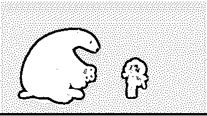

**2 月 16 日**

星期二

**关键词：学习**

月亮来到双子座，易有“静不下来”的感受。我们的好奇心提升，有更多问题需要得到解答，这是适合学习、观光、接触新事物的时候，但也容易被分散注意力，难以专心面对某个具体的问题。下午月亮四分海王星的缘故，易有混乱的感受，思绪繁杂且多变，容易受到外来信息的干扰和影响，此时宜静心观察和体会，不宜草率做决定。

**当日星象**

**02:38**  双子座月亮三分水瓶座水星

**14:16**  双子座月亮四分双鱼座海王星

**2 月 17 日**

星期三

**关键词：分辨**

月亮依然在双子座，并在中午前后与处女座的木星形成四分相，这是躁动、忙碌、不安分的一天。中午金星离开摩羯座进入水瓶座，未来 20 多天的时间里，我们会更加重视友谊和团队精神的重要性，我们的审美或恋爱风格会更加多元，青睐那些与众不同、有独特气质的人事物。整体说这是有利社交、学习和沟通的一天，但需要对自己所接收到的信息认真筛选辨别，不要盲目轻信、把听到的都当真。

**当日星象**

**01:11**  双子座月亮对分射手座土星

**05:32**  双子座月亮六分白羊座天王星

**11:03**  双子座月亮四分处女座木星

12:18  金星离开摩羯座进入水瓶座

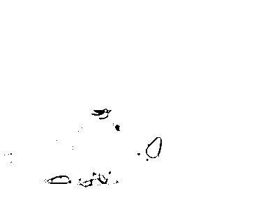

**2 月 18 日**

星期四

**关键词：治愈**

今天月亮来到多愁善感的巨蟹座，我们的情绪会变得敏感许多，更想要隐藏自己，静静地整理心情。晚间月亮三分海王星，是一个充满治愈能量的时刻，我们容易被感动，能够更容易地感受到人与人之间的情感流动，特别是亲情的温暖，也会更加愿意关爱他人。

**当日星象**

**00:38**  双子座月亮三分水瓶座太阳

03:23  月亮离开双子座进入巨蟹座

**19:50**  巨蟹座月亮三分双鱼座海王星

**2 月 19 日**

星期五

**关键词：煎熬**

上午及中午，巨蟹座的月亮经过“天冥四分”的敏感度数，一些深层的不安全感被勾起，令人感到煎熬。感情关系中的复杂面向和隐藏的部分或许被挖出，真相令心刺痛。下午，太阳进入双鱼座，开启“双鱼月”，这是允许旧事物死去同时让新生命孕育的时刻。未来一个月，我们需要安静调整，更多地关注自己的心灵和精神的部分，从灵魂深处发现隐藏的宝藏，让梦想的种子在泥土之下静静萌发。

**当日星象**

**09:35**  巨蟹座月亮对分摩羯座冥王星

11:43  巨蟹座月亮四分白羊座天王星

13:35  太阳离开水瓶座进入双鱼座

**16:49**  巨蟹座月亮六分处女座木星

**22:37**  巨蟹座月亮三分天蝎座火星

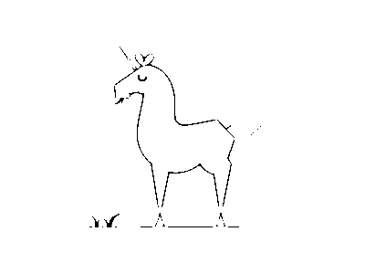

**2 月 20 日**

星期六

**关键词：快乐**

上午，月亮进入欢快活泼的狮子座，带来一个快乐满满、充满活力的周末。此时我们有更多的信心去面对现实中的困境，也更容易发现生活中的闪光点。傍晚时分，狮子座的月亮对分金星，这是狂欢与庆祝的时刻，适合去看演出、参与任何形式的娱乐活动，跟个人才艺表达相关的事会带来很多快乐，比如唱歌跳舞；恋情中也有更多的心动和兴奋感。

**当日星象**

**10:17**  月亮离开巨蟹座进入狮子座

**17:46**  狮子座月亮对分水瓶座金星

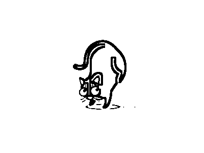

**2 月 21 日**

星期日

**关键词：鼓舞**

狮子座的月亮与土星、天王星形成三分相，这是自信心受到鼓舞、个人力量被支持的时刻。此时我们会对自己的目标更加笃定，并能很好地平衡现实条件与个人的期待。这是行事有魄力，能够稳定控制事情发展的一天。

**当日星象**

**03:29**  狮子座月亮对分水瓶座水星

**15:32** 狮子座月亮三分射手座土星

**20:07**  狮子座月亮三分白羊座天王星


**作者简介**

**占星师 Cora**，全美占星师联盟（AFAN）成员，国际占星研究协会（ISAR）会员，获 ISAR 职业占星师资质认证，斯蒂芬·弗里斯特《变幻的天空》译者，个人星象文章见诸《心探索》《北京青年周刊》《上海电视》《空中生活》等杂志媒体。曾跟随大卫·瑞雷系统学习占星学，现为全职占星师。

微信公众号：聆宇 FM（微信号：lingyudiantai）

个人微信号：CoraAstro

长按二维码，让金钱涌向传播知识与智慧的人~


**◆ ◆ ◆  ◆ ◆** 

**特别提醒：本文由作者授权首发于若道平台，**转载请注明“转自若道”。****

如何掌握星象，顺势而为？**2016 年 3 月 15 日**，大卫老师主讲的若道占星核心课程**Level 5**要开课了！在这个阶段，你将学习各种预测技术及行星周期。通过这些预测工具，你能够预测和规划人生。提前报名付款有**早鸟价**哦！详细内容请点击“**阅读原文**”了解。

↓


# 你那么好，你的爱人知道吗？

> 原文：[`mp.weixin.qq.com/s?__biz=MzA5NjA0NTAxNg==&mid=402901588&idx=1&sn=8a4c17c9c0d2ef99c91a669c7e26a480&chksm=0d4178e33a36f1f5d040ac94c60b147782cc7c8515e59d9cb2c05d114dda9b1b078b5a38d82f&scene=126&sessionid=1692738872#rd`](http://mp.weixin.qq.com/s?__biz=MzA5NjA0NTAxNg==&mid=402901588&idx=1&sn=8a4c17c9c0d2ef99c91a669c7e26a480&chksm=0d4178e33a36f1f5d040ac94c60b147782cc7c8515e59d9cb2c05d114dda9b1b078b5a38d82f&scene=126&sessionid=1692738872#rd)

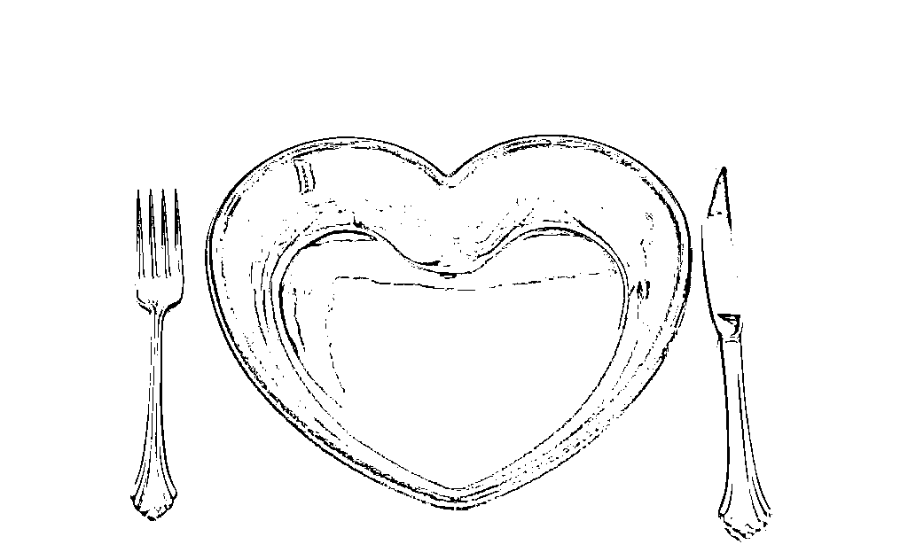

作者/大卫·瑞雷 

翻译/江艺 校对/李含

有太多的情感专家每天都在教你怎样去“搞定”你的心上人，通过各种手段让 TA 对你欲罢不能，但这之后呢？当两个人从五宫的一起快乐玩耍，走到七宫的缔结婚约，再到八宫的赤裸相呈，彼此融合，当你们彼此看到对方的一切，好的坏的，TA 还会爱你吗？你还会爱 TA 吗？你们靠什么度过一生？情人节之际，大卫老师帮你解读这一切。

**你可以让 TA 爱上你，但这之后呢？**

情人节似乎总是会刮起一阵“爱情星象”旋风，它许诺可以透露“单身人士”点燃永恒爱火的秘诀。或是如何在沉寂如死灰的婚姻生活中重新唤起爱意。这类星象师会提供诸如此类的建议：

*   **“让你的摩羯座男友知道你有多么尊重他。”**

*   **“以欢笑回应你的射手座男友开的玩笑，这样他会认为你是唯一懂他的人。”**

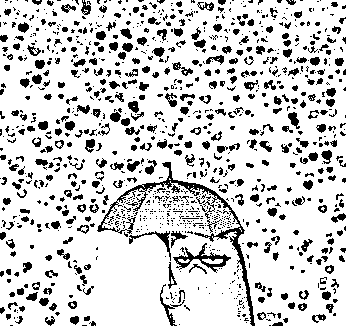

这显然很肤浅，这种建议吹嘘的都是些占星学的陈词滥调，以此来操纵你的男友或女友，让他/她爱上你。

但是……

*   **如果你确实不认为那个射手座家伙的笑话搞笑呢？**

*   **如果你的摩羯座男友或女友是工作狂呢？**

你无法通过操纵来建立一段令人满足的关系，尤其是当它掩盖了你的真实感受时。即使你成功地结了婚，但和以真实情感和真爱为基础逐渐发展起来的关系相比，这种建立在操纵基础上的婚姻也会成为一种悲剧。

**接纳自己，从认识自己开始**

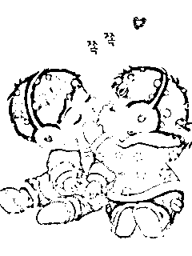

所以这里我们又看到另一条陈词滥调**“接纳你自己，别人也会接纳你。”**

**然而在你接受自己之前，你需要“认识你自己”。**这就是占星学发挥作用的地方。

将黄道 12 星座看作一个自我认识的模板。用占星学的语言来说，我们每个人都不仅仅由太阳星座组成，还有月亮星座、上升点、行星等等。但是你的**太阳星座包含了重要的核心真理。**

所以当你读到我对你的星座的描述时，问问自己“这是真的吗？”其他人也会接纳你，正如你自己一样 —— 没有评判。然后爱情就会成为可能，无论是让你的婚姻重新焕发活力，还是向某个新人敞开心扉。

**问问自己这些问题**

—— 白 羊 座 ——

**Questions：**

*   你是否率直？

*   你对自己的个人利益是否感觉敏锐？

*   你是否坚决果断？

*   你是否愿意为自己而战？

*   你是否认同这些特质，你接受它们吗？还是你认为“没有人可以忍受我。人们觉得我太难搞了。”

*   直率，意识到自己的利益，自信果断，愿意为自己而战，这些有什么错？ 


**这些特质可以很容易获得称赞，但是你首先需要接纳它。**

—— 金 牛 座 ——

Questions：

*   你是否平静沉着？

*   你是否注重感官，强烈欣赏生活所提供的美好事物？

*   你可靠吗？如果“是的”，那么你是否接受这些特征？还是你觉得“我很懒，很放纵、顽固而自私 —— 不值得被爱。”

*   享受生活的乐趣有什么错？


**是的，你可以慢慢接受改变，但是在不稳定的时期坚定踏实 —— 这样的品质难道不可贵吗？你很会讨价还价，这不是坏事，接受它，别人也会把你当作重要的交易对象。**

—— 双 子 座 ——

Questions：

*   你是不是拥有强大的语言天赋？

*   你是否聪明机变，能用最短的时间解决问题？

*   你是否消息灵通、见识广博？如果“是的”，你是否喜欢这样的自己？还是你认为“没有人喜欢花言巧语的人”或“人们并没有真正听我说什么，他们认为我很肤浅。” 


**这是你的评判，不是别人的。相反，接纳你的好奇心和你想要就此展开讨论的需求，然后留意谁在倾听。**

—— 巨 蟹 座 ——

Questions：

*   你很善于滋养他人吗？

*   你是一个感性的人吗？

*   你是否依赖直觉解决问题？

*   你能够创造更安全的工作和家庭环境吗？如果“是的”，那么你对此感觉好吗？

*   你是否认为自己“太多愁善感”？

*   你是否感觉“你对任何人都太情绪化，太不安全？”

*   你是否企图隐藏自己的感受，却只觉得更糟？ 


**别再隐藏了。接纳自己拥有“惊人的敏感性”，其他人会越来越喜爱你这一点的。**

—— 狮 子 座 ——

**Questions：**

*   你自信吗？

*   你是否会因为某人想做一件事而担起责任呢？

*   你有时候是否会用生动活泼、激动人心的方式举例子？如果“是的”，那么你为这些特质感到骄傲吗？或者你是否将自己评价为一个爱炫耀的人，相信没有任何人爱你，因为你的专横只是为了掩饰自己的不足？ 


**嘿，你猜怎么着？一位真正的英雄之所以是英雄是因为他或她是“人类”，而不是上帝或超人。接受这一点，你会获得引人注目的爱。**

—— 处 女 座 ——

**Questions：**

*   你专注于解决问题吗？

*   你在专门领域中对细节的关注是否常常让你成为工作中不可缺少的人才？

*   你在评估自己的技术和能力时是否低调谦逊？如果“是的”，那么你是否理所当然地接受这些特质？还是你认为自己“有缺陷”，过度吹毛求疵，爱批评，没有人会真正去爱一个不完美的完美主义者？ 


**只要你自己有这种想法，其他人也会这么想。嘿，放下这些评判，看看会发生什么。**

—— 天 秤 座 ——

Questions：

*   你圆滑练达吗？

*   你对自己包容他人的能力感到骄傲吗？

*   你是一个优秀的协商者吗？

*   你是善于交际吗？如果“是的”，你想“那么为什么不应该每个人都爱我呢？” 


**你无法让每个人都开心，虽然你试图这么做 ，但是每个不开心的人都会激起你的恐惧：你不够好，不是真的可爱。这似乎是不公平的！毕竟，你是这样友好的人， 所以为什么不接受这一点呢？平衡也需要让他人为你有所付出。**

—— 天 蝎 座 ——

**Questions：**

*   你的朋友是否会依赖你对他人的敏锐洞见，而你也愿意在危机中帮助他们？

*   你是否充满激情？足智多谋？坚韧不拔？

*   你可以挺过任何困难，对吧？


**所以你为什么要为失去爱人而困扰呢？你为什么如此难以相信别人呢？是不是因为你觉得如果他们离开你，你就会死？或许吧。相信自己，相信你能在最恶劣的环境中生存，然后允许自己热情地去爱和被爱。**

—— 射 手 座 ——

**Questions：**

*   你爱冒险吗？

*   你有惊人的幽默感吗？

*   自由对你重要吗？

*   你热爱哲学吗？

*   你是永远的学生吗？

*   你是天生的老师吗？

*   谈论责任会抹去了你脸上的笑容吗？ 


**你害怕被困住，因此“你好”常常是“再见”的前奏。没有人说你必须要结婚。与一个像你一样独立自主的人分享你人生的冒险，是你最好的选择。难道不是这样吗？**

—— 摩 羯 座 ——

Questions：

*   你充满野心吗？

*   你善于规划吗？

*   采取行动前你是否会仔细权衡后果？

*   身份对你重要吗？

*   关系和婚姻如何配合你的计划？ 


**爱情可能带来不可预料的情感动力，因此，你很谨慎。除了你对父母的责任感和社会的压力，对婚姻失败的恐惧也阻碍你做出承诺。所以，接受这一点，并且等待，直到你做好充分准备。毕竟，成熟会你提升你成功的机会。**

—— 水 瓶 座 ——

**Questions：**

*   婚姻是你不愿加入的俱乐部吗？

*   每次你父母问你计划何时结婚时，你都会说“绝不”吗？

*   彼此和睦相处看起来是不可能的吗？

*   如果我这么奇葩，那么和一个非常不理智地想要和我结婚的人步入婚姻对我有意义吗？


**然而，浪漫爱情并不是超然理性的产物。最终你会渐渐厌倦了当房间里最杰出的未婚人士，决定变成房间里最杰出的已婚人士。**

—— 双 鱼 座 ——

**Questions：**

*   你是否在启迪和幻灭之间来回波动？

*   如果你变得愤世嫉俗，是不是因为你是一个真正悲伤的浪漫主义者？

*   你为什么而悲伤？因为未能实现的梦想？


**然而，浪漫爱情并不是超然理性的产物。最终你会渐渐厌倦了当房间里最杰出的未婚人士，决定变成房间里最杰出的已婚人士。**

**◆ ◆ ◆  ◆ ◆**  

 ****特别提醒：****若道享有本文版权，转载请注明“转自若道”。****

更好地认识自己是接纳自己的第一步。**2016 年 5 月 19 日**，蒋颖老师主讲的若道占星核心课程**Level 1-2**要开课了！这是若道历史上第一次有中文老师出山，她将带领你学习星座、太阳、月亮、行星、月亮交点等知识，让你进入占星学的世界！详细内容请点击“**阅读原文**”了解。

↓


# 请假条 | 2 月 5 日-21 日，若道君不在服务区

> 原文：[`mp.weixin.qq.com/s?__biz=MzA5NjA0NTAxNg==&mid=402839392&idx=4&sn=3e93596e879b9033b956780b4ed7295c&chksm=0d4065d73a37ecc14a4a254127eaf629985ef7d7f1ac5c63342ff5b1c14035bfdfa9c2546ba6&scene=126&sessionid=1692738877#rd`](http://mp.weixin.qq.com/s?__biz=MzA5NjA0NTAxNg==&mid=402839392&idx=4&sn=3e93596e879b9033b956780b4ed7295c&chksm=0d4065d73a37ecc14a4a254127eaf629985ef7d7f1ac5c63342ff5b1c14035bfdfa9c2546ba6&scene=126&sessionid=1692738877#rd)

各位街坊邻居乡亲父老

新春佳节来临

若道君要回家过年了

#^_^#

2 月 5 日-21 日

微信平台会进行不定期推送

若道君不能在后台勾搭各位了

◑﹏◐

让我们养精蓄锐

2 月 22 日再见 

祝大家新春愉快

猴年吉祥

└(^o^)┘

（文末有提醒，要看哦）

▼

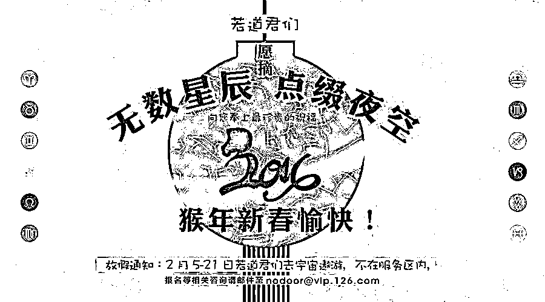


**重要提醒**

春节期间，如果您购买了若道的报告，请点击“**阅读原文**”查看。

# 宇宙天气 | 红包鼓鼓好过节（2.8~2.14）

> 原文：[`mp.weixin.qq.com/s?__biz=MzA5NjA0NTAxNg==&mid=402839392&idx=3&sn=7ce5867cc6458a34074d72a68ef0565b&chksm=0d4065d73a37ecc1a359c0ed40e8f69e8ad993e0b72af259f387f01232b4185b9756a6af8e02&scene=126&sessionid=1692738877#rd`](http://mp.weixin.qq.com/s?__biz=MzA5NjA0NTAxNg==&mid=402839392&idx=3&sn=7ce5867cc6458a34074d72a68ef0565b&chksm=0d4065d73a37ecc1a359c0ed40e8f69e8ad993e0b72af259f387f01232b4185b9756a6af8e02&scene=126&sessionid=1692738877#rd)


作者/占星师 Cora

插画/七沐 图片/花瓣

**一周星象综述**

本周月亮经过水瓶座、双鱼座、白羊座、金牛座。**上一周的“硝烟弥漫”已经过去，这一周大家能真正感受到过年的祥和喜乐！（撒花~）**

> **本周重点星象事件是：**
> 
> **①   水瓶座新月**
> 
> **②   水星离开摩羯座进入水瓶座**
> 
> **③   摩羯座金星三分处女座木星**
> 
> **④   天蝎座火星六分处女座木星**

**周一（大年初一）的水瓶座新月，是我们为未来一年许下心愿的“吉时”**。上周末的日火四分相位带来破旧立新的强大驱力，此时撒下的愿望的种子，将引领我们度过寒冬。**周二到周四**，金星和木星这两颗“吉星”形成三分相，带来一派富贵祥和、安逸快乐的气氛，**这几天特别适合走亲访友，联络情谊，红包和礼物能收到不少，给别人时也会大方许多！周五和周六，**由于白羊座的月亮会合相天王星，并四分摩羯座的冥王星、金星、水星，所以这两天**难免有情绪暴躁、沟通不畅、缺乏耐心的感觉，理性对待即可**。周日，月亮进入重视感官享受的金牛座，同时天蝎座火星六分处女座木星，**借着情人节的东风，这很可能带来一个“激情四射”的夜晚（不想要小孩的伙伴这个晚上请做好预防措施！）**。

祝大家春节快乐！

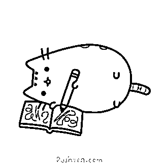

**每日星象**

**2 月 8 日**

星期一（大年初一）

**关键词：许愿**

月亮在水瓶座，受到来自土星和天王星的双重支持，此刻我们心中的愿景、理想、新的灵感和思路，将带有开创性的远见卓识，并且能够立足于现实。日火四分的张力仍在，暴力和冲突在蠢蠢欲动。**晚间 22:40 形成水瓶座新月**，受月亮四分火星的影响，怒气可能伴随新的灵感或愿景一起出现，我们需要做的是**深入感受和了解此刻的愤怒或恐惧，将之转化为进取心和斗志。**

**当日星象**

**14:59  **水瓶座月亮六分射手座土星

**19:31**  水瓶座月亮六分白羊座天王星

**21:38**  水瓶座月亮四分天蝎座火星

**22:40** ** 水瓶座新月（月亮合相太阳在水瓶座）** 

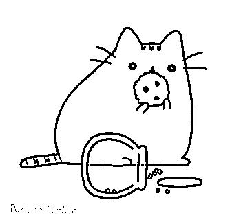

**2 月 9 日**

星期二（大年初二）

****关键词：爱意****

这是风平浪静的一天。水瓶座新月的影响仍在，今天一天，适合继续深化我们对于新目标、新想法的认识，或者只是放松心情，享受跟家人在一起的时光。接近黄昏时月亮进入双鱼座，人会变得敏感多情。这个晚上，**我们容易感受到更多亲人之间的浓浓爱意，是充满爱的能量的时刻。**

**当日星象**

**16:30** 月亮离开水瓶座进入双鱼座

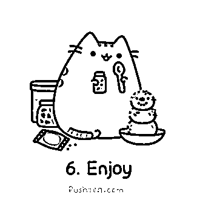

**2 月 10 日**

星期三（大年初三）

****关键词：快乐****

这是爱意满满的一天，一方面月亮在双鱼座让我们的情绪变得敏感，有更加丰富、微妙的感受，另一方面，金星与木星这两颗吉星形成三分相，为我们带来更多的愉悦、丰盛和满足感。傍晚时分易有些许愁绪和感伤，跟太过敏感有关。**整体而言是十分快乐的一天，非常有利于交际、娱乐、恋爱、赚钱、享乐。容易收到红包和礼物。涉及到金钱、合作的事，也适合在今天进行洽谈，会更加顺利**。

**当日星象**

****07:03****  双鱼座月亮合相海王星

**15:55**  **摩羯座金星三分处女座木星**

**17:00**  双鱼座月亮四分射手座土星

**19:34**  双鱼座月亮六分摩羯座冥王星

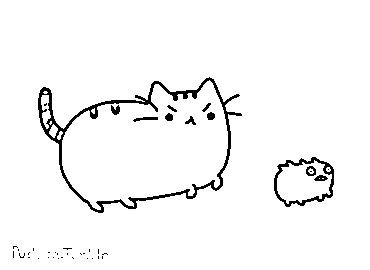

**2 月 11 日**

星期四（大年初四）

****关键词：轻松****

这是非常有利于沟通感情的一天。双鱼座的月亮与金星、水星形成六分相，为人与人之间的沟通交流、互相理解带来便利。**这依然是适合走亲访友或与家人共享天伦的时刻。矛盾有机会在此时化解，我们会更加懂得、体谅身边人的不易，从爱的角度去看事情**。晚上月亮进入白羊座，我们的态度和行事风格可能变得积极直接，容易急躁，但**这也是开始为一些新目标去行动的好时候**。

**当日星象**

****00:56****  双鱼座月亮三分天蝎座火星

**03:57**  双鱼座月亮对分处女座木星

**05:09**  双鱼座月亮六分摩羯座金星

**12:26**  双鱼座月亮六分摩羯座水星

**17:54**  月亮离开双鱼座进入白羊座

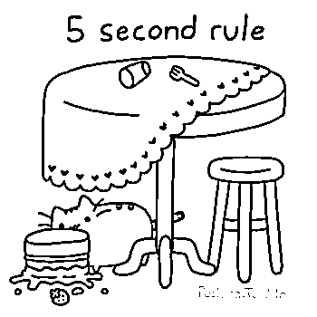

**2 月 12 日**

星期五（大年初五）

****关键词：对抗****

这是风风火火的一天，能够高效、快速地处理问题，推进事情的进展。**晚间，易有对抗性情绪，冲突之下或许会说出伤人的话，或有激烈的行为表现。**在捍卫自己的权利的同时，也应看到对方的立场和需求，知己知彼才能胜出。

**当日星象**

**18:36**  白羊座月亮三分射手座土星

**21:04**  白羊座月亮四分摩羯座冥王星

**22:51**  白羊座月亮合相天王星

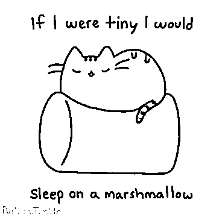

**2 月 13 日**

星期六（大年初六）

****关键词：挫败****

**今天容易有缺乏耐心的感觉，特别是跟人沟通、交往中，易有鸡同鸭讲的挫折感，令人恼火**。冲动的欲念难以经受现实和理性的检验，太过自我中心或急于求成，就容易碰壁。应该调整自己的心态，认识到任何目标的达成都不是一天两天的事，尊重合作者和盟友，对长远目标的实现是有利的。

**当日星象**

**09:11  **白羊座月亮六分水瓶座太阳

**11:16**白羊座月亮四分摩羯座金星

**18:33**白羊座月亮四分摩羯座水星

**19:34  **月亮离开白羊座进入金牛座

**2 月 14 日**

星期日（情人节）

****关键词：激情****

月亮已经来到追求安逸舒适、重感官享受的金牛座。这是能够静静享受生活的一天，也是适合吃喝玩乐、花钱买开心的时候。

**早上水星离开摩羯座进入水瓶座，对于“残酷现实”的考虑不再那么强烈地牵动我们的神经。未来 20 天左右的时间里，我们能够将目光放远，更多地从大局、从未来的角度来考虑问题，并且能够意识到自己在群体中的位置，以及和更多人、和环境之间的关系驱力。**

**由于天蝎座火星六分木星，这也是精力旺盛、干劲十足的一天**。我们会有更多信心和力量去完成一些平时看来不容易完成的事。**加上月亮在金牛座，这也将是情欲高涨的时段。一个激情四射的情人节**。

**当日星象**

**06:44** **水星离开摩羯座进入水瓶座**

**07:00 ** **天蝎座火星六分处女座木星**

****10:38 **** 金牛座月亮六分双鱼座海王星

**23:28 ** 金牛座月亮三分摩羯座冥王星


**作者简介**

**占星师 Cora：**全美占星师联盟（AFAN）成员，国际占星研究协会（ISAR）会员，获 ISAR 职业占星师资质认证，斯蒂芬·弗里斯特《变幻的天空》译者，个人星象文章见诸《心探索》《北京青年周刊》《上海电视》《空中生活》等杂志媒体。曾跟随大卫·瑞雷系统学习占星学，现为全职占星师。

微信公众号：聆宇 FM（微信号：lingyudiantai）

个人微信号：CoraAstro

长按二维码，让金钱涌向传播知识与智慧的人~


**◆ ◆ ◆  ◆ ◆** 

****特别提醒：******本文由作者授权首发于若道平台，**转载请注明“转自若道”。****

如何掌握星象，顺势而为？**2016 年 3 月 15 日**，大卫老师主讲的若道占星核心课程**Level 5**要开课了！在这个阶段，你将学习各种预测技术及行星周期。通过这些预测工具，你能够预测和规划人生。提前报名付款有**早鸟价**哦！详细内容请点击“**阅读原文**”了解。


# 水瓶座新月 | 大年初一的宇宙礼物

> 原文：[`mp.weixin.qq.com/s?__biz=MzA5NjA0NTAxNg==&mid=402839392&idx=2&sn=5b4262f0841eaa25bfc03bed12ae7e53&chksm=0d4065d73a37ecc1d5f9c87c6c00906d79712db67be6e5d1c7f01dccb949eec72a89ff1aa309&scene=126&sessionid=1692738877#rd`](http://mp.weixin.qq.com/s?__biz=MzA5NjA0NTAxNg==&mid=402839392&idx=2&sn=5b4262f0841eaa25bfc03bed12ae7e53&chksm=0d4065d73a37ecc1d5f9c87c6c00906d79712db67be6e5d1c7f01dccb949eec72a89ff1aa309&scene=126&sessionid=1692738877#rd)

每月一次的新月，是在星象能量上开启“新周期”的日子，而“春节”让这次新月有了不同寻常的意义。此时我们撒下的种子，将在未来一年有提纲挈领的作用。所以不妨，将你在本次新月期间的觉察和领悟，融入你的新年愿望之中，这会在未来一年带来持久、深远的影响。

本次水瓶座新月发生在**2016 年 2 月 8 日（大年初一）晚上 22:39**，月亮与太阳合相在**水瓶座 19 度 16 分**。

**冲破束缚**

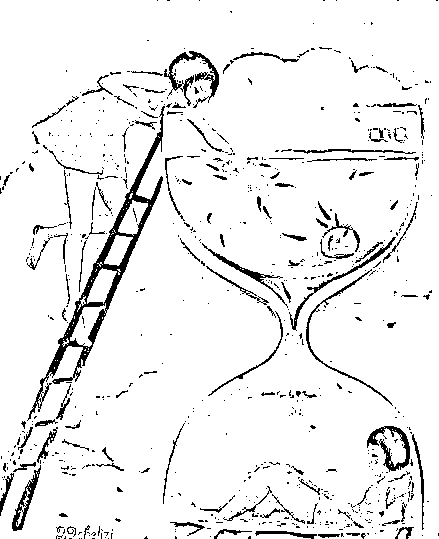 

水瓶座是象征自由、平等、人道主义的星座，以其天才的创造力和疏离客观的视角著称。水瓶座与那些超前的、反传统的、不同寻常的事物有关，它的原型是天才、革新者/革命者、科学家、被放逐者。

当新月落在水瓶座，我们需要去拥抱自己的创新精神与叛逆属性，冲破束缚——但常常给我们最大束缚的，就是我们自己。此时出现的一些“奇怪的”、与众不同的想法与灵感，应该受到重视，特别是，当它们反映了对传统或现行规则的某种抵抗或革新时。

同时，我们应有意识地去寻求来自团体和伙伴的支持，与更大的人群、更大的存在发生关系。使命感会带来力量。

**尊重规则，放眼未来**

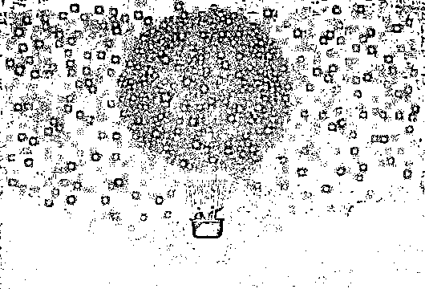

水瓶座的两颗守护星，土星和天王星，恰恰是代表了传统与反传统的两颗行星。我们经常可以在水瓶座特质强的人身上发现这种看似矛盾的“暧昧身份”，**有时他们是超前、反骨、充满革命精神的叛逆者，有时他们则深谙规则伦常之道，世故与老练程度，**不输同是土星守护的摩羯人——如果他们选择这样做的话。大概，这样的**“聪明到极处”**，才是他们孤独的原因。

有趣的是，本次水瓶座新月，与水瓶座的两颗守护星，土星和天王星，都成六分相。这暗示我们**在此刻许下的愿望、设定的目标计划，将受到保守力量和创新力量的“双重加持”，**这将是一个名副其实的“连接过去与未来”的时刻。

我们在许愿或制定计划的时候，也应有意识地将土星和天王星的能量注入我们的愿景之中：**放眼未来，同时尊重现实法则。**

**穿越恐惧，才能获得自由**

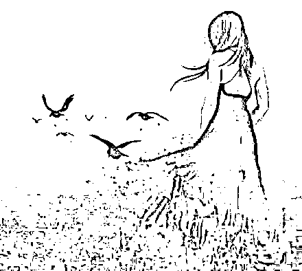

虽然有来自土星和天王星的支持，但本次水瓶座新月形成的最突出（能量最强）的相位，却是**新月与天蝎座火星的四分相**。

在一个最基本的意义上，这个四分相象征着**“激烈的意志抗衡”**，以及**“试图用暴力或强权来解决问题”**，这是一个**硬碰硬、哪一方都不肯妥协的局面**。我们未必真的有一个具体的、要与之斗争的对象，但我们内在的不同声音、不同欲求，可能在激烈撕扯，让我们饱受煎熬。

**新月与天蝎座火星的四分相涉及的问题**

—— **事件层面** ——

*   因权力和利益问题产生的，友谊中的信任危机。

*   感情关系上，理智与欲念之间的矛盾，认为“应该”放下却又难以割舍；自由和控制之间的拉扯。

*   大公司或团队、集体内部的权力对抗。 

—— **心理层面** ——

*   公与私之间的矛盾；平等大同的理念与资源紧张、权力控制的现实之间的矛盾。

*   未来愿景与眼下危机之间的矛盾，对于改变和创新有强烈的不安全感。

*   博爱理想与生存本能之争。

这是十分紧张的时刻，但越是紧张的时刻，也越蕴含着能带来改变的巨大力量。我们应想办法转化与利用此时躁动的、能够带来激变的行星能量。火星的加入暗示我们必须行动起来。**不妨去做一些自己一直渴望但不敢做的事；与其树立敌人，不如挑战自己。**也可尝试另辟蹊径，往往转变思路的时刻，就是柳暗花明。

**天冥四分再次被强调** 

从一个联系与全局的角度看，水瓶座新月与天蝎座火星的四分相，也是对近期被水星和金星陆续激活的**“天冥四分”**主题的再次强调。因为天王星守护水瓶座，冥王星守护天蝎座，激烈的日火四分相发生在这两个星座，引出了水瓶座与天蝎座的矛盾，这与“天冥四分”的挑战共振。并且摩羯座的金星，此时仍位于合相冥王星、四分天王星的度数，冥王星与天王星之间的矛盾张力被再次强调。

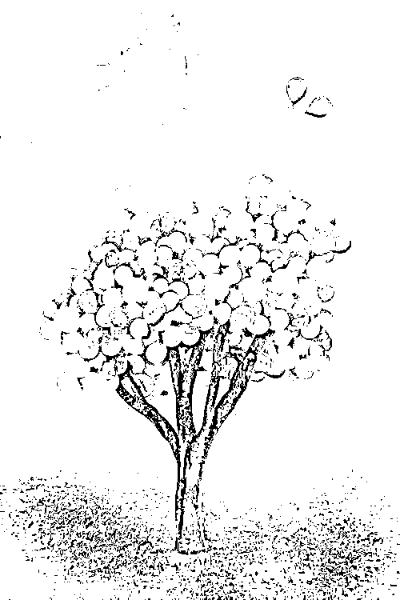

这是一个“多重共振”的局面，矛盾的焦点在于**如何面对现实带来的不安，获得想要的突破和自由。**“平稳过渡”似乎不太可能，若将伤亡控制在可接受的范围内，有些代价是值得且必要的。

**一些一直在暗处影响我们的、旧时的伤痕可能被翻出，看到它们是重获自由的开始。**无论你生活中的困境具体出现在哪个方面，此时的挑战是，直面恐惧。因为有恐惧的地方，就有渴望。

**特殊目标，现实手段**

伟大领袖说过，在战略上藐视敌人，在战术上重视敌人。这句话放到此时非常应景。

*   **如果目标很特殊、很超前、很惊人（水瓶座），那么在具体的计划、方法和步骤上，就必须理智、审慎**。

*   而此时摩羯座水星与处女座木星、北交点的三分相，提升了我们稳妥规划和合理分析的能力，能帮助我们将水瓶式的新颖理念和特殊目标，落实到具体现实当中。


本次的水瓶座新月是一个连接过去与未来的重要时刻，珍惜此时你心中冒出的灵感火花和对未来的期许，将种子种下，用信念浇灌。就像《功夫熊猫 1》里面乌龟大师说的，“桃子也可以打败太郎，如果你愿意去引导它，滋养它，相信它。”建议大家都去看《功夫熊猫 3》。


**作者简介**

**占星师 Cora：**全美占星师联盟（AFAN）成员，国际占星研究协会（ISAR）会员，获 ISAR 职业占星师资质认证，斯蒂芬·弗里斯特《变幻的天空》译者，个人星象文章见诸《心探索》《北京青年周刊》《上海电视》《空中生活》等杂志媒体。曾跟随大卫·瑞雷系统学习占星学，现为全职占星师。

微信公众号：聆宇 FM（微信号：lingyudiantai）

个人微信号：CoraAstro

长按二维码，让金钱涌向传播知识与智慧的人~


**◆ ◆ ◆  ◆ ◆** 

****特别提醒：******本文由作者授权首发于若道平台，**转载请注明“转自若道”。****

2 月 8 日就是水瓶座新月了，每到新月时分，都是播种心愿的时期。点击文末“**阅读原文**”，免费领取你专属的新月报告！


# 新春贺礼 | 新月报告免费看，还能送祝福~

> 原文：[`mp.weixin.qq.com/s?__biz=MzA5NjA0NTAxNg==&mid=402839392&idx=1&sn=d33974ee99abeea52932b52c0ec7e0c2&chksm=0d4065d73a37ecc15c60f48b0368ea96e5d990d6aee419dd412d995af79f8d9778b5c41e8a1d&scene=126&sessionid=1692738877#rd`](http://mp.weixin.qq.com/s?__biz=MzA5NjA0NTAxNg==&mid=402839392&idx=1&sn=d33974ee99abeea52932b52c0ec7e0c2&chksm=0d4065d73a37ecc15c60f48b0368ea96e5d990d6aee419dd412d995af79f8d9778b5c41e8a1d&scene=126&sessionid=1692738877#rd)


**新春好礼**

新月看运势

新春送祝福

若道邀你迎两新

手机党们

在新月的时候

你可以直接在手机上获取新月报告

在线许愿并分享祝福

是不是超级方便呢

**购买时间**

2 月 6 日~10 日

**许愿时间**

2 月 8 日 22：39~10 日 22：39

重要的事情说三遍

约么

约么

约么

**操作起来很简单哦**

**当新月到来的时候，您只要做如下步骤**

进入首页

点击
“新月祈祷”

登录账户

填写出生信息

查看报告、许愿

**【步骤一】点击新月的祈祷**


**【步骤二】输入姓名**


**【步骤三】输入出生信息**


**【步骤四】生成新月报告**


**最下方有许愿按钮，左边是倒计时提醒哟~**

**在合适的时间就可以许~愿~啦~**

**【步骤五】许愿**

**** 

**【步骤六】让宇宙看到你的愿望并分享！**

**** 

**在平时也可以许愿哦，您只要做如下步骤**

进入首页

点击
“立即许愿”

开始许愿

点击分享

完成许愿


**重要提醒**

春节期间，如果您购买了若道的报告，请通过下列方式查看：

■ 点击下方菜单栏的“各类查询”——“个人中心”——“我的报告”即可查看。很方便的~

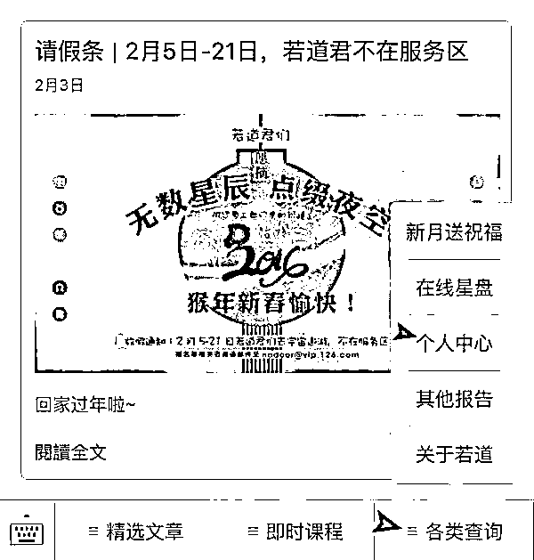

**◆ ◆ ◆  ◆ ◆**

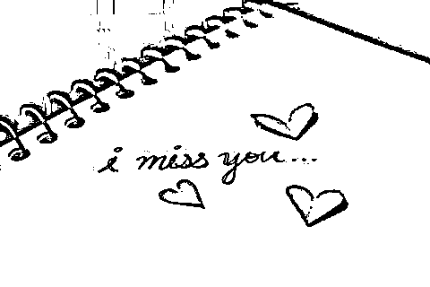

**小伙伴们还等什么？**

**赶快点击左下角阅读原文**

**体验这份新春贺礼吧！**

# 想拥有属于自己的年度运势吗？快来看看吧！

> 原文：[`mp.weixin.qq.com/s?__biz=MzA5NjA0NTAxNg==&mid=402826398&idx=1&sn=29c0a7ddd8c192767484730e76142799&chksm=0d4016293a379f3f2ebcc69e5937c16a1e4cfb2f8aa9ef76dc3a56f5855c43c4b0606e532157&scene=126&sessionid=1692738877#rd`](http://mp.weixin.qq.com/s?__biz=MzA5NjA0NTAxNg==&mid=402826398&idx=1&sn=29c0a7ddd8c192767484730e76142799&chksm=0d4016293a379f3f2ebcc69e5937c16a1e4cfb2f8aa9ef76dc3a56f5855c43c4b0606e532157&scene=126&sessionid=1692738877#rd)

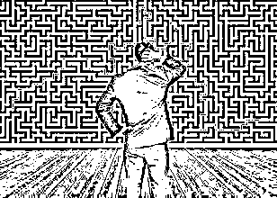

**你是否有过如下的困惑？**

有很多的星座专家都在发布运势，

开头你也会兴冲冲地对号入座，

但久了，你开始思考：

难道这个世界上只有十二种运势么？

难道所有的白羊座的运势都是一样的吗？

我的上升星座和太阳星座不同，

到底是该看太阳星座还是上升星座呢？

有的占星师说上升星座为主，太阳星座为辅，

有的又是倒过来，

等我辛辛苦苦把太阳星座和上升星座的运势都看完，发现截然相反，

到底该信哪个？

对此，占星师们给到的回复是，

想要看专属于你的独家运势，请联系个人咨询。

一问咨询费，动辄几百，甚至上千，一个小时哦……

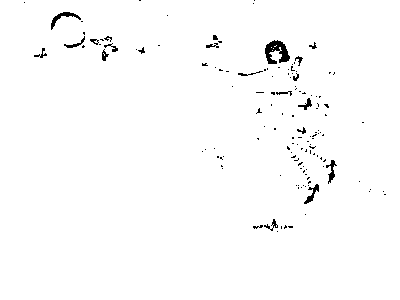

**那么问题来了**

**在哪里能够找到既专业，又不昂贵的个人年度运势呢？**

**让若道君来回答你吧**

若道隆重推出年度运势报告，你想要的，我们都有！

拥有这份报告，你将看到未来一年重要行运的影响，

什么时候适合恋爱，什么时候适合大展宏图，

哪段时间要注意身体健康，哪段时间开车旅行得小心，

这些问题，在报告里都能找到答案。

**最重要的，只要 198 元哦！**

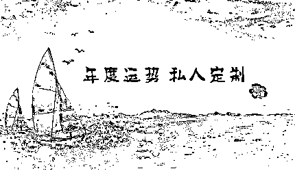

不要矜持啦

赶快点击**阅读原文**获取专属于你的年运报告吧！

**小提示：输入的出生信息一定要准确哦**


**重要提醒**

春节期间，如果您购买了若道的报告，请通过下列方式查看：

■ 点击下方菜单栏的“各类查询”——“个人中心”——“我的报告”即可查看。很方便的~


# 2016 年猜想 | 从现在开始改变，最差也不过大器晚成

> 原文：[`mp.weixin.qq.com/s?__biz=MzA5NjA0NTAxNg==&mid=402826398&idx=2&sn=5c4b081a738e6fc94c313226d6af2a07&chksm=0d4016293a379f3fd35fed6398f7b9fbd07e56b3b6aee4957053f3ff5fa676c6bb5115f66a6f&scene=126&sessionid=1692738877#rd`](http://mp.weixin.qq.com/s?__biz=MzA5NjA0NTAxNg==&mid=402826398&idx=2&sn=5c4b081a738e6fc94c313226d6af2a07&chksm=0d4016293a379f3fd35fed6398f7b9fbd07e56b3b6aee4957053f3ff5fa676c6bb5115f66a6f&scene=126&sessionid=1692738877#rd)

作者/苏·汤普金斯

译者/李含 校对/江艺

图片/花瓣网

每年都有许多行星周期在发挥影响力，影响人们的生活。我们从 2008 年起就被天王星四分冥王星的能量控制着，生活刺激却并不安全。今年我们将经历哪些行星周期，它们将对我们造成怎样的影响？想知道答案，快看看**顺势疗法大师苏·汤普金斯**的猜想吧。

﹁

**2**

**0**

**1**

**6 星象综述**

**﹂**

📹 [`v.qq.com/iframe/preview.html?vid=s01831z2grj&width=500&height=375&auto=0`](https://v.qq.com/iframe/preview.html?vid=s01831z2grj&width=500&height=375&auto=0)

## 1 天冥四分仍有影响

*   国际上，政府与民众之间**冲突不断**，有时候会受到激发去表达更多民主的诉求。

*   人们的行为更加**叛逆**（天王星白羊座），有暴乱、有示威、有罢工，等等。

*   有一些国家要**忙于应付自然灾害**。

*   个人星图受到天王星四分冥王星影响的人会挣扎于自己的小革命和小海啸，他们可能遭遇**到失业、家庭破裂**和其他这类事件。

*   天王星和冥王星不会再准确成相了，但是这个相位依然紧密，**一些紧张激烈的事件，一些经济上的波动依然会在全球肆虐一段时间**。 

## 2**变动特质不利决策**

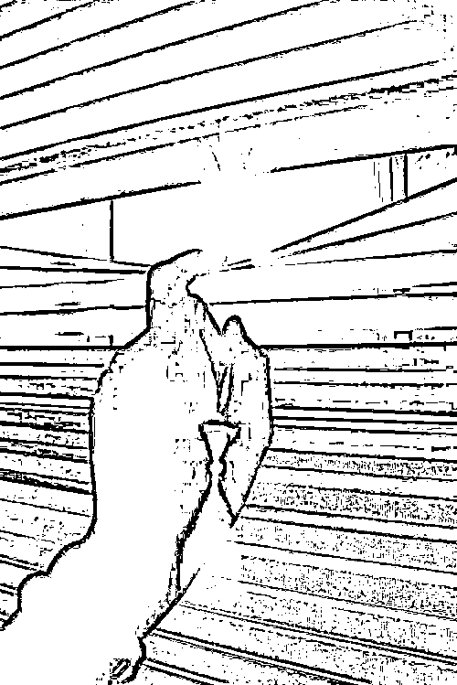 

除了白羊座天王星和摩羯座冥王星所带来的基本星座特质，2016 年还强调了**变动星座特质**，木星在处女座（一直到 9 月 9 日进入天秤座），土星在射手座，海王星和凯龙星在双鱼座，北交点在处女座。这**有利于知识的积累，但却并不有利于决策性的行动**。从全球视野来看，这种变动星座的强调同样与世界的变动有关，根据美国调查显示，全球每 122 人中就有一名难民。但是，希望这种变动的力量眷顾我们，让所有人都变得灵活变通，愿意作出相应的调整。

## 3**土海四分是重点**

在我看来，**2016 年的两个主要相位是木星四分土星，和土星四分海王星**，这篇文章中，我会重点关注后一个相位。

*   土星-海王星在**2015 年 11 月 26 日**准确成相，然后在**2016 年的 6 月 17 日**和**9 月 10 日**又会再次准确成相，从 2016 年 6 月到 10 月二者都会处于一个相对紧密的容许度之内。

*   从 4 月到 7 月，根据所使用的容许度不同（在世俗占星学里你可以使用较宽的容许度），当木星四分土星，又与海王星接近对分相时，它们会在天空中形成一个**T 三角**的格局。 

**土星 VS.海王星：边界之争**

—— **土星：掌管界限 **——

土星是掌管边界的行星，不管是时间还是空间的界限。我们都受制于他人的界限，又设定自己的边界。我们通过设定时限，通过在自己的花园周围筑起篱笆，通过锁上我们的门窗，通过对一些我们不想同意的事情时说“不”，来保护和防御自身。个人和国家有无数种方式来保护自己，通过设定边界，通过寻找各种方式抵御大自然和已知敌人。国家建立城墙，设定国界来与邻国划清界限。

—— **海王星：挑战界限** ——

海王星在挑战边界，挑战更加务实胆小的土星的世界观。海王星的世界完全没有边界，对所有事物和所有人敞开。它是理想主义而不是现实主义。

所以这两颗星会在这一年里上演两军对垒的大戏，挑起两种存在方式之间的战争，这场战斗又会因为木星的加入而被夸大。

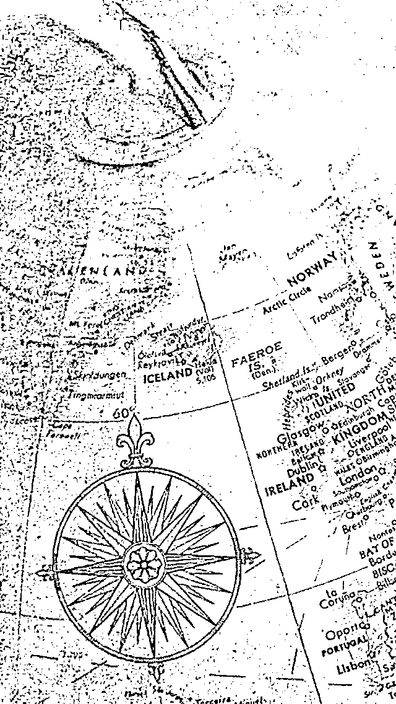

**暴雨洪水**

我们知道，海王星掌管着海洋、河流和所有的水。多年来，我发现海王星是潮湿天气的显著指征，而土星也是雨水的征象，所以这个四分相一定会带来潮湿的天气。显然，世界上大部分地区不会遭受洪水，但是这些地区**遇到这种灾害的危险比往常要高**。2016 年，**我们尤其要警惕全球变暖的危险，看一看海洋、暴雨和水会给我们带来多么困难的任务，以及低估大自然的力量会给我们带来多严重的后果。** 

**防御脆弱**

土星与海王星之间的困难相位也会与其它方式的脆弱防御关联。四分相已经开始显示威力，并且这种影响力还将继续。不论实际的剧情怎样的展开，我认为**在 2016 年国界的变化都会比往常更多**。

**破坏法制**

土星-海王星的结合**破坏了国家的法度规则，破坏了人民和文明国度赖以生存的“应有”秩序**。因此，土星和海王星的结合从整体层面来看，很可能并不有利于法律和司法部门，另一方面，土星-海王星的合作可能会有助于那些在审判中加入同情心的事务。 

**处罚加剧**

另一种可能的表现是海王星式的组织，比如电视或报刊媒体，不论好坏，都会发现自己遭到政府部门处罚。

** 艺术发展**

土星和海王星的这一组合可能会**有利于艺术的发展（尤其是电影、摄影、音乐和舞蹈）**。那些想要在自己选择的艺术形式中将梦想付诸现实的人会得到助力和机遇。这种影响力对所有受到这个四分相波及的人都是如此。

让你的梦想成真吧。是的，你的梦想可能会受到经济现实或社会规范的制约，但是如果将你最初的憧憬缩小一点、更贴近现实一点，那么梦是可以实现的。在**七月和八月**，天王星会加入土星和海王星的战局（几乎与海王星成八分相，与土星成 135°相），这预示着**那些新生的、开创性的创意工作者真的有机会秀出自己，也许是通过技术来实现**。

** 灵性实践**

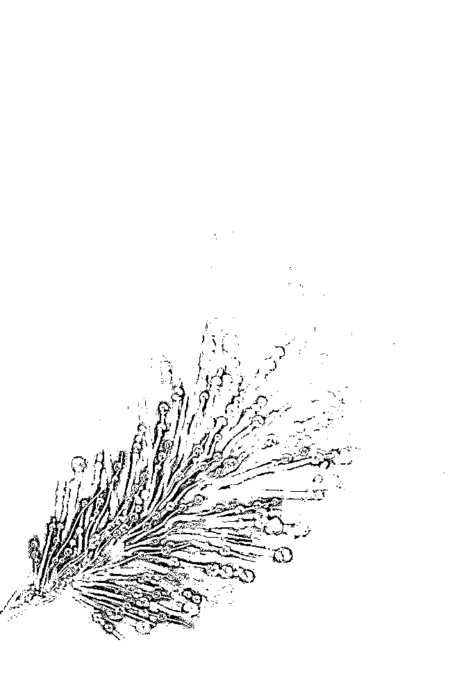

土星和海王星联手表现出的最佳状态可以被形容为**艺术性的纪律**，也许这会给新兴的艺术家带来机遇——可以通过自己持之以恒的努力让自己的憧憬变成现实。除了艺术性的纪律，这一组合的关键词必然还有**灵性的纪律**。所以这个四分相可能并不那么有利于宗教实践，而是更适合全球范围内各种神秘传统的实践。**也许有助于那些想要尝试或启发他人尝试冥想、正念等等的人**。

**关注健康**

另一个与土星和海王星有关的生活领域是**健康的问题**。良好的健康是什么，该如何去做到，如何去付出，这些问题会受到更多关注。还可能面临控制传染病肆虐的问题。当卫生问题中界线不充分，比如使用了不洁净的水，就可能出现传染性疾病。

再次强调，木星在处女座是整个故事的一部分，强调了清洁的好处，强调了小事物的美妙。也许我们不会意外正是在这个时期，比如**“小剂量神奇疗效”的顺势疗法**，最近就承蒙若道的邀约来到了中国大陆。

该如何善加利用 2016 年呢？我想，我们所有人都该带着灵活变通的态度满怀希望憧憬未来。感恩我们所拥有的一切，避免被负面媒体和其他人传播的消极、可怕的故事所影响。另外有个好消息，在 2016 年末，土星和天王星会形成三分相，预示着进步与变革并不总是困难重重。


本文针对 2016 年通用运势，如果您想了解自己在新的一年将会有哪些机遇和挑战，可以预约咨询 ISAR 认证占星师进行个案解读。

**►你还需要下面的新年运势解读：**

[2016 年运 | 规则重建，以动制动](http://mp.weixin.qq.com/s?__biz=MzA5NjA0NTAxNg==&mid=401908407&idx=1&sn=409cf1cfa831bfdd8c1b5ea7b88cb34a&scene=21#wechat_redirect)

[重磅 | 大卫 2016 年运，全面解读四大趋势](http://mp.weixin.qq.com/s?__biz=MzA5NjA0NTAxNg==&mid=402527351&idx=1&sn=b47f50c76eb55b8352cea419e1727e3e&scene=21#wechat_redirect)

[处女座木星 | 来来来！快看看你 2016 年的好运在哪里](http://mp.weixin.qq.com/s?__biz=MzA5NjA0NTAxNg==&mid=402546517&idx=1&sn=7dac0e43ef8077cc86f0aa86d245c50b&scene=21#wechat_redirect)

**◆ ◆ ◆  ◆ ◆** 

****特别提醒：******本文由作者授权发布于若道平台，**转载请注明“转自若道”。****

你一定很想知道在 2016 年自己会有哪些机遇，需要面临哪些挑战吧！若道首度推出的**年运报告**应该可以帮你哦，这份专门为你量身定制的报告会给你最详尽实际的年度运势解读，详细内容请点击“**阅读原文**”了解。

↓


# 你这么开悟，一定不怕回家

> 原文：[`mp.weixin.qq.com/s?__biz=MzA5NjA0NTAxNg==&mid=402826398&idx=3&sn=ae9270870aba55a2d3110475bdcc1c56&chksm=0d4016293a379f3f0d22a7ee29c543d1869c910d62dc22a444a2b6d74cb8771f09099e835f9c&scene=126&sessionid=1692738877#rd`](http://mp.weixin.qq.com/s?__biz=MzA5NjA0NTAxNg==&mid=402826398&idx=3&sn=ae9270870aba55a2d3110475bdcc1c56&chksm=0d4016293a379f3f0d22a7ee29c543d1869c910d62dc22a444a2b6d74cb8771f09099e835f9c&scene=126&sessionid=1692738877#rd)

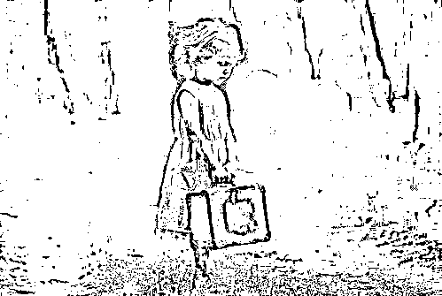

作者/蒋颖 若道占星创始人

春节要到了，很多朋友们都要回家了。回家，让人魂牵梦绕又畏缩胆怯。写字楼里的 Linda、Mary，一回到家就变成了桂芳、翠花，在父母长辈面前露了原形。如果，如果说今年，我们能带着一种方法、一种不同的心态回家，将有怎样的改变和收获呢？

**回乡的经历**

**五味杂成**

前几天在朋友圈看到一个笑话，说“这几天，写字楼里的 Linda、Mary、Vivian、George、Michael、Justin 挤上火车，陆续回到铁岭、福建、河南、广州，名字又变成了桂芳、翠花、秀兰、二饼、狗蛋”。这段话让我看得忍俊不禁，喜笑颜开。名字的改变只是一个五味杂陈回乡故事的开始。

**>>>>**

**禅师的故事**

其实，不仅普通的你我如此，连大禅师对回家也怀着复杂的心情。比如说禅宗洪州宗创始人马祖道一。这位唐朝的马大师是四川乡下人，他家里世代贫穷，无田无地，全靠勤劳憨厚的父亲用竹篾条编点簸箕、筛子来卖，维持生计，周围邻里都叫他父亲“马簸箕”。马簸箕在地方上说不起话，经常受到恶人欺负，到了中年又死了妻子。他本来希望儿子继承家传的篾编手艺，自己晚年有个依靠（怀疑马祖星图上有很强的处女座元素）。

可是，这个乡下娃自有慧根，非要参禅悟道，并因此拜师远游（木星估计很强），离开故乡数十年，后来在六祖得意弟子南岳怀让门下开悟。马祖开悟后，创立了洪州宗，坐下弟子百余人，而且有诸如百丈怀海这样的禅宗大师。马祖开喝棒禅风，机锋峻烈。每次他登坛说法，跟现在的精神导师一样，倾慕者如山似海。

话说马祖道一禅师开悟后，想想自己也离开家乡十余载了，既然已经求得正法，可以回家看看了。大师回家，你以为很风光吗？恰恰相反。一开始，回乡时已经没有多少人认识他了，后来一位在河边洗衣服的老婆婆看到马祖从岸边经过，一眼认出他来，老婆婆叫道：“你是马簸箕家的小二子吧？”

这还不算完。这么有学问的大人物想在家乡“开工作坊”，可是包括他爹马簸箕在内，根本没人听他讲，在家乡人眼里，这位名震寰宇的马大师不过就是马簸箕家的小二子而已。马大师当然非常感慨，因此做了一首诗“为道莫还乡，游乡道不长，溪边老婆子，呼我旧时名。” 所以又有了这样一种说法“道不弘父母之邦”。

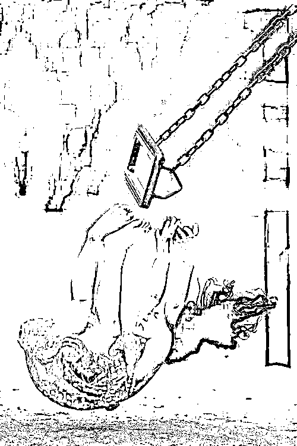

**>>>>**

**耶稣的故事**

这是中国的故事。非常有趣的是，西方也有类似的故事。比较出名的故事是耶稣的故事。在圣经新约《马太福音》第十三章，耶稣曾经说过一句名言：

“A Prophet is not without honor except in his hometown and in his own household.”

大概的意思是“先知不容于故里”。当年，耶稣带着他的门徒到处巡游布道，有次到了他的故乡拿撒勒开工作坊。一开始家乡人也没有认出他来，后来他的哥哥姐姐亲友团来了，大家一看，噢，这不是我们自己的乡亲们，原来这小子是从我们乡里出来的，于是就质疑耶稣“你怎么知道这些的，你也不过是我们拿撒勒人嘛”。于是圣经记载，到处都能显示奇迹的耶稣楞生生就是没有在拿撒勒显灵。

**带着觉知**

**回到家族历史**


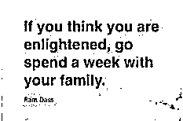

**（如果你认为你已经开悟，回家跟你家人待一星期看看。）**

**——近代精神导师拉姆·达斯**


**>>>>**

**返乡秘诀**

开悟了的“马簸箕家的小二子”、“拿撒勒小子”和现代的离开悟还远着的“桂芳”、“狗蛋”在回家这件事上，面临一样的矛盾心情，同时，也陷入一样的家族复杂动力之中。

除了上面近代精神导师拉姆·达斯说过的话，一位很有名的身心灵导师说过，尽管他以为他已经领悟了很多道理，但当他回家，他妈妈一个小手指就可以让他变回原形，变成小时候那个无助而愤怒的小孩。

想想开悟的大师们还在挣扎，我们这些没有开悟的“桂芳”和“狗蛋”就更需有自知之明。

那么我们该带着什么样的态度回家呢？昨天下午，一个很熟悉的小兄弟说了一句很有智慧的话。他在经年的“战争”后发现，斗争让彼此很受伤，因此他终于学到了“和平”的方法，即做一个安静的聆听者。“做一个安静的聆听者”，真是一个非常好的“返乡秘诀”。

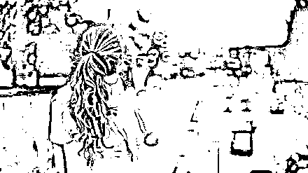 

**>>>>**

**返乡法器**

作为占星学子，你不仅可以带着这个秘诀回家，而且可以带着一个法器——即占星软件。把你、父母、祖父母、外祖父母、兄弟姐妹、七大姑八大姨的星图都装在这个法器之中。

除了亲人团聚的爱恨情仇之外，回家有一个非常难得的好处，就是与我们的星图更真实、更亲密相遇。

**家人都在我们自己的星图里：**

■太阳站在你面前，他就是父亲，也是自己；

■月亮站在你面前，她就是母亲，也是自己；

■太阳四分火星是父亲、他的故事，也是你的故事；

■月亮对分海王星是母亲、她的故事，也是你的故事。

父母、祖先都活在我们的星图里。

年幼时，他们在我们面前，只是亲人们，我们意识不到他们也是独立个体；当我们成年后，间隔了空间和时间，他们变成更深的背景，在我们的无意识中运转。只有回到故乡，才又有机会看到他们，跟他们亲密相处，家族业力模式戏码才有机会在我们面前上演“真人秀”。

**倾听、询问过去的故事，可以把家人作为一个活生生的“个体”而不仅仅是一个“父亲”“母亲”带到我们面前。**

■父母、祖父母也有童年、青年，他们是怎样的人？

■他们经历了什么？

■他们如何变成了现在的样子？

■我们的生活真的与他们有很大不同，还是有相当相似之处？

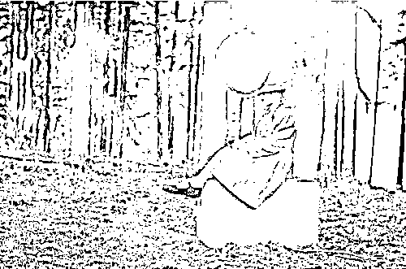

**>>>>**

**我的家族故事**

我永远也不会忘记，我自己在一次春节，听爷爷讲他父亲的故事。简单说，我发现，我们家几代人都曾经是“没有父亲”的小孩，也都因此经历伤痛。曾祖父在祖父很小的时候就因砒霜中毒而突然去世（我的天蝎座太阳在 6 宫）；祖父在父亲很小的时候就把他送到叔祖父家中，因此父亲也经历了“没有父亲”的童年，并因为换上了当年的绝症肺结核而影响人生；我很小被放在外祖父家养大，经历了“没有父亲”的童年。

“没有父亲”这个模式深刻地影响了几代人，让我更加理解了祖父和父亲的性格，也惊于家族模式的传承。“因为懂得，所以慈悲”，用晚辈的话讲，可能过于傲慢，不过懂得后，肯定可以缩短亲人间心的距离。

听家人讲过去的故事，还可能有一些惊喜地发现。我还记得当发现原来曾祖父是最早在地方办现代学校的人，家里把祖上的陵园用来做学校校园时的惊喜。我曾祖父、祖父、父亲都做过老师。我在百转千回的人生道路之后，竟然也做起了教育。不过和曾祖不同，祖父和父亲做老师基本都是大革命风云之后，生计所需。

过去，因为祖父、父亲都很不赞同占星学，父亲在家族编篡的一本书中，连我的名字都不愿意提起；但当我发现曾祖父竟然是当初开风气之人，腹中一热，想，曾祖地下有知，必当以我为豪，因为曾孙女如他一样，也敢于做开风气之人，这样的链接给了我一种冥冥中的力量。

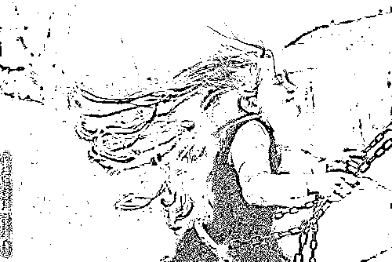

> 回家，是一次回到童年，回到家族历史的旅行。不同的是，我们已经不再是那个孩子。这个觉知是最重要的。带着这个觉知，哪怕那个触发的按钮再次触发痛点，引起彼此机械化的反应，也会有所不同。带着这个觉知，我们可以靠近彼此。带着这个觉知，我们可以获得一些洞见和智慧。
> 
> 因此，Linda 和 George，我们一起回家做“带着觉知”的桂芳和狗蛋吧。
> 
> 带上你的星图。

**◆ ◆ ◆  ◆ ◆**

******特别提醒：若道享有本文版权******，**转载请注明“转自若道”。******

从太阳、月亮重新认识自己和父母！**2016 年 5 月 19 日**，**蒋颖**老师主讲的若道占星核心课程**Level 1-2**要开课了！她将带领你学习星座、太阳、月亮、行星、月亮交点等知识，让你进入占星学的世界！详细内容请点击“**阅读原文**”了解。

↓


# 请假条 | 2 月 5 日-21 日，若道君不在服务区

> 原文：[`mp.weixin.qq.com/s?__biz=MzA5NjA0NTAxNg==&mid=402826398&idx=4&sn=9dd729330e9d57045fa5f5d80f225233&chksm=0d4016293a379f3f1f2909dcc377a319f16efb6fa6f57a89eb54a31d480abb195a7cf518b233&scene=126&sessionid=1692738877#rd`](http://mp.weixin.qq.com/s?__biz=MzA5NjA0NTAxNg==&mid=402826398&idx=4&sn=9dd729330e9d57045fa5f5d80f225233&chksm=0d4016293a379f3f1f2909dcc377a319f16efb6fa6f57a89eb54a31d480abb195a7cf518b233&scene=126&sessionid=1692738877#rd)

各位街坊邻居乡亲父老

新春佳节来临

若道君要回家过年了

#^_^#

2 月 5 日-21 日

微信平台会进行不定期推送

若道君不能在后台勾搭各位了

◑﹏◐

让我们养精蓄锐

2 月 22 日再见 

祝大家新春愉快

猴年吉祥

└(^o^)┘

（文末有提醒，要看哦）

▼


**重要提醒**

春节期间，如果您购买了若道的报告，请点击“**阅读原文**”查看。

# 周星驰 | 你看过他的电影，却未必知道这些事情

> 原文：[`mp.weixin.qq.com/s?__biz=MzA5NjA0NTAxNg==&mid=402802650&idx=1&sn=7299e9b7c7d365efff93adbc8878dda3&chksm=0d40f56d3a377c7b8c9346d14fa1520ba36fc575f320eebecfb34c0808c88df780bbeeb79341&scene=126&sessionid=1692738877#rd`](http://mp.weixin.qq.com/s?__biz=MzA5NjA0NTAxNg==&mid=402802650&idx=1&sn=7299e9b7c7d365efff93adbc8878dda3&chksm=0d40f56d3a377c7b8c9346d14fa1520ba36fc575f320eebecfb34c0808c88df780bbeeb79341&scene=126&sessionid=1692738877#rd)

（注意流量 土豪随意）

📹 [`v.qq.com/iframe/preview.html?vid=a0175wvf5n3&width=500&height=375&auto=0`](https://v.qq.com/iframe/preview.html?vid=a0175wvf5n3&width=500&height=375&auto=0)

每每听到《大话西游》主题曲《一生所爱》，总会唏嘘不已。星爷在人们心中的分量，并没有因为他的退居幕后而减轻。每个人心中都有一个周星驰，看过这篇文章，你会了解更多关于他成长和经历的故事，以及他的作品背后南北交点的线索。还有啊，他的最新作品《美人鱼》大年初一上映，大家别忘了去看哦。

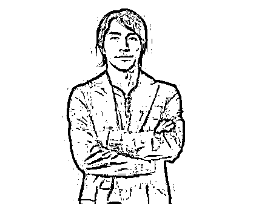

**我并不在意你怎么看我**

每个人的青葱岁月都有一个“周星驰”：至尊宝、周星星、韦小宝、凌凌漆、唐伯虎、尹天仇、阿星……这些大英雄或者小人物，陪伴我们度过了我们的青春。创造这些人物的周星驰，这么多年以来，也从一个当了四年儿童节目主持人和无线剧集龙套的小人物，蜕变成为票房神话和喜剧大师。伴随着盛名和巨大财富而来的，是泼天的指摘：**“独断专行”、“自我”、“贪财”**……

很多曾经与他合作过的制片、导演、编剧、演员已成陌路，还有的公开表达过“以后绝不可能和周星驰再合作”，细数与周合作的不快。周星驰却沉浸在自己的世界里，从来不对这些评价做正面的回应。

> **在周星驰的星图里，有着强烈的水瓶座的主题**。

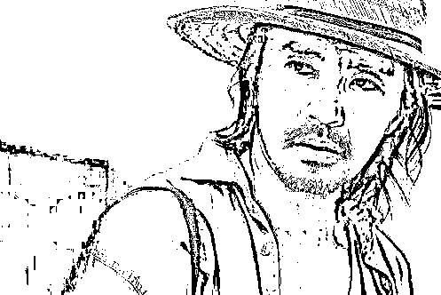

**土星合相月亮南交点——孤独的旁观者**

*   他的**月亮南交点在水瓶座，紧密合相了土星**。

*   **南交点是人们对于安全感的需求，是熟悉的行为、情境和体验**。

*   水瓶座素有**“外星人”**这一美称，主要是形容拥有这个星座特性的人有着**客观冷静的头脑，独立思考的态度，不从众不媚俗**，他们与主流的文化和价值观保持着相当的距离，是“有智慧的边缘人”。

*   同时由于他们把自己和外在世界隔离开，冷静地观察周遭的世界，不轻易地参与，是一个生活的**“旁观者”**。

周星驰妈妈曾说，她要是上街前问儿子跟不跟她一起去，他多半摇头，然后站在窗边看两个小时街景。后来和周星驰合作的员工也说，周在片场有空的时候就会坐在路边看行人。他至今回忆起童年的游戏都两眼放光：“我有一个邻居，他可以不用拖鞋，直接用手就打蟑螂，我就觉得他很英雄，是我偶像。于是我每天跟着他打蟑螂，觉得很好玩。” 而即便是打蟑螂这样的游戏，他也是跟在别人后面的“小龙套”。

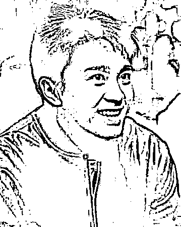

**土星合相南交点给这一“外星人”和“旁观者”主题添加了更多的孤独、抑郁和困苦的色彩。**似乎生命中没有自然而然的丰盛，一切都需要靠自己去不停地努力和自律才能获得。

**如果没有足够多的爱，就给我足够多的钱**

*   在土星和南交点的对面，是代表着爱和物质享受的金星。

*   **在南交点对面的行星，可以被解读为“可能是你非常想要的事物，却从来没有得到过”**。

*   对于童年的周星驰来说，这些事物是金星代表的**“足够多的爱”和“足够多的钱”**。

周星驰的母亲为生计所迫嫁给了他的父亲，夫妇二人缺少感情基础，之后的婚姻充满了争执与吵闹，有时父母还会大打出手。母亲离婚后带着他和两个姐姐住在九龙的穷人区，为了养家糊口要打三份工。有时候周星驰和姐姐被寄养在庙街的外婆家，他和姐姐要帮助外婆摆摊卖指甲钳。他小时候因为心疼母亲把肉都给自己和姐姐吃，就故意把肉弄脏留给妈妈吃，因此还被妈妈胖揍。

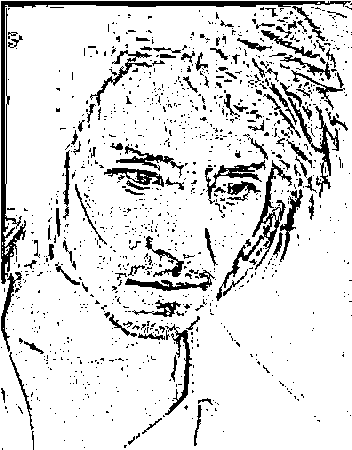

不管故事真假，周星驰的童年经历确实影响了他成年以后对金钱的态度。

希望可以赚多一点钱。你知道小时候穷，就是有机会有能力的话就期望可以，凭自己的能力可以多赚一点钱。这个是绝对的，是真的。有时候赚钱这事已经不只是我要赚钱，我要吃什么的，我要住什么样的，我要坐什么车。人有时候你要不断去达到一些目标。不需要有尽头的。其实你就是不断达到目标的一个过程嘛。

——**《看见》专访如是说**  

**担心不够好，就不断抽打自己向前**

在他的生命里，一直要与这种“求而不得”、“不足够”的悲观心态共处。被土星加持的“担心自己不够努力、不够优秀”的心态，在他的演艺道路上，像是一条隐形的鞭子，让他像只陀螺转个不停。

他在 1990 年开始全方位参与影片创作，香港媒体给他起了个“太上导演”的外号，形容他管得太宽，管得太细，“连根牙签掉在地上他都管”。例如《92 家有喜事》里谷德昭的剧本必须经过他过目才能用，《审死官》胡伟立说音乐必须经过周星驰点头等等。

和他搭过戏的毛舜筠说：“周星驰这个人很怪的。以前我们都想着自己做好演员的本分就好了，但他不是。当时我跟他搭戏的时候，他脾气差的要命，整天要求改剧本，不满意他就会发火。可是改来改去的很耽误时间嘛，每天能拍上两三个小时就不错了。**现在我才明白他为什么是那样子，他只想着如何把戏拍得好看。**”

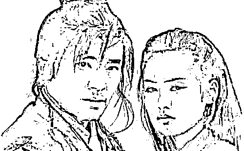

我是一个在工作的时候很认真的人，但是有时候你知道，你认真的时候呢，就会有人不高兴。你一个镜头你就 NG 了一百次，这个你看有没有人不高兴啊，当然会有人不高兴啊，是吧？就是说你干嘛，你这有问题啊，你那么麻烦哪。

——**周星驰**  

**走向北交点——成为大英雄**

土星合相南交不能解释周星驰对电影事业的理想和热爱，我们这时候要向代表**人生满足感和潜力的北交点**看去。

**北交点在狮子座，这说明了周星驰人生发展的方向要走向狮子座代表的热情、感染力、率真和领导力。**

*   周星驰渴望成为一个英雄（狮子座），在电影这个虚幻世界里，他的才华和努力帮他实现自己的英雄梦。**电影，是他逃离粗糙现实世界的解药。**

*   在他的星图上，**象征电影艺术的海王星同时与金星和土星形成 90 度，成为了释放金土 180 度压力的突破口。**他一遍又一遍地 NG，直到拍到自己满意的镜头，可以理解为**他为了艺术（金星）的理想（海王星）而努力（土星）**的星图体现。

*   在周星驰的电影里，打动人心的通常是**社会边缘人（土星水瓶座）**的故事，他们通常在社会的底层，没有钱，没有权力，被权贵利用，历经磨难，最后**拯救他人（海王星天蝎座）**，还能**财色兼收（金星狮子座）**。

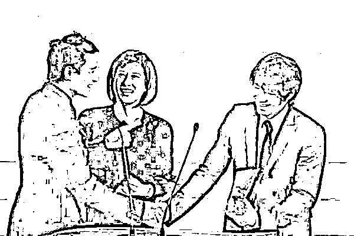

但是周星驰的电影并没有停留在单一的故事类型上，他的演艺道路从重产量，重搞笑，参演别人主导的作品，变成自己掌握创作的整个环节，表达自己真实情感，完全属于自己的作品，成为影响深远的的“喜剧之王”和文化偶像。

**占星小课堂——月亮南北交点的意涵** 

月亮交点经历 18.6 年后会回到我们出生星图的位置，在这 18.6 年里，人们会经历两个不同的阶段，**成就需求阶段（即北交点阶段）**和**安全需求阶段（即南交点阶段）**。

*   在南交点阶段，人们通常会**重复自己熟悉的模式和擅长的技能，但是人们并不会因为这些模式和技能感到兴奋和满足。**

*   进入北交点阶段，他们开始**表现自己隐藏的天赋**，这个时候做的事情，虽然带着摸索的性质，却让人感到更加的充实，好像**走在了“正确的人生轨道”**。 

**周星驰成就期和安全期的作品集**

下面列出了周星驰在成就期和安全期的主要经历和作品，不妨观察一下他在每个时期作品是如何反映他南交点水瓶座和北交点狮子座的主题的。

**成就期（北交点）**

**13.9-23.2 岁，1976-1985 年**

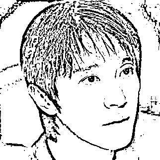

*   1980 年，香港丽的电视特约演员。

*   1982-1983 年，考入 TVB 艺训班。

*   1983 年开始成为儿童节目主持人，出演节目中的单元剧《黑白僵尸》；周星驰说自己很喜欢这段时间，在单元剧里他加入很多自己的创意，享受了很多创作的乐趣。

**安全期（南交点）**

************23.2-32.6 岁，******1985-1995 年 ******

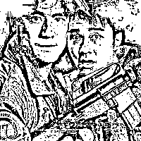

*   1988 年出演李修贤作品**《霹雳先锋》**，获得金马奖最佳男配角。

*   1990 年-1994 年是他的影片高产量期，5 年内共主演了 30 部电影，创作了赌侠，唐伯虎点秋香，审死官，逃学威龙等票房大卖的作品，他自己初步形成了小人物无厘头的表演风格。在这段被土星影响的南交点时期，他**累得“像条狗”**。

**成就期（北交点）**

************32.6-41.9 岁，******1995-2004 年******

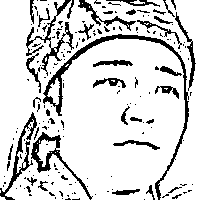

*   这个期间的周星驰，逐渐减产，从重量不重质，变成**制作更能表达自己内心情感的电影（他的北交点守护星太阳落在细腻重情感的巨蟹座）**。他这个时期的作品具有更大的文化影响力，也让他在华人影坛奠定**宗师（狮子座）**的地位。

*   1995 年**《大话西游系列》**——“曾经有一份真诚的爱情摆在我的面前，我没有珍惜，等到失去的时候才追悔莫及，人世间最痛苦的事情莫过于此。如果上天能够给我一个重新来过的机会，我会对那个女孩子说三个字：我爱你。如果非要给这份爱加上一个期限，我希望是，一万年。”

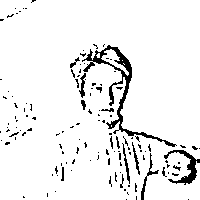

*   1996 年，**《食神》**，“也许根本就没有食神……或许人人都是食神……爸爸妈妈、爷爷奶奶、男孩女孩。只要用心，人人都可以是食神”。

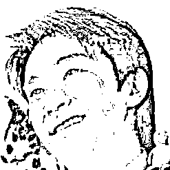

*   1999 年，**《喜剧之王》**，“其实我是一个演员”。

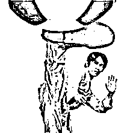

*   2001 年，**《少林足球》**——“做人没有理想，那和咸鱼有什么分别”。

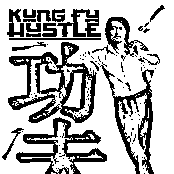

*   2004 年——**《功夫》**——“别以为长得帅我就不打你”。

**安全期（南交点）**

**********41.9-51.1 岁，****2004-2013 年******

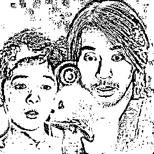

*   从《功夫》开始，周星驰减少自己的戏份，他将大量戏份给了配角，塑造了一大批成功的配角形象（包租婆、火云邪神等）。到了《长江七号》周星驰干脆饰演配角，光芒给了小迪和七仔，到《西游降魔篇》他**彻底转向了幕后**。

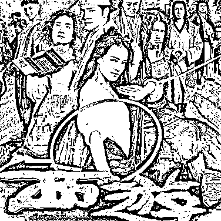

*   2008 年拍摄的**《长江七号》**和 2009 年的**《西游记之降魔篇》**，更像是他**修补童年和感情伤痕**的作品。幼年生活中父亲缺失，他就在《长江七号》里塑造了一个卑微的民工，他没能力给孩子更多，却用浅显的道理教育孩子“我们虽然穷，但是不能说谎，也不能打人；不是我们的东西，我们不能拿；要好好读书，长大要做个对社会有用的人”。而外星人的神奇力量，并没有用来实现“大英雄”梦，而是给了父子俩最温暖的陪伴和亲情。

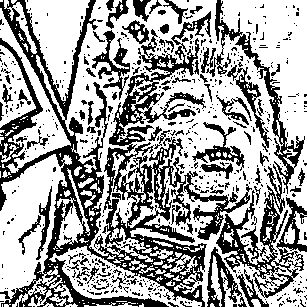

*   **《西游降魔》**里，他则是借唐僧之口，说出了 19 年前孙悟空没有说出的那句话 “唐僧：我第一次看到你就爱上你了。段小姐：爱多久？唐僧：一千年，一万年。

**成就期（北交点）**

********51.1-60.4 岁，****2013-2122 年 ****

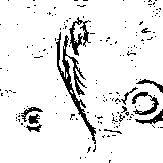

*   《西游降魔》之后，周星驰没有新的作品出来，他在此期间经历了被前女友起诉追讨佣金，被向太在网上杯葛等不愉快的事情，却一直安静沉默着。终于我们将于大年初一迎来他新的北交周期的第一部作品《美人鱼》。

**最新作品《美人鱼》的猜想**

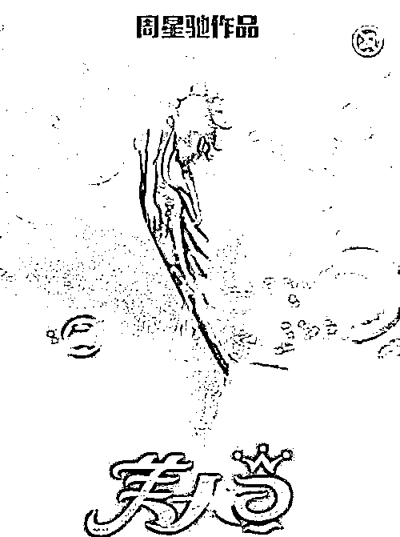

他在这部电影仍然选择留在了幕后，但是结合他曾经在北交周期创作的作品风格来看，《美人鱼》预计会有以下几个特点：

*   炫目的视觉效果，继续使用**大量的特效**——这从发布的片花就可以看到了。

*   **丰富的元素**，喜剧、悲剧、武打、歌舞、爱情……

*   影片贯穿**童心、爱心、家族、安全感**为主体的情节。

*   情感越发**细腻感人。**

最后的最后，这部电影的核心主题还会是小人物的英雄情怀。小人物柔软的内心里住着一位大英雄，这是周星驰作品的主题，也是他的进化写照，一起期待吧。

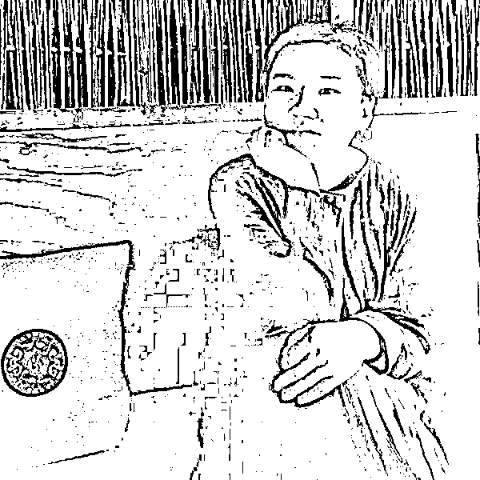

**占星师咔咔**：2010 年师从美国占星师大卫·瑞雷学习。若道首届学员，国内最早获得 ISAR 职业占星师资质的职业占星师。在国际知名广告公司和市场研究公司从事的市场研究和推广工作十余年，曾任职于阳狮集团、尼尔森市场研究有限公司、MTV 和《Madame Figaro》杂志。现在为《时装男士》、活法儿等媒体供稿。

微信公众账号：咔星人

星盘解读和运势咨询请洽：cji1029@qq.com

长按二维码，让金钱涌向传播知识与智慧的人~

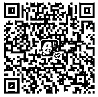

**◆ ◆ ◆  ◆ ◆**

******特别提醒：本文由作者授权首发于若道平台******，**转载请注明“转自若道”。******

想了解更多关于南北交点的知识？如何看清自己的模式？**2016 年 5 月 19 日**，蒋颖老师主讲的若道占星核心课程**Level 1-2**要开课了！这是若道历史上第一次有中文老师出山，她将带领你学习星座、太阳、月亮、行星、月亮交点等知识，让你进入占星学的世界！详细内容请点击“**阅读原文**”了解。

↓


# 2 月 4 日，立春

> 原文：[`mp.weixin.qq.com/s?__biz=MzA5NjA0NTAxNg==&mid=402802650&idx=2&sn=6fc40614e2207836d241749ec2f13eaf&chksm=0d40f56d3a377c7b399a0282b681b6585d6e2aef6a63df5dfe2027d897e3859035752b60735c&scene=126&sessionid=1692738877#rd`](http://mp.weixin.qq.com/s?__biz=MzA5NjA0NTAxNg==&mid=402802650&idx=2&sn=6fc40614e2207836d241749ec2f13eaf&chksm=0d40f56d3a377c7b399a0282b681b6585d6e2aef6a63df5dfe2027d897e3859035752b60735c&scene=126&sessionid=1692738877#rd)

2016 年 2 月 4 日 农历腊月廿六

﹁

立春

﹂

立春，太阳依然行进在水瓶座。如果你不记得星座与节气的关系，若道君再科普一次~

白羊座：春分到谷雨 
金牛座：谷雨到小满 
双子座：小满到夏至 
巨蟹座：夏至到大暑 
狮子座：大暑到处暑 
处女座：处暑到秋分 
天秤座：秋分到霜降 
天蝎座：霜降到小雪 
射手座：小雪到冬至 
摩羯座：冬至到大寒 
水瓶座：大寒到雨水 
双鱼座：雨水到春分

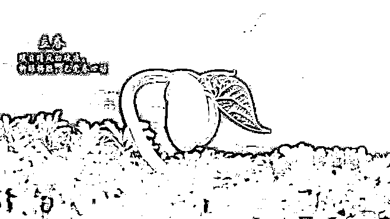

▲立春是农历二十四节气中的第一个节气，当太阳到达黄经 315°时。

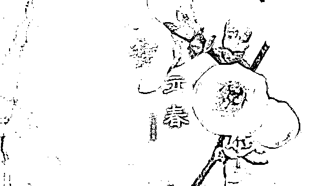

▲立春在每年公历的 2 月 4 日或 5 日，意味春季的开始。

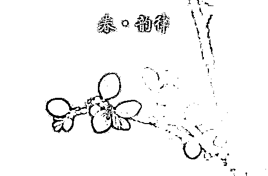

▲立春这天“阳和起蛰，品物皆春”，万物复苏生机勃勃。病毒也随之苏醒，此时不宜进补，要注意抗病毒，疏肝气。

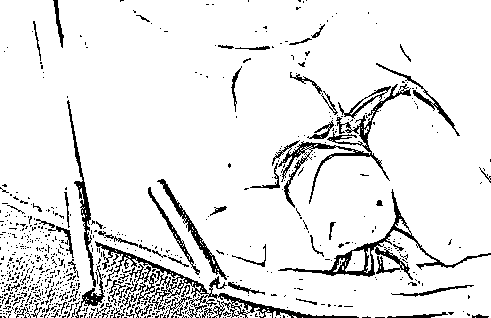

▲吃春饼最好了，春饼里包的都是适合春天的蔬菜，比如绿豆芽、韭菜。

春天你好，我们来啦~

**◆ ◆ ◆  ◆ ◆**

**▶有关星座与节气，也许你对下面文章感兴趣：**

[摩羯座=冬至→大寒，节气与星座对上啦！](http://mp.weixin.qq.com/s?__biz=MzA5NjA0NTAxNg==&mid=401595158&idx=2&sn=d7bc681cf849545d82fcf9a71299da90&scene=21#wechat_redirect)

**◆ ◆ ◆  ◆ ◆**

占星学是可以与日常生活联系在一起的！**2016 年 5 月 19 日**，**蒋颖**老师主讲的若道占星核心课程**Level 1-2**要开课了！这是若道历史上第一次有中文老师出山，她将带领你学习星座、太阳、月亮、行星、月亮交点等知识，让你进入占星学的世界！详细内容请点击“**阅读原文**”了解。

↓


# 视频 | 斯蒂芬老爷子给大家拜年啦！

> 原文：[`mp.weixin.qq.com/s?__biz=MzA5NjA0NTAxNg==&mid=402802650&idx=3&sn=b963fd6d2cf588bc9149eaeb9b21c9c2&chksm=0d40f56d3a377c7bd0a0eaf765259bd111fcb00c95bd8dd9e259535d16c59fc686958c03550a&scene=126&sessionid=1692738877#rd`](http://mp.weixin.qq.com/s?__biz=MzA5NjA0NTAxNg==&mid=402802650&idx=3&sn=b963fd6d2cf588bc9149eaeb9b21c9c2&chksm=0d40f56d3a377c7bd0a0eaf765259bd111fcb00c95bd8dd9e259535d16c59fc686958c03550a&scene=126&sessionid=1692738877#rd)

自去年 10 月作别后

就没再见斯蒂芬老师了

⊙︿⊙

在春天即将来到的时候

他远在美国

为若道的小伙伴们发来新年祝福

还聊到了**2016 年的重要天象**哦 

\(^o^)/

看到老爷子

大家和若道君一样兴奋吧

Y(^_^)Y

📹 [`v.qq.com/iframe/preview.html?vid=n0183oa60bn&width=500&height=375&auto=0`](https://v.qq.com/iframe/preview.html?vid=n0183oa60bn&width=500&height=375&auto=0)

**◆ ◆ ◆  ◆ ◆**  

今年又能在中国见到**斯蒂芬·弗里斯特**老师了！**2016 年 10 月**，他将分别在**北京、广州**举办工作坊，敬请期待！


# 母后吉祥！大过年的您就别再逼婚了好吧

> 原文：[`mp.weixin.qq.com/s?__biz=MzA5NjA0NTAxNg==&mid=402783748&idx=1&sn=ab9342146dfb80162e0a42f04b6f9d7e&chksm=0d434cb33a34c5a53f3d521cc1a1024eb8c7664a6dfceeaa100fcddf77b1904943941adfb149&scene=126&sessionid=1692738877#rd`](http://mp.weixin.qq.com/s?__biz=MzA5NjA0NTAxNg==&mid=402783748&idx=1&sn=ab9342146dfb80162e0a42f04b6f9d7e&chksm=0d434cb33a34c5a53f3d521cc1a1024eb8c7664a6dfceeaa100fcddf77b1904943941adfb149&scene=126&sessionid=1692738877#rd)

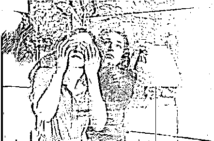

作者/雷公子

图片来源/花瓣

马上要过年了，想着要回家团圆，心里美滋滋的。不过，等等！我还单身啊！怎么忘了母后每年要上演的戏码——

■ 你怎么没运气找到那么好的对象呢？

■ 邻居家的孩子跟你一般大，今年都要考虑结婚了。

■ 你的叔叔阿姨们都问我你怎么还不结婚，让我的老脸往哪搁？

■  你到底怎么想的？前几年你不是说今年就考虑吗？

■ 你这个孩子太不懂事了！每次提起这事都翻脸，我是为你好啊！

……

心塞 ●﹏● ●﹏●

我在写这篇文章的时候，正为接下来回家过年而发愁：已过而立之年我，单身如旧，父母每周电话里总要以“早点找个对象”作为结束语。简单来说，我正邂逅“逼婚”。过几天回家过年，我想“什么时候结婚”将成为长盛不衰的跨年度主题。

**父母为啥要逼婚**

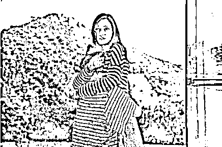

对于结婚这个话题，很多对占星学有了解的朋友会讲，婚姻恋爱不是和金星有关系吗？的确，金星指引我们拥有不同方式的恋爱经历，如果金星和其他行星再有紧密相位的话，婚恋的话题或者经历就更加丰富多彩了。只是，这更多的表现为我们所追求的或者展示出来的爱情模式。

而对于“逼婚”，我却想同大家分享一些关于“世代行星”的感受，也就是我们常说的“三王星”。那么“三王星”和父母逼婚又有什么内在的联系呢？ 三王星代表一个时代的特征，我们和我们的父母，两代人的价值观、婚姻观是不同的，由此，**一个“世代”在逼迫另一个“世代”结婚的情景通过三王星所在的星座，多多少少就会给予我们一些指引。**

**我们**

80、90 后的我们出生的时候：

*   天王星在射手座（约 1981-1988 年）或者摩羯座（约 1988-1996 年）

*   海王星在射手座（约 1970-1984 年）或者摩羯座（约 1984-1988 年）

*   冥王星在天秤座（约 1971-1984 年）或者天蝎座（约 1984-1995 年）

从天王星和海王星所在星座很容易看出，我们出生的年代具有一种前所未有的**追求自由、偏爱成长与创新**（射手座）以及**反对权威、反抗压抑**（摩羯座）的特征，而且这种特征在天王星合相海王星期间，让我们对自由的憧憬中又融入了**浪漫、理想色彩**，很多人**渴望流浪，渴望冒险**，希望在一种由自己的安排和掌控的状态下生活，同时他们**对家族、家庭的束缚、传统的规则充满强烈的排斥**。

冥王星在天秤座的时代，我们对待婚姻情感的**观念发生了颠覆**，婚姻已经不再是必需品，我可以选择结婚与否甚至可以选择与异性还是同性结婚。冥王星来到天蝎座的时候，性已经成为公开谈论的话题，婚姻在某种程度上成为了“性解放”的枷锁。

**父母**

我们的父母多数出生在：

*   天王星在狮子座（约 1955-1961 年）或处女座（约 1961-1969 年）

*   海王星在天蝎座（约 1955-1970 年）

*   冥王星在处女座（约 1956-1972 年）

我们的父母出生的那个年代和我们太不一样了，他们中有的人甚至经历了战争、灾难、贫穷和饥饿。这使得他们在思想上呈现出**保守、压抑、缺乏安全感**的特质。对于他们来说，**寻求稳定**的生活是他们深藏内心的渴望，而对于爱情和婚姻，他们更多的是遵从家长安排，即使比较早期的自由恋爱，彼此之间对爱的表达也是**内敛、压抑**的。

我们与父母的两个世代，对婚姻所追求的目的或者说内在的心理驱动是截然不同的。父母将他们的经历转化为生活智慧，附加在我们成长的过程中，希望以此来劝导我们。父母的出发点肯定是好的，只不过，这并不是我们所追求的生活。

**婚姻应该由自己负责**

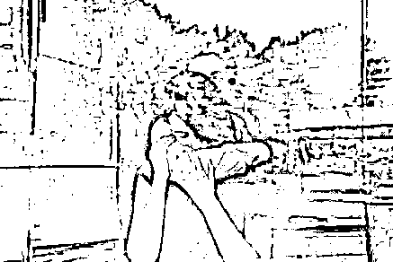

我有一些单身女性朋友，她们在谈论“逼婚”这件事，都会无奈的吐槽：

■“我如果再不结婚，恐怕我老妈就要疯了！她不疯，我也会被她逼疯的。”

这无奈中，多少又带了一些自嘲的成份。每当这个时候，我总是问她们一句话：对于结婚这件事，你自己做好准备了吗？我得到的答案多数都是否定的。她们还不知道怎么去扮演一位妻子、母亲的角色，甚至连女儿的角色也不会扮演。

另外有些朋友，每当谈起自己失败的婚姻，他们会提到这样一个情景：

*   “哎，当初父母非逼着我结婚，我就想随便找一个。结婚前一个月，我还和父母赌气说，结了早晚要离婚。”

*   “我当初就觉得和对方不来电，家里人、亲戚朋友都说好，我就结婚了，结了之后不但不来电，反而每天一见面，我就有一种厌恶感……”

上述情景的发生，**我们自身需要承担的责任占比更大**。在中国的国情下，家人“善意”的建议的确左右了我们在婚姻生活中的选择。面对这个话题，和自己的父母不妨深入的探讨一下。你想要什么样的伴侣，想过什么样的生活，此刻需要你的表达和诉说。我想每一个父母都是可以理解的自己子女的感受的。

关于“逼婚”和“被闪婚”，我总是开玩笑说，如果你知道最适合你的要晚一点到，你还会着急现在做决定吗？好比吃一顿大餐，撑门面的大菜总是要来的晚一些。你不会为了着急吃饱就吞下 10 碗米饭吧？后面的澳洲龙虾才刚准备端出厨房——毕竟这需要一点时间。

过年应对逼婚小妙招

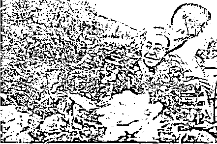

**1****尊重与交流**

回家过年这几天，无论是父母还是七大姑八大姨，大家问起结婚事，各位一定要把“尊重长辈”放在第一位。长辈对我们都是一份关心，有些长辈的动机更简单，无非是把“婚姻大事”当做了串门访亲的一个话题。与父母则需要进行深入的交流，比如自己如何看待结婚这事，即使是不婚主义者，也需要慢慢渗透思想，不能一蹴而就。家庭战争也不是单方面宣战造成的。

**2****沉稳与规划**

戒骄戒躁，不能一提结婚就翻脸。我们需要告诉父母我们在外地的人生规划，包括职业规划和家庭规划。很多父母也许是觉得彼此相隔，对孩子的成长轨迹不够了解。如果我们可以把一些正面的、乐观的信息告诉父母，我想父母是可以理解结婚晚一点的。

**3****行动与实施**

如果你自己也渴望有一份稳定的婚姻，那么在内观自我之后，不妨找出原因。是过于封闭自我？还是遇到了其他问题。做到有效的自我调整，积极面对“相亲”、同学聚会或者其他交际的机会，我想有些问题就会迎刃而解。所有的问题，都可以找到合适的方法解决。逃避肯定是没有用的，不妨去面对，也许会是另一种风景。


春节回家

你最怕面临什么？

欢迎留言~

**作者简介**

**雷公子**：若道 COAC 毕业占星师，塔罗咨询师，心理咨询师。

新浪微博：@拜托雷公子

个人微信：xzzkjoe

长按二维码，让金钱涌向传播知识与智慧的人~ 

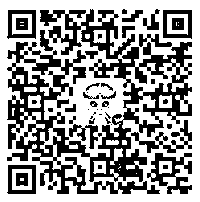

**◆ ◆ ◆  ◆ ◆**

 ****特别提醒：********本文由作者授权发布于若道****，转载请注明“转自若道”。****

在这里你可以更多地了解自己和父母。**2016 年 5 月 19 日**，**蒋颖**老师主讲的若道占星核心课程**Level 1-2**要开课了！这是若道历史上第一次有中文老师出山，她将让你从星座小白进阶为星座达人！详细内容请点击“**阅读原文**”了解。

↓


# 抽离的水瓶座也能成好妈妈

> 原文：[`mp.weixin.qq.com/s?__biz=MzA5NjA0NTAxNg==&mid=402783748&idx=2&sn=42f6908140bcbc5883db68f8fa580316&chksm=0d434cb33a34c5a521d402c65dde8c50bc2459b5f9514daf4999071f4d40693b5b4d5db5a57d&scene=126&sessionid=1692738877#rd`](http://mp.weixin.qq.com/s?__biz=MzA5NjA0NTAxNg==&mid=402783748&idx=2&sn=42f6908140bcbc5883db68f8fa580316&chksm=0d434cb33a34c5a521d402c65dde8c50bc2459b5f9514daf4999071f4d40693b5b4d5db5a57d&scene=126&sessionid=1692738877#rd)

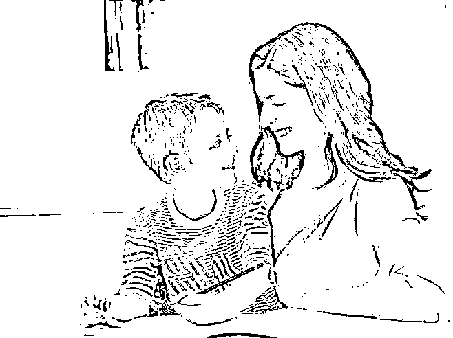

作者/沙沙 

本文首发于 2016 年 2 月《为了孩子》杂志

也许水瓶座母亲 12 星座中最没有“妈妈样子”的母亲了。她们崇尚自由，也很理性，那要如何与自己的孩子相处，才会让自己舒服，让孩子也感受到爱呢？


**水瓶座妈妈特质：****自由、高冷、独立、理性**

**育儿高招：****尊重、懂欣赏、擅沟通**

**相处最融洽的星座宝宝：****白羊座、双子座、天秤座、射手座**

1

初为人母，需要更多时间适应新角色

刚刚成为妈妈的那段日子，对于一向崇尚独立和自由的水瓶座来说是充满挑战的。原本一直从心所欲过日子，想看电影就看电影，想泡咖啡馆就泡咖啡馆，想去旅行就立刻订张机票出发，别提多潇洒了。可是随着孩子的到来，这一切都会发生翻天覆地的变化。

婚姻束缚不了水瓶女自由的心，但孩子可以。有了孩子，水瓶女无奈地发现，自己从一个风一般的文艺女青年，变成了围着孩子的尿布、奶粉忙得团团转的家庭妇女，冷不丁地就会被孩子吐奶吐一身，外表邋里邋遢，自己都不乐意照镜子。就连去一趟附近的超市，都会像打仗一样急着往回赶，生怕孩子又要吃奶或是要妈妈抱了。

只有孩子入睡后才偷得半刻清闲，可自己也早就累得不行，只能和孩子一起倒头睡去。总之一句话，**原本被水瓶女悉心保护的自由空间和独立生活，似乎随着孩子的到来，一去而不复返了。**

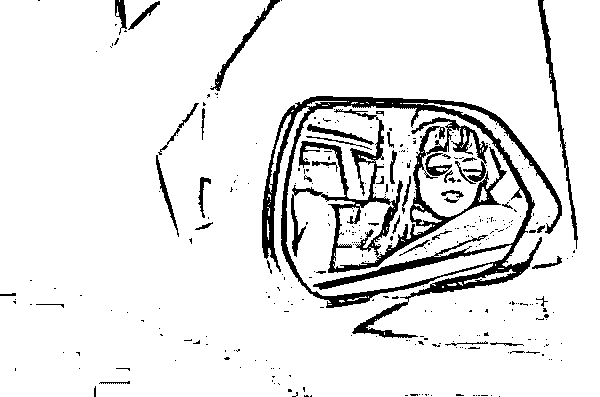

2

孩子降临，让自己有机会体会“亲密”

除此之外，在内心深处，水瓶座还有另一种担心。

因为水瓶座是如此理性的一个星座，理性到高冷的程度，不像白羊座、狮子座那样热情外露，也不像巨蟹座、双鱼座那样总是洋溢着满满的母性能量。虽然水瓶座也喜欢呼朋唤友，但是始终保持着一种距离感，因为水瓶座需要这种疏离感来保护自己独一无二的“自我”。在人际关系上，水瓶座是偏向于疏离的。因为水瓶座是一个风象的固定星座，她们会本能地用理性而不是情感去与人沟通，所以，**“亲密”对于水瓶座，向来是个难题。**

那么，“我会是一个好妈妈吗？”在水瓶女的心里，可能会跳出这样的疑问。这种怀疑，让她们在一个柔软、弱小，而且对自己充满期待的孩子面前，多少有些不知所措。

虽然有各种各样的挑战存在，但对水瓶来说，孩子确实是天赐的礼物。在成为妈妈以后，她们会发现，终于有人牵起她们的手，一起完成这份关于亲密关系的功课了。孩子如同天使，降临到每个妈妈身边，让她体验到从未有过的深爱一个人的感觉。这一点对于水瓶座，也并不例外。

改变，是在不知不觉中发生的。在哺乳过程中建立起来的无可替代的亲密感，孩子晶晶亮的眼睛和他们投向妈妈的充满信任的目光，都会让水瓶女的内心越来越柔软。

随着最初的不适应期过去，水瓶女会发现自己作为母亲的角色已渐入佳境。孩子的到来，让她们逐渐体验到自己内心感性的部分。如果在成为妈妈的最初阶段，**水瓶座能够学会用爱而不是用理性去与人对话，学会接纳自己柔软的、情绪化的部分**，**那么，最困难的部分就已经完成了。**

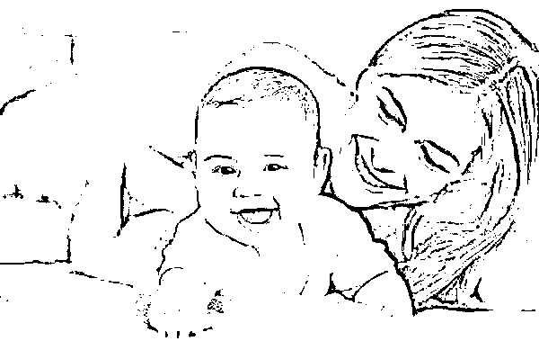

3

想做孩子的好朋友，不把孩子当作附属品

当孩子慢慢长大，不再是一个只懂得吃喝拉撒的小娃娃，他有了自己的感情和思想，能够和妈妈表达自己的想法了。这一切都带给水瓶座妈妈接连不断的惊喜：在自己的养育之下，孩子作为一个独立的人，正在逐渐成长；他小小的人格，正在逐渐形成。这是一个多么奇妙的过程！

其实，水瓶座妈妈最宝贵的地方，就是她们从来不会把孩子看作自己的附属品。在她们心里，孩子从来都是，也必须是一个独立自主的个体，就像她们自己一样。她们懂得尊重孩子，给孩子足够的自由，并且懂得欣赏他们身上与众不同的特质。**因为在水瓶座心目中，个体的独特性和独立性从来都是值得尊重的，水瓶座妈妈希望孩子能够按照他们自己本来的模样去成长。**

如果她们自己在成长过程中，感觉到这种尊重、这种独立性有所缺失的话，她们就会加倍地补偿给孩子。那种权威式的亲子关系，那种“因为我是你妈妈，所以你必须听我的话”的强势，在水瓶座妈妈身上非常少见。她们拒绝用权威去压制孩子，她们会与孩子讲道理。所以，随着孩子逐渐长大，亲子关系也会愈显融洽。


我慢慢地、慢慢地了解到，所谓父女母子一场，只不过意味着，你和他的缘分就是今生今世不断地在目送他的背影渐行渐远。你站在小路的这一端，看着他逐渐消失在小路转弯的地方，而且，他用背影默默告诉你：不必追。

——水瓶座的龙应台


水瓶座妈妈的清醒和透彻，在这段话里体现得淋漓尽致。也正是因为有这样的清醒和透彻，对于水瓶座妈妈来说，养育孩子是重要的，但把自己的日子过好更重要。

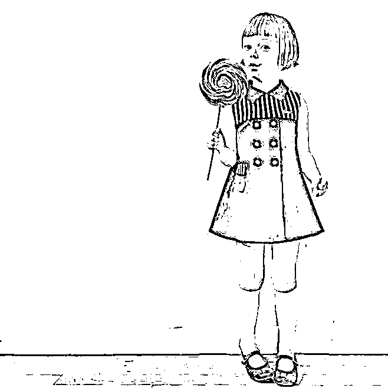

4

**忙着照顾孩子，也不忘保有自我**

所以，水瓶座妈妈不必为了孩子牺牲掉自己的个人生活。特别是当孩子长大一些，不再需要 24 小时贴身照顾之后，她们完全可以把自己曾经失去的个人生活找回来。她们可以有自己的朋友圈，可以偶尔和闺蜜一起去看个电影，看场话剧，参加一些兴趣课程，或来一次短途旅行；她们也可以追求自己的事业，在为事业而打拼的过程中，寻找更高的自我价值感。

是的，**对于水瓶而言，最最宝贵的自我价值感，不应该因为孩子的到来而成为被牺牲的对象**。不妨把那些短暂的自由和放松，当成给自己充电的过程。水瓶座妈妈需要了解的是，只有当她们的“自我”活力十足时，作为妈妈的状态才会更佳，才能够给孩子更高质量的陪伴。而所谓高质量的陪伴，首先应该是妈妈情绪状态的“高质量”才对。在此过程中，爸爸和其他家人的理解与配合，对于水瓶座妈妈也是至关重要的。

而对孩子来说，一个独立自主、自我完善的妈妈，也会成为很好的榜样。孩子不需要有负罪感，不需要觉得“妈妈为我牺牲了很多”，这对孩子来说，本身就是一种自由。当然，孩子仍然会需要妈妈的陪伴，特别是需要妈妈和他们的沟通与对话，而这正是水瓶座妈妈擅长的事情。临睡时讲一个故事、聊聊天，互相分享今天经历的有趣的事情，记忆深刻的感受，对于水瓶座妈妈和她们的孩子，都会是非常愉悦的体验。

**◆ ◆ ◆  ◆ ◆**

 ****特别提醒：********本文经作者授权发布****，转载请注明出处。****

无论你是什么星座的母亲，都可以从占星学中获得宝贵的育儿招数。**2016 年 3 月 26 日**，大卫老师将在北京举办两天的占星学与亲子工作坊！让你找到“ 因材施教”的操作说明，学习应对不同时期亲子关系发展的成长挑战！详细内容请点击“**阅读原文**”了解。

↓

# 视频 | 大卫老师带领全体若道君给大家拜年~

> 原文：[`mp.weixin.qq.com/s?__biz=MzA5NjA0NTAxNg==&mid=402783748&idx=3&sn=cafed1640b64acda166f971fdb8279a7&chksm=0d434cb33a34c5a5dd29885a8d421f48245dc713e90be823ec05705e3d77a12fb52f5f948dd2&scene=126&sessionid=1692738877#rd`](http://mp.weixin.qq.com/s?__biz=MzA5NjA0NTAxNg==&mid=402783748&idx=3&sn=cafed1640b64acda166f971fdb8279a7&chksm=0d434cb33a34c5a5dd29885a8d421f48245dc713e90be823ec05705e3d77a12fb52f5f948dd2&scene=126&sessionid=1692738877#rd)

若道团队首度露脸

为小伙伴奉上新春祝福


祝大家

▼

一帆风顺 

五福临门

百尺竿头 

更进一步


📹 [`v.qq.com/iframe/preview.html?vid=a0183vde2nv&width=500&height=375&auto=0`](https://v.qq.com/iframe/preview.html?vid=a0183vde2nv&width=500&height=375&auto=0)

**◆ ◆ ◆  ◆ ◆**

新的一年，送自己一份增长人生智慧的新年礼物吧！**2016 年 5 月 19 日**，**蒋颖**老师主讲的若道占星核心课程**Level 1-2**要开课了！这是若道历史上第一次有中文老师出山，她将让你从星座小白进阶为星座达人！详细内容请点击“**阅读原文**”了解。

↓


# 万一有一天，你没有明天会怎样？

> 原文：[`mp.weixin.qq.com/s?__biz=MzA5NjA0NTAxNg==&mid=402765038&idx=1&sn=f673d88ec0f1ac9bcb702c1bb4a4e19a&chksm=0d4306593a348f4fd08f4c994131cafcce4769504864e9a259a1b615f657e3bb6c7a844af8c2&scene=126&sessionid=1692738877#rd`](http://mp.weixin.qq.com/s?__biz=MzA5NjA0NTAxNg==&mid=402765038&idx=1&sn=f673d88ec0f1ac9bcb702c1bb4a4e19a&chksm=0d4306593a348f4fd08f4c994131cafcce4769504864e9a259a1b615f657e3bb6c7a844af8c2&scene=126&sessionid=1692738877#rd)

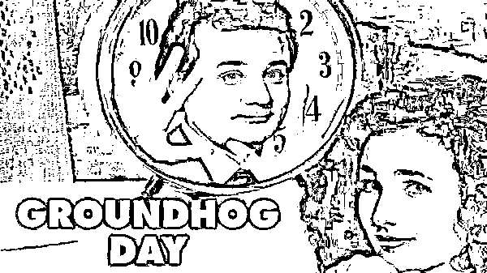

作者/蒋颖 若道占星创始人

**如果有一天，你发现自己被卡在某一天的时间之中，永远出不去，日子就像坏了的唱片机，在每天结束后自动倒带，而你必须不断重活这一天！面对永远一样的一天的轮回，你会怎么做？**

**1**

每天早上 6 点钟，你都从同样一家旅馆的床上醒来，闹钟准时响，同样一首乐曲叫你起床；打开房门，准时碰到一个大胖子，他满脸笑容地跟你打招呼，而你一点也不想理他；下楼到旅馆餐厅，同样的乡村大妈给你倒咖啡，问你睡得可好；出门上班，走一模一样的道路，永远在街角碰到一个老乞丐，然后一个 N 年没见、你早忘得一干二净的高中同学一见面就兜售保险，你避之不及，一脚踩入同一个臭水坑。

然后你重复一模一样、没有任何激情、甚至觉得荒唐透顶的某个工作任务；下班回来，洗澡时永远是冷水劈头盖脸冲下来；狼狈上床，第二天闹钟将会在 6 点用同样的乐曲叫醒你。就像一个设定好的程序，在绝对的时刻你看到同样的事，遇到同样的人，听他们对你说同样的话……无论你怎么改变，这些人和事还是会按照秩序一模一样地出现。而最让人发狂的，只有你意识到这一天重现了，其他人完全没有察觉。

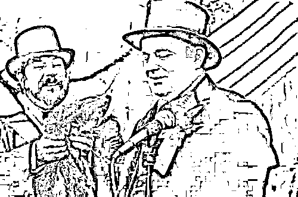

这就是电影《土拨鼠之日》的主人公 Phil Connors 在 2 月 2 日——美国传统的节日土拨鼠日醒来遇到的事情，他是一个小有名气的气象播报员，单身汉，对一切都不 Care、傲慢、自我中心、愤世嫉俗、尖酸刻薄。他并非没有可爱之处，比如他极其诙谐幽默、脑筋反应极快（可以想象也许他的星图上有水瓶座、处女座、水星和火星的相位、水星和冥王星的相位）。


**小贴士**

**土拨鼠日：**每年 2 月 2 日，是美国的一个节日——土拨鼠日。庆祝这个节日最有名的活动是在德裔较多的美国宾夕法尼亚洲，每年 2 月 2 日，人们会聚集在一起，看冬眠的土拨鼠从洞穴里爬出，预测春天还有多久会来。这一天，如果是阴天，土拨鼠看不到自己的影子，说明今年春天会来得早。如果土拨鼠看到影子了，就会回洞里接着睡大觉去，那么春天还要再等 6 个星期才能到来。

**2**

刚发现这个境况无疑让 Phil 震惊，不仅因为每天必须重活一遍，而且重活的不是在迈阿密海滩遇美女的一天，而是让他本来就恨不得早早结束、早早离开的一天。

没有明天会怎样？Phil 在短暂焦虑绝望后发现，正如他在酒馆里遇到的酒鬼朋友告诉他的：“如果没有明天，那就没有后果，没有宿醉，我们可以为所欲为。”（我们这个社会整体所持有的观念是不是有些像这个酒鬼朋友持有的观念呢？）因此，Phil 开始用放纵自己，不顾所有道德、法律规则的方式来度过一天。他任性胡为、暴饮暴食、尽情享乐，泡妞、偷盗、抢银行、撞车，哪怕为此被投入监牢也不要紧，因为第二天还会是从旅店的床上开始。

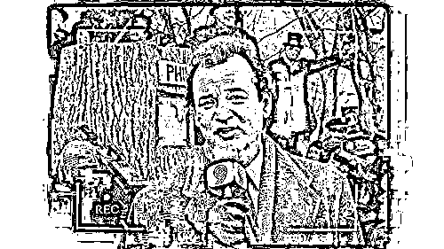

没有明天会怎样？只有你知道而其他人都不知道？Phil 发现他可以用他聪明的大脑钓他想勾引的姑娘的信息。每天他记下他想勾引的同事 Rita 的喜好——喜欢喝的饮料、说的祝酒词、喜欢做的事、读的书，再一天，Phil 就会利用这些信息骗取姑娘的青睐。然而骨子里 Phil 还是 Phil，那个没有爱心的 Phil，因此每次都会以被 Rita 识破，以一个巴掌结束他的妄想。

在被扇了无数个巴掌，无论怎么做都无法改变结果后，Phil 对自己的日子彻底绝望，宁可用死亡来离开这一天。他尝试各种死法——撞车、跳楼、触电、自焚、自刎……然而早上六点一到，他还是会在那张床上起来，重新循环 2 月 2 号那一天。

**3**

一切真的很绝望。直到有一天…….

他决定用一种彻底不同的态度面对这一切。他仍旧遇到同样的人，同样的事，但是他变得温暖、友善，甚至每天像赶场一样帮助那些必定要遇到麻烦的人；他学习钢琴、冰雕、学习急救方法，那个曾经平淡无味、毫无特色并令他无聊、憎恨、绝望、了无生趣的一天发出了夺目的光彩。

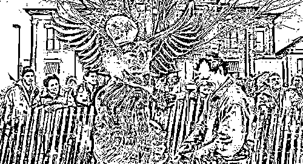

故事就先讲到这里。我不再剧透，不过我必须说的是，当那转折的一天到来，音乐响起，当看到 Phil 以一种欢欣鼓舞的方式，手托着咖啡走向人群的时候，我的眼眶竟然湿润了（这本来是部喜剧片，而之前看到 Phil 的一出出闹剧时我还笑得前仰后合），因为我深深体会到在 Phil 无数次艰辛而令人绝望的尝试后的这个突破多么来之不易！所有尝试改变自己的人可能都会在此刻听到内心深处轻微的撕裂般的爆竹声。

这是一个天才编剧和导演拍摄的喜剧电影。他用脑洞大开的方式把人生的“轮回”压入一天。轮回这个词，如果你看着不爽，就尽管简单地诠释为“同样的模式”。曾经听一位佛教师父说过一句话，世界上最大的力量是轮回的力量，当他说这个话的时候，我仿佛看到黝黑海面上一团旋转着的巨大电光。

剧中有一个很有趣的情节，绝望的 Phil 在保龄球馆对两个家伙讲：“如果你每天都困在一个地方，你做什么都无关紧要，每天都一模一样，你该怎么办？”其中一个家伙说：“这就像是我的人生啊”。Phil Connors 重复的一天就是很多人长长一生、甚至生生世世的隐喻。

**4**

Phil 的觉醒（电影中从床上醒来，天王星的行进）是从突然发现一切都一模一样、一成不变开始。因为大多数人根本无法意识到每一天都是一个轮回，哪怕对 Phil 这个极其聪明的人也一样。只有用如此极端的方式，才有可能看到这个模式，然后才想费尽心机改变。

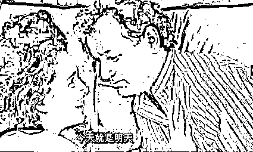

■ **觉醒从绝望开始**（冥王星的行进）。就像影片中 Phil 的绝望，如果内心没有真正的转变，哪怕费尽心思，也不过发现即便死亡都无法改变那个轮回。

■ **觉醒从内心转变开始。**用小聪明和上帝下棋只有输的份，只有臣服于当下，只有内心转变，一切才有可能有不同的结果。

■ 这部电影还告诉我们，当用觉醒的眼睛去看这个世界**，每个平凡的一天里都存在着扭转乾坤的机会，你、他人、世界都有可能因为一个小小的善意而变得不同**（海王星的行进）。

■ 而**剩下的只有耐心**（土星的行进），哪怕已经改变了一些，但是就像片中的 Phil 一样，还是会被放入那个“时光机”，一次次过同样一天，但是“模式的力量”（佛教中的业力）在被一点点扭转。正如我们拼却一生，费尽心力，一次次轮回，每次学到一点点智慧和爱。直到某个时刻，轮回被打破，整个一天焕然一新。

**5**

《土拨鼠之日》是一部学习占星学必看的电影，因为它讲出了占星学的真谛，让我们看到星图的模式如何一次次上演。我们这辈子出生，出生星图不会变，就像 Phil 的一天所遇到的人和事一样，但是我们可以用不同的态度去活出星图上的一切，活出一个不同的太阳水瓶座、水星四分冥王星相位（就像从一个内心冰冷、对一切不在乎、毒舌、所有机智和聪明只增加傲慢的 Phil 变成了一个友善、助人为乐、用聪明、信息和知识救人转危为安的 Phil）！ 

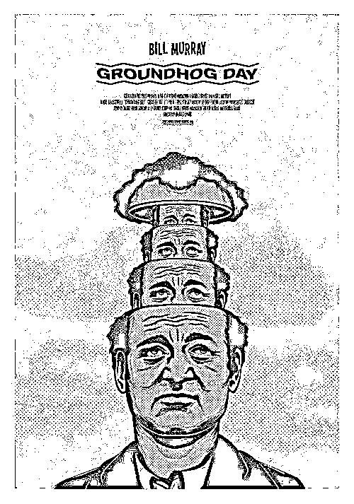

天王星和冥王星还在继续上演着四分的戏码，海王星和土星也在加入这个棋局，我想很多人都会像 Phil 一样，有机会看到上天赐予的改变时机的到来，也可能把这四颗行星的力量有意识地主动运用在自己的生活中，创造一个不同的未来。

而今天就是土拨鼠日，Groundhog Day，祝你节日快乐！

**◆ ◆ ◆  ◆ ◆**  

 ****特别提醒：****若道享有本文版权，转载请注明“转自若道”。****

如何看清自己的模式？**2016 年 5 月 19 日**，蒋颖老师主讲的若道占星核心课程**Level 1-2**要开课了！这是若道历史上第一次有中文老师出山，她将带领你学习星座、太阳、月亮、行星、月亮交点等知识，让你进入占星学的世界！详细内容请点击“**阅读原文**”了解。

↓


# 漫画 | 给 12 星座拜年啦！

> 原文：[`mp.weixin.qq.com/s?__biz=MzA5NjA0NTAxNg==&mid=402765038&idx=2&sn=a3d477e4450f8c26aa098eab354044d0&chksm=0d4306593a348f4f005c046c9b877dcc6b3aaffe69455e4190bfe880742f3d89031e51b04a63&scene=126&sessionid=1692738877#rd`](http://mp.weixin.qq.com/s?__biz=MzA5NjA0NTAxNg==&mid=402765038&idx=2&sn=a3d477e4450f8c26aa098eab354044d0&chksm=0d4306593a348f4f005c046c9b877dcc6b3aaffe69455e4190bfe880742f3d89031e51b04a63&scene=126&sessionid=1692738877#rd)

过年了

Mr.年来到人间

分别拜访 12 星座

大家都是怎样迎接他的呢

▼

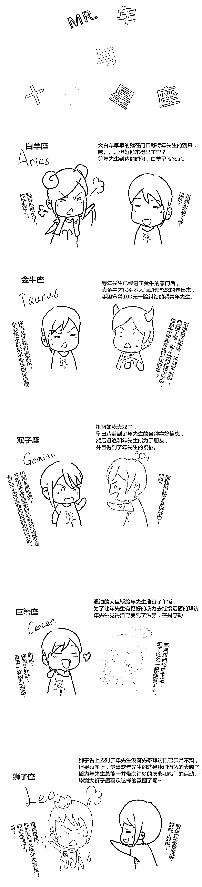

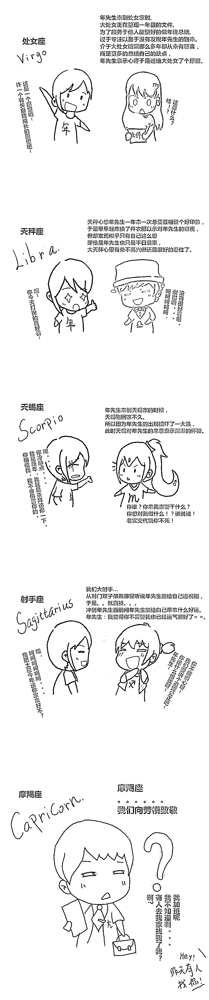
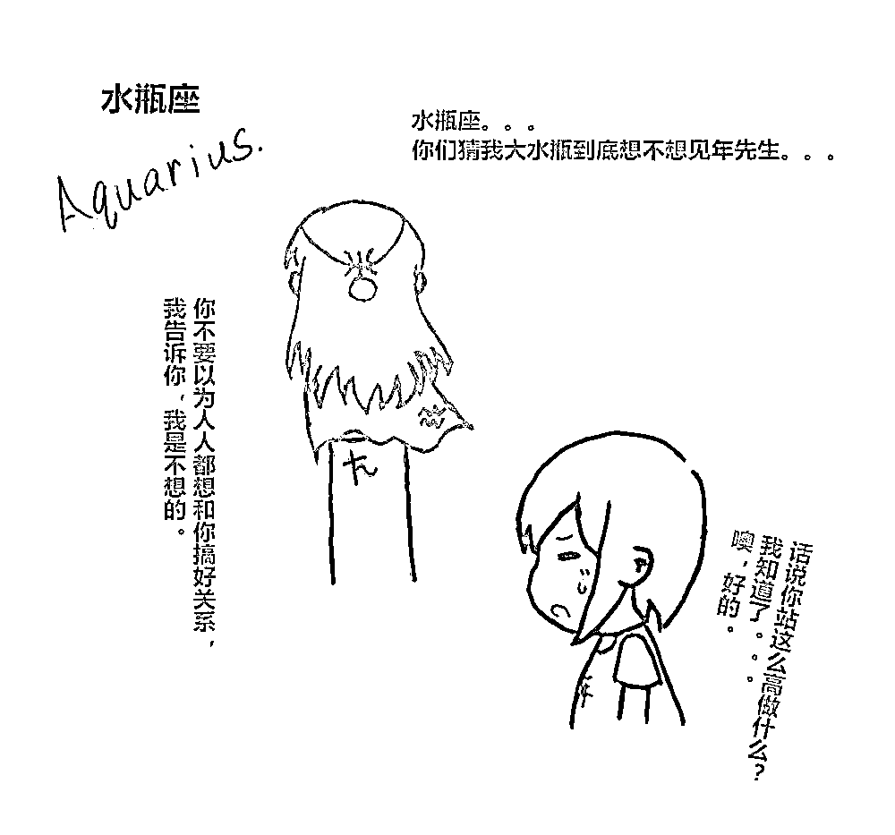
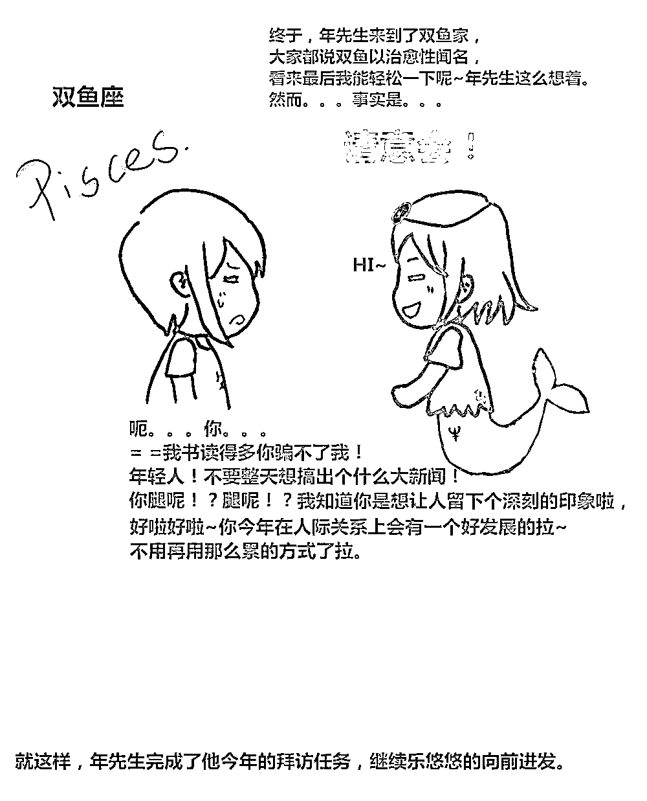
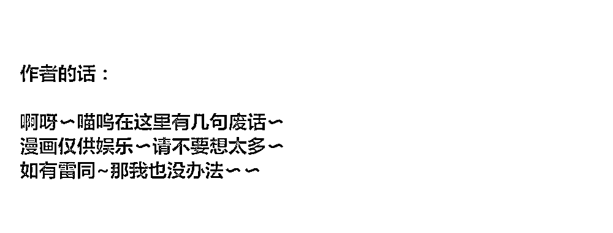

**作者简介** 

**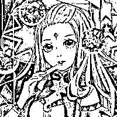** 

**喵呜：**人类、处于“正常”与“不正常”中间、做梦者、顽固型中二病、情感泛滥、渴望被爱、爱抖机灵、不作死会死星人( • ̀ω•́ )✧。目前通过若道的 Level 课程正打开新世界大门中。

**◆ ◆ ◆  ◆ ◆** 

****特别提醒：******本文由作者授权首发于若道平台，**转载请注明“转自若道”。****

在这里你可以更细致地了解 12 星座。**2016 年 5 月 19 日**，蒋颖老师主讲的若道占星核心课程**Level 1-2**要开课了！这是若道历史上第一次有中文老师出山，她将带领你学习星座、太阳、月亮、行星、月亮交点等知识，让你进入占星学的世界！详细内容请点击“**阅读原文**”了解。

↓


# 属猴的本命年到了，到底是吉是凶？

> 原文：[`mp.weixin.qq.com/s?__biz=MzA5NjA0NTAxNg==&mid=402748478&idx=2&sn=05418c4440b8a2f31eff29f7587e5d7f&chksm=0d43c6893a344f9f50668368222dd1a1788c0a94c57d2b8743d91216cad16a2d3112825e81c2&scene=126&sessionid=1692738877#rd`](http://mp.weixin.qq.com/s?__biz=MzA5NjA0NTAxNg==&mid=402748478&idx=2&sn=05418c4440b8a2f31eff29f7587e5d7f&chksm=0d43c6893a344f9f50668368222dd1a1788c0a94c57d2b8743d91216cad16a2d3112825e81c2&scene=126&sessionid=1692738877#rd)

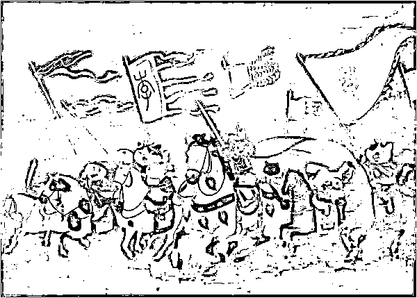

作者/Jennie

图片来源/花瓣

中国传统文化中，今年是属猴的本命年，年纪 12、24、36、48 岁的人，该穿红短裤、系红腰带求吉避祸。老人的说法是，本命年容易出乱子，要小心谨慎度过。

不过在西方占星学的文化里，行进的木星一年走一个星座，12 年就在黄道上转一圈，回归到个人出生星图上木星的位置。木星是西方古典占星学传统上的一颗吉星，所以木星回归应该是吉兆。

到底本命年或者木星回归年是吉是凶呢？

**小知识**

**本命年**

本命年是十二生肖的循环往复，一个人出生的那年是农历的哪一年，以后每到这一属相年便是此人的本命年。每过 12 年，人们就要遇到自己的本命年。在传统习俗中，本命年会被认为是一个不吉利的年份，因此人们会采取一些方法趋利避害。

**木星回归**

木星是太阳系最大的行星，大约 12-13 年绕行黄道一圈，当行进的木星回到出生星图所在的度数上时，就是木星回归的时刻。木星的本质是温暖的，它代表着扩张和保护，是星图上我们感觉轻松和机会的所在。所以木星回归让我们感觉到舒适、自信，但也有可能会有过度乐观的问题存在。

**冒险和远行，是危险还是新生？**

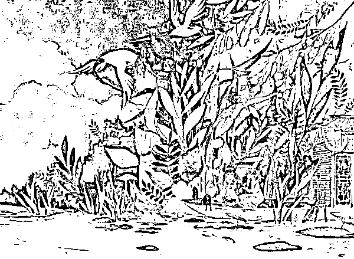

我认为在不同的文化土壤里，这两种说法都是对的。

中国传统上是一个农业国家，相对来说乡土文化较为重，较少流动性。在中国人的个人出生星图上，和冒险、扩张、乐观、异族文化有关的木星的显现，可能并不那么受欢迎。于是，在本命年（即木星回归时），大家需要小心谨慎地度过这段渴望冒险和远行的日子。

而反观美国，有大航海和殖民的历史。美国的白人殖民者大多是从欧洲长途跋涉来到新世界。一开始，经济也以游牧文化为主。在希腊神话里，木星对应的神是主神宙斯，手拿闪电权杖，拥有雷霆般的力量。在爱情上也喜欢冒险，拥有众多从仙子到凡人的情人。于是，代表冒险和远航的木星，在美国的文化传统中当然是属于吉星。

**何以评定是吉是凶？**

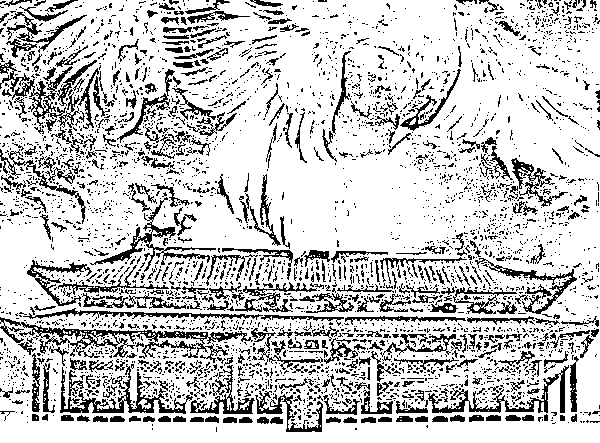

古代一个 36 岁的中国人，可能本命年突然卖掉了祖传的土地，告别家人，离开了家乡坐船走水路，去京城赶考。面对着一路的辛苦和奔波，面对路上的强盗和猛兽，他可能到不了京城，也可能中了进士，衣锦还乡光宗耀祖。但是家人心中必定为他担惊受怕。

而百年前一个 36 岁的美国人，很可能在木星回归那一年，决定卖掉所有的财产，召集牛仔小伙伴们，赶着牛群一起去西部新世界冒险闯荡一下。可能在边疆开辟了巨大的牧场，也可能要面对印第安人的弓箭，狼群和毒蛇。乐观昂扬的出发，不一定都有凯旋的好结果。

作为一名占星师，不管我们学的是什么流派，在现在全球化的环境中，我们对客户本命年木星回归的行进，都不能简单以吉凶来回答。要对出生星图的木星星座、宫位、相位等信息，有一个仔细和综合的解读，同时也要顾及到客户的生活环境和他所认同的文化对他的影响。

作者简介

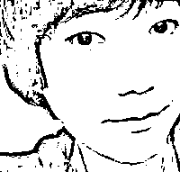

**Jennie：**曾任职于三联书店出版社，2012 年开始在若道跟随多名国际著名占星师学习严肃占星学。现在作为占星咨询师提供亲子家庭、亲密关系、职业方向的咨询、生时纠正，以及透特系塔罗解读咨询。

**微信：**Jennie_Kong

长按二维码，让金钱涌向传播知识与智慧的人~

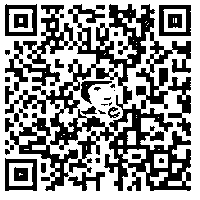 

**◆ ◆ ◆  ◆ ◆**

******特别提醒：************本文由作者授权首发于若道平台**********，**转载请注明“转自若道”。******

如何掌握星象，顺势而为？**2016 年 3 月 15 日**，大卫老师主讲的若道占星核心课程**Level 5**要开课了！在这个阶段，你将学习各种预测技术及行星周期。通过这些预测工具，你能够预测和规划人生。提前报名付款有**早鸟价**哦！详细内容请点击“**阅读原文**”了解。

↓


# 宇宙天气 | 鞭炮和人，总有一个要“爆炸”（2.1~ 2.7）

> 原文：[`mp.weixin.qq.com/s?__biz=MzA5NjA0NTAxNg==&mid=402748478&idx=1&sn=50db7fbfc4145614a3e3093af6979922&chksm=0d43c6893a344f9fc6a4266efa579693f208dea0f5c841382d0737aa0216fbec738245783b15&scene=126&sessionid=1692738877#rd`](http://mp.weixin.qq.com/s?__biz=MzA5NjA0NTAxNg==&mid=402748478&idx=1&sn=50db7fbfc4145614a3e3093af6979922&chksm=0d43c6893a344f9fc6a4266efa579693f208dea0f5c841382d0737aa0216fbec738245783b15&scene=126&sessionid=1692738877#rd)


作者/占星师 Cora

插画/七沐  图片/花瓣

**一周星象综述**

本周月亮经过天蝎座、射手座、摩羯座。如果说前两周都是“水星的考验”，那么**这一周我们将迎来典型的“火星的挑战”，也就是对于勇气、行动力、意志力和生存本能的试炼**。

> **本周重点星象事件是：**
> 
> **① 天蝎座火星六分冥王星**
> 
> **② 摩羯座金星合相冥王星、四分天王星（金星触发天冥四分）**
> 
> **③ 水瓶座太阳四分天蝎座火星**

显然这是火星能量被着重强调的一周，也暗示了春节前这一周是多么的忙碌紧张（可能很多人会一直忙到除夕夜吧）！**火星的问题，简单粗糙地概括便是：要么做事，要么“打架”。本周这种火星能量亟待释放的情况，在周一和周末会非常明显。在这个“火力旺盛”的春节前的一周，要特别提醒大家，凡事平心静气，清淡饮食多喝水，防上火，防失火，防意外伤害！**

提前祝大家春节快乐！

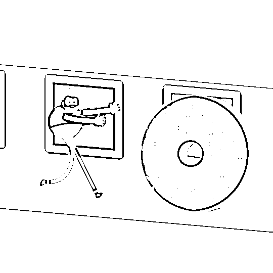

**每日星象**

**2 月 1 日**

星期一

**关键词：战斗**

**这是充满“战斗力”的一天，为这周带来一个“火爆的开始”。**月亮在天蝎座本身增添了对环境中的“危险气流”的敏感度，让人心情紧张。在水星的参与下，怀疑和思虑过重也会加重信任危机。**虽然这不必然会引发冲突或对抗性事件，但这一天我们确实比较容易有过激反应，在情绪上难以收放自如，容易火气上头，走极端。**在上周还在压抑、犹豫的问题，或试图掩盖的冲突，可能在这个周一迎来一次小爆发。建议凡事冷静处理，三思而后行。

**从积极的方面说，强有力的火星和天蝎座能量，能帮助我们看到真实的自己，特别是了解自己的欲望与恐惧。**很多事情的真相，也是在勇于“挑破窗户纸”之后，才明朗开来。如果将爆发力和“狠劲儿”用到做事上，这将是行动高效、收获颇丰的一天。

**当日星象**

08:09  天蝎座月亮六分摩羯座金星

**11:43** **摩羯座水星四分白羊座天王星**

**18:29** **天蝎座月亮合相火星**

20:22  天蝎座月亮六分摩羯座冥王星

23:02  天蝎座月亮六分摩羯座水星

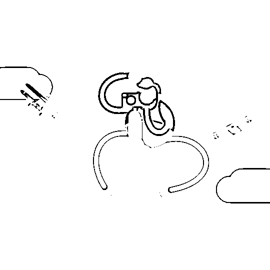

**2 月 2 日**

星期二

****关键词：意志****

与周一相比，这是平淡的一天，虽然月亮依然在充满紧张感的天蝎座，但是让人最不冷静的时候已经过去。“斗争心”和潜在的愤怒感仍在，但是情绪上已经能够稳定下来。另一方面，天蝎座的火星已经接近六分冥王星的度数，**从周二到周四这几天，是考验意志力的时刻，也是发掘自己的力量的好时机。这段时间我们将有能力去完成一些“不可能的任务”，前提是必要的自控和激发出某种“求生意志”——这也是本周一个整体的主题。**

**当日星象**

08:36  天蝎座月亮六分处女座木星

**23:49** **月亮离开天蝎座进入射手座**

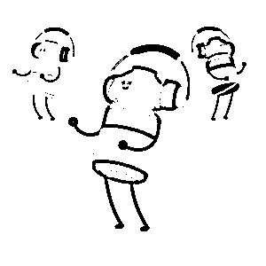

**2 月 3 日**

星期三

****关键词：拼搏****

今天月亮来到乐观又智慧的射手座，这意味着我们能够“轻装上阵”，以豁达的态度面对眼前的挑战。黄昏前后，易有敏感、迷茫的感受，可以适当休息，让头脑放空一阵。晚间，火星准确六分冥王星，这在今天上午就会有明显感觉：**一些困难和挑战变得尖锐，必须打起精神，以“顽强拼搏”的态度来应对**。**此外，将在周四凌晨准确成相的太阳六分土星，也有助于周三和周四这两天的事情进展，有利于我们设立合理的目标，并以稳定、审慎、务实的态度推进计划**。

**当日星象**

**16:26** **射手座月亮四分双鱼座海王星**

**18:54** **天蝎座火星六分摩羯座冥王星**

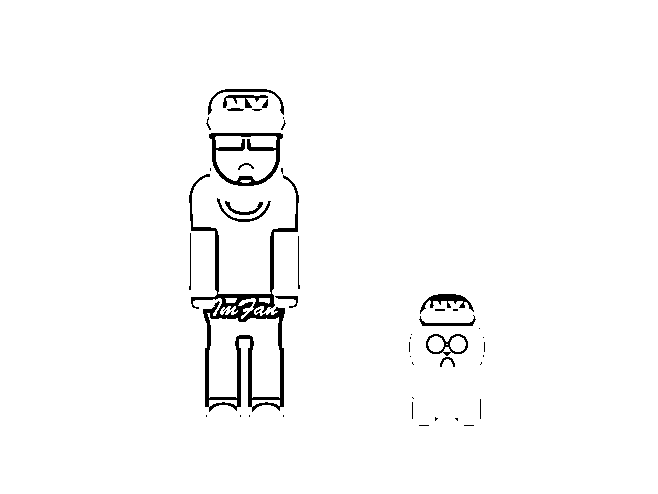

**2 月 4 日**

星期四

****关键词：轻松****

**从心情上讲，这可能是本周最为轻松畅快的一天。**太阳六分土星的能量，也能够帮我们稳定态度，踏踏实实做事。上午射手座的月亮三分天王星，带来兴奋、自由、充满活力的感受。傍晚前后则是非常快乐、自信、对未来充满希望的时刻，但也可能有自我膨胀倾向。**这个晚间如果出门消费，很可能大手大脚，但是心里爽到也算值得。这个时候去购置年货或者跟亲友们聚会都是不错的选择。**

**当日星象**

**02:19** **水瓶座太阳六分射手座土星**

**03:32** **射手座月亮合相土星**

08:59  射手座月亮三分白羊座天王星

18:05  射手座月亮四分处女座木星

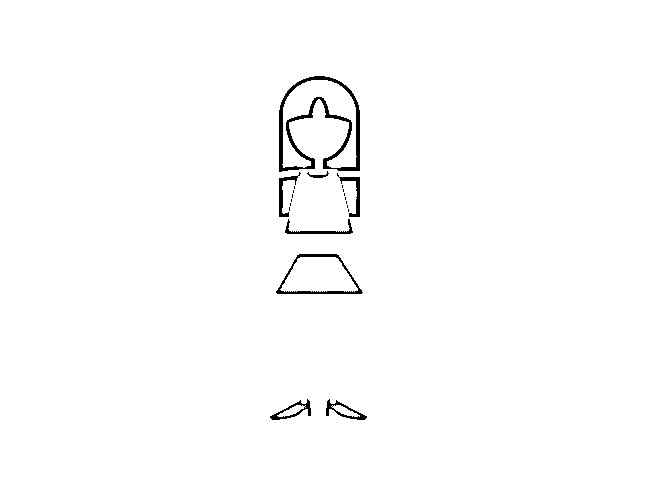

**2 月 5 日**

星期五

****关键词：平和****

今天的星象很平静，唯一可说的事件是，上午月亮离开射手座进入摩羯座。**这一天是忙碌的一周里难得的心情平静又足够理智的时刻。适合安静做做计划，总结一下前半周的工作得失，同时为火爆的周末做好准备。**是的，这一周有两天可以称为是“火爆”的，一个是周一，还有一个就是周日，也就是我们心心念念的除夕日。

**当日星象**

**08:43** **月亮离开射手座进入摩羯座**

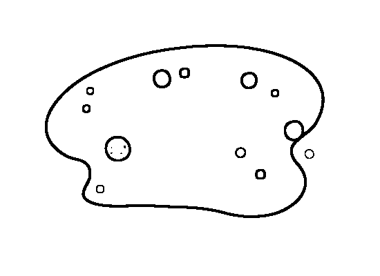

**2 月 6 日**

星期六

****关键词：领悟****

这是颇为特殊的一天，在事件层面上，未必有多么激烈的事发生，但在心理层面，我们很可能有非常深刻的感受或领悟，特别是对那些正处于情感困境中的人来说。**这是爱情中洞见真相的时刻，一些极度痛苦同时又极度深刻的情感可能被引发出来。在爱情之外的人际关系中（比如亲情、友情或工作中的利益伙伴），也可能有深刻发现，有更清醒的认识。信任议题是此时必须面对的。**同时，这也是以冷酷、现实的态度审视自我价值的时刻，对于个人能力的怀疑可能带来很复杂的心理感受，需要以坚韧的态度去承担和面对。

**当日星象**

00:25  摩羯座月亮六分双鱼座海王星

**09:16** **摩羯座金星合相冥王星**

**14:02** **摩羯座月亮合相冥王星**

**14:30** **摩羯座月亮合相金星**

**15:53** **摩羯座月亮四分白羊座天王星**

16:22  摩羯座月亮六分天蝎座火星

23:40  摩羯座月亮合相水星

23:55  摩羯座月亮三分处女座木星

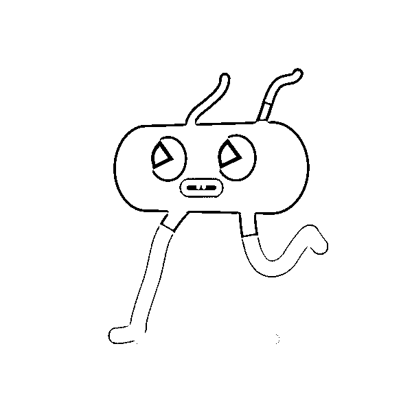

**2 月 7 日**

星期日

****关键词：火爆****

又是火爆的一天，但今天的“火爆”与周一的“火爆”不同。周一我们的心情还带有一些敏感、紧张和压抑，或者说，**恐惧**。但经过这一周的折腾，该发的火也发了，该虐的心也虐了，该抗争的也抗争了，该拼搏的也拼了（如果该拼的时候不拼就是你的不对了）。到现在，已经是一个无需扭捏的时候。**此时的斗争或对抗将更加白热化，不是暗中的较量或压抑在心里的愤恨，而是直白的“拳脚相向”。**各方都能把自己的意见明确表达出来，谁强谁胜出。**如果你目前的现实生活中并没有一个愤怒的对象，那么这一天的典型表现应该就只是“特别忙碌”。**

考虑到这毕竟是除夕夜了，还是希望大家过得安稳祥和，**如果实在有什么“不平之气”需要释放的话，就多放两根鞭炮吧！化愤怒为工作或运动也是不错的能量转化的办法。**

**当日星象**

00:40  水瓶座太阳六分白羊座天王星

**02:46** **摩羯座水星三分处女座木星**

**06:04** **摩羯座金星四分白羊座天王星**

**13:58 ** **月亮离开摩羯座进入水瓶座**

**20:09** **水瓶座太阳四分天蝎座火星**

**23:02** **摩羯座金星六分天蝎座火星**


**作者简介**

**占星师 Cora：**全美占星师联盟（AFAN）成员，国际占星研究协会（ISAR）会员，获 ISAR 职业占星师资质认证，斯蒂芬·弗里斯特《变幻的天空》译者，个人星象文章见诸《心探索》《北京青年周刊》《上海电视》《空中生活》等杂志媒体。曾跟随大卫·瑞雷系统学习占星学，现为全职占星师。

微信公众号：聆宇 FM（微信号：lingyudiantai）

个人微信号：CoraAstro

长按二维码，让金钱涌向传播知识与智慧的人~


**◆ ◆ ◆  ◆ ◆** 

****特别提醒：******本文由作者授权首发于若道平台，**转载请注明“转自若道”。****

如何掌握星象，顺势而为？**2016 年 3 月 15 日**，大卫老师主讲的若道占星核心课程**Level 5**要开课了！在这个阶段，你将学习各种预测技术及行星周期。通过这些预测工具，你能够预测和规划人生。提前报名付款有**早鸟价**哦！详细内容请点击“**阅读原文**”了解。


# 2 月宇宙天气 | 最苦的都撑过去了，春天还会远吗

> 原文：[`mp.weixin.qq.com/s?__biz=MzA5NjA0NTAxNg==&mid=402726829&idx=1&sn=f2787e5f8dd778ac20083fb470eed309&chksm=0d43ad1a3a34240c1344176d44489626d0a74f3a2e89d13c400424d8d3baf962d04f62e822ea&scene=126&sessionid=1692738877#rd`](http://mp.weixin.qq.com/s?__biz=MzA5NjA0NTAxNg==&mid=402726829&idx=1&sn=f2787e5f8dd778ac20083fb470eed309&chksm=0d43ad1a3a34240c1344176d44489626d0a74f3a2e89d13c400424d8d3baf962d04f62e822ea&scene=126&sessionid=1692738877#rd)

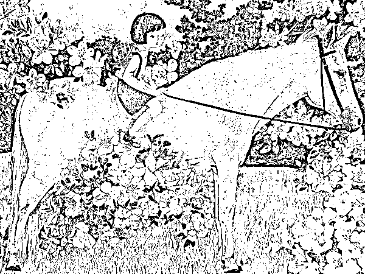

作者/占星师咔咔 

图片/辻川奈美

时间过得真快，转眼间春天就要到了。2 月的星象虽依旧有挑战，但好在将迎来农历新年。上旬，要注意金钱与感情出状况；中旬，好好享受春节大假；下旬，可以将精力用在创新上面。

「

2 月 1 日-2 月 3 日

挖掘伤口获得解脱

」

**2 月 1 日，水星（摩羯座）刑天王星（白羊座）**

**2 月 3 日，火星（天蝎座）六分冥王星（摩羯座）**

1 月底到 2 月初，水星恢复顺行后立刻与天王星和冥王星相遇，先是在 1 月 30 日水星合相冥王星，继而在 2 月 1 日与天王星相刑。这是水星第三次参与到天冥刑相位中，也是第三次机会**让人们去思考和沟通（水星）曾经被隐藏（冥王星）起来的事件**。

人们会问这样的问题：“为什么这件事发生在我身上？”“我到底从过去的痛苦中学到了什么？”“我的童年是如何影响我的生活的？”挖掘过去的过程并不愉快，甚至可以说是痛苦的。而**处理这个伤口（冥王星），找到阻碍自己成长的原因，带着勇气去面对和接受这个痛苦，才能带来真正的解脱和自由（天王星）**。

火星在天蝎座与冥王星形成六分相，这是双重天蝎座的能量，当你面对心里的恐惧和黑暗面（天蝎座）的时候，也有能力启动自己的生命能量，主动运用你积累的技能、意志力和权力（天蝎座和摩羯座），让自己走出黑暗，生存下来。

「

2 月 6 日-2 月 7 日

小心感情与金钱事故

」

**2 月 6 日，金星合相冥王星（摩羯座）**

**2 月 7 日，水星（摩羯座）三分木星（处女座），金星（摩羯座）刑天王星（白羊座），金星（摩羯座）六分火星（天蝎座）**

**这是一段感情和金钱层面事故频发的时期。**天王星与冥王星这次掀翻的是感情关系、社会交往和经济结构里隐藏的秘密、被埋葬的渴望和恐惧。在此期间，大型社会机构和政府组织（摩羯座）的经济（金星）纠纷或丑闻（冥王星）会浮出水面。

**个人层面，一些秘密（冥王星）的恋情（金星）突然发生或者结束（天王星）。**这些意外事件的发生，促使人们开始面对自己已经枯竭的婚姻或者感情，面对自己真实的情感需求。秘密和禁忌的恋情确实起到了激活生命的作用，而这背后，是曾经被忽视的自我和封闭的内心。

也有些人在为爱（金星）奋斗着（冥王星），他们对伴侣和家人说：“我这么做实在是因为我太爱你了。”“我不能失去你，我为你做什么都行。”情感成为一种工具，在这些行为的背后，是害怕失去的恐惧，被拒绝后的自我怀疑和否定，即“我不想面对失去后的失落，因此我要加倍的对你好，让你不要离开我”。

同时发生的水星与木星的三分相提供了交流沟通的好机会，透过和朋友、专业人士的讨论互动，意识到你正在经历的感情事件发生的意义，对你的启发，也会带来很好的收获。当然，不管你当下没有情感的磨砺，2 月 7 日当天都适合外出社交。当天是除夕，不妨多给自己安排一些走亲访友的机会。

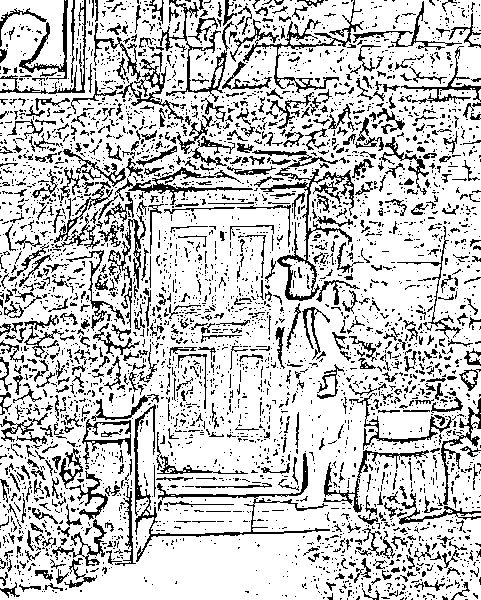

「

2 月 10 日-2 月 17 日

战胜拖延症

」

**2 月 10 日，金星（摩羯座）三分木星（处女座）**

**2 月 14 日，水星进入水瓶座，火星（天蝎座）六分木星（处女座）**

**2 月 17 日，金星进入水瓶座**

春节假期期间，宇宙天象从激烈转为欢快。金星与木星都是享乐之星，与家人、伴侣与朋友一起欢度佳节，享受美食与爱，得到礼物或者压岁钱。

水星和金星进入水瓶座以后，会带来更多的社交机会，比如与朋友一起远足、海外旅游、享受自然之美。由于金星进入了主管电器和科技产品的水瓶座，这期间合适购买新的电脑、手机或者更前沿的科技产品。同时，火星与木星的六分相让人们的行动力增加，乐观的心态让事情进展顺利。**如果你有一些一直拖延着没有解决的事情，可以善用火木六分的能量，此时加以解决。**

「

2 月 19 日

学会包容

」

**2 月 19 日，太阳进入双鱼座**

当水星、天王星、冥王星与金星、天王星、冥王星的相位陆续完成时，人们大多会感到筋疲力尽。当人们开始哭泣，开始接受自己的软弱和不完美，就已经开始走上了拥抱自己的道路。这就是双鱼座的道路。双鱼座不去分析，也不会争夺，他们的制胜良方就是包容和体恤。在双鱼月里，可以多给自己和别人一些包容。

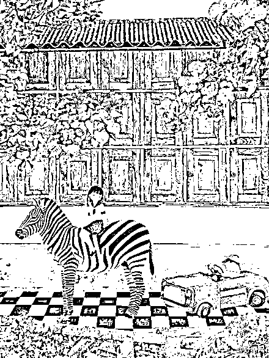

「

2 月 25 日-2 月 27 日

动脑求创新

」

**2 月 25 日，水星（水瓶座）六分土星（射手座）**

**2 月 27 日，水星（水瓶座）六分天王星（白羊座）**

2016 年初，土星开始入相位三分天王星。**这个相位在未来的两年里会梳理天冥刑之前造成的混乱，让生活和社会秩序的变革更有序的进行，减少激烈变化带来的伤害。**虽然土星与天王星准确成相的时间是在 2016 年 12 月、2015 年 5 月和 11 月。但是在这两年里，运行速度快的水星、金星、火星会陆续地与土星和天王星同时成相，搭建世俗与革新、传统与反传统之间的桥梁。

有句俗语能很好地解释土星三分相天王星，即“泼水不能把孩子泼出去了”。2 月底**当水星在水瓶座搭建了土星和天王星的桥梁时，人们可以在创新精神、自我表达与社会群体可接受度中开动脑筋。**

例如思考：

■ 我的工作上需要怎么样的创新？

■ 我怎样一步一步地规划和实现我的新想法，新理念，让领导和团队可以看到这些创新带来的实际收益？

■ 这些变革是不是必要的？这么做我是否能得到领导的肯定和别人的尊敬？

■ 我是不是需要更多的自由空间，让我能在工作中实现这些新想法？怎么做才能更有效率？

■ 我要怎样把不同背景和技能的人们团结在一起，激励他们为了这个长远的目标来努力？

「

2 月 28 日

享受温柔

」

**2 月 28 日，太阳合相海王星（双鱼座）**

当太阳在双鱼座合相海王星的时候，月亮在天蝎座与太海形成了柔和的三分相。这会是温柔的一天，也许你想和爱人谈谈梦想，也许只是在他/她的臂弯中休息。或者你愿意花一分钟，读一下纪伯伦的诗句——

爱虽然能为你加冕，却也能将你钉在十字架上；

他虽然能让你生长，却也能将你刈剪。

他虽然能攀升到你的高处，抚弄你颤抖在阳光中的叶片，

却也能沉降到你的根部，撼动你附着在泥土中的根须。

他将你像谷穗一样捆扎起来。

他舂打你使你胸怀坦荡。

他筛分你使你摆脱无用的外壳。

他碾磨你使你臻于清白。

她揉捏你使你顺服。

然后他用他神圣的火焰来处置你，使你成为神圣宴上的圣餐。

所有这些都将是爱对你的所为，以使你知晓你内心的秘密，而那认知会让你化作生命内在的一部分。

——纪伯伦 《先知》


**占星师咔咔**：2010 年师从美国占星师大卫·瑞雷学习。若道首届学员，国内最早获得 ISAR 职业占星师资质的职业占星师。在国际知名广告公司和市场研究公司从事的市场研究和推广工作十余年，曾任职于阳狮集团、尼尔森市场研究有限公司、MTV 和《Madame Figaro》杂志。现在为《时装男士》、活法儿等媒体供稿。

微信公众账号：咔星人

星盘解读和运势咨询请洽：cji1029@qq.com

**◆ ◆ ◆  ◆ ◆**

******特别提醒：本文由作者授权发布于若道******，**转载请注明“转自若道”。******

如何掌握星象，顺势而为？**2016 年 3 月 15 日**，大卫老师主讲的若道占星核心课程**Level 5**要开课了！在这个阶段，你将学习各种预测技术及行星周期。通过这些预测工具，你能够预测和规划人生。提前报名付款有**早鸟价**哦！详细内容请点击“**阅读原文**”了解。

↓


# 水瓶宝宝们，你们连心里的苦都是特别的

> 原文：[`mp.weixin.qq.com/s?__biz=MzA5NjA0NTAxNg==&mid=402726829&idx=2&sn=261d19f5deed4e43ed8a1322e85d1ab1&chksm=0d43ad1a3a34240c9144af3177bc650aeb49fd0583d46ebd9e093ad45c9063ec741a0dbeac3f&scene=126&sessionid=1692738877#rd`](http://mp.weixin.qq.com/s?__biz=MzA5NjA0NTAxNg==&mid=402726829&idx=2&sn=261d19f5deed4e43ed8a1322e85d1ab1&chksm=0d43ad1a3a34240c9144af3177bc650aeb49fd0583d46ebd9e093ad45c9063ec741a0dbeac3f&scene=126&sessionid=1692738877#rd)

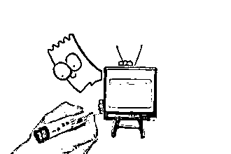

若道君的**【我为水瓶座代言】**征集发出后

在后台收到很多小伙伴的回复

看了这些回复

月亮巨蟹座的小编开始默默心疼这些宝宝

他们是很独特啊、很冷静抽离啊

好像一切都无所谓似的

但是宝宝那颗特别的心里也有苦呀

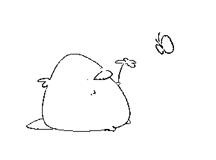

**你们知道很多水瓶宝宝的生日就在春节期间吗**

也许你忙着过春节

就把他们的生日给忘记了呢

所以

**可不可以给你身边的水瓶座宝宝们一个拥抱**

告诉他们**你们不是被忽视的**

我们爱你们的独特和创新

爱你们的理性和冷静

同样爱你们的脆弱和阴暗

让这群迫降在地球的宝宝们感到温暖吧

他们其实是外星球送给我们的礼物呢

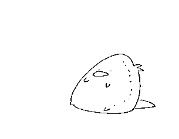

也感谢这些宝宝们 

愿意把自己云淡风轻的背后

那些**脆弱 眼泪 沸腾的灵魂**

让我们看到

也许我们依旧读不懂你们

但我们依旧爱你们


**//****瓶子的疏离****//**

其 实 你 不 懂 我 的 心

**你说我像云捉摸不定 **

**其实你不懂我的心 **

**你说我像梦忽远又忽近 **

**其实你不懂我的心 **

❤「图 灵」塔罗占卜

疏离源于我们觉得自己对对方来说不重要，而在我们心中却是在意的。是为了保持似有似无的情感显露，渴望表达，又胆怯面对。

（也许对方正爱你爱得要死呢@@）

❤

萌尨

不重要…回忆起了小时候那种感觉，已经忘了具体因为什么，但小时候用无所谓来安慰自己，越来越坚强和疏离。

（好想穿越到小时候抱抱你）

❤

羊

看到[大卫老师文章（点击阅读）中](http://mp.weixin.qq.com/s?__biz=MzA5NjA0NTAxNg==&mid=402716005&idx=1&sn=37ae0a71f6c783d585ca67c8545a81d1&scene=21#wechat_redirect)声音沙哑的那一段，眼泪就莫名掉下来了，哈~

（流泪也要装作不在乎）

❤

修俢

当我越来越面对承受我就是个骨子里根深蒂固的怪咖之后我释然了☄☄☄

（您的表情也是酷得没 SEI 了呢）

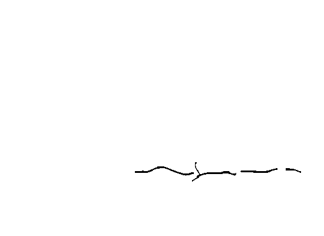

**//****瓶子的伤心****//**

不 让 你 看 到 哭 泣 的 眼 睛

**你说要远行 **

**暗地里伤心 **

**不让你看到**

**哭泣的眼睛**

❤

Bella 霍霍

把自己伤得体无完肤，即使站不稳，也要在后腰立个棍子支撑住身体，然后淡淡地说，我很好，放心吧。

（你这么拼，你妈妈知道吗）

❤

Aquarius

难熬的时候经常在家晚上躲在被窝里面哭，哭完第二天就又满血复活了，然后告诉自己哭有啥用，又不解决问题……

（实在是太冷静了！赞一个！）

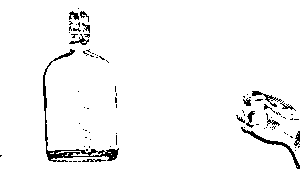

**//****我为水瓶座代言****//**

水 瓶 座 的 人 道 主 义 精 神

Elias

△

“我想死后遗体捐献，应该怎么弄？” 这话从一个已经七十几岁的老爷子口中说出，我第一个反应就是“这不是水瓶座嘛。” 是的，和双鱼座不同，这并不是一种牺牲奉献，当然也可以说这其中有一种奉献，但这种奉献并不是一种牺牲，不是用的我的命去换你的命，而是当我和你拥有同一样东西时，我是不是可以在我力所能及的范围内帮助你，这就是水瓶座的人道主义精神。他们总在想着可以为一个集体去做些什么，而且这个集体不是小小的一个圈子，而是上升到整个社会，整个人类文明。 尽管我不知道你是谁，但我们是一体的，让我们一同去创造更美好的生活。这是存在于水瓶座心中的愿景。

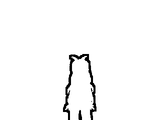 

每 个 水 瓶 座 都 是 独 一 无 二 的 

Miya.拉姆

△

并不是说只有我可以为水瓶座代言，在水瓶座的心中，每个人都是独一无二的存在，而自己，是独一无二中的空前绝后。从小我就知道自己和别人不一样。始终觉得我的故土原乡在浩瀚宇宙深处，某一天被外星亲戚用飞船接回去的梦做了几十年仍未曾破灭。

对于这些看似怪异的不一样，开始我是拒绝的。我回避自己最真实的想法，封闭自己最真实的祈望，努力靠近主流想要和大多数人一样，然而逃避故意不看无异于掩耳盗铃，那些存在于灵魂中浸润在血液里的不一样，使我仍然与现实生活格格不入，犹如囿于一座孤岛。

慢慢地，我不想和这世界有什么关系了。我停留在自己的岛上，孤独，且不快乐。

直到有一次因缘际会参加占星沙龙，老师讲到，重要的是把星盘的能量活出来。

我开始重新认识自己，认识过去，现在以及未来的生命。

我是视角独特创意十足的水瓶座，想象力丰沛天马行空自由驰骋，用独辟蹊径的想法和表达与这世界发生关系。

我是不被束缚热爱自由的水瓶座，想要活在路上看遍地球风光人文，探索一切未知的精彩，当然最重要的还是勇于突破头脑的限制，打开禁锢思维的锁，消除恐惧以获得内心的自由。

我是具有无限可能的水瓶座，无论身处任何情境，无论任何发生，都平静接纳，如同一只空的水瓶，顺着河水的方向漂流，而所有的意料之中或之外的境遇，都是为了带来新的可能，成就更加强大的自己。


**若道君能为水瓶宝宝做些什么呢？**

**帮你活出自我好吗？**

2016 年 3 月 10 日

大卫老师主讲的**若道占星核心课程 Level 1-2**要开课了！

他将带领你学习星座、太阳、月亮、行星、月亮交点等知识

让你进入占星学的世界！

更了解自我，发现自我！

详细内容请点击**“阅读原文”**了解哦。


# 水瓶座 | 什么事都不 care，那是你在用理性隐藏痛苦

> 原文：[`mp.weixin.qq.com/s?__biz=MzA5NjA0NTAxNg==&mid=402716005&idx=1&sn=37ae0a71f6c783d585ca67c8545a81d1&chksm=0d4247d23a35cec407d0295e1e72f5ddde0b092a56c3a4f0c08b64bb2a1b66dad431ca9fd46a&scene=126&sessionid=1692738877#rd`](http://mp.weixin.qq.com/s?__biz=MzA5NjA0NTAxNg==&mid=402716005&idx=1&sn=37ae0a71f6c783d585ca67c8545a81d1&chksm=0d4247d23a35cec407d0295e1e72f5ddde0b092a56c3a4f0c08b64bb2a1b66dad431ca9fd46a&scene=126&sessionid=1692738877#rd)

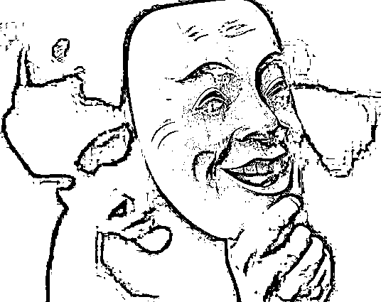

作者/大卫·瑞雷 

翻译/李含 校对/江艺

图片/花瓣

**大卫老师在上一篇[水瓶座文章（点击可阅读）](http://mp.weixin.qq.com/s?__biz=MzA5NjA0NTAxNg==&mid=402684589&idx=1&sn=df865ac0d2f3d6cd329ccdd5b8d049f9&scene=21#wechat_redirect)讲过，聪慧但对很多事都不 care 的水瓶座，其黑暗面是“疏离感”。要如何走出黑暗面呢？大卫老师的一次相当有深度的咨询可以给你答案。**

**黑暗面，要从幼年找源头**

心理学中“疏离感”被定义为一种由无法融入社会而造成的人格解体，其特征是长期抑制情感。这种置身事外或“远离”的存在感是一种常见的水瓶座体验，很自然会随着参与程度和友情上下波动。但是，疏离感代表着“极端”。

注意一下心理学上对疏离的定义：

**①人格分解**

**②难以融入社会**

**③长期压抑情感**

**所有三项问题都与水瓶座的痛苦或黑暗面相吻合，源自幼年形成的性格模式。**

**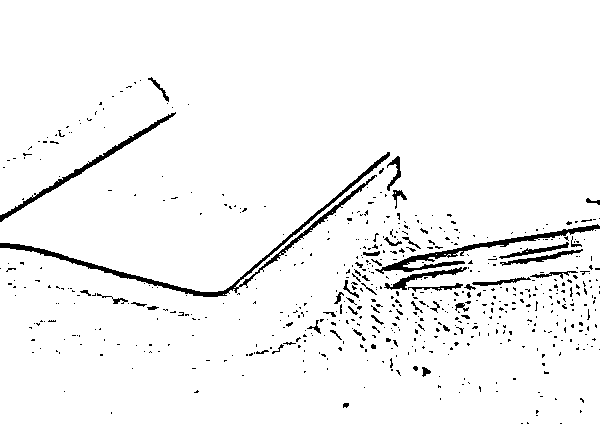**

****看起来，这个客户很冷静****

我回忆起上世纪 80 年代，我有一位水瓶座客户“肯恩”，他来找我咨询时他的婚姻似乎走到了尽头。他的妻子为了另一个男人离开了他，他想知道她会不会回来。我只在前两年见过肯恩一次，记得那次咨询平淡无奇。他只是在理性上对自己的出生星图感到好奇，有一大堆关于占星学的抽象问题。显然他没有暴露出任何自己的情感，他没有诉说任何自己的生活，我只记得他似乎是 IBM 的项目经理。

这次他因为婚姻危机又来找我。当我看到他时，他明显瘦了，衣服微微起皱。我在准备咨询时注意到，土星行进到了他的第七宫，对分他的月亮。我想知道这一占星学上有关婚姻和情感压力的征象会如何与他早年的经历关联起来。

在我与他握手时，他露出了微笑，评论了我桌上的几本书。但是，当我们坐下开始交谈时，他的疏离开始变得明显。**虽然他频频点头好像在听我说话，但却没有和我有眼神接触。当我开始解释他的基本趋势时，我的小办公室好像变大了，他不再是坐在我面前，而是缩在角落。**我发现难以继续，于是停止了解释。在宁静中，我注视着他的出生星图，思索他的幼年生活有哪些线索。

> ■我用一个提问打破了沉默。“你父母离婚时你多大？是不是在七八岁的时候？”
> 
> ■“我想那时我 8 岁吧……”他不带情绪地说。然后他注视着我：“我不记得之前告诉过你父母离婚的事情。”他带着一脸的不解。
> 
> ■“你没有说，”我说道，“但是你现在遇到了与你七八岁时相同的趋势。”
> 
> ■“我明白，”他说，“所以我想这就是命啊！我妻子说她想要离婚。”
> 
> ■“我不知道什么是命，”我说。“同样的趋势并不一定会带来相同的结果。”我停顿了一会儿。“你看，我想和你聊聊你早年的生活，问你一些问题。你愿意吗？”
> 
> ■“当然。”他回答。

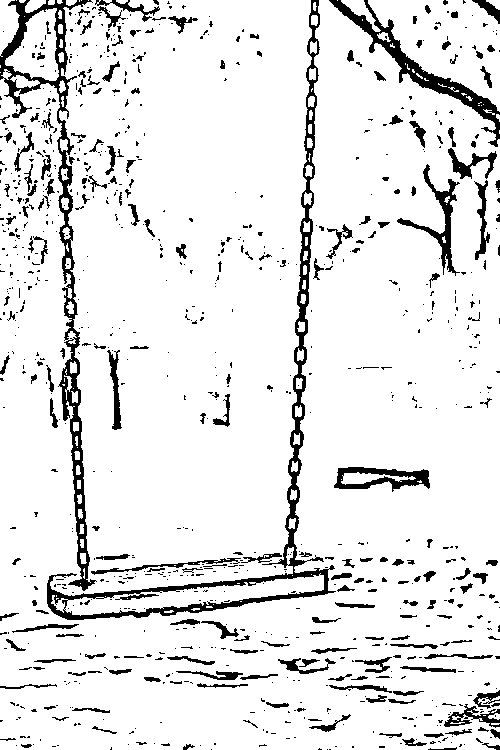

****冷漠，源自从小形成的“不重要感”****

所以那一天的咨询与两年前的咨询相比，简直是一座值得纪念的里程碑。肯恩幼年的生活在物质上非常优渥。他的父亲是一位非常成功的商人，在自己的圈子里享有盛誉。肯恩记得他乘坐父亲的游艇，记得他有很多玩具，但却记不得有任何父亲的爱与温暖。相反，他记得自己害怕父亲，他的父亲非常严格。

父母离婚彻底改变了他的生活。他的父亲比母亲年长许多，但他与另一女子有了私情。肯恩是这样描述环境的改变的：“和悲伤的母亲搬进了小公寓”。之后不久，他被送往一所寄宿军校，由父亲支付学费，与母亲分离。寄宿学校给他带来了一点安慰，身体上更强壮，在与其他男孩的格斗中可以保护自己了，也赢得了他们的尊重。但是，他将自己描述成一个“不合群的人”。

他是好学生，尤其擅长数学和历史，之后进入一所好大学就读。大学时，他住在校外的一个拖车式活动房屋里，不怎么参加社交活动。大学的几位好朋友会到他那里找他玩，他们在校外喝酒。他谈到了大学时的约会，但是那些姑娘觉得他太严肃，有距离感。

大学毕业后，他进入 IBM 工作，从程序员开始逐步晋升。工作中的一位朋友介绍他认识了后来的妻子。但是，他让妻子感到挫败。 “他在情感上不可企及，有时候冷酷而严厉”， 她声称这让她离开他，向另一个男人寻求安抚与关怀。

**随着肯恩讲述起他生活的这些细节，他的声音变得越来越沙哑。他的不安开始加剧**，那种程度让我觉得他可能在我的办公室里崩溃。

> ■我看着他，小心地问：“我想要问你个问题。”
> 
> ■“好的”，他结结巴巴地说。
> 
> ■“如果你的父母亲现在在这间办公室，他们必须听你诉说，你会对他们说什么？”
> 
> ■他看起来受到了惊吓。然后他的声音突然变大：“呃……我会说，**我在这里，你们看到我了吗！你们认不出自己的儿子了吗！我对你们来说是不是不重要？！**”他开始发抖，眼泪顺着脸颊滑落。
> 
> ■我安静地聆听着……
> 
> ■“**我一生都觉得自己不重要，你知道吗，就好像我就是那么无关紧要。这样已经很久了，我都不再想这些了。**我思考其他事，所有事……当我还是个少年时，我常常把自己想象成一个真正的机器人而不是人类来逗自己开心。这会带给我安慰。现在想起来很可笑……”

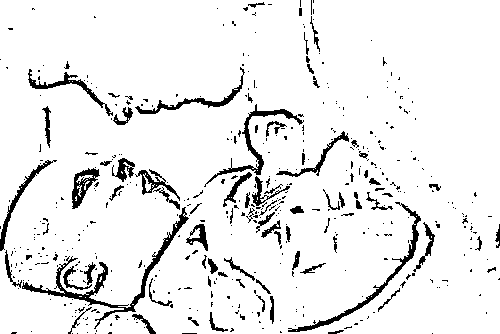

****终于，水瓶座走出了疏离的老路****

通过我们的对话，他非常清楚地认识到自己的疏离感。我们讨论了他与妻子分居的问题。我建议他推迟离婚的决定，现在的他不适合做出这样的决定。他完全同意。另外，他还提到他曾想有时间就去本地一家施食处帮助无家可归的人 —— 他反正有些睡眠问题，他“可以把这些时间拿来做些事情。”我鼓励他去做。在他下一次的咨询中，他分享了去施食处的经历，他每周去两次。他看起来比上次咨询时更加放松和开朗了。

最终他分居的妻子到施食处探望他，看看他在忙些什么。他们见面并喝了咖啡。她发现自己的丈夫像变了一个人。她在后来的一次咨询中告诉我（在肯恩向她推荐我之后）：“他活过来了。我可以让他听我说话，看着我的眼睛。他真的说他爱我！他告诉我‘他’想要什么。”他们再花了一些时间了解彼此，好像初识一样 ，重建他们的关系，不再想离婚的事情。

他们的婚姻延续至今。几年前，肯恩对我说：“我觉得我对乔伊斯（他妻子的化名）来说真的很特别，她接受我和我所有的古怪。”肯恩现在已经退休了，参加了社区居委会工作，管理着一家施食处和一家流浪者收容所。他和妻子后来育有一女，女儿最近结婚了，肯恩和乔伊斯还当了外公外婆。

肯恩喜欢寻找有创意的方式来促进社区居委会的慈善工作，他乐在其中。**看到现在的他，你很难想象****30 年前他是个疏离、古怪又别扭的男人。他虽然头发已经灰白稀疏，但是饱满的额头下是闪着微笑的眼睛。**他在社区中受人喜爱，得到了妻子的爱慕。“她是我最好的朋友。”他说。

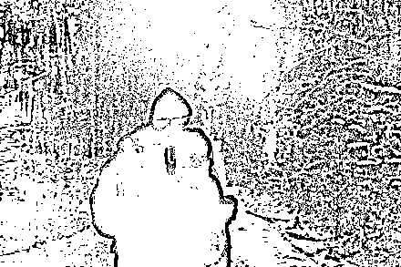

****水瓶座，高阶能量是贡献****

这是一则真实的水瓶座故事，它强调了走出疏离感的路。是的，水瓶座也会流下泪水！他们可能徘徊踌躇许久，然后“砰”的一声！大坝开闸！

**每个人都有隐藏的痛苦，但是没有任何星座能像水瓶座如此出色地隐藏自己的痛苦** **——** **他们用聪明才智，用理性和借口隐藏痛苦。但是，最终他们还是需要做出贡献，在世界舞台上展露自己与众不同的身影** **。他们的参与，让自己与世界都变得更好。**

**◆ ◆ ◆  ◆ ◆**

►**想更多地了解水瓶座?不妨看看下面的文章**


**◆ ◆ ◆  ◆ ◆**

 ****特别提醒：****若道享有****本文版权****，转载请注明“转自若道”。****

在这里你可以更多地了解水瓶座。**2016 年 3 月 10 日**，大卫老师主讲的若道占星核心课程**Level 1-2**要开课了！他将带领你学习星座、太阳、月亮、行星、月亮交点等知识，让你进入占星学的世界！详细内容请点击“**阅读原文**”了解。

↓

长按二维码接通课程负责人~


# 世界一直在变，我只是跑在前面

> 原文：[`mp.weixin.qq.com/s?__biz=MzA5NjA0NTAxNg==&mid=402716005&idx=2&sn=4a11b33d3ea799f2c07e6e55c658be5e&chksm=0d4247d23a35cec43291338d2bc983e49b5b8cb9e8f5c09526e998032e0f00337f6a0fcff905&scene=126&sessionid=1692738877#rd`](http://mp.weixin.qq.com/s?__biz=MzA5NjA0NTAxNg==&mid=402716005&idx=2&sn=4a11b33d3ea799f2c07e6e55c658be5e&chksm=0d4247d23a35cec43291338d2bc983e49b5b8cb9e8f5c09526e998032e0f00337f6a0fcff905&scene=126&sessionid=1692738877#rd)

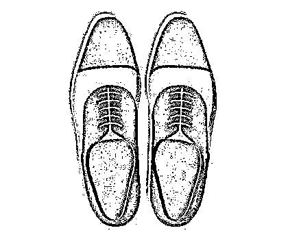

作者/Conrad

图片/花瓣

**■ 世界上的人本来就是不一样的，只是你没有意识到这点而已。**

**■ 不敢养宠物，因为我不知道它心里是否愿意。**

**■ 每个水瓶座最看重的就是心里的那一份自由。**

**占星课堂**

**水瓶座的两个关键词**

**①不同**

我们认识的水瓶座是什么样的呢？有着四十余年占星经验的大卫·瑞雷老师曾经打过这样一个比方：前十个星座的代表已经围着一个叫黄道的圆桌坐下了，没位置了。这时，水瓶座的代表姗姗来迟，他说：“我跟你们每个人都不一样，所以我也应该有位置。”因此，“不同”，便成为了水瓶座的关键词之一。

**②突破**

水瓶座对面的星座是狮子座，它们共同表达着同一些主题，比如创造力。源源不断的创造源泉让狮子座闪耀无比，它们成为聚光灯下的巨星。这个时候水瓶座在哪里呢？水瓶座就在旁边冷眼旁观。在水瓶座的眼里，人人都是巨星，至少人人都有可能。

因为人人都不一样，所以就如同前面所说的那个圆桌，每一个新人的出现，都把桌子的边界突破了一点点。边界突破了，就是巨星，就有坐在圆桌边的价值。因此在水瓶座的眼中，每个人都有可能活在聚光灯下。这也是水瓶座又一个关键词——突破。

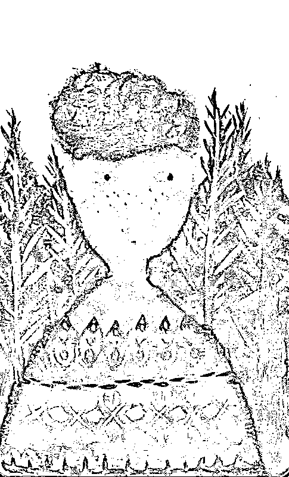

** 每个人都不同，只是水瓶座认识到了这点**

突破与不同是一体的，水瓶座不会随意突破，追寻不一样是其中的一个理由。

有些水瓶座的人会标新立异、特立独行，打破旧有的规矩和章法。当年的喇叭裤、牛仔服、超短裙、纹身脐环，无一不在刷新审美的标准。此外还有现在世界上热议的同性恋婚姻问题。原本，水瓶座的神话传说也是和同性恋的话题有关的。神话中那个被宙斯抓上天当侍酒的人，就是一位人间的王子。

不过为什么好端端的非要不一样呢？其实也不是非要，因为世界是一直在变的。就拿我小时候来说，那时候还有粮票和外汇券呢！买粮买米，都要拿着粮票去粮店换粮食。那个时候，冬天的大白菜五分钱搓堆儿，还要拿大瓶子装西红柿酱过冬用。那时候，住在胡同里的人们需要烧蜂窝煤，出租车还是面的，友谊商店只能外国人拿着护照才能进，隆福寺外有大碗茶和清真小吃，热闹非凡。

但是九零后和零零后出生的世界已经不一样了，这没有什么不好，只是不一样了。穿戴和做派，行为和思想都会不同。对于每个人来说，我们的父母家庭、出身背景、遗传基因，生时生地都是不同的。所以**不是水瓶座在追求不同，而是每个人本来就是不同的。只是水瓶座先认识到了这一点。**

既然每个人都是不一样的，那么大家就有互相需要的可能，因为我不会的可能你会，你不会的没准我可以呀。大家这就有互相协作的可能，既然需要互相协作，那就要精诚一致、互利互助，从而形成一个紧密协作的社会。这就需要大家平等相待，一视同仁，只为尊重不一样的价值。我想这也是为什么水瓶座和 11 宫是社团和社区的象征，也代表着对社会的贡献。 

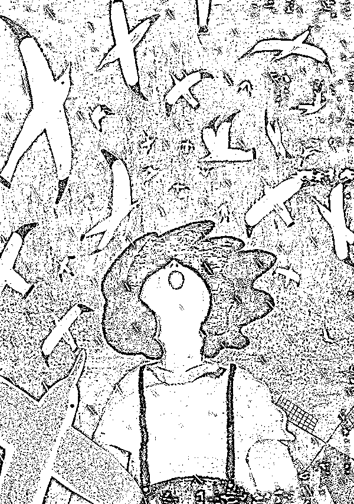

**疏离和冷漠只是表象，尊重才是核心**

有人说有水瓶座特质的人比较疏离和冷漠。对此我不想说什么，只能说，如果我也给朋友们带来了这样感觉的话，那真不是出自本心的。

曾经有朋友问我为什么没养一个宠物，是不喜欢吗？其实并不是不喜欢，而是很为难。首先和家人住在一起，总要先考虑到家人的想法。**即便是自己独居，我也要考虑那个宠物真的希望和我这个天真的人住在一起吗？**还是被我收留了，没有别的选择？

我还曾经对朋友说过，如果你们叫我出去聚餐，那在公共场合我当然不能带它去。但是我出去饱餐，把它一个留在家里孤独，这太不仗义了不是吗？我有大家，但它只有我，我怎能轻易为了自己的快活把它忘在家里呢？所以，我选择给你一个自由，也给自己一个自由，那便是对你我的尊重。或许疏离与冷漠的传闻就是这样出来的。

朋友打趣说，你这是把宠物当人来对待，它们如此的不同，怎能一同相待呢？可是我想，你我也是不同的，但还是一视同仁嘛。都说宠物是一家人，一家人岂能区别对待？不只是小宠物，对于地球村的一草一木，应该都心存敬畏，予以尊重不是吗？所谓与人方便自己方便嘛。大家相互尊重，为的是那份不一样。因为那个不一样，大家就可以各自自由地发挥才华，为社会带来贡献。

**自由是什么？自由就是有自己的一个独立的小圈子，可以像狮子座一样发挥自己的那份不一样的价值。因此说到底，水瓶座在说的，就是相忘于江湖的那份自由**，再将不一样的才华合为一处。每个水瓶座最看重的就是心里的那一份自由。

我是月亮水瓶座，天王星紧合上升点，我为水瓶座代言！

**作者简介** 

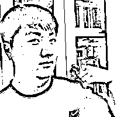

**Conrad：**本名王嘉祺，处女座。曾在墨尔本的 MONASH 大学留学 2 年，IT 专业，主攻多媒体游戏开发。会英日两门外语。喜欢阅读历史、社科与心理学书籍。曾在 IT 领域担当项目主管，曾做过职业生涯咨询助理。2010 年开始自学占星，至今咨询数百次，于职业问题上颇有心得。现为若道 Level 4 学员。

个人公众号：young_dreamers

长按二维码，让金钱涌向传播知识与智慧的人~ 


**◆ ◆ ◆  ◆ ◆**

 ****特别提醒：********本文由作者授权首发于若道****，转载请注明“转自若道”。****

在这里你可以更多地了解自己和对方的星座。**2016 年 3 月 10 日**，大卫老师主讲的若道占星核心课程**Level 1-2**要开课了！他将带领你学习星座、太阳、月亮、行星、月亮交点等知识，让你进入占星学的世界！详细内容请点击“**阅读原文**”了解。

↓

长按二维码接通课程负责人~

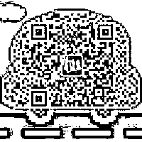 

# 招聘 | 如果你真的想为占星学做点事儿，若道欢迎你【课程部】

> 原文：[`mp.weixin.qq.com/s?__biz=MzA5NjA0NTAxNg==&mid=402716005&idx=3&sn=7a499756d43911b2aa7a6a6c912e9a2a&chksm=0d4247d23a35cec4ada467e33437af3330d97177647e0f8a9f25a843b9806219e27c796d2edf&scene=126&sessionid=1692738877#rd`](http://mp.weixin.qq.com/s?__biz=MzA5NjA0NTAxNg==&mid=402716005&idx=3&sn=7a499756d43911b2aa7a6a6c912e9a2a&chksm=0d4247d23a35cec4ada467e33437af3330d97177647e0f8a9f25a843b9806219e27c796d2edf&scene=126&sessionid=1692738877#rd)

**懂得占星学的人知道它是有力的工具，帮助人类促进自我了解，让人更有智慧地和宇宙展开互动。** 

**若道星文化是由美国著名占星师大卫·瑞雷和国际占星研究协会（ISAR）中国区副主席蒋颖创办的一家占星教育、传播、咨询机构，我们通过以 O2O 垂直类教育的互联网产品，来实现帮助自己和他人的愿望。2016 年，我们期望有人文理想、想要在占星学传播和教育方面做出贡献、有职业成熟度的朋友加入我们！**


**如果你心有信仰并坐拥情怀**

**愿意为占星学在中国的推广贡献一己之力**

**如果你除了一腔热血还有踏实肯干的精神**

**请考虑加入若道**

**我们一起**

**做些实事 **

**为我们生命中想要坚守的东西**

**﹁**

**课程部职位**

**﹂**

工作地点

**北京**

**地址：**北京市朝阳区百子湾路 32 号院苹果社区南区 10 号楼 A 座 2006 室

应聘方式

简历和作品集请发邮件至** freya.li@nodoor.com**

**简历请注明薪金要求**

**全职课程顾问****招聘人数：2 人****01**>>>>

**工作内容与职责**

*   负责以网络咨询、电话咨询、现场咨询等形式，介绍若道文化及若道所有核心课程； 

*   解答客户与占星学相关的问题，包括占星文化理念、若道课程结构、若道授课模式、老师背景等，为客户推荐适合课程； 

*   负责以电话回访、问卷调查、平台互动等方式与学员保持联络（微信群和社区管理维护）； 

*   了解占星文化传播动向，通过与学员的交流了解市场趋势和方向，参与课程设计； 

*   完成课程的招生任务以及课程报名情况统计分析； 

*   了解学员需求和反馈，及时解决问题，协助授课老师、翻译和助教做好课程服务工作； 

*   协助市场宣传部做好网络推广工作；

*   参与线上和线下课程的值课和现场服务。

>>>>

**任职资格**

*   爱好占星学，有现代占星学理论，掌握占星学基础知识； 

*   服务意识强，愿意应对高难度工作，目标感强，抗压能力强； 

*   有线上课程销售服务经验优先； 

*   完成若道 level5 核心课程、获得 ISAR 认证或 COAC 认证或相关心理咨询师证书者优先。

>>>>

**福利待遇：6000-8000+**

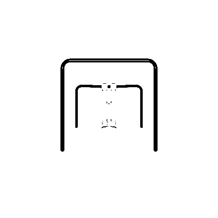

**全职客服（行政）****招聘人数：1 人****02**>>>>

**工作内容及职责**

*   根据公司部门负责人的要求完成人事行政部的工作内容； 

*   行政方面：来访接待、考勤记录、办公用品申领，快递邮寄、档案整理等； 

*   人事方面：招聘简历筛选、电话邀约及相关人事工作。 

*   后勤方面：负责对接工作餐的物资采购，保持办公环境整洁； 

*   负责学员的课程咨询、转介、售后服务的解答并及时反馈信息； 

*   线上和线下课程的值课和现场服务；

*   与各部门密切沟通，参与营销活动，协助市场销售。

>>>>

**任职要求**

*   本科学历，人力资源或管理方面的专业优先，有相关证书者优先；

*   热爱占星学，可熟练使用常用的办公软件及网络应用，善于进行数据分析，为工作提供数据报告；

*   具有良好的职业道德和职业操守，认同公司理念，抗压能力强，擅于沟通与协调，具备良好的团队合作精神；

*   良好的学习力，适应力强，愿意为工作投入 100%的努力； 

*   有职业理想，愿意从基础职位起步，和公司一起成长发展。

>>>>

**福利待遇：4000-5000+**

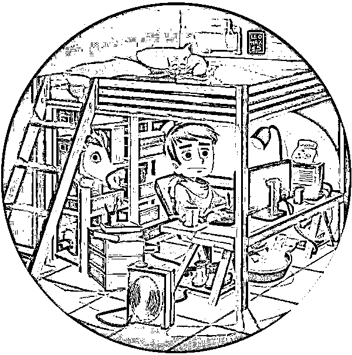

**技能交换****招聘人数：若干****03**

会琴棋书画，爱好占星学；爱电影、会 P 图，想学占星学；啥也不会，就擅方言土话，扎堆扯淡，偏喜欢占星学的……没关系，只要你能创意地将你的能力用在专业占星学的传播中，以此来交换学习，只管联络我们。

与若道团队一起，工作经历、学历、年龄都不是最重要的，只看你的投入与热情，创新与挑战，才气与天分……只要你真心热爱以下工作即可，**所有酬劳以若道课程学习方式置换，可任意挑选所喜欢的课程。**

>>>>

**微信编辑**

**具体工作是：**

*   微信文章的文字编辑及美术加工；

*   微信后台维护及回复读者提问；

*   选题策划及约稿；

*   创作美文。

**我们需要你：**

*   有驾驭文字的能力，专业编辑优先、英语能手优先；

*   紧跟潮流，有好点子；

*   会使用如 135 编辑器或秀米一类的微信编辑器；

*   会简单的 P 图、制图；

*   脑袋灵光又吃苦耐劳。

>>>>

**英文翻译**

**具体工作是：**

*   翻译及校对占星学专业文章；

*   去国外网站寻找占星学新资讯。

**我们需要你：**

*   英语 6 级以上、英语专业优先、有口译经验者优先；

*   热爱占星学、具备相关专业知识水准，通过 ISAR 认证或参加若道课程的系统学习优先；

*   会具有服务精神、抗压能力强。

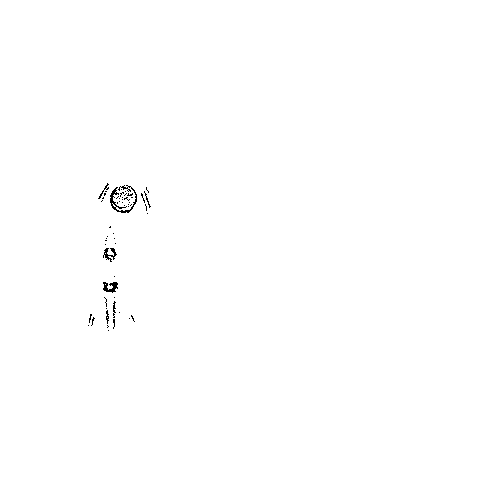

>>>>

**插画师**

**具体工作是：**

*   为若道的即将发表的文章，或网站内尚未配图的文章画龙点睛；

*   为层出不穷的占星报告锦上添花。

**我们需要你：**

*   深知怎样的图既贴切文意，又吸引眼球，还能另类酷炫地表达出深刻的情感与体验。

>>>>

**文章传播小蜜蜂**

**具体工作是：**

*   像蜜蜂传播花粉一样，将若道文章精编、搬运到各发布渠道；

*   参与诸多平台的互动，收集回馈并分析改进。

**我们需要你：**

*   像小蜜蜂一样勤（Hua）奋（Lao）；

*   热衷分享交流，融入社团，思维活跃。


**加入若道，你会享受如下福利**

你付出才华和汗水，收获友谊、成就感、职业发展和金钱的回报：

○ 薪资体系=基本工资+绩效工资；

○ 提供五险、工作午餐、加班补助，带薪年假，年底奖金；

○ 享受每年员工占星培训课程；

○ 可以和大卫老爷子以及翻译姐妹练习英语口语，提高你的职业素质；

○ 有机会各种有意思的人喝茶、聊星图、人生，让你收获友谊和成长；

○ 中午由聘请的阿姨做家常饭，让你品尝妈妈的味道；

○ 各种零食、茶、咖啡、红酒、啤酒、懒人沙发、休息室让你劳逸结合；

○ 带薪假期。春节两周假期，你有比别人多一周的时间在家里孝敬爸妈，不再为买回家的车票发愁。

**如果你真的想为占星学做点事儿，若道欢迎你**


# 招聘 | 召唤脑子里有奇怪人文想法的设计师、前端工程师【技术部】

> 原文：[`mp.weixin.qq.com/s?__biz=MzA5NjA0NTAxNg==&mid=402716005&idx=4&sn=29a781784a43bb41c3275e29174f3a81&chksm=0d4247d23a35cec4fba8aad7fd850214fcbb231019d6823bb2340bf4b5b87b421d9b5605c1c6&scene=126&sessionid=1692738877#rd`](http://mp.weixin.qq.com/s?__biz=MzA5NjA0NTAxNg==&mid=402716005&idx=4&sn=29a781784a43bb41c3275e29174f3a81&chksm=0d4247d23a35cec4fba8aad7fd850214fcbb231019d6823bb2340bf4b5b87b421d9b5605c1c6&scene=126&sessionid=1692738877#rd)

若道星文化是由美国著名占星师大卫·瑞雷和国际占星研究协会（ISAR）中国区副主席蒋颖创办的一家占星教育和咨询机构，我们通过以 O2O 垂直类教育的互联网产品，来实现帮助自己和他人的愿望。

翻译一遍就是：若道是一个什么样的公司呢？不走寻常路的怪公司。我们在做改变世界的事情，我们期望你的才华帮助我们。如果你技术很强，且有人文理想，想做一些与众不同的事情。你，就是若道在寻找的那个有人文理想的程序猿。


**如果你其实是个有好奇心**

**喜欢做不一样的东西**

**还有点文艺情怀的人**

**只是碰巧当了技术男程序猿**

**来若道吧**

**在这里除了编代码矫程序**

**还有很多新鲜事物等着你**

**比如一不小心为心灵成长事业做出贡献**

**还有上百个学习占星的美貌姑娘哟**

**﹁**

**技术部职位**

**﹂**

工作地点

**北京**

地址：北京市朝阳区百子湾路 32 号院苹果社区南区 10 号楼 A 座 2006 室

**厦门**

地址：厦门软件园

应聘方式

有意者请发送 word 版本简历至**james.li@nodoor.com**，注明应聘职位。

**互联网设计师（厦门）****招聘人数：1 人****01**>>>>

**工作内容与职责**

*   设计 WEB/WAP 页面设计；

*   设计网站海报，以及其他设计需求。

>>>>

**任职资格**

*   视觉传达、设计、美术相关专业，1 年以上互联网公司视觉设计相关工作经验；

*   关注流行趋势，对 UI 设计趋势有灵敏触觉和领悟能；

*   熟练使用 photoshop. illustrator. flash 等常用设计软件；

*   优秀的沟通和团队协作能力，富有工作激情和创造力，热爱生活，乐于观察；

*   有较好手绘设计功底者优先；

*   应聘者需提交相关作品，简历注明薪金要求。

>>>>

**福利待遇：6000-12000+**

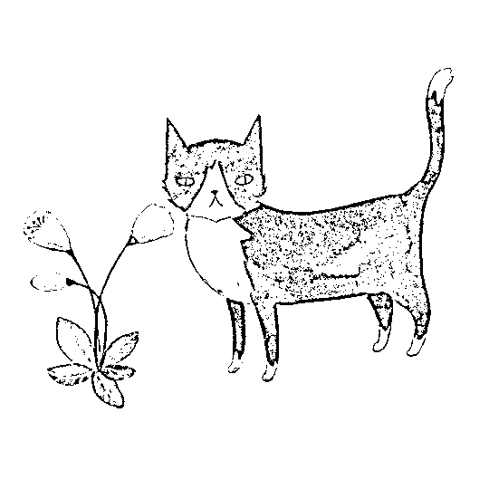

**互联网前端工程师（厦门）****招聘人数：1 人****02**>>>>

**工作内容及职责**

*   公司 PC 端及移动端的页面制作，并持续关注 web 相关技术走向；

*   根据设计稿进行网页制作、调整；

*   根据需求实现静态页面交互效果；

*   前端组件编写及特殊 js 效果实现。

>>>>

**任职要求**

*   一年以上 Web 前端开发经验，能够进行面向对象/组件的前端设计和开发；要求有较强的页面制作功底（切图、DIV+CSS 布局等）；

*   掌握 XHTML、CSS、JavaScript 等前端相关技术，熟悉 W3C 标准，熟悉 HTTP 协议，了解 HTML5、CSS3；

*   对用户交互、用户体验有较好的理解和研究；

*   对各种浏览器的兼容性有一定了解，并有相关问题的解决经验；

*   精通 AJAX 运作机制，掌握 JQuery 或 zetop 等 JS 脚本技术；

*   熟练掌握 photoshop/fireworks、dreamwaver 等设计工具，有良好的代码书写风格；

*   有解决问题、钻研新技术的兴趣和能力，善于交流和表达。

>>>>

**福利待遇：6000-12000+**

**PHP 中高级软件工程师（厦门）****招聘人数：若干****03**>>>>

**工作内容及职责**

*   分析网站或产品需求，设计数据库结构以及程序架构；

*   开发和维护网站程序；

*   提出网站改进方案；

*   维护公司计算机设备和服务器；

*   完成公司指派的其它工作。

>>>>

**任职要求**

*   PHP 网站三年以上开发经验，且有实际作品展示；

*   熟练应用 JQuery、SQL 语言并有一定的心得和技巧；

*   对 Memcached 等 Key-Value 存储结构有了解；

*   熟悉 HTML、Javascript、CSS，能在脱离可视化编辑器的情况下进行手写；

*   有 OOP 思想，熟悉 MVC 的开发模式，熟练使用 SVN 版本控制工具；

*   有前瞻性的思维和快速学习掌握新知识的能力，对 Web2.0 新技术如：CSS+XHTML 布局、Ajax 等比较熟悉，有个人博客者优先考虑；

*   口齿清晰、思维敏捷，有较好的沟通能力，能够迅速进入工作角色，拥有出色的团队和合作精神。对“极限编程”有一定了解，具有 Linux 或 FreeBSD 操作经验的优先；

*   身体健康，无不良嗜好。

>>>>

**福利待遇：8000-12000+**

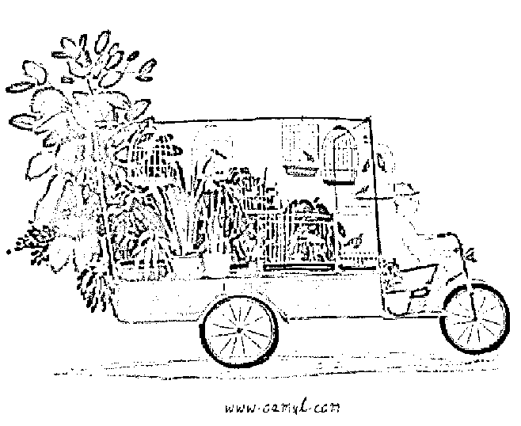

**中高级 Java 软件工程师（北京或厦门）****招聘人数：1 人****04**>>>>

**工作内容及职责**

*   开发、维护和测试公司产品软件以及网站，以核心的后台业务开发任务为主；

*   编写软件设计文档、绘制软件流程图、类图、时序图等 UML 设计图形；

*   编写测试文档、测试用例；

*   负责公共信息服务器的安全监控和日常管理，及时排除各种故障，确保服务器正常运行；

*   负责公司内部服务器、计算机，周边设备以及网络等硬件和软件的管理和维护工作；

*   完成主管领导交办的其他工作。

>>>>

**任职要求**

*   三年以上 Java 编程经验；

*   熟练掌握 Java、（J2EE 平台开发）JSP、servlet、JDBC 等技术；

*   熟练掌握 SSH、SSI 等 MVC 架构模式；

*   具有面向对象分析、设计、开发能力；

*   熟练使用 Eclipse+tomcat，svn 等工具；

*   熟悉 UML 设计工具；

*   熟悉 HTML、JavaScript、JQuery、XML、熟悉 DIV+CSS 布局；

*   熟练使用 MySql 数据库；

*   熟悉 windows 2003 server，Linux；

*   吃苦耐劳，抗压能力强，有责任心，勇于面对各项挑战,良好的团队合作精神；

*   熟悉互联网和局域网技术。

>>>>

**福利待遇：8000-12000+**

**网络编辑（北京）****招聘人数：1 人****05**>>>>

**工作内容及职责**

*   分析网站或产品需求，设计数据库结构以及程序架构；

*   开发和维护网站程序；

*   提出网站改进方案；

*   维护公司计算机设备和服务器；

*   完成公司指派的其它工作。

>>>>

**任职要求**

*   一年以上互联网编辑工作经验；

*   了解互联网、移动互联网、微信、微博等内容编辑特点 ，熟悉和能够调查使用各种第三方编辑平台和工具；

*   熟悉 html 语言，会使用 div+css；

*   会使用 photoshop 等图形编辑工具，能够独立完成基本的图片编辑工作；

*   了解 SEO 知识，并能熟练应用；

*   独立工作能力强，有敬业精神，责任心强，能承受较大的工作压力；

*   具备一定的活动策划以及协调能力，能将企业资源与渠道活动进行良好的配合，以达到较好的推广效果；

*   具有良好的创意捕捉能力，能主动发现热点，熟悉营销落地活动及网上炒作；

*   具有良好的文字功底和沟通协调能力，思路敏捷，创新意识强者优先；

*   新闻、广告、传播学等相关专业本科以上学历优先；

*   具有星座和占星知识者优先；

>>>>

**福利待遇：面议**

**如果你真的想为占星学做点事儿，若道欢迎你**


# 只要真心热爱，整个宇宙都会帮你

> 原文：[`mp.weixin.qq.com/s?__biz=MzA5NjA0NTAxNg==&mid=402706798&idx=1&sn=d96384ca39445c6bb598c06f2b654a22&chksm=0d4263d93a35eacf51b937121a8101256e533fd5f0b302634a7e9beb6647c99f011078bf9a83&scene=126&sessionid=1692738877#rd`](http://mp.weixin.qq.com/s?__biz=MzA5NjA0NTAxNg==&mid=402706798&idx=1&sn=d96384ca39445c6bb598c06f2b654a22&chksm=0d4263d93a35eacf51b937121a8101256e533fd5f0b302634a7e9beb6647c99f011078bf9a83&scene=126&sessionid=1692738877#rd)

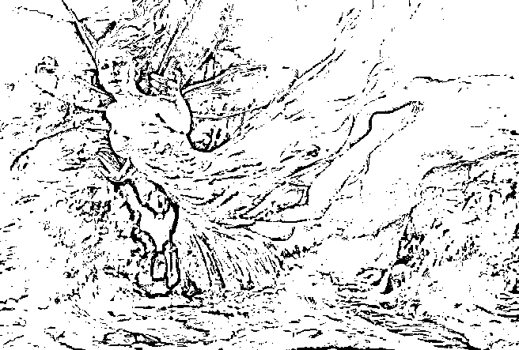

作者 2015 年初跟随大卫·瑞雷老师学习人本主义占星学，至今已一个年头。刚开始学习时，家人反对、朋友不支持。但在她的坚持下，父母看到她的热情，渐渐应允，朋友们也体会到了占星学的神奇。作为过来人，她还为想要学习占星学的小伙伴总结了自己学习历程的 6 个阶段，一起来看看吧。

**我被上帝轻轻推向那扇门**

2012 年，工作相对比较清闲，想着要把自己的兴趣爱好发展起来，就在网上搜索“占星”，跳出来一个网站，蓝色的，很专业。打电话过去才知道是在北京的一家专业占星学校，名字很有趣，叫做“若道”。虽然当时因为种种原因——主要是学费太贵——没有选择在若道学习，但留下了深刻的印象。在英国读过书的我是一个很看重专业性的人，在我看来，有业界最顶尖的国外老师进行教学，这本身就足够吸引我了。

直到 2015 年初，忽然福至心灵，觉得就是这个时候了，而这一年若道推出了 Level 1-2 联报课程，价格非常心水，于是迅速报名。

作为一个上升点合相南交点在双鱼座的人，一生所有的决定都是靠直觉。回首时，我想，**上帝为我打开若道这扇门，是预知了在这一年，我会遇到多少磨难，多少崩塌，多少孤独和困惑**，而如果没有若道，我不确定是否能够度过所有这一切……

然而，在那个时候，上帝只是将我轻轻推向了那扇门。

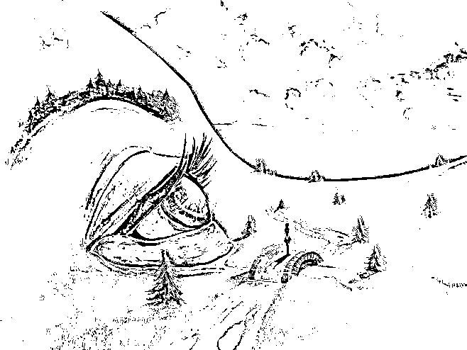

****起初，学习之路充满阻挠****

> 我的占星学习之路充满了非议。
> 
> ●  先是父母的反对，父亲不止一次呵斥我：“好好的工作不做，要来学这些封建迷信的玩意儿！”
> 
> ●  母亲则是充满了摇摆，一会儿让我帮她看看星图，一会儿又坚决站在父亲那边。月亮落在巨蟹座四宫的我，家庭的支持一直是我安全感的来源，由此，孤立无援的感觉是无以言表的。
> 
> ●  朋友们对于占星学的了解十分有限，有些人对此好奇却又充满怀疑，另外一些好言相劝：“你应该去找一份‘正经’的工作。”言下之意，学习占星是一门“邪门歪道”，相信直到现在，很多人听到我在学习占星学，脑子里蹦出的还是一个神婆子形象。

**那一年我经历了天冥四分触发本命冥王星的行运，所有的一切都以无法抗拒的姿态崩塌。迷茫中，唯一可以支撑我的，就是学习，和“抱团活动”。**

“抱团活动”是由助教提议发起的课外练习活动。我参与并主持了这个活动，每周一到周五，20:30 开始，七个月的时间从未缺席。在“抱团活动”结束的时候，我带领班级里两百多名同学组织了一次堪称春晚的特别活动，相信这次活动是这一届学员心里无法磨灭的美好记忆。

因为喜欢这个团体，喜欢这个氛围，喜欢这群有理想有爱心的人们，就不由自主想为它做些什么，若道的魅力就在于此。

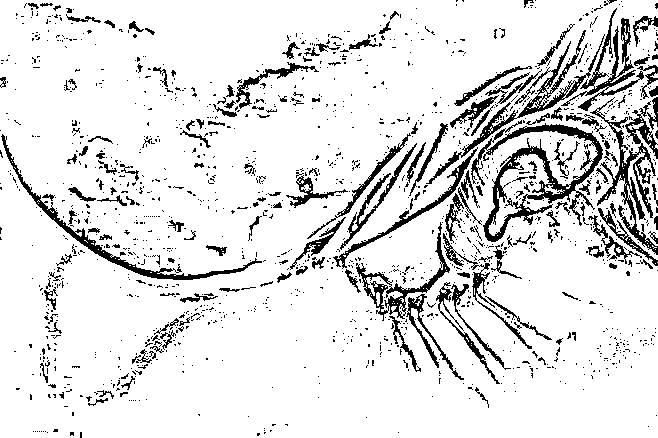

****当真心热爱时，整个宇宙都来帮忙****

**坚持占星之路，如果说没有困惑，那是骗人的。**在拿出破釜沉舟背水一战的姿态放手一搏的时候，心底一定都会有恐惧。我也有过这样的时候。

但是，当你真正想做一件事的时候，你只是努力去做，不断去尝试，努力去争取，争取机会，会有一种使命感和热情，这热情足以让你忘记困难和恐惧。这样的努力之后，随之而来的，是一种吸引力的魔法。我是一个命主星落在射手座九宫的人，对于自己真正喜爱的人和事，从来不计代价，那是一种信仰。

除了学习，我还主动争取到了若道的技能交换工作以及兼职工作。整个人开始忙碌充实起来，**为了自己真心喜欢的事情而忙碌的时候，是会散发出专注而正向的能量的。在这样的能量带动下，渐渐地，父母看到了我的坚持和成效，默许了我的选择。**

一位研究心理学的朋友在接受了我 4 小时的咨询后，好奇地问：“为什么可以这么精准，你说的这些都是背出来的吗？”她深知心理学需要大量的记忆，这些来自于幼年以及原生家庭的触发点在心理咨询的过程里也许需要十几次的不断试水才能整理出思路。同时，她是一个群星落在天蝎座的女子，若非足够取信，是很难以对别人吐露内心的。然而仅仅通过一次咨询，我便能大致掌握到她的问题以及来源，这让她大感神奇并开始对占星学有了一些兴趣。

在这 4 个小时的咨询中，我和她一样不断感受到占星学的神奇。我想我只是帮助她找到了星图中那个线索，敞开了她的内在，所有的慧根和悟性还在于她本身。我敬畏并体恤每一个前来咨询的朋友甚至陌生人，渐渐地，他们有困惑和疑问的时候，也会来同我求助。而**占星学的确一次又一次向我和我的朋友们验证了藏在宇宙中的秘密——他们内心被准确地听到了，从而开始了疗愈的第一步。**

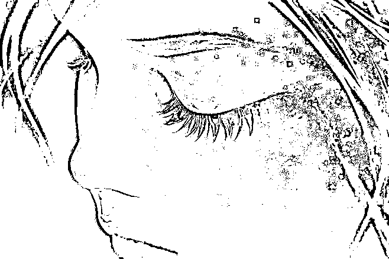

******一些感悟，分享给喜爱占星学的你们******

很多关注若道的朋友们应该都是对占星学有兴趣，但也有“胆怯”的。最大的胆怯还是在于占星学的方向以及门槛。

●  到底我能学占星学么？

● 如果我学习了占星学，我能够真的成为一名占星师么？

● 我对于占星学有兴趣，但这到底是不是可信呢？

> 当我们真正花费了财力和精力去投入这门宇宙的科学，我们需要去面对的并非简单地买几本教材、听几堂课那么简单。**在我学习的过程中，有过如下的阶段，想同大家一起分享：**
> 
> **①**开始认为自己无所不能，把在各处看来的、学来的评断性语言献宝似的嘚嘚个不停，满足于“看得准”，满足于炫技。
> 
> **▼**  
> 
> **②**渐渐觉得自己似乎并不是那么懂，原来一个简单的相位背后还有那么多可能性，那么多需要理解和记忆的东西，还有那么多需要想象的东西。我可以学精吗？我有这个天分吗？
> 
> **▼**
> 
> **③**忽然对占星学产生了怀疑：如果说一切都是有可能的，那么占星学到底是不是一门科学，它到底能够评估出什么？到底能够看准什么？
> 
> **▼**
> 
> **④**在看到一张星图的时候，从最初非常敢“论断”，到后面的一句都不敢评判。开始产生敬畏。
> 
> **▼**
> 
> **⑤**仔细研究自己的星图，发现原来看过几百遍的这张星图里依然有被我忽略然而又那么明显的指征，正好指向了不断重复的人生议题，以及议题背后心灵层面的问题。
> 
> **▼**
> 
> **⑥**仔细研究喜欢过的人的星图，发现原来他是这样的人，原来我一直自以为的了解，并非真的了解。

所以你看，在探索的过程中，有自我怀疑，有对这门学问的怀疑，都是正常的，怀疑本身说明你正在一步一步接近真相，而**兴趣和坚持是最好的老师，它会帮助你走到豁然开朗的境界。**人生就是不断探索和尝试的过程，**我们不应害怕失败，怕的是连开始的勇气都没有。**

2016 年初，我给自己制定了一个计划，在新的一年里，我要看满 52 个出生星图。消息发布在朋友圈，反响热烈，基本上档期已经排满了。渐渐地开始有朋友找我看他们的星图，有朋友想要了解占星学，还有朋友报名了新一期的课程。

行文至此，忽然感恩上苍，曾经满足于美美自拍、看几场电影、买几个名牌包包的自己，通过若道，通过占星学，渐渐走进内心，发现内在的力量，发现生命中真正值得关注的部分。这个过程一定不会是愉悦的，因为要面对很多的痛苦和不愿面对的东西。但惟有如此才能疗愈生命里不断出现的议题，长久地获得平静和幸福。

感谢若道。感谢占星学。一周年的学习，是以为记。

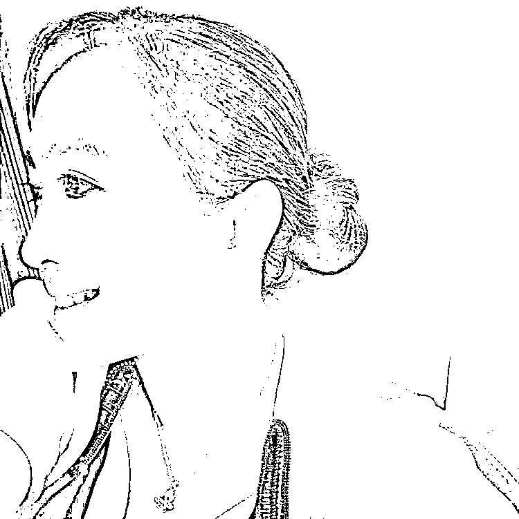

**作者简介**

**玫瑰：**生于七十年代尾巴，毕业于 Cass Business School，并获管理学硕士学位。现居上海。太阳天秤座，月亮巨蟹座，群星天蝎座。对于占星学自少年时便有浓厚兴趣，师从大卫·瑞雷学习严肃占星学，现为若道 Level 4 学员。

**个人微信号**：stillrosy

 **◆ ◆ ◆  ◆ ◆**

****特别提醒：******本文由作者授权首发至若道平台，**转载请注明“转自若道”。****

用占星学辨别自己的老旧模式，突破重复的人生议题！**2016 年 3 月 10 日**，大卫老师主讲的若道占星核心课程**Level 1-2**要开课了！他将带领你学习星座、太阳、月亮、行星、月亮交点等知识，让你进入占星学的世界！详细内容请点击“**阅读原文**”了解。

↓


# 来若道抱团吧，抱到你不想回家~

> 原文：[`mp.weixin.qq.com/s?__biz=MzA5NjA0NTAxNg==&mid=402706798&idx=2&sn=923628a6db0cf5e2ae4ed273f56c6335&chksm=0d4263d93a35eacf92107d29ac1d7994b1883058b61ef1290573ab4daee583a9b096370f4153&scene=126&sessionid=1692738877#rd`](http://mp.weixin.qq.com/s?__biz=MzA5NjA0NTAxNg==&mid=402706798&idx=2&sn=923628a6db0cf5e2ae4ed273f56c6335&chksm=0d4263d93a35eacf92107d29ac1d7994b1883058b61ef1290573ab4daee583a9b096370f4153&scene=126&sessionid=1692738877#rd)


知道什么是**“抱团”**吗？

它可是只有报名参加了若道核心占星课程的同学

才能享受的高规格待遇

它让你有机会加入到温暖团结的大家庭中

什么大家庭？

具体怎么抱？

往下看~

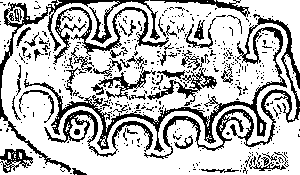

﹁

**抱团**的一些日常

﹂

**”一天不抱团，生活好像少了什么。“**

**“学占星，怎能不抱团？”**

**Q：什么是“抱团”？**

**A：**顾名思义，

就是大家抱在一团做练习，咳咳……

具体形式呢，

就是每晚由一名主持人来抛出练习题目，

所有学员来回答，

助教做点评。

**Q：如何“抱团”？**

**A：**

**吐槽抱**

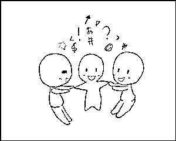

▲**最想对过去的自己说些什么？**

**文学抱**

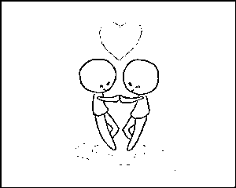

**▲**“阅兵蓝”给你怎样的感觉？****

**甄嬛体抱**

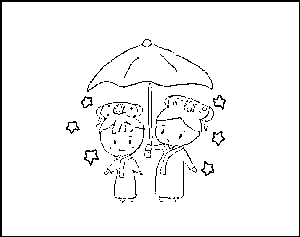

**▲**“牛郎织女“的故事人物星图配置大猜想****

**咆哮抱**

_ 副本.jpg")

**▲**刻骨铭心的前任大揭秘！****

**基情四射抱**

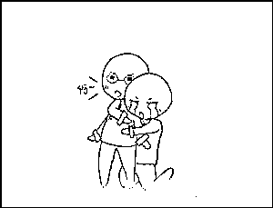
**▲**最好的好基友配置集合****

**对分抱**

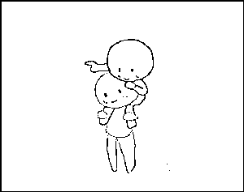

**▲**最想对不喜欢的星座配置说什么？****

**抱抱抱~   **

**Q：到哪里抱？**

**A：**来加入新一期[若道 Level 抱团](http://mp.weixin.qq.com/s?__biz=MzA5NjA0NTAxNg==&mid=402684589&idx=3&sn=6b9e36b0719fe52380a788f5a6c0c9fd&scene=21#wechat_redirect)（点击可查看），喜爱占星学的你会泪流满面——终于找到组织啦！

**Q：****通过抱团你将获得？**

**A：**拥抱温暖！ 

收获真挚的同窗之谊~

眼泪共落霞齐飞，欢笑共长天一色~

**从占星小白进阶占星达人，技能 get 无压力~**

一天不抱团，生活都好像少了些什么~

**Q：参加抱团，你要准备什么？**

**A：**有爬楼的旺盛精力，

强大的水星能量，

有足够的手机内存，

够快的网速，

因为一个不留神，

群聊数字就**100+**啦！

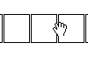

**有木有很欢乐~** 

**再来看看学员们的感言吧~**

「

学员感言

**feedback**

」

**@Kailey**

印象最深的一次抱团活动，貌似是**关于父亲的解析**，这让我又一遍重新认识了我的星图，以及深入了解我的家人和家庭关系。

抱团活动给我的感受：当然是抱抱更健康啦！学占星到第二阶的时候，还是不会组合解说。参加抱团是逼自己去熟悉和掌握这些技巧，刚开始会出错，但被点评后反而印象深刻，渐渐的就很少出错了，也帮助我开始为他人解析星图啦！很有成就感！ 

**@Lilian**

印象深的抱团活动不止一次啦。有两次是和内容有关的，有两次是和助教的表现有关。

巫岸带领做的发散性练习里，有一次我写了妈妈……和妈妈的联结是每个人最深的联结，印象必须深。还有一次巫岸让大家写**要是还剩下最后一天，你会做什么？**这个题目太好了，一下子，人生最重要的事情就清楚了，遗憾和不遗憾的地方就明白了。最后一天，就是让遗憾不遗憾。还有一次，许宁助教花了两天时间给大家点评，言辞华丽优美，又颇灵性启发。这个助教……

抱团，喜欢并且习惯了。又可以和大家热热闹闹的，又可以跟大家学习，又可以调节生活。通过抱团，巩固知识。要不是抱团练习，自己的知识的掌握不知道得花多少时间才能进步。这个练习很促进人的！重要！ 

**@坤子**

最深的一次抱团练习是发散性训练谈**“自己的母亲”**这个话题。因为我的母亲刚因病去世，我太想她了，一边写一边流泪。 

抱团活动给我的感受是：**很像土星和天王星以及海王星合相****。**每天都要在固定的时间，按照固定的规则来做这些练习，一周三次，雷打不动。通过这些练习，我对许多占星知识点的掌握，特别是知识点之间的连接和运用，确实比抱团前进步太多，这些努力是看得到效果的。同时，每次练习都能看到同学们各种有趣奇葩大开脑洞的答案，特别好玩，这么多怪咖在一起度过一个多小时的时光，夜晚 8 点就硬切进另一个奇妙的想象世界，挺棒的。 

想对助教们说的话：辛苦你们了，非常感谢。如果仅仅是工作，你们不会投入那么多热忱和灵感，那是超越职责之上的。每一次回复，都看得到你们的用心。真爱啊。谢谢各位学长和前辈！


**如果你也想加入抱团大家庭**

**也想体验这样欢乐而有益的学习气氛**

**千万别犹豫**

**点击“阅读原文”**

**立刻动动手指来报名吧！**

# 若道 Level 1-2 | 星座小白变达人，2 月 1 日报名截止

> 原文：[`mp.weixin.qq.com/s?__biz=MzA5NjA0NTAxNg==&mid=402706798&idx=3&sn=479d015be54fc15a10f99d57990d8e3d&chksm=0d4263d93a35eacf0d4b22683d245adde5bb0022f994a57cca78d7dd17a8cc7421fa8b01a7b0&scene=126&sessionid=1692738877#rd`](http://mp.weixin.qq.com/s?__biz=MzA5NjA0NTAxNg==&mid=402706798&idx=3&sn=479d015be54fc15a10f99d57990d8e3d&chksm=0d4263d93a35eacf0d4b22683d245adde5bb0022f994a57cca78d7dd17a8cc7421fa8b01a7b0&scene=126&sessionid=1692738877#rd)


国际占星研究协会（ISAR）中国唯一指定教学机构

若道 2016 年占星核心课程 Level 1-2 上线

**这是一趟“星座小白”到“星座达人”之旅**

主讲人若道创始人**大卫·瑞雷**

**拥有四十多年占星执业经验**

网络教学

全程即时翻译

不懂英文也没问题


**课程信息**

**授课时间：**2016 年 3 月 10 日**-4 月 28 日**

**授课老师：大卫·瑞雷（8**次**）、蒋颖（4**次**）**

**授课方式：**网络课

**费用：2400 元（2016 年 2 月 1 日前报名付款）**

**报名截止：**2016 年 2 月 1 日

**课程负责人：王老师（微信号：2837474346）、童老师（微信号：80248863）**

**咨询电话：**400-619-1014

**课服 QQ：4006191014 （若道星文化）**

**邮箱：nodoor@vip.126.com**

课程简介


**星座、太阳和月亮**

12 星座是占星学最基本却又最深刻的概念，黄道 12 星座，是伟大的生命周期，而太阳和月亮是我们阴阳之本。

**●12 星座：**和大卫一起，深入了解 12 星座的特色。了解星座正面的、负面的表达，了解其资源，了解其破坏生命的模式。了解其原型人物、了解其指代的人事物。

**●12 星座原则：**按照极性、形态和元素给星座分类。

**●12 星座关键词：**关键词非常重要！是解读准确性的关键。

**●太阳和月亮：**了解你的太阳，生命的发动机，让你在世界闪光的方式，生命获得力量的方法；了解你的月亮，让你生命获得幸福的方法。了解它们，了解你生命中已经出现的、将会出现的男人和女人。


**遇见行星和月亮交点**

在这个阶段，你将遇见行星们，还有与灵魂的过往和未来相关的月亮交点。这既是你，你的性格，也是你在生命故事中将会遇到的人、事、物的显化，也是你灵魂轨迹的线索。    

**●内行星：**水星、金星、火星

**●中间行星：**木星、土星

**●外行星：**天王星、海王星、冥王星

**●灵魂的线索：**月亮南交点、月亮北交点

**●行星逆行：**行星逆行的天文现象和意义

**●宫位初解：**了解黄道 12 宫的基本含义

时间安排

共 12**次**课，24 课时。

**●8 次理论课程**（大卫老师主讲、配有中文实时翻译）

北京时间每周四晚 20：00-22:00

**●4 次线上互动课程**（蒋颖老师主讲）

北京时间每周一晚 20：00-22:00（3.14/3.28/4.11/4.25)

授课优势

**①先进的教学平台**

网络教学平台，支持手机、电脑、iPad 上网，可以随时随地学习。

**②回放复习**

学员可登录网站收看课程回放，在线复习课程，每次课可完整重看 3 次，课程结束后的 3 个月内有效。　

课程特色

**①与名师面对面**：北京同学可以来若道现场上课，和大卫老师面对面互动。大卫老师也可能前往主要学员所在城市，实现零距离教学。

**②互动答疑**：论坛、微信群随时提问；老师课上答疑；助教线上线下全程协助。

**③线下沙龙**：定期举办沙龙活动，复习上课内容。

**④强大的同学网络**：若道作为中国最顶尖的占星教学机构，在 4 年的占星教学中，培养了很多占星人才。若道让你和师兄师姐切磋，让你和国内著名占星师学习。（简单来说，就是，人脉！）网络授课，在北京开设免费现场参与名额，全程英文授课，配备实时翻译。

师资力量

**讲师团队**


****大卫·瑞雷（David Railey）****

若道创始人，《灵魂的目标》作者。拥有四十年的占星咨询的执业经验，曾两任亚特兰大占星协会主席，是全美占星师联盟（AFAN）、美国占星师联合会（AFA）、全美占星研究委员会（NCGR）、国际占星研究协会（ISAR）和职业占星师组织（OPA）的成员，是联合占星大会（UAC, United Astrology Conference）督导委员会委员。大卫曾是 CNN、CBS 的占星节目的常驻嘉宾，多次在 BBC、WGS、WSB、WRGG 等节目中接受采访，并在亚特兰大主持电视节目《每日行星（Daily Planets）》达 4 年之久。


****蒋颖（Felicia）****

若道创始人，职业占星师。在若道系统学习占星，师从大卫·瑞雷。长江商学院 MBA，厦门大学经济学硕士，化学学士。国际占星研究协会（ISAR）中国区副主席。第一批获得国际占星研究协会（ISAR）认证的职业占星师。《灵魂的目标》译者。

**助教团队**


****熊鹰（天空的空）****

国际占星研究协会（ISAR）认证占星师。在若道系统学习占星，师从大卫·瑞雷，现任若道专职助教。将传播系统、严谨、真实的占星学作为职业使命。与此同时，提供一对一占星咨询服务与生时校正咨询。目前正致力于占星学与个人真修实证的整合。2014 年起主讲读书会，助教答疑课程累计超过 100 小时。


****Gaff****

全职占星师，既是占星师，也是疗愈者。2013 年开始在若道进行系统占星学习，师从大卫·瑞雷。任 2015 年度诺·泰尔、斯蒂芬·福里斯特老师的占星工作坊助教。提供一对一的咨询服务（已有超过 100 小时的咨询经验），基于个案咨询的经验，曾多次开设面授的占星课程。


2016 年，和若道老师一起，开启占星的探索之旅！

报名请点击文末“**阅读原文**”。

长按二维码接通课程负责人~


# 你还在谈论水逆的时候，木星已经悄悄逆行啦

> 原文：[`mp.weixin.qq.com/s?__biz=MzA5NjA0NTAxNg==&mid=402694441&idx=1&sn=bb1423e2777b81826c3191d46fd1f7d7&chksm=0d42139e3a359a88470e7cc3e7778d193a0b9bb5332bea975882e96803512e5140e581654068&scene=126&sessionid=1692738877#rd`](http://mp.weixin.qq.com/s?__biz=MzA5NjA0NTAxNg==&mid=402694441&idx=1&sn=bb1423e2777b81826c3191d46fd1f7d7&chksm=0d42139e3a359a88470e7cc3e7778d193a0b9bb5332bea975882e96803512e5140e581654068&scene=126&sessionid=1692738877#rd)

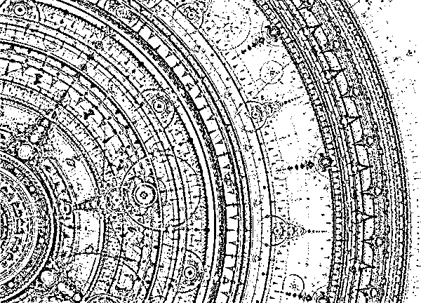

2016 年的第一次水逆在 1 月 26 日结束，不过，其实在 1 月 8 日，传统的“大吉之星”木星也开始逆行。对于木星逆行，大家的感受可能不像水逆那样明显。下面就为大家科普一下，处女座木星逆行在 12 宫位给大家带来的不同影响吧。

1

**木星逆行的意义**

行进的木星 12 年绕黄道一圈，平均每年通过一个星座或一个宫位。除了太阳与月亮之外的行星都会逆行，木星一年逆行约四个月。2016 年 1 月 8 日，木星从处女座 23 度 14 分开始逆行，5 月 9 日在处女座 13 度 15 分停滞，之后重新顺行。

**行星逆行的关键词是调整与内审。**当木星逆行，并不是说机会将隐形，扩展与成长也不会暂停，信念或灵感也不会失去。**逆行会让木星的能量会更有深度，也更为敏感，会带来行星能量的“向内强化”。**

**木星逆行的时候有利于：** 

*   审视外在扩展的脚步是否符合内心的声音

*   物质的丰盛是否与心灵的成长相平衡

*   探索与自己或他人的关系中，是否有虚假的一面

*   关注哲学或灵性的学习、心灵疆域的扩展，寻求内在的智慧

2

**木星逆行在每个宫位的意义**

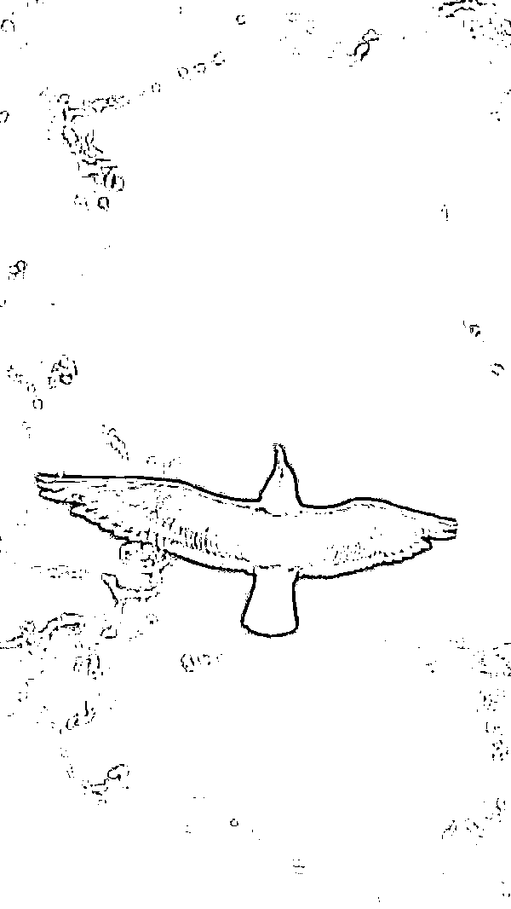

对于每个人而言，此次木星逆行都在处女座，但逆行的宫位是个人化的。

如果你熟悉自己的星图，**处女座 13-23 度所落的宫位，会是木逆影响你个人的生命领域。**事实上，每一个宫位代表的意涵都很广泛，相当于把整个宇宙都放入十二个抽屉里。因此，如果要列举宫位代表的各种可能性，从语言与心智上不可能穷尽，只能抛砖引玉。

►想知道行进的木星现在位于你出生星图的哪个宫位，可以点击 nodoorbj 微信公众号下方菜单栏的“各类查询”→“行运盘”，在左边“本命盘”和右边“行运盘”中输入相应信息，生成星盘后寻找外圈中的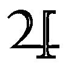（木星）位置。

**木星逆行在第一宫****你的上升星座是**狮子**座或**处女**座**

*   **你很可能比往常更乐观**，因此容易“心宽体胖”；**或者你感受到全新的机会、扩展的自我正在生命中成形。**

*   在木星逆行的四个月里，请对自己诚实。如果你正在建立一个新的身份或形象，这符合你的内在吗，还是只是满足外在的期许？

*   当生命的扩展带来更自由的感受时，如何面对随之而来的不确定？

*   请向内审视，你会知道如何更好利用机会与新生的力量。

**木星逆行在第二宫****你的上升星座是处女座或巨蟹座**

*   **你比往常有更多的机会挣得金钱。当木星逆行，你对金钱、资源的外在关注会转向内在。**

*   如何提升自己的技能，或掌握一门新的技术？通过培养内在的丰盛与自信，不只是依赖奢侈品与物质堆砌出来的安全感，会带来更多内心积极的转变。

*   这也是调整一些财务相关的项目的好时机，通过整顿自己的财务状况，来获得富足感。

**木星逆行在第三宫****你的上升星座是**巨蟹**座或**双子**座**

*   你很可能会把微信朋友圈冗长的联系人整理一遍，抑或感慨每天被铺天盖地的海量信息所淹没，会思考互联网是不是最有效的获取信息、联结现实的方式，或有没有更有效、更直接的沟通方式。

*   你也许会想起某个朋友半年前曾建议你去下一个新的 App，或开始学习一项能更好融入周围环境的技能（譬如重新学习英文、练习烹饪、考十年前就想考的驾照）。没错，这是木星逆行三宫带来的触动。

**木星逆行在第四宫****你的上升星座是双子座或金牛座**

*   在过去的几个月，你也许已吸引了一些外在的经历，触碰到记忆中的家庭与祖先。而逆行的木星，会提供足够的安全感让你能进一步触碰到自己的内心，你的精神家园。暂时远离外界的纷扰，从这个世界撤退，不失为良策。

*   需要注意的是，不要让处女座的内审走得太深太远。**如果内心的焦虑与恐惧包围了你，记得浮上水面求助。**

*   **同时，木逆也是你调整房产相关资源、搬家、改善居住环境的好时机。** 

**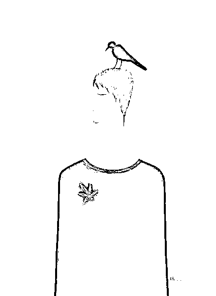**

**木星逆行在第五宫****你的上升星座是**金牛**座或**白羊**座**

*   你会灵光一现：培养新的爱好、跟孩子们玩耍、浪费时间去做一些看似无用的事, 都是繁忙生活中弥足珍贵的时刻。

*   那一刻，你由衷感受到灵魂深处涌出来的快乐吟唱，不是世俗定义的金钱或成功所能换来的；你会体验到创造力与激情，是满溢着爱和快乐的心才能酝酿的。

*   你会从内开始调整，从而吸引更多的乐趣与玩伴进入你的生命，并比往常更容易展现创造力。

**木星逆行在第六宫****你的上升星座是白羊座或双鱼座**

*   调整本身就是第六宫、处女座的关键词。习惯的养成、对细节的关注，坚持磨练技巧，对于上升点白羊座或双鱼座的人，并不容易。**调整工作环境、日常作息、饮食锻炼习惯，**是木星在你的第六宫逆行会强调的主题。

*   如果你在几个月前就开始了这些功课，木逆的影响会相对不明显。如果没有，逆行的木星会帮助你找到开始的意义。你会发现这些不是婆婆妈妈的细碎。每天的仪式感，会在日复一日的平凡之中孕育奇迹，有着将一个人的生活转化的魔力。

**木星逆行在第七宫****你的上升星座是**双鱼**座或**水瓶**座**

*   当木星逆行在第七宫，你可能会调整亲密关系或合作关系。这段关系中有没有因为过度乐观、不现实的期许带来的虚假的一面？更加诚实地面对自己，亦是给对方最好的礼物。

*   **如果你在等待灵魂伴侣出现，逆行的木星会让你向内审视**：我的灵魂伴侣会是什么样特质的人？为什么以前遇到的人不合适？只有你内在真的准备好了，才能正确地吸引、明智地识别木星带来的各种机会与好运。

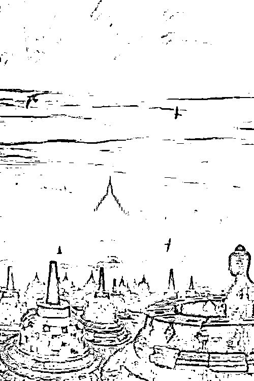 

**木星逆行在第八宫****你的上升星座是水瓶座或摩羯座**

*   这是一个收藏秘密的宫位：藏在衣柜里的怪物，压抑在海面之下的恐惧，或者是孕育精神大师的子宫。如果你在探索占星、心理学或某些神秘学，当木星逆行在第八宫，会是深入研习的好时机。

*   **对资产与投资进行优化，**亦是木星逆行在八宫的主题。

*   2015 年的资本市场经历了从上半年的疯狂到下半年的理智的转变。当木星逆行在处女座，为投资者赢得了回顾、整顿与内部调整的时间。

**木星逆行在第九宫****你的上升星座是摩羯座或射手座**

*   你可能正拾起并整理前几年的学习笔记，或重新规划你的教学项目，也许会调整你的长途旅行计划，或向内审视自己的价值观与信仰体系……

*   重整这些拼图的碎片，你会慢慢拼出一副自己人生愿景的画卷。内审与回顾的时间并不会浪费，而是用希望与快乐重新装满人生的杯子，为下一步的冒险之旅孕育积极的力量。

**木星逆行在第十宫****你的上升星座是**射手**座或天蝎座**

*   木星在第十宫行进时，会帮助你在职场上吸引更多的机会或贵人，但是“不是所有发光的，都是金子”，需要小心辨别。

*   如果接受了不适合自己的机会，逆行的木星会带来喘息与调整的时机。

*   如果你尚未感受到木星带来的职业上的利好，木逆带来内审的契机：我有没有低估了自己？我是否觉得自己不够好，因此潜意识里拒绝一些提升的机会？ 

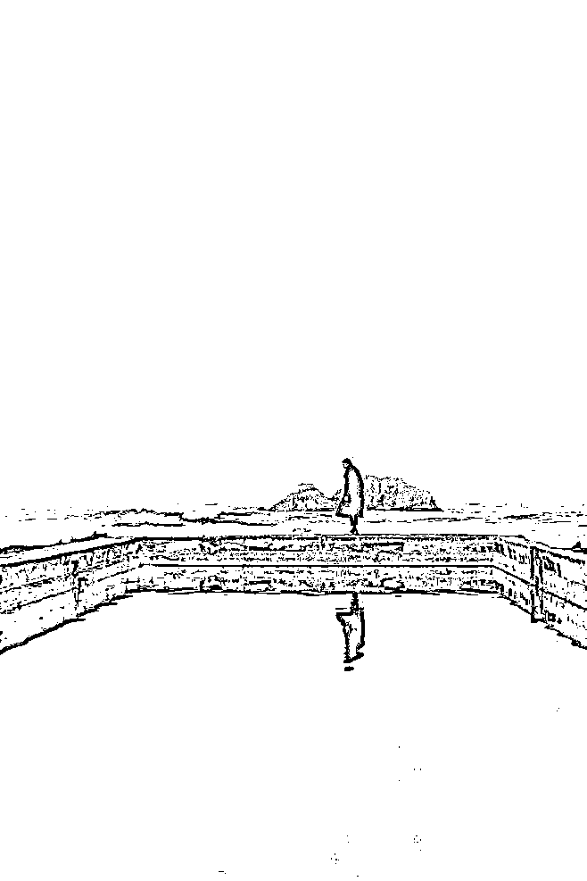 

**木星逆行在第十一宫****你的上升星座是天蝎座或天秤座**

*   如果你在过去几年付出了努力，木星来到十一宫是收获的季节，你会在物质上得到回馈与奖赏。

*   外在的丰盛与成功满足之后，会促使你向内看：自己的生活圈是否过于局限了？是否应该质疑现有的规则，扩展新的领域？在谨慎地评估自己的技能与资源基础上，你会展望心底的远大梦想。

*   也许，你已经尝试将自身的技能、利益、天赋和资源投入到更广阔的世界中。逆行的木星，会指引你回顾这一路走过的历程。与志同道合的盟友一起回溯与审慎现实，规划长远的目标，你能更好地将梦想与希望落地。

**木星逆行在第十二宫****你的上升星座是天秤座或处女座**

*   如果你被身心灵吸引，木星逆行在十二宫是学习灵性知识的好时机。你会感受到丰盛的灵感与想象力在心底涌动，探索更广阔意识的通道被神奇开启。

*   现实生活中，有些人可能会遇到一些病痛甚至“危机”。每个人都容易在痛苦中迷失，但痛苦本身不是目的，这也许是逆行的木星馈赠的礼物。你会发现，这场经历会让你对自己的盲点有深刻的警觉。你会感激，直接的生命体验所获得的真知灼见，超越在课堂或书本上习得的一切理论知识。

*   木星逆行时，一般不适宜开始物质相关的项目，但合适启动慈善、利他的活动，尤其是木星逆行在十二宫。

3**反思之后，迎接属于你的幸运之神**

逆行会扩大强化木星的原型特征。当木星在处女座逆行，会跟北交点持续合相直到二月底，**这会帮助我们看到自己的信念如何创造了现实，转化内在的批评、聚焦力量、更有效率。**

生命的扩展与事件的发展，都有其内在的节奏。**在木星逆行期间，愿每一个人都借助“幸运之神”的力量，摒除阻碍前行的障碍，顺利达成未完成之事。**

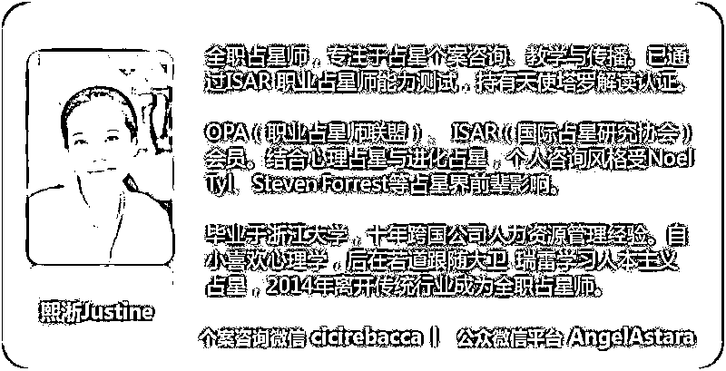 

长按二维码，让金钱涌向传播知识与智慧的人~

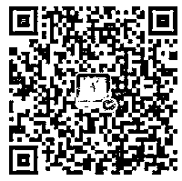

**◆ ◆ ◆  ◆ ◆**  

 ****特别提醒：****本文由作者授权首发于若道，转载请注明“转自若道”。****

逆逆逆，这些逆行都代表着啥？**2016 年 3 月 15 日**，大卫老师主讲的若道占星核心课程**Level 5**要开课了！在这个阶段，你将学习各种预测技术及行星周期。通过这些预测工具，你能够预测和规划人生。提前报名付款有**早鸟价**哦！详细内容请点击“**阅读原文**”了解。

↓


# 水瓶月的探讨：占星团体在文明危机中的使命

> 原文：[`mp.weixin.qq.com/s?__biz=MzA5NjA0NTAxNg==&mid=402694441&idx=2&sn=f7dea3243a656253e1d37cbe80b0e15a&chksm=0d42139e3a359a88405bcfa9635adc3da720f65fce5470d5c1515531a7947f9141cddc71ea6f&scene=126&sessionid=1692738877#rd`](http://mp.weixin.qq.com/s?__biz=MzA5NjA0NTAxNg==&mid=402694441&idx=2&sn=f7dea3243a656253e1d37cbe80b0e15a&chksm=0d42139e3a359a88405bcfa9635adc3da720f65fce5470d5c1515531a7947f9141cddc71ea6f&scene=126&sessionid=1692738877#rd)

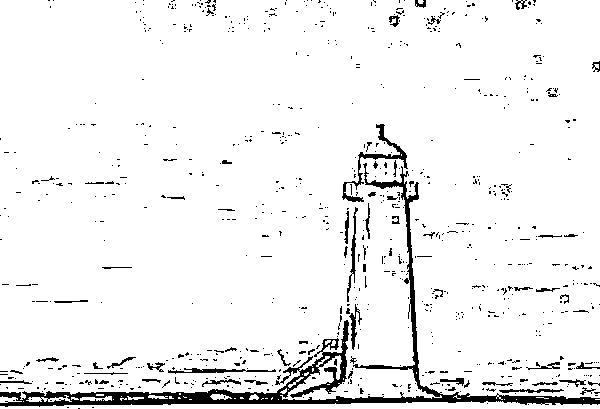

作者/理查德·塔纳斯

译者/Luke

本文节选自作者 2013 年 9 月 25 日在大不列颠占星协会发布的演讲，他谈到了一个“水瓶座”的话题：单独的占星师没有足够力量完成带领集体心灵转化的壮举，我们需要依靠占星学社团完成文明危机中的使命。恰逢水瓶月，让我们思考一下自己扮演的角色，如果无法成为英雄的个人，让我们成为英雄的团体。

**被否认的占星学**

大家都能感受到占星学在当今独特却尖锐的矛盾性——占星家知道它几乎能为人类生活的每一领域提供卓越的洞见：生物学、心理学、政治和文化历史、社会科学、考古学、现代事件、经济学、哲学、宇宙学、宗教和艺术。懂得占星学的人知道它是有力的工具，帮助人类促进自我了解，更有智慧地和宇宙展开互动。

然而它却被文化知识界的当权者贬为最低级卑劣的迷信。对于我们占星师个人来说，或许这种矛盾性具有心理学上的补偿价值，可以防止自我膨胀，保持谦卑。我同时相信占星学受到现代社会的否认，可以从另一角度理解。

从某种意义上来讲，占星学必须遭到否定，现代人自我的自主性才能充分发展，这意味着一个人的心智和意志是自由的，能为自己负责，在宇宙中不受制于任何限定生命意义和目的的结构体系。

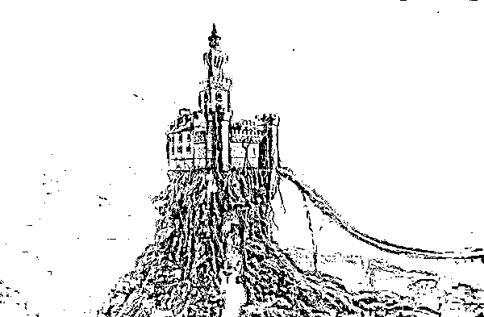

**个人英雄的能力有限**

我想要介绍“英雄”（heroic）社团的概念，以及在后现代世界，他们扮演的重要角色。“英雄”这个词的意思是这些社团有意识地采用真和善的价值观和世界观，挑战社会大环境主流。

这些社团包括：占星协会、国际占星社团本身、比如我任教的加利福尼亚州整合学院（*CIIS*）、我生活工作多年的大苏尔的伊莎兰机构、荣格学院、华德福学校、苏格兰的生态村、科学医疗联合会等等。

我列的名单包括不少跨地区社团，它们在这个数字网络时代十分重要。我们绝对需要这些社团共同合作，使灵性和智力想象力保持鲜活，创造性地为我们的文明再造一个富有意义的宇宙学。

但是“英雄”这个词通常用来指代个体，而不是团体、社团。正因为是这种情况，我们不仅需要英雄的个体，也需要英雄的团体。因为孤立的个体无法改变大众的宇宙观。我们个人的力量不足，无法使一个狂妄自大、忽视宇宙灵魂、认为宇宙仅是为了人类而存在的文明改邪归正。我们只能以社团的形式完成这一伟大壮举。

不仅个人需要社团才能表现自我和自我实现，我们的文明也需要一种新的英雄社团 ，而且要数量很多，才能改变文明自身和行星的未来。因为集体心灵需要转化，世界的未来取决于人类心灵状态的走向。单独的个体，无论直觉多么敏锐，信念多么强大，没有足够力量完成这一壮举。

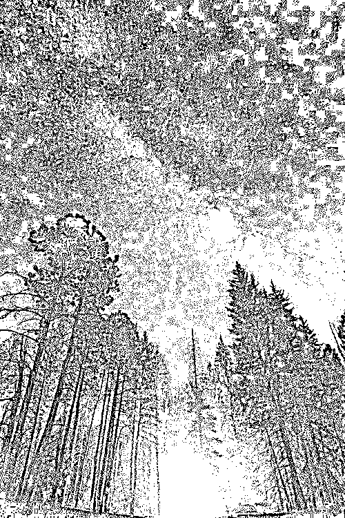

**占星学社团的使命**

我们还得向前一步，才能看到占星学得到社会和知识界的广泛认可——

●占星学术界需要深化和扩张，要有更多的实证严谨，哲学上的自我反思和认识上的自我觉知。

●翻译更多文献，加深对不同传统文献的理解。

●收集更准确的出生时间，更详细地记载人生履历和历史事件。

●稳步地重回学院和高等教育课堂。

●深入整合深度心理学、原型心理学、超个人心理学、女权主义和现代思想。

●更细致地理解原型象征、情结、心理动力和神祗。

**占星社团在文明危机中的使命**

**①传播文化**

在这样一个历史性关键时刻，占星学社团既需要扮演太阳，也扮演月亮的角色。它需要为我们的文化圈带去知识之光，解读夜晚的神秘，帮我们理解关于宇宙灵魂、无意识、宇宙内部和自身存在深度的知识。

**②滋养自己**

同时它也需要照料滋养自身，为成员提供条件，帮助他们找到属于自己的通往宇宙灵魂的联结。这种联结长久以来一直被社会主流否定。

**③保持警惕**

此外，我们必须意识到英雄社团的潜在阴影，就是成为邪教团体，丧失批判精神，要求成员行为一致，缩到社会角落，与外部隔离。占星学社团必须努力成为兼容并蓄的多元文化团体，避免教条主义。

我自己熟悉柏拉图-毕达哥拉斯-开普勒式的原型传统，其中荣格、丹恩·鲁伊尔、查尔斯·卡特、艾伯丁、查尔斯·哈维、罗伯特·汉德、史蒂芬·阿若优和利兹·格林是宝贵的老师。

占星学还有许多其他流派：希腊占星学、中世纪占星学、卜卦和预言占星学、阿拉伯占星学、印度占星学、汉堡学派、宇宙生物学，泛音占星学、萨满占星学、心理占星等等。它们在一起组成了更大的社团。

**④联结外界**

与此同时，**占星学社团必须对外面的世界开放，以能被理解的方式与外界建立联络保持联络，而不是局限于自己的圈子，用晦涩的词汇和行话在内部沟通**。我们必须能够胜任占星学以外的行业，甚至脱颖而出，成为历史学家、传记作者、治疗师和医生、经济学家、哲学家、牧师、拉比、政治家、物理学家、天文学家、商人、社会工作者、社团组织者， 这样我们为占星学发言的时候就显得更加可信和有力，在社会大环境中引起重视。

我们与整体持续不断地对话——占星学社团作为阳性原则发光发热影响作为阴性原则的社会环境，这使我们保持警觉自省，持续成长。就像我们作为个体时，也需要和别人保持关系，才能超越自我，实现自我。

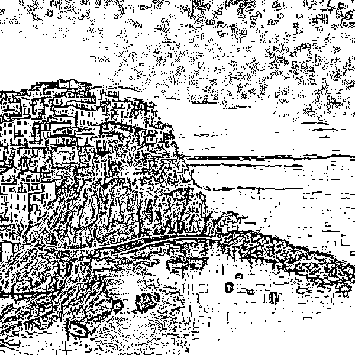

**孤立无法完成使命**

所以，**无论是个体、社团，甚至是占星学社团整体都无法单独完成任务。**在这一关键时期，有许多不同的英雄社团都有自己的特殊任务要完成。然而或许只有占星学团体有此殊荣，凭借着精准和深刻的理解，在治愈天与地、心灵与宇宙、内在与外在、自我与世界的分裂中尽一分力。

最终，占星学社团为其成员所做的——为我们的学习、探寻、转化、启蒙开辟空间——反射了宇宙为地球人类所做的：在无穷的宇宙矩阵中开辟出一片空间，其中我们的文明和物种经历行星级别的危机，穿越转化的门槛，重新回到宇宙灵魂的怀抱中，成为不断进化之神秘中的共同创造者。

占星学在我们的内心树立信念，信任宇宙，相信一切都有意义。上与下的协奏曲，意味着在某种意义上宇宙关心着地球，甚至是居住其中的每个个体，每时每刻。我们不是随机无意识宇宙中的巧合产物，也不是巨大宇宙空无中寻求意义的尘埃。我们是某种更大事物的参与者，是拥有无限意义和目的宇宙中的成员。

占星学的视角赋予我们对宇宙的基本信任，或许我们可以藉此成为广大人类社会中星星之火，以我们的临在治愈世界，为我们时代的启蒙转化尽一分力。

**◆ ◆ ◆  ◆ ◆**

**点击下列文章，更多了解塔纳斯教授：**

[塔纳斯：自称专业占星师的你们做到了这 7 点吗？](http://mp.weixin.qq.com/s?__biz=MzA5NjA0NTAxNg==&mid=402587687&idx=1&sn=d81ed86727c7b561dc487374c5846935&scene=21#wechat_redirect)

[我们又将迎来一位国际殿堂级占星家！](http://mp.weixin.qq.com/s?__biz=MzA5NjA0NTAxNg==&mid=401949295&idx=3&sn=0972e13ee780ec236d30c926bcf1dca4&scene=21#wechat_redirect)

[塔纳斯：天冥四分威力将持续到 2020 年](http://mp.weixin.qq.com/s?__biz=MzA5NjA0NTAxNg==&mid=402527351&idx=2&sn=53ab9dc1fc25a53ca738aae92d2834b2&scene=21#wechat_redirect)

 ****特别提醒：****本文由作者授权发布于若道，转载请注明“转自若道”。****

**今年 5 月，塔纳斯**将在若道开办“**原型占星学**”在线课程，敬请期待！


# 若道核心课程 Level 5：进阶专业占星师的必修课

> 原文：[`mp.weixin.qq.com/s?__biz=MzA5NjA0NTAxNg==&mid=402694441&idx=3&sn=6f5a518edf73ee8ba78033ae5da8bf4d&chksm=0d42139e3a359a886b1cedf1ce7c1cbf818f6baff93e04ea7aa3003b7d9139702090b6695bb6&scene=126&sessionid=1692738877#rd`](http://mp.weixin.qq.com/s?__biz=MzA5NjA0NTAxNg==&mid=402694441&idx=3&sn=6f5a518edf73ee8ba78033ae5da8bf4d&chksm=0d42139e3a359a886b1cedf1ce7c1cbf818f6baff93e04ea7aa3003b7d9139702090b6695bb6&scene=126&sessionid=1692738877#rd)


在这个阶段

你将学习各种**预测技术**

行进、月亮次限、太阳弧、返照图

你会学到行星周期

天上哪朵云什么时候会飘到这个人的头顶呢

会如何影响这个人的人生呢

通过这些预测工具

**你就能用它来预测和规划人生了**

**课程讯息**

**授课时间：**2016 年 3 月 22-9 月 20 日

**授课老师：**大卫·瑞雷

**授课方式：**网络课

**费用：****15000 元**

**报名截止：**2016 年 3 月 11 日

**课程负责人：**siri**（微信号：2847613491）**

**咨询电话：**400-619-1014

课服 QQ：**4006191014 （若道星文化）**

课程简介

****课程安排太丰富**了！**

行进

行星周期

爱情中的机会和挑战时机

职业周期

月亮次限

太阳弧

太阳返照、月亮返照

综合预测

组合图

占星学历史

占星学中的天文学

ISAR 考试词汇表

咨询技巧培训

**●**在整个教学过程中，不仅用名人案例讲解，而且将会抽取同学星图，进行实战咨询示范。另外，会有 4 节课的咨询技巧培训帮助大家准备好进入实战。

授课时间

2016 年 3 月 22 日-9 月 20 日

每周二晚 20：00-22:00（北京时间）

共 27 次课

有关毕业

**考试和实习：**对于那些想要获得大卫老师资质班证书的朋友，我们将帮助大家在开始成为职业占星师之前，将由专业占星师组织小型督导工作坊，帮助大家实战解盘，为正式的收费咨询做好准备。通过毕业考试，参加督导工作坊，星盘解读的同学，将获得大卫老师颁发的职业占星师资质证书。

授课优势

**①先进的教学平台**

网络教学平台，支持手机、电脑、iPad 上网，可以随时随地学习。

**②回放复习**

学员可登录网站收看课程回放，在线复习课程，每次课可完整重看 3 次，课程结束后的 3 个月内有效。　

课程特色

**①与名师面对面**：北京同学可以来若道现场上课，和大卫老师面对面互动。大卫老师也可能前往主要学员所在城市，实现零距离教学。

**②互动答疑**：论坛、微信群随时提问；老师课上答疑；助教线上线下全程协助。

**③线下沙龙**：定期举办沙龙活动，复习上课内容。

**④强大的同学网络**：若道作为中国最顶尖的占星教学机构，在 4 年的占星教学中，培养了很多占星人才。若道让你和师兄师姐切磋，让你和国内著名占星师学习。（简单来说，就是，人脉！）网络授课，在北京开设免费现场参与名额，全程英文授课，配备实时翻译。

师资力量


**大卫·瑞雷（David Railey）**

若道创始人，《灵魂的目标》作者。拥有四十年的占星咨询的执业经验，曾两任亚特兰大占星协会主席，是全美占星师联盟（AFAN）、美国占星师联合会（AFA）、全美占星研究委员会（NCGR）、国际占星研究协会（ISAR）和职业占星师组织（OPA）的成员，是联合占星大会（UAC, United Astrology Conference）督导委员会委员。大卫曾是 CNN、CBS 的占星节目的常驻嘉宾，多次在 BBC、WGS、WSB、WRGG 等节目中接受采访，并在亚特兰大主持电视节目《每日行星（Daily Planets）》达 4 年之久。

想成为 ISAR 认证占星师吗？

欢迎选择 2016 年度职业占星师成长套餐

▼


2016 年，和大卫老师一起，开启占星的探索之旅！

报名及咨询，请点击文末“**阅读原文**”。

长按二维码添加课程负责人咨询~

****

# 若道 Level 1-2 | 让你从星座小白变身星座达人

> 原文：[`mp.weixin.qq.com/s?__biz=MzA5NjA0NTAxNg==&mid=402684589&idx=3&sn=6b9e36b0719fe52380a788f5a6c0c9fd&chksm=0d42c81a3a35410c6dbca650ddf8e88f446d81a5f323cfc1e1346229e0c0647a66397f624817&scene=126&sessionid=1692738882#rd`](http://mp.weixin.qq.com/s?__biz=MzA5NjA0NTAxNg==&mid=402684589&idx=3&sn=6b9e36b0719fe52380a788f5a6c0c9fd&chksm=0d42c81a3a35410c6dbca650ddf8e88f446d81a5f323cfc1e1346229e0c0647a66397f624817&scene=126&sessionid=1692738882#rd)


国际占星研究协会（ISAR）中国唯一指定教学机构

若道 2016 年占星核心课程 Level 1-2 上线

**这是一趟“星座小白”到“星座达人”之旅**

主讲人若道创始人**大卫·瑞雷**

**拥有四十年占星执业经验**

网络教学

全程即时翻译

不懂英文也没问题


**课程信息**

**授课时间：**2016 年 3 月 10 日**-4 月 28 日**

**授课老师：大卫·瑞雷（8**次**）、蒋颖（4**次**）**

**授课方式：**网络课

费用：**2400 元（2016 年 2 月 1 日前报名付款）**

**报名截止：**2016 年 2 月 1 日

**课程负责人：王老师（微信号：2837474346）、童老师（微信号：80248863）**

**咨询电话：**400-619-1014

课服 QQ**：4006191014 （若道星文化）**

邮箱**：nodoor@vip.126.com**

课程简介


**星座、太阳和月亮**

12 星座是占星学最基本却又最深刻的概念，黄道 12 星座，是伟大的生命周期，而太阳和月亮是我们阴阳之本。

**●12 星座：**和大卫一起，深入了解 12 星座的特色。了解星座正面的、负面的表达，了解其资源，了解其破坏生命的模式。了解其原型人物、了解其指代的人事物。

**●12 星座原则：**按照极性、形态和元素给星座分类。

**●12 星座关键词：**关键词非常重要！是解读准确性的关键。

**●太阳和月亮：**了解你的太阳，生命的发动机，让你在世界闪光的方式，生命获得力量的方法；了解你的月亮，让你生命获得幸福的方法。了解它们，了解你生命中已经出现的、将会出现的男人和女人。


**遇见行星和月亮交点**

在这个阶段，你将遇见行星们，还有与灵魂的过往和未来相关的月亮交点。这既是你，你的性格，也是你在生命故事中将会遇到的人、事、物的显化，也是你灵魂轨迹的线索。    

**●内行星：**水星、金星、火星

**●中间行星：**木星、土星

**●外行星：**天王星、海王星、冥王星

**●灵魂的线索：**月亮南交点、月亮北交点

**●行星逆行：**行星逆行的天文现象和意义

**●宫位初解：**了解黄道 12 宫的基本含义

时间安排

共 12**次**课，24 课时。

**●8 次理论课程**（大卫老师主讲、配有中文实时翻译）

北京时间每周四晚 20：00-22:00

**●4 次线上互动课程**（蒋颖老师主讲）

北京时间每周一晚 20：00-22:00（3.14/3.28/4.11/4.25)

授课优势

**①先进的教学平台**

网络教学平台，支持手机、电脑、iPad 上网，可以随时随地学习。

**②回放复习**

学员可登录网站收看课程回放，在线复习课程，每次课可完整重看 3 次，课程结束后的 3 个月内有效。　

课程特色

**①与名师面对面**：北京同学可以来若道现场上课，和大卫老师面对面互动。大卫老师也可能前往主要学员所在城市，实现零距离教学。

**②互动答疑**：论坛、微信群随时提问；老师课上答疑；助教线上线下全程协助。

**③线下沙龙**：定期举办沙龙活动，复习上课内容。

**④强大的同学网络**：若道作为中国最顶尖的占星教学机构，在 4 年的占星教学中，培养了很多占星人才。若道让你和师兄师姐切磋，让你和国内著名占星师学习。（简单来说，就是，人脉！）网络授课，在北京开设免费现场参与名额，全程英文授课，配备实时翻译。

师资力量

**讲师团队**


****大卫·瑞雷（David Railey）****

若道创始人，《灵魂的目标》作者。拥有四十年的占星咨询的执业经验，曾两任亚特兰大占星协会主席，是全美占星师联盟（AFAN）、美国占星师联合会（AFA）、全美占星研究委员会（NCGR）、国际占星研究协会（ISAR）和职业占星师组织（OPA）的成员，是联合占星大会（UAC, United Astrology Conference）督导委员会委员。大卫曾是 CNN、CBS 的占星节目的常驻嘉宾，多次在 BBC、WGS、WSB、WRGG 等节目中接受采访，并在亚特兰大主持电视节目《每日行星（Daily Planets）》达 4 年之久。


****蒋颖（Felicia）****

若道创始人，职业占星师。在若道系统学习占星，师从大卫·瑞雷。长江商学院 MBA，厦门大学经济学硕士，化学学士。国际占星研究协会（ISAR）中国区副主席。第一批获得国际占星研究协会（ISAR）认证的职业占星师。《灵魂的目标》译者。

**助教团队**


****熊鹰（天空的空）****

国际占星研究协会（ISAR）认证占星师。在若道系统学习占星，师从大卫·瑞雷，现任若道专职助教。将传播系统、严谨、真实的占星学作为职业使命。与此同时，提供一对一占星咨询服务与生时校正咨询。目前正致力于占星学与个人真修实证的整合。2014 年起主讲读书会，助教答疑课程累计超过 100 小时。


****Gaff****

全职占星师，既是占星师，也是疗愈者。2013 年开始在若道进行系统占星学习，师从大卫·瑞雷。任 2015 年度诺·泰尔、斯蒂芬·福里斯特老师的占星工作坊助教。提供一对一的咨询服务（已有超过 100 小时的咨询经验），基于个案咨询的经验，曾多次开设面授的占星课程。


2016 年，和若道老师一起，开启占星的探索之旅！

报名请点击文末“**阅读原文**”。

长按二维码接通课程负责人~


# 漫画 | 12 星座学占星都有啥表现？

> 原文：[`mp.weixin.qq.com/s?__biz=MzA5NjA0NTAxNg==&mid=402684589&idx=2&sn=f37d159afc53226a1b4707eab71c931a&chksm=0d42c81a3a35410c38dfe8319837ece9a3b84c54a4146c4103a429fdda77ef42a913dbe76c29&scene=126&sessionid=1692738882#rd`](http://mp.weixin.qq.com/s?__biz=MzA5NjA0NTAxNg==&mid=402684589&idx=2&sn=f37d159afc53226a1b4707eab71c931a&chksm=0d42c81a3a35410c38dfe8319837ece9a3b84c54a4146c4103a429fdda77ef42a913dbe76c29&scene=126&sessionid=1692738882#rd)

若道 2016 年核心课程 Level 1-2 推出了

你是什么座？

你有啥反应？

▼

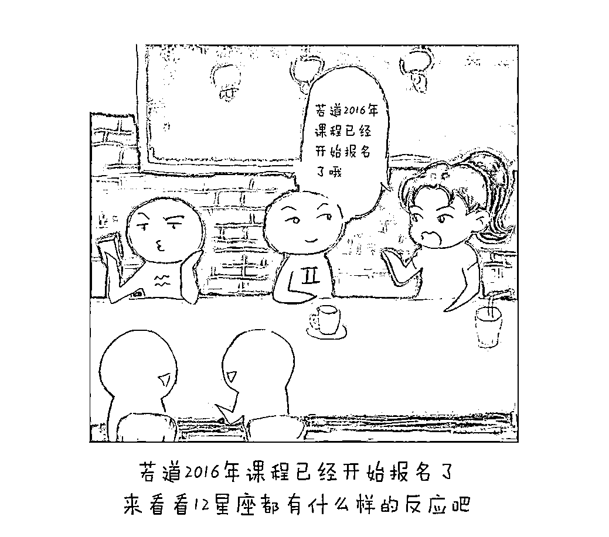
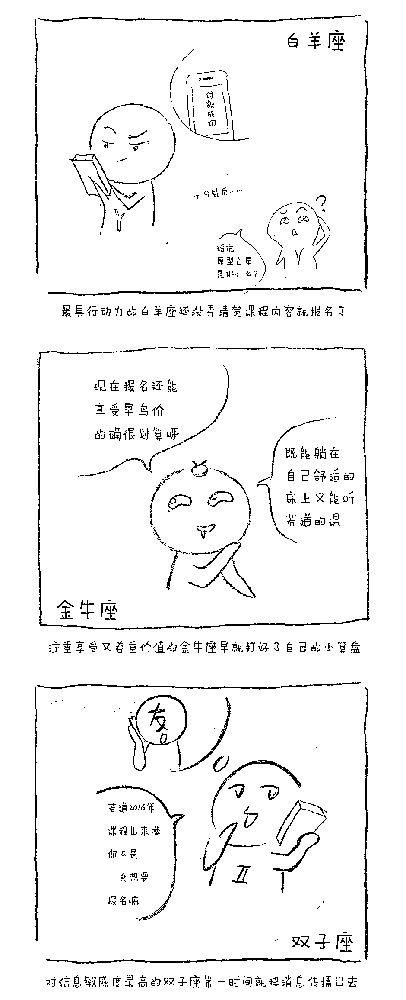

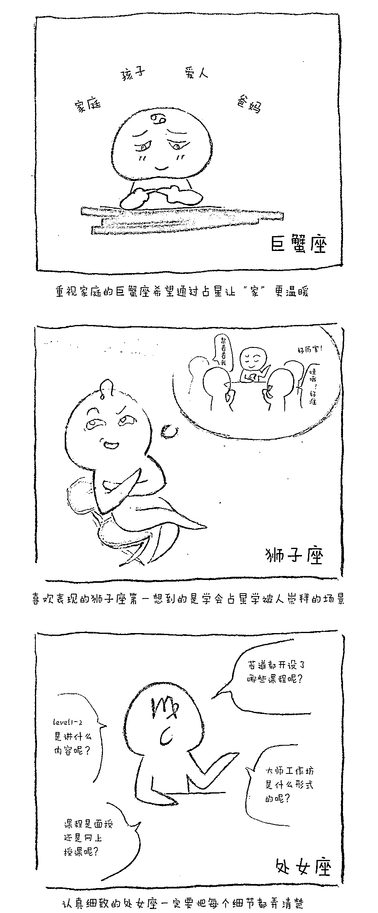
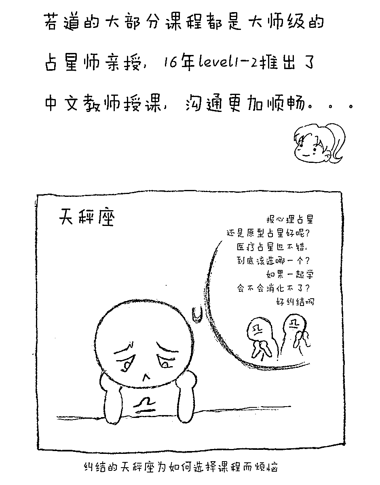
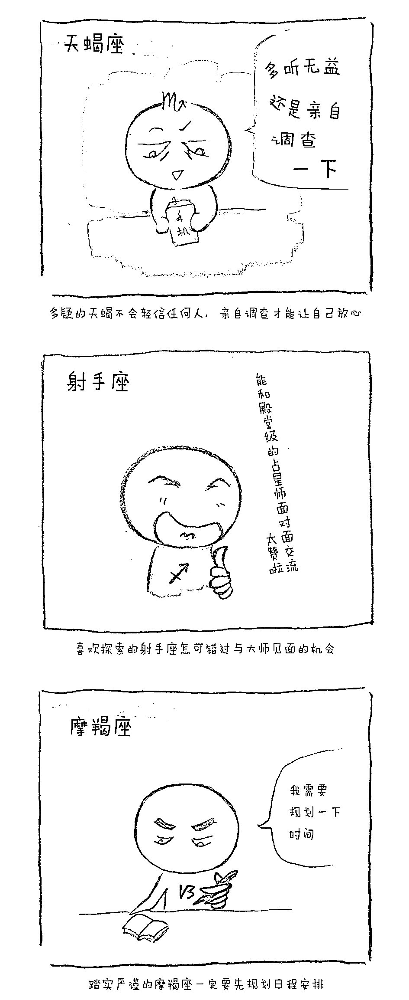
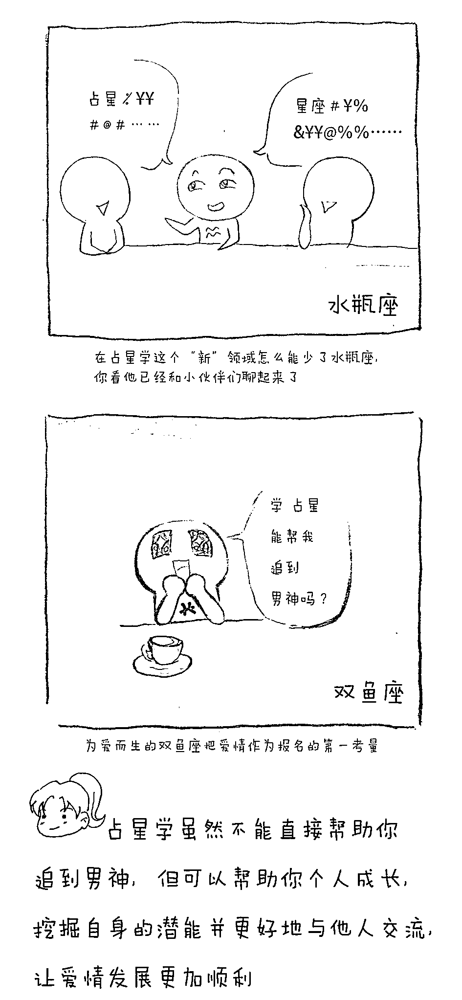

**◆ ◆ ◆  ◆ ◆**

**作者简介** 

**七沐：**视觉传达设计专业在读研究生，古典占星师从王小亚，现为若道 level4 学员，跟随大卫·瑞雷学习人本主义占星学。

微博：什么占星 

微信：Dream726LL

**◆ ◆ ◆  ◆ ◆**

想要个人成长吗？**2016 年 3 月 10 日**，大卫老师主讲的若道占星核心课程**Level 1-2**要开课了！他将带领你学习星座、太阳、月亮、行星、月亮交点等知识，让你进入占星学的世界！详细内容请点击“**阅读原文**”了解。

↓


# 水瓶座 | 再智慧的一群人，也有难以回避的黑暗面

> 原文：[`mp.weixin.qq.com/s?__biz=MzA5NjA0NTAxNg==&mid=402684589&idx=1&sn=df865ac0d2f3d6cd329ccdd5b8d049f9&chksm=0d42c81a3a35410ca8a0b0ad819bcf8de87487d96dc650da57bcab0505d3812d4ccbdb63feee&scene=126&sessionid=1692738882#rd`](http://mp.weixin.qq.com/s?__biz=MzA5NjA0NTAxNg==&mid=402684589&idx=1&sn=df865ac0d2f3d6cd329ccdd5b8d049f9&chksm=0d42c81a3a35410ca8a0b0ad819bcf8de87487d96dc650da57bcab0505d3812d4ccbdb63feee&scene=126&sessionid=1692738882#rd)

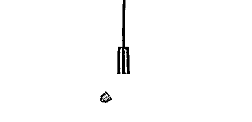

作者/大卫·瑞雷

翻译/李含 校对/江艺

**这些都是水瓶座**

**酷** **独特**

**原创**** 发明**

**别具一格**

**古怪** **与众不同**

**叛逆** **对抗**

**不墨守成规**


**我与那些穿着工装裤的人称兄道弟（老农夫/工人），这种友情即使是世界之王的垂青也无法交换。**

——托马斯·A·爱迪生（1868-1931）

美国发明家，拥有 1093 项美国专利


****水瓶座的普遍态：酷****

每个人都想要变得很酷。酷，酷，酷……聪明就是酷，非常聪明就是非常酷。发明创造是酷。原创是酷。 

**那些很酷的水瓶座**

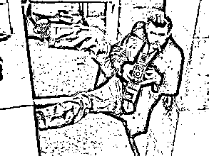

1.  **詹姆斯·迪安（ James Dean）**发明了“酷”，他是好莱坞的第一位叛逆偶像。

     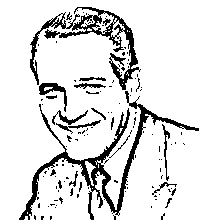

2.  **保罗·纽曼（Paul Newman ）**很酷，他甚至还因为参演了一部名字中带有“cool”的电影《黑狱喋血》（Cool Hand Luke）而荣获了奥斯卡奖。

     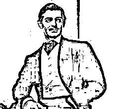 

3.  每个人都认为瑞德·巴特勒（Rhett Butler ）很酷。他的扮演者是充满传奇色彩的**克拉克·盖博**。在影片《飘》的结尾，他对思嘉丽·奥哈拉说：“亲爱的，坦白说，我才不在乎呢！”

     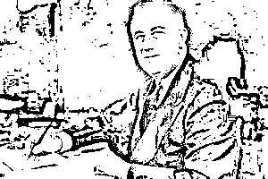 

4.  即使是做总统也可以很酷。就像**罗斯福**总统在大萧条时呼吁美国人民要“酷”。他说：“没有什么可怕的，除了恐惧本身。” 

     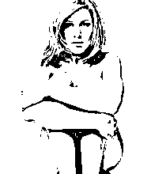 

5.  著名美剧《老友记》中的演员**珍妮弗·安妮斯顿**很酷，而该剧剧名极具水瓶座色彩。

     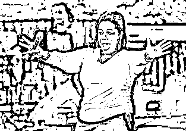 

6.  **奥普拉**很酷。她将更多美国女性从消沉的自认平庸和情感束缚中解放出来。

     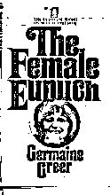 

7.  著名的女性作家**杰梅恩·格瑞尔**（Germaine Greer），她在自己的著作《被阉割的女性》（The Female Eunuch）中写道“安全感就是否定生命”。这真是水瓶座的最佳宣言，如果你还不确定她的意思，那么这里还有其他的名言：“身份地位不应该以吸引诱惑男人的能力来衡量。”

     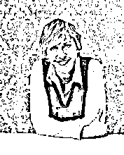 

8.  喜剧演员、脱口秀主持人**艾伦·德杰尼勒斯**（Ellen DeGeneres ）：“我个人喜欢成为独一无二的人。我喜欢做我自己，喜欢有自己风格，喜欢有自己想法，喜欢用自己的牙刷。”

**水瓶座 PK 狮子座：客观的“自我中心“**

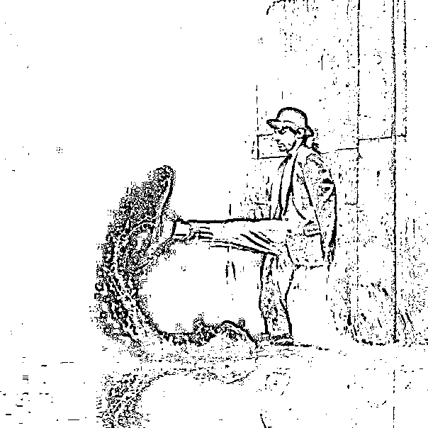

**独特、原创、发明、别具一格、古怪、与众不同、叛逆、对抗、不墨守成规，这都是典型的水瓶座特征。所以水瓶座人常常被形容为人道主义者，具有社区意识，在团队和团体中乐于奉献和参与**。这样的社会意识和参与行为乍一听与水瓶座的个人主义的叛逆格格不入，这种矛盾会让水瓶座人发笑，他们是最不喜欢被模式化定义的星座。但是，占星学学生想要解读这个星座就需要暂停一下，转而将目光投向它在黄道带对面的星座——**狮子座**！

**每个黄道星座并不仅是它前一个星座的发展延续，而且也“平衡着”它对面的星座。**

**狮子座的关注点**

*   狮子座是最欣赏颂扬创造性自我的星座，他们像满怀自信的孩子一样昂首阔步地走上人生的舞台，较早的文献中称其为“我是”原则。

*   太阳、月亮或上升落在狮子座的人会注意到其他人在“注视他们”，但是狮子座仅专注于自己的表现，无视、不重视或讨厌地推开那些与自己的表现无关的一切。

**水瓶座的关注点**

*   **而水瓶座则用客观性去平衡这种主观的自我中心行为。**“是的，你是特别的，”水瓶座对狮子座说，“但每个人也都有自己的特别之处。”

*   水瓶座象征着“个人与群体”的关系，星图中水瓶座能量显著的人会关注于“我”与“他们”的关系。

*   没有任何星座比他们更关心自己的个性如何融入社会，也没有任何星座比他们更抗拒盲目服从。

*   水瓶座人同时兼具“融入”和“抽离”。水瓶座人的天赋和创造力正是源自这种张力，以及他们客观性的评判和贡献。

**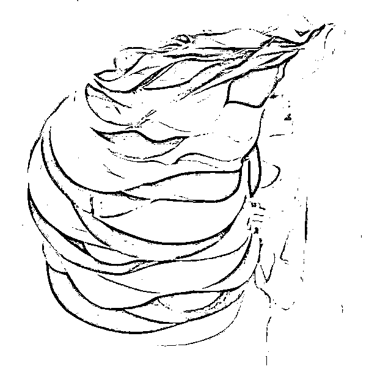** 

**水瓶座是从白羊座到双鱼座的旅程中最后一个风象星座，似乎要比其他风象星座（双子座和天秤座）更聪慧。**水瓶座是唯一的“固定”风象星座，因此有更强的力量去坚守一种理念，只要这种理念已充分成型，通过敏锐的观察发展理念，与朋友和观点相合者达成一致。当然出生星图中**太阳、月亮或上升落于酷酷水瓶座的人可以让气氛骤冷，不管好坏地固执己见，直到艰难的经历和有力的申辩勉强说服他们另做选择。**

**水瓶座人常常把“睿智”作为自己的标签，但这也是一种有趣的反讽。**聪明绝顶的水瓶座人偶尔也会有自负的表现，造成占星师杰夫·焦耳所说的**“精英的平等观念”**，苛刻地认为“平等”适用于所有人而非他们自身；就智力上的“骄傲”和排他性而言，也许这一点在太阳水瓶座身上体现的比月亮或上升水瓶座更多——这是狮子座的一条“暗示”，因为它就是“太阳”。

****水瓶座的高阶表现：贡献于新兴的团体****

**水瓶座也是最佳的社会观察者。**他们具有极佳的抽离视角，许多水瓶座都是天生的社会科学家、人类学家、社会意识作家，或社会改革家，有时候甚至是经济学家 —— 所有这些角色都能够洞悉人类社会的模式和不平等。

水瓶座人渴望为社会做出贡献，这促使他们投身到这个过程中，通常是一个群体的过程，但这个团体或组织常常是“新兴”的，处于有点儿混乱的状态，或是尚未形成权威或阶级。

**林肯总统也是水瓶座**

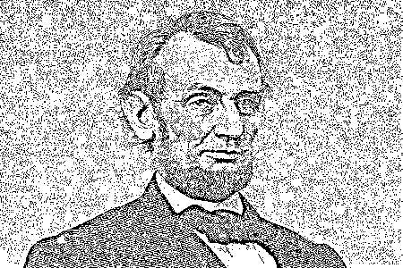

林肯是第一位共和党总统，这是一个由老的辉格党分解而生的新党。当然，社会变革可能趋向解放也可能趋向保守。前总统罗纳德·里根重塑的共和党，是美国 1980 年代保守运动的旗手，2008 年共和党副总统候选人莎拉·佩林成为了极端保守的茶党运动宠儿。佩林喜欢自己作为“标新立异”的政治家角色，标新立异的意思是“个人主义”和“不是一般或典型的主流候选人”，这也是里根在大部分政治生涯中对自己的评价。与水瓶座的反讽相符的是，里根和佩林都在言辞上表现得“亲和友好”—— 好像在说“我和你们一样就是个普通人”。

**天才爱迪生几乎没有受过正规教育**

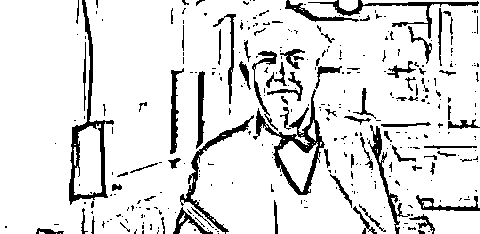

想一想本文开头托马斯·爱迪生的那句引言，“国王的垂青”也无法取代他与普通工人的友情。我们再一次看到了对狮子座国王的拒绝，以及对工作者的身份认同。虽然爱迪生因为他新泽西的实验室/工厂而被封为“洛园的巫师”，但爱迪生能够与他的伙伴们相处融洽——与他们一起工作，一起放松，启发他们思考**。爱迪生是一位天才，却几乎没有受过正规教育。但他却是首位应用大规模生产原则的发明家，将大型团队合作应用在他的发明创造过程中，创造了首个工业研究实验室。**

从最理想的角度看，水瓶座人将原创性、客观理性与作出贡献的迫切冲动、激励合作性努力的天赋结合在了一起。另外他们还愿意去冒险，尝试不一样的方式。

**那些创造历史的水瓶座**


**查理·林德伯格**是第一个独自飞跃大西洋的人

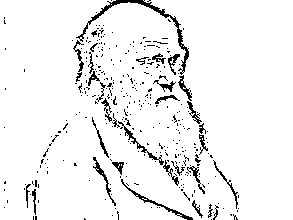 **查尔斯·达尔文**用他的进化论重新发现了自然科学  

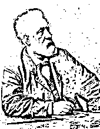 作家**儒勒·凡尔纳**描绘出了一个充满奇异发明创造的未来世界， 如今大部分已经成为现实。  

**其他著名的水瓶座**

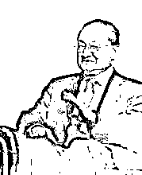 著名的武侠小说作家**金庸**  

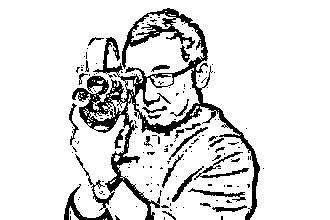 冒着巨大风险拍摄电影《南京！南京！》的电影导演**陆川**  

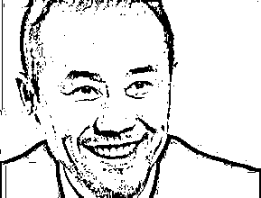 企业家**王石**  

**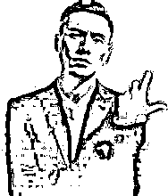** 演员**陈坤**

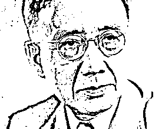 以独特的视角报道了自己所处时代的灾难和战争的记者**萧乾**  

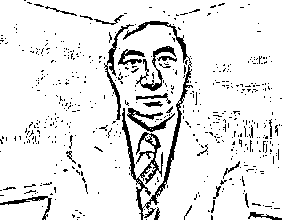 1976 年诺贝尔物理学奖获得者**丁肇中**  

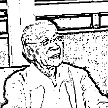 中国首位计算机科学家**李华天**  

**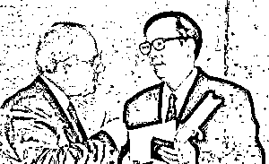** 汉字激光照排之父**王选**

****水瓶座的黑暗面——疏离感****

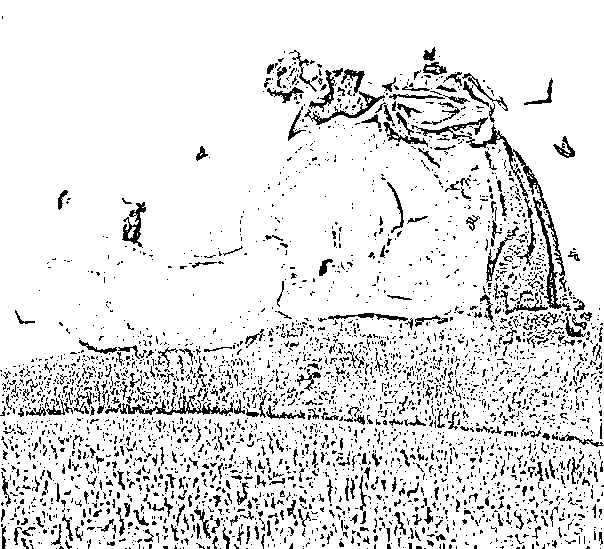

如果你是水瓶座，你可能很愿意走进这个俱乐部。也许你不愿意？也许根本不在乎？也许你不在乎很多事。也许你想，自己这么酷，怎么会在乎这些。真的吗？好吧，那你在乎什么呢？所有事？还是都不在乎？水瓶座的黑暗面就是“疏离感”。疏离就是极端的超然，甚至连“自我”都变得遥不可及——不重要。

在心理学中“疏离感”被定义为一种由无法融入社会而造成的人格解体，其特征是长期抑制情感。这种置身事外或“远离”的存在感是一种常见的水瓶座体验，很自然会随着参与程度和友情上下波动。但是，**疏离感代表着“极端”。**

**心理学上对疏离的定义**

*   人格分解

*   难以融入社会 

*   长期压抑情感 

所有三项问题都与水瓶座等式中的痛苦或黑暗面相吻合，源自幼年形成的塑造性格的模式。


那么，**水瓶座该如何走出阴暗面呢？**

关注若道君之后的推送，你会知道答案。

►**想更多地了解水瓶座?不妨看看下面的文章**

 

**◆ ◆ ◆  ◆ ◆**

******特别提醒：******若道享有本文版权，**转载请注明“转自若道”。******

在这里你可以更多地了解水瓶座。**2016 年 3 月 10 日**，大卫老师主讲的若道占星核心课程**Level 1-2**要开课了！他将带领你学习星座、太阳、月亮、行星、月亮交点等知识，让你进入占星学的世界！详细内容请点击“**阅读原文**”了解。

↓


# 一位高一女生的来信

> 原文：[`mp.weixin.qq.com/s?__biz=MzA5NjA0NTAxNg==&mid=402670758&idx=3&sn=323eb273b398017b3d5969d0d13af9f3&chksm=0d42f6113a357f074212256f8fa185649fedb8c6eaaba196c17e71b6c2e5f2f96edfc176fdee&scene=126&sessionid=1692738882#rd`](http://mp.weixin.qq.com/s?__biz=MzA5NjA0NTAxNg==&mid=402670758&idx=3&sn=323eb273b398017b3d5969d0d13af9f3&chksm=0d42f6113a357f074212256f8fa185649fedb8c6eaaba196c17e71b6c2e5f2f96edfc176fdee&scene=126&sessionid=1692738882#rd)

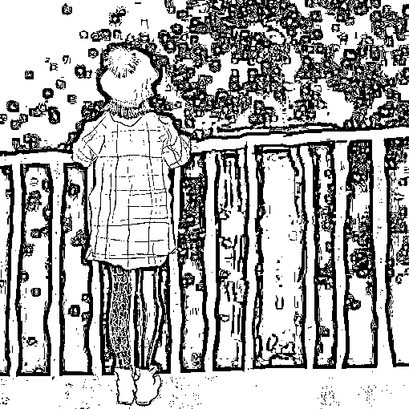

**高一女生的来信**

每个人都有一颗守护自己的星星，智者与之共舞，愚者被之操纵。这是我最初了解占星学时一句大师的话。

现在我正在读高一，初次接触占星是在初三末时，也就是 2015 年年初，刚好妈妈的一位同事在学习占星学，我对她的朋友圈甚是感兴趣。在关注若道后，我对占星学也渐渐了解。我不敢说占星学一定会带来什么好处，但却可以将之看作一份内心的信仰。宇宙的力量是不可估量的，它一点点的变化足以影响一个人一天的心情甚至一生。

我会在每次新月时认真地在纸上写下适合我的愿望，再小心地保存起来。人们都说心诚则灵，我始终坚信宇宙的力量，它是无穷的。当我过段时间再去看看之前许的愿望时，我发现，随着时间的积累，这些愿望确实也在一点点实现。

记得，我在高中开学前，内心很是紧张，刚好那时正好是狮子座新月。我太阳狮子座，我在纸上写下希望高中一切顺顺利利。其实在开学刚开始不觉得十分幸福，新的环境、新的朋友，但现在回头去看，却发现这一学期我确实收获了许多，宇宙也眷顾我许多，帮助了我许多，我内心十分感激。

这只是一个高一女生的心声，很高兴有这次机会，和大家分享我的经历。最后，送上一句话：每一个黎明都会营造出足以改变最为冥顽的命运的奇迹。

谢谢你。

1. 23

2016

+

by: 小爱

上海初雪的傍晚

**陪伴是最長情的告白**

**若道君谢谢你**

**也谢谢一直关注若道的朋友们**

❤

# 1 月 25 日，Level 1-2 早鸟价最后一天！

> 原文：[`mp.weixin.qq.com/s?__biz=MzA5NjA0NTAxNg==&mid=402670758&idx=4&sn=f5997b2507af46b5ff7f226a80c84b12&chksm=0d42f6113a357f078c18dae90f7df2da49f18c2406016398bc1570edfa1b24ac927602712a13&scene=126&sessionid=1692738882#rd`](http://mp.weixin.qq.com/s?__biz=MzA5NjA0NTAxNg==&mid=402670758&idx=4&sn=f5997b2507af46b5ff7f226a80c84b12&chksm=0d42f6113a357f078c18dae90f7df2da49f18c2406016398bc1570edfa1b24ac927602712a13&scene=126&sessionid=1692738882#rd)


国际占星研究协会（ISAR）中国唯一指定教学机构

若道 2016 年占星核心课程 Level 1-2 上线

**这是一趟“星座小白”到“星座达人”之旅**

主讲人若道创始人**大卫·瑞雷**

**拥有四十年占星执业经验**

网络教学

全程即时翻译

不懂英文也没问题


**课程信息**

**授课时间：**2016 年 3 月 10 日**-4 月 28 日**

**授课老师：大卫·瑞雷（8**次**）、蒋颖（4**次**）**

**授课方式：**网络课

费用：**2400 元（2016 年 2 月 1 日前报名付款）**

**早鸟价：****1980 元（2016 年 1 月 25 日前报名付款**）

**报名截止：**2016 年 2 月 1 日

**课程负责人：王老师（微信号：2837474346）、童老师（微信号：80248863）**

**咨询电话：**400-619-1014

课服 QQ**：4006191014 （若道星文化）**

邮箱**：nodoor@vip.126.com**

课程简介


**星座、太阳和月亮**

12 星座是占星学最基本却又最深刻的概念，黄道 12 星座，是伟大的生命周期，而太阳和月亮是我们阴阳之本。

**●12 星座：**和大卫一起，深入了解 12 星座的特色。了解星座正面的、负面的表达，了解其资源，了解其破坏生命的模式。了解其原型人物、了解其指代的人事物。

**●12 星座原则：**按照极性、形态和元素给星座分类。

**●12 星座关键词：**关键词非常重要！是解读准确性的关键。

**●太阳和月亮：**了解你的太阳，生命的发动机，让你在世界闪光的方式，生命获得力量的方法；了解你的月亮，让你生命获得幸福的方法。了解它们，了解你生命中已经出现的、将会出现的男人和女人。


**遇见行星和月亮交点**

在这个阶段，你将遇见行星们，还有与灵魂的过往和未来相关的月亮交点。这既是你，你的性格，也是你在生命故事中将会遇到的人、事、物的显化，也是你灵魂轨迹的线索。    

**●内行星：**水星、金星、火星

**●中间行星：**木星、土星

**●外行星：**天王星、海王星、冥王星

**●灵魂的线索：**月亮南交点、月亮北交点

**●行星逆行：**行星逆行的天文现象和意义

**●宫位初解：**了解黄道 12 宫的基本含义

时间安排

共 12**次**课，24 课时。

**●8 次理论课程**（大卫老师主讲、配有中文实时翻译）

北京时间每周四晚 20：00-22:00

**●4 次线上互动课程**（蒋颖老师主讲）

北京时间每周一晚 20：00-22:00（3.14/3.28/4.11/4.25)

授课优势

**①先进的教学平台**

网络教学平台，支持手机、电脑、iPad 上网，可以随时随地学习。

**②回放复习**

学员可登录网站收看课程回放，在线复习课程，每次课可完整重看 3 次，课程结束后的 3 个月内有效。　

课程特色

**①与名师面对面**：北京同学可以来若道现场上课，和大卫老师面对面互动。大卫老师也可能前往主要学员所在城市，实现零距离教学。

**②互动答疑**：论坛、微信群随时提问；老师课上答疑；助教线上线下全程协助。

**③线下沙龙**：定期举办沙龙活动，复习上课内容。

**④强大的同学网络**：若道作为中国最顶尖的占星教学机构，在 4 年的占星教学中，培养了很多占星人才。若道让你和师兄师姐切磋，让你和国内著名占星师学习。（简单来说，就是，人脉！）网络授课，在北京开设免费现场参与名额，全程英文授课，配备实时翻译。

师资力量

**讲师团队**


****大卫·瑞雷（David Railey）****

若道创始人，《灵魂的目标》作者。拥有四十年的占星咨询的执业经验，曾两任亚特兰大占星协会主席，是全美占星师联盟（AFAN）、美国占星师联合会（AFA）、全美占星研究委员会（NCGR）、国际占星研究协会（ISAR）和职业占星师组织（OPA）的成员，是联合占星大会（UAC, United Astrology Conference）督导委员会委员。大卫曾是 CNN、CBS 的占星节目的常驻嘉宾，多次在 BBC、WGS、WSB、WRGG 等节目中接受采访，并在亚特兰大主持电视节目《每日行星（Daily Planets）》达 4 年之久。


****蒋颖（Felicia）****

若道创始人，职业占星师。在若道系统学习占星，师从大卫·瑞雷。长江商学院 MBA，厦门大学经济学硕士，化学学士。国际占星研究协会（ISAR）中国区副主席。第一批获得国际占星研究协会（ISAR）认证的职业占星师。《灵魂的目标》译者。

**助教团队**


****熊鹰（天空的空）****

国际占星研究协会（ISAR）认证占星师。在若道系统学习占星，师从大卫·瑞雷，现任若道专职助教。将传播系统、严谨、真实的占星学作为职业使命。与此同时，提供一对一占星咨询服务与生时校正咨询。目前正致力于占星学与个人真修实证的整合。2014 年起主讲读书会，助教答疑课程累计超过 100 小时。


****Gaff****

全职占星师，既是占星师，也是疗愈者。2013 年开始在若道进行系统占星学习，师从大卫·瑞雷。任 2015 年度诺·泰尔、斯蒂芬·福里斯特老师的占星工作坊助教。提供一对一的咨询服务（已有超过 100 小时的咨询经验），基于个案咨询的经验，曾多次开设面授的占星课程。


2016 年，和若道老师一起，开启占星的探索之旅！

报名请点击文末“**阅读原文**”。

长按二维码接通课程负责人~


# 宇宙天气 | 水逆结束，别高兴太早！(1.25~1.31)

> 原文：[`mp.weixin.qq.com/s?__biz=MzA5NjA0NTAxNg==&mid=402670758&idx=1&sn=4b448e03abe8129c802cbaf6be6d8286&chksm=0d42f6113a357f0766587425e01740bccd88eacc0154e4accbe8c18c21eab2e911667bafb289&scene=126&sessionid=1692738882#rd`](http://mp.weixin.qq.com/s?__biz=MzA5NjA0NTAxNg==&mid=402670758&idx=1&sn=4b448e03abe8129c802cbaf6be6d8286&chksm=0d42f6113a357f0766587425e01740bccd88eacc0154e4accbe8c18c21eab2e911667bafb289&scene=126&sessionid=1692738882#rd)

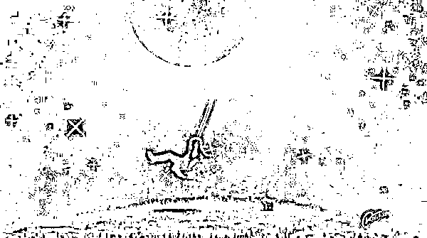

**一周星象综述**

本周月亮经过狮子座、处女座、天秤座、天蝎座。重要的星象事件不多，与上周相比清静许多，重点要注意的还是“水星的问题”。

1

首先，水星在本周二恢复顺行，水逆结束。但是不要高兴太早，行星逆行带来最强烈影响的时间，就是逆行刚开始以及逆行结束时。这主要是因为行星在变换方向时，速度骤减，近乎“停滞”，而行星停滞时，影响是最大的，这也是“停滞期”的由来。**本周的前三天，都是水星恢复顺行过程中的停滞期，也就是本次摩羯座水逆带给我们的“最后的战役”。**

这三天的时间，一方面，我们需要对那些水逆期间易出现的典型的混乱事件采取有效的预防措施，比如保护好数据和通讯设备，交通出行做好规划，凡事留好备选方案，沟通交流认真对待、实事求是，等等。另一方面，也建议利用水逆“收尾”的这几天，给自己做个回顾总结，看看在这二十多天的摩羯座水逆过去之后，**我们是否在生活的某些方面、或对某些事件，有了更加严谨务实的态度，或有了更加理智、清晰的判断和规划。**具体的变化和影响发生在什么方面，跟本次水逆位于你星图中的哪个宫位有关。

2

另一个重要的星象事件，依然与水星有关。本周六，水星合相冥王星，同时与天秤座的月亮、白羊座的天王星，形成“T 三角”。这是我在上周的宇宙天气中提到过的，12 月下旬以来的，水星三次触发天冥四分相位中的第三次，也是最后一次。

从本周六（1 月 30 号）到下周一（2 月 1 号）的这三天，是我们再次检验自己的想法和判断的时候，也是与他人谈判周旋或就一些重要的事进行沟通的关键期。**有些事将会迎来“最终的裁断”。我们对一些人一些事的认识，也可能再次发生变化和调整，看得更加透彻、深入。**

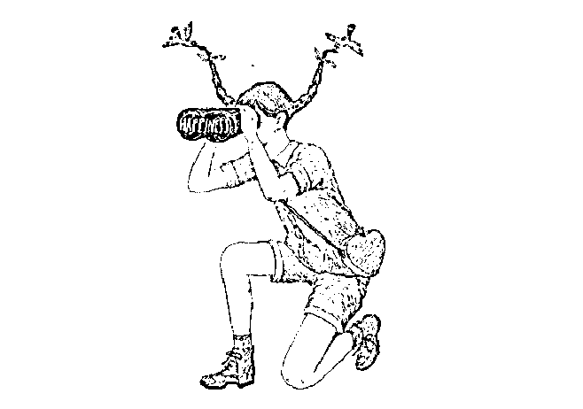

3

此外，发生在周日凌晨的摩羯座金星六分海王星，为这个周末增添了几分柔情，部分缓解了水星冥王星-月亮-天王星“T 三角”带来的紧张气氛。这提醒我们，**若能带着更多爱和理解，去看那些人性中复杂、阴暗的部分，结果可能会不一样。**

**每日星象**

**1 月 25 日**

星期一

**星象综述**

充满热情活力、开朗积极的一天。自信心和创造力提升。我们会对自己有更多认可，希望受到关注，也更容易表达出自己的真实想法。适合做一些能够展现个人才华的事，或者是发挥个人领导力。

**当日星象**

**00:12**  狮子座月亮四分天蝎座火星

**04:26**  狮子座月亮三分射手座土星

**10:52**  狮子座月亮三分白羊座天王星

**1 月 26 日**

星期二

**星象综述**

今天水星恢复顺行，**但水逆影响仍在**。建议利用今明两天的时间，去梳理总结一下，自 1 月初以来，我们在一些重要问题上的想法、思路的变化，其实是对本次摩羯座水逆的经验及收获进行一次总结。并且今天月亮进入细致、严谨、有条理的处女座，今明两天都是**对事情进行分析和梳理的好时候。**晚间由于月亮三分金星的缘故，有利于社交活动的开展，特别是一些比较正式、庄重的场合下的社交，或是与成熟的、成功的对象的交往。

**当日星象**

**05:52**  **水星恢复顺行**

**11:45**  月亮离开狮子座进入处女座

**17:52 **处女座月亮三分摩羯座金星 

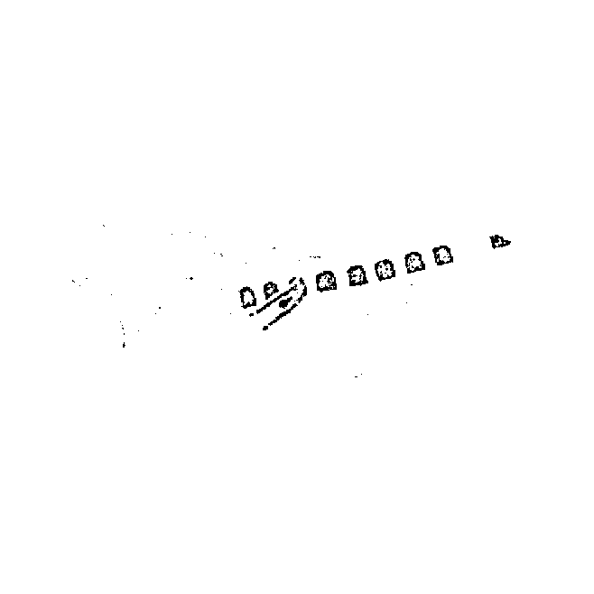

**1 月 27 日**

星期三

**星象综述**

这是无论思考、交流，还是工作、执行，都卓有成效的一天。我们能够以稳健、务实的态度，去对一些很实际的问题进行思考和规划，做出合理的分析判断，同时行动力也能跟上，有动力去面对挑战、克服难关。下午两点到三点，有些事可能让人心情沮丧，建议把关注点从负面情绪上移开，用理性解决问题。

**当日星象**

**03:53**  处女座月亮对分双鱼座海王星

**12:13**  处女座月亮六分天蝎座火星

**14:34**  处女座月亮四分射手座土星

**17:11**  处女座月亮三分摩羯座水星

**18:57 ** 处女座月亮三分摩羯座冥王星

**1 月 28 日**

星期四

**星象综述**

这个早晨充满了乐观积极的能量，让人心情愉悦，信心倍增。这是心情平稳、能够有效解决问题的一天。建议专注处理工作上的事，或做家务、打扫房间。当外在的事件能够被安排得更加整洁有序，我们的内心也会获得更多平静与安宁。

**当日星象**

**08:12**  处女座月亮合相木星

**22:58**  月亮离开处女座进入天秤座

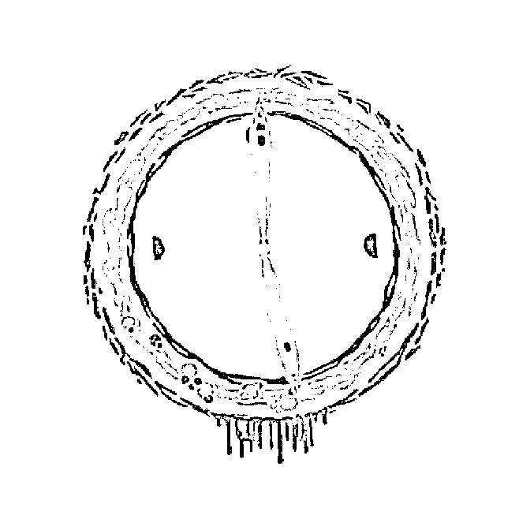

**1 月 29 日**

星期五

**星象综述**

今明两天，我们会更多地关注人际关系或爱情方面的事。对爱情的渴望会变得强烈，但也因此容易有求而不得的感伤情绪。总的说来还是有利于社交或团体活动的一天，很适合跟朋友小聚。

**当日星象**

**12:13**  天秤座月亮四分摩羯座金星

**16:56**  天秤座月亮三分水瓶座太阳

**1 月 30 日**

星期六

**星象综述**

**这是容易在一些重要关系上跟人发生冲突的一天，既包括伴侣关系，也包括工作中的合作、合伙关系**。矛盾的导火索可能是意见的分歧，但意见不合背后，是权力的较量，是本来就心存罅隙。今天我们需要对自己的心理和深层动机多一分觉察，了解冲突的本质是什么，以及自己到底想要将事情往什么方向推进，而不是陷入理不清的争端和猜忌，将能量白白消耗。此外，周末这两天，也是为爱心动的时刻，易对爱情有更加美好的想象。

**当日星象**

**03:14**  天秤座月亮六分射手座土星

**07:13**  天秤座月亮四分摩羯座水星

**07:28**  天秤座月亮四分摩羯座冥王星

**09:35**  天秤座月亮对分白羊座天王星

**14:00 ** **摩羯座水星合相冥王星**

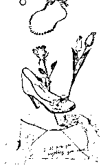

**1 月 31 日**

星期日

**星象综述**

这是情绪相对平稳的一天。对于很多人来说，虽然感情中的问题依然存在，但矛盾得到了缓和，至少我们愿意暂时将对抗心理放下，去感受平静和幸福。这是适合休息、安心调整状态的一天。因为下周一冲突和激烈情绪会来得更加猛烈。

**当日星象**

**00:45**  **摩羯座金星六分双鱼座海王星**

**11:49**  月亮离开天秤座进入天蝎座


**作者简介**

**占星师 Cora**：全美占星师联盟（AFAN）成员，国际占星研究协会（ISAR）会员，获 ISAR 职业占星师资质认证，斯蒂芬·弗里斯特《变幻的天空》译者，个人星象文章见诸《心探索》《北京青年周刊》《上海电视》《空中生活》等杂志媒体。曾跟随大卫·瑞雷系统学习占星学，现为全职占星师。

**微信公众号**：聆宇 FM（微信号：lingyudiantai）

**个人微信号**：CoraAstro

长按二维码，让金钱涌向传播知识与智慧的人~

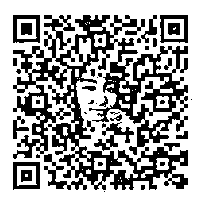

**◆ ◆ ◆  ◆ ◆**

****特别提醒：******本文由作者授权首发至若道平台，**转载请注明“转自若道”。****

你也可以写出宇宙天气！**2016 年 3 月 15 日**，大卫老师主讲的若道占星核心课程**Level 5**要开课了！在这个阶段，你将学习各种预测技术及行星周期。通过这些预测工具，你能够预测和规划人生。提前报名付款有**早鸟价**哦！详细内容请点击“**阅读原文**”了解。

↓

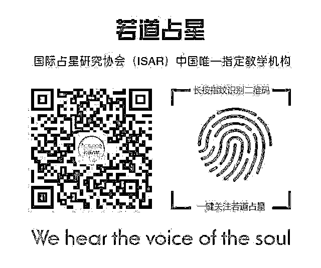

# 金星入摩羯座 | 取悦 VS 支配，关系冲突加剧

> 原文：[`mp.weixin.qq.com/s?__biz=MzA5NjA0NTAxNg==&mid=402670758&idx=2&sn=dd8aa737a0a4b922437195cdc3e56461&chksm=0d42f6113a357f076949ba8bf4e6304de873e140afa5277ff86fc1e75bc3fc0bdb9c811548b3&scene=126&sessionid=1692738882#rd`](http://mp.weixin.qq.com/s?__biz=MzA5NjA0NTAxNg==&mid=402670758&idx=2&sn=dd8aa737a0a4b922437195cdc3e56461&chksm=0d42f6113a357f076949ba8bf4e6304de873e140afa5277ff86fc1e75bc3fc0bdb9c811548b3&scene=126&sessionid=1692738882#rd)

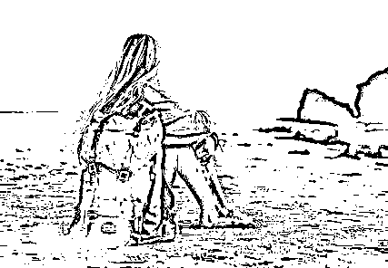

作者/杰夫·焦耳

译者/江艺 校对/舒晓非

图片/花瓣

2016 年 1 月 24 日清晨，浪漫的金星走进了严肃而严厉的摩羯座。金星在一个星座大约待 8 周，它将在摩羯座待到 2 月 17 日。在已故的杰夫·焦耳老师这篇文章中，他描述了金星和摩羯座这两股能量的反差，告诉大家要将反差的劣势转化成优势。

压力的形成

> #### 占星课堂
> 
> **星图中的压力：**你以为只有出生星图中的相位才会带来压力吗？当行进行星的本质和其落入的星座本质存在冲突时，也会给我们的现实情境和心理状况带来压力。比如，当金星进入摩羯座。

这象征着一种强烈的反差，因为金星渴望取悦别人，而摩羯座却倾向于支配他人。因此在金星行进摩羯座的时间里，这种重大的反差很可能会加剧关系问题。当我们试图游走于两种似乎相反的概念（妥协与控制）之间时，压力便逐渐形成了。

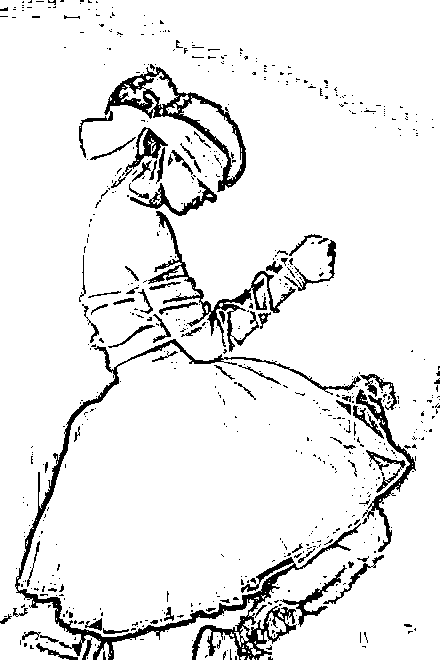

关于一个人内心的这种反差性，我曾在许多年前听占星师兼心理学家齐普拉·多宾斯（Zipporah Dobyns）说过一个绝妙的观点。她认为关键的人格议题不是由单个因素驱使的，而是被几种大相径庭的需求或驱动力所驱使的。例如，出生图中清晰显示出迁就迎合的本能（例如天秤座的行星或强大的金星）与主导控制的需求（行星落在摩羯座或强大的土星）相冲突。当这种互相矛盾的主题出现时，常常会在这个人的行为中扮演极其重要的角色。

如果某人基本上是一个好斗、独立的人，那么他/她可以表现得咄咄逼人或是独自行动，不会有内在矛盾的压力。但是如果一个人的星图中不仅有这种强烈的特质，同时也非常需要获得认可，那么他便会以不同方式表现出这些特征之间的压力。另一方面，一个纯粹以自我为中心的人，他的内在是一致的，即便他/她不会表现出社会理想中的行为模式，但与那些内在冲突的个体相比，他也不太容易表现出反常的行为。

虽然优秀的占星师可以详述关键个性，描述这些反差之间的分歧，但是我们也会注意到，它们还会表现为其他的行为。一个固执己见却又不太有安全感的人，会比自信满满的人显得更加盛气凌人。一个善社交却没有被自我利益冲昏头脑的人可能慷慨大方、全无愤恨。

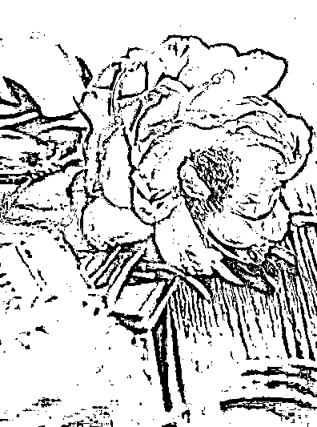

压力的解决

我们除了被个人模式影响而外，还会受到当前集体趋势（也就是行进行星）的影响。甜美可爱的金星驻留在严厉、审慎的摩羯座，对我们所有人来说都是一段具有强烈反差的阶段，无论我们的出生图是什么样的。**这种模式将爱、愉快、吸引的原则推向权威和成就的坚硬屏障，可能给关系中带来竞争，从而破坏合作。**对获得成功（摩羯座）的赞赏（金星）的渴望，可能让某人攀上顶峰，另一人则感觉被推入深渊。

齐普拉·多宾斯还说过，如果星图中存在冲突，那么问题就不是去寻求妥协，而是决定在特定情况下发挥哪种特质比较合适。**此次金星进入摩羯座，我们需要注意的是：**

● 金星要愉悦，摩羯座要成就。虽然接下来的几个月两者彼此关联，而意识到何时在某种社会情境下展现雄心抱负，何时取悦他人会影响效率，分辨出这些时点会很有帮助。

● 在特定情境中调整自己的行为来满足需求，会减少我们的困惑，减轻融合这些具有反差性的个性带来的压力，将反差的劣势转化为优势。

**◆ ◆ ◆  ◆ ◆**

**特别提醒：******本文由作者授权若道发布**，转载请注明“转自若道”。**

不仅需要了解个人星图，还要学习行进行星带给个人的影响，才能与宇宙共振，顺势而为！**2016 年 3 月 15 日**，大卫老师主讲的若道占星核心课程**Level 5**要开课了！在这个阶段，你将学习各种预测技术及行星周期。通过这些预测工具，你能够预测和规划人生。提前报名付款有**早鸟价**哦！详细内容请点击“**阅读原文**”了解。

↓


# 摩羯座水逆 | 就像小 Bug，越逆越强大

> 原文：[`mp.weixin.qq.com/s?__biz=MzA5NjA0NTAxNg==&mid=402636248&idx=3&sn=b5cd04bff7515217118a323969aafffd&chksm=02bd0f6f35ca8679925ad66b7d00dd096605bbf436dce49730a8a7dce5182b4cf4f28ecdf559&scene=126&sessionid=1692738882#rd`](http://mp.weixin.qq.com/s?__biz=MzA5NjA0NTAxNg==&mid=402636248&idx=3&sn=b5cd04bff7515217118a323969aafffd&chksm=02bd0f6f35ca8679925ad66b7d00dd096605bbf436dce49730a8a7dce5182b4cf4f28ecdf559&scene=126&sessionid=1692738882#rd)

2016 年 1 月 5 日到 1 月 26 日，水星在摩羯座逆行。又是水逆？！准占星爱好者们立即想到的，应该是星运帖里提到的各种不顺、丢三落四、计划反复、旧事重提、交通故障。大家的体验也多是手机丢失、忘带钥匙、行程变化、电脑当机、文件丢失、飞机晚点、前任复合等等。好像每次水逆都像狼来了一样，带给大家很多恐惧、沮丧、紧张。然而，如果只能体验到这些小 Bug，怎能体现出咱们作为高智商的人类所具备的自我更新功能呢！

**1****摩羯座水逆，你要看到主旋律**

如果把人生比做在绵延的山脉里徒步，此次摩羯座水逆就好像爬上一个山峰之后，又要下行至一个山坳，然后才能开始下一个高峰的攀登。在下行的途中，心里会有一点沮丧、疲惫，也会自问，**到底要不要坚持攀登？坚持的意义是什么？下一座山那么高我做得到吗？**

如果换一个角度看，这个过程让上升的速度慢下来，以退为进积蓄力量调整状态，审视目标和路径的选择，然后一鼓作气冲向下一个目标。而前面提到的各种人生小 Bug 好像山路上的坑坑洼洼、小石子，它们都只是水逆的小插曲，你看到自己的主旋律了吗？

**2****本次水逆带给我的动力**

**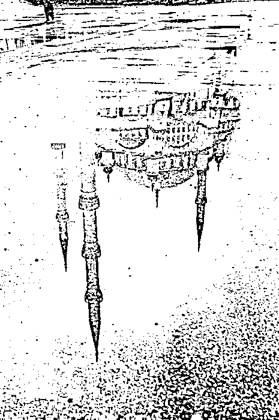** 

**看看你的行进星图里，外圈的水星落在哪个宫位？**那个宫位所代表的领域就是你这次水星逆行的主旋律。

这个主旋律怎么解读呢？以我自己为例：

**此次摩羯座水星在我的三宫逆行，三宫代表书写、表达、出版等，水星摩羯座，为责任、成就、目标、承诺而思考！**会发生些什么呢？

*   业务改革**（责任）。**对公司业务发展一直有很多困惑，对在执行的策略有自己的保留意见，但又找不到症结所在和解决办法。水星逆行期，各种支持自己潜在思路的线索浮出水面，1 小时内写出千言改革建议书（行进火星合相天王星的支持）。

*   沙龙分享**（成就）。**出生星图水星四分土星，一向话少、对表达没有信心的我通过占星学习分享，慢慢得到身边朋友的认可，被邀请为秘书大会、为 HR 团队做星座基本知识分享（行进木星处女座的支持）。原来自己可以做得到！

*   新项目确定**（目标）。**几个朋友想要一起做个好玩的公众账号，讲了很久终于在这周里确定了名称、负责人、内容，难道一直在等水星？！

*   完成投稿**（承诺）。**投稿？别逗了，我这种数学女做梦也没有想到自己可以写稿。距离上一封稿件被采纳到现在已经半年，我一直对自己的书写速度有点捉急。就是现在，完成它！

正好行进火星入天蝎座，合相我的上升点，强大的天蝎座火星的行动力和摩羯座水星结合，推动着我在这一周时间里把每一桩每一件切实可行的思考都变成关乎承诺、成就的行动计划。在水逆之后，它会变成走向下一个山峰的指路明灯。 

**3****这次水逆，你的成长在哪里？**

没想到水星逆行居然可以像土星逆行一样，带来非同一般的感受。打开你的觉知，成长无处不在！看看你的水星落在哪个宫位，它在那个领域带给你什么反思和成长？

**行进摩羯座水星逆行在 12 宫位的意义，你可以简单地理解为：在那个领域为责任、成就、目标而思考！**

以下是部分解读关键词，你可以看看是不是你的学习主题。

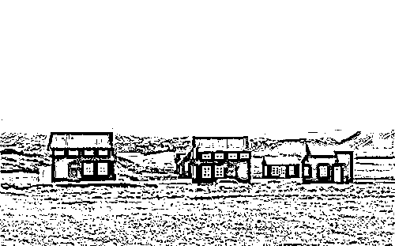 

**水逆在 12 宫位的部分主题**

**第一宫：**自我、个性、身体（**案例**：某水星在一宫逆行的朋友，制定了戒烟计划并且正在经历这个痛苦过程，他水逆期在身体健康方面为新的目标而思考。）

**第二宫：**自我价值、赚钱、理财  

**第三宫：**书写、表达、出版、短途旅行

**第四宫：**家庭、家族长辈、房产、土地

**第五宫：**爱、享乐、子女（案例：某水星在五宫逆行的朋友，即将举行婚礼，婚前恐惧的焦虑迫使他严肃思考爱的责任）

**第六宫：**日常工作、健康保健

**第七宫：**伴侣关系、合作关系

**第八宫：**亲密关系、遗产、投资、保险

**第九宫：**高等教育、哲学信仰、长途旅行

**第十宫：**公众形象、事业成就

**第十一宫：**兴趣组、社区、朋友

**第十二宫：**潜意识、潜在的问题浮出水面、灵修玄学艺术（**案例**：某水星在十二宫的朋友，在别人的引导下开启了占星学习。）

**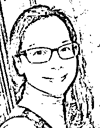**

**作者介绍**

**Judy**：资深企业管理者，计算数学本科，心理学硕士；多年高管招聘经验，对人性有深刻洞察。两年前接触占星学，广泛阅读各类作品，2015 年初在若道师从大卫·瑞雷系统学习人本主义占星学，并参加《内在的天空》作者斯蒂芬·弗利斯特进化占星学徒班，以及美国占星泰斗诺·泰尔大师课程班。专注于占星学对自我认知、职业发展、个人成长的影响。

►**关于水逆，还有这些美文等你阅读**

[最全十二星座水逆攻略](http://mp.weixin.qq.com/s?__biz=MzA5NjA0NTAxNg==&mid=402477959&idx=2&sn=3958902695dc449facbb9c3c9a422ac4&scene=21#wechat_redirect)

[水星逆行 | 在新思想的光芒中反思计划](http://mp.weixin.qq.com/s?__biz=MzA5NjA0NTAxNg==&mid=402268595&idx=1&sn=bed99ede6039642ccb05f8d6fd0e70be&scene=21#wechat_redirect)

**◆ ◆ ◆  ◆ ◆**

****特别提醒：****本文由作者授权首发于若道，转载请注明“转自若道”。****

想和 Judy 一样在星象的变动中获得成长吗？**2016 年 3 月 15 日**，大卫老师主讲的若道占星核心课程**Level 5**要开课了！在这个阶段，你将学习各种预测技术及行星周期。通过这些预测工具，你能够预测和规划人生。提前报名付款有**早鸟价**哦！详细内容请点击“**阅读原文**”了解。

↓


# 星座小白请注意：Level 1-2 早鸟价即将截止，快报名！

> 原文：[`mp.weixin.qq.com/s?__biz=MzA5NjA0NTAxNg==&mid=402636248&idx=4&sn=14f90e539a00de9f3679b9b25d2ae825&chksm=02bd0f6f35ca8679cec18659796b2ee5e0580791bf2b0eff1d66b0a5feece5493df3c4b6218a&scene=126&sessionid=1692738882#rd`](http://mp.weixin.qq.com/s?__biz=MzA5NjA0NTAxNg==&mid=402636248&idx=4&sn=14f90e539a00de9f3679b9b25d2ae825&chksm=02bd0f6f35ca8679cec18659796b2ee5e0580791bf2b0eff1d66b0a5feece5493df3c4b6218a&scene=126&sessionid=1692738882#rd)


国际占星研究协会（ISAR）中国唯一指定教学机构

若道 2016 年占星核心课程 Level 1-2 上线

**这是一趟“星座小白”到“星座达人”之旅**

主讲人若道创始人**大卫·瑞雷**

**拥有四十年占星执业经验**

网络教学

全程即时翻译

不懂英文也没问题


**课程信息**

**授课时间：**2016 年 3 月 10 日**-4 月 28 日**

**授课老师：大卫·瑞雷（8**次**）、蒋颖（4**次**）**

**授课方式：**网络课

费用：**2400 元（2016 年 2 月 1 日前报名付款）**

**早鸟价：****1980 元（2016 年 1 月 25 日前报名付款**）

**报名截止：**2016 年 2 月 1 日

**课程负责人：王老师（微信号：2837474346）、童老师（微信号：80248863）**

**咨询电话：**400-619-1014

课服 QQ**：4006191014 （若道星文化）**

邮箱**：nodoor@vip.126.com**

课程简介


**星座、太阳和月亮**

12 星座是占星学最基本却又最深刻的概念，黄道 12 星座，是伟大的生命周期，而太阳和月亮是我们阴阳之本。

**●12 星座：**和大卫一起，深入了解 12 星座的特色。了解星座正面的、负面的表达，了解其资源，了解其破坏生命的模式。了解其原型人物、了解其指代的人事物。

**●12 星座原则：**按照极性、形态和元素给星座分类。

**●12 星座关键词：**关键词非常重要！是解读准确性的关键。

**●太阳和月亮：**了解你的太阳，生命的发动机，让你在世界闪光的方式，生命获得力量的方法；了解你的月亮，让你生命获得幸福的方法。了解它们，了解你生命中已经出现的、将会出现的男人和女人。


**遇见行星和月亮交点**

在这个阶段，你将遇见行星们，还有与灵魂的过往和未来相关的月亮交点。这既是你，你的性格，也是你在生命故事中将会遇到的人、事、物的显化，也是你灵魂轨迹的线索。    

**●内行星：**水星、金星、火星

**●中间行星：**木星、土星

**●外行星：**天王星、海王星、冥王星

**●灵魂的线索：**月亮南交点、月亮北交点

**●行星逆行：**行星逆行的天文现象和意义

**●宫位初解：**了解黄道 12 宫的基本含义

时间安排

共 12**次**课，24 课时。

**●8 次理论课程**（大卫老师主讲、配有中文实时翻译）

北京时间每周四晚 20：00-22:00

**●4 次线上互动课程**（蒋颖老师主讲）

北京时间每周一晚 20：00-22:00（3.14/3.28/4.11/4.25)

授课优势

**①先进的教学平台**

网络教学平台，支持手机、电脑、iPad 上网，可以随时随地学习。

**②回放复习**

学员可登录网站收看课程回放，在线复习课程，每次课可完整重看 3 次，课程结束后的 3 个月内有效。　

课程特色

**①与名师面对面**：北京同学可以来若道现场上课，和大卫老师面对面互动。大卫老师也可能前往主要学员所在城市，实现零距离教学。

**②互动答疑**：论坛、微信群随时提问；老师课上答疑；助教线上线下全程协助。

**③线下沙龙**：定期举办沙龙活动，复习上课内容。

**④强大的同学网络**：若道作为中国最顶尖的占星教学机构，在 4 年的占星教学中，培养了很多占星人才。若道让你和师兄师姐切磋，让你和国内著名占星师学习。（简单来说，就是，人脉！）网络授课，在北京开设免费现场参与名额，全程英文授课，配备实时翻译。

师资力量

**讲师团队**


****大卫·瑞雷（David Railey）****

若道创始人，《灵魂的目标》作者。拥有四十年的占星咨询的执业经验，曾两任亚特兰大占星协会主席，是全美占星师联盟（AFAN）、美国占星师联合会（AFA）、全美占星研究委员会（NCGR）、国际占星研究协会（ISAR）和职业占星师组织（OPA）的成员，是联合占星大会（UAC, United Astrology Conference）督导委员会委员。大卫曾是 CNN、CBS 的占星节目的常驻嘉宾，多次在 BBC、WGS、WSB、WRGG 等节目中接受采访，并在亚特兰大主持电视节目《每日行星（Daily Planets）》达 4 年之久。


****蒋颖（Felicia）****

若道创始人，职业占星师。在若道系统学习占星，师从大卫·瑞雷。长江商学院 MBA，厦门大学经济学硕士，化学学士。国际占星研究协会（ISAR）中国区副主席。第一批获得国际占星研究协会（ISAR）认证的职业占星师。《灵魂的目标》译者。

**助教团队**


****熊鹰（天空的空）****

国际占星研究协会（ISAR）认证占星师。在若道系统学习占星，师从大卫·瑞雷，现任若道专职助教。将传播系统、严谨、真实的占星学作为职业使命。与此同时，提供一对一占星咨询服务与生时校正咨询。目前正致力于占星学与个人真修实证的整合。2014 年起主讲读书会，助教答疑课程累计超过 100 小时。


****Gaff****

全职占星师，既是占星师，也是疗愈者。2013 年开始在若道进行系统占星学习，师从大卫·瑞雷。任 2015 年度诺·泰尔、斯蒂芬·福里斯特老师的占星工作坊助教。提供一对一的咨询服务（已有超过 100 小时的咨询经验），基于个案咨询的经验，曾多次开设面授的占星课程。


2016 年，和若道老师一起，开启占星的探索之旅！

报名请点击文末“**阅读原文**”。

长按二维码接通课程负责人~


# 狮子座满月 | 疗愈自己的最好时刻

> 原文：[`mp.weixin.qq.com/s?__biz=MzA5NjA0NTAxNg==&mid=402636248&idx=1&sn=672678e1eaff77fa0ecb0c1f55eac849&chksm=02bd0f6f35ca86790a4dc13334f709f4cae834148c9dfd30178d017a6dbc3670a5b19c33f463&scene=126&sessionid=1692738882#rd`](http://mp.weixin.qq.com/s?__biz=MzA5NjA0NTAxNg==&mid=402636248&idx=1&sn=672678e1eaff77fa0ecb0c1f55eac849&chksm=02bd0f6f35ca86790a4dc13334f709f4cae834148c9dfd30178d017a6dbc3670a5b19c33f463&scene=126&sessionid=1692738882#rd)

一月份的宇宙能量动荡而密集，发生在 1 月 24 日 9 点 46 分的狮子座满月，将会扫去阴霾，带来自信的光芒、如阳光般温暖的表达与自我庆祝。

01

**满月对集体意识的影响：**

**联合起来，创造美好的世界**

满月发生在狮子座 3 度 29 分，狮子座月亮与水瓶座太阳对分相。狮子座是火相的固定星座，有着王族的显赫与耀眼。水瓶座有关创意、自由与改革，关心全人类的福利。

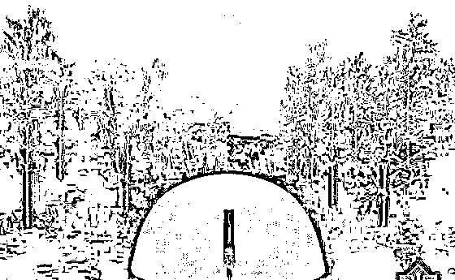 

这个满月，你的视野会从个体、家庭，看到整个国家、世界，甚至超越到宇宙与星系。

*   在这个被小部分人浮夸的权力、膨胀的财富所掌管的世界，你的内心藏着怎样的理想？

*   如果有一件事你可以改变世界，无论看上去多少微小，你想改变的会是什么？

每个人都是独一无二的，拥有各自无法替代的天赋、资源和优势。**当每一个独立思考、有智慧有远见的人联合起来行动，力量会指数级增加，能携手创造更美好与平衡的世界。**这是这个狮子座满月对集体意识的影响力。

2

**满月对个人及亲密关系的影响：**

**真实面对、自信表达自己** 

满月时水星依然在摩羯座逆行。水星因为逆行的轨迹，会三次与冥王星形成合相，并与天王星四分。第一次发生在 12 月 19 日至 20 日，最后一次发生在 1 月 29 日至 31 日，而第二次恰好发生在狮子座满月。

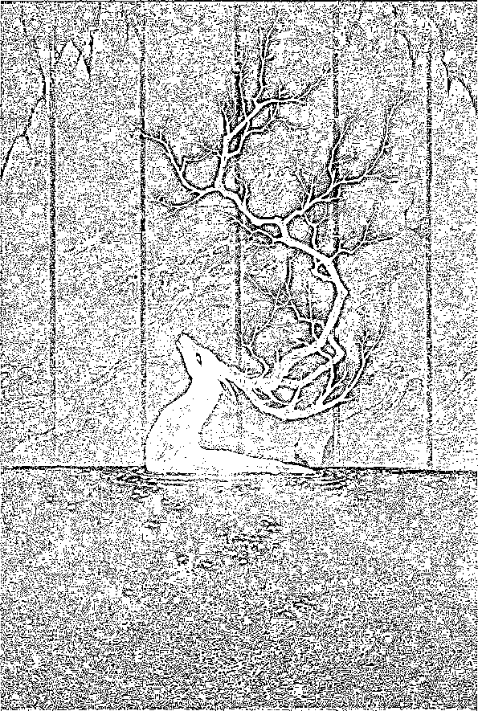

**水星合相冥王星强调了语言、心智与沟通的力量，不喜欢肤浅和不假思索，有着高度的专注力与近乎无情的探究倾向。水星四分天王星能穿透虚伪、突破暗流，把自己最真实的想法如实倒出。**

在个人关系的领域，这个满月带来**向内审视、面对最真实自己的趋力。**突然产生的洞见，如剑般锋利的思维，会让你看清楚一些感情中的迷思，释放一直以来执着的过往，让你有自信表达出最闪光的自己。

满月时，木星与北交点合相，会帮助我们**看到自己的信念（木星）如何创造了现实，带来转化内在的批评、聚焦力量、更有效率（处女座）的契机。**逆行的木星，会督促我们**审视外在的扩展是否符合内心最真实的声音，寻求内在的智慧。**

在亲密关系的领域，这亦对应了水瓶座满月（**让内在的声音引领自己，重视自由和诚实**）和狮子座（**打开心轮，无条件的爱与原谅，自信有感染力地表达灵感**）的两级。

3

**最大化满月的能量：**

**疗愈自己，你可以做三件事**

对于满月的预期，我们可能会局限情绪的波动与释放、非理性一面集中爆发、不得不面对现实事件带来的巨大冲击的心理阴影。

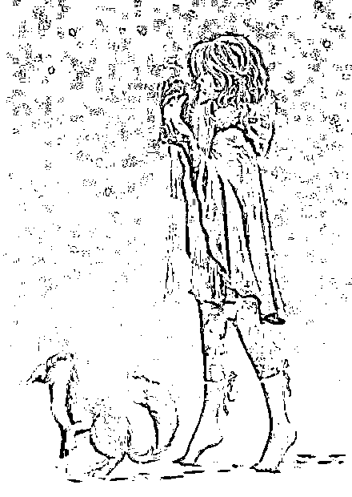

其实，**满月本身是非常有疗愈能量的。**朵琳·秋芙博士(Doreen Virtue)在“天使疗法”中，分享了满月前后合适做的事：

**满月前后你可以做这些事**

*   **满月前一晚，被称为“能量补充夜”，亦是显化奇迹的夜晚。**月光有神奇的疗愈能量，不仅对人体有光疗作用，也会让植物更好成长。如果将水晶或其他物品置于最能接受月光的位置，能起到非常好的净化、补充能量的作用。

*   **满月被称为“释放之夜”，你可以将任何想要释放的交给月亮。**可以在脑海中进行，或写下你想要放下的事物，在满月下焚烧或掩埋这张纸。

*   在月圆的三个晚上（满月夜前、满月当晚、隔夜）进行月光浴，使人神清气爽而文思泉涌。

这是 2016 年的第一个满月，也是农历新年前的最后一个满月。让我们一起展望丰盛的将来，释放过往的压力与伤痛，借这个狮子座满月闪耀的自信光芒，达成自我疗愈，并把爱与光扩散给更多的人。

 

长按二维码，让金钱涌向传播知识与智慧的人~

 

**◆ ◆ ◆  ◆ ◆**  

 ****特别提醒：****本文由作者授权首发于若道，转载请注明“转自若道”。**** 

狮子座满月，释放不适合自己的事物，开始学习一门新学问吧！**2016 年 3 月 15 日**，大卫老师主讲的若道占星核心课程**Level 5**要开课了！在这个阶段，你将学习各种预测技术及行星周期。通过这些预测工具，你能够预测和规划人生。提前报名付款有**早鸟价**哦！详细内容请点击“**阅读原文**”了解。

↓


# 管他什么蛇夫座，你是什么座还是什么座！

> 原文：[`mp.weixin.qq.com/s?__biz=MzA5NjA0NTAxNg==&mid=402636248&idx=2&sn=5d4da251341a9065c24ad1bd6483c3a4&chksm=02bd0f6f35ca86795143369602893564f5f06657273121e522772997535e200168cf48538901&scene=126&sessionid=1692738882#rd`](http://mp.weixin.qq.com/s?__biz=MzA5NjA0NTAxNg==&mid=402636248&idx=2&sn=5d4da251341a9065c24ad1bd6483c3a4&chksm=02bd0f6f35ca86795143369602893564f5f06657273121e522772997535e200168cf48538901&scene=126&sessionid=1692738882#rd)

今天，若道君在后台收到了宝宝们焦急的提问：

“听说蛇夫座成为黄道‘十三宫’的一员了，只有从 11 月 24 日到 11 月 29 日这五天出生的人才是天蝎座。这是真的吗？我把自己的星座搞错了吗？”

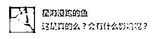

消息出自国外网站，一波天文学家将 12 个星座增加为 13 个星座，在天蝎座与射手座之间增加一个“蛇夫座”，有人由此担心，天蝎座要退出历史舞台了！？

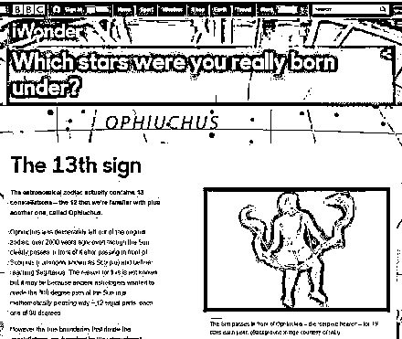

一些占星爱好者们被搞得一头雾水，甚至对占星学产生了动摇。咳咳，若道君就在这里粉碎一下谣言——

**无论天文学的星座怎么变，你出生星图上的星座是什么还是什么，不！会！变！**

谣言粉碎

**●问：我们常说的星座到底是什么？**

**答：**黄道星座（Zodiac Signs）是把黄道，即地球绕太阳运转轨道平均划分 12 等分，每一等分为一个星座。一个圈 360 度，平均 12 等分，因此每个星座分为 30 度。我们所说的星座跟天文星座没有毛关系！

你可以把星座想为黄道的切糕！12 星座的起始星座白羊座的开始。其实是每年太阳运行到春分点（即黄道和赤道的一个交点）的时候，跟天上的白羊座没有关系。现在天文学家还用白羊座的符号作为春分点的标记。

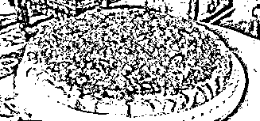

**●问：那么星座怎么用了天文星座（Constellations）的名字呢？ **

**答：**因为当古人命名星座的时候，天文星座白羊座恰好在春分点的位置，因此就借用了天文星座的名字，其他的星座也依次推移了。

打个比方：以前老王住的胡同，被取名为老王家胡同。之后老王搬走了，但胡同还是叫老王家胡同！胡同和老王毛关系也没有！胡同不会搬，胡同也没有消失，只是老王搬了。你要找那个胡同，你不会去找老王现在住哪！

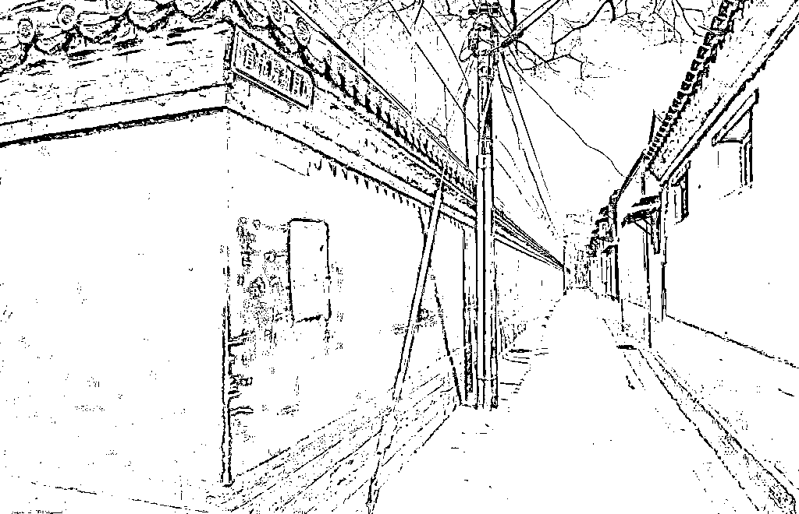

**●问：黄道星座会变来变去吗？**

**答：**黄道星座是非常稳定的测量体系，是季节的日历，是时间的测度。它测量的是地球绕太阳运行的轨道，不过用的单位不是月、日这样的单位，而是度数。

而天文星座则不同。我们所说的星空里的星座，不过是古代社会的人们把点点恒星连成线，想象它们是一个“星座”的游戏。其实这些星座的恒星并非一个有机的整体，星星和星星之间相隔几百万或几亿光年的。每个文化都有自己的星座，希腊人的星座、中国人的星座、阿兹克人的星座都不同。如果你愿意，也可以仰望星空，然后把星星连成线，命名为自己的星座。

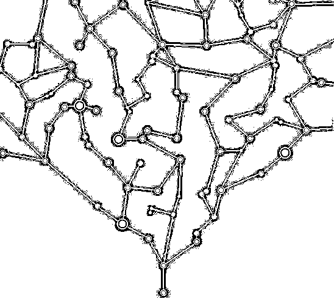

**●问：什么时候占星师就在做谣言粉碎的事了？**

**答：**2000 年前占星师就在做这个事情了。天上的星座并不是一个稳定的测度指标，但春分点、夏至、秋分点、冬至却非常稳定，这一点占星家们 2000 多年前就知道了，可惜因为大众对占星学并不了解，所以就容易被误导！

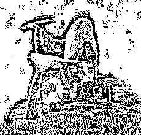

**打个总结就是：**这种同样的“老”新闻每几年都会老调重弹一次。担心自己出生星图的“天蝎座”改为“蛇夫座”的星座爱好者，完全没必要！

**◆ ◆ ◆  ◆ ◆**

**特别提醒：******本文由若道原创，**享有版权，转载请注明“转自若道”。**

有关黄道星座与天文星座的区别，在大卫老师的初阶课程上就会学到！**2016 年 3 月 10 日**，大卫老师主讲的若道占星核心课程**Level 1-2**要开课了！他将带领你学习星座、太阳、月亮、行星、月亮交点等知识，让你进入占星学的世界！提前报名付款有**早鸟价**哦！详细内容请点击“**阅读原文**”了解。

↓


# 原来，“活佛认证”是星星给闹的

> 原文：[`mp.weixin.qq.com/s?__biz=MzA5NjA0NTAxNg==&mid=402614627&idx=2&sn=909aec7e8a1f776939d54abea9c329fe&chksm=02bddbd435ca52c2147a0f10498e996bd0021f2fe4fea5b6d6cf3c057ce5c24f3e2417bad10c&scene=126&sessionid=1692738882#rd`](http://mp.weixin.qq.com/s?__biz=MzA5NjA0NTAxNg==&mid=402614627&idx=2&sn=909aec7e8a1f776939d54abea9c329fe&chksm=02bddbd435ca52c2147a0f10498e996bd0021f2fe4fea5b6d6cf3c057ce5c24f3e2417bad10c&scene=126&sessionid=1692738882#rd)

作者/大卫·瑞雷

译者/Elle

占星学是一门整体性的科学，它在当前星象与我们身边发生的事件之间建立起了富有意义的联结。最近，大卫老师在《中国日报》英文版上发现了一些“有趣”的新闻，看到这些新闻，他乐了。嘿！在同一天的新闻上，他随随便便就找出 5 条，最近射手座土星与双鱼座海王星之间的四分相赫然出现在报纸标题上。当然，学习占星学的同学们肯定也能发现。

1“活佛”也要领证了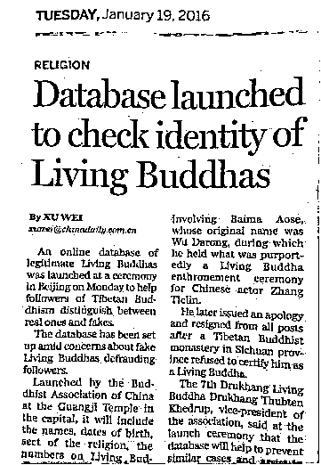
▲《活佛查询系统正式上线》

●土星=建立一个法律的身份或系统

●射手座=宗教、哲学、真理

●四分相=对于一个问题的纠正

●海王星=灵性议题，灵性人物的真假判别

●双鱼座=同样代表灵性取向，欺骗与启迪

结合这个相位组合，我们可以得到一个有关“如何建立精神领袖合法身份”的参照，例如“活佛”。

2 机器人要抢人的饭碗？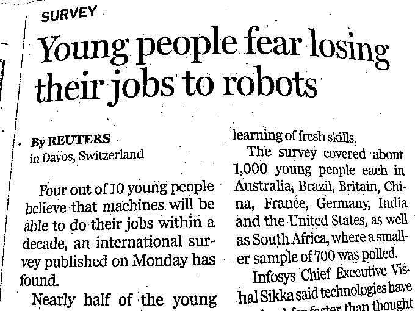
▲《年轻人害怕因机器人的出现而丢掉工作》

●机器人=天王星

●四分相=冲突，反应了需要解决的问题

●冥王星=害怕失去，害怕被取代

这个标题则清晰对应了过去几年的主角——天王星与冥王星的四分相。

3 中国人最有爱心了

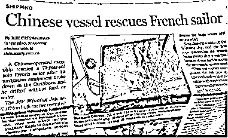
▲《中国船只营救法国水手》

●海王星+双鱼座=海洋中的船只、水手

●土星四分海王星=问题

在这个例子中，一个法国水手获得了一艘中国船只的营救。同时火星正入相位地三分海王星，而营救活动挽救了这位水手的性命！

4 再不节约能源就没了


▲《先进的海水处理设备削减耗能》

●海王星+双鱼座=海水

●土星=找到一个更有效的方法来利用某物，节省能源。

这里我们看到一则令人开心的消息：一种新的海水处理设备可以在淡化海水的同时削减耗能。这显示了土星四分海王星建设性的结果，在这个过程中不仅节省能源而且还将咸的海水变成了淡水！

5 自由何其珍贵

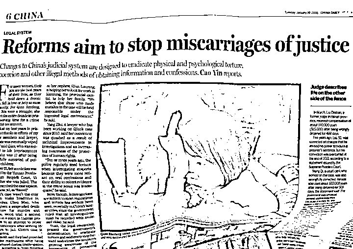
▲《改革旨在结束审判不公》

●海王星+双鱼座=监狱、囚犯

●射手座=真理与自由

●四分相=正在被更正或需要被更正的事物

这篇文章显然是一篇积极的土星在射手座、土星四分海王星的文章，其中提到释放那些被误判而服刑的人们。文中展示了伴随司法制度的改革，有不少曾经被误判的人得到了释放。也就是说，“真理将带给你自由”。同样的改革在世界其他的地区也正在进行中，例如美国。

**★看到了吗？占星学无处不在，只待你去发现。让我们一起，透过占星学的镜片检视生活。你发现了哪些身边的占星学事件？欢迎留言。**

**◆ ◆ ◆  ◆ ◆**

****特别提醒：****本文由作者原创，若道享有版权，转载请注明“转自若道”。****

我们一直生活在星空之下，受星体行进的影响。**2016 年 3 月 15 日**，大卫老师主讲的若道占星核心课程**Level 5**要开课了！在这个阶段，你将学习各种预测技术及行星周期。通过这些预测工具，你能够预测和规划人生。提前报名付款有**早鸟价**哦！详细内容请点击“**阅读原文**”了解。

↓


# 他为什么就是不爱你？

> 原文：[`mp.weixin.qq.com/s?__biz=MzA5NjA0NTAxNg==&mid=402614627&idx=1&sn=572c3045aebf4eae656631ae9635128d&chksm=02bddbd435ca52c24916b094f5f9a3fe7ab5f15984f2617cd1947304be0913927726c4a1351a&scene=126&sessionid=1692738882#rd`](http://mp.weixin.qq.com/s?__biz=MzA5NjA0NTAxNg==&mid=402614627&idx=1&sn=572c3045aebf4eae656631ae9635128d&chksm=02bddbd435ca52c24916b094f5f9a3fe7ab5f15984f2617cd1947304be0913927726c4a1351a&scene=126&sessionid=1692738882#rd)

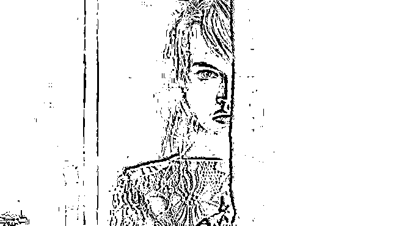
作者/轩轩 Zoe

图片/花瓣网

从小被母后大人追在身后说“你长得不够好以后怎么找男友”是怎样一种感受？单恋七年的感情只持续了七天就被对方否定是怎样一种感受？经历了种种不被人爱、不自爱，现在能够坦然说出“如果你喜欢我，那太棒了！如果你不喜欢我，那太可惜了，但我也不会取悦你。”又是怎样一种感受？

偶然得知，曾经非常喜欢的人恋爱了。那段青涩而深刻的岁月，一幕幕在眼前闪现。单恋了七年的感情，却在七天被他否定。即使是数年后喝醉了酒，也会反复问自己：“为什么，为什么他就是不肯喜欢我？我到底哪里不好？”内心一度低沉，之后也再单恋过别人，也被别人单恋过，可就是无法踏出恋爱那一步，直到……

1

**你爱自己吗？**

直到有一天，我在《人生的十二个面向》中读到：**“土星落入第五宫的人甚至不允许自己去享受一块蛋糕，更何况是爱情呢。”**

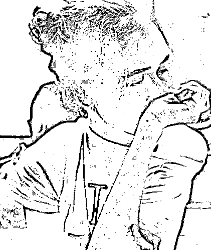

泪如雨下。我至今还记得曾经的自己有多“丧心病狂”。我很喜欢糖，却从不肯多吃。寒假回家，妈妈买了一袋我最喜欢的大白兔奶糖。可是我直到开学离家也没有拆袋。它静静地躺在书桌的抽屉里，实在想吃的时候，就拉开抽屉。如同一个神圣的仪式，注目数分钟，然后再静静地将抽屉合上。似乎，那样就已经满足了体内每一个渴望甜食的细胞。

读到那句话之后，伴随着泪水的是对自己的嘲笑。你连一颗到手的大白兔都不肯赏给自己，还奢望爱情吗？也是从那时候开始，我问自己：你爱自己吗？

**第五宫的意涵** 

占星学中，**第五宫是代表恋爱的宫位**，而更深刻地，它代表的是**尽情表现自己、享受生命的乐趣****。**第五宫是太阳，要给予大地温暖；也是狮子座，要站在聚光灯下展示自己，被鲜花和掌声所环绕。

*   可是现在，**土星摩羯座落在了这里，浇灭了光和热。**

*   一颗冰冷的心，如何还能自在地去表达自己的独特性呢？

*   我会害怕，害怕自己的一言一行会不被认可和喜欢，害怕如果太放松的话便会被排斥。

*   我谨言慎行、蹑手蹑脚，把自己捆绑在土星的冰天雪地里。

这样的自己，连我都不喜欢，谁还会喜欢呢？

2

**你为什么不爱自己？**

实际上，**土星五宫并不一定意味着如我般的胆怯和不自信，这只是它的低阶表现。**那么我为什么曾经成为那样的自己？

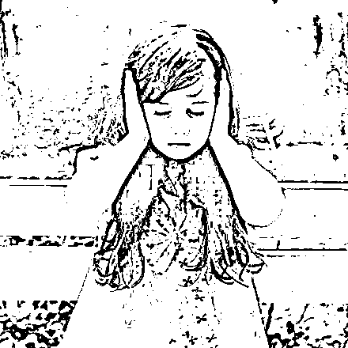

**要了解在第五宫的领域为何不能自在表达自我，就需要看看潜意识的自我是怎样的、以及自我在早期环境中是如何成长的——那就是第四宫。**滑稽的是，传统的吉星、美好甜蜜的金星就落在我的第四宫，还合相下中天。这看起来是多么备受祝福的配置啊，可是我却没有感受到它应有的幸福。

*   我的金星落在射手座、对分紧密合相中天的双子座月亮。

*   金星射手座可以是自在地享受爱情，而曾经的我所领略到的更多是**对自我价值的评判。**

*   射手座就像神一样，站在制高点，评判我：你一点都不漂亮，你一点都没有价值，你简直太糟糕了！而这个神，就是在中天的那颗严苛的月亮！

**我的母亲常常说我：**

*   “等你长大后，你要去做个双眼皮，你眼睛太小了。”

*   “以后你垫个鼻梁吧，也太塌了。”

*   “你个子这么矮，以后怎么找男朋友啊？”

*   “如果你不是女孩的话，我和你爸就不会离婚了。”……

那时候回想到这些话的时候，心里隐隐作痛。原来我作为女性的价值，都被一一否定了。或许在内心的某个地方，我根本不认可自己是个女孩子，也更加不认可自己可以获得别人的爱意。

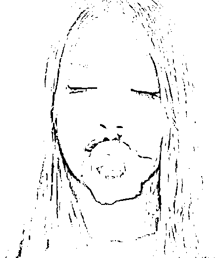

可是我不相信，那么多年，我始终坚定地认为我的母亲多么爱我，她独自抚养我长大，多么爱我。为什么我的潜意识里却全是她不爱我、没人会爱我呢？在一系列心理斗争之后，我决定正面这个问题。

放假回家的时候，我开玩笑地问妈妈：**“你以前怎么常常说我要整容，不然没人爱呢？我有那么差吗？”**

妈妈怔了一下，半晌，她说：**“你在我心里是最棒的啊！我只是希望你更好，希望你能有更好的归宿而已，不要像妈妈一样。”**

原来是误解。**她以一种年小的我所无法理解的方式爱着我，而我在不知不觉中受到了伤害，并且一直影响着我对自我价值的认知。让我不肯相信会有人爱我，也不敢真正地去爱自己、做自己。**

3

**你其实很棒！**

回想起来，我单恋许久的人却不喜欢我的时候，我问自己的确实是：**“我到底哪里不好？”**甚至会拿自己跟他的前女友做比较——嗯，的确，人家比我高、比我漂亮、比我活泼……在爱情里，当对方不中意自己的时候，总会不自然地觉得是自己配不上他，是自己这不好那不好，却从未想过，可能仅仅是**自己的魅力不符合他的价值观而已。**

我最喜欢占星学的一个地方，就是**认可了个人的独特性。**

*   每个人都有一张独一无二的星图，这张星图所展示出来的才能和魅力也是不尽相同的。

*   而每个人的审美观、价值观更是难以统一，我们又如何能保证自己的“美”就恰好是对方所喜爱的呢？

*   占星学会用两人的比对图来分析彼此的吸引力和匹配度，你对一个人的魅力所在，可能对于另一个人来说恰是最厌恶的地方。

*   既然如此，为什么要苛求自己满足所有人的喜好呢？魅力和喜好本身并没有是非对错呀！ 

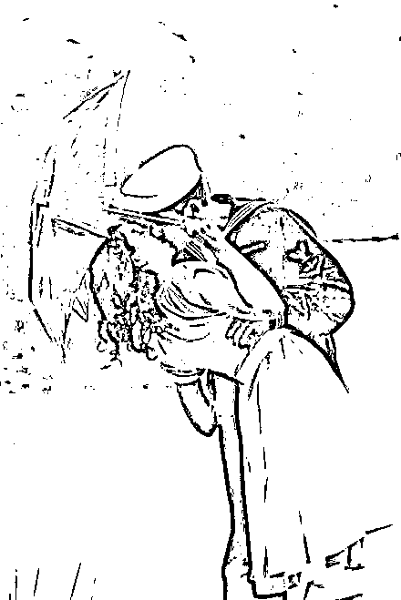 

我，作为一个独立的个体，有着自己的独特性、创造性。如果你喜欢，那太棒了！我们一起玩吧！如果你不喜欢，那太可惜了，你走吧。我不要也不会取悦你，因为我知道我很棒，我也知道爱情的存在是为了让我快乐欢笑。**我不会为了乞求你的爱，而委屈自己、隐藏真实的自我。**我知道，**只有在我真正做自己的时候，我才能完全释放魅力，让全世界都为我喝彩——而这也正是恋爱五宫的意涵！**

**你的桃花什么时候会来？**

亲爱的朋友，如果你也一直渴望爱情而不得，何不问问自己：**“我爱自己吗？”**

如果答案是否定的话，你可以回想自己的成长过程——你觉得自己受到了父母之爱吗？没错，真正的自信来自内在，但我们都不是圣人。最初的自信都来自于父母家人对自己的浓浓爱意。如果你觉得父母不爱你，或许其中存在误解。鼓起勇气去面对，也许你能发现新的天地。

不要再问桃花运什么时候来了！**只要你自信、真心渴望爱，桃花迟早会来。**

**作者介绍**

**轩轩 Zoe**：90 后准妈妈一枚。若道 2015 届 COAC 学员，师从大卫·瑞雷、诺·泰尔等，现为占星翻译。

**微信公号**：1986 的异想世界

 长按二维码，让金钱涌向传播知识与智慧的人~

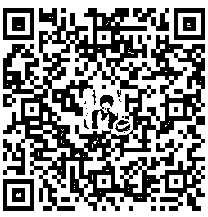 

**◆ ◆ ◆  ◆ ◆**

****特别提醒：****本文由作者授权首发于若道，转载请注明“转自若道”。****

爱情从来都不是简单的事，与其坐着等待，不如先来疗愈好自己。**2016 年 3 月 10 日**，大卫老师主讲的若道占星核心课程**Level 1-2**要开课了！他将带领你学习星座、太阳、月亮、行星、月亮交点等知识，让你进入占星学的世界！提前报名付款有**早鸟价**哦！详细内容请点击“**阅读原文**”了解。

↓


# 天王星来信：这一生，你是否该勇敢一次做自己？

> 原文：[`mp.weixin.qq.com/s?__biz=MzA5NjA0NTAxNg==&mid=402605721&idx=1&sn=23a27e187348963de83272b6ef15a5c5&chksm=02bdf42e35ca7d3890e5944311d963920c6b4e52a10db23f2bb1781b308751300e175e4c8ae6&scene=126&sessionid=1692738882#rd`](http://mp.weixin.qq.com/s?__biz=MzA5NjA0NTAxNg==&mid=402605721&idx=1&sn=23a27e187348963de83272b6ef15a5c5&chksm=02bdf42e35ca7d3890e5944311d963920c6b4e52a10db23f2bb1781b308751300e175e4c8ae6&scene=126&sessionid=1692738882#rd)

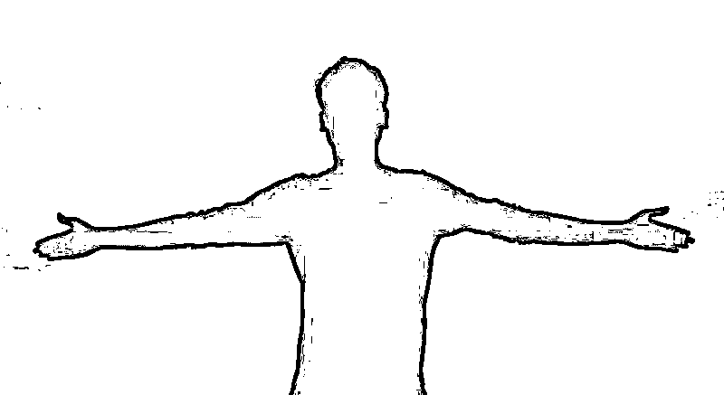

“世界这么大，我想去看看。”这封著名的辞职信引发了无数人对于自由的怀想。自由和秩序、创新和传统，两股力量如何平衡？可不可以在人生路上坚持自我而又不误入歧途？这是需要土星和天王星共同完成的使命。我们不要盲目地做自己，而是保有自我意识和独特性，这才是对人生最大程度的尊重和负责。

**这里没有规则，我们只是在尝试些新的东西。** 

——**托马斯·爱迪生**

1

**你是否听过这样的声音？**

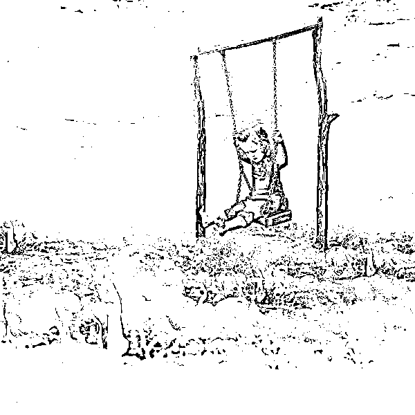

○ 在我们还小的时候：

**“你看张叔叔家的欢欢怎么那么文静，你怎么像男孩子一样？”**

**“你看人家小强多爱学习，成绩总是排名前三，你看你……”**

○ 当我们长大了之后：

**“你看她一把年纪了还不结婚，真要做李莫愁啊！”**

**“你看他放着好好的稳定工作不做，非要去创业，哎……”**

**“你看他怎么和正常人的想法不一样，不知道脑子里装的什么！”**

这些声音你耳熟吗？有没有曾经萦绕在你的耳畔过呢？或许这曾是你教导他人时的固定辞令。

而在这些声音里或多或少都夹带着些恐慌，而这恐慌源自何处呢？此乃源于某个发射指令的装置，发出的指令内容包括：“怎么可以不跟随大众的脚步？”，“怎么能与主流文化相违背？”，“怎能落于人后？”……

2

**声音源自何处？**

刚开始这些指令是单向由外向内输入的，输入者是我们的父母，我们的兄长，我们的老师。时间久了，这个声音在我们体内渐渐埋下种子，生根发芽，根深蒂固，最终这根管道衍变成双向的，我们在接受的同时也在负责主动向外输出。

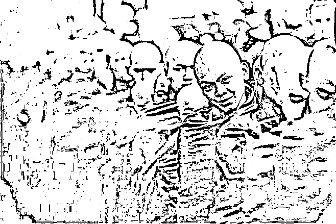

一代又一代，一辈又一辈就这样不断的接力着，循环着。鲜少有人质疑这其中的有效性，因为大家都是如此按部就班地传承着。若你不这样干，或偶尔在这根管道中发出些不一样的声音，那就有可能被视作为叛逆者或不孝者，有被当作异类的危险。而谁也不想成为别人眼中的异类，于是我们放弃内心的渴求与追寻，尽可能地让一切在规则之中、在轨道之上运转。**最后我们成为了我们被教导成的样子，成为了自己本不是的样子。**

*   **即便不想盲目投入到婚姻中，也未做好准备担负起责任，但在父母的不断施压、亲朋好友们关切的目光之下，你草草结了婚，生了子。你选择了妥协。**

*   **即便你的梦想是成为一名小提琴手，但是你的父母一致认为男生搞艺术将来根本养活不了自己，而帮你选择了医科专业。为了不违背父母之命，你放下了小提琴，拿起了手术刀，你选择了背弃理想。**

3

**土星过度发挥的诟病**

而这不断被传承的装置和指令融在占星学里，它隶属于**土星**的疆界。

**土星的建设性和破坏性表达**

**土星代表规矩和原则，体制和框架。**它带给我们秩序与安定。古语言：“无规矩何以成方圆”，这是对土星能量建设性的表达。

但任何能量都有它无法企及的疆域，如果使用过度，把它视作唯一遵循的准则，那会带来一些麻烦和副作用，规范我们行为的准则最终将演化成禁锢我们灵与肉的枷锁。最后只剩下内心难以抑制的焦虑以及常常泛起的慌乱。 

在土星能量被过度使用的疆域之下，**主流文化与价值观成为了我们心中那座不可逾越的高山，我们那颗禁锢的心很难去接受一些新鲜的事物和理念**。我们在心里共同默念着一首史诗：“我要保持队形，不能掉队，更不能落单，只有在大部队里，才是安全的万全之策。”而就在那整齐划一的队伍里，我们看似身处其中，但灵魂与真实的自我却不在那里面。即便从外表看起来繁花似锦，但里面却空空如也。

4

**年轻的天王星：革新**

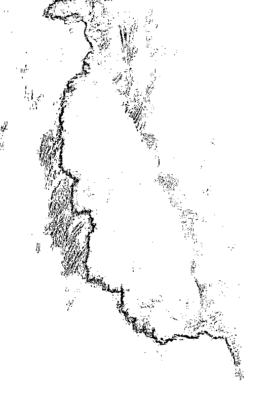

而宇宙遵循的是平衡法则，不会任由一种能量过度发展。在土星之外，天空中还有颗淡蓝色的星球在闪烁着它独有的光芒，那股光芒的能量同时也在我们的心中闪烁着，共振着，它若隐若现，忽强忽弱，那是来自天王星的光芒。

天王星，是身处土星光环带之外的第一颗被发现的外形星**。天王星与科学、高科技、太空技术、发明和专利相关。**它是水瓶座的守护星，现在你知道为什么水瓶座在大众的眼里会是个异类了吧，当然还是天才。天王星的能量代表着勇于创新，敢于打破传统与常规，发展出个性化，追求生命的独特性，不盲目跟从，最大化的客观。**天王星球族群是一个爱冒险，对生命和自我真实的族群。**

但与土星比起来，天王星族群还太年轻，它对于我们绝多数人而言是一个新鲜的血液，在保守派眼里，天王星似乎被视作是一个外来入侵者，而思想比较开明的人以及年轻人与它更加亲近。

5

**40 岁：危机 VS 不惑**

**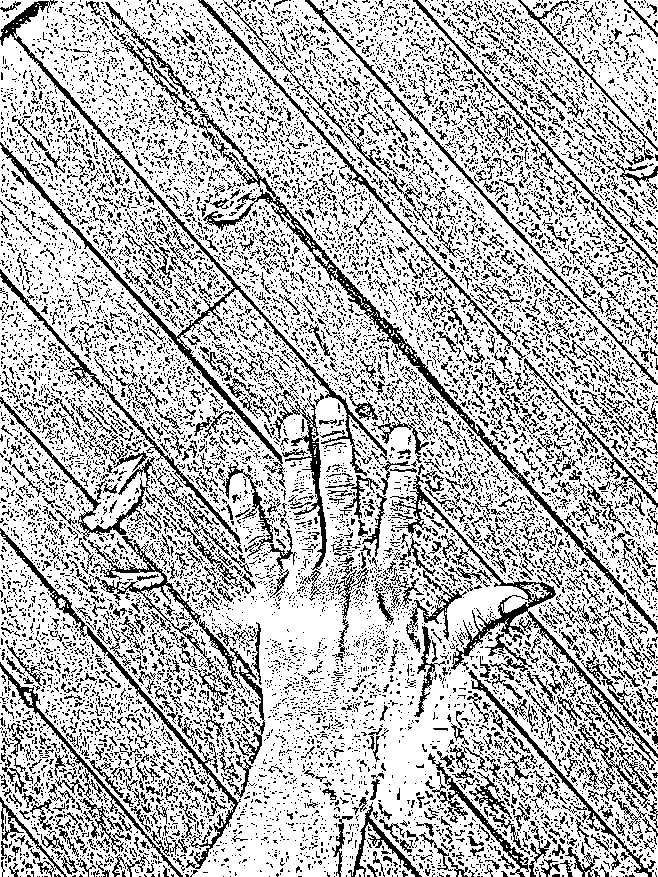** 

**40 岁被称为容易爆发中年危机的年龄，那是因为当我们在进入 40 岁左右的年纪时，行进的天王星对分我们出生星盘的天王星。**

那股强大的力量在我们的心识中形成巨大的能量波，**迫使着我们想要快速的脱离现有的生活状态，来场脱胎换骨的改变。**似乎所有冰封在心中对于自我生命的渴求瞬间得到了激活，想要快速离开这禁锢的牢笼。那由内向外导出的能量就如同是被压在五指山下的孙猴子，瞬间破石而出，要把积蓄了 500 年的骨子里的叛逆和躁动来个天翻地覆的了结，才够痛快。

**倘若天王星的能量在我们从小到大成长的过程中得到了较好的引导**，没有得到太多的压制，**一直处于阶段性的释放中，我们的个性化是被看见的，被允许的，那等到 40 岁的时候，或许迎来的不是内心的躁动，也不是危机，而是不惑。**

6

**如何疏导内心自由的能量？**

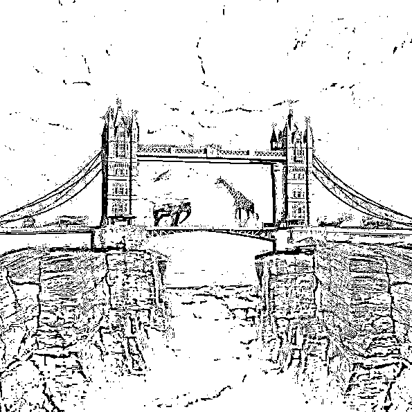

而我们正身处在一个好的时代，一个更加开明的时代，一个意识领域可以得到加速扩张的时代。而在这样的时代背景之下，我们又可以做些什么呢？

**给大家的几点建议**

►**若你为人父母**：请觉察下你对孩子的所有教导是否只专注在他的学业以及将来的仕途上，还是在这之余，也会**花些精力去关心孩子的个性化进程。**如发掘孩子的爱好与天赋；陪伴孩子出去走走，和孩子讨论他们眼中的世界。

►**若你是教育工作者**：当你站在讲台的那刻，你是仅向你的学生传送书本上的知识，教导他们要力争全年级第一，还是在这之余，**赋予他们书本之外的思想启迪和自我认知，给予他们鼓舞与引领。**

►**若你正处于 20 岁年纪**：你是否发现在你的内在有一些隐约的，专属于你自己的个性化正在逐渐显现。那可以是**对生命的某种向往与期待，也可以是对未来人生的某个愿景。**如果有，请仔细聆听，并保持关注，好好呵护它的成长。

►**若你早已进入而立之年**：即将迈入不惑，但你仍还在受限于旁人投向的的眼光，不断向命运妥协，不断背弃着心中的理想。请试着勇敢一点，不要让别人来告诉你，你的路应该怎么走，而是**听从自己内心的声音，请跟随你的心。**

6

**让理想照进现实**

行进的天王星在白羊座运转已经好几年了，在这期间，它和在摩羯座运行的冥王星在天空中形成多次的四分相，相互交手了多次。**这是一场改革者与传统派之间的角逐，**我们能从各个层面观察到这能量的显现。就彷如一个不知天高地厚的毛头小子在向一个古老的城墙不断敲击着，大声喊着：“放我出去！”

倘若你正是看守那城墙的守门人，当听到那一声声的叩门声时，你将如何应对呢？是故作淡定地假装没听见，还是被那传来的阵阵嘶吼声吵得终日心神不宁？又或许是将城门钥匙潇洒地抛给了那年轻人？

土星之外还有颗天王星的存在，它在宇宙及我们的心识中与其他的能量共同酝酿着我们的未来。**它代表着我们生命的独特性，以及属于我们每个人独一无二的天赋异禀。**

**请在你的出生星图中，找到天王星的坐标，将它点亮。让它照进你的理想，重燃你对生命的真实。**而这需要勇气，因为这可能会迎来亲人的不理解和旁人异样的目光，你冒着从主流队伍里落单的风险，或者会被视作一个局外人。

而在追寻对自我真实的道路上，有的时候或许是需要独自背起行囊上路的。在那条路上，你会遇见更加真实的自己。因为那本就是你。

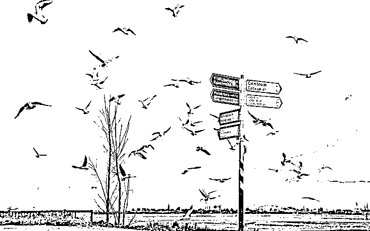 

**来自未来的信** 

在某个清晨的早晨，你的手机邮箱里跳出一封邮件。

寄件人栏里显示：**“天王星”**。邮件名是：**“来自天王星的问候”**。

你诧异地点击进去，邮件内容是：
**“请带上你的理想前行，不要受旁人眼光的影响和驱使，只有你自己可以选择在何处安放你的理想与心之所向。而这意味着你可能需要冒着成为一个局外人的危险，你愿意接受这个挑战吗？”**

在邮件的最下方有两个按钮：

选项一：**接受**；选项二：**拒绝**

而你，会选择哪个呢？

****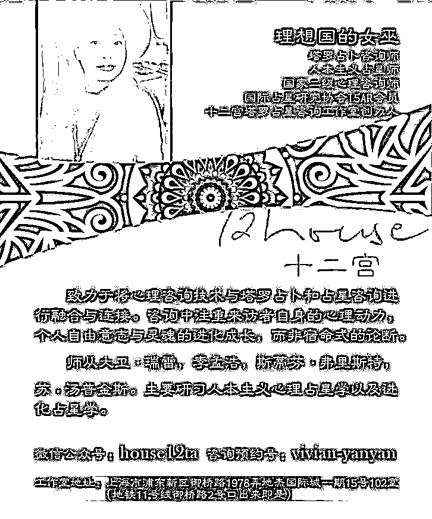****

长按二维码，让金钱涌向传播知识与智慧的人~


**◆ ◆ ◆  ◆ ◆**

**特别提醒：****本文由作者授权首发于若道，转载请注明“转自若道”。**

做自己，容易，却又不容易。认识自己，是第一步。**2016 年 3 月 10 日**，大卫老师主讲的若道占星核心课程**Level 1-2**要开课了！他将带领你学习星座、太阳、月亮、行星、月亮交点等知识，让你进入占星学的世界！提前报名付款有**早鸟价**哦！详细内容请点击“**阅读原文**”了解。

↓


# 爬上木星的肩膀，看到自己的绿洲

> 原文：[`mp.weixin.qq.com/s?__biz=MzA5NjA0NTAxNg==&mid=402605721&idx=2&sn=be54d3da343f370af93feb46261b4e93&chksm=02bdf42e35ca7d38d5e152f18b59b6b3567bf96337cbfa9891417f00979811dc75a053a207ef&scene=126&sessionid=1692738882#rd`](http://mp.weixin.qq.com/s?__biz=MzA5NjA0NTAxNg==&mid=402605721&idx=2&sn=be54d3da343f370af93feb46261b4e93&chksm=02bdf42e35ca7d38d5e152f18b59b6b3567bf96337cbfa9891417f00979811dc75a053a207ef&scene=126&sessionid=1692738882#rd)

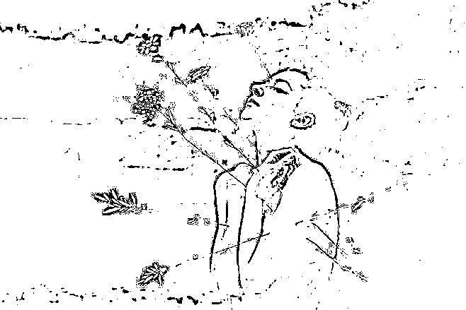

作者/Crystal

图片/花瓣

当太阳进入水瓶座，人际关系成了我们无法回避的话题。但对于不那么合群的人来说，要怎么与人联结呢？

不善交际的软肋

人际关系是我一个很重要的功课。我从小怕人，不合群，不易与人亲近，即使长大后有机会遇到很多志趣相投的人，也很难建立起深入而稳定的联结。孤独是一个持续的主题。

我曾经对自己在人际关系上的笨拙心怀不满，直到有一天我发现自己金星的弱势，才承认其实我已经做得很好了。我的金星不但逆行又落陷白羊，还与天王星、海王星四分，海王星可是我星图里最强势的行星之一呢。 

人的头脑有一个顽固的倾向，就是偏偏想要成为自己所不是的样子，比如说黄种人以白为美，白种人却不择手段地想把自己晒黑。金星不给力的我，曾经深深羡慕那些人缘极好、在各种关系中优雅自如的人，却忘记了正是孤独给了我深度与灵感。

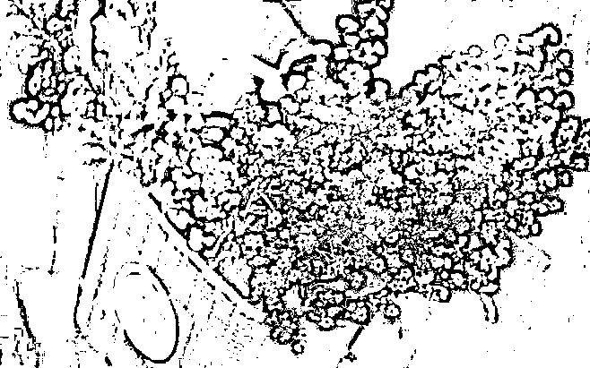

解药：融入志同道合的圈子

不过，金星并不是人际关系唯一的出路。

我上升点在射手，对应的守护星木星根据不同的分宫法落在十宫或者十一宫，位于天秤座。简单来说，木星意味着信心、幸运和扩张，天秤座主管关系，十宫代表在世间的角色与事业，十一宫代表社群与志同道合的朋友，这正是我人际关系的一条出路。

我其实很少为社交而社交，尤其是在国内的时候，可能一个月都不会专门约朋友吃一次饭。但我对世界充满好奇，时常参加一些感兴趣的活动，也因此得以接触一些有共同爱好的人。

我有很多朋友都对身心灵和艺术感兴趣，这个圈子小得不能再小，时常在微信朋友圈里发现“咦你们俩也认识啊”。而在北京时，我最有归属感的两个社群，一个是接触即兴舞蹈，一个是性与性别公益。

我从小就爱跳舞，而接触即兴舞蹈提供了一种在当下与他人连结的方式，在沉默的舞蹈里，我们丢开种种标签，回归最单纯的人与人之间的默契与亲密。我在舞蹈里认识了许多极有意思的人，联结从舞蹈室里延伸到了舞蹈室外。

至于性与性别公益圈，则侧重于思想的碰撞和三观的不断刷新。从最开始的活动参与者，到后来的工作坊协作者、翻译志愿者、微信文章作者，我也因此得以有规律地接触一帮有趣的人。

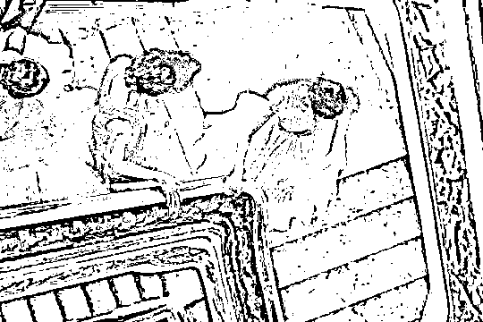

“有规律地接触一帮有趣的人”对我是非常有帮助的，这两个社群的常规活动和持续工作，让我不至于因为懒得专门见人而缩在自己的世界里，与他人失去联系。**长期的接触能够帮我建立一个结构，帮我落地**，正如一个在舞蹈中认识的朋友所说：“你跟自己的情绪和感受很有连结，但你也有可能迷失在它们之中，一些常规的事务会对你有帮助，哪怕是每天在一个固定的时间喂猫。”

对怕人的我来说，为社交而社交是充满压力的，而**“在一个社群里一起做有趣的事，顺便社交一下”则化解了这种压力。**找到喜欢的社群是件难得的事，类似学校、单位、同乡会这种基于方便的组织，未必能给人社群的支持感。

去年秋天，我从北京飞到了巴黎。在异国的近四个月时间里，我陆陆续续见了不少人，然而，即使聊得挺开心，却常常见过一两次就不了了之，并没有建立起深入稳定的联系。为社交而社交这件事，大概真的不是我的强项。

**今年年初，我梦见自己和北京的两个社群一起，重新跨了一次年，梦醒之后，我更深地认识到，社群对我是多么重要。**或许是从一对一的社交转向进入社群的时候了。

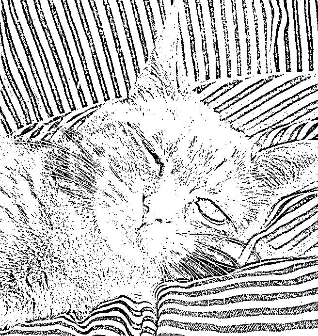

我认为，没有“无药可救”的星图设置，星图是一个百宝箱，而不是一纸判决书。

**生命的道路多种多样，即使我无法乘着金星的翅膀飞向关系的乐园，也可以爬上木星的肩膀看到自己的绿洲。**

**作者简介** 

**Crystal**：一只被满天星辰感动得忘记折磨老鼠的猫。最喜欢挑战生命种种限制和幻相，带着爱与觉知在人间剧场中尽情玩耍。目前的工作是性别平等，对身心灵整体疗愈、神秘学、艺术等各种跟真相与美有关的事物充满兴趣。

长按二维码，让金钱涌向传播知识与智慧的人~

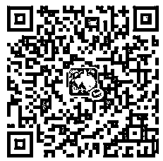

**◆ ◆ ◆  ◆ ◆**

**特别提醒：****本文由作者授权首发于若道，转载请注明“转自若道”。**

在水瓶月加入一个志同道合的社群！**2016 年 3 月 10 日**，大卫老师主讲的若道占星核心课程**Level 1-2**要开课了！他将带领你学习星座、太阳、月亮、行星、月亮交点等知识，让你进入占星学的世界！提前报名付款有**早鸟价**哦！详细内容请点击“**阅读原文**”了解。

↓


# 那位集齐 78 个❤的水瓶座，大家喊你去求婚啦~

> 原文：[`mp.weixin.qq.com/s?__biz=MzA5NjA0NTAxNg==&mid=402605721&idx=3&sn=afe5103c4c5ec88fe927a9478c27cd20&chksm=02bdf42e35ca7d38710e5f7f38c262092746108b0ef98feb19c13a0237046761e949f5a088e1&scene=126&sessionid=1692738882#rd`](http://mp.weixin.qq.com/s?__biz=MzA5NjA0NTAxNg==&mid=402605721&idx=3&sn=afe5103c4c5ec88fe927a9478c27cd20&chksm=02bdf42e35ca7d38710e5f7f38c262092746108b0ef98feb19c13a0237046761e949f5a088e1&scene=126&sessionid=1692738882#rd)

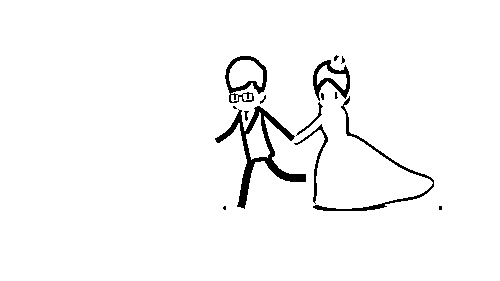

在昨天的**[头条文章](http://mp.weixin.qq.com/s?__biz=MzA5NjA0NTAxNg==&mid=402595930&idx=1&sn=d7fbec9bb4395be02fc59f99d1345e79&scene=21#wechat_redirect)**（点击可阅读哦）评论里 

出现了一条**神秘的留言**

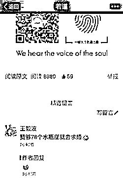

▲赞够 78 个就求婚的水瓶座

那，若道君告诉大家

在这个水瓶月里 

**什么天马行空的事儿都会发生哒** 

这么好的事儿怎么能不支持哪

于是在朋友圈里出现了如下的场面

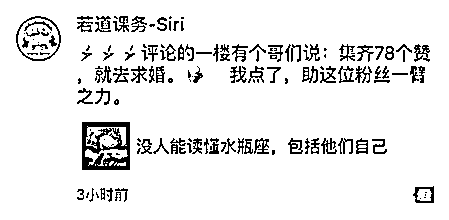

▲**课务小 Siri 被感动了**

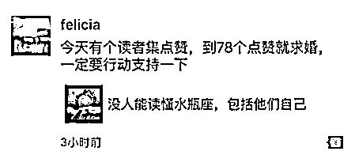

▲**若道的老大蒋总也被感动了**

在大家的爱心转发后

消息发出短短几小时的时间

点赞数已经是这样

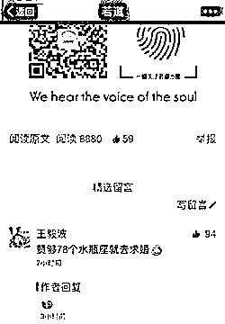
▲**94>78**

好吧，若道君想说

**王毅波**

**我们大家喊你去求婚啦**

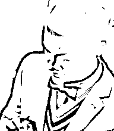

如果你求婚成功

请在后台悄悄告诉若道君

作为见证人

我们会给你发送一份**神秘礼物**哒

也祝所有有情人终成眷属

**爱她就勇敢地去求婚吧**

# 若道 Level 1-2 | 让你从星座小白变身星座达人

> 原文：[`mp.weixin.qq.com/s?__biz=MzA5NjA0NTAxNg==&mid=402605721&idx=4&sn=012b2ca73c0da74ca0bcbc86fd993564&chksm=02bdf42e35ca7d3844bcafd1d1ca5b8ad5eab57d293adcd823dc7296305f0cefd61379340588&scene=126&sessionid=1692738882#rd`](http://mp.weixin.qq.com/s?__biz=MzA5NjA0NTAxNg==&mid=402605721&idx=4&sn=012b2ca73c0da74ca0bcbc86fd993564&chksm=02bdf42e35ca7d3844bcafd1d1ca5b8ad5eab57d293adcd823dc7296305f0cefd61379340588&scene=126&sessionid=1692738882#rd)


国际占星研究协会（ISAR）中国唯一指定教学机构

若道 2016 年占星核心课程 Level 1-2 上线

**这是一趟“星座小白”到“星座达人”之旅**

主讲人若道创始人**大卫·瑞雷**

**拥有四十年占星执业经验**

网络教学

全程即时翻译

不懂英文也没问题


**课程信息**

**授课时间：**2016 年 3 月 10 日**-4 月 28 日**

**授课老师：大卫·瑞雷（8**次**）、蒋颖（4**次**）**

**授课方式：**网络课

费用：**2400 元（2016 年 2 月 1 日前报名付款）**

**早鸟价：****1980 元（2016 年 1 月 25 日前报名付款**）

**报名截止：**2016 年 2 月 1 日

**课程负责人：王老师（微信号：2837474346）、童老师（微信号：80248863）**

**咨询电话：**400-619-1014

课服 QQ**：4006191014 （若道星文化）**

邮箱**：nodoor@vip.126.com**

课程简介


**星座、太阳和月亮**

12 星座是占星学最基本却又最深刻的概念，黄道 12 星座，是伟大的生命周期，而太阳和月亮是我们阴阳之本。

**●12 星座：**和大卫一起，深入了解 12 星座的特色。了解星座正面的、负面的表达，了解其资源，了解其破坏生命的模式。了解其原型人物、了解其指代的人事物。

**●12 星座原则：**按照极性、形态和元素给星座分类。

**●12 星座关键词：**关键词非常重要！是解读准确性的关键。

**●太阳和月亮：**了解你的太阳，生命的发动机，让你在世界闪光的方式，生命获得力量的方法；了解你的月亮，让你生命获得幸福的方法。了解它们，了解你生命中已经出现的、将会出现的男人和女人。


**遇见行星和月亮交点**

在这个阶段，你将遇见行星们，还有与灵魂的过往和未来相关的月亮交点。这既是你，你的性格，也是你在生命故事中将会遇到的人、事、物的显化，也是你灵魂轨迹的线索。    

**●内行星：**水星、金星、火星

**●中间行星：**木星、土星

**●外行星：**天王星、海王星、冥王星

**●灵魂的线索：**月亮南交点、月亮北交点

**●行星逆行：**行星逆行的天文现象和意义

**●宫位初解：**了解黄道 12 宫的基本含义

时间安排

共 12**次**课，24 课时。

**●8 次理论课程**（大卫老师主讲、配有中文实时翻译）

北京时间每周四晚 20：00-22:00

**●4 次线上互动课程**（蒋颖老师主讲）

北京时间每周一晚 20：00-22:00（3.14/3.28/4.11/4.25)

授课优势

**①先进的教学平台**

网络教学平台，支持手机、电脑、iPad 上网，可以随时随地学习。

**②回放复习**

学员可登录网站收看课程回放，在线复习课程，每次课可完整重看 3 次，课程结束后的 3 个月内有效。　

课程特色

**①与名师面对面**：北京同学可以来若道现场上课，和大卫老师面对面互动。大卫老师也可能前往主要学员所在城市，实现零距离教学。

**②互动答疑**：论坛、微信群随时提问；老师课上答疑；助教线上线下全程协助。

**③线下沙龙**：定期举办沙龙活动，复习上课内容。

**④强大的同学网络**：若道作为中国最顶尖的占星教学机构，在 4 年的占星教学中，培养了很多占星人才。若道让你和师兄师姐切磋，让你和国内著名占星师学习。（简单来说，就是，人脉！）网络授课，在北京开设免费现场参与名额，全程英文授课，配备实时翻译。

师资力量

**讲师团队**


****大卫·瑞雷（David Railey）****

若道创始人，《灵魂的目标》作者。拥有四十年的占星咨询的执业经验，曾两任亚特兰大占星协会主席，是全美占星师联盟（AFAN）、美国占星师联合会（AFA）、全美占星研究委员会（NCGR）、国际占星研究协会（ISAR）和职业占星师组织（OPA）的成员，是联合占星大会（UAC, United Astrology Conference）督导委员会委员。大卫曾是 CNN、CBS 的占星节目的常驻嘉宾，多次在 BBC、WGS、WSB、WRGG 等节目中接受采访，并在亚特兰大主持电视节目《每日行星（Daily Planets）》达 4 年之久。


****蒋颖（Felicia）****

若道创始人，职业占星师。在若道系统学习占星，师从大卫·瑞雷。长江商学院 MBA，厦门大学经济学硕士，化学学士。国际占星研究协会（ISAR）中国区副主席。第一批获得国际占星研究协会（ISAR）认证的职业占星师。《灵魂的目标》译者。

**助教团队**


****熊鹰（天空的空）****

国际占星研究协会（ISAR）认证占星师。在若道系统学习占星，师从大卫·瑞雷，现任若道专职助教。将传播系统、严谨、真实的占星学作为职业使命。与此同时，提供一对一占星咨询服务与生时校正咨询。目前正致力于占星学与个人真修实证的整合。2014 年起主讲读书会，助教答疑课程累计超过 100 小时。


****Gaff****

全职占星师，既是占星师，也是疗愈者。2013 年开始在若道进行系统占星学习，师从大卫·瑞雷。任 2015 年度诺·泰尔、斯蒂芬·福里斯特老师的占星工作坊助教。提供一对一的咨询服务（已有超过 100 小时的咨询经验），基于个案咨询的经验，曾多次开设面授的占星课程。


2016 年，和若道老师一起，开启占星的探索之旅！

报名请点击文末“**阅读原文**”。

长按二维码接通课程负责人~


# 没人能读懂水瓶座，包括他们自己

> 原文：[`mp.weixin.qq.com/s?__biz=MzA5NjA0NTAxNg==&mid=402595930&idx=1&sn=d7fbec9bb4395be02fc59f99d1345e79&chksm=02bd92ed35ca1bfb4e1d8e5a6c41dfe17a8b5002df6e807c6bd002608cf45c9048d434c33d39&scene=126&sessionid=1692738882#rd`](http://mp.weixin.qq.com/s?__biz=MzA5NjA0NTAxNg==&mid=402595930&idx=1&sn=d7fbec9bb4395be02fc59f99d1345e79&chksm=02bd92ed35ca1bfb4e1d8e5a6c41dfe17a8b5002df6e807c6bd002608cf45c9048d434c33d39&scene=126&sessionid=1692738882#rd)

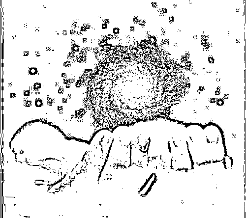
作者/杰夫·焦耳

译者/江艺、李含 校对/王宏

图片/花瓣网

1 月 20 日太阳就进入水瓶座啦，不得不承认这是一个很有逼格的星座有木有？一群总觉得自己不是地球人的怪咖有木有？一堆连他们自己都摸不透自己的另类有木有？让我们来看看大师如何剖析这个星座吧！本文由已故占星大师杰夫·焦耳于生前撰写。

1**读不懂的水瓶座**

**1 月 20 日，太阳进入水瓶座，开启了为期 30 天的水瓶月。**这段时期，水瓶座的冷静客观和无限创意将会更加耀眼。这是一次机会，让我们放下自己的身份，将目光投向我们所归属的不同群体。我们有朋友，有家人，有同事、同僚，甚至还有竞争对手，由此编织成的关系网络构建了我们的生活。

我已经实践占星学近 40 年了，在前 20 年的占星实践中，我很难真正理解水瓶座。我知道相关的流行语和概念，但从未以更深刻的方式完全掌握它们。我认为，我真正理解水瓶座的挑战，与其抽象本质和某些独特的特征有关。

2**没有人是孤独的**

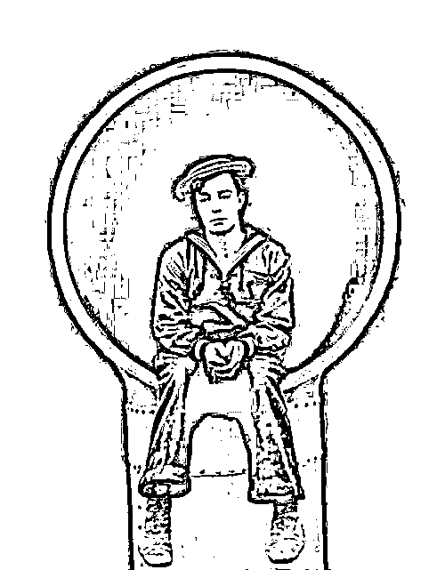

**水瓶座，亦称宝瓶座，并非水象星座。它是风象星座，与理智而非情感相关。**或许这代表了管理我们情感水域的思维力量。它还是一个固定的风象星座（处于一个季节的中期），这是难以想象的。在自然界中，固定的风是什么？我们并不知道，但是**在占星学中，它代表强大的思维。**

水瓶座是黄道带上的第十一个星座。它唤醒了这样一种理念：**所有人类都息息相关，通过携手合作，我们就能像神一样充满创造力。**运用集体的智慧引导我们体会爱与合作的目标感。这种精神属于头脑开放、胸怀磊落的水瓶座嬉皮士，以及其他进步的群体。不过也有一些人认为这些原则太开放，无法凝聚社会，而且我们必须依赖过去的经验智慧，比如宗教和传统，才能保证未来的延续。

没有人是孤独的。我们都是更大的群体、团体中的一员，人与人之间的纽带有血缘，有民族，有宗教，有人种、政见、职业、爱好、邻里、星座等等。我们在这些不同的群体中看待自己的方式在很大程度上塑造了我们的自我身份。

人类最基本的需求：陪伴、舒适和交流，当然还有食物和居所，都需要其他人的参与。我们是社会的物种，需要携手共存。虽然集体和个人利益变得更为分化了，但幸运的是，正如水瓶座教导我们的：这不是唯一的选择。

3**需要群体，却又保有自由**

**我有时将水瓶座看作热爱人性却厌恶人类的星座。那是因为它对人类的潜能抱有非常理想主义的态度，使得它很容易因我们所有人都有的缺陷和弱点而感到失望。**当太阳位于水瓶座时，或是当我们的出生图中有行星落入水瓶座时，接受他人的不完美可能是一项挑战。**学会在未能达到我们的最高期望时宽容自己和他人，这会带来同情心，以减轻负面评判的沉重负担。**

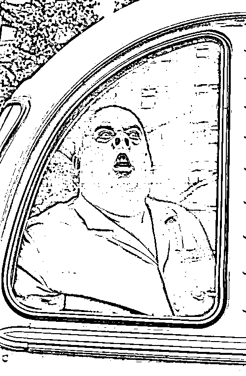

**水瓶座另一个复杂的面向在于它相信合作却又需要个人自由。**我们通常将这两点视作互相矛盾的驱动力，在大多数方面它们确实如此。然而这种反差正是这个星座最显著的特征之一。在我看来，这两个原则代表了一种理想的社会，在这个社会中，我们不仅认识到社会共同体的价值，同样还认识到其中每个人的自主权。

**具有长远眼光的水瓶座既不拘泥于旧有的理念和价值观，也不一定摒弃它们。这是一个兼容并包的星座，接受各种信念和实践，所以它的标志是自由。**

水瓶座与狮子座成对分相，狮子座是第五个星座，象征着自我意识。狮子座代表着个体的觉醒，对自我的意识。**水瓶座则代表着更高层次的个体意识，觉察到了自己的社会归属。**我们不会像狮子座那样认为自己是太阳系里唯一的一颗太阳，而是意识到自己与其他星体组成了灿烂的星群。**每一个人都是与众不同的光源，但也是更大光源群体中的一份子。**

在实际生活中，这种反差使得**太阳星座落在水瓶座的一些人显得非常叛逆。他们抵制外部控制，却仍然重视集体概念。**然而，志愿精神是对这个理念的很好诠释，这里我们有权利选择如何加入社会团体，加入哪种团体，而非被迫遵循专制的规则。但是，规则在任何社会中都仍然是必需的，而且也是个人的指导原则。

4**放下自我，投入共同的经历**

我之所以喜欢这些看似矛盾的水瓶座特质，是因为他们试图调和或包含政府中占主导地位的对立概念。绝对的个人自由是一种自由主义的理想，它掩盖了合作的必要性。绝对的社会控制可能破坏个人自由。当我们接受我们所有人心中的水瓶座特质时，就可以清晰地看到存在一个包含这两种观点的概念空间。**认识到集体利益和个人利益并不是两种完全不同的事物，而是同一枚硬币的两面，这可能帮助我们克服自我利益和与他人合作之间的分化。**

**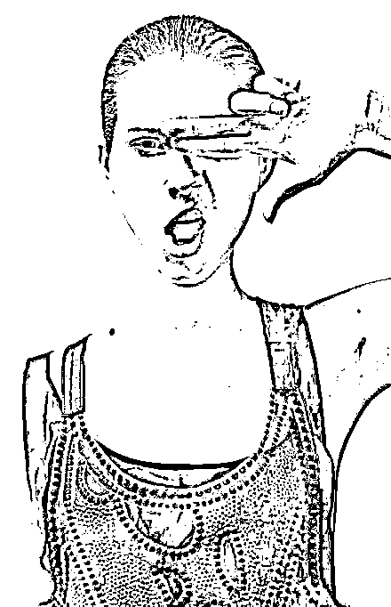** 

> #### **太阳会在水瓶座一直停留到 2 月 19 日，这段时间有助于：**
> 
> *   **放下自我，不要做一颗孤独的太阳，而是成为星群中的一员。**
>     
>     
> *   **将目光投向各种不同形式的共同利益和经历，这才是疏离和对立问题的解药。**
>     
>     
> *   我们首要的生存技巧是合作。但是，**承认我们的共同利益，并以此作为行动的出发点，这并非意味着对个体的否定。**

 水瓶座并不是一个旨在将群体利益凌驾于个体利益之上的权威体系。这不是一个二元对立的视角，它更像是一颗钻石，有许多的剖面，每一面都独一无二，但也是整体的一部分。


如果你有和水瓶座之间不得不说的故事

欢迎**留言**或**投稿**

投稿题目：《我为水瓶座代言》

欢迎各种形式

占星学科普、人生故事、漫画

来稿请发至邮箱：**astrology@nodoor.com **

**◆ ◆ ◆  ◆ ◆**

**特别提醒：****若道享有**本文**授权，转载请注明“转自若道”。**

想要更多了解水瓶座吗？**2016 年 3 月 10 日**，大卫老师主讲的若道占星核心课程**Level 1-2**要开课了！他将带领你学习星座、太阳、月亮、行星、月亮交点等知识，让你进入占星学的世界！提前报名付款有**早鸟价**哦！详细内容请点击“**阅读原文**”了解。

↓


# 塔纳斯来若道公开演讲，朋友圈被刷屏了

> 原文：[`mp.weixin.qq.com/s?__biz=MzA5NjA0NTAxNg==&mid=402595930&idx=2&sn=5c95df72995822a2d8ca81a9af1afe4e&chksm=02bd92ed35ca1bfb4f24b0f657c02ae1fe4ea05fc1c50766b94ac378763c3ba9c9e9adcbe5b6&scene=126&sessionid=1692738882#rd`](http://mp.weixin.qq.com/s?__biz=MzA5NjA0NTAxNg==&mid=402595930&idx=2&sn=5c95df72995822a2d8ca81a9af1afe4e&chksm=02bd92ed35ca1bfb4f24b0f657c02ae1fe4ea05fc1c50766b94ac378763c3ba9c9e9adcbe5b6&scene=126&sessionid=1692738882#rd)

周一晚上，在国际占星学界享有盛名的理查德·塔纳斯教授来到北京若道，为广大占星学子奉上了一场有关原型占星学的公开演讲。若道办公室被 30 多名前来场瞻仰大师风采的学员挤满，线上还有 200 名学员通过网络参与活动。以下是活动现场花絮以及各位同学的反馈，一起来感受此次活动的热度吧。 

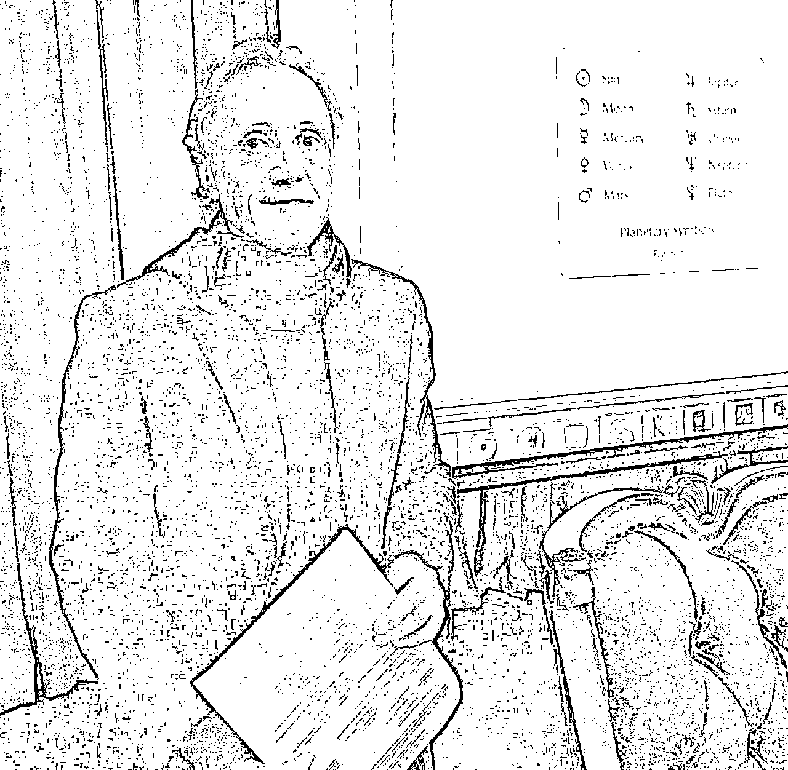


**我所谈论的占星学是一种更为深入的占星学，不是“每周星座运势”，也不是简单的线性因果法则。当你进入到内在最深处，对整个宇宙打开自己，你会感受到行星之间谱写出的那既美妙又伟大的交响乐。**

**——理查德·塔纳斯**


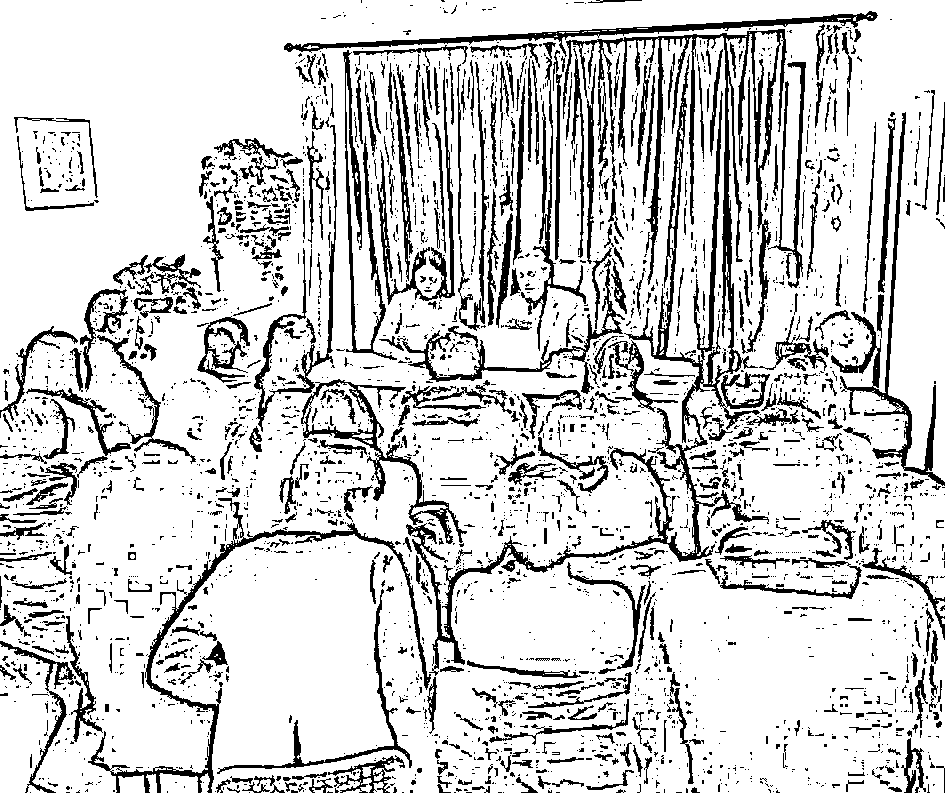

活动现场

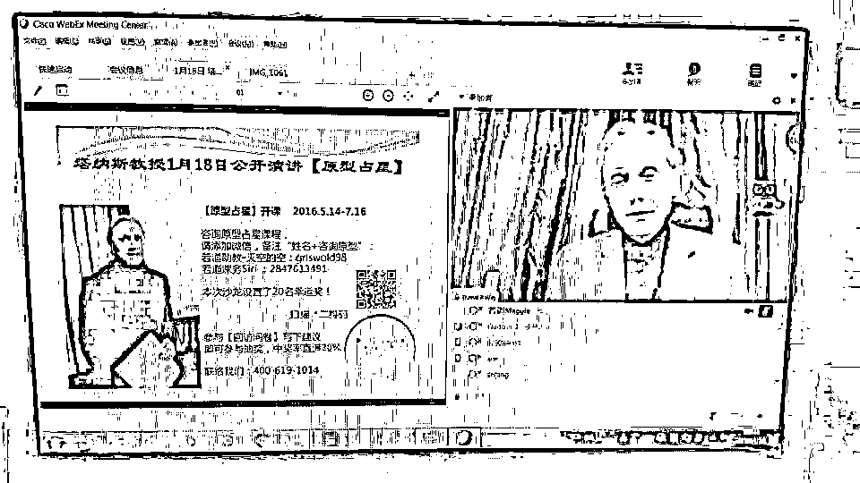

网络现场

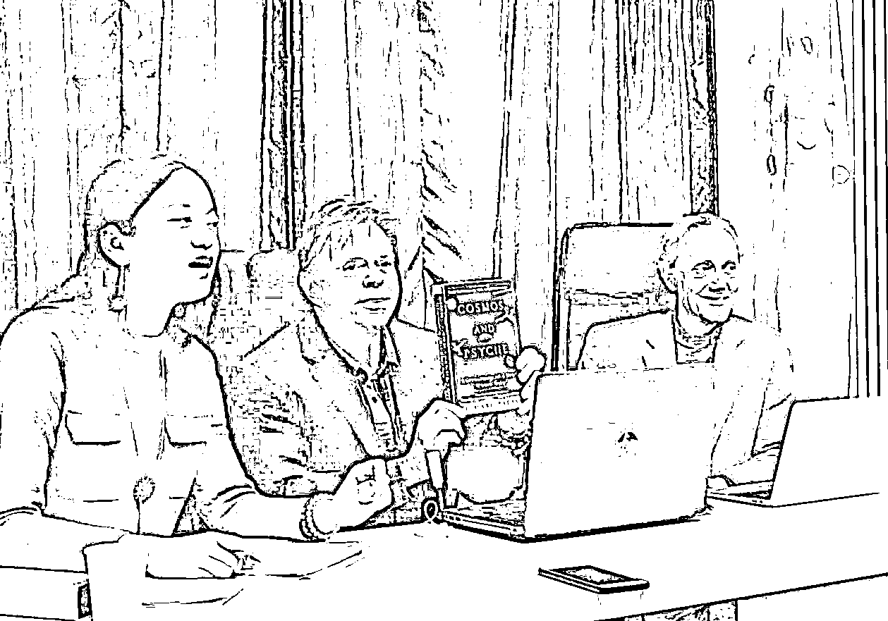

大卫推荐塔纳斯著作《宇宙与心灵》

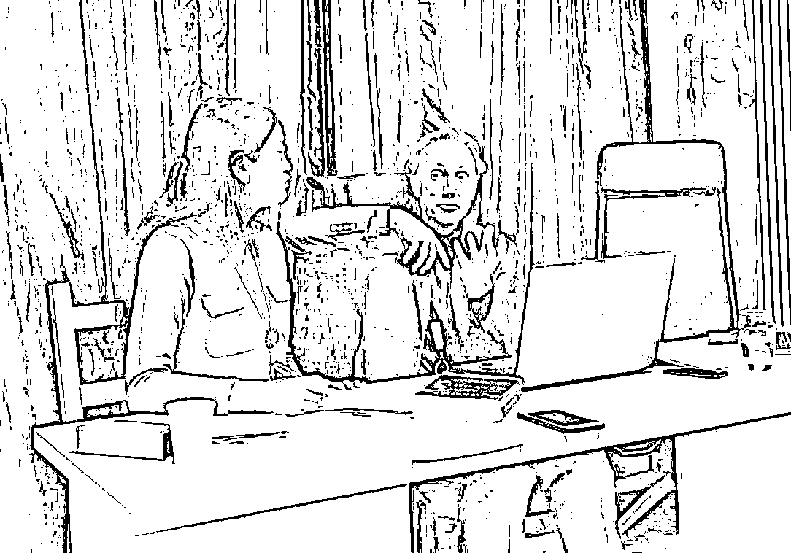

塔纳斯演讲中

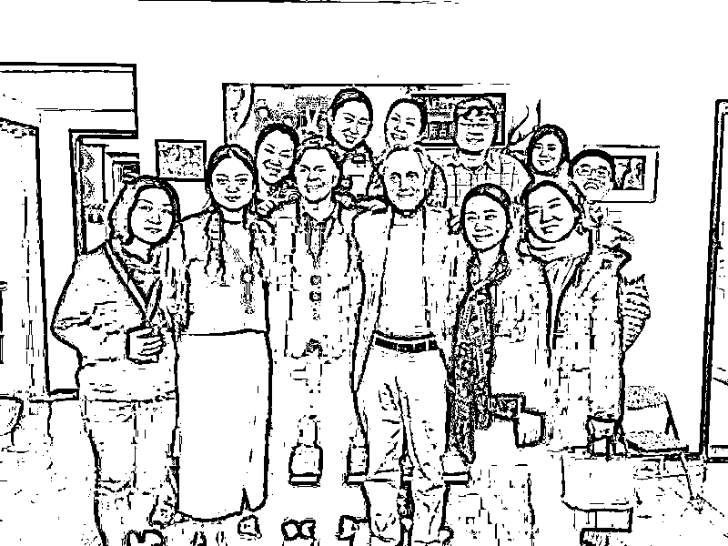

塔纳斯与若道工作人员合影

**学员分享**

****➤****** Cora：**听讲座的时候感到十分激动，难以抑制，这激动不是来自知识的获得，而是一份难得的历史的视角，这会帮人清除恐惧，让人真的相信我们是与一些永恒的东西同在，更深刻地理解什么是“真理的代价”。——这是塔纳斯这样的人才能带来的（因为他毕竟拥有一般人望尘莫及的履历和眼界）。而他就在我们身边，就在当世，对占星学子来说真是令人鼓舞的事。

****➤****** Gaff：**今晚占星沙龙的老师理查德·塔纳斯，他天王星合相上升，三分双鱼座的太阳，月亮白羊座，三分冥王星、对分海王星，火星天秤座合相海王星，总体给人以先锋、诗意、儒雅、深刻的感觉；他的理论宏大、开放并直达核心，著作《西方思想史》是一部经典，所以他既是前卫的学者，也是严肃的占星家，期待他精彩的课程……

****➤****** 云上的日子：**最初见到 Rick 老师，就被他的学者风格吸引。老师的著作被美国多所大学选为教材，清华大学将他的《西方思想史》作为教科书。我的朋友圈今晚被老师的公开演讲刷屏。我很少强推硬广，但塔纳斯老师的课是真心推荐，即将于 5 月 14 日开课。同时希望《宇宙与心灵》能尽快翻译，顺利发行。

****➤****** 奕帆：**今天是入冬以来最冷的一天，可正因为今天的北风，让我们看到了皎洁的月光和很多星辰。生活也是如此，有时候你感受的痛苦，其实背后是宇宙送给你的礼物也说不定，就看你能否看到它。——塔纳斯沙龙感悟

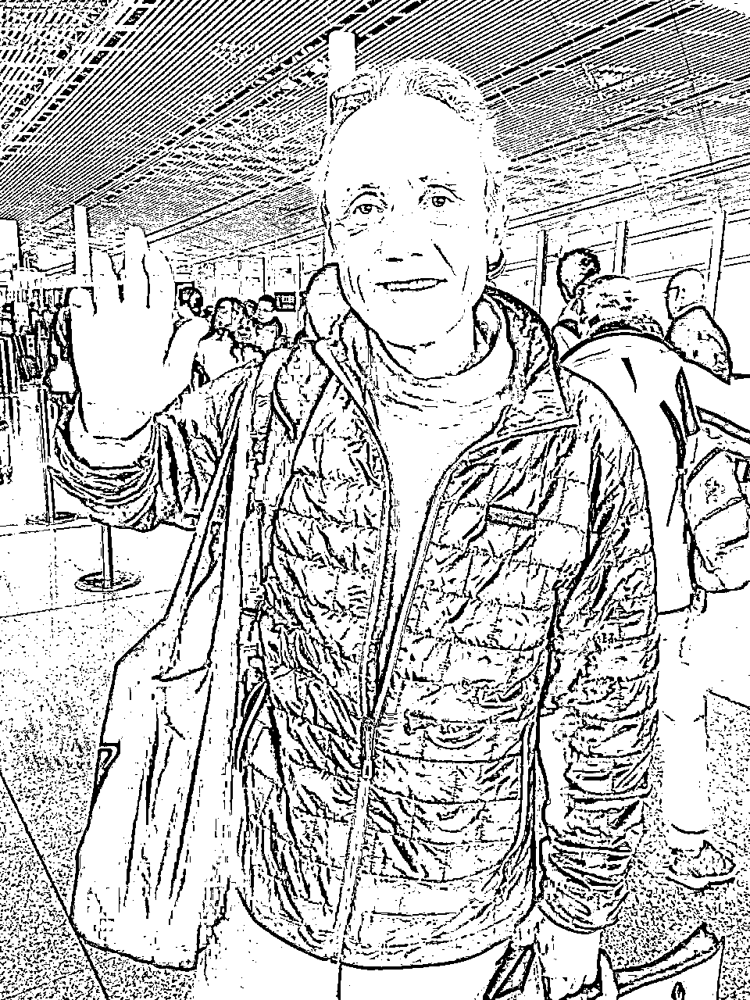

“感谢若道，感谢大家！我在若道的原型占星学课程将于 5 月开课，期待再会！”

**塔纳斯教授的其他文章请点击：**

[塔纳斯：自称专业占星师的你们做到了这 7 点吗？](http://mp.weixin.qq.com/s?__biz=MzA5NjA0NTAxNg==&mid=402587687&idx=1&sn=d81ed86727c7b561dc487374c5846935&scene=21#wechat_redirect)

[我们又将迎来一位国际殿堂级占星家！](http://mp.weixin.qq.com/s?__biz=MzA5NjA0NTAxNg==&mid=401949295&idx=3&sn=0972e13ee780ec236d30c926bcf1dca4&scene=21#wechat_redirect)

[塔纳斯：天冥四分威力将持续到 2020 年](http://mp.weixin.qq.com/s?__biz=MzA5NjA0NTAxNg==&mid=402527351&idx=2&sn=53ab9dc1fc25a53ca738aae92d2834b2&scene=21#wechat_redirect)

**◆ ◆ ◆  ◆ ◆**

******特别提醒：****若道享有**本文版权**，转载请注明“转自若道”。******

正如丽兹·格林所言，更多是占星学选择了你，而非你选择了占星学。**2016 年 5 月 14 日**，**理查德·塔纳斯**教授将在若道开办“**原型占星学**”课程，让占星学选择你吧！


# 塔纳斯：自称专业占星师的你们做到了这 7 点吗？

> 原文：[`mp.weixin.qq.com/s?__biz=MzA5NjA0NTAxNg==&mid=402587687&idx=1&sn=d81ed86727c7b561dc487374c5846935&chksm=02bdb29035ca3b86e17a6991491eb736f082c60a6a4b0888f431892a48daf46afc9aa602d725&scene=126&sessionid=1692738882#rd`](http://mp.weixin.qq.com/s?__biz=MzA5NjA0NTAxNg==&mid=402587687&idx=1&sn=d81ed86727c7b561dc487374c5846935&chksm=02bdb29035ca3b86e17a6991491eb736f082c60a6a4b0888f431892a48daf46afc9aa602d725&scene=126&sessionid=1692738882#rd)

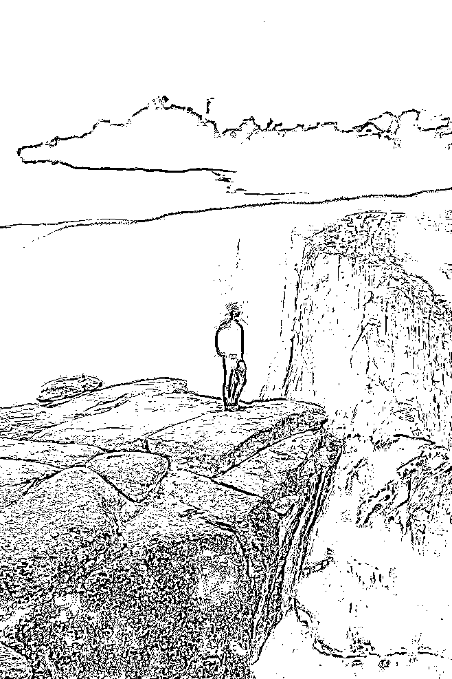
作者/理查德·塔纳斯

译者/江艺

要成为一名专业占星师并不容易，不仅要精通占星学，还要懂心理学；不仅要有理论，还要会表达；不仅要做自我的内在建设，还要应对外界的种种质疑……如果你想好了，坚持要走这条路，来看看国际占星大师理查德·塔纳斯给开始实践的占星师的 7 条建议，一定有所收获。

**给占星师的 7 条建议**


**对于开始实践的占星师，我的建议是**：

**①** 一定要研究**经典**，了解**历史**，**阅读**鲁伊尔和埃贝廷、罗伯特·汉德、史蒂芬·阿若优、利兹·格林、查尔斯·卡特等人的书籍。

**②** 研究许许多多的出生**星图**、**行进和推进**，以及许多**传记**。

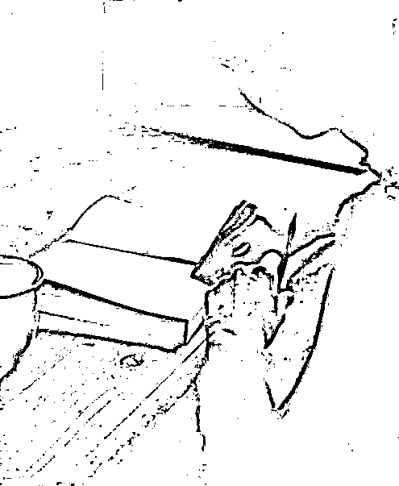 

**③** 同时，我相信提供咨询的占星师还应当参加一些**心理学和咨询培训**。如果不了解一些投射、移情和反移情的运作机制，你的占星解读可能在心理上非常幼稚和笨拙。

**④** 还有要做足够的研究来认识到**原型**具有多种意义。我们的出生星图和行进通常不会牵涉具体的预测，而是对我们生活的原型潜力的各个维度（内在和外在）提供一种深邃的洞察力。

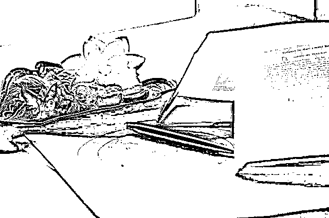 

**⑤** 我主张所有人都要进行大量深入的**内在工作**，进行初步的实践，无论是通过深度心理治疗或是神圣的医学之旅、全息呼吸法和冥想。相比教科书“关键词”这种平铺直述的知识，正是在这些不寻常的意识深处，你才能直接体验到原型和神。

**⑥** 我们今天的占星师还必须承担我们内心之中巨大的**矛盾压力**，一方面我们知道占星学具有极大的价值，可以在无形之中启迪每一个研究领域和人类生活的各个方面。但同时，在我们生活的这个时代和文化中，占星学又受到如此广泛的否定、嘲笑和讽刺。也许这是所有伟大精神，甚至科学发现（或重新发现）的命运。

但实际上，新出道的职业占星师必须在主流文化的通常结构之外用他们自己的方式创造一种**实践**。这里我认为非常有用的方式是成为另一个知识领域的**专家**，可以是心理治疗或历史学、哲学或医学、生态学或社会正义、商业或艺术。**在那些领域建立名望**，然后你就能在更好的地方为他人建立一座桥梁，让他们走进占星学提供的更大、更深层次的世界观。

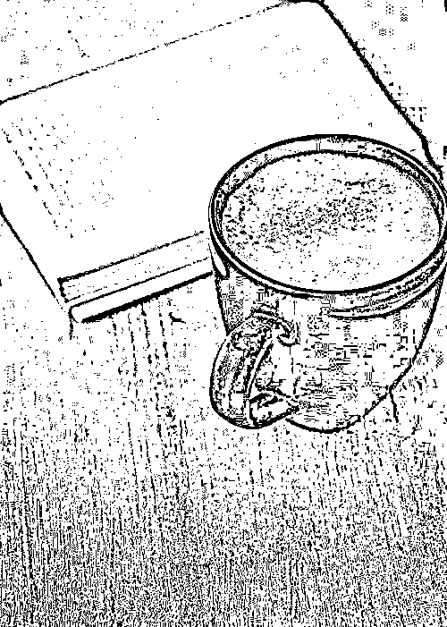 

**⑦** 此外，你还需要发展出让**普通人也能理解的占星学的谈话方式**，所以你不是困在大多数人都不懂的占星术语中。在我们这个时代，你需要做他人的桥梁和推动者，和他们一起探索奥秘，而不是做一个夸夸其谈的大祭司，唱着独角戏，给出预测和指导。

也就是说，我们希望帮助别人，让他们成为自己的牧师，授人以鱼不如授人以渔。尽管有主流世界观和已建立的文化态度，但很多人对占星学的兴趣是巨大的，甚至在受过高等教育的专业人士中亦是如此，只是他们永远不会公布他们在接受私人占星解读。我们有责任非常**小心和谦逊**地提供这些知识。

📹 /mp/newappmsgvote?action=show&__biz=MzA5NjA0NTAxNg==&supervoteid=2556296#wechat_redirect

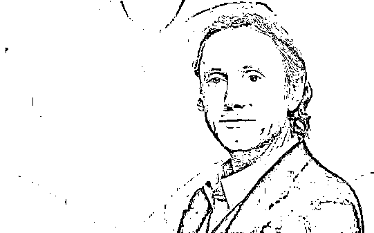

**理查德·塔纳斯**

哲学家

国际占星学界学者和先驱

原型占星学研究者 

《西方思想史》《宇宙与心灵》作者

**塔纳斯教授的其他文章请点击：**

[我们又将迎来一位国际殿堂级占星家！](http://mp.weixin.qq.com/s?__biz=MzA5NjA0NTAxNg==&mid=401949295&idx=3&sn=0972e13ee780ec236d30c926bcf1dca4&scene=21#wechat_redirect)

[塔纳斯：天冥四分威力将持续到 2020 年](http://mp.weixin.qq.com/s?__biz=MzA5NjA0NTAxNg==&mid=402527351&idx=2&sn=53ab9dc1fc25a53ca738aae92d2834b2&scene=21#wechat_redirect)

**◆ ◆ ◆ ◆ ◆** 

****特别提醒：**本文由作者授权发布至若道平台，**转载请注明“转自若道”，并附上若道二维码。****

想成为占星师？从零开始打好占星学的坚实基础！**2016 年 3 月 10 日**，大卫老师主讲的若道占星核心课程**Level 1-2**要开课了！他将带领你学习星座、太阳、月亮、行星、月亮交点等知识，让你进入占星学的世界！提前报名付款有**早鸟价**哦！详细内容请点击“**阅读原文**”了解。

↓


# 占星师有“三条命”

> 原文：[`mp.weixin.qq.com/s?__biz=MzA5NjA0NTAxNg==&mid=402587687&idx=2&sn=673185e1bcdca585f0e1704243133783&chksm=02bdb29035ca3b866129468c98bf739edf7a3e24492b18737efa41bceea25acb2e48728225d2&scene=126&sessionid=1692738882#rd`](http://mp.weixin.qq.com/s?__biz=MzA5NjA0NTAxNg==&mid=402587687&idx=2&sn=673185e1bcdca585f0e1704243133783&chksm=02bdb29035ca3b866129468c98bf739edf7a3e24492b18737efa41bceea25acb2e48728225d2&scene=126&sessionid=1692738882#rd)

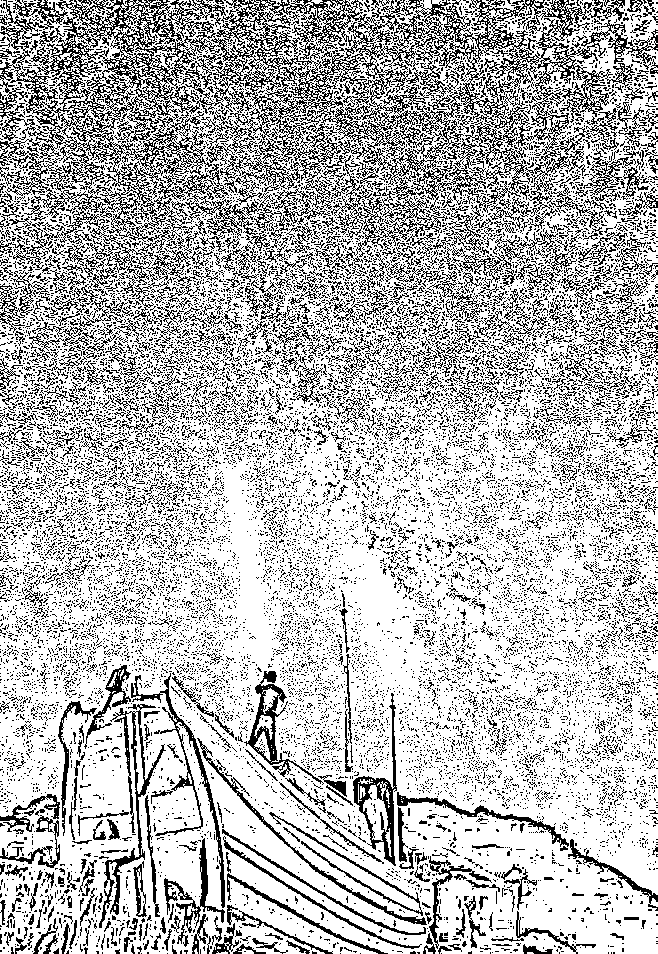

占星师有“三条命”？是的，除了日常生活的命，他们有能力看到自己的前世和今生，并且带着觉知甚至恐惧，规划出一条崭新的生命，去成为更好的人。

1

**占星师的“三条命”**

占星师有三条命。**第一条命安住在他们的日常生活里。**他们每天要吃要喝要工作要学习要睡觉，他们时时刻刻和它在一起。下雨了，要撑伞；天冷了，带上帽子和手套；吃巧克力会开心，新发型不满意会苦恼……那是再普通不过的生活和生命。

**第二条命在占星师的星图里**，他们会看到自己的前世和今生，会了解要走的弯路和要攀爬的高峰，会知道生命中什么时候是冬天什么时候是夏季，哪个阶段需要休养生息，哪个阶段需要鼓起勇气开天辟地。

第三条命是经过严格审视后的生命，当夜寂人静，他们躺在床上，回想一天、一月、一年年发生过的事情，对照星图，去仔细端详生命的肌理、命运的安排和宇宙的智慧。他们会**带着觉知，还有恐惧，重新规划出一条崭新的生命。**

2

**未经审视的生活，值得吗？**

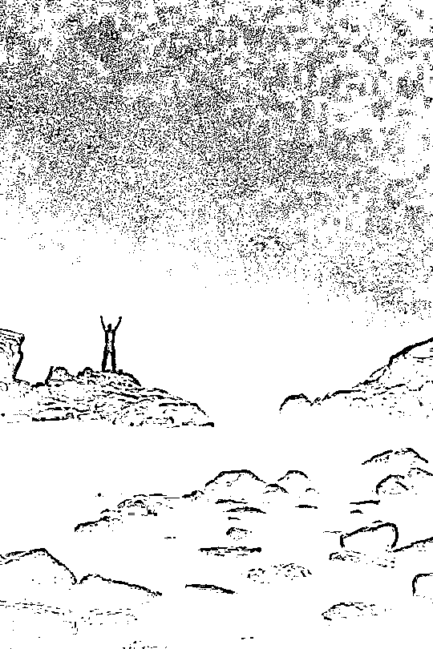

也许有人会觉得，只有疯子才会对生活的背面感兴趣。生活本身已经够麻烦的了，账单要缴，家务要做，孩子要教育，老人要照顾。可如果你不想这么麻烦，你就要知道，**每个人的身体里都有一个灵魂需要找到可以去的地方**。它要去做它想做的事情，它要去找到热情和勇气，否则它就会感到非常贫困，而你的生活会变得更加艰难。 

苏格拉底说过一句话：**“未经审视的生活，是不值得过的。”**当你用新的眼光、新的视角来面对日常生活的时候，你会得到新的启发。只要你愿意敞开，生命中所有的事情都会带给你良性的改变，你可以再活一次。 

2012 年年初，父亲生病住院，我一直在家和医院之间来回奔波。一天，我正在医院陪床，突然接到 BOSS 打来的电话，他说，我要走了。我当时就是一种被树上苹果猛地砸到头，满眼星星失去思考能力的眩晕状态，根本没有意识到真正发生了什么。之后我反应过来，他离职了。

我以为我们都会按部就班地把日子过下去，直到退休。我们周围的人都是那样活着，大企业，做熟的工作，平稳的日子。混得好或者混得不好都是如此一成不变，后半生一眼可以望到头。上班、带娃、退休、广场大妈、环球旅游……甚至可以想到有谁会去参加你的葬礼。

那通电话就像扔向湖心的石子，激起的涟漪层层起伏。**之后更多的石子随之落下，等水面再次静止下来的时候，那湖水已经不再是从前的湖水。**

3

**宇宙推开了我世界的大门**

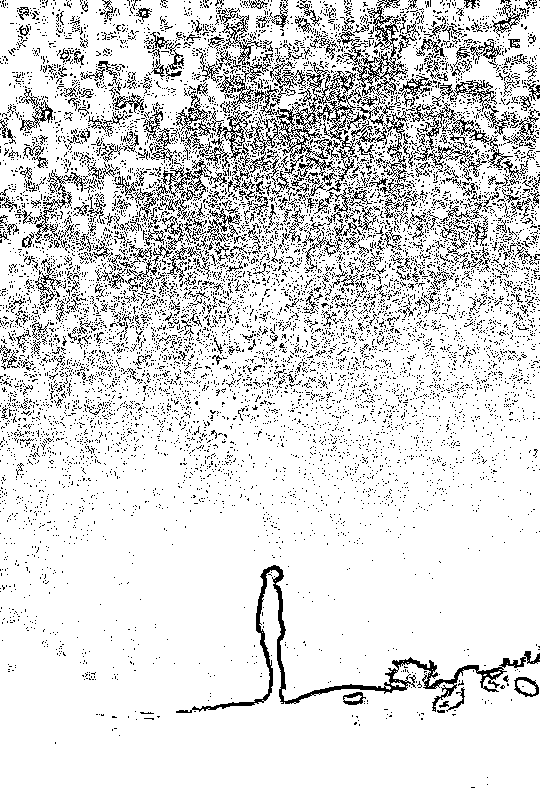

**那一年，行进的冥王星精准合相我的金星。**在很长的时间里，我并没有意识到转变已经发生。然而，现在我可以在我生命的时间轴上做一个标记，看，就是这里。宇宙在那一刻用力推开了我世界的大门，好让智慧鱼贯而入。**年底我开始在若道学习占星学，我就是想弄明白，到底命运是什么，人生的意义是什么，自由意志又是什么。**这些问题困扰了我很多很多年，现在我动身去寻找答案。

没错，开始接触占星学，我是再认真不过想要知道答案，我一心想解开命运之谜。但浸淫其中，与世界级大师近距离接触，心智一层一层打开，我最终收获的是一种视野，一条通往宇宙的独一无二的进化路途。**我意识到，我们并不是时刻需要去解决什么，也不是所有的问题都有答案。**如果提出的问题错误，答案将会是毫无用处的。有时候生活就是一团迷雾，生命会有谜题，而我们只需要去拥抱这种不知道的状态就好了。我们只需要去拥抱我们自己，我们是独一无二的生命体，我们是不完美的生命体。我们都是宇宙的小碎片，从每个碎片出发看到的都是不一样的日常。而这些所有的碎片合在一起，就是整个宇宙。

我热爱阅读，阅读带给我智慧、喜悦和未知的世界。也正是广泛持久的阅读成为压在我表达欲望上的一块大石。一直以来我都认为想说的话、可说的话已经被前辈说尽，而且说得更优美更全面更透彻。那么，有什么理由是让你非去表达不可的呢？

是占星学帮我发现了这块石头，同时找到了自己的目光和声音。你的日常就是你的日常，你的视野就是你的视野，你的表达就是你的表达。它是不同的。

道理很简单，可是明白道理和真心相信它之间有很大的落差。

**热爱日常，你便能觉知到你的视野。调整你的视野，你便能改变你的日常。**你的目光决定了你的所见。如果你喜欢春天，走进春天，你会发现你喜欢的是春天的绿色。如果你喜欢绿色，走进绿色，你会发现春天原来有一万种绿色。

4

**占星学帮我成为更好的人**

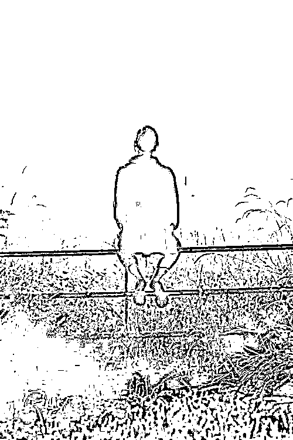

十几年前，我游历肯尼亚，写过一篇文章《写在非洲大地上》，里面全是大词儿，空旷、雄伟、宏大、天与地……刺激我表达的其实是遥远、陌生、落后、异国风情……而现在，我站在一棵冬天的椿树下，我记得它春天枝叶繁茂的样子，如今透过枯寂冷硬的枝杈洒落在我扬起的脸上、眯起的眼睛里的阳光，照耀在我心头的依然是一些大词儿。我意识到，现如今，我的表达不再需要一个不凡的出口。

三年多过去，冥王星来来回回，终于在今年初彻底告别我的金星。**我被占星学的准确性和无穷尽所震惊。**我用自己的前半生做小白鼠，用占星学符号做手术刀。我需要证据，它给我证据；我需要理由，它给我理由；我需要方向，它给我方向。占星学带给我最美丽的礼物，是一个充满意义的海洋，一个拥有无限可能性的精微世界。我去参加考试，拿到证书。我开始写文章，做咨询，经营自己的小品牌。当我开始收到感谢、礼物和酬金，**我意识到转变已经发生，意识到第三条生命正在身体里蓬勃成长**，意识到自己从一个被庇护者一点一点转变成为庇护者。这感觉，怎么说呢，真是好极了。

就像在树下休息的牛顿，苹果砸在头上，他因此发现了万有引力。你可以去学习占星学，或者找到自己信任的占星师。星图会告诉你，那颗苹果树在哪里，那只改变命运的苹果什么时候会落下。星图会帮助你，让你发现自身的力量和崭新的生命，不论那是万有引力，还是进化论。

总是会回想起那几年。记得从医院九层楼望出去的万家灯火，我记得办公室电脑上贴满的 TO DO LIST，记得周末上课路上的樱花树……现在我可以说，**是的，我找到了答案**。

是的，我想成为一个更好的人。

**作者简介**

**Anastasia**：职业占星师，国际占星研究学会 ISAR 会员，若道认证生时校正占星师。太阳射手座，月亮狮子座，上升处女座，擅长讲述个体星图后面隐藏的人生故事和意义。学习严肃占星学多年，师从于大卫·瑞雷、格伦·佩里、斯蒂芬·弗里斯特、诺·泰尔、苏·汤普金斯等占星大师，并在大卫·瑞雷老师指导下从事占星咨询工作。

个人微信公众号平台：midnight2evolution

**◆ ◆ ◆ ◆ ◆**

****特别提醒：**本文由作者授权发布至若道平台，**转载请注明“转自若道”，并附上若道二维码。****

想成为占星师？从零开始打好占星学的坚实基础！**2016 年 3 月 10 日**，大卫老师主讲的若道占星核心课程**Level 1-2**要开课了！他将带领你学习星座、太阳、月亮、行星、月亮交点等知识，让你进入占星学的世界！提前报名付款有**早鸟价**哦！详细内容请点击“**阅读原文**”了解。

↓


# 若道 Level 1-2 | 让你从星座小白变身星座达人

> 原文：[`mp.weixin.qq.com/s?__biz=MzA5NjA0NTAxNg==&mid=402587687&idx=3&sn=6a918589445dc981466222e2f977972e&chksm=02bdb29035ca3b86aa68e3ce60d0ac551814f4b6feabe884e6f3507b5b805889d3f52cbd0eb5&scene=126&sessionid=1692738882#rd`](http://mp.weixin.qq.com/s?__biz=MzA5NjA0NTAxNg==&mid=402587687&idx=3&sn=6a918589445dc981466222e2f977972e&chksm=02bdb29035ca3b86aa68e3ce60d0ac551814f4b6feabe884e6f3507b5b805889d3f52cbd0eb5&scene=126&sessionid=1692738882#rd)


国际占星研究协会（ISAR）中国唯一指定教学机构

若道 2016 年占星核心课程 Level 1-2 上线

**这是一趟“星座小白”到“星座达人”之旅**

主讲人若道创始人**大卫·瑞雷**

**拥有四十余年占星执业经验**

网络教学

全程即时翻译

不懂英文也没问题


**课程信息**

**授课时间：**2016 年 3 月 10 日**-4 月 28 日**

**授课老师：大卫·瑞雷（8**次**）、蒋颖（4**次**）**

**授课方式：**网络课

费用：**2400 元（2016 年 2 月 1 日前报名付款）**

**早鸟价：****1980 元（2016 年 1 月 25 日前报名付款**）

**报名截止：**2016 年 2 月 1 日

**课程负责人：王老师（微信号：2837474346）、童老师（微信号：80248863）**

**咨询电话：**400-619-1014

课服 QQ**：4006191014 （若道星文化）**

邮箱**：nodoor@vip.126.com**

课程简介


**星座、太阳和月亮**

12 星座是占星学最基本却又最深刻的概念，黄道 12 星座，是伟大的生命周期，而太阳和月亮是我们阴阳之本。

**●12 星座：**和大卫一起，深入了解 12 星座的特色。了解星座正面的、负面的表达，了解其资源，了解其破坏生命的模式。了解其原型人物、了解其指代的人事物。

**●12 星座原则：**按照极性、形态和元素给星座分类。

**●12 星座关键词：**关键词非常重要！是解读准确性的关键。

**●太阳和月亮：**了解你的太阳，生命的发动机，让你在世界闪光的方式，生命获得力量的方法；了解你的月亮，让你生命获得幸福的方法。了解它们，了解你生命中已经出现的、将会出现的男人和女人。


**遇见行星和月亮交点**

在这个阶段，你将遇见行星们，还有与灵魂的过往和未来相关的月亮交点。这既是你，你的性格，也是你在生命故事中将会遇到的人、事、物的显化，也是你灵魂轨迹的线索。

**●内行星：**水星、金星、火星

**●中间行星：**木星、土星

**●外行星：**天王星、海王星、冥王星

**●灵魂的线索：**月亮南交点、月亮北交点

**●行星逆行：**行星逆行的天文现象和意义

**●宫位初解：**了解黄道 12 宫的基本含义

时间安排

共 12**次**课，24 课时。

**●8 次理论课程**（大卫老师主讲、配有中文实时翻译）

北京时间每周四晚 20：00-22:00

**●4 次线上互动课程**（蒋颖老师主讲）

北京时间每周一晚 20：00-22:00（3.14/3.28/4.11/4.25)

授课优势

**①先进的教学平台**

网络教学平台，支持手机、电脑、iPad 上网，可以随时随地学习。

**②回放复习**

学员可登录网站收看课程回放，在线复习课程，每次课可完整重看 3 次，课程结束后的 3 个月内有效。　

课程特色

**①与名师面对面**：北京同学可以来若道现场上课，和大卫老师面对面互动。大卫老师也可能前往主要学员所在城市，实现零距离教学。

**②互动答疑**：论坛、微信群随时提问；老师课上答疑；助教线上线下全程协助。

**③线下沙龙**：定期举办沙龙活动，复习上课内容。

**④强大的同学网络**：若道作为中国最顶尖的占星教学机构，在 4 年的占星教学中，培养了很多占星人才。若道让你和师兄师姐切磋，让你和国内著名占星师学习。（简单来说，就是，人脉！）网络授课，在北京开设免费现场参与名额，全程英文授课，配备实时翻译。

师资力量

**讲师团队**


****大卫·瑞雷（David Railey）****

若道创始人，《灵魂的目标》作者。拥有四十年的占星咨询的执业经验，曾两任亚特兰大占星协会主席，是全美占星师联盟（AFAN）、美国占星师联合会（AFA）、全美占星研究委员会（NCGR）、国际占星研究协会（ISAR）和职业占星师组织（OPA）的成员，是联合占星大会（UAC, United Astrology Conference）督导委员会委员。大卫曾是 CNN、CBS 的占星节目的常驻嘉宾，多次在 BBC、WGS、WSB、WRGG 等节目中接受采访，并在亚特兰大主持电视节目《每日行星（Daily Planets）》达 4 年之久。


****蒋颖（Felicia）****

若道创始人，职业占星师。在若道系统学习占星，师从大卫·瑞雷。长江商学院 MBA，厦门大学经济学硕士，化学学士。国际占星研究协会（ISAR）中国区副主席。第一批获得国际占星研究协会（ISAR）认证的职业占星师。《灵魂的目标》译者。

**助教团队**


****熊鹰（天空的空）****

国际占星研究协会（ISAR）认证占星师。在若道系统学习占星，师从大卫·瑞雷，现任若道专职助教。将传播系统、严谨、真实的占星学作为职业使命。与此同时，提供一对一占星咨询服务与生时校正咨询。目前正致力于占星学与个人真修实证的整合。2014 年起主讲读书会，助教答疑课程累计超过 100 小时。


****Gaff****

全职占星师，既是占星师，也是疗愈者。2013 年开始在若道进行系统占星学习，师从大卫·瑞雷。任 2015 年度诺·泰尔、斯蒂芬·福里斯特老师的占星工作坊助教。提供一对一的咨询服务（已有超过 100 小时的咨询经验），基于个案咨询的经验，曾多次开设面授的占星课程。


2016 年，和若道老师一起，开启占星的探索之旅！

报名请点击文末“**阅读原文**”。

长按二维码接通课程负责人~


# 若道 Level 1-2 | 让你从星座小白变身星座达人

> 原文：[`mp.weixin.qq.com/s?__biz=MzA5NjA0NTAxNg==&mid=402573965&idx=3&sn=da56cd4438895a33989371a066e27251&chksm=02bc783a35cbf12cbb373da17602652ce2c502c75d5787e8eac9e2e00b215031845db6308a94&scene=126&sessionid=1692738882#rd`](http://mp.weixin.qq.com/s?__biz=MzA5NjA0NTAxNg==&mid=402573965&idx=3&sn=da56cd4438895a33989371a066e27251&chksm=02bc783a35cbf12cbb373da17602652ce2c502c75d5787e8eac9e2e00b215031845db6308a94&scene=126&sessionid=1692738882#rd)


国际占星研究协会（ISAR）中国唯一指定教学机构

若道 2016 年占星核心课程 Level 1-2 上线

**这是一趟“星座小白”到“星座达人”之旅**

主讲人若道创始人**大卫·瑞雷**

**拥有四十年占星执业经验**

网络教学

全程即时翻译

不懂英文也没问题


**课程信息**

**授课时间：**2016 年 3 月 10 日**-4 月 28 日**

**授课老师：大卫·瑞雷（8**次**）、蒋颖（4**次**）**

**授课方式：**网络课

费用：**2400 元（2016 年 2 月 1 日前报名付款）**

**早鸟价：****1980 元（2016 年 1 月 25 日前报名付款**）

**报名截止：**2016 年 2 月 1 日

**课程负责人：王老师（微信号：2837474346）、童老师（微信号：80248863）**

**咨询电话：**400-619-1014

课服 QQ**：4006191014 （若道星文化）**

邮箱**：nodoor@vip.126.com**

课程简介


**星座、太阳和月亮**

12 星座是占星学最基本却又最深刻的概念，黄道 12 星座，是伟大的生命周期，而太阳和月亮是我们阴阳之本。

**●12 星座：**和大卫一起，深入了解 12 星座的特色。了解星座正面的、负面的表达，了解其资源，了解其破坏生命的模式。了解其原型人物、了解其指代的人事物。

**●12 星座原则：**按照极性、形态和元素给星座分类。

**●12 星座关键词：**关键词非常重要！是解读准确性的关键。

**●太阳和月亮：**了解你的太阳，生命的发动机，让你在世界闪光的方式，生命获得力量的方法；了解你的月亮，让你生命获得幸福的方法。了解它们，了解你生命中已经出现的、将会出现的男人和女人。


**遇见行星和月亮交点**

在这个阶段，你将遇见行星们，还有与灵魂的过往和未来相关的月亮交点。这既是你，你的性格，也是你在生命故事中将会遇到的人、事、物的显化，也是你灵魂轨迹的线索。

**●内行星：**水星、金星、火星

**●中间行星：**木星、土星

**●外行星：**天王星、海王星、冥王星

**●灵魂的线索：**月亮南交点、月亮北交点

**●行星逆行：**行星逆行的天文现象和意义

**●宫位初解：**了解黄道 12 宫的基本含义

时间安排

共 12**次**课，24 课时。

**●8 次理论课程**（大卫老师主讲、配有中文实时翻译）

北京时间每周四晚 20：00-22:00

**●4 次线上互动课程**（蒋颖老师主讲）

北京时间每周一晚 20：00-22:00（3.14/3.28/4.11/4.25)

授课优势

**①先进的教学平台**

网络教学平台，支持手机、电脑、iPad 上网，可以随时随地学习。

**②回放复习**

学员可登录网站收看课程回放，在线复习课程，每次课可完整重看 3 次，课程结束后的 3 个月内有效。　

课程特色

**①与名师面对面**：北京同学可以来若道现场上课，和大卫老师面对面互动。大卫老师也可能前往主要学员所在城市，实现零距离教学。

**②互动答疑**：论坛、微信群随时提问；老师课上答疑；助教线上线下全程协助。

**③线下沙龙**：定期举办沙龙活动，复习上课内容。

**④强大的同学网络**：若道作为中国最顶尖的占星教学机构，在 4 年的占星教学中，培养了很多占星人才。若道让你和师兄师姐切磋，让你和国内著名占星师学习。（简单来说，就是，人脉！）网络授课，在北京开设免费现场参与名额，全程英文授课，配备实时翻译。

师资力量

**讲师团队**


****大卫·瑞雷（David Railey）****

若道创始人，《灵魂的目标》作者。拥有四十年的占星咨询的执业经验，曾两任亚特兰大占星协会主席，是全美占星师联盟（AFAN）、美国占星师联合会（AFA）、全美占星研究委员会（NCGR）、国际占星研究协会（ISAR）和职业占星师组织（OPA）的成员，是联合占星大会（UAC, United Astrology Conference）督导委员会委员。大卫曾是 CNN、CBS 的占星节目的常驻嘉宾，多次在 BBC、WGS、WSB、WRGG 等节目中接受采访，并在亚特兰大主持电视节目《每日行星（Daily Planets）》达 4 年之久。


****蒋颖（Felicia）****

若道创始人，职业占星师。在若道系统学习占星，师从大卫·瑞雷。长江商学院 MBA，厦门大学经济学硕士，化学学士。国际占星研究协会（ISAR）中国区副主席。第一批获得国际占星研究协会（ISAR）认证的职业占星师。《灵魂的目标》译者。

**助教团队**


****熊鹰（天空的空）****

国际占星研究协会（ISAR）认证占星师。在若道系统学习占星，师从大卫·瑞雷，现任若道专职助教。将传播系统、严谨、真实的占星学作为职业使命。与此同时，提供一对一占星咨询服务与生时校正咨询。目前正致力于占星学与个人真修实证的整合。2014 年起主讲读书会，助教答疑课程累计超过 100 小时。


****Gaff****

全职占星师，既是占星师，也是疗愈者。2013 年开始在若道进行系统占星学习，师从大卫·瑞雷。任 2015 年度诺·泰尔、斯蒂芬·福里斯特老师的占星工作坊助教。提供一对一的咨询服务（已有超过 100 小时的咨询经验），基于个案咨询的经验，曾多次开设面授的占星课程。


2016 年，和若道老师一起，开启占星的探索之旅！

报名请点击文末“**阅读原文**”。

长按二维码接通课程负责人~


# 你学那么久占星还是老样子，有意思吗？

> 原文：[`mp.weixin.qq.com/s?__biz=MzA5NjA0NTAxNg==&mid=402573965&idx=2&sn=06aadfe63e75fd75f9cbc24f17fef8a9&chksm=02bc783a35cbf12ccf5151e6adc05f44cba906677ec0379257bd08746bf9264d8e3d004e3f61&scene=126&sessionid=1692738882#rd`](http://mp.weixin.qq.com/s?__biz=MzA5NjA0NTAxNg==&mid=402573965&idx=2&sn=06aadfe63e75fd75f9cbc24f17fef8a9&chksm=02bc783a35cbf12ccf5151e6adc05f44cba906677ec0379257bd08746bf9264d8e3d004e3f61&scene=126&sessionid=1692738882#rd)

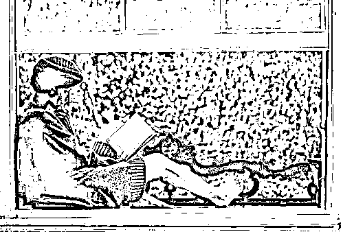

**你学习占星学几年了？还记得当初为什么接触占星学吗？这些年过去，你有没有变得更好？**

>>>>

**还记得接触占星学的初心吗？**

记得在一次占星圈的同学聚会上，我曾问过大家这样一个问题：还记得当初为什么学占星吗？之所以会问这个问题，是源于我在学过几年占星学之后，时不时就会多关注一下“占星学”或者是“占星师”，自然也会遇到来自各地的占星学习者或占星学实践者。

在学习占星学的这几年，我问自己最多的就是：“我当初为什么学占星？”“我到底要借助占星学干什么？”

**○****如果你去学习了驾驶技术，你会选择成为一名职业司机吗？**

**○如果你去学习了烹饪技术，你会选择成为一名职业厨师吗？**

**○那么同样的，你如果学习了占星解读的技能，你就要成为一名职业占星师吗？**

“不忘初心”，这句话一定会让我们面对以上问题时会心一笑。与占星学结缘的原因，我想更多的人，其实是想解开自己心中的谜团。原本是内心滋养的一种选择，可是为何走着走着，我们在占星的路上又一次迷失了呢？

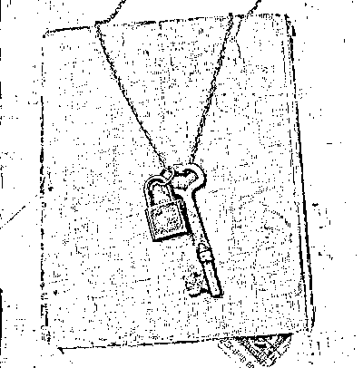

>>>>

**为什么走着走着会偏航？**

之所以这么说，还是源于自身的经历。我在 2012 年的时候接触占星学，认识它完全是借助搜索引擎。当时面对感情的终结、事业的低迷，我就想知道，我还有未来吗？

随着对占星学的接触，随着时间的推移，我逐渐走出当初的阴影期。但是我又进入了另一个误区——我要做职业占星师，为别人咨询分析，我要给别人传授占星学、普及占星学。这个时候，我似乎忽略了一个问题：当初我是为了什么学习占星学？

可是当时的我却深陷其中不能自拔。现在想想，我其实一直没有想明白的就是需要**“先学做人再学占星”**。做医生有医德，做教师有师德，做占星师也要有自己的道德标准。而德要早于占星，且在学习之后继续提升。

我们要学会交际、包容、沟通、分享、关怀……然后再用占星学的符号和语言，让自己的内心与言行得以进步。而不是在猜忌、争斗中通过占星语言合理化自己的“错误行径”。

**○你的感情困惑不要去责怪海王星；**

****○**你的生意失败不要去责怪冥王星或土星；**

****○**你的张狂自我也不能让火星、木星成为替罪羊。如果我说这一切都是你用占星学找借口，你信吗？**

我们是占星师，但是首先我们要知道我们是占星人，仍旧是一名普普通通、需食人间烟火的人。路人甲们心怀恐惧在妖魔化占星师，路人乙们出于各种目的神话占星师。那占星师到底是什么？答案跟我们当初为什么学占星学一样简单。

**如果学习了占星学，让我们的内心拨开了云雾重见阳光，那么不妨问问自己，接下来，我们要用占星学做什么？如果只是换了城市，换了身份，但仍活在自己的旧模式里，我想这不是占星学希望看到的结果。**

**◆ ◆ ◆ ◆ ◆**

**作者简介**

**雷公子：**若道 COAC 高阶毕业学员，ISAR 会员，自 2012 年跟随大卫·瑞雷系统学习占星学。媒体策划人、广告人、心理咨询师、心理塔罗师。

微信号：xzzkjoe

QQ 号：2243005991

长按二维码，让金钱涌向传播知识与智慧的人~

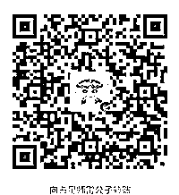

 **◆ ◆ ◆ ◆ ◆**

****特别提醒：**本文由作者授权首发至若道平台，**转载请注明“转自若道”，并附上若道二维码。****

用占星学辨别自己的老旧模式，学习自我负责！**2016 年 3 月 10 日**，大卫老师主讲的若道占星核心课程**Level 1-2**要开课了！他将带领你学习星座、太阳、月亮、行星、月亮交点等知识，让你进入占星学的世界！提前报名付款有**早鸟价**哦！详细内容请点击“**阅读原文**”了解。

↓


# 宇宙天气 | 星际大戏上演，远不止水逆+满月（1.18~1.24）

> 原文：[`mp.weixin.qq.com/s?__biz=MzA5NjA0NTAxNg==&mid=402573965&idx=1&sn=80d7dd637451d5881effc5a31e8a136c&chksm=02bc783a35cbf12ca91787dc33f6171fe530b378370e18bb049c64ef24ed4ccf48830e43b578&scene=126&sessionid=1692738882#rd`](http://mp.weixin.qq.com/s?__biz=MzA5NjA0NTAxNg==&mid=402573965&idx=1&sn=80d7dd637451d5881effc5a31e8a136c&chksm=02bc783a35cbf12ca91787dc33f6171fe530b378370e18bb049c64ef24ed4ccf48830e43b578&scene=126&sessionid=1692738882#rd)

**一周星象综述**

本周月亮经过金牛座、双子座、巨蟹座、狮子座。经过上一周的缓冲和过渡，这一周行星大戏再度上演。

1

有两颗内行星变换星座。

**○周三（20 日）晚间，太阳离开摩羯座进入水瓶座。**虽然水星还在摩羯座，而金星马上要进入摩羯座，但太阳从摩羯座离开，意味着我们的关注点和目标，开始从那些严谨务实的、遵从传统和规则的层面移开，向更加自由、独立和富于理想主义精神的方向转变。未来一个月，我们会以更加开放、创新、客观的眼光，来看待自己的身份和选择，并会更加擅长把握事物的全局，看到不同事物之间的关联。

**○****金星则于周日（24 日）早晨离开射手座进入摩羯座**。未来 20 多天的时间里，**我们的审美偏好、爱情观和价值判断，会倾向于沉稳、保守、持重的风格。**比如想要打扮得更加庄重，喜欢复古的、有传统气质的饰物，**爱情方面则会更加重视承诺，在关系中要求更多的尊重和尊严。**

2

行星相位方面，比较重要的是逆行中的水星激活天王星、冥王星的四分相位（水星合相冥王星、四分天王星）。**这是我们整理自己的想法和计划，对重要的事情做出判断和决策的关键期。**此组相位重点影响周三（20 日）至周六（23 日）的时间段，可以认为是本周的重头。

由于水星逆行的原因，**水星总共会有三次经过形成这组相位的度数**，第一次发生在 12 月 20 日前后，**本周这次是第二次，而本月底将迎来第三次的水星激活天冥四分的相位。**这三次水星经过天冥四分的敏感度数，可以看做是一个“水星的发展序列”，每一次都是对“水星功能”——也就是我们的分析、思考、表达和决策——的考验和提升。

在这三次“层层递进”中，我们对事物的观察和分析会越来越深刻，**我们会不断厘清那些已经无用或不合时宜的想法思路，进行观念的更新，最终选定一个更加符合现实要求也更加有效（摩羯座）的方案，来应对未来的旅程。**

大家可以回想，**在 12 月 19 号到 22 号这几天，**也就是水星第一次卷入天冥四分的相位时，**你对一些事的想法、态度发生了怎样的变化？有哪些重要的了悟？或看清了什么人什么事？由此而生出哪些新的决定或计划？这将是我们了解本周的“水星功课”的一个参考。**（虽然同一星象对不同人的影响会有不同，但对于同一个人来说，**行星带来的影响会有“连续性”，从而形成一个人的“发展轨迹”。**）

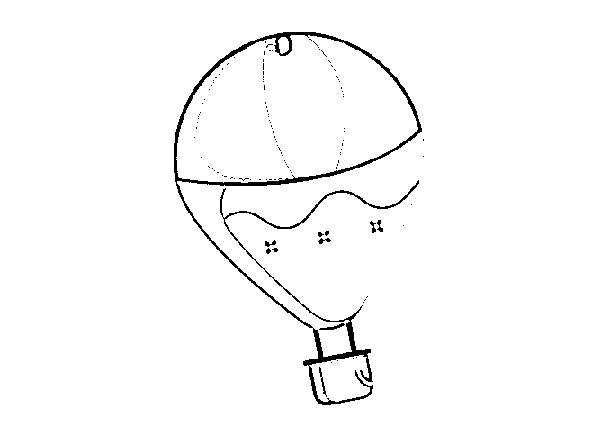

3

很巧的是，周五（22 日）晚间到周六（23 日）上午的这段时间，月亮在巨蟹座与合相的水星和冥王星，以及天王星形成“T 三角”，所以这几天**我们头脑中产生的新的想法和洞见，将伴随着情感上的冲击一起出现。理智和情感之间的冲突在所难免，但这也是一个对自己的心理和情感模式有更深了解的机会。**

4

此外，火星三分海王星，金星四分木星，也是值得注意的星象事件。这两个相位准确成相都在周一。

**○**其中**火星三分海王星会影响本周前半周的时间，这期间宜跟随直觉和灵感行动，有利于从事艺术创作或带有疗愈性质的工作。**此时我们需要“顺势而为”以及“顺应自然”，如果强迫自己做某事，或依靠理性来要求自己的行为服从某一准则，则很可能事与愿违。同时，需要“呵护”自己的精力和体力，因为这也是容易感觉到疲惫或不易专注的时段。

**○**金星四分木星，则主要影响本周前两天，带来欢乐、刺激的氛围，有利于各种形式的社交活动和娱乐、享乐。这也是有利于恋情发展的时段，但此时我们**容易对关系的发展持太过乐观的态度，而忽略现实因素或对某些困难视而不见。花钱方面，也易有铺张浪费倾向。**

5

本周的压轴大戏，则是发生在周日上午的**狮子座满月**，**这是看到个人的独特性、释放自我光芒的时刻。**此时我们将收获一些重要的关于个人与集体、与大环境关系的洞见，明白怎样将个人的理想目标置于一个全局视角下的发展趋势当中，以一种富有创造力的方式，去影响更多人。

本周结束之时，水星已经进入恢复顺行前的停滞期（水星将于 26 日早上正式结束逆行），所以，**本周日除了狮子座满月的强力影响之外，也需注意水逆影响在周末的扩大。**

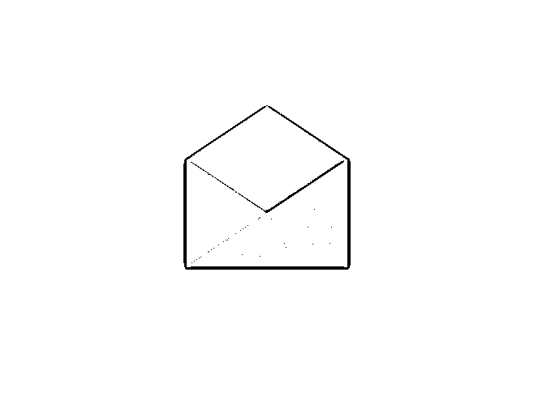 

**每日星象**

**1 月 18 日**

星期一

**星象综述**

这是心情平稳愉悦的一天。思路清楚，沟通顺利，做事效率高，同时也能享受到生活的乐趣。**无论是工作还是恋情，都非常令人满意。**（本周前两天是难得的心情顺做事也顺的“好日子”，好好享受，该忙忙该玩玩。）

**当日星象**

**02:55** 金牛座月亮对分天蝎座火星

**03:29** 金牛座月亮六分双鱼座海王星

**13:11 射手座金星四分处女座木星**

**16:34** 金牛座月亮三分摩羯座冥王星

**19:02 天蝎座火星三分双鱼座海王星**

**22:04** 金牛座月亮三分摩羯座水星

**1 月 19 日**

星期二

**星象综述**

跟前一天相比，今天心情会更加平和，没太多兴奋感或明显的快乐。有句话说**“没有消息就是好消息”**，用来总结这一天非常合适。

傍晚时分月亮进入双子座，晚间**我们的沟通欲和表达欲会变得更加强烈，对于新鲜事物和新资讯的需求也会增加。**这个晚上适合安排一些跟“摄取新信息”相关的活动，比如**听讲座、看电影、听音乐会，或是跟朋友小聚，交流彼此近况。**

**当日星象**

**05:16** 金牛座月亮三分处女座木星 

**14:51** 金牛座月亮三分摩羯座太阳

**17:12** 月亮离开金牛座进入双子座

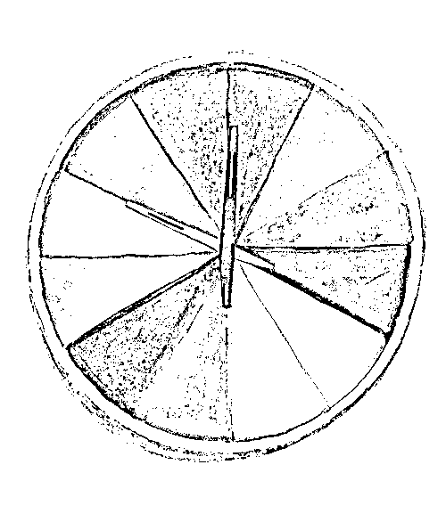

**1 月 20 日**

星期三

**星象综述**

今天容易出现想法混乱、理不清头绪的感觉，也容易受人误导，或是与人沟通困难。**一方面我们容易感到自己不被理解，或是自己的观点想法受到打压；另一方面，我们自己的多变与思路不清，也会给他人带来困扰。**遇到问题宜多从自己身上找找原因，搞定自己才有可能搞定别人。而大部分时候，我们其实根本不可能搞定别人，能搞定的也只是自己。

**当日星象**

**07:11** 双子座月亮四分双鱼座海王星 

**15:55** 双子座月亮对分射手座土星

**22:25** 双子座月亮六分白羊座天王星

**23:28** **太阳离开摩羯座进入水瓶座**

**1 月 21 日**

星期四

**星象综述**

这是信息爆炸、思绪杂乱、易有疯狂想法的一天。**爱情中易有突然的变化或新消息出现，带来惊喜。**傍晚月亮进入巨蟹座，我们的情绪会变得敏感、内敛许多。过去两天的躁动或心神不宁有所缓解。**未来两天我们需要静下来，沉入自己的内心世界，呵护自己的情感，并感受自己的真实需要。**

**当日星象**

**02:27** **摩羯座水星四分白羊座天王星**

**09:08** 双子座月亮四分处女座木星

**16:02** 双子座月亮对分射手座金星

**17:27** 月亮离开双子座进入巨蟹座

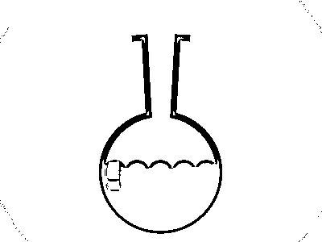

**1 月 22 日**

星期五

**星象综述**

这是内心柔弱敏感、容易被感动的一天。我们会更需要他人的关怀，同时更加渴望献出自己的爱心。这也是行动力提升，做事高效的一天。特别是，我们会非常有动力去“为爱而行动”，比如保护我们关心的人，或是在同情心的驱使下去做一些关爱他人的事。

今天晚上到明天上午，理智和情感之间的碰撞将变得激烈。**我们容易口是心非，或是出于不安全感而拒绝承认一些显而易见的事实，宁愿停留在自己的自欺幻想中。**此时需以现实、真实为依据，避免感情用事而做出不当的判断，或因情绪化而将矛盾扩大。

**当日星象**

**11:54** 巨蟹座月亮三分双鱼座海王星

**15:16** 巨蟹座月亮三分天蝎座火星

**18:00** **摩羯座水星合相冥王星**

**1 月 23 日**

星期六

**星象综述**

这是情绪激烈、喜怒无常的一天。周五的午夜前后很多人或许已经经历了感情中的极端事件，痛苦和打击带来一个难以平静的夜晚。今天白天，不安和躁动的情绪在延续，到下午会逐渐缓和，一些事情能慢慢想开，不开心的感觉会少很多。

**当日星象**

**01:18** 巨蟹座月亮对分摩羯座水星 

**01:35** 巨蟹座月亮对分摩羯座冥王星

**03:33** 巨蟹座月亮四分白羊座天王星

**14:22** 巨蟹座月亮六分处女座木星

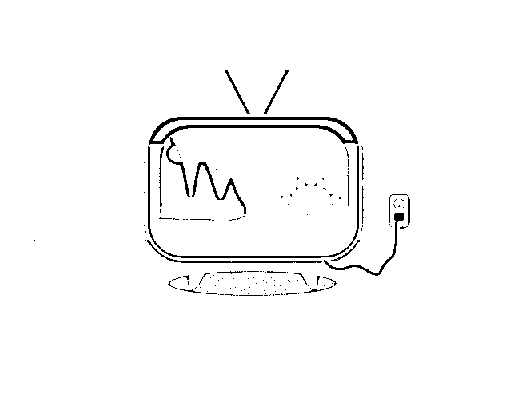

**1 月 24 日**

星期日

**星象综述**

今天月亮来到狮子座，**上午迎来狮子座满月**。**一方面我们的心情会变得积极、阳光许多，另一方面一些事的彻底终结或“真相大白”也可能带来大喜大悲的感慨。**借助满月的力量，我们有机会重新认识自己，以及发现自身的潜力和光芒所在。这也是一个机会去发现“新的舞台”，并了解自己在人群中的身份和位置。

**当日星象**

**03:20** 月亮离开巨蟹座进入狮子座

**04:33** **金星离开射手座进入摩羯座**

**09:47** **狮子座满月（狮子座月亮对分水瓶座太阳）**


**作者简介**

**占星师 Cora**：全美占星师联盟（AFAN）成员，国际占星研究协会（ISAR）会员，获 ISAR 职业占星师资质认证，斯蒂芬·弗里斯特《变幻的天空》译者，个人星象文章见诸《心探索》《北京青年周刊》《上海电视》《空中生活》等杂志媒体。曾跟随大卫·瑞雷系统学习占星学，现为全职占星师。

微信公众号：聆宇 FM（微信号：lingyudiantai）

个人微信号：CoraAstro

长按二维码，让金钱涌向传播知识与智慧的人~

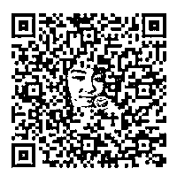

**◆ ◆ ◆ ◆ ◆** 

****特别提醒：**本文由作者授权首发至若道平台，**转载请注明“转自若道”，并附上若道二维码。****

你也可以写出宇宙天气！**2016 年 3 月 15 日**，大卫老师主讲的若道占星核心课程**Level 5**要开课了！在这个阶段，你将学习各种预测技术及行星周期。通过这些预测工具，你能够预测和规划人生。提前报名付款有**早鸟价**哦！详细内容请点击“**阅读原文**”了解。

↓


# 占星科普 | 你需要了解的摩羯座都在这里了

> 原文：[`mp.weixin.qq.com/s?__biz=MzA5NjA0NTAxNg==&mid=402562887&idx=1&sn=ea147cbe60c34b5b0d1fe56b84b16271&chksm=02bc2df035cba4e62aca4de3d380e397fb6a011906dfd8e5a27c769a92cb51366c92148ca2a1&scene=126&sessionid=1692738882#rd`](http://mp.weixin.qq.com/s?__biz=MzA5NjA0NTAxNg==&mid=402562887&idx=1&sn=ea147cbe60c34b5b0d1fe56b84b16271&chksm=02bc2df035cba4e62aca4de3d380e397fb6a011906dfd8e5a27c769a92cb51366c92148ca2a1&scene=126&sessionid=1692738882#rd)

大概每年的 12 月 22 日-1 月 19 日，太阳行进在摩羯座，这段时间是太阳摩羯座人的生日。时间过得很快，转眼间行进的太阳已经在摩羯座尾端了，即将进入水瓶座。为了方便大家查阅，若道君特意将一段时间来有关摩羯座的文章汇总，它们特别适合占星小白和初中阶占星水平的朋友哦。

「

摩羯座

Capricorn

」

**守护星：土星**

**对应宫位：第十宫**

**极性：阴性**

**元素：土**

**形态：基本**

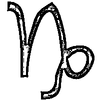

➤PS. 即使你的出生图中没有任何行星落入摩羯座，但它仍是你星图中的一部分，在你的出生图中占据一定地位，以某种方式对你产生影响。

**点击图片阅读文章**

**▼**


▲

星图是四季的日历，占星是对时空的解读。24 节气居然能与星座一一对应，而摩羯座就是冬至到大寒的时间段。


▲

是的，摩羯座人容易遭受偏见，但每个人都需要有摩羯座的精神，扛过人生的试炼，走向紫禁之巅。


▲

摩羯座的前一个星座是射手座。射手座是概念与理论的世界；而摩羯座将理论付诸实践。


▲

“摩羯座抑郁症”你听说过吗？有些太阳摩羯座人确实活得像 loser，但是！这辈子你一定会认识到自己对于成功的需求。


▲

有一个摩羯座情人是怎样一种感受？


▲

摩羯座的对宫星座是巨蟹座，有我无你有你无我的状态可不好，要学习整合。


▲

南交点摩羯座北交巨蟹座的她遇到了什么样的男人？


▲

南交点摩羯座北交点巨蟹座，亲，哭吧哭吧不是罪。

**◆ ◆ ◆ ◆ ◆**

从星座开始接触占星学，打好学习占星学的基础！**2016 年 3 月 10 日**，大卫老师主讲的若道占星核心课程**Level 1-2**要开课了！他将带领你学习星座、太阳、月亮、行星、月亮交点等知识。提前报名付款有**早鸟价**哦！详细内容请点击“**阅读原文**”了解。

↓


# 若道征稿→占星学带给我的成长

> 原文：[`mp.weixin.qq.com/s?__biz=MzA5NjA0NTAxNg==&mid=402562887&idx=2&sn=3819c3d4e511b50475736c5f43f57479&chksm=02bc2df035cba4e6769ebf73c4b80ff6d82e8a0eb81c5898b493d82c0cbe633f6f7b82f0e4b6&scene=126&sessionid=1692738882#rd`](http://mp.weixin.qq.com/s?__biz=MzA5NjA0NTAxNg==&mid=402562887&idx=2&sn=3819c3d4e511b50475736c5f43f57479&chksm=02bc2df035cba4e6769ebf73c4b80ff6d82e8a0eb81c5898b493d82c0cbe633f6f7b82f0e4b6&scene=126&sessionid=1692738882#rd)

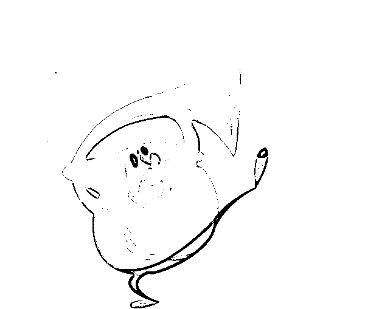


**本期征稿主题**

```
 占 星 学 带 给 我 的 成 长 
```

```
可叙事 可抒情 可论述
```

```
字数 2500 字以内最佳
```

**投稿文章必须为作者原创，若道保留对文章的选择权和编辑权**

**若道君回馈**

1 稿酬

```
稿件需在若道平台原创首发，稿酬以文章（周）阅读量为标准。
```

**阅读量>5000**，稿酬 **300 元** 现金

**阅读量>7000**，稿酬 **500 元** 现金

**阅读量>10000**，稿酬 **700 元** 现金

**阅读量>15000**，稿酬 **1000 元** 现金

所有奖励会在文章发表后 **一个月内** 兑现

此标准有效期： **2016.1.1~2016.12.31**

2 专栏作者

**年度投稿 12 篇，阅读量平均高于 5000** 的作者，将自动作为若道的专栏作者，读者可以在若道微信平台目录轻松查到专栏作者稿件。

3 活动

若道将在粉丝群为专栏作者举办**分享活动。**

**投稿流程**

step

**1**

投稿请发送至 **astrology@nodoor.com**

step

**2**

若道君审稿，对于好的稿件，将会回复作者；如果没有回复，则可视为不被录用。

step

**3**

对于若道君的建议，也请发至**astrology@nodoor.com**

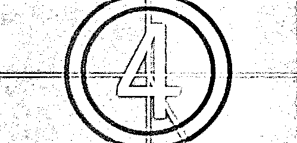

如果你曾经受益于占星学，请说出你的故事！

如果你用占星学的镜片来看世界万象，请说出你看到的世界！

**拿起笔来**

END


# 如何挣脱父母不合的家庭魔咒？

> 原文：[`mp.weixin.qq.com/s?__biz=MzA5NjA0NTAxNg==&mid=402554116&idx=1&sn=c253492bd8349f01390d7dfa8f15fe78&chksm=02bccfb335cb46a5d5a5f7306955b936957d3ba703057616c95de951e3703d47b3c24960845e&scene=126&sessionid=1692738882#rd`](http://mp.weixin.qq.com/s?__biz=MzA5NjA0NTAxNg==&mid=402554116&idx=1&sn=c253492bd8349f01390d7dfa8f15fe78&chksm=02bccfb335cb46a5d5a5f7306955b936957d3ba703057616c95de951e3703d47b3c24960845e&scene=126&sessionid=1692738882#rd)

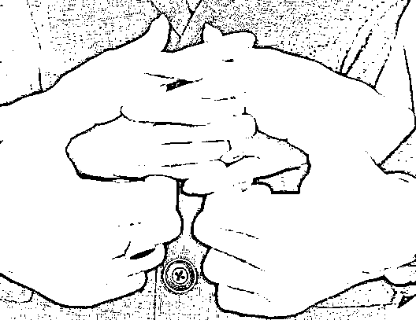

很多人的出生图中都有太阳和月亮的冲突相位（主要是对分和四分）。似乎父母总是意见不一，争吵打架是家常便饭，有的甚至以离婚收场。在这种矛盾中成长的孩子，内心也会有无法调和的两个声音，有的甚至会重蹈父母的覆辙，也陷入了不幸福的婚姻中。本文作者、若道创始人之一蒋颖，以亲身经历出发，告诉我们如何通过有意识的自我对话，破除不幸的家庭魔咒。

**1****为什么父母老是吵架？**

每个人在这一世都有一个起点——我们的父母。我们通过父母来到这个世界，我们也通过父母和宇宙的阴阳法则连接。凡是有心理咨询经验的人，都会看到，我们人生所有重大议题，特别是各种各样的关系问题，不论是爱情、亲子、同事、上下级、社会交往关系，都或多或少是我们每个人和父母之间的关系的变奏。

**在星图中，太阳和月亮就是我们的起点。父母之间的对话模式，也反映在我们星图上的太阳和月亮的配置之中。**

前不久，我在 Skype 上听到了老爸和老妈互相投诉，让我再一次陷入对自己星图的沉思。起因是再简单不过的事情。因为弟妹的亲人来家里做客，给了我父母钱作为礼物，爸爸立刻要回礼，而妈妈认为立刻回礼反而是失礼，因此不赞同。对于如何回礼是正确的，两个人爆发了一场大战。

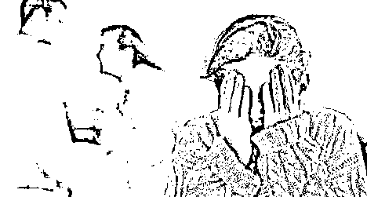

我详细问个究竟，结果发现爸爸生气的原因由来已久。

*   他一直觉得**自己的需求和感受没有被看到和尊重；**

*   而妈妈觉得**爸爸并不信任她，并一直指责她，于是她就用疏离的态度应对**，直到**爸爸的步步紧逼让她的愤怒爆发。**

再细想……

*   妈妈的一生中**大部分需求似乎都得到儿女的应和，她因此而满足**；

*   但**爸爸的需求总是被无视**，他于是常常“委曲求全“，但这并不等于放下，反而导致他**更加偏执的态度，用唠叨的方式重复自己的需求和期望，同时把压抑的怒火用絮叨指责的方式发泄出来。**

*   由于两人都**坚持自己的立场不能看到并承认对方的感受**，因此爆发了大战。 

**2******痛苦的婚姻是，彼此相爱**却无法理解对方**

这件事让我再一次体会到自己星图中太阳月亮四分相的栩栩如生，并触发了我对日月配置的省察和沉思。

*   当太阳、月亮处于四分相时，**各自的视角和需求如此不同，如果没有觉察和自省，那么似乎一辈子都在彼此掣肘作对。**

*   而当**某一方的需求不被另外一方看到和理解时，内在巨大的张力就会产生。**

*   如果硬要坚持某个立场，不能去聆听另外一方，那么我们的**内心必然产生激烈冲突**，因此带来**焦虑、愤恨、害怕、担忧、冷漠**等负面情绪，而平和、幸福就会莫名其妙地远离我们。

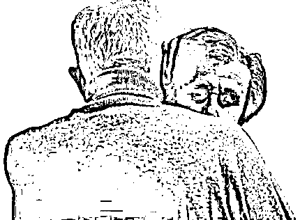

 因此，**日月四分相或对分相的人无论是否意识得到，内心都有一股冲突和挣扎的动力，它会在生活的各个部分反映出来。**因为整张星图都是一个投射，我们会在外部世界遇到那个能量所代表的人和事及冲突。

*   进一步来说，对星图配置所反映的外在原生家庭的情景，我们通常倾向于**自动化地满足一方的需求，而忽视另外一方的需求，或者坚持用无效的方式进行对话。**

*   如果没有充分的觉察和自省，**被压抑或被牺牲了的那方的需求就会用破坏式的方式表达出来**——就好像爸爸用不断罗嗦重复指责的方式，本来意图是希望自己的需求得到关注和认可，但却没有意识到这并不能带来他希望的结果。

*   而妈妈因为不能理解和正视爸爸的需求，也只能经受爸爸因压抑的愤怒带来的指责，并因此而愤怒。这本来都不是他们希望的。

**出生星图中的太阳和月亮对我的影响**

►在我的星图中，**月亮是南交点守护星，且在风象大三角之内**，因此**对于月亮的需求非常熟悉，自动地给予满足，**比如我对于理性知识的喜爱，对于抽象概念的熟悉，与他人相处时“君子之交淡如水”的处世方法；在现实生活中，在学习占星和其他身心灵知识之前，我也是只与母亲关系友好，每当父母产生冲突时，我都自动站在母亲一边，批判父亲；

►而**太阳在星图中没有任何相位**，非常尴尬地处于风向大三角自我满足循环之外。太阳天蝎座的需求，常常以**关系中因为无法真正实现天蝎座所要求的亲密感**，而通过**矛盾爆发、关系断裂**的方式表现出来。

**3****痛苦的解决方式是，学习讲述爱的语言**

**那么这样的配置有没有解决办法呢？**

当然有，我们不是行星的牺牲品，我们总是可以学习。

我清晰地看到，**父母之间的冲突之所以持续至今，是因为没有人教给他们如何应对冲突和矛盾，那一代人也没有机会去了解如何沟通，如何倾听对方的需求以及理解对方的痛苦，如何讲述爱的语言。**

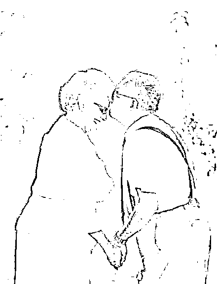

在对爸妈的劝说之中，我能深深感受到他们的痛苦，并且觉察到他们因为不了解受苦的原因，不知道解脱的办法而陷入的境地。特别是我的天蝎座太阳——父亲的偏执及不愿放下的痛苦，我从来没有像现在这样清晰目睹着这一切。我体会到内心深处天蝎座能量的震动。我一直是一个特立独行的人，由于不在父母身边长大，所以过去我一直没有觉得他们的痛苦能够影响我，但今天，我深切感受到这份父母子女的因缘。我的思维可以自由，但身体内能量的牵动却并不自由。

● 世界上真的只有唯一正确的视角吗？

● 正确比爱更重要吗？ 

● 当冲突发生时，我们可以看到对方真正的需求和痛苦吗？ 

● 我们可以怀着慈悲之心陪伴对方，又不牺牲自己吗？ 

● 我们可以学习不同星座的爱的语言吗？

● 我们可以通过疗愈童年的创伤而内心冻结的能量流动起来，不再在成年的各种关系中重蹈覆辙吗？

**4****觉察与行动，摆脱父母**种在我们身体里**的痛苦**

此时，我想起一行禅师关于爱的一段话。


亲爱的，我在这里。我和你在一起。我没能足够理解你的痛苦。我的本意不是让你更痛苦。请告诉我你的难处和痛苦，我渴望理解。我如何才能帮助你更少受苦。


这句话，不仅我们可以对他人说，也应该对我们内心的那个受伤的孩子说。

也许从这里开始，我们处于四分相和对分相的太阳和月亮可以开始学习新的对话方式。**有意识地去和自己的太阳、月亮对话，让它们对你倾诉，觉察它们的能量，更积极健康地在生命中运作它们的能量，**也是我们开启自我疗愈的一个方法。

我们每个人都是独立的个体，但通过星图上的太阳和月亮，父母又以某种形式在我们的身体里，如果深入觉察，可以感知父母的能量模式在我们内在以某种频率震动着。家族模式如此不可思议地在潜意识深处运作，并最终显化为外部事件，他们的痛苦种在我们的身体里，他们想要从痛苦中获得自由的渴望也同样种在我们的身体里。

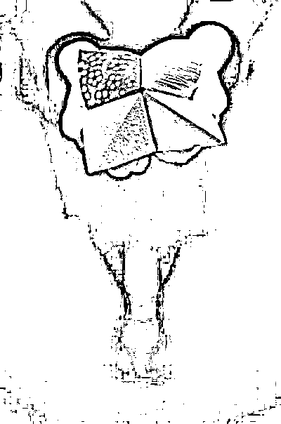

另外一个很深的感触是，**若要获得自由，不被牵绊，第一步只有慈悲——对于痛苦来源的理解及深深的慈悲。**在过去，父亲对我个人事业和生活的不认同，他因此而产生无休止的焦虑，这种焦虑常常在我们的相处中让我很难正视和面对他的痛苦，每次听到他的唠叨只想逃离，或者批判；而今天，当我真正去看他的痛苦，不评判，不逃避，我也看到了这个痛苦在我身体里的震动。

然后，**我们要有离开和正确行动的勇气。**我看到很多子女不自觉陷入父母痛苦的淤泥中，承继着他们的痛苦，一辈子无法自拔。他们没有勇气离开父母的痛苦，因为有时候离开，似乎就像是背叛，海灵格对此有很多描述。然而只有凭着慈悲和勇气，我们才能解脱。并因此可能帮助父母解脱。

所有痛苦都始于无知。当我们更了解，就能更好地行动。而星图就是引导我们了解痛苦的指南。

我并不确定能否把新的冲突解决方法引荐给我的父母，但是我对自己星图中日月的模式有了新的更深入的洞见，起码可以帮助自己与星图上的太阳和月亮对话，了解和照顾它们的需求，觉察其负面能量模式的运作。它们可以学习成长，它们不必要等待一辈子。

**◆ ◆ ◆ ◆ ◆**

到底是我们选择了父母，还是父母选择了我们？想与父母和解，却不知道如何让“爱”流动？大卫老师邀你一起来学习"占星"。大卫将在公益微课中，带领我们从人本占星学的角度，探讨“父母与孩子的沟通”主题，如何做一个不评判的父母，如何运用占星学与父母沟通。如果你能找到对孩子“因材施教”的信息指引，了解我们与父母关系的独特因缘，就会看到我们彼此之间爱的联结！详细内容请点击“**阅读原文**”了解。


# 倾听一小时微课 | 1.99 元，大卫谈沟通火速报名中

> 原文：[`mp.weixin.qq.com/s?__biz=MzA5NjA0NTAxNg==&mid=402554116&idx=2&sn=131c83d07c19094c29f4140a023b5ad3&chksm=02bccfb335cb46a564545a0b1731c8c1519c8ba8555af85826f60184a55e63b1ae266ff8f4c3&scene=126&sessionid=1692738882#rd`](http://mp.weixin.qq.com/s?__biz=MzA5NjA0NTAxNg==&mid=402554116&idx=2&sn=131c83d07c19094c29f4140a023b5ad3&chksm=02bccfb335cb46a564545a0b1731c8c1519c8ba8555af85826f60184a55e63b1ae266ff8f4c3&scene=126&sessionid=1692738882#rd)

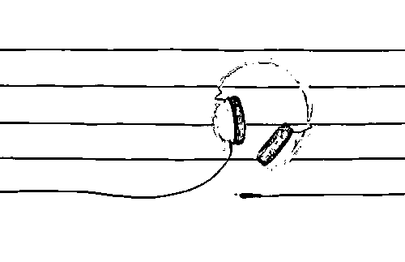

**大卫·瑞雷网络公益课程****“倾听一小时”听到爱 说出爱**

到底是我们选择了父母，还是父母选择了我们？

明明想与父母和解，却不知道如何让“爱”顺利流动？ 

听说每个地球人都有独属于自己的人生蓝图、灵魂使命，这张珍贵的生命地图该如何解读呢？

**带着这些问题，倾听一小时，大卫老师邀请您一起来学习"占星"——这个生命蓝图解码器。**  

老师将在本次课程中，带领我们从人本占星学的角度，探讨“父母与孩子的沟通”主题，如何做一个不评判的父母，如何运用占星学与父母沟通。如果你能找到对孩子“因材施教”的信息指引，了解我们与父母关系的独特因缘，就会看到我们彼此之间爱的联结！ 

课程内容

1、人本占星学的介绍

2、人本占星学的影响

3、个人成长的哲学就是——不评判

4、如何做一个不评判的父母

5、如何运用占星学与父母沟通

适合人群

● 致力于亲子关系成长的咨询师和占星师 

● 希望更好的理解童年与父母之间关系互动的人群

● 对占星学感兴趣的人群，无需占星基础

讲师介绍


**大卫•瑞雷(David Railey)**


**自我成长的三部曲是：觉察，接纳和改变。占星学是最好的自我觉察的工具之一，而变化就是变成你的星图所能赋予你的最美好的样子。**


大卫•瑞雷（David R. Railey），美国资深职业占星师。1970 年开始学习占星学，在通过亚特兰大职业占星委员会的考试后，于 1976 年获得执业许可，成为一名专职占星师。大卫老师，曾两任亚特兰大占星协会主席，是全美占星师联盟（AFAN）、美国占星师联合会（AFA）、全美占星研究委员会（NCGR）、国际占星研究协会（ISAR）和职业占星师组织（OPA）的成员，是联合占星大会（UAC, United Astrology Conference）督导委员会委员。

大卫老师曾是 CNN、CBS 的占星节目的常驻嘉宾，多次在 BBC、WGS、WSB、WRGG 等节目中接受采访，并在亚特兰大主持电视节目《每日行星（Daily Planets）》达 4 年之久。

大卫研究占星四十余年，拥有三十多年的占星咨询的执业经验，其服务客户包括学生、工人、市长、州长、议会议员、企业家、心理咨询师、工程师、艺术家、演员、知名企业家等，客户年龄跨度从襁褓婴儿到耄耋老人。

2010 年 6 月，大卫的书《灵魂的目标》中文版出版。大卫老师热爱教学，愿意将自己的毕生所学倾囊相授。为了将纯正的西方占星学带入中国、为了让更多的中国人从占星中获益，大卫老师在占星学的传授上投入了巨大的热情与心血。

**“了解自己是智慧的开始；了解占星是与自己相遇。”**

**“变化就是变成你的星盘所能赋予你的最美好的样子。”**

**“‘成为更真实的自己’意味着深入挖掘存在于你本身的各种可能性。”**

**——大卫•瑞雷**

如何参与

**公益价格**：**1.99 元** 

**开课日期**：**2016 年 1 月 21 日，20:00**开课

**授课形式**：**在线直播**

**报名及听课**：登陆 **“跟谁学”** APP 或者 PC 端上搜索**“****倾听一小时”**,或者直接点击文末左下方**阅读原文**

主办方介绍

此次课程由北京尚善公益基金、浙江敦和慈善基金会和心探索共同呈现。 

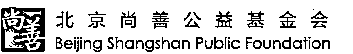
北京尚善公益基金会成立于 2012 年 10 月 25 日，是国内首家关注精神健康，抑郁症防治与知识普及的公益基金会。

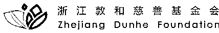
浙江敦和慈善基金会，致力于中国慈善事业的规范和繁荣发展，以慈善事业推动社会的和谐与进步，让更多需要帮助的人得到温暖，用心关爱每一个人，用爱关心每一天。


心探索是一个心灵成长自助网站，致力于向个人和企业提供心灵成长解决方案，倡导从心出发，创造美好的生活。

协办方介绍

**
裂帛•向内行走**

原创设计品牌 主张：人生需要裂帛的勇气

**若道占星**

国际占星研究协会（ISAR） 中国唯一指定教学机构

愿你是那个被倾听的以及懂得倾听的幸福的人。

 点击页面左下方**阅读原文**，即可进入报名页面。

**◆ ◆ ◆ ◆ ◆**


# 全息呼吸与原型占星工作坊 | 记者大卫发来前方报道

> 原文：[`mp.weixin.qq.com/s?__biz=MzA5NjA0NTAxNg==&mid=402554116&idx=3&sn=056996c2bba5adbd3aea66bb3f748745&chksm=02bccfb335cb46a5ae05cf6a2e2c16d819cddb39d98c893f46ca20590e8e5c50c8f043093fc5&scene=126&sessionid=1692738882#rd`](http://mp.weixin.qq.com/s?__biz=MzA5NjA0NTAxNg==&mid=402554116&idx=3&sn=056996c2bba5adbd3aea66bb3f748745&chksm=02bccfb335cb46a5ae05cf6a2e2c16d819cddb39d98c893f46ca20590e8e5c50c8f043093fc5&scene=126&sessionid=1692738882#rd)

**全息呼吸与原型占星工作坊花絮**

1 月 11 日-17 日，由超个人心理学家斯坦·格罗夫与哲学家理查德·塔纳斯教授带领的“全息呼吸与原型占星工作坊”在北京举行。若道的大卫·瑞雷老师变身“前方记者”，为大家发回了现场报道——

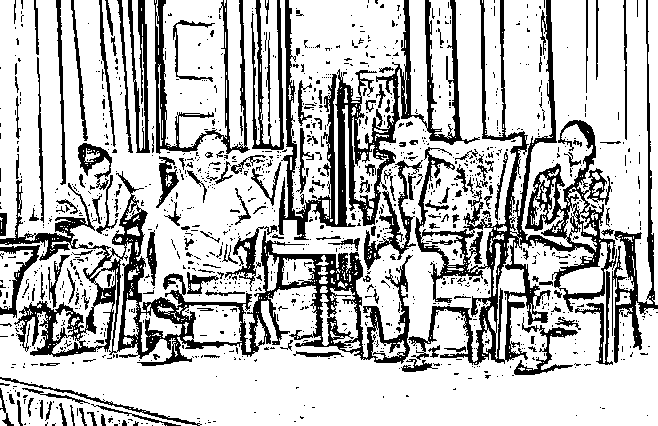

▲全息呼吸与原型占星工作坊现场

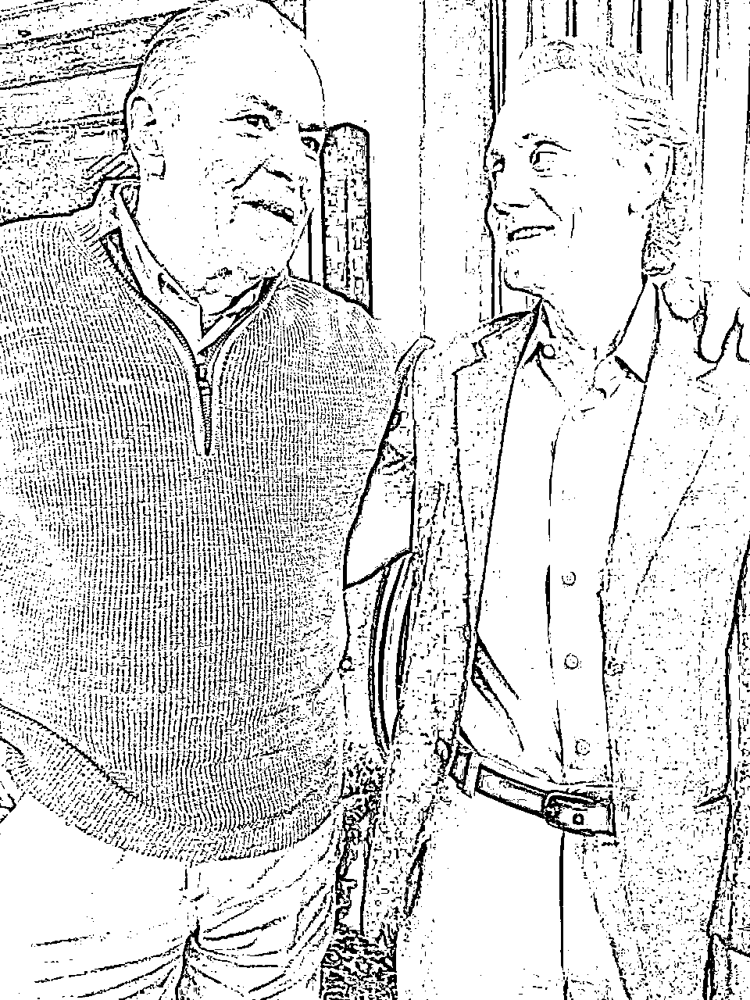

▲格罗夫（左）与塔纳斯（右）有多年的友谊


▲塔纳斯教授讲解原型占星

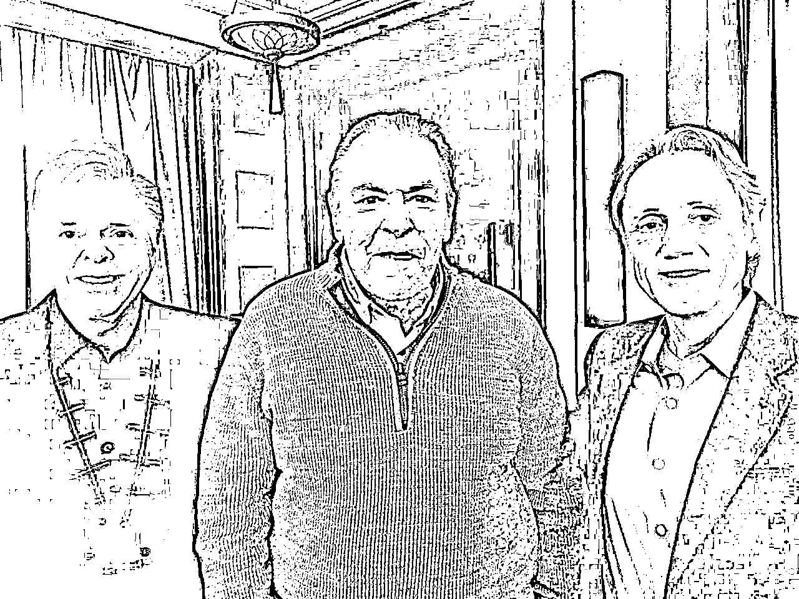

▲大卫（左）与格罗夫（中）塔纳斯（右）合影

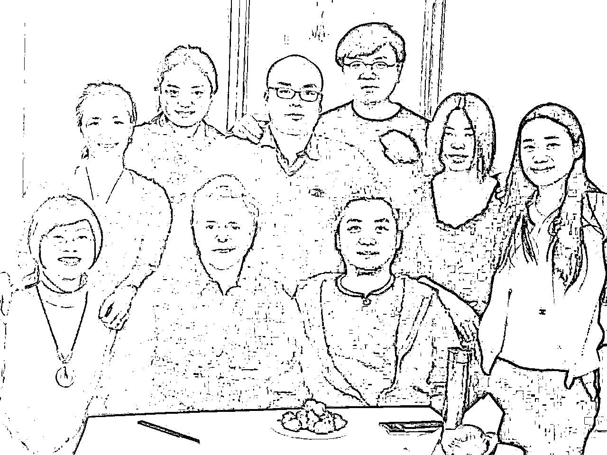

▲课后大卫老师（右）与部分同学合影

在工作坊现场，塔纳斯向约 70 名学员介绍了原型占星学。听了他的讲解后，即便之前对占星学有所了解的学员，都开始用一种全新的角度看待星图。他还对所有的学员说：你们都应该去若道学习占星学。（小编好感动 ~>_<~+）

**◆ ◆ ◆ ◆ ◆**

各种程度的占星学课程这里都有，请点击“**阅读原文**”了解！**5 月，**塔纳斯将在若道开办“**原型占星学**”课程，敬请期待！


# 处女座木星 | 来来来！快看看你 2016 年的好运在哪里

> 原文：[`mp.weixin.qq.com/s?__biz=MzA5NjA0NTAxNg==&mid=402546517&idx=1&sn=7dac0e43ef8077cc86f0aa86d245c50b&chksm=02bcede235cb64f42d63abf3f20faedca2d50569776cdb5f61b5fb1989a6d012b8aefa80556b&scene=126&sessionid=1692738887#rd`](http://mp.weixin.qq.com/s?__biz=MzA5NjA0NTAxNg==&mid=402546517&idx=1&sn=7dac0e43ef8077cc86f0aa86d245c50b&chksm=02bcede235cb64f42d63abf3f20faedca2d50569776cdb5f61b5fb1989a6d012b8aefa80556b&scene=126&sessionid=1692738887#rd)

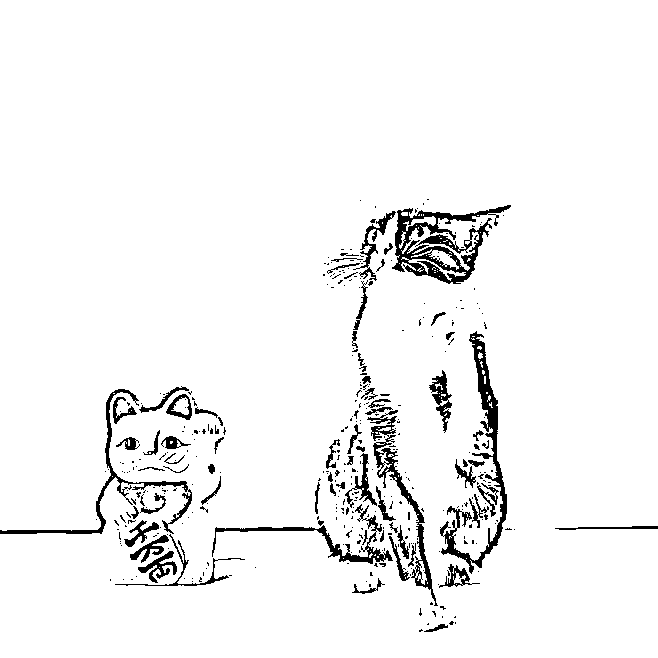

作者/大卫·瑞雷

翻译、整理/Elle、Hellen

图片/花瓣网

2016 年，木星会在处女座一直待到 9 月初。在未来 8 个月的时间里，你还是会受木星在处女座能量的眷顾。同样一颗木星，当它行进在出生星图中的不同宫位时，会给人带来不同的影响。下面就让大卫老师告诉你，处女座木星过 12 宫带来的不同影响吧。

►想知道行进的木星现在位于你出生星图的哪个宫位，可以点击 nodoorbj 微信公众号下方菜单栏的“各类查询”→“行运盘”，在左边“本命盘”和右边“行运盘”中输入相应信息，生成星盘后寻找外圈中的（木星）位置，图中 1-12 即一宫到十二宫。

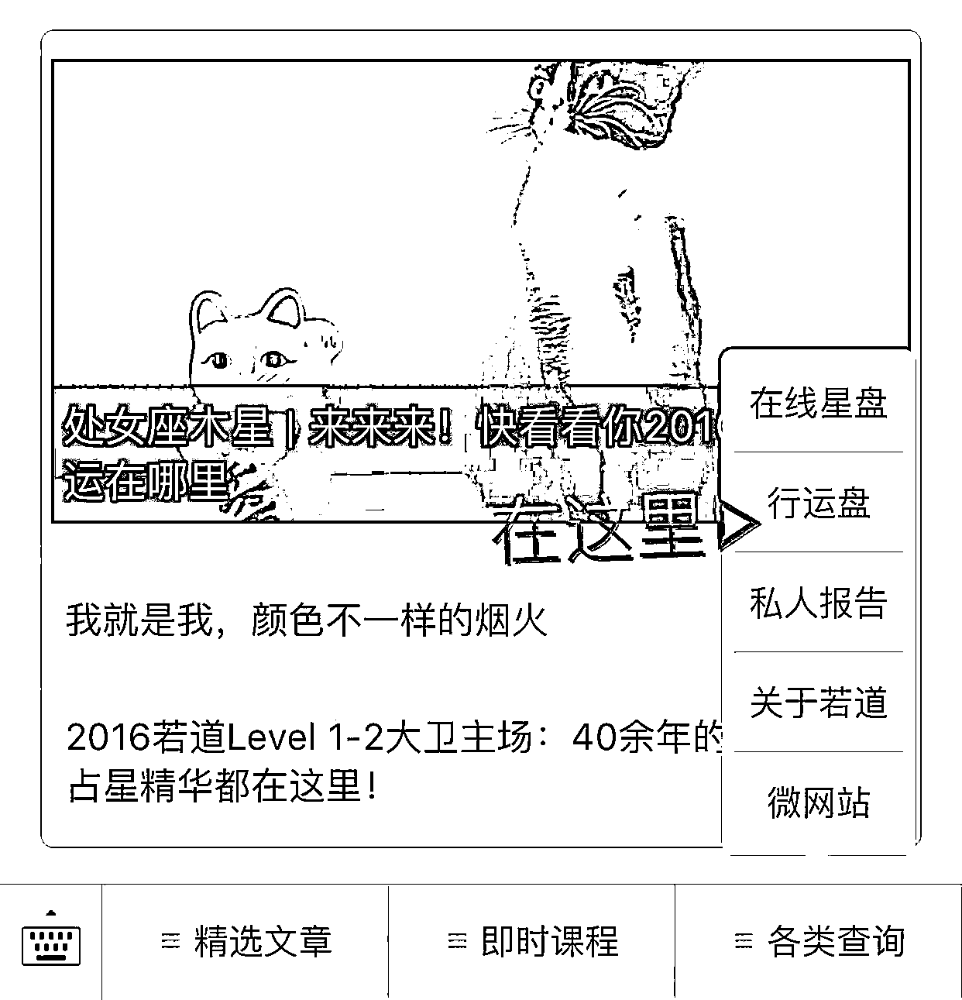 

01**处女座木星过一宫**

**利于自我感觉**

“天啊，我会长胖吗？”你会想。不要担心，木星在处女座呢。你可以运用处女座木星的能量好好计算卡路里，记录下自己 24 小时的饮食。此外，你对营养和有机食品也开始感兴趣。

如果你是上升处女座，你会开始对自己的感觉好起来，不再那么挑剔自己。

2**处女座木星过二宫**

**利于赚钱**

你认为木星过你二宫的时候你会赚更多的钱？可能吧，但也可能你赚得多花得也多。**如果你有一技之长，木星过二宫的时候，的确有机会挣得更多的金钱。**

如果你的二宫头是处女座，你可能是那种在小钱上斤斤计较，对大钱却迷糊的人（二宫头处女座，八宫头双鱼座）。举个例子，你可能在网购上花了 6 个钟头比来比去，就为了省个 10 元钱。而你会借 5000 元给你的室友，明知他不会把钱还给你。

总体来说，接下来的 8 个月，你的收入应该是令人期待的。二宫头处女座的人很可能是上升狮子座。接下来的几个月，你可能会挣很多钱，然后你会拿这些钱来买更多行头，使得本来已经很炫目的你更加炫目。要记得，省着点花。

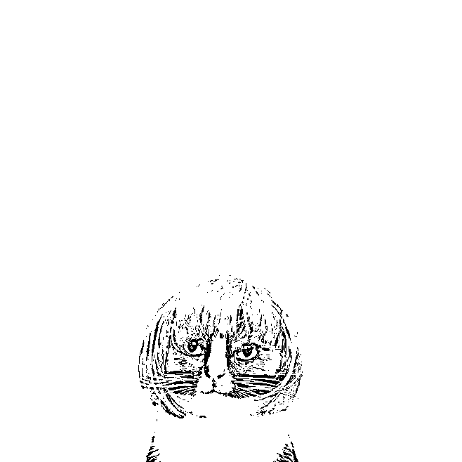

3**处女座木星过三宫**

**利用技能学习**

你开车吗？如果你要参加一个驾驶考试，就去试试吧。这时也有利于买车。如果你是上升巨蟹座，或许你会买一辆类似 SUV 的车，拥有一个能装下所有家人的移动的家，或者你也可以买辆炫酷的自行车。

**木星过三宫时你可以去学一些新的技术。**如果你是上升巨蟹座，你可以去学烧菜。学成归来用自己的新技术让朋友和邻居们大吃一惊，对你赞叹不已。你也可以做一些短期旅行，小小地冒险一下。考虑到木星在处女座，你需要提前做计划。你也可以尝试写点文章，试试自己的写作能力，尝试用这种方法来与别人联结。

4**处女座木星过四宫**

**利于改善房屋**

**要么搬家，要么改善（Move or improve）。这句话是木星过四宫的关键所在。**可以装修一下房间，或者换个大点的房子，或者是换掉脚臭味儿让你想起臭豆腐的室友。

如果木星过四宫，你可能是上升双子座，或上升巨蟹座。上升双子座会需要一个大的地方来放置超大屏电视或者车辆。上升巨蟹座会需要一个装备齐全的厨房或大大的床。

木星过四宫还意味着可能是你改善与家人关系的机会（取决于你星图中其他的配置）。可能你买了大房子，家人都会搬来跟你一起住了。这对你来说是好消息还是坏消息？木星处女在四宫也有这样的意涵：用收纳盒把自己的东西都分类放好。

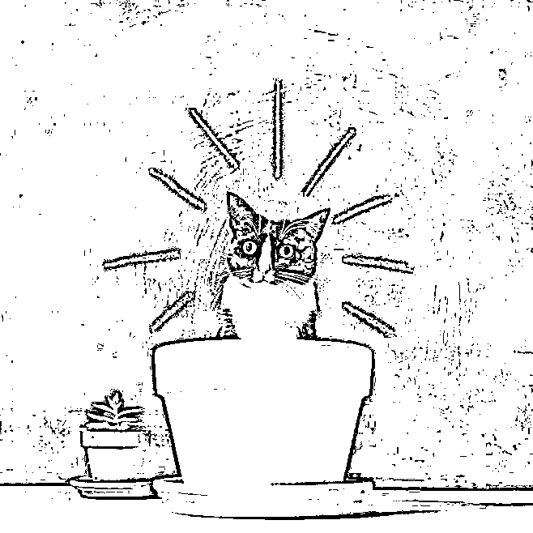

5**处女座木星过五宫**

**利于发展爱好**

五宫是好玩儿的宫位。上升金牛座的人，好玩儿的事情是什么呢？可能会是投资。

五宫某种意义上也是派对、恋爱的宫位。参加某种特别的爱好、组织的活动。例如集邮或者书法聚会。**处女座跟很细节化的爱好相关。处女座木星过五宫的时候，你可以发展这些爱好。**

6**处女座木星过六宫**

**利于工作**

你想要换工作？想要工作气氛更融洽？你希望你不太喜欢的人辞职换公司？

你很可能是上升白羊座。**这段时间你可以很好地享受目前的工作。**如果你不喜欢目前的工作，你可以去找找其他的工作，看看有没有什么你真的很喜欢的（因为木星此时很可能三分了你的中天）。

六宫同时与健康有关。买把新牙刷吧。很多人也许更关注自己的身体，关注营养学等。

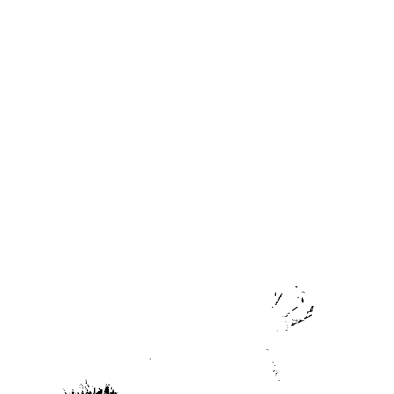

7**处女座木星过七宫**

**利于合作**

你很可能是上升双鱼座。是否意味着完美的白马王子会出现？我不确定。如果你内心真的准备好了，很可能会有合适的人出现。当然也有可能出现的人并不是你想要的。为什么呢？因为上升双鱼座对关系有理想化的倾向。

当然七宫也是关于商业合作的，**如果木星过你七宫的时候你想要建立一些商业合作关系，很可能是合适的**，当然也要看你的星图中其他的配置以及你合作伙伴的星图配置。

8**处女座木星过八宫**

**利于亲密关系**

男生们可能自动就开始想这一年和“性”相关。但是我来看，这意味着你的第八宫宫头是处女座或是狮子座的尾巴。你的上升点很可能是水瓶座。八宫有关亲密关系和性，而处女座对特定细节有所要求，**也许你会找到一个很合拍的亲密伴侣。**

八宫也是关于共有的资源，可能你跟你的伴侣开始有一个联名账号。八宫也跟继承遗产有关的，当然这只是一种小的可能，不用伸长脖子等这样的事情发生。八宫还跟借钱有关。处女座木星过八宫，可能是用很有逻辑的商业计划书为自己的商业项目赢得了投资。

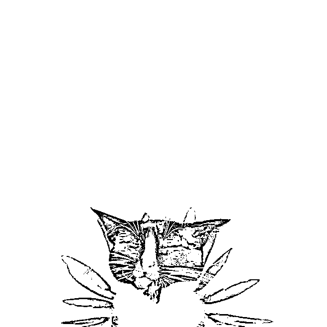

9**处女座木星过九宫**

**利于高等教育**

你很可能是上升摩羯座。**此时有利于高等教育或者任何正式的教育。**接收到奖学金会是一种可能性。可能你在学一门专业性比较强的学科，比如占星学，那么木星过九宫的时候，是很好的学习它的时间。木星过九宫可能意味着学习一些很有专业性的东西。

处女座木星过九宫，很可能意味着，你因为生意上或工作上的原因需要经常做长途旅行。木星过九宫对于所有从事国际贸易的人都很有利。

10**处女座木星过十宫**

**利于跳槽**

我知道很多人都会想：哦，我会得到升职加薪，我会换到更好的工作，我会变得很有名。很可能不会发生这样的事情。

处女座处女过你的十宫，你很可能是上升射手座或天蝎座。你可能去敲老板的门，觉得你一定会得到升职加薪，但这取决于你是否拥有升职加薪所需要的专业技能。

**木星过十宫的时候，比较适合从一个公司跳到另外一个公司**，但如果是换一个行业，可能需要更多的占星指征。毕竟，木星在十宫只会停留一年，而职业的大转变需要一个人做很多的准备，需要比较长的时间。

木星在十宫的时候，你可能会受到一些公众的认可。

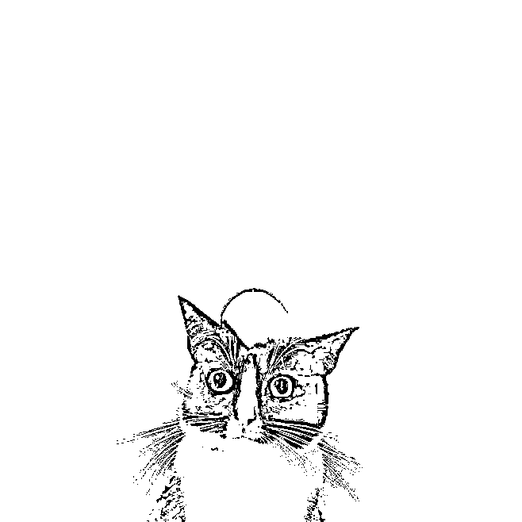

11 处女座木星过十一宫

利于社交

当处女座木星在十一宫时，你可能终于得以进入某个俱乐部或者组织。你可以认识一些新的朋友，也可能意味着改善跟老朋友的关系。**木星过十一宫意味着你可以扩展你社交的区域。**

12 处女座木星过十二宫

利于灵性

十二宫与灵性生活有关，**木星过十二宫可能意味着你的灵性生活更好地打开**。

而处女座有关学习技术，因此这一年可能是你去学习冥想、呼吸方法的好时机，来帮助你更好地打开自己。可能你开始学瑜伽、太极、气功，而这些都成为了你往后人生的一部分。

同时，也可能意味着你参加了某些慈善组织。十二宫是关于反馈给这个世界，帮助这个世界成为一个更好的地方的。

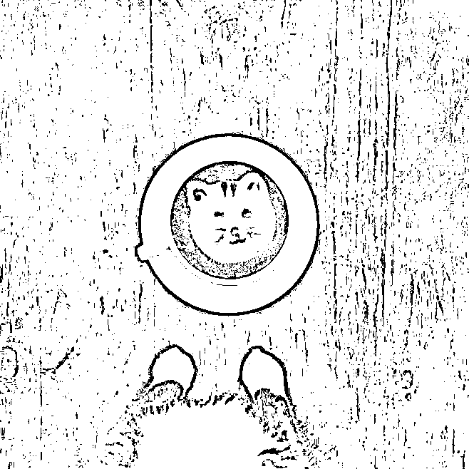

**◆ ◆ ◆ ◆ ◆** 

►**大卫老师 2016 年其他运势请戳：**

[重磅 | 大卫 2016 年运，全面解读四大趋势](http://mp.weixin.qq.com/s?__biz=MzA5NjA0NTAxNg==&mid=402527351&idx=1&sn=b47f50c76eb55b8352cea419e1727e3e&scene=21#wechat_redirect) 

[未来两年想在职场有所建树？大卫老师帮你找线索](http://mp.weixin.qq.com/s?__biz=MzA5NjA0NTAxNg==&mid=402536865&idx=2&sn=8b8e7ea613c334aa8fdfe5538d213b31&scene=21#wechat_redirect)**[](http://mp.weixin.qq.com/s?__biz=MzA5NjA0NTAxNg==&mid=402536865&idx=2&sn=8b8e7ea613c334aa8fdfe5538d213b31&scene=21#wechat_redirect)** 

了解运势，把握人生。**2016 年 3 月 15 日**，大卫老师主讲的若道占星核心课程**Level 5**要开课了！在这个阶段，你将学习各种预测技术及行星周期。通过这些预测工具，你能够预测和规划人生。提前报名付款有**早鸟价**哦！详细内容请点击“**阅读原文**”了解。


# 我就是我，颜色不一样的烟火

> 原文：[`mp.weixin.qq.com/s?__biz=MzA5NjA0NTAxNg==&mid=402546517&idx=2&sn=ad05d363c1fc673aecc5ce7b86c3fafd&chksm=02bcede235cb64f486aaeb4baa5aef39af9bd6552388dd39ecd8fe752c08e15df0cce2f4ba6b&scene=126&sessionid=1692738887#rd`](http://mp.weixin.qq.com/s?__biz=MzA5NjA0NTAxNg==&mid=402546517&idx=2&sn=ad05d363c1fc673aecc5ce7b86c3fafd&chksm=02bcede235cb64f486aaeb4baa5aef39af9bd6552388dd39ecd8fe752c08e15df0cce2f4ba6b&scene=126&sessionid=1692738887#rd)

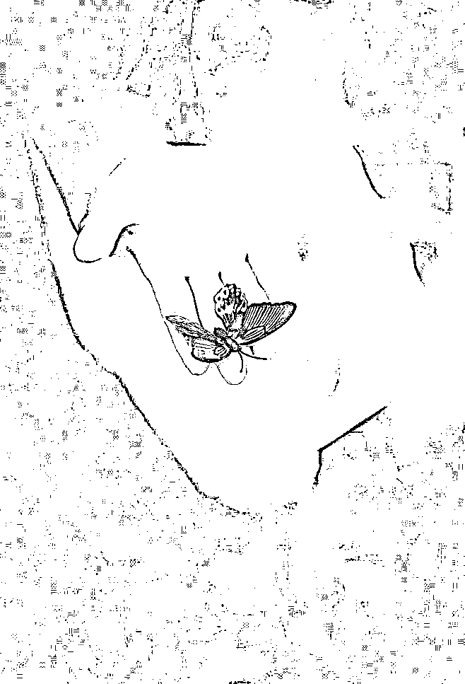

占星学是什么？被扔进“十二星座篮子里”的刻板教条？作者通过接触占星沙龙之后，深入了解占星学是一门严肃的学问，这门学问是如何帮助她更好地了解自己，明白自己是这个世界上独一无二的存在呢？看完本文，相信您会有所共鸣。

1

**占星学——不是简单的十二星座**

从前看娱乐性的星座解读，都是简单粗暴的刻板印象，比如处女座总是强迫症完美主义，双鱼座总是浪漫柔弱哭哭啼啼，这让我对关于的星座一切都充满排斥，凡有人提起我必用“世界上这么多人怎么可能被扔进十二个篮子里”予以抨击。

直到有一天，我突发奇想参加了一个占星沙龙，才知道原来还有一门严肃的学问叫做占星学，从此开始阅读占星学书籍，接触各路占星师，慢慢认识自己的星图盘，才发现自己半开玩笑的“我来自冥王星”并非偶然。

*   **我的星图里确实有很强的冥王星能量——月亮合相冥王星在天蝎座十二宫。**

*   **也有很强的海王星能量——日水合相在双鱼座，海王星跟太阳、月亮、金星和天王星都有相位。**

2

**即使不被接纳，依然坚信的力量**

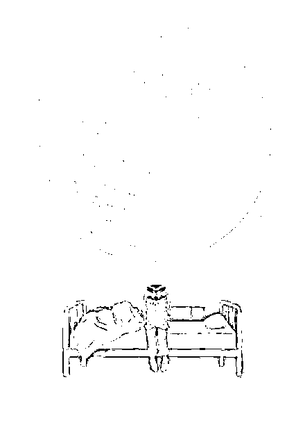

小时候，我的冥王星能量是不被外界接纳的，母亲常常说我**“你这个人怎么这么极端”**、**“你太敏感想太多了”**。所幸我并没有因此就扼杀这股能量——我隐隐约约地知道它并没有错，这就是我的一部分，只要用对地方，能让我的生命充满光芒。

正是因为我渴求生命的深度与强度，不满足于任何粉饰太平的自我安慰，才能穿透表象，看见万事万物深处的联结，才能拥有穿越烈焰之后的真正宁静，而非蜷缩在舒适区的肤浅和平。就像我的曼陀罗，我不带抗拒地进入激烈情绪时画出的画，完成之后却有一种神奇的宁静之美，许多人告诉我它们充满了治愈感。

我不害怕冥王星的毁灭性的烈火，因为真实的东西是不可能被损伤的。我敢于杀死旧的自己，每隔一段时间就重生一次，对人对物也没有太深的执着，虽然也会感到一些不舍，但还是会干脆地丢弃不再有用的东西，离开不再同频的人。

海王星是冥王星的好朋友，当他俩手牵手向前走，可能让人变成一个性瘾者、一个暴力的酒鬼、一个妄想症控制狂，也可能让人变成充满慈悲与力量的疗愈师、看清宇宙奥秘的神秘主义者、充满深刻之美的艺术家……

3

**活出你的建设性还是破坏性？你有权选择**

**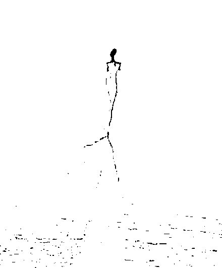** 

**每股能量都有建设性和破坏性的一面。**你可以用星图配置作为借口，放弃对人生的责任，声称“我海王星能量这么强，容易成瘾不怪我，就这么醉生梦死过一辈子好了”，也可以清醒地告诉自己“我清楚海王星能量带来的资源与挑战，我选择发展它的疗愈、宽恕、灵性与无条件的爱”。

我从小就欣然接受了海王星能量带来的想象力、共情力、灵性、艺术天赋……却把它给我的柔软脆弱这个礼物当做烫手的山芋，花了一段时间，才真正将它打开。

社会上有一个声音告诉我们，柔软脆弱是幼稚的、可耻的。于是我从小就很“强”，冷静，理性，独立，难过了一个人躲起来哭，不向他人表达自己的渴望。可我极其渴望去爱、渴望被爱，当爱的洪流冲破了防御，柔软脆弱终于回到了我的身上，我终于学会了像个孩子一样抱着信任的人哭泣，学会坦然地说出自己心中的感受与渴望，这时候我才明白，**敢于脆弱才是真正的强大，最柔韧的枝条最能在风暴中幸存。**

我曾经以为会被嫌弃和嘲笑的脆弱，却得到了别人的理解与接纳，让人际联结进入了一个新的深度。只要我不去用泪水操纵他人，泪水就是美丽的，只要我不把生命的责任推到他人身上，求助就是正当的。

我的脆弱给了别人爱我的机会，而去爱这件事，本来就是让人幸福的。也许，其他人也渴望着展现内心那个脆弱的孩子，只是在等着你迈出第一步。

4

**我就是我，独一无二的我**

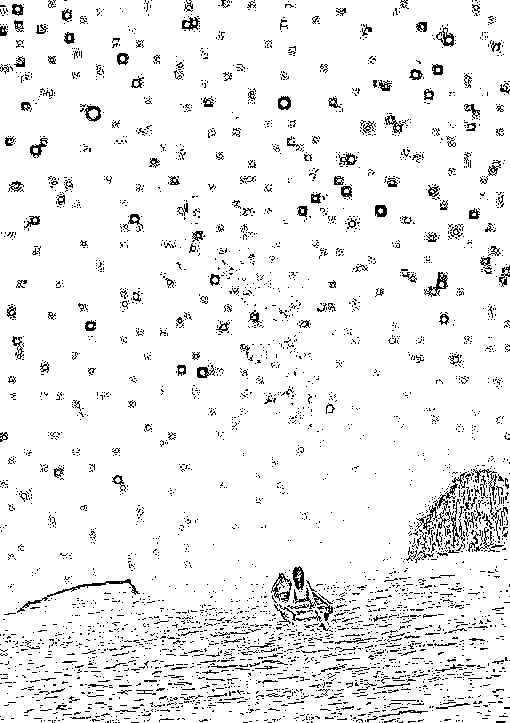

冥王星能量与海王星能量只是两个例子，每个星盘里都有海量信息，对它的认识是一个持续的过程，不必急于寻求一个过度简化的“答案”，随着成长的深入，对同一个星图的认识也一直在变化。我相信每个星图都是“完美”的，问题中已有答案深藏，伤痛下已有疗愈蛰伏。**占星学和心理学的相似之处，是引导我们接纳自己，而不是试图把自己扭曲成另外一个人。**

占星学给我最大的启示，是让我真正明白了人与人之间的不同——**每个人都有独特的资源、挑战、跟世界互动的方式，没有一条绝对通用的人生道路，一匹骏马出于好意的“接地气”的提醒，对飞鸟与鱼却并不适用。**

当我看到宇宙之浩瀚，生命之多样，自然对自己、对他人都有了更深的理解和接纳。

仰望星空时，可以看到自己的灵魂，内观灵魂时，也能发现一片璀璨星空。

►**占星学带给我哪些成长？**也**许你还对下面的文章感兴趣**

[一败涂地的爱情之后，如何再度拥抱幸福？](http://mp.weixin.qq.com/s?__biz=MzA5NjA0NTAxNg==&mid=402519167&idx=1&sn=19a2fa8d2af185d4a24468ea48e4f1b7&scene=21#wechat_redirect)

[仰望星空，触摸超越神性的光芒](http://mp.weixin.qq.com/s?__biz=MzA5NjA0NTAxNg==&mid=402168053&idx=1&sn=074b932d0c0d6a19f6580c7218dccd84&scene=21#wechat_redirect)

[愿桥都坚固，隧道都光明](http://mp.weixin.qq.com/s?__biz=MzA5NjA0NTAxNg==&mid=402168053&idx=2&sn=84d229561550f7e5580fbe57a4a4e351&scene=21#wechat_redirect)

[苛责过自己，方知随波逐流才得完美](http://mp.weixin.qq.com/s?__biz=MzA5NjA0NTAxNg==&mid=401908407&idx=2&sn=0472632631e46c331fc1f8c2612fae6c&scene=21#wechat_redirect)

[相亲失败，却收获最心动的礼物](http://mp.weixin.qq.com/s?__biz=MzA5NjA0NTAxNg==&mid=401827948&idx=1&sn=ecce3c656815682fd0c8a1eda1da9f93&scene=21#wechat_redirect)

**作者简介**

**Crystal，**一只被满天星辰感动得忘记折磨老鼠的猫。最喜欢挑战生命种种限制和幻相，带着爱与觉知在人间剧场中尽情玩耍。目前在国际组织从事性别平等工作。对身心灵整体疗愈、神秘学、艺术等各种跟真相与美有关的事物充满兴趣。

►本文来自读者投稿，如果您也有和占星学之间不可不说的故事，欢迎投稿，同我们一起分享您的精彩感悟。来稿请发至**astrology@nodoor.com。**

长按二维码，让金钱涌向传播知识与智慧的人~


**◆ ◆ ◆ ◆ ◆**

占星学帮你了解独一无二的你。**2016 年 3 月 10 日**，大卫老师主讲的若道占星核心课程**Level 1-2**要开课了！他将带领你学习星座、太阳、月亮、行星、月亮交点等知识，让你进入占星学的世界！提前报名付款有**早鸟价**哦！详细内容请点击“**阅读原文**”了解。

↓


# 2016 若道 Level 1-2 大卫主场：40 余年的占星精华都在这里！

> 原文：[`mp.weixin.qq.com/s?__biz=MzA5NjA0NTAxNg==&mid=402546517&idx=3&sn=60d4f47f5456423082531d402b0d73f0&chksm=02bcede235cb64f48b86d02f7628cf17ff48d63d3c5999caf3502b0e13c34c949027c5263fab&scene=126&sessionid=1692738887#rd`](http://mp.weixin.qq.com/s?__biz=MzA5NjA0NTAxNg==&mid=402546517&idx=3&sn=60d4f47f5456423082531d402b0d73f0&chksm=02bcede235cb64f48b86d02f7628cf17ff48d63d3c5999caf3502b0e13c34c949027c5263fab&scene=126&sessionid=1692738887#rd)

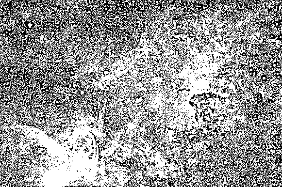


国际占星研究协会（ISAR）中国唯一指定教学机构

若道 2016 年占星核心课程 Level 1-2 上线

**这是一趟“星座小白”到“星座达人”之旅**

主讲人若道创始人**大卫·瑞雷**

**拥有四十年占星执业经验**

网络教学

全程即时翻译

不懂英文也没问题


**课程信息**

**授课时间：**2016 年 3 月 10 日**-4 月 28 日**

**授课老师：大卫·瑞雷（8**次**）、蒋颖（4**次**）**

**授课方式：**网络课

费用：**2400 元（2016 年 2 月 1 日前报名付款）**

**早鸟价：****1980 元（2016 年 1 月 25 日前报名付款**）

**报名截止：**2016 年 2 月 1 日

**课程负责人：王老师（微信号：2837474346）、童老师（微信号：80248863）**

**咨询电话：**400-619-1014

课服 QQ**：4006191014 （若道星文化）**

邮箱**：nodoor@vip.126.com**

课程简介


**星座、太阳和月亮**

12 星座是占星学最基本却又最深刻的概念，黄道 12 星座，是伟大的生命周期，而太阳和月亮是我们阴阳之本。

**●12 星座：**和大卫一起，深入了解 12 星座的特色。了解星座正面的、负面的表达，了解其资源，了解其破坏生命的模式。了解其原型人物、了解其指代的人事物。

**●12 星座原则：**按照极性、形态和元素给星座分类。

**●12 星座关键词：**关键词非常重要！是解读准确性的关键。

**●太阳和月亮：**了解你的太阳，生命的发动机，让你在世界闪光的方式，生命获得力量的方法；了解你的月亮，让你生命获得幸福的方法。了解它们，了解你生命中已经出现的、将会出现的男人和女人。


**遇见行星和月亮交点**

在这个阶段，你将遇见行星们，还有与灵魂的过往和未来相关的月亮交点。这既是你，你的性格，也是你在生命故事中将会遇到的人、事、物的显化，也是你灵魂轨迹的线索。

**●内行星：**水星、金星、火星

**●中间行星：**木星、土星

**●外行星：**天王星、海王星、冥王星

**●灵魂的线索：**月亮南交点、月亮北交点

**●行星逆行：**行星逆行的天文现象和意义

**●宫位初解：**了解黄道 12 宫的基本含义

时间安排

共 12**次**课，24 课时。

**●8 次理论课程**（大卫老师主讲、配有中文实时翻译）

北京时间每周四晚 20：00-22:00

**●4 次线上互动课程**（蒋颖老师主讲）

北京时间每周一晚 20：00-22:00（3.14/3.28/4.11/4.25)

授课优势

**①先进的教学平台**

网络教学平台，支持手机、电脑、iPad 上网，可以随时随地学习。

**②回放复习**

学员可登录网站收看课程回放，在线复习课程，每次课可完整重看 3 次，课程结束后的 3 个月内有效。　

课程特色

**①与名师面对面**：北京同学可以来若道现场上课，和大卫老师面对面互动。大卫老师也可能前往主要学员所在城市，实现零距离教学。

**②互动答疑**：论坛、微信群随时提问；老师课上答疑；助教线上线下全程协助。

**③线下沙龙**：定期举办沙龙活动，复习上课内容。

**④强大的同学网络**：若道作为中国最顶尖的占星教学机构，在 4 年的占星教学中，培养了很多占星人才。若道让你和师兄师姐切磋，让你和国内著名占星师学习。（简单来说，就是，人脉！）网络授课，在北京开设免费现场参与名额，全程英文授课，配备实时翻译。

师资力量

**讲师团队**


****大卫·瑞雷（David Railey）****

若道创始人，《灵魂的目标》作者。拥有四十年的占星咨询的执业经验，曾两任亚特兰大占星协会主席，是全美占星师联盟（AFAN）、美国占星师联合会（AFA）、全美占星研究委员会（NCGR）、国际占星研究协会（ISAR）和职业占星师组织（OPA）的成员，是联合占星大会（UAC, United Astrology Conference）督导委员会委员。大卫曾是 CNN、CBS 的占星节目的常驻嘉宾，多次在 BBC、WGS、WSB、WRGG 等节目中接受采访，并在亚特兰大主持电视节目《每日行星（Daily Planets）》达 4 年之久。


****蒋颖（Felicia）****

若道创始人，职业占星师。在若道系统学习占星，师从大卫·瑞雷。长江商学院 MBA，厦门大学经济学硕士，化学学士。国际占星研究协会（ISAR）中国区副主席。第一批获得国际占星研究协会（ISAR）认证的职业占星师。《灵魂的目标》译者。

**助教团队**


****熊鹰（天空的空）****

国际占星研究协会（ISAR）认证占星师。在若道系统学习占星，师从大卫·瑞雷，现任若道专职助教。将传播系统、严谨、真实的占星学作为职业使命。与此同时，提供一对一占星咨询服务与生时校正咨询。目前正致力于占星学与个人真修实证的整合。2014 年起主讲读书会，助教答疑课程累计超过 100 小时。


****Gaff****

全职占星师，既是占星师，也是疗愈者。2013 年开始在若道进行系统占星学习，师从大卫·瑞雷。任 2015 年度诺·泰尔、斯蒂芬·福里斯特老师的占星工作坊助教。提供一对一的咨询服务（已有超过 100 小时的咨询经验），基于个案咨询的经验，曾多次开设面授的占星课程。


2016 年，和若道老师一起，开启占星的探索之旅！

报名请点击文末“**阅读原文**”。

长按二维码接通课程负责人！


# 未来两年想在职场有所建树？大卫老师帮你找线索

> 原文：[`mp.weixin.qq.com/s?__biz=MzA5NjA0NTAxNg==&mid=402536865&idx=2&sn=8b8e7ea613c334aa8fdfe5538d213b31&chksm=02bc8b1635cb02007446aca46054922a9eb772da179113d9404077406b3088153fa2c90cbdff&scene=126&sessionid=1692738887#rd`](http://mp.weixin.qq.com/s?__biz=MzA5NjA0NTAxNg==&mid=402536865&idx=2&sn=8b8e7ea613c334aa8fdfe5538d213b31&chksm=02bc8b1635cb02007446aca46054922a9eb772da179113d9404077406b3088153fa2c90cbdff&scene=126&sessionid=1692738887#rd)

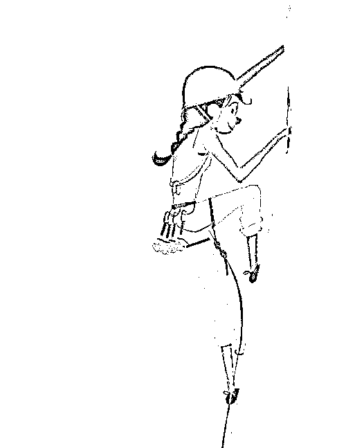

作者/大卫·瑞雷

译者/李含  校对/江艺

新的一年，相信很多人都制定了年度计划了吧。在事业方面，未来两年要好好利用射手座土星的能量哦。

土星的位置为我们提供了接下来两年的事业与商务趋势的线索。土星在 2016 年一整年和 2017 年的绝大部分时间都停留在射手座，延续它 2015 年在射手座靠前的位置已经形成的趋势。土星位于射手座既有其建设性也有破坏性表达，这些关联因素会呈现在社会和文化的发展中，以各种复杂多变的方式影响商业和贸易。

**案例**

假设你在一家公司中担任管理职务，公司的业务是为中国的大学提供教育资料。但是，如果实施与教育资料相关的新规程呢？也许，你会致力于协商延期，让你的公司有更多时间来遵从这些新规程，或者也许你的责任就是达到新的内容标准。

土星在射手座时，**你也可能参与到与旅游业各方面相关的新规则之中，比如，与邮轮安全相关的法规，或者与货车运输业和航空业有关的规则。**例如，在 2015 年土星进入射手座之后，在中国颁布了一项关于飞行员执照的新的航空业法规，现在要求所有的中国飞行员用标准的普通话清楚表述，不能带口音，以免造成理解上的困难。

下面这份列表是**土星在射手座可能的呈现方式，包括建设性的方面和破坏性的方面。**

你可以看看这些主题中，哪些可能会影响你的工作。不妨运用你的想象力和创造力，**将建设性的表达融入你 2016 年、2017 年的职业规划中，**在接下来两年里努力去磨砺它们，从而获得更多事业上的成就感和满足感。

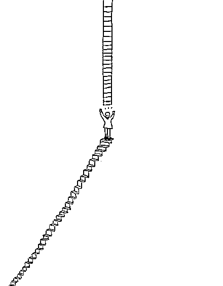

## **★土星在射手座的一体两面性表达**

**建设性表达**

自由，灵活的时间

冒险

热情

热爱学习

学生

大学学生

老师/教授

哲学

学者

教育

智慧

道德伦理

政策声明

宗教

法律，正义

国际法

国际旅行

移民入境

国际贸易

探索

全球影响

幽默

出版

**破坏性表达**

害怕被困住，滥用时间

狂野的行为

夸张，过度

无所不知的态度

无所不问

学术自负

不问自答，不停说教

太注重头脑，缺乏共情能力

没有常识

基于教育信念的恐惧

愚蠢

伪善且教条主义

歪曲，误导，没有贯彻实现

极端的信仰，狂热

对法律的僵化解释

各种边界纠纷

没留意日常环境

关于难民的矛盾和争论

贸易纠纷

不被欢迎的侵扰

害怕失去文化认同

取笑一切

版权问题，严格的审查制度

**大卫还写了 2016 年的年运，点击阅读：**


**◆ ◆ ◆ ◆ ◆**

想获得更多个人成长帮助？**2016 年 3 月 15 日**，大卫老师主讲的若道占星核心课程**Level 5**要开课了！你可以学习到各种预测技术及行星周期。通过这些预测工具，就能预测和规划人生。提前报名付款有**早鸟价**哦！详细内容请点击“**阅读原文**”了解。

↓


# 2015-2016 年度若道 Level 5：预测规划你的人生

> 原文：[`mp.weixin.qq.com/s?__biz=MzA5NjA0NTAxNg==&mid=402536865&idx=3&sn=ceaff1920f5057dcbff311ca666c2e6c&chksm=02bc8b1635cb02006dcdf686c5ea255d97b039884381066dfe2e3722e497642d99a768bc7da1&scene=126&sessionid=1692738887#rd`](http://mp.weixin.qq.com/s?__biz=MzA5NjA0NTAxNg==&mid=402536865&idx=3&sn=ceaff1920f5057dcbff311ca666c2e6c&chksm=02bc8b1635cb02006dcdf686c5ea255d97b039884381066dfe2e3722e497642d99a768bc7da1&scene=126&sessionid=1692738887#rd)

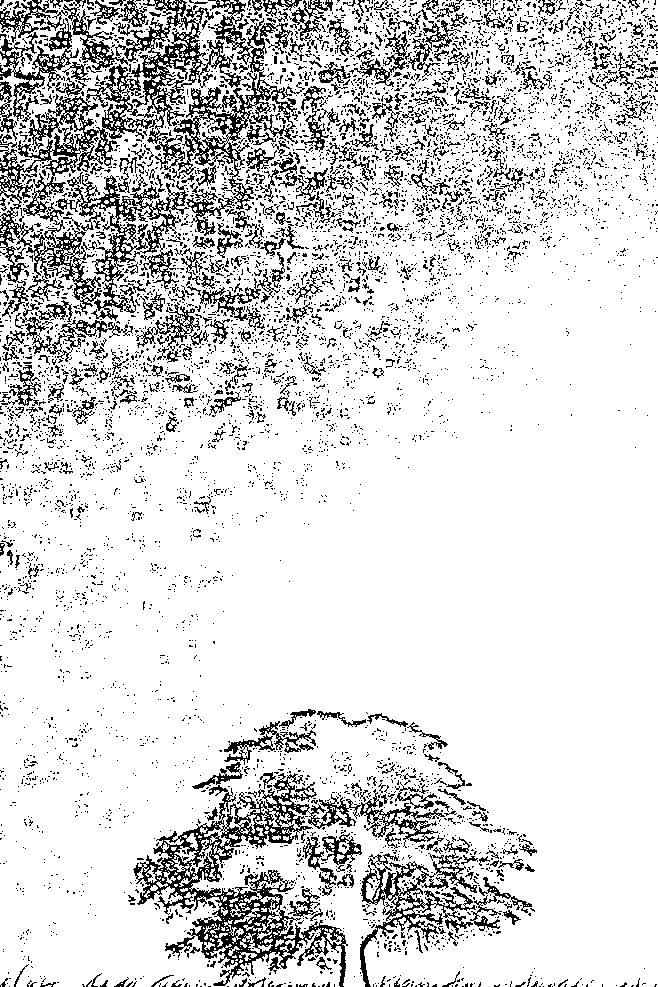


在这个阶段

你将学习各种**预测技术**

行进、月亮次限、太阳弧、返照图

你会学到行星周期

天上哪朵云什么时候会飘到这个人的头顶呢

会如何影响这个人的人生呢

通过这些预测工具

**你就能用它来预测和规划人生了**

**课程讯息**

**授课时间：**2016 年 3 月 15-9 月 13 日

**授课老师：**大卫·瑞雷

**授课方式：**网络课

**费用：****15000 元**

**报名截止：**2016 年 3 月 11 日

**课程负责人：**siri**（微信号：2847613491）**

**咨询电话：**400-619-1014

课服 QQ：**4006191014 （若道星文化）**

课程简介

****课程安排太丰富**了！**

行进

行星周期

爱情中的机会和挑战时机

职业周期

月亮次限

太阳弧

太阳返照、月亮返照

综合预测

组合图

占星学历史

占星学中的天文学

ISAR 考试词汇表

咨询技巧培训

**●**在整个教学过程中，不仅用名人案例讲解，而且将会抽取同学星图，进行实战咨询示范。另外，会有 4 节课的咨询技巧培训帮助大家准备好进入实战。

授课时间

2016 年 3 月 15 日-9 月 13 日

每周二晚 20：00-22:00（北京时间）

共 27 次课

有关毕业

**考试和实习：**对于那些想要获得大卫老师资质班证书的朋友，我们将帮助大家在开始成为职业占星师之前，将由专业占星师组织小型督导工作坊，帮助大家实战解盘，为正式的收费咨询做好准备。通过毕业考试，参加督导工作坊，星盘解读的同学，将获得大卫老师颁发的职业占星师资质证书。

授课优势

**①先进的教学平台**

网络教学平台，支持手机、电脑、iPad 上网，可以随时随地学习。

**②回放复习**

学员可登录网站收看课程回放，在线复习课程，每次课可完整重看 3 次，课程结束后的 3 个月内有效。　

课程特色

**①与名师面对面**：北京同学可以来若道现场上课，和大卫老师面对面互动。大卫老师也可能前往主要学员所在城市，实现零距离教学。

**②互动答疑**：论坛、微信群随时提问；老师课上答疑；助教线上线下全程协助。

**③线下沙龙**：定期举办沙龙活动，复习上课内容。

**④强大的同学网络**：若道作为中国最顶尖的占星教学机构，在 4 年的占星教学中，培养了很多占星人才。若道让你和师兄师姐切磋，让你和国内著名占星师学习。（简单来说，就是，人脉！）网络授课，在北京开设免费现场参与名额，全程英文授课，配备实时翻译。

师资力量

**讲师**


**大卫·瑞雷（David Railey）**

若道创始人，《灵魂的目标》作者。拥有四十年的占星咨询的执业经验，曾两任亚特兰大占星协会主席，是全美占星师联盟（AFAN）、美国占星师联合会（AFA）、全美占星研究委员会（NCGR）、国际占星研究协会（ISAR）和职业占星师组织（OPA）的成员，是联合占星大会（UAC, United Astrology Conference）督导委员会委员。大卫曾是 CNN、CBS 的占星节目的常驻嘉宾，多次在 BBC、WGS、WSB、WRGG 等节目中接受采访，并在亚特兰大主持电视节目《每日行星（Daily Planets）》达 4 年之久。


2016 年，和大卫老师一起，开启占星的探索之旅！

报名及咨询，请点击文末“**阅读原文**”。

长按二维码添加课程负责人咨询~

****

# 摩羯座 | 抑郁又怎样，你终究要面对成功议题

> 原文：[`mp.weixin.qq.com/s?__biz=MzA5NjA0NTAxNg==&mid=402536865&idx=1&sn=0434ba8f5cbbe766425e780f05d3e508&chksm=02bc8b1635cb0200b41d9911812da8e5037d49209bd00f68779767469d5de039d3d6f437fc21&scene=126&sessionid=1692738887#rd`](http://mp.weixin.qq.com/s?__biz=MzA5NjA0NTAxNg==&mid=402536865&idx=1&sn=0434ba8f5cbbe766425e780f05d3e508&chksm=02bc8b1635cb0200b41d9911812da8e5037d49209bd00f68779767469d5de039d3d6f437fc21&scene=126&sessionid=1692738887#rd)

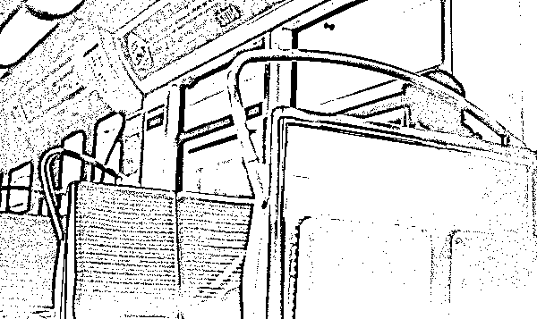
作者/大卫·瑞雷

译者/李含 校对/轩轩

在探讨过摩羯座个人成长的[“自律”议题（点击可阅读）](http://mp.weixin.qq.com/s?__biz=MzA5NjA0NTAxNg==&mid=401869936&idx=1&sn=5f08ca252b9b6114d0bac5a0658b6578&scene=21#wechat_redirect)后，今天我们进入**摩羯座的第二个议题**——成功。我们会发现，有一些太阳**摩羯座人看上去并不像摩羯座，他们不刻苦，人生目标不明确，也不追求事业成功……这是为什么呢**？也许，他们是得了**“摩羯座抑郁症”。**

**没有雄心壮志的中国男孩**

**案例 1**

“我是一个摩羯座，但我一点雄心壮志都没有。这是为什么？”

有一位差不多 20 岁的年轻男性在北京书店问了我这个问题。我首先告诉他一个最明显的答案：“你的太阳落在摩羯座，但是你……”我看了一眼他的星图，“但你的金星在射手座，月亮在白羊座，上升点在双子座，这些星座并不像摩羯座。”同时，**和许多人一样，他的个性和行为由多种多样的占星元素编织而成，表达了不同于太阳摩羯座的能量。**

但是，这个答案，虽然确实正确，但却没有回答为何他的太阳摩羯被淹没在其他的行星组合之中。毕竟，太阳在任何星图中都是重要元素。发生了什么呢？

为了找到答案，我向这位年轻人提出了一个更加深入的问题：“你的父亲是一位怎样的人？”然后，我在交谈中继续观察他的星图。“我不知道，真的。我父亲去世的时候，我才 4 岁，”他回答道：“对于父亲，我没有任何记忆，我母亲也很少谈起他。”

**我总是会提出关于父亲的问题，因为“太阳”在星图中正是代表父亲，或者继父或男性的影响力。**“你的母亲有再婚么？”“没有”他回答道。在他的案例中，父亲显然缺席了，但是这并不总是意味着他太阳的能量也是缺席的。有时候，缺席的父亲会放大太阳的表达，因为此人试图按照他们的太阳创造一个强大的内在父亲作为补偿。

但这个案例并不是这样，我在思考这是为什么呢？观察这位青年的星图，我注意到，他的白羊座月亮与摩羯座太阳成四分相（四分相预示着潜在的冲突）。“你母亲是否生你父亲的气呢，因为……他的过世？”我问道。“是的，”他给了确定的回答，并有一点吃惊，“她总是说，他如果不是那么野心勃勃，就不会死了。”突然之间，我就明白了！

他解释道，父亲为了获得学位在夜校学习，同时是一名出租车司机。显然，父亲在载客途中睡着了，出租车撞上了桥栏发生了车祸。在听这位年轻人的故事时，我们四目相接。我可以看到，他的眼角有些湿润，他也明白了。“你明白了，对吧？”我说。“是的”，他重复道，“是的”。**母亲积压的悲伤、失落和愤怒，以及她对于雄心壮志的责难，封印了这个男孩摩羯座的太阳，就像炉火将粘土烧制成了坚硬的瓷器。**

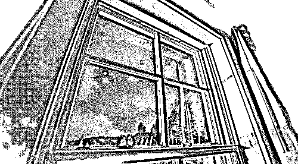 

**摩羯座抑郁症**

**在我的占星实践中，我遇到过很多客户对他们的摩羯座太阳的表达都由于早年生活的困顿，而出现了严重的扭曲或封闭阻塞。**通常这样的太阳都有强大的相位，合相、四分相或对分相，（相位指的是在 360 度黄道圆周上，行星或关键点之间的几何角度关系）。在这个案例中，年轻人提到，他落在 8 宫的摩羯座太阳正好与海王星合相，与白羊座月亮成四分相。

*   **几乎所有这类案例中，志向抱负都被童年伤痛和青少年时期经历所催生的信念所阻碍**。

*   **这种信念体系不仅仅破坏了一切追求成就的驱动力，还常常弱化了他们的义务和责任意识，削弱了他们自律和规划的能力。**

*   **缺乏自尊、懒惰，对于生活总是郁郁寡欢的态度，便是这一类摩羯座人的特征。**

**“摩羯座抑郁症”的核心是一个信念体系**，这个信念体系认为，**任何成功都是遥不可及的，因此“何必去折腾？”在这些案例中，摩羯座将自己视为“失败者”，尽管有一些人会试图伪装，摆出不屑一顾的姿态，好像厌倦了这个世界**——这个在他们眼中或腐化、或悲伤、或遥不可及的世界。

但是，在这个案例中，我进一步认识到，**这些作为“摩羯座抑郁症”的症候特征，是可以被克服的。**


**自视失败的美国女性**

**案例 2**

许多年前，一位太阳摩羯座女士来向我咨询，是一位朋友为她支付了咨询费用，敦促她来见我。那时候我对她的了解仅是，她就职于一家相框商店，拿着最低工资，此前她从大学辍学了。她无精打采地坐在我对面的椅子上，看起来已经被生活摧垮了，几乎无法跟我目光接触。

“我觉得你是个艺术家，”我说，作为谈话的开场。“是我的星图告诉你的吗？”她回答道。我在她的声音中听到了坚韧。“嗯，也许是？”我说，“但这是你朋友告诉我的。她说你在大学主修的是艺术专业？”“是的，我是，”她耸耸肩，看起来她真后悔答应来见我。“你为什么选择艺术专业？”我问。“难道不应该是你告诉我为什么吗？或者，难道我的星图说这是个糟糕的选择，或者我的确是个糟糕的艺术家？”我停下来看看她的星图。“事实上，你的星图告诉我，这个人可能成为一位艺术家，甚至是艺术经纪人。”她立刻就笑了起来，带着沙哑的笑声，惊愕地看着我。“真是丰富呀！”她断然地说。“这大概是这个世界上我最不愿去做的事儿了。”

不用多说，我依然清晰地记得当时我有多么气馁。那时候，我从事职业占星才 3 年，经过了 6 年的学习，一位新客户来见我，却有点不情不愿，这的确是种挑战。但是，我已经学会相信星图、相信这个过程，所以我决定继续。

“你的父母亲是艺术家吗？”我询问。她的眼中闪出怀疑的目光。“谁告诉你的？”“没人告诉我，”我回答，“但是你的星图显示，你的双亲都具有创造性的影响力，或者他们自己就是充满创造力的人。”“嗯，的确是这样，”她实事求是地回答。“星图还显示了什么？”“你父亲可能挣扎于某个涉及上瘾的问题……”“这个说法已经比较委婉了，”她证实道。于是我赢得了她的关注。

那天渐渐展开的故事的确有着难以忘却的悲伤。她的父亲有酗酒的问题，还会有暴力和责骂。她的母亲与父亲离婚时，我的客户大约 15 岁，但是伤害已然造就。她的父亲有好几次都几乎要成为一位真正成功的画家，但是酗酒问题总是暗中破坏持久成功的机会。她形容道，醉酒暴怒的父亲会毁掉所有东西。他们住在纽约的一间阁楼样的房子中，父亲醉酒时她会躲起来，之后再出来收拾被砸的残骸和支离破碎的画作。他有时候会追赶她和她母亲，冲她们大叫，拿东西砸她们。

我的客户说，她小时候，会跟在妈妈后面，捡起父亲毁掉的画作，她们会试图重新辨认，打扫画室。有一次，大约在她 9、10 岁的时候，她快速地将几幅他的画作藏进了壁橱，有一次在父亲酗酒时，她躲在这里。不幸的是，父亲找到了她和画作，并当面砸掉了画作，不顾她的尖叫和哭泣祈求。

与这位年轻的摩羯座女士最初的对话是一个开端，后面又持续了好几年。逐渐地，她变得更愿意去面对童年造成的影响，我向她推荐了一位心理治疗师，她接受了治疗。我和她的咨询变成了一种衡量她恢复程度的度尺，对于占星学描绘出的天性与潜力，她也越来越了解。

最终，她搬回纽约，我们换成了电话咨询。她成为了一位非常成功的艺术经纪人，管理着纽约艺术界一些最具有天赋的艺术家。她也兼职绘画和雕塑，她快乐地称之为“忙碌疯狂的美好生活”。她和很久以前初见我时那个抑郁的姑娘完全判若两人。她拥有淡定的自信，她就是那样，知道自己在干什么，知道计划的方向。

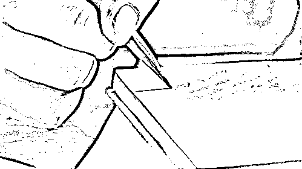 

**摩羯座的成功需求**

**每一个摩羯座人都有问鼎成就的潜能**，**在通往成功的路上会有许多挫折。成功和失败就是摩羯座硬币的正反面。但是这枚硬币必须被使用，反复花费，去获得摩羯座的充分体验**。

对于摩羯座的指责可能有：冷酷、严厉、严肃、野心勃勃、攀高枝、利用他人、不断的竞争、不惜一切代价取得胜利等等，有时候的确如此。但这些指责是失衡、极端的摩羯座。这种偏激的动机，造成失衡的局面让人害怕，但每个星座都是如此！

*   **对摩羯座人来说，这种极端状况不仅源自对失败的恐惧，更是来源于对“成为”失败者的更深的恐惧。**

*   **任何让摩羯座贴上失败者标签的信念体系，都阻碍、延迟了他们成就的显现。**

*   **摩羯座必须面对和清除这种带来恐惧的信念体系，才能真正表现出成功的潜力。**

我认识的摩羯座人，“永远”超出我的预计，不论多大年纪，或者遇到过多少挫折。**摩羯座人在任何时候活出他们与生俱来的天赋都不会太晚。**

**如果你是一位太阳摩羯座人，认识到自己对于成功的需求，不论你如何定义成功，你都会成为天赋所指的大师。**

**也许你还对其他摩羯座的文章感兴趣：**

 

 


**◆ ◆ ◆ ◆ ◆**

用占星学引领个人成长！**2016 年 3 月 10 日**，大卫老师主讲的若道占星核心课程**Level 1-2**要开课了！他将带领你学习星座、太阳、月亮、行星、月亮交点等知识，让你进入占星学的世界！提前报名付款有**早鸟价**哦！详细内容请点击“**阅读原文**”了解。

↓


# 塔纳斯：天冥四分威力将持续到 2020 年

> 原文：[`mp.weixin.qq.com/s?__biz=MzA5NjA0NTAxNg==&mid=402527351&idx=2&sn=53ab9dc1fc25a53ca738aae92d2834b2&chksm=02bca6c035cb2fd65620ab99efe9a401cad097c593eb73e72494627023429348cd31139faf0b&scene=126&sessionid=1692738887#rd`](http://mp.weixin.qq.com/s?__biz=MzA5NjA0NTAxNg==&mid=402527351&idx=2&sn=53ab9dc1fc25a53ca738aae92d2834b2&chksm=02bca6c035cb2fd65620ab99efe9a401cad097c593eb73e72494627023429348cd31139faf0b&scene=126&sessionid=1692738887#rd)

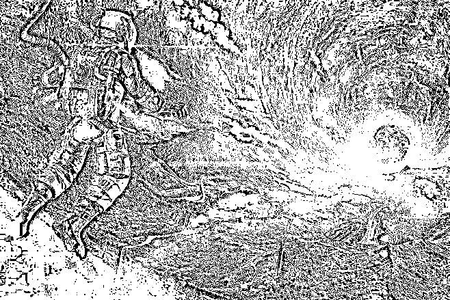

作者/理查德·塔纳斯

译者/江艺

本文节选自 2015 年 3 月占星大师理查德·塔纳斯接受美国地球宇宙研究协会（NCGR）的采访，他跟大家分享了有关天王星四分冥王星的洞见，虽然天冥四分相已淡出，但他认为其影响力会持续至 2020 年。

**天冥四分威力不减**


**我个人认为我们仍深深地陷在天冥四分相中，这个联结的影响力还要持续 5 年左右，直到大约 2020 年。**


如果仔细研究与天冥周期或任何与外行星周期相关的历史，压倒性的证据显示，**所牵涉的原型力量对集体心理发挥作用的时间包括精准四分相前后 10 度，精准合相和对分相前后 15 度。**

我在《宇宙和心灵》（*Cosmos and Psyche*）中陈列了大量的历史关联来支持这些容许度。比如，如果我们回想一下 1960 年代的天王星-冥王星合相，我们不会认为相关的现象在 1966 年行星精准合相的最后一年就走向了尾声。相反，在随后的 1967 ~1972 年间，当行星仍然处于较大的容许度之中时，它们进一步扩展甚至加剧了。

**典型天王星-冥王星现象有：**

①社会和政治抗议和反叛的大大加剧

②文化创造力，科技进步

③释放本能

④革命运动常常变成暴力，集体对自由和改变的冲动加剧

⑤青年、妇女、少数民族和种族被赋予更多权力

⑥性取向问题

⑦生态运动和地球的声音

⑧一般意义上的历史加速

**所有这些都可能会继续显示出好几年的蓬勃态势。**

我相信，历史和传记的相关证据表明，**行星之间的主要相位不应当被视作相当于间歇性的电灯开关，将所有注意力放在一度和两度之内，相反，它们标志着伟大原型的波浪形式：兴起、达到顶峰，然后汹涌而来，渗透集体或个人的心理和生活**。

**通常是在最后几年，当这一原型能量浸透这一领域时，我们看到许多最值得纪念的天王星-冥王星事件。**

所以我认为我们时代的天冥四分相，以及最近的土星-海王星四分相是主导镜头，通过它，我们可以认识到此时此刻更深层次的潮流。（如果有人有兴趣更详细地分析这些原型组合和周期，可以参见我在《原型宇宙学杂志》中发表的两篇文章《2000 - 2020 世界行进：概述》以及《理想和现实》。您可以从*Archai*网站或*cosmosandpsyche.com*进行下载。）

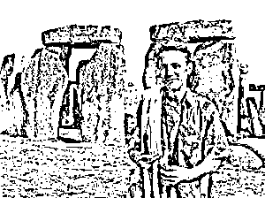

**理查德·塔纳斯**

国际占星学界学者和先驱

殿堂级占星家

原型占星学研究者

《西方思想史》《宇宙与心灵》作者

**有关塔纳斯的其他文章，请点击：**

[我们又将迎来一位国际殿堂级占星家！](http://mp.weixin.qq.com/s?__biz=MzA5NjA0NTAxNg==&mid=401949295&idx=3&sn=0972e13ee780ec236d30c926bcf1dca4&scene=21#wechat_redirect)

**◆ ◆ ◆ ◆ ◆** 

****特别提醒：**希望将若道文章转载到各自公众号的朋友，**转载时请注明“转自若道微信公众平台”，并附上若道占星的 Logo**。谢谢！**

**1 月 18 日晚**，**塔纳斯将**在若道举办公开**演讲**，想与大师面对面，请点击文末“**阅读原文**”报名。动作要快，报名即将结束！

↓


# 沙龙 | 1 月 18 日塔纳斯教授公开演讲，报名即将截止

> 原文：[`mp.weixin.qq.com/s?__biz=MzA5NjA0NTAxNg==&mid=402527351&idx=3&sn=8c023208299cc96a40e86586d36852d9&chksm=02bca6c035cb2fd6dd8a747899c6793b0899c1e461ae5bae92f6fbddee9999ce0f8b7baafd3c&scene=126&sessionid=1692738887#rd`](http://mp.weixin.qq.com/s?__biz=MzA5NjA0NTAxNg==&mid=402527351&idx=3&sn=8c023208299cc96a40e86586d36852d9&chksm=02bca6c035cb2fd6dd8a747899c6793b0899c1e461ae5bae92f6fbddee9999ce0f8b7baafd3c&scene=126&sessionid=1692738887#rd)

Jan

**18**

◆他毕业于哈佛

是西方著名哲学家史学家

著有《西方思想史》

◆他是国际占星学界学者和先驱

研究原型占星学 30 年

著有《宇宙与心灵》

◆他——**理查德·塔纳斯**教授

将于**1 月 18 日**

在**北京若道**举办一次**公开演讲**

本次活动现场与线上同步进行

**与大师面对面的机会弥足珍贵**

**还不赶快报名！**

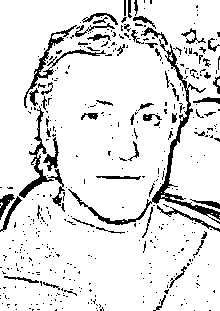


**讲座信息**

**时间：**2016 年 1 月 18 日 20：00-22：00

**方式：**现场+网络直播（具体方式咨询客服）

**地点：**北京市朝阳区百子湾路 32 号院苹果社区南区 10 号楼 A 座 2006 室

**费用：**50 元（若道老学员免费）

**特别提醒：**不接收空降，请提前付款确认名额

**报名截止：**2016 年 1 月 15 日

**咨询电话：**400-619-1014

长按二维码添加客服 siri 微信咨询~


>>>>

**塔纳斯与原型占星**

多年前，和大多数深受现代教育荼毒的人一样，塔纳斯自动对各类占星学抱持怀疑的态度。然而，受到荣格学说和几位值得信任的同事的影响，他开始认真对待占星学。

对占星学原则的深入理解，结合深度心理学（尤其是原型和超个人学派）的最新进展，使他得以一瞥行星运动呼应人类生活的大体面貌。他发现，**重要人生事件的含义和性质与此时行进的行星原型含义相符。**特定行星组合象征的原型既可以在内在心灵世界得到表达，也可以外在世界显化为具体事件，有时两者皆有。

此外，某种行星组合代表的原型包含了正负两极的能量。具有相同配置的不同个体可能是分别是同一种原型能量的接收方或作用方，那么两者的实际经历会大不相同。**到底哪种可能性会显化似乎是由周围环境和个体的反应方式决定的**，从星图或行星组合本身看不出来。

他的最终结论是原型的力量十分强大但是参与者的因素也不可小视。换句话说，虽然原型决定了事件的结构或本质含义，无论表象多么纷繁复杂，背后总可以窥见原型的影子，但是事件进程还是受到环境因素以及人为因素的塑造。

随着证据指向的方向，塔纳斯最终将研究范围推及各类历史和文化现象。迄今为止，他持续从事这项研究 30 年。

他确信行星运动和人类历史存在重大（实际上无处不在）的关联，而且现代人的观点是完全错误的。**证据显示行星本身并不是事件或人格特征的直接原因，而是两者间始终存在一致的有意义的联系。**在上如在下，使两者之间产生联系的是原型层面的同时性原则。

**◆ ◆ ◆ ◆ ◆**

想要了解更多？来参加 1 月 18 日晚的讲座吧。点击“**阅读原文**”进入报名页面。抓紧时间报名哦！

↓


# 重磅 | 大卫 2016 年运，全面解读四大趋势

> 原文：[`mp.weixin.qq.com/s?__biz=MzA5NjA0NTAxNg==&mid=402527351&idx=1&sn=b47f50c76eb55b8352cea419e1727e3e&chksm=02bca6c035cb2fd6877fca8fe9098d272b6c3ca325f0c4e844954fc18c3b3fd4f7157f2ea225&scene=126&sessionid=1692738887#rd`](http://mp.weixin.qq.com/s?__biz=MzA5NjA0NTAxNg==&mid=402527351&idx=1&sn=b47f50c76eb55b8352cea419e1727e3e&chksm=02bca6c035cb2fd6877fca8fe9098d272b6c3ca325f0c4e844954fc18c3b3fd4f7157f2ea225&scene=126&sessionid=1692738887#rd)

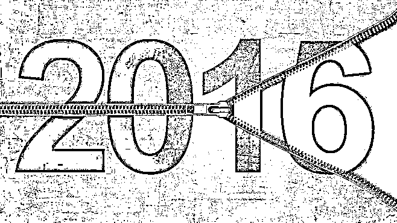 作者/大卫·瑞雷 

翻译/李含 校对/江艺

你喜欢学习新东西吗？ 

你是一位永恒的学生吗？

如果答案是肯定的，那么你与 2016 年步调一致哦！2016 年有三颗行星落在变动星座：**木星在处女座，土星在射手座，海王星在双鱼座**。（木星会在 2016 年 9 月 9 日来到天秤座，稍后我会进一步谈到。）将这些行星的共振与星座结合在一起，为我们理解 2016 年提供了很多线索——

**变动星座大行其道的一年**

◆◆2016

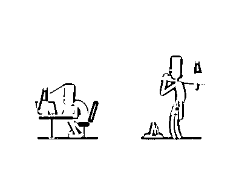

**>>>>**

**变动星座与我们处理信息的各种方式相关**

*   处女座与我们划分信息的优先顺序、将事实整理分类的能力相关。

*   射手座与我们看到宏观图景的能力有关——去领会普遍性概念、哲学、高等教育和信念体系。

*   双鱼座与我们的想象力，也就是形象化甚至获得灵感启迪的能力有关。

这一重要的行星组合中唯一缺失的变动星座是双子座，但别担心——太阳、水星和金星每一年都会行进到这个星座。

**>>>>**

**再来谈谈行星**

*   木星对应每一年成长与扩张的领域。

*   土星更多地关注于我们建立实用可靠的架构的认真努力。

*   海王星和它守护的双鱼座一样，与任何捕捉我们想象力、带给我们启迪的事情有关。  

将这些行星的共振与处女座、射手座和双鱼座结合在一起，为我们理解 2016 年提供了更多的线索。

****全面解读**四大趋势******

◆◆2016

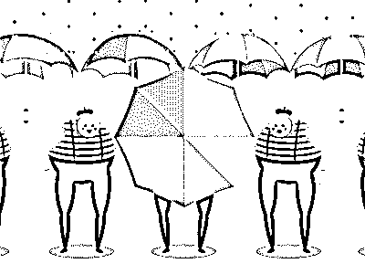

**1****商务趋势**

*   **不少公司可能加大在专业技术和特定领域实施外包的力度，而不是雇佣全职的内部职员**。  

    提供这一服务的商业或职业会有所发展，这涵盖了所有“临时”雇佣代理、技术服务、医疗健康服务提供方，甚至维修和清洁业务。有效使用专业技术和服务节省开支可以带来显著的节约。

*   **在提供医疗健康的服务中，“预防”服务很可能会有所扩展**。

    促进预防很可能会获得动力，更多雇主意识到减少工作时间的好处。流行的反吸烟活动可能会在中国发展起来。对营养的重视会提升，会有新的营养指南出版。

*   **公司行为很可能被要求与公司的政策声明相吻合**。 

    反腐，职业操守，遵循良好的行业惯例会是贯穿今年的持续主题。

*   **关于国际贸易规则的重要决定和国际法的争论很可能占据新闻版面**。 

    可能达成重要的协定，在所有国际贸易和旅行方面取得更好的理解。但是涉及安全的旅行管制很可能会更严格和费时。

*   **教育标准同样可能变得更为严格。** 

    尤其是学院和大学级别的院校。学位项目会经历更多的检视和重组。

*   **市场方面，关于广告和标签“真实性”的规章会变得更加严格**。

    营销工作很可能更有效率，更专注。通过改进系统，以更有效的方式辨识客户的市场调研公司会在商业中有所增长。

*   **今年细节将会得到更多的关注**。 

    广告业会比前一年有更具体的目标，这一趋势自 2015 年 9 月就已经开始了。印刷广告和杂志会更专业化和效率化，也许一些新的“兴趣”杂志、在线杂志会变得更受欢迎。

*   **在中国“继续教育”可能会掀起新潮流**。

    更多已经超过大学入学年龄甚至更年长的人可能会进入课堂，学习课程，提升自身的技能或竞争力。因此，在线继续教育的入学人数可能也会增多。

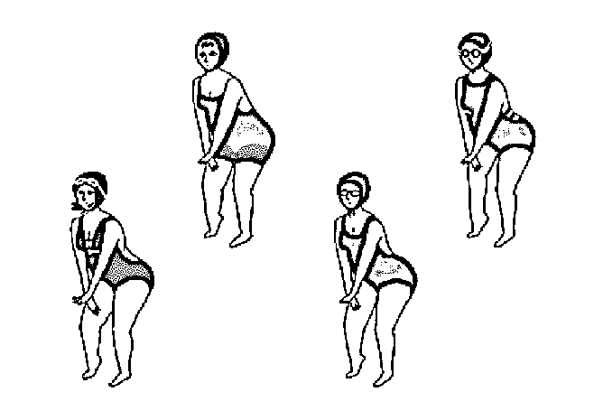

**2****个人/关系趋势**

*   **信念体系和世界观的议题可能会影响关系**。 

    “我不清楚我的女朋友相信什么？”你说。也许现在是时候找到答案了。

    可能你的妻子或丈夫开始更认真地对待自己的宗教信仰了。“没问题，”你说，“我们的信仰相同。”那太棒了！

    但是，对于那些与伴侣信仰并不相同的人来说，这可能是更具挑战性的一年。关系的承诺可能会受到宗教或哲学观念分歧的考验。

    试着将其视为一次机会，从对方身上学习一些东西。寻求共同的哲学基础。你们共同的是非观念也可以构建信任，不管你们有着怎样的宗教或哲学信念。新发展的关系显然也适用于这一点。

*   **教育议题同样也会成为关系中一个更严肃的考量**。

    如果你从大学毕业，但是你的男友或未婚夫仍从事蓝领工作，你的学历可能会威胁到你们曾有的和谐。对希望自己未来的伴侣受过良好教育的男人来说也是如此。

     但是，对于那些与伴侣共同努力获取学位的恋人来说，这一趋势会促进关系的发展。

    是的，研究生或博士的浪漫爱情在这一年会受到更多眷顾，可能会为将来的婚姻打好基础。

    但是，如果你们因为日益拉大的学历差异而在关系中发生矛盾争执，那么在做出决定前与你的伴侣一起处理这个问题才是更为明智的选择。

    也许，教育问题并不像你们所害怕的那样严重？与伴侣谈谈可以帮助你们找到答案。

*   **今年，**婚姻或关系中的文化或种族差异**可能会成为人们津津乐道的热门话题，或者对跨文化婚姻的报道可能引爆媒体和社交媒体上的讨论。**

    如果你新结识了与自己文化背景不同的人，那么你会学到一些东西，他们的经历会为你提供你从未想到过的洞见。这一年可能成为跨文化婚姻组合的试验场。

*   **伴侣旅行或移居海外可能会对关系、婚姻和家庭带来挑战**。

随着中国进一步发展海外商务，越来越多的伴侣需要找出方法应对分居带来的互相疏远。此外，公司搬迁到国外会迫使伴侣和家人做出不同的选择，尤其是那些子女还年幼的夫妻们，甚至是新婚未育的夫妻也需要认真考虑他们的关系是否能够承受这样的状况。

一位新婚的妻子需要决定她是否与丈夫一同搬到另一个地方，还是去发展属于自己的事业。

决定生儿育女就必须考虑到要在另一个国家抚养子女，而无法得到亲密家人的支持。这样的问题在中国实际上已经越来越常见了，土星停留在射手座会有助于应对这样的迁居问题。

预计随着更多中国夫妻和家庭受到移居海外的影响，公司会拿出更好的政策，更可行的解决方案帮助他们的雇员在海外生活。

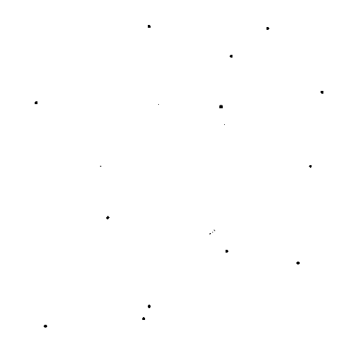

**3****学业趋势**

*   **中国学生赴海外就读的情况会继续增长，但是在 2017 年之后会有所放缓**。  

    美国国务院和国际教育协会在 2015 年 11 月的一份报告中指出，有越来越多的国际学生就读于美国的学院和大学，在前一个年度中，来自中国的国际学生显著增长了 6%。同一时期，美国学生赴海外就读增长了 1%。

    从占星学角度来说，这一趋势在 2016 年和 2017 年还会继续增长，但是从长远来看，这段时间也将成为峰值拐点，代表一个更长的平稳期。

*   **中国学生海外留学对家庭和文化的利弊影响很可能成为更重要的话题**。  

    预计媒体和社交媒体会更多地关注到这一严肃的问题。

    中国学生在美国和其他国家所面临的压力和困境可能会成为书籍甚至是电影中深入探讨的主题。

    土星在射手座可能会提醒我们，我们都身在旅途之中，我们需要达成共识，以更富于智慧的方式享受我们的旅途！

**4****文化趋势**

*   **预计会出现更多详细旅行指南类的书籍。** 

*   **预计全球都会出现学习外语的热潮。** 

*   **出现更多关于长途旅行、史诗传奇、太空旅行的电影**（就像 2015 年的《火星救援》）。发行的电影可能以学院或大学为背景，或是讲述那些以观念改变世界的人。 

*   **音乐将会继续表达跨文化的影响**，中国的畅销曲可能也会在美国流行起来。

******9 月木星进入天秤座******

◆◆2016

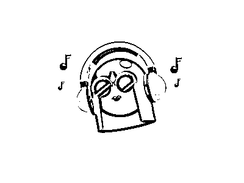

**2016 年 9 月 9 日，木星进入天秤座**。

是的，在木星在处女座逗留期间列出的要求“清单”让每个人都累得够呛之后，木星从处女座转入天秤座会**鼓励更多人去思考合作与和平**。在个人生活中，木星在天秤座会预示着**我们改善关系的努力**，不论木星落在了你出生星图中的什么地方。正如约翰·列侬所唱的那样：“我们想要说的只是给和平一个机会。”

当然，木星每隔 12 年就会造访天秤座，但人类依然对彼此造成了可怕的伤害。只能希望自 2016 年 9 月 9 日起，公平会更普及，而不仅是对“我”自己“公平”，而是我们每一个人都能提升公平意识。

当然，你不可能取悦每一个人，即使是大部分人的和平都会让少数人因为感觉自己获得太少而生气。所以，希望我们地球上的人类可以在每一次木星造访天秤座时学着更好地彼此相处，这也意味着去帮助那些处境不佳的人。

**◆ ◆ ◆ ◆ ◆**

**其他年运请戳：**

[2](http://mp.weixin.qq.com/s?__biz=MzA5NjA0NTAxNg==&mid=401908407&idx=1&sn=409cf1cfa831bfdd8c1b5ea7b88cb34a&scene=21#wechat_redirect)[016 年运 | 规则重建，以动制动](http://mp.weixin.qq.com/s?__biz=MzA5NjA0NTAxNg==&mid=401908407&idx=1&sn=409cf1cfa831bfdd8c1b5ea7b88cb34a&scene=21#wechat_redirect)

运势文章你也能写！**2016 年 3 月 15 日**，大卫老师主讲的若道占星核心课程**Level 5**要开课了！你可以学习到各种预测技术及行星周期。通过这些预测工具，就能预测和规划人生。提前报名付款有**早鸟价**哦！详细内容请点击“**阅读原文**”了解。

↓


# 一败涂地的爱情之后，如何再度拥抱幸福？

> 原文：[`mp.weixin.qq.com/s?__biz=MzA5NjA0NTAxNg==&mid=402519167&idx=1&sn=19a2fa8d2af185d4a24468ea48e4f1b7&chksm=02bf46c835c8cfdea69982463e6eda7456a8396d5e620843a01bc7fa496594159a9864d3a3a0&scene=126&sessionid=1692738887#rd`](http://mp.weixin.qq.com/s?__biz=MzA5NjA0NTAxNg==&mid=402519167&idx=1&sn=19a2fa8d2af185d4a24468ea48e4f1b7&chksm=02bf46c835c8cfdea69982463e6eda7456a8396d5e620843a01bc7fa496594159a9864d3a3a0&scene=126&sessionid=1692738887#rd)

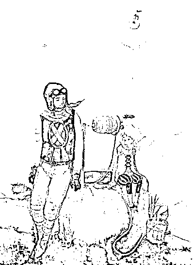

为了爱放弃一切去到他的城市，最终铩羽而归，这样的痛足以摧毁任何一个人。文中的主人公恰是因为这次经历遇到了若道，遇到了占星学，通过对星图的研读，了解并放下了对于失败的哀怨和过去的执念，完成自我蜕变的同时，拥有了一份更加成熟和契合的爱情。我们期待奇迹，但更需明白，机会从来都是给有准备的人，转角遇见那个人，需要洞悉自我，完成自我之后才配拥有。

**1****我以为你是我的奇迹，最终却是心碎**

接触占星学，是在几年前的冬天，那是我 28 年的生命中最低谷的时光，为了前男友辞去了稳定光鲜高薪的工作，从一个漂亮的海滨城市来到东北的一个小城。没有亲人没有朋友，内心极度焦虑。而让我不顾一切的男友，却无法理解我的感受，极度的不适应让我们经常性地争吵，我以为坚不可摧的爱情很快就土崩瓦解，在我辞职到他城市的三个月后，我们彻底分手。

接下来的一段时间里，一周之内暴瘦十斤，一夜之间满脸长满脸痘痘，后悔、沮丧、怀疑、愤怒，各种各样的负能量几乎将我压垮。我每天晚上都睡不着觉，半夜蒙在被子里嚎啕大哭，一边哭一边回想那些甜蜜的过往，我怎么也想不通两人异地恋都能谈得好好的，为什么好不容易能在一起了，却反而走不下去了。我想不通，也不甘心。

**2****遇见若道，化茧成蝶**

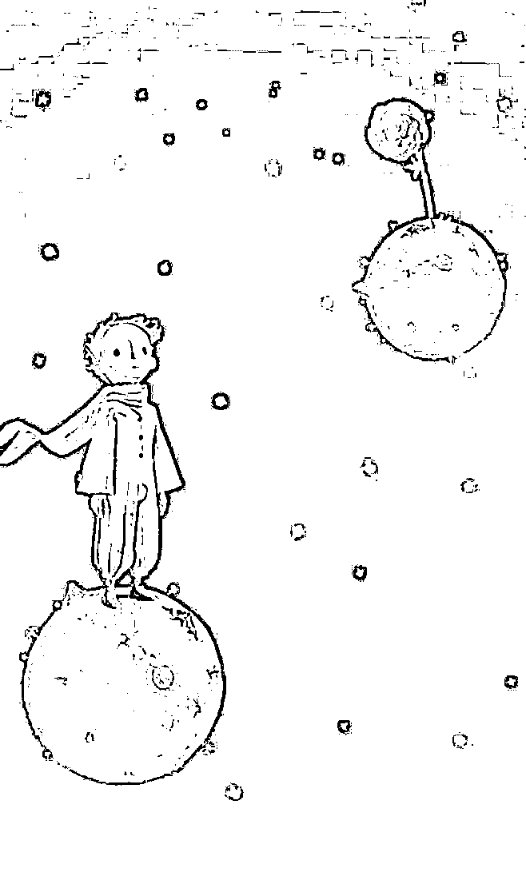 

也就是在最难的那段时间里，我看到了若道的文章，遇到了占星学。我开始寻找生命中的爱情密码。

二十几年的生命时光和星图里的种种征象奇妙地对应了。

*   五宫头稳稳地天蝎座坐阵，冥王星对分落陷的火星，火星精准四分金星。

*   行进盘中，行进的土星经过五宫，行进的冥王星正精准合相七宫主土星。

就这么几个征象就足够让我知道，**在恋爱这个课题上，我注定是要吃一些苦头的。**而这段时间，我正在经历着土星和冥王式的双重考验，一种长久折磨压抑的考验，一种需要拼尽全力才可能死而复生的考验。

当我知道，一切都是上天给我的课题时，我的心态，开始默默地发生了变化。我意识到，觉知，是改变的开始。

**3****我们的爱若是错误，愿你我没有白白受苦**

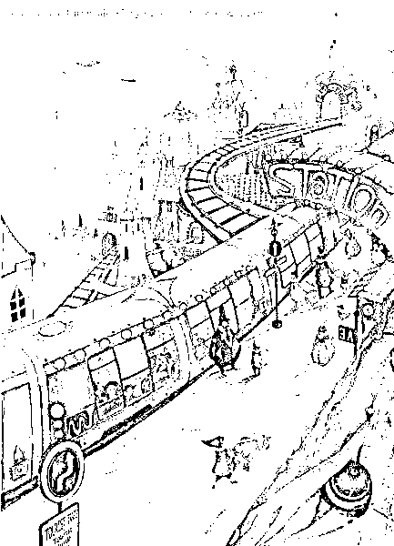 

我开始反省，之所以会走到当下的情景，究竟是因为什么，当逐渐回归理性，我发现，自己性格中有那么多的缺陷，虽然我的太阳在变动宫，但是月水金火四颗行星却全部在固定宫，这导致了我的**执念和一意孤行。辞职之初，无数师长亲戚同事朋友都劝我，做那个决定太过冒险，我却一点也听不进去**。这么多年来，我一直以为自己是一个温顺的双鱼座姑娘，在很多小事上也没主意，不在乎。直到这一刻我才发现，原来我自己是一个这么固执的人，而这样的固执在无意之中，应该也伤害过很多人，比如当时跟我谈恋爱的前男友。

他是金星射手座，对于未来有着高昂美好的愿景，我们在一起的时候，总是喜欢和我勾画未来的蓝图。可是作为经常脑子抽风的金星水瓶座的我，却总是喜欢泼冷水，正话反说。之前无法意识到，这样的做法可能会消解掉他对这份感情的信心。**在了解了金星在射手座的状态之后，我也开始回想了很多以前的事情，对他的怨恨也逐渐变成对自己的缺憾的体会**。

本命星图中的对立冲突给我们带来了火花，也带来争吵，我开始理解，**我们在价值观内核上原来有那么多不同的地方**，比对图里的火星与海王星、金星与海王星的困难相位，都告诉我，**我的义无反顾，不过是爱上自己对对方的幻想**。

了解之后，我开始学会放下。

**4****转角的爱，这次拥抱并不落空**

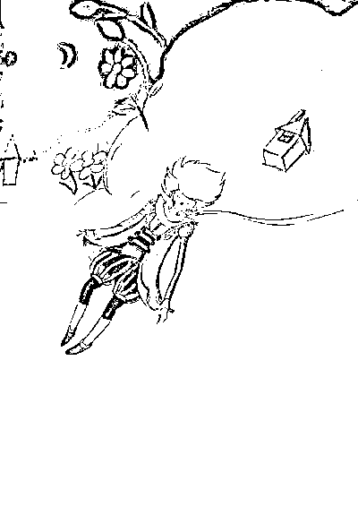

越多的占星知识变成了生活中问题的解答，内心的负面情绪开始得到消化，我开始重新找工作，建立新的生活圈子，空余的时候，我不再关在房间里，而是去健身房，去书店，去学习我感兴趣的东西。

慢慢地，我从每天都要反复地去想和他有关的事情，变成几天才想一次，再后来变成一个月想起一次，**我的生命中出现了新的朋友，新的内容，甚至，新的恋人，决定在一起的时候，我偷偷看了他的星图，从占星学中获得路径，学习恋爱中的表达与相处**。

*   我告诉他作为一个**金星水瓶座的抽离需求**，也鼓励他作为一个**水星摩羯座不要过多地负面思考**。

*   充分沟通之下，我不再像和前男友相处那般小心翼翼或者用力过猛，我们互相扶持，又各自独立，现在正经历了最好的时段。

占星学让我懂得了自己，也懂得了什么是自己想要的和适合的。那些兜兜转转的经历想来也是必经的考验。在未来的日子里，我也希望我依然可以扶住这盏星光，缓慢又坚定地向前。

**★ 本文来自读者投稿，如果您也有和占星学之间不可不说的故事，欢迎投稿，同我们一起分享您的精彩感悟。来稿请发至 astrology@nodoor.com。**

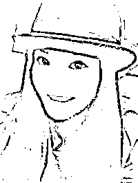

**作者简介**

**小予**，热爱占星学的媒体人一枚，待过电视台、报社，现在一边做新媒体，一边鼓捣创业。非典型双鱼座，糊涂病，爱折腾。我相信生活特别美好，努力就有回报。占星学对于我，像一面镜子，又像一把钥匙，让我有了一个全新的角度来认识自己，认识世界，也开启了我的心灵成长之路。前路漫漫，且行且珍惜。

长按二维码，让金钱涌向传播知识与智慧的人~

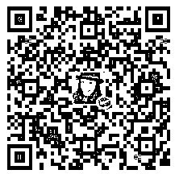

**◆ ◆ ◆ ◆ ◆**

运用占星学了解自我、了解别人，你也可以得到成长！**2016 年 3 月 10 日**，大卫老师主讲的若道占星核心课程**Level 1-2**要开课了！他将带领你学习星座、太阳、月亮、行星、月亮交点等知识，让你进入占星学的世界！提前报名付款有**早鸟价**哦！详细内容请点击“**阅读原文**”了解。

↓


# 宇宙天气 | 喘息的一周（1.11~1.17）

> 原文：[`mp.weixin.qq.com/s?__biz=MzA5NjA0NTAxNg==&mid=402519167&idx=2&sn=66c3f09a2949f366dbcf9527f474a6a2&chksm=02bf46c835c8cfdeb3a4352a79d31930d1466161d1920136d900750295c18124ebe1422887fa&scene=126&sessionid=1692738887#rd`](http://mp.weixin.qq.com/s?__biz=MzA5NjA0NTAxNg==&mid=402519167&idx=2&sn=66c3f09a2949f366dbcf9527f474a6a2&chksm=02bf46c835c8cfdeb3a4352a79d31930d1466161d1920136d900750295c18124ebe1422887fa&scene=126&sessionid=1692738887#rd)

**一周星象综述**

本周月亮经过水瓶座、双鱼座、白羊座、金牛座。似乎经过上一周的暴虐讨伐，行星们都折腾累了，选择在这一周集体消停下来。没有带来冲击与震荡的（月亮之外的）行星相位，没有行星换座，逆行的还在逆行，顺行的也没有要逆的意思。风平浪静，一片大好。

值得说的是两组三分相。一个是射手座金星三分天王星，一个是太阳和水星合相在摩羯座三分处女座木星。这类相位一般不会带来明显感觉（涉及到的行星没什么“煞气”，而且三分相太过柔和），闪一下就过去了，但是因为本周也没有其他更重要的星象事件登场，所以这两股柔和的支持性力量，会更容易被我们觉察并利用。

射手座金星三分天王星，可以与上周的金星四分海王星与金星合相土星（即金星触发土海四分相）结合起来看，相位出现的时间顺序暗示了解读的内在逻辑。**爱恋中的迷茫与痛苦，在上周迎来一个“了断的时刻”，很多人终于在心里做出了决定，给了自己或对方一个交代。**有些事未必有事实上的结果，或许仅仅是在心里得出了结论，但这也足以带来稳定人心的力量。

本周金星三分天王星，意味着我们能够**以更加自由、开放的态度，来面对爱与关系。**我们或许能够发现一个新的角度，用一种特别的方式，为关系的发展打开一扇窗。这与我们已经从土星那里获得的心理上的笃定不无关系。

摩羯座太阳合相水星并三分处女座的木星，则有助于我们**对眼下的现实事务进行有效的梳理和规划。**水星与木星在逆行中形成三分相，说明**此刻的梳理和规划，不仅是面向未来，更多的是对过去未竟之事的清理和总结。**此刻我们能够从经验的土壤里汲取养料，**做出务实、靠谱的分析和判断。一些有助于个人发展的新的机会，也可能在此刻出现，**被我们看到。

没有特别重要的星象事件，月亮的相位带来的情绪变化便更加明显。**周一、周四和周六，由于月亮参与的四分相的作用，是容易感受到负面情绪的日子。其他时间的感受则相对稳定和谐。**

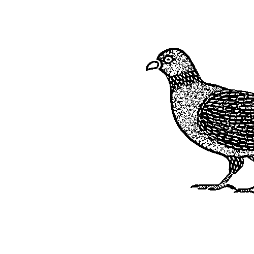

1 月 11 日星期一

**星象综述**

月亮在早晨进入水瓶座，带来**疏离、洒脱的情绪氛围**。上周末的阴郁、紧张的心情，部分得到缓解。中午前后，易有**烦躁或愤怒**的情绪，建议将这股能量转移到积极做事方面。干点体力活会是不错的选择。如果有些冲突不得不面对，那么也无需压抑，要**正视自己的愤怒和渴望。**

**当日星象**

**04:22**  月亮离开摩羯座进入水瓶座

**11:33**  水瓶座月亮四分天蝎座火星

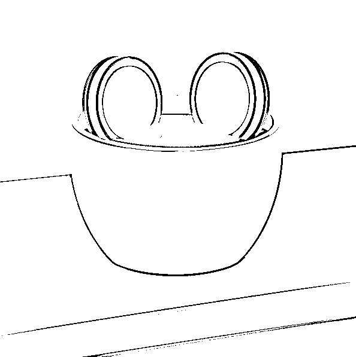

1 月 12 日星期二

**星象综述**

月亮依然在水瓶座。这是和谐的一天，心情畅快，魅力增长，**有利于恋情发展、社交活动、寻欢作乐。**

**当日星象**

**07:00** 水瓶座月亮六分射手座金星

**09:10** 水瓶座月亮六分天王星

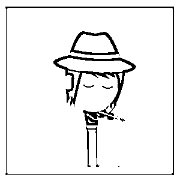

1 月 13 日星期三

**星象综述**

早晨月亮进入双鱼座，带来朦胧、感性的情绪氛围。爱情方面，这是**易有快乐和心动感觉的一天，同时也是脆弱敏感的一天。**迷茫中混合着感动的情绪，会在晚间达到顶峰，如果对自己的状态有足够的觉察，那会是一个带来疗愈的时刻。工作方面，**下午做事的积极性和效率会比较高，也会更加积极主动地捍卫自己的权利。**

**当日星象**

**07:53**  月亮离开水瓶座进入双鱼座

**08:12** 射手座金星三分天王星

**16:57** 双鱼座月亮三分天蝎座火星

**21:18** 双鱼座月亮合相海王星

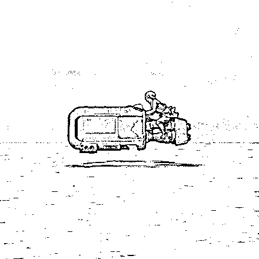

1 月 14 日星期四

**星象综述** 

月亮依然在双鱼座，并且与土星、金星、木星形成挑战相位，这是易**出现混乱情况的一天，易有沮丧、挫败、迷惘的情绪。爱情中求而不得的感觉会变得明显。**但这也是适合进行分析、总结与反省的时候。

**当日星象**

**05:07** 双鱼座月亮四分射手座土星

**06:50** 摩羯座太阳三分处女座木星

**10:14** 双鱼座月亮六分冥王星

**14:55** 双鱼座月亮四分射手座金星

**22:06** 摩羯座太阳合相水星

**23:15** 双鱼座月亮对分处女座木星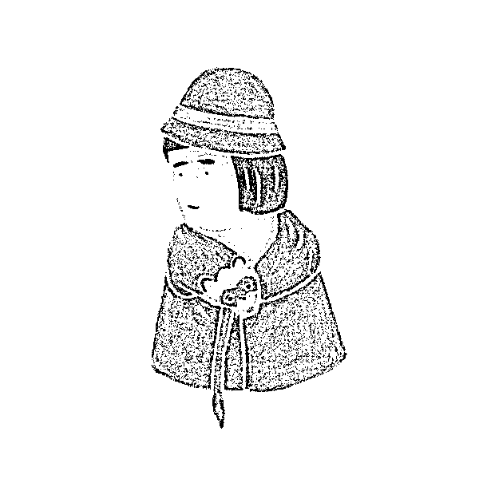

1 月 15 日星期五

**星象综述**

临近中午，月亮进入白羊座，情绪变得积极向上，斗志高昂。**上午有利于沟通交流或脑力工作。** 

**当日星象**

**10:16**  摩羯座水星三分处女座木星

**10:48** 月亮离开双鱼座进入白羊座

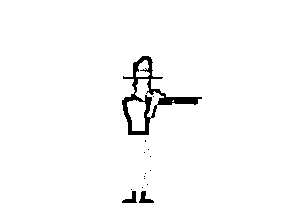

1 月 16 日星期六

**星象综述**

**这或许是本周情绪最为紧张复杂的一天。**个人野心和现实条件之间的冲突让人难以平静。与人相处中的权力和利益问题，牵动人的神经，易有心理操纵或权力较量。突然爆发的对于自由和反叛的渴望，令合作变得不稳定。**这一天的主题是“控制”，不是控制别人，而是控制自己。**控制也不代表压抑，而是掌握一个合理、适度的分寸。

**当日星象**

**08:23**  白羊座月亮三分射手座土星

**13:16**  白羊座月亮四分冥王星

**15:16** 白羊座月亮合相天王星

**22:41**  白羊座月亮三分射手座金星

**22:48** 白羊座月亮四分摩羯座水星

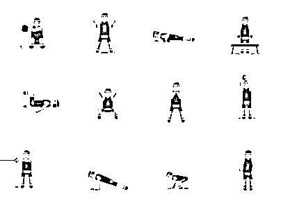

1 月 17 日

星期日

**星象综述**

上午，紧张或愤怒情绪的余波仍在，午后随着月亮进入金牛座，情绪氛围将变得平稳安适。**下午和晚间适合吃喝腐败，享受生活。**

**当日星象**

**07:27** 白羊座月亮四分摩羯座太阳

**13:48** 月亮离开白羊座进入金牛座

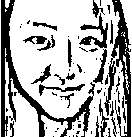

## **作者简介** 

**占星师 Cora**，全美占星师联盟（AFAN）成员，国际占星研究协会（ISAR）会员，获 ISAR 职业占星师资质认证，斯蒂芬·弗里斯特《变幻的天空》译者，个人星象文章见诸《心探索》《北京青年周刊》《上海电视》《空中生活》等杂志媒体。曾跟随大卫·瑞雷系统学习占星学，现为全职占星师。  

微信公众号：聆宇 FM（微信号：lingyudiantai）

个人微信号：CoraAstro

长按二维码，让金钱涌向传播知识与智慧的人~


**◆ ◆ ◆ ◆ ◆**  

好奇周运是怎么写出来的吗？**2016 年 3 月 15 日**，大卫老师主讲的若道占星核心课程**Level 5**要开课了！你可以学习到各种预测技术及行星周期。通过这些预测工具，就能预测和规划人生。提前报名付款有**早鸟价**哦！详细内容请点击“**阅读原文**”了解。

↓


# 官方招聘 | 5 大岗位招人，快到若道碗里来！

> 原文：[`mp.weixin.qq.com/s?__biz=MzA5NjA0NTAxNg==&mid=402519167&idx=3&sn=6e9f3be527539f66a37e24e1405a797c&chksm=02bf46c835c8cfdee52ef5b55841733858de485a3a5f175e35c9a2a174db8db208d513cdf1f1&scene=126&sessionid=1692738887#rd`](http://mp.weixin.qq.com/s?__biz=MzA5NjA0NTAxNg==&mid=402519167&idx=3&sn=6e9f3be527539f66a37e24e1405a797c&chksm=02bf46c835c8cfdee52ef5b55841733858de485a3a5f175e35c9a2a174db8db208d513cdf1f1&scene=126&sessionid=1692738887#rd)

****若道星文化是由美国著名占星师大卫·瑞雷和国际占星研究协会（ISAR）中国区副主席蒋颖创办的一家占星教育和咨询机构，我们通过以 O2O 垂直类教育的互联网产品，来实现帮助自己和他人的愿望。这里有人性化的工作环境，有好老板，有带薪假期，还有广阔的职业前景。2016 年，我们有 5 个岗位招人哦~****


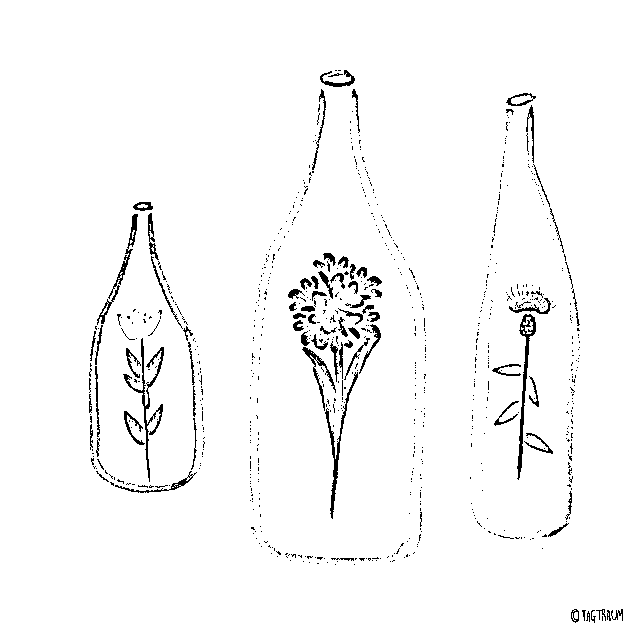

**课程顾问岗位****招聘人数：2 人****01**>>>>

**工作内容与职责**

*   负责以网络咨询、电话咨询、现场咨询等形式，介绍若道文化及若道所有核心课程； 

*   解答客户与占星学相关的问题，包括占星文化理念、若道课程结构、若道授课模式、老师背景等，为客户推荐适合课程； 

*   负责以电话回访、问卷调查、平台互动等方式与学员保持联络（微信群和社区管理维护）； 

*   了解占星文化传播动向，通过与学员的交流了解市场趋势和方向，参与课程设计； 

*   完成课程的招生任务以及课程报名情况统计分析； 

*   了解学员需求和反馈，及时解决问题，协助授课老师、翻译和助教做好课程服务工作； 

*   协助市场宣传部做好网络推广工作；

*   参与线上和线下课程的值课和现场服务。

>>>>

**任职资格**

*   爱好占星学，有现代占星学理论，掌握占星学基础知识； 

*   服务意识强，愿意应对高难度工作，目标感强，抗压能力强； 

*   有线上课程销售服务经验优先； 

*   完成若道 level5 核心课程、获得 ISAR 认证或 COAC 认证或相关心理咨询师证书者优先。

>>>>

**福利待遇：6000-8000+**

**客服（行政）岗位****招聘人数：1 人****02**>>>>

**工作内容及职责**

*   根据公司部门负责人的要求完成人事行政部的工作内容； 

*   行政方面：来访接待、考勤记录、办公用品申领，快递邮寄、档案整理等； 

*   人事方面：招聘简历筛选、电话邀约及相关人事工作。 

*   后勤方面：负责对接工作餐的物资采购，保持办公环境整洁； 

*   负责学员的课程咨询、转介、售后服务的解答并及时反馈信息； 

*   线上和线下课程的值课和现场服务；

*   与各部门密切沟通，参与营销活动，协助市场销售。

>>>>

**任职要求**

*   本科学历，人力资源或管理方面的专业优先，有相关证书者优先；

*   热爱占星学，可熟练使用常用的办公软件及网络应用，善于进行数据分析，为工作提供数据报告；

*   具有良好的职业道德和职业操守，认同公司理念，抗压能力强，擅于沟通与协调，具备良好的团队合作精神；

*   良好的学习力，适应力强，愿意为工作投入 100%的努力； 

*   有职业理想，愿意从基础职位起步，和公司一起成长发展。

>>>>

**福利待遇：4000-5000+**

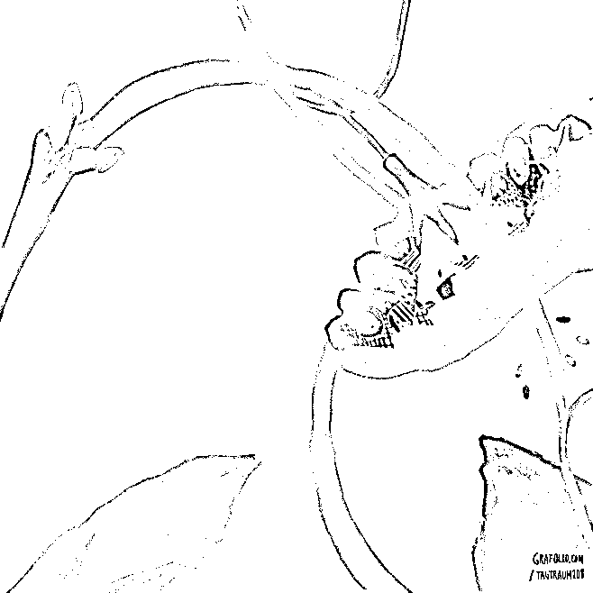

**课程辅导员（专职/兼职）****招聘人数：若干****03**>>>>

**工作内容**

*   在课程助教的指导下完成所负责课程的辅导工作； 

*   协助助教完成课程期间资料和信息的处理、收集和统计； 

*   协助助教在课程期间回答学员的基础知识问题； 

*   对于无法处理和解决的问题及时反馈给助教或课程顾问； 

*   协助助教完成课程微信群社区的维护、跟进、及时处理和收集客户咨询等问题；

>>>>

**任职资格**

*   大专以上学历，热爱占星学，有正确的占星学理念； 

*   完成若道 level1-5 所有课程，获取若道 COAC 认证 （兼职至少达到 level3 水平）； 

*   语言表达能力强，善于沟通、有亲和力、吃苦耐劳，具有较强的敬业精神与团队合作精神； 

*   熟练操作计算机和 office 软件，善用作数据收集和整理； 

*   具有良好的服务意识，良好的应变能力、沟通能力及判断能力； 

*   熟练使用微信和 QQ 平台功能；

>>>>

**福利待遇：4000-5000+**

**翻译（专职/兼职）****招聘人数：若干****04**>>>>

**任职要求**

*   英语 6 级以上、英语专业优先、有口译经验者优先； 

*   热爱占星学、具备相关专业知识水准，通过 ISAR 认证或参加若道课程的系统学习优先； 

*   具有服务精神、抗压能力强。

>>>>

**福利待遇**

*   按照小时计费

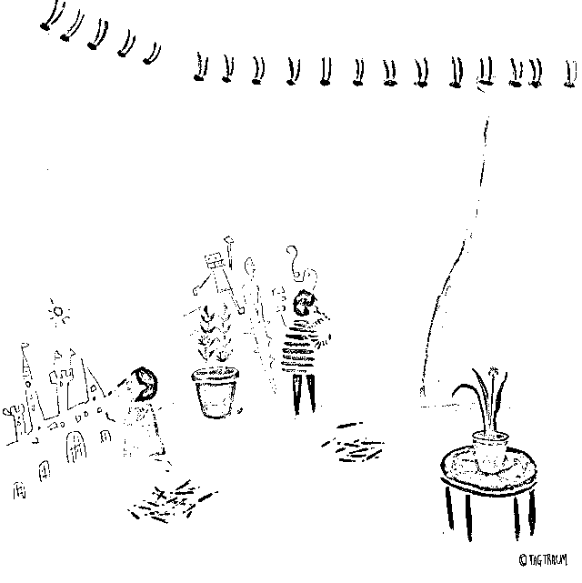

**技能交换****招聘人数：若干****05**

会琴棋书画，爱好占星学；爱电影、会 P 图，想学占星学；啥也不会，就擅方言土话，扎堆扯淡，偏喜欢占星学的……

没关系，只要你能创意地将你的能力用在专业占星学的传播中，以此来交换学习，只管联络我们。

与若道团队一起，工作经历、学历、年龄都不是最重要的，只看你的投入与热情，创新与挑战，才气与天分……

只要你真心酷爱以下工作即可，所有酬劳以若道课程学习方式置换，可任意挑选所喜欢的课程。

*   **有图有真相的魔术师**：为若道的即将发表的文章，或网站内尚未配图的文章画龙点睛，为层出不穷的占星报告锦上添花。

*   **我们需要你**：深知怎样的图既贴切文意，又吸引眼球，还能另类酷炫地表达出深刻的情感与体验。 

*   **文章传播小蜜蜂**：像蜜蜂传播花粉一样，将若道文章精编、搬运到各发布渠道，参与诸多平台的互动，收集回馈并分析改进。

*   **我们需要你**：像小蜜蜂一样勤（Hua）奋（Lao）。热衷分享交流，融入社团，思维活跃。

**下面是最令人激动的福利环节！**

作为专职人员来到若道，你将会享受到意想不到的各种福利待遇：

*   每周工作 5 天，每天 8 小时，弹性工作；公司提倡快乐工作，不推荐加班； 

*   薪资体系=基本工资+绩效工资； 

*   提供五险、工作午餐、加班补助，带薪年假，年底奖金； 

*   享受每年员工占星培训课程。

*   可以和大卫老爷子以及翻译姐妹练习英语口语，提高你的职业素质； 

*   有机会和美女帅哥咨询师喝茶聊星座，让你的工作不再枯燥； 

*   中午包吃，由聘请的阿姨做家常饭，让你品尝妈妈的味道； 

*   各种零食、茶、咖啡、红酒、啤酒、懒人沙发、休息室让你劳逸结合；

*   带薪假期。春节两周假期，你有比别人多一周的时间在家里孝敬爸妈，不再为买回家的车票发愁；

*   在这样一个创业公司，你尽早的加盟，未来将会带给你无限可能的回报。


工作地点

**北京**

**地址：**北京市朝阳区百子湾路 32 号院苹果社区南区 10 号楼 A 座 2006 室

应聘方式

简历和作品集请发邮件至 **freya.li@nodoor.com**


# 新年礼 | 在线新月许愿功能开启啦！

> 原文：[`mp.weixin.qq.com/s?__biz=MzA5NjA0NTAxNg==&mid=402506655&idx=1&sn=94e8cd15d6775fe0a99c00a88f76b139&chksm=02bf712835c8f83e212aa928168bb8961a53367f354868c9ee0d897a7ba4b7bfebfe3f40088f&scene=126&sessionid=1692738887#rd`](http://mp.weixin.qq.com/s?__biz=MzA5NjA0NTAxNg==&mid=402506655&idx=1&sn=94e8cd15d6775fe0a99c00a88f76b139&chksm=02bf712835c8f83e212aa928168bb8961a53367f354868c9ee0d897a7ba4b7bfebfe3f40088f&scene=126&sessionid=1692738887#rd)

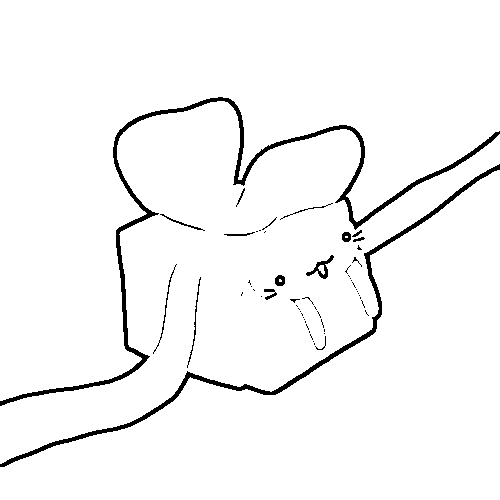


**2016 年开年好礼——**

若道新月报告可以在线祈祷、分享幸福啦！

手机党们，

不用再跑到网站上查看新月报告了~

在新月的时候，

你可以直接在手机上即可获取报告，

在线许愿并分享；

平常的时候，

也可以戳在线许愿并分享！

无论你在地铁上、聚会时、还是等餐途中，

随时随地许愿祈祷，

是不是很酷呢？

**操作起来也很简单哦**

**当新月到来的时候，您只要做如下步骤**

进入首页

点击
“新月祈祷“ 

登录账户

填写出生信息

查看报告、许愿

**【步骤一】点击新月的祈祷**


**【步骤二】输入姓名**


**【步骤三】输入出生信息**


**【步骤四】生成新月报告**


**最下方有许愿按钮，左边是倒计时提醒哟~**

**在合适的时间就可以许~愿~啦~**

**【步骤五】许愿！**

**** 

**【步骤六】让宇宙看到你的愿望并分享！**

**** 

**在平时，您只要做如下步骤**

进入首页

点击
“立即许愿”

开始许愿

点击分享

完成许愿

**◆ ◆ ◆ ◆ ◆**


**小伙伴们还等什么？**

**赶快点击→左下角阅读原文**

**体验这份新年礼物吧！**

# 摩羯座新月，发现真正的使命所在

> 原文：[`mp.weixin.qq.com/s?__biz=MzA5NjA0NTAxNg==&mid=402506655&idx=2&sn=c2db42e636ff5f98e1359d28dcf5844f&chksm=02bf712835c8f83e1ba07be4fe3c1bd6b3aeb525086c35898117a640744eb212df8939c468d7&scene=126&sessionid=1692738887#rd`](http://mp.weixin.qq.com/s?__biz=MzA5NjA0NTAxNg==&mid=402506655&idx=2&sn=c2db42e636ff5f98e1359d28dcf5844f&chksm=02bf712835c8f83e1ba07be4fe3c1bd6b3aeb525086c35898117a640744eb212df8939c468d7&scene=126&sessionid=1692738887#rd)

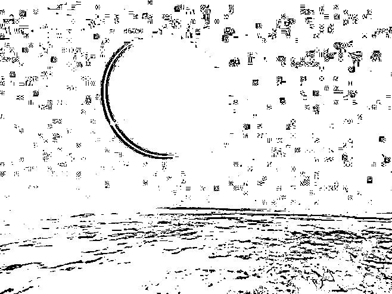
作者/占星师 Cora

图片/花瓣网

新年的第一个新月，按说是名副其实的“新的开始”。但很多人或许很难感受到“轻装上阵”的轻松，反而有被过去重重包裹的负重感。我们或许有“重新开始”的念头，但并没有这样做的现实条件，因为我们的现实处境仍受到多方力量的拉扯和制约（天王星、冥王星的作用），我们也还需要再花些时间来明确自己的志向和目标（水星正在逆行）。

1

**摩羯座新月**

**发现真正的使命**

摩羯座新月发生在 2016 年 1 月 10 日 9:30，月亮和太阳合相在摩羯座 19 度 13 分。

虽然摩羯座新月的基本主题是，**履行职责，做出承诺，**但在目前水星、木星逆行，天冥四分余波仍在的激荡星象下，我们更应该做的，是**发现真正的使命所在。承担责任，则是下一步的事。**

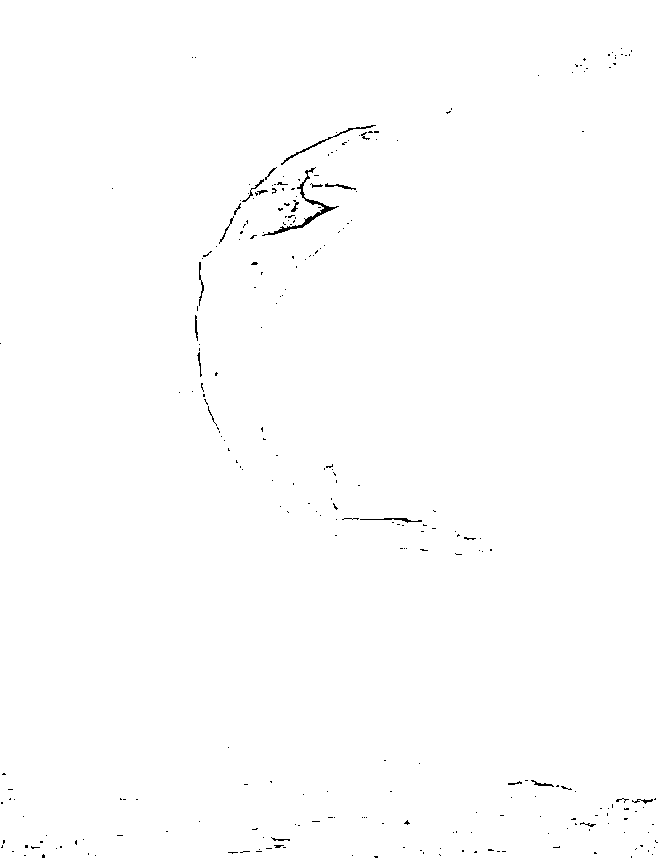

2

**新月与“天冥四分”**

**看看过去三年自己的转变**

>>>>

**新月合相冥王星，带来强迫和控制的意味。**

*   **此时我们在关系中可能面临更多权力对抗或利益纷争，但应意识到，这本质上是我们自己内心欲念放大的结果。** 

*   **摩羯座与冥王星结合，最典型的解释就是“野心的放大”。**对权力、功名、世俗利益的渴望，此刻或许成为一股难解的欲念，折磨我们的心灵。 

*   **在最好的意义上，我们能够借这股野心之火，了解自己对于成就的真正定义。**但我们需要以绝对诚实、现实的眼光来看待自己的能力和身份。 

*   在冥王星和土星的冷酷拷问下，**任何由虚妄自大中生出的幻象都会遭到无情鞭挞。在现实的重重压力下，我们的虚假身份和不切实际的期待将是不堪一击的。** 

*   新月合相冥王星，四分天王星，也牵动了过去几年里“天冥四分”的主题。**守旧与改变，控制与解放，不安全感与自由——这些在过去几年里促成我们完成蜕变的力量，此刻会再次牵动我们的神经，带来挣扎和不安。** 

*   所以，结合过去三四年里我们人生中发生的重要转变，来看待这次新月提出的问题——**使命的确定问题**——将是一个不错的角度。 

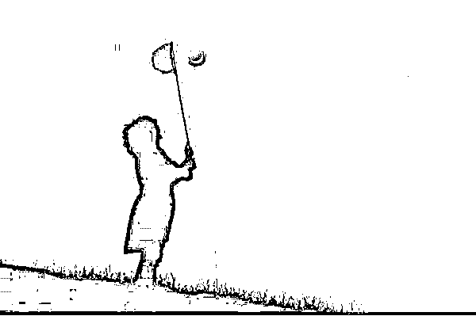 

3

**新月，许下愿望**

**想不明白的，也总要行动了**

*   **冥王星和土星要求我们专注目标，因为时间和资源有限，我们必须冷静看待我们的野心，保护好我们的激情，将能量使用在最能带来成就的位置。**而“成就”是什么，每个人有不同的定义。发现使命的真正所在，也就是找到能给自己带来成就感的方向。 

*   新月在摩羯座，并不意味着我们需要选择一条更加传统的、安全的、符合“现实利益”的道路。摩羯座和冥王星指出的不是目标，而是实现目标的过程中我们需采用的原则。**无论此时我们选择如何定义自己的使命与成就，我们都需要遵循“摩羯法则”，一步一个脚印地将目标实现。这是摩羯座新月要告诉我们的事。** 

*   虽然水星还在逆行，有些事还“没有想明白”，但火星已经进入强势的天蝎座，“奋起而战”的势头已经起来，时不我待。**思考和行动，可以并行不悖，关键是找到令自己感到自然的节奏。**

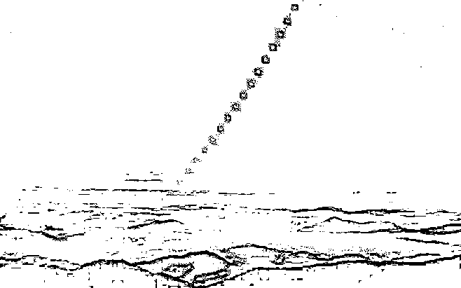

**这次的摩羯座新月特别适合许愿，因为是在为整个春天撒种。**


**作者简介**

**占星师 Cora**，全美占星师联盟（AFAN）成员，国际占星研究协会（ISAR）会员，获 ISAR 职业占星师资质认证，斯蒂芬·弗里斯特《变幻的天空》译者，个人星象文章见诸《心探索》《北京青年周刊》《上海电视》《空中生活》等杂志媒体。曾跟随大卫·瑞雷系统学习占星学，现为全职占星师。

**微信公众号**：聆宇 FM（微信号：lingyudiantai）

**个人微信号**：CoraAstro

长按二维码，让金钱涌向传播知识与智慧的人~


**也许你还关心：**

[Tips | 新月时如何许愿？](http://mp.weixin.qq.com/s?__biz=MzA5NjA0NTAxNg==&mid=209461827&idx=2&sn=b33b43bc66138abc13c488781eff1856&scene=21#wechat_redirect)

[2016 摩羯座新月 | 面对灵魂暗夜，重拾你的力量](http://mp.weixin.qq.com/s?__biz=MzA5NjA0NTAxNg==&mid=402496622&idx=1&sn=cb42a6993bf59d1b5d77a0f2ac5d4ee3&scene=21#wechat_redirect)

[新月到底适合许愿吗？](http://mp.weixin.qq.com/s?__biz=MzA5NjA0NTAxNg==&mid=402496622&idx=2&sn=d5a998882f426c8f0aa9409d71396ffa&scene=21#wechat_redirect)

**◆ ◆ ◆ ◆ ◆**  

 ****特别提醒：**希望将若道文章转载到各自公众号的朋友，**转载时请注明“转自若道微信公众平台”，并附上若道占星的 Logo**。谢谢！**

摩羯座新月到了，每到新月时分，都是播种心愿的时期。点击文末“**阅读原文**”，免费领取你专属的新月报告！还有惊喜哦！


# 2016 摩羯座新月 | 面对灵魂暗夜，重拾你的力量

> 原文：[`mp.weixin.qq.com/s?__biz=MzA5NjA0NTAxNg==&mid=402496622&idx=1&sn=cb42a6993bf59d1b5d77a0f2ac5d4ee3&chksm=02bf2ed935c8a7cf55506931c70a434068dfba830c56999be7614cd269b7168112bbe21c0557&scene=126&sessionid=1692738887#rd`](http://mp.weixin.qq.com/s?__biz=MzA5NjA0NTAxNg==&mid=402496622&idx=1&sn=cb42a6993bf59d1b5d77a0f2ac5d4ee3&chksm=02bf2ed935c8a7cf55506931c70a434068dfba830c56999be7614cd269b7168112bbe21c0557&scene=126&sessionid=1692738887#rd)

作者/Justine

图片/花瓣网

**2016 年的第一个新月，发生在北京时间 1 月 10 日 9 点 30 分**，摩羯座 19 度。摩羯座是土象的基本星座，与职业、工作和责任有关，强调目标、结构与框架，有着脚踏实地、努力开创现实的精神。在 2016 伊始之际，你制定自己的新年目标了吗？本次摩羯座新月与天空中多个星体都产生密切关系，如果善加利用，将为整个 2016 年打好基础。

1

**水星逆行在摩羯座 29 度**

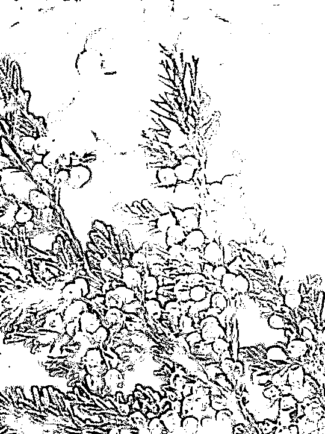

在谈本次新月时，不得不提到逆行的水星。新月发生时，逆行的水星在摩羯座 29 度，刚从水瓶座逆行回到摩羯座，直到 1 月 26 日顺行。当行星逆行时，会以比平常更缓慢的速度，在某段位置会来回走三遍。**这符合“重要的事情说三遍”的原则，而且语速会比平时慢一些，带来思考、反省、调整的空间**。

**水星三次经过摩羯座 29 度的时间**

**第一次**：2016 年 1 月 1 日 元旦（水星逆行前）

**第二次**：2016 年 1 月 10 日（水星逆行期，摩羯座新月之际）

**第三次**：2016 年 2 月 13 日（水星恢复顺行后）

为什么摩羯座 29 度的位置很重要？

**○**首先，每个星座的 29 度都是能量敏感的位置，而新月又是播种的时机。在新月前后，让我们侧耳倾听，摩羯座 29 度会带来什么讯息？**如果你有一些关于新年的理想与愿景，尚处于模糊不清的阶段，摩羯座的能量会帮助你回到现实，在迷茫混乱的旋流中站稳脚跟，重新思考自己的计划**：怎么样的**框架**最合适当下的环境？如何获得资源与支持，有效**落实**目标？

**○**其次，当水星在 2 月 13 日最后一次回到这个位置时，将与代表爱与美的金星在此位置附近合相，这为摩羯落地踏实的气质增加了美妙的想法、人际处理的技巧与创造力的表达，也会令人关注价值、财富与丰盛。

因此，**如果你在制定****2016 年的规划或目标，很可能从元旦前后启动，在新月时你会接受到新的讯息进一步整合与调整，可以期待在 2 月 13 日前后会尘埃落定、完美收稿。**

2

**新月与冥王星合相**

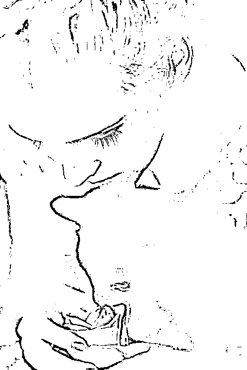

**这个新月，除了充沛的摩羯座能量，还有多层主题、各种激荡能量融合在一起。**

新月发生时，太阳与月亮在摩羯座 19 度，与摩羯座 15 度的冥王星合相。冥王星是天蝎座的守护星，这为严谨踏实的摩羯座增添了神秘与激烈的色彩。火星刚进入天蝎座不久，且运行速度已经放缓，为逆行做准备。天蝎座是火星入庙的位置，这是非常热情、性感、神秘、深入探索自我的能量。

摩羯座与天蝎座的能量如何融合？在物质世界，这两股能量一旦携手就会异常强大，几乎无可匹敌：天蝎座心智敏锐、洞悉人性、擅长整合资源；摩羯座务实踏实、不怕吃苦、有很强的自制力。

能把天蝎与摩羯的能量发挥极致的人，往往是政坛与商界的翘楚。在身心灵圈，我们也能看到不少殿堂级大师把这两股能量诠释与整合得非常高阶：诺·泰尔和斯蒂芬·弗里斯蒂都是太阳合相木星在摩羯座，同时具备强大的天蝎座特质（斯蒂芬老师的上升点与南交点在天蝎座，诺·泰尔老师的水星和冥王星精确对分）。

事实上，天蝎座（冥王星）是一种非常深刻的能量，并不容易整合。**你可能在新月发生前的是 1 月 6 日左右，已经体验到了冥王星带来的“灵魂的暗夜”。你似乎被关入一间伸手不见五指、黑暗密闭的狭小房间，****被迫与自己内心的恐惧、焦躁、悲伤、痛苦、邪恶等怪物共处一室。**无法夺门而逃，也没有任何人近在咫尺可以拉你一把，只有你一个人去面对这无尽的黑暗与恐惧。

如何去面对一直被压抑的能量？面对自己内心最黑暗的欲望？如何在苦难与挫折下生存下去？

冥王星会以这样的方式，来测试我们面对残酷生活的承受力，考验我们对新生活的信赖与再度启程的意愿。**当我们胜利地通过地狱般的灵魂暗夜，战胜了内心的恶魔后，就会获得新的洞见，在深入内在、疗愈自己获得转化的过程中**，有人也成为了优秀的疗愈者，去帮助更多的人。

3

**金星与土星合相**

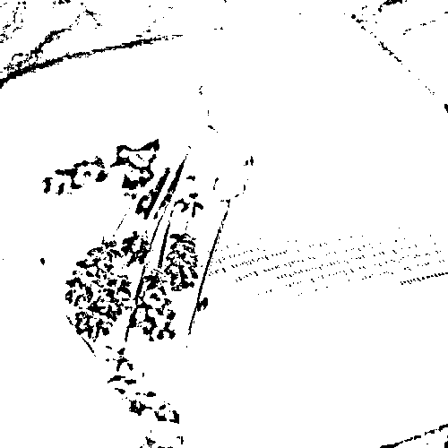

摩羯座新月的守护星土星，在新月时会合相金星。土星会使其触及的行星落地而具体化，并让其设法持续下去。

也许你喜欢艺术，但从来没有拿起过画笔；也许你爱好音乐，但你的乐器已经在角落里被闲置了好些年；也是你梦想与所爱的人一起出国旅行，但因为日程繁忙一直没有机会出行……**这个新月，当金星土星合相在射手座，带来把金星的爱与美落地并坚持下去的美好讯息:** 新的一年，不要花费所有的时间都在工作上，去关注平衡，去发现生活中的爱与美，去享受每一刻的欢笑与快乐。

2016 年的第一个新月，愿我们不再逃避于梦境，不再被恐惧所绑架，不再自我怀疑。愿每一个都感受冥王星蕴藏的特殊智慧与内在力量，带着摩羯座的决心一起将理想落地，迈出积极改变的第一步。

**也许你还关心：**

[Tips | 新月时如何许愿？](http://mp.weixin.qq.com/s?__biz=MzA5NjA0NTAxNg==&mid=209461827&idx=2&sn=b33b43bc66138abc13c488781eff1856&scene=21#wechat_redirect)

 

长按二维码，让金钱涌向传播知识与智慧的人

 

**◆ ◆ ◆ ◆ ◆**  

****特别提醒：**希望将若道文章转载到各自公众号的朋友，**转载时请注明“转自若道微信公众平台”，并附上若道占星的 Logo**。谢谢！**

1 月 10 日就是摩羯座新月了，每到新月时分，都是播种心愿的时期。点击文末“**阅读原文**”，免费领取你专属的新月报告！还有惊喜哦！


# 新月到底适合许愿吗？

> 原文：[`mp.weixin.qq.com/s?__biz=MzA5NjA0NTAxNg==&mid=402496622&idx=2&sn=d5a998882f426c8f0aa9409d71396ffa&chksm=02bf2ed935c8a7cfb8274cdde606bba45bd329bf85a9df824fce089684eaa0bc7d417402c277&scene=126&sessionid=1692738887#rd`](http://mp.weixin.qq.com/s?__biz=MzA5NjA0NTAxNg==&mid=402496622&idx=2&sn=d5a998882f426c8f0aa9409d71396ffa&chksm=02bf2ed935c8a7cfb8274cdde606bba45bd329bf85a9df824fce089684eaa0bc7d417402c277&scene=126&sessionid=1692738887#rd)

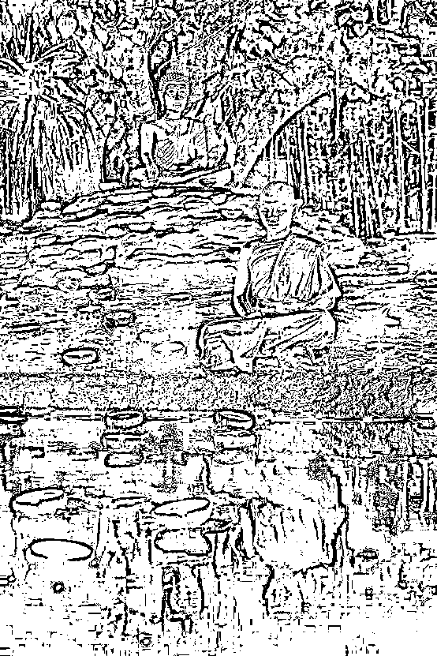
作者/Justine

图片/花瓣网

新月许愿这件事情已经广为流传很久了，但你真的知道什么是新月、为什么新月要许愿、到底新月是否适合许愿、应该怎样去许愿吗？这篇文章会给你答案。记住，没有错误的许愿时间，只有因为不够专注、不够诚心、许愿内容不符合灵魂道路等原因才使许愿无法显现。

**1****新月究竟是怎么回事儿？**

如果你研究古典占星（希腊占星、吠陀占星或七政四余等），对于新月是否应该许愿（或可以许愿）会心存疑虑。

**新月是月亮与太阳合相之时。新月发生在阴历三十或初一，月亮在太阳和地球的中间，月亮就隔离了阳光对地球的照射，看到的月亮也会很弯曲与无光，因此称为朔月。**

*   在古典占星中，月亮有光无光是判断月亮力量强弱的一个很重要标准。新月又被称为**暗夜或黑月**，从这个意义上说，的确是**月亮力量最虚弱的时刻**。 

*   而现代心理或人本主义占星强调是：每个新月，当意识的太阳与潜意识的月亮合相，象征了我们**崭新情绪周期的开始，是重新设定或调整目标的好时机**。

**2****新月是不是适合许愿呢？**

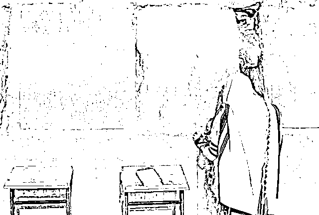

回溯人类几万年的文明史，在占星学体系发展起来之前，人类对月亮女神的崇拜、对月亮周期的观察就早已存在。月亮与女性繁殖力与丰收的节庆有关。

朵琳·芙秋博士在《天使之药》中有一段讲述阿特兰蒂斯文明中光的疗法，聊到新月时说：


新月: 显化之夜。在“黑月”的夜晚，能量已趋成熟，可用来实现你的梦想与渴望，冥想着你的愿望，或者用肯定的方式着笔（表示你写下正面语句，叙述你已经圆满地完成了你的渴望）。请求新月与大天使汉尼尔指点你实现这些心愿的行动，并笃定它们会产生最好的结果。


《内在的天空》作者斯蒂芬·弗里斯特在《月亮之书（*The Book of The Moon*）》中说，在八个基本的月相周期中，新月是两个最黑暗的阶段之一。

跟残月不同的是，**新月时我们会经历一种奇怪的综合情绪：暗月注重内在的特质、身处另一个世界的虚无缥缈感，与月亮渐盈阶段向外涌出的能量融合在一起。**

斯蒂芬老师指出：这是年轻的、本然纯净的、充满生命力的能量。事实上，强烈的向外涌出的特质会在新月时达到顶峰。当月亮渐渐离开与其合相的太阳，神圣的、充满磁力的新月，依然扎根于甜蜜的黑暗中，同时体验到进入三维物质世界的冲动。

因此，**从月亮能量周期的角度，新月冥想、设定新的目标或写下肯定句是有据可循的。**

**3****为什么对新月是否适**合**许愿会有不同建议呢？**

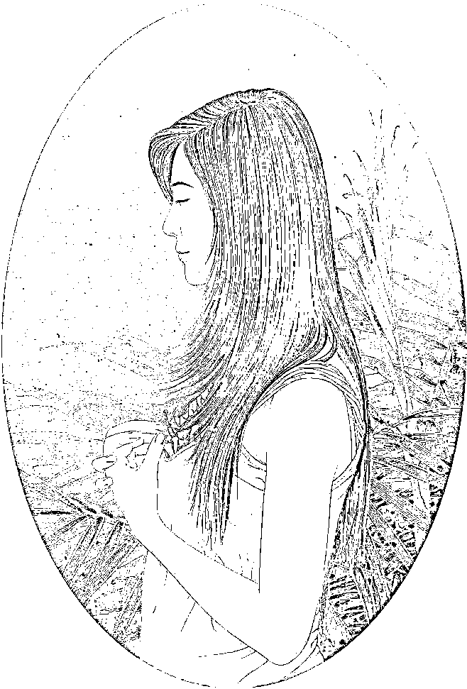

*   **许愿这个词比较泛化。**太泛化的词容易传播，也就容易在大众传播后被模糊化或曲解。从专业的角度去要深究，偏差自然就出现了。 

*   **从宇宙天气的角度，每一个新月都有不同的特质，不同的人因为个人星图的敏感点不同，对同一个新月能量的感应程度也有细微差别。**不少占星师会避免在月亮空亡、新月日食时许愿，其实这也不算是刻在石头上的禁忌，更多是遵循直觉上的选择。**月亮空亡的时候一般会难以集中注意力，日食则需要时间来下载宇宙的信息、以开启全新的能量周期。但如果你刚好在那个时候有灵感或冥冥中受到指引，许愿也未尝不可。** 

*   **任何时候，只有抱着专注、信赖与尊敬的态度，都可以祈祷、许愿以及使用肯定句。**没有错误的许愿时间，只有因为不够专注、不够诚心、许愿内容不符合灵魂道路等原因才使许愿无法显现。如果你已经养成了许愿的习惯，合适尝试把多种方式结合起来一起用，梦想与心愿显现的速度会更快。 

**4****祈祷、许愿、肯定句有什么不同？**

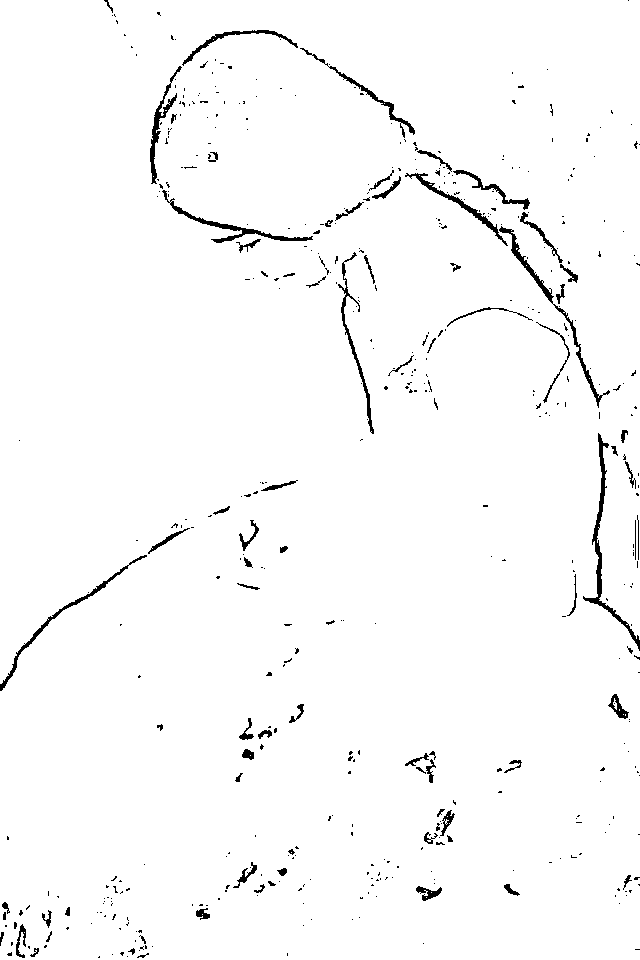

## **许愿**

许愿是求神护佑自己，使自己的心愿得以实现。

许愿不需择吉日，随时随地都可以。

民间传统及习俗有向流星许愿、孔明许愿灯、玻璃樽（漂浮瓶）、元宵节蜡烛水中漂等等，逢年过节很多庙宇、商场里也会有许愿树或许愿墙。

## 肯定句（正面的语句，Affirmation）

肯定句的意义是，在还没有实现之前，帮助你定义你想达成的具体目标，并让你的潜意识先接受这个现实，宇宙的吸引力法则就更快显现成功。

肯定句需要简洁、并用现实时态，多次重复直到让大脑吸收自己的信息。

譬如：

**“我吸引财富，丰盛不断地进入我的生活。”**

**“我值得拥有最好的。”**

**“我打开自己的心，去认识有趣的新朋友。”**

**“我的世界里一切都很好。”**

## 祈祷(Prayer)

祈祷的对象是无所不能的伟大存在（Greater One, 如上帝、佛陀等）。

无论你是否有宗教信仰，在相信有一个无所不能伟大存在的前提下，都可以向伟大的存在诉说自己的愿望，相信这个超越三维的物质世界的神的存在、智慧和慈悲可以帮助到自己。

结

论

以上三者的定义来看，许愿是最广泛、最被普遍接受的方式。笔者也是从新月许愿习惯开始，感受到心念与仪式的强大作用，随后接触到天使疗法、肯定句、祈祷，了解到“肯定的祈祷比恳求的祈祷更有效” 、“随时可以召唤天使，但不直接向天使祈祷”等更细致原则。


2016 年的第一个新月将至，

你会设定什么样的目标，

许下什么样的愿望？


**有关新月许愿，也许你还想了解：**  

[Tips | 新月时如何许愿?](http://mp.weixin.qq.com/s?__biz=MzA5NjA0NTAxNg==&mid=209461827&idx=2&sn=b33b43bc66138abc13c488781eff1856&scene=21#wechat_redirect)

**◆ ◆ ◆ ◆ ◆**  

****特别提醒：**希望将若道文章转载到各自公众号的朋友，**转载时请注明“转自若道微信公众平台”，并附上若道占星的 Logo**。谢谢！**

**2016 年 1 月 10 日**就是摩羯座新月了，别忘了许愿哦！点击文末“**阅读原文**”，免费领取你专属的新月报告！还有惊喜哦！


# 新年礼 | 在线许愿功能开启啦！

> 原文：[`mp.weixin.qq.com/s?__biz=MzA5NjA0NTAxNg==&mid=402496622&idx=3&sn=b218a8c0d38f99199669c860f6e026f2&chksm=02bf2ed935c8a7cf60e75e704b73e1fa548ebc8c4fb78d28157c8234bd4679cf5d4c26d40b7c&scene=126&sessionid=1692738887#rd`](http://mp.weixin.qq.com/s?__biz=MzA5NjA0NTAxNg==&mid=402496622&idx=3&sn=b218a8c0d38f99199669c860f6e026f2&chksm=02bf2ed935c8a7cf60e75e704b73e1fa548ebc8c4fb78d28157c8234bd4679cf5d4c26d40b7c&scene=126&sessionid=1692738887#rd)


**2016 年开年好礼——**

若道新月报告可以在线祈祷、分享幸福啦！

手机党们，

不用再跑到网站上查看新月报告了~

在新月的时候，

你可以直接在手机上即可获取报告，

在线许愿并分享；

平常的时候，

也可以戳在线许愿并分享！

无论你在地铁上、聚会时、还是等餐途中，

随时随地许愿祈祷，

是不是很酷呢？

**操作起来也很简单哦**

**当新月到来的时候，您只要做如下步骤**

进入首页

点击
“新月祈祷”

登录账户

填写出生信息

查看报告、许愿

**【步骤一】点击新月的祈祷**


**【步骤二】输入姓名**


**【步骤三】输入出生信息**


**【步骤四】生成新月报告**


**最下方有许愿按钮，左边是倒计时提醒哟~**

**在合适的时间就可以许~愿~啦~**

**【步骤五】许愿！**

****

**【步骤六】让宇宙看到你的愿望并分享！**

**** 

**在平时，您只要做如下步骤**

进入首页

点击
“新月祈祷”

登录账户

填写出生信息

查看报告、许愿

**◆ ◆ ◆ ◆ ◆**


**小伙伴们还等什么？**

**赶快点击→左下角阅读原文**

**体验这份新年礼物吧！**

# 与大师面对面 | 塔纳斯教授 1 月 18 日公开演讲！抓紧报名！

> 原文：[`mp.weixin.qq.com/s?__biz=MzA5NjA0NTAxNg==&mid=402487251&idx=2&sn=59381b7304880cc500e8ca6fe6d9aab2&chksm=02bfc56435c84c72a3d4a64d42b19ad3ae916720dd6050d623e46dcafef0e424dc22c51ceaf1&scene=126&sessionid=1692738887#rd`](http://mp.weixin.qq.com/s?__biz=MzA5NjA0NTAxNg==&mid=402487251&idx=2&sn=59381b7304880cc500e8ca6fe6d9aab2&chksm=02bfc56435c84c72a3d4a64d42b19ad3ae916720dd6050d623e46dcafef0e424dc22c51ceaf1&scene=126&sessionid=1692738887#rd)

Jan

**18**

◆他毕业于哈佛

是西方著名哲学家史学家

著有《西方思想史》

◆他是国际占星学界学者和先驱

研究原型占星学 30 年

著有《宇宙与心灵》

◆他——**理查德·塔纳斯**教授

将于**1 月 18 日**

在**北京若道**举办一次**公开演讲**

本次活动现场与线上同步进行

**与大师面对面的机会弥足珍贵**

**还不赶快报名！**


**讲座信息**

**时间：**2016 年 1 月 18 日 20：00-22：00

**方式：**现场（北京）+网络直播（外地）

**地点：**北京市朝阳区百子湾路 32 号院苹果社区南区 10 号楼 A 座 2006 室

**费用：**50 元（若道老学员免费）

**特别提醒：**不接收空降，请提前付款确认名额

**报名截止：**2016 年 1 月 15 日

**咨询电话：**400-619-1014

**添加客服 siri 微信进行咨询**


>>>>

**塔纳斯与原型占星**

多年前，和大多数深受现代教育荼毒的人一样，塔纳斯自动对各类占星学抱持怀疑的态度。然而，受到荣格学说和几位值得信任的同事的影响，他开始认真对待占星学。

对占星学原则的深入理解，结合深度心理学（尤其是原型和超个人学派）的最新进展，使他得以一瞥行星运动呼应人类生活的大体面貌。他发现，**重要人生事件的含义和性质与此时行进的行星原型含义相符。**特定行星组合象征的原型既可以在内在心灵世界得到表达，也可以外在世界显化为具体事件，有时两者皆有。

此外，某种行星组合代表的原型包含了正负两极的能量。具有相同配置的不同个体可能是分别是同一种原型能量的接收方或作用方，那么两者的实际经历会大不相同。**到底哪种可能性会显化似乎是由周围环境和个体的反应方式决定的**，从星图或行星组合本身看不出来。

他的最终结论是原型的力量十分强大但是参与者的因素也不可小视。换句话说，虽然原型决定了事件的结构或本质含义，无论表象多么纷繁复杂，背后总可以窥见原型的影子，但是事件进程还是受到环境因素以及人为因素的塑造。

随着证据指向的方向，塔纳斯最终将研究范围推及各类历史和文化现象。迄今为止，他持续从事这项研究 30 年。

他确信行星运动和人类历史存在重大（实际上无处不在）的关联，而且现代人的观点是完全错误的。**证据显示行星本身并不是事件或人格特征的直接原因，而是两者间始终存在一致的有意义的联系。**在上如在下，使两者之间产生联系的是原型层面的同时性原则。

**◆ ◆ ◆ ◆ ◆**

想要了解更多？来参加 1 月 18 日晚的讲座吧。点击“**阅读原文**”进入报名页面。


# 火星入天蝎座，当剑已出鞘

> 原文：[`mp.weixin.qq.com/s?__biz=MzA5NjA0NTAxNg==&mid=402487251&idx=1&sn=8e8e9e76d11fdd201c6ef12c2cabf3af&chksm=02bfc56435c84c7219eb48e2ba78ced2532c452a4b321831c1b051e61a01a5664e6d2c9b4461&scene=126&sessionid=1692738887#rd`](http://mp.weixin.qq.com/s?__biz=MzA5NjA0NTAxNg==&mid=402487251&idx=1&sn=8e8e9e76d11fdd201c6ef12c2cabf3af&chksm=02bfc56435c84c7219eb48e2ba78ced2532c452a4b321831c1b051e61a01a5664e6d2c9b4461&scene=126&sessionid=1692738887#rd)

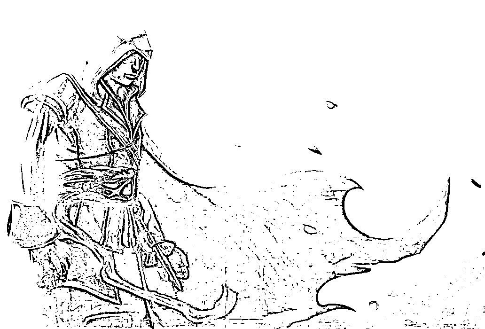

一把尘封的剑，屹立在沙漠之中，风沙迎面，淡定自若。经时日久，风沙已经掩埋住了大部分的剑身，现今只尚存留剑的手柄还裸露在炙热的风沙中。而一切的静谧与等待都是为了迎接某个时刻的到来……

**2016 年 1 月 3 日 22:11 火星绕黄道走了一圈，经过约 2 年的时间，又再次回到了自己的大本营——天蝎座。**

1

**火星在生命中的意义**

在占星学的符号里，火星象征着我们的行动力，我们的内在燃烧之火，我们的进取心以及生命之活力。而火星所落入的星座则代表着我们是以何种方式来行动的，我们是通过如何的途径和方式来点燃我们生命之火的，又是以如何的方式来实现人生抱负，彰显自我主张的。

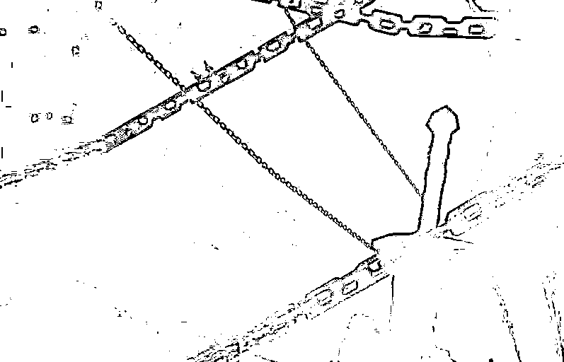

在古典占星学里，火星同时守护着白羊座和天蝎座。天蝎和它的同族兄弟白羊虽说都是火性之人，但却有着质的区别。白羊座是火中之火，简单直接，喜怒于色。天蝎座是水中之火，情绪不易外漏，即便内在火焰灼烧的已经很猛烈，但在他的表皮之上也不轻易被察觉。

但不易察觉不代表没温度，不挥舞不代表不锋利。

2

**当火星遇上天蝎座**

天蝎座倘若是上文中提到的那把屹立在风沙之中尘封已久的剑，那火星就是触发这把尘封之剑内在层层机关的装置按钮。能量蓄势已久，天蝎之剑暂别静默，是时候离开剑鞘了。

火星在天蝎座的这段时间里，我们会感知到体内荷尔蒙的飙升，会嗅到空气中弥散着的各种重口味。我们可以加以观察，来发现这股能量在各种层面上的显化。

○我们在处理日常事物和工作时，脑袋上会长出两根新的天线，一根叫敏锐，一根叫机制；

○对爱情的态度似乎比往常更添了一份占有之心，有种如果爱请深爱的浓烈；

○我们四处寻找五觉上的刺激感，只为找寻仍然还活着的存在感；

○对现有的资源多了份危机感，更加关注生存的议题；

○追寻各种深刻的体验，吃重口味的食物；

○世界各地上演关于所有权和控制权之争；

○金融体制上或许会有比较大的调整与动作；

○与性相关的议题浮出水面；

○对于迟迟悬而未决的事情想要来个当断即断的干脆……

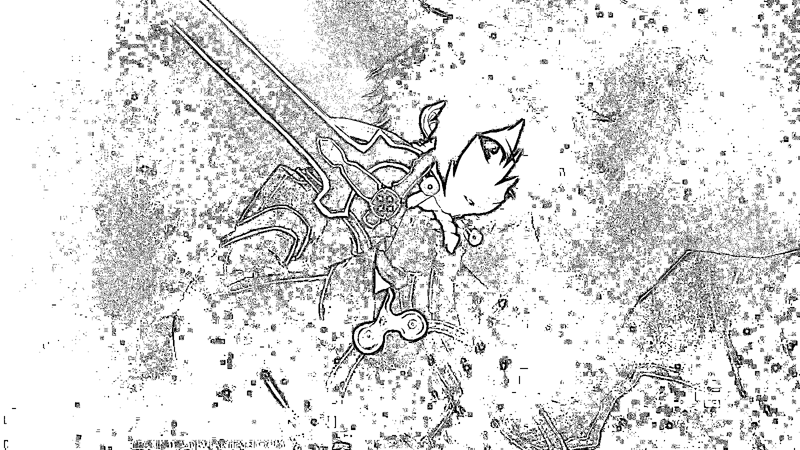 

所有的呈现，终将要落实在我们每人各自的生活实相中，它与我们内在主观机制和外在客观现实紧密关联，将会以我们自己独有的方式呈现出来。它可以是积极的，也可以是消极的，可以是建设性的，也可以是破坏性的。但无论我们选择以何种方式将其落地，那把剑始终都握在我们自己的手中，如何挥舞全凭我们意念。

3

**这段时间你需要做的事**

然而在火星天蝎座行进的天象之下，我们又可以为自己做些什么呢？

*   倘若之前的你只管低头走路，很少抬头看路，做事情大部分凭习惯性，那不妨趁现在发展出一丝**觉知与洞察，将它融进我们的行动中，可能会有不一样的发现与惊喜**。 

*   或许你有囤积嗜好，不管有用的没用的都占满了你屋子的各个角落，不如趁现在来个**断舍离，把杂乱清理出你的房间，只把通透与明亮留下**。 

*   **或许有某个执念在你的心中已经存有的好久，几乎撑满了你所有的心识，或许现在是时候把它放下了。**把那个已经不能给你带来任何营养，但还在日夜不断吞噬你脑神经的坏东西赶出你的生活，与它一刀两断。 

*   若你一直以乐天派自居，习惯了风来将挡，水来土掩的做派。那现在是时候在你那乐天派的气质上加个盟友，名叫：**未雨绸缪**。 

*   若你之前在商业谈判中是以大刀阔斧，三下五除二著称的，不如趁火星在天蝎的运作之下，调转个思路试试。**在正式商谈前花多些精力进行情报整理，数据分析的工作。探听虚实，方能占取先机，实现利润最大化。** 

*   若你之前对金钱与资源的使用一直是大手大脚，不拘小节的范，或许现在是时候发展出**对金钱的觉知感，适度合理使用，不造成浪费。学习理财之道，开启资源配置的优化行动**。 

*   若在你的心中还有个伤痛一直没有根除，迄今为止还在不断侵袭与滋扰着你，并且你压根就不知道这莫名之伤发自于何处，源自于哪里，但每次伤痛发作都让你不能自已。或许现在是时候卸下防备，带上勇敢，去探寻那痛之根源。你可以**寻求专业咨询师，占星师或者疗愈师的帮助，在他们的协助下可以帮助你更快的找到那个藏在你心识底部，潜意识中的伤痛之源。**当你看见它的时候，请与它和解。

**火海之舞**

**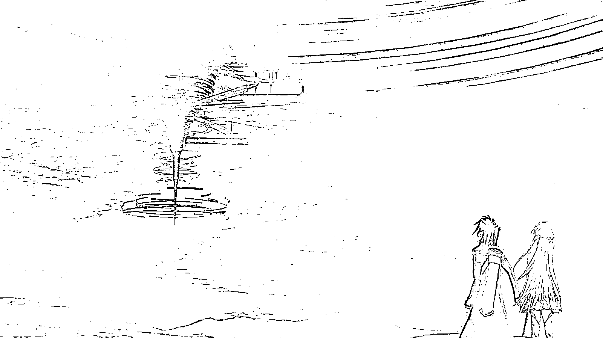** 

**2016 年 1 月 18 日 18:25，行进的火星与海王星在天空中形成精准的三分相。**

在海王星这位灵性与艺术导师的能量增持下，让我们内在灼烧的激情又添加了一把舞动之火。

**此时，我们可以通过聆听音乐，学习舞蹈，以及其它可以帮助身体得到伸展，情绪得以释放的运动。去感知血还是热的。**

当舞着舞着，跳着跳着，泪水混着汗水一起从你的脸颊淌下，无论那是悲伤之泉水，还是疗愈之泉水，都已不再重要，因为那刻的你，已在光中，感受到生命的敞开。

让我们去发现五觉之外的更高觉知，带着这份觉知，我们会更清楚的看见我们的欲望、恐惧和期待是如何被显化出来的。而当真相浮显出水面，恐惧便会凋零。

我们各自心中那把尘封之剑，一旦离开剑鞘，又将挥舞出怎样的火舞风沙，是刀刀见血，还是兵不相刃，全凭你抉择。

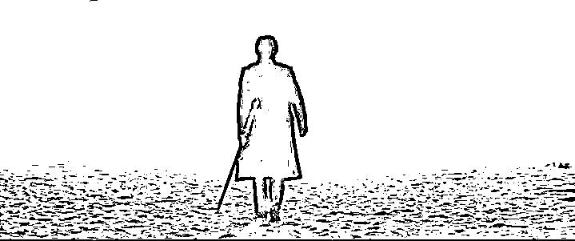

## 诗一首

朗月之下，

我手持破魔之剑，

站在炙热的风沙之中，

只待这一次的极致挥舞，

用以开启我那尘封已久的心，

发丝或许会凌乱，步履或许会踉跄，

但待一切静谧之后，我将是一个全新的我。

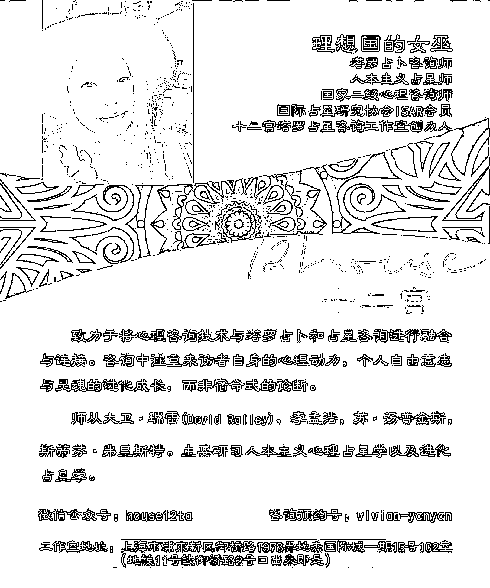

长按二维码，让金钱涌向传播知识与智慧的人~


**◆ ◆ ◆ ◆ ◆** 

****特别提醒：**希望将若道文章转载到各自公众号的朋友，**转载时请注明“转自若道微信公众平台”，并附上若道占星的 Logo**。谢谢！**

**2016 年 3 月 15 日**，大卫老师主讲的若道占星核心课程**Level 5**要开课了！在这个阶段，你将学习各种预测技术及行星周期。通过这些预测工具，你能够预测和规划人生。提前报名付款有**早鸟价**哦！详细内容请点击“**阅读原文**”了解。


# 名人星图 | 宫崎骏：在严肃的世界绽放天真

> 原文：[`mp.weixin.qq.com/s?__biz=MzA5NjA0NTAxNg==&mid=402477959&idx=1&sn=e43d4d135b211618419a628a69c365e4&chksm=02bfe13035c86826c6fb49a23cfdb2d8264edeb882630c2243525447f0608d66e5bfe476c298&scene=126&sessionid=1692738887#rd`](http://mp.weixin.qq.com/s?__biz=MzA5NjA0NTAxNg==&mid=402477959&idx=1&sn=e43d4d135b211618419a628a69c365e4&chksm=02bfe13035c86826c6fb49a23cfdb2d8264edeb882630c2243525447f0608d66e5bfe476c298&scene=126&sessionid=1692738887#rd)

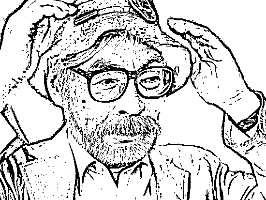

作者/珊珊树

稿件来源/心探索网站

1 月 5 日，著名动漫大师宫崎骏 75 岁了。从《风之谷》画到了《天空之城》、《幽灵公主》、《龙猫》、《千与千寻》、《哈尔的移动城堡》……他用 45 年时间成就 19 部佳作，为世界构建出一个炫目的动画王国，为无数人带来感动。而他也是继黑泽明后第二位获得奥斯卡终身成就奖的日本影人。是什么样的能量让他活出这等实力？今天，让我们从星图中进一步认识他。

*1*

**一张火象土象能量爆棚的星图**

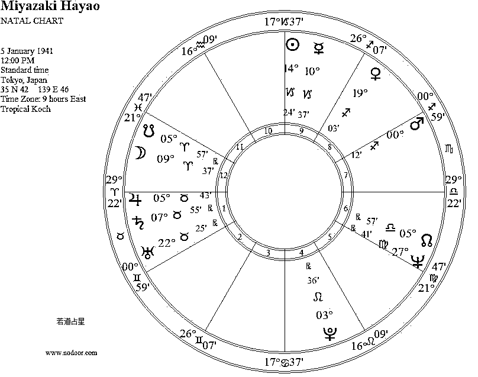

```
（宫崎骏出生于 1941 年 1 月 5 日，由于出生时间不确定，本星图选取时间中午 12 点，不影响星座、相位）
```

宫崎骏的出生星图中，没有行星落在水象星座和风象星座，**整张星图都是强大而集中的火象、土象能量**，这给了他一个主题明确的人生：几乎终生都埋头于工作和创作这两件事。这样的火土能量表现在宫崎骏的作品里，则是主角拥有火象能量——无私敞开的心灵力量，和土象能量——专一的目标、坚定的信念，主角需要凭借这样的能量来通过极为复杂的冒险任务，完成“不可能的爱”。

看宫崎骏的动画电影，会使我们忘记自己的“属性”：我是男人女人、成人小孩、善的恶的……都不重要，都不妨碍我们认为电影里的主角就是我们自己。他的电影剧情里充满了战争、人性、劳动、守卫、拯救等主题——这对应了**宫崎骏本人星图中太阳摩羯座和月亮白羊座的元素：严肃的现实与天真的勇气**。

能在这严肃现实的框框下去自由地经历这一切的，只能是一个平凡的人物，一颗平凡又勇敢、坚持不懈的心，这才能创造出不平凡的爱情童话。正因为主角是如此平凡、单纯、真实，没有个性——所以反而真正地活出自己鲜明的个性来，也得到最真实、最打动人的爱。

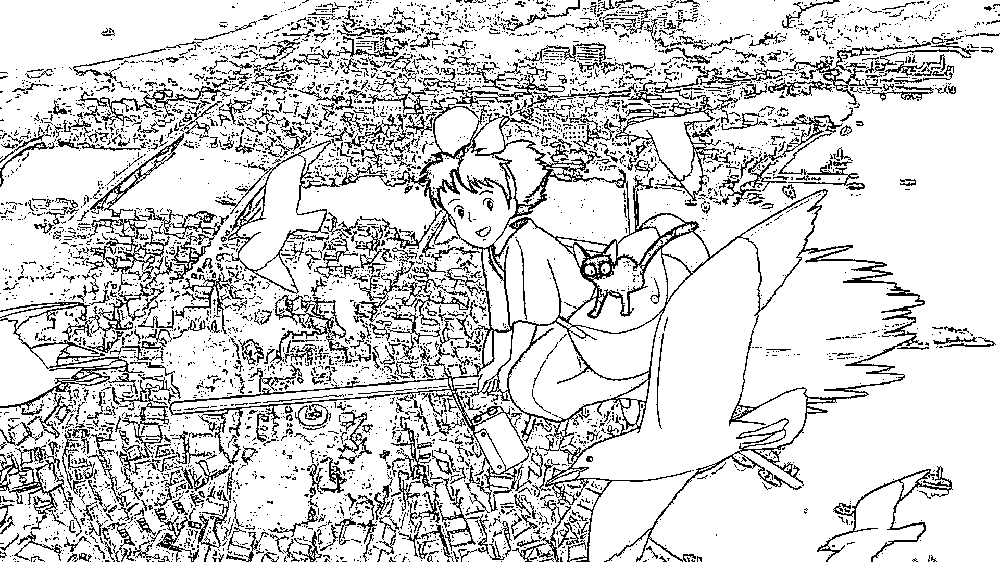

▲《魔女宅急便》 

* * *

“不在外面的城市努力奋斗一年，就不能成为魔女。”

*2*

**宫崎骏式“爱的表达”**

**○** ****爱的表达方式有很多，而对于整个星图中无一行星落水象元素的宫崎骏来说，他会选择怎样的方式表达爱呢？****

宫崎骏的星图中，冥王星狮子座、金星射手座、月亮白羊座，这三颗落在火象星座的行星在星图中发挥着最为聚焦的能量。它们与落在土象星座摩羯座的太阳、水星所结合的最终结果便是：“**火象能量——精神动力的终极探索**”和“**土象能量——对成功与完美的无限追求**”这两个方面。

我们可以看到，在他导演的动画人物角色上，火象能量体现出的无私敞开的心灵力量，与土象能量体现出的的信念坚定、目标专一，形成了一种既踏实虔诚、又永远在突破自我的勇士精神。

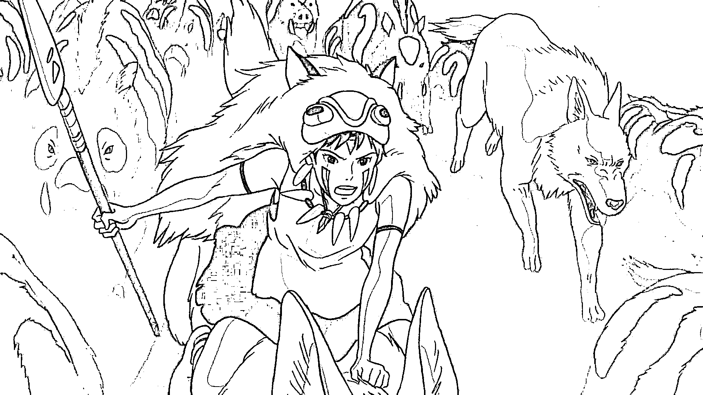

▲《幽灵公主》 

* * *

“谁也不能改变命运。不过，是普通的等待，还是争取自救，要由自己决定。”

**○** **作品的完美和成功，只是价值与意义达成的一个标准——达成之后又干什么呢？**

其实真正令人无法满足的，是如何看到那个永远可以带领你的东西，换句话说：什么可以刺激到你无限地投入工作中？很自然地，我们只能找到精神上的主题，而精神主题中最重要的是——爱。

这就是为什么宫崎骏导演自始至终坚持表达这一个主题，他使人物风格愈来愈清新自然，而其性格的真实度却愈来愈深入灵魂，使得观众对其中爱的感染也愈来愈欲罢不能。据说他的许多片子都被珍藏和回看，成为许多粉丝的心灵安慰剂。

宫崎骏的星图中，除了北交点在天秤座之外，几乎没有别的风象元素——我们可以注意到，在他的电影中，所有角色都很少有交流，男女主角即使在恋爱中也很少表达爱意，很少有儿女情长的厮磨暧昧脸红等，只是执行任务和及时陪伴，用实际行动去表现爱，这反而也让整片都充满了爱意的流动。

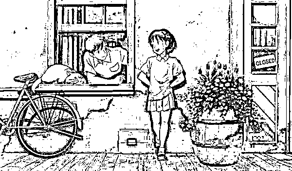

▲《侧耳倾听》 

* * *

“我早就决定要这样载着你，翻山越岭。”

宫崎骏本身在生活中也不善言辞与交际，就连奥斯卡颁奖活动都认为“可以不必参加”，而把所有能量都放在工作和动画创作上。他曾说：“你住的城市下雨了，很想问你有没有带伞。可是我忍住了，因为我怕你说没带，而我又无能为力，就像是我爱你，却给不到你想要的陪伴。”这句话无比贴切地对应了他的摩羯座太阳、水星与金牛座木星、土星，因为对现实的顾虑而变得少言寡语、不善言爱的特征。

*3*

**摩羯座太阳的追求**

摩羯座太阳、水星，加上金牛座木星、土星，土象能量的这股张力，表现在宫崎骏的工作中，是极为复杂又精致壮美的场景设计图，和精益求精的电影声乐与动作效果；表现在电影的角色里，则是主角永远需要通过极为复杂的冒险任务，来完成“不可能的爱”。在这复杂的结构中，又贯穿着来自火象能量的最单纯、最无私的心灵力量。

《千与千寻》中的千寻，《天空之城》中的希达和帕克，《龙猫》中的小梅，《悬崖上的金鱼姬》中的波妞……她们身份平凡、心态开放、思想简单而信念热诚、目标坚定，历经重重困难仍然善良而无私地爱护着身边每个人，宫崎骏也正是通过这样的表现方式，来释放了自己渴望表达内在勇敢与热情的能量。

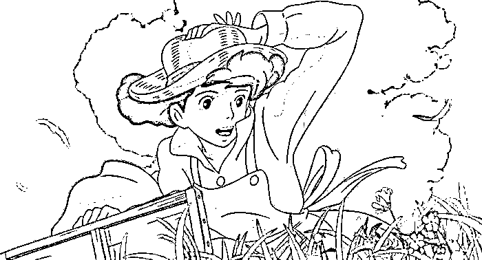

▲《起风了》 

* * *

“起风了……只有试着活下去这一条路！”

因为家族条件的优越，宫崎骏毫无生存压力，因此能够继续自己在动画创作方面的兴趣。这正是他星图中强大的火象能量所带来的自由创作的使命和机会。从初期的漫画绘本，到开始动画原画，最后突出的才华被认可，成为动画制作与导演。可以说只要基本条件满足，他便会始终以踏实创作的态度来面对工作，直到一部又一部动画电影作品成功问世。

2014 年，宫崎骏被授予奥斯卡终身成就奖（他是继黑泽明之后，日本第二位获得此奖项者），这也算是完成了他自己摩羯座太阳、水星所追求的最大成就了吧。72 岁的时候，他因患上心脏病终于退休。火象、土象能量的过度消耗，终于到了必须缓解的时候。

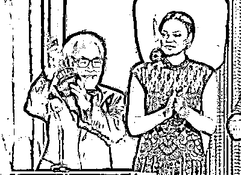

*4*

**女性力量的代言人**

宫崎骏星图的最终定位星是木星和金星，这两颗行星分别在金牛座和射手座形成互容相位，这也说明了，**宫崎骏的人生主题汇集于“美与爱”的创造和升华上**；再加上冥王星合相凯龙星于狮子座，并与木星成四分相——宫崎骏的生命能量呈现出“灵魂质感的强迫性追求”。在他设计的动画中，人物表情、动作、穿衣等都细腻而真实。细心的观众会发现，就连角色无意间拨弄散乱的头发，或某个配角在一旁将打翻的东西扶好等最琐碎的生活细节都被一一照顾到。

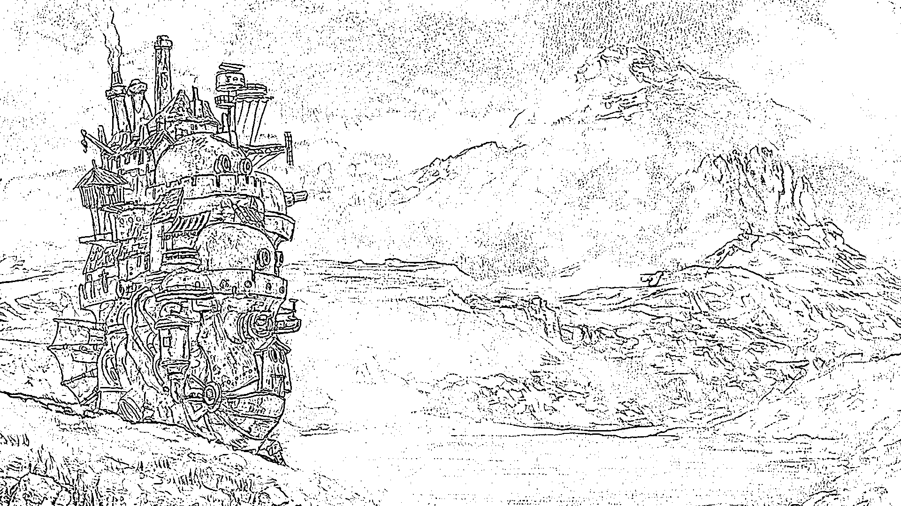

▲《哈尔的移动城堡》 

* * *

“如果不美的话，活着还有什么意义……”

动画制作不同于电影拍摄，动画人物的各种习惯和本能都需要亲自去构思和设计，如何贴近生活，全靠设计者的细腻观察。在作为美术总监的工作中，宫崎骏被其团队成员认为是最苛刻的领导，每一张画稿若不能“充满感觉地展示眼前”就会被无情淘汰。

所谓细节之处见灵魂，灵魂的深度总是同时体现在细节的质感上。这也正是木星、土星在金牛座所要的“现实亲切感”；再当木星、土星四分了狮子座冥王星——这一切又需要多么自然、可爱、本真，才能以人性化的能量去打动人心。也可以说，那份几乎刻意的自然，在影片中是如此突出，让人不忍心忽略。

在宫崎骏的动画里，除了主角多为女孩之外，其童话般的色彩渲染、富于想象力的奇幻场景、人与自然交相映照的舒适结构，以及剧情中传奇式的情节设计也都具有非常感性的力量，从而吸引了大量的女性观众。可以说，他的作品就像是“在男权世界背景下，女性力量的代言人”。这些片中的女性能量都是金星、木星互容的必然主题，而摩羯座太阳、水星与狮子座冥王则为此主题加上了延伸——勇气、爱、魔法、成功。于平凡之处，不平凡着。

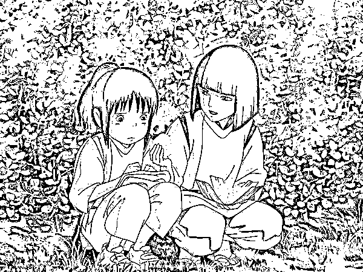

▲《**千与千寻**》 

* * *

“名字一旦被夺去了，就不记得回家的路了。”

我们每个人都是能量的通道，只是这股能量最终会围绕哪个主题、以哪种方式、释放出哪种品质的作品来，这作品又带来怎样的影响力——每个人的“人生作品”所呈现的风格都不同。

而宫崎骏通过动画作品的剧情设计，在涵盖一切现实自然元素——战争、环保、冒险、魔法、恋爱等等之后，鲜明深刻地凸显出人性共通的感动，并以那份最单纯、本真的力量来打动人心，完成了这份影响力。

也可以说，正是他运用了自身的能量通道并无限深入后，“顺便”向我们揭示出爱的普世真理，以此来表达自己的价值追求，痛快地释放自己的本性能量。

```
作者简介珊珊树，混迹于神秘主义与灵性成长世界的职业占星塔罗咨询师；长年研习占星、塔罗、儒释道文化，每年与东西方占星大师跟随学习进修。公众号：小树占星（ xiaoshu_astro）私人微信/QQ 号：622005740
```

**◆ ◆ ◆ ◆ ◆** 

****特别提醒：**希望将若道文章转载到各自公众号的朋友，**转载时请注明“转自若道微信公众平台”，并附上若道占星的 Logo**。谢谢！**

**2016 年 3 月 10 日**，大卫老师主讲的若道占星核心课程**Level 1-2**又要开课了！他将带领你学习星座、太阳、月亮、行星、月亮交点等知识，让你进入占星学的世界！提前报名付款有**早鸟价**哦！详细内容请点击“**阅读原文**”了解。


# 最全 12 星座水逆攻略

> 原文：[`mp.weixin.qq.com/s?__biz=MzA5NjA0NTAxNg==&mid=402477959&idx=2&sn=3958902695dc449facbb9c3c9a422ac4&chksm=02bfe13035c868266fa8b25546c3f45a9a05a48e550a1713255adca9c9b1aad125b1d444c26e&scene=126&sessionid=1692738887#rd`](http://mp.weixin.qq.com/s?__biz=MzA5NjA0NTAxNg==&mid=402477959&idx=2&sn=3958902695dc449facbb9c3c9a422ac4&chksm=02bfe13035c868266fa8b25546c3f45a9a05a48e550a1713255adca9c9b1aad125b1d444c26e&scene=126&sessionid=1692738887#rd)

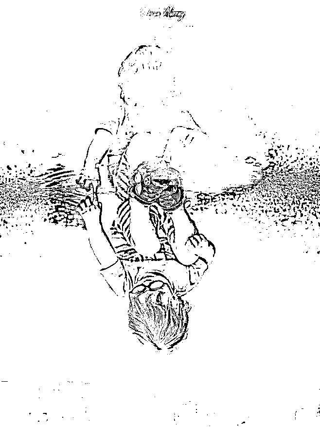

新年刚开始，你是否充满干劲，制定了新的计划，想要风风火火地大干一场？然而，水星却拉住你的袖子，对你说：“别着急，慢慢来。”从 1 月 5 日到 26 日，差不多整整一个月，水星都处在逆行状态，让我们不得不放慢脚步。这个时代，人们都习惯了疾行甚至奔跑，水星逆行的缓慢节奏容易被视为一种阻挠。然而，在行星逆行的缓慢之中，往往蕴藏着耐性以及智慧，水星也不例外。

**1****本次水星逆行时间表**

水星于北京时间 2016 年 1 月 5 日从水瓶座 1°2′停滞并开始逆行，1 月 9 日逆行至水瓶座 0°，1 月 26 日在摩羯座 14°54′水星停滞并恢复顺行。这段时间里，我们似乎有一种重复经历过往的感觉。这次的水星逆行与往年水星逆行相比更多了一些“**忆苦**”的情怀。

在 1 月份整个水星逆行期间，1 月 8 日，木星在处女座逆行；10 日，新月摩羯座；21、22 日，水星会进入天冥四分相的影响区域；这些星象的变动，在水星逆行的催化下，会让我们在这个月多一分思考，多一分调整，多一分成熟。任何行星的逆行，不仅仅是一种“倒退”，更是一种沉淀或者反思。只有这样才会让我们成为更好的自己。

**2****水星逆行的意义**

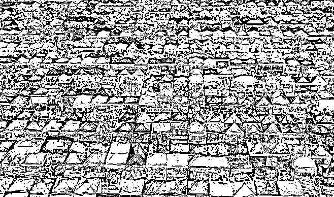

水星是太阳系行星中运行速度最快的一颗星体。在罗马神话中，水星对应的神祗是墨丘利（Mercury）：他头戴一顶插有双翅的帽子，脚穿飞行鞋，手握魔杖，行走如飞。而在希腊神话中，水星对应的则是赫耳墨斯，他穿有飞翅的凉鞋，能像思想一样敏捷地飞来飞去，因而成为宙斯的传旨者和信使。总之，快速、机智、狡猾、广博，是水星的关键词。

而当水星逆行的时候，这位信使的速度放慢了。他也许已经搜集了太多的信息，现在，他需要好好地消化它们，想一想这些信息到底意味着什么。他也许已经经历了很多事情、体验了很多情绪，现在，他准备真正地“感受”它们，让它们在心头沉淀一下，而不仅仅流于浮光掠影。他需要休息，需要反思，需要重整行装，以便继续前行。

当然，作为“信息”之星，水星也掌管一切与思考、沟通、交流有关的事项。比如言语沟通、文书工作、学习研究、销售购买、合同协议等，与这些领域相关的事务容易在水星逆行时受到影响，出现混乱、误解和延迟。这也是为什么每当水星逆行，占星师们都会喋喋不休地提醒你注意检查细节、谨慎签订合约、保存重要资料的原因。

在以往的人生经历中，我们需要学会思考，如何重组自己的人际关系、生活架构，逐步规划人生下一阶段的新格局、新版图，成为本月的人生主题。

**3****水星逆行在摩羯座**

这一次水星逆行，主要的领域是摩羯座。这个由土星守护的星座，向来最懂得时间的智慧，最明白现实的责任，也最关心职业发展以及社会声誉。所以，当水星在摩羯座逆行，会考验我们的新年计划是否符合实际，我们的职业规划是否合理、是否有长远的可行性，以及我们是否恪守了自己的承诺和责任。如果这些问题让你心中有一些犹疑的话，不妨就趁水星逆行，重新检视自己的生活和工作状态吧。

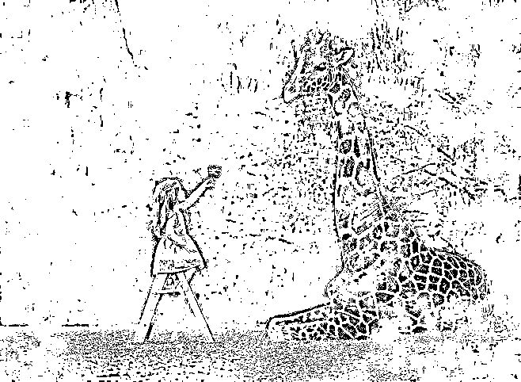 

对于每个人来讲，水星逆行期间与我们出生图中任何行星、四轴形成紧密相位，都会让我们对水星逆行的“信号”成功“对接”，会让我们的身心受到的水星逆行的影响更为明显。

**4****给十二星座的水逆 Tips**>>>>

以下主要参考上升星座

**白羊座**

**水星在你星图上与事业和名誉相关的领域逆行。** 在公众面前展示自己的机会增多，工作量也有所提升。不过一些工作会出现反复、甚至中断，不得不重新规划，再来一遍。干劲十足的你近期也不免会有挫败感。对于未来事业的走向，此刻需要一个沉淀期和规划期。先谋而后动，越挫越勇，才有所成。你需要改掉冲动的脾气，放慢节奏，谨慎行事。不要急着把计划和报告递交给老板，在按下邮件的“发送”键之前，最好自己多检查一遍。

此外，水逆也意味着你可能会对自己事业的现状有所反思，你自己或你的上司会重新评估你目前的职业状态、职业形象。你或许会有改变的打算，或许会从某个长辈或是以前的上司那里得到帮助，甚至得到一个意想不到的工作机会，但不妨留到水逆之后再做最终的决定。 

家庭方面，多多关注家中长辈的身体情况，如果身在异地，经常给家人打个电话，关怀一下。

**金牛座**

随着周遭环境的变化，自我学习、探究人生真谛的压力也就越来越大。如何在人群中脱颖而出？如何靠自己的专业所长被大家认可？此刻已经迫在眉睫了。你在水逆期可能会更多的去思考，人生中的至高价值是什么，并且学着如何走向人生巅峰。如果你选择在这个月去出差和旅行的话，可要小心一些，航班、车票和酒店的细节千万检查清楚，并提前下载好备用的地图，以免忙中出错，或搞不清楚方位。你也可以多带一本书或下载一些片子，以消磨航班延误的时光。

你还可以和恋人去一些以前去过的地方走走——水星逆行是一个适合怀旧的时节，再加上**木星正在你的真爱宫运行，一场富于怀旧气氛的旅行会比平时更浪漫哟。**对于过往的种种伤感记忆可以有一个割舍，学会放下。恋爱中的你也许会遇到以前错过的良缘。不妨问问自己，这一次愿不愿意勇敢面对，双方一同再进一步。

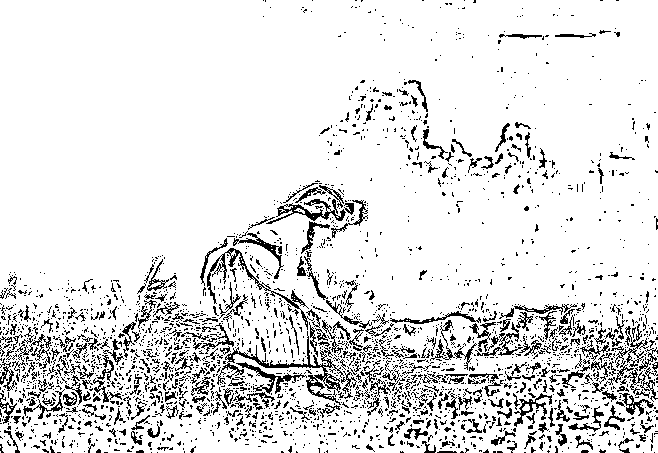

**双子座**

水星逆行期间，你也许会发现与财务、金融、保险等有关的事宜会出现混乱和延迟。趁此机会检查清楚细节，可以重新发现目前的工作以及合约中所存在的漏洞，也可对未来的工作流程有所改进，对自己的理财计划有更加清晰的把握。

另外，**对于有伴的人来说，也要多注意和伴侣之间的交流态度，不要过于任性和情绪化**。越是亲密的人，越需要学习相处的艺术，以免伤及对方，也伤及自己。

以往的一些朋友可能会离你而去，一些老友又会重新出现在你身边。“铁打的营盘流水的兵”，人生旅途中，我们需要坦然面对那些分分合合。在变动的人生轨迹中，这些离别和久别重逢都是一种人生经历而已。你也逐渐进入到人生新的阶段，对于未来的规划至关重要。自我内心世界也愈发成熟，来自家庭的支持让你信心十足。有些人近期会有组建家庭、购置房产的打算。

**巨蟹座**

**这次水逆会影响到你的人际关系，其中最重要的就是婚姻关系以及合作关系**。你要与谁为伍？是本次水逆期你需要关注的主题。

要特别当心沟通交流中出现的误会——如果以往就存在某种意见不合或是误解的话，水星逆行可能会让问题暴露出来。合作关系中，合约的签订可能会有所延迟。涉及文书的事情特别要注意，不要出现笔误或遗漏的地方。人际沟通中，尝试着尽量把话说清楚，如果真的有难以沟通的地方，也试着多一点宽容和谅解。

在工作中会出现工作关系变动的局面。有机会进入新团队或者以新的形象展示于人前。

感情生活中需要注意沟通，会回忆起一些关于前任的事情，或者会与前任有联系。如果过往的回忆让我们觉得“窒息”，不如到户外去散散心。本来就对周遭环境过于敏感的你，不如努力去释怀一些人和事。毕竟那些都是过去并不代表将来。

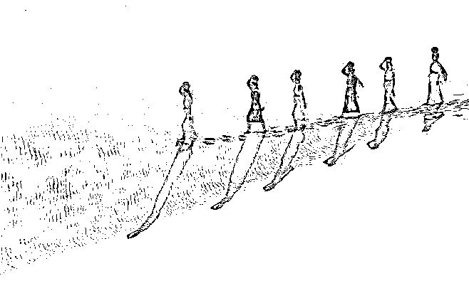

**狮子座**

**水星在你星图中与日常工作、生活细节最息息相关的领域逆行，这也是水星特别关注的领域。**

工作的压力扑面而来，需要与团队不断的沟通协调。在工作的过程中，越发成熟稳重，更加注重前行的步骤和架构。在别人的帮助下，事情会逐渐向利好方面发展。虽然身体近期会有疲惫感或者关节疼痛，但是这些都抵挡不住你奔向成功未来的步伐。

趁新年刚开始，赶紧准备好一本新的年历吧，把每一天要做的事情仔细地列在日历上，以免遗漏任何一项工作。养成“今日事今日毕”的习惯，对你来说会受用许久。如果你是管理者，那么管理工作是否严谨、有序，也会在水逆期间得到考验。如果你有招聘计划，不妨先仔细考查人选，等过了这段水逆期再做决定。

关于财物方面需要精打细算了，以往的大手大脚、迷迷糊糊的理财方式可能已经让你有些囊中羞涩了，部分投资行为需要谨慎分析再做决定。

感情生活进入甜蜜期。

**处女座**

**水星逆行在你的真爱宫，如果你很期待与旧爱复合的话，这次水逆无疑是一个拯救爱情的好机会。**

此次水逆期会影响到你的创作领域，相对应的工作量会有所增加。与老朋友的聚会在在近期会相当频繁。另外，在团队中，我们会遇到组织变动或者有人想有跳槽、调换部门的想法，这段时间正好可以好好规划打算一下，不要盲目冲动地做选择。

你有可能重新与 EX 恢复联系，并共同探讨以往相处过程中的一些问题，如果有误会，也可趁此机会讲开。如果复合并非你所愿，那也不妨静下心来回顾过往。毕竟今年木星在处女座，你的生活中会有更多的可能性出现。在新的机会到来之前，你需要先弄清楚什么是自己真正想要的。

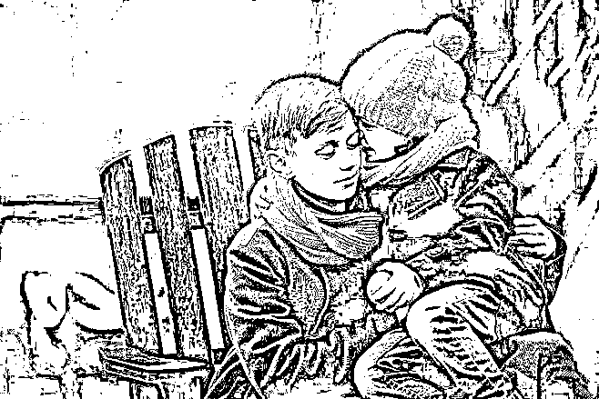

**天秤座**

**这个月，家庭生活会是你的重心所在，水星也会逆行在家庭的领域，你可能需要多花时间与家人相处。**

这段期间首先要关注来自家庭和事业的层面上的沟通问题，与长辈、领导之间的沟通要讲究方式方法，不要过于偏执于现状，而要去共同寻求事件的解决方法。单位如果有领导调换，积极做好对接服务。如果有些旧事被重提，不要冲动以免造成言语上的误会。耐心交流，达到彼此的理解。

另外，你在这段期间会有一些关于学习、组建家庭、购置房产或者装修的计划，好好规划，合理安排。如果你觉得自己曾经忽略了家人，那就在这段时间里给予他们更多耐心的陪伴吧。此外，如果你有装修房子或是买房的计划，或是准备给自己的家里添置什么东西，不妨在水逆期间先收集资料、向专家咨询意见，等到水逆过后，再开展具体的签约和购买事宜。

**天蝎座**

**水星在你星图中与旅行、文书、人际沟通等相关的领域逆行，如果要出行的话，一定要检查好细节，不要有遗漏或弄错的事项。**

对于外部环境所带来的突发消息，你容易做出冲动的、气愤的举动。不妨耐心分析一下利弊，再做打算。这段期间，你也许需要考虑一下在生活或者工作中会遇到一些关于“话语权”主题的事情，如果是你获得了话语权，就要想想如何去良好的运用。如果是被别人挑剔，甚至被迫“闭嘴”，那么要反思一下，是不是相关的事情你还没有学会更加深入的去分析。这段时间，不妨好好规划一下学习充电计划。出行要留意相关信息，以免出现延误。相关合约工作也要自己确认，以免出现误解。

工作中，涉及演讲或是文书工作等事项，也需要特别小心核对细节。重大的事项尽量用文字来沟通，以便日后有据可查；重要的数据也请做好备份，以防电子设备出现问题。也要小心因为电子设备的问题而造成人际之间的误解。如果要购置新的电子产品，不妨等水星在水瓶座顺行后再进行。

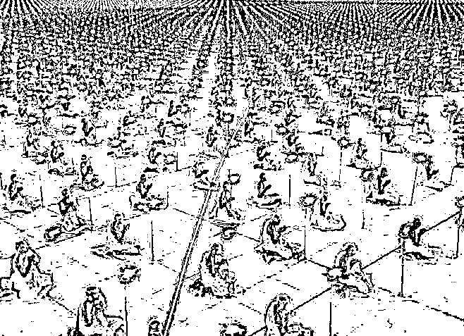

**射手座**

**在你的星图中与财富相关的领域逆行的水星，提醒你是时候检查自己的财务状况了。**

近期在财务方面需要做好规划，前一阵的过度支出会给未来的经济状况带来危机。你可能不是一个对具体数字特别上心的星座，但这个时候不妨把自己的财务状况搞搞清楚。虽然水逆期间不宜做重大的理财决定，但是这段时间非常有利于回顾过往，并为未来制定计划。你需要对自己的钱以及处理钱的方式做到心中有数，而不是一笔糊涂账。水逆过去之后，便可进行新的理财项目。这个月也不要盲目花钱，不宜购买大件的、奢侈的产品，在电子设备上进行的钱款交易也需格外小心。

除此之外，对于个人而言，需要对自我价值有新的评估和认识。自我价值在未来的生活和工作中如何展示，成为这一段时间需要关注的主题。不过会有良师益友在身旁帮助，定会有不错的结果。

**摩羯座**

**这次水星逆行的区域主要是摩羯座，所以对于上升和太阳摩羯来说，这个水逆期都会有较大的影响。**

你也许会遇到某个事件或契机，使得你以更客观、理性的态度看待以往发生的事情——也许是你的工作计划，也许是你对自己的某种期待。沟通交流的事宜要特别小心，遇到事情要把自己的看法讲清楚，不要想当然地觉得别人一定能够理解你的意思，也不要想当然地觉得自己的观点必然是正确的，因为水逆期间最容易出现思考上的盲区。

水逆期间需要思考一些个人与团队、朋友之间关系的问题。如何融入团队与他人相处，在不磨灭自我的前提下获得别人的认可。如何取舍与平衡，需要深思熟虑。过往一些痛苦经历也会浮现眼前，我们到底要争取什么？舍弃什么？当然，学会良好的沟通、交际技巧是你不容忽视的功课。我们似乎不屑的“举手之劳”，往往会给我们带来生活中的一线生机。你的人生需要格局，而不是过分的偏执。学会借力合作，终究会成为最终的“王者”。


**水瓶座**

**对于你来说，年末时分虽然难免忙碌，但水逆期间不妨静下心来，给自己一点独处的空间，关注自己的身体健康以及情绪状态。**

如果你早就有看医生的计划，就不要再拖延了。这个月适合晒晒太阳，读一本书、发一会儿呆，说不定会有全新的领悟。某些过往的事件或情绪可能会触动你，给你新的领悟。总之，好好休息，静心思索，会给你的新年带来一个更好的开始。

如果让你选择家庭和事业，你会放弃一端还是可以游刃有余的平衡驾驭？这段水逆期这个话题似乎把你的大脑空间撑得满满的。内心对于自我价值的规划以及对于事业工作的投入却在现实中受到来自家庭和竞争对手的阻力。不妨想想，内心恐惧的“压力”到底来自于哪里？人生如果不去经历，安逸的生活在温室里，又怎能体现出我们与众不同的才华？无论是家庭还是工作，主动出击，向前一步，就离成功更近一步。另外，电子产品方面尽量不要购买、防止丢失、损坏。

**双鱼座**

**进入年末，你的社交生活显得比平时更忙碌。正好水星逆行在你星图中与朋友相关的领域，也许会为你带回一位久未联系的老友，让你感受到久别重逢的欣喜。**

你也可以主动与朋友恢复联系，从他那里得到一些非常有用的信息；或给过去的某位重要客户打个电话，也许某个你意想不到的、潜在的商业机会正在等着你。

这次水逆期，你的朋友圈、公司组织架构或者是社会关系将会出现一次“换血”。很久以来，你都生活在安逸、理想的状态下，这次的变革会让你从梦中醒来，开始考虑现实的压力并且需要努力思考去寻找机遇。幸运的是会有人向你伸出橄榄枝，好好把握，充分发挥自己的才智。感情方面或许会有结婚的打算，一个人玩得久了，需要找个人一起安稳下来了。

**作者简介**

**雷公子：**若道 COAC 毕业生，ISAR 会员，自 2012 年跟随大卫·瑞雷系统学习占星。媒体策划人、广告人、心理咨询师、心理塔罗师。

**沙沙**：占星咨询师，占星专栏作者，国家二级心理咨询师。2010 年创办工作室“九月占星馆”，2013 年通过 ISAR 职业占星师资格认证考试，成为首批在中国大陆通过该测试的占星师之一。长期研习出生图、关系盘、流年预测等技巧。希望通过星图，帮助来访者实现有效的自我觉察。

新浪微博：九月占星馆

微信公号：九月占星馆（jiuyuezhanxing）

个人微信：zhouzhe7752（添加请注明“占星咨询”）

**有关水逆，也许你还想了解：**  

[水星逆行 | 在新思想的光芒中反思计划](http://mp.weixin.qq.com/s?__biz=MzA5NjA0NTAxNg==&mid=402268595&idx=1&sn=bed99ede6039642ccb05f8d6fd0e70be&scene=21#wechat_redirect)

[你关心的那些水逆问题，这里或许就有答案！](http://mp.weixin.qq.com/s?__biz=MzA5NjA0NTAxNg==&mid=211605147&idx=2&sn=98db6fc8454a82bb35aa53dd4edca2e6&scene=21#wechat_redirect)

[过犹不及？! 一种现代观点看水逆](http://mp.weixin.qq.com/s?__biz=MzA5NjA0NTAxNg==&mid=200029889&idx=2&sn=b98ae860685d9a8182b03af347cd83a8&scene=21#wechat_redirect)

[水逆时，宜检查，宜调整，忌冲动](http://mp.weixin.qq.com/s?__biz=MzA5NjA0NTAxNg==&mid=211578147&idx=3&sn=39a27adcac8b2f9d74cf98fe3313ecee&scene=21#wechat_redirect)

**◆ ◆ ◆ ◆ ◆** 

****特别提醒：**希望将若道文章转载到各自公众号的朋友，**转载时请注明“转自若道微信公众平台”，并附上若道占星的 Logo**。谢谢！**

**2016 年 3 月 15 日**，大卫老师主讲的若道占星核心课程**Level 5**要开课了！在这个阶段，你将学习各种预测技术及行星周期。通过这些预测工具，你能够预测和规划人生。提前报名付款有**早鸟价**哦！详细内容请点击“**阅读原文**”了解。


# 好捉急，星座运势到底看上升还是太阳？

> 原文：[`mp.weixin.qq.com/s?__biz=MzA5NjA0NTAxNg==&mid=402477959&idx=3&sn=4e7fd3a17f0e7fc3b89fb99c0bc3d7f0&chksm=02bfe13035c86826a7f68ae30b327f615a8feed6bbb54b0df26896ce652f7821f599fd450b83&scene=126&sessionid=1692738887#rd`](http://mp.weixin.qq.com/s?__biz=MzA5NjA0NTAxNg==&mid=402477959&idx=3&sn=4e7fd3a17f0e7fc3b89fb99c0bc3d7f0&chksm=02bfe13035c86826a7f68ae30b327f615a8feed6bbb54b0df26896ce652f7821f599fd450b83&scene=126&sessionid=1692738887#rd)

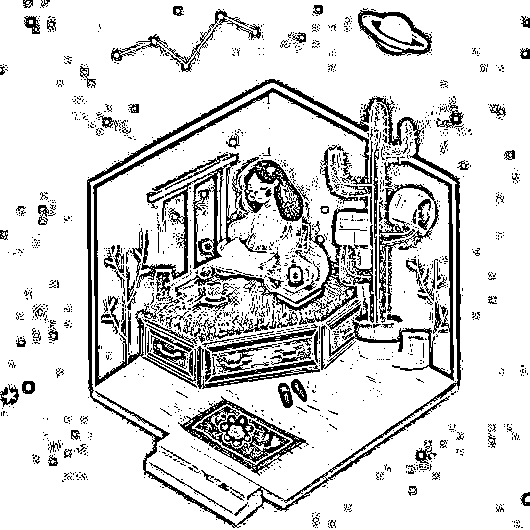

星座运势的文章并不难找到，但是你知道正确的阅读方法吗？

也许细心的你已经注意到，很多星座运势都会提到“参考上升星座”、“以上升星座为准”——不错，除了我们熟知的太阳星座之外，**人人也都有属于自己的一个上升星座。它是我们出生的那一时刻，在东方地平线上升起的星座，古人称其为“航行于生命之海的船舵”，由此我们可以看出，它的重要性丝毫不亚于太阳星座。**

**那么在阅读星座运势时，到底以哪个为准呢？**别急，要弄明白这个问题，我们得先来看看星座运势是如何炼成的。

首先要告诉大家的是，在写作运势时，占星师会使用专业的星图，在星图上，除了 12 星座之外，还有两个绝对不能忽视的要素，那就是行星和宫位。行星能够传导能量，而它所触发的事件究竟发生在人生的哪个领域，则要看行星影响的是哪个宫位。

每个人的星图都会被分为以下这 12 个宫位，每个宫位代表着不同的领域，比如我们常说的财运要看第二宫，恋爱要看第五宫和第七宫等等，而第一宫就是我们上面提到的“航行于生命之海的船舵”——上升星座。占星师就是据此来进行预测的。

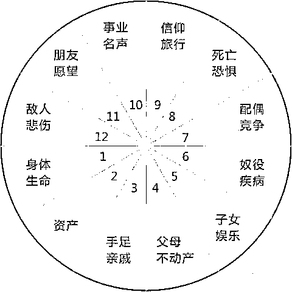 

我们以火星为例做简单说明。火星可能带来冲突、行动、争吵、发热等等。现在行进的火星刚进入天蝎座，我们假设这个人的太阳星座是摩羯座。

**○****如果他的上升星座是天蝎座，我们看到火星天蝎座就在他的第一宫里面**，对他的身体健康有最直接的影响，可能会是着急上火，严重一些或许有发炎发热的症状，个别例外则可能会开刀动手术。

○如果这个人出生日期不变，只是时间稍晚几小时，**上升星座变成水瓶座，行进的天蝎座火星则落在代表事业的第十宫**，于是火星类型的事件高发的领域在职场上，例如可能会被上司训诫生一肚子闷气，又或者是接手一个紧急项目需要投入大量精力。

○同样我们可以推知，如果此人上升星座是金牛座，可能容易与伴侣发生争吵，因为行进火星在第七宫。

○而上升星座若是处女座，由于火星落在代表通勤的第三宫，所以需要关注交通安全……

你或许已经注意到了，**以上这些预测其实和我们最初假设这个人的太阳星座是摩羯座没有什么直接关联，全部是基于上升星座推演出来的**。没错！这就是为什么很多星座运势文章都会注明“参考上升星座”这样的文字，**因为以上升星座为基准划分的 12 宫位，才是占星师预测事件模型的核心。阅读星座运势，一定要“参考上升星座”！**如果你还不知道自己上升星座，快快去找个在线星盘查询吧！

当然星座运势的写作并不如前面的例子那么简单，还需要参考许多指标，绝对是个复杂的技术活儿。而且即便如此，也仅仅是泛泛的大势预测，如果想知道天上的星星究竟如何影响自己的人生起伏，那么还是找专业占星师来为你做一次量身打造的占星咨询吧！


**作者简介** 

**Zora**，国际占星研究协会（ISAR）认证占星师。2012 年在大卫·瑞雷老师指导下开始占星专业学习。尤其专注于研习古典占星，曾随当今最伟大的占星师之一罗伯特·汉德、台湾古典占星师希斯莉、美国知名古典占星师本杰明·戴克博士学习。对其他流派也有所涉猎，接受过诺·泰尔、苏·汤普金斯、斯蒂芬·福里斯特等多位名师指导。曾在若道星文化主办的职业占星师资质课程及古典占星课程中担任助教。

微博：Zora 占星　微信：astragj

**◆ ◆ ◆ ◆ ◆** 

****特别提醒：**希望将若道文章转载到各自公众号的朋友，**转载时请注明“转自若道微信公众平台”，并附上若道占星的 Logo**。谢谢！**

**2016 年 3 月 15 日**，大卫老师主讲的若道占星核心课程**Level 5**要开课了！在这个阶段，你将学习各种预测技术及行星周期。通过这些预测工具，你能够预测和规划人生。提前报名付款有**早鸟价**哦！详细内容请点击“**阅读原文**”了解。


# 水星逆行 | 在新思想的光芒中反思计划

> 原文：[`mp.weixin.qq.com/s?__biz=MzA5NjA0NTAxNg==&mid=402268595&idx=1&sn=bed99ede6039642ccb05f8d6fd0e70be&chksm=02b8930435cf1a127ff65184ffb484ac01e9f9b91de689fea4c9961fe6c87c947a5de4500a79&scene=126&sessionid=1692738887#rd`](http://mp.weixin.qq.com/s?__biz=MzA5NjA0NTAxNg==&mid=402268595&idx=1&sn=bed99ede6039642ccb05f8d6fd0e70be&chksm=02b8930435cf1a127ff65184ffb484ac01e9f9b91de689fea4c9961fe6c87c947a5de4500a79&scene=126&sessionid=1692738887#rd)

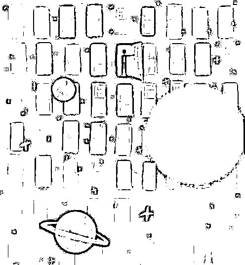
作者/大卫·瑞雷

译者/若道翻译团队

**2016 年 1 月 5 日 21：07，水星在水瓶座 1 度 3 分逆行，并将持续到 1 月 26 日。**“水逆”已不是一个新鲜的话题，不少人会把不符合计划的事怪罪到逆行的水星上，其实，除了给某些人提供宇宙的“借口”，水星逆行的阶段可能会成为一段宝贵的反思时期，新的信息和事实会显现，这些可能会明显地改变人们的决策过程。那什么是水星逆行呢？它会带来什么影响呢？而这一次水逆又将重点影响哪些人群呢？来听大卫老师详细解答。

1

**从天文学讲起**

学习占星学的人都知道，水星是与沟通相关的行星。**行进的水星与信息整体流动相关。**因为水星的轨道是离太阳最近的，我的老师曾经说水星离太阳很近，这意味着水星的“耳朵”离“源头”最近，于是，水星就是最消息灵通的星体！

从天文学的角度来看，水星是首先接触太阳电磁波的星体，就好像在溪流里的一块小石子，在太阳电磁波中激起了一个很小但依然可见的漩涡，持续地离开太阳，游移出去。因为距离太阳很近，水星实际上围绕太阳的公转周期是 88 天。

从我们地球的远距离角度来看(见下图)，当水星在太阳与地球之间穿行时，在群星的背景之下，它似乎是在退行。当水星位于地球与太阳之间时，天文学家们称之为“内合”（inferior conjunction）【当水星在太阳的另一面时，称之为外合（superior conjunction）】。

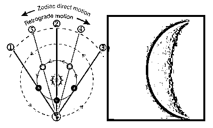

从循环周期的角度来说，内合就像“新月”，占星家丹恩·鲁伊尔(1895-1985)曾经解释过这一点，他把内合称作一个新主意的“种子时刻”。那么，**每次水星逆行的时期，都孕育了一个新想法。这个“想法”的重要性取决于水星在你的出生图上落入的位置。**

2

**翻开《星历表》**

让我们以现在的水星逆行阶段为例。水星于 2016 年 1 月 5 日 21:07 开始在水瓶座 1 度 3 分逆行，会持续到 2016 年 1 月 26 日 05：52，此时位于摩羯座 14 度 55 分，此后水星会“顺行”。那么，逆行的跨度将会在水瓶 1 度到摩羯座 14 度 55 分之间。瞥一眼《星历表》——描述行星位置的表格——2016 年 1 月列出了水星逆行的运动。 

你可以通过《星历表》学习如何分析每次水星逆行时的关键特征。首先，看看当水星和太阳在黄道面上相会的那一天。当太阳在摩羯座运行时，水星也在摩羯座逆行。内合发生于 2016 年 1 月 14 日 22:04，在摩羯座 23 度 50 分。

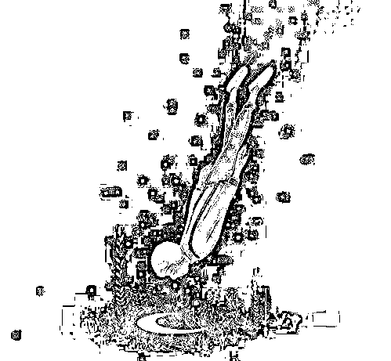

**如果你出生图中有重要的星相位置位于摩羯座 24 度的前后 1 度以内，水星逆行阶段可能会与一个重要的想法、计划和解决方案相对应。**例如，你的出生图上月亮在摩羯座座的 23 度到 25 度之间，那么你关于家庭的一些解决方案可能会在 1 月 14 日到 1 月 15 日后出现。因为水星在这些天依然逆行，你可能不会立即将想法付诸实施，而是进一步研究，并与你信任的人更多地讨论它们。**当水星在 1 月 26 日开始顺行时，你会慢慢地把你的计划付诸行动。**

注意到水星逆行的跨度在水瓶座 1 度和摩羯座 15 度之间，看看《星历表》中 2015 年 12 月那一页。什么时候水星会穿越摩羯座 15 度？是的，在 2015 年 12 月 20 日。水星 2016 年 1 月 26 日顺行之后，什么时候水星会重新穿越水瓶座 1 度？对了，是在 2016 年 2 月 14 日。

**这意味着手头的问题可能真正开始于 2015 年 12 月 20 日，直到 2016 年 2 月 14 日才会告一段落。**

在这大约两个月的时间里，水星在全部时间都会在摩羯座的 15 度和水瓶座 1 度之间。记住，水星是与信息流动相关的，摩羯座与成就、责任、自律相关，水瓶座与原创、平等、人道主义相关。 

由于水星主要在摩羯座逆行，那么**在这两个月的时间内，关于成就、责任、自律方面的决策至关重要。**最初的预期会在新事实与新信息的光芒中被重新评估。2016 年 2 月 14 日，曾经被汇集和报告的信息，曾经被当作行动依据的信息会变成记录，并成为参考的框架。 

**水星逆行所包含的五个阶段：**

**① 水星进入了逆行的区域。**最初的主题摆上桌面，做出了一些假定，但是再考虑考虑的冲动增强，因为新的相互矛盾的事实开始浮现。拖延增加。

**② 水星开始逆行。**错误的假定开始变的得更加明显。计划暂停。日程完全改变了。谈判搁浅。呼吁更多的研究。

**③ 内合发生。**想法开始形成。解决方案浮现。开始讨论新的主意，重新检视计划和消息，以达成最后的共识。

**④ 水星顺行。**宣布了计划，采纳了新的提议，重开谈判，重新制定交易和合同的精确条款。

**⑤ 水星离开逆行区域。**前两个月的关注的重点已经是“陈年旧事”了，但是主意形成，理解达成，形成了未来决策的重要参考框架。

3

**易感人群**

**○** 如果你知道自己的出生时间，那么**出生图上摩羯座 15 度到水瓶座 1 度之间的范围会显示你被影响的生命领域**。

比如，如果你的第 10 宫是水星逆行的领域，你和其他人会可能会重新考虑你的职业发展和专业地位。你可能会收集其他职位的信息并考虑面试。除此之外，这段时间，你会把很多的注意力放在塑造良好公众形象的事务上。当水星在你的 10 宫逆行时，你对自己在公司中担任的角色会产生新的想法。

如果水星在你的 8 宫逆行，你可能会为你的商业活动征集贷款、寻求投资或者为合资企业融资。只要简单地跟随基本的宫位意义，就能获得一些与水星逆行有关的相应形势和问题的灵感。

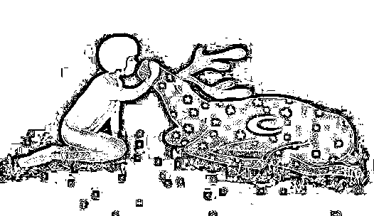 

****○******如果你不知道自己的出生的时间，你生于摩羯座的后半段，或者水瓶座前几天，你可能会直接地被水星逆行影响。**

**○**此外，**生于白羊座、巨蟹座、天秤座后半段以及个人行星或者重要的点落在这四个星座后半段的人，以及生于金牛座、狮子座、天蝎座前几天，以及个人行星或者重要的点落在这四个星座后前几度的人也是此次水星逆行的易感人群**。

你们将更可能改变行程安排，做两次或三次的反复确认。由于水星主要在摩羯座逆行，你们可能会做出职业方面的重要决定。如果你花些时间，研究一下你关于成功的理念，你可能会发现建构自己想要的成就的方法。

尽管如此，**当水星于 1 月 26 日顺行时，再去确认也许会为更明智**——虽然 1 月 15 日之前，你可能已经想清楚自己想要获得什么样的成就，又将如何努力了。

这更多地取决于在这段时间内你出生图中其他行星影响；但是，如果你生于摩羯座的后半段或者属于这次水星逆行的易感人群，这一逆行之前至少会让你将自己的职业状况或者你对成功的观念厘清楚。

4

**保持平常心**

你看到了吗？**水星逆行比流行的错误理解“任何事都会出错”有更重要的意义。**水逆是一个可以好好利用的时间段，不必紧张害怕。当然，**在水星逆行阶段，计划和日程比其他它时间段里更容易发生变化，尤其是在逆行发生的前半期**，即水星刚刚进入这一区域和太阳内合的时候。**这一阶段是 12 月 20 日到 1 月 14 日之间。**

**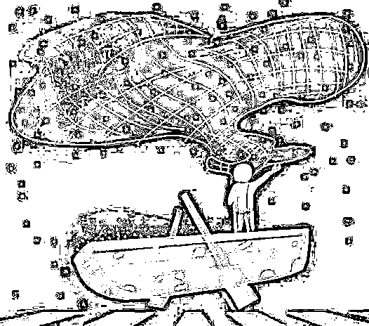**

当然，逆行的水星喜欢沉思和反省，这一阶段我会推荐你这样做。水逆期间出交通状态的几率确实会高一些。这个时候保持平常心，可以使自己不受外在事件所左右。说不定，你利用这些时间所做的思考竟然能让一些事情豁然开朗。也许当水星 1 月 14 日到达内合相位的时候，更多涉及责任、成就、承诺、目标的消息会出现。同时，对“重新审视事实”的需求会变得更大。

**有关水逆，也许你还想了解：**  

[你关心的那些水逆问题，这里或许就有答案！](http://mp.weixin.qq.com/s?__biz=MzA5NjA0NTAxNg==&mid=211605147&idx=2&sn=98db6fc8454a82bb35aa53dd4edca2e6&scene=21#wechat_redirect)

[过犹不及？! 一种现代观点看水逆](http://mp.weixin.qq.com/s?__biz=MzA5NjA0NTAxNg==&mid=200029889&idx=2&sn=b98ae860685d9a8182b03af347cd83a8&scene=21#wechat_redirect)

[水逆时，宜检查，宜调整，忌冲动](http://mp.weixin.qq.com/s?__biz=MzA5NjA0NTAxNg==&mid=211578147&idx=3&sn=39a27adcac8b2f9d74cf98fe3313ecee&scene=21#wechat_redirect)

**◆ ◆ ◆ ◆ ◆** 

****特别提醒：**希望将若道文章转载到各自公众号的朋友，**转载时请注明“转自若道微信公众平台”，并附上若道占星的 Logo**。谢谢！**

**2016 年 3 月 15 日**，大卫老师主讲的若道占星核心课程**Level 5**要开课了！在这个阶段，你将学习各种预测技术及行星周期。通过这些预测工具，你能够预测和规划人生。提前报名付款有**早鸟价**哦！详细内容请点击“**阅读原文**”了解。


# 执着于痛苦和恐惧有用吗？

> 原文：[`mp.weixin.qq.com/s?__biz=MzA5NjA0NTAxNg==&mid=402268595&idx=2&sn=9bd78c671e7aece0a2dc019129a68b26&chksm=02b8930435cf1a1247e2519c886210466839a4fced15b6dd92eb7bda27f38411cf31ce03ec01&scene=126&sessionid=1692738887#rd`](http://mp.weixin.qq.com/s?__biz=MzA5NjA0NTAxNg==&mid=402268595&idx=2&sn=9bd78c671e7aece0a2dc019129a68b26&chksm=02b8930435cf1a1247e2519c886210466839a4fced15b6dd92eb7bda27f38411cf31ce03ec01&scene=126&sessionid=1692738887#rd)

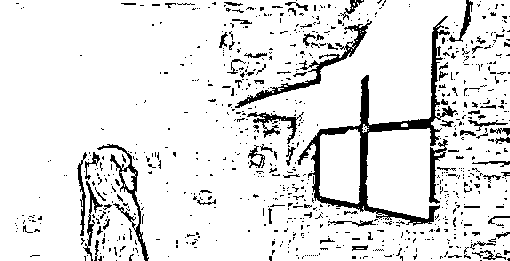

作者/幽南 Joella

图片/kumiko

**1 月 3 日火星进入天蝎座，让我们来一场关于天蝎座议题的思考吧！**（每个人都是 12 个星座的综合体，或多或少，或表或里。每个人都有天蝎座能量，可以通过你的出生星图看出你在哪一个部分最“天蝎”哦~）

**1**

**你的天蝎座能量是如何展现的？**

○ 你容易看到事物的**阴暗面**吗？

○ 是**恐惧担忧**比较多？还是**执着深刻**比较多？你喜欢**调查**与**侦破**吗？

○ 你容易**信任**别人吗？

○ 你是如何看待“**忠实**“的呢？你觉得自己对感情**专一**吗？你是否要求另外一半对你**绝对**的专一呢？

○ 如果别人**背叛**你，你会**报复**回去吗？你恨前任吗？

○ 你觉得“**性**”就能代表着与另一个人真正的**亲密**吗？如果不是，那么什么对你来说才是真正的亲密呢？

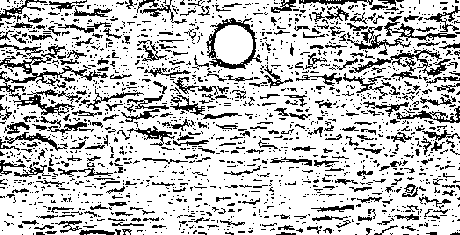

**2**

**我的天蝎座能量是这样“发作”的**：

说来也挺没出息的，在上幼儿园时，我说的最多的一句话就是“爸爸晚上来接我”。因为这个世界对我来说充满了危险，老妈说在我还是婴孩的时候，有一段时期经常无来由地浑身哆嗦，有个老中医说我受过严重的惊吓。- -！奇了怪了，刚生出来不久的孩子，在出生过程中也没有发生太大的意外，哪来这么多的恐惧？

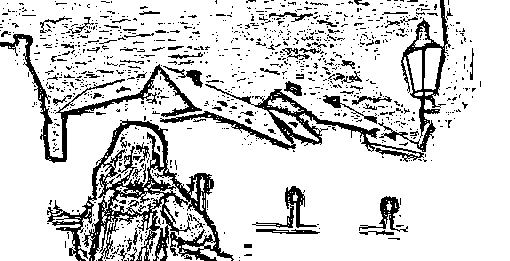

**3**

**现在让我们一起从占星学的视角，来看一下这个孩子，肿么了？**

每当行进的行星（指每天在天上移动着的那些星体）走到出生星图一些特殊的位置和角度都会触发相应事件或内在感受。

在我上幼儿园的那个时期，行进的冥王星在天蝎座，刚好经过我出生星图的上升点，这是一个影响时间较长的相位，因为冥王星一天才走 0.005 度，经过一宮大约需要 20 年左右。在那几年的时间里，我出生星图中冥王星 12 宮那些无以名状的恐惧与无助感和深层的心理焦虑不断“浮出水面”，父亲是我最亲近的人，我只有向他求助，一句看似没出息的“爸爸晚上来接我”隐藏了多大的无助与恐惧？我无从得知，生命是一个谜，我只有探秘其中，答案总会有揭晓的一天。

冥王星守护天蝎座，是我的命主星，当它经过上升点，必定是对这个人影响深远的一段时期。当搞不懂行进行星对一个人的影响到底是什么时，可以回到这个人的出生星图来分析。其实，**行进的行星只是触发器，每一次位移都提醒着这个人出生星图中有待进化与化解的议题**，无论是行进还是比对图，都要以出生星图为基准进行拓展讨论。那么，冥王星在天蝎座 12 宫代表什么？

冥王星与天蝎座意味着在危机中转化与重生。那 12 宫呢？如果你相信业力与轮回，12 宫与过去世储存的印记有关，如果你不相信，那我们暂且称它为“潜意识之宫”好了。冥王星与隐藏在地底下的活动有关，12 宮又是一个潜意识之宮，这是双倍隐秘的力量，说明这个人的潜意识与台面下的精神世界有一些不为人知的事情正在进行着。有的资料里面会说得玄乎其玄，什么“旧怨会像一瓶毒药毒害侵蚀着你的灵魂”、“来自过去的鬼魂与恶龙纠缠着你的梦境……（这些文字，等于给本来就充满恐惧的灵魂再补一刀。）

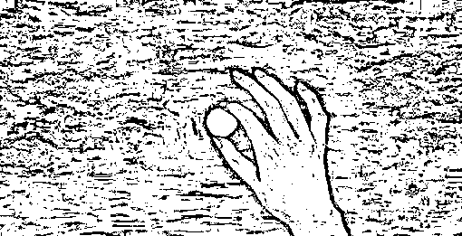

**4**

**与天蝎座议题相关的故事，信任与背叛议题，以及人性的阴暗面：**

说到天蝎座与冥王星，我想起曾看过一篇故事短文：寿头是一个忠心耿耿的狗，曾与主人在乡下过着无忧无虑的田野生活，后来主人进城打拼，寿头不吃不喝每天爬到山头等待主人归来。为了等待有一天能够见到主人，寿头为了维持生命才开始进食。多年后的一天，寿头一如既往的站在山头等待着。

这时，一个熟悉的身影从不远处浮现，他的主人回来了，那一刻，喜悦！悸动的心情无以言表！寿头冲下山谷与主人滚作一团，无限的喜悦化作舌尖的相思吻，疯狂的舔着主人……这久别重逢的一幕对寿头来说算是天底下最幸福的事情了。也许，是这幸福来的太突然，它永远也想象不到，主人的归来也意味着它生命的终结。

主人家中来客人了，都是“好哥们“。其中一位“好哥们”说，最近没肉吃，我们不如…目光望向了寿头，主人虽再三推脱，婉转拒绝说找别的肉吃，但在那个穷乡僻壤，家中饲养的动物似乎都是“以备不时之需”的。谁让他们是“好哥们“呢？要“讲义气！”在场的人都抓不住寿头，目光都望向了他的主人，主人这才弓下身唤寿头过来，充满愧疚与不舍的抚摸着它的头……

后面的情节我已不忍回忆，只记得他们做了一个圈套，把寿头吊起来，最终的画面就是：寿头的眼中的忠诚与爱化为绝望与恨离开了这个世界。寿头结束生命那个瞬间的眼神，在我的脑海中不断萦绕着。记得在中学我看到这篇故事时，竟然生生哭了一整节课。同桌的同学一脸错愕的问我怎么了。

那一刻，**我对人性阴暗面的怨恨以及对这世界的绝望与寿头完全共振了**。这就是冥王星，这就是天蝎座，这就是 12 宮。

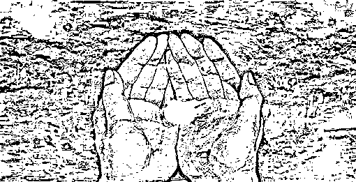

**5**

**我的天蝎座能量与恐惧、害怕、胆小、受到惊吓等相关。**

上小学时，站起来发言我也会浑身发抖，有一次当众读课文，我竟然读着读着就吓哭了，声音跟蚊子一样，我说出来的话，需要经过其他同学再次“翻译”给老师听。

在 2012 年极度绝望的时期，我曾在心里想过放弃生命，因为那样活着实在太痛苦不说，还拖累了家人。我以前怪罪父母对我保护过度，殊不知我自己根本就是一个曾被吓的**魂飞魄散的灵魂**，来到这世间再次**找回破碎的自己**，难怪会被当做重点保护对象。

今年夏天，我在处理惊恐的议题时，联结上的画面与情绪和殉难的情节以及死亡焦虑有关，大概的情节就是在人很多的类似传道的一个场合被无数双眼睛审判着，我力排众议，最后结果当然一命呜呼了，**那一刻带走的不仅仅是胆识，更有虚妄的自大。**我想，这也许就是我今生为何对人感到恐惧的原因。

想来，这个故事也很符合冥王星的风格，冥王星在 1930 年被发现时，曾被屡次质疑，虽然它早已被怀疑是存在的，却历经了许多年才正式露面。

记得胡因梦老师说：“上升天蝎座本能的反应是对这个世界不会立即信赖，之所以不信赖是因为能够洞察到人性的黑暗面，也可能是过去多生多世有过一些殉难、一些灾难，让他们学会了不会立即相信，要深入观察，她才能敞开自己，所以通常内在是持怀疑态度的。”

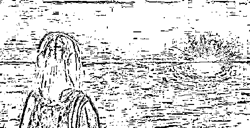

**6**

**关于天蝎座与冥王星负面表达的反思：**

无论过去发生了什么。就在某个当下，我发现我内在有一种变态的模式，以痛来壮大自己，证明自己的存在感，执着地抓着痛不愿放手，因为“痛“总好过没感觉，”痛“证明自己还活着，经历的”痛“多说明自己比较深刻，这是冥王星与天蝎座的负面表达。

其实，我们的灵魂在这生生世世无限轮转中，又有哪个没点伤没点痛的呢？没有谁比谁的痛更重要，重点是都需要我们经年累月的悉心呵护与岁月的沉淀来慢慢疗愈。

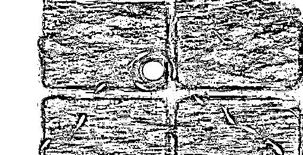

**7**

**最后的升华、提升与放下：**

○ **真正的忠实，是忠于自己的心**

就在前几天行进的金星经过我 12 宮的冥王星时，我有感而发：“**真正的忠实，是忠于自己的心。”**其实我本是一个容易不断被别人的要求和价值观牵着走的人，敢于忠于自己的心，对我来说实属不易。

○ **莫名被触动与若隐若现的记忆**

我们内在有着各种各样的情绪：沮丧、羞愧、无奈、委屈、恐惧、绝望……有时候，在某个特殊的场合，或看到某些画面和文字，忽然毫无缘由的热泪盈眶，只因为那一瞬间心里什么久未开启的地方忽然被触动了，似乎在瞬间忆起些什么。

○ **由发呆引发出宏观思考**

我偶尔喜欢看着草木发呆、看着新生的植物长出芽来，看着树叶翩然飞落、看着车水马龙喧闹的街景、看着年近七旬的老人驮着背从我身边走过、看着玩闹中天真烂漫的孩子，在没有雾霾的夜空中，看着还能够用肉眼看到的星星…….我看到生与死，看到了繁华与衰败、看到了理想与幻灭、看到了盛旺与凋零、看到了终始因果，看到了，**生生世世，唯有苍穹不变，寂照着苍生。**

○ **灵魂渴望找到回家的路**

12 宮和双鱼座与灵性、合一意识有关，人间戏码再怎样痛不欲生，归根究底是与源头分离的痛苦，只有与内在神性连结才能彻底根治，因为**灵魂渴望找到回家的路**。

○ **现世一片安好**

忽然发现，玩笑开大了！生命中还有很多丰富多彩的频道与美好的画面我竟从来都没有注意过？如此，岂不是辜负了生命？难道选择性记忆抓住痛不愿放手比较好过和幸福不成？在一个瞬间，我似乎懂了些什么，我意识到，也许未来的某一天，我会放下痛甚至放下疗愈，安住于当下。因为，现世一片安好，其实也没有什么故事沧桑。

**★ 你的故事是什么呢？欢迎留言、投稿，同我们一起分享您的精彩感悟。来稿请发至 astrology@nodoor.com。**

**◆ ◆ ◆ ◆ ◆**

**2016 年 3 月 10 日**，大卫老师主讲的若道占星核心课程**Level 1-2**又要开课了！他将带领你学习星座、太阳、月亮、行星、月亮交点等知识，让你进入占星学的世界！提前报名付款有**早鸟价**哦！详细内容请点击“**阅读原文**”了解。


# 仰望星空，触摸超越神性的光芒

> 原文：[`mp.weixin.qq.com/s?__biz=MzA5NjA0NTAxNg==&mid=402168053&idx=1&sn=074b932d0c0d6a19f6580c7218dccd84&chksm=02ba2a4235cda354181d50a7eff4666471b185544e040003341c15f4d3ba7b78cf826b5f1807&scene=126&sessionid=1692738887#rd`](http://mp.weixin.qq.com/s?__biz=MzA5NjA0NTAxNg==&mid=402168053&idx=1&sn=074b932d0c0d6a19f6580c7218dccd84&chksm=02ba2a4235cda354181d50a7eff4666471b185544e040003341c15f4d3ba7b78cf826b5f1807&scene=126&sessionid=1692738887#rd)

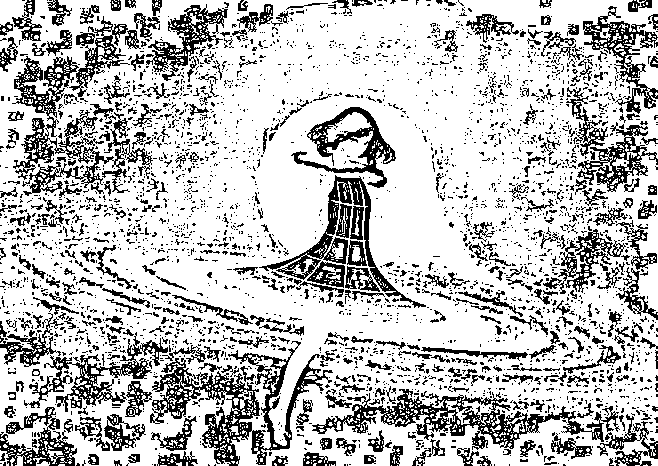

因为“讲得准”，她对占星学产生了好奇。当面对生命中重大失去时，她在占星学的帮助下度过了黑暗时光。2016 年的第一天，在成为占星学徒的一年后，她写就下面的文字。她告诉我们，占星学不是神，但却是超越神性的存在。

新年音乐会现场，德国柏林交响乐团与李云迪合奏贝多芬的《降 E 大调第五钢琴协奏曲》，当云迪的琴声响起，我闭上眼睛，感觉到脸上有泪流下来。好的音乐里有神性存在，许多静水流深的情感与体会，只有在音乐中得到共鸣，一说出来则成尘世的诳语。至此，我得到启发：一直以来占星学对我而言不也是这样超越了神性的存在么？

**占星那么准？**

**我的心被播下了一粒种子**

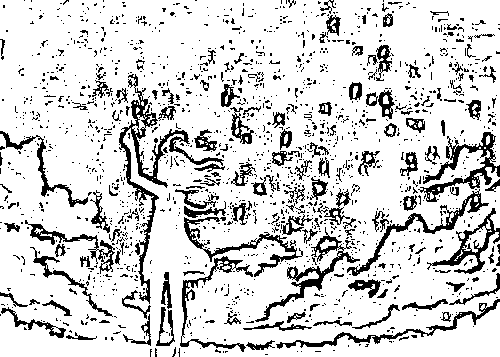 

2012 年 8 月底，我到大理休假，住在洱海边的一家酒店。酒店老板娘玛亚喜欢占星，那个时候我对占星一毛钱也不懂，不过觉得很好玩，就聊起来。

当她问到：你小时候父亲消失了？我瞬间被棍子敲中——八岁那年，正值英年的父亲因病去世，而在此之前他由于在离家较远的大学攻读本科、研究生（求学之年因在贵州当知青被耽误），在我的生活中也类似于消失了。虽然我至今仍记得他每次回来，必会双臂环抱我荡人肉秋千时的爽朗笑声。

占星学可以这样准么？好神奇哦。当时的我还停留在“准不准”这样的点上。我也喜欢那个中性的用语“消失”，而不是别的听起来更带有悲剧色彩的词。当然通过学习，现在我能清楚地看到，自己的太阳四分落在六宫尾的海王星，父亲的生病、消失是很容易浮现出的一个议题。

但那个下午，我的心就此被戴着丝带帽的漂亮酒店老板娘播下了一粒种子，种子的名字叫占星学。我还记得，那天阳光很好，有风，住的房间正对着海边被吹拂着不断摇曳的水草。这种记忆似乎看起来有一些故作神秘的渲染，但在我的记忆里它就是这个样子。

**家人病重**

**占星学陪我度过黑暗时光**

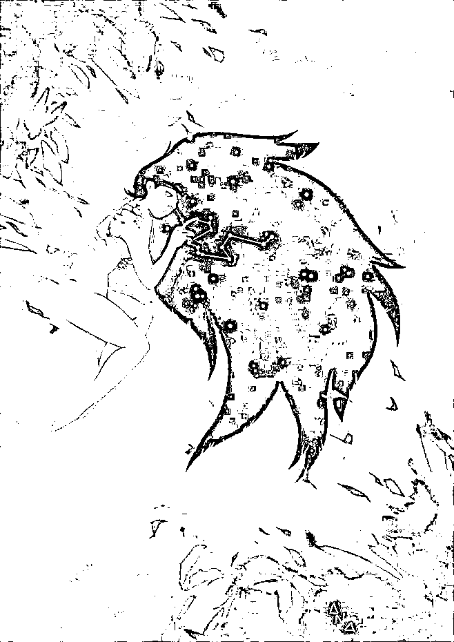 

然后日子就翻篇到了 2014 年的 10 月。我从小相依为命的母亲患病实施手术三年后，病情加重，已经走到了生命的末期。从进医院时可以自己走动办理住院手续、吃得下一大碗酸菜米线，到后来完全无法进食，全靠打点滴维持生命，你清楚地看到一个生命是怎样从一个肉体逐渐消退、消失，而这个生命和你这样亲近。

你愤怒没用、坚强没用、求饶没用、喝心灵鸡汤没用、去庙里拜菩萨没用、乐观没用、悲观没用……坦白说，在现实的高墙面前，所能尽的人事非常有限，我们被逼一次次调低心里承受底线，低到尘埃里。

我在佛经里寻求平静，《金刚经》问“云何降伏其心”，我是用情至深的芸芸众生，当面对命途中关心则乱的生死大事时，“放下、不住”的法门没入我心里巨大的悲伤与无望，遍寻不着；我也尝试拿起《圣经》，但医生一次次的坦言相告，让我觉得，神似乎已打定主意不施援手，我是想找到救命稻草的俗人啊，既然神不顾我，我只好另烧高香。

有一天我极其困倦地从医院回到家中，突然在茶几上发现一本《当代占星研究》，我就当转移注意力随手翻起来，然后，然后就收不了手了。家人一个月前买来消遣还没来得及翻阅随手扔着的这本书，像星星之火，助燃了当初那颗投在我心里的种子，在宇宙共时性的影响下，在恰当的时机生根、发芽了。

要问占星学影响我最大的是什么？嗯，**它像一个无形的导师或者是朋友，打开一扇认知这个世界的门，帮助我度过一段非常非常黑暗的时光，从被世间无常的打击中活过来，值得恭喜地没有变成一个对人生充满恨意的人。**

**我不孤单**

**父母通过星图与我共舞**

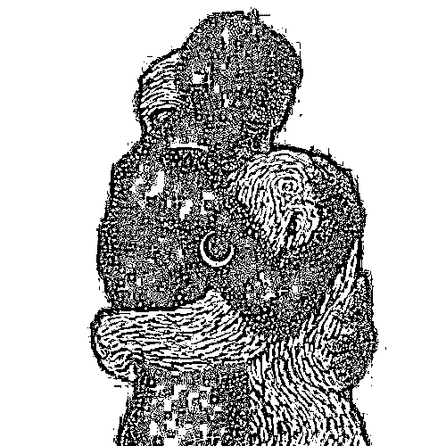 

去年 11 月，当我站在给妈妈选定的墓地前，已经能够以一种平静的心态来处理她的身后事，来自尘土归于尘土。

**○** 在我的星图上，月亮合相木星落白羊座，我能感觉到妈妈生前的勇气、独立、乐观、明朗……那种活泼泼的劲头在我体内涌动。

**○** 而父亲浓厚的双鱼座气质也流淌在我的血脉里，虽然他在我很小的时候就消失，我曾一直以为他没给我留下什么，但反观我现在不自觉流露出的人文主义气质，不是来自于他的底色又是什么？只是以前没有觉察到而已。

**是占星学让我有机会觉知到这些，它让我对父母的离去，找到了内心释然的方法：爸爸和妈妈其实从未离开，而是换了一种方式和我融合，他们参与了我生命里的每一次活动。**太阳、月亮、金星、火星等等，每个时刻日月星辰在星图里的能量流动，他们都在。所以，不要那么伤心，宇宙里的每个孩子都不孤独。

**占星学习**

**成就自己也帮助他人**

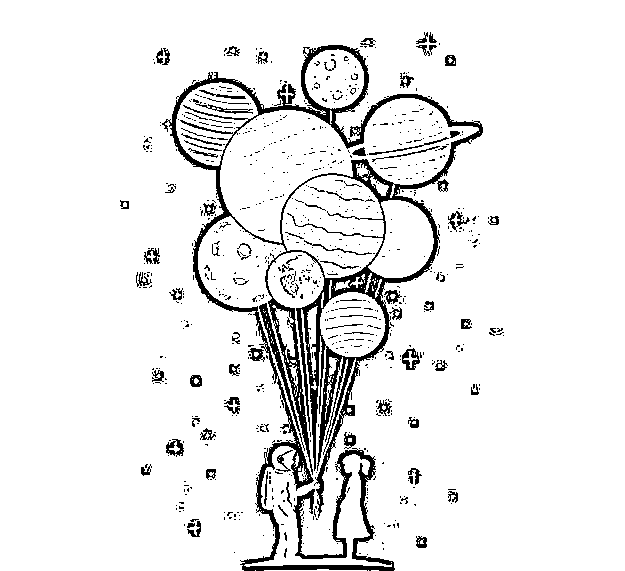 

我喜欢占星学的一点是，它的世界里没有神，但它确实又具备某种神性。**它是符号****+精确演算+推理+想象+神秘力量的古老学问，兼具科学的严谨与诗意的美感，同时它也在不断呼吸时代的空气。**占星的过程里充满质疑、探究与反省，对一个水瓶座水星金星合相于第九宫的人，太上道了。

**是你而不是别人掌握了钥匙，通过开启星图上的种种提示，我们有机会去觉知、接纳从而改变，而且你也可以运用这些方法去帮助到别人。**虽然目前我的所学对于占星学来说，还需要大量时日的精进，但在和朋友们看星图聊天的过程中，当我讲解星图引起了他们的共鸣，对他们有所触动时，那时的我非常开心，并一次次折服于占星学的奥妙。

就像以前通过采访帮助到一些人，帮助他们解决现实中的困难，帮助他们实现或大或小的梦想，我借助职业的力量，幸运地收获到个人的成就感。现在我在学着掌握另一种非物质的方法，**希望让自己在生命的河流中不要总是逆流而上，假以时日，也希望能把这种能量传递给他人。**

行文到这里，已是 2016 年的第一天。窗外仍是寒冬，心中却已有了对春天的期待。

虽然子不语怪力乱神，但冥冥之中确实万物有灵。我们在每次仰望天空时都会被那种神秘的力量深深地感动。占星学让我学会以一种温柔的方式触摸感知那种力量，对此，我是谦卑和感恩的。

占星入门一年，以为记。


作者简介

**坤子**，若道 Level 4 学员。主任记者，一级播音员。重庆电视台出镜记者、编导。传媒学丛书《采访提问一百例》主编。北交天蝎座第六宫，个人星盘中能量巨大的海王星也落六宫。此生是要带着灵性与诗意的资源，向着更深更精处走么？且走且行吧。

长按二维码，让金钱涌向传播知识与智慧的人~

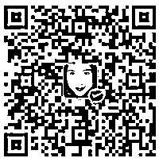 

**★ 如果您也有和占星学之间不可不说的故事，欢迎投稿，同我们一起分享您的精彩感悟。来稿请发至 astrology@nodoor.com。**

**◆ ◆ ◆ ◆ ◆**

**2016 年 3 月 10 日**，大卫老师主讲的若道占星核心课程**Level 1-2**又要开课了！他将带领你学习星座、太阳、月亮、行星、月亮交点等知识，让你进入占星学的世界！提前报名付款有**早鸟价**哦！详细内容请点击“**阅读原文**”了解。


# 愿桥都坚固，隧道都光明

> 原文：[`mp.weixin.qq.com/s?__biz=MzA5NjA0NTAxNg==&mid=402168053&idx=2&sn=84d229561550f7e5580fbe57a4a4e351&chksm=02ba2a4235cda3548e62923cd796999e1c02946882ee02d3524a7ee6fb0ddd90e9f9f5ac63b2&scene=126&sessionid=1692738887#rd`](http://mp.weixin.qq.com/s?__biz=MzA5NjA0NTAxNg==&mid=402168053&idx=2&sn=84d229561550f7e5580fbe57a4a4e351&chksm=02ba2a4235cda3548e62923cd796999e1c02946882ee02d3524a7ee6fb0ddd90e9f9f5ac63b2&scene=126&sessionid=1692738887#rd)

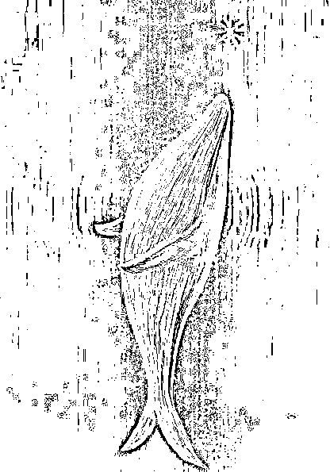

她是一位水象宫位被强调的姑娘，着迷于心灵成长，又被恐惧所牵绊。有一天，她见到了自己的恐惧：一个长着骷髅头的可怕怪物……

**1****走向深处**

也许是出生星图中第四、八、十二宫被强调的缘故，这些年，我所关注的焦点始终在生命的内在法则与灵魂的成长方面，总是不断寻找并汲取着能够满足心灵诉求的东西。因此，2014 年 11 月中旬当我在《南都周刊》上读到一篇关于占星师以及若道的介绍时，便对“说着星星语言的灵魂疗愈师”产生了强烈的兴趣，于是毫不犹豫甚至热血沸腾地报了若道。彼时，我连 12 星座的名称都说不全。

曾戏言自从学了占星学便如同开了天眼，当然，这是夸张的说法。但是当我触摸着自己的出生星图并试图从星座、行星、宫位、相位等一个个符号中寻找通往灵魂深处的花径时，我听到了来自灵魂深处的呼声——微弱的、温柔的、急促的、尖利的……无不诱惑我走向深处。

我循着声音走进深埋于潜意识中的秘密花园，在这个交叉小径的迷宫花园中，我如一位在寒冬夜雾中赶路的旅人，不辨方向，不知终点，心下彷徨，脚底凌乱。随后闯入一条甬长潮湿的暗道，苔藓湿滑，水声潺潺，我摸摸索索磕磕绊绊前行，看到前方的石门打开了一条缝，溢出大团大团模糊不清的东西。

待仔细辨认，呵，原来是我遗失的记忆。竖笛、木马、风信子、欢欣与喜悦、母亲的怀抱、初恋的羞涩、丢失的风车、狮子座的流星雨……且慢，怎么还有污秽、墓地、尸体、无面人、绝望与愤怒、陈腐的泥土味、阴暗逼仄永无尽头的楼梯……

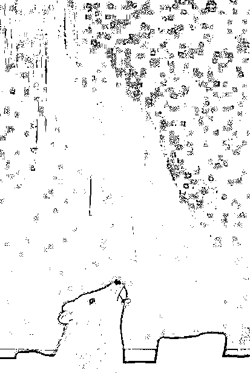 

**2****恐惧如影随形**

这两股东西交织在一起，如同一黑一白两条交缠的巨蟒。我知道它们**一股是善良、明媚、温暖、坚韧、平和与安宁；一股是憎恨、恐惧、阴暗、贪婪、怯懦和私欲**。后一股化作一条饥饿的恐惧伺机钻出暗道，贪婪地弥散在我的周围，无形无边，无处不在，从头发梢到脚趾头，抚过我每一寸肌肤，渗入我的毛孔，钻入我意识的陋巷与暗门，侵入我的睡梦中咔咔嚓嚓吃掉我的脑子。

我大汗淋漓战战兢兢，绷紧每一根神经对抗着它，理性上我知道它是我的一部分——我的恐惧与阴影——它时刻与我同在。而**情绪上，这股既熟悉又陌生的恐惧则赶走了其他一切**，它几乎吞噬了我的生活，站在太阳下依然感到森森冷意。

不过，一直聚焦于向内行走也使我相信我们天生具有神奇的力量，我们可以信任自己内在的智慧。即使在被彻底摧毁的景象中也有孕育新生命的可能，就如塔希提人相信，世界被分成“破”和“傲”，即黑暗与光明，他们的造物主罗亚便是在“破”中诞生，携危险而强大的命运，步入光明。佛家所说的红莲不也是这样的吗？寒冷的极致跟灼热的极致是相同的。我如此安抚自己并想方设法驯服那条饥饿的恐惧。

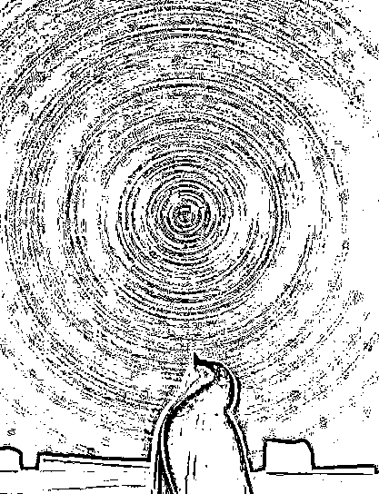 

**3****怪兽变成小男孩**

一个午夜，我坐在床上开始冥想，看到自己赤脚踏着溪水中招摇的水草悠然前行，两岸落英缤纷、杂花生树，这时身边突然出现一个长着骷髅头的可怕怪物死死盯着我，我心下大骇，虽知这是我的恐惧和阴影，但仍两股颤颤，几欲睁眼，忽然听到温柔的女声说道：“这时的你是善良、勇敢、安宁的。”是了，我内心拥有着善良、勇敢、安宁的强大力量，何须怕他？

此时我豁然开朗，**一颗心随之平静下来，低头注视着小怪物，并抚摸他的头，神奇的变化出现了，他可怕的眼神变得越来越纯净，骷髅头上开始长出肌肉、头发，渐渐变成了一个小男孩，牵着我的手陪我或走或坐**。

而**自这次冥想后，那如影随形的恐惧之感也几乎不见了**。存在皆源于本心，明媚与阴暗、安宁与恐惧它们本来就是一体的。之所以会被恐惧渗透每一个细胞，是因为我过于在意这种恐惧的感觉，以至于在我的召唤之下恐惧之力越来越强，而当我重新检视与其相对的建设性能量时，它的破坏性能量便被消弱了，甚至有一部分转化并融入到建设性的能量中。

及至后来，当我读到大卫老师《灵魂的目标》一书中关于南交天蝎与北交金牛的描述时，才后知后觉地悟到：**这不正是北交点金牛座安宁祥和的能量抚慰了南交点天蝎座躁动不安的恐惧和阴暗吗？**

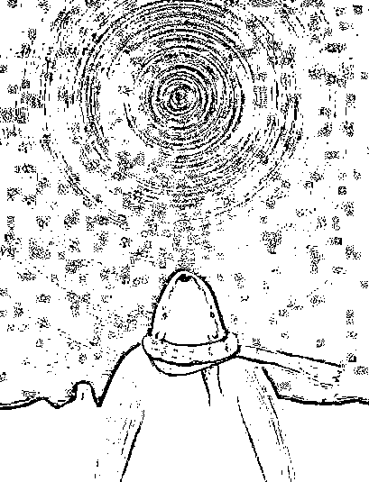 

在此，我要感谢博学多才的容姑娘和善良直爽的鹿大人，谢谢你们在那段时间的鼓励和帮助。感谢那朵美丽的玫瑰，不辞辛苦组织我们进行数月的占星练习，使我的占星学知识能够快速积累，也是因为她的鼓动，我这只懒散的大金牛才写了这篇文章。感谢精分小伙伴们这一年的陪伴，学习占星学遇到你们这群可爱的小伙伴简直是比学会占星还有意思的收获。

最后，用脑洞萌萌哒的巫岸助教和行走的占星全书天空助教压轴。感谢巫岸助教的读书会让我有机会讲述我的金星故事，再次回顾初心；感谢天空助教的每周答疑，提醒我注意那颗合于下中天不时尖叫的火星以及日食时审视关系中存在的问题。


**作者简介**

**包子**，出版社编辑，国家二级心理咨询师，2015 年 1 月入若道跟随大卫老师学习占星。天生梦想家，相信向内行走的力量能打破身体的藩篱。愿借助日月星辰之力触摸到灵魂的温度。

微信号：huihuiwing

长按二维码，让金钱涌向传播知识与智慧的人~

 

**★ 如果您也有和占星学之间不可不说的故事，欢迎投稿，同我们一起分享您的精彩感悟。来稿请发至 astrology@nodoor.com。**

**◆ ◆ ◆ ◆ ◆**

**2016 年 3 月 10 日**，大卫老师主讲的若道占星核心课程**Level 1-2**又要开课了！他将带领你学习星座、太阳、月亮、行星、月亮交点等知识，让你进入占星学的世界！提前报名付款有**早鸟价**哦！详细内容请点击“**阅读原文**”了解。


# 2016 年 1 月宇宙天气 | 有多少事，可以重来

> 原文：[`mp.weixin.qq.com/s?__biz=MzA5NjA0NTAxNg==&mid=401949295&idx=1&sn=feec6bb4370d95333da7899d93f74711&chksm=02b7f0d835c079cecef4298c61f9b313e656ab4ce6f759a4464f6344c77cf0d056c2bf96c928&scene=126&sessionid=1692738892#rd`](http://mp.weixin.qq.com/s?__biz=MzA5NjA0NTAxNg==&mid=401949295&idx=1&sn=feec6bb4370d95333da7899d93f74711&chksm=02b7f0d835c079cecef4298c61f9b313e656ab4ce6f759a4464f6344c77cf0d056c2bf96c928&scene=126&sessionid=1692738892#rd)

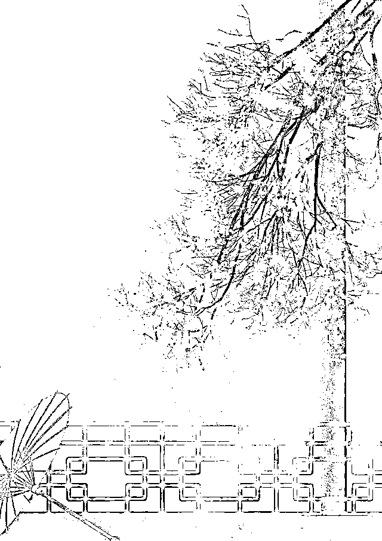

前几天和朋友聊起来年少时的囧事，我问她：“如果重新回到当年，同样的事情再发生一次，你的选择是什么？”不过，这也只是一个假设性的问题。在现实的世界里没有时光穿梭机，尘埃落定的事情，是没有办法重来一次的。**本月将经历水星逆行与木星逆行两大星象**。**行星转为逆行通常意味着一段相对平静的成长期，人们在这段时间回溯被顺行行星触发时产生的外化事件，感受这些事件对内心的触动，寻找事件背后的意义**。调整心态，迎接再次顺行的行星，完成本次行运课程。而当行星顺行、逆行、再次顺行之后，该发生的已经发生，也没有后悔药可吃了。

**1 月 2 日-1 月 3 日**

**1 月 2 日 星期六，水星进入水瓶座**

**1 月 3 日 星期日，火星进入天蝎座**

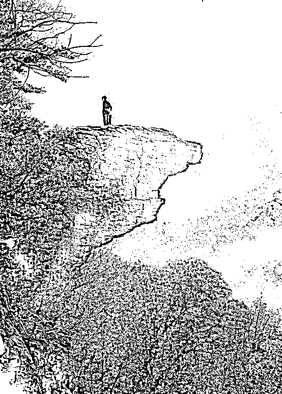 

新年伊始，水星与火星几乎同时转换星座，水星从严肃谨慎、保守务实的摩羯座进入理性创新、独立客观的水瓶座。火星从不喜欢的天秤座，来到了自己的家——天蝎座（注：火星在天秤座落陷，在天蝎座入庙）。加上 12 月底金星也离开了落陷的天蝎座，进入乐观的射手座，宇宙用焕然一新的星象迎接 2016！火星进入天蝎座之后，之前因为平衡关系、优柔寡断乃至顾此失彼、停滞不前的事情会加速前进。这次在火星上的是一个沉稳坚毅的司机，他用稳定的双手，握紧方向盘，掌控事情的进度和方向，坚定地朝着目标开去。在整个 1 月，除了遇到前方停滞准备逆行的水星，短暂干扰车载信息设备，火星在天蝎座顺行无障碍，请各位乘客坐稳扶好，抓住机会善用火星充沛的能量完成任务。

1 月 5 日星期二

**水星在水瓶座逆行**

**水瓶座水星四分天蝎座火星**

**射手座金星四分双鱼座海王星**

水星逆行与节后综合症一起到来了。每年都有几次水逆，每次都能听到哀嚎，似乎人们的人生惨剧都是因为水星逆行造成的。水星逆行确实会引起交通事故、通讯意外，电子设备故障、文本错误。但是你其他方面的人生问题，请咨询专业占星师的帮助。

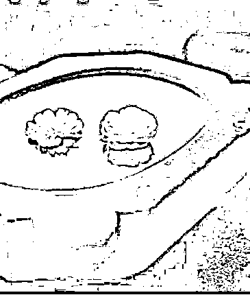

 我更愿意这样理解水星逆行： 

*   **它会给人们带来反思和回顾过去所做决策和方案的机会，可能会有一些更好的想法和调整，让我们把事情做的更好**。

*   不过这次的水星逆行要特别注意的是，在逆行的当天就同火星形成了困难的相位。同一天，金星与海王星也呈四分相位。

*   在此期间，需要特别注意**因沟通不畅造成的怒气和冲突，交通意外、电子设备损毁或文书错误而导致经济（金星）上的损失（海王星）。当天投资市场有剧烈波动也未可知**。  

**1 月 6 日-1 月 7 日**

**1 月 6 日 星期三，太阳合相摩羯座冥王星**

**1 月 7 日 星期四，摩羯座太阳四分白羊座天王星**

太阳在摩羯座再一次参与到天冥四分的角力里。太阳代表自我、身份认同和意志力，在这短暂的两天内，自我转化蜕变的议题将浮出水面。社会上可能会听到个人与体制的矛盾，自由解放与专制管理冲突相关的新闻事件。

**1 月 8 日-1 月 9 日**

**1 月 8 日 星期五，木星在处女座逆行**

**1 月 9 日 星期六，水星逆行回到摩羯座**

**金星合相射手座土星**

在 2015 年 9 月木星进入处女座以来，一部分的人的生活看到了新的机会，尝试了新领域（注：以变动星座双子座、处女座、射手座、双鱼座为首，兼顾金牛座、巨蟹座、天蝎座和摩羯座），轰轰烈烈 4 个月过去，**木星在 1 月 8 日从处女座 23 度逆行回到 13 度，历时 4 个月**。木星提供了新的技能、实用技巧、带领人们关注健康、环保、公益等领域事件。新知识与新领域都需要时间去消化和整理，加以练习。同时对于生活中已经发生了外在事件的人们（即有个人行星在以上星座 13-23 度），这些消化、整理和练习的动作更加不可缺少：逆行回来的木星带来了再次进修这些技艺的机会。水星逆回土星守护的摩羯座与金土合相，是土星能量的共振。

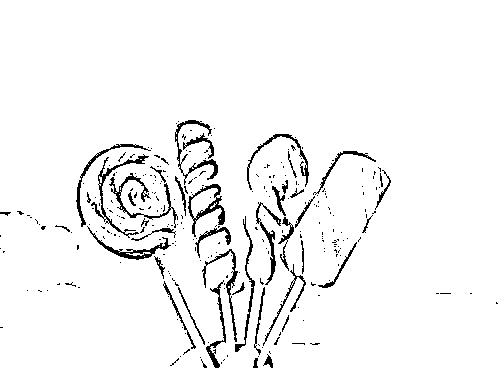 

*   **经不住时间考验的方案（水星）、感情关系（金星）或者投资（金星）会败下阵来**。

*   而**三观一致（射手座）的感情或者合作关系，有可能走入下一个承诺与收获（土星）的阶段**。

**1 月 13 日-1 月 14 日**

**1 月 13 日 星期三，射手座金星三分白羊座天王星 1 月 14 日 星期四，太阳合相摩羯座水星，三分处女座木星**

欢乐的金星与天王星的柔和相位带来有活力的关系，是探索和尝试新鲜事物的好机会。同时太阳、水星与木星的和谐相位，会给你看问题的新角度，快速学习的新知识的渴望和能力。做一些和旅游、读书会、学习有关的事，来呼应宇宙的天象吧……

**1 月 18 日星期一**

**射手座金星四分处女座木星**

**天蝎座火星三分双鱼座海王星**

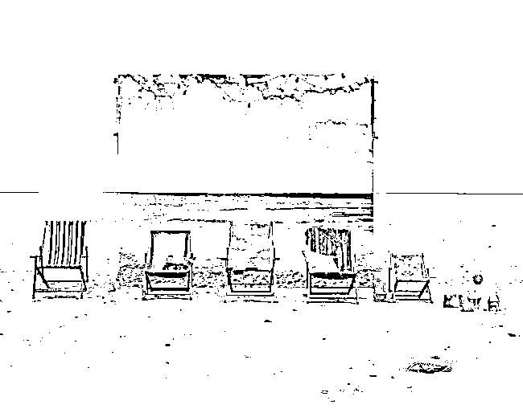

金星与木星的相遇让社交活动活跃起来：派对狂欢、疯狂购物。射手座和木星的基本含义是向外扩张，涉及到金星代表的感情与金钱，都有一种毫无节制的倾向。海王星给火星的戾气笼上了柔和的面纱，情绪虽然高昂，事情倒没有失控。请相信自己的直觉，感受双鱼座的浪漫与天蝎座的激情，度过美妙的一天。这一天也合适进行艺术或者慈善活动。

**1 月 20 日-1 月 22 日**

**1 月 20 日 星期三，太阳进入水瓶座**

**1 月 21 日 星期四，摩羯座水星四分**白羊座**天王星**

**1 月 22 日 星期五，水星合相摩羯座冥王星**

太阳在 1 月 20 日进入水瓶座，在未来的一个月里，与水瓶座和天王星相关的社会团体、平等自由、创新科技的议题成为热点。逆行的水星在此时又一次遇到天冥四分。这是“再来一次”的机会。我在上个月的宇宙天气里写道： 

*   “当水星触发天冥四分的时候，引发的是思维和沟通上的大爆炸。水星在摩羯座的思考方式严谨保守，尊重权威，也可能过于尊重权威而局限自己的思路与眼界。这次爆炸若炸开一道缝隙，接下来就会有灵感的光照射进来。

*   请回想 12 月 20 日前后你的哪些想法或者表达方式被挑战或者推翻了？今天的咨询客户的反馈是，他看到了很多职场的黑暗面、没有底线的人性，“刷新了三观”。

*   各位看官，你的三观还好么？在水星逆行回来的时候，你有什么总结、收获和调整呢？

**1 月 24 日-1 月 26 日**

**1 月 24 日 星期日，金星进入摩羯座**

**1 月 26 日 星期二，水星恢复顺行**

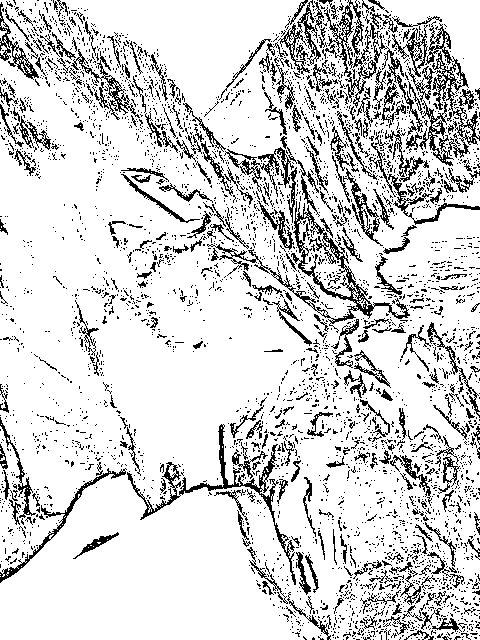

金星进入摩羯座与水星在摩羯座恢复顺行，让之前燥热紧张的空气暂时安静了一些。金星摩羯座欣赏经得起时间考验的感情、投资计划、合作伙伴。**这段时期的关键词是：重视规则、社会地位和物质成就**。但是在 2 月，金星会合相冥王星，四分天王星。社会的价值体系届时会遭遇新的挑战。

**1 月 30 日-1 月 31 日**

**1 月 30 日 星期六，水星合相摩羯座冥王星 1 月 31 日 星期日，摩羯座金星六分双鱼座海王星**

**恢复顺行的水星在 1 月 30 日与 2 月 1 日最后一次遇到天王星和冥王星**。这是第三次也是最后一次的头脑风暴，**有些秘密浮出水面，虽然让人惊慌不适，但是面对真相的我们反而能从容接纳生活的不完美**。光与影，阴与阳，希望与绝望，同时存在在人间。在 1 月底，宇宙再一次用金星六分海王星来抚慰人心：带着慈悲，继续前行。


**占星师咔咔**：2010 年师从美国占星师大卫·瑞雷学习，并得到世界名师斯蒂芬·弗里斯特、罗伯特·汉德、苏·汤普金斯传授各种占星技法。若道首届学员，国内最早获得 ISAR 职业占星师资质的职业占星师。

在国际知名广告公司和市场研究公司从事的市场研究和推广工作十余年，曾任职于阳狮集团、尼尔森市场研究有限公司、MTV 和《Madame Figaro》杂志。现在为《时装男士》、活法儿等媒体供稿。

微信公众账号：咔星人

星盘解读和运势咨询请洽：cji1029@qq.com

**◆ ◆ ◆ ◆ ◆** 

****特别提醒：**希望将若道文章转载到各自公众号的朋友，**转载时请注明“转自若道微信公众平台”，并附上若道占星的 Logo**。谢谢！**

**2016 年 3 月 15 日**，大卫老师主讲的若道占星核心课程**Level 5**要开课了！在这个阶段，你将学习各种预测技术及行星周期。通过这些预测工具，你能够预测和规划人生。提前报名付款有**早鸟价**哦！详细内容请点击“**阅读原文**”了解。


# 宇宙天气 | 看清现实，迎难而上（1.4～1.10）

> 原文：[`mp.weixin.qq.com/s?__biz=MzA5NjA0NTAxNg==&mid=401949295&idx=2&sn=7cab8dbd2f889c16072b7b5c9b5f65c3&chksm=02b7f0d835c079ce15a1f7c0b94ed67c89709ebda2f1e0fdf80c0f954dbb1f8c24c5e7a0b4a3&scene=126&sessionid=1692738892#rd`](http://mp.weixin.qq.com/s?__biz=MzA5NjA0NTAxNg==&mid=401949295&idx=2&sn=7cab8dbd2f889c16072b7b5c9b5f65c3&chksm=02b7f0d835c079ce15a1f7c0b94ed67c89709ebda2f1e0fdf80c0f954dbb1f8c24c5e7a0b4a3&scene=126&sessionid=1692738892#rd)

**一周星象综述**

这一周月亮经过天蝎座、射手座、摩羯座。本周重要的星象事件太多，简直可以用“炸开锅”来形容。进入新年，看起来行星们也不甘寂寞，争相露脸，要带来一场“开年大戏”。如果说上周是彩排，那么这周就是正式开演。如果上周有些事还在扭扭捏捏，那么这一周很可能上台面大家摊牌。

01

水星在周二（1 月 5 号）正式开始逆行，并在周六（1 月 9 号）逆行回到摩羯座。**周一到周四，是本次水逆影响最严重的时段之一**（因为行星在开始逆行和从逆行变回顺行的两个位置时，是影响力最大的，另一次则是水星将要结束时的那次停滞期）。

**抛开占星学的专业名词，我们只要记住：**

**○**在周一到周四这几天，**务必事先做好规划，凡事细心、耐心处理**，温柔地对待自己的电脑和通讯设备，做好的文档及时保存，以及不要随意删除或转移资料数据——如果一定要做的话，需要做好安全、保险的措施。

**○**交通方面也要注意，**提前安排出门**，尽量避免临时安排的计划。

**总的说来，水逆影响突出的这几天，无论是说话做事还是出行，谨记“多一事不如少一事”**。

2

射手座的金星在周二（1 月 5 号）四分海王星，在周六（1 月 9 号）合相土星，引发了爱情中的土星、海王星议题。这其实也是 11 月下旬开始的土海四分相影响的再次凸显。只是此刻，现实与幻想之间的冲突和压力重点表现在爱情和人际关系当中。**如果你在近期正面临爱情或亲密关系中的抉择，那么你将在这一周学习破除幻想、面对现实。**而如果此刻我们拒绝面对现实的话，现实则会以它特有的冷酷持续敲打我们直到我们愿赌服输。

3

周三到周四，摩羯座的太阳合相冥王星并四分天王星，**这是一个必须对自己的目标和选择加以确认的时候。来自现实的压迫感和危机感增强，逼我们拿出一股狠劲，迎难而上。**这个过程中不可避免地会带来很多内在的冲突、紧张或不信任感，只是因为每个人都在努力克制，所以有些事表面上四平八稳，但内里危机重重。

4

周五，木星在处女座开始逆行，直到五月上旬恢复顺行。这期间我们要**重新审视自己的理想愿景，修正其中缺少现实支撑的部分**。这也是一段向内探寻，检验自己的精神信仰的时候。

5

周日迎来摩羯座新月。在本周前几天所积累的来自现实层面的压力和考验，至此达到一个顶点。**摩羯座新月会带来总结性的了悟，帮我们看清道路，对一些犹豫不决的事做出承诺**。

仔细观察本周的重要星象会发现，土星、摩羯座的主题，通过不同的星象事件被反复强调。无论是感情生活还是事业目标，这一周都将迎来“摩羯式的”严酷考验。在一个比较简单的意义上，我们需要“面对现实”，以现实法则行事，避免感情用事或不必要的心软。从更加深层的精神体验上讲，冷静、务实与坚定不移的摩羯式的自我要求，也将帮我们重建自尊，并发展出对生命的深层信任。

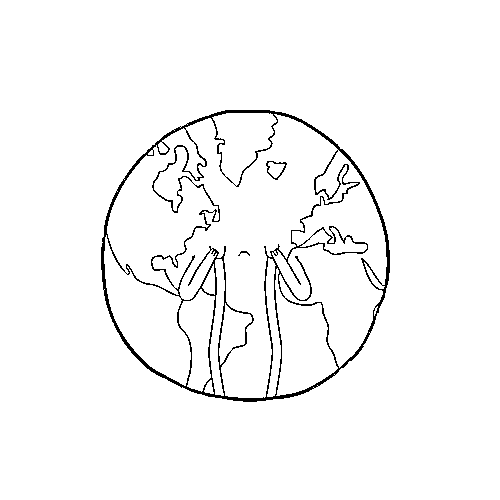 

**每日星象**

**1 月 4 日**

星期一

**星象综述**

新的一周，在月亮火星合相天蝎座的激烈气氛中开始了。虽然这个相位是发生在凌晨三点多，但其影响力可持续到早上。对于很多人来说，这个早晨可能充满躁动甚至暴力情绪（或许晚上就没有睡好）。

火星在上周日晚刚刚进入天蝎座，马上就迎来与月亮的合相，这大大增强了火星换座给我们带来的情绪感受。周一这一天**比其他时候都更容易感受到愤怒或敌对的情绪**，特别是当观点意见不合或感到沟通困难时，虽然这并不必然导致发火或争吵，但如何消化这些情绪，仍是一个需要关注的问题。另一方面，今天的行动力和做事的积极性也会提升，这有助于工作上的表现。建议少说话，多做事。

**当日星象**

**03:35** 月亮由天秤座进入天蝎座

**03:52** 天蝎座月亮合相火星

**05:13** 天蝎座月亮四分水瓶座水星

**18:57** 天蝎座月亮三分海王星

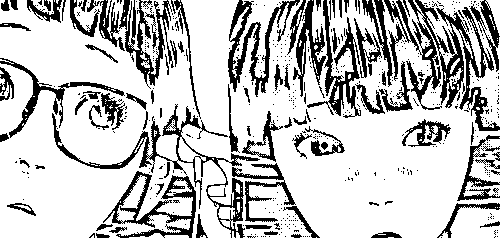

**1 月 5 日**

星期二

**星象综述**

这是很容易“出口伤人”的一天，在周一压抑的一些怒火，也可能在今天被释放出来。偏激的想法、激烈的言辞、不恰当的表达，都可能让矛盾冲突被放大。对爱与亲密的渴望与失望情绪，也会在今天变得更加强烈。今天的建议是**少折腾**，因为就算不想折腾可能还会凭空生出许多事来。

**当日星象**

**10:00** 天蝎座月亮六分冥王星

**20:01** 水瓶座水星四分天蝎座火星

**21:07** 水星在水瓶座开始逆行

**22:34** 射手座金星四分海王星

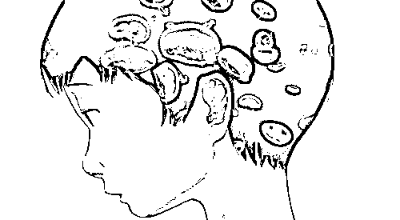

**1 月 6 日**

星期三

**星象综述**

相比周一和周二，今天我们能感受到更多稳定力量的支持，能够更加冷静地对事情做判断，自控力也增加一些。下午情绪中的阴霾渐渐散去，至少感觉上不那么紧张，更想得开，也更加容易与人沟通自己的想法或接受他人的观点。临近午夜易有惆怅情绪。

**当日星象**

**11:29** 摩羯座太阳合相冥王星

**14:55** 月亮离开天蝎座进入射手座

**16:50** 射手座月亮六分水瓶座水星

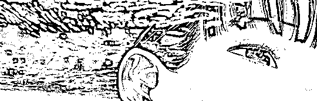

**1 月 7 日**

星期四

**星象综述**

**爱情或人际关系中的复杂感受集中爆发**的一天。说复杂是因为，这一天的状态很可能是快乐与苦涩同在。如果能够深入自己的内心，这会是一个找到内在价值准绳的时刻。很多时候不知如何选择，只是因为没有坚定的价值判断。

**当日星象**

**05:41** 射手座月亮四分海王星

**08:55** 射手座月亮合相金星

**13:28** 射手座月亮合相土星

**20:23** 摩羯座太阳四分天王星

**22:30** 射手座月亮三分天王星

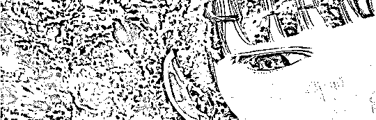

**1 月 8 日**

星期五

**星象综述**

这一天的主题是**静心**。因为这一天很容易静不下心。我们的心情容易大起大落，并会夸大希望的一面，高兴得太早，或做出不理智的判断。保持沉着与自省很有必要。

**当日星象**

**10:45** 射手座月亮四分处女座木星

**12:41** 木星在处女座开始逆行

**23:06** 月亮离开射手座进入摩羯座

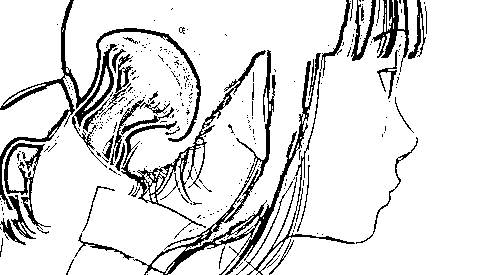

**1 月 9 日**

星期六

**星象综述**

今天我们的想法和思维方式会理智务实很多，情绪也会更加平稳、冷静、内敛。爱情及亲密关系方面有些事有尘埃落定的感觉，此刻适合在心里做一个决定。这也是执行力强、工作效率提升、做事富于成果的一天。

**当日星象**

**03:37** 逆行的水星离开水瓶座进入摩羯座

**04:21** 摩羯座月亮六分天蝎座火星

**12:12** 射手座金星合相土星

**13:08** 摩羯座月亮六分海王星

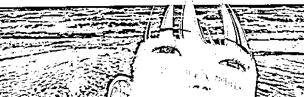

**1 月 10 日**

星期天

**星象综述**

今天上午迎来**摩羯座新月**，为这一周的辛苦折腾画上句点。说是“句点”，不是因为困扰人的问题都解决了，而是因为此刻我们心里对一些前几日还在犹豫纠结的事，有了更清晰也更加笃定的判断，也明了了将要踏上的道路。困难和挣扎不是没有，但已经能够从容面对。这是一个选择现实的时刻。如果我们自己不主动选择，外部环境则会帮（逼）我们选择。

**当日星象**

**02:41** 摩羯座月亮合相冥王星

**04:59** 摩羯座月亮四分天王星

**09:32** 摩羯座新月（摩羯座月亮合相太阳）

**16:34** 摩羯座月亮三分处女座木星


**作者简介**

**占星师 Cora**，全美占星师联盟（AFAN）成员，国际占星研究协会（ISAR）会员，获 ISAR 职业占星师资质认证，斯蒂芬·弗里斯特《变幻的天空》译者，个人星象文章见诸《心探索》《北京青年周刊》《上海电视》《空中生活》等杂志媒体。曾跟随大卫·瑞雷系统学习占星学，现为全职占星师。

微信公众号：聆宇 FM（微信号：lingyudiantai）

个人微信号：CoraAstro

长按二维码，让金钱涌向传播知识与智慧的人~


**◆ ◆ ◆ ◆ ◆** 

****特别提醒：**希望将若道文章转载到各自公众号的朋友，**转载时请注明“转自若道微信公众平台”，并附上若道占星的 Logo**。谢谢！**

**2016 年 3 月 15 日**，大卫老师主讲的若道占星核心课程**Level 5**要开课了！在这个阶段，你将学习各种预测技术及行星周期。通过这些预测工具，你能够预测和规划人生。提前报名付款有**早鸟价**哦！详细内容请点击“**阅读原文**”了解。


# 我们又将迎来一位国际殿堂级占星家！

> 原文：[`mp.weixin.qq.com/s?__biz=MzA5NjA0NTAxNg==&mid=401949295&idx=3&sn=0972e13ee780ec236d30c926bcf1dca4&chksm=02b7f0d835c079ce4148a5d0fb716449ac27edde552baa9d5b29647fe9b5104b264be196773a&scene=126&sessionid=1692738892#rd`](http://mp.weixin.qq.com/s?__biz=MzA5NjA0NTAxNg==&mid=401949295&idx=3&sn=0972e13ee780ec236d30c926bcf1dca4&chksm=02b7f0d835c079ce4148a5d0fb716449ac27edde552baa9d5b29647fe9b5104b264be196773a&scene=126&sessionid=1692738892#rd)

**推荐人物**

**理查德·塔纳斯**

国际占星学界学者和先驱

殿堂级占星家

原型占星学研究者

《西方思想史》《宇宙与心灵》作者


作者/理查德·塔纳斯

译者/江艺

**大卫·瑞雷推荐**

我怀着激动的心情向大家推荐一位国际占星学界的学者和先驱——理查德·塔纳斯。2016 年 1 月，我邀请到他来北京若道举办一次讲座。5 月，他将在若道开办“原型占星”课程。

在这篇 2015 年 3 月塔纳斯接受美国地球宇宙研究协会（NCGR）会采访的节选中，理查德·塔纳斯回顾了他与占星学的初次相遇，以及在这一领域的个人探索历程。阅读这篇文章，总能在我心中唤起第一次接触占星学奥秘的兴奋之情。让我们跟随这篇采访，走近这位殿堂级占星家。

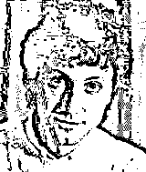

****理查德·塔纳斯****

旧金山加州整合大学的心理学和文化历史教授，他在那里创建了哲学、宇宙学和意识的研究生课程。他还在圣芭芭拉的太平洋研究生院教授原型研究和深度心理学。

他是**《西方思想史》**（*The Passion of the Western Mind*）的作者，该书阐述了西方世界观的历史，从古希腊到后现代，是许多大学的必读文本。

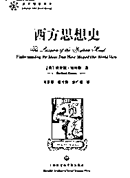

他还著有**《宇宙和心灵》**（*Cosmos and Psyche*），该书在英国科学和医学网站荣获年度最佳书籍奖。

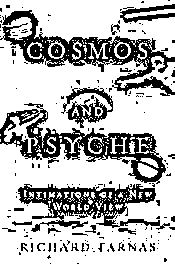

个人网站：*cosmosandpsyche.com*

**1**

**我曾怀疑占星学**

多年前，和大多数深受现代教育荼毒的人一样，我自动地对各类占星学抱持怀疑的态度。然而，受到荣格学说和几位值得信任的同事的影响，我开始觉得或许一些占星学理念值得认真对待。当我放下对占星学的轻蔑态度后，我注意到占星学的历史包含了一些显著的特征。

**2**

**心理学教授居然跟我谈星图**

我对占星学的兴趣是逐步形成的。在我读大学期间(1968-1972 年)，我常常与哈佛大学的神学与心理学教授汉斯·霍夫曼交流，他来自瑞士，曾跟随荣格学习。我们经常谈论荣格、弗洛伊德及其他心理学话题，但是有一天他突然提到了有关我出生星图的一些东西，我感到非常意外。

那时我并没有再进一步，但这是占星学第一次敲响我的大门。(正如丽兹·格林的至理名言，似乎更多是占星学选择了你，而非你选择了占星学。)在接下来的几年里，我阅读了更多关于荣格对占星学的兴趣，以及鲁道夫·斯坦纳支持占星宇宙学的著作。**这些经历让我在理智上向占星学的有效性敞开了怀抱。**

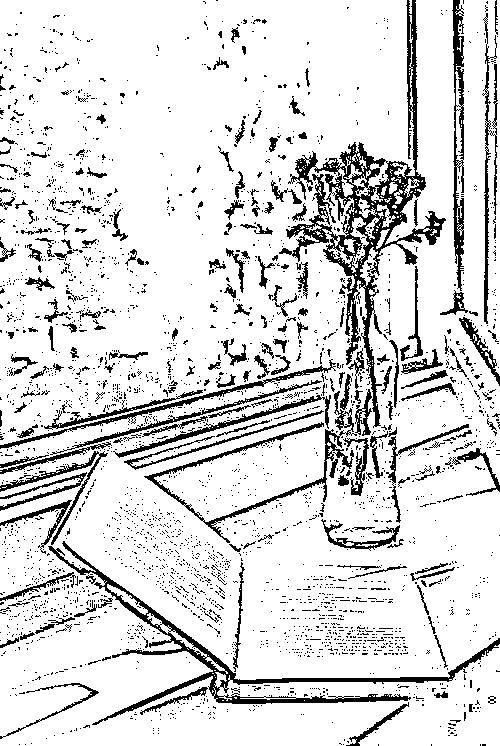

**3**

**我看到占星学被严肃对待**

**但是在这些问题上，真正起作用的是直接体验。**1974 年，我搬到加利福利亚州大瑟尔的伊莎兰研究所，一切都改变了。

我发现伊莎兰社区里，包括驻地医师和受过良好教育的教师以及其他工作人员都非常**严肃地对待占星学**。在伊莎兰，占星学的氛围比反文化的上世纪 60 和 70 年代早期哈佛更甚许多：**占星学**在伊莎兰就是日常词汇的一部分，**是理解人和生活的一种方式**。与占星学一道发挥作用的还有业力、共时性、道、萨满和迷幻之旅，以及多维度现实等等。

在那里，人们所谓的“魔法”世界观就是每个人赖以生活和呼吸的空气的组成部分：一个万物有灵的宇宙，与我们所察觉到的，或是现代传统思维除魅的唯物世界观相比，**人类拥有更大的目的和意义**。

**4**

**超个人心理学创始人也认同占星学**

我来到伊莎兰是为了跟随斯坦·格罗夫完成我关于迷幻药精神疗法的博士论文，斯坦是一位精神分析学家，是世界上首屈一指的迷幻疗法研究者和超个人心理学创始人。

**当我们开始仔细考察行星行进和它们对我们自己和他人的致幻时间与特征之间的关系时，原型对应的精准度和一致性令我们吃惊。**正如斯坦所说，占星学就像是人类心灵的罗塞塔石碑。

占星研究证明的基本原则和力量不仅验证了荣格对**原型**的理解（**人类心灵根本的本质形式**）,而且验证了柏拉图对宇宙的理解（贯穿着原型理念或形式）。荣格原型心理的深处就是柏拉图-毕达哥拉斯的原型宇宙，也就是荣格后来研究共时性和占星学时给出的暗示。

**人类心灵的最深处和宇宙中行星运行之间的对应关系**表明，对心灵和宇宙的大幅度扩展理解预示着一个进化的世界灵魂或宇宙心灵。正如普罗提诺所说，“万物共同呼吸”，天空之上和下面的人类生活。

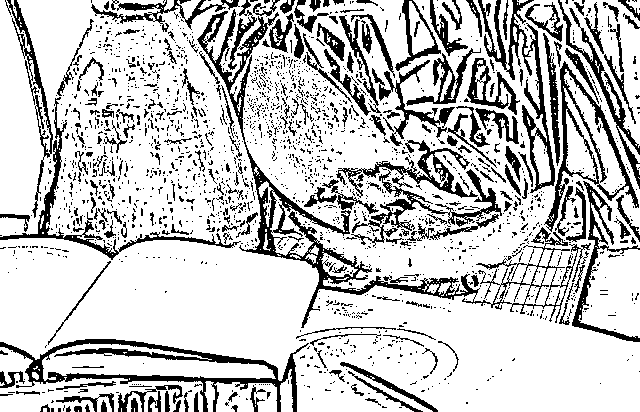

**5**

**我渐渐开始占星执业**

当我在做研究时，伊莎兰的朋友希望我解读他们的星图和行进。当我每天在伊莎兰入口处的小屋里工作，写我的论文时，他们就在门口排队等候。最终,几年后我获得了我的哲学博士学位，应邀成为伊莎兰“驻地占星师”(一个新创建的工作)。在这里，我为访问的神学院学生、教师和工作人员做了数百个占星解读，然后将他们的付款直接交给伊莎兰，伊莎兰继续付给我日常的员工薪水。

那时我 28 岁,但是当我 29 岁时，伊莎兰聘任我为项目和教育主管,这是一个重大的责任，结束了我的全职占星实践。但是，我一直在做研究，写作了我的第一篇占星学文章《觉醒者普罗米修斯》(*Prometheus the Awakener*)，偶尔会继续做占星解读。几年后,我离开伊莎兰后，专职投入写作关于西方思想的历史《西方思想史》，这时我会在写作之余做一些占星解读来支持我的小家庭。

**6**

**我开始研究原型占星学**

1990 年代早期，我成了加州整合大学的哲学教授，并在那里创建了哲学、宇宙学和意识的研究生课程，我没法再给个人做占星解读，仅仅是因为没有足够的时间。然而，加州整合大学确实有邀请我和斯坦·格罗夫教授在原型占星学和超个人心理学上进行研究。

在过去二十年来，加州整合大学有数百名学生通过这些课程学习了占星学，并开始了他们自己在这个领域的研究。在我们的哲学、宇宙学和意识社区里，它成了一种通用语言(或通用占星学)。

**原型占星学**的运用不仅照亮了我们个人和集体的经历，而且还给哲学和宇宙学问题带来了启发。**我们将它看作一种魔法石，同时也是一种强有力的象征词汇，与日常生活有着巨大的关联性。**

**◆ ◆ ◆ ◆ ◆**

**2016 年 1 月 18 日，**塔纳斯将在若道举办一次**讲座**；**5 月，**他将在若道开办“**原型占星学**”课程，敬请期待！


# 苛责过自己，方知随波逐流才得完美

> 原文：[`mp.weixin.qq.com/s?__biz=MzA5NjA0NTAxNg==&mid=401908407&idx=2&sn=0472632631e46c331fc1f8c2612fae6c&chksm=02b6100035c19916266489684f45d0761b0dcb1a96cbe9c0cab072d137fb37e9144cef8efc84&scene=126&sessionid=1692738892#rd`](http://mp.weixin.qq.com/s?__biz=MzA5NjA0NTAxNg==&mid=401908407&idx=2&sn=0472632631e46c331fc1f8c2612fae6c&chksm=02b6100035c19916266489684f45d0761b0dcb1a96cbe9c0cab072d137fb37e9144cef8efc84&scene=126&sessionid=1692738892#rd)

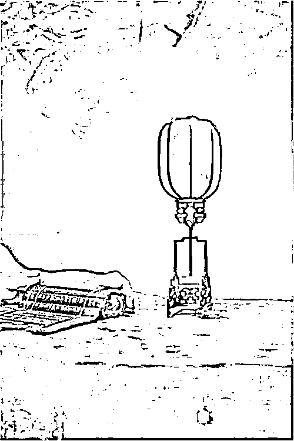

拥有一颗非常敏感的月亮星座是怎样一种感受？职场怨怼，暴饮暴食，这些行为源出何处？反省和蜕变后发觉，随波逐流居然也是一种疏通人生轨迹的途径。曾经的作者，执着于完美，现在的她，在学习放下，依然可以很美。

1

敏感源自何处？

与朋友保持距离已经一月有余，没有电话，没有互动，大概朋友会认为这是占星师的怪癖，唯有我清楚，独处是我需要的。在这段时间里，我几乎每天都在画画，画许多花草，还有在京都的风景，内心尚未平静，但是却在一天上班的途中模糊地抓到了一些东西，想分享给大家。 

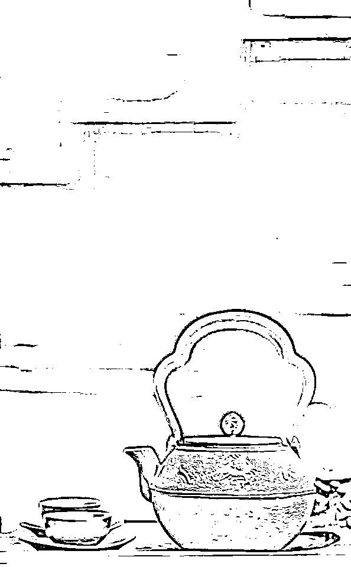

我的星图中月亮和北交点都落于金牛座十二宫，月亮与北交点仅相差四度，月亮与上升点只差七度。我还有一颗与月亮精确对分的冥王星，以及南交点，都位于六宫。

但凡对占星有所了解的人大概能想象这种配置意味着**情绪敏感到让自己无法承受**。自接触占星学的这近十年，我一直在思考北交点金牛座落十二宫到底是什么意涵。

2

怨怼和暴食的背后

直到我读到 Jan Spiller《灵魂占星——看南北交点如何影响你的人生》，我才发现自己以前太过强调“问题”，好像在近距离审查玻璃上的尘土，却看不见整体的面貌。

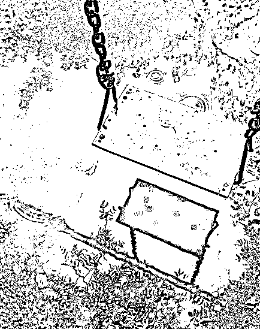

金牛座的北交点告诉我要宁静地生活在物质世界，其落点却又在最为性灵的十二宫。或许我可以说说我的经历，大家会稍微明白所谓的宇宙法则是什么。

> **或许我可以说说我的经历，大家会稍微明白所谓的宇宙法则是什么。** 
> 
> ● 我生活在一个习惯批判的家庭，**父亲是个无论什么事情都持怀疑态度的人**。我在父亲那边得不到任何赞赏与肯定，无论是得奖的作文或者一张一百分的考卷，得到的回答永远是我的不足：你太骄傲，你的字写得不端正，你的手工做得太粗糙，你就是毛躁，你就是没有恒心……我常想我自负又自卑的性格大概是从父亲的评价里习得的。
> 
> ● 我**敏感于批评，同时又具有十分严厉的一面**，这点反映在我的六宫里，狭隘地说在我的工作氛围里。我发觉自己永远充满了怒气：“为什么大家都可以这么偷懒？为什么大家都无法对自己有更高的要求？为什么大家都不知道要学习和成长？为什么大家都没有责任心？为什么明明我一个人做能做得很完美的事情却要被拖后腿？”同时，我对自己的批判也不绝于耳：“你为什么那么蠢做这种事情？为什么我可以这么没有耐心，做事这么粗糙？”
> 
> ● 毕业至今七年，无论换了多少份工作，我都无一例外会陷入怨怼中，觉得**自己的付出没有得到相应的报酬和认可，对同事充满了失望，对老板充满愤怒及轻视，厌倦职场的种种虚伪**。
> 
> ● 再回到六宫的另外一个主题——**健康**。我的饮食紊乱追溯到大学二年级，起初的导火线是节食，想成为各方面都完美的自己。那时我正在考托福准备出国，大脑却因为饥饿常常处于开小差状态，无法推进学习进度，**极度的焦虑引发了第一次暴食，之后紧张、焦虑、自责都与暴食环环相扣**。

3

随波逐流，方得完美

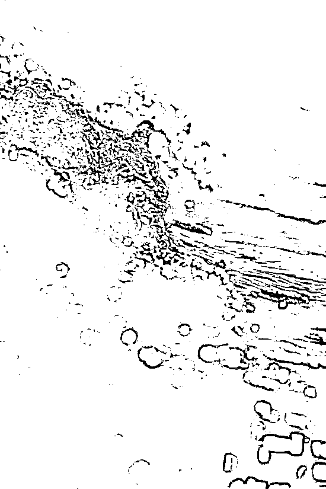

回顾以上，是不是呈现了一个**天蝎座冥王星合相南交点于六宫**的典型症状？原谅我脱口而出属于“六宫”和“处女座”的医疗词汇。直到我看到了关于我的北交点的出口——**放下所有对于固有思路和规划步骤，随波逐流**。

随波逐流，大概是我从小到大最深恶痛绝的一个词汇，那意味着彻底的平庸。我是一个非常执着的人，拿我绘画举例，我画画的初衷非常简单，完全是被美丽打动：美丽的面庞、壮丽的建筑、美好的物件、清新的花草，都让我自然而然拿起画笔。但是有段时间我非常难以拿起画笔，因为有个声音像念咒一样纠缠我——“你要画一幅让别人都惊艳的作品”。

因为期待某种来自于他人的成就感，我变得疯狂，为自己买昂贵的颜料和画纸，添置不计其数绘画教程书，只是为了那幅完美的作品！现在回想，充满了对自己的同情。再比如我前阶段陷入对于“每天画一幅画”的强迫里，如果哪天没画或者画得不顺利，就会陷入对自己的批判中：“我真没用，一点毅力都没有，我真是一点才华也没有。”

跳开了自己，看待自己以上的想法，我才恍然大悟，原来这就是冥王星的力量，我在**用一种强制行为成为自己**，我已经成为了绘画的奴隶。

唯有放下执着，让它随波逐流，你才会找到你要的完美。

4

宇宙一直在教我生活

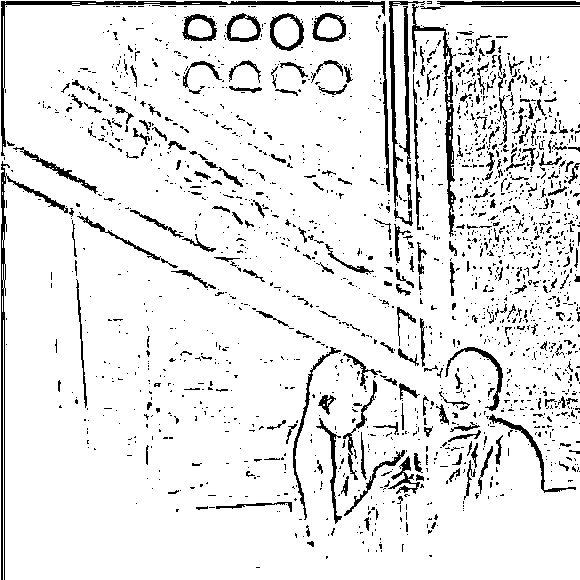

> **这个道理，宇宙告诉我无数遍——**
> 
> ● 比如高中时代，我常跟数学题杠上，做不出就卯着劲憋个半个钟头，就是不肯换别的学科做，筋疲力尽后才放弃，第二天，看到题目，却神奇地知道要怎么解答。
> 
> ● 再比如，当我强迫自己练钢琴一段时间，总会陷入瓶颈，琶音越练越糟糕，心急得突然哭出声来，但是当我彻底废掉两个月（完全不弹），原以为会退步到一塌糊涂的时候，再次触键，却神奇地冲破了屏障，进步到另一个阶段。

宇宙一直在用这种方式教导我。

事实上，当我放下了所有方法论，所有步骤，所有的“应该”，我才明白星图上所有的星星都有一个共同的使命——让我知道，我什么都不需要做。

高八度的火星——冥王星，只想让我们知道**超越毁灭的唯一方法就是放下执着，当你不再有一个“我”存在，你就没有“我要”，没有“我要”，就没有“我失去”**。

就是这样简单。

**当我把一切放任，我不想成为什么人，无论这个“什么人”有多么诱人**，比如成为一个灵性的占星师，比如成为一个出色的社会工作者，比如成为一个才华横溢的画家，比如成为一个洒脱的吉他手。我依旧热爱艺术，我依旧拥有洞察力，但是我已经不需要用这些来支撑一个“我”，我可以自由地绘画而不需要期待那些“赞”，我可以分享给许多尚且迷茫中的人一些对他们有益的看法，自由地发挥自己的能力帮助那些需要帮助的人，但是再也不需要因为自己能做这些而感觉到安全。

我可以安心地画一朵花，可以嗅早晨第一杯咖啡的香气，可以自由地哼突然飘来的旋律，可以不加评论地与人相处，顺应一切发生，无论遭遇到怎么样的“摧毁”，我都可以按部就班“重建”，一次都不会被拉下，这就是北交金牛座十二宫啊！

作者简介

**伊风三里**，江南女子一枚，从事心理咨询工作五年，太阳水瓶座，月亮金牛座，我爱如风，我更爱一花一沙一世界。

长按二维码，让金钱涌向传播知识与智慧的人~

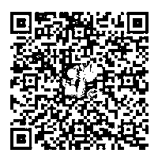 

**◆ ◆ ◆ ◆ ◆** 

****特别提醒：**希望将若道文章转载到各自公众号的朋友，**转载时请注明“转自若道微信公众平台”，并附上若道占星的 Logo**。谢谢！**

**2016 年 3 月 10 日**，大卫老师主讲的若道占星核心课程**Level 1-2**又要开课了！他将带领你学习星座、太阳、月亮、行星、月亮交点等知识，让你进入占星学的世界！提前报名付款有**早鸟价**哦！详细内容请点击“**阅读原文**”了解。 


# 2016 年运 | 规则重建，以动制动

> 原文：[`mp.weixin.qq.com/s?__biz=MzA5NjA0NTAxNg==&mid=401908407&idx=1&sn=409cf1cfa831bfdd8c1b5ea7b88cb34a&chksm=02b6100035c1991643a339c6245c9804c29605e63f5c613afdfe83ec532da8cced87cdbf2c1b&scene=126&sessionid=1692738892#rd`](http://mp.weixin.qq.com/s?__biz=MzA5NjA0NTAxNg==&mid=401908407&idx=1&sn=409cf1cfa831bfdd8c1b5ea7b88cb34a&chksm=02b6100035c1991643a339c6245c9804c29605e63f5c613afdfe83ec532da8cced87cdbf2c1b&scene=126&sessionid=1692738892#rd)

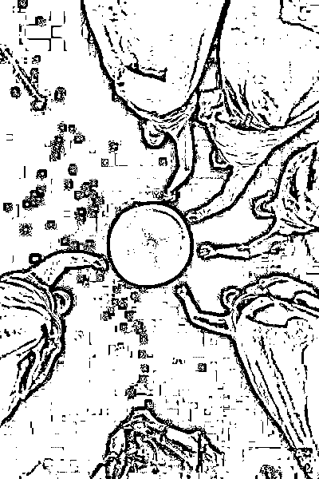

作者/Justine

图片/花瓣网

很难想象，2015 年已经将近尾声。2016 年，已伫立在下一个街角迎接我们。

**2016****关键词：变动**

前几年，因为天王星、冥王星的几次精确四分，我们深受开创星座（白羊座、巨蟹座、天秤座、摩羯座）能量影响。开创星座代表出生与创始，是有关破旧立新的能量。每一个开创星座都是一个新的季节周期的开始。在开创能量的影响下，突然的变化与改革、持续的新旧局面的拉扯，从无到有的诞生，是社会层面及个人生活的主题。

2016 年将会是非常独特的一年。这一年充盈了变动的能量，三个变动星座有运行缓慢的行星长期驻扎：

**○** **海王星行进在双鱼座（从 2011 年开始）**

**○** **土星在射手座（从 2014 年底开始）**

**○** **木星大半年时间行进在处女座（从 2015 年 8 月开始）**

**○** **月亮南北交点在处女座-双鱼座轴线上（从 2015 年 11 月开始）**

**社会层面：**

变动星座代表改变和调整，有很强的适应性，能够随着环境的改变而改变。2015 年，政治与社会转型经历了关键性的一年。政治制度的现代化、反腐与吏治改革、人民币汇率改革、公民权利和自由保障、日益沉重的教育、民生与环保压力……当这些改革与热点已启动，并被推到风口浪尖上，中国社会如何进一步应对？2016 年，**变动的能量会不断吸收新的想法、方式与理念，重新分配资源到各个环节。**

**个人层面：**

变动能量没有孤立或分离的概念，强调人与人之间、人与环境和自然之间的互相依赖、协作与共存，比如正视雾霾问题。同时，社会进入经济放缓与波动加剧的双重“非常态”,**对不少人的职业或工作状态也产生影响，需要保持开放的心态，在社会大形势的变化中不断调整自己的航向。**

**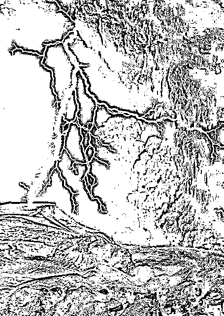**

**重要讯息！**

**如果你有重要的个人行星都落在变动星座（双子座、处女座、射手座、双鱼座）——**

**○ 2016 年会受幸运之神“木星”一定的加持。**

**○ 但同时，土星、海王会持续给你压力或迷茫的考验。**

**特别需要保持积极的心态，以适应各种状况，在变化中不断学习与调整。**

当然，变动特质强的人有其本身的优势：

**○**  双子座与处女座都有极强的学习能力，能快速吸收与消化信息；

**○** 双鱼座能在理性的分析之外，带来敏锐的感性、直觉的天赋、臣服的智慧。更重要的是，这些调整不是为改变而改变，从长远而言有其深层的目的。

**○** 射手座的能量，则能帮我们保持乐观的心态与积极的信念，前瞻性地理解其意义。

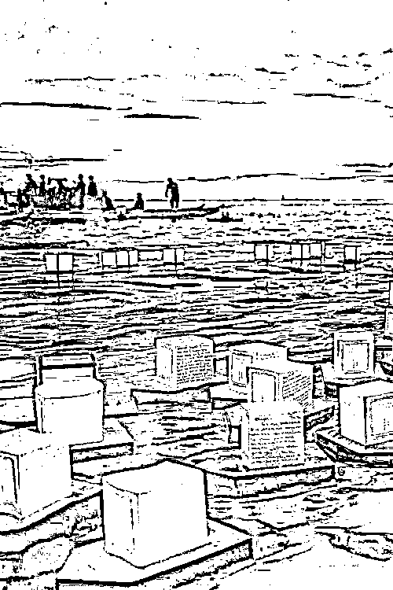

**2016****重大星象：4 个****1****火星逆行：关注安全问题**

火星逆行大约每两年发生一次。2016 年 4 月 17 日到 6 月 30 日期间，火星将从射手座 8 度逆行到天蝎座 23 度。巧合的是，射手座 8 度也是 2016 年土星逆行后停滞顺行的位置（8 月 13 日），并且 8 月中下旬，土星将与顺行后的火星在此附近合相。

**逆行会让火星的行动力、欲望或愤怒内化。当火星顺行之后，加上与土星的合相，很可能会引起暴力、压抑的侵略性能量的突然释放。**

**社会层面：**

国际局势可能较不稳定，如果选择这个阶段出行，请注意安全问题。

**个人层面：**

对于个人而言，逆行的火星会鼓励我们重新审视自己的欲望、行动力与目标，由此带来**调整工作与亲密关系**的契机。也许，你会有勇气创建新的目标，借由新的职业方向，完全开始新的人生阶段。同时，火星在射手座和天蝎座都是相对强势的位置，如果处理不好逆行带来的暂时压抑能量，容易带来挑战与混乱。**在火星逆行期，需要付出比平时更多的耐心与努力，学习更明智地面对他人的愤怒或攻击。**

**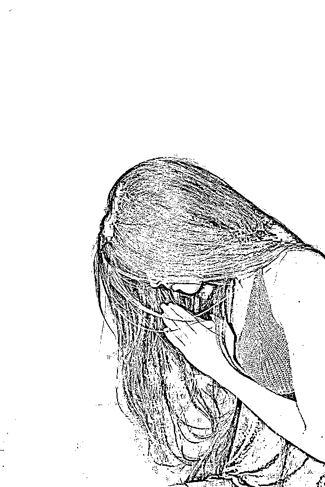**

**2****土星海王星四分：关注信仰议题**

另外，2016 年的星空中，会呈现几次变动星座的 T 三角和大十字，给国际局势带来压力与挑战。特别是当土星行进在射手座，海王进行在双鱼座，且土星、海王星在 2016 年还会有两次精确四分（2016 年 6 月 18 日、9 月 10 日），强调信仰与宗教相关的议题。

土星、海王星第一次四分发生在 2015 年 11 月 26 日，在此前后我们目睹了拥护原教旨主义理想的“圣战战士”引发的巴黎恐惧袭击、ISIS 暴力在各地的持续发酵、不少国家纷纷参与防御性反击。2016 年这股变动能量如果被误用，加上火星在射手座恢复顺行（再次强调为信仰而战），可能会有极端分子的区域性恐惧袭击，甚至可能引发宗教战争。

**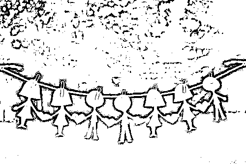**

**3****木星进入天秤座：关注和谐问题**

木星在 9 月 9 日从处女座进入天秤座。天秤座会强调爱与美、和谐与平衡。因此，合作关系、婚姻、人际和谐、社会公平性等议题，会在接下去的一年内成为社会热点及重点关注领域。同时，9 月会发生两次的月亮蚀相，带来深层次的释放及全新启动的契机。因此，9 月很可能是 2016 年大环境转变的关键。

**4****四次水星逆行：关注实际问题**

2016 年四次水逆发生的时间与区域——

**○** 2016/1/5-2016/1/26：水瓶座 1 度逆行到摩羯座 14 度

**○** 2016/4/29-2016/5/22：金牛座 23 度到 14 度

**○** 2016/8/30-2016/9/22：处女座 29 度到 14 度

**○** 2016/12/19-2017/1/8：摩羯座 15 度射手座 28 度

前三次的水星逆行都会逆行至土相星座的 14 度后停滞顺行。土元素象征稳固和持续，有着实干精神与足智多谋。**水星在土相星座逆行会督促我们的思维更有逻辑与结构性、更脚踏实地。如果你有个人行星或四轴等敏感点在摩羯、金牛、处女的 14 度附近，会是 2016 三次水逆的敏感人群。**

**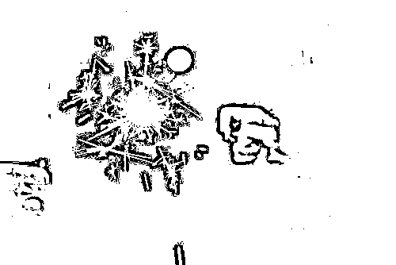**

漫长三年的天王星、冥王星一系列精确四分终于出相位，但由于这两个行星移动缓慢，依然在容许度的范围内，2016 年其影响还会持续。**旧的规则已倒塌，新局面尚未显现，2016 年是****带来资源与策略的不断调整的一年。**

当 2016 年在水逆的阴影期徐徐拉开帷幕，呼应了回顾与感恩过往、展望将来无限可能性的崭新心境。愿每个人在新年伊始之时，都有所爱的人陪伴在身边，一起分享快乐、面对挑战。即使你暂时是一个人，请用爱和希望驱散焦虑，祈愿 2016 年会成为你独特的一年。

 

**◆ ◆ ◆ ◆ ◆**

****特别提醒：**希望将若道文章转载到各自公众号的朋友，**转载时请注明“转自若道微信公众平台”，并附上若道占星的 Logo**。谢谢！**

**2016 年 3 月 15 日**，大卫老师主讲的若道占星核心课程**Level 5**要开课了！在这个阶段，你将学习各种预测技术及行星周期。通过这些预测工具，你能够预测和规划人生。提前报名付款有**早鸟价**哦！详细内容请点击“**阅读原文**”了解。


# 摩羯座的自律甩你几条街，所以他们成功了

> 原文：[`mp.weixin.qq.com/s?__biz=MzA5NjA0NTAxNg==&mid=401869936&idx=1&sn=5f08ca252b9b6114d0bac5a0658b6578&chksm=02b6bec735c137d154b1ed163134df234922f20e26fa2947a7ef262a347205bd5314a110fa1b&scene=126&sessionid=1692738892#rd`](http://mp.weixin.qq.com/s?__biz=MzA5NjA0NTAxNg==&mid=401869936&idx=1&sn=5f08ca252b9b6114d0bac5a0658b6578&chksm=02b6bec735c137d154b1ed163134df234922f20e26fa2947a7ef262a347205bd5314a110fa1b&scene=126&sessionid=1692738892#rd)

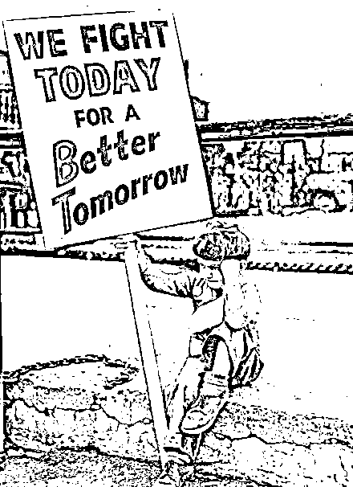

作者/大卫·瑞雷

译者/李含 校对/轩轩

大卫·瑞雷提醒

今天我们谈谈摩羯座的个人成长。要记住，即使你的出生图中没有任何行星落入摩羯座，但它仍是你星图中的一部分，在你的出生图中占据一定地位，以某种方式对你产生影响。而如果你的太阳、月亮、上升点或其他重要行星落入摩羯座，或者是与该星座“共振”的宫位被强调，那么本文更加适用于你。

**1****山羊+鱼尾的组合**


**训练，每一分钟都让我厌恶，但我告诉自己，要继续练习。今天的痛苦会为你赢得一生的胜利。**

**——拳王阿里（太阳摩羯座）**


上面的名言引自最伟大的重量级拳王，他是摩羯座核心驱动力的最佳代言人，不论这个驱动力埋藏得有多深。当然，**摩羯座强大的志向抱负可以投入到任何领域，摩羯座做出的牺牲有时候可以服务于超越个体自我的需求。**将一生致力于人权斗争的领袖，摩羯座的小马丁·路德·金便是这种牺牲的集中体现。

他是一位牧师的儿子，与父亲同名。父亲是浸信会的牧师，在种族隔离的美国南部，牧师在非洲裔美国人社区中十分受人尊敬。毫无疑问，年轻的马丁渴望这种尊重，这也反映出一个**摩羯座的儿子与父亲竞争的本能冲动——去成就更多**，事实上他做到了。但是，马丁·路德·金将他的意志和内在信念融合到牧师角色中。“我只是要执行上帝的意愿。他让我攀登高峰。”

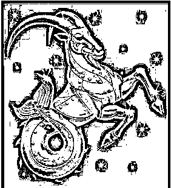

马丁·路德·金所说的**“高峰”就是摩羯座的绝佳写照**。**摩羯座的符号便是山羊和鱼尾的组合，这正是从海底攀登至山巅的终极符号。**这是发展进化的象征，描绘了加以时日所能达成的造诣成就。

但是等级制也十分清晰，一个人可以在所有环境下，从海底到海岸，到海边小镇，到种满橄榄树的山坡，到稳健的山羊居住的峭壁危岩。在符号中保留鱼尾似乎十分恰当，对于大海的记忆，提醒着一个人的过去，以及他所取得的长足进步。

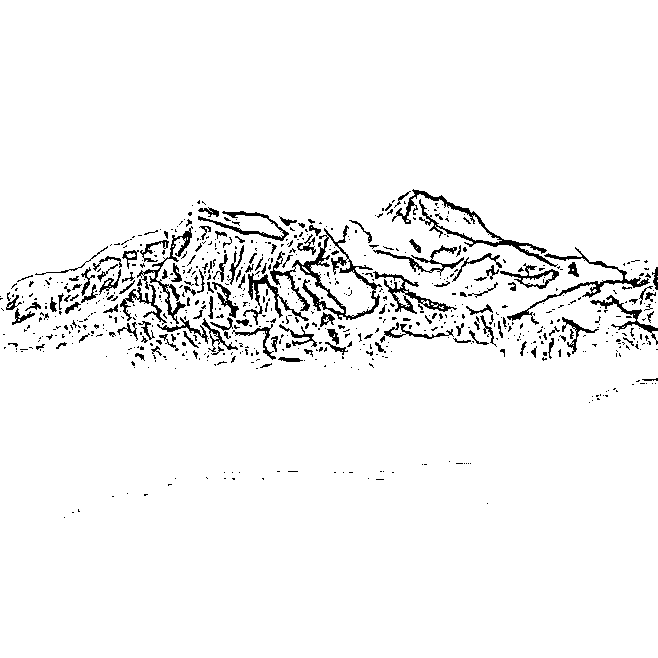

**2****射手座的下一个星座**

但在所有黄道星座的生命之轮中，摩羯座来自何处？什么样的经历产生了摩羯座，催生了对于完美与成就的需求？

摩羯座的前一个星座当然就是射手座。射手座对于追求真理、智慧、领悟和理解的经验丰富。但是接下来呢？令人惊叹的冒险生涯带来丰富的领悟，富于智慧的贤者在传道授业中获得满足，但也很自然地开始思考所有的学习是为了什么？他们看到自己最睿智卓越的学生运用其知识去成就世界。于是，**一个渴望出现了，“凭着我现在有的这些知识，我想知道自己能够实现些什么**——如果我更年轻，如果我还有机会的话。”

将射手座的体验推向极致，如果一个人无所不知，那么他应该无所不能！因此，接受教育之后，人们做好准备去进入职业生涯，在社会上竞争，学以致用。**射手座是概念与理论的世界；而摩羯座将理论付诸实践。**摩羯座甚至愿意牺牲假期去实现他们的目标，好像在说，“我已经去过那儿了，我已经度过假了。”好像旅行的渴望已经在热爱自由的射手座那里满足了。

这并不是意味着摩羯座并不享受假期，尤其是在著名的旅游胜地！然而，这种假期往往在成功之后，而不是之前，**假期的长度仅仅可以让他们恢复体力，然后奔赴下一个目标**。

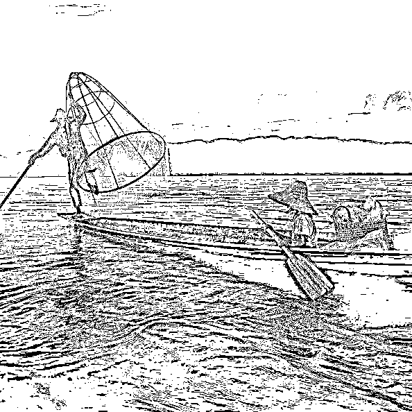

**3****摩羯座对成功的定义**

在描述摩羯座时，会产生一个议题：**关于“成功”本身的。**通常这个议题会呈现为这样的问题：“这难道不是取决于你对成功的定义吗？”这是个很棒的问题，因为成功有很多种衡量方式。例如，**达成个人目标同样也是一种成就。同时还存在内在的成就感**，就像存在外在的成功标志一样。

> 前甲壳虫乐队成员约翰·列侬，他的月亮落在了摩羯座，他在歌曲《女人》（*Woman*）中为小野洋子写下了这样精彩的句子：
> 
> 不过，女人，我会试着表达
> 
> 我内心的触动和感激之情
> 
> 是你让我了解了成功的意义

在这个例子中，我谈到的是月亮在摩羯座，而不是太阳。因为**月亮象征着一个人生命中的重要女性，即母亲、（对一个男人来说）妻子、女儿**，妻子带给列侬的感受完美诠释了这一点，通过他的“内在感受”，让他了解了成功的意义。

**摩羯座是阴性星座，造就了它的内在动力**。所有十二星座从白羊座开始，极性依次交替，阴阳循环往复，就像电流的极性。正如初级占星学生所知，火象星座和风象星座是阳性星座，土象星座和水象星座是阴性星座。旧的占星书常常将阳性比作男性，阴性比作女性，但是现代占星师已经不再使用这一误导性的命名。

例如，摩羯座是阴性星座，但是恐怕没有人会将摩羯座视作女性的典范！相反，中国的年轻人或许会认为摩羯座女人是“女强人”，因为她们像男人一样能干。

但是，这种“能力”并不像狮子座那样华丽外放。拳王阿里极具表现性是因为他的上升点落在了狮子座，而不是因为他是一位太阳摩羯座。**摩羯座的男人和女人有种从容的力量，常常伴有泰然自若的尊严感。**

他们的态度和行动展现出一种目的感，他们的脸上总是写着严肃和坚决。但如果经验不足或不安时，呈现出的则是僵化和笨拙，富有安全感的摩羯座会表现出无声的效率。这种无声指的是一种内在的过程，这种内在的权衡十分谨慎，计划周密。

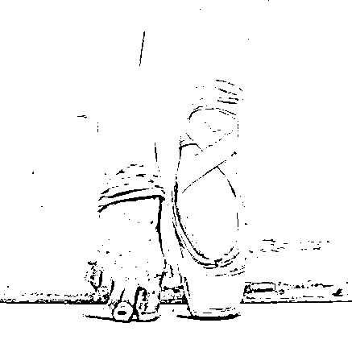

我认识一位摩羯座的舞台剧演员，有一次在观众热烈起立鼓掌后，他离开众人，退到幕后，看起来垂头丧气。有人问他这是怎么了，他说：“今晚，我的感觉很糟糕。”有人说：“但是观众们爱你，听听他们热烈的掌声？”“是的，但是我知道自己表现得有多差劲。”这个例子中，摩羯座的演员并未实现他自己所设定的成功标准，尽管他获得了观众的掌声。但是，摩羯座的专业意识让他又返场开始表演。

这位演员非常喜欢表演。**对于许多摩羯座人来说，需要成为自己专业领域的精湛大师是一种无与伦比的驱动力。**当然，如果观众和这位演员对于他的表演有着一致的批评，毫不留情的发出嘘声，他的挫败感无疑将会更加强烈，即使他与观众的看法一致。**失败总是与成功如影随形，失败的苦楚总是在摩羯座人的心中意味深长。**

> **成功感会首先从内心浮现，预示着外在的肯定。**
> 
> ● 一位摩羯座的太极老师可能在竞赛中证明他的技艺，但是在他自己心中，内在的自律已经使他获得了成就感。
> 
> ● 一位摩羯座的警察会谨言慎行，但卓越的能力会赢得他人的尊敬。
> 
> ● 一位摩羯座的护士长将其他护士管理得井井有条，她不用大声叫嚷，也无须发号施令；她按照规矩办事，其他人知道她的要求，并按照要求做好。因为她做出了表率示范，所以其他护士知道该怎么做，她尽职尽责，工作细致。

这些事业成功的例子描绘出摩羯座如何赢得尊重。当然，有些摩羯座人隐藏了他们的失败，或者失败感，隐藏在了功成名就的表象背后。但是，**真正的成功才是对摩羯座真正的奖赏**，尽管大部分摩羯座人在获得成就、接受赞誉时就已经开始了下一个目标的征程。

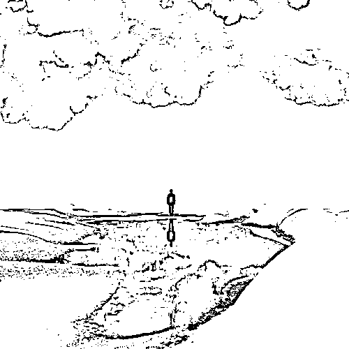

当然，**对于成功的体验显然不限于事业领域**。一位摩羯座的母亲或父亲或许会耐心地帮助孩子找到方法消除学习障碍。看到子女逐步发展出本不可能的技能，为此奉献的摩羯座父母会获得无与伦比的满足。

事实上，许多年前，我在北京电影学院演讲时曾被问到，为何一位摩羯座女人，一位许多行星落在摩羯座第十宫的女人会选择做全职妈妈和家庭主妇，而不是追求一份事业。我的回答是：全职妈妈和家庭主妇就是她的事业！她的家庭对她而言非常重要；这是她定义成功的方式，她的摩羯座“责任”意识表露无遗。她的朋友形容她是，像经营成功的公司一样快乐地经营家庭，计划周详，安排高效。

**关于摩羯座，也许你还想看：**


**◆ ◆ ◆ ◆ ◆**

****特别提醒：**希望将若道文章转载到各自公众号的朋友，**转载时请注明“转自若道微信公众平台”，并附上若道占星的 Logo**。谢谢！**

**2016 年 3 月 10 日**，大卫老师主讲的若道占星核心课程**Level 1-2**又要开课了！他将带领你学习星座、太阳、月亮、行星、月亮交点等知识，让你进入占星学的世界！提前报名付款有**早鸟价**哦！详细内容请点击“**阅读原文**”了解。


# 最红的格斗明星靠这个“秘密”成功

> 原文：[`mp.weixin.qq.com/s?__biz=MzA5NjA0NTAxNg==&mid=401869936&idx=2&sn=b724b2ccd68bda49ca109c461df3965c&chksm=02b6bec735c137d129bc15711879fe7b89ec8b0d6f4197206a0d2270c71a9f5996a09cae8423&scene=126&sessionid=1692738892#rd`](http://mp.weixin.qq.com/s?__biz=MzA5NjA0NTAxNg==&mid=401869936&idx=2&sn=b724b2ccd68bda49ca109c461df3965c&chksm=02b6bec735c137d129bc15711879fe7b89ec8b0d6f4197206a0d2270c71a9f5996a09cae8423&scene=126&sessionid=1692738892#rd)

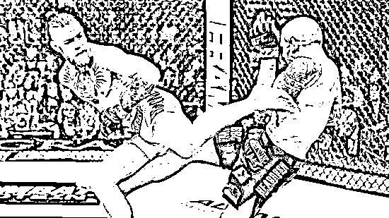
作者/大卫·瑞雷 译者/李含

**1****遇到《秘密》前，他是一名水管工学徒**

12 月 21 日的《体育画报》在它的 2015 年年度“运动员”特刊中，讲述了挑战者康纳·麦格雷戈（Conor McGregor）在终极格斗冠军赛（UFC，Ultimate Fighting Championship，目前世界上最顶级和规模最庞大的职业综合格斗赛事）备受关注的赛事中创纪录地，**只用了 13 秒便在第一轮 KO 了羽量级长胜冠军**何塞·奥尔多（Jose Aldo）的故事。

在赛前，康纳便放肆地向所有人宣称，凡是下注他在第一轮赢得胜利的人一定能赚得盆满钵满，并且会被允许参加他的庆功派对。没人相信这会成真，除了康纳·麦格雷戈自己。他的左拳打在奥尔多（Aldo）的下颚，将他打翻在地，**让 12 月的拉斯维加斯都为他的“信念”感到惊叹。**

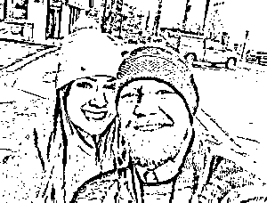
艾琳和康纳·麦格雷戈

仅在 8 年前，康纳·麦格雷戈，一位爱尔兰都柏林的年轻人，还是一位水管工学徒，还认为这就是他的未来。他的父亲托尼说他毫无特别之处，没有什么能让人认为他会成为 UFC 世界羽量级的冠军。然后，他的姐姐艾琳给他介绍了**《秘密》**，朗达·拜恩（Rhonda Byrne）2006 年所著的**这本书探讨的主题是对自己的信念以及创造你自己的现实**。

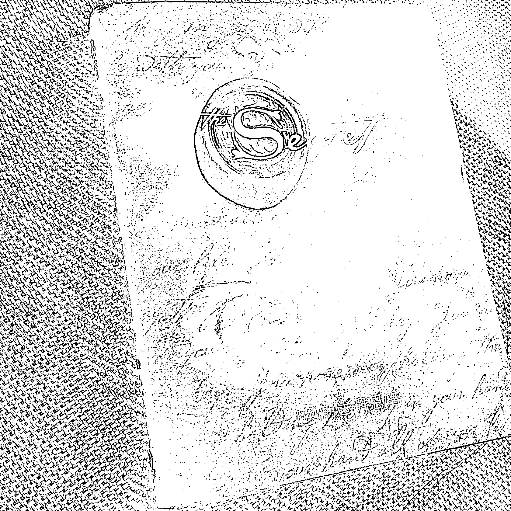 

**2****《秘密》告诉他的秘密**

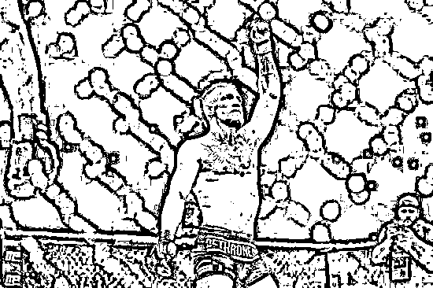

最初，康纳认为他的姐姐很荒谬。这在他看来就是胡说八道。但是有一天，就在艾琳告诉他这本书后的一年左右，康纳遇到了糟糕的一天。他记起了这本书，记起了艾琳的话，他决定看一看，即使觉得这有些荒谬。

这本书有 DVD 版本，康纳和女友迪伊拿到了一份拷贝。他们坐下来观看。起初，康纳感觉就和他最初对此的看法一样：“即使在我第一次观看时，我还是觉得这就是胡扯，”他说。**“但随后，有些内容触动了我。”**

康纳开始尝试书中的理念。康纳在成长过程中曾踢过足球，但是他总是很着迷于格斗。他想如果他将这种**积极信念法则**应用于格斗之道中，他会不会实现积极的成效呢？练习，练习再练习，他的第一次职业出战在 2008 年——在第二轮中击倒对手获胜。

每一个人，从康纳到他的父母和姐姐，都认为康纳观看《秘密》是一切改变的时刻。**在这一刻，他慢慢地开始从一个安静的男孩变成一个盛气凌人、充满自信的男人，这个男人会说出他想要的，然后努力去达成所愿**。这一刻，世界冠军的梦想，大笔奖金的梦想，一战成名的梦想开始生根发芽。

**3****同样的秘密，来自于人本主义占星学**

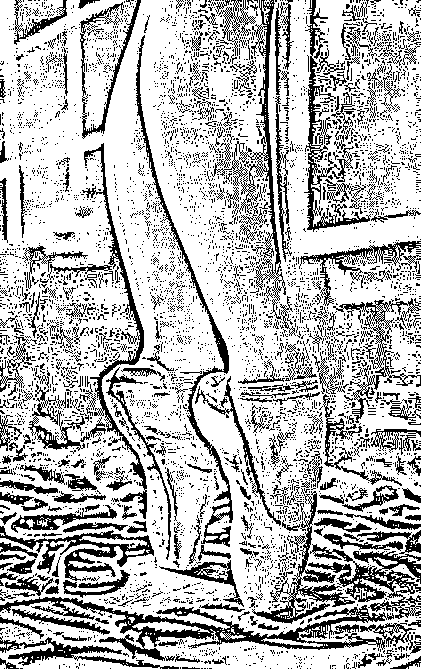

*   **人本主义占星学同样旨在帮助你更清楚自己的潜能，帮助你认识到你在人生中可以创造出怎样的可能性**。不同于传统的宿命论占星学，这是一种关注可能性的占星学。 

*   当你在展望 2016 年时，你想要创造什么？在 2016 年之后呢？这需要 专注、担当和努力 ——但是首先**你要对自己坦诚，对心中憧憬满怀信念**。

下面是康纳·麦格雷戈的出生星图。他的出生时间并未公开，所以下面星图的太阳、月亮、行星是按照正午时间计算，以 0°白羊座作为上升点，也就是所谓的原生黄道星图。所以，在研习康纳的星图时，请忽略宫位落点。

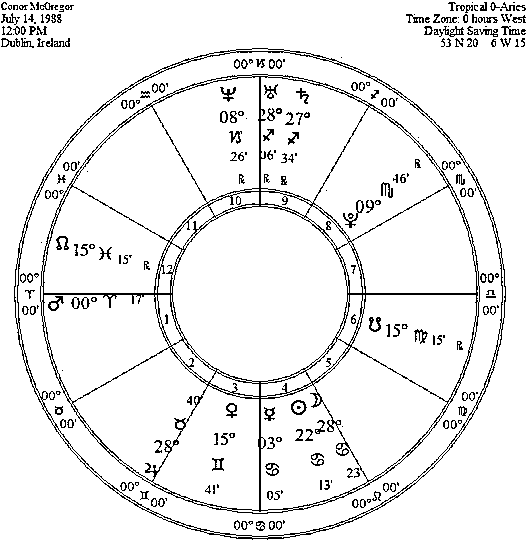 

**◆ ◆ ◆ ◆ ◆**

**2016 年 3 月 10 日**，大卫老师主讲的若道占星核心课程**Level 1-2**又要开课了！他将带领你学习星座、太阳、月亮、行星、月亮交点等知识，让你进入占星学的世界！提前报名付款有**早鸟价**哦！详细内容请点击“**阅读原文**”了解。


# 2016 若道 1-2 阶大卫主场：40 余年的占星精华都在这里！

> 原文：[`mp.weixin.qq.com/s?__biz=MzA5NjA0NTAxNg==&mid=401869936&idx=3&sn=d5215656045311143e5e8101a903afad&chksm=02b6bec735c137d113016bdb5fbb014dc303f47646718229ac94bfd4cdd6ef4dfb38241c7e6d&scene=126&sessionid=1692738892#rd`](http://mp.weixin.qq.com/s?__biz=MzA5NjA0NTAxNg==&mid=401869936&idx=3&sn=d5215656045311143e5e8101a903afad&chksm=02b6bec735c137d113016bdb5fbb014dc303f47646718229ac94bfd4cdd6ef4dfb38241c7e6d&scene=126&sessionid=1692738892#rd)


国际占星研究协会（ISAR）中国唯一指定教学机构

若道 2016 年占星核心课程 Level 1-2 上线

**这是一趟“星座小白”到“星座达人”之旅**

主讲人若道创始人**大卫·瑞雷**

**拥有四十多年占星执业经验**

网络教学

全程即时翻译

不懂英文也没问题


**课程信息**

**授课时间：**2016 年 3 月 10 日**-4 月 28 日**

**授课老师：大卫·瑞雷（8**次**）、蒋颖（4**次**）**

**授课方式：**网络课

费用：**2400 元（2016 年 2 月 1 日前报名付款）**

**早鸟价：****1980 元（2016 年 1 月 25 日前报名付款**）

**报名截止：**2016 年 2 月 1 日

**课程负责人：王老师（微信号：2837474346）、童老师（微信号：80248863）**

**咨询电话：**400-619-1014

课服 QQ**：4006191014 （若道星文化）**

邮箱**：nodoor@vip.126.com**

课程简介


**星座、太阳和月亮**

12 星座是占星学最基本却又最深刻的概念，黄道 12 星座，是伟大的生命周期，而太阳和月亮是我们阴阳之本。

**●12 星座：**和大卫一起，深入了解 12 星座的特色。了解星座正面的、负面的表达，了解其资源，了解其破坏生命的模式。了解其原型人物、了解其指代的人事物。

**●12 星座原则：**按照极性、形态和元素给星座分类。

**●12 星座关键词：**关键词非常重要！是解读准确性的关键。

**●太阳和月亮：**了解你的太阳，生命的发动机，让你在世界闪光的方式，生命获得力量的方法；了解你的月亮，让你生命获得幸福的方法。了解它们，了解你生命中已经出现的、将会出现的男人和女人。


**遇见行星和月亮交点**

在这个阶段，你将遇见行星们，还有与灵魂的过往和未来相关的月亮交点。这既是你，你的性格，也是你在生命故事中将会遇到的人、事、物的显化，也是你灵魂轨迹的线索。

**●内行星：**水星、金星、火星

**●中间行星：**木星、土星

**●外行星：**天王星、海王星、冥王星

**●灵魂的线索：**月亮南交点、月亮北交点

**●行星逆行：**行星逆行的天文现象和意义

**●宫位初解：**了解黄道 12 宫的基本含义

时间安排

共 12**次**课，24 课时。

**●8 次理论课程**（大卫老师主讲、配有中文实时翻译）

北京时间每周四晚 20：00-22:00

**●4 次线上互动课程**（蒋颖老师主讲）

北京时间每周一晚 20：00-22:00（3.14/3.28/4.11/4.25)

授课优势

**①先进的教学平台**

网络教学平台，支持手机、电脑、iPad 上网，可以随时随地学习。

**②回放复习**

学员可登录网站收看课程回放，在线复习课程，每次课可完整重看 3 次，课程结束后的 3 个月内有效。　

课程特色

**①与名师面对面**：北京同学可以来若道现场上课，和大卫老师面对面互动。大卫老师也可能前往主要学员所在城市，实现零距离教学。

**②互动答疑**：论坛、微信群随时提问；老师课上答疑；助教线上线下全程协助。

**③线下沙龙**：定期举办沙龙活动，复习上课内容。

**④强大的同学网络**：若道作为中国最顶尖的占星教学机构，在 4 年的占星教学中，培养了很多占星人才。若道让你和师兄师姐切磋，让你和国内著名占星师学习。（简单来说，就是，人脉！）网络授课，在北京开设免费现场参与名额，全程英文授课，配备实时翻译。

师资力量

**讲师团队**


****大卫·瑞雷（David Railey）****

若道创始人，《灵魂的目标》作者。拥有四十多年的占星咨询的执业经验，曾两任亚特兰大占星协会主席，是全美占星师联盟（AFAN）、美国占星师联合会（AFA）、全美占星研究委员会（NCGR）、国际占星研究协会（ISAR）和职业占星师组织（OPA）的成员，是联合占星大会（UAC, United Astrology Conference）督导委员会委员。大卫曾是 CNN、CBS 的占星节目的常驻嘉宾，多次在 BBC、WGS、WSB、WRGG 等节目中接受采访，并在亚特兰大主持电视节目《每日行星（Daily Planets）》达 4 年之久。


****蒋颖（Felicia）****

若道创始人，职业占星师。在若道系统学习占星，师从大卫·瑞雷。长江商学院 MBA，厦门大学经济学硕士，化学学士。国际占星研究协会（ISAR）中国区副主席。第一批获得国际占星研究协会（ISAR）认证的职业占星师。《灵魂的目标》译者。

**助教团队**


****熊鹰（天空的空）****

国际占星研究协会（ISAR）认证占星师。在若道系统学习占星，师从大卫·瑞雷，现任若道专职助教。将传播系统、严谨、真实的占星学作为职业使命。与此同时，提供一对一占星咨询服务与生时校正咨询。目前正致力于占星学与个人真修实证的整合。2014 年起主讲读书会，助教答疑课程累计超过 100 小时。


****Gaff****

全职占星师，既是占星师，也是疗愈者。2013 年开始在若道进行系统占星学习，师从大卫·瑞雷。任 2015 年度诺·泰尔、斯蒂芬·福里斯特老师的占星工作坊助教。提供一对一的咨询服务（已有超过 100 小时的咨询经验），基于个案咨询的经验，曾多次开设面授的占星课程。


2016 年，和若道老师一起，开启占星的探索之旅！

报名请点击文末“**阅读原文**”。

长按二维码接通课程负责人！


# 2016 若道 1-2 阶蒋颖主场：中文老师出山交流更顺畅！

> 原文：[`mp.weixin.qq.com/s?__biz=MzA5NjA0NTAxNg==&mid=401869936&idx=4&sn=1d63d887a5b80a28072d31bc34da85a7&chksm=02b6bec735c137d11945c3877d0e7916529b9bed39d60044e4f0a71dca85b4443f6094d5d858&scene=126&sessionid=1692738892#rd`](http://mp.weixin.qq.com/s?__biz=MzA5NjA0NTAxNg==&mid=401869936&idx=4&sn=1d63d887a5b80a28072d31bc34da85a7&chksm=02b6bec735c137d11945c3877d0e7916529b9bed39d60044e4f0a71dca85b4443f6094d5d858&scene=126&sessionid=1692738892#rd)

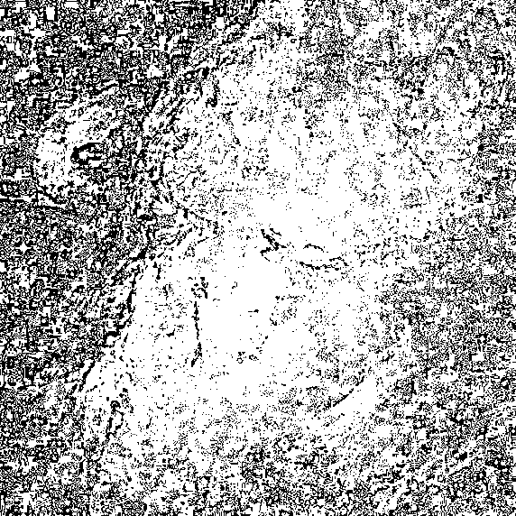


国际占星研究协会（ISAR）中国唯一指定教学机构

若道 2016 年占星核心课程 Level 1-2 上线

**这是若道首次推出中文老师**

带你畅游“星座小白”到“星座达人”之旅

主讲人若道创始人**蒋颖**

有效拿捏学员需求

**授课时间更长**

**交流互动更多**


**课程信息**

**授课时间：**2016 年 5 月 19 日**-7 月 7 日**

**授课老师：**蒋颖**（8 次）、**大卫·瑞雷**（4 次）**

**授课方式：**网络课

费用：**2400 元（2016 年 5 月 6 日前报名付款）**

**早鸟价：****1980 元（2016 年 4 月 6 日前报名付款**）

**报名截止：**2016 年 5 月 6 日

**课程负责人：童老师（微信号：80248863）、**王老师（微信号：2837474346）****

**咨询电话：**400-619-1014

课服 QQ**：4006191014 （若道星文化）**

邮箱**：nodoor@vip.126.com**

课程简介


**星座、太阳和月亮**

12 星座是占星学最基本却又最深刻的概念，黄道 12 星座，是伟大的生命周期，而太阳和月亮是我们阴阳之本。

**●12 星座：**和大卫一起，深入了解 12 星座的特色。了解星座正面的、负面的表达，了解其资源，了解其破坏生命的模式。了解其原型人物、了解其指代的人事物。

**●12 星座原则：**按照极性、形态和元素给星座分类。

**●12 星座关键词：**关键词非常重要！是解读准确性的关键。

**●太阳和月亮：**了解你的太阳，生命的发动机，让你在世界闪光的方式，生命获得力量的方法；了解你的月亮，让你生命获得幸福的方法。了解它们，了解你生命中已经出现的、将会出现的男人和女人。


**遇见行星和月亮交点**

在这个阶段，你将遇见行星们，还有与灵魂的过往和未来相关的月亮交点。这既是你，你的性格，也是你在生命故事中将会遇到的人、事、物的显化，也是你灵魂轨迹的线索。

**●内行星：**水星、金星、火星

**●中间行星：**木星、土星

**●外行星：**天王星、海王星、冥王星

**●灵魂的线索：**月亮南交点、月亮北交点

**●行星逆行：**行星逆行的天文现象和意义

**●宫位初解：**了解黄道 12 宫的基本含义

时间安排

共 12 次课，24 课时。

**●8 次理论课程**（蒋颖老师主讲）

北京时间每周四晚 20：00-22:00

**●4 次线上互动课程**（大卫老师主讲、配有中文实时翻译）

北京时间每周一晚 20：00-22:00

授课优势

**①先进的教学平台**

网络教学平台，支持手机、电脑、iPad 上网，可以随时随地学习。

**②回放复习**

学员可登录网站收看课程回放，在线复习课程，每次课可完整重看 3 次，课程结束后的 3 个月内有效。　

课程特色

**①与名师面对面**：北京同学可以来若道现场上课，和大卫老师面对面互动。大卫老师也可能前往主要学员所在城市，实现零距离教学。

**②互动答疑**：论坛、微信群随时提问；老师课上答疑；助教线上线下全程协助。

**③线下沙龙**：定期举办沙龙活动，复习上课内容。

**④强大的同学网络**：若道作为中国最顶尖的占星教学机构，在 4 年的占星教学中，培养了很多占星人才。若道让你和师兄师姐切磋，让你和国内著名占星师学习。（简单来说，就是，人脉！）网络授课，在北京开设免费现场参与名额，全程英文授课，配备实时翻译。

师资力量

**讲师团队**


**蒋颖（Felicia）**

若道创始人，职业占星师。在若道系统学习占星，师从大卫·瑞雷。长江商学院 MBA，厦门大学经济学硕士，化学学士。国际占星研究协会（ISAR）中国区副主席。第一批获得国际占星研究协会（ISAR）认证的职业占星师。《灵魂的目标》译者。


**大卫·瑞雷（David Railey）**

若道创始人，《灵魂的目标》作者。拥有四十多年的占星咨询的执业经验，曾两任亚特兰大占星协会主席，是全美占星师联盟（AFAN）、美国占星师联合会（AFA）、全美占星研究委员会（NCGR）、国际占星研究协会（ISAR）和职业占星师组织（OPA）的成员，是联合占星大会（UAC, United Astrology Conference）督导委员会委员。大卫曾是 CNN、CBS 的占星节目的常驻嘉宾，多次在 BBC、WGS、WSB、WRGG 等节目中接受采访，并在亚特兰大主持电视节目《每日行星（Daily Planets）》达 4 年之久。

**助教团队**


**熊鹰（天空的空）**

国际占星研究协会（ISAR）认证占星师。在若道系统学习占星，师从大卫·瑞雷，现任若道专职助教。将传播系统、严谨、真实的占星学作为职业使命。与此同时，提供一对一占星咨询服务与生时校正咨询。目前正致力于占星学与个人真修实证的整合。2014 年起主讲读书会，助教答疑课程累计超过 100 小时。


**Gaff**

全职占星师，既是占星师，也是疗愈者。2013 年开始在若道进行系统占星学习，师从大卫·瑞雷。任 2015 年度诺·泰尔、斯蒂芬·福里斯特老师的占星工作坊助教。提供一对一的咨询服务（已有超过 100 小时的咨询经验），基于个案咨询的经验，曾多次开设面授的占星课程。


2016 年，和若道老师一起，开启占星的探索之旅！

报名请点击文末“**阅读原文**”。

长按二维码接通课程负责人！


# 相亲失败，却收获最心动的礼物

> 原文：[`mp.weixin.qq.com/s?__biz=MzA5NjA0NTAxNg==&mid=401827948&idx=1&sn=ecce3c656815682fd0c8a1eda1da9f93&chksm=02b1dadb35c653cd57389fecf31d8284e14517ec6dc5b09f7c9bc2879d93e5826efc2f1476c6&scene=126&sessionid=1692738892#rd`](http://mp.weixin.qq.com/s?__biz=MzA5NjA0NTAxNg==&mid=401827948&idx=1&sn=ecce3c656815682fd0c8a1eda1da9f93&chksm=02b1dadb35c653cd57389fecf31d8284e14517ec6dc5b09f7c9bc2879d93e5826efc2f1476c6&scene=126&sessionid=1692738892#rd)

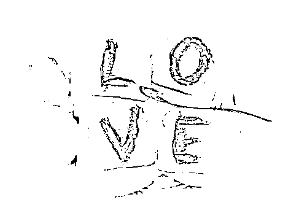

小缺是位有故事的菇凉。当年她与占星学结缘源自一次网络相亲，虽然没成。之后将近一年的学习，让她懂得什么是觉察、接纳和改变。最令人感动的是，她通过星图，与过世的父亲再度联结。

1

相亲，带我走进占星学

几年前拜一次网络相亲所赐，我结识了一个和我境况有些相似，但画风完全不同的太阳天蝎座男生。跟大多数被情所困的菇凉一样，那时的我也对星座有一些好奇和了解，没想到天蝎男居然略懂，还推荐斯蒂芬老师的**《内在的天空》**给我。

为了给两个孤单的灵魂创造话题，我决定研读此书。没想到一下子就被斯蒂芬对 12 星座的阐释完全吸引，并第一次知道了星图和行星、宫位这些说法。似懂非懂间阅毕全书，不过瘾！我又央求着天蝎男对照着书一个个讲解我的配置：“你的巨蟹座月亮在 11 宫和 12 宫之间，嗯，如果是 12 宫就好了，11 宫不够酷”，他说。

现在想起来那句话有些小小的滑稽，但当时的我完全被这种说法迷倒（各位男占星爱好者，请由此深刻反思一下吧，占星学真心不是色骗小女生的工具啊！），但内心仍有无数解不开的疑惑。天蝎男又向我推荐了若道，说这里有斯蒂芬老师的课程，“咱们可以一起上课呀！”

几经辗转，我终于在 2015 年如愿来到若道，开始基础占星课程的学习。可是，故事的结局并不是我和天蝎男幸福地在一起。在看完书的那个夏天，我和妈妈去了一趟东欧旅行，回来之后就和他止步于纯洁的男女关系了。

在学习占星学后我去看当年的星象，行进的天王星进入我的 9 宫，宫内有白羊座水星、金星、火星。那段时间，网络相亲、学占星、旅行，故事的起承转合在行进盘的流转中显得奇妙又合情合理。**我奔着姻缘而来，却未想最终和若道结缘。**套用光良写给妻子的那首歌的歌词来表达就是：“若道，才是我这一生等了半世的礼物。”

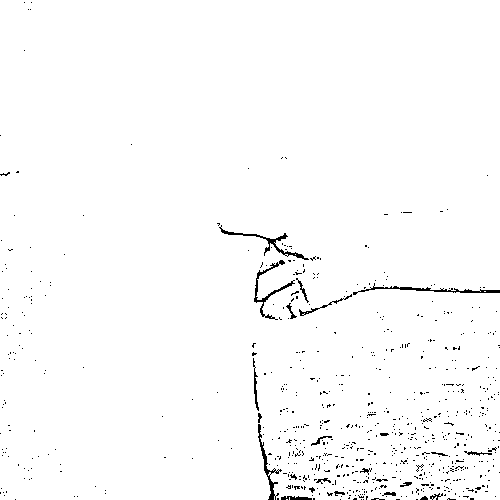

2

成长，始于自我认知

作为一个占星小白，在若道上的第一个课程，是大卫老师的初阶占星课。大卫老师一开课就强调，**自我成长的三部曲是觉察、接纳和改变**。当我们没有开始进入真正的占星学习时，我们会说，我的太阳是白羊座，所以我是勇敢的，有行动力的……但当开始跟着老师学习后，会发现星图下的自己远复杂于此。

回想自己那些年对占星学的好奇，其实更多也是想要了解和解救困顿于情感和情绪中的自己，以及功利地学习下“如何搞定金牛男”之类的心法。开始系统学习占星学后，不敢拿现男友生时不准的星图来对照，唯恐自己学艺不精影响情绪指错方向。但仍然会忍不住偷偷看前任的星图。

还记得上 Level 2 的某个清晨，在出租车里回听若道助教的辅导课录音，听到一些蛛丝马迹便忽然翻看了前任星图，意外地发现，原来一直以来觉得自己在感情里受到了伤害，却不曾想过水星冥王、火星冥王对分的自己，那些年的言行其实都在践踏着前任金星狮子座骄傲而又脆弱的自尊。

那个阳光明媚的早晨，巨蟹座月亮的我沉浸在回忆中，无比内疚地写了一大段感慨的话发给了前任的好友，被斥责为“怎么还放不下”。无法释怀之下又原话发给了现任，得到一个嘿嘿的表情和一句“老婆没事儿”（写到此处，脑中浮现男友憨直的笑脸，发愿等我学会了生时校正，定要给你校一个准盘，做成“史上心胸最宽男友配置表”）。还是没完全释放，于是把原话发到了班级群里，助教秒回“**浮现即愈合**”。那一刻，我忽然觉得内心无比平静。

那些年在情爱里跌爬滚打，被戛然而止的结局，在没有了恨亦忘记了爱的后来，仍然会让我觉得内心之中有如密密铺盖的泥土之下仍有空洞一般，即使它已然不疼不痒，仍无法否认捅一捅就会发现它的存在。而就在那一天，在以为自己即将感受到那个荒芜许久的空洞带来新的疼痛时，“浮现即愈合”，这五个字静静地把一切填充了。

从 Level 1 上到 Level 4，一遍遍于学习中对照自己的星图，每次都会有意外的收获。我还记得自己一度无法辨识身上太阳金牛座 10 宫的烙印，这个尚未觉知的感觉在职场工作转化的那段时间里，对于如何面对新工作甚是苦恼，在星图上也找不到线索和答案。无奈之下又求助若道的助教。助教鼓励我说太阳金牛座 10 宫的画风绝对不该是胆怯和后退，“**不摔打，是不会知道自己的边界在哪儿的**”。又一次人生中的迷茫得到了醍醐灌顶的点醒。

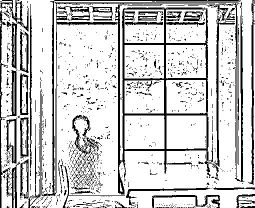

3

和解，帮人亦帮己

从小我和妈妈之间，就是一种既爱又恨的纠结状态。在爸爸去世后，妈妈来到北京和我住，有一度母女关系让我几近崩溃。那时的我曾和闺蜜苦笑说：“我在妈妈身上终于懂得了，女人如何逼走老公”。在若道学习占星时，老师说**每个人的出生星图里都有父母的痕迹**。我在自己的出生星图上看到了象征母亲或母女关系的金星和月亮四分，也开始试着用星图来寻找妈妈，理解妈妈。

这期间为了提升学习，也帮着很多认识不认识的人看盘，听他们的故事，有意识地会去问，去看他们和母亲的关系，对他们未来人生的影响等等。在这一个过程里，我发现大多数人生剧本确有瑕疵的人们，往往和原生家庭有着或多或少不可调和的矛盾，又或者对于父母辈的言行不予认可，但“可悲”地发现，自己“正在变成和父母一样讨厌的那种人”。

我对其中一个自我否定的咨询者说，其实你所讨厌的那种人，并没有好坏对错，看起来那样的人反而更适合当下的你，只是你可以发挥那种人更积极正像的一面；我对另一个苦恼于母亲关系的女孩说，其实你只是不能体会她的不安全感而已，她想要的只是更多的爱。

**这些话在出口的那一瞬间，我的内心也会有一个声音和咨询者一样，默默地点了一下头。**学习占星学让我懂得，星图是自己的一面镜子，而通过别人的星图看他们人生，又往往是自己的另一面镜子。此刻我在用所学去疗愈他人，又何尝不是疗愈自己呢。

2015 年的某个新月，我许下了一个和妈妈和解的愿望。虽然这一年仍然会有和妈妈的口舌之争，但我还是感受到了在我和妈妈之间的微妙变化。

很可惜的是，妈妈已经年过七十了。有时候我会回想这些年和妈妈的摩擦，心里会有一些疼痛，再也不是替自己委屈，而是替妈妈心疼。我曾在占星班级群里感慨说，要是我早一点学习占星，修好和妈妈的关系，该有多好！同学们回复，**觉察并改变，多晚都不算晚**，至少你少了一个后悔。

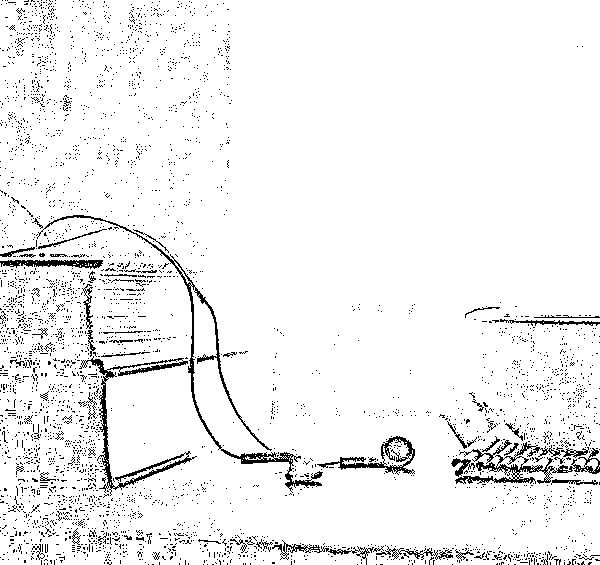

4

爸爸，让我好好看看你

2015 年即将过去，按照往常惯例，我会很认真地对自己的一年做一个总结。除了生离死别的那些年之外，大多数时候的岁尾，我都会发现原来自己的这一年，没有荡气回肠的悲壮剧本，亦无盆满钵盈的华彩篇章。

可是在今年，因若道的学习，**一遍遍的洗涤内心，平静了又波澜，掏空了又丰盈**，这种弥漫在每一寸光阴却又看不见的充实感，让我再也无暇去具象地计较这一年究竟收获几多。

对于下一年和下下年，我还有很多的期盼。想要认认真真地学习合盘，学习生时校正，和我那史上最佳好男友美美地来个合盘（哈哈）！

以及，很想很想，给已经离开九年的爸爸，做一次生时校正。某个失眠的晚上，忽然突发奇想在软件里输入爸爸的出生信息和预估的时辰之后，一个陌生的星图蓦地出现。我忍不住用手轻轻地摸了一遍太阳、月亮、上升点、金星、火星……眼泪就掉了下来。

那个感觉，说不出的奇妙，**一个你再也见不到的人，用另外一种存在的方式和你相见，甚至每一个行星****-星座-宫位，都好像要凑过来和你促膝谈心。**好多随着时间淡忘的往事和细节，又清晰无比地从星图里走了出来。

那天我暗自发愿，我要继续好好学习，学来一个真正属于爸爸的星图，让我有机会用占星的方式，再一次和爸爸相处。

我想，这或许是若道送给我的，最令人心动的礼物。

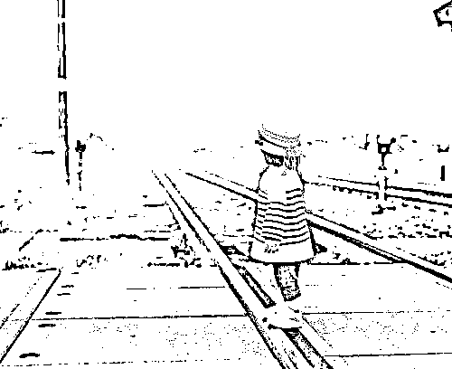

**◆ ◆ ◆ ◆ ◆**

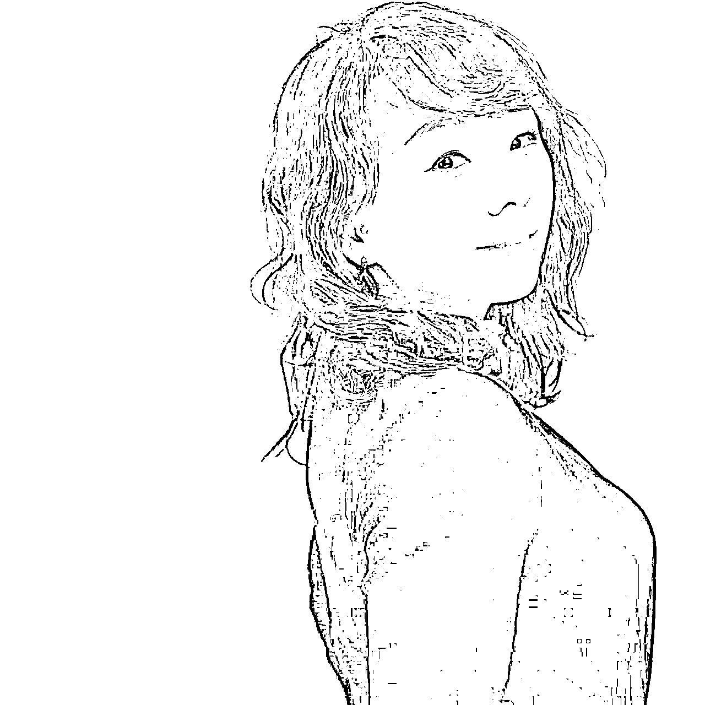

作者简介

**小缺**：太阳金牛座，月亮巨蟹座，上升狮子座。自小受海王星四分南北交点，及南交点双鱼座影响，梦幻资深缺心眼，永远长不大的 70 后老女孩儿。行进天王星入群星 9 宫时开始对占星产生浓厚兴趣，并进入若道师从大卫老师，开启占星求学之旅。对于我来说，通过占星的学习，自我疗愈与疗愈他人，是一件非常有成就感的事。伴随着行运海王进入双鱼座，希望能够通过在若道的专业学习，将这份成就感变为现实。

微信号：xiaoquechen001

长按二维码，让金钱涌向传播知识与智慧的人~

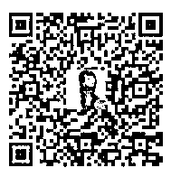 

**◆ ◆ ◆ ◆ ◆**

**2016 年 3 月 10 日**，大卫老师主讲的若道占星核心课程**Level 1-2**又要开课了！他将带领你学习星座、太阳、月亮、行星、月亮交点等知识，让你进入占星学的世界！提前报名付款有**早鸟价**哦！详细内容请点击“**阅读原文**”了解。


# 宇宙天气 | 山雨欲来风满楼，这个跨年不平静（2015.12.28~2016.1.3）

> 原文：[`mp.weixin.qq.com/s?__biz=MzA5NjA0NTAxNg==&mid=401827948&idx=2&sn=0eec863d6e9db1d9b8677c4571b27142&chksm=02b1dadb35c653cdba6c7c3f35231a8e58356765ca369e2b84b89139f1f799f4a8eabed01d39&scene=126&sessionid=1692738892#rd`](http://mp.weixin.qq.com/s?__biz=MzA5NjA0NTAxNg==&mid=401827948&idx=2&sn=0eec863d6e9db1d9b8677c4571b27142&chksm=02b1dadb35c653cdba6c7c3f35231a8e58356765ca369e2b84b89139f1f799f4a8eabed01d39&scene=126&sessionid=1692738892#rd)

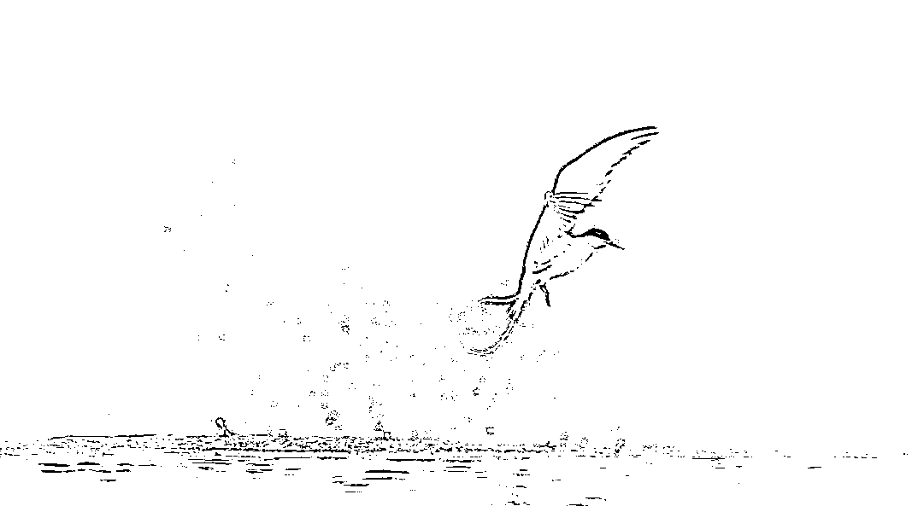

**一周星象综述**

本周月亮经过狮子座、处女座、天秤座。本周星象的首要特征是，换座行星较多，有三颗内行星都变了星座：**金星由天蝎座进入射手座，水星由摩羯座进入水瓶座，火星由天秤座进入天蝎座**。密集的行星换座，带来急剧的“星象气候”的变化，暗示我们**需要对外在和内在的动荡起伏投入更多觉察，灵活、迅速地调整自己适应新的变化**。

因为行星的换座，也就是基本的宇宙能量的变化，人的变化如果能跟宇宙能量的变化相适应，才有可能活出最佳的状态。上周末天王星刚刚恢复顺行，它为我们的心智缓慢注入的“变革意识”，此刻仍潜移默化地撼动着我们身上那些老旧、重复、失去了创造力的部分。所以，当我们体会这些行星星座变化带来的影响时，不妨加入一些天王星的角度，去启发自己朝着更富创意也更加自由的方向发展。

另一方面，**水星将在 1 月 5 号正式开始逆行**，眼下这一周，由于水星越来越接近开始逆行的位置（也就是接近停滞），所以水星逆行的影响已经开始显现。这一周我们必须为即将到来的水星逆行做充足的准备，**做好数据备份工作，整理记录，订好出门的机票车票，安排行程事务**，等等。这一周，是做这些工作的最佳时机，也是最后的机会。因为 1 月 4 号至 7 号这几天，也就是水星开始逆行时的停滞期，将是水逆影响最突出的时段，目前这一周做好准备，可以最大程度地避免损失和麻烦。

值得注意的是，由于水星在逆行前的速度变化，导致在这周二（12 月 29 号）和下周二（1 月 5 号）各有一次精准的水星与火星的四分相，分别发生在不同的星座，前者发生在摩羯座和天秤座，后者发生在水瓶座和天蝎座。其中第二次水火四分相与水星正式逆行发生在同一天。**在水逆开始前的一周内连续出现两次水火四分相，加重了本次水星逆行的冲突和混乱意味**。而第一次水火四分相出现时（本周二）发生的事件或想法的变动，也可为后一次水火四分相带来启示，同时也会是水逆期间我们将面对的问题的“预警”。

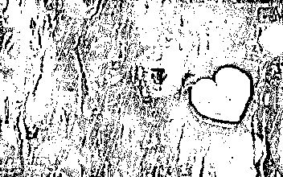

12 月 28 日星期一

**星象综述**

今天没有特别的星象事件，月亮依然在明朗阳光的狮子座，并在下午两点多准确三分射手座的土星。这是难得的平静的一天（好像天气还特别好），也是适合去为一些事树立信心的时候。

**当日星象**

**14:19** 狮子座月亮三分射手座土星

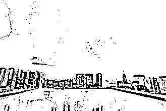

12 月 29 日星期二

**星象综述**

今天晚间，摩羯座的水星会准确四分天秤座的火星，这是这一天里最值得注意的星象事件。相位准确形成虽然是在晚间，但它的影响将贯穿整个白天，甚至延续到星期三。我们在今天会比较容易感觉到**自己与他人的想法冲突、观点碰撞，也很有可能言语失和或爆发口角争执**。我们可能会太过急切地试图谁服他人接受我们的想法，或因别人持不同意见而感到愤怒。但如果向内看，这会是一个很好的时机，去检查我们自己的行为是否真实地反映了我们的心中所想，也就是知行合一。

此外，同样发生在晚间的太阳与海王星的六分相，以及月亮与火星的六分相，则带来了稳定的支持力量，让水火四分相的破坏力得到“缓冲”。这两个六分相会让我们**更加从容地面对意见不同或想法无法实施带来的愤怒或挫败感，有助于我们跟他人以及跟自己和解**。同时，这两个相位也带来了积极的力量，让我们在面对冲突时，能够主动地面对问题，寻找有效的解决方案。

**当日星象**

**21:19** 摩羯座太阳六分海王星

**21:34** 狮子座月亮六分天秤座火星

**22:54** 摩羯座水星四分天秤座火星

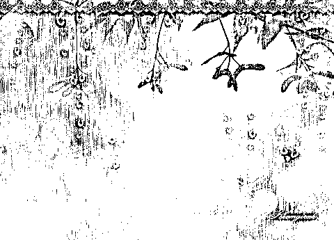

12 月 30 日星期三

**星象综述**

今天月亮进入处女座，并会在傍晚时对分海王星，在午夜前后四分土星。我们的**情绪容易变得敏感，可能为一些小事心神不定，临近午夜时则易有抑郁或自怨自怜的情绪**。

下午金星离开天蝎座进入射手座，并将在射手座待到 1 月下旬，未来近一个月的时间里，我们的审美风格、爱情观和价值取向，会带有更多自由洒脱的成分。对钱的态度也可能变得大条，比如大手笔购置年货或给朋友买礼物。但考虑到水逆临近，**此时并不宜在投资上有大动作**。

**当日星象**

**02:57** 月亮离开狮子座进入处女座

**15:18** 金星离开天蝎座进入射手座

**17:41** 处女座月亮对分海王星

**24:34** 处女座月亮四分射手座土星

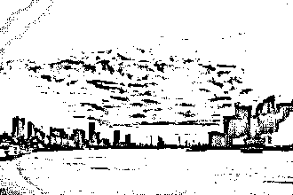

12 月 31 日星期四

**星象综述**

月亮依然在处女座，并在早晨三分冥王星，在晚上的午夜之后合相木星。这是工作高效、能够集中精力处理问题的一天。结合“一周星象综述”里说的，如果要在这一周为水逆做必要的也是最后的准备工作的话，那么**建议将整理资料、备份数据等的工作都安排在这一天，至****少在这一天要完成重头的工作**。因为此时是工作效能最高、也是最不易出错的时候。

正好是 2015 年的最后一天，一个名副其实的**适合“做了断”**的日子。

**当日星象**

**08:33** 处女座月亮三分冥王星

**24:51** 处女座月亮合相木星


2016 年 1 月 1 日星期五

**星象综述**

今天下午处女座月亮三分水星；紧接着月亮进入天秤座，并在晚间六分金星。总的说来这是**情绪愉悦，有助于沟通交流和社交、娱乐的一天**。如果有谈判、开会、面试、咨询、学习、听课一类的事务（需要动脑或交流的），安排在这一天是比较合适的。晚间则有利于**社交、娱乐以及谈情说爱**。

**当日星象**

**13:35** 处女座月亮三分摩羯座水星

**14:40** 月亮离开处女座进入天秤座

**20:07** 天秤座月亮六分射手座金星

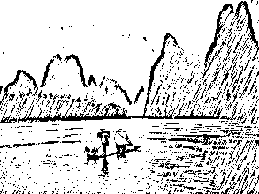

1 月 2 日星期六

**星象综述**

月亮依然在天秤座，并会在晚间四分冥王星、对分天王星。这类相位并没有它看上去的那么吓人，因为天冥刑这么多年，这种情况大家应该经历得够多，早已见怪不怪了。需要提醒的还是最基本的，借助这两个挑战相位，去觉察自我和他人的关系中，哪些地方是“失衡”的。

上午水星进入水瓶座，但因为水星马上要逆行的缘故，它只会在水瓶座待一个礼拜的时间，就要回到摩羯座继续处理“水星在摩羯座的问题”。所以，此时我们可能有一些新的想法和计划出现，它们在理念上是正确的，符合某种更为远大的或人类群体性的理想，但实际层面是不是有可操作性呢，是不是真的能够做出结果，或者，这些理想化的主意会不会威胁到我们自身的存在安全呢，这些是我们此刻需要注意去觉察的。

**当日星象**

**10:21** 水星离开摩羯座进入水瓶座

**21:24** 天秤座月亮四分冥王星

**24:25** 天秤座月亮对分天王星

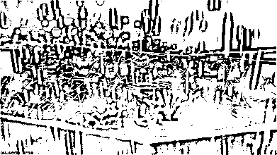

1 月 3 日

星期日

**星象综述**

月亮依然在天秤座。这一天值得关注的星象事件只有一个，就是晚间的火星进入天蝎座。火星移动较慢，它会在天蝎座一直待到 3 月上旬。这个变化出现在这里，是一个极为重要的暗示，提醒我们**必须打起精神来应对可能出现的“危机情况”**。未来两个月的时间，我们需要控制好自己的精力和能量，去好好“打仗”。每个人的战场不同，但都有需要对抗的敌人或内心的魔鬼，后者或许是火星在天蝎座时，我们更需要去挑战的方向。

**当日星象**

**22:34** 火星离开天秤座进入天蝎座


## **作者简介** 

**占星师 Cora**，全美占星师联盟（AFAN）成员，国际占星研究协会（ISAR）会员，获 ISAR 职业占星师资质认证，斯蒂芬·弗里斯特《变幻的天空》译者，个人星象文章见诸《心探索》《北京青年周刊》《上海电视》《空中生活》等杂志媒体。曾跟随大卫·瑞雷系统学习占星学，现为全职占星师。  

微信公众号：聆宇 FM（微信号：lingyudiantai）

个人微信号：CoraAstro

长按二维码，让金钱涌向传播知识与智慧的人~

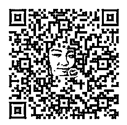

* * *

**特别提醒：**希望将若道文章转载到各自公众号的朋友，**转载时请注明“转自若道微信公众平台”，并附上若道占星的 Logo**。谢谢！

**2016 年 3 月 10 日**，大卫老师主讲的若道占星核心课程**Level 1-2**又要开课了！他将带领你学习星座、太阳、月亮、行星、月亮交点等知识，让你进入占星学的世界！提前报名付款有**早鸟价**哦！详细内容请点击“**阅读原文**”了解。


# 摩羯座爱情 | 爱要怎么说出口，我的心里好难受

> 原文：[`mp.weixin.qq.com/s?__biz=MzA5NjA0NTAxNg==&mid=401732930&idx=1&sn=01e29e46f4145b4434a5c07df8bcd9e3&chksm=02b347f535c4cee34d905212737f7ec8db46b0324639a26b6660896aff2087a12af2439be553&scene=126&sessionid=1692738892#rd`](http://mp.weixin.qq.com/s?__biz=MzA5NjA0NTAxNg==&mid=401732930&idx=1&sn=01e29e46f4145b4434a5c07df8bcd9e3&chksm=02b347f535c4cee34d905212737f7ec8db46b0324639a26b6660896aff2087a12af2439be553&scene=126&sessionid=1692738892#rd)

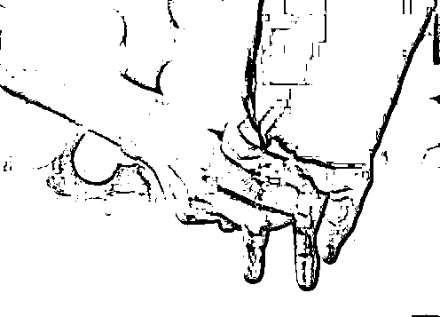

作者/斯蒂芬·弗里斯特、朱迪·弗里斯特

译者/李含

**即便坚硬的摩羯座也是会谈感情的，只是路数不太一样。**（这里的摩羯座特指太阳、月亮、上升摩羯座，个人星图中有其他被强调的摩羯座能量也可参考）。

**摩羯座原型**

在了解摩羯座感情的阴影和需要做出的调整前，让我们来了解一下摩羯座的原型：**隐士、独居修道士、父亲、首相、权威、战略家、长者**。想象一下，把这些角色放进感情里，会是什么样子？

**摩羯座阴影**

为了不断地追求目标，摩羯座人必须管理控制自己的情绪。**恐怖的是，他们可能完全压抑自己的情感。**这种极端的压抑可能导致摩羯座人最终走向崩溃。**甚至当生命的火花闪现，他们依旧固执地坚持自己之前的方向。**这是福是祸呢？ 

还有个问题是，**并不仅仅只有摩羯座自己忽略了自身的感受，更有可能是，其他所有人也会忽略了摩羯座人的感受。**到头来摩羯座人可能发现自己被锁定在权威角色的固有形象里，完美无缺。同时，摩羯座人也自愿接受了这种禁锢。

往这个方向探索下去，我们发现**摩羯座人对于他人的控制欲也在膨胀。这种控制欲的根源可能是恐惧。**摩羯座人对自身的本能需求、内心的冲动和自我的领土有着不正常的恐惧。

**摩羯座进化目标**

任何被摩羯座能量影响的行星，都会踏上一段进化的旅程，不断地努力去追求卓越。就像爱尔兰诗人叶芝（William Butler Yeats）的诗句“崎岖艰险的山，让攀登者痴迷。”

为了成长，摩羯座人要付出艰辛的努力，但某些努力的方式让摩羯座人限制了自身的潜能。众所周知，要保持心理的健康，我们必须关注自身的感受。所以**摩羯座人的发展目标是：不要忽略感受，要关注和发展情感的平衡。**

**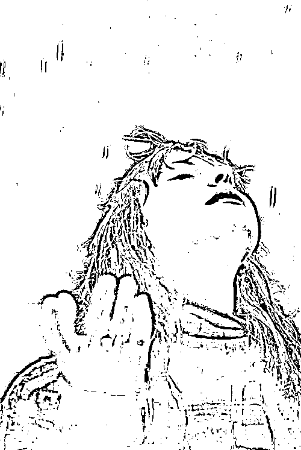**

**摩羯座爱情**1**太阳摩羯座：学会表达**

许下承诺对太阳摩羯座来说并不是难事，承诺就是他们突出的个性，但是这份亲密关系所承诺的内容却让人沮丧。**要经营好爱情关系，并从中获得满足感，摩羯座人要学会练习表达自己的需求。**否则，太阳摩羯座的人可能陷入“责任”的泥潭，加上身边的人会对其责任感习以为常，太阳摩羯座人在爱情中会忍受种种约束，却毫无益处。

**○** 比较明显的是，摩羯座太阳的人通常欣赏可靠、理性的伴侣：可信赖、自给自足、冷静的头脑。

**○** 不太明显的是，太阳摩羯的人需要一位与之不同的伴侣：能够轻松地表达自己的感情，富于生命火花的人。

从阴影方面来看，摩羯座人如果在冰冷的道路上渐行渐远，完全地自给自足，**“成熟”地压抑自我的需要和冲动，之后我们会看到一片混乱：让摩羯座人神魂颠倒的人恰好具有他们所缺失的特征。这意味着，在感情关系中呈现了一种“亲子”关系的互动方式。**摩羯座人为了信守承诺而永远的忍受这个错误。

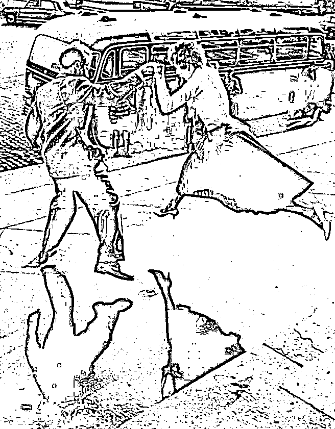

2**月亮摩羯座：面对恐惧**

在家庭生活中，月亮摩羯的人的要求是：井井有条、有效率、有责任感，即便他们公务繁忙，职责众多，根本无暇顾及家务。

**○** 一方面，月亮摩羯座人会呈现一种心境上的孤独隐居状态。这和孤独寂寞的情怀不同，他们只是比普通人更需要独处的时光。月亮摩羯的人在情绪上更倾向于让他人沮丧的巨大而荒芜的空间：独居、写小说、获得博士学位。他们的潜意识里，每个人最终都是孤独的。

因此，**月亮摩羯座的人需要学习与人结合的技巧，分享的技巧**，这样才能将爱延续。否则，伴侣很快就会觉得自己被疏远了，被隔绝在外。

**○** 另一方面，月亮摩羯的男人女人需要一个伴侣，但可能因为“最终会被抛弃的宿命感”而恐惧。从摩羯座的星座特质上看，它与现实主义的生存有关。对于月亮摩羯的人来说，这就变成了条件反射式的本能，小心谨慎到了一个夸张的地步，还有恐惧也是如此。

**如果到了这个阶段，月亮摩羯的人将被阴影吞噬，呈现出一种强迫性的控制欲，想要控制所有的事情：生命的课题、财富、社交、家庭和伴侣。**

**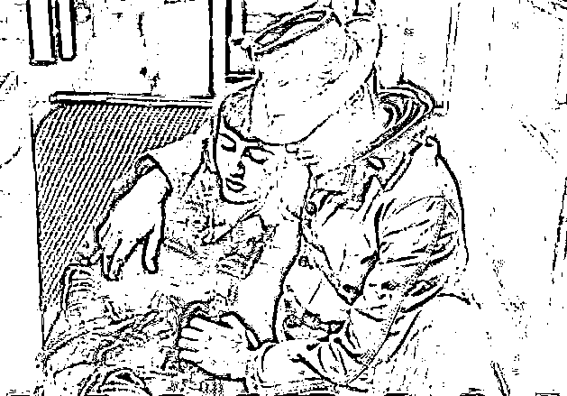**

3**上升摩羯座：经历变革**

上升摩羯座的人表现出了一种世故圆融的姿态，能干谨慎，能够凭借直觉理解社会的游戏规则。他们或许看起来有都市气息，甚至是着装打扮颇为昂贵。但有少部分上升摩羯座的人，他们看起来像扑克赌桌上的玩家，冷冷的目光紧盯着桌上的每一个人。

**为了让爱延续，上升摩羯座的人迟早要触及更深层的本质，经历一番彻底的改变。**对于其中一些人来说，他们的变革来得很快，甚至并不费什么力气，只要顺势而为。对于其中另一些人来说，这个变革也许永远不会发展。上升摩羯的面具背后是什么呢？这需要看星图中的其他因素。

**★ 你或你的伴侣是摩羯座人吗？来留言聊聊你们的感情吧。**

**其他摩羯座的文章请戳：**

[摩羯座 | 扛过严冬，时间自会奖赏](http://mp.weixin.qq.com/s?__biz=MzA5NjA0NTAxNg==&mid=401613091&idx=1&sn=cd13cf4f4032c163315e8db4413f1f22&scene=21#wechat_redirect)

[摩羯座=冬至→大寒，节气与星座对上啦！](http://mp.weixin.qq.com/s?__biz=MzA5NjA0NTAxNg==&mid=401595158&idx=2&sn=d7bc681cf849545d82fcf9a71299da90&scene=21#wechat_redirect)

**◆ ◆ ◆ ◆ ◆**

****特别提醒：**希望将若道文章转载到各自公众号的朋友，**转载时请注明“转自若道微信公众平台”，并附上若道占星的 Logo**。谢谢！**

**2016 年 3 月 10 日**，大卫老师主讲的若道占星核心课程**Level 1-2**又要开课了！他将带领你学习星座、太阳、月亮、行星、月亮交点等知识，让你进入占星学的世界！**1 月 25 日**前报名付款有**早鸟价**哦！详细内容请点击“**阅读原文**”了解。


# 巨蟹座满月 | 用温暖的拥抱驱逐寒冷

> 原文：[`mp.weixin.qq.com/s?__biz=MzA5NjA0NTAxNg==&mid=401732930&idx=2&sn=e4e265be6d8e467ca3dda5050dc99243&chksm=02b347f535c4cee3888509188528fe0a93cc322977d2c6037325bce11ef4ff017edd7c08e981&scene=126&sessionid=1692738892#rd`](http://mp.weixin.qq.com/s?__biz=MzA5NjA0NTAxNg==&mid=401732930&idx=2&sn=e4e265be6d8e467ca3dda5050dc99243&chksm=02b347f535c4cee3888509188528fe0a93cc322977d2c6037325bce11ef4ff017edd7c08e981&scene=126&sessionid=1692738892#rd)

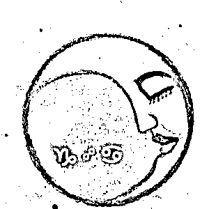

作者/Amor

12 月 25 日 19：12，巨蟹座满月发生，重点受影响人群是出生星图里有行星在白羊座、巨蟹座、天秤座、摩羯座前几度的朋友。

在北半球，当太阳来到摩羯座时，是一年中最冷的冬季，而圣诞节发生的巨蟹座满月，却可以提醒人们，营造一个属于自己温暖、安全的窝。温暖的来源可以是爱人的怀抱，也可以是充沛的内心世界。

内心情感充沛，不管外面环境有多恶劣，都可以坚强去应对。太阳在摩羯座区域运行时，带着最寒冷的考验时也带着战胜困难的决心，巨蟹座的月亮，则是提供我们安全港湾，补给、休息的地方。这两者，在此时都是必须品。

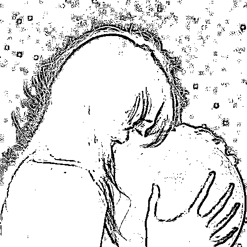

**占星学里，满月通常代表着太阳和月亮在两个相反星座能量的冲突，在不同需求的冲突面寻求一个平衡、协商和解决的方法，也是这两种能量碰撞后互相去学习对方积极的一面，来让自己获得成长。**

**○** 巨蟹座的力量是柔软的、细腻的、包容的，安全感有保障时会自然流露情感，暴露出脆弱敏感的那部分自己，传统中通常会用婴儿、母亲、温柔的女人形象来代表。

**○** 摩羯座的力量是坚硬的、严厉的、稳健的，传统中通常会用老者、家长、权威人物来代表。**在满月的时候，这两种力量会通过矛盾看到对方的存在，有机会发展更多的包容心和理解。**

月亮是巨蟹座的守护行星，又加上满月的效应，**等于是三倍的巨蟹座能量**，被凝聚在一起，具有破坏性的一面是，圣诞前后几天可能情绪会集中大爆发，容易因当下某一方面短期的需求没有被满足，而影响长远的目标成就和发展。

**请注意**

**○** 所以，**要尽量避免在不理智情况下向比自己更强硬和更具实力的对象发起挑战**，受伤的只会是自己。

**○** 也可以提前准备好无法控制情绪的后备应急措施，尤其需要留意的人群是出生星图里有行星在**白羊座、巨蟹座、天秤座、摩羯座**前面几度的人。

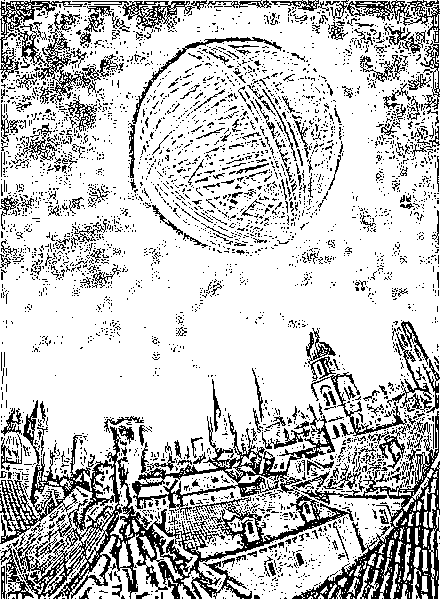

满月也是在新月时开启的事务达到一个高峰和完成的时刻，此时也**可以回顾一下你在新月时种下了什么样的种子，从新月走向满月过程中进行了什么样的灌溉**。上一次的射手座新月可以查询下列文章：

[射手座新月 | 追寻属于自己的个人真理](http://mp.weixin.qq.com/s?__biz=MzA5NjA0NTAxNg==&mid=401381666&idx=1&sn=b28e5fa06a0ea1d0581fae2cd72715ce&scene=21#wechat_redirect)

[射手座新月 | 去冒险，为你相信的事](http://mp.weixin.qq.com/s?__biz=MzA5NjA0NTAxNg==&mid=401398978&idx=1&sn=bf63a17c2f079707da6346efcfd79b74&scene=21#wechat_redirect)

**巨蟹座满月的其他文章：**

[满月撞圣诞 | 震荡情绪出现？四招教你化解它！](http://mp.weixin.qq.com/s?__biz=MzA5NjA0NTAxNg==&mid=401696454&idx=1&sn=290b4cbaa3393e559010235f90844ad1&scene=21#wechat_redirect)

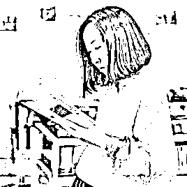

**作者简介**

**Amor，**独立职业占星师，持 ISAR 国际职业占星师资质认证，ISAR 中国活动委员，擅长生时校正，侧重研习占星与家族业力、亲子关系、职业发展、感情关系等。曾跟随西方多位国际优秀的占星老师学习，温暖、疗愈的风格建立在严谨、古老的占星学基础之上，在新时代帮助个人探索成长的路径，挖掘个人的潜能。目前居住杭州，长期与占星爱好者进行沙龙分享活动，活跃在占星一对一咨询和占星教学前沿。

**咨询邮件**：rouruan@163.com

**微信平台**：Amorastro

**◆ ◆ ◆ ◆ ◆**

****特别提醒：**希望将若道文章转载到各自公众号的朋友，**转载时请注明“转自若道微信公众平台”，并附上若道占星的 Logo**。谢谢！**

**2016 年 3 月 10 日**，大卫老师主讲的若道占星核心课程**Level 1-2**又要开课了！他将带领你学习星座、太阳、月亮、行星、月亮交点等知识，让你进入占星学的世界！**1 月 25 日**前报名付款有**早鸟价**哦！详细内容请点击“**阅读原文**”了解。


# 满月撞圣诞 | 震荡情绪出现？四招教你化解它！

> 原文：[`mp.weixin.qq.com/s?__biz=MzA5NjA0NTAxNg==&mid=401696454&idx=1&sn=290b4cbaa3393e559010235f90844ad1&chksm=02b3d47135c45d676bcdb3e421aa31fae153b3bd72ba32fab4016f874608c6d6f09606d8a591&scene=126&sessionid=1692738892#rd`](http://mp.weixin.qq.com/s?__biz=MzA5NjA0NTAxNg==&mid=401696454&idx=1&sn=290b4cbaa3393e559010235f90844ad1&chksm=02b3d47135c45d676bcdb3e421aa31fae153b3bd72ba32fab4016f874608c6d6f09606d8a591&scene=126&sessionid=1692738892#rd)

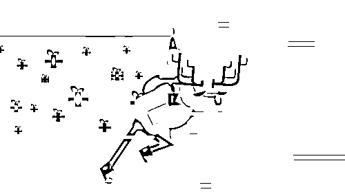

作者/Justine

图片/花瓣网

巨蟹座满月发生北京时间**12 月 25 日 19 点 12 分**。这个满月发生在**巨蟹座-摩羯座轴线**3 度 20 分，冬至（太阳入摩羯座）后两天，与圣诞节重合。上一个圣诞节满月发生在 1977 年，下一次将在 2034 年。对于不少人而言，这是有生以来度过的第一个发生在圣诞节的满月。

**满月发生在巨蟹座的表现**

在中国，圣诞节更多与朋友聚会、社交派对、出国游玩、狂欢购物相关；在西方，圣诞节则是一年里最重要的家庭聚会，一个温暖而慈爱的节日。

**这个圣诞节，巨蟹座满月的能量会让我们更多地想跟最亲密的家人在一起。**因为巨蟹座是月亮本身守护的星座，是母亲与疗愈者的原型。月亮跟我们的母亲、家庭和内在情绪、安全感相关。

**满月发生在巨蟹座时，你可能会：**

● 对安全感、归属感的需求加强

● 童年或过往的回忆会浮出水面

● 情绪也将更加敏感

满月发生时，月亮跟海王星三分相，水星跟木星精确三分相（且与天蝎座的金星分别呈六分相），有关支持爱与温情的沟通。对于你而言，家意味着什么？温暖、安全感、照顾、滋养、无条件的爱又是如何在日常生活中流动或表达的？**巨蟹座满月给每个人提供了绝佳的时机，去感知与探索直抵心底的情感问题。**

**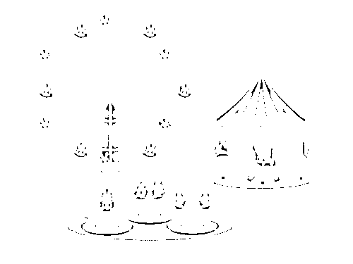**

**这次满月你要留意的两种情绪**

每一个满月，都是我们内心情绪的涨潮期。节日是一把双刃剑，让幸福的人越发快乐洋溢，让孤独的人越发寒冷压抑。对于孤单的人而言，圣诞节往往也是最无助的时刻。**巨蟹座满月，无疑会把圣诞节日前后的敏感、寂寞、压抑的情绪都放大。**

**1****强烈的情绪**

满月发生后两天，进行在白羊座 16 度的天王星，将结束整整五个月的向内审视的逆行期。天王星本身是带来变化的不稳定能量，停滞顺行的转折点会带来更多的情绪释放或波动。

**●** **有些人会有强烈的情绪反应，容易反思过去，感觉到对现状的强烈不满。**

**●** **积极的一面是，顺行的天王星会鼓励我们更有意识地面对自己最真实的情绪，然后勇敢地将改变付诸实践。**

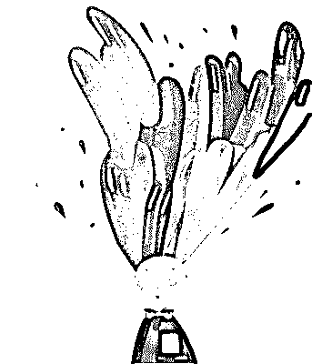

**2****压抑的情绪**

对于很多人而言，年底是非常忙碌的。也许你在赶着完成年度的指标，做年末的总结或明年的规划。**太阳行进在摩羯座的能量，会让人企图将内心的多愁善感用坚硬的外壳包裹起来。**有些人会一头栽在工作中，忽略自己的内心的敏感，用加班来麻痹自己。

但是，**压抑的情绪不会因此消失**——特别是天秤座火星四分天冥的挑战相位，因为水星行进在摩羯座及天王行的停滞顺行的触发，在这个满月下影响力依然激荡。

**●** **压抑的情绪可能以各种途径扭曲或过激表达，需要小心不明智的举动，或吸引外在的突发事件。**

**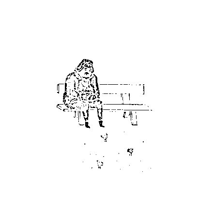**

**应对巨蟹座满月的 Tips**

如何更好地应对这个情绪满溢、能量激荡的圣诞满月？

**① 多与家人或所爱的人待在一起**，互相给予安全感的滋养。

**②** 如果你一个人，也许你会回忆过往，被跌宕起伏的情绪所牵引。当你踮起脚尖，**静静倾听自己的声音，勇敢面对内心的脆弱**，会滋生出新的勇气与希望。

**③** 在节日的繁忙与喧哗之中，随时回归自己的内心。**丰盛的美食能带来慰藉，音乐能帮助表达与疏解情感。有规律的锻炼、瑜伽、冥想，接近大自然，特别是海边或靠近水的地方**，都是在这个巨蟹满月保持平衡的好方式。

**④ 尽量避免外出加入狂欢人群**，因为激荡的情绪可能会吸引一些意外，狂欢过后内心会更加空虚与失落。

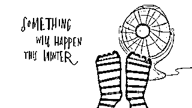

“唯爱与美食不可辜负”——美食能带来滋养，有治愈悲伤的力量，但**真正不可辜负的是每个人心底的爱与温柔**。这个满月，无论你是一个人，还是跟所爱的人一起，请记得：最易感脆弱（巨蟹座）的那一刻，亦是我们最真实与坚强（摩羯座）的时刻。

**◆ ◆ ◆ ◆ ◆**

**应对巨蟹座满月的其他建议：**

[摩羯巨蟹手牵手，事业家庭向前走~](http://mp.weixin.qq.com/s?__biz=MzA5NjA0NTAxNg==&mid=401642807&idx=1&sn=f56115da7d8d21bf59ac4dd628f08f59&scene=21#wechat_redirect)


**◆ ◆ ◆ ◆ ◆**

****特别提醒：**希望将若道文章转载到各自公众号的朋友，**转载时请注明“转自若道微信公众平台”，并附上若道占星的 Logo**。谢谢！**

**2016 年 3 月 10 日**，大卫老师主讲的若道占星核心课程**Level 1-2**又要开课了！他将带领你学习星座、太阳、月亮、行星、月亮交点等知识，让你进入占星学的世界！**1 月 25 日**前报名付款有**早鸟价**哦！详细内容请点击“**阅读原文**”了解。


# 亲历 | 我看到宇宙万物

> 原文：[`mp.weixin.qq.com/s?__biz=MzA5NjA0NTAxNg==&mid=401696454&idx=2&sn=3b0ef8113cba3ff7dcb021c017de95fb&chksm=02b3d47135c45d67732c2d55d26fecace7c30676470c96df375170c9c852ace1c5f8b515847d&scene=126&sessionid=1692750562#rd`](http://mp.weixin.qq.com/s?__biz=MzA5NjA0NTAxNg==&mid=401696454&idx=2&sn=3b0ef8113cba3ff7dcb021c017de95fb&chksm=02b3d47135c45d67732c2d55d26fecace7c30676470c96df375170c9c852ace1c5f8b515847d&scene=126&sessionid=1692750562#rd)

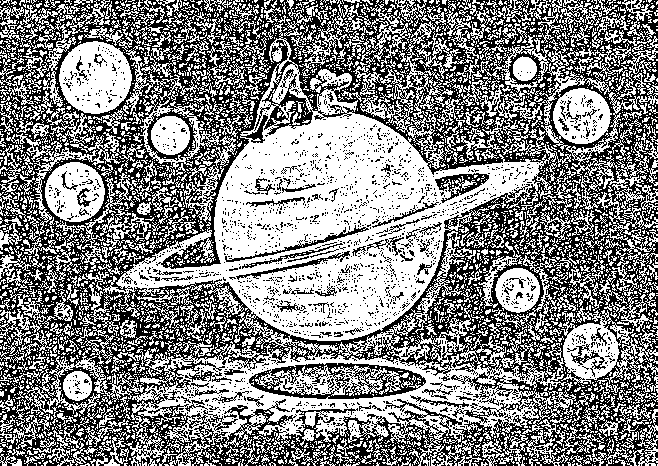

文章来源/瑞珈瑜伽

大多数的人只相信自己眼睛所看到的，不是吗？所以，就有了好奇的探索者，他们一定要透过自己的双眼去见证。面对“全息呼吸法”这个新鲜的疗愈方式时也是如此。以下文字，出自参加过全息呼吸工作坊的学员 K，她为大家详细描述了自己体验全息呼吸时身体的反应和内在的感受。

1

2015 年 6 月 20 日上午，格罗夫全系呼吸工作坊第二场呼吸环节。

 置身于会场中，犹如置身于一个强大的能量场中，不止感觉到，似乎还“看”到它在我身体中的流动。它不是涓涓细流，像极了火山熔岩，连颜色也像极了，桔桔的红，那么厚重粘稠充满质感地从脚底心缓慢地向上流动着。先是小腿被灌满，然后膝盖，再然后整个大腿！经过大腿后，它变成了燃烧的火，它开始向上燃烧升腾！

 入耳的鼓点声像是引爆点，瞬间整个人被拉近那强劲的鼓声，身体完全跟随那如雨点般快速的鼓点声强烈抖动。

 那不是我！我是做不到的！**是那个在我的身体里舞动的能量！**

前一天工作坊的经历让我允许并深信，我可以全然信任并跟随这感受，**我的身体被那股能量替代了，它开始在我身体里自由地流动起来。**

一股更为强劲的能量，从脚底瞬间蹿到头顶，我清晰地知道它发生了！

身体在这股能量中翻腾扭动，内在却是极度狂喜，这个狂喜迫使我要将身体最深处的声音释放出来，那个声音来自宇宙的深处，而它竟然在我的身体里！

能量一遍遍强烈地上下流经穿行，当它在我头部时，我整个头部快速地反复敲击地面，那是身体中一股股能量持续不断推送上来的。

 我仿佛看见身体里有一条粗壮的蟒蛇在来回穿行，哦！也许是舞动，狂热不可抑制的舞动！

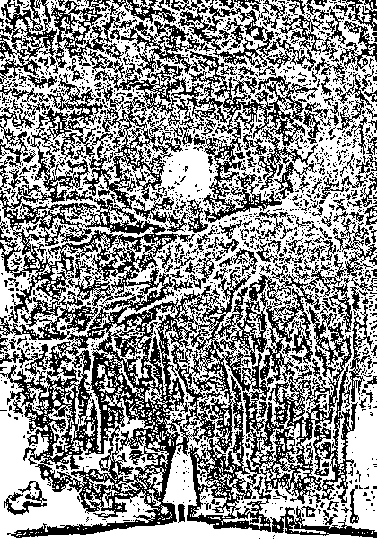

2

那个疯癫状态，我害怕吗？不不不！一点都没有害怕！我能感觉有人围绕着我，同时有一种强烈的熟悉感，看见的画面像是来自很久远的印第安部落族群，我像是被拣选出来要接受某些严峻的考验，被族群里的前辈们这样包围着，这情景叫我恍惚，分不清自己是在这里还是在那时。

 时机怎么会那么凑巧？那一刻，入耳的音声像极了部落里首领的男声哼唱，瞬间我无法抑制地哭泣。在哭泣中，我看着那个印第安族群父亲首领形象慢慢远离消失，一种强烈的被遗弃感瞬间流淌在体内，我听见内在悲伤地呢喃：" Don't leave me！"

哦！为什么把我丢下？我好想伸手去抓住你，拥抱你，你可以带我回去吗？不再扔下我好吗？

 我只是像个孩子一样无助悲伤地哭泣……

**在这个被支持的场域，我的需要得到了回应。一个宽厚温暖安全的怀抱，让我感觉到这个情感得到了回应、理解与支持。我在那个拥抱里伤心地哭泣，同时慢慢体会到一种越来越强烈的安全感与接纳，内在开始松弛柔软**，直到慢慢地安静下来……

不知道安静了多久，在内在完全空寂的状态中，我看到一股新生的力量，它是粉色的！那么新鲜那么清晰，却蕴藏着强大的力量！

当我完全安静平躺下来时，我能感觉整个空间的能量都在持续温和地充盈进我的身体，一股股的温热的能量……

哦！**原来那些曾经听闻却终难以相信理解的描述，它们在我这个身体里真实发生了！**我看见了蕴藏在这个身体中无限的宇宙能量，那个强大的能量无处不在地弥漫着。

  原来宇宙就在我之中，原来我与宇宙如此之近，原来我的存在不止于我以为的这个身体。

  原来，我是这样的！

  我可以给予我拥有的全部，因为我不曾拥有什么，一切都是来自宇宙的流动，在这个流动中，我没有任何的缺失……

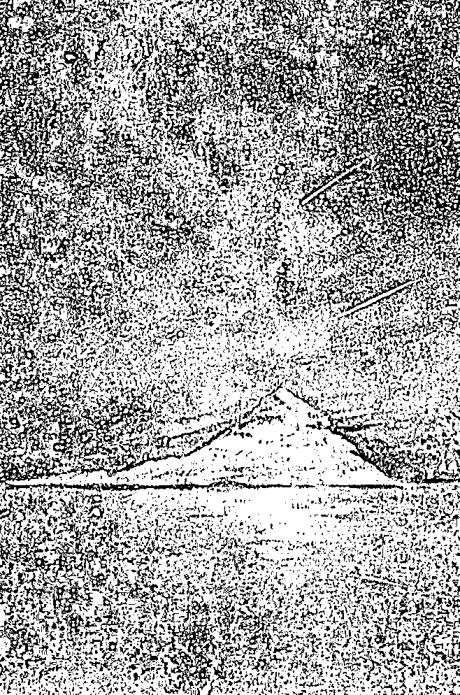

3

最后一次呼吸环节中，我看见自己快速被能量带动着呼吸，就像进入类似密闭的太空舱，穿越幽长的一条隧道，一瞬之间就脱离了这个空间。

意识慢慢恢复时，似乎我所在的空间已不是身体停留的那方空间，那是一个更为广阔空寂的空间。

悠游翱翔于星际、苍穹、山川、河流之间，体会到从未有过的自由以及极深的宁静。

**那个刹那，我深深体会到原来孤独从来不在，生命一直在宇宙之中，从未分离过。这个刹那间的体会让我品尝到，原来根本没有孤独，我隐藏于心的孤独感被完全释放。**不过是独自而已，而独自是如此的美妙。

那个自由翱翔的我听到了来自人类的哭声，也看到人类苦难的进程，但我却平静依然，因为我已知所有这些发生都不是苦难降临，恰是人类意识进化的旅程。

战争、侵略、灾难……所有的发生都只是帮助人类看到并懂得永恒的生命真相。

在这世事沧桑星移斗转之中，灵魂不死不灭。

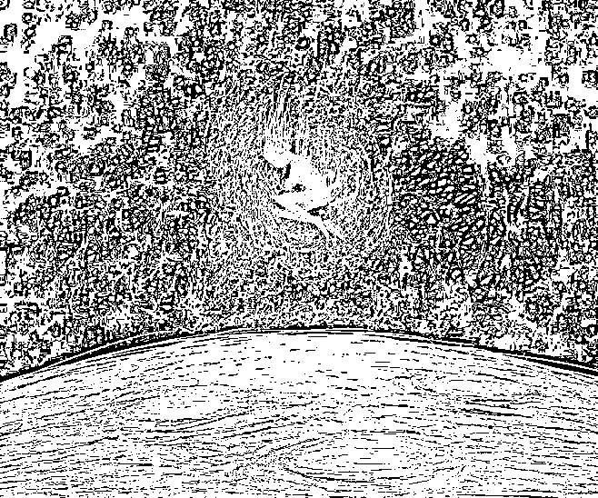

几天却像是几个世纪  所有内外的发生与见行  照见了许多美灵魂

更看清了自己  借这浓缩的时光  知晓了来时的路途

也清楚了要继续的旅程  原来从未孤单过  一直就在宇宙的怀抱中

自由穿行  超越生超越死  超越时空  超越物质  超越灵魂

**◆ ◆ ◆ ◆ ◆**

**了解更多全息呼吸法：**

[再说一遍，伤口不会自动愈合](http://mp.weixin.qq.com/s?__biz=MzA5NjA0NTAxNg==&mid=401475365&idx=1&sn=f2f7e94b0e12bd8d8965fde0895507f5&scene=21#wechat_redirect)

[你不是忙着活，就是忙着死！](http://mp.weixin.qq.com/s?__biz=MzA5NjA0NTAxNg==&mid=401330772&idx=1&sn=5fe53d4b953c868fe4fe7cc88a72ff9e&scene=21#wechat_redirect)

**◆ ◆ ◆ ◆ ◆**

****特别提醒：**希望将若道文章转载到各自公众号的朋友，**转载时请注明“转自若道微信公众平台”，并附上若道占星的 Logo**。谢谢！**

**2016 年 1 月 5 日-1 月 8 日**，格罗夫及其团队将在**北京**举办**三天全息呼吸工作坊**；**2016 年 1 月 11 日-1 月 17 日**，格罗夫和占星大师塔纳斯将在**北京**举办**七天全息呼吸与原型占星工作坊**。详细内容请点击“**阅读原文**”了解。


# 推荐 | 戏剧治疗工作坊：别让家族伤了你（若道学员有优惠）

> 原文：[`mp.weixin.qq.com/s?__biz=MzA5NjA0NTAxNg==&mid=401696454&idx=3&sn=6e192effaf047aa905b6ed1fb469f40c&chksm=02b3d47135c45d67c359832290dee62aa1ba5786dec3df78fa0190d8148e12efcf52b4400135&scene=126&sessionid=1692738892#rd`](http://mp.weixin.qq.com/s?__biz=MzA5NjA0NTAxNg==&mid=401696454&idx=3&sn=6e192effaf047aa905b6ed1fb469f40c&chksm=02b3d47135c45d67c359832290dee62aa1ba5786dec3df78fa0190d8148e12efcf52b4400135&scene=126&sessionid=1692738892#rd)

**如果有一天**

**你我存在有如黑暗中燃点的烛光**

**幸福的光在斗室内恣意扩散**

**温暖的身影摇曳**

**我们就不再隐身躲藏**

你是否疑惑过，为何你的爸爸、妈妈要用这样的方式对待你？

你是否迷惘过，为何你的原生家庭中似乎有一种说不清道不明摸不着的暗流？

你是否悲伤过，为何你的伴侣深藏着这样古怪的性格？

你是否绝望过，为何你的人际交往总是无法顺畅？

你是否感慨过，为何你的职业发展总是因为离奇的原因停滞不前？

……

最终，你是否意识到，你或许已经被卷入**“家族创伤”**？

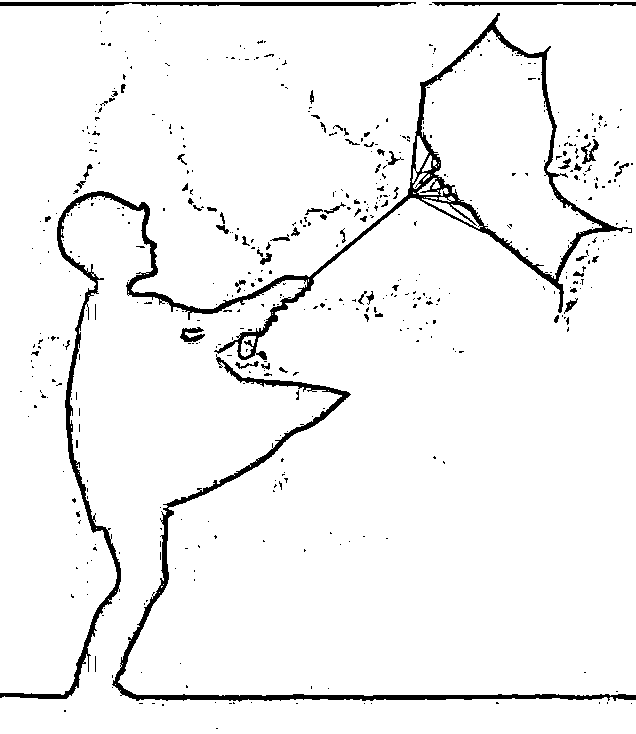

在豆瓣上，有一个名声在外、活跃多年的小组“父母皆祸害”。其实，每一对成为“祸害”的父母背后，往往都有着更为令人唏嘘的父母的父母。在中国，从建国前的连年战争，到三年自然灾害、文革，几乎没有人能幸免于历史的漩涡。拂去灰尘，每一个家族的故事下都掩藏着“**艰辛**”二字。

一位在文革中及文革后遭遇身心重创的老人，他的女儿抑郁、焦虑，她酗酒，身患疾病，亲密关系困难，她说：“我好像是用我的生命替我爸爸去呐喊。我在重复我爸爸的事情，然后也让自己在政治上没有前途。我在用我所有的这些东西去重复这样的一个事情，就是让他们看到，让所有人看到，这么有能力的人你们不用，你们是不对的。我，就是在做这样的一件事情。其实归根到底，我就是在替我爸爸去做这样的事情。”

她的儿子，一位原本可以远走高飞、出国留学的 90 后，选择了留在家人身边，他说：“我是之前几代前辈的集合体。”“我就觉得只要我在这，他们就没事”，他要做“好孙子”，在他看来，这个角色不能缺。

这是一个**真实的故事****。****这样的故事就发生在我们身边，发生在我们每个人身上。**

深夜里的辗转反侧承载的是谁的痛？是身边的爱恨情仇还是父辈们的愁？品尝到亲密关系之苦的你，或许已经发现，你的身上、你的伴侣的身上，那些看似不可理喻的因子，或明或暗地闪现着父母一辈乃至祖父母一辈的阴影。你是如此焦虑，唯恐这家族的咒语继续落在你的孩子的身上……

其实，你以为再熟悉不过的父亲、母亲，还有记忆中已经开始淡忘的祖父祖母……**他们都没有走，他们就在我们的血液里、灵魂里；在我们没有察觉的潜意识里……**

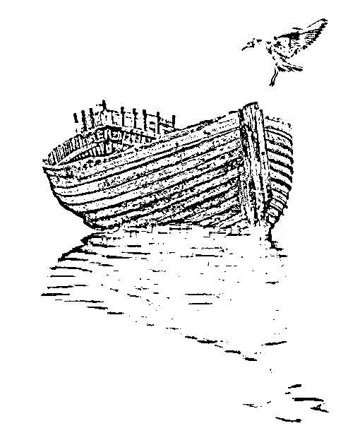

大量因为伤痕事件或灾难引发的情感伤痛，以及因为战争、自然灾害、仇恨屠杀等引发的**民族性创伤记忆**，会形成一种**民族及整体的潜意识**。在灾难的过程中，幸存者们通常只能关注在“活下来就好”，他们甚至都没有时间为自己的失去爱人与家乡而悲痛。而灾难结束后，他们又需要全心开始打拼新的生活，创伤又被迫隐藏到心灵的角落，因为一旦呈现又是如此疼痛而无法在日常的生活里承接，而由此带来的影响甚至会涉及到整个民族与社会……

**我们，都是“过去”的孩子。**

**我们，都是“家族”的孩子。**

我们走得再远、飞得再高，再成熟，再独立，依然无可选择，无处可逃；因为我们无法选择父母，无法选择家乡。只要血液还在流淌，只要祖先还在凝望，梦里寻来的那份愁、就无法阻挡。

戏里的“人生”看过千百场。**谁又在关注你的“剧本”？什么时候你才是主角？**

**我们无法选择过去，但，我们可以改变当下。**

**我们无法让生命重来，但，我们可以为下一代提供助益。**

**我们无法扭转他人，但，我们可以让自己清醒。**

**2016 年 1 月 8 日至 10 日**，**心之助情感平台、心灵自由文化传播与美国 Stage Ai**首度实现跨洋合作，联手推出重磅开年“大戏”，为你打开一个改变当下、促进未来的良机：

**“家族创伤疗愈”戏剧治疗体验工作坊**

缘何称之为“重磅”？我们将一一解读：

1 你会有怎样的收获与改变？

*   **疗愈家族创伤，获得心灵自由**

在温柔的呵护下，在安全的空间里，你将开始一场与祖辈的对话。这是属于你的“戏”，你是导演和观众，也是情节和主角，你可以尽情释放。通过创造性的戏剧实验，在艺术与真实的交错里，重新连接、整合自我成长与家族历史的记忆，觉察家族对于自己“人生剧本”的认知及对当下生命的影响，挖掘家族遗留的智慧遗产。在对当下的体验与潜意识的探索中，治“病”寻“根”，疗愈、转化，使历史不再成为你生活的阻碍，转而变为赋予你生命力量的源泉；帮助你宣告灵魂的独立存在，重新谱写属于自己的剧本，并在当下的生命中完成自我的真实实现，创造你自己希望选择的人生旅程。

**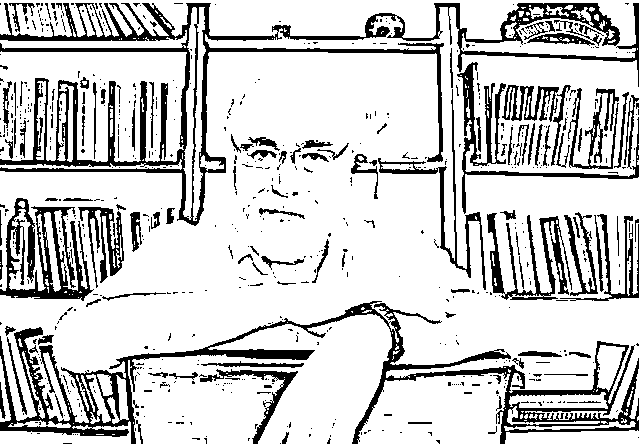** 工作坊将由戏剧治疗界的大师级人物、拥有超过三十年治疗经验的重量级导师阿曼德•沃卡斯(Armand Volkas)带领

*   **学习先锋心理治疗技术，提升专业水准**

戏剧治疗(Drama therapy)是一门综合了医学、心理学及戏剧与影视学等理论与方法的新兴学科，在国内仍处于萌芽阶段，你将有幸以极优的性价比成为国内最早亲临大师级戏剧治疗现场的幸运儿，个人感受+理论讲解，零距离直接接触国外最前沿的戏剧治疗成果，体会效用，掌握戏剧治疗的多项方法和技术，如果你是心理学领域人士，工作坊将为你打通职业道路提供强大助力。

*   **丰富线上线下活动，持续呵护心灵**

此次工作坊同时也是长期培训项目的引入和介绍，以工作坊为核心，将会举办多种活动，好似导师不曾远离这火热的课堂。课前活动将由专家级人物与你互动，为你热身；课后沙龙让你继续享有很好的整合与延续学习的指导；后续你将有资格优先及优惠参与更为持久的培训计划。

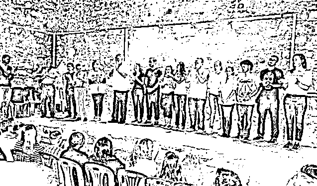
悲剧能透过激起哀怜与恐惧来达到情绪的净化作用。——亚里士多德

2 此次工作坊独一无二的优势是什么？

*   **先驱级导师阿曼德•沃卡斯(Armand Volkas)亲自带领**

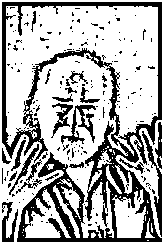阿曼德是集导演、犹太拉比、心理学家于一身，在当今的戏剧治疗和心理治疗领域都具有极大影响力的心理剧大师，上世纪 70 年代戏剧治疗实验运动的先驱之一，加州整合研究院和约翰•肯尼迪大学兼职教授，旧金山两个极具影响力的文化中心“生命艺术剧场”和“历史创伤疗愈机构”的创办者。阿曼德生于法国，父母均为二战纳粹大屠杀的幸存者，孩童时期随父母移民美国。父母的家族故事，尤其是二战期间在奥斯维辛集中营的遭遇，使他深思善与恶的本源，并对民族与民族之间，人与人之间, 以及家庭内部代际之间的和解之道有深刻理解，非常适合同样饱受战争创伤的国人心灵疗愈指导。

*   **丰厚经验和多重技巧倾囊而授**

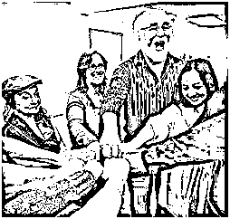在过去三十年里，阿曼德陆续在美国本土、欧洲、亚洲等地开展工作坊，走遍世界看尽人间伤痛，在你需要倒下时会将你稳稳扶持，无需害怕。工作坊集合了他几十年的教学、咨商经验，整合了包括戏剧治疗（drama therapy) 、故事剧场（ story-theatre techniques)、文本实验（text)、身体移动工坊（movement), 反馈剧场（Playback Theatre)、戏剧共振（dramatic resonances)以及社会剧场（sociodrama)等十几种技巧，使学员全方位体验戏剧的疗愈作用，并尝试将其运用到个案与自我的生活中。

*   **中西合璧+强大的本土支持**

原籍北京的工作组领队、专业华人治疗师组成的助教团，让你毫无压力地跨越语言障碍，他们将带着加利福利亚的温暖和中华文化的细腻敏感，伴你一起寻根，通过多种方式在身边为你答疑解惑，令每一位学员都得到真正的专业关注。

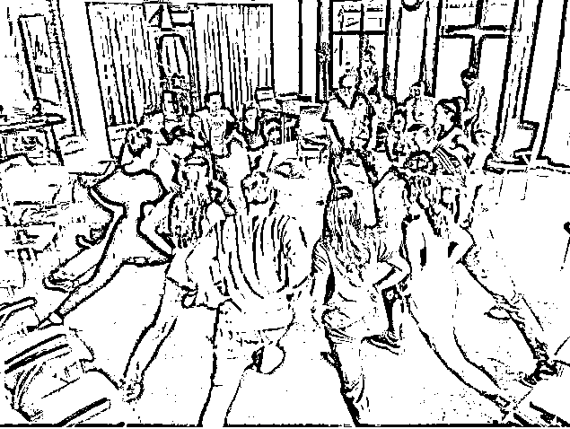 

工作坊将由心之助心理服务平台和心灵自由文化传播公司承办。作为一家位于北京、辐射全国的迅速发展中的专业心理平台，心之助将致力于将国外先进理念与国内本土最广大而基础的心理需求完美联结，推动该培训项目在中国大陆的持续拓展，为你的长期学习、成长解除后顾之忧。

**团队简介**

领队**陈燕**，加州整合心理学研究院心理咨询系硕士，第一位获学院多元领导力奖学金的中国人，投身国际救援组织多年，目前致力于中国大陆家族创伤、民族创伤及历史创伤疗愈事业。

助教**许翊诚**，加州整合学院咨商心理学硕士，表达艺术治疗师，婚姻与家族治疗实习谘商师，在旧金山无界限咨商中心、生命艺术治疗中心提供成人、儿童、两性咨商与治疗，拥有丰富戏剧治疗、表达性艺术治疗等相关工作坊经验。

助教**纪雅卉，**加州整合学院心理咨商硕士，婚姻与家庭实习咨商师，戏剧治疗师，历程性治疗师。于 2013 年成立“种子剧团”，为旧金山湾区首创华人实验性素人剧团，为华人提供支持性的疗癒空间。

中方专业支持团队

专家咨询师**赵悦辰**，心之助心理平台首席咨询师，婚恋情感咨询专家、未成年人咨询专家。

专家咨询师**卢悦**，心之助心理平台首席咨询师，著名情感心理作家、婚姻家庭咨询专家。

*   **连续支持服务**

工作坊结束后，心之助心理服务平台的心理顾问将在课程微信群中每天开展小的主题互动，国内外专家每周安排一次体验主题互动，每月安排一次大型的深度主题互动。

3 工作坊流程

| **日期** | **主题** | **内容** |
| **2016.1.8** | **唤醒** | 1) 介绍—讲解运用戏剧和跨代疗愈的理念和手法来处理家族创伤，同时和团体一起建立疗愈合同（相互尊重、隐私条约等）2) 即兴热身—运用即兴游戏和活动來开放每个人自发性、创意和表达力 3) 故事分享—自我介绍、故事分享和参加工作坊的原因 4) 始初仪式—个人物件和照片分享：跟家族或集体创伤有关的物件和照片分享 5) 创造情绪容纳空间—为了探索民族、历史、家族创伤的旅程而开创内在資源，唤醒内在和外在力量 6) 社量社会学—寻找创伤的共同点和经验 7) 文化身份和跨代创伤—探索身份和自信跟创伤的关联 |
| **2016.1.9** | **呈现** | 8) 戏剧呈現—运用不同戏剧方式呈現重要成长经历和故事 9) 解开正向和负向跨代故事传承—探索跨代传承下來不同的明性和隐性訊息，并了解这些訊息在日常生活中出現的方式和带來的影响 |
| **2016.1.10** | **疗愈** | 10) 家族疗愈/跨代创伤—运用心理剧和社会剧 11) 结尾— 修复家族/跨代連結 |

4 系列活动安排及参与方式

| 日期 | 主题 | 导师 | 方式 | 时间 | 费用 | 人数 | 参加方式 |
| 2015 年 12 月 28 日 19:00-21:00 | **家族创伤是否会让我们代代受伤？** | 陈燕\赵悦辰\卢悦\陈寿文 | 网络 | 2 小时 | 免费 | 不限 | 将本文转发朋友圈，或转发 4 个微信群或 qq 群（群人数在 150 人以上），将转发截图发给小助理， 即可参加 |
| 2016 年 1 月 3 日 15:00-17:30 | **“家族创伤疗愈”戏剧治疗体验沙龙** | 阿曼德•沃卡斯 | 北京落地 | 2.5 小时 | 200 元（附条件优惠价 100 元） | 40 人 | 直接付费即可参加；将本文转发朋友圈或转发 4 个微信群或 qq 群（群人数在 150 人以上），将转发截图发给小助理，可享受 5 折优惠 |
| 2016 年 1 月 5 日 19:00-21:30 | **戏剧治疗—不一样的治疗体验沙龙** | 许翊诚 | 北京落地 | 2.5 小时 | 200 元（附条件优惠价 100 元） | 50 人 | 直接付费即可参加；将本文转发朋友圈或转发 4 个微信群或 qq 群（群人数在 150 人以上），将转发截图发给小助理，可享受 5 折优惠 |
| 2016 年 1 月 8 日-10 日 | **“家族创伤疗愈”戏剧治疗体验工作坊** | 阿曼德•沃卡斯 | 北京落地 | 3 天 | 6000 元（附条件优惠价 5400 元） | 40 人左右 | 直接付费即可参加；3 人团报 9 折；将本文转发 12 个微信群或 qq 群（群人数在 150 人以上），将转发截图发给小助理，可以享受 9 折 |

**报名及咨询联络：**

**若道学员在报名时备注“若道学员”可享受九折优惠。**

电话：13001922752（同微信，微信联系为佳，便于传送相关资料）

联系：陈寿文

微信：chenshouwen1979（长按下方二维码并识别可直接添加）

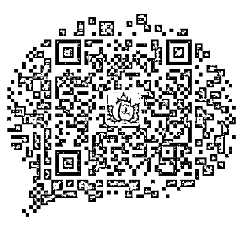

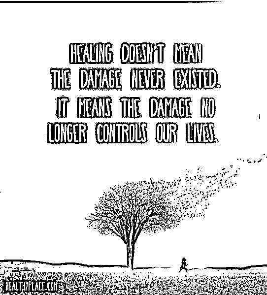
治愈并不意味着损伤再也不存在了，而是它不再控制我们的人生。

如果你不希望家族秘密继续成为**隐痛**，

如果你不愿错过一场**艺术与心理学的精彩交合**，

如果你想亲身感受**大师的疗愈功力**，

如果你期盼自己在国内心理治疗从业者中**先人一步独占优势**，

那么，明年的这场“大戏”将是你的**不二选择****。**

在安全、温暖、专业和艺术的氛围里，个人与集体的创伤将在我们共同的深层探索以及与祖辈的对话中触及、涌现，导师将带领你直面伤痛，感知灵魂的释放；在东西方理念的融合中，通过深层人本关怀，借由戏剧的温柔与力量，引导你的心灵走向完整和坚定，为你，为你的父辈和下一代， 重写“家族”剧本，重建爱与信念。

**戏剧介于幻想与真实之间。** 

**生命赋予舞台养分，**

**舞台表演亦赋予生命活力，**

**给予我们超乎日常限制的自由。**

**当布幕缓缓升起，**

**戏剧性时刻，正是一种解脱。**

——THE END——

# 评论集赞活动获奖名单公布啦，小伙伴们来领蜂蜜吧~

> 原文：[`mp.weixin.qq.com/s?__biz=MzA5NjA0NTAxNg==&mid=401696454&idx=4&sn=d353d2dd4e9b83ba2ee367ba70d8850d&chksm=02b3d47135c45d67b0807a4bd6f06fcf98a2f6ed7f63658f15daef7c69fcb49c145fd8f982c4&scene=126&sessionid=1692738892#rd`](http://mp.weixin.qq.com/s?__biz=MzA5NjA0NTAxNg==&mid=401696454&idx=4&sn=d353d2dd4e9b83ba2ee367ba70d8850d&chksm=02b3d47135c45d67b0807a4bd6f06fcf98a2f6ed7f63658f15daef7c69fcb49c145fd8f982c4&scene=126&sessionid=1692738892#rd)

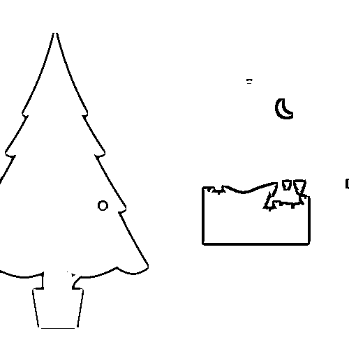

**小伙伴们圣诞快乐！** 

**若道君来为大家派发圣诞礼物啦~**

**在上周的 **[写](http://mp.weixin.qq.com/s?__biz=MzA5NjA0NTAxNg==&mid=401531396&idx=2&sn=88be50a4daf1dff7bb9c1843e11dcd47&scene=21#wechat_redirect)**[评论送蜂蜜](http://mp.weixin.qq.com/s?__biz=MzA5NjA0NTAxNg==&mid=401531396&idx=2&sn=88be50a4daf1dff7bb9c1843e11dcd47&scene=21#wechat_redirect) （点击可阅读原文）活动中**

**获奖的小伙伴有**

> **一等奖**
> 
> **岸芷汀兰**
> 
> **二等奖**
> 
> **fish**
> 
> **倩儿**
> 
> **麻小宝**
> 
> **Cap 摩羯**
> 
> **Spica**
> 
> **珊珊**

请 **获奖的小伙伴**们

在若道微信公众号【**nodoorbj】**后台回复

**您的姓名 电话 以及 收货地址**

若道君会请圣诞老人把蜂蜜送到您家里哒~

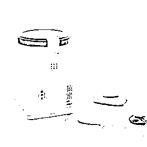

**本次活动赞助商 | 猿蜜**

由**处女座**的程序猿精心打造

微店 | 猿生活

**错过这次活动又垂涎农家天然椴树蜜的同学**

**可进入微店购买** **↓**

**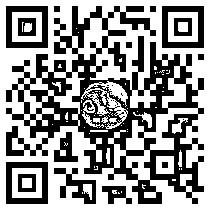** 

下次若道的精彩活动别再错过了哦~

本文由“135 编辑器”提供技术持

谢 谢 大 家 的 参 与 

更 多 活 动 敬 请 关 注 若 道 微 信 公 众 号


# 创造 2016 | 若道年度好文琅琊榜出炉，金牌作者和你一起聊占星！

> 原文：[`mp.weixin.qq.com/s?__biz=MzA5NjA0NTAxNg==&mid=401642807&idx=2&sn=fc7b89fd118f069cc18a5125e0b9a873&chksm=02b2278035c5ae9618cf271e5ddf12e7d660f0205e369455cb9a8d3c8dbc4fa3a7cef6abfbe7&scene=126&sessionid=1692738892#rd`](http://mp.weixin.qq.com/s?__biz=MzA5NjA0NTAxNg==&mid=401642807&idx=2&sn=fc7b89fd118f069cc18a5125e0b9a873&chksm=02b2278035c5ae9618cf271e5ddf12e7d660f0205e369455cb9a8d3c8dbc4fa3a7cef6abfbe7&scene=126&sessionid=1692738892#rd)

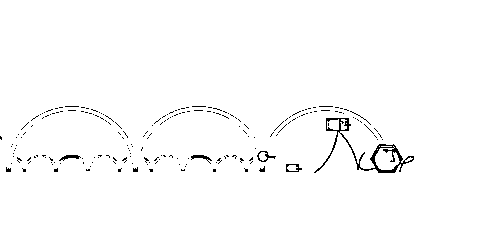

**2015**

就 要 收 官 啦

想 知 道 年 度 最 受 欢 迎 的 TOP 3 文 章 吗？

它 们 是 ——

（点 击 题 目 阅 读 原 文）

*1*

[天蝎座 | 最好的朋友，最坏的敌人](http://mp.weixin.qq.com/s?__biz=MzA5NjA0NTAxNg==&mid=400374567&idx=1&sn=8791c4b265f5b7a3dce36ff7bc7539ca#wechat_redirect)

**金牌作者 / 大卫·瑞雷**  

**阅读量 / 20,000+**

从根本上说，天蝎座是最好的朋友，也是最坏的敌人。务必谨记，失去天蝎座好友的信任真的损失很大。他们会救你于危难，帮你赶走敌人，陪你走过低潮。同样，他们也会迫使你去直面自身的破坏性行为，因为他们需要你生存！

*2*

[木星入处女座 | 未来一年你要做的 10 件事](http://mp.weixin.qq.com/s?__biz=MzA5NjA0NTAxNg==&mid=211114889&idx=1&sn=816879b876fab188b404863ba49108c9&scene=21#wechat_redirect)

**金牌作者 / Justine**

**阅读量 / 17,500+**

当木星行进在处女座，让我们去信仰一点一滴的努力与脚踏实地的积累。无论早晚，努力的果实终有一天会成熟落地，勤勉谦虚终会得到上天的垂青。

*3*

[别再怪原生家庭了，那不是真正的疗愈](http://mp.weixin.qq.com/s?__biz=MzA5NjA0NTAxNg==&mid=205175593&idx=1&sn=fa40419bfe5245c065ec5d991c8a3f8c&scene=21#wechat_redirect)

**金牌作者 / 慕棉**

**阅读量 / 14,500+**

在关于疗愈的种种教导里，我们似乎习惯了一个思维模式，疗愈就意味着找根源，找到了根源做了处理问题就解决了。然而，找根源，并不是疗愈的目的，疗愈的目的除了疗愈本身并无其他。

2 0 1 5 年 度

◆◆TOP 20

（最 低 阅 读 量 7600 + /点 击 题 目 可 阅 读 原 文）

***4*** [天蝎座满月｜最激烈的周一降临，你是易感人群吗？](http://mp.weixin.qq.com/s?__biz=MzA5NjA0NTAxNg==&mid=206640649&idx=1&sn=7ad590228ca575dfcc0fa0ed9d5efee6&scene=21#wechat_redirect)

***5***[狮子座 | 清理恐惧，让自己发光](http://mp.weixin.qq.com/s?__biz=MzA5NjA0NTAxNg==&mid=209639657&idx=1&sn=6876adfd5e1e1ac24a14365a5ab27414&scene=21#wechat_redirect)

***6***[巨蟹座 | 你的脆弱，也是你的力量](http://mp.weixin.qq.com/s?__biz=MzA5NjA0NTAxNg==&mid=208595023&idx=1&sn=c8a10284302b0b134cf2ac371a1ef7b5&scene=21#wechat_redirect)

***7***[愿你可以自强到无需被怜爱，却依然幸运到有人宠爱](http://mp.weixin.qq.com/s?__biz=MzA5NjA0NTAxNg==&mid=211501984&idx=1&sn=f2e4bfd590111936d1333d4e9892d083&scene=21#wechat_redirect)

***8*** [天蝎座 | 爱我，你怕了吗？](http://mp.weixin.qq.com/s?__biz=MzA5NjA0NTAxNg==&mid=400470385&idx=1&sn=60fd2e3202da2b355e39e824739c1cf7#wechat_redirect)

***9***[重磅| 比水逆更重要的……金逆来了！](http://mp.weixin.qq.com/s?__biz=MzA5NjA0NTAxNg==&mid=209738647&idx=1&sn=6b5d50dd7964fa1733ef4689a3c28fb6&scene=21#wechat_redirect)

***10*** [木星入 12 宫 | 12 星座准备好，总有好运砸到你](http://mp.weixin.qq.com/s?__biz=MzA5NjA0NTAxNg==&mid=211201479&idx=1&sn=04e526a2f050e1c28ad0c0c43facd838&scene=21#wechat_redirect)

***11*** [双鱼座超级满月：用慈悲与爱触碰每个生命](http://mp.weixin.qq.com/s?__biz=MzA5NjA0NTAxNg==&mid=211352462&idx=1&sn=42279c02ca111ae805ce6d5123588383&scene=21#wechat_redirect)

***12*** [重磅 | 今晨土星进天蝎：你真的能看到现实之美吗？](http://mp.weixin.qq.com/s?__biz=MzA5NjA0NTAxNg==&mid=208195349&idx=1&sn=bc6d251cf7180eda564ec23d89a7e335&scene=21#wechat_redirect)

***13*** [若道独家 | 3.21 国际占星日特辑：十张图告诉你占星到底是什么](http://mp.weixin.qq.com/s?__biz=MzA5NjA0NTAxNg==&mid=205407566&idx=1&sn=843d5ef5e71908f85b8527a79d688829&scene=21#wechat_redirect)

***14*** [大师说 | 天蝎座是走向射手座的天秤座](http://mp.weixin.qq.com/s?__biz=MzA5NjA0NTAxNg==&mid=400203022&idx=1&sn=70d55c4dd48225fa42740b3a08202bf3&scene=21#wechat_redirect)

***15***[白羊座超级满月+月全食 | 这个中秋不太平静](http://mp.weixin.qq.com/s?__biz=MzA5NjA0NTAxNg==&mid=211706673&idx=1&sn=5dac4b8f9191217dbc9e744a1bb450e2&scene=21#wechat_redirect)

***16*** [“我们” | 谁说射手座和处女座不配？](http://mp.weixin.qq.com/s?__biz=MzA5NjA0NTAxNg==&mid=207598842&idx=1&sn=dccb278f3adb1b9dff32e241b82db800&scene=21#wechat_redirect)

***17*** [深度 | 土星入天蝎：你的亲密关系经得起四重考验吗？](http://mp.weixin.qq.com/s?__biz=MzA5NjA0NTAxNg==&mid=208262182&idx=2&sn=bd9fac375c04901e07b4c4e4ccdc3b43&scene=21#wechat_redirect)

***18*** [12 星座 6 月运势驾到！请参考太阳/上升星座(上)](http://mp.weixin.qq.com/s?__biz=MzA5NjA0NTAxNg==&mid=207671338&idx=1&sn=d47a28c53d3dadbdbb0232d5a882764e&scene=21#wechat_redirect)

***19*** [狮子座与水瓶座对宫系列 | 爱与自由](http://mp.weixin.qq.com/s?__biz=MzA5NjA0NTAxNg==&mid=211171974&idx=1&sn=f4db919a5005f1c25d39a176849ac51c&scene=21#wechat_redirect)

***20*** [若道独家 | 12 星座说“爱”（图片版）](http://mp.weixin.qq.com/s?__biz=MzA5NjA0NTAxNg==&mid=204027748&idx=1&sn=10721e8ae4cd1b5515c04f0ad14b8db4&scene=21#wechat_redirect)

本文由“135 编辑器”提供技术支持

这些精彩的文章您都阅读过吗？

是否每每有会于心，

而心底有许多的问题，

想要同作者交流呢？


该如何解读我的个人星图？

我遇到了一个男生/女生

他/她是不是我命中注定的另一半呢？

2016 年，我会经历怎样奇幻的事情

又将会在哪些方面有所建树呢？

重大天象的变化对于我会有怎样的影响？

我这颗落在处女座的月亮这辈子都脱不了被黑的命运了？


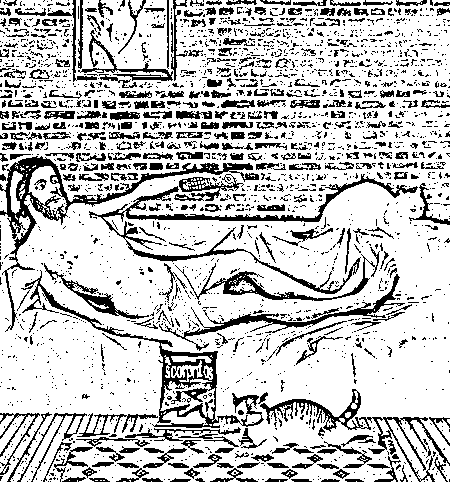

我们每一个人都曾经有过疑问

我是谁？我从哪里来？今生要去往哪里？

仰望浩淼的苍穹，斗转星移，都在预示着一些什么？

这一切都是宿命的吗？

还是可以通过自己的领悟改造出另一种生活，

放飞压抑的梦想，找到曲径通幽的另一个自我？

我们阅读这些文章

通过美好而温和的文字

富有洞见的分析

将线索逐渐清晰

将我们的人生引入更加丰富而广阔的天地……

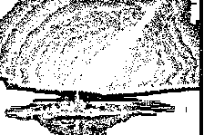

**如果你一直在自我探索和自我疗愈的道路上**

**如果你对于占星学有兴趣**

**那你绝对不能错过——**

若道金牌作者系列沙龙

我们将陆续举办**沙龙分享活动**

邀请**若道 TOP 20 年度文章的金牌作者**

为大家分享他们的**占星心得**

**解读未来重要天象**

你将有机会聆听最专业的**个人星盘解读**

**重大运势解读**

**亲密关系比对图、组合图**解读

等等……

◆ ◆ ◆ ◆ ◆

目 前，我 们 已 经 组 织 过 的 沙 龙 分 享 活 动 有

参 与 者 500+ 的 [大 卫 聊 2 0 1 6 微 信 活 动](http://mp.weixin.qq.com/s?__biz=MzA5NjA0NTAxNg==&mid=401531396&idx=1&sn=80ba89ca13e394505df0d9b67860fc8f&scene=21#wechat_redirect)

部 分 参 与 者 反 馈 是 这 样 哒 

@第一次参加若道占星的活动，

觉得 David 老师讲得很好！

学到了木星在各宫的 transit 方面的知识。 

@行星的运作和天象与个人运势的层层叠叠关系，

分析的条理清晰，脉络瞬间明朗很多，

一次醍醐灌顶的学习，

谢谢大卫老师的哲学智慧和幽默的讲解。

更 多 精 彩 内 容

敬 请 密 切 关 注 若 道 微 信 公 众 号

我 们 一 直 在 这 里 陪 伴 你

走 向 更 广 阔 更 美 好 的 明 天

**◆ ◆ ◆ ◆ ◆**


# 摩羯巨蟹手牵手，事业家庭向前走~

> 原文：[`mp.weixin.qq.com/s?__biz=MzA5NjA0NTAxNg==&mid=401642807&idx=1&sn=f56115da7d8d21bf59ac4dd628f08f59&chksm=02b2278035c5ae96dd4ba3be7aec0a425b6a9be02b51eec37a84f7d98bfff79ba6c72e32660e&scene=126&sessionid=1692738892#rd`](http://mp.weixin.qq.com/s?__biz=MzA5NjA0NTAxNg==&mid=401642807&idx=1&sn=f56115da7d8d21bf59ac4dd628f08f59&chksm=02b2278035c5ae96dd4ba3be7aec0a425b6a9be02b51eec37a84f7d98bfff79ba6c72e32660e&scene=126&sessionid=1692738892#rd)

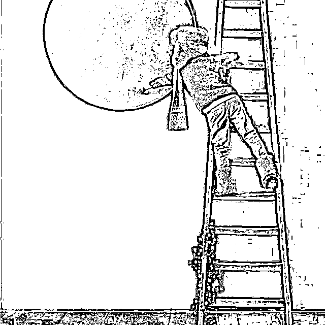 作者/特蕾西•麦克斯

译者/王宏

我们将在 12 月 25 日迎来满月。满月的意思，就是天空中的太阳和月亮站在彼此对面位置，即对分相。此次满月发生在巨蟹座，而太阳位于摩羯座，满月时可能会遭遇有关情感、家庭和责任、工作的张力，而出生星图中有巨蟹座-摩羯座对分相的人，也许感触会更明显。不过不用怕，今天这篇文章，就让我们提前学习如何整合这两股能量。


**这篇文章特别适合以下人群：**

①既有行星落巨蟹座又有行星落摩羯座

②既有行星落 4 宫又有行星落 10 宫

③星图中月亮和土星被强调

④南北交点在摩羯座或巨蟹座

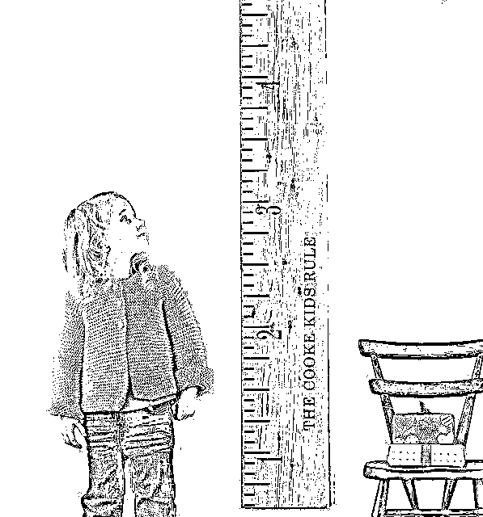

**巨蟹座-摩羯座的两极 PK**


**你有没有这些巨蟹座特质？**

喜怒无常 情绪不稳定

善变 敏感 脆弱

善解人意 富有同情心

反应灵敏

充满母爱和温情

保护 溺爱他人 令人窒息

依恋性强 依赖于他人

被动 害羞 退缩

有灵性 直觉感强

适应无意识的发展根基

寻求个人滋养

关心个人和家庭

以家庭或家为核心

渴望家庭安全感

**你有没有这些摩羯座特质？**

克制 封闭

情感压抑

自律

感觉迟钝 冷漠 坚忍

疏远 孤立 冷淡

充满父爱 划定界限 控制

运用权力和权威

独立

勤奋 果断

情绪稳定 高度自觉

适应外部现实

以成功为导向

有抱负 寻求公众认可

关心职业和物质

渴望职业安全感

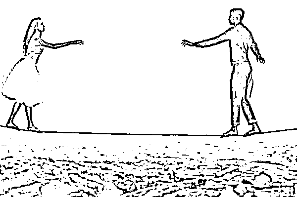

**能量不整合会带来消极影响**


你的巨蟹座-摩羯座的对分相表明你经常感到情感的贫瘠和缺乏。因为你在童年时期没有体验过被照顾的温暖和清明的纪律之间的平衡。

**①  在你成年后，你很难满足自己的情感需求。**

●一方面，你变得过度依赖于其他人，并想要他们来照顾你；

●另一方面，为了满足别人的需要，表现你的独立和责任心，你会对自己提出过高的要求。

**②  当你自己始终无法得到满足时，你就不能真正帮助他人，或者感激他们给与的关怀，因此你变得越来越沮丧和自我怀疑。**

●你会退缩回自己的壳里，不断沉思、担忧，既不能给与爱，也不能接受爱。

●抑或是，你通过依附于家人或完全投身于事业，将情感的满足替换为安全感。

**③  过度专注于你作为家长的角色，你可能无法成功地通过自己的孩子来满足自己的需求。**

试图通过依赖性的爱或是强迫性的工作来满足你所有的需求，这并非解决你困境的办法。你的忧郁和不满阻止你集中精力，专心致志地做手头的工作。你对家庭的依赖会削弱你的活力，并让你变得越来越不自信。你变得越消极，你行事就越没有效率；你行事越没有效率，你就变得越消极。

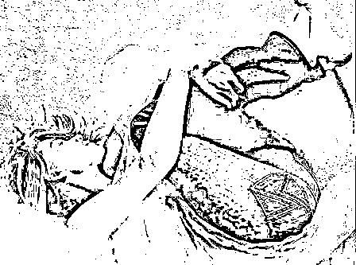

**能量整合令事业与家庭兼顾**


**要整合你的巨蟹座-摩羯座对分相，需要巨蟹座为摩羯座的纪律和辛勤努力增添敏感的温情，同时需要摩羯座将其自制力和独立性应用到巨蟹座的感受中去。**

1**巨蟹座→摩羯座**

你巨蟹式的感性基调使你能够感受到妨碍你工作和责任的情绪，并将其疏导出去。巨蟹座教导你，通过**关注自己的情感需求，学习滋养自身**，你不仅变得更加满足，还变得更强大并越来越独立，能够应对摩羯座可能要求你体验的约束或困顿。

巨蟹座寻求并提供的情感滋养使你**倾向于和他人建立深厚、持久的关系**。你能够完全将自己交付给他人并保持忠诚，不仅仅是由于你的责任感，还因为你乐于处理个人关系中的脆弱和不安全因素，因为你了解你可以和另一个人一起体验的情感深度和满足感。

由于你知道自己的敏感性，并可以应对自己不断变化的情绪，因此**你对其他人的状况也非常敏感**，并且感同身受。这也会促使他们认真对待你，并反过来将自己交付与你。

你储藏着大量的巨蟹座无意识能量，这让你仍然能够**与自己的内在“小孩”保持接触**。它有助于你成为有影响力的家长，可以对自己孩子的需求做出反应，因为你可以处理你自己的需求，并且可以用爱来缓和你纪律的严苛。你所提供并体验到的温暖的家庭生活给了你和他们坚实的基础，鼓励你们每个人在外部世界中更为成熟、负责。

你在个人生活中体验到的满足感强化了你的职业生涯。因为你并不愿意用以情感缺失为代价来换取成功，所以**你可以放松并更加有效地工作**。你可以享受工作的过程，以及你获得的认可。巨蟹座有助于你选择可以滋养你的内在，并因此激励你尽最大努力工作的职业。它使得你可以在工作中投入情感并体验工作带来的满足感。

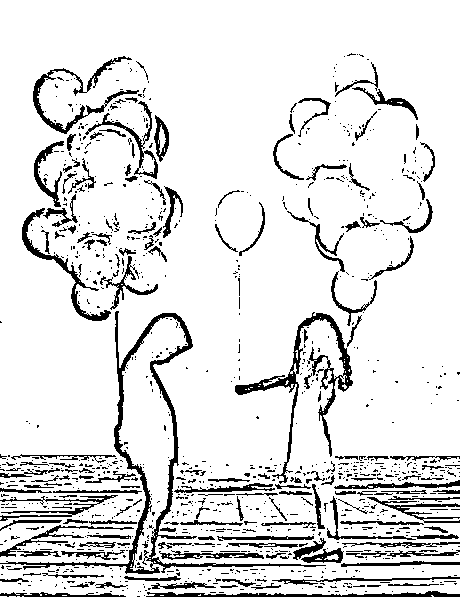

2****摩羯**座→**巨蟹**座**

你摩羯座的自足帮助你应对情感冲突并满足你自己的需求，**你的自制力使得你可以稳定自己的情绪，防止被情绪淹没**。因为你愿意为自己的行为承担责任，所以你可以勇敢地面对幼稚的行为、坏习惯以及无助感，并可以摆脱那些不再起到滋养作用的旧模式。

摩羯座会过滤你的经历，**保护你不会沉溺于让人虚弱的情感中，也使你不会过于轻易地被你周围人们的心理困惑所影响**。因为你能感知自身极限，不会在他人的苦难中迷失自己，所以你不会为他们的问题感到过度沮丧，你的回应理智且成熟，不仅给他们提供巨蟹式的支持，还会激励他们的力量并拒绝放纵他们的缺点。因此摩羯座为你的情感健康以及你周围人的幸福做出了贡献。

这种对局限的认识，以及按成人方式行事的决心，**有助于你成为负责任的、有影响力的家长，让你在滋养孩子的同时还可以执行纪律**。随着他们逐渐变得自制和自立，你的家庭生活也会有所改善，你会变得更有安全感，因为你知道自己经营了一个健康的家庭。你摩羯座的责任感使你能够向家庭和你爱的人做出坚定的承诺，在必要的时候，你会忍受艰苦的日子并勤勉工作以供养他们。

**摩羯座会教你将自己的情感能量引导到完成工作上来。**你的工作能力和成就感也会改善你的家庭生活，从而保证你不会将身边的人看作满足感的惟一来源，让他们感到窒息。摩羯座可能有助你将家庭和个人兴趣变为职业才能，让你倾向于在家工作或在与家庭或养育相关的职业上获得成功。

**◆ ◆ ◆ ◆ ◆**

****特别提醒：**希望将若道文章转载到各自公众号的朋友，**转载时请注明“转自若道微信公众平台”，并附上若道占星的 Logo**。谢谢！**

**2016 年 1 月 5 日-1 月 8 日**，格罗夫及其团队将在**北京**举办**三天全息呼吸工作坊**；**2016 年 1 月 11 日-1 月 17 日**，格罗夫和占星大师塔纳斯将在**北京**举办**七天全息呼吸与原型占星工作坊**。详细内容请点击“**阅读原文**”了解。


# 摩羯座 | 扛过严冬，时间自会奖赏

> 原文：[`mp.weixin.qq.com/s?__biz=MzA5NjA0NTAxNg==&mid=401613091&idx=1&sn=cd13cf4f4032c163315e8db4413f1f22&chksm=02b2939435c51a82afd38946006d0094738a1a73895a392515862e2e3fb6685d119e979b2c2c&scene=126&sessionid=1692738892#rd`](http://mp.weixin.qq.com/s?__biz=MzA5NjA0NTAxNg==&mid=401613091&idx=1&sn=cd13cf4f4032c163315e8db4413f1f22&chksm=02b2939435c51a82afd38946006d0094738a1a73895a392515862e2e3fb6685d119e979b2c2c&scene=126&sessionid=1692738892#rd)

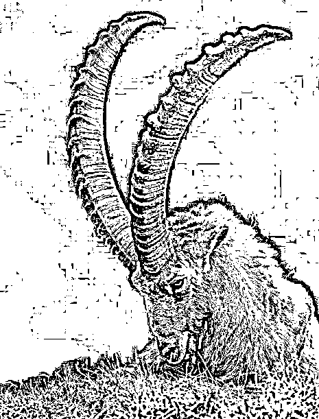

作者/蒋颖  若道占星创始人

图片/花瓣网

今天，中国的传统节气冬至和西方占星学中冬季的第一个星座摩羯座同时到来。摩羯座是一个容易遭受偏见的星座，读了这篇文章，你会理解为什么摩羯座会有那么多“不可爱”的特质；同时，每个人都需要有摩羯座的精神，扛过人生的试炼，走向紫禁之巅。

在北半球，冬至那一天是一年中日照时间最短的一天。因此，天文学上把冬至作为冬天的开始。而有趣的是，中国的“数九寒天”的 “一九”就是从冬至这一天算起。尽管前面气温一直下降，但真正的严寒是从冬至、“一九”、摩羯座才开始的，而最冷的“三九”也是在太阳在摩羯座的时间范围之内。

**7 个摩羯座特质，都是被严冬逼出来的**

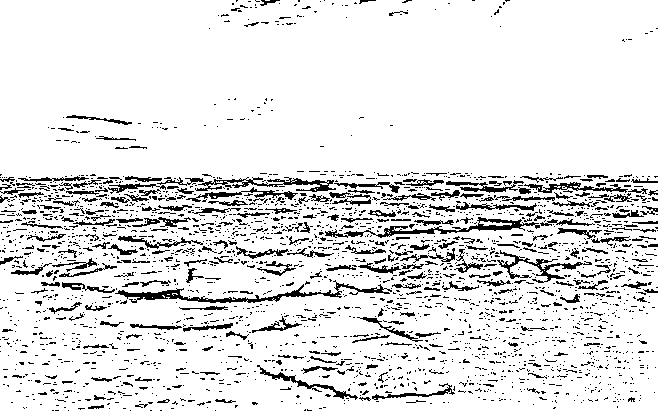

1 严厉

冬天塑造了摩羯座的相貌。严冬中，摩羯座在冰冷刺骨的北风里走着，将整个身体都收得紧紧的。看看那些在北风里匆匆行走的人们，大多数面无表情、没有笑容，和春天舒展的样子完全不同。不是不想有表情，而是，实在太冷了，肌肉因为会寒冷而收缩，也因此显得面容严厉。

**典型的摩羯座人，因为受到这么冷的气候的影响，从里到外都打上了“寒冬”的烙印。**不笑的面容或让人觉得肃重、庄严，或严厉、严肃，或显得拘谨，而有的人实在被“冻得”太狠，因此从身体到心灵都会呈现出僵硬、冷酷、苛刻的样子。  

2 实际

**冬季的“生存”问题，逼得摩羯座必须要十分实际。**粮食问题不论对个人还是对国家，都是非常“实际”的问题，必须“严肃认真”对待。光讲道理喊口号磨嘴皮子是不行的（风象星座），光有慈悲心肠、动不动就流眼泪也是不行的（水象星座），只有蛮力只懂莽干也是不行的（火象星座）。所以，冬天的摩羯座非常“实际”。这个怎么是那些无忧无虑的人们所了解的呢？

3 竞争

因为冬天的严酷，生存问题变得极端重要，如果大地到处流淌着牛奶，到处散放着坚果，那么谁也不会着急去抢什么。**“勤勉”、“竞争性”、“高效率”、“要在社会中占据更高的位置”是这种严酷的环境下的必然选择**，因为都是事关生死。

4 责任

而“责任感”和“承诺”也变得格外重要。如果我答应今天给你一斗米，而我却没给你，那你没准就饿死了。历朝历代，大片饿死人的时候都是在寒冷的冬季吧。为了大家都有口米，**“重承诺，负责任”也就在“竞争性”之外发展起来。**

5 管理

**在严酷的条件下，为了让“竞争”不变成你死我活，“管理”和“组织”应运而生。**在冬季的最严酷的时候发展出来的组织，里面的人们还在为生存而担忧，只能是纪律严明、等级分明的组织，此时期待水瓶座的“人人平等”和双鱼座的“慈悲”都还不切实际。那些东西，对大多数人来说，还是要解决了生存问题之后才能自然而然产生吧。

6 节俭

**冬天的严苛逼得摩羯座人“懂得节俭”，“善于规划”。**过去一进入冬天，第一件事要想的就是家里是否已经储存好了一冬的蔬菜。因为在几个月的时间里，大地基本不再产出，必须依赖过去的收成度过这个寒冬。

过去我们常常开玩笑，穷人最好能生在南方，比如在海南，热归热，但是即使再没有钱，树上摘个椰子，椰子水解渴，椰子肉也能当饭吃。可是如果在北方，到了冬天，怎么办呢？连虫子都逮不着。因此，冬天的严苛逼得摩羯座人不仅要顾上“冬季三个月的吃食”，还不能把“春天的种子”吃掉了。

7 忍耐

**严酷的环境让摩羯座懂得忍耐。**不仅人是如此，植物何尝不是。大部分植物，早早就把散发热量的树叶打发了，把全部活力集中到地下的根部，默默储蓄能量。这一等就是三四个月。**不动声色的摩羯座知道自己的目标是什么，而且他们有耐心，因为他们已经度过了无数的冬天，知道只要现在不完蛋，他们的春天总会到来。**

**当压力来袭，扛过去就赢了**

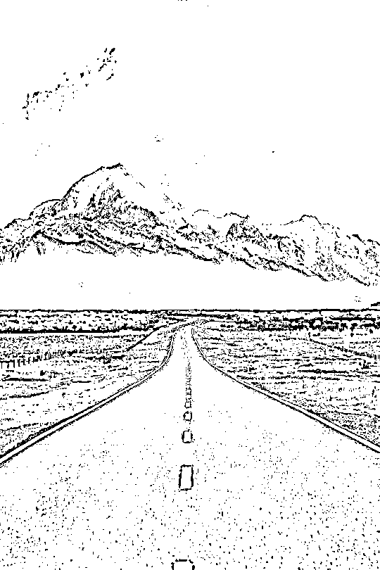

真正的严寒到来之前，我们往往无法想象这个寒冷。而真心真意享受严寒的人，恐怕极少。逃离严寒常常是成年人在严寒到来时的唯一想法，我们总是希望尽快逃离，或找到一个可以庇护的人或可以庇护的地方给我们温暖。当摩羯座的守护星土星到来时，我们大多也这么想。

责任、目标像山一样压在头顶，然而土星又让人处处感到人生的限制，无法逃离的现实让我们感到孤独和沮丧。没错，寒冷常常和孤独相连，在最想依赖他人之时，常常是无人可以依靠。**自力更生，咬着牙向前通常是唯一的解决路径。**

摩羯座非常害怕需要依赖他人，我怀疑这可能是因为他们的灵魂非常了解人生需要自力更生的必要性。摩羯座有一颗“孤绝之心”。

**南交点摩羯座的“扛”**

这让我想起前两天一个对今年最红的演员胡歌的采访，大部分人知道他是太阳处女座，但可能不知道他的南交点是在摩羯座。采访题目起的很摩羯座——《他的肩上，扛着很多人的青春》。

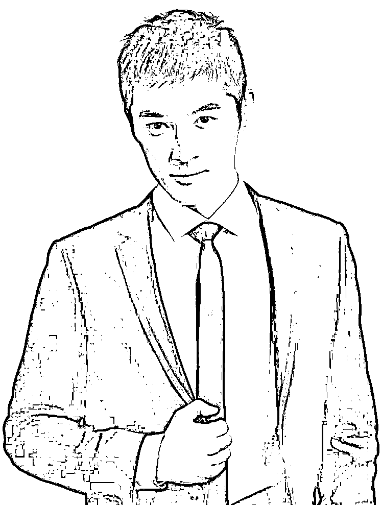

这篇采访里面的很多描述都体现了胡歌南交点摩羯座的精神呢。采访者问：“在你最累的时候，最疲倦的时候，最想休息的时候，你是如何调整自己的状态，继续往前走呢？”

胡歌回答：“我没有什么办法，我就一直生扛硬扛下来。一开始，更多是生理上硬撑着自己去坚持，慢慢地，这种压力就从生理上转化成了精神上。说实话，任何一种压力的缓解方式，都是需要时间和空间来消化的，但是我工作的性质，很少会给我减压的时间和空间。所以，我只能生扛。”

作者接着说，胡歌说话的时候，语气很肯定，但是眼神有些寂寥。

**扛，就是压力如山时的答案。**“挣扎是成就伟大的竞技场”。扛过去，就走过来。一次次的困难扛过去，一步步走着，就抵达紫禁之巅。

**人人都有野心，只是“用词”不同**

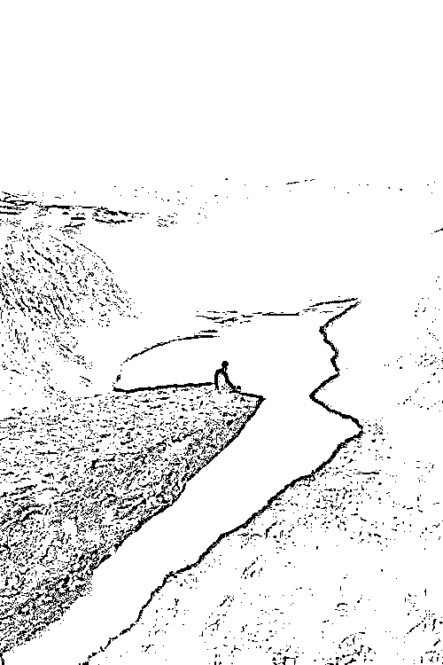

摩羯座为什么一定要扛过去，不光成败有关，和责任有关，也和野心有关。你站在生机凋零的大地上，把耳朵趴在地下，听听那些衰草、种子、根的声音，那就是“野心”的声音。  我有时会想这个摩羯座的“野心”和射手座的“愿景”、水瓶座的“理想”、双鱼座的“梦想”有什么区别？人们是喜欢玩文字游戏呢，还是真有什么不同？我总觉得，**这不过是地、水、火、风对同样一个东西有不同的表达，然而四个词在人们心中激起不同的情绪反应。**

似乎，人们对“野心”这个词存在更多的道德判断，而对有愿景，有理想，有梦想的人宽容许多。不会因为这个世界上实现了“野心”的人比实现了“愿景、理想、梦想”的人多吧？！

**火象星座的愿景、风象星座的理想、水象星座的梦想，如果不落实，那都是空想。**只有土象星座的野心最后生根、度过寒冬、钻出土壤、当春风一吹时喷涌而出，在大地上恣意涂抹，因此激起人们产生或敬畏，或羡慕，或害怕，或嫉妒之心。

而当然，不愿承认自己野心的摩羯座，有点像被斩断根一样。 “造一个草原，要一株苜蓿加一只蜜蜂，一株苜蓿，一只蜜蜂，再加一个梦。如果蜜蜂少，光靠梦也成。”

这首充满了愿景和梦想的诗，如果让摩羯座来写，可以写成这样——

“造一个草原，要一颗种子，一颗种子，一颗种子，再加一个野心。”没了诗意，但来年可以看到草原。

行星真的会说话。土星一直在提醒、指点我们——

*   **人生是有限制的，所谓自由常常是一种幻觉。**

*   **一切都需要经历困境，必须通过辛苦努力才能拿到。**

*   **去面对而非逃避，找到切实可行的路径。**

土星还会怎么说，听过它声音的人来填补吧。

人生有四季，我们无法逃避任何一季，既然如此，那就面对吧，最好还能“享受”其中。  **对于看重成功，有长远目标的摩羯座，或对于遭遇土星时节的人们，如何能在奋斗的过程中、在现实的限制中、在人生的困境中，放下恐惧，面对严寒，并慢慢学会像孩子那样享受严寒，在严寒中玩耍，并能心生喜悦之情，这是土星试炼的一级级通路。** 土星是时间的朋友。而时间会带来最后的奖赏。

**★ 每个人的星图中都有摩羯座的能量，每个人的星图中都有土星。你经历了什么摩羯座和土星的试炼呢？欢迎留言。**

**◆ ◆ ◆ ◆ ◆**

**2016 年 1 月 5 日-1 月 8 日**，格罗夫及其团队将在**北京**举办**三天全息呼吸工作坊**；**2016 年 1 月 11 日-1 月 17 日**，格罗夫和占星大师塔纳斯将在**北京**举办**七天全息呼吸与原型占星工作坊**。详细内容请点击“**阅读原文**”了解。


# 创造 2016 | 召唤占星“科普”作者 ，分享你和占星学的故事

> 原文：[`mp.weixin.qq.com/s?__biz=MzA5NjA0NTAxNg==&mid=401613091&idx=2&sn=8a49d99a2fc4118106674a83f6aa9bbd&chksm=02b2939435c51a82496ec1ae93829e346d0a5b2b60963ddb2d00a9c9c088718211182a0c3b27&scene=126&sessionid=1692738892#rd`](http://mp.weixin.qq.com/s?__biz=MzA5NjA0NTAxNg==&mid=401613091&idx=2&sn=8a49d99a2fc4118106674a83f6aa9bbd&chksm=02b2939435c51a82496ec1ae93829e346d0a5b2b60963ddb2d00a9c9c088718211182a0c3b27&scene=126&sessionid=1692738892#rd)

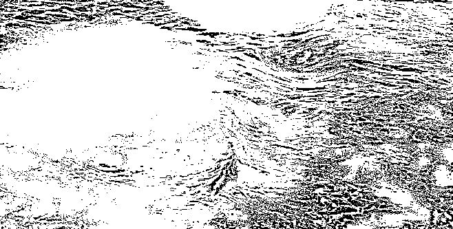

## 江湖征集令

如果你是

**爱写字**的文艺 **青年**

**中年**

**老年**

如果你 **热爱占星学**

受益于它

请 **投稿**

从一个占星元素讲

生命的智慧

用 **有光亮**的文字 

**有温度**的文字

启迪、鼓舞另一颗心

我们一起写

就会 **改变潮水的方向**

**◆ ◆ ◆ ◆ ◆**


**稿件需求**

```
我们将定期在微信公众号上发布征稿题目
```

欢迎投稿，自由撰写 12 宫的丰富生活领域，不论是**爱情、人物、电影、旅行、书本、艺术、宠物、孩童、职场、心理、灵性生活**等 

我们偏好**生活高于技术**的稿件，即从一个元素（不论是星座、行星、宫位，还是某个行进）深入谈下去，给人深思和启发，而**不是技术过于复杂**的稿件 

也欢迎**漫画、图片、摄影**为主的温馨治愈系和幽默系稿件

**投稿文章必须为作者原创，若道保留对文章的选择权和编辑权**

**若道君回馈**

1 稿酬

```
稿件需在若道平台原创首发，稿酬以文章（周）阅读量为标准。
```

**阅读量>5000**，稿酬 **300 元** 现金

**阅读量>7000**，稿酬 **500 元** 现金

**阅读量>10000**，稿酬 **700 元** 现金

**阅读量>15000**，稿酬 **1000 元** 现金

所有奖励会在文章发表后 **一个月内**  兑现

此标准有效期： **2016.1.1~2016.12.31**

2 专栏作者

**年度投稿 12 篇，阅读量平均高于 5000** 的作者，将自动作为若道的专栏作者,读者可以在若道微信平台目录轻松查到专栏作者所有稿件。

3 活动

若道将在粉丝群为专栏作者举办**分享活动**

**投稿流程**

step

**1**

投稿请发送至 astrology@nodoor.com

step

**2**

若道君审稿，对于好的稿件，将会回复作者；如果没有回复，则可视为不被录用。

step

**3**

对于若道君的建议，也请发至 astrology@nodoor.com


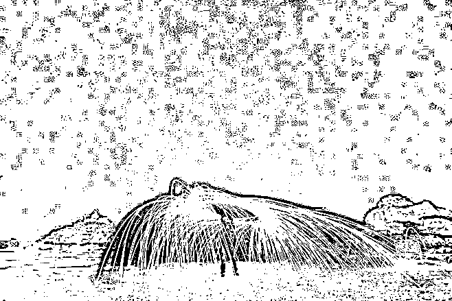

 如果你曾经受益于占星学，请说出你的故事！

如果你用占星学的镜片来看世界万象，请说出你看到的世界！

**拿起笔来**

END


# 宇宙天气 | 打开头脑的闸门，改变从心开始（12.21~12.27）

> 原文：[`mp.weixin.qq.com/s?__biz=MzA5NjA0NTAxNg==&mid=401595158&idx=1&sn=a253c8934365940b850e3d9ae01561ba&chksm=02ad69a135dae0b763e1d79cb72f88ab6a1735566c53e355c99b7b1a11f30e09498911a2a41e&scene=126&sessionid=1692738892#rd`](http://mp.weixin.qq.com/s?__biz=MzA5NjA0NTAxNg==&mid=401595158&idx=1&sn=a253c8934365940b850e3d9ae01561ba&chksm=02ad69a135dae0b763e1d79cb72f88ab6a1735566c53e355c99b7b1a11f30e09498911a2a41e&scene=126&sessionid=1692738892#rd)

**一周星象综述**

本周月亮经过金牛座、双子座、巨蟹座、狮子座。最重要的星象事件，是**太阳进入摩羯座，以及巨蟹座满月**。此外，**天王星恢复顺行**，从长期来看，也是一个重要的星象变化。 

周一和周二，月亮在金牛座，我们的感官需求可能变得强烈，也会更加重视物质安全和现实层面的问题。周一，水星四分天王星，易有思维、想法上的突然转变，灵光乍现的念头可能带来重要的启示。（上周末两天，水星合相冥王星期间带来的对事物的深刻理解和洞见，可能在这个周一，以一种更加“直接粗暴”的方式被注入我们的头脑，带来意识的变革。）周二，太阳进入摩羯座，随着“摩羯月”的到来，我们对生存安全和世俗成就将有更多关注，也会以更加务实、严肃的态度对待生活。周二晚间，金牛座月亮对分天蝎座金星，带来情感上的刺激和性吸引的火花，一个适合腐败或谈情说爱的晚上。

周三上午到周五中午，月亮在双子座，给本周中段的这几天带来轻松的氛围。结合之前几天水星（水星与双子座共振）与冥王星、天王星的相位，月亮在双子座的这段时间，是我们开放思维，接触多元信息，为过去几天头脑中产生的新想法新念头寻找更多依据的时候。加上圣诞节将至，联络新朋旧友，与不同人接触，此过程中的新资讯的摄入，也可能改变很多旧有的看法。周四晚间，由于金星六分木星和月亮四分木星的双重作用，这将是一个充满快乐和兴奋的平安夜。

周五中午到周日，月亮在巨蟹座。周五晚上的**巨蟹座满月**，给这个圣诞节带来汹涌的情绪浪潮。**对于“亲人”（无论是不是血缘上的）的感念和对于人类情感的重新认识，将给疲惫的心灵带来治愈**。哭出来是比较好的。周六和周日，月亮依次与冥王星、天王星、水星、火星形成挑战相位，可能带来情感上的挣扎与煎熬，但也是重建与他人的亲密关系、在情感模式上进行内省与转化的机会。

纵观一周的星象变化，头脑（水星）的改变在心（月亮）之前。虽然常常说“**改变从心开始**”，但对于大多数已经将心严密包裹的现代人来说，需要在头脑上先“打开闸门”，认知的变化可以进一步带动和帮助心与情感的转变——这个顺序并不是一定的，但是在本周，或许更为适用。

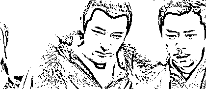

12 月 21 日星期一

**08:12** 月亮离开白羊座进入金牛座

更加渴望安宁与平稳的生活，对于物质和感官享受的需求增加。未来两天多的时间里，我们需要做更多事来满足自己对于生活品质和舒适感的要求。这两天容易花钱在享受生活上，同时对于金钱的关注也会提升。但在关注物质与财富议题的同时，也需注意到，心的沉着与宁静，才是能带来最多稳定感的力量。

**11:09** 摩羯座水星四分天王星

此相位重点影响周一全天，其影响也可能延续到周二。摩羯座的水星四分天王星，带来突如其来的灵感与思维的转变。这时我们有一个机会在老旧的意识中打破一个缺口，吸纳新鲜的知识与智慧。但若对自己的意识和念头缺少觉察，便可能感到失控或因为计划被打乱而心烦气躁。

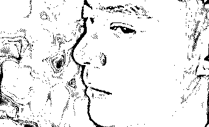

12 月 22 日星期二

**12:49** 太阳离开射手座进入摩羯座

随着太阳从乐天开朗、勇于冒险的射手座进入稳重踏实、理智务实的摩羯座，我们会对环境或心理上的“寒冬”有更多准备。未来一个月的时间里，我们将学习勤勉、承诺与责任的功课，拿出“苦行僧”的精神，去面对一些生命中真正严肃的、不可儿戏的事。具体到每个人，需要严肃面对的事物或领域是不同的。但整体上，我们都需要以更加自律和严谨的态度，去面对一些生活给我们的责任和要求。

**18:37** 金牛座月亮对分天蝎座金星

这是一个典型的“心动”时刻。对于爱与亲密的渴望更加强烈，同时也更容易感受到爱情与性方面的诱惑。性是获得亲密感的重要途径，但并不等同于亲密。此时应对自己的身体和欲望有更多觉察，区别走肾与走心。

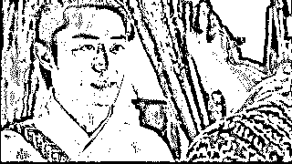

12 月 23 日星期三

**10:30** 月亮离开金牛座进入双子座

好奇心增强，对资讯、信息和新鲜事物更加敏感。未来两天多的时间里，有更多吸纳新知识新讯息以及与他人沟通交流的需要。也会有更多新观念、新思路，刺激我们的头脑。考虑到圣诞节将至，这也是一个频繁与新知故交联络情谊的时段。

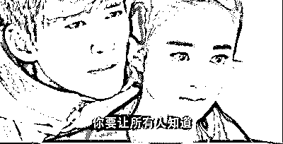 

12 月 24 日

星期四

**18:04** 天蝎座金星六分处女座木星

有利于爱情、社交及任何形式的娱乐或享乐。与恋人一起度过这个平安夜会是不错的选择。如果有心仪的人但尚未确定恋爱关系，那么这个平安夜会是一次促进感情升温的绝佳机会。这个夜晚，我们都更容易感受到爱的甜蜜，也更容易与人建立更亲密的关系。

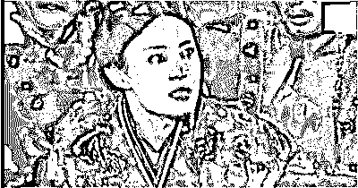

12 月 25 日星期五

**01:17** 双子座月亮四分处女座木星

这个相位发生在周五凌晨，但也许前一天的平安夜有很多人晚睡，在平安夜就会经历这个状态。受月木四分相位的影响，很多人可能在午夜前后仍然感到非常兴奋。月亮在双子座，也暗示了躁动不安或“信息超载”带来的思绪混乱。这是个容易失眠的时候，特别是对变动星座特质强（有重要个人行星在双子座、处女座、射手座、双鱼座）的那部分人来说。

**13:25** 月亮离开双子座进入巨蟹座

情绪变得敏感、脆弱。未来两天多的时间里，我们会更加念旧，多愁善感，更容易被生活中的那些温情时刻所打动。对人与人之间的关怀照料、情感的滋养，有更多渴望，情感需求变强。在未来两三天里，先是巨蟹座满月，随后是月亮的多个挑战相位。预计这几天的情绪会有较大起伏，情感和亲密关系的状态也会有较大变化。无论事件层面有怎样的结果，都是提醒我们回归内心最真实的情感需求。去发现并调整那些给我们带来限制的情感模式，才是最重要的。

**19:13** 巨蟹座满月

这是一个“情感决堤”的时刻。此时我们有机会意识到过去很长一段时间以来，我们是怎样地用理智压抑情感，让自己限入僵化的情感模式而无法与人进行真正的情感交流。对于滋养与情感连接的渴望，此时变得强烈。我们也会更加重视亲情，感受到来自家庭与家人的温暖，那是一种根本上的与自己生命本源的连接。如果对自己的情绪状态有足够的觉察，这会是一个带来强有力的疗愈的时刻。

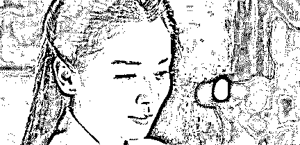

12 月 26 日星期六

**04:20** 摩羯座水星三分处女座木星

这个早晨，是对前一天的满月效应进行思考和消化的好时机。发生在土象星座的水木三分相位，能够帮助我们将头脑的产物有效整合进现实的生活。这也是一个对现实状况做出有效分析和决策的时段。

**11:54** 天王星恢复顺行

天王星从今年 7 月下旬开始逆行，这几个月的“折腾”，是要我们学习如何有效地表达自己的个性，以及如何在遵从规则和勇于革新之间找到平衡。这期间可能出现过一些不恰当的冒进或叛逆举止，但这都是我们寻找自身定位的必经过程。随着天王星恢复顺行，我们会懂得如何以更加“恰当”的方式，将个人的个性与叛逆性融入社会和集体环境之中。特别是，现在太阳刚刚进入摩羯座，与天王星恢复顺行形成一种“彼此配合”的姿态，提醒我们要更加重视规矩与规范，应将变革与爆炸性的举动控制在一定的安全范围之内。

**15:22** 巨蟹座月亮对分冥王星

**18:24** 巨蟹座月亮四分天王星

这个下午到晚间，不安全感和危机感加重，有对抗情绪，易走极端。与他人的情感关系和我们自身的情感模式里的某些真相需要被更清楚地看到。承接着巨蟹座满月的能量，此时对于自身情感需要的新的认识，会带来强大的改变的力量，让我们有能力去重建与他人的情感关系。

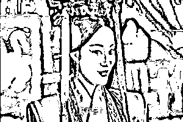

12 月 27 日

星期日

**08:22** 巨蟹座月亮对分摩羯座水星

**10:59** 巨蟹座月亮四分天秤座火星

月亮与水星、火星形成 T 三角相位。这是非常容易出现争执和观点分歧的时候。我们不想伤了和气，希望场面上不要太难看，但自己坚持的想法又很难被撼动。大家心里都容易感到委屈，觉得自己是心累的那一个。鱼与熊掌不可兼得，有时要捍卫自己的主张，就要准备好面对冲突。

**18:30** 月亮离开巨蟹座进入狮子座

情绪变得开朗阳光，自信心提升。过去三天可能很多人过得有些辛苦，有些人则流了很多眼泪。现在是让心放松的时候。带着更多对爱的了解，我们也会更有力量温暖他人。


## **作者简介** 

**占星师 Cora**，全美占星师联盟（AFAN）成员，国际占星研究协会（ISAR）会员，获 ISAR 职业占星师资质认证，斯蒂芬·弗里斯特《变幻的天空》译者，个人星象文章见诸《心探索》《北京青年周刊》《上海电视》《空中生活》等杂志媒体。曾跟随大卫·瑞雷系统学习占星学，现为全职占星师。  

微信公众号：聆宇 FM（微信号：lingyudiantai）

个人微信号：CoraAstro

长按二维码，让金钱涌向传播知识与智慧的人~~


**◆ ◆ ◆ ◆ ◆**

****特别提醒：**希望将若道文章转载到各自公众号的朋友，**转载时请注明“转自若道微信公众平台”，并附上若道占星的 Logo**。谢谢！**

****2016 年 1 月 5 日-1 月 8 日**，格罗夫及其团队将在**北京**举办**三天全息呼吸工作坊**；**2016 年 1 月 11 日-1 月 17 日**，格罗夫和占星大师塔纳斯将在**北京**举办**七天全息呼吸与原型占星工作坊**。详细内容请点击“**阅读原文**”了解。**


# 摩羯座=冬至→大寒，节气与星座对上啦！

> 原文：[`mp.weixin.qq.com/s?__biz=MzA5NjA0NTAxNg==&mid=401595158&idx=2&sn=d7bc681cf849545d82fcf9a71299da90&chksm=02ad69a135dae0b762e2f47bf7f43f61fbaee9f0b8d190fee830e202b58c83f731e894917af3&scene=126&sessionid=1692738892#rd`](http://mp.weixin.qq.com/s?__biz=MzA5NjA0NTAxNg==&mid=401595158&idx=2&sn=d7bc681cf849545d82fcf9a71299da90&chksm=02ad69a135dae0b762e2f47bf7f43f61fbaee9f0b8d190fee830e202b58c83f731e894917af3&scene=126&sessionid=1692738892#rd)

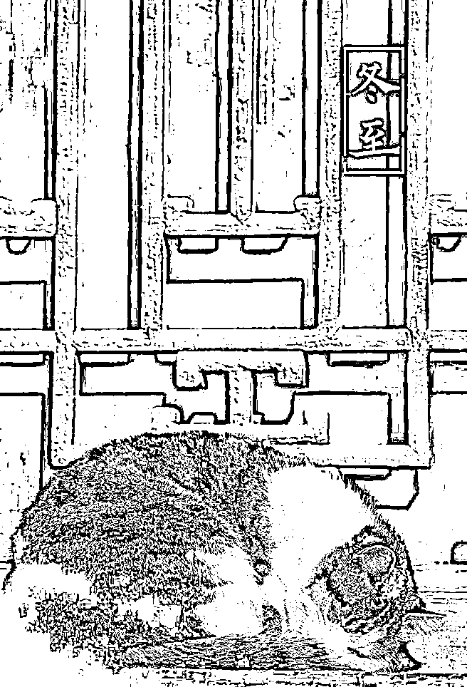

作者/蒋颖  若道占星创始人

图片/花瓣网

明天就是冬至了，在北半球，一年中黑夜最长的一天和西方占星学冬季的第一个星座摩羯座同时到来。不管你是吃饺子、汤圆，还是喝羊肉汤、冬酿酒，咱们都在同一片星空下，一起度过冬至，一起迎接太阳进入摩羯座，是不是很美妙呢？

**一开始，占星学符号是抽象的**

一直以来，只是想弄明白星座、行星意义的我，对占星学符号都停留在极其抽象的意义上，面对着计算机自动生成的平面图，想那些抽象符号的抽象意义。即便对行星的心理学意义感兴趣，那也是抽象的，不论是原型还是动力，都是符号。总之，我从来没有想到去深究这个星图到底是怎么回事。

直到 10 月的有一天，为了准备工作坊，大卫对我说，你知道吗，**星图其实是四季的日历**。在遥远的巨石时代，古代社会的人们就用巨石阵来观察季节的变化，了解其对生产和生活的影响。围绕季节和时间，我们最早的社会开始建立起来。

这些巨石阵存在于不同的地域，不同的文明，分布在世界各个地方。而它们都是围绕春分、秋分、夏至、冬至构建的，如果你从高空俯视，会看到一个巨石构成的圆形的日历，这才是星图的原型。虽然白羊座的名字源于天上的白羊座，但实际上，这个星座和实际的星座的关系并不像它与春天的关系那样紧密。**白羊座起于春分，是春天的第一个月，而这个才是星座最重要的部分。**

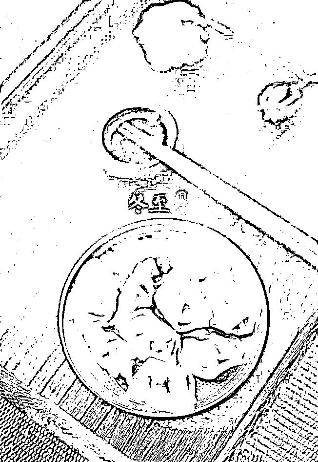 

渐渐的，占星学和生活联系起来

不知怎的，这段话就像打开了一扇大门，原来被关在门外的大自然和四季，那些声音、气味穿过星图上的符号，活泼地来到我眼前。天上的星座对我来说确实比较遥远，我的天文学知识只是停留在太阳、月亮、太白金星、北斗七星，本来就少得可怜，城市的污染更让繁星闪耀遥不可及。然而，四季对我来说却是无比亲切，我生活在四季中，与之朝夕相处。于是，就这样，**占星学和日常生活，春华秋实，花开花落联系在一起。**

不再是神秘的天象，抽象的哲理、深刻的心理、西方的神祇，星图就是这样普通、平凡而诗意的生活。

我个人感觉，占星就是对时空的解读。因为占星学最根本的维度就是时间和空间的维度，特别是时间，对于占星学至关重要。然而什么是时间呢？先不说深奥的物理学、哲学、心理学、玄学对时间的解释（那个我也的确不懂），只是对生活在地球的普通人来讲，到底时间又是什么，如何测度呢？

时间，简单说，就是年、月、日、时、分。而这是因为地球绕太阳的公转周期、地球的自转周期、月亮绕地球的周期形成的，而季节的变化是因为地轴的倾斜。尽管，因为占星学发展的希腊化时代，占星学借用了当时天上的星座排列的名字，但实际上，解读时空的占星学深深根植于我们所生存的太阳系的运行周期。

在古代，没有测量时间的仪器，人们除了“仰以观于天文，俯以察于地理”外，还在大自然中取材，不论是巨石，还是土圭（百度百科：直立的杆子），都充当了自然的测时器，了解我们在周而复始的季节中的位置。**昼夜循环用以计日，月相变化用以计月，四季轮回用以计年。**因此，巨石文化时期人们用于观察季节、时间变化的石柱排列就是星图的原型。

本来觉得占星学是西方的东西，占星学中的希腊神话、神祇、荣格的原型虽然美、虽然有深度，但是和我们中国人的感觉确实有些隔膜。直到发现原来它和季节相连，才觉得突然有了打通的感觉。

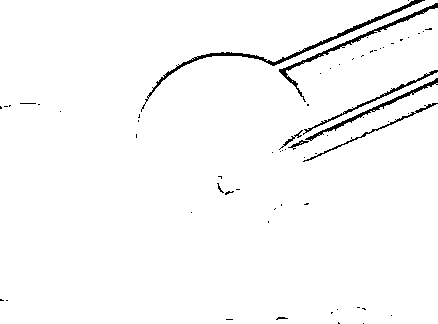

最后，节气与星座也对上了

于是，对时间和季节好奇起来，这种好奇一直将我引到 24 节气。一直以来认为 24 节气是阴历，直到当我关注占星和季节的关系后，才突然发现 24 节气原来是阳历。原来，虽然我们的阴历主要由月相的变化而确定，但古代，农业生产主要依赖于太阳，所以，又根据太阳的变化制定了 24 节气，这个和西方的阳历计时法就相同了。

于是，24 节气就与星座一一对应起来了。

白羊座：春分到谷雨  金牛座：谷雨到小满  双子座：小满到夏至  巨蟹座：夏至到大暑  狮子座：大暑到处暑  处女座：处暑到秋分  天秤座：秋分到霜降  天蝎座：霜降到小雪  射手座：小雪到冬至  摩羯座：冬至到大寒  水瓶座：大寒到雨水  双鱼座：雨水到春分  

这是不是很美妙呢？ 虽然可能很多研究星座多年的人早就知道，而且百度百科里面也有，但我仍然是很兴奋啊。因为通过季节的联系，这个星座和我们中国的节气对应起来了。我毕竟不是西方人，虽然喜欢西方美好的一切，但对中国美好的一切毫无疑问有着更多的内在共鸣。即便是一个词，冬至，但它就是和 winter solstice（英译的冬至）不一样。即便我现在这么看着它，也觉得，好美啊。

  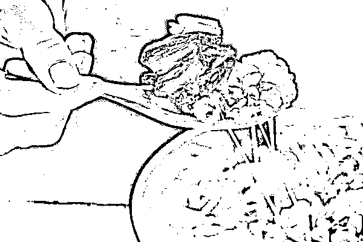

**◆ ◆ ◆ ◆ ◆**

****特别提醒：**希望将若道文章转载到各自公众号的朋友，**转载时请注明“转自若道微信公众平台”，并附上若道占星的 Logo**。谢谢！**

**2016 年 1 月 5 日-1 月 8 日**，格罗夫及其团队将在**北京**举办**三天全息呼吸工作坊**；**2016 年 1 月 11 日-1 月 17 日**，格罗夫和占星大师塔纳斯将在**北京**举办**七天全息呼吸与原型占星工作坊**。详细内容请点击“**阅读原文**”了解。


# 免费在线活动 | 明晚 8 点，大卫跟你聊 2016！

> 原文：[`mp.weixin.qq.com/s?__biz=MzA5NjA0NTAxNg==&mid=401531396&idx=1&sn=80ba89ca13e394505df0d9b67860fc8f&chksm=02ac50b335dbd9a5c3adec3ce5d030d8400a3e51a1de832e9cb9c5067f37f6f847955ffeb912&scene=126&sessionid=1692738892#rd`](http://mp.weixin.qq.com/s?__biz=MzA5NjA0NTAxNg==&mid=401531396&idx=1&sn=80ba89ca13e394505df0d9b67860fc8f&chksm=02ac50b335dbd9a5c3adec3ce5d030d8400a3e51a1de832e9cb9c5067f37f6f847955ffeb912&scene=126&sessionid=1692738892#rd)

前方

高能！

**2016**

利用占星学创造你的美好人生

START NOW

↓

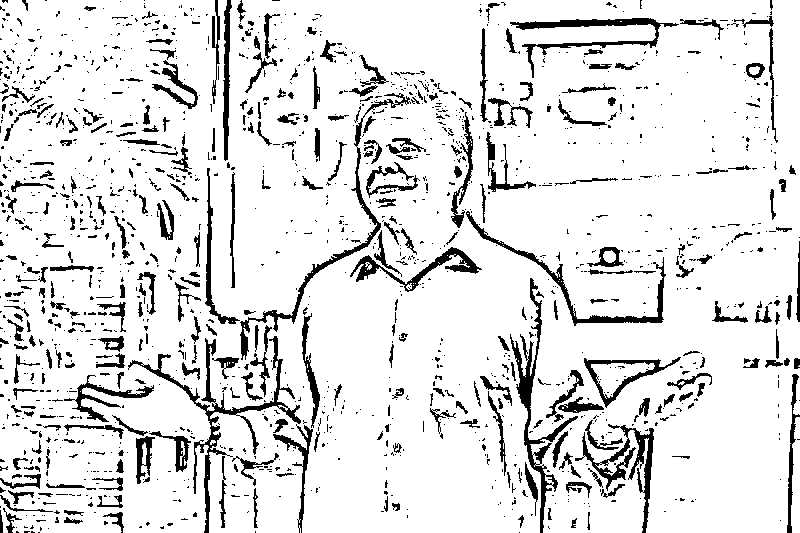

**男主播：**大卫·瑞雷

是哒，大卫远在亚特兰大，到时候他将用他磁性的嗓音与你探讨以下话题~

**活动主题****：**2016，如何利用占星学创造你的美好人生（一）

顺势而为，聪明人的选择。 

**内容：**2016 年重要天象及其影响

**时间：****12 月 19 日 20：00-21：00**

就快到了，抓紧时间报名哦！

**语种：****全程纯英语，无翻译**

逼格很高！了解星象还锻炼听力！

**◆ ◆ ◆ ◆ ◆**

**参与形式：**微信群活动

**参加要求：**若道微信粉丝

**着装：**不限

**人数：**有限（500 人满即止）

★**报名流程：**

①在本若道微信公众号 nodoorbj 中回复“**我爱占星**”获取客服二维码。

②点开二维码图片，长按识别，添加客服为好友。**（客服妹妹一直在加人加人，请耐心等待哦！）**

**提醒**：添加客服截止时间为**19 日 16：00**！

③转发本条微信到你的朋友圈，截图给客服。

④等着被客服拉入活动微信群。（依然提醒稍安勿躁）

**◆ ◆ ◆ ◆ ◆**

**不见不散哟~**


# 这个圣诞，若道为您准备了精彩好礼，快来领取吧！

> 原文：[`mp.weixin.qq.com/s?__biz=MzA5NjA0NTAxNg==&mid=401531396&idx=2&sn=88be50a4daf1dff7bb9c1843e11dcd47&chksm=02ac50b335dbd9a5787fa95ff9bd71dc940ed612257b76295b8fa30b92d5a7447067071f67f0&scene=126&sessionid=1692738892#rd`](http://mp.weixin.qq.com/s?__biz=MzA5NjA0NTAxNg==&mid=401531396&idx=2&sn=88be50a4daf1dff7bb9c1843e11dcd47&chksm=02ac50b335dbd9a5787fa95ff9bd71dc940ed612257b76295b8fa30b92d5a7447067071f67f0&scene=126&sessionid=1692738892#rd)

**点击播放，感受这温暖，2015 年，你值得一个完美的结尾。**

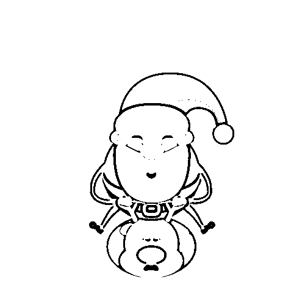

圣诞将至

元旦紧随其后

若道为您准备了

纯天然的精选椴树蜜

在寒冷而又温馨的冬日

感受清新宜人的淡淡花香

**我们**

**一直在这里陪伴你**

**活动详情如下**

2015 年 就要结束了

您对我们的服务
还 **【满意】**吗？

请移步文末点击**【写留言】** 

对若道提供的**【占星报告】**进行评价

也欢迎描述 您【**更想看到的占星报告】**内容 

评论**【可褒可贬】**但求**【言之有物】**  

**点赞最多** 的留言 我们为您送上蜂蜜

活动自本篇文章发送时开始

**截止日期**

**北京时间 2015/12/24/中午 12 点整**

获奖名单将于活动结束后在微信上公布

若道保留对本次活动的解释权

本文由“135 编辑器”提供技术


**我们目前为大家提供的占星报告有** 

**爱情关系扫描** 

### 前世今生的缘分

### 职业发展指南

### 机遇之门

### 什么样的男人适合我

### 他需要什么样的女人

还不熟悉若道君的报告？请点击文末“阅读原文”查看哦。

**奖品看过来**

**一等奖 | 1 名**

可获 / 价值共 **196 元** 的 **纯天然椴树蜜** 两瓶【包邮】

**二等奖 | 5 名**

每人可获 / 价值 **98 元** 的 **纯天然椴树蜜**

一瓶【包邮】

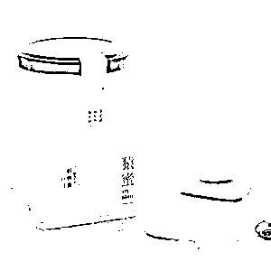

 **赞助商 | 猿蜜** 微店 | 猿生活

由**处女座**的程序猿精心打造

精选农家纯天然椴树蜜


# 亲密关系的第一步：敢于相互亏欠

> 原文：[`mp.weixin.qq.com/s?__biz=MzA5NjA0NTAxNg==&mid=401531396&idx=3&sn=24fea308c82a31fc085ed0f57dc88713&chksm=02ac50b335dbd9a5133f71272cadea143c3f7c780c2cf040af95489fb5103c4df7138c8783d1&scene=126&sessionid=1692738892#rd`](http://mp.weixin.qq.com/s?__biz=MzA5NjA0NTAxNg==&mid=401531396&idx=3&sn=24fea308c82a31fc085ed0f57dc88713&chksm=02ac50b335dbd9a5133f71272cadea143c3f7c780c2cf040af95489fb5103c4df7138c8783d1&scene=126&sessionid=1692738892#rd)

我不太会和人建立亲密关系，不管是好朋友还是男朋友。以前觉得没什么不好，我就是这样。现在慢慢意识到，其实是我害怕被否定，被抛弃，不被重视不被爱，极度缺乏安全感才会潜意识否定亲密关系对我的重要性，告诉自己一个人挺好的。 可是不想再这样下去，我想改变。可是自己都能意识到自己在与人建立关系的过程中各种笨拙。

我总结一下可能的问题有：1.我是个骨子里强势又有距离感的人。在比较不熟的人面前我还可以伪装，并且挺成功的。但是稍微熟一点我就装不下去了。2. 我是内向个性。3\. 我不会和人互动。4. 这一点只和找男朋友有关。我特别不会撒娇！！！

***以上为某知乎网友提出的关于亲密关系的问题，下面为颜宇飞所做出的回答。***

实际上大多数二十郎当岁的人，基本上形成了自己的世界观和知识面，对于社会也具备初步的了解。所以若是想刻意取悦另一个同龄人，让他\她觉得你是个不错的人，不妨尝试一下“互相亏欠”，不说百发百中，也十有八九。

当然啦，若是有啥严重的社交恐惧或者极度内向，就……另当别论啦…… 不信的话大可以试试，只要做到礼数周到与态度谦和、尽量帮助别人，口碑风评都不会太差。

这意味着，正常情况下对于处在这个年纪的大多数人来说，良性社交的难度并没有想象中的那么大；但它并不能代表我们就能很容易地建立起“亲密关系”。

仔细想想看，那些因为你的礼貌周到而对你赞誉有加的人，跟你的关系都如何？基本上都是点头之交或者交往不甚密切吧。倘若我一周只在你面前出现一两天，每次就两三个小时，那扮演一个善解人意的良好形象简直不要太简单！可是如果我们天天一起，上课一起上，三餐一起吃，很多事情都一起干，这时候让我一直“善解人意”下去还那么简单吗？很困难啊。

来，现在带入一下，前者就是你学生会、老乡会的同学，而后者是你室友。这就是为什么在知乎上很少有人问“跟学生会同部门一个同学关系很僵怎么办”，却随手一搜，就一大堆“如何解决跟室友之间的矛盾”。

人们的完美主义倾向告诉我们，保持一定距离是“美好”的客观条件，而人与人之间的距离也为自己罩上了一层保鲜膜。被这层保鲜膜笼罩着，你最好不要有求于人，最好不要展示弱点，最好不要真实地表态，生怕亏欠别人的同时也影响自己的“形象”，被别人觉得麻烦。我们最好两不相欠，这样你才能觉得我是个好人——据我所知，身边大多数不爱跟别人打交道的人潜意识里都有这样的动机倾向。

可事实真的如此吗？ 有一句话说得好，中国人之间的相处，讲究的从来不是“两不相欠”，而是“你来我往，互利共赢”。 如果没有猜错的话，许多有这方面烦恼的同龄人，总是喜欢把“不用麻烦啦”这句话挂嘴边。

——沉不沉，用不用我帮你提？

——谢谢啊，没事儿。

——我陪你去医院吧

——不用麻烦啦，一点小病。

讲真的，从下次开始，别拒绝这些细小的好意。一般来讲，肯这样主动问你的人，有 10%的可能只是客气一下，这个能判断出来。剩下 90%的情况真的是做好准备卖个人情给你了，别人有心帮你，你就接受呗~~~多得是机会“还”。 亲密关系，往往都是这样一来一往拉近的。

“亲密”和一个“完美”的形象几乎是不可得兼的，这个需要自己权衡。但过于害怕被别人嫌弃麻烦，肯定是建立不起来什么亲密关系的。

干说理没意思，举个栗子。

《倚天屠龙记》里的赵敏跟张无忌一直以来被奉为女追男的典范，可是郡主凉凉这个角色却是在全书写到一半的时候才开始露脸，读者也觉得这段感情戏并不突兀。只能说两个人”相互亏欠“的次数多，自然而然距离就拉近了。

第一回，赵敏给杨逍韦一笑下了毒，亏欠张无忌；

第二回，张无忌放了她费尽心思抓到的六大门派高手，又拿了她的黑玉断续膏，答应为她办三件事，亏欠了赵敏；

第三回，灵蛇岛上赵敏为救张无忌受伤，按理说应该是她被张无忌亏欠；可是后来被周芷若嫁祸，张无忌以为她为了夺倚天剑和屠龙刀做了一系列坏事，以为她亏欠了自己；最后才发现赵敏是被冤枉的，实际上是自己亏欠了她……感情波折十分之巨大。 真是……我们要互相亏欠，这样才能藕断丝连。

所以啊，亲密关系的第一步是要”敢于相互亏欠“。 一般熟的人一起吃饭都是 AA，特别熟的还 A 什么？基本上都是你请这一顿我请下一顿。就是这个理。

*亲爱的，亲密关系的第一步明白了吗？建立了一开始的亲密，那么接下来就是如何相处的问题了！心探索特邀请了徐迪老师举办了公益课程“倾听一小时”，帮助你了解你的 TA。*

* * *

**“倾听一小时”在线公益课程 | 第三期**

生活中

我们从不缺乏爱

而是不懂得感受爱

爱，从来不是理所当然

他需要倾听、感受，滋养

亲爱的，你感受到被爱了吗？

放下耳朵的依赖，把心打开吧！

“倾听一小时”带你畅游爱的国度

亲密关系“倾听一小时”公益在线课程第 3 期即将开始喽，有学员纷纷留言，学习完前两期之后，回去与伴侣之间的沟通更为顺畅了。还有小伙伴留言，学完前两期课程，自己现在都成了办公室的男闺蜜，还有好多朋友要给介绍对象呢！

你也心动了不？别着急，第三期就要开始了，快快来吧！应用国际前沿心理学理念与实战经验。在课程中你将学到在亲密关系里如何有效地倾听、回应的技巧，为爱加分。想在亲密关系中得到幸福的人都应该懂得这些技巧，收获属于你的爱！

课程大纲：

倾听绝不仅仅是嘴与耳朵的工作，它是我们身体的对话，借由与他人互动，交换信息，有给予也有获得。而爱就在这个过程中产生和加强。 

★让我们通过一系列的心理学工具，去了解我们在倾听与被倾听中到底在交换什么

★从源头上寻找阻碍我们倾听的原因，将理论结合真实的、熟悉的沟通场景

★引出倾听和被倾听的教练工具，如 3I 倾听反馈冰山、4P 提案冰山 ；内在的倾听空间等，帮助大家掌握倾听和被倾听的技巧

★通过可测量的倾听者教练练习，帮助大家熟悉各个知识点，在应用中强化，并最终转化为日常习得

在课程中你将接触到的工具：

1、了解我们的倾听装置 

工具：心理地位；戏剧三角；心理游戏。

2、识别倾听障碍物

工具：障碍圆环；三个误区；幸福融化了。

3、倾听和被倾听的教练工具

工具：倾听圆环；3I 信息冰山；萨提亚冰山。

适合人群：

★恋爱中的两个人，此课程将帮助你实现更加甜蜜地“谈”恋爱 

★婚姻中的两个人，此课程将成为你们白头到老的保护神

★单身，但渴望找到男朋友或女朋友的人，此课程将帮助你提升在两性互动中的魅力

★所有对倾听感到困惑或好奇的人，可提升在社交互动中的魅力，小心，不要让大家太喜欢你了哟～

讲师介绍：

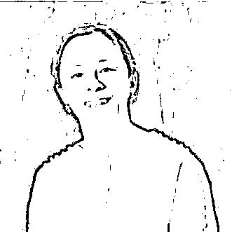

**徐迪：国际个人教练、家庭关系教练、心灵成长团体带领者、国际完形治疗认证治疗师。**

徐迪毕业于中央戏剧学院，出于对心理学的追求和对现代人心理困境的理解，透过自我探索和心灵成长，亲身体验了经典精神分析、团体小组、家庭系统排列，以及呼吸冥想和催眠静心等身心合一工作给自己带来的帮助；自 2006 年起密集地参加了心理咨询师的培训和督导，之后开始探索把心理学治疗技术、团队教练技术、戏剧治疗和身心灵修炼相结合，致力成为一个纯粹的为生命服务的分享者。 

徐迪觉察敏锐逻辑清晰，语言表达生动富有画面感，是一位拥有丰富实战经验的个人教练。

如何参与：

**公益价格**：1.99 元 

**开课日期：**12 月 07 日 20:00-21:00

**授课形式：**在线直播

**报名及听课**：点击左下角**阅读原文**，即可报名！或登陆 “跟谁学” APP 或者 PC 端上搜索“倾听一小时”

主办方介绍：

此次课程由北京尚善公益基金、浙江敦和慈善基金会和心探索共同呈现。

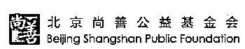

北京尚善公益基金会成立于 2012 年 10 月 25 日，是国内首家关注精神健康，抑郁症防治与知识普及的公益基金会。

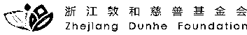
浙江敦和慈善基金会，致力于中国慈善事业的规范和繁荣发展，以慈善事业推动社会的和谐与进步，让更多需要帮助的人得到温暖，用心关爱每一个人，用爱关心每一天。


心探索是一个心灵成长自助网站，致力于向个人和企业提供心灵成长解决方案，倡导从心出发，创造美好的生活。

协办方介绍：

**裂帛·向内行走** 

原创设计品牌 主张：人生需要裂帛的勇气

**若道占星**

国际占星研究协会（ISAR） 中国唯一指定教学机构

**彩虹书吧**

分享、学习、疗愈、成长，开启卓越精彩人生的公益平台

**“如果有人倾听你，不对你评头论足，不替你担惊受怕，也不想改变你，这真是叹为观止——当有人倾听的时候，那些看似无法解决的问题就变得可以解决了；当一个人被倾听的时候，那些看似无法化解的困惑就转化成了相对清晰流畅的思绪。我曾经深深地体验过其中让我感到敏锐、同感和专注倾听的时光。”**

**——卡尔·罗杰斯**

愿你是那个被倾听的以及懂得倾听的幸福的人。

* * *

**上期学员好评：**  

**文学小子：**听完老师的课真的可以很好地学会放下自己的不好的情绪，收益良多。

s**unny :**老师讲得很生动，易懂，娓娓道来，非常好！！！

**冬至云端:** 很期待这次课，虽然有事耽误了，只听到一半，但仍然非常受益！感谢徐老师，期待更多机会学习到您的课程！收获更多！祝您的课越办越好！

**罗海静：**在亲密关系中，老师让我体会到一个新的概念。用心倾听。心是耳朵的开关。倾听我们自己内心的声音。也倾听对方的声音。然后把爱说出来。谢谢老师的分享。对我很有用。

**VC:** 时间太短暂了，特别好的课程，要把老师今天教的去实践，相信会更懂得自己和自己在乎的人。感谢?

**馥瑜 :**喜欢老师的声音，可惜时间不够。刚刚入门，了解为什么和人相处会出现负面情绪。

**小杰杰：**课程内容很贴近我们的生活，都是平时会遇到的问题，如果学到了，以后就能更好的处理人与人之间的沟通与倾听。

**向向：**好棒的老师，第一次听这么精彩的课程，对我目前的状态帮助很大。干活

**桔子:** 关于安抚和存在感的内容对我帮助很大

* * *

点击左下角**阅读原文**，即可进入报名页面。

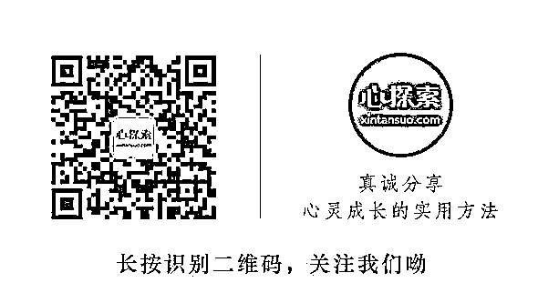

# 土星周期 | 七年就分手的如意算盘划算吗？

> 原文：[`mp.weixin.qq.com/s?__biz=MzA5NjA0NTAxNg==&mid=401491869&idx=1&sn=9c7d60ce125f4bf2c287dc4a0891e4b8&chksm=02acf52a35db7c3c02f12286ab9c85e13b25ffc3063d1e60cdca19cae2aedb13e0b0a8eb8156&scene=126&sessionid=1692738897#rd`](http://mp.weixin.qq.com/s?__biz=MzA5NjA0NTAxNg==&mid=401491869&idx=1&sn=9c7d60ce125f4bf2c287dc4a0891e4b8&chksm=02acf52a35db7c3c02f12286ab9c85e13b25ffc3063d1e60cdca19cae2aedb13e0b0a8eb8156&scene=126&sessionid=1692738897#rd)

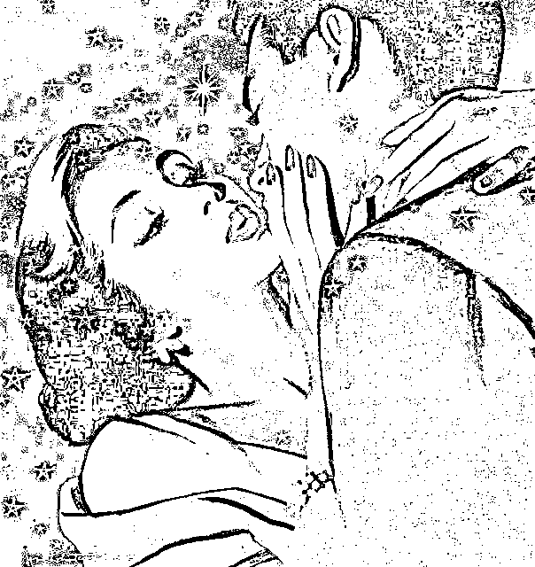

作者/Justine

图片/花瓣

当金星行进在天蝎座，火星行进在天秤座并四分天王星和冥王星时，曝出了“某学者”关于婚姻有效期的言论，引发了巨大的社会反响。这是无稽之谈吗？这言论背后又牵扯出什么深层议题呢？

**一纸婚书引发的争论**

“某学者”认为：结婚证应该设七年有效期，到期自动离婚。因为很多夫妻熬不过七年之痒，也有年轻人闪婚闪离。如果设置七年有效期，可以“大大降低离婚率”，让人们“尝试多段感情、不断收获新的爱情”，还能“解决单身问题”，又能“促进女性经济独立”，甚至能“拉动经济增长” 。

很多人觉得这是无稽之谈。且不说这样的制度会对家庭伦理和社会道德造成巨大的冲击，单单是“有效期”这三个字就会引发多少人内在深深的不安全感以及婚姻中更多的猜疑与愤怒，让婚姻更加脆弱，也对孩子的成长带来不可估量的影响。

当然，占星师的视角总会有些奇特。这条热点触动我的是对“七年之痒”传说的来历的探究，以及思考“某学者”提议背后的夹带恐惧。

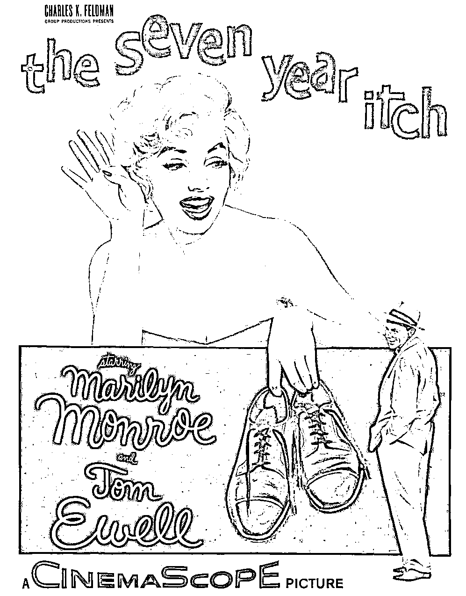

**“七年之痒”的占星学依据**

“七年之痒”是一个跨文化的词汇。玛丽莲·梦露在 1955 年有一部爱情喜剧叫《七年之痒》（Seven Year Itch）——中年男子在妻子离家度假期间，对刚刚搬上来的风姿绰约、性感撩人的女房客（梦露饰）产生了性幻想。随着电影的卖座，“七年之痒”成了外遇的代名词，后衍生成西方谚语，并广泛用于中文中。

那么，“七年之痒”有没有科学性，其来历是什么？

**从占星的角度上说，“七年之痒”跟土星的周期有关。土星的运行周期约是 29.4 年，大约每七年半左右，土星就走 1/4 圈。**

跟每一个生命的诞生类似，任何一个事件的开始（有明确的时间与地点）都可以有一张星图。大到一个国家的成立，小到一段关系的开始。土星在这张星图上会花近 30 年的时间运行一圈，7 年走 1/4 圈。我们通俗所说的“三十而立”与“七年之痒”，背后的影响者都是土星。

为什么是土星呢？在我们的太阳系里，土星是肉眼可见的行星的边界，代表有形物质世界的真正本质，同时也跟时间的法则有关。


**土星象征着一种心理的发展历程，也代表某种类型的生命经验和特质…….由于土星带来的痛苦经验似乎和一个人本身的缺点或弱点无关，比较像是从外而来的厄运，所以才赢得了‘业力之王’的封号。**

**——丽兹·格林《灵魂的功课》**


> 90 度的四分相与 180 度的对分相带来挑战，因此**每****1/4 个土星周期（约 7 年半、15 年、22 年、约 30 年）是带来压力积聚的顶点**；
> 
> 120 度的三分相代表和谐，因此**每****1/3 个土星周期（约 10 年、20 年、30 年）是努力得到回馈、收获成熟的庆祝点。**

因此，我们有了“七年之痒”的痛、“结婚十年”的庆贺。

这也是土星回归（每 29.4 年土星运转一个周期后，回到原先的位置）对于不同的个人而言，可以是成长的挫折或幻想的破灭，也可以是顶住压力收获成熟的庆贺，意义不尽相同。同时，**即使是面对土星的四分相或对分相，带来的压力不一定是挑战，也可以是释放、成长与转化。**

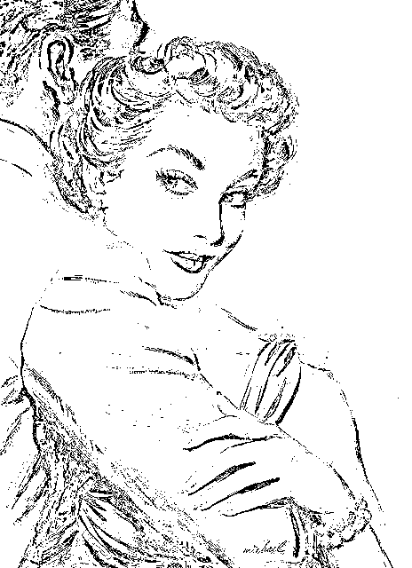

**“有效期”揭示的深层恐惧**

国际资深占星师琳恩·贝儿在《家族占星》中说：“当一段爱情关系结束时，要花多少时间才能让你的心情恢复? 对于每个人来说答案是不同的，这得要看你感受程度的多寡，甚至必须考虑你的成长过程。过于某些人来说，只需要几个星期，而对于其他人来说，修复一颗受伤的可能要花上好几年的时间……与感情有关的行星所产生的反应与水星、火星的反应不同，有些可能需要一部分的土星周期来消化，例如某些人花了七年的时间从离婚中恢复。”

**回到** **“婚姻七年有效期”提议，追溯其本质，大概是源于“如何从一段挫折的亲密关系中全身而退，不要被人抛弃”的恐惧。**我们的内心都会有这样的恐惧，也曾梦想能挥舞着魔棒（如同“结婚证设置有效期”般一个简单的制度、公式或技巧），一劳永逸地帮我们解决亲密关系中的难题。

然而当我们成熟起来，渐渐会明白：只有通过亲密关系，我们才会被迫面对自己的局限，从而变得更完整。

如果有占星师跟你说：每一段亲密关系都有其目的，关系跟自我的意识层次有关，跟灵魂的进化有关……听上去貌似有把问题复杂化的倾向。但这让我们承认：浪漫关系从来不是一件简单的是，婚姻问题更是相当复杂的。

**土星不允许我们有任何自欺与逃避，会给我们的发展带来历练——唯有搬开大石头，深挖才能挖到黄金。**这是物质世界的土星法则，也是深入灵魂与意识层面的现代占星学带来的强大疗愈力量。


**在亲密关系里活出爱和自由的选择，与最深奥的灵性修持同样困难。**

**——丽兹·格林**


愿在亲密关系中修炼的每一个人，都能越过灵魂的层层恐惧与陷阱，看见黑暗隧道里的希望与光芒，理解到蕴藏在无常背后的爱与温柔。


你对“七年之痒”怎么看呢？赞成为婚姻设立期限吗？欢迎留言！


**◆ ◆ ◆ ◆ ◆**

****特别提醒：**希望将若道文章转载到各自公众号的朋友，**转载时请注明“转自若道微信公众平台”，并附上若道占星的 Logo**。谢谢！**

**2016 年 1 月 5 日-1 月 8 日**，格罗夫及其团队将在**北京**举办**三天全息呼吸工作坊**；**2016 年 1 月 11 日-1 月 17 日**，格罗夫和占星大师塔纳斯将在**北京**举办**七天全息呼吸与原型占星工作坊**。详细内容请点击“**阅读原文**”了解。


# 若道 2016 年度课表新鲜出炉！

> 原文：[`mp.weixin.qq.com/s?__biz=MzA5NjA0NTAxNg==&mid=401491869&idx=2&sn=6a83307f80ed1e68809af616daca569e&chksm=02acf52a35db7c3cf09abafee14069cf0ed0fadb5edaa95be1b417644256e3bd63a522e322a1&scene=126&sessionid=1692738897#rd`](http://mp.weixin.qq.com/s?__biz=MzA5NjA0NTAxNg==&mid=401491869&idx=2&sn=6a83307f80ed1e68809af616daca569e&chksm=02acf52a35db7c3cf09abafee14069cf0ed0fadb5edaa95be1b417644256e3bd63a522e322a1&scene=126&sessionid=1692738897#rd)

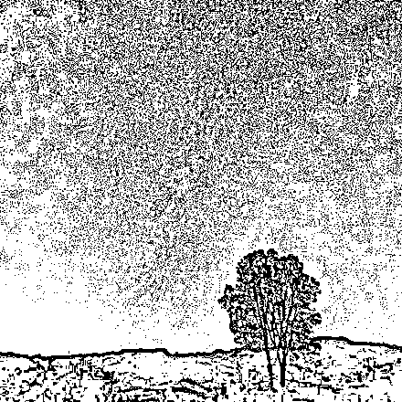

从古至今，人们仰望星辰，感受它散发的无尽神秘感。

占星学成了一面照见灵魂的镜子，让我们看清真实的自己。

在自我进化的过程中，你遇到了中国最权威的专业占星机构——若道占星。

若道占星由美国著名占星师大卫·瑞雷和 ISAR 中国区副主席蒋颖创立，是服务全国占星爱好者与进修者的一家培训与咨询机构。

若道为你提供各类占星及个人成长课程：

初阶到高阶的严肃占星学、世界级大师主题工作坊、西方各占星流派选修课、占星师执业资质认证课。

**总有一位导师，会指点你的盲区。**

**总有一门课程，会改变你的生命。**

**若道 2016 年度课表**

**报名截止日前 15 天付款有超级优惠的早鸟价哦！**

**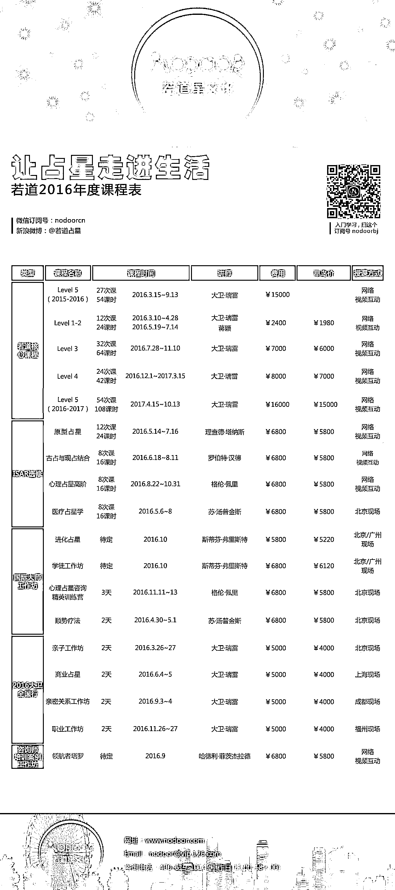**

（请点击查看大图）

**导师团队**

**大卫·瑞雷（David Railey）**

若道创始人，《灵魂的目标》作者。拥有四十年的占星咨询的执业经验，曾两任亚特兰大占星协会主席，是全美占星师联盟（AFAN）、美国占星师联合会（AFA）、全美占星研究委员会（NCGR）、国际占星研究协会（ISAR）和职业占星师组织（OPA）的成员，是联合占星大会（UAC, United Astrology Conference）督导委员会委员。大卫曾是 CNN、CBS 的占星节目的常驻嘉宾，多次在 BBC、WGS、WSB、WRGG 等节目中接受采访，并在亚特兰大主持电视节目《每日行星（Daily Planets）》达 4 年之久。


**蒋颖（Felicia）**

若道创始人。长江商学院 MBA，厦门大学经济学硕士，化学学士。国际占星研究协会（ISAR）中国区副主席。第一批获得国际占星研究协会（ISAR）认证的职业占星师。《灵魂的目标》译者。

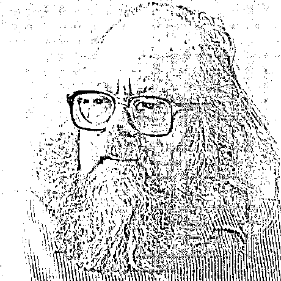

**罗伯特·汉德（Robert Hand）**  

罗伯特•汉德是当今最伟大、最博学的占星师之一，被美国占星学界称为“国家宝藏”。罗伯特以优等成绩毕业于布兰迪斯大学，曾在普林斯顿大学完成科学史研究生课程，并取得了美国天主大学中世纪及拜占庭研究博士。他的渊博学识使他被同行称为“占星字典”。为表彰他的卓越贡献，罗伯特·汉德在 2008 年被授予占星学界最高荣誉轩辕十四奖。罗伯特·汉德不但是一名优秀的占星师，更是一名伟大的占星学者。他在古典占星学领域做出的研究与贡献几乎无人能及。

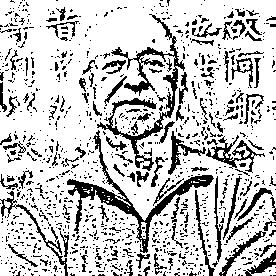

**斯蒂芬•弗里斯特（Steven Forrest）**

斯蒂芬·弗里斯特生于 1949 年，进化占星学的创始人之一，当今世界最有影响力的占星大师之一。1971 年毕业于美国北卡罗莱纳大学宗教学专业。1984—1988 年间，写作出版了《内在的天空》、《变化的天空》和《天空的伴侣》三本占星经典著作，奠定了早期在占星学界的地位。1985 年，他凭借《内在的天空》一书获得职业占星师协会奖（Professional Astrologers Incorporated Award）。斯蒂芬前后一共出版了 12 部占星著作，已经被翻译成各种语言，在世界占星学界拥有很高的声誉。

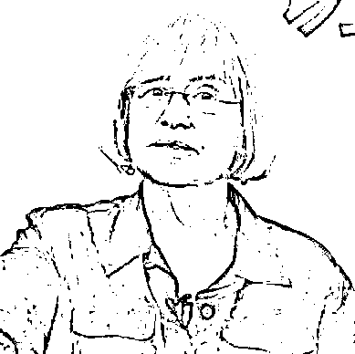

**苏•汤普金斯（Sue Tompkins）**

英国目前最资深的占星学家和咨询师之一，她拥有超过四十年的占星经验。占星学习者必备之两本圣经《当代占星研究》和《顺逆皆宜的人生》作者。苏•汤普金斯是伦敦占星学院这所享有盛名的专业学府的创办人，曾任英国两家最著名的占星学院校长。2003 年，为表彰其卓越贡献，英国占星协会为苏·汤普金斯授予查尔斯·哈维终身成就奖。苏同时是一位接受过心理学与心理咨询训练的注册顺势疗法医师，并经常在英国、法国、挪威、瑞典、澳大利亚等地举办占星研讨会和公开演讲。


**格伦•佩里（Glenn Perry）**  

格伦•佩里这位传奇的占星师，也是一名拳击和摩托车爱好者。他毕业于赛布鲁克学院(Saybrook Institute)，获得心理/意识研究专业博士学位，目前已是一位拥有三十多年从业经验的美国职业占星师和注册心理治疗师。他曾任国际占星研究协会（ISAR）以及联合占星大会董事会（UAC）副主席，也是 ISAR 突破性道德标准的设定者。格伦是占星心理学学院（Academy of AstroPsychology）的创办人。

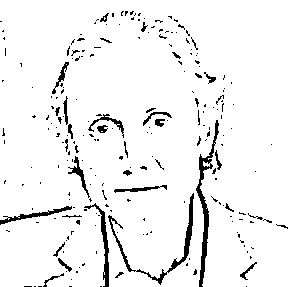

**理查德·塔纳斯**（**Richard Tarnas**）

理查德·塔纳斯是一位文化历史学家，凭所著的《西方思想史》和《宇宙和心灵的思想：新世界观的宣言》而广为人知。塔纳斯在加利福尼亚整合学院担任哲学和心理学教授，是哲学、宇宙论和意识专业的研究生项目创始人。塔纳斯于 1995 年出版了《唤醒者普罗米修斯》，主要关注天王星在占星学中的性质。在《宇宙和心灵的思想：新世界观的宣言》中，他认为西方人文史中的重大事件都与可观测的行星角度间有着意味深长的一一对应关系。

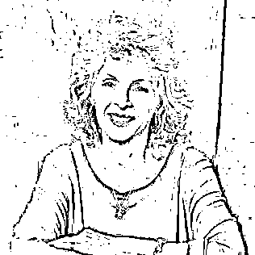

**哈德利·菲茨杰拉德（Hadley Fitzgerald）**

心理治疗师。英语学士，心理学硕士。从事占星咨询工作 40 余年，担任心理治疗师 30 余年。哈德利•菲茨杰拉德把出生星图作为生命地图，指引客户去发现灵魂在此生最好的发展目标，以及与灵魂的目标产生有意识共鸣的方法，帮助客户应对世俗发展和灵魂进化的双重挑战。

了解更多课程内容，请点击文末“**阅读原文**”。


# 再说一遍，伤口不会自动愈合

> 原文：[`mp.weixin.qq.com/s?__biz=MzA5NjA0NTAxNg==&mid=401475365&idx=1&sn=f2f7e94b0e12bd8d8965fde0895507f5&chksm=02acb59235db3c84780f59a080a6ac7c320cd916f823a7eb5f82a58502d74d62afe24956b0f1&scene=126&sessionid=1692738897#rd`](http://mp.weixin.qq.com/s?__biz=MzA5NjA0NTAxNg==&mid=401475365&idx=1&sn=f2f7e94b0e12bd8d8965fde0895507f5&chksm=02acb59235db3c84780f59a080a6ac7c320cd916f823a7eb5f82a58502d74d62afe24956b0f1&scene=126&sessionid=1692738897#rd)

愿你在 Paul Cardall 的钢琴声中获得些许疗愈

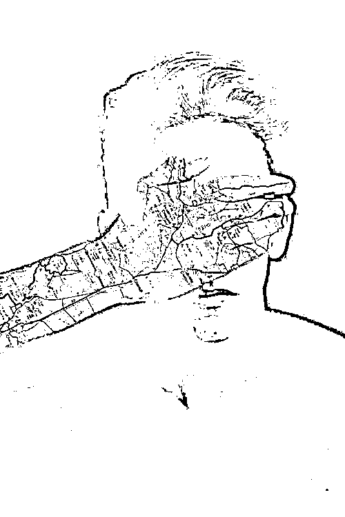

本文由若道整理发布 文字来源/格罗夫全息呼吸平台

**也许，对于身体的伤，心灵的伤，我们都太过回避了。只是，创伤一直在那里，你不去看它，它就会消失吗？**

## **这是一个真实的案例**

> **呼吸着呼吸着，他回到 7 岁，回到妈妈的子宫，回到 300 年。**

① 音乐响起没多久，Sam（化名）就大喊：“我要出去！放我出去！”Sam 觉得他快要被杀死了。原来，Sam 回到了童年，他看到七岁那年的画面——小朋友们在沙滩上挖了一个沙坑，当他爬进去时，沙坑塌了，他被埋了进去。Sam 大呼救命！可小朋友们没有听见，都在蹦蹦跳跳地玩耍。后来他回忆起，等自己被救出来时，已经快窒息了。

**七岁时的这个事情，Sam 已经记不得了，但是，他有一直查不出具体原因的呼吸道问题。**

② Sam 继续呼吸，他发现自己在产道里，肩膀卡在妈妈盆骨的后面，他清晰地看到这一切。Sam 退回到婴儿状，他感到非常痛苦、恐惧，他大声呼救！（陪护者和助教立刻回应，让 Sam 得到了极大的安抚。）

**成年的 Sam 当然没有胎儿时的记忆，但是，他的肩膀长期以来有慢性疼痛的问题。**

③ Sam 继续呼吸。突然，他穿战衣，置身人烟沸腾的战场，敌人的兵器朝着他的肩膀直戳过来，他被狠狠地摔在地上，身后的马扬蹄踩着他的胸呼啸而过，瘀血积在肺部，让他呼吸越来越艰难。Sam 像飘浮在战场上空的幽灵一样，看着身体一点点地经历着痛苦的死亡。等 Sam 回过神来，他发现自己正躺在工作坊的床垫上。而刚才出现的，是三百年前发生在英国的一场战争，他回到了前世。

仅仅就是呼吸，呼吸…….在震撼人心灵的音乐里呼吸，**Sam 身上出现了奇迹——肩膀长期的慢性疼痛消失了，做过多次医疗检查一直查不出具体原因的呼吸困难也通畅了，而因为这些带来的长期心理焦虑也得到了极大的缓解。**

这是超个人心理学奠基人格罗夫和妻子在伊萨兰学院（Esalen Institute）开办的全息呼吸工作坊的一个案例。几十年来，类似传奇的案例还有很多。

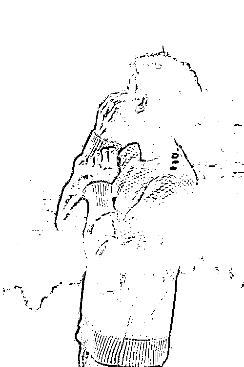

## **每一个出生都是一次重大创伤**

> **你挥之不去的焦虑也许来自于出生时甚至更早期。**

这个对你来说，也许感到非常神奇，也许觉得荒谬，或难以置信，但是对于格罗夫博士而言，这是司空见怪的。

现在很多人都已经了解童年经历对于我们人生的影响，你也许还在了解和治愈童年创伤，但格罗夫博士的研究会告诉你，每一个出生都是一次重大创伤。了解这个谜题，对于治疗那些医学或传统心理学无法解决的身心疾病有着深远的意义。

“出生创伤”（birth trauma）这个概念，最初由奥地利心理学家奥托·兰克（Otto Rank）提出。兰克认为，对婴儿来说，痛苦的出生创伤形成了一个焦虑模式的原型，在以后的生活中会被各种情境重新激活。遗憾的是，兰克只是提出了“出生创伤”这个概念，并没有对其进行深入研究。

而格罗夫博士从无数个临床治疗中，从超个人心理学的角度，对出生创伤做了详尽的研究和解释。

Sam 的体验，特别是回到母亲产道的经验，就和“围产期”概念联系在一起。格罗夫把情感和身心失调称为浓缩的经验集合体，有着不同层面的原因。究其根源，出生后的一些状况只是问题的潜层原因，更深层的原因跟出生以及产前孕期，甚至跟过去世的经历有着密不可分的关系。

格罗夫博士将胎儿从在母亲子宫到生产分为四个过程，并亲自绘制了四个矩阵的图像，形象地展现了不同阶段的心理体验。这个时期就是“围产期”。

*   **围产期第一阶段：**婴儿在母亲的子宫中，和母亲是“一体”的，在子宫中体验着没有时间没有边界的生命。

*   **围产期第二阶段：**子宫收缩，但子宫颈口没有打开，婴儿被挤压。

*   **围产期第三阶段：**正在收缩的子宫和产道的异常紧张激烈的生死斗争，并且在一种彻底的湮灭的经验中达到高潮。

*   **围产期第四阶段：**婴儿从产道中出生，突破和超越边界，从之前的限制中彻底解脱。

**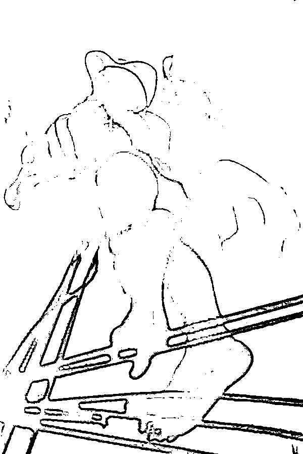**

**虽然母亲在生产过程中也经历了很多痛苦，但她是主动的那个角色，可以有更多的自我调节和控制，这与胎儿的被动是不同的，胎儿是在完全无助的环境中超个人心理学认为，胎儿在子宫以及生产时的生理和心理体验是后天人生经验的原型。**

这些体验会在孩子身体和情感上留下很深的印记，并且会在成年之后以不明所以甚至极端的方式展现出来。

*   例如有些人在亲密关系中，有害怕被抛弃的剧烈恐惧心理，因为母亲曾经想要堕胎；

*   有些人对于积极主动行动有莫名恐惧，因为出生时头部无法顺利出产道；

*   有些人喜欢性虐恋，其实因为胎儿时期脐带绕颈等原因而在母亲子宫里的窒息体验；

*   有些人的妄想症，可能源于母亲在孕期吃了有毒的食物，便会使胎儿在出生后的潜意识里表现出一系列妄想症状。

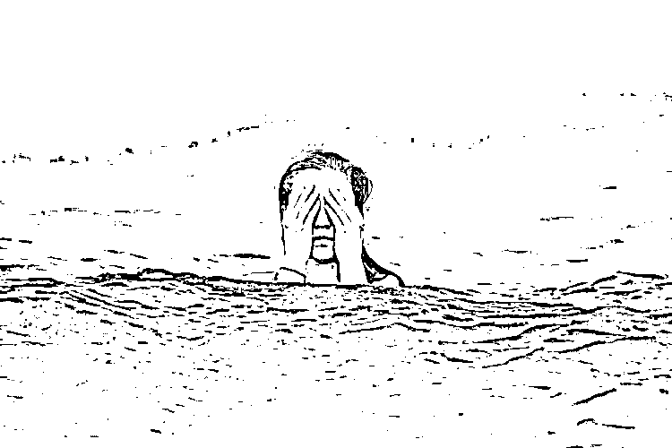

## **抵达创伤有一个通道**

> **伤痛就在那里，不去碰触它就会消失吗？**

格罗夫说，每一个出生都是一次重大的创伤，以至于没有人的记忆愿意触及那里，但呼吸是一个抵达的通道。

**通过呼吸，不仅可能像 Sam 那样获得身心的疗愈，还可以达到更广阔的意识。**很少人知道，我们只活出了生命的一小部分。其实，意识远比身体的界限要广阔得多，可以活出各种不同层次，去不同的时空，有着完全不同的体验。有些意识状态的危机，例如萨满高危体验、昆达里尼唤醒、前世体验，濒死体验等，恰恰隐含着治愈和转化的契机，让我们进入广阔的意识体验。

*   “我变成了一个胎儿，一会儿又变成了一条鱼，还做了宇航员，飘浮在太空中，之后我又跑到了南美的部落里，成为一名土著。”

*   “我突然觉得自己的身体消失了，意识也消失了，感觉和整个宇宙融为一体。”

*   “我看到光幕、佛陀、宇宙密室……”

*   “那时我才开始体会到无我的含义。从此以后，我学会了更加宽容。”

**每个人都有自我疗愈的智慧，就像每个人的身体都有一个雷达，我们所做的只是激活这个雷达。**

**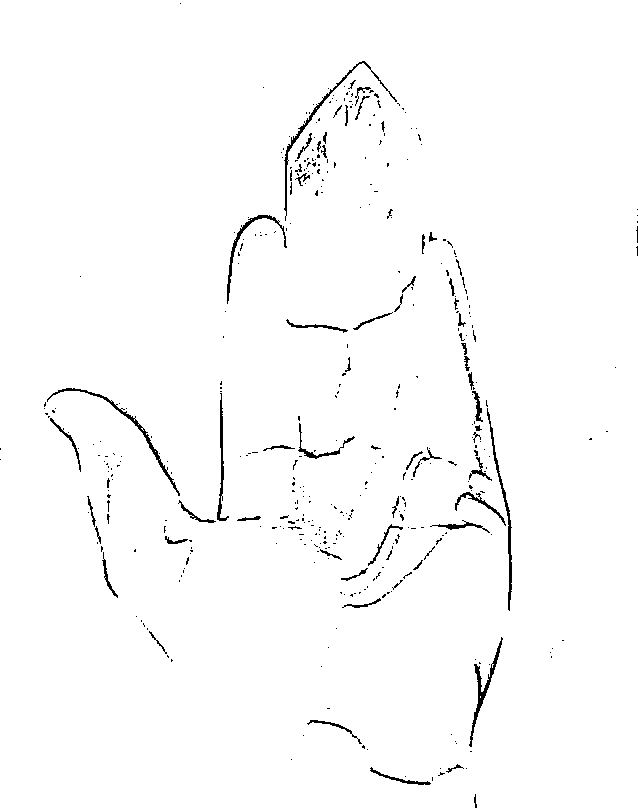**

**了解更多带领你疗愈伤口的人：**

[你不是忙着活，就是忙着死！](http://mp.weixin.qq.com/s?__biz=MzA5NjA0NTAxNg==&mid=401330772&idx=1&sn=5fe53d4b953c868fe4fe7cc88a72ff9e&scene=21#wechat_redirect)

[格罗夫是谁？| 打怪升级真人版](http://mp.weixin.qq.com/s?__biz=MzA5NjA0NTAxNg==&mid=401222342&idx=1&sn=a5de760e45cd180a180f02e400418fd6&scene=21#wechat_redirect) 

[格罗夫星图解析：爱在呼吸里](http://mp.weixin.qq.com/s?__biz=MzA5NjA0NTAxNg==&mid=209082717&idx=1&sn=8eadce4886da92e93980dc7c3373436a&scene=21#wechat_redirect)

**◆ ◆ ◆ ◆ ◆**

****特别提醒：**希望将若道文章转载到各自公众号的朋友，**转载时请注明“转自若道微信公众平台”，并附上若道占星的 Logo**。谢谢！**

**2016 年 1 月 5 日-1 月 8 日**，格罗夫及其团队将在**北京**举办**三天全息呼吸工作坊**；**2016 年 1 月 11 日-1 月 17 日**，格罗夫和占星大师塔纳斯将在**北京**举办**七天全息呼吸与原型占星工作坊**。详细内容请点击“**阅读原文**”了解。


# 三天全息呼吸工作坊 | 12 月 18 日前付款有早鸟价哦！

> 原文：[`mp.weixin.qq.com/s?__biz=MzA5NjA0NTAxNg==&mid=401475365&idx=2&sn=944fa238a5c191e2dd7570cb80d86c1c&chksm=02acb59235db3c846416cf15fe4169d80dccabfd05e0c946c22a06faf1292fc2eea4f72143a0&scene=126&sessionid=1692738897#rd`](http://mp.weixin.qq.com/s?__biz=MzA5NjA0NTAxNg==&mid=401475365&idx=2&sn=944fa238a5c191e2dd7570cb80d86c1c&chksm=02acb59235db3c846416cf15fe4169d80dccabfd05e0c946c22a06faf1292fc2eea4f72143a0&scene=126&sessionid=1692738897#rd)

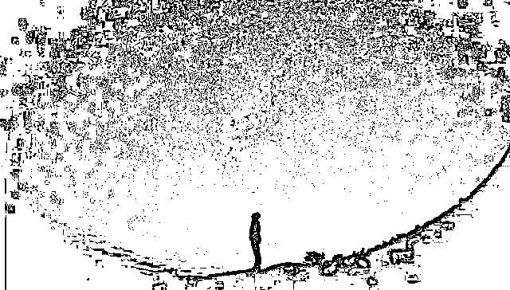

**课程信息**

名称：三天全息呼吸工作坊

开课时间：2016 年 1 月 5 日

讲课城市：北京

授课老师：格罗夫及其团队

标准价：**7800 元/人**

早鸟价：**7300 元/人（12 月 18 日之前）**

若道老学员减 500

三天+七天工作坊连报

优惠价：**16800 元/人**

若道老学员减 500

注：以上各工作坊五人同行即可享受九折

报名截止：2015 年 12 月 31 日

课程负责人：王晓鸥

联系方式：400-619-1014、18618495299

QQ、微信：2837474346

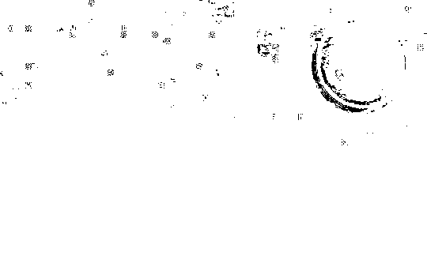

超个人心理学与原型宇宙学的对话

我们的心灵相应于宇宙的结构，在宏观宇宙层面发生的事情，也同样会在最精微、最主观的心灵层面得到显现。

——荣格


**斯坦尼斯拉夫•格罗夫（Stanislav Grof）**

斯坦尼斯拉夫·格罗夫 (Stanislav Grof) 博士，超个人心理学创立者之一、全息呼吸法创立者。格罗夫的好友，著名占星师、哲学家理查德·塔那斯曾这样评价格罗夫：“在深度心理学研究领域里，自弗洛伊德和荣格之后，斯坦·格罗夫无疑是在认识论层面上做出最大贡献的心理学家。从心理疗愈的效果上讲，他的全息呼吸法至今仍是最有效的，没有其他疗法可比。”现今 84 岁的格罗夫至今依然带领由各国心理学家组成的“全息呼吸工作团” 奔走于全球不同的城市，治疗众生。

**引言：**

二十世纪见证了人类历史的诸多重大变革：从爱因斯坦的相对论到波恩的量子力学；从毕加索的立体主义到杜尚的实验艺术；从嬉皮运动对传统的颠覆到女权主义在全世界的兴起；从 DNA 生物学革命到互联网推动的技术变革……然而在人类历史的进程中，还有一项变革极为隐秘却至关重要，那便是对于人类意识与心灵的探求。1900 年，弗洛伊德出版《梦的解析》，标志着心理学开始探索人类潜意识的神秘汪洋，在一个世纪的发展中，从荣格，马斯洛到肯•威尔伯，心理学界研究无疑掀起了一场哥白尼式的革命，而在这场心理学革命中，有一位至关重要的人物，便是我们这次中国之行的主角：“全息呼吸”的发明者格罗夫博士。

斯坦尼斯拉夫•格罗夫（Stanislav Grof）是以位被命运召唤的天才：一位从小梦想做一名漫画家，却最终成为现代意识探索的先驱；另一位立志要用自己的歌声影响这个世界，却最终成为一名颇具革命性的哲学家。1974 年，刚从哈佛毕业不久的塔纳斯来到伊莎兰研究院（Esalen Institute）见到当时已因意识研究而闻名的格罗夫博士，随机决定留在伊莎兰跟随格罗夫学习，并在不久之后成为格罗夫的同事，共同展开研究。


课程内容：

此次工作坊，格罗夫博士及其团队将引领所有学员共同探讨如下议题：

***** 潜意识的不同领域和维度

***** 对于所谓的“情绪紊乱”与“心理疾病”的新洞见

***** 心灵的自我疗愈潜力

***** 仪式感与灵性生活的重要性

***** 对于艺术与艺术家的再理解

***** 战争与革命；暴力与贪婪的起因

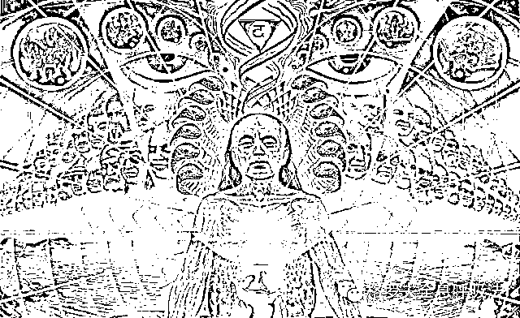

全息呼吸简介

全息呼吸（Holotropic Breathwork）：由享誉全球的超个人心理学家斯坦尼斯拉夫•格罗夫(Stanislav Grof)与妻子克里斯蒂拉•格罗夫(Christina Grof)共同探索出的一种心理治疗与意识 转化的方法。它结合现代意识研究、人类学、以及各心理学派和超个人心理学的探索,并映照于东 西方各大灵修学派与神秘传统,在不借助外力的情况下,通过内在呼吸的引导达至全息意识状态,从而达到创伤疗愈和内在探索的目的。

**“全息呼吸法”导师团队**

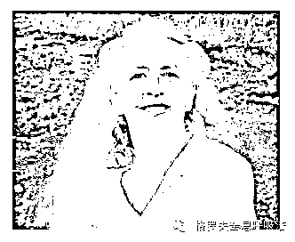

**Diane Hang | 美国**

全球最有声望也是最资深的全息呼吸法治疗师之一。戴安娜是第一批跟随格罗夫学习全息呼吸法的学员之一，也是最早开始在全球范围内传播全息呼吸法的导师之一。戴安娜除了对于全息呼吸法的研究与实践之外，对于佛法修行，印第安民族的智慧传统，部落传统的设计与建筑，以及园艺都有精深的研究。戴安娜目前是加州整合研究院（California Institute of Integral Studies）的客座教授, 同时与来自全球各地的超个人心理学研究机构与导师有频繁的交流与合作。

****

**Holly Herman | 英国**

心理学专家，在多所心理学机构从事临床实践二十多年。霍莉在英国建有专业推广全息呼吸法的独立机构（HolotropicUKLimited），并常年跟随格罗夫在全世界举办讲座与工作坊，致力于向全球推广全息呼吸法，协助格罗夫处理协调活动的相关事宜。

**Brigitte Ashauer | 德国**

拥有三十多年从业经历的心理学家和心理咨商师。她是第一批在伊莎兰学员接受格罗夫博士培训的全息呼吸导师。自上世纪八十年代中页，她便在德国开始教授长达三年的全息呼吸培训课程。目前除了在德国从事心理咨商与全息呼吸培训之外，还在世界各地举办工作坊与静修营。

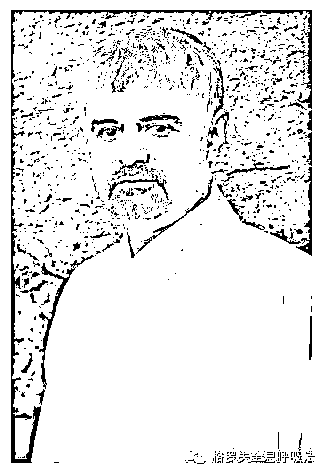

**Emelianenko Vladimir | 俄罗斯**

心理学博士。常年在俄罗斯从事精神病学理论与临床研究。2000 年起，将全息呼吸法引入俄罗斯并结合中国气功导引术，运用于心理治疗中。弗拉基米尔深受中国文化影响，对于道教与茶艺尤其热爱。弗拉基米尔受习于武当派，每年定期到中国参访圣地并修习气功。

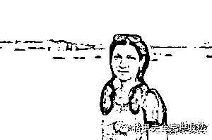

**Alexandra Emelianenko | 俄罗斯**

毕业于俄罗斯罗斯托夫州立医科大学（Rostov State Medical University），随后又获得心理学和临床心理学双硕士。亚历山德拉曾工作于上瘾症中心，并于 2004 年获得格式塔心理疗法培训资格证。2000 年亚历山德拉首次体验全息呼吸法，并于 2012 年最终完成格罗夫超个人培训（Grof Transpersonal Training）。从 2013 年起，亚历山德拉与丈夫弗拉基米尔共同带领俄罗斯的格罗夫超个人培训。亚历山德拉习练气功多年，并从事中国茶叶的生意，她每年都会在中国旅行，并对于中国美食和传统文化有着深厚的兴趣。

**工作坊安排**


**工作坊时间**

**2016 年 1 月 5 日-1 月 8 日**

斯坦尼斯拉夫• 格罗夫计划未来在中国启动全息呼吸法师资培训课程，师资培训课程对于受训者而言除了需要深入理解和体验全息呼吸之外，还需要对各个前沿及相关领域有基本认识与了解。

**工作坊价格**

标准价：**7800 元/人**

早鸟价：**7300 元/人**（12 月 18 日之前）

若道老学员减 500

三天+七天工作坊连报

**优惠价：16800 元/人**

若道老学员减 500

注：以上各工作坊五人同行即可享受九折

**工作坊城市**

北京

**联络与咨询**

主办单位： 山东济南瑞珈瑜伽艺术生活空间

协办方：若道星文化

联系人：王晓鸥

联系方式：400-619-1014、18618495299

QQ、微信：2837474346

报名请点击“**阅读原文**”


# 七天全息呼吸与原型占星工作坊 | 12 月 18 日前付款有早鸟价哦！

> 原文：[`mp.weixin.qq.com/s?__biz=MzA5NjA0NTAxNg==&mid=401475365&idx=3&sn=2569a4982c37b04069220d6896e5c971&chksm=02acb59235db3c84374ba14c85f8ae0af6d82d4e0413c1b384cac2f67274d07371cb3118552b&scene=126&sessionid=1692738897#rd`](http://mp.weixin.qq.com/s?__biz=MzA5NjA0NTAxNg==&mid=401475365&idx=3&sn=2569a4982c37b04069220d6896e5c971&chksm=02acb59235db3c84374ba14c85f8ae0af6d82d4e0413c1b384cac2f67274d07371cb3118552b&scene=126&sessionid=1692738897#rd)

**课程信息**

名称：三天全息呼吸工作坊

开课时间：2016 年 1 月 5 日

讲课城市：北京

授课老师：格罗夫及其团队

标准价：**7800 元/人**

早鸟价：**7300 元/人（12 月 18 日之前）**

若道老学员减 500

三天+七天工作坊连报

优惠价：**16800 元/人**

若道老学员减 500

注：以上各工作坊五人同行即可享受九折

报名截止：2015 年 12 月 31 日

课程负责人：王晓鸥

联系方式：400-619-1014、18618495299

QQ、微信：2837474346


超个人心理学与原型宇宙学的对话

我们的心灵相应于宇宙的结构，在宏观宇宙层面发生的事情，也同样会在最精微、最主观的心灵层面得到显现。

——荣格


**斯坦尼斯拉夫•格罗夫（Stanislav Grof）**

斯坦尼斯拉夫·格罗夫 (Stanislav Grof) 博士，超个人心理学创立者之一、全息呼吸法创立者。格罗夫的好友，著名占星师、哲学家理查德·塔那斯曾这样评价格罗夫：“在深度心理学研究领域里，自弗洛伊德和荣格之后，斯坦·格罗夫无疑是在认识论层面上做出最大贡献的心理学家。从心理疗愈的效果上讲，他的全息呼吸法至今仍是最有效的，没有其他疗法可比。”现今 84 岁的格罗夫至今依然带领由各国心理学家组成的“全息呼吸工作团” 奔走于全球不同的城市，治疗众生。

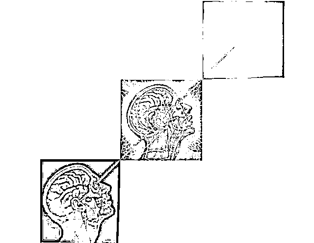

**引言：**

二十世纪见证了人类历史的诸多重大变革：从爱因斯坦的相对论到波恩的量子力学；从毕加索的立体主义到杜尚的实验艺术；从嬉皮运动对传统的颠覆到女权主义在全世界的兴起；从 DNA 生物学革命到互联网推动的技术变革……然而在人类历史的进程中，还有一项变革极为隐秘却至关重要，那便是对于人类意识与心灵的探求。1900 年，弗洛伊德出版《梦的解析》，标志着心理学开始探索人类潜意识的神秘汪洋，在一个世纪的发展中，从荣格，马斯洛到肯•威尔伯，心理学界研究无疑掀起了一场哥白尼式的革命，而在这场心理学革命中，有一位至关重要的人物，便是我们这次中国之行的主角：“全息呼吸”的发明者格罗夫博士。

斯坦尼斯拉夫•格罗夫（Stanislav Grof）是以位被命运召唤的天才：一位从小梦想做一名漫画家，却最终成为现代意识探索的先驱；另一位立志要用自己的歌声影响这个世界，却最终成为一名颇具革命性的哲学家。1974 年，刚从哈佛毕业不久的塔纳斯来到伊莎兰研究院（Esalen Institute）见到当时已因意识研究而闻名的格罗夫博士，随机决定留在伊莎兰跟随格罗夫学习，并在不久之后成为格罗夫的同事，共同展开研究。


课程内容：

此次工作坊，格罗夫博士及其团队将引领所有学员共同探讨如下议题：

***** 潜意识的不同领域和维度

***** 对于所谓的“情绪紊乱”与“心理疾病”的新洞见

***** 心灵的自我疗愈潜力

***** 仪式感与灵性生活的重要性

***** 对于艺术与艺术家的再理解

***** 战争与革命；暴力与贪婪的起因


全息呼吸简介

全息呼吸（Holotropic Breathwork）：由享誉全球的超个人心理学家斯坦尼斯拉夫•格罗夫(Stanislav Grof)与妻子克里斯蒂拉•格罗夫(Christina Grof)共同探索出的一种心理治疗与意识 转化的方法。它结合现代意识研究、人类学、以及各心理学派和超个人心理学的探索,并映照于东 西方各大灵修学派与神秘传统,在不借助外力的情况下,通过内在呼吸的引导达至全息意识状态,从而达到创伤疗愈和内在探索的目的。

**“全息呼吸法”导师团队**


**Diane Hang | 美国**

全球最有声望也是最资深的全息呼吸法治疗师之一。戴安娜是第一批跟随格罗夫学习全息呼吸法的学员之一，也是最早开始在全球范围内传播全息呼吸法的导师之一。戴安娜除了对于全息呼吸法的研究与实践之外，对于佛法修行，印第安民族的智慧传统，部落传统的设计与建筑，以及园艺都有精深的研究。戴安娜目前是加州整合研究院（California Institute of Integral Studies）的客座教授, 同时与来自全球各地的超个人心理学研究机构与导师有频繁的交流与合作。

****

**Holly Herman | 英国**

心理学专家，在多所心理学机构从事临床实践二十多年。霍莉在英国建有专业推广全息呼吸法的独立机构（HolotropicUKLimited），并常年跟随格罗夫在全世界举办讲座与工作坊，致力于向全球推广全息呼吸法，协助格罗夫处理协调活动的相关事宜。

**Brigitte Ashauer | 德国**

拥有三十多年从业经历的心理学家和心理咨商师。她是第一批在伊莎兰学员接受格罗夫博士培训的全息呼吸导师。自上世纪八十年代中页，她便在德国开始教授长达三年的全息呼吸培训课程。目前除了在德国从事心理咨商与全息呼吸培训之外，还在世界各地举办工作坊与静修营。


**Emelianenko Vladimir | 俄罗斯**

心理学博士。常年在俄罗斯从事精神病学理论与临床研究。2000 年起，将全息呼吸法引入俄罗斯并结合中国气功导引术，运用于心理治疗中。弗拉基米尔深受中国文化影响，对于道教与茶艺尤其热爱。弗拉基米尔受习于武当派，每年定期到中国参访圣地并修习气功。


**Alexandra Emelianenko | 俄罗斯**

毕业于俄罗斯罗斯托夫州立医科大学（Rostov State Medical University），随后又获得心理学和临床心理学双硕士。亚历山德拉曾工作于上瘾症中心，并于 2004 年获得格式塔心理疗法培训资格证。2000 年亚历山德拉首次体验全息呼吸法，并于 2012 年最终完成格罗夫超个人培训（Grof Transpersonal Training）。从 2013 年起，亚历山德拉与丈夫弗拉基米尔共同带领俄罗斯的格罗夫超个人培训。亚历山德拉习练气功多年，并从事中国茶叶的生意，她每年都会在中国旅行，并对于中国美食和传统文化有着深厚的兴趣。

**工作坊安排**


**工作坊时间**

**2016 年 1 月 5 日-1 月 8 日**

斯坦尼斯拉夫• 格罗夫计划未来在中国启动全息呼吸法师资培训课程，师资培训课程对于受训者而言除了需要深入理解和体验全息呼吸之外，还需要对各个前沿及相关领域有基本认识与了解。

**工作坊价格**

标准价：**7800 元/人**

早鸟价：**7300 元/人**（12 月 18 日之前）

若道老学员减 500

三天+七天工作坊连报

**优惠价：16800 元/人**

若道老学员减 500

注：以上各工作坊五人同行即可享受九折

**工作坊城市**

北京

**联络与咨询**

主办单位： 山东济南瑞珈瑜伽艺术生活空间

协办方：若道星文化

联系人：王晓鸥

联系方式：400-619-1014、18618495299

QQ、微信：2837474346

报名请点击“**阅读原文**”


# 若道粉免费专享 | 大卫聊 2016 微信活动报名！(12 月 19 日晚 8 点)

> 原文：[`mp.weixin.qq.com/s?__biz=MzA5NjA0NTAxNg==&mid=401475365&idx=4&sn=e3731ff91909dc1ffc21e5f40939bafe&chksm=02acb59235db3c8482be3d1ecd1735930a2a44b8763d84b4b86b2934087663a0a15f329ac840&scene=126&sessionid=1692738897#rd`](http://mp.weixin.qq.com/s?__biz=MzA5NjA0NTAxNg==&mid=401475365&idx=4&sn=e3731ff91909dc1ffc21e5f40939bafe&chksm=02acb59235db3c8482be3d1ecd1735930a2a44b8763d84b4b86b2934087663a0a15f329ac840&scene=126&sessionid=1692738897#rd)

前方

高能！

**2016**

利用占星学创造你的美好人生

START NOW

↓

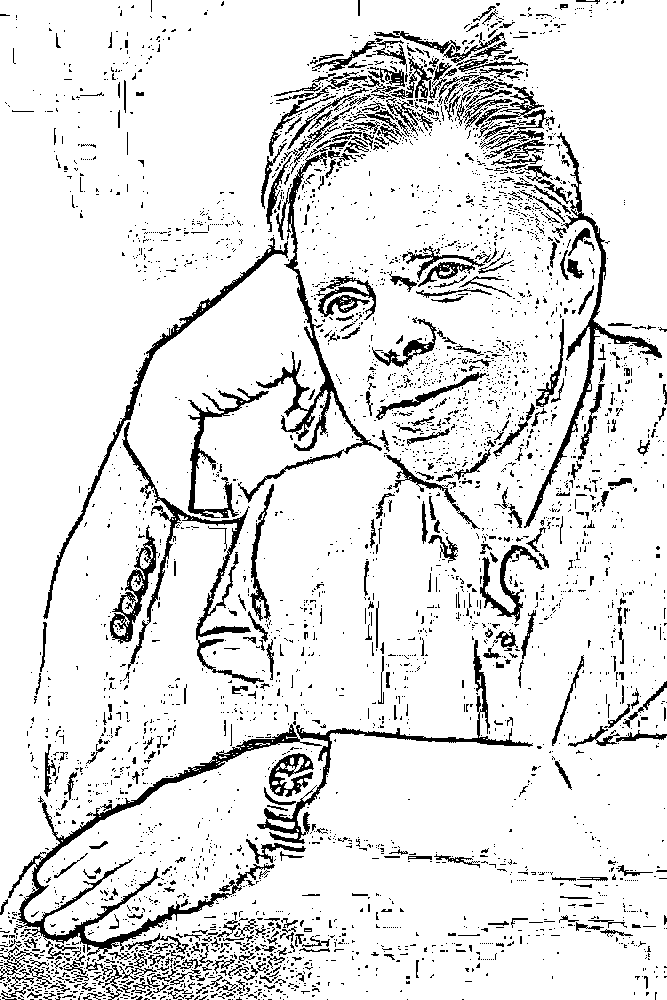

**男主播****：**大卫·瑞雷

是哒，大卫远在亚特兰大，到时候他将用他磁性的嗓音与你探讨以下话题~

**活动主题****：**2016，如何利用占星学创造你的美好人生（一）

顺势而为，聪明人的选择。 

**内容：**2016 年重要天象及其影响

如果你英文够好，还可以向大卫提问哦！

**时间：****12 月 19 日 20：00-21：00**

就快到了，抓紧时间报名哦！

**语种：****全程纯英语，无翻译**

逼格很高！了解星象还锻炼听力！

**◆ ◆ ◆ ◆ ◆**

**参与形式：**微信群活动

**参加要求：**若道微信粉丝

**着装：**不限

**人数：**有限

★**报名流程：**

①在若道微信公众号中回复“**我爱占星**”获取客服二维码，长按二维码加客服好友。

②转发本条微信到你的朋友圈，截图给客服。

③等着被客服拉入活动微信群。

**◆ ◆ ◆ ◆ ◆**

**不见不散哟~**


# 《火星救援》，一部为处女座洗白的电影！

> 原文：[`mp.weixin.qq.com/s?__biz=MzA5NjA0NTAxNg==&mid=401454721&idx=1&sn=ed62db99c1fb974ce4c35d3249ff4628&chksm=02af043635d88d205e29d006acdb1967e400001ccedaded5fc18f46d7ddf8ba0810549c36831&scene=126&sessionid=1692738897#rd`](http://mp.weixin.qq.com/s?__biz=MzA5NjA0NTAxNg==&mid=401454721&idx=1&sn=ed62db99c1fb974ce4c35d3249ff4628&chksm=02af043635d88d205e29d006acdb1967e400001ccedaded5fc18f46d7ddf8ba0810549c36831&scene=126&sessionid=1692738897#rd)

作者/大卫·瑞雷
翻译/李含

由好莱坞型男马特·达蒙主演的电影《火星救援》近期在国内热映，在惊叹植物学家生存能力的同时，本文为大家揭秘电影背后有关**共时性**（见文末“星座知识小课堂”）的秘密：男主角、其饰演者、原著作者甚至首映式的时间，无一不涉及处女座！而且电影中深陷困境的植物学家能够成功返回地球，靠的就是他按部就班、一丝不苟的处女座精神！木星停留在处女座的这个时刻，宇宙通过《火星救援》告诉大家：别再黑处女座了好吗，关键时刻它是可以救命哒~ 

📹 [`v.qq.com/iframe/preview.html?vid=r01679p1w0c&width=500&height=375&auto=0`](https://v.qq.com/iframe/preview.html?vid=r01679p1w0c&width=500&height=375&auto=0)

**能活下来，多亏木星加持处女座**

从占星学上看，《火星救援》与木星的关系和与火星的关系一样紧密 —— 那就是**木星在处女座**。当陷入困境的宇航员马克·沃特尼，也就是马特·达蒙所扮演的角色，声称“我是这个星球上最伟大的植物学家”，我想到的就是:“我的天啊，木星在处女座，就是这样！”

木星在 2015 年 8 月进入处女座，然后在这个星座停留到 2016 年的 9 月 8 日。木星的星座位置预示着哪些元素会成为流行热潮，在与处女座相关的元素之中就有植物学。

*   **金牛座与栽培植物、美丽的花朵和务农相关**。植物学家是科学研究和植物分类的专家，包括有成千上万的植物种属。

*   处女座是属于**专家**的星座，以其**组织和分类能力**而著称。 

**你只需要看看马克·沃特尼，他将自己的食物和土豆列表贴上标签，以处女座适应的方式理性的解决问题**。他把孤立的科研工作站中所有物品编成目录，甚至分析他的女船长在火星逗留时播放每一首 70 年代音乐的次数。 

**这并不是金牛座；这是处女座**。

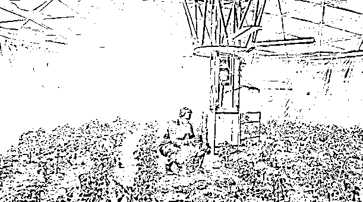

马克·沃特尼在火星上种土豆 

事实上，《火星救援》颂扬了处女座的一切！

*   **马克·沃特尼用“乐观务实”（木星处女座）的精神适应了他所面临的危险境遇**。他遵照“科学的方法”解决问题，也就是理性 —— 一步一步。**尽管有失策和噩运，沃特尼秉持“对理性力量的信念”（木星处女座）应对一切局面**。

*   他的幽默也源自理性，他把自己定义为一名“海盗”，或他含蓄的幽默说辞，“Hi，我是马克·沃特尼，显然，我还活着。” 

*   马克·沃特尼对**宇航员候选人的演讲就像是一份木星处女座的证明书**，讲述了**如何度过人生最大的挑战性危机**： 


“At some point, everything's gonna go wrong and you're going to say, this is it. This is how I end. Now you can either accept that, or you can get to work. That's all it is. You just begin. You do the math. You solve one problem and you solve the next one, and then the next. And If you solve enough problems, you get to come home.”

“在某个时刻，每件事都不对，你想要说，就这样了。这就是我的终结。现在你要么接受，或者你可以去工作。很简单，就是这样。你开始了。你进行计算。你解决了一个问题，然后又解决了一个问题。当你解决了足够多的问题时，你就踏上了回家的路。”


**男主角：处女座能量也很强！**

为了观察一下马特·达蒙的星图中有没有任何共时性，我绘制了他的出生星图。是的，有**一颗个人行星落在了处女座，那就是火星在第八宫，这个掌管着生存的宫位**。哦，他还有**南交点落在处女座**。

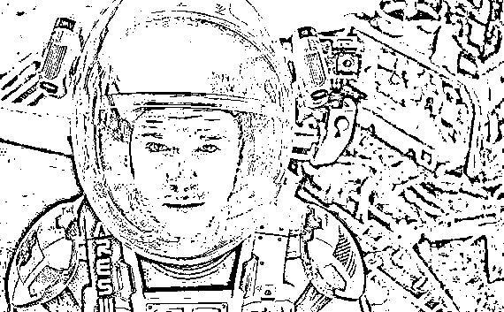

**首映式月木合相处女座，不只是巧合**

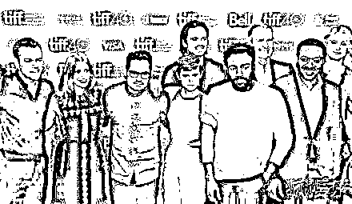 2015 科幻巨作《火星救援》多伦多电影节首映礼  

 出于好奇，我绘制了《火星救援》在多伦多电影节第一次公开首映时的星图，**时间是 2015 年 9 月 11 日,9:30p.m.，地点是加拿大多伦多**。 

> **月亮在 1°之内入相位合相处女座木星**

月亮在每个月只有大约 2 小时的时间在 1°之内入相位与木星成相。假定一个月为 30 天，那么就有 720 个小时。所以来计算一下，720 个小时中的 2 个小时，也就是 1/360，意味着**每个月里有 0.0027778 的几率月亮与木星接近合相**。科学来看，这是多小的概率呀。从整体论来看，**这是一个意味深长的巧合，或共时性**。

> **木星在处女座 6°51’，月亮在 5°45’处女座**

 这至少是**与木星处女座相关的一次共时性事件**，难道不是么？要了解更多的意义，我们注意到**木星和月亮与海王星成对分相，海王星是掌管着想象力与电影的行星**。这部充满想象的电影将在全球上映。我知道你们中有些人会想，“也许有一位占星师选择了在电影节首映的日期和时间。”这不太可能。这些电影节的时间由电影节的组织者安排，而不是由电影制作人安排。

**植物学界：一种新植物以男主角命名**

一位植物学家，美国宾夕法尼亚州巴克纳尔大学的植物学教授，克里斯·“玛蒂娜”博士（玛蒂娜这个名字源自以火星命名的罗马神“马尔斯”）决定用角色马克·沃特尼的名字命名一种在澳大利亚发现的新植物。

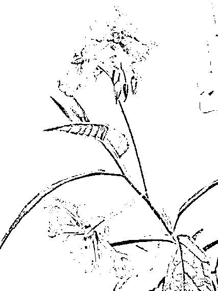 

 玛蒂娜的实验室团队决定将这一新物种命名为 Solanum watneyi （茄属沃特尼），向我们展示植物学家也是很酷的。玛蒂娜在她的博客中写道： 


“It is worth noting that the plant that Watney manages to grow on Mars is none other than Solanum tuberosum (the potato), a member of the same genus as our new species, Solanum watneyi. Coincidentally, the new species also grows in reddish (dare I say, "Mars-like") soil in its native habitat.”

“值得注意的是，沃特尼在火星上种植的植物正是茄属马铃薯（土豆），与我们的新物种茄属沃特尼是同一种类。巧合的是，新物种在它的原生栖息地上也生长在红土地上（我敢说，“和火星一样”）”。


当然，玛蒂娜教授为植物学的新流行而感到兴奋： 


“Did you catch that line at 1:40? That's Damon's character saying, "I am the greatest botanist on this planet." If you listen hard enough, you might also hear the sound of thousands of real botanists on Earth cheering our brains out. We botanists often feel like underdogs, to be perfectly honest.”

“你是否注意到在 1:40，达蒙扮演色角色说，“我是这个星球上最伟大的植物学家。”如果你听得够仔细，你还会听到地球上成千上万真正的植物学家为自己的头脑欢呼的声音了。坦白说，我们植物学家常常觉得自己不被重视。”


在我看来，**地球上成千上万真正的植物学家为自己的头脑欢呼，这非常符合木星在处女座的特色**！

 **在我们的星座文化偏见中，处女座觉得自己不被重视，自己是被低估的受压迫者么**？答案是肯定的。

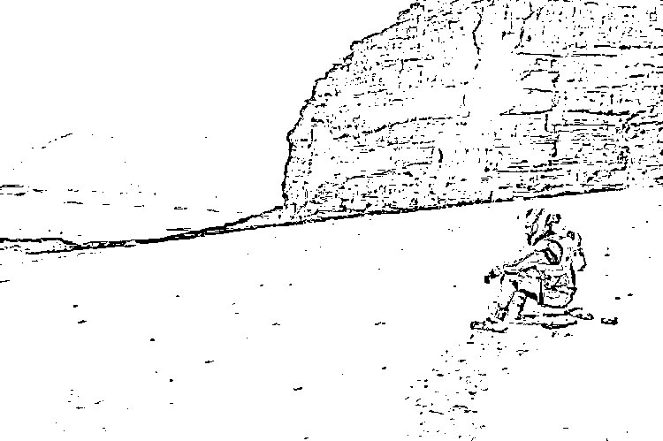 

嘿，现在做一名植物学家是很酷的事情，在**接下来差不多 9 个多月的时间里，处女座有机会成为最受欢迎的星座**。期待**从现在到 2016 年 9 月 9 日有一大波选择主修植物学的学生**吧 —— 也许他们中许多人有太阳、月亮、上升或水星、金星、火星这种个人行星落在了处女座。是的，也许甚至是木星在处女座。

享受这一切吧，处女座人！


**★ 对大卫老师的文章有共鸣，想要一吐为快？欢迎在评论区留言分享。也可以投稿到邮箱**nodoor@vip.126.com 分享你的观后感！****

**电影背后：原著作者也是处女座！**

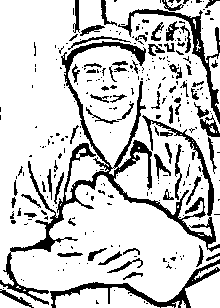

《火星救援》的电影改编自作家、软件工程师安迪·威尔的小说。

安迪成长在南加州，他的父亲是一位物理学家，母亲是一位电机工程师，父母在他八岁时离婚。他还是小男孩时就阅读科幻小说，虽然他的正职是软件工程师，但他从二十几岁时就开始撰写科幻小说了，数年来他都在他的网站上连载自己的小说。

“火星救援”的书迷 —— 在他的网站连载的丛书 —— 强烈的要求他出版亚马逊 Kindle 电子书，他以每本 99 美分的价格出版了这些书。小说销售不错，于是皇冠出版集团购买了版权，之后，他的小说首次亮相就在纽约时报畅销书榜上排名第 12。

威尔研究了火星上的情况，运行的轨道，载人航天的历史和植物学，这样让他的故事尽可能的符合科学。受到飞行恐惧症的影响，安迪在受到邀请后不能造访电影在布达佩斯的科达工作室拍摄地。2015 年在药物和治疗的帮助下，安迪至少可以飞到休斯顿造访约翰逊航天中心。

虽然他并未公开出生时间，但安迪于**1972 年 6 月 16 日**出生于**加州的戴维斯**。月亮在 6 月 16 日的 4:03 进入处女座—— 所以**安迪的月亮很有可能落在处女座**。而如果安迪出生在 10:58-13:25 这段时间里，那么他的**上升星座也会落在处女座**。如果我找到了安迪·威尔的出生时间，我会在微信上发布。

**星座知识小课堂**

**共时性(Synchronicity)** 也可称为同时性，其实是对神秘现象的一种解释。例如，你正在想自己的朋友，朋友就来了；或者你梦见一些事，后来就听说，就在你做梦的同时，就发现了这些事；等等诸如此类的有意义的巧合。

**占星学是研究形体运行轨迹和特质与人类世界或个人经历的共时关系的一种学问**。

****特别提醒：**希望将若道文章转载到各自公众号的朋友，**转载时请注明“转自若道微信公众平台”，并附上若道占星的 Logo**。谢谢！**

**2016 年 1 月 5 日-1 月 8 日**，格罗夫及其团队将在**北京**举办**三天全息呼吸工作坊**；**2016 年 1 月 11 日-1 月 17 日**，格罗夫和占星大师塔纳斯将在**北京**举办**七天全息呼吸与原型占星工作坊**。详细内容请点击“**阅读原文**”了解。


# 射手座新月 | 去冒险，为你相信的事（新月报告免费送！）

> 原文：[`mp.weixin.qq.com/s?__biz=MzA5NjA0NTAxNg==&mid=401398978&idx=1&sn=bf63a17c2f079707da6346efcfd79b74&chksm=02ae6e7535d9e763d1d9ace1ff2ee3c2bf9a2e8c318b48bbefb2dced3e98d53558f18d39ff68&scene=126&sessionid=1692738897#rd`](http://mp.weixin.qq.com/s?__biz=MzA5NjA0NTAxNg==&mid=401398978&idx=1&sn=bf63a17c2f079707da6346efcfd79b74&chksm=02ae6e7535d9e763d1d9ace1ff2ee3c2bf9a2e8c318b48bbefb2dced3e98d53558f18d39ff68&scene=126&sessionid=1692738897#rd)

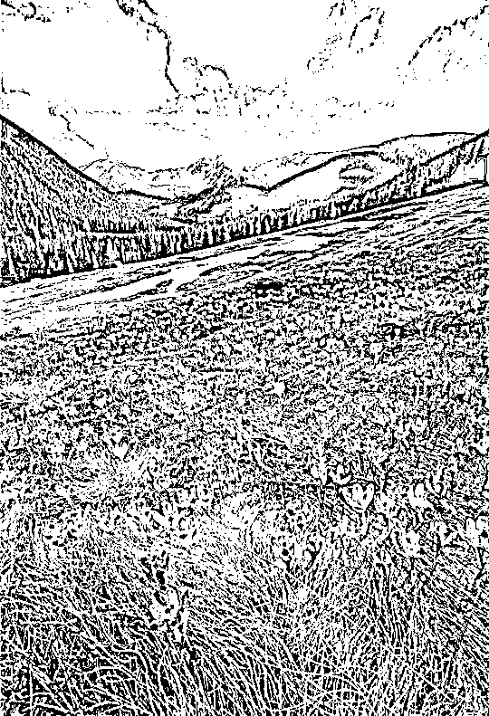

作者/占星师 Cora

图片来源/花瓣

射手座新月发生在今天 18:29，月亮与太阳合相在射手座 19 度 02 分。本次新月鼓励自由与冒险。为了你信任的事情，冒险或开拓创新的行为是受到支持和鼓励的。

盼望着，盼望着，终于盼来了射手座新月。对射手座一直有偏爱，但真要动笔时，却感到表达的困难。因为跟射手座相关的一切，都已经被谈得太多了——自由、真理、信念、智慧等等。当一个东西被谈得太多，特别是这些名词听起来都非常“高大上”，反而会让人忘了它们的真实含义是什么，很容易说成了空洞的大话。

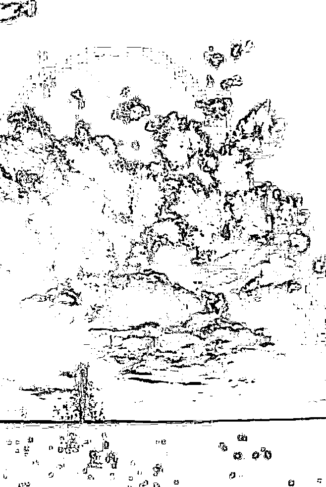

**自由**


射手座新月鼓励自由与冒险。但怎样是自由，怎样是冒险，这个标准是很主观的。前几天看贾樟柯的一篇访谈，他有一句话让我印象很深：**自由其实是一个自我的问题；自我解放的程度决定了你有多大自由。**深以为然。

无论看起来生活得多么自由的人，都有他的受限之处。**不自由可能来自外界的束缚，但根本上的不自由，都是内心的自我捆绑。**

我以占星为工作，在很多人看来是非常自由的，但我知道我在很多方面依然不自由，即便是在一份这样自由的工作里。

*   当我为了按时发表稿件而写下自己都觉得味如嚼蜡的文字时，我是不自由的；

*   当我满足于已有的占星知识，不愿做更多学习和了解，令思维僵化，我是不自由的；

*   当我封闭了自己，不与咨询客户做更深入的心灵沟通时，我是不自由的；

*   当我为了保持某种个人形象而不去表达真实的态度时，我是不自由的……

**自由或不自由，归根结底，与职业、收入、身份等标签无关，它只是心的问题。**

**射手座新月，鼓励我们去探险：看到生活中那些僵化的部分，去发现更多带来自由的可能性，去探索新的体验。**在这个过程中，直觉和热情是可信任的向导。这“探险”具体发生在生活的哪个方面，跟新月在你出生星图中的位置有关。

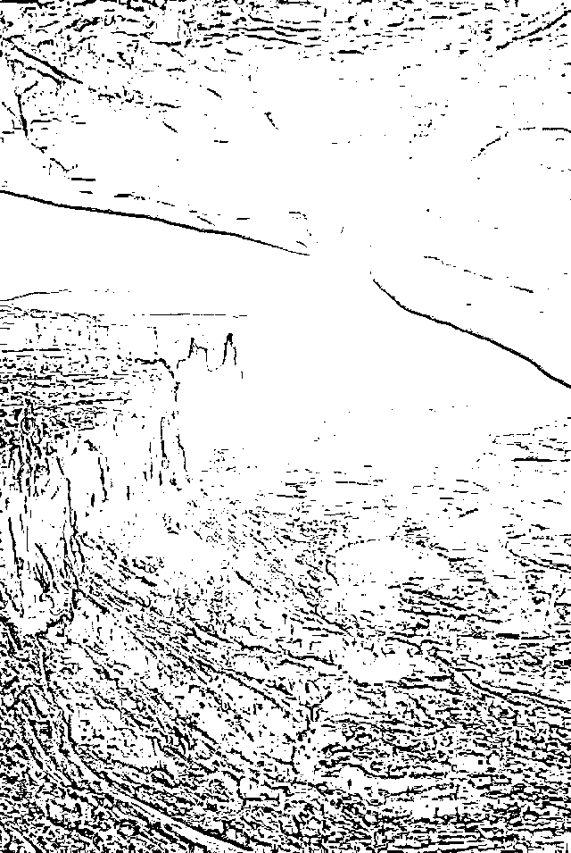

**信念**


自从土星进入射手座起，“信念”的事，已被谈得太多。但射手座新月，这个问题还是绕不开。信念、真理、意义，这三个射手座的关键词，我觉得可以当成一个“组合”来考虑。它们说的是同一件事。

在我的出生星图中月亮合相土星、天王星在射手座，我常常会因“是非对错”而感到纠结，担心自己犯错。直到有一天我意识到：**信仰，不是“对”的事，而是你相信的事；真理，也不是“对”的事，而是你想要去坚持的事。**

问题只在于，你是不是真的信？到底有多信？这其实也是土星进入射手座后，给我们每个人提出的问题。而**目前的土星与海王星的四分相位，正是一个“为信念塑形”的时机**。不妨利用射手座新月的机会，去确认心中那个充满热情与信心的所在。

都说射手座是幸运的，而幸运，常常是因为相信。

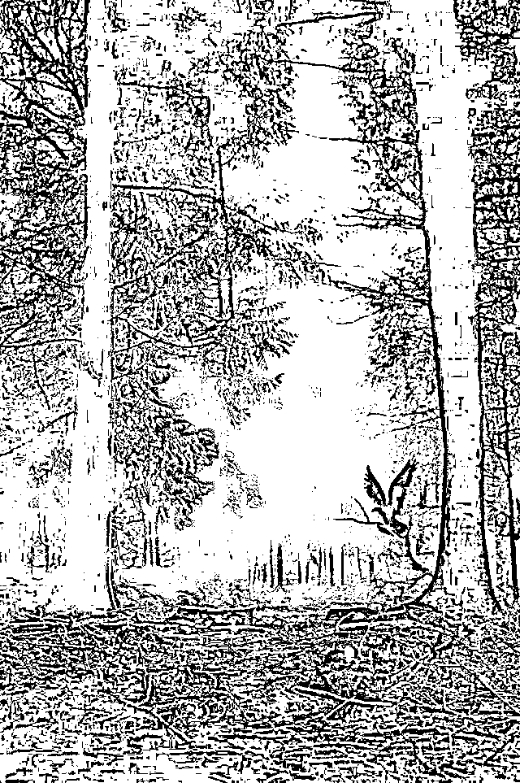

**星象背景**


本次射手座新月，与火星-天王星-冥王星的 T 三角同时出现，并且射手座的守护星木星四分射手座新月。一定程度的破坏与颠覆，可以看做是成长和自由的代价。但在采取某些冒进行为之前，应对现实条件有理性的评估，避免过度扩张将自己置于不利的境地。整体上，火星、天王星与射手座新月成和谐相，**冒险或开拓创新的行为是受到支持和鼓励的**。

还是那句话，可以冒多大的风险，取决于个人的承受能力。毕竟，每个人对自由的需求程度不同，量力而行。

在这样的日子里，我觉得大概需要冒一点险，以证明你的相信。

**射手座新月的其他文章传送门：**

[射手座新月 | 追寻属于自己的个人真理](http://mp.weixin.qq.com/s?__biz=MzA5NjA0NTAxNg==&mid=401381666&idx=1&sn=b28e5fa06a0ea1d0581fae2cd72715ce&scene=21#wechat_redirect)


## **作者简介** 

**占星师 Cora**，全美占星师联盟（AFAN）成员，国际占星研究协会（ISAR）会员，获 ISAR 职业占星师资质认证，斯蒂芬·弗里斯特《变幻的天空》译者，个人星象文章见诸《心探索》《北京青年周刊》《上海电视》《空中生活》等杂志媒体。曾跟随大卫·瑞雷系统学习占星学，现为全职占星师。

微信公众号：聆宇 FM（微信号：lingyudiantai）

个人微信号：CoraAstro

长按二维码，让金钱涌向传播知识与智慧的人~


**◆ ◆ ◆ ◆ ◆**

****特别提醒：**希望将若道文章转载到各自公众号的朋友，**转载时请注明“转自若道微信公众平台”，并附上若道占星的 Logo**。谢谢！**

每到新月时分，都是播种心愿的时期。点击文末“**阅读原文**”，免费领取你专属的新月报告！


# 射手座新月 | 追寻属于自己的个人真理（有福利哦~）

> 原文：[`mp.weixin.qq.com/s?__biz=MzA5NjA0NTAxNg==&mid=401381666&idx=1&sn=b28e5fa06a0ea1d0581fae2cd72715ce&chksm=02ae2b9535d9a283242c32d58371e65f3944b0ac453794d7a6aea73fa71e45fed216025f55c9&scene=126&sessionid=1692738897#rd`](http://mp.weixin.qq.com/s?__biz=MzA5NjA0NTAxNg==&mid=401381666&idx=1&sn=b28e5fa06a0ea1d0581fae2cd72715ce&chksm=02ae2b9535d9a283242c32d58371e65f3944b0ac453794d7a6aea73fa71e45fed216025f55c9&scene=126&sessionid=1692738897#rd)

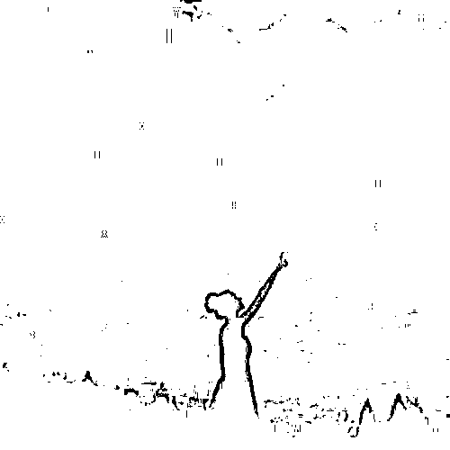

北京时间 12 月 11 日 18 点 29 分，射手座新月发生在射手座 19 度。每一个新月，太阳与月亮重新汇聚在一起，展开新的运行周期。因此，新月是我们崭新情绪周期的开始，重新设定或调整目标的好时机。

**射手座新月带来的讯息**

射手座是火象的变动星座，**这个新月充盈了变动星座的能量，同时具有基本星座的开创性，是一个强而有力的开始。**

天王星与冥王星在过去几年有七次精确四分成相，在今年 3 月最后一次四分相后已经逐渐远离。整个 12 月，因为天王星的逆行，天冥四分在两度以内，激荡的影响依然持续。同时，天秤座的火星在新月前与天王星精确对分（天秤座/白羊座 16 度 39 分），启动了天冥四分，与新月的星空下形成了一个基本星座的 T 三角。

火星、天王星、冥王星的挑战相位，的确可能给日常生活带来挑战。

*   有人会经历意外的事件、激进的情绪。

*   有人发现自己身处在动荡不安全的大环境中。

因此，**在新月前后请保持健康的饮食与锻炼，多休息与冥想，随时回归自己的中心**，这样才不容易被周围激烈的能量所带走。

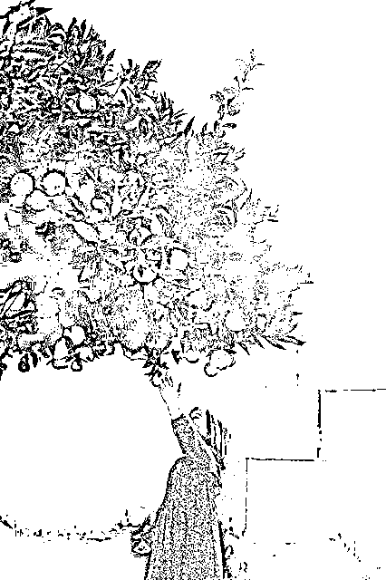

新月的守护星木星行进在处女座，四分射手座新月，对分双鱼座的凯龙星。凯龙星、新月、木星之间形成一个变动星座的 T 三角，这带来重新评估信念的驱力。信念可以是指明灯，也可能过于僵化陈旧而成为自我设限的牢笼。从设限的信念中挣脱，转变需要发自内心。**保持开放的心态与适应性，才能进入射手座的未知疆域**，带来全新的视野。

如果说变动星座和基本星座的两个 T 三角是强大的阳性能量，那么这个新月还有充沛的阴性能量：行进在天蝎座的金星在新月发生时精确三分海王星（天蝎座/双鱼座 7 度）。**海王星是金星的高八度，三分相又强调了和谐，给新月注入了温柔、平静、爱与美的能量。**

新月射手座 20 度的萨比恩象征（编者注：Sabian symbols，即迈向秘密花园的钥匙）：冬季人们从池塘凿冰，以备夏用(In winter people are cutting ice from a frozen pond, for summer use)。这个象征与天王星三分新月的意义相呼应——**通过创新来解决问题，提前计划以备不时之需**。

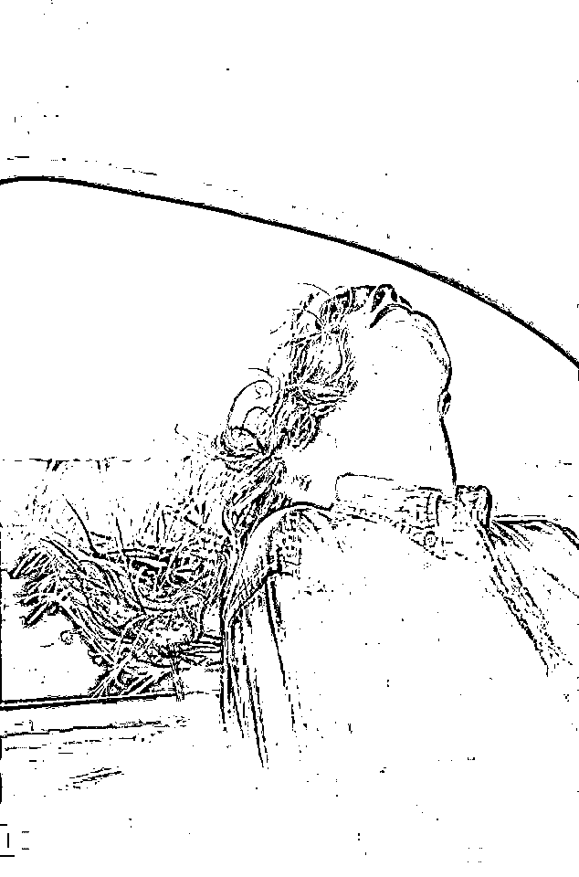

**追寻属于自己的个人真理**

当我们每一次遇到瓶颈，工作受挫或感情失意，射手座都会帮助我们。射手座是黄道十二星座中最乐观、快乐的星座，也是与追寻信念、真理、人生的意义直接相关的星座。

射手座的符号，一个斜向上的箭头，让人联想到千亿年来人类对地理疆域、宇宙星空、人生意义孜孜不倦地，以及大千世界任我遨游的自由和纯真。**每个人多多少少会有射手座的特质**：**不愿意被一成不变的生活所束缚，探索更广阔的未知疆域的好奇心，追寻人生真理与信念的勇气。**

所谓的信念，会因人而异。因为每个人站的位置不同，自然视角不同，观点也不尽相同。而且，在人生的不同阶段，因为外部经验的扩展，也会带来理解世界的全新角度。**射手座新月召唤我们成为自己，做最真实的自己，勇敢追寻属于自己的个人真理。**

**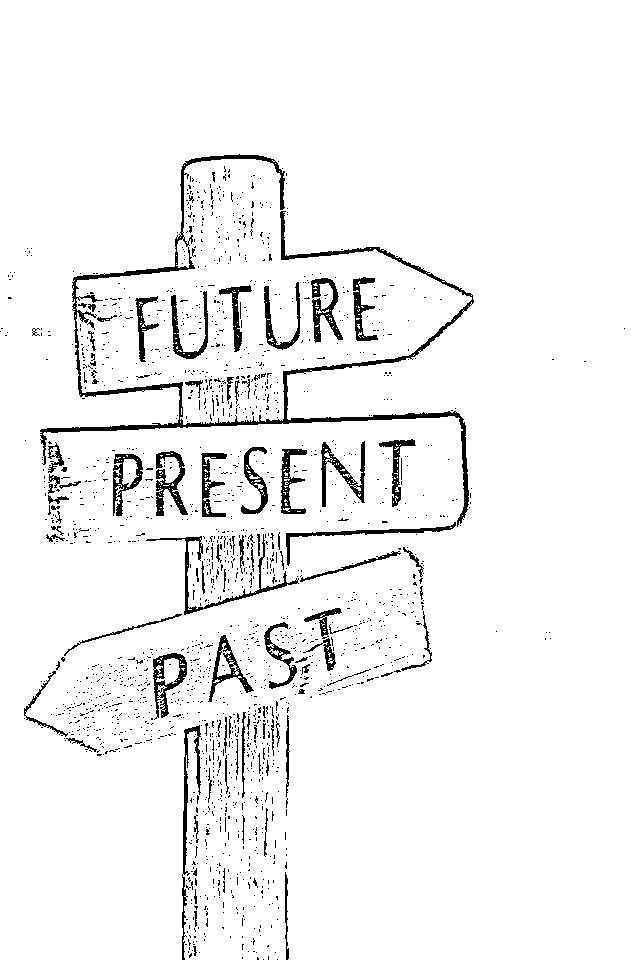**

**踏上你的冒险之旅**

**你的下一个探险目标是什么？**展开一次跨国冒险之旅、尝试一份新的职业、寻找一位新的导师学习、开始一段新的浪漫关系、搬到一个陌生的城市生活、抑或是探索自己灵魂的目标？

**在踏上新的征程前，每个人都需要面对内心的恐惧，有些人会倍感压力退缩彷徨。请相信：你的世界，可能因为一个念头、祈祷、信念就发生了改变，这就是射手座的魔法。**

愿这个新月带来的乐观、积极、勇敢的拓展精神，能协助你通过创意和爱来化解压力，开启属于自己的冒险之旅。

**新月许愿技巧大放送：**

[Tips | 新月时如何许愿？](http://mp.weixin.qq.com/s?__biz=MzA5NjA0NTAxNg==&mid=209461827&idx=2&sn=b33b43bc66138abc13c488781eff1856&scene=21#wechat_redirect) 


**◆ ◆ ◆ ◆ ◆**

****特别提醒：**希望将若道文章转载到各自公众号的朋友，**转载时请注明“转自若道微信公众平台”，并附上若道占星的 Logo**。谢谢！**

每到新月时分，都是播种心愿的时期。点击文末“**阅读原文**”，免费领取你专属的新月报告！


# 我的射手座和双子座老打架，怎么办？

> 原文：[`mp.weixin.qq.com/s?__biz=MzA5NjA0NTAxNg==&mid=401357746&idx=1&sn=d5ebad04572a8c8085657a2e2b6518b1&chksm=02ae890535d90013435689729b5416a0d2ee1b4a8f1088b039f0c415357ea9988d944d381a3f&scene=126&sessionid=1692738897#rd`](http://mp.weixin.qq.com/s?__biz=MzA5NjA0NTAxNg==&mid=401357746&idx=1&sn=d5ebad04572a8c8085657a2e2b6518b1&chksm=02ae890535d90013435689729b5416a0d2ee1b4a8f1088b039f0c415357ea9988d944d381a3f&scene=126&sessionid=1692738897#rd)

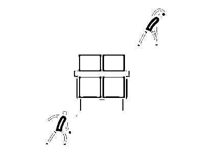

作者/特蕾西•麦克斯

译者/江艺

我们的出生星图中都存在矛盾的能量，如何整合是门学问。占星师特蕾西•麦克斯在其著作《如何整合你的 T 三角》(*How to handle your T-square*)中着重讲述了如何整合这些挑战性的能量，今天我们来看看如何整合射手座和双子座之间的对立与冲突。

**适合人群**

这篇文章特别适合以下人群：

● 出生星图里既有行星落在双子座，又有行星落在射手座

● 既有行星在 3 宫，又有行星在 9 宫

● 星图中水星和木星被强调

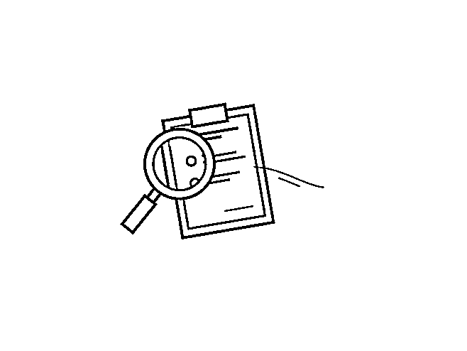

**小测试**

**先来测试一下，6 个双子座-射手座对分的消极表现，你占几样？**

**①** 你的双子座-射手座的对分相暗示着你会分散自己的精力，参加非常多的活动，追求丰富多彩的智力活动或者人际关系。

**②** 什么都想尝试，因此你不停地更换工作，常常表现得粗心大意，或者对每一次尝试都只是浅尝辄止。

**③** 你是一个理智的人，但是很少专心对一门功课研习足够长的时间，从而掌握任何一项专业技能。经常你只是着迷于理论或者毫无意义的零散数据，试图用逻辑替代经验来控制你的现实生活；或是无止境地思考日常生存的哲理，而没有真正将自己的理解融入生活方式中。你倾向于要么就过度专注于琐事，要么就迷失在概念的世界里，与日常环境脱节。

**④** 你擅长用词遣句，不停地说话，常常和别人玩智力文字游戏，或者东拉西扯，说些不着调的话，把别人搞得晕头转向。

**⑤** 你声称自己知道所有的答案，但是你常常只是用你的论证能力和你所知的全部事实来支持你的立场，或者试图让别人相信你拥有那些你根本就不知道或不懂的知识。

**⑥** 你企图喋喋不休地的表达自己的观点，这同样也阻碍你与他人建立心灵层面的沟通，体验思想、身体和感觉的交融，而这种交融让你能够通过自己内心的智慧来交流和生活。

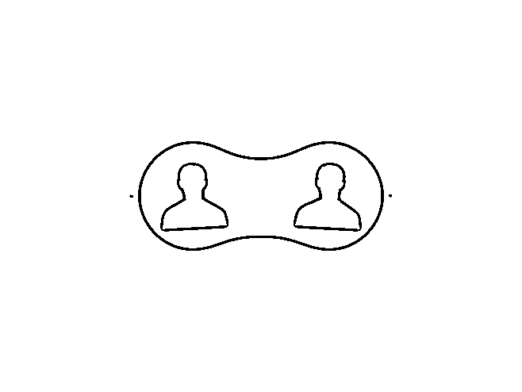 

**两极表现**

**双子座**

活在当下，专注现在

实际，敏锐

建立人际关系，

对刺激做出反应

获取信息，收集数据

博学多才

关心事实、数字、科学、经验

归纳性思维（从特殊到普遍）

逻辑，理性，重视论证

无道德原则

不关心伦理问题

多才多艺

追求许多不相关的兴趣和技艺

与各种各样的人交流互动

在互动中无法安静下来

享受日常的交谈

**射手座**

关注未来

善于规划，获得洞见

吸收，整理

将某人的观点概念化

发展理解力和智慧

追寻深刻意义，见多识广

关心看法、理论、哲理性

演绎性思维（从普遍到特殊）

超越理性

接受启示，笃信宗教，有道德

关心原则、伦理

目标明确

追求富有意义的方向

过度扩张，为一种活动忘乎所以

开朗，被爱情冲昏头脑

教授、指导、参与哲学讨论

**整合方法**

**要整合你的双子座-射手座对分相，需要双子座运用并分享射手座的智慧，同时射手座也要为双子座的智力追求和当前实际提供目的和方向。**

**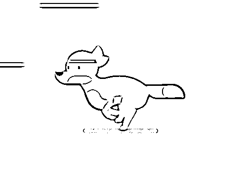**

从双子座走向射手座

**①** 你双子座的焦躁、好奇和对日常合作的需要，引导你和各种各样的人打交道，他们可以帮助你发现新想法，获得新的认知。由于双子座口齿伶俐，爱好交流，因此你能够表达射手座的理解力，并且同其他人展开富有灵感的讨论。

**②** 通过将注意力集中到当前的环境中，双子座确保你射手座的智慧是真正的智慧，能够将它用于日常生活中，从而防止你迷失在较高的层面，和日常环境脱节。通过将你的看法和信念屈从于双子座面对现实和逻辑思考的考验，你探索出一套概念体系或人生哲学，这在任何情况下都对你意义重大，并且帮助你在自己选择的道路上不断前进。

**③** 双子座天生擅长的阅读、写作、推理和收集信息的技巧，和你通过学校教育和领悟力所获得的初级知识，为你打下坚实的基础，让你能够继续接受教育，开发你的高等直觉力和整合力。你丰富多彩的爱好和兼收并蓄的精神追求，让你倾向于成为融汇多种学科知识的综合性人才，因为你储备了非常丰富的知识，并且拥有融会贯通的能力。你射手座的天性能够察觉表面上毫无关系的零散信息之间的关系，从而获得整体观和更高层次的觉悟，这将会扩展你的意识，加深你的信仰。


从射手座走向双子座

**①** 当射手座的灵感和启示照亮你双子座的推理能力，你将获得领悟，从而充实你的日常生活。思考知识和日常交流的伦理含义，以及对未来的关注会帮助你在个人的日常工作中做得更好。射手座指引你双子座的头脑去思考有意义的知识，推动你的成长，扩展你的意识，让你站在更高的认识领域，去感觉目的的统一性，超越你多样化的日常体验。

**②** 通过用射手座的热情和乐观感染他人，通过传达你的理解力，你提升了自身影响力。你激励、引导、提携你周围的人，并给你自己带来新的朋友和活力，他们反过来会激励你，满足你的双子座对知识和多样性的需求。但是射手座不允许你太过分散自己的精力，或者参与那些浪费精力、浪费唇舌和社交能力的谈话与爱好。通过指出你的人生方向，射手座为你提供专一的目的，因此你能够做出建设性的日常选择，体验自我整合，从而让你更加高效地思考和交流。

**◆ ◆ ◆ ◆ ◆**

****特别提醒：**希望将若道文章转载到各自公众号的朋友，**转载时请注明“转自若道微信公众平台”，并附上若道占星的 Logo**。谢谢！**

**2016 年 1 月 5 日-1 月 8 日**，格罗夫及其团队将在**北京**举办**三天全息呼吸工作坊**；**2016 年 1 月 11 日-1 月 17 日**，格罗夫和占星大师塔纳斯将在**北京**举办**七天全息呼吸与原型占星工作坊**。详细内容请点击“**阅读原文**”了解。


# 愿你的内心，柔软得一塌糊涂

> 原文：[`mp.weixin.qq.com/s?__biz=MzA5NjA0NTAxNg==&mid=401357746&idx=2&sn=02d76c76eb4d1267295934ab995ed4a8&chksm=02ae890535d90013d52144deb51cda17742abf22eb719f1924525934dbf7f72930757bde88f1&scene=126&sessionid=1692738897#rd`](http://mp.weixin.qq.com/s?__biz=MzA5NjA0NTAxNg==&mid=401357746&idx=2&sn=02d76c76eb4d1267295934ab995ed4a8&chksm=02ae890535d90013d52144deb51cda17742abf22eb719f1924525934dbf7f72930757bde88f1&scene=126&sessionid=1692738897#rd)

📹 [`v.qq.com/iframe/preview.html?vid=R0010HyBY7p&width=500&height=375&auto=0`](https://v.qq.com/iframe/preview.html?vid=R0010HyBY7p&width=500&height=375&auto=0)

薛凯琪的 Better Me，送给表面坚强却需要被呵护的你

那些月亮南交点在摩羯座，北交点在巨蟹座的朋友，我问一句，你会哭吗？

老天爷发货都喜欢一拨儿一拨儿的，最近这拨儿来咨询的客户，很多是 1982 年前后出生的，也就是月亮南交点落在了摩羯座。

无论是男性还是女性，我看到了他们对事业的顽强追求，刻苦努力；我看到了他们面对困难时候的忍耐和百折不挠；我看到当我描述他们事业成功的方向时候，他们双眼亮起的光芒。

然后我就问了一个问题，你平时哭么？我直愣愣地看着他们，傻了吧唧地问：你平时哭么？回答我的是——

**●** 我哭啊，看到悲伤的电影，会特别感动，会哭。（月亮、金星、火星在双鱼座）

● 不哭，我难过的时候会自己躲起来，看书，脑子放空，想事情，但是我不哭。（月亮水瓶座）

● 虽然经历了那么大的打击，但是我很快就不哭了，我要去处理这些事情，我们家就指望着我呢……（月亮巨蟹座）

于是，这个问题，被很好地回答了。但是这个问题背后的含义，不知道对方是不是 get 到了呢？**你是钢铁侠么？**努力、刻苦、忍耐、努力，一定会解决问题么？**你的情绪去哪里了？**

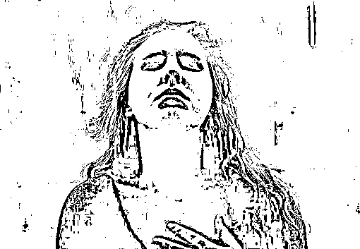

当人们遇到困难、感到痛苦的时候，人们流泪，人们认怂，人们说，请帮助我……请照顾我……

但是，你没有。

也许你小时候家庭遭遇的事件，让你一夕之间迅速长大，切割掉了面对危机时候无用的情绪。也许你的父母，在家庭里始终扮演小孩子的角色，留给你的，只能是一个成熟懂事的大人的角色。也许在你的评价体系里，你的自我身份强烈地与事业成功联系在一起，因此，家庭、情绪、情感，你认为可以用物质来衡量、表达和体现。

也许，老天爷把那些上辈子已经获得成功的人，已经获得节制、纪律人，都打包在 1981.9.25—1983.3.16 发来了人间。于是，老板多了能干的下属，家里面多了“成熟”的小孩。

成长的过程里，这些小孩子迅速成为大人：哭闹是不好的，物质可以替代拥抱，“这点儿痛算什么，忍忍就好了”……于是长大以后，物质是好的，美貌、社会地位、事业成功，都是人生动力和追求的方向，哭泣变成弱者的代名词。

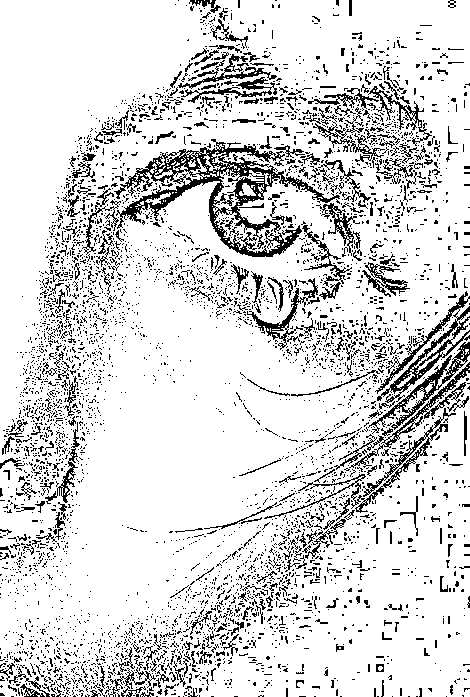

然后我又问了问题，软弱是不好的么？你想要被照顾么？这下，有些人在我对面，直愣愣地看着我，眼眶忽然红了……

也许成功，只是为了获得你对我的肯定；也许刻苦与忍耐，只是来自不想让你失望；也许坚强，只是来自想要生存下去的动力。而这些的背后，还有一个渴望被拥抱的小孩子——跌倒了，会有人抱我起来，轻轻地拍拍我，擦掉我的眼泪，没有话语，一个拥抱，我就知道了你的爱。

● 愿每个穿着盔甲的人，都能得到一个拥抱……

● 愿你得到他人温暖的照顾，一碗汤，一餐饭……

● 愿你的内心，柔软得一塌糊涂……

最近在看一个韩国的节目，《三室三餐》，来自我身边巨蟹座太阳朋友的推荐。几个人老男人在海边渔村自力更生做饭吃。我的占星学老师教给我一句话：照顾好你的情绪，先照顾好你的胃。有兴趣的朋友可以搜索看看。

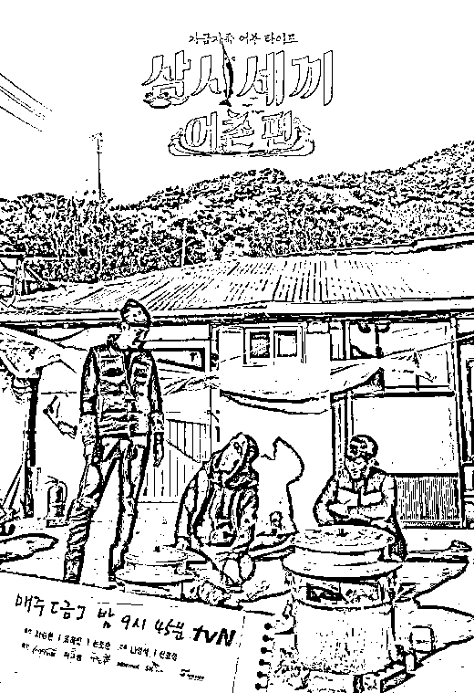

**南交点摩羯座北交点巨蟹座的其他文章：**

[每一次泪眼婆娑，都离家更近一步 | 南交摩羯-北交巨蟹](http://mp.weixin.qq.com/s?__biz=MzA5NjA0NTAxNg==&mid=211678002&idx=1&sn=42c4308c60d6f22cbf89a0348b240c65&scene=21#wechat_redirect)

[生命如此沉重，心情却能很轻 | 南交摩羯-北交巨蟹的爱情](http://mp.weixin.qq.com/s?__biz=MzA5NjA0NTAxNg==&mid=400441973&idx=1&sn=23e00d32a9d32b341e22f12094fb37e7#wechat_redirect)


**占星师咔咔**：2010 年师从美国占星师大卫·瑞雷学习，并得到世界名师斯蒂芬·弗里斯特、罗伯特·汉德、苏·汤普金斯传授各种占星技法。若道首届学员，国内最早获得 ISAR 职业占星师资质的职业占星师。

在国际知名广告公司和市场研究公司从事的市场研究和推广工作十余年，曾任职于阳狮集团、尼尔森市场研究有限公司、MTV 和《Madame Figaro》杂志。

微信公众账号：咔星人

星图解读和运势咨询请加个人微信：kaluolandeka

**◆ ◆ ◆ ◆ ◆**

**2016 年 1 月 5 日-1 月 8 日**，格罗夫及其团队将在**北京**举办**三天全息呼吸工作坊**；**2016 年 1 月 11 日-1 月 17 日**，格罗夫和占星大师塔纳斯将在**北京**举办**七天全息呼吸与原型占星工作坊**。详细内容请点击“**阅读原文**”了解。


# 你不是忙着活，就是忙着死！

> 原文：[`mp.weixin.qq.com/s?__biz=MzA5NjA0NTAxNg==&mid=401330772&idx=1&sn=5fe53d4b953c868fe4fe7cc88a72ff9e&chksm=02a960e335dee9f5b963ec4ac2fc8c69463f161a10f740f24c20596f34dd2801ff1267036267&scene=126&sessionid=1692738897#rd`](http://mp.weixin.qq.com/s?__biz=MzA5NjA0NTAxNg==&mid=401330772&idx=1&sn=5fe53d4b953c868fe4fe7cc88a72ff9e&chksm=02a960e335dee9f5b963ec4ac2fc8c69463f161a10f740f24c20596f34dd2801ff1267036267&scene=126&sessionid=1692738897#rd)

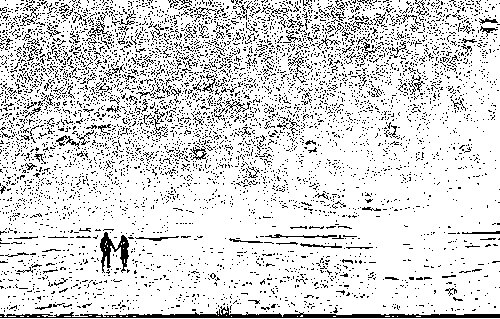

作者/大卫·瑞雷

译者/Luke

你有冥王星的经历吗？你有海王星的经历吗？你有天王星的经历吗？如果你想尝试，这里都有。

*1***“更好版本”的我**

我今年 65 岁了。

我的星图不是一张容易的星图。要说明这一点很容易——很多年前的一天，我的合作伙伴杰夫·焦耳突然冲到我的办公室，对我说：“你知道吗？我刚才的客户跟你的星图几乎一模一样。”然后，他对我一眨眼：“我不知道你是如何做到的，但你跟他相比，简直是太好的一个版本了。”这真是对我极大的恭维。“若非上天保佑……”我也对他眨眨眼。

实际情况是，我变成这样一个“比较好”的版本，不是一个自然而然的“进化过程”。作为占星师，我是一个疗愈者，也是被疗愈者。在我成年以后，我就开始步入疗愈的旅程，而这个旅程现在还是进行时。

**在上世纪 80 年代初期到 90 年代末期长达 20 年的时间里，我让自己尝试了各种疗法**——传统的精神分析、原始尖叫疗法、身体疗法、婚姻治疗、超个人心理治疗等等，这些疗法都对我有帮助，让我成为一个更加“健康”的人。

然而让我受益最深的，是 1986 的一次疗愈经历。

**这个经历是从我试图疗愈一段关系开始的。**1986 年，我在一段非常痛苦又无法放手的关系中，我爱我当时的伴侣，但这段关系极不健康，几乎耗尽我的能量。我了解我们的星图（我们的组合图上群星合相在天秤座南交点），我们已经和一些治疗师进行了很长时间的“谈话治疗”，对于从智力或概念上了解自己和自己的人生获得不少益处。然而，即便有占星学和心理治疗师的帮助，在探讨深层情绪议题的疗程中，仍有时感到内心深处的谜团无法被知晓，没人可以解开。具体到这段关系上，就是我无法离开她。我真的很想让这段关系成功。

直到有一天，我的一位治疗师好友说：“你干嘛不去试试全息呼吸呢？”她本人正在接受全息呼吸的训练。于是，我去了。

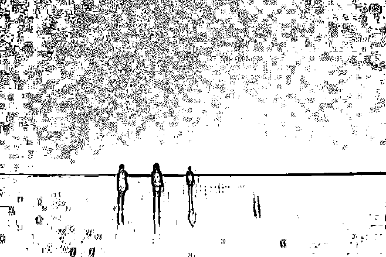

我躺在垫子上，在身旁助教的陪伴下，身体随着音乐和呼吸节奏自然地上下起伏。头脑和智性的琐碎思想都离我而去，我接触到内心深处的谜团，唤醒在身体和心灵最深处埋藏的记忆。

我进入出生之时母亲的子宫，以一种不同于新生婴儿的全新视角重新体验出生之旅。我进入出生之前，亲身经验我从星图上看见的东西。我进入一种与宇宙合一的至乐之中。在这个过程中，我超越心智的局限，知晓当困扰我们的疑惑和焦虑都烟消云散时，生命会变成怎样。这是一种深刻的体验，这种体验带来了洞见和勇气。

我离开了那段破坏性的关系，继续我的人生。

我不想在这里具体描述我的全息呼吸经历，因为每个人都会有不同的经历，如果你要参加，最好清空头脑，没有预期。

对我来说，更重要的是，**这个治疗在我内心深处唤起了创造性表达的欲望，我的创造力蓬勃而出，我对自己有了更大的信心**。而此后几年，我重复参加全息呼吸，每次体验也会有变化，因为每次做全息呼吸时都受到不同的宇宙影响力（即占星学上的宇宙气氛），所以每次体验的强度和内容也会变化，同时一般每次也都会触及一些共同的主题。

在这个过程中，我进入了人生中最有创造力的一个阶段，获得了电视节目制作得资质，从 1989 年到 1991 年参与制作了 39 期的“今日占星学”脱口秀节目。其后我开展了一段新关系，这段关系将我带到洛杉矶，开展了持续 5 年的电影剧本创作时期。与此同时，我的占星学事业蓬勃发展。

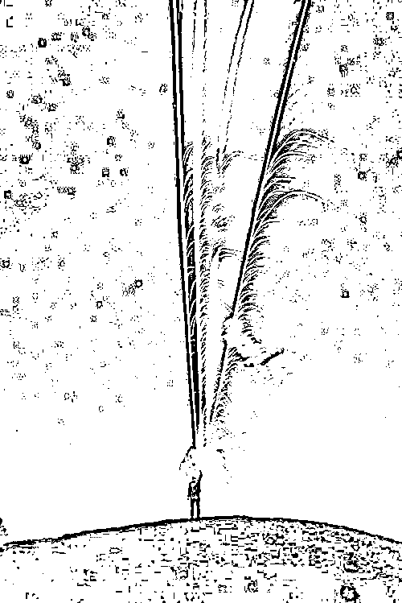

*2***出生的秘密**

全息呼吸的体验对于我来说，不仅帮助了我个人疗愈过程，还有着特别的意义。因为，虽然我们同在疗愈领域，现在主流心理学还是传承了弗洛伊德的思想，认为人一出生，意识就是一张白纸。

**而作为占星师，我们都知道，人出生时，并不是一张白纸，出生一刻包含了人生的秘密。**出生星图是时空交织的一个矩阵。我们人生的模式、灵魂的密码就隐藏在这个星图中。正如原型心理学家詹姆斯·希尔曼在他的杰作《灵魂的密码》一书中所言，我们的灵魂从母亲子宫开始，经历的是一个向下成长的过程。母亲的子宫，提供了第一个外在的环境塑造这个灵魂向下成长的经历。这个经历的印记，早于我们的童年经历。它的积极和消极的影响（创伤），也是此生最初的模式。

如果打个比方，你的人生如果是一首歌曲，那么**它在母亲的子宫中就开始拉响琴弦声，人生之旅中，你听到的是它的各种变奏。**

**你要改变一个旋律，一种方法是，回到那个旋律最初产生的时候。**这需要一个时空穿梭之旅。

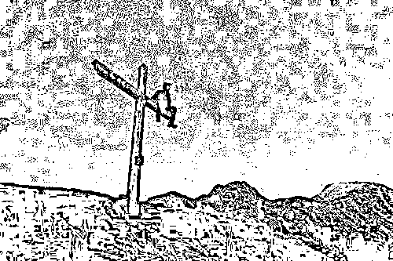

占星师虽然从星图上能够解读灵魂出生时的经历和状态，不过回去体验它，并不是容易的事。在世界各国的一些神秘灵性修持系统中有一些古老的方法，通过呼吸、舞蹈、萨满仪式、致幻植物，开启那样一个时空旅程。比如，中国的道家在修持过程中所讲述的一系列所见所闻，即是进入超个人意识状态的内在之旅发生的事情。

而这个旅程的实质，即是经由超个人意识状态体验，让人重新回归到完整状态（归真），获得在常规意识状态下无法获得的对生命的洞见，并把每个人独特的灵性潜质挖掘出来，在这个过程中，疗愈也自然产生。

而这，即是格罗夫博士通过全息呼吸在做的事情。

在 1986-1997 年，我通过全息呼吸的内在之旅，和我灵魂中本来就有的创造性联结起来。当这个源头被联结上，我生命的一个篇章即打开了。

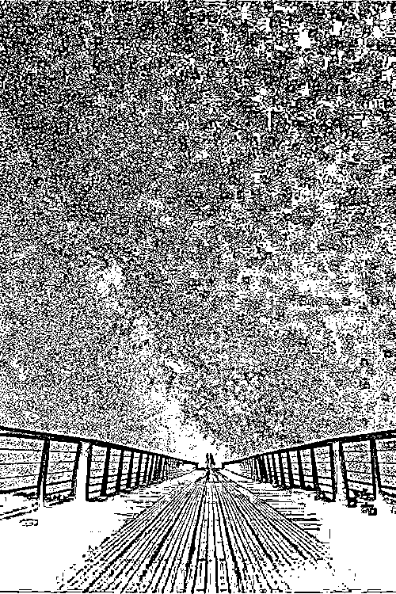

*3***子宫中的外行星体验**

从 1976 年开始，格罗夫博士就开始和著名占星师、心理学家、哲学家理查德·塔纳斯博士合作，将占星学运用于全息呼吸所引发的超个人意识状态的研究中。正如格罗夫博士在文章中所述，“在过去的三十年里，我们共同探索了占星学与神秘体验、精神灵性危机、精神病态、迷幻状态和全息呼吸治疗之间的关联性。”

“这一研究表明，占星学，尤其是对行星行进的研究，可以预测和阐明非正常意识状态的原型内容以及这些意识状态的出现时间。我们对于全息状态的性质和内容与行星行进之间关联性的系统研究使我确信，将深层经验治疗、原型心理学、行进占星学结合是推动精神病学和精神分析学未来发展最有前景的策略”。

对于他们的研究，我在这里不多赘言。我仅仅描述一下格罗夫博士所划分的**出生期（即围产期）4 个阶段分别和占星学行星原型的对应**，也许占星学子们会觉得非常有趣。

*   围产期第一阶段（BPM 1）**海王星阶段**：婴儿在母亲的子宫中，和母亲是“一体”的，在子宫中体验着没有时间没有边界的生命。

*   围产期第二阶段（BPM2）**土星阶段**：子宫收缩，但子宫颈口没有打开，婴儿被挤压。

*   围产期第三阶段（BPM3）**冥王星阶段**：正在收缩的子宫和产道的异常紧张激烈的生死斗争，并且在一种彻底的湮灭的经验中达到高潮。

*   围产期第四阶段（BPM4）**天王星阶段**：婴儿从产道中出生，突破和超越边界，从之前的限制中彻底解脱。

这四个阶段，婴儿经验四种外行星原型的积极面，或者经历消极面，对他们成人后的心理状态有着至关重要的影响。

比如，**那些在出生阶段经历负面海王星经验的婴儿，可能在出生的第一阶段没有体验****宇宙合一，超越时间和空间，领悟到神秘和神圣的感觉，反而是惶惑、妄想、药物中毒的感觉，而其后在他们的人生中，海王星的负面经验也会重现在生活的各个方面。**

**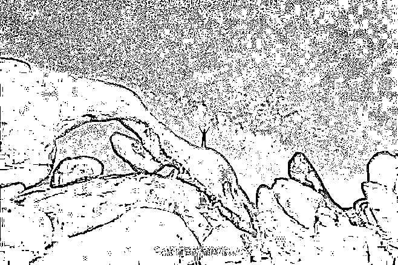**

通过全息呼吸，你有可能做一个逆行的时间之旅，回到某个起点，在那里重新经验最初的分形，在经验丰富的治疗师的帮助下，获得当初没有办法获得的支持、突破和洞见，治疗当时的创伤，从而改变了那个模式；或者获得某种超个人意识体验，让你对于生命获得全然不同的视角。

*   比如，有些人长期地感到自我憎恨，在人生中举步维艰，在工作坊后发现自己再次创造性地参与到生命中来，并在个人和事业方面获得了之前难以想象的成功。

*   一些人通过全息呼吸，感觉生命有了全新的可能性，并在内心感受到一股灵性确定感，支持着他们的情绪和心灵。

当然，将全息呼吸获得的疗愈整合到你余下的人生中并不意味着每件事都会变得轻松愉快！事实上，个人成长通常伴随着在不同情境中做出困难的决定。这就是人生。

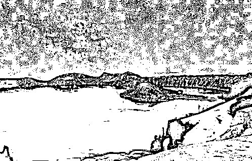

回首往昔，我相信在 1989 到 1997 年是全息呼吸带给我内在的确定感，支持我的创造力。

时隔多年，今年六月，当格罗夫博士来京开工作坊时，我又做了一次全息呼吸，并有幸和他聊了很久。而且明年一月我还会再做一次。每个人都有自己心仪的方法，这是我心仪的治疗法。

谁知道下次会发生什么？在六月份我又感到一股创造力涌出，并开始写一本新书。或许一月份的工作坊会帮我在 2016 年完成写作？

不管怎样，自我们出生起，我们每天都在谱写人生的故事。转述鲍勃·迪伦的话就是：“如果你不是在忙着活，就是在忙着死。”而这，也意味着重生。

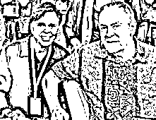

大卫（左）与格罗夫（右）

**有关格罗夫的其他文章，请点击：**

[格罗夫是谁？| 打怪升级真人版](http://mp.weixin.qq.com/s?__biz=MzA5NjA0NTAxNg==&mid=401222342&idx=1&sn=a5de760e45cd180a180f02e400418fd6&scene=21#wechat_redirect)

[格罗夫星图解析：爱在呼吸里](http://mp.weixin.qq.com/s?__biz=MzA5NjA0NTAxNg==&mid=209082717&idx=1&sn=8eadce4886da92e93980dc7c3373436a&scene=21#wechat_redirect)

[格罗夫 | 打开灵魂封印的人 （上）](http://mp.weixin.qq.com/s?__biz=MzA5NjA0NTAxNg==&mid=209907983&idx=3&sn=ea663a0b9331a5727b1690ce19815ea5&scene=21#wechat_redirect)

[格罗夫 | 打开灵魂封印的人 （下）](http://mp.weixin.qq.com/s?__biz=MzA5NjA0NTAxNg==&mid=209991672&idx=3&sn=bbd0ee056e0c5c1bae917b62e145330c&scene=21#wechat_redirect)

**◆ ◆ ◆**

**给自己一次时空穿梭之旅！2016 年 1 月 5 日-1 月 8 日**，格罗夫及其团队将在**北京**举办**三天全息呼吸工作坊**；**2016 年 1 月 11 日-1 月 17 日**，格罗夫和占星大师塔纳斯将在**北京**举办**七天全息呼吸与原型占星工作坊**。详细内容请点击“**阅读原文**”了解。


# 宇宙天气 | 信念的重生（12.7~12.13）

> 原文：[`mp.weixin.qq.com/s?__biz=MzA5NjA0NTAxNg==&mid=401284057&idx=1&sn=05eff53d316d61ca5763778c6740d2fa&chksm=02a9a96e35de2078211c26277fc26ccaec4de84234cc168cac168d5e38024ee0606ec2890b91&scene=126&sessionid=1692738897#rd`](http://mp.weixin.qq.com/s?__biz=MzA5NjA0NTAxNg==&mid=401284057&idx=1&sn=05eff53d316d61ca5763778c6740d2fa&chksm=02a9a96e35de2078211c26277fc26ccaec4de84234cc168cac168d5e38024ee0606ec2890b91&scene=126&sessionid=1692738897#rd)

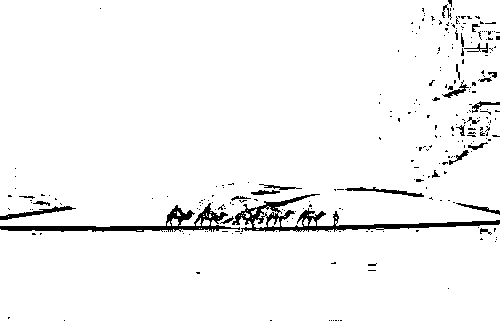

**一周星象综述**

**土海四分相的余威仍在。这一周，是过去半个月（从双子座满月开始）以来的思路和观念的调整结束后，踏上新征程的时候。**  

本周月亮经过天秤座、天蝎座、射手座、摩羯座。最重要的星象事件，是射手座新月，以及火星-天王星-冥王星的“T 三角”（此相位的影响可认为持续整周）。此外，水星进入摩羯座，也是值得关注的内行星换座事件。

周一到周三，月亮在天秤座和天蝎座，这也是火星四分冥王星的影响期。天蝎座月亮的激烈情绪加上火冥四分带来的极端控制欲和对抗心理，可能导致关系中激烈的冲撞和崩坏事件；一些真相、内幕、秘密、伤疤可能被无情揭开，带来激烈而痛苦的感受。此阶段应注意情绪管理，天蝎座月亮极端的情绪反应很可能成为危机或冲突的催化剂，但这也是一个刺激我们去深入看透问题本质或透过危机找到转机的机会。

周四，月亮进入射手座，水星进入摩羯座，激烈的情绪有所缓和，心情变得开阔。周五，射手座新月带来“信念的重生”。新月（日月合相）与火星、天王星形成和谐相位，说明此刻我们的新目标、新理念，带有明显的开创性与变革因子。同时也暗示，我们愿意选择一种更加主动甚至是激进的方式去捍卫我们所认同的真理、我们相信的事。而此时关系的破裂也很可能源于观点、理念甚至价值观的不和。这个时候若有冒进举动，很可能是因为捍卫真理的一腔热情。 

周六和周日的大部分时间，月亮在摩羯座。摩羯座的月亮将激发火星-天王星-冥王星的 T 三角，再次让我们的情感和安全感受到蹂躏。这可能是整周积压的问题集中爆发的时刻，也可能表面上风平浪静但内里却在经历灵魂的裂变。**不管怎样，切记射手座新月所提出的“信念问题”才是最终的解答。**

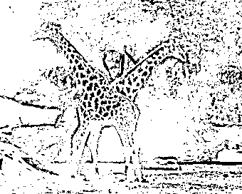

12 月 7 日星期一

**04:53** 天秤座火星四分冥王星

本相位的影响从周日就开始呈现，将一直持续到周二。这是关系中的权力斗争爆发的高峰期，容易有激烈的怒火被挑起，或产生强烈的控制欲和暴力、敌对情绪。这也意味着竞争变得激烈，或关系中的不平等导致信任危机。

**10:04** 天秤座月亮六分射手座水星

有助于沟通与了解的时刻。思维敏捷，头脑清晰，理解和表达力强。

**19:25** 月亮离开天秤座进入天蝎座

情绪敏感，易有危机感或激烈的情绪反应。渴望更加极致的情感体验。由于月亮在天蝎座这两天仍是火星四分冥王星的影响期，所以应注意情绪管理，天蝎座月亮极端的情绪反应很可能成为危机或冲突的催化剂，但这也是一个刺激我们去深入看透问题本质或透过危机找到转机的机会。

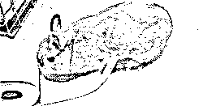

12 月 8 日星期二

**09:41** 天蝎座月亮三分海王星

直觉力和感受力增加，能够敏锐觉察到他人的隐秘动机和情感需求，对自己的情感需要和情绪反应模式也会有更加深刻的认识。有利于沟通情感，疗愈他人以及自我疗愈。

**23:50** 天蝎座月亮六分冥王星

意识和情感发生转化和裂变的时刻。我们能够对自己的深层心理有更多觉察，了解到自己或他人的更多复杂阴暗的心理面向。洞察力增加，也能敏感觉察出环境中的危机和微妙气流。

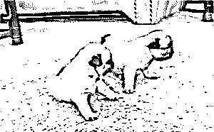

12 月 9 日星期三

**10:39** 射手座太阳三分天王星

对自由的追求和自我解放意识增强，会以更加大胆、与众不同的方式彰显自我。能够从更加长远、开阔的角度确立个人目标，也可能有突如其来的关于自我的新的认识。创新意识和叛逆性增强。

**14:40** 天蝎座月亮六分处女座木星

情绪受到鼓舞，安全感提升。能够以相对积极、慷慨、热情的态度与人相处。

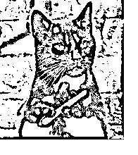

12 月 10 日星期四

**06:24**月亮离开天蝎座进入射手座

心情变得开朗乐观，心态更加积极。未来两天多的时间里，我们会更加想要遵从内心的信念和原则行事，也会更渴望自由和冒险。由于射手座新月的原因，对于真理和信念的重新确认，也可能促成新的决定或新计划的启动。

**10:35**水星离开射手座进入摩羯座

水星会在摩羯座待到 2016 年 1 月 2 号。在这 20 多天的时间里，我们的想法和思考风格会更加理智、务实，沟通表达会更加严谨，组织规划能力变强，也会更加关注效率。过去一段时间的乐观态度有所收敛，会更加讲求稳妥和现实。

**20:07** 射手座月亮四分海王星

**23:03** 射手座月亮合相土星

射手座月亮激发土星与海王星的四分相，理想主义热忱和悲悯情绪被放大，同时也更容易感受到现实和理想的差距，而有沮丧或幻灭感。

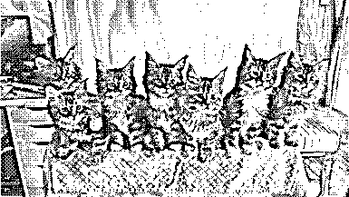

12 月 11 日星期五

**09:32** 天秤座火星对分天王星

关系中的叛逆心理和不合作态度大爆发的时刻。易有突然的、反常的激烈行为打破稳定的状态。应当心意外伤害事件，或突然出现的暴力冲动。同时，这也是革新精神和原创性受到激发的时刻，有利于突破现有桎梏，进行开创性的变革。

**14:02** 射手座月亮三分天王星

内心充满对自由的渴望和追求真理的大无畏精神。有开拓进取和积极创新的动力。

**14:14** 天蝎座金星三分海王星

爱情带来浪漫梦幻的感受，为爱陶醉的时刻。对艺术和美好事物的感受力增强。

**14:15**射手座月亮六分天秤座火星

行动力强，能够有效地将信念转化为行动。愿意以实际行动捍卫自己的理想，也可能因为理念不合而有愤怒情绪。

**18:30** 射手座新月（射手座月亮合相太阳）

理想的清晰和信念的确立，带来新的目标和勇于开创的力量。这是为自己的信仰“起而行”的时刻。我们需要为自己定下高远的志向，并以此采取行动。同时不可避免的，这也是一个与过去进行某种“切割”的时刻，分裂和冲突是为了新的成长和自由。

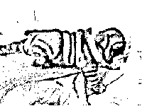

12 月 12 日星期六

**00:07** 射手座月亮四分处女座木星

易过度乐观，有自负、张狂的表现。这也是情绪躁动不安难以平静的时刻。一些宏大的愿景令人激动，但可能过度膨胀而忽略了现实中存在的问题和困难。

**14:45** 月亮离开射手座进入摩羯座

情绪变得沉稳、内敛，有节制。未来两天多的时间里，我们的处事态度会更加认真、负责，企图心、上进心变强。由于摩羯座月亮会激发火星-天王星-冥王星的“T 三角”，故而这个周末可能是整周积压的问题集中爆发的时刻。心理对抗或虐心的事件在所难免，但生命的潜力往往就是由极端的情境所激发，危急时刻也是提升能力的机会。

**21:44** 摩羯座月亮合相水星

动荡和危机唤醒了人对于现实法则的尊重。我们会自觉自发地采取最理智、务实、有效的策略来规范我们的行为，进而达到目标。

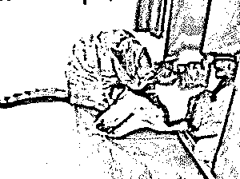

12 月 13 日

星期日

**07:38** 摩羯座月亮六分天蝎座金星

有利于社交、结盟、利益往来及资源互惠相关事宜。也有利于情感联络和爱情发展。此时对于关系的考量易掺杂较多现实利益因素。

**17:04** 摩羯座月亮合相冥王星

**21:03** 摩羯座月亮四分天王星

**23:48** 摩羯座月亮四分天秤座火星

黄昏到夜间，摩羯座的月亮触发火星-天王星-冥王星的 T 三角，易有极端情绪爆发，愤怒、敌意混合着极度压抑的感觉，带来折磨和痛苦的感受。但这也是一个认清关系中的真相、探索自己和他人的深层心理动机和能力底线的时刻。接受过试炼才会变强。


## **作者简介** 

**占星师 Cora**，全美占星师联盟（AFAN）成员，国际占星研究协会（ISAR）会员，获 ISAR 职业占星师资质认证，斯蒂芬·弗里斯特《变幻的天空》译者，个人星象文章见诸《心探索》《北京青年周刊》《上海电视》《空中生活》等杂志媒体。曾跟随大卫·瑞雷系统学习占星学，现为全职占星师。  

微信公众号：聆宇 FM（微信号：lingyudiantai）

个人微信号：CoraAstro

长按二维码，让金钱涌向传播知识与智慧的人~~


* * *

**特别提醒：**希望将若道文章转载到各自公众号的朋友，**转载时请注明“转自若道微信公众平台”，并附上若道占星的 Logo**。谢谢！

 由**大卫**·瑞雷老师****主讲的****若道占星核心课程[第四阶（Level 4)](http://mp.weixin.qq.com/s?__biz=MzA5NjA0NTAxNg==&mid=401009669&idx=3&sn=03514b2d902d9539a7c51a9a0faab9af&scene=21#wechat_redirect)**（点击可查看）**已经开课，错过了第一堂课的同学不要懊悔，还有机会插班！**大卫老师会分别讲解如何通过出生星图进行性格分析********、爱情解读、事业分析。******了解**Level 4 课程**详情，请点击文末“**阅读原文**”。


# 招聘 | 若道技术部广发英雄帖，接招吧！

> 原文：[`mp.weixin.qq.com/s?__biz=MzA5NjA0NTAxNg==&mid=401284057&idx=2&sn=2924be9fc26bb38988346ef8e90c1e58&chksm=02a9a96e35de2078fe8c321f8be8ba1ea79dd0bd76b972ba0429bf2eb22e39288d40f14a0fc1&scene=126&sessionid=1692738897#rd`](http://mp.weixin.qq.com/s?__biz=MzA5NjA0NTAxNg==&mid=401284057&idx=2&sn=2924be9fc26bb38988346ef8e90c1e58&chksm=02a9a96e35de2078fe8c321f8be8ba1ea79dd0bd76b972ba0429bf2eb22e39288d40f14a0fc1&scene=126&sessionid=1692738897#rd)

****若道星文化是由美国著名占星师大卫·瑞雷和国际占星研究协会（ISAR）中国区副主席蒋颖创办的一家占星教育和咨询机构，我们通过以 O2O 垂直类教育的互联网产品，来实现帮助自己和他人的愿望。因业务发展需要，现广觅技术人才。这里有非常人性化的工作环境和氛围，有好老板，有带薪假期，还有广阔的职业前景。****


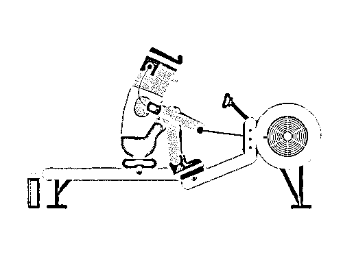

**招聘部门：技术开发部**

**招聘岗位：5 个**

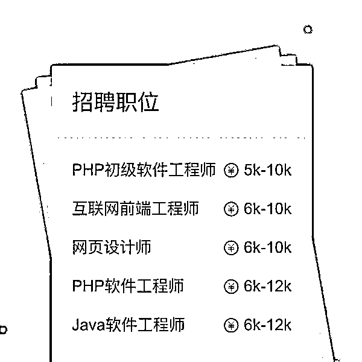

1**PHP 初级软件工程师**

**●基本信息**

待遇：5-10k 

工作地点：厦门

工作经验：1-3 年

学历：不限

要求：全职
职位诱惑：带薪假期、春节两周假期、餐补

**●岗位职责**

1、开发、测试、维护网站程序。

2、维护公司计算机设备和服务器。

3、完成公司指派的其他工作。

**●职位要求**

1.PHP 网站一年以上开发经验,且有实际作品展示。

2.熟练应用 JQuery、SQL 语言并有一定的心得和技巧。

3.对 Memcached 等 Key-Value 存储结构有了解。

4.熟悉 HTML、Javascript、CSS,能在脱离可视化编辑器的情况下进行手写。

5.有 OOP 思想，熟悉 MVC 的开发模式，熟练使用 SVN 版本控制工具。

6.有前瞻性的思维和快速学习掌握新知识的能力,对 Web2.0 新技术如：CSS+XHTML 布局、Ajax 等比较熟悉，有个人博客者优先考虑。

7.口齿清晰、思维敏捷，有较好的沟通能力，能够迅速进入工作角色，拥有出色的团队和合作精神。对“极限编程”有一定了解，具有 Linux 或 FreeBSD 操作经验的优先。

8.身体健康，无不良嗜好。

2**互联网前端工程师**

**●基本信息**

待遇：6-10k

工作地点：厦门

工作经验：1-3 年

学历：大专及以上

要求：全职

职位诱惑：带薪假期、春节两周假期、餐补

**●岗位职责**

1.公司产 PC 端及移动端的 web 制作，并持续关注 web 相关技术走向。

2.根据设计稿进行网页制作、调整。

3.根据需求实现静态页面交互效果。

4.前端组件编写及特殊 js 效果实现。

**●职位要求**

1.一年以上 Web 前端开发经验，能够进行面向对象/组件的前端设计和开发；要求有较强的页面制作功底（切图、DIV+CSS 布局等）。

2.掌握 XHTML、CSS、JavaScript 等前端相关技术，熟悉 W3C 标准，熟悉 HTTP 协议，了解 HTML5、CSS3。

3.对用户交互、用户体验有较好的理解和研究。

4.对各种浏览器的兼容性有一定了解，并有相关问题的解决经验。

5.精通 AJAX 运作机制，掌握 JQuery 或 zetop 等 JS 脚本技术。

6.熟练掌握 photoshop/fireworks、dreamwaver 等设计工具，有良好的代码书写风格。

7.有解决问题、钻研新技术的兴趣和能力，善于交流和表达。

3**网页设计师**

**●基本信息**

待遇：6-10k

工作地点：厦门

工作经验：1-3 年

学历：大专及以上

要求：全职

职位诱惑：带薪假期、春节两周假期、餐补

**●岗位职责**

1.设计 WEB/WAP 页面设计。

2.设计网站海报，以及其他设计需求。

**●职位要求**

1.视觉传达、设计，美术相关专业，1 年以上互联网公司视觉设计相关工作经验。

2.关注流行趋势，对 UI 设计趋势有灵敏触觉和领悟能。

3.熟练使用 photoshop、illustrator、flash 等常用设计软件。

4.优秀的沟通和团队协作能力，富有工作激情和创造力，热爱生活，乐于观察。

5.有较好手绘设计功底者优先。

6.应聘者需提交相关作品，简历注明薪金要求。

4**PHP 软件工程师**

**●基本信息**

待遇：6-12k
工作地点：北京

工作经验：1-3 年

学历：大专及以上

要求：全职

职位诱惑：带薪假期、春节两周假期、包午餐

**●岗位职责**

1.开发、测试、维护网站程序。

2.维护公司计算机设备和服务器。

3.完成公司指派的其他工作。

**●职位要求**

1.PHP 网站一年以上开发经验,且有实际作品展示。

2.熟练应用 JQuery、SQL 语言并有一定的心得和技巧。

3.对 Memcached 等 Key-Value 存储结构有了解。

4.熟悉 HTML、Javascript、CSS,能在脱离可视化编辑器的情况下进行手写。

5.有 OOP 思想，熟悉 MVC 的开发模式，熟练使用 SVN 版本控制工具。

6.有前瞻性的思维和快速学习掌握新知识的能力,对 Web2.0 新技术如：CSS+XHTML 布局、Ajax 等比较熟悉，有个人博客者优先考虑。

7.口齿清晰、思维敏捷，有较好的沟通能力，能够迅速进入工作角色，拥有出色的团队和合作精神。对“极限编程”有一定了解，具有 Linux 或 FreeBSD 操作经验的优先。

8.身体健康，无不良嗜好。

5**Java 软件工程师**

**●基本信息**

待遇：6k-12k

工作地点：北京

工作经验：1-3 年

学历：大专及以上

要求：全职

职位诱惑：带薪假期、春节两周假期、包午餐

**●岗位职责**

1.开发、维护和测试公司互联网后台核心应用和接口。

2.负责公共信息服务器的安全监控和日常管理，及时排除各种故障，确保服务器正常运行。

3.负责公司内部服务器、计算机、周边设备以及网络等硬件和软件的管理和维护工作。

4.完成主管领导交办的其他工作。

**●职位要求**

1.一年以上 Java 编程经验。

2.熟练掌握 Java、（J2EE 平台开发）JSP、servlet、JDBC 等技术。

3.熟练掌握 SSH、SSI 等 MVC 架构模式。

4.具有面向对象分析、设计、开发能力。

5.熟练使用 MySql 数据库。

6.熟练使用 Eclipse+tomcat、svn 等工具。

7.熟悉 HTML、JavaScript、JQuery、XML、熟悉 DIV+CSS 布局。

8.熟悉 windows 2003 server、Linux。

9.吃苦耐劳，抗压能力强，有责任心，勇于面对各项挑战,良好的团队合作精神。

10.熟悉互联网和局域网技术。

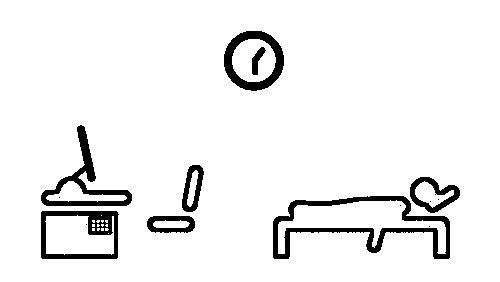

下面是最令人激动的福利环节！

来到若道您将会享受到意想不到的各种福利待遇：

1.经验丰富的产品经理，和你一起打造有吸引力的互联网产品；

2.经验丰富的 JAVA/PHP 总工程师，和你一起你在技术开发的道路上共通学习和成长；

3.不以加班作为工作的基本要求，以轻松和高效的工作方式，以你的职业追求和公司的共同成长作为管理者的目标；

4.可以和大卫老爷子以及翻译姐妹练习英语口语，提高你的职业素质；

5.有机会和美女帅哥咨询师喝茶聊星座，让你的工作不再枯燥；

6.中午包吃，由聘请的阿姨做家常饭，让你品尝妈妈的味道；

7.各种零食、茶、咖啡、红酒、啤酒、懒人沙发、休息室让你劳逸结合；

8.不定期去厦门开发中心海边度假，享受没有雾霾的日子；

9.有机会参加各种福利健身课程，带薪假期；

10.春节两周假期，你有比别人多一周的时间在家里孝敬爸妈，不再为买回家的车票发愁；

11.在这样一个创业公司，你尽早的加盟，未来将会带给你无限可能的回报。


工作地点

**●北京**

北京工作地点主要从事公司核心计算和服务接口的开发工作。

**地址：**北京市朝阳区百子湾路 32 号院苹果社区南区 10 号楼 A 座 2006 室

**●厦门**

厦门工作地点主要从事 WEB/WAP 方面的业务方面的开发，适合有意在厦门长期工作者。

**地址：**厦门软件园的开发中心工作

应聘方式

简历请透 james.li@nodoor.com，李先生。

详细内容请点击“**阅读原文**”


# 射手座 | 爱你，也爱自由

> 原文：[`mp.weixin.qq.com/s?__biz=MzA5NjA0NTAxNg==&mid=401244326&idx=1&sn=8db09c5bcd0ecc4a004dc4ba84f4976b&chksm=02a8321135dfbb076d70bdc9e97434fbdd038b355df7b8702b39397650d174e9f4776c872786&scene=126&sessionid=1692738897#rd`](http://mp.weixin.qq.com/s?__biz=MzA5NjA0NTAxNg==&mid=401244326&idx=1&sn=8db09c5bcd0ecc4a004dc4ba84f4976b&chksm=02a8321135dfbb076d70bdc9e97434fbdd038b355df7b8702b39397650d174e9f4776c872786&scene=126&sessionid=1692738897#rd)

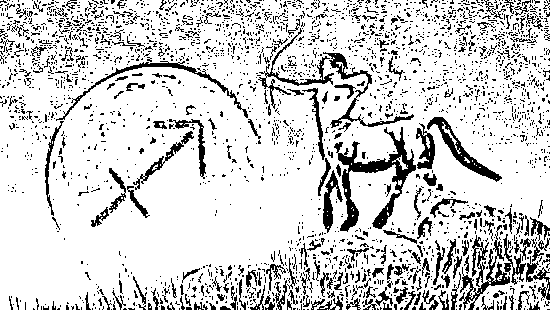
作者/斯蒂芬·弗里斯特 朱迪·弗里斯特 翻译/李含

爱自由的射手座名声在外，提到他们的感情，不少人会说花心（后台有一位射手座男生表示他 12 星座的女友都交往过）。真是这样吗？射手座的人用“花心”两个字就能概括吗？一定还有别的原因——

射手座
原型

吉普赛人、朝圣者、探险者、人类学家、哲学家、学者。

## 1 发展目标

**生命对于射手座而言就是一场彻头彻尾的探索之旅。射手就是探索者**。内在的驱动力会促使射手座人永无止息、永不间断地探索。要准确地定义射手座人的目标是什么？归根到底，就是生命的真谛。在进化占星学中，这个目标并不是个人必须觉悟到的。很多时候，呈现的是相反的情况。不管是意识层面，还是潜意识层面，根本的发展目标还是会驱动射手座人去追寻，这种驱动力解释了他们大部分行为的深层原因——有些行为看起来完全不可思议，毫无意义的。  从射手座身上我们可以看到一种灵魂追求进化的轨迹，首先，**他们需要专注于追寻更广阔的心智与意识的体验。惯有的阻碍必须被打破**。沉闷乏味的区域性现实视角比较被更全球化的视野所取代。形而上学的观点认为在前世中，射手座意味着对于进化的渴求被现实无情地打碎。所以，在这一世里，要强迫自己打破枷锁， 冲出牢笼。 

## 2 资源和策略

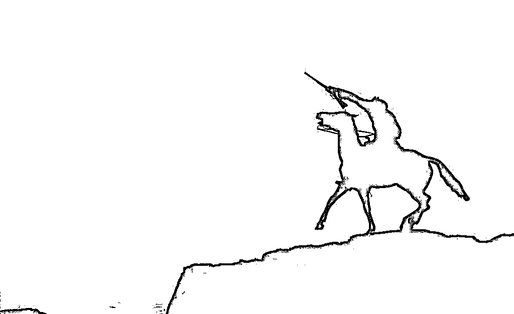 

去追寻生命的意义！这是不是一个唐吉柯德式的冒险？对于射手座人而言，这不成问题。生命的意义才是问题，亦或生命本就毫无意义。这就是射手座最主要的资源：**他们坚信在随机的命运背后蕴藏着的宏大格局**。如何参透这个格局的奥妙呢？去体验，去探索！**射手座有一种强烈的愿望，要打破墨守陈规的僵化思考。这就是射手座的策略。**

 没有充分的自由，就无法张开追寻的翅膀。所以，射手座比任何星座都要谨慎，他们不会轻易做出承诺，交出主权。批评射手座的人会把这种对于自由的热爱解读为承诺恐惧症。在个体分析上，这个也许正确，但是在更广泛地解读射手座时，我们必须认识到，失去了自由，射手座的生命将会枯萎凋落。**很悲哀，但不得不面对，爱情通常很难建立在自由的基础上**。 

## 3 阴影

但是爱情也有另一面：在人性的探索里，爱情可以赋予一个人极大的自由和拓展。人生的意义是什么？那谁知道呢？但是很多伟大的人文主义导师都认为，不论生命的意义是什么，都与爱有关。**射手座的阴影是他们很有可能逃避真诚的关怀，这种真诚的关怀只有在我们抛开一切将彼此的命运绑在一起，不在乎结局如何时才会拥有**。

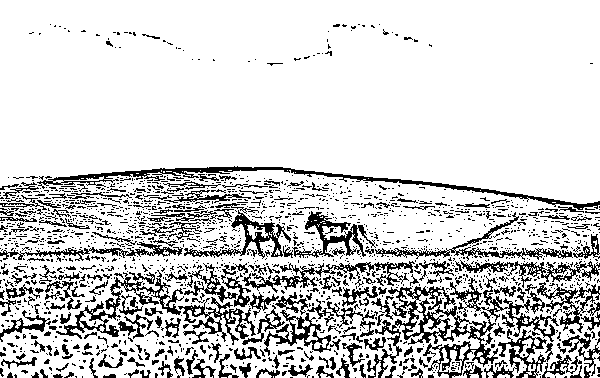

射手座人对于人生就像是石头滑过结冰的池塘，尽可能多地体验学习。就像歌里唱的，“自由的代名词就是一无所有。”**对于射手座来说，对真理的探索要比亲密的两性关系有更加广阔的天空**。射手座人认真读一本好书领悟到的人生的意义要比随便翻翻美国国会图书馆里任何一本宗卷获得的要多。辽阔的风景是美的，但强烈的、专注的、负责任的态度，不论是对于在爱情中还是在图书馆里都是美好的。

**◆ ◆ ◆**

**★ 有个二货射手座的家人**、**朋友**、**爱人**、**孩子是怎样的体验？欢迎在评论区留言分享。也可以投稿到邮箱**nodoor@vip.126.com 分享你和射手座的故事！****

**◆ ◆ ◆**

太阳射手座的爱情

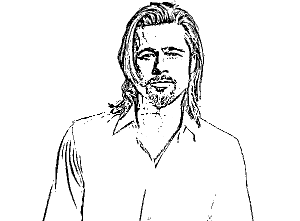

 **在爱情的国度里，射手座人是言辞上的巨人，行动上的矮子，这是名声在外的**。这种让人沮丧的情况也不一定就无可避免，但是射手座人要放下对爱情的强迫性背叛行为，或者只是肤浅的感情接触，实则保持孤独的内心，射手座人必须接受这种不可避免的理念，不管多么充满活力的关系，也会有乏味的部分。从另一方面看，这种成熟爱情的灵魂冒险会带来丰富的成长经验。

思想理念是射手座的强大驱动力，但是这些思想理念必须令人信服，经得起实践的考验。**精神空洞的爱情不会让射手座人停留太久，体验过后就会觉得无味而放弃**。另外，对于每一个太阳射手座的人来说，自由的确是进化所必需的途径。**他们必须选择和自己一样热爱自由的伴侣，有自己独立的兴趣和朋友圈，从不停下追逐的脚步，更重要的是，他不会幼稚地大肆嫉妒，安全感匮乏**。满足了这些要求，射手座人就能了解射手座的秘密：如果可以与伴侣携手并肩就能追求得更丰富、更深刻。

月亮射手座的爱情

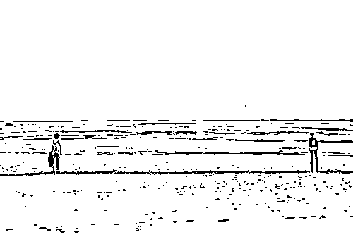

在亲密关系中，月亮射手座会有一些矛盾。月亮代表了我们的支配性的需求，射手座的需要就是“不需要有任何需要”，至少会很独立，不需要依附于任何人。**月射手的男男女女们与伴侣的关系会在两重的矛盾性间拉扯：理想化混合着距离感**。

传统文化夸大了伴侣间的互相依赖在维系婚姻稳定中的作用。社会文化削弱了女人操作机器一类的能力，而男人则不善于照顾自己。而月亮射手座热爱自由，他们不能容忍自己落入这样的圈套。即使他们的生活不会像 50 年代的家庭生活真人秀那样枯燥无味，但为了不让纠缠的恐惧愈演愈烈，他们还是必须忙于生活中的实践活动，获得满足感。这样看来，爱情的承诺更多的是带来混乱，而不是危险可憎的必需品。我们强调这个月亮星座对爱情的敏感性，毕竟月亮更多影响到家庭生活的情绪。

上升射手座的爱情

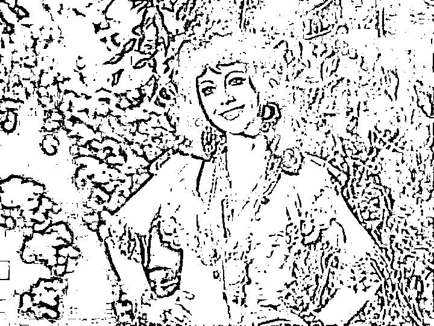

**上升射手座的人会流露出豪爽、健康、勇敢的气质 —— “吉普赛人的面具”**。通常急智幽默、眼光独到、宽宏大量。自然，这是非常具有魅力的，吸引里异性的瞩目，也同样在社交中广受欢迎。“把一切都整合到一起”需要在生活中时常注入新鲜和出乎意料的元素，避免陷入惯性、呆板、可预知性。上升射手座人会不断的与爱情长跑中的单调乏味做斗争。这种观念是现实可行的，但不要做过了头。**与之前讲到的太阳月亮射手座类似，上升射手的人不要逃避承诺，但要避免让爱情的承诺变成一种毒药**。

**上升射手座的人守护星是木星，木星的落点也会影响到爱情。**

**其他射手座文章请戳：**

[射手座 | 不只是一个有故事的男同学](http://mp.weixin.qq.com/s?__biz=MzA5NjA0NTAxNg==&mid=401201179&idx=1&sn=65d6c22772a46f5273d29d3f18498d61&scene=21#wechat_redirect)

[射手座的阴影 | 理解我，很难吗？](http://mp.weixin.qq.com/s?__biz=MzA5NjA0NTAxNg==&mid=401178874&idx=1&sn=c474131083fd32f79d07a11439f0bc37&scene=21#wechat_redirect)

[执着于人生意义的二货最终成了智者，你呢？](http://mp.weixin.qq.com/s?__biz=MzA5NjA0NTAxNg==&mid=401087779&idx=1&sn=6133b088645e5dbb27c7a8cf56bcc537&scene=21#wechat_redirect)

[经历天蝎座的蜕变后，是时候放飞梦想了！](http://mp.weixin.qq.com/s?__biz=MzA5NjA0NTAxNg==&mid=400959662&idx=1&sn=735fdb83a92ab7cc38ccc694c6d27f12&scene=21#wechat_redirect)

[射手座 | 兼具动物性和精神性](http://mp.weixin.qq.com/s?__biz=MzA5NjA0NTAxNg==&mid=400977179&idx=1&sn=b2f320192c9bfeb0501799ebe3a7a05e&scene=21#wechat_redirect)

由**大卫**·瑞雷老师****主讲的****若道占星核心课程[第四阶（Level 4)](http://mp.weixin.qq.com/s?__biz=MzA5NjA0NTAxNg==&mid=401009669&idx=3&sn=03514b2d902d9539a7c51a9a0faab9af&scene=21#wechat_redirect)**（点击可查看）**已经开课，错过了第一堂课的同学不要懊悔，还有机会插班！**大卫老师会分别讲解如何通过出生星图进行性格分析********、爱情解读、事业分析。******了解**Level 4 课程**详情，请点击文末“**阅读原文**”。


# 日复一日的乏味，哪里才是激情澎湃的出口？

> 原文：[`mp.weixin.qq.com/s?__biz=MzA5NjA0NTAxNg==&mid=401244326&idx=2&sn=2e0678e2d4b7de6de96908ea81ee0a39&chksm=02a8321135dfbb073dff7243731106e735a367d77e6bbad80a2b8678333e3d95f1cc30a852e6&scene=126&sessionid=1692738897#rd`](http://mp.weixin.qq.com/s?__biz=MzA5NjA0NTAxNg==&mid=401244326&idx=2&sn=2e0678e2d4b7de6de96908ea81ee0a39&chksm=02a8321135dfbb073dff7243731106e735a367d77e6bbad80a2b8678333e3d95f1cc30a852e6&scene=126&sessionid=1692738897#rd)


生活总是不小心

就陷入无聊的循环

今日如昨日，也如明日

打破乏味的循环

首先要找到你的热情所在

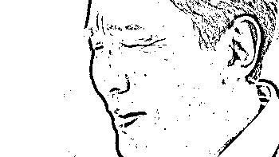 

我们为你精心定制了一份职业报告

指引你突破枯燥的现状

寻找属于你的特殊使命！

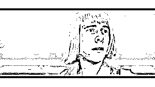 

伴随着浮夸的歌曲

请尽情畅饮先贤们的鸡汤和鸡血！

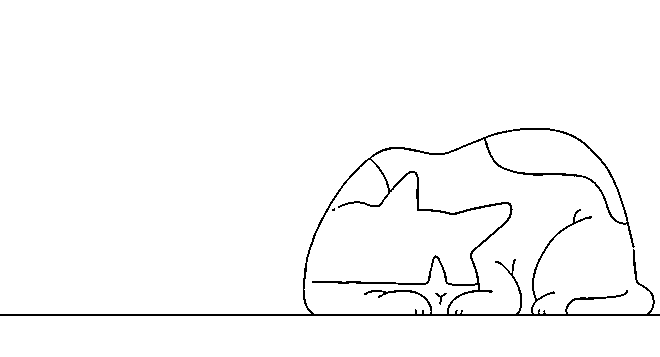

**先付报酬的工作是肯定干不好的。**

**—— 约·弗洛里奥**

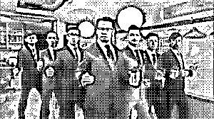

**如果工作是一种乐趣，人生就是天堂。**

**—— 歌德**
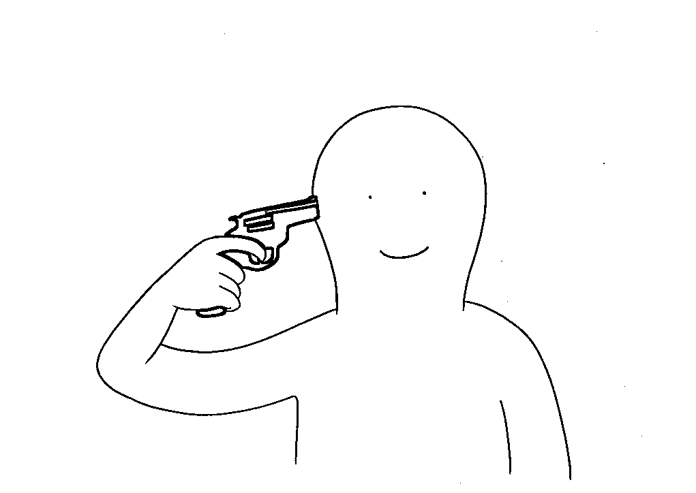

**生活最沉重的负担不是工作，而是无聊。**

**—— 罗曼·罗兰**

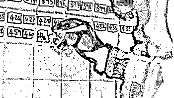

**电视并不是真实的生活，在现实生活中，人们实际上得离开咖啡店去干自己的工作。**

**—— 比尔·盖茨**

**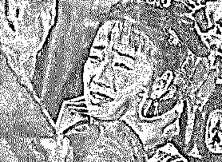** 

**天才，就其本质而说，只不过是一种对事业、对工作过盛的热爱而已。**

**—— 高尔基**

**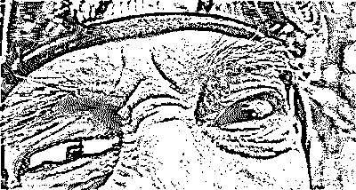**

**最困难之时，就是离成功不远之日。**

**——拿破仑**

**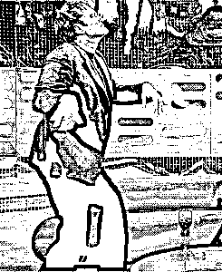** 

**爱国的主要方法，就是要爱自己所从事的事业。**

**—— 谢觉哉**

**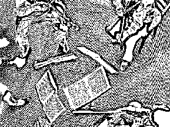** 

**从工作里爱了生命，就是通彻了生命最深的秘密。**

**—— 纪伯伦** 

当然，并不是所有人都接受工作等于生命的观念。但是如果要在这个世界上独立生存，就必须做些什么，那么这份报告确实可以给你一些切实的建议，帮你找到最适合的领域，让你从工作中获得快乐与满足。请点击文末阅读原文进行查看。

占星学告诉我们人类是复杂的生物，每个人的“重点”都不尽相同，如果你的关注点不在工作，我们也准备了其他类型的定制报告，→**http://www.nodoor.com/wap/shop/**（请复制到浏览器查看），假如你有更多关于自己的疑问，欢迎致电**400-619-1014**了解国内最专业的占星学课程及占星咨询。

**· END ·**

**** 

****

# 格罗夫是谁？| 打怪升级真人版

> 原文：[`mp.weixin.qq.com/s?__biz=MzA5NjA0NTAxNg==&mid=401222342&idx=1&sn=a5de760e45cd180a180f02e400418fd6&chksm=02a8987135df11670fec6f81a7d9d7e627f2a2a66c114bee0caa2212fdca43b67631dd32c319&scene=126&sessionid=1692738897#rd`](http://mp.weixin.qq.com/s?__biz=MzA5NjA0NTAxNg==&mid=401222342&idx=1&sn=a5de760e45cd180a180f02e400418fd6&chksm=02a8987135df11670fec6f81a7d9d7e627f2a2a66c114bee0caa2212fdca43b67631dd32c319&scene=126&sessionid=1692738897#rd)

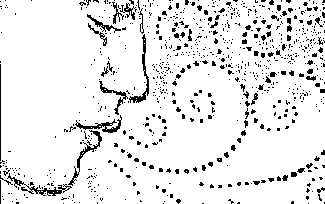

文章来源/格罗夫全息呼吸法

整理/明明

**今天带给大家的,**

**是“全息呼吸法”创始人斯坦尼斯拉夫·格罗夫的故事。**

**什么？你不知道全息呼吸？**

**那先看个视频吧。**

**第二位接受采访且目光炯炯的人就是中年格罗夫。**

**（老爷子今年 84 岁了。）**

**话说明年 1 月他要来北京开全息呼吸的工作坊，**

**好期待啊！**

📹 [`v.qq.com/iframe/preview.html?vid=j0152n1dcfw&width=500&height=375&auto=0`](https://v.qq.com/iframe/preview.html?vid=j0152n1dcfw&width=500&height=375&auto=0)

都看了哈？

简单来说，作为人，在还没出生的时候——婴儿从受精、居住在母体内，再到从子宫里被挤压出产道，都留下了大量情绪记忆。全息呼吸法（Holotrophic Breathwork）使用了快速呼吸、唤起性音乐、身体表达的方式刺激“呼吸者”的潜意识，通过治疗这些情绪创伤，达到非同寻常的疗愈和转化作用。

**◆ ◆ ◆**

**❖ 你知道什么是全息呼吸吗？你体验过全息呼吸吗？欢迎在评论区留言分享。你还可以把自己的呼吸故事投稿到邮箱 nodoor@vip.126.com**

**◆ ◆ ◆**

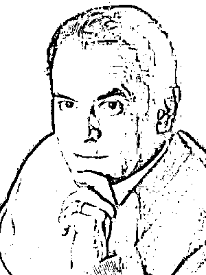

**格罗夫（**Stanislav Grof），超个人心理学奠基人，全息呼吸法创始人

提起全息呼吸，就不得不说格罗夫。现年 84 岁的他是位传奇式的人物，在西方心理学界可是鼎鼎大名，他是精神病学家、超个人心理学奠基人。至今为止，他出版著作近三十本，被翻译成二十多种语言。

**随便发几本上来，大家感受一下。**

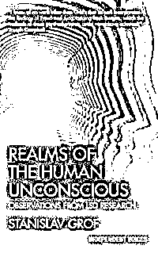

Realms of the Human Unconscious: Observations from LSD Research，1975

《人类潜意识的领域：LSD 的研究报告》

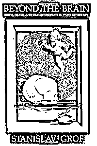

Beyond the Brain: Birth, Death, and Transcendence in Psychotherapy,1985

《超越头脑：心理治疗中的生，死与超越》

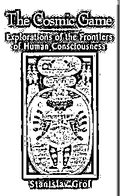

The Cosmic Game: Explorations of the Frontiers of Human Consciousness, 1998

《宇宙游戏：人类意识的前沿探索》

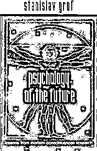

Psychology of the Future: Lessons from Modern Consciousness Research, 2000

《未来的心理学：现代意识研究的启示》

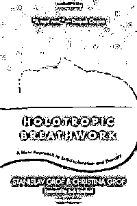

Holotropic Breathwork: A New Approach to Self-Exploration and Therapy, 2010

《全息呼吸法：一种自我探索与疗愈的新方式》

**究竟是什么样的经历造就了格罗夫的辉煌呢？看了老爷子的人生故事，不由感叹也是一个打怪升级的人生啊！**

**贵族之子**

1931 年，格罗夫降生在二战前夕的前捷克斯洛伐克的首都布拉格。贵族出身的母亲生长在一个有宗教信仰的家庭，却爱上了一位并非门当户对的男子，并执意结婚。最后，家人用金钱疏通关系，才让这桩不般配的婚礼得以在教堂举行。从此，母亲开始抵触从小的宗教信仰，并倾心于印度哲学。**这也使得格罗夫不膜拜任何一个宗教，而是带着好奇和敞开的心态去接触不同的文化和信仰。**

**监狱风波**

格罗夫的童年，正是捷克被德国占领的时期，从小被迫学习德语。1968 年，前苏联入侵倒捷克，政局改变，又不得不学习俄语。因为参加“反俄”学生运动，被关进监狱四个月。基于这个“污点”，格罗夫被分配到捷克一所三流的中学，结果他成了那里的尖子生，以优异的成绩考入布拉格的查尔斯大学。**在人生很多貌似不得不的“被动”中，格罗夫发现，没有所谓不好的事情。不好的背面，一定是好，就看你愿不愿意，能不能够把这张牌翻过来。**

**八国语言**

时局和经历的多变，对不同文化的好奇心激发了格罗夫的语言天赋。除了捷克语、德语、俄语、他还精通意大利语、英语、西班牙语、葡萄牙语、印第安语，还会一点中文。格罗夫从小喜欢画画，梦想成为动画片电影导演。**直到有一天读到一本弗洛伊德的心理学著作，几乎一夜没合眼，一口气读完，第二天决定放弃在捷克最好的电影公司做实习生的机会，报考医学院。**

**打瞌睡的督导**

攻读医学硕士和博士的七年时间里，每个星期，格罗夫都去看心理医生。督导是位上了年纪的老人，常常会在同学自述的时候打盹。有一次，格罗夫集合几个有意见的穷学生向督导抛出一个问题：“有一天我当了心理医生，如果病人来了，我却睡着了，我该不该收他诊疗费呢？”督导说：“睡觉问题不大，而且在关键时刻我就醒过来了。”**格罗夫对当年心驰神往的心理学产生了动摇**——难道我的未来就是坐在椅子上听别人讲述让我打瞌睡的东西吗？

**吃了 LED 后**

医学院毕业之后，格罗夫开始在布拉格精神病研究院（Psychiatric Research Institute）从事临床研究。就在对心理学再次产生怀疑的时候，他收到一份快件，里面是一包化学家艾伯特·霍夫曼发明的 LSD（致幻剂）。霍夫曼给欧洲的每一个精神病医生都寄了一份，他在说明里写道：试一试它，这会帮助你理解那些精神病人的反应。

格罗夫后来回忆说，早晨我是格罗夫，下午吃了 LSD，我完全变成了另外一个人，我的手和脚消失了，医学院的大楼消失了，布拉格消失了，捷克消失了，我变得和宇宙一样大。过去 7 年，每个星期我都去看心理医生，有变化，但在服下 LSD 之后的改变是两辈子三辈子都无法实现的。

LSD 重新燃起了格罗夫对心理学研究的热情。他开始将 LSD 运用在对非正常意识状态的研究上，并依据亲身经历的上千次体验，以及大量的个案写了三十多本相关著作。

**祈请高等智慧**

早年将 LSD 运用到心理学研究的初期，捷克当局要求格罗夫做间谍，在高压的挟持之下，格罗夫祈请宇宙更高的智慧帮助他——

高等智慧：“这取决于你的心愿，你想做什么？”

格罗夫：**“我想毕生做心理学的研究。”**

高等智慧：“这是可以实现的。不久你将前往美国。但在离开之前，你要答应，有一天，你要返回这片土地，将你所学的服务这片土地上的人们。”

**开创全息呼吸法**

没过多久，格罗夫收到约翰·霍普金斯大学（JohnsHopkins University）赴美讲学的邀请，并顺利留在了美国。**对于心怀大愿的人，一切障难似乎都只是此处应该转弯的一种提示。**LSD 被禁用之后，格罗夫也被迫中断了研究。随后，格罗夫作为常驻教授来到加州大海湾的伊萨兰学院，并在那个神奇的地方和妻子克丽斯蒂娜一同开创了可以代替 LSD，让人们迅速进入潜意识的方法——全息呼吸法。

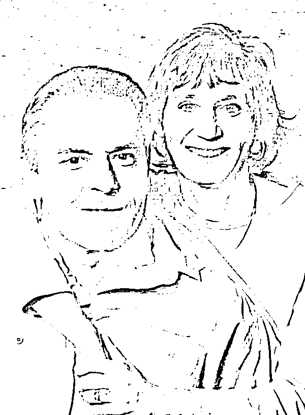

年轻时的格罗夫和妻子

* 未来若道君将为大家奉上格罗夫和全息呼吸的更多内容，敬请期待！

**有关格罗夫的其他文章，请点击：**

[格罗夫 | 打开灵魂封印的人 （上）](http://mp.weixin.qq.com/s?__biz=MzA5NjA0NTAxNg==&mid=209907983&idx=3&sn=ea663a0b9331a5727b1690ce19815ea5&scene=21#wechat_redirect)

[格罗夫 | 打开灵魂封印的人 （下）](http://mp.weixin.qq.com/s?__biz=MzA5NjA0NTAxNg==&mid=209991672&idx=3&sn=bbd0ee056e0c5c1bae917b62e145330c&scene=21#wechat_redirect)

**◆ ◆ ◆**

****特别提醒：**希望将若道文章转载到各自公众号的朋友，**转载时请注明“转自若道微信公众平台”，并附上若道占星的 Logo**。谢谢！**

**2016 年 1 月 5 日-1 月 8 日**，格罗夫及其团队将在**北京**举办**三天全息呼吸工作坊**；**2016 年 1 月 11 日-1 月 17 日**，格罗夫和占星大师塔纳斯将在**北京**举办**七天全息呼吸与原型占星工作坊**。详细内容请点击“**阅读原文**”了解。


# 顺势疗法 | 越稀释越强效的奥秘在这里

> 原文：[`mp.weixin.qq.com/s?__biz=MzA5NjA0NTAxNg==&mid=401222342&idx=2&sn=7a37d83d596860089f8364399b00143d&chksm=02a8987135df11670f5fbce492a4199fd0a6e6276555b842162e438d312dd855fffcfb38c745&scene=126&sessionid=1692738897#rd`](http://mp.weixin.qq.com/s?__biz=MzA5NjA0NTAxNg==&mid=401222342&idx=2&sn=7a37d83d596860089f8364399b00143d&chksm=02a8987135df11670f5fbce492a4199fd0a6e6276555b842162e438d312dd855fffcfb38c745&scene=126&sessionid=1692738897#rd)

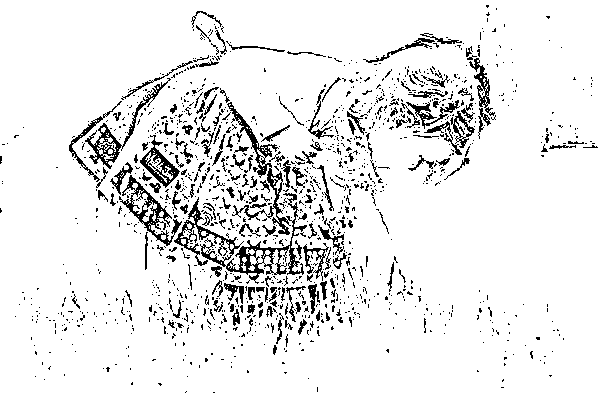

来源/homeopathyplus 网站

译者/王宏

昨晚，苏·汤普金斯老师的[顺势疗法家庭急救课程（点击可查看）](http://mp.weixin.qq.com/s?__biz=MzA5NjA0NTAxNg==&mid=401201179&idx=3&sn=016e73b09faef4e16c22cfb3deaf6385&scene=21#wechat_redirect)开课了！在课堂上，一些同学对“势能化”产生了疑问，为什么稀释的次数越多，药效反而越强呢？苏用了一个形象的比喻，就好像冥王星离我们很远，比水星远多了，但它的能量难道很弱吗？它对我们的影响比水星强多了。今天这篇文章，从五个方面，更详细地阐述了势能化的好处，一起来看看吧！

**◆ ◆ ◆**

**★ 你使用顺势疗法吗？上了苏老师的第一课有什么收获或感受呢？欢迎在评论区留言分享。也可以投稿到邮箱**nodoor@vip.126.com 分享你的顺势疗法经验！****

**◆ ◆ ◆**

创造出安全并有效的顺势疗法药物，关键在于“势能化”这一做法[（可点击文章《顺势疗法如何重塑生命力》做参考）](http://mp.weixin.qq.com/s?__biz=MzA5NjA0NTAxNg==&mid=401087779&idx=2&sn=75e5ef7e354939057d30e8b7f422efec&scene=21#wechat_redirect)。尽管过程极其简单，但其好处却非常大：

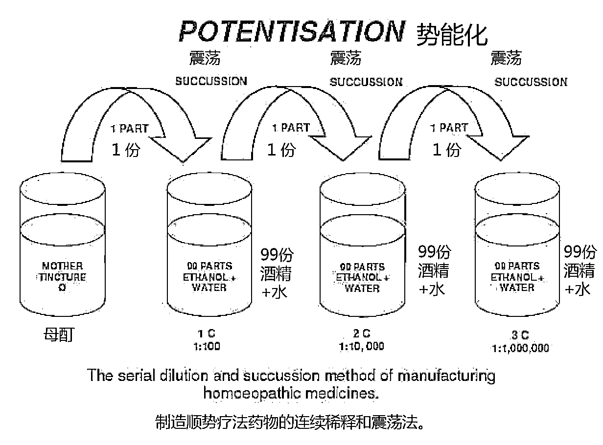 

*1*

**消除有害的副作用**

势能化的奥秘，即在势能化过程中药物的反复震荡，似乎**将原始物质的治疗特性转移并增强到了水和酒精的混合物中；该过程的稀释阶段去除了原始物质的化学残留物**。到药物被势能化至 12C 或 26X 的势能及其以上的势能之时，一个原始物质的分子都不可能存留下来。药物变成了“亚分子”药品，不会使人中毒或产生毒副作用，无论剂量有多大。

*2*

**将毒药转变为安全的药物**

制备顺势疗法药物所需的有些动物、植物或矿物来源在其基态下毒性很大。例如，重金属、蛇和蜘蛛毒液、砷以及士的宁这类毒药在原始形态下绝不可被用作药物，但当被置入势能中时，却成为了安全、有效的药剂。比如南美蛇毒，势能化的蛇毒被用于治疗高血压，而且是安全的。

*3*

**将不活跃的物质转化为有力的药剂**

如果稀释去除了一种物质的毒性，震荡就释放并增强了其治疗效力。出于这一原因，**某些在原始形态下没有任何药用价值的东西可以在震荡和被置入势能中时变得极为活跃**。例如，氯化钠（普通食盐）和沙子几乎没有医疗用途，但势能后，两者都能够治疗范围很广的健康问题。

*4*

**消除对麻醉剂的上瘾**

因为**势能化去除了能够导致身体依赖性或成瘾的化学物质，所以顺势疗法药物不会令患者上瘾**。本来鸦片在其原始形态下极易导致上瘾，但在势能中，它能安全地治疗各类神思恍惚、不省人事或昏迷、惊骇、头部受伤和便秘。同样地，印度大麻通常被称为大麻或印度大麻麻醉剂，而势能化的印度大麻作为一种药物不会造成依赖，却会缓解困惑、朦胧、焦虑、狂喜以及排尿灼烧感的症状。

*5*

**可与传统药物一起使用**

顺势疗法不仅与传统医学对于症状的重要性有着不同的理解，它还会通过不同层面上的变化而纠正症状。传统药物利用化学物质来控制身体层面上的症状。**顺势疗法药物在深层的动态层面触发愈合反应。这种更深层的行为正是顺势疗法药物和传统药物可以共同使用的原因，它们不会相互作用，不会产生不希望得到的结果。**

**注意：**

**不过，尽管顺势疗法药物可以与传统药物一起安全使用，但需注意两件重要的事：**

● 传统药物的应用会令顺势疗法处方的开出变得更加困难。因为这些药物会改变或压制症状，但症状正是顺势疗法根据“同类法则”开出成功处方的关键。**传统药物的使用甚至会通过副作用的方式引发出新的症状。**如果发生了这种情况，那顺势疗法的处方就得依据剩余的和并未改变的症状开出，或是依据在药物给出之前存在的症状开出。

● **在开始顺势疗法治疗时，患者应该自我监测哪些症状被传统药物控制住了。**因为顺势疗法药物带来的改善会减少对传统药物的需求。在应对高血压或血糖水平升高的问题时尤为如此。如果在不再需要传统药物却还继续服药，血压和血糖水平都会被降低到危险的水平。

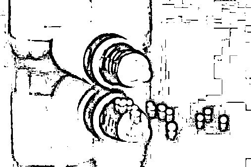

**结论:**

化学物质的势能化提供了极为安全并在深层起作用的药物。当根据同类法则开出处方时，它们也会触发体内重要的治愈效应，这比仅仅掩盖或抑制症状要吸引人得多。200 年来，顺势疗法药物一直被安全地用于缓解身体不适者、孕妇、年轻人、老年人，以及动物身上的痛苦。顺势疗法将继续在未来做好这件事。

**更多有关顺势疗法的传送门**

**科普篇**

[顺势疗法的药物如何重塑生命力？（上）](http://mp.weixin.qq.com/s?__biz=MzA5NjA0NTAxNg==&mid=401087779&idx=2&sn=75e5ef7e354939057d30e8b7f422efec&scene=21#wechat_redirect)

[顺势疗法的药物如何重塑生命力（下）](http://mp.weixin.qq.com/s?__biz=MzA5NjA0NTAxNg==&mid=401139231&idx=2&sn=303a7edf95151aa7c47f91d79d17bfe7&scene=21#wechat_redirect)

[顺势疗法最常被问到的 9 个问题（上）](http://mp.weixin.qq.com/s?__biz=MzA5NjA0NTAxNg==&mid=401009669&idx=1&sn=82cf1d6fbc16a03ba8dabc16ae052b60&scene=21#wechat_redirect)

[顺势疗法最常被问到的 9 个问题（下）](http://mp.weixin.qq.com/s?__biz=MzA5NjA0NTAxNg==&mid=401041691&idx=2&sn=1dd9e1a8634f19bd322fa96fe59df3bc&scene=21#wechat_redirect)

[对待疾病 | 姑息它，压制它，还是治愈它？](http://mp.weixin.qq.com/s?__biz=MzA5NjA0NTAxNg==&mid=400605043&idx=1&sn=a0f8e724b556cdc49530a5a66c0e85d6&scene=21#wechat_redirect)

[顺势疗法，皇室钟爱的疗愈方法](http://mp.weixin.qq.com/s?__biz=MzA5NjA0NTAxNg==&mid=400017180&idx=1&sn=286860583aa755e5fe5a6eac534008cb&scene=21#wechat_redirect)

[顺势疗法 | 它在世界上排名第二，它治人不治病](http://mp.weixin.qq.com/s?__biz=MzA5NjA0NTAxNg==&mid=400153889&idx=1&sn=2dd034cb37b11e5765bd170addd1f960&scene=21#wechat_redirect)

[送你急救箱，救自己救家人还能救宠物](http://mp.weixin.qq.com/s?__biz=MzA5NjA0NTAxNg==&mid=400181530&idx=1&sn=5b5510e4d43ef54ae0f3f56441d1ac65&scene=21#wechat_redirect)

**案例篇**

[类风湿性关节炎](http://mp.weixin.qq.com/s?__biz=MzA5NjA0NTAxNg==&mid=401201179&idx=2&sn=6c9bca057c6b609f0fbc4e64e5b01773&scene=21#wechat_redirect)

[帕金森症](http://mp.weixin.qq.com/s?__biz=MzA5NjA0NTAxNg==&mid=401178874&idx=2&sn=190c36b6b11cbfdf78872f3808ddb534&scene=21#wechat_redirect)

[自闭症](http://mp.weixin.qq.com/s?__biz=MzA5NjA0NTAxNg==&mid=400921710&idx=2&sn=94af25e6399ca49525ddbd11dc61bbb1&scene=21#wechat_redirect)

[肾结石](http://mp.weixin.qq.com/s?__biz=MzA5NjA0NTAxNg==&mid=400879915&idx=2&sn=71944f0c596042332924e0de8c7bcf63&scene=21#wechat_redirect)

[婴儿夜惊](http://mp.weixin.qq.com/s?__biz=MzA5NjA0NTAxNg==&mid=400901918&idx=2&sn=2c39821aa322bddc9d12dc6c8b128556&scene=21#wechat_redirect)

[心理创伤](http://mp.weixin.qq.com/s?__biz=MzA5NjA0NTAxNg==&mid=400858503&idx=2&sn=8ed07f16cdc736af776dce34aa9232cd&scene=21#wechat_redirect)

[鼻窦炎](http://mp.weixin.qq.com/s?__biz=MzA5NjA0NTAxNg==&mid=400750777&idx=2&sn=e5dba7e9508a9ed7ec0dd18d445182c9&scene=21#wechat_redirect)

[孕妇消化不良](http://mp.weixin.qq.com/s?__biz=MzA5NjA0NTAxNg==&mid=400721730&idx=2&sn=3b907efec5851b08f1fc3e74be31c2e8&scene=21#wechat_redirect)

[一瓶药丸治好了困扰我四年的各种病症](http://mp.weixin.qq.com/s?__biz=MzA5NjA0NTAxNg==&mid=400555588&idx=1&sn=9d860beaa15bc1b9e6c627e1d3369afa&scene=21#wechat_redirect)

[为了宝宝，我选择顺势疗法](http://mp.weixin.qq.com/s?__biz=MzA5NjA0NTAxNg==&mid=400490938&idx=2&sn=9ae026781f9119936ade05b2dc66655f#wechat_redirect)

[过敏、扭伤、关节炎、痛经、宠物疾病](http://mp.weixin.qq.com/s?__biz=MzA5NjA0NTAxNg==&mid=400260655&idx=1&sn=854005f3b4c5846959ece35907a94dba&scene=21#wechat_redirect)

**◆ ◆ ◆**

**特别提醒：**希望将若道文章转载到各自公众号的朋友，**转载时请注明“转自若道微信公众平台”，并附上若道占星的 Logo**。谢谢！

**昨晚，**由**苏**·********汤普金斯老师****亲授的[**顺势疗法急救课程**](http://mp.weixin.qq.com/s?__biz=MzA5NjA0NTAxNg==&mid=401201179&idx=3&sn=016e73b09faef4e16c22cfb3deaf6385&scene=21#wechat_redirect)**已经**开课了！错过的朋友不要懊悔，还有机会插班！本课程为那些想要增加自我和家庭身体保健和疗愈能力的人所设置。欲详细了解，请点击文末“**阅读原文**”。


# 招聘 | 若道技术部广发英雄帖，接招吧！

> 原文：[`mp.weixin.qq.com/s?__biz=MzA5NjA0NTAxNg==&mid=401222342&idx=3&sn=ef3dc3de2139c98508d6eac8b4c12cfd&chksm=02a8987135df1167128b4644e11034f8b46e45e6b04be56d74a7b5fe1ec46c6f01ab4ca16bb2&scene=126&sessionid=1692738897#rd`](http://mp.weixin.qq.com/s?__biz=MzA5NjA0NTAxNg==&mid=401222342&idx=3&sn=ef3dc3de2139c98508d6eac8b4c12cfd&chksm=02a8987135df1167128b4644e11034f8b46e45e6b04be56d74a7b5fe1ec46c6f01ab4ca16bb2&scene=126&sessionid=1692738897#rd)

****若道星文化是由美国著名占星师大卫·瑞雷和国际占星研究协会（ISAR）中国区副主席蒋颖创办的一家占星教育和咨询机构，我们通过以 O2O 垂直类教育的互联网产品，来实现帮助自己和他人的愿望。因业务发展需要，现广觅技术人才。这里有非常人性化的工作环境和氛围，有好老板，有带薪假期，还有广阔的职业前景。****


**招聘部门：技术开发部**

**招聘岗位：5 个**


1**PHP 初级软件工程师**

**●基本信息**

待遇：5-10k 

工作地点：厦门

工作经验：1-3 年

学历：不限

要求：全职
职位诱惑：带薪假期、春节两周假期、餐补

**●岗位职责**

1、开发、测试、维护网站程序。

2、维护公司计算机设备和服务器。

3、完成公司指派的其他工作。

**●职位要求**

1.PHP 网站一年以上开发经验,且有实际作品展示。

2.熟练应用 JQuery、SQL 语言并有一定的心得和技巧。

3.对 Memcached 等 Key-Value 存储结构有了解。

4.熟悉 HTML、Javascript、CSS,能在脱离可视化编辑器的情况下进行手写。

5.有 OOP 思想，熟悉 MVC 的开发模式，熟练使用 SVN 版本控制工具。

6.有前瞻性的思维和快速学习掌握新知识的能力,对 Web2.0 新技术如：CSS+XHTML 布局、Ajax 等比较熟悉，有个人博客者优先考虑。

7.口齿清晰、思维敏捷，有较好的沟通能力，能够迅速进入工作角色，拥有出色的团队和合作精神。对“极限编程”有一定了解，具有 Linux 或 FreeBSD 操作经验的优先。

8.身体健康，无不良嗜好。

2**互联网前端工程师**

**●基本信息**

待遇：6-10k

工作地点：厦门

工作经验：1-3 年

学历：大专及以上

要求：全职

职位诱惑：带薪假期、春节两周假期、餐补

**●岗位职责**

1.公司产 PC 端及移动端的 web 制作，并持续关注 web 相关技术走向。

2.根据设计稿进行网页制作、调整。

3.根据需求实现静态页面交互效果。

4.前端组件编写及特殊 js 效果实现。

**●职位要求**

1.一年以上 Web 前端开发经验，能够进行面向对象/组件的前端设计和开发；要求有较强的页面制作功底（切图、DIV+CSS 布局等）。

2.掌握 XHTML、CSS、JavaScript 等前端相关技术，熟悉 W3C 标准，熟悉 HTTP 协议，了解 HTML5、CSS3。

3.对用户交互、用户体验有较好的理解和研究。

4.对各种浏览器的兼容性有一定了解，并有相关问题的解决经验。

5.精通 AJAX 运作机制，掌握 JQuery 或 zetop 等 JS 脚本技术。

6.熟练掌握 photoshop/fireworks、dreamwaver 等设计工具，有良好的代码书写风格。

7.有解决问题、钻研新技术的兴趣和能力，善于交流和表达。

3**网页设计师**

**●基本信息**

待遇：6-10k

工作地点：厦门

工作经验：1-3 年

学历：大专及以上

要求：全职

职位诱惑：带薪假期、春节两周假期、餐补

**●岗位职责**

1.设计 WEB/WAP 页面设计。

2.设计网站海报，以及其他设计需求。

**●职位要求**

1.视觉传达、设计，美术相关专业，1 年以上互联网公司视觉设计相关工作经验。

2.关注流行趋势，对 UI 设计趋势有灵敏触觉和领悟能。

3.熟练使用 photoshop、illustrator、flash 等常用设计软件。

4.优秀的沟通和团队协作能力，富有工作激情和创造力，热爱生活，乐于观察。

5.有较好手绘设计功底者优先。

6.应聘者需提交相关作品，简历注明薪金要求。

4**PHP 软件工程师**

**●基本信息**

待遇：6-12k
工作地点：北京

工作经验：1-3 年

学历：大专及以上

要求：全职

职位诱惑：带薪假期、春节两周假期、包午餐

**●岗位职责**

1.开发、测试、维护网站程序。

2.维护公司计算机设备和服务器。

3.完成公司指派的其他工作。

**●职位要求**

1.PHP 网站一年以上开发经验,且有实际作品展示。

2.熟练应用 JQuery、SQL 语言并有一定的心得和技巧。

3.对 Memcached 等 Key-Value 存储结构有了解。

4.熟悉 HTML、Javascript、CSS,能在脱离可视化编辑器的情况下进行手写。

5.有 OOP 思想，熟悉 MVC 的开发模式，熟练使用 SVN 版本控制工具。

6.有前瞻性的思维和快速学习掌握新知识的能力,对 Web2.0 新技术如：CSS+XHTML 布局、Ajax 等比较熟悉，有个人博客者优先考虑。

7.口齿清晰、思维敏捷，有较好的沟通能力，能够迅速进入工作角色，拥有出色的团队和合作精神。对“极限编程”有一定了解，具有 Linux 或 FreeBSD 操作经验的优先。

8.身体健康，无不良嗜好。

5**Java 软件工程师**

**●基本信息**

待遇：6k-12k

工作地点：北京

工作经验：1-3 年

学历：大专及以上

要求：全职

职位诱惑：带薪假期、春节两周假期、包午餐

**●岗位职责**

1.开发、维护和测试公司互联网后台核心应用和接口。

2.负责公共信息服务器的安全监控和日常管理，及时排除各种故障，确保服务器正常运行。

3.负责公司内部服务器、计算机、周边设备以及网络等硬件和软件的管理和维护工作。

4.完成主管领导交办的其他工作。

**●职位要求**

1.一年以上 Java 编程经验。

2.熟练掌握 Java、（J2EE 平台开发）JSP、servlet、JDBC 等技术。

3.熟练掌握 SSH、SSI 等 MVC 架构模式。

4.具有面向对象分析、设计、开发能力。

5.熟练使用 MySql 数据库。

6.熟练使用 Eclipse+tomcat、svn 等工具。

7.熟悉 HTML、JavaScript、JQuery、XML、熟悉 DIV+CSS 布局。

8.熟悉 windows 2003 server、Linux。

9.吃苦耐劳，抗压能力强，有责任心，勇于面对各项挑战,良好的团队合作精神。

10.熟悉互联网和局域网技术。


下面是最令人激动的福利环节！

来到若道您将会享受到意想不到的各种福利待遇：

1.经验丰富的产品经理，和你一起打造有吸引力的互联网产品；

2.经验丰富的 JAVA/PHP 总工程师，和你一起你在技术开发的道路上共通学习和成长；

3.不以加班作为工作的基本要求，以轻松和高效的工作方式，以你的职业追求和公司的共同成长作为管理者的目标；

4.可以和大卫老爷子以及翻译姐妹练习英语口语，提高你的职业素质；

5.有机会和美女帅哥咨询师喝茶聊星座，让你的工作不再枯燥；

6.中午包吃，由聘请的阿姨做家常饭，让你品尝妈妈的味道；

7.各种零食、茶、咖啡、红酒、啤酒、懒人沙发、休息室让你劳逸结合；

8.不定期去厦门开发中心海边度假，享受没有雾霾的日子；

9.有机会参加各种福利健身课程，带薪假期；

10.春节两周假期，你有比别人多一周的时间在家里孝敬爸妈，不再为买回家的车票发愁；

11.在这样一个创业公司，你尽早的加盟，未来将会带给你无限可能的回报。


工作地点

**●北京**

北京工作地点主要从事公司核心计算和服务接口的开发工作。

**地址：**北京市朝阳区百子湾路 32 号院苹果社区南区 10 号楼 A 座 2006 室

**●厦门**

厦门工作地点主要从事 WEB/WAP 方面的业务方面的开发，适合有意在厦门长期工作者。

**地址：**厦门软件园的开发中心工作

应聘方式

简历请透 james.li@nodoor.com，李先生。

详细内容请点击“**阅读原文**”


# 类风湿性关节炎患者：顺势疗法帮助我过上了正常生活

> 原文：[`mp.weixin.qq.com/s?__biz=MzA5NjA0NTAxNg==&mid=401201179&idx=2&sn=6c9bca057c6b609f0fbc4e64e5b01773&chksm=02ab6aac35dce3baa7464e4294ce7d503130665e6eb98564c9772a6c5a9cc6edc42b5ce900fa&scene=126&sessionid=1692738902#rd`](http://mp.weixin.qq.com/s?__biz=MzA5NjA0NTAxNg==&mid=401201179&idx=2&sn=6c9bca057c6b609f0fbc4e64e5b01773&chksm=02ab6aac35dce3baa7464e4294ce7d503130665e6eb98564c9772a6c5a9cc6edc42b5ce900fa&scene=126&sessionid=1692738902#rd)

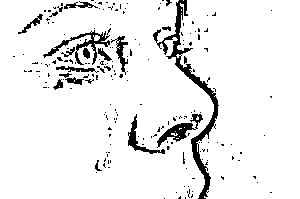

来源/homeopathyplus 网站

译者/李含

苏·汤普金斯老师的“[顺势疗法家庭急救治疗及保健课程”](http://mp.weixin.qq.com/s?__biz=MzA5NjA0NTAxNg==&mid=400017180&idx=2&sn=845f6885f0197a6a97ea265d9bc638ab&scene=21#wechat_redirect)（点击可查看）今晚就开课了！今天跟大家分享的案例是类风湿性关节炎。劳伦·华克连在两岁时就患上了类风湿性关节炎。起初她在父母的带领下用顺势疗法稳定了病情，但大学后她放弃了顺势疗法转而采用传统治疗，结果病情加剧还坐上了轮椅。于是她又重新回归顺势疗法，并过上了充满活力和健康的生活。

**劳伦的故事**

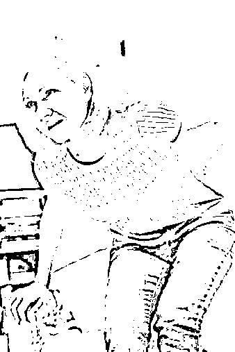 

劳伦在两岁时被诊断患有类风湿性关节炎。她的父母亲因为担忧传统药品的效力和副作用，所以带她去见了一位顺势疗法医师。经过治疗，她手指的症状和肿胀情况稳定了下来。

在物理疗法中，劳伦注意到，她比其他患有类风湿性关节炎的孩子表现更好，这些孩子依然接受强力药物的治疗，而她并没有，她精力充沛，而其他孩子所服用的药物让他们行动缓慢。

顺势疗法并没能治愈劳伦的症状，但将症状稳定限制在最初的四个关节。在她高中期间，劳伦说，她的类风湿性关节炎似乎痊愈了。

在进入大学就读后，类风湿性关节炎又复发了。**这一次，劳伦没有按照父母曾使用的顺势疗法，而是决定使用传统的治疗。**在 10 个月后，她的肝脏受到了损害，类风湿从四个关节扩散到了全身，她开始掉头发，只能使用轮椅。

那时，劳伦决定回到顺势疗法，她在伦敦皇家整合医疗医院接受医生和护士的治疗。劳伦的类风湿治疗专家被她的进展震惊了。骨密度扫描显示她的骨骼比她的疾病预期要强壮很多，他建议她继续顺势疗法的治疗，即使他自己都没有这样的经验。

点评

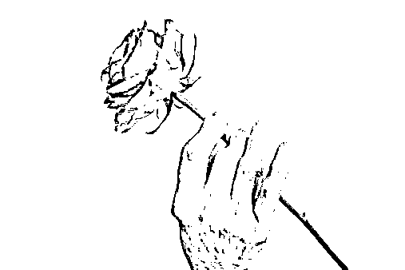 

劳伦的经历清楚地表现出传统（对抗疗法）疗法和顺势疗法之间的区别。

当身体不适时，症状会呈现出一幅图画让善于观察的人找到治愈的方法。当一种药物模拟出类似症状时，就会展现出疗效，就能够真正治愈症状。这就是顺势疗法“同类法则”带来的帮助，也就是最初劳伦的父母亲带她进行顺势疗法治疗时所发生的。

相反，传统药物极端地压制症状，与身体想要达成的目标相矛盾。这一**压制的代价就是让健康状况进一步恶化，以及副作用带来的风险，而真正的健康却遥不可及**。

劳伦是幸运的，她依然有康复的可能。停止妨碍她身体自愈努力的治疗，用支持这些努力的疗法取而代之，健康就得到了恢复，还避免了药物毒性带来的破坏性作用。

**更多有关顺势疗法的传送门**

**科普篇**

[顺势疗法的药物如何重塑生命力？（上）](http://mp.weixin.qq.com/s?__biz=MzA5NjA0NTAxNg==&mid=401087779&idx=2&sn=75e5ef7e354939057d30e8b7f422efec&scene=21#wechat_redirect)

[顺势疗法的药物如何重塑生命力（下）](http://mp.weixin.qq.com/s?__biz=MzA5NjA0NTAxNg==&mid=401139231&idx=2&sn=303a7edf95151aa7c47f91d79d17bfe7&scene=21#wechat_redirect)

[顺势疗法最常被问到的 9 个问题（上）](http://mp.weixin.qq.com/s?__biz=MzA5NjA0NTAxNg==&mid=401009669&idx=1&sn=82cf1d6fbc16a03ba8dabc16ae052b60&scene=21#wechat_redirect)

[顺势疗法最常被问到的 9 个问题（下）](http://mp.weixin.qq.com/s?__biz=MzA5NjA0NTAxNg==&mid=401041691&idx=2&sn=1dd9e1a8634f19bd322fa96fe59df3bc&scene=21#wechat_redirect)

[对待疾病 | 姑息它，压制它，还是治愈它？](http://mp.weixin.qq.com/s?__biz=MzA5NjA0NTAxNg==&mid=400605043&idx=1&sn=a0f8e724b556cdc49530a5a66c0e85d6&scene=21#wechat_redirect)

[顺势疗法，皇室钟爱的疗愈方法](http://mp.weixin.qq.com/s?__biz=MzA5NjA0NTAxNg==&mid=400017180&idx=1&sn=286860583aa755e5fe5a6eac534008cb&scene=21#wechat_redirect)

[顺势疗法 | 它在世界上排名第二，它治人不治病](http://mp.weixin.qq.com/s?__biz=MzA5NjA0NTAxNg==&mid=400153889&idx=1&sn=2dd034cb37b11e5765bd170addd1f960&scene=21#wechat_redirect)

[送你急救箱，救自己救家人还能救宠物](http://mp.weixin.qq.com/s?__biz=MzA5NjA0NTAxNg==&mid=400181530&idx=1&sn=5b5510e4d43ef54ae0f3f56441d1ac65&scene=21#wechat_redirect)

**案例篇**

[帕金森症](http://mp.weixin.qq.com/s?__biz=MzA5NjA0NTAxNg==&mid=401178874&idx=2&sn=190c36b6b11cbfdf78872f3808ddb534&scene=21#wechat_redirect)

[自闭症](http://mp.weixin.qq.com/s?__biz=MzA5NjA0NTAxNg==&mid=400921710&idx=2&sn=94af25e6399ca49525ddbd11dc61bbb1&scene=21#wechat_redirect)

[肾结石](http://mp.weixin.qq.com/s?__biz=MzA5NjA0NTAxNg==&mid=400879915&idx=2&sn=71944f0c596042332924e0de8c7bcf63&scene=21#wechat_redirect)

[婴儿夜惊](http://mp.weixin.qq.com/s?__biz=MzA5NjA0NTAxNg==&mid=400901918&idx=2&sn=2c39821aa322bddc9d12dc6c8b128556&scene=21#wechat_redirect)

[心理创伤](http://mp.weixin.qq.com/s?__biz=MzA5NjA0NTAxNg==&mid=400858503&idx=2&sn=8ed07f16cdc736af776dce34aa9232cd&scene=21#wechat_redirect)

[鼻窦炎](http://mp.weixin.qq.com/s?__biz=MzA5NjA0NTAxNg==&mid=400750777&idx=2&sn=e5dba7e9508a9ed7ec0dd18d445182c9&scene=21#wechat_redirect)

[孕妇消化不良](http://mp.weixin.qq.com/s?__biz=MzA5NjA0NTAxNg==&mid=400721730&idx=2&sn=3b907efec5851b08f1fc3e74be31c2e8&scene=21#wechat_redirect)

[一瓶药丸治好了困扰我四年的各种病症](http://mp.weixin.qq.com/s?__biz=MzA5NjA0NTAxNg==&mid=400555588&idx=1&sn=9d860beaa15bc1b9e6c627e1d3369afa&scene=21#wechat_redirect)

[为了宝宝，我选择顺势疗法](http://mp.weixin.qq.com/s?__biz=MzA5NjA0NTAxNg==&mid=400490938&idx=2&sn=9ae026781f9119936ade05b2dc66655f#wechat_redirect)

[过敏、扭伤、关节炎、痛经、宠物疾病](http://mp.weixin.qq.com/s?__biz=MzA5NjA0NTAxNg==&mid=400260655&idx=1&sn=854005f3b4c5846959ece35907a94dba&scene=21#wechat_redirect)

* * *

**特别提醒：**希望将若道文章转载到各自公众号的朋友，**转载时请注明“转自若道微信公众平台”，并附上若道占星的 Logo**。谢谢！

**今晚，苏**·汤普金斯老师****亲授的**顺势疗法课程就要**开课了！顺势疗法是目前全球使用最广泛的自然医学疗法，对个体的身体、精神和情绪三个层面进行治疗，加强个体自身免疫力，提升个体生命能量。本课程为那些想要增加自我和家庭身体保健和疗愈能力的人所设置。欲详细了解，请点击文末“**阅读原文**”。


# 射手座男人 | 不只是一个有故事的男同学

> 原文：[`mp.weixin.qq.com/s?__biz=MzA5NjA0NTAxNg==&mid=401201179&idx=1&sn=65d6c22772a46f5273d29d3f18498d61&chksm=02ab6aac35dce3bafdefb83a496810e4da28d8583368c52ea2d8318ee36aba0b47b523f4e9c4&scene=126&sessionid=1692738902#rd`](http://mp.weixin.qq.com/s?__biz=MzA5NjA0NTAxNg==&mid=401201179&idx=1&sn=65d6c22772a46f5273d29d3f18498d61&chksm=02ab6aac35dce3bafdefb83a496810e4da28d8583368c52ea2d8318ee36aba0b47b523f4e9c4&scene=126&sessionid=1692738902#rd)

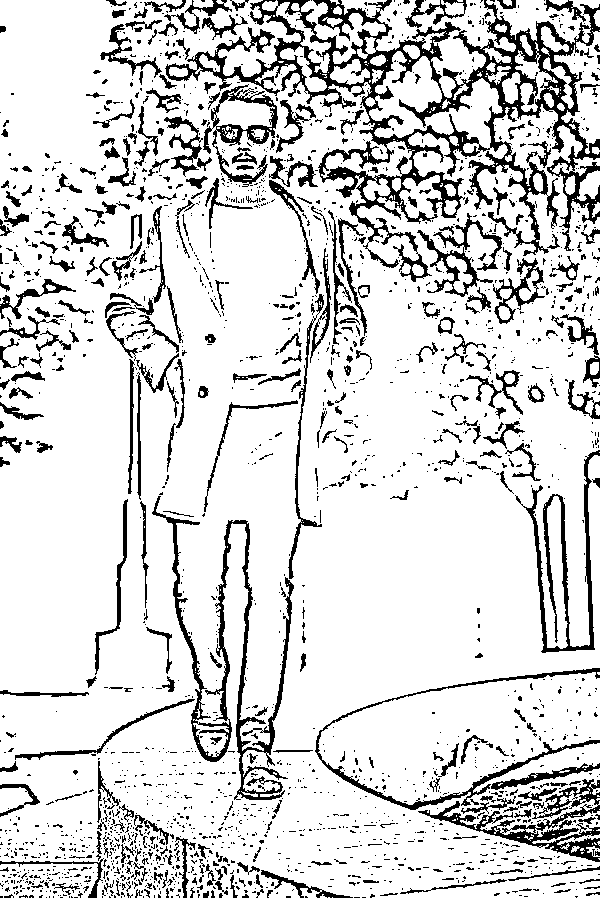

作者/大卫·瑞雷

译者/李含、江艺

此文是大卫应《风度 Men's Uno》杂志之约为星座男人而写，女性可参考。

大卫·瑞雷称射手座的男人为终极智者。什么！终极智者？是的。终极？没错。因为大部分射手座人最终都会从自己干过的蠢事中学到智慧。

**人生：你是一个有故事的人**

你们普遍热衷于成为一个“讲故事的人”。即使不是作家，射手座人也会侃侃而谈，幽默诙谐地讲述天方夜谭的故事。生活对你如此残暴，你忍不住评头论足。你的观点之中充满了讽刺与悖论，永不放弃追求真理让你成为十二星座中“金句”引用率最高的人。你不断地思考着人生的意义，探索连贯的主题。你对概念的掌握能够提升讨论的层次，正如你的洞见也能够让那些思想封闭的人去深思。

射手座人幽默风趣，能说会道，随便一点就一长串的名人：

● 导演有伍迪·艾伦、斯蒂芬·斯皮尔伯格、沃特·迪斯尼

● 演员有布拉德·皮特、柯克·道格拉斯、李小龙、黄磊

● 音乐家有贝多芬、芬兰作曲家西贝柳斯

● 运动员有乒乓球世界杯冠军得主王皓、中长跑健将伯纳德∙拉加特

● 科学家有物理学家西奥多·莱曼、量子力学的创始人维尔纳·海森堡、中国火箭技术之父钱学森

其他射手座的名人还有李开复，他的个人博客和网站广受欢迎，为中国的年轻人提供指导和帮助； 澳门巨贾、赌王何鸿燊；前石油大亨保罗·盖蒂，他曾是世界上最富有的人。

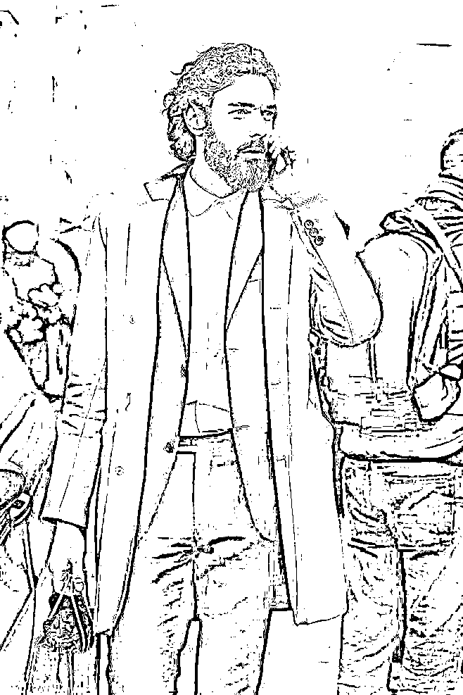

**◆ ◆ ◆**

**★ 你或你的伴侣是射手座吗？你们的爱情、事业如何？欢迎在评论区留言分享。也可以投稿到邮箱**nodoor@vip.126.com 分享你的射手座故事！****

**◆ ◆ ◆**

**爱情：你的伴侣要独立、聪明**

当女人想到射手座男人时，通常会将他们与冒险联系在一起，而不是结婚。的确，大多数射手座男人确实如此。这并不意味着你不能安定下来。

**① 你只是更享受生命本来的样子，比其他任何星座都更需要灵活性和自由。**

布拉德·皮特是一位顾家好男人，但同时他也不愿被束缚在家和办公室之间，除非他的办公室位于邻城（事实正是如此），如果在其他国家或许就更好了。据说李小龙非常爱他的美籍妻子，但是她必须适应一种充满冒险、极不稳定的生活，这对大多数女人来说都是一项挑战。因此**你的妻子或伴侣要么不介意你时常不在身边，要么能成为你旅途中的好伙伴，她要能够适应一种更自由的生活方式。**我的客户中婚姻幸福的射手座男人，他们的妻子通常都和他们一样独立。

**② 另一个需要考虑的重要因素就是开放的思想和对学习的热望。**

你厌烦思想封闭、观念传统的女人，她们似乎缺乏自己原创性的想法。富于智慧的灵魂对你非常重要。如果她聪明、博学、见多识广，那么你很可能会黏住她不放手。

**③ 在你选择伴侣时，如果你有一份理想恋人列表的话，“幽默感”很可能会被视为第一项。**

你在 40 岁以前似乎更偏好“运气”而不是智慧。然而，当你到了 45 岁左右时则渐渐能够更明智的对待爱情，尤其是当你环顾左右，发现自己是朋友当中唯一的单身汉。就在你的父母对你结婚生子的事情已不再抱希望的时候，你却开始用一种更加成熟的态度研究女人。此时寻找一个没有过度的占有欲，有丰富的幽默感，思想卓尔不群的女人将不再只是一个有趣的概念。

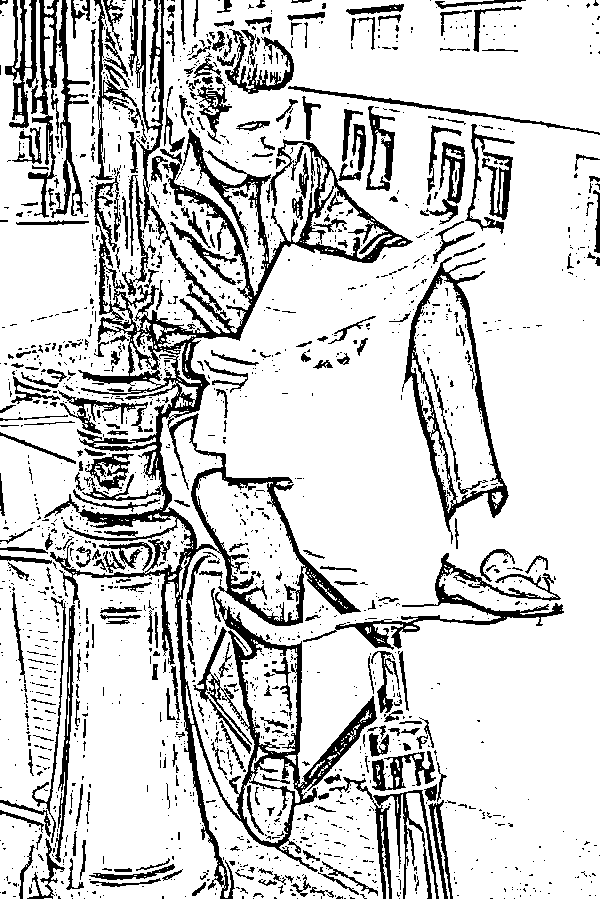

**事业：你要确保工作的自由度**

关于推销员把冰卖给爱斯基摩人的陈词滥调最初很可能源于某人对射手座推销员的描述。你推销产品的能力，是其他星座的人难以企及的。**大多数时候，这是因为你“信任”你所推销的产品。**

当然当你不再信任你销售的产品，你依然可以继续推销，但此时你开始变得焦躁不安。很快你会注意你的竞争对手，看看他们销售的东西是否更好，或者物色完全不同的行业。你的焦躁不安也许会让你经常变换工作，但有时候这也会给你带来麻烦。你未来的雇主可能用挑剔的眼光仔细查看你频繁的职业变动，质疑是否值得冒险雇用你。

幸运的是，大多数射手座人都能说服新雇主冒险尝试。事实上，你通常能指出当你为某某公司工作的时候，他们的利润额都增长了。你不用花太多时间就可以让你的新老板明白，雇用你将是他们做过的最明智的决定，而事实上通常也是这样。

然而，**确保你的新雇主和新公司明白，你需要一定程度的灵活性**，也就是说，工作要有的自由度才能使他们想要的“数字”直线上升。你不喜欢规章制度；只有“法之精神”才是你所遵循的——而不是“法之言语”。

但是，你确实需要信任自己所做的事情。同样，**公司的“宗旨”对你而言非常重要**。如果它们没能实践自己在公司手册或网站上引以为傲的原则承诺，你们中的许多人就会对此感到幻灭。而如果公司能遵守承诺，你知道自己能诚实地展现你的公司和产品时，你就处在最佳状态。

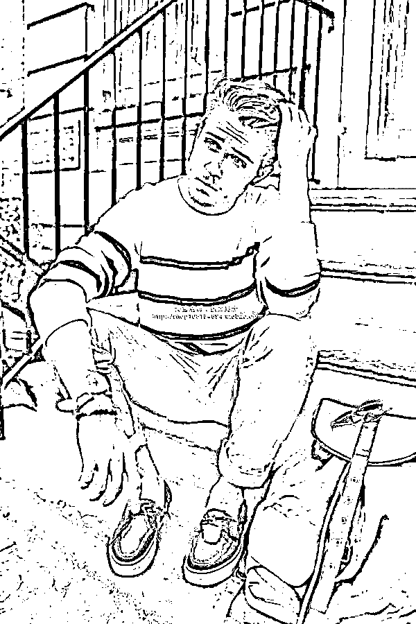

**与射手座有关的职业**

推销员

公关

市场营销

运输业

出版业、网络出版

教育和培训

国际法律

国际商务

写作

新闻业

宗教人员

**你对“全局”的掌控和你的“乐观精神”是你在任何领域的最大资本。**那些涉及太多细节分析或技术领域专门知识的事业通常不太适合你，你可能对自己的领域“知道很多”，并且最终被看作公司里知识最渊博的人，但是你更喜欢由他人来处理细节。

**其他射手座文章请戳：**

[射手座的阴影 | 理解我，很难吗？](http://mp.weixin.qq.com/s?__biz=MzA5NjA0NTAxNg==&mid=401178874&idx=1&sn=c474131083fd32f79d07a11439f0bc37&scene=21#wechat_redirect)

[执着于人生意义的二货最终成了智者，你呢？](http://mp.weixin.qq.com/s?__biz=MzA5NjA0NTAxNg==&mid=401087779&idx=1&sn=6133b088645e5dbb27c7a8cf56bcc537&scene=21#wechat_redirect)

[经历天蝎座的蜕变后，是时候放飞梦想了！](http://mp.weixin.qq.com/s?__biz=MzA5NjA0NTAxNg==&mid=400959662&idx=1&sn=735fdb83a92ab7cc38ccc694c6d27f12&scene=21#wechat_redirect)

[射手座 | 兼具动物性和精神性](http://mp.weixin.qq.com/s?__biz=MzA5NjA0NTAxNg==&mid=400977179&idx=1&sn=b2f320192c9bfeb0501799ebe3a7a05e&scene=21#wechat_redirect)

**◆ ◆ ◆**

**★ 你或你的伴侣是射手座吗？你们的爱情、事业如何？欢迎在评论区留言分享。也可以投稿到邮箱**nodoor@vip.126.com 分享你的射手座故事！****

**◆ ◆ ◆**

由**大卫**·瑞雷老师****主讲的****若道占星核心课程[第四阶（Level 4)](http://mp.weixin.qq.com/s?__biz=MzA5NjA0NTAxNg==&mid=401009669&idx=3&sn=03514b2d902d9539a7c51a9a0faab9af&scene=21#wechat_redirect)**（点击可查看）**已经开课，错过了第一堂课的同学不要懊悔，还有机会插班！**大卫老师会分别讲解如何通过出生星图进行性格分析********、爱情解读、事业分析。******了解**Level 4 课程**详情，请点击文末“**阅读原文**”。


# 射手座的阴影 | 理解我，很难吗？

> 原文：[`mp.weixin.qq.com/s?__biz=MzA5NjA0NTAxNg==&mid=401178874&idx=1&sn=c474131083fd32f79d07a11439f0bc37&chksm=02ab324d35dcbb5b3a31f7fffc17eaa84e0bff342b36034ca1ca98574db84805eef1ce8a63d3&scene=126&sessionid=1692738902#rd`](http://mp.weixin.qq.com/s?__biz=MzA5NjA0NTAxNg==&mid=401178874&idx=1&sn=c474131083fd32f79d07a11439f0bc37&chksm=02ab324d35dcbb5b3a31f7fffc17eaa84e0bff342b36034ca1ca98574db84805eef1ce8a63d3&scene=126&sessionid=1692738902#rd)

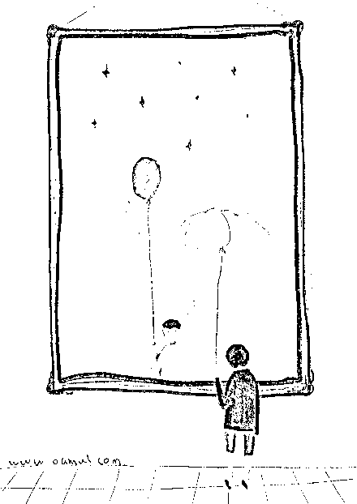

作者/大卫·瑞雷

译者/轩轩 校对/esme

大卫·瑞雷在之前的文章《[执着于人生意义的二货最终成了智者，你呢？](http://mp.weixin.qq.com/s?__biz=MzA5NjA0NTAxNg==&mid=401087779&idx=1&sn=6133b088645e5dbb27c7a8cf56bcc537&scene=21#wechat_redirect)》（点击可阅读）中，提到了射手座的优势。当然每个星座都有正反两面，爱自由的另一面是害怕被困住，追求真理的另一面是害怕出错。除了这些明显的特质，射手座还有一个阴影，那就是害怕被误解。

**射手座三大恐惧**

从个人发展的角度来看，射手座人是典型的奔放甚至鲁莽的年轻人，无所不知，无忧无虑。他们从错误中吸取教训。在成为智慧老人的路上，射手座人通常会被驱使着去给别人提供意见。

不管是在旅行还是在冒险中，还是在高等教育中，尤其是在哲学、历史、法律和宗教领域中，射手座人都在寻求真相，所以他们可能会自以为“无所不知”，相信他们的真理就是唯一的真理。**这种膨胀的自以为是的态度通常来源于射手座的不安全感——害怕自己是错的！**如果射手座人发现自己深深相信的信仰是错的，那么他就会遭遇非常严重的身份危机。

**射手座人在人生这条曲折的道路上害怕的三件事是：害怕出错，害怕被误解，害怕被困住。**

**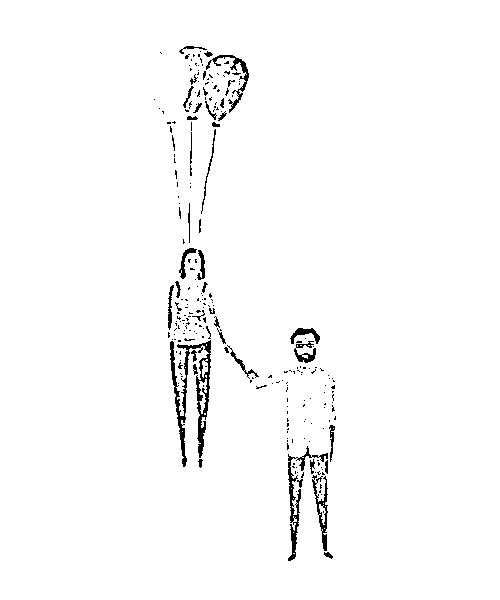**

**★ 射手座的你有什么恐惧呢？欢迎在评论里留言。**

**与众不同的痛苦**

我的一名射手座客户曾经说过：“我的父母从来都不理解我。对他们来说，我就是一个怪咖，就像在葡萄园的葡萄藤上，从形状普通的葡萄中挑拣出来一串又大又饱满的葡萄。”他的父母是农民，并不知道要怎么对待自己的儿子，因为这个儿子比别的孩子更早地学会了阅读，而且四岁的时候就在教堂弹钢琴了。到了六岁的时候，在教堂音乐指挥的教导之下，他已经能够弹奏莫扎特的曲子了，还在学校的图书馆里看莎士比亚的作品。

我记得他非常淡然地说着：“到了十岁的时候，我知道的比父母还多，他们也知道我懂的比他们多。吃饭的时候，为了打破沉默，我会编一些好玩的故事，说说学校里的孩子们，还会用幽默的语言描述平常的事物，让我们都大笑起来。只有当我们都在笑的时候，我们才观点一致，即使只是一小会儿地没有分歧。”这名客户在 15 岁的时候上了大学，成为了一名令人敬佩的神经外科医生——大城市医院里的神经外科主治医生。此外，他还在大学里，在一些会议上公开演讲，拥有众多的追捧者。

这名客户极为戏剧性地表现出射手座的特质。当然，大部分射手座人并不是神童，即使他们自认为是。可是，这名客户的父母似乎完全不理解他，他们也知道或者相信自己的孩子懂得比他们多。**这名客户因为自己懂的比身边的人多，尤其是比父母懂得多，而一直觉得自己“与众不同”。这种与众不同的感觉伴随着他的成长，让他在成人之后依旧觉得人际关系是痛苦的。**

**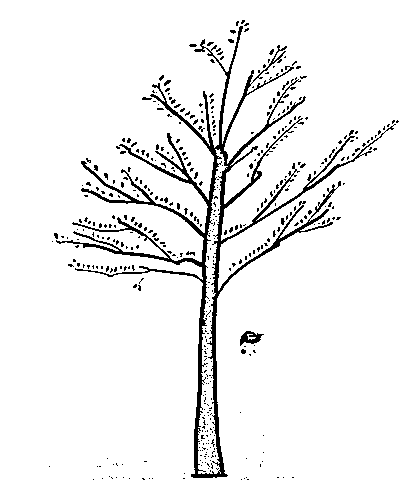**

**希望被理解的渴望**

“我在同人交往的时候，并不是一个好相处的人，”他在早期的咨询中这样说道，“我的妻子说我总是希望所有人都听从我的建议，如果别人不听我的，我就会狠狠地批判他们。”

我问他：“你为什么觉得自己是这样的呢？”“我看得出来，你跟我的妻子观点一致，”他开玩笑地说，然后他又想了一会儿，说“好吧，事实上人们会让我生气。”

我又问他：“为什么？”他说：“因为他们不听我的意见！”然后他叹了口气，好像意识到自己陷入了某种谜团中。

我问他：“为什么你需要别人听从你的意见呢？”他回答说：“我也不知道……”他似乎有点恼怒了。

所以我决定继续惹怒他。“如果他们听从你的建议，那这对你来说有什么意义呢？”他稍微振作了一下，然后说：“这意味着他们真的明白了我跟他们说的是什么。”

“所以你就能被理解了？”“是！”

“那这又意味着……”“意味着我被理解了。”

“也就是你一直期望你父母做到的事？”“是，是的，完全正确……”就在这个时候，这个高大睿智的男人开始抽泣，然后低声说道“就是这么简单，对不对？”

然后他向我讲述，很多年前，在他的父亲去世 8 个月后，他的母亲也去世了。当时，在家人和朋友们到达之前，他一个人靠在棺材旁痛哭了几个小时。“那天唯一能让我从悲恸中走出来的是一个想法，我想，也许，只是也许，现在我的父母在另一边能够更理解我了。也许，他们真的能够看见我，能更好地理解我，甚至比我自己还理解我。”他深深地叹了口气，“我更愿意这样去相信。”

在以前的咨询中，他曾经向我描述过“别人的脑子掌握在自己手中”是什么感觉，也曾告诉过我，那些可怕的决定是在日常生活中的一部分。但是，他最终还是愿意回到他的工作中来，他和妻子的生活也越来越幸福。他**学会了去承认自己也有可能犯错，但是在承认犯错的同时，自我也没有崩塌**。他接受了他的妻子和其他人也有可能真的“理解”他，而且也发现了他们真的能理解他！他和家人的关系也给他带来了“快乐”，而这种快乐不再伴随着孤独感和被爱的人误解的感觉。

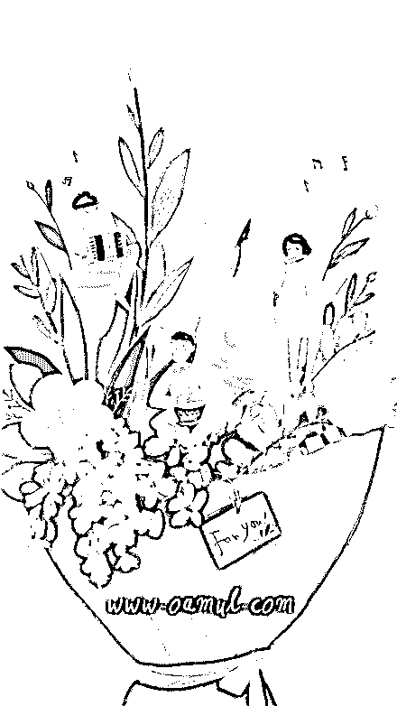

> 每张星图中星座、行星、宫位和相位的任何一个组合都能帮助我们意识并且体验个人成长。不管是什么星座，这种“成长”都意味着成为“更像你这个人”！也就是说，意识到你自己的更大潜力。**对于射手座人来说，个人发展包括承认自己对某事的观点不是完全正确的，也就是在真理的证据面前承认自己错了。**没有人能垄断所有真理，没有任何一个星座可以。而且，每个人在某个领域都会有一些射手座的特质，即使他们没有行星落在射手座。

**其他射手座文章的传送门：**

[射手座 | 兼具动物性和精神性](http://mp.weixin.qq.com/s?__biz=MzA5NjA0NTAxNg==&mid=400977179&idx=1&sn=b2f320192c9bfeb0501799ebe3a7a05e&scene=21#wechat_redirect)

[射手座 | 经历天蝎座的蜕变后，是时候放飞梦想了！](http://mp.weixin.qq.com/s?__biz=MzA5NjA0NTAxNg==&mid=400959662&idx=1&sn=735fdb83a92ab7cc38ccc694c6d27f12&scene=21#wechat_redirect)

* * *

**学习占星学，战胜你的恐惧！今晚****，**由**大卫**·瑞雷老师****主讲的****若道占星核心课程[第四阶（Level 4)](http://mp.weixin.qq.com/s?__biz=MzA5NjA0NTAxNg==&mid=401009669&idx=3&sn=03514b2d902d9539a7c51a9a0faab9af&scene=21#wechat_redirect)**（点击可查看）**即将开课。**大卫老师会分别讲解如何通过出生星图进行性格分析********、爱情解读、事业分析。******了解**Level 4 课程**详情，请点击文末“**阅读原文**”。


# 顺势疗法 | 第三剂药后，母亲的帕金森症缓解了

> 原文：[`mp.weixin.qq.com/s?__biz=MzA5NjA0NTAxNg==&mid=401178874&idx=2&sn=190c36b6b11cbfdf78872f3808ddb534&chksm=02ab324d35dcbb5b7119fd6ddda6bb97525ec1230fcd36ac03d6372d169b16e58f601b1cdb7f&scene=126&sessionid=1692738902#rd`](http://mp.weixin.qq.com/s?__biz=MzA5NjA0NTAxNg==&mid=401178874&idx=2&sn=190c36b6b11cbfdf78872f3808ddb534&chksm=02ab324d35dcbb5b7119fd6ddda6bb97525ec1230fcd36ac03d6372d169b16e58f601b1cdb7f&scene=126&sessionid=1692738902#rd)

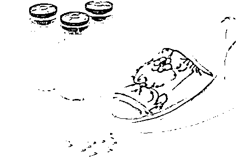

来源/homeopathyplus 网站

译者/李含

苏·汤普金斯老师的“[顺势疗法家庭急救治疗及保健课程”](http://mp.weixin.qq.com/s?__biz=MzA5NjA0NTAxNg==&mid=400017180&idx=2&sn=845f6885f0197a6a97ea265d9bc638ab&scene=21#wechat_redirect)（点击可查看）明晚开课，今天给大家带来顺势疗法对老年人帕金森病的疗效。

**雪伦口述**

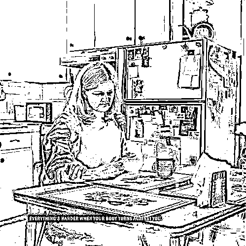 

我母亲患帕金森症已经超过十年了。令她无力的症状包括：**失眠症、焦虑症、痉挛、肌肉松弛、腿部灼烧性疼痛和中风**。我们开始时用磷酸镁治疗痉挛，用砷治疗焦虑，这两种药品在她身上产生了显著的疗效。但是，她每晚的睡眠时间都无法超过三四个小时，就这一点上我们还没有进展。医生给她开了安眠药，但她并不喜欢常常服药。因为当她服药（并且药效发挥时），她会睡上一夜好觉，第二天变得像另外一个人。

我查询了 homeopathyplus 网站，留意到在“临床教学”部分有一篇文章谈到了对失眠症的处理。我把文章打印出来，给母亲看，想着我们可以看一看它推荐的各种药品，是否有适合的选择。文章首推的就是砷，我们已经使用了这一药物，所以我们继续寻找。

当我们查询到石松子时，觉得这看起来可行。母亲有自己的家用诊疗工具包，所以我们在工具包药品处方中交叉查询到更多信息，与她的症状也似乎非常吻合：她的症状总是从身体右侧开始，每天下午 4 点都是她感觉特别糟糕的时间，她那张“勇士的面孔”后面总是隐藏着自信的缺乏。

时机也很完美！她开始因为忘记了我嫂子的生日而感到焦虑。就在母亲要服用砷时，我建议她尝试一种新药，用她工具包中的药丸制成的药液。第一剂药——没有起效。我等了半小时后，给她服用了第二剂——起先毫无反应，然后她描述“似乎马上就要开始起效了。”最终，在半小时后服用了第三剂药过后——药物生效了！**她面部的中风停止了，她右臂、手部、腿部和足部的痉挛消失了，腿部的疼痛缓解了，她也不再感到焦虑。**我还鼓励她给我嫂子打电话，以便让她放宽心！

在 15 分钟内，母亲在椅子上打起了瞌睡。在下午四点症状如钟表一般准时复发时，我又给她服用了一剂药，她直接就感受到了药效。很明显，那是当时对我母亲真实有效的体质药品。有时候需要几剂药，但最终会起效。感谢顺势疗法！

雪伦

医师点评

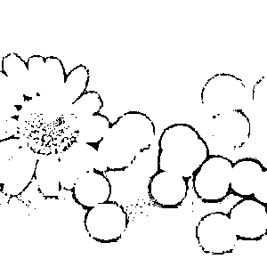 

顺势疗法一次又一次显示出它能够缓解病患的症状，这些病症让许多人的生活痛苦不堪。顺势疗法看到了这一点（这也是执业顺势疗法的乐趣之一），他们的病人看到了，那些对顺势疗法了解一二，使用顺势疗法帮助家人和朋友的人，也看到了。

雪伦使用顺势疗法诊疗自己的症状有一段时间了，但这是她第一次有足够的信心，好好诊疗母亲的症状，用一种药物对症治疗——石松子！

雪伦母亲的症状得到了多大的改善尚待观察，但是值得注意的是，**像帕金森症这样的慢性病最终需要的不仅是家庭诊疗，而是更深入的治疗**。像帕金森症这样的慢性病常常对最初的几剂顺势疗法药品回应缓慢，不如扭伤或感冒这样的急性病症起效快，所以雪伦的母亲这样的情况很典型。希望在石松子发挥疗效之后，她会在将来考虑继续使用顺势疗法治疗。

任何人都可以学会使用顺势疗法去帮助自己和其他人治疗自限性、急性的病症，比如咳嗽、感冒、头疼、胃部不适诸如此类。当家庭诊疗者理解以下内容时，顺势疗法治疗这些小病症（常常感觉并非小事）十分有效：

**① 如何辨识关键症状**

**② 药物如何吻合这些症状**

**③ 隔多久服用一剂药**

在这一过程中，要避免摄入抗菌素和止痛剂以及其他破坏性的药物，患者会温和但快速的恢复健康。

弗兰·谢菲尔德

顺势疗法医师

**更多有关顺势疗法的传送门**

**科普篇**

[顺势疗法的药物如何重塑生命力？（上）](http://mp.weixin.qq.com/s?__biz=MzA5NjA0NTAxNg==&mid=401087779&idx=2&sn=75e5ef7e354939057d30e8b7f422efec&scene=21#wechat_redirect)

[顺势疗法的药物如何重塑生命力（下）](http://mp.weixin.qq.com/s?__biz=MzA5NjA0NTAxNg==&mid=401139231&idx=2&sn=303a7edf95151aa7c47f91d79d17bfe7&scene=21#wechat_redirect)

[顺势疗法最常被问到的 9 个问题（上）](http://mp.weixin.qq.com/s?__biz=MzA5NjA0NTAxNg==&mid=401009669&idx=1&sn=82cf1d6fbc16a03ba8dabc16ae052b60&scene=21#wechat_redirect)

[顺势疗法最常被问到的 9 个问题（下）](http://mp.weixin.qq.com/s?__biz=MzA5NjA0NTAxNg==&mid=401041691&idx=2&sn=1dd9e1a8634f19bd322fa96fe59df3bc&scene=21#wechat_redirect)

[对待疾病 | 姑息它，压制它，还是治愈它？](http://mp.weixin.qq.com/s?__biz=MzA5NjA0NTAxNg==&mid=400605043&idx=1&sn=a0f8e724b556cdc49530a5a66c0e85d6&scene=21#wechat_redirect)

[顺势疗法，皇室钟爱的疗愈方法](http://mp.weixin.qq.com/s?__biz=MzA5NjA0NTAxNg==&mid=400017180&idx=1&sn=286860583aa755e5fe5a6eac534008cb&scene=21#wechat_redirect)

**案例篇**

[顺势疗法治好了他的自闭症！](http://mp.weixin.qq.com/s?__biz=MzA5NjA0NTAxNg==&mid=400921710&idx=2&sn=94af25e6399ca49525ddbd11dc61bbb1&scene=21#wechat_redirect)

[不用再手术，肾结石轻松搞定！](http://mp.weixin.qq.com/s?__biz=MzA5NjA0NTAxNg==&mid=400879915&idx=2&sn=71944f0c596042332924e0de8c7bcf63&scene=21#wechat_redirect)

[这个婴儿频繁夜惊、惧怕男性，现在都好了](http://mp.weixin.qq.com/s?__biz=MzA5NjA0NTAxNg==&mid=400901918&idx=2&sn=2c39821aa322bddc9d12dc6c8b128556&scene=21#wechat_redirect)

[顺势疗法 | 它帮助抚平心理创伤和悲痛](http://mp.weixin.qq.com/s?__biz=MzA5NjA0NTAxNg==&mid=400858503&idx=2&sn=8ed07f16cdc736af776dce34aa9232cd&scene=21#wechat_redirect)

[50 年的鼻窦炎好了！](http://mp.weixin.qq.com/s?__biz=MzA5NjA0NTAxNg==&mid=400750777&idx=2&sn=e5dba7e9508a9ed7ec0dd18d445182c9&scene=21#wechat_redirect)

[孕妈选对药方，保护了自己和宝宝](http://mp.weixin.qq.com/s?__biz=MzA5NjA0NTAxNg==&mid=400721730&idx=2&sn=3b907efec5851b08f1fc3e74be31c2e8&scene=21#wechat_redirect)

[一瓶药丸治好了困扰我四年的各种病症](http://mp.weixin.qq.com/s?__biz=MzA5NjA0NTAxNg==&mid=400555588&idx=1&sn=9d860beaa15bc1b9e6c627e1d3369afa&scene=21#wechat_redirect)

[为了宝宝，我选择顺势疗法](http://mp.weixin.qq.com/s?__biz=MzA5NjA0NTAxNg==&mid=400490938&idx=2&sn=9ae026781f9119936ade05b2dc66655f#wechat_redirect)

[过敏、扭伤、关节炎、痛经、宠物疾病……全搞定！](http://mp.weixin.qq.com/s?__biz=MzA5NjA0NTAxNg==&mid=400260655&idx=1&sn=854005f3b4c5846959ece35907a94dba&scene=21#wechat_redirect)

* * *

**特别提醒：**希望将若道文章转载到各自公众号的朋友，**转载时请注明“转自若道微信公众平台”，并附上若道占星的 Logo**。谢谢！

**明晚，**由**苏**·汤普金斯老师****亲授的**顺势疗法课程**将开课。顺势疗法是目前全球使用最广泛的自然医学疗法，对个体的身体、精神和情绪三个层面进行治疗，加强个体自身免疫力，提升个体生命能量。本课程为那些想要增加自我和家庭身体保健和疗愈能力的人所设置。欲详细了解，请点击文末“**阅读原文**”。


# 倒计时·1 | 若道占星核心课程第四阶（Level 4）今晚开课！

> 原文：[`mp.weixin.qq.com/s?__biz=MzA5NjA0NTAxNg==&mid=401178874&idx=3&sn=1110418dca64c71c87e920310acc31e2&chksm=02ab324d35dcbb5bc3be01ebac04cc7ae8b2a65bd1b0611270afb7ebeebc462b4fc64b027e6f&scene=126&sessionid=1692738902#rd`](http://mp.weixin.qq.com/s?__biz=MzA5NjA0NTAxNg==&mid=401178874&idx=3&sn=1110418dca64c71c87e920310acc31e2&chksm=02ab324d35dcbb5bc3be01ebac04cc7ae8b2a65bd1b0611270afb7ebeebc462b4fc64b027e6f&scene=126&sessionid=1692738902#rd)

**课程信息**

开课时间：2015 年 12 月 1 日-2016 年 3 月 15 日

讲师：大卫·瑞雷

讲课城市：网络视频

费用(元)：6000

报名截止：2015 年 11 月 20 日

课程负责人：李老师  联系方式：010-58263061/010-56629907

**2015 年度若道新推出的专业占星课程分为五个级别，本课程属于若道专业占星课程第四级别，****Level 4****课程****。**

**课程描述**

**若道占星核心课程系列 Level 4**

**星图舞会——星图综合解读 24 小时**

在这个阶段，你终于可以学会星图的综合解读了！

前一阶段所有学到的越扎实，现在就越开心。你可以看到，当那些行星、星座、宫位、相位穿起来的丝线开始跳舞，一个个故事图景就像织锦一样展现在你的面前。个性、爱情、事业，看到一个人的出生星图，你就可以开始讲他们生命故事的梗概了。这里大卫老师会分别讲解如何通过出生星图进行性格分析、爱情解读、事业分析。在爱情解读部分，你还会提前学到比对图。

这个课程结束后，你就可以练习解读出生星图的重要问题了。

**授课内容**

**星图综合解读——性格分析**

**星图综合解读——爱情（出生图）**

**星图综合解读——爱情（比对图）**

**星图综合解读——职业**

在整个教学过程中，不仅用名人案例讲解，而且将会抽取同学星图，演示如何就爱情议题、职业咨询议题进行咨询示范。

**课程时间**

授课时间：2015 年 12 月 1 日-2016 年 3 月 15 日

每周二晚上 20：00-22:00 （北京时间），共计 12 次课

**授课形式**

1. 网络教学：网络视频会议系统上的在线课程和答疑辅导，只要有上网的条件在世界各地都可以上课，无地域限制。北京同学可以到若道办公室现场上课。

2. 中英文双语授课，专业占星口译员中文翻译。

3. 每次课后都有助教在线答疑。

4. 每月组织沙龙互动练习。

**教学优势**

**作为国际占星研究协会（ISAR）在中国唯一指定的教学机构，我们有：**

**专业师资（国内最专业）：**

1.国际一流名师：大卫•瑞雷 40 年占星咨询和教学经验，4 年中国本土化教学经验，无保留传授。

2.职业占星师助教：我们的助教，均为 ISAR 认证职业占星师或大卫老师职业占星师资质班优秀毕业生。

3.专业翻译：擅长占星的英文翻译，完全不懂英文的同学也可以聆听大师的教诲。

**系统教学（国内最完善）：**

1.学习路径：完整的知识结构，清晰的知识点，大量案例展示、咨询示范。

2.心法传授：大卫老师 40 年实战咨询经验，绝非仅靠读书就可以获得。

3.实战练习：在 Level 5 将组织实战练习，为开启咨询之路做好准备。

**完美互动（国内最丰富）：**

1.与名师面对面：北京同学可以来若道现场上课，和大卫老师面对面互动。大卫老师也可能前往主要学员所在城市，实现零距离教学。

2.互动答疑：论坛、QQ 群随时提问；老师课上答疑；助教线上线下全程协助。

3.线下沙龙：定期举办沙龙活动，复习上课内容。

4.强大的同学网络：若道作为中国最顶尖的占星教学机构，在 4 年的占星教学中，培养了很多占星人才。若道让你和师兄师姐切磋，让你和国内著名占星师学习。（简单来说，就是，人脉！）

**配套支持（国内最方便）：**

1.先进的教学平台：网络教学平台，支持手机、电脑、iPad 上网，可以随时随地学习。

2.回放复习：学员可登录网站收看课程回放，在线复习课程，每次课可完整重看 3 次，1 个月内有效。

**报名和付款**

课程费用：6000 元　

请在点击页面左下方“**阅读原文**”报名，以及在线完成学费支付。

咨询请拨打电话 010-56629907　

或课服 QQ：4006191014 （若道星文化）
或直接写信给 nodoor@vip.126.com，我们会回复您的疑问。 网页报名后无法进行在线支付的同学，可以通过银行汇款的方式支付课程费用。

汇款信息：蒋颖　6226 0901 0424 5721　招商银行北京中关村支行　

或支付宝：nodoor@yeah.net
请在汇款备注中写上自己的名字和所报课程，方便我们核对。

**退课与转课**

课程付费后，因个人原因无法参加通过邮件申请退款，开课前 3 天内可以全款退回。
开课后，若想申请退课或转课，请在第二节课前提交书面申请至 nodoor@vip.126.com。
退款和转课金额统一按 80%执行；
若课程进行到第二次后，不再接受退款或转课申请。

**大卫•瑞雷简介**

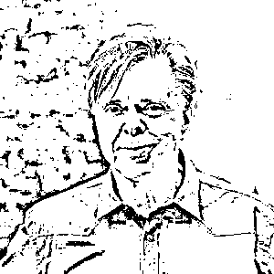

> 美国资深职业占星师。1970 年开始学习占星学，在通过亚特兰大职业占星委员会的考试后，于 1976 年获得执业许可，成为一名专职占星师。年过六旬的大卫老师，曾两任亚特兰大占星协会主席，是全美占星师联盟（AFAN）、美国占星师联合会（AFA）、全美占星研究委员会（NCGR）、国际占星研究协会（ISAR）和职业占星师组织（OPA）的成员，是联合占星大会（UAC, United Astrology Conference）督导委员会委员。
> 
> 大卫老师曾是 CNN、CBS 的占星节目的常驻嘉宾，多次在 BBC、WGS、WSB、WRGG 等节目中接受采访，并在亚特兰大主持电视节目《每日行星（Daily Planets）》达 4 年之久。至今已研究占星四十余年，拥有三十多年的占星咨询的执业经验，其服务客户包括学生、工人、市长、州长、议会议员、企业家、心理咨询师、工程师、艺术家、演员、知名企业家等，客户年龄跨度从襁褓婴儿到耄耋老人。2010 年 6 月，大卫的书《灵魂的目标》中文版出版。在 2011 年春季的北京之行期间，大卫接受了《南方周末》记者的采访，同时参与了 CCTV9 的纪录片的拍摄。
> 
> 大卫老师热爱教学，愿意将自己的毕生所学倾囊相授。为了将纯正的西方占星学带入中国、为了让更多的中国人从占星中获益，大卫老师在占星学的传授上投入了巨大的热情与心血。他以后每年将有一半的时间在中国度过，中国将成为他的第二个家。


# 分享 | 我与占星学的不解之缘

> 原文：[`mp.weixin.qq.com/s?__biz=MzA5NjA0NTAxNg==&mid=401159985&idx=1&sn=be8067246a9c3fe04dd341b8b5b6ffa5&chksm=02ab858635dc0c907616072791d1225bef96cd06f49e2c7061df4847cc9fe1991b85daae3fe6&scene=126&sessionid=1692738902#rd`](http://mp.weixin.qq.com/s?__biz=MzA5NjA0NTAxNg==&mid=401159985&idx=1&sn=be8067246a9c3fe04dd341b8b5b6ffa5&chksm=02ab858635dc0c907616072791d1225bef96cd06f49e2c7061df4847cc9fe1991b85daae3fe6&scene=126&sessionid=1692738902#rd)

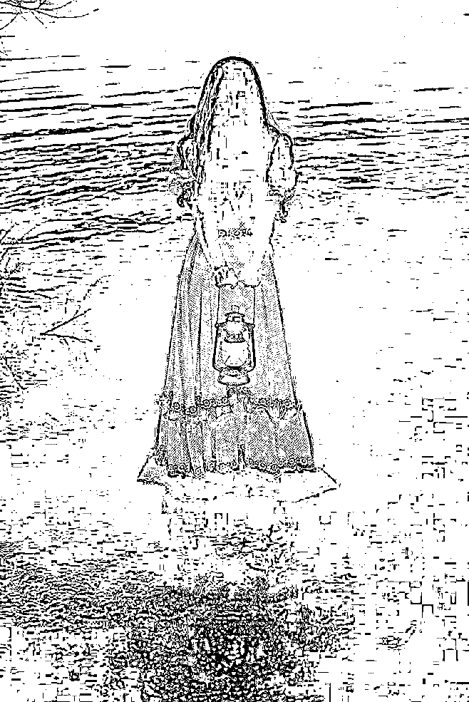

因为他，我开始接触占星学

还记得我最开始接触占星学，是在 2008 年。始于一段无疾而终的感情和情绪上的困扰。那时的我因暴饮暴食而饱受困扰，恋爱并不会让我感觉美好，只会增加我的心里焦虑与恐惧，一方面因社会以瘦为美的价值观不断节食，另一方面，又因没有安全感害怕男性而狂吃。所幸，我发现了占星学这个利器……

在我看来，我遇到的那个人是一个城府极深的暗黑男，果然，在他的星图中，除了强大的风象能量，还有南交点在天蝎座第 8 宫，守护星冥王星又落在了天蝎座第 8 宫，纵使他表面上与我无话不谈，但我始终觉得他有一部分非常的神秘，难以揣摩，变幻莫测，难怪那时的我被他迷住，我喜欢带有神秘气息的人事物。他的太阳在天秤座，月亮与上升都在水瓶座，而群星火象的我总是感觉他很冷……

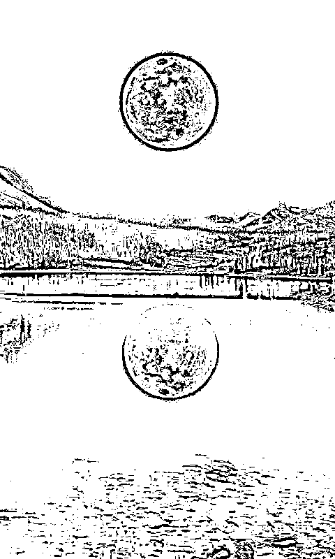

当时的我，无法理解别人是和自己不一样的……

后来，这种对神秘事物的喜好和深入挖掘与探索的驱动力，从他身上转移到了占星学上，身边亲朋好友的生辰八字我基本都问过了，观察与实证是那时的我最大的乐趣。我不仅喜欢研究周围人的星图，还喜欢观察天象的变化和规律……

德日进曾说：“人类的现象必须从宇宙的角度来进行思考。”天上如是，人间亦然。当我了解到我们的性格、运势甚至情绪变化都与宇宙磁场辐射下来的能量息息相关时，我内心释然了许多。在我内心深处，有一部分受伤的情绪，我无法接受人们彼此之间是那么的不同，这可能要追溯到宇宙的初生之痛，在源头，所有意识都在宇宙子宫、尚未分裂时，我们本是一体的。而占星学让我意识到我们虽然看起来是分开的：**每个人的性格、面容、人生轨迹都不尽相同，但从另外一个视角来看，我们却又是连在一起的。就像外行星行进时，整个集体意识都会受到影响，而我们每个相对微小的意识或多或少也会受到一些影响。**

关于欲望的思考

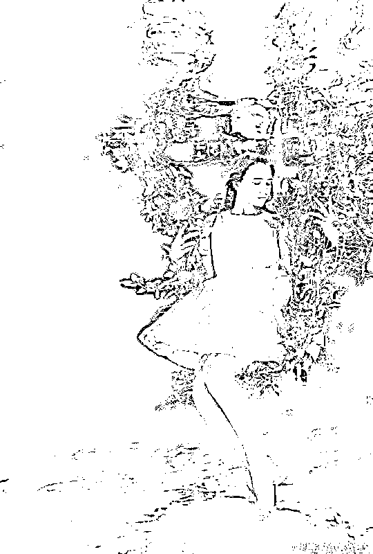

《冥王星：灵魂的演化之旅》这本书中写道：“**灵魂之中包含两种并存的欲望。其中一种是独立存在的欲望，渴望与创造灵魂的源头分离。另外一种欲望则是回归创造的‘本源’。这两种显然相反的欲望会产生互动，共同促进个人和集体的演化。**”就是因为这两种并存的欲望原型，才让个人和集体累世的演化历程变得如此冗长。灵魂进化的立基点就是逐步消灭所有独立存在的欲望，如果从这个角度来思考，一切就显得清楚多了。当所有独立的欲望都被消灭了，存在于我们意识之中的那股回归本源的欲望，就会变得越来越強烈、越来越重要。我们很容易就可以观察到这两种欲望的运作，也很容易验证它。我们难道不会在每一世中表現出各种欲望吗？像是拥有新财产、新爱人等等。当我们每回获得自己想要的东西，产生短暂的愉悦或快感时，脑海中不总是会出现一种熟悉的念头吗？我们会认为在这个东西之外一定“还有更好的”。这种“还有更好的”之类的念头，只会制造另一股欲望。**在历经数百年的演化之后，我们会渐渐耗尽或根除这些欲望。一旦走到这一步，寻找本源的欲望就会变得越来越強烈**。总有一天，这将会变成我们心中唯一的欲望。到最后这种演化的进程就会创造出“体悟到造物”的灵魂，就像是耶稣、佛陀、老子、尤伽南达和摩西等圣哲上师。

阅读这段文字之后，我不仅感觉到释然，也了悟了许多。

置之死地方能后生

回到自身。记得在 2012 年，**行进的土星经过我的冥王星在 12 宫,与此同时，行进的冥王星经过我的海王星**。那时，我情绪上的困扰不但没有好转，反而增多了。无时无刻不在的恐惧与焦虑伴随着我，濒死与抢救的体验已经把我的心拉向极度的绝望，每一天都像世界末日。从前的追求，梦想全部都破碎了，甚至有一段时间，我根本无法出门，我几乎完全放弃了自己。

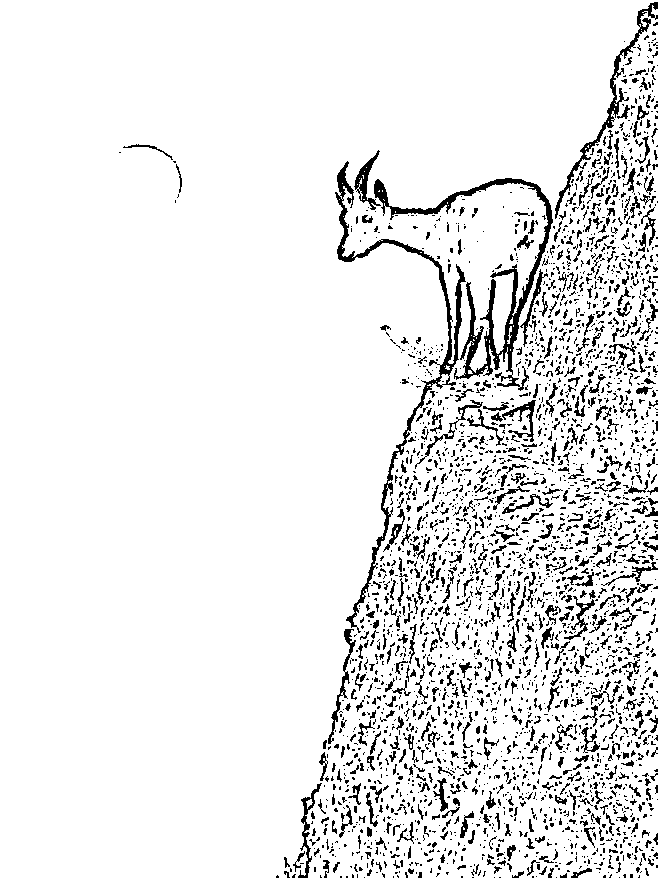

置之死地而后生。**虽然有一部分的我已经绝望和破碎，但这反而增强了灵魂极度渴望疗愈的渴求， 机缘巧合，一年后我去了美国，接触到了灵性疗愈的课程，我意识到，在这流年土冥的业力激发期，身心虽承受着极大的痛苦，但也意味着，洗掉灵魂过去累积的创痛**。

从此之后，我更加注重如何疗愈与化解业力。

后来……我对占星学的兴趣日趋淡漠……

重拾占星学之趣

“越是灵性越是要扎根”。直到今年三月，我来到了一家占星公司，这时候的我只想踏实下来，做一些实事，虽然我更加务实与落地了，但是，我的学习动力已经不比曾经，与此同时，我遇到了一位良师益友，她的话语总是直击我心，并且总是能把我内在的念头以更加清晰且绚烂的方式表达出来，她喜欢通过占星加入自我觉察和深入反省，不断的清理自己。这和哈德利•菲茨杰拉德（Hadley Fitzgerald）老师在《占星疗愈》课程中的理念是如此的契合，哈德利老师曾说过：”**今生所发生的事件就是过去世的延续，比如你过去对这世界深感绝望，今生可能会触发类似事件延续这个感受，而当这些感受一一浮出水面且持续困扰你时，就是疗愈清理且放下过去创痛的最好时机。**“她还说：“**疗愈意味着过去因创伤被击碎的灵魂碎片回归完整的过程。疗愈不是一蹴而就，它需要时间和悉心的陪伴与照料。创伤是开启崭新人生前的过度，是黎明前的暗夜，有时我们必须足够诚实，占星学也许不能疗愈我们，但却可以发现一些线索并找到一些意义和启发。**” 这些话语和我内在的旅程是如此契合。

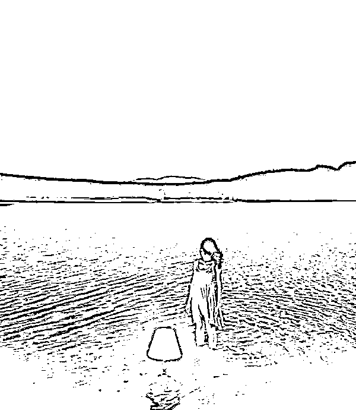

后来我有幸在杭州参加了斯蒂芬·弗里斯特老师的学徒工作坊，他说：“宇宙的知识就像小小的光球，在无明的黑暗中无尽的扩张。他还讲到：“12 宫是一个与失去相关的宫位，有时候我们或许会害怕失去一些东西，其实我们失去的正是那些“限制”我们的东西，痛苦的根源是执着，而非失去本身。木星并不一定代表好运，而是停止低估自己，我们正因为有了希望才有了失望和挫败，但愿每一个希望都是智慧的。”他认为，11 宫是一个与收获有关的宫位，这和我以前对 11 宫的理解不同。这再度引起了我的好奇心和求知欲。

斯蒂芬老师深邃、智慧、充满哲思与辩证的教导背后，阐述着一个道理**：塞翁失马,焉知非福**。他通过占星学的语言，将这个道理讲述的诗意而灵动。而我也开始找回了学习占星学的兴趣。我意识到，**以前我之所以对占星学失去了兴趣，是因为在那个极度困顿的时期，我需要的是务实的解决方案与疗效，而不是头脑上的认知，我对占星学投注了过多不切合实际的期望，其实，它只是一个工具，如何运用它，在于我们自己。就像哈德利老师说的，占星学确实不能直接帮我们疗愈，但却可以辅助我们的了解自己**。

真正能够疗愈我们的是自救心

 其实，任何人也不能直接让我们疗愈，真正能够疗愈我们的，是我们的自救心。

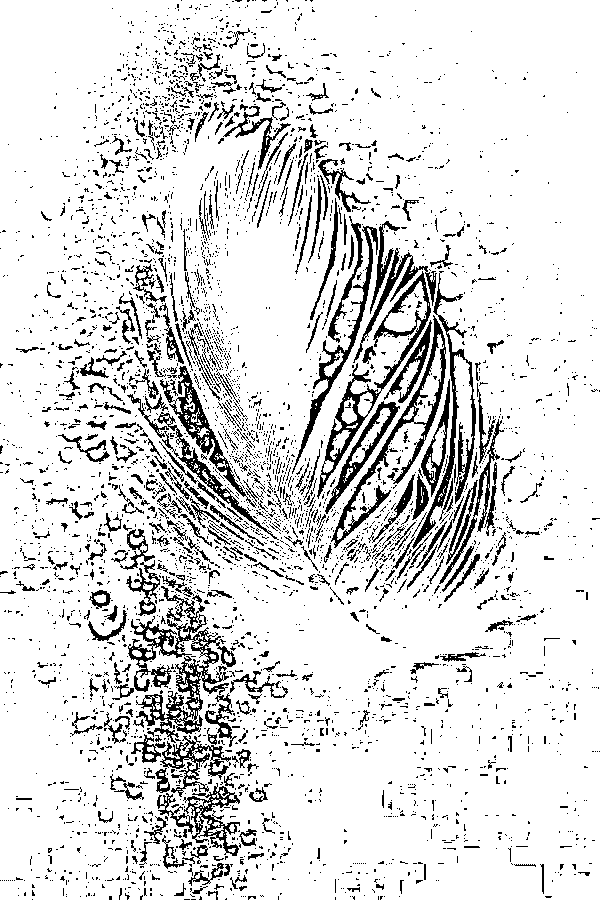

通过占星学，我可以发现更多宇宙的奥秘，不断的探索与成长。当遇到挑战天象时，生命就像一个难题，等待着我们去化解、突破这个关卡，当和谐天象时，生命又像一汪清泉，没有过多纷扰，安然静好，但也少了几分刺激的精彩。其实最常见的情形是，挑战与和谐并存。在挑战与压力时，我们寻找突破口，在和谐与平稳的缓冲期，我们又稍做调试与休整。这就是生命的韵律，跌宕起伏、抑扬顿挫，生命才会维持动能。而无论是挑战还是和谐，生命终究是一段旅程，不断地进化就是我活下去的意义，也是我继续学习占星学的意义。

生命是一个谜，就像那时吸引我的神秘男一样。因为我们每个人的内在就像整个宇宙一样，广博而深邃。


## **作者简介** 

**幽南**: 上升天蝎、日月水 9 宫在狮子座，北交点双鱼座。自小喜欢去天文馆，喜欢仰望星空，对银河星系中正在发生着什么始终充满了好奇心……也喜欢心理学，探索心灵世界以及一切玄妙的事物。热爱大自然和一切回归自然原始状态的美。对我来说学习占星的意义在于“顺应宇宙的规律”，就像了解季节的规律从而选择播种的时间一样，只有在相应的季节播种才能收获丰盛的果实。 

微博：http://weibo.com/u/1290435043
微信公众号：星舞心疗室（ID：xingwuxinliao）

长按二维码，让金钱涌向传播知识与智慧的人~~

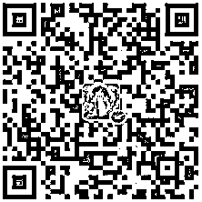

* * *

**特别提醒：**希望将若道文章转载到各自公众号的朋友，**转载时请注明“转自若道微信公众平台”，并附上若道占星的 Logo**。谢谢！

**明晚，**由**大卫**·瑞雷老师****主讲的****若道占星核心课程[Level 4](http://mp.weixin.qq.com/s?__biz=MzA5NjA0NTAxNg==&mid=400203022&idx=2&sn=3518c0e8db3d8b01d99a055ff8c19869&scene=21#wechat_redirect)（点击可查看）****即将开课。**大卫老师会分别讲解如何通过出生星图进行性格分析********、爱情解读、事业分析。******了解**Level 4 课程**详情，请点击文末“**阅读原文**”。


# 12 月宇宙天气 | 撕开迷雾，叫醒沉睡的人

> 原文：[`mp.weixin.qq.com/s?__biz=MzA5NjA0NTAxNg==&mid=401159985&idx=2&sn=e0fdb8102a2830b69b58401b1b764ffe&chksm=02ab858635dc0c90cf6269442de87300d16ff8b2aeeac60ca547a69dbbf1b48014b07fa84dbc&scene=126&sessionid=1692738902#rd`](http://mp.weixin.qq.com/s?__biz=MzA5NjA0NTAxNg==&mid=401159985&idx=2&sn=e0fdb8102a2830b69b58401b1b764ffe&chksm=02ab858635dc0c90cf6269442de87300d16ff8b2aeeac60ca547a69dbbf1b48014b07fa84dbc&scene=126&sessionid=1692738902#rd)

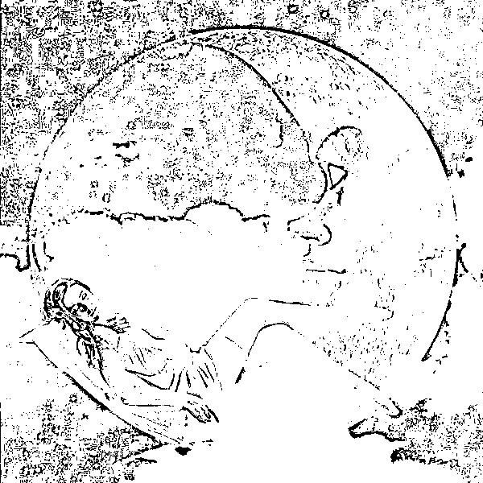

11 月月底金星在天秤座与天王星、冥王星分别形成了困难相位，我们听到了身边各种各样的感情和金钱上的故事与事故，有人在金星对分天王星当天取消了婚礼，有人在那天发了一笔意外之财，有人终于诚实面对自己在感情关系里的恐惧与渴望。正如在 11 月的宇宙天气中写道：“在天冥四分进入尾声的时刻，内行星（日月水金火）进入创始星座（白羊座、巨蟹座、天秤座、摩羯座）仍然会相继与天王星与冥王星形成挑战相位，这感觉好像是虽然完成了大考，还是有些阶段性小考试要通过。” 12 月小考主题，从金星变到火星，从感情、金钱的议题转移到了人际关系中的欲望、愤怒和追求。宇宙用火星与天王星、冥王星的组合，用外化的冲突、暴力等事件，撕开土海四分的迷雾，叫醒沉睡的人。

**12 月 4 日 星期五****射手座水星四分处女座木星**

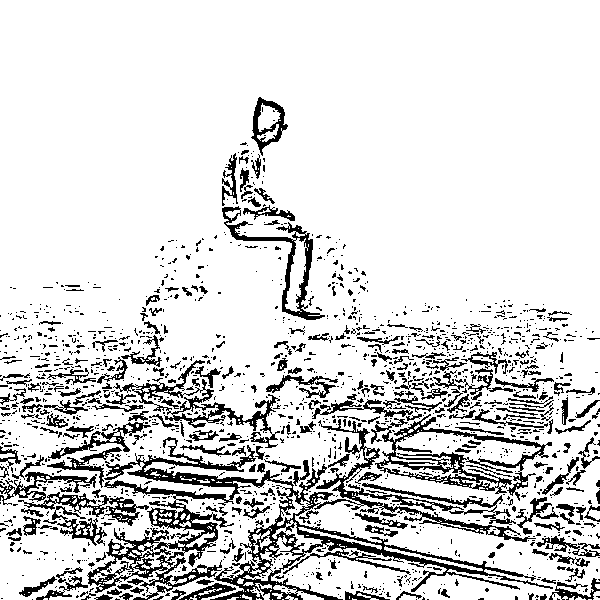

这是一个听起来很美的时刻，水星落在木星守护的射手座，善于描绘宏大的愿景，带来形而上的思路和想法。水星与木星的相遇，又一次得到了木星的加持，让这些想法和愿景听起来更加乐观和积极。然而，水星与木星这次形成的是不和谐的相位，而木星正在吹毛求疵的处女座行进，**宏大的愿景遇到了具体实际的执行细节，很容易被检验出来，到底是物超所值，还是在虚张声势**。

**12 月 5 日 星期六**

**金星进入天蝎座**

金星从强势入庙的天秤座，进入了落陷的天蝎座。**创立和维持和谐和优雅关系之后，感情和金钱的关系，要更多地考虑信任和深度资源共享**。“我们这个关系，到底是不是经得住考验？不管顺境逆境，贫穷富有，我们是不是还能互相信赖？” 社会交往会从向外广泛结交各种朋友，转变为检视爱人与密友。**在经历戏剧性的情感纠缠后，人们将与他人建立起更深刻的依赖关系。**宇宙 12 月火天冥大戏，从金星在天蝎座这里开始拉开帷幕。

**12 月 7 日 星期一****12 月 7 日，天秤座火星四分摩羯座冥王星**

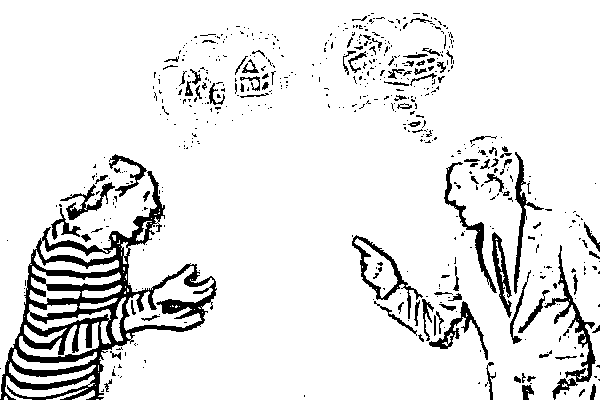

12 月 7 日，是本月第一个“爆破日”。月亮是本日爆破的引线，它在 12 月 6 日 10:36 先合相火星，继而在 11:28 四分冥王星，最后在 16:36 对分天王星，这一系列的动作之后，迎来了 12 月 7 日 4:51 火星与冥王的准确四分相。也就是说，**情绪的波动勾起了恐惧的记忆、造成了人们与权威的冲突、对他人感到愤怒或绝望。冥王星代表掩藏起来的东西：曾经的伤痛，造成今天行为模式的原因，隐藏的秘密，积压的愤怒……这些都被火星挖掘出来，形成外化的行为和事件**。由于火星天秤座处于弱势的位置，这种愤怒一开始不一定会以外化的方式呈现，但是如果不去面对过去的创伤和愤怒，火星的能量会在 11 日前后与天王星组合，造成更大的伤害。

**12 月 10 日 星期四**

**水星进入摩羯座**

在两个爆破日之间，宇宙的能量稍微稳当了一些，水星进入了保守严谨的摩羯座。**人们如果可以善用理性的能量，会更好的面对即将到来的风暴**。

**12 月 11 日 星期五****天秤座火星对分白羊座天王星
天蝎座金星三分双鱼座海王星**

月亮仍然卷入了此次的爆破。12 月 10 日，它在射手座分别四分海王星，合相土星。**几天前月亮、火星与冥王星积蓄的怒气与压力尚未得到纾解，月亮与海王星和土星的接触又让情绪陷入迷雾，坦白说这个时间要调用理智思考的能量难度不小**。人们会觉得自己带着炸药包进入了情绪的泥沼，不在沉默中死亡，就在沉默中爆发。天王星激发了火星的能量反而带来了解脱，打破了原有的关系模式，加速了火冥四分的转化。

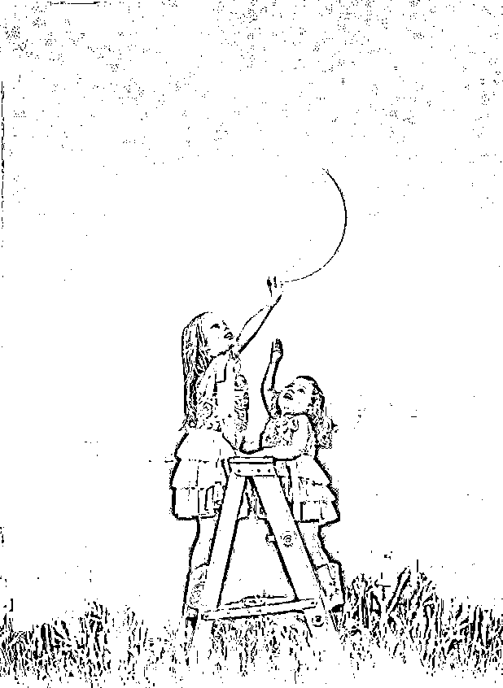

爆炸发生的当日，金星正在天蝎座与海王星形成柔和相位。**寻求专业人士的帮助，让爱与包容治疗伤口，这是宇宙提供的积极选择**。

11 日前后，**人们有很大机会迅速坠入爱河。金星与海王星的柔和相位让人感到温暖和浪漫，而火天对分则促成了迅猛的爱的行为**。

**12 月 15 日-17 日**

**12 月 15 日星期二 ，摩羯座水星六分双鱼座海王星  12 月 17 日星期四，天蝎座金星六分摩羯座冥王星**

 喧闹之后会有短暂的平静。**水星与海王星形成柔和相位对人们的精神生活和艺术创作都很有帮助。思维敏锐却不尖利，人们会更多设身处地为他人着想**。金星在冥王星守护的天蝎座，与冥王星六分，强调了天蝎座与冥王星的主题，即情感的猜疑和嫉妒、在情感或者财务上控制对方。**金冥柔和相位提供了顺畅的能量，帮助人们面对真实的关系，接纳恐惧，转化为爱的坚定和勇气**。

**12 月 20 日-21 日**

**12 月 20 日星期日 ，水星合相摩羯座冥王星  12 月 21 日星期一，摩羯座水星四分白羊座天王星**

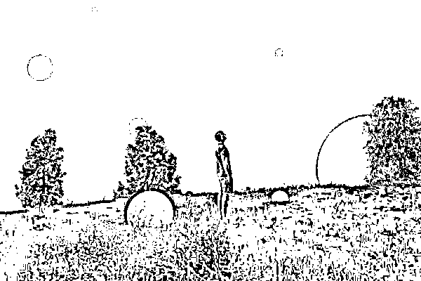

当水星触发天冥四分的时候，引发的是思维和沟通上的大爆炸。**言语可以成为一种力量，挖掘秘密，操纵人心**。脱口而出的话反而是心底压抑的真实想法。水星在摩羯座的思考方式严谨保守，尊重权威，也可能过于尊重权威而局限自己的思路与眼界。这次爆炸若炸开一道缝隙，接下来就会有灵感的光照射进来。

**12 月 24 日-26 日**

**12 月 24 日星期四 ，天蝎座金星三分处女座木星  12 月 26 日星期六，摩羯座水星六分处女座木星**

金星、水星与木星的小三角，就是从缝隙中照进的光束。**这是情感与思维都很活跃的时刻，人们对于新鲜事物更加好奇，视线望向更广阔的远方，与他人对未来的信念、哲学观做进一步的沟通和交流**。这种交流会加深对彼此的了解，巩固情感，并带来实际的经济上的共赢。

**12 月 29 日 星期二**

**摩羯座水星四分天秤座火星**

**12 月 21 日与 12 月 29 日，是本月两个需要注意口角与交通安全的时间点**。前者是由于天王星带来的不可预测的强烈能量，而后者更多的是在人际交往中焦躁引发的怒气。**即使依据常理，节前的交通情况也可以预想会很糟糕，建议大家 29 日提早做好出行安排**。

**12 月 30 日 星期三**

**金星进入射手座** 

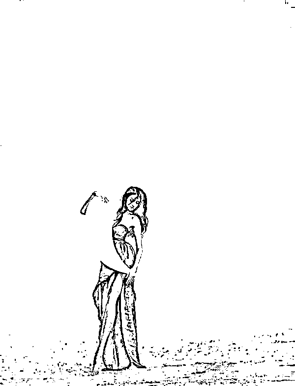

用金星在射手座来迎接新年再合适不过了：慷慨、热情、自由、真诚、幽默、在金钱上极为大方，与之前的金星在天蝎座正好相反。**送走了第一次土海四分，扛过了水星、金星、火星与天冥四分的考验，请给自己热烈的掌声和积极的肯定！全新的 2016 年，大家一起加油！**


**占星师咔咔**：2010 年师从美国占星师大卫·瑞雷学习，并得到世界名师斯蒂芬·弗里斯特、罗伯特·汉德、苏·汤普金斯传授各种占星技法。若道首届学员，国内最早获得 ISAR 职业占星师资质的职业占星师。

在国际知名广告公司和市场研究公司从事的市场研究和推广工作十余年，曾任职于阳狮集团、尼尔森市场研究有限公司、MTV 和《Madame Figaro》杂志。

微信公众账号：咔星人

星图解读和运势咨询请加个人微信：kaluolandeka

 长按二维码，让金钱涌向传播知识与智慧的人~~

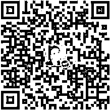

* * *

**特别提醒：**希望将若道文章转载到各自公众号的朋友，**转载时请注明“转自若道微信公众平台”，并附上若道占星的 Logo**。谢谢！

**明晚****，**由**大卫**·瑞雷老师****主讲的****若道占星核心课程第四阶（Level 4)****即将开课。**大卫老师会分别讲解如何通过出生星图进行性格分析********、爱情解读、事业分析。******了解**Level 4 课程**详情，请点击文末“**阅读原文**”。


# 倒计时·2 | 若道占星核心课程第四阶（Level 4）明晚开课！

> 原文：[`mp.weixin.qq.com/s?__biz=MzA5NjA0NTAxNg==&mid=401159985&idx=3&sn=af9f7100e077e7caef93447c991e009c&chksm=02ab858635dc0c90c16b4b65c6ad54fca288bdab5575ccc8bf2c550bffb5fcb0bb95157dd03b&scene=126&sessionid=1692738902#rd`](http://mp.weixin.qq.com/s?__biz=MzA5NjA0NTAxNg==&mid=401159985&idx=3&sn=af9f7100e077e7caef93447c991e009c&chksm=02ab858635dc0c90c16b4b65c6ad54fca288bdab5575ccc8bf2c550bffb5fcb0bb95157dd03b&scene=126&sessionid=1692738902#rd)

**课程信息**

开课时间：2015 年 12 月 1 日-2016 年 3 月 15 日

讲师：大卫·瑞雷

讲课城市：网络视频

费用(元)：6000

报名截止：2015 年 11 月 20 日

课程负责人：李老师  联系方式：010-58263061/010-56629907

**2015 年度若道新推出的专业占星课程分为五个级别，本课程属于若道专业占星课程第四级别，****Level 4****课程****。**

**课程描述**

**若道占星核心课程系列 Level 4**

**星图舞会——星图综合解读 24 小时**

在这个阶段，你终于可以学会星图的综合解读了！

前一阶段所有学到的越扎实，现在就越开心。你可以看到，当那些行星、星座、宫位、相位穿起来的丝线开始跳舞，一个个故事图景就像织锦一样展现在你的面前。个性、爱情、事业，看到一个人的出生星图，你就可以开始讲他们生命故事的梗概了。这里大卫老师会分别讲解如何通过出生星图进行性格分析、爱情解读、事业分析。在爱情解读部分，你还会提前学到比对图。

这个课程结束后，你就可以练习解读出生星图的重要问题了。

**授课内容**

**星图综合解读——性格分析**

**星图综合解读——爱情（出生图）**

**星图综合解读——爱情（比对图）**

**星图综合解读——职业**

在整个教学过程中，不仅用名人案例讲解，而且将会抽取同学星图，演示如何就爱情议题、职业咨询议题进行咨询示范。

**课程时间**

授课时间：2015 年 12 月 1 日-2016 年 3 月 15 日

每周二晚上 20：00-22:00 （北京时间），共计 12 次课

**授课形式**

1. 网络教学：网络视频会议系统上的在线课程和答疑辅导，只要有上网的条件在世界各地都可以上课，无地域限制。北京同学可以到若道办公室现场上课。

2. 中英文双语授课，专业占星口译员中文翻译。

3. 每次课后都有助教在线答疑。

4. 每月组织沙龙互动练习。

**教学优势**

**作为国际占星研究协会（ISAR）在中国唯一指定的教学机构，我们有：**

**专业师资（国内最专业）：**

1.国际一流名师：大卫•瑞雷 40 年占星咨询和教学经验，4 年中国本土化教学经验，无保留传授。

2.职业占星师助教：我们的助教，均为 ISAR 认证职业占星师或大卫老师职业占星师资质班优秀毕业生。

3.专业翻译：擅长占星的英文翻译，完全不懂英文的同学也可以聆听大师的教诲。

**系统教学（国内最完善）：**

1.学习路径：完整的知识结构，清晰的知识点，大量案例展示、咨询示范。

2.心法传授：大卫老师 40 年实战咨询经验，绝非仅靠读书就可以获得。

3.实战练习：在 Level 5 将组织实战练习，为开启咨询之路做好准备。

**完美互动（国内最丰富）：**

1.与名师面对面：北京同学可以来若道现场上课，和大卫老师面对面互动。大卫老师也可能前往主要学员所在城市，实现零距离教学。

2.互动答疑：论坛、QQ 群随时提问；老师课上答疑；助教线上线下全程协助。

3.线下沙龙：定期举办沙龙活动，复习上课内容。

4.强大的同学网络：若道作为中国最顶尖的占星教学机构，在 4 年的占星教学中，培养了很多占星人才。若道让你和师兄师姐切磋，让你和国内著名占星师学习。（简单来说，就是，人脉！）

**配套支持（国内最方便）：**

1.先进的教学平台：网络教学平台，支持手机、电脑、iPad 上网，可以随时随地学习。

2.回放复习：学员可登录网站收看课程回放，在线复习课程，每次课可完整重看 3 次，1 个月内有效。

**报名和付款**

课程费用：6000 元　

请在点击页面左下方“**阅读原文**”报名，以及在线完成学费支付。

咨询请拨打电话 010-56629907　

或课服 QQ：4006191014 （若道星文化）
或直接写信给 nodoor@vip.126.com，我们会回复您的疑问。 网页报名后无法进行在线支付的同学，可以通过银行汇款的方式支付课程费用。

汇款信息：蒋颖　6226 0901 0424 5721　招商银行北京中关村支行　

或支付宝：nodoor@yeah.net
请在汇款备注中写上自己的名字和所报课程，方便我们核对。

**退课与转课**

课程付费后，因个人原因无法参加通过邮件申请退款，开课前 3 天内可以全款退回。
开课后，若想申请退课或转课，请在第二节课前提交书面申请至 nodoor@vip.126.com。
退款和转课金额统一按 80%执行；
若课程进行到第二次后，不再接受退款或转课申请。

**大卫•瑞雷简介**


> 美国资深职业占星师。1970 年开始学习占星学，在通过亚特兰大职业占星委员会的考试后，于 1976 年获得执业许可，成为一名专职占星师。年过六旬的大卫老师，曾两任亚特兰大占星协会主席，是全美占星师联盟（AFAN）、美国占星师联合会（AFA）、全美占星研究委员会（NCGR）、国际占星研究协会（ISAR）和职业占星师组织（OPA）的成员，是联合占星大会（UAC, United Astrology Conference）督导委员会委员。
> 
> 大卫老师曾是 CNN、CBS 的占星节目的常驻嘉宾，多次在 BBC、WGS、WSB、WRGG 等节目中接受采访，并在亚特兰大主持电视节目《每日行星（Daily Planets）》达 4 年之久。至今已研究占星四十余年，拥有三十多年的占星咨询的执业经验，其服务客户包括学生、工人、市长、州长、议会议员、企业家、心理咨询师、工程师、艺术家、演员、知名企业家等，客户年龄跨度从襁褓婴儿到耄耋老人。2010 年 6 月，大卫的书《灵魂的目标》中文版出版。在 2011 年春季的北京之行期间，大卫接受了《南方周末》记者的采访，同时参与了 CCTV9 的纪录片的拍摄。
> 
> 大卫老师热爱教学，愿意将自己的毕生所学倾囊相授。为了将纯正的西方占星学带入中国、为了让更多的中国人从占星中获益，大卫老师在占星学的传授上投入了巨大的热情与心血。他以后每年将有一半的时间在中国度过，中国将成为他的第二个家。


# 宇宙天气 | 反思和调整，谋定而后动（11.30~12.6）

> 原文：[`mp.weixin.qq.com/s?__biz=MzA5NjA0NTAxNg==&mid=401139231&idx=1&sn=22e89706fc5e46d3ea795ce4dd9f1734&chksm=02aa54a835ddddbe0802e32bfcf30fcf6b0030d93dc5a672fe8f444dc94577a317fce3496b9d&scene=126&sessionid=1692738902#rd`](http://mp.weixin.qq.com/s?__biz=MzA5NjA0NTAxNg==&mid=401139231&idx=1&sn=22e89706fc5e46d3ea795ce4dd9f1734&chksm=02aa54a835ddddbe0802e32bfcf30fcf6b0030d93dc5a672fe8f444dc94577a317fce3496b9d&scene=126&sessionid=1692738902#rd)

**一周星象综述**

首先，本周仍在土星四分海王星的影响期内，任何触动此“背景相位”的星象事件都是重要的。另外，上周双子座满月与土海四分相紧密相关，威力较大，余波未平，会在本周持续引发思维的碰撞、变化，并带动长远目标的调整。而本周的水星三分天王星、水星四分木星的相位，也强调并延续了思维拓展和思想解放的主题。周末的太阳六分火星提升了勇气和行动力，是“谋定而后动”的时刻。总的说来，这仍是反思与调整战略部署的一周，这背后，是对于长远目标和个人信念、原则的再次确认，这也是日土合相在射手座的要求。

周一到周三下午，月亮在狮子座，这期间月亮将三分土星、太阳、水星、天王星，六分火星、金星，大量和谐相位的支撑，加上月亮在狮子座带来的阳光自信的感觉，令本周初的前三天有满满的正能量。同时，太阳合相土星，水星三分天王星，也有利于长远目标的确立和大格局的形成。

周三晚上到周五，月亮在处女座，这是不太稳定的几天，因为处女座的月亮将与土海四分相形成“T 三角”，并且会激发水星四分木星的不稳定的扩张性能量。这是容易感受到“大起大落”的几天，并非真的有客观事件上的跌宕，而是我们的想法带动的心情的起伏波动消耗人的心神。此时特别需要认清真实与幻象的区别，如果突然想到什么“宏伟计划”，冷静几天再说。

周六和周日月亮在天秤座，例行公事地与冥王星和天王星形成挑战相位，带来关系中的震荡感。值得一提的是，太阳与火星的六分相，将在这个周末以及下周初的两天里，为我们带来更多的“战斗力”，是燃烧勇气与决心，奋起直追的时刻。

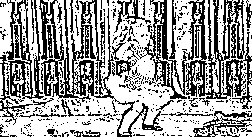

11 月 30 日星期一

**08:17** 射手座太阳合相土星

这个相位的影响，将持续共四天左右的时间，也就是 11 月底到 12 月初的三四天。这是我们检验并坚定个人的信念、原则的时候，也是我们对长期的人生方向和目标进行严肃思考的时刻。对于真理和意义感的渴求会更加强烈，也可能有受到某种召唤的使命感。有些人可能在这几天更加确定了自己是谁以及要往何处去。

**08:46** 月亮离开巨蟹座进入狮子座

情绪变得开朗阳光，自信心提升。未来两天多的时间里，我们会更积极地表现自己，更加需要获得他人的注意。并且这两天由于狮子座的月亮将与多颗行星形成和谐相位，所以将是能够感受到满满正能量的两天。

**22:49** 狮子座月亮三分射手座土星

**23:55** 狮子座月亮三分射手座太阳

在晚间 22:00 到 24:00 的这个时段，月亮三分射手座的日土合相，坚定的信念和清晰的方向感将为我们带来力量和信心。

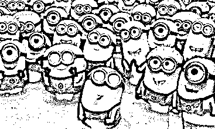

12 月 1 日星期二

**15:41** 狮子座月亮三分射手座水星

**16:29** 狮子座月亮三分天王星

狮子座的月亮触发了水星与天王星的三分相，形成一个“大三角”。我们有机会跳出原有思维的局限，在想法上开拓创新，迅速吸收新鲜的资讯信息，迸发创意与灵感的火花。此时我们的直觉是灵敏准确的，相信它将有助于我们做出正确的判断。

**22:01** 射手座水星三分天王星

这个相位的影响将持续一到两天的时间。在今天下午，月亮已经触发了这个相位的影响，所以可认为整个下午到晚间的这段时间，都是更新思维与想法的好时机。这段时间宜进行头脑风暴，或是对已有的计划和点子进行调整，一些新的角度可能让问题迎刃而解，我们想事情的格局也会有所提升。

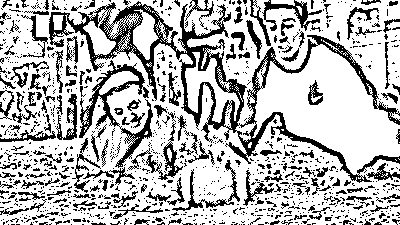

12 月 2 日星期三

**11:10** 狮子座月亮六分天秤座金星

社交中自信心提升，能够自如地展示魅力并获得关注。心情愉悦的时刻。有助于恋爱或一般的人际交往。

**18:08** 月亮离开狮子座进入处女座

会变得细致敏感，对事物的准确性和条理性有更多要求。未来两天多的时间里，我们会更加专注于日常生活中的细节问题，也会对工作更加专注。此时容易发现更多事物的不足之处，对于效率和时间安排更加重视。

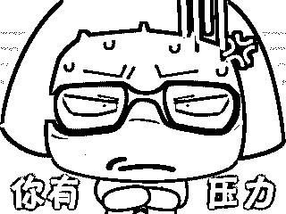

12 月 3 日星期四

**08:14** 处女座月亮对分海王星

**09:42** 处女座月亮四分射手座土星

处女座月亮触发土星与海王星的四分相，形成“T 三角”。我们对于幻想和理性、虚妄和现实之间的矛盾会有更明显的感受。这是容易感到迷茫不解、被自己的想象误导的时刻，同时也容易遇到压力和挫败，情感需求难以得到满足。沮丧和失望的情绪在所难免，但也是检验自己对现实的认识的时机。

**15:41** 处女座月亮四分射手座太阳

这个相位依然是对土海四分相的激发与补充。此刻我们需要在具体细节和实践的可操作性方面，检验我们的信念与目标，如何与当下的现实相调和。

**22:21** 处女座月亮三分冥王星

感觉和直觉敏锐，能够洞察到自身及他人情感的隐秘面向，有机会去深入探索潜意识的复杂层面。这也是在情感上进行疗愈和转化的时刻，我们能够觉察到自己或他人的更深层的情感需求，认识到一些隐藏的情感互动的模式。

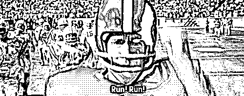

12 月 4 日星期五

**11:54** 处女座月亮四分射手座水星

**13:00** 处女座月亮合相木星

处女座月亮触发了即将准确成相的水星与木星的四分相。月亮来到这个位置，会刺激头脑中那些躁动、冒进的念头，一些不切实际的想法可能被放大。同时也有自负倾向，对于一些远大计划的热忱，缺少现实的考量。

**20:54** 射手座水星四分处女座木星

这个相位的影响，在今天一整天都在持续作用，加上月亮在处女座的强化作用，我们会更明显地感受到这个相位带来的头脑、思想上的扩张渴望。此时我们的理想主义精神会受到鼓舞，视野开阔，格局高远，但是也易有盲目乐观倾向。

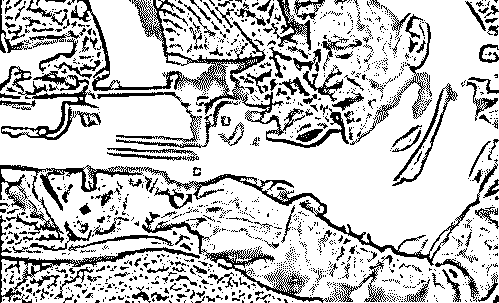

12 月 5 日星期六

**06:33** 月亮离开处女座进入天秤座

对人际关系和他人的需要更加敏感，情绪上更易配合他人。未来两天多的时间里，我们会更加依赖和谐、和平的氛围，更容易参与到社交活动或合作关系中去，也更能够享受到艺术和美带来的愉悦。

**12:16** 金星离开天秤座进入天蝎座

金星会在天蝎座一直待到 12 月 30 号，这期间我们对爱情的态度、审美风格和价值观，都会受天蝎座影响，染上复杂、激烈、隐秘的色彩。亲密关系和人际交往中那些秘而不宣的、涉及到深层心理动机的因素，会更加吸引我们的兴趣，我们对爱情的态度也可能变得更加极端，要么全部占有要么全部抛弃，也会疑心变重。在审美风格和价值观方面，我们会更加倾向于带有危险、禁忌特质的事物，跟死亡（肉体或精神上）相关的事，也会给我们带来更多兴奋感。

**23:07** 天秤座月亮六分射手座土星

情绪平稳，有安全感。交往中也能给人带来可靠、稳定的感觉。

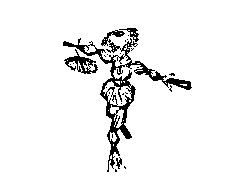

12 月 6 日

星期日

**10:20** 天秤座月亮六分射手座太阳

**10:38** 天秤座月亮合相火星

天秤座月亮，触发即将准确成相的太阳六分火星相位。这带来强劲的推进个人目标的动力。这是行动力提升、个人态度明确、勇往直前的时刻。同时也会更加明显地感受到与他人的分歧，攻击性和捍卫自我的意识变强。

**11:29** 天秤座月亮四分冥王星

**16:38** 天秤座月亮对分天王星

从中午到下午的这段时间，是每个月都会有的，月亮在天秤座与冥王星、天王星形成挑战相位的时刻。此时关系中的不信任和不稳定因素容易暴露出来，易出现心理上的较劲和反叛情绪。这是深入了解亲密关系中的真相的机会，也是尝试换种方式相处的时刻。

**18:15** 射手座太阳六分天秤座火星

此相位的影响将持续三到四天。在今天上午，由于天秤座月亮的触发，我们已经能够明显感觉到，动力的提升和“火气”的增强。在这周末到下周初这几天的时间里，是明确目标，奋起直追的时刻。我们会更加清楚、坚决地意识到，需要做什么，应该往哪里走，勇气和自信心也会提升。这有利于事件的推进和目标的达成。


## **作者简介** 

**占星师 Cora**，全美占星师联盟（AFAN）成员，国际占星研究协会（ISAR）会员，获 ISAR 职业占星师资质认证，斯蒂芬·弗里斯特《变幻的天空》译者，个人星象文章见诸《心探索》《北京青年周刊》《上海电视》《空中生活》等杂志媒体。曾跟随大卫·瑞雷系统学习占星学，现为全职占星师。  

微信公众号：聆宇 FM（微信号：lingyudiantai）

个人微信号：CoraAstro

长按二维码，让金钱涌向传播知识与智慧的人~~


* * *

**特别提醒：**希望将若道文章转载到各自公众号的朋友，**转载时请注明“转自若道微信公众平台”，并附上若道占星的 Logo**。谢谢！

**12 月 1 日****，**由**大卫**·瑞雷老师****主讲的****若道占星核心课程[Level 4](http://mp.weixin.qq.com/s?__biz=MzA5NjA0NTAxNg==&mid=400203022&idx=2&sn=3518c0e8db3d8b01d99a055ff8c19869&scene=21#wechat_redirect)（点击可查看）****即将开课。**大卫老师会分别讲解如何通过出生星图进行性格分析********、爱情解读、事业分析。******了解**Level 4 课程**详情，请点击文末“**阅读原文**”。


# 顺势疗法的药物如何重塑生命力（下）

> 原文：[`mp.weixin.qq.com/s?__biz=MzA5NjA0NTAxNg==&mid=401139231&idx=2&sn=303a7edf95151aa7c47f91d79d17bfe7&chksm=02aa54a835ddddbe0af58d662c1389696e7189ff1d2c0ad080d1ff92eee2c126421c27764d90&scene=126&sessionid=1692738902#rd`](http://mp.weixin.qq.com/s?__biz=MzA5NjA0NTAxNg==&mid=401139231&idx=2&sn=303a7edf95151aa7c47f91d79d17bfe7&chksm=02aa54a835ddddbe0af58d662c1389696e7189ff1d2c0ad080d1ff92eee2c126421c27764d90&scene=126&sessionid=1692738902#rd)

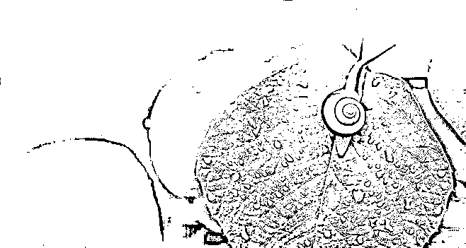

来源/homeopathyplus 网站

翻译/李含 校对/王宏

在《[顺势疗法的药物如何重塑生命力？（上）](http://mp.weixin.qq.com/s?__biz=MzA5NjA0NTAxNg==&mid=401087779&idx=2&sn=75e5ef7e354939057d30e8b7f422efec&scene=21#wechat_redirect)》（点击可阅读）一文中，我们给大家介绍了顺势疗法的同类法则，以及“势能化”药物的概念。在这篇文章中，我们将继续讨论顺势疗法是如何将低迷的生命力反复锤炼，以达到治疗效果。苏·汤普金斯老师讲授的“[顺势疗法家庭急救治疗及保健课程”](http://mp.weixin.qq.com/s?__biz=MzA5NjA0NTAxNg==&mid=400017180&idx=2&sn=845f6885f0197a6a97ea265d9bc638ab&scene=21#wechat_redirect)（点击可查看），即将于 12 月 2 日开课。想要了解顺势疗法的小伙伴们不要错过哦。

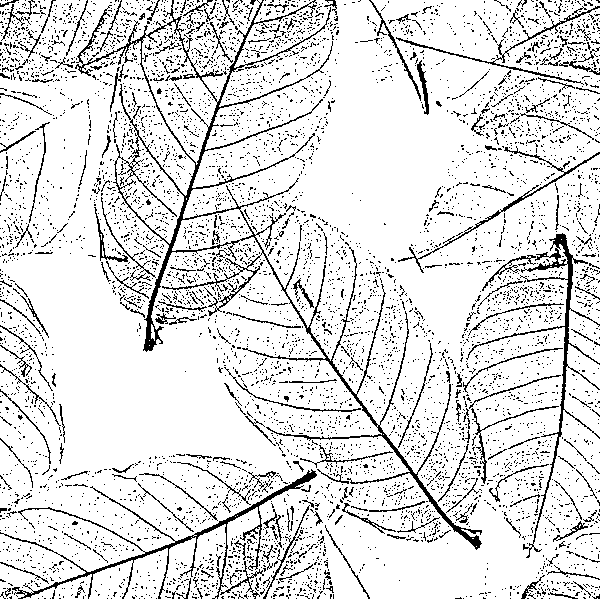

**反复锤炼，低迷的生命力能被增强**

顺势疗法的药物温和促使患者恢复健康，在这点上，将生命力视作肌肉会很有用。无力的肌肉经过锻炼可增强其力量。同样地，低迷的生命力经过药剂的反复锤炼可以被增强。每次生命力在药物的刺激下反弹时，它都会变得更强一些。每次生命力变得更强一些，它就能更为持续地改善健康。最终，它变得足够强大，可以去维持完全、持久的改善。

**并不需要继续服用药剂，患者将来对该疾病会有更强的抵抗力。这种情况会多快发生取决于三个因素：生命力的强度、失衡的程度以及药物与症状之间的匹配程度。**正如之前所谈论过的，如果药物与症状相匹配，生命力很强，而失衡是最近的或轻微的，那偶尔只需一剂药物就可完全恢复健康。更常见的情况是，将需要一系列的药剂。

有时，能量失衡所引发的症状可能在治疗过程中随着药物消除部分失衡而发生改变。随着这种药物处理的症状和这些失衡症状之间不再匹配，康复就会停止。如果患者要继续恢复健康，就必须开出与症状更为匹配的新药物。在治疗过程中可能得使用多种药物。以下案例中蕾娜的故事阐明了这一过程。

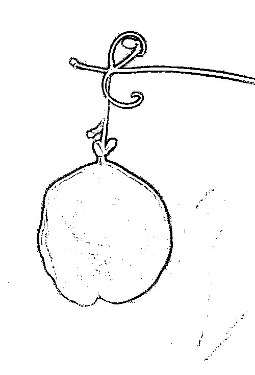

**案例：我的皮屑痊愈了！**

蕾娜因为自己慢性疲劳综合征和恐慌的问题来进行顺势疗法的咨询。她的疲劳症开始于 10 年前，在她患上巨细胞病毒感染之后。她有如下症状：肝痛、腹胀、视力模糊、鼻出血、发抖、化学物质过敏以及常常干咳。经常性的口干让她难以吞咽或说话。虽然已经有了很大的改善，但有些症状依然困扰着她，她有时精疲力竭，发觉自己早晨很难起床。焦虑和压抑同样困扰着蕾娜。

最近，她的焦虑恶化成了恐慌。虽然蕾娜很疲惫，但是她很不安，充满了“紧张的能量”。她说，充满活力的工作会改善她的疲倦。她也长期饱受鲍恩病的折磨，这是一种癌前期角化皮肤增长的疾病。这些皮疹通过定期涂抹一种乳霜而被去除掉。

在蕾娜咨询结束时，给她开出的处方是顺势疗法药物乌贼墨汁，这与她的症状最为匹配。6 周后，在服用几剂药之后，蕾娜说她好多了。她的能量水平提升了，她的焦虑尽管依然存在，但强度有所降低。腹胀几乎不复存在，发抖和口干的问题已经没有了。消极的一面是，现在她的肠道功能迟缓，她对医院和飞行产生了恐惧，尤其是在做出海外旅行的计划和获悉一位友人做手术的消息之后。乌贼墨汁与这些新的症状并不匹配，而顺势疗法药物碳酸钙是与之匹配的。由于它也同样与她的许多

遗留的症状相匹配，所以就开出了碳酸钙的处方。

九周之后，蕾娜的焦虑进一步得以改善。她告诉我，她“脑子里的毛病”没有了。海外假期“棒极了”，乘坐飞机也不再是问题。医院不再让她感到焦虑，她轻松地探访了因术后并发症而再次入院的朋友。蕾娜的肠道功能规律了，她手脚冰冷的状况也有了改善。她依旧感到不安，在夜里难以入睡。她的皮屑疹也恶化了，现在新起了几片疹子。上一周里，清鼻涕让她的鼻子和上嘴唇都被擦破了皮。

基于这一信息，我给蕾娜开了碘化砷，一种与她新出现的症状极为匹配的顺势疗法药物。不到一周，她就兴奋地给我打电话，告诉我说她的许多皮屑都没有了！这是以前从未发生过的。在这之后服用这种药物让她的状况继续得以改善，在改善停滞或症状复发时根据需要服用一剂药物。在我上次与她交谈时，她说，与她第一次来咨询时相比，她的症状已经好转了 95%。她的治疗还在继续。

**医师点评：**蕾娜从一种药物换到另一种药物的这一过程表明了处方总是应该做出改变以符合症状，不这样做就难以治愈。在蕾娜的案例中，一种药，即便是多次剂量或多种效能，也不能纠正引发她症状的深层失衡。因此，我给她用了一系列对症的药物，她现在期待更快乐、更富有成效的生活。

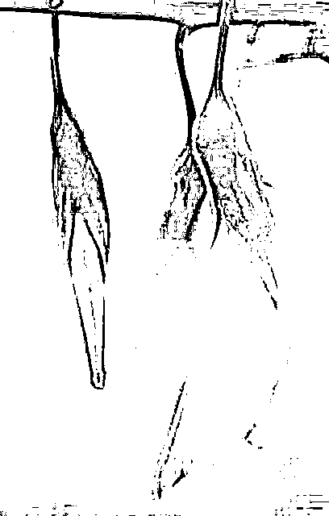

**这一切是如何发生的？**

生命力增强是如何发生的呢？简短的回答是没人知道。尽管上述理论可以在实践中被观察到，但实际的机制依旧未知。科学正对此进行研究，但还没有足够敏锐的仪器去测量顺势疗法的势能和疗愈在能量的层面发生了什么。已知的是，“信息”常常可以从一种物质转移到另一种物质。就像是一根电线里的电流可以产生电流通过另一根完全不同的电线，就像是磁铁在和纸夹接触一段时间后可以将磁力转移到纸夹之上，势能化将一种物质引发症状的能力转移到一种液体或糖丸药物中。然后顺势疗法医师根据同类法则开出药物，安全地将这种信息转移到生命有机体中，去触发疗愈效应。这就是过去两百年他们所做的事，这也是他们在未来将继续好好做的事。

就像是给一队正在鏖战中的骑兵派去增援，生命力可以通过一种模拟其当前症状的药物得以增强，以纠正其失衡的状况。**换一种解释，顺势疗法药物就像是生命力的一面镜子，映照出它可怜的样子。被所见之样貌惊骇到，生命力便加倍努力去解决病症。**

**更多有关顺势疗法的传送门**

**科普篇**

[顺势疗法的药物如何重塑生命力？（上）](http://mp.weixin.qq.com/s?__biz=MzA5NjA0NTAxNg==&mid=401087779&idx=2&sn=75e5ef7e354939057d30e8b7f422efec&scene=21#wechat_redirect)

[科普 | 顺势疗法和其他药物疗法的异同](http://mp.weixin.qq.com/s?__biz=MzA5NjA0NTAxNg==&mid=400555588&idx=2&sn=3eefa20f53ad362e6f0ef18f2829ee9e&scene=21#wechat_redirect)

[对待疾病 | 姑息它，压制它，还是治愈它？](http://mp.weixin.qq.com/s?__biz=MzA5NjA0NTAxNg==&mid=400605043&idx=1&sn=a0f8e724b556cdc49530a5a66c0e85d6&scene=21#wechat_redirect)

[送你急救箱，救自己救家人还能救宠物](http://mp.weixin.qq.com/s?__biz=MzA5NjA0NTAxNg==&mid=400181530&idx=1&sn=5b5510e4d43ef54ae0f3f56441d1ac65&scene=21#wechat_redirect)

[顺势疗法，皇室钟爱的疗愈方法](http://mp.weixin.qq.com/s?__biz=MzA5NjA0NTAxNg==&mid=400017180&idx=1&sn=286860583aa755e5fe5a6eac534008cb&scene=21#wechat_redirect)

[它在世界上排名第二，它治人不治病](http://mp.weixin.qq.com/s?__biz=MzA5NjA0NTAxNg==&mid=400153889&idx=1&sn=2dd034cb37b11e5765bd170addd1f960&scene=21#wechat_redirect)

**案例篇**

[顺势疗法治好了他的自闭症！](http://mp.weixin.qq.com/s?__biz=MzA5NjA0NTAxNg==&mid=400921710&idx=2&sn=94af25e6399ca49525ddbd11dc61bbb1&scene=21#wechat_redirect)

[不用再手术，肾结石轻松搞定！](http://mp.weixin.qq.com/s?__biz=MzA5NjA0NTAxNg==&mid=400879915&idx=2&sn=71944f0c596042332924e0de8c7bcf63&scene=21#wechat_redirect)

[这个婴儿频繁夜惊、惧怕男性，现在都好了](http://mp.weixin.qq.com/s?__biz=MzA5NjA0NTAxNg==&mid=400901918&idx=2&sn=2c39821aa322bddc9d12dc6c8b128556&scene=21#wechat_redirect)

[顺势疗法 | 它帮助抚平心理创伤和悲痛](http://mp.weixin.qq.com/s?__biz=MzA5NjA0NTAxNg==&mid=400858503&idx=2&sn=8ed07f16cdc736af776dce34aa9232cd&scene=21#wechat_redirect)

[50 年的鼻窦炎好了！](http://mp.weixin.qq.com/s?__biz=MzA5NjA0NTAxNg==&mid=400750777&idx=2&sn=e5dba7e9508a9ed7ec0dd18d445182c9&scene=21#wechat_redirect)

[孕妈选对药方，保护了自己和宝宝](http://mp.weixin.qq.com/s?__biz=MzA5NjA0NTAxNg==&mid=400721730&idx=2&sn=3b907efec5851b08f1fc3e74be31c2e8&scene=21#wechat_redirect)

[一瓶药丸治好了困扰我四年的各种病症](http://mp.weixin.qq.com/s?__biz=MzA5NjA0NTAxNg==&mid=400555588&idx=1&sn=9d860beaa15bc1b9e6c627e1d3369afa&scene=21#wechat_redirect)

[为了宝宝，我选择顺势疗法](http://mp.weixin.qq.com/s?__biz=MzA5NjA0NTAxNg==&mid=400490938&idx=2&sn=9ae026781f9119936ade05b2dc66655f#wechat_redirect)

[过敏、扭伤、关节炎、痛经、宠物疾病……全搞定！](http://mp.weixin.qq.com/s?__biz=MzA5NjA0NTAxNg==&mid=400260655&idx=1&sn=854005f3b4c5846959ece35907a94dba&scene=21#wechat_redirect)

* * *

**特别提醒：**希望将若道文章转载到各自公众号的朋友，**转载时请注明“转自若道微信公众平台”，并附上若道占星的 Logo**。谢谢！

**2015 年 12 月 2 日，**由**苏**·汤普金斯老师****亲授的**顺势疗法课程即将开课**。******顺势疗法**是目前全球使用最广泛的自然医学疗法，**对个体的身体、精神和情绪三个层面进行治疗，加强个体自身免疫力，提升个体生命能量**。本课程为那些想要增加自我和家庭身体保健和疗愈能力的人所设置。****欲详细了解，请点击文末“**阅读原文**”。


# 倒计时·3 | 学完 Level 4，星图综合解读没问题~

> 原文：[`mp.weixin.qq.com/s?__biz=MzA5NjA0NTAxNg==&mid=401139231&idx=3&sn=710633d2468962bc301883a1a2f0e081&chksm=02aa54a835ddddbec2ee2dc47ba6db29b50d606281405560f7579bb8d802eb5ec6342641f6cf&scene=126&sessionid=1692738902#rd`](http://mp.weixin.qq.com/s?__biz=MzA5NjA0NTAxNg==&mid=401139231&idx=3&sn=710633d2468962bc301883a1a2f0e081&chksm=02aa54a835ddddbec2ee2dc47ba6db29b50d606281405560f7579bb8d802eb5ec6342641f6cf&scene=126&sessionid=1692738902#rd)

**课程信息**

开课时间：2015 年 12 月 1 日-2016 年 3 月 15 日

讲师：大卫·瑞雷

讲课城市：网络视频

费用(元)：6000

报名截止：2015 年 11 月 20 日

课程负责人：李老师  联系方式：010-58263061/010-56629907

**2015 年度若道新推出的专业占星课程分为五个级别，本课程属于若道专业占星课程第四级别，****Level 4****课程****。**

**课程描述**

**若道占星核心课程系列 Level 4**

**星图舞会——星图综合解读 24 小时**

在这个阶段，你终于可以学会星图的综合解读了！

前一阶段所有学到的越扎实，现在就越开心。你可以看到，当那些行星、星座、宫位、相位穿起来的丝线开始跳舞，一个个故事图景就像织锦一样展现在你的面前。个性、爱情、事业，看到一个人的出生星图，你就可以开始讲他们生命故事的梗概了。这里大卫老师会分别讲解如何通过出生星图进行性格分析、爱情解读、事业分析。在爱情解读部分，你还会提前学到比对图。

这个课程结束后，你就可以练习解读出生星图的重要问题了。

**授课内容**

**星图综合解读——性格分析**

**星图综合解读——爱情（出生图）**

**星图综合解读——爱情（比对图）**

**星图综合解读——职业**

在整个教学过程中，不仅用名人案例讲解，而且将会抽取同学星图，演示如何就爱情议题、职业咨询议题进行咨询示范。

**课程时间**

授课时间：2015 年 12 月 1 日-2016 年 3 月 15 日

每周二晚上 20：00-22:00 （北京时间），共计 12 次课

**授课形式**

1. 网络教学：网络视频会议系统上的在线课程和答疑辅导，只要有上网的条件在世界各地都可以上课，无地域限制。北京同学可以到若道办公室现场上课。

2. 中英文双语授课，专业占星口译员中文翻译。

3. 每次课后都有助教在线答疑。

4. 每月组织沙龙互动练习。

**教学优势**

**作为国际占星研究协会（ISAR）在中国唯一指定的教学机构，我们有：**

**专业师资（国内最专业）：**

1.国际一流名师：大卫•瑞雷 40 年占星咨询和教学经验，4 年中国本土化教学经验，无保留传授。

2.职业占星师助教：我们的助教，均为 ISAR 认证职业占星师或大卫老师职业占星师资质班优秀毕业生。

3.专业翻译：擅长占星的英文翻译，完全不懂英文的同学也可以聆听大师的教诲。

**系统教学（国内最完善）：**

1.学习路径：完整的知识结构，清晰的知识点，大量案例展示、咨询示范。

2.心法传授：大卫老师 40 年实战咨询经验，绝非仅靠读书就可以获得。

3.实战练习：在 Level 5 将组织实战练习，为开启咨询之路做好准备。

**完美互动（国内最丰富）：**

1.与名师面对面：北京同学可以来若道现场上课，和大卫老师面对面互动。大卫老师也可能前往主要学员所在城市，实现零距离教学。

2.互动答疑：论坛、QQ 群随时提问；老师课上答疑；助教线上线下全程协助。

3.线下沙龙：定期举办沙龙活动，复习上课内容。

4.强大的同学网络：若道作为中国最顶尖的占星教学机构，在 4 年的占星教学中，培养了很多占星人才。若道让你和师兄师姐切磋，让你和国内著名占星师学习。（简单来说，就是，人脉！）

**配套支持（国内最方便）：**

1.先进的教学平台：网络教学平台，支持手机、电脑、iPad 上网，可以随时随地学习。

2.回放复习：学员可登录网站收看课程回放，在线复习课程，每次课可完整重看 3 次，1 个月内有效。

**报名和付款**

课程费用：6000 元　

请在点击页面左下方“**阅读原文**”报名，以及在线完成学费支付。

咨询请拨打电话 010-56629907　

或课服 QQ：4006191014 （若道星文化）
或直接写信给 nodoor@vip.126.com，我们会回复您的疑问。 网页报名后无法进行在线支付的同学，可以通过银行汇款的方式支付课程费用。

汇款信息：蒋颖　6226 0901 0424 5721　招商银行北京中关村支行　

或支付宝：nodoor@yeah.net
请在汇款备注中写上自己的名字和所报课程，方便我们核对。

**退课与转课**

课程付费后，因个人原因无法参加通过邮件申请退款，开课前 3 天内可以全款退回。
开课后，若想申请退课或转课，请在第二节课前提交书面申请至 nodoor@vip.126.com。
退款和转课金额统一按 80%执行；
若课程进行到第二次后，不再接受退款或转课申请。

**大卫•瑞雷简介**


> 美国资深职业占星师。1970 年开始学习占星学，在通过亚特兰大职业占星委员会的考试后，于 1976 年获得执业许可，成为一名专职占星师。年过六旬的大卫老师，曾两任亚特兰大占星协会主席，是全美占星师联盟（AFAN）、美国占星师联合会（AFA）、全美占星研究委员会（NCGR）、国际占星研究协会（ISAR）和职业占星师组织（OPA）的成员，是联合占星大会（UAC, United Astrology Conference）督导委员会委员。
> 
> 大卫老师曾是 CNN、CBS 的占星节目的常驻嘉宾，多次在 BBC、WGS、WSB、WRGG 等节目中接受采访，并在亚特兰大主持电视节目《每日行星（Daily Planets）》达 4 年之久。至今已研究占星四十余年，拥有三十多年的占星咨询的执业经验，其服务客户包括学生、工人、市长、州长、议会议员、企业家、心理咨询师、工程师、艺术家、演员、知名企业家等，客户年龄跨度从襁褓婴儿到耄耋老人。2010 年 6 月，大卫的书《灵魂的目标》中文版出版。在 2011 年春季的北京之行期间，大卫接受了《南方周末》记者的采访，同时参与了 CCTV9 的纪录片的拍摄。
> 
> 大卫老师热爱教学，愿意将自己的毕生所学倾囊相授。为了将纯正的西方占星学带入中国、为了让更多的中国人从占星中获益，大卫老师在占星学的传授上投入了巨大的热情与心血。他以后每年将有一半的时间在中国度过，中国将成为他的第二个家。


# 你是谁？你真的了解自己吗？

> 原文：[`mp.weixin.qq.com/s?__biz=MzA5NjA0NTAxNg==&mid=401121643&idx=1&sn=38664d76d7d187be2b9287594eaae5f4&chksm=02aa13dc35dd9aca577fefa66f7378dade0b994b6ee8a20536f0bfc450d7605523bece0f8cdb&scene=126&sessionid=1692738902#rd`](http://mp.weixin.qq.com/s?__biz=MzA5NjA0NTAxNg==&mid=401121643&idx=1&sn=38664d76d7d187be2b9287594eaae5f4&chksm=02aa13dc35dd9aca577fefa66f7378dade0b994b6ee8a20536f0bfc450d7605523bece0f8cdb&scene=126&sessionid=1692738902#rd)

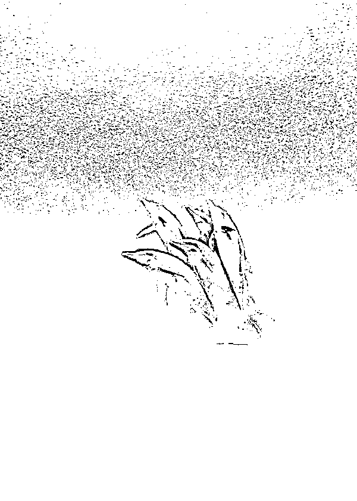

翻译/李含  校对/王宏

“占星学从古代和中世纪沿袭下来，有着五千年历史的心理学。”荣格在 1928 年 12 月 8 日写给 L.·奥斯瓦尔德的信中这样写道。

摘自《卡尔·荣格的信件》第一卷，1973 年

**问问自己，你是谁？**

**你****是谁？**

除了你与你的人类同胞所共有的生物进化特质，包含你语言的心理结构、你原生家庭的动态和祖辈的次层面（还有业力，如果你相信转世重生的话）在内的你身份认知的文化层面，你在学校中与同龄人的社会化，你在社会中的社会化——包括电视、电影、音乐和媒体的现代影响，你所接受的教育和教育的影响，以及你亲密的个人关系所带来的影响之外，你还有你的记忆、思想、梦想、希望、渴望、幻想，以及你所发展出的技能和天赋！  

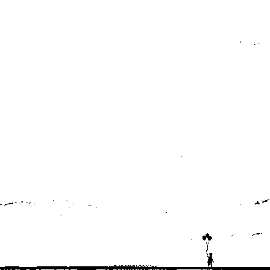

**那么，你是谁？**

“……我是个内向者，”你静静地说。

如此而已吗？你人生背景和经历的所有层面就是这些？

“我是这么认为的，”你补充道：“噢，我还是……IBM 公司的信息系统分析员”。

好吧，你是一个“**内向者**”，还是“**IBM 的信息系统分析员**”。欢迎来到现代世界的生活中。

当然，你或许会说：“不，我是一位外向者，从事销售工作。”

这样的标签真的表达了你是谁吗？你的身份和全部人生经历能被简化成这样？这样的心理学性格术语是“简化逻辑”的结果，显示出了科学对于我们的思考方式和世界观，甚至是我们看待自己的方式普遍的无可争议的影响。

**占星学：非“机械论“的科学**

**这种符合科学观的思考方式和世界观被应用于各个领域**。比如心理学在整个发展过程中都力争将自己置于更坚实的科学基础之上，尽管心理学（psychology）中的“psych”源自希腊语中意为“灵魂”的“psyche”，而“灵魂”一词被大部分科学讨论排除在外。虽然像卡尔·荣格这样的心理学家当然不会因为“灵魂”一词而感到困窘，但你不太可能在当今主流心理学的书籍和文章中找到这个词。

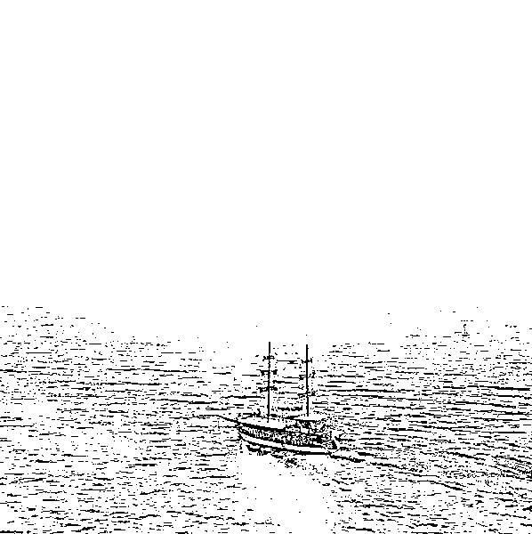

具有讽刺意味的是，正是伟大的灵魂领航者荣格在其相对早期的精神分析职业生涯中发展出了“内向者”和“外向者”的术语。1923 年荣格关于“心理类型”的理念的英语出版物后来引导嘉芙莲·谷嘉·布里格斯（Katharine Cook Briggs）及其女儿伊莎贝·碧瑞斯·迈尔斯（Isabel Briggs Myers）构建和发展出了**迈尔斯—布里格斯类型指标**（MBTI），这与**明尼苏达多相性格类型测验**（MMPI）和修订后的**NEO 性格问卷**一起是如今正在应用的排名前三的性格测试。

你很可能知道这些测试，这些测试雇主和雇员中广泛使用。性格测试最初发展于 20 世纪 20 年代，用于简化人才选拔的过程，尤其是在军队中。正如 20 世纪 60 年代标志性的**墨渍或“罗夏测验”**——在本文开头简要描述过——**这些测试是合乎科学的设计，将性格按照可预见的行为结果进行分类。你们许多人很可能进行过 MBTI 测试，它还列出了适合的职业领域。**这类测试的实际应用是显而易见的，且看似十分有用。

当然，卡尔·荣格的内向者/外向者理论引导了 MBTI 的发展，他同样也对占星学进行了深入的探索。因此，心理学家汉斯·艾森克（如图）于 1978 年在《社会心理学杂志》（105）第 229-236 页发表的文章在一系列统计学研究基础上证实了占星学的命题，即**出生时太阳位于阳性星座（白羊座、双子座、狮子座、天秤座、射手座、水瓶座）的人倾向于更加外向，而出生时太阳落在阴性星座（金牛座、巨蟹座、处女座、天蝎座、摩羯座、双鱼座）的人倾向于更加内向，这是很恰当的**。统计相关性（statistical relevance）导致平均效应值为 0.09，远低于“太阳星座”占星师所声称的，但考虑到一个真正的占星学完形有着数量显著的抵消因素，它还是有些相关性的。

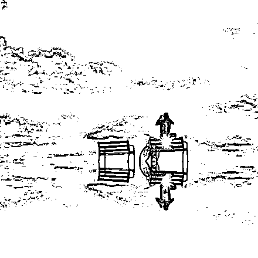

利用科学的统计学研究来检测占星学，这种做法迄今只发现了少数非常普遍的广泛关联，这些关联性对职业占星学的具体实践影响甚微，即使是当这样的研究是非常广泛且大量之时，比如米歇尔·高奎林（1928-1991）的研究。

为何会这样？尽管本文开头所引用的荣格的话有着重要意义，但占星学并不是一个符合科学设计的领域**。即使西方执业的职业占星师普遍拥有心理学或心理疗法方面的学位，但占星学还是一种“整体科学”，而不是一种“机械论的科学”**。我之前提到的“一个真正的占星学完形”尽管具有讽刺意味地包含了一个心理学术语，但其实所表达的是占星学的真正身份是整体的，而非机械论的。

**占星学的整体论**

“整体的”（holistic）或“整体论”（Holism）是什么意思呢？整体论认为，“整体的各部分有着复杂的相互关联性，这使得它们不能独立于整体而存在，或不能脱离整体而被理解，整体大于各部分的总和。”

《牛津词典》

我这样阐述整体论的理由是，了解整体论观点的重要意义对于实践占星学来说是必不可少的，也是能够去解读出生星图的第一步。**一张出生星图实际上呈现出的不只是性格，甚至不只是荣格所说的“性格潜能”。即使是对性格最广义的概念也没能实际囊括出生星图中意义和关联的多种层次。**大部分若道占星核心课程第三阶（Level 3）的学员已经开始理解这一点了，他们在努力掌握从整体进行思考的方式。

**例如，一位学员问：“太阳与海王星合相和太阳落于双鱼座有何区别？”**

这似乎是个非常简单的问题，直到你意识到太阳与海王星的合相不能不落在一个黄道星座之中！换言之，整体的现实就是，从占星学的角度来说，太阳和海王星不是脱离于黄道星座独立存在的。因此，学员意识到这个问题的答案是：“太阳落于双鱼座和太阳与海王星合相的差别是星座。”所以说，黄道星座是占星学整体背景的重要组成部分。

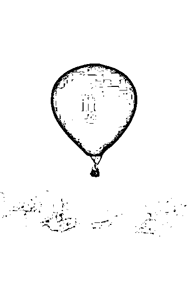

**我关于整体论的观点起初看起来是纯理论的，直到你认识到这正是占星学动态光色主义（luminism）的核心**。当然，如果不是所有人的话，大部分中阶占星学子都已经有过与朋友或熟人谈论他们的星图的经历了，结果却发现对方会提供相反的例子或异议来反驳你所说的话。在你对其天秤座的月亮进行解说之后，他们反驳说：“那并不总是正确的！我也会非常坚定自信，急躁没耐心！”你甚至还没来得及提到他们的白羊座火星。或是在你对他们的射手座上升点做出评价，但还未谈到出生星图中海王星与射手座上升点合相时，他们说：“我真的比你说的要敏感。”

在这一点上，可能听起来我只是在谈论星图的“整合”，在很大程度上的确如此。**但出生星图的整合显然是一个整体的过程，要求你使用整体论的思维设定，不仅仅是在你理解出生星图的方式上，而且还在你解读星图的方式上。**

**在 Level 4 课程中我们将学到什么？**

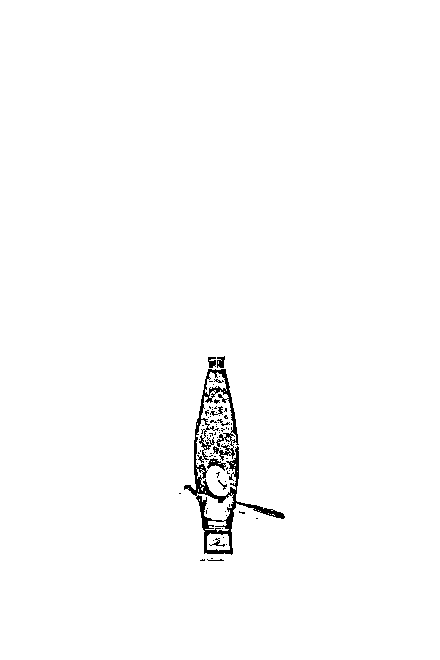

这样的整体整合和解读是若道于 12 月 1 日开课的若道占星核心课程第四阶（[Level 4](http://mp.weixin.qq.com/s?__biz=MzA5NjA0NTAxNg==&mid=400533846&idx=2&sn=5262a1613ec0cb0ee60b5435b36d6766&scene=21#wechat_redirect)）（点击可查看）课程要教授给学员们的核心内容。在第三阶（Level 3）课程中，许多学员听我说过：“出生星图的解读是一门艺术。”**在第四阶（Level 4）课程中，同学们将学习如何从整体思考星图，这将会帮助你们成为一名占星艺术家，并使得你们能够以让你们自己、你们的朋友和客户着迷的方式去解读星图。**

对于那些中阶占星学子，你们已经学习了出生星图的许多部分：星座、宫位、行星、相位和月亮交点等等。你们可以辨识出相位模式、宫位的守护星，还有定位星关系。你们记住了在现实生活这些关联的不同层面、性格特质以及一份内容不断增加的关键词列表。**尽管如此，你们许多人还是处于认真学习占星学的过程中最令人沮丧的那个点上。你们不知道如何将这些整合成为一个具有意义的框架，让你们可以更亲密地与他人交流。这正是若道占星核心课程第四阶（Level 4）课程能教给你们的。**

**在 Level 4 课程中，我们首先会从整体上解读性格。**在开始的两次网络课程中，你们将学习如何发展你们的整合及解读能力，我们会介绍方法，你们可以用这些方法来解读星图。你们可以称之为“会话型占星学”或如何与某人就其星图展开有意义的对话。

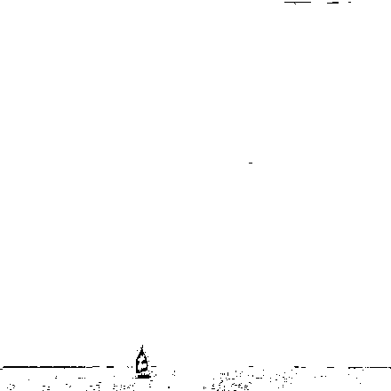

 **你们在第一课和第二课中所学到的过程之后会延伸至“关系”这一重大主题。**你们将学习出生星图关系整合的基础知识，以及如何与某人就其情感关系生活展开有意义的对话。**然后，我们会探讨职业，再次将同样的原理应用到我们出生星图职业整合的基础内容上。**到课程结束时，你们对于如何解读出生星图的掌握会让你们从试图将人简化成有限的特征转变为富于创造性地艺术呈现，这样的呈现可以打开每一个与你交谈之人的思路和心扉，去讨论他们有怎样的潜能去拥有更为充实的人生、更富于满足感的关系和更有成就感的事业。

读完本文，你是不是对自己的星图更感兴趣了呢？**12 月 1 日**，由大卫·瑞雷老师主讲的**若道占星核心课程第四阶**[Level 4](http://mp.weixin.qq.com/s?__biz=MzA5NjA0NTAxNg==&mid=400203022&idx=2&sn=3518c0e8db3d8b01d99a055ff8c19869&scene=21#wechat_redirect)（点击可查看）即将开课。大卫老师将分别讲解**如何通过出生星图进行性格分析、爱情解读、事业分析**。了解课程详情，请点击文末“**阅读原文**”。


# 测试 | 你有多了解自己？

> 原文：[`mp.weixin.qq.com/s?__biz=MzA5NjA0NTAxNg==&mid=401121643&idx=2&sn=c048537381caef52bdb587816f11f331&chksm=02aa13dc35dd9aca174b30cf7d99af52366e253b1af799127e1159e03b69af43fcbf4ee55588&scene=126&sessionid=1692738902#rd`](http://mp.weixin.qq.com/s?__biz=MzA5NjA0NTAxNg==&mid=401121643&idx=2&sn=c048537381caef52bdb587816f11f331&chksm=02aa13dc35dd9aca174b30cf7d99af52366e253b1af799127e1159e03b69af43fcbf4ee55588&scene=126&sessionid=1692738902#rd)

翻译/李含  校对/王宏

这是一份基于占星学设计的性格测验，旨在帮助大家从整体上了解自己。做这份测试，并不需要你有占星学知识，你只需要观察这些图片，根据自己的感觉回答问题。

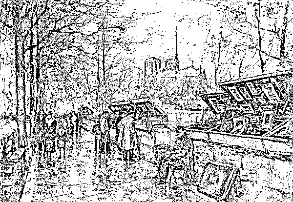

1. 图片唤起了你怎样的感觉？

2. 图片中有没有哪部分让你产生了共鸣，如果有的话，是哪部分？

3. 图片的主题是否让你产生了共鸣，如果是，那么这个主题是什么？

4. 你是否将自己视作图中的某人？

5. 你是否想成为图中的某人？

6. 如果你必须选择成为图中的某人，你会选谁？为什么？

7. 你是否不想成为图中的某人？如果是这样的话，为什么？

回答：

1.

2.

3.

4.

5.

6.

7.

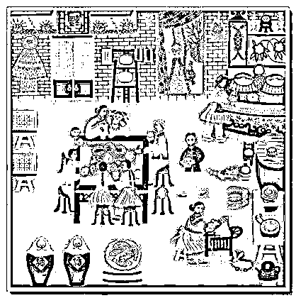

1. 图片唤起了你怎样的感觉？

2. 图片中有没有哪部分让你产生了共鸣，如果有的话，是哪部分？

3. 图片的主题是否让你产生了共鸣，如果是，那么这个主题是什么？

4. 你是否将自己视作图中的某人？

5. 你是否想成为图中的某人？

6. 如果你必须选择成为图中的某人，你会选谁？为什么？

7. 你是否不想成为图中的某人？如果是这样的话，为什么？

回答：

1.

2.

3.

4.

5.

6.

7.

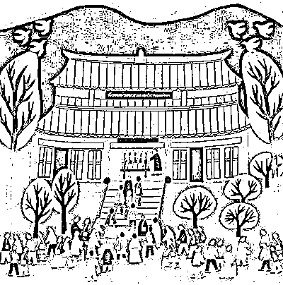

1. 图片唤起了你怎样的感觉？

2. 图片中有没有哪部分让你产生了共鸣，如果有的话，是哪部分？

3. 图片的主题是否让你产生了共鸣，如果是，那么这个主题是什么？

4. 你是否将自己视作图中的某人？

5. 你是否想成为图中的某人？

6. 如果你必须选择成为图中的某人，你会选谁？为什么？

7. 你是否不想成为图中的某人？如果是这样的话，为什么？

回答：

1.

2.

3.

4.

5.

6.

7.

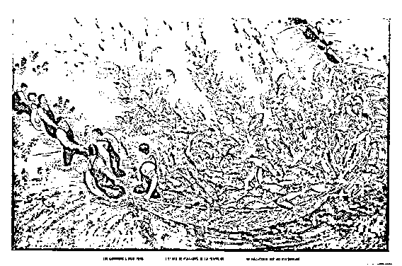

1. 图片唤起了你怎样的感觉？

2. 图片中有没有哪部分让你产生了共鸣，如果有的话，是哪部分？

3. 图片的主题是否让你产生了共鸣，如果是，那么这个主题是什么？

4. 你是否将自己视作图中的某人？

5. 你是否想成为图中的某人？

6. 如果你必须选择成为图中的某人，你会选谁？为什么？

7. 你是否不想成为图中的某人？如果是这样的话，为什么？

回答：

1.

2.

3.

4.

5.

6.

7.

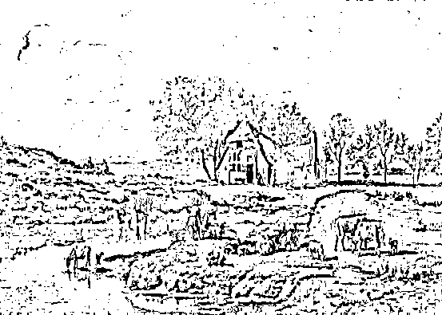

1. 图片唤起了你怎样的感觉？

2. 图片中有没有哪部分让你产生了共鸣，如果有的话，是哪部分？

3. 图片的主题是否让你产生了共鸣，如果是，那么这个主题是什么？

4. 你是否将自己视作图中的某人？

5. 你是否想成为图中的某人？

6. 如果你必须选择成为图中的某人，你会选谁？为什么？

7. 你是否不想成为图中的某人？如果是这样的话，为什么？

回答：

1.

2.

3.

4.

5.

6.

7.

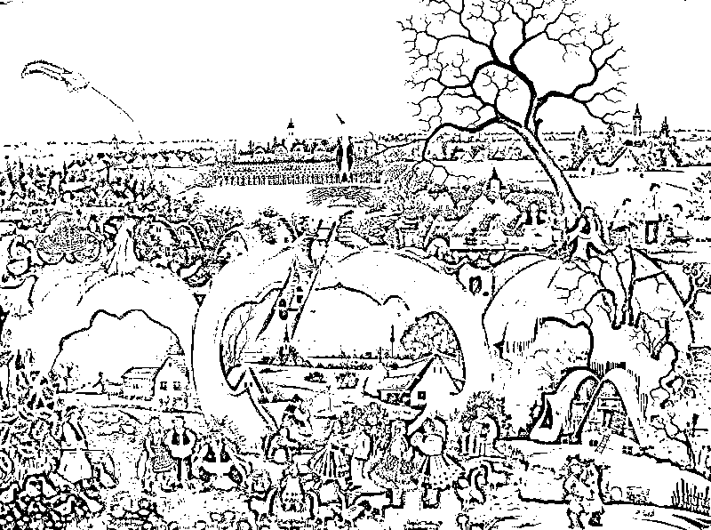

1. 图片唤起了你怎样的感觉？

2. 图片中有没有哪部分让你产生了共鸣，如果有的话，是哪部分？

3. 图片的主题是否让你产生了共鸣，如果是，那么这个主题是什么？

4. 你是否将自己视作图中的某人？

5. 你是否想成为图中的某人？

6. 如果你必须选择成为图中的某人，你会选谁？为什么？

7. 你是否不想成为图中的某人？如果是这样的话，为什么？

回答：

1.

2.

3.

4.

5.

6.

7.

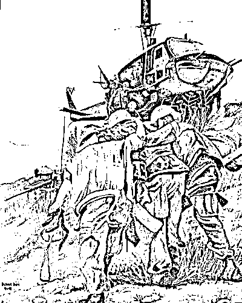

1. 图片唤起了你怎样的感觉？

2. 图片中有没有哪部分让你产生了共鸣，如果有的话，是哪部分？

3. 图片的主题是否让你产生了共鸣，如果是，那么这个主题是什么？

4. 你是否将自己视作图中的某人？

5. 你是否想成为图中的某人？

6. 如果你必须选择成为图中的某人，你会选谁？为什么？

7. 你是否不想成为图中的某人？如果是这样的话，为什么？

回答：

1.

2.

3.

4.

5.

6.

7.

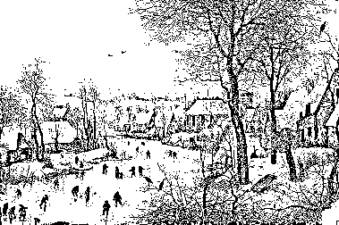

1. 图片唤起了你怎样的感觉？

2. 图片中有没有哪部分让你产生了共鸣，如果有的话，是哪部分？

3. 图片的主题是否让你产生了共鸣，如果是，那么这个主题是什么？

4. 你是否将自己视作图中的某人？

5. 你是否想成为图中的某人？

6. 如果你必须选择成为图中的某人，你会选谁？为什么？

7. 你是否不想成为图中的某人？如果是这样的话，为什么？

回答：

1.

2.

3.

4.

5.

6.

7.

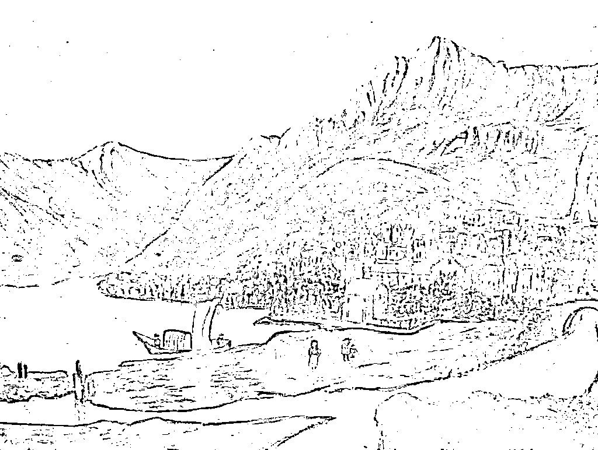

1. 图片唤起了你怎样的感觉？

2. 图片中有没有哪部分让你产生了共鸣，如果有的话，是哪部分？

3. 图片的主题是否让你产生了共鸣，如果是，那么这个主题是什么？

4. 你是否将自己视作图中的某人？

5. 你是否想成为图中的某人？

6. 如果你必须选择成为图中的某人，你会选谁？为什么？

7. 你是否不想成为图中的某人？如果是这样的话，为什么？

回答：

1.

2.

3.

4.

5.

6.

7.

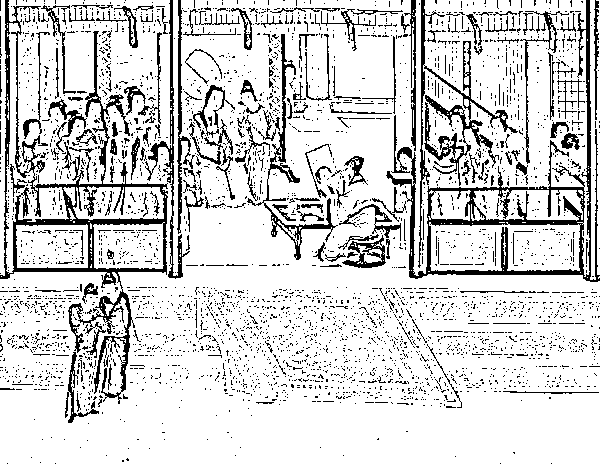

1. 图片唤起了你怎样的感觉？

2. 图片中有没有哪部分让你产生了共鸣，如果有的话，是哪部分？

3. 图片的主题是否让你产生了共鸣，如果是，那么这个主题是什么？

4. 你是否将自己视作图中的某人？

5. 你是否想成为图中的某人？

6. 如果你必须选择成为图中的某人，你会选谁？为什么？

7. 你是否不想成为图中的某人？如果是这样的话，为什么？

回答：

1.

2.

3.

4.

5.

6.

7.

**说明**：

这份视觉测试旨在与你的“整个人”互动，通过你对图片的反应揭示出一系列反应，这些反应可能证实你已经了解的一部分自我，同时打开你的觉知，让你对自己产生新的了解和认识。通过做这些测试，你有什么新发现吗？

当然，正如我所说的，这是一份基于占星学设计的性格测试。对于那些了解占星学的人，不妨结合自己的星图来思考一下你对这些图片的反应，思考一下你的反应和你星图的哪些部分有所关联。这是否证实了你对自身的了解？你又有哪些新发现呢？这仅仅只是一个开始！

如果你对这样的“自我了解”感兴趣，如果你已经掌握了占星学的基础知识，但不知道如何整合一张星图，来参加我**12 月 1 日**开始主讲的**若道占星核心课程第四阶**[Level 4](http://mp.weixin.qq.com/s?__biz=MzA5NjA0NTAxNg==&mid=400203022&idx=2&sn=3518c0e8db3d8b01d99a055ff8c19869&scene=21#wechat_redirect)（点击可查看）课吧！我将分别讲解**如何通过出生星图进行性格分析、爱情解读、事业分析**。了解课程详情，请点击文末“**阅读原文**”。

 

# 倒计时·4 | 学完 Level 4，星图综合解读没问题~

> 原文：[`mp.weixin.qq.com/s?__biz=MzA5NjA0NTAxNg==&mid=401121643&idx=3&sn=91f924d72f5588d00301a2fb2faab446&chksm=02aa13dc35dd9aca570ceaa139d756eff16463f7e75230426428155901cbab4226c644d94208&scene=126&sessionid=1692738902#rd`](http://mp.weixin.qq.com/s?__biz=MzA5NjA0NTAxNg==&mid=401121643&idx=3&sn=91f924d72f5588d00301a2fb2faab446&chksm=02aa13dc35dd9aca570ceaa139d756eff16463f7e75230426428155901cbab4226c644d94208&scene=126&sessionid=1692738902#rd)

**课程信息**

开课时间：2015 年 12 月 1 日-2016 年 3 月 15 日

讲师：大卫·瑞雷

讲课城市：网络视频

费用(元)：6000

报名截止：2015 年 11 月 20 日

课程负责人：李老师  联系方式：010-58263061/010-56629907

**2015 年度若道新推出的专业占星课程分为五个级别，本课程属于若道专业占星课程第四级别，****Level 4****课程****。**

**课程描述**

**若道占星核心课程系列 Level 4**

**星图舞会——星图综合解读 24 小时**

在这个阶段，你终于可以学会星图的综合解读了！

前一阶段所有学到的越扎实，现在就越开心。你可以看到，当那些行星、星座、宫位、相位穿起来的丝线开始跳舞，一个个故事图景就像织锦一样展现在你的面前。个性、爱情、事业，看到一个人的出生星图，你就可以开始讲他们生命故事的梗概了。这里大卫老师会分别讲解如何通过出生星图进行性格分析、爱情解读、事业分析。在爱情解读部分，你还会提前学到比对图。

这个课程结束后，你就可以练习解读出生星图的重要问题了。

**授课内容**

**星图综合解读——性格分析**

**星图综合解读——爱情（出生图）**

**星图综合解读——爱情（比对图）**

**星图综合解读——职业**

在整个教学过程中，不仅用名人案例讲解，而且将会抽取同学星图，演示如何就爱情议题、职业咨询议题进行咨询示范。

**课程时间**

授课时间：2015 年 12 月 1 日-2016 年 3 月 15 日

每周二晚上 20：00-22:00 （北京时间），共计 12 次课

**授课形式**

1. 网络教学：网络视频会议系统上的在线课程和答疑辅导，只要有上网的条件在世界各地都可以上课，无地域限制。北京同学可以到若道办公室现场上课。

2. 中英文双语授课，专业占星口译员中文翻译。

3. 每次课后都有助教在线答疑。

4. 每月组织沙龙互动练习。

**教学优势**

**作为国际占星研究协会（ISAR）在中国唯一指定的教学机构，我们有：**

**专业师资（国内最专业）：**

1.国际一流名师：大卫•瑞雷 40 年占星咨询和教学经验，4 年中国本土化教学经验，无保留传授。

2.职业占星师助教：我们的助教，均为 ISAR 认证职业占星师或大卫老师职业占星师资质班优秀毕业生。

3.专业翻译：擅长占星的英文翻译，完全不懂英文的同学也可以聆听大师的教诲。

**系统教学（国内最完善）：**

1.学习路径：完整的知识结构，清晰的知识点，大量案例展示、咨询示范。

2.心法传授：大卫老师 40 年实战咨询经验，绝非仅靠读书就可以获得。

3.实战练习：在 Level 5 将组织实战练习，为开启咨询之路做好准备。

**完美互动（国内最丰富）：**

1.与名师面对面：北京同学可以来若道现场上课，和大卫老师面对面互动。大卫老师也可能前往主要学员所在城市，实现零距离教学。

2.互动答疑：论坛、QQ 群随时提问；老师课上答疑；助教线上线下全程协助。

3.线下沙龙：定期举办沙龙活动，复习上课内容。

4.强大的同学网络：若道作为中国最顶尖的占星教学机构，在 4 年的占星教学中，培养了很多占星人才。若道让你和师兄师姐切磋，让你和国内著名占星师学习。（简单来说，就是，人脉！）

**配套支持（国内最方便）：**

1.先进的教学平台：网络教学平台，支持手机、电脑、iPad 上网，可以随时随地学习。

2.回放复习：学员可登录网站收看课程回放，在线复习课程，每次课可完整重看 3 次，1 个月内有效。

**报名和付款**

课程费用：6000 元　

请在点击页面左下方“**阅读原文**”报名，以及在线完成学费支付。

咨询请拨打电话 010-56629907　

或课服 QQ：4006191014 （若道星文化）
或直接写信给 nodoor@vip.126.com，我们会回复您的疑问。 网页报名后无法进行在线支付的同学，可以通过银行汇款的方式支付课程费用。

汇款信息：蒋颖　6226 0901 0424 5721　招商银行北京中关村支行　

或支付宝：nodoor@yeah.net
请在汇款备注中写上自己的名字和所报课程，方便我们核对。

**退课与转课**

课程付费后，因个人原因无法参加通过邮件申请退款，开课前 3 天内可以全款退回。
开课后，若想申请退课或转课，请在第二节课前提交书面申请至 nodoor@vip.126.com。
退款和转课金额统一按 80%执行；
若课程进行到第二次后，不再接受退款或转课申请。

**大卫•瑞雷简介**


> 美国资深职业占星师。1970 年开始学习占星学，在通过亚特兰大职业占星委员会的考试后，于 1976 年获得执业许可，成为一名专职占星师。年过六旬的大卫老师，曾两任亚特兰大占星协会主席，是全美占星师联盟（AFAN）、美国占星师联合会（AFA）、全美占星研究委员会（NCGR）、国际占星研究协会（ISAR）和职业占星师组织（OPA）的成员，是联合占星大会（UAC, United Astrology Conference）督导委员会委员。
> 
> 大卫老师曾是 CNN、CBS 的占星节目的常驻嘉宾，多次在 BBC、WGS、WSB、WRGG 等节目中接受采访，并在亚特兰大主持电视节目《每日行星（Daily Planets）》达 4 年之久。至今已研究占星四十余年，拥有三十多年的占星咨询的执业经验，其服务客户包括学生、工人、市长、州长、议会议员、企业家、心理咨询师、工程师、艺术家、演员、知名企业家等，客户年龄跨度从襁褓婴儿到耄耋老人。2010 年 6 月，大卫的书《灵魂的目标》中文版出版。在 2011 年春季的北京之行期间，大卫接受了《南方周末》记者的采访，同时参与了 CCTV9 的纪录片的拍摄。
> 
> 大卫老师热爱教学，愿意将自己的毕生所学倾囊相授。为了将纯正的西方占星学带入中国、为了让更多的中国人从占星中获益，大卫老师在占星学的传授上投入了巨大的热情与心血。他以后每年将有一半的时间在中国度过，中国将成为他的第二个家。


# 倒计时·5 | 学完 Level 4，星图综合解读没问题~

> 原文：[`mp.weixin.qq.com/s?__biz=MzA5NjA0NTAxNg==&mid=401087779&idx=3&sn=05c7c7cb167261583142aee29d4edc83&chksm=02aaaf9435dd26825c0fd2ad74b2740bae9c7a26f0452758dededfe3857ce46f0f20196e964f&scene=126&sessionid=1692738902#rd`](http://mp.weixin.qq.com/s?__biz=MzA5NjA0NTAxNg==&mid=401087779&idx=3&sn=05c7c7cb167261583142aee29d4edc83&chksm=02aaaf9435dd26825c0fd2ad74b2740bae9c7a26f0452758dededfe3857ce46f0f20196e964f&scene=126&sessionid=1692738902#rd)

**课程信息**

开课时间：2015 年 12 月 1 日-2016 年 3 月 15 日

讲师：大卫·瑞雷

讲课城市：网络视频

费用(元)：6000

报名截止：2015 年 11 月 20 日

课程负责人：李老师  联系方式：010-58263061/010-56629907

**2015 年度若道新推出的专业占星课程分为五个级别，本课程属于若道专业占星课程第四级别，****Level 4****课程****。**

**课程描述**

**若道占星核心课程系列 Level 4**

**星图舞会——星图综合解读 24 小时**

在这个阶段，你终于可以学会星图的综合解读了！

前一阶段所有学到的越扎实，现在就越开心。你可以看到，当那些行星、星座、宫位、相位穿起来的丝线开始跳舞，一个个故事图景就像织锦一样展现在你的面前。个性、爱情、事业，看到一个人的出生星图，你就可以开始讲他们生命故事的梗概了。这里大卫老师会分别讲解如何通过出生星图进行性格分析、爱情解读、事业分析。在爱情解读部分，你还会提前学到比对图。

这个课程结束后，你就可以练习解读出生星图的重要问题了。

**授课内容**

**星图综合解读——性格分析**

**星图综合解读——爱情（出生图）**

**星图综合解读——爱情（比对图）**

**星图综合解读——职业**

在整个教学过程中，不仅用名人案例讲解，而且将会抽取同学星图，演示如何就爱情议题、职业咨询议题进行咨询示范。

**课程时间**

授课时间：2015 年 12 月 1 日-2016 年 3 月 15 日

每周二晚上 20：00-22:00 （北京时间），共计 12 次课

**授课形式**

1. 网络教学：网络视频会议系统上的在线课程和答疑辅导，只要有上网的条件在世界各地都可以上课，无地域限制。北京同学可以到若道办公室现场上课。

2. 中英文双语授课，专业占星口译员中文翻译。

3. 每次课后都有助教在线答疑。

4. 每月组织沙龙互动练习。

**教学优势**

**作为国际占星研究协会（ISAR）在中国唯一指定的教学机构，我们有：**

**专业师资（国内最专业）：**

1.国际一流名师：大卫•瑞雷 40 年占星咨询和教学经验，4 年中国本土化教学经验，无保留传授。

2.职业占星师助教：我们的助教，均为 ISAR 认证职业占星师或大卫老师职业占星师资质班优秀毕业生。

3.专业翻译：擅长占星的英文翻译，完全不懂英文的同学也可以聆听大师的教诲。

**系统教学（国内最完善）：**

1.学习路径：完整的知识结构，清晰的知识点，大量案例展示、咨询示范。

2.心法传授：大卫老师 40 年实战咨询经验，绝非仅靠读书就可以获得。

3.实战练习：在 Level 5 将组织实战练习，为开启咨询之路做好准备。

**完美互动（国内最丰富）：**

1.与名师面对面：北京同学可以来若道现场上课，和大卫老师面对面互动。大卫老师也可能前往主要学员所在城市，实现零距离教学。

2.互动答疑：论坛、QQ 群随时提问；老师课上答疑；助教线上线下全程协助。

3.线下沙龙：定期举办沙龙活动，复习上课内容。

4.强大的同学网络：若道作为中国最顶尖的占星教学机构，在 4 年的占星教学中，培养了很多占星人才。若道让你和师兄师姐切磋，让你和国内著名占星师学习。（简单来说，就是，人脉！）

**配套支持（国内最方便）：**

1.先进的教学平台：网络教学平台，支持手机、电脑、iPad 上网，可以随时随地学习。

2.回放复习：学员可登录网站收看课程回放，在线复习课程，每次课可完整重看 3 次，1 个月内有效。

**报名和付款**

课程费用：6000 元　

请在点击页面左下方“**阅读原文**”报名，以及在线完成学费支付。

咨询请拨打电话 010-56629907　

或课服 QQ：4006191014 （若道星文化）
或直接写信给 nodoor@vip.126.com，我们会回复您的疑问。 网页报名后无法进行在线支付的同学，可以通过银行汇款的方式支付课程费用。

汇款信息：蒋颖　6226 0901 0424 5721　招商银行北京中关村支行　

或支付宝：nodoor@yeah.net
请在汇款备注中写上自己的名字和所报课程，方便我们核对。

**退课与转课**

课程付费后，因个人原因无法参加通过邮件申请退款，开课前 3 天内可以全款退回。
开课后，若想申请退课或转课，请在第二节课前提交书面申请至 nodoor@vip.126.com。
退款和转课金额统一按 80%执行；
若课程进行到第二次后，不再接受退款或转课申请。

**大卫•瑞雷简介**


> 美国资深职业占星师。1970 年开始学习占星学，在通过亚特兰大职业占星委员会的考试后，于 1976 年获得执业许可，成为一名专职占星师。年过六旬的大卫老师，曾两任亚特兰大占星协会主席，是全美占星师联盟（AFAN）、美国占星师联合会（AFA）、全美占星研究委员会（NCGR）、国际占星研究协会（ISAR）和职业占星师组织（OPA）的成员，是联合占星大会（UAC, United Astrology Conference）督导委员会委员。
> 
> 大卫老师曾是 CNN、CBS 的占星节目的常驻嘉宾，多次在 BBC、WGS、WSB、WRGG 等节目中接受采访，并在亚特兰大主持电视节目《每日行星（Daily Planets）》达 4 年之久。至今已研究占星四十余年，拥有三十多年的占星咨询的执业经验，其服务客户包括学生、工人、市长、州长、议会议员、企业家、心理咨询师、工程师、艺术家、演员、知名企业家等，客户年龄跨度从襁褓婴儿到耄耋老人。2010 年 6 月，大卫的书《灵魂的目标》中文版出版。在 2011 年春季的北京之行期间，大卫接受了《南方周末》记者的采访，同时参与了 CCTV9 的纪录片的拍摄。
> 
> 大卫老师热爱教学，愿意将自己的毕生所学倾囊相授。为了将纯正的西方占星学带入中国、为了让更多的中国人从占星中获益，大卫老师在占星学的传授上投入了巨大的热情与心血。他以后每年将有一半的时间在中国度过，中国将成为他的第二个家。


# 四步教会你真正有效地沟通

> 原文：[`mp.weixin.qq.com/s?__biz=MzA5NjA0NTAxNg==&mid=401087779&idx=4&sn=74ab86a24e4800aaa6752ecb2166ba00&chksm=02aaaf9435dd268203008d45f9848e2d7c8a7c89bf2129e45ca12ca77c95b8adc2c640b3b28c&scene=126&sessionid=1692738902#rd`](http://mp.weixin.qq.com/s?__biz=MzA5NjA0NTAxNg==&mid=401087779&idx=4&sn=74ab86a24e4800aaa6752ecb2166ba00&chksm=02aaaf9435dd268203008d45f9848e2d7c8a7c89bf2129e45ca12ca77c95b8adc2c640b3b28c&scene=126&sessionid=1692738902#rd)

作者/李中莹

文章来源/《重塑心灵》

一个阳光般的笑脸，一声深情款款的问候，或是一个鄙夷的眼神，一句冷淡的话语，所带来的沟通效果当然大相径庭。沟通方式没有对与错之分，而沟通效果则有好与坏之别，决定于对方的回应。当你学会了沟通，整个世界都会对我们微笑。

沟通方式没有对与错之分，而沟通效果则有好与坏之别，决定于对方的回应。强调说的对不对没有意义，说得有好效果才重要。坦白、诚恳、关怀的态度，便是在乎两人的关系而不是强调本人的优越地位，更能给对方空间。在这个基础上，可以直接谈的不要经由第三者，带着坦白、诚恳、关怀的心，什么都可谈。 

坦白、诚恳、关怀的态度，便是在乎两人的关系而不是强调本人的优越地位，更能给对方空间。在这个基础上，说出我想要的是什么，对方说出可以给我的是什么，然后大家讨论找出两人都可以接受的方案，不是简单得多吗？请记住这句箴言吧：可以直接谈的不要经由第三者，带着坦白、诚恳、关怀的心，什么都可谈。当然，谈的时候，要注意下面一些前提条件：

## 沟通的前提条件之一是有效地表达自己的信息

表达信息的方式有很多种，无论是面对面还是背靠背，无论近在咫尺还是远隔天涯，有关联的两个人都可以找到自己的方式去表达信息。当然不同的方式传递着不同的信息，亲切微笑意味着喜欢、接受，呢喃软语传递的是一份爱意，吵架对骂中的语音语调、身体语言和所用的文字，是为了表达出不满意某些事情或者不能接受对方的一些言行；不理睬对方则是用沉默表达“我不愿意与你沟通”的信息。所以，沟通的方式也林林总总，绝对不仅限于我们一般所理解的对话、书信来往、传真电邮等，吵架对骂、不理睬对方也是沟通方式之一。

## 沟通的前提条件之二是建立和谐气氛

和谐气氛使双方感到安全而无须启动自己的保护机制。在这个状态下，脑里前额叶的理性中心（掌管分析思维、理解、解决问题和策划的部分）会更活跃，更能发挥其功能，因而能够导致良好的双向沟通效果。

## 沟通的前提条件之三是给别人一些空间

一个人不能控制另一个人，也因此不能推动另一个人。每个人都只能推动自己。所以，当别人清晰地发出了不想沟通的信号时，我们只可以伸出邀请的手，而无法勉强对方接受。若环境允许我们有所选择，我们可以让对方知悉我们想沟通的意愿，让对方在适当的时候再与我们沟通，这保留了最大的机会。同时，我们有权利为自己做些安排。

## 沟通的前提条件之四是学会倾听

沟通是一方发出信息，另一方接收进去，并且做出回应。当沟通用非语言的方式进行，倾听将需要用眼睛完成；当沟通用语言的方式进行，则倾听将需要同时用眼睛和耳朵进行。更积极的倾听还需要用上嘴巴、心甚至整个人。有了足够的倾听，我们才能清楚准确地了解信息发出方的意思，因而才能够做出最正确的分析、感受，并且做出最符合所需的回应。

## 在另一方面，倾听并不是只听到对方的文字及其意思，更重要的倾听是：

1. 对方语言文字背后的信念、价值观、规条和对方对自己“身份”的定位。若有问题、争吵或冲突，真正的原因总是在这里找到。

2. 对方说话时的语音语调和身体语言。这些显示出对方的内心状态，尤其是他的情绪感受。嘴巴可以说出很多好听的话，但是语音语调和身体语言真实地显露他内心的真正立场。

生活中，我们总是急于去表达，去说，似乎这就是爱，就是付出。可其实却更像是索取，这一切让“爱”支离破粹。不妨学着倾听吧，暂时不让自己开口说话，**心探索联合尚善公益基金举办了公益课程“倾听一小时”**，带领你将心打开，让内在的耳朵开放，倾听爱的语言，让沟通自然而然地发生、进行……

**“倾听一小时”在线公益课程 | 第二期**

你还在亲密关系里纠结吗？ 

还在困扰你说的话 TA 听不懂吗？

亲爱的

倾听，不仅仅是耳朵的功课

心，更是耳朵的大门！

“倾听一小时”带你把心打开

让爱进来

亲密关系**“倾听一小时”公益在线系列课程**第二期开课啦，第一期中，大家了解了人为什么会出现负面情绪，学习接纳我们自己的情绪问题，那么接下来我们就需要学习如何保持清明的自己有效的沟通，回应对方的爱，为彼此营造一个温暖、舒适的空间。想在亲密关系中得到幸福的人都应该懂得这些技巧，为你的爱人做好准备！

课程大纲：

倾听绝不仅仅是嘴与耳朵的工作，它是我们身体的对话，借由与他人互动，交换信息，有给予也有获得。而爱就在这个过程中产生和加强。 

★让我们通过一系列的心理学工具，去了解我们在倾听与被倾听中到底在交换什么

★从源头上寻找阻碍我们倾听的原因，将理论结合真实的、熟悉的沟通场景

★引出倾听和被倾听的教练工具，如 3I 倾听反馈冰山、4P 提案冰山 ；内在的倾听空间等，帮助大家掌握倾听和被倾听的技巧

★通过可测量的倾听者教练练习，帮助大家熟悉各个知识点，在应用中强化，并最终转化为日常习得

在课程中你将接触到的工具：

1、了解我们的倾听装置 

工具：心理地位；戏剧三角；心理游戏。

2、识别倾听障碍物

工具：障碍圆环；三个误区；幸福融化了。

3、倾听和被倾听的教练工具

工具：倾听圆环；3I 信息冰山；萨提亚冰山。

适合人群：

★恋爱中的两个人，此课程将帮助你实现更加甜蜜地“谈”恋爱 

★婚姻中的两个人，此课程将成为你们白头到老的保护神

★单身，但渴望找到男朋友或女朋友的人，此课程将帮助你提升在两性互动中的魅力

★所有对倾听感到困惑或好奇的人，可提升在社交互动中的魅力，小心，不要让大家太喜欢你了哟～

讲师介绍：

**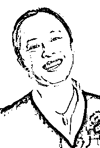** 

**徐迪：国际个人教练、家庭关系教练、心灵成长团体带领者、国际完形治疗认证治疗师。**

徐迪毕业于中央戏剧学院，出于对心理学的追求和对现代人心理困境的理解，透过自我探索和心灵成长，亲身体验了经典精神分析、团体小组、家庭系统排列，以及呼吸冥想和催眠静心等身心合一工作给自己带来的帮助；自 2006 年起密集地参加了心理咨询师的培训和督导，之后开始探索把心理学治疗技术、团队教练技术、戏剧治疗和身心灵修炼相结合，致力成为一个纯粹的为生命服务的分享者。 

徐迪觉察敏锐逻辑清晰，语言表达生动富有画面感，是一位拥有丰富实战经验的个人教练。

如何参与：

**公益价格**：1.99 元 

**开课日期：**12 月 07 日 20:00-21:00

**授课形式：**在线直播

**报名及听课**：点击左下角**阅读原文**，即可报名！或登陆 “跟谁学” APP 或者 PC 端上搜索“倾听一小时”

主办方介绍：

此次课程由北京尚善公益基金、浙江敦和慈善基金会和心探索共同呈现。

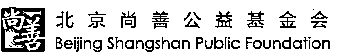
北京尚善公益基金会成立于 2012 年 10 月 25 日，是国内首家关注精神健康，抑郁症防治与知识普及的公益基金会。


浙江敦和慈善基金会，致力于中国慈善事业的规范和繁荣发展，以慈善事业推动社会的和谐与进步，让更多需要帮助的人得到温暖，用心关爱每一个人，用爱关心每一天。


心探索是一个心灵成长自助网站，致力于向个人和企业提供心灵成长解决方案，倡导从心出发，创造美好的生活。

协办方介绍：

**裂帛·向内行走** 

原创设计品牌 主张：人生需要裂帛的勇气

**若道占星**

国际占星研究协会（ISAR） 中国唯一指定教学机构

**彩虹书吧**

分享、学习、疗愈、成长，开启卓越精彩人生的公益平台

**万大酵素**

全身心的爱服务健康

**睿智人生心灵成长学院**

专注于身体智慧开发

**“如果有人倾听你，不对你评头论足，不替你担惊受怕，也不想改变你，这真是叹为观止——当有人倾听的时候，那些看似无法解决的问题就变得可以解决了；当一个人被倾听的时候，那些看似无法化解的困惑就转化成了相对清晰流畅的思绪。我曾经深深地体验过其中让我感到敏锐、同感和专注倾听的时光。”**

**——卡尔·罗杰斯**

愿你是那个被倾听的以及懂得倾听的幸福的人。

点击左下角**阅读原文**，即可报名呦！


# 顺势疗法的药物如何重塑生命力？（上）

> 原文：[`mp.weixin.qq.com/s?__biz=MzA5NjA0NTAxNg==&mid=401087779&idx=2&sn=75e5ef7e354939057d30e8b7f422efec&chksm=02aaaf9435dd26827dfe676a39e441e1665cf0730650e725701416a64b4af1a0192b63b63e10&scene=126&sessionid=1692738902#rd`](http://mp.weixin.qq.com/s?__biz=MzA5NjA0NTAxNg==&mid=401087779&idx=2&sn=75e5ef7e354939057d30e8b7f422efec&chksm=02aaaf9435dd26827dfe676a39e441e1665cf0730650e725701416a64b4af1a0192b63b63e10&scene=126&sessionid=1692738902#rd)

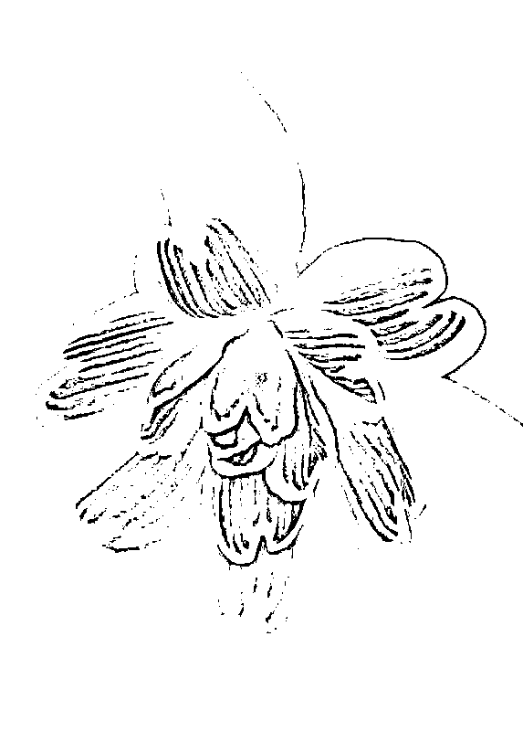

来源/homeopathyplus 网站

翻译/李含 校对/王宏

苏·汤普金斯老师讲授的“[顺势疗法家庭急救治疗及保健课程”](http://mp.weixin.qq.com/s?__biz=MzA5NjA0NTAxNg==&mid=400017180&idx=2&sn=845f6885f0197a6a97ea265d9bc638ab&scene=21#wechat_redirect)（点击可查看），即将于 12 月 2 日开课。**顺势疗法运用同类法则进行治疗，**通过寻找并开出可以在健康人身上产生与身体不适者所体验的类似症状的物质，顺势疗法可以治疗大量的急性和慢性健康问题。**这些物质被称为药物，通常以“势能化”的形式开出，以增强其疗效。**它们安全地将原物质的能量信息带到体内，去触发生命力的自愈反应，而生命力可以让患者重返健康。

**什么是势能化？**

顺势疗法的创始人塞缪尔·哈内曼发明了一种稀释的制剂法。首先，把某种物质在酒精中浸泡几个星期，过滤浸泡液得到该物质的“母酊剂"。然后，使用一些母酊剂通过用水反复的稀释和强烈的摇动（震荡），得到最终的药剂。顺势疗法医师声称使用这种方法对药剂进行稀释和震荡实际上能够使它更加有效，似乎剧烈的摇动可以把能量传输到水中并且留下了对原始物质的记忆。根据稀释的次数，药剂能够得到不同的势能。常见的势能级别（以稀释次数增加的顺序）为 6c、12c、30c 和 200c。药剂的稀释次数越少（称为低势能），功效越小，作用持续时间越短。

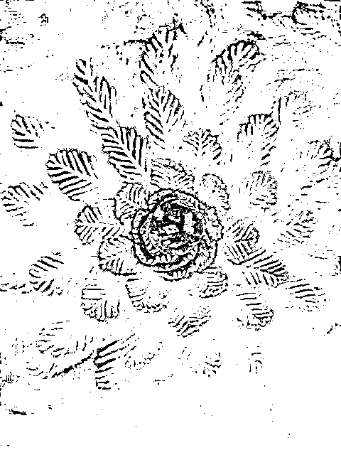

**自愈的产生在于纠正失衡**

生命力的自愈是如何发生的呢？身体的症状源自身体生物能量的失衡，顺势疗法的治疗方式就是纠正那种失衡。顺势疗法的创始人塞缪尔·哈内曼勾勒这样以最简单的形式描述：**不健康的症状是由体内生物能量的失衡与生命力努力纠正失衡之间的互相作用所导致的。**

**●** **用药物纠正失衡**

**因为这种失衡是能量型的，所以它只能用能量药物来纠正。**化学药品可以很好地抑制症状，但是却无法达到足够深的层面去纠正引发症状的能量失衡。要想真正解决问题，药物能够在健康人体中引发的症状必须与这些失衡类似。**如果失衡的症状只是被压制，那么能量的问题会日渐恶化，导致更严重的健康问题。**

**●** **势能化使药力更强**

药物如果要发挥效力也得在能量上强于失衡。势能化使得药力更强。当开出与症状相符且具有足够强大的势能的药物时，药物会消除失衡带来的较轻微的症状，以自身更强却短暂的症状取而代之。病人常常并未注意到这些情况。

**●** **症状消失生命力随之增强**

药物产生的相应新症状会替代之前失衡时的症状，但生命力并不能分辨二者的差异，结果就是它会平静地接纳因药物产生的新症状。随着药物效力的消失，它所叠加的症状也随之消失，只留下无病的状态。生命力发觉自己现在摆脱了最初的失衡症状，随着治疗症状消失，生命力恢复过来，就像是松开的弹簧一样。如此一来，人便恢复了健康。

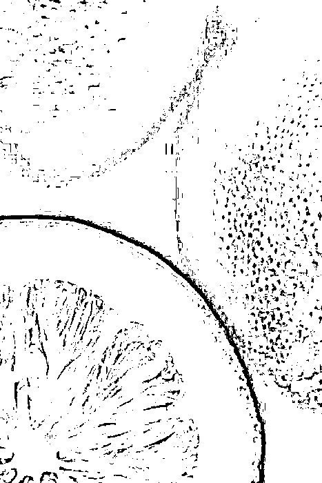

**患者生命力强时只需一剂药**

所以，为了恢复健康和平衡，其实发生了两件事：

● 第一，失衡的症状由于正确用药，症状消除、被取代。

● 第二，生命力的反弹效应随着药物所带来的暂时症状的消失而恢复了健康与平衡。

当这一过程发生在急性疾病，比如食物中毒或流感中时，患者康复只需要很短的时间。如果他们有着很强的生命力，而且失衡是近期的或轻微的，那么完全恢复只需一剂药就能达成。下面案例中凯德的故事就可为例。

**案例：午夜发病**

三岁的凯德午夜刚过便醒来哭泣。他焦虑、害怕、不安。他的母亲看了看他，知道他状况不妙。他一边脸颊发红，扁桃腺红肿，他的皮肤发热、发干。温度计测量他的体温是 39.6°C。她按照家用药箱中的指导给他服用了一剂顺势疗法药物，乌头。不到 10 分钟，凯德退烧了，出了一身汗。他的母亲把他擦干，用毯子裹着他，然后坐在他身边。20 分钟后，他睡熟了。第二天，他起来玩耍，就好似从未生过病。

**医师点评**：凯德的妈妈选择了正确的处方。乌头对于迅速出现不安和焦虑这类强烈症状的疾病初发阶段很有效。凯德的所有症状与对乌头进行药物试验时所产生的症状类似。他在服用一剂药物之后快速恢复，这表明他的生命力很强，而且处方对症。

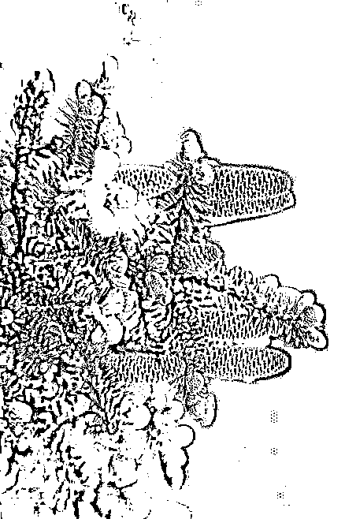

**患者生命力弱时需要多剂量药物**

然而，随着我们年龄的增长，我们的生命力会变弱，任何失衡都会加强，在我们短暂急性疾病的基础上又有了持续的慢性疾病。在这一阶段，一剂药就可完全恢复的情况很少见。

● 它可能会暂时在一定程度上消除失衡的症状，并激活生命力的惰性反应，但也仅仅如此而已。

**● 一旦体内的药效消失，失衡就会全面归来。**

在这种常见的情况下，需要多剂量的药物温和地促使患者恢复健康，正如以下案例中亚利克斯的情况。

**案例：热、痒和胀气**

36 岁的亚历克斯症状混杂。他受到失眠的困扰，并饱受口臭、胃灼热、肠胃胀气和痔疮的折磨。他经常鼻窦发炎，在春夏他频发的花粉热会发展成哮喘。他的皮肤干燥瘙痒，他的嘴角开裂。亚历克斯从来不觉得冷，他在夜里把脚伸出毯子让脚凉下来，甚至在冬天也是如此。他也喜欢咖喱和甜食。精神、情绪方面的症状包括令人瘫软的恐高症和死亡恐惧。这些症状大部分自童年起伴随他至今。亚历克斯在接下来的三个月里服用了具有一系列势能的顺势疗法药物硫磺，在此期间他的症状完全消失了。

**医师点评**：亚历克斯很幸运，他的症状与对硫磺进行药物试验时试验者所体验到的症状相似。这是很容易开出的药。亚历克斯很快就对治疗有所反应，在第一剂药物服下后他的许多症状都有所改善。每一次他旧病复发，或改善停滞时，他就服下另一剂药。在那三个月期间需要用到四种不同势能的硫磺。没有添加其他药物，因为在他的治疗过程中没有发展出新的症状。如今，他的症状已经消失，他也停用硫磺了。

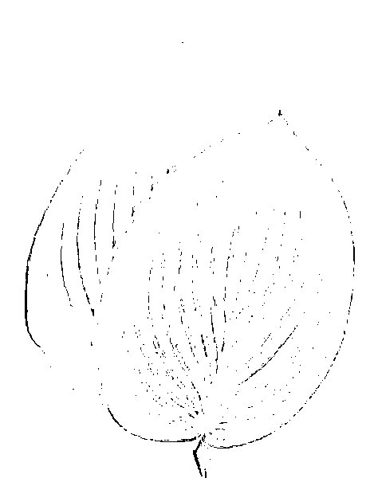

★未完待续。本文后续部分会重点讲解生命力是如何被增强的，敬请期待！

**更多有关顺势疗法的传送门**

**科普篇**

[科普 | 顺势疗法和其他药物疗法的异同](http://mp.weixin.qq.com/s?__biz=MzA5NjA0NTAxNg==&mid=400555588&idx=2&sn=3eefa20f53ad362e6f0ef18f2829ee9e&scene=21#wechat_redirect)

[对待疾病 | 姑息它，压制它，还是治愈它？](http://mp.weixin.qq.com/s?__biz=MzA5NjA0NTAxNg==&mid=400605043&idx=1&sn=a0f8e724b556cdc49530a5a66c0e85d6&scene=21#wechat_redirect)

[送你急救箱，救自己救家人还能救宠物](http://mp.weixin.qq.com/s?__biz=MzA5NjA0NTAxNg==&mid=400181530&idx=1&sn=5b5510e4d43ef54ae0f3f56441d1ac65&scene=21#wechat_redirect)

[顺势疗法，皇室钟爱的疗愈方法](http://mp.weixin.qq.com/s?__biz=MzA5NjA0NTAxNg==&mid=400017180&idx=1&sn=286860583aa755e5fe5a6eac534008cb&scene=21#wechat_redirect)

[它在世界上排名第二，它治人不治病](http://mp.weixin.qq.com/s?__biz=MzA5NjA0NTAxNg==&mid=400153889&idx=1&sn=2dd034cb37b11e5765bd170addd1f960&scene=21#wechat_redirect)

**案例篇**

[顺势疗法治好了他的自闭症！](http://mp.weixin.qq.com/s?__biz=MzA5NjA0NTAxNg==&mid=400921710&idx=2&sn=94af25e6399ca49525ddbd11dc61bbb1&scene=21#wechat_redirect)

[不用再手术，肾结石轻松搞定！](http://mp.weixin.qq.com/s?__biz=MzA5NjA0NTAxNg==&mid=400879915&idx=2&sn=71944f0c596042332924e0de8c7bcf63&scene=21#wechat_redirect)

[这个婴儿频繁夜惊、惧怕男性，现在都好了](http://mp.weixin.qq.com/s?__biz=MzA5NjA0NTAxNg==&mid=400901918&idx=2&sn=2c39821aa322bddc9d12dc6c8b128556&scene=21#wechat_redirect)

[顺势疗法 | 它帮助抚平心理创伤和悲痛](http://mp.weixin.qq.com/s?__biz=MzA5NjA0NTAxNg==&mid=400858503&idx=2&sn=8ed07f16cdc736af776dce34aa9232cd&scene=21#wechat_redirect)

[50 年的鼻窦炎好了！](http://mp.weixin.qq.com/s?__biz=MzA5NjA0NTAxNg==&mid=400750777&idx=2&sn=e5dba7e9508a9ed7ec0dd18d445182c9&scene=21#wechat_redirect)

[孕妈选对药方，保护了自己和宝宝](http://mp.weixin.qq.com/s?__biz=MzA5NjA0NTAxNg==&mid=400721730&idx=2&sn=3b907efec5851b08f1fc3e74be31c2e8&scene=21#wechat_redirect)

[一瓶药丸治好了困扰我四年的各种病症](http://mp.weixin.qq.com/s?__biz=MzA5NjA0NTAxNg==&mid=400555588&idx=1&sn=9d860beaa15bc1b9e6c627e1d3369afa&scene=21#wechat_redirect)

[为了宝宝，我选择顺势疗法](http://mp.weixin.qq.com/s?__biz=MzA5NjA0NTAxNg==&mid=400490938&idx=2&sn=9ae026781f9119936ade05b2dc66655f#wechat_redirect)

[过敏、扭伤、关节炎、痛经、宠物疾病……全搞定！](http://mp.weixin.qq.com/s?__biz=MzA5NjA0NTAxNg==&mid=400260655&idx=1&sn=854005f3b4c5846959ece35907a94dba&scene=21#wechat_redirect)

* * *

**特别提醒：**希望将若道文章转载到各自公众号的朋友，**转载时请注明“转自若道微信公众平台”，并附上若道占星的 Logo**。谢谢！

**2015 年 12 月 2 日，**由**苏**·汤普金斯老师****亲授的**顺势疗法课程即将开课**。******顺势疗法**是目前全球使用最广泛的自然医学疗法，**对个体的身体、精神和情绪三个层面进行治疗，加强个体自身免疫力，提升个体生命能量**。本课程为那些想要增加自我和家庭身体保健和疗愈能力的人所设置。****欲详细了解，请点击文末“**阅读原文**”。


# 射手座 | 执着于人生意义的二货最终成了智者，你呢？

> 原文：[`mp.weixin.qq.com/s?__biz=MzA5NjA0NTAxNg==&mid=401087779&idx=1&sn=6133b088645e5dbb27c7a8cf56bcc537&chksm=02aaaf9435dd2682b3cd7d7a54ac701ba4e1dbd328f7a70084d4ba157c7df6d64f69bc14de26&scene=126&sessionid=1692738902#rd`](http://mp.weixin.qq.com/s?__biz=MzA5NjA0NTAxNg==&mid=401087779&idx=1&sn=6133b088645e5dbb27c7a8cf56bcc537&chksm=02aaaf9435dd2682b3cd7d7a54ac701ba4e1dbd328f7a70084d4ba157c7df6d64f69bc14de26&scene=126&sessionid=1692738902#rd)

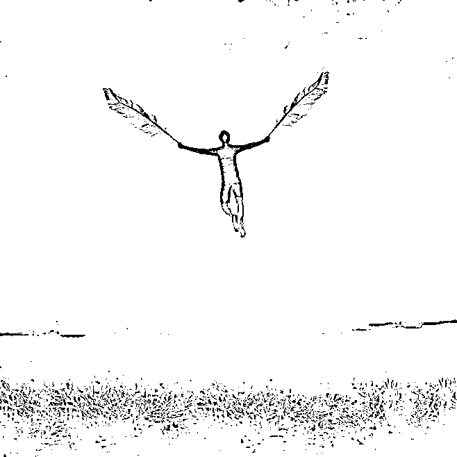

作者/大卫·瑞雷

译者/轩轩 校对/esme

11 月 22 日，当行进的太阳进入射手座，射手月来到了。大射手们，大家都好吗？一起来听听大卫·瑞雷讲射手座的成长吧，他可是月亮和上升点都在射手座的人，还生长在一个满是射手座亲人的家庭里，对这个星座特别了解！

**提示**

如果刚好你的太阳、月亮、上升点或其他出生图中的重要行星落入射手座，或者是与射手座“共振”的宫位被强调，本文将适用于你。不过别忘了，即使你的出生图中没有任何行星落入射手座，它仍是你星图中的一部分，会以某种方式对你产生影响。

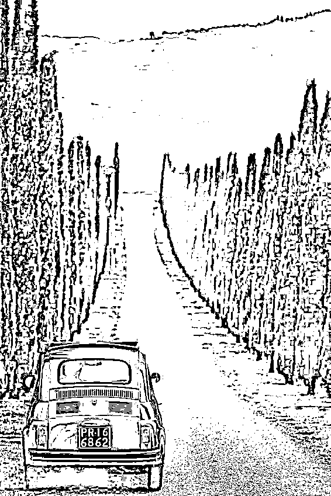

**射手座一生都在追寻生命意义**


为什么大家都用“**热情**”来形容太阳、月亮或上升点落在射手座的人呢？你可以简单地回答说热情是射手座的天性，也确实是这样。但是，如果我们把十二个黄道星座看作是始于白羊座止于双鱼座的生命阶段，射手座是位于天蝎座之后的星座，这一点可以带来很多启示。

就好像是射手座人兴奋地感叹：“哦！天啊！我死了，但是我仍然在这儿！”然后他又说：“怎么会这样呢？”就好像是**在经历了天蝎座的转变危机之后，射手座的行为被濒死体验所影响。这样的人通常都会在余生试着去处理这种深刻的体验，寻找可能的解释来加深他对这种体验的理解。**

他们会去读书上课，会去旅行，会回到大学读书，甚至会去写书、授课。这些行为都非常具有射手座的特点！这种**对意义的探索就是射手座乐此不疲的追求，即使这种探索是无意识的**。

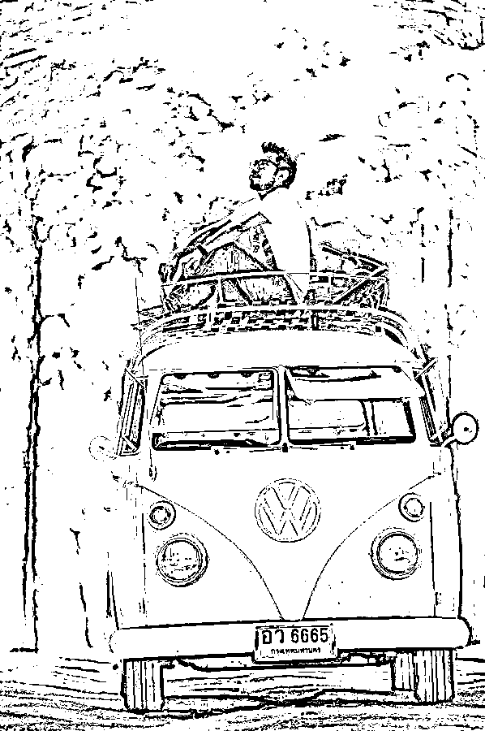 

**意外损失可使射手座觉醒**


将射手座人描绘成**热爱自由**是非常准确的。射手座是十二星座中最**狂热而无节制**的，就像正在度假的游客一样。射手座的人**看起来傻傻的，也经常笑，而且他从不会想要去伤害别人**。这就是射手座的“无意识”，仅仅是活着就让他们感觉到无比幸福，但是自己却不知道为什么。

如同射手座短暂失去了在天蝎座旅行时的记忆，像相信自己能从一切困难中存活下来一样地活着。在长城边缘跳舞时俯视那个深深的山谷，并不会让射手座人感到紧张。我的老师以前常说：“射手座人的幸运，是因为他们需要幸运，否则他们无法生存！”

这并不是说，射手座人能躲避不负责任造成的一切后果，也能躲开生活中遇到的所有挑战。射手座人在经历了意外损失之后，虽然依旧奔放，却开始忧伤，过去无忧无虑的射手座人可能会被深刻的绝望所笼罩，他们一边探索答案，一边反复问自己“为什么，为什么？”

**在经历了悲剧之后，“无意识”的射手座人可能会开始觉醒。**失去的记忆也开始苏醒。然后，愚钝也开始变成智慧。射手座人就这样变成了“智慧的愚者”，他可能比其他任何一个星座都更了解生存的“意义”。

然而，**在通往智慧的路上，射手座人可能会做出很多鲁莽的事，就像是在用一种显化的方式测试现实**。有趣的是，根据统计，在美国因为偷车兜风（短暂地偷取他人的机动车用于兜风）被捕的人当中，射手座人的比例最高。想要兜风的欲望，也就是想要自由的欲望，以及像度假的游客一样，以为法律管不到他们的感觉，经常让他们被警察抓个现行。

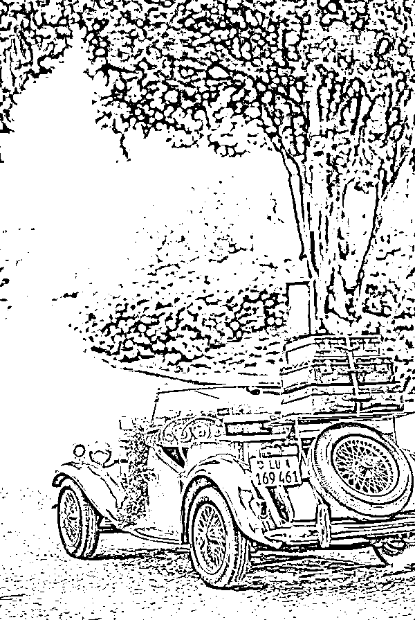 

**幽默是射手座智慧的出口**


对于意义的耿耿于怀并不会减少射手座人著名的幽默感，反而会让他们的笑容变得更深沉，让他们说的话更有道理。比如说，作家马克·吐温就是他所在时代的智者。同为射手座人的还有丘吉尔和喜剧演员电影制作人伍迪·艾伦。

伍迪·艾伦从高中就开始编写喜剧了。他的人生旅程从喜剧写作开始，之后成为单口喜剧演员，再开始拍摄史剧。这场旅行是与蛮横的人类本性和讽刺的人生搏斗的心灵之旅。早年，艾伦可能会这样讽刺他自己的射手座旅程：“值得去了解的事物都不能被心灵理解。”可是，这种对于知识的探索是一生的冒险。

我的射手座祖父以前常常开玩笑说“真相会给你自由，但是诚实却会给你和妻子的关系带来麻烦”。当然，他在面对他平凡的金牛座妻子时，总是“太过诚实”，他也会尽可能地取笑她。

我就是来自这样一个射手座家族。不仅我的祖父、母亲、舅舅都是太阳射手座，我的父亲、我最大的表兄、我的姐夫，以及我的两个继子的上升点都在射手座。我侄女的太阳、月亮和上升点都在射手座。我自己是月亮与上升点落在射手座。以前，在家庭聚会上，我们的笑声响彻天际，连太空中的宇航员都能听到。

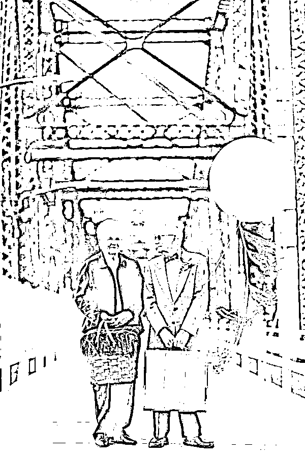 

**真相能让射手座会心一笑**


是的，**幽默和夸张是射手座的显著特征**。有学生曾经问我：“如果射手座人追求的是真理的话，那为什么他会夸大事实呢？”这样的一个问题很显然是将“真理”和“事实”等同了。根据我们上学时学过的科学思考过程，这样的想法是再自然不过的了。所谓事实，就是 2015 年 11 月 22 日，太阳升起的时间是北京时间 7：10，但是这个事实并不能决定这一天的“意义”。

虽然经历的意义对于每个人来说都是不一样，但是有的意义是大家都赞同的，**这种达成一致的意义和观点会让那些太阳、月亮或上升点在射手座的人非常兴奋**。这种热情就会造成射手座的夸张和幽默。我们嘲笑夸张的人因为他将“如此真实”的事情表达出来了。

**当射手座人看到真相在日常生活中运作的话，他们的脸上会浮现出会心一笑。**在拥挤的北京地铁上，你会看到茫然的甚至忧伤的表情，但在这些人当中，你偶尔也会看到有些人“会心一笑”，也许这些人的太阳、月亮或者上升点就落在射手座。

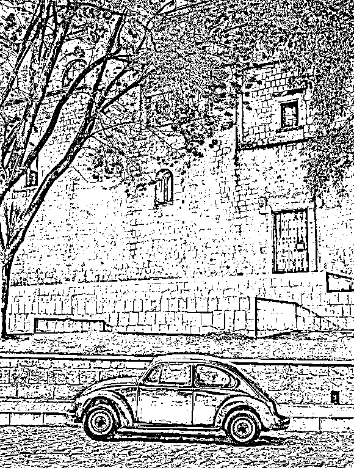 

**其他射手座文章的传送门：**

[射手座 | 兼具动物性和精神性](http://mp.weixin.qq.com/s?__biz=MzA5NjA0NTAxNg==&mid=400977179&idx=1&sn=b2f320192c9bfeb0501799ebe3a7a05e&scene=21#wechat_redirect)

[射手座 | 经历天蝎座的蜕变后，是时候放飞梦想了！](http://mp.weixin.qq.com/s?__biz=MzA5NjA0NTAxNg==&mid=400959662&idx=1&sn=735fdb83a92ab7cc38ccc694c6d27f12&scene=21#wechat_redirect)

* * *

**特别提醒：**希望将若道文章转载到各自公众号的朋友，**转载时请注明“转自若道微信公众平台”，并附上若道占星的 Logo**。谢谢！

**12 月 1 日****，**由**大卫**·瑞雷老师****主讲的****若道占星核心课程[第四阶（Level 4)](http://mp.weixin.qq.com/s?__biz=MzA5NjA0NTAxNg==&mid=401009669&idx=3&sn=03514b2d902d9539a7c51a9a0faab9af&scene=21#wechat_redirect)**（点击可查看）**即将开课。**大卫老师会分别讲解如何通过出生星图进行性格分析********、爱情解读、事业分析。******了解**Level 4 课程**详情，请点击文末“**阅读原文**”。


# 选择感恩，就是选择帮助自己

> 原文：[`mp.weixin.qq.com/s?__biz=MzA5NjA0NTAxNg==&mid=401049069&idx=1&sn=a7d0b72d9f20f1a955a42eac0335551a&chksm=02a5375a35d2be4c619158c15778dccbfdfaa7b07cc8dd6382c395866c3db3b14d859091a674&scene=126&sessionid=1692738902#rd`](http://mp.weixin.qq.com/s?__biz=MzA5NjA0NTAxNg==&mid=401049069&idx=1&sn=a7d0b72d9f20f1a955a42eac0335551a&chksm=02a5375a35d2be4c619158c15778dccbfdfaa7b07cc8dd6382c395866c3db3b14d859091a674&scene=126&sessionid=1692738902#rd)

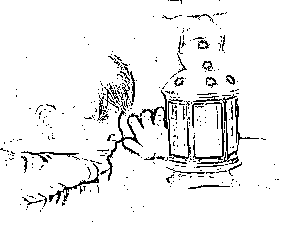

**今天双子座满月，恰逢感恩节，若道占星创始人蒋颖有很多感恩的话要说。**

有时候我会想自己是否是一个懂得感恩的人。我发现自己，在快乐的时候容易感恩；而生活不顺的时候，则很难去感恩。因为全部的精力都用于面对不顺，在处境艰难之时，抱怨和沮丧比感恩要来得容易得多，不论是抱怨自己还是他人。

我第一次了解感恩是在一次和妈妈的对话中。那时，我刚刚开始了解心理学，了解童年对一个人的影响。当时，每当遇到生活的困境，我就容易将其归咎于童年，怨恨家里人做错的每一件事，怨恨这些事对我造成的伤害。这种情况持续了相当长的时间。那次，又有一件事情触发了我的怨恨，我开始对着父母冷嘲热讽。突然妈妈说了一句话：“听起来你所有不好的性格都是我们造成的，而你所有的优点都是你自己的，好像是从石头缝里蹦出来的。”

我的月亮不愧在水瓶座，我的老妈没有什么心理学知识，但她非常聪明地指出了我理论中非常不合逻辑的一点，好像一个小锤子敲了一下我的脑袋。然后，我立刻就闭嘴了。

当时，我还不知道，**一个人成人以后，最重要的事，就是自己为一切负责的态度，不抱怨任何外境和他人**。那时我也还没有学习占星学，不知道**生命自有其计划，生命中发生的一切自有其意义**。

不过，老妈的话将我重新拉到了一个更为中立的立场，并且引发我的思考：我所有的优点，所有在我身上发生的好事情，都源自于我一个人的才华和努力吗？

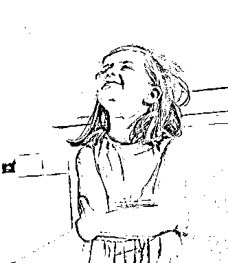 

从那个时候，我开始了解，从客观的角度讲，人需要感恩。

再后来，我又有几次被深深触动，体会到了感恩。有时候，就是一个人，突然间被什么触动，然后有一种感恩之情涌上来，就觉得从心底感谢所有的人。感恩父母和先人，感恩所有帮助我的人，感恩过去对我带来伤害的人，感恩曾经的困难处境，感恩窗外的花草树木。

当处于感恩中时，真的是一种深深的感动和幸福，好像自己被所有人保佑、帮助、祝福着；也能感觉到每一个生命的挣扎和痛苦，也感觉到了他们在这种挣扎和痛苦中，尽到了自己最大的努力在表达爱；也因为这种感恩之情，感觉和万事万物的联结，我的呼吸和所有生命的呼吸连在一起，被保佑和祝福着。

感觉生命的计划以一种我们所不了解的微妙方式展开着，这些人、事、物在我的生命旅途之中，不是偶然。但**这并非偶然的相遇自有其深意，在短短的一生中，多么值得珍视。感恩，会觉得被更大的存在所佑护**。感恩如同冬日的阳光，不用很多，就可以融化怨恨、嫉妒、抑郁、自怨自艾这些负面情绪的坚冰，让人的内心温暖；感恩又如同春水，缓缓溪流可以扑灭愤怒的火焰。

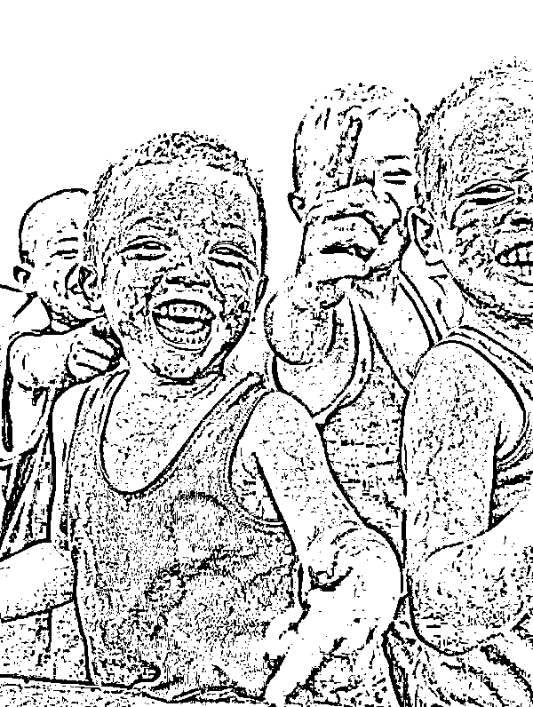 

有了这样的体验后，我就明白了感恩的一个道理。感恩并非为别人，最大的受益者是自己。因为，我们自己是负面情绪的最大受害者。而感恩，则让我们心里如此温暖，放松地将灵魂和身体安顿在大地上。

当然，在生活不顺利的时候，感恩并不容易。比如，今天早晨，我有很多亟待解决的问题。当我看到某个群里大家发的感恩的话，我自己也想发，但心里却郁结着一些情绪，觉得说一句感恩的话很容易，但真心真意做到感恩，不容易。可是，我明白感恩的好处。所以就想找一个我真心感谢、没有任何情感纠结，一点不费力就可以感谢的人表达感恩吧。我不必要勉强自己去感恩，也不必要苛责自己没有感恩之心。

于是，很神奇地，从一个可以轻松感谢的人开始，慢慢地，感恩之河开始流淌了，心情也觉得快乐起来。**虽然情绪的河流里还有一些石块在阻碍感恩的流水，但是从一个最容易流淌的地方让它开始流动，是我们可以去做的一个选择。**

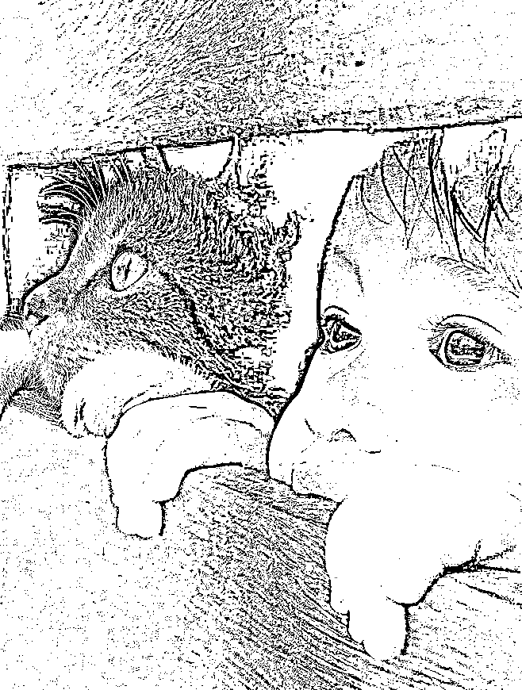

今天感恩节，不知道看到文章的你们，是开心，还是不开心；是能够沉浸在感恩的情绪中，还是不能。不管怎样，感恩是一种选择，当你去这样选择，就是在做一件美好的事情，就是在帮助你自己。

我也借这样一篇文章，感谢所有在占星的道路上支持我们的朋友，感谢引领我入门的大卫老师，感谢我曾经的和现在的所有同事，感谢所有占星学的前辈们，感谢所有参与我们课程的同学们。感谢你们，祝福你们！

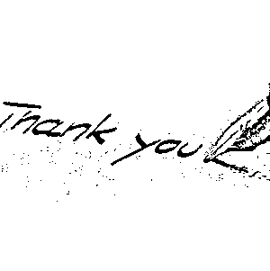 

* * *

**12 月 1 日****，**由**大卫**·瑞雷老师****主讲的****若道占星核心课****程****[Level 4](http://mp.weixin.qq.com/s?__biz=MzA5NjA0NTAxNg==&mid=400203022&idx=2&sn=3518c0e8db3d8b01d99a055ff8c19869&scene=21#wechat_redirect)（点击可查看）****即将开课。**大卫老师会分别讲解如何通过出生星图进行性格分析********、爱情解读、事业分析。******了解**Level 4 课程**详情，请点击文末“**阅读原文**”。


# 倒计时·6 | 学完 Level 4，星图综合解读没问题~

> 原文：[`mp.weixin.qq.com/s?__biz=MzA5NjA0NTAxNg==&mid=401049069&idx=3&sn=270e912f3c9284d141b37f59be47efdc&chksm=02a5375a35d2be4cd167fc878b2311438bf8fb15c3870ce69b755db38f23d85e447198889a3f&scene=126&sessionid=1692738902#rd`](http://mp.weixin.qq.com/s?__biz=MzA5NjA0NTAxNg==&mid=401049069&idx=3&sn=270e912f3c9284d141b37f59be47efdc&chksm=02a5375a35d2be4cd167fc878b2311438bf8fb15c3870ce69b755db38f23d85e447198889a3f&scene=126&sessionid=1692738902#rd)

**课程信息**

开课时间：2015 年 12 月 1 日-2016 年 3 月 15 日

讲师：大卫·瑞雷

讲课城市：网络视频

费用(元)：6000

报名截止：2015 年 11 月 20 日

课程负责人：李老师  联系方式：010-58263061/010-56629907

**2015 年度若道新推出的专业占星课程分为五个级别，本课程属于若道专业占星课程第四级别，****Level 4****课程****。**

**课程描述**

**若道占星核心课程系列 Level 4**

**星图舞会——星图综合解读 24 小时**

在这个阶段，你终于可以学会星图的综合解读了！

前一阶段所有学到的越扎实，现在就越开心。你可以看到，当那些行星、星座、宫位、相位穿起来的丝线开始跳舞，一个个故事图景就像织锦一样展现在你的面前。个性、爱情、事业，看到一个人的出生星图，你就可以开始讲他们生命故事的梗概了。这里大卫老师会分别讲解如何通过出生星图进行性格分析、爱情解读、事业分析。在爱情解读部分，你还会提前学到比对图。

这个课程结束后，你就可以练习解读出生星图的重要问题了。

**授课内容**

**星图综合解读——性格分析**

**星图综合解读——爱情（出生图）**

**星图综合解读——爱情（比对图）**

**星图综合解读——职业**

在整个教学过程中，不仅用名人案例讲解，而且将会抽取同学星图，演示如何就爱情议题、职业咨询议题进行咨询示范。

**课程时间**

授课时间：2015 年 12 月 1 日-2016 年 3 月 15 日

每周二晚上 20：00-22:00 （北京时间），共计 12 次课

**授课形式**

1. 网络教学：网络视频会议系统上的在线课程和答疑辅导，只要有上网的条件在世界各地都可以上课，无地域限制。北京同学可以到若道办公室现场上课。

2. 中英文双语授课，专业占星口译员中文翻译。

3. 每次课后都有助教在线答疑。

4. 每月组织沙龙互动练习。

**教学优势**

**作为国际占星研究协会（ISAR）在中国唯一指定的教学机构，我们有：**

**专业师资（国内最专业）：**

1.国际一流名师：大卫•瑞雷 40 年占星咨询和教学经验，4 年中国本土化教学经验，无保留传授。

2.职业占星师助教：我们的助教，均为 ISAR 认证职业占星师或大卫老师职业占星师资质班优秀毕业生。

3.专业翻译：擅长占星的英文翻译，完全不懂英文的同学也可以聆听大师的教诲。

**系统教学（国内最完善）：**

1.学习路径：完整的知识结构，清晰的知识点，大量案例展示、咨询示范。

2.心法传授：大卫老师 40 年实战咨询经验，绝非仅靠读书就可以获得。

3.实战练习：在 Level 5 将组织实战练习，为开启咨询之路做好准备。

**完美互动（国内最丰富）：**

1.与名师面对面：北京同学可以来若道现场上课，和大卫老师面对面互动。大卫老师也可能前往主要学员所在城市，实现零距离教学。

2.互动答疑：论坛、QQ 群随时提问；老师课上答疑；助教线上线下全程协助。

3.线下沙龙：定期举办沙龙活动，复习上课内容。

4.强大的同学网络：若道作为中国最顶尖的占星教学机构，在 4 年的占星教学中，培养了很多占星人才。若道让你和师兄师姐切磋，让你和国内著名占星师学习。（简单来说，就是，人脉！）

**配套支持（国内最方便）：**

1.先进的教学平台：网络教学平台，支持手机、电脑、iPad 上网，可以随时随地学习。

2.回放复习：学员可登录网站收看课程回放，在线复习课程，每次课可完整重看 3 次，1 个月内有效。

**报名和付款**

课程费用：6000 元　

请在点击页面左下方“**阅读原文**”报名，以及在线完成学费支付。

咨询请拨打电话 010-56629907　

或课服 QQ：4006191014 （若道星文化）
或直接写信给 nodoor@vip.126.com，我们会回复您的疑问。 网页报名后无法进行在线支付的同学，可以通过银行汇款的方式支付课程费用。

汇款信息：蒋颖　6226 0901 0424 5721　招商银行北京中关村支行　

或支付宝：nodoor@yeah.net
请在汇款备注中写上自己的名字和所报课程，方便我们核对。

**退课与转课**

课程付费后，因个人原因无法参加通过邮件申请退款，开课前 3 天内可以全款退回。
开课后，若想申请退课或转课，请在第二节课前提交书面申请至 nodoor@vip.126.com。
退款和转课金额统一按 80%执行；
若课程进行到第二次后，不再接受退款或转课申请。

**大卫•瑞雷简介**


> 美国资深职业占星师。1970 年开始学习占星学，在通过亚特兰大职业占星委员会的考试后，于 1976 年获得执业许可，成为一名专职占星师。年过六旬的大卫老师，曾两任亚特兰大占星协会主席，是全美占星师联盟（AFAN）、美国占星师联合会（AFA）、全美占星研究委员会（NCGR）、国际占星研究协会（ISAR）和职业占星师组织（OPA）的成员，是联合占星大会（UAC, United Astrology Conference）督导委员会委员。
> 
> 大卫老师曾是 CNN、CBS 的占星节目的常驻嘉宾，多次在 BBC、WGS、WSB、WRGG 等节目中接受采访，并在亚特兰大主持电视节目《每日行星（Daily Planets）》达 4 年之久。至今已研究占星四十余年，拥有三十多年的占星咨询的执业经验，其服务客户包括学生、工人、市长、州长、议会议员、企业家、心理咨询师、工程师、艺术家、演员、知名企业家等，客户年龄跨度从襁褓婴儿到耄耋老人。2010 年 6 月，大卫的书《灵魂的目标》中文版出版。在 2011 年春季的北京之行期间，大卫接受了《南方周末》记者的采访，同时参与了 CCTV9 的纪录片的拍摄。
> 
> 大卫老师热爱教学，愿意将自己的毕生所学倾囊相授。为了将纯正的西方占星学带入中国、为了让更多的中国人从占星中获益，大卫老师在占星学的传授上投入了巨大的热情与心血。他以后每年将有一半的时间在中国度过，中国将成为他的第二个家。


# 占星学与感恩节

> 原文：[`mp.weixin.qq.com/s?__biz=MzA5NjA0NTAxNg==&mid=401049069&idx=2&sn=a34a308a03f38778bf78d692d891d5f1&chksm=02a5375a35d2be4c7feffe3c074ec8406890396d45eaa5d9c02b0d961d79a9005f2098899044&scene=126&sessionid=1692738902#rd`](http://mp.weixin.qq.com/s?__biz=MzA5NjA0NTAxNg==&mid=401049069&idx=2&sn=a34a308a03f38778bf78d692d891d5f1&chksm=02a5375a35d2be4c7feffe3c074ec8406890396d45eaa5d9c02b0d961d79a9005f2098899044&scene=126&sessionid=1692738902#rd)

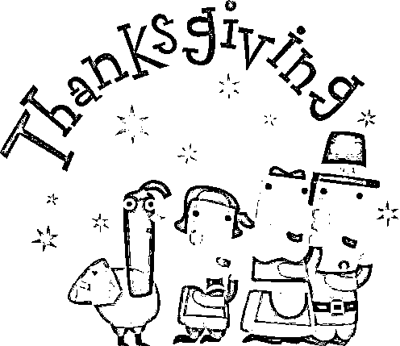

作者/杰夫·焦耳

译者/轩轩 校对/江艺

今天是西方的感恩节，已故占星师杰夫·焦耳在 2013 年的一篇旧文中阐述了感恩节与射手座及木星的关系，并提醒在感恩的人们，要注意它们的阴影面。

占星学的影响渗透多个方面

占星学已经深深渗入了全世界的各种文化中。虽然各有不同的技巧和系统，但是不管在哪里，占星学象征符号的基本含义都是相似的。比如，不管是西方占星学，还是印度的吠陀占星学，都认为金星代表爱和吸引，而火星代表行动和攻击。

占星学对语言的影响也是显而易见的。比如说“consider”（考虑）意思是与星星保持一致（con=和……一致，sider=星星），而它的对立面是“disaster”（灾难）（dis=不利的，aster=星星）。“mercurial”（雄辩机智的）这个词来源于“Mercury”（水星），“martial”（好战的）来源于“Mars”（火星），“saturnine”（阴郁的）来源于“Saturn”（土星），这些词都反映出相应行星的特质。

一周七天也是日常生活和宇宙相互关联的最古老的例子之一。周一（Monday），当然就是月亮日（Moon），周六（Saturday）是土星日（Saturn），周日（Sunday）是太阳日（Sun）。其余几天的行星关联对于那些不熟悉北欧和日耳曼神话的人来说就没有那么明显了。

在以拉丁语为基础的语言中，这种联系会更加清晰。比如，法语中周二是 Mardi，与火星（Mars）相关，周三 Mercredi 与水星（Mercury）相关，周四 Jeudi 与木星（Jupiter）有关，周五 Vendredi 与金星（Venus）相关。挪威语中周二是 Tiw 或 Tyr，周三是 Woden，周四是 Thor，周五是 Freyja。

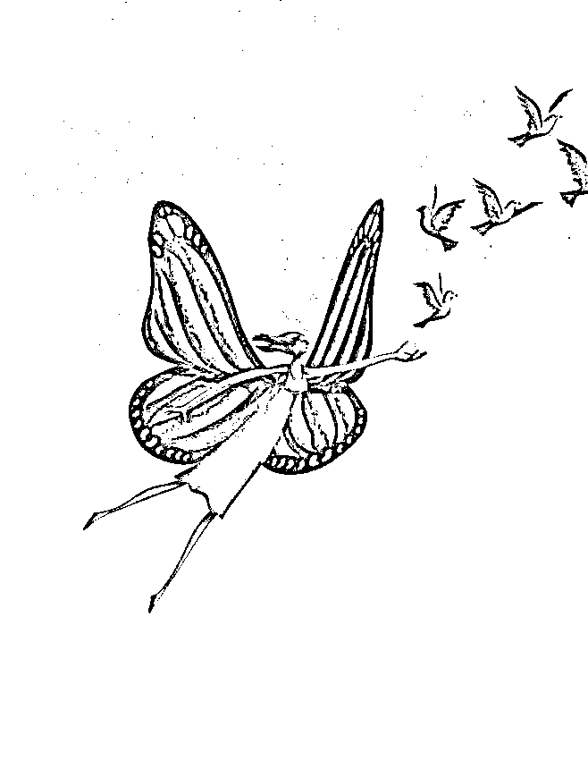 

感恩节与占星学的关系

一周七天的命名虽然很古老，但今天，在相对“年轻”的美国节日中有着非常重要的地位——感恩节。感恩节通常在 11 月的第四个周四（周三之后）。**这个特定日期将两个占星学符号联系在一起，共同描述了这个美国最神圣的世俗节日。**

**感恩节的时候，太阳通常都在射手座，木星（周四）是射手座的关键或守护行星。射手座和木星都和扩张、乐观有关，这正是感恩节的特质。**

另一方面，虽然感恩生命的赐予是非常高尚的观念，但我们经常忽视了这个故事中不太愉悦的一面。

射手座和木星不仅与高期望有关，同时也与伪善有关。它们描绘美好前景的共同渴望往往忽视了在欧洲祖先占领这块土地时，美国土著人曾遭受过的苦难和流离失所。射手座还有宗教的一面：他们倾向于赞扬其信仰的美好，而不是去履行最高准则。**我们可能忽视周边环境中的苦难，这便是木星以及射手座信仰较高真理的阴影面。**

对于那些要庆祝感恩节的人，占星的象征性语言提醒你们想想那些没那么幸运的人们。赫尔墨斯主义的古老格言“上行下效”（As Above So Below）常被用来描述天地之间的占星学联系。但是在道德和精神的层面上，它还提醒着我们：最崇高的信仰和志向（上）并不是简单的信条，而是我们在地球上的生活指南（下）。

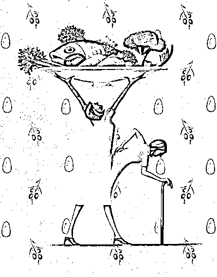 

* * *

**特别提醒：**希望将若道文章转载到各自公众号的朋友，**转载时请注明“转自若道微信公众平台”，并附上若道占星的 Logo**。谢谢！

**12 月 1 日****，**由**大卫**·瑞雷老师****主讲的****若道占星核心课****程****[Level 4](http://mp.weixin.qq.com/s?__biz=MzA5NjA0NTAxNg==&mid=400203022&idx=2&sn=3518c0e8db3d8b01d99a055ff8c19869&scene=21#wechat_redirect)（点击可查看）****即将开课。**大卫老师会分别讲解如何通过出生星图进行性格分析********、爱情解读、事业分析。******了解**Level 4 课程**详情，请点击文末“**阅读原文**”。


# 双子座满月 | 你心中的巴别塔

> 原文：[`mp.weixin.qq.com/s?__biz=MzA5NjA0NTAxNg==&mid=401041691&idx=1&sn=066a56f8b26a55a0cd88b83919fae24a&chksm=02a5dbac35d252ba114b744d783f5d53a3a639796637792259571836241c8311cb16637cfd6c&scene=126&sessionid=1692738902#rd`](http://mp.weixin.qq.com/s?__biz=MzA5NjA0NTAxNg==&mid=401041691&idx=1&sn=066a56f8b26a55a0cd88b83919fae24a&chksm=02a5dbac35d252ba114b744d783f5d53a3a639796637792259571836241c8311cb16637cfd6c&scene=126&sessionid=1692738902#rd)

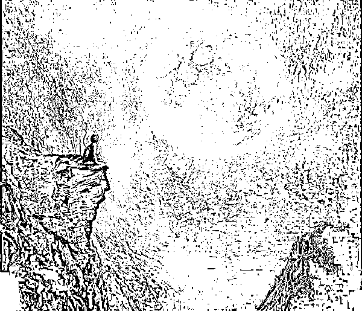

**明天早上 6:44，双子座满月来临。月亮在双子座 3 度 20 分，对分射手座的太阳。此次满月让我们有机会看到不同的观点，意识到理解“不同声音”的必要性。**

**双子座满月****聆听不同的观点**

满月，通常意味着完结、高潮、盛极而衰，或转变的时刻。满月期间我们容易迎来冲突性的事件或大幅的情绪波动。但满月的本质，是“对立”，是两个方向上的能量彼此拉扯的紧张感。当满月发生在强调知识的获取与意识提升的双子座-射手座轴线，它带来的激荡，将更多体现在头脑或意识的兴奋感上。

**双子座满月，让我们有机会看到不同观点的合理性，意识到与不同的声音保持沟通和理解的必要。**那些我们一直坚持却“不合时宜”的论调，此时有可能发生改变，**我们很有可能看到自己的思维与观点的僵化保守之处，从而对我们坚持个人主张的方式进行调整**。对于一些事物的“正确性”或“合理性”的看法，也会由于一些新观点或新信息的摄入而发生变化或动摇。

● 在心理层面上，这是开放头脑去聆听不同声音的时候，也是一个为个人理念寻找更有效的表达方式的时机。

● 在事件层面上，则很可能是观点分歧或口舌之争的爆发之时。如果感到自己不被理解，或觉得身边的人都是愚蠢之辈，那么或许应该反思下，是不是自己一直将自己困在了象牙塔里，而导致与世界沟通困难。

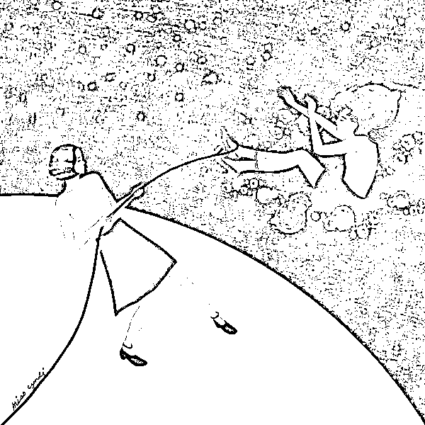 

**水星土星合相四分海王星****现实与理想的磨合**

与满月接近同时出现的，是水星与土星合相在射手座，并四分海王星。由于水土合相的度数与太阳非常接近，也可以认为是此四分相与满月形成了 T 三角。

土星与海王星的四分相，作为“舞台背景”为本次双子座满月定下了基调：现实与梦想的磨合。作为双子座守护星的水星，此刻非常及时地参与到了这个四分相中，进一步强调了在思维、想法、观念、沟通和表达方式方面，**我们必须要进行严肃的自我检验，以区分理想和幻想的不同**。

海王星带来混乱与迷惑的成分，变动星座 T 三角则增加了矛盾和分裂，**这是一个特别需要静心的满月**，但静心的目的，还是为了**更好地理清、坚定个人信念，以及为它找到能够被有效理解的表达方式**。

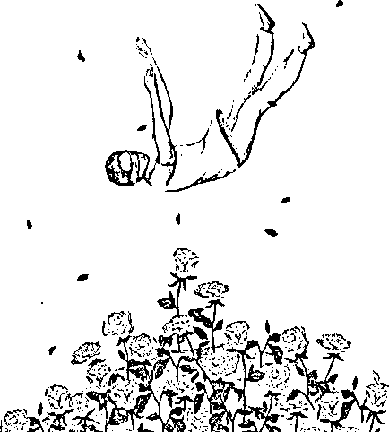 

**巴别塔的故事****学习“另一种语言”的重要性**

标题中的巴别塔，来自一则圣经故事，说的是，人类的祖先最初说的是同一种语言，他们定居于底格里斯河和幼发拉底河之间的肥沃土地，安居乐业，日子越过越好。他们决定修建一座可以通往天上的高塔，这就是巴别塔（又称通天塔）。上帝知道后，大怒，他决定让人类不再使用相同的语言，这样人们言语不通，就做不成（冒犯上帝的）大事了。

这是一个属于双子座的故事，它很好地说明了沟通和理解能够带来的力量，这种力量，会让上帝都畏惧。但有些遗憾的是，我们已经被上帝下了咒，无法通天。可见，学习“另一种语言”，还是很有必要，这也呼应了此次双子座满月的基调。


## **作者简介** 

**占星师 Cora**，全美占星师联盟（AFAN）成员，国际占星研究协会（ISAR）会员，获 ISAR 职业占星师资质认证，斯蒂芬·弗里斯特《变幻的天空》译者，个人星象文章见诸《心探索》《北京青年周刊》《上海电视》《空中生活》等杂志媒体。曾跟随大卫·瑞雷系统学习占星学，现为全职占星师。  

微信公众号：聆宇 FM（微信号：lingyudiantai）

个人微信号：CoraAstro

长按二维码，让金钱涌向传播知识与智慧的人~


* * *

**特别提醒：**希望将若道文章转载到各自公众号的朋友，**转载时请注明“转自若道微信公众平台”，并附上若道占星的 Logo**。谢谢！

**12 月 1 日****，**由**大卫**·瑞雷老师****主讲的****若道占星核心课程[Level 4](http://mp.weixin.qq.com/s?__biz=MzA5NjA0NTAxNg==&mid=400203022&idx=2&sn=3518c0e8db3d8b01d99a055ff8c19869&scene=21#wechat_redirect)（点击可查看）****即将开课。**大卫老师会分别讲解如何通过出生星图进行性格分析********、爱情解读、事业分析。******了解**Level 4 课程**详情，请点击文末“**阅读原文**”。


# 顺势疗法最常被问到的 9 个问题（下）

> 原文：[`mp.weixin.qq.com/s?__biz=MzA5NjA0NTAxNg==&mid=401041691&idx=2&sn=1dd9e1a8634f19bd322fa96fe59df3bc&chksm=02a5dbac35d252ba018e2eeadf6572538f9a86777c9d61960aeb68ee848f957dc483bd098cb9&scene=126&sessionid=1692738902#rd`](http://mp.weixin.qq.com/s?__biz=MzA5NjA0NTAxNg==&mid=401041691&idx=2&sn=1dd9e1a8634f19bd322fa96fe59df3bc&chksm=02a5dbac35d252ba018e2eeadf6572538f9a86777c9d61960aeb68ee848f957dc483bd098cb9&scene=126&sessionid=1692738902#rd)

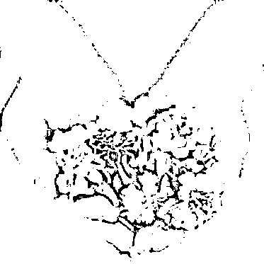

作者/戴纳·厄尔曼（公共卫生硕士）

译者/王宏

苏·汤普金斯老师讲授的“[顺势疗法家庭急救治疗及保健课程”](http://mp.weixin.qq.com/s?__biz=MzA5NjA0NTAxNg==&mid=400017180&idx=2&sn=845f6885f0197a6a97ea265d9bc638ab&scene=21#wechat_redirect)（点击可查看），即将于 12 月 2 日开课。昨天若道君发布了[《顺势疗法最常被问到的 9 个问题》的前四个问题](http://mp.weixin.qq.com/s?__biz=MzA5NjA0NTAxNg==&mid=401009669&idx=1&sn=82cf1d6fbc16a03ba8dabc16ae052b60&scene=21#wechat_redirect)（点击可查看），看了之后你对顺势疗法的了解是不是更进了一步呢？今天继续后面五个问题。

5 顺势疗法药物是安全的吗？

顺势疗法药物所采用的小剂量使得它们格外安全。当然，重要的是知晓如何开这些药物。我和斯蒂芬·卡明斯（Stephen Cummings）博士共同撰写的图书《每个人的顺势疗法药物指南》（*Everybody's Guide to Homeopathic Medicines*）（出版社：Jeremy Tarcher/Putnam，2004 年）提供了关于如何利用这些药物以及何时有必要寻求医疗护理的每一个步骤的信息。

顺势疗法药物被美国食品及药品管理局官方认可为“非处方药”，因此任何人无需处方就可以订购这些药物。因为它们被视为药品，所以其制造受美国食品及药品管理局的监管，以确保消费者所买即所得。

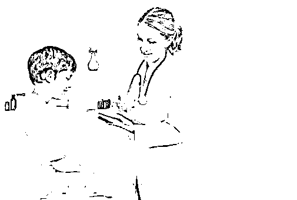 

6 如果一个人正在用顺势疗法药物，他是否可以同时使用传统药物？

可以同时用这两类药，尽管顺势疗法药物通常起效快、效果好，使得病人无需服用传统药物。然而，有些传统药物效力过强，它们会抑制顺势疗法药物起效。在这种情况下，病人必须决定自己是想用传统药物还是顺势疗法药物。

 

7 有一些按说只针对特定疾病的顺势疗法药物在健康食品店里售卖。如果说顺势疗法是依据个人情况而找到适合这个人的药物，那这些药物真的是顺势疗法药物吗？

可以在大多数健康食品店中找到的这些顺势疗法药物被称为“组合药物”或“配方药”，因为它们由 3 到 8 种不同的顺势疗法药物混合而成。各个制造商选择针对特定症状最常开出的药物，并假定其中之一会帮助治愈消费者所患的疾病。这些组合药物在美国和欧洲很受欢迎，因为它们很容易开出，也因为它们有效。正因为如此，顺势疗法的组合药物是“方便用户的”。同时，由于这些药物比传统药品要安全得多，所以它们总体而言受到越来越多消费者的青睐。

组合药物极为有用，但大多数职业顺势疗法医师都发现**针对个人情况而选择的药物往往通常更起效，且效果更加深入**。如果一个人仍然不知道如何选择个性化的顺势疗法药物，或是没有现成的药物，那各种各样的顺势疗法组合药物也都是极为有用的。然而，一般认为组合药物不应该针对慢性的或严重的急性健康问题而开出。这类情况需要顺势疗法专家或医学专家的监督。

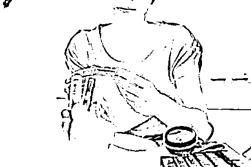 

8 顺势疗法都在哪些地方流行？

顺势疗法在法国、英国、德国、希腊、印度、巴基斯坦、巴西、阿根廷、墨西哥和南非格外受欢迎。**大约有****40%的法国民众用过顺势疗法的药物，39%的法国医师开过顺势疗法的药物。大约有 20%的德国医生偶尔会利用这些天然的药物，45%的荷兰医生认为这些药物是有效的。**《英国医学杂志》（1986 年 6 月 7 日）的一份调查显示，42%受访的英国医师会推荐患者去看顺势疗法医师，而《纽约时报》的一篇文章报道说，英国顺势疗法医师的拜访数量正以每年 39%的速度增长。

尽管这些统计数据让人印象深刻，但顺势疗法在印度尤其受欢迎，在印度有超过 120 所 4 年制的顺势疗法医学院。顺势疗法在美国也发展极为迅猛。市场调查显示，顺势疗法药物的销售在过去 10 年间以每年 10-20%的速度增长。

众所周知，过去 200 年来许多最为著名的人士和文化英雄都使用、提倡顺势疗法，包括 11 位美国总统和几十位世界领袖、7 位教皇和其他许多精神领袖、文学巨匠、体育超级明星、世界级音乐家和名人，以及公司领导人。想要了解关于这些著名人士的令人惊奇的细节和故事，请查阅戴纳·厄尔曼（Dana Ullman）的《顺势疗法革命：为什么著名人士和文化英雄都选择顺势疗法》（*Homeopathic Revolution: Why Famous People and Cultural Heroes Choose Homeopathy*）。

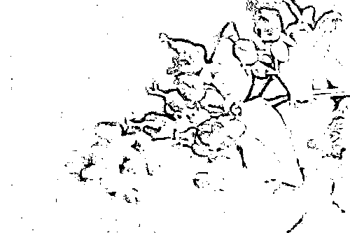 

9 顺势疗法在美国合法吗？

当然合法！大多数顺势疗法的执业者都是经过传统培训的医师，他们通过学习顺势疗法而增进了自我培训。有些顺势疗法执业者还是其他类型的卫生专业人员，包括牙医、足病医生、心理医生、医生助理、护士、自然疗法师、脊椎指压治疗者，甚至是兽医。

也有一些外行人认真学习了顺势疗法，并成为了非常优秀的执业者（他们自称为“职业顺势疗法医师”），尽管围绕其执业的法律问题仍不明晰。因为顺势疗法药物在法律上被看作“药品”，所以有些管理当局认为，任何开出或推荐顺势疗法药物的人都需要是医师，或拥有开处方药的许可证。

然而，由于绝大多数顺势疗法药物都被看作“非处方药”，也就意味着消费者不需要医生处方就可以购买这些药物，所以有些管理当局认为无需许可证就可以使用它们。由未经注册的个人所实践的顺势疗法如果是在医师的监督下就可能是合法的，但该医师将承担病人护理的所有法律责任。


戴纳·厄尔曼（Dana Ullman），公共卫生硕士、注册临床催眠治疗师，是美国顺势疗法的主要倡导者之一。他撰写过 10 本书籍，包括《顺势疗法革命：为什么著名人士和文化英雄都选择顺势疗法》、《纵观顺势疗法》、《针对儿童和婴儿的顺势疗法药物》、《发现顺势疗法》以及与医学博士斯蒂芬·卡明斯（Stephen Cummings）共同撰写的畅销书《每个人的顺势疗法药物指南》。

戴纳也编写了一本电子书《循证顺势疗法家庭医学》，包含 200 多例发表在测试顺势疗法药物的同行评论医学期刊上的临床研究。这本电子书结合了对这些研究的说明以及关于如何针对 100 多种常见疾病利用顺势疗法药物的实用临床信息。

**更多有关顺势疗法的传送门**

**科普篇**

[科普 | 顺势疗法和其他药物疗法的异同](http://mp.weixin.qq.com/s?__biz=MzA5NjA0NTAxNg==&mid=400555588&idx=2&sn=3eefa20f53ad362e6f0ef18f2829ee9e&scene=21#wechat_redirect)

[对待疾病 | 姑息它，压制它，还是治愈它？](http://mp.weixin.qq.com/s?__biz=MzA5NjA0NTAxNg==&mid=400605043&idx=1&sn=a0f8e724b556cdc49530a5a66c0e85d6&scene=21#wechat_redirect)

[送你急救箱，救自己救家人还能救宠物](http://mp.weixin.qq.com/s?__biz=MzA5NjA0NTAxNg==&mid=400181530&idx=1&sn=5b5510e4d43ef54ae0f3f56441d1ac65&scene=21#wechat_redirect)

[顺势疗法，皇室钟爱的疗愈方法](http://mp.weixin.qq.com/s?__biz=MzA5NjA0NTAxNg==&mid=400017180&idx=1&sn=286860583aa755e5fe5a6eac534008cb&scene=21#wechat_redirect)

[它在世界上排名第二，它治人不治病](http://mp.weixin.qq.com/s?__biz=MzA5NjA0NTAxNg==&mid=400153889&idx=1&sn=2dd034cb37b11e5765bd170addd1f960&scene=21#wechat_redirect)

**案例篇**

[顺势疗法治好了他的自闭症！](http://mp.weixin.qq.com/s?__biz=MzA5NjA0NTAxNg==&mid=400921710&idx=2&sn=94af25e6399ca49525ddbd11dc61bbb1&scene=21#wechat_redirect)

[不用再手术，肾结石轻松搞定！](http://mp.weixin.qq.com/s?__biz=MzA5NjA0NTAxNg==&mid=400879915&idx=2&sn=71944f0c596042332924e0de8c7bcf63&scene=21#wechat_redirect)

[这个婴儿频繁夜惊、惧怕男性，现在都好了](http://mp.weixin.qq.com/s?__biz=MzA5NjA0NTAxNg==&mid=400901918&idx=2&sn=2c39821aa322bddc9d12dc6c8b128556&scene=21#wechat_redirect)

[顺势疗法 | 它帮助抚平心理创伤和悲痛](http://mp.weixin.qq.com/s?__biz=MzA5NjA0NTAxNg==&mid=400858503&idx=2&sn=8ed07f16cdc736af776dce34aa9232cd&scene=21#wechat_redirect)

[50 年的鼻窦炎好了！](http://mp.weixin.qq.com/s?__biz=MzA5NjA0NTAxNg==&mid=400750777&idx=2&sn=e5dba7e9508a9ed7ec0dd18d445182c9&scene=21#wechat_redirect)

[孕妈选对药方，保护了自己和宝宝](http://mp.weixin.qq.com/s?__biz=MzA5NjA0NTAxNg==&mid=400721730&idx=2&sn=3b907efec5851b08f1fc3e74be31c2e8&scene=21#wechat_redirect)

[一瓶药丸治好了困扰我四年的各种病症](http://mp.weixin.qq.com/s?__biz=MzA5NjA0NTAxNg==&mid=400555588&idx=1&sn=9d860beaa15bc1b9e6c627e1d3369afa&scene=21#wechat_redirect)

[为了宝宝，我选择顺势疗法](http://mp.weixin.qq.com/s?__biz=MzA5NjA0NTAxNg==&mid=400490938&idx=2&sn=9ae026781f9119936ade05b2dc66655f#wechat_redirect)

[过敏、扭伤、关节炎、痛经、宠物疾病……全搞定！](http://mp.weixin.qq.com/s?__biz=MzA5NjA0NTAxNg==&mid=400260655&idx=1&sn=854005f3b4c5846959ece35907a94dba&scene=21#wechat_redirect)

* * *

**特别提醒：**希望将若道文章转载到各自公众号的朋友，**转载时请注明“转自若道微信公众平台”，并附上若道占星的 Logo**。谢谢！

**2015 年 12 月 2 日，**由**苏**·汤普金斯老师****亲授的[**顺势疗法课程**](http://mp.weixin.qq.com/s?__biz=MzA5NjA0NTAxNg==&mid=400017180&idx=2&sn=845f6885f0197a6a97ea265d9bc638ab&scene=21#wechat_redirect)**（点击可查看）即将开课**。******顺势疗法**是目前全球使用最广泛的自然医学疗法，**对个体的身体、精神和情绪三个层面进行治疗，加强个体自身免疫力，提升个体生命能量**。本课程为那些想要增加自我和家庭身体保健和疗愈能力的人所设置。****欲详细了解，请点击文末“**阅读原文**”。


# 倒计时·7 | 学完 Level 4，星图综合解读没问题~

> 原文：[`mp.weixin.qq.com/s?__biz=MzA5NjA0NTAxNg==&mid=401041691&idx=3&sn=458cca11383b4075f91bba31b6f9bf4a&chksm=02a5dbac35d252ba4d85e8c85e5b757a6df902865d167000b0a2070e03fb09defa4ac9b64451&scene=126&sessionid=1692738902#rd`](http://mp.weixin.qq.com/s?__biz=MzA5NjA0NTAxNg==&mid=401041691&idx=3&sn=458cca11383b4075f91bba31b6f9bf4a&chksm=02a5dbac35d252ba4d85e8c85e5b757a6df902865d167000b0a2070e03fb09defa4ac9b64451&scene=126&sessionid=1692738902#rd)

**课程信息**

开课时间：2015 年 12 月 1 日-2016 年 3 月 15 日

讲师：大卫·瑞雷

讲课城市：网络视频

费用(元)：6000

报名截止：2015 年 11 月 20 日

课程负责人：李老师  联系方式：010-58263061/010-56629907

**2015 年度若道新推出的专业占星课程分为五个级别，本课程属于若道专业占星课程第四级别，****Level 4****课程****。**

**课程描述**

**若道占星核心课程系列 Level 4**

**星图舞会——星图综合解读 24 小时**

在这个阶段，你终于可以学会星图的综合解读了！

前一阶段所有学到的越扎实，现在就越开心。你可以看到，当那些行星、星座、宫位、相位穿起来的丝线开始跳舞，一个个故事图景就像织锦一样展现在你的面前。个性、爱情、事业，看到一个人的出生星图，你就可以开始讲他们生命故事的梗概了。这里大卫老师会分别讲解如何通过出生星图进行性格分析、爱情解读、事业分析。在爱情解读部分，你还会提前学到比对图。

这个课程结束后，你就可以练习解读出生星图的重要问题了。

**授课内容**

**星图综合解读——性格分析**

**星图综合解读——爱情（出生图）**

**星图综合解读——爱情（比对图）**

**星图综合解读——职业**

在整个教学过程中，不仅用名人案例讲解，而且将会抽取同学星图，演示如何就爱情议题、职业咨询议题进行咨询示范。

**课程时间**

授课时间：2015 年 12 月 1 日-2016 年 3 月 15 日

每周二晚上 20：00-22:00 （北京时间），共计 12 次课

**授课形式**

1. 网络教学：网络视频会议系统上的在线课程和答疑辅导，只要有上网的条件在世界各地都可以上课，无地域限制。北京同学可以到若道办公室现场上课。

2. 中英文双语授课，专业占星口译员中文翻译。

3. 每次课后都有助教在线答疑。

4. 每月组织沙龙互动练习。

**教学优势**

**作为国际占星研究协会（ISAR）在中国唯一指定的教学机构，我们有：**

**专业师资（国内最专业）：**

1.国际一流名师：大卫•瑞雷 40 年占星咨询和教学经验，4 年中国本土化教学经验，无保留传授。

2.职业占星师助教：我们的助教，均为 ISAR 认证职业占星师或大卫老师职业占星师资质班优秀毕业生。

3.专业翻译：擅长占星的英文翻译，完全不懂英文的同学也可以聆听大师的教诲。

**系统教学（国内最完善）：**

1.学习路径：完整的知识结构，清晰的知识点，大量案例展示、咨询示范。

2.心法传授：大卫老师 40 年实战咨询经验，绝非仅靠读书就可以获得。

3.实战练习：在 Level 5 将组织实战练习，为开启咨询之路做好准备。

**完美互动（国内最丰富）：**

1.与名师面对面：北京同学可以来若道现场上课，和大卫老师面对面互动。大卫老师也可能前往主要学员所在城市，实现零距离教学。

2.互动答疑：论坛、QQ 群随时提问；老师课上答疑；助教线上线下全程协助。

3.线下沙龙：定期举办沙龙活动，复习上课内容。

4.强大的同学网络：若道作为中国最顶尖的占星教学机构，在 4 年的占星教学中，培养了很多占星人才。若道让你和师兄师姐切磋，让你和国内著名占星师学习。（简单来说，就是，人脉！）

**配套支持（国内最方便）：**

1.先进的教学平台：网络教学平台，支持手机、电脑、iPad 上网，可以随时随地学习。

2.回放复习：学员可登录网站收看课程回放，在线复习课程，每次课可完整重看 3 次，1 个月内有效。

**报名和付款**

课程费用：6000 元　

请在点击页面左下方“**阅读原文**”报名，以及在线完成学费支付。

咨询请拨打电话 010-56629907　

或课服 QQ：4006191014 （若道星文化）
或直接写信给 nodoor@vip.126.com，我们会回复您的疑问。 网页报名后无法进行在线支付的同学，可以通过银行汇款的方式支付课程费用。

汇款信息：蒋颖　6226 0901 0424 5721　招商银行北京中关村支行　

或支付宝：nodoor@yeah.net
请在汇款备注中写上自己的名字和所报课程，方便我们核对。

**退课与转课**

课程付费后，因个人原因无法参加通过邮件申请退款，开课前 3 天内可以全款退回。
开课后，若想申请退课或转课，请在第二节课前提交书面申请至 nodoor@vip.126.com。
退款和转课金额统一按 80%执行；
若课程进行到第二次后，不再接受退款或转课申请。

**大卫•瑞雷简介**


> 美国资深职业占星师。1970 年开始学习占星学，在通过亚特兰大职业占星委员会的考试后，于 1976 年获得执业许可，成为一名专职占星师。年过六旬的大卫老师，曾两任亚特兰大占星协会主席，是全美占星师联盟（AFAN）、美国占星师联合会（AFA）、全美占星研究委员会（NCGR）、国际占星研究协会（ISAR）和职业占星师组织（OPA）的成员，是联合占星大会（UAC, United Astrology Conference）督导委员会委员。
> 
> 大卫老师曾是 CNN、CBS 的占星节目的常驻嘉宾，多次在 BBC、WGS、WSB、WRGG 等节目中接受采访，并在亚特兰大主持电视节目《每日行星（Daily Planets）》达 4 年之久。至今已研究占星四十余年，拥有三十多年的占星咨询的执业经验，其服务客户包括学生、工人、市长、州长、议会议员、企业家、心理咨询师、工程师、艺术家、演员、知名企业家等，客户年龄跨度从襁褓婴儿到耄耋老人。2010 年 6 月，大卫的书《灵魂的目标》中文版出版。在 2011 年春季的北京之行期间，大卫接受了《南方周末》记者的采访，同时参与了 CCTV9 的纪录片的拍摄。
> 
> 大卫老师热爱教学，愿意将自己的毕生所学倾囊相授。为了将纯正的西方占星学带入中国、为了让更多的中国人从占星中获益，大卫老师在占星学的传授上投入了巨大的热情与心血。他以后每年将有一半的时间在中国度过，中国将成为他的第二个家。


# 顺势疗法最常被问到的 9 个问题（上）

> 原文：[`mp.weixin.qq.com/s?__biz=MzA5NjA0NTAxNg==&mid=401009669&idx=1&sn=82cf1d6fbc16a03ba8dabc16ae052b60&chksm=02a45eb235d3d7a49876666f2f37971dde0ea6563bc39f8bdfa543daf95c4eaab0ed35acf074&scene=126&sessionid=1692738902#rd`](http://mp.weixin.qq.com/s?__biz=MzA5NjA0NTAxNg==&mid=401009669&idx=1&sn=82cf1d6fbc16a03ba8dabc16ae052b60&chksm=02a45eb235d3d7a49876666f2f37971dde0ea6563bc39f8bdfa543daf95c4eaab0ed35acf074&scene=126&sessionid=1692738902#rd)

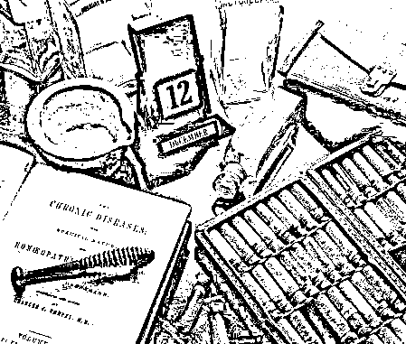

作者/戴纳·厄尔曼（公共卫生硕士）

译者/王宏

苏·汤普金斯老师讲授的“[**顺势疗法家庭急救治疗及保健课程”**](http://mp.weixin.qq.com/s?__biz=MzA5NjA0NTAxNg==&mid=400017180&idx=2&sn=845f6885f0197a6a97ea265d9bc638ab&scene=21#wechat_redirect)（点击可查看），即将于 12 月 2 日开课。如果你对顺势疗法还是一知半解，没关系，花 5 分钟，看看下面这些顺势疗法最常被问到的问题，你会更清晰的。

## 1**究竟什么是顺势疗法？**

**顺势疗法是一种有关天然药物的科学，利用剂量非常小的各种植物、矿物质或动物来刺激病人自身的抵抗力。**药物根据个人情况而选择，这些药物如果过量服用能够导致病人所正在经历的相似的症状。希腊语中的“homoios”意为“相似的”，而“pathos”（病苦，伤感）意为“疾病”或“痛苦”。由于一个人的症状实际上是机体努力重建体内平衡或平衡的成果，所以说寻求一种过量使用时会导致此人正在经历的相似症状的物质是合乎逻辑的。因此，药物会顺应而非抵抗此人自身的抵抗力。

本质上说来，顺势疗法由两种高度系统化的方法所构成：毒理学和病案记录。首先，顺势疗法医师找出各种物质在过量时所导致的特定的身体、情绪和精神症状。与其他任何来源相比，顺势疗法教科书在毒理学方面有着更为详细的介绍。其次，顺势疗法医师极为详细地问询其患者，以发现该人所经历的身体、情绪和精神的全部症状。顺势疗法医师试图找到一种物质，该物质会导致此人身上的类似症状，然后以特别准备好的小剂量的方式给药。

 

## 2**将导致那些病人身上的症状的物质分剂量给病人服用以便治愈他们，这看似不合逻辑。请解释一下。**

正如许多现代生理学家一样，顺势疗法医师意识到，症状体现出了机体去适应并抵抗各种压力或感染的最佳努力。由于身体并不总能成功应对每种压力或感染，所以**重要的是在自然界中找到一种有能力模仿病人正在经历的症状的物质，以便帮助身体努力防卫并最终治愈自己。**

“同类法则”是顺势疗法的基本原则，甚至被用于某些传统的药物治疗，例如免疫以及过敏症的治疗。然而，这些治疗并非纯粹的顺势疗法，因为顺势疗法的药物更多地因人而异，以更小的剂量给出，被用于治疗病人和预防疾病。

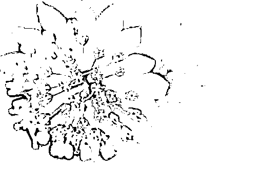 

## 3**顺势疗法医师所用的剂量太小了，不太可能产生什么生理效应。你如何解释这个问题？**

尽管我们不确切清楚顺势疗法药物的起效方式，但有明确的证据证明药物是有效的，能够治愈病症。顺势疗法 19 世纪在美国和欧洲流行开来，因为它成功治愈了许多在当时肆虐的传染病，包括黄热病、猩红热、霍乱和许多其他传染病。采用顺势疗法的医院的死亡率在采用传统疗法的医院的八分之一到一半之间。

的药物也被证明在婴儿和各种动物（包括狗、猫、马，甚至是奶牛）身上起效，而**在婴儿和各种动物身上顺势疗法极不可能仅仅起到安慰剂的作用**。顺势疗法医师也发现，用顺势疗法药物来治疗自己慢性疾病的人有时会经历症状的暂时性恶化，因为身体的抵抗力受到了刺激。顺势疗法医师发现，“治愈危机”有时对于达到治愈的目的是必要的。这种暂时性的症状恶化极不可能是安慰剂反应的结果。

医学期刊和其他科学出版物中也发表了一些优秀的科研成果。《柳叶刀》（*The Lancet*）（1997 年 9 月 20 日）发表了一篇关于 89 例双盲或随机安慰剂对照的临床试验的评论文章。作者总结道，顺势疗法药物的临床效果不仅仅是安慰剂的结果。实际上，他们发现，顺势疗法药物的效果比安慰剂治疗的效果高 2.45 倍，这参考并涵盖了超过 150 例已公开发表结果的临床试验。

重要的是了解顺势疗法医师所应用的小剂量只有在病人对所给予的小剂量过敏时才会有效果。**如果给病人错误的药物，什么都不会发生**。如果给了正确的药物，药物会起到人体抵抗力催化剂的作用。无论如何，顺势疗法的药物都是没有副作用的。

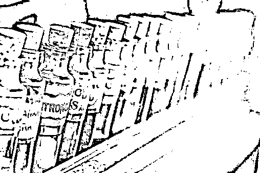 

## 4**如果这些药物如此有效，那为什么目前顺势疗法不怎么受欢迎呢****？**

实际上，顺势疗法在世界上的许多国家都非常受欢迎。至于顺势疗法在美国，也非常受欢迎。在世纪之交，15%的（内科）医师都是顺势疗法医师。**美国医学协会**（A.M.A.）**在临床上、哲学上和经济上都受到顺势疗法医师的严重威胁**。区别于其他非正统的从业人员，顺势疗法医师毕业于受人尊敬的医学院。

美国医学协会受到了顺势疗法的严重威胁，以至于在 1860 年至 20 世纪初期传统的医师如果仅仅咨询过顺势疗法医师就会失去自己在美国医学协会的会员资格。美国医学协会也对各种资金来源施压，使得顺势疗法学校难以为继。尽管有来自美国医学协会和制药公司的巨大压力，顺势疗法仍然存活了下来，并在世界各地蓬勃发展。


戴纳·厄尔曼（Dana Ullman），公共卫生硕士、注册临床催眠治疗师，是美国顺势疗法的主要倡导者之一。他撰写过 10 本书籍，包括《顺势疗法革命：为什么著名人士和文化英雄都选择顺势疗法》、《纵观顺势疗法》、《针对儿童和婴儿的顺势疗法药物》、《发现顺势疗法》以及与医学博士斯蒂芬·卡明斯（Stephen Cummings）共同撰写的畅销书《每个人的顺势疗法药物指南》。

戴纳也编写了一本电子书《循证顺势疗法家庭医学》，包含 200 多例发表在测试顺势疗法药物的同行评论医学期刊上的临床研究。这本电子书结合了对这些研究的说明以及关于如何针对 100 多种常见疾病利用顺势疗法药物的实用临床信息。

## **更多顺势疗法内容的传送门**

**科普篇：**

[科普 | 顺势疗法和其他药物疗法的异同](http://mp.weixin.qq.com/s?__biz=MzA5NjA0NTAxNg==&mid=400555588&idx=2&sn=3eefa20f53ad362e6f0ef18f2829ee9e&scene=21#wechat_redirect)

[对待疾病 | 姑息它，压制它，还是治愈它？](http://mp.weixin.qq.com/s?__biz=MzA5NjA0NTAxNg==&mid=400605043&idx=1&sn=a0f8e724b556cdc49530a5a66c0e85d6&scene=21#wechat_redirect)

[送你急救箱，救自己救家人还能救宠物](http://mp.weixin.qq.com/s?__biz=MzA5NjA0NTAxNg==&mid=400181530&idx=1&sn=5b5510e4d43ef54ae0f3f56441d1ac65&scene=21#wechat_redirect)

[顺势疗法，皇室钟爱的疗愈方法](http://mp.weixin.qq.com/s?__biz=MzA5NjA0NTAxNg==&mid=400017180&idx=1&sn=286860583aa755e5fe5a6eac534008cb&scene=21#wechat_redirect)

[它在世界上排名第二，它治人不治病](http://mp.weixin.qq.com/s?__biz=MzA5NjA0NTAxNg==&mid=400153889&idx=1&sn=2dd034cb37b11e5765bd170addd1f960&scene=21#wechat_redirect)

**案例篇：**

[顺势疗法治好了他的自闭症！](http://mp.weixin.qq.com/s?__biz=MzA5NjA0NTAxNg==&mid=400921710&idx=2&sn=94af25e6399ca49525ddbd11dc61bbb1&scene=21#wechat_redirect)

[不用再手术，肾结石轻松搞定！](http://mp.weixin.qq.com/s?__biz=MzA5NjA0NTAxNg==&mid=400879915&idx=2&sn=71944f0c596042332924e0de8c7bcf63&scene=21#wechat_redirect)

[这个婴儿频繁夜惊、惧怕男性，现在都好了](http://mp.weixin.qq.com/s?__biz=MzA5NjA0NTAxNg==&mid=400901918&idx=2&sn=2c39821aa322bddc9d12dc6c8b128556&scene=21#wechat_redirect)

[顺势疗法 | 它帮助抚平心理创伤和悲痛](http://mp.weixin.qq.com/s?__biz=MzA5NjA0NTAxNg==&mid=400858503&idx=2&sn=8ed07f16cdc736af776dce34aa9232cd&scene=21#wechat_redirect)

[50 年的鼻窦炎好了！](http://mp.weixin.qq.com/s?__biz=MzA5NjA0NTAxNg==&mid=400750777&idx=2&sn=e5dba7e9508a9ed7ec0dd18d445182c9&scene=21#wechat_redirect)

[孕妈选对药方，保护了自己和宝宝](http://mp.weixin.qq.com/s?__biz=MzA5NjA0NTAxNg==&mid=400721730&idx=2&sn=3b907efec5851b08f1fc3e74be31c2e8&scene=21#wechat_redirect)

[一瓶药丸治好了困扰我四年的各种病症](http://mp.weixin.qq.com/s?__biz=MzA5NjA0NTAxNg==&mid=400555588&idx=1&sn=9d860beaa15bc1b9e6c627e1d3369afa&scene=21#wechat_redirect)

[为了宝宝，我选择顺势疗法](http://mp.weixin.qq.com/s?__biz=MzA5NjA0NTAxNg==&mid=400490938&idx=2&sn=9ae026781f9119936ade05b2dc66655f#wechat_redirect)

[过敏、扭伤、关节炎、痛经、宠物疾病……全搞定！](http://mp.weixin.qq.com/s?__biz=MzA5NjA0NTAxNg==&mid=400260655&idx=1&sn=854005f3b4c5846959ece35907a94dba&scene=21#wechat_redirect)

* * *

**特别提醒：**希望将若道文章转载到各自公众号的朋友，**转载时请注明“转自若道微信公众平台”，并附上若道占星的 Logo**。谢谢！

**2015 年 12 月 2 日，**由**苏**·汤普金斯老师****亲授的**顺势疗法课程即将开课**。******顺势疗法**是目前全球使用最广泛的自然医学疗法，**对个体的身体、精神和情绪三个层面进行治疗，加强个体自身免疫力，提升个体生命能量**。本课程为那些想要增加自我和家庭身体保健和疗愈能力的人所设置。****欲详细了解，请点击文末“**阅读原文**”。


# 成功的婚姻，只需做两件事

> 原文：[`mp.weixin.qq.com/s?__biz=MzA5NjA0NTAxNg==&mid=401009669&idx=2&sn=6c0c542ed2ebf55d9a30ad8de9f5ae6a&chksm=02a45eb235d3d7a4cf5324aa12143e85620f880c1b0189c5ba7bf488746891427b80550c6411&scene=126&sessionid=1692738902#rd`](http://mp.weixin.qq.com/s?__biz=MzA5NjA0NTAxNg==&mid=401009669&idx=2&sn=6c0c542ed2ebf55d9a30ad8de9f5ae6a&chksm=02a45eb235d3d7a4cf5324aa12143e85620f880c1b0189c5ba7bf488746891427b80550c6411&scene=126&sessionid=1692738902#rd)

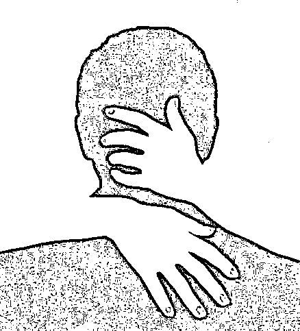

来源/心探索网站

在婚姻经营与创意课上，老师掀开了一张挂图，上面用毛笔写着一行字：婚姻的成功取决于两点……

## **成功的婚姻取决于两点：找个好人，做个好人**

学校的最后一门课是《婚姻经营和创意》，主讲老师是学校特地聘请的一位研究婚姻问题的教授。他走进教室，把带来的一叠图表挂在黑板上.

然后，他掀开挂图，上面是用毛笔写的一行字：婚姻的成功取决于两点：

**一、找个好人。**

**二、自己做一个好人。**

“就这么简单。”教授说。

这时台下嗡嗡作响，因为下面有许多学生是已婚人士。不一会儿，有一位 30 多岁的女士站了起来，说：“如果这两条没有做到呢？”

教授翻开挂图的第二张，说：“那就变成 4 条了。”

**一、容忍，帮助，帮助不好仍然容忍。**

**二、使容忍变成一种习惯。**

**三、在习惯中养成傻瓜的品性。**

**四、做傻瓜，并永远做下去。**

## **如果 4 条做不到，那就得做到 16 条**

教授还未把这 4 条念完，台下就喧哗起来，有的说不行，有的说这根本做不到。等大家静下来，教授说：“如果这 4 条做不到，你又想有一个稳固的婚姻，那你就得做到以下 16 条。”

接着教授翻开第三张挂图。

**一、不同时发脾气。**

**二、除非有紧急事件，否则不要大声吼叫。**

**三、争执时,让对方赢。**

**四、当天的争执当天化解。**

**五、争吵后回娘家或外出的时间不要超过 8 小时。**

**六、批评时话要出于爱。**

**七、随时准备认错道歉。**

**八、谣言传来时，把它当成玩笑。**

**九、每月给他或她一晚自由的时间。**

**十、不要带着气上床。**

**十一、他或她回家时，你一定要在家。**

**十二、对方不让你打扰时，坚持不去打扰。**

**十三、电话铃响时，让对方去接。**

**十四、口袋里有多少钱要随时报账。**

**十五、坚决消灭没有钱的日子。**

**十六、给你父母的钱一定要比给对方父母的钱少。**

## **几何级数，婚姻到这一地步就已经很危险了**

教授念完，有些人笑了，有些人则叹起气来。教授听了一会儿，说：“**如果大家对这 16 条感到失望的话，那你只有做好下面的 256 条了**。总之，两个人相处的理论是一个几何级数理论，它总是在前面那个数字的基础上进行二次方。”

接着教授翻开挂图的第四页，这一页已不再是用毛笔书写，而是用钢笔，256 条，密密麻麻。教授说：“婚姻到这一地步就已经很危险了。”这时台下响起了更强烈的喧哗声。

不过在教授宣布下课的时候，有的人坐在那儿没有动，他们的眼角好像还有泪花。

爱一个人可以随时牵手，但不要随便分手……

爱一个人，要了解，也要开解；要道歉，也要道谢；要认错，也要改错；要体贴，也要体谅；要接受，而不是忍受；是宽容，而不是纵容；是支持，而不是支配；是慰问，而不是质问；是倾诉，而不是控诉；是难忘，而不是遗忘；是彼此交流，而不是凡事交代；是为对方默默祈求，而不是向对方诸多要求；可以浪漫，但不要浪费；可以随时牵手，但不要随便分手。

吃得好，穿得好，不如夫妻同到老，只要嫁得好，不必嫁的早，晚婚是个宝，幸福甜到老。

* * *

如何在恋爱或婚姻中“找到好人，做个好人”？除了以上老师讲的内容，也可以简化为非常简单的两件事：一、听到爱；二、说出爱。点击“**阅读原文**”了解**“倾听一小时——听到爱，说出爱**”**在线公益课程**！


# 倒计时·8 | 学完 Level 4，星图综合解读没问题~

> 原文：[`mp.weixin.qq.com/s?__biz=MzA5NjA0NTAxNg==&mid=401009669&idx=3&sn=03514b2d902d9539a7c51a9a0faab9af&chksm=02a45eb235d3d7a473fcffd96d98e8d1fbd0f22c943954d979d41590b484cad5e94d3af07adf&scene=126&sessionid=1692738902#rd`](http://mp.weixin.qq.com/s?__biz=MzA5NjA0NTAxNg==&mid=401009669&idx=3&sn=03514b2d902d9539a7c51a9a0faab9af&chksm=02a45eb235d3d7a473fcffd96d98e8d1fbd0f22c943954d979d41590b484cad5e94d3af07adf&scene=126&sessionid=1692738902#rd)

**课程信息**

开课时间：2015 年 12 月 1 日-2016 年 3 月 15 日

讲师：大卫·瑞雷

讲课城市：网络视频

费用(元)：6000

报名截止：2015 年 11 月 20 日

课程负责人：李老师  联系方式：010-58263061/010-56629907

**2015 年度若道新推出的专业占星课程分为五个级别，本课程属于若道专业占星课程第四级别，****Level 4****课程****。**

**课程描述**

**若道占星核心课程系列 Level 4**

**星图舞会——星图综合解读 24 小时**

在这个阶段，你终于可以学会星图的综合解读了！

前一阶段所有学到的越扎实，现在就越开心。你可以看到，当那些行星、星座、宫位、相位穿起来的丝线开始跳舞，一个个故事图景就像织锦一样展现在你的面前。个性、爱情、事业，看到一个人的出生星图，你就可以开始讲他们生命故事的梗概了。这里大卫老师会分别讲解如何通过出生星图进行性格分析、爱情解读、事业分析。在爱情解读部分，你还会提前学到比对图。

这个课程结束后，你就可以练习解读出生星图的重要问题了。

**授课内容**

**星图综合解读——性格分析**

**星图综合解读——爱情（出生图）**

**星图综合解读——爱情（比对图）**

**星图综合解读——职业**

在整个教学过程中，不仅用名人案例讲解，而且将会抽取同学星图，演示如何就爱情议题、职业咨询议题进行咨询示范。

**课程时间**

授课时间：2015 年 12 月 1 日-2016 年 3 月 15 日

每周二晚上 20：00-22:00 （北京时间），共计 12 次课

**授课形式**

1. 网络教学：网络视频会议系统上的在线课程和答疑辅导，只要有上网的条件在世界各地都可以上课，无地域限制。北京同学可以到若道办公室现场上课。

2. 中英文双语授课，专业占星口译员中文翻译。

3. 每次课后都有助教在线答疑。

4. 每月组织沙龙互动练习。

**教学优势**

**作为国际占星研究协会（ISAR）在中国唯一指定的教学机构，我们有：**

**专业师资（国内最专业）：**

1.国际一流名师：大卫•瑞雷 40 年占星咨询和教学经验，4 年中国本土化教学经验，无保留传授。

2.职业占星师助教：我们的助教，均为 ISAR 认证职业占星师或大卫老师职业占星师资质班优秀毕业生。

3.专业翻译：擅长占星的英文翻译，完全不懂英文的同学也可以聆听大师的教诲。

**系统教学（国内最完善）：**

1.学习路径：完整的知识结构，清晰的知识点，大量案例展示、咨询示范。

2.心法传授：大卫老师 40 年实战咨询经验，绝非仅靠读书就可以获得。

3.实战练习：在 Level 5 将组织实战练习，为开启咨询之路做好准备。

**完美互动（国内最丰富）：**

1.与名师面对面：北京同学可以来若道现场上课，和大卫老师面对面互动。大卫老师也可能前往主要学员所在城市，实现零距离教学。

2.互动答疑：论坛、QQ 群随时提问；老师课上答疑；助教线上线下全程协助。

3.线下沙龙：定期举办沙龙活动，复习上课内容。

4.强大的同学网络：若道作为中国最顶尖的占星教学机构，在 4 年的占星教学中，培养了很多占星人才。若道让你和师兄师姐切磋，让你和国内著名占星师学习。（简单来说，就是，人脉！）

**配套支持（国内最方便）：**

1.先进的教学平台：网络教学平台，支持手机、电脑、iPad 上网，可以随时随地学习。

2.回放复习：学员可登录网站收看课程回放，在线复习课程，每次课可完整重看 3 次，1 个月内有效。

**报名和付款**

课程费用：6000 元　

请在点击页面左下方“**阅读原文**”报名，以及在线完成学费支付。

咨询请拨打电话 010-56629907　

或课服 QQ：4006191014 （若道星文化）
或直接写信给 nodoor@vip.126.com，我们会回复您的疑问。 网页报名后无法进行在线支付的同学，可以通过银行汇款的方式支付课程费用。

汇款信息：蒋颖　6226 0901 0424 5721　招商银行北京中关村支行　

或支付宝：nodoor@yeah.net
请在汇款备注中写上自己的名字和所报课程，方便我们核对。

**退课与转课**

课程付费后，因个人原因无法参加通过邮件申请退款，开课前 3 天内可以全款退回。
开课后，若想申请退课或转课，请在第二节课前提交书面申请至 nodoor@vip.126.com。
退款和转课金额统一按 80%执行；
若课程进行到第二次后，不再接受退款或转课申请。

**大卫•瑞雷简介**


> 美国资深职业占星师。1970 年开始学习占星学，在通过亚特兰大职业占星委员会的考试后，于 1976 年获得执业许可，成为一名专职占星师。年过六旬的大卫老师，曾两任亚特兰大占星协会主席，是全美占星师联盟（AFAN）、美国占星师联合会（AFA）、全美占星研究委员会（NCGR）、国际占星研究协会（ISAR）和职业占星师组织（OPA）的成员，是联合占星大会（UAC, United Astrology Conference）督导委员会委员。
> 
> 大卫老师曾是 CNN、CBS 的占星节目的常驻嘉宾，多次在 BBC、WGS、WSB、WRGG 等节目中接受采访，并在亚特兰大主持电视节目《每日行星（Daily Planets）》达 4 年之久。至今已研究占星四十余年，拥有三十多年的占星咨询的执业经验，其服务客户包括学生、工人、市长、州长、议会议员、企业家、心理咨询师、工程师、艺术家、演员、知名企业家等，客户年龄跨度从襁褓婴儿到耄耋老人。2010 年 6 月，大卫的书《灵魂的目标》中文版出版。在 2011 年春季的北京之行期间，大卫接受了《南方周末》记者的采访，同时参与了 CCTV9 的纪录片的拍摄。
> 
> 大卫老师热爱教学，愿意将自己的毕生所学倾囊相授。为了将纯正的西方占星学带入中国、为了让更多的中国人从占星中获益，大卫老师在占星学的传授上投入了巨大的热情与心血。他以后每年将有一半的时间在中国度过，中国将成为他的第二个家。


# 射手座 | 兼具动物性和精神性

> 原文：[`mp.weixin.qq.com/s?__biz=MzA5NjA0NTAxNg==&mid=400977179&idx=1&sn=b2f320192c9bfeb0501799ebe3a7a05e&chksm=02a4dfac35d356bae0f71630660818b7f5b584379a779d9a9aa3c6eea75fea5fdb85a5dd53e5&scene=126&sessionid=1692738902#rd`](http://mp.weixin.qq.com/s?__biz=MzA5NjA0NTAxNg==&mid=400977179&idx=1&sn=b2f320192c9bfeb0501799ebe3a7a05e&chksm=02a4dfac35d356bae0f71630660818b7f5b584379a779d9a9aa3c6eea75fea5fdb85a5dd53e5&scene=126&sessionid=1692738902#rd)

作者/琳恩•贝尔 翻译/江艺

校对/李含

```
有时候，我会想象自己是第一次看到十二星座的符号。这很难做到，因为我们已经习惯看到它们，我们不仅仅在报纸专栏中，也会在最为奇怪的地方看到它们：谷类食品的包装盒上、广告牌上、手机标识上。更具有神秘意味的是变动星座的那些符号。当你第一次看到射手座半人半马的符号，你的内心是否有所触动？在欧洲，也就是我所生活的地方，中世纪幻想中的奇怪生物仍然在大教堂的石板上跃动。由于那时大多数人都无法阅读或书写，因此这些图像具有非常强大的力量，可以唤起各种各样的思想、故事、神话。现在它们仍然如此。
```

三种属性和射手座的关联

 在印度宇宙学中，我们发现一种稍微有所不同的世界模式。有三种被称作属性（gunas）的形态，它们被认为是构成一切存在的基础。

● 翳质（Tamas，不活跃的本质）：与稳定和根基有关，但也与惰性和黑暗有关。

● 激质（Rajas，激情）：动态的、活跃的和不稳定的，但会导致经历和进化。

● 纯质（sattwas，代表冷静、智力和平衡）：平静、明晰和平衡的，会带来理解和启发。 

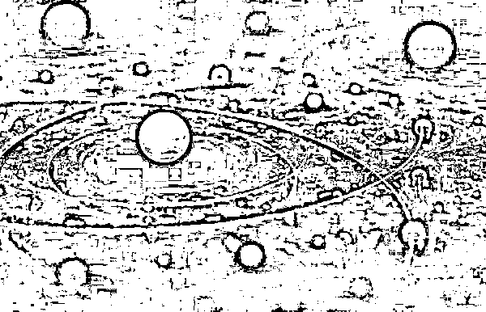 

虽然将它们与固定、基本和变动相比较可能很吸引人，但是占星学的特质中没有等级的观念。也许在遥远的过去，它们拥有共同的源头。纯质可能提示我们关于变动的真正性质的线索，因为**智力同时是双子座和处女座的关键，而启发和理解则是**木星守护的两个星座，即**双鱼座和射手座的核心。**这些星座很容易接触，灵敏迅速，适应能力很强，这些通常都来源于明晰和智力。然而平静一词通常并不会跃入脑海！

占星特质确实有不同的节奏。固定是稳定而持久的，滋养而强有力的。基本是活跃而精力充沛的，它推动事物向前发展。而变动是切分的修饰音符、花哨、不规则的。

 在交响乐、图书或电影中，这些不同节奏或形态交替推动故事的发展；在这三种特质的混合中，平衡贯穿始终。过多的变动会增加不规则的节奏，让情境变得复杂，煽动情绪，引起困惑，它是考虑这些星座中的对分相和四分相的一种方式：追寻高远。

混合了动物性和精神性的射手座

这些星座最古老的名字“双体”反映了它们混合的性质，活跃和固定这两条溪流相交汇。对于其他更加单刀直入的那些人来说，这可能显得混乱和迷惑，但是在同一时刻处在不只一个地方，或是包含着这些矛盾并不容易。

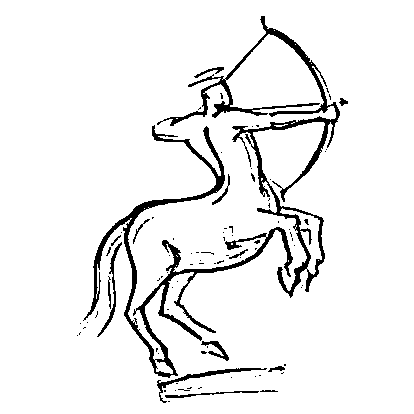

**射手座混合了动物性和精神性**，以半人马的形象跃入我们的眼帘。此处的分割是高和低之间，基础和改良之间，物质和精神之间的分割，是此处和彼处之间的分割。我常常对我的法国同行们谈论射手座的方式感到困惑。他们几乎总是将射手座描述为在社交上循规蹈矩，信守唯物主义。他们不相信它的信心、它的自信，将它误认为自我满足和夸大吹嘘。对他们来说，射手座及其守护星木星是资产阶级满足和与他人攀比的终极，象征着导致对世界真实状况无知的自信。他们会指向雅克·希拉克总统，他的太阳和月亮都在射手座，是对这一点的完美例证。另一方面，大多数美国或英国课文都赞美探求者、哲学家和冒险精神。那些课文会提及高尚的思想、慷慨和幽默，甚至可能带着一种粗野不做作、笨拙的直率和真诚。我发现这两种截然不同的观念非常吸引人，因为两者都可能是正确的。想想中世纪的刻板形象，一个贪吃好色的和尚喝牛饮葡萄酒。

胸怀大志，不忘初心

古代马背上的男人比任何徒步的人在身体上和精神上都具有更大的优势。将他的身高加在一个已然威风凛凛的动物之上，并想象骑士的地位和权力，还有他的速度和力量。在许多方面，射手座都以某种优势展开生活，总是与自然、身体、欲望或肉欲保有生动的关联。**半人马的象征符号在古代思想中存在着巨大的矛盾心理**，关于这个动物本身有一些令人不安和羞耻的地方。**这一形象既包含了远离生物性的渴望，同时又必须得承认它。**射手座胸怀大志，却可能因此而堕落，有时会堕入虚伪或做作，如果他们与自身疏离，无法面对他们的真实自我的话。

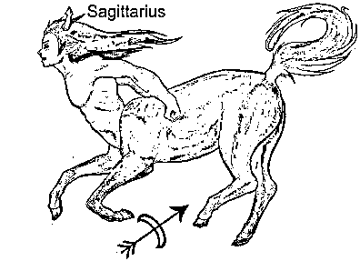

这个弓箭手射出了许多支箭，而这个星座的变幻无常也在其他许多方面发挥作用。它主宰着每年的狩猎时节，此时森林中充满猎物，猎手绝不知道自己会发现什么。他可能进去寻找麋鹿，却带着兔子返回，或者一无所获。这种对神、肉、思想、体验的探寻和追求就是这个星座各种活动的核心。射手座将其火热的注意力放在外部世界之中。他可能为自身的人性、动物性和神性分裂而感到迷惑，比起追寻神灵，他们更可能去追求最时新的威登皮包，或是时髦而强有力的轿车，或是任何让他们超越别人的事物。缺乏觉知可能让他们显得很可笑，这就是为什么那么多的射手座作家，从简·奥斯丁到马克·吐温都喜欢讥讽那些自命不凡的自恋狂。射手座必须永远都不忘记自己的真实身份，不忘记人类天性中动物性的部分。

**12 月 1 日****，**由**大卫**·瑞雷老师****主讲的****若道占星核心课程第四阶（Level 4)****即将开课。**大卫老师会分别讲解如何通过出生星图进行性格分析********、爱情解读、事业分析。******了解**Level 4 课程**详情，请点击文末“**阅读原文**”。


# 土海四分 | 总有些幻灭，让我们认清真相，找到安宁和救赎

> 原文：[`mp.weixin.qq.com/s?__biz=MzA5NjA0NTAxNg==&mid=400977179&idx=2&sn=86657bef9d150a0b258416b361c9aada&chksm=02a4dfac35d356ba8e4893be633ffb7fe8c0309e147c106debe09ceb3affe9f3ba5a3ea92c98&scene=126&sessionid=1692738902#rd`](http://mp.weixin.qq.com/s?__biz=MzA5NjA0NTAxNg==&mid=400977179&idx=2&sn=86657bef9d150a0b258416b361c9aada&chksm=02a4dfac35d356ba8e4893be633ffb7fe8c0309e147c106debe09ceb3affe9f3ba5a3ea92c98&scene=126&sessionid=1692738902#rd)

没有真相的慈悲是无效的，没有慈悲的真相是会灼伤人的。1

**土星 VS.海王星**

在本月底以及 2016 年 6 月和 9 月，天空中两颗重量级行星土星与海王星将出现三次精准四分。

 **海王星象征着灵感、慈悲心、理想主义、幻象、消融与逃避，它带有一种与平庸、具体及确凿的事物保持距离的纤细气质。而土星，正是平庸、具体与确凿的代名词。**长久以来，它一直被视为宇宙的边界，象征着严格的限制与现实冰冷的高墙。它是古老的暴君，迫使无路可退的我们直面痛苦与恐惧。那么当这两颗特质截然相反、似乎无法调和的行星相遇，就如同巨石击水，势必在我们的生活中掀起波澜。

2

**一件旧事**

最近我遇到了一个出生星图中海王星能量极强的女孩，正在经受土星行进的煎熬与考验。这个敏感浪漫的女孩与她的高富帅男友相恋多年，两人感情如胶似漆，美中不足的是男友有家室，而且始终没有给过她任何承诺。在我看来，女孩兀自生活在一种浪漫的情境当中，梦想着她的男人，并期盼着有一天他能够改变心意，与她长相厮守——这一切都是海王星编织的幻象。

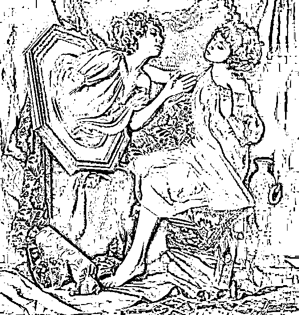 

 在咨询中，我们一起挖掘出了一件尘封已久、似乎无足轻重的旧事：少女时代的她迷恋过一部连续剧的男 2 号——那是一个曾经温文尔雅、善良又优秀的男人，不幸的是在一开场就被恶势力所控制，迷失了本性，此后做尽恶事。但女孩却一心期待他终有一天能迷途知返——这与她如今沉溺的幻境如出一辙。 

“那后来呢？他恢复本性了吗？”我追问道。

女孩的眼神黯淡下来：“我等到了 50 集剧终，他到死都没有……” 沉默片刻，她一字一顿地说道：“我好像，看到了我和他的结局……”

海王星会驱使我们找寻理想的典范，相信想要的东西，甚至将我们诱入虚无缥缈的幻境。我们徜徉于至乐的梦境中，不愿醒来，想借此逃脱日常生活的痛苦。这源于下意识的恐惧，因为当下立即揭穿它，会迫使我们面对心中的空虚。我们宁愿驻留在黑暗里，维持着那份神秘感，而不愿去觉察那些长久以来被我们无限美化的事物其实并不如想象的那么有价值。 

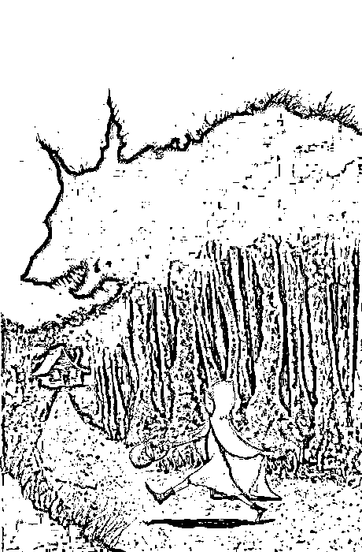

然而，被海妖塞壬的歌声所引诱的船，终将触礁沉没：射手座拥有追寻真相的勇气，土星行进到这里意味着，现实就是一支穿透幻象的利箭，将粉碎任何欺骗或是自欺。正如前面那位海王星女孩正在经历的，无论她怎样逃避，土星所代表的现实——冰冷的高墙都会矗立在那里，堵死她的退路。我看到行进的土星在不久的未来就会合相她出生星图中的海王星，同时触发内行星相位，而她告诉我，她的男友目前正打算举家移民海外，很可能就会在那个时间成行。   

3

**海王星的功课**

其实，学习臣服与放手乃是海王星教导我们的功课，所以从某个角度看来，貌似不可调和的土星与海王星也可以携手合作。

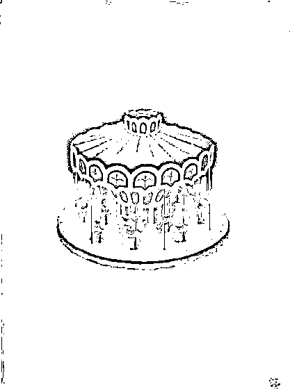 

或许现实残酷，事与愿违，即将成真的美梦转瞬变为灾难，正如古希腊英雄奥菲斯深入冥府拯救死去的爱人尤丽狄斯，却目睹爱人在即将踏上光明大地之际化为泡影，消逝在自己眼前。然而，从此他才再也无法否认尤丽狄斯的逝去，只有接受这个不可逆转的事实。最终郁郁寡欢的奥菲斯激怒了酒神的信徒，死在长矛之下。在神话中，死亡其实是个人重大改变的象征，因此从这则传说中，我们也看到，**有些时候唯有我们向土星所代表的困境低头，接受现实，方能得到内心的安宁，也才可能出现其他的救赎。**换句话说，如此幻灭的经历反而可以迫使人如实接纳真相，认识更高的实相。 


**作者简介**

Zora，国际占星研究协会（ISAR）认证占星师。2012 年在大卫·瑞雷老师指导下开始占星专业学习。尤其专注于研习古典占星，曾随当今最伟大的占星师之一罗伯特·汉德、台湾古典占星师希斯莉、美国知名古典占星师本杰明·戴克博士学习。对其他流派也有所涉猎，接受过诺·泰尔、苏·汤普金斯、斯蒂芬·福里斯特等多位名师指导。曾在若道星文化主办的职业占星师资质课程及古典占星课程中担任助教。

微博：Zora 占星　微信：astragj 微信公众号：Zora 占星

长按二维码，让金钱流向带来智慧的人

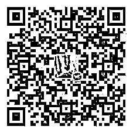

 **其他有关土星的话题，请戳：**

[关于成功，土星和木星一样重要](http://mp.weixin.qq.com/s?__biz=MzA5NjA0NTAxNg==&mid=400490938&idx=1&sn=6cd5a9d93ec589bc910dd2a9977d00d9#wechat_redirect)

[土星在射手座 | 伏怪以力，取经唯诚](http://mp.weixin.qq.com/s?__biz=MzA5NjA0NTAxNg==&mid=211696195&idx=2&sn=d39d9925050eeb40fe57f6575c09ffd9&scene=21#wechat_redirect)

* * *

**特别提醒：**希望将若道文章转载到各自公众号的朋友，**转载时请注明“转自若道微信公众平台”，并附上若道占星的 Logo**。谢谢！

**12 月 1 日****，**由**大卫**·瑞雷老师****主讲的****若道占星核心课程第四阶********[Level 4](http://mp.weixin.qq.com/s?__biz=MzA5NjA0NTAxNg==&mid=400203022&idx=2&sn=3518c0e8db3d8b01d99a055ff8c19869&scene=21#wechat_redirect)（点击可查看）************即将开课。**大卫老师会分别讲解如何通过出生星图进行性格分析********、爱情解读、事业分析。******了解**Level 4 课程**详情，请点击文末“**阅读原文**”。


# 倒计时·9 | 学完 Level 4，星图综合解读没问题~

> 原文：[`mp.weixin.qq.com/s?__biz=MzA5NjA0NTAxNg==&mid=400977179&idx=3&sn=e1c0f9daf58989e0737e8a3dd0255bff&chksm=02a4dfac35d356baf1fc1f9ead53967bfd6430a3d67b0ef62a582a9803d0c8154ba76159fe1e&scene=126&sessionid=1692738902#rd`](http://mp.weixin.qq.com/s?__biz=MzA5NjA0NTAxNg==&mid=400977179&idx=3&sn=e1c0f9daf58989e0737e8a3dd0255bff&chksm=02a4dfac35d356baf1fc1f9ead53967bfd6430a3d67b0ef62a582a9803d0c8154ba76159fe1e&scene=126&sessionid=1692738902#rd)

**课程信息**

开课时间：2015 年 12 月 1 日-2016 年 3 月 15 日

讲师：大卫·瑞雷

讲课城市：网络视频

费用(元)：6000

报名截止：2015 年 11 月 20 日

课程负责人：李老师  联系方式：010-58263061/010-56629907

**2015 年度若道新推出的专业占星课程分为五个级别，本课程属于若道专业占星课程第四级别，****Level 4****课程****。**

**课程描述**

**若道占星核心课程系列 Level 4**

**星图舞会——星图综合解读 24 小时**

在这个阶段，你终于可以学会星图的综合解读了！

前一阶段所有学到的越扎实，现在就越开心。你可以看到，当那些行星、星座、宫位、相位穿起来的丝线开始跳舞，一个个故事图景就像织锦一样展现在你的面前。个性、爱情、事业，看到一个人的出生星图，你就可以开始讲他们生命故事的梗概了。这里大卫老师会分别讲解如何通过出生星图进行性格分析、爱情解读、事业分析。在爱情解读部分，你还会提前学到比对图。

这个课程结束后，你就可以练习解读出生星图的重要问题了。

**授课内容**

**星图综合解读——性格分析**

**星图综合解读——爱情（出生图）**

**星图综合解读——爱情（比对图）**

**星图综合解读——职业**

在整个教学过程中，不仅用名人案例讲解，而且将会抽取同学星图，演示如何就爱情议题、职业咨询议题进行咨询示范。

**课程时间**

授课时间：2015 年 12 月 1 日-2016 年 3 月 15 日

每周二晚上 20：00-22:00 （北京时间），共计 12 次课

**授课形式**

1. 网络教学：网络视频会议系统上的在线课程和答疑辅导，只要有上网的条件在世界各地都可以上课，无地域限制。北京同学可以到若道办公室现场上课。

2. 中英文双语授课，专业占星口译员中文翻译。

3. 每次课后都有助教在线答疑。

4. 每月组织沙龙互动练习。

**教学优势**

**作为国际占星研究协会（ISAR）在中国唯一指定的教学机构，我们有：**

**专业师资（国内最专业）：**

1.国际一流名师：大卫•瑞雷 40 年占星咨询和教学经验，4 年中国本土化教学经验，无保留传授。

2.职业占星师助教：我们的助教，均为 ISAR 认证职业占星师或大卫老师职业占星师资质班优秀毕业生。

3.专业翻译：擅长占星的英文翻译，完全不懂英文的同学也可以聆听大师的教诲。

**系统教学（国内最完善）：**

1.学习路径：完整的知识结构，清晰的知识点，大量案例展示、咨询示范。

2.心法传授：大卫老师 40 年实战咨询经验，绝非仅靠读书就可以获得。

3.实战练习：在 Level 5 将组织实战练习，为开启咨询之路做好准备。

**完美互动（国内最丰富）：**

1.与名师面对面：北京同学可以来若道现场上课，和大卫老师面对面互动。大卫老师也可能前往主要学员所在城市，实现零距离教学。

2.互动答疑：论坛、QQ 群随时提问；老师课上答疑；助教线上线下全程协助。

3.线下沙龙：定期举办沙龙活动，复习上课内容。

4.强大的同学网络：若道作为中国最顶尖的占星教学机构，在 4 年的占星教学中，培养了很多占星人才。若道让你和师兄师姐切磋，让你和国内著名占星师学习。（简单来说，就是，人脉！）

**配套支持（国内最方便）：**

1.先进的教学平台：网络教学平台，支持手机、电脑、iPad 上网，可以随时随地学习。

2.回放复习：学员可登录网站收看课程回放，在线复习课程，每次课可完整重看 3 次，1 个月内有效。

**报名和付款**

课程费用：6000 元　

请在点击页面左下方“**阅读原文**”报名，以及在线完成学费支付。

咨询请拨打电话 010-56629907　

或课服 QQ：4006191014 （若道星文化）
或直接写信给 nodoor@vip.126.com，我们会回复您的疑问。 网页报名后无法进行在线支付的同学，可以通过银行汇款的方式支付课程费用。

汇款信息：蒋颖　6226 0901 0424 5721　招商银行北京中关村支行　

或支付宝：nodoor@yeah.net
请在汇款备注中写上自己的名字和所报课程，方便我们核对。

**退课与转课**

课程付费后，因个人原因无法参加通过邮件申请退款，开课前 3 天内可以全款退回。
开课后，若想申请退课或转课，请在第二节课前提交书面申请至 nodoor@vip.126.com。
退款和转课金额统一按 80%执行；
若课程进行到第二次后，不再接受退款或转课申请。

**大卫•瑞雷简介**


> 美国资深职业占星师。1970 年开始学习占星学，在通过亚特兰大职业占星委员会的考试后，于 1976 年获得执业许可，成为一名专职占星师。年过六旬的大卫老师，曾两任亚特兰大占星协会主席，是全美占星师联盟（AFAN）、美国占星师联合会（AFA）、全美占星研究委员会（NCGR）、国际占星研究协会（ISAR）和职业占星师组织（OPA）的成员，是联合占星大会（UAC, United Astrology Conference）督导委员会委员。
> 
> 大卫老师曾是 CNN、CBS 的占星节目的常驻嘉宾，多次在 BBC、WGS、WSB、WRGG 等节目中接受采访，并在亚特兰大主持电视节目《每日行星（Daily Planets）》达 4 年之久。至今已研究占星四十余年，拥有三十多年的占星咨询的执业经验，其服务客户包括学生、工人、市长、州长、议会议员、企业家、心理咨询师、工程师、艺术家、演员、知名企业家等，客户年龄跨度从襁褓婴儿到耄耋老人。2010 年 6 月，大卫的书《灵魂的目标》中文版出版。在 2011 年春季的北京之行期间，大卫接受了《南方周末》记者的采访，同时参与了 CCTV9 的纪录片的拍摄。
> 
> 大卫老师热爱教学，愿意将自己的毕生所学倾囊相授。为了将纯正的西方占星学带入中国、为了让更多的中国人从占星中获益，大卫老师在占星学的传授上投入了巨大的热情与心血。他以后每年将有一半的时间在中国度过，中国将成为他的第二个家。


# 射手座 | 经历天蝎座的蜕变后，是时候放飞梦想了！

> 原文：[`mp.weixin.qq.com/s?__biz=MzA5NjA0NTAxNg==&mid=400959662&idx=1&sn=735fdb83a92ab7cc38ccc694c6d27f12&chksm=02a49a1935d3130feb44f6079b44e1d725e8d3f71b52860b9f2729752eb9db940558a588a13e&scene=126&sessionid=1692738907#rd`](http://mp.weixin.qq.com/s?__biz=MzA5NjA0NTAxNg==&mid=400959662&idx=1&sn=735fdb83a92ab7cc38ccc694c6d27f12&chksm=02a49a1935d3130feb44f6079b44e1d725e8d3f71b52860b9f2729752eb9db940558a588a13e&scene=126&sessionid=1692738907#rd)

作者/杰夫·焦耳 翻译/轩轩

整理/徐珊珊 图片来源/花瓣网

杰夫·焦耳说，[天蝎座是走向射手座的天秤座](http://mp.weixin.qq.com/s?__biz=MzA5NjA0NTAxNg==&mid=400203022&idx=1&sn=70d55c4dd48225fa42740b3a08202bf3&scene=21#wechat_redirect)（点击可阅读），那么天蝎座是如何走向射手座呢？天蝎座和射手座是如何相辅相成的呢？杰夫在两年前写的这篇文章里做了进一步的阐释。文中与当时天象相关的部分，我们做了适应处理以符合当下的天象。
天蝎座的恐惧转变成射手座的梦想

11 月 22 日，太阳离开情感强烈的天蝎座，进入具有远见的射手座。**这意味着我们要从情绪思考中走出，开始积极地表达渴望。天蝎座**就像一个半空的玻璃杯，倾向于将过去的忧虑和当前的压力联系在一起，**将生活理解成一种挣扎**。**射手座**却能做到不理睬过去，有时甚至不理睬当下。它**寄希望于未来，憧憬一个更加令人满意的未来**。

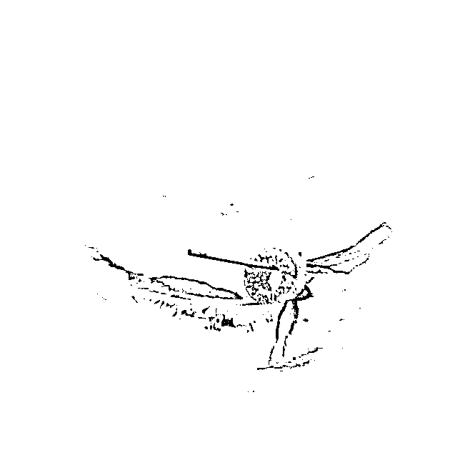

 但是，将天蝎座的恐惧转变成射手座的梦想，这个过程并不会自然发生。即使宇宙潮汐开始向积极的方向流动，我们也仍然可能会在其中迷失方向，就像自己在追求幸福时的迷茫。诚然，**天蝎座的任务是深入感知自我欲望，评估自己的资源，建立自己的优先顺序**。我们在完成这些任务的时侯，获得成就感的可能性会提升。不过这个过程并不是否定我们的怀疑和恐惧，而是来检测我们的怀疑和恐惧，如果它们有用的话，弄清楚到底哪些有用，然后将那些没用的怀疑和害怕消除掉。消除这些负面情绪，看起来似乎很简单，但是，我们却经常无法放下那些难以释怀的伤痛，从而开始新生活。我们当中有很多人都认为自己受困于各种条条框框，甚至会抗拒自己对自由的渴望这种最明显的意识。

天蝎座的专注力将射手座的视野拉回地面

**拒绝向前看，拒绝走向未来，只是我们抗拒改变的方法之一。另外一个保证生活一成不变的方法就是沉浸在梦想中，沉浸在永远不会成为现实的梦想中。**当水星、土星和太阳都在射手座，并且分别于 25 日、26 日、29 日精准四分朦胧海王星时，我们更有可能迷失在幻想里。这是一种间接的，通常是无意识的阻碍发展的方式，其结果是陷在当前的状况下，无法前进。

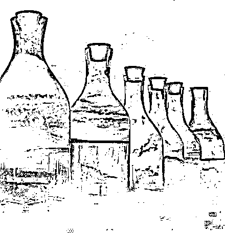

**将射手座的视野从幻想云端拉到地面的秘诀是利用天蝎座的专注力**。**天蝎座的注意力和毅力能刺穿射手座的各种空想，让其专注于渴望的真髓**。天蝎座并非与我们喜欢什么相关，而是与我们绝对需要的事物相关。**当一个梦想从一个宽泛的希望浓缩成一个具体的计划时，梦想就找到了扎根的土壤。**那些阻碍我们实现目标的障碍也就此被打破，打破它的正是天蝎座坚定的承诺和强大的动力。

回顾过去，看向未来，创造成就

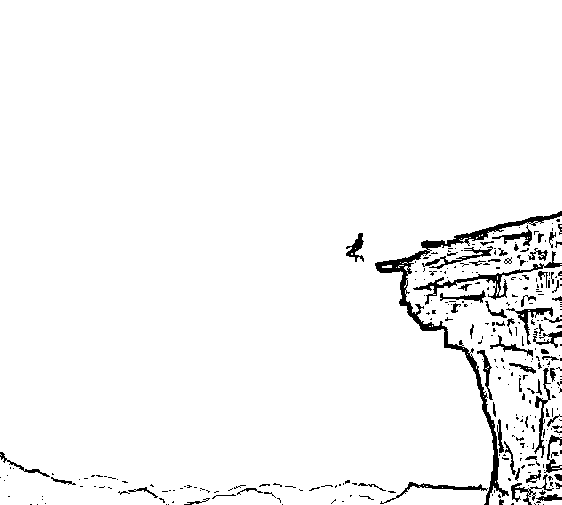 

当我们思考未来的时候，我们通常不想再回顾过往。然而，当我们使用黄道星座模型时，**我们所在星座的前一个星座通常决定了我们是会前进、停滞不前还是倒退。天蝎座的深度赋予了射手座的各种希望，射手座也能从代表饥饿或挣扎的天蝎座中获取养料。**这提醒我们，在积极和消极间画一条清晰的界限并没有什么价值，因为积极和消极相互依存、不可或缺。如果我们在看向未来时，有勇气回顾过去，就能拥有很多种可能性，从而创造成就。

 *2013 年 11 月 19 日*

**意犹未尽？点击阅读更多关于射手座的文章：**

[土星在射手座 | 伏怪以力，取经唯诚](http://mp.weixin.qq.com/s?__biz=MzA5NjA0NTAxNg==&mid=211696195&idx=2&sn=d39d9925050eeb40fe57f6575c09ffd9&scene=21#wechat_redirect)

[天蝎座是走向射手座的天秤座](http://mp.weixin.qq.com/s?__biz=MzA5NjA0NTAxNg==&mid=400203022&idx=1&sn=70d55c4dd48225fa42740b3a08202bf3&scene=21#wechat_redirect)

* * *

**特别提醒：**希望将若道文章转载到各自公众号的朋友，**转载时请注明“转自若道微信公众平台”，并附上若道占星的 Logo**。谢谢！

**12 月 1 日****，**由**大卫**·瑞雷老师****主讲的****若道占星核心课程[Level 4](http://mp.weixin.qq.com/s?__biz=MzA5NjA0NTAxNg==&mid=400203022&idx=2&sn=3518c0e8db3d8b01d99a055ff8c19869&scene=21#wechat_redirect)（点击可查看）****即将开课。**大卫老师会分别讲解如何通过出生星图进行性格分析********、爱情解读、事业分析。******了解**Level 4 课程**详情，请点击文末“**阅读原文**”。


# 宇宙天气 | 坚守理想的方式并非只有一种（11.23~11.29）

> 原文：[`mp.weixin.qq.com/s?__biz=MzA5NjA0NTAxNg==&mid=400959662&idx=2&sn=ca7ed65724672421c99f16b7bac0f54d&chksm=02a49a1935d3130fd1f941153a41df90c39b29ffd06c25771da0173541edd639c35dce023399&scene=126&sessionid=1692738907#rd`](http://mp.weixin.qq.com/s?__biz=MzA5NjA0NTAxNg==&mid=400959662&idx=2&sn=ca7ed65724672421c99f16b7bac0f54d&chksm=02a49a1935d3130fd1f941153a41df90c39b29ffd06c25771da0173541edd639c35dce023399&scene=126&sessionid=1692738907#rd)

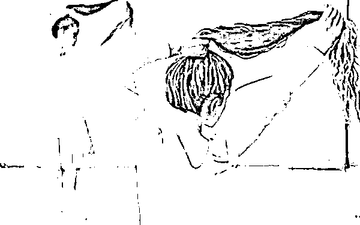

**一周星象综述**

本周月亮经过白羊座、金牛座、双子座、巨蟹座。本周星象的一个重要特点是，几个重点星象的共振主题十分突出：双子座满月、射手座水星合相土星并四分海王星。它们同时强调了思维观念上的反思与变化，这背后，是对于长期目标和个人信念的更深入检验，以及对相关的“现实策略”进行调整。

周一，虽然月亮在火爆直接的白羊座，但是比起随后的几天，仍算是“平静”的一天。我们会有急于实现目标的冲动，这是快节奏的一天。 

周二和周三，月亮在金牛座。周二有多个月亮的 150 度相位，容易出现莫名的情绪上的紧张或神经质倾向，但天秤座火星六分土星，有利于效率的提升和行事风格的稳定、妥当。周三，过度思考带来的压力、焦虑和混乱感变得强烈，我们的观念想法可能遭遇挑战，或我们自己意识到有些模式到了非变不可的时候。 

周四和周五，月亮在双子座，是本周的“大戏”上演的时刻。周四早上双子座满月，晚上土星四分海王星准确成相。压力带来变革，老旧的观念和认知模式将有机会被更新。我们需要真实地聆听他人，去观察，去体验，获得更加鲜活、实用的信息，来帮助我们实现长远的目标。要知道，理想可能只有一个，但坚守理想的方式并不唯一。 

周六和周日，月亮在巨蟹座，是对双子座满月带来的启迪进行“消化”的时候。由于巨蟹座月亮会四分金星、火星、天王星，对分冥王星，所以这个周末的情绪恐怕不太平静，是容易爆发情感风波的时段。

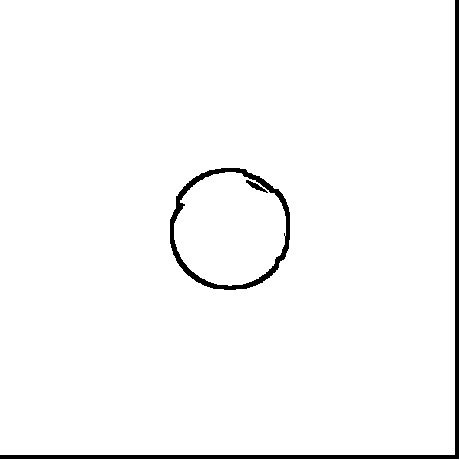

11 月 23 日星期一

**03:17** 白羊座月亮合相天王星

**08:15** 白羊座月亮与处女座木星形成 150 度相位

整个早上易被焦躁、激进的情绪包围。月亮在白羊座带来充满爆发力和进取精神的一天，自主性增加，追求目标的心情更加迫切。

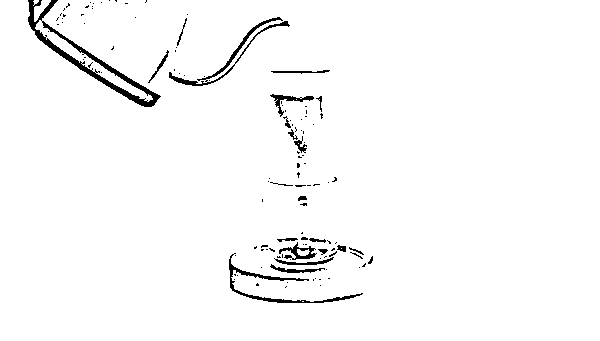

11 月 24 日星期二

**00:25** 月亮离开白羊座进入金牛座

情绪变得平稳有力，对于物质和感官享受的需求增加。未来两天多的时间里，我们需要做更多事来满足自己对于生活品质和舒适感的要求。这两天容易花钱在享受生活上，同时对于金钱的关注也会提升。这期间，由于月亮与多个内行星形成 150 度相位，也容易感到内心的宁静受到干扰，这也会刺激我们去觉察如何真正找到内心的安宁。

**06:14** 天秤座金星对分天王星

关系中的不稳定因素暴露出来。我们个性中未被察觉的叛逆因素，或是对一段关系潜藏的不满，可能以一种带来意外和震惊的方式爆发。若能以开放的态度面对关系中的不和谐音符，则有机会看到自己和对方更加真实的一面。此相位重点影响周一和周二两天。

**08:38** 金牛座月亮与射手座水星形成 150 度相位

**11:22** 金牛座月亮与天秤座火星形成 150 度相位

**11:25** 金牛座月亮与射手座土星形成 150 度相位

由于多个 150 度相位同时出现，这个上午易有某种潜在的“心理不和谐”的感受。一些看似无关痛痒的小事可能牵动我们的神经，让人不爽。人际周旋或观点碰撞，可能带来某种厌烦情绪。有固执倾向。

**11:52** 金牛座月亮六分海王星

同理心和感受力增强的时刻。也容易对舒适的环境或能提供安全感的情感对象产生依赖。

**13:20**  天秤座火星六分射手座土星

行事稳定，负责，有耐心，特别是在涉及到与人打交道的事务上。有助于处理跟人际关系或合作相关的事，也有利于关系中公正、公平的维护。此相位重点影响周一到周四的时间段。

**22:57**  金牛座月亮三分冥王星

能够敏锐觉察到身边可利用的资源和获得权力的机会。对于他人心理的洞察力提升。有能力对自己的情绪进行有效的控制。

**23:59**  天秤座火星与海王星形成 150 度相位

莫名的愤怒，目标混乱或有力使不出的感觉。也可能在人际关系中过度敏感而有焦虑情绪。

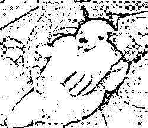

11 月 25 日星期三

**09:27** 金牛座月亮三分处女座木星

有乐观、积极的心境，更容易感受到生活中的富足与幸运，是幸福感提升的时刻。

**12:58** 射手座水星合相土星

**15:16** 射手座水星四分海王星 

这两个相位，应与发生在周四的土星四分海王星结合起来看，也就是：水星合相土星，四分海王星。这意味着，土海四分的压力，将给我们的思维和认知带来明显的影响。一方面，水星合相土星，十分有助于抽象思维，对于宏观概念的理解，以及学术研究。我们会更有全局观，对事物做更加系统化的思考，想问题也会更加严谨、审慎。我们也容易去思考一些有关信念与意义的严肃命题。另一方面，水星、土星与海王星四分，也暗示了过于严肃、悲观的想法可能带来的幻灭感与挫败感。这是在现实与憧憬、当下与未来之间寻找平衡的时刻，梦想与理智规划应并行不悖。这组相位带来的头脑和思维上的刺激与推力，可认为持续影响本周的时间（因为还与双子座满月相关联）。  

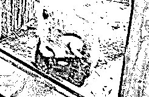

11 月 26 日星期四

**01:15**  月亮离开金牛座进入双子座

好奇心增强，对资讯、信息和新鲜事物更加敏感。未来两天多的时间里，有更多吸纳新知识新讯息以及与他人沟通交流的需要。也会有更多新观念、新思路，刺激我们的头脑。这期间，双子座满月将带来观念和认知模式的更新，我们与世界的交流方式，可能发生全方位的变化。

**06:45**  双子座满月（双子座月亮对分射手座太阳）

原有的观念和认知习惯受到挑战，一些看问题的方法和态度必须被改变。水星合相土星、四分海王星的相位，更加强调了惯性思考带来的困境，或许换个角度就是出路。满月期间也易有意见的分歧、言语冲突出现，我们需要学习从不同角度看问题，坚持信念而不顽固。

**12:47** 双子座月亮对分射手座土星

**12:51** 双子座月亮四分海王星

**15:27** 双子座月亮对分射手座水星

这三个相位可以放到一起，是双子座的月亮与射手座的水土合相，以及双鱼座的海王星，形成 T 三角。这会带来不同观点的碰撞与交融，头脑的刺激，也可能伴随着混乱、迷惑的感受，或对于新信息的“消化不良”。加上满月带来的情绪波动，我们很可能觉得需要解决的问题太多而难以平静。

**14:24** 双子座月亮三分天秤座火星

行动力增强的时刻。行动，部分上缓解了思考的焦虑。

**20:16**  土星四分海王星

这是土海四分相位准确发生的时间，此相位重点影响本周一整周。这期间我们在某些方面的想象或期待，将接受现实的拷问，易有幻灭感或悲情情绪出现。这是在信念上“去伪存真”的时候，也是检验我们是否真的愿意为理想做出承诺的时刻。

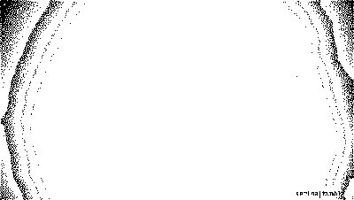

11 月 27 日星期五

**05:17**  双子座月亮六分天王星

新观点或新视角会刺激我们的头脑，这是开发创意或进行头脑风暴的时候。这是双子座满月之后，一个“发现新路径”的机会。

**11:25**  双子座月亮四分处女座木星

大量地接受新信息，同时感受被放大，某些信息的含义可能被夸张解读。对小事过于敏感，神经亢奋。可能会太想讲话，好奇心和表达欲过强。

**11:36**  双子座月亮三分天秤座金星

此时宜与朋友分享我们的新想法，获得来自他人的反馈或协助。我们能够以轻松的态度与人沟通交流，并享受这个过程带来的愉悦。

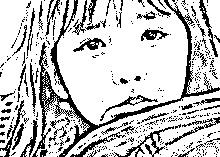

11 月 28 日星期六

**03:26** 月亮离开双子座进入巨蟹座

情绪变得敏感、脆弱。未来两天多的时间里，我们会更加念旧，多愁善感，更容易被生活中的那些温情时刻所打动。对人与人之间的关怀照料、情感的滋养，有更多渴望，情感需求变强。

**13:12** 巨蟹座月亮与射手座太阳形成 150 度相位

**15:39** 巨蟹座月亮三分海王星

**16:01** 巨蟹座月亮与射手座土星形成 150 度相位 

这三个相位的影响可以放到一起。主要的矛盾在于，敏感、多情的愁绪，与理智上对于个人原则的坚守和对自由的主张，发生矛盾。自由豁达，与情感联结，有时可以共存，有时则必须取舍，这是此刻的小难题。

**19:34** 巨蟹座月亮四分天秤座火星

想要“争得”更多的爱与关心，会因为情感需要得不到满足而愤怒。这是容易因“谁对谁更好”、“谁付出更多”而产生冲突的时候。需要接纳自己身上的脆弱性，先给予自己更多的理解。

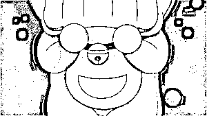

11 月 29 日

星期日

**03:50** 巨蟹座月亮对分冥王星

不安全感和危机感加重，有对抗情绪，易走极端。也容易感受到与他人的权力对抗，有被控制的感觉，也会试图控制他人。感情中虐心的时刻。这个时候大部分人是在睡梦中的，但对有些人来说，则可能是个不眠夜。

**08:58** 巨蟹座月亮四分天王星

躁动、敏感、易激动的早晨。

**16:05** 巨蟹座月亮六分处女座木星

能够顺利感受到爱与关怀带来的滋养和喜悦。幸福感和爱的能力提升。

**20:47** 巨蟹座月亮四分天秤座金星

渴望获得爱与关注的心情有些急切，想要取悦他人。或把付出关心和照料当成交换爱的筹码。

**22:51** 射手座太阳四分海王星

目标可能过于远大而脱离现实。对于自己的身份和能力有不实际的估量。这个相位也意味着崇高的理想和为信仰献身的精神。


## **作者简介** 

**占星师 Cora**，全美占星师联盟（AFAN）成员，国际占星研究协会（ISAR）会员，获 ISAR 职业占星师资质认证，斯蒂芬·弗里斯特《变幻的天空》译者，个人星象文章见诸《心探索》《北京青年周刊》《上海电视》《空中生活》等杂志媒体。曾跟随大卫·瑞雷系统学习占星学，现为全职占星师。  

微信公众号：聆宇 FM（微信号：lingyudiantai）

个人微信号：CoraAstro

长按二维码，让金钱涌向传播知识与智慧的人~~


* * *

**特别提醒：**希望将若道文章转载到各自公众号的朋友，**转载时请注明“转自若道微信公众平台”，并附上若道占星的 Logo**。谢谢！

**12 月 1 日****，**由**大卫**·瑞雷老师****主讲的****若道占星核心课程[Level 4](http://mp.weixin.qq.com/s?__biz=MzA5NjA0NTAxNg==&mid=400203022&idx=2&sn=3518c0e8db3d8b01d99a055ff8c19869&scene=21#wechat_redirect)（点击可查看）****即将开课。**大卫老师会分别讲解如何通过出生星图进行性格分析********、爱情解读、事业分析。******了解**Level 4 课程**详情，请点击文末“**阅读原文**”。


# 第八宫 | 走近黑洞

> 原文：[`mp.weixin.qq.com/s?__biz=MzA5NjA0NTAxNg==&mid=400941113&idx=2&sn=97d71870d982a74fbc046aca5c831b75&chksm=02a7528e35d0db983c3c2717432e22e844d6c67ca91965416461d7e68e9df3cb811d5075e76e&scene=126&sessionid=1692738907#rd`](http://mp.weixin.qq.com/s?__biz=MzA5NjA0NTAxNg==&mid=400941113&idx=2&sn=97d71870d982a74fbc046aca5c831b75&chksm=02a7528e35d0db983c3c2717432e22e844d6c67ca91965416461d7e68e9df3cb811d5075e76e&scene=126&sessionid=1692738907#rd)

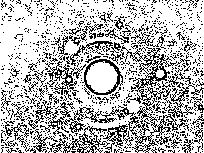

多事之秋，这是一个沉重的天蝎月。连日阴霾的北京，正进入萧瑟寒冬。空气中除了雾霾雨雪，还盘旋着恐惧与焦虑？国际暴恐挑战着禁忌的底线，正在打开潘多拉的盒子，不断给现代文明社会带来震惊！伴随新一轮金天冥星象，人类正被对应天蝎座的第八宫意象所干扰，欲言又止，虚掩着什么......有一种说法：当人类集体意识中的负面能量积聚到一定程度时，就会以极端的形式在外境中显现出来，因为世界本质上即是人类集体内心的投影？ 

月亮在天蝎座的我已写过了天蝎座和冥王星。而近日心境，或许该写写第八宫了。

占星学中的第八宫，对应天蝎座的意象。而在每个人的星图中，都有这样一个宫位领域，掌管着生死、性、欲望……

有一个漩涡，深藏于每个人的心里；有一个黑洞，它可以吸纳一切星辰。

当阳光照进洞穴，会爬出些什么虫子？不要大惊小怪，那只是最真实的人性。

第 8 宫，欲望之宫，万恶之源。它如此深邃，晦暗繁杂，很难在此短篇中面面俱到。解谜星空，不用说教，让我用由远到近的镜头，截取几个意象来洞穿它：

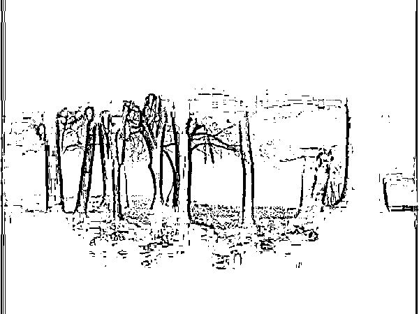森林八宫我在《三体》宇宙社会学中看到它

“宇宙就是一座黑暗森林，每个文明都是带枪的猎人。像幽灵般潜行于林间，因为林中到处都有与他一样潜行的猎人，如果发现了别的生命，所有人能做的只有一件事：开枪消灭之。在这片森林中，他人就是地狱，就是永恒的威胁，任何暴露自己存在的生命都将很快被消灭...... 

一个文明不能判断另一个文明是否会对本文明发起攻击；

一个文明无法判断另一个文明对自己是善意或恶意的；

一个文明无法判断另一个文明认为自己是善意或恶意的；

一个文明无法判断另一个文明判断自己对它是善意或恶意的……”

远至宇宙国家，近至商业社会及个人心理，都有这样一片诡秘的森林，布满猜疑链与潜规则。始于原始狩猎中形成的恐惧与贪婪本能，对有限资源的危机竞争意识，强迫性地谋求自身利益最大化。伪装自保，伺机进攻，逼死对手，占据垄断。而这一切残酷的法则，皆根源于人性的生存焦虑。第八宫的月之暗面，已被这段意象隐喻得惟妙惟肖。

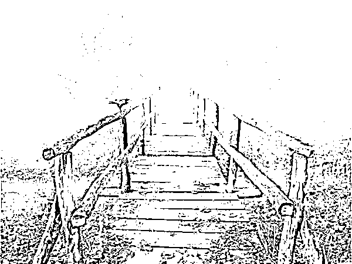秘密八宫我在《从 0 到 1》第八章诗中看到它

“就像托尔金在《魔戒》中所写：

不断向前延伸的道路，是从家门开始的。

人生是漫长的旅程；由前人踏出来的路，一眼望去，没有尽头。

不过这个故事后面还有另一首诗：

转角处等待我们的，是新路或神秘的门，

即使我们今天路过，明天可能还会回转。

请选择这隐秘的路，通向月亮或者太阳。

道路不必无限延伸，一直走下去。选择那条隐秘的路吧。”

商业的核心竞争力即是秘密，一切成功都建立在开放却未知的秘密之上。第八宫，是每个人装满隐秘的后花园，人们在这里举行化腐朽为神奇的仪式。当心智的鹰眼锁定了那个可以破局的单点，并激光般地倾注全力，便可以体验到一种叫作幂次法则的神来之笔，我谓之天蝎式的效率。作者 Peter Thiel 的天蝎座水星自然深谙这个秘密。

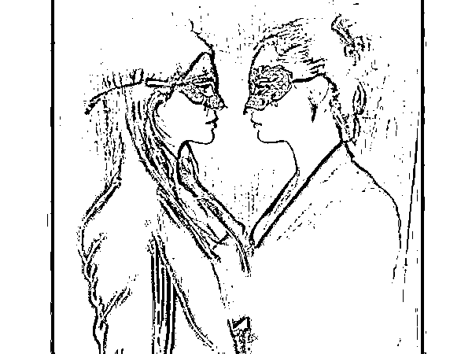人性八宫我在大卫·休谟《人性论》中看到它

“我们拥有三种不同的财富：内心的满足；身体的外在优点；对用勤劳和运气所获财产的享用。享用第一种财富完全安全；第二种财富可以被夺走，但对夺取者人来说并没什么利益；只有最后一种财富，既面临他人暴力的危险，又可在毫无损失变更下发生转让。而同时，并没有足够数量的这种财富能满足每个人的欲望和需要。/ 社会的主要纠纷发生于被称之为外物的那些财物，及其在人与人之间随意转移转让时。/人类永远无法克服自他狭隘的灵魂，人人短视近利，只顾眼前。这就是人性，不要妄想去更改。”

远观商业，近窥人性。第八宫，相关人性的终极追问。尤其是第八宫被强化的人，聚焦于内心本质，生来就会问一连串的为什么（此惯性持续到第九宫）。继而，在一系列追问后，明确了**欲望**，也发现了**限制**。面对那些不属于自己，且通过自身无法拥有的东西，内在的绝望正在滋生……没有人喜欢限制。或许他们通过结合找到了捷径……而在饱涨的魄力与无力感的虚无之间，总有一种类似于死生的况味交替着。于是，欲望的温床与限制的禁忌，衍出了一众情绪，源于**恐惧**，继而**贪婪**。愉悦滋生了贪婪，痛苦放大为恐惧。当用贪婪乘以恐惧，便织出了更多本能且强迫性的病态情绪：

**嫉妒**，是对人有我无之物，赋予了疯狂的想象力，凝聚成强烈的情绪表达；**掌控**，出于对损失的敏感，对渴望的迫切，或出于无意识的依赖，试图以控制他人来巩固自我安全感，且会在信任危机下失去理性；**焦虑**，对惶恐与不确定的本能反应。源于第八宫中被按捺的一切欲望和恐惧。从意识中被按压下去的，却在潜意识中生根，强迫式地循环播放着自编自演的小剧本，被妄想的负面意象围剿，筑成心魔，直至内存被反复思考的 bug 所拖垮。

讽刺的是，上述一切内心戏，都将在下文的一个瞬间里，灰飞烟灭……

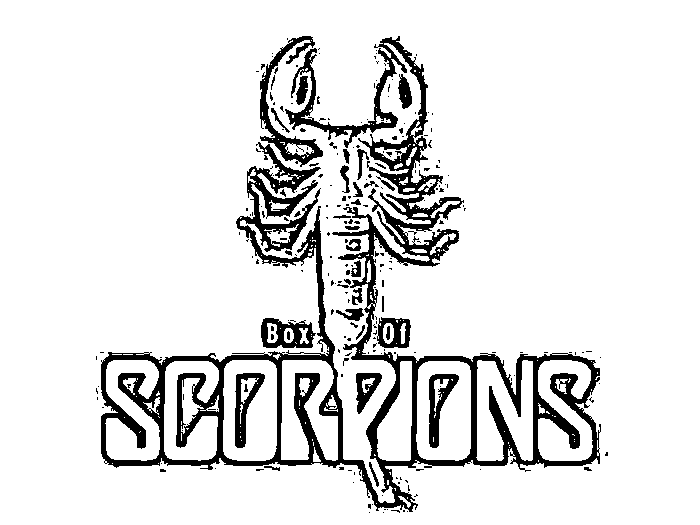取舍八宫我在《内在的天空》天蝎座中看到它

“今天，这只蝎子立在你的腹部，所有这些就像遥远星系中的一颗微弱红星般不重要了。这只蝎子在你的肚皮上，只有极度强烈的当下存在了。所有其它的事情—所有的虚假、虚荣、野心—都被撕下来了。头脑，裸露着，非常警觉地，像一块被切割过的宝石一般锋利，随时准备活着或死亡。这种态度，这种意识状态，就是天蝎座。你被一个身体所困，这个身体注定要死，而且脆弱得像狂奔的牛群中间的一朵兰花一样…… 未来消失了，过去蒸发了。我们全然地集中注意力于此刻。其它所有事情都不再重要。在这个当下，所有的礼貌、虚伪、令人舒服的仪态全部都被撕掉了。只有真相残留下来。我们前所未有地知道自己是谁、自己想要的是什么。如果那只蝎子爬出了睡袋，消失在沙漠中，那么这个恶梦可能会变成一次祝福。也许我们会将那种诚实、强度和清晰感带入自己的生活中。我们将不再为一个有过失的过去还有一个空想的未来而上瘾和负累。这就是天蝎座的目的地。以那样的强度来生活。将所有的虚伪都烧掉。不让任何事情藏在恐惧之墙的后面。让无意识变得有意识。”

分享斯蒂芬·弗里斯特在《内在的天空》刻画天蝎座的这段神文，我曾被之深深撼动。而每个人，都注定在人生的某个转角，清晰地邂逅这一张画面……继而，学会了放下我执。也唯有此时，人生的布局，才不再是双鱼式的霞映澄塘，而进化为天蝎式的月射寒江！

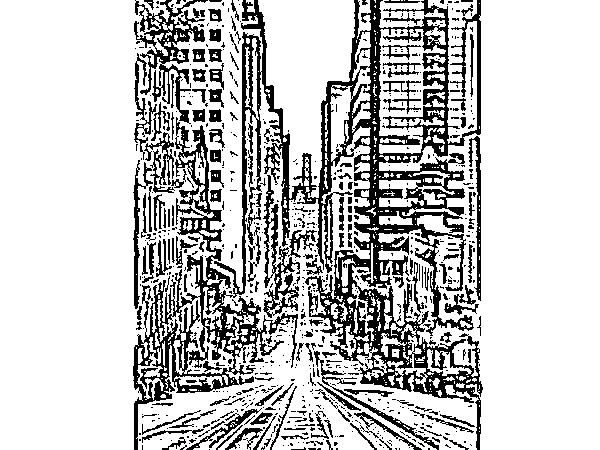激情八宫我在旧金山的一座桥和一条路间看到它

这是一个令我很有宿命感的城市。因为一见钟情，继而莫名地归属。橙色的金门大桥，象征这座城市浴火重生的颜色。天蝎座之城，销魂之美，透过三藩人深邃的眼神，我为何总能瞥见灵魂的丰腴？而这条加利福尼亚大街，仍常常引我凝神以对……当面前挂起了 60 度的陡坡，你的第八宫，必然想要体会这惊险的一跃！对应这里最富盛名的情怀——创业精神。曾有天蝎座带我从这里急速滑行下来，那一刻，我听见自己的惊叫声……充满了喜悦。前方，夜路的尽头，是微缩的大桥。自那一刻起，心中的畏惧已转化为征服的决心。画外音，天蝎座对我说：When you fear of missing out, in fact you are missing out, that's Failure of the moment. Only coward fear of uncertainty. Just do it!

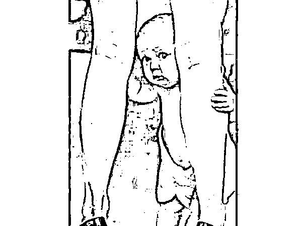黑洞八宫我在冥王星第八宫人的回忆中看到它

一个小男孩，曾在七八十年代的居民区，划着火柴，潜入迂回的水泥管子去探险……心怀无限恐惧，无奈众目之下，又不得不勇往直前。黑暗中的每一步行进，都伴随着毛骨悚然的内心对话：再深处会遇见什么？会不会有猫的尸体，又会不会有人的 skeleton？…… 而次日，他一个人打着手电，又进去探险了……

他有所不知的是，儿时的那个黑洞，恰恰象征着人性最深层所隐匿的欲望。从此，他在第八宫冥王星的驱使下，展开了终其一生的探索……

其实，再强大的勇者，也惧怕面对自我深层的恐惧。面对第八宫，有人被其操纵，有人在逃避之；而唯有诚实面对它，才是正解。试将它从潜意识中，提出到我们的意识中来，建设性地加以转化。比如，练习去做些你害怕的事，并留意恐惧被释放时的感觉。直到你开始做了，才发现其实根本没有那么难。就像死亡其实或许也并没有那么可怕~

（记录天蝎新月 4 宫的心迹旅行）

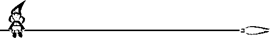

**蓝女巫 CeciliaSui**

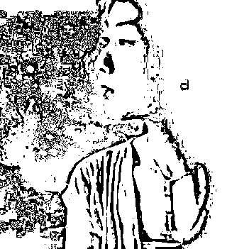

英国伯明翰大学 市场营销学硕士

**中国首批**  **ISAR 英文资质认证占星师（2012）**

美国 GIA 珠宝设计师 英国 IFPA 认证芳疗师

《占星学刊》专栏作者

日处月蝎，细致精准，专长定位：

**“帮灵魂穿珠子的人”**

**......**

**QQ****：2413369983** 请注明“占星” **淘宝：**蓝女巫占星会所

**微博：**蓝女巫 CeciliaSui

**微信公众号**：cecilia_sui

* * *

**特别提醒：**希望将若道文章转载到各自公众号的朋友，**转载时请注明“转自若道微信公众平台”，并附上若道占星的 Logo**。谢谢！

**12 月 1 日****，**由**大卫**·瑞雷老师****主讲的****若道占星核心课程第四阶********[Level 4](http://mp.weixin.qq.com/s?__biz=MzA5NjA0NTAxNg==&mid=400203022&idx=2&sn=3518c0e8db3d8b01d99a055ff8c19869&scene=21#wechat_redirect)（点击可查看）************即将开课。**大卫老师会分别讲解如何通过出生星图进行性格分析********、爱情解读、事业分析。******了解**Level 4 课程**详情，请点击文末“**阅读原文**”。


# 干货 | 如何从比对图看爱情关系？

> 原文：[`mp.weixin.qq.com/s?__biz=MzA5NjA0NTAxNg==&mid=400941113&idx=1&sn=26c5b2479ce0cad3575f05f0ed94f3dd&chksm=02a7528e35d0db9816d2eb31c2e12d783cec736866b6f6a6a8dc660d51749f12691ba9cdc847&scene=126&sessionid=1692738907#rd`](http://mp.weixin.qq.com/s?__biz=MzA5NjA0NTAxNg==&mid=400941113&idx=1&sn=26c5b2479ce0cad3575f05f0ed94f3dd&chksm=02a7528e35d0db9816d2eb31c2e12d783cec736866b6f6a6a8dc660d51749f12691ba9cdc847&scene=126&sessionid=1692738907#rd)

作者/史蒂芬·阿若优 翻译/蓝莲花
图片来源/花瓣网 摘自《人际占星学：性与爱的能量和谐》
感谢世界图文出版公司授权使用此译文！

在占星学中，我们会通过比较两个人的出生图，来判断他们的匹配度和关系的幸福度。那么在做星图比对时，要考虑哪些因素呢？史蒂芬·阿若在[《如何从比对图看爱情匹配度？》](http://mp.weixin.qq.com/s?__biz=MzA5NjA0NTAxNg==&mid=400799525&idx=1&sn=5a851ffd7fb388cb67976fcbcd505a97&scene=21#wechat_redirect)（可点击阅读）中，从行星的角度为我们做了梳理，今天这篇文章则从相位的角度进行了梳理。

## 1**聚焦最紧密的相位**

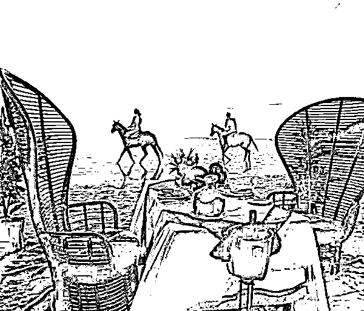 

最紧密的相位意味着这个领域存在最有活力、最强烈的能量交换。这是互动的关键领域，双方的能量场有着强有力的互动，可能是和谐交融的，也可能是冲突的，也有可能二者兼有。**在分析比对图中，紧密相位需要我们特别注意。**  

## 2**每个相位必须根据行星（以及所在星座）的属性进行评估**

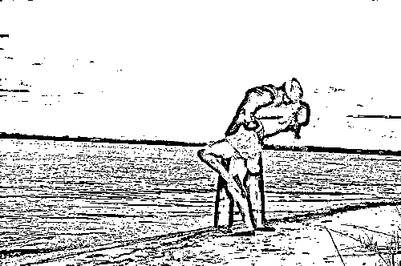 

换句话说，**相位类型的影响力要次于行星能量互动的影响力**。例如，木星合相太阳，木星四分太阳，都意味着鼓励乐观的自我表达，只是四分相位通常会有过度或极端的倾向。举一个例子，若一个人月亮与另一个人的土星形成相位，不管是四分相、三分相还是合相，双方在一段关系中都会有相似的压力体验。只是四分相和对分相的感受会更具压迫力，更不稳定，而三分相、六分相相对稳定，甚至会有一些受限感。

对此，读者可以参考附录中列出的行星能量表达方式，并且要牢记，这些生命能量交换是时刻存在的。为了方便读者预览占星学这一方面的内容，我用下面的术语来简要表明，在紧密相位中，某一特定的行星是如何影响其他行星的。

**太阳：**发光，注入活力，鼓励，寻求身份认同

**月亮：**回应，产生感情共鸣，接受，寻求安全感

**水星：**激活认知，促进新概念的产生，增进交流、联系，交换彼此的想法

**金星：**和谐的，激发温情和愉悦感，唤醒社交回应以及审美和浪漫感

**火星：**注入能量，缺乏耐心地开创进取、促使做出决断，侵略性地行动

**木星：**膨胀，促进改善，增强乐观和自信

**土星：**延迟、限制、集中，关注现实层面，有责任感

**天王星：**加快生命节奏，为知觉“充电”，有革新精神，破坏既定的思维和行动模式

**海王星：**启发灵感，但也可能是暗中腐蚀，理想化、浪漫化、敏感

**冥王星：**彻底变革，破旧立新

## 3**涉及太阳、月亮、上升点的相位永远很重要**

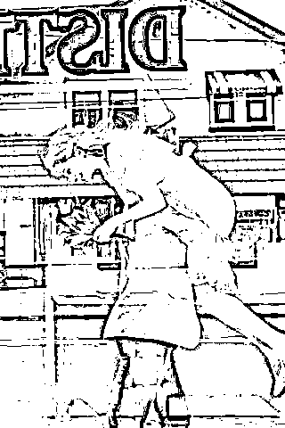

关于这一点，第七章介绍月亮的部分和第六章介绍上升星座的部分做过一番解释。读者可以参考附录中对这些能量的表达方式的定义。**相当一部分事实证据都指出，比对图上的月亮和谐相位，对于构建一段长期的、和谐的家庭关系至关重要。**心理学界的开路先锋荣格曾统计研究了五百对夫妇的比对图，结果收录在他的著名作品《共时性：非因果性联系原则》里。

统计结果表明，在这些已婚夫妇的比对图上，最常出现的四种比对相位中，有四分之三至少涉及一方的月亮。由月亮参与的三种比较相位包括：月亮合相月亮、月亮合相太阳和日月对分。第四种最常见的比较相位是火星合相火星，这个相位象征着双方在性方面互相理解，身体能量协调，也意味着双方的目标一致，日常生活中的习惯也能达成和谐。

## 4**与他人的个人行星（水星、金星、火星）形成的紧密相位永远值得分析**

如果一个比对相位涉及的两颗行星没有个人行星，也不包括上升，那么这个相位对于这段关系可能并不太重要。例外在所难免，但普遍如此。 

## 5**与上升点对分的行星必然与下降点相合，对于亲密关系而言这是特别重要的相位**

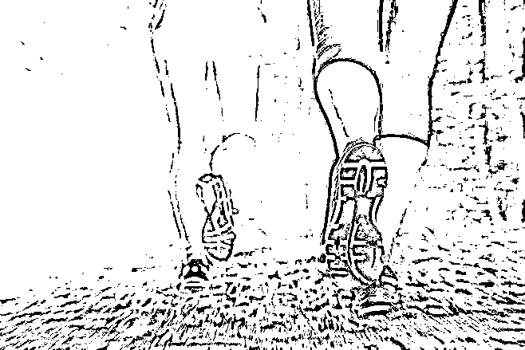

下降点是与上升点相对的落点。因此，下降点所在星座永远与上升星座对分。当然，下降点对案主的能量调谐和心理状态的影响远不及上升点重要。换句话说，**一方任何一颗行星与另一方的下降点相合时，都会对这段关系的活跃度及品质产生显著的影响。**

## 6**最终的目标是对整张比对图以及它的主题和目标有清晰的认知**

进行这种综合观察需要时间，也要有相当的经验。星图解读是罕见的自然能力，不过也是一门艺术，是一门科学。一旦掌握了这门科学（艺术），我们就能用它来评估两个人的能量场的互动方式。

**其他有关爱情的话题，请戳：**

[如何从比对图看爱情匹配度？](http://mp.weixin.qq.com/s?__biz=MzA5NjA0NTAxNg==&mid=400799525&idx=1&sn=5a851ffd7fb388cb67976fcbcd505a97&scene=21#wechat_redirect)

[打开金星的大门，进入月亮的深井](http://mp.weixin.qq.com/s?__biz=MzA5NjA0NTAxNg==&mid=400671806&idx=1&sn=02b3a25e81e26663c4617349d59e9757&scene=21#wechat_redirect)

[想锁住爱情？它会死的！](http://mp.weixin.qq.com/s?__biz=MzA5NjA0NTAxNg==&mid=400511232&idx=1&sn=109677635aaa4b8d6be1c264e09f4bef#wechat_redirect)

[到哪里去找你的灵魂伴侣？](http://mp.weixin.qq.com/s?__biz=MzA5NjA0NTAxNg==&mid=400580716&idx=1&sn=c9d8cacf97fda97c2003b9d340cdabfd&scene=21#wechat_redirect)

[金星、火星、木星合相 | 关系的新舞蹈](http://mp.weixin.qq.com/s?__biz=MzA5NjA0NTAxNg==&mid=400068975&idx=1&sn=291451d02d68c0334c1315b50a2d7812&scene=21#wechat_redirect)

**想了解更多关于比对图的知识？12 月 1 日****，**由**大卫**·瑞雷老师****主讲的****若道占星核心课程第四阶****[Level 4](http://mp.weixin.qq.com/s?__biz=MzA5NjA0NTAxNg==&mid=400203022&idx=2&sn=3518c0e8db3d8b01d99a055ff8c19869&scene=21#wechat_redirect)（点击可查看）********即将开课。**大卫老师会分别讲解如何通过出生星图进行性格分析********、爱情解读、事业分析。******了解**Level 4 课程**详情，请点击文末“**阅读原文**”。

