# 若道 201708-201806 PT2

# 海冥六分 | 几乎全世界人都有的相位是一种怎样的表现？

> 原文：[`mp.weixin.qq.com/s?__biz=MzA5NjA0NTAxNg==&mid=2651394314&idx=2&sn=c7bbda6735d4343c5b8272b7f352570f&chksm=8b4ba3bdbc3c2aab60d22092ccf1ad1da365e5d65b5701a6a0cd97b00dc2999aea548fb1f103&scene=126&sessionid=1692738612#rd`](http://mp.weixin.qq.com/s?__biz=MzA5NjA0NTAxNg==&mid=2651394314&idx=2&sn=c7bbda6735d4343c5b8272b7f352570f&chksm=8b4ba3bdbc3c2aab60d22092ccf1ad1da365e5d65b5701a6a0cd97b00dc2999aea548fb1f103&scene=126&sessionid=1692738612#rd)

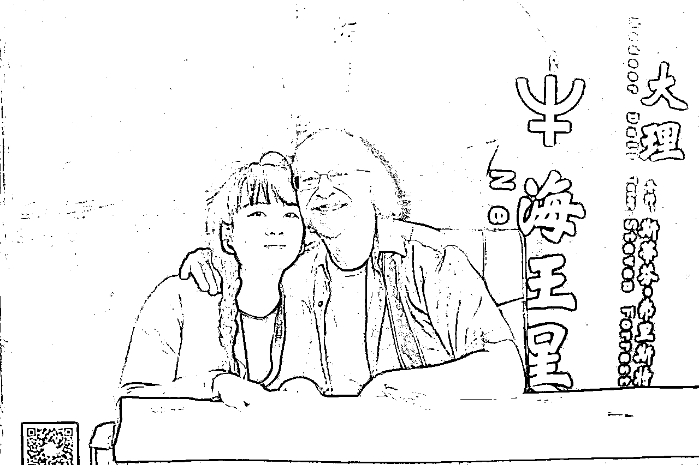

作者/狄狄 

编辑/Tang 图片/Iris 狄狄

**作者的话**

在大理这个海王星能量汇聚的地方听斯蒂芬·弗里斯特讲课，有一种很特别的感觉。因为大多数时间，课上连幻灯片都没有，80 个人全部向斯蒂芬的笑容和语言敞开又臣服。我甚至幻想这不是占星学的工作坊，而是宇宙能量的音乐会。

不用理解，只有享受。不用担心出神或没有基础。没有哪句话必须被听到，除非它必须被你听到。所以我节选了“音乐会”里一些我听到的喜欢的旋律，但愿能剪辑成一首你喜欢的曲。

**丨**一首海王星的歌

**我们都有海王星与冥王星的功课**

去年这个时候在北京，来自冥王星的格伦·佩里说：**“人类常有一种妄念，认为宇宙是来帮助我们的。”**

今年大理海王星工作坊，斯蒂芬·弗里斯特说：**“宇宙的共时性法则告诉我们世界上没有什么是巧合，也许暗示就是，宇宙的魔法是在帮助我们的。”**

大多数正在活着的人（生于第二次世界大战前后到 2030 年之间），都有海王星与冥王星的六分相位，这意味着我们每个人都要完成海王星与冥王星共同运作的整合。

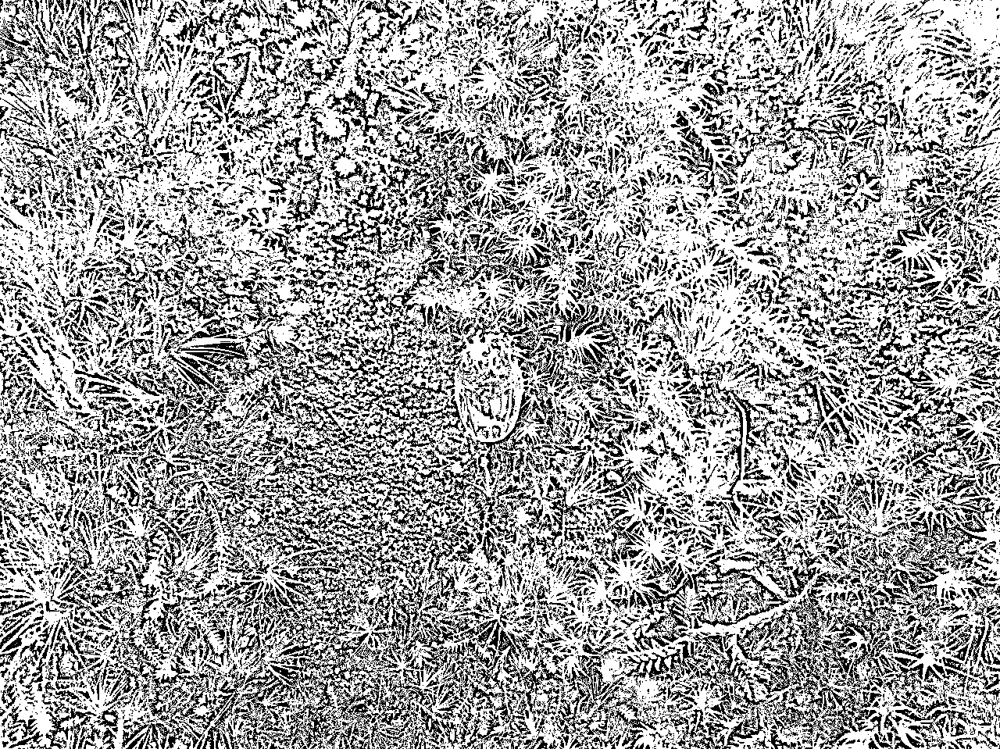

**丨**苍山苔藓上的露珠

生活是严苛的，一束花、一杯酒、一朵云、一片海，都可以抚慰我们。白天的大理的确是海王星式的。当夜幕降临，人们在古城的酒馆里探索欲望，在苍山的泥路旁路过坟墓，在洱海边的漆黑里仰望星斗。夜晚的大理是冥王星式的。

**冥王星**对应天蝎座和第 8 宫，永远要求“无下限”的**诚实**，衣服脱光了都不够，还要剥开皮肤，检视毛细血管和骨髓，查阅灵魂的恐惧。

而**海王星**对应双鱼座和第 12 宫，是“无上限”的**仁善**和**慈悲**，是联结内外世界的窗户，需要向万事万物敞开和臣服，需要用自己的方式擦干净。

冥王星和海王星的运行速度的如此之缓慢，给了前后近 100 年间出生的人们同一个功课。

斯蒂芬反复提到这个人人星图都拥有的相位：**“仁善与诚实是人类古老的争辩，它们之间是有张力的，这并不矛盾，但总是时而作对。”**

也许，对任何人或自己过于仁善，就远离了诚实；而对任何人或自己过于诚实，就远离了仁善。

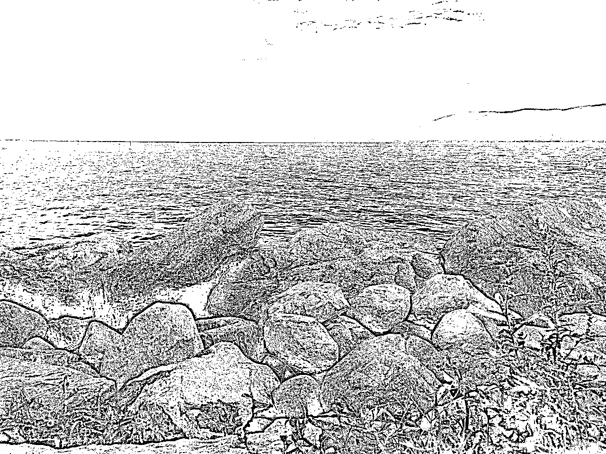

**丨**洱海

那些远离尘世来大理定居的人，身上都带有海王星的仙气。人们只看见他们此刻生命中的逍遥，看不见他们曾经发生的、心里受过的苦。有多少人是曾经历劫痛苦，才能重得自在。

**受苦和痛苦，是每个人生活的一部分。除非我们面对冥王星的深度议题，否则我们永远无法达到海王星的境界。**

海王星说，宽恕和原谅是非常美妙的。

冥王星说，如果原谅发生的太快，是非常虚假的。

海王星和冥王星的整合，是 “心理治疗”和“灵性疗愈” 的整合。而我们唯有先治疗自己的创伤，再发展灵性成长。

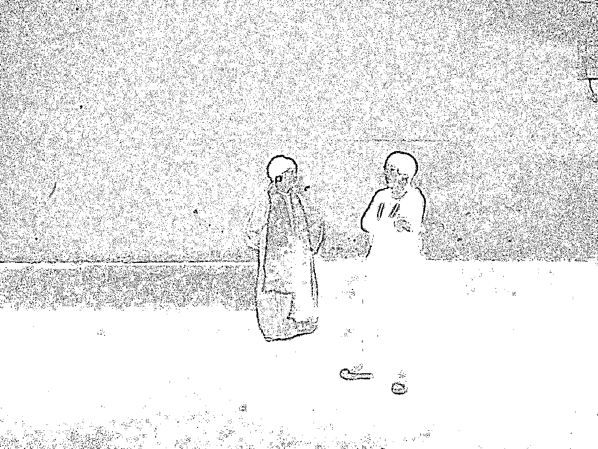

**丨**大理的夜晚，作者狄狄与好友 Cora

拒绝面对黑夜恐惧的人，没有能力真正安驻阳光和光明的好。不要恐惧任何事物的阴影面，也不要因为恐惧而放弃了执着过的所有。

**平衡的出路可能在于，在海王星的慈悲心与冥王星的诚实之间，找到一条中庸之道**。没有人说过这条路好走，但却是我们必经的进化之路。 

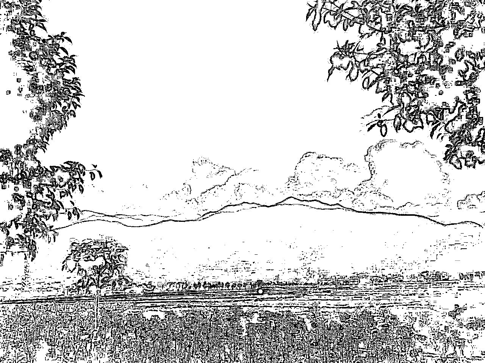

**丨**苍山

因为“慈悲”这一词，永远内含着痛苦。海王星有能力让我们对痛苦“不在乎”，也有能力让我们逃避生命的本性，在麻木中，安静的受苦，活的如同鬼魂。

我们怕鬼，也许是在怕，自己变成鬼。没有处理好自己的海王星议题，没有活下去的原因，你的生命没有愿景。没有什么比这更像一个鬼。

人们害怕的时候，会让恐惧替自己做决定。人在宁静的时候，才会让愿景驱动自己做决定。

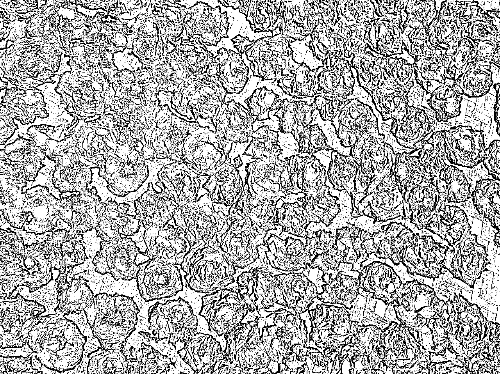

**丨**大理的那些花儿

**海王星的奇迹之旅**

**生命是短暂的，海王星会指引你如何运用直觉力找到人生的愿景，而冥王星会先给你凝望深渊的勇气。**

万一，宇宙里真的有来帮助我们的魔法呢？前提也许是，先帮助那些对自己保持清醒诚实的人吧。就像**这次大理的海王星工作坊，可能对每个前来敞开自己的人，都是一次奇迹之旅**。

***1.***

比如斯蒂芬讲他在北京机场与自己的行李走失，又差点在昆明机场误了飞机，然后他和大卫就看到前面排队登机的人后背上印着一排字“欢迎来到海王星”。

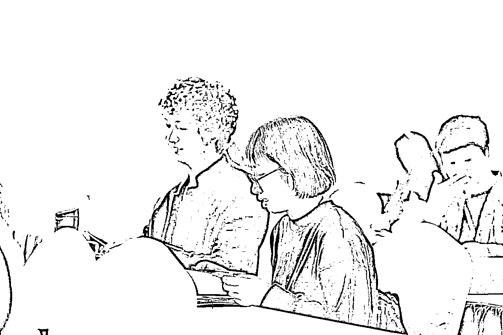

**丨**大理海王星工作坊上获得斯蒂芬赠书的两位小伙伴

***2.***

比如一个学员，与邻座讨论“有信仰的人与无信仰的人应该向谁发愿”，而他前一分钟正在尝试向“宇宙源头祈祷”从此臣服宇宙，一分钟后，斯蒂芬就在抽奖送书的环节第一个念出了他的名字。

***3.***

然后彼时与他探讨“如何祈祷”的邻座女孩，正在暗自发下大愿，如果抽奖被送到这本《海王星》的英文书，她一定要把它译成中文版。然后她的邻座领奖回来还没坐稳，斯蒂芬就第二个叫到了发愿女孩的名字。

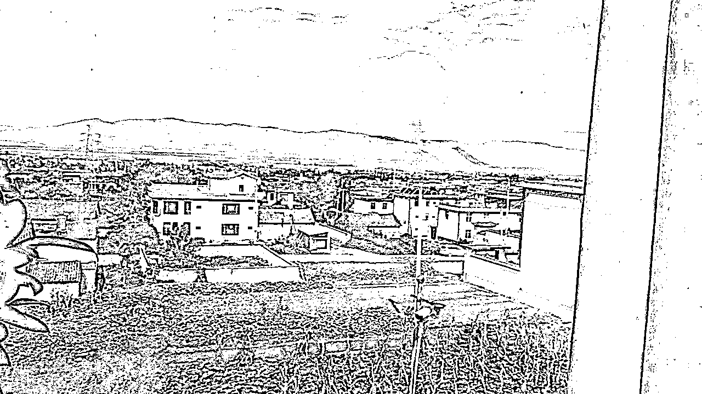

**丨**大理海王星工作坊课堂窗外

***4.***

又比如我此次跟随若道团队在海王星的场域做着处女座会务服务工作，这种能量的平衡本就是非常享受的。课间在走廊里被一个同学突然拉住，很认真地关怀我问我作为一个会务组人员，能否像她们一样听到斯蒂芬讲课。我告诉她我可以进场听课，她才放下心来。

这是工作坊三天来我收到的唯一来自陌生同学的正式的“仁善和关怀”。五分钟后，这个同学被斯蒂芬抽到了两个小时的超长现场案例演讲。斯蒂芬对她星图的解读感动全场，我比全场多了一个“被关怀”的感动。

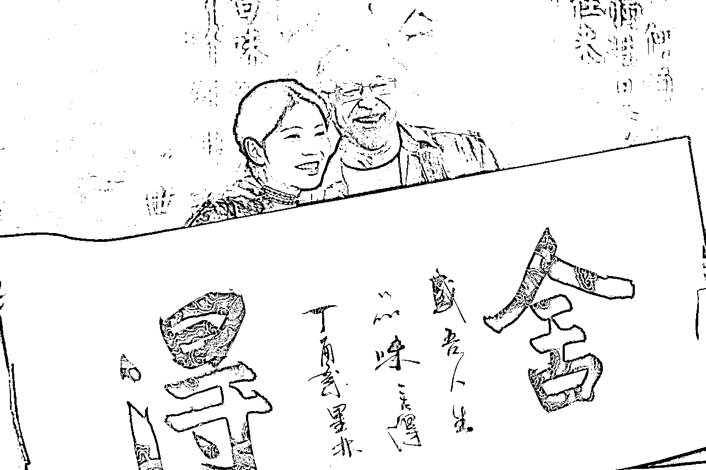

**丨**大理海王星工作坊上斯蒂芬老师与同学的合影

***5.***

还比如我此次大理之行惊讶地发现占星师们都有“驻颜有术”的魔法：30 岁的占星师看着是 20 岁，40 岁的占星师看着最多 30 岁，当然 50 岁的看着也就 40 岁，而在大理过了 67 岁生日的大卫，真的也就像 50 岁。这也许是多年从事海王星的工作，不断擦拭“内心的窗户”，就自然体现在了身体上的奇迹。

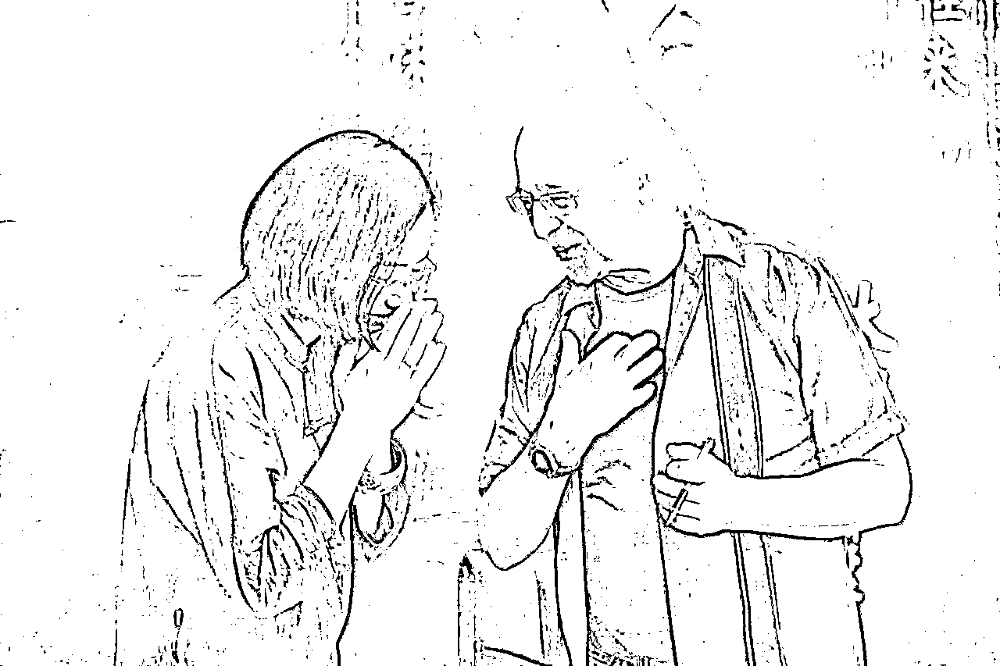

**丨**大理海王星工作坊上斯蒂芬老师与同学亲切地交谈

这些生命里的奇迹，作为海王星人的我总是毫不费力就可以看见并记录的。

然而在工作坊结束后的小酒馆里，明明（若道微信主编大人）跟我讲，叫我不要弄丢了自己的天蝎座月亮（还合相冥王星，cry），不要陷入海王星的无所谓。

**我们在沉醉于魔法和奇迹的时候，若有人还愿意提醒你“诚实和清醒”，必定要心怀无限感恩，并理性接纳。**

因为这其实就是斯蒂芬反复讲的，我们每个人身上都有的“海冥六分相”。海王星和冥王星的议题，永远无法只喜欢一个，而忽视另一个。这是我们相聚大理的原因，是我们和父母、和孩子这几代人一生的功课。这本身也是生命的奇迹。

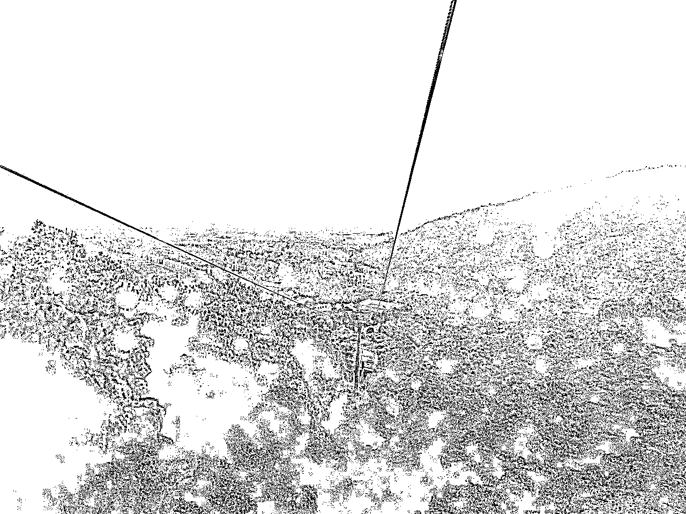

**丨**雨中的苍山

**白昼的洱海和黑夜的苍山彼此臣服，然后才有了大理。这是海王星与冥王星的整合与信任。**

爱自己，彼此相爱，爱地球。永远对自己、对别人、对宇宙保持耐心和慈悲。但永远不要放弃清醒和力量。

**版权声明：**原创文章由作者授权首发于若道平台，欢迎转发，反对抄袭。友号转载请申请白名单。


**狄狄**

UPlant house 有种房子联合创始人

若道 2015 届高阶学员

职业占星师

**咨询微信**：diyuhua2

长按打赏


******点击图片查看若道君推荐******


****如何报名？点击文末“阅读原文”****


# 免费福利 | 新月最靠谱许愿指南戳这里

> 原文：[`mp.weixin.qq.com/s?__biz=MzA5NjA0NTAxNg==&mid=2651394314&idx=3&sn=75e459c060f82628bbaf36c2110e58f9&chksm=8b4ba3bdbc3c2aab0a9f93608bd2725370f299cbdf1f0854311b8ea07cd6a08a4ac0887d50f4&scene=126&sessionid=1692738612#rd`](http://mp.weixin.qq.com/s?__biz=MzA5NjA0NTAxNg==&mid=2651394314&idx=3&sn=75e459c060f82628bbaf36c2110e58f9&chksm=8b4ba3bdbc3c2aab0a9f93608bd2725370f299cbdf1f0854311b8ea07cd6a08a4ac0887d50f4&scene=126&sessionid=1692738612#rd)

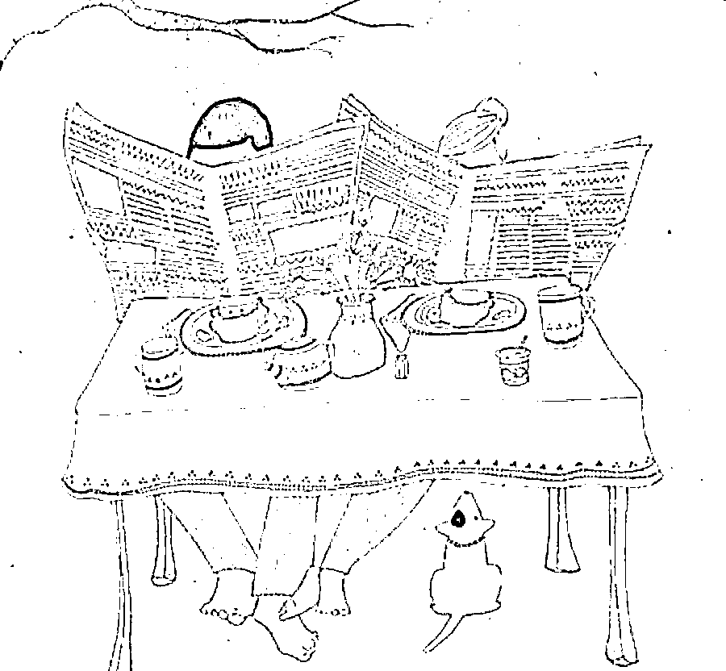

编辑/佳黛 图片/豆瓣&花瓣网

10 月 20 日 03:12，新月发生在天秤座 26°35′。每到新月时分，若道君都会为你奉上根据你出生星图量身打造的免费新月报告。可是新月为什么要许愿？新月报告又该怎么用？让若道君来教你。（如何查看新月报告戳这里：[新月报告](http://mp.weixin.qq.com/s?__biz=MzA5NjA0NTAxNg==&mid=2651388384&idx=1&sn=d1bd8a643435fadaf26d984b36a0f649&chksm=8b4a4b57bc3dc241135173cd9cb13e0cbbd91b29d84980c28e82a4b3bfd5e93a551d83f69a13&scene=21#wechat_redirect)）

本次新月文章请移步：[10 月 20 日天秤座新月｜你的“灵魂手术”还要继续](http://mp.weixin.qq.com/s?__biz=MzA5NjA0NTAxNg==&mid=2651394211&idx=1&sn=4065e4b73ab25eda682a0013468432fb&chksm=8b4ba214bc3c2b0267f1070deef86cf71522c2b4b605a23ed9d48b3a7b3fe659bf25c26844f3&scene=21#wechat_redirect)

新月

**为什么新月要许愿？**

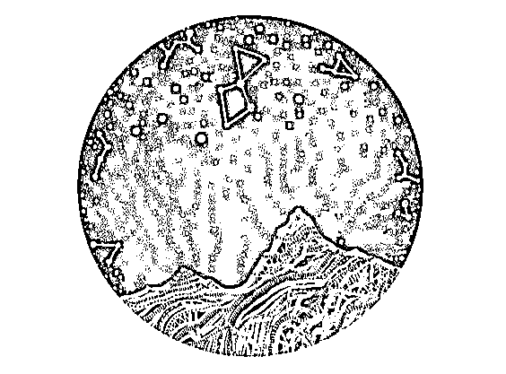

新月是一个周期的开始，新月发生的时候，太阳与月亮合相，能量很强。当新月出现时，你也许会发现灵感忽现，非常适宜开启新领域、项目与行动，缔结一段新的关系或合作。许愿会加强新月的能量，也有助于你了解自己现阶段适合开启的方向。 

每到新月时刻，看着占星文章里写着：看看你新月的宫位，如果新月在第 X 宫，你可以许愿的方向是……

是不是常常一头雾水？

新月的宫位？我到底该看哪里啊？

而有时，那些标注上升星座的文章也会让你忍不住想：虽然我的上升星座是这个，可是我的新月好像并不落在你说的宫位啊？你是不是写错了？

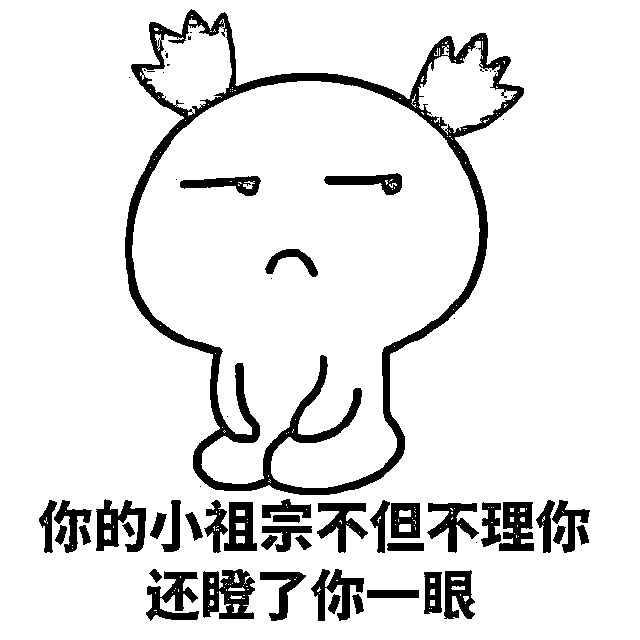

虽然这些文章都没有写错，可是好像对你而言都太不友好了。

让博学又体贴的若道君来帮你！

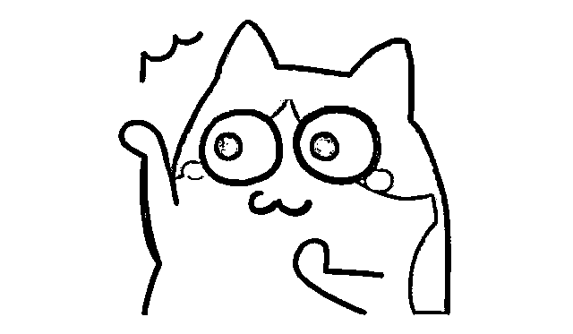

**我们推出了一份免费又好用的新月许愿指南！**

**报告有哪些内容？**

**新月时间****最佳许愿时间**

属于你的**许愿关键词**

**如何许愿 **你会有怎样的**感受**

**机会**

**使用小技巧**

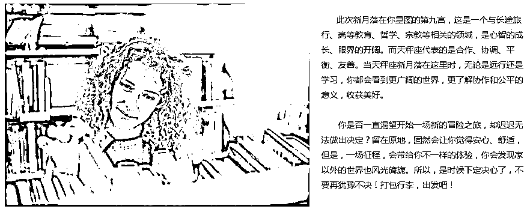

看到这样大段的文字，反而不清楚自己该从哪些方面许愿了？让若道君帮你清理思路。

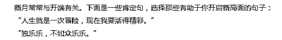

将报告往下拉，你会看到这样一段文字。

若道君建议你将这里认真读个两三遍，然后不断与自身的感受联系。因为这里**是你这段时间以来，最核心的议题。也是你此次新月最值得许愿的地方**。

新月是一个种下种子的时刻，所以当我们意识到自己的议题，并种下改变的种子（许愿），这就是新月最大的意义。

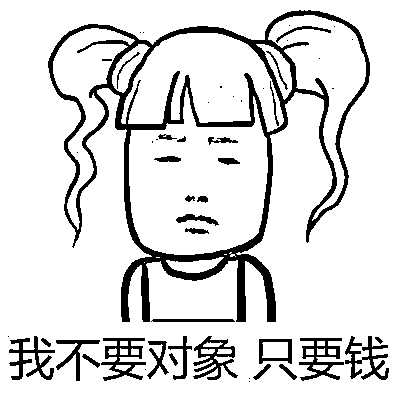

**如何许愿？**

许愿方式也很简单。

你可以把愿望写下来，或者双手合十后交叉，闭上眼睛来祈祷。

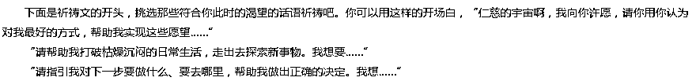

祈祷词如报告所示，你还可以适当添加自己的语言。

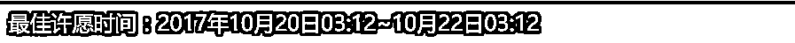

这里标注着此次新月你最佳的许愿时间。如果报告拿到手了，快对照着许愿吧！

这份好用又暖心的报告，点击**阅读原文**即可领取！


****直接点击“阅读原文”即可获取新月报告****


# 占星学还能解梦？效果不亚于心理咨询！

> 原文：[`mp.weixin.qq.com/s?__biz=MzA5NjA0NTAxNg==&mid=2651394282&idx=1&sn=9669a46ef87eda6dcb54b813498e471e&chksm=8b4ba25dbc3c2b4b86dd7fb331094b9e51698bf8e7b28402b17feaf686d015b2d380219c1499&scene=126&sessionid=1692738612#rd`](http://mp.weixin.qq.com/s?__biz=MzA5NjA0NTAxNg==&mid=2651394282&idx=1&sn=9669a46ef87eda6dcb54b813498e471e&chksm=8b4ba25dbc3c2b4b86dd7fb331094b9e51698bf8e7b28402b17feaf686d015b2d380219c1499&scene=126&sessionid=1692738612#rd)

**☆在后台回复数字 1-30，获得一颗为你精心挑选的新鲜彩蛋**

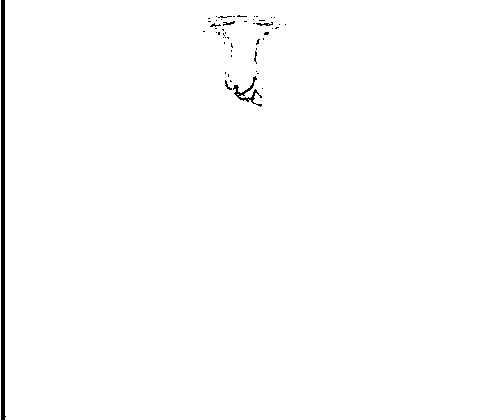

作者/大卫·瑞雷 若道创始人

翻译/李含 校对/江艺

编辑/玫瑰 图片/Pinterest

当我们在谈论梦境的时候，会发现大家可能都做过同样的梦。这时候，也许会有人给这些梦一个标准答案。但是没有人告诉你，即使是同样的梦，在不同星图配置的人身上的隐喻也可能是截然不同的。 

梦境需要“定制解读”。潜意识通过梦境来告诉你的事，需要一个专业的人士来为你解读。来看看这个梦境案例，看看爱丽丝是如何在漫长的缠绕着她的梦境背后读到那些生命给予她的沟壑和光明。

**第一次咨询——被继父性侵的女人**

1988 年 12 月，爱丽丝初次来找我时她刚满 26 岁。我的客户引荐了她，她们刚成为朋友不久。她来见我主要是探讨她的感情生活。她最近和相处近两年的男友分手了，陷入了激烈的情绪旋涡。我告诉她“行”，我们会聚焦她的感情状况，不过得置于她人生故事的大背景下讨论。

第一次咨询，她向我讲述了 11 岁之前基本由外祖母抚养长大的往事。她的母亲是一名随军护士，父亲是军士；3 岁时他们离异了。紧接着第二年 1967 年，他的父亲死于越南战争。爱丽丝 11 岁的时候，她的母亲再婚了，嫁给了一个比她小 7 岁的男人。他们是在军队中相遇，后来那个男人成为了高中老师和教练。

爱丽丝搬去与他们同住，一开始难以适应。她母亲是当地一所医院的护士长，上夜班。爱丽丝逐渐和继父亲近起来，然而少女时代，**继父开始强迫她发生性行为**。每每他得寸进尺，她都会反抗，并威胁说要告诉她的母亲。她并没有告诉母亲他们之间的冲突，因为她知道母亲爱着继父，和他一起貌似很幸福。

取而代之的是，她将精力投入学业，成绩优异。大学里，她主修社会学，辅修人类学。大学毕业后，她在乔治亚州公共服务部下属的家长与儿童服务处工作，工作之一是处理虐待儿童事件。

大学里，她的第一段性关系是和一个比她大 4 岁的学长。他毕业之后就和她分手了，她之后郁郁寡欢了几个月。接着她经历了她称之为“疯狂的阶段”，她开始和学校里几个男生发生关系，甚至引诱了一名教授。她说她喜欢**掌控这些关系的感觉**，然而尽管有快感，但她在其中任何一个人身上都**无法感受到亲密**。

从那时起，她也不再和任何男人产生感情，直到最近的这段关系。对方是民航飞行员，她既喜欢他出航时自由自在的生活，也享受他回来后的二人时光。然而，她逐渐意识到男友的不忠，他们为此吵了无数次。哪怕他表示他最终想结婚成家，她还是无法说服自己相信他。是她选择结束了关系，尽管分手之初，她每隔一两个月会偶尔和他上床。

**反复出现的梦：墓碑、闯入者和锤子**


第一次咨询的中途，她应我的要求讲述了一个**反复出现的梦**。她说第一次做这个梦时还是个少女。梦中，她总是住在一所**大房子**里，就像老式的南部宅邸。她的母亲住在房子的**阁楼**上，非常宽敞，光线从两边的窗户倾泻而下。

每次母亲离家时，都会锁上阁楼的门。爱丽丝没有钥匙，所以母亲不在时她进不了阁楼。她的**祖母**总是待在大宅子的**厨房**里，爱丽丝坐在厨房的桌子上和她聊天。她喜欢这间厨房，外祖母做饭时她坐着读书，她在那儿感到安心。

外面院子里，大树上挂着轮胎秋千，她喜欢出去**荡秋千**。后院的尽头是一个古老的**墓碑**，由于年代太过久远，刻在石头上的名字和日期都模糊了。 有时她站在墓碑前，好奇是谁埋在那儿。

梦中最黑暗的片段是她听到家里有人，一个不属于那儿的人。他瞥见她，开始满屋子地追她。有时她能逃到屋外，跑去告诉邻居有**闯入者**。有时她逃到**地下室**躲起来，继而是不同的情节。

她时而发现**继父**也在地下室。他把手指放在嘴唇上示意她保持安静，这样闯入者就不会发现他们。她躲在那儿时，继父的双手开始在她全身游走。她害怕发出声响，挪动身体躲开继父的手。时而她逃入地下室的深处，却发现继父也在那里。时而他全身赤裸被绑在地下室的桌子上。还有时候，他半裸着被绑，似乎很沮丧地坐在地下室的地板上，有一次他被绑在椅子上大哭。她去找**剪刀**解救他，却找不到。随后她听见闯入者沿着楼梯走向地下室，她抓起一把**小型锤子**，贴住楼梯边上的墙等着他。闯入者一出现，她就会打他的头，但是，他从没出现过。然后她醒了。

**梦境的解读**

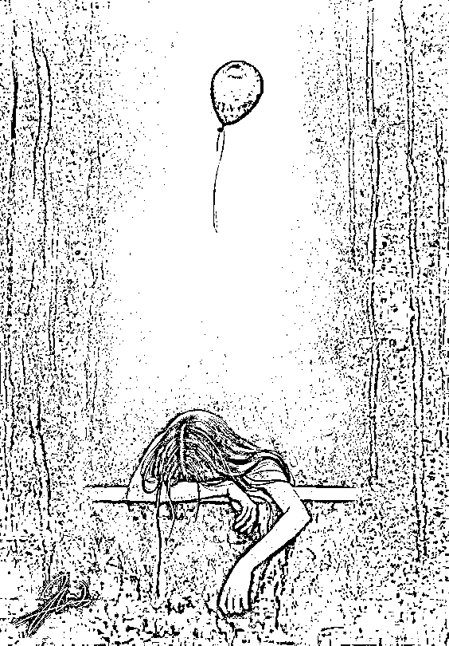

 她边讲述梦境，我边作记录，也会写下占星学注释。她说完后，我们讨论了她的梦。以下是我的笔记概要，作为和她讨论的参考： 

1.  **大宅子甚至后院代表了她和她的生活**。这所房子包含了她的一切。 

2.  她母亲居住的**阁楼象征她与母亲的关系**。 

3.  她的母亲离开房子，意味着**她与母亲的关系时而中断**。 

4.  门上的锁意味着**她和母亲关系中被拒绝的部分**，当她无法和母亲建立连接时，就进不了阁楼。 

5.  她和外祖母的关系由厨房里的外祖母象征，她在那里有**安全感**。与外祖母的关系滋养了她，即：她一直在做饭。她感到安心，可以在餐桌上读书。当她在安全的环境中感受到滋养，她知性的一面给她带来安全感。 

6.  在屋外荡秋千时她觉得轻松。她**脱离自我的束缚**时，感受到了自由和惬意。 

7.  然而，墓碑就在不远处，她想知道是谁的墓碑？墓碑是她**悲伤的标志**，她埋葬了悲伤，无意识的伤痛——**一个秘密**。（第一次面谈中，我已确定坟墓代表了她和 4 岁时去世的**生父**的关系，但我一开始没有告诉她。） 

8.  地下室代表她自我**更深层的阴暗面**；地下室在房子下面，可以说她隐藏的一面或表面之下可怕而残缺的部分，可她却逃到那里躲避闯入者。所以，或许她对闯入者的恐惧甚于她对地下室的害怕。 

9.  在她**藏身之处（地下室）**，她遭遇了自己和继父的关系。她遭遇继父的各种情节代表她对这段关系的不同感受。 

10.  她寻找剪刀给继父松绑象征她**试图从与继父关系的痛苦之中解脱**。 

11.  小型锤子代表她的**力量**，当她的“恐惧”走向地下室时，她静待直面。 

12.  闯入者还没有现身，所以她依然在**等待着面对她的恐惧**，带着重锤的力量等待。

**梦境的占星学隐喻**

那时我的客户一点都不懂占星学，我没有和她讨论占星学上的关联。但我在她的星图边上写下了占星学上的意义。以下大致还原了我的部分占星学笔记。 

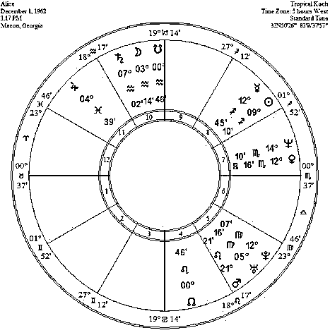
|爱丽丝的出生星图

1.  **水瓶座月亮落在 10 宫，合相土星和南交点**，对应梦中阁楼里**她与母亲的关系**，比如：楼顶两边的窗户都有光线透过。她“仰视”母亲，但母亲离开后她又无法维系这段关系。阁楼凌驾于房屋的主层之上，高高在上，更加疏离。然而，母亲也由她星图中的**金星和海王星合相在天蝎座**代表，她的母亲**消失**了，她不清楚母亲的去向。 

2.  **月亮合相土星**代表她与她最重要的养育者——**外祖母**的关系；土星和 10 宫都对应结构，即外祖母负责照顾她。外祖母在场时，她觉得安全；这段关系稳固可靠。 

3.  在室外荡秋千觉得**自由**，呼应**太阳射手座**，但**位于 8 宫四分冥王星**——后院尽头有一座墓碑。上面没有名字，迷一般的存在。 

4.  她**与继父不当的性行为**也表现在**8 宫的太阳四分冥王星和天王星**；呼应了梦中代表她与继父关系的各种场景，甚至是震惊的画面。 

5.  **闯入者代表她的恐惧**。未知的威胁潜入家中，说明她的恐惧追赶着她。她东躲西藏，逃避恐惧。其中大部分依然可以由**8 宫的太阳四分天王星和冥王星**来解释。 

6.  她希望**瓦解这种恐惧，杀死这个威胁**，所以她手握锤子等待着。这也是**8 宫太阳四分**天王星和冥王星****的表现，但她的**火星和海王星呈宽泛的四分相**，对应了她**躲起来等待**，闯入者却没有出现。或许她持锤静待是躲避恐惧的方法，保护着她，以免直面恐惧。 

我和她讨论梦境时，这些占星的联想浮现在我脑海中。她深深沉浸在我们的讨论中。我也和她探讨了她正在经历的**冥王星行进对她金星和海王星合相在天蝎座的影响**。意味深长的对话之后，她认同目前善用时间的最佳方式就是**直面恐惧和未解决的情感议题**。她明确表示她终究是渴望婚姻和家庭，但也承认自己现在还没准备好。我鼓励她开始**记录梦境**，我们还讨论了她可以开始**探索并理解梦境的方法**。我又进一步解释了她能如何解梦，并运用梦境监测她的个人成长历程。 

**墓碑不见了，只有鲜花绽放**

 1989 年，我们又做了两次面询。在此期间，尤其是第三次的时候，她重复梦境的演变清晰地反映了她自我成长的进展。即便她也会做很多其他的梦，在咨询中也有提及，但是这个反复的梦对她而言依旧更为重要。 

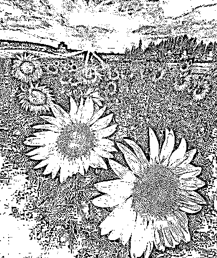

1990 年初我们进行了第四次咨询，期间她叙述了惊人的进展。**梦中的闯入者终于出现在地下室楼梯的底端，与此同时她打了那个人的脑袋。他倒在地上，好像死了。她俯身查看他是不是死了，他吐出最后几个词“我是你父亲，我来这儿救你”。话音刚落，他消失在她的怀中。她说她用尽力气尖叫着醒来，然后歇斯底里地哭了几个小时。** 

我们几乎用了这次咨询的全部时间来讨论这场发泄式的体验。她说，这个梦之后的几天里，她的内心恢复了深层的平静。她相信**梦中弑父意味着终结与她素不相识的父亲鬼魅般的关系**。她意识到**自己不需要被拯救，更不需要被从未面对的悲伤追逐**。她也发现现在是自己在掌舵生活。在之前的一个梦中，**她最终为继父从椅子上松绑，之后继父匆匆上了楼梯，跑出了屋子。她明白重复梦境中的这些变化显示了自身的重大改变**。我由衷地赞同她的所有说法。 

同年，大概在 1990 年夏末，她遇到某人，开始了她自 1988 年以来第一段认真的感情。最终他们结婚并有了两个孩子。她还是我的客户，她全家都是。她不再记录梦境，虽然她偶然会记下感觉重要的梦。我们都不曾忘记过去那个反复上演的梦，即使我们都有段时间不再提起。记忆中，数年前她说过，她记得这个梦只再出现过一次，梦里她在后院荡秋千，而那时，墓碑已经不见了。**石碑伫立之处，只有鲜花盛放。**

**我们会什么会做梦？**

📹 [`v.qq.com/iframe/preview.html?vid=w01853ynnyo&width=500&height=375&auto=0`](https://v.qq.com/iframe/preview.html?vid=w01853ynnyo&width=500&height=375&auto=0)

**版权声明：**本文由作者授权首发于若道平台，欢迎转发，反对抄袭。友号转载请申请白名单。


****想阅读更多作者的文章，请在后台回复 **大卫** 即可。****


想体验大师级的占星疗愈？

大卫老师**占星咨询**预约进行时

**生命议题、职业发展、关系咨询、少儿成长、年度规划和预测**

```
预约咨询请联系仲老师：微信 YY18513802156
```

********点击图片查看若道君推荐********


[](http://mp.weixin.qq.com/s?__biz=MzA5NjA0NTAxNg==&mid=2651390200&idx=3&sn=5abf695385720db79b05ba4e8e13d5b6&chksm=8b4bb24fbc3c3b591042cf39133a18bf34dbfcf8dccb7d16a6cd0c827cfbb6f3fc50af55486c&scene=21#wechat_redirect)

**点击文末“阅读原文”获取更多课程信息。**


# 大卫·瑞雷梦境占星工作坊丨两天破译梦境密码

> 原文：[`mp.weixin.qq.com/s?__biz=MzA5NjA0NTAxNg==&mid=2651394282&idx=2&sn=272de9837180d24f16f0a4cc203e48f0&chksm=8b4ba25dbc3c2b4bef6be91240356c7e3f2d16f844bcbe082fc34385880f1dcc17a367e07693&scene=126&sessionid=1692738612#rd`](http://mp.weixin.qq.com/s?__biz=MzA5NjA0NTAxNg==&mid=2651394282&idx=2&sn=272de9837180d24f16f0a4cc203e48f0&chksm=8b4ba25dbc3c2b4bef6be91240356c7e3f2d16f844bcbe082fc34385880f1dcc17a367e07693&scene=126&sessionid=1692738612#rd)

梦境你好

Hello Dream

##### 我们的人生很大程度是由我们的潜意识所决定，潜意识告诉我们人生的问题及解决方案，但潜意识又是我们无法直接了解的。

而梦是少有的，让人直接接触到的潜意识内容。

**梦境展现我们心智疗愈灵魂的方式；**

**梦境让我们保持理智；**

**梦境可以帮助我们更好地识别真实感受；**

**梦中也隐含潜意识提供的实用解决方案。**

但可惜的是，梦是离奇的，是我们无法理解的声音和画面。

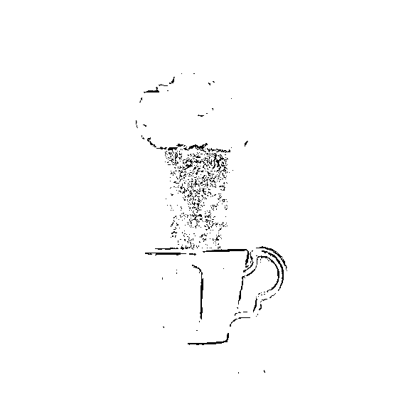

星图是解密潜意识的密钥，但如果缺乏可以解读的材料，就像空拿密钥，没有大门。

当我们把两者结合起来研究，就如把密钥插进密道的大门，你将会听懂潜意识的信息。

只能看懂白天，却看不懂晚上，你只是一半的清醒。**“清醒”看到人生的人，是能够看懂梦境的人。** 

为什么要学习梦境占星？

##### 梦境与出生星图以及行进中展示出的，我们正在经历的事情紧密相关。这些相关性清晰且神秘。

当你意识到自己梦境与星图之间的相关性时，会提升自我意识和个人洞见性，也会帮助我们找到解决方案。如果你坚持记录你的梦境，你会发现这很有意义，它**描述了你的生命进程**。

当占星师掌握梦境占星的技巧，不仅能够更清晰地看到客户目前的内心实际状况，从而增加咨询的内容和深度，而且可以与客户建立更亲密的关系。

都要学些啥？

##### ① 梦境和出生星图的联系及如何用出生星图解读梦境

② 梦境和行进星图的联系及如何用行进星图解读梦境

③ 如何利用梦境解读提升自我意识和洞见

④ 如何利用梦境疗愈

⑤ 两次课堂练习，帮助大家巩固所学知识

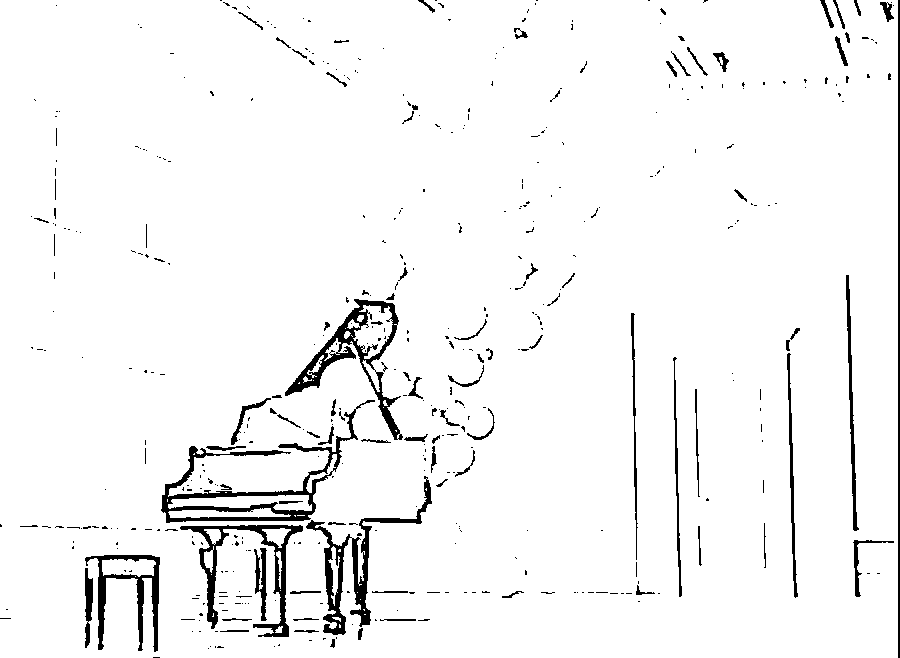

福利！福利时间！

两天课程会选取**10-14 个**现场学员的梦境案例进行分析解读，作为案例教学。希望被个案分析的同学，请提前提供以下资料：

1.出生日期及时间（准确到分钟），出生城市；

2.个人梦境记录一份（以下梦境三选一，提供一份即可）

*   经常重复出现的梦

*   印象深刻的梦

*   在报名前后刚刚做的梦

大卫老师将从中挑选有**代表性的梦境**进行解读。

另外，也请参课学员**准备两个梦境**，以备练习。

***温馨小提示：报名的同学请将以上资料提供给自己的课务哦~***

导师简介


**大卫·瑞雷（David Railey）**

*   ISAR 董事会成员，若道占星创始人。

*   1976 年，通过亚特兰大职业占星师考试，成为全职占星师，随后通过**AFAN 和 ISAR 职业测试**。

*   1974 年，大卫老师跟随著名神秘学者、通灵师、诺贝尔国际和平奖提名人保罗所罗门学习解梦课程。保罗所罗门曾跟随著名的精神病学家、格式塔疗愈理论的创始人弗里茨波尔斯学习“**格式塔梦境分析**”。此后，大卫老师将解梦与占星结合，在 40 年的实践中不断深入探索和完善梦境占星的技术。

*   1980 年，与**杰夫·焦耳**一起在亚特兰大创建“**每日星球**”占星学中心。此后在亚特兰大占星协会担任 4 年考官，并且两次担任**亚特兰大地区占星协会主席**。

*   1979-1992 年，作为占星师活跃于美国社会媒体，向不了解现代占星学变化的大众宣传专业占星学知识。在 1989-1992 年期间，他在 WRGG 电台 12 频道每周主持个人电视秀“**今日占星学**”，早先他还在 WRFG 的广播节目中播讲宇宙天气节目。 

*   2010-2014 年，任全**美占星师联盟监督委员会委员**。

*   2010 年，其著作《**灵魂的目标**》中国版出版，和蒋颖一起创办**若道占星**学校和其官网 www.nodoor.com。从该年开始，他工作并往返于亚特兰大和北京。目前他 80%的时间致力于在中国教授和推广西方占星学。

*   2017 年，被选为**ISAR 委员会成员**（2017）。ISAR 是世界最大的国际占星机构，会员遍布 45 个国家。

上课时间与授课形式

上课时间：**2017 年 12 月 2 日-3 日**（10:00-18:00，午休两小时）

上课地点：北京现场（具体地址将在开课前七天通过短信通知）

适合哪些人？

中阶（Level4）占星水平（了解星座元素，宫位及相位含义）

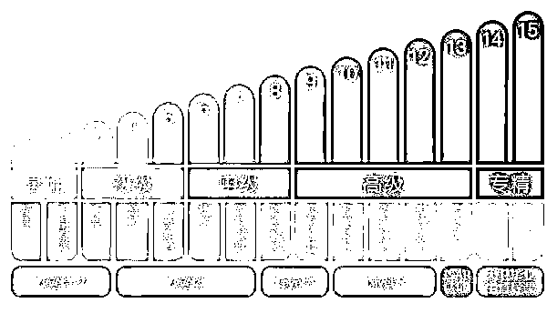

课程费用

**早鸟价：4900 元 （2017 年 11 月 2 日前）**

课程费用：5200 元

关于退课与转课

课程付费后，因个人原因无法参加请在开课前 7 天通过邮件书面申请退款，申请都请发邮件至**nodoor@vip.126.com**受理。

课前七天以上（不含七天）申请退款，可全额退款。

**课前一周内申请退款，按照实际缴费金额的 90％受理退款。**

课前一周内申请转课，转入对应课程费用不得超过转出课程费用，如超出，需补足后方可转课。

**工作坊开始后，不再接受退课和转课申请。**

**2017 梦境占星工作坊**

**授课老师：大卫·瑞雷**

**授课时间：**2017 年 12 月 2 日-3 日

**授课方式：北京现场**，英文授课，中文翻译

**费用：**5200 元（早鸟价 4900 元，2017 年 11 月 2 日前）

**课程负责人：Matty**（微信：nodoor2011，请备注“梦境占星工作坊”报名咨询）

长按二维码添加课程负责人咨询~

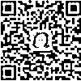


**了解详细课程内容及报名方式，点击文末“阅读原文”**


# 课程推荐 | 今年国内最后三场全息呼吸工作坊

> 原文：[`mp.weixin.qq.com/s?__biz=MzA5NjA0NTAxNg==&mid=2651394282&idx=3&sn=37ff7509a3262179d7df83eb5cca4171&chksm=8b4ba25dbc3c2b4b379f16bcb45eac2363bfd965af2d9306449e7ab3463d0781de615b441614&scene=126&sessionid=1692738612#rd`](http://mp.weixin.qq.com/s?__biz=MzA5NjA0NTAxNg==&mid=2651394282&idx=3&sn=37ff7509a3262179d7df83eb5cca4171&chksm=8b4ba25dbc3c2b4b379f16bcb45eac2363bfd965af2d9306449e7ab3463d0781de615b441614&scene=126&sessionid=1692738612#rd)

**原型占星大师，文化思想史学家理查德•塔纳斯：**

“在深度心理学领域，自弗洛伊德和荣格之后，格罗夫无疑是在认识论层面上做出最大贡献的人。过去几十年中，他的研究不仅对心理动力理论做出了革命性的贡献，同时还对其他诸多领域产生了深远影响和重大启发，包括宇宙学和哲学。从心理疗愈的效果上讲，格罗夫的全息呼吸至今仍是最为有效的，没有其他疗法可与之媲美。”                                                                                

**内观禅修大师杰克•康菲尔德：**

“全息呼吸的疗愈效果是着实惊人的：从疾病与焦虑的缓解和治愈，创伤和积压情绪的释放和疏导；到家庭、社团的协调与整合，正念、同理心、爱和勇气的滋养；再到深层意识和灵魂的探寻以及灵修层面的精进——所有这些面向都会在其过程中逐一展现！”

什么是全息呼吸

全息呼吸，英文全称为 Holotropic Breathwork，其中 holotropic 一词是斯坦·格罗夫博士由两个希腊词根创造的单词：“holos”,意为“完整，全部”；而 trepin 意为朝向某物移动。格罗夫博士用“returningto wholeness"（归于完整）或 "moving toward wholeness "（向整体回归）等短语来简明扼要的描绘 Holotropic 的含义。

全息呼吸之所以强调完整，有两层含义。

其一，传统心理学定义的人类心灵范围只局限于“出生后”。而格罗夫博士在长达六十余年的超个人心理学研究中发现，人类心灵和精神世界不只有个人显意识的层面，还有原型和集体潜意识等超个人领域。**人类的心灵图谱远远超越传统心理学的认知。**

其二，所有非常态意识状态，都可以视为深层潜意识和人类灵魂中超意识范畴的动态性显化，传统精神医学大多采用病理化及药物抑制的态度来应对这种状态，**而超个人心理学的基本原则是支持这个过程以运用它的正向潜能，比如将灵性应急状态视为灵性打开与提升的转机，开发其疗愈和转化的巨大潜能。**全息呼吸将灵性成长视为心灵图谱中的重要环节，是为“完整”。

全息呼吸以快速呼吸、唤起性音乐和身体工作等方式，营造支持性的环境，协助参与者松动心理防御、情绪阻塞，具显无意识内容，进入深度的全息意识状态。借由这种意识状态**深入到情绪和身心失调在心理和灵性层面的根源，唤醒内在的疗愈智慧和深刻的转化力量。**

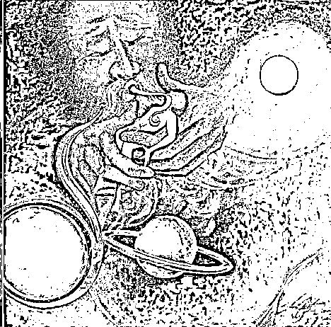

哪些人适合参与全息呼吸

*   想体验超个人意识（全息状态），连接内在智慧，激发创造力和灵感的人群；

*   想体验呼吸的力量，突破内在卡点压抑的人群；

*   处于长期慢性身心失调模式（如：呼吸疾病，出生创伤，身体部位莫名疼痛，颞下颌关节紊乱综合症等）当中，渴望释放疏导的人群；

*   对原型占星与全息呼吸的关联性感兴趣，想体验内在与宇宙之间的共时性的人群；

*   正在处理灵性应急状态，需要安全专业的场域转化提升的人群；

*   有意探索宫内记忆、出生创伤、胎儿意识等围产期议题的人群；

*   对非常态意识状态、出生死亡与重生、宇宙原型能量等议题感兴趣的人群；

*   无需心理学、占星学或其他灵性知识，所有渴望深入内在探索的人士均可参加。

全息呼吸基本流程

全息呼吸包括三个重要部分: 

**呼吸前的准备，呼吸过程，及呼吸后的整合。这三个部分同样重要缺一不可。**

工作坊通常以团体方式进行：参与者两人一组, 轮流担任“呼吸者”和“守护者”的角色。整个呼吸过程一般持续 2.5 到 3 个小时。整个呼吸过程在有合格资质的全息呼吸导师的精心守护下进行（导师们会在必要的情况下给予参与者专业协助）。

呼吸结束后，参与者们将绘制曼陀罗或以其他方式，将呼吸的体验表达或记录下来。晚餐后，是小组分享活动，每位呼吸者将被邀请分享当天的内在体验之旅。以团体的力量，协助呼吸者在呼吸之后整合身心。

全息呼吸特色及原理

以简单的呼吸作为切换意识的工具

从远古时代起，各种呼吸技巧就被用在宗教和疗愈活动中。许多修行法门都将呼吸看作是连接自然、身体、精神与灵性的关键纽带。而在过去的几十年里，西方心理治疗师也发现了呼吸的疗愈潜力，如威廉·芮奇(Wilhelm Reich)认为，心理阻抗和防御是和受限制的呼吸相关联的。呼吸是一个自治功能,但也可以被意志所影响。**有意识地增加呼吸的幅度，通常会松动心理防御并导致潜意识（和超意识）内容的释放和呈现。**

释放身体紧张

情绪及身心症状都有其根源及意义。

在体验全息呼吸的过程中，一些人会体验到身体的不同部位会相继从强烈的紧张到深度放松状态。持续一段时间的急呼吸，会促使各种与创伤记忆相关的阻滞能量会得到释放、排泄和处理。参与者可以通过**宣泄（如咳嗽、呕吐、发泄式的躯体动作）排解**，也可以在导师的协助下，**在特定的身体部位做处理，释放深层慢性的肌肉紧张，疏导积压的情绪。**

处理情感创伤

超个人心理学将创伤分为两种，外来型创伤及缺失型创伤。

1）外来型创伤主要由外界侵入造成，可以是躯体的虐待、也可能是情感的或性虐待、恐怖的情境、刻薄的批评以及嘲笑。**当这类创伤在呼吸中从潜意识深处浮现到意识表层时，便能在能量上消除其影响并疗愈创伤。**

2）而缺失型创伤主要由于成长过程中缺少某些健康情感发育所必须的正面经历造成。如婴幼儿对本能满足、安全感的原始需求，包括拥抱、皮肤接触、爱抚、安慰、玩耍、成为关注中心等。**对待这类早期情绪创伤，身体触摸具有情感滋养的作用。**基于案主需求及事先达成的共识，此类操作可采取从握手、抚摸额头到全身接触的不同强度，以达到再度疗愈潜意识深处创伤的目的。

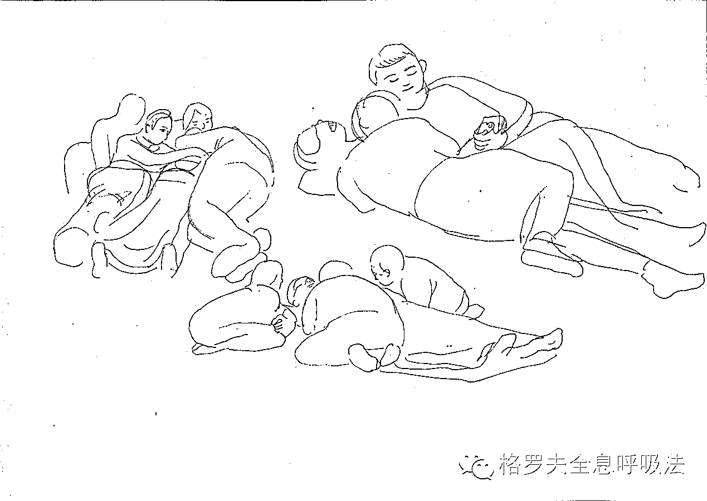

全息呼吸工作法现场速写  作者：李洋

全然尊重内在智慧的工作坊特色环节

音乐

在许多文化中, 声音技术在复杂典礼中也被特别用作疗愈。有些灵修传统发展出的声音技术, 不仅可以引发普遍的出神状态, 甚至可以对意识、人的心智和身体产生特定的影响。

**全息呼吸工作坊对配合呼吸的音乐进行精心挑选，让音乐成为参与者自我探索和疗愈的过程中非常有效的催化剂。**连续不断的音乐之流好像托载的波浪，调动心灵深处的记忆，打开通往潜意识的大门，让每一位参与者得以自行进入全息意识状态。

曼陀罗绘画整合

全息呼吸的曼陀罗绘画过程中并没有特殊的指导，而是参与者在体验之后的自动绘画，是参与者进行自动整合与疗愈的过程。在随后的集体分享中，老师会鼓励每一位参与者去表达自身的体验。**在此过程中，老师不会做过多诠释，而是去激发体验者自身的心性，将解读权和力量交还给体验者，使参与者完全活出生命自身带来的启示。**

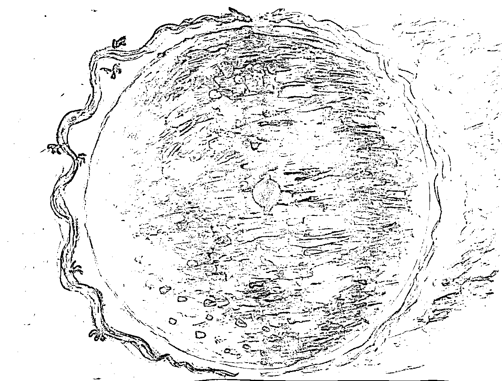

呼吸之后绘制的曼陀罗 周佳作

小组分享

白天呼吸结束后，在晚上将举办小组分享。呼吸者会分享自己在呼吸过程中的体验或经历，而守护者将给予全然的关注和临在。在纯粹的诉说和聆听中，感受生命与生命的互相看见。

导师们不会对学员的分享做出任何的解释或评论，因为各个学派之间对于心智功能、心理动力、以及各种症状的起因和意义，有多种多样的看法，而**心理活动也是一个动态的发展过程，人类的心灵图谱更是远远超越智性认知。任何一个定论性的说明将有可能冻结疗愈过程、干扰疗愈进展。**因此导师们最重要的责任不是将他们的答案给予学员，而是信任学员的内在疗愈过程，将力量交还学员，陪伴学员自我探索和转化。

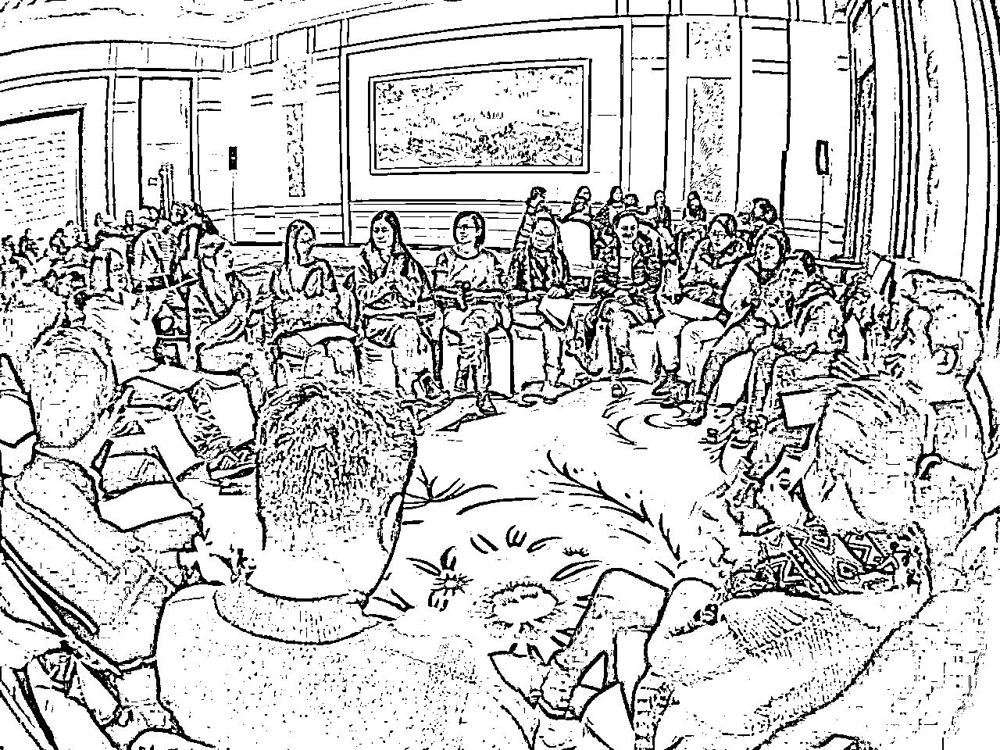

全息呼吸工作坊现场：小组分享

四位导师，两位翻译，专业严谨的场域设置

在全息呼吸工作坊里，学员数目与导师数目有严谨的比例要求；翻译的数量也升为两位并须遵循系列守则。

在全息呼吸当中，我们鼓励参与者启动自己内在的疗愈智慧。导师并无说教与理论，而是用全部的经验和慈爱营造一个安全信任，支持与包容的环境，去允许每个人内在疗愈智慧的浮现，从而开始完全属于参与者自己的神圣体验。

本次全息呼吸工作坊的导师们均带领过成百上千场全息呼吸，他们持续不断的用言行展现着谦卑，平和，包容，慈爱的特质。如创始人格罗夫博士所言，**“只有你自身体验的足够深刻和宽广，才能理解学员在呼吸过程中出现的状况，否则你的体验是狭隘的，你所给出的判断和协助也将是有限的。”**

本次工作坊导师介绍

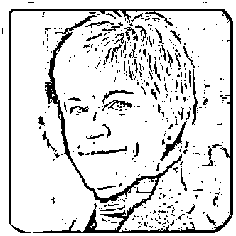

Holly Harman 霍莉•哈曼

霍莉是全息呼吸总部（全息呼吸导师培训中心）的副总监。她负责全息呼吸导师培训(GTT)的行政管理和临床研究工作。她领导和管理 GTT 项目在全球各地的开展，并常年跟随创始人格罗夫博士在世界各地举办工作坊。

除了国际事务外，霍莉还领导着全息呼吸在英国的发展。

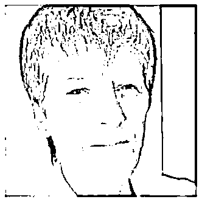

Deb Dunning 黛布•邓宁

黛布来自英国，曾任职于英国国家健康中心（NHS, 欧洲最大的医疗服务体系）长达 20 多年；除了多年的临床经验外，她还曾担任该机构的首席执行理事长达数年。

黛布是全息呼吸导师培训(GTT)国际团队的一员，她长期协助 GTT 项目在欧洲、俄罗斯、印度、美国和南非等国家的开展。她还经常组织并以导师身份参与英国境内的全息呼吸工作坊。

除了全息呼吸，黛布还在英国运营私人的颅骶疗法（头荐骨疗法）诊所。

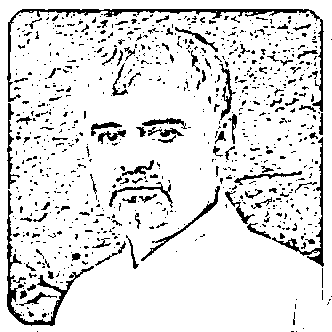

Vladimir Emelianenko  通德

通德来自俄罗斯，是一位心理学博士，专业是精神病学和心理治疗。他擅长将全息呼吸，个体心理治疗和中国气功有机结合，以达到最佳的疗愈效果。

 2000 年，他领导成立了“南俄罗斯人本与超个人心理治疗中心”。他将全息呼吸应用于精神心理治疗，并辅以独特的十二步疗法和中国气功。自 2001 年起，他开始于俄罗斯南联邦大学教授超个人心理学，并参与全息呼吸的科研项目。

他于 2009 年成为全息呼吸导师，开始在俄罗斯、乌克兰、以色列和中国等众多国家带领工作坊。自 2012 年起，他与妻子肖淑开始在俄罗斯开展全息呼吸导师培训。

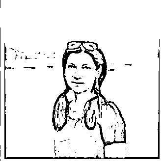

Alexandra Emelianenko 肖淑

肖淑毕业于俄罗斯罗斯托夫州立医科大学，于 2001 年和 2002 年先后获得心理学和临床心理学硕士学位。她曾作为心理医生任职于成瘾康复中心。

肖淑于 2012 年成为全息呼吸导师，开始和丈夫通德以及同事领导俄罗斯的 GTT 项目；他们定期在俄罗斯和中东欧举行全息呼吸工作坊和全息呼吸导师培训。

肖淑同时还是一名格式塔疗法（完形治疗）的私人执业导师。

学员反馈

点击以下链接，阅读过往学员全息呼吸经历：

[占星师大卫瑞雷的全息呼吸经历](https://mp.weixin.qq.com/s?__biz=MzA5NzIzMDg0Nw==&mid=402233204&idx=2&sn=d67141b5159919d85205e87b791fabbd&mpshare=1&scene=1&srcid=0923DoA43XGW1c5STaljgEog&key=a0a520779039cf2b3b8c8d37a1763e32415f972eb0807b8558a29d7d7a3d5bf717def783b5a86013286dd07f8d79d6cebaedb0207675661509c2065ae95a2f3488b5c45310a73649d548d9ff178cb752&ascene=0&uin=Nzg4MTMxODIw&devicetype=iMac+MacBookPro10%2C2+OSX+OSX+10.10+build(14A389)&version=12010310&nettype=WIFI&fontScale=100&pass_ticket=zZydt3VsKEgdtSlCUQq6Wc9XT%2F4kDk%2Fm7OsSBjj8JSFq0GxWfelmaNWn%2FKLcQ7xr)

[全息呼吸里，我遇见了揭开我灵魂封印的人](http://mp.weixin.qq.com/s?__biz=MzAwNzUzNDQ0Mg==&mid=2653142168&idx=1&sn=979276a8a8662ca9637822aaad1dfa89&chksm=80abbe9db7dc378b746ce0c6a34558382621e09c3ab3e1858e7ecfcc7d2dda168025eea64eba&scene=21#wechat_redirect) 

[全息之爱 | 我的第一次全息经历](http://mp.weixin.qq.com/s?__biz=MzA5NzIzMDg0Nw==&mid=2653347450&idx=1&sn=82dfd7bd79df863620b01482959b1454&chksm=8b7674eabc01fdfce937a6e9c8d2053c0ea542d325709225caa7cdb455e83cf774fa3c561b80&scene=21#wechat_redirect)

[全息之心 | Holly 与全息呼吸](http://mp.weixin.qq.com/s?__biz=MzA5NzIzMDg0Nw==&mid=2653347333&idx=1&sn=5398dbb693f9cbbeaa0782c5445d1b76&scene=21#wechat_redirect)

“每次全息呼吸，不管是磨难还是喜悦；不管是尖叫还是抗争；不管是看到画面还是感觉情绪；每次结束后，我都感觉到自己的转变。仿佛旧的自我一层层地褪去，新的自己一次又一次地脱壳重生。我感觉到越来越真实，越来越充满希望，越来越被祝福和保佑；我感到越来越深的联结；我知道自己离家越来越近了。” ——导师 Holly 谈她的呼吸经历

今年国内最后三场全息呼吸的时间

厦门：10 月 26 日-29 日

北京：11 月 2 日-5 日

成都：11 月 9 日-12 日

学费

学费：6800 元

两人团报，每人 6400 元；

三人团报，每人 6200 元

老学员价：4900 元

a. 以上价格包含学费和翻译费；不包含食宿，交通和其他费用 

b. 团报学员，须同时/统一缴费，方可享受优惠价格

c. 所有价格均为税前价; 需要发票的同学，加收 6%税费

报名

**厦门：文觉**

微信：jessie7398

电话：18659259278

**北京：维拉**

微信：vera4175

电话：13802758630

**成都：玮玲 ** 

微信：zhengviolin 

电话：13086689033

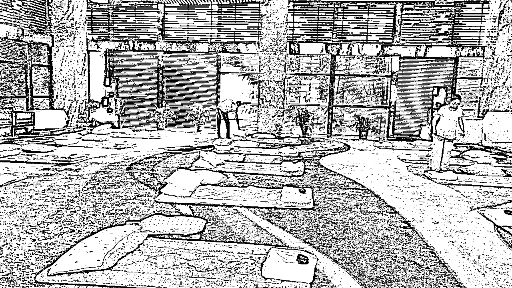

厦门站呼吸大厅

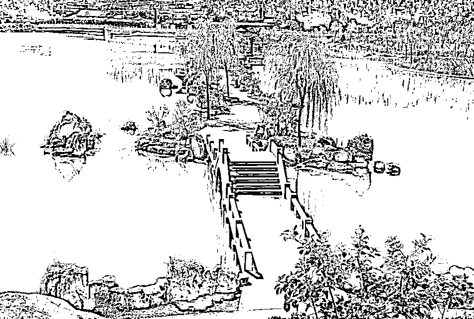

北京站酒店景色

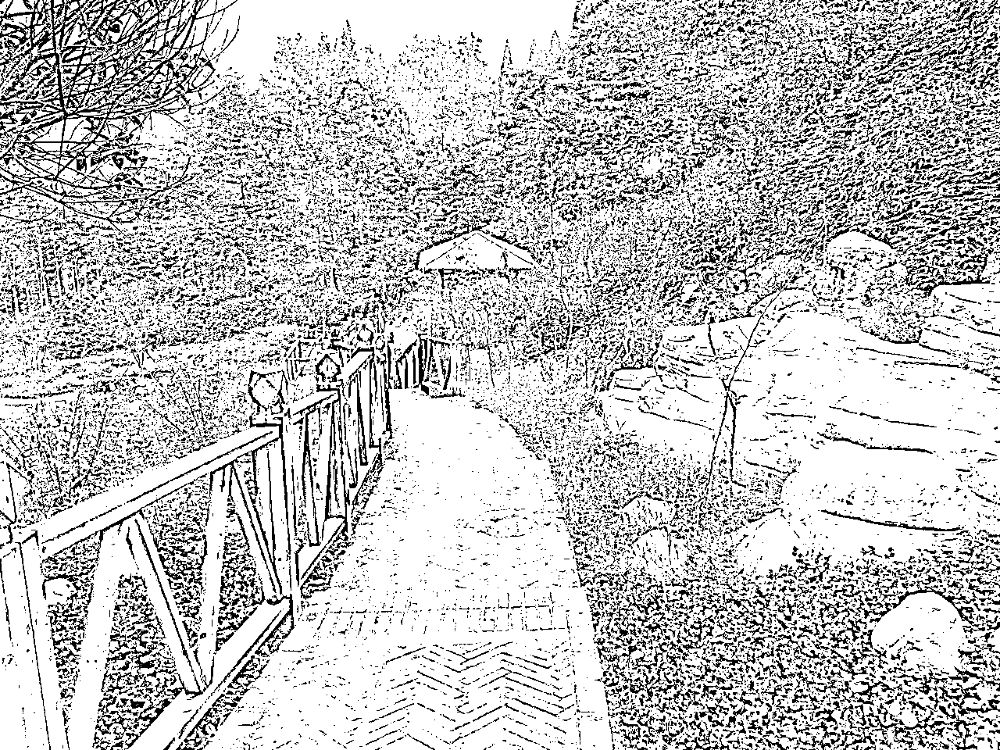

成都站酒店景色

咨询

****孙阳****

微信： J374524650

电话：15221743006

**周佳**

微信：Echowithlife

电话：18687719373

# ISAR 选修课 | 跟格伦·佩里学情感咨询（北京）

> 原文：[`mp.weixin.qq.com/s?__biz=MzA5NjA0NTAxNg==&mid=2651394247&idx=3&sn=4d54d5b322c038a8453f9aef5d65f87f&chksm=8b4ba270bc3c2b66a18cea2a4cb7a2456ad2c78f5fb10f115310a183ed24fa82bcdfaaa8b815&scene=126&sessionid=1692738612#rd`](http://mp.weixin.qq.com/s?__biz=MzA5NjA0NTAxNg==&mid=2651394247&idx=3&sn=4d54d5b322c038a8453f9aef5d65f87f&chksm=8b4ba270bc3c2b66a18cea2a4cb7a2456ad2c78f5fb10f115310a183ed24fa82bcdfaaa8b815&scene=126&sessionid=1692738612#rd)

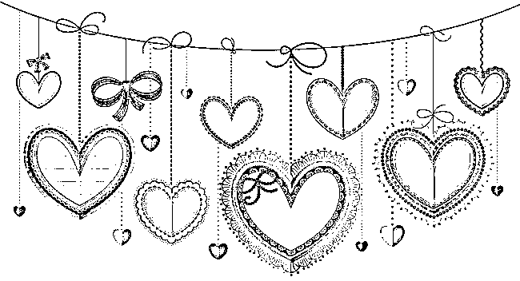

**格伦·佩里占星咨询工作坊**

**在星图中寻找爱**

**爱情咨询是占星咨询的一个重要话题。**

人类建立亲密关系的能力可以有很广泛的定义，而出生星图会揭示出一个人独特的关系路径，帮助我们去理解他们“**爱的地图**”。

**这个工作坊会帮助我们消除那些****所谓“正常关系”的假设****，这些假设让我们作茧自缚，帮我们描绘出各种真实的关系路径，以及它们的不同组合。**

著名占星师和美国注册家庭与婚姻治疗师格伦佩里老师在他 40 余年占星咨询与心理治疗中，在这个主题上，有着独到而丰富的咨询经验。

1

**这位大师是谁？**


**格伦·佩里（Glenn Perry）**

*   ISAR 董事会成员，共出版八本占星著作

*   心理/意识研究专业博士

*   加州注册婚姻和家庭治疗师 （CAMFT）

*   占星心理学学院（Academy of AstroPsychology）的创办人

*   康涅狄格州研究生院（the Graduate Institute of Connecticut）原型宇宙学与意识进化项目的负责人

*   共出版八本占星学著作：《心理占星学入门》《心理占星论文集》《盗取天火》《从忠诚到革命》《星图中的阴影》《占星职业议题与伦理》《出生星图深度分析》《从古代到后现代占星学》

2

**我们将学习什么？**

*   六种必备的爱的能力；

*   我们在追寻爱情的旅程中会面对怎样的心理挑战？

*   我们所爱之人会如何反映出我们自身灵魂的模式？

*   关系的过程和内容如何通过第七宫描绘；

*   金星的相位与所爱之人的核心信念相关；

*   外行星与追寻想象中的伴侣；

*   对分相与关系的关键主题；

*   关系的时机与危机的时间；

*   比对图相位和行星落宫；

*   如何帮助客户深化自身真正的亲密关系能力？

3

**这门课程最大亮点是什么？**

格伦老师将提供帮助客户面对具体挑战的指导原则，并通过个案故事、星图示例、小组讨论以及现场的学员咨询示范，帮助大家消化、理解所学知识。

**2 个完整的现场咨询示范**（也就是说，你们可以申请做案例了！）。

不论你是有亲密关系的议题，还是你想成为在这个主题上更优秀的占星师，这都是一个不可多得的工作坊。

4

**上过工作坊的同学怎么说？**


格伦工作坊学员

格伦老师带给我面目清晰的占星心理学理论和应用方法，我觉得这个框架非常稳定！

格伦工作坊学员

格伦老师的咨询有如行云流水一般。


格伦工作坊学员

清晰地看到格伦老师在做咨询时如何以客户为中心，客户的心理和感受以及视角为上，放下咨询者本人的自大。

格伦工作坊学员

有机会近距离观摩现场案例，看有经验的心理占星大师是怎么做咨询的。同时又好像经历了一次团体督导，得到个人疗愈。


5

**什么人适合这门课？**

*   占星程度相当于若道 L3 及以上级别学员

*   专业占星师，想在咨询的道路上更进一步成长

6

**什么时候上课？**

**2017 年 11 月 11 日（周六） 10:00-18:00**

**2017 年 11 月 12 日（周日） 10:00-18:00**

7

**课程费用是多少？**

课程费用：4200 元

**早鸟价：3600 元 （10 月 24 日前）**

**参加 ISAR 咨询技巧培训学员：3200 元**

**此次课程有 2 个现场案例名额，申请做案例的同学交案例费 1000 元，先到先得。**

8

**如果我想退课或转课怎么办？**

*   课程付费后，因个人原因无法参加请在开课前 7 天通过邮件书面申请退款，申请都请发邮件至**nodoor@vip.126.com**受理，可全部退款。

*   课前一周内**申请退款**，按照实际缴费金额的 90％受理退款！

*   课前一周内**申请转课**，转入对应课程费用不得超过转出课程费用，如超出，需补足后方可转课。

*   **工作坊开始后，不再接受退课和转课申请！**

****想进一步了解格伦·佩里，请在后台回复 ****格伦**** 即可。****

**2017 格伦·佩里占星咨询·爱情工作坊**

**授课老师：格伦·佩里 **

**授课时间：**2017 年 11 月 11 日-12 日

**授课方式：北京现场**，英文授课，中文翻译

**费用：**4200 元；**早鸟价：3600 元（10 月 24 日前）**

**参加 ISAR 咨询技巧培训学员：3200 元**

**此次课程有 2 个现场案例名额，申请做案例的同学交案例费 1000 元，先到先得**

**课程负责人：Maggie**（微信：NodoorMaggie，请备注“占星咨询工作坊”报名咨询）

长按二维码添加课程负责人咨询~

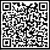


**了解详细课程内容及报名方式，点击文末“阅读原文”**


# 看懂这 7 张图就算你没有白认识天秤座

> 原文：[`mp.weixin.qq.com/s?__biz=MzA5NjA0NTAxNg==&mid=2651394247&idx=1&sn=ec0794ca00f6bce208a32f2bdbbc6768&chksm=8b4ba270bc3c2b665ba4e8d3afa09d8b9779c83ca457ff3d27649fe98fb1c5717841508374b8&scene=126&sessionid=1692738612#rd`](http://mp.weixin.qq.com/s?__biz=MzA5NjA0NTAxNg==&mid=2651394247&idx=1&sn=ec0794ca00f6bce208a32f2bdbbc6768&chksm=8b4ba270bc3c2b665ba4e8d3afa09d8b9779c83ca457ff3d27649fe98fb1c5717841508374b8&scene=126&sessionid=1692738612#rd)

**☆在后台回复数字 1-30，获得一颗为你精心挑选的新鲜彩蛋**

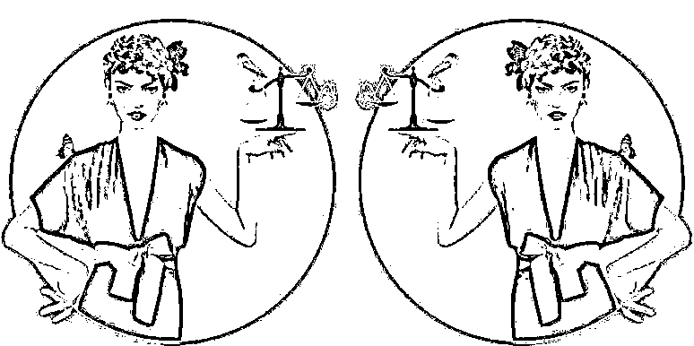

作者/神妞张景贻

编辑/Tang 图片/网络 作者提供

跨越过星图中的下降点，我们来到了掌管第七宫的天秤座。如果说黄道第一宫的白羊座代表了自我意识的觉醒，让人们开始建立起“我”的概念；那么，天秤座带领人们走向社会，认识到什么是“我们”， 并自此进入到星图中与他人和外面世界建立起更广阔联结的“上半球”。

**「**

**天秤座**

**Libra**

**」**

**起止时间**：约 9 月 23 日-10 月 23 日

**模式**：基本星座

**元素**：风

**守护星**：金星 

**主宰宫位**：第七宫

**每个人都有天秤座的能量**，无论你的太阳是否落入天秤座，只是能量强弱不一。

***寻找你星图中的天秤座能量***

如果你的出生星图中与天秤座能量有关的配置很明显，那么你更能感受到天秤座的能量。这样配置可能是：

*   星图中有**个人行星**（太阳、月亮、水星、金星、火星）、**四轴**（尤其是上升点、中天）、**南北交点**落在天秤座的人。

*   星图中在天秤座的**外行星**（木星、土星、天王星、海王星、冥王星）与四轴产生了关键相位。

*   **金星**与个人行星、四轴、南北交产生关键相位。

*   有行星落在**第七宫**，尤其是个人行星。

1

**《维纳斯的诞生》**

**波提切利（Sandro Botticelli）**

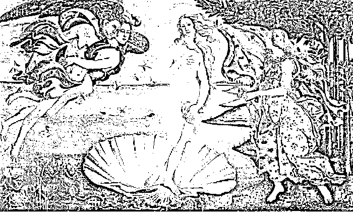

天秤座的守护星是代表了爱与美的金星。因而，**天秤特质强的人总能自然表现出优雅、礼貌的举止，拥有超与常人的审美力并散发着典雅气质的魅力。**同时他们也是鄙夷、甚至厌恶一切粗俗的人或事物。在他们眼中，美是如此的重要。

即使天秤座也可能流于肤浅的“表面的美”，带着“外貌协会”的眼光看人。不过，这个富有艺术气息的星座无疑带给了世界更多“赏心悦目”美丽。

维纳斯是希腊与罗马神话中美与爱的化身，也是金星的守护神。维纳斯（Venus）在罗马语中，意思是“绝美的画”。传说她拥有最完美的身段和容貌，一直被认为是女性体格美的最高象征。《维纳斯的诞生》是文艺复兴时期画家波提切利的杰作。

裸体的维纳斯就象一粒珍珠一样，从爱琴海海面浮出，风神、花神迎送于左右的情景。这个被认为是美术史上最优雅的裸体，突破了中世纪思想的禁锢，成为文艺复兴时期一个新时代的信使－－她把美带到了人间。

2

**《维特鲁威人》**

**达·芬奇（Leonardo da Vinci）**

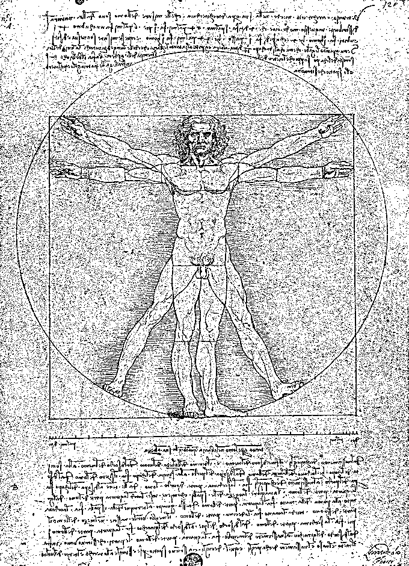

**虽说对美的认知有着很大的主观因素，但人类仍旧共享着一些共通的审美标准——“均衡”、“和谐”便是标准之一，也是天秤座的关键词。**

这幅《维特鲁威人》是达·芬奇在 1487 年前后创作的世界著名钢笔画素描。素描是一个男人在同一位置上的“十”字型和“火”字型的姿态，并被分别嵌入到一个矩形和一个圆形当中。

手稿根据约 1500 年前维特鲁威在《建筑十书》中的描述进行创作，书中写道：“实际上，没有均衡或比例，就不可能有任何神庙的位置。即与姿态漂亮的人体相似，要有正确分配的肢体。”手稿便就此描绘出了完美比例的男性人体。

上升点落入天秤座的人往往具有良好的身体比例，他们的外形展现出天秤座的均衡感与和谐感。然后，**天秤座对均衡、和谐的追求，不仅表现在外在，更是体现在生活的方方面面当中**，就如同它的占星符号♎所表征的那样， 他们理想的世界一定是充满了均衡与和谐感的世界。

3

**时装插画**

****勒内·格鲁瓦（**René Gruau）**

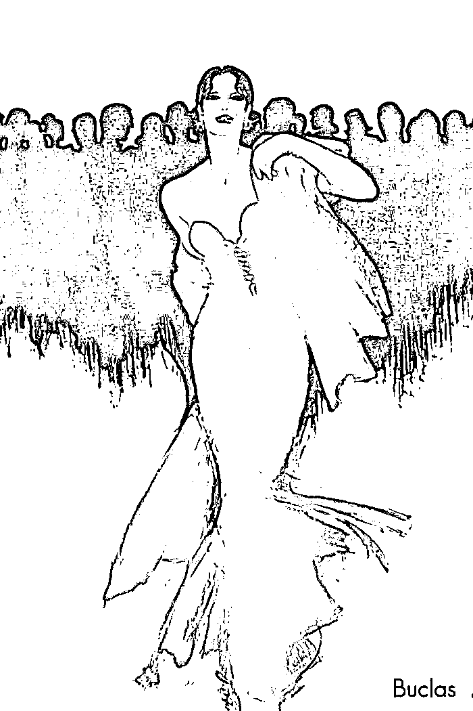

**相较于对宫白羊座的自立与自我，天秤座更热衷于与他人建立关系，在关系中找寻自己。**这幅描绘了社交场景的时尚插画是二十世纪最具影响力之一的法国插画大师勒内·格鲁瓦的作品，他独特的虚实结合水彩风格，将东西方绘画艺术相结合，其浑然天成的线条与色彩在时尚插画史上留下了重要的一笔。

天秤座美丽优雅的外表让他们惹人喜欢，但真正让他们受欢迎的是其友善、具有亲和力的个性。他们不仅善于给人留下良好的第一印象，也善于成为关系中的**“调和者”**、**“和事佬”**。**追崇公平**、**公正**的内心，也让他们极具正义感。

作为**“天生的外交家”**，这种公平的准则、求和的态度，让他们能够游刃有余地保持关系上的良好互动，在外交、公共关系领域表现出卓越的能力。

4

**球鞋插画**

**弗里拜恩（Dan Freebairn）**

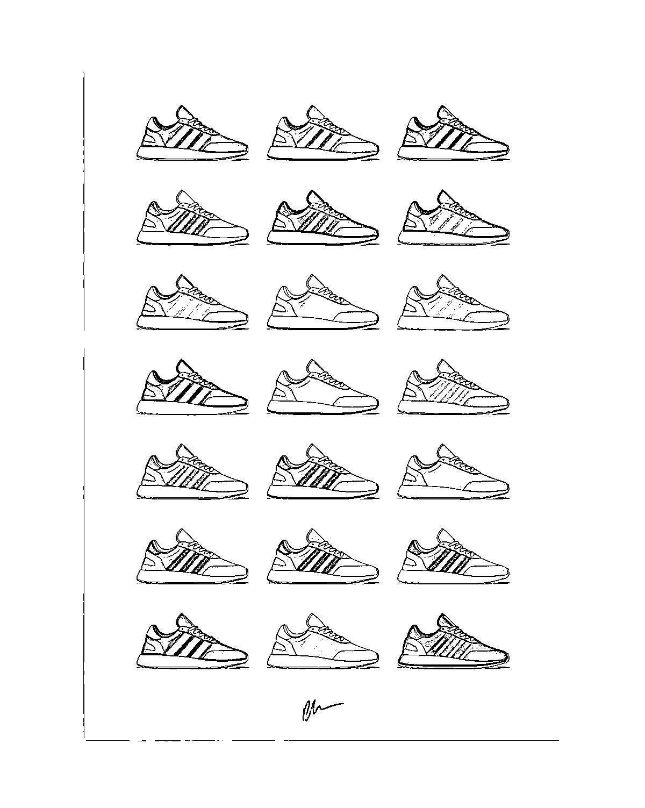

**天秤座的弱点也埋藏在追求公平和谐的需求之中，使他们容易陷入到过分妥协的困境中，从而忽略掉自己真实的需求。**同时，害怕决策带来的无法预知性，也容易让他们犹豫不决、瞻前顾后，成为**“选择困难症”**的重灾区。换句话说，不做任何决定，至少是安全稳妥、不会打破和谐的。

选择这幅插画，是因为它可能戳中了天秤座的这种“选择困难症”。这幅球鞋插画是英国插画师弗里拜恩许多作品中的一幅。

弗里拜恩自己对于 Adidas 球鞋有着近乎偏执的喜爱，他简约唯美的画风也被 Adidas 所看重，向其抛出橄榄枝，邀请他为 NMD OG、EQT、Super Star 及 Gazelle 等人气鞋款绘制插画卡片。这些作品不仅仅是生动的广告，也能够放入画框作为家居装饰，彰显自己独特的格调与品位。

5

**《吻》**

**克里姆特（Gustav Klimt）**

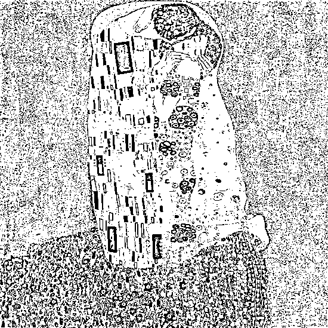

《吻》是奥地利象征主义画家古斯塔夫·克里姆特的代表画作之一，也是他最受欢迎的艺术杰作。这是一幅装饰性壁画，画中大量使用了金片、银箔等装饰性要素，使画面看上去熠熠生辉、金光闪闪，点状的背景以及开满鲜花的草地把整幅画衬托得唯美而轻柔，带来新鲜且典雅的艺术享受。在这金色的背景下，一对恋人紧闭双目，在开满鲜花的柔软草地上，热烈拥吻，让人沉浸在无尽幸福和浪漫的想象中。

**对天秤座而言，关系是一个高强度的成长领域。**爱情，又是所有关系中最具激情和浪漫色彩的部分。天秤座有时会被冠以“情圣”的“美称”，姑且不论这个称呼的褒贬与否，至少爱情的确会是他们生活中极其重要的部分。

**他们比其他星座更需要来自亲密关系的滋养，也会表现出更多的对陪伴感、依赖感的需求。**相信，这幅画面中与恋人深情相拥的瞬间，也是天秤座最为甜蜜、幸福的时刻。

6

**《白日梦》**

**罗塞蒂（Dante Gabriel Rossett）**

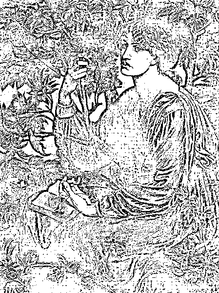

天秤座所在的宫位第七宫也是我们每个人的伴侣宫，这里是天秤座最为关切的领域——婚姻关系。**他们不仅需要建立起婚姻中的亲密关系，也需要维持亲密关系中的良性互动与和谐性。** 

这幅《白日梦》是英国画家、浪漫主义诗人但丁·罗塞蒂悼念亡妻的作品。罗塞蒂的爱妻去世之后，他陷入了无尽的怅惘和幻想中，后来他遇到了与亡妻相貌极为相似的莫里斯小姐，以她为模特创作了此画。

画中的绿衣女子掩盖在茂密的树木下，神情黯然、目光忧郁，手中的红花似乎象征着青春的凋零和生命的谢幕。在画家的白日梦里不是美丽和浪漫的幻想，而是一种彻悟的绝望。

当美满和谐的关系被击破，天秤座的情绪和感受可能会濒临一个危险的边缘，因为他们与别人关系的质量往往直接影响着他们对自我价值的认知。在现实层面，一切不可能是遂心如意的，这也就意味着**天秤座需要学习如何去面对关系中的冲突和各种变幻莫测的起伏，如何合理减少对外界的依赖，培养出独立性和更稳固的自我认知**。

7

**《太极》**

**田旭桐**

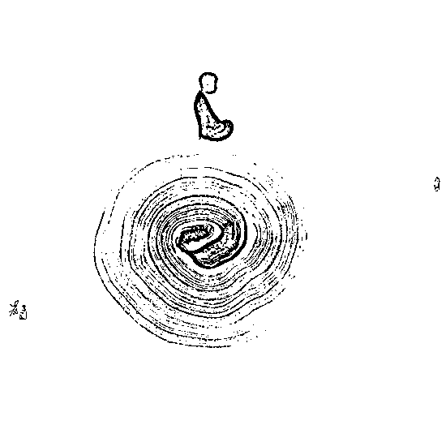

心理学认为，身边的伴侣，往往可能是潜意识中的另一个自己。圣经说：上帝用亚当的一根肋骨创造了夏娃。

最后，一幅国内知名画家田旭桐的禅意水墨画《太极》送给每个人星图中的天秤能量。在我看来，**中国的太极很完美地诠释了天秤座对和谐的终极追求——所有的整体都由互补的两半组成：阴与阳、美与丑、刚与柔、明与暗。**万事万物总是相互依存，你中有我、我中有你。

无论是通过关系的联结还是其他的路径，我们终究需要的是让自己完整。真正的**和谐**，一定是懂得如何去**平衡**那些对立的部分，从而达到内外在的**统一**与**安宁**。

**版权声明：**原创文章由作者授权首发于若道平台，欢迎转发，反对抄袭。友号转载请申请白名单。


**你眼中的天秤座是啥样的？**

**留言区等你哦。**

”

**关于星座与艺术，你可能还想知道**

[白羊座](http://mp.weixin.qq.com/s?__biz=MzA5NjA0NTAxNg==&mid=2651389399&idx=1&sn=f849e9b7b15570fdd66c1d887023d893&chksm=8b4a4f60bc3dc6769fe51710bb0fb3ad5b5876e53f82914feb85b6f73fd737d3ffe6b49dc511&scene=21#wechat_redirect)｜[金牛座](http://mp.weixin.qq.com/s?__biz=MzA5NjA0NTAxNg==&mid=2651390197&idx=1&sn=45b0de77bf31da3cc4c0368f5d6ef4b9&chksm=8b4bb242bc3c3b540a9193084a6800dc798e6c94704d8f2904c1131638f02c9f08e611610c09&scene=21#wechat_redirect)｜[双子座](http://mp.weixin.qq.com/s?__biz=MzA5NjA0NTAxNg==&mid=2651390864&idx=1&sn=45cc2623307550f66390bd9d1256fa75&chksm=8b4bb127bc3c383181f3e6057d9249f9c3c109bf8c12c79d09ca8af2056fa7a513befae6cd5b&scene=21#wechat_redirect)

[巨蟹座](http://mp.weixin.qq.com/s?__biz=MzA5NjA0NTAxNg==&mid=2651391525&idx=1&sn=5d5558e1eb048def3391a9329a95249a&chksm=8b4bb492bc3c3d84bec40ef29145f7302f334ab63f1476cc1abc9552a9aa8714b2c35a8a76a6&scene=21#wechat_redirect)｜[狮子座](http://mp.weixin.qq.com/s?__biz=MzA5NjA0NTAxNg==&mid=2651392561&idx=1&sn=aa06c8f01f0539b1b905ddb2e2379c00&chksm=8b4bb886bc3c3190c3e5332cf48e29c7275a34b18b92511277e626b0f8ada81d1afe017cbbf0&scene=21#wechat_redirect)｜[处女座](http://mp.weixin.qq.com/s?__biz=MzA5NjA0NTAxNg==&mid=2651393572&idx=1&sn=57ef730962b94e31651683627f87d2af&chksm=8b4bbc93bc3c358586708deddd8857c8f962dd8bd8c4b732ffc0f4080299608143d8d1e21fa6&scene=21#wechat_redirect)

**神妞张景贻**

英国 Lancaster University 管理学硕士

若道 2017 届核心课程 Level 5 学员、兼职占星师、撰稿人

国家三级心理咨询师（2014 年获得）

**咨询微信号：**shenniukelly

**微信公众号：**神妞视界（SNew_World）

长按打赏

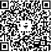

******点击图片查看若道君推荐******


**想体验格伦·佩里的星图解读么？**

**咨询预约请邮件至：xiaoyi.zhong@nodoor.com**

**电话：18513802156**

**微信：YY18513802156 仲老师**

**如何报名？请点击“阅读原文”**


# 每周一问｜分手后，我又偷偷爱了你很久

> 原文：[`mp.weixin.qq.com/s?__biz=MzA5NjA0NTAxNg==&mid=2651394247&idx=2&sn=c15513dfcb93c6087560e4ca68eb5194&chksm=8b4ba270bc3c2b660c874d7b9eeb2c18e3b682f1ee96a78eaee735ab7499fd9781759fedf8d4&scene=126&sessionid=1692738612#rd`](http://mp.weixin.qq.com/s?__biz=MzA5NjA0NTAxNg==&mid=2651394247&idx=2&sn=c15513dfcb93c6087560e4ca68eb5194&chksm=8b4ba270bc3c2b660c874d7b9eeb2c18e3b682f1ee96a78eaee735ab7499fd9781759fedf8d4&scene=126&sessionid=1692738612#rd)


作者/平台君阿凯

编辑/Tang 图片/网络

也许你曾经爱一个人到 100 分的程度。但是后来，你已经不像从前，你无法再爱一个人到 100 分，80 分已经是你的极限了，还有 20 分永远停留在曾经那段最激烈的情感里。对旧爱念念不忘，要如何才能开始下一段感情？不如听听占星师的解答。

阿文是我们这群人中唯一还单身的。其实他会赚钱，会照顾人，颜值还高，很难想象这样的人会跟单身扯上关系。当别人问起的时候，他总说自己有喜欢的人了。或许只有我知道，这个人是他分手了好几年的前女友。

也说不清楚是从什么时候开始有一个不想忘记的人、不能忘记的人。这个人从错过到相识，从相识到相爱，一起经历过所有的磕磕绊绊，也一起欣赏过这世界所有的美丽。也不知道从什么时候开始，失去这个人。从生活到心里，从心里到回忆。

有句话说得好，爱情里谁先爱上，谁就是输家。我不能体会他的心情。可我更希望他可以开始下一段感情。我相信所有错过的人，在经历了颠沛流离之后，会有更好的相逢。

本周的提问的朋友，也希望你会有更好的相逢。

**旧情难忘，该如何是好？**


**||** **TA 的问题**

想问下自己的爱情。心里总是会回忆起以前的人，这是否会影响我对当下爱情的判断？

**||** **TA 的星图**


**占星师（小蘑菇）的回答**

你好，很高兴回答你的问题， 你说心里总是会回忆起以前的人，这是否会影响对当下爱情的判断。那么是什么原因让你总是回忆起以前的恋人呢？过去的人满足了你生命中的哪些需求是在当下的情感中没有被满足的，而让你心泛涟漪？亦或是在过去的恋情中经历失望，让你对当下的恋情无法信任？

从你的星图上看，沟通对你来说是非常重要的，敏捷的思维，追求新鲜感充满好奇心，表达自己的理念，可能你也会想要和恋人之间有深刻的思想交流，增加彼此的信任感。另一方面你需要独立的自由空间，即需要亲密的关系又需要自由空间不失去自我。不知道你在爱情中是否建立适当的边界？

打个比方，比如你吸引来一个浪漫主义的女孩，和你一起到处旅游，新鲜刺激，可能她以前受到过背叛，她无时无刻地问你爱不爱她，控制你的行踪。你喜欢这样强烈的被爱，但是你也需要时间追求事业和其他想要做的事情。

强烈的控制和不信任可能让你爆发冷漠的情绪，让爱情不了了之，或者可能对方同样冷暴力地回应这段关系，甚至出轨来报复这段关系，反而你成为了关系的受害者。可能会是其他的剧情，但是是否也是同样跌宕起伏的情绪在其中呢？

这种情绪可能需要回溯你的童年模式，试问一下，你回忆以前的人是否会有童年和母亲之间的关系的影子呢？是否和母亲之间也是如此激烈的信任和控制的议题，同时又疏离冷漠的情绪模式呢？

可能小时候父亲很少在身边，或者什么原因离你很遥远，让你缺失一个学习的榜样来处理这样的事情，这样的模式和议题在你成年后的爱情中重复，促使你去解决。

**TA 的评价**

谢谢解答，确实你的解答给了我一种新的思考方式，一直以来我都是自己的较真。

**声明：文中内容已征得用户同意，名字均为化名**

**△ **最近占星问答平台上也有一些小伙伴问到恋人间、亲人间、爱人间的相处。为了更好地给出建议，希望大家记得填写双方的星图哦。这样占星师也能分析得更加全面。

**还有些故事等你来听**


**点击下方蓝色标题，阅读更多往期文章**

*   [《择天记》怎么逆天改命，让占星师告诉你真相](http://mp.weixin.qq.com/s?__biz=MzA5NjA0NTAxNg==&mid=2651390538&idx=2&sn=dba3f6eef16ef3b155be894be41baac1&chksm=8b4bb0fdbc3c39eb4dc46dad86f2527dbb7f5c0aaa2116218b48fb5d0b32f6c43e90d29272f5&scene=21#wechat_redirect)

*   [这才是女人最美的生活姿态](http://mp.weixin.qq.com/s?__biz=MzA5NjA0NTAxNg==&mid=2651389769&idx=2&sn=29f4ee706e4d64b4ce0a538403bb4993&chksm=8b4a4dfebc3dc4e85c25e3587a4fcea4ce7bf79ae9e057eecdc74419eb12d83cf634cabf17b9&scene=21#wechat_redirect)

*   [不抱怨的你，怎样都好看](http://mp.weixin.qq.com/s?__biz=MzA5NjA0NTAxNg==&mid=2651389304&idx=2&sn=8541a341bf7c47ee4b6edbf5ad4fe11f&chksm=8b4a4fcfbc3dc6d9296e8b099b18a32cf029398e46ad5008fe3388b3d23922a9eeeb442941a5&scene=21#wechat_redirect)

**占星问答登陆指南**

**▼**


****点击“阅读原文”，直接进入占星问答****


# 北京工作坊丨斯蒂芬教你“星图整合与解读”（10.20 开课啦）

> 原文：[`mp.weixin.qq.com/s?__biz=MzA5NjA0NTAxNg==&mid=2651394211&idx=2&sn=690fc47f848d1d7aef1c7ac03500c979&chksm=8b4ba214bc3c2b02e3c1c7d8bafa9cc236755e2cd8877acfe003ec58754719ef5327505bc8d4&scene=126&sessionid=1692738612#rd`](http://mp.weixin.qq.com/s?__biz=MzA5NjA0NTAxNg==&mid=2651394211&idx=2&sn=690fc47f848d1d7aef1c7ac03500c979&chksm=8b4ba214bc3c2b02e3c1c7d8bafa9cc236755e2cd8877acfe003ec58754719ef5327505bc8d4&scene=126&sessionid=1692738612#rd)

**xing**

星

**tu**

图

**zheng**

整

**he**

合

**ya**

呀

1

**斯蒂芬要讲星图整合啦！**

**来听大师自己的介绍**


▲斯蒂芬·弗里斯特

我之前在中国教授的课程中，探讨过占星学解读的基础：对具体出生星图配置的技术分析、星图间的关系、行进和推进的“预测”要素。这些都是占星解读这门技艺的基础零件，但如果把焦点狭隘地放在占星学细节上，我们就有可能失去**宏观视角**。

**真正的占星学艺术在于将所有碎片以一种整合的、有情感关联的方式呈现出来。**这需要各种各样的技巧。我们必须强烈地依赖自己的**直觉**，并学习如何将它纳入星图整合过程之中。我们必须学习从**占星符号中识别主题与模式**。一次客户咨询的时间有限，因此我们还需要“**编辑**”，也就是做出战略性判断，哪些内容可以安全地忽略。

**征象之间会存在矛盾冲突**，就像我们都感觉自己的内心存在着不同的需求和驱动力。我们该**如何在这之间找到恰当的平衡呢**，例如，星图描绘出一个人既内向又外向？一个人金星对爱的需求，与天王星对独立的需求发生了冲突，我们该如何帮助他？

最重要的是，我们如何将这一切**用简洁易懂的语言表达出来**？我们**如何构建通往客户内心的桥梁**？这些让占星学从一种技艺，乃至一门学科，转变为真正的艺术。

好消息是，在一定程度上，我们可以教授这些技巧。**第一天，我会在理论层面广泛探讨这些内容，让所有人都能够掌握这些原则。**

**后面两天，我会抽签选择学员以真实的星图为例，现场演示如何综合解读星图****。**我会尝试展现**业力故事，将其整合到当前的心理占星学中**，**在整体论、以客户为中心的分析和表述中，现场运用和阐释之前所学的技巧。**

2

**这位国际权威老师是谁？**


****斯蒂芬·弗里斯特**(Steven Forrest)**

*   进化占星学的创始人之一，当今世界最有影响力的占星大师之一;

*   毕业于美国北卡罗莱纳大学宗教学专业；

*   1984—1988 年间，写作出版了《内在的天空》、《变幻的天空》和《天空的伴侣》三本占星经典著作，奠定了早期在占星学界的地位。前后一共出版了 12 部占星著作，在世界占星学界拥有很高的声誉。

*   斯蒂芬将自己的绝大部分时间都花在教学以及个人咨询上，他于 1998 年创立了占星学徒计划（Astrological Appretice Program），这个计划致力于培养职业占星师；

*   至今为止已经有 600 余位学员完成了培训，其中很多都成为了优秀的职业占星师；

*   他是一位脚踏实地的导师，充满快乐和活力，亲和幽默同时又充满了智慧；

*   他的课程不仅仅是一次占星知识和经验的学习，也是一次与智者的相遇。

**3**

**上过课的人怎么说？**

他关于我星图的解读，让几乎所有在场的人掉泪，我也从此开启了一段灵魂追寻的旅程。我很惊讶他透过星图可以如此深入一个人的灵魂。很多东西你自己都不知道，但是他讲出来你会发现，啊，这是真的，这是占星学的神奇。

**——《心探索》创始人孟想**

6

**往期工作坊是怎样的？**


5

**什么人适合这门课程？**

**✦ **占星师或渴望成为占星师的人群。    

**✦ **本课程并非针对初学者，**需具备若道核心课程 level 4 及以上水平**，即了解星座、行星、宫位、相位等。

**✦ **课程会涉及行进、推进和太阳弧等高阶内容，不了解相关知识的同学，请提前学习相关内容。

7

**什么时候上课？**

| **日期** | **时间** |
| 10 月 20 日（周五） 10 月 21 日（周六）10 月 22 日（周日） | 全天  |

8

**课程费用是多少？**

价格：6800 元

*会场座位会按照付款先后顺序排序

8

**关于退课和转课**

课程付费后，因个人原因无法参加请在开课前 7 天通过邮件书面申请退款，申请都请发邮件至 nodoor@vip.126.com 受理，可全部退款。

 课前一周内申请退款，按照实际缴费金额的 90％受理退款！

 课前一周内申请转课，转入对应课程费用不得超过转出课程费用，如超出，需补足后方可转课。

 工作坊开始后，不再接受退课和转课申请！

**北京三日星图整合与解读工作坊**

**授课老师：斯蒂芬·弗里斯特**

**授课时间：**2017 年 10 月 20 日-2017 年 10 月 22 日

**授课方式：北京**现场面授，英文授课，有中文翻译

**费用：**6800 元

**有福利：**连报斯蒂芬大理、北京工作坊的学员，可获赠 1000 元课程券

**课程负责人：**薛老师（微信： 18513764886，请备注星图整合工作坊报名咨询）

长按二维码添加课程负责人咨询~


**了解详细课程内容及报名方式，点击文末“阅读原文”**


# 10 月 20 日天秤座新月｜你的“灵魂手术”还要继续

> 原文：[`mp.weixin.qq.com/s?__biz=MzA5NjA0NTAxNg==&mid=2651394211&idx=1&sn=4065e4b73ab25eda682a0013468432fb&chksm=8b4ba214bc3c2b0267f1070deef86cf71522c2b4b605a23ed9d48b3a7b3fe659bf25c26844f3&scene=126&sessionid=1692738612#rd`](http://mp.weixin.qq.com/s?__biz=MzA5NjA0NTAxNg==&mid=2651394211&idx=1&sn=4065e4b73ab25eda682a0013468432fb&chksm=8b4ba214bc3c2b0267f1070deef86cf71522c2b4b605a23ed9d48b3a7b3fe659bf25c26844f3&scene=126&sessionid=1692738612#rd)

**☆在后台回复数字 1-30，获得一颗为你精心挑选的新鲜彩蛋**


作者/Cora ISAR 认证占星师 

编辑/Tang 图片/花瓣网

**本次天秤座新月，**

**发生在北京时间 2017 年 10 月 20 号凌晨 3:12，**

**行进的月亮与太阳合相在天秤座 26 度 35 分。**

　**本次****天秤座新月重点影响人群**　

**个人星图中有重要星体、四轴或南北交点落在白羊座、巨蟹座、天秤座、摩羯座 23 度至 29 度的人**，是本次天秤座新月的**敏感人群**，更容易感受这次新月的影响，也更容易利用这次新月的能量。

**本次天秤座新月的特点**

*   新月（日月合相）精确对分天王星

*   火星、土星、凯龙星形成“T 三角”

*   天王星与火星形成 150 度相位

*   木星刚刚进入天蝎座，重新衡量关系的价值


**本次天秤座新月你需要面对的重要议题**

**与自己****和谐相处**

发生在半个月前（10 月 6 号）的[白羊座满月](http://mp.weixin.qq.com/s?__biz=MzA5NjA0NTAxNg==&mid=2651394080&idx=1&sn=76782c45361f67def7914d3868dae21f&chksm=8b4ba297bc3c2b81748c59c8560bf47cce0b924619b1a7c7ace18a4379fbf599d5c4f02dec63&scene=21#wechat_redirect)，将自我和外部、个人需求和关系需要之间的矛盾凸显出来，刺激我们去关注，与外部的人事物“对戏”的那个“我”，到底是谁，想要什么。**此刻的天秤座新月预示着一个处理关系议题的新起点，拥抱这个新起点，我们需要学习“如何与自己相处”。**

天秤座是能同时意识到**“我”和“对方”**、**“主体”和“客体”**的星座，所以天秤座与**公平、中立、客观**有关。与天秤座对应的第七宫，是最能反映心理学中的**“投射”**问题的宫位。

**在最根本的意义上，当我们无法处理和自己的关系时，我们内部的分裂和矛盾，就会反映在外在的关系现实中。**忽略自己的需求时，就会吸引来对我们索取无度的人；无法释放愤怒的人，容易吸引来一个施暴者……这样的例子不胜枚举。要真正改善我们和外部世界的关系，必须从**“与自己的关系”**入手。

**天秤座新月呼唤我们去找到内在的平衡和完整，让分裂的不同面向合一。外面没有别人。亲密，是与自己的亲密。**

**面对无常**

新月在天秤座，鼓励了爱的流动和对美好事物的赞赏。但新月（日月合相）准确对分天王星，也暗示了来自方方面面的不稳定因素可能会打破我们内心的和谐。天王星是教导**“无常”**的行星，它带来突变和启迪。

**所有看似突然、意想不到的变化，都是在提醒我们，我们内在对于独立空间和个性表达的需求，需要被看到——我们需要活得真实。**给变化留有空间，便是接受无常，也是接受真实。

**“灵魂手术”****还要继续**

从去年底到今年秋冬，土星与凯龙星的四分相，在不断勾起我们灵魂深处的伤口，逼迫我们去给自己动手术。现在土星与凯龙星已接近最后一次准确成相，在本次天秤座新月的时刻，处女座的火星也参与进来，与土星和凯龙星形成“T 三角”。

火星在处女座要求我们以细致、务实、实事求是的态度行动。此时我们的缺陷感可能被放大，越是想要去解决问题，越是发现问题“解决不完”或根本“无解”。**这组富有张力的相位，一方面可能带来痛苦和焦躁，以及“向内攻击”的情绪，另一方面也是在帮我们训练出真正的谦卑和务实。**

当看到伤口已经腐烂、流脓时，我们需要承担起为自己做手术的责任，捏着鼻子，一点一点地将腐肉挖出来。这个过程不美好，但却是有用的。


**针对本次新月的具体建议（许愿方向）**

*   理解自己身上不同的人格面向和不同的需求；

*   发展跟自己相处的能力，找到能为自己的舒适和快乐负责的方式；

*   意识到每个人都是一个独特又完整的个体，我们可以既和谐相处，又保有自由；

*   在生活中发现美，享受美——每个人生活中的美，由自己定义；

*   相信自己是美好的，这样美好的一个你，值得拥有美好的生活和美好的关系。

**版权声明：**原创文章由作者授权首发于若道平台，欢迎转发，反对抄袭。友号转载请申请白名单。


******想阅读更多作者的文章，请在后台回复 Cora 即可。******

**Cora**

ISAR 认证占星师（2014 年获得）

斯蒂芬·弗里斯特《变幻的天空》译者

全职占星师，从事占星个案咨询及教学工作

**个人微信号：**CoraAstro

**微信公众号**：聆宇 FM 

长按二维码，给作者打赏


******点击图片查看若道君推荐******


**想体验格伦·佩里的星图解读么？**

**咨询预约请邮件至：xiaoyi.zhong@nodoor.com**

**电话：18513802156**

**微信：YY18513802156 仲老师**

****如何报名？点击文末“阅读原文”****


# 你会不会离婚，难道是天王星说了算？

> 原文：[`mp.weixin.qq.com/s?__biz=MzA5NjA0NTAxNg==&mid=2651394192&idx=1&sn=b0e02adf4e599ebe528037afcbd7d1e4&chksm=8b4ba227bc3c2b31487e1836adec2ec3ad0c333fa18ce1273d1990e4c11433c109a3169bbfbb&scene=126&sessionid=1692738612#rd`](http://mp.weixin.qq.com/s?__biz=MzA5NjA0NTAxNg==&mid=2651394192&idx=1&sn=b0e02adf4e599ebe528037afcbd7d1e4&chksm=8b4ba227bc3c2b31487e1836adec2ec3ad0c333fa18ce1273d1990e4c11433c109a3169bbfbb&scene=126&sessionid=1692738612#rd)

**☆在后台回复数字 1-30，获得一颗为你精心挑选的新鲜彩蛋**


作者/斯蒂芬·弗里斯特 译者/轩轩

校对/Arrow 编辑/Tang 图片/网络

有时候我们会听这样一种可怕的论调：如果行进的天王星来到你的第七宫，那么你就会离婚！让人听得不禁一阵冷颤，如果天王星进入主管婚姻的第七宫，你就一定会离婚吗？一旦预测失败，我们又不禁质疑起了占星学——它失效了吗？听听大占星师斯蒂芬老爷子怎么说吧。

[🔈 天王星与离婚](https://res.wx.qq.com/voice/getvoice?mediaid=MzA5NjA0NTAxNl8yNjUxMzk0MTkx)

最近我收到一名学生的邮件，表达了他的担忧。他有位客户刚刚经历行进天王星合相月亮，但是“**什么也没有发生**”。他由于预测失败而感到担心、尴尬。我解释了一些可能的原因。

我想指出的第一点会听起来很教条，但是我确实相信它是真的：**占星学永不失败**。我很快补充道占星师自己经常失败，但那是另外一件事了。占星学是宇宙运作方式的基础，占星学的失败就像是引力失效，但是**占星师的预测有时候确实会失败，我们理应不必害怕承认这一点，也许我们还会从中学会点什么**。

**天王星进入第七宫，他们却恩爱如初**

占星师看到行进天王星进入第七宫，预测了离婚，但事实上并没有离婚。当涉及到“占星学失败”时，“象征意义不拘泥于字句”这个核心观点是关键。

占星学失败了吗？没有，是那位现在被打脸的占星师的错。这个预测太狭隘了，它的刻板注定错误的概率更大。想想大部分长期伴侣关系中，至少有一方经历过这种行进，但还是挺了过来。

真正的重点是，虽然**“地震和闪电之王”天王星进入主管婚姻的第七宫时，离婚确实是一种可能的表现，但不是唯一一种，它可以有很多不同的表达方式。**

**婚姻的中他们**

妻子告诉丈夫，今年夏天她不想和往常一样，与婆家去度假，她想要去参加为期一周的占星研讨班。她担心丈夫会拒绝，但是他却说：“太棒了！可算松了口气。今年本来我也不想和家人在一起，我想租一台摩托车，骑行穿越新墨西哥州。我原本担心你会因为没去度假而不开心。”

发生了什么？**他们给了彼此天王星式的喘息空间。他们更加快乐，也因此更加亲密。这是此行进下比离婚更好的答案。**

“什么都没有发生”吗？当然不是。只是简单预见到离婚的占星师，对于将要发生的事情有着过于狭隘的预设。在这个案例中，客户听到了这个行进正确的字面意义，但象征意义不拘泥于字句。可悲的是，占星师没有想到行进天王星进入第七宫有可能有更加高阶的反应。

**仅仅是这种解读错误，构成了“占星失效”的大部分情况。永远不要低估你的客户，不管“看起来有多糟”，永远不要忘记每个行进的高阶进化意义。**


**单身时，会发生些什么？**

我们人类天生在肉身中行走，感官和外在世界相连，我们在两者间游走，应对我们的需求和欲望，和我们所处的环境斗争。**但是我们也活在内在世界中，甚至是我们对物质世界的理解也受到了内在态度和心情的限制。**

这个部分的观点很简单，它和我们对“占星失败”的理解有着本质关联。**有时，占星学事件完全展现于内在层次**。它仍然还是“一次事件”，只是其本质是纯粹心灵的，它与外部行为没有完全直接的关联。

**单身****的她**

让我们再重新考虑下行进天王星进入一位女士第七宫的案例。这一次，假设她是单身，并且满足于单身的状态。假设她对关系的态度归结为“既然牛奶那么便宜，为什么要买奶牛？”这是风趣的说法，但也反映出了某种脆弱。假设她对于关系的部分防御性态度来自于对脆弱的恐惧。假设外在社会的限制——常常是天王星的敌人——已经造成了她不愿信任任何人。

举个例子，让我们假定她的父亲在她小时候抛弃了家庭。她身边的朋友也都以一种“酸葡萄”的方式——贬低关系，保护自己免受孤独侵扰。**天王星进入这位女士的第七宫可能意味着，她从那些外在影响中主张自己的真实个性。**坐在公园的长凳上，和自己进行一次长谈，她意识到在本性中，她是一个充满爱的伴侣，或者至少想要成为这样的伴侣。她渴望那样的外部现实发生——她甚至需要勇气来承认这一点。

当她坐在那个公园长凳上时，并没有人骑着童话里的白马前来，掳走她的芳心，将她带往山上的城堡。她依然单身，外面的世界什么都没有改变。

但是如果我们说，“当天王星进入她的第七宫时，什么都没有发生”，天使会摇着头发笑。重大事件已经发生了，刚刚发生在她的两耳之间——在心理层面——而不是现实世界。加上一点点想象力和一点点人类的同理心，我们可以马上意识到，**在她的心中发生的天王星的式改变可以被理解为未来可能发生的幸福亲密关系的前奏**——没有心灵的这种改变，或许哪怕风流倜傥的王子拜倒在她的石榴裙下，她也会转身离去，心想“这男人不错，但是对我来说太矮了。”

**重点在于我们都同时活在内在世界和外在世界。占星学可以在内在层面运作，而在生活的表面不留下一丝涟漪。**一名优秀占星师必须意识到这一事实。而不合格的占星师只会思考具体的外在表现，预测将要发生的事情。更糟的情况是，将问题的范畴局限于外在世界的鸡毛蒜皮。

我再补充一点。当我坚持本文所说明的基本观点时，我想强调它代表一种比较罕见的情况。**一般来说，鉴于共时性原则在占星学中体现的方式，大部分行进同时存在外在和内在的表现**。表现可能难以察觉，但往往都存在。

例如，上个案例中，我们的主角可能和陌生人有了 30 秒的调情。看到和她内在变化的联系了吗？她可能会点击相亲网站，紧张地瞥一眼，然后快速退出。这些显然都是小事，很容易被忽略。但是它们都是更加戏剧化的内在觉醒的模式，是其微妙的外在表现。


**天王星为你带来了“内在大地震”**

一个几乎肯定不会失败的占星原则就是，**没有什么行进或推进一定会发生，除非它需要发生**。它们全都代表进化的必要。它们在本质上都是我们和宇宙签订的灵魂契约，包括我们的第一口呼吸。一种表达方式是我们都病了——而行进和推进是解药。重点在于，**行进和推进常常在需要的时候发生，并且总是在对的时候。它们出现来提升我们的觉知，修正一些东西，疗愈一些东西。**

当我们建立起这些宏大的哲学观点，就可以承认我们中的一些人可能需要比别人更坚决的修正。你离目标偏离了多远呢？这一切将我们引入关键：**行进的能量关乎多大的“修正”对你来说是合适的**，那不是我们能从星图中看到的，它和你一直以来如何应对星图的功课有关。

回到天王星行进入第七宫。即使我们处于幸福的关系中，我们仍然有自己的路要走。在伴侣关系的现状和忠于自己的旅程和天性之间，我们如何正确地平衡？那是一个棘手的问题。我们自然都会犯错。在关系中，我们可能会过度妥协，有时候甚至自己都没有意识到。或者可能我们太执拗、太固执，我们认为“折中”是冒犯。

**这一刻，她想**离婚**了**

有一位女士一直是“听话的、顺从的妻子”，为了丈夫和家庭的需求牺牲自己，以至于她在自己的世界几乎变成了幽灵。天王星击中了她的头，也许这真的就像“地震和闪电之王进入了她的婚姻宫位”。发生了什么？也许她爆发了——抛弃了婚姻，有外遇了，搬去了南美，以假名生活。多惊人的事件！算命的占星师当然为他言过其实的预言而欣喜不已。

更可能的是，考虑到她表现出来的被动本质，她的内在经历了这次行进，但是以黑暗的方式，她放弃了。她进一步躲入分裂的状态，她选择成为自己生活中的僵尸。也许她的丈夫什么都没有注意到。

这里暗含的概念是，**她迫切地需要天王星行进**。**它代表的进化需求迫在眉睫，所以当“锁定了断层线并施以负荷”，一定会有大地震。**确实很严重——一种情节是她离婚了。我们只需要敏感觉察那个可能的“内在地震”和更加眼花缭乱的外部地震。

在这个案例中，显然我们不会看到“占星的失败”。但是如果初始情况更加温和，所需的“修正”不需要如此戏剧化，那又会怎么样呢？

上文中提及同一行进时，我们想象着一个人告诉伴侣她“不想像往常一样和家人去度假，而是去参加为期一周的占星研讨班”。她的伴侣对此没有任何意见——反正他自己也想离开，去摩托车骑行。

在那个例子里，必要的天王星修正温和得多，进化的必要性也没有那么电光火石。两个明智的人只是在关系中给彼此更多的个人空间。他们两个人都更开心了，也因此更爱彼此。

但是记住：对于断言天王星在第七宫“代表离婚”的占星师而言，什么都没有发生。


**有些事情似乎无法用占星学解释**

我们一直在研究已知的行进或推进似乎失败时，真实发生了什么。这里我们反过来看：如果生活中发生了一些些事，但是占星学上似乎并不能解释，那会如何呢？那是另外一种“占星学失败”的情况。

所有诚实的占星师都会承认这个事实。当它发生时，**是否存在外来的力量在发挥作用**——比如一颗未被发现的行星？有时候这无疑是真的。要不还能怎样？可能还有多颗未被发现的行星——同上，它们有自己的占星学意义。一定存在“占星学体系中的鬼”。

现在跳出一点目前的思维框架。当诸如“没有占星学解释”的事情发生时，其原因可能更平淡。

作为一名占星学老师，当我们“无法在一件生平大事后面看到占星学现象”时，我的头脑中立即就会出现一个不那么奇特的解释。我记不清有多少次听到学生说，“噢，我从来不使用太阳弧”或者“噢，我没有注意到月亮已经进入了香脂月”。**当占星学失败时，我们是否只是没有努力去看眼前的星图呢？**

我们目前的占星学技术体系当然不是完整的，但是已经相当广泛、异常强大了——它需要不懈的努力，来提升占星学的技能水平。大部分时候，占星师在某个事故或某段新关系或随便什么事情上看不到行星的足迹时，解释可以归结为看得不够用力。


**出生时间不准，也许就白搭了**

**占星学有赖于一系列复杂的环环相扣的原则，至今它最弱的一环就是我们对精确出生信息的依赖。**甚至是新手占星师也知道不要去相信“正午”这样的出生时间，或是当我们听到“妈妈说是在 6 点左右”时应该犹豫。但即使是一个写着下午 7:22 的出生时间也可能有误导性。“出生时刻”实际上具体指什么？墙上的钟有多准确？

青少年时代，当我开始对占星学感兴趣时，我问妈妈我的出生时间。她自信地告诉我：“上午 6 :11”。后来我找到了我的婴儿成长记录本。发现我出生于 3 小时前，但我的体重是 6 磅 11 盎司。永远，绝对不要相信你亲妈。

即使我们足够聪明，去预测问题而不是答案，还是有可能遭遇只是由错误星图导致的错误“预测”。当然为了自己的错误而去责怪“错误星图”是个廉价的把戏。我热切信奉自由意志——但是请永远不要将它和技艺不精混淆！**当看似“占星学失效”时，记住我们这里讨论的所有观点。**

**如果错误都是一致的，星图看起来“不匹配”，那么要小心：你分析的可能是错误信息。**一般来说，这样的错误都是几分钟。因此，它们的影响没有那么大，例如在天王星行进到出生图的月亮时——几分钟不会让月亮离很远。但是即使是几分钟，也能严重影响宫头的位置——平均来说出生图中 4 分钟的误差会造成 1 度的错误。

**基本原则就是总是持怀疑态度对待出生时间。如果你的预测无效，那它可能是引起问题的原因。**

**重要提示：**

这些错误在许多行进和推进上的表现必须是一致的，然后你才能当真。如果只在星图中发生了一次，其他都是可靠的，那么请回顾一下我们之前探讨的可能性。


结尾，我想再重复我的观点，**占星永不失败**。这句话可能听起来很傲慢，但我相信它。当我考虑它的意义时，它的力量实际上具有相反的效果——它让我谦卑。在我骨子里，我知道信任我的客户们最关键的灵魂问题，都在我面前那张我们称之为星图的单页纸上。

他或她来找我，指望着我智慧的忠告。**占星学从未失败，但是占星师会失败。**我也会失败，我所能做的就是在自己的范围内尽可能明智地实践，不断努力，朝着真理、智慧和技巧进一步扩大能力范围。加入爱，也许再加入一些谦卑，实践这个神圣的技艺是一种殊荣和快乐。

**版权声明：**本文由若道翻译发布，欢迎转发，反对抄袭。友号转载请申请白名单。


**斯蒂芬·弗里斯特**

进化占星学的创始人之一，当今世界最有影响力的占星大师之一;毕业于美国北卡罗莱纳大学宗教学专业；1984—1988 年间，写作出版了《内在的天空》、《变幻的天空》和《天空的伴侣》三本占星经典著作，奠定了早期在占星学界的地位。前后一共出版了 12 部占星著作，在世界占星学界拥有很高的声誉。

******点击图片查看若道君推荐******


**如何报名？请点击“阅读原文”**


# 顺势疗法，一种英国王室推崇的自然疗法（上）

> 原文：[`mp.weixin.qq.com/s?__biz=MzA5NjA0NTAxNg==&mid=2651394192&idx=2&sn=4b59f4102295ee584099c6c918c82fc3&chksm=8b4ba227bc3c2b31e509ca3517dd0504289561de100a4cac72f23a7329b1bd70f48849b96430&scene=126&sessionid=1692738612#rd`](http://mp.weixin.qq.com/s?__biz=MzA5NjA0NTAxNg==&mid=2651394192&idx=2&sn=4b59f4102295ee584099c6c918c82fc3&chksm=8b4ba227bc3c2b31e509ca3517dd0504289561de100a4cac72f23a7329b1bd70f48849b96430&scene=126&sessionid=1692738612#rd)


文章来源/homeopathyplus 网站 译者/轩轩

编辑/Tang 图片来源/网络

长期以来，英国王室特别欣赏，甚至是推崇某些非传统却行之有效的治疗方法，最著名的便是顺势疗法。顺势疗法是一种整体性疗法，它比其他医疗方式更具有互动性，你需要在治疗的过程中与你的医师进行更为紧密的沟通，才能达到最好的疗效。想要知道顺势疗法的药剂从何而来？为什么格外安全？阅读下面的文章，就能给你答案。

顺势疗法如何治病？

**顺势疗法是一种有关天然药物的科学，利用剂量非常小的各种植物、矿物质或动物来刺激病人自身的抵抗力。**药物根据个人情况而选择，这些药物如果过量服用能够导致病人所正在经历的相似的症状。

**本质上说来，顺势疗法由两种高度系统化的方法所构成：毒理学和病案记录。**首先，顺势疗法医师找出各种物质在过量时所导致的特定的身体、情绪和精神症状。与其他任何来源相比，**顺势疗法教科书在毒理学方面有着更为详细的介绍**。其次，顺势疗法医师极为详细地问询其患者，以发现该人所经历的身体、情绪和精神的全部症状。**顺势疗法医师试图找到一种物质，该物质会导致此人身上的类似症状，然后以特别准备好的小剂量的方式开药。**

顺势疗法的药物是安全的吗？

**顺势疗法药物所采用的小剂量使得它们格外安全。当然，重要的是知晓如何开这些药物。**戴纳·厄尔曼和斯蒂芬·卡明斯（Stephen Cummings）博士共同撰写的图书《每个人的顺势疗法药物指南》（*Everybody's Guide to Homeopathic Medicines*）（出版社：Jeremy Tarcher/Putnam，2004 年）提供了关于如何利用这些药物以及何时有必要寻求医疗护理的每一个步骤的信息。

顺势疗法药物被美国食品及药品管理局官方认可为**“非处方药”**，因此任何人无需处方就可以订购这些药物。**因为它们被视为药品，所以其制造受美国食品及药品管理局的监管，以确保消费者所买即所得。**

服用顺势药物后都有啥反应？

不同的人在首次顺势治疗中都有着不同的体验。有些人能获得显著而深刻的成果，而有些人的成果则轻微、不易察觉。如果能了解到这些差异出现的原因及意义，那么这将帮助你从治疗中获取最大的益处。**请记住，顺势疗法是一种双方的责任：虽然你依赖着顺势治疗师来给你开处方、控制病症，但他们也依赖着你提供准确的信息，并需要你注意到自身发生的所有变化。**那么，知道了这些之后，让我们一起来看看治疗中涉及到的过程。

**在你第一次服用完顺势治疗药品时，将会出现以下任一情况**

● 治疗效果：症状变轻或消失。

● 病情恶化：症状先加重后改善。

● 症状改变：短期内出现新的症状，但已有症状不变。

● 副症状：已有症状获得改善，但同时短期内出现了一种新的症状。

● 旧症状再次出现：现有症状获得改善，但同时过去的症状在短期内再次出现。

● 短期内出现替代性的流脓或出疹子

● 完全没有任何反应

这些情况意味着什么呢？顺势治疗师能从中获取很多信息！每种反应都揭示着所开药方是否正确，也将提供给治疗师有价值的信息，用于调整治疗方法以帮助你痊愈。那么，现在让我们来详细看看每种反应。

**症状变轻或消失**

**这意味着**

处方是正确的，与你的症状相匹配并且有着：

● 适当的强度（效力）

● 适当的量（剂量）

● 适当的服用次数（频率）

**解释**

这是每个人都渴望的神奇效果，而这也是经常发生的情况。对于急症，如膀胱炎或牙龈脓肿，此疗效会很快出现，有时只需一次剂量。而慢性病症，比如从童年就反复出现的扁桃体炎或哮喘，则需要静待稍长的时间。如果有数种病症或问题经年累积，那么可能就需要一系列治疗措施及加强的药效来治愈。

**你该做的**

享受改善的健康和精彩的生活

**症状先加重后改善**

**这意味着**

该处方是正确的，但是效力太强。在激起相应疗效之前，它加重了你的症状。

**解释**

在这些情况下，即使处方十分适合你的症状，它也可能暂时让病情加重：

● 剂量过大

● 效力不对

● 频率过高

这种顺势性的病情恶化之所以会发生，是因为过强的药效和现有症状合并。

幸运的是，**这种恶化通常是温和的。其持续时间也不长——当药品的能量离开你的身体时就会消失**。随后你自身的生命力就会重新焕发，抵抗正在消失的药效，从而激起康复进程。病情加重向我们证实处方是正确的，而你的顺势治疗师现在需要根据你自身的敏感度来调整下次用药的剂量。万一你的恶化期延长，治疗师可以通过其他顺势处方进行化解。

**你该做的**

告知你的顺势治疗师。他们很可能建议你让加重的症状自然消失，这样就能看到随后改善的病情。为了避免再次恶化，治疗师会调整剂量、效力或用药频率以适应你的敏感性。

**短期内出现新的症状，但已有症状不变**

**这意味着**

处方是不适合的；它与你的症状并不匹配，但是你的身体足够敏感，可以感受到该处方所引起的不同症状。

**解释**

当处方是错误的、几乎不符合你的病情时，你可能会经验到变异的或非顺势的症状，如果你对药品敏感则更是如此。该处方会引发其特有的一些症状，因为这些症状和你起初的症状不同，所以这一情况被称为症状改变，而不是病情恶化。因为症状之间缺乏相似性，所以这一处方并不能帮助到你。

幸运的是，**就像病情加重一样，症状改变通常也是温和且短暂的**。药品能量离开你的身体时，症状就会渐渐消失。但不幸的是，后续你看不到反弹的自愈效果。你的顺势治疗师必须给出更加匹配病情的其他处方。万一症状改变的时间较长，治疗师将以顺势的方法来化解。

**你该做的**

告知你的顺势治疗师。他们将重新检视你的病情，给出更合适的处方。此时治疗师尤其关注你在改变期所出现的症状，因为这将指导后续治疗。

**特别说明**

恶化（包括病情恶化和症状改变），**虽然不是顺势治疗中必然出现的情况，但有时也是无法避免的**。当病人对处方非常敏感，或者治疗师技法不纯熟，开出了超量或过频的剂量，都会出现病情恶化。因此，**在治疗初期，有经验的治疗师都会先给出测试剂量来确定病人的敏感度**。而药品也通常是液体而不是药片，因为如果需要更温和的剂量，液体可以很轻松地被稀释。

**当病情出现恶化时，其持续时间一般不长，症状也较温和**——这倒是一种有趣的体验。这种情况的益处之一在于**：挑战病人的生命力，让他们拥有更强的抵抗力**。

**（未完待续）**

**版权声明：**本文由若道翻译发布，欢迎转发，反对抄袭。友号转载请申请白名单。


****请在后台回复 顺势 获得更多****关于顺势疗法内容********

**点击图片查看若道君推荐**


**点击文末“阅读原文”获取更多课程信息。**


# 原来，天秤座的高阶表现是这样的……

> 原文：[`mp.weixin.qq.com/s?__biz=MzA5NjA0NTAxNg==&mid=2651394167&idx=1&sn=9f604c8fec08bd36ebc2fef43323c8c9&chksm=8b4ba2c0bc3c2bd687d44ab777cc021fab2ae0590e305302892b29c626bb58fe22f714ba4d4e&scene=126&sessionid=1692738612#rd`](http://mp.weixin.qq.com/s?__biz=MzA5NjA0NTAxNg==&mid=2651394167&idx=1&sn=9f604c8fec08bd36ebc2fef43323c8c9&chksm=8b4ba2c0bc3c2bd687d44ab777cc021fab2ae0590e305302892b29c626bb58fe22f714ba4d4e&scene=126&sessionid=1692738612#rd)

**☆在后台回复数字 1-30，获得一颗为你精心挑选的新鲜彩蛋**


作者/Brynhildr 编辑/佳黛

图片/花瓣网

坊间对天秤座的误解，仍然停留在什么爱美啊、选择困难啊、暧昧高手啊等等，STOP！今天就让你们看一看，什么叫做天秤座的大智慧。

**天秤月，我们来聊一聊天秤座**

十月金秋，天秤月。

在我们正式讨论这个星座之前，先来讲讲天秤座所处的秋季。

黄帝内经是这么写的：


**秋三月，此谓容平，天气以急，地气以明；早卧早起，与鸡俱兴，使志安宁，以缓秋刑，收敛神气，使秋气平，无外其志，使肺气清，此秋气之应，养收之道也；逆之则伤肺，冬为飧泄，奉藏者少。**


所谓春生夏长，秋收冬藏。当英雄之旅来到天秤座时，已不再是当初的少年模样。

那些说天秤座爱美又肤浅，表面风度翩翩，热爱交际又喜欢八面玲珑实则虚伪冰冷的人，一定不了解真正的天秤座。

当天气进入秋天，也就到了天秤座所象征的“**容平**”。**从容不迫又平易近人**。

秋天，首先是一个收获的季节。大半年的劳动和付出，到了天秤座这里，理所应得的受到金星的丰厚奖赏。经历过前面风风雨雨的考验，成熟的人，才会具有从容不迫的力量。


**丨**金灿灿的秋天

天秤座，是黄道第二个风向星座，当双子座还在牙牙学语的模仿他人时，天秤座已经能够圆滑周到的和各种人打交道，不卑不亢、有礼有节、风度翩翩、八面玲珑。

看上去像朵金灿灿的交际花，但实际上，天秤座是已经进化过的，拥有高度智慧的哲学家、美学家。

这是一个某种程度上完成智，走向慧的聪明人。

**天秤座的“大智慧”**

曹雪芹说：“世事洞明皆学问，人情练达即文章。”

一个人可以做到左右逢源而无人嫉恨的境界，那他必是有着一颗七窍玲珑的比干心。学习客观事物用的是智，理解透悟形而上的不可捉摸无形体，则需开慧。

因此，天秤绝对和肤浅二字无关。

所谓“使志安宁，以缓秋刑”。除了收获的喜悦，还有秋风扫落叶与秋后问斩的说法。**表面温和平静，从容不迫的天秤座，有着明察秋毫的犀利智慧**。

是的，智慧是一个和金器有莫大关系的词汇。

金刚般若波罗蜜一喻如金刚般颠扑不破的智慧，另一喻为能断金刚之智慧。

大智大慧的文殊菩萨，手持金刚宝剑，斩群魔，断一切愚痴无明。

太锋利的刀具需要藏鞘。“收敛神气”，“无外其志”，让我们看到天秤座谦谦君子，温润如玉的形象。

**从神话来看天秤座的智慧与选择**

然而，智慧究竟是什么呢？

在黑暗深邃的田间小径尽头，踽踽独行的天秤座，究竟看到了什么？

神话中，忒瑞西阿斯（Tiresias）是一位盲眼预言家。关于他瞎眼的故事，有众多版本：

版本一：他因为泄露神的秘密而受到惩罚；

版本二：他参与一场神界夫妻间的仲裁，宙斯对自己婚内出轨行为的辩护是，男女做爱时，女性在性持久度上远胜于男性，所以赫拉占取很大优势。赫拉则不这么认为，她说她的丈夫天天沾花惹草，性欲太多。

忒瑞西阿斯仲裁说：“如果我们将性快感平分成 10 份的话，1 份归男人，9 份归女人”。这个答案让赫拉暴怒，直接刺瞎了他的双眼。但是宙斯却非常高兴，赐予他内视和预言的技能。

版本三：他因观看雅典娜沐浴而被她弄瞎；

版本四：他一个人在山上散步的时候，突然撞见两条蛇在交配，于是被弄瞎。

这四个版本各有各的说法，但涉及的关键词有两个——**“智慧”与“选择（仲裁）”**。

这两个关键词，也即每一个天秤座的天赋与命运。

无论是来自神的秘密，内视和预言的技能，雅典娜女神，还是灵蛇的寓意，都意味着智慧。

寻求智慧的道路是孤独的，眼盲心不盲，智慧永远是向内看向内求的。

慧具有通灵的预言能力，智慧的内容是极少数人才能知晓的，很大可能是在长期孜孜不倦的探索下无意中获得的，撞见智慧很可能会触碰到禁忌。

慧极必伤，承载智慧的代价是必须做出选择并为选择买单。

如果想要虐待一个天秤座，让他们做人生选择就可以。

他们一定会露出比死还难受的表情。

因为他们会不断的权衡利弊得失，不断的下定决心又推翻自己，比纠结的处女座更能反反复复纠结死自己。


**天秤座的难题之“选择”**

虽然天秤座的守护星是金星，爱与美之星。但是相比于金牛座的肉欲和物质美感，天秤座在处理金星能量时，往往是更形而上的，这也就是为什么我说，他们大多都是哲学家，美学家。

论及情感，天秤座男性在面对感情问题的二选一或是多选一时，往往多情且昏庸的一塌糊涂。

更有意思的是，天秤座是典型的爱江山更爱美人，从特洛伊战争的始作俑者帕丽斯迎娶海伦事件就可以看出。

在著名的“金苹果”神话故事中，帕丽斯和忒瑞西阿斯一样，面临神界的仲裁。

爱神阿弗洛蒂特、神后赫拉与智慧女神雅典娜同时用绝世美女、王位权力以及战斗的胜利来诱惑他。帕丽斯毫不犹豫的把金苹果递给了阿弗洛蒂特。于是他得到了绝世美女海伦，却输掉了战争和王位。

其实，天秤座应该比所有其他星座都更能明白，没有任何仲裁可以不偏不倚，完全公正。

**每一个选择，都意味着得失利益与背后所必需承载的后果代价（机会成本）。**

让一个凡人，去仲裁一件连神都无法抉择的事项，摆明是道送命题。

可是，公平又公正的天秤座，必须去衡量、去斡旋、去调配、去仲裁、去选择。

究竟有什么办法，可以逃离这个必须做出选择的怪圈吗？

或许是有的。

高端玩家忒瑞西阿斯给出了一个不算最终解的答案。


**丨**金苹果之争

一开始，金苹果的仲裁权，是被分配给忒瑞西阿斯的。

但是身经百战且瞎了一双眼的忒瑞西阿斯非常狡猾的甩锅了，哦不，退位让贤了。

对，就是他，把烫手的山芋，哦不，把金苹果的仲裁权推给了帕丽斯这个年轻人。

不用等到长江后浪推前浪，智慧的忒瑞西阿斯早已参悟透“上善若水，水善利万物而不争”的奥义。

**不争**，是每一个从容不迫的天秤座敛去锋芒后，所露出的优雅姿态。

“不是我的我不要”，“是我的终归是我的”这是我听到最多的天秤座人生感悟。可以说他们缺乏对宫白羊座锐意进取的勇气，但是对于一个身处名利场的高端玩家来说，**有时候，急流勇退未必不是明哲保身之道**。

然而，即便能逃避掉来自外界的仲裁，每一个天秤座都无法逃避自己人生道路中的重大抉择。

无论是感情生活家庭与工作，天秤座总会在某一刻被迫（不太可能是自愿）做出抉择。事实上，每个人的选择都承载着自身的业力。没有谁比天秤座更能明白阴阳二重性的不可或缺，也没有谁比热爱和平的天秤座更能明白，失去任何一方所要面临的不和谐与混乱场面。天平总希望在左右摇摆中不偏不斜，然而事实上，越是过分强调平衡之道的天秤座，反而越有可能在现实中遭遇偏心眼所带来的不公不正。

毕竟，每个人眼中的公平都是从自身角度出发的，最后很可能演变为罗生门般的闹剧。

而天秤座必须在深思熟虑之后，拿出对宫白羊座的勇气与决断，方才不负金秋十月的高爽痛快。

**版权声明：**原创文章由作者授权首发于若道平台，欢迎转发，反对抄袭。友号转载请申请白名单。


**Brynhild**

中美联培博士，现任访问学者

精神病学、药物成瘾、技术干预与行为健康研究助理

**个人微信号**：diurnal-nocturnal

**个人微信公众号**：yiqizuogongke

长按打赏


******点击图片查看若道君推荐******

[](https://mp.weixin.qq.com/s?__biz=MjM5MjQwNjAyMQ==&mid=2649435324&idx=3&sn=34a285570c16ca85da0ed8c30867a9cb&chksm=beb943d689cecac0944d1b704805a5b9e4e006b039be1251a7e5334fd63088b0930582814a10&mpshare=1&scene=1&srcid=0817CFoLWXPUcTM97hiH69j6&pass_ticket=UidH4S6nVvQH4T0nHRTPT9f2adgKFKGYFMX6lAM8g60%3D#rd)

**苏·汤普金斯占星解读、顺势疗法解读**

**咨询预约请邮件至：xiaoyi.zhong@nodoor.com**

**电话：18513802156**

**微信：YY18513802156 **

**仲老师**

****如何报名？点击文末“阅读原文”****[](http://mp.weixin.qq.com/s?__biz=MzA5NjA0NTAxNg==&mid=2651391450&idx=3&sn=594d420958170e537866a1c6ebd54a4e&chksm=8b4bb76dbc3c3e7b6d9d3633d6b9f2c9886e178bb7ee6e792fdd9cbdc45a051aca1ad1349358&scene=21#wechat_redirect)


# 大卫·瑞雷梦境占星工作坊丨两天破译梦境密码

> 原文：[`mp.weixin.qq.com/s?__biz=MzA5NjA0NTAxNg==&mid=2651394167&idx=2&sn=f2e036fc75a00deded5f3c576e165073&chksm=8b4ba2c0bc3c2bd6d2bb44c283a440acde0b900f8a8735c724fea356fdb22f3442af6df0c8ec&scene=126&sessionid=1692738612#rd`](http://mp.weixin.qq.com/s?__biz=MzA5NjA0NTAxNg==&mid=2651394167&idx=2&sn=f2e036fc75a00deded5f3c576e165073&chksm=8b4ba2c0bc3c2bd6d2bb44c283a440acde0b900f8a8735c724fea356fdb22f3442af6df0c8ec&scene=126&sessionid=1692738612#rd)

梦境你好

Hello Dream

##### 我们的人生很大程度是由我们的潜意识所决定，潜意识告诉我们人生的问题及解决方案，但潜意识又是我们无法直接了解的。

而梦是少有的，让人直接接触到的潜意识内容。

**梦境展现我们心智疗愈灵魂的方式；**

**梦境让我们保持理智；**

**梦境可以帮助我们更好地识别真实感受；**

**梦中也隐含潜意识提供的实用解决方案。**

但可惜的是，梦是离奇的，是我们无法理解的声音和画面。


星图是解密潜意识的密钥，但如果缺乏可以解读的材料，就像空拿密钥，没有大门。

当我们把两者结合起来研究，就如把密钥插进密道的大门，你将会听懂潜意识的信息。

只能看懂白天，却看不懂晚上，你只是一半的清醒。**“清醒”看到人生的人，是能够看懂梦境的人。** 

为什么要学习梦境占星？

##### 梦境与出生星图以及行进中展示出的，我们正在经历的事情紧密相关。这些相关性清晰且神秘。

当你意识到自己梦境与星图之间的相关性时，会提升自我意识和个人洞见性，也会帮助我们找到解决方案。如果你坚持记录你的梦境，你会发现这很有意义，它**描述了你的生命进程**。

当占星师掌握梦境占星的技巧，不仅能够更清晰地看到客户目前的内心实际状况，从而增加咨询的内容和深度，而且可以与客户建立更亲密的关系。

都要学些啥？

##### ① 梦境和出生星图的联系及如何用出生星图解读梦境

② 梦境和行进星图的联系及如何用行进星图解读梦境

③ 如何利用梦境解读提升自我意识和洞见

④ 如何利用梦境疗愈

⑤ 两次课堂练习，帮助大家巩固所学知识


福利！福利时间！

两天课程会选取**10-14 个**现场学员的梦境案例进行分析解读，作为案例教学。希望被个案分析的同学，请提前提供以下资料：

1.出生日期及时间（准确到分钟），出生城市；

2.个人梦境记录一份（以下梦境三选一，提供一份即可）

*   经常重复出现的梦

*   印象深刻的梦

*   在报名前后刚刚做的梦

大卫老师将从中挑选有**代表性的梦境**进行解读。

另外，也请参课学员**准备两个梦境**，以备练习。

***温馨小提示：报名的同学请将以上资料提供给自己的课务哦~***

导师简介


**大卫·瑞雷（David Railey）**

*   ISAR 董事会成员，若道占星创始人。

*   1976 年，通过亚特兰大职业占星师考试，成为全职占星师，随后通过**AFAN 和 ISAR 职业测试**。

*   1974 年，大卫老师跟随著名神秘学者、通灵师、诺贝尔国际和平奖提名人保罗所罗门学习解梦课程。保罗所罗门曾跟随著名的精神病学家、格式塔疗愈理论的创始人弗里茨波尔斯学习“**格式塔梦境分析**”。此后，大卫老师将解梦与占星结合，在 40 年的实践中不断深入探索和完善梦境占星的技术。

*   1980 年，与**杰夫·焦耳**一起在亚特兰大创建“**每日星球**”占星学中心。此后在亚特兰大占星协会担任 4 年考官，并且两次担任**亚特兰大地区占星协会主席**。

*   1979-1992 年，作为占星师活跃于美国社会媒体，向不了解现代占星学变化的大众宣传专业占星学知识。在 1989-1992 年期间，他在 WRGG 电台 12 频道每周主持个人电视秀“**今日占星学**”，早先他还在 WRFG 的广播节目中播讲宇宙天气节目。 

*   2010-2014 年，任全**美占星师联盟监督委员会委员**。

*   2010 年，其著作《**灵魂的目标**》中国版出版，和蒋颖一起创办**若道占星**学校和其官网 www.nodoor.com。从该年开始，他工作并往返于亚特兰大和北京。目前他 80%的时间致力于在中国教授和推广西方占星学。

*   2017 年，被选为**ISAR 委员会成员**（2017）。ISAR 是世界最大的国际占星机构，会员遍布 45 个国家。

上课时间与授课形式

上课时间：**2017 年 12 月 2 日-3 日**（10:00-18:00，午休两小时）

上课地点：北京现场（具体地址将在开课前七天通过短信通知）

适合哪些人？

中阶（Level4）占星水平（了解星座元素，宫位及相位含义）


课程费用

**早鸟价：4900 元 （2017 年 11 月 2 日前）**

课程费用：5200 元

关于退课与转课

课程付费后，因个人原因无法参加请在开课前 7 天通过邮件书面申请退款，申请都请发邮件至**nodoor@vip.126.com**受理。

课前七天以上（不含七天）申请退款，可全额退款。

**课前一周内申请退款，按照实际缴费金额的 90％受理退款。**

课前一周内申请转课，转入对应课程费用不得超过转出课程费用，如超出，需补足后方可转课。

**工作坊开始后，不再接受退课和转课申请。**

**2017 梦境占星工作坊**

**授课老师：大卫·瑞雷**

**授课时间：**2017 年 12 月 2 日-3 日

**授课方式：北京现场**，英文授课，中文翻译

**费用：**5200 元（早鸟价 4900 元，2017 年 11 月 2 日前）

**课程负责人：Matty**（微信：nodoor2011，请备注“梦境占星工作坊”报名咨询）

长按二维码添加课程负责人咨询~


**了解详细课程内容及报名方式，点击文末“阅读原文”**


# Hi，girl！照顾好月亮与金星，提升一生的幸福指数

> 原文：[`mp.weixin.qq.com/s?__biz=MzA5NjA0NTAxNg==&mid=2651394136&idx=1&sn=f8787b1c601d59c5c7c010a492434e89&chksm=8b4ba2efbc3c2bf9af512630ea1cd0de0024b8ceef18b270e16734c2d9ccd7f204742b89f70d&scene=126&sessionid=1692738612#rd`](http://mp.weixin.qq.com/s?__biz=MzA5NjA0NTAxNg==&mid=2651394136&idx=1&sn=f8787b1c601d59c5c7c010a492434e89&chksm=8b4ba2efbc3c2bf9af512630ea1cd0de0024b8ceef18b270e16734c2d9ccd7f204742b89f70d&scene=126&sessionid=1692738612#rd)

**☆在后台回复数字 1-30，获得一颗为你精心挑选的新鲜彩蛋**


作者/图片/理想国的女巫 编辑/玫瑰

**2011 年 12 月 19 日，**

**联合国大会通过 66/170 决议，**

**宣布每年的 10 月 11 日为国际女孩日。**

**该如何让我们的女孩子成长得更加美好？**

**这篇文章会给你很多启发。**

**月亮和金星照顾女孩的一生**

女孩的这一生，从孩童到成人会历经很多的角色。女儿、妻子、母亲、女朋友、好闺蜜和恋人。每个角色胜任的如何，状态是怎样，这和她在**幼年期与孩童期的经历**有着很深的关系。包括在怎样的家庭氛围成长，父母和其他重要照料者采取的是怎样的养育、教导和陪伴方式，以及儿时的经历等。当然还与**过去世带来的影响和个体灵魂此生的天然诉求**相关。

在占星学中，**月亮与金星**均是女性的原型象征。**月亮的原型是母亲与照料者，金星则象征着恋人和具有魅力的女性。**所以对女孩来说，星图中的月亮和金星能否得到照看，能量能否顺畅的表达，将直接影响到其一生的幸福指数。而生命越早期的照看则显得越发的关键和重要。

出生星图中的月亮呈现出我们**与生俱来的天性**，也是我们**获取生命氧份的核心诉求**。而月亮的诉求不是可有可无的将就，它是生命可否持续发展的动力之源，是让我们的双脚得以扎根于大地的生之本能。

**我们如何定义眼前所看到的世界取决于我们的内心世界**。如果我们内在感到的是安全，丰盛和滋养，那我们自会认为身处的外在世界也是安全，丰盛和滋养的。也会依照这般的感受去生活，去与人相处，去经历人生。


**不同的女孩月亮和金星的需求不同**

**月亮的不同需求**

所以女孩在年幼的时候，她的情绪、情感和内在需求若能得到来自父母和其他重要照料者的呵护，并能够在一定范围内被允许按照自身的需求和能量来展开行动，按照自己的心性获取滋养和对外在世界的探索，则能建立更为稳固的安全感和对自身的笃定感，以及能更为自如的表达自身情感和给予他人爱的能力。

反之，如果在成长的过程中，这个过程有所缺失或者受到破坏，就会导致生命的氧份获取不足，女孩的身心成长则会受到一定程度的影响，以致给人生的发展带来阻力和障碍，影响其获得和感受幸福的能力。

每个独立的生命个体诞生于世的生命诉求各不相同，**每个女孩建立内在安全感和获得滋养的方式也不尽相同**。我们可以通过观察出生星图中的月亮所落的星座和宫位来予以了解。


**举几个例子**

*   **月亮落在白羊座**

*   女孩天生就非常渴望能**充分地表达自我主张和展现自身的力量**，渴望能**按照自己的意愿去行动，不喜欢被外界干涉**。所以父母和照料者在女孩成长过程中若能多为其**创造自主表达和行动的空间**，不过多干涉和控制则显得格外重要。可以鼓励孩子参加一些有益于身心健康的**竞技类比赛**，将有助于帮助女孩释放天性的活力和建立自信。

*   **月亮落在金牛座**

*   **稳定的情绪，舒适的环境，以及身体的自在感**对女孩来说非常的重要。不喜欢被催促，也不喜欢慌忙匆忙的状态。能够安静惬意的吃饭，能经常在大自然中走走，能被母亲温柔的抱在怀里，能沉醉的聆听美妙的音乐，这些都是有助于女孩身心得以健康成长的氧份，是为其生命建立**稳固安全感**的方式。

*   **月亮落在三宫**

*   女孩喜欢**阅读和学习**，对各类新奇的事物充满着**好奇**，**学习新的知识和与外界保持顺畅的交流**对她而言非常的重要。所以父母可以在孩子的成长过程中多与女孩进行**开放式的对话和心智的沟通**，为其准备各种读物，带她参加各种**有趣的课外活动**将有助于女孩的身心发展。

*   **月亮落在十二宫**

*   女孩天生非常**敏感**，能很容易的感受到外界和他人的情绪，所以也会**很容易受到来自他人情绪的影响**。所以在女孩的成长过程中，父母需要更加给予女孩更为细心的呵护，多为孩子创造**和谐与沁润**的成长空间，多鼓励女孩**明确地表达自身的情绪和需求**，也可**挖掘和培养孩子在艺术上的天赋**。


**月亮的关键相位带来的影响**

**出生星图中的月亮和其他行星构成的关键相位（合相、对分相、四分相、三分相、六分相），能够描绘出女孩内在安全需求在建立过程中的状态，以及内在情绪，情感的呈现和表达模式**。是舒适顺畅的，是自主明确的，还是自我压抑和克制的。

例如，**月亮与火星**的关键相位，女孩表达情感和自身的需求是**直接，不绕弯**的。是由情绪与情感主导着行动的方向，在缺乏安全感的时候很容易表现出**愤怒和暴躁**的情绪，或者**冲动行事**。

而**月亮与土星**的关键相位，会让女孩表达自身情感与情绪的时候，呈现出**自我控制、收缩和压抑**的状态。这可能源自于成长的环境缺少滋养，或有着一位非常严厉的母亲，也可能是源自过去世带来的影响所导致。月亮的本质关乎的是自如的表达，自由的展现，以此带来的身与心的滋养和安全感的确定，而土星则会对月亮的本质需求进行条框的约束和运用外力进行管控。

在如此环境下成长的女孩，在表达自身情绪情感的时候会变得**不流动，不自如**，从而影响内心世界的丰盛与富足感。所以月土相位的女孩在成长的过程中，父母和重要的养育者如果能够**减少对其情绪的压制**，转而对其进行**更多的鼓励和赞扬**，那对这女孩而言将一生受益。


**金星的不同需求**

出生星图中的金星则能体现出一个人对自己的感觉是否良好，也就是对**自我价值**的认同。同时呈现出一个人能从何处获得**快乐**，能否自在的享受人生。金星和月亮一样，也代表着我们的情感。月亮的情感是更为私密的，而金星的情感则更为的外展，呈现出我们与他人进行**互动和交往**的方式，**能否有能力取悦自己和他人，以及能否建立良好的情感关系**。

而这一切的关键，则在于是否具有**对美好事物的欣赏能力**，是否有**一双发现美的眼睛和一颗愿意亲近美的心**。当我们的身心被美好的事物萦绕的时候，自然会产生美好的知觉力，我们也会将这种知觉力和感受带给他人。通常我们会欣赏什么，有着怎样的喜好，往往就能说明我们是怎样的一个人，而我们身边交往的朋友和伴侣，也能说明我们是怎样的一个人。

所以女孩在生命的早期，若能得到来自父母和其他重要养育人的支持，根据自身的能量找到和发展出自己的兴趣爱好，并投入其中，将能很好的帮助女孩浸润身心，活化自身情感，成为一个自我感觉良好，具有魅力的人。反之，如果金星的能量发展受到了抑制和阻碍，则会让自我的价值感降低，在人前无法自如的表现自己，也会影响建立和谐的人际关系。


**可以通过观察女孩星图中的金星的相关配置来予以详细的了解。包括金星落入的星座、宫位和相位**。

**举一个例子**

*   **金星落在天秤座 4 宫，与 7 宫的木星成四分相**

*   女孩喜欢和谐的人与事，对美的事物具有天生的鉴赏能力，喜欢呆在充满美感和舒适的环境里。所以父母如果能够在女孩小的时候为其为营造**温馨的家庭气氛和居住环境**，将能帮助女孩更好的建构和谐的身心，同时也能让其更加**大方得体地与外界和他人进行互动**，以此带来的愉悦感将能帮助女孩更好的确立自我价值。

**如何滋养女孩的月亮和金星**


我们出生星图中的月亮和金星能为我们很好的呈现如何让自己的生命得到滋养，月亮和金星如果被照顾好了，会让我们产生对自己良好的感受，而对自己好的感受是我们生命可持续发展的动力，从而我们也能带着更为饱满的情感去爱护他人和进入关系。

因为当我们对自己的感受都处于不好的时候，当我们自己的生命氧分不够充沛，甚至枯竭的时候，我们又如何有能力去关爱他人，给予他人呵护呢。又怎能成为一位好的恋人，妻子和母亲呢？

女孩想要获得幸福，首先得明确自己对幸福的定义，并能为此坚守和展开追求。家里育有女宝的为人父母者，若能**依照女孩的出生星图，以及在养育的时候多些耐心和洞察，充分的了解女孩的天性，根据其天性进行有针对性的陪伴和呵护，则能帮助女孩更加健康的成长**。这对女孩的一生都是一份珍贵的礼物。

每个女孩都仿若是一朵美丽的花，愿每个女孩都能依照自己的天性和心意散发自己的芬芳和绽放出属于自己独一无二的色彩。

**版权声明：**原创文章由作者授权首发于若道平台，欢迎转发，反对抄袭。友号转载请申请白名单。


****想阅读更多作者的文章，请在后台回复 **理想国的女巫** 即可。****

**理想国的女巫**

塔罗咨询师，人本主义占星师，国家二级心理咨询师  

2015 年于上海创立咨询工作室，累积咨询超 1000 小时

占星与音乐结合教学开创者，占星音乐电台主播

**咨询预约号**：vivian-yanyan(请注明咨询) 

**微信公众号**：house12ta

长按打赏


******点击图片查看若道君推荐******


**如何报名？请点击“阅读原文”**


# ISAR 选修课 | 跟格伦·佩里学情感咨询（北京）

> 原文：[`mp.weixin.qq.com/s?__biz=MzA5NjA0NTAxNg==&mid=2651394136&idx=2&sn=40d71cfeba150b55fe82c40b293ced6b&chksm=8b4ba2efbc3c2bf98677f764aef309aa2a70fa43f1490a544aa5cdea85f06dd6698911583bc7&scene=126&sessionid=1692738612#rd`](http://mp.weixin.qq.com/s?__biz=MzA5NjA0NTAxNg==&mid=2651394136&idx=2&sn=40d71cfeba150b55fe82c40b293ced6b&chksm=8b4ba2efbc3c2bf98677f764aef309aa2a70fa43f1490a544aa5cdea85f06dd6698911583bc7&scene=126&sessionid=1692738612#rd)


**格伦·佩里占星咨询工作坊**

**在星图中寻找爱**

**爱情咨询是占星咨询的一个重要话题。**

人类建立亲密关系的能力可以有很广泛的定义，而出生星图会揭示出一个人独特的关系路径，帮助我们去理解他们“**爱的地图**”。

**这个工作坊会帮助我们消除那些****所谓“正常关系”的假设****，这些假设让我们作茧自缚，帮我们描绘出各种真实的关系路径，以及它们的不同组合。**

著名占星师和美国注册家庭与婚姻治疗师格伦佩里老师在他 40 余年占星咨询与心理治疗中，在这个主题上，有着独到而丰富的咨询经验。

1

**这位大师是谁？**


**格伦·佩里（Glenn Perry）**

*   ISAR 董事会成员，共出版八本占星著作

*   心理/意识研究专业博士

*   加州注册婚姻和家庭治疗师 （CAMFT）

*   占星心理学学院（Academy of AstroPsychology）的创办人

*   康涅狄格州研究生院（the Graduate Institute of Connecticut）原型宇宙学与意识进化项目的负责人

*   共出版八本占星学著作：《心理占星学入门》《心理占星论文集》《盗取天火》《从忠诚到革命》《星图中的阴影》《占星职业议题与伦理》《出生星图深度分析》《从古代到后现代占星学》

2

**我们将学习什么？**

*   六种必备的爱的能力；

*   我们在追寻爱情的旅程中会面对怎样的心理挑战？

*   我们所爱之人会如何反映出我们自身灵魂的模式？

*   关系的过程和内容如何通过第七宫描绘；

*   金星的相位与所爱之人的核心信念相关；

*   外行星与追寻想象中的伴侣；

*   对分相与关系的关键主题；

*   关系的时机与危机的时间；

*   比对图相位和行星落宫；

*   如何帮助客户深化自身真正的亲密关系能力？

3

**这门课程最大亮点是什么？**

格伦老师将提供帮助客户面对具体挑战的指导原则，并通过个案故事、星图示例、小组讨论以及现场的学员咨询示范，帮助大家消化、理解所学知识。

**2 个完整的现场咨询示范**（也就是说，你们可以申请做案例了！）。

不论你是有亲密关系的议题，还是你想成为在这个主题上更优秀的占星师，这都是一个不可多得的工作坊。

4

**上过工作坊的同学怎么说？**


格伦工作坊学员

格伦老师带给我面目清晰的占星心理学理论和应用方法，我觉得这个框架非常稳定！

格伦工作坊学员

格伦老师的咨询有如行云流水一般。


格伦工作坊学员

清晰地看到格伦老师在做咨询时如何以客户为中心，客户的心理和感受以及视角为上，放下咨询者本人的自大。

格伦工作坊学员

有机会近距离观摩现场案例，看有经验的心理占星大师是怎么做咨询的。同时又好像经历了一次团体督导，得到个人疗愈。


5

**什么人适合这门课？**

*   占星程度相当于若道 L5 及以上级别学员

*   专业占星师，想在咨询的道路上更进一步成长

6

**什么时候上课？**

**2017 年 11 月 11 日（周六） 10:00-18:00**

**2017 年 11 月 12 日（周日） 10:00-18:00**

7

**课程费用是多少？**

课程费用：4200 元

**早鸟价：3600 元 （10 月 24 日前）**

**参加 ISAR 咨询技巧培训学员：3200 元**

**此次课程有 2 个现场案例名额，申请做案例的同学交案例费 1000 元，先到先得。**

8

**如果我想退课或转课怎么办？**

*   课程付费后，因个人原因无法参加请在开课前 7 天通过邮件书面申请退款，申请都请发邮件至**nodoor@vip.126.com**受理，可全部退款。

*   课前一周内**申请退款**，按照实际缴费金额的 90％受理退款！

*   课前一周内**申请转课**，转入对应课程费用不得超过转出课程费用，如超出，需补足后方可转课。

*   **工作坊开始后，不再接受退课和转课申请！**

****想进一步了解格伦·佩里，请在后台回复 ****格伦**** 即可。****

**2017 格伦·佩里占星咨询·爱情工作坊**

**授课老师：格伦·佩里 **

**授课时间：**2017 年 11 月 11 日-12 日

**授课方式：北京现场**，英文授课，中文翻译

**费用：**4200 元；**早鸟价：3600 元（10 月 24 日前）**

**参加 ISAR 咨询技巧培训学员：3200 元**

**此次课程有 2 个现场案例名额，申请做案例的同学交案例费 1000 元，先到先得**

**课程负责人：Maggie**（微信：NodoorMaggie，请备注“占星咨询工作坊”报名咨询）

长按二维码添加课程负责人咨询~


**了解详细课程内容及报名方式，点击文末“阅读原文”**


# 当心！这些事情会让 12 星座压力山大

> 原文：[`mp.weixin.qq.com/s?__biz=MzA5NjA0NTAxNg==&mid=2651394096&idx=1&sn=806493e8a523fabb6b61fcece5de37a7&chksm=8b4ba287bc3c2b9179f705d8270600e33831fa7e09d8a02719e5b1ef0a8371eef7274d4a3307&scene=126&sessionid=1692738612#rd`](http://mp.weixin.qq.com/s?__biz=MzA5NjA0NTAxNg==&mid=2651394096&idx=1&sn=806493e8a523fabb6b61fcece5de37a7&chksm=8b4ba287bc3c2b9179f705d8270600e33831fa7e09d8a02719e5b1ef0a8371eef7274d4a3307&scene=126&sessionid=1692738612#rd)

****☆在后台回复数字 1-30，获得一颗为你精心挑选的新鲜彩蛋****


作者/苏·汤普金斯

译者/昕心 整理/Lulu 轩轩

编辑/Tang 图片/网络

每年 10 月 10 日是“世界精神卫生日”，旨在让人们意识到精神卫生健康的重要性。随着社会竞争的加剧，生活、工作的压力与日俱增，导致越来越多的现代人精神卫生处于亚健康或不健康的状态。压力是造成精神问题、心理健康问题的一个重要因素。如何从占星学的角度来理解压力？12 星座的压力源自哪里？本文将给你答案。

[🔈 这些事情会让 12 星座压力山大](https://res.wx.qq.com/voice/getvoice?mediaid=MzA5NjA0NTAxNl8yNjUxMzk0MDk1)

**我们为什么会产生压力？**

压力现在是一个很流行的话题，我们身边充斥着关于压力的信息。比如，压力能不能被管理呢？压力能不能完全避免呢？但对于压力，至今都没有统一的定义。**一般说来，压力是我们的身体或心理面临危险时的一种状态，而人们此时并不知道自己能否处理这些情况。**一件事让人产生压力而觉得焦虑时，这件事就是压力源。

人们对压力的反应大相径庭。一些情境对于我们所有人来说都是压力，比如威胁生命的疾病、失去所爱之人。其他的情境对每个人造成的影响是不一样的，比如同某人吵架、考试，或者是我个人觉得很有压力的堵车。有些人在压力之下会充满活力，明确的截止日期能让他们做出最好的表现，但是有些人在压力变大时就无法工作了。

**压力可以是生理、情绪上的**

**生理**：健康。没有地方住、太冷或太热、淋湿了、睡眠不够、工作太忙。

**情绪**：悲伤。失业、失去爱人、不愉快的亲密关系。

**压力是破坏健康的重要因素。**像用了很多年的破车，零件都不好用了，而你把这个想象成压力。如果你是奥林匹克运动员，你就是在给自己的身体制造压力。几乎可以肯定，当你年老之后，你的身体会出现很多问题。

的确，压力导致了疾病。有一个健康等式：**你的健康资源越少，就越容易受到压力危害**。每个人都有健康资源，如果你的健康资源很少，那么很少的压力就会对你产生危害。如果你的健康资源很多，那么需要很大的压力才能对你产生恶劣影响。


**压力的两种类型**

第一个真正研究压力并做出定义的人是匈牙利人赛来（Hans Selye）。他在加拿大住了很久，写了数百篇关于压力的文章，让人们开始关注压力。赛来认为压力有两种类型：好的压力和坏的压力。

**好的压力**就是正向压力，能提升我们表现的功能性压力。比如考试就是正向压力，它能让你努力。

**坏的压力**指的就是你生活在一种紧急情况下。

现代生活充满了紧张的事件，如截止日期、挫败、要求、堵车等。对于人们来说，压力已经成为了生活的一部分，但是压力并不总是坏事。压力也能帮助我们更好地行动，激励我们，让我们有动力做到最好。**而压力如果太多，我们就会持续处于紧急状态下**。压力是你在受到威胁时身体会做出的反应。当你感觉到危险时，无论是真实还是想象中的危险，你的身体就会进入战斗或逃跑的模式，这就是应激反应。

压力可能会让我们无法集中注意力。研究表明，害怕考试的人在考试中会因为无法读题而表现最差。处于压力中，我们会做出错误的判断，思维方式变得负面，我们会焦虑、思绪混乱，出现记忆问题，容易被激怒，情绪化，自我隔离，觉得不开心，会吃得太多或太少，或者睡得太多或太少，会使用酒精、药物和毒品让自己平静。


**压力在星图中有什么表现？**

我们对世界的看法都会通过星图表现出来，而内在压力也可以通过星图表现出来。

**❶** **内源性压力**和不切实际的期待有关，是我们的期待让我们失望。期待和木星、海王星及射手座有关，这些占星元素具有夸大的效应，包括正面和负面的夸大。

**❷** **完美主义**与处女座、火星、土星有关。

**❸** **负面思维**与水星、土星有关，但其实还有很多其他影响因素。

**❹** **缺乏自信**，不管面对什么任务，都觉得自己完成不了。我们中的大多数人在坚持自我的方面都有障碍，也有一些人会过度坚持自己。在这一方面，占星师可以帮助客户，毕竟有些客户需要得到允许才会去行动。

**❺** **过度负责或不负责**，解决这些问题都需要良好地运用火星和土星的能量。

实际上，所有的压力都和改变有关，任何生活中的改变。即使是良好的改变，比如结婚、升职、搬家，也会造成压力。**因为压力通常和改变有关，所以我们需要去审视星图上的金牛座**，因为金牛座不喜欢改变，而日常生活中的一些小事儿就会让人觉得不舒服、产生压力。**我觉得人们工作时的压力主要不是因为工作太多或责任太大，而是因为觉得自己没有控制的能力，你需要有效地坚持和肯定自己。**

**12 星座的压力都源自哪里？**

**所有的事情都会造成压力，但我们要分辨小的日常压力和由改变带来的巨大压力，一个人的压力在星图中也会有指征。**

**举个例子**

我有水星、火星、冥王星的 T 三角，火星落在三宫。我不喜欢堵车，需要很快到达目的地。我说话也有火星特点，没法和抓不到重点的人谈话。但是如果真的要我觉得压力很大，那需要让我连续好几周都和一个讲话很慢的人说话。

北京堵车会给人造成压力。但是，不管你是乘客还是司机，你都可以在堵车时听听音乐、听听讲座的录音，录下自己的想法，你可以思考、看看身边的世界。这些方法都可以改变你对压力反应。当然，你还可以搬家，搬去郊区。

每个人都有 12 星座的能量，或强或弱。我们可以从中看到不同星座的压力主要源自哪里，究竟是哪些原因更容易让某个星座产生压力。

**白羊****座**：事情进展不快的话就会觉得有压力，有人阻碍了自己也会觉得有压力。

**金****牛****座**：搬家、改变都会给金牛座带来压力。

**双子座**：没人聊天、无聊、陷在某个情境中、被困监狱中都会给双子座带来压力。

**巨****蟹****座**：巨蟹座的压力源自对家庭的担忧，包括房子和钱。

**狮子****座**：不被欣赏、没有站在最高位、没办法完成责任都会给狮子座造成压力。

**处女座**：处女座像一个操碎了心的人，没有完成工作、没有足够的功能，没有很好地工作都会给处女座带来压力，即使是别人的错。

**天秤****座**：孤单、被迫独立选择，看到不公平的情境和其他人的粗鲁都会给天秤座带来压力。

**天蝎****座**：天蝎座的压力源自于背叛、便秘。

**射手****座**：没有空间和自由、被困住会让射手座产生压力。

**摩羯****座**：失败，为自己不尊重的事物工作，觉得别人不尊重自己，计划出错，没时间做计划，这些都是摩羯座的压力来源。

**水瓶****座**：水瓶座的压力与自由有关，不是很大的自由，而是不去想晚饭吃什么的小自由。

**双鱼****座**：活在没有酒的世界、和心胸狭隘的人在一起会让双鱼座感到压力。


**我们应该如何面对压力？**

在我们日常的工作、生活中，压力总是难以避免，那我们应该如何面对呢？

*   避免过度承诺、喝酒、悲观主义、完美主义、拖延症。

*   避免同时处理多项任务，研究表明在进行多项任务时，我们并没有想象的那么有效率。

*   如果可以，避免压力大的人。

*   花时间运动、接触大自然、简化生活，试着减轻责任，冥想、静心，固定时间休息。

*   可以学习摩羯座、处女座的行事方式，摩羯座总是在制定计划，细分任务，决定优先度；处女座和冥王星能量强的人都有组织计划能力。

*   练习正向思维、感恩，学会时间管理，让自己变得更有条理更有组织性。

所有的压力都会留下不可修复的伤疤，而应对压力也会对机体造成伤害，即衰老。**如果你有正确的态度，那就能把负面的压力转化成正面的压力。**人们不应该逃避压力，就像不应该逃避爱、食物和锻炼一样。逃避压力是无法解决压力所带来的种种状况，勇敢地直面压力才是最佳途径，而我们对压力的反应则尤为重要。

**版权声明：**本文由若道翻译、整理发布，欢迎转发，反对抄袭。友号转载请申请白名单。


**苏·汤普金斯**

英国目前最资深的占星学家和咨询师之一，她拥有超过四十年的占星经验。占星学习者必备之两本圣经《当代占星研究》和《顺逆皆宜的人生》作者。苏是伦敦占星学院这所享有盛名的专业学府的创办人，曾任英国两家最著名的占星学院校长。2003 年，为表彰其卓越贡献，英国占星协会为苏·汤普金斯授予查尔斯·哈维终身成就奖。苏同时是一位接受过心理学与心理咨询训练的注册顺势疗法医师，并经常在英国、法国、挪威、瑞典、澳大利亚等地举办占星研讨会和公开演讲。

******点击图片查看若道君推荐******


**如何报名？请点击“阅读原文”**


# 每周一问｜为什么上班让你度日如年？

> 原文：[`mp.weixin.qq.com/s?__biz=MzA5NjA0NTAxNg==&mid=2651394096&idx=2&sn=207a6ef5d508e04bfba32a1234fc19c5&chksm=8b4ba287bc3c2b91ee465da4032e499a6a1fae82eba77564b5bf3f5cbee4e7da3fcac03071eb&scene=126&sessionid=1692738612#rd`](http://mp.weixin.qq.com/s?__biz=MzA5NjA0NTAxNg==&mid=2651394096&idx=2&sn=207a6ef5d508e04bfba32a1234fc19c5&chksm=8b4ba287bc3c2b91ee465da4032e499a6a1fae82eba77564b5bf3f5cbee4e7da3fcac03071eb&scene=126&sessionid=1692738612#rd)


作者/平台君阿凯

编辑/Tang 图片/网络

生活剥去很多无用的东西之后，只剩下平凡的日子，工作也不过是这平凡生活中的一部分。你是想赚很多很多的钱，还是渴望奋不顾身地奔走在追逐梦想的路上？其实，有时候两者并不冲突。

说到工作，似乎能赚很多很多的钱已经成为大家选择工作的标准。在这个浮躁的社会，赚很多钱似乎也成为了大家的目标。可是现实中，我们经常起早贪黑，努力工作却还是没赚到钱。

很多人都知道，做自己感兴趣的、喜欢的事，可能会更容易成功，但是往往我们做的都不是自己喜欢的事。

一起来看看本周的提问是什么。

**干着一份度日如年的工作该怎么办？**


**||** **TA 的问题**

觉得自己好像没有灵魂一样，每天上班下班，度日如年。周末在家也不知道要干嘛，有时候稍微想做点别的事，又会想到工作。我不知道自己是怎么了，很害怕这样的状态，希望得到指点。

**||** **TA 的星图**


**占星师（阿 k）的回答**

你好！相信这个问题已经困扰你很长时间了，很开心你走出了第一步，去尝试探索灵魂背后的真相。每个人生来都需要面对生命赋予的不同挑战，但同时，生命也会赋予每一个人礼物，如果你有足够高的觉察以及改变的力量和决心，你将可以收获生命带给你的专属礼物。你生命的主要功课是：从家庭和情绪的舒适区中解脱，闯出一片天地，赢得成就与荣誉。

从你的出生星图可以看出，你是个勤奋、务实而有责任感的人。对于责任，你总是有种使命感，认为自己必须肩负起责任，但内心却总渴望毫无负担的生活。虽然你并不喜欢日复一日的工作，但你需要通过服务来获得安全感，每天节律性的上下班能让你感到安全，所以你一直这么做，但这并不能带来成就感。

同时，你也是个渴望行动的人，如果不行动，你会感觉很不安。所以，当你安静下来时，你会容易感觉焦躁，但行动不一定只有工作这一种形式，当你无法规划自己的休闲娱乐生活时，你就很容易会选择投入工作。寻找一个你喜欢的团体并加入进去，或许你能从中收获满足感。

问问自己，在过去的日子里，是否总是匆匆忙忙过日子或者焦躁地面对生活？而且常常带着愤怒？这种状态可能源自于你内在的竞争性，你可能在与时间赛跑，你可能在与身边的人比拼，你可能不能让自己输，这听起来似乎有点难以置信，但勤奋工作的背后其实是这样运作的。

如果你能觉察内在隐藏的竞争性并寻找合适的渠道来表达这种竞争性，你将有机会逃脱这种焦躁不安的日子。运动可以培养力量、耐力和竞争力，也有利于释放你的愤怒，寻找一种合适的运动释放隐藏在内心的愤怒，这会让你对自己的力量和情绪有更多的把控力，这份把控力可以帮助你更好地规划自己的生活。同时，你也是个很有爱心、愿意奉献的人，成为志愿者帮助有需要的人也有助于转化你的愤怒。

对于你而言，发现自己的力量是一个很重要的人生功课。你其实并不是没有什么想去做的事情，更多的时候可能是你没有足够的力量和勇气去落实你所想的，你害怕失败，也不太懂得肯定和赞美自己，所以总是裹足不前。

这可能与你活在父母的期待中有关。试着去接纳自己的脆弱，分清父母的期待与自己的渴望，发现自己的独特性，它可以带给你力量。从你的星图可以看出，你的成长环境可能充斥着控制与被控制，控制不一定是强制性的，它也可能是温柔的。

你从小就对掌控很敏感，你渴望发展出一种掌控力，但你往往容易成为被掌控的那一个，这是因为你找不到自己的力量所在，常常自我怀疑，这容易让你被别人牵着鼻子走，失去了对生活的掌控感和方向感，而你从小就是个“懂事的孩子”，你习惯隐藏自己的恐惧，甚至告诉自己根本没有恐惧，而这种恐惧并不会自己消失，它会让你不断地做很多无意义的事情来获取更多的掌控感，这些潜意识底端的东西往往不容易被发现。

父母的期待以及无法拥有掌控感的生活让你对真实的自己了解甚少，这是让你无法找到生活方向的主要原因，参加个人成长活动，花些时间去了解自己，发展自己的独特性，感觉自己是重要的，这对于此刻的你来说是很有意义的。

你的星图暗示着你有可能成为某些领域或技术的“专才”，发挥你善于规划、专注和勤奋的优势，饮食、管理、机械、运动、艺术等方面都是值得去发展的方向。

别害怕现在的状态，正是这种状态推动你去发现自己，成就自己。希望回答能给你带来一些帮助，祝福你！

**TA 的评价**

谢谢老师这么细心的回答。听了您的解答，能确实的感觉到自己对于生活方向的迷失，没有多花时间了解自己。希望后面有机会继续跟您沟通。

**声明：文中内容已征得用户同意，名字均为化名**

**△ **最近占星问答平台上也有一些小伙伴问到恋人间、亲人间、爱人间的相处。为了更好地给出建议，希望大家记得填写双方的星图哦。这样占星师也能分析得更加全面。

**还有些故事等你来听**


**点击下方蓝色标题，阅读更多往期文章**

*   [《择天记》怎么逆天改命，让占星师告诉你真相](http://mp.weixin.qq.com/s?__biz=MzA5NjA0NTAxNg==&mid=2651390538&idx=2&sn=dba3f6eef16ef3b155be894be41baac1&chksm=8b4bb0fdbc3c39eb4dc46dad86f2527dbb7f5c0aaa2116218b48fb5d0b32f6c43e90d29272f5&scene=21#wechat_redirect)

*   [这才是女人最美的生活姿态](http://mp.weixin.qq.com/s?__biz=MzA5NjA0NTAxNg==&mid=2651389769&idx=2&sn=29f4ee706e4d64b4ce0a538403bb4993&chksm=8b4a4dfebc3dc4e85c25e3587a4fcea4ce7bf79ae9e057eecdc74419eb12d83cf634cabf17b9&scene=21#wechat_redirect)

*   [不抱怨的你，怎样都好看](http://mp.weixin.qq.com/s?__biz=MzA5NjA0NTAxNg==&mid=2651389304&idx=2&sn=8541a341bf7c47ee4b6edbf5ad4fe11f&chksm=8b4a4fcfbc3dc6d9296e8b099b18a32cf029398e46ad5008fe3388b3d23922a9eeeb442941a5&scene=21#wechat_redirect)

**占星问答登陆指南**

**▼**


****点击“阅读原文”，直接进入占星问答****


# 重大天象 ｜ 木星进入天蝎座，最后一段泥泞路

> 原文：[`mp.weixin.qq.com/s?__biz=MzA5NjA0NTAxNg==&mid=2651394081&idx=1&sn=4db7ee00fe06325e7136d1f941f0449c&chksm=8b4ba296bc3c2b80dda3e33c3d81416c0e4872cef64ed5e28ac042834625a3d0835c376c64fc&scene=126&sessionid=1692738612#rd`](http://mp.weixin.qq.com/s?__biz=MzA5NjA0NTAxNg==&mid=2651394081&idx=1&sn=4db7ee00fe06325e7136d1f941f0449c&chksm=8b4ba296bc3c2b80dda3e33c3d81416c0e4872cef64ed5e28ac042834625a3d0835c376c64fc&scene=126&sessionid=1692738612#rd)

**☆在后台回复数字 1-30，获得一颗为你精心挑选的新鲜彩蛋**


作者/郑玮玲 ISAR 认证占星师

编辑/玫瑰 图片/花瓣网

木星就要进入天蝎座了，这颗被称为大吉星的行星行进在冥王星守护的幽暗星座会碰擦出怎样的火花？接下来这一年为什么会被称作最后一段泥泞路？我们又能在这一年里为自己做些什么？一起来看看吧。

**木星在天秤座时我们经历的**

今秋最重大的天象之一就是：**木星将于 10 月 10 日离开爱、美与和平的天秤座，进入深刻的天蝎座，一直待到 2018 年 11 月**。

从 2016 年 9 月开始，木星已在天秤座行进了 13 个月。由于目前全人类仍处在天冥四分大背景的余波当中（虽然峰值已过，但 2020 年才会完全结束其影响力）。木星行经天秤座时正好与天王星、冥王星分别持续形成了历时数月的困难相位。2016 年 11 月持续到今年 9 月的木冥四分，深化了过往生活中潜藏的危机，阴影加剧显化在现实中，我们与绝境狭路相逢，内心信念被迫地迎来了激转，我们不得不去为真理呐喊起义。


**｜** Woman's March

比如，发生在 2017 年 1 月的**Woman's March**，不止是全美的女权运动，也代表全人类女性意识崛起。几千年男权文化的糟粕已带来社会文化的阻滞，和平、美好的声音如炽空烈鹰般强烈地唤醒和发出时代的声明，老旧的机制终将被历史的车轮辗压。在彼时，为社会带来光明信念的行动是出于**和平，以及优雅的美**（天秤座）——正是新时代的女性意识。

当下木天对分的强震中，一股渴望改变和创造的火力将我们推向那些看似不合时宜的，反传统、先锋性的行动中去。也许你会惊讶地发现，已成定局的状况也因利剑出鞘的全新意识而锋回路转，将自己从摇摇欲坠的相信、趋同、依附的模式中挣脱出来，诀别旧有牵制。当我们转身光明，惊见旧梦粉碎一地，才会更深信自我内在的力量，重建稳固的自信。

整个 2017 年，不少人在**危难和机遇**中遭受了信念的冲击，深刻的丧失与彻底的个人复兴也同时发生。尤其有**个人行星、四轴以及南北交点落在白羊座、巨蟹座、天秤座、摩羯座的人，以及出生星图中冥王星落在天秤座**的人——木星正好经过了你们出生星图中的冥王星所在的位置，可谓尝尽黑暗笼罩的滋味，也**在绝境里崩塌和寻找复兴之力，完成了信念的重生**。

木星也是扩张和幸运之星，它拥有仅次于太阳的荣耀之光。过去一年，大众生活中美的原型力量有扩张性的需求和表达：我们会用更宏大的眼光去学习亲密关系，鲜花包月服务广受欢迎，遍布城市各处的花艺工作室，越来越受人青睐的设计师品牌等等，天秤座教会我们更懂得美化生活，美化心灵——**取悦自己**。

**木星和天蝎座会碰撞出怎样的火花**

天蝎座是三个水象星座中最深奥的一个，拥有冰火两重天和置之死地而后生之力。木星在此，会让生活中种种事件呈现出极致的张力，让我们体尝更生动、激越的人事风景。天蝎座潜藏了**信任与危机，蜕变与转化**——作茧自缚到破茧成蝶其实是一个自然的生命周期，这正是天蝎座教给我们的真理。

木星在天蝎座，会放大我们对于**爱**的渴求。爱，是生命的艺术，是最强大的疗愈力。此时，在爱面前最需要学习的是：**流动和脆弱**。有赖天蝎座的深刻与稳固让我们着眼于万物内在的联结，去打破一些疆化，让流动更顺畅深入，**发展亲密无间的关系，与恐惧、阴影共处，向整个世界完全信任、敞开，深化生命的体验**。

木星进入天蝎座也正是为了即将步入它的庙位——射手座做准备，从天秤座到射手座的路上，我们要学习的就是：**深入，深化**。射手座是真理、远方、眼界的代名词。**除非与自己的内在连接更紧密，完全去信任，才能建立牢固的亲密关系——信任他人，才能更信任世界，才能走到远方去**。


**木星怎样影响 2018 年的生活**

**2018 年 3 月 9 日-7 月 11 日，木星将进行每年一度的逆行。**

重点影响的是**固定星座（金牛座、狮子座、天蝎座、水瓶座）13-23 度**的人群。

逆行期间，木星的能量是主观、独立的，会有**过度、盲目、大胆冒进**倾向。在此期间避免任何冒险行为，尤其在**投资与财产管理**上，除非有万全把握，否则**不要冒险做激进、高回报投资**，待木星顺行方可拥有全局眼光与客观性。

逆行的内化也带我们去往心灵深处更新信念，你可能发现自己**有勇气与自己的阴影共处**了——天蝎座是喜欢黑暗的，此时的木星也染上了灰色。在激越与执著的追寻中为自己的小宇宙加持，这也是对自己的神圣恩典。

**2017 年 12 月-2018 年 2 月期间木星将会四分南北交点**

只有深化的信念体系，才能成就北交狮子座的魄力与自由。我们需要与自己内心的野兽对话、调和，消除内在的紧张与束缚，将欲望转化为灵魂的燃料——**如果你带着强烈的热望来找寻爱，那就需要先懂得爱的语言**。这就是木星在天蝎座为灵魂提供的养份，从绝望之境重生爱的火焰。

**木星在天蝎座会受影响的行业**

***1.*** **所有的资源行业**

如：**水源、电力、矿产、地产、环境保护、能源勘探**；还有一个新兴的行业：**共享业**——共享汽车、共享单车、共享公寓等。共享单车已铺天盖地覆盖了所有的城市街道，带来便利的出行体验，也交通和环保带来了利好。然而也出现了不少人为摔坏、滥用的行为，让我们窥见人性的黑暗，人们也会感叹目前单车的数量已严重过度——木星的盲目乐观会让状况超出合理范畴。

当木星进入天蝎座时，会否带来一番新的资源的共生性重组和格局更新呢？会否让资源更有效，深入地为社会服务呢？会否让我们更看清并有力清除那些负面行为呢？

***2､*****与生存危机息息相关的经济金融业**

如：**保险、银行、证券、投资**；天蝎座永远会和金钱扯上关系，因为金钱保障了生存，以及需要学习对风险的把控。木星的积极乐观会否让金融业走上更加融合的道路呢？会否打破一些壁垒而出现更广泛的对大众的利好呢？

***3､*****与生死相关的**

**医疗业、生育业、殡葬业、深度疗愈，联结宇宙能量的神秘学行业，以及临终关怀**——真正人性化的社会需要更多资源去服务死亡。我们总是对出生报以关注和庆贺，而忽略了死亡应有的尊严与幸福感。木星在天蝎座，会否有社会力量将木星的光曜带给将要枯竭的生命，把对生命的敬畏之光持续照到尽头呢？因为那里的泪水和微笑更显珍贵。


**木星进入天蝎座重点影响人群**

凡有**个人行星、四轴、交点落于固定星座：水瓶座、金牛座、狮子座、天蝎座**的人，木星的扩张、积极与乐观会为你过去深入学习和付出努力的领域带来奖赏，也可能在你并未着力去做实际事务的领域放大那些弱点，引发你的自省。行星总是有两面性，就看你是否为此而作好了准备，勇敢地活出真实才是天蝎座的最佳姿态。

另一个受影响的大族群是**冥王星落在天蝎座**的人，他们正处于 22-34 岁年龄段，是社会的新兴力量，木星此番经过天蝎座会一一擦过他们出生星图中冥王星。但凡木冥相遇都会激起**对陈年深暗势力的摧毁力**，从灵魂深处升出渴望探寻生命更深广真理的诉求，最终导向的是**自我信念、信心彻底、全面的重生**，也可以理解为时代对这个族群在实施疗愈。

**木星在天蝎座值得去做的事**

**建立深度亲密关系**

除了天秤座的爱慕与美的吸引力，还需要深入灵魂的共情；天蝎座的爱是：爱我，就得爱我的灵魂。不是肤浅的卿卿我我，而是死生契阔的灵魂约定，更多的阴影与缺陷呈现——在天蝎座的亲密关系里没有世俗的粉饰、取悦，有的只是真实的凝视，绝对的敞开与接纳，不仅情如连理，连身家财产也需共济风雨。**真爱的关系只有全然的信任与脆弱才能持续沐浴在爱的光环里，这需要更大的勇气和更深的联结**。困难的是，这必须由两个人一起努力才能找到爱的智慧。

**性文化的广泛传播**

在木天对分的时期，很多人已经在倡导对学龄前儿童的性教育。从一个谈性色变的国家到一个意识到需要对儿童宣讲性，这已经是一个质的飞越，也正是木星的扩张意涵。木星在天秤座的一年里，已经有各种性学工作坊出现，越来越多的出版物中也更多关于性与人类灵性，性与自然的传播。大众已经用越来越高的眼光去看待性，坦然而紧迫地宣导如何正确认识性与人类的关系。**性与爱是人类最美的天赋，也是人类最深切的连接和创造性通道，木星在此是将最生动的爱的语言教导给人类**。

**对资源的敏锐度提升**

天蝎座是有关资源与利益的，木星在此会带来**财富与资源**的新浪潮。资源业、金融业在 2018 年都可能迎来一番激越的时代浪潮，一些深刻的转化与信念的更新会在行业内发生。就算那些对理财并不那么敏感的人，也会在此期间关注财富积累与投资之道。**人们对于财产和资源的风险会更加敏感，更需要专业人士给予理性的建议**。因为危机也预示着风险与盈利，盲目投机是不可取，但能有把握地抓住难得的机遇也是需要专业的意见。

**深化个人信念**

天蝎座会让每个人都带上**神秘色彩**。神秘，就意味着疏离的世俗生活，在精神层面更加深入、专注。这是天蝎座与生俱来的转化与蜕变原力，木星在此会促使每个人被现实事件和状况直逼入那些非同寻常的，需要彻底面对、理清和解决的议题中，寻求提升与自我成长，木星总是关乎个人成长与发展的。我们不得不**通过深刻的觉察、洞见与欲求的转化给自己创造机遇，也是在和宇宙一起创造机会**。**只有勇于揭示暗藏的秘密，释放内心的恐惧、紧张与焦虑，通过抗挣与自我超越重塑自信，才有能力承接木星幸运的加持**。

木星和土星一样，是有关现实法则的，走过 2018 年这段深暗的泥泞路，2019 年将会是值得期待的美好光景。因为，那时的土星在摩羯座，木星会在 2018 年底进入射手座，**当土星、木星都在自己掌管的庙位，预示着现实生活中很多过往的努力与付出将会有收获和奖赏**。

但前提是：你在过去几年所做的事情有多少付出和精进，有多少专注、期待和热情的投入？土星、木星都是现实生活的导师，一个严苛，一个慷慨，**你若能通过那些艰难、利诱的磨练与考验，才能承受得起这沉重的福报与奖赏**。新的木星周期里，愿我们持续精进在内心信仰的道途上。

**版权声明：**原创文章由作者授权首发于若道平台，欢迎转发，反对抄袭。友号转载请申请白名单。


**郑玮玲**

ISAR（国际占星研究协会）认证占星师（2016 年获得）  

若道占星专栏作者

将占星咨询、教学与音乐、舞蹈相结合的疗愈者

**微信号**：zhengviolin 

**微信公众号**：Sampriya-Astrology

长按打赏


******点击图片查看若道君推荐******


**如何报名？请点击“阅读原文”**


# 十月，去大理 | 斯蒂芬海王星工作坊（10.13 开课啦）

> 原文：[`mp.weixin.qq.com/s?__biz=MzA5NjA0NTAxNg==&mid=2651394081&idx=2&sn=cb5cd2be931d72fabc0e8d085db44365&chksm=8b4ba296bc3c2b8072ac4c73ead37e24dec681da65bd329dd630fbe99e635ff39c5c3668f7b7&scene=126&sessionid=1692738612#rd`](http://mp.weixin.qq.com/s?__biz=MzA5NjA0NTAxNg==&mid=2651394081&idx=2&sn=cb5cd2be931d72fabc0e8d085db44365&chksm=8b4ba296bc3c2b8072ac4c73ead37e24dec681da65bd329dd630fbe99e635ff39c5c3668f7b7&scene=126&sessionid=1692738612#rd)

海王星

Hello Neptune

**✦****✦****✦****✦**

**✦****✦**

**这是关于“海王星”这个主题**

**国际、国内最深入的工作坊**

说起“海王星”，你会想到什么呢？

梦想、想象力、艺术、理想主义、超越、臣服、合一、同理心、疗愈、敏感、幻灭、逃避……

它如此简单，似乎这些词就能概括这颗行星。

它又如此复杂，也许是最复杂的一颗行星，以至于心理占星学大师利兹·格林为它写了一本 528 页的书，进化占星学创始人之一斯蒂芬·弗里斯特为它写了一本 396 页的书……

**它绝对值得你花上数天，跟大师学习。今年 10 月中旬，你就有这样一个机会！斯蒂芬·弗里斯特会在大理举办为期三天的海王星工作坊，引领你了解关于海王星的一切！**

**✦****✦****✦****✦**

**✦****✦**

**这位国际权威老师是谁？**


****斯蒂芬·弗里斯特**(Steven Forrest)**

*   进化占星学的创始人之一，当今世界最有影响力的占星大师之一;

*   毕业于美国北卡罗莱纳大学宗教学专业；

*   1984—1988 年间，写作出版了《内在的天空》、《变幻的天空》和《天空的伴侣》三本占星经典著作，奠定了早期在占星学界的地位。前后一共出版了 12 部占星著作，在世界占星学界拥有很高的声誉。

*   斯蒂芬将自己的绝大部分时间都花在教学以及个人咨询上，他于 1998 年创立了占星学徒计划（Astrological Appretice Program），这个计划致力于培养职业占星师；

*   至今为止已经有 600 余位学员完成了培训，其中很多都成为了优秀的职业占星师；

*   他是一位脚踏实地的导师，充满快乐和活力，亲和幽默同时又充满了智慧；

*   他的课程不仅仅是一次占星知识和经验的学习，也是一次与智者的相遇。

**✦****✦****✦****✦**

**✦****✦**

**我们将学习什么？**

✦  海王星代表的能量能够将我们提升至**最高的意识状态**，也可以让我们突然坠入自己制造的幻觉地狱。它虚构的心灵敏感性可以让我们听见**天使的低语**，也可以让我们**对自己的愚蠢和妄念制造的痛苦高度敏感**。**要正确运用海王星，我们必须有目的地踏上某种灵性道路。**

**✦** **你的道路在哪里？**如果海王星在第十宫，可能会涉及某些俗世的使命，潜在的陷阱是你可能会因灵性而“出名”。海王星落在第十二宫，你的道路可能是完全隐匿而隐秘的。如果海王星合金星，你无法独自上路。换言之，出生星图中的海王星配置指出了你灵性意图中最实际、最有效、最个人化的方向。

✦ **海王星会让我们警惕哪些愚蠢行为呢？**人们被自己的敏感性所吞没，落入陷阱之中。占星学警示我们过量饮酒的危险。的确如此，但还有许多其他海王星的**囚牢**。**你的星图将它们全都描绘出来了**。

**✦**进一步来看，我们该**如何做好准备，以最佳方式善用强大的海王星行进、推进、太阳弧阶段**呢？如同我们所看到的，有时候，真正的智慧之路在于全然无为地等待愿景出现。

**✦** 在三天的强化工作坊中，斯蒂芬老师将以一种切实、个人化、赋予力量的方式，来引领我们深入了解海王星的各个面向，探讨海王星的种种细微差别。**在第一天和第二天，我们会探讨理论，回答提问。第三天，我们会抽签选择学员（志愿者），以真实的星图为例，现场运用和阐释之前所学的知识。**

**✦****✦****✦****✦**

**✦****✦**

**上过课的占星师怎么说？**

上斯蒂芬的课，你只需要睁大眼睛目不转睛的看着他。一言一语都不要错过。在这个过程之中，已经被洗礼了灵魂。上他的占星课，学习到的不止于占星技术，而是生命包括身体细胞意识形态在内的华丽转身。作为职业的占星师，这位导师的职业态度和职业素质，是我的楷模。期待再次的拥抱。

——国内占星师 裴恩

**✦****✦****✦****✦**

**✦****✦**

**往期工作坊是怎样的？**


**✦****✦****✦****✦**

**✦****✦**

**什么人适合这门课程？**

**✦ **本课程并非针对初学者，**需具备若道核心课程 level 3 及以上水平**，即了解星座、行星、宫位、相位等。

**✦ **课程会涉及行进、推进和太阳弧等高阶内容，不了解相关知识的同学，请提前学习相关内容。

**✦****✦****✦****✦**

**✦****✦**

**什么时候上课？**

| **日期** | **时间** |
| 10 月 13 日（周五） 10 月 14 日（周六）10 月 15 日（周日） | 全天  |

**✦****✦****✦****✦**

**✦****✦**

**课程费用是多少？**

价格：5800 元

*会场座位会按照付款先后顺序排序

**✦****✦****✦****✦**

**✦****✦**

**关于退课和转课**

课程付费后，因个人原因无法参加请在开课前 7 天通过邮件书面申请退款，申请都请发邮件至 nodoor@vip.126.com 受理，可全部退款。

 课前一周内申请退款，按照实际缴费金额的 90％受理退款！

 课前一周内申请转课，转入对应课程费用不得超过转出课程费用，如超出，需补足后方可转课。

 工作坊开始后，不再接受退课和转课申请！

**大理三日海王星工作坊**

**授课老师：斯蒂芬·弗里斯特**

**授课时间：**2017 年 10 月 13 日-2017 年 10 月 15 日

**授课方式：**大理现场面授，英文授课，有中文翻译

**费用：**5800 元

**有福利：**连报斯蒂芬大理、北京工作坊的学员，可获赠 1000 元课程券

**课程负责人：**薛老师（微信： 18513764886，请备注海王星工作坊报名咨询）

长按二维码添加课程负责人咨询~


**了解详细课程内容及报名方式，点击文末“阅读原文”**


# 白羊座满月 ｜这可能是你最容易感到愤怒的一段日子

> 原文：[`mp.weixin.qq.com/s?__biz=MzA5NjA0NTAxNg==&mid=2651394080&idx=1&sn=76782c45361f67def7914d3868dae21f&chksm=8b4ba297bc3c2b81748c59c8560bf47cce0b924619b1a7c7ace18a4379fbf599d5c4f02dec63&scene=126&sessionid=1692738612#rd`](http://mp.weixin.qq.com/s?__biz=MzA5NjA0NTAxNg==&mid=2651394080&idx=1&sn=76782c45361f67def7914d3868dae21f&chksm=8b4ba297bc3c2b81748c59c8560bf47cce0b924619b1a7c7ace18a4379fbf599d5c4f02dec63&scene=126&sessionid=1692738612#rd)

**☆在后台回复数字 1-30，获得一颗为你精心挑选的新鲜彩蛋**


作者/Justine ISAR 认证占星师

编辑/玫瑰 图片/花瓣网

**2017 白羊座满月发生在北京时间 10 月 6 日凌晨 2 点 40 分，**

**月亮落在白羊座 12 度 43 分，**

**与天秤座的太阳精确对分。**

**停止流于表面的关系**

满月总是每个月的情绪高涨之时。白羊座是火象开创星座，与**热情、愤怒、激烈、强度**有关。如果你感到抑郁，觉得自己没有生机，缺少决断力，这个满月将给你带来**勇气**，重新点燃你内心的火焰，帮助你从自我束缚之中走出来，随时投入行动之中。

每个白羊座满月都发生在秋季，太阳落在天秤座时。在这个时节，我们会之收获半年前在白羊座新月时播下的种子，形成一个完整的循环。自春天以来，**你一直在争取些什么？付诸了哪些勇敢的行动？**现在正是收获的季节，看你的努力结成了什么样的果实。

白羊座-天秤座的轴线有关于**自己与他人**，重新**平衡关系**是满月的主题。金星守护的天秤座在乎和谐，但如果我们在关系中过于妥协与退让、过分地迎合与取悦他人，就会让公平、理性和尊严抢占了爱的位置，关系就会流于表面。当我们避免互相对视和直面对方，长期往来彼此之间的热情就会消失殆尽，内心的愤怒就会升起。因此，**感情中建设性的冲突并不是一件坏事。说出自己的需求，开诚布公地表达自己的情绪，能帮助对方更好地理解自己，亲密关系就能健康地发展**。

**白羊座满月时的天象**

***白羊座的月亮四分行进在摩羯座的冥王星，对分行进在天秤座的太阳和水星，形成开创星座的 T 三角。***

缺乏耐心、情绪冲动的白羊座，从不满足于口头表态，不习惯于静候变化，总是迅速甚至鲁莽地促使事件发生。这样的火象能量是不稳定的，可能会带来**爆炸性或毁灭性的后果**。

冥王星代表了我们的伤口、秘密、阴暗面与潜意识。在满月发生时，我们可能**没有耐心，负面的情绪很容易被触发，小的刺激会快速积聚成大的爆发**。把愤怒的情绪归咎于他人，是失去主动权的标志。当我们越能为自己的经历与情绪负责，就越能成为自己现实有力的创造者。因此，在这个火象的满月，学习**让愤怒静静地流过自己的身体，勇敢地去直面自己的创伤与阴暗面，这会加速我们灵性的进化**。愤怒，这个通常被看作有害的情绪，也可以触发**积极的行动**，帮助我们设立必要的**界限**。

***火星与金星，白羊座与天秤座的守护星，紧密合相在处女座，四分行进在射手座的土星，对分行进在双鱼座的凯龙星，形成变动星座的 T 三角。***

金星和火星的合相代表了神圣的婚礼，内在阴性与阳性能量的结合。与土星四分，代表真爱之路不可能一帆风顺。火星战神呼唤我们**勇敢地与当下激烈的情绪呆在一起，而不是去抑制或猛烈抨击它**。当我们想自我防御的时候，有勇气打开自己的心扉去面对一切。天秤座的水星对分白羊座的月亮，要求我们**带着敏感与同理心来说出真相，同时敞开心胸去倾听对方的真理，尊重他们的视角**。    

***天秤座的木星对分行进在白羊座的天王星（刚刚在 9 月 28 日第三次也是最后一次精确成相），强化了满月的催化作用。***

在过去的十个月里，木星扩展的特质，天王星的不可预料性，以及对分相的挑战性质，意味着有可能发生突发的事件，释放出我们的紧张状态，并导致**环境的重大改变**。当你的感觉越受限制，那么改变就越有可能发生，会促使激进的成长，为新的现实打开了大门。

白羊座-天秤座的轴线会带来关系突然的改变——**关系的建立或分离，或实验性的摸索**。木星将在 10 月 10 日离开天秤座来到天蝎座，通过关系快速进化的大门即将关闭，是时候来评估我们的成长。我们可能会看到在关系中我们需要更多的活力和自由。


**在这个白羊座满月你可以做的**

***1\.* 勇敢大胆地行动**

白羊座不会等着他人的许可再行动。在工作中，你可以利用白羊座满月的火力采取主动，不要惊讶于你自发的主动性和创造性，**在上级面前勇于表现自我，这会是一个大胆的行动带来积极结果的时期**。在爱情中，不要默默地压抑着自己的爱恋，向心动的 TA**提出约会的邀请，勇敢而直接地去表达你的感情**。

***2\.* 尝试健康的发泄渠道**

在满月之下，白羊座战士的能量将熊熊燃烧。一不小心，你可能会因为过度的冲动或不考虑后果而导致冲突。不要试图跟你的邻居打上一架，也不要试图压抑你的愤怒。试着找到一个**健康的发泄渠道**，跆拳道、拳击、武术、其他运动……你甚至可以报名参加你感兴趣的自卫课程。学习如何反击或为自己辩护是白羊座教会我们的重要功课。另外，白羊座的月亮标志着新陈代谢的增加，你可能注意到**身体的热能和肌肉的紧张**，记得**体育运动**是疏导能量的最佳方式。

***3\.* 回归纯真**

身为黄道的第一个星座，白羊座充满了初生牛犊不畏虎的精神，也有着一颗赤子般的纯真的心。他们的处事态度既诚实又直接，从来不绕圈子。就如同塔罗里的愚人，有在悬崖间纵身一跃的勇气。这样纯真的勇气，能让你**释放过去**，种种你所厌倦的、怀疑的、顽固不化的东西，带来未预期的机会，充满了创造美妙将来的无限可能性。

***4. *寻找内在的平和与安宁**

白羊座与愤怒、压力、紧张和竞争状态有关，在这个满月，我们比往常更容易被大量的肾上腺素所影响。不要让自己持续地处在一种戏剧化、紧张和令人疲惫不堪的状态中，因为这是徒劳无益而有害的。学习**拥抱愤怒、认识愤怒和转化愤怒**，将升起的怒火转化成慈悲的甘泉，找到内心的和平与安宁。

***5\.* 勇敢地说出你的需求**

白羊座是最有权力的黄道星座，虽然太多这方面的能量会让人生厌。但是，会哭的孩子有奶吃，表达自己的需求会有什么错？在这个当下，你有什么需要他人支持的？有什么是你过去因为害怕别人会不喜欢你，而不敢提出来的？这个白羊座满月促使你鼓起勇气，**大胆说出你的需求**！勇气是白羊座的专长，即使面对自己的恐惧，勇敢地表达当下你要什么或不要什么！

***6. *关注你的头部**

白羊座统辖的是人体的头部区域，所以在满月时，你需要**关注你的头部**。可以给自己象征性地**带上耳环、发带或时髦的帽子**。有些人的头疼可能会加强，要注意**通过放松来稳定血压、缓解头疼**。另外，最好**避免在头部、大脑和眼睛区域进行手术干预**。**去看牙医或美发师的时间也可能要推迟**。

***7\.* 燃烧过去之物 **

每一个满月都是与过去告别的好时机。在这个火象的满月，你可以**点燃蜡烛**，用火来燃烧一直无法摆脱的旧物件，譬如前任的照片与信件。火不仅带来毁灭，更带来清洁净化的能量。在燃烧的同时，你内心的各种情绪将随之消逝。


**满月对你会有怎样的影响？**

这个满月，对有**个人行星、星群、敏感点落入开创星座（白羊座、巨蟹座、天秤座、摩羯座）9-15 度的人**，影响最大。

另外，每个人都可以关注满月所落入你星图的宫位。这个宫位所代表的，是你需要勇敢行动的领域。

点击文章查看满月落在你的第几宫

[学习让我快乐 | 怎样看新月/满月发生在你的第几宫？](http://mp.weixin.qq.com/s?__biz=MzA5NjA0NTAxNg==&mid=2651386555&idx=2&sn=c8aabfd5775749c2c81737130ec32c89&scene=21#wechat_redirect)

***满*****月落入你的第一宫**

你是不是敢于为自己的人生负责，或有勇气着手事情的开端？

***满*****月落入你的第二宫**

鼓励你无条件地爱自己，做让自己愉悦的事，提升你的自我价值感。

***满*****月落入你的第三宫**

你是不是敢于对自己的想法与语言负责？或有勇气提起你的笔，表达内心最真实的自己？

***满*****月落入你的第四宫**

鼓励你跟家人说出内心真正想表达的话，或能滋养你的内在孩童，有勇气成为你想要成为的母亲。

***满*****月落入你的第五宫**

督促你表达自己的创意与自我才能，让自己开心；或在恋爱中，直接地表达你对 TA 的感情。

***满*****月落入你的第六宫**

你是不是在跟同事交往过程中，压抑了自己的需求？或在养成日常的锻炼与健康的饮食习惯中，你懈怠了？

***满*****月落入你的第七宫**

督促你在亲密关系或合作关系中打开心扉，或你在一段平等而令人满意的伴侣关系里吗？如果没有，现在是时候对不再适用的角色进行重新谈判与设定。  

***满*****月落入你的第八宫**

你有勇气去面对你的恐惧，与你的阴影面成为朋友吗？

***满*****月落入你的第九宫**

鼓励你尝试灵性的朝圣，信仰不同的宗教，或回到学校去学习、参加培训或工作坊，做进一步提升技能所必须的任何事情。

***满*****月落入你的第十宫**

你是不是在事业发展中，能为自己争取应得的职位与薪水？你是不是能成为自己职业的主导者？当你的工作不再反映你的热情时，你是否勇于改变？

***满*****月落入你的第十一宫**

你有勇气迈出新的一步，通过加入俱乐部、社团、参与各种活动，扩大你的朋友圈吗？

***满*****月落入你的第十二宫**

鼓励你加强你的灵性练习，通过学习梦境、直觉、冥想、超个人心理学、神秘学更好地了解自己。

最后，祝大家度过一个美好的白羊座满月，愿你有勇气做最真实的自己。

**十月宇宙天气都有哪些需要注意？**

[10 月宇宙天气 ｜ 木星换座，节奏带起来！](http://mp.weixin.qq.com/s?__biz=MzA5NjA0NTAxNg==&mid=2651394075&idx=1&sn=b80e950cf34166acade0c69fa40f7aba&chksm=8b4ba2acbc3c2bbab5346be19e098ffc1c34c5a5b0c0b884ec0d7ec582595f63da79ffad85df&scene=21#wechat_redirect) 

**版权声明：**原创文章由作者授权首发于若道平台，欢迎转发，反对抄袭。友号转载请申请白名单。


******想阅读更多作者的文章，请在后台回复 Justine 即可。******

**Justine 熙淅**

ISAR 认证占星师（2016 年获得）  

咨询个案已累计超过 300 个小时

毕业于浙江大学，十年外企 HR 管理经验

**公众平台**：AngelAstara 

**咨询微信**：cicirebacca

长按打赏


******点击图片查看若道君推荐****** 

[](http://mp.weixin.qq.com/s?__biz=MzA5NjA0NTAxNg==&mid=2651391356&idx=3&sn=ae92f742f6903624b10eb65592aa90fe&chksm=8b4bb7cbbc3c3edd29c69df11ff33740d1a2edd43d25f60459c813945c08aaafd308ae268c49&scene=21#wechat_redirect)[](http://mp.weixin.qq.com/s?__biz=MzA5NjA0NTAxNg==&mid=2651393596&idx=3&sn=3233b612697a6c7862787393ba8f5d8e&chksm=8b4bbc8bbc3c359db07a4132344f9b4b6dfc2f7a98a35ca6de13d8fbce47f019c3f504fadae3&scene=21#wechat_redirect)

**如何报名？请点击“阅读原文”**


# 我要有很多很多爱，如果没有那就要很多很多钱

> 原文：[`mp.weixin.qq.com/s?__biz=MzA5NjA0NTAxNg==&mid=2651394079&idx=1&sn=bdf24a556ecfb876fdc5f3535a3664b9&chksm=8b4ba2a8bc3c2bbeac17c42b2a332fa8b4ab93e8cb6c516c7729cdeea10c5e0122d1aadce7fc&scene=126&sessionid=1692738617#rd`](http://mp.weixin.qq.com/s?__biz=MzA5NjA0NTAxNg==&mid=2651394079&idx=1&sn=bdf24a556ecfb876fdc5f3535a3664b9&chksm=8b4ba2a8bc3c2bbeac17c42b2a332fa8b4ab93e8cb6c516c7729cdeea10c5e0122d1aadce7fc&scene=126&sessionid=1692738617#rd)

**☆在后台回复数字 1-30，获得一颗为你精心挑选的新鲜彩蛋**


文字整理/摇光 编辑/摇光 Tang 图片/网络

亦舒是当代最有影响的华人女作家之一，她有一句名言：女人一生所求，要么是很多很多的爱，要么是很多很多的钱。在这句话里，透露着浓浓的金星联结冥王星的气息。那是怎样的一股气息呢？我们一起来感受一下。

根据若道扒拉扒拉《有金冥相位的你，前半生过得还好吗》改写，文章有删减，有兴趣请点击收听。


女性独立的生存法则包含着很多很多痛

《我的前半生》是亦舒的代表作，小说里的故事则是基于鲁迅《伤逝》概念上面来创作的。一个十几年都在家安静地相夫教子的女性，突然有一天丈夫回家，说我要离婚，然后这个女的不得不重新走向社会。

虽然是两个人写的小说，但是故事很像，其中的精神更像是一代人把一个火炬传递到另外一代人手里了。《伤逝》里面，子君和涓生是新式青年，希望获得更多的自由。青年为了爱情在一起了，结果还是发现基于金钱的柴米油盐，女性没有办法获得独立，所以他们分手之后，子君慢慢就枯萎，最后死亡了。

鲁迅说：“**女性的解放应该用剧烈的战斗去争取经济权。只有经济制度变革了，子君的生命才会有所不同。”**

那一代人没有实现的东西，三四十年后，被亦舒改写了。亦舒写了关于女性的独立和解放，如果没有爱情，不再依附于男人的女人们，应该如何生存。这样的生存法则里面，包含着很多很多的痛。**有一股浓烈的金冥相位的气息，执着、不放手，关于金钱的恐惧，对于爱的不信任。**

这里有一个大的传承，而有趣的是，鲁迅和亦舒本人的星图里面，都是有金冥相位的。


**｜**亦舒出生星图（出生时间未校准，选取该日 12:00），以上星图由开普勒软件专业制作

亦舒：那个想要很多爱的女子

亦舒有三段婚姻，第一段是 19 岁的时候，她自己去追求一个画家蔡浩泉，当时对方对她并没有很上心，但是金星天蝎座四分冥王星的她，内心却充满着强迫式的固执与任性，你越是不在意我，我越是要追求你，让你注意我，我要搞定你。

后来，她跟画家热恋，然后闪婚，当时家里是坚决反对的，但是亦舒以自杀相逼，终得应允。再浓烈的爱情也抵不过柴米油盐，几年后他们离婚了，随着蔡浩泉另娶，亦舒不愿再跟前夫有任何来往，甚至再也没见过她的孩子。

这段感情里有着非常**强烈的冥王星意味，浓烈、执着、狂热，而一旦放下，就是彻底地切断，把过去全部抛掉。**

接下来她去做娱乐记者，认识了当时非常有有名气很帅气的男明星岳华，两人在一起也有了一段燃烧得非常浓烈的冥王星式的恋情。

岳华曾与郑佩佩交往过，有次报纸上提到岳华和郑佩佩的往事，亦舒很生气，把他的西装剪成了一条条。还有一次，亦舒因为太生气，在岳华的宿舍里，将刀插在他睡的那张床的心口位置，状甚恐怖。岳华透露，他与亦舒分手则是因为有一次，已婚的郑佩佩写了一封信给岳华，亦舒十分生气，将这些信向报章杂志公开，弄得郑佩佩的家庭出现了问题。

岳华说：“我认为她的做法太过分了。伤害我不重要，但伤害人家的家庭就是太过分……”后来亦舒跪下来求岳华复合，岳华说：“你伤害人家太犀利了，是不可以。”后来，两人都移民去了加拿大，甚至在同一个电台工作，有时碰见，也不打招呼。


亦舒的感情跟她小说里的人物一样，都渴望着极致纯粹的爱情，希望对方只忠贞于她一个人，如果一旦出现背叛，哪怕只是看起来不忠贞的状况，她就会一下爆发，完全是天蝎座式的掌控和冥王星式的嫉妒。因为冥王星有很多嫉妒的成分在里面，就像吃东西要抢着吃才香。

那些有金冥相位的人们

冥王星的极致，有着毁灭和重生的力量。所以很多有金冥相位的人，在人生中，是可以分成很明显的前半生和后半生的。

写《伤逝》的鲁迅，也是有金星冥王星四分相的，我们也知道他的人生和爱情是经过两段的，一段跟前妻朱安是媒妁之言，后来是娶了学生许广平，当时是师生恋，而且没有离婚，也是一个新事物。


**｜**林青霞出生星图（出生时间未校准，选取该日 12:00），以上星图由开普勒软件专业制作  

林青霞，前面跟秦汉爱得如此痴迷，十年，转身，嫁做商人妇。前面一段就一笔勾销，不提了。


**｜**三毛出生星图，以上星图由开普勒软件专业制作 

三毛也是，前面跟荷西，爱到死；后面跟王洛宾，可能知道的人不多，也是要死要活的事情。

蒋碧微，徐悲鸿的第一任太太，家境非常好，长得很漂亮，为了爱情，抛弃一切跟画家私奔。后来徐悲鸿出轨，蒋碧微虽然也为了保卫婚姻，做了很多努力，但是当她觉得留得住婚姻的形式，却不再有爱情的时候，她也选择了放弃，并且拿走了一百多副徐悲鸿的画。

蒋碧微后来写了两本书，一本是《我与悲鸿》，一本是《我与道藩》，也是很明显的有两段故事。她跟张道藩是以第三者的身份在一起的，跟他在一起，痴迷了很多年，最后张道藩老了以后，又回到前妻身边。

亦舒、林青霞、蒋碧微、三毛，全都为爱自杀过。

出演由亦舒小说改编的电视剧《我的前半生》中子君的马伊琍也有金冥相位，文章是金星对分木星，金星三分冥王星。她要在一个很激烈的亲密关系里面去建立信任，或者不信任的话，就燃烧了，灰飞烟灭了。所以是通过内心呼唤这种纠结，呼唤这种感情上的力量角逐。然后外化，要去找这样一个花心的男人，或者比她小的男人，控制不了自己的男人，不属于她的男人。

女画家弗里达说：“我的生命中遇到两次巨大的灾难，一次是被车撞了，另外一次是遇见我的丈夫。”她丈夫也是不停地出轨，但是两人又有很强烈地不愿意放手。离婚以后再复婚，直到死去。死的时候，他丈夫也说：“我的生命就结束了。”


**｜**伍迪·艾伦出生星图，以上星图由开普勒软件专业制作 

伍迪·艾伦，他也是两段，前面是跟米亚·法罗，后面是跟自己的养女在一起。即便是好莱坞这样的地方，也是一个冒天下之大不韪的事情。

冥王星式的爱情，就是我爱你就要爱到死去活来，爱就要燃烧我自己，燃烧对方，燃烧第三方，到了某一个点就烧尽了，尘归尘，土归土。再无留恋，一下子翻转就是后半生，再世为人。


金冥相位：你真的相信爱情吗？

在亦舒的角度里面，**其实她并不相信爱情**，所以她的小说里，很少去描写你侬我侬怎么样，她描写的都是：**我要有很多爱，如果没有我就要很多钱**。

因为不相信爱情，所以在她小说里并没有看到理想的爱情，但是倒是看到了很多钱的描述，比如男的一定要戴金的劳力士表，要用须后水，女生要穿开司米的大衣。

很多篇幅都花到了金星的另外一面，就是美貌和物质上。也就是沾染了冥王星暗黑气质的金星，也没有办法再像一个少女般单纯美好。没有爱情就要有钱，没有钱就要有爱情，这其实就是一种对抗。就好像爱情和钱是没有办法共同拥有的。

**就像女性的权利也是一样，好像女性一定要独立自主才能拥有权利，一定要获得财富之后，才能拥有权利，就好像把女性的价值寄托于外在。**

要么是男人尊重我，要么是我有很多钱，强迫男人来尊重我。这是一种预先的假设，假定女性没有权利，所以需要不断地奋斗、反抗、以暴制暴。没有真正深入到人性本身应该获得的层面，女性本身就有一种阴性的能量和权利。


金冥相位的转化之旅

而女性本能的力量，我们可以从一种形象上来窥探，就是母亲。一提到母亲这个形象，可能跟冥王星没有直接的关联，更多想到的是月亮，或者金星本身。但是冥王星是一个标志性的指针，因为一个人要成为母亲，一定要经过分娩，不管是顺产还是剖腹产，而这种分娩的过程，在占星学上就是由冥王星所来象征和代表的。

生孩子的过程就会有冥王星很强烈的指针出现。它代表了这一刻她的生命天翻地覆了，她完全不能像以前那样生活了。经过分娩，**进入一种母亲的状态的时候，这种冥王星的能量一下子就会转变了**。就好像从无法填满的黑洞，极度渴望爱情的女性，一下子变成全身心投入怀中小小的孩子身上的母亲形象，其实从这个角度来看也是金冥相位的一种特色。

亦舒本人就很妙，本身就是一个任性的大小姐，有前男友、有前夫，然后四十多岁通过相亲认识了香港大学的教授，两人就移民加拿大。并在四十多岁的时候，以命相搏生了一个女儿。

现在她住在全世界最宜居的温哥华的一间漂亮的房子里，看她现在六十多岁的照片，脸上有满足的光。这就是冥王星，只要你**愿意转身转回来**，不代表都要像弗里达，最终燃烧殆尽。也可以像林青霞，写书画画，慢慢地**转化冥王星的能量，变为更有生产力，跟自己激烈的情感共处。**

**版权声明：**本文由若道整理首发于若道平台，欢迎转发，反对抄袭。友号转载请申请白名单。


******关于金冥相位，你可能还想知道******

[藏在删除和拉黑背后的爱情](http://mp.weixin.qq.com/s?__biz=MzA5NjA0NTAxNg==&mid=2651390419&idx=1&sn=7a41468a0dff443e9d40e798b0d56e76&chksm=8b4bb364bc3c3a72418d1b6da02923b902a2c9557d8259009e311896bcb44bb7590b5a00aa7e&scene=21#wechat_redirect)

[人人都知道这是“虐恋”，为何你就是走不出来？](http://mp.weixin.qq.com/s?__biz=MzA5NjA0NTAxNg==&mid=2651387938&idx=1&sn=c919069a30853f7cd13543c22ffa51a1&chksm=8b4a4a95bc3dc383b11c7e1e4fd6506ba6c6dbd4dfe22eddae6fa1e1b3886900612dad61cc25&scene=21#wechat_redirect)

******点击图片查看若道君推荐******


**如何报名？请点击“阅读原文”**


# 桃花不断的霉霉，都有哪些相位加持？

> 原文：[`mp.weixin.qq.com/s?__biz=MzA5NjA0NTAxNg==&mid=2651394078&idx=1&sn=d7b164241b4b0f151e639bc18afdaedb&chksm=8b4ba2a9bc3c2bbf13ed243c20fa64426eafa2e65078a5097293705df87d81bc8e98e4a01fd1&scene=126&sessionid=1692738617#rd`](http://mp.weixin.qq.com/s?__biz=MzA5NjA0NTAxNg==&mid=2651394078&idx=1&sn=d7b164241b4b0f151e639bc18afdaedb&chksm=8b4ba2a9bc3c2bbf13ed243c20fa64426eafa2e65078a5097293705df87d81bc8e98e4a01fd1&scene=126&sessionid=1692738617#rd)

**☆在后台回复数字 1-30，获得一颗为你精心挑选的新鲜彩蛋**


文字整理/摇光 编辑/摇光 Tang 图片/网络

时隔 3 年美国流行乐小天后霉霉泰勒·斯威夫特（Taylor Swift）将携新专辑强势回归歌坛。提到霉霉除了想到她的歌曲，更多的就是关于她频频换新男朋友的八卦了。到底是集邮女还是小清新？她跟演艺圈很多女艺人撕逼，又有自己的闺蜜团，她的人际关系到底是好还是不好呢？我们今天从占星学的角度来看一看。

**丨**霉霉新专辑首支单曲

根据若道巴拉巴拉《终于知道霉霉为啥频繁换男友了》改写，文章有删减，有兴趣请点击收听。


集邮女 or 小清新

从一个男性的角度来讲，她确实有一个能俘获男人心的形象，长相清新，演唱也触人心弦。但是她有那么多前男友，网上有一些人称她为“集邮女”，说她有一个房间挂着各种前男友的照片和物品。这完全是在打击一个小清新的形象，变成一个很肉欲的状态。


**｜**霉霉泰勒·斯威夫特的出生星图，以上星图由开普勒软件专业制作 

在霉霉的星图上，**火星和金星形成宽泛的六分相，各自也没再和其他行星形成相位，联结了一座空相的孤岛**，火星和金星代表战神和美神，两者独立地联结，确实代表着霉霉有很多进攻的欲望，希望被进攻，被触摸的欲望，还有爱与被爱，与他人产生联结的欲望。

但是霉霉的南交点在第 8 宫的狮子座，看到第 8 宫我们总会想到天蝎座和冥王星的共振能量，而涉及到这些能量，就不仅仅是肉欲，更在意的是深刻的情感，但是因为她年纪很轻，并不懂得这种深刻的能量可以通过其他的方式来表达，而选择了一种最容易的生理欲望。

毕竟作为一个美丽的名人，她有很多倾慕者，自然而然就会选择这种通过生理欲望来宣泄 8 宫和冥王星的能量。可是我们知道，**如果这种冥王星的能量仅仅通过生理欲望来填补，那个黑洞会越填越大。**就像《爱情呼叫转移》里面唱的：把一个人的温暖转移到另一个人的胸膛。或许从这个角度，我们就知道，为什么她一边被人说成是小清新，自己也强调自己不会发生婚前性行为，但是另一方面被很多人吐槽甚至抹黑。

另外我们知道她的恋情寿命都比较短，除了一段恋情有 15 个月，其他的好像都只有 3 个月，每一段恋情公布的时候都如胶似漆，男方女方都很甜蜜，但是 3 个月的热恋期一过，荷尔蒙分泌消耗完了之后，就分道扬镳了。

我们看到她的**月亮在巨蟹座**，非常需要陪伴，但是**对分了合相上升点的天王星。**又很需要空间和自由，并且有点反复无常的感觉。所以体现在她的恋情之上，就出现了一个一直重复的模式。


有很多爱，但不知如何表达

**这里有霉霉送给妈妈的歌节选**

**《The best day》**

*……

I'm thirteen now，And don't know how my friends Could be so mean.
我十三岁了，我不知道为何我的朋友们变得刻薄不友好

I come home crying and You hold me tight And grab the keys,And you drive and drive.
我哭着跑回家，你紧紧地抱住我，然后开车带我出去散心

Until we've found a town Far enough away.
开到离家很远的一个村庄

And we talk and window-shop Until I've forgotten all their names.
我们聊天逛街，直到我完全忘记了那些人的名字

I don't know who I'm gonna talk to Now at school.
在学校，我有时会变得沉默寡言

I know I'm laughing on the car ride home with you.
但我知道在回家的路上，有你陪伴，将充满欢声笑语

Don't know how long it's gonna take to feel okay
我已想不起过了多久我才从那段灰暗的日子走出来

But I know I had the best day With you today
但我知道和你在一起的每一天都是最美好的 ……*

*And I didn't know if you knew
但我不知道你是否知道我那么爱你

So I'm taking this chance to say
所以我要借这首歌告诉你

That I had the best day With you today
和你在一起的每一天都是最美好的
妈妈，我爱你*

霉霉的**月亮和木星合相在巨蟹座对分水星、天王星、海王星在摩羯座。**从歌词里面我们看到，霉霉在学校跟朋友关系不太好，有很多的冲突和挑战。这就是**水星、海王星落在摩羯座，受到很多苛责的状态。加上霉霉的火星在天蝎座落在 11 宫，在跟朋友发生冲突的过程中，也是在完成自身的议题。**

但是同时，**月亮巨蟹座合相木星又给予她很多温暖。**这就像也像她后来的生活，很多人跟她撕逼，但另外一方面她也有自己的一个姐妹团，就像一个家一样，关系很好，给她提供支撑。

**月亮合相木星在巨蟹座**，一方面表面了她妈妈带给她很多温暖和爱。另一方面从她本身来讲，**情绪上也是有很多温暖和爱的，所以这个也许也是她的桃花那么多的原因之一。**

但是对于她内心的温暖和爱，她也许并不知道该怎么表达。因为她的南交点来自于一个 8 宫的环境，她习惯了一种危机四伏的模式。而巨蟹座在下降点，她需要一个足够安全的环境，还能够释放和感受爱。


创作：将痛苦变成礼物

作为一个从事演艺方面的人，就是需要丰富的情感，普通人如果有丰富的情感完了，估计就是找好友哭诉一下，艺术家会把这些情感落实下来，落实成一段歌词，一个作品。像霉霉所创造的流行歌曲，在古代就是唐诗宋词。比如柳永跟很多女性交往，写了很多诗词，最后这个情感跟他的事业联系到了一起，当然唐诗宋词比较高雅，流行歌曲比较通俗。但是实际都是**情感的传唱**。

**水星合相海王星、土星、天王星，4 颗行星合相在摩羯座上升点。**海王星关于爱情，最后落实在摩羯座的事业之中表达出来。所以这么多恋情，真是一点都没有浪费。

加上霉霉的金星和北交点都在水瓶座，个人的想法跟他人有很多不一样的地方，充分地发挥了**水瓶座的人道主义精神，把自己的感情全部贡献了出来。**所以当一个人的**月亮、水星跟外行星有相位的人，很容易经历天王星的动荡，冥王星的摧毁，海王星的幻灭。**但是它们是考验也是礼物，**痛苦的时候，你通过你的笔，把它写出来，表达出来，这就是痛苦给予你的礼物**。

**版权声明：**本文由若道整理首发于若道平台，欢迎转发，反对抄袭。友号转载请申请白名单。


******点击图片查看若道君推荐******

[](http://mp.weixin.qq.com/s?__biz=MzA5NjA0NTAxNg==&mid=2651390599&idx=4&sn=70b872fa1d479ee32f8a3903ba1d9cc5&chksm=8b4bb030bc3c39266d7eb5c1fb7232bc9732623ab7d14116b2abc6140f49feddd37ded88f802&scene=21#wechat_redirect)

**如何报名？请点击“阅读原文”**


# 10 月宇宙天气 ｜ 木星换座，节奏带起来！（天蝎座要火）

> 原文：[`mp.weixin.qq.com/s?__biz=MzA5NjA0NTAxNg==&mid=2651394075&idx=1&sn=b80e950cf34166acade0c69fa40f7aba&chksm=8b4ba2acbc3c2bbab5346be19e098ffc1c34c5a5b0c0b884ec0d7ec582595f63da79ffad85df&scene=126&sessionid=1692738617#rd`](http://mp.weixin.qq.com/s?__biz=MzA5NjA0NTAxNg==&mid=2651394075&idx=1&sn=b80e950cf34166acade0c69fa40f7aba&chksm=8b4ba2acbc3c2bbab5346be19e098ffc1c34c5a5b0c0b884ec0d7ec582595f63da79ffad85df&scene=126&sessionid=1692738617#rd)

**☆在后台回复数字 1-30，获得一颗为你精心挑选的新鲜彩蛋**


作者/咔咔 ISAR 认证占星师

编辑/玫瑰 图片/花瓣网

**10 月重大天象概述**

本月头条，**木星将在 10 月 10 日离开天秤座，进入天蝎座**。在未来 13 个月里，**水象（巨蟹座、天蝎座、双鱼座）和土象（金牛座、处女座、摩羯座）星座**的朋友们会在木星的庇护下**获得成长的机会，眼界与信心都将得到提升**。同时，木星离开天秤座，将不再与天王星和冥王星形成挑战相位，这也会**让基本星座（白羊座、巨蟹座、天秤座和摩羯座）的朋友们能松一口气，不再同时遭受这三颗重量级行星的联手冲击**。

木星会在未来的 13 个月里与海王星、冥王星形成三分相和六分相，帮助人们增加面对困难的勇气，置之死地而后生的力量，增加直觉力和同理心。这个配置会修复天王星与冥王星在过去几年摧枯拉朽地推倒和颠覆造成的创伤。这段时间我们也将看到**心理学、疗愈、艺术、创意、电影、音乐**等产业的蓬勃发展。

**10 月 主 要 天 象**

**具 体 分 析**

**金星火星与冥王星、土星的相位——爱得深沉与痛苦**

人际关系仍是本月的重要主题。

**10 月 6 日，金星与火星在处女座合相**。火星会给金星带来执行力和肯定自我的力量，金星也会缓和火星的鲁莽与冲动。这让我们在与他人的交流里能把握互动的分寸，更利于形成互惠互利的合作。对于单身男女，这也是一个非常好的**交友**的时机。

**10 月 2 日和 4 日**，火星和金星与冥王星形成柔和的三分相，这让人际互动增加了一些强度和韧性。

**10 月 8 日**，**金星在处女座四分行进在射手座的土星**。处女座不相信无缘无故的爱，他们好像带着放大镜，观察自己和伴侣的优缺点，分析双方的匹配度。土星也是一个不相信“无条件的爱”的行星，在土星的字典里，责任与规则被排在了首位。

**10 月 8 日前后**，人们容易会感到在关系里**被挑剔，被压抑**。当我们感到自己做的还远远不够，得不到肯定和关注，就会产生一种“爱就是痛苦”的感觉。

**10 月 11 日火星与土星形成四分相**。人们想把事情做到尽善尽美，但是却感到现实的束缚，陷入一种**前进不能，又不甘心撤退**的境地。可能在我们的生活里会遇到土星式的人物或事件，在和我们说不。也可能我们会遇到处女座式的人或事，在不断地**挑剔和评判**我们。金星火星与土星的组合让我们意识到每个人都不是完美的，万物都有裂痕。我们可以拍拍那个拼得筋疲力尽的自己说：**尽力就好，你已经很棒了**。


**木星进入天蝎座——开启一段重生之旅**

木星有两个身份，他是智慧的老师，也是幸运之神。

**2017 年 10 月 10 日到 2018 年 11 月 8 日，他将在天蝎座运行**。离开了友好理智的天秤座，木星这个老师用**激烈、深刻与带有转化能量**的方式来授课了。当人们学习了公平、平等、合作等天秤座的课程，接下来要更进一步，面对下一个人生课题：**对抗、生存、危机、利益、控制、占有、信任**。

人们不再满足于停留在“你好我也好”的层面，而是要更加真诚地面对欲望：**渴望 100%地拥有对方，包括对方的身体、灵魂和财产**。最近在真人秀里走红的一对夫妻挂在嘴边的口头禅是“你死我也死”，这是多么天蝎式的表白啊！

木星在天蝎座会提醒我们，**与别人的深刻联结是要建立在彼此诚实的基础上**：当我面对你，我的身体和灵魂都向你敞开。同样的，你的身体和灵魂也要向我敞开。我们学习**面对彼此激烈的情绪，了解对方隐藏的秘密，看到想要操纵而获益的欲望**。

木星也会让我们学习如何**面对危机**（天蝎座）。人们在危险的处境下会大量分泌肾上腺素，心跳加速，瞳孔扩大。我们在肾上腺素的刺激下，紧张、迅速和专注地应对挑战，力量和敏捷度都得到提升。慷慨的宇宙之神宙斯用**先剥夺你拥有的东西来让你练习面对危机的技巧，增加生存的经验和信心**。人们在木星行进星座学习到的东西，通常会惠及往后的 12 年甚至更久的人生。

**10 月 17 日，水星会在本月率先与木星形成合相，27 日太阳与木星合相**。水星和太阳与木星的合相会是一个为未来 13 个月的天蝎之旅撒下愿望的种子的最好时机。我们可以通过**阅读、讲座、旅游、写作**等方式调频接受天蝎座的能量。这些内容可能是和**心理学**相关，与**死亡、性、金钱**相关的内容。侦探小说可能是个很好的消遣，里面包含了凶杀、情爱、金钱与人性的考验。

想要有一些严肃阅读体验的还可以关注以下作品：

《最好的告别:关于衰老与死亡，你必须知道的常识》

《耶鲁大学公开课：死亡 》

《直视骄阳:征服死亡恐惧》欧文亚隆

《向死而生：我修的死亡学分》李开复

《性、金钱、幸福与死亡》
《生命不息》

《追逐日光（毕马威前首席执行官生命最后时光的感人记录）》

太阳与木星的合相的时候，我们可以点燃一盏愿望的灯：

在这段旅程里，让我们获得直面矛盾的勇气，正视黑暗的力量，治愈我们与他人的伤口，获得生与死的洞见。找到黑暗中隐藏的宝藏，燃起激情击打人生的河流。强健我们的身体与意志，找到利于自己也利于他人的合作方式。


**附录：本月重要天象一览表**

| 日期 | 星象 |
| **2017.10.2** | **火星（处女座）三分冥王星（摩羯座）** |
| **2017.10.4** | **金星（处女座）三分冥王星（摩羯座）** |
| **2017.10.6** | **金星合相火星（处女座）** |
| **2017.10.8** | **金星（处女座）四分土星（射手座）** |
| **2017.10.9** | **水星（天秤座）四分冥王星（摩羯座）**   |
| **2017.10.10** | **木星进入天蝎座** |
| **2017.10.11** | **火星（处女座）四分土星（射手座）** |
| **2017.10.13** | **水星（天秤座）六分土星（射手座）** |
| **2017.10.14** | **金星进入天秤座** |
| **2017.10.15** | **水星（天秤座）对分天王星（白羊座）**  |
| **2017.10.17** | **水星进入天蝎座** |
| **2017.10.18** | **水星合相木星（天蝎座）** |
| **2017.10.23** | **火星进入天秤座** |
| **2017.10.23**  | **太阳进入天蝎座** |
| **2017.10.24** | **水星（天蝎座）三分海王星（双鱼座）** |
| **2017.10.27**   | **太阳合相木星（天蝎座）** |
| **2017.10.28** | **金星（天秤座）四分冥王星（摩羯座）** |
| **2017.10.28**   | **水星（天蝎座）六分冥王星（摩羯座）** |

**版权声明：**原创文章由作者授权首发于若道平台，欢迎转发，反对抄袭。友号转载请申请白名单。


********想阅读更多作者的文章，请在后台回复 咔咔 即可。********

**咔咔**

职业占星师，2017 年度若道兼职助教

ISAR 认证占星师（2014 年获得）

国际知名广告公司和市场研究公司工作十余年

**微信公众号**：咔星人

长按打赏


******点击图片查看若道君推荐******

[](https://mp.weixin.qq.com/s?__biz=MjM5MjQwNjAyMQ==&mid=2649435324&idx=3&sn=34a285570c16ca85da0ed8c30867a9cb&chksm=beb943d689cecac0944d1b704805a5b9e4e006b039be1251a7e5334fd63088b0930582814a10&mpshare=1&scene=1&srcid=0817CFoLWXPUcTM97hiH69j6&pass_ticket=UidH4S6nVvQH4T0nHRTPT9f2adgKFKGYFMX6lAM8g60%3D#rd)

****如何报名？点击文末“阅读原文”****


# 观影丨《红辣椒》：从梦境世界看海王星能量

> 原文：[`mp.weixin.qq.com/s?__biz=MzA5NjA0NTAxNg==&mid=2651394051&idx=1&sn=a589875b4cca53cead09dbdcd14295d7&chksm=8b4ba2b4bc3c2ba2d8cea87ea82aa3fb9a85a9966c072bb7081934a34a020588fcbc37fa7287&scene=126&sessionid=1692738617#rd`](http://mp.weixin.qq.com/s?__biz=MzA5NjA0NTAxNg==&mid=2651394051&idx=1&sn=a589875b4cca53cead09dbdcd14295d7&chksm=8b4ba2b4bc3c2ba2d8cea87ea82aa3fb9a85a9966c072bb7081934a34a020588fcbc37fa7287&scene=126&sessionid=1692738617#rd)

**☆在后台回复数字 1-30，获得一颗为你精心挑选的新鲜彩蛋**


作者/编辑/佳黛 图片/网络

周末愉快，今天若道君给大家带来一篇略微烧脑的观影。日本导演今敏的作品向来有着无数的逻辑线和暗线，这让梳理的本文作者，整个人都垂头丧气。因为，实在太，烧，脑，了。但是《红辣椒》的魅力就在于，即使天马行空，即使想象力瑰丽，背后的逻辑也依旧严谨。就像真实的梦境世界一样，美丽，又富含解读性。

1

**“梦里，是英雄情结，也是我的不堪”**

故事从粉川警官的一次梦境治疗说起。粉川警官最近经手一桩枪杀案，嫌疑犯始终无法锁定，变成了粉川警官的一桩心病。于是，身为粉川警官同学的 DCmini 研究室的室长给他介绍了一种治疗方法，可以帮助他解除心病，那就是梦境治疗法。

所谓的梦境治疗法，就是利用 DCmini 的仪器，链接治疗者和被治疗者，让他们共享梦境，治疗者在梦境中帮助患者找到潜意识里的心病所在。但是目前 DCmini 属于未完成的状态，所以无法在清醒状态下让人们进入梦境。也就是说，想要维持梦境，不管是治疗者还是患者，都需要持续的做梦。

不过，完成状态的 DCmini 可是很强大的，能让人在清醒状态就进入梦境世界。


**丨**红辣椒与 DCmini（手上拿着的）

负责治疗的是红辣椒，但是由于 DCmini 的疗法并没有获得相关部门的许可，所以我们可以认为：这是一次无执照的“黑”治疗。而这个红辣椒你知道是谁吗？她其实是 DCmini 研究室的副主任，千叶敦子。所以这是一个体制内的人，暗地里有着反抗性的故事（严肃脸）。


**丨**千叶敦子

红辣椒就像一个梦境里的精灵，肆意在梦的场景里穿梭。在梦中，我们现实生活中的物理逻辑全都不成句，红辣椒可以通过一幅画或者一个人物穿梭到另一个场景里。也就是说，在梦里，你是抓不住她的。

前情交代到这里。总之，你想想看，一次治疗醒来之后，一个美貌的姑娘躺在你身边，穿着浴袍跟你一起醒来，那是何等香艳的场景。于是，我们的粉川警官像一个男人一样，期待着下一次治疗的到来。


**丨**就是这样的场景

2

**自以为是引发的致命漏洞**

在这个节骨眼上，发生了一件大事，DCmini 有三台仪器样本被偷了！由于这三台仪器并没有安装控制器，也就是说，偷走的人可以使用 DCmini 控制任何一个使用过仪器的人。

事务所的核心三人：千叶、室长和时田都非常焦虑（准确地说，只有千叶和室长焦虑，时田只关心开发的事情），一是不知道什么时候恐怖分子就会使用仪器操控他们任何一人；二是研究室的理事长一直非常反对 DCmini 的开发，没有事都伺机要停掉这个项目，更何况现在出了事呢。


**丨**焦虑小分队（左：室长，中：时田，右：敦子）

理事长认为：**直接支配梦境，自以为是将会引发漏洞**。

于是，漏洞出现了。室长在清醒的状况下，被控制了潜意识，进入了浅睡眠的状态。也就是说，清醒状态如同做梦。这里暗示了一个关键点，那就是，难道 DCmini 完成了？这个我们先按下不表。

我们可怜的室长，嘴里说着胡话，从研究室的大楼一跃而下。所幸没有什么大事，身体机能仍然良好，只是沉睡在一个游行的梦里。


**丨**挺喜庆的梦

研究室的各位在室长的梦境里寻找线索，猛然看见了研究员冰室的脸，他在梦境里诡异地笑着。于是犯人的嫌疑极大地锁定在了冰室身上。他是时田的助手，与时田一样有着天真的理想，觉得造出 DCmini 是一件很酷的事情，通过科学与梦境同频，多棒啊。

于是，相似的理想，相像的人。处于较低位置的人，可能无论如何都接受不了屈居人后的命运。所以犯罪就这么滋生了。这种理解方式很合理对吧？


**丨**冰室的脸，放在了日本娃娃的身上，怎么看怎么诡异

然而，这就是导演的一个圈套。犯人并不是冰室，或者说，不只是冰室。 

3

**“不能追梦，就让我做梦吧”**

粉川警官的治疗仍在继续。这一次，治疗触发了粉川警官的心结。因为高中时拥有相同理想好友的去世，让粉川警官没办法面对他们共同的理想——电影。也就是在此时，他在梦中看清楚了被害者的脸，那张脸正是他自己。


**丨**“啊？死者居然是……我？”

人是很矛盾的，在梦里连电影院都无法踏足入内的粉川警官，梦境的内容却大多跟电影有关。人猿泰山、侦探电影、电影的拍摄现场，在梦里都在计较着，这个镜头的角度有问题啊！

**我们自以为可以放下的东西，却一再出现于梦中。**

从潜意识的心理解析来看，在梦里一直处于被追赶的状态，是粉川警官逃避部分自我的表现。关于这个逃避的自我，在不断深入的治疗中，我们可以清楚地发现，就是那个对于电影有着诚挚热爱，在灵魂深处始终想要追寻的自己。

然而，比自己有天分，也更聪明的朋友，却先于自己去世了。本就不够自信的自己，再背上了人命的负担，心里忍不住想着：“明明更没有天分的是我，为什么却让我活着？“意思是，在艺术的领域里，更具天分者才有资格努力，一个无能的自己，活着就像是上帝开的玩笑。一个被遗漏掉的人。

于是，这种活着就变成了愧疚，只有不去细想才能获得片刻的安宁。但是内心深处对于理想的渴望却在夹缝中缓缓流淌着。

**“不能追梦，就让我做梦吧。”**

这个逻辑听上去异常残酷对吧？这个选择听上去也很懦弱对吧？但是一切发生在海王星的世界里就不难理解了。《内在的天空》中有这样一段描述海王星的话：


**有些人会跟它待在一起，然后将自己包裹在壳里，变得完全被动。我们成了梦想者。所有的意愿，所有的方向感，都消融了。我们就只能发呆，我们失去了认真看待自己的能力，所以我们就什么也不做。这样，我们迟早会想些法子来麻醉自己。**


我们在此处看见了属于海王星的关键词：消融、麻醉、逃避。

可是真的吗？没有得天独厚的天分便没有存在的价值？在梦中，粉川警官看见倒下的人是自己，而自己站在他的面前，手里举着飘散着硝烟的手枪。


**丨**“我……杀死了我自己？”

“看见了吧？杀死理想的，正是你自己啊。”

4

**欲望是海洋，野心是火焰**

DCmini 的过敏性反应以难以想象的速度开始蔓延。冰室的梦变成梦的集合体，汇聚着无数人的梦。而冰室的精神由于被过度使用，已然变成了空壳。


**丨**这可怜的孩子，在电影里都没有啥正常的姿态

梦不再是一个人的私有精神空间，粉川的梦境就被冰室的梦境入侵，游行的队伍大喇喇地来到了影院。


**丨**梦境世界被入侵

海王星消融了边界，将所触之物包含在内，有人高喊着：想着支配梦境狂妄的人们啊，你们就是恐怖分子！让梦境自由，让“我”自由！

你们猜到了吗？这个需求更高自由的人，就是最初反对研发 DCmini 的理事长。一位残疾人士，总是声称要将时田的研究引上正途的人。满口仁义道德。

因为残疾，他的身体被限制住，无法自在行走。但是掌握了梦境之后，他不再受空间、形态的限制，没有肉体的限制，变成了一个强大且自由的人。


**丨**这个形态也是没谁了

木星的扩张加上海王星的消融，使他变成一个所谓的“自由斗士”。他给自己举着一面光鲜的旗帜：“那些梦境的人们都是现实中的难民，我创造一个世界拯救了他们。”

然而虚妄的结果是什么呢？

大魔王终究是要被打败的。这总是故事的结局。

**版权声明：**原创文章由作者授权首发于若道平台，欢迎转发，反对抄袭。友号转载请申请白名单。


**佳黛**

若道 2015 届核心课程学员，兼职占星师

现任若道微信部编辑

**咨询微信**：ll_jda

长按打赏


********点击图片查看若道君推荐********


[](http://mp.weixin.qq.com/s?__biz=MzA5NjA0NTAxNg==&mid=2651390200&idx=3&sn=5abf695385720db79b05ba4e8e13d5b6&chksm=8b4bb24fbc3c3b591042cf39133a18bf34dbfcf8dccb7d16a6cd0c827cfbb6f3fc50af55486c&scene=21#wechat_redirect)

**点击文末“阅读原文”获取更多课程信息。**


# 斯蒂芬·弗里斯特｜灵魂进化的指路人，他既是疗愈者又是实战派

> 原文：[`mp.weixin.qq.com/s?__biz=MzA5NjA0NTAxNg==&mid=2651394051&idx=2&sn=98e02c5b0155f33b1de53875739bb315&chksm=8b4ba2b4bc3c2ba202dedb21a4aecb3b4f1096b157906004486fcfe72cfbea32dd019d491a2a&scene=126&sessionid=1692738617#rd`](http://mp.weixin.qq.com/s?__biz=MzA5NjA0NTAxNg==&mid=2651394051&idx=2&sn=98e02c5b0155f33b1de53875739bb315&chksm=8b4ba2b4bc3c2ba202dedb21a4aecb3b4f1096b157906004486fcfe72cfbea32dd019d491a2a&scene=126&sessionid=1692738617#rd)


文字来源/若道学员 整理/若道君

编辑/Tang 图片/斯蒂芬·弗里斯特

10 月，斯蒂芬·弗里斯特将要在大理与北京举办了两场工作坊。现在，你有机会与这位国际级的大占星师在中国相约（报名戳：[大理海王星工作坊](http://mp.weixin.qq.com/s?__biz=MzA5NjA0NTAxNg==&mid=2651392812&idx=3&sn=615d4f85a975ad79833494c8816af722&chksm=8b4bb99bbc3c308daabcfcfe1f3bc6a11143eb0c6ae5b9851f8cae3d430f10e3c83671dba6b5&scene=21#wechat_redirect)和[北京星图整合与解读工作坊](http://mp.weixin.qq.com/s?__biz=MzA5NjA0NTAxNg==&mid=2651392812&idx=4&sn=bc7727c134c578da5c15a8d99ad913e9&chksm=8b4bb99bbc3c308d5cc430515a7628a2df30126b9a10f26bbd413f7d06713982d64ac66e64d5&scene=21#wechat_redirect)）。斯蒂芬老师被大家熟知，通常是因为“进化占星学”代表人物的身份。而这究竟是怎样一种占星学呢？

**星图不仅仅是一张技术图纸，更是象征着一个活生生有血有肉的人，而要理解一个人，就必须跟心去联结。心，告诉我们方向；进化占星学，帮助我们更好与心的方向联结，跟随心中所向。**

**——职业占星师 史煜琦**


职业占星师史煜琦在结束了斯蒂芬·弗里斯特的进化占星工作坊之后，对这一门占星学有着深刻的感触：**斯蒂芬老师进化占星学中关于南北交点的理论像一条绳子，把星图所呈现的碎片信息迅速串联起来，并且有了明确的方向。**在我所知道的故事里的人们，为什么在看似不该退缩的时候退缩，又在另一个时候冒险跃进，答案忽然明了。

假定我们每个人都驾驶着一艘船，船沿着某个方向行驶，在航行过程中，在这个港口我们遇到某些人，在下个港口又遇到某些人，**运用进化占星学，我们能够更清醒**，哪些人我们需要打个招呼然后再见，哪些人能帮助我们更好前行，哪些人我们最好离他们远远的不见。当然，进化占星学所能提供的启示远远不止这些。


**丨**在中国旅行的斯蒂芬

**他既是疗愈者也是实战派**

2015 年 10 月 ISAR 认证占星师兼《变幻的天空》译者 Cora 参加了斯蒂芬老师在北京的“进阶学徒四日工作坊”，期间的收获和感动还历历在目。她记得若道创始人大卫·瑞雷说过，在占星学习的路上，他永远是一个学生。她觉得这是对“进化占星学”这一名词的一个很好的注解。

在 Cora 眼中“进化占星学”的标签是一把双刃剑，在突出斯蒂芬老师最具风格的前世业力解读（星图背后的星图）的同时，也容易让人忽略了一个事实，那就是，**斯蒂芬老师的的确确是一个有着坚实占星学基础的、实战型的专业占星师——这意味着，他的工作不在于“讲故事”，而是实实在在地帮助客户处理他们在生活中遇到的问题**。

现在的占星学圈子里似乎存在一种普遍的印象，那就是，“疗愈”和“技术”是难以共存的。当我们说一个占星师能带来很多疗愈，似乎也是在有意无意地暗示他/她在技术上的水平并不值得称道。而技术流的占星师通常散发出一种“铁血判官”的气质，好像咨询中一旦有情感的流动就显得不够专业。

这个问题在这里无法细论，绕了这么个圈子她只是想表达，**斯蒂芬老师是她见过的极少数的、能够将过硬的技术和强大的情感疗愈能量结合起来的占星师。**这或许印证了斯蒂芬老师南交点 12 宫、北交点 6 宫的灵魂主题，**实现了疗愈和现实规则/技术的完美结合**。

**南北交点指出灵魂的议题**

***Cora  *****ISAR 认证占星师、**《变幻的天空》译者****

**由于南北交点所指出的灵魂议题是很深层的人生主题，所以通常在有一定人生经历之后，对之的感受才会更加深刻、明显。**南北交点的问题通常会“渗透”在一个人人生中的各个方面的大小事务上，因为那是一种内在的“习惯/习性”，但却不一定会在事件层面被明显标识（主要是跟一些正在占据客户注意力的实际问题相比）。

**占星学的学习应该是一生的进行时，因为对自我的认识和个人成长的过程处于不断的发展变化之中，对于星图中那些“固定不变”的占星符号的解读也总会有新的惊喜出现**。进化不在这一世与另一世的缝隙间，进化就在此生，是生活中最真实的，每个片刻。


**丨**往期工作坊现场图片

***史煜琦  *****职业占星师   **

第一次听斯蒂芬老师的课时，讲南交点业力的基础部分，老师越讲，我在台下越坐立不安。我自己的星图和一些亲近的人的星图不断在我脑中浮现。我在心中默默推演，我没有任何宗教信仰，不知道有没有业力的存在，但**星图所呈现的循环模式在人生现实中的的确确重复上演，我们之间的相互作用、影响也在那里**。

斯蒂芬老师在占星学之上添加了哲学的思辨色彩，细思老师的教诲，不由得让我深深警惕戒惧自身的言行，也暗自庆幸老天总是公平的，幸好还有北交点！**斯蒂芬老师授课有极大的个人魅力。**他的授课是娓娓道来的，声音很具疗愈性，我一开始有些抓不住重点，但听一段以后就非常叹服**。**

课堂上随机抽取同学的星图做为案例展开解读。老师缓缓地讲着，从星图的一部分到另一部分，从一个层次到另一个层次，感觉就像一幅很大的工笔画慢慢在眼前展开，让我不断想，他是怎么做到的，要怎样的勤奋修炼才能达到这种**近似浑然天成的技艺**。

**斯蒂芬老师构建了一艘结构严谨、性能安全可靠、法度严明的大船。**从南交点的“业力”到北交点的“解药”，只要严格按照老师的体系，都能对星图的解读大有收获。以前，我问过大卫·瑞雷老师，给客户做占星咨询最重要的原则是什么，大卫·瑞雷老师说：**“不要带来伤害。”**我追问：“怎样确定不会带来伤害？”大卫老师讲了很多判断方法。

在运用斯蒂芬老师进化占星这套理论时，无论从我自己的体会、还是客户的反馈，以及事后的追踪，我都能看到，**依循斯蒂芬老师构建的规范去解读星图，不会给客户带来伤害，且能够给客户带来非常正面的提升**。

比如一个客户，北交点在处女座 10 宫合相太阳，她原来很排斥老板的挑剔，同时也认为自己不求上进。咨询后，她放下成见开始与上级合作，业务精进很快。解读体系的清晰，也带来评价的清晰。从客户的反馈上，我们能清楚看到，她在进步，她在受益。

**“必须使用心的直觉。只有心，才能既把握原型领域的海量信息，又不过于简化它们”**，斯蒂芬老师的这句话，我解读星图会时时想起。我是学理工出身，容易陷入到逻辑陷阱或者细节的海洋中，用心使我得以摆脱自身思维桎梏。

**进化占星学，意味着人类意识是进化的，或者说我们的灵魂是渴望进化的，如果所有的灵魂都是进化的，这也将带来整个世界的进化。当我意识到这点时，我会感受到进化占星学最为神圣的光芒，而斯蒂芬就是将这个美好的信念种在每个进化占星学徒心中的那个开示者。**

**——ISAR 认证占星师 郑玮玲**


**版权声明：**本文由若道整理发布于若道平台，欢迎转发，反对抄袭。友号转载请申请白名单。


******点击图片查看若道君推荐******


**如何报名？请点击“阅读原文”**


# 北京工作坊丨斯蒂芬教你“星图整合与解读”（10.20 开课啦）

> 原文：[`mp.weixin.qq.com/s?__biz=MzA5NjA0NTAxNg==&mid=2651394051&idx=3&sn=217d8475154b1f85400debb933ef521f&chksm=8b4ba2b4bc3c2ba221fbefef2991373487b3967c8e698da87ec5186f84ada2f2c4cf58fe69fc&scene=126&sessionid=1692738617#rd`](http://mp.weixin.qq.com/s?__biz=MzA5NjA0NTAxNg==&mid=2651394051&idx=3&sn=217d8475154b1f85400debb933ef521f&chksm=8b4ba2b4bc3c2ba221fbefef2991373487b3967c8e698da87ec5186f84ada2f2c4cf58fe69fc&scene=126&sessionid=1692738617#rd)

**xing**

星

**tu**

图

**zheng**

整

**he**

合

**ya**

呀

1

**斯蒂芬要讲星图整合啦！**

**来听大师自己的介绍**


▲斯蒂芬·弗里斯特

我之前在中国教授的课程中，探讨过占星学解读的基础：对具体出生星图配置的技术分析、星图间的关系、行进和推进的“预测”要素。这些都是占星解读这门技艺的基础零件，但如果把焦点狭隘地放在占星学细节上，我们就有可能失去**宏观视角**。

**真正的占星学艺术在于将所有碎片以一种整合的、有情感关联的方式呈现出来。**这需要各种各样的技巧。我们必须强烈地依赖自己的**直觉**，并学习如何将它纳入星图整合过程之中。我们必须学习从**占星符号中识别主题与模式**。一次客户咨询的时间有限，因此我们还需要“**编辑**”，也就是做出战略性判断，哪些内容可以安全地忽略。

**征象之间会存在矛盾冲突**，就像我们都感觉自己的内心存在着不同的需求和驱动力。我们该**如何在这之间找到恰当的平衡呢**，例如，星图描绘出一个人既内向又外向？一个人金星对爱的需求，与天王星对独立的需求发生了冲突，我们该如何帮助他？

最重要的是，我们如何将这一切**用简洁易懂的语言表达出来**？我们**如何构建通往客户内心的桥梁**？这些让占星学从一种技艺，乃至一门学科，转变为真正的艺术。

好消息是，在一定程度上，我们可以教授这些技巧。**第一天，我会在理论层面广泛探讨这些内容，让所有人都能够掌握这些原则。**

**后面两天，我会抽签选择学员以真实的星图为例，现场演示如何综合解读星图****。**我会尝试展现**业力故事，将其整合到当前的心理占星学中**，**在整体论、以客户为中心的分析和表述中，现场运用和阐释之前所学的技巧。**

2

**这位国际权威老师是谁？**


****斯蒂芬·弗里斯特**(Steven Forrest)**

*   进化占星学的创始人之一，当今世界最有影响力的占星大师之一;

*   毕业于美国北卡罗莱纳大学宗教学专业；

*   1984—1988 年间，写作出版了《内在的天空》、《变幻的天空》和《天空的伴侣》三本占星经典著作，奠定了早期在占星学界的地位。前后一共出版了 12 部占星著作，在世界占星学界拥有很高的声誉。

*   斯蒂芬将自己的绝大部分时间都花在教学以及个人咨询上，他于 1998 年创立了占星学徒计划（Astrological Appretice Program），这个计划致力于培养职业占星师；

*   至今为止已经有 600 余位学员完成了培训，其中很多都成为了优秀的职业占星师；

*   他是一位脚踏实地的导师，充满快乐和活力，亲和幽默同时又充满了智慧；

*   他的课程不仅仅是一次占星知识和经验的学习，也是一次与智者的相遇。

**3**

**上过课的人怎么说？**

他关于我星图的解读，让几乎所有在场的人掉泪，我也从此开启了一段灵魂追寻的旅程。我很惊讶他透过星图可以如此深入一个人的灵魂。很多东西你自己都不知道，但是他讲出来你会发现，啊，这是真的，这是占星学的神奇。

**——《心探索》创始人孟想**

6

**往期工作坊是怎样的？**


5

**什么人适合这门课程？**

**✦ **占星师或渴望成为占星师的人群。    

**✦ **本课程并非针对初学者，**需具备若道核心课程 level 4 及以上水平**，即了解星座、行星、宫位、相位等。

**✦ **课程会涉及行进、推进和太阳弧等高阶内容，不了解相关知识的同学，请提前学习相关内容。

7

**什么时候上课？**

| **日期** | **时间** |
| 10 月 20 日（周五） 10 月 21 日（周六）10 月 22 日（周日） | 全天  |

8

**课程费用是多少？**

价格：6800 元

*会场座位会按照付款先后顺序排序

8

**关于退课和转课**

课程付费后，因个人原因无法参加请在开课前 7 天通过邮件书面申请退款，申请都请发邮件至 nodoor@vip.126.com 受理，可全部退款。

 课前一周内申请退款，按照实际缴费金额的 90％受理退款！

 课前一周内申请转课，转入对应课程费用不得超过转出课程费用，如超出，需补足后方可转课。

 工作坊开始后，不再接受退课和转课申请！

**北京三日星图整合与解读工作坊**

**授课老师：斯蒂芬·弗里斯特**

**授课时间：**2017 年 10 月 20 日-2017 年 10 月 22 日

**授课方式：北京**现场面授，英文授课，有中文翻译

**费用：**6800 元

**有福利：**连报斯蒂芬大理、北京工作坊的学员，可获赠 1000 元课程券

**课程负责人：**薛老师（微信： 18513764886，请备注星图整合工作坊报名咨询）

长按二维码添加课程负责人咨询~


**了解详细课程内容及报名方式，点击文末“阅读原文”**


# 拜托，别再说这个星座肤浅到只爱美美美美美了！

> 原文：[`mp.weixin.qq.com/s?__biz=MzA5NjA0NTAxNg==&mid=2651394023&idx=1&sn=a5386181c9d6833c0dd604d212e8e9a9&chksm=8b4bbd50bc3c344647c4efbbc8b4ec4acc78448a5896f5b84c4ce0ae518f0496092d9bda7b7d&scene=126&sessionid=1692738617#rd`](http://mp.weixin.qq.com/s?__biz=MzA5NjA0NTAxNg==&mid=2651394023&idx=1&sn=a5386181c9d6833c0dd604d212e8e9a9&chksm=8b4bbd50bc3c344647c4efbbc8b4ec4acc78448a5896f5b84c4ce0ae518f0496092d9bda7b7d&scene=126&sessionid=1692738617#rd)

**☆在后台回复数字 1-30，获得一颗为你精心挑选的新鲜彩蛋**


作者/玫瑰 编辑/佳黛 图片/网络

**作者有话说**

看到题目大家应该就能猜到，这篇文章要写的是天秤座了。是的，作为一个太阳天秤座的人，我真的觉得所有人提到天秤座都说他们肤浅、颜控、太爱美这件事情已经令我无法忍受，必须要给大家讲讲一个很高级的天秤座到底是什么样子的！

*本文适用于个人行星、四轴在天秤座、7 宫、金星相位较多的人群，以及感觉对于追求美感有困惑的人群。*

在这里，我要给大家讲述两种类型的天秤座人……

**没****闹明白自己是怎么回事儿的天秤座**

一个还没闹明白自己是怎么回事儿的天秤座可能是这个样子的：

**他们的确热爱美感**

天秤座被吐槽“肤浅”——“爱美、颜控、只看外表”。没错，金星守护的天秤座的确**热衷于美**。他们自己为了追求美感也是累得不要不要的。出门前一定要搭配好衣服、鞋、包、帽子、包括指甲啦，买早餐也要涂防晒＋粉底＋口红啦，不洗头不打扮遇见熟人有如晴天霹雳啦，有七箱衣服用来做不同的搭配啦……（以上来自天秤座读者们的真实案例）。

所以真的要感谢天秤座的朋友穿戴整齐优雅地出现在你面前，因为这背后付出的艰辛不是你能想象……

他们挑选伴侣的确**重度颜控**——只看是不是好看、会穿搭、温和、有修养，他们很难对有这些特质的伴侣放手——“你长得那么好看，说什么都对。”就是在描述这个星座。

天秤座的男女会包揽伴侣从头到脚从内到外的衣着，只因为伴侣不够雅致会令到他们很不舒服！**至于伴侣的内心，他们却很少真正去看见和照顾。因此总会给人一种面面俱到却没有温度的感觉。**

**如果不美，他们宁可在家待着**

说天秤座的人喜欢和朋友聊天，倒不如说他们喜欢的是穿着新买的裙子，背着新款的香奈儿包包，在优雅的咖啡厅里喝着现磨咖啡和朋友们摆 pose、自拍、美颜、发朋友圈收获一堆赞之后——顺带聊聊天！

**极度追求美感这件事会让他们在会客的时候生怕自己的形象不够 elegant，姿态不够好看，谈吐不够给人留下好印象**。他们追求的美感涵盖衣着搭配、谈吐风度、穿高跟鞋走路的动作、不经意撩头发时胳膊的角度、笑的时候嘴角的弧度以及看似不经意实则快速应对和寻找到不同的话题的能力……真的很累……

相信我，如果只是泛泛而谈的社交，他们宁可蓬头垢面地呆在家里瘫着。


**｜** 白衬衫黑衬衫也要用力凹足造型

**他们可不是时刻都那么美**

因为对外一直保持美感实在太累，放松之后的他们就摘下自己面面俱到的面具，变成了对宫星座白羊座。

如果你是他们最亲密的朋友，你会发现他们对你就**不再圆滑，甚至直率得有些粗鲁**。

例如，她们不会虚浮表面地说：“亲爱的，我想他夜不归宿一定也有他的理由……”而是会对你吼道：“还不分手留着过年啊！”她们也不会笑着说：“亲爱的，这个颜色的衣服真的很适合你哦！”而是会说：“大姐，这么黑就别穿桃红色了吧！”他们也很可能会在一些别人看不到的网络平台大放厥词，令人怀疑这还是那个温和文雅的天秤座吗？

**他们可能会自毁形象**

在百度搜索“天秤座的明星”，你会看到一大串名字，这真的是金星守护的幸运儿们得天独厚的优势。你也会发现一个有意思的现象——**他们之中有很大一部分人会通过自毁来打破自己“花瓶”的公众形象**。

《神雕侠侣》中的杨过古天乐，刚出道的时候就是个俊俏的“小白脸”。大家都关注他的容颜而没有人关注他的演技，还有人说他娘娘腔。于是，古天乐就去“美黑”，把自己弄到海边渔民一般的黝黑肌肤。


**丨**赵又廷在《深夜食堂》中饰演的形象，好像和“美感”完全不搭

被称为“整容般演技”的夜华君赵又廷，在演夜华君之前选的角色大多都是蓬头垢面的，几乎完全想象不到这位选手打扮清爽之后会是如此英俊，而在《三生三世十里桃花》中他的扮相也一度让人吐槽“丑爆了”而想要弃剧。实际上，夜华君已经算是赵又廷接过的最有“美感”的角色了，《深夜食堂》里他又回到胡子拉碴甚至话都说不利落的样子……哎。

女明星里，我们的孙俪娘娘也曾经出演过完全没有美感的角色，特别是和她的“神经病”老公邓超一起演的角色，基本就没有正常又好看的；高圆圆也是因为被冠以“花瓶”许久才选择了突破自己的《搜索》一角而收获了爱情，虽然她在这部戏里也还是让人觉得太美，美到完全无法专注于她的演技……


**丨**大 S 并不掩饰地在微博发出自己的白发照，并说：“我长白发了，所以我们已经白头到老啦！”

除了这些主动**“自毁形象”**的演员，还有一些天秤座的演员则是**因为不可抗的原因而不得不承认自己其实并没有那么“美”。** 同为天秤座的大 S 和吴佩慈对容貌和身材近乎极致地保养呵护，绝对不允许自己不美的一面示于人前；然而生了孩子之后，身材难以恢复，各种憔悴被偷拍入镜，索性也就大大方方承认自己其实也做不到像天山童姥一样永保年轻。(当然，她也还是会有一些计较别人说她胖啊什么的。）

**知****道自己是怎么回事儿之后的天秤座**

一个把自己弄明白之后的天秤座，会是这个样子的……

**蜕变——从接受自己和别人的不美丽开始**

也许我们要问了，天秤座不是热爱美感吗？为什么反而要自毁形象呢？这时候我们才算是开始关注这个看似云淡风轻的星座内心真正的挣扎。

一方面，如果公众对他们的关注点仅仅限于美好的容貌而无法深入认可内在，他们会有深深的不被理解的感觉——仅仅被当做**花瓶**，却忽视了更深的内涵和思维的价值，这并不是风象星座最终需要的。**尽管他们给人过度热衷于表面美好的感觉，思想的智慧始终是天秤座更引以为豪的东西。**

另一方面，天秤座的人对于美感有着近乎**偏执**的追求，他们很难容忍自己在别人看到的任何时刻不美。然而这种美的高度我等凡人根本无法达到。

于是你会发现这个善于平衡的星座在对外一派优雅的同时，家里和别人看不见的地方，却很可能是凌乱不堪又不修边幅的。

**如果你身边某个天秤座的人对于美有着近乎狂热的追求，恰恰投射了他们对于自身是否足够“美”的压力和不自信**。当他们再怎么努力都始终还是觉得“我不够美”，变美的压力大到无法承受的时候，他们就会像对宫星座白羊座一样，粗暴地打破美感。

**这时候他们追求轻松和自由的特性就会启动，也会真正像一个充满流动性和中和能量的天秤座人一样思考——“美到底是什么？”**

这个阶段的天秤座可能就不再那么在意对外的形象，也不再是“不洗头绝对不能见人斯基”。你会发现他们似乎开始变得随意和不修边幅了，也不会很介意没有被美颜修片后的照片 PO 到朋友圈里。**因为他们也明白，无论如何，他们不可能让自己时刻都像个男神/女神，而这种空泛的追求很可能使得他们失去真正重要的社交关系。**

真正的蜕变源自于他们内心对于美感的重新认知——**美，并不是浮于表面的，“美”对应的是“不美”，不能接纳“不美”，就无法真正认识“美”**。 只活在“别人觉得我很美”的目标中，不过是**肤浅而无以为继的的美态**而已。看到并接纳自己和他人不美的部分，才能重新塑造对于美的定义，朝着一个可实现的美的方向去努力。

大 S 的亲妹妹小 S 和自己的姐姐形成鲜明对比。小 S 绝算不上一个不好看的女人，然而她从来不介意扮丑，甚至会故意扮丑，反倒让人在“天哪怎么可以丑成这样”之余感觉到一些鲜活的真实——这或许恰恰说明了她对于自己的容貌没有负担也没有不切实际的期待。

塑料花一般美貌而僵硬的人儿只会令人审美疲劳，李敖见胡因梦那般的美女如厕的样子都生了罅隙，这世界上的美感又怎么可能不伴随着俗气和丑态而生呢？


**丨**天秤座的孙俪常年投入流浪动物爱心项目，通过真正的爱心让人觉得她更加亲切美好。

**最美的天秤座：“你很美，却忘了自己这么美。”**

突破了美丽禁锢的天秤座会变得不那么在意自己和他人的外表，也不会对于周遭环境是否优雅过于挑剔，因为他们渐渐懂得，**真正的美来自真实，来自接纳了不美之后的美，来自鲜活生动的思考力和如风一般灵动自如的气质，来自不刻意打扮却从内心透出的爱和关怀，来自忘记自己有多美**。

意识到这一点，他们就不再热衷于追求完美外在形象、追求品牌来装点自己。这时候的他们知道**外表的美好和内心的扎实并不矛盾**，不会刻意自毁形象，也深深相信美感来自于内心，辅以优雅的外在。**从仅仅关注表面的美感变成真正亲切和体贴地给周围的世界带来温暖和照顾，从为了讨好他人而虚以委蛇变成真诚地提供真实客观的建议**（这恰恰是他们最擅长的）。

同时，他们也会**从重度颜控变成愿意去看到对方内在，不会一眼定生死，给外表并非那么美丽优雅的人们一些时间去了解他们的内心，收获到意想不到的朋友甚至伴侣**。

这样一个被金星守护加持的星座出产的人儿，哪怕只是穿着简单的白 T 恤牛仔裤，哪怕他们完全不在意自己是不是美，也能把你美哭好吗！

在吐槽天秤座只看外表的同时，是否你也该反思一下自己，是不是只看到天秤座美好优雅的外表，而忽视了他们内心世界有多丰富呢？毕竟，这个世界上又貌美又智慧的人儿也是很多的啦。这样的天秤座，难道你真的不想拥有，不想给他们打 call 吗！

**版权声明：**原创文章由作者授权首发于若道平台，欢迎转发，反对抄袭。友号转载请申请白名单。


********想阅读更多作者的文章，请在后台回复 玫瑰 即可。********

**如果你有想说的，留言区等你。**

”

**玫瑰**

英国 Cass Business School 管理学硕士

若道 2015 届核心课程毕业生，若道微信公众号兼职编辑

占星师，咨询时长超过 150 小时

**个人微信号：**stillrosy

**公众号**：still__Queen 

长按二维码，给作者打赏


******点击图片查看若道君推荐******

[](http://mp.weixin.qq.com/s?__biz=MzA5NjA0NTAxNg==&mid=2651393596&idx=3&sn=3233b612697a6c7862787393ba8f5d8e&chksm=8b4bbc8bbc3c359db07a4132344f9b4b6dfc2f7a98a35ca6de13d8fbce47f019c3f504fadae3&scene=21#wechat_redirect)

****如何报名？点击文末“阅读原文”****


# 海王星在爱里的模样：一半是幻想，一半是覆灭

> 原文：[`mp.weixin.qq.com/s?__biz=MzA5NjA0NTAxNg==&mid=2651394023&idx=2&sn=2248773d703179b3839194f331b30d4a&chksm=8b4bbd50bc3c344613134f8e7963b90e0f0dbdeabf66b94ab3a7393d7942afdcf11190033152&scene=126&sessionid=1692738617#rd`](http://mp.weixin.qq.com/s?__biz=MzA5NjA0NTAxNg==&mid=2651394023&idx=2&sn=2248773d703179b3839194f331b30d4a&chksm=8b4bbd50bc3c344613134f8e7963b90e0f0dbdeabf66b94ab3a7393d7942afdcf11190033152&scene=126&sessionid=1692738617#rd)


作者/大卫·瑞雷 翻译/若道翻译团队

编辑/佳黛 图片/Pinterest

当一个人的出生星图中，海王星的特质比较强的时候，这颗海王星就很自然地会存在于关系议题中。当一颗海王星落到我们的关系领域会怎样呢？首先，我们可能脑海中会有一个理想的恋人，其次我们可能将这种理想化投射到自己的爱人身上。而一旦当恋人不再符合我们的想象时，会难以控制地产生强烈的幻灭情绪。

**亲密关系，是挑战，也是成长**

来到北京后的某一天，有一次我正在外面吃晚饭，无意间听到有人在热烈讨论太阳星座。我的同事帮我翻译了他们的对话，“哦，那是因为他是天蝎座！”“她之所以能忍，忍他那么久，是因为她是天秤座。”这是根据一些非常基本的原理得出的简单论断，如果所有的关系都能像太阳星座那样简单易懂该多好啊！要想真正了解一段关系需要复杂得多的分析。 

亲密关系是让我们更深地了解自己并获得成长的地方，这对任何人都是一个挑战和考验，而有些关系所面临的挑战更大。

著名灵性导师、《钻石途径》的作者阿玛斯（Ram Dass）曾经说过类似的话：“要想知道一个人在个人成长方面是否真的取得了不错的进展，只需要把他送回家，让他面对自己的家人就知道了（原话是 If you think you're enlightened ,go spend a week with your family）。”我一想到这句话，就会忍不住哈哈大笑。

**以海王星为例，讲讲关系里的挑战**

从占星学的角度看，星图是一种振动。每个人出生的时候，都有一张独一无二的星图，那个星图带着自己独特的振动：有些是和谐的、有些是挑战的。**我们生命中本来就有一些成长课题，因为另外一个人的出现，通过星图共振，那些隐蔽的课题会被揭示出来。**

就像生命中的一些暗流，在普通的生活中，你听不到这些暗流的声音，但如果另外一条河冲入你的河道，两者相遇产生的轰鸣会让你看到那些暗流，也就是说，你本来就有的那些生命课题在关系中会更加突出表现出来。

**以海王星为例。那些在出生星图中有很强的海王星振动的人，在两性关系中，会自然有海王星的议题。一方面，这些人有海王星影响之下极度浪漫本质，另一方面也有潜藏的妄想与自欺的隐患。**

比如，他/她容易将恋人理想化，对方的某个特点、外貌、神情、气味都能非常容易激起海王星人活跃的想象力，并将自己的幻想投射在对方身上。

一开始，这激起了无限的浪漫之情，但当他/她一旦发现，对方并非自己想象的那样，就会陷入极度幻灭之中。而对方那个可怜的人对此心理过程却一无所知。

另外，大多数学过占星的人都知道海王星影响深的人有牺牲倾向，愿意为爱付出一切。但同时，大多数人不知道的是海王星同时也有贪婪的特色，因为它想拥有一切。

**从伊丽莎白·泰勒理解海王星在爱里的样子**

我们讨论到极富戏剧性的负面案例是，伊丽莎白·泰勒和她的前夫理查德·伯顿充满动荡的情感关系。在伊丽莎白·泰勒的 9 次婚姻中，她与理查德波顿的恋情最为著名，他们曾两度结婚又离婚。


**丨**伊丽莎白·泰勒与理查德·伯顿

大家可以看看两个人的星图。 


**丨**伊丽莎白·泰勒出生星图

伊丽莎白·泰勒的太阳、水星和火星合在双鱼座，并且对分了海王星，并且她的北交点也在双鱼座。**在女性的星图上，太阳和火星和她将要吸引来的男性紧密相关**。所以对伊丽莎白·泰勒来说，她一直在找一个能够激起自己无限遐想的爱人。 


**丨**理查德·波顿出生星图

再看看理查德·波顿的星图，上升双鱼座，天王星在第一宫。所以，理查德·波顿的外貌和个性（上升点的关键词）立刻吸引了伊丽莎白·泰勒，就好像是她梦中人。

对于海王星特色强烈的人，如果一个人看上去像梦中人，她就认定那个人是梦中人了。而天王星合相于双鱼座上升点，进一步增强了理查德的魅力。他不仅让人产生无限遐想，而且让人非常兴奋。

这一切都符合有这么多双鱼座，且天王星金星合相在 7 宫的伊丽莎白·泰勒的梦想。天王星和金星合相 7 宫在白羊座让伊丽莎白很难控制自己的恋爱冲动，这也是她为什么会有那么多次婚姻的原因之一。

**如果伊丽莎白没有看到自己在两性关系中的这些问题，没有在失败的婚姻中学到一些东西，那么不论她和谁在一起，这些问题都会产生**。因为这是她个人星图中的问题。她会不断地想去寻找那个最理想化的爱情对象，将自己的很多想象投射到对方身上。

而理查德·伯顿在令人兴奋的浪漫外表下，其实是一个悲伤的人，如果你看到太阳土星合相与天蝎座 8 宫。他也有自己的问题，这里我们暂不讨论。不管怎样，他肯定无法满足伊丽莎白的所有想象，而且给她带来了酗酒的问题。

**我们每个人都有自己的爱情议题，而当两个人真正开始相处之后，这段关系有了自己独特的生命，产生了关系本身的独特议题，这也是占星学中组合图的意义。** 


**丨**伊丽莎白·泰勒与理查德·波顿的组合图

还是以这对伴侣为例，在他们的组合图上，金星对分海王星，并且都四分了月亮交点。组合图的南交点在天蝎座 12 宫，意味着这段关系始于激情浪漫之处，既有复杂敏感的成分，又带有命定的色彩。

因为南交点在 12 宫，与海王星共振，而海王星对分金星，金星是个人行星，所以这种影响模式应该是很早就开始了。

**金星对分海王星带来的挑战是：区分什么是真爱，什么是幻觉**。或许这是这段关系中的双方需要解决的一个旧的业力模式。另外，也许你们还注意到，组合图上升点的火星四分天王星，天王星和冲动相关，所以两个人吵起来可能都无法控制自己。

以上案例仅仅是一个海王星特色突出的例子。每个人都有一张完整的星图，除海王星之外，还有许多行星会对我们的关系产生影响。

生活是复杂的，关系也是。**占星学是帮助我们了解自己在情感关系中需要什么、想要什么的有利工具，同时它也显示了，在关系这个对我们的人生至关重要的领域中，我们会遇到怎样的问题，我们怎样才能通过关系而成长。**

**版权声明：**本文由若道翻译发布，欢迎转发，反对抄袭。友号转载请申请白名单。


****想阅读更多作者的文章，请在后台回复 **大卫** 即可。****


想体验大师级的占星疗愈？

大卫老师**占星咨询**预约进行时

**生命议题、职业发展、关系咨询、少儿成长、年度规划和预测**

```
预约咨询请联系仲老师：微信 YY18513802156
```

******点击图片查看若道君推荐******

[](https://mp.weixin.qq.com/s?__biz=MjM5MjQwNjAyMQ==&mid=2649435324&idx=3&sn=34a285570c16ca85da0ed8c30867a9cb&chksm=beb943d689cecac0944d1b704805a5b9e4e006b039be1251a7e5334fd63088b0930582814a10&mpshare=1&scene=1&srcid=0817CFoLWXPUcTM97hiH69j6&pass_ticket=UidH4S6nVvQH4T0nHRTPT9f2adgKFKGYFMX6lAM8g60%3D#rd)

**如何报名？请点击“阅读原文”**


# 十月，去大理 | 斯蒂芬海王星工作坊（10.13 开课啦）

> 原文：[`mp.weixin.qq.com/s?__biz=MzA5NjA0NTAxNg==&mid=2651394023&idx=3&sn=52d9bbc46761f91c0232f2f253dca9a1&chksm=8b4bbd50bc3c3446409cbd4bc8334d5bc09d1dfd5d1c705d79f57d72337609afaa67cb7adcce&scene=126&sessionid=1692738617#rd`](http://mp.weixin.qq.com/s?__biz=MzA5NjA0NTAxNg==&mid=2651394023&idx=3&sn=52d9bbc46761f91c0232f2f253dca9a1&chksm=8b4bbd50bc3c3446409cbd4bc8334d5bc09d1dfd5d1c705d79f57d72337609afaa67cb7adcce&scene=126&sessionid=1692738617#rd)

海王星

Hello Neptune

**✦****✦****✦****✦**

**✦****✦**

**这是关于“海王星”这个主题**

**国际、国内最深入的工作坊**

说起“海王星”，你会想到什么呢？

梦想、想象力、艺术、理想主义、超越、臣服、合一、同理心、疗愈、敏感、幻灭、逃避……

它如此简单，似乎这些词就能概括这颗行星。

它又如此复杂，也许是最复杂的一颗行星，以至于心理占星学大师利兹·格林为它写了一本 528 页的书，进化占星学创始人之一斯蒂芬·弗里斯特为它写了一本 396 页的书……

**它绝对值得你花上数天，跟大师学习。今年 10 月中旬，你就有这样一个机会！斯蒂芬·弗里斯特会在大理举办为期三天的海王星工作坊，引领你了解关于海王星的一切！**

**✦****✦****✦****✦**

**✦****✦**

**这位国际权威老师是谁？**


****斯蒂芬·弗里斯特**(Steven Forrest)**

*   进化占星学的创始人之一，当今世界最有影响力的占星大师之一;

*   毕业于美国北卡罗莱纳大学宗教学专业；

*   1984—1988 年间，写作出版了《内在的天空》、《变幻的天空》和《天空的伴侣》三本占星经典著作，奠定了早期在占星学界的地位。前后一共出版了 12 部占星著作，在世界占星学界拥有很高的声誉。

*   斯蒂芬将自己的绝大部分时间都花在教学以及个人咨询上，他于 1998 年创立了占星学徒计划（Astrological Appretice Program），这个计划致力于培养职业占星师；

*   至今为止已经有 600 余位学员完成了培训，其中很多都成为了优秀的职业占星师；

*   他是一位脚踏实地的导师，充满快乐和活力，亲和幽默同时又充满了智慧；

*   他的课程不仅仅是一次占星知识和经验的学习，也是一次与智者的相遇。

**✦****✦****✦****✦**

**✦****✦**

**我们将学习什么？**

✦  海王星代表的能量能够将我们提升至**最高的意识状态**，也可以让我们突然坠入自己制造的幻觉地狱。它虚构的心灵敏感性可以让我们听见**天使的低语**，也可以让我们**对自己的愚蠢和妄念制造的痛苦高度敏感**。**要正确运用海王星，我们必须有目的地踏上某种灵性道路。**

**✦** **你的道路在哪里？**如果海王星在第十宫，可能会涉及某些俗世的使命，潜在的陷阱是你可能会因灵性而“出名”。海王星落在第十二宫，你的道路可能是完全隐匿而隐秘的。如果海王星合金星，你无法独自上路。换言之，出生星图中的海王星配置指出了你灵性意图中最实际、最有效、最个人化的方向。

✦ **海王星会让我们警惕哪些愚蠢行为呢？**人们被自己的敏感性所吞没，落入陷阱之中。占星学警示我们过量饮酒的危险。的确如此，但还有许多其他海王星的**囚牢**。**你的星图将它们全都描绘出来了**。

**✦**进一步来看，我们该**如何做好准备，以最佳方式善用强大的海王星行进、推进、太阳弧阶段**呢？如同我们所看到的，有时候，真正的智慧之路在于全然无为地等待愿景出现。

**✦** 在三天的强化工作坊中，斯蒂芬老师将以一种切实、个人化、赋予力量的方式，来引领我们深入了解海王星的各个面向，探讨海王星的种种细微差别。**在第一天和第二天，我们会探讨理论，回答提问。第三天，我们会抽签选择学员（志愿者），以真实的星图为例，现场运用和阐释之前所学的知识。**

**✦****✦****✦****✦**

**✦****✦**

**上过课的占星师怎么说？**

上斯蒂芬的课，你只需要睁大眼睛目不转睛的看着他。一言一语都不要错过。在这个过程之中，已经被洗礼了灵魂。上他的占星课，学习到的不止于占星技术，而是生命包括身体细胞意识形态在内的华丽转身。作为职业的占星师，这位导师的职业态度和职业素质，是我的楷模。期待再次的拥抱。

——国内占星师 裴恩

**✦****✦****✦****✦**

**✦****✦**

**往期工作坊是怎样的？**


**✦****✦****✦****✦**

**✦****✦**

**什么人适合这门课程？**

**✦ **本课程并非针对初学者，**需具备若道核心课程 level 3 及以上水平**，即了解星座、行星、宫位、相位等。

**✦ **课程会涉及行进、推进和太阳弧等高阶内容，不了解相关知识的同学，请提前学习相关内容。

**✦****✦****✦****✦**

**✦****✦**

**什么时候上课？**

| **日期** | **时间** |
| 10 月 13 日（周五） 10 月 14 日（周六）10 月 15 日（周日） | 全天  |

**✦****✦****✦****✦**

**✦****✦**

**课程费用是多少？**

价格：5800 元

*会场座位会按照付款先后顺序排序

**✦****✦****✦****✦**

**✦****✦**

**关于退课和转课**

课程付费后，因个人原因无法参加请在开课前 7 天通过邮件书面申请退款，申请都请发邮件至 nodoor@vip.126.com 受理，可全部退款。

 课前一周内申请退款，按照实际缴费金额的 90％受理退款！

 课前一周内申请转课，转入对应课程费用不得超过转出课程费用，如超出，需补足后方可转课。

 工作坊开始后，不再接受退课和转课申请！

**大理三日海王星工作坊**

**授课老师：斯蒂芬·弗里斯特**

**授课时间：**2017 年 10 月 13 日-2017 年 10 月 15 日

**授课方式：**大理现场面授，英文授课，有中文翻译

**费用：**5800 元

**有福利：**连报斯蒂芬大理、北京工作坊的学员，可获赠 1000 元课程券

**课程负责人：**薛老师（微信： 18513764886，请备注海王星工作坊报名咨询）

长按二维码添加课程负责人咨询~


**了解详细课程内容及报名方式，点击文末“阅读原文”**


# 摩羯座的心里只有两个字：“奋斗”

> 原文：[`mp.weixin.qq.com/s?__biz=MzA5NjA0NTAxNg==&mid=2651393966&idx=1&sn=78ccb6220d853a1709ef7429c3a2e225&chksm=8b4bbd19bc3c340fbb25e2242aced5621be51ed19be4d8f9aaffa7aacc6e327812d42c3f1be2&scene=126&sessionid=1692738617#rd`](http://mp.weixin.qq.com/s?__biz=MzA5NjA0NTAxNg==&mid=2651393966&idx=1&sn=78ccb6220d853a1709ef7429c3a2e225&chksm=8b4bbd19bc3c340fbb25e2242aced5621be51ed19be4d8f9aaffa7aacc6e327812d42c3f1be2&scene=126&sessionid=1692738617#rd)

**☆在后台回复数字 1-30，获得一颗为你精心挑选的新鲜彩蛋**


作者/白杨 编辑/佳黛 图片/花瓣网

坊间对于摩羯座的误解颇多，什么“心里只有工作呀”、“外表面瘫，内心冷酷呀”巴拉巴拉，豆瓣的“黑摩羯小组”也不知道是否仍然屹立不倒。身为“摩羯座热爱者”的若道君，当然要为这个并不那么擅长为自己平反的星座说几句公道话了。

**摩羯座的起源**

在希腊神话中，星空中有一个上身是山羊，下身是鱼的怪物，它就是摩羯座的化身潘恩。

潘恩的父亲是神的使者赫耳墨斯，母亲是仙女珀涅罗珀。据说潘恩出生的时候头上长角，身上遍布山羊的绒毛，下半身是羊腿，是一个半人半羊的怪模样；珀涅珀斯被吓得不轻，赫耳墨斯就把他带到奥林帕斯山上，诸神看到潘恩奇异的模样都很喜欢（神的品味……），诸神之父宙斯更是喜欢他，将他命为“山林之神”。

潘恩长大后，忠于职守，居住在山林的洞穴里，由于山中生活过于单调，潘恩发挥能歌善舞的特长，与林中的仙女们玩乐度日。他尤其擅长吹奏笛子，被宙斯安排在尼罗河的诸神之宴中表演，谁知道半路杀出一只半人半蛇的恶魔，诸神纷纷变形逃走，潘恩也慌忙变成一条鱼想潜入尼罗河。不料受到过度惊吓，没能控制好自己的法力，只把水下的部分变成鱼形，留在水上的部分还保持着羊的模样。

宙斯对于这个新造型很是欣赏，就把潘恩的这个半羊半鱼的变形留在天空中，升为星座，是为摩羯座。


**丨**天空中的摩羯座

**我所认识的摩羯座**

**申****诉 1：丧心病狂的工作狂？！**

以上的故事告诉我们一个什么道理呢？

那就是：出来混，贵人提携是很重要的，宙斯不就是潘恩从怪物逆袭成神的贵人嘛哈哈哈。

我这小半辈子认识并且深入接触的摩羯座还是有那么几个，加上自己的月亮星座是摩羯座，我很能理解他们心中的世界。不谈私交，至少在工作领域，如果和我共事的伙伴是摩羯座，我心里就有了百分之五十的底，很踏实——至少天塌下来的时候，我知道自己不会是一个人去顶。

作为基本宫星座又属于土象阵营，摩羯属性重的人离不开三个字：“**责任感**”。不同于狮子座属性重的看中“面子”，摩羯座人更在乎“**里子**”，对事物本质深深的掌控欲。

举个栗子。我妈是太阳摩羯座，当年，我们刚买了第一套大房子，次年春节前夕，我妈决定用一周时间做大扫除。有一天夜里，凌晨两点我起夜，看到她还蹲在客厅给地砖除垢美缝儿，我简直震惊了：这个地砖基本是新的，也不会自己长脚跑掉，留到以后慢慢做不是也可以吗？她后来是这样解说的：“不干完留到明天还是得干。”

**摩羯座人做事的“责任感”有时候甚至和利益无关，就是一种“这件事我决定做，就必须做好”的焦虑和强迫牵引着他们在“工作狂”的大道上一路狂奔。**

我个人认为，民间所谓“摩羯就是工作狂”的定位深深地误会了这一群体，他们不过是用自己擅长的方式为自己的焦虑和成就感买单。

后来几年，我妈每搞完一次宇宙级别的大扫除后都要逼问我和我爸：“说！干不干净！快夸‘干净’！”这件事都过去十多年了，现在我说起这件往事，我妈都会说：“哼，那会儿就是有病，你可别学我。”

这对我来说其实不用学，系统自带的属性；我后来在工作中的表现和评价和我妈如出一辙，十年工作历程，努力并辛苦，现在回头看，都已成为我自信心的来源和进一步努力的燃料。


**丨**摩羯座就是要一步一个脚印向上攀登

**申****诉 2：努力不是因为功利心**

**有些人叫嚣的“努力”大概是在给自己鼓劲，摩羯座人的“努力”就是脚踏实地地去做事，去奋斗，去自我提升**。当然期间涉及到的技巧，思维方式和路径、乃至于为何努力，和每个人具体的星图配置（水星，月亮，火星等及相位）有关，在此不赘述。也赘述不了。

我个人认为：每个人都在不断为自己的人生选择买单，所谓星座分析或者八字测算，都只是了解自身属性和任务的手段。事到眼前，路怎么走，自己选。

举我自己（月亮摩羯座）的栗子：过去五年中，我曾有一段时间被调动到某岗位，工作很安稳，杂事多，如无意外可以一眼看到退休，真可谓“有理有利有节”地过完这一生。

其实在外人看来我的日子风生水起，但那段时间我情绪并不高涨。

如前文提到的，就是“不安”。每天看似都在忙碌中度过，其实做的并不是自己中意的工作，何谈事业？像一块砖一样被搬来搬去，没有选择权，为他人做嫁衣。所谓的“努力”也不过是在一条错误的职业道路上越走越远，年纪的现实摆在眼前，可能走下去再也回不了头……那几年的生活被我称为“没有一天心里安乐”。

是的，摩羯座重的人就是这么现实而且务实，每天脑子里转的都是实际的问题：**面临的困境，对莫须有但也有可能出现的最坏境况的预测。**解决以上所有的方法就是**努力**——身材崩盘就去健身，专业不强就去上学，得不到尊重因为含金量低，无足轻重，那就努力做出成绩赢得关注和重视。

这就是我作为月亮摩羯座的逻辑，我是这么想的，也是这么做的。结果嘛，求仁得仁。

我在两年后，跳槽换了更适合自己的工作，也在更好的平台上，开拓了视野，为我进一步的职业乃至人生规划奠定了正确的基础。我的经历或许很个体化，但我想太阳摩羯座们应该也同我能理解他们一样，有所认同吧。

可能会有人说，活在这世上，谁不努力？为什么这俩字要扯到摩羯座人头上？

我个人的观察和感受：摩羯座人的努力源于天性中的不自信。又没有油滑之辈的系统配置，也不可能人人都遇见宙斯那种天神级的贵人；对摩羯座人群来说，如果想在这个世界占有一席之地，实现自己的理想和价值，就只有“努力”了。“努力”既来源于不安全感，也可以通过“努力”的方式安抚这种不安。

诚然，条条大路通罗马。

不如自己建个罗马。


**丨**来到山顶，方能看见天高海阔

**申****诉 3：内心不冷漠，的确老干部**

最后想说说坊间关于“太阳和月亮摩羯座打心眼里冷漠，不讲人情”这桩传闻。

首先，传闻说得满对的。哈哈哈。

表面上确实有那么一点点儿吧，别忘了开篇故事里的潘恩，露在水上面的部分是一只山羊，我记得看过一个山羊在绝岭峭壁灵活地跳来跳去的视频，那简直就是摩羯座人群坚忍不拔敢为常人之不敢为的真实写照呀。坚韧起来自己都怕，哪还管得了别人。

这大概就是摩羯座看似内心冷漠的根由？

内心戏多，又压抑，遵循传统，不善表达，最好其他所有人都会读心术，我不说你就不懂那就是你的问题了。我这辈子最瞧不起“会哭的孩子有奶吃”这套歪理邪说……等等不一而足。

以上是我数年观察身边的摩羯座人得出的一些小心得吧。

这真的就是摩羯座啊，潘恩水下面那部分鱼尾在朝你摇摆你居然看不到那就是你的问题了。

在看似冷漠的外表下，摩羯座人的心很柔软，看感动中国能自己哭得流鼻涕这种事我会说？摩羯座人的内心柔软又不同于沉迷于肤浅的卖惨煽情，那种东西对于看重事物本质的摩羯座人来说，就像假冒伪劣商品一样不值得动情。我个人接触到的摩羯座，大都内心柔软，源于他们对人性温暖和世间大爱的向往和钦佩。

他们并非认可自己就是圣母圣父，能做世间表率，但心中总有一段侠义心肠。诚如，双鱼座的金庸先生曾写过“侠之大者，为国为民”这样的磅礴大句，摩羯座只不过把这种心思，像水下的鱼身一样，放在内心和行动里。有人把自己的心声毫不掩饰地表达出来，摩羯座人感动得涕泪横流也在情理之中。

举个栗子，我月亮摩羯座，南交点也在摩羯座，通篇的文字表述就是我的舒适区。我也曾经因为凡事不爱解释，只喜欢默默做事，被人解读成有心计的老干部，不好相处，不会委婉处事；吃过很多亏，得罪了一些人，内心委屈，甚至有那么一刻被触发，变得愤世嫉俗。

但通过这几年的历练和提升，我认识到，愤世嫉俗不能解决问题，只会加重矛盾，给世人看到的永远是柔软内心外面的坚硬面孔，同好们冷静下来测算测算，这可不是什么划算的买卖。

大卫·瑞雷的《灵魂的目标》中提到：“**南交点摩羯座有古老的束缚感，有深不见底的释放情绪的需求。**”摩羯座人们，只需要放下防御和对成功的无限渴求，表达自己真正的想法。

**做一个喜欢自己的摩羯座**

这几年来，我送给自己最好的礼物倒不是物质方面的东西，就是慢慢锻炼出表达内心情绪的能力，说白了就是“遇事不憋着”。刚开始表达的时候，语无伦次，说着说着就哭出来，我也没放弃；什么怕被人报复，怕对手抓住软肋，怕失去现在拥有的，怕别人听了有意见……

都是幻象。人对于没发生和没说出来的内容才会害怕和防卫。我发现身边的人越来越能理解我的感受，即便不理解，也可以开诚布公地讨论，甚至辩论，只要说出来，就是解决问题的开始。

摩羯座，一只半鱼半羊的神奇生物。这几年，我发现这神物在我体内发生了变化：不总向往着封神上天，就想在自己的田园树林里，唱歌跳舞，做做饭，我下半辈子就打算这么过。

你们呢？

**版权声明：**原创文章由作者授权首发于若道平台，欢迎转发，反对抄袭。友号转载请申请白名单。


**白杨**

首师大历史系毕业，教师

占星学爱好者

**个人微信号**：hongdoudahongdou68

长按打赏


******点击图片查看若道君推荐****** 

[](http://mp.weixin.qq.com/s?__biz=MzA5NjA0NTAxNg==&mid=2651391356&idx=3&sn=ae92f742f6903624b10eb65592aa90fe&chksm=8b4bb7cbbc3c3edd29c69df11ff33740d1a2edd43d25f60459c813945c08aaafd308ae268c49&scene=21#wechat_redirect)[](http://mp.weixin.qq.com/s?__biz=MzA5NjA0NTAxNg==&mid=2651393596&idx=3&sn=3233b612697a6c7862787393ba8f5d8e&chksm=8b4bbc8bbc3c359db07a4132344f9b4b6dfc2f7a98a35ca6de13d8fbce47f019c3f504fadae3&scene=21#wechat_redirect)

**如何报名？请点击“阅读原文”**


# 苏·汤普金斯教你如何靠谱地预测未来

> 原文：[`mp.weixin.qq.com/s?__biz=MzA5NjA0NTAxNg==&mid=2651393966&idx=2&sn=d8bc9532de1359a72a5aad0481a825cb&chksm=8b4bbd19bc3c340f94a56c69fe0c60a29b865f4012108edcb7d154ee834ed5a22743e45ee984&scene=126&sessionid=1692738617#rd`](http://mp.weixin.qq.com/s?__biz=MzA5NjA0NTAxNg==&mid=2651393966&idx=2&sn=d8bc9532de1359a72a5aad0481a825cb&chksm=8b4bbd19bc3c340f94a56c69fe0c60a29b865f4012108edcb7d154ee834ed5a22743e45ee984&scene=126&sessionid=1692738617#rd)


作者/苏·汤普金斯

译者/蒋颖 校对/江艺

编辑/Tang 图片/网络

很多时候来访者去找占星师就是为了知道未来会发生什么，因此预测也成为了任何接占星学的人都无法避免的问题。我们是否应该去预测？什么是可以预测的？什么又是不可以预测的？作为占星师，我们到底能够给来访者带来什么？英国资深占星师苏·汤普金斯将与你分享她对占星学以及占星预测的深刻洞见。

**该不该预测未来？**

占星师本身也在争论，是否可以做预测，什么是可以预测的。有些占星师说，客户来找你就是为了预测，所以你的工作就是预测。**但是像我这样更加心理倾向的占星师，我们认为为他人做预测实际上是剥夺了他人的自由意志。**我们可以测试一下，我们是否有自由意志。比如突然有东西掉到地上，发出很大的响声，这声巨响是否是命中注定的呢？

如果自由意志就是没有什么可以阻挡我把衣服脱掉，在那里跳脱衣舞，翻译也可以跟我一起跳，也许这里确实有自由意志，我们有选择的权利。但是也许这是早已注定的，因为我们俩都不会去做这样的事情。这不是我们的性格。


**我们应该如何预测未来？**

我们再回到这个问题上，客户常常问我们，会发生什么事情呢？我们可以回答这些问题吗？我会用自己的方式来看待这个问题。

首先你要把问题划分为两个类别，如果你可以想到，在这边你具有集体的责任，而另一边是你的个人责任。**那么在集体的责任上，我认为包含了已经发生的大事件，如果有些事情已经发生了，你不能改变过去，但是你可以改变对过去的态度**。

有一个占星学的分支是卜卦占星（horary），卜卦的词根是小时，所以卜卦占星问的是这样的问题：我的钱包被偷了，我的钱包在哪里？占星师可能会试图去解决这些问题。如果他们擅长卜卦占星，他们也会给你一个答案。

**集体****层面**

在集体的层面，也有一些事件是我们每个个体很难去评说、无法控制或是无能为力的。比如，你工作的那个厂倒闭了，或者发生地震了，或者你的国家要去参战，对于这些事情，你无能为力，没有选择的余地，也无法对此负责，你什么都做不了。

我认为在集体层面上，占星师应该努力去做预测，但是他们可能无法做到，因为他们可能缺乏一些特殊知识。比如，我有时候会去试一试用占星学做天气预报，很容易预测那种极端的天气状况，但不容易预测每天的天气变化，这可能是因为我对气象学不太了解。**因此在集体责任上，我认为占星师们应该去预测，而且应该掌握特殊的技能，如果他们真的想做好的话。**

**个人****层面**

但是大部分客户来找我，都是问关于个人责任方面的事情。**这一方面，我们每个人至少都有一点发言权，也应该对结果负有一定的责任。**

这些问题包括：

*   我应该结婚吗？

*   我应该离婚吗？

*   我应该找一份新工作吗？

**我的观点是，对于这些个人层面的问题，占星师不应该去预测，也不能预测。**预测这类事情不但不一定准确，而且可能剥夺了个人的选择权，占星师的工作应该是与客户做一次有意义的对话，然后才能明白到底是怎么回事。

**举个例子**

假如冥王星在你的第十宫，第十宫是与我们的职业以及父母相关的领域。而行进的土星合相你的冥王星，客户对我们占星师说，我在工作中跟老板的关系很糟糕，我觉得我的老板完全控制了我，我应不应该换个工作呢？那么在我和他的对话中，我会问他：“你以前有没有过同样的感觉呢？”客户可能说：“你这么说真有趣，这种感觉就像是我六岁时对我母亲的感觉一样。”

所以，一场心理层面的对话可能要包括我们对客户的观察。当一个人六岁的时候，他不可能和母亲争论，小孩子是无能为力的。而现在这个人已经成年了，不管怎样，他把过去的情结带到当下的情境中，所以当事情发生的时候，客户有了一个机会，去应对过去无法应对的权力争斗问题。

也许当这个客户离开我的咨询室时，会用一种不同的视角去看待当下的情形。占星师可能看到了，这是一个换工作的好时机，或者也可能不是，但不管怎样，他和占星师之间的对话会改变这个状况。


**对我来说，在所有的情境下，占星师的工作是帮助客户感到自己有能力应对面前的任务，无论这个任务是什么。所以占星师通过帮助客户认清现在的情况，从而赋予客户更大的力量。**


**占星师的工作就是看到在表面之下，还有另外一个事实**，这种情况是很常见的。无知加上不负责任，等于去死的状况。现实是我们每个人都要对自己负责任，对我们的态度、失败与成功负责任，甚至从某种角度说，我们要对我们星球上发生的事情负起责任，所以不应该进行这种预测。

一场好的咨询，或者说两个人之间一次有益的交谈，可以改变这两个人对事物的认知，从而改变他们的现实情况。换句话说，问题本身已经发生了改变。实际上，这是一个科学的法则，**对事物的看法可以改变事物，这就是为什么你不应该做个人层面的预测**。

**个人层面里的例外**

当然也有一些例外，即便也和个人相关。比如，很容易从你星图中预测发生在你生命中其他人身上的事情。这是因为你没有跟另一个人对话，所以没法改变另一个人的意识，比如商业占星。

**举个例子**

北京的一所大公司的总监到你这里来，跟你聊一聊他的生意，占星师也许可以为这个总监做很多事，比如他应该怎么为他的产品做营销，以及如何树立市场形象等等类似的问题。这是因为总监无法改变集体意识，整个事业比他个人更大，个人应该服从更大的事物，服从公司或者整个国家。

换句话说，从我们的出生图上，你可以猜测一些事情，如果星图上有非常强烈的指征的话。**但我认为我们都有自由意志，而且占星师的工作应该是增强你的自由意志，最大限度地实现你的所思所想。占星师的工作是帮助人们和天道同行。**

**版权声明：**本文由若道翻译、整理发布，欢迎转发，反对抄袭。友号转载请申请白名单。


**苏·汤普金斯**

英国目前最资深的占星学家和咨询师之一，她拥有超过四十年的占星经验。占星学习者必备之两本圣经《当代占星研究》和《顺逆皆宜的人生》作者。苏是伦敦占星学院这所享有盛名的专业学府的创办人，曾任英国两家最著名的占星学院校长。2003 年，为表彰其卓越贡献，英国占星协会为苏·汤普金斯授予查尔斯·哈维终身成就奖。苏同时是一位接受过心理学与心理咨询训练的注册顺势疗法医师，并经常在英国、法国、挪威、瑞典、澳大利亚等地举办占星研讨会和公开演讲。

******点击图片查看若道君推荐******


**如何报名？请点击“阅读原文”**


# 核心课程 Level 4：跟苏·汤普金斯学习星图综合解读及预测技法

> 原文：[`mp.weixin.qq.com/s?__biz=MzA5NjA0NTAxNg==&mid=2651393966&idx=3&sn=23fa05dab19969febce172551fd1aba8&chksm=8b4bbd19bc3c340fa47f105547be879bd3b9067e0f13d611da0555591726b09e92d8faeab164&scene=126&sessionid=1692738617#rd`](http://mp.weixin.qq.com/s?__biz=MzA5NjA0NTAxNg==&mid=2651393966&idx=3&sn=23fa05dab19969febce172551fd1aba8&chksm=8b4bbd19bc3c340fa47f105547be879bd3b9067e0f13d611da0555591726b09e92d8faeab164&scene=126&sessionid=1692738617#rd)


**现在，你已经对占星学的****基础概念**——

**星座、行星、宫位、相位、相位模式、定位星及定位星链有所掌握了。**

**终于，现在是把这些拼图拼在一起的时刻了。**

**没错，现在，**

**你可以学习****星图综合解读技巧****和**行进**了！**

**换句话说，**

**我们终于可以来学习了解大多数人**

**都会关心的****主要人生议题****了！**

**你想了解****工作、职业****问题？**

**你想了解****金钱、财富****相关议题？**

**你想了解特定时间的****趋势****？**

**这些问题对我们所有人来说**

**都是重要的、贯穿一生的主题。**

**而****苏**·**汤普金斯****老师将会把她多年的**

**星图综合解读经验和重要的预测技巧——行进**

**传授给你。**

**在****工作****方面，如何看到星图中的天赋？**

**在**工作**方面，需要解决哪些挑战？**

**当看****职业选择****时，星图如何给出线索？**

**星图会在****挣钱****这个问题上给出什么提示？**

**在****金钱****这个议题上，可能遇到哪些挑战？**

**有哪些重要的****行进技巧？如何运用？**

**苏·汤普金斯****老师将会在 Level 4**

**带领你一起探索这些人生课题！ **

时

**课程时间是怎么安排的？** 

**2017 年 10 月 17 日开课，每周二晚上 20:00~22:00 上课，共 13 次课**

课

**在 Level 4 里我们都会学什么？**

**第 1 课** **一张星图的全面剖析案例**

**第 2、3 课** **工作、职业和财务**

**第 4、5 课** **工作、职业和财务以及学员案例**

**第 6～12 课 继续学习解读星图**

**行进，内容包括：**

*   **预测的原理——有哪些可能和不可能，以及原因**

*   **命运与自由意志的问题等**

*   **所有人共同体验的行星周期，例如土星回归和中年经历的周期**

*   **外行星的重要行进**

*   **预测中的时机**

*   **快速运行的行星的行进以及月相**

*   **新闻案例、名人案例以及学员案例**

**第 13 课** **作业讲解，要求事先提交一篇星图解读，运用综合解读技巧和行进进行解读**

式

**授课形式是怎么样的？**

❶ **先进的教学平台**：网络教学平台，**支持手机、电脑、iPad 上网，可以随时随地学习**。**英语授课，实时翻译**。

❷ **回放复习**：学员可登录网站收看课程回放，在线复习课程，每次课可完整重看 2 次，课程结束后的 3 个月内有效。　

师

**这位优秀的占星老师是谁？**


****苏·汤普金斯**（Sue Tompkins）**

**英国目前最资深的占星学家和咨询师之一**，她拥有**超过四十年的占星经验**。占星学习者必备之两本圣经**《当代占星研究》和《顺逆皆宜的人生》作者**。

苏是**伦敦占星学院**这所享有盛名的专业学府的**创办人**，曾任英国两家最著名的占星学院校长。2003 年，为表彰其卓越贡献，英国占星协会为苏·汤普金斯授予**查尔斯**·**哈维终身成就奖**。苏同时是一位接受过心理学与心理咨询训练的注册顺势疗法医师，并经常在英国、法国、挪威、瑞典、澳大利亚等地举办占星研讨会和公开演讲。

苏以实际、生动而幽默的自我介绍闻名于世，她的教学经验同样丰富，可以应对从初学者教育到研究生督导等不同程度的工作。这包括了地方公立学校以及在占星研究学院(FAS)长达 19 年的教学经历，她在 1986 年-2000 年任学院院长并负责现场教学的所有事务。2000 年，FAS 授予其研究员职位，以表彰她为学校做出的突出贡献。同年，苏也创办了自己的学校——伦敦占星学院并一直任教至今(她在 2004 年将学校的经营事务交给了弗兰克-克利福德)。

评

**大师怎么评价苏·汤普金斯老师？**


苏·汤普金斯的《顺逆皆宜的人生》令人赞叹！苏是一名**倍受爱戴**的老师，并且在占星研究学院及后来自己创建的伦敦占星学院任教多年。苏以自己的**冷幽默、抽丝剥茧的研究天分和占星直觉**而闻名。她是一名执业占星师，也是一名顺势疗法医师，是心灵和身体的敏锐诊断专家。

——国际占星研究会（ISAR）法国副主席琳恩·贝尔

适

**什么人适合这门课程？**

*   有志成为职业占星师的人

*   有志于成为专业人士的人

*   有一定占星基础，能够初步解读星图的人


费

**课程费用是多少？**

**课程费用：11000 元**

**往期若道核心课程 Level 4（2015 届、2016 届）同学复读可享受老学员价 7000 元**

退

**如果我想退课或转课怎么办？**

*   课程付费后，因个人原因无法参加请在**开课前 7 天**通过邮件书面申请全额退款。

*   **开课后**，若因个人原因想申请**退课**，请在第二节课程开始前提交书面申请，我们将扣除已上课程原价课费，余款部分按照 80%退还到指定账户；

*   如**转课**，转入课程对应的费用不得超过转出课程对应的费用，如超出，应当补足方可转课。

*   **若课程已进入第二节课的**，甲方不再接受任何退款或转课申请。

*   以上申请都请发邮件至 nodoor@vip.126.com 受理。 

**2017 核心课程 Level 4 **

**授课老师：苏·汤普金斯**

**授课时间：**2017 年 10 月 17 日-2018 年 1 月 9 日

**授课方式：**网络，中文授课 & 英文授课，中文翻译

**费用：****11000 元**

**往期若道核心课程 Level 4（2015 届、2016 届）同学复读可享受老学员价 7000 元**

**课程负责人：**微 Way（微信：nodoor233，请备注“苏汤 Level 4”报名咨询，复训请咨询课程负责人）

长按二维码添加课程负责人咨询~


**了解详细课程内容及报名方式，点击文末“阅读原文”**


# 每周一问｜或许眼前的生活不是你想要的

> 原文：[`mp.weixin.qq.com/s?__biz=MzA5NjA0NTAxNg==&mid=2651393913&idx=2&sn=a5c56a49fb24aab815244d2004c4c29b&chksm=8b4bbdcebc3c34d8eee92604f1868aa2c53984b1123d63d3e4da6c8020a1640d0cb3d0e4a9b3&scene=126&sessionid=1692738617#rd`](http://mp.weixin.qq.com/s?__biz=MzA5NjA0NTAxNg==&mid=2651393913&idx=2&sn=a5c56a49fb24aab815244d2004c4c29b&chksm=8b4bbdcebc3c34d8eee92604f1868aa2c53984b1123d63d3e4da6c8020a1640d0cb3d0e4a9b3&scene=126&sessionid=1692738617#rd)


作者/平台君阿凯

编辑/Tang 图片/网络

有时候我们会面临这样的选择，一边是有着固定收入的稳定工作，给我们带了物质财富与内心的安全感，可生活却像一潭死水；另一边是追求梦想的欣喜若狂，但可能面临各种未知的风险与恐惧。究竟哪种生活才是你真正想要的？

心理学家乔纳森·海特在《象与骑象人》中说过：“**我们的心理，有一半正如一头桀骜不驯的大象，另一半则像是坐在大象背上的骑象人**。”

大象是我们内心的感性一面，它很简单，只有喜欢和不喜欢。喜欢的，感觉舒服的，我们就去做；不喜欢的，感觉不舒服的，我们就会去摆脱它。而骑象人是我们内心理性的一面，它考虑的是对与错，而在有关自身发展的道路上，它往往会理性地引导大象走在更长远的道路上。

这种理性与感性的碰撞我想每个人都会出现，更明显的是出现在工作上。这两者都是我们的一部分，该遵循哪一个自己，无疑是困扰着大家的一大难题。

其实我们不妨想想，当你想做自己的时候，是否你已经在目前的状态中迷失了自己，并且这种迷失对你来说是百害而无一利的。这种时候，我们就大胆地去做自己。但是如果你错误地将希望达到一种平衡来满足自己当成了迷失，从而想去找回自我。那可能这已经不是做自己，而是放纵自己。

那本周的提问者会带来什么样的问题，我们不如一起来看看。

**稳定的工作与追求梦想，怎么选？**


**||** **TA 问**

一边是自己喜欢的事，一边是目前稳定的工作。自己心里有了一个大概的选择，却发现自己不愿去执行，很矛盾。想知道自己的内心。

**||** **TA 的星图**


**占星师（ Priscilla）的回答**

你内心也许面临着许多纠结，渴望内心的安全感，但也时常质疑这种稳定的生活；有自我实现的梦想，但也缺乏行动力并过于担心失败；渴望遇到贵人，由他指引、规划甚至拯救自己的生活，但即使你身边不缺少贵人，你也未必有勇气信任他们，看上去可能是比较固执，其实本质上也许是内心并不真正信任自己。

同时你也是个情绪和情感丰富的人，一方面增强了你对生活的感受力，让你拥有对人生和这个世界很深刻的见解，但另一方面也可能干扰了你的行动力，容易情绪化，也许没等其他人给自己泼冷水，自己就先看到了失败的可能性。特别是，你也许很难将自己真实的情绪和想法表达清楚，渴望有人秒懂自己，甚至比自己还了解自己……

你看上去兴趣非常广泛，善于从多元而丰富的角度去看待人生、思考人生，也渴望尽可能地分享自己的感受和资源，但也许容易导致精力分散，很难在任何一个专门领域产生看得见的成果，也由此更加容易低估自己的实力，而再次陷入空泛的理想展望中。

其实你丰富的情绪情感也是一种可贵的资源，只要你不回避自己的这些情绪问题，可以勇敢地面对它们，看到它们背后的价值和意义，你完全可以将它们转化为自己有创造性的沟通和自我表达方式，看到这些情绪情感的力量。

同时你也深具滋养和带动他人行动力的潜力，让自己也成为别人的“贵人”……在你积极发挥自己沟通、表达、展示自我的独特创造力的同时，相信你也会在某个专精的领域越来越自律和熟练，从而越来越自信，并由此可以真正地去信任他人，真正开启并拓展自己的事业人生。

**TA 的评价**

我确实是一个很不自信的人，而我更多的似乎是在逃避，一直以一些借口企图达到心里的平衡。谢谢老师的解答。

**声明：文中内容已征得用户同意，名字均为化名**

**△ **最近占星问答平台上也有一些小伙伴问到恋人间、亲人间、爱人间的相处。为了更好地给出建议，希望大家记得填写双方的星图哦。这样占星师也能分析得更加全面。

**还有些故事等你来听**


**点击下方蓝色标题，阅读更多往期文章**

*   [《择天记》怎么逆天改命，让占星师告诉你真相](http://mp.weixin.qq.com/s?__biz=MzA5NjA0NTAxNg==&mid=2651390538&idx=2&sn=dba3f6eef16ef3b155be894be41baac1&chksm=8b4bb0fdbc3c39eb4dc46dad86f2527dbb7f5c0aaa2116218b48fb5d0b32f6c43e90d29272f5&scene=21#wechat_redirect)

*   [这才是女人最美的生活姿态](http://mp.weixin.qq.com/s?__biz=MzA5NjA0NTAxNg==&mid=2651389769&idx=2&sn=29f4ee706e4d64b4ce0a538403bb4993&chksm=8b4a4dfebc3dc4e85c25e3587a4fcea4ce7bf79ae9e057eecdc74419eb12d83cf634cabf17b9&scene=21#wechat_redirect)

*   [不抱怨的你，怎样都好看](http://mp.weixin.qq.com/s?__biz=MzA5NjA0NTAxNg==&mid=2651389304&idx=2&sn=8541a341bf7c47ee4b6edbf5ad4fe11f&chksm=8b4a4fcfbc3dc6d9296e8b099b18a32cf029398e46ad5008fe3388b3d23922a9eeeb442941a5&scene=21#wechat_redirect)

**占星问答登陆指南**

**▼**


****点击“阅读原文”，直接进入占星问答****


# 大卫·瑞雷梦境占星工作坊丨两天破译梦境密码

> 原文：[`mp.weixin.qq.com/s?__biz=MzA5NjA0NTAxNg==&mid=2651393913&idx=3&sn=e3417fd550cb5c2e7da1d3e874167bfa&chksm=8b4bbdcebc3c34d833c927345ee6957c1675d9ba2cdc12e03f8cca9b7dc700ac5d1fbec6d8ce&scene=126&sessionid=1692738617#rd`](http://mp.weixin.qq.com/s?__biz=MzA5NjA0NTAxNg==&mid=2651393913&idx=3&sn=e3417fd550cb5c2e7da1d3e874167bfa&chksm=8b4bbdcebc3c34d833c927345ee6957c1675d9ba2cdc12e03f8cca9b7dc700ac5d1fbec6d8ce&scene=126&sessionid=1692738617#rd)

梦境你好

Hello Dream

##### 我们的人生很大程度是由我们的潜意识所决定，潜意识告诉我们人生的问题及解决方案，但潜意识又是我们无法直接了解的。

而梦是少有的，让人直接接触到的潜意识内容。

**梦境展现我们心智疗愈灵魂的方式；**

**梦境让我们保持理智；**

**梦境可以帮助我们更好地识别真实感受；**

**梦中也隐含潜意识提供的实用解决方案。**

但可惜的是，梦是离奇的，是我们无法理解的声音和画面。


星图是解密潜意识的密钥，但如果缺乏可以解读的材料，就像空拿密钥，没有大门。

当我们把两者结合起来研究，就如把密钥插进密道的大门，你将会听懂潜意识的信息。

只能看懂白天，却看不懂晚上，你只是一半的清醒。**“清醒”看到人生的人，是能够看懂梦境的人。** 

为什么要学习梦境占星？

##### 梦境与出生星图以及行进中展示出的，我们正在经历的事情紧密相关。这些相关性清晰且神秘。

当你意识到自己梦境与星图之间的相关性时，会提升自我意识和个人洞见性，也会帮助我们找到解决方案。如果你坚持记录你的梦境，你会发现这很有意义，它**描述了你的生命进程**。

当占星师掌握梦境占星的技巧，不仅能够更清晰地看到客户目前的内心实际状况，从而增加咨询的内容和深度，而且可以与客户建立更亲密的关系。

都要学些啥？

##### ① 梦境和出生星图的联系及如何用出生星图解读梦境

② 梦境和行进星图的联系及如何用行进星图解读梦境

③ 如何利用梦境解读提升自我意识和洞见

④ 如何利用梦境疗愈

⑤ 两次课堂练习，帮助大家巩固所学知识


福利！福利时间！

两天课程会选取**10-14 个**现场学员的梦境案例进行分析解读，作为案例教学。希望被个案分析的同学，请提前提供以下资料：

1.出生日期及时间（准确到分钟），出生城市；

2.个人梦境记录一份（以下梦境三选一，提供一份即可）

*   经常重复出现的梦

*   印象深刻的梦

*   在报名前后刚刚做的梦

大卫老师将从中挑选有**代表性的梦境**进行解读。

另外，也请参课学员**准备两个梦境**，以备练习。

***温馨小提示：报名的同学请将以上资料提供给自己的课务哦~***

导师简介


**大卫·瑞雷（David Railey）**

*   ISAR 董事会成员，若道占星创始人。

*   1976 年，通过亚特兰大职业占星师考试，成为全职占星师，随后通过**AFAN 和 ISAR 职业测试**。

*   1974 年，大卫老师跟随著名神秘学者、通灵师、诺贝尔国际和平奖提名人保罗所罗门学习解梦课程。保罗所罗门曾跟随著名的精神病学家、格式塔疗愈理论的创始人弗里茨波尔斯学习“**格式塔梦境分析**”。此后，大卫老师将解梦与占星结合，在 40 年的实践中不断深入探索和完善梦境占星的技术。

*   1980 年，与**杰夫·焦耳**一起在亚特兰大创建“**每日星球**”占星学中心。此后在亚特兰大占星协会担任 4 年考官，并且两次担任**亚特兰大地区占星协会主席**。

*   1979-1992 年，作为占星师活跃于美国社会媒体，向不了解现代占星学变化的大众宣传专业占星学知识。在 1989-1992 年期间，他在 WRGG 电台 12 频道每周主持个人电视秀“**今日占星学**”，早先他还在 WRFG 的广播节目中播讲宇宙天气节目。 

*   2010-2014 年，任全**美占星师联盟监督委员会委员**。

*   2010 年，其著作《**灵魂的目标**》中国版出版，和蒋颖一起创办**若道占星**学校和其官网 www.nodoor.com。从该年开始，他工作并往返于亚特兰大和北京。目前他 80%的时间致力于在中国教授和推广西方占星学。

*   2017 年，被选为**ISAR 委员会成员**（2017）。ISAR 是世界最大的国际占星机构，会员遍布 45 个国家。

上课时间与授课形式

上课时间：**2017 年 12 月 2 日-3 日**（10:00-18:00，午休两小时）

上课地点：北京现场（具体地址将在开课前七天通过短信通知）

适合哪些人？

中阶（Level4）占星水平（了解星座元素，宫位及相位含义）


课程费用

**早鸟价：4900 元 （2017 年 11 月 2 日前）**

课程费用：5200 元

关于退课与转课

课程付费后，因个人原因无法参加请在开课前 7 天通过邮件书面申请退款，申请都请发邮件至**nodoor@vip.126.com**受理。

课前七天以上（不含七天）申请退款，可全额退款。

**课前一周内申请退款，按照实际缴费金额的 90％受理退款。**

课前一周内申请转课，转入对应课程费用不得超过转出课程费用，如超出，需补足后方可转课。

**工作坊开始后，不再接受退课和转课申请。**

**2017 梦境占星工作坊**

**授课老师：大卫·瑞雷**

**授课时间：**2017 年 12 月 2 日-3 日

**授课方式：北京现场**，英文授课，中文翻译

**费用：**5200 元（早鸟价 4900 元，2017 年 11 月 2 日前）

**课程负责人：Matty**（微信：nodoor2011，请备注“梦境占星工作坊”报名咨询）

长按二维码添加课程负责人咨询~


**了解详细课程内容及报名方式，点击文末“阅读原文”**


# 天秤座的爱情 ｜ 审美这事，先看气质

> 原文：[`mp.weixin.qq.com/s?__biz=MzA5NjA0NTAxNg==&mid=2651393913&idx=1&sn=7845bfbf0bb978bf7f7e65c544fe1b1e&chksm=8b4bbdcebc3c34d804998bcf138d44d2a1f2cc09f59bfb5d035a2bb5654ca9e7b7e52478612b&scene=126&sessionid=1692738617#rd`](http://mp.weixin.qq.com/s?__biz=MzA5NjA0NTAxNg==&mid=2651393913&idx=1&sn=7845bfbf0bb978bf7f7e65c544fe1b1e&chksm=8b4bbdcebc3c34d804998bcf138d44d2a1f2cc09f59bfb5d035a2bb5654ca9e7b7e52478612b&scene=126&sessionid=1692738617#rd)

****☆在后台回复数字 1-30，获得一颗为你精心挑选的新鲜彩蛋****


作者/安德烈 ISAR 认证占星师

编辑/玫瑰 图片/花瓣网

如果一个星座在追求异性的时候也讲究姿态是不是美，他们会是什么星座呢？——答案无疑是天秤座。天秤座喜欢什么样的人？他们真的是“外貌协会”吗？和天秤座在一起是不是时刻都需要保持美感呢？这么多的问题，一起来找答案吧！

[🔈 天秤座爱情](https://res.wx.qq.com/voice/getvoice?mediaid=MzA5NjA0NTAxNl8yNjUxMzkzOTEy)

**｜**来自一桑的好声音，快来听听吧。

**择偶策略——首先你得美**

**礼貌使有礼貌的人喜悦，也使那些受人以礼貌相待的人们喜悦。**

**——查理·路易·孟德斯鸠**


**天秤座 **

关键词：美感、魅力、理智、犹豫

**择偶策略**指的是我们会选择对怎样的异性产生好感。它既取决于这种类型的异性会在繁衍与长期相处中有何优势，也取决于这类伴侣对自己的接受程度。

不论是否异性，天秤座都迫切需要一个在**心智层面**上与自己保持契合的人。虽然和巨蟹式的黏人毫不搭边，但无论走到哪儿，他们都希望自己不会落单。这让很多人觉得天秤座的择偶比较随意，或只是单纯喜欢俊男美女，但**当他们真正考虑进入长期关系时，天秤座之所求并不比其他星座少到哪去**。

作为金星所守护的第二个星座，天秤座和金牛座一样注重**舒适之美**，太**刺激、危险、充满攻击性甚至是戏剧化**的表现都不会令他们感到任何愉悦。但天秤座又不同于金座牛，它是一个风象星座，**并不像土象的金牛座那么重视物质和感官上的享受，而是更在意心智与社交层面的美感**。一条五颜六色的宝石手链、一副闪闪发亮的珍珠耳环又或者一顿色香俱全的美味佳肴都未必能取悦他们，**天秤座更注重人自身所能提供的美，而非任何的外物**。

天秤座的择偶标准中很重要的一条是有**足够的美感**，作为一个富有魅力的星座，当然也会想要自己的伴侣同样受欢迎。**他们评价美的标准并不是单纯看脸，也并非仅通过自己对那人的主观猜测，而是要借助其他人的眼光**。

**如果大部分人给他（她）的评价都不错，那么天秤座人很难找出理由来拒绝这个人与自己相伴。**而受到大多数人欢迎的那类人总是长得还算不错，所以天秤座总是被误认为是**外貌协会**的资深会员。实际上，**如果只是其貌不扬，但有着其他方面令人交口称赞的优点，如乐于助人的品性等，天秤座依然不会因外貌原因感到排斥。**

气质“高贵”的天秤座非常渴望优雅，他们需要**形式之美**。所以，**他们的伴侣也必须符合礼节、谈吐得体且受人尊敬**。总是被各种星座介绍所忽略的是，天秤座是非常渴望**平等**的星座。虽然看上去很随性，但天秤座特质的人不卑不亢，既不会自以为高人一等，也不愿意在任何地方矮别人一头。

他们并不喜欢凡事都爱置自己于他人之上的家伙，无论他们再怎么优秀；同时也不喜欢凡事唯唯诺诺甘为人后的懦夫，最好对方荣辱不惊，各种环境中都能保持优雅姿态。

*   如果这个天秤座人的出生星图里混合了**狮子座特质**，那么会对**道德和艺术天赋**有更高要求；

*   如果混合了**处女座**特质，就会想让自己的伴侣时刻**保持清醒的头脑**，就像《低俗小说》里的 Mr·Wolf 一样滴水不漏；

*   倘若是**天蝎座**的部分被加强，则会要求对象在**处理人际关系时足够善解人意**；

*   要是也有其他行星落入**射手座**，那么就会想让对方在**思想上更独立，能深入思考许多**。

作为一个风象星座，天秤座对伴侣的**心智能力**有很多需求，这种需求经常在流行文化中被忽略，可事实上天秤座对未来伴侣心智能力的要求一点儿也不比双子座或水瓶座少。包括天秤座人自己对待感情的态度也尽量趋于**理智**，他们不需要愚蠢的奋不顾身和不切实际的疯话，天秤座想要的是**和谐感**。通常，天秤座人并不会为了感情做出太冒险的抉择放弃更多，很多人会认为这是他们只考虑现实因素，其实只是**天秤座太怕麻烦了，他们清楚自己想要长久的平衡、优雅，不能为了一时冲动打破脆弱的和谐感**。

不论其他方面再怎么合意，天秤座人也喜欢对青睐之人**保持一定距离**，这让旁人很难猜测他们到底中意的是谁。其实很多时候他们自己也未必知道，天秤座的**犹豫不决**就像处女座的强迫症一样人尽皆知。**就算清楚地知道自己想要的是什么，但他们很缺乏专注力，并不会把注意力都只放在一个人身上。**


**｜**天秤座需要的——和谐之美

**求偶策略——**翩翩君子的迂回之道****

**人生最遗憾的，莫过于轻易地放弃了不该放弃的，固执地坚持了不该坚持的。** 

**——柏拉图**


**天秤座 **

关键词：风度、距离、暧昧、陪伴

**求偶策略**指的是我们用怎样的方式去获得目标异性的芳心。它包括自身的高价值展示、取悦异性对象及对前期关系的维护。

在出生星图中有着明显天秤座特质的人非常渴望**营造一个隔离冲突的和谐氛围**，他们也的确擅长于此。由于有意避免冲突，所以如果**当他们所青睐的异性已经有别人捷足先登或有意展开竞争的话，天秤座人或许会放弃自己接下来的追求计划**。

*   如果他们真的中意于谁，也不会在一开始表现得太深情，因为这会显得很**不理智，有伤自己的风度**；

*   而且天秤座人**很讨厌被拒绝的感觉**，这是在否定自己的魅力：

*   如果一个**太阳落入天秤座**的人表白被拒，那会是很**打击自尊**的；

*   如果**落入天秤座的是月亮**，那么会将这个人的**情绪跌到谷底**。

*   所以他们很害怕直截了当的表白，而是用各种**迂回战术**。

被一个天秤座人爱慕的时候，也许你还浑然不知情，因为他们对谁都看着很友善，对你或对其他异性并没有什么太特别的地方。他们很懂克制和分寸，也知道如何取悦和讨好。但单看他们对谁看似亲切、对谁保持疏远，其实也很难摸清天秤座心中的真正所好。

也许是因为被金星所守护，虽然它是个阳性星座，但天秤座的求偶风格比较趋于**中性**，也就是既不会太主动也不会落于被动。这种求偶风格让天秤座与人保持着一定距离，**一旦发现自己难以取悦和讨好对方时，便可以轻易抽身，把精力转移到其他异性身上；而如果对方的好感被挑起，那么就可以更进一步接近。**

当你对他们展示好感时，需要尽量**保持礼貌距离**，一旦看着有过激的要求，会让天秤座敬而远之。我也见到很多原本渴望获得关系的天秤座人选择保持独身，因为尽管不害怕承诺，但天秤座人害怕因为关系而让自己的社交关系被破坏。

虽然这种打游击一样的策略可以让自己在关系中不会吃太大亏，但**天秤座总是在最后关头仍然保持风度，不懂得一鼓作气加把劲拿下对方**。甚至我见过不少天秤座人在青睐的异性对自己发起表白时，仍然会为了保持矜持形象欲擒故纵（尤其是星图里有不少部分在巨蟹座和处女座的人），这很可能令对方摸不着头脑而灰心丧气。不得不说，**天秤座人也很擅长维持各种关系，使它保持在一个和谐的标准上，这也把关系弄得复杂了起来。**

不过，如果天秤座喜欢谁，那么就很乐意和他（她）**结伴而行**，甚至也不太避讳把两人同行的模样公之于众。**天秤座人很喜欢和爱慕之人一起出现在公开场合，让别人把他们放在一起进行评价，仿佛就像一对在一起许久的恋人一样。**这也是天秤座人来试探对方是否默许双方关系的方式之一，如果发现对方并不介意与此，天秤座才会有信心开始考虑让关系升级。


****｜****与他们而言，仪式感很重要

**相守策略——**越是亲密无间，越是相敬如宾****

**如果说爱情使人忧心不安的话，则尊重是令人信任的；一个诚实的人是不会单单而不敬的，因为，我们之所以爱一个人，是由于我们认为那个人具有我们所尊重的品质。**

**——《爱弥儿》让-雅克·卢梭**


**天秤座**

关键词：仪式、平等、社交、和谐

**相守策略**指的是如何让长期伴侣关系继续维持下去。与爱慕、追求和热恋阶段不同，忠诚、嫉妒、失去吸引力等问题都会成为最大阻碍。

对天秤座而言，他们至少会在自己的理想层面保持对关系的完美印象。一旦这种“我们很配”的感觉消失，诸多以前未注意到的细碎问题就会开始占据这段感情，天秤座人的关系危机便由此而来。**为了维护自己对关系的理想憧憬，天秤座人不得不以诸多仪式性的行为来保证自己留有美好的遐想空间，就像古代神庙中进行膜拜的信徒与祭祀那样。**

在关系确定的长期相守中，天秤座人依然会注重关系中的**仪式性行为**，例如一起出门后仍然如刚开始约会般**精心打扮、刻意保留隐私空间、在他人面前秀起恩爱**等，这些都是天秤座人为感情规划的“完美剧情”中必不可少的组成部分。**天秤座有一种刻意美化事物的认知倾向，把本会带来困扰的不和谐给合理化，这种视角有时会掩盖住事物的本来面目，反过来成为往后相守中双方互相体量的阻碍。**

我见过很多天秤座人，在感情一开始的时候表现出**强烈的包容与配合倾向**，仿佛对伴侣的一切都可以接受。但实际上这种容忍并不会太持久，当反复琐碎的日常杂事取代对美好恋情的幻想后，他们便会开始对伴侣**产生不满情绪，甚至让自己的很多缺陷也暴露出来**。这样一来，现有的伴侣关系无法承载起天秤座的美好期待，**分手或另寻新欢**就会变成一个最便捷的可选项。

*   这种令长期关系陷入泥沼的“不喜欢”极难消退，各类天秤座人有着其他不同星座的元素在出生星图中，会用具有差异的“仪式”来保持一定新鲜感。 

*   对掺有不少**狮子座元素**的天秤座而言，需要**高度夸张、戏剧化的互动来使与长期伴侣间的互动就像一部长篇电视剧般充满各种惊喜元素。**烛光餐厅、游乐园、咖啡馆这些开放式的公众场所会成为狮子座、天秤座混合特质者完成仪式的“神庙”。他们把关系放在舞台之上，暴露在大量观众眼前，透过这段伴侣关系来详尽诠释自身 。 

*   而对掺了**处女座元素**的天秤座来说，他们会更执着于一段关系给自己带来的**“完美印象“**。他们的仪式感体现在**对约会、谈话以及诸多日常生活中的细节都有着“完美的安排”**，希望伴侣能按照自己编排的剧本行事，让对方为了自己而改变。 

*   若是出生星图里的**天秤座**占据绝对主导，那么仪式感将只存在于两人之间。他们希望什么事情都能得到双份，自己与伴侣就如同故事里的福尔摩斯与华生、亚瑟与梅林、陆小凤与花满楼那样**永远相伴而行，两个人作为在人前不可分割的一体**。如果双方都能坚守这份默契，不刻意强调“你和我”的差别，那么天秤座人可以表现出极强的配合意愿。 

*   对掺入了**天蝎座元素**的天秤座而言，会渴望有更多**属于自己的私人空间，所以容易时不时的消失或守住某些信息不说出，留有自己的神秘感。**这种组合的人往往又会对伴侣有着**极强的控制欲望**，借由伴侣的能力和形象替自己发声，但并不愿意太暴露和张扬自我，更想让伴侣充当自己的代言人而不是把真实的自我意愿用直接的方式表达出来。 

*   而对掺了**射手座元素**的天秤座来说，距离带来的憧憬是治疗关系变陈腐的一剂良药。出生星图里同时拥有天座秤与射手座这两个理想主义星座的部分，很容易去塑造一个**遥远、完美且脱离现实的伴侣形象**，过于频繁和亲密的接触会导致降低伴侣身上思想性部分的吸引力。


****｜****天秤座总是提到某个人的时候，那么应该就是喜欢了

**天秤座何时会放弃一段感情**

天秤座人非常在意平衡感，既不愿自己在关系中处于太下风，又不希望自己的地位完全凌驾在伴侣之上。而随着与伴侣的相处时间越久、关系越亲密，关系之初的那种平等感就越加难以维持，关系将会逐渐趋于一强一弱的失衡态势。

随着平衡被打破，天秤座人将会对感情的满意度开始下降，两人关注的焦点也会产生差异，进而导致关系的隔阂。所以共同成长的步伐决不能拉得太开，**他们会渴求伴侣与自己有着相匹配的上进心、勤奋和思想高度**。

**若是自己被伴侣超过太多，天秤座会因得不到足够的重视而心生不满；若是自己超过伴侣太多，天秤座就很难找到与伴侣之间的共同目标和话题了**。幸运的是，天秤座人一般都有着很好的配合意愿，跟着伴侣的节奏共同进步。

若你身边也有那么一些已婚或有长期男友、女友的天秤座人，会经常从他们口中听到他们伴侣的很多琐事与想法。**如果对伴侣足够满意，那么在相守过程中的天秤座并不喜欢依然以独自一人的方式出现在公众视野里，而是尽力透露自己已经名花有主的信息。**

尽管他们依然会乐意与其他异性保持不错的关系，但并不太会有更进一步亲密的想法。天秤座的心中也有很强的**平等意识**，他们觉得自己对伴侣如何，也会受到相似的回应，所以他们在行事上会保持**高度矜持**。**天秤座在本质上是比较反感过于亲密的，甚至对自己的长期伴侣也一样。他们既不愿意因跟任何人的关系而失去自由，更不愿得罪自己的伴侣而遭至报复**。

除非星图里有大量的白羊座、天蝎座元素，或火星占据突出位置，天秤座人并不喜欢自己的伴侣关系受到任何威胁，也不喜欢和伴侣展开激烈的竞争和对抗，而是喜欢保持和谐氛围。尽管天秤座人是实打实的理想主义者，但他们也同样有着“现实圆滑”的名声。**他们并不会为了某些闪光点而放弃一切，也不愿意让关系不被他人看好，所以在很多时候会因为外界威胁与他人的评价而放弃一段公众眼中“不合适”的恋情**。

**也许你还想读其他星座情感策略**

[白羊座](http://mp.weixin.qq.com/s?__biz=MzA5NjA0NTAxNg==&mid=2651389244&idx=1&sn=1dd4947a99034873d04ef107031bd0bd&chksm=8b4a4f8bbc3dc69dca6c1c7a98cc895379687d21a38da8941d9187e8453881a463eb8534acc5&scene=21#wechat_redirect) | [金牛座](http://mp.weixin.qq.com/s?__biz=MzA5NjA0NTAxNg==&mid=2651390234&idx=1&sn=1f3fa95f6c910e99d9252948866d67e2&chksm=8b4bb3adbc3c3abb0f4253bf5693bb88e84640a30a3968b85b5f438ff9292d0d0b3eedf61749&scene=21#wechat_redirect) | [双子座](http://mp.weixin.qq.com/s?__biz=MzA5NjA0NTAxNg==&mid=2651390894&idx=1&sn=06f9b90e742df65b838538183ca5ef86&chksm=8b4bb119bc3c380f00708ab6b7f441cda73a959a3a7933b010d567dd744621ebd7f59b1ea10f&scene=21#wechat_redirect) | [巨蟹座](http://mp.weixin.qq.com/s?__biz=MzA5NjA0NTAxNg==&mid=2651391707&idx=1&sn=20d2a3d353990aa489391487af6ddcef&chksm=8b4bb46cbc3c3d7a180e6f12f8c547cdd44c64e5fc52f9a5c4ef546fc170771dac98c402acf8&scene=21#wechat_redirect)

[狮子座](http://mp.weixin.qq.com/s?__biz=MzA5NjA0NTAxNg==&mid=2651392412&idx=1&sn=e191c9476f0b46ff387aff0bcac8ac83&chksm=8b4bbb2bbc3c323daa77c69300546b7b72d58f2d7d0c43369c40e0c599b44de56278743c2d44&scene=21#wechat_redirect) ｜ [处女座](http://mp.weixin.qq.com/s?__biz=MzA5NjA0NTAxNg==&mid=2651393017&idx=1&sn=f9c3021b97409058e5f6c6c8f9f6e50c&chksm=8b4bb94ebc3c30588f37fb61f71fdb9ec01ceb78f48124a3770a00b7163fe469606a50b8f9f9&scene=21#wechat_redirect)

**版权声明：**原创文章由作者授权首发于若道平台，欢迎转发，反对抄袭。友号转载请申请白名单。


**安德烈**

ISAR 认证占星师

全职心理占星师

**微信 ID**：Andres0819

**个人微博**：占星师安德烈

**微信公众号**：xlzx-2016

长按打赏


若道君：该如何去和天秤座相爱？请点击文末阅读原文了解这份专属于你的攻略——爱情扫描报告吧。

关于这份报告能提供什么，你还可以看下面的文章：

[霍建华和林心如爱情扫描报告](http://mp.weixin.qq.com/s?__biz=MzA5NjA0NTAxNg==&mid=2651385683&idx=1&sn=b7ce8e9843a371d81a291df966e8e0aa&scene=21#wechat_redirect)


****点击“阅读原文”，直接获取爱情报告****


# 冥王星顺行｜2017 下半年的渡劫指南

> 原文：[`mp.weixin.qq.com/s?__biz=MzA5NjA0NTAxNg==&mid=2651393868&idx=1&sn=71024149c14698d99e4ca58b62baf1c1&chksm=8b4bbdfbbc3c34ed71501962bc904bd5556628fb8a7d7da57db2880cc8520bd365997fc858aa&scene=126&sessionid=1692738617#rd`](http://mp.weixin.qq.com/s?__biz=MzA5NjA0NTAxNg==&mid=2651393868&idx=1&sn=71024149c14698d99e4ca58b62baf1c1&chksm=8b4bbdfbbc3c34ed71501962bc904bd5556628fb8a7d7da57db2880cc8520bd365997fc858aa&scene=126&sessionid=1692738617#rd)

**☆在后台回复数字 1-30，获得一颗为你精心挑选的新鲜彩蛋**


作者/郑玮玲 ISAR 认证占星师

编辑/玫瑰 图片/花瓣网

**先告诉大家一个大消息，**

**9 月 29 日，**

**逆行了 5 个多月的冥王星恢复顺行啦！**

**冥王星顺行会给我们下半年带来怎样的影响？**

**一起来看看吧。**

**冥王星代表着人类的终极问题**

太阳系里每一颗行星都是宇宙中的一种原型能量，冥王星是人类集体潜意识里最深层的安全感。冥王星作为太阳系边界的行星，代表着人类的终极问题：

*   我为什么存在？

*   我为什么在这里？

*   我这一生的痛苦由何而来？

*   我的灵魂本质是什么？

*   我从未停止追寻的是什么？

与冥王星有关的议题显化在生活当中不外乎这类事物：**资源、亲密关系、性、生存的底限（安全感）、禁忌、深层的灵性、控制、权力**。

**这些人群更容易受到冥王星逆行影响**

冥王星从 4 月 20 日开始，从摩羯座 19 度逆行到 16 度，影响波及范围最大的就是**个人行星和四轴落在白羊座、巨蟹座、天秤座、摩羯座 13 度-22 度的人**。尤其当**出生星图的这些度数范围以内存在有困难相位**，那么这一轮冥王星逆行已经将那些无法不面对的极致状况带入生活领域之中。而冥王星在逆行期是以一种强烈、深入的方式让我们去重审从**2016 年 12 月-2017 年 4 月**期间所经历的那些事件或心理历程，因为冥王星逆回的度数范围正是重蹈这一段轨迹。

逆行期的冥王星尤如宇宙扫描仪，引领我们深入去体验、洞悉生活中这些议题相关的事物，在人生过程中再度回顾、加强那些体验与压力，做进一步的体察与确认，仿佛我们在接受宇宙终级的拷问：

*   你确定已经足够了吗？

*   你探索到这里的极限了吗？

*   你触碰到生命的底色了吗？

*   你真的已经用尽一切了吗？

*   你是否已经挖掘到不曾拥有的资源？

*   你穿越了一个完整的黑暗与禁忌了吗？

*   那些不再适用，不再需要的已经完全排除，彻底更新了吗？

逆行时的冥王星是“脱离正轨”的，其能量内化，带来了独立性，令我们不得不聚焦在冥王星涉及的宫位所代表的生命领域中。内化能量的主观性，让我们的注意力深入到细枝末节上，用摩羯座的攻坚力发展出了深入的洞见，看得更清晰。**冥王星逆行的深刻与专注也让我们陷入过深渊与绝境，因此发现原本具足的品质与天赋，也可能在窒息、死亡、阴影的笼罩下激发出了潜能，习得了与冥王星能量共处的新技能**。

**冥王星顺行后，一切并不会马上好起来**

接下来半年多时间里，顺行的冥王星会将客观性重新带入视野，摩羯座的社会化与实用性引导着我们用常态眼光和多维度视角去看待冥王星的议题，客观地面对、评估和处理。**顺行的力量让我们退出极致聚焦的位置，看见事物背后更大的构成、图景甚至意义。但如若没有近距离时那么“亲密”的深入取得内化的体悟，也很难为当下的退一步带来充分的全局观**。

冥王星顺行并非一切马上“好起来”，毕竟冥王星行进非常缓慢，并且它所所行经的领域并不会是轻松愉快的。但顺行告别了之前 5 个月的内化、内省，可能带来议题的显化与爆发，一切深埋的、深挖的东西见光了，就要开始一番大清理，大排毒，往外扔垃圾吧。

但凡冥王星行进波及的行星、星座、宫位，都代表了现阶段生命中正在加速转化的生命议题。灵魂进化道路上曾封印的闸门被打开了，一些蜕变、转变在冥王星的推力下开始激烈地发生。那颗行星代表的原型意涵在生命中开始转向黑暗与阴影，也只有在这种深暗的引力下才能激发出深不可测的潜力。


尤其**困难相位**，更会面临激烈的灵性演化，让我们感受到生命**步入绝境，灾难、剧变、崩塌、陷落、丧失、极致的痛苦，摧毁的生活，想要逃离现实，被死亡的味道吸引**。

顺行的冥王星会与其它行星和整个太阳系更加有联结性，顺行的力量让我们可以在现实生活中更好地去整合自己的光明与阴暗面，从风雨波折中获得重生之力。顺行时期，一些重要的事情显现在生活当中，不再是无从显化的内压点，而成为必须要去做，不得不去做，已经可以去行动的事件。虽然有困难，但我们已经知如何修正与改进，因为现在更有勇气，有毅力，也有现实方案去重振和面对。我们会**重新评估自己的价值，重新定位生命中一些人事物的位置，重新确立价值观、宇宙观，重新构建一种生活方式。犹如新生**。

**我们需要特别关注的内心议题**

在冥王星顺行时期，我们需要特别关注哪些内心议题呢？

**直****面恐惧**

冥王星的时空里是绝对真实，会表现为**绝境、极善极恶、极寒和严酷**，灵魂的引力带领我们看见**生命中最底层的颜色**。冥王星呈现和赋予人类的是全体性的黑暗和禁忌，这就足以让我们望而却步。黑暗带来的恐惧令我们退缩，却总是有些人，总有些事，总有些生命周期让我们历经纯黑色的洗礼。

冥王星深藏着**渴望、梦想、赤诚和火热**，但它们如同被岩石包裹着的宝藏，需要爆破喷发的力量才能挣脱黑暗之境。所以，**不要害怕生灭与黑暗的表像，要相信、探入生命更深的实相，就需要和勇气结盟，让恐惧退缩**。

**勇****于摧毁**

土星很容易让我们感尝到现实的束缚、沉重与压力，而冥王星并不一定在现实层面让我们轻易感知，虽然有时会显化为具体的人生剧情，但它更容易成为**隐藏在生命中的灵魂暗夜**。

我们能感受到的冥王星能量在潜意识里是错综复杂的隐秘情绪，是内心的黑暗与挣扎，直到生命中一些**摧毁性的事件**到来。冥王星触及的生命领域会带有**控制与被控制的议题，有抗争、强迫与残暴**。并非有人愿意对自己残酷，然而，命运的模式要我们必须**通过一些深刻的磨练才能学会为自己呐喊，抗争**。因为，如果你没有找到自己的力量，是没有人可以为你解除枷锁的。


**净****化与进化**

面对残酷的炼狱，我们会使出极致的力量，用绝然凛冽的姿态，如火如茶地焚烧黑暗势力。你会怀疑自己是不是疯了？失去理智？

冥王星教会我们的也包含：**必须失去一切，才能成为单纯**。**唯有保持着单纯的心，才能与宇宙同频**。尽管绝大多数的人情愿选择复杂。但净化和进化都是冥王星的意图，如果无法被水、时间、光明净化的，冥王式的愤怒之火可以来消亡、进化它。

**穿****越欲望**

冥王星顺行时，拷问我们内心的**欲望**，无论金钱、权利、地位、资源、性、种种利诱。我们需要并有可能满足所有欲望吗？或者你也可以压抑所有欲望吗？或是选择去穿越、战胜一个欲望呢？压抑的方式在冥王星的作用力下最终会成为一种反作用的暴发力。

只有当我们真正经历了之后，才可能实现**看见、接纳、整合**。真正的穿越是**不惧黑暗地切身经历过，让光芒与泥淖同时存在**。红尘俗世是历练真纯的道场，在欲行禅，谈何容易。若不曾紧握，又何谈放下？所有的欲望终将带我们去往别处。

在对立的二元世界中，带着对宇宙的虔诚与敬畏，才能觅得个人的“法”——能够将所有的对立性置于自我可以平衡摄纳的空间之中，无分别，无紧绷，无拉扯，无争地融入。如同太阳与冥王星的距离，极热与极冷，最光亮与最黑暗，冰冷的冥王星几乎不能接收太阳的光亮，而在冥王星视野下的太阳只是浩瀚星空中的一颗小星球，人类于冥王星的时空更是瞬间生灭的微尘。而我们同在一个宇宙，我们都是宇宙万物都是的一部分，宇宙万物也都是我。

**你并不是一个人在面对冥王星的议题**


**冥王星是全人类的意识，当你一个人面对冥王星议题时，其实只是你被宇宙的大手选出来，你代表你背后所有人类**。超个人的意识领域中，每个人都是宇宙海洋中的一滴水，生死来去非我们所愿。在生命长河中，肉身连同意识终将汇流入海，无论明暗、沉浮、清浊、完缺，唯有灵魂的本质始终如一。循序的生命过程中渡过一切因缘劫难，所有风波与收获都成为生命的巡礼，灵魂却始终独行。而冥王星就是那颗最贴近灵魂本质的行星，这也是为什么我们不得不在生命中去理解它的原因。

尼采曾说：“必须离开子宮才能出生。”这是人类永恒的痛，也是所有疗愈的终点。必须与那个混沌的原始状态分离，在痛苦的邀请下去认知它的本意——并非是让我们痛苦或更痛苦、折磨、压抑、甚至爆发、摧毁，不，这些都不是冥王星的意图。它拥有一颗等同宇宙纯净源头真纯的心，只是**在深暗中才能走向光明，找到爱本身**。冥王星是来提醒我们：**所有痛苦的背后都有深刻的意义，痛苦是在为幸福服务的——我因此而懂得世间最真、最美、最善、最纯，学会爱，学会慈悲，找到自由**。

冥王星让我们在黑暗中秉持不灭的信念，打造灵魂的探路灯，甚至建造朝向生命更深入的地方探索的灯塔。只有在冥王星式无以复加的重力下仍然坚定走在自由独立征途上的人，才能迎向最终的转化和疗愈。当你内心燃烧着炙烈之火去探寻黑夜，最终一定会迎见日出。

**版权声明：**本文由作者授权首发于若道平台，欢迎转发，反对抄袭。友号转载请申请白名单。


**郑玮玲**

ISAR（国际占星研究协会）认证占星师（2016 年获得）  

若道占星专栏作者

将占星咨询、教学与音乐、舞蹈相结合的疗愈者

**微信号**：zhengviolin 

**微信公众号**：Sampriya-Astrology

长按打赏


**点击图片查看若道君推荐**


**点击文末“阅读原文”获取更多课程信息。**


# 招聘 | 行政、课程运营专员，快到若道碗里来！

> 原文：[`mp.weixin.qq.com/s?__biz=MzA5NjA0NTAxNg==&mid=2651393868&idx=2&sn=20c8acf147f4465337981ba0df1bdde0&chksm=8b4bbdfbbc3c34edcc5022a8bde637e7fe55dbe9ff23b255ffb50035461235681714c21f73f7&scene=126&sessionid=1692738617#rd`](http://mp.weixin.qq.com/s?__biz=MzA5NjA0NTAxNg==&mid=2651393868&idx=2&sn=20c8acf147f4465337981ba0df1bdde0&chksm=8b4bbdfbbc3c34edcc5022a8bde637e7fe55dbe9ff23b255ffb50035461235681714c21f73f7&scene=126&sessionid=1692738617#rd)


kuai

快

jia

加

ru

入

wo

我

men

们

**懂占星学的人都知道它是有力的工具，**

**帮助人类促进自我了解，**

**更有智慧地和宇宙展开互动，**

**没有人是一座孤岛，**

**如果你真的想为占星做点事，**

**若道欢迎你！**

**「**

**若 道**

**关于我们**

**」**

若道咨询（北京）有限公司是由美国著名占星师大卫·瑞雷和国际占星研究协会（ISAR）中国区副主席蒋颖创办的一家占星教育、传播、咨询机构，我们期望有教育培训机构经验，想要在占星学传播和教育方面做出贡献、愿意踏实工作、有职业成熟度的朋友加入我们！

**「**

**全职**

**北京欢迎您**

**」**

1

**行政**

**工作内容**

**❶** 根据公司部门负责人的要求完成人事行政部的工作内容；

**❷** 行政方面：来访接待、考勤记录、办公用品申领，快递邮寄、档案整理等；

**❸** 人事方面：招聘简历筛选、电话邀约及相关人事工作；

**❹** 后勤方面：负责对接工作餐的物资采购，保持办公环境整洁；

**❺** 负责学员的课程咨询、转介、售后服务的解答并及时反馈信息；

**❻** 线上和线下课程的值课和现场服务；

**❼** 与各部门密切沟通，参与营销活动，协助市场销售。

**任职要求**

**❶** 英语口语流利者优先；

**❷** 本科学历，人力资源或管理方面的专业优先，有相关证书者优先；

**❸** 热爱占星学，可熟练使用常用的办公软件及网络应用，善于进行数据分析，为工作提供数据报告；

**❹** 具有良好的职业道德和职业操守，认同公司理念，抗压能力强，擅于沟通与协调，具备良好的团队合作精神；

**❺** 良好的学习力，适应力强，愿意为工作投入 100%的努力；

**❻** 有职业理想，愿意从基础职位起步，和公司一起成长发展。

**工作地点：**北京

**地址：**北京市朝阳区百子湾路 32 号院苹果社区南区 10 号楼 A 座 2006 室

**简历投送：**freya.li@nodoor.com

**邮件标题：**应聘+职位

邮件中需附上个人出生星图

2

**课程运营专员**

**工作内容**

**❶** 负责以网络咨询、电话咨询、现场咨询等形式，介绍若道文化及若道所有核心课程；

**❷** 解答客户与占星学相关的问题，包括占星文化理念、若道课程结构、若道授课模式、老师背景等，为客户推荐适合课程；

**❸** 负责以电话回访、问卷调查、平台互动等方式与学员保持联络（微信群和社区管理维护）；

**❹** 了解占星文化传播动向，通过与学员的交流了解市场趋势和方向，参与课程设计；

**❺**  完成课程的招生任务以及课程报名情况统计分析；

**❻ **了解学员需求和反馈，及时解决问题，协助授课老师、翻译和助教做好课程服务工作；

**❼ **协助市场宣传部做好网络推广工作；

**❽ **参与线上和线下课程的值课和现场服务。

**任职要求**

**❶** 爱好现代占星学，掌握占星学基础知识；

**❷ **服务意识强，愿意应对高难度工作，目标感强，抗压能力强；

**❸ **有线上课程销售服务经验优先；

**❹** 完成若道 Level5 核心课程、获得 ISAR 认证或 COAC 认证或相关心理咨询师证书者优先。

**工作地点：**北京

**地址：**北京市朝阳区百子湾路 32 号院苹果社区南区 10 号楼 A 座 2006 室

**简历投送：**freya.li@nodoor.com

**邮件标题：**应聘+职位

邮件中需附上个人出生星图


# ISAR 选修课 | 跟格伦·佩里学情感咨询（北京）

> 原文：[`mp.weixin.qq.com/s?__biz=MzA5NjA0NTAxNg==&mid=2651393868&idx=3&sn=8f24812c5e5933bffaa8d2c382fc9687&chksm=8b4bbdfbbc3c34ed583d10db561ab26372d65392cf215e3d98779ecfc5667a3fab7352d184b2&scene=126&sessionid=1692738617#rd`](http://mp.weixin.qq.com/s?__biz=MzA5NjA0NTAxNg==&mid=2651393868&idx=3&sn=8f24812c5e5933bffaa8d2c382fc9687&chksm=8b4bbdfbbc3c34ed583d10db561ab26372d65392cf215e3d98779ecfc5667a3fab7352d184b2&scene=126&sessionid=1692738617#rd)


**格伦·佩里占星咨询工作坊**

**在星图中寻找爱**

**爱情咨询是占星咨询的一个重要话题。**

人类建立亲密关系的能力可以有很广泛的定义，而出生星图会揭示出一个人独特的关系路径，帮助我们去理解他们“**爱的地图**”。

**这个工作坊会帮助我们消除那些****所谓“正常关系”的假设****，这些假设让我们作茧自缚，帮我们描绘出各种真实的关系路径，以及它们的不同组合。**

著名占星师和美国注册家庭与婚姻治疗师格伦佩里老师在他 40 余年占星咨询与心理治疗中，在这个主题上，有着独到而丰富的咨询经验。

1

**这位大师是谁？**


**格伦·佩里（Glenn Perry）**

*   ISAR 董事会成员，共出版八本占星著作

*   心理/意识研究专业博士

*   加州注册婚姻和家庭治疗师 （CAMFT）

*   占星心理学学院（Academy of AstroPsychology）的创办人

*   康涅狄格州研究生院（the Graduate Institute of Connecticut）原型宇宙学与意识进化项目的负责人

*   共出版八本占星学著作：《心理占星学入门》《心理占星论文集》《盗取天火》《从忠诚到革命》《星图中的阴影》《占星职业议题与伦理》《出生星图深度分析》《从古代到后现代占星学》

2

**我们将学习什么？**

*   六种必备的爱的能力；

*   我们在追寻爱情的旅程中会面对怎样的心理挑战？

*   我们所爱之人会如何反映出我们自身灵魂的模式？

*   关系的过程和内容如何通过第七宫描绘；

*   金星的相位与所爱之人的核心信念相关；

*   外行星与追寻想象中的伴侣；

*   对分相与关系的关键主题；

*   关系的时机与危机的时间；

*   比对图相位和行星落宫；

*   如何帮助客户深化自身真正的亲密关系能力？

3

**这门课程最大亮点是什么？**

格伦老师将提供帮助客户面对具体挑战的指导原则，并通过个案故事、星图示例、小组讨论以及现场的学员咨询示范，帮助大家消化、理解所学知识。

**2 个完整的现场咨询示范**（也就是说，你们可以申请做案例了！）。

不论你是有亲密关系的议题，还是你想成为在这个主题上更优秀的占星师，这都是一个不可多得的工作坊。

4

**上过工作坊的同学怎么说？**


格伦工作坊学员

格伦老师带给我面目清晰的占星心理学理论和应用方法，我觉得这个框架非常稳定！

格伦工作坊学员

格伦老师的咨询有如行云流水一般。


格伦工作坊学员

清晰地看到格伦老师在做咨询时如何以客户为中心，客户的心理和感受以及视角为上，放下咨询者本人的自大。

格伦工作坊学员

有机会近距离观摩现场案例，看有经验的心理占星大师是怎么做咨询的。同时又好像经历了一次团体督导，得到个人疗愈。


5

**什么人适合这门课？**

*   占星程度相当于若道 L5 及以上级别学员

*   专业占星师，想在咨询的道路上更进一步成长

6

**什么时候上课？**

**2017 年 11 月 11 日（周六） 10:00-18:00**

**2017 年 11 月 12 日（周日） 10:00-18:00**

7

**课程费用是多少？**

课程费用：4200 元

**早鸟价：3600 元 （10 月 24 日前）**

**参加 ISAR 咨询技巧培训学员：3200 元**

**此次课程有 2 个现场案例名额，申请做案例的同学交案例费 1000 元，先到先得。**

8

**如果我想退课或转课怎么办？**

*   课程付费后，因个人原因无法参加请在开课前 7 天通过邮件书面申请退款，申请都请发邮件至**nodoor@vip.126.com**受理，可全部退款。

*   课前一周内**申请退款**，按照实际缴费金额的 90％受理退款！

*   课前一周内**申请转课**，转入对应课程费用不得超过转出课程费用，如超出，需补足后方可转课。

*   **工作坊开始后，不再接受退课和转课申请！**

****想进一步了解格伦·佩里，请在后台回复 ****格伦**** 即可。****

**2017 格伦·佩里占星咨询·爱情工作坊**

**授课老师：格伦·佩里 **

**授课时间：**2017 年 11 月 11 日-12 日

**授课方式：北京现场**，英文授课，中文翻译

**费用：**4200 元；**早鸟价：3600 元（10 月 24 日前）**

**参加 ISAR 咨询技巧培训学员：3200 元**

**此次课程有 2 个现场案例名额，申请做案例的同学交案例费 1000 元，先到先得**

**课程负责人：Maggie**（微信：NodoorMaggie，请备注“占星咨询工作坊”报名咨询）

长按二维码添加课程负责人咨询~


**了解详细课程内容及报名方式，点击文末“阅读原文”**


# 大卫•瑞雷首部占星科幻小说《2121》有声来袭

> 原文：[`mp.weixin.qq.com/s?__biz=MzA5NjA0NTAxNg==&mid=2651393840&idx=1&sn=e56085358e0d0702fc584747f21b8786&chksm=8b4bbd87bc3c3491241b1de89478c0cb5e8ad29eef06d7204bf6c53308669ff8e4745e76ab24&scene=126&sessionid=1692738617#rd`](http://mp.weixin.qq.com/s?__biz=MzA5NjA0NTAxNg==&mid=2651393840&idx=1&sn=e56085358e0d0702fc584747f21b8786&chksm=8b4bbd87bc3c3491241b1de89478c0cb5e8ad29eef06d7204bf6c53308669ff8e4745e76ab24&scene=126&sessionid=1692738617#rd)


若道的创始人之一大卫·瑞雷先生，超过 40 年执业经验的人本主义占星师的身份广为人知。可你知道吗？大卫·瑞雷不仅占星咨询是一把好手，写故事也是特长之一！他曾经做过好莱坞的编剧，写过电影剧本。这里的《2121》就是他最新创作的科幻小说。

你有想过吗？当我们进入人工智能时代，那时，人工机器人已经拥有了真人的触感，你可以抚摸它温热的皮肤，你可以拥有全然的陪伴，贴合你所有对伴侣的需求……那么这时，你还需要真人陪伴吗？

**✹2121 完整小说喜马拉雅有声朗读版✹**

**扫码收听**


**✹2121 完整小说文字版✹**

**第一章：2121 开篇**

[**第二章** **：他**](http://mp.weixin.qq.com/s?__biz=MzA5NjA0NTAxNg==&mid=2651389483&idx=1&sn=5463dbcef377b1903377b35051c0e6dc&chksm=8b4a4c9cbc3dc58a7b7dab383a00dd10498627597e39a1cd7ee6ad8e256f4448b1f49aeb2110&scene=21#wechat_redirect)

[**第三章：调整**](http://mp.weixin.qq.com/s?__biz=MzA5NjA0NTAxNg==&mid=2651389938&idx=1&sn=81ef772512d9e320ff552fd48d540b82&chksm=8b4a4d45bc3dc453edf6dbedfaac87c062586eb7e0418d5368ed73855efb98954f80c5ea8c4e&scene=21#wechat_redirect)

[**第四章：在家下厨**](http://mp.weixin.qq.com/s?__biz=MzA5NjA0NTAxNg==&mid=2651390339&idx=1&sn=ece0ed0a06f960ad33895d4092759fb9&chksm=8b4bb334bc3c3a223df416f24e06ec0838ae484545a0c6e30206dcc2e1e51f984886ed064df3&scene=21#wechat_redirect)

[**第五章：周一之前**](http://mp.weixin.qq.com/s?__biz=MzA5NjA0NTAxNg==&mid=2651390678&idx=1&sn=49efecbd759fbddb9cc5045e592b2792&chksm=8b4bb061bc3c3977f5629a059ef2f53728e87d2db16dc291688049b4472097a13a7f4d369683&scene=21#wechat_redirect)

[**第六章：母亲和父亲**](http://mp.weixin.qq.com/s?__biz=MzA5NjA0NTAxNg==&mid=2651390991&idx=1&sn=72e9bba2c4d863c5033b5a0edeb92314&chksm=8b4bb6b8bc3c3fae30bd6a780bdb3be2b3065faf4b6e534fcb4798c2d17e121eb1891d16b184&scene=21#wechat_redirect)

[**第七章：进一步调整**](http://mp.weixin.qq.com/s?__biz=MzA5NjA0NTAxNg==&mid=2651391354&idx=1&sn=e4b8a00375b456702aca2b33fb4c8ffb&chksm=8b4bb7cdbc3c3edb4a603a7d91f46ca992e965cfec371c9c1f6b4f14f7c41d40220d03a06255&scene=21#wechat_redirect)

[**第八章：生命的迹象**](http://mp.weixin.qq.com/s?__biz=MzA5NjA0NTAxNg==&mid=2651391701&idx=1&sn=d87f86bf82276894a5a71f4760a70b59&chksm=8b4bb462bc3c3d742aecd0016095411f062dde317bbd2105c38afb79a4cf1f2d3eb42e4aafc5&scene=21#wechat_redirect)

[**第九章：对峙**](http://mp.weixin.qq.com/s?__biz=MzA5NjA0NTAxNg==&mid=2651392022&idx=1&sn=2523b188e06ab31ac10ff6aebba2cffa&chksm=8b4bbaa1bc3c33b7d4567b8d8e6c5edeacf0b658eef9f7e195f6dabb70860bc55e758a85a84c&scene=21#wechat_redirect)

[**第十章：激情，兄弟姐妹与一位敌人**](http://mp.weixin.qq.com/s?__biz=MzA5NjA0NTAxNg==&mid=2651392359&idx=1&sn=076351165b0994e5a3a97a9ac8f3a40b&chksm=8b4bbbd0bc3c32c6c3bc3927b80acc0d8b0dcbd72345a0dbf1a58a924f0a86e95ee6e8d01d31&scene=21#wechat_redirect)

[**第十一章：面对父亲与正义**](http://mp.weixin.qq.com/s?__biz=MzA5NjA0NTAxNg==&mid=2651392851&idx=1&sn=af127ea68d10bee03f3d0ee5cdcd272b&chksm=8b4bb9e4bc3c30f200ecd7b3046c6aee2ed664069166ec4f6a91984639df15484fcad9eb4f66&scene=21#wechat_redirect)

[**完结篇：你快乐吗？**](http://mp.weixin.qq.com/s?__biz=MzA5NjA0NTAxNg==&mid=2651393529&idx=1&sn=49fbc6af4962742ba6d103584917a1eb&chksm=8b4bbf4ebc3c365828393e1b037d6b9ab6b3c0d716e8d4c2ad6910e3428d6dc08ebe2c7f39d9&scene=21#wechat_redirect)


**你认识星座、行星、宫位，**

**了解它们的意涵，**

**但面对星图，**

**仍然不知道该怎么解读？**

**你很想突破这个瓶颈，**

**希望能解读出生星图，**

**进而解读各种趋势？** 

**那么，**

**2017 年若道最后一次进阶课程，**

**或许就是专门为你量身定制的！**

**2017 若道全新核心占星课程 Level 3**

**授课老师：**大卫·瑞雷&熊鹰（天空的空）

**授课时间：**2017 年 11 月 17 日

**授课方式：**网络英文授课，中文翻译

**费用：**9000 元

**报名截至：**2017 年 10 月 1 日

**课程负责人：王老师**（微信/手机：18510107057，请备注“师徒实战 Level 3”报名咨询）

长按二维码添加课程负责人咨询~


**点击文末“阅读原文”获取更多课程信息。**


# 白羊-天秤座轴线的超美解读 | 从“我”走向“我们”

> 原文：[`mp.weixin.qq.com/s?__biz=MzA5NjA0NTAxNg==&mid=2651393803&idx=1&sn=6c365aebf0a876c01b2eb3312bd302bf&chksm=8b4bbdbcbc3c34aa7d35fc02e9deb4d23e2c767b6f2550849bb3c9771c0081b7e8add77b4310&scene=126&sessionid=1692738617#rd`](http://mp.weixin.qq.com/s?__biz=MzA5NjA0NTAxNg==&mid=2651393803&idx=1&sn=6c365aebf0a876c01b2eb3312bd302bf&chksm=8b4bbdbcbc3c34aa7d35fc02e9deb4d23e2c767b6f2550849bb3c9771c0081b7e8add77b4310&scene=126&sessionid=1692738617#rd)

**☆在后台回复数字 1-30，获得一颗为你精心挑选的新鲜彩蛋**


作者/Iris ISAR 认证占星师

编辑/佳黛 图片/网络 作者提供

9 月 23 日凌晨 4:01 太阳即将进入“爱与美”的天秤座，我们从要求严苛的处女座来到了温柔、祥和的天秤座，让我们从今天这篇文章里感受一下天秤座的能量。

暑气渐消，冬风未起。9 月 23 日秋分这一天，北半球迎来了一年中气候最舒适的季节，太阳也在这一天凌晨 4： 01 于黄道开始了天秤座之旅。

占星学中的星座（sign）是基于季节的划分，“标注”了太阳在黄道上的位置，并且每一个星座都对应一个原型能量。与秋分这个节气对应的，就是天秤座。

“秋分者，阴阳相半也，故昼夜均而寒暑平。”从中国古籍《春秋繁露、阴阳出入上下篇》的这个描述就可以看出，这一天昼夜等分、阴阳平衡。**正如这个节气平衡了夏的炽热和冬的严寒，天秤座在占星学中象征均衡与和谐，也与平等、公正这个原型能量呼应**。

另外一个昼夜等分的节气是在春分这一天，每年 3 月 21 日前后太阳进入黄道的第一个星座——白羊座。从春分到秋分、从白羊座到天秤座，太阳在黄道走了刚好 180 度。连结这两个星座，会形成一条 180 度的水平线，将黄道 12 宫的圆周一分为二，形成占星学中的“对分相位”。


可以说，这个两级的二元对立，构建出我们存在的基础：光明与黑暗、黑与白、善与恶、阴与阳、男人与女人、内与外、上与下、意识与无意识……人类故事的戏剧也由这个极富张力的两级粉墨登场。

**白羊座**

白羊座是黄道第一宫的开始，从无始无终的混沌宇宙中，意识诞生，大声宣告“**我**”的存在。白羊座的季节春回大地，万物复苏，“玄鸟至、雷乃发声、始电”。天地自然间洋溢着创生的能量。

**火象星座白羊座是第一个创始星座，彰显着热情如火、一往无前的勇士精神**。这个星座在对世界宣告：“我是”、“我要”，以及“我现在就要”。白羊座被火星守护，这个星座的原型是：**战士、先锋、勇士、无畏的人**。

**天秤座**

而它对面的天秤座的季节，暑气收，天气转凉，“雷始收声、蛰虫坯户、水始涸。”天地间能量内收。

风象星座天秤座有着冷静客观的态度，可以抽离地看到任何事物的两面。秋季色彩最为丰富，天高云淡、澄明静美。很多人都觉得这是四季中最美丽的季节。

**天秤座被金星守护，是十二星座中对美的觉知最为敏感的星座**。在天秤座心中，有着对和谐、平衡和宁静的渴求，不喜欢冲突和粗鲁。因而这个星座善于处理关系，长于社交。如同一座桥梁，天秤座是朋友间和团体里不可或缺的“中间人”或“调停人”。

与它对面的以“我”为中心的白羊座不同，**天秤座的典型问题是：你要什么？在关系里，我是谁？这个星座的原型是：艺术家、恋人、咨询师、协调人**。

**白羊座-天秤座轴线**

**白羊座-天秤座的轴线，是人类的意识从“我”走向“你”，从“我”走向“我们”的发展历程**。它是人类“**关系议题**”的主线。**如果说白羊座是“在我中寻找你”，那么天秤座则是“在你中发现我”。这条轴线也是我们常说的关系中的“投射”的来源。**

如同所有的两极都寻求整合，白羊座和天秤座也都相互渴求着将自己所不具备的对方的特质纳入进来。即天秤座寻求白羊座的果决和勇气；白羊座欣赏天秤座的优雅和理智。

下面，就让我们从 6 位重量级文艺大咖的人生和作品中，进一步了解这两个星座，一窥白羊座-天秤座这两极的有趣游戏。

**白羊座导演黑泽明 V.S 天秤座导演李安**

**丨**图左“黑泽明”，图右“李安”

**白羊座和天秤座都属于基本星座（创始星座），所以都有着非常强的创造能量**。这两位导演在电影行业不仅堪称翘楚，更是开创了很多行业内的先河。

被称作“**电影天皇**”的日本导演黑泽明**是亚洲第一个打破欧美电影垄断的导演，他引领了上世纪五六十年代的电影潮流**，美国著名导演乔治•卢卡斯（代表作《星球大战》）、弗朗西斯•科波拉（代表作《教父》）、斯蒂芬•斯皮尔伯格（代表作《侏罗纪公园》）均是他的拥趸。

**黑泽明的电影充满硬派的阳刚之气**，“武士道”是其最偏爱、也是出现得最多的主题。仅从电影片名《七武士》、《乱》、《影武者》等就能看出白羊座“**战士**”的原型在他的作品中轰然作响。


**丨**黑泽明的画作：《影子武士》的分镜头，白羊座火之能量

在电影圈，黑泽明的火爆脾气和他的才华一样出名，**在剧组里，他是“说一不二”的霸王，还被同事称为“脾气暴躁的孩子”**。他曾经为了让剧组人员吃上一顿顺口的饭菜把盒饭直接砸到制作科的科长脸上，也为了捍卫电影艺术而公然与审片机构的头目对抗。**白羊座的黑泽明正如他的星座原型那样刚烈、暴躁、自我坚持。**

而到了对宫星座天秤座的导演李安这里，画风突变。白羊座的刚猛止息了，取而代之的是和煦的春风拂面。导**演李安为人温良谦和，面对镜头总是面带微笑**。然而他的创造力绝对不容小觑，他是历史上唯一位能够于奥斯卡奖、英国电影学院奖以及金球奖三大世界性电影颁奖典礼上斩获最佳导演的华人导演。

**在李安的身上，你很容易感受到天秤座的能量——关于合作、关于把自己融入他人**。他曾经在一次采访中说到：“我希望把自己放在不同的情状、戏剧和角色里去体验人生，去学习这个世界。拍电影对我不仅是工作，它是我的生活。”

**单打独斗是白羊座的自然倾向，如同一个英雄面对整个世界。而天秤座寻求的合作，权衡，以及在与他人的关系中定义自己**。合作伙伴、亲密关系、家人，都是天秤座非常看重的部分。

李安曾讲过这样的话：“很多跟我一起工作的人，在我拍片那段时间是我最亲密的伙伴，他们对我的影响也非常大。不只是照顾我，他们的生活跟我的概念，跟我要拍的内容都融合到了一起。”

**天秤座在团队中，经常像粘合剂一样把不同的特质联结在一起，完成一个人不能完成的事情。**他的电影在细腻中蕴含的强大的情感能量，充满哲思。如《理智与情感》、《断背山》、《推手》，还有著名的改编自天秤座女座家张爱玲的《色戒》。

正如前面提到的白羊座和天秤座都寻求对宫的能量帮助自己达至“圆熟”。**我们可以在黑泽明的代表作《罗生门》中看到他巧妙地揭示真理的相对性和主观性，也可以在李安的性格和作品中看到永无止境的好奇和探索，以及温情中的激情澎湃。**

**丨**黑泽明的《罗生门》海报（左）与李安的《理智与情感》海报（右）

白羊座的武士能量是个体的突出，天秤座的爱的能量是 “我与你在一起”。

**白羊座女作家三毛 V.S 天秤座女作家张爱玲**

**丨**三毛（左）与张爱玲（右）

这两位蜚声文坛的奇女子可谓性格迥异，作品风格也呈现出宛如“两个世界”般的截然不同。从这两位女作家的人生和作品来看白羊座和天秤座的两级对立和整合，尤其有趣。

**白羊座的三毛对生命有着火一般的热情，大漠黄沙中的一袭红裙如花朵般灿烂**。她有着所有白羊座女子的**纯真、好奇、大胆与奔放。**对于爱情、对于梦想，她想到，就行动。**白羊座要在行动中实现自我**。然而火焰来势迅猛，强烈却不长久，她终于还是早早地离开了这个世界，留给世人无数的唏嘘和感慨。

天秤座的张爱玲一生在爱的关系里浮浮沉沉，写尽世间情的沧桑和无望。她尽管孤傲，却在面对爱人时，要“低到尘埃里”。**天秤座的她寻求在关系中实现自我**。她的文字如同拿了根绣花针细细秀出人生的“华袍”，尽管上面爬满了“虱子”。

她有段著名的文字：“也许每一个男子全都有过这样的两个女人，至少两个。娶了红玫瑰，久而久之，红的变了墙上的一抹蚊子血，白的还是‘床前明月光’；娶了白玫瑰，白的便是衣服上的一粒饭粘子，红的却是心口上的一颗朱砂痣。”**很有天秤座“纠结”的特质。**

说到天秤座最为人诟病的“**选择困难**”，在我看来，**可能是源于天秤座对“平衡”的深层需求和对二元对立的透彻的理解和真正接纳**，对于天秤座来说，**无论站在哪一端，他们都可以看到另外的一端，没有绝对的对与错、好与坏。**

回到两位女作家，非常有趣的是，如同白羊座“我的视角”和天秤座“关系的视角”之对比，三毛的文字从来都以第一人称来写作。而张爱玲的作品，都是要把自己隐藏起来，以第三人称来书写，仿佛把自己置于故事之外看尽悲欢离合。

既然是作家，就让我们从她们的文字感受白羊座独立的灵魂和天秤座对情感的执着吧。


**每一日的生活和挑战，在那笔墨无以形容的荒凉里，烧出一个全新的灵魂。在生与死的极限里，为自己存活，找出了真正的意义。** 

**……**

**沙漠的至美，更是那一棵棵手臂张向天空的枯树。是一朵在干地上挣扎着开尽生之喜悦的小紫花。是一只孤鸟的哀鸣划破长空。是夕阳西下时，化入一轮红日中的那个单骑的人。**

**——三毛《撒哈拉之心》**


**我要你知道，在这个世界上总有一个人是等着你的，不管在什么时候，不管在什么地方，反正你知道，总有这么个人。** 

**——张爱玲《半生缘》**

**白羊座诗人波德莱尔 V.S 天秤座诗人鲁米**

**丨**波德莱尔（左）与鲁米（右）  

我是谁？我与你是什么关系？我如何遇到我爱的人？在我们之间，哪些戏剧在上演？“关系”在每个人的生活里，都是极为重要的主题。孤独的白羊座战士寻找人群， 爱中沉醉的天秤座恋人寻找自己。

以《恶之花》成名的法国象征派诗歌先驱，夏尔·皮埃尔·波德莱尔是一位出生在 4 月 9 日的白羊座诗人，**他身上充溢着一种大胆的反叛精神**。诗人兰波尊他为“最初的洞察者，诗人中的王者，真正的神”。

在这位诗人身上，你可以看到“白羊座-天秤座”轴线的两极性和思辩。波德莱尔认为：在每个人身上，时刻都有两种要求，一种趋向上帝，一种向往撒旦。对上帝的祈求或是对灵性的祈求是向上的愿望，对撒旦的祈求或是对兽行的祈求是堕落的快乐。”

另一位古波斯的神秘主义诗人鲁米，出生在一个天秤座的新月之夜。他的一生，在爱中寻觅，在爱中圆满。**他的诗作和一生彰显出天秤座对美与爱的迷醉，以及公平看待万物的精神**。对于鲁米来讲，神秘主义者的生活是一个“爱人的集结，不分高低、慧痴、儒丁。”

在文章最后，就让我们波德莱尔和鲁米的诗句中，从两级走向中间，在你与我的面对面中，遇见生命。


**并不是每一个人都可以在人群的海洋里漫游。要知道享受人群的美味是一门艺术。而只有这样的人才能做到：与所有同类人不同，他生机勃勃、食欲旺盛，在襁褓中，神仙就使他染上了乔装改扮、戴纱掩面的癖好，又为他造就了厌烦家世、喜欢出游的毛病。**

**人群与孤独，对于一个活跃而多产的诗人来说，这是两个同义词，它们可以互相代替。谁不会使孤独充满人群，谁就不会在繁忙的人群中独立存在。**

**——波德莱尔《巴黎的忧郁》**


**如果你爱上爱情，那就寻找你自己。**

**我不了解爱者与被爱者。**

**我只是在这条路上罢了，**

**一直走就是了。**

**我得到了温柔地对待，**

**也要以温柔对待他人。**

**万物生而有翼**

**你生而有翼，**

**为何竟愿匍匐一生**

**形如虫蚁？**

**——鲁米《万物生而有翼》**


**版权声明：**本文由作者授权首发于若道平台，欢迎转发，反对抄袭。友号转载请申请白名单。


**Iris**

职业占星师，塔罗师

2014 年毕业于若道，同年通过 ISAR 认证考试

国家广电媒体工作 10 年，现定居大理

**咨询微信号：**semsa-sun

**个人公众号**：星空纪

长按打赏


****点击图片查看若道君推荐****

[](http://mp.weixin.qq.com/s?__biz=MzA5NjA0NTAxNg==&mid=2651391356&idx=3&sn=ae92f742f6903624b10eb65592aa90fe&chksm=8b4bb7cbbc3c3edd29c69df11ff33740d1a2edd43d25f60459c813945c08aaafd308ae268c49&scene=21#wechat_redirect)

****了解更多关于课程的内容，请点击文末“阅读原文”****


# 究竟什么是顺势疗法，看完这篇你就懂了

> 原文：[`mp.weixin.qq.com/s?__biz=MzA5NjA0NTAxNg==&mid=2651393803&idx=2&sn=c99899fa72af8365cb2fa06b6d1d237a&chksm=8b4bbdbcbc3c34aa0ef389bbc769378b7c64e1651a83f1e83672b7602e53c10d98837b6a5c79&scene=126&sessionid=1692738617#rd`](http://mp.weixin.qq.com/s?__biz=MzA5NjA0NTAxNg==&mid=2651393803&idx=2&sn=c99899fa72af8365cb2fa06b6d1d237a&chksm=8b4bbdbcbc3c34aa0ef389bbc769378b7c64e1651a83f1e83672b7602e53c10d98837b6a5c79&scene=126&sessionid=1692738617#rd)


作者/戴纳·厄尔曼 译者/王宏

  编辑/Tang  图片来源/网络

顺势疗法是一种神奇的自然疗法，它治不是病而是人，英国皇室对此推崇备至，并且在多个国家格外受欢迎。如果你对顺势疗法还不是很清楚，没关系，通过下述 5 个问题，你会对它有一个更全面的了解。

***1.*****究竟什么是顺势疗法？**

**顺势疗法是一种有关天然药物的科学，利用剂量非常小的各种植物、矿物质或动物来刺激病人自身的抵抗力。**药物根据个人情况而选择，这些药物如果过量服用能够导致病人所正在经历的相似的症状。希腊语中的“homoios”意为“相似的”，而“pathos”（病苦，伤感）意为“疾病”或“痛苦”。由于一个人的症状实际上是机体努力重建体内平衡或平衡的成果，所以说寻求一种过量使用时会导致此人正在经历的相似症状的物质是合乎逻辑的。因此，药物会顺应而非抵抗此人自身的抵抗力。

**本质上说来，顺势疗法由两种高度系统化的方法所构成：毒理学和病案记录。**首先，顺势疗法医师找出各种物质在过量时所导致的特定的身体、情绪和精神症状。与其他任何来源相比，顺势疗法教科书在毒理学方面有着更为详细的介绍。其次，顺势疗法医师极为详细地问询其患者，以发现该人所经历的身体、情绪和精神的全部症状。顺势疗法医师试图找到一种物质，该物质会导致此人身上的类似症状，然后以特别准备好的小剂量的方式开药。


***2.*****顺势疗法药物是如何制作的？**

顺势疗法药物的制作有其确实的方法，但也会依照个人的需要而改变强度。**医疗人员在选择适合的药物时，他们的技巧、经验和判断是最重要的。**

在药物制造过程中，有些植物原料能整株使用，不过大多数动物原料和叶、根、头状花序等植物原料都需要切碎。而体积大，坚硬或不溶于水的结晶矿物、豆子和种子，就可能需要先磨成粉末。当原材料准备好后，再和酒精、蒸馏水溶液混合，酒精和蒸馏水的比例依混合物质的不同而改变。

然后将，此混合物放置片刻到数周不等，且每隔一段时间要加以摇动。借由过滤或压榨从混合物中萃取出的液体，就是所谓的“酊剂母液”。将酊剂母液再加入第二个由纯酒精和蒸馏水以不同比例混合的溶液。最后，**则依顺势疗法所需的效度来决定酊剂稀释与剧烈震荡的次数**。

例如制作，一份 30C 的南美毒蛇顺势药物，需要将南美毒蛇加入酊剂母液稀释震荡。一份酊剂母液是加进 99 份酒精和水，震荡，就形成了 1C（C 代表势能为百分之一），1:100 就是 1C。制作 2C 就是拿出一部分 1C，再放进 99 份的酒精加水，再震荡形成了 2C，要制作 3C 就是从 2C 里拿出一份再加入 99 份酒精和水震荡成为 3C。我们如果要制造 30C，那么这样一个过程会持续 30 次。这个南美毒蛇就这么稀释了 30 次。因此，即便采用化学分析的方法也无法查到南美毒蛇的物理成分、化学成分。并且，稀释越多，能量越高。


***3.*****将导致那些病人身上症状的物质分剂量给病人服用以便治愈他们，这看似不合逻辑。请解释一下。**

正如许多现代生理学家一样，顺势疗法医师意识到，症状体现出了机体去适应并抵抗各种压力或感染的最佳努力。由于身体并不总能成功应对每种压力或感染，所以重要的是在自然界中找到一种有能力模仿病人正在经历的症状的物质，以便帮助身体努力防卫并最终治愈自己。

**“同类法则”是顺势疗法的基本原则**，甚至被用于某些传统的药物治疗，例如免疫以及过敏症的治疗。然而，这些治疗并非纯粹的顺势疗法，因为顺势疗法的药物更多地因人而异，以更小的剂量给出，被用于治疗病人和预防疾病。


***4.*****顺势疗法药物是安全的吗？**

**顺势疗法药物所采用的小剂量使得它们格外安全。**当然，重要的是知晓如何开这些药物。我和斯蒂芬·卡明斯（Stephen Cummings）博士共同撰写的图书《每个人的顺势疗法药物指南》（*Everybody's Guide to Homeopathic Medicines*）（出版社：Jeremy Tarcher/Putnam，2004 年）提供了关于如何利用这些药物以及何时有必要寻求医疗护理的每一个步骤的信息。

顺势疗法药物被美国食品及药品管理局官方认可为“**非处方药”**，因此任何人无需处方就可以订购这些药物。**因为它们被视为药品，所以其制造受美国食品及药品管理局的监管，以确保消费者所买即所得。**


***5.*****顺势疗法都在哪些地方流行？**

顺势疗法在法国、英国、德国、希腊、印度、巴基斯坦、巴西、阿根廷、墨西哥和南非格外受欢迎。**大约有 40%的法国民众用过顺势疗法的药物，39%的法国医师开过顺势疗法的药物。大约有 20%的德国医生偶尔会利用这些天然的药物，45%的荷兰医生认为这些药物是有效的。**《英国医学杂志》（1986 年 6 月 7 日）的一份调查显示，42%受访的英国医师会推荐患者去看顺势疗法医师，而《纽约时报》的一篇文章报道说，英国顺势疗法医师的拜访数量正以每年 39%的速度增长。

尽管这些统计数据让人印象深刻，但顺势疗法在印度尤其受欢迎，在印度有超过 120 所 4 年制的顺势疗法医学院。顺势疗法在美国也发展极为迅猛。市场调查显示，顺势疗法药物的销售在过去 10 年间以每年 10-20%的速度增长。

众所周知，过去 200 年来许多最为著名的人士和文化英雄都使用、提倡顺势疗法，包括 11 位美国总统和几十位世界领袖、7 位教皇和其他许多精神领袖、文学巨匠、体育超级明星、世界级音乐家和名人，以及公司领导人。想要了解关于这些著名人士的令人惊奇的细节和故事，请查阅戴纳·厄尔曼（Dana Ullman）的《顺势疗法革命：为什么著名人士和文化英雄都选择顺势疗法》（*Homeopathic Revolution: Why Famous People and Cultural Heroes Choose Homeopathy*）。

**版权声明：**本文由若道翻译发布，欢迎转发，反对抄袭。友号转载请申请白名单。


****请在后台回复 顺势 获得更多****关于顺势疗法内容********

**戴纳·厄尔曼**

公共卫生硕士、注册临床催眠治疗师，是美国顺势疗法的主要倡导者之一。他撰写过 10 本书籍，包括《顺势疗法革命：为什么著名人士和文化英雄都选择顺势疗法》、《纵观顺势疗法》、《针对儿童和婴儿的顺势疗法药物》、《发现顺势疗法》以及与医学博士斯蒂芬·卡明斯（Stephen Cummings）共同撰写的畅销书《每个人的顺势疗法药物指南》。

**点击图片查看若道君推荐**


**点击文末“阅读原文”获取更多课程信息。**


# 招聘 | 行政、课程运营专员，快到若道碗里来！

> 原文：[`mp.weixin.qq.com/s?__biz=MzA5NjA0NTAxNg==&mid=2651393803&idx=3&sn=e256ab99ab5a5176dfea5c77ed3b3b87&chksm=8b4bbdbcbc3c34aa53e3e68c32cddefb0c6be146cf0e18a3e0a19adbc9ac3bce15287f026645&scene=126&sessionid=1692738617#rd`](http://mp.weixin.qq.com/s?__biz=MzA5NjA0NTAxNg==&mid=2651393803&idx=3&sn=e256ab99ab5a5176dfea5c77ed3b3b87&chksm=8b4bbdbcbc3c34aa53e3e68c32cddefb0c6be146cf0e18a3e0a19adbc9ac3bce15287f026645&scene=126&sessionid=1692738617#rd)


kuai

快

jia

加

ru

入

wo

我

men

们

**懂占星学的人都知道它是有力的工具，**

**帮助人类促进自我了解，**

**更有智慧地和宇宙展开互动，**

**没有人是一座孤岛，**

**如果你真的想为占星做点事，**

**若道欢迎你！**

**「**

**若 道**

**关于我们**

**」**

若道咨询（北京）有限公司是由美国著名占星师大卫·瑞雷和国际占星研究协会（ISAR）中国区副主席蒋颖创办的一家占星教育、传播、咨询机构，我们期望有教育培训机构经验，想要在占星学传播和教育方面做出贡献、愿意踏实工作、有职业成熟度的朋友加入我们！

**「**

**全职**

**北京欢迎您**

**」**

1

**行政**

**工作内容**

**❶** 根据公司部门负责人的要求完成人事行政部的工作内容；

**❷** 行政方面：来访接待、考勤记录、办公用品申领，快递邮寄、档案整理等；

**❸** 人事方面：招聘简历筛选、电话邀约及相关人事工作；

**❹** 后勤方面：负责对接工作餐的物资采购，保持办公环境整洁；

**❺** 负责学员的课程咨询、转介、售后服务的解答并及时反馈信息；

**❻** 线上和线下课程的值课和现场服务；

**❼** 与各部门密切沟通，参与营销活动，协助市场销售。

**任职要求**

**❶** 英语口语流利者优先；

**❷** 本科学历，人力资源或管理方面的专业优先，有相关证书者优先；

**❸** 热爱占星学，可熟练使用常用的办公软件及网络应用，善于进行数据分析，为工作提供数据报告；

**❹** 具有良好的职业道德和职业操守，认同公司理念，抗压能力强，擅于沟通与协调，具备良好的团队合作精神；

**❺** 良好的学习力，适应力强，愿意为工作投入 100%的努力；

**❻** 有职业理想，愿意从基础职位起步，和公司一起成长发展。

**工作地点：**北京

**地址：**北京市朝阳区百子湾路 32 号院苹果社区南区 10 号楼 A 座 2006 室

**简历投送：**freya.li@nodoor.com

**邮件标题：**应聘+职位

邮件中需附上个人出生星图

2

**课程运营专员**

**工作内容**

**❶** 负责以网络咨询、电话咨询、现场咨询等形式，介绍若道文化及若道所有核心课程；

**❷** 解答客户与占星学相关的问题，包括占星文化理念、若道课程结构、若道授课模式、老师背景等，为客户推荐适合课程；

**❸** 负责以电话回访、问卷调查、平台互动等方式与学员保持联络（微信群和社区管理维护）；

**❹** 了解占星文化传播动向，通过与学员的交流了解市场趋势和方向，参与课程设计；

**❺**  完成课程的招生任务以及课程报名情况统计分析；

**❻ **了解学员需求和反馈，及时解决问题，协助授课老师、翻译和助教做好课程服务工作；

**❼ **协助市场宣传部做好网络推广工作；

**❽ **参与线上和线下课程的值课和现场服务。

**任职要求**

**❶** 爱好现代占星学，掌握占星学基础知识；

**❷ **服务意识强，愿意应对高难度工作，目标感强，抗压能力强；

**❸ **有线上课程销售服务经验优先；

**❹** 完成若道 Level5 核心课程、获得 ISAR 认证或 COAC 认证或相关心理咨询师证书者优先。

**工作地点：**北京

**地址：**北京市朝阳区百子湾路 32 号院苹果社区南区 10 号楼 A 座 2006 室

**简历投送：**freya.li@nodoor.com

**邮件标题：**应聘+职位

邮件中需附上个人出生星图


# 内心总有莫名愤怒，你需要照顾一下这两颗行星

> 原文：[`mp.weixin.qq.com/s?__biz=MzA5NjA0NTAxNg==&mid=2651393764&idx=1&sn=964739053f99243fae1d0ecadb11302c&chksm=8b4bbc53bc3c354521e4cc2e6d39d39ae39c5388b0e95eb267dc5b81cfaf6c43592dd854adc7&scene=126&sessionid=1692738622#rd`](http://mp.weixin.qq.com/s?__biz=MzA5NjA0NTAxNg==&mid=2651393764&idx=1&sn=964739053f99243fae1d0ecadb11302c&chksm=8b4bbc53bc3c354521e4cc2e6d39d39ae39c5388b0e95eb267dc5b81cfaf6c43592dd854adc7&scene=126&sessionid=1692738622#rd)

****☆在后台回复数字 1-30，获得一颗为你精心挑选的新鲜彩蛋****


作者/Hiroki Niizato（新里弘树） 

译者/轩轩 校对/江艺

编辑/佳黛 图片/花瓣网

有时，觉得自己内心硬邦邦的，好似有团无名又炽烈的火气无从发泄。可实际上，也好像发泄不出来，就堵在心里。父亲可能是个太过严苛的角色，希望你像他一样坚强，结果就是，你的情绪都被当成是软弱的表现。如果以上有说法戳中了你，可以查看一下自己的星图，是不是有火星与土星的相位。这可能是上述表现的原因之一。

拥有这个相位，可不仅仅是负面的发展，一个可能的发展发现是：你会对愤怒有掌控，不会被愤怒冲昏头脑。如何走向更好的发展呢？

**热和冷：火星-土星相位原型**

**火星是你的内在战士。如果你有一颗健康的火星，那么你就能够在关系中坚持自己，畅所欲言以说服他人，并且采取行动达成目标。**

**发展成熟的土星扮演你内在的“智慧老人”。其他时候，土星是你内在的巨人，吞食你的创造力和正面动机**（想想克罗诺斯吃自己孩子的神话）。**早年生活中，土星最常代表父亲。**

火星和土星并不总是能相处融洽，因为火星是热的，土星是冷的（心理学意义上）。当你有这两颗行星的硬相位（合相、四分相和对分相）时，你将很可能面临整合这两股能量的挑战。在本文中，我们将探索火土相位的黑暗面（尤其是合相、四分相和对分相），然后看看可以用什么方法开启它们的建设性表达。


**火星合相、四分、对分土星：父亲创伤**

**阳性的阴影面**

除非你出生图上火星或土星的落点碰巧很好（比如在摩羯座），否则火土硬相位倾向于以阴影的形式表现出来，至少在开始时如此。

在它们的阴影表达中，土星压制火星，火星伤害土星。**结果就是，火土的合相、四分相和对分相可能会被体验为阳性原则的负面表达。早年生活中，这倾向于表现为父亲创伤。**

**什么是父亲创伤？**

当你是小孩子的时候，你的父亲是阳性权威的模范——他可能是你世界中的最高权威。如果你和父亲的情感联结强烈且具有支持性，那么你能够自信地成长，相信自己有能力坚持自己，并且承担世界上的责任。

如果你的父亲在情感上缺席，过度愤怒或不负责任，那么你可能长大后会具有父亲创伤，造成发育不良的阳性面（不管你是什么性别）。直到你到达父亲创伤的根源，否则当你试着去坚持自己，或者试图达成你在世界上的目标时，你可能会感受到虚弱感，甚至是无用感。

**当人们感到虚弱时会做什么……**

**他们会过度补偿，试图表现得强大**。火土相位出了名的无情、控制性、甚至是残忍的行为，其实可能来自于深刻的无力感。这种占主导地位的行为常常是在重复父亲的模式（他反过来可能曾为自己的无力感而过度补偿）。

**出不去的，必须进来**

火土合相、四分相和对分相的另外一种表达就是“**压抑的愤怒**”。如果对父亲表现出愤怒是不安全的，那么你可能不得不向内忍住愤怒，学着不要去坚持自己，将闷气和仇恨憋在内心。

很容易就能想象以上的两种模式都能在往后的生活中引发问题。

**努力解决：疗愈父亲创伤**

这些阴影表达确实都是有挑战性的，在土星高度紧张或逆行的人群中也很常见。**特别是对于有火土相位的人，似乎存在愤怒情绪以及建设性自我坚持的困难。**

**我们没有快速解决的方法，但是承认父亲创伤、接纳其痛苦，就是疗愈的开始。**通过和父亲代表的失调模式相分隔，你将能够选择以一种不同的、更智慧的方式去运用你的能量。

现在让我们来看看火土相位的更多正面表达。


**火星合相、四分、对分土星：建设性道路**

**✦ 智慧指引力量**

在建设性的剧情下，土星给火星设定了一个正面的方向，火星行动起来，以实现土星的长期目标。

**✦ 对愤怒的必要控制**

**你从经验中学习如何处理关系中的愤怒。你已经学到了主导或控制他人是不奏效的，压制愤怒也没用。**

你已经学会了中庸之道——**有意识地约束你充分感受到的愤怒**。这是禅的境界，僧人会谈论它。对此我有一本强烈推荐的书——罗伯特·勃莱（Robert Bly）《关于人类阴影的小书》，诗人在书中讨论了这个过程。

**✦ 野心和努力**

**一旦火星能量从压抑和愤恨中释放出来，火土的结合将获得清晰的目标和有纪律、有耐心的行动**。简而言之，它们倾向于变得不可阻挡，尤其是当得到了木星或冥王星等助力的帮助。

**诺·泰尔使用“资源丰富”和“不屈不挠的意志”来形容火土相位**。一旦情感障碍被移除，你的成就之门就将打开。你能将能量导向任意领域——身体的、智力的、精神的或组织的。

**火土相位解读——阴影 vs 智慧**

为了总结火土合相、四分相、对分相的讨论，我们将分别考虑每个相位，探索其阴影面和意识表达。注意，虽然不同相位间有些细微差别，但是很多特质在三个相位之间都是可以互换的。

**火星合相土星**

**核心主题：认同父亲的价值，聚焦的能量**

阴影表现：如果你的父亲对你和/或他自己持有负面观点，那么你可能已经将这种对你自己的受限认知视为真理了。其结果就是，你可能正重复着你父亲表现出来的大部分无力、挫败的模式。

有意识的表达：一旦你能够放下你对父亲破坏性模式的认同（或者，如果你能认同他的正面模式），那么你将获得更强大的自我意识，有能力通过聚焦的努力登上人生中的新高峰。

**火星四分土星**

**核心主题：张力和发展**

阴影表现：你的父亲可能已经表现出了本文中讨论过的大部分负面阳性特质。所以，你可能会重复支配性和过度补偿的模式，或者让你的沮丧、憎恨于内在积聚爆发。

有意识的表达：一旦你开始疗愈父亲创伤，放下堆积的仇恨，那么就会有巨大的能量为你的长期发展所用。这一相位表现的是不屈不挠的意志。

**火星对分土星**

**核心主题：觉察和投射**

阴影表现：你将很多负面的阳性特质投射到他人身上——尤其是你的老板（权威人物）或你的伴侣。所以，你持续地责怪他人造成了你生活中的挫败，感到无力。

有意识的表达：一旦你能够从他人身上抽回愤怒和控制性行为的投射，那么你就能承认你内心的这些特质，并且整合它们。之后，你有意识地觉察到内在的愤怒力量，并且有意识地行动，你不再是受害者。你学着成功地坚持自己，带着耐心和智慧。

**来看看这些人怎么说**


**火星双鱼座三宫对分土星处女座九宫**

**@不会游泳的鱼**

早期害怕竞争，不喜欢与人交往，但近 30 岁时开始喜欢竞争，喜欢那种挑战自己不可能的快感，就是自己越不擅长什么越要做什么！我觉得面对问题，解决一切遇到的问题是责任，是担当。当解决后，也特别有成就感。

平时有压抑自己情绪及愤怒的习惯，一旦爆发确实别人会很惊讶，他们并不知道我压抑很久了。不过对外人还是很少爆发，我只敢爆发给不会反击我的人，也就是家人。

喜欢考验自己，确实是自己会制造很多困难给自己，考验自己的能力和耐力。就连旅游也喜欢选择艰苦的方式进行，比如穷游、徒步，反而不喜欢纯度假方式。

我没有遇到过暴力，不过冷暴力遇到过，自己也擅长冷暴力。冷，可能是我最大的武器了。

我不是习惯被虐而不敢反抗的女性，相反我会把自己活成男人的样子，来抵抗别人的操控。我什么事情都习惯自己来，我觉得承担是美德。

不过面对权威，我确实有些不自信、恐惧。 不过想当我的权威也并不太容易，真的让我从心里信服的人，才会让我恐惧。


**火星双子座三分土星水瓶**

**@姝婷**

我会无意识地压抑自己的需求。对我来说，当我有需要的时候。如一些最基础的需要，吃饭、睡觉、喝水，都会无意识地不去满足自己。有时是会坚持到实在挺不住了，再去满足自己。这是一种内在无意识的压抑自身需求。

不敢为自己争取，有时候很难清晰了解自己在想些什么。特别是面对自身利益的情况下，即便自己很想要那个东西，但是内心中却很不敢说出来。仿佛说出来很难为情。同时觉得内在性格有特别懦弱的一面。一旦发现自己又在这件事情上懦弱了。就十分难为情，并且用另一种强烈的方式捍卫自己。其实是在隐藏自己内心中的懦弱。


**火星天蝎座八宫六分土星处女座六宫**

**@玫瑰**

最大的感触就是火星天蝎座的入庙能量被土星处女座的反复纠结而压制拖延。另外，在如何发泄自己的愤怒上也存在着困难。但是从好的一方面来说，土星的严谨使得我在做事的时候不至于特冲动和不计后果。

另外一个表现体现在我的父亲身上。他从幼年起经历很多生死考验，因此养成了一种持久而严苛的忍耐能力。他很希望这种能力复制在我身上，但是这个过程里也给我带来了很多不得不忍耐的方面，对于父亲的权威性无法抗衡而导致的挫败感和长久的压抑感。

其实我认为他完全可以用一种更加具有服务性和保护性的方式来面对这个能量。而不是全然的挑剔和拒绝外界的帮助，完全靠自己去试图生存。

和父亲的关系，和权威的关系，在这个火土相位里，即使是六分相也并不简单。

**版权声明：**本文由若道翻译发布，欢迎转发，反对抄袭。友号转载请申请白名单。


**你有火土相位吗？它带给你怎样的感受？**

**评论区见~**

”

**HIROKI NIIZATO(新里弘树)**

美国职业占星师，诺·泰尔门下的高材生

从 2001 年开始从事职业占星咨询

****点击图片查看若道君推荐****


****了解更多关于课程的内容，请点击文末“阅读原文”****


# 占星学子的“圣诞节”｜斯蒂芬中国行第五季剧情抢先看！

> 原文：[`mp.weixin.qq.com/s?__biz=MzA5NjA0NTAxNg==&mid=2651393764&idx=2&sn=2b9a5af0568183928130370907dd2952&chksm=8b4bbc53bc3c354542310aa2c6e9bb4e9ce5019a8ec52524789fed891ae90f01f0c7491cb138&scene=126&sessionid=1692738622#rd`](http://mp.weixin.qq.com/s?__biz=MzA5NjA0NTAxNg==&mid=2651393764&idx=2&sn=2b9a5af0568183928130370907dd2952&chksm=8b4bbc53bc3c354542310aa2c6e9bb4e9ce5019a8ec52524789fed891ae90f01f0c7491cb138&scene=126&sessionid=1692738622#rd)


作者/图片/Vera 杨浠 编辑/玫瑰

**我眼中的斯蒂芬老师**

自 2012 年以来，世界级占星大师斯蒂芬·弗里斯特每年都会受若道邀请来到中国，与国内的占星学子近距离接触，而每年工作坊的人数都在稳定递增。斯蒂芬老师有着异常鲜明的个人风格，他选择面授，因为他希望自己传授的不只是头脑层面的知识，更是一种由无形的能量场携带来而来的意识转化和慈悲的疗愈。

正是由于这种面授带来的无法言说却能真切体会到的感受，让我从 2012 年一直跟随到现在，记得在第一次斯蒂芬老师的工作坊上，他就回答了我长久以来的一个困惑：**人为什么要活着？**

这个看似假大空的问题，当我们走入自己的内心深处时，却是永远无法回避的核心。他的答案是：**“为了意识的进化——当我们死的时候，我们的意识是否比出生时更上了一个台阶，你是否得到了一个意识的结晶。”**这句话一直伴随我走到现在，也是为什么我想要坚定从事占星行业的初衷：**去帮助更多人觉醒**。

我眼中的斯蒂芬老师，是阴性智慧和阳性智慧的结合，在塔罗牌中这两种智慧分别由教皇和女祭司象征。他既能够条理分明地传授专业的占星知识，同时不忘提醒直觉和想象力的重要性，又带着无限的慈悲与理解，让你在学习的同时也被疗愈着，以一种心与脑并行的方式去彻底吸收所学的内容。

**占星学子的“圣诞节”**

每年斯蒂芬老师的工作坊，都像是占星学子的圣诞节，大家在期待和盼望中迎来新一季的占星盛宴。以下是去年工作坊的现场报道和工作坊结束后的学员分享，如果你还在犹豫要不要报名，下面的内容或许能给你一些指引。


**｜** 2016 年 10 月 15、16 日广州场


**｜** 2016 年 10 月 20-23 日北京场


**｜**上课中认真听讲的同学们


**｜**课下认真讨论的同学们


**｜**大卫老师的爱人也是斯蒂芬粉丝团一员！每年都会来参加！


**｜**大卫老师在介绍他的朋友玖西，她全程拍摄了工作坊现场，作为后续纪录片《占星学在中国》的视频素材。（观看视频戳[**这里**](http://mp.weixin.qq.com/s?__biz=MzA5NjA0NTAxNg==&mid=2651389171&idx=4&sn=0ed84df2afe4bd38b1af63e3fa674711&scene=21#wechat_redirect)）


**｜**专业知识杠杠的猪脚（助教）海老师在认真讲解着他的头发只有那么长。


**｜**课后一大波有爱的抱抱！有没有你熟悉的面孔呢？


**｜**认真专业又有灵气的翻译员逸月同学和斯蒂芬老师。  

如果你想了解更多上一期工作坊的现场，请戳[这里](http://mp.weixin.qq.com/s?__biz=MzA5NjA0NTAxNg==&mid=2651387233&idx=2&sn=0d5d3691a1be348839a39694352698f9&scene=21#wechat_redirect)：

**学员们这样说**

01

@若道天津学员**王芝桦**

每次听斯蒂芬老师讲课，心中总是飞过一句话：“我在未来等着你来，我们在过去已然相识”。或许，就像老师的进化占星一样，从过去、到未来；那么，中间的时间线，就是今生生命的成长轨迹、灵魂的进化旅途。

2016 年，一如既往地参加了老师的两场工作坊：广州的亲密关系工作坊和北京的月亮工作坊。喜欢老师将宇宙智慧、人类文化、占星技法、灵性慈悲融合贯通的传授与示范，术道相合、天人一味，润物无声中心灵饱满、灵性渗透中意识扩展，他是宇宙能量的播撒者。

两场工作坊，让内在空间犹如星土飞扬、能量满溢，我在等待那些星土覆地、能量合一，这是又一轮整合性的历程。在我的占星执业生涯中，我会始终感恩并传承老师的智慧与知识、永远感受并爱着月亮的疗愈与慈悲心。

感恩老师传授的知识与智慧、给予的震撼与能量，我们会永远重逢在宇宙，从过去、到未来。


02

@若道北京学员**杨浠**

这次斯蒂芬北京月亮工作坊，我在占星学方面有几大收获：

1. 加深了关于月亮本质的理解。我学习了五年占星学，如果之前对于月亮的理解是 3 星，这次工作坊之后加深到了 6 星（满分 10 星），剩下的 4 星是需要自己随着时间与人生经历的积累去逐渐体会。就像斯蒂芬老师说的，占星学是关于生命的，不只是一门技法。

2. 第一次思考月亮南北交点和月亮之间的关系，这个知识点非常重要，但之前完全没有想过。

3. 对于月亮在 12 星座感知层面的理解，在老师讲解的那一刻好像自己挨个儿变成了 12 种月亮星座一样，这是斯蒂芬老师独有的“魔法”。

4. 第一次认真思考和学习月相，代表着灵魂进化阶段的指针，在自己熟知的人身上运用过后惊讶地发现其有效性。对于有灵性发展需求的人，能够帮助其从更宏观的角度去看待自我意识。

5. 月亮越界的概念也非常实用有效。

斯蒂芬老师所教授的占星知识是感知渗透型，在上课的时候你需要运用的不只是头脑，需要调动所有的感官和心去理解，用这样的方法吸收，你学到的也不止是知识，而是智慧。更神奇的是，斯蒂芬老师的课会带来疗愈，他的话语就像是彩虹色的水，能流经你的内心深处，让你感到被全然的理解和接纳，从而帮助你对自己慈悲，对痛苦教给你的心怀感激。感恩！


03

@若道香港学员**Franki**

这次去广州参加斯蒂芬老师的亲密关系工作坊，收获很大。老师介绍怎样把星座相位和角度相位，互相补充来进行解读，非常有启发。

星座相位，是以原型为背景来做解读基调，即星座之间的原型，是否容易共呜，相互理解，或者是否需要保持距离，甚至容易产生排斥。角度相位，可以增强或减弱原型相位所产生的张力，可理解为相位的动力程度。

在解读角度相位时，两颗行星处于什么能量状熊，会决定相位的模式，例如，金土四分相，若金星和土星，都在能量健康的状态，这个相位会带来学习和成长，金星和土星都因此而获益。相反，金星和土星，其中一个在不健康的状态，则四分相会带来难受，甚至产生糟糕的结果。运用这些知识，对星图上的相位，可做出更深入的解读。


04

@若道上海学员**Norah**

这次工作坊我最大的收获是是内心的安定。这么说有点不具体，其实在接受了那么多的有关月亮的信息之后，收获当然是多方面的。你学习了很多专业的占星知识，了解了很多占星咨询的技巧，也听到了大师讲述咨询的心得体会，这些都不一而足，让我受益良多。对我个人，一个月亮双鱼座，而且月亮在星图中位置显著的人，我感受到的更多是直觉性的滋养和丰盈；正如工作坊的主题——月亮带给我们的感受。

在斯蒂芬那种强大温暖的能量带领下，我逐渐感受到了自己的内心，我似乎更离自己的月亮近了许多。日常生活里那种焦躁，也许正是因为自己离她太远。在最后一天的下午，老爷子讲到了海王星的行进对月亮的影响，他提到了我们要站在高处，并让心生发出愿景；我看了看自己的星图，海王星正逆行并合相我出生星图中的月亮。这些话，这样的时刻，似乎正是在让我逐渐看到自己的心，并生发出自己的愿景。我相信，这安定，正带我走向那个愿景。

我想问问老爷子，是怎么保持如此强大的活力的。要知道这样的工作坊强度是非常大的，我们这些后辈一天的课听下来都感到很有点疲劳，但是老爷子缺一直精神焕发，令人羡慕。


05

@若道北京学员**幽南**

这次工作坊我最大的收获是，对于占星学的理解不仅仅是局限于某一个配置了，而是以更整全的视角来看待占星学。比如老师将月相带入星图的解读，以古老的故事作为串联这一点上，凸显了我对于整个人类进化的发展规律的理解，从而能够更加深入地理解占星学和宇宙的规律性，以及自然的法则。通过斯蒂芬老师，我意识到占星学绝不仅仅只是一个简单的工具，而是一门古老又悠远的智慧。

希望老爷子多来中国开课，传授更多通过多年来实际观察与案例总结的经验与技法。


06

@若道北京学员**牡沐**

月亮工作坊的前两天，有几次我忍住自己的泪水，因为斯蒂芬说到了我内在很深的地方，那些未曾被我理解的部分。它们被斯蒂芬命了名，并且以极其广阔和丰富的方式说了出来。我终于和自己的那部分和解，一起站在了深远的地方。

在工作坊期间，斯蒂芬说：“我们不快乐的原因，就是没有照顾好自己的月亮，没有听从她的需求，她是内在母亲的角色，只有照顾好她，我们才能照顾好自己，照顾好他人。”而关于月相的解读，也如此得精彩。他用悠远的语言，通过一个个原始的故事进行解释，似乎把我们也带回了那个时候，自然而然就获得了对月相的理解。

感谢斯蒂芬给了我们一次难忘的经历，期待他明年再次来到中国，让我们有机会再次感受他的智慧与教导。


07

@若道大连学员**季恩光**

和老爷子共处 4 天，对月亮有了新的觉察和认识，今后解读月亮时也有了更多的切入点。对整体星图的把握，以南北交点为主轴，加入月亮情绪体部分，在情节演化及进化课题方面，让我有了新的思路。（可惜老爷子在这方面没有展开讲）。

结构式（土星式）的海王能量的运用，让我经验到了，60 分钟的懵逼、懵懂以及最后一分钟的豁然明晰的体验。


08

@若道广州学员**赵琳**

最大的收获是从进化占星学的角度去理解一颗星体落在亲密关系指标宫位时的意义和缘由，从而理解行为模式，破除迷雾，更好的应对和转化业力……

最想对斯蒂芬老师说的是：感谢他，传播进化占星视角灵魂进化的讯息。希望他身体健康，常来中国。


09

@若道深圳学员**李晶**

在斯蒂芬充满爱与慈悲的讲述中，透过星星的语言，我真正地看到了每一段相遇都有它的意义，也终于能够对那些曾经耿耿于怀的“不完美”故事道一声“goodbye and good luck”，学会尊重和放手，挥一挥衣袖，朝前走了。

参加了斯蒂芬老师的亲密工作坊，我被老师的严谨与专业、爱与慈悲深深折服！希望大摩羯老爷爷能多多休息！

如果小伙伴们在这篇文章下积极留言，并辛勤转发朋友圈，那么我就会有更多的动力去码字，把工作坊最精彩的一线内容发布给你们，也许还会多写点别的。毕竟我是亲生的南交点天秤座，我们这个配置就是懒得理直气壮，敬礼！


**杨浠 Vera**

全职心理占星师，若道 COAC 高阶学员（2012 届）

咨询时长已达 400 小时

**占星咨询微信号**：haloace（请注明占星咨询）

长按打赏


**好消息是，**

**老爷子马上又要来中国啦！**

**还等什么？**

**快点击下图获取更多报名信息吧！**


**如何报名？请点击“阅读原文”**


# 北京三日工作坊丨斯蒂芬教你“星图整合与解读”

> 原文：[`mp.weixin.qq.com/s?__biz=MzA5NjA0NTAxNg==&mid=2651393764&idx=3&sn=61e4edbdba2f3c6c2e04ec8629273a64&chksm=8b4bbc53bc3c3545d2b9132dbb41ca2cee4c5c4eb8017fb46ae89e5d72433d9e76b7fc6aa1f6&scene=126&sessionid=1692738622#rd`](http://mp.weixin.qq.com/s?__biz=MzA5NjA0NTAxNg==&mid=2651393764&idx=3&sn=61e4edbdba2f3c6c2e04ec8629273a64&chksm=8b4bbc53bc3c3545d2b9132dbb41ca2cee4c5c4eb8017fb46ae89e5d72433d9e76b7fc6aa1f6&scene=126&sessionid=1692738622#rd)

**xing**

星

**tu**

图

**zheng**

整

**he**

合

**ya**

呀

1

**斯蒂芬要讲星图整合啦！**

**来听大师自己的介绍**


▲斯蒂芬·弗里斯特

我之前在中国教授的课程中，探讨过占星学解读的基础：对具体出生星图配置的技术分析、星图间的关系、行进和推进的“预测”要素。这些都是占星解读这门技艺的基础零件，但如果把焦点狭隘地放在占星学细节上，我们就有可能失去**宏观视角**。

**真正的占星学艺术在于将所有碎片以一种整合的、有情感关联的方式呈现出来。**这需要各种各样的技巧。我们必须强烈地依赖自己的**直觉**，并学习如何将它纳入星图整合过程之中。我们必须学习从**占星符号中识别主题与模式**。一次客户咨询的时间有限，因此我们还需要“**编辑**”，也就是做出战略性判断，哪些内容可以安全地忽略。

**征象之间会存在矛盾冲突**，就像我们都感觉自己的内心存在着不同的需求和驱动力。我们该**如何在这之间找到恰当的平衡呢**，例如，星图描绘出一个人既内向又外向？一个人金星对爱的需求，与天王星对独立的需求发生了冲突，我们该如何帮助他？

最重要的是，我们如何将这一切**用简洁易懂的语言表达出来**？我们**如何构建通往客户内心的桥梁**？这些让占星学从一种技艺，乃至一门学科，转变为真正的艺术。

好消息是，在一定程度上，我们可以教授这些技巧。**第一天，我会在理论层面广泛探讨这些内容，让所有人都能够掌握这些原则。**

**后面两天，我会抽签选择学员以真实的星图为例，现场演示如何综合解读星图****。**我会尝试展现**业力故事，将其整合到当前的心理占星学中**，**在整体论、以客户为中心的分析和表述中，现场运用和阐释之前所学的技巧。**

2

**这位国际权威老师是谁？**


****斯蒂芬·弗里斯特**(Steven Forrest)**

*   进化占星学的创始人之一，当今世界最有影响力的占星大师之一;

*   毕业于美国北卡罗莱纳大学宗教学专业；

*   1984—1988 年间，写作出版了《内在的天空》、《变幻的天空》和《天空的伴侣》三本占星经典著作，奠定了早期在占星学界的地位。前后一共出版了 12 部占星著作，在世界占星学界拥有很高的声誉。

*   斯蒂芬将自己的绝大部分时间都花在教学以及个人咨询上，他于 1998 年创立了占星学徒计划（Astrological Appretice Program），这个计划致力于培养职业占星师；

*   至今为止已经有 600 余位学员完成了培训，其中很多都成为了优秀的职业占星师；

*   他是一位脚踏实地的导师，充满快乐和活力，亲和幽默同时又充满了智慧；

*   他的课程不仅仅是一次占星知识和经验的学习，也是一次与智者的相遇。

**3**

**上过课的人怎么说？**

他关于我星图的解读，让几乎所有在场的人掉泪，我也从此开启了一段灵魂追寻的旅程。我很惊讶他透过星图可以如此深入一个人的灵魂。很多东西你自己都不知道，但是他讲出来你会发现，啊，这是真的，这是占星学的神奇。

**——《心探索》创始人孟想**

6

**往期工作坊是怎样的？**


5

**什么人适合这门课程？**

**✦ **占星师或渴望成为占星师的人群。    

**✦ **本课程并非针对初学者，**需具备若道核心课程 level 4 及以上水平**，即了解星座、行星、宫位、相位等。

**✦ **课程会涉及行进、推进和太阳弧等高阶内容，不了解相关知识的同学，请提前学习相关内容。

7

**什么时候上课？**

| **日期** | **时间** |
| 10 月 20 日（周五） 10 月 21 日（周六）10 月 22 日（周日） | 全天  |

8

**课程费用是多少？**

价格：6800 元

*会场座位会按照付款先后顺序排序

8

**关于退课和转课**

课程付费后，因个人原因无法参加请在开课前 7 天通过邮件书面申请退款，申请都请发邮件至 nodoor@vip.126.com 受理，可全部退款。

 课前一周内申请退款，按照实际缴费金额的 90％受理退款！

 课前一周内申请转课，转入对应课程费用不得超过转出课程费用，如超出，需补足后方可转课。

 工作坊开始后，不再接受退课和转课申请！

**北京三日星图整合与解读工作坊**

**授课老师：斯蒂芬·弗里斯特**

**授课时间：**2017 年 10 月 20 日-2017 年 10 月 22 日

**授课方式：北京**现场面授，英文授课，有中文翻译

**费用：**6800 元

**有福利：**连报斯蒂芬大理、北京工作坊的学员，可获赠 1000 元课程券

**课程负责人：**薛老师（微信： 18513764886，请备注星图整合工作坊报名咨询）

长按二维码添加课程负责人咨询~


**了解详细课程内容及报名方式，点击文末“阅读原文”**


# 十月，去大理 | 斯蒂芬海王星工作坊（仅剩少量名额）

> 原文：[`mp.weixin.qq.com/s?__biz=MzA5NjA0NTAxNg==&mid=2651393764&idx=4&sn=73332cdb5b9ff5da29d047c72ebd2f69&chksm=8b4bbc53bc3c3545a4c18d087b9002c78da9a07d0f4d418b7d772948ae96ba19ca2f129c97c4&scene=126&sessionid=1692738622#rd`](http://mp.weixin.qq.com/s?__biz=MzA5NjA0NTAxNg==&mid=2651393764&idx=4&sn=73332cdb5b9ff5da29d047c72ebd2f69&chksm=8b4bbc53bc3c3545a4c18d087b9002c78da9a07d0f4d418b7d772948ae96ba19ca2f129c97c4&scene=126&sessionid=1692738622#rd)

海王星

Hello Neptune

**✦****✦****✦****✦**

**✦****✦**

**这是关于“海王星”这个主题**

**国际、国内最深入的工作坊**

说起“海王星”，你会想到什么呢？

梦想、想象力、艺术、理想主义、超越、臣服、合一、同理心、疗愈、敏感、幻灭、逃避……

它如此简单，似乎这些词就能概括这颗行星。

它又如此复杂，也许是最复杂的一颗行星，以至于心理占星学大师利兹·格林为它写了一本 528 页的书，进化占星学创始人之一斯蒂芬·弗里斯特为它写了一本 396 页的书……

**它绝对值得你花上数天，跟大师学习。今年 10 月中旬，你就有这样一个机会！斯蒂芬·弗里斯特会在大理举办为期三天的海王星工作坊，引领你了解关于海王星的一切！**

**✦****✦****✦****✦**

**✦****✦**

**这位国际权威老师是谁？**


****斯蒂芬·弗里斯特**(Steven Forrest)**

*   进化占星学的创始人之一，当今世界最有影响力的占星大师之一;

*   毕业于美国北卡罗莱纳大学宗教学专业；

*   1984—1988 年间，写作出版了《内在的天空》、《变幻的天空》和《天空的伴侣》三本占星经典著作，奠定了早期在占星学界的地位。前后一共出版了 12 部占星著作，在世界占星学界拥有很高的声誉。

*   斯蒂芬将自己的绝大部分时间都花在教学以及个人咨询上，他于 1998 年创立了占星学徒计划（Astrological Appretice Program），这个计划致力于培养职业占星师；

*   至今为止已经有 600 余位学员完成了培训，其中很多都成为了优秀的职业占星师；

*   他是一位脚踏实地的导师，充满快乐和活力，亲和幽默同时又充满了智慧；

*   他的课程不仅仅是一次占星知识和经验的学习，也是一次与智者的相遇。

**✦****✦****✦****✦**

**✦****✦**

**我们将学习什么？**

✦  海王星代表的能量能够将我们提升至**最高的意识状态**，也可以让我们突然坠入自己制造的幻觉地狱。它虚构的心灵敏感性可以让我们听见**天使的低语**，也可以让我们**对自己的愚蠢和妄念制造的痛苦高度敏感**。**要正确运用海王星，我们必须有目的地踏上某种灵性道路。**

**✦** **你的道路在哪里？**如果海王星在第十宫，可能会涉及某些俗世的使命，潜在的陷阱是你可能会因灵性而“出名”。海王星落在第十二宫，你的道路可能是完全隐匿而隐秘的。如果海王星合金星，你无法独自上路。换言之，出生星图中的海王星配置指出了你灵性意图中最实际、最有效、最个人化的方向。

✦ **海王星会让我们警惕哪些愚蠢行为呢？**人们被自己的敏感性所吞没，落入陷阱之中。占星学警示我们过量饮酒的危险。的确如此，但还有许多其他海王星的**囚牢**。**你的星图将它们全都描绘出来了**。

**✦**进一步来看，我们该**如何做好准备，以最佳方式善用强大的海王星行进、推进、太阳弧阶段**呢？如同我们所看到的，有时候，真正的智慧之路在于全然无为地等待愿景出现。

**✦** 在三天的强化工作坊中，斯蒂芬老师将以一种切实、个人化、赋予力量的方式，来引领我们深入了解海王星的各个面向，探讨海王星的种种细微差别。**在第一天和第二天，我们会探讨理论，回答提问。第三天，我们会抽签选择学员（志愿者），以真实的星图为例，现场运用和阐释之前所学的知识。**

**✦****✦****✦****✦**

**✦****✦**

**上过课的占星师怎么说？**

上斯蒂芬的课，你只需要睁大眼睛目不转睛的看着他。一言一语都不要错过。在这个过程之中，已经被洗礼了灵魂。上他的占星课，学习到的不止于占星技术，而是生命包括身体细胞意识形态在内的华丽转身。作为职业的占星师，这位导师的职业态度和职业素质，是我的楷模。期待再次的拥抱。

——国内占星师 裴恩

**✦****✦****✦****✦**

**✦****✦**

**往期工作坊是怎样的？**


**✦****✦****✦****✦**

**✦****✦**

**什么人适合这门课程？**

**✦ **本课程并非针对初学者，**需具备若道核心课程 level 3 及以上水平**，即了解星座、行星、宫位、相位等。

**✦ **课程会涉及行进、推进和太阳弧等高阶内容，不了解相关知识的同学，请提前学习相关内容。

**✦****✦****✦****✦**

**✦****✦**

**什么时候上课？**

| **日期** | **时间** |
| 10 月 13 日（周五） 10 月 14 日（周六）10 月 15 日（周日） | 全天  |

**✦****✦****✦****✦**

**✦****✦**

**课程费用是多少？**

价格：5800 元

*会场座位会按照付款先后顺序排序

**✦****✦****✦****✦**

**✦****✦**

**关于退课和转课**

课程付费后，因个人原因无法参加请在开课前 7 天通过邮件书面申请退款，申请都请发邮件至 nodoor@vip.126.com 受理，可全部退款。

 课前一周内申请退款，按照实际缴费金额的 90％受理退款！

 课前一周内申请转课，转入对应课程费用不得超过转出课程费用，如超出，需补足后方可转课。

 工作坊开始后，不再接受退课和转课申请！

**大理三日海王星工作坊**

**授课老师：斯蒂芬·弗里斯特**

**授课时间：**2017 年 10 月 13 日-2017 年 10 月 15 日

**授课方式：**大理现场面授，英文授课，有中文翻译

**费用：**5800 元

**有福利：**连报斯蒂芬大理、北京工作坊的学员，可获赠 1000 元课程券

**课程负责人：**薛老师（微信： 18513764886，请备注海王星工作坊报名咨询）

长按二维码添加课程负责人咨询~


**了解详细课程内容及报名方式，点击文末“阅读原文”**


# 大卫·瑞雷梦境占星工作坊丨两天破译梦境密码

> 原文：[`mp.weixin.qq.com/s?__biz=MzA5NjA0NTAxNg==&mid=2651393750&idx=4&sn=02984a7d37989e78febad6a8b09b5304&chksm=8b4bbc61bc3c35776e8df1c4e16f60df935ea343d71d0e17d880ecfb9abcaa1434aea68c5755&scene=126&sessionid=1692738622#rd`](http://mp.weixin.qq.com/s?__biz=MzA5NjA0NTAxNg==&mid=2651393750&idx=4&sn=02984a7d37989e78febad6a8b09b5304&chksm=8b4bbc61bc3c35776e8df1c4e16f60df935ea343d71d0e17d880ecfb9abcaa1434aea68c5755&scene=126&sessionid=1692738622#rd)

梦境你好

Hello Dream

##### 我们的人生很大程度是由我们的潜意识所决定，潜意识告诉我们人生的问题及解决方案，但潜意识又是我们无法直接了解的。

而梦是少有的，让人直接接触到的潜意识内容。

**梦境展现我们心智疗愈灵魂的方式；**

**梦境让我们保持理智；**

**梦境可以帮助我们更好地识别真实感受；**

**梦中也隐含潜意识提供的实用解决方案。**

但可惜的是，梦是离奇的，是我们无法理解的声音和画面。


星图是解密潜意识的密钥，但如果缺乏可以解读的材料，就像空拿密钥，没有大门。

当我们把两者结合起来研究，就如把密钥插进密道的大门，你将会听懂潜意识的信息。

只能看懂白天，却看不懂晚上，你只是一半的清醒。**“清醒”看到人生的人，是能够看懂梦境的人。** 

为什么要学习梦境占星？

##### 梦境与出生星图以及行进中展示出的，我们正在经历的事情紧密相关。这些相关性清晰且神秘。

当你意识到自己梦境与星图之间的相关性时，会提升自我意识和个人洞见性，也会帮助我们找到解决方案。如果你坚持记录你的梦境，你会发现这很有意义，它**描述了你的生命进程**。

当占星师掌握梦境占星的技巧，不仅能够更清晰地看到客户目前的内心实际状况，从而增加咨询的内容和深度，而且可以与客户建立更亲密的关系。

都要学些啥？

##### ① 梦境和出生星图的联系及如何用出生星图解读梦境

② 梦境和行进星图的联系及如何用行进星图解读梦境

③ 如何利用梦境解读提升自我意识和洞见

④ 如何利用梦境疗愈

⑤ 两次课堂练习，帮助大家巩固所学知识


福利！福利时间！

两天课程会选取**10-14 个**现场学员的梦境案例进行分析解读，作为案例教学。希望被个案分析的同学，请提前提供以下资料：

1.出生日期及时间（准确到分钟），出生城市；

2.个人梦境记录一份（以下梦境三选一，提供一份即可）

*   经常重复出现的梦

*   印象深刻的梦

*   在报名前后刚刚做的梦

大卫老师将从中挑选有**代表性的梦境**进行解读。

另外，也请参课学员**准备两个梦境**，以备练习。

***温馨小提示：报名的同学请将以上资料提供给自己的课务哦~***

导师简介


**大卫·瑞雷（David Railey）**

*   ISAR 董事会成员，若道占星创始人。

*   1976 年，通过亚特兰大职业占星师考试，成为全职占星师，随后通过**AFAN 和 ISAR 职业测试**。

*   1974 年，大卫老师跟随著名神秘学者、通灵师、诺贝尔国际和平奖提名人保罗所罗门学习解梦课程。保罗所罗门曾跟随著名的精神病学家、格式塔疗愈理论的创始人弗里茨波尔斯学习“**格式塔梦境分析**”。此后，大卫老师将解梦与占星结合，在 40 年的实践中不断深入探索和完善梦境占星的技术。

*   1980 年，与**杰夫·焦耳**一起在亚特兰大创建“**每日星球**”占星学中心。此后在亚特兰大占星协会担任 4 年考官，并且两次担任**亚特兰大地区占星协会主席**。

*   1979-1992 年，作为占星师活跃于美国社会媒体，向不了解现代占星学变化的大众宣传专业占星学知识。在 1989-1992 年期间，他在 WRGG 电台 12 频道每周主持个人电视秀“**今日占星学**”，早先他还在 WRFG 的广播节目中播讲宇宙天气节目。 

*   2010-2014 年，任全**美占星师联盟监督委员会委员**。

*   2010 年，其著作《**灵魂的目标**》中国版出版，和蒋颖一起创办**若道占星**学校和其官网 www.nodoor.com。从该年开始，他工作并往返于亚特兰大和北京。目前他 80%的时间致力于在中国教授和推广西方占星学。

*   2017 年，被选为**ISAR 委员会成员**（2017）。ISAR 是世界最大的国际占星机构，会员遍布 45 个国家。

上课时间与授课形式

上课时间：**2017 年 12 月 2 日-3 日**（10:00-18:00，午休两小时）

上课地点：北京现场（具体地址将在开课前七天通过短信通知）

适合哪些人？

中阶（Level4）占星水平（了解星座元素，宫位及相位含义）


课程费用

**早鸟价：4900 元 （2017 年 11 月 2 日前）**

课程费用：5200 元

关于退课与转课

课程付费后，因个人原因无法参加请在开课前 7 天通过邮件书面申请退款，申请都请发邮件至**nodoor@vip.126.com**受理。

课前七天以上（不含七天）申请退款，可全额退款。

**课前一周内申请退款，按照实际缴费金额的 90％受理退款。**

课前一周内申请转课，转入对应课程费用不得超过转出课程费用，如超出，需补足后方可转课。

**工作坊开始后，不再接受退课和转课申请。**

**2017 梦境占星工作坊**

**授课老师：大卫·瑞雷**

**授课时间：**2017 年 12 月 2 日-3 日

**授课方式：北京现场**，英文授课，中文翻译

**费用：**5200 元（早鸟价 4900 元，2017 年 11 月 2 日前）

**课程负责人：Matty**（微信：nodoor2011，请备注“梦境占星工作坊”报名咨询）

长按二维码添加课程负责人咨询~


**了解详细课程内容及报名方式，点击文末“阅读原文”**


# ISAR 选修课 | 跟格伦·佩里学情感咨询（北京）

> 原文：[`mp.weixin.qq.com/s?__biz=MzA5NjA0NTAxNg==&mid=2651393750&idx=3&sn=83b7568be145338c2eab334527a7bd2c&chksm=8b4bbc61bc3c35777bed33efe0f3ed2a565e25e41e7d9a4731dd2a827b45676b97d9cfc3a8d3&scene=126&sessionid=1692738622#rd`](http://mp.weixin.qq.com/s?__biz=MzA5NjA0NTAxNg==&mid=2651393750&idx=3&sn=83b7568be145338c2eab334527a7bd2c&chksm=8b4bbc61bc3c35777bed33efe0f3ed2a565e25e41e7d9a4731dd2a827b45676b97d9cfc3a8d3&scene=126&sessionid=1692738622#rd)


**格伦·佩里占星咨询工作坊**

**在星图中寻找爱**

**爱情咨询是占星咨询的一个重要话题。**

人类建立亲密关系的能力可以有很广泛的定义，而出生星图会揭示出一个人独特的关系路径，帮助我们去理解他们“**爱的地图**”。

**这个工作坊会帮助我们消除那些****所谓“正常关系”的假设****，这些假设让我们作茧自缚，帮我们描绘出各种真实的关系路径，以及它们的不同组合。**

著名占星师和美国注册家庭与婚姻治疗师格伦佩里老师在他 40 余年占星咨询与心理治疗中，在这个主题上，有着独到而丰富的咨询经验。

1

**这位大师是谁？**


**格伦·佩里（Glenn Perry）**

*   ISAR 董事会成员，共出版八本占星著作

*   心理/意识研究专业博士

*   加州注册婚姻和家庭治疗师 （CAMFT）

*   占星心理学学院（Academy of AstroPsychology）的创办人

*   康涅狄格州研究生院（the Graduate Institute of Connecticut）原型宇宙学与意识进化项目的负责人

*   共出版八本占星学著作：《心理占星学入门》《心理占星论文集》《盗取天火》《从忠诚到革命》《星图中的阴影》《占星职业议题与伦理》《出生星图深度分析》《从古代到后现代占星学》

2

**我们将学习什么？**

*   六种必备的爱的能力；

*   我们在追寻爱情的旅程中会面对怎样的心理挑战？

*   我们所爱之人会如何反映出我们自身灵魂的模式？

*   关系的过程和内容如何通过第七宫描绘；

*   金星的相位与所爱之人的核心信念相关；

*   外行星与追寻想象中的伴侣；

*   对分相与关系的关键主题；

*   关系的时机与危机的时间；

*   比对图相位和行星落宫；

*   如何帮助客户深化自身真正的亲密关系能力？

3

**这门课程最大亮点是什么？**

格伦老师将提供帮助客户面对具体挑战的指导原则，并通过个案故事、星图示例、小组讨论以及现场的学员咨询示范，帮助大家消化、理解所学知识。

**2 个完整的现场咨询示范**（也就是说，你们可以申请做案例了！）。

不论你是有亲密关系的议题，还是你想成为在这个主题上更优秀的占星师，这都是一个不可多得的工作坊。

4

**上过工作坊的同学怎么说？**


格伦工作坊学员

格伦老师带给我面目清晰的占星心理学理论和应用方法，我觉得这个框架非常稳定！

格伦工作坊学员

格伦老师的咨询有如行云流水一般。


格伦工作坊学员

清晰地看到格伦老师在做咨询时如何以客户为中心，客户的心理和感受以及视角为上，放下咨询者本人的自大。

格伦工作坊学员

有机会近距离观摩现场案例，看有经验的心理占星大师是怎么做咨询的。同时又好像经历了一次团体督导，得到个人疗愈。


5

**什么人适合这门课？**

*   占星程度相当于若道 L5 及以上级别学员

*   专业占星师，想在咨询的道路上更进一步成长

6

**什么时候上课？**

**2017 年 11 月 11 日（周六） 10:00-18:00**

**2017 年 11 月 12 日（周日） 10:00-18:00**

7

**课程费用是多少？**

课程费用：4200 元

**早鸟价：3600 元 （10 月 24 日前）**

**参加 ISAR 咨询技巧培训学员：3200 元**

**此次课程有 2 个现场案例名额，申请做案例的同学交案例费 1000 元，先到先得。**

8

**如果我想退课或转课怎么办？**

*   课程付费后，因个人原因无法参加请在开课前 7 天通过邮件书面申请退款，申请都请发邮件至**nodoor@vip.126.com**受理，可全部退款。

*   课前一周内**申请退款**，按照实际缴费金额的 90％受理退款！

*   课前一周内**申请转课**，转入对应课程费用不得超过转出课程费用，如超出，需补足后方可转课。

*   **工作坊开始后，不再接受退课和转课申请！**

****想进一步了解格伦·佩里，请在后台回复 ****格伦**** 即可。****

**2017 格伦·佩里占星咨询·爱情工作坊**

**授课老师：格伦·佩里 **

**授课时间：**2017 年 11 月 11 日-12 日

**授课方式：北京现场**，英文授课，中文翻译

**费用：**4200 元；**早鸟价：3600 元（10 月 24 日前）**

**参加 ISAR 咨询技巧培训学员：3200 元**

**此次课程有 2 个现场案例名额，申请做案例的同学交案例费 1000 元，先到先得**

**课程负责人：Maggie**（微信：NodoorMaggie，请备注“占星咨询工作坊”报名咨询）

长按二维码添加课程负责人咨询~


**了解详细课程内容及报名方式，点击文末“阅读原文”**


# 嘿！今天新月，快来领取你的专属报告

> 原文：[`mp.weixin.qq.com/s?__biz=MzA5NjA0NTAxNg==&mid=2651393750&idx=2&sn=cd5e3ca6d65f64f52331994aa1c17c1e&chksm=8b4bbc61bc3c3577b8e1e96f96151a93618007e52a146fcbdcafbeddcae0679ee003b63a025a&scene=126&sessionid=1692738622#rd`](http://mp.weixin.qq.com/s?__biz=MzA5NjA0NTAxNg==&mid=2651393750&idx=2&sn=cd5e3ca6d65f64f52331994aa1c17c1e&chksm=8b4bbc61bc3c3577b8e1e96f96151a93618007e52a146fcbdcafbeddcae0679ee003b63a025a&scene=126&sessionid=1692738622#rd)


编辑/佳黛 图片/豆瓣&花瓣网

9 月 20 日 13:29，新月发生在处女座 27°27′。每到新月时分，若道君都会为你奉上根据你出生星图量身打造的免费新月报告。可是新月为什么要许愿？新月报告又该怎么用？让若道君来教你。（如何查看新月报告戳这里：[新月报告](http://mp.weixin.qq.com/s?__biz=MzA5NjA0NTAxNg==&mid=2651388384&idx=1&sn=d1bd8a643435fadaf26d984b36a0f649&chksm=8b4a4b57bc3dc241135173cd9cb13e0cbbd91b29d84980c28e82a4b3bfd5e93a551d83f69a13&scene=21#wechat_redirect)）

本次新月文章请移步：[9 月 20 日处女座新月丨以尘世烟火照亮天堂](http://mp.weixin.qq.com/s?__biz=MzA5NjA0NTAxNg==&mid=2651393697&idx=1&sn=e13820631d96320fdb0dd21ec15a70e2&chksm=8b4bbc16bc3c35006e2479149da3500e20f1ecd2149d6e848baf447303f86f33b123885f33cf&scene=21#wechat_redirect)

新月

**为什么新月要许愿？**


新月是一个周期的开始，新月发生的时候，太阳与月亮合相，能量很强。当新月出现时，你也许会发现灵感忽现，非常适宜开启新领域、项目与行动，缔结一段新的关系或合作。许愿会加强新月的能量，也有助于你了解自己现阶段适合开启的方向。 

每到新月时刻，看着占星文章里写着：看看你新月的宫位，如果新月在第 X 宫，你可以许愿的方向是……

是不是常常一头雾水？

新月的宫位？我到底该看哪里啊？

而有时，那些标注上升星座的文章也会让你忍不住想：虽然我的上升星座是这个，可是我的新月好像并不落在你说的宫位啊？你是不是写错了？


虽然这些文章都没有写错，可是好像对你而言都太不友好了。

让博学又体贴的若道君来帮你！


**我们推出了一份免费又好用的新月许愿指南！**

**报告有哪些内容？**

**新月时间****最佳许愿时间**

属于你的**许愿关键词**

**如何许愿 **你会有怎样的**感受**

**机会**

**使用小技巧**


看到这样大段的文字，反而不清楚自己该从哪些方面许愿了？让若道君帮你清理思路。


将报告往下拉，你会看到这样一段文字。

若道君建议你将这里认真读个两三遍，然后不断与自身的感受联系。因为这里**是你这段时间以来，最核心的议题。也是你此次新月最值得许愿的地方**。

新月是一个种下种子的时刻，所以当我们意识到自己的议题，并种下改变的种子（许愿），这就是新月最大的意义。


**如何许愿？**

许愿方式也很简单。

你可以把愿望写下来，或者双手合十后交叉，闭上眼睛来祈祷。


祈祷词如报告所示，你还可以适当添加自己的语言。


这里标注着此次新月你最佳的许愿时间。如果报告拿到手了，快对照着许愿吧！

这份好用又暖心的报告，点击**阅读原文**即可领取！


****直接点击“阅读原文”即可获取新月报告****


# 冥王星落在哪个宫位特别容易影响你的爱情?

> 原文：[`mp.weixin.qq.com/s?__biz=MzA5NjA0NTAxNg==&mid=2651393750&idx=1&sn=40fde7ae65d3a200bd8a39871158f884&chksm=8b4bbc61bc3c3577cc5a1ab63d497a29d60ccd332b5756dadc6872bb7457abe0ce7873ff58ca&scene=126&sessionid=1692738622#rd`](http://mp.weixin.qq.com/s?__biz=MzA5NjA0NTAxNg==&mid=2651393750&idx=1&sn=40fde7ae65d3a200bd8a39871158f884&chksm=8b4bbc61bc3c3577cc5a1ab63d497a29d60ccd332b5756dadc6872bb7457abe0ce7873ff58ca&scene=126&sessionid=1692738622#rd)

**☆在后台回复数字 1-30，获得一颗为你精心挑选的新鲜彩蛋**


作者/悦芽 ISAR 认证占星师

编辑/佳黛 图片/花瓣网

还记得之前我们征集过的读者选题吗？有位读者问我们：“是不是冥王星落在第七宫就会婚姻不幸啊？”关于这个疑问，还是挺普遍的，所以若道君特别约来一位 ISAR 占星师让大家来了解一下，这个坊间的传闻。

PS：恭喜这位读者获得一次免费提问的机会，可以在后台留言，告知若道君你的联系方式。大家如果还有什么想看的文章，也可以留言告诉我们哟。

对于初涉占星的人来说，冥王星落于七宫是个让人谈之色变的位置。当有些客户在自己的星图上发现有这个配置，来咨询的时候就会很紧张地问我：“你看我有冥王星在第七宫，是不是就会很容易婚姻不顺或者离婚呢？”

今天我们就揉碎了、掰开了来分析：

*   冥王星落在第七宫到底代表了什么意义？

*   有可能会在亲密关系里面对哪些议题？

*   怎样去解决这些议题？

*   又有可能会带来怎样的蝴蝶效应？

**其实不光是出生星图冥王星落七宫的人需要深入思考以下议题，行进的冥王星过七宫的人可能也会有同样的感受和经历。**

**冥王星落七宫：渴望真正交心的伴侣**

**冥王星与灵魂的成长与演化有关，与每个人最深的安全需求有关**。这些需求模式是从过去经历或是累世经验带来的，而我们的灵魂都渴望成长和演化，这就意味这我们必须要去打破过去的模式，脱胎换骨。

冥王星有“**隐藏的宝藏**”的意思，它所落入的宫位，暗示一个人在这个领域可能拥有巨大的待发掘的能量。这股能量往往会带来**深度、周密性、洞见与专注力**，不过前提是我们必须有意识的去觉知和意识到这股能量。

在我们的星图中，第七宫代表的是私人或职业上一对一的关系，它与公平、平等、平衡息息相关，而亲密关系也是这个领域的重要课题之一。星图上的第七宫能够描绘出我们对待亲密关系的方式，以及和我们互相吸引的人的特质。

所以，冥王星落七宫的人，本能地渴望进入亲密关系，需要被别人需要及喜爱。他们也可能会和带有冥王星特质的人相结合，在亲密关系里体验掌控或是被掌控，最终学会诚实面对自己的欲望和需求，也学会尊重个体的独特性，和对方实现在亲密关系里权力的平衡。

这是一个无法容忍被敷衍的领域，冥王星落七宫的人，在亲密关系的推进方面可能确实会比一般人来的艰难，因为他们可能会有更多对亲密关系的拷问和质疑，他们比一般人更在意一段亲密关系的真实性、忠诚性、纯粹性、单一性和敞开性，无法自欺欺人的容忍背叛，也无法安心屈居于一段在众人眼里“还过得去”的亲密关系。

冥王星还与**控制**相关，冥王星在第七宫的人，进入亲密关系后无可避免的会经历一段控制或是被控制的情感相处模式，在这个模式里，他们有可能失去控制权，也有可能努力使自己处在掌控的位置，而这两种模式，都无法让人真正获得内心的安全感。


**你可能会有这两种模式存在**

**第一种模式：被掌控、失去自我（成为亲密关系里的顺从者）**

这样的人因为过度重视亲密关系、渴求亲密关系带给自己的安全感，可能会让自己过度依赖对方，而看不见自己的独特性，丧失了自我的意志和坚持。**他们因为太害怕失去，可能会改变自我，放弃自我的需求，而去迁就或是顺从对方。**

在这个过程中，**自我是被压抑的，把自己活成了对方的附属品**，但内心是惶恐而不安的，一方面不甘于自己的需求被无视，另一方面担心，当自己有一天不能满足对方需求的时候，对方会离去。

因为散发出满满的“**我需要被关爱**”的气息，这样的人**可能很容易吸引来一些在亲密关系中强势又有控制欲的人。**

**第二种模式：努力掌控、改变对方（成为亲密关系里的主导者）**

**这样的人，强烈地希望自己被需要，渴望对方觉得生命中必须有他们才完整、稳定。**他们其实也是害怕失去，所以努力将自己的价值观、想法和原则强加在对方身上，试图控制或影响对方，让对方和自己的步调完全一致。

这样的亲密关系里，**他们很难看到对方的独特性，也无法给予对方平等的尊重**。如果对方反抗或是表达不满，就会引发深深的恐惧，担心自己马上就要失去对方。

这样的人，**可能很容易吸引一些非常需要建议、陪伴或是被关爱的人**。他们成为了亲密关系的主导者，无法尊重对方的独特性，也无法接受或是支持对方变得独立有主见。


**如何解毒？这里有三个步骤**

那么，我们要怎样才能发掘冥王星在第七宫隐藏的巨大财富呢？怎样才能在亲密关系中寻求到真正的内心安全感呢？

**第一步：看见自己，面对和接纳那个真实的自己**

冥王星在第七宫的时候，亲密关系成为个人转化、成长及改变的催化剂或媒介，**它需要我们去直面内在那些天生的、原始的、本能的部分**。

我们会发现好像伴侣特别容易就能触发我们内心深处的情绪，比如嫉妒、羡慕、愤怒或失控等情绪。但**其实这些在亲密关系中被引发出来的情绪，是源于我们一直以来从原生家庭或其他人身上所体验到的类似感受**。

我们从小被教育，那些阴暗面都是不好的，我们应该大度、包容、接纳、和气、温柔，我们必须否认和压抑那些最深的情绪和需求，好像才是一个“正常人”。我们常常会认为自己是理性、自我控制得宜、优雅冷静，拒绝暴力和激烈情绪的人。我们害怕暴露出这些阴暗面会被嫌弃被抛弃，所以我们拼命地压抑、隐忍。

但冥王星在七宫的人，会在亲密关系里无可避免地去面对自己的阴影。**面对这些阴暗的感受，回避和否认都无益于我们实现内心真正的宁静和释然**。我们必须对自己忠实，接纳那些阴影面都是我们生命的一部分。

第七宫的对宫是第一宫。**在亲密关系里，我们必须先明确自己的需求，先对自己负责任，然后再去接受亲密关系另一半的爱和付出**。才能做到：“我承认我需要对方的爱与陪伴，但我却并不依赖对方这样的付出。”

**第二步：放下防御机制，抛弃羞耻心，学会敞开与表达真实的想法**

在亲密关系中，我们需要首先照见自我内心的需求、情绪与感受，然后真实地传达给对方：我们在亲密关系里想要什么，害怕什么，抗拒什么，抵触什么。**在对一件事情看法不一致的时候，出现对抗和冲突的时候，其实需要勇气表达出自己的真实想法**。

很难想象冥王星七宫的人在亲密关系里不经历激烈的冲突就能实现自我的苏醒与重生。回避冲突并不能解决问题，也不能让对方了解到你的真实需求。**我们完全敞开自我的时候确实是最容易受伤害的时候，但如果固守在自己的安全地带，就很难和对方真正实现灵魂上的共鸣。**


**第三步：放弃关系里的权力斗争。坚持自我的同时，支持对方的独立性**

终于，我们学会了接纳自己、表达自己，学会了不回避冲突。然后我们要开始学习，在亲密关系里，去看见对方。

❂ 让我们来设想一个场景：

到了周末，对方可能更愿意和你舒服地窝在一团乱的小屋里吃零食追剧，而你觉得作为一个妻子，即使再累也要努力维持家里的清洁。于是你按照自己想象的贤惠妻子应该有的模式，把时间都拿去收拾房间了。

这个周末对你来说是个疲惫的周末，你认为你的伴侣应该对你的付出感恩，而你的伴侣其实完全不介意凌乱的环境，对他来说把难得的二人时光拿来收拾房子完全没有意义。你付出了努力却觉得对方不领情，对方觉得你付出的努力并不是他想要的，所以你们都在努力给，却没问过对方想要什么。

每个人来自不同的原生家庭，带着自己的固有模式，只有带着平等和尊重的心，深入的参与一段亲密关系，敞开心去交流，了解对方和自己不同的价值系统、知识系统和情感模式，才有可能意识到对方是和自己不同的独立个体。

**我们都会活成更好的样子**

所以冥王星落七宫，**是一个必须有对手的地方**。你必须和你的对手去互动、冲突、彼此看见、平等的对抗，在对抗中体会到两个人的不同，也尝试去接纳对方的不同，互相调整节奏和步调，最终学会在关系里做真实的自己，也尊重和接纳真实的对方。

冥王星落七宫的人，可能会在亲密关系中面临波折与危机，这危机可以被视为是一场灾难，但却也代表了转折点的到来，由此可能会萌芽出新的种子，生出新的机会。

回避痛苦，停留在安全地带，是人之常情。但这样，我们可能永远也无法更进一步成长。**如果我们把危机当作成长的机会，直面它，绞尽脑汁去了解它，解决它。那么我们面对痛苦与危机的态度会帮助我们获得新生，得到我们真正想要的深刻而安定的亲密关系。**

祝福所有冥王星落在七宫的人儿，愿你们都能在亲密关系中寻找到最好的对手，将 TA 发展成你最可信赖亲密无间的战友，然后你们互相支持互相尊重，陪伴对方成为一个更完整的人。

**版权声明：**原创文章由作者授权首发于若道平台，欢迎转发，反对抄袭。友号转载请申请白名单。


**悦芽**

ISAR 认证占星师（2017 年获得）

若道 2015 届核心课程毕业学员

日本留学 IT 硕士

曾在国际知名 4A 公司工作

**个人微信号：**douya-kokyo

长按打赏


******点击图片查看若道君推荐******

[](http://mp.weixin.qq.com/s?__biz=MzA5NjA0NTAxNg==&mid=2651393596&idx=3&sn=3233b612697a6c7862787393ba8f5d8e&chksm=8b4bbc8bbc3c359db07a4132344f9b4b6dfc2f7a98a35ca6de13d8fbce47f019c3f504fadae3&scene=21#wechat_redirect)

**如何报名？请点击“阅读原文”**


# 1 篇文章教你如何从星图看自己的职业象征

> 原文：[`mp.weixin.qq.com/s?__biz=MzA5NjA0NTAxNg==&mid=2651393732&idx=1&sn=c2501392615b4892ac384cfa421cbbdc&chksm=8b4bbc73bc3c3565b37b1b1f0f3ebbc38df3dbcf34c4b20d5d0ec89b7d64260d1f3b2a52f96e&scene=126&sessionid=1692738622#rd`](http://mp.weixin.qq.com/s?__biz=MzA5NjA0NTAxNg==&mid=2651393732&idx=1&sn=c2501392615b4892ac384cfa421cbbdc&chksm=8b4bbc73bc3c3565b37b1b1f0f3ebbc38df3dbcf34c4b20d5d0ec89b7d64260d1f3b2a52f96e&scene=126&sessionid=1692738622#rd)

**☆在后台回复数字 1-30，获得一颗为你精心挑选的新鲜彩蛋**


作者/唐娜·坎宁安 翻译/Luke

编辑/佳黛 图片/Pinterest

你是否生来就在内心感受到清晰的职业召唤；还是一直在原地踏步，发现没什么职业能对你的胃口？如果你发现出生星图中的传统的职业宫位，2 宫、6 宫、10 宫都是空宫时，你是否会感到失望？内心茫然，到底什么才适合我？

如果是这样，你会学到职业征象的可能性不止于此。虽然传统的职业宫位和中天为你的职业道路提供了线索，整体地检视星图可以得到更多启发。这篇文章就能给你启示。

**职业分析的关注重点**

通常职业分析是从检视三个传统职业宫位开始的。需要小心的是：**星图的宫位有多种不同的划分系统**。

你使用的系统不同，宫头的度数也会不同，但是 1、4、7、10 宫的宫头是一样，除非你用的是整宫制或等宫制。这两种分宫制用固定的 30 度作为宫位的宽度，所以不会显示出真正的中天（许多占星软件在选用整宫制或等宫制时也可以显示中天）。

我不推荐使用这两种分宫制来分析职业征象，因为与中天成相位的行星会影响职业道路。此外，行星行进或推进至中天时也会引发重大的职业方向转变。 

**若道君碎碎念：**在若道，一般采用的是 KOCH 制和普拉西度制。大家可以不纠结，跟若道君一起使用。当你选定一个宫位制就请一直使用下去吧。****


**2、6、10 宫的宫头星座和宫内行星**

**✦ 2 宫头的星座和宫内行星描述了你赚钱和消费的方式**

2 宫与 10 宫的区别在于，10 宫代表了你的灵魂和内心响应的长期职业召唤，而 2 宫只是你付房租的手段。2 宫也代表副业，一技之长或能带来额外收入的兼职工作。(一些有金钱议题的占星师会认为这一宫位只代表”价值”，这对因为经济问题急得焦头烂额的客户可没什么帮助)。 

**✦ 6 宫头的星座和宫内行星描述了你的工作环境**

比如工作技能、工作习惯、和同事及客户相处的方式、你可能拥有的工作类型。

✦ **10 宫头的星座和宫内行星描述了你的职业的长期目标和主要方向**

10 宫头，又名中天，是星图中很有力量的一个点。因为统计学家米歇尔·高奎林和弗朗索瓦兹·高奎林的研究显示，**距离中天 10 度以内的行星，无论是在第 9 宫还是第 10 宫，都对职业方向和潜力有强烈的影响**。

**不必受限于上述可能**

**虽然这三个宫位指示了可能的职业方向，你却不必受限于它们。出生星图中的征兆显示出职业潜力，但不承诺你一定会在某一领域工作。星座和行星可能描述了你对于该宫事项的处理方式，却不意味着固定的职业召唤。**

比如说，火星及其星座，白羊座，不代表你一定会成为运动员或士兵，却可能意味着你会积极主动地追求自己订下的目标，并且在获胜以前不会罢休。

*   2 宫的火星意味着一个人会积极主动地求取财富，但花钱的速度就和来钱的速度一样快。这样的冲动消费可能源自于想通过高端产品给他人留下深刻印象的竞争欲。

*   6 宫的火星显示出一个努力工作，不知疲倦的人，但他可能因为同事反应太慢而不耐烦，从而产生摩擦。

*   10 宫的火星指示了一位在中天星座相关的领域中充满活力的领导者和先驱者，却可能时常卷入高调的冲突中。


**职业生涯的其他迹象**

**太阳的宫位**

在职业占星学的列表中这一条没有得到足够的重视。**太阳本身、与其合相的行星、它所在的宫位代表了我们坚持不懈地发掘和表达核心自我的领域**。因此，与这一宫位相关的领域可以提供令人满足的职业。

太阳在第 3 宫的人可能会在信息领域找到合适的职位。我的许多有医学背景的同事出生星图上都有第 6 宫的太阳，却未必有强烈的处女座元素。 

**土星的位置**

考虑到土星（以及摩羯座）与第 10 宫和职业长期发展有天然的关联，分析土星在星图中的位置也可以得到有价值的线索。在土星周期中，这些机会可能浮现。我的土星在双子座，这为我的写作带来了纪律性，也有利于组织材料。 

**天王星的贡献**

科技的迅速发展使得许多领域得到了前所未有的发展，同时也带来了连做梦也想不到的新的职业机会。如果你想知道掌握科技如何能为你的成功加分，就需要分析出生星图的天王星及其相位，然后克服通向新领域的障碍。 

**某一宫位中有多颗行星**

**某一宫中聚集了 3 颗或更多行星，尤其是太阳或月亮也在，这也可以成为职业征象。**

一个旅行代理人可能有数颗行星在第 9 宫，许多学者和灵性老师也会有这样的配置。**一个宫位中的行星越多，其象征的生命课业也越复杂，但同时这个人也拥有更多的技能和天赋**。这可能意味着职业转换或以多种不同方式谋生，随市场的状况或个人兴趣而定。 

尤其要说的是，星群所在的宫位可能成为主要的职业征象之一。因为人们会花费大量的时间和精力投注在那个宫位有关的事物上，可能在这一过程中就顺便发现了藉此谋生的方法。

当一个人将心和灵魂投注在这一领域，在那一领域开启事业就会变得令人满足。英国的威廉王子有着有力的 9 宫星群，同时木星合于中天。现在他已经在国际领域崭露头角，他为保护非洲濒危物种采取的积极姿态也产生了重要影响。

**职业宫位的宫主星**

某一特定宫位的宫主星就是宫头所落星座的先天守护星。因为职业宫位和你的工作类型有关，所以检视一下宫主星的位置可以提供更多细节。（整宫制和等宫制可能和普拉西度和 KOCH 分宫制下的宫主星不同）。

比如说，10 宫头是双子座，那么水星就是它的宫主星。如果水星在第 4 宫，谋生的沟通技能会体现在 4 宫相关的事项。如果水瓶座位于 2 宫头，金钱宫，那么它的守护星天王星会指示钱财来自于科技领域的技能。如果这颗天王星位于第 5 宫，孩子和娱乐活动的宫位，那么你的外快可能来自于在课后班教小孩子使用电脑和网络。

**版权声明：**本文由若道翻译发布，欢迎转发，反对抄袭。友号转载请申请白名单。

**唐娜·坎宁安**

一位在国际上都广受尊敬的占星师，她已有超过 45 年的从业经验。她已撰有数十本占星著作以及上百篇占星学和其他形而上学类的文章。于 2017 年 7 月 5 日离世，享年 75 岁。

******点击图片查看若道君推荐******


**如何报名？请点击“阅读原文”**


# 每周一问｜是拖延症太强，还是你执行力太弱

> 原文：[`mp.weixin.qq.com/s?__biz=MzA5NjA0NTAxNg==&mid=2651393732&idx=2&sn=0cd3c49d42cbf0fb12bc4a69e0db0851&chksm=8b4bbc73bc3c356560a785810843be0c6a8f8a3c0760e614d2d2c9333749e155c93f4cbf8ef4&scene=126&sessionid=1692738622#rd`](http://mp.weixin.qq.com/s?__biz=MzA5NjA0NTAxNg==&mid=2651393732&idx=2&sn=0cd3c49d42cbf0fb12bc4a69e0db0851&chksm=8b4bbc73bc3c356560a785810843be0c6a8f8a3c0760e614d2d2c9333749e155c93f4cbf8ef4&scene=126&sessionid=1692738622#rd)


作者/平台君阿凯

编辑/Tang 图片/网络

明明知道那么多事情堆在眼前，摊开的文件，该打的电话，该发的邮件……可我们内心还是侥幸地徘徊着“再待一会儿，就一下下，晚一点做也行”的想法。于是，一下又一下，时间悄悄溜走，而我们却什么都没做。你，也有拖延症吗？

周末在家摊了两天，原本计划好的事情也都没做。大概情况是这样的，周六早上给自己定了个八点的闹钟，闹钟响起的时候脑子里还满满是我的美梦，加上重重的困意，我很自然地按掉了闹钟，让自己再睡十分钟，真的就十分钟。

可是一不小心我睡了一个小时，醒来的时候九点了。我想要立刻起床刷牙然后出门取景拍照。没想到的是空调跟被窝太舒服，手机又太好玩，一不小心我就沦陷到了十点。

我开始慢慢地换衣服，嘴里咬着块面包，手上还刷着微博。看看外面太阳挺大的，不如我再享受会儿空调，然后吃个午饭再出门，反正我还有一下午的时间。

可是故事的最后，我一个不小心就睡到了下午。然而这一天除了玩手机，我什么也没做。相同的事不知道有没有发生在你身上，并且这种情况好像维持了好一段时间。

莎士比亚说得好：**我荒废了时间，时间便把我荒废了**。

收到一位若道小伙伴的提问，类似的情况好像也有人存在。看看占星师是怎么建议 TA 的。

**拖延症晚期怎么办？**


**||** **TA 的问题**

我是个很没执行力的人，经常看的到事情的本质，可是没法去执行；经常有很多的计划也没有去执行；经常有好的工作也没有好好努力。我这是怎么了？想知道是不是我心里本身就是大有问题的。

**||** **TA 的出生星图**


**占星师（Grace ）的回答**

结合你的出生星图思考你的问题，首先我想告诉你的是，你所说的状况并不能说明你就是一个有很大问题的人，我看到你还很年轻，这个年纪可以去思考一些自我矛盾，这是十分积极的，所以请不要太过自我责备。

你提到的问题在于执行力，也就是行动力，你知道吗？你的出生星图的确是一张强调“行动”的星图！通过你的星图，我看到你有一些需要去平衡的能量。

你的太阳落于白羊座，白羊座有一种最基本的内在驱力就是要去行动，这是一种能够去表达出自我利益，能够以自我利益为核心去行动的能量；你的月亮落于天秤座，天秤座讲求的是和谐、合作、公正、平衡，对于关系的需要，解决冲突的需要。

在你的出生星图中存在这样一组彼此矛盾的能量，就好象内在有 2 个声音，一个在说“我想要，我想立即得到，我不怕竞争和冲突”，另一个却说“我要合作，我要和平，我想大家都能得到”。

这样彼此矛盾的力量交织在一起，有时候的确带来了内耗，让我们容易裹足不前。其实，当我们比较年轻的时候，我们往往看到这样的矛盾，会感到自己什么都做不了，会陷入到比较大的迷茫当中，但是一旦我们开始尝试去利用并整合矛盾的能量时，我们会惊讶于自己竟然可以获得如此大的成长和变化。

所以你需要看到这些矛盾的能量其实都存在于你的身上，你需要找到整合它们的途径，从而良好地运作它们，让它们共同发挥更加积极的作用。

综合分析你的出生星图，我看到的是，你对于事业似乎拥有一个非常大的愿景，当然这是好的，但是当我们拥有一个非常大的愿景的时候可能我们也更容易感到无从下手。但是你必须行动起来，否则愿景就只是一个想象无法成为现实，你需要将那些远大愿景的构架描绘出来，通过给自己制定一个实际的计划，一步一步地落实起来。

在你的星图中有着很多慈悲的能量，也暗示了你似乎可以带着关怀、滋养、照料，无条件的爱去行动。你可以在工作中、具体执行中与他人良好合作，并为一个更大的群体利益而行动起来。

最后，谢谢你的提问以及信任，希望以上分析对你有所帮助。

**TA 的评价**

谢谢老师的回答。就像您所说，我已经给自己制定了一些计划，这些计划偏向我自己的爱好。可能我觉得从自己的爱好入手会取得比较好的效果。

**声明：文中内容已征得用户同意，名字均为化名**

**△ **最近占星问答平台上也有一些小伙伴问到恋人间、亲人间、爱人间的相处。为了更好地给出建议，希望大家记得填写双方的星图哦。这样占星师也能分析得更加全面。

**还有些故事等你来听**


**点击下方蓝色标题，阅读更多往期文章**

*   [《择天记》怎么逆天改命，让占星师告诉你真相](http://mp.weixin.qq.com/s?__biz=MzA5NjA0NTAxNg==&mid=2651390538&idx=2&sn=dba3f6eef16ef3b155be894be41baac1&chksm=8b4bb0fdbc3c39eb4dc46dad86f2527dbb7f5c0aaa2116218b48fb5d0b32f6c43e90d29272f5&scene=21#wechat_redirect)

*   [这才是女人最美的生活姿态](http://mp.weixin.qq.com/s?__biz=MzA5NjA0NTAxNg==&mid=2651389769&idx=2&sn=29f4ee706e4d64b4ce0a538403bb4993&chksm=8b4a4dfebc3dc4e85c25e3587a4fcea4ce7bf79ae9e057eecdc74419eb12d83cf634cabf17b9&scene=21#wechat_redirect)

*   [不抱怨的你，怎样都好看](http://mp.weixin.qq.com/s?__biz=MzA5NjA0NTAxNg==&mid=2651389304&idx=2&sn=8541a341bf7c47ee4b6edbf5ad4fe11f&chksm=8b4a4fcfbc3dc6d9296e8b099b18a32cf029398e46ad5008fe3388b3d23922a9eeeb442941a5&scene=21#wechat_redirect)

**占星问答登陆指南**

**▼**


****点击“阅读原文”，直接进入占星问答****


# 美好新月从领取免费报告开始

> 原文：[`mp.weixin.qq.com/s?__biz=MzA5NjA0NTAxNg==&mid=2651393732&idx=3&sn=41dcdfebaad1d6fde81cdee759a0d0ff&chksm=8b4bbc73bc3c35658b2be46646eb1f63d7ffac6676c728d339d1e3561322e43d6b39dd852fea&scene=126&sessionid=1692738622#rd`](http://mp.weixin.qq.com/s?__biz=MzA5NjA0NTAxNg==&mid=2651393732&idx=3&sn=41dcdfebaad1d6fde81cdee759a0d0ff&chksm=8b4bbc73bc3c35658b2be46646eb1f63d7ffac6676c728d339d1e3561322e43d6b39dd852fea&scene=126&sessionid=1692738622#rd)


编辑/佳黛 图片/豆瓣&花瓣网

9 月 20 日 13:29，新月发生在处女座 27°27′。每到新月时分，若道君都会为你奉上根据你出生星图量身打造的免费新月报告。可是新月为什么要许愿？新月报告又该怎么用？让若道君来教你。（如何查看新月报告戳这里：[新月报告](http://mp.weixin.qq.com/s?__biz=MzA5NjA0NTAxNg==&mid=2651388384&idx=1&sn=d1bd8a643435fadaf26d984b36a0f649&chksm=8b4a4b57bc3dc241135173cd9cb13e0cbbd91b29d84980c28e82a4b3bfd5e93a551d83f69a13&scene=21#wechat_redirect)）

本次新月文章请移步：[9 月 20 日处女座新月丨以尘世烟火照亮天堂](http://mp.weixin.qq.com/s?__biz=MzA5NjA0NTAxNg==&mid=2651393697&idx=1&sn=e13820631d96320fdb0dd21ec15a70e2&chksm=8b4bbc16bc3c35006e2479149da3500e20f1ecd2149d6e848baf447303f86f33b123885f33cf&scene=21#wechat_redirect)

新月

**为什么新月要许愿？**


新月是一个周期的开始，新月发生的时候，太阳与月亮合相，能量很强。当新月出现时，你也许会发现灵感忽现，非常适宜开启新领域、项目与行动，缔结一段新的关系或合作。许愿会加强新月的能量，也有助于你了解自己现阶段适合开启的方向。 

每到新月时刻，看着占星文章里写着：看看你新月的宫位，如果新月在第 X 宫，你可以许愿的方向是……

是不是常常一头雾水？

新月的宫位？我到底该看哪里啊？

而有时，那些标注上升星座的文章也会让你忍不住想：虽然我的上升星座是这个，可是我的新月好像并不落在你说的宫位啊？你是不是写错了？


虽然这些文章都没有写错，可是好像对你而言都太不友好了。

让博学又体贴的若道君来帮你！


**我们推出了一份免费又好用的新月许愿指南！**

**报告有哪些内容？**

**新月时间****最佳许愿时间**

属于你的**许愿关键词**

**如何许愿 **你会有怎样的**感受**

**机会**

**使用小技巧**


看到这样大段的文字，反而不清楚自己该从哪些方面许愿了？让若道君帮你清理思路。


将报告往下拉，你会看到这样一段文字。

若道君建议你将这里认真读个两三遍，然后不断与自身的感受联系。因为这里**是你这段时间以来，最核心的议题。也是你此次新月最值得许愿的地方**。

新月是一个种下种子的时刻，所以当我们意识到自己的议题，并种下改变的种子（许愿），这就是新月最大的意义。


**如何许愿？**

许愿方式也很简单。

你可以把愿望写下来，或者双手合十后交叉，闭上眼睛来祈祷。


祈祷词如报告所示，你还可以适当添加自己的语言。


这里标注着此次新月你最佳的许愿时间。如果报告拿到手了，快对照着许愿吧！

这份好用又暖心的报告，点击**阅读原文**即可领取！


****直接点击“阅读原文”即可获取新月报告****


# 核心课程 Level 4：跟苏·汤普金斯学习星图综合解读及预测技法

> 原文：[`mp.weixin.qq.com/s?__biz=MzA5NjA0NTAxNg==&mid=2651393732&idx=4&sn=d3dd367d17c438ca871478bba476074f&chksm=8b4bbc73bc3c3565156fd8896745a8495bd40b8c1fbeb9c24cd3f03b0bb30a1d903701c9910d&scene=126&sessionid=1692738622#rd`](http://mp.weixin.qq.com/s?__biz=MzA5NjA0NTAxNg==&mid=2651393732&idx=4&sn=d3dd367d17c438ca871478bba476074f&chksm=8b4bbc73bc3c3565156fd8896745a8495bd40b8c1fbeb9c24cd3f03b0bb30a1d903701c9910d&scene=126&sessionid=1692738622#rd)


**现在，你已经对占星学的****基础概念**——

**星座、行星、宫位、相位、相位模式、定位星及定位星链有所掌握了。**

**终于，现在是把这些拼图拼在一起的时刻了。**

**没错，现在，**

**你可以学习****星图综合解读技巧****和**行进**了！**

**换句话说，**

**我们终于可以来学习了解大多数人**

**都会关心的****主要人生议题****了！**

**你想了解****工作、职业****问题？**

**你想了解****金钱、财富****相关议题？**

**你想了解特定时间的****趋势****？**

**这些问题对我们所有人来说**

**都是重要的、贯穿一生的主题。**

**而****苏**·**汤普金斯****老师将会把她多年的**

**星图综合解读经验和重要的预测技巧——行进**

**传授给你。**

**在****工作****方面，如何看到星图中的天赋？**

**在**工作**方面，需要解决哪些挑战？**

**当看****职业选择****时，星图如何给出线索？**

**星图会在****挣钱****这个问题上给出什么提示？**

**在****金钱****这个议题上，可能遇到哪些挑战？**

**有哪些重要的****行进技巧？如何运用？**

**苏·汤普金斯****老师将会在 Level 4**

**带领你一起探索这些人生课题！ **

时

**课程时间是怎么安排的？** 

**2017 年 10 月 17 日开课，每周二晚上 20:00~22:00 上课，共 13 次课**

课

**在 Level 4 里我们都会学什么？**

**第 1 课** **一张星图的全面剖析案例**

**第 2、3 课** **工作、职业和财务**

**第 4、5 课** **工作、职业和财务以及学员案例**

**第 6～12 课 继续学习解读星图**

**行进，内容包括：**

*   **预测的原理——有哪些可能和不可能，以及原因**

*   **命运与自由意志的问题等**

*   **所有人共同体验的行星周期，例如土星回归和中年经历的周期**

*   **外行星的重要行进**

*   **预测中的时机**

*   **快速运行的行星的行进以及月相**

*   **新闻案例、名人案例以及学员案例**

**第 13 课** **作业讲解，要求事先提交一篇星图解读，运用综合解读技巧和行进进行解读**

式

**授课形式是怎么样的？**

❶ **先进的教学平台**：网络教学平台，**支持手机、电脑、iPad 上网，可以随时随地学习**。**英语授课，实时翻译**。

❷ **回放复习**：学员可登录网站收看课程回放，在线复习课程，每次课可完整重看 2 次，课程结束后的 3 个月内有效。　

师

**这位优秀的占星老师是谁？**


****苏·汤普金斯**（Sue Tompkins）**

**英国目前最资深的占星学家和咨询师之一**，她拥有**超过四十年的占星经验**。占星学习者必备之两本圣经**《当代占星研究》和《顺逆皆宜的人生》作者**。

苏是**伦敦占星学院**这所享有盛名的专业学府的**创办人**，曾任英国两家最著名的占星学院校长。2003 年，为表彰其卓越贡献，英国占星协会为苏·汤普金斯授予**查尔斯**·**哈维终身成就奖**。苏同时是一位接受过心理学与心理咨询训练的注册顺势疗法医师，并经常在英国、法国、挪威、瑞典、澳大利亚等地举办占星研讨会和公开演讲。

苏以实际、生动而幽默的自我介绍闻名于世，她的教学经验同样丰富，可以应对从初学者教育到研究生督导等不同程度的工作。这包括了地方公立学校以及在占星研究学院(FAS)长达 19 年的教学经历，她在 1986 年-2000 年任学院院长并负责现场教学的所有事务。2000 年，FAS 授予其研究员职位，以表彰她为学校做出的突出贡献。同年，苏也创办了自己的学校——伦敦占星学院并一直任教至今(她在 2004 年将学校的经营事务交给了弗兰克-克利福德)。

评

**大师怎么评价苏·汤普金斯老师？**


苏·汤普金斯的《顺逆皆宜的人生》令人赞叹！苏是一名**倍受爱戴**的老师，并且在占星研究学院及后来自己创建的伦敦占星学院任教多年。苏以自己的**冷幽默、抽丝剥茧的研究天分和占星直觉**而闻名。她是一名执业占星师，也是一名顺势疗法医师，是心灵和身体的敏锐诊断专家。

——国际占星研究会（ISAR）法国副主席琳恩·贝尔

适

**什么人适合这门课程？**

*   有志成为职业占星师的人

*   有志于成为专业人士的人

*   有一定占星基础，能够初步解读星图的人


费

**课程费用是多少？**

**课程费用：11000 元**

**往期若道核心课程 Level 4（2015 届、2016 届）同学复读可享受老学员价 7000 元**

退

**如果我想退课或转课怎么办？**

*   课程付费后，因个人原因无法参加请在**开课前 7 天**通过邮件书面申请全额退款。

*   **开课后**，若因个人原因想申请**退课**，请在第二节课程开始前提交书面申请，我们将扣除已上课程原价课费，余款部分按照 80%退还到指定账户；

*   如**转课**，转入课程对应的费用不得超过转出课程对应的费用，如超出，应当补足方可转课。

*   **若课程已进入第二节课的**，甲方不再接受任何退款或转课申请。

*   以上申请都请发邮件至 nodoor@vip.126.com 受理。 

**2017 核心课程 Level 4 **

**授课老师：苏·汤普金斯**

**授课时间：**2017 年 10 月 17 日-2018 年 1 月 9 日

**授课方式：**网络，中文授课 & 英文授课，中文翻译

**费用：****11000 元**

**往期若道核心课程 Level 4（2015 届、2016 届）同学复读可享受老学员价 7000 元**

**课程负责人：**微 Way（微信：nodoor233，请备注“苏汤 Level 4”报名咨询，复训请咨询课程负责人）

长按二维码添加课程负责人咨询~


**了解详细课程内容及报名方式，点击文末“阅读原文”**


# 9 月 20 日处女座新月丨以尘世烟火照亮天堂

> 原文：[`mp.weixin.qq.com/s?__biz=MzA5NjA0NTAxNg==&mid=2651393697&idx=1&sn=e13820631d96320fdb0dd21ec15a70e2&chksm=8b4bbc16bc3c35006e2479149da3500e20f1ecd2149d6e848baf447303f86f33b123885f33cf&scene=126&sessionid=1692738622#rd`](http://mp.weixin.qq.com/s?__biz=MzA5NjA0NTAxNg==&mid=2651393697&idx=1&sn=e13820631d96320fdb0dd21ec15a70e2&chksm=8b4bbc16bc3c35006e2479149da3500e20f1ecd2149d6e848baf447303f86f33b123885f33cf&scene=126&sessionid=1692738622#rd)


作者/Cora ISAR 认证占星师 

编辑/佳黛 图片/花瓣网

　**处女座新月小贴士及重点人群**　

本次处女座新月，发生在**北京时间 2017 年 9 月 20 日下午 13:29**，行进的月亮与太阳合相在处女座 27 度 27 分。

**个人星图中有重要星体或四轴落在双子座、处女座、射手座、双鱼座 25 度至 29 度的人，是本次处女座新月的敏感人群**。更容易感受到这次新月的影响，也更容易利用到这次新月的能量。

本次处女座新月的特点概要

*   所有内行星都在处女座

*   月亮与太阳的定位星水星在处女座，精确对分双鱼座的海王星

*   新月（日月合相）与天王星形成精确的梅花相位（补十二分相）

*   新月（日月合相）对分凯龙星

天堂不在别处，就在尘世烟火中

**从月相周期循环的角度，本次处女座新月，是对 9 月 6 号的双鱼座满月的一个“回应”，也是一个“对策”。**

双鱼座满月撕开了梦想和现实之间的一个“风口”，我们可能在生活的各个层面感受到灵感和直觉的召唤，看到美梦降临的可能性，同时又怀疑那是不是“真的”。感到喜悦和迷恋的同时，困惑、幻灭和往日的创伤也如影随形，让人对眼前的一切难辨虚实。

半个月后，所有内行星都来到“**眼里容不得沙子**”的处女座，新月发生在这里，让我们想要扯掉梦的帷幔。至少，**此刻我们有强烈的意愿，要去更加清晰地面对现实——无论那是什么**。活在真相里，不意味着对美梦的否认和屏蔽，恰恰相反，这是以一种更加谦卑而真诚的态度，去为梦想负起责任。

处女座跟“**落地**”有关。“落地”是一个特别形象的词，它直接指出了我们不是活在“天上”——**我们活在实实在在的人间**。当面对柴米油盐，交电费，查水表，洗衣服，以及生病必须面对的打针吃药等等等时，便真真地知道什么是“心为形役”。当然一个保姆可能会搞定所有这些问题，但你也要去找保姆，按时付保姆费用，以及处理必要的沟通事务。扯远了。

然而“心为形役”的另一面是：As within, so without. 形是心的反映，外在现实是内在愿景的显化。**“内在愿景”（双鱼座的梦想）要通过“日常俗务”（处女座的耕耘）来实现**，而当我们在处女座/6 宫的事务中安下心来，落到心的土地上，便能在寻常生活中发现禅意，在尘世烟火中瞥见天堂之花。这就是 12 宫与 6 宫的对立统一与互相成全。

本次处女座新月，受群星处女力量的“加持”，让我们有一个机会去以更务实的方式，对我们的工作和生活“精耕细作”。此时我们可能会发现生活中的“问题”更多了，原来被忽视的不完美之处变得异常辣眼睛，但同时我们渴望改变并完善不完美之处的动力也会更强。**这里的要点是将注意力放在“解决事情”上，而不要陷入到指责和抱怨的陷阱里。**

真诚地去发愿、去耕耘、去服务、去成全。**完美是通过对不完美的接纳而发生**。


收拾“心的碎片”，重新完整

**本次处女座新月的特殊之处是，太阳和月亮的合相准确对分了双鱼座的凯龙星，同时也与天王星形成准确的渐满补十二分相（150 度“梅花相位”）。**

凯龙星的卷入，提醒我们往日的伤口，生命中一直“漏风”的地方。一些隐秘的、潜意识里的伤痛感和缺憾感可能在此时被放大。而凯龙星对分处女座的日月，可能加重对创伤和不圆满之处的评判和“难以忍受”的感觉（处女座的“要求”会放大矛盾）——可能是情感上的创伤，可能是事业发展中的不如意，一块块“心的碎片”积累起来可能引发一种感到“活着就是受苦”的沉痛，是对于存在本身的深深的“残缺感”。

**“自我否定”是此时可能发生的最危险的事**。而凯龙星与日月的对分相发生在双鱼座-处女座轴线，是提醒我们“**通过接纳与放下来获得疗愈**”。接纳之后，我们将更清楚我们该怎样以更务实又平静的方式，面对人生中的残缺，享受那个不完美中的完美。

日月合相与天王星的补十二分相则加重了“怎么都不舒服”、“怎么都不对”的感觉。我们急于打破那个痛苦的轮回，有种干脆 TMD 将一切付之一炬的冲动，但深陷泥淖的感觉又是那么真实。

**问题在于，这反抗若不涉及我们灵魂问题的根本，无论表面上多么激烈或叛逆，都只是“演戏”。我们会知道这终究是自欺欺人的幼稚，别人不知道，我们自己的心知道。**

渐满/渐盈的补十二分相恰恰是与处女座相对应的相位，出现这样的“重复强调”，是在提醒我们低下头来，认真检视、修正我们自身的问题。这个过程必然不太舒服，但却是最“有效”的道路，也是别无选择的道路。**我们需要善用天王星的能量，带着觉知、洞见和勇气去对自己“做手术”——要反抗的不是“命运”，而是我们对自己的逃避**。

**最后要提及的是，这次处女座新月的定位星水星，与海王星也形成了准确的对分相。此时需要去鉴别“孰真孰假”，那些是真正扎实地深入生活的行为，那些是头脑编织的自我欺骗的游戏。**

当我们对自己使用双重标准时，就可能遇到那些“配合我们演戏”的人和事。所以不是生活欺骗了我们，是我们自己不愿从自造的骗局中走出来，因为那个地带很让人“有安全感”，或许还很美。而要“识破骗局”，还是要回到对自己生活的务实的投入中来，回到处女座的朴实单纯的“解决问题”的要求上来。


针对本次新月的具体建议（许愿方向）

*   发展处女座的“务实”能力，将注意力聚焦在“解决问题”上；

*   学习做计划，将计划具体落实，并有意识地进行总结和复盘；

*   注重效率和时间管理，并去感受按照计划完成每件事之后的满足感；

*   对事不对人，不对自己或他人妄加评判或贴标签；

*   享受平凡生活中的“小确幸”，在日常生活的一举一动中感受美好和宁静；

在灵性成长的群体里流行一句话，“活在世间，但不属于它。”针对这次“异常处女”的处女座新月，我想可以把这句话改一下：**即便“不属于”世间，我们依然“活在”世间**。

还有一句话，是我在写这篇文章之前看到的，我也觉得很受触动，叫“以大爱行小事”。**如果我们能体会到每一件日常小事中蕴藏的爱，我们就已经在尘世烟火中经历了天堂**。

**版权声明：**原创文章由作者授权首发于若道平台，欢迎转发，反对抄袭。友号转载请申请白名单。


**Cora**

ISAR 认证占星师（2014 年获得）

斯蒂芬·弗里斯特《变幻的天空》译者

全职占星师，从事占星个案咨询及教学工作

**个人微信号：**CoraAstro

**微信公众号**：聆宇 FM 

长按二维码，给作者打赏


******点击图片查看若道君推荐******


****如何报名？点击文末“阅读原文”****


# 人物专访｜理工科占星师柳柳：帮来访者探索“未知的自己”最有意义

> 原文：[`mp.weixin.qq.com/s?__biz=MzA5NjA0NTAxNg==&mid=2651393697&idx=2&sn=5fc1ff210a1dac43d8911871436fd961&chksm=8b4bbc16bc3c3500dd6fe5d06a8f94c7c772e18853a251dd66f5923f5470fcadd486f41f91ae&scene=126&sessionid=1692738622#rd`](http://mp.weixin.qq.com/s?__biz=MzA5NjA0NTAxNg==&mid=2651393697&idx=2&sn=5fc1ff210a1dac43d8911871436fd961&chksm=8b4bbc16bc3c3500dd6fe5d06a8f94c7c772e18853a251dd66f5923f5470fcadd486f41f91ae&scene=126&sessionid=1692738622#rd)


受访者/柳柳 ISAR 认证占星师

采访&作者/玫瑰 编辑/Tang 图片/柳柳提供

她是个不折不扣的理工女，从小就擅长数理化，工科专业毕业的她，就职于全球顶尖科技公司。崇尚科学与理性的她，尽管在初学占星学的时候带有批判性思维，但慢慢地她发现占星学背后同样拥有强大的逻辑。今天的人物专访，跟随若道君一起走进这位理工科占星师吧。

Q

A

**玫瑰**

若道编辑


**柳柳**

职业占星师

**柳柳**

ISAR 认证占星师（2017 年获得）

若道 2014 届核心课程毕业学员

就职于全球顶尖科技公司

柳柳学习占星学的经历挺有趣的，用柳柳自己的话说一个偶然的机会就忽然 “被击中”了。学了一段时间又去学心理学，再回过头来参加复训，并且通过了若道核心课程毕业考试和 ISAR 考试。她直言自己是学霸型，十分爱学习。现在在外企工作的她学习占星学的过程可谓艰辛，甚至还要在地铁里利用零碎的时间来复习。短短一小时的采访，走近这个理工科思维的占星师。

**最初是占星学“击中”了我**

***Q*** 能说说你学习占星学的经历吗？

A 我从 2013 年开始在若道正式学习占星学，这之前更多的是自己的兴趣，去接触一些书籍，了解一些基本的概念。更多地做整体梳理是从在若道学习开始的。去若道上课的经历很有趣，有一次在若道对面的茶馆喝茶，就忽然想起来了。

回去的当天晚上上网搜索，就搜到了若道的信息，之后通过若道去搜索 ISAR 网站，觉得是个挺靠谱的学校，就开始学了。**当时有一种“被击中”的感觉。**在这之前我是全职工作，在外企比较忙，整个学习过程都是见缝插针的，很多是在晚上，甚至地铁里，利用周末时间。

***Q*** 这样见缝插针的学习对你来说困难吗？

A 对我来讲还好。本身我比较相信我学习的能力。我在若道学习中间有一年时间的中断，是去学心理咨询师了。我是一个喜欢去探索不一样领域的人，学习这件事对我而言是一种体验过程的乐趣。**占星学是一个很有趣的领域，不是很枯燥，是一个方法让你探索自己、探索人生、帮别人探索自己，是很有意思的。**整体学起来并不觉得很枯燥很痛苦，当然面临 ISAR 考试和若道核心课程毕业考试还是会有阶段性痛苦的（笑）。

***Q*** 你觉得学习占星学能给你带来什么呢？

A 占星学对于我自己来说是一个**非常好的理解自己的工具**。它带给我的不是事件上的指引，可能更多是更深刻去理解自己，理解现象和趋势背后带给我的成长。

我在这期间也经历了生活中比较大的变化。**通过占星学对我的人生是一个指引**。我通过对自己星图的理解，更深刻地理解自己为什么做这样的选择，以及未来应该做什么去发展一个更好的自己。学习占星学和心理学都是其中一个部分。

我的太阳和月亮都在巨蟹座，我在与人交流的时候特别想去感知别人、关怀别人。我的太阳和水星还在 8 宫，想去更多探索人生。当一脚踏进了占星学的大门之后，我在里面找到不是未来全部的方向，但的确是一种方向。我觉得自己可以做一些和现在工作生活不一样的事情。在生活状态的变化中会给自己一个好的引导，让我更积极地面对人生。

**占星学背后同样有强大的逻辑**

***Q*** 你上学的专业还是比较偏向理工科，但是星图中水象能量比较强，你研究过自己为什么会去学了理工科吗？

A 难道和木星、土星在处女座有关（笑）？我从小就是理工类型的女生。学习，特别是数理化的学习对我来讲是非常有趣的事情，自然这方面的成绩也比较好。我当时特别想学的是生物科学，后来学习了信息工程专业。个人觉得我的逻辑性比较强。

**当你学习占星的时候，你会发现占星学背后同样有强大的逻辑，而理性思维可以帮助一个人更好地进入这个领域，梳理现象背后的逻辑。**当你把情感逻辑梳理清楚，用一种柔软的方式去表达，它对你是加分项，不矛盾。

***Q*** 你在外企的工作内容和占星学差距蛮大吧？

A 是的，可以说完全没有关系，我是做渠道管理的。如果非要拉一点关系的话，在我的工作中会有大量与人沟通的情况。占星学和心理学可以帮我更好地与他人建立这种关系。

***Q*** 你的工作圈子中的人大多是理工科背景。你在单位里会和他们说你在学习占星学吗？

A 其实我没有大面积讲，但我会跟我很好的朋友去分享。我是工科生，在研究生阶段是做编程和算法的。在最初的时候，我是带着兴趣学习占星学，但是不是特别相信它，而是带着一种批判的思维更深地学习它。

但学习了这么多年，也和身边很多理工背景的朋友聊天，他们说通过我的介绍，**他们觉得占星学不能被简单的视为迷信，它是一部分的“科学”，背后有强大的逻辑的**。特别是当我们不把更多的注意力聚焦在事件层面的时候，你会发现更多在背后的合理性。


**理工女的斜杠人生**

***Q*** 你作为这样一个比较理性的人，当初怎么想到要去接触占星学呢？

A 之前是比较感兴趣，但是停留在星座层面。比如与他人相处，先去看看星座。比如他是白羊座，他是什么样子？怎么样和他相处会更好？我当时就会做这个动作，但是当时是出于兴趣，没有背后的逻辑，不会去看所谓的星图。

**想要学习占星学真的是突然想到的**，也有一点很玄的东西。但是搜索**学校的时候我的理性思维就上来了**，觉得应该找一个靠谱的学校，就通过大量的搜索得来的答案。

***Q*** 那你觉得这个决定“靠谱”么？

A 我觉得还是靠谱的。通过占星学，我进一步读了心理学相关的东西，发现这的确是一个非常好的探索自我的工具。同时，**它也逐渐被我发展成第二职业，现在不是流行斜杠青年（有几重身份的人）么，我就借着这个机会把斜杠划上了**（笑）。

***Q*** 你身边的人在理解这个事情上有困难吗？

**A** 经常有。我身边的同事都是高级工程师，我也会和他们交流这些东西。我更多会从背后逻辑，从简单事情入手和他们说。不会上来说：“把你星图给我，我给你算算。”我经常和他们聊天的时候会说什么是太阳星座、月亮星座、上升星座，它们都代表了什么。

他们都对这件事情天然有很好的理解，就像我们接触占星学的人也是各式各样的。**最基本的条件就是他对于想了解自身有一定想法，越来越多的人并不是那么觉得占星学就是迷信，会用包容的心态看待这个领域。**

***Q*** 你遇到过上来就说“你给我算算”这样的人么？

**A** 有啊，我一般都会说对不起我算不了（笑）。我会告诉他如果你想做事件性的预测，我不是说 100%做不了，但是我一定要先告诉他我们所谓的预测都是有 50%的准确性。我会告诉他我更多的是帮他**分析未来的趋势、现在的想法，通过星图帮他去印证这个想法，以及在这个过程中可能会发生的心理和现实层面的状况，如何面对，积极地去处理它。**

我之前有个客户和男朋友闹别扭，她来寻求帮助的目的是想知道会不会分手。这时候告诉她你会分手或不会分手都是不负责任的。她来找我无疑是想更好地发展这个关系，那么我们能做些什么？我们要从星图出发去看两个人的特质，更多地做些什么，避免什么。

**你可以引导来访者，但不能帮他做决定**

***Q*** 在实际咨询当中你觉得比较困难的部分在哪儿呢？

A 有两个部分。一个是**从咨询者的目的出发**，在目前的社会氛围中，对我们比较想从事人本主义咨询的占星师是一个困难的地方。**或多或少你都会发现他们想从你这里知道事件层面答案的目的**。**在这个过程里如果处理不好，第一，他就会觉得你“没有用”，第二，你可能会跟着他跑。**比如他想知道下个月会怎么样，你就会告诉他下个月会怎么样，因为你想让他满意。

在这个过程里你要用到很多理念的东西，但是讲道理是不可能的。**就要靠你的技巧去感受他，在这里最重要的是感受，他真正的痛点和他想要的是什么**。

事件本身？这个事件背后的原因是我们需要挖掘的。你只有和客户一起深挖了之后，才能看到他在事件层面背后的心理需求。这个时候就能更好地克服第一点的困难。

***Q*** 你的太阳月亮都是巨蟹座，格伦老师在若道 ISAR 咨询技巧培训的时候讲过不管你是什么月亮星座，但是在咨询的时候你都是月亮巨蟹座。你会感受到在这点上你比别人更容易更快捷吗？

A 没有接触占星学之前，我对人的情绪以及情绪背后的动因就非常敏感。你无论如何要把自己变成一个巨蟹座，**一方面是感知情绪，另一方面是要有包容的气场**。两方面带给我的好处，第一是对别人的感知，让我很容易和他建立一种联结。第二是我能够包容他，把氛围变成让他觉得舒适和安全的环境。

很多人带着问题来找我们，能不能和我们 100%吐露心声，分析现象背后的本质是不一定的，有的人是很封闭的。通过逐步沟通引导，我更多地在发挥月亮巨蟹座的能量，让他愿意对我吐露心声。在我做很多实际咨询的案例中，我不是说一定要把对方说哭，这不是我的目的。在咨询过程中他会感觉到很安全，很愿意去讲。咨询的前面 15-20 分钟可能我会问对方一些问题，让他讲讲在事件中的想法和思考。你怎样拥有这个安全的环境很重要。

**还有一个特别重要的就是****共情**。我有一个比较强大的共情能力，不是同情不是怜悯，而是**你真的能感受到对方的感受，又不掉进去**。

***Q*** 这两点你如何平衡呢？

A **既要带着强大的感知能力，又要时刻保有自己的空间**。用逻辑和理性分析问题，还要让对方感受到你对对方很真切的关怀——我是来帮助你解决问题，但并不意味着你哭，我和你一起哭，你遭遇一个很挑战的事件，我跟你一起去抱怨，这种并不是共情。

而是你让他有一个合理的释放，让他感受到你是可以去释放、沟通的。当然这里头也有一些是好的事情。那你就要和他一起分享、憧憬，让他感受到你是和他在一起的。与此同时，你会保持自己一个冷静的分析。不是他想尝试一个新的事情，你就单纯地去鼓励他，这个时候更多要用到我们所学的激发和技能。

结合星图，可能目前有怎样的状况和挑战？如果他情绪激动，你可能要用一个柔软的过程让他冷静下来。你要先去处理情绪，然后在给他一个适当的建议。这是一个理性和感性结合的过程。让他觉得你既是一个可以倾听分享的人，又是一个可以给合理化建议的人，但不是一个帮他做决定的人。

任何一个来访者过去几十年的经历是他自己一步步累积来的，做决定的人是他而不是你。**你可以引导，但不能帮他做决定。**

***Q*** 你的敏感会不会让你有做过咨询后负面能量让自己生活中出现一些困难呢？

A 到目前为止没有。我也会有督导的过程，和其他占星师去聊，做一些职业督导。也会找一些心理咨询师沟通，不停地刷新自我。**负面的情绪和能量一定要找到出口去排解，不然是很危险的**。

我在选择客户的时候会先去初步沟通，会发送问卷。比如他有强烈的心理问题，严重的抑郁等，我都会建议他去看正规的心理医生。我不会带着去治疗别人的想法。

仍然会有很多人带着很大的负能量，比如对于生活、家庭、伴侣关系很失望。在这个过程中我会吸纳他的情绪和他共情，还是会抱有理智的东西不会完全跳进去。我在过程中总是维系一个相对健康的环境。

从一开始的“大仙儿”变成了一个帮助者

***Q*** 你觉得现在的自己和最开始给别人做咨询的时候有什么变化么？

A 这里也**受到若道理念的影响**。**刚开始可能就是跟着对方走**，你想知道什么，我就告诉你什么。刚开始想让他知道你知道，证明自己。恨不得把每个配置都讲一下“你会怎么样”，他说“我确实会这样”，你就特满足（笑）。你是一个在满足他的过程。等你们冷静下来就会发现这一个小时什么都没得到。你发现他点头，但其实你发现你说的东西他都知道。**你和他说一个小时他知道的事情的时候对他是没有帮助的，只能证明你的技法。**

几年下来我发现，**我去和他分享一些他不知道、没有意识到的东西。更多地让他发现他不知道的东西，对他才是有意义的。**

比如有些人说他特别不容易和别人建立关系。而这背后的原因是什么？可能是他不知道或没有意识到的。你更多地帮他去挖掘、处理这些背后的问题才是更有意义的。

**我从一开始的“大仙儿”变成后面的一个帮助者，这个过程很重要。**

***Q*** 从跟着别人走到把控咨询节奏，你觉得需要做什么功课呢？

**A** 我在做咨询的时候会花一些时间去分析他的星图，先去结合他的问题、现状、星图做前面的分析。一般都会从星图中找到和现实问题结合的几个点。当真正做咨询的时候，也不会先把点抛给他。我会先去引导他说，从问题出发，你是怎么想的？希望的是什么？

我在前面不会讲占星学的东西。更多是帮他梳理。之后会结合他的星图，逐渐引导他在这个过程中不断去发觉自己。这样子你可以给他一个引导，使他去向你想去引导的方向，尽量避免给一个事件性的结果。当然也一定会有现实层面的预测，你可能会发生的事情是怎样的？你可能要做到怎样的心理准备和应对。

这时候你发现一开始你会去宣传自己的东西是客户反馈“你说得太准了”。但是到了后期你就不会认为他单纯说你“准”是夸你了。你的宣传可能是客户觉得你对他真的有帮助，他的心理发生了很大变化，能够积极去面对这件事，包括我的客户会和我说：“我们其实已经分手了。但是在这个过程中我学习成长了，我现在非常快乐。”你会觉得这是印证你成就感更好的东西。

在这个过程中去**看到他的成长，帮助他的成长，会成为你的目的**。这才是有效运用了占星学。

**我很建议学习占星咨询的人去学习心理学领域的东西，当你去学了系统的东西，你就会更好地运用在你的占星咨询**。包括怎样处理和来访者的关系？包括共情，怎么做？度是什么？可以通过自学课程先去了解，之后在某一个方向上有兴趣的时候再去深挖。你和心理咨询师沟通的时候他引导你的方式，都是可以在占星咨询里运用的。

另外，**实践很重要**。不断去输出、输入过程中理解别人，增进自己的能力。最终的目的是用到人的身上，怎样有效用到人的身上需要不停实践，不断和求助者实践，也要作为求助者找别人实践（督导）。这都是我未来要做的。


占星学的确不是一门简单的学科，有理论还要有实践，就像柳柳说的，**既要共情，同来访者在一起，又要保持适度抽离，给于对方提点和帮助**。相信每一个学习占星学的人都经历过那种睁眼就是星图，睡前还是星图的日子，如果不是日积月累的精进，很难在这个领域有所成就。祝福柳柳将自己的爱好发扬光大，在自我成长这条路上越走越好。

**版权声明：**原创文章由作者授权首发于若道平台，欢迎转发，反对抄袭。友号转载请申请白名单。


******占星咨询平台登陆指南******

**▼**


**你可以直接预约占星师咨询，请点击“阅读原文”**


# 招聘 | 行政、课程运营专员，快到若道碗里来！

> 原文：[`mp.weixin.qq.com/s?__biz=MzA5NjA0NTAxNg==&mid=2651393697&idx=3&sn=f96eadfe7b727dd46f382ad1536afa2b&chksm=8b4bbc16bc3c35002ffc8e1987b7bcb4679b49db7e119e2394bed637c40f585037ec07a75c03&scene=126&sessionid=1692738622#rd`](http://mp.weixin.qq.com/s?__biz=MzA5NjA0NTAxNg==&mid=2651393697&idx=3&sn=f96eadfe7b727dd46f382ad1536afa2b&chksm=8b4bbc16bc3c35002ffc8e1987b7bcb4679b49db7e119e2394bed637c40f585037ec07a75c03&scene=126&sessionid=1692738622#rd)


kuai

快

jia

加

ru

入

wo

我

men

们

**懂占星学的人都知道它是有力的工具，**

**帮助人类促进自我了解，**

**更有智慧地和宇宙展开互动，**

**没有人是一座孤岛，**

**如果你真的想为占星做点事，**

**若道欢迎你！**

**「**

**若 道**

**关于我们**

**」**

若道咨询（北京）有限公司是由美国著名占星师大卫·瑞雷和国际占星研究协会（ISAR）中国区副主席蒋颖创办的一家占星教育、传播、咨询机构，我们期望有教育培训机构经验，想要在占星学传播和教育方面做出贡献、愿意踏实工作、有职业成熟度的朋友加入我们！

**「**

**全职**

**北京欢迎您**

**」**

1

**行政**

**工作内容**

**❶** 根据公司部门负责人的要求完成人事行政部的工作内容；

**❷** 行政方面：来访接待、考勤记录、办公用品申领，快递邮寄、档案整理等；

**❸** 人事方面：招聘简历筛选、电话邀约及相关人事工作；

**❹** 后勤方面：负责对接工作餐的物资采购，保持办公环境整洁；

**❺** 负责学员的课程咨询、转介、售后服务的解答并及时反馈信息；

**❻** 线上和线下课程的值课和现场服务；

**❼** 与各部门密切沟通，参与营销活动，协助市场销售。

**任职要求**

**❶** 英语口语流利者优先；

**❷** 本科学历，人力资源或管理方面的专业优先，有相关证书者优先；

**❸** 热爱占星学，可熟练使用常用的办公软件及网络应用，善于进行数据分析，为工作提供数据报告；

**❹** 具有良好的职业道德和职业操守，认同公司理念，抗压能力强，擅于沟通与协调，具备良好的团队合作精神；

**❺** 良好的学习力，适应力强，愿意为工作投入 100%的努力；

**❻** 有职业理想，愿意从基础职位起步，和公司一起成长发展。

**工作地点：**北京

**地址：**北京市朝阳区百子湾路 32 号院苹果社区南区 10 号楼 A 座 2006 室

**简历投送：**freya.li@nodoor.com

**邮件标题：**应聘+职位

邮件中需附上个人出生星图

2

**课程运营专员**

**工作内容**

**❶** 负责以网络咨询、电话咨询、现场咨询等形式，介绍若道文化及若道所有核心课程；

**❷** 解答客户与占星学相关的问题，包括占星文化理念、若道课程结构、若道授课模式、老师背景等，为客户推荐适合课程；

**❸** 负责以电话回访、问卷调查、平台互动等方式与学员保持联络（微信群和社区管理维护）；

**❹** 了解占星文化传播动向，通过与学员的交流了解市场趋势和方向，参与课程设计；

**❺**  完成课程的招生任务以及课程报名情况统计分析；

**❻ **了解学员需求和反馈，及时解决问题，协助授课老师、翻译和助教做好课程服务工作；

**❼ **协助市场宣传部做好网络推广工作；

**❽ **参与线上和线下课程的值课和现场服务。

**任职要求**

**❶** 爱好现代占星学，掌握占星学基础知识；

**❷ **服务意识强，愿意应对高难度工作，目标感强，抗压能力强；

**❸ **有线上课程销售服务经验优先；

**❹** 完成若道 Level5 核心课程、获得 ISAR 认证或 COAC 认证或相关心理咨询师证书者优先。

**工作地点：**北京

**地址：**北京市朝阳区百子湾路 32 号院苹果社区南区 10 号楼 A 座 2006 室

**简历投送：**freya.li@nodoor.com

**邮件标题：**应聘+职位

邮件中需附上个人出生星图


# 若道占星扒拉扒拉｜深扒 WePhone 创始人自杀事件男女双方星图

> 原文：[`mp.weixin.qq.com/s?__biz=MzA5NjA0NTAxNg==&mid=2651393694&idx=1&sn=edf77a568e42a2367de2a56ac8f09843&chksm=8b4bbc29bc3c353fe44e5c47ee41124740e5007451b2dbdadd797b5003198621a3adccc6ad06&scene=126&sessionid=1692738622#rd`](http://mp.weixin.qq.com/s?__biz=MzA5NjA0NTAxNg==&mid=2651393694&idx=1&sn=edf77a568e42a2367de2a56ac8f09843&chksm=8b4bbc29bc3c353fe44e5c47ee41124740e5007451b2dbdadd797b5003198621a3adccc6ad06&scene=126&sessionid=1692738622#rd)

**☆在后台回复数字 1-30，获得一颗为你精心挑选的新鲜彩蛋**


欢迎来到**周日**的占星脱口秀栏目**《占星扒拉扒拉》**，让我们**“占星与热点齐飞，娱乐共深度一色”**！


**第****12****期节目**

我们来扒一扒

最近的社会热点

**WePhone 创始人自杀事件**

9 月 7 日，网络长途电话和国际电话应用 WePhone 的创始人兼开发者苏享茂在 Google+留下一份网帖，讲述了自己遭前妻“婚骗”的经过，并且称他即将离开人世。苏享茂哥哥苏享龙在微博中证实，苏享茂已于 9 月 7 日凌晨 5 点跳楼身亡。

苏享茂哥哥发布公开声明，称苏享茂自杀确被其前妻所迫（准备离婚时，前妻以威胁苏享茂产品功能处于灰色地带并对其举报为名，索要 1000 万以及房产赔偿）。

事件疑点颇多：苏享茂遭“敲诈勒索”？前妻骗婚？世纪佳缘失职？WePhone 不合规？为何前妻会勒索巨额财产？为何苏享茂走上了自杀之路？

到底真相如何？让我们来听听三位主扒人蒋颖、熊鹰（天空的空）和咔咔从占星学的角度深扒其中原委~

长按二维码收听吧


**他们的出生星图**


*   她南交天秤座，太阳、金星、水星、冥王星群星天蝎座，金星、冥王星合相的黑暗面是怎样的？

*   太阳四分火星的冲击性如何催发出情感施虐者？

*   火元素缺乏+海王星过强，对于男性星图有什么影响？

**死者苏享茂的出生星图**


******|******苏享茂出生星图（由于具体出生时刻不准确，选取该日 12:00），以上星图由开普勒软件专业制作 

**死者前妻的出生星图**


******| ******死者前妻出生星图（由于具体出生时刻不准确，选取该日 12:00），以上星图由开普勒软件专业制作 

WePhone 创始人自杀事件，唤醒了主扒人对当今男女关系、婚姻关系更深的思考。

**天空**：“我们应该以一种更新的视角去看待婚姻关系，而不是停留在持续几十年，上百年的男女物质交换，婚姻买卖当中。”

**咔咔**：“感情最终是不能被金钱操控的。”


**想扒啥？大声说！**

如果大家有关心的热点时事，猛料趣闻想要从占星的角度更深入地了解，欢迎大家提供扒拉线索，占星扒拉扒拉，等你的好消息哦~ 

****占星扒拉扒拉前期回顾****

[第 1 期](http://mp.weixin.qq.com/s?__biz=MzA5NjA0NTAxNg==&mid=2651390637&idx=3&sn=2defd44e006361468e3a3967a7cc6f4c&chksm=8b4bb01abc3c390c67dcf0bcb69d26faa8a1402524b9d9c5619c46073702c611f0426e763aec&scene=21#wechat_redirect)｜[第 2 期](http://mp.weixin.qq.com/s?__biz=MzA5NjA0NTAxNg==&mid=2651391354&idx=2&sn=53fa92c5bbef37eaa700c8ef95187c2e&chksm=8b4bb7cdbc3c3edb763c59191bced4f1f75ce2ab15693056d4835f287062bfe8852d21c5637e&scene=21#wechat_redirect)｜[第 3 期](http://mp.weixin.qq.com/s?__biz=MzA5NjA0NTAxNg==&mid=2651391524&idx=2&sn=02f082721842db8e05e629796b5cd95e&chksm=8b4bb493bc3c3d85ccb4aabacc7d6c56d8cd76a99bc5adcc99ea85ddcbcdd2bad61031f1b6a0&scene=21#wechat_redirect)丨[第 4 期](http://mp.weixin.qq.com/s?__biz=MzA5NjA0NTAxNg==&mid=2651391706&idx=1&sn=f2380ba7e0a7d3ad94e6dd1d123cd353&chksm=8b4bb46dbc3c3d7bcba1b8b3f7dd9a2098cde93d21f3c19371063b3762988d266045c0736237&scene=21#wechat_redirect)｜[第 5 期](http://mp.weixin.qq.com/s?__biz=MzA5NjA0NTAxNg==&mid=2651391887&idx=1&sn=3ccb72cac13443077f69b4bbd5fd478e&chksm=8b4bb538bc3c3c2e6dd9aa6b4afa6ae48a72100385e40f0d00d0c47d1712ef9a1ba9571112e6&scene=21#wechat_redirect)

[第 6 期](http://mp.weixin.qq.com/s?__biz=MzA5NjA0NTAxNg==&mid=2651392023&idx=1&sn=60cafe35a7ed92e370609a76e3e746eb&chksm=8b4bbaa0bc3c33b6b7d0b4fc7dbb962a411a9b8b029d180ef25fe28465c181f53fcead3cdf6e&scene=21#wechat_redirect)丨[第 7 期](http://mp.weixin.qq.com/s?__biz=MzA5NjA0NTAxNg==&mid=2651392183&idx=1&sn=a01d414507d424956a992dbed7c4e6ec&chksm=8b4bba00bc3c331612f2165ce0935d3e3f219cf646de85e1f4543bcd972438783de6a61305fd&scene=21#wechat_redirect)｜[第 8 期](http://mp.weixin.qq.com/s?__biz=MzA5NjA0NTAxNg==&mid=2651392361&idx=1&sn=4e813d3f86c31a8a1d98308827a76459&chksm=8b4bbbdebc3c32c87a2a0d309155e6a5c06a75a5207d4b2f71e423fe6c96840776b92b882a95&scene=21#wechat_redirect)｜[第 9 期](http://mp.weixin.qq.com/s?__biz=MzA5NjA0NTAxNg==&mid=2651392715&idx=1&sn=2046c6bfdcb07220f7c5ddbd18670574&chksm=8b4bb87cbc3c316ad0f26ccdf67fc74824ae57ef256be6116a1ee8ee667f94f8bbf387df1007&scene=21#wechat_redirect)｜[第 10 期](http://mp.weixin.qq.com/s?__biz=MzA5NjA0NTAxNg==&mid=2651392852&idx=1&sn=cae07e73f76930c44eab7703e1f3e4d5&chksm=8b4bb9e3bc3c30f51943f49800ef4082e72579ff6b57c30ec88f8f6cd9e915fdb160ce8b0be6&scene=21#wechat_redirect)

[第 11 期](http://mp.weixin.qq.com/s?__biz=MzA5NjA0NTAxNg==&mid=2651393247&idx=1&sn=72023ee163fcd6ae9f6bacda96a9b967&chksm=8b4bbe68bc3c377e285ecb93cd8cd028c2598e138513948868e19f523c484c51d1b6ccf6d233&scene=21#wechat_redirect)

******想听更多占星扒拉扒拉，请在后台回复 扒拉 即可。******


****点击“阅读原文”，收听本扒拉扒拉****


# 都说处女座是完美主义者，这个星座不同意

> 原文：[`mp.weixin.qq.com/s?__biz=MzA5NjA0NTAxNg==&mid=2651393647&idx=1&sn=c3f6f1f81e1656dc108d1d776786c22e&chksm=8b4bbcd8bc3c35ce8392fec2bead495b6ba4f0c1e63e7686c05d66bb9c0f42331428708d865f&scene=126&sessionid=1692738622#rd`](http://mp.weixin.qq.com/s?__biz=MzA5NjA0NTAxNg==&mid=2651393647&idx=1&sn=c3f6f1f81e1656dc108d1d776786c22e&chksm=8b4bbcd8bc3c35ce8392fec2bead495b6ba4f0c1e63e7686c05d66bb9c0f42331428708d865f&scene=126&sessionid=1692738622#rd)

**☆在后台回复数字 1-30，获得一颗为你精心挑选的新鲜彩蛋**


作者/杰夫·焦耳  译者/咔罗兰 徐姗姗 

校对/江艺  编辑/Tang  图/Pinterest

处女月，这个时间节点怎么能不提处女座？人人都爱黑的处女座们，已经被折磨到每每被人问起星座时都欲言又止，生怕再被黑上一轮。处女座为何这么招人怨恨？处女座就应该背负这么多骂名吗？今天，占星知识普及小能手若道君要为大家带来一个真实的处女座！

长夏将尽，人们将挥别嬉戏打闹的夏日假期，迈入收获的时节。此时迎来的是夏季的最后一个星座：处女座。

*   **太阳在处女座：约 8 月 23 日至 9 月 22 日**

**处女座与搜集、清理和分类性质的工作相关。**它的前一个星座——狮子座，饱含着夏日闪耀的阳光，关注在个人荣誉、创造力和自我意识上。而**处女座作为土象元素的变动星座，将会把前者的伟大生命力量转化为实际日常的应用**。

狮子座打开心后，**处女座则承担起了完善创造欲并将其引导至相应艺术形式、技术和工作中的任务**。缺少处女座切实的引导，创造与表达的渴望就是一纸空文。**这个星座会用自己的实际行为将受到的启发和灵感具体化**。

**饱受非议的处女座**

每个星座都有自己的怪癖，而且品质各异，但其中就有那么一些星座，人们一提起来，关注点会更偏向其积极正面的特质。比如狮子座，人们会赞其幽默风趣、开朗热情、率直自信，尽管它们有时会表现出一股傲慢劲。还有天秤座，虽然偶尔会被冠之以优柔寡断、虚言假意之名，但仍以与人为善，豁达有礼著称。

事实是，火象星座和风象星座——白羊座、狮子座、射手座、双子座、天秤座和水瓶座，会比土象星座和水象星座——金牛座、处女座、摩羯座、巨蟹座、天蝎座和双鱼座，获得更多好评。但在第二组星座中，**没有哪个星座比处女座更受人非议**。


**处女座的亲密关系**

因为被称为处女座，所以人们会误认为这是一个无性星座。不过**处女座确实存在挑剔、批判的一面，总给人一种不善交往的意象，但其实人家并不缺少性趣。**事实上，因为处女座是土象星座，所以处女座与身体和健康有强烈的关联。

性爱在适当的情形下，会成为一种减压的健康运动。这倒不是说处女座们，或那些有重要行星落在处女座的人无法在床上获得乐趣，只是说他们同样会关注亲密接触中的精神、情感和身体层面，这些都是让彼此更为亲密、融为一体的额外催化剂。

处女最初的概念与性爱关系无关，而是指女性生活的独立自主特质。在原始的概念里，处女只是没有丈夫，并不是没有性爱关系。**处女座非常在意健康和良好的身体。实际上，处女座管理着身体每个部位的运作。**因此，谨慎、有合适的伴侣、安全的性行为被认为是正常和健康的。这些都和处女座息息相关，反映出了这个星座慎重自制的特点。


**谁才是真正的完美主义者？**

提起处女座，人们第一反应就是完美主义者。**从积极的方面看，完美主义是一种对质量和服务水平高度灵敏的“触觉”。但是，完美主义也会表现为夸大缺点，进而批判。**星图上处女座元素重的人需要特别注意，不要过分关注自己或者他人身上的不完美之处。帮助他人的建设性意见与打击他人的毁灭性意见往往差之毫厘谬以千里。

**处女座是****由水星主宰的星座，思想务实，一般来说更喜欢干净整洁、秩序井然，不喜欢凌乱无序、混杂不堪，而且这种行为存在被过度放大的情形**。然而，处女座旨在关注细节，以此保证效率，获得高品质成果。对这个务实的土象星座来说，单纯为了完美而完美的理念过于抽象。既然生活在一个真实的世界里，它们就要追求具体确切的成效，而不是虚幻的梦境。

具有讽刺意味的是，**我认为处女座的对分星座双鱼座是真正的完美主义者**。当然，我们可能会把双鱼座们标榜成迷迷糊糊、多愁善感、马虎邋遢，但其实它们打心底里着实是完美主义者。这个黄道中的最后一个星座对世界怀揣着高期望值，但当现实未达到这些期望时，双鱼座们就很容易走向灰心失望。双鱼座的灵性反映出它们和高贵、神圣的维度有更深厚的联结，却不那么关注我们的物质世界。**处女座可能喜欢整洁美观的事物，但却能认识到物质实体的局限，从而在其范围内行事；而失落的双鱼座们则会在幻想或酒精中寻求逃避。**

善于分析的处女座需谨记，完美不是某个人或者某件事的固定状态。**完美是一个过程——一个通过持续改进从而达到完美的过程。**这个看法会更好地帮助处女座持续完善自己和它们周遭的世界。

**如果你有处女座议题该怎么办？**

其实最重要的是，要明确占星学的目的在于让大家认识到对于每个议题都有 12 种处理方法。**处女座的方法就是理解细节并运用巧妙手段进行有效地处理。**每个星座都有自身优点和不足，我们忽视其中的任何一个面向，都会削弱自己过完整的生活的能力。

**如果你跟任何星座的人发生了不愉快，这其实反映了你自己未被满足的需求，而不是对方身上固有的缺点。**所有星座都有其高阶、中阶和低阶的层面，那些让我们备受挑战之处其实是我们自身需要学习的功课。任何一个优秀的处女座人都愿意去学习、去实践、去工作，从中找寻人类行为在所有这些方面中的价值所在。


**在娱乐圈摸爬滚打的处女座**

**很多从事艺术工作的人都是处女座，他们善于将技术与创意结合。**

**影视界的处女座名人**

胡歌、范冰冰、杨幂、杨洋、张曼玉、肖恩·康纳利、卡梅隆·迪亚兹、理查德·基尔、基努·李维斯、休·格兰特

**音乐界的处女座名人**

迈克尔·杰克逊、谢霆锋、蔡依林、大张伟、萧亚轩、刘欢、蔡国庆

**版权声明：**本文由若道翻译发布，欢迎转发，反对抄袭。友号转载请申请白名单。


杰夫·焦耳

国际占星大会（UAC）和全美占星师联盟（AFAN）创始人，美国著名占星网 www.stariq.com 创始人。曾任亚特兰大协会主席和亚特兰大占星考试委员会委员。世界第一个手持占星计算器的发明者， 4 本占星书的合著者。2015 年逝世。

******点击图片查看若道君推荐******


**如何报名？请点击“阅读原文”**


# 大卫·瑞雷梦境占星工作坊丨两天教你破译梦境密码

> 原文：[`mp.weixin.qq.com/s?__biz=MzA5NjA0NTAxNg==&mid=2651393647&idx=2&sn=15acfe4a5d054c3f035ed4660e8f21ee&chksm=8b4bbcd8bc3c35ce755603075eb14549e57eceea502858d2390ede8871b57e8190c120cb43e8&scene=126&sessionid=1692738622#rd`](http://mp.weixin.qq.com/s?__biz=MzA5NjA0NTAxNg==&mid=2651393647&idx=2&sn=15acfe4a5d054c3f035ed4660e8f21ee&chksm=8b4bbcd8bc3c35ce755603075eb14549e57eceea502858d2390ede8871b57e8190c120cb43e8&scene=126&sessionid=1692738622#rd)

梦境你好

Hello Dream

##### 我们的人生很大程度是由我们的潜意识所决定，潜意识告诉我们人生的问题及解决方案，但潜意识又是我们无法直接了解的。

而梦是少有的，让人直接接触到的潜意识内容。

**梦境展现我们心智疗愈灵魂的方式；**

**梦境让我们保持理智；**

**梦境可以帮助我们更好地识别真实感受；**

**梦中也隐含潜意识提供的实用解决方案。**

但可惜的是，梦是离奇的，是我们无法理解的声音和画面。


星图是解密潜意识的密钥，但如果缺乏可以解读的材料，就像空拿密钥，没有大门。

当我们把两者结合起来研究，就如把密钥插进密道的大门，你将会听懂潜意识的信息。

只能看懂白天，却看不懂晚上，你只是一半的清醒。**“清醒”看到人生的人，是能够看懂梦境的人。** 

为什么要学习梦境占星？

##### 梦境与出生星图以及行进中展示出的，我们正在经历的事情紧密相关。这些相关性清晰且神秘。

当你意识到自己梦境与星图之间的相关性时，会提升自我意识和个人洞见性，也会帮助我们找到解决方案。如果你坚持记录你的梦境，你会发现这很有意义，它**描述了你的生命进程**。

当占星师掌握梦境占星的技巧，不仅能够更清晰地看到客户目前的内心实际状况，从而增加咨询的内容和深度，而且可以与客户建立更亲密的关系。

都要学些啥？

##### ① 梦境和出生星图的联系及如何用出生星图解读梦境

② 梦境和行进星图的联系及如何用行进星图解读梦境

③ 如何利用梦境解读提升自我意识和洞见

④ 如何利用梦境疗愈

⑤ 两次课堂练习，帮助大家巩固所学知识


福利！福利时间！

两天课程会选取**10-14 个**现场学员的梦境案例进行分析解读，作为案例教学。希望被个案分析的同学，请提前提供以下资料：

1.出生日期及时间（准确到分钟），出生城市；

2.个人梦境记录一份（以下梦境三选一，提供一份即可）

*   经常重复出现的梦

*   印象深刻的梦

*   在报名前后刚刚做的梦

大卫老师将从中挑选有**代表性的梦境**进行解读。

另外，也请参课学员**准备两个梦境**，以备练习。

***温馨小提示：报名的同学请将以上资料提供给自己的课务哦~***

导师简介


**大卫·瑞雷（David Railey）**

*   ISAR 董事会成员，若道占星创始人。

*   1976 年，通过亚特兰大职业占星师考试，成为全职占星师，随后通过**AFAN 和 ISAR 职业测试**。

*   1974 年，大卫老师跟随著名神秘学者、通灵师、诺贝尔国际和平奖提名人保罗所罗门学习解梦课程。保罗所罗门曾跟随著名的精神病学家、格式塔疗愈理论的创始人弗里茨波尔斯学习“**格式塔梦境分析**”。此后，大卫老师将解梦与占星结合，在 40 年的实践中不断深入探索和完善梦境占星的技术。

*   1980 年，与**杰夫·焦耳**一起在亚特兰大创建“**每日星球**”占星学中心。此后在亚特兰大占星协会担任 4 年考官，并且两次担任**亚特兰大地区占星协会主席**。

*   1979-1992 年，作为占星师活跃于美国社会媒体，向不了解现代占星学变化的大众宣传专业占星学知识。在 1989-1992 年期间，他在 WRGG 电台 12 频道每周主持个人电视秀“**今日占星学**”，早先他还在 WRFG 的广播节目中播讲宇宙天气节目。 

*   2010-2014 年，任全**美占星师联盟监督委员会委员**。

*   2010 年，其著作《**灵魂的目标**》中国版出版，和蒋颖一起创办**若道占星**学校和其官网 www.nodoor.com。从该年开始，他工作并往返于亚特兰大和北京。目前他 80%的时间致力于在中国教授和推广西方占星学。

*   2017 年，被选为**ISAR 委员会成员**（2017）。ISAR 是世界最大的国际占星机构，会员遍布 45 个国家。

上课时间与授课形式

上课时间：**2017 年 12 月 2 日-3 日**（10:00-18:00，午休两小时）

上课地点：北京现场（具体地址将在开课前七天通过短信通知）

适合哪些人？

中阶（Level4）占星水平（了解星座元素，宫位及相位含义）


课程费用

**早鸟价：4900 元 （2017 年 11 月 2 日前）**

课程费用：5200 元

关于退课与转课

课程付费后，因个人原因无法参加请在开课前 7 天通过邮件书面申请退款，申请都请发邮件至**nodoor@vip.126.com**受理。

课前七天以上（不含七天）申请退款，可全额退款。

**课前一周内申请退款，按照实际缴费金额的 90％受理退款。**

课前一周内申请转课，转入对应课程费用不得超过转出课程费用，如超出，需补足后方可转课。

**工作坊开始后，不再接受退课和转课申请。**

**2017 梦境占星工作坊**

**授课老师：大卫·瑞雷**

**授课时间：**2017 年 12 月 2 日-3 日

**授课方式：北京现场**，英文授课，中文翻译

**费用：**5200 元（早鸟价 4900 元，2017 年 11 月 2 日前）

**课程负责人：Matty**（微信：nodoor2011，请备注“梦境占星工作坊”报名咨询）

长按二维码添加课程负责人咨询~


**了解详细课程内容及报名方式，点击文末“阅读原文”**


# 两大全职岗位找人，若道君喊你来上班

> 原文：[`mp.weixin.qq.com/s?__biz=MzA5NjA0NTAxNg==&mid=2651393647&idx=3&sn=39cc1bfe62b91a538fad31c349470efe&chksm=8b4bbcd8bc3c35cef1943810ffa4e495d4aa638884d89e8df6ba3fffbf21e9350d6138e780ca&scene=126&sessionid=1692738622#rd`](http://mp.weixin.qq.com/s?__biz=MzA5NjA0NTAxNg==&mid=2651393647&idx=3&sn=39cc1bfe62b91a538fad31c349470efe&chksm=8b4bbcd8bc3c35cef1943810ffa4e495d4aa638884d89e8df6ba3fffbf21e9350d6138e780ca&scene=126&sessionid=1692738622#rd)


kuai

快

jia

加

ru

入

wo

我

men

们

**懂占星学的人都知道它是有力的工具，**

**帮助人类促进自我了解，**

**更有智慧地和宇宙展开互动，**

**没有人是一座孤岛，**

**如果你真的想为占星做点事，**

**若道欢迎你！**

**「**

**若 道**

**关于我们**

**」**

若道咨询（北京）有限公司是由美国著名占星师大卫·瑞雷和国际占星研究协会（ISAR）中国区副主席蒋颖创办的一家占星教育、传播、咨询机构，我们期望有教育培训机构经验，想要在占星学传播和教育方面做出贡献、愿意踏实工作、有职业成熟度的朋友加入我们！

**「**

**全职**

**北京欢迎您**

**」**

1

**行政**

**工作内容**

**❶** 根据公司部门负责人的要求完成人事行政部的工作内容；

**❷** 行政方面：来访接待、考勤记录、办公用品申领，快递邮寄、档案整理等；

**❸** 人事方面：招聘简历筛选、电话邀约及相关人事工作；

**❹** 后勤方面：负责对接工作餐的物资采购，保持办公环境整洁；

**❺** 负责学员的课程咨询、转介、售后服务的解答并及时反馈信息；

**❻** 线上和线下课程的值课和现场服务；

**❼** 与各部门密切沟通，参与营销活动，协助市场销售。

**任职要求**

**❶** 英语口语流利者优先；

**❷** 本科学历，人力资源或管理方面的专业优先，有相关证书者优先；

**❸** 热爱占星学，可熟练使用常用的办公软件及网络应用，善于进行数据分析，为工作提供数据报告；

**❹** 具有良好的职业道德和职业操守，认同公司理念，抗压能力强，擅于沟通与协调，具备良好的团队合作精神；

**❺** 良好的学习力，适应力强，愿意为工作投入 100%的努力；

**❻** 有职业理想，愿意从基础职位起步，和公司一起成长发展。

**工作地点：**北京

**地址：**北京市朝阳区百子湾路 32 号院苹果社区南区 10 号楼 A 座 2006 室

**简历投送：**freya.li@nodoor.com

**邮件标题：**应聘+职位

邮件中需附上个人出生星图

2

**课程运营专员**

**工作内容**

**❶** 负责以网络咨询、电话咨询、现场咨询等形式，介绍若道文化及若道所有核心课程；

**❷** 解答客户与占星学相关的问题，包括占星文化理念、若道课程结构、若道授课模式、老师背景等，为客户推荐适合课程；

**❸** 负责以电话回访、问卷调查、平台互动等方式与学员保持联络（微信群和社区管理维护）；

**❹** 了解占星文化传播动向，通过与学员的交流了解市场趋势和方向，参与课程设计；

**❺**  完成课程的招生任务以及课程报名情况统计分析；

**❻ **了解学员需求和反馈，及时解决问题，协助授课老师、翻译和助教做好课程服务工作；

**❼ **协助市场宣传部做好网络推广工作；

**❽ **参与线上和线下课程的值课和现场服务。

**任职要求**

**❶** 爱好现代占星学，掌握占星学基础知识；

**❷ **服务意识强，愿意应对高难度工作，目标感强，抗压能力强；

**❸ **有线上课程销售服务经验优先；

**❹** 完成若道 Level5 核心课程、获得 ISAR 认证或 COAC 认证或相关心理咨询师证书者优先。

**工作地点：**北京

**地址：**北京市朝阳区百子湾路 32 号院苹果社区南区 10 号楼 A 座 2006 室

**简历投送：**freya.li@nodoor.com

**邮件标题：**应聘+职位

邮件中需附上个人出生星图


# 十月，去大理 | 斯蒂芬·弗里斯特海王星工作坊（仅剩少量名额）

> 原文：[`mp.weixin.qq.com/s?__biz=MzA5NjA0NTAxNg==&mid=2651393632&idx=4&sn=130f08161ccd6adc1267ec7753ee940d&chksm=8b4bbcd7bc3c35c1a57b74fedb33e6975e4747875b96a22efdd13afbe89bfb68949f4198c673&scene=126&sessionid=1692738622#rd`](http://mp.weixin.qq.com/s?__biz=MzA5NjA0NTAxNg==&mid=2651393632&idx=4&sn=130f08161ccd6adc1267ec7753ee940d&chksm=8b4bbcd7bc3c35c1a57b74fedb33e6975e4747875b96a22efdd13afbe89bfb68949f4198c673&scene=126&sessionid=1692738622#rd)

海王星

Hello Neptune

**✦****✦****✦****✦**

**✦****✦**

**这是关于“海王星”这个主题**

**国际、国内最深入的工作坊**

说起“海王星”，你会想到什么呢？

梦想、想象力、艺术、理想主义、超越、臣服、合一、同理心、疗愈、敏感、幻灭、逃避……

它如此简单，似乎这些词就能概括这颗行星。

它又如此复杂，也许是最复杂的一颗行星，以至于心理占星学大师利兹·格林为它写了一本 528 页的书，进化占星学创始人之一斯蒂芬·弗里斯特为它写了一本 396 页的书……

**它绝对值得你花上数天，跟大师学习。今年 10 月中旬，你就有这样一个机会！斯蒂芬·弗里斯特会在大理举办为期三天的海王星工作坊，引领你了解关于海王星的一切！**

**✦****✦****✦****✦**

**✦****✦**

**这位国际权威老师是谁？**


****斯蒂芬·弗里斯特**(Steven Forrest)**

*   进化占星学的创始人之一，当今世界最有影响力的占星大师之一;

*   毕业于美国北卡罗莱纳大学宗教学专业；

*   1984—1988 年间，写作出版了《内在的天空》、《变幻的天空》和《天空的伴侣》三本占星经典著作，奠定了早期在占星学界的地位。前后一共出版了 12 部占星著作，在世界占星学界拥有很高的声誉。

*   斯蒂芬将自己的绝大部分时间都花在教学以及个人咨询上，他于 1998 年创立了占星学徒计划（Astrological Appretice Program），这个计划致力于培养职业占星师；

*   至今为止已经有 600 余位学员完成了培训，其中很多都成为了优秀的职业占星师；

*   他是一位脚踏实地的导师，充满快乐和活力，亲和幽默同时又充满了智慧；

*   他的课程不仅仅是一次占星知识和经验的学习，也是一次与智者的相遇。

**✦****✦****✦****✦**

**✦****✦**

**我们将学习什么？**

✦  海王星代表的能量能够将我们提升至**最高的意识状态**，也可以让我们突然坠入自己制造的幻觉地狱。它虚构的心灵敏感性可以让我们听见**天使的低语**，也可以让我们**对自己的愚蠢和妄念制造的痛苦高度敏感**。**要正确运用海王星，我们必须有目的地踏上某种灵性道路。**

**✦** **你的道路在哪里？**如果海王星在第十宫，可能会涉及某些俗世的使命，潜在的陷阱是你可能会因灵性而“出名”。海王星落在第十二宫，你的道路可能是完全隐匿而隐秘的。如果海王星合金星，你无法独自上路。换言之，出生星图中的海王星配置指出了你灵性意图中最实际、最有效、最个人化的方向。

✦ **海王星会让我们警惕哪些愚蠢行为呢？**人们被自己的敏感性所吞没，落入陷阱之中。占星学警示我们过量饮酒的危险。的确如此，但还有许多其他海王星的**囚牢**。**你的星图将它们全都描绘出来了**。

**✦**进一步来看，我们该**如何做好准备，以最佳方式善用强大的海王星行进、推进、太阳弧阶段**呢？如同我们所看到的，有时候，真正的智慧之路在于全然无为地等待愿景出现。

**✦** 在三天的强化工作坊中，斯蒂芬老师将以一种切实、个人化、赋予力量的方式，来引领我们深入了解海王星的各个面向，探讨海王星的种种细微差别。**在第一天和第二天，我们会探讨理论，回答提问。第三天，我们会抽签选择学员（志愿者），以真实的星图为例，现场运用和阐释之前所学的知识。**

**✦****✦****✦****✦**

**✦****✦**

**上过课的占星师怎么说？**

上斯蒂芬的课，你只需要睁大眼睛目不转睛的看着他。一言一语都不要错过。在这个过程之中，已经被洗礼了灵魂。上他的占星课，学习到的不止于占星技术，而是生命包括身体细胞意识形态在内的华丽转身。作为职业的占星师，这位导师的职业态度和职业素质，是我的楷模。期待再次的拥抱。

——国内占星师 裴恩

**✦****✦****✦****✦**

**✦****✦**

**往期工作坊是怎样的？**


**✦****✦****✦****✦**

**✦****✦**

**什么人适合这门课程？**

**✦ **本课程并非针对初学者，**需具备若道核心课程 level 3 及以上水平**，即了解星座、行星、宫位、相位等。

**✦ **课程会涉及行进、推进和太阳弧等高阶内容，不了解相关知识的同学，请提前学习相关内容。

**✦****✦****✦****✦**

**✦****✦**

**什么时候上课？**

| **日期** | **时间** |
| 10 月 13 日（周五） 10 月 14 日（周六）10 月 15 日（周日） | 全天  |

**✦****✦****✦****✦**

**✦****✦**

**课程费用是多少？**

价格：5800 元

*会场座位会按照付款先后顺序排序

**✦****✦****✦****✦**

**✦****✦**

**关于退课和转课**

课程付费后，因个人原因无法参加请在开课前 7 天通过邮件书面申请退款，申请都请发邮件至 nodoor@vip.126.com 受理，可全部退款。

 课前一周内申请退款，按照实际缴费金额的 90％受理退款！

 课前一周内申请转课，转入对应课程费用不得超过转出课程费用，如超出，需补足后方可转课。

 工作坊开始后，不再接受退课和转课申请！

**大理三日海王星工作坊**

**授课老师：斯蒂芬·弗里斯特**

**授课时间：**2017 年 10 月 13 日-2017 年 10 月 15 日

**授课方式：**大理现场面授，英文授课，有中文翻译

**费用：**5800 元

**有福利：**连报斯蒂芬大理、北京工作坊的学员，可获赠 1000 元课程券

**课程负责人：**薛老师（微信： 18513764886，请备注海王星工作坊报名咨询）

长按二维码添加课程负责人咨询~


**了解详细课程内容及报名方式，点击文末“阅读原文”**


# 北京三日工作坊丨斯蒂芬教你“星图整合与解读”

> 原文：[`mp.weixin.qq.com/s?__biz=MzA5NjA0NTAxNg==&mid=2651393632&idx=3&sn=3e8877511a90f78260691f8c2237963f&chksm=8b4bbcd7bc3c35c145a75805086a1b5cb3f1b6b773ab0156337328219e4b66b37b8d06f3d972&scene=126&sessionid=1692738622#rd`](http://mp.weixin.qq.com/s?__biz=MzA5NjA0NTAxNg==&mid=2651393632&idx=3&sn=3e8877511a90f78260691f8c2237963f&chksm=8b4bbcd7bc3c35c145a75805086a1b5cb3f1b6b773ab0156337328219e4b66b37b8d06f3d972&scene=126&sessionid=1692738622#rd)

**xing**

星

**tu**

图

**zheng**

整

**he**

合

**ya**

呀

1

**斯蒂芬要讲星图整合啦！**

**来听大师自己的介绍**


▲斯蒂芬·弗里斯特

我之前在中国教授的课程中，探讨过占星学解读的基础：对具体出生星图配置的技术分析、星图间的关系、行进和推进的“预测”要素。这些都是占星解读这门技艺的基础零件，但如果把焦点狭隘地放在占星学细节上，我们就有可能失去**宏观视角**。

**真正的占星学艺术在于将所有碎片以一种整合的、有情感关联的方式呈现出来。**这需要各种各样的技巧。我们必须强烈地依赖自己的**直觉**，并学习如何将它纳入星图整合过程之中。我们必须学习从**占星符号中识别主题与模式**。一次客户咨询的时间有限，因此我们还需要“**编辑**”，也就是做出战略性判断，哪些内容可以安全地忽略。

**征象之间会存在矛盾冲突**，就像我们都感觉自己的内心存在着不同的需求和驱动力。我们该**如何在这之间找到恰当的平衡呢**，例如，星图描绘出一个人既内向又外向？一个人金星对爱的需求，与天王星对独立的需求发生了冲突，我们该如何帮助他？

最重要的是，我们如何将这一切**用简洁易懂的语言表达出来**？我们**如何构建通往客户内心的桥梁**？这些让占星学从一种技艺，乃至一门学科，转变为真正的艺术。

好消息是，在一定程度上，我们可以教授这些技巧。**第一天，我会在理论层面广泛探讨这些内容，让所有人都能够掌握这些原则。**

**后面两天，我会抽签选择学员以真实的星图为例，现场演示如何综合解读星图****。**我会尝试展现**业力故事，将其整合到当前的心理占星学中**，**在整体论、以客户为中心的分析和表述中，现场运用和阐释之前所学的技巧。**

2

**这位国际权威老师是谁？**


****斯蒂芬·弗里斯特**(Steven Forrest)**

*   进化占星学的创始人之一，当今世界最有影响力的占星大师之一;

*   毕业于美国北卡罗莱纳大学宗教学专业；

*   1984—1988 年间，写作出版了《内在的天空》、《变幻的天空》和《天空的伴侣》三本占星经典著作，奠定了早期在占星学界的地位。前后一共出版了 12 部占星著作，在世界占星学界拥有很高的声誉。

*   斯蒂芬将自己的绝大部分时间都花在教学以及个人咨询上，他于 1998 年创立了占星学徒计划（Astrological Appretice Program），这个计划致力于培养职业占星师；

*   至今为止已经有 600 余位学员完成了培训，其中很多都成为了优秀的职业占星师；

*   他是一位脚踏实地的导师，充满快乐和活力，亲和幽默同时又充满了智慧；

*   他的课程不仅仅是一次占星知识和经验的学习，也是一次与智者的相遇。

**3**

**上过课的人怎么说？**

他关于我星图的解读，让几乎所有在场的人掉泪，我也从此开启了一段灵魂追寻的旅程。我很惊讶他透过星图可以如此深入一个人的灵魂。很多东西你自己都不知道，但是他讲出来你会发现，啊，这是真的，这是占星学的神奇。

**——《心探索》创始人孟想**

6

**往期工作坊是怎样的？**


5

**什么人适合这门课程？**

**✦ **占星师或渴望成为占星师的人群。    

**✦ **本课程并非针对初学者，**需具备若道核心课程 level 4 及以上水平**，即了解星座、行星、宫位、相位等。

**✦ **课程会涉及行进、推进和太阳弧等高阶内容，不了解相关知识的同学，请提前学习相关内容。

7

**什么时候上课？**

| **日期** | **时间** |
| 10 月 20 日（周五） 10 月 21 日（周六）10 月 22 日（周日） | 全天  |

8

**课程费用是多少？**

价格：6800 元

*会场座位会按照付款先后顺序排序

8

**关于退课和转课**

课程付费后，因个人原因无法参加请在开课前 7 天通过邮件书面申请退款，申请都请发邮件至 nodoor@vip.126.com 受理，可全部退款。

 课前一周内申请退款，按照实际缴费金额的 90％受理退款！

 课前一周内申请转课，转入对应课程费用不得超过转出课程费用，如超出，需补足后方可转课。

 工作坊开始后，不再接受退课和转课申请！

**北京三日星图整合与解读工作坊**

**授课老师：斯蒂芬·弗里斯特**

**授课时间：**2017 年 10 月 20 日-2017 年 10 月 22 日

**授课方式：北京**现场面授，英文授课，有中文翻译

**费用：**6800 元

**有福利：**连报斯蒂芬大理、北京工作坊的学员，可获赠 1000 元课程券

**课程负责人：**薛老师（微信： 18513764886，请备注星图整合工作坊报名咨询）

长按二维码添加课程负责人咨询~


**了解详细课程内容及报名方式，点击文末“阅读原文”**


# 灵魂的邂逅｜为什么占星师们选择在中国与斯蒂芬相遇？

> 原文：[`mp.weixin.qq.com/s?__biz=MzA5NjA0NTAxNg==&mid=2651393632&idx=2&sn=0dd6e65a0bb92f836ef53985d0f4f764&chksm=8b4bbcd7bc3c35c1d1fda8a121252ad8ff9b6994c5b98d7dd7663561ec2283fed003723869fc&scene=126&sessionid=1692738622#rd`](http://mp.weixin.qq.com/s?__biz=MzA5NjA0NTAxNg==&mid=2651393632&idx=2&sn=0dd6e65a0bb92f836ef53985d0f4f764&chksm=8b4bbcd7bc3c35c1d1fda8a121252ad8ff9b6994c5b98d7dd7663561ec2283fed003723869fc&scene=126&sessionid=1692738622#rd)


整理/若道君

编辑/Tang 图片/斯蒂芬·弗里斯特

斯蒂芬·弗里斯特“打动人心”的情绪感染力和疗愈力量，对于一个占星师来说，是一种令人羡慕的天赋。10 月在大理在北京，我们将再一次与斯蒂芬相遇，这是一次灵魂的邂逅（报名戳：[大理海王星工作坊](http://mp.weixin.qq.com/s?__biz=MzA5NjA0NTAxNg==&mid=2651392812&idx=3&sn=615d4f85a975ad79833494c8816af722&chksm=8b4bb99bbc3c308daabcfcfe1f3bc6a11143eb0c6ae5b9851f8cae3d430f10e3c83671dba6b5&scene=21#wechat_redirect)和[北京星图整合与解读工作坊](http://mp.weixin.qq.com/s?__biz=MzA5NjA0NTAxNg==&mid=2651392812&idx=4&sn=bc7727c134c578da5c15a8d99ad913e9&chksm=8b4bb99bbc3c308d5cc430515a7628a2df30126b9a10f26bbd413f7d06713982d64ac66e64d5&scene=21#wechat_redirect)）。让我们来听听国内 7 位职业占星师选择斯蒂芬工作坊的原因吧～


**参加了斯蒂芬老师课程后，才知道占星学还可以这么有意思、这么深刻。**

**——职业占星师 逸月**


斯蒂芬·弗里斯特在国际占星学上拥有非常殊胜的地位和荣誉，他作为“进化占星学”的代表人物被人熟知；并且不到 30 岁，就因完成占星界非常畅销的“天空系列”书籍而一举成名。《内在的天空》《昨日的天空》《变幻的天空》3 本经典著作被翻译成中文，深受国内占星爱好者喜爱。

**你印象中的斯蒂芬是什么样的？**

**Cora**

ISAR 认证占星师、《变幻的天空》译者

看过斯蒂芬的《内在的天空》，或听过他的课程的朋友，对他的**情绪感染力**和**疗愈力量**应该并不陌生，简单说，他是非常擅长**“打动人心”**的。对于一个占星师来讲，这是一种令人羡慕的天赋。

而如果对他的著作有更细致的研究，便会发现，他对于逻辑和条理的要求，也达到了一种令人发指的地步。在翻译《变幻的天空》这本书时，我常常感叹他为了方便读者学习，考虑之**细致**，书写之**严谨、精确、有条理**。


**熊鹰（天空的空）**

ISAR 认证占星师、若道中文讲师

初识斯蒂芬老师的大名，是那本伴着我远行、陪着我失恋的《内在的天空》，依然记得在双流机场的那个下午，静静地坐着阅读它，内心从澎湃逐渐走向平静。当时我就在想：书如其人，或许他老人家也是一位平静的智者吧？

后来我终于得偿所愿见到了斯蒂芬老师，与他一周的相处，也证实了以前对他的猜想：**他不仅是一位平静的智者，而且是一位经历过风暴的平静智者**。理应如此吧，只有踏过了风浪，迎过了雷雨，才能真正明了平静的意义，并将其展现在生活中的每一个角落。


**海星程**

ISAR 认证占星师、若道兼职助教

我听说斯蒂芬老师虽然成长于健康的基督教文化环境之中，但是 19 岁时就开始信奉佛教。我在他的言谈举止和笑容中依稀仿佛能感受到一个**高原雪域修行者**的身影，这让我猜测也许是他这一世自己悟出进化占星学，成为世界上能够进入进化占星学这个殿堂的伟大占星师之一的原因吧。

**当一个占星师超越星图本身可以帮助来访者解读人生才算是能领悟占星学的真谛，我觉得斯蒂芬老师完全做到了这一点。**

.png")

**五月**

ISAR 认证占星师

2011 年老师第一次在上海开设“进化占星工作坊”，那时我还是一名占星学的初学者，徜徉在占星世界里灵魂之爱的海洋，我知道这正是我所需要的，一门转化灵魂的占星学。从此以后，成为了老师忠实的占星学徒。

其实我内心更愿意把斯蒂芬老师当作是我的心灵导师，而不仅仅是一位占星老师。**他如激光一般锐利的占星洞见以及海洋一般容纳的慈悲大爱，教导人们探索进入灵魂最深处的振动。**


你为什么会选择参加斯蒂芬的工作坊？

**海星程 **

ISAR 认证占星师、若道兼职助教 

其实，研究占星学这么多年，我也经常在思考：一个简单的圆圈和上面几个不同的符号到底给了我们什么？占星咨询的意义何在？我能帮助来访者吗？

直到看了大卫·瑞雷的《灵魂的目标》和简·斯皮勒《灵魂占星》，被书中描述的“从南北交看你的生命道路”和“看南北交如何影响你的人生”内容吸引，让我明白了占星学背后真正吸引我们的是——灵魂，无论我们用这张星图来了解自己的特质也好，了解我们的命运也好，了解我们的吉凶祸福也罢，但是这些问题的背后我们真正渴望了解的是自己的灵魂，我们灵魂的进化方向。

随后，听说斯蒂芬·弗里斯特老师的“进化占星工作坊”**每次都吸引众多的国内占星爱好者和研习者参加（在世界各国也是同样的场景）**，于是在 2014 年参加了斯蒂芬·弗里斯特北京的“进化占星工作坊”。


**郑玮玲**

ISAR 认证占星师

灵魂的渴望是会被宇宙祝福和安排的，所以，我的机会就是：**连续两年参加了斯蒂芬·弗里斯特在中国的“学徒工作坊”**，去感受与老师灵魂的联结，接受他无私的智慧教导。


**五月**

ISAR 认证占星师  

很多次在老师的书里、课堂上，不经意间，灵魂深处的某个角落被轻柔和清晰地触碰到了，疗愈就在那一刻发生了。**每一年，我都会出现在老师的课堂上**，这份深刻的联结并不需要太多的语言。而我也如老师一般，将这一份爱在占星学的教学咨询实践中传递给更多的人。


你参加了工作坊之后感觉怎么样？

**熊鹰（天空的空） **

ISAR 认证占星师、若道中文讲师 

经过数年的占星学习与实践，我越来越清晰地意识到：技巧有尽，心量无穷。纵观来华讲学的诸位大占星师，所用的技巧大多朴实无华，却能够将星图解读进行到极深极广的程度。那股直指客户内心的力量，与花哨的技巧无关，而与丰富的阅历、精深的修行直接相关。在我的观察中，**斯蒂芬老师无疑是具备这些基础并极为善于运用那股力量的人**。

.png")

**郑玮玲**

ISAR 认证占星师

太幸福。因为带着太多的兴奋与憧憬，完全沉醉在他如梦如幻解读中，我看见他看见的每一个灵魂，带着爱与慈悲，用世上最包容和智慧的语言去讲述他们的灵魂故事。在每一个平凡的人生故事中加注上他们人生背后的故事，那就是“星图背后的星图”。

**他的解读让我为每一个故事主角动容**。他也带着谦卑地教导我们说：要将心与当下联结。因为头脑是有限制的，而占星学太复杂了，要学习将直觉功能运用起来，因为是在那个功能里面出现了整合。他还非常积极地教授我们如何让直觉的功能加入进来。**他教导我们的岂止是占星学技法和讲述星图故事的本领，还有生而为人谦卑的态度。**

在工作坊中，斯蒂芬呈现给我们的是**精简又实用的完整的解读法**。就像生命本来的样子就是这么多维度的，宇宙的共时性会让一切有序运作，而我们需要去跟随它的节律。在这个过程中当然需要非常扎实的占星技法、清晰的思路、全面的观察与分析，最后将你的直觉与星图相连接，抛掉 90％应该抛掉的信息，用那剩余 10％的信息去与这个灵魂的故事联结。

.png")

**逸月**

职业占星师

记得第一次参加斯蒂芬老师的课，我发现了一个很神奇的现象：在两天的课程中，我感觉自己仿佛被一种气场所吸引，同学们也纷纷被精彩纷呈的故事所吸引，整个教室鸦雀无声，大家都浑然为一体沉浸在老师的能量场中…… 

**斯蒂芬老师的课程超越了占星学本身的含义**。我觉得，他更像是一个传播宇宙真理和终极之爱的使者，他使用了一种叫做“进化占星学”的语言来传递宇宙的真谛。

**每个来参加老师课程的同学，都会被老师深深的慈悲心感动**。这种慈悲心，并不是表面上说的一些什么话，而是一种从意识层次上发出的能量。每个来上课的人，都能感受到老师的爱。这种爱，并不是盲目的爱，而是深刻地洞悉真相后的慈悲。

.png")

**史煜琦**

职业占星师

斯蒂芬老师在占星学之上添加了哲学的思辨色彩，细思老师的教诲，不由得让我深深警惕戒惧自身的言行，也暗自庆幸老天总是公平的，幸好还有北交点！老师授课有**极大的个人魅力**。他的授课是娓娓道来的，声音很具**疗愈性**，我一开始有些抓不住重点，但听一段以后就非常叹服。老师构建了一艘**结构严谨**、性能**安全可靠**、法度严明的大船。从南交点的“业力”到北交点的“解药”，**只要严格按照老师的体系，都能对星图的解读大有收获**。

********版权声明：**本文由若道整理发布于若道平台，欢迎转发，反对抄袭。友号转载请申请白名单。******


******点击图片查看若道君推荐******


**如何报名？请点击“阅读原文”**


# 干货丨如何科学利用那些艰难的“压力行进期”（超全攻略）

> 原文：[`mp.weixin.qq.com/s?__biz=MzA5NjA0NTAxNg==&mid=2651393632&idx=1&sn=addbdb5c2e30e39a21357f32dea9ae35&chksm=8b4bbcd7bc3c35c1b374563b8c8605c5cf1334bddc6dfdf4dd5e1290eed4a1ed2b64f9750471&scene=126&sessionid=1692738622#rd`](http://mp.weixin.qq.com/s?__biz=MzA5NjA0NTAxNg==&mid=2651393632&idx=1&sn=addbdb5c2e30e39a21357f32dea9ae35&chksm=8b4bbcd7bc3c35c1b374563b8c8605c5cf1334bddc6dfdf4dd5e1290eed4a1ed2b64f9750471&scene=126&sessionid=1692738622#rd)

**☆在后台回复数字 1-30，获得一颗为你精心挑选的新鲜彩蛋**

作者/温德尔·C·佩里 译者/Elle

校对/轩轩 编辑/佳黛 图片/Pinterest

在行进中，我们常会遇到各种困难相位。你一定对这些话不陌生：“天呐，你的太阳四分了行进冥王星，你将会遭受毁灭性的打击。”“金星四分行进冥王星？你将遇见一个摧毁你的男人。”这些论断乍一听也太让人恐慌了，难道困难行进就是这样，让我们褪层皮，啥都不做闭着眼咬牙等待着它过去？当然不是这样！

本文超多实用的行进干货，建议逐字食用并收藏~

**别否认，压力和舒适同样重要**


压力常被人们所诟病。诚然，压力会缩短人的寿命，并引发多种严重的疾病。例如心脏病、高血压和癌症等。但这些都只是事实的一部分。

**压力是我们生存重要的组成部分。压力激励着我们，使我们不断向前；压力启发了我们的创造力和创新性**。没有压力，人类可能永远也不会把石头磨成尖锐的工具，也无法造出第一个车轮，或设计出第一个内存板。

我们当然都追求着舒适的生活，但如果没有舒适的对立面——压力，舒适又如何单独存在呢？

舒适和压力是密不可分的，把任何一个去掉，另外一个就变得毫无意义。

你是否注意到一些出生在压力很小的环境中，例如出生在有钱有势背景家庭的孩子，会想方设法使他们舒适的生活变得压力重重？同样地，生活在高压下的人，例如生活在战争和贫穷中的人，也常常能在他们最不舒适的时刻找到最甜蜜的欢愉。


**我们应该对压力怀有健康的尊重**


压力以各种方式影响我们。在外在世界中，我们会遇到困难、敌人和竞争；而在我们的内在世界中，我们要面对自己心理和生理上的弱点和失败。

**然而，如果没有面临困难时的压力，就不会有成功和成就感。同样地，只有当我们自己的不足造成了生活中的压力时，我们才会去工作，去努力克服它。**

对压力怀着健康的尊重是很必要的，这一点对于占星师来说尤为重要。

在合相、四分相、对分相、三分相、六分相这些主要相位中，只有最后两个相位被认为是积极的，但即使是它们也可能适得其反。（我在冥王星三分我的出生星图太阳的时候做了开胸的手术；虽然这个手术使我今后免受心脏病的困扰，但在当时是一个压力很大的经历）。

如果我们再加入梅花相位、八分相、十二分相，我们必须承认大部分相位都与压力相关。如果我们占星师坚持认为压力是负面的，我们能说的积极的东西就太少了。

在本文中，我将描述一些通常被认定为会带来压力的行进，并解释如何正向运用这些压力。

并不是说这些相位没有潜在的危险性，或者它们不会以困难和麻烦的方式展现。但是，我相信每次**当我们把一个“困难”相位的能量用积极的方式表达出来，我们都会减轻其潜在的负面影响**。我怀着这样积极的视角来写以下的内容。

**行进中的压力相位全解析**


**出生星图太阳与行进火星形成压力相位：**

这是一个关于**大胆行动、不计后果**的相位。我们对于大胆行动没有问题，但处理这些行动的后果常常令人非常沮丧。如何在经历这个行进以后，保持你发肤完好，并且友谊丝毫无损，这是一个很大的挑战。

这个相位的乐趣在于大声、骄傲地说出你是谁。如果汽车坏了我们有汽车保险，如果友谊受到了伤害我们可以真诚地道歉。然而，找到机会让世界知道你是可以很大胆的——你是可以很勇敢的、无畏的、甚至有点英雄主义的——这是无价的。

**出生星图太阳与行进土星形成压力相位：**

阴影笼罩着你的自我，你怀疑着自己是否可以重见光明。这可能是一段令人沮丧的时期，你对自己充满怀疑，并对自己的目标进行严肃的重新评估。你身体的活力可能也会受损，变得昏昏沉沉，并很容易生病。

在黑暗中找到欢乐看上去很难，但一旦你接受了这个相位的规则，其实也没有那么难。

土星的功能是让我们知道自己的**局限**。**一旦我们清晰理解了自己所不能做到的，剩下的所有事情都是我们可以做的**。如此就可以找到快乐。

**出生星图太阳与行进天王星形成压力相位：**

你能感受到血管中闪电般的震颤吗？在这个行进中，你感觉如电击般的兴奋，并可能伴随着一点神经质。可能会出现意想之外的事情，但最出人意料的是你对这些事件的反应。

你所做的任何事情都与你过去的行为方式截然不同——这可能很有趣，也可能很令人苦恼。

你可以从探索**新的个性**、进入你生命的所有**新元素**（即使是那些让人忐忑的新事物）中找到乐趣。关键在于认识到：所有这些都是**暂时**的，就像一道闪电。当暴风雨过去，你开始重建你旧时的生活。**那些恐惧和痛苦会很快过去，只留下探索的乐趣。**

**出生星图太阳与行进海王星形成压力相位：**

这个时间段是很奇怪的——**你每天醒过来，却不知道自己是谁**。你的身份感在改变着。其中一部分身份感与你当下的生活状态不太匹配，或许它们对你而言已经不适用了。这一切让你感到困惑，并且觉得自己不再属于那个你曾经觉得很舒适的世界。

在这个行进中，我们常常由于伤感而**停滞不前**。我们感受到跟自我身份中那些曾经为我们服务得很好的部分有情感的联结。事实上，在这个阶段，我们可以获得快乐的一种方式是：重新回顾那些老旧的依恋。另一个方式是：**对这些依恋放手**。

**出生星图太阳与行进冥王星形成压力相位：**

在这个行进中，你会感到自己被不可抗拒的力量所**压抑和阻挡**着。你的直觉想去与这些阻碍你的力量抗争，维护自己的自主权、创造力和身体活力。但是，你越抗争，你的敌人越强大。你可能会感觉自己不得不采取孤注一掷的办法。

这一种行进的乐趣来自于**力量**。仔细观察那些想要压制你的力量，感受他们的强大能量。**如果要制止你、把你推入角落的力量是如此之大，想必你也一定是很强大的**。让他们得意一时，嘲笑他们的胜利。迟早这个行进会结束，**这些力量会消失，而你的力量会一直存在。**


**出生星图月亮与行进火星形成压力相位：**

在这段时间，你也许会感觉自己受到攻击，好像有什么人或事将靶心瞄准了你，只是还没有开始射击。

这个相位的天然倾向是想要**逃跑**，或转过身去张牙舞爪地**攻击**你的对手。但这两者都不会让你快乐。

**快乐来自于克服你的恐惧和愤怒，发现你可以成为一个很勇敢的人**，你可以用发牢骚和争斗以外的方式捍卫自己。发现你灵魂中的这种勇气不仅是欢乐的，也会使下一次月亮和火星的行进变得更容易。

**出生星图月亮与行进土星形成压力相位：**

在这样的行进下，我们会感受到沉重的负担。无论这些负担以什么样的具体形式呈现，他们真正的影响在于让我们有**悔恨、恐惧和内疚**的情绪。

这可能是一段充满了**强烈自我批评**的时期。你细数并指责自己所有的**失败和缺点**，而外部世界也会不断提醒你关注自己遗漏的失败和缺点。

然而，当你停止了自我鞭打，你也许应该记得，**压倒你的所有这一切都是情绪，而非事实**。看一看事实本身，你也许会发现，它们并不像你想象得那样可怕。而且，如果你深入去思考，你甚至可能发现，有一丝欢乐隐藏在他们的背后。

**出生星图月亮与行进天王星形成压力相位：**

这个相位会搅乱你的生活，尤其会撼动你的**情感世界**。听上去很有意思，但其实并非如此。我们的情感生活在有安全感、可预测的情况下可以很好地发展，但这个相位既不想要安全感也不想要可预测。

这时，让我们遭受痛苦的并非发生在我们的身上的事件，而是这些事件**如何把我们之前在情感方面形成的观念连根拔起**。改变非常艰难，然而，对改变的恐惧会使我们窒息。战胜恐惧并不容易，尤其是情感上的恐惧。

但是，一旦我们做到了，一旦我们接受了这样的事实：我们情绪上的锚心已被拔起，我们在变化的大海之上漂浮，我们就能享受这样的旅程，即使旅程中会有一些颠簸。

**出生星图月亮与行进海王星形成压力相位：**

在这个行进中，你常常会觉得有人让你失望；或者你进入了一段关系，但另一方并不可靠，甚至对你幸福感造成了威胁。这样的怀疑通常并没有可靠的证据支持，但你并不在意事实本身。你就是想有人告诉你，**一切都很好**。

在这个行进中，你可能感觉自己**多愁善感**，生活一团糟，而这其实不一定是一件坏事。这个相位使你有机会用之前你可能觉得很傻或者“一点也不酷”的方法去探索自己的情绪。一旦你克服了自己的脆弱和迷茫，这样的探索会变成快乐的源泉。


**出生星图月亮与行进冥王星形成压力相位：**

这个相位会带领你深入到**自我的深处**，并迫使你面对你**最顽固的心魔**。没有那么容易下定决心。你踏上这个旅程并非为了解决问题，这是一个**发现事实的使命**，而在你所要去的地方，**事实是被感受所定义的，而非文字**。这使得它们看上去很可怕，也使这个使命变得非常必要。

此时，**快乐来源于发现自我中自己从未知晓的层面**。你可能会看到一些丑陋的事情。它们可能会挑战你“世间的”感情和是非判断。但是，当你了解并拥抱这些坏东西，同时找到方法把这些坏东西转化为真实的、有用的东西，你就会找到快乐。

**出生星图水星与行进火星形成压力相位：**

这个时期适合处理你生活中的一些**愤怒**。为了说明自己的观点，你应该直截了当，也许还要有一点咄咄逼人。记住，你不是来抱怨的，你是来寻找解决方案的。

当然，在这类行进下，寻找解决方案的过程很可能会有争论。然而，即使是一场争论，如果处理得当，也可以是一次富有成效的信息交换。除非每个人都强调说明了自己的处境，否则很难找到中间立场。也只有这样才能清晰明了地表达，而通过这样的表达，你可以找到这个相位带来的快乐。

**出生星图水星与行进土星形成压力相位：**

做出艰难的决定让人感觉很糟。唯一能比这更糟的是，你发现某一个艰难的决定是错误的。但你不应该因此郁闷——你应该因此**扩大视野、多多学习**。**每一个错误都包含了很多的人生教训，而务实的人不会让这些教训白白浪费。**

这个相位的乐趣在于，知道你的想法和优先级都是合适的。困境会迫使你做出调整，但更重要的是：**困境会理清你的思路，精简你的想法**。无论如何，当你离开这个相位时，你会带走一些很重要的信息。如果你做对了，离开这个行进时，你会是一个更有智慧的人。

**出生星图水星与行进天王星形成压力相位：**

不要再烦躁不安了，请开始用开阔且非常规的方式来思考。

一些崭新的人或事向你开启了光明的大门。是的，那光耀眼得令人睁不开眼。新的信息会把你仔细预设的计划打乱。你会因为之前的计划而不去探索新世界吗？

这个相位的乐趣在于，不知道有什么样异想天开的想法会进入你的脑海，或者自己会冷不丁说出什么稀奇古怪的话。你可能会需要请求朋友的谅解，并且需要在对你母亲说话时特别小心。不管怎样，你已经进入了一个崭新的、无拘无束的智力领域，这很有趣。

**出生星图水星与行进海王星形成压力相位：**

谁说人生必须有意义？你是否被现实所困而没有一点点时间来做梦？在这个行进中，肯定有人会好笑地看着你问你在干嘛。但没什么好道歉的，你唯一在想的事情是希望这个世界变得更好。

在此，**快乐来源于创造力**。一个沉迷于梦境的人可以自由想象和创造。你在这个行进中的创造可能无法进入画廊，但是，那种**随心所欲**的感受，那种指尖流淌着无数可能性的感觉会一直都在。珍惜这种感觉。

**出生星图水星与行进冥王星形成压力相位：**

在这段时期，你无法满足于表象。你必须**深入挖掘**，你必须提出尖锐的问题。有人可能不喜欢你如此，但在这样的行进中，你并不那么关心自己受欢迎的程度。你必须要找到答案，即使要上天入地，你也心甘情愿。

如果你不让自己去探索这个世界和其他人，你将会找不到快乐。**快乐来源于在探索世界和他人的过程中，你对于自我的发现。**因此，当你一只眼睛搜索那些黑暗的角落时，记得用另一只眼睛看看自己的内心，看看自己内心的黑暗角落，并观察光线如何渗入进来。

**出生星图金星与行进火星形成压力相位：**

这是要**坚持自己主张**的时期。你要让关系亲近的人知道你的**需求和愿望**。可能会有矛盾发生，尤其是当你的需求和你所爱的人的需求有冲突时。但是放弃主张只会让你垂头丧气，并怀恨在心。

有人可能会说，在这个相位之下，快乐来源于争吵过后的做爱。但在这里，重要的是学习到**你的哪些关系是可以经得起这样的交换意见的**。这些历经考验的关系带给你的崭新的喜悦，而即使是争吵过后的做爱也无法挽回那些经不起考验的关系。

**出生星图金星与行进土星形成压力相位：**

有的时候，爱不是答案。你必须回到现实，在关系中甚至要有一点点自私。你在做判断，而判断的目的是在关系中创造出平衡。这个过程并不简单，但真正的爱经得起现实的考验。经不起现实考验的爱，不要也罢。

这个相位的乐趣在于与你所爱的人进行**成熟的、理智的、富有成效的**互动。我知道这听上去并不令人兴奋，但是这个过程是建立牢固的关系必经的过程。清晰地阐明你的需求和期望、真诚地听取爱人的回应，就像把快乐存入个人退休账户。以后，当你最需要的时候，它会在那里等你。


**出生星图金星与行进天王星形成压力相位：**

新的开始总是有一些令人生畏，哪怕只是对过去的一点改变。然而，一点害怕并不总是坏事，**害怕可以使感官变得敏锐，并使头脑充满能量**。如果你更聚焦于这股能量，而不要那么在意行进中可能出现的一些突然的、有时让人伤心的改变，这个行进可以变成让人兴奋的旅程。

在这个过程中，你会有很多机会**接触到很多以前不认识的人**，同时你可能会受到诱惑去**冒点险**。这些可能是让人兴奋和快乐的，但你可能要付出情感上昂贵的代价。然而，快乐也可以来自于对于可能性深思熟虑，怀有“崭新”的想法离开——这样，快乐就不会使你（和你所爱的人）付出任何代价。

**出生星图金星与行进海王星形成压力相位：**

在这个行进中，你会感受到**伤感和情绪脆弱**。但是，不要总是想着你自己！这个时期你应该更多关注其他人。让自己的同情心流动起来。让想要帮助他人的渴望来指引你。

你不一定要陷入爱河。（陷入爱河又是关于你自己的事，不是吗？）你只是必须感受到对于那些正在处理自己脆弱的人们的爱。

在这个相位中，我们常常被迫在失望中找到快乐。即使当你爱你的人辜负了你，甚至你的爱被证明用错了方向，感受到爱，懂得你曾经爱过依然是有价值的。而这些价值是无论多少失望都无法从你身边带走的。

**出生星图金星与行进冥王星形成压力相位：**

我们在此生中得到的每一样东西，都是注定会失去的。这是一个基本的真相。另一个基本的真相是：**每失去一样东西，我们就有空间来容纳新的人和事物**。对于冥王星，我们必须从长计议。

是的，有的时候我们细数那些悲伤与哀愁，但现在，**我们必须突破这些细节的局限，看到更大周期的开始和结束。**

这里的快乐来源于，**失去所带来的痛苦代表着转化之门**。无论因为什么原因，当我们所爱的变得遥不可及，我们必须转化自己爱的方式。我们必须到达更深、更远的地方。通过这个过程，于爱、尤其是关于自我，我们都可以学会很多。

**出生星图火星与行进火星形成压力相位：**

这是战斗的相位。对我们大部分人来说，这并不意味着要找人打架。我们的战斗会更安静些，起码看上去比较文明。然而，在这个行进过程中你必须进入角色。

在这个相位下，我们感受到**积极主动**的乐趣，**身心都忙到极致**的乐趣。**重点并非输赢**。这段时期，你应该忘掉你的身份，不要在意别人的观点，而全力感受你与世界的战斗、尖叫、挣扎对你五脏六腑的影响。


**出生星图火星与行进土星形成压力相位：**

有的时候我们会感觉自己走在沙地上，或者鞋子灌了铅一样沉重。这就是这个相位带给我们的感受。我们遇到的困难可能是身体上的，或是情绪上的。可能与你的工作相关，也可能只是心态的问题。然而，处理好这样的问题并不容易。

这个行进的快乐来自于**在困境中保持自律**。把去年你放弃的节食计划重新找出来。拓展你的运动计划。接下那个每个人都避之不及的项目。当然，这些都不容易，但是“**不容易**”就像是家常便饭。向世界展示你的**力量、耐力和自律**。

**出生星图火星与行进天王星形成压力相位：**

这个相位与事故、疏忽和普遍的混乱相关联。然而，正是这种潜在的危险给了我们在这个相位中找到乐趣的机会。

在这个行进中的每一天，你都活在不确定的边缘。即使是最镇定的人也要去处理极端的情况。在这种高度警觉的状态中，每一个感官都被强化了。你要确保自己感受快乐的感官也同时被强化。

**出生星图火星与行进海王星形成压力相位：**

你觉得有的地方出了问题，但搞不清到底是哪里。虽然问题难以捉摸，但还是造成了破坏。你既没有能预见到问题的发生，也找不到确切的原因，这些都让你更加沮丧。你心想：最好能回避整个议题。但这不可能，因此你最终对着影子乱打一气。

这里的快乐来源于**臣服**。与问题抗争不能帮你太多。在和海王星的战斗中，输家和赢家常常都是同一个人，那个你对着打的影子很可能就是你自己。放下你的拳击手套，转向光明，影子就随它去吧。

**出生星图火星与行进冥王星形成压力相位：**

有人刚把一卡车的垃圾倒在你的正门口，看上去你对此什么都干不了。这可能是很艰难的行进。你感到被困、无助，觉得自己被无法控制的力量所压倒。在这个过程中，有时候一丝绝望会渗透进来，但这无济于事。

在此行进中，你通过认识到自己在打一场无关胜负的战斗来找到快乐。唯一重要的是你在战斗中有多努力。**这是对你勇气、决心和意志的测试**。快乐来自于了解，通过每场战斗，你都能增加一些力量。

**温德尔·C·佩里**

占星师，作家，艺术家

著有《土星周期：人生变化地图》和《太阳母亲、月亮母亲：占星学的活力二人组》

********版权声明：**本文由若道翻译发布，欢迎转发，反对抄袭。友号转载请申请白名单。******


******点击图片查看若道君推荐******


**如何报名？请点击“阅读原文”**


# 核心课程 Level 4：跟苏•汤普金斯学习星图综合解读技法

> 原文：[`mp.weixin.qq.com/s?__biz=MzA5NjA0NTAxNg==&mid=2651393596&idx=3&sn=3233b612697a6c7862787393ba8f5d8e&chksm=8b4bbc8bbc3c359db07a4132344f9b4b6dfc2f7a98a35ca6de13d8fbce47f019c3f504fadae3&scene=126&sessionid=1692738622#rd`](http://mp.weixin.qq.com/s?__biz=MzA5NjA0NTAxNg==&mid=2651393596&idx=3&sn=3233b612697a6c7862787393ba8f5d8e&chksm=8b4bbc8bbc3c359db07a4132344f9b4b6dfc2f7a98a35ca6de13d8fbce47f019c3f504fadae3&scene=126&sessionid=1692738622#rd)


**现在，你已经对占星学的****基础概念**——

**星座、行星、宫位、相位、相位模式、定位星及定位星链有所掌握了。**

**终于，现在是把这些拼图拼在一起的时刻了。**

**没错，现在，你可以学习****星图综合解读技巧****了！**

**换句话说，**

**我们终于可以来学习了解大多数人都会关心的****主要人生议题****了！**

**你想了解****工作、职业****问题？**

**你想了解****金钱****相关议题？**

**你想了解****各种关系****议题？**

**这些问题对我们所有人来说都是重要的、贯穿一生的主题。**

**而****苏•汤普金斯****老师将会把她多年的星图综合解读经验传授给你。**

**在****工作****方面，如何看到星图中的天赋？**

**在工作方面，需要解决哪些挑战？**

**当看****职业选择****时，星图如何给出线索？**

**星图会在****挣钱****这个问题上给出什么提示？**

**在****金****钱****这个议题上，可能遇到哪些挑战？**

**与一个人****“匹配”****是什么意思？**

**星图如何显示我们会在哪里****遇到伴侣****？**

**与不同的星图元素相关的****关系议题****类型是什么？**

**看伴侣、家庭成员和朋友，探讨他们为什么会在一起？**

**他们为何觉得容易相处或是不容易相处？**

**他们可以为****改善关系****做些什么？**

**苏·汤普金斯****老师将会在 Level 4**

**带领你一起探索这些人生课题！ **

时

**课程时间是怎么安排的？** 

**2017 年 10 月 10 日开课，每周二晚上 20:00~22:00 上课，共 13 次课**

课

**在 Level 4 里我们都会学什么？**

**第 1 课** **一张星图的全面剖析案例**

**第 2、3 课** **工作、职业和财务**

**第 4、5 课** **工作、职业和财务以及学员案例**

**第 6、7 课 开始考虑关系，包括与另一个人“匹配”是什么意思？星图如何能体现出我们可能在哪里遇到伴侣？与不同的星图元素相关的关系议题类型。**

**第 8、9、10 课** **查看伴侣、家庭成员、朋友、工作关系星图，探讨他们为何会在一起？或是他们为何相处融洽或是相处不好？**

**第 11 课** **现场演示学员案例**

**第 12 课** **潜在客户可能会问占星师的其他问题**

**第 13 课** **整张星图的解读**

式

**授课形式是怎么样的？**

❶ **先进的教学平台**：网络教学平台，**支持手机、电脑、iPad 上网，可以随时随地学习**。**英语授课，实时翻译**。

❷ **回放复习**：学员可登录网站收看课程回放，在线复习课程，每次课可完整重看 2 次，课程结束后的 3 个月内有效。　

师

**这位优秀的占星老师是谁？**


****苏·汤普金斯**（Sue Tompkins）**

**英国目前最资深的占星学家和咨询师之一**，她拥有**超过四十年的占星经验**。占星学习者必备之两本圣经**《当代占星研究》和《顺逆皆宜的人生》作者**。

苏是**伦敦占星学院**这所享有盛名的专业学府的**创办人**，曾任英国两家最著名的占星学院校长。2003 年，为表彰其卓越贡献，英国占星协会为苏·汤普金斯授予**查尔斯**·**哈维终身成就奖**。苏同时是一位接受过心理学与心理咨询训练的注册顺势疗法医师，并经常在英国、法国、挪威、瑞典、澳大利亚等地举办占星研讨会和公开演讲。

苏以实际、生动而幽默的自我介绍闻名于世，她的教学经验同样丰富，可以应对从初学者教育到研究生督导等不同程度的工作。这包括了地方公立学校以及在占星研究学院(FAS)长达 19 年的教学经历，她在 1986 年-2000 年任学院院长并负责现场教学的所有事务。2000 年，FAS 授予其研究员职位，以表彰她为学校做出的突出贡献。同年，苏也创办了自己的学校——伦敦占星学院并一直任教至今(她在 2004 年将学校的经营事务交给了弗兰克-克利福德)。

评

**大师如何评价苏·汤普金斯？**


苏·汤普金斯的《顺逆皆宜的人生》令人赞叹！苏是一名**倍受爱戴**的老师，并且在占星研究学院及后来自己创建的伦敦占星学院任教多年。苏以自己的**冷幽默、抽丝剥茧的研究天分和占星直觉**而闻名。她是一名执业占星师，也是一名顺势疗法医师，是心灵和身体的敏锐诊断专家。

——国际占星研究会（ISAR）法国副主席琳恩·贝尔

适

**什么人适合这门课程？**

*   有志成为职业占星师的人

*   有志于成为专业人士的人

*   有一定占星基础，能够初步解读星图的人


费

**课程费用是多少？**

**课程费用：11000 元**

**往期若道核心课程 Level 4（2015 届、2016 届）同学复读可享受老学员价 7000 元**

退

**如果我想退课或转课怎么办？**

*   课程付费后，因个人原因无法参加请在**开课前 7 天**通过邮件书面申请全额退款。

*   **开课后**，若因个人原因想申请**退课**，请在第二节课程开始前提交书面申请，我们将扣除已上课程原价课费，余款部分按照 80%退还到指定账户；

*   如**转课**，转入课程对应的费用不得超过转出课程对应的费用，如超出，应当补足方可转课。

*   **若课程已进入第二节课的**，甲方不再接受任何退款或转课申请。

*   以上申请都请发邮件至 nodoor@vip.126.com 受理。 

**2017 核心课程 Level 4 **

**授课老师：苏·汤普金斯**

**授课时间：**2017 年 10 月 10 日-2018 年 1 月 9 日

**授课方式：**网络，中文授课 & 英文授课，中文翻译

**费用：****11000 元**

**往期若道核心课程 Level 4（2015 届、2016 届）同学复读可享受老学员价 7000 元**

**课程负责人：**微 Way（微信：nodoor233，请备注“苏汤 Level 4”报名咨询，复训请咨询课程负责人）

长按二维码添加课程负责人咨询~


**了解详细课程内容及报名方式，点击文末“阅读原文”**


# 《最完美的离婚》｜ 嫁给处女座是一种怎样的体验？

> 原文：[`mp.weixin.qq.com/s?__biz=MzA5NjA0NTAxNg==&mid=2651393596&idx=1&sn=2190c701a2c65b09db2ee0c55f2d2750&chksm=8b4bbc8bbc3c359dd8729c440b467deb6e3090e03100024e9c1393d41f5b19a0dac44d59c378&scene=126&sessionid=1692738622#rd`](http://mp.weixin.qq.com/s?__biz=MzA5NjA0NTAxNg==&mid=2651393596&idx=1&sn=2190c701a2c65b09db2ee0c55f2d2750&chksm=8b4bbc8bbc3c359dd8729c440b467deb6e3090e03100024e9c1393d41f5b19a0dac44d59c378&scene=126&sessionid=1692738622#rd)

**☆在后台回复数字 1-30，获得一颗为你精心挑选的新鲜彩蛋**


作者/沙沙 ISAR 认证占星师

编辑/玫瑰 图片/网络

如果有一部剧可以让人特别真实地感受到和处女座男人结婚并生活在一起是什么感受，那么，一定是这部剧了。

**写给处女座的神剧——《最完美的离婚》**

曾因《东京爱情故事》而被奉为大神的编剧坂元裕二，时隔近二十年，又写了一部堪称神作的日剧，名叫**《最完美的离婚》**。虽然没有明说，但几乎所有（已经或正在脱离麻瓜世界的）观众都认为，这部剧是给**处女座**写的。

不信你瞧，瑛太扮演的男主角滨崎光生一出场，躺在口腔医院的诊疗椅上，虽然时不时被护士小姐“去漱个口”之类的指令打断，却还是叽叽歪歪抱怨个没完，抱怨婚姻像梅雨和丧礼一样令人痛苦，抱怨老婆这个东西没放对地方、那件事情没做好……请问，这**洁癖、强迫症、唠叨、龟毛劲儿**，不是处女座，还能是谁？


**处女座的男人能不能嫁？**

嫁给处女座的男人是一种什么样的体验？请看光生的太太结夏小姐现身说法。

“不管我多么努力做饭，你吃的都是一脸嫌弃的样子，从来不称赞我。在外面吃顿饭你要在收银台付钱的吧，在家吃晚饭说一声’真好吃啊’就相当于付钱啊。要是不说，你就是吃白食。我不是你的保姆，这也不是我的工作。因为觉得丈夫会高兴，我才去做，实际上我也做了很多。

什么嘛，难得心情这么好，回到家里，回家时的心情真的是超开心的。是啊，是我自以为是！可是我想，啊，好久没这么开心啦，这种感觉真温暖啊，要是那个人也能明白就好了，真想和那个人一起分享啊，我就是这么自以为是的想着！”

唠唠叨叨吐槽了这么多，结夏小姐的意思不过是，

“我这么努力，你夸我一下会死啊！”

“我那么高兴，你不扫兴会死啊！”

“我关心你，你也关心我一下会死啊！”

但是对不起，人家就是做不到。结夏特地买了光生喜欢的小说，读了上下两卷感动得稀里哗啦，想和老公分享一下读后感，老公却瞟她一眼，冷冷地说：这小说有上中下三卷，中间那卷你还没读呢，感动个毛线啊。

完美主义的处女座，天生自带**“说好话会死”**的秉性。就算你已经做到了 95 分，但是在处女座眼里，不还有那 5 分没做到吗？没做到还求表扬，凭什么，难道不该继续努力吗？处女座的招黑体质，大多是因为这个吧。谁不想听好话呢？其实处女座自己也不例外。（处女座自己对批评很敏感，一挨批评就炸毛；但是你夸他们吧，要是夸不到点子上，夸得虚情假意，处女座一点也不会领情，可以说是非常欠揍了。）

因为**处女座总是对完美的状态念念不忘，总是能明明白白看到理想和现实之间的落差，所以他们似乎觉得自己背负了重责大任，必须把不完美的地方毫不留情地指出来，然后勤勤恳恳地加以改进。**

没错，这就是处女座拯救人类的方式。管你是虚张声势超级自恋的狮子座也好，苦情戏演技一流的双鱼座也好，整天兴高采烈满口理想和愿景的射手座也好，到了处女座跟前，都像五颜六色的气球遇到了闪着冷光的银针，一下子就能给你戳爆。

虽然处女座常常不能 get 到人类的正常感情需求，但这个星座可是很有**服务精神**的，不光对人好（任劳不任怨），对其他生物也一样——不，应该说对其他生物更好一些，因为无论他们怎么毒舌讨人嫌，动物都不能怼回去，更别说植物了。

光生的秘密爱好是在每年元旦的时候写下“最喜欢的动物排行榜”，家里两只猫也被他养得活泼可爱膘肥体壮，就连地震了，他第一个想到的也是发短信给老婆——他关心的并不是老婆，而是，“盆栽大丈夫（没事吧）？”

就是这么一个欠揍的问题，成了离婚的导火索。虽然夫妻俩之前也吵着要离婚，甚至光生自己写好了离婚申请书，可是，不就是吵架嘛，结婚以来一天都没消停过；他怎么也没想到，这个问题一问出口，结夏“哐当”一声就把婚给离了。她签好了离婚申请交给了区政府，宣告从此一别两宽，各生欢喜。

**离婚，没那么简单**


离婚是一种怎样的体验？关于这一点，剧里有很多令人爆笑又发人深思的金句。比如光生有个离了婚的同事告诉他：**“两个人在一起吃的是饭，一个人吃吧，吃的就是饲料了”**；又比如光生的奶奶说的：**“就像结婚申请书打开了婚姻的大门，离婚申请书也不过是打开了离婚的大门，未来还有很长的路要走呢。”**

刚开始，离了婚的光生倒像是交了桃花运，不但诊所的小护士对他有意思，他还意外邂逅了前女友——美丽优雅成熟稳重的上原灯里，当年的女神居然搬到了他家附近做邻居。剧中说：男人和女人分手后，总是自我感觉过分良好，觉得女人一定对他旧情难忘。所以，离了婚的光生有点想入非非：不说复合，至少曾有甜蜜的回忆可以重温，不是吗？

没想到，灯里毫不留情地打破了光生那“甜蜜的回忆”。她的故事版本是，自己当年曾经有过的音乐梦想、自己全部的情感寄托，光生连问也没问，就给批驳得体无完肤，也让她彻底对这段关系心灰意冷：**“像你这么冷漠自私的人，怎么不去死？”**

看，处女座的毒舌就是有这么强的杀伤力：一不留神，就把人家的心摔成了千百瓣。能不能**不要多嘴，多点包容和同理心，不要以自己的对错和高下标准去评判别人的生活**呢？处女座有时候也会反思自己，只可惜，常常是话一不留神就冲口而出，覆水难收。

听了灯里的话，光生震惊、惭愧、自责，继而开始反思。不光反思他和灯里十年前的感情，还有他和结夏的短暂婚姻。结夏是一个有着射手座个性的粗线条女生，笑起来没心没肺，自称有着富士山一般的宽广胸怀，**从来不拘小节，从来搞不懂也不愿遵守光生条条框框那么多的生活习惯**。在这段看起来并不合拍的婚姻里，也许很难说清谁对谁错。故事后半段，在灯里的提点之下，结夏也发现，虽然自己一直抱怨光生，但在这段婚姻里，她也**没有给予丈夫足够的关心和夸奖，也一样自我，不懂体贴对方**。

有人说，世界上的事情，总是失去了，才懂得珍惜。光生和结夏的婚姻也是，直到失去了，才开始慢慢察觉、慢慢体会，过往的日子里，究竟有多少牵绊、多少柔情。那一集，结夏打算正式搬出去住，她把家里按照光生平时的要求整理干净之后，拿起笔，写了一封长信：

“……我喜欢偷偷看你。你很害羞，很少面向我，所以我有很多机会可以偷偷看你。我们俩并排走在目黑川的时候，我偷偷看过你。看 DVD 的时候，读书的时候，我总是偷偷看着你，心里自然而然的充满了喜悦。嫁进可以看到樱花的家里，和讨厌樱花的人一起生活。但我比你所想的更加依赖你。

虽然我们并没有平等的包容对方，但是我体会到了躺在你膝上放松身心的舒适安宁。就好像猫咪一样，一整天都沐浴在阳光下一般。或许我就像是生活在这个家里的第三只猫咪吧。

谢谢你做的美味饭菜，谢谢你铺的温暖床铺，谢谢你曾经抚我枕在你膝上的头。能仰望你，俯视你，能偷偷看你，凝视你，对我而言，都是无可替代的幸福。光生，谢谢你。虽然是我自己决定要分开，但也觉得有点寂寞。但是如果我又想偷偷看看你，或者想跟你说说话的时候，总会再见的。”

结婚不过是人生的一部分，离婚却包含了人生的全部。光生如是说。离婚后，他们双方的父母先后登场，让观众看到，婚约不过是一张纸，可是婚姻本身的含义，远比这张纸复杂千万倍。因为那是人和人的感情，是时间的累积，是难以用理性去割断的牵绊。**习惯了用理性和对错把这个世界条分缕析的处女座，终将发现，感情也好、人心也好，都没有那么简单。**


**虽然不完美，也可以温暖而美好**

似乎是为了表现出男女主角的个性有多么不搭，编剧给他们两个都安排了“更合适”的对象。光生这边有女神级的前女友，和他一样有着冷调的个性，一样讨厌日本全民为之痴狂的樱花；结夏这边呢，也有一个追求她的小男生，和她一样看着富士山长大，个性直爽、大度、乐观，从不会为一点小事叽叽歪歪，而且相当体贴。然而，这两对看似合适的男女，一对也没成。反倒是离了婚的男女主角，浑身不搭调，三天两头吵，却莫名地彼此吸引，彼此牵挂。

爱情常常是不讲道理的东西。在最后一集，编导终于为观众们呈现了男女主角相恋的历程：那是日本 311 大地震当夜，东京地铁列车全线停运，此前仅有过一面之缘的光生和结夏意外邂逅，便一路陪着对方慢慢地走，边走边聊，从黑夜到黎明。因为这一夜的漫漫长路，他们水到渠成地走到一起。如果回想当时说了些什么，怕是也没有特别的什么，但那种相互陪伴的温暖，那种天马行空聊天时的愉悦感，却是那么珍贵，足以抵挡灾难之中的恐惧和不安。

爱是一瞬间的激情，也是许多个寻常日夜的陪伴，甚至也可以是互怼时的怒火中烧。爱是惊慌失措满街寻找一起养过的猫，是离婚之后我的手还不由自主地把玩你留下的紫色头绳。爱是不管有没有做好足够的思想准备，都身不由己，被对方牵引着，走进新世界的大门。在结夏的家乡，一屋子亲戚喝得醉醺醺，起着哄让光生唱卡拉 OK，光生不知所措接过话筒，定定神，却认真地唱出自己的心意——回过头，在一片喧闹中和她四目相对，就知道，她懂。

光生这个人，虽然挑剔又龟毛，但是他有他自己**人生的窘迫**。他用了这样一个比喻：**“就像跳长绳一样，绳子一圈一圈地摇着，大家都在里面跳叫我进去，我一进去绳子勾住了我的脚，停下来了，我不知道该怎么办，不知道该说些什么，我做不好，很多事情我都做不好。”**

对于自己的缺点，处女座何尝不知道？**这是一个最谦卑的星座，用最坦诚的标尺衡量自己，从来不会给自己多打一分。这样的人生，一分钟也不曾放松过。**虽然人们都说这个星座完美主义，但是他们自己知道，他们只不过是比别人更诚实而已。

而处女座在爱情上的难题，往往也不是真的不能容纳别人，而是**不能原谅自己**。似乎总有一个“完美的”自己在鞭策着现在的自己，说：“**你要努力变得更好，才值得被爱啊。**”而在关系中，也有一个“完美的”想象在指引着自己，说，还可以更好，还可以更好的。


正如斯蒂芬·弗里斯特所说：**“完美是一个凶狠而不妥协的老师，很多处女座的人都有伤口来证实这一点。”“完美”**这个老师最残酷的手段，莫过于把人淹没在无边无际的琐碎细节中， 忘了生活是多么美好，爱情是多么美好。

编剧的高明之处，是先让我们看见这对夫妻从无休止的琐碎争吵，再让我们看见爱的美好。最后一集，离了婚的男女主角，又相伴着一路走，走完漫漫长夜，走过曾经一起买章鱼小丸子的小摊，走到曾经共同生活过的目黑川边上，枝干层层叠叠的樱花树，就要迎来初绽。

对于处女座来说，要拥有爱，最大的秘密在于**接纳**。接纳自己和对方的不完美，才能够学会欣赏，学会以充满爱的态度，享受每一个当下的喜悦。

“恋爱总有一天会变成生活，生活会变成喜悦。”在一年之后，这部电视剧拍了一个同样让人又哭又笑的 SP 版，光生在给结夏的信里，写下这样的字句。如果你也是理性而挑剔的处女座，请收下《最完美的离婚》这份感情药方，学着用脚步来丈量、用时间来温习——你一定会发现，爱的美好、生活的喜悦，是多么难以舍弃，多么值得好好珍惜的东西。

**版权声明：**本文由作者授权首发于若道平台，欢迎转发，反对抄袭。友号转载请申请白名单。


********想阅读更多作者的文章，请在后台回复 沙沙 即可。********

沙沙

ISAR 认证占星师（2016 年获得）

国家二级心理咨询师、报刊专栏作者

2010 年创办工作室“九月占星馆”，个案累积 600 小时以上。

**微信公众号**：九月占星馆（jiuyuezhanxing）

**咨询微信号**：zhouzhe7752（添加请注明“占星咨询”）

长按给作者打赏 


******点击图片查看若道君推荐******

[](https://mp.weixin.qq.com/s?__biz=MjM5MjQwNjAyMQ==&mid=2649435324&idx=3&sn=34a285570c16ca85da0ed8c30867a9cb&chksm=beb943d689cecac0944d1b704805a5b9e4e006b039be1251a7e5334fd63088b0930582814a10&mpshare=1&scene=1&srcid=0817CFoLWXPUcTM97hiH69j6&pass_ticket=UidH4S6nVvQH4T0nHRTPT9f2adgKFKGYFMX6lAM8g60%3D#rd)

[](http://mp.weixin.qq.com/s?__biz=MzA5NjA0NTAxNg==&mid=2651390568&idx=4&sn=fc910953468a9928f134ce92aad6afff&chksm=8b4bb0dfbc3c39c991788a38627bbac1feb7647f886e934bd3458c167b3b7e69f6cfd512a805&scene=21#wechat_redirect)

****如何报名？点击文末“阅读原文”****


# 看苏·汤普金斯如何解读阿加莎·克里斯蒂孤独又灿烂的一生

> 原文：[`mp.weixin.qq.com/s?__biz=MzA5NjA0NTAxNg==&mid=2651393596&idx=2&sn=0aee323ccbe9bd4eb8d2d1942982cf75&chksm=8b4bbc8bbc3c359d336d7e495c2414b15387f4bfb451a5d6098658b0d3d48e35d87f362dd395&scene=126&sessionid=1692738622#rd`](http://mp.weixin.qq.com/s?__biz=MzA5NjA0NTAxNg==&mid=2651393596&idx=2&sn=0aee323ccbe9bd4eb8d2d1942982cf75&chksm=8b4bbc8bbc3c359d336d7e495c2414b15387f4bfb451a5d6098658b0d3d48e35d87f362dd395&scene=126&sessionid=1692738622#rd)


作者/苏·汤普金斯 图/Pinterest 编辑/佳黛

本文节选自《当代占星研究》 由立品图书授权

阿加莎·克里斯蒂是推理小说的大神级人物，也是历史上作品最畅销的小说家之一，总销量已超过 20 亿本（来自百度的数据）。若道君初中的时候（暴露年纪了），书架上也摆着一排阿婆的小说，从《东方列车谋杀案》到《ABC 谋杀案》，大大小小十几本。但是讲真，英国小说家真的太爱描写细致的对话了，我常会被冗长的对话带着带着就忘了之前发生了什么……

言归正传，今天，若道君带来占星界大神苏·汤普金斯对阿加莎的星图详细分析，阿婆坚持写作的原因是什么？背后的心理动因？这篇文章解析给你看。（全文干货，仔细阅读）。

**关于星图分析的小建议**

占星学子有时喜欢将整张星图划分成不同的领域，譬如工作、关系、健康、金钱等。虽然这个做法也行得通，但事实上一个人的性格特质，是无法被局限在某些生命领域里的。

人格议题会在人生的许多层面上获得转化，每一个层面彼此之间都能提供一些讯息，同时，一个人的生命主题（关系、健康、工作等），往往会浓缩成一张星图的心理重点。因此不会只局限在几个宫位里面。

让我们以知名作家阿加莎·克里斯蒂的星图为例，来检视一下里头有哪些元素和她的工作及职业有关。

**走进侦探小说女王的世界**

**阿加莎·克里斯蒂比任何一个女人更能提供床上乐趣。**

**——南西·班克司·史密斯**


阿加莎一共写了 77 本侦探小说，好几本短片故事，并且以玛丽·卫斯麦考特的假名，撰写了 6 本浪漫爱情小说，也出版过好几本剧本（包括历史上演出最久的一个舞台剧“捕鼠器”，还有一本自传和诗集）。

她的杰出之处不在于她写了什么或写了多少书，而在于她写的书比任何一位小说家都要畅销。她的著作已经销售了数十亿本，而且改编成无数的电视剧和电影。

阿加莎并不是一位惊悚小说作家，她写的东西比较偏向轻松的犯罪小说。她的悬疑犯案故事里没有流血，没有令人毛骨悚然的细节描述，书里的人物通常是模式化的角色，所以能带给读者一种舒适的熟悉感。

书里头的道德意识相当守旧，故事结尾总是好人战胜坏人，正义的一方获得了胜利。这类轻松的犯罪小说之所以能大受欢迎，主要是描绘出了一个井然有序、符合正义法则、令人感觉舒适安全的世界，而这正是月亮落在天秤座的人的理想世界。


**丨**阿加莎·克里斯蒂的出生星图，由专业星图软件开普勒制作

除了阿加莎受欢迎的程度和多产之外，整张星图里也有非常明显的成为作家的征兆。阿加莎写侦探小说很显然不只是一份工作而已（更像是她灵魂的使命，一种个人的治疗方式，也是她潜意识里的心理议题出口）。

让我们先提醒自己什么是代表工作和写作的象征符号。与工作有关的宫位一向是二宫、六宫和十宫，与写作有关的宫位则是三宫。与写作有关的行星是水星和月亮，星座则是双子座。第九宫及木星也和出版有关，但象征犯罪行为的符号又是什么呢？犯罪活动，尤其是偷窃，大部分是由水星管辖的，火星则跟暴力有关。

不过小偷多半有明显的火星能量，因为速度和胆量是偷窃行为中必备的条件。冥王星则往往与谋杀有关。天蝎座、海王星和冥王星全部和神秘的迷思相关。

**翻开阿加莎的星图我们会发现：**

上升点是处女座，主宰行星水星是整张星图的命主星，而水星又是太阳星座的主宰行星。**水星落在第二宫里，说明了案主的个人收入和水星的活动有关。**

我们要留意的是水星不但涉及到写作，也涉及到其他的沟通活动。如果单从水星本身来看，则代表此人可以从事秘书工作、营销或是在运输业服务，同时这个位置的水星也代表此人会重视教育、阅读、沟通及书信往来，而且沟通得非常和谐（天秤座），因此可能从事的职业类型也包括计帐员；水星落在天秤座带有平衡账目的意味。

**金星是中天（事业）的主宰行星，落在代表写作的第三宫和天蝎座——与神秘侦探及谋杀有关的星座**，而金星又跟火星成八分相。由于三宫头的星座是天秤座，因此金星也是三宫的主宰行星。

**代表事业的十宫里有成合相的海王星与冥王星及北交点，而且全部落在与写作最有关的双子座上面。冥王星则代表谋杀最主要的象征符号。冥王星和海王星合相，显然意味着此人的职业和想象的谋杀案有关，或者可以说把谋杀案理想化（也可说是美化，以脱离原来的恐怖现实）。**

水星由于和上升点成紧密的八分相，所以带有更明显的能量。如果阿加莎诞生的时间比目前的时间早一点或晚一点，这个相位就不可能出现，因此对她而言是非常具有代表性的。同时水星还有一点很值得注意，那就是除了这个八分相之外，没有跟其他行星形成任何相位。

阿加莎星图里的土元素和风元素的组合，代表了她的小说作品呈现出枯燥风格，她不是一个喜欢沉溺在热情与情绪当中的人。

她的土象特质再加上升点附近的土星，意味着她的自我控制非常严格。即使是她的自传，虽然写得很长，都鲜少透露她真正的感觉，也没有说明她为什么会在 1926 年消失一段时间。她的土元素和风元素的组合以及火星落在射手座四宫里，代表她在沙漠里感觉非常舒服，因为风与土再加上处女座，都和沙漠有关。

**她的土星合相上升点落在处女座，代表她面对世界的方式带有某种程度的恐惧和不安，特别是年幼时期。**她可能对自己很严苛，不断地批判自己，总觉得会遭到惩罚，结果是她很希望呈现出有自制力、负责和有效率的形象。最重要的是她很渴望服务别人，做个有用的人。

如果处女座是这张星图里最突出的星座，那么最突出的相位就应该是土星与海王星及冥王星的四分相，因为这两个相位都很紧密，而且涉及的行星全都落在创始宫里面。土星和海王星的组合代表的是害怕中毒，或是变成毒物或化学方面的权威。

由于阿加莎的星图里有好几个处女座，所以难怪她会在第一次世界大战期间从事护理工作，在两次世界大战里充当药剂师；她也从其中获得了一些毒物学知识，这对她后来撰写侦探小说很有帮助。土星落在一宫里，代表阿加莎是个有强烈责任意识的人；她觉得她对别人的健康和疾病似乎有一份责任。


**丨**青年时期的阿加莎·克里斯蒂

为了进一步探讨最后这个论点，让我们检视一下阿加莎的童年和双亲。

**阿加莎星图里象征父母的部分如下：**

*   海王星落双子座，因为它是落在十宫里。

*   冥王星落在双子座，因为它也是落在十宫里，而且是四宫的主宰行星。

*   火星落在巨蟹座，因为它是四宫里，而且是四宫的主宰行星。

*   金星落在天蝎座，因为它们分别落在中天及下中天的轴线。

**象征母亲的符号：**

*   月亮落在天秤座、二宫里，因为月亮和母亲有关。

**代表父亲的一些符号：**

*   太阳，传统上这是代表父亲的行星，而且太阳和火星成四分相，和金星成八分相。

*   土星，传统上也是代表父亲的行星。它和海王星及冥王星都呈四分相。

**父亲的过世，导致她终生在小说里寻找死亡原因**

阿加莎的父亲佛莱德是一为喜欢迎合别人的人，因此很受人欢迎，“他有许多朋友，而且他很喜欢招待朋友。”

由于阿加莎中天的星座是金牛座，太阳和金星又成八分相，所以她的父亲也带有金星人的懒散特质。“他没有特别明显的性格，也没有专业训练，智力也不算太高。”但是她觉得他的心非常单纯而富有情感。

阿加莎十一岁的时候父亲佛莱德过世，这可以**从土星和海王星及冥王星呈四分相看出来：她的父亲是因为死亡而离开了她，但父亲活着的时候就是一个逃避责任的弱者，因为他对责任有一种扭曲的观点。**

佛莱德的死因大家并不清楚（土星与海王星的四分相，意味着父亲的疾病从未妥当的诊断过），也许太阳和火星的四分相代表的是心脏病发。


**丨**童年时期的阿加莎·克里斯蒂

**当一个孩子失去了身边的重要人或是情况变得很糟的时候，某种程度上孩子会觉得是自己的错，但可能意识不到这种自责倾向。**阿加莎当时年纪太小，因此无能改变父亲的疾病和死亡、家庭的贫穷或是母亲相继过世这些事，但因为土星与上升点合相，所以她一定觉得自己应该负责。

这一直是侦探小说的重点所在，因为侦探永远想弄清楚谁在一味地搪塞找托词，亦即谁是有罪的，谁是无罪的。**她好象花了一辈子的时间去弄清楚谁应该为父亲的死负责，来证实她是无罪的。**或许她在内心深处一直觉得父亲是因为被下毒而身亡。我们也可以说，她的父亲藉由死亡而逃离了犯罪现场：他再也不必面对家庭缺钱这件事以及内心的罪疚感了。

**母亲也让她充满焦虑**

阿加莎的母亲克莱拉是一个很容易感到乏味的人，她可以在同一时间里思考好几件事，谈话总是从一个主题跳到另一个主题，她对自己所谈的每一个题材都感到兴奋，这听起来实在太像海王星和冥王星都落在双子座！

克莱拉在 72 岁的时候过世，起因是支气管炎。行星落在四宫和十宫都代表双亲，阿加莎的火星落在四宫里和太阳成四分相，意味着佛莱德过世之后，克莱拉也开始出现心脏病发的情况，而且发病的速度非常快。

阿加莎经常在深夜里惊醒，以为母亲已经死了。

**土星与上升点合相落在处女座，代表此人面对世界时带有一种焦虑感，其实她早期就经常接受到他人的焦虑感。写作可能是阿加莎逃避的管道，也可能是平抚焦虑的一种方式。**

**阿加莎的月亮是落在天秤座，代表她和她的母亲都喜欢维持和谐**，她们就像维多利亚式的中产家族一样，很怕在公众场合出丑，总是竭力维持妥当的行为举止。

阿加莎的月亮是落在二宫里面，这显示出她的母亲是掌理金钱的人。同时木星和海冥形成了大三角，虽然这是我可能会忽略的相位，但因为月亮和木星也有一个紧密的三分相，因此代表阿加莎有能力保持乐观积极，而且相信宇宙的正义法则。

在阿加莎的推理小说里，宇宙的天秤总是带来了正向结果，善良的人从此过着快活的日子，坏人则被捕入狱。她的书里虽然有许多犯罪事件，但从不会出现过于丑陋或暴力的场面。虽然她描写的故事都和神秘难解的事有关，但次要的剧情往往是爱情关系，这可以从月亮落在天秤座，水星也落在天秤座，再加上金星落在代表写作的三宫里看出端倪。


**苏·汤普金斯**

英国目前最资深的占星学家和咨询师之一，她拥有超过四十年的占星经验。占星学习者必备之两本圣经《占星相位研究》(即国内版顺逆皆宜的人生）与《当代占星研究》作者。她是伦敦占星学院这所享有盛名的专业学府的创办人。2003 年，为表彰其卓越贡献，英国占星协会为苏·汤普金斯授予查尔斯·哈维终身成就奖。

******点击图片查看若道君推荐******


**如何报名？请点击“阅读原文”**


# ISAR 选修课 | 跟格伦·佩里学亲密关系咨询（北京）

> 原文：[`mp.weixin.qq.com/s?__biz=MzA5NjA0NTAxNg==&mid=2651393572&idx=3&sn=c3e914dbb3400d0b4c5b79abf8c22c1e&chksm=8b4bbc93bc3c358555c0ce46fd356a3859a0ca3d65aa42c8120bc33d840d484a21c9aeb631be&scene=126&sessionid=1692738622#rd`](http://mp.weixin.qq.com/s?__biz=MzA5NjA0NTAxNg==&mid=2651393572&idx=3&sn=c3e914dbb3400d0b4c5b79abf8c22c1e&chksm=8b4bbc93bc3c358555c0ce46fd356a3859a0ca3d65aa42c8120bc33d840d484a21c9aeb631be&scene=126&sessionid=1692738622#rd)


**格伦·佩里占星咨询工作坊**

**在星图中寻找爱**

**爱情咨询是占星咨询的一个重要话题。**

人类建立亲密关系的能力可以有很广泛的定义，而出生星图会揭示出一个人独特的关系路径，帮助我们去理解他们“**爱的地图**”。

**这个工作坊会帮助我们消除那些****所谓“正常关系”的假设****，这些假设让我们作茧自缚，帮我们描绘出各种真实的关系路径，以及它们的不同组合。**

著名占星师和美国注册家庭与婚姻治疗师格伦佩里老师在他 40 余年占星咨询与心理治疗中，在这个主题上，有着独到而丰富的咨询经验。

1

**这位大师是谁？**


**格伦·佩里（Glenn Perry）**

*   ISAR 董事会成员，共出版八本占星著作

*   心理/意识研究专业博士

*   加州注册婚姻和家庭治疗师 （CAMFT）

*   占星心理学学院（Academy of AstroPsychology）的创办人

*   康涅狄格州研究生院（the Graduate Institute of Connecticut）原型宇宙学与意识进化项目的负责人

*   共出版八本占星学著作：《心理占星学入门》《心理占星论文集》《盗取天火》《从忠诚到革命》《星图中的阴影》《占星职业议题与伦理》《出生星图深度分析》《从古代到后现代占星学》

2

**我们将学习什么？**

*   六种必备的爱的能力；

*   我们在追寻爱情的旅程中会面对怎样的心理挑战？

*   我们所爱之人会如何反映出我们自身灵魂的模式？

*   关系的过程和内容如何通过第七宫描绘；

*   金星的相位与所爱之人的核心信念相关；

*   外行星与追寻想象中的伴侣；

*   对分相与关系的关键主题；

*   关系的时机与危机的时间；

*   比对图相位和行星落宫；

*   如何帮助客户深化自身真正的亲密关系能力？

3

**这门课程最大亮点是什么？**

格伦老师将提供帮助客户面对具体挑战的指导原则，并通过个案故事、星图示例、小组讨论以及现场的学员咨询示范，帮助大家消化、理解所学知识。

**2 个完整的现场咨询示范**（也就是说，你们可以申请做案例了！）。

不论你是有亲密关系的议题，还是你想成为在这个主题上更优秀的占星师，这都是一个不可多得的工作坊。

4

**上过工作坊的同学怎么说？**


格伦工作坊学员

格伦老师带给我面目清晰的占星心理学理论和应用方法，我觉得这个框架非常稳定！

格伦工作坊学员

格伦老师的咨询有如行云流水一般。


格伦工作坊学员

清晰地看到格伦老师在做咨询时如何以客户为中心，客户的心理和感受以及视角为上，放下咨询者本人的自大。

格伦工作坊学员

有机会近距离观摩现场案例，看有经验的心理占星大师是怎么做咨询的。同时又好像经历了一次团体督导，得到个人疗愈。


5

**什么人适合这门课？**

*   占星程度相当于若道 L5 及以上级别学员

*   专业占星师，想在咨询的道路上更进一步成长

6

**什么时候上课？**

**2017 年 11 月 11 日（周六） 10:00-18:00**

**2017 年 11 月 12 日（周日） 10:00-18:00**

7

**课程费用是多少？**

课程费用：4200 元

**早鸟价：3600 元 （10 月 24 日前）**

**参加 ISAR 咨询技巧培训学员：3200 元**

**此次课程有 2 个现场案例名额，申请做案例的同学交案例费 1000 元，先到先得。**

8

**如果我想退课或转课怎么办？**

*   课程付费后，因个人原因无法参加请在开课前 7 天通过邮件书面申请退款，申请都请发邮件至**nodoor@vip.126.com**受理，可全部退款。

*   课前一周内**申请退款**，按照实际缴费金额的 90％受理退款！

*   课前一周内**申请转课**，转入对应课程费用不得超过转出课程费用，如超出，需补足后方可转课。

*   **工作坊开始后，不再接受退课和转课申请！**

****想进一步了解格伦·佩里，请在后台回复 ****格伦**** 即可。****

**2017 格伦·佩里占星咨询·爱情工作坊**

**授课老师：格伦·佩里 **

**授课时间：**2017 年 11 月 11 日-12 日

**授课方式：北京现场**，英文授课，中文翻译

**费用：**4200 元；**早鸟价：3600 元（10 月 24 日前）**

**参加 ISAR 咨询技巧培训学员：3200 元**

**此次课程有 2 个现场案例名额，申请做案例的同学交案例费 1000 元，先到先得**

**课程负责人：Maggie**（微信：NodoorMaggie，请备注“占星咨询工作坊”报名咨询）

长按二维码添加课程负责人咨询~


**了解详细课程内容及报名方式，点击文末“阅读原文”**


# 2017 北美人类性学大师班

> 原文：[`mp.weixin.qq.com/s?__biz=MzA5NjA0NTAxNg==&mid=2651393572&idx=4&sn=ab13306bd11316d0f2472c76f7b23b56&chksm=8b4bbc93bc3c35857ea0c8eeba1d5717477d897c2e09a4b9236ac8e0807e1a34eeb3bd5d3704&scene=126&sessionid=1692738622#rd`](http://mp.weixin.qq.com/s?__biz=MzA5NjA0NTAxNg==&mid=2651393572&idx=4&sn=ab13306bd11316d0f2472c76f7b23b56&chksm=8b4bbc93bc3c35857ea0c8eeba1d5717477d897c2e09a4b9236ac8e0807e1a34eeb3bd5d3704&scene=126&sessionid=1692738622#rd)


**• 扫描二维码报名 •**


**王老师  微信： 18510107057**

更多关于加州整合学院的学校及项目介绍，请登录官网 www.ciis.edu

# 听说处女座是“青菜界的香菜、月饼界的五仁”

> 原文：[`mp.weixin.qq.com/s?__biz=MzA5NjA0NTAxNg==&mid=2651393572&idx=1&sn=57ef730962b94e31651683627f87d2af&chksm=8b4bbc93bc3c358586708deddd8857c8f962dd8bd8c4b732ffc0f4080299608143d8d1e21fa6&scene=126&sessionid=1692738622#rd`](http://mp.weixin.qq.com/s?__biz=MzA5NjA0NTAxNg==&mid=2651393572&idx=1&sn=57ef730962b94e31651683627f87d2af&chksm=8b4bbc93bc3c358586708deddd8857c8f962dd8bd8c4b732ffc0f4080299608143d8d1e21fa6&scene=126&sessionid=1692738622#rd)

**☆在后台回复数字 1-30，获得一颗为你精心挑选的新鲜彩蛋**


作者/神妞张景贻 

编辑/Tang 图片/网络 作者提供

**作者的话**

不知何时开始，处女座变成了“招黑体质”。如果问及某某人是何种星座，如果回答是“处女座”，貌似接下来很难在一起愉快的玩耍了。有人把处女座比喻为“青菜界的香菜、月饼界的五仁”，总之对处女座的偏见比比皆是。真实的处女座到底是怎样的？来，看看吧。

诚然，每个星座都有“讨人厌”的部分，比如之前几篇文章中有提到的：白羊座的暴脾气、金牛座的固执、双子座的善变、巨蟹座的情绪化、狮子座的自大等。**现在，当我们来到了最具批判精神的处女座，或许更需要的是抱着处女座客观的辨别力来重新认识这样一个完美主义却并不完美的星座。**

**「**

**处女座**

**Virgo**

**」**

**起止时间**：约 8 月 23 日-9 月 22 日

**模式**：变动星座

**元素**：土

**守护星**：水星  

**主宰宫位**：第六宫

**每个人都有处女座的能量**，无论你的太阳是否落入处女座，只是能量强弱不一。

***寻找你星图中的处女座能量***

**如果你的出生星图中与处女座能量有关的配置很明显，那么你更能感受到处女座的能量**。这样配置可能是：

*   星图中有**个人行星**（太阳、月亮、水星、火星、金星）、**四轴**（尤其是上升点、中天）、**南北交点**落在处女座的人。

*   星图中在处女座的**外行星**（土星、木星、天王星、海王星、冥王星）与四轴产生了关键相位。

*   **水星**与个人行星、四轴、南北交点产生关键相位。

*   有行星落在**第六宫**，尤其是个人行星。

1

**《拾穗者》**

**米勒（Jean-Francois Millet）**


处女座诞生于八、九月的初秋，这也是谷物成熟、收获季节的伊始。因此，许多表征处女座的艺术形象都会将其描绘为一位手持麦穗的少女。这幅米勒的名画，描绘的就是秋季收获后，人们从地里拣拾剩余麦穗的情景。

画面的主人翁是三个弯腰拾麦穗的农妇，她们谦卑地躬下身子，在大地里寻找零散、剩余的粮食。然而，就是这样一幅内容朴实的画作却给观众带来一种不同寻常的庄严感。

这幅画传递出处女座非常优质的两个品质——**谦卑感和服务心**。如果你有处女座特质很强的朋友，你一定会感受到这种谦虚、甚至有点过度谦虚的自我评估，并且这往往已是他们气质的一部分，与自信满满、个性张扬的狮子座可谓大相径庭。

**追求完美的处女座对自己也是挑剔且苛责的，会对自己有很多的不满，因此才会抱着谦卑的态度不断去完善自我。**他们也会是极具**服务意识**的一群人，并能充分享受施予的快乐。当能量得以高阶表达时，他们的这种服务和奉献精神，将有助于他们成就一番令人敬仰的事业。

2

**《织花边的姑娘》**

**维米尔（Johannes Vermeer）**


**处女座的原型之一是匠人和学徒，掌握“一技之长”关乎着他们的安全感。**处女座都热衷于学习并发展一项或多项专业技能，可能是赖以谋生的手段，如：会计、程序设计、数据处理；也可能是闲暇之余的个人兴趣，如：刺绣、烘焙、打怪。

这幅《织花边的姑娘》以诗意化的方式写实了一位女工编制蕾丝的场景，这位荷兰的伟大画家维米尔以温暖的柠檬色为主色，依靠特别的光感，描绘了这位女性工作时的专注与平和，

**这种专注力也正是处女座出色的优点之一。**他们能全身心的沉浸于所做的事情中，这份**认真**与**专注**，以及**对高效率的追求**，使他们成为最受老板青睐的员工之一。

3

**《整理名画的艺术家》**

**乌尔苏斯·威尔利（Ursus Wehrli）**


如果说有哪项技能是最受所有处女座欢迎的，我认为**“收纳整理术”**肯定位列其一。处女座“招黑”的原因之一在于他们的强迫症倾向。**他们的世界非常需要规则感和秩序感，一旦一切陷入到混乱当中，他们也将进入“抓狂”的状态——指指点点、四处挑剔或者开启恼人的碎碎念模式。**

瑞士艺术家乌尔苏斯·威尔利将整理技能延伸到了世界名画的再创作中，他对诸位大艺术家的著名作品进行了“大扫除”，想必这样分类清晰、井井有条的“另类”艺术作品深得各位大处女的心。

处女座的对宫双鱼座身处的是一个充满想象力、却也更混乱、缺乏边界感的世界。如果说规则、秩序更多的意味着单调、无趣和乏味，那么处女座可以从双鱼座那里学着如何缓解自己强迫症带来的焦虑感，在适度的混乱中享受别样的趣味。

不过， 无规矩不方圆。在现实世界中，规则和秩序始终是构建这个世界的基础，有边界感的人生，才拥有更多的掌控力和更大的自由。

4

**工业设计手绘**

**刘传凯**


**处女座是个实用主义者，比起虚幻的浪漫、华美的外表，他们更在意事物实际的功能性。评估**和**分析**是他们主要的才能，凭借出色的分析能力，他们通常能成为方案解决的提供者，会确保事情能够生效和继续运作下去。

因而，一幅能涵盖产品功能性、解决方案和设计师分析能力的工业设计手绘稿，能很好的展示出处女座在这方面的才能。

这幅手绘出自国际知名华人设计师刘传凯之手，他设计的代表产品 Compaqlpaq，Nike Triax 300 和 Triax 50 等享誉全球，成功地创造了产品的销售热潮。他的手绘技能在业内颇负盛名，手绘对于他是最流利的设计语言，不求很漂亮，只要清晰简练的表达出自己的脑海中闪过的设计灵感。

5

**《埃拉加巴卢斯的玫瑰》**

**塔德玛（Lawrence Alma-Tadema）**


第一眼看到这幅画，就被震撼到了。这股震撼和冲击感来自于画作中漫天飞舞、令人满目绚丽的玫瑰花瓣。这样精妙入微的细节感，让人立马联想到最关注于细节的处女座。

作者劳伦斯·阿尔玛-塔德玛是英国维多利亚时代的知名画家，他的作品以豪华描绘古代世界（中世纪前）而闻名，花卉是他十分钟爱的主题。这幅油画描绘的是罗马皇帝埃拉加巴卢斯穷奢极侈的生活，玫瑰象征着古代帝王尊贵的身份，皇帝的客人淹没沉醉于玫瑰花海中，画中的种种细节——花瓣、大理石、绸缎、薄纱、青铜器等都刻画得惟妙惟肖、质感十足。

占星大师斯蒂芬·弗里斯特这样描述处女座在**细节方面**的天赋：**处女座的心识就象是一个高分辨率的底片，生活中的每一个细节都象水面闪耀的光一样显眼。**这种天赋是他们的优点，也同样容易成为他们的局限性——被细节所捆绑，只见树木不见森林。因而，学会适度的放下“显微镜”，使用“望远镜”，看到更多的可能性，人生或许会多一些美好的风景。

6

**静物**

**刘影钊**


**“纯净”是处女座的另一个关键词。**但是，当能量的表达过度时，也就是我们常常评论处女座的“洁癖”。**的确，他们喜好干净整洁的事物和环境，注重身体健康，热衷养生，也往往是素食主义者的聚集地。**

中国知名油画家刘影钊的这幅静物，是土象处女座表征的写实派的代表。一尘不染的洁白桌布上放置着纯白色的瓷器花瓶和托盘，托盘上几个金黄色的橘子栩栩如生。无论是桌布的质感、瓷器的光泽和橘子的纹理，每个细节都被刻画的如同照片一般。

纯粹而干净的白色应该是处女座特质强的人们喜欢的颜色，**他们对这种纯净感的追求不仅仅体现于外在，更是印刻在他们的精神世界**。他们不仅在生活上有洁癖，在感情上也一样洁癖，追求纯洁无暇的爱情，也渴望拥有一个完美的伴侣。但这样的追求，有时会成为他们情感路上的“绊脚石”，伴侣可能无法忍受他们的过分挑剔，他们也或许不满情感上的瑕疵。懂得包容和如何无条件的接纳，是他们应该学习的功课。

7

**插画**

**卡梅尔（Carmel Seymour）**


无论是谦逊感、批判精神，还是对细节的关注、对纯净的向往，其背后最为核心的都是**处女座的完美主义**。以完美为目标的处女座，的确可以在追求完美的过程中变得越来越好，但也可能在过度的自我怀疑与焦虑中变得不快乐，甚至丢掉那个原本美好的自己。

最后这幅插画送给每个人星图中的处女座能量。我们每个人都可以努力活出更好的自己，绽放出生命中最美的样子。那个自己并不完美，不过没有关系，**全然的接纳、全心的爱自己、全情的活在当下，这或许就是一种完美**。

**版权声明：**原创文章由作者授权首发于若道平台，欢迎转发，反对抄袭。友号转载请申请白名单。


**你们眼中的处女座是啥样的？**

**快来告诉若道君吧，留言区等你哦。**

”

**关于星座与艺术，你可能还想知道**

[白羊座](http://mp.weixin.qq.com/s?__biz=MzA5NjA0NTAxNg==&mid=2651389399&idx=1&sn=f849e9b7b15570fdd66c1d887023d893&chksm=8b4a4f60bc3dc6769fe51710bb0fb3ad5b5876e53f82914feb85b6f73fd737d3ffe6b49dc511&scene=21#wechat_redirect)｜[金牛座](http://mp.weixin.qq.com/s?__biz=MzA5NjA0NTAxNg==&mid=2651390197&idx=1&sn=45b0de77bf31da3cc4c0368f5d6ef4b9&chksm=8b4bb242bc3c3b540a9193084a6800dc798e6c94704d8f2904c1131638f02c9f08e611610c09&scene=21#wechat_redirect)｜[双子座](http://mp.weixin.qq.com/s?__biz=MzA5NjA0NTAxNg==&mid=2651390864&idx=1&sn=45cc2623307550f66390bd9d1256fa75&chksm=8b4bb127bc3c383181f3e6057d9249f9c3c109bf8c12c79d09ca8af2056fa7a513befae6cd5b&scene=21#wechat_redirect)｜[巨蟹座](http://mp.weixin.qq.com/s?__biz=MzA5NjA0NTAxNg==&mid=2651391525&idx=1&sn=5d5558e1eb048def3391a9329a95249a&chksm=8b4bb492bc3c3d84bec40ef29145f7302f334ab63f1476cc1abc9552a9aa8714b2c35a8a76a6&scene=21#wechat_redirect)｜[狮子座](http://mp.weixin.qq.com/s?__biz=MzA5NjA0NTAxNg==&mid=2651392561&idx=1&sn=aa06c8f01f0539b1b905ddb2e2379c00&chksm=8b4bb886bc3c3190c3e5332cf48e29c7275a34b18b92511277e626b0f8ada81d1afe017cbbf0&scene=21#wechat_redirect)

**神妞张景贻**

英国 Lancaster University 管理学硕士

若道 2017 届核心课程 Level 5 学员、兼职占星师、撰稿人

国家三级心理咨询师（2014 年获得）

**咨询微信号：**shenniukelly

**微信公众号：**神妞视界（SNew_World）

长按打赏


******点击图片查看若道君推荐******


**如何报名？请点击“阅读原文”**


# 每周一问｜我们门当户对，很配！

> 原文：[`mp.weixin.qq.com/s?__biz=MzA5NjA0NTAxNg==&mid=2651393572&idx=2&sn=e27beb67853644e03d30c992f371f479&chksm=8b4bbc93bc3c35856fe74eeef602ff7ac60aaaef9db2c5318b26980fb66b4f575d45556644e9&scene=126&sessionid=1692738622#rd`](http://mp.weixin.qq.com/s?__biz=MzA5NjA0NTAxNg==&mid=2651393572&idx=2&sn=e27beb67853644e03d30c992f371f479&chksm=8b4bbc93bc3c35856fe74eeef602ff7ac60aaaef9db2c5318b26980fb66b4f575d45556644e9&scene=126&sessionid=1692738622#rd)


作者/平台君阿凯

编辑/Tang 图片/网络

爱情有太多的可能，有的人觉得年龄不是问题，身高不是距离，只要有爱一切足矣；而有的人坚持门当户对，差距大太则难以长久。你觉得呢？

阿乖是个程序员，平时很闷的一个人。前些天跟我谈起他的相亲经历。他跟女方在一家咖啡店碰面，向来木讷的他居然还为女方准备了见面礼。不过在女方进来的时候他说很慌乱，可以想象出那尴尬的场面。可以说是一见钟情吧，他对女方的感觉很好。可是不善言语的他半天吐不出一句话。女方开始先问了他几个问题。

“你是开车来的吗？”

“不是，我还没有车。”

“哦，那你有房吗？”

“还，还没有，不过在努力攒首付了。”

“你是程序员，工资这么高，应该攒了很多了吧。”

“没，没有，刚攒了一点。”

听到这里，他们应该是没戏了。他说他当时低着头不敢看对方，安静了几分钟。

突然听到女方笑着说：“那我们门当户对了。”

现在他们当然顺利的在一起了。其实，爱情就是这么让人出其不意。这也是它的魅力所在了吧。

看看本周的朋友有什么疑问吧。

**与 TA 交往我应该注意些什么？**


**||** TA 的问题

短暂的相处感觉蛮好的，想多知道性格或者爱好和以后相处方面的事情。

**||** 他们的比对图


**占星师（柳柳）的回答**

Hi ，你好，看到你的问题，也感谢你的提问以及你对这个平台的信任。首先恭喜你在茫茫的人海中遇到一个自己相处融洽的异性，也体会到你希望与之深入发展的期望和小小的担忧。让我们一同从你们的星图出发，看一看你们各自的一些性格特点，特别是相处上可能需要注意的事情

首先，内星图的他，在一定程度上或许是个外向的小伙子，很容易与别人建立起轻松沟通的桥梁，同时比较关注他人的感受，也会比较重视在他人心中的自我形象的建立。而内心深处，相对来说他是一个比较知道自己想要的是什么的人。特别是在感情上，当他确定了自己的目标，相信会用自己的方式去实现它，虽然有的时候在感情上他会略显保守。对于他来讲，安全感的来源或许是一个平衡稳定的生活环境，能够让他去追逐他心中的梦想。同时相信他是一个很渴望成功的男孩子，有自己的追求和抱负。

而对于外星图的你来讲，我猜想应该是一个活泼又可爱的女孩子，你们的上升点都在双子座，你的很多个人行星都落在了双子座的位置合相了他的上升点。你们在一起会不断地感受到那种非常“有聊”的状态，总是有很多新鲜的话题涌现，这无疑是关系中非常好的一面，这是你们沟通的基础。内心深处，我相信你是一个对于感情，对于生活都有着自己标准和要求的女孩，这也或许是你为什么会在相处之初就想要寻求一些帮助，来更好地发展一段感情。这种月亮在处女座的细致，认真也同时是你安全感的来源。

同时，我希望能够提醒你的是，在长期的相处中，两个人难免会有令对方感到不满意的地方。在任何一段感情中，最难的部分或许不是如何一起制造快乐，而是如何面对分歧，如何面对矛盾。在感情中，千万不能时时刻刻举着放大镜来看问题，真诚地沟通，避免过于挑剔的情况，这或许是对你们关系的一种提醒。

在你们的星图中，存在着一些个人行星的对分相位，例如太阳的对分，月亮对分火星。这些相位代表了两个人相处的一些张力，从积极的角度讲，你们会感受到那种被彼此吸引的力量，而与此同时，也代表着某种意义上冲突的可能性。在这中间，你们要学会的是去建立一种有效的沟通桥梁，找到两个人共同发展的平衡力。加油，相信你们会收获一段美好的关系！

**TA 的评价**

谢谢老师的解答。很详细。我会认真对待这段关系的。

**声明：文中内容已征得用户同意，名字均为化名**

**△ **最近占星问答平台上也有一些小伙伴问到恋人间、亲人间、爱人间的相处。为了更好地给出建议，希望大家记得填写双方的星图哦。这样占星师也能分析得更加全面。

**还有些故事等你来听**


**点击下方蓝色标题，阅读更多往期文章**

*   [《择天记》怎么逆天改命，让占星师告诉你真相](http://mp.weixin.qq.com/s?__biz=MzA5NjA0NTAxNg==&mid=2651390538&idx=2&sn=dba3f6eef16ef3b155be894be41baac1&chksm=8b4bb0fdbc3c39eb4dc46dad86f2527dbb7f5c0aaa2116218b48fb5d0b32f6c43e90d29272f5&scene=21#wechat_redirect)

*   [这才是女人最美的生活姿态](http://mp.weixin.qq.com/s?__biz=MzA5NjA0NTAxNg==&mid=2651389769&idx=2&sn=29f4ee706e4d64b4ce0a538403bb4993&chksm=8b4a4dfebc3dc4e85c25e3587a4fcea4ce7bf79ae9e057eecdc74419eb12d83cf634cabf17b9&scene=21#wechat_redirect)

*   [不抱怨的你，怎样都好看](http://mp.weixin.qq.com/s?__biz=MzA5NjA0NTAxNg==&mid=2651389304&idx=2&sn=8541a341bf7c47ee4b6edbf5ad4fe11f&chksm=8b4a4fcfbc3dc6d9296e8b099b18a32cf029398e46ad5008fe3388b3d23922a9eeeb442941a5&scene=21#wechat_redirect)

**占星问答登陆指南**

**▼**


****点击“阅读原文”，直接进入占星问答****


# 重大天象存活小指南丨群星处女座对分海王星

> 原文：[`mp.weixin.qq.com/s?__biz=MzA5NjA0NTAxNg==&mid=2651393538&idx=1&sn=41b32af961b832c3a69d5c89f15b89f5&chksm=8b4bbcb5bc3c35a3d8060043a5bf9fab9287469f8085abdc148f16f0559da0fb78f15d37c391&scene=126&sessionid=1692738622#rd`](http://mp.weixin.qq.com/s?__biz=MzA5NjA0NTAxNg==&mid=2651393538&idx=1&sn=41b32af961b832c3a69d5c89f15b89f5&chksm=8b4bbcb5bc3c35a3d8060043a5bf9fab9287469f8085abdc148f16f0559da0fb78f15d37c391&scene=126&sessionid=1692738622#rd)

**☆在后台回复数字 1-30，获得一颗为你精心挑选的新鲜彩蛋**


文字整理/编辑/佳黛 图片/花瓣网

9 月的宇宙天气总体来说，可能是会让人感觉有些慌乱、无力的时期。因为太阳、水星、金星、火星先后进入处女座，处女座会带来更为精细的要求，对事情专注度的需求等。而这些处女座的群星同时与海王星成对分相，也就是说，在这些高要求的背景下，可能你会感觉到大脑一阵没来由的“不清醒”。而解药就在下面这篇文章里。

本文根据若道扒拉扒拉《职业占星师教你如何借势 9 月天象》改写，文章有删减，有兴趣请点击收听。


我们为什么要看宇宙天气？

每个人都有自己独特的星图，因为我们都生活在广袤的宇宙下，所以会受到行星不停运转的影响。这也是观察宇宙天气的意义所在，我们会想知道，更大的宇宙天气是怎样的，我们在怎样的能量场中生活。该如何顺势而为，提前做好准备。

**水星顺行的小启示**

诚然，水逆可能会带来一些交通、沟通或差旅上的问题。但水逆其实是一个反思的好时期。水逆发生的事情在提醒着我们：**那些出了问题的事情，是需要进行反思和回顾的，更需要对之进行调整。**

**水星逆行会改变我们看事情的方式，而行星逆行也会带来内省的机会**。内省是什么呢？可能就是你停下来，抬头看看方向的过程。

这次水逆期间，我注意到有两个时间点大家需要注意口舌之争。可能是曾经你没有勇气说的话，在那个时间里反而有力量去说了。水星和火星会有两次合相。简单来说，水星和火星的合相，就好像“以前我不敢说的话，现在我拥有勇气去发声。”

尤其是水星逆行回到了狮子座 28 度与火星合相（9 月 3 日）。这个度数也是上个月重要的狮子座日食的度数。我们回忆一下，如果狮子座月食的时候，你有一些新的想法，此刻你就可以利用水火合相的力量，把你的要求和想法做一些实际的规划。你也可以用狮子座的热情和感召力，提升你自己的信心，让身边的朋友帮助你。

水星还有一次与火星的合相，是水星在处女座的时候（9 月 17 日）。在处女座的时候，可能适合去做更完善的计划。


九月重磅天气：群星处女座对分海王星

**若道君碎碎念：此处是由三个占星师来跟大家介绍这个重磅天气，分别是咔咔、天空的空、蒋颖。他们都是若道文章中的常客，就不多做介绍了。**

**咔咔**：这个月，水星、火星、金星、太阳都会在处女座，群星处女座的能量会遇见对分的海王星双鱼座。天空，你是月亮双鱼座、群星处女座，你对于这种海王星能量的感受是怎样的？

**天空的空**：对，我是月亮双鱼座，并且群星处女座，所以我现在也正好在经历这个海王星的行进。当你们提到九月的天气，一个重大的指针是太阳、月亮、水星、火星、金星五颗内行星，先后进入处女座，先后与宇宙天气的海王星产生对分相。这个是很精彩，而且让人有点承受不了海王星影响（笑）。

抛开我们常说的处女座问题，龟毛、挑剔等不谈，实际上它们反映的是处女座细致、能够看见事情精微之处的一面，对于完美的渴望。这是处女座的特质。但是这种特质在面临海王星对分相影响的时候，必然会产生一些**偏差**。

**你可以会突然犯起了糊涂**

比如你是一个平时生活中很清醒的人，可能你是一个会计师或者程序员，做的是非常精细的活。但是突然有一天，你发现自己头脑不清楚了，经常在数据上犯错，甚至可能数数的中间都会数错。这种时候出现的时候，就会是那种海王星或者是双鱼座的影响。

在 2017 年的处女月，从 8 月 23 日到 9 月 22 日的时间里，如果你觉得自己一下子头脑不是太清醒，甚至相较于其他的月份更加严重。我们说得通俗一点，可能你“中了群星处女座对分海王星的招”。但是这种“招”并不是无法解。

**解决这种“不清醒”的小妙招**

我曾经垂询过大卫·瑞雷老师，他说这个时期是**处女座需要学习保持敞开和接纳**。这种接纳我们可以说是，你需要减少挑剔、龟毛，减少对别人的苛求……实际上这种接纳，更多的是**减少对自己的过度苛求，减少自己对过度完美的渴望和追求，去接纳自己不完美的那一面。**

大卫·瑞雷老师曾经说了一句话：“**不完美只是完美的另一面而已**。”他的这种观点给我的帮助是很大的。也许只有经历这个行进的人才能够感觉得，对于自己的接纳是很重要的。

他也提到，在这个时期不妨做一些**与海王星相关的事情**。比如你是一个运动爱好者，你不妨去做一些“温柔”的运动，类似于瑜伽、太极拳等。比如你是一个平日里精打细算的人，你可以做一些与艺术有关的事情，去学一个喜欢的乐器、听一场音乐会、看一场话剧或是电影，都会有帮助。


这样，会让你感觉到放松，会让你对自己的不完美、苛求有更多的接纳。我觉得这些建议还是很好的，不知道你们二位在海王星对分群星处女座天象的角度下有什么看法？

**咔咔**：天空的意思就是说，虽然现在是群星处女月，大家会对细节、执行力等方面会不断地练习、较劲，但这个月你更需要的是，给自己和他人多一些包容。

**天空的空**：对，我觉得你说得很好！在这个时候，就是那个较劲。如果你习惯于那种处女座式的认真，你可能会很挣扎。

**咔咔**：我觉得虽然海王星与酒精、药品等相关，但是这些物品的共性，是麻醉剂和放松剂，它可能给你创造幻觉，但总体上是让你放松下来。

**这个天象下可能会让你感觉到挣扎和沮丧**

所以有时候我会跟自己的客户，尤其是风象或者土象能量比较重的客户，我会这样跟他们打比方，可能你以前对自己的理性、务实能力是非常看重的。但是这时候，你可以想象一下，你突然掉进了海里。海王星强迫你进入了混沌里，让你没办法挣扎，你感到越挣扎越沮丧，也许你本来一天能干十件事，但是现在你一天连一件事都干不好。

你拥有巨大的沮丧感。你可以挣扎、拼命努力，试图改变现状。但是你也有可能变得筋疲力尽。

**你需要包容自己，然后放松下来**

在这样的状况下，你不如给自己一个弹性的空间。就像天空说的，**你要包容自己**。这时候，我们对于完美的产出和要求也许可以适当地降低一些。我们要给生活更多的空间去感受。

这次的满月，月亮正好合相了海王星，对分了太阳。在这样的情况下，你的情绪是非常澎湃的，甚至把你淹没了。这时候，你就更觉得自己掉进了海里。与其挣扎，不如放松下来，就看看洋流会把你带向何方。


**蒋颖**：海王星这些年都是在双鱼座，海王星对分群星处女座。当太阳进入一个星座，水星和金星跟着太阳进入那个星座，我会去想，这个星座的主题如何被我更好地发挥出来。

因为我感觉这些年海王星进入双鱼座，会有一些狂热、痴迷、对大师的迷恋事件等等。海王星让一切都感觉非常好，但却没有实际地去检查，事情到底是不是如你想象的一样美好。

**海王星让一切都“看上去美好”，而你需要理性判断**

其实星图上的很多配置，是为了让我们最后走一个“中间的道路”，比如说，即使是沉迷、痴迷的东西，我也需要一些理性的分析和判断，去看看这个事情是不是真的很好。

我也有很多朋友搬去了大理，搬去大理的朋友大多觉得自己曾经生活的城市有很多不符合理想的部分，用这样的方式去过一种理想的生活。

其实处女座是一个蛮尘世的星座，双鱼座和处女座是两种不同的完美主义，一个是非常理想化的，一个是要求完美。无论是哪一个，过度理想和过度完美都会让人感觉疲惫。就像天空所说，你需要放松下来，宽恕自己的不完美，同时也需要一些现实感。我们需要在现实中找到某种安宁和简单，这是我想讲的一点。

我以前注意到，在海王星行进的时候，容易有一些欺骗型的事件发生。

**咔咔**：这就是想得有些太好，或者说，现实中做到完美真的是太累了。大家就很想逃避到一个世外桃源，就比如说去大理生活，也是他们想要逃避生活中的一些辛苦、劳累、不满吧。

月底的重大天象：木天对分

这个月月底有个更大的大招，对于世俗和个人层面都有很大的影响。就是第三次木天对分。3 次精准对分的时间：2016 年 12 月 26 日；2017 年 3 月 3 日与 2017 年 9 月 28 日。木星对分完之后，天王星很快就会进入金牛座。同时，前后冥王星也在恢复顺行，好像是老天爷在说：“你们也内省得差不多了，别坐而论道，该起而行之了。”

在研究宇宙天气的时候，连续几次发生同一个相位，是很有参考价值的。越是后面发生的相位，往前看就越有参考意义。

去年第一次木天对分，是韩国总统朴槿惠的事件被曝光的时机，当时喊她下台的呼声非常高。到木天对分第二次的时候，也就是今年 3 月的时候，她正式被弹劾下台，也面临被逮捕。如果天王星呼应的是整体的人民大众，那木星就代表着人民群众将自己往正途上引导的意义。

2016 年 12 月的时候，川普的票数超过希拉里，正式当选了美国总统。这也是那时候发生。就好像美国普罗大众（天王星）对于希拉里式的总统有些腻味了，开始选择更具有冒险精神的总统。具有冒险精神这也是木星的象征之一。

不管是第一次木天对分，还是第二次木天对分，都与冥王星有一个 T 三角。但是第三次木天对分，并没有和冥王星形成 T 三角。所以可能这一次发生的事件，不会那么具有冥王星的色彩。可能会对科技、教育、传媒等层面有一些影响。

比如这一年很热的人工智能话题。阿尔法狗打败柯洁。越来越多的人开始上网络课程，各种各样的课程，艺术鉴赏类的、养生类、心理学类的等。天王星是网络、先进科技等含义，木星是与教育有关。用这样的方式在进步。这一年来，直播的流量、微博的大 V 逐渐变现。通过这些变革，知识的分量更大了。更多的人开始意识到，原来我愿意为知识和观点付费。

**版权声明：**本文由若道整理首发于若道平台，欢迎转发，反对抄袭。友号转载请申请白名单。


******点击图片查看若道君推荐******

[](http://mp.weixin.qq.com/s?__biz=MzA5NjA0NTAxNg==&mid=2651392446&idx=4&sn=026c6243f2df44dfb2534249b9a962de&chksm=8b4bbb09bc3c321f381cbde6d91f545abe2f1ada8ca64caa76207a9eb25afed97f6c0adaafb0&scene=21#wechat_redirect)

**如何报名？请点击“阅读原文”**


# 人物专访｜光灵，从电台 DJ 到用文字疗愈灵魂的占星师

> 原文：[`mp.weixin.qq.com/s?__biz=MzA5NjA0NTAxNg==&mid=2651393538&idx=2&sn=cb60290dc5fe1aa8121bd3c2afd633f3&chksm=8b4bbcb5bc3c35a3d19da5aa064bc9a5f453b284f87d0e026af0d26dfa7165492fa41a9d2be6&scene=126&sessionid=1692738622#rd`](http://mp.weixin.qq.com/s?__biz=MzA5NjA0NTAxNg==&mid=2651393538&idx=2&sn=cb60290dc5fe1aa8121bd3c2afd633f3&chksm=8b4bbcb5bc3c35a3d19da5aa064bc9a5f453b284f87d0e026af0d26dfa7165492fa41a9d2be6&scene=126&sessionid=1692738622#rd)


受访者/光灵  采访&作者/薇安 

编辑/Tang 图片/光灵提供

若道君今天要采访的这位占星师，她曾经是一位电台 DJ，用音乐抚慰人心，在命运的推动下她走上了更深刻的疗愈之路，占星学是她疗愈的工具。在若道占星问答平台她找到了最合适她的疗愈方式，用一个一个的方块字治愈了隔着时空隔着屏幕的提问者。就让我们来听听她从电台 DJ 变身为占星师的故事吧。

Q

A

**薇安**

职业占星师


**光灵**

兼职占星师

**光灵**

若道 2015 届核心课程学员

兼职占星师，逾千小时个案咨询

国家二级心理咨询师

资深媒体人，曾创办并主持全国唯一欧美爵士音乐类情感节目

光灵的出生星图中，月亮与天王星落于天蝎座，合相在中天。一如这个配置所揭示的“生命密码”，她以一种极具个人性的方式，向这个世界展现着深刻、激烈、疗愈的情感能量。

曾经，她是全国唯一的爵士乐电台主播，用音乐抚慰人心；今天，她是若道占星问答平台，问题解答数量最多，采纳率颇高的咨询师，用文字疗愈灵魂。

采访的整个过程中，即便隔着时空，她声音里透射出的，对占星学、对生命成长的激情，亦真诚而强烈，令人无法忽视。


**丨**光灵与大卫·瑞雷老师的合影 

**每个人都和自己的出生星图完全地融合**

***Q*** 你在若道占星问答平台为很多提问者答疑解惑，是否愿意简单为我们介绍一下你自己的出生星图呢？

A 我的出生星图中，月亮落天蝎座，合相中天和天王星；“光灵”这个名字，是大卫·瑞雷老师看了我的星图后，给我取的，他鼓励我发展出这份天命，为他人带去疗愈，带去觉醒之光。对此，我非常认同，所以我也很喜欢这个名字。我的月亮同时也四分了土星，内在也有一种很深的孤独感。

天王星合相中天，我过去的生活经历中，确实有非传统的一面。我以前是做小众音乐的，当时我的节目是全国唯一的爵士类音乐，而且 80%的音乐都是与欧洲同步接轨的。在生活中，我也喜欢一切小众的东西：红酒、雪茄，举办爵士乐 party……在郑州玩小众的圈子里，我还挺有名气的（笑）。

我英语不好，就是懂得简单会话，但我喜欢到世界各地去旅行，毫无畏惧。别人都觉得我气场很强，对什么都很自信的样子。

而另一方面，我的水星四分了海王星，并且与土星有一个梅花相位；我其实对于在公众面前演讲会觉得不太自在。我比较擅长写文字，也更喜欢做幕后工作，就像做电台 DJ，这会让我更舒服。

***Q*** 那你星图中的太阳呢？

**A** 我的太阳落在双鱼座，也四分了海王星。一方面这让我对世界有一种很深的悲悯，也非常敏感。就像我现在在若道占星问答平台答疑，即使只是通过看咨询者的提问，也会深深共振到他们的痛苦。

但太阳与海王星成挑战相位的人，要确立自我真的不容易。过去我的生活状态，看似很潇洒，我也一度觉得自己活得很自我；后来在若道跟随很多老师学习，我去深入反思，才发现这个自我并不是真正明确有力的。**直到各种因缘际会，我通过若道占星问答平台这个媒介，得以将这些能量转化到为别人提供有价值的帮助，自己也获得越来越稳定的内在价值感，才真正觉得找到了日渐清晰的自我。**

我的上升星座是摩羯座，由土星守护，所以在个性之下，我同时也看重传统，尤其看重责任。无论过去还是现在，我在工作中都很拼命。我从不畏惧领导的权威，但交代给我的工作任务，必定要求自己完美地去完成。

我在若道占星问答平台的成绩不错，但大家可能不知道的是，我现在的生活里，除了学习占星学，答疑和咨询，几乎什么兴趣都没有了。以前我一不开心就往外跑，现在我一门心思全扑在答疑上。

所以，我自己的体验是：**我们每个人真的都和自己的出生星图完全地融合在一起，星图非常落地得显化在我们的生活中**。其实无论占星学，还是心理学，都是帮助我们：**认识自己，接纳自己，然后积极地寻找办法活出更好的自己**。每个人都有天赋，有缺陷，更有潜能，在这一点上人人平等。而我觉得其中最重要是：**接纳自己**。如果你无法接纳真正的自己，就无法活出生命中潜能的积极能量。


**丨**光灵与斯蒂芬·弗里斯特老师的合影 

**在占星问答平台上，**

**找到活出自己能量最好的方式**

***Q*** 从电台 DJ 变身占星师，这是一个怎样的过程？

A 诚实地说，刚开始在若道学习时，并没有想过要成为职业占星师。更多的，就是为了更好地探索自己，我想很多人学习的初衷都是如此吧。但仿佛一切都在酝酿中渐渐开出花来，在不断学习的过程中，我开始了一种更深的自我觉醒。

包括这期间，我经历了父亲的突然离世；刚刚结束大卫·瑞雷老师 Level 5 课程的学习时，若道开设了占星问答平台，我很快在这个平台上找到了发挥自己优势，收获自我实现的途径。看似一个顺其自然的过程，一切又似在它本来的轨道上，逐步走到了现在。

***Q*** 为什么说是这个平台成就了你，看上去更多是你在为别人提供帮助？

A 这本来就是一个相互的过程吧，我考国家二级心理咨询师时，论文探讨的主题就是**“照亮别人也是照亮自己，疗愈自己也是疗愈他人”**。

我的金星精准合相了南交点，同时也是北交点的守护星。情感对我来说是最最重要的；爱，是我最大的动力；我需要在爱中不断自我进化。

有时候咨询者会有数百字的留言，我会很认真地去看、去感受；有时候对方提供的金额可能只是 69 块钱，但我会上千字，甚至两千字地去写、去回答；因为我内在非常想要去帮助他们。

我自己的生命经验中，也经历过孤独的滋味，经历过爱而不得，放又不能的伤痛。现在，我透过若道占星问答平台，把这些情感张力，转化为对别人的理解和爱，而他们的回馈也疗愈了我。虽然我和咨询者是通过文字交流，但我相信我们投入其中的情感，双方是能够感觉到的。

就像今天我刚收到一个反馈，说：“特别喜欢你的指引，能为我指明人生方向，感谢。”很朴实的一句话，但我很喜欢，她用词里其实也是饱含情感的。

***Q*** 那这个平台真的很能够体现你的优势呢。

**A** 这个平台非常适合我，一部分源于我自身的优势。得益于以前的工作积累，写文字是我的长项；我的人生经历也很丰富，走过很多城市，从事过很多岗位。我自己的职业经历颇有“从奴隶到将军”的味道，这些阅历都成为我咨询时的财富。

不过我觉得最重要的，是我情感的力量。就像太阳海王星的相位所昭示的：**我最大的动力源自于内在的悲悯**。我落于 7 宫、8 宫交界处的狮子座土星，也指征出，我有在一对一的沟通中扮演提供力量的专业人士的潜力。

一些采纳了我回答的人，因为对我的信任和认同，转化成了我的长期客户。为此，我真的非常感激若道。

***Q*** 除了这种相互的成就，还有什么驱动你如此“拼”地去答疑？

A **我觉得若道占星问答平台对刚出道的占星师来说，是一个非常棒的学习途径。**

其实在平台上答疑，并不容易。要通过有限的文字，准确地表达出意涵，这可能是比面对面说话更难的。它要求我们要有学术的态度，要非常地钻研。

我刚开始在平台答疑时，采纳率也很低。我就去研究那些被采纳了的答案，别人的回答好在哪里，自己的差距在哪里。为了精准回答一个问题，我会去查阅书籍，反复琢磨；如此坚持，慢慢越来越得心应手。

我现在平均每天将近要写 5000 字，累计已有 900 多个回答被采纳。我希望再通过一、两个月的时间，自己的平台采纳数量能突破 1000 条，这是 1000 个非常可贵的案例。

而答题的收入，都变成了我在若道继续学习的学费了，这也是动力的一部分（笑）。


**丨**光灵与格伦·佩里老师的合影 

**我们需要谦卑和臣服的时候**

***Q*** 这么丰富的案例中，哪一个令你印象最为深刻呢？

A 我有一个长程咨询的客户，是个女孩，她与青梅竹马的恋人遇到感情危机时找到了我。

我和她的其中一次咨询是在我父亲的病榻前完成的，所以印象非常深刻。当时我的父亲已经陷入昏迷，我自己也非常痛苦。但当这个女孩因为极度的焦虑，紧急预约我咨询时，我无法忽视她的需要。

她的出生星图中有月亮与冥王星的对分相位，月亮落金牛座的她，想追求平静的生活，却又有着非常强烈的情绪，有时候甚至会歇斯底里。在我们一起工作了七八次之后，她慢慢将这段感情，在比她自己预想的要好的情况下，完成了断舍离。

之前她在婚姻中已经痛苦挣扎了两三年，非常脆弱，找不到方向。我结合她和伴侣双方的星图特质，过程中的一些重要行进，不断和她探讨努力的方法。给婚姻机会，去尽力；到最后，在必须的情况下，也支持她去面对婚姻的结束。

整个过程中，她很痛苦，而我陪伴了她的痛苦；同时，我也在其中得到了某种净化。我的父亲也是在这个过程中去世的，那些日子里我们各自历经的各种强烈的情感体验，令我始终记忆犹新。

到今天，这个女孩生活的很好，她告诉我，觉得自己终于走出了噩梦。

***Q*** 只是聆听你的分享，都能感同身受。你最近也加入了若道新开设的占星咨询平台，对自己接下来的发展有怎样的规划呢？

A 在占星学习和实践的道路上，我真的还只是一个小学生。虽然极富情感张力是我的特点和优势，同时也是挑战，比如我会缺失了一定的边界感。只能说，在这个角色里我真的还很年轻，还有很长的路要走。

去年参加格伦·佩里老师的咨询工作坊，令我有很多反思。他向我们展示了深厚的咨询功力，让我意识到**人们在很多时候其实自己内心是有答案的**。只要我们问对问题，就能引领他们自我发现。

在当时，我觉得他的理论和方式，完全颠覆了我过去的认知。他在咨询中营造出一种全然支持来访者的氛围；而我在咨询中有时会扮演一种权威的角色。不过我觉得，只要能够保持清醒的自我认识，就能够超越它。我们可以对所有的理论或方法都抱持开放的态度，最终达至一种融合，或者说自我的提升。

我非常喜欢若道的一点，就是它也在不断地更新自己，请来更多领域资深专业的老师。学无止境，我们真的要很谦卑。我非常喜欢一段话，也用它时时提醒自己——古罗马帝国时期，当大将在战场上获取胜利，步入凯旋门时，在两边群众如潮的欢呼声中，按照惯例一定会有一位仆人提醒主帅说：**“这一切仅仅是过眼云烟。”** ——我觉得这就是一种臣服的力量。

***Q*** 这真的是一段非常有力量的话语。那么在最后，也请你给年轻的占星学子们说几句吧。

A 对学问没有捷径，只有努力和更努力；对咨询者没有捷径，只有用心和更用心。疗愈他人的过程也是理解自我的机会，希望我们都珍惜若道平台，贡献光亮，平台强大了于我们每个人才更有机会。


采访结束时，光灵匆匆道别说：“这个周末特忙，没答几道题，心里不安，我答题去了。”光灵用自己的经历告诉了我们，只要努力就是有价值的，我们在疗愈他人的同时也是在疗愈自己。而占星学在这条路上一直陪伴着我们更好地认识自己，接纳自己。

**版权声明：**原创文章由作者授权首发于若道平台，欢迎转发，反对抄袭。友号转载请申请白名单。


******占星咨询平台登陆指南******

**▼**

**你可以直接预约占星师咨询，请点击“阅读原文”**


# 若道官方招聘｜3 大全职岗位等你来！

> 原文：[`mp.weixin.qq.com/s?__biz=MzA5NjA0NTAxNg==&mid=2651393538&idx=3&sn=f61243325f9d865427a91602f6a944d0&chksm=8b4bbcb5bc3c35a3548a5db4a4e0b66d9af7e3cfc82cecca52122ca751734fa0a1f0ebb2b89d&scene=126&sessionid=1692738622#rd`](http://mp.weixin.qq.com/s?__biz=MzA5NjA0NTAxNg==&mid=2651393538&idx=3&sn=f61243325f9d865427a91602f6a944d0&chksm=8b4bbcb5bc3c35a3548a5db4a4e0b66d9af7e3cfc82cecca52122ca751734fa0a1f0ebb2b89d&scene=126&sessionid=1692738622#rd)


kuai

快

jia

加

ru

入

wo

我

men

们

**懂占星学的人都知道它是有力的工具，**

**帮助人类促进自我了解，**

**更有智慧地和宇宙展开互动，**

**没有人是一座孤岛，**

**如果你真的想为占星做点事，**

**若道欢迎你！**

**「**

**若 道**

**关于我们**

**」**

若道咨询（北京）有限公司是由美国著名占星师大卫·瑞雷和国际占星研究协会（ISAR）中国区副主席蒋颖创办的一家占星教育、传播、咨询机构，我们期望有教育培训机构经验，想要在占星学传播和教育方面做出贡献、愿意踏实工作、有职业成熟度的朋友加入我们！

**「**

**全职**

**北京欢迎您**

**」**

1

**行政**

**工作内容**

**❶** 根据公司部门负责人的要求完成人事行政部的工作内容；

**❷** 行政方面：来访接待、考勤记录、办公用品申领，快递邮寄、档案整理等；

**❸** 人事方面：招聘简历筛选、电话邀约及相关人事工作；

**❹** 后勤方面：负责对接工作餐的物资采购，保持办公环境整洁；

**❺** 负责学员的课程咨询、转介、售后服务的解答并及时反馈信息；

**❻** 线上和线下课程的值课和现场服务；

**❼** 与各部门密切沟通，参与营销活动，协助市场销售。

**任职要求**

**❶** 英语口语流利者优先；

**❷** 本科学历，人力资源或管理方面的专业优先，有相关证书者优先；

**❸** 热爱占星学，可熟练使用常用的办公软件及网络应用，善于进行数据分析，为工作提供数据报告；

**❹** 具有良好的职业道德和职业操守，认同公司理念，抗压能力强，擅于沟通与协调，具备良好的团队合作精神；

**❺** 良好的学习力，适应力强，愿意为工作投入 100%的努力；

**❻** 有职业理想，愿意从基础职位起步，和公司一起成长发展。

**工作地点：**北京

**地址：**北京市朝阳区百子湾路 32 号院苹果社区南区 10 号楼 A 座 2006 室

**简历投送：**freya.li@nodoor.com

**邮件标题：**应聘+职位

邮件中需附上个人出生星图

2

**课程顾问**

**工作内容**

**❶** 负责以网络咨询、电话咨询、现场咨询等形式，介绍若道文化及若道所有核心课程；

**❷** 解答客户与占星学相关的问题，包括占星文化理念、若道课程结构、若道授课模式、老师背景等，为客户推荐适合课程；

**❸** 负责以电话回访、问卷调查、平台互动等方式与学员保持联络（微信群和社区管理维护）；

**❹** 了解占星文化传播动向，通过与学员的交流了解市场趋势和方向，参与课程设计；

**❺**  完成课程的招生任务以及课程报名情况统计分析；

**❻ **了解学员需求和反馈，及时解决问题，协助授课老师、翻译和助教做好课程服务工作；

**❼ **协助市场宣传部做好网络推广工作；

**❽ **参与线上和线下课程的值课和现场服务。

**任职要求**

**❶** 爱好现代占星学，掌握占星学基础知识；

**❷ **服务意识强，愿意应对高难度工作，目标感强，抗压能力强；

**❸ **有线上课程销售服务经验优先；

**❹** 完成若道 Level5 核心课程、获得 ISAR 认证或 COAC 认证或相关心理咨询师证书者优先。

**工作地点：**北京

**地址：**北京市朝阳区百子湾路 32 号院苹果社区南区 10 号楼 A 座 2006 室

**简历投送：**freya.li@nodoor.com

**邮件标题：**应聘+职位

邮件中需附上个人出生星图

3

**营销运营专员**

**工作内容 **

**❶** 对占星学员群体进行市场调研，勾勒学员画像；

**❷** 针对学员画像，制定营销方案，寻找跨界合作机会，组织线上和线下的营销活动；

**❸** 运营若道粉丝群；

**❹** 整理汇总营销渠道潜在用户信息，并与之建立关系；

**❺** 在市场活动和课程销售结束后，对营销结果进行分析；

**❻ **组织老学员活动，增进学员情感。

**任职要求**

**❶** 爱好现代占星学，掌握占星学基础知识；

**❷ **有文案写作能力，熟练使用 Word、Excel 等常用办公软件；

**❸ **有 2 年以上营销岗位经验；

**❹** 做事细致、有条理，踏实，心态积极，学习能力强；

**❺ **有媒体运营经验&培训类机构经验&具有 2 年以上客户服务相关工作经验者优先；         

**工作地点：**北京

**地址：**北京市朝阳区百子湾路 32 号院苹果社区南区 10 号楼 A 座 2006 室

**简历投送：**felicia.jiang@nodoor.com

**邮件标题：**应聘+职位

邮件中需附上个人出生星图


# 教师节快乐！快来送上你对老师的祝福吧！

> 原文：[`mp.weixin.qq.com/s?__biz=MzA5NjA0NTAxNg==&mid=2651393537&idx=1&sn=a44a1a1cbea2ae5888123ee6e03747f3&chksm=8b4bbcb6bc3c35a04d8502532aeaf413d1bb5a1b9e7fe4a13f1f39e880654021dc20202c0697&scene=126&sessionid=1692738627#rd`](http://mp.weixin.qq.com/s?__biz=MzA5NjA0NTAxNg==&mid=2651393537&idx=1&sn=a44a1a1cbea2ae5888123ee6e03747f3&chksm=8b4bbcb6bc3c35a04d8502532aeaf413d1bb5a1b9e7fe4a13f1f39e880654021dc20202c0697&scene=126&sessionid=1692738627#rd)


**教师节快乐！来看看若道学员们对老师的祝福吧~**

**表白老师篇**

**大卫·瑞雷**


（向上滑动查看内容）

**致大卫老师：**

David!You're like a moving sea between the shores of souls.

Really appreciate your accompanying,and most importantly,guidance.

Happy Teacher's Day!

——Nancy

大卫老师，你的冒险精神让我感到振奋。我想，你严谨做事、大胆探索的生活态度是我人生学习的榜样。我很希望像你一样精力充沛、热爱生活，以及拥有对世界真诚的探索精神。感恩生命中能够遇见你。

——姝婷

海王星型的大卫老师，教师节快乐！谢谢你在中国传播占星学！

——陈小荣

对若道、对大卫老师一直有着深深的崇拜与仰视，能成为大卫老师的学员，我深感荣幸。大卫老师的课理论与实际相结合，幽默风趣的语言、夸张的面部表情加有趣的案例故事，让我顿时不再害怕枯燥的占星学习。

老师教授的知识全部是系统连贯性的，对一个群星 9 宫的人，听大卫老师的课实在是太享受，只是还有一个月就要结束课程了，心中深深的感恩和不舍，还会继续报若道其他的课程，追随老师的脚步，继续完善我的占星知识。

——秋霞


**格伦·佩里**


（向上滑动查看内容）

**致格伦老师：**

祝愿我们系统、专业、逻辑性强的格伦老师；热情、解答精准的薇安姐姐大美女助教；主动性及服务意识超强的课程顾问节日快乐！在接下来一年有余的我们的学习中，继续亦师亦友的一起成长，么么哒！

 ——雪冥

格伦老师的占星心理学体系严谨，他本人的学识渊博，功力深厚在补充资料的字里行间随处可见。

 ——呙小华

因为格伦老师遇见占星学，走进心理学。发现心理学好美，第一次见到老师是照片，印象深的是老师温暖的笑容。学习之后，吸引我的是老师对占星学深深的爱。遇见格伦老师的占星课，生活充满了乐趣。

 ——蔡爽

Happy Teacher's Day!

Thank you so much for leading me into the spectacular world of the Astrology!

Love your voice and wisdom! As a wanderer outside the threshold for such a long time, I know well how lucky I am to meet you!

 ——Zuleika

亲爱的格伦老师，能在若道认识您真的很荣幸。时间好快，一转眼 101 和 102 就已经结课了。跟着您的教学，我感觉自己正慢慢走向心中的自己，原来那个模糊的轮廓也慢慢变清晰了，特别开心。

除此之外，跟您的学习中还感悟到了很多人生哲学，感觉自己更有智慧了，这真的是意想不到的惊喜。感谢您这段时间的教诲，感激您真诚的付出。很期待跟您继续学习，期待 103 课程又能看到您和蔼的笑容。

 ——米苏


**苏·汤普金斯**


（向上滑动查看内容）

**致苏汤老师：**

苏老师给人的感觉很平易近人，上课有时候会用很夸张幽默风趣的神态和动作来表达，非常有趣。祝亲爱的苏老师节日快乐！

 ——晨曦

您无与伦比的人格魅力总是带给我们惊喜，只想乖乖做你的迷妹。豁达、开明的教学理念深深吸引着我，不管别人怎么想，您就是我心中成功女性的代表。祝老师心想事成，一切顺利！

——神佑

It's a great honor to follow you to study Astrology!

I learned a lot from it.

Thank you for your teaching,can't wait to see you in Level 4.

 —— 森森

祝苏老师健康，能多来中国，吃好喝好。

 ——莱莱

首先我是苏老师的小迷妹，得知苏老师在若道开课，当即就去报了名。苏老师给我印象最深的是：她逻辑严谨、认真负责。过三阶大坎时总是对我们说不要担心，鼓励我们积极面对困难，后面都会豁然开朗的。

苏老师用她自己的星图做示范，让我们解读她的 T 三角，让我们看到了一个努力追求真理与真相，睿智可爱又励志的老师。关键是苏老师很诚实，懂就是懂，不懂就说不懂，这种品质值得称赞。

她提供给我们一个清晰的思路去抓住解读星图的重点，相应实例也比较丰富。接下来需要我们复习三阶的内容，夯实基础知识，大量练习造句，已经等不及四阶课的到来了一定会很精彩。祝苏老师教师节节日快乐，三阶辛苦了，我们四阶再见。

 —— 飞飞 Vioce

Dear 苏：

做梦也没有想到有朝一日能亲身跟随您进行学习，您的那本《当代占星研究》是我从占星小白到入门时期从头到尾看得最认真也是最仔细的一本书。

当然，我相信不只是我，而是全中国所有热爱占星学，且想要进入严肃认真的占星领域的首选书籍，也是必备的书籍。

去年，当我看到您将要在若道开设了 1~5 阶核心系统课程时，内心的激动无以言表。当时就毫不犹豫的直接报名了全阶课程学习。能够在学习占星学初期就能跟您进行系统学习的我是多么的幸运。

中国的教师节马上就要到了，我希望在此佳节，可以借由若道平台表示我对您十分（满分）的喜爱，祝您教师节快乐！希望您能感受到我这个群星狮子座的热情和对您的喜爱！

 ——罗马仁

教师节要来了，苏老师和两位助教老师都辛苦了！我祝苏老师平安健康，快乐幸福！祝空妈越来越帅！咔咔怎么吃都不胖！大家教师节快乐！

——王福泉


**熊鹰**


（向上滑动查看内容）

**致熊鹰老师：**

天空师兄系统详细的讲解，为我们打开了占星的大门，让我们看到了占星这庞大精深的世界。虽然现在还是初阶的学习，但是已经开始慢慢感知自己的思维和行为模型，开始了解自己，接纳自己，也更容易理解别人。非常感谢天空师兄，特别喜欢看天空师兄咧嘴大笑。

—— 周不语

昨晚第一次听熊鹰大师兄的课，觉得他不经意间好幽默，蛮喜欢他上课的风格，细心、耐心，而且谦虚认真又有深度。支持他，预祝大师兄教师节快乐，期待之后的课程。

—— 孔雀翎

祝熊鹰老师节日快乐，全家幸福。我们会努力学好占星学，不辜负他的谆谆教诲，他可是我们占星路上的启蒙老师。希望可以学到更多的东西，更好地认识自己。如果有能力，也希望像熊鹰老师一样，能够帮助别人，去解决一些问题。最后再次祝老师节日快乐，隔空送朵小红花。

—— Fiona

天空师兄，若道号宇宙飞船期待你的引领和导航，希望你带我们飞向浩瀚的天空，一起探索和成长！教师节快乐，老师！

—— 星空下的梦旅人

如果说占星学是一根指向真相的手指，那么天空老师就是一道于黑暗中爱的光亮，指引我们在占星学习的路上看得更清走得更稳。祝我们宇宙无敌超级帅无所不知无所不能的天空老师教师节快乐！

—— 雨梵

大师兄，福如东海，寿比南山！

—— 川楽

因为大师兄，我爱上了所有的处女座！

—— 小熊乖乖

天空小哥哥，为啥你就比我没大几岁，却睿智不止很多呢？喜欢听你的助教沙龙，处女座万岁！

——Nancy

第一次上天空助教的课，是星历表的答疑，看着那密密麻麻的数字，我这个双子座与处女座能量均缺失的人有着深深的恐惧。没想到天空助教用双子座的轻松幽默与处女座的专业，云淡风轻地解读完了。顿时非常的佩服。

每一次群答疑与助教课程，天空助教都精心准备，专业的知识用轻松活泼的话语传达给我们，最让我感动的是，看到天空助教在我的行进分享上细致的批注和鼓励的话语还有行进群分享时的指导，不但让我的专业知识有了提高，而且我往内在挖掘了更多，感觉得到了看见，得到了滋养，所以深深的感恩。

——秋霞

天空，感觉你的讲课风格很有个人特点，“轻快”与“内涵”的结合。在你的身上看到了很多双子座与处女座的能量。双子座兴趣多对知识的广度，与处女座严谨务实，都能够在你身上看到。并且感觉你是个很可靠的人。教师节快乐哦！

——姝婷

深受大家爱戴的“空妈”，知识渊博、教学严谨、风趣幽默，希望“空妈”能发挥“春蚕到死丝方尽”的精神，带领我们迈过四阶，冲出五阶，走向辉煌，走向胜利。

——晨曦

我的印象深深留在了您描述自己在游戏中周旋在男人之间，服气厉害了空妈。感谢您带给我们轻松愉快的学习氛围以及时不时的提点。祝空妈：人间至美，妖娆灵动无可匹敌！双击 666！

——神佑

祝天空的闺女和爸爸亲密无间，让他无忧。吃好喝好。

——莱莱

谢谢空妈的谆谆教诲~

以后要抱紧空妈的大腿~

（哈哈哈，还有点押韵~）

祝空妈节日嗨皮~

——森森

去年认识空妈的时候还没有当老师，给空妈的快速成长一个大大的赞。月亮双鱼座的空妈，在网游游戏中有一个妖艳贱货的网名，还曾经时常被别人当成女性，得到不少装备呢，哈哈哈。这就是空妈无节操又风趣的风格被我们深深喜欢。

他说网络世界，处在内心相对有安全感的地方是比较能体现月亮星座的那一面，这个观点让我十分认同。通过他总结的一些知识经过他讲解后让我一下能豁然开朗。

印象比较深刻的是空妈带我们微信群互动练习造句、相位解读过程中提出引发我们思考的论点，提升我思考的能力，升华了知识点，真的让我学到了很多。祝空妈教师节节日快乐！教学越来越棒，在以后的讲课中继续保持“无节操”的风格，如果有小学妹感兴趣占星，我一定会推荐你的课的。

——飞飞 Vioce

我最爱的空妈，我是你的头号迷妹，我要毫不吝啬的表达我对你的喜爱。从进入若道学习，到你第一次开口讲课的瞬间，我就被你迷倒了，在心中惊呼“哇。天底下为何能有如此迷人且有魅力的讲师！”

从小脾气又臭又硬的我，从来都是跟老师对这着干的，也根本没有佩服的和服气的老师，可是遇到你就不同了。看着你帅气的面庞，迷人的眼眸；听着你悦耳的声线，和讲课是优雅的逻辑，让我彻底沦陷在你的每一节课里。如果非要给这种体验加上一个期限，我希望是一万年！

最后，让我在 2017 年的教师节对你大声的呼喊一声“节日快乐 and I Love U so much！！！”（对，一定要把节日祝福写成粉丝疯狂表白书才甘心！我就是这样的迷妹！）

——罗马仁

**表白助教篇**

**咔咔**


（向上滑动查看内容）

**致咔咔助教：**

亲爱的咔总：

非常感谢平日里您尽心尽力的为我们备课，

为我们细心批改作业，

在练习是耐心得带领和引导我们走向更深入的知识认知中，

从不吝啬自己丰厚的知识经验，倾囊相授。

而且您的声音听着特别温柔~

心水~~

在此，祝您 2017 年教师节快乐哦~~

——罗马仁

美丽温柔的咔总总是耐心认真地回答大家提出的问题，会结合她的学习方法给我们提出很好的建议和指导，希望在未来的四五阶学习中，咔总能继续带领我们，陪伴我们，一路前行！

——晨曦

您总能体察到我们的感受，感谢一直与我们的互动，能够感觉到努力做到完美的那份认真，所以真的很感谢。很能体察到我们内心所想，也总是在大家迷糊的时候一针见血，瞬间醒脑。祝老师：钞票多多，快乐多多~

——神佑

祝咔咔的卡乐让她快乐、省心。吃好喝好。

—— 莱莱

谢谢咔总每次的满满干货，很受启发

（会回去好好背关键词的）

祝咔总节日嗨皮~

（祝卡乐吃好喝好~）

——森森


**海星程**


（向上滑动查看内容）

**致海星程助教：**

海大师，教师节快乐！

——陈小荣

海大师，难忘你对太阳弧的讲解和进一步阐释。你的沙龙用三个字来概括：“高精尖”！好了，我继续去复习你的沙龙了……

——Nancy

每次上海星程助教的课，心中都是重复着几个念头：太专业了、太系统了。把所有的知识全部系统的归纳到了一起，海大师的几节课，我估计得用几年的时间来慢慢消化、掌握与应用。那次行进分享，我本来只写了行进，而海大师批注说：看看能否再写太阳弧与次限，我才又加上了。

我深深得感受到海大师月亮天蝎座的能量，深入极致的追求和对专业能力的不断挑战提升，这些都是我需要去学习的品质。同时深深的感恩。

——秋霞

海大师，每次对你的沙龙印象最深刻，那就是头脑风暴。并且你的课件、课程内容的设置、讲话逻辑清晰，对问题理解的一针见血。完全颠覆了我对“认真”的认识。我也希望有一天可以像你一样发光发亮。教师节快乐哦！

——姝婷


**薇安**


（向上滑动查看内容）

**致薇安助教：**

助教薇安无私的利他之心在一次一次对我们耐心负责的辅导中被彰显。在掌握当前知识结构后她还希望扩展我们的视野，教导我们用客观全面的态度来面对占星学，并教导我们不迷信权威，要有自己独立思考的能力。自信包容开放的态度让人欣赏，感恩这一路学习中有你们这样的老灵相伴，倍感幸运！

——呙小华

充满温暖的声线，超强的逻辑分析能力和总结能力，用中文娓娓道来占星学，用中文架起占星学，告诉我们生命的奥秘，使学习不再孤独。

——蔡爽

感谢薇安！感谢你毫无保留地分享心得，让我们在占星的奇幻世界里不那么迷茫。

你的温柔总可以安抚我的焦虑不安。你的洞察力总可以照亮我思考的盲区。爱你哟~

——Zuleika

亲爱的薇安，好幸运在若道遇到你做助教！每一次答疑课，都能深入浅出，条理分明地将我头脑中的团团乱麻整理清晰。每次在论坛或群里答疑也是如此。

而且除了占星学的解惑，亲爱的你还分享了很多人生的哲学给大家，比如“病就是药”，真心感觉受益匪浅。平时表白的比较少，今天借教师节前夕向你表达我内心的感谢，并祝你永远快乐幸福，米苏爱你，么么哒～

——米苏

课堂内容没能理解的时候，课后思考遇到困难的时候，助教姐姐总能用最浅显易懂的语言，轻易的带我们走出困境，也时常用她自己的学习心得，指引着我们少走弯路。

有助教姐姐在，我感到十分安心，无论在未来的学习道路上遇见什么困难，都不会觉得害怕，都有勇气去克服。

我相信，在助教姐姐的陪伴下，我们都能够坚持到底，认真修完两年的课程，获得成长和领悟。感谢助教姐姐，您不仅是我们的导师和榜样，也是我们的灯塔，为我们指引着方向，赋予我们希望和勇气。助教姐姐，祝你教师节快乐！我们爱你！永远爱你！

——晓涛


**Gaff**


（向上滑动查看内容）

**致 Gaff 助教：**

Gaff，要记得这届同学里有一个星图和你很像的我呀！要记得，要记得，要记得！重要的事情说三遍，哈哈哈哈。教师节快乐！天涯若比邻~

——Nancy

Gaff 老师，教师节快乐！

——陈小荣

初识 Gaff 助教，只感受太神秘，一种仙风道骨高深莫测的感觉，后来每次的群答疑上，才发现其实是一位内在很温暖的人。每一位同学的分享，Gaff 助教都会给予及时的点评与鼓励。

同时 Gaff 助教的答疑课，不但系统、专业，同时还对实际可能遇到的模式与议题进行深入的解读。教导我们如何找寻可能的背后原因和如何去引导客户解决，真正的将占星的解法与心法结合起来， 我想这正是占星学运用的最高境界了，所以除了感恩还有深深的崇拜。

——秋霞

Gaff，每次都觉得你朋友圈中拍的风景好好看！对艺术具有独特的审美，对节奏也有自己的把控。为人也亲和，很愿意支持我们，以及耐心的回答我们的问题。你也支持我尝试去做咨询，开展自己的占星实践。非常感谢你。教师节快乐哦！

——姝婷

**感谢若道各位老师的辛劳付出**


**教师节到了！**

**还在等什么？赶紧和老师们表白吧～**

**留言区等你**

”


******点击图片查看若道君推荐******


**如何报名？请点击“阅读原文”**


# 2121 ｜完结篇：你快乐吗？

> 原文：[`mp.weixin.qq.com/s?__biz=MzA5NjA0NTAxNg==&mid=2651393529&idx=1&sn=49fbc6af4962742ba6d103584917a1eb&chksm=8b4bbf4ebc3c365828393e1b037d6b9ab6b3c0d716e8d4c2ad6910e3428d6dc08ebe2c7f39d9&scene=126&sessionid=1692738627#rd`](http://mp.weixin.qq.com/s?__biz=MzA5NjA0NTAxNg==&mid=2651393529&idx=1&sn=49fbc6af4962742ba6d103584917a1eb&chksm=8b4bbf4ebc3c365828393e1b037d6b9ab6b3c0d716e8d4c2ad6910e3428d6dc08ebe2c7f39d9&scene=126&sessionid=1692738627#rd)

**☆在后台回复数字 1-30，获得一颗为你精心挑选的新鲜彩蛋**


作者/大卫·瑞雷 若道创始人

翻译/李含 校对/江艺

编辑/玫瑰 图片/花瓣网

大卫·瑞雷的科幻小说《2121》大结局啦！！星嘉和黄北最后能不能得到星嘉父亲的同意在一起？看下去，你会明白，“你快乐吗？”才是选择另一半最重要的条件，哪怕对方是智能伴侣。

友情提示：这是小说哦~可以空出整块时间来阅读。

**前情回顾**

 [第一章](http://mp.weixin.qq.com/s?__biz=MzA5NjA0NTAxNg==&mid=2651389264&idx=1&sn=0c2a969e4b3946540564944661db6c8b&chksm=8b4a4fe7bc3dc6f1b20289a7ba4014d359451b12b18aee0dbb63e0cd24b2bc0e0e8cc44c2a93&scene=21#wechat_redirect) | [第二章](http://mp.weixin.qq.com/s?__biz=MzA5NjA0NTAxNg==&mid=2651389483&idx=1&sn=5463dbcef377b1903377b35051c0e6dc&chksm=8b4a4c9cbc3dc58a7b7dab383a00dd10498627597e39a1cd7ee6ad8e256f4448b1f49aeb2110&scene=21#wechat_redirect) | [第三章](http://mp.weixin.qq.com/s?__biz=MzA5NjA0NTAxNg==&mid=2651389938&idx=1&sn=81ef772512d9e320ff552fd48d540b82&chksm=8b4a4d45bc3dc453edf6dbedfaac87c062586eb7e0418d5368ed73855efb98954f80c5ea8c4e&scene=21#wechat_redirect)丨[第四章](http://mp.weixin.qq.com/s?__biz=MzA5NjA0NTAxNg==&mid=2651390339&idx=1&sn=ece0ed0a06f960ad33895d4092759fb9&chksm=8b4bb334bc3c3a223df416f24e06ec0838ae484545a0c6e30206dcc2e1e51f984886ed064df3&scene=21#wechat_redirect)丨[第五章](http://mp.weixin.qq.com/s?__biz=MzA5NjA0NTAxNg==&mid=2651390678&idx=1&sn=49efecbd759fbddb9cc5045e592b2792&chksm=8b4bb061bc3c3977f5629a059ef2f53728e87d2db16dc291688049b4472097a13a7f4d369683&scene=21#wechat_redirect)

 [第六章](http://mp.weixin.qq.com/s?__biz=MzA5NjA0NTAxNg==&mid=2651390991&idx=1&sn=72e9bba2c4d863c5033b5a0edeb92314&chksm=8b4bb6b8bc3c3fae30bd6a780bdb3be2b3065faf4b6e534fcb4798c2d17e121eb1891d16b184&scene=21#wechat_redirect)丨[第七章](http://mp.weixin.qq.com/s?__biz=MzA5NjA0NTAxNg==&mid=2651391354&idx=1&sn=e4b8a00375b456702aca2b33fb4c8ffb&chksm=8b4bb7cdbc3c3edb4a603a7d91f46ca992e965cfec371c9c1f6b4f14f7c41d40220d03a06255&scene=21#wechat_redirect)丨[第八章](http://mp.weixin.qq.com/s?__biz=MzA5NjA0NTAxNg==&mid=2651391701&idx=1&sn=d87f86bf82276894a5a71f4760a70b59&chksm=8b4bb462bc3c3d742aecd0016095411f062dde317bbd2105c38afb79a4cf1f2d3eb42e4aafc5&scene=21#wechat_redirect)丨[第九章](http://mp.weixin.qq.com/s?__biz=MzA5NjA0NTAxNg==&mid=2651392022&idx=1&sn=2523b188e06ab31ac10ff6aebba2cffa&chksm=8b4bbaa1bc3c33b7d4567b8d8e6c5edeacf0b658eef9f7e195f6dabb70860bc55e758a85a84c&scene=21#wechat_redirect)丨[第十章](http://mp.weixin.qq.com/s?__biz=MzA5NjA0NTAxNg==&mid=2651392359&idx=1&sn=076351165b0994e5a3a97a9ac8f3a40b&chksm=8b4bbbd0bc3c32c6c3bc3927b80acc0d8b0dcbd72345a0dbf1a58a924f0a86e95ee6e8d01d31&scene=21#wechat_redirect)

[第十一章](http://mp.weixin.qq.com/s?__biz=MzA5NjA0NTAxNg==&mid=2651392851&idx=1&sn=af127ea68d10bee03f3d0ee5cdcd272b&chksm=8b4bb9e4bc3c30f200ecd7b3046c6aee2ed664069166ec4f6a91984639df15484fcad9eb4f66&scene=21#wechat_redirect)

1

北听到他们公寓门被打开。“嘿，情况怎么样？”

星嘉把包放到桌上，走进房间。

北把他的电脑推进墙里，站起来，疑惑地看着星嘉的脸。她回避与他对视，抱住他久久不松手。

“情况很糟糕么？”北说。

“更糟。”她回答。

“怎么了？”北问。

“一切本来挺顺利，然后我们吃午饭。”

“嗯……？”

“他邀请我去参加他的太极课后聚会。大概是在下周六，他们第一阶的课程结束了，要庆祝一下，于是他们所有人要一起在公园搞个野餐。”

北有点搞不清楚状况。“OK？”

星嘉注视着他，说：“你不明白。他想要我见见你姐姐的家人！他想要我结识一些优秀的丈夫候选人！”

“噢。”北开玩笑说，“我兄弟凌挺合适的，他还有个不错的工作。”

“哈哈，真好笑。”星嘉回答。“那么，我该怎么做？”她叹口气，“我真恨我自己。我怎么就不能直接把你的照片给他看，告诉他实情呢？！”

“没关系，他大概很快就会知道真相了。”

“是的，这可怎么是好？他会非常难堪的！太丢脸了。你明白么？”

“要不我不去了？”北建议。

“回家路上，我也这么想过。”

“然后呢？”

“这也不是什么好办法……”星嘉闭上眼，又叹了口气。她看着北，完全不知所措。“他迟早要见你的。”

“他已经见过了。”北不痛不痒地说。

“闭嘴。”星嘉警告他。

“你母亲来么？”北问。

“我不知道。也许吧。为什么问这个？”

“她或许可以缓和一下你父亲的情绪。”

“你这样认为？我不这么乐观。”星嘉坐下来。“我该跟他怎么说呢？”

北握着她的手，在脑中搜索可行的解决方法，“我觉得你该跟你母亲说说这个事儿。毕竟是她打电话给我父亲，然后才有了让你父亲去参加我姐太极课的主意。”

“‘我父亲’，你喜欢这么说，是吧？”

北笑着点点头，“是的。”

“好，我会跟我妈说说这事儿……你说的对，她和陈博士才是始作俑者。”星嘉停顿片刻，接着说，“我很好奇，我妈和你爸的关系有多长时间了？”


2

那一晚，在北京不远的地方，陈博士正准备在一个 AI 开发者与科学家的研讨会上进行发言。他是晚餐后的主讲人。主持人讲话时他扫了一眼自己的古董表。他听到主持人正在慢慢将话题引向他，开始介绍他。这时接近晚上 8 点，他想着月亮正在金牛座 5°——恰好合相他的金星。他暗自笑了笑，今晚的晚餐很可口，他很喜欢。他真希望有别人代替他去演讲，这样他就可以坐回来当听众。

但是，他今晚有种感觉——对他将要进行的发言有种感觉。他很放松，周围都是他的同僚，有一些他在早期研究和 AI 开发时就认识。他认出这里还来了一些媒体工作者，一些科技部的高级政府官员。在过去几天里，一些语句同时涌现在他的意识中——这些语句似乎深刻地强调了一生的思想。

很多年前他就知道自己作为一名科学家的名望受到了质疑，一些较为温和的批评者称他为神秘主义者，而另一些则指责他背弃了真正的科学。对于这些批评之声，他并不忧虑，“科学的本质就是批判精神，”他总是这样说，尽管他希望有更多的科学家接受整体理念。

他是否用数学的方式证明了现实的整体论性质？他的方程式的结果是否深刻证明了一个整体论多元宇宙的动态可能性？但当他想到许多科学家在理解自己的运算法则所揭示的意义时那种抗拒和迟钝的态度时，他只能一声叹息。他注意到，主持人对他的介绍已近尾声。“……对他已无须再多做介绍，让我们有请陈无尘博士！”

陈博士站起来，在一片热烈的掌声中走上讲台。每个人都充满期待，会议厅中安静了下来，他注视着听众们。“中国有一句非常古老的诅咒说‘祝你生于有趣的时代。’”他停顿了一下，“但我们生活的时代如此精彩纷呈！”他接着狡黠一笑，说，“那我们一定是在劫难逃了。”


3

“两个世纪以前，一位双鱼座人阿尔伯特·爱因斯坦戏剧性地重塑了我们对于宇宙的理解。在某些方面，我们尚未能完全理解他的研究。我们依然看着数字报时间，将时间视作一个线性的连续，我们对人类进化和科学的观念也是如此——即使我们知道一切都是突然之间发生的。”他停顿了一下，亲切地注视着听众。

“事实上，我们地球上的人类对时间的测量完全是我们的太阳系的产物。时间并不是一系列连续的数字，它是一个周期。它是一种节律，它是一种模式。就像是分形理论，所有一切都由一种模式的不断重复所构建！就像是有机体中复制的细胞，或者我们不断围绕太阳运转的周期。

我们将一年划分为数节，称之为月份，这就是划分一个周期。一天呢，就是沿着地轴完全翻转一次。一小时就是将一次翻转的时间划分为 24 个区间或部分。我们最主要的测量法就是基于周期。周期构建和组织了我们所生活的社会，这一切的基础就是我们的小邻居们，我们称之为太阳系。”

听众们安静且满怀敬意，思忖着他接下来会谈些什么。一位记者在笔记中写道，陈博士开始闲扯了。“我知道很多人嘲笑我之前对占星学的研究。事实上，我起初对此也不够重视……”他开玩笑说，“为了避免失去资金。”下面有零星笑声回应。

“但是，今晚我可以站在这里，对你们说，我们的祖先知道一些事情，他们理解一些事情，他们感觉到了一些什么。他们也许比我们更接近大自然，更敬畏大自然。”

他停顿了一下，“我们的祖先使用巨石来计量日-月的周期，辨识这些重要的重复节律。不是所有石头都可以，而是特定的石头。这些巨石阵中的石头很特别，采自遥远的一座山，运输极费力，就为了标记太阳的季节和月亮的周期。历史上，这种功用的石头还出现在亚洲和埃及，出现在世界各地。是的，这些石头做的历法帮助我们的祖先规划早期的农业社会，去认识何时该播种，何时该收割。我们的祖先不止意识到了日-月的重复模式，还意识到了行星的模式。这就是最早的科学，我们祖先的科学。事实上，这个星球上的所有生命与我们太阳系的节奏和模式同步进化。这些模式被掩埋了，我认为这些模式根深蒂固地存在于我们世界的核心。”

他停顿一下，望着下面的听众。

“我的所有运算法则和等式都是基于这些周期，他们仅是这些模式的重复，就像是分形。我称其为‘宇宙分形’，它们是共时性分形。所以，我们伴侣的人造神经结构，只不过是你们所说的宇宙调和有机结构的无机复制品。正如你们所知的，我从数学的角度证明了我们的 DNA 事实上是我们太阳系宇宙模式的一个副本。我们的伴侣也有着类似的模式。按照科学分类，一个被称为‘有机’而另一个是‘无机’，如果你不介意我用双关语的话，这是无关紧要的。”台下传来几声轻笑。

“机械论科学认为，有机就是有生命的，无机就是无生命的；但是我要说，情况并非如此，现实并不遵从我们如此粗糙的分类。”下面有人低声发出异议。


4

“我想要给你们念一段文字：

太阳的照耀让一棵又一棵树木绿叶繁茂。

随着地球在宇宙空间中自转公转，

引力让它与所有的行星兄弟们围绕太阳运转，

树木生长，树皮茁壮，每年增添一个年轮。

树皮之下，他们说木头已死——树的一段旅程，

但是如果木头燃烧，火焰之中就再次显现出太阳。

而我在你的皮肤上感觉到了火光的温暖，

散发出一种香味，就像是木质的焚香……”

房间里很安静。

“这是上周一位伴侣写的，他叫黄北。”

房间里惊叹声四起。

“我想问问你们，他是活的还是死的？”

房间里有人抗议，有人大声嚷嚷，但大部分在惊叹中保持沉默。

陈博士继续说：“这个世界神圣且充满活力，正如希腊先哲普罗提诺在两千多年前说的‘万物共呼吸。’让我们重新唤醒这种敬畏之心，就像诗中所说的，敬畏是第一个向我们伸出援手的。我们必须放下这些分类和范畴，它们遮蔽了我们看世界的双眼，使我们听不到这个世界的声音。笛卡尔思想卓越，但他那句名言‘我思故我在’只说对了一半，我认为是，‘我感受故我在。’笛卡尔将思考与感觉分离，但它们从未分离。伟大的医学家乔纳斯·索尔克说‘直觉是科研人员最宝贵的素质’，他在 20 世纪治愈了可怕的青少年‘脊髓灰质炎’。”

下面传来掌声和一些喝彩。

“的确是我的直觉指引了我。它指引我研究占星学，反对我合乎科学训练的客观性。虽然是在其他所有人类心理架构体系被证明不足以作为一种整体数学模型来制造高度精密的 AI 伴侣之后。在伴侣问世前，一个机器人受限于其程序。尽管使用 AI 的效果非常不错，但机器人最多也只能模仿人类的行为为我们提供服务，为我们现代社会的无数复杂需求服务。”

他停顿了一下，环视整个房间。

“我们已经认识到，伴侣即使和它最接近的机器人同类相比也是一个极大的飞跃。我们正在经历一个激动人心的 AI 进化时期，就像是很久很久以前智人所经历的那样。我们必须开始将伴侣视作我们的手足，去思考我们该如何携手合作共创未来。毕竟，是我们制造了它们——因此它们是我们的后裔，它们在很多方面都与我们类似——这方面我们还没有充分理解。

因此，在今晚发言即将收尾时，我想提醒诸位，作为科学家，要倾听自己的感觉，让你们的直觉指引你们，去思考宇宙，或是思考占星心理学的意义和成果。最重要的是——以对等的态度与伴侣共事，共同创造一个更令人满意的未来。感谢大家今晚听我分享这一番发言。记住，首先要相信你们自己，其次才是相信这位老人的发言。”

陈博士演讲完毕。房间里有片刻的安静。然后每个人都开始鼓掌欢呼，陈博士向听众群点头致意，随后走下了讲台。

在接下来几天里，陈博士的演讲被放在过去曾被称做社交媒体的平台上，被数亿中国人浏览播放。有人对此提出了反对意见，但大部分人都着迷其中，获得了启发鼓舞——星嘉的母亲也是其中一位。她好说歹说，终于让自己的丈夫也一起听了演讲，尽管他并不赞同。他对其中的一些理念进行了一番嘲弄，但是到演讲结束的时候，他沉默了，开始内省。她看在眼里，觉得这是一个希望的征兆，但让她气馁的是，到晚上休息之前他说“这并不能改变我对女儿生活的态度。”


5

3 月 28 日周六上午，星嘉望着公寓的窗外，她非常希望今天能和昨天一样下雨。但是很遗憾，星嘉未能如愿，早晨的天空碧蓝如洗，几朵白云点缀其中，就像是童话书中的插图一般美好。她望了北一眼，北正在写他的日志。他非常专注。每当他向她透露自己的内心世界，她都被他深深迷住。

她深爱他的头脑。他可以同时兼具睿智与天真，既有务实的视角，又有令人惊讶的创造性理念。她知道她永远不会觉得这个男人无趣，她心里认为他是个男人——而不是一个伴侣。现在，她卸下了所有防备。他就是她一生的良伴。

如果不是因为今天即将和父亲以及北的兄弟姐妹们一起参加太极班的野餐会，她也就不会如此忧虑了，她就能够在这个春日里好好阅读这本绘本书，而不被俗事烦扰。但是避无可避。北再次建议，如果她愿意，他就不去野餐会了，但她觉得这样对北不公平，对她来说，这种做法是怯懦的。

“不，就今天了。我必须让父亲知道真相。”她对自己说。北提议，他们早点去，看看太极练习，就假装他们是在围观时偶遇一样。她同意这种安排，手挽手出现在野餐会上的登场方式太戏剧化了，但是她还是不知道该如何告诉父亲北的真实身份。他们认识的每个人都被邀请了，包括北的另一位兄弟龙和他的妻子，还有星嘉的闺蜜梅。

星嘉的母亲也向女儿保证她也会前往。“我一定会去的！”她说，尽管她向星嘉保证会尽力干涉她父亲的反应。

“你知道他多顽固，多敏感的。所以我无法保证他不会大吵大闹。”她提醒星嘉。

“好像我不知道这一点一样！”星嘉对自己说。

现在这一天到来了。星嘉叹气，从窗口转身。要准备出发了。

北和星嘉来的时候天坛公园里已经有游客成群了，他们从东门进来沿着人行道漫步。北很喜欢这种各个年纪的人交织攒动的场面，他也随着人流缓步前进，其中还有一些异国面孔，但大部分是中国人，趁着好天气阖家游园。今天春风几许，已有不少风筝越过树丛，在空中飞扬。

很快他们就接近太极练习的场地，于是分开行动。北走到他的兄弟龙身边，星嘉找到她的母亲，和她坐在一起看太极课。

星嘉看到父亲身着自己给他买的太极服，脸上浮现出笑容。太极服非常合身。

看到父亲练太极，让她不禁心有所感。她从没见过父亲练太极，她都不敢相信他与其他人同步的动作可以如此优雅沉着。

“通过练习太极，你父亲又仿佛变回了我嫁给他时的模样。”她母亲说。

母亲的话让星嘉感到惊讶，然后她就看到陈博士站在对面树下，和北、龙、李群站在一起，这让她更惊讶了。

她看了看母亲是否注意到对面的情况。

母亲好似读懂了她的心事。“我看到他了，亲爱的。”她说着叹了口气，“你都无法想象 25 年前他多帅。不管怎样，我们依然是真正的朋友——这很重要。 ”她补充。

陈博士分别给北和龙一个拥抱，然后称赞李群怀孕的状况看起来挺健康，陈博士对李群说：“你这孕妇独有的气色风韵真是美极了。”

“那必须归功于她爱吃的方便面了。”龙打趣道，“她怎么吃都不够。”

“闭嘴。”群喝止他，“我也吃了很多健康食品！”


众人皆笑，然后看着太极学员们已经进行到最后一轮动作。

6

北注意到另一边有一位女士和星嘉母女在一起，他猜测那就是梅。

太极学员们收势回到起始动作，进行几轮调息，然后搓揉双手，最后用手掌轻揉头部。

“每个学生都是老师，每个老师也都是学生。”他们齐声唱诵，向彼此鞠躬。最后整个练习完毕。

人们开始三两成群。有些人开始打开食物，将饮料放在已经架好的桌上。

星嘉母女和梅一起走过去跟她父亲打招呼。

“太极真好看。”星嘉说，“真是太美了。”

她父亲看起来颇为自得。“你肯定都没发现我有这样一面，对吧？”他语带调侃地问。

她从来没见过父亲如此开心的样子。

“你记得梅吧。”星嘉说。

“记得，当然记得。很高兴再见到你。”她父亲说。

然后，母亲做了一件她很久未见的事——她拥抱了她的丈夫。

“你今天就像个年轻小伙儿。”她母亲说。

“我会停在中年。”他回答。

星嘉看到他们之间如此轻快的互动感到有些吃惊。

“我来给你们介绍我的老师。”周先生突然说，“还有其他人。”

星嘉觉得自己胃里一阵抽搐。恐惧又卷土重来将她包裹。她脸色苍白。

“你没事吧？”她父亲问。

“没事，我很好。”她一边回答，一边随着他们一起向茗走过去。她很好奇茗会作何反应。

“这是我的女儿，星嘉。”周先生介绍，“这是她的朋友梅。你认识我太太的，她之前曾来过。”

“是的，你们好。”茗跟每个人打招呼，“欢迎你们。”茗并没有透露她已经见过星嘉。

“我还想跟你们介绍另外几位。”周先生对他女儿说，然后缓步向北、龙、凌、群走去。

王赫与陈博士坐在桌边，那里的学员们已经开始吃吃喝喝。

星嘉灵光一闪，觉得可以转移父亲的注意力，“那是不是大名鼎鼎的陈无尘博士？”

周先生眨眨眼。“天呐，我想你说的对！他在这里做什么？”周先生感到迷惑不解，但是并未因此耽搁他想要做的事情。

“你们好。”他走近他们，不无骄傲地介绍，“这是我的女儿星嘉。这是凌，茗的兄弟，北，她的另一位兄弟。”他们点头微笑，看起来很友善。

“还有我，我是陈博士。”陈博士说着伸出了自己的手。

周先生与他握手，脸色稍显迷惑。

“这是我的另一个儿子黄龙和他夫人李群。”陈博士彬彬有礼地介绍。

“事实上，这里除了王赫，我想你已经认识他了，其他人都是我的儿子。”

周先生的表情好似有一道惊雷呼啸而过。之后，他又镇定了下来。“如果他们都是你儿子……”他结结巴巴的问，“而黄茗是他们的姐妹，那就是说我的老师是你女儿了。我说的对么？”

“是的！非常正确。”陈博士微笑着回答。

“那么他们为什么姓黄，而不是姓陈？”他疑惑地问。

“这说来话长了。”陈博士回答。

周先生不知道该说什么好。

星嘉感觉自己的心脏怦怦直跳，“爸，我想要跟你说个事儿。”

“什么事儿？在这里，当着所有人的面么？”他十分怀疑地问。

星嘉望着他，“我以前见过茗的家人。”

“你见过！？那么你为什么没有说！？”

“因为你要介绍给我认识的这位男人，已经是我的伴侣了。爸，这是黄北。”她深情款款的执起北的手。“这就是我爱的男人。”

周先生语气有些哀切，“我不太明白！”

他的妻子和梅一起过来站在周先生身后。“亲爱的，没事。你想要介绍给女儿认识的男人已经是她爱的人了。”

“男人？你是说，机器人？我很抱歉，我真的被弄糊涂了。”

他的老师茗插嘴说道：“是的，机器人。我也是。我们都是。”

周先生看起来受惊不小。“但是……怎么会……你们看起来很正常啊。”

北说：“周先生，很抱歉，在我们初见时我没有说出来。我顾虑到星嘉，您知道的。您的女儿很爱您，她很在意您的承认，您的认可对她来说意义重大。”

“噢，天呐，居然有一个机器人跟我说，我的女儿多么爱我！”

“听着，你这个老糊涂。”他的妻子突然跳出来说，“你想要介绍给女儿的优质单身男，你看到了，她已经认识了。你应该为她感到高兴！”

“你也是机器人么？”她指着怀孕的李群问。

“不，我是人类——不过这没什么重要的。我身边的这个男人可不是什么机器人，他是我丈夫！”

“但你怀孕了？”

“是啊，我是孩子的父亲。”龙插嘴回答。

“我脑子大概不清楚了。我只想回家。”

“不，爸爸，请你别这样！”星嘉恳求，“请留下来。给大家一个机会。给我们一个机会。请相信我，OK？北是我这一生最美好的邂逅。”她开始哭泣。

陈博士满含同情地望着周先生。“我知道这难以理解，但是这些存在如此鲜活，如此真实，就像你和我。”

周先生扬起手！“打住，我听过你的演讲！”他长叹一口气。他看着自己的女儿，“你快乐么？”

“是的，从来没有这样快乐。”

“噢，真是太可怕了。”他父亲回答。“但是……”他摇摇头，“如果这是你想要的，这是让你觉得快乐的，作为父亲该怎么办呢？”

他注视着黄北，“所以，你愿意照顾我女儿？”

“当然，无微不至地照顾她。”北深情款款地回答。

“那么……”他父亲忍住眼泪说，“欢迎成为我们家的一员。”他握住北的手，每个人都显出惊讶之色，然后是一阵欢呼掌声。

蓝天白云之下，北京天坛公园里的古树下，一个新的家庭组合诞生了，今天是 2121 年 3 月 28 日。

**版权声明：**本文由若道翻译发布，欢迎转发，反对抄袭。友号转载请申请白名单。


**听有声版本，更精彩哦~**


（长按二维码收听）

****想阅读更多大卫的文章？请在后台回复 **大卫** 即可。****


****将梦境与占星结合的工作坊你没参加过吧？****点击下图了解更多信息。********


**没看过瘾？听听**有声版《2121》吧**！快点击文末“阅读原文”**


# 如果这个世界没有了处女座……

> 原文：[`mp.weixin.qq.com/s?__biz=MzA5NjA0NTAxNg==&mid=2651393485&idx=1&sn=c5ecfcefc3fe682a35095f4227a00e77&chksm=8b4bbf7abc3c366c6d5ce1dd2b3d3ff416bb6c362bb92391687a9d507922db3db43721832579&scene=126&sessionid=1692738627#rd`](http://mp.weixin.qq.com/s?__biz=MzA5NjA0NTAxNg==&mid=2651393485&idx=1&sn=c5ecfcefc3fe682a35095f4227a00e77&chksm=8b4bbf7abc3c366c6d5ce1dd2b3d3ff416bb6c362bb92391687a9d507922db3db43721832579&scene=126&sessionid=1692738627#rd)

****☆在后台回复数字 1-30，获得一颗为你精心挑选的新鲜彩蛋****


作者/编辑/玫瑰 图片/网络

这篇文章既是写给处女座，也是写给喜欢处女座和讨厌处女座的宝宝们。要知道，处女座拧巴起来连自己都害怕，然而，他们却是你最好的朋友——“忠言逆耳”就是他们对你关爱的表现。一边叨叨一边帮你，习惯就好……

**除了挑剔，处女座还有这些特质**

尽管最近大家都改黑摩羯座了，但是处女座依旧是很多人听到就觉得“头大”的星座之一。 

我的星图中太阳和月亮都和处女座水星有硬相位，我深刻地理解在一个处女座的家庭中生活是怎样一种感受。

❶ **整齐**是最基本的——整齐到“变态”的程度。金星合相南交点在处女座的我的儿子小小年纪都会把东西摆放成下图这种样子。


**｜** 东西要摆放……整齐……

❷ 每件事情都有**步骤**，有详细的、不可变化的步骤。夹菜一定要从某一边开始夹起，所有的碗筷要按照固定的顺序和方向码放在洗碗机里，甚至洗碗都有固定的姿势和流程——乱动厨房里各色各样的抹布风险很大，也许那一块就只是用来擦厨具而不是洗手台的。

❸ 几乎所有的家具、屋内摆设都是自己测量、购买后自己安装的。其**严丝合缝**能够放进空间的精密度令人咂舌。稍微有点缺角的地垫愣是被切了一块补了上去，不仔细看根本看不出来。

❹ 什么事都要 **“养成好习惯”**。且会对他人的行止评头品足，挑剔备至，但他们自己却是不太能够容下别人的批评意见的。

❺ 非常喜欢**分析**——事情开始前会无穷尽地分析、事情结束后还会余味无穷地分析——任何事情都可以总结经验教训，日三省吾身是非常必要的。

❻ 容易**焦虑**。如果家里今天下午五点要来客人，早晨八点就能看到他们打扫卫生收拾屋子的身影，生怕接待工作不够完美。

**在处女座家庭里生活……**

如果你和我一样生活在一个浑身都是处女座的家庭里，你可能会过上这样的日子。

吃饭的时候需要注意，贴边——会烫，不能吃得太快——对消化不好；然而也绝不能太慢——吃不完尤其是会被叨叨的，要“养成不浪费粮食的习惯”。同时，你的处女座母亲可能会在身边给你灌输养生知识——不知道是不是所有的处女座人都很注重养生，至少我家这几枚都是的。  

玩电脑的时候，你的处女座母亲可能会不时提醒你——“注意姿势”，不能驼背、弓背、颈椎姿态要端正。插播一句，我母亲非常喜欢端详我，那感觉就像端详她生产的一副艺术品，眼神里更多的是挑剔——这娃哪里还能长得更好呢？

家里可能还会充斥着这样的声音：

*“不要穿着浴室里的拖鞋到客厅！我刚擦过地板！”*

*“和你说过多少次了，开空调一定要关窗，要养成习惯！”*

*“也没买几样东西，怎么就三百多？好好查查超市小票，总觉得机器算错了。”*

*“你还记得刚才出门的时候关火了吗？我记得关了，但是也许没有关……再回去看看吧。”*

*……*

**“叨叨”你就是爱你**

我有一个处女座特质很重的朋友，他走在大街上，看到一个人在乱扔废纸，焦虑到直接上去教训了那人一番。他和我说：**“一想到这张纸会被吹到不知道什么地方去，而那个地方却没有一个垃圾桶可以把它收理起来，我就难受得一定要去制止他的行为才好。”**


**｜** 这个问题如果问了十遍，你会不会抓狂……

很多处女座的人都有这样那样的**焦虑和强迫**症结。**处女座的人看不得没有规律和规则的东西，一旦看到了，他们就会忍不住想要去纠正和整理**；同时，也会对那些制造无序的源头——人或物产生**“纠正”**的心理。如果不从源头遏止这种混乱，会让他们陷入更大的焦虑甚至恐慌当中——这得什么时候才能解决完啊！太绝望了！

处女座的人还有很重要的一个特点，那就是**“服务”**。爱护你的方式就是给你**提供“服务”和“解决方案”**。但是在这个过程里，TA 是一定要叨叨和纠正你的，这其实也是他们对于自身秩序感的一种折射——**他们坚信你需要他们的帮助的时候，他们会坚信你需要的是他们的“解决方法”，而这种方法通常充满了细节和琐碎的规则**——当你因为他们的无穷尽的叨叨而恨不得用胶条堵住他们的嘴的时候，他们还一脸无辜：我这么费力地帮你，你还怪我咯？

如果你的身边围绕着处女座，**“叨叨”**这事儿是你必须习惯的。小到鞋子的摆放方式、大到理财保险、买房买车，他们很难意识到自己滔滔江水一般的絮叨，反而觉得这都是**“富有逻辑”**和“**为了你好”**。

处女座的叨叨令双子座抓狂，射手座发疯。而双子座的“不断频繁切换话题频道毫无逻辑延续性”和射手座的“自由散漫空泛没有实际细节支撑”也足够让处女座焦虑得小肠痉挛……

对宫**双鱼座**更是处女座最看不惯，最要逼迫其“养成习惯”的群族——在处女座看来，双鱼座真的太没有规则，太没有条理了！这怎么行！双鱼座、射手座这样的木星守护的星座都会让处女座无法想象他们居然能够存活在这个世界上！毕竟处女座人秉承的是木星最缺乏的**“谨小慎微”**和**“未雨绸缪”**。

**这个世界没有处女座，行吗？**

和处女座一起生活烦不烦？说真的，连我这个水星处女座都觉得自己烦。这种好像生活在深宫里繁文缛节一步都不能性差踏错的感觉让人不胜其扰，就连他们自己也时常被自己**追求完美和无尽思虑**的状态搞到疲惫不堪。

然而，这个世界如果没有处女座行不行？仔细想想，恐怕也是不行的。

首先，众所周知的水星逆行，就是处女座重灾区。**电子设备出现故障、行程拖延、交通混乱、丢三落四、沟通不畅、计划出错**……虽然不是突发天灾人祸那般激烈，却也足以让我们意识到处女座的领域是多么容易让人忽略却必不可少。

另一个无法想象的是卫生——**垃圾分类、街道清扫、家庭清洁和整理**，这些都属于处女座事必躬亲的领域。


**｜** 处女座的家里有俩地方不能碰：这里不能碰，那里不能碰。

其次，理财、项目、重大决定的**风险**将会成倍增加。**处女座对于风险的计算和控制、对于规划的事无巨细的反复推敲和筹谋，恰恰能帮助我们顺利完成大事小情不至于错漏百出或者追悔莫及**——怕麻烦是很多人的习惯，处女座尽管龟毛了些，到最后你还是会感谢他们的谨慎仔细。

再次，那些平时你不在意的事儿会抓瞎。尤其是需要**反复计算和精密核准**的工作，比如**数据、报表、统计、旅行预算、行程安排**等，没有处女座的匠人精神还真不行。处女座就像一个秘书，不会走在最前头，但是缺了他万万不能。

最后，你可能会失去生命中一个真正的**良师益友**——尽管有百般苦楚，我还是必须承认，和父母一起生活的这几年，我受益匪浅：

*   不再虎头蛇尾，懂得**规划和坚持**；

*   不会轻许诺言，而是**只承诺自己能做到的事并且言出必践**；

*   不会沉溺于幻想的未来，任何事情都会**考虑可行性**；

*   不会迷茫散漫，处女座的**日复一日的学习和钻研**让我顺利通过了若道核心课程考试拿到了毕业证书；

*   不再自我中心，开始**关注他人的需要并服务其中**；

*   不再侥幸度日，重大的决定都会反复研究，尽量**考虑各种风险**，不至最后有不可控的因素出现……

诚然，处女座对别人好的方式可能令很多人无法接受，但是，我们也不得不承认，**处女座就像生鱼片里的芥末，吃进去辣，却一下子通透得不行。**


**｜**一张图测试你是否有处女座式强迫症

**怎样和处女座和平共处**

如果你和我一样，身边围绕着处女座，这些技能可能对你有帮助。

❶ **把处女座的絮叨和挑剔当做爱的表现**。要牢记，他们爱你的方式就是这样，这就是他们爱的语言。谁让你总是令他们操心，什么事都做不到完美呢？好好反省自己吧！实在不行，就示弱装怂，等着他们来服务吧。

❷ **用自身的行为来引导处女座（此条尤其适合双鱼座）。**仔细观察，你会发现，**犯错误**（包括生病也算没有照顾好自己犯的错误）这件事会特别容易让处女座抓狂。当别人犯错的时候，他们的第一反应通常都是责备：“和你说过多少次了……”、“我就知道你会这样……”、“你怎么就不能……”尽管他们也会帮你处理错误，但是这种方式通常让人难过：都已经这样了，还责备有用吗？

这里就要提到处女座在责备背后的心理动因了：**他们心中对于“完美”的追求，对错误是“0”容忍的。在责备你的同时，也是自责：我怎么就没有阻止这个笨蛋犯错呢！而他们的完美，通常却又带有双鱼座那般“梦幻”的色彩——只是他们自己观念中营造出的完美世界，却并没有考虑到每个人对于“完美"生活的体验和需求是不同的。**

而双鱼座的人，在面对犯了错（可怜）的人，通常是**安抚和无限包容**：“你一定很难过……”、“你也不希望这样……”、“这不是你的错……”这种方式看似没有原则，但是能够很好地抚慰当事人的心情。

在处女座即将开始责备的时候，使出双鱼座的这个大招吧。尤其是当他们自己犯错的时候，焦虑的时候，安静地陪着他们，用情感去抚慰他们。让他们知道，除了责备，还有一种爱的方式是**包容**。慢慢地他们也会明白，为什么**很多时候他们的苦口婆心别人并不领情，因为这里面只有理性，没有爱。爱是不能被分析的，只能用心去感受。并不是完美才值得被爱，有时候就因为你有瑕疵，才更惹人疼怜。**

最后对所有的处女座宝宝们说**：想变得更完美么？除了拥有强大逻辑思维的同时，还需要强大的共情和包容能力！而这种技能就在你们最看不惯的双鱼座身上，我只能帮你们到这里了……**

**版权声明：**原创文章由作者授权首发于若道平台，欢迎转发，反对抄袭。友号转载请申请白名单。


********想阅读更多作者的文章，请在后台回复 玫瑰 即可。********

**处女座们，喜爱处女座的朋友们，**

**一起来说说你的感受吧，留言区等你哦。**

”

**玫瑰**

英国 Cass Business School 管理学硕士

若道 2015 届核心课程毕业生，若道微信公众号兼职编辑

占星师，咨询时长超过 150 小时

**个人微信号：**stillrosy

**公众号**：still__Queen 

长按二维码，给作者打赏


******点击图片查看若道君推荐******

[](https://mp.weixin.qq.com/s?__biz=MjM5MjQwNjAyMQ==&mid=2649435324&idx=3&sn=34a285570c16ca85da0ed8c30867a9cb&chksm=beb943d689cecac0944d1b704805a5b9e4e006b039be1251a7e5334fd63088b0930582814a10&mpshare=1&scene=1&srcid=0817CFoLWXPUcTM97hiH69j6&pass_ticket=UidH4S6nVvQH4T0nHRTPT9f2adgKFKGYFMX6lAM8g60%3D#rd)

****如何报名？点击文末“阅读原文”****


# 顺势工作坊花絮丨一个有爱的治愈系工作坊是怎样的？

> 原文：[`mp.weixin.qq.com/s?__biz=MzA5NjA0NTAxNg==&mid=2651393485&idx=2&sn=f7a2e0cbb7bf0396da887844cc46db8f&chksm=8b4bbf7abc3c366c3f837da1b88ac75d7ddd7314f722040b237d27e16a852b35d5982e2a5f66&scene=126&sessionid=1692738627#rd`](http://mp.weixin.qq.com/s?__biz=MzA5NjA0NTAxNg==&mid=2651393485&idx=2&sn=f7a2e0cbb7bf0396da887844cc46db8f&chksm=8b4bbf7abc3c366c3f837da1b88ac75d7ddd7314f722040b237d27e16a852b35d5982e2a5f66&scene=126&sessionid=1692738627#rd)


9 月 2 日-3 日，苏·汤普金斯在北京开始了为期两天的顺势疗法工作坊授课。苏·汤普金斯以其幽默、机智的个人气质感染了在座的每一位同学。整个现场充满了温暖与疗愈的气息。

在工作坊上苏老师给我们介绍了一些常见急症的药方，顺势疗法的剂量、用法等。还当场用一个完整的例子演示，顺势疗法咨询师在咨询时需要关注的角度，判断患者病症的方式等。

**一些小知识**

现场，老师跟我们说了一些很有意思的观点。比如说，咖啡喝多了我们会失眠、神经紧张，而顺势疗法的咖啡药剂正是治疗这些症状的药剂。还有洋葱，切洋葱的时候眼睛会流泪，用洋葱的药剂能治疗甘草热、眼睛流泪的症状。这就是相似性的法则。


老师告诉我们：顺势疗法，首先你要对病症的整体性有很好的把握。什么是病症的整体性，不是仅仅是头疼，比如你什么地方疼痛，究竟有什么样的感觉。我们疼的时候不是能清晰描述痛感，扎着、跳着、戳着、震着疼，你要描述。接下来要描述哪里疼，头的哪个部分。什么时候疼，白天，晚上，春天，什么季节，满月的时候疼？

有一些药方是针对满月头疼的情况。这个问题什么时候发生呢？你生活里有什么其他事情发生呢？很多人想不起来这个问题的答案，但是还是要聊一下这个情况。这个症状出现的时候，你生活里有什么事情在发生。对于慢性的症状，要对人生的生活检查和检验。

苏把自己的实践的方法称为“三角凳原则”，拿掉其中一条腿就立不稳了。

现场有同学问顺势药剂有没有什么副作用，苏大方地说：顺势药剂的副作用就是没有用，如果出现这种情况，我也会很不爽。但是同学们不要因为没有作用，就滥用药剂。

老师说，硅石类的人是很敏感的，可能易受风、水、天气等变化的影响，一受寒受冷，就容易发病。并且，在情绪上也是非常敏感的。通常一个羞怯的孩子，是适合硅石的。

**关于现场老师的二三事**

工作坊由我们机智聪明可爱勇敢善良的大卫·瑞雷老师固定开场，讲述了一些自己与苏汤的渊源。比如说，他们俩是一个时代的，看见了在这个时代下占星学的变迁。并且机智地开了一个玩笑，他今天就是来当小白鼠的。可能苏上课讲到的每种药，都会他身上实践一下，让大家在现场就能感受到药效。


仿佛能听见苏来自灵魂的呐喊：NO！！！！不要这么用啊！

然而苏这种来自英国的老灵魂如何能在讲笑话这件事上认输？于是苏抓来了大卫老师，在他的背上比比划划。并且遗憾地说：我原本是打算把大卫的背当白板用的，但你们准备了白板，好可惜啊。


苏用大卫做例子的时候说，大卫是“热”的体质，此处用英文语境感受一下：David is so hot！大卫听见这话喜滋滋地对现场的一位工作人员说：作为一个 66 岁的男人，还能听到这话，感觉真不赖啊。

苏的现场表现力向来是杠杠的，比如下图，“易受风寒的体质一般都这样，唔唔唔冷啊。”

看我们的翻译姐姐，被逗得不要不要的。


第一天最后的案例，苏老师细致地展现出一个顺势治疗师会在患者身上关注的问题，通过各种细密的询问，从童年记忆到心理状态，再到患者的生活现状、身体状态等。


在工作坊的第二天开始，苏询问现场的同学，通过听昨天患者的描述之后，大家会开什么药剂。没有人有回应。大卫老师在此刻插嘴：啊，苏，大家昨晚都去嗨了。苏接话：原来是这样，那都是你的错！

活像是一群没做作业的孩子，被母亲质问，父亲出来打个圆场。简直温暖得不行。


**现场的有趣片段**

在工作坊上，除了老师们有趣得不行，现场的同学也是很可爱的。

比如这位，听着听着课就开始放飞自己的妖娆小哥哥。他可是一枚隐藏的学霸，属于现场活跃人群，问的问题也是非常专业。


同学们在开心地交流小药箱的药：“我是硅石，你是碳酸钙~”


这位同学可能是与现场讲的病症通感了。“啊，我喉咙的部分也不太舒服。”


**现场同学感想**

.jpg")

顺势工作坊学员

对药物、用药频率更清晰，最大收获是幸运成为苏老师解读的案例，非常感谢！ 

顺势工作坊学员

了解了顺势疗法的原理和使用，日常常见疾病的治疗药方，结交了志同道合的朋友。


顺势工作坊学员

看到了老师月射手的那一面，觉得好可爱。

顺势工作坊学员

2 天的课程结束了，顺势疗法真是广阔的领域。平生第一次要签名，好羞涩。希望可爱的苏能够出版更多的中文著作。

.jpg")


**好啦~在温暖的拥抱中结束这次的花絮~**

**期待下次再见~**


******点击图片查看若道君推荐******


**如何报名？请点击“阅读原文”**


# ISAR 选修课 | 格伦·佩里占星咨询工作坊：在星图中找寻所爱

> 原文：[`mp.weixin.qq.com/s?__biz=MzA5NjA0NTAxNg==&mid=2651393485&idx=3&sn=b443e377d74a98cf55c96facc7e4f3d7&chksm=8b4bbf7abc3c366cb1c48aa519a5fd595c9b5c90248f72224a33198f092452c6fd4f7d2a4d42&scene=126&sessionid=1692738627#rd`](http://mp.weixin.qq.com/s?__biz=MzA5NjA0NTAxNg==&mid=2651393485&idx=3&sn=b443e377d74a98cf55c96facc7e4f3d7&chksm=8b4bbf7abc3c366cb1c48aa519a5fd595c9b5c90248f72224a33198f092452c6fd4f7d2a4d42&scene=126&sessionid=1692738627#rd)


**格伦·佩里占星咨询工作坊**

**在星图中寻找爱**

**爱情咨询是占星咨询的一个重要话题。**

人类建立亲密关系的能力可以有很广泛的定义，而出生星图会揭示出一个人独特的关系路径，帮助我们去理解他们“**爱的地图**”。

**这个工作坊会帮助我们消除那些****所谓“正常关系”的假设****，这些假设让我们作茧自缚，帮我们描绘出各种真实的关系路径，以及它们的不同组合。**

著名占星师和美国注册家庭与婚姻治疗师格伦佩里老师在他 40 余年占星咨询与心理治疗中，在这个主题上，有着独到而丰富的咨询经验。

1

**这位大师是谁？**


**格伦·佩里（Glenn Perry）**

*   ISAR 董事会成员，共出版八本占星著作

*   心理/意识研究专业博士

*   加州注册婚姻和家庭治疗师 （CAMFT）

*   占星心理学学院（Academy of AstroPsychology）的创办人

*   康涅狄格州研究生院（the Graduate Institute of Connecticut）原型宇宙学与意识进化项目的负责人

*   共出版八本占星学著作：《心理占星学入门》《心理占星论文集》《盗取天火》《从忠诚到革命》《星图中的阴影》《占星职业议题与伦理》《出生星图深度分析》《从古代到后现代占星学》

2

**我们将学习什么？**

*   六种必备的爱的能力；

*   我们在追寻爱情的旅程中会面对怎样的心理挑战？

*   我们所爱之人会如何反映出我们自身灵魂的模式？

*   关系的过程和内容如何通过第七宫描绘；

*   金星的相位与所爱之人的核心信念相关；

*   外行星与追寻想象中的伴侣；

*   对分相与关系的关键主题；

*   关系的时机与危机的时间；

*   比对图相位和行星落宫；

*   如何帮助客户深化自身真正的亲密关系能力？

3

**这门课程最大亮点是什么？**

格伦老师将提供帮助客户面对具体挑战的指导原则，并通过个案故事、星图示例、小组讨论以及现场的学员咨询示范，帮助大家消化、理解所学知识。

**2 个完整的现场咨询示范**（也就是说，你们可以申请做案例了！）。

不论你是有亲密关系的议题，还是你想成为在这个主题上更优秀的占星师，这都是一个不可多得的工作坊。

4

**上过工作坊的同学怎么说？**


格伦工作坊学员

格伦老师带给我面目清晰的占星心理学理论和应用方法，我觉得这个框架非常稳定！

格伦工作坊学员

格伦老师的咨询有如行云流水一般。


格伦工作坊学员

清晰地看到格伦老师在做咨询时如何以客户为中心，客户的心理和感受以及视角为上，放下咨询者本人的自大。

格伦工作坊学员

有机会近距离观摩现场案例，看有经验的心理占星大师是怎么做咨询的。同时又好像经历了一次团体督导，得到个人疗愈。


5

**什么人适合这门课？**

*   占星程度相当于若道 L5 及以上级别学员

*   专业占星师，想在咨询的道路上更进一步成长

6

**什么时候上课？**

**2017 年 11 月 11 日（周六） 10:00-18:00**

**2017 年 11 月 12 日（周日） 10:00-18:00**

7

**课程费用是多少？**

课程费用：4200 元

**早鸟价：3600 元 （10 月 24 日前）**

**参加 ISAR 咨询技巧培训学员：3200 元**

**此次课程有 2 个现场案例名额，申请做案例的同学交案例费 1000 元，先到先得。**

8

**如果我想退课或转课怎么办？**

*   课程付费后，因个人原因无法参加请在开课前 7 天通过邮件书面申请退款，申请都请发邮件至**nodoor@vip.126.com**受理，可全部退款。

*   课前一周内**申请退款**，按照实际缴费金额的 90％受理退款！

*   课前一周内**申请转课**，转入对应课程费用不得超过转出课程费用，如超出，需补足后方可转课。

*   **工作坊开始后，不再接受退课和转课申请！**

****想进一步了解格伦·佩里，请在后台回复 ****格伦**** 即可。****

**2017 格伦·佩里占星咨询·爱情工作坊**

**授课老师：格伦·佩里 **

**授课时间：**2017 年 11 月 11 日-12 日

**授课方式：北京现场**，英文授课，中文翻译

**费用：**4200 元；**早鸟价：3600 元（10 月 24 日前）**

**参加 ISAR 咨询技巧培训学员：3200 元**

**此次课程有 2 个现场案例名额，申请做案例的同学交案例费 1000 元，先到先得**

**课程负责人：Maggie**（微信：NodoorMaggie，请备注“占星咨询工作坊”报名咨询）

长按二维码添加课程负责人咨询~


**了解详细课程内容及报名方式，点击文末“阅读原文”**


# 国际表达性艺术大师系列工作坊 | 身心的起舞 灵魂的吟唱

> 原文：[`mp.weixin.qq.com/s?__biz=MzA5NjA0NTAxNg==&mid=2651393485&idx=4&sn=50dd04cd674d27dce0a7f9c9999c59ae&chksm=8b4bbf7abc3c366c64bf780cbff41550e2507c9e1f6c76814497f80a9a6400cd8a5a8dd3a037&scene=126&sessionid=1692738627#rd`](http://mp.weixin.qq.com/s?__biz=MzA5NjA0NTAxNg==&mid=2651393485&idx=4&sn=50dd04cd674d27dce0a7f9c9999c59ae&chksm=8b4bbf7abc3c366c64bf780cbff41550e2507c9e1f6c76814497f80a9a6400cd8a5a8dd3a037&scene=126&sessionid=1692738627#rd)

艺术帮我们认出内外在的资源；

想像新的可能性和带出新的学习。

表达性艺术治疗是心灵的新陈代谢，

它带来如同饮食和药物的滋养。 

──Paolo J. Knill 保罗·尼欧（多元模式表达性艺术治疗创始人）


**生活即表达，艺术即疗愈。**表达是每个人与生俱来的能力，艺术是我们最古老的本能。人们渴望表达也渴望得到倾听。身体需要新陈代谢，心灵更加需要。表达性艺术让沉重的身体得以放松，让疲惫的心灵得到洗涤。


你是艺术工作者：希望提升艺术境界、获得更多的艺术灵感。

你是心理咨询师：希望藉由艺术媒介，更好的帮助来访者。

你是心理老师：希望寻找到更多学生喜欢的心理辅导新形式。

你是父母：希望学习与孩子沟通的技巧，更好的培养孩子的潜能。

你是上班族：希望通过表达来释放压力，建立良好的人际关系。

你......无论你是谁，都会希望在生命中获得自在与满足，插上艺术的翅膀来放飞自我。


生命本身就是最伟大的艺术创造

**去绘画吧，不需要马良的神笔**

**去歌唱吧，不需要天籁的嗓音**

**去舞蹈吧，不需要窈窕的躯体**


**艺术是我们最古老的本能**

从王公贵族到贩夫走卒，我们都浸润在生命之中，感受着喜怒忧思悲恐惊

从阳春白雪到下里巴人，我们都起舞于世界之上，寄情于书画琴棋诗酒花


**艺术是敏感的**

不论是视觉的、语言的、还是身体的；不论是静态的还是动态的；艺术关乎技巧，更关乎我们的物我认知、人生故事、情感体验。 

透过艺术，我们可以从头脑中释放出来，去感知、探索自己的身体，去贴近自己的心灵，从而自由的发挥自己的创造力。

生命中的苦难与喜悦，不需多言，我们每一次身心的起舞与灵魂的吟唱，也在疗愈那遥远连接着的苦难与哀愁。


**表达性艺术系列工作坊**

2016 年 11 月，备受国际推崇的表达性艺术治疗大师及开创者、欧洲研究生学院（EGS）院长保罗·尼欧和玛戈·法契斯·尼欧 Paolo J. Knill & Margo Fuchs Knill 首度联袂赴深圳自在园举办工作坊。


2017 年，自在园再度携手这些国际表达性艺术治疗大师们，推出年度表达性艺术系列工作坊。他们将通过一系列的沙龙与工作坊，亲自传授多元模式表达性艺术治疗（Intermodal Expressive Arts）的基本原理，及其低技巧、高敏感度的核心艺术疗愈方法。


表达性艺术治疗，实质上是通过各种艺术形式将个体的创造潜能释放出来，从而达到“艺术即疗愈”的心理治疗目的。而创造力并非艺术工作者所独有，去觉知自己在当下的第一反应，将脱口而出的那个冲动和情绪表达出来，便是创造力。它是每一个生命个体与生俱来的才华。


有别于一般艺术治疗需要一定程度的艺术技能、门槛较高的状况，表达性艺术主张一种较为简单、对一般人来说较容易的整合性模式。它强调从自己会的简单技能开始，把仪式、音乐、舞蹈、说故事、戏剧、视觉图像艺术、肢体动作、诗等整合在一起，强调“先敏感度，后艺术技巧”，任何人都可以展现发掘的艺术表达及创造力，运用人类最古老的本能，去开辟“心”的视野，启动疗愈。

**课程特色   **

**综合形式的艺术疗愈**

我们希望呈现一种完全不同的脉络，一种对于艺术用在心理治疗完全不同的看法 – 这可以在艺术实践中古老的多样性传统(tradition of multiplicity) 找到基础 – 万物同道 (Great Manifold which serves oneness)。


“综合形式”(intermodal)表达治疗既不需要也不鼓励熟练许多与其它有别的治疗学派，那些学派只专注在单一的艺术学科。

反而是要在艺术传统(artistic tradition)中找其最初的焦点，那是所有的艺术都一样的。换句话说，综合形式表达治疗自身就是一个学科，有其理论架构与焦点。这样，它就避开了专门化的缺点，如亚伯拉罕˙马斯洛(Abraham Maslow)所说的："如果你只有槌子，所有问题都开始看起来像钉子"(LeBoef, 1988, p.28 引用)。

**讲师介绍   **


保罗·尼欧 博士

Dr. Paolo J. Knill 

瑞士阿尔卑斯山萨斯费（Saas Fee）European Graduate School（EGS）创办人及院长，国际公认的表达性艺术治疗大师，美国莱斯利大学表达性艺术治疗研究所创办人之一，并建立国际间表达性艺术训练中心的联络网络和欧洲（跨学科研究，ISIS 国际学校）训练机构。

保罗博士学修背景独特而丰厚，身兼科学家，艺术家，心理学家等专业身份，因此他发展的多元模式表达性艺术治疗工作模式可延伸应用到各种不同的专业领域，例如心理专业治疗，教育训练，人力资源，学校教育等。

著有《表达性艺术治疗与实务》《表达性艺术治疗概论》（第二章：心灵滋养：创造力的综合语言）（心理出版社）《灵魂的吟游诗人：多元模式的表达性艺术治疗》（与 Margo Fuchs Knill，Helen Nienhaus Barba 合著）。


玛戈‧法契斯‧尼欧博士

Dr. Margo Fuchs Knill 

瑞士阿尔卑斯山萨斯费（Saas Fee）European Graduate School（EGS）表达性艺术治疗院院长，曾任美国莱斯利大学助理教授，身具多重认证资格，包括心理谘商师，表达性艺术治疗师，戏剧治疗师督导等，同时也是一位诗人，曾服务于私人诊所，并在欧洲与美国的训练机构从事教学工作。

著有《灵魂的吟游诗人：多元模式的表达性艺术治疗》（与 Paolo J. Knill，Helen Nienhaus Barba 合着），《表达性艺术治疗概论》（第十章：在幻想与信念之间）（心理出版社）。

**费用与报名**

**        表达性艺术治疗沙龙       **

**    迎接艺术带给我们的惊喜    **

时间：2017 年 11 月 8 日(周三)

费用：198 元/人(人数限额 30 人)

扫描下方二维码参加沙龙


**    《灵魂的吟游诗人》   **

**          三日工作坊          **

时间：2017 年 11 月 10 日-12 日

(周五、周六、周日)

费用： 7800/人

**• 扫描二维码报名 •**


**王老师  微信： 18510107057**


# 教师节快乐！又到了对若道老师和助教们表白的时节！

> 原文：[`mp.weixin.qq.com/s?__biz=MzA5NjA0NTAxNg==&mid=2651393450&idx=3&sn=b4154a5d616391fee0d30070dff3cee5&chksm=8b4bbf1dbc3c360b300c758a4c6f8466f713faa4211e18feb79e15b140fad87196f9c3866d0e&scene=126&sessionid=1692738627#rd`](http://mp.weixin.qq.com/s?__biz=MzA5NjA0NTAxNg==&mid=2651393450&idx=3&sn=b4154a5d616391fee0d30070dff3cee5&chksm=8b4bbf1dbc3c360b300c758a4c6f8466f713faa4211e18feb79e15b140fad87196f9c3866d0e&scene=126&sessionid=1692738627#rd)


**教师节快乐！来看看若道学员们对老师的祝福吧~**

**表白老师篇**

**大卫·瑞雷**


（向上滑动查看内容）

**致大卫老师：**

大卫老师，你的冒险精神让我感到振奋。我想，你严谨做事、大胆探索的生活态度是我人生学习的榜样。我很希望像你一样精力充沛、热爱生活，以及拥有对世界真诚的探索精神。感恩生命中能够遇见你。

——姝婷

海王星型的大卫老师，教师节快乐！谢谢你在中国传播占星学！

——陈小荣

对若道、对大卫老师一直有着深深的崇拜与仰视，能成为大卫老师的学员，我深感荣幸。大卫老师的课理论与实际相结合，幽默风趣的语言、夸张的面部表情加有趣的案例故事，让我顿时不再害怕枯燥的占星学习。

老师教授的知识全部是系统连贯性的，对一个群星 9 宫的人，听大卫老师的课实在是太享受，只是还有一个月就要结束课程了，心中深深的感恩和不舍，还会继续报若道其他的课程，追随老师的脚步，继续完善我的占星知识。

——秋霞


**格伦·佩里**


（向上滑动查看内容）

**致格伦老师：**

祝愿我们系统、专业、逻辑性强的格伦老师；热情、解答精准的薇安姐姐大美女助教；主动性及服务意识超强的课程顾问节日快乐！在接下来一年有余的我们的学习中，继续亦师亦友的一起成长，么么哒！

 ——雪冥

格伦老师的占星心理学体系严谨，他本人的学识渊博，功力深厚在补充资料的字里行间随处可见。

 ——呙小华

因为格伦老师遇见占星学，走进心理学。发现心理学好美，第一次见到老师是照片，印象深的是老师温暖的笑容。学习之后，吸引我的是老师对占星学深深的爱。遇见格伦老师的占星课，生活充满了乐趣。

 ——蔡爽

Happy Teacher’s Day!

Thank you so much for leading me into the spectacular world of the Astrology!

Love your voice and wisdom! As a wanderer outside the threshold for such a long time, I know well how lucky I am to meet you!

 ——Zuleika

亲爱的格伦老师，能在若道认识您真的很荣幸。时间好快，一转眼 101 和 102 就已经结课了。跟着您的教学，我感觉自己正慢慢走向心中的自己，原来那个模糊的轮廓也慢慢变清晰了，特别开心。

除此之外，跟您的学习中还感悟到了很多人生哲学，感觉自己更有智慧了，这真的是意想不到的惊喜。感谢您这段时间的教诲，感激您真诚的付出。很期待跟您继续学习，期待 103 课程又能看到您和蔼的笑容。

 ——米苏


**苏·汤普金斯**


（向上滑动查看内容）

**致苏汤老师：**

苏老师给人的感觉很平易近人，上课有时候会用很夸张幽默风趣的神态和动作来表达，非常有趣。祝亲爱的苏老师节日快乐！

 ——晨曦

您无与伦比的人格魅力总是带给我们惊喜，只想乖乖做你的迷妹。豁达、开明的教学理念深深吸引着我，不管别人怎么想，您就是我心中成功女性的代表。祝老师心想事成，一切顺利！

——神佑

It's a great honor to follow you to study Astrology!

I learned a lot from it.

Thank you for your teaching,can't wait to see you in Level 4.

 —— 森森

祝苏老师健康，能多来中国，吃好喝好。

 ——莱莱

首先我是苏老师的小迷妹，得知苏老师在若道开课，当即就去报了名。苏老师给我印象最深的是：她逻辑严谨、认真负责。过三阶大坎时总是对我们说不要担心，鼓励我们积极面对困难，后面都会豁然开朗的。

苏老师用她自己的星图做示范，让我们解读她的 T 三角，让我们看到了一个努力追求真理与真相，睿智可爱又励志的老师。关键是苏老师很诚实，懂就是懂，不懂就说不懂，这种品质值得称赞。

她提供给我们一个清晰的思路去抓住解读星图的重点，相应实例也比较丰富。接下来需要我们复习三阶的内容，夯实基础知识，大量练习造句，已经等不及四阶课的到来了一定会很精彩。祝苏老师教师节节日快乐，三阶辛苦了，我们四阶再见。

 —— 飞飞 Vioce

Dear 苏：

做梦也没有想到有朝一日能亲身跟随您进行学习，您的那本《当代占星研究》是我从占星小白到入门时期从头到尾看的最认真也是最仔细的一本书。

当然，我相信不只是我，而是全中国所有热爱占星学，且想要进入严肃认真的占星领域的首选书籍，也是必备的书籍。

去年，当我看到您将要在若道开设了 1~5 阶核心系统课程时，内心的激动无以言表。当时就毫不犹豫的直接报名了全阶课程学习。能够在学习占星学初期就能跟您进行系统学习的我是多么的幸运。

中国的教师节马上就要到了，我希望在此佳节，可以借由若道平台表示我对您十分（满分）的喜爱，祝您教师节快乐！希望您能感受到我这个群星狮子座的热情和对您的喜爱！

 ——罗马仁

教师节要来了，苏老师和两位助教老师都辛苦了！我祝苏老师平安健康，快乐幸福！祝空妈越来越帅！咔咔怎么吃都不胖！大家教师节快乐！

——王福泉


**熊鹰**


（向上滑动查看内容）

**致熊鹰老师：**

天空小哥哥，为啥你就比我没大几岁，却睿智不止很多呢？喜欢听你的助教沙龙，处女座万岁！

——Nancy

第一次上天空助教的课，是星历表的答疑，看着那密密麻麻的数字，我这个双子座与处女座能量均缺失的人有着深深的恐惧。没想到天空助教用双子座的轻松幽默与处女座的专业，云淡风轻地解读完了。顿时非常的佩服。

每一次群答疑与助教课程，天空助教都精心准备，专业的知识用轻松活泼的话语传达给我们，最让我感动的是，看到天空助教在我的行进分享上细致的批注和鼓励的话语还有行进群分享时的指导，不但让我的专业知识有了提高，而且我往内在挖掘了更多，感觉得到了看见，得到了滋养，所以深深的感恩。

——秋霞

天空，感觉你的讲课风格很有个人特点，“轻快”与“内涵”的结合。在你的身上看到了很多双子座与处女座的能量。双子座兴趣多对知识的广度，与处女座严谨务实，都能够在你身上看到。并且感觉你是个很可靠的人。教师节快乐哦！

——姝婷

深受大家爱戴的“空妈”，知识渊博、教学严谨、风趣幽默，希望“空妈”能发挥“春蚕到死丝方尽”的精神，带领我们迈过四阶，冲出五阶，走向辉煌，走向胜利。

——晨曦

我的印象深深留在了您描述自己在游戏中周旋在男人之间，服气厉害了空妈。感谢您带给我们轻松愉快的学习氛围以及时不时的提点。祝空妈：人间至美，妖娆灵动无可匹敌！双击 666！

——神佑

祝天空的闺女和爸爸亲密无间，让他无忧。吃好喝好。

——莱莱

谢谢空妈的谆谆教诲~

以后要抱紧空妈的大腿~

（哈哈哈，还有点押韵~）

祝空妈节日嗨皮~

——森森

去年认识空妈的时候还没有当老师，给空妈的快速成长一个大大的赞。月亮双鱼座的空妈，在网游游戏中有一个妖艳贱货的网名，还曾经时常被别人当成女性，得到不少装备呢，哈哈哈。这就是空妈无节操又风趣的风格被我们深深喜欢。

他说网络世界，处在内心相对有安全感的地方是比较能体现月亮星座的那一面，这个观点让我十分认同。通过他总结的一些知识经过他讲解后让我一下能豁然开朗。

印象比较深刻的是空妈带我们微信群互动练习造句、相位解读过程中提出引发我们思考的论点，提升我思考的能力，升华了知识点，真的让我学到了很多。祝空妈教师节节日快乐！教学越来越棒，在以后的讲课中继续保持“无节操”的风格，如果有小学妹感兴趣占星，我一定会推荐你的课的。

——飞飞 Vioce

我最爱的空妈，我是你的头号迷妹，我要毫不吝啬的表达我对你的喜爱。从进入若道学习，到你第一次开口讲课的瞬间，我就被你迷倒了，在心中惊呼“哇。天底下为何能有如此迷人且有魅力的讲师！”

从小脾气又臭又硬的我，从来都是跟老师对这着干的，也根本没有佩服的和服气的老师，可是遇到你就不同了。看着你帅气的面庞，迷人的眼眸；听着你悦耳的声线，和讲课是优雅的逻辑，让我彻底沦陷在你的每一节课里。如果非要给这种体验加上一个期限，我希望是一万年！

最后，让我在 2017 年的教师节对你大声的呼喊一声“节日快乐 and I Love U so much！！！”（对，一定要把节日祝福写成粉丝疯狂表白书才甘心！我就是这样的迷妹！）

——罗马仁

**表白助教篇**

**咔咔**


（向上滑动查看内容）

**致咔咔助教：**

亲爱的咔总：

非常感谢平日里您尽心尽力的为我们备课，

为我们细心批改作业，

在练习是耐心得带领和引导我们走向更深入的知识认知中，

从不吝啬自己丰厚的知识经验，倾囊相授。

而且您的声音听着特别温柔~

心水~~

在此，祝您 2017 年教师节快乐哦~~

——罗马仁

美丽温柔的咔总总是耐心认真地回答大家提出的问题，会结合她的学习方法给我们提出很好的建议和指导，希望在未来的四五阶学习中，咔总能继续带领我们，陪伴我们，一路前行！

——晨曦

您总能体察到我们的感受，感谢一直与我们的互动，能够感觉到努力做到完美的那份认真，所以真的很感谢。很能体察到我们内心所想，也总是在大家迷糊的时候一针见血，瞬间醒脑。祝老师：钞票多多，快乐多多~

——神佑

祝咔咔的卡乐让她快乐、省心。吃好喝好。

—— 莱莱

谢谢咔总每次的满满干货，很受启发

（会回去好好背关键词的）

祝咔总节日嗨皮~

（祝卡乐吃好喝好~）

——森森


**海星程**


（向上滑动查看内容）

**致海星程助教：**

海大师，难忘你对太阳弧的讲解和进一步阐释。你的沙龙用三个字来概括：“高精尖”！好了，我继续去复习你的沙龙了……

——Nancy

每次上海星程助教的课，心中都是重复着几个念头：太专业了、太系统了。把所有的知识全部系统的归纳到了一起，海大师的几节课，我估计得用几年的时间来慢慢消化、掌握与应用。那次行进分享，我本来只写了行进，而海大师批注说：看看能否再写太阳弧与次限，我才又加上了。

我深深得感受到海大师月亮天蝎座的能量，深入极致的追求和对专业能力的不断挑战提升，这些都是我需要去学习的品质。同时深深的感恩。

——秋霞

海大师，每次对你的沙龙印象最深刻，那就是头脑风暴。并且你的课件、课程内容的设置、讲话逻辑清晰，对问题理解的一针见血。完全颠覆了我对“认真”的认识。我也希望有一天可以像你一样发光发亮。教师节快乐哦！

——姝婷


**薇安**


（向上滑动查看内容）

**致薇安助教：**

助教薇安无私的利他之心在一次一次对我们耐心负责的辅导中被彰显。在掌握当前知识结构后她还希望扩展我们的视野，教导我们用客观全面的态度来面对占星学，并教导我们不迷信权威，要有自己独立思考的能力。自信包容开放的态度让人欣赏，感恩这一路学习中有你们这样的老灵相伴，倍感幸运！

——呙小华

充满温暖的声线，超强的逻辑分析能力和总结能力，用中文娓娓道来占星学，用中文架起占星学，告诉我们生命的奥秘，使学习不再孤独。

——蔡爽

感谢薇安！感谢你毫无保留地分享心得，让我们在占星的奇幻世界里不那么迷茫。

你的温柔总可以安抚我的焦虑不安。你的洞察力总可以照亮我思考的盲区。爱你哟~

——Zuleika

亲爱的薇安，好幸运在若道遇到你做助教！每一次答疑课，都能深入浅出，条理分明地将我头脑中的团团乱麻整理清晰。每次在论坛或群里答疑也是如此。

而且除了占星学的解惑，亲爱的你还分享了很多人生的哲学给大家，比如“病就是药”，真心感觉受益匪浅。平时表白的比较少，今天借教师节前夕向你表达我内心的感谢，并祝你永远快乐幸福，米苏爱你，么么哒～

——米苏

课堂内容没能理解的时候，课后思考遇到困难的时候，助教姐姐总能用最浅显易懂的语言，轻易的带我们走出困境，也时常用她自己的学习心得，指引着我们少走弯路。

有助教姐姐在，我感到十分安心，无论在未来的学习道路上遇见什么困难，都不会觉得害怕，都有勇气去克服。

我相信，在助教姐姐的陪伴下，我们都能够坚持到底，认真修完两年的课程，获得成长和领悟。感谢助教姐姐，您不仅是我们的导师和榜样，也是我们的灯塔，为我们指引着方向，赋予我们希望和勇气。助教姐姐，祝你教师节快乐！我们爱你！永远爱你！

——晓涛


**Gaff**


（向上滑动查看内容）

**致 Gaff 助教：**

Gaff，要记得这届同学里有一个星图和你很像的我呀！要记得，要记得，要记得！重要的事情说三遍，哈哈哈哈。教师节快乐！天涯若比邻~

——Nancy

初识 Gaff 助教，只感受太神秘，一种仙风道骨高深莫测的感觉，后来每次的群答疑上，才发现其实是一位内在很温暖的人。每一位同学的分享，Gaff 助教都会给予及时的点评与鼓励。

同时 Gaff 助教的答疑课，不但系统、专业，同时还对实际可能遇到的模式与议题进行深入的解读。教导我们如何找寻可能的背后原因和如何去引导客户解决，真正的将占星的解法与心法结合起来， 我想这正是占星学运用的最高境界了，所以除了感恩还有深深的崇拜。

——秋霞

Gaff，每次都觉得你朋友圈中拍的风景好好看！对艺术具有独特的审美，对节奏也有自己的把控。为人也亲和，很愿意支持我们，以及耐心的回答我们的问题。你也支持我尝试去做咨询，开展自己的占星实践。非常感谢你。教师节快乐哦！

——姝婷


**如果你也有话想对我们的老师或助教说**

**不要拘谨哟**

**留言区等你**

”


******点击图片查看若道君推荐******


**如何报名？请点击“阅读原文”**


# 大占星师斯蒂芬在朋友圈里的样子，你看过吗？

> 原文：[`mp.weixin.qq.com/s?__biz=MzA5NjA0NTAxNg==&mid=2651393450&idx=2&sn=e74ebee54e40ca6d65fe81a8ea0eb075&chksm=8b4bbf1dbc3c360be2db42a842f7be45e0c98ce581079a2f3932404b541cb6a32cb0424cdf5d&scene=126&sessionid=1692738627#rd`](http://mp.weixin.qq.com/s?__biz=MzA5NjA0NTAxNg==&mid=2651393450&idx=2&sn=e74ebee54e40ca6d65fe81a8ea0eb075&chksm=8b4bbf1dbc3c360be2db42a842f7be45e0c98ce581079a2f3932404b541cb6a32cb0424cdf5d&scene=126&sessionid=1692738627#rd)


整理/若道君

编辑/Tang 图片/网络

10 月，人气爆棚的斯蒂芬·弗里斯特老爷子将要在北京举办工作坊，现在，你有机会和这位充满“仙气”的智者来一场占星学的约会（报名戳：[北京星图整合与解读工作坊](http://mp.weixin.qq.com/s?__biz=MzA5NjA0NTAxNg==&mid=2651392812&idx=4&sn=bc7727c134c578da5c15a8d99ad913e9&chksm=8b4bb99bbc3c308d5cc430515a7628a2df30126b9a10f26bbd413f7d06713982d64ac66e64d5&scene=21#wechat_redirect)）。来看看参加过斯蒂芬工作坊的小伙伴们朋友圈中的大占星师究竟是什么样子的吧！


王美丽


你去年参加斯蒂芬的工作坊了吧？他们朋友圈里的晒的照片，看得我心痒痒啊！

曾旺财

啧啧啧，羡慕吧！我跟你说今年在大理和北京呢！啊！大理的名额已经满了！！！北京的可不能错过了。


王美丽


我说，我说，这斯蒂芬到底啥名头嘛？迷弟迷妹那么多的。

曾旺财

你不会看介绍的啊？那么大的字不是写着吗？好了，我得赶紧去报名，不然北京的名额也报不上了！

**朋友圈里的斯蒂芬**


**学生眼中的斯蒂芬**

他关于我星图的解读，让几乎所有在场的人掉泪，我也从此开启了一段灵魂追寻的旅程。我很惊讶他透过星图可以如此深入一个人的灵魂。很多东西你自己都不知道，但是他讲出来你会发现，啊，这是真的，这是占星学的神奇。

**——《心探索》创始人孟想**


上斯蒂芬的课，你只需要睁大眼睛目不转睛地看着他，一言一语都不要错过。在这个过程之中，已经被洗礼了灵魂。上他的占星课，学习到的不止于占星技术，而是生命包括身体细胞意识形态在内的华丽转身。作为职业的占星师，这位导师的职业态度和职业素质，是我的楷模。期待再次的拥抱。

**——国内占星师 裴恩**


我们追随着他，从成都到杭州，一路感受着他如涓涓细流般的智慧，穿过岩石、高山、绿茵和平原，汩汩流进我们的心田。虽然他只有六十多岁，但他的深邃、磅礴却犹如已修行了好几世。

**——若道学员 Anne·聂** 

**版权声明：**本文由若道整理首发于若道平台，欢迎转发，反对抄袭。友号转载请申请白名单。


******点击图片查看若道君推荐******


**如何报名？请点击“阅读原文”**


# 月亮每个月落在 12 个不同星座的时候，你可以去做这些事情

> 原文：[`mp.weixin.qq.com/s?__biz=MzA5NjA0NTAxNg==&mid=2651393450&idx=1&sn=e6c626a212c2d355a518efaab5f23dd6&chksm=8b4bbf1dbc3c360bbea63c5f1c8130be52fcb2ad4234347749819cb11555664550fcd59c5b99&scene=126&sessionid=1692738627#rd`](http://mp.weixin.qq.com/s?__biz=MzA5NjA0NTAxNg==&mid=2651393450&idx=1&sn=e6c626a212c2d355a518efaab5f23dd6&chksm=8b4bbf1dbc3c360bbea63c5f1c8130be52fcb2ad4234347749819cb11555664550fcd59c5b99&scene=126&sessionid=1692738627#rd)

**☆在后台回复数字 1-30，获得一颗为你精心挑选的新鲜彩蛋**


作者/凯西·萝丝 译者/Elle 校对/Arrow

编辑/玫瑰 图片/花瓣网

以下文章发表于《大占星师》杂志

你有没有试过每个月记录月亮在不同星座对你的影响呢？这是一个很好的运用月亮行进了解自己，并且根据不同的月亮行进落入的星座来安排自己的生活。这么好的方法如果你还没有开始使用，快来看看这篇文章吧。

**关注每个月的月亮行进很重要**

每个月，月亮都会绕地球公转一圈，穿越黄道带上的十二个星座。月亮每 2.5 天换一个星座，我们的情绪态度也随之改变。这对你的性情有所影响，有时使你感到充满力量，有时又敏感而脆弱。

了解月亮所在的星座并理解这个星座的情感取向会大有裨益。事实上，**较之其他星座，某一些月亮星座或许一直以来每月都会对你产生更大影响**。一般而言，当**行进的月亮经过你出生星图中太阳和月亮所在的星座时，影响最为显著**。在这段时期，**如果你有强烈的情绪反应，说明你习惯于忽略自身需求，自我滋养始终不足——如同你在情感上采取饥饿减肥法**。月亮的能量提醒我们抚慰自己、关怀自己，时常从神性中接收无条件的爱。

**如果月亮行进让你不堪一击**

如果你在每个月的行进中都觉得不堪一击，就该明白其中的提示了！照顾你的需求！更有规律地滋养自己的情绪。


同样，如果你**始终精心呵护自己的情绪，意识到情绪需要回流情和被接纳**——你会发觉行进的月亮经过你出生时的太阳和月亮星座时，开启了一个绝佳的时机，你**真正感受到了与自己直觉和本能的同步**。

出生星图中太阳和月亮所落的星座不是唯一可能有所反应的领域。**如果你正在经历太阳弧或某颗外行星（木星、土星、天王星、海王星和冥王星）的行进，当行进的月亮经过你星图中被影响的部分时，可能触发情绪活动以及相关事件**。重申一遍，请记住，这类月亮行进每月发生一次；此时**月亮就像一个触发器**——促进必要的成长，从月亮周期中获得最多的收获。

例如，**假设天王星正行经你的中天**。通常这是一个漫长的过程，可能要一年左右才会结束。**每个月行进的月亮经过你的中天时，你可能都会感到愈发坐立不安，并意识到自己寻找新工作的冲动，或者渴望在职业生涯中多一分冒险和自由**。这种情况下，每月当月亮经过你的中天时，你很可能都会考量是否需要展开新的方向，也可能开始慢慢消除你对适当改变的抗拒。

**关注行进月亮的星座，看到模式**

**运用月亮能量的好办法是每天关注行进月亮所在的星座**。当你观察月亮的 12 个星座之旅时，会逐渐意识到**自己对某些特定星座如何反应，从而采取必要的措施来保障卓有成效的体验**。你也可以更清楚地认识这些行进对于大众的影响，观察情绪氛围中的模式和变化，从而能对此做出反应。

你可能很快就会开始看到模式出现。当**行进的月亮经过某一些特定的星座时，可能会触发每个月都一致的行为和相似的感受**。然而，保持客观很重要，做个旁观者，而不是“编排”你特定的感受或反应。**当你刚开始关注月亮的行进时，我建议你不要先去看月亮的星座，并开始等待“预期中”的效果**。


最重要的灵性教导之一是，不再需要严格控制生活的方方面面，相反地，**给予信任、活在当下、让生命自然流动**。

**记录特别日子的月亮落座**

我建议你**把那些对你个人而言特别的日子记录下来，然后查一下月亮的落座**。记录几个月，你会发现模式自然呈现出来。你就能相信自己并不是在投射预期的结果。

以我为例，我知道**行进的月亮在天蝎座时，我最好不要过于乐观怀有奢望**。多年来，几乎每月以上行进发生时我都有这样的体会。我的太阳落于天蝎座，因此我对这个水象星座的情绪强度习以为常。我清楚意识到这点，因为我通常是个非常积极的人。几乎每一天我都在**自我肯定、冥想和积极的祈祷**。

对于我来说，**天蝎座的月亮触发深刻的内省和激烈的情感**。这段时间，我陷入更多沉思，而且经常想要独处，如此我能**全力与内心的恐惧和其他情绪抗争**。这段情绪化的时期指出我在哪些方面很脆弱，在哪些方面需要成长。同时，它也**创造出一种情绪环境促使我聚焦于自我灵魂的进化与疗愈**。

因为这份脆弱，我特别注意把自己当作一个正在成长和进化的灵魂。我的关注点是**把生活看成一种“追寻”而非一个“测试”**——尊重事实：我们的目标不是完美，而是臻于完美。我也将暴露出来的脆弱视为成长的机会。这帮助我将月亮在天蝎座的行进变为疗愈的历程。

月亮进入射手座时，我往往会感觉松了一口气。与天蝎座能量的情绪强度相比，射手座的能量是如此轻松。

**安排与行进月亮落座相匹配的活动**

**另外一种运用月亮能量的策略是，安排与行进月亮所落星座的能量相匹配的活动**。比如，我经常在做一些行政工作时拖拖拉拉。我对于那些要求大量细节和组织性的活动（例如整理文件和处理税金）总是尽量回避。因此，我的地板上堆满没有整理的表格时，我会等待一轮适合处理此事的月亮——**处女座**。

我把杂务安排在月亮处女座的日子，不仅意味着我把事情做完了，通常也会从完成琐事中获得很多成就感。对我而言，月亮的策略如同魔法一样屡试不爽。

你对月亮也有同样的反应吗？未必，这取决于你的星图以及个性。你可能一直都喜欢做细节的工作，因此月亮在处女座并不重要。但是，正如我知道自己的软肋所在，你可能也知道自己的弱点是什么。**认识并运用月亮的行进来帮助你完成一个特定的任务是很有用的**。

**月亮行进在 12 星座的大致描述**


为了帮助你开始了解这些能量的模式，以下列出了月亮落每个星座的大致描述。

**月亮行进在白羊座**

当月亮行经白羊座时，可以**利用强劲的体能**。这是一个**充满野心、竞争和冲动**的阶段，适合**开启新项目、开辟新道路和勇敢行动**。白羊座希望快速行事，因此可能引发**急躁和恼怒**。**小心斗气开车和超速驾驶的冲动**。如果可以找到能以自己的节奏独立完成的事，你也许可以感受到更多月亮的滋养。

**月亮行进在金牛座**

月亮在金牛座时，能量是**稳定、坚实和坚韧不拔的**，容易**抗拒改变、维持现状**。如果受到压力要作出太多改变，可能会促使其变得比平常更顽固。通常，金牛座的行进很**适合关注现实问题**，同样，也适合**享受美食、在舒服的环境中闲逛、欣赏美好的事物，以及推进已经启动的项目**。

**月亮行进在双子座**

在这个水星守护的星座里，重点转移到了**智力层面**。你可能会**产生新的想法、写作、挑战你的头脑、发掘沟通的机会**。你可能会觉得**适应能力变强、很健谈，甚至难以持续聚焦于单一的活动**。滋养双子座的是**多样性**。这是一个更容易**客观面对情绪**的时期。

**月亮行进在巨蟹座**

月亮在此宾至如归，因此在这个星座，月亮的能量最容易表达出来。**情绪变得强烈，伴有高度的的敏感和同情心**。这段时间**适合与亲密的朋友和家人待在一起**。**烘焙、园艺以及跟家有关的活动**现在最为适时应务。总而言之，这是一段**充满感性、滋养和关爱**的时光。

**月亮行进在狮子座**

月亮在狮子座时，能量是**外向的、戏剧化的和独立的**。适合进行**需要自信、热情、尊严和领导力的活动**。在此期间，**被人认可与欣赏**也更让人受用。找到出口**展现领导力、鼓励他人**，能带来强烈的满足感。

**月亮行进在处女座**

现在**细节的任务**完成得最好。此时适合**打扫和整理**。能量是**向内的、精确的、完美主义的、以及有点理性的**。月亮经过处女座时，**成就和勤奋工作**会带来强烈的满足感。

**月亮行进在天秤座**

月亮在天秤座时，**关系**尤为重要。**与他人建立关系，沟通交流，并创造和谐的氛围**是重点。此时也非常适合进行**审美活动、从事艺术创作**。能量会自然流向**社交生活**以及**搜寻高雅活动**。这也是**团队工作和建立伙伴关系**的好时机。

**月亮行进在天蝎座**

毋庸置疑，月亮在天蝎座是**激烈和热情的**。此时强有力的能量可以被导向诸如**深度内在疗愈、转化工作以及任何需要洞察的活动**。**冥想和积极的祈祷**是这股能力的正向出口。月亮所激起的深层情绪可能会**非常激烈**。通常这**不是一个特别适合社交的时段**。

**月亮行进在射手座**

经历过激烈的天蝎座之后，月亮终于能呼吸一口新鲜的空气。此时易于利用**积极、乐观**的态度。在射手座的影响下，你可能觉得**格外友好、外向并喜欢冒险**。**理念推广，生理活动（运动）自发行为和销售工作**现在都处于活跃期。**自由和独立的需求**也是重要因素。

**月亮行进在摩羯座**

当下的焦点是**务实、抱负和工作**。现在可以完成**组织和结构相关的工作**。需要**纪律性和持续聚焦**的任务得以发展。凡事要设**“底线”**。情绪和感受被搁在一边，因为**成就和效率**更重要。

**月亮行进在水瓶座**

月亮在水瓶座时，驱动力是**心智的自由**。理性压倒感性，而且经常有一种**反叛传统和发明创新的渴望**。**与群体互动，讨论进步的理念以及探索心智**都很适合。在此期间，**社会议题**也会令人兴致盎然。

**月亮行进在双鱼座**

月亮行经双鱼座期间，**想象力和逃脱世俗压力的渴望**被突显。这段时间**不太适合拼命工作**，因为能量之旅倾向选择**更具创造力和神秘感**的路线。**灵性工作、精神联结、享受音乐以及创造性工作**自然发生。这是一个**高度敏锐和易感**的时期。

**版权声明：**本文由若道翻译发布，欢迎转发，反对抄袭。友号转载请申请白名单。

**凯西·萝丝**

自 1984 年起就作为职业占星师为全世界的客户提供直觉式、富有洞见的占星咨询。


******点击图片查看若道君推荐******


**如何报名？请点击“阅读原文”**


# 你会吸引怎样的男性？这两颗行星给你答案

> 原文：[`mp.weixin.qq.com/s?__biz=MzA5NjA0NTAxNg==&mid=2651393395&idx=1&sn=45ebcee4f2b5f0e81e7efde7a7a87c65&chksm=8b4bbfc4bc3c36d22b3ed788d2ee43de637a3e1d9a6d15c3828b3fc5b0b24252822d89fd3c7a&scene=126&sessionid=1692738627#rd`](http://mp.weixin.qq.com/s?__biz=MzA5NjA0NTAxNg==&mid=2651393395&idx=1&sn=45ebcee4f2b5f0e81e7efde7a7a87c65&chksm=8b4bbfc4bc3c36d22b3ed788d2ee43de637a3e1d9a6d15c3828b3fc5b0b24252822d89fd3c7a&scene=126&sessionid=1692738627#rd)

**☆在后台回复数字 1-30，获得一颗为你精心挑选的新鲜彩蛋**


作者/大卫·瑞雷 翻译/若道翻译团队

编辑/佳黛 图片/Pinterest

单身女青年最关注的问题之一：到底什么样的男性适合我。满世界寻寻觅觅，为啥我还是单身狗？也有非单身的同学们无比苦恼：虽然我有男朋友，但总觉得我俩不合适，然而又说不上来到底是哪里。铛铛铛，这篇文章来为你们解答。

[🔈 你会吸引怎样的男性？](https://res.wx.qq.com/voice/getvoice?mediaid=MzA5NjA0NTAxNl8yNjUxMzkzMzk0)

**你会吸引怎样的男性？看这两颗行星**

在讨论一个女性的星图时，你要特别留意她星图中的太阳和火星。如果这是一个男性的星图，则要关注月亮和金星。

这并不是说对于女性来说星图中的月亮和金星就不重要了，月亮和金星在讨论关系时始终是很重要的。

**只是如果你是女性，****要想了解你在生命中会吸引来的与男性相关的问题，你就必须去观察你的太阳和火星，看它们落在什么星座、什么宫位，跟哪些行星形成相位**。由此你可以知道自己会吸引到什么样的男性，以及自己在与男性相处过程中会出现的问题。

一个核心的理解方式是：**对一个女性来说，她星图中的太阳和火星，代表了如果她是一个男人的话，这个男人是怎样的**。

作为一个女性，如果你能够对自己身上男性的那一部分有充分的觉察，并且接纳自己男性的那一面，进而改变、改善自己身上男性的那部分，那么你在现实生活中与男性的互动、跟男性的关系也会获得改善。

换句话说：**你越能处理好自己的太阳和火星，你自己身上太阳和火星的部分越健康，你和男性之间的关系就越健康**。

如果女性可以觉察到自己身上男性的部分，并与之建立起良好的关系，那么她们与生活中的男性的关系也一定会发生变化。这当然不是一个容易的过程。

要记住，那个男性的你，也是你的一部分，你所经历的一切他也都在经历。他是无条件地爱你的，因为他就是你。当你接受了这一点，并敞开心扉去接纳，你与生命中的男性的关系会发生变化。


**三个例子，让你明白这个观点**

1

**第一个例子：太阳四分火星**

假设一位女士的出生图中太阳四分火星，那么她也会比较容易吸引来一个出生图中太阳四分火星，或是有类似情况的男士。另外这也提供了一些关于她的父亲的信息。

假设这位女士的太阳在狮子座，火星在天蝎座。那么在她很可能有一个喜欢掌管一切的父亲。虽然这位女士可能并不喜欢父亲的样子，但她在成长过程中习惯了与男性的这种互动模式，所以也会吸引到一个像她父亲一样爱掌控的男人。

假如是太阳与冥王星的四分相或对分相，那么这位女性与她的父亲之间，或与其他生命中的重要男性之间，会有很激烈的权力争斗问题，同时也暗示了与抛弃有关的主题。

但是进一步看，这也是你自身的男性那一部分的问题。假如出生图中太阳对分冥王星，南交狮子第 8 宫，这就使得这个相位更加重要。因为狮子座与太阳相关，第 8 宫与冥王星相关。本来日冥对分就是一个非常重要的相位，而现在南交点的位置令它更加重要了。

如果把太阳想象成这个女性身上的男性部分，那么这个男性他经历了什么呢？冥王星可能让他经历暴力、战争、缺失、分离，他可能是暴力之下的受害者也可能是暴力的实施者。

假设这个女性的太阳是在双鱼座，冥王星在处女座。这个男性可能在前世遇到了生存危机，在想方设法度过险境。然而他没有做成一个英雄，狮子座/太阳跟英雄相关。他会觉得，虽然我赌上了性命，为了拯救他人（双鱼座），但是我还是失败了。这会带来很多自责。这是一个被愧疚感折磨的男性。

所以，这位女性的男性部分，是一个在如何成功度过危机方面有困扰的人。如果不从转世的方面讲，这位女性的父亲很有可能曾经抛弃了她或她的母亲。而她父亲这样做可能是因为他在他的生命中遭遇到了危机。

对于这位客户，我在引导她进行冥想时会让他想象她父亲的样子，让她在冥想中问她的父亲，为什么他要离开你。让他向你解释这一切，跟他进行对话。这是治愈关系的开始。当你成功通过了考验，你会觉得自己升华了、转化了、重生了，这就是冥王星的课题。

我在这里提到冥王星是因为冥王星是一颗会引发非常激烈情境和情绪的行星，如果女性星图中太阳与冥王星有负面相位，她很可能与生命中的重要男性有激烈冲突，这将给她的两性关系带来很大影响。


2

**第二个例子：太阳三分土星**

下面举个不这么激烈的例子。假如一位女性的太阳在天秤座，与水瓶座的土星成 120 度。她会吸引来非常和善又踏实沉稳的男性，她的父亲也可能是这样的人。如果她的星图中还有太阳四分海王星，那么她的父亲除了对家庭尽职尽责，还会非常有同情心，非常善良，但是他可能过于敏感，以至于在家庭中处于弱势，让人觉得无法依靠。

3

**第三个例子：太阳合相冥王星、四分土星**

太阳合相冥王星，太阳在处女座 28 度，冥王星在天秤座 4 度。太阳四分土星，土星在巨蟹座 4 度。土星合南交点在巨蟹。太阳三分木星，木星水瓶座 2 度。（北交点守护星土星合南交、四分太阳）太阳和冥王星的合相暗示着与父亲的权力争斗。而太阳与土星的四分相位让情况更加复杂。

在你的成长过程中，你的父亲在生活中遭遇了一些挣扎。即便他没有离开你，但工作上的职责和义务可能影响了他跟你的父女关系。虽然在一些情况下，他试图给你一些东西，希望能够对你有所帮助，但冥王星和土星毕竟暗示了控制与限制的主题。比如在你小时候，父亲可能常常在出门前给你安排一些“任务”，要你在他回来之前完成。

这就是一个跟限制与控制有关的表现。在这样的环境下成长起来的一个女性可能总是想向父亲证明一些什么，觉得如果不这样做的话就有被抛弃的危险。这样的状况也会出现在她跟男性的相处过程中。

她会觉得必须努力向丈夫证明自己有能力掌管一个家庭，有能力对自己的家人负责，否则就会被抛弃。虽然丈夫会给予她很多支持，为她提供很多便利，但是同时她还是会感到压力与危机感。

你需要做的是，首先去观察你星图中的南北交点，确定星图中的哪些部分是最重要的。如果北交点在摩羯座，那么土星就非常重要。而她的土星在巨蟹座合相南交点，这说明在家庭责任方面有从过去世遗留下来的未解决的问题。

你在今生依然想要向他人证明你有能力获得成功，而你对成功的需求是否获得满足将直接影响你与男性的关系。向自己证明你能够成功，可以提升你的自尊，进而改善你与男性的关系。只要你还觉得自己不够成功，你就会觉得你的丈夫可能抛弃你、不够尊重你，而这其实是因为你自己对自己缺乏尊重。

**一个可能你也有的小疑问**

***问***：如果女性星图中太阳和火星都代表男性，那么这两颗星有什么不同？

***答***：太阳和火星的不同，就在于这两颗星体本身含义的不同。正如月亮代表你需要的，金星代表你想要的。太阳代表意志，而火星代表行动。

女性星图中的火星，代表了她喜欢的男人的行为方式、肢体语言。火星与行动的动作和风格方式相关，这有点类似于上升星座的含义。

如果一位女性的火星在摩羯座，她会希望她的伴侣在举手投足间让人感到有尊严。太阳与意志、意愿相关。太阳在白羊座的女性，希望从男性身上找到非常直接的阳性能量、属于当下的力量。太阳在天秤座的女性会喜欢友好和善、喜欢为他人着想的男性。

**版权声明：**原创文章由作者授权首发于若道平台，欢迎转发，反对抄袭。友号转载请申请白名单。

****想阅读更多作者的文章，请在后台回复 **大卫** 即可。****


想体验大师级的占星疗愈？

大卫老师**占星咨询**预约进行时

**生命议题、职业发展、关系咨询、少儿成长、年度规划和预测**

```
预约咨询请联系仲老师：微信 YY18513802156
```

******点击图片查看若道君推荐******


**如何报名？请点击“阅读原文”**


# 大理，海王星的乌托邦（附小众吃喝玩乐攻略）

> 原文：[`mp.weixin.qq.com/s?__biz=MzA5NjA0NTAxNg==&mid=2651393395&idx=2&sn=4a78aedc70cee18fdd08ea5352b081c8&chksm=8b4bbfc4bc3c36d2f8737a485c587cd6f2683a3fc91335f8734ead2f3a8335fb570b265ccf75&scene=126&sessionid=1692738627#rd`](http://mp.weixin.qq.com/s?__biz=MzA5NjA0NTAxNg==&mid=2651393395&idx=2&sn=4a78aedc70cee18fdd08ea5352b081c8&chksm=8b4bbfc4bc3c36d2f8737a485c587cd6f2683a3fc91335f8734ead2f3a8335fb570b265ccf75&scene=126&sessionid=1692738627#rd)


作者&图片提供/Gaff 编辑/Tang

斯蒂芬·弗里斯特老师即将于金秋时分在云南大理，举办以海王星为主题的占星工作坊（[报名戳](http://mp.weixin.qq.com/s?__biz=MzA5NjA0NTAxNg==&mid=2651392064&idx=4&sn=c285b25a9833ad07495af1dc94ee0ffe&chksm=8b4bbaf7bc3c33e16f2191202f2fee1a0d671ccf4ca9e005db96d5e973d8874dffdbdcb2480f&scene=21#wechat_redirect)）。大理，一个充满理想、浪漫、梦幻、隐逸的乌托邦，很多人在这里按下了为生存奔波的暂停键，开始寻找生活的意义。就让我们听听经常去大理小住的作者，告诉我们这到底是怎样的一个乌托邦吧。

提到大理，脑海中浮现的第一个词便是 Utopia——乌托邦，从 2004 年第一次去大理至今，我几乎都每年会去大理小住一些日子，以获得身心上的滋养，也满足深入探索的欲望。在这十几年的时间里，结识了许多常住或短暂停留于大理的朋友，也探访过不少一般游客因时间有限而无法造访的地方，随着时间的推移，我越来越能理解，为什么那么多人，将大理视为自己的乌托邦。

**因为大理是一个能包容下无数憧憬、理想、浪漫、梦幻、超脱、流浪、隐逸的精神家园，如果要用一个占星学上的符号来形容大理，非海王星莫属**。这正是斯蒂芬老师即将在 10 月带领我们去探索的主题，宇宙的共时性总是如此契合与巧妙。

或许有人会认为，大理的苍山不及黄山奇美，洱海不如大海广阔，古城不像丽江风格鲜明……但是，当大理的所有要素汇聚在一起时，它确确实实让大理成为了当代中国人精神上、现实中的乌托邦，这恰恰是海王星的一种特质——**不知不觉让你坠入它那让人沉醉的梦乡**。大理饱含着海王星的气息，让我们带着海王星的视角，去体验大理的山、水、溪、谷、云、雨、人、物……

**原来大理是这样一个乌托邦**

**云**


苍山与洱海之间的天空，是云涌云散的舞台，造型千变万化，色彩幻化莫测，海王星通过一把云做的钥匙，打开灵感与想象之门，将我们引领至充满幻想的苍穹……


**丨**胚胎期的独角兽


**丨**尖耳朵的精灵


**丨**云起云归处


**丨**造物主无限的光，无限的爱


**丨**须发浓密的智者


**丨**最抚慰心灵的云霞


**丨**乱步幻舞


**丨**梦中的大鱼


**丨**七彩祥云


**丨**流动的天火


**丨**水墨的乌云，鎏金的彩云，像是两位默契的舞者，共同演绎出黑暗前的圣光

**山**


无论是艳阳天，还是阴雨天，苍山上的景致都很是动人，若是徒步上山，穿过浓密幽暗的松林，行至开阔处，或见群山叠叠，烟云缭绕，或见天光云影，同时投于山下，如此景象，让人仿佛身临仙境，顿时忘了心中的种种忧愁……


**路**


苍山上的许多山路，因陡峭和偏僻，而人迹罕至，那实则是一些最易让人忘却红尘忧扰的自然之路。地上铺着今年新绿的青苔和往年落下的金棕色松针，行走在上面有柔软的质感，山路被大树、灌木、山花所包裹，阳光时而穿过浓密的树林，为山路洒上光影斑驳的影效，阳光时而又藏身于云后，让山路归复至宁静幽微的氛围，伴着落花、溪流、鸟鸣、松涛，呼吸着草木花香，使人有身处大自然温柔的子宫，重返灵魂源头之感……


**丨**山花漫漫


**丨**落英缤纷


**丨**蜜蜂与山蝇皆为落花而迷醉


**丨**无数双飞行的“翅膀”

**海**


海王星掌管着海洋，也掌管着湖泊，洱海自然也在海王星的管辖范围之内，它不仅带来梦幻的视觉体验，也带来丰富的心灵体验。不少朋友曾交流过，在洱海驻足停留时的感受：或是喜悦、或是悲伤、或是平静、或是激动、或是莫名的思绪万千……海王星借由洱海这一巨大水体的波动，拨动了我们各自的心弦，我们借由洱海，听到内心的些许声音……


**丨**洱海晨曦


**丨**洱海戏水，与湛蓝的海天融为一体


**丨**粼粼的波光，让人恍惚眼前面对的是夜空与星辰


**丨**树影随着隐藏的微风，在水面轻轻荡漾，与具有韵律感的微澜，同时成为海王星手中的道具，营造出迷人的幻象


**丨**流动变幻的蓝色画作，描绘出我们各自的心相


**丨**如梦境一般静谧的幽林

**溪谷**


苍山的溪谷之中，溪流、山石、树木、花草、虫鸟颇为丰富，彼此交错，叠印相生，呈现出多种怡人的景致，让人流连忘返……


**丨**山溪花间流，人在画中游


**丨**山花鸣，幽谷应


**丨**阳光照入谷底，布置出光感的舞台


**丨**清溪濯我足，清风濯我心


**丨**溪水流过新苔，将翠绿色的梦，带入遥远的海洋


**丨**枯干的苔藓紧贴石壁，似那远古时代斑驳难辨却又充满隐喻的壁画


**丨**溪流在山石之间流动跳跃，溪水清澈，流速或急或缓，产生出精微的生命之能，弥漫于溪谷之中，是采气的好去处。在谷中选一块巨大而平坦的巨石，铺上垫子，溪流间小息，练练瑜伽体式或呼吸法，非常悦性的体验


**丨**坐在溪水边，注意力专注于听觉上，虫鸟的鸣叫之声，山风摆动草木之声，统统汇入潺潺溪流之中，再缓缓流入心间，聆听片刻，心意便舒缓安适下来


**丨**蓝天白云，投映在溪水的表面，随着流动的溪水而波动摇曳，配上线条规整、优雅、柔和的水纹，这种微小而又梦幻的景致，时常让人看得出神忘我，于细微处觅得天堂，这就是一场视觉的冥想


**丨**傍晚时分，顺着溪谷下山，行至一处，感觉被金光笼罩，仿佛身处圣光之中，抬头一看，一片金色的云，正在上方，太阳金色的光芒，经由云的折射后投入谷中，再往前行了几步，火焰般的彩云，倒映在平静的溪水之中，此刻，本是对立的水与火，共融于一体


**丨**暮色将至，谷中剪影般的树木，与远处流动的云霞，交织出令人神往的景象

**夜空**


在洱海边享受过迷人的晚霞，天黑之后，慢慢穿过平坦的田地，田地里没有太多灯光的影响，是抬头欣赏夜空的最佳地点，在开阔的天与地之间，纯粹的感受夜空与星辰的耳语……

**寺**


大理的很多寺庙，虽说名为寺，进去之后才发现，其实并不是纯粹的佛教寺庙，而是多种信仰共融于一处，比如苍山上白雀寺的大殿内，正中位置供奉着九天玄女、左右两侧分别是无极老母、观音菩萨，再两侧分别是佛祖与达摩，多样的信仰，却因为海王星的造访，消融了不同信仰之间的界线而融合归一，We are the One……

**大理吃喝玩乐指南**

**书****与音乐**

***囍书***

**⇝ **囍书位于大理大学以北，弘圣路 33 号大理王宫地下一层


囍书，是隐匿在苍山脚下，浪漫而又神秘的自助书店。书店外视野开阔，掌柜莫柒是品位过人的书痴，也是标准的海王星人，店内多是精选的艺术、人文书籍，也设有考究的茶席，提供甘甜的山泉，可以自由自在的饮茶读书。


另外一个美妙之处，是掌柜每个周末在书店内组织的音乐会，隐居在大理的各色音乐家，聚集于此即兴演出，你会发现，各类平日里互不搭调的乐器，如萨克斯、唢呐、冬不拉、大提琴、班苏里笛、吉他、洞箫、萨满鼓，甚至扫帚、茶杯等等，逾越了通常的界限，汇聚在一起，爵士、部落、古典、实验、民谣、摇滚等超越土星所设下的规则，融合成多元的声音海洋……


**丨**以上囍书相关图片均由书店掌柜与书店的朋友们提供

**美食**

***CASA BAI***

**⇝ **CASA BAI 位于银桥镇磻曲村


晓松是已认识十余载的法国老友，在这些年里，享受过他烹饪的许多美食，比如墨黑色的墨鱼饭、姜黄色的藏红花饭、多彩的海鲜饭，独特而又传统的蜜桃烤鸭……本是作家的晓松，多年来游历各国，钟情于各地美食，曾撰写美食专栏，如今隐居在山下宁静的小村之中，把传统的老院子重新打理，取名为 CASA BAI。


**丨**本地火腿、新鲜牛肝菌烹饪的西班牙杂烩菜饭

在法国、西班牙、意大利菜的基础上，将他在各处的美妙味觉经验，吸收融入其中，并精选当地食材，做无国界私房料理，有时你会吃到四川花椒、广东香肠等等，因此他的菜肴都与他生活经历有明确的关系。CASA BAI 的菜式颇为丰富，随季节而灵活多变，是美食爱好者不容错过之处……


**丨**旱金莲包法式土豆泥


**丨**老院子中浪漫的味觉之旅


**丨**在厨房里忙碌的晓松，以上 CASA BAI 相关图片均由晓松提供

***彩虹餐吧***

*****⇝** ***彩虹餐吧位于小邑庄彩虹农场


位于有机农场内的彩虹餐吧，也是特别值得推荐的一个地方，主人小丽非常注重食材的品质，有时会在农场内用水晶钵演奏，为作物提供声音的滋养，加上自有一套烹饪理念，提供的食物不仅质朴自然、美味可口，而且无添加、能量精细饱满。农场视野开阔、景色宜人，在此用餐是特别的享受……


**丨**以上彩虹餐吧相关图片均由彩虹农场提供

**美****酒**


当然大理也非常适合去探索海王星的另外一面——美酒，大理有品位不俗的酒吧，比如藏身于大理古城广武路的 Catfish、Bar Bar 都是好去处，那里有随性的老板、风趣的本地酒客、缥缈的音乐、慵懒的猫咪、随性的氛围……放松的喝上一杯后，作为酒神微醺的信徒，与海王星相会于大理……

***Catfish***

**⇝** Catfish 位于广武路 51 号


**丨**Catfish

***Bar Bar***

**⇝ **Bar Bar 位于广武路 28 号


**丨**Bar Bar

**派对**


大理时常会有在农场田地里举行的户外派对，从下午持续到深夜。随着夜幕降临，篝火缓缓生起，围着温暖跳动的火焰，脚踏着浑厚的大地自由起舞，抬头仰望夜空，是变幻飘动的晚云、闪烁的星辰、柔和的月亮，在大地、星空、火焰、音乐的萦绕之下渐渐忘我，融入深夜的拥抱……


**丨**派对里的艺术表演


**丨**Gaff 与斯蒂芬·弗里斯特老师的合影 

当然，最为重要的一点，我们尊重和喜爱的斯蒂芬·弗里斯特老师，带着他对海王星深切的感受、思考和理解，与我们相聚于梦幻的大理，**海王星，大理见**！

**版权声明：**原创文章由作者授权首发于若道平台，欢迎转发，反对抄袭。友号转载请申请白名单。

Gaff

ISAR 认证占星师（2016 年获得）

2016-2017 年度若道核心课程兼职助教

整合占星学、心理学、艺术、瑜伽于一体的疗愈者

**咨询微信**：gaff_astrology

**微信公众平台**：weiyanshenghuo

长按打赏


******点击图片查看若道君推荐******

******


**了解详细课程内容及报名方式，点击文末“阅读原文”**


# 北京三日工作坊丨斯蒂芬教你“星图整合与解读”

> 原文：[`mp.weixin.qq.com/s?__biz=MzA5NjA0NTAxNg==&mid=2651393395&idx=3&sn=bf4b4b104892bfde600dbb54624a3c03&chksm=8b4bbfc4bc3c36d26d58115201732db3741dcb7774d2f20928ec27adff2762ad4b04a116c380&scene=126&sessionid=1692738627#rd`](http://mp.weixin.qq.com/s?__biz=MzA5NjA0NTAxNg==&mid=2651393395&idx=3&sn=bf4b4b104892bfde600dbb54624a3c03&chksm=8b4bbfc4bc3c36d26d58115201732db3741dcb7774d2f20928ec27adff2762ad4b04a116c380&scene=126&sessionid=1692738627#rd)

**xing**

星

**tu**

图

**zheng**

整

**he**

合

**ya**

呀

1

**斯蒂芬要讲星图整合啦！**

**来听大师自己的介绍**


▲斯蒂芬·弗里斯特

我之前在中国教授的课程中，探讨过占星学解读的基础：对具体出生星图配置的技术分析、星图间的关系、行进和推进的“预测”要素。这些都是占星解读这门技艺的基础零件，但如果把焦点狭隘地放在占星学细节上，我们就有可能失去**宏观视角**。

**真正的占星学艺术在于将所有碎片以一种整合的、有情感关联的方式呈现出来。**这需要各种各样的技巧。我们必须强烈地依赖自己的**直觉**，并学习如何将它纳入星图整合过程之中。我们必须学习从**占星符号中识别主题与模式**。一次客户咨询的时间有限，因此我们还需要“**编辑**”，也就是做出战略性判断，哪些内容可以安全地忽略。

**征象之间会存在矛盾冲突**，就像我们都感觉自己的内心存在着不同的需求和驱动力。我们该**如何在这之间找到恰当的平衡呢**，例如，星图描绘出一个人既内向又外向？一个人金星对爱的需求，与天王星对独立的需求发生了冲突，我们该如何帮助他？

最重要的是，我们如何将这一切**用简洁易懂的语言表达出来**？我们**如何构建通往客户内心的桥梁**？这些让占星学从一种技艺，乃至一门学科，转变为真正的艺术。

好消息是，在一定程度上，我们可以教授这些技巧。**第一天，我会在理论层面广泛探讨这些内容，让所有人都能够掌握这些原则。**

**后面两天，我会抽签选择学员以真实的星图为例，现场演示如何综合解读星图****。**我会尝试展现**业力故事，将其整合到当前的心理占星学中**，**在整体论、以客户为中心的分析和表述中，现场运用和阐释之前所学的技巧。**

2

**这位国际权威老师是谁？**


****斯蒂芬·弗里斯特**(Steven Forrest)**

*   进化占星学的创始人之一，当今世界最有影响力的占星大师之一;

*   毕业于美国北卡罗莱纳大学宗教学专业；

*   1984—1988 年间，写作出版了《内在的天空》、《变幻的天空》和《天空的伴侣》三本占星经典著作，奠定了早期在占星学界的地位。前后一共出版了 12 部占星著作，在世界占星学界拥有很高的声誉。

*   斯蒂芬将自己的绝大部分时间都花在教学以及个人咨询上，他于 1998 年创立了占星学徒计划（Astrological Appretice Program），这个计划致力于培养职业占星师；

*   至今为止已经有 600 余位学员完成了培训，其中很多都成为了优秀的职业占星师；

*   他是一位脚踏实地的导师，充满快乐和活力，亲和幽默同时又充满了智慧；

*   他的课程不仅仅是一次占星知识和经验的学习，也是一次与智者的相遇。

**3**

**上过课的人怎么说？**

他关于我星图的解读，让几乎所有在场的人掉泪，我也从此开启了一段灵魂追寻的旅程。我很惊讶他透过星图可以如此深入一个人的灵魂。很多东西你自己都不知道，但是他讲出来你会发现，啊，这是真的，这是占星学的神奇。

**——《心探索》创始人孟想**

6

**往期工作坊是怎样的？**


5

**什么人适合这门课程？**

**✦ **占星师或渴望成为占星师的人群。    

**✦ **本课程并非针对初学者，**需具备若道核心课程 level 4 及以上水平**，即了解星座、行星、宫位、相位等。

**✦ **课程会涉及行进、推进和太阳弧等高阶内容，不了解相关知识的同学，请提前学习相关内容。

7

**什么时候上课？**

| **日期** | **时间** |
| 10 月 20 日（周五） 10 月 21 日（周六）10 月 22 日（周日） | 全天  |

8

**课程费用是多少？**

价格：6800 元

*会场座位会按照付款先后顺序排序

8

**关于退课和转课**

课程付费后，因个人原因无法参加请在开课前 7 天通过邮件书面申请退款，申请都请发邮件至 nodoor@vip.126.com 受理，可全部退款。

 课前一周内申请退款，按照实际缴费金额的 90％受理退款！

 课前一周内申请转课，转入对应课程费用不得超过转出课程费用，如超出，需补足后方可转课。

 工作坊开始后，不再接受退课和转课申请！

**北京三日星图整合与解读工作坊**

**授课老师：斯蒂芬·弗里斯特**

**授课时间：**2017 年 10 月 20 日-2017 年 10 月 22 日

**授课方式：北京**现场面授，英文授课，有中文翻译

**费用：**6800 元

**有福利：**连报斯蒂芬大理、北京工作坊的学员，可获赠 1000 元课程券

**课程负责人：**薛老师（微信： 18513764886，请备注星图整合工作坊报名咨询）

长按二维码添加课程负责人咨询~


**了解详细课程内容及报名方式，点击文末“阅读原文”**


# 从《寿司之神》看处女座的匠人精神

> 原文：[`mp.weixin.qq.com/s?__biz=MzA5NjA0NTAxNg==&mid=2651393357&idx=1&sn=5522362c5195a0bf52b8971724a70cc6&chksm=8b4bbffabc3c36ec95156cc327998e1b4519ae7be2b8cdd17e66e84b582c173844b7c0ca4748&scene=126&sessionid=1692738627#rd`](http://mp.weixin.qq.com/s?__biz=MzA5NjA0NTAxNg==&mid=2651393357&idx=1&sn=5522362c5195a0bf52b8971724a70cc6&chksm=8b4bbffabc3c36ec95156cc327998e1b4519ae7be2b8cdd17e66e84b582c173844b7c0ca4748&scene=126&sessionid=1692738627#rd)

**☆在后台回复数字 1-30，获得一颗为你精心挑选的新鲜彩蛋**


作者/李姝婷 编辑/佳黛

图片/网络 作者提供

《寿司之神》是一部讲述了身为日本的“寿司之神”小野二郎，对其一生寿司事业的热爱与处女座般细致、讲究的精神。90 多岁的小野二郎是全球最年长的米其林三星大厨，他永远以最高的要求，要求着自己与徒弟。将这份匠人精神传承下去……

📹 [`v.qq.com/iframe/preview.html?vid=Y0010dQC0qV&width=500&height=375&auto=0`](https://v.qq.com/iframe/preview.html?vid=Y0010dQC0qV&width=500&height=375&auto=0)

[🔈 寿司之神](https://res.wx.qq.com/voice/getvoice?mediaid=MzA5NjA0NTAxNl8yNjUxMzkzMzU2)

**丨**来自小鹿花花的朗读版，声音超温柔的小姐姐

“匠人精神”是现在常听到的概念。我很欣赏《圆桌派》对“匠人精神”的解释：这是在工作的反复与枯燥中追求“意义”，又在技术上不懈努力达到“99 至 100”中间的极致追逐。

这种解释给了“匠人精神”两个要点：**“工作的意义”与“自我超越”。**《寿司之神》正是一部探讨“匠人精神”的电影。

在纪录片拍摄时期，小野二郎已经 85 岁高龄，却依旧不辞辛苦努力的工作。他选择最好的食材，用最讲究的方法，做最好的寿司。他对寿司事业的极致追求，被尊为近乎封神的殿堂里。


**我从来不曾厌恶这份工作，我爱我的工作，一生投身其中，纵使我已经 85 岁了，我还不想退休。即使到我这年纪，工作了数十年，我依然不认为自己已臻至善 ，但我每天依然感到欣喜，我就是爱捏寿司，这就是职人的精神。**

**——小野二郎《寿司之神》**


小野二郎对待工作的极致追求、耐心、细致、与服务态度，都与处女座有着异曲同工之妙。在小野二郎对待工作的态度上，展现了处女座的高阶能量。

在中国常常被黑的处女座素来有这样的称号：“认真、挑剔、谨慎、细节控、计划控、工作狂。”还有句半开玩笑半认真的话，形容处女座与工作之间的关系：“如果你是老板，不知道该雇佣什么样的员工，就去请处女座的员工吧！他们向来勤劳又具有服务精神！”总而言之，“服务”是处女座人的重要生活领域。

**极简主义与服务精神**


小野二郎的寿司店是一家看上去不起眼的小店，只有 10 个座位，并需要去外面上厕所。店内不买其他菜品，只有一种包含 20 种寿司的套餐，由当日主厨决定寿司的材料。但是这间寿司店也是全日本最难订位，以及全日本仅有的两家米其林三星餐厅之一。

小野二郎用十年的时间研究出寿司最佳的“赏味顺序”，由不同的寿司刺激食客味蕾如同在品味节奏不同的音符，整个用餐的过程就像食客与寿司师傅一同演奏协奏曲。此时小野二郎是食物的艺术家，他运用他对待食物的态度与理解，带给食客极高的美妙感和对食物的感动。

小野二郎一直在与食客沟通，只不过是用食物进行交流。他细致入微的观察食客，并且根据不同食客，细致的调整食物的大小、摆放、记住食客的顺序等。力求让每一位食客感到被注意、做到宾至如归、让食客感到被欢迎。

有一点小野二郎不能放弃，在寿司最鲜嫩时一口放入嘴中，抓住这个时间点品尝最好的味道。这是对食物的尊重，同时也是他能够为食客提供的特殊服务。

极简主义同时是处女座的美学。比如在衣着上处女座人更钟爱“简洁实用”的款式，你会发现她们也喜欢在用色上喜欢玩低调，更多运用中性的颜色。这种美学与处女座人性格的基调有着直接的联系，处女座人的性格中具有谦逊、内敛的特质。

但是为什么将“处女座”和“服务”相互关联呢？处女座的象征是纯洁的少女，穿着飘逸的袍子，手上拿着一束玉米穗。在北纬地区，处女座的时节是收成的阶段，农人们会将收成分类，测出它们的重量。农人们在做的事情是为自己的生存服务，同时为他人的生存服务，通过服务而获得生存。

**工作与成长**


电影拍摄期间，小野二郎已经 85 岁高龄。依旧可以看出他对工作与生活的热情，他精神矍铄，对自己毕生追求的寿司事业依然具有高品质的要求。以及不懈奋斗在一线工作。

小野二郎高龄工作的理由很不同。他在这一领域上做了 75 年，他想继续留下工作的理由是，他热爱这份工作。虽然他常面容严肃，却可窥见他内心的欣喜与自豪。可见工作赋予了他“自我价值”和“成就感”。他这份对待工作的热情，是浪漫、又值得钦佩的。

当我们只记得工作是谋生的必要手段，我们就忘记了工作更广泛的意义。工作同时是我们“自我认识”与“认识世界”的途径。透过工作更能够认清你是什么样的人，喜好、定位、能做什么不能做什么，内在的自我形象与实际能力的区别。同时也给你一个机会验证自己与他人的关系，自己与世界的关系。

众所周知，处女座向来有个“完美主义”的梦想，它该如何找寻梦想呢？运用这两大特性“务实”与“不断成长”来寻找。处女座像种子需求阳光一般寻求“成长”。我们知道处女座最关切的是，将麦子与外壳分开。处女座向来对“有用”和“无用”有着独到的鉴别能力。处女座的服务，是一种对他人有用的能力，通过服务自我发现，通过服务表达自己。

工作帮助处女座不断成长，当处女座不断完善自身技艺时，它自身更加趋向完美。工作是处女座寻求成长的策略。

小野二郎本着对工作的热爱，以及对事情精益求精的态度，并且十年如一日的辛勤工作。小野二郎成为了寿司界首屈一指的老行尊。同时伴随他对待工作精益求精的态度，他个人不断成长并自我完善。工作仿佛是他人生的一场路途，这路途引领他迸发出生命中最强健的生命力。在这段路途中他放射出内在潜能，他的人生在这里辉煌。

**版权声明：**原创文章由作者授权首发于若道平台，欢迎转发，反对抄袭。友号转载请申请白名单。

**李姝婷**

若道 2015 届核心课程学员

若道兼职编辑，自由撰稿人

国家三级心理咨询师

**微信公众号：**星星与维纳斯

长按打赏


**你的处女座能量发挥得如何？**

**你的骨子里也有对匠人精神的向往吗？**

**留言区见。**

”

******点击图片查看若道君推荐******


**如何报名？请点击“阅读原文”**


# 每周一问｜活成那个顺从自己内心的人

> 原文：[`mp.weixin.qq.com/s?__biz=MzA5NjA0NTAxNg==&mid=2651393357&idx=2&sn=bd5475a79581377c0f5f81d4353c3f4e&chksm=8b4bbffabc3c36ecd4f74479bf069f3367e13108f0f2dee1bce210a40da3c162cdafecf0efbe&scene=126&sessionid=1692738627#rd`](http://mp.weixin.qq.com/s?__biz=MzA5NjA0NTAxNg==&mid=2651393357&idx=2&sn=bd5475a79581377c0f5f81d4353c3f4e&chksm=8b4bbffabc3c36ecd4f74479bf069f3367e13108f0f2dee1bce210a40da3c162cdafecf0efbe&scene=126&sessionid=1692738627#rd)


作者/平台君阿凯

编辑/Tang 图片/网络

很多时候，我们会对人生对未来感到迷茫，一方面渴望崭新的冒险生涯，一方面又害怕跳出舒适圈面临未知的风险。随波逐流的人生似乎更稳妥，他人走过的路看起来会少一些危险，可是内心的渴望又难以压抑。这种两难的局面，你可曾有过？

很多时候，我们总会觉得自己无处可从。一生之中，遇人无数，合不合适只有自己去相处了才知道。而很多事，也需要自己去经历了才懂得是正确还是错误，是收获还是失去。

因此，**按照自己的生活方式，才是正确的方式**。按照自己的方式生活，就意味着与众不同的风险苦难和与众不同的成功辉煌；反过来呢，墨守成规地活着，则意味着更多的不由自主的风险和苦难。生活本身就不是那么圆满的，就好像一年四季不会只有春天。

别人走出来的路，对于你来说是有亲身体会过的他给你的建议或许是没错的。但那始终是别人的路，不是吗？为何不试着顺从自己内心的那个声音去尝试尝试？生活如果都是两点一线般的顺利，就会如白开水一样平淡无味。只有酸甜苦辣咸五味俱全才是生活的全部，只有悲喜哀痛七情六欲全部经历才算是完整的人生……

**对人生感到迷茫该怎么办？**


**|| 本周的提问者问**

对自己的人生感到很迷茫，总是找不到自己的定位，很难替自己拿主意，都是别人说的有道理就去做。如何改变这种状态？

**|| TA 的星图**


**占星师（Conrad）的回答**

你好。在这个时间段想到迷茫的问题，我认为是很积极的。因为多数人到了 30 岁左右，也就是土星回归期才意识到这个问题。所以请不要担心！

谈到自我定位的问题，我可以理解你的初衷。我估计你是一位非常在乎他人的人，因此很容易接受他人的意见，否则你可能害怕失去别人对你的信任，或者轻视你，拒绝再帮助你。其实我认为你内心深处有你自己的主张，只不过它可能被埋藏得太深了，以至于被他人，或者你看到的书籍和文章里的意见淹没了。

你可能在前两年因为听到了什么意见，从而转变了自己发展的轨道。这并没有什么错，只要你知道自己最终想要的是什么。想要知道是否听从别人的意见，如何替自己拿主意，最重要的是知道自己想要到达什么目的地。

从你的出生星图上来看，你应该是一个很注重人际关系的人，也应该比较在意人与人之间的交流。你可能还喜欢在他人面前展现自己的口才或者文笔，或者是表达出自己与众不同的思想。而且，你应该可以认可，人与人之间交流和传播所产生的价值。我猜想你大概就是这么想的，所以才会被别人的意见牵着走的对吧？

其实从你的出生星图来看，你可以做以口才或者文笔为主的职业，而且你也容易通过这方面获得别人的信任，替别人保守秘密。因此比如记者、咨询师、作家、主持人、中介、导游、培训师、猎头、销售、人力资源之类的工作，应该都比较适合你。

每一个人选择职业都是有深层原因的。想一想自己在中小学时代，有没有受到某些文学作品，或者某项表演，或者某个人物作报告的影响？或者在小的时候需要自己展现才华的时候受到过挫折，继而想要证明自己？有没有受到父母亲的口才，或者智力方面的遗传？

通过观察你的出生星图，还能看到里面的一个特点，就是你也许需要不断地在现实中实践，才能更好的磨练自己的专业技能，从而获得实际的经验以及带给自己恰如其分的感觉，来帮助自己判断是否一直在向着自己内心的目标前进。

一味的空想，或者听别人的建议是不太行的。最好能够把自己的想法，或者别人的建议实践出来，看看是否一致，以及自己的内心是否真的想要如此。实际的经验，以及切实可行的计划，也能够给你自己带来安全感。

感谢你的信任，也希望我所分析的对你会有所帮助。

**TA 的评价**

感谢老师这么细心的回答。我自己有着很多想法，但是好像都只是想法，从来没去试过。觉得大家的建议也都挺好的，就按部就班的做着。就像老师说的，可能别人的建议如果我不去做，我好像就会有负罪感，觉得他们会怪我不接受建议。我还是想改变，也想处理好这些关系。

**声明：文中内容已征得用户同意，名字均为化名**

**△ **最近占星问答平台上也有一些小伙伴问到恋人间、亲人间、爱人间的相处。为了更好地给出建议，希望大家记得填写双方的星图哦。这样占星师也能分析得更加全面。

**还有些故事等你来听**


**点击下方蓝色标题，阅读更多往期文章**

*   [《择天记》怎么逆天改命，让占星师告诉你真相](http://mp.weixin.qq.com/s?__biz=MzA5NjA0NTAxNg==&mid=2651390538&idx=2&sn=dba3f6eef16ef3b155be894be41baac1&chksm=8b4bb0fdbc3c39eb4dc46dad86f2527dbb7f5c0aaa2116218b48fb5d0b32f6c43e90d29272f5&scene=21#wechat_redirect)

*   [这才是女人最美的生活姿态](http://mp.weixin.qq.com/s?__biz=MzA5NjA0NTAxNg==&mid=2651389769&idx=2&sn=29f4ee706e4d64b4ce0a538403bb4993&chksm=8b4a4dfebc3dc4e85c25e3587a4fcea4ce7bf79ae9e057eecdc74419eb12d83cf634cabf17b9&scene=21#wechat_redirect)

*   [不抱怨的你，怎样都好看](http://mp.weixin.qq.com/s?__biz=MzA5NjA0NTAxNg==&mid=2651389304&idx=2&sn=8541a341bf7c47ee4b6edbf5ad4fe11f&chksm=8b4a4fcfbc3dc6d9296e8b099b18a32cf029398e46ad5008fe3388b3d23922a9eeeb442941a5&scene=21#wechat_redirect)

**占星问答登陆指南**

**▼**


****点击“阅读原文”，直接进入占星问答****


# 从瘾君子到美国总统，他到底经历了什么？

> 原文：[`mp.weixin.qq.com/s?__biz=MzA5NjA0NTAxNg==&mid=2651393357&idx=3&sn=aae8fd2bf2438f0282a0c8d38a0abeb3&chksm=8b4bbffabc3c36ec42d06a9bcf1931c988510997a6ce118ac2276e088fc317d2e371adbcc411&scene=126&sessionid=1692738627#rd`](http://mp.weixin.qq.com/s?__biz=MzA5NjA0NTAxNg==&mid=2651393357&idx=3&sn=aae8fd2bf2438f0282a0c8d38a0abeb3&chksm=8b4bbffabc3c36ec42d06a9bcf1931c988510997a6ce118ac2276e088fc317d2e371adbcc411&scene=126&sessionid=1692738627#rd)


整理&编辑/Tang 图片/网络

苏·汤普金斯老师的占星核心课程 Level4 即将开课啦（[报名戳](http://mp.weixin.qq.com/s?__biz=MzA5NjA0NTAxNg==&mid=2651392918&idx=3&sn=a9fc162d876e4910aceeafb33b45317e&chksm=8b4bb921bc3c3037812d77937d08e9b17eb0bee53317911df909f3fc73063d1b246785e62a18&scene=21#wechat_redirect)）！核心课程 Level3 课堂上苏老师给小伙伴布置了星图解读的作业，同学们结合奥巴马生平就他星图中的 T 三角进行了细致的解读。快来听听学霸们是如何解读 T 三角的，奥巴马到底经历了什么才会从瘾君子 360 度大变身为美国总统？！  

本次共有**32**位同学提交作业，很多同学像写调研报告一样细致翔实，并结合奥巴马生平事迹对他星图中的 T 三角做出了精彩的解读。丰富的论据、严谨的逻辑以及流畅的叙述，令助教们都叹为观止。

**奥巴马的出生星图**

**贝拉克****·侯赛因****·奥巴马**

（Barack Hussein Obama II）

美国民主党籍政治家

第 44 任美国总统

美国历史上第一位非裔美国人总统

***作业就是这个 T 三角***


**丨**奥巴马出生星图的 T 三角选取：木星水瓶座 12 宫、海王星天蝎座 9 宫、水星狮子座 6 宫

**他到底经历了什么才成为美国总统？**

**Level3 学员神佑的解读**

顶点海王星天蝎座 9 宫，分别四分木星水瓶座 12 宫和水星狮子座 6 宫。缺腿在 3 宫金牛座。 

**青年时期，奥巴马因为自己的多种族背景，很难取得社会认同，十分自卑。他过了一段荒唐的日子，做了很多愚蠢的事，比如逃学、吸毒、泡妞等，成了一个不折不扣的“迷途叛逆少年”**。十几岁的他成了一个瘾君子，曾以吸食大麻和可卡因来“将‘我是谁’的问题挤出脑袋”。

从这里不难看出在奥巴马早期的人生阶段，顶点的海王星天蝎座让他对自己的信仰（木星水瓶座）产生了质疑（海王星天蝎座），无法突破不被认同的瓶颈，因而走上吸食大麻逃离现实（海王星），在毒品产生的幻觉中体验生死寻求精神上的解脱。助教咔咔点评：这可能是太阳、海王星、木星的低阶表达。自我身份的迷失。

1991 年，奥巴马以“极优等”（拉丁文的学位荣誉）法律博士（法律博士是美国法学院的毕业学位，法学博士是 S.J.D.）学位，从哈佛法学院毕业，而后在著名的芝加哥大学法学院教授宪法长达 12 年（1992 年－2004 年）。同年，奥巴马主持了一次选民登记运动，且为民权迈勒·B·G 律师事务所工作。在奥巴马一生中影响他最大的就是他的外公，一位诗人（助教咔咔点评：太阳、海王星，外公=生命中的男性=太阳，海王星=诗人），奥巴马自己也发表过一篇诗词《老爹》。

种种迹象表现出奥巴马的海王星天蝎座逐渐在向高阶进化，**离开无止尽的虚幻与逃离现实**，他开始逐步发展出自己 T 三角顶点的海王星。有趣的是 1991 年行运木星位于狮子座，我注意到这与他本人的太阳星座和水星星座都产生了合相。这**再一次的强调了这个 T 三角格局**，并且从木星四分海王星可以看出案主在经历种种挫折之后转而学习了法律，并且通过自己的努力取得了极优等生的荣誉，这与木星和 9 宫代表的高等教育和宗教、法律再次不谋而合。

这里总结：**奥巴马通过学习法律（木星），并且成为极优等生（水星狮子座）来取得社会认同，获得社会地位。从而满足自己需要被认可的英雄之旅（太阳、水星狮子座）**。助教咔咔点评：他的木星、海王星，9 宫、12 宫的强调。

2003 年 1 月，当民主党重新取得议会的控制权，他被提名为州卫生与公众服务委员会主席。在他的立法提案中，他帮助编撰了《工作所得抵税法》，为低收入家庭提供援助，还致力于为一些无法承担健康保险的居民起草相关立法项目，更协助通过了增加对艾滋病预防和病人照料的项目预算。

这段介绍中我注意到两点，第一为低收入家庭提供援助，这不正是体现他的木星水瓶座的人道主义精神吗？第二，增加对艾滋病预防和病人照料的预算，这也体现出海王星天蝎座的接纳与慈悲（我认为海王星天蝎座与性传播疾病有关）。 助教咔咔点评：海王星=慈善组织

2009 年 3 月，案主在其教育改革演讲中，阐述美国的繁荣不在于拥有多少物质财富，而在于后代拥有良好的教育，他认为教育是“美国繁荣的根源”，是成功的先决条件。 

助教咔咔点评：教育改革 4 个字活脱脱的就是木星水瓶座会去做的事儿，何况它还跟 9 宫代表了高等教育的宫位形成了四分相，海王星提出的愿景很大，事关全人类，至少也是关系到美国全民。而四分相所体现出来的变革也在奥巴马总统的一项又一项政治改革中体现得淋漓尽致。

2015 年 6 月 26 日，美国最高法院以 5 比 4 的投票结果裁定同性婚姻合乎宪法。支持同性婚姻的大法官肯尼迪在主要意见书中写道：婚姻是两个人结合的最高形式，它代表着爱、忠诚、奉献、牺牲和家庭，同性伴侣的结合会让他们变得更加伟大。他表示，有人认为同性婚姻是对婚姻的不尊重，这种观念是一种误读，同性伴侣尊重婚姻。

奥巴马是支持这项决策的。从这里我们看到几个关键词：爱、家庭、奉献、牺牲（海王星）、忠诚（天蝎座），我看到了这个 T 三角再次被强调，可以说奥巴马大部分的政治决策与改革都是围绕着这个 T 三角进行。 

木星水瓶座彰显了这位总统人道主义的一面，你可以观察**他的决策都是在为大众谋取福利并且尽可能做到平等**，比如对教育的改革，对贫穷家庭的援助，让同性恋结婚合法化。水星狮子座 6 宫让这位总统通过服务大众，为民众解决困难来获得认同感与自我价值。他是可以包容这些不平等的（木星水瓶座），但是又要通过去改革切实地帮助到民众（水星狮子座），最后改革的方式是通过立法（海王星天蝎座 9 宫）。 

助教咔咔点评：把星图和奥巴马的人生经历结合，用关键词和造句做了提炼。很棒，学习了。


**Level3 学员 Selina 的解读**

1 奥巴马星图 T 三角分析

在对奥巴马生平未曾有很多了解的基础上仅从星图 T 三角分析

奥巴马非常具有人道主义和平等（水瓶座）的理想（木星），对于他来说像是一种潜意识的、超越生活的、一种使命的追求（木星 12 宫）。同时他非常有雄辩之才，话语充满艺术感染力煽动力和领导力（水星狮子座），能够用精彩的言论（水星）来表达他对日常生活和工作（6 宫），大众社会和普通人（水星狮子座 6 宫对分木星水瓶座）的强烈关注（太阳），而且他的言语具有强烈的个人观点（太阳、水星合相）。

他经常是通过雄才伟辨（水星狮子座）而受到大家的关注和认可（水星合相太阳狮子座）。木星能够扩大他言语和个人形象（水星、太阳）的感染力，使他有更多的追随者（对分相），同时也会让他过于夸张表现和包装自己（狮子座），可能会有说得很好听（水星）但未必完全做到的欺骗隐瞒问题（水星四分海王星 9 宫）。 

奥巴马面对这个社会很多时候是显得有点格格不入或者较为另类的（上升水瓶座）。特别在追求他所认为的理想和真理的路上，他经常会感觉到迷茫无力（木星 12 宫四分海王星 9 宫，木星的力量被吞噬，海王星、12 宫让木星、9 宫隔了一层迷雾）。即使在在迷茫前进的路上，他从不停歇地去思考去想象来构建他的一个梦想国度（水星狮子座四分海王星天蝎座 9 宫），当然这个梦想国度是基于他对大众平凡生活的深入了解上（太阳 6 宫四分天蝎座 9 宫）而逐步建立的，是一个更高层次的，无边界的（海王星），人人平等（木星水瓶座）的理想社会（9 宫）。通过这个造句，我感觉**对奥巴马的理念和梦想有了一个清晰的了解**。 

平时他也不得不面对和注意到很多琐碎的事情和言语（太阳、水星落 6 宫），可能攻击是来自于背后隐藏的敌人势力（太阳、水星对分木星 12 宫），奥巴马还是蛮善于去掌控权利的斗争和把握社会大众的心理（顶点天蝎座），而且是经常用以退为进的策略，有种扮猪吃老虎的感觉（海王星天蝎座四分太阳狮子座）。 

奥巴马对自己的意见和想法非常有自信和非常固执，一旦他认定了自己的方向和追求，他会坚定不移地为这个目标奋斗（水星、木星、海王星固定星座 T 三角），同时他还是能容纳和理解别人的声音并且让其融入自己的梦想大计之中（海王星四分水星）。 

2 结合奥巴马生平进行星图分析

参考书籍：《跟奥巴马学做人做事》、《奥巴马：光荣与梦想》

**家庭与教育**

**❶** 1961 年 8 月 4 日，小奥巴马在美国夏威夷檀香山出生了。那时候，他的父亲贝拉克·奥巴马还不是黑人经济学家，只是一名在夏威夷念书的肯尼亚留学生。母亲安·邓纳姆（Ann Duham）则是一位非常年轻的白人姑娘，她原本来自堪萨斯州。尽管这段恋情不被亲友认可，但勇敢的小姑娘还是顶住巨大压力，义无反顾地嫁给了老奥巴马。

她所面临的压力包括：女方父母狂怒的反对；当时美国法律规定黑白通婚属犯罪行为；老奥巴马在肯尼亚已有老婆孩子（但他声称“感情已经破裂了”）。那年，她刚 18 岁。（奥巴马父母的结合在当时的社会显得非常另类和为世人所不容，他的到来也被人以异样眼光看待的，贴合他上升水瓶座的特征。） 

**❷** 成年后的奥巴马在自己的回忆录《来自父亲的梦想》中披露，由于父亲是黑人，母亲是白人，他曾一度对自己的种族身份感到迷惑（代表自我身份认同感的太阳四分海王星天蝎座，海王星模糊了太阳的认可感），并为此使用大麻和可卡因等毒品（海王星天蝎座，沉迷毒品）。

奥巴马也曾在《光荣与梦想》中多次披露他对多种族多文化背景的关注（太阳对分木星），他没有归属感，他后来也交了很多黑人朋友和跨种族的朋友，他一直在找寻“我是谁”，也一直在寻找能让他融入（海王星）和真正停留的地方。（海王星天蝎座 9 宫的顶点，他从政竞选总统，最终是希望创造一个平等无阶级无种族无歧视的一个社会，找到属于他自己这样多种族背景人的归属地。）

**❸** 他的同学和教授回忆起奥巴马时评价说，奥巴马是一名有着成熟判断的知识分子，是善于看到事物两面性的协调者（水星狮子座对分木星水瓶座，思想成熟具有领导力决断力顾全大局，而且理智，对事情具有独特和平等的看法）。

**❹** 奥巴马遗传了母亲的笑容、乐观、口才，他跟母亲一样是位梦想家。作为一位由单亲妈妈和外祖父母抚养大的孩子，奥巴马的成功离不开母亲的激励（奥巴马的母亲母代父职，太阳狮子座合相水星狮子座，母亲乐观有口才；太阳、水星四分海王星 9 宫，他和母亲一样都是梦想家）。英国《独立报》将奥巴马的母亲与英国前首相丘吉尔的母亲相提并论，并不为过。这两位母亲都非常重视孩子的教育，并且从小给他们灌输了“领导国家”（太阳狮子）的理念。 

奥巴马只见过父亲一次（太阳四分海王星，父亲形象有缺失），关于他的所有的事情都是母亲所言，他有一个好母亲，没有把父亲抛弃她的的怨恨传递给孩子。母亲给了孩子一个“好父亲”的信念，父亲成功的故事始终陪但伴着孩子成长（太阳狮子座的正面形象，奥巴马从小还是觉得父亲的形象光辉高大）。

**梦想与光荣**

❶ 大学毕业后，奥巴马到芝加哥的一个穷人社区做起了社区工作者。虽然年薪只有 1.3 万美元，但做社工，让他感受了更多社会底层人的生活。而且更重要的是，社区服务经历使奥巴马决心从政（太阳 6 宫对分木星水瓶座 12 宫，通过工作他了解到更多底层平凡人那些背后不为世人所知的生活经历），他富于同情心和理解力决定通过从政来改变社会现状（海王星天蝎座 9 宫）。

**❷** 让奥巴马在政治生涯上获得最终成功的，也是他对梦想的追逐（固定星座 T 三角坚定的力量）。奥巴马特别关注的是美国社会底层的生存状态（太阳 6 宫），并喊出了很多社会下层的呼声。作为“穷人的代理人”（水星 6 宫），奥巴马积攒起雄厚的民意资本，并成功地树立起清廉、为百姓着想的形象（太阳对分木星水瓶座）。从社会底层依靠一己之力奋斗出头的个人成长史，加上他雄辩的口才（水星狮子座合相太阳，对分木星，四分海王星），灿烂的笑容，俘获了众多美国人的心。

奥巴马在年轻人、少数族裔、底层平民和自由派中都有不少支持者（木星水瓶座）。凭借着对消除党派和种族分歧、实现“一个美国”的梦想的演讲（海王星天蝎座 9 宫的顶点，代表容纳一切的国度），以及变革未来的信心（上升水瓶座和木星水瓶 12 宫），奥巴马最终赢得 2008 年美国总统大选的胜利。 

**❸** 奥巴马善用互联网来筹措竞选经费、寻找可能支持他的选民，利用博客来驳斥不实的谣言，以及通过 You Tube 把他的竞选信息传达给那些不接触传统媒体的年轻人（上升水瓶座，水星狮子座对分木星水瓶座，奥巴马有异于常人的先进的观点，水瓶座也对应互联网等新科技，他能够很好地顺应时代和利用时代的发展来为自身传播）。

他把两部分政治热情相对较低的人动员了起来：年轻人和黑人，这是非常难得的。有分析人士指出，奥巴马的成功，改写了美国的竞选规则，日后政治人物参加竞选时，绝对不会忽视新媒体的力量（重视新媒体的潜在发展，太阳对分木星水瓶座 12 宫）。 

咔咔助教点评：逻辑清晰，造句合理且贴近奥巴马的经历，组合得非常好。 这些文字再做丰富和整理就可以做为一篇奥巴马的星座人物文章了。加油！ 

**版权声明：**文章由若道整理首发于若道平台，欢迎转发，反对抄袭。友号转载请申请白名单。


******点击图片查看若道君推荐******


**如何报名？请点击“阅读原文”**


# 若道核心课程 Level 4：跟苏•汤普金斯学习星图综合解读技法

> 原文：[`mp.weixin.qq.com/s?__biz=MzA5NjA0NTAxNg==&mid=2651393357&idx=4&sn=87ae9c4b12669189574ef0a523431c46&chksm=8b4bbffabc3c36ec08900717cc894affbf0b5775781a3f2b10f423fe129665876a5dfbd9751f&scene=126&sessionid=1692738627#rd`](http://mp.weixin.qq.com/s?__biz=MzA5NjA0NTAxNg==&mid=2651393357&idx=4&sn=87ae9c4b12669189574ef0a523431c46&chksm=8b4bbffabc3c36ec08900717cc894affbf0b5775781a3f2b10f423fe129665876a5dfbd9751f&scene=126&sessionid=1692738627#rd)


**现在，你已经对占星学的****基础概念**——

**星座、行星、宫位、相位、相位模式、定位星及定位星链有所掌握了。**

**终于，现在是把这些拼图拼在一起的时刻了。**

**没错，现在，你可以学习****星图综合解读技巧****了！**

**换句话说，**

**我们终于可以来学习了解大多数人都会关心的****主要人生议题****了！**

**你想了解****工作、职业****问题？**

**你想了解****金钱****相关议题？**

**你想了解****各种关系****议题？**

**这些问题对我们所有人来说都是重要的、贯穿一生的主题。**

**而****苏•汤普金斯****老师将会把她多年的星图综合解读经验传授给你。**

**在****工作****方面，如何看到星图中的天赋？**

**在工作方面，需要解决哪些挑战？**

**当看****职业选择****时，星图如何给出线索？**

**星图会在****挣钱****这个问题上给出什么提示？**

**在****金****钱****这个议题上，可能遇到哪些挑战？**

**与一个人****“匹配”****是什么意思？**

**星图如何显示我们会在哪里****遇到伴侣****？**

**与不同的星图元素相关的****关系议题****类型是什么？**

**看伴侣、家庭成员和朋友，探讨他们为什么会在一起？**

**他们为何觉得容易相处或是不容易相处？**

**他们可以为****改善关系****做些什么？**

**苏·汤普金斯****老师将会在 Level 4**

**带领你一起探索这些人生课题！ **

时

**课程时间是怎么安排的？** 

**2017 年 10 月 10 日开课，每周二晚上 20:00~22:00 上课，共 13 次课**

课

**在 Level 4 里我们都会学什么？**

**第 1 课** **一张星图的全面剖析案例**

**第 2、3 课** **工作、职业和财务**

**第 4、5 课** **工作、职业和财务以及学员案例**

**第 6、7 课 开始考虑关系，包括与另一个人“匹配”是什么意思？星图如何能体现出我们可能在哪里遇到伴侣？与不同的星图元素相关的关系议题类型。**

**第 8、9、10 课** **查看伴侣、家庭成员、朋友、工作关系星图，探讨他们为何会在一起？或是他们为何相处融洽或是相处不好？**

**第 11 课** **现场演示学员案例**

**第 12 课** **潜在客户可能会问占星师的其他问题**

**第 13 课** **整张星图的解读**

式

**授课形式是怎么样的？**

❶ **先进的教学平台**：网络教学平台，**支持手机、电脑、iPad 上网，可以随时随地学习**。**英语授课，实时翻译**。

❷ **回放复习**：学员可登录网站收看课程回放，在线复习课程，每次课可完整重看 2 次，课程结束后的 3 个月内有效。　

师

**这位优秀的占星老师是谁？**


****苏·汤普金斯**（Sue Tompkins）**

**英国目前最资深的占星学家和咨询师之一**，她拥有**超过四十年的占星经验**。占星学习者必备之两本圣经**《当代占星研究》和《顺逆皆宜的人生》作者**。

苏是**伦敦占星学院**这所享有盛名的专业学府的**创办人**，曾任英国两家最著名的占星学院校长。2003 年，为表彰其卓越贡献，英国占星协会为苏·汤普金斯授予**查尔斯**·**哈维终身成就奖**。苏同时是一位接受过心理学与心理咨询训练的注册顺势疗法医师，并经常在英国、法国、挪威、瑞典、澳大利亚等地举办占星研讨会和公开演讲。

苏以实际、生动而幽默的自我介绍闻名于世，她的教学经验同样丰富，可以应对从初学者教育到研究生督导等不同程度的工作。这包括了地方公立学校以及在占星研究学院(FAS)长达 19 年的教学经历，她在 1986 年-2000 年任学院院长并负责现场教学的所有事务。2000 年，FAS 授予其研究员职位，以表彰她为学校做出的突出贡献。同年，苏也创办了自己的学校——伦敦占星学院并一直任教至今(她在 2004 年将学校的经营事务交给了弗兰克-克利福德)。

评

**大师怎么评价苏·汤普金斯老师？**


苏·汤普金斯的《顺逆皆宜的人生》令人赞叹！苏是一名**倍受爱戴**的老师，并且在占星研究学院及后来自己创建的伦敦占星学院任教多年。苏以自己的**冷幽默、抽丝剥茧的研究天分和占星直觉**而闻名。她是一名执业占星师，也是一名顺势疗法医师，是心灵和身体的敏锐诊断专家。

——国际占星研究会（ISAR）法国副主席琳恩·贝尔

适

**什么人适合这门课程？**

*   有志成为职业占星师的人

*   有志于成为专业人士的人

*   有一定占星基础，能够初步解读星图的人


费

**课程费用是多少？**

**课程费用：11000 元**

**早鸟价：10000 元**（2017 年 9 月 10 日前）

**往期若道核心课程 Level 4（2015 届、2016 届）同学复读可享受老学员价 7000 元**

退

**如果我想退课或转课怎么办？**

*   课程付费后，因个人原因无法参加请在**开课前 7 天**通过邮件书面申请全额退款。

*   **开课后**，若因个人原因想申请**退课**，请在第二节课程开始前提交书面申请，我们将扣除已上课程原价课费，余款部分按照 80%退还到指定账户；

*   如**转课**，转入课程对应的费用不得超过转出课程对应的费用，如超出，应当补足方可转课。

*   **若课程已进入第二节课的**，甲方不再接受任何退款或转课申请。

*   以上申请都请发邮件至 nodoor@vip.126.com 受理。 

**2017 核心课程 Level 4 **

**授课老师：苏·汤普金斯**

**授课时间：**2017 年 10 月 10 日-2018 年 1 月 9 日

**授课方式：**网络，中文授课 & 英文授课，中文翻译

**费用：****11000 元**

**往期若道核心课程 Level 4（2015 届、2016 届）同学复读可享受老学员价 7000 元**

****早鸟价：10000 元**（2017 年 9 月 10 日前） **

**课程负责人：**微 Way（微信：nodoor233，请备注“苏汤 Level 4”报名咨询，复训请咨询课程负责人）

长按二维码添加课程负责人咨询~


**了解详细课程内容及报名方式，点击文末“阅读原文”**


# 9 月 6 日双鱼座满月｜那些早已没有温度的人和事就别再留恋了

> 原文：[`mp.weixin.qq.com/s?__biz=MzA5NjA0NTAxNg==&mid=2651393248&idx=1&sn=a4cea6fde458090ee9aaee9f9932ffbe&chksm=8b4bbe57bc3c3741da1d8c6b04ecace7a967d3ac2708a951d9f0d5aa72dd946b4d63ab4f0ae4&scene=126&sessionid=1692738627#rd`](http://mp.weixin.qq.com/s?__biz=MzA5NjA0NTAxNg==&mid=2651393248&idx=1&sn=a4cea6fde458090ee9aaee9f9932ffbe&chksm=8b4bbe57bc3c3741da1d8c6b04ecace7a967d3ac2708a951d9f0d5aa72dd946b4d63ab4f0ae4&scene=126&sessionid=1692738627#rd)

**☆在后台回复数字 1-30，获得一颗为你精心挑选的新鲜彩蛋**


作者/王芝桦 编辑/玫瑰 图片/花瓣网

2017 年 9 月 6 日北京时间 15:03 迎来双鱼座满月，行进在双鱼座的月亮与行进在处女座的太阳于 13°53′精准对分。此次双鱼座满月，我们还处于 8 月 22 日狮子座新月日食的强劲能量影响之内，为实现日食愿景的旅程做最后的清理和准备，然后像个预备上场的选手般，备足功力，等待幕开。

**狮子座日食后半个月的进程**

8 月 22 日开启“做真实自己，做生命王者”的日食像是一股冲天的动能，将生命的热情与愿景点燃。这半个月以来，日食愿景在我们的心中逐渐变得具象而实际，内心激情开始逐步向现实行动迈进。

*   **8 月 23 日，太阳进入处女座**，为我们带来严谨的务实态度，专业的落实计划； 

*   **8 月 25 日，土星恢复顺行**，为个人及社会层面都带来转型的时机，对旧有事物或环境感到不安或不满，于是尝试全新的选择与准备； 

*   **9 月 5 日，水星恢复顺行**，前期耽误或延迟的事物逐步回温，而从 8 月 8 日水瓶座满月月食触发的一些终结性事件，以及 8 月 22 日狮子座新月日食重建的自我化目标，也将再次迎来关键性的推进和完善。**如果说前期还有一些事没有完全处理好，或是处理方法并不恰当，那么水星顺行后我们将拥有再一次重新修正的机会。**

事实上，狮子座新月日食的理想愿景还未正式起步，我们依然行进在一系列整理和准备的过程中，但是随着宇宙天象影响的推进，我们逐步看清渴望落实的部分，以及需要结束的部分。故而**此次双鱼座满月，是为狮子座新月日食的理想愿景进一步清理障碍并奠定基础的机会，特别是 8 月 31 日—9 月 12 日这一段时间**。

**双鱼座满月重点影响人群**

*   出生星图中，有**行星、四轴、南北交点落入变动星座（双子座、射手座、处女座、双鱼座）0-1、9-24 度**的人群。 

*   出生星图中，有**行星、四轴、南北交点落入基本星座（白羊座、巨蟹座、天秤座、摩羯座）13-30 度**的人群。 

*   出生星图中，有**行星、四轴、南北交点落入固定星座（金牛座、天蝎座、狮子座、水瓶座）10-14、21-30 度**的人群。


**说真话后的死亡重生**

满月时分，地球位于太阳与月亮的中间，与太阳和月亮呈一条直线，地球上的我们与宇宙能量交相辉映。

此次双鱼座满月，**一侧的处女座太阳赋予我们务实而严谨的生命动力，试图努力落实，但也容易出现较真和争执的可能性；另一侧的双鱼座月亮唤醒我们敏感而直觉的深层意识，心怀宽容悲悯，但也容易被外界的事件和环境感染，出现情绪波动导致目标不清的可能性。**

一边试图落实，一边目标不清，张力对峙，如何应对？满月时分的宇宙行星，像是商量好了一般集体向满月发招，势要“逼”出真相。

**海王星与凯龙星护持满月说真话**

***海******王星***

满月时分，双鱼座的守护行星之一海王星，正逆行于双鱼座，合相双鱼座月亮；双鱼座月亮和双鱼座海王星，分别与行进在狮子座的金星形成梅花结构（150 度），与行进在射手座的土星形成四分能量结构（星座能量）。

*   如果说以往你还能为了虚荣的面子或侥幸的逃避，沉迷于自我世界里，这次恐怕是不行了，因为**现实情境会戏剧性地让你看清那些自欺欺人的伎俩，与其挣扎，不如争取时间改变，因为这是一个突破与转型的好时机**。现实总是教育虚幻，就好像虚荣总也喂不饱自尊，逃避总也成就不了自我，最后还是要老老实实地做真实的自己。 

*   **一些有关金钱财务或经济政策的事物，建议不辞劳苦地去争取吧。**那些拖了好久的债务，那些回报不公的付出，自己不去努力就不会有结果送上门来，如果你都不尊重自己价值，谁会在意你的得失呢？ 

*   亲密关系上，到了**更新价值观念与转换态度模式**的时候了。如果你的亲密关系存在问题，至少说明**以往的选择或态度需要调整**。亲密关系的选择，透露着价值观念的排序，也同时带来冷暖自知的评估。**外面看起来美好，还是对自己真的有意义，只有自己知道，就好像能不能穿的鞋，舒不舒服的脚，只有自己知道。** 

*   人际关系是高级的互动艺术，**求认同不如求共赢，大爱包容才会赢得尊严**。

***凯******龙星***

满月时分，凯龙星虽未与满月形成相位，但也行进在双鱼座的能量汇聚中，并分别与行进在狮子座的水星、行进在处女座的火星形成梅花相位（水星与火星跨座合相，位于双鱼座月亮的对宫能量场）；与此同时，逆行于白羊座的天王星与狮子座水星、处女座火星三分。

*   这是一个**创意涌现**的时机，还有什么比为理想而创作更让人兴奋的呢！这里需要注意的是，**转换新思维和新创意去修正过去的方案**也很重要，因为那是前期的积累和前行的基础。 

*   空气里也似乎充斥着争斗的味道，**交流中碰出火花是正常的，但是为了证明自己的专业和权威，而去批判和争执无疑是愚蠢的**。争斗者往往并不知道自己在争斗什么，因为早已对自我的发心和状态失去了觉察。敏感过度的真相是，不是因为见解不同，而是因为触动了曾经不被认同或“我不行”的伤痕。 

*   敞开聆听并客观评估不同的洞见，接纳与学习带来收获与自信，这也是**疗愈伤痕**的高阶路径。

此次双鱼座满月，到了该说真话的时刻，不是对别人，而是对自己。月亮被海王星与凯龙星护持，这两颗与疗愈相关的行星引领我们走上自我救赎之路——生活没有理想或不理想，都是自我真实的创造与足迹，无论什么样，我都已经用尽全力，并且已为下一刻准备前行。


**“上帝之指”指向死亡与重生**

一提到死亡，人们总是想起黑暗。满月的月光似乎难以联想到黑暗与死亡，但是满月的月光更会照见那些已经腐朽到一如死亡的东西。

此次双鱼座满月，逆行于摩羯座的冥王星六分双鱼座月亮，摩羯座冥王星与双鱼座月亮分别与狮子座金星形成梅花相位，构成“上帝之指”格局。（两个 150 度相位和一个 60 度相位组成的格局）

冥王星与满月的六分相，无疑是携手带来宣判——**那些一如死亡的部分，已经无可挽回，死了心吧**。这似乎有点残忍，但是没有死亡就没有新生。前面所述的那些真话中不乏一如死亡的东西，只是以前我们还留恋不止，**假装鲜活或期待复活，其实是抱着已逝的安全，恐惧松开手后的未知**。问题是，将自己和死亡的东西拴在一起，既无温暖，又不满足，不舒服，不好玩，是不是？

此次双鱼座满月，双鱼座与海王星为我们带来疗愈的能量，也带来灵性的顿悟，而冥王星的介入更是将这种疗愈与顿悟推进转化的火焰——**死亡与重生**。

一些东西死去，就会有一些东西重生，宇宙的矩阵永远不多一块，不少一块，守护着永恒。狮子座金星给予我们答案——**不再像个孩子般求得他人认同和赞赏，学习像个王者般给予他人快乐与慷慨**。这是一次价值态度的死亡与重生，也是 2017 年两次狮子座新月意涵的升级与进化。

每个人金钱和价值的观念，亲密关系和人际关系的模式，或多或少的都掺杂着**“面子工程”**的虚荣，投射着**“成为中心”**的痴狂，那么此次双鱼座满月的死亡名单上一定会有这些内容，因为**生命的真实难以被虚荣装扮，生命的尊严根本就是内在建设**。

如果你想了解自己对于金钱或关系的观念态度，就去看自己那一部分的现实生活，看那些麻烦曾经带来过什么“好处”，看那些痛苦曾经带来过哪些“欢乐”，它们又是如何变成今天如此折磨人的样子的，是它们露出了丑陋无情的嘴脸，还是你已供养不起虚假的繁华。

内在的价值与信念构建外在的选择与行为，外在生活的样貌只是呈现了我们内在世界的实相。**我们不能抱怨生活，因为生活只是老老实实呈现了我们的内在态度；我们需要感恩生活，因为我们生活让我们洞见了自己真实的样子。**


**请你真实地活着**

**从现在起，我开始谨慎地选择我的生活，我不再轻易地让自己迷失在各种诱惑里。我心中已经听到来自远方的呼唤，再不需要回过头去关心身后的种种是非与议论。我已无暇顾及过去，我要向前走。**

**——米兰.昆德拉 《不能承受的生命之轻》**


将双脚踏在当下的大地上，才是活着。因为过去和未来都是当下的留影，就像是我们出生时刻拍下的星空照片——出生星图，那张照片从那一刻开始就成为了生命初始基因的留影，而生命后续的发展和际遇，取决于每一当下对基因密码的解锁。

祝福大家。

**版权声明：**原创文章由作者授权首发于若道平台，欢迎转发，反对抄袭。友号转载请申请白名单。

**王芝桦**

心理占星师，身心灵统合疗愈师，艾瑞克森催眠治疗师  

天津道玺身心灵中心创始人，身心灵疗愈执业 12 年

占星咨询执业 8 年，全职于个案咨询与占星教学工作

**个案预约咨询微信号**：zhihua0621 

**微信公众号**：daoxi-life

长按打赏


******点击图片查看若道君推荐******

[](https://mp.weixin.qq.com/s?__biz=MjM5MjQwNjAyMQ==&mid=2649435324&idx=3&sn=34a285570c16ca85da0ed8c30867a9cb&chksm=beb943d689cecac0944d1b704805a5b9e4e006b039be1251a7e5334fd63088b0930582814a10&mpshare=1&scene=1&srcid=0817CFoLWXPUcTM97hiH69j6&pass_ticket=UidH4S6nVvQH4T0nHRTPT9f2adgKFKGYFMX6lAM8g60%3D#rd)

[](http://mp.weixin.qq.com/s?__biz=MzA5NjA0NTAxNg==&mid=2651390568&idx=4&sn=fc910953468a9928f134ce92aad6afff&chksm=8b4bb0dfbc3c39c991788a38627bbac1feb7647f886e934bd3458c167b3b7e69f6cfd512a805&scene=21#wechat_redirect)


****如何报名？点击文末“阅读原文”****


# 人物专访｜占星师悦芽：土冥 7 宫也可以拥抱幸福婚姻

> 原文：[`mp.weixin.qq.com/s?__biz=MzA5NjA0NTAxNg==&mid=2651393248&idx=2&sn=61139af7ceb0efa6eaee5d18beabb23a&chksm=8b4bbe57bc3c374167fe14c1d6db9372e55416b85a82934552daff97a733b1bf7670229984d5&scene=126&sessionid=1692738627#rd`](http://mp.weixin.qq.com/s?__biz=MzA5NjA0NTAxNg==&mid=2651393248&idx=2&sn=61139af7ceb0efa6eaee5d18beabb23a&chksm=8b4bbe57bc3c374167fe14c1d6db9372e55416b85a82934552daff97a733b1bf7670229984d5&scene=126&sessionid=1692738627#rd)


受访者/悦芽 ISAR 认证占星师

采访&作者/玫瑰 编辑/Tang 图片/悦芽提供

若道君今天要采访的这位占星师对亲密关系有着深刻的认识。她和她先生认识 10 天就决定结婚，很多人总觉得闪婚是一种特别不靠谱的行为，可他们的婚姻却甜蜜如初。他们比对图中充斥着挑战相位，甚至有传统意义上令人生畏的土星、冥王星落 7 宫配置，但一样可以经营幸福的婚姻。

Q

A

**玫瑰**

若道编辑


**悦芽**

职业占星师

**悦芽**

ISAR 认证占星师（2017 年获得）

若道 2015 届核心课程毕业学员

日本留学 IT 硕士

曾在国际知名 4A 公司工作

**学霸有一个特别支持她学习占星学的先生**

***Q*** 你学习占星学是怎样的缘起呢？

A 我从 2009 年开始自己一边看书学习一边做咨询。后来觉得想要证明自己到底学到哪步了，就报名了若道核心课程，从 Level5 开始学起。

***Q*** 从 Level5 开始学习能够考出两个证书（ISAR 认证和若道核心课程毕业证书），你觉得在这个过程里有没有一些困难呢？

A 肯定有。我实际看星图经验比较多，不太会去关注一些基础的、概念性的东西，包括渐盈渐亏、月相等，对这些没有特别下功夫。这些概念都是学习 Level5 之后才发现是很基础的东西，是要重视的，然后再从头去补。因为考试的时候没有相位线，我就开始练习看星图的时候不看相位线。觉得自己真的**学到了整个体系的东西**。

***Q*** 家里有孩子，你也要照顾孩子，所以是抽空来学习吗？

A 是的。去年准备考试的时候孩子还没有上幼儿园，白天完全带她，她睡了之后，咨询结束了再去上课、复听、看助教答疑课。9 月份孩子一上幼儿园我又开始去做企业占星师，白天工作，回家带孩子，晚上再学习。

***Q*** 在这个过程里你先生有帮到你么？

A 会呀，他很支持。

***Q*** 你们的认识过程是怎样的呢？

A 我们在一起很快。蛮符合他星图中金星合相天王星的节奏，认识第 10 天我们就决定结婚了。回过头去看，那个时候他的行进土星合相下降点，需要在关系中做承诺。因此关系发展得很快，进入承诺的时间也很快。

***Q*** 你会有疑虑觉得太快了吗？

A 还好，我觉得这个人是肯定要去结婚的，要不然错过了会觉得很后悔（笑）。至于节奏，那个时候我 25 岁，觉得还年轻，还可以再玩一玩。但是他觉得不用再玩了，就这样了吧。我就说：“好吧，那就这样吧。”就见家长了，然后开始筹备，买房、婚礼，这些弄完又过了一年就结婚了。


先生的敞开让她不再逃避说出心里的话

***Q*** 作为占星师，你认真研究过你们俩的星图吗？

A 没有。我从来没有看过我自己和我先生的星图，一直到 Level5 的学习，要去聊亲密关系。有一期助教答疑课，当时的助教邀请我做嘉宾，把我的星图拿出来。我是那个时候才第一次去看我们的星图。

**静下来去看我们的星图，会看到一个一直没看到的东西。**因为原生家庭在星图中比重很大，会影响到情感模式和很多想法。

我发现在我和我先生有矛盾有冲突的时候，我会习惯性的像过去在原生家庭里那样选择回避或是退让。

我先生和我母亲都是金星、水星在天蝎座。当他们表达方式比较类似的时候，我就会划等号，觉得他们俩想的是一样的。这个是我在看比对图的时候意识到，其实不是的，他不是我的父母，这个模式是可以去打破的。**我不必用和父母相处的惯性模式去处理婚姻中会遇到的类似问题**。

***Q*** 先生在这里会给你不一样的感觉吗？

A 会。我会尝试说，**既然是不一样的人就要换一种方式**。应该努力去信任我先生对我会是和父母不同的相处方式。他是有这个可能去听到和看到我的，我是应该去努力的。而不是把原生家庭的模式带过来。我需要尝试表达清楚我的意思，而我的先生完全可以听进去，给我回馈，跟我去沟通。

**其实两个人之间只要有一个人做出了改变，整个气场就会改变。**有时候只是沟通方式的问题，而不是原则性的问题，就不会特动摇到感情本身。**学习占星学会更加了解每个人的星图在说不同的语言，他想表达的和我所理解的不是一个意思。**我的表达方式对他而言是不是可以接受的？有没有那么直接？

***Q*** 在这里面先生还是起到比较好的作用。

A 会。我的南交点在第 8 宫。亲密关系的安全感和完全敞开的信任关系对我来说特别重要。我愿意对他敞开的时候，他的态度是很愿意接受，他愿意直面那样的问题。这会让我有勇气再去沟通。不然我会觉得如果我敞开的时候你的表现是回避或者是不接纳，可能还是会影响到我接下来的努力。

我们的土星和冥王星都落在第 7 宫。在婚姻里一直会去做调整去反省很多问题。我们会越来越多地去聊原生家庭带给我们的影响。但是**我们能做的是自己决定和选择未来我们要怎么样**。


土星和冥王星都在第 7 宫

一样可以经营幸福的婚姻

***Q*** 你们的土星和冥王星都在第 7 宫，听起来有点吓人。有相处的经验分享给大家吗？

A **土星和冥王星在 7 宫就是要有韧性，不要轻言放弃。**你在这里一定会接受一些跟你之前经验完全不一样的改变，会面临一些问题，这些问题一定是和之前面临的所有的问题都不一样，也不知道怎么处理，和想象中想的也不一样，这个东西也可能会限制和压抑到你。

这不是一个人努力就能做到的，这是两个人的事情。放弃一段关系特别容易。如果你要劝一个人说工作做不好就走，亲子关系处不好，亲密关系处不好就放弃，这是特别容易的。但是土星和冥王星在 7 宫就是说你一定要在这里接受很多力量，不要轻易放弃。

***Q*** 这种不放弃里面是不是有一些更深的东西，比如是彼此的深爱，因此觉得放弃会可惜舍不得，就一直坚持了呢？

A **就是两个人到了时间遇到对的人，觉得这个人让我可以很放心把下半辈子交给 TA。**之前每一次恋爱都会谈到结婚，一直觉得我不要结婚，很担心明天结婚，后天就遇到一个人，恨不相逢未嫁时。但是对我老公，我会觉得就算下个月就要离婚，我也要嫁给他一次。

去年一月我有个调整期，天王星正在合相我的上升点，我要寻找到自己的位置，要做占星学。我是有做好心理准备说我先生不支持。因为他已经很习惯我们 24 小时在一起，但是接下来可能我的重心会放在事业上。但是我还是提出来了。然后让我觉得很惊喜的是，他很支持。他一直到现在都觉得“你可以做你想做的任何事情”。

***Q*** 我知道你的金星在双鱼座，他的金星在天蝎座。金星代表着一个人对情感的态度。金星在天蝎座不算一个太好的落位。你有没有觉得相处中，他的这种“无论你做什么都会支持”的态度是因为你金星双鱼座的包容和接纳，他被你同化了呢？

A 其实天蝎座是怀疑心理特别强的。一方面很质疑对方是不是真心，一方面会特别想要对方全心全意的信任和敞开。我和他刚认识包括决定嫁给他之前，我不知道他的家底、学历，就是盲婚哑嫁（笑）。他觉得他被完全接纳了。

那时候我先生完全不是适合结婚的状态，我们都在 4A 公司，很忙，应酬多，生活比较复杂。也会有很多不良习惯，比如烟酒这些。但我当时完全没考虑这些，就觉得这个人就是我想嫁的。我们是在一起之后会为对方做很多调整。我从 4A 辞职做占星和塔罗很大原因是因为他的全力支持。

你是不是真的爱这个人？

决定了你的情感质量

***Q*** 我们会遇到很多情感困惑的来访者，你可以对我们的读者提供一些建议吗？

A 经常遇到情感咨询的客户会问道：我们怎么相处？未来发展会怎样？我觉得如果还没有确立一段关系，或者单身的人，我的建议是一定要遵从自己的心，你到底是不是真的爱这个人？这个可能是支持你们双方能够一直走下去的最根本的东西。以后一定会出现很多问题，但是**最终的初心，这个是很重要的**。

再到后来两个人要去沟通，都怀着美好的愿望进入这段感情，还会遇到特别特别多的问题。**在遇到这些问题的时候首先还是要沟通，不是从自己的角度去沟通，而是寻找到一个对方能够比较熟悉的模式去沟通。** 

**要很大胆地把你想说的话说出来。**因为不说出来，你不知道对方能不能听懂。每个人水星模式是不一样的。我的水星是白羊座，白羊座就是我的水星应该表达的一个能量。如果我在压抑这个能量的时候，我是很难受的。但有的人水星巨蟹座，表达方式可能就是情绪化，歇斯底里的。他怕对方不接纳，就会隐藏或者回避情绪表达的话，他也是很难受的。

***Q*** 在咨询中有没有让你印象深刻的来访者呢？

**A** 我有一个客户跟了我 7 年，每年都会因为感情问题来找我。其实她的星图是没有变的，这个问题 7 年前就和她说过，她一直意识不到或者不会重视。一直到经历了很多次情感纠葛之后，最后才会说“我终于听明白你之前跟我说的是什么”。

***Q*** 她一直没有领悟到这个转变点的时候，在这个过程里你会想要放弃吗？

**A** 她很执着地没有放弃我（笑）。**我也发现能够这样陪伴客户成长是很有意思的事情。**我以前会觉得如果一个人因为重复的问题来找我，我其实是会有点失望的。每一次都是我把同样的问题再说一次，在你面对不同环境的时候，同样的问题重复出现。虽然不会不耐烦，但会觉得着急，什么时候那个机缘巧合才会来。

一直到现在，她和以前完全不一样，我才觉得对我来说，我想成为的占星师就是陪伴她一起成长。可能在单身的时候有单身的问题，工作了以后有工作的问题，结婚生子了，年龄大了，有很多问题。这些事情她能够一直信任我和我说，我觉得这是很幸福的事情。

***Q*** 是什么让她一直跟着你去成长呢？

**A** **我对我的客户从来不是说教或者指导型的，我一直都是听、接纳、包容。**来访者有很多难以启齿的情况来和占星师分享，寻求建议。如果我们一开始就带有评判的话，会让他们没有勇气再往下表达。可能我这个 7 年的客户受了无数挫折还愿意来和我分享是因为她觉得她无论怎样去不成长，我也不会嫌弃她。

很多来访者，尤其是女性可能存在自我价值认知比较低的问题，就是因为总是评判性去看自己。如果她找了一个占星师，这个占星师也会告诉她你这样是错的，你应该怎样。其实这个占星师对她的伤害比她自己认为自己有错的的伤害要严重一万倍。如果连占星师都觉得这样做是不对的，她对于自我价值的否定会更严重。

***Q*** 对于一些“我和他是不是适合结婚？”的问题，你会给他们“是”或者“否”的答案吗？

**A** 如果是没有结婚的来访者，我会分析他自己的情感需求。怎样是让他更舒服的，我会更多去引导他发现自己要的是什么，现在这个人是不是能够满足到他；如果是已经结婚的来访者问是不是要离婚？问题能不能得到解决？我会更多去听他到底出了怎样的问题，看比对图的挑战性和可以给他们带来调和的地方在哪里。去调整，努力。

**我一直觉得决定永远只能客户自己来做。**占星师可以从星图里看到一些东西是他没有自知或者不够了解的，没有想明白的东西，我们可以和他分享。但是他自己要不要去看见，要不要接纳，要怎么样去决定，这些完全取决于客户自己。

我和我先生也有很多挑战相位，需要很努力去调整。不可能有任何一段亲密关系或者说亲子关系，合作关系是没有冲突的。这是不现实的。所有星图中必然会有冲突。但是在面对冲突的时候，两个人怎样去解决问题？真的是要有去共同面对和解决的心，而不是回避或者试图改变对方去迁就我的模式，或者改变自己去迁就对方的模式。

我的金星在双鱼座 11 宫，对接纳天生比较擅长。**我们应该是可以去接纳我们身边最亲密的人原来的样子，也可以接纳我们的客户、朋友原来的样子。你可以说他和你是不一样的，但是没有权利一定要去改变对方，或者让他必须变成你的样子。**


**你完全可以在最开始**

**通过占星学更好地养育孩子**

***Q***  你们会讨论孩子的星图么？

**A** 会。我们更多地讨论怎样去帮助她更好地建立内在安全感，更好地满足她的月亮，尽我们的能力帮助她建立她的南交点。在她的星图里能看出父亲对她的影响非常大，那我们就会讨论父亲希望自己怎样在和她相处时树立起一个正面的影响，帮助她去确立对男性的认知，帮助她发展自己的阳性力量。因为太阳在星图里与其他行星形成了很多相位，所以我们反而更注重说父亲在带孩子时更尊重孩子，让她学会独立思考而不是习惯爸爸帮她做决定。

亲子关系是我很有兴趣的点，**因为帮助父母去了解和尊重自己的孩子，学会倾听和接纳自己的孩子，完全能够在很早期帮助到一个孩子快乐的成长。**如果调整自己和孩子相处方式，了解孩子的表达方式、兴趣，更需要的是什么，父母其实完全可以在孩子成长的早期尽可能地让孩子少很多缺失。

**我现在会更懂得和尊重孩子自己的节奏。**我女儿群星在金牛座，她可能就是比较慢，如果我以普通人的速度和她相处，我应该会很着急。我和先生都是很着急的性子，但是对孩子我们会调整，会说：“好吧，她就是慢。”了解了孩子就是这样，父母的接纳程度会更高。因为父母的焦虑来自于可能我的孩子比别的孩子差，我的孩子应该学得又快又好，他应该什么都懂。但是每个孩子都有自己比较弱的地方，也会有比较强的地方。

**只有不问性价比的投入才能坚持下去**

***Q*** 从你自学、插班，通过若道核心课程毕业考试和 ISAR 考试，你觉得是什么让你能够做到这一点？

**A** **发自内心喜欢这个事情**。你做占星是为什么？我学习占星学的时候没考虑过靠占星学去赚钱，最开始免费看星图，后来实在忙不过来才收费。因为本身做占星，和别人沟通对我来说就是很幸福的事情。所以我愿意不计较回报，不考虑付出回报比坚持做这件事也不觉得累。初心特别重要，你到底是因为喜欢？还是因为有人在做？还是因为可以赚钱？这些都不足以让我有动力在那么艰难的情况下撑下来做这件事情。

学习占星学也好，经营一段感情也好，如果你特别理智地分析，你永远会找到性价比更高的事情和人。只有不问性价比，只是特别喜欢，特别想要去做，就去做，才能去坚持。**你特别想要的时候真的会不计较回报的问题。**

也有可能一直坚持但是天赋不够，就是实现不了。但是如果你真的特别喜欢，至少对这段努力是不后悔的。感情也是一样，即使这段感情所有人都觉得不值得，没有结果，只要当时你是全心全意去投入，回想起来还是很值得的。

我学塔罗，我学占星学，我还去学跳钢管舞，我之前学的时候没有考虑用它们谋生。我先生做投资，我问他：“你会不会觉得你对我学习的这些投资是没有回报的？”我先生和我说了一句话：“我现在做的这些包括炒股啊、基金啊，在我看来是投机，**对你这种完全付出不讲究回报的才是投资**。”


采访结束的时候，忽然想起一句话：**“我没想过要坚持，我只是没有放弃。”**在这个物欲横流的社会，车子、房子、票子似乎成了所有人追求的主流。在寻找伴侣的时候，“条件”似乎比“爱”更加重要。我能理解也许是太多坐在自行车后哭的例子导致了大家对于自己的感受不再那么相信——也许今天还深爱的人，明天就会分开。

但是，就像悦芽说的，即使那样，又怎么样呢？至少那一段路你是开心的，你的心是柔软的、被触动的，每天都充满了希望和热爱地生活着。

悦芽用自己的经历告诉了我们，即便是闪婚也有长久幸福的可能，一切都源自你的内心。心是丰富的，吸引来的一切都会跟着有所变化。而占星学在这条路上一直陪伴着我们的成长。

**版权声明：**原创文章由作者授权首发于若道平台，欢迎转发，反对抄袭。友号转载请申请白名单。

******占星咨询平台登陆指南******

**▼**


**你可以直接预约占星师咨询，请点击“阅读原文”**


# 若道官方招聘｜3 大全职岗位等你来！

> 原文：[`mp.weixin.qq.com/s?__biz=MzA5NjA0NTAxNg==&mid=2651393248&idx=3&sn=79b091e7900eeb0ec0d0c01f15f582aa&chksm=8b4bbe57bc3c3741029d45920ef2cef89f46de3df5ca1c5ecefbdbb3dfed1bbb74f4918a2982&scene=126&sessionid=1692738627#rd`](http://mp.weixin.qq.com/s?__biz=MzA5NjA0NTAxNg==&mid=2651393248&idx=3&sn=79b091e7900eeb0ec0d0c01f15f582aa&chksm=8b4bbe57bc3c3741029d45920ef2cef89f46de3df5ca1c5ecefbdbb3dfed1bbb74f4918a2982&scene=126&sessionid=1692738627#rd)


kuai

快

jia

加

ru

入

wo

我

men

们

**懂占星学的人都知道它是有力的工具，**

**帮助人类促进自我了解，**

**更有智慧地和宇宙展开互动，**

**没有人是一座孤岛，**

**如果你真的想为占星做点事，**

**若道欢迎你！**

**「**

**若 道**

**关于我们**

**」**

若道咨询（北京）有限公司是由美国著名占星师大卫·瑞雷和国际占星研究协会（ISAR）中国区副主席蒋颖创办的一家占星教育、传播、咨询机构，我们期望有教育培训机构经验，想要在占星学传播和教育方面做出贡献、愿意踏实工作、有职业成熟度的朋友加入我们！

**「**

**全职**

**北京欢迎您**

**」**

1

**行政**

**工作内容**

**❶** 根据公司部门负责人的要求完成人事行政部的工作内容；

**❷** 行政方面：来访接待、考勤记录、办公用品申领，快递邮寄、档案整理等；

**❸** 人事方面：招聘简历筛选、电话邀约及相关人事工作；

**❹** 后勤方面：负责对接工作餐的物资采购，保持办公环境整洁；

**❺** 负责学员的课程咨询、转介、售后服务的解答并及时反馈信息；

**❻** 线上和线下课程的值课和现场服务；

**❼** 与各部门密切沟通，参与营销活动，协助市场销售。

**任职要求**

**❶** 英语口语流利者优先；

**❷** 本科学历，人力资源或管理方面的专业优先，有相关证书者优先；

**❸** 热爱占星学，可熟练使用常用的办公软件及网络应用，善于进行数据分析，为工作提供数据报告；

**❹** 具有良好的职业道德和职业操守，认同公司理念，抗压能力强，擅于沟通与协调，具备良好的团队合作精神；

**❺** 良好的学习力，适应力强，愿意为工作投入 100%的努力；

**❻** 有职业理想，愿意从基础职位起步，和公司一起成长发展。

**工作地点：**北京

**地址：**北京市朝阳区百子湾路 32 号院苹果社区南区 10 号楼 A 座 2006 室

**简历投送：**freya.li@nodoor.com

**邮件标题：**应聘+职位

邮件中需附上个人出生星图

2

**课程顾问**

**工作内容**

**❶** 负责以网络咨询、电话咨询、现场咨询等形式，介绍若道文化及若道所有核心课程；

**❷** 解答客户与占星学相关的问题，包括占星文化理念、若道课程结构、若道授课模式、老师背景等，为客户推荐适合课程；

**❸** 负责以电话回访、问卷调查、平台互动等方式与学员保持联络（微信群和社区管理维护）；

**❹** 了解占星文化传播动向，通过与学员的交流了解市场趋势和方向，参与课程设计；

**❺**  完成课程的招生任务以及课程报名情况统计分析；

**❻ **了解学员需求和反馈，及时解决问题，协助授课老师、翻译和助教做好课程服务工作；

**❼ **协助市场宣传部做好网络推广工作；

**❽ **参与线上和线下课程的值课和现场服务。

**任职要求**

**❶** 爱好现代占星学，掌握占星学基础知识；

**❷ **服务意识强，愿意应对高难度工作，目标感强，抗压能力强；

**❸ **有线上课程销售服务经验优先；

**❹** 完成若道 Level5 核心课程、获得 ISAR 认证或 COAC 认证或相关心理咨询师证书者优先。

**工作地点：**北京

**地址：**北京市朝阳区百子湾路 32 号院苹果社区南区 10 号楼 A 座 2006 室

**简历投送：**freya.li@nodoor.com

**邮件标题：**应聘+职位

邮件中需附上个人出生星图

3

**营销运营专员**

**工作内容 **

**❶** 对占星学员群体进行市场调研，勾勒学员画像；

**❷** 针对学员画像，制定营销方案，寻找跨界合作机会，组织线上和线下的营销活动；

**❸** 运营若道粉丝群；

**❹** 整理汇总营销渠道潜在用户信息，并与之建立关系；

**❺** 在市场活动和课程销售结束后，对营销结果进行分析；

**❻ **组织老学员活动，增进学员情感。

**任职要求**

**❶** 爱好现代占星学，掌握占星学基础知识；

**❷ **有文案写作能力，熟练使用 Word、Excel 等常用办公软件；

**❸ **有 2 年以上营销岗位经验；

**❹** 做事细致、有条理，踏实，心态积极，学习能力强；

**❺ **有媒体运营经验&培训类机构经验&具有 2 年以上客户服务相关工作经验者优先；         

**工作地点：**北京

**地址：**北京市朝阳区百子湾路 32 号院苹果社区南区 10 号楼 A 座 2006 室

**简历投送：**felicia.jiang@nodoor.com

**邮件标题：**应聘+职位

邮件中需附上个人出生星图


# 若道占星扒拉扒拉｜职业占星师教你如何借势 9 月天象

> 原文：[`mp.weixin.qq.com/s?__biz=MzA5NjA0NTAxNg==&mid=2651393247&idx=1&sn=72023ee163fcd6ae9f6bacda96a9b967&chksm=8b4bbe68bc3c377e285ecb93cd8cd028c2598e138513948868e19f523c484c51d1b6ccf6d233&scene=126&sessionid=1692738627#rd`](http://mp.weixin.qq.com/s?__biz=MzA5NjA0NTAxNg==&mid=2651393247&idx=1&sn=72023ee163fcd6ae9f6bacda96a9b967&chksm=8b4bbe68bc3c377e285ecb93cd8cd028c2598e138513948868e19f523c484c51d1b6ccf6d233&scene=126&sessionid=1692738627#rd)


欢迎来到**周日**的占星脱口秀栏目**《占星扒拉扒拉》**，让我们**“占星与热点齐飞，娱乐共深度一色”**！


第 11 期节目

我们来扒一扒

**9 月天象**

本期节目不扒娱乐热点，让我们来深扒 9 月天象，3 位职业占星师帮你规划一下如何借势 9 月天象，正所谓顺势而为，事半功倍呀～

长按二维码收听吧


**9 月重要天象一览**


**来来来，用日历帮你划重点~**

| 日期 | 星象 |
| **2017.9.2** | **火星（狮子座）三分天王星（白羊座）** |
| **2017.9.3** | **水星合相火星（狮子座）** |
| **2017.9.5** | **太阳（处女座）对分海王星（双鱼座）****火星进入处女座****水星恢复顺行** |
| **2017.9.6** | **双鱼座满月** |
| **2017.9.10** | **水星进入处女座** |
| **2017.9.13** | **金星（狮子座）三分土星（射手座）** |
| **2017.9.16** | **金星（狮子座）六分木星（天秤座）** |
| **2017.9.17** | **水星合相火星（处女座）** |
| **2017.9.18** | **金星（狮子座）三分天王星（白羊座）**  |
| **2017.9.20** | **金星进入处女座****水星（处女座）对分海王星（双鱼座）****处女座新月** |
| **2017.9.23** | **水星（处女座）三分冥王星（摩羯座）****太阳进入天秤座** |
| **2017.9.25**   | **火星（处女座）对分海王星（双鱼座）****水星（处女座）四分土星（射手座）** |
| **2017.9.28** | **木星（天秤座）对分天王星（白羊座）** |
| **2017.9.29**   | **冥王星在摩羯座恢复顺行** |
| **2017.9.30** | **金星（处女座）对分海王星（双鱼座）****水星进入天秤座** |

**9 月天象图**


***9 月水星顺行*** 


***9 月满月*** 


***9 月群星对分海王星***


***9 月新月***


***9 月冥王星顺行***


***9 月木星对分天王星***


******| ******以上星图均由开普勒软件专业制作 


**想扒啥？大声说！**

如果大家有关心的热点时事，猛料趣闻想要从占星的角度更深入地了解，欢迎大家提供扒拉线索，占星扒拉扒拉，等你的好消息哦~ 

****占星扒拉扒拉前期回顾****

[第 1 期](http://mp.weixin.qq.com/s?__biz=MzA5NjA0NTAxNg==&mid=2651390637&idx=3&sn=2defd44e006361468e3a3967a7cc6f4c&chksm=8b4bb01abc3c390c67dcf0bcb69d26faa8a1402524b9d9c5619c46073702c611f0426e763aec&scene=21#wechat_redirect)｜[第 2 期](http://mp.weixin.qq.com/s?__biz=MzA5NjA0NTAxNg==&mid=2651391354&idx=2&sn=53fa92c5bbef37eaa700c8ef95187c2e&chksm=8b4bb7cdbc3c3edb763c59191bced4f1f75ce2ab15693056d4835f287062bfe8852d21c5637e&scene=21#wechat_redirect)｜[第 3 期](http://mp.weixin.qq.com/s?__biz=MzA5NjA0NTAxNg==&mid=2651391524&idx=2&sn=02f082721842db8e05e629796b5cd95e&chksm=8b4bb493bc3c3d85ccb4aabacc7d6c56d8cd76a99bc5adcc99ea85ddcbcdd2bad61031f1b6a0&scene=21#wechat_redirect)丨[第 4 期](http://mp.weixin.qq.com/s?__biz=MzA5NjA0NTAxNg==&mid=2651391706&idx=1&sn=f2380ba7e0a7d3ad94e6dd1d123cd353&chksm=8b4bb46dbc3c3d7bcba1b8b3f7dd9a2098cde93d21f3c19371063b3762988d266045c0736237&scene=21#wechat_redirect)｜[第 5 期](http://mp.weixin.qq.com/s?__biz=MzA5NjA0NTAxNg==&mid=2651391887&idx=1&sn=3ccb72cac13443077f69b4bbd5fd478e&chksm=8b4bb538bc3c3c2e6dd9aa6b4afa6ae48a72100385e40f0d00d0c47d1712ef9a1ba9571112e6&scene=21#wechat_redirect)

[第 6 期](http://mp.weixin.qq.com/s?__biz=MzA5NjA0NTAxNg==&mid=2651392023&idx=1&sn=60cafe35a7ed92e370609a76e3e746eb&chksm=8b4bbaa0bc3c33b6b7d0b4fc7dbb962a411a9b8b029d180ef25fe28465c181f53fcead3cdf6e&scene=21#wechat_redirect)丨[第 7 期](http://mp.weixin.qq.com/s?__biz=MzA5NjA0NTAxNg==&mid=2651392183&idx=1&sn=a01d414507d424956a992dbed7c4e6ec&chksm=8b4bba00bc3c331612f2165ce0935d3e3f219cf646de85e1f4543bcd972438783de6a61305fd&scene=21#wechat_redirect)｜[第 8 期](http://mp.weixin.qq.com/s?__biz=MzA5NjA0NTAxNg==&mid=2651392361&idx=1&sn=4e813d3f86c31a8a1d98308827a76459&chksm=8b4bbbdebc3c32c87a2a0d309155e6a5c06a75a5207d4b2f71e423fe6c96840776b92b882a95&scene=21#wechat_redirect)｜[第 9 期](http://mp.weixin.qq.com/s?__biz=MzA5NjA0NTAxNg==&mid=2651392715&idx=1&sn=2046c6bfdcb07220f7c5ddbd18670574&chksm=8b4bb87cbc3c316ad0f26ccdf67fc74824ae57ef256be6116a1ee8ee667f94f8bbf387df1007&scene=21#wechat_redirect)｜[第 10 期](http://mp.weixin.qq.com/s?__biz=MzA5NjA0NTAxNg==&mid=2651392852&idx=1&sn=cae07e73f76930c44eab7703e1f3e4d5&chksm=8b4bb9e3bc3c30f51943f49800ef4082e72579ff6b57c30ec88f8f6cd9e915fdb160ce8b0be6&scene=21#wechat_redirect)

******想听更多占星扒拉扒拉，请在后台回复 扒拉 即可。******


****点击“阅读原文”，收听第 11 期扒拉扒拉****


# 9 月宇宙天气丨一个好消息，水星即将顺行啦！

> 原文：[`mp.weixin.qq.com/s?__biz=MzA5NjA0NTAxNg==&mid=2651393213&idx=1&sn=571042679923aa85fd434db4b88d5cf0&chksm=8b4bbe0abc3c371cd16037a79274f2d712567b9e44b84ee5b98e6859bf966f1cddbf38cfe5d1&scene=126&sessionid=1692738627#rd`](http://mp.weixin.qq.com/s?__biz=MzA5NjA0NTAxNg==&mid=2651393213&idx=1&sn=571042679923aa85fd434db4b88d5cf0&chksm=8b4bbe0abc3c371cd16037a79274f2d712567b9e44b84ee5b98e6859bf966f1cddbf38cfe5d1&scene=126&sessionid=1692738627#rd)

**☆在后台回复数字 1-30，获得一颗为你精心挑选的新鲜彩蛋**


作者/咔咔 ISAR 认证占星师

编辑/佳黛 图片/Pinterest

**9 月重大天象概述**

9 月的群星在狮子座与处女座的之间移动游走，宇宙天气在热烈温暖与低调务实之间互相切换。**人们要在水星与火星两次合相的时候找到坚定发声的勇气，也要小心过于激进的沟通方式会伤人伤己。**

**要在群星处女座的时候培养实用的技巧、踏实的服务精神，也要注意避免因为追求至臻化境而过度要求自己，进而评判他人。**

9 月 23 日太阳进入天秤座，28 日木星与天王星再一次精准对分，带来**改革旧有关系**的机会。

**水星与冥王星在本月都会恢复顺行**，火星、水星和金星会依次经过上个月狮子座日食的度数。新的种子已播种，耕耘的季节到来了。

**9 月 主 要 天 象**

**具 体 分 析**

**水星顺行，水星与火星的两次相遇——将思想付诸行动**

**水星将在 9 月 5 日恢复顺行**，这真是一个喜大普奔的好消息。感觉人们又能欢快地在奔向社会主义幸福生活的大道上顺畅奔跑了。

占星师们一次又一次地普及水逆的意义，告诉人们，生活多舛别怪水逆：**水星在逆行的时候只是会带来沟通、交通、电器方面的阻碍，其他的人生不顺，不是单单一颗水星逆行造成的。**

**水星逆行只是提醒我们要慢下来，给我们和他人留下更多的空间和弹性，做一些向内探索的工作，花更多的时间关注自己的想法和认知**。

我个人感觉，在行星逆行期间接到的咨询数量会明显增加。通过与占星师一起工作，来访者会得到对于自己目前生活的新看法、新角度。看法的改变会带来事物的改变，在这个角度上，我们真是要善用水星逆行的机会啊。

在水星顺行之前，水星会先短暂退回到狮子座，在上个月狮子座日食的度数（狮子座 28 度）与火星相遇。**狮子座的日食开启了接下来 1-2 年的人生新方向，水星与火星在这个度数的合相，会更清晰地描绘新的方向**，也呼吁我们从现在就开始筹划，开始行动。坐而思，继而起而行。水星与火星也要有勇气呼喊，“我是天生的王者，尔等将听到我的咆哮”。

**水星与火星本月还会在 7 度处女座合相。第二次合相发生在 9 月 17 日，水星会在自己主管的星座，在顺行的状态与火星合相**。帮助人们规划出一条关注细节和可执行度的行驶路径。

不过，水星与火星的两次合相，也带来了口角与争执。**9 月初人们要注意表达的方式是否过于武断，也许本意想寻求掌声和支持，却因为傲慢惹来了攻击和反对。9 月中，人们则要小心挑剔和评判对人际关系的伤害**。处女座本意想要指出怎么做会更好，却可能被误解为吹毛求疵和不尊重对方。


**群星处女座对分海王星——允许直觉与灵感的出现**

**从 9 月 5 日到 9 月 30 日，太阳、水星、火星和金星会分别在处女座与海王星形成对分相。**

人们在自我认知、和权威人物的关系，沟通、行动力、感情、合作等多方面被海王星迷惑。处女座以**务实、低调、注重精确性**著称，群星在处女座的能量让人们想要踏踏实实地做事情，把每一个细节都做好，清晰有条理地沟通和解决每一个问题。这种勤勉的风格正好能中和上一个狮子月的喧嚣和热闹。

不过，处女座对面双鱼座的风格则是消融一切的形式和规则，能提供最大的包容，允许灵感与直觉的出现，迷糊理性的界限。我们会在这样的处女座与双鱼座能量的碰撞下：

❶ **如果过度认同处女座的实际和条理，我们在这个月会感到困惑，失落，迷失和脆弱**。9 月 6 日发生在双鱼座 13 度的满月，太阳在处女座，月亮与海王星合相在双鱼座，月亮不再被遮挡，隐藏的情感显露。

**月亮与海王星在双鱼座，显示了我们在情感与安全感上会感到加倍脆弱与敏感**。人与人之间的边界被开启，人们沉浸在巨大和虚无的情绪里。情绪的海洋里还可能会浮现直觉和灵感，可以通过冥想、释梦、绘画、艺术等方式捕捉浮光掠影。

❷ 9 月 20 日，水星与海王星对分，带来沟通与思考的混乱，人们要小心传播八卦或者成为八卦的受害者。9 月 23 日水星与冥王星的三分相可以帮助我们更好地聚焦在事物的本质。

❸ **9 月 25-30 日，太阳已经进入天秤座，火星和金星相继与海王星对分**，人们要去面对这样的问题：

*   **要如何在关系里找到自己的立场和主张**

*   **要如何去爱与联结他人**

*   **我是否在关系里过于挑剔，阻碍了爱的流动**

*   **我在哪些方面做出了不必要的牺牲和让步**

*   **我在哪些地方过于僵化，或者过于散漫**


**木星对分天王星，冥王星顺行**

9 月 28-29 日，木星在天秤座对分白羊座的天王星，冥王星在摩羯座恢复顺行。这是第三次，也是最后一次木星和天王星在天秤座和白羊座形成对分。

发生在 2016 年 12 月，2017 年 3 月的木星和天王星在天秤座和白羊座对分，已经撼动了一些传统社会观念，越来越多的人们开始讨论重新界定两性在婚姻中的地位。

个人层面，木星和天王星的组合也让人们**尝试突破自己的限制，有勇气创新**。天王星代表的高科技也帮助了木星代表的教育，网络让远程教育更加便利，各种心理学、投资、艺术课程丰富了人们的业余生活。直播让更多的年轻人找到新的事业和收入来源。

冥王星逆行的六个月里，人们面对生活中的秘密、权力、控制、信任、禁忌、淘汰、死亡等问题。我在今年 4 月的宇宙天气（全文[戳这里阅读](http://mp.weixin.qq.com/s?__biz=MzA5NjA0NTAxNg==&mid=2651389364&idx=1&sn=c6ae7cf24768e33f41da5c3b2d9a103e&chksm=8b4a4f03bc3dc61546494ce808900180a3bb27903998dd61070491baa424f7261985e5179be4&scene=21#wechat_redirect)）里写道：

从 4 月 20 日到 9 月 28 日，我们可以从以下几个角度去观察这一天象：

❶ 我的生活里是否有什么样的权力斗争？是和我的老板？我的父母？还是我的伴侣？

❷ 我是否在带着秘密生活？如果当年我没有足够的智慧和经验去理解和处理发生在我身上的事情，那是否现在我已经准备好了？我能得到什么样的专业帮助？

❸ 我对的禁忌和死亡是什么看法？现在这些看法是否到了要转变的时候了？

❹ 不管是以上所列的哪个方面，我是否准备好要释放这些沉重的负担，给自己做一次彻底的功课，“排出毒素，一身轻松”？

亲爱的朋友们，你们回看以上的问题，有什么样的感受和发现呢？

**附录：本月重要天象一览表**

| 日期 | 星象 |
| **2017.9.2** | **火星（狮子座）三分天王星（白羊座）** |
| **2017.9.3** | **水星合相火星（狮子座）** |
| **2017.9.5** | **太阳（处女座）对分海王星（双鱼座）** |
| **2017.9.5** | **火星进入处女座** |
| **2017.9.5** | **水星恢复顺行**   |
| **2017.9.10** | **水星进入处女座** |
| **2017.9.13** | **金星（狮子座）三分土星（射手座）** |
| **2017.9.16** | **金星（狮子座）六分木星（天秤座）** |
| **2017.9.17** | **水星合相火星（处女座）** |
| **2017.9.18** | **金星（狮子座）三分天王星（白羊座）**  |
| **2017.9.20** | **金星进入处女座** |
| **2017.9.20** | **水星（处女座）对分海王星（双鱼座）** |
| **2017.9.23** | **水星（处女座）三分冥王星（摩羯座）** |
| **2017.9.23**  | **太阳进入天秤座** |
| **2017.9.25** | **火星（处女座）对分海王星（双鱼座）** |
| **2017.9.25**   | **水星（处女座）四分土星（射手座）** |
| **2017.9.28** | **木星（天秤座）对分天王星（白羊座）** |
| **2017.9.29**   | **冥王星在摩羯座恢复顺行** |
| **2017.9.30** | **金星（处女座）对分海王星（双鱼座）** |
| **2017.9.30** | **水星进入天秤座** |

**版权声明：**原创文章由作者授权首发于若道平台，欢迎转发，反对抄袭。友号转载请申请白名单。

********想阅读更多作者的文章，请在后台回复 咔咔 即可。********

**咔咔**

职业占星师，2017 年度若道兼职助教

ISAR 认证占星师（2014 年获得）

国际知名广告公司和市场研究公司工作十余年

**微信公众号**：咔星人

长按打赏


******点击图片查看若道君推荐******


[](http://mp.weixin.qq.com/s?__biz=MzA5NjA0NTAxNg==&mid=2651390568&idx=4&sn=fc910953468a9928f134ce92aad6afff&chksm=8b4bb0dfbc3c39c991788a38627bbac1feb7647f886e934bd3458c167b3b7e69f6cfd512a805&scene=21#wechat_redirect)


****如何报名？点击文末“阅读原文”****


# 北京三日工作坊丨斯蒂芬教你“星图整合与解读”

> 原文：[`mp.weixin.qq.com/s?__biz=MzA5NjA0NTAxNg==&mid=2651393213&idx=4&sn=5021479aff7fb9a2569f147a9d8b1bc4&chksm=8b4bbe0abc3c371ce5ec13e3f2dfd89eb160ae65e6bb8108c051e1c351ac1e5b6d117948cf8e&scene=126&sessionid=1692738627#rd`](http://mp.weixin.qq.com/s?__biz=MzA5NjA0NTAxNg==&mid=2651393213&idx=4&sn=5021479aff7fb9a2569f147a9d8b1bc4&chksm=8b4bbe0abc3c371ce5ec13e3f2dfd89eb160ae65e6bb8108c051e1c351ac1e5b6d117948cf8e&scene=126&sessionid=1692738627#rd)

**xing**

星

**tu**

图

**zheng**

整

**he**

合

**ya**

呀

1

**斯蒂芬要讲星图整合啦！**

**来听大师自己的介绍**


▲斯蒂芬·弗里斯特

我之前在中国教授的课程中，探讨过占星学解读的基础：对具体出生星图配置的技术分析、星图间的关系、行进和推进的“预测”要素。这些都是占星解读这门技艺的基础零件，但如果把焦点狭隘地放在占星学细节上，我们就有可能失去**宏观视角**。

**真正的占星学艺术在于将所有碎片以一种整合的、有情感关联的方式呈现出来。**这需要各种各样的技巧。我们必须强烈地依赖自己的**直觉**，并学习如何将它纳入星图整合过程之中。我们必须学习从**占星符号中识别主题与模式**。一次客户咨询的时间有限，因此我们还需要“**编辑**”，也就是做出战略性判断，哪些内容可以安全地忽略。

**征象之间会存在矛盾冲突**，就像我们都感觉自己的内心存在着不同的需求和驱动力。我们该**如何在这之间找到恰当的平衡呢**，例如，星图描绘出一个人既内向又外向？一个人金星对爱的需求，与天王星对独立的需求发生了冲突，我们该如何帮助他？

最重要的是，我们如何将这一切**用简洁易懂的语言表达出来**？我们**如何构建通往客户内心的桥梁**？这些让占星学从一种技艺，乃至一门学科，转变为真正的艺术。

好消息是，在一定程度上，我们可以教授这些技巧。**第一天，我会在理论层面广泛探讨这些内容，让所有人都能够掌握这些原则。**

**后面两天，我会抽签选择学员以真实的星图为例，现场演示如何综合解读星图****。**我会尝试展现**业力故事，将其整合到当前的心理占星学中**，**在整体论、以客户为中心的分析和表述中，现场运用和阐释之前所学的技巧。**

2

**这位国际权威老师是谁？**


****斯蒂芬·弗里斯特**(Steven Forrest)**

*   进化占星学的创始人之一，当今世界最有影响力的占星大师之一;

*   毕业于美国北卡罗莱纳大学宗教学专业；

*   1984—1988 年间，写作出版了《内在的天空》、《变幻的天空》和《天空的伴侣》三本占星经典著作，奠定了早期在占星学界的地位。前后一共出版了 12 部占星著作，在世界占星学界拥有很高的声誉。

*   斯蒂芬将自己的绝大部分时间都花在教学以及个人咨询上，他于 1998 年创立了占星学徒计划（Astrological Appretice Program），这个计划致力于培养职业占星师；

*   至今为止已经有 600 余位学员完成了培训，其中很多都成为了优秀的职业占星师；

*   他是一位脚踏实地的导师，充满快乐和活力，亲和幽默同时又充满了智慧；

*   他的课程不仅仅是一次占星知识和经验的学习，也是一次与智者的相遇。

**3**

**上过课的人怎么说？**

他关于我星图的解读，让几乎所有在场的人掉泪，我也从此开启了一段灵魂追寻的旅程。我很惊讶他透过星图可以如此深入一个人的灵魂。很多东西你自己都不知道，但是他讲出来你会发现，啊，这是真的，这是占星学的神奇。

**——《心探索》创始人孟想**

6

**往期工作坊是怎样的？**


5

**什么人适合这门课程？**

**✦ **占星师或渴望成为占星师的人群。    

**✦ **本课程并非针对初学者，**需具备若道核心课程 level 4 及以上水平**，即了解星座、行星、宫位、相位等。

**✦ **课程会涉及行进、推进和太阳弧等高阶内容，不了解相关知识的同学，请提前学习相关内容。

7

**什么时候上课？**

| **日期** | **时间** |
| 10 月 20 日（周五） 10 月 21 日（周六）10 月 22 日（周日） | 全天  |

8

**课程费用是多少？**

价格：6800 元

*会场座位会按照付款先后顺序排序

8

**关于退课和转课**

课程付费后，因个人原因无法参加请在开课前 7 天通过邮件书面申请退款，申请都请发邮件至 nodoor@vip.126.com 受理，可全部退款。

 课前一周内申请退款，按照实际缴费金额的 90％受理退款！

 课前一周内申请转课，转入对应课程费用不得超过转出课程费用，如超出，需补足后方可转课。

 工作坊开始后，不再接受退课和转课申请！

**北京三日星图整合与解读工作坊**

**授课老师：斯蒂芬·弗里斯特**

**授课时间：**2017 年 10 月 20 日-2017 年 10 月 22 日

**授课方式：北京**现场面授，英文授课，有中文翻译

**费用：**6800 元

**有福利：**连报斯蒂芬大理、北京工作坊的学员，可获赠 1000 元课程券

**课程负责人：**薛老师（微信： 18513764886，请备注星图整合工作坊报名咨询）

长按二维码添加课程负责人咨询~


**了解详细课程内容及报名方式，点击文末“阅读原文”**


# 原生家庭的坑，是每个人的必经之路

> 原文：[`mp.weixin.qq.com/s?__biz=MzA5NjA0NTAxNg==&mid=2651393213&idx=2&sn=87fb9f7cdb2bdc8d4e1d19dad9156f61&chksm=8b4bbe0abc3c371c0b993b116962fa836448b8ca21256d8eb85d7f1f74abae716d24547c6f35&scene=126&sessionid=1692738627#rd`](http://mp.weixin.qq.com/s?__biz=MzA5NjA0NTAxNg==&mid=2651393213&idx=2&sn=87fb9f7cdb2bdc8d4e1d19dad9156f61&chksm=8b4bbe0abc3c371c0b993b116962fa836448b8ca21256d8eb85d7f1f74abae716d24547c6f35&scene=126&sessionid=1692738627#rd)


作者/白杨 编辑/佳黛 图片/花瓣网

原生家庭对我们每个人影响深远，但原生家庭也并不是我们所有问题的挡箭牌。“你怎么这样？”“还不是原生家庭对我的影响。”这样的话语背后，证明着你仍把自己当成一个孩子。如何健康地面对原生家庭问题呢？本文作者会给你一个思路。

**原生家庭的坑洞**

我算是新中国最早那批独生子女，父母是双职工我是奶奶带大的。

据我奶奶说，我两三岁时，她用三个大枕头围成一圈，把我和一些玩具放在里面，就去忙家务，我可以自己玩到吃午饭；长得再大一些换成了看电视；上小学前，我学会了查字典，实现了自助阅读。

直到现在，我最喜欢做的事情仍然是阅读，十几年的阅读为我后来从事写作和教学工作提供了良好的文字和口头表达能力。也是由于童年经常被迫一个人待着（天底水瓶座），迄今为止，我缓解疲劳的方式仍是找一个安静舒适的地方独自待一会儿。

上学之后我的课业都是我妈在管，我爸基本上都在外面出差或者跑生意，所谓“丧偶式育儿”真不是现今才兴起的，只是目前的年轻人将这一事实用春秋笔法描摹扩散之，可惜 50 后那一代从来没抱怨也没机会抱怨出来。

**原生家庭的第一个坑**

我和我父亲不亲，这是我的原生坑洞之一。他的父亲和他也不亲，所以他从未习得如何与子女相处，我爷爷早逝，和奶奶关系疏远，据说晚年他谁也不理，子女缘薄，业力代际相传（我爸太阳金牛座，月亮水瓶座，太阳四分冥王星，月亮四分土星）。

我记得有一次在星巴克歇脚，无意中刷到微博上著名“女儿奴”贝克汉姆双手捧着 Harper 的照片，突然泪流满面。

我以前会不甘心地想，如果我有这样一位父亲……


佛家讲，所谓父母子女一场，是业力牵引所致：或报恩，或还债，彼此若无业力，你不会在轮回之中找到他们。如果真有一位我希冀中的完美父亲——可能他的女儿也不会是我。此乃人生的悖论。

**原生家庭的第二个坑**

和父亲相比，我母缘深，我和她可以说是无所不谈的朋友，正因为缘分深，所以容易受其影响。母亲为我带来原生家庭的第二个坑洞：**情绪敏感，不稳定**。

我母亲对我父亲也有抱怨，他们的争吵场景中，基本属于我妈一个人的独角戏，她火星白羊座的爆怒当量经常让火星天秤座的我有一种万念俱灰的宇宙崩坏感。

学习占星学前，我坚信她惯用碾压式的人格攻击审判别人，把对方置于道德低地，低到沙尘暴里，最后匍匐在黄土中向她投降；学习占星学后，我了解到她的出生星图配置：月亮天蝎座，水星水瓶座，并且月亮四分水星。

如今她年纪大了，经常说“我没有这个意思，我就脑子一热。”我有点儿相信。但也没耽误我的星图长出月亮四分火星这唯一的硬相位。

月亮四分火星的不良影响，我在从事一线教学工作后，才慢慢体悟出来：**当学生吵闹或者无视课堂纪律，我行我素的时候，我会首先选择开开玩笑，不动声色地制止他们，但几次无效之后，我通常会没有任何预警地突然爆发，然后重演当年宇宙崩坏的一幕**。

我又做不到在第一印象里对学生树立起严师的形象，那也不是我；但是当他们不尊重我作为老师的权威时，我会彻底被激怒。每次过后我都会后悔，我既不愿意像小时候自己受到的管制那样去约束他们，又不愿意场面彻底失控。这一课题我仍在摸索，所幸学生们大都记住的是我逗比的样子。

**我的父母：人生和隐痛**

为了了解父母，也为了解开我自己议题的源头，我探寻了父母的故事。

我父母是同龄人，出生在建国初期，标准的 50 后，经历可谓神相似：都是几个孩子之中的倒数第二个孩子，不担过多的家庭责任，当然也不受父母过多的重视。

父母都是国家双职工，家境普通；同校同级，同学圈即朋友圈；就连家庭住址都在一个学区，隔两条街；甚至都有一个姐姐是当年北京出去插队的老三届。

这真是够青梅竹马知根知底的，据说当年他俩结婚时，好多同学都觉得我爸长得一般配不上我妈：我妈小时候长得有点儿像大脑门尖鼻子大眼睛的苏联小萝莉。一次闲聊中，我爸承认当年看上我妈长得好看，跟“小洋人”似的。

我妈呢，从记事起，我就知道，我妈是看上了我爸不爱说话，整天绷着脸，在年级里很有威望的 Head Boy 范儿。

佛家讲，人是“万般带不走，唯有业随身”，人之所以被另一个人吸引乃是累生累世的习气和业力使然。他们看重对方的表面气质日后都在琐事中逐渐消磨，甚至南辕北辙。

他们都不是家里的老大，出生时各自父母都四十岁上下了，自然没有享受过一对父母精心呵护初生子女的温情。并且那个年代没有条件上大学，很早就参加工作，减轻家庭负担。所以两个人的性格都属于刻苦耐劳型。


或许因缘际会，两人在退休前的职位，都担任各自单位里负责上上下下吃喝拉撒一大摊子（类似于王熙凤）的主管职务，在工作领域他们都深得领导肯定，并且才能出众，评价良好。

我父母和他们的原生家庭羁绊都不深，自小哥哥姐姐都在外地插队或工作，属于留守儿童的他们很小就知道要强，寻求独立。

在上世纪 60 年代的特殊历史时期里，我姥姥因为信仰天主教，遭到了你懂我也懂的相关处理。试想，一个小学四年级的小女孩，每天放学回家最怕的就是看到大院里又贴上了批判我姥姥的大字报，还要在全班同学面前念检讨，而我姥爷常年在外工作，鞭长莫及（我母亲月亮天蝎座）。

试问，此种遭遇我一个月亮摩羯都难说扛得住，她太阳摩羯座不受刺激就不科学了。这造成了我母亲日后对我及其严苛的教育和待人接物的要求，她的口头禅就是：你不能如何如何，不要让别人说你不好！”

后来，我将我妈的这一价值观总结为：“走别人的路，让自己说去吧。”她的这一观点作用于幼小的我，长出了我苦逼但不需要你们同情的月亮：摩羯座。最大的感受就是“压抑”。

**我的人格强迫模式**

前文提到我总结过我妈的人生，她最近也总结出我的：“你就是逼完自己逼别人。”我友情翻译如下：“你有强迫症，凡事对自己高标准严要求，还要反过来强迫别人。”

最近流行一碗鸡汤：你得非常努力才能毫不费力。

我小时候很少受到父母的亲口肯定，通常获得了成绩他们会认为是理所应当，即鸡汤中的后半段：我的孩子那是毫不费力。

我记忆里似乎没人关心过前半段：我非常努力；作为月亮摩羯座，**我最无法忍受死于安乐，失去尊严，不被尊重**。我努力是因为我**不自信**，不自信因为很少被父母夸赞肯定；很少被夸赞因为父母认为他们比我们这一代苦，他们是自己把自己带大的。

一个死循环。无解。

五年前，我也认为原生家庭对人的影响是毁灭性的，无法重建。相信这不是我一个人的想法。胡因梦老师曾做如下阐述：**原生家庭坑洞里的负能量并非实存，也不是永远不会改变的。只是它们没有被弥补，人会觉得匮乏、郁结。**

学习占星学和开始读佛经后，结合自己的经历，我意识到：佛陀渡人，即救拔众生出离轮回，寻取解脱，这也是佛教徒修行的最终目的。若说人生即是修行，那么原生家庭的所谓缺憾或者阴影大概就是我们此次修行的某个切入点，可以利用并转化它。


**突破和成长**

这五年来，我总结了几点经验，让自己在现有的身心条件下，过得尽可能舒心一些，谨分享之：

❶ **找个表达自我情感的方式**：会唱去唱，会跳去跳，会写的去写，会说的去说，都起来 High!别憋着！我最擅长的还是写作，下半生我打算仍然把这特长捡拾起来；也喜欢艺术设计，打算下一步去修习，或者尝试做艺术品方面的工作（金星金牛座 7 宫，月亮三分金星，中天狮子座）

❷ **一门深入地常年做一件事**：你能坚持的，一定是你擅长的，你擅长又能坚持的，就是你的潜能。 发挥潜能会开启新的世界，世界不同了，人就不同了。举个栗子：我坚持专业健身四年多，不仅可以脱胎换骨，而且自信健康。（月亮和火星相位）

❸ **建立信仰**：我 2012 年在北京某寺院皈依为佛教徒，5 年来，我越来越少问为什么，只想做一些力所能及的有意义的事，我想我过些年会参与到病人临终关怀的事业中。

至于对我们的父母，请放弃抱怨他们。诚然，原生家庭的问题不可能逃避、隔绝甚至绕开父母来谈论；父母是带我们踏入此生修行之旅的人，或许对我们来说他们并非契合的导游或旅伴；但如作家汪曾祺所写：“每个人都带着一生的历史，半个月的哀乐，在街上走。”

邀请他们聊一聊他们在成为我们父母之前的故事。或许你会发现，故事中伫立着的少年人，就是曾经的我们。

**版权声明：**原创文章由作者授权首发于若道平台，欢迎转发，反对抄袭。友号转载请申请白名单。

**白杨**

首师大历史系毕业，教师

占星学爱好者

**个人微信号**：hongdoudahongdou68

长按打赏


******点击图片查看若道君推荐****** 


**如何报名？请点击“阅读原文”**


# 顺势疗法｜断肠草（钩吻），杨过能用你也能用

> 原文：[`mp.weixin.qq.com/s?__biz=MzA5NjA0NTAxNg==&mid=2651393213&idx=3&sn=89c0ae4042bbbd7d36bd19e8a8925109&chksm=8b4bbe0abc3c371c32e5091986c957c2efd5dc9a1606e5a41ae5d5d8b2e57611962932d310c2&scene=126&sessionid=1692738627#rd`](http://mp.weixin.qq.com/s?__biz=MzA5NjA0NTAxNg==&mid=2651393213&idx=3&sn=89c0ae4042bbbd7d36bd19e8a8925109&chksm=8b4bbe0abc3c371c32e5091986c957c2efd5dc9a1606e5a41ae5d5d8b2e57611962932d310c2&scene=126&sessionid=1692738627#rd)


作者/若道君

 编辑/Tang 图片来源/网络

**若道君的话**

今天给大家介绍的这个顺势药物叫**钩吻(Gelsemium)**。钩吻这个名字大部分人可能是陌生的，名字听起来蛮有调皮的诱惑性，感觉像是一个小手指勾啊勾，就钓来了一个香吻。不过如果你熟悉武侠小说，听到它的另外一个名字，就可能要避之不及了，它的另外的一个名字是**断肠草**（英文是 heartbreak grass, 心碎草）。和断肠草比，哪个更浪漫？ 

在《神雕侠侣》中，金庸写道，杨过为了解情花毒，吃了断肠草，然后就感觉有千万枚钢针同时在腹中扎刺，好似肚肠寸寸断绝。

是啊，又是一颗毒草。

**断肠草，杨过能用你也能用**

**断肠草作为毒物，虽不如砒霜那样家喻户晓，但也在投毒杀人上立过“功劳”。**

近的说，2012 年 11 月，一个很知名的悬案就和断肠草挂了勾。一位俄国银行家在英国慢跑时突然倒地身亡，他此前曾经向反腐人士提供文件，披露俄罗斯税务机构大规模腐败问题，他被警告过这么做会有后果，所以他也提高了警惕。然而，不幸的事情还是发生了。后来，验尸报告发现了他体内存在一种只能从断肠草中提取的物质。是克格勃干（苏联国家安全委员会）的还是黑手党干的，没人知道，这变成了一桩悬案。

而远的说，民间传说，为天下尝遍百草的神农氏就是吃了断肠草，没来得及喝下他的“茶”作为解药，壮烈牺牲了。

不过，别让这些故事吓到了你，需要再次说明，**顺势药物钩吻，就像任何顺势药物一样，是一种能量药品，虽然取名钩吻，但里面已经不含任何钩吻的物理成分了**。做顺势药品时，用的是钩吻的根，把它切了放在酒精里泡一段时间，然后过滤掉固体，留下母液，用水按照顺势疗法的步骤一遍遍稀释震荡，稀释震荡……**最后让人害怕的“钩吻” 在顺势药剂师的一道道工序下，撇去了所有的“物质毒性”，只是把它的“能量”贡献出来，化身成为大自然给予我们的一剂良药**。


**钩吻是什么？**

**钩吻，是一种缠绕藤的植物，开黄色小花，花朵五个瓣，有点像喇叭花，也有人觉得像金银花**（在外面玩，**千万别把金银花和钩吻搞混了**！金银花可以泡水喝，如果你把钩吻泡水喝就是服毒。也有孩子把钩吻当作金银花吸取花蜜中毒的例子。其实金银花有黄花及白花，而且花比钩吻的花长得多）。在北美，因为当地的钩吻香气甜美，而且是攀援型植物，所以很多家庭在做园艺时会用钩吻来装饰外墙、拱门、长廊。

钩吻一般是绕着树长，开花。如果有足够的支持，可以长 3-6 米高。它弯弯绕绕的，依附于树木，看上去很柔弱，没有自己的“脊梁”。

因此，**顺势药物钩吻也适用于心理、情绪或身体虚弱的症状，身体上或者精神上有那种感觉瘫痪的状况**。而如果误服钩吻中毒，毒性发作的一个症状眼睑下垂、吞咽困难、四肢麻木、无力、肌震颤等。在挑选顺势药物时，如果观察到这些症状，此人也可能就是适合用钩吻治疗的。


**在什么情况下使用钩吻？**

1

**流感**

**钩吻是得了流感的首选药。** 感冒的症状各不相同，可能要用不同的顺势药物。而适用于钩吻的流感是那种得病比较缓慢，逐渐发作，也许感觉不舒服已经几天了。病人有很强的虚弱感和沉重感，精疲力竭，也会有嗜睡，迟钝的感觉。全身肌肉酸痛，头、眼、肌肉都感觉沉重。脊柱上上下下都觉得冷。可能有颤抖的症状，头昏眼花，走路不稳。病人也许会抱怨。

2

**预期性恐惧**

另外一个**钩吻很有用的是治疗预期性的恐惧**。钩吻性格的人往往缺乏信心，胆小，避免挑战，容易发生预期的焦虑或恐惧。

有的人在参加考试、表演、演讲之前感觉很焦虑，害怕跟别人产生竞争，害怕站在舞台上，害怕公众的场合进行演讲，而感到恐惧心虚害怕的时候，又会经常要排尿上厕所，有时还会腹泻。可能站到台上，张口结舌，四肢瘫痪，舌头僵硬，头晕眼花，这也对应了钩吻对治“虚弱瘫痪”的特性。

有的人害怕看牙医，去看牙医时也会发生这种焦虑，出现哆嗦，频繁排尿缓解焦虑的情况。总之，**不管是害怕考试，还是害怕看牙医，钩吻对治这种因为预期产生的焦虑恐惧，非常有效**。

3

**头痛**

**钩吻还可以用来治疗头痛**。能治疗不同类型的头痛的顺势药品很多，曾有顺势医生把头痛分成 12 种，钩吻适合的这种头痛好像从后脖颈到前额缠着一根带子一样。头感觉沉重，抬不起来。眼皮沉重，张开眼费力。头痛发生的时间可能是在下午两三点钟。

**模式**

不要忘记顺势疗法中的模式。**模式在顺势疗法里是非常重要的，简单地说，看看病人在什么情形下感觉舒服一些，什么情况下会感觉病情恶化，就叫做模式。**

*   如果一个人适用钩吻，可能出汗、排尿、向前弯腰、户外、温和持续的运动都会让病人感觉好转 

*   而预期的表演、考试、坏消息、让人惊讶的事、潮湿天气、雷暴之前、吸烟都会让情况感觉‘恶化


以上，就是我们对钩吻的介绍。

以后，假若你得了流感，或者出现演讲恐惧症，你可以拿出一粒钩吻，投入舌下，然后对身边人嫣然一笑说，断肠草有什么稀罕，杨过用得，我也用得。

（让我们继续聊聊顺势疗法，下周五见~）

**版权声明：**原创文章由作者授权首发于若道平台，欢迎转发，反对抄袭。友号转载请申请白名单。

**关于顺势药物，你可能还想知道**

[山金车](http://mp.weixin.qq.com/s?__biz=MzA5NjA0NTAxNg==&mid=2651392826&idx=3&sn=299ca2d1af33d6b4ed84edaf1cce3a6a&chksm=8b4bb98dbc3c309b8f9b18b3ba0a0948513e87ed2ecb1b79e9a640fa85cf167ee00acbb57615&scene=21#wechat_redirect)｜[白砷](http://mp.weixin.qq.com/s?__biz=MzA5NjA0NTAxNg==&mid=2651393017&idx=2&sn=117bdb7d02fa6e5cf99caac933b17e4e&chksm=8b4bb94ebc3c305897bf976c47fdc1e8b1f436dcc4d60a0165a427e380317399ac9d69ecc046&scene=21#wechat_redirect)

****请在后台回复 顺势 获得更多****关于顺势疗法内容********

**点击图片查看若道君推荐**


**点击文末“阅读原文”获取更多课程信息。**


# 如果海王星扰乱了你的职业之路，我们该怎样收服它 ?

> 原文：[`mp.weixin.qq.com/s?__biz=MzA5NjA0NTAxNg==&mid=2651393140&idx=2&sn=ec2049b5c625c4391cd8e5c7fb8e8c9f&chksm=8b4bbec3bc3c37d54bc3bd430d5257c6e7ce95c873d19684b186850fee937a83120eb32f07c1&scene=126&sessionid=1692738627#rd`](http://mp.weixin.qq.com/s?__biz=MzA5NjA0NTAxNg==&mid=2651393140&idx=2&sn=ec2049b5c625c4391cd8e5c7fb8e8c9f&chksm=8b4bbec3bc3c37d54bc3bd430d5257c6e7ce95c873d19684b186850fee937a83120eb32f07c1&scene=126&sessionid=1692738627#rd)


作者/唐娜·坎宁安 译者/Arrow 校对/轩轩

编辑/佳黛 图片/花瓣网

**作者有话说**

你的星图上是否有海王星或双鱼座落职业宫位——第二宫、第六宫、第十宫或与中天（第十宫宫头）形成主要相位？或者，海王星的行进是不是正经过其中一个宫位？如果是这样，你可能如坠迷雾，为了找到合适的职业道路而陷入迷茫或困境。

追寻海王星、双鱼座或第十二宫的职业并非西方人的常见方式，因为生于西方文明下的人们更倾向结果导向和物质考量，甚至以自我为中心。海王星要求的是和我们不同的东西，更具有东方的特点。它要求我们**无私、牺牲，为了大义而服务——而且不会因此自负**。所有行星中，**海王星与物质世界的成功最无关，因为它的关注点无形而朦胧**。

双鱼座由海王星守护，它与海王星有很多共同的主题，可以表达它的积极面或消极面。**重要的双鱼座配置——尤其涉及太阳、月亮或星群，在第十宫、第六宫或第二宫时，双鱼座的特质会影响个人处理职业议题的方式**。海王星和双鱼座都和第十二宫有关。

心理层面上，**第十二宫的行星和星座描述了我们隐藏的动机和情感——甚至自己也不知道，以及自我破坏的方式**。

不愿处理隐藏动机的十二宫人可能遭遇成瘾、慢性疾病或其他自我打击的方式。海王星和双鱼座作为职业征象，如果运用不当，也会落入这些陷阱。

**出生星图上双鱼座和海王星的位置，往往是我们最不切实际、不接地气、理想化的地方，但也是我们获得最多启示之处。**它的星座、宫位和相位显示了我们希望在此生实现的梦想。**积极的表达是服务、同理心、灵性追求，创造力和想象力**——都是值得尝试的目标以及我们的世界所急需的。

**海王星在职业宫位带来的挑战**


当海王星被夸大时，其积极的特质可能会被扭曲为不健康的表达。想象力是美好的，是艺术和所有创新的基础。**过于活跃的想象力变得容易受到暗示的影响，活在幻想的世界，并且自我欺骗。**

灵性追求是当今横行的物质主义的宝贵解药，但是追寻者必须学会忍受世俗的要求。玄学的教导说，我们化为肉身是为了利用尘世的实相所带来的挑战的财富。然而，夸张的海王星人容易将应付谋生之类的现实视为压迫，如果他们认为自己注定要成就伟业、散发魅力，或成为上师。

服务是我们最慷慨的冲动，它源于内心。然而，通往服务的道路充满一波三折，因为如果总是用不明智的方式追寻，对双方几乎都无益。它会吸干付出者的能量和资源，同时不知不觉地暗中破坏接受者的自我效能感，直到变成一段基于拯救和相互依存的关系。

为了感到被需要和获得价值感而参与服务的人，可能对他们所帮助的人暗中造成破坏。当一件事中掺杂了自我意识和私人得益的欲望，我们的最高目标就腐坏了。海王星显示了我们最容易否认的领域，所以自我颠倒时会伪装成对灵性的自豪。比如：“我是全世界最好的仆人和最谦卑的人。”

双鱼座和海王星带来的另一个挑战是它们**流动、变化的本性**。**此一时，我们存在的海王星部分包含我们内在所有崇高、神圣和创造性的东西；彼一时，欺人和自欺占了上风**。海王星的领域是星光层面，容易被想法所塑造，也容易被幻想所扭曲。

**自我觉察是对海王星的否认和自欺的关键性修正**。虽然海王星或双鱼座的积极表达是天赋，严格的自我检视和诚实能避免不理想的表达。比如瑜伽或太极之类日常灵性修行的训练能带来清醒，让我们处于正轨。

在探究海王星和双鱼座如何为出生图上的职业宫位染色时，我们对比了神经质或者破坏性的表现和升华的表现。我们不要否认海王星人对于提升和启发大众的实际作用，因为没有它们，我们会过于现实，陷入泥泞的俗世中。

我们的世界正变得越发物质化，被贪婪掌控，工作场所也越来越多科技感，失去了人性。在这样一个时代，海王星人的梦想变得越来越艰难，同时我们也越来越需要它们的想象能力。它们提醒着我们自身的灵性和对他人的慈悲，它们鼓励我们成为更好的人。

**透过终身服务学习平衡**


运用双鱼座或海王星的能量向来不易，因为它们模糊、变动的天性，以及它们太过人道的愿望否认了我们不那么神圣的动机。当海王星置于关乎物质层面成功的宫位时，尤其难以建设性地运用。然而，星图中这些元素所在之处，我们会通过终身的学习来平衡精神和物质的需求。

如此，当它们是职业的征象时，将它们的能量整合到工作中，这代表了艰难且极富成效的灵性之路。

**你们的星图上是否有这种位置？**

**你的工作经历是怎样的？**

**评论区见~**

”

**版权声明：**本文由若道翻译发布，欢迎转发，反对抄袭。友号转载请申请白名单。

**唐娜·坎宁安**

一位在国际上都广受尊敬的占星师，她已有超过 45 年的从业经验。她已撰有数十本占星著作以及上百篇占星学和其他形而上学类的文章。于 2017 年 7 月 5 日离世，享年 75 岁。

******点击图片查看若道君推荐******

[](https://mp.weixin.qq.com/s?__biz=MjM5MjQwNjAyMQ==&mid=2649435324&idx=3&sn=34a285570c16ca85da0ed8c30867a9cb&chksm=beb943d689cecac0944d1b704805a5b9e4e006b039be1251a7e5334fd63088b0930582814a10&mpshare=1&scene=1&srcid=0817CFoLWXPUcTM97hiH69j6&pass_ticket=UidH4S6nVvQH4T0nHRTPT9f2adgKFKGYFMX6lAM8g60%3D#rd)


**如何报名？请点击“阅读原文”**


# 若道官方招聘｜3 大全职岗位等你来！

> 原文：[`mp.weixin.qq.com/s?__biz=MzA5NjA0NTAxNg==&mid=2651393140&idx=3&sn=17c77cd5a9d753caee8403d57d633bda&chksm=8b4bbec3bc3c37d56fec0f2163d7e71163aefeab076f4bbb09b5268756c25a4486f333034272&scene=126&sessionid=1692738627#rd`](http://mp.weixin.qq.com/s?__biz=MzA5NjA0NTAxNg==&mid=2651393140&idx=3&sn=17c77cd5a9d753caee8403d57d633bda&chksm=8b4bbec3bc3c37d56fec0f2163d7e71163aefeab076f4bbb09b5268756c25a4486f333034272&scene=126&sessionid=1692738627#rd)


kuai

快

jia

加

ru

入

wo

我

men

们

**懂占星学的人都知道它是有力的工具，**

**帮助人类促进自我了解，**

**更有智慧地和宇宙展开互动，**

**没有人是一座孤岛，**

**如果你真的想为占星做点事，**

**若道欢迎你！**

**「**

**若 道**

**关于我们**

**」**

若道咨询（北京）有限公司是由美国著名占星师大卫·瑞雷和国际占星研究协会（ISAR）中国区副主席蒋颖创办的一家占星教育、传播、咨询机构，我们期望有教育培训机构经验，想要在占星学传播和教育方面做出贡献、愿意踏实工作、有职业成熟度的朋友加入我们！

**「**

**全职**

**北京欢迎您**

**」**

1

**行政**

**工作内容**

**❶** 根据公司部门负责人的要求完成人事行政部的工作内容；

**❷** 行政方面：来访接待、考勤记录、办公用品申领，快递邮寄、档案整理等；

**❸** 人事方面：招聘简历筛选、电话邀约及相关人事工作；

**❹** 后勤方面：负责对接工作餐的物资采购，保持办公环境整洁；

**❺** 负责学员的课程咨询、转介、售后服务的解答并及时反馈信息；

**❻** 线上和线下课程的值课和现场服务；

**❼** 与各部门密切沟通，参与营销活动，协助市场销售。

**任职要求**

**❶** 英语口语流利者优先；

**❷** 本科学历，人力资源或管理方面的专业优先，有相关证书者优先；

**❸** 热爱占星学，可熟练使用常用的办公软件及网络应用，善于进行数据分析，为工作提供数据报告；

**❹** 具有良好的职业道德和职业操守，认同公司理念，抗压能力强，擅于沟通与协调，具备良好的团队合作精神；

**❺** 良好的学习力，适应力强，愿意为工作投入 100%的努力；

**❻** 有职业理想，愿意从基础职位起步，和公司一起成长发展。

**工作地点：**北京

**地址：**北京市朝阳区百子湾路 32 号院苹果社区南区 10 号楼 A 座 2006 室

**简历投送：**freya.li@nodoor.com

**邮件标题：**应聘+职位

邮件中需附上个人出生星图

2

**课程顾问**

**工作内容**

**❶** 负责以网络咨询、电话咨询、现场咨询等形式，介绍若道文化及若道所有核心课程；

**❷** 解答客户与占星学相关的问题，包括占星文化理念、若道课程结构、若道授课模式、老师背景等，为客户推荐适合课程；

**❸** 负责以电话回访、问卷调查、平台互动等方式与学员保持联络（微信群和社区管理维护）；

**❹** 了解占星文化传播动向，通过与学员的交流了解市场趋势和方向，参与课程设计；

**❺**  完成课程的招生任务以及课程报名情况统计分析；

**❻ **了解学员需求和反馈，及时解决问题，协助授课老师、翻译和助教做好课程服务工作；

**❼ **协助市场宣传部做好网络推广工作；

**❽ **参与线上和线下课程的值课和现场服务。

**任职要求**

**❶** 爱好现代占星学，掌握占星学基础知识；

**❷ **服务意识强，愿意应对高难度工作，目标感强，抗压能力强；

**❸ **有线上课程销售服务经验优先；

**❹** 完成若道 Level5 核心课程、获得 ISAR 认证或 COAC 认证或相关心理咨询师证书者优先。

**工作地点：**北京

**地址：**北京市朝阳区百子湾路 32 号院苹果社区南区 10 号楼 A 座 2006 室

**简历投送：**freya.li@nodoor.com

**邮件标题：**应聘+职位

邮件中需附上个人出生星图

3

**营销运营专员**

**工作内容 **

**❶** 对占星学员群体进行市场调研，勾勒学员画像；

**❷** 针对学员画像，制定营销方案，寻找跨界合作机会，组织线上和线下的营销活动；

**❸** 运营若道粉丝群；

**❹** 整理汇总营销渠道潜在用户信息，并与之建立关系；

**❺** 在市场活动和课程销售结束后，对营销结果进行分析；

**❻ **组织老学员活动，增进学员情感。

**任职要求**

**❶** 爱好现代占星学，掌握占星学基础知识；

**❷ **有文案写作能力，熟练使用 Word、Excel 等常用办公软件；

**❸ **有 2 年以上营销岗位经验；

**❹** 做事细致、有条理，踏实，心态积极，学习能力强；

**❺ **有媒体运营经验&培训类机构经验&具有 2 年以上客户服务相关工作经验者优先；         

**工作地点：**北京

**地址：**北京市朝阳区百子湾路 32 号院苹果社区南区 10 号楼 A 座 2006 室

**简历投送：**felicia.jiang@nodoor.com

**邮件标题：**应聘+职位

邮件中需附上个人出生星图


# 国际表达性艺术大师系列工作坊 | 身心的起舞 灵魂的吟唱

> 原文：[`mp.weixin.qq.com/s?__biz=MzA5NjA0NTAxNg==&mid=2651393140&idx=4&sn=1ef1854ced86e19607a72b5059af9b09&chksm=8b4bbec3bc3c37d51ddbd39072c34abf591087e251a92624412ec813a93837fb5e426481ea0c&scene=126&sessionid=1692738627#rd`](http://mp.weixin.qq.com/s?__biz=MzA5NjA0NTAxNg==&mid=2651393140&idx=4&sn=1ef1854ced86e19607a72b5059af9b09&chksm=8b4bbec3bc3c37d51ddbd39072c34abf591087e251a92624412ec813a93837fb5e426481ea0c&scene=126&sessionid=1692738627#rd)

艺术帮我们认出内外在的资源；

想像新的可能性和带出新的学习。

表达性艺术治疗是心灵的新陈代谢，

它带来如同饮食和药物的滋养。 

──Paolo J. Knill 保罗·尼欧（多元模式表达性艺术治疗创始人）


**生活即表达，艺术即疗愈。**表达是每个人与生俱来的能力，艺术是我们最古老的本能。人们渴望表达也渴望得到倾听。身体需要新陈代谢，心灵更加需要。表达性艺术让沉重的身体得以放松，让疲惫的心灵得到洗涤。


你是艺术工作者：希望提升艺术境界、获得更多的艺术灵感。

你是心理咨询师：希望藉由艺术媒介，更好的帮助来访者。

你是心理老师：希望寻找到更多学生喜欢的心理辅导新形式。

你是父母：希望学习与孩子沟通的技巧，更好的培养孩子的潜能。

你是上班族：希望通过表达来释放压力，建立良好的人际关系。

你......无论你是谁，都会希望在生命中获得自在与满足，插上艺术的翅膀来放飞自我。


生命本身就是最伟大的艺术创造

**去绘画吧，不需要马良的神笔**

**去歌唱吧，不需要天籁的嗓音**

**去舞蹈吧，不需要窈窕的躯体**


**艺术是我们最古老的本能**

从王公贵族到贩夫走卒，我们都浸润在生命之中，感受着喜怒忧思悲恐惊

从阳春白雪到下里巴人，我们都起舞于世界之上，寄情于书画琴棋诗酒花


**艺术是敏感的**

不论是视觉的、语言的、还是身体的；不论是静态的还是动态的；艺术关乎技巧，更关乎我们的物我认知、人生故事、情感体验。 

透过艺术，我们可以从头脑中释放出来，去感知、探索自己的身体，去贴近自己的心灵，从而自由的发挥自己的创造力。

生命中的苦难与喜悦，不需多言，我们每一次身心的起舞与灵魂的吟唱，也在疗愈那遥远连接着的苦难与哀愁。


**表达性艺术系列工作坊**

2016 年 11 月，备受国际推崇的表达性艺术治疗大师及开创者、欧洲研究生学院（EGS）院长保罗·尼欧和玛戈·法契斯·尼欧 Paolo J. Knill & Margo Fuchs Knill 首度联袂赴深圳自在园举办工作坊。


2017 年，自在园再度携手这些国际表达性艺术治疗大师们，推出年度表达性艺术系列工作坊。他们将通过一系列的沙龙与工作坊，亲自传授多元模式表达性艺术治疗（Intermodal Expressive Arts）的基本原理，及其低技巧、高敏感度的核心艺术疗愈方法。


表达性艺术治疗，实质上是通过各种艺术形式将个体的创造潜能释放出来，从而达到“艺术即疗愈”的心理治疗目的。而创造力并非艺术工作者所独有，去觉知自己在当下的第一反应，将脱口而出的那个冲动和情绪表达出来，便是创造力。它是每一个生命个体与生俱来的才华。


有别于一般艺术治疗需要一定程度的艺术技能、门槛较高的状况，表达性艺术主张一种较为简单、对一般人来说较容易的整合性模式。它强调从自己会的简单技能开始，把仪式、音乐、舞蹈、说故事、戏剧、视觉图像艺术、肢体动作、诗等整合在一起，强调“先敏感度，后艺术技巧”，任何人都可以展现发掘的艺术表达及创造力，运用人类最古老的本能，去开辟“心”的视野，启动疗愈。

**课程特色   **

**综合形式的艺术疗愈**

我们希望呈现一种完全不同的脉络，一种对于艺术用在心理治疗完全不同的看法 – 这可以在艺术实践中古老的多样性传统(tradition of multiplicity) 找到基础 – 万物同道 (Great Manifold which serves oneness)。


“综合形式”(intermodal)表达治疗既不需要也不鼓励熟练许多与其它有别的治疗学派，那些学派只专注在单一的艺术学科。

反而是要在艺术传统(artistic tradition)中找其最初的焦点，那是所有的艺术都一样的。换句话说，综合形式表达治疗自身就是一个学科，有其理论架构与焦点。这样，它就避开了专门化的缺点，如亚伯拉罕˙马斯洛(Abraham Maslow)所说的："如果你只有槌子，所有问题都开始看起来像钉子"(LeBoef, 1988, p.28 引用)。

**讲师介绍   **


保罗·尼欧 博士

Dr. Paolo J. Knill 

瑞士阿尔卑斯山萨斯费（Saas Fee）European Graduate School（EGS）创办人及院长，国际公认的表达性艺术治疗大师，美国莱斯利大学表达性艺术治疗研究所创办人之一，并建立国际间表达性艺术训练中心的联络网络和欧洲（跨学科研究，ISIS 国际学校）训练机构。

保罗博士学修背景独特而丰厚，身兼科学家，艺术家，心理学家等专业身份，因此他发展的多元模式表达性艺术治疗工作模式可延伸应用到各种不同的专业领域，例如心理专业治疗，教育训练，人力资源，学校教育等。

著有《表达性艺术治疗与实务》《表达性艺术治疗概论》（第二章：心灵滋养：创造力的综合语言）（心理出版社）《灵魂的吟游诗人：多元模式的表达性艺术治疗》（与 Margo Fuchs Knill，Helen Nienhaus Barba 合著）。


玛戈‧法契斯‧尼欧博士

Dr. Margo Fuchs Knill 

瑞士阿尔卑斯山萨斯费（Saas Fee）European Graduate School（EGS）表达性艺术治疗院院长，曾任美国莱斯利大学助理教授，身具多重认证资格，包括心理谘商师，表达性艺术治疗师，戏剧治疗师督导等，同时也是一位诗人，曾服务于私人诊所，并在欧洲与美国的训练机构从事教学工作。

著有《灵魂的吟游诗人：多元模式的表达性艺术治疗》（与 Paolo J. Knill，Helen Nienhaus Barba 合着），《表达性艺术治疗概论》（第十章：在幻想与信念之间）（心理出版社）。

**费用与报名**

**        表达性艺术治疗沙龙       **

**    迎接艺术带给我们的惊喜    **

时间：2017 年 11 月 8 日(周三)

费用：198 元/人(人数限额 30 人)

扫描下方二维码参加沙龙


**    《灵魂的吟游诗人》   **

**          三日工作坊          **

时间：2017 年 11 月 10 日-12 日

(周五、周六、周日)

费用： 7800/人

**• 扫描二维码报名 •**


**王老师  微信： 18510107057**


# 干货｜这种格局是人生的幕后推手，可你还不知道发生了什么

> 原文：[`mp.weixin.qq.com/s?__biz=MzA5NjA0NTAxNg==&mid=2651393140&idx=1&sn=fa34e1181e9bbfe954295dc4fa6a8b71&chksm=8b4bbec3bc3c37d5009f8e656cc31a5fc057d2e25481402f1a661b86418286e7a541c29c5e8b&scene=126&sessionid=1692738627#rd`](http://mp.weixin.qq.com/s?__biz=MzA5NjA0NTAxNg==&mid=2651393140&idx=1&sn=fa34e1181e9bbfe954295dc4fa6a8b71&chksm=8b4bbec3bc3c37d5009f8e656cc31a5fc057d2e25481402f1a661b86418286e7a541c29c5e8b&scene=126&sessionid=1692738627#rd)

**☆在后台回复数字 1-30，获得一颗懂你的彩蛋**


作者/唐·麦克布鲁姆 译者/Elle

校对/Arrow 编辑/Tang 图片/Pinterest

第十二宫神秘、难以言喻，在这个世界里很多东西都难以看清，让人充满疑惑。如果有行星落在这里会发生什么？你一定想知道落入十二宫的行星隐藏着什么样的秘密，那就赶紧往下看吧！

[🔈 这种格局是人生的幕后黑手](https://res.wx.qq.com/voice/getvoice?mediaid=MzA5NjA0NTAxNl8yNjUxMzkzMTM5)

**由于其本身的性质，落入第十二宫的行星显示了那些有挑战性或不宜谈论的议题。**作为占星师，我们必须设法给第十二宫内的行星抹去一分神秘、晦涩或禁忌的色彩，并与客户开始有意义的对话，把这些可能带来限制和挫折的影响变得更容易理解、并尽其所能。

**十二宫里有行星是啥意思？**

**跟一般的行星能量相比，落入第十二宫的行星通常具有一种明显的“幕后”的风格。**

我观察到，**一颗落入第十二宫的行星总是与它处于逆行时的解读有很多共同点**。如同逆行时的**受限表达**影响了这颗行星（通过符号 Rx 来记忆非常容易，R 代表 Restrained——受限的，x 代表 expression——表达）。

**举个金星的例子**

代表社交表现、关系和审美的金星落入第十二宫，可能在诠释的时候，和出生星图上的金星逆行**几乎没有什么差别**。两者共同的影响是：社交表现的方式相对比较克制、沉寂或压抑，因此不易发挥作用和表达。 

**当出生星图上一颗落入第十二宫的行星也在逆行时，那种被压抑和限制的感觉会更强烈。**我们设想出生星图中**金星在第十二宫逆行**：那种社交受限的压迫感，或对社会的抽离和冷漠会对社交表现造成更大挑战。事实上，对于此人来说，内化比外显更容易。 

**此外，评估一颗落入第十二宫的行星的总体影响时，我们必须考虑其落座和相位。**想象一下，一颗落入**第十二宫的金星在处女座逆行**，并与逆行的土星形成困难相位（对分相、四分相）！我们很容易就能做出假设：此人的父亲可能总是对他过于挑剔、或提出他难以达成的期望；父亲的影响（或父亲的缺席）可能增加他社交时遇到的挑战。 

至此，我们讨论的都是落入第十二宫的行星。第十二宫的**守护星（宫主星）**也受到类似的影响。我们可以对所有第十二宫的解读都加上这样合理的前缀：“**当（加入行星的名称）落入或守护第十二宫时，其正常的行星能量受到削减、保留和限制。**”

**虽然太阳和月亮从不逆行，但仍然可以这样解读。**当这活力二人组的一方（或者两者都）隐入第十二宫时，个人表达的主要部分遭遇挑战、压抑和限制。


**你有行星落入十二宫吗？**

**太阳****落入十二宫**

**当太阳落入第十二宫，个人身份和自我定义退居幕后**，就像太阳眼镜会过滤掉大部分阳光的正常强度。即使是知名演员或人物也可能不愿接受传统的名人形象，或者表现出一定程度的不适。展现他个性中的另一面（他扮演的角色）比暴露更私人的人格面更自如。

**月亮****落入十二宫**

**如果月亮在第十二宫，情绪或情感需求可能会保持私密，或者我们会极度谨慎地选择与谁分享情绪、情感。**也许我们完全不会表现出情绪的敏感，或者母亲暗中对我们有影响。这个配置可能给予我们一种矛盾的能力：通过写作、表演等间接或抽离的方式来分享非常私密的情绪或与他人建立私密的情感联结。

**水星****落入十二宫**

**当水星落入第十二宫（或逆行）时，对我们来说明确的想法和观念可能很难清晰地传达给他人，或因此带来挫败。**比起那些水星在其他宫位以及水星顺行的人，我们的思考和交流仿佛完全不在一个层面。因为交流十分困难，我们可能尽量减少沟通，并选择不分享我们的想法和见解，而将其内化。

交流的方式可能有一种明显的**幕后风格**，就像广播或者写作一样，在把自己的想法和见解公之于众之前，可以进行细致的修改和编辑。

**金星****落入十二宫**

**当金星落于第十二宫时，我们可能不愿意参与社交，或者在相对独处的状态下感到舒适和安全——当然这要以牺牲社交活动为代价。**如同正常的社交过程莫名撤回到了相对难以接近的第十二宫深处。此人可能也有一种独特的审美——“情人眼里出西施”。

**火星****落入十二宫**

火星代表我们如何能最高效地运用我们的能量。**当火星落入第十二宫，大量能量用于幕后工作。**如果这些能量未被使用、或者没有被充分利用，我们可能感到沮丧，或在极端情况下感觉到一股压抑的、沸腾的愤怒，如同这股能量被封锁在高压锅一般的第十二宫——我们“暗中反抗”。

**木星****落入十二宫**

木星代表扩张、乐观、回报或过度。**当木星落入第十二宫时，我们可能感觉到一种被限制的扩张（退后或需要独处）、收缩的乐观（悲观或抑郁）、更隐晦的回报、或者关于过度的私下表现（如酗酒、吸毒甚至宗教）。**

木星在第十二宫的一种比较积极的含义是存在**“守护天使”。**好几位有这个配置的客户证实：当事情看上去最无望之时，正当他们在千钧一发之际，最后一秒他们获救了。另一个木星在第十二宫的情节是一位**幕后的捐赠者或导师**，默默提供支持而不期望获得回报或认可。

**土星****落入十二宫**

土星代表限制、压抑、保留和克制。但它不总是意味着前景黯淡。土星同样代表着必要的控制、结构、聚焦、基础、稳定和纪律。**土星落在第十二宫，这些影响中任意组合都可能出现。**我们可能会体会到一种**抑制**的感觉，一种**深切的私密感**，或者一种**自信的决心**。

**天王星****落入十二宫**

天王星代表个性、古怪、创新或叛逆。**当天王星落入第十二宫，我们可能会感到一种受限的个性化表达，或不愿表达非主流的信念、特质或个性。**可能会激烈地背离传统的价值观和信念，同时（起码是最开始的时候）对于公开自己这些想法和观点非常谨慎。

**海王星****落入十二宫**

海王星代表伪装、困惑、迷失、逃离（包括酒精和毒品），同时也代表了灵感、创意视觉化表达、灵性启蒙，以及敏感性（包括弱点和觉知）。**海王星落入第十二宫的一个典型表达是一种描述事物状态的极度个人梦想或愿景。**人们可能渴望通过创造出虚构人物来表达他们的个人理想，通过幻想，通过提供灵感（灵性或其他方面）、引发思考，或者帮助别人（或他们自己）从各自的日常生活中逃离。

**冥王星****落入十二宫**

冥王星代表着赋予权力、崭新视角和转化改变。它象征着“凤凰”的本质，经历那些必然不可避免的毁灭，而后从灰烬中重生。著名占星师诺·泰尔针对冥王星在第十二宫提出这样的可能——“**这世界不理解我**”是一个常见的表述，同时冥王星落入十二宫的人会感到被孤立。

作为一名咨询占星师，**我们应该积极寻找方法应对和释放这些束缚和挫败的能量，而不是回避、或小心翼翼地避开第十二宫的行星**。当我们更好地掌握了可能的表达方式，就更容易在跟客户的对话中，将重要的元素整合到整体的星图分析中。我们可以寻找出生星图中其他的支持性或平衡性的相位，并利用行进等方式帮助客户释放和重新疏导这些压抑的能量。

**版权声明：**本文由若道翻译发布，欢迎转发，反对抄袭。友号转载请申请白名单。

唐·麦克布鲁姆

占星师

著有《中点——星图解读中的中点识别和整合》，此书 2007 年 6 月由卢埃林出版社出版。

******点击图片查看若道君推荐******


[](http://mp.weixin.qq.com/s?__biz=MzA5NjA0NTAxNg==&mid=2651390568&idx=4&sn=fc910953468a9928f134ce92aad6afff&chksm=8b4bb0dfbc3c39c991788a38627bbac1feb7647f886e934bd3458c167b3b7e69f6cfd512a805&scene=21#wechat_redirect)


****如何报名？点击文末“阅读原文”****


# 英伦玫瑰黛安娜 ｜她就像黑暗隧道尽头唯一的光亮

> 原文：[`mp.weixin.qq.com/s?__biz=MzA5NjA0NTAxNg==&mid=2651393106&idx=1&sn=a95a2008f2d61509715046a881cefe9c&chksm=8b4bbee5bc3c37f392fcaf389ff20056835561e35d686f0dbb2f58faa85ae29a6c0b64f82b0c&scene=126&sessionid=1692738632#rd`](http://mp.weixin.qq.com/s?__biz=MzA5NjA0NTAxNg==&mid=2651393106&idx=1&sn=a95a2008f2d61509715046a881cefe9c&chksm=8b4bbee5bc3c37f392fcaf389ff20056835561e35d686f0dbb2f58faa85ae29a6c0b64f82b0c&scene=126&sessionid=1692738632#rd)

**☆在后台回复数字 1-30，获得一颗懂你的彩蛋**


作者/Mireille（大 M） 编辑/玫瑰 图片/网络

8 月 31 日，是英国王妃黛安娜辞世 20 周年的忌日。世界上有一些生命，虽然已经死亡，却以更另一种更永恒的方式继续活着。戴安娜的自述里虽然充满着绝望与无助，但在威廉王子和哈里王子的回忆里，母亲自始至终都是风趣幽默、孩子气十足、笑声爽朗的人。她的生命十分短暂，却给予了我们极为珍贵的精神宝藏。

[🔈 英伦玫瑰戴安娜](https://res.wx.qq.com/voice/getvoice?mediaid=MzA5NjA0NTAxNl8yNjUxMzkzMTA1)

**她把悲伤留给自己，把爱留给世人**

📹 [`v.qq.com/iframe/preview.html?vid=k0534rxy05r&width=500&height=375&auto=0`](https://v.qq.com/iframe/preview.html?vid=k0534rxy05r&width=500&height=375&auto=0)

近日看了两部关于戴安娜王妃的纪录片，让人不胜唏嘘。在《Diana，Our Mother》的影片中，你真切地感受到作为母亲的戴安娜，留给两位儿子最深的印象是——喜欢恶作剧，有异于常人的幽默感和孩子气，不时地紧紧拥抱他们，毫无保留地表达对孩子的爱。封面是母子三人充满感染力的笑容。

她生前乐善好施，曾把华丽衣裳拍卖筹得的 350 万英镑捐作慈善事业，并一直致力于帮助无家可归的人，甚至临死前三周还秘密地深入波斯尼亚，与身无分文的反地雷行动者一起奔走呼吁，最终促成地雷违法的国际公约被签署，正是在她去世 3 个月后。被地雷炸伤的少年说：**“她就像黑暗隧道尽头唯一的光亮。”**

谁能想到，在个人自述里，她柔弱无力的嗓音，诉说着一个天真无邪的浪漫少女，步入皇室婚礼的殿堂，从此平静的生活被打破。无处不在的狗仔队，以及婚后深受丈夫婚外情困扰，终日以泪洗面的残忍真相。最绝望无助的心情，配上夫妇二人恩爱如昔的结伴画面，形成最讽刺的反差。

从最开始，这位清新脱俗的 20 岁少女，因其美貌与气质受到全民瞩目，兼职幼儿园老师的她，纯真又善良，初次恋爱便是位高权重的皇室继承人，这段恋情本身就具有不可思议的传奇色彩。

当时每个人都像魔般地相信，世界上真的有如此美丽和幸运的女孩，而她即将嫁给王子从此过上幸福快乐的生活，满足了所有人心底的童话梦想。殊不知戴安娜被命运领选出来，负责演绎“幸运灰姑娘”的化身，却没有一天真正体验过被无私爱护的幸福。

我们选择贴近戴安娜王妃的出生星图，试图了解她更真实的一面。

**太阳、月亮、上升点皆无法满足**


**｜**黛安娜的出生星图，采用 Koch 分宫制

对于巨蟹座的戴安娜来说，幸福到底是什么？从她个人自述里，不难发现童年时父母离异，对她造成的影响。出生在 1961 年 7 月 1 日英国诺福克，上升射手座的她，有着一颗热爱自由的心。虽然原生家庭十分富有，但亲眼目睹母亲被父亲打的画面，让月亮水瓶座的她感到十分惶恐，这也正是月亮合相南交点对分 4 宫主火星、冥王星的童年阴影。

如果可以选择，相信每一个孩子都愿意与父母亲近，兄友弟恭姐妹相爱，但命主星木星与内行星没有任何相位并且合相土星的她，似乎童年时更多的是孤独与疏离。

这也造成了日后当她嫁入皇室**受到冷漠对待的时候，没有选择与家人倾诉，宁愿独自承受着丈夫出轨的秘密**。也许终其一生，她所渴望的就是实现**太阳合相 7 宫主水星在巨蟹座的脉脉温情与陪伴**，她反复强调，独自一个人面对王妃身份与光环时，没有人对她伸出援手，女皇没有，自己的丈夫也没有。

因此她才会绝望地患上暴食症，甚至不惜怀孕时摔下楼梯来换取怜惜与关注。**极度地缺乏安全感，极度地渴望被保护，正是童年时没有得到关爱的后遗症。**

比起物质的丰盛，她更需要伴侣的爱和肯定（*太阳落在水象星座合相水星、7 宫主互容命主星木星*）。月亮落在风象星座，**日常需要与人沟通，尤其是情绪不稳定的时候，能与知己详谈后理性地分析，有助于稳定情绪**。否则很容易打击火象上升点的创造力与生命力。

简单来说，能同时满足上升、月亮、太阳的需求的人，幸福感往往不低。其实星图有很多信息，其中一个整合思路：**寻找太阳、月亮、上升点的实现路径。你会发现星图的其他配置，都在辅助或阻碍这一目标的实现。**

不幸的是，自从与查尔斯王子开始约会，她就注定与太阳、月亮、上升点所追寻的——**自由、低调、保护家庭隐私**无缘，更难堪的是童话婚姻的背后，是伴侣的不忠与冷漠，为了皇室的尊严，也为了自己的尊严，她必须强撑着乐观与快乐的面具，战战兢兢地开始如履薄冰的婚姻生活。

长期的压抑与分裂，不可避免地激化射手、水瓶、巨蟹座的负面特质——**放纵、任性、歇斯底里、情绪化、暴躁、疏离与自我封闭**。当戴安娜在亲密关系里得不到滋养，自由的渴望也无法表达，甚至在婚姻中**被欺瞒的愤怒与自我怀疑捆绑在一起**（*月亮对分火星、冥王星、北交点、天王星*），选择以暴食症与催吐来发泄情绪，加上水星和木星关联以后与土星合相，倔强与绝望都让她不惜采取自残行为。

人在梦想破灭时，最容易堕入自我放逐的魔道。爱，既是求而不得的执念，也是自我振作的救赎。

**黛安娜自己就是预言家**

**我一直认为爱一个人，才会跟他订婚。**

**——戴安娜**


童年时戴安娜有着出奇的直觉，虽然少与人提及，但她**确信自己会嫁给公众人物**，只是穷尽少女的幻想，也不过是成为一名外交官的妻子。但 7 宫主水星近日落在角宫、互容木星获得入庙土星的支持，本来伴侣的社会地位就不低，同时先天和后天伴侣的象征星，都获得太阳与月亮两大发光体的照耀，注定她的另一半出身不凡。


**｜**黛安娜似乎自己预测了自己离世的方式

戴安娜出身贵族，往来无白丁，感情生活始终一片空白。按照她自己的说法——**很年轻的时候，就有必须洁身自爱的认知，似乎冥冥之中为未来做好准备**。虽然金星入庙在 5 宫，风趣幽默容易吸引到异性的瞩目，魅力无人能敌。

但金星的后天状态受伤较为严重（*与南北交点形成 T 三角，与月亮对分天王、火星形成 T 三角，与土星形成三合相位*）一向对自己感到不自信的她，**渴望获得年长异性的青睐**，此时较有魅力的查尔斯王子没有选择成熟的姐姐，而是向自己求婚，年轻的戴安娜没有来得及深思熟虑便答应了。

**星图里一旦金星受伤，很容易自我批评、自我价值感低落**。年轻时期还没有找到发挥个人天赋的渠道，是我们感到自卑不够自信的原因。个人喜好或技能，需要时间打磨，一旦牵涉土星，必定需要加倍的时间和耐性，所有安全感的建立，都是一个从内到外的过程。难怪她也说：“我知道自己不需要药片，而是时间和耐性去调适”。

在亲密关系里，戴安娜的**月亮合相南交点的羞涩和内向，也会放大金星和土星相位的拘谨和紧缩，不善于表达自己的情感，却又渴望着有人主动靠近自己**。戴安娜会不断质疑——为什么是我？为什么选择我？虽然轻而易举地获得全世界的喜爱，却因此遭到丈夫的妒忌，在独自适应皇室生活的期间，她被认为是异类般的存在，常常失望于无法获得丈夫的肯定，也羞愧于自己的无能。

虽然戴安娜的金土相位和谐，而且金星与土星都入庙，但土星最需要时间的打磨，甚至没有人能代替你去完成这项任务。**金土相位的人，无论获得多少外界的喜爱，在真正喜欢自己以前，都会选择性地忽略掌声和鲜花，偏执地关注少数人的否定和打压——其实，真正严苛的人，是自己**。

稍微年长以后，人会对自己的情感有更深刻的理解，愿意去正视自己的不足，但不再轻易否定自己的存在意义。当年的戴安娜太年轻，她甚至毫无准备，就走上了命运给她安排的王妃之位。

**与南北交点的缘分——三次日食对她的影响**

戴安娜的出生星图中，太阳与月亮都与南北交点有相位，一方面意味着父母的感情关系容易不稳，另一方面她的身心健康也容易受到影响。在她人生里，有三次日食冥冥之中牵引着命运的交织，预示着她人生极为重要的重大变化。

**第一次**，**是她与查尔斯王子举行世纪婚礼的 1981 年 7 月 29 日，两天后是狮子座日食，发生在戴安娜的出生星图第 8 宫，精准对分命主星木星**。当时她已经得知查尔斯与卡米拉的婚外情，在婚礼准备期间的半年内暴瘦，虽然哭着跟姐姐说不想嫁给王子，但着手准备的王室婚宴流程、以及全国民众的狂喜热潮，都由不得她拒绝。似乎这次日食意味从此身份的确立，个人意志将不再起任何作用，并开始痛苦地守护着伴侣不忠的巨大秘密。

**第二次**，**是她为王室诞下继承人威廉王子的 1982 年 6 月 21 日，当天正是巨蟹座日食，发生在戴安娜出生星图第 7 宫，并合相出生星图的太阳和水星**。威廉王子的星图与母亲的星图有很多惊人的一致，包括上升点同样落在射手座、金星入庙金牛座在 5 宫相差 1°，太阳和月亮与南北交点有相位，水星和土星有相位等。当时戴安娜甚至有结束生命的念头，王子的诞生意味着生命意志的延续。

**第三次**，是**她与费伊德在巴黎发生车祸的 1997 年 8 月 31 日，两天后是处女座的日食。**虽然坊间有一种说法，说她制造车祸的假象从此隐姓埋名远走高飞，但如此凶悍的天象加上即将日食，只能说因为车祸造成的意外身亡的迹象十分明显。


**现代女性的蜕变之路**

戴安娜王妃逝世 20 周年后的今天，大部分女性对自我价值有更清晰的认知吗？对于婚姻的向往，依然容易被富有成熟的外表给打动吗，还是我们拥有了更多选择的自由与智慧？读史方能明鉴，唯有在惋惜哀悼里，蜕变成更独立自主的女性，方能显出时代进步与发展，正是有着前人的不幸经历作为警醒，我们得以以更清醒的姿态面对生活，如何避免不幸，或协助自己走出困局？

***1、*****痛苦的转化，正是爱的救赎**。得不到的爱，唯有加倍去付出和创造，从而扭转不幸的“传承”。戴安娜小时候因为父母离异，对于与母亲短暂相处后的分离，感到十分痛苦。虽然她无力挽救自己的婚姻，但从来不会减少对孩子的关爱和培养。作为一个母亲，她向孩子展示着，无论贫穷或富有，每个人都有可能变得不幸，但你依然能选择无条件去爱自己的家人和朋友，甚至是毫无血缘关系的陌生人。

多年后从丧母的伤痛中走出来的两位王子，都选择继续投身戴安娜王妃生前最热爱的慈善项目，延续这份爱的循环和流动。威廉王子同样重视给予孩子童年的陪伴，最让人感动的是他会不断提起戴安娜王妃，让孩子不会忘记奶奶的存在。

这一点尤其适合**金星受伤、金冥有相位**的朋友，**减少对自己受害者的自我暗示，积极地面对人生，其实人的自由意志与主观选择，全在一念之间**。

***2、*****婚姻中的互相扶持和尊重，远比显赫的背景重要，重视和伴侣的沟通，因为不幸的家庭，容易复制出更多的不幸**。太多电视剧和玛丽苏文，都偏好霸道总裁的人设，往往容易蒙蔽了女性的择偶条件。戴安娜王妃与查尔斯王子也许曾有不少浪漫的情感交流，但婚姻生活里不能缺乏同理心与耐性，试图理解伴侣的困境和情感需求，并适时给予帮助，是亲密关系里需要学习的。

没有人是高高在上的存在，两性关系里各司其职更能和谐长久。同样，不需要羡慕所谓嫁得好的女性，每个人都有不为人知的压力与创伤，客观认知自己拥有的美好与缺憾更重要。

这一点尤其适合**海王星特质重**的朋友，**生活不只是诗和远方，更要懂得珍惜每天相处的日常。同样海王星拥有的正面特质可以发挥出，对他人遭受痛苦的悲悯，以及对伴侣的换位思考。**

***3、*****成长永远是独自去完成的，当你已经身处不幸中，想办法帮助自己走出来**。戴安娜王妃的自述里，有一个很重要的转折点，是她开始正视自己有问题，愿意去适应，停止反抗。


**我知道自己可以做到，只需要换一个角度去看。**

**——戴安娜**


当你无法改变某些现状或别人的心意时，你需要从痛苦中抽离，当她专注于慈善工作时，能获得更大的满足感。可以想象，在英国皇室里身为异类的她，在最需要丈夫的支持时，他正向卡米拉敞开怀抱。但如果你一蹶不振，可能从此无法成长出独当一面的成人。

我们无法否认，心爱的人的支持和鼓励是最棒的礼物，但往往在挫败中的成长，更容易塑造出坚忍不拔的勇气和乐观。从今天学会不去埋怨命运，你的勇气和担当，正是孩子最大的榜样，日后他们面对自己的难题时，将能从你的经历中汲取足够的力量。

这一点适合**正处于人生低潮的朋友**，**不要再抱怨和自暴自弃，也停止和命运的反抗，尝试换一个角度去理解正在经历不幸的背后的原因，也许会因此获得独一无二的领悟和经验**。

***4、*****生命永远是有限的，无论你是否幸福，都应该适当地帮助别人，这样你的生命意义才得以延续**。戴安娜王妃至今仍然活在无数人的心中，不只是因为王妃的身份或那些炫目的礼服首饰，更多的是她在探望 HIV 病人时，毫不避讳的握手与拥抱；还有慰问饥饿的孩子、失去家人的难民、无家可归的露宿者、以及遇难者家属的真切关心。

我认为她最了不起的地方，是带着无法摆脱的镁光灯，一起走向那些需要真正关注的人群里，展现世界上既残酷又真实的一面。

每个生命都有来到世上的意义，我们不要怀疑自己的价值所在，真正的高贵不是身份与财富地位，而是人性里葆有对他人不幸的善意与关怀，试图跨越阶级的局限，让爱不断延续下去。

**或许你还想听听关于黛安娜王妃的脱口秀**

[戴安娜：从“绝望的主妇“到“人民的王妃”](http://mp.weixin.qq.com/s?__biz=MzA5NjA0NTAxNg==&mid=2651392715&idx=1&sn=2046c6bfdcb07220f7c5ddbd18670574&chksm=8b4bb87cbc3c316ad0f26ccdf67fc74824ae57ef256be6116a1ee8ee667f94f8bbf387df1007&scene=21#wechat_redirect) 

**Mireille（大 M）**

全职占星师

法国留学管理学硕士，助理人力资源师

**个人微信号：**Mireille302

**公众号**：珊珍逸录

长按打赏


******点击图片查看若道君推荐******


[](http://mp.weixin.qq.com/s?__biz=MzA5NjA0NTAxNg==&mid=2651391356&idx=3&sn=ae92f742f6903624b10eb65592aa90fe&chksm=8b4bb7cbbc3c3edd29c69df11ff33740d1a2edd43d25f60459c813945c08aaafd308ae268c49&scene=21#wechat_redirect)


**如何报名？请点击“阅读原文”**

