# 若道 201806-201903 PT2

# 倒计时 12 天 | 若道首届大理天蝎座市集

> 原文：[`mp.weixin.qq.com/s?__biz=MzA5NjA0NTAxNg==&mid=2651401919&idx=1&sn=7aec199af4bdd20cb267dded6e7e3469&chksm=8b4b9c08bc3c151e2c782000eee857301cf1bf091285b00141c37dcd907120679e1c8107e759&scene=126&sessionid=1692738450#rd`](http://mp.weixin.qq.com/s?__biz=MzA5NjA0NTAxNg==&mid=2651401919&idx=1&sn=7aec199af4bdd20cb267dded6e7e3469&chksm=8b4b9c08bc3c151e2c782000eee857301cf1bf091285b00141c37dcd907120679e1c8107e759&scene=126&sessionid=1692738450#rd)

** 欢迎来到天蝎座的世界 **

若道君和它的朋友们，今年**10 月在云南大理会首次举办****天蝎座主题“深度游”的心灵市集**。

此次市集以天蝎座“死亡、禁忌与转化”为主题，以论坛+摊位结合为形式，集结了**1 位世界顶级占星大师、1 场“即兴接触”舞蹈、6 位主题大咖演讲、50 个室外奇特的摊位**。最特别是市集发布三周以来，统计报名的人里，**自称是天蝎座本蝎的观众与摊主，已逾百人。**

**这可能是人类有史以来最大规模的天蝎座聚会。**

**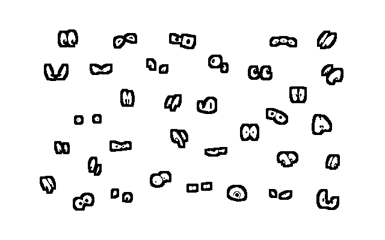**

Part 1

**天蝎座市集—显赫的“隐藏身世”**

2017 年 10 月 10 日到 2018 年 11 月 8 日是木星在天蝎座的一年，简称**天蝎年**。深埋在地下的天蝎座议题，比如“死亡、权力、禁忌、性侵”等事件，如雨后春笋纷纷露头成为社会热点，这是市集由来的宇宙背景。

**虚拟世界里**

让孩子直面死亡的动画片《寻梦环游记》火了；讲述情侣间背叛与猜忌的电影《前任 3》火了；帮绝症病人走私抗癌药的争议人物电影《我不是药神》火了；腹黑女主的复仇宫斗爽剧《延禧攻略》火了。

**现实世界里**

不少知名人士突然自杀了；秀恩爱的明星夫妻爆出丑闻；幼儿园集体虐童事件首次被曝光；大大小小残忍至极的当街砍人事件；几家著名的互联网企业陷入了信任危机；几起因为语言暴力导致受害人自杀的事件；因明星个人恩怨导致明星偷税问题被披露。

感冒也能夺去生命，中年人第一次开始怕死；医药界曝光了几乎等同于谋杀的问题疫苗事件；民间环保人士和英女王几乎同时向塑料“开战”；权力下曾被性侵的受害者纷纷公开持续发声……

很多人用调侃化解集体伤痛，说自己以往好像活在一个假的世界。

**其实是在我们以为的生活下面，隐藏着一个更真实的世界。**

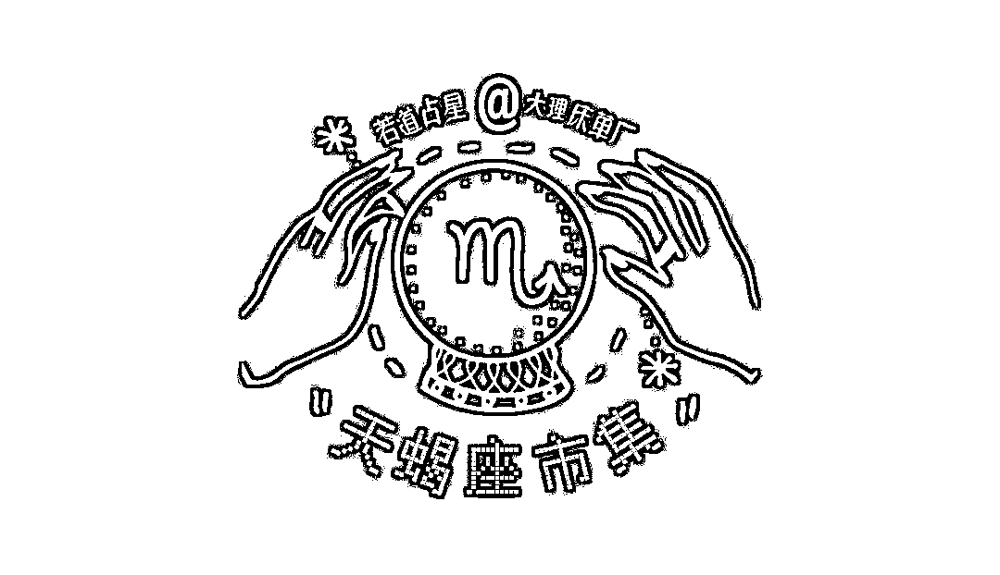

Part 2

**天蝎座市集—尊贵的“隐藏菜单”**

人们往往热衷追捧善与美，而避免和逃避谈论真相。**天蝎座的使命之一，就是将真相以曝光的方式消除恐惧和憎恶。然后在受伤中治愈，在丑陋中挖掘美，在废墟中获得力量**。

所以我们此次市集的**隐藏菜单盛宴**，是**6 位****来自不同领域有过天蝎式转化的尊贵大咖**，**演讲分享他们眼中****世界真实的样子**。他们像天蝎座一样神神秘秘，是很多人并不了解，却可以让世界变得更好的珍贵宝藏。

**蒋颖**

**若道占星联合创始人**

**蒋颖**，国际占星研究协会 ISAR 中国副主席（中国区最高负责人），若道创始人。

**国内第一位被邀请在国际占星学会议上正式就西方占星学发表演讲的演讲人**。第一批通过 ISAR 认证的职业占星师。ISAR 职业占星师资质认证培训师和中国考区考试负责人。

跟随大卫·瑞雷、杰夫·焦耳、斯蒂芬·弗里斯特、苏·汤普金斯、格伦·佩里、诺·泰尔、罗伯特·汉德、雷蒙德·梅里曼、琳恩·贝尔等国际占星大师系统学习占星学，广泛涉猎人本主义心理占星、进化占星、原型占星、医疗占星、金融占星、卜卦占星、企业占星等多个占星学流派分支。曾接受萨提亚家庭治疗、本性治疗、Hakomi 治疗等心理学培训，并接受进化教练培训。

**纪慈恩**

**临终关怀领路人**

**  分享主题  ****《“生”与“死”从来都是同一件事》**

**纪慈恩，儿童福利院和临终病房的社会工作者，体验死亡工作坊创始人，So China 农村产检帮扶计划发起人，乌托邦临终庄园创始人**。

12 年前，因为一段残酷的青春不得不靠近死亡，通过近 12 年的成长和蜕变，3000 个小时与临终者的生命的融合，为了让更多的人理解死亡、可以好好地活着，她创办了体验死亡工作坊。帮助每一个体验者在死亡面前可以与恐惧握手言和，然后好好地活。当死亡真正来临时，可以有尊严的好好与这个世界告别。

> “我们热爱“生”，痛恨“死”，就像我们喜欢春天，讨厌冬天一样。我们终其一生都在想办法留住春天，让“冬天”远离，而失去了活在春日的能力。然而顺应自然的方式是在春天的时候好好享受春天，在冬天即将来临的时候，做好防寒准备，坦然地面对冬天。我们因为焦虑死亡而忘记活在当下一一这是死亡之所以可以给我们带来恐惧真正的原因。”
> 
> 10 年间，纪慈恩拥有两次与死亡刻骨铭心的经历，虽然惊心动魄，但她却认为“只是一些小伤口”，**她学会最重要的东西不是如何面对死亡，而是如何经历生命**。

**三七**

**醒来死亡体验馆馆长**

**  分享主题  ****《向死而生，在悬崖边跳舞》**

**三七，醒来死亡体验馆馆长，心理咨询师**。过去两年，跳出了金融和广告坑，做了临终关怀，和 4000 人探讨了生与死，经历了跨越生死的通灵体验。相信“没有充分活过的人最怕死”，相信“凡真实的，必会相遇”。

**醒来死亡体验馆**，于 2016 年 4 月 4 日于上海开馆，并将于 2019 年 4 月 4 日永久闭馆。**死亡体验馆存在的目的，是希望将生死教育前置，通过体验死亡、探讨生命的方式，探索更为完整的人生意义**。让我们一起以勇敢、真诚和开放的心态，不欺自己，不怨他人，谨以初心，与真实相遇。

> **“人人都知‘生命的意义不在于时间的长短，而在于我们如何去运用’**。然而，在学校里、在工作中、在生活上，我们崇尚的既非‘求真之道’，也非‘求美之道’，而始终是‘求生之道’。
> 
> 醒来死亡体验馆用 2 年多的时间，目睹了近 6000 人的生命绽放，发现最后被大家记住的，并不是游戏中活得最长的人，而是那些活出了‘自己’的人。
> 
> 既然死亡注定要到来，你是选择拼命逃离？还是在悬崖边跳一支舞？”

**李艺哲**

**零垃圾&极简生活实践者**

**  分享主题  ****《另一种生活方式》**

**李艺哲，大理 Eco House 发起人，零垃圾&极简生活实践者**。走遍 30 多个国家后，希望以以下 4 个方面对世界有一点点改变：建筑-就地取材&节能；生活方式-零垃圾&极简；饮食-素食&自给自足；文化-社区文化&分享经济。

> “在北京初创企业工作后，到瑞士留学，到东南亚工作，第一次接触到慢生活，深深被那里的文化吸引，开始一年的背包旅行，了解到‘游学’的智慧。在大理接触零垃圾&极简生活方式，后来又接触到《*Zero Waste Home*》这本书，开始尝试并彻底改变生活方式和价值观。”
> 
> 此次李艺哲会详细**介绍自己零垃圾生活的细节，并且带我们走进可循环生活方式的民宿**：大理 Eco House 的前世今生。分享那些最初建房的初衷，房子整体建设过程中的趣事，以及房子的未来。

**孟想**

**《心探索》杂志创始主编**

**  分享主题  ****《萨满旅行与内在炼金术》**

**孟想，《心探索》杂志创始主编，心灵与自然的探索者，塔罗师、占星师、萨满传统研习者**。目前致力于写作、女性疗愈和世界性的游历，定期开办塔罗学习和自然能量工作坊，并给予一对一的深度个案。

> “**每一个灵魂，都比自己想象得更古老**。当古老的召唤在心中回荡，追寻者就踏上了属于他的独一无二的旅程。”这一次，我们邀请孟想分享她的美洲游历、萨满探访之旅，以及那些发生在旅途中的冥王星式的故事。

**宋颜**

**克氏三部曲译者，阿梵达课程执照 master**

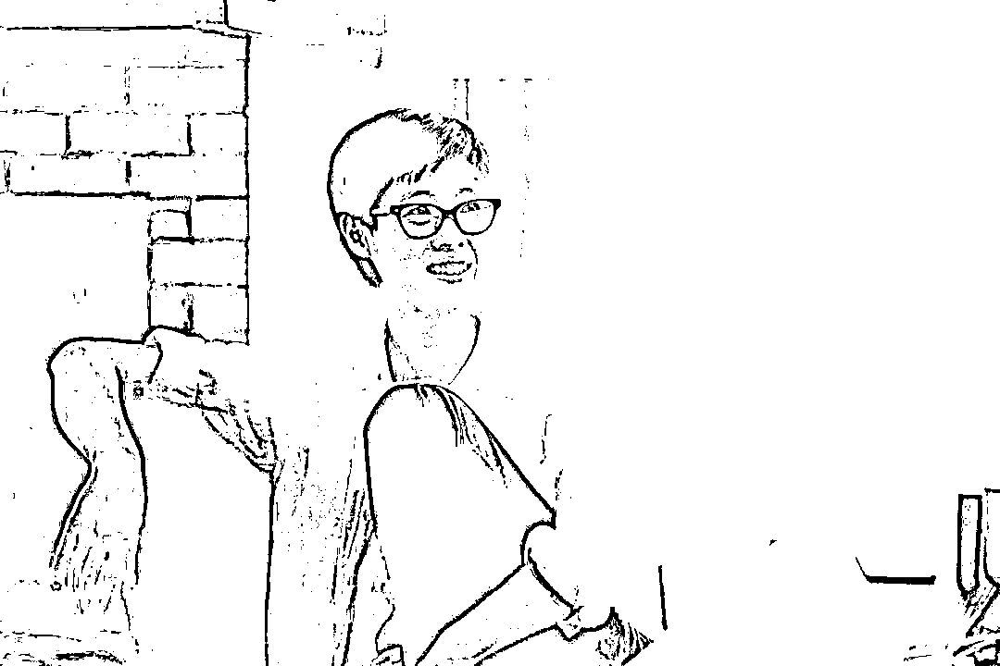

**  分享主题  ****《意识的侦探》**

**宋颜，意识演化探索者、践行者与服务者**。浙大中文系毕业，毕业后进入佛教寺庙修习一年半。偶遇克里希那穆提著作，毅然离开寺庙独自探索。后翻译出版三本克氏著作《智慧的觉醒》、《最初和最终的自由》以及《聆听万物之美》。另为美国意识探索课程——阿梵达，翻译数本内部高阶教材，阿梵达课程执照 master，直接协助个体进行意识转化工作三年多。

> 斯蒂芬·弗里斯特在《内在的天空》中指出，人类生活中最重要的力量，就是意识。可以说，**你越了解意识，就越能掌控自己的生活**。然而人类的意识复杂幽深，是洋葱、迷宫和洞穴的综合体，你很容易就会在其中迷惑颠倒。此时，天蝎座的狠辣就如意识武林中最密乘的心法，可助你一路除妖降魔，直探真相的宝珠。

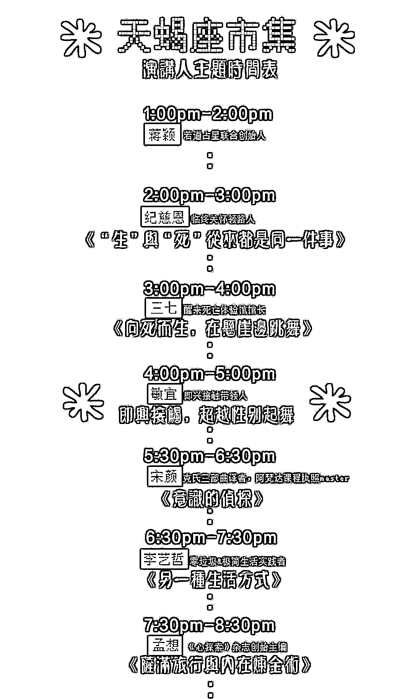

Part 3

**天蝎座市集—惊喜的“隐藏剧情”**

**偶遇占星大师斯蒂芬·弗里斯特**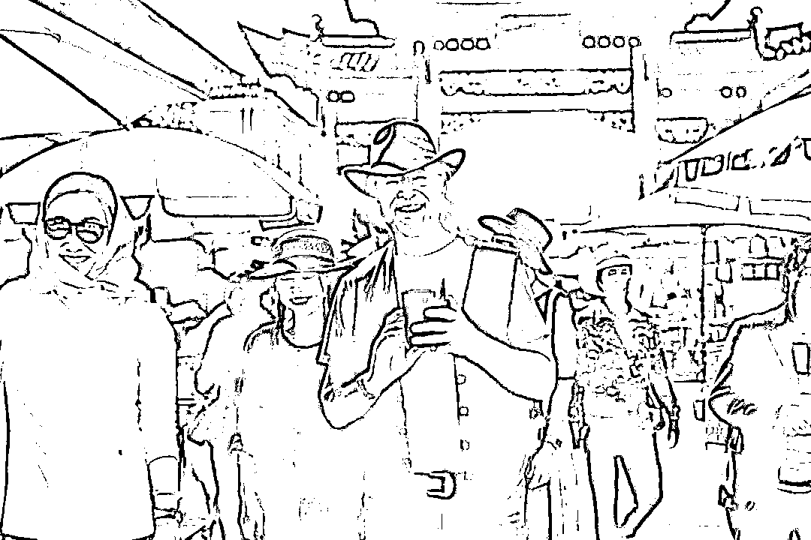

**10 月 12 日-14 日，世界顶级占星大师斯蒂芬·弗里斯特将在大理进行三日的“****冥王星****”工作坊**（冥王星是天蝎座的守护星），为人们传播“冥王星”的黑色智慧，打开“地狱”的大门。而**在工作坊前一日，斯蒂芬老师将会前来天蝎座市集现场助阵哦~**

** 名人推荐 **

斯蒂芬让我们停止了玩责备命运的游戏，而开始看到自己是一个走在进化路途上的勇士。

—— **奥普拉杂志“O: THE OPRAH MAGAZINE”**

我为斯蒂芬解读的精准感到惊叹，他强调没有一件事是坏得无法挽回的，也没有一件事是如此之好以至于它不会因为现在的错误判断而消失的。我怎样推荐他都不为过！

—— **好莱坞著名影星,“钢铁侠”男主角 小罗伯特·唐尼 Robert Downey Jr**

理解你的来时路，并获得关于你未来之路的洞见和鼓励。

—— 斯蒂芬的占星学徒，**前美国国家橄榄球队球员里基·威廉姆斯**

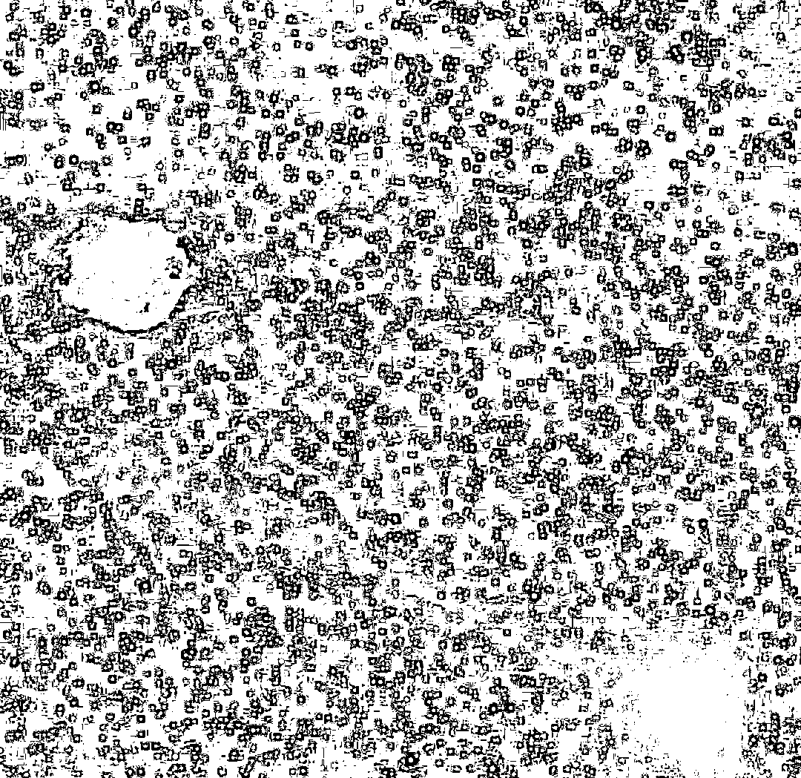

**即兴**接触**，超越性别起舞**

📹 [`v.qq.com/iframe/preview.html?width=500&height=375&auto=0&vid=a07012uggis`](https://v.qq.com/iframe/preview.html?width=500&height=375&auto=0&vid=a07012uggis)

“触碰是一种禁忌”。几千年来的文化记忆，让“性”在很多人意识里仍是一种禁忌话题。天蝎座掌管我们不为人知的恐惧，尤其包括性恐惧。同性或异性之间，恐惧亲密、恐惧拥抱、甚至恐惧触碰。

**穿插在沙龙间隙的 CI 即兴接触，让我们用“触觉”来打开心灵，疗愈潜意识里的不安，重建对自己和他人的信任**。眼睛和头脑不相信的，不妨“摸摸看”。

**即兴接触带领人****：敏宜**，出生于香港，旅居国外多年。十多年前开始从不同传统的修炼中探索身体与心灵。她现居大理，与无间 IntiMates 在大理每周举办的活动带领即兴接触。

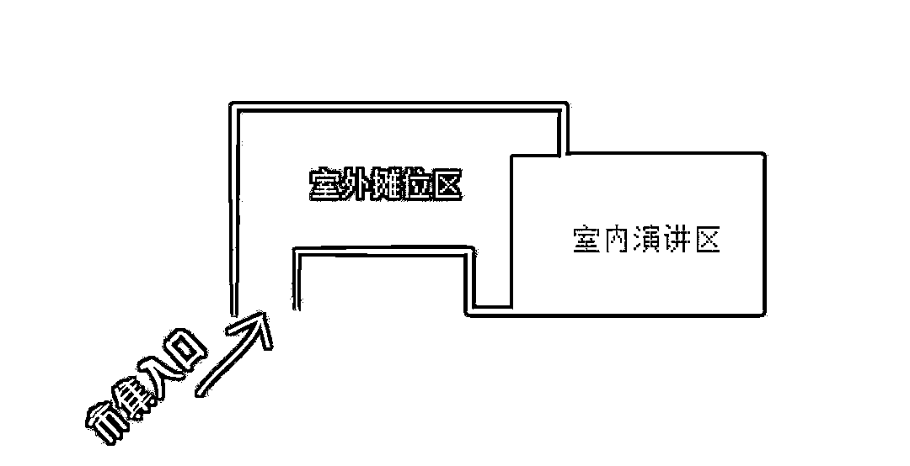

床单厂空间功能分布

Part 4

**天蝎座市集—精彩的“隐藏攻略”**

此次市集室外区域是摊位市集，我们邀请了**吃喝玩乐身心灵**的各路摊主大神一起热闹。

Thai-yoga**“死去活来”的泰式按摩**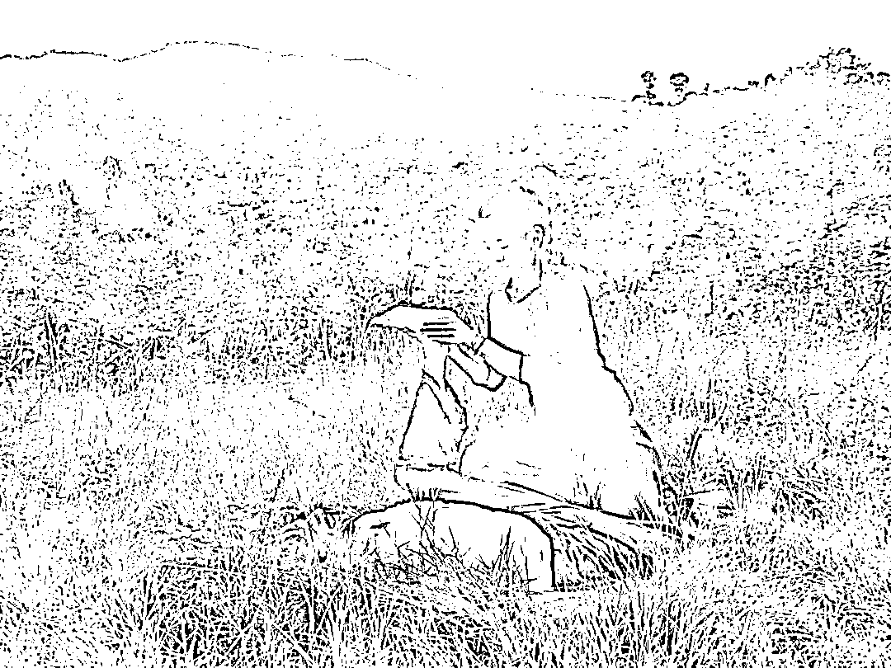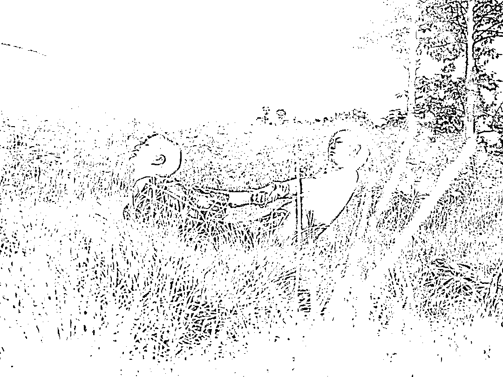

左右滑动查看更多

**Thai-yoga 主理人刘安琪**，**社会学硕士**。旅居欧洲和印度多年， 曾经钻研学术，参与社会运动。目前专注对身体和呼吸的觉察，以及由此带来的个体和群体疗愈。在印度和泰国先后学习泰式按摩，并将瑜伽、静心、能量再平衡、灵气以及呼吸法的理念融入其中。

> “倾听身体的需求，打开、转化、觉知。探索婴儿般对触摸的渴望，释放经年的紧绷，透过双手打开无限的广阔。这是我们对身体与其功用的放大与尊重。”**泰式按摩发源于四千多年前的古印度，因其对增强身体柔韧性的帮助也被称为泰式瑜伽按摩**。过程中有意识的呼吸和对触点的觉知使疗愈自然发生。

死亡体验馆

**“虽死犹荣”的死亡体验馆**

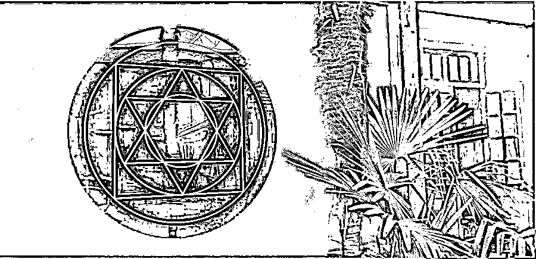

**醒来死亡体验馆的创始人和外挂小哥哥，会与市集演讲人三七——女馆长结伴**，来天蝎座市集一起摆摊凑热闹。没啥实用的东西要卖，但会带来**醒来死亡体验馆的书与酷酷的周边**。现场填写醒来的“死亡十四问”问卷可以参与抽奖，奖品是**4 张醒来的死亡邀请函**（**价值 444 的门票哦**）~

纹身摊位**“手足情深”的深刻纹身**

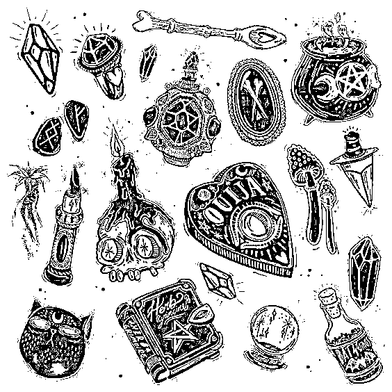

左右滑动查看更多

**大萌萌**，11 月 11 日的**天蝎座**B 型血纹身师，创作风格—BLACK WORK（暗黑点刺，线条几何，书法字体）。这次为天蝎座市集搜集了相关题材纹身稿现场会做一些小图，还为喜欢纹身想要纹身的天蝎座们准备了小礼物。咨询加微信互关送纹身贴纸一张，现场预约送天蝎主题钉扣一个。

      灵性剪发      

****“从头做人”的剪发梳理**** 

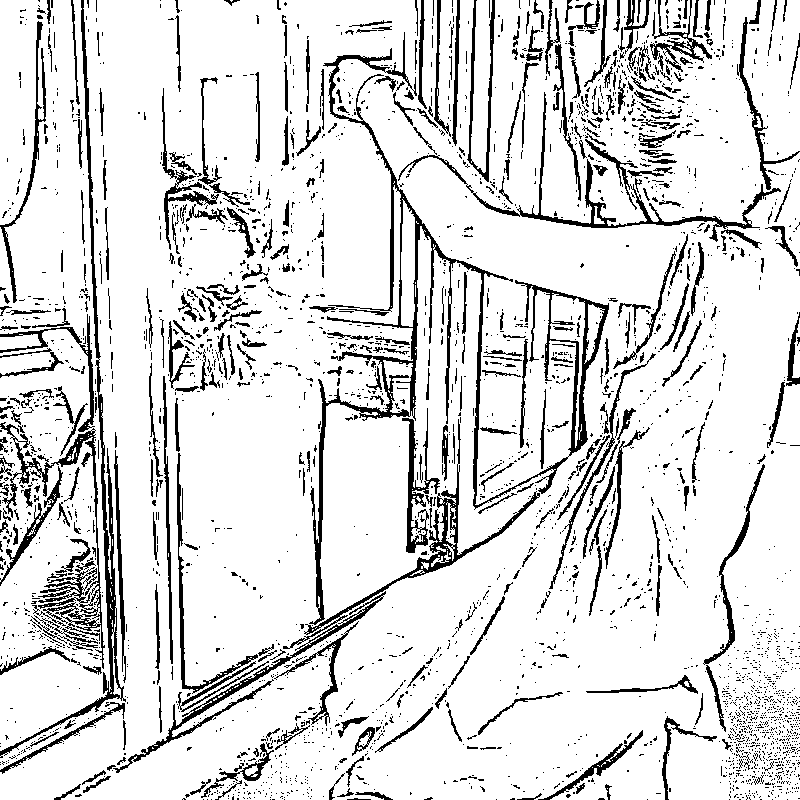

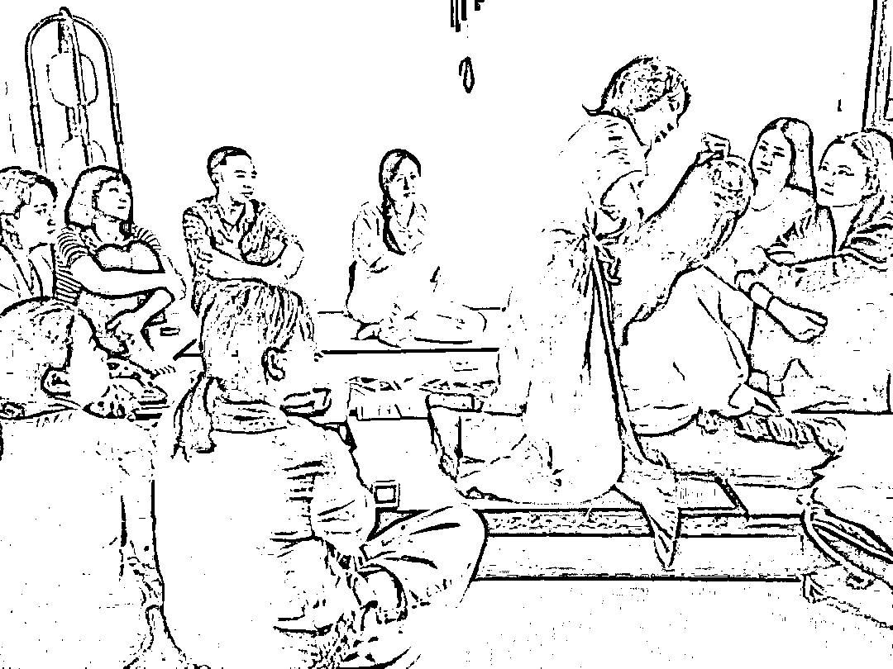

台湾女生林宝宝，“沒有特定法门，我的真心就是唯一不二的法门。带给你纯粹深入的滋养滋养。”师承【 心 光 流 】Yifluto Koshu，回到心、發現光。擅长順著流灵性剪发梳理、身体訊息解读、身心滋养（煮食、声音调頻）。本次市集将把剪发梳理带给大家，是一种“从头做人”的灵性体验。

旧物交换**“起死回生”的旧物交换**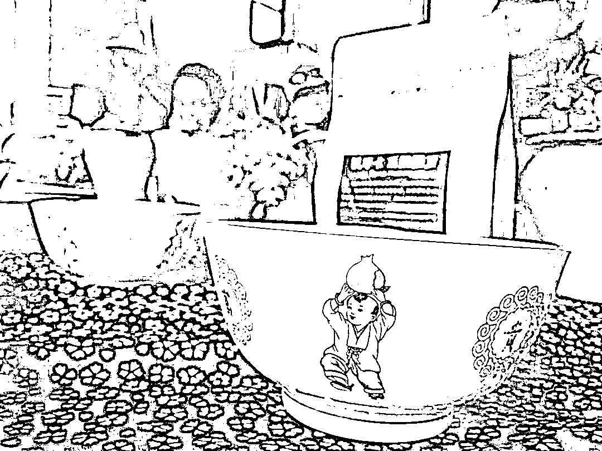

左右滑动查看更多

天蝎座市集有**两个方式**的交换摊位：

❶ 一个在**10 月 11 日市集现场**，大理床单厂艺术园区以物易物（**包括斯蒂芬老师和大卫老师的旧物**）。

❷ 另一个在**10 月 12 号&13 号晚上 6:30-8:00**，大理 ECO HOUSE 的闲物置换派对。

**Eco House 的闲置物品，你可以带走**：洗衣机，灯罩，帽子，书籍，衣物&鞋等。

**Eco House 需要的物品，你可以带来**：各类香草（可种植的），桌布（任意风格颜色），日式帘子或隔断，做木工的各类工具，做隔断用的竹子（1.5 米-2 米高），单色或简易条纹床单&被罩，小蒸锅，破壁机，各类刷子，有特色的碗或盘子，防滑垫（一平方），瑜伽垫。

Eco House 的闲置派对每天上限容纳**15 人**，请在市集交换摊位处找工作人员报名。

小手艺品**“死心塌地“搞创作的大理手艺大仙们**

**@拂尘物集**

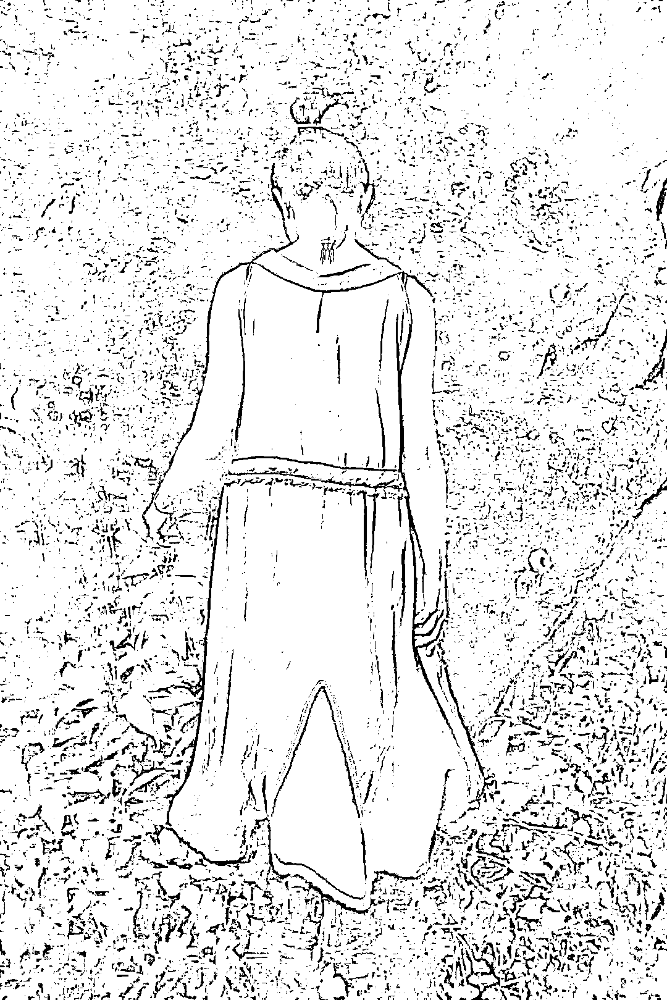

左右滑动查看更多

**拂尘物集主理人华婷**，与山水为伴，与同住好友共享一日三餐，居多时间都在手工创作，闲暇时，会与朋友们跳舞，喝茶座谈，大闹厨房。与不同人群接触下，对占星略懂皮毛，第一次参加以占星为主题的市集，觉得有趣。也来分享一下**手作衣物**。

** @炎**

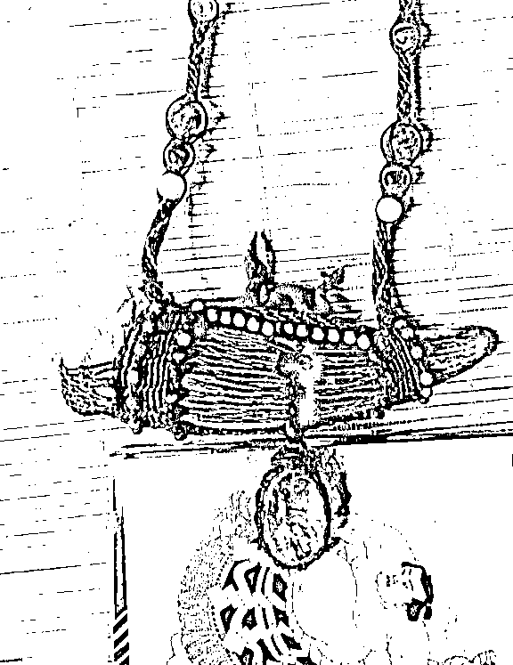

左右滑动查看更多

姑娘打南方渔村来，织娘一枚，游历他乡，愿己所作之物有灵而承万物之恩，以双手为介，意识为桥，**以饰为形**，真诚地回归己身，与天地合，与人和。

** @当当手造**

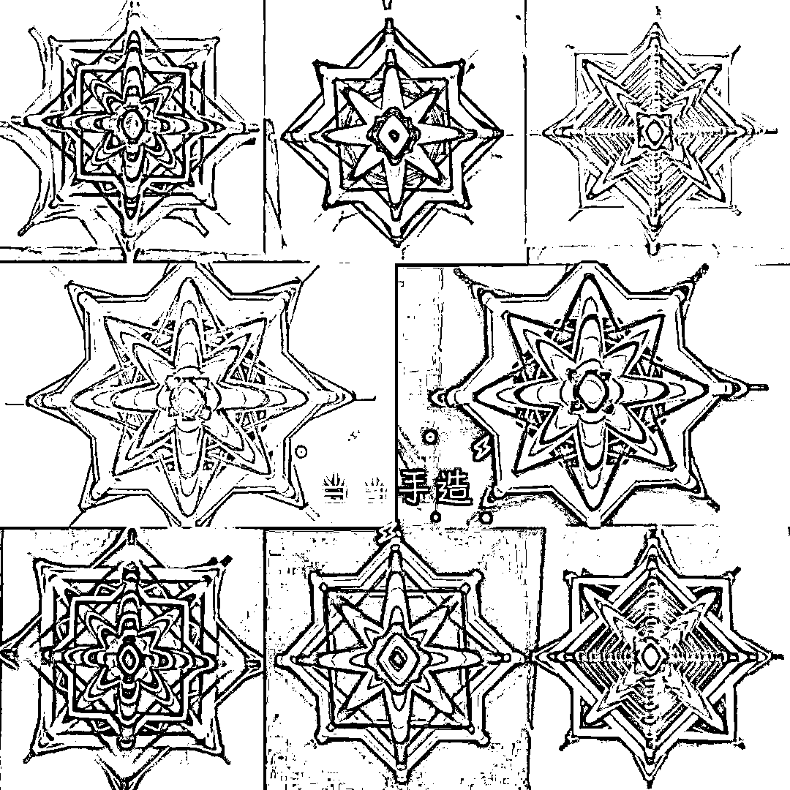

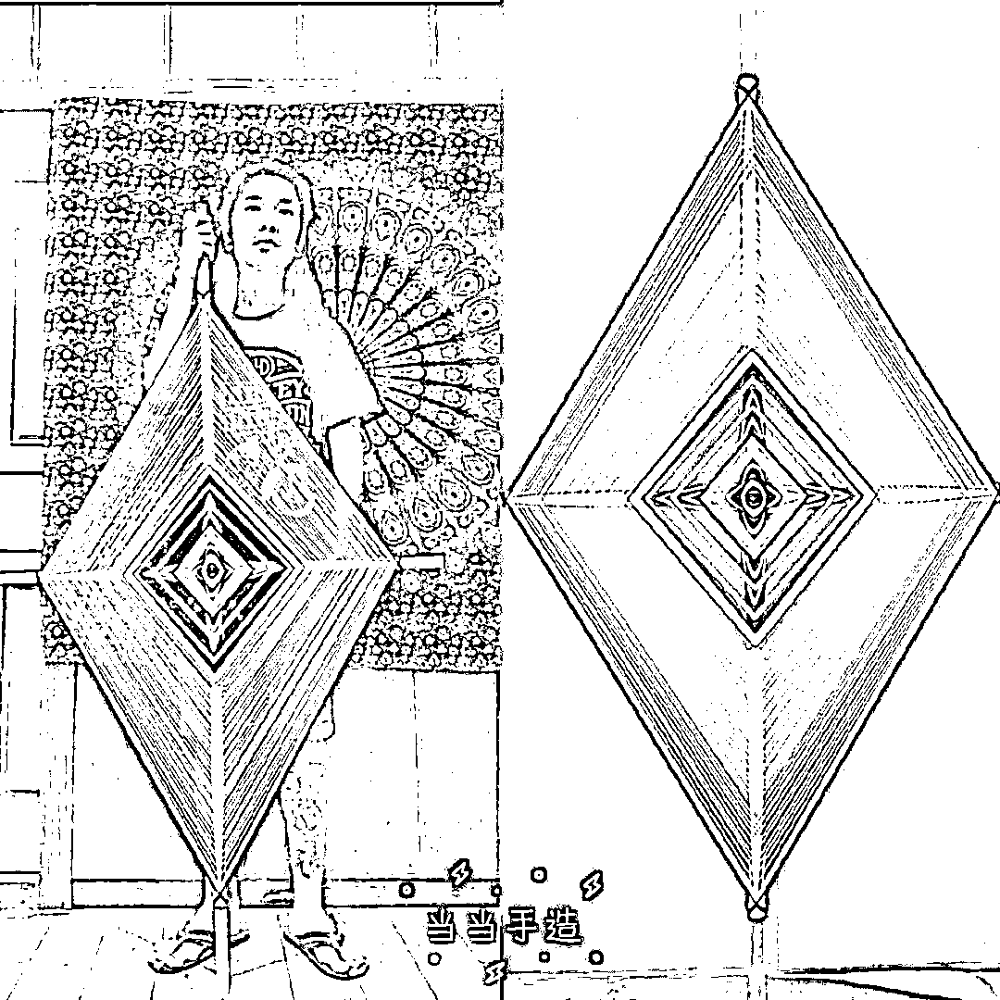

当当从 13 年开始接触 mandala，从模仿到创作，手工编织 mandala 已成为自我修炼的一种方式，同时也是传播爱与和平的一种方式。mandala 是指无限循环的空间，当当手作的 mandala 手工编织作品让人凝视起到自我进化的效果，在晚上紫光灯的作用下会呈现不一样的效果，每一个都是一个能量接受体。

**@要物手造**

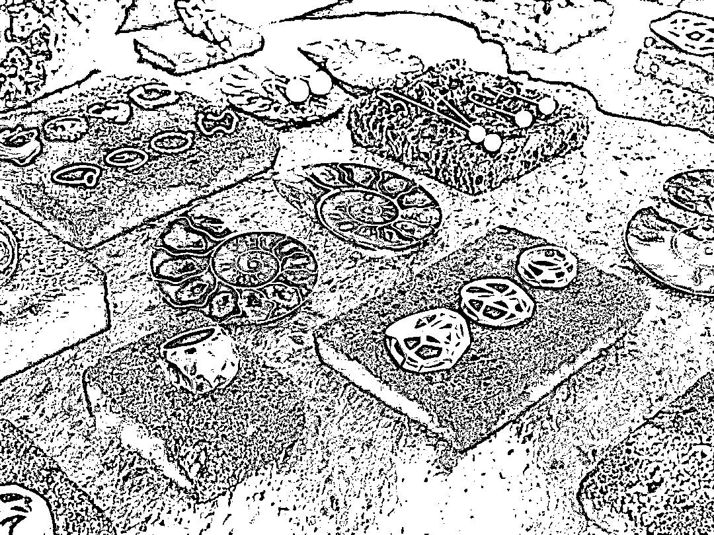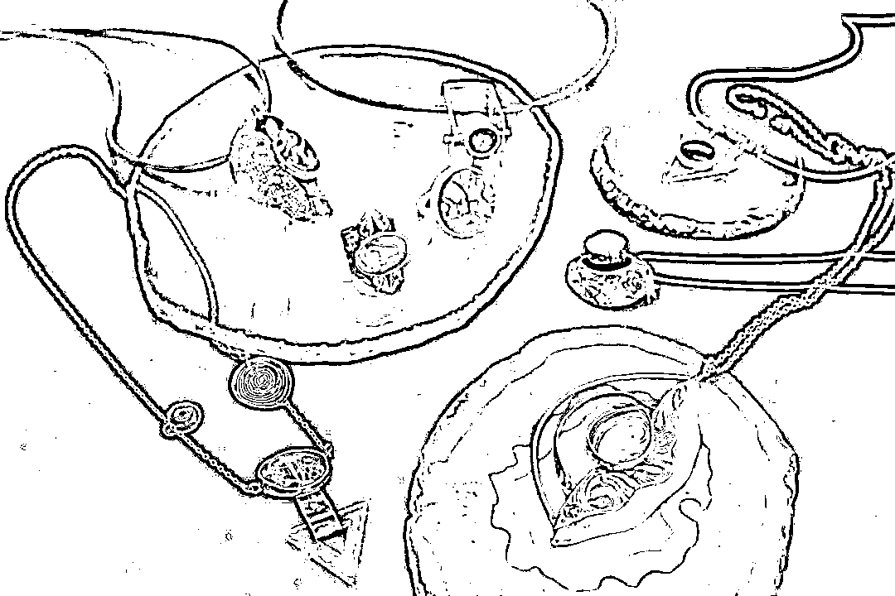

左右滑动查看更多

**“要物手造”是一个多元化的手作坊**，2008 年成立于云南大理古城，包括金工、皮具、灯工玻璃、蓝染布艺和纹身。**主理人 Coco**，2005 年毕业于广州美术学院染织系，厌倦了跟风的潮流和工厂流水线的节奏。2002 年到大理的旅行改变了她的生活，在大理寻访扎染民艺的期间，接触了不少民间工艺，于是就留在大理了。

**@空地集**

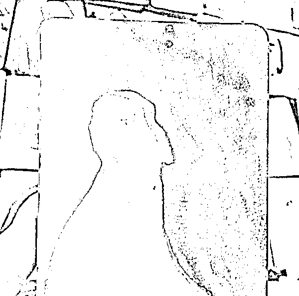

左右滑动查看更多

**蓓妞，独立摄影师、手作爱好者**。拥有独立品牌 “**空地集**” ，集摄影、手作、内在成长课程于一体。擅长捕梦网制作。现居大理。此次市集会带来原创捕梦网、原创手绘卡牌、原创“风信本”，以及免费胶片人像摄影体验。

占星塔罗摊位**迷恋宇宙“死性不改”的占星师塔罗师们**

**@女祭司**

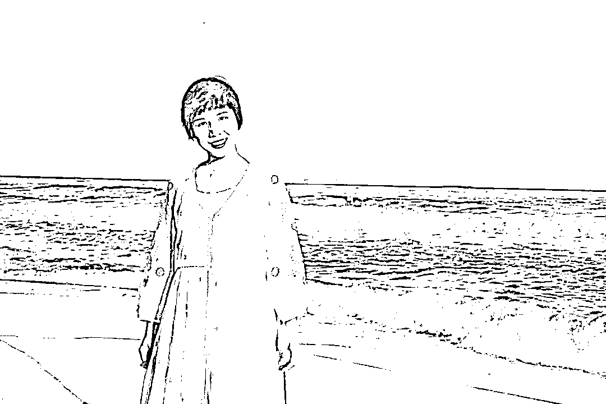

命运之爱主理人，**天蝎座，**支持个人成长与内在探索的心理占星师，隐居于书斋和山水之间，相信轮回中的因缘会让你我相聚。市集上女祭司会根据对方需求与问题，带来三个体验性的项目（三选一）：

❶ 天蝎座主题占卜；

❷ 十二星座芳疗冥想；

❸探索无意识心理图卡解读。 

**@****王芝桦**

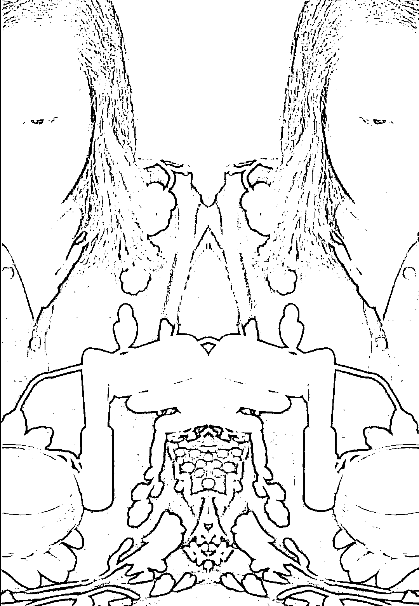

若道新月与满月特约作者，**月天蝎**，擅长运用月相的魔法，在给来访者以“新月式希望”和“满月式震撼”之间自如切换。是天津道玺身心灵中心创始人，身心灵疗愈执业 13 年的统合疗愈师，占星咨询执业 9 年的心理占星师，艾瑞克森催眠治疗师。本次会为大家带来占星骰子与 3 个左右的个案咨询。

**ACG 摊位@查理**

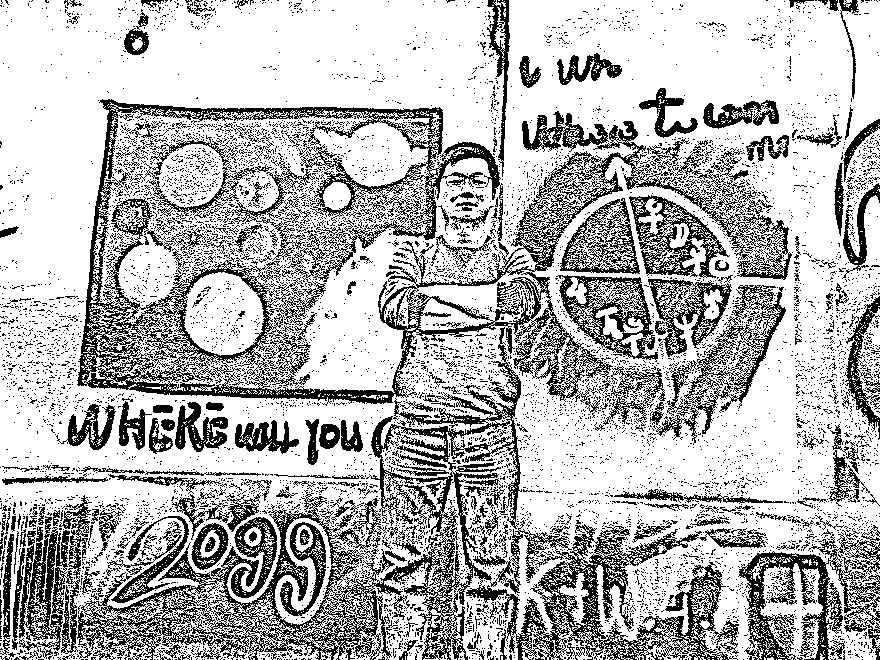

木星入射手座的年份快到了，新的一年去哪里度假、旅行、探索呢？来试一试占星地图 ACG 吧。“高富帅”摊主**查理**，**月天蝎**，毕业于若道的全职企业占星师，此次将给大家带来占星中“**择地**”体验。查理拥有十年跨国管理咨询顾问经验，上海交通大学物理系毕业，是 ISAR 认证占星师（2017 年获得）。

**旧物贩售机与阴影故事门@猫 Rua**

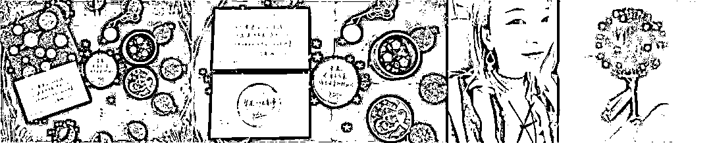

搭配明信片文字的“旧物贩售”，留下七个单词的“故事门”，七本天蝎主题的“移动图书馆”，占星咨询介绍，万物静默如谜留言预约。

摊主**猫 Rua**。心理占星师，梦境占星，作家，诗人，著有长篇《你是迷雾茫茫》。是在冥府中活过的人，曾站在阴影中心写字写诗。某天，望见了黑暗中心那个神圣的锚。

**@囍山塔罗工作室**

**摊主小北**，**太阳&上升天蝎**，曾被身边各种人安上了各种身份：塔罗师，自由撰稿人，厨子，环球旅行者，民谣，戏子，拉文克劳，坂井泉水，摄影师，酿酒者，影评人，说书先生，神经正常的诗人……学习占星助人四年，市集那天，会努力让每一个当天和他交流的人，都有或多或少的收获 。

小北关于摊位的自述很诱人：

> “一副陪伴我多年的塔罗牌，一块写有工作室名称的布，一盏看起来不错的老马灯，最重要的坐在摊儿后面的我，不排除会带上吉他，在大家意兴阑珊的时候来上一曲，毕竟学了这么多年音乐。”

**@小南占星**

**群星天蝎**，2013 年起在大理，2016 年起做职业占星，现场擅长出生星图简介以及占星骰子，据说占星骰子准确率 75%-80%，市集会带来自制香薰蜡烛。

美食摊位**“醉生梦死”的美食摊位**

*名单持续更新中

**@真如工作室**

左右滑动查看更多

**董真如，大理云渡酒店创始人之一，是很多天蝎座的好朋友**。认真的塔罗和占星研习者，上过若道的原型占星课，跟随孟想学习塔罗，杰克的禅修课，全息呼吸，舞踏等，热爱自制面包和甜点。此次作为**美食摊主**，专注**京都和果子，下午茶点心，欧包**。

**@素园 SUSPACE**

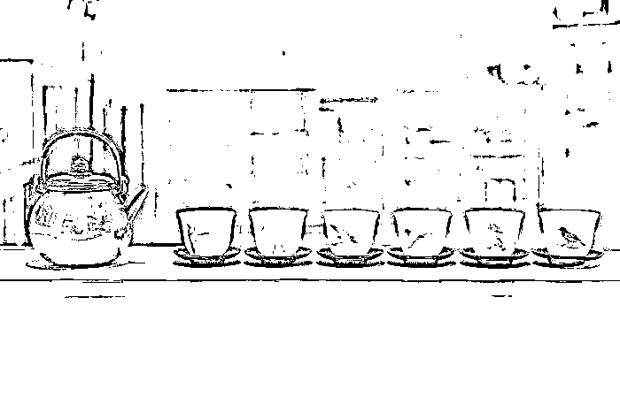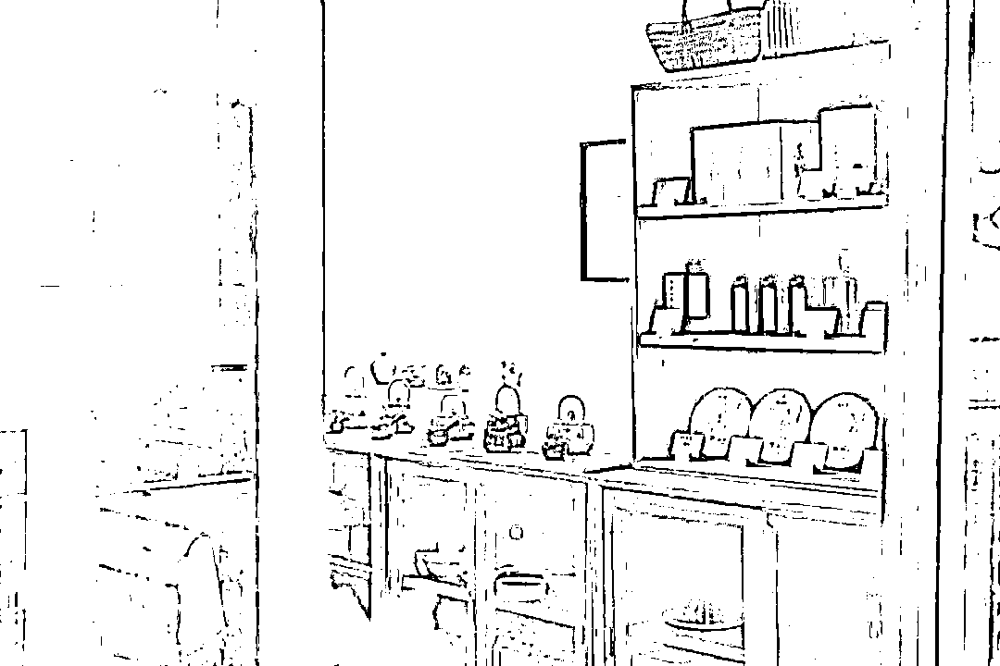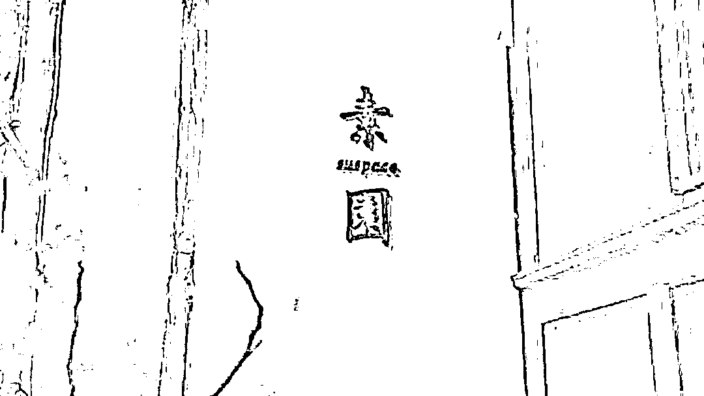

左右滑动查看更多

> **“我们相信茶是沟通的最好媒介，拾阶而上，喝杯茶。”**

在北京工作、生活十数年后，设计师老黄和素洁在大理古城一处老屋的二楼做了一间茶室，素园 SUSPACE。 素，取质朴、简至近无之意，是我们对器物、对日常生活美学的理解。

这几年与研茶多年的好友在普洱茶的核心产区勐海营建了几处百年古茶园，不施农药化肥，以人工除草，从源头掌控原料品质。制作工艺传承古法，均由村寨里的制茶师傅手工制作，全程无添加，确保安全可靠的茶，作为设计师，希望重新诠释中国普洱茶。

义卖摊位**传递爱的义卖摊位**

若道占星主办方会带来一些占星大师签名正版书、占星元素周边产品作为义卖，义卖收入将全部捐给大理孤儿福利院。让我们一起建立对世界的信任，传递生的希望。

**我们想招募还没有收到报名的摊位有：**

**“救死扶伤”的化妆摊位**

（你变了，再也不是我认识的样子）

**各类摊主大神持续招募中**

**摊位申请****识别以下二维码**

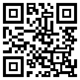

**参与市集你将收获**

**关于死亡的洞见，关于生活的力量**

**人生的转折，意识的转化**

**对于多余人生的清理，关于多余垃圾的思考**

**占卜、艺术、自然的混合疗愈**

**美食、美酒、美人、美景、美物**

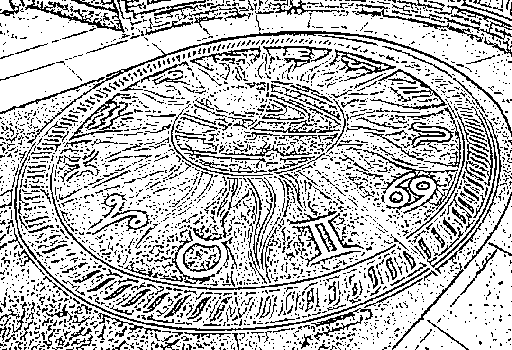

**适合人群**

*   **去餐厅必须点隐藏菜单的人**

*   **看电影喜欢等隐藏彩蛋的人**

*   **打游戏善于玩隐藏剧情的人**

*   **想探索隐藏版本自我的人**

*   **已厌倦人间表象的人**

*   **但喜欢山野自然的人**

*   **有秘密不想讲给普通人听的人**

*   **常被别人倾诉秘密的人**

*   **敢质疑权威、挑战禁忌的人**

*   **以及，欣赏迷恋天蝎座、或对天蝎座爱恨交织的人**

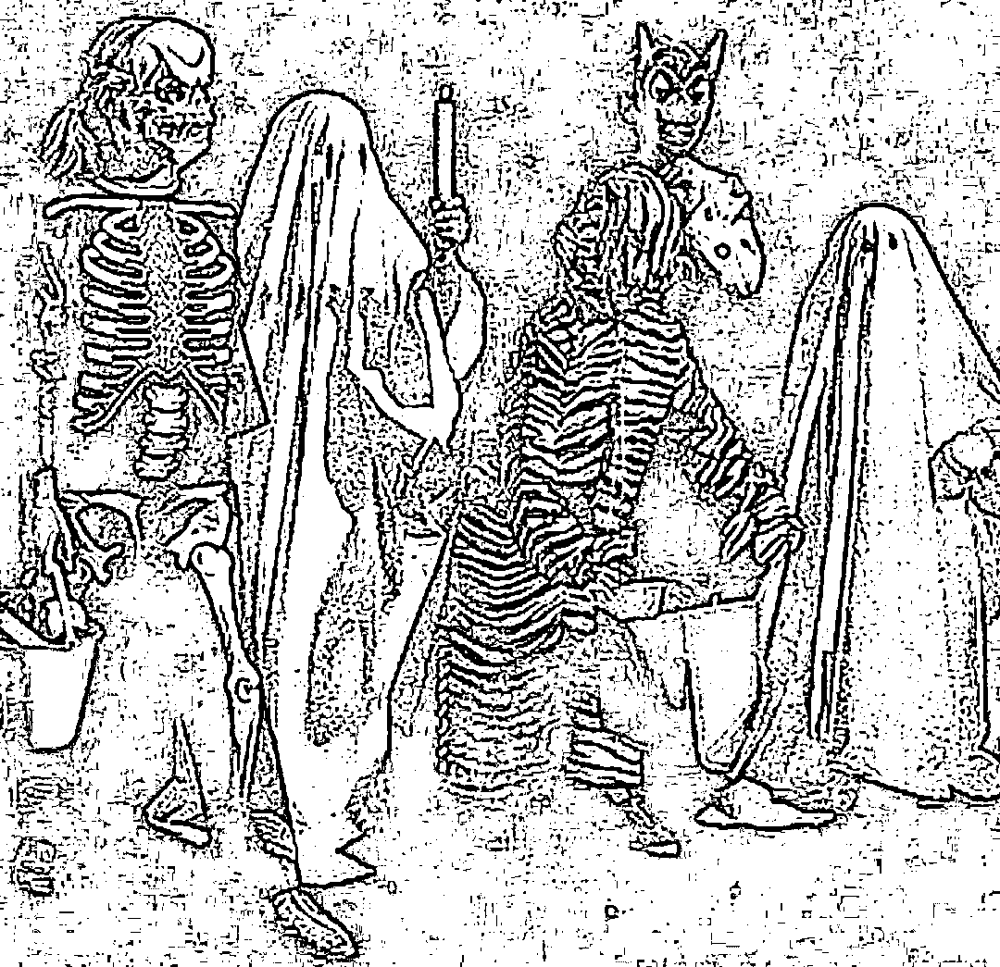

报名须知

**市集门票 199 元 限量 300 人****（含 6 场大咖演讲，一场即兴接触）**

**市集时间**：10 月 11 日 11:30-20:00

**市集地点**：大理古城 床单厂艺术园区

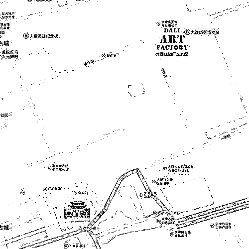

*大理古城苍坪街 56 号

**优惠方式**

 带上一个天蝎座朋友，两人同行半价优惠

（请添加微信**nodoor2018**确认优惠门票，数量有限请提前购票）

**两个参与要求**

❶ 到场人士穿着黑色或白色的衣服（灰色也成）

❷ 每人建议带上一个完好的旧物前来交换摊位交换

文末点击**阅读原文**，即可直接报名。

**市集主办方：若道占星**

若道占星创立于 2011 年，创始人是国际占星研究协会（ISAR）委员会主席之一大卫·瑞雷和 ISAR 中国区副主席蒋颖。若道是中国地区权威的专业占星机构，是国内占星教育最大平台，也是国际占星研究协会（ISAR）在中国唯一指定教学机构。若道同学会是国内占星界最大的联谊组织。

若道占星立志于传播健康的占星理念，在中国地区推动设立占星国际行业标准，规范占星师职业道德，加强行业社会责任意识，让大众真正了解占星学，并让占星学真正服务于人。

> **“占星学是一面照见灵魂的镜子。在这里，进化和成长才是关键。这就是区分真正占星学和算命的地方。”**

**市集其他合作伙伴**

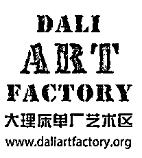

大理床单厂艺术区创建于 2014 年，是中国西部的文化艺术中心。从一个废弃的厂房，华丽转身为一个现代化艺术综合体。大理床单厂艺术区由 40 多家艺术家工作室组成。传统手艺、各地美食、音乐会和节目，日益增多的展览和活动每月都在大理床单厂艺术区举行。

床单厂致力于成为亚洲先锋的文化与艺术中心、跻身国内和国际舞台：国际艺术家驻地项目（AIR）于 2017 年 3 月启动，并长期持续；一份关注当代中国与世界的摄影艺术双语电子杂志也在进行中。

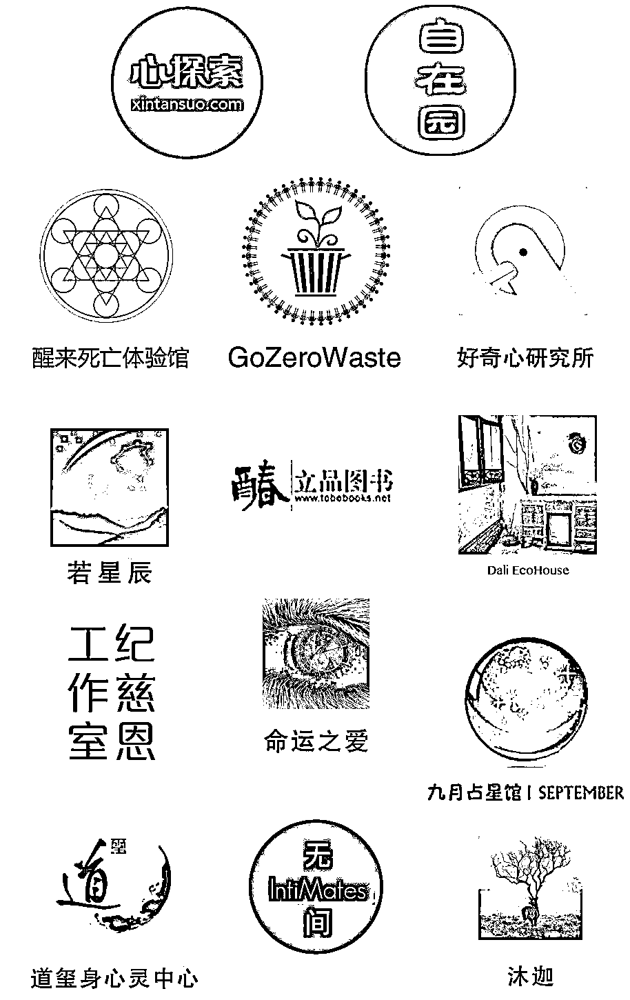

**微信又双叒叕改版啦，不想错过若道君的推送？**

**就把若道设为星标吧！**

**▼**

**报名直达入口 **

# 活出生命全部潜力 | 苏菩提成都工作坊早鸟价 9 月 30 日结束

> 原文：[`mp.weixin.qq.com/s?__biz=MzA5NjA0NTAxNg==&mid=2651401893&idx=2&sn=887de391e338c095b1672aa6e6a347f0&chksm=8b4b9c12bc3c1504a04913988c4728c827d3698698ad91e539c5974d3ccec1af74db7c604cbc&scene=126&sessionid=1692738450#rd`](http://mp.weixin.qq.com/s?__biz=MzA5NjA0NTAxNg==&mid=2651401893&idx=2&sn=887de391e338c095b1672aa6e6a347f0&chksm=8b4b9c12bc3c1504a04913988c4728c827d3698698ad91e539c5974d3ccec1af74db7c604cbc&scene=126&sessionid=1692738450#rd)

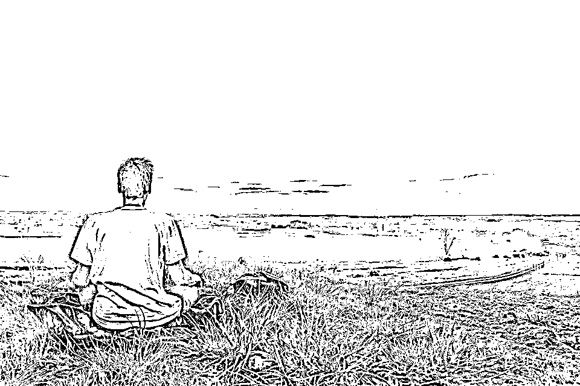

自我们诞生于母亲的子宫，便开始与世界产生联结。出生后，即被各种关系包围：父母、兄弟姐妹、伴侣、子女、朋友、同事，甚至金钱、工作……但是，我们与人的关系、与世界的关系、与自己的关系却一直出现各种问题，令我们困扰不已。

为什么老有那么多问题？

为什么苦苦挣扎却无法摆脱？

这背后到底发生了什么？

我要如何才能过上充实与自由的人生？ 

**授课老师苏菩提的话**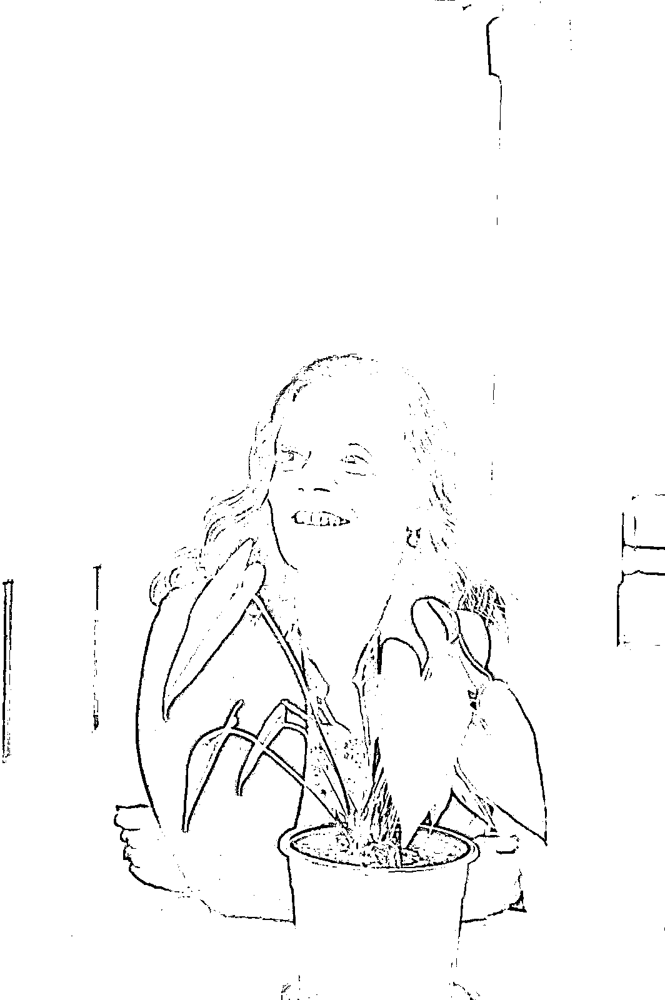

我是苏菩提（Subodhi），来自德国的系统排列师、能量治疗师。过去 20 多年来，我一直在探讨一个问题：一个人要允许自己过上充实、有觉知、自由的人生，到底需要做什么？我知道你一直渴望自我实现，在这条个人成长的道路上，希望能助你一臂之力。

我擅长运用直觉，在个案里通过读取对方身体的深层信息，指出关键问题所在。我经常被人评价为直接、锐利但又充满着爱。我很尊重学员的边界和他们的自主性，我不会擅自为学员决定一个完美的解决办法，因为这么做是在剥夺你的成长机会。在个案中，看到学员的问题很重要，看到学员的潜能更重要。

我是真诚敞开的。我不会假装能够拯救他人的生命，或是承诺一个工作坊能起到天花乱坠的效果。我相信我所能做的不过是打开一扇门，邀请你、陪伴你走上本属于你的道路。我会带着我深深的爱和尊重，在一旁祝福你！

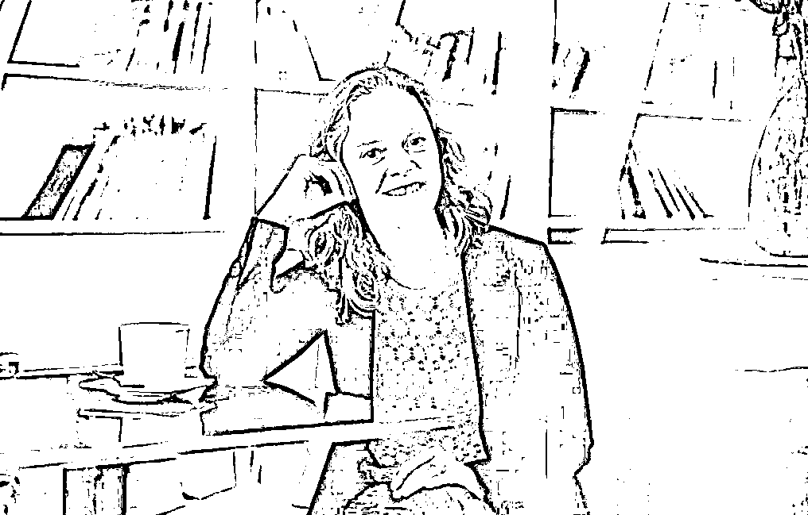

**关于系统排列**

**★什么是系统排列？**

“系统排列”是由伯特·海宁格所整合发展出的心灵工作方法，是一门应用哲学为生命服务的科学。它包括家族系统排列、组织系统排列和结构系统排列。系统排列的技术根植于心理治疗、家庭治疗、团体治疗与系统工作。

在家庭系统中，有一些隐藏着的、不易被人们意识或觉察到的动力操控着家庭成员之间的关系，即爱的序位。很多人的身心问题，都是序位有问题导致。

**★家排能解决什么问题？**

在解决家庭与组织的人际问题上，家排是相当有效的工具。可以解决的议题包括但不限于：夫妻关系、亲子教育、身体疾病、精神疾病、堕胎、家族问题、工作问题、金钱问题、职业生涯、重大抉择、人际关系等人生中重大课题。

**★工作坊中排列如何进行？**

家庭系统排列是通过排列家族成员代表的位置，找出家族中隐藏失衡的动力，揭露问题的根源，**并移动家族成员代表回归正确的序位**，让爱恢复流动，藉此解决生命中的困扰，并且使它不会传递给无辜的下一代，让生命恢复自然和谐的次序，让爱更加成长与流动。

具体操作方法是，当事人叙述问题，导师从现场学员里寻找角色的代表。接着，透过代表的移动及对话，了解问题背后的动力，重新调整失衡的序位，让已堵塞的爱的能量再次流动。

**★家排有何特殊之处？**

个案提出的议题，不需要所有相关人员都在场就可以排列出问题核心；即便没有作为个案直接参与排列，作为代表上场也会获得能量清理。

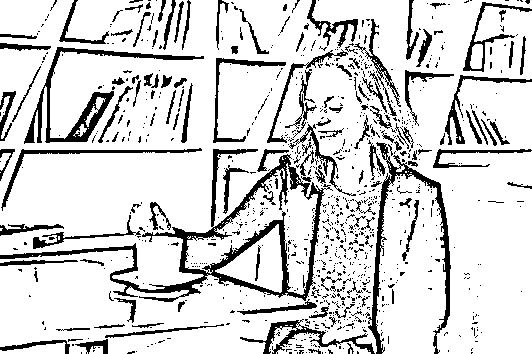

**什么人适合本次工作坊？**

*   希望纠正系统动力的人。

*   情感、家庭、职场、金钱、身体有困扰的人。

*   希望活出生命全部潜力的人。

*   希望突破自我限制、收获清晰觉察的人。

**你将收获什么？**

*   化解系统动力，清理人生木马程序。

*   纠正学员与情感、职场、金钱和身体的关系，迎来健康和谐的人生。

*   转化生命运作模式，对生命处于深深的信任之中。

*   给学员更多勇气和智慧处理人生难题。

*   减轻精神和物质压力，让金钱更好地支持学员生活。

*   帮助打开生命内部空间，并在工作坊结束之后帮助生命持续转化。

**有福利！**

**作为脉动呼吸的创立者，苏菩提在静心方面颇有心得。工作坊第一天晚上、第二天早晚、第三天早上，分别安排有一小时****静心时间****。**

**每日静心可以帮助我们联结身体；打开自己的潜意识，为处理议题作准备；收获身心合一的平静，打开生命内部空间。**

**静心内容自愿参加哦~**

**苏菩提老师是谁？**

*   出生于南非，幼年移居德国并居住至今。

*   1981 年在印度普纳开始心灵成长道路，于上世纪 90 年代成为指导和培养培训师的导师。

*   从 1986 年开始，她接受过多种技术的培训，如咨询、动态身体治疗、各种按摩技术。获得创伤预防以及疗愈的国际认证导师，并创立脉动呼吸、静心等导师培训系统。

*   2006 年，成为 Peter Levine 呼吸基础躯体治疗师。

*   苏菩提是有 30 年静心经验，能量纯净，低调朴素，直觉力强，通透敞开，无畏无惧。

*   各类流派无缝衔接，工具使用得心应手，加上多年探索内在，带领个人、团体咨询的积累，使她智慧成熟，富于洞察力。

*   已在中国城市如杭州、青岛、西安、北京等地举办过 17 次工作坊，**今年是老师首次来到成都**。 

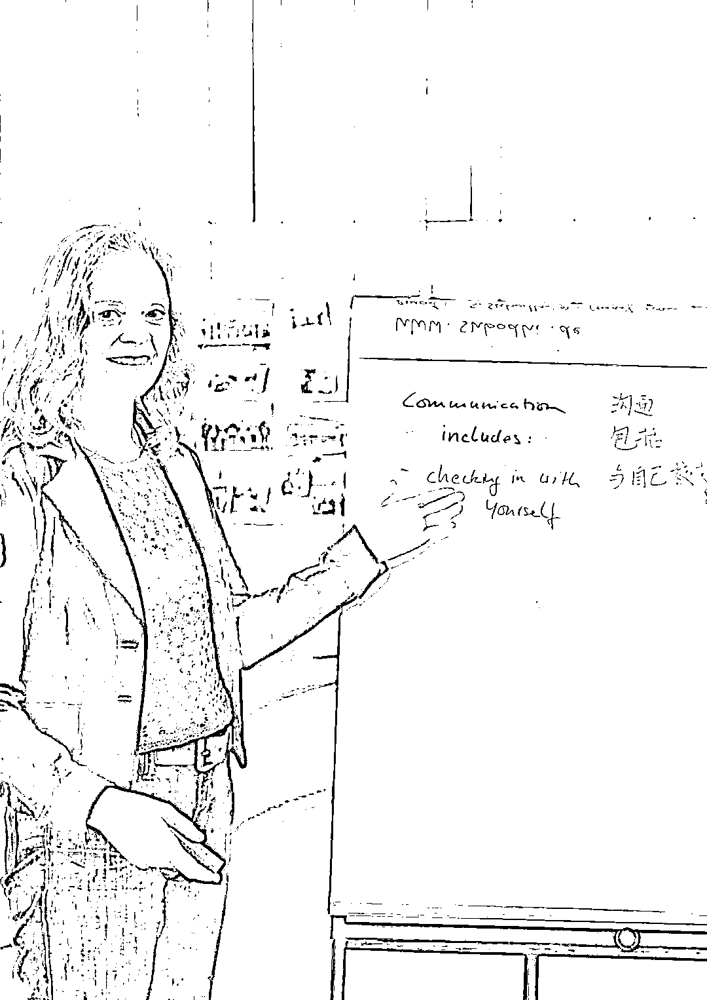

**★课程信息★**

**苏菩提成都家排 3 日工作坊**

**地点**：成都市区（具体地点课前通知）

**时间**：2018 年 10 月 26 日周五-10 月 28 日周日

**价格**：原价 4200 元，**早鸟价 3600 元（9 月 30 日前报名完款），两人同行 3300 元/人（个案仅 10 个名额，单独收费）**

**咨询**：长按下方二维码联系马老师

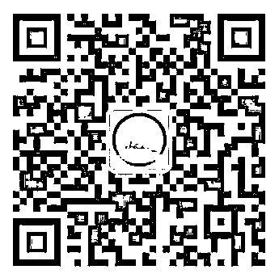

★**退费信息**

开课前 1 周不再接受退费。课程中不接受退费。

**大咖推荐**

“

苏菩提老师的纯净与临在的状态、她无评判、中正的问题总让我“顿悟”颇多。我最开心的事就是给她做翻译，她走后我总会大有长进。每次听苏菩提讲话，有种很特殊的感觉。她的语调和声音很轻，很稳定，但是你可以感受到那个力量。她的话不多，但直指人心。她很会用她语言将她所感受到的不管是能量还是情感清晰地描述出来。

——**彩虹书吧创始人、《活过来你可以》作者 Amy**

”“

这次工作坊最大的体会就是，“能量系统动力”中发生的事（宇宙的安排），是超出个人头脑的理解的。出于小我的任何解释或编织常常只是在服务于“模式”。知道这一点让人感到安心。因为会真的相信“臣服”是重要的，其价值是真实的。由此也会明白与自己的心联结、照顾好自己的心是最重要的事。这种确定，让人感到活在这个生命里，是安全的。

——**ISAR 认证占星师 Cora**

”“

在占星咨询中无论涉及事业还是感情的议题，我们会跟来访者探索和分析星图中童年原生家庭生活环境对我们的影响，以及是如何对星图中行星和相位模式形成的认知。而一旦对于这种分析达成共识，在解决方案上，我都会推荐来访者去体验下家族系统排列来解决原生家庭的阴影和创伤。根据我的经验和多数客户反馈，“占星+家排”是解决此类问题有效的组合方式。

**——ISAR 认证占星师 海星程 Hastro**

”

**微信又双叒叕改版啦，不想错过若道君的推送？**

**就把若道设为星标吧！**

**▼**

********点击“阅读原文”直接报名********

# 重大天象丨金星逆行期间你一定要读的提升个人价值指南

> 原文：[`mp.weixin.qq.com/s?__biz=MzA5NjA0NTAxNg==&mid=2651401893&idx=1&sn=5f729add8c293d1a46fa606315ed6800&chksm=8b4b9c12bc3c1504e6e8ac23ce1b5b0d2d180d69f0d703f947509448c35fcdb3c21c353b40de&scene=126&sessionid=1692738450#rd`](http://mp.weixin.qq.com/s?__biz=MzA5NjA0NTAxNg==&mid=2651401893&idx=1&sn=5f729add8c293d1a46fa606315ed6800&chksm=8b4b9c12bc3c1504e6e8ac23ce1b5b0d2d180d69f0d703f947509448c35fcdb3c21c353b40de&scene=126&sessionid=1692738450#rd)

**☆在后台回复数字 1-20，获得一句占星干货**

作者/Persephone Peng ISAR 认证占星师 

编辑/佳黛 头图制图/书君 图片/花瓣网

作者有话说

**金星将于 10 月 6 日 03:04 开始逆行**。此次金星逆行，绝对不是一次简单的个人行星行运，期间会有几起重要星象同时发生（包括金星六分土星、金牛座满月、水星合相木星等），其中最重要是**金星逆行天蝎座时与天王星逆行金牛座精准对分且互容**，大大加强了能量的对冲强度和深刻浓度。

意味着集体意识中金星能量的觉醒与提升，于集体于个人都影响深远，也为明年 3 月起天王星正式进入金牛座的七年浓墨重彩地刻下了序言。

**编辑有话说**

不要觉得这里天王星进入金牛座是写错了哦。是的，今年我们的文章提到，天王星在 5 月 15 日进入金牛座。但天王星在 8 月 8 日开始逆行，将于 11 月 7 日逆行回白羊座。2019 年 1 月 7 日天王星顺行，于 2019 年 3 月 6 日再次回到金牛座。

**金星逆行日期一览****金星逆行重要日期**

**2018 年 9 月 3 日** 金星从天秤座 25 度 14 分行进，进入**前阴影期**

**2018 年 10 月 6 日** 金星在天蝎座 10 度 50 分**开始逆行**

**2018 年 11 月 1 日** 金星**逆行回天秤座**

**2018 年 11 月 16 日** 金星在天秤座 25 度 14 分开始顺行，进入**后阴影期**

**2018 年 12 月 18 日** 金星顺行回天蝎座 10 度 50 分，**全程结束**

**金星逆行期间为 10 月 6 日至 11 月 16 日：10 月 6 日至 11 月 1 日在天蝎座，11 月 1 日至 11 月 16 日在天秤座。**

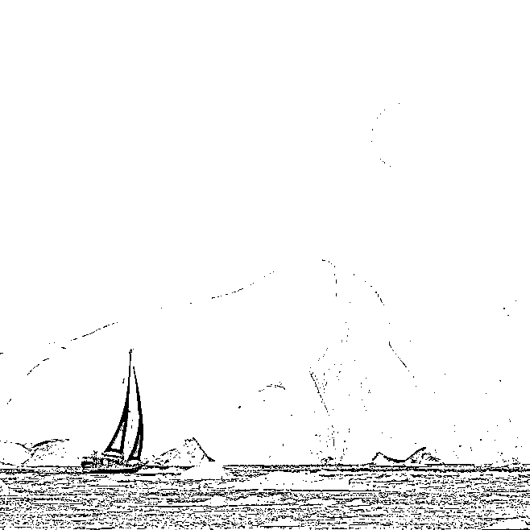

**行星逆行，不要恐慌**

听到有行运的行星逆行，很多人都会感到害怕，好像总会有一些“坏事”发生。的确，**在金星逆行期间，金星所代表的社交、爱情、婚姻、金钱和美都会遭受到考验**。

占星师在这段时期会提醒大众：**不要随意做出关系方面的决定**，因为这期间合作或亲密关系的旧有矛盾易激化，不小心就分手、离婚；也容易重遇前任，但或许只是让人看清楚旧情真相；在财务方面，要小心投资，谨慎理财，容易造成经济损失；在美方面，小到不要剪头发，大到不要整容，因为都不会变得更美。

这些方面的决策，可以在金星逆行期间重新评估和选择，待金星顺行过后再冷静决定不迟。

**在金星逆行期间，这些事情的发生几率是会提高一些**，但其实这些令人不悦的事件，每一天都有人在经历。**只是行星逆行期间，我们对于事件的感受力会变强变深**。

平时我们想逃避的冲突和不太觉察的细节都会被放大，而能够促使我们沉下心反思内省的便是我们内在心理产生的强烈深刻的感受，这即是心理占星师赋予“行星逆行”的意义——**透过重现和激化旧有问题，反思这颗行星在自己内在世界的状态，从而做出新的选择和改变**。

**只有当我们能够认知到自己的境遇是由我们的内在动力模式导致的，并不是单纯因为某颗星逆行或顺行，才能回到自己的内在世界去做一些改变，从而改善自己的现实境遇**。

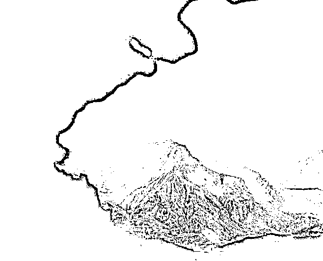

**金星逆行，该学习啥？**

这次金星逆行将跨越两个星座，**天蝎座和天秤座**。在古典占星中，金星在天蝎座是落陷的位置，而在天秤座是耀升的位置，简单说，就是一个劣势，一个优势。但在心理占星师眼中，这两者并没有优劣的区别，因为我们关注的是**金星的本质**，需要我们**看见、收回且活出来**的是金星这颗行星。

但老实说，在男权社会与文化的制约下，不论男性还是女性，要发展出一颗健康的金星并不是一件容易的事。但好在我们可以**反思和学习**，逐渐疗愈和成长，做出一些改变。此次，我们就透过天蝎座所代表的“人性的深层欲望：性、金钱、权力”以及天秤座所代表的“婚姻关系与美”，重新思考与探索一下：**金星能量的发展层级以及金星的本质**。

**金星能量的发展层级**

**❶**** 被排挤和否定的金星**

在我们的文化中，大部分的女性可以很轻松地活出月亮，男性也可以接受月亮，因为月亮代表着的**母亲的温暖**，是被大众普遍接受的。我们歌颂母爱、崇拜大地之母。但对于同样是女性能量的金星，却不是那么接纳。

在心理占星中，金星是由“爱与美”的女神 Aphrodite（阿佛洛狄忒）守护，她是古希腊神话中最美丽的一位女神，人们看到她就看到了美的原型。而 Aphrodite 的诞生，是土星将创始之神天王星的生殖器割下来丢到大海里变幻出来的。

因此金星的美里面是带有性的。性不只是与火星相关，与金星也是息息相关。只是火星的性是人性中最本能的性冲动，叫“性交”，拍出来是动作片，而金星的性是有情感互动的，叫“做爱”，拍出来是电影，是艺术。

由此可见，**金星她不仅仅是美丽的，还是充满着性能量，且拥有性自主权的女神**。金星的性能量，不仅仅是一种繁衍力，更是一种创造力，一种活生生的生命力，是女性独立和自主的基本动力。

而这样的一位女神，并不符合我们的文化中自古以来所提倡的女性形象，女性的性能量太过强盛，反而是会让太过认同父权下的的男性恐惧和排斥的，因为他们本身的性能量在父权集权下就不敢，也不能很好的发展。

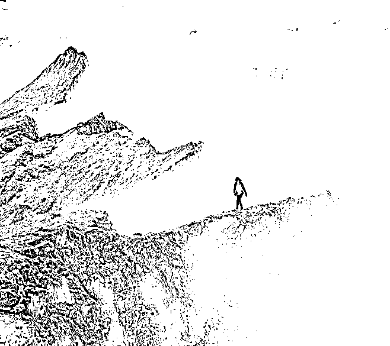

无意识过于认同月亮的女性，也会排斥金星。月亮是需要紧密相连的，而金星是需要**独立自**主的。

在最近很红的宫斗剧中，我们可以清楚地看到就算是皇后妃子，在父权社会下，虽然身穿华服，佩戴珠宝，却依然成为不了金星。依然是一边依靠着父权生存，一边认同并维系着母族的荣辱。

她们没有办法成为她们自己，永远是母族的女儿。这些女儿们依附着旧有价值认同所带来的归属感，脱离父权依赖以及母族归属，便很难生存下去。**这种深深的恐惧，很难让她们接受金星的独立与自主**。而这绝不仅仅是皇宫里女人的命运，而是整个父权制度下所有女人都曾经历的命运考验。

如果我们太过认同这个层次中集体文化对金星的看法，那么我们的内在是排斥和否定金星的，是不可能去拥抱金星的。

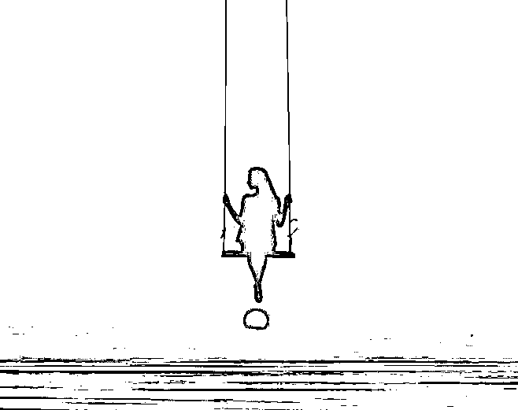

**❷**** 困局与交战中的金星**

时代会不断地解放和进步，总有一些女性勇敢地走在最前面。女性的平权之路，与我们自身金星能量的发展紧密相连。“刀妃革命”，末代皇妃文绣成为了第一位敢与皇帝离婚的女人，最终也成功离婚，并且在之后的人生里，嫁给了其他男人。

我们现代女性所享受的权利，不管是西方还是东方，都是女性先辈一步步艰难地靠自己的勇气和努力，付出了巨大的代价所争夺过来的。且革命尚未成功，同志还需努力。

但至少越来越多的女性拥有自己的自主意识，开始追求自己想要的幸福，愿意为了拥有更多的权力去承担更多的责任。**懂得了经济独立才是独立自主的基础，懂得了如何让自己变得更美，懂得了如何释放女性的性魅力**。

自从木星进入天蝎座以来，一些掩盖许久的社会问题暴露在大众的视野中。各界大佬的性侵事件以及“ME 2”反性骚扰运动、娱乐圈税务问题以及著名女星因此消失在公众视野、还有最近两部很红的宫斗剧对比引起的热议。这些事件无不涉及到天蝎座所代表的“**性、金钱、权力**”的议题。

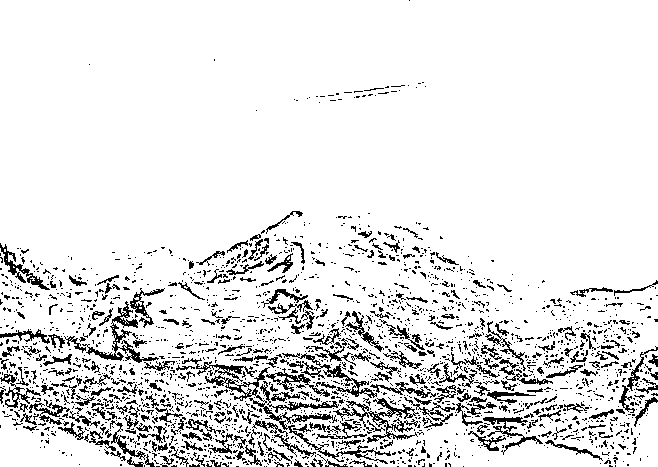

我也遇到很多女性个案，她们都是又漂亮又性感，积极健身，只吃很少的食物，能靠自己的能力获取不错的经济收入。看上去也是非常自信。可是在婚姻家庭中、在亲密关系中，却是痛苦和困惑的。

她们既要维持自己的美貌和身材、又要赚钱、还要回家带小孩、处理婆媳关系……却依然在婚姻中得不到珍惜和爱护。即便夫妻感情尚可的，也会经常莫名觉得内心有一个空洞。

她们自己也明白，即便是牺牲自己的健康也要努力维系着这一切。因为**社会价值观和形势要求她们成为这样的女人**，她们不会放弃。可她们**并没有想过自己要什么，要成为什么样的女人**，内在动力是为了得到他人的爱、关注与尊重，好似是一场自恋，而**没有真正去爱和尊重自己**。

即便所有事情外表看上去都那么好看，却不经意间成为了另一种虚荣。当然，这也不是什么错，只是内在生不出爱意，这不是金星的样子。

在多年的个案经验里，有一点让我很震惊。即“重男轻女”文化思想的根深蒂固。本以为独生子女的女儿都是很宝贝的，但因为整个社会的竞争压力大，如果女性是独生子女，便很容易认同男性身份的强大和力量，用男性的力量与男性在社会上竞争，那么当然在亲密关系中也无意识依旧与男性在竞争，其无意识还是觉得女性身份是弱小的。《我的前半生》中唐晶这个角色，便很像是这样的模式。

同时，在此层级中，因为我们并没有收回真正的金星，便很容易把自己内心渴求的金星投射到其他同性身上，与同性之间会有不尽的比较与嫉妒。不管是意识得到的同辈关系、婆媳关系，还是无意识中母女关系、姊妹关系，都充满了嫉羡。

如果我们依旧认同的是父权社会下的价值观，认同的是男性身份的力量以及女性身份的弱小，没有看到并认同自己女性身份的价值，没有看到其实女性是有女性的力量的，没有真正愿意去成为一名女性，那么我们依旧**只是拥抱了金星的外壳，进入不了金星的内在**。

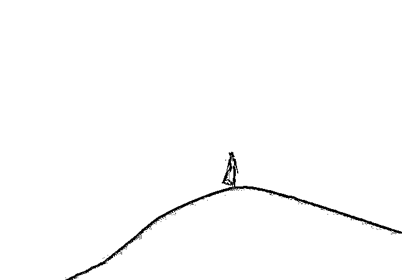

**❸**** 收回并体悟到金星的本质**

记得有次参加一个心理学讲座，我从会场后门经过到我的座位时，看到一位约摸 70 岁的女人，坐在大厅最后面听着讲座。那一刻，我仿佛看到了 Aphrodite 本神，我没办法称她为奶奶，因为我看到的就是一位**女人**。

我远远地看了她许久，有一种被疗愈的感觉。虽是白发，却是精致地盘着，淡淡的妆容，小小的珍珠耳环，灰色的裙套装，坐姿端正优雅，并不是因为她的装扮让我感到美，而是她的内在散发着一种**温柔而有力量**的气质。这就是金星的本质。

只有到了这个能量层次，我们在心灵世界里才能碰触到金星的原型，我们才能在日常的生活当中活出金星的本质：**回归自己的女性身份，体悟到自己的价值**，如钻石般纯粹且坚固的价值。

这份自我价值感，与外在的一切无关，与社会的价值观无关，与他人无关，与处境无关，与过去无关，与未来无关，“**我存在即价值**”。此时，自爱才能扎根，并不断生长，我们才能与自己建立最亲密的关系。

因为这份自我价值的收回，以及自爱的产生，才能实现真正的独立自主，不论是精神上、心理上还是现实生活中；**也因为和自己建立了亲密的关系，才能够与他人建立真正平等的亲密关系**。而这时的我们，有没有关系都可以活得很自在，因为已完成了心灵世界的“神圣婚姻”，我们内在可以生出爱意。

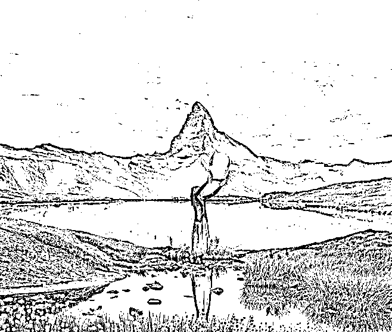

**未来天王星入金牛座，会是女性能量觉醒的七年**，将有越来越多的女性能够发展到这一层次，收回金星，体悟到金星的本质。平权不是一味去外在争夺权力，而是在我们的内在实现平权，**尊重自己，珍爱自己，达到一种内在平衡**。

这次逆行的金星与逆行天王星对分，只是一个开始，我们过去没有解开的情结会再次出现，没有愈合的伤口会再次裂开，曾经压抑逃避的情绪会再次涌现。要知道我们失落的女性身份，已经多久没有好好哀嚎过了。虽然过程一定会很辛苦，却是一次难得的觉醒和疗愈的机会。

**如果我们要想要拿回金星的力量，我们就需要卸下虚荣，真正臣服与谦卑**。当痛苦与悲伤来临时，我们最好的方法，就是**与它们在一起**，让自己的心去深深感受那种痛苦与哀伤，当深埋的情绪流动出来的时候，伤口自然就会愈合。我们金星所在的星座、宫位以及相位，都是求助的途径，也都是最终能成为启明星，带给他人启发，散发“爱与美”光芒的地方。

金星逆行，也不全是“坏事”，有时曾经遗失的宝贝会重新回到我们身边。

愿此次金星逆行期间，我们能重新记起在很久很久很久以前，女性身份价值的珍贵。

**版权声明：**本文由作者授权首发于若道平台，欢迎转发，反对抄袭。友号转载请申请白名单。

**也许你还想看下面的文章**

[写在金星逆行前：重新审视关系和价值](http://mp.weixin.qq.com/s?__biz=MzA5NjA0NTAxNg==&mid=209611287&idx=1&sn=d1594e755beaa5f4a9bc8ad20880d93d&scene=21#wechat_redirect) 

[金星的黑暗面 | 为什么感情中有欺骗？](http://mp.weixin.qq.com/s?__biz=MzA5NjA0NTAxNg==&mid=2651386371&idx=2&sn=40ca07d107011717a05be5b0a589d9dd&scene=21#wechat_redirect) 

**Persephone Peng**

ISAR 认证占星师（2013 年获得）

职业心理占星师、沙盘游戏治疗师

**微信公众号**：astropppp

**咨询预约微信号**：astro0077

**长按打赏**

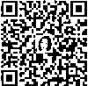

**微信又双叒叕改版啦，不想错过若道君的推送？**

**就把若道设为星标吧！**

**▼**

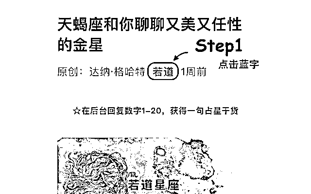

******点击图片查看若道君推荐******

**（以下课程接受插班 ing）**

******

********报名直达入口********

# 不花钱就能改善心情的法子，12 星座 get 到了吗？

> 原文：[`mp.weixin.qq.com/s?__biz=MzA5NjA0NTAxNg==&mid=2651401812&idx=1&sn=2e1d71654cdcbafec36cc4b5814a6665&chksm=8b4b9ce3bc3c15f50668963442b04fc7561c08248bac92c170e8d6f91c78b753cc151a08c64c&scene=126&sessionid=1692738455#rd`](http://mp.weixin.qq.com/s?__biz=MzA5NjA0NTAxNg==&mid=2651401812&idx=1&sn=2e1d71654cdcbafec36cc4b5814a6665&chksm=8b4b9ce3bc3c15f50668963442b04fc7561c08248bac92c170e8d6f91c78b753cc151a08c64c&scene=126&sessionid=1692738455#rd)

****☆在后台回复数字 1-20，获得一句占星干货****

作者/Anastasia ISAR 认证占星师

编辑/玫瑰 封面制图/书君 图片/花瓣网

**写作对我们很重要**

天王星在白羊座这 7 年，带火了自拍、直播和自媒体。每个人都成为了一座电台、一个频道、一个发出自己声音的媒体。**如何更好地自我表达，彰显独特的个性成了人人关注的焦点。**在这种热门头条十万+的大环境下，各种写作课也应运而生。

甲说，我根本不想当作家啊，为什么要去写东西。其实不管是写文案、讲故事、做文章、搞营销，甚至于日常的问候交流都离不开基本的文字功底。乙丙丁会说，我太阳星座位置不好，创作力自然比不过那些太阳能量流畅的；不会写东西也不能怪我，我有“水土四分”啊；我天蝎能量很重，本来就谨慎小心，不愿意吐露自己的心声……

这些都是借口。如果我们去看看那些伟大的作家，就会发现他们分散在 12 星座。

写童话的安徒生是白羊座；写《洛丽塔》的纳博科夫是金牛座；推理祖师柯南道尔是双子座；普鲁斯特是巨蟹座好不奇怪，可是写《1984》的奥威尔也是大巨蟹；《哈利波特》的作者罗琳是狮子座；托尔斯泰是处女座；天秤座有鲁迅和张爱玲；我最爱的陀思妥耶夫斯基和加缪是天蝎座；射手座有写《人类群星闪耀时》的茨威格；摩羯座的村上春树和沈从文；科幻小说之父凡尔纳，短篇小说之王契科夫都是水瓶座；而写下魔幻现实主义《百年孤独》的南美作家马尔克斯则是双鱼座。

挂一漏万，你看，每个星座都有自己的大文豪。

当然，写作的目的并不是要让人人都成为大文豪，但是，人人都可以通过写作去了解自己的内心。**通过写作，提高自己发现生活、感受生活的观察力；通过写作，激活自己的创造力和热情；通过写作探索自己的潜意识，疗愈创伤；而这些，都是美好生活的基本能力。**

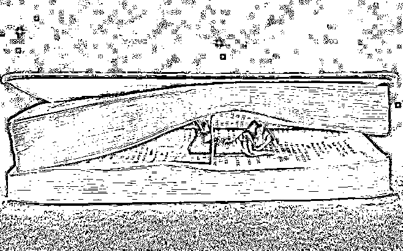

**好记性不如烂笔头**

俗话说，**我手写我心**。我理解的写作，其实是一个**将潜意识呈现出来形成意识的过程**。我们潜意识的海洋波涛汹涌，埋藏着很多自己都不知道的创伤和痛苦。为什么我一遇见自己喜欢的人就紧张？为什么我会恐惧当众发言？为什么我总是大手大脚花钱没节制？为什么我控制不了我自己的情绪？为什么？为什么？为什么？只有当潜意识变成可见的意识，我们才有机会去看到它、分析它、处理它、疗愈它。

大家都有过这样的经验，口头交流很顺畅，沟通也没有任何问题，但是要把讲话的内容总结一下，落实到笔头，就会觉得大脑空白，不知从何说起。这里就是潜意识和意识之间的鸿沟，我们会下意识地脱口而出，但是落实在纸上，一定要经过大脑的思考和处理。

有句老话，好记性不如烂笔头。除了书面文字利于保存和翻看的优势，这句话还有一个核心，只有经过大脑处理，形成经验，然后输出的信息，才真正是我们自己的东西。阅读也好、听课也好，其实都是信息输入的过程，这个过程如果没有经过我们自己大脑的处理，很容易就变成左耳朵进右耳朵出，时间花了很多，收获却很少。而写作，就是一种输出。一种将营养消化吸收，变成自己身体一部分的过程。


**12 星座的写作秘笈**

那么，12 星座的写作秘笈是什么呢？（家有小朋友的大人，下面 12 条也可以当做学习秘笈来参考。）

**白羊座：****直接记录，保持耐心**

**把行动的过程记录下来**，自己做一遍就有了经验，把这些经验记录下来。如果实在觉得没什么可写的也不要着急。有的人可能需要长时间的积累素材。情绪来得快也去得快，但感受和经验转化为思想和文字可能需要很长时间。要在那个情绪瞬间抓住它，随身带着纸笔，养成随时记录的好习惯。

**金牛座：****利用美食，刺激感受**

**金牛座的创作与身体状态和环境密切相关**。有时候我们就是觉得很无聊，不知道有什么可写的，也懒得去写。这个时候就可以找些东西来刺激一下我们的五官。看个电影、吃顿美食、做做美容、泡泡温泉、喝点小酒甚至于抽根烟。在身体逐渐放松的过程中，就会觉得自己的头脑慢慢活跃起来了，灵感喷涌。


**双子座：****观察生活，描摹细节**

**双子座的聪明和好奇，让他们很善于发现生活中新鲜的、丰富的细节美**。只需要将这些新鲜的观察和感受在笔下一五一十地展现出来，就会唤醒读者相似的经验和感受。不要担心自己写的东西直白、浅显、无意义。写作不是教书，不需要把中心思想，段落大意提炼出来、划出重点给别人看。

**巨蟹座：****控制情绪，调整心情**

情绪对于写作来讲是个好东西。感受丰富，善于抒情，说的就是巨蟹座。但是**过多的情绪表达往往会以文害意。**好文章的表达都很克制、很写实。通过具体严谨的描写，来激发读者的情绪，而不是自己大喊大叫、又哭又闹地发泄一通。当然，用文字发泄也是调节情绪的一种方式，记住，发泄完后，一定要回过头再看一看。

**狮子座：****信任自己，点燃热情**

**一定要从“我”出发，让自我意志充分表达出来。**我怎么看，我怎么想，我怎么说，慢慢接近自己的内心。也许刚开始，写出来的东西自己都不愿意看，记得要自己推自己一把，提醒自己，写下来对我来说意义重大，这意味着我很看重我自己。一旦这样的自由意志被激活，就会产生源源不断的热情和创造力。

**处女座：****不怕失败，习惯修改**

我们并不完美，写作也并不是一气呵成的事情。我们看到的好文章可能经过了不知道多少遍的修改和重写。在有灵感的时候写下自己的想法，隔几天拿出来看看，反复修改。对于处女座来说，修改润色的过程必不可少。不怕写不好，不怕推翻重来，了解了这个过程，就可以培养自己的耐心，并且减少焦虑。


**天秤座：****聊天聚会，收集素材**

**聊天也是一个很好的学习写作的方式。**在社交活动中竖起耳朵倾听，把有趣的对话记录下来，写在日记里；或者听到了什么有趣的故事和八卦，也可以写下来。很多作家都是讲故事的高手，“我有一个朋友”、“我有一个同事”、“我听来的故事”等等，故事的真假并不重要，所有这些都是可以拿来捏扁揉圆的素材。

**天蝎座：****忍受孤独，写下核心**

天蝎座的洞察力会让他们感受到太多人性的阴暗面，他们渴望爱和温情，又喜欢去探索这爱和温情来自哪里，如果这些温暖并不是他们想要的，他们宁愿不要。这也导致他们更喜欢封闭自己，宁缺毋滥。其实，天蝎座只要接受就好了，也许不是想要的那一种，人性的核心是爱和慈悲。**天蝎座要在孤独中，写下自己最清明的思考。**

**射手座：****多读多看，我注六经**

如果说双子座的风格是六经注我，在所有经典和经验中采撷自己感兴趣的那一点点花蜜；那么射手座就是我注六经，**借由六经来阐述自己的思想**。射手座一定要去多读多看多想，从别人的经验中对照思考，看到差异，找到共鸣，拓展自己的经验，才能在前人的基础上最终形成自己的原则和风格。

**摩羯座：****养成习惯，持之以恒**

对于摩羯座来说，**养成一个良好的写作习惯，持之以恒地练习非常重要**。列出想要写的主题，规定每天写作的字数，尝试不同写作风格的练习。时时刻刻提醒自己需要留心的素材，加强生活和写作之间的联系，坚持执行制定好的练习计划。只有这样持续稳定地练习和输出，才能保证高质量高产出的作品来。


**水瓶座：****打破成见，眼光放远**

理想的水瓶座眼界开阔，思维创新，但现实中，很多水瓶座往往自以为是，故步自封。要知道水瓶座是固定风象星座，已经形成的思维模式很难改变。**就写眼前的东西，就写现在，抓住每一个崭新的念头**。哪怕再匪夷所思也不要担心，特立独行才是水瓶座，我行我素才是水瓶座。不要害怕眼前没有路，路都是走出来的。

**双鱼座：****关注梦想，活在当下**

艺术的世界何其辽阔。一首诗，一支歌都会给人带来心灵上的愉悦。但是也有太多的艺术家酗酒吸毒，甚至于自杀。**双鱼座要有一个坚定的目标，然后学会活在当下。**关注梦想，采取行动，信任自己的身体和心灵，梦想才会变成现实。一步步落实，一步步向前。不管现实是多么粗糙，磨得自己心疼，也要坚持走下去。

**写作，很孤独，也很自由**

说来说去，写作是一件很孤独的事情，也是一件很自由的事情。没有什么必须写的时候，没有什么非得不可的地方，也没有什么最适合的状态。

*   **火象星座（白羊座、狮子座、射手座）**通过经验来学习，重要的是行动，记录当下；

*   **土象星座**（金牛座、处女座、摩羯座）****讲究价值和回报，重要的练习节奏和坚持；

*   **风象星座****（双子座、天秤座、水瓶座）******更乐意在智力上产生碰撞，重要的是与人交流，打开思路；

*   **水象星座******（巨蟹座、天蝎座、双鱼座）********通过感受来学习，要能控制好情绪，抓住核心。

世界并非一成不变，生活永远新鲜。我们从来没有想过一步抵达真理，也从没有盼望在一篇文章里写下永恒。我们不过是用这种最简便、最俭朴、最可靠的方式，去体会最细微、最真实、最美好的生活和现实。那么，拿起笔来，就现在，就从今天开始，找到自己。

写吧，写吧。

窗外的风说，写吧写吧；温暖的阳光说，写吧写吧；深夜的秋虫喃喃自语，写吧写吧；打湿抱枕的眼泪流淌，写吧写吧。

唯其孤独，才能自由。

**版权声明：**原创文章由作者授权首发于若道平台，欢迎转发，反对抄袭。友号转载请申请白名单。

**想阅读更多作者的文章，请在后台回复 ****Antastasia****即可。**

**Anastasia**

职业占星师/专栏作者/策展人

于 2015 年通过 ISAR 占星能力考试

若道认证生时校正资质（2015 年获得）

**微信公众号**：KairosMoment

长按打赏

******点击图片查看若道君推荐******

**（以下课程接受插班 ing）**

******

********报名直达入口********

# 顺势疗法·深圳 3 日工作坊丨成为自己的私人保健医生

> 原文：[`mp.weixin.qq.com/s?__biz=MzA5NjA0NTAxNg==&mid=2651401812&idx=2&sn=f366906667815bd778366ddc9edf9672&chksm=8b4b9ce3bc3c15f5f9ce6e687c014c821f58e4c77169e2d4f11cbbb6502ac372fa577781741b&scene=126&sessionid=1692738455#rd`](http://mp.weixin.qq.com/s?__biz=MzA5NjA0NTAxNg==&mid=2651401812&idx=2&sn=f366906667815bd778366ddc9edf9672&chksm=8b4b9ce3bc3c15f5f9ce6e687c014c821f58e4c77169e2d4f11cbbb6502ac372fa577781741b&scene=126&sessionid=1692738455#rd)

**顺势疗法****工作坊**

顺势疗法是一种能量疗法，为目前全球使用最广泛的自然医学疗法，对个体的身体、精神和情绪三个层面进行治疗，加强个体自身免疫力，提升个体生命能量，以其天然、安全有效、无副作用、整体医疗等特点被全球近 70 个国家所推崇。

顺势疗法的整体疗愈理念非常符合若道一直在教授和传递的理念，这就是：相信每一个人都有疗愈的潜能。同样的，顺势疗法的整体治愈理念就是去激活人体自身的疗愈程序。

1

**这门课能给你带来什么？**

*   **国际著名的占星师、顺势疗法治疗师****苏·汤普金斯**亲自教学，分享其 20 年积累的丰富案例

*   掌握日常生活中**几十种急症**的治疗方法

*   学习最安全简单的自我治疗方式，**成为自己和家庭的治疗师**，为全家带来更多的安全感

*   减少对传统西药的依赖，刺激个体生命活力，提高免疫力，更敏锐感知身体、心理和自然的连接

*   **了解身心灵的运作原理、学会运用整体医学的理念疗愈身体和情绪**

2

**课程都要讲些啥？**

**2018 年 11 月 23 日~25 日，拥有 20 年顺势疗法执业经验的苏·汤普金斯老师在深圳开设“顺势疗法家庭急救及保健”课程，教大家用顺势疗法家庭常用急救药箱中的一些顺势药物解决各种常见急症**。如外伤、考试焦虑、牙齿问题、发烧、咳嗽、妇科经期问题等，并将现场挑选同学案例，教大家如何问诊，演示如何将顺势疗法应用于日常急救及日常保健。

**本课程为那些想要增加自我和家庭身体保健和疗愈能力的人所设置。**

**药箱中的****36 种****药物处理的身体急性病症包括：**

**感冒发烧头痛**

*   感冒前期较轻的情况以及重感冒导致的各种反映

*   空气或者感冒引起的咳嗽

*   流感、头疼及头痛

**妇科**

*   妈妈由于胸部及乳腺问题无法正常母乳，例如：乳头发炎、肿痛、乳裂、乳汁质量明显变化、乳汁太少

*   女性生理期相关问题

*   产前阵痛以及生产过程中的痛苦和极端情绪

*   产后护理

**眼耳鼻喉口腔**

*   眼疲劳、眼部炎症以及眼损伤

*   麦粒肿

*   耳痛

*   鼻出血

*   喉咙疼痛

*   牙齿问题

*   口腔/牙齿治疗带来的不适及疼痛

*   口腔溃疡

*   嘴部唇部的发炎及痘疮水疱

**肠胃问题**

*   腹泻

*   呕吐

*   食物中毒

*   便秘

**情绪问题**

*   焦虑、忧虑、紧张等情绪，以及这些情绪导致的突发情况。例如：公众演讲导致的焦虑，紧张导致的腹泻，忧虑导致的发烧，紧张导致的虚弱无力或发抖

*   身体疲惫疲劳

*   意外或痛苦经历所带来的情绪问题

*   突如其来的打击造成的情绪困扰，如震惊、恐惧害怕

*   舞台恐惧症

**外伤类**

*   各种拉伤、扭伤、刀伤、烧伤、烫伤、晒伤、头部损伤

*   意外导致的骨损伤或骨折

*   碰撞导致的擦伤、青肿、以及身体遭受的严重撞击

*   肌腱及韧带损伤

*   蚊虫叮咬或螫伤所导致的红、肿、热、痛

*   身体上的血泡

*   帮助移除扎到身体中的刺、石子、玻璃等

*   外科手术后引起的伤口疼痛

*   身体外伤以及骨骼、肌肉、神经系统的损伤

**常见病症**

*   膀胱炎

*   疝气

*   痔疮

*   腮腺炎

*   哮吼（一种儿童疾病）

*   荨麻疹、突发麻疹

*   水痘（以及其引起的发烧、咳嗽、以及紧张、极度不安等情绪问题）

**其他**

*   宿醉

*   中暑

*   颈部僵硬

*   时差引起的身体不适

*   体力劳动导致的身体疼痛

*   旅行过程中的不适反应

*   身体冻疮、以及冻疮发炎的状况

*   “预防接种”引起的身体反应

3

**学员感受分享**

① 这些天在国外**时差**倒不过来，一直休息不好，平时思虑也比较多，服用**马钱子**效果很好。这几天入眠较快，睡得也深沉。

② **胃疼**了一两天，因为吃螃蟹和扇贝。吃了马钱子没有用，后来吃了**砷**，差不多 15 分钟之后就一点也不疼了。

③ **腹泻、腹部绞痛**，服用**马钱子**，症状很快减轻，目前痊愈。

④ 我妈妈前两天运动过量**拉了筋**，服了 2 次**芸香**，好了。

⑤ 白天**胃胀气**不舒服，夜里 12 点焦虑睡不着，**胃部灼烧**，胀气越来越严重，也越来越焦虑，干呕出血丝。试了乌头无效，试了硝酸银无效，试了**砷**，5 分钟内情绪平复。

⑥ 虚寒体质，吃寒冷食物就会**胀气**，最近 2 年一到下午 5、6 点就胀气，需要不断打嗝排气，反复发作。试了各种中成药，试了艾灸见效不大。试了**植物碳**，头天晚上 1 粒，第二天明显缓解。第三天又服用 1 粒植物碳，断续困扰 2 年的胀气基本治愈。

⑦ 更年期，例假过后外阴瘙痒还有淡褐色分泌物，服用**植物碳**，第二天明显减轻。再服用**乌贼**，第三天症状完全消失。

⑧ 儿子多年被**过敏性鼻炎**困扰，每天大量鼻涕，鼻甲肥大。给他连续 3 天每晚服用一粒**蜜蜂**，现在只需早晨清理一次鼻腔。基本好了。

⑨ 这些天胃不舒服，昨天更严重，胃部按下去硬硬的，痛痛的，晚 10 点服用**石松**，10：30 肚子开始咕噜，11：20，按上去恢复正常，食量今天已恢复。

⑩ 早上起来**右侧脸、眼睛、嗓子肿胀，疼痛**。吃了**蜜蜂**，明显好转。

⑪ **口腔溃疡**，明显疼痛，服用**汞**，明显好转。

⑫ 一个人带孩子坐飞机，中午吃了不干净的东西，**腹泻严重，恶心**，查看**硝酸银**不仅可以治疗腹泻，而且是**飞行恐惧**的首选，就试着服用了一粒，登机前就好了。

⑬ 老公常应酬，因此会有**醉酒**状况，服用**马钱子**，第二天没有宿醉情况，轻松上班。

⑭ 楼下卖水果阿姨，咳嗽不停，医生诊断为**咽炎**，医治多年未果。昨天给她服一粒**白头翁**，阿姨反应症状减轻了很多，喉咙舒服了，咳嗽也少了。

⑮ 朋友脚扭了，很疼，给了她一颗**山金车**，半小时后，反应没有那么疼了，喉咙也有清透的感觉，晚上睡觉的时候，感觉血液在脚部流通，感觉比较好。

⑯ 肩部因受寒剧烈疼痛，晚上会痛醒，查了资料，发现**野葛**比较合适，吃了 1 粒，第二天基本痊愈。

⑰我是很招蚊子的体质，以前夏天出去玩，总是被咬得到处是包。前一天出去玩的地方蚊子多，我身边的朋友都被咬了。我是早上想起**虱草子（斯塔维翠雀）**防叮咬，于是吃了一颗，没想到一天都没有蚊子咬我，也是绝了。

4

**关于本课程的一些常见问题**

❶ **顺势疗法和西医治疗有什么不同？**

**苏·汤普金斯**：**主流的西医治疗是使用化学制剂压制症状。顺势疗法则是一种能量治疗，刺激身体启动自愈机制**。

西医治疗只针对症状本身，而顺势疗法更注重整体疗愈，从根源上解决问题。

西药是化学制品，病人服用后可能面临药物互相作用和毒性副作用。顺势疗法所使用的药剂不会产生化学副作用、毒性或与其他药品的相互作用。

❷ **顺势疗法和花精等花疗有什么异同？**

**苏·汤普金斯**：花疗与顺势疗法一样都是**能量医学**——并不依靠化学品及其效力。它们并无毒性，不论对年轻人还是长者都是安全的，比如孕妇，甚至是宠物或动物。它们的味道与顺势疗法液体状态的药物类似，味道好，方便服用。

较之花疗，**顺势疗法可以在更深的层面上进行疗愈，它同时作用于我们的身体和情绪**。对于紧急状况，顺势疗法可以快速见效。比如，对于发烧，它可以在 15 分钟内降温。两者的药剂来源也不尽相同，顺势疗法的药剂来源不限于植物。

❸ **如果用错了急救药物，是否有危险和副作用？**

**苏·汤普金斯** : 不会的，**顺势疗法药物即便使用“错误”也不会伤害人体**。同时，顺势疗法也不会导致任何过敏情况以及副作用。

❹ **在我们所要学习的顺势疗法急救课程中，对于涉及到的一些急症，如果我们选用正确的药剂，相比于西药来说顺势药剂多久会见效？**

**苏·汤普金斯**：“正确的”药剂会迅速改善急症，例如，你可以帮助孩子在 15 分钟以内降烧。

❺ **如果正在服用西药或者中药，也可以同时使用顺势疗法药物吗？**

**苏·汤普金斯**：是的，完全可以。

❻ **在本次课程中我们会学习如何通过观察和问诊来诊断病症吗？**

**苏·汤普金斯**：是的，我们会学习如何诊断病症，开始可能会教大家一些简单的方法，但随着课程的展开我们会更加深入具体的学习如何诊断病症。

❼ **不懂占星，可以学习顺势疗法吗？**

**苏·汤普金斯**：可以。

**更多内容可以观看下方视频了解，请注意流量哦~**

📹 [`v.qq.com/iframe/preview.html?width=500&height=375&auto=0&vid=r0171rszis8`](https://v.qq.com/iframe/preview.html?width=500&height=375&auto=0&vid=r0171rszis8)

5

**导师是谁？**


**苏·汤普金斯（Sue Tompkins）**

苏·汤普金斯老师是**世界著名的占星学家**，同时，她也是**经验丰富的顺势医师**。苏·汤普金斯本人有医疗护理背景，并于 1996 年完成在伦敦顺势疗法学院的培训，成为一名注册的顺势治疗师。其后，她还不断接受**世界最有名的顺势疗法大师 Rajan Sankaran**及其团队的培训。

迄今为止，苏已有**22 年的顺势治疗经验**。她非常期望将这个安全又切实可行的疗愈方法教授给更多的学员，帮助更多人获得整体身心健康。

6

**适合参加本工作坊的人**

*   医疗养生爱好者

*   对探索身心健康有强烈需求者

7

**课程价格**

**早鸟价：4800 元（2018 年 10 月 23 日前报名付款）**

课程价格：5800 元

**福利！！**

**每位报名同学都将得到一个配合此次课程的急救小药箱。内有 36 种常见顺势药物。（****价值 500 元！****）**

**连报福利等你来**

**2018 年 10 月 23 日之前同时报名完款 2018 若道（深圳）医疗占星工作坊&2018 若道（深圳）顺势疗法工作坊**

**可额外额外获得****500 元****若道课程券（适用于网络课、工作坊）**

8

**授课时间**

**11 月 23~25 日（周五-周日，三天工作坊）**

上课地点位于深圳，具体地址开课前课程顾问会通知

9

**退转课程**

*   退款原则请详看《教学协议》，如有疑问请咨询课程顾问。

****深圳顺势疗法工作坊 苏·汤普金斯主讲****

**授课老师：苏·汤普金斯**

**授课时间：**2018 年 11 月 23 日-25 日，9:30-18:00

**授课方式：深圳现场，**英文授课，中文翻译（具体上课地址请留意开课前微信通知）

**费用：**5800 元；**早鸟价 4800 元（10 月 23 日前报名付款）**

**课程负责人：王老师**（微信： 18510107057，请备注“苏汤顺势”）

长按二维码添加课程负责人咨询~


**本课程合作方**

**自在园**


****报名请点击“阅读原文”****

# 人间愤怒指南｜来来来，火星告诉你“生气”都有点啥好处！

> 原文：[`mp.weixin.qq.com/s?__biz=MzA5NjA0NTAxNg==&mid=2651401768&idx=1&sn=a8b212db33933f59505e00a7a93d7807&chksm=8b4b9c9fbc3c1589b78531d74686e45d5fcc5a68a7519ae4708dea3824f8a4322bd77db08199&scene=126&sessionid=1692738455#rd`](http://mp.weixin.qq.com/s?__biz=MzA5NjA0NTAxNg==&mid=2651401768&idx=1&sn=a8b212db33933f59505e00a7a93d7807&chksm=8b4b9c9fbc3c1589b78531d74686e45d5fcc5a68a7519ae4708dea3824f8a4322bd77db08199&scene=126&sessionid=1692738455#rd)

****☆在后台回复数字 1-20，获得一句占星干货****

作者/雷纳·加图索 翻译/李含 校对/Arrow

编辑/Tang 封面制图/书君 图片/花瓣网

很多研究都表明愤怒会给我们的身体和心灵带来伤害，但是你知道吗，其实愤怒对我们也是有益的。提到愤怒，有一颗行星我们绝对饶不开，那就是火星。它是关于采取行动的行星，也是我们的愤怒管理器。究竟我们该如何面对愤怒的议题？听听本文作者怎么说吧。

**占星课堂**

火星是代表战士的行星，它活跃而且精力充沛，是创始者和煽动者。它是第一颗位于地球围绕太阳运转轨道之外的行星，充当着新领域的开拓者和侵入者角色。在现代占星学中火星守护白羊座，是神话中的战神，代表个人实现欲望的能力。火星是红色的，这反映了它激励行动的激情，以及它与愤怒的关联。出生图中的火星描绘了我们表达愤怒的方式，我们许多人都不会直接表达愤怒，或是简单地压抑它。


**火星，我们愤怒的开关**

火星拥有自己的议题和意义，火星既是愤怒，又是勇气。如果没有火星我们就做不了任何事，我们就没有办法划定界限。**火星是我们愤怒的管理器，我们都有非常本能和动物性的一面，这一面往往是通过无意识的情绪来体现。如果火星的能量没有找到适当的方式发挥出来，就会内化，变成对自己的某种攻击。**

火星能量的表达是为了维护我们的生存和需求，但如果成长过程中我们没有去很好地学习对情绪的正确认知，以及找到适合的表达途径，那就可能会对生活造成很多困扰。如果我们并没有自发地怀着热情和勇气去点燃思想的火花，并采取行动，而是因为过于担心激起别人的愤怒，而把自己的情绪堆积在心中。通过隐藏我们的意图来隐藏愤怒，最常见的方法就是被动的攻击性行为。

人们之所以不去表达自己的愤怒，一个关键原因就是他们认为表达愤怒会伤害他人。但在这里并不是在鼓励大家毫不顾虑后果就去行动，而是应该去明白当我们激起某人不舒服的感觉时，如果我们不因为内疚而责怪自己，而是仍然保持同情心，那我们甚至有可能帮助他人治愈那些创伤。


**都说生气伤身，没想到居然还有好处**

人类历史上的智者都教导我们要警惕过度的愤怒。宗教和古希腊哲学中针对这一主题都有精辟而智慧的见解，科学也证实了这些教导。频繁、强烈或持续的愤怒会导致身体和心理的压力，增加我们对亲密伴侣使用暴力、发生车祸、滥用药物、甚至罹患心脏病的风险。愤怒还与一些精神疾病有关，如边缘型人格障碍和双相情感障碍，并可能加剧广泛性焦虑障碍的症状。

然而，还有另一组证据表明，并非所有的愤怒都是不好的。**事实上，心理学家认为，****适度的愤怒****可以成为我们的动力，使我们更有创造力，加深我们的关系，帮助我们反抗社会弊病，并激励我们追求我们的目标。同样，通过谨慎地处理愤怒，我们可以把自己的愤怒用于解决根本问题，而不会在这个过程中被愤怒所控制。**


**愤怒究竟有什么好处？**

**愤怒是人类大脑发出信号，表明某些事情是不对的。**人类非常习惯于公平的标准，当我们经历失望、无礼、不公正或未达到期望时，我们可能会变得愤怒。**这本质上并不是一件坏事。**在最好的情况下，愤怒可以是良心的标志。

正如美国心理学会所指出的那样，如果不是以正义为出发点，对不公正产生愤怒，女性可能仍没有投票权。**在我们的个人生活中，愤怒可以帮助我们更加努力地工作来实现我们的目标。**一些研究发现，愤怒可以帮助我们维护自己，那些在模拟谈判中表现出愤怒的人比那些表现快乐的人更容易满足自己的要求。

**虽然愤怒会扭曲我们的思维，让我们很难冷静地思考，但在某些情况下，它实际上会让我们变得更加理性。**即使是愤怒无理的一面也能让我们变得更有创造力。从长远来看，愤怒是一种让人筋疲力尽、不可持续的情绪，但研究表明，愤怒能让我们在**短时间内**以更非结构化的方式思考，让我们的大脑更容易受到鼓舞。


**当心，别让愤怒控制了你**

愤怒并不总是美好的。 **虽然愤怒本身是价值中立的，但无论是压抑还是伤害自己和他人的愤怒如果遭受了不恰当地处理，都会对我们自己和我们的关系产生负面影响。**

**应对愤怒的不健康方式包括对自己或他人的攻击，如大喊大叫，身体暴力和自我伤害。有些人可能会变得消极攻击、退缩、宣泄，而不是积极面对冲突。**虽然攻击性可以帮助我们得到我们想要的，但它也会带来负面的长期后果。

**这个方法可以帮助我们有效地****管理愤怒**

当我们搞清楚我们的生气原因，这样我们就可以解决威胁，同样我们可以理解自己的愤怒要表达什么，并做出积极的改变。一些心理学家建议使用**STAR-R 系统**来谨慎地处理愤怒情绪。

**STAR-R 代表暂停、思考、提问、降温和奖励（Stop,Think,Ask,Reduce,Reward）。**如果你发现愤怒压倒了你，并以消极的方式影响你的日常生活，你可以使用任何适合你的方法。**我们共同的目标是让事情慢下来，花点时间想想，这样我们就不会伤害自己和他人。**

以政治辩论中怒火冲天的我为例，来理解 STAR-R 系统是如何运作的。想象一下，我坐在朋友的餐桌旁，另一位客人发表的评论让我觉得被冒犯了。我的心跳加快，脸都涨红了，声音也提高了。我要大声喊出一些恶意的或攻击性的话，而不是运用动人而有效的语言。

***1***

**首先，我可以暂停。我可以了解自己的感觉。**我可以留意到我加速的心跳，我吃力的呼吸，还有我胸中燃烧的感觉。我可以通过做一个深长的呼吸让自己平静下来。

***2***

**接下来，我可以思考。如果我发脾气会怎么样？**虽然我可能真的觉得这个人的行为令人反感，但如果我对他们大喊大叫或侮辱他们，他们会退出辩论，加倍强调他们的观点，而我也无法让他们明白我的观点或改变他们的想法。

***3***

**然后，我可以提问。我为什么如此愤怒？**他们的言论是否歧视我的身份或我所爱的人的身份？我是不是又饿又累，所以更容易发怒？我是否可以通过更有效的方式与这个人接触并改变我所关心的社交议题？在这个阶段，我可以设想其他方法来处理这种情况，以解决潜在的问题。例如，我可以邀请我的对手在喝咖啡的时候进行更长时间的讨论；我可以去喊抗议口号；或者我可以写一篇关于这个问题的文章来教育自己和他人。

***4***

**最后，我可以从谈话中抽出一点时间给我的愤怒降温，或者如果我又饿又烦躁就吃点点心（饥饿真的会引起愤怒）。STAR-R 的最后一步是奖励。**这就是说，当我们成功地解决了自己的愤怒而不是发泄一通时，也许我们应该好好奖励自己。


**愤怒本质上没有什么问题，我们可以把愤怒看作是身体发出的信号，用来解决未被满足的需求，纠正社会弊病，或者解决冲突。愤怒是一种强大的情绪，以一种良性的方式应对它是一项艰巨的工作。我们也会犯错，但我们可以承认自己的努力，把我们的愤怒引导到我们真正关心的事情上，并一如既往地致力于成长。**

情绪的东西需要很长的时间去学习。火星是一个勇士，帮助我们面对危险，保证我们能生存，确保我们可以感到安全。发挥出火星的正向能量，不管当下是否因为过去的模式而产生破坏性行为，在学习管理情绪的过程中我们都会逐步累积知识，让情绪成为我们发展中的一个管理工具，而不是被情绪所控制。

**参考文献**

杰夫·焦耳 《那些行星教会我们的事系列》

若道占星扒拉扒拉文字内容

**版权声明：**本文由若道翻译、改编发布，欢迎转发，反对抄袭。友号转载请申请白名单。

**关于愤怒你可能还想知道**

[你有很多愤怒，为什么还不能说不？](http://mp.weixin.qq.com/s?__biz=MzA5NjA0NTAxNg==&mid=403741311&idx=1&sn=83f490fb1cc28556165fd17383b11cef&scene=21#wechat_redirect)

[内心总有莫名愤怒，你需要照顾一下这两颗行星](http://mp.weixin.qq.com/s?__biz=MzA5NjA0NTAxNg==&mid=2651393764&idx=1&sn=964739053f99243fae1d0ecadb11302c&chksm=8b4bbc53bc3c354521e4cc2e6d39d39ae39c5388b0e95eb267dc5b81cfaf6c43592dd854adc7&scene=21#wechat_redirect)

******全新核心课程 Level1-5 插班中******

******点击图片查看详情******

******

********报名直达入口********

# 小普及丨医疗占星能帮助我们什么？

> 原文：[`mp.weixin.qq.com/s?__biz=MzA5NjA0NTAxNg==&mid=2651401768&idx=2&sn=d2926470eb985a6e338ca609604b15e9&chksm=8b4b9c9fbc3c1589e8e9fdd1f9a983747fb419be2acfa4d83747fc5edac30b0b1742b7e9f788&scene=126&sessionid=1692738455#rd`](http://mp.weixin.qq.com/s?__biz=MzA5NjA0NTAxNg==&mid=2651401768&idx=2&sn=d2926470eb985a6e338ca609604b15e9&chksm=8b4b9c9fbc3c1589e8e9fdd1f9a983747fb419be2acfa4d83747fc5edac30b0b1742b7e9f788&scene=126&sessionid=1692738455#rd)


作者/劳拉·邦德 翻译/leisha 校对/王宏

编辑/佳黛 图片/花瓣网

话说，大家知道吗？占星学里有个学派叫做医疗占星学。它是对于现代医学也有一定的助力，人们可以从星图上看出你潜在的疾病类型，从而进行预防和治疗。本文的作者是一位从业超过 10 年的国外记者。

**占星与疾病之间存在联系**

**没有占星学知识的医生不能自称为医生。**

**——现代医学之父希波克拉底**

你只需看看成千上万份刊载占星专栏的杂志和报纸，就会知道我们中很多人都深受占星学的影响。最近的一项调查发现，30-40%的美国人“相信占星学，并认为他们的人生由星体主宰。”

虽然有些人可能会把这门古老的学科贬斥为“迷信的无稽之谈”，但有证据表明占星学正在东山再起：它再次成为大学的教学科目——在英国、法国、俄罗斯、德国、美国——这是自文艺复兴以来的第一次。

但是占星学与疾病有什么联系呢？**世界著名的医疗占星师简·帕特里克**说：“**占星学可以精准定位需要解决的潜在问题**。”尽管有人想当然地认为占星学是令人沮丧的宿命论，但事实并非如此：

**有四个主要因素影响着我们的生活和健康：**基因构成、物质环境、情绪环境，以及我们的占星配置**。我们在星图中都存在患病的可能性，而预防的方法在于尽可能充分、真实和健康地生活。**

**——**简·帕特里克****

根据简·帕特里克的说法，**每个星座都有广泛的可能性**。例如，那些双鱼座的人有潜力去扮演殉道者（以他人为先）的角色，但是他们也有能力成为伟大的治疗师。


**医疗占星包含哪些内容？**

那么医疗占星咨询涉及哪些内容呢？简·帕特里克有这样的步骤：

*   首先，会请客户提供详细的病历，以及他们出生的日期、时间和地点。

*   然后，绘制他们的星图，观察在他们的病情确诊之前，在占星层面和情感层面上发生过什么。

根据简·帕特里克的说法，癌症的主要病因之一，除了有害的生活方式之外，就是未解决的情绪冲突：她通常会在症状出现前的 18 个月至 2 年间寻找触发因素。她曾这样说：“当我为癌症患者服务时，我的任务之一就是识别出他们生活中的‘恶性肿瘤’，并帮助患者将其消除。”

**医疗占星师还可能帮助你确定做手术的最佳时间，或是指出你每个行星位置的优缺点**：比如，阵容强大的星群落入双鱼座可能与过敏有关，而巨蟹座人则可能发觉自己泡完热水澡后会疲惫不堪。


**固定星座（金牛座、狮子座、天蝎座和水瓶座）在情感和生理上都倾向于‘难以放手’，这可能为恶性肿瘤的生长创造环境。所以说，他们可能倾向于沉浸在过去的伤害中，难以自拔。另一方面，这些星座也擅长在艰难的时期坚持不懈并一直持之以恒。**

**——简·帕特里克**

“癌症人格”中比较突出的一点通常是**难以表达情绪**，而且你可以从星图中看出这一点。“客户星图中突显的土星可能表明害怕表达自己的需求，或者害怕展现真实的自己。”（来自简·帕特里克）

发现癌症的身体部位也可能给出有关根本病因的线索。简·帕特里克曾表示：“例如，卵巢与孩童、创造力、家庭有关。所以说，如果某人患有卵巢癌，那么问题可能在于此人无法表达自己的创造力，或是无法做到滋养和关怀。”有趣的是，母亲的癌症恰好发生在自己的孩子开始离开巢穴时。

医疗占星师可能也会查看金星在客户星图中的位置。

**金星代表使我们快乐的东西，因此如果金星得不到满足，我们就不会快乐——而**不满是滋生疾病的温床**。**

**——简·帕特里克**

如果金星落入双子座（前文中母亲的案例），这表明你渴望趣味、变化、沟通、心智刺激和灵性工作。在患癌之前，这位母亲就觉得自己的生活缺乏快乐和意义。理解她的灵魂渴求转变——更多的旅行、更多的学习、更多的乐趣，这可以帮助和支持到这位母亲。她说：“星图中的每个因素都为我们提供了广泛的可能性。所以说，重要的不是我们的遭遇，而是我们如何回应这些遭遇。”

**版权声明：**原创文章由若道翻译发布于若道平台，欢迎转发，反对抄袭。友号转载请申请白名单。

********点击图片查看若道君推荐********

**

**********报名直达入口**********

# 雷蒙德·梅里曼金融占星周运丨木星进射手座之后，世界经济会开启新篇章

> 原文：[`mp.weixin.qq.com/s?__biz=MzA5NjA0NTAxNg==&mid=2651401768&idx=3&sn=61a815f63e271fbba7842f4fb3ad7892&chksm=8b4b9c9fbc3c158952abc12e838f0d099e3ca414dd9d4fd0dd2735ae0c3fa742090f1176229d&scene=126&sessionid=1692738455#rd`](http://mp.weixin.qq.com/s?__biz=MzA5NjA0NTAxNg==&mid=2651401768&idx=3&sn=61a815f63e271fbba7842f4fb3ad7892&chksm=8b4b9c9fbc3c158952abc12e838f0d099e3ca414dd9d4fd0dd2735ae0c3fa742090f1176229d&scene=126&sessionid=1692738455#rd)


作者/雷蒙德·A·梅里曼

翻译/李含 校对/Arrow 

编辑/佳黛 图片/百度

雷蒙德·A·梅里曼是在金融占星学界稳坐第一把交椅的占星师，同时他也是若道签约的金融占星课老师，我们引进了雷蒙德·A·梅里曼老师的长程金融占星课程（感兴趣的同学可以戳末尾图片进行了解）。我们经老师的授权，将每周刊登梅里曼老师的周运，供大家参考和学习。于是，这是这周的周运（9.24-9.30）。

**回顾与预测**

**周四道琼斯指数飙升至历史新高，超过 1 月份的高点，但其三分之一的成分股仍然处于回调中。 尽管蓝筹股指数接近 1 月创下的历史新高，但其中 10 个成分股正处于回调，或比近期高点低 10％。**

**——丽贝卡·昂加里诺**

**“道琼斯指数刚刚创下新高，但一些股票仍在回调”**

**www.cnbc.com ，2018 年 9 月 20 日**

**……投资者正在为下周的联邦公开市场委员会（FOMC）会议做准备。尽管市场普遍预期央行官员将在会议期间上调美联储的基准利率，但市场仍将关注本月的决定，并展望美联储未来的走势。投资者已经预期美联储基准利率将会上调 25 个基点。此次加息将把利率调至 10 多年前的水平，提高到 2%至 2.25%。联邦公开市场委员会成员正在努力研究，为了保持经济（和通胀）健康，有必要再采取多少货币紧缩措施。**

**——托马斯·弗兰克，亚历山德拉·吉布斯**

**“美联储利率决策之前美国国债收益率保持稳定”**

**www.cnbc.com，2018 年 9 月 21 日**

9 月 12-18 日金星-火星-天王星形成 T 三角之后，全球大部分股市在上周都呈现出**大幅上涨**的趋势。这些市场大多在 9 月 6 日星期四土星转向顺行之后开始了其反弹趋势，在 9 月 10-12 日三星关键反转日期（CRD）期间，部分市场从略低的低点开始出现跨市场看涨的分歧信号。但是，正和天王星的属性一样，9 月 18 日火星四分天王星最后一次成相后，反弹变成了上行突破。

（南北）美洲的部分市场出现了历史新高，包括标准普尔和道琼斯工业平均指数，以及阿根廷的 Merval 指数。事实上，尽管人们都在关注道琼斯工业指数创下的历史新高，但更重要的是（或应该是）**阿根廷股市**。

9 月 21 日，阿根廷股市飙升至 38726 点的历史新高。8 月 28 日，随着火星转向顺行，Merval 指数创造了 11 个月新低 27060 点。在 3 周多一点的时间内，这一指数的增长率达到了惊人的 43％。相比之下，道琼斯指数在 8 月 15 日的半个主要周期低点之后仅上涨了 7.2％，尽管构成道琼斯指数的公司中有 1/3 仍处于调整区域。


日本日经指数上周也出现明显上涨，该指数突然开始试探，1 月 23 日创下的 26 年高点 24129 点。9 月 21 日，该指数又回调至 23971 点。上周五，中国上证综指温和反弹，创下月度新高。就在 9 月 18 日，也就是最后一个火星天王星四分相精准成相的日子，上证综指创下 2 年内的低点。

也许中美之间的贸易争端并不那么严重。也许市场正在期待宇宙征象一路以来的建议。也就是木星很快会进入射手座，并在这里停留一年，**从 2018 年 11 月 8 日到 2019 年 12 月 2 日，木星及其守护的射手座都掌管着全球贸易**。**这一结合预示着可能会在全球贸易方面展开新的篇章，可能出现爆炸性增长**。然而，这种爆炸性的反应可能会产生新的问题，比如**世界经济过热和通货膨胀**。

9 月 18 日，火星天王星结束了最后一次四分相，这一相位爆发性的特质也体现在了活牛和外汇市场上。

2018 年 5 月 15 日，天王星自 20 世纪 30 年代以来首次进入金牛座。2018 年 5 月 17 日，活牛交易价格为 101.37，为 2016 年以来的最低水平。上周，它们的交易价格升至 113.97，迄今为止上涨了 12.4%。

对这个市场来说，这是一个相当大的变化了。当然不比阿根廷（一个以牛闻名的国家）的股票市场，但从占星角度来看，它还是令人印象深刻的（毕竟，这是本专栏的重点）。**金牛座掌管着牛**。它的象征是公牛，这是相关联的。正如《2018 年预测之书》中所讨论的，这个市场可能在未来 2 至 4 年内出现爆炸式增长。看起来它已经开始了。

**金牛座还掌管着货币**，比如美元。上周，美元突破了头肩 K 线的颈线（感谢技术分析师查理·黑德指出这一点），随后跌至两个月来的新低。作为回应，欧元汇率升至两个月新高。

在其他市场，黄金和白银仍在区间波动，但分别守住了 8 月 16 日和 9 月 11 日的低点，延续了在 9 月 10-12 日 MMA 三星关键反转日期（CRD）期间跨市场看涨的分歧模式。9 月 20 日，原油价格也创下两个月新高，升至 71.81。


**短期占星趋势与长期考量**

天王星相位可能已经结束，但影响仍然非常明显。此外，不久将出现新的宇宙征象，这可能与全球股指的逆转有关。鉴于道琼斯工业平均指数中 1/3 的股票没有创出新高，而指数本身创出新高（但没有纳斯达克指数），**这里存在的风险是，投资者可能会变得更加自满，而实际上他们应该更加警惕。**

借助《股票市场择时终极手册第三卷：占星学与交易周期的相关性》中的研究报告，让我们来看看金融占星师和市场择时者可能正在考虑的一些宇宙征象因素。

正如本周专栏文章所讨论的，9 月 18 日火星第三次也是最后一次与天王星准确形成四分相。在第三卷中，这一相位被归类为一级（最强级别）相位，与主要周期在容许度 13 个交易日内有 77%的相关性。这个主要周期的时间区间将持续到 10 月 5 日。

9 月 25 日，太阳将与土星成四分相，这是另一个一级相位，在 11 个交易日内与主周期的相关性为 69%。接下来，金星将在 10 月 5 日逆行，这是一个比其他两个更令人印象深刻的一级征象，12 个交易日内与主要周期相关性为 78%。做一下计算你会发现这三个时间段在 9 月 25 日到 10 月 5 日之间重叠。


我们就是这样工作的。这就是我们运用市场择时技巧的方式。当周期研究和技术研究与这种方法相结合时，我们通常能够做出准确度惊人的市场预测。

**它使我们能够帮助我们的每日和每周订阅用户制定交易策略**。听起来很容易。然而，实际上选择一个时间和一个价格来进行交易和退出交易，可能是你能想到的最具挑战性的任务之一。这几乎和选择一个时间、找到一位伴侣和你共度余生一样困难。

但如果你做出了正确的选择，那么这种找到适合伴侣的满足感是无与伦比的。几乎没有什么工具能比占星学更准确地帮助人们做出这些选择，尤其是当它得到其他旨在产生同样有利结果的研究支持的时候。

**免责和目的说明：本文目的是阐述占星学因素与正在发生的人类集体活动之间的关联性，在这方面给予读者指导。作者关注的是世界上的军事、政治、经济甚至金融市场。根据这些因素，可能会做出一些预测。然而，从占星学的角度来看，我们的主要目标是指导和提醒读者我们所处的心理气氛。希望这样能够帮助读者理解当下新闻事件和金融市场潜在（或关联的）的心理动力。但金融市场的任何决定都需自负责任。**

**版权声明：**本文由若道翻译发布，欢迎转发，反对抄袭。友号转载请申请白名单。

**雷蒙德·梅里曼（Raymond Merriman）**

若道签约老师。著名金融占星师，ISAR（国际占星研究协会）前主席，梅里曼市场分析公司的总裁。他由于“提升了占星学的职业形象”，在 1995 年国际占星大会上被授予轩辕十四奖；在 2012 年国际占星大会上，被授予轩辕十四终身成就奖。

******金融进阶课程插班中******

****咨询课程请扫描下方二维码联系课程顾问薛老师**** 


**报名直达入口**

# 天秤座在 12 个宫头 | 你在什么情况下必须有人陪？

> 原文：[`mp.weixin.qq.com/s?__biz=MzA5NjA0NTAxNg==&mid=2651401737&idx=1&sn=b91202c841b6af9122d4fccd2f9c50f5&chksm=8b4b9cbebc3c15a80c293643914ec74c984c90447816e42c4c97a608d626c25bf29b3548f479&scene=126&sessionid=1692738455#rd`](http://mp.weixin.qq.com/s?__biz=MzA5NjA0NTAxNg==&mid=2651401737&idx=1&sn=b91202c841b6af9122d4fccd2f9c50f5&chksm=8b4b9cbebc3c15a80c293643914ec74c984c90447816e42c4c97a608d626c25bf29b3548f479&scene=126&sessionid=1692738455#rd)

****☆在后台回复数字 1-20，获得一句占星干货****

作者/阿兰·欧肯 译者/Luke 校对/Christy

编辑/玫瑰 图片/花瓣网

作者的话

天秤座掌管着一个对大多数人来说极其重要的领域：伙伴关系、婚姻和各种人际关系。在占星学中，天秤座属于“人类星座”，因为它是黄道中与动物无关的 4 个星座之一。正因如此，它负责创造与维护人际关系的和谐与平衡，从而使人类能够进化。

天秤座的守护星金星是掌管爱与金钱的女神，我们都渴望在生命中得到它的眷顾。正是金星通过团结敌对方，整合所有对立两极，解决一切冲突，使人们“相互结合的愿望”变得更加纯粹。

**金星：帮我们找到对的人**

金星主要透过 2 个星座工作：金牛座和天秤座。金牛座的金星主要应对金钱和物质层面。**天秤座的金星更具理想主义和浪漫色彩，因为它试图帮助我们找到生命中对的人，使我们能与之建立各种伙伴关系，包括亲密关系。**

正是天秤座的金星寻求着我们内心男女面向的协调，以及外在环境中男性和女性的和谐。这种能量机制可以超越男女关系，延伸到如下极性层面：电与磁、空间与地点、发射与接收、行动与回应——本质上，**天秤座和天秤座的金星所掌管的东西，是中国人所说的“阴和阳”的关系。**

我们都在关系中寻求平衡、和平与和谐。我们都在寻找那个对的人，我们梦想和盼望着这个人能给予我们和平与激情的爱。倘若我们已经找到了这个人（或者至少是一个有可能的“候选人”），我们总是会努力尝试使我们的关系更加完美，更加平衡，琴瑟和鸣，步调和谐，使之永远处于和谐状态中。

这就是诗人和音乐家（由金星守护）给我们的憧憬，也是我们用玫瑰、小提琴和烛光（也由金星守护）创造的愿景。这里的金星扮演的是个人层面的爱神阿佛洛狄忒。然而个人层面的一切都是短暂和稍纵即逝的，那么金星和天秤座带给我们的更加长久的承诺和礼物是什么呢？


**天秤座在 12 个宫头**

下面是天秤座落在出生星图 12 个宫位宫头的解读，这些解读适用于大多数人。

**天秤座****在第*****1*****宫宫头（上升点）**

这个位置的个体有一种明确的愿望，**想要与周围环境的一切保持和谐关系**。上升点在天秤座的人需要许多社交关系，因为他们与别人结合的愿望十分强烈。从这方面来说，他们要**小心不要因为过度依赖朋友圈的支持和帮助，而牺牲了自己的个性**。

他们通常外表美丽，优雅又迷人。取悦别人的愿望主宰了他们的生活，使得他们过度担心如果与别人意见不同，就会被当成“坏人”。很多情况下，这导致他们犹豫不决和优柔寡断，延迟了做决定和采取行动的时间。

但是，再没有其他星座比天秤座更擅长协调搭配，使多样化的社会环境统一为美丽的整体。**上升点在天秤座的人，除了太阳落在天秤座的情况外，金星在出生图中的位置要比其他行星更为重要**。

*   **金星与月亮或海王星成和谐相位**会促进对美的追求，同时会为性格增添诗情画意的浪漫色彩；

*   **金星与土星或火星成不和谐相位**会妨碍人际关系顺畅和平地进行，但同时让个体有机会学习如何在亲密关系中正确地分享和互动。

**天秤座****在第*****2*****宫宫头**

**如果金星相位良好，尤其是与土星和月亮有和谐关系的话，个体在对待个人财产上会采取均衡态度**。拥有这个位置的人喜欢与别人分享自己的资源，不仅是金钱，也包括天赋和能力。最起码，个体的人生态度是：**“你给我一些有价值的东西，那么我会返还你一些有同样价值的东西。”**因为天秤座是合作关系的星座，它在第 2 宫的位置使个体倾向于**与其他人产生金钱上的互动**。

*   如果**金星被第 8 宫或第 5 宫的宫主星伤害**，就必须**小心与配偶或爱人的金钱关系**——卧室和会议室一定要分开；

*   **如果金星被 11 宫的宫主星伤害，那么金钱最好永远不要和友谊扯上关系；**

*   倘若金星与上述宫主星有良好的相位关系，意味着与这些人的金钱互动有机会产生积极的结果。

**天秤座****在第*****3*****宫宫头**

作为沟通的宫位，天秤座在第 3 宫头使**个体渴望为所有形式的社会交往带来和谐与团结，特别是与亲近的朋友和亲属的交往**。艺术和人文学科是个体上学时最喜欢的科目，而且他愿意完成家庭作业。21 岁前缔结的人际关系通常会持续到成人时期（尤其当金星位置良好，落在固定星座时）。旅行会带来快乐，尤其是当亲近的朋友或人生伴侣陪伴时。**当天秤座在这个宫头时，个体会强烈需要完整和通畅的文字及口头交流，但倘若金星在变动星座且受到天王星、冥王星或土星伤害时，人生的这个领域会常常遭遇挑战。**


**天秤座****在第*****4*****宫宫头（下中天）**

这个位置的天秤座有助于带来**和平、和谐、平衡的家庭关系**。天秤座在这里意味着对个体来说，家就是一个和平的避风港，是躲避外在世界喧嚣纷扰的庇护所。至少，这种星座/宫头组合会让人有这种愿望。

*   如果**金星在出生星图中被火星、月亮、土星或冥王星伤害**，这种愿望会**遭遇现实事件的挑战**。因为天秤座是代表婚姻的星座，这个位置的个体会有强烈的欲望与伴侣分享自己的家。

*   **不和谐的原生家庭（通常显现为金星、火星、月亮和土星之间的相互伤害），容易让人心理失衡，从而影响后来的人际关系**。

*   如果金星相位良好，个体的母亲会散发和谐的影响力，而且很可能拥有迷人的吸引力。当**金星六分、三分或合相月亮**时尤为如此。

**天秤座****在第*****5*****宫宫头**

当天秤座位于这个宫头时，个体有着很强的**艺术创作潜力**。通常他会对艺术产生兴趣，被一切美的事物吸引。这个位置会产生非常浪漫的性格，个体会寻求一切可能的机会，在爱情关系中获得感官的快乐。

*   倘若**月亮或金星在金牛座或双鱼座**，这个倾向会更加强烈。因此，在这个领域中保持“理智与情感”的平衡非常重要，这样才能保持情绪稳定。这个位置的人通常想要小孩，而且会带着爱迎接它们出生。

*   当**金星与月亮相位良好，或金星在巨蟹座且相位良好，或者月亮落在巨蟹座且相位良好**时尤为如此。天秤座在此宫头使个体倾向于以公平的方式对待子孙后代，不会特别偏袒谁。

**天秤座****在第*****6*****宫宫头**

**工作场所的人际关系**对这个星座/宫头组合的人非常重要。他们在分配工作和完成任务方面需要被公平对待。如果**金星在这里相位良好，个体便有能力将工作环境装饰地协调而富有美感**。涉及**公众、雇主-工人关系，或艺术和时尚方面的工作**是金星 6 宫人最擅长的。健康也会有受到人际关系的影响——私人生活失衡会导致身体状况变差，尤其在那些受到天秤座和金星影响的部位：**尿道和肾脏**。


**天秤座****在第*****7*****宫宫头（下降点）**

天秤座是此宫的主宰星座，因此**没有其他星座/宫头组合比这个组合的人更重视关系，更接纳关系中的不平衡**。这个位置的先天挑战是白羊座在上升点。当这头天上的公羊落在 1 宫头时，个体会有自我投射的冲动，这种冲动很容易使本应和谐的关系变得失衡。个体既有“以我优先”的心态，也强烈需要活出“让我们一起”的人生模式。这两种对立的态度很快会导致人格说出这样的话：**“让我们合作吧，但是要照我说的做！”**

倘若**金星和火星呈四分或对分相时尤为如此**。然而，**如果个体的人格更加完整协调，这个配置会在伙伴关系领域产生极大的和谐与美**。在这时，白羊座强调的“以我优先”和天秤座强调的“以你优先”会合并成率直且健康的关系态度。占星学习者应当**仔细研究金星和火星的位置，以确认婚姻和伙伴关系的潜在走向**。因为对于一个天秤座 7 宫的人来说，与他人的结合绝对是生命中的头等要事。

**天秤座****在第*****8*****宫宫头**

这个星座/宫头组合有两种表现形式。

一方面，天秤座在 8 宫包含一种**内在的紧张感**。这是因为火星/冥王星/天蝎座（主宰第 8 宫的星座及其守护星）的能量天生会带来挑战，改变和转化因此才可能发生。天秤座倾向于避免这类冲突情境，因此很容易对生命中必要的蜕变产生**抗拒**，导致个体开始接受和应对这些成长机遇的时间延迟了，个体便失去了这类成长机遇。

另一方面，**对于心理更加成熟的人，天秤座在此宫头会赋予他一种先天的直觉，去感知经受转变的完美时机**。无论哪种情况，转化性的情境都是发生在个人关系领域。个体对他人资源的使用情况也可以这么一分为二地看。

个体可能对一句古老的谚语**“有福同享”**有着十分到位的理解，因而在**处理别人的金钱时非常公平**。而当天秤不平衡的一面出现时，个体要么拿得比他应得的多，要么付出过多拿得少。占星师应仔细研究**金星在出生图中的位置，尤其是它与火星和/或冥王星的关系**，来判断天秤会往哪个方向倾斜。

**天秤座****在第*****9*****宫宫头**

有这个星座/宫头组合的人，**不喜欢独自旅行（除非金星在白羊座且与天王星有相位）**。大多数 9 宫头在天秤座的人宁可呆在家里，也不独自旅行。对他们来说，出门冒险或寻求更高灵性/哲学理想时，有人陪伴是最重要的。**艺术、音乐和法律**是他们进修时最本能的兴趣所在。多数情况下，他们不会狂热相信某种宗教或形而上学的信念系统，因为他们天生有平衡的信仰观。但就像和天秤座有关的其他事情一样，天秤可能向另一边倾斜，使个体感到受教会和教条束缚，仿佛与它们“结婚”了，终其一生都在追随已建立起的与生命之间的灵性关系。


**天秤座****在第*****10*****宫宫头（中天）**

这个位置使人**寻求一份能平等分配报酬和责任的事业**。不过，这个位置的天秤座也很有**竞争力**，首先因为它是基本星座，所以会积极地建立人际关系，其次因为它位于中天，所以有很强的动力追求名望。

这个星座/宫头组合的一大好处是赋予个体风度和魅力，吸引对职业发展有益的人际关系。不过，另一方面（对天秤座来说，总有“另一方面”存在），10 宫头在天秤的人倾向于**与人同时发展私人关系和职业关系。倘若不遵守特定的界限，这种倾向可能会带来大麻烦**。

举例说来，如果这个配置下**金星受到海王星伤害**，那么这种复杂局面就非常可能出现。不过，天秤座在中天的人天生就能欣赏别人职业方面的长处，并愿意与他们合作。如果**金星相位良好（尤其与土星或月亮），父亲通常性情友好又能带来很多帮助**。他也可能是一个外表好看并有魅力的男人。

**天秤座****在第*****11*****宫宫头**

这个位置促使个体给团体关系带去**和谐**。这是个很好的星座/宫头组合，拥有它的人**对待朋友公平，而且乐于分享**。这个位置的个体**有团队精神**，懂得自己的利益与别人的利益是紧密相连的。他也擅长将其他人的能力和天赋配搭组合起来，从而为团体和组织带来利益。

*   如果**金星与土星有和谐相位**，这种组织能力会更强。

*   如果**金星与天王星有任何强相位**，个体会结交三教九流的朋友，越不寻常的越好！

这个位置的挑战在于，个体可能有太多理想主义色彩，结交的朋友各自有不同的想法和生活方式，以至于弄不清楚自己到底该往哪个方向行动。此时就需要一个强大的火星带来动力和决心，使生活回归平衡。

**天秤座****在第*****12*****宫宫头**

这个位置有时使人**很难决定与人交往的恰当界限**。有时，个体太过冷漠；有时，又在不恰当的场合对别人敞开心扉。个体也有**过度理想主义**的倾向，不能认清别人的本来面目。倘若**金星再与海王星成硬相位**，这种特质会更加明显。

不过，这个位置也会带来**发展灵性天赋的巨大潜能**（尤其当**金星与海王星成和谐相位**时）。这时个体的人生就会通往对他人更加博大、无偏见的爱。这个星座/宫头组合的黑暗面是**可能与别人有不正当的秘密关系**。光明面是**有机会帮助苦难中的人，从而将无条件的爱放大**。

**版权声明：**本文由若道翻译，欢迎转发，反对抄袭。友号转载请申请白名单。

**你可能还想知道**

[白羊座落在 12 个宫头](http://mp.weixin.qq.com/s?__biz=MzA5NjA0NTAxNg==&mid=2651397741&idx=1&sn=64632167a59797e9f1081d31672a1f91&chksm=8b4bacdabc3c25cc19169f3b8a982b038f60201b62a034c61ca53c54e3f94eca1de6627faa6c&scene=21#wechat_redirect) | [金牛座落在 12 个宫头](http://mp.weixin.qq.com/s?__biz=MzA5NjA0NTAxNg==&mid=2651398220&idx=1&sn=9ecb5ec6f9c1aba4357cd5229d12f21e&chksm=8b4b92fbbc3c1bed5e246a52491a24cc41fd86f27f73d0a3ca6095431e21085abbd8cd7b3693&scene=21#wechat_redirect)

[双子座落在 12 个宫头](http://mp.weixin.qq.com/s?__biz=MzA5NjA0NTAxNg==&mid=2651398705&idx=1&sn=5763aa3338d2411d45192b3af8ca7ce0&chksm=8b4b9086bc3c19906fbab75cf922c829e6805175b918702f911b25a5249a177968e6f0b4ef8c&scene=21#wechat_redirect) | [巨蟹座落在 12 个宫头](http://mp.weixin.qq.com/s?__biz=MzA5NjA0NTAxNg==&mid=2651399464&idx=1&sn=fce501eaae8164ddf5f12b1546b2fa27&chksm=8b4b979fbc3c1e893fba44267589423e646b4705c99c24b81a45d37aa3fa1cdbfba17d7f10de&scene=21#wechat_redirect)

[狮子座落在 12 个宫头](http://mp.weixin.qq.com/s?__biz=MzA5NjA0NTAxNg==&mid=2651400166&idx=1&sn=fb05ee18af3d50942d3b46db59e8ded9&chksm=8b4b9551bc3c1c475c32b33a38a9e9e423584af43749fb54a12761283b66013126a29887b0b0&scene=21#wechat_redirect) | [处女座落在 12 个宫头](http://mp.weixin.qq.com/s?__biz=MzA5NjA0NTAxNg==&mid=2651400985&idx=1&sn=fe18329c8294d28c7a0313e019d1d7d1&chksm=8b4b99aebc3c10b87ffcb7ab59d3cec3c9217f7717ec5db75adb5b68491743d6436c18fa2797&scene=21#wechat_redirect)

**阿兰·欧肯**

1944 年出生于纽约，毕业于纽约大学罗曼语言及语言学专业。著有包括《灵魂占星》、《星图中的守护关系》、《阿兰·欧肯完全占星》等数十部著作。他还为《戴尔星运杂志》以及其他许多国内外评论与期刊撰写过数百篇文章。他是译者、老师、环球旅行家和国际导游。

******全新核心课程 Level1-5 插班中******

******点击图片查看详情******

******

********报名直达入口********

# 医疗占星学·深圳 3 日工作坊丨跟随苏·汤普金斯学习健康管理

> 原文：[`mp.weixin.qq.com/s?__biz=MzA5NjA0NTAxNg==&mid=2651401737&idx=2&sn=fae8b6512f5a9f539f372939404a3a04&chksm=8b4b9cbebc3c15a8d6332fc17e35e1d76bb6d173f5405eadbf17dc3b66a1e1f539e196a405ce&scene=126&sessionid=1692738455#rd`](http://mp.weixin.qq.com/s?__biz=MzA5NjA0NTAxNg==&mid=2651401737&idx=2&sn=fae8b6512f5a9f539f372939404a3a04&chksm=8b4b9cbebc3c15a8d6332fc17e35e1d76bb6d173f5405eadbf17dc3b66a1e1f539e196a405ce&scene=126&sessionid=1692738455#rd)

**医疗占星学工作坊**

**国际占星界重量级人物——《当代占星研究》作者苏·汤普金斯老师，携手若道占星，在深圳举办医疗占星学工作坊，教你用占星学来管理健康。****本课程可作为 ISAR 选修课程****。**

1

**医疗占星能帮助我们什么？**

*   **星座、行星、相位、宫位****还能从什么角度进行阐释？**

*   **我们的占星工具箱里，还能增添哪些利器？**

*   **疾病和健康的相关议题****能不能在星图中找到相应的征象？**

*   **我们怎样运用占星学来更好地****认识身体，保持健康****？**

**用占星学管理身体健康**

疾病一直以来在我们的生活中有**两个作用**。一方面，疾病是生活的一部分，虽然我们人类大多数不愿意被提醒这个事实。**疾病也为个人成长提供机会和对人生更深刻的理解**。疾病让我们谦卑。**另一方面，许多健康问题是由于我们选择了错误的生活方式**，因此可能是可以避免的。

今年**11 月 16 日-18 日**，著名英国占星师、《当代占星研究》作者、经验丰富的顺势疗法医师**苏·汤普金斯老师**，**将通过独到有趣的讲解和精彩的专题及案例分析，带你走进医疗占星这个神奇的占星学分支领域**。

2

**我们会在这个工作坊上学到什么？**

*   得到苏·汤普金斯老师亲授的“独门绝技”，受益于大师在占星、心理学、医疗多维度的丰富经验

*   增加对身体各部分、健康和疾病的认识与觉察

*   收获实用的改善健康小技巧

*   巩固已有的占星学知识，拓展对星图象征符号的理解并掌握更多星图解读的方法和技巧

*   将医疗占星纳入你的占星工具箱，用它来助人助己，成为更专业的占星师

**课程内容**

*   心灵和疾病的关系

*   我们的健康问题是由什么样的生活方式造成的？

*   疾病如何为我们提供个人成长的机会？

*   医疗占星学的普遍性原则

*   各种疾病的常见星图征象是什么？

*   从星图看，你身体的哪些部位是最脆弱的？对此，你可以做什么？

*   饮食与健康

*   我们的饮食能在星图上体现出来吗？ 

*   如何从星图看我们的身体疗愈之道？

*   顺势疗法和占星学

*   如何让自己更健康？

*   改善健康的实用性技巧

**我们会抽取个案进行现场讨论，会有个案讨论的机会（可以用家人的案例）。**

**参与个案讨的必须提供：**

❶ 病情细节

❷ 出生信息

❸ 生病日期或确诊日期

**我们欢迎有癌症和心血管疾病的同学（包括家人）提供个案。 **

我们还将分组讨论，在这个工作坊上，帮助大家在用占星学对个人健康进行管理方面获得知识和洞见。

*特别说明：本课程不涉及任何医疗行为 

3

**导师是谁？**

**苏·汤普金斯（Sue Tompkins）**

**英国目前最资深的占星学家和咨询师之一，她拥有超过四十年的占星经验**。占星学习者必备之两本圣经**《当代占星研究》和《顺逆皆宜的人生》**作者。

2003 年，为表彰其卓越贡献，英国占星协会为苏·汤普金斯授予**查尔斯·哈维终身成就奖**。苏同时是一位接受过心理学与心理咨询训练的注册顺势疗法医师，并经常在英国、法国、挪威、瑞典、澳大利亚等地举办占星研讨会和公开演讲。

**苏以实际、生动而幽默的风格闻名于世**，她的教学经验同样丰富，可以应对从初学者教育到研究生督导等不同程度的工作。这包括了地方公立学校以及在占星研究学院(FAS)长达 19 年的教学经历，她在 1986 年-2000 年任学院院长并负责现场教学的所有事务。2000 年，FAS 授予其研究员职位，以表彰她为学校做出的突出贡献。

**权威占星师推荐**

苏·汤普金斯的《顺逆皆宜的人生》令人赞叹！苏是一名备受爱戴的老师，并且在占星研究学院及后来自己创建的伦敦占星学院任教多年（现已不在伦敦占星学院任教）。苏以自己的冷幽默、抽丝剥茧的研究天分和占星直觉而闻名。她是一名执业占星师，也是一名顺势疗法医师，是心灵和身体的敏锐诊断专家。

 ——**琳恩·贝尔**

**往期工作坊学员推荐**

老师的讲解非常真诚且有疗愈力量。

——往期医疗占星工作坊学员

老师对占星学、医学、疗愈等等方面的专业、经验与理解毋庸置疑，这是我们所知道的。她的对待工作与客户保持非常客观、严谨、谦逊和低调的态度，这是我们在学习和探索中需要时刻谨记的。  

——往期医疗占星工作坊学员

有时候疾病也是礼物，提醒我们要重视健康的生活方式。星图提供了进化的方向，可以更好地帮助我们。

——往期医疗占星工作坊学员

在寻找星图病症征象的同时，可以寻找心灵和心理调节方面的治愈方法。很有帮助和启发。

——往期医疗占星工作坊学员

**权威占星**

4

 **适合参加本工作坊的人**

*   若道核心课程 level3 以上水平即了解星座、行星、宫位、相位等，可以独立进行出生星图解读。

*   从事占星或者心理咨询工作的咨询师

*   医疗养生爱好者

*   对探索身心健康有强烈需求者

5

**课程费用**

**早鸟价：5800 元（2018 年 10 月 23 日前）**

课程费用：6800 元

**连报福利等你来**

**2018 年 10 月 23 日之前同时报名完款 2018 若道（深圳）医疗占星工作坊&2018 若道（深圳）顺势疗法工作坊**

**可额外额外获得****500 元****若道课程券（适用于网络课、工作坊）**

6

**上课时间**

**11 月 16~18 日（周五-周日，三天工作坊）**

上课地点位于深圳，具体地址开课前课程顾问会通知

7

**退转课程**

*   退款原则请详看《教学协议》，如有疑问请咨询课程顾问。

****深圳医疗工作坊 苏·汤普金斯主讲****

**授课老师：苏·汤普金斯**

**授课时间：**2018 年 11 月 16 日-18 日，9:30-18:00

**授课方式：深圳现场，**英文授课，中文翻译（具体上课地址请留意开课前微信通知）

**费用：**6800 元；**早鸟价 5800 元（10 月 23 日前）**

**课程负责人：王老师**（微信： 18510107057，请备注“苏汤医疗”）

长按二维码添加课程负责人咨询~

**本课程合作方**

**自在园**

****报名请点击“阅读原文”****

# 白羊座满月 | 9 月依旧混乱的天象下，请勇敢地取舍！

> 原文：[`mp.weixin.qq.com/s?__biz=MzA5NjA0NTAxNg==&mid=2651401735&idx=1&sn=a48270eac2af2c8c36c6137f8cb4b905&chksm=8b4b9cb0bc3c15a66237a46f38f27b4b083d2853e3b07c2dfad97d142034ea93434b06dcfed1&scene=126&sessionid=1692738455#rd`](http://mp.weixin.qq.com/s?__biz=MzA5NjA0NTAxNg==&mid=2651401735&idx=1&sn=a48270eac2af2c8c36c6137f8cb4b905&chksm=8b4b9cb0bc3c15a66237a46f38f27b4b083d2853e3b07c2dfad97d142034ea93434b06dcfed1&scene=126&sessionid=1692738455#rd)

****☆在后台回复数字 1-20，获得一句占星干货****

作者/王芝桦 编辑/玫瑰 图片/花瓣网

**白羊座满月**

**北京时间 2018 年 9 月 25 日 10:52 迎来白羊座满月，行进在白羊座的月亮与行进在天秤座的太阳于 1°59′精准对分。**

进入 9 月，行进在天蝎座的金星便开始进入逆行前影响期。故而 9 月期间，情感与金钱的相关事件陆续上演并逐步发酵，只等着 10 月 6 日金星逆行的进一步检理。**此次白羊座满月，照见人们对“自我存在”的需求与渴望，也触发出因“自我独立”未被满足而带来的不安情绪。**

**白羊座满月重点影响人群**

*   出生星图中，有**行星、四轴、南北交点落入基本星座（白羊座、巨蟹座、天秤座、摩羯座）0-6、15-22 度**的人群。

*   出生星图中，有**行星、四轴、南北交点落入固定星座（金牛座、天蝎座、狮子座、水瓶座）0-10、18-24 度**的人群。

*   出生星图中，有**行星、四轴、南北交点落入变动星座（双子座、射手座、处女座、双鱼座）11-17 度**的人群。


**9 月呈现的议题功课**

5 月 15 日天王星进入金牛座以来，**“变革”**成为 2018 年的突起之波，突然性和意外性逐渐纳入各种事件之中，谁也不知道在裂变和重组的土壤里会开出什么样的花朵。**2018 年的“变革”让人恐惧和抗拒的是那种突然不请自来，甚至撼动安全根基的不适应感，故而今年所有与金牛座天王星形成相位结构的行星，无一不触发出突然性和意外性的事件风波。**

**土天三分：限制与突破**

8 月和 9 月两个月，代表现实考核与现实秩序的行进在摩羯座的土星与行进在金牛座的天王星形成**“土天三分”**结构。这一组和谐联动的“土天三分”结构值得注意的是，8 月 8 日天王星于金牛座 2 度开始逆行，9 月 6 日土星于摩羯座 2 度恢复顺行，也就是 8 月是土星与天王星同期逆行，9 月是天王星逆行但土星顺行。

逆行令行星的能量转而内化，我们可以理解为：**8 月是土星让我们看到现实问题和自我限制，天王星为我们带来深入突破和落地变革的阶段；9 月则是土星开始进入解决问题和重建秩序，天王星继续推进深入突破和落地变革的阶段。**

这一部分我想传递给各位朋友的是：**如果你生活的“某一方面”正在经历突然性或意外性的事件风波**，那么你需要敏感地意识到——**这些震荡与摇晃将会颠簸出“某一方面”其实存在问题，需要重建秩序的真相，以及现在已经进入突破原有限制，变革全新品质的时机。**

**金天对分：情感的抉择**

9 月 9 日金星进入天蝎座之后，旋即与金牛座天王星形成**“金天对分”**结构，并于 9 月 12 日和 13 日形成精准影响。

金星是金牛座的守护行星，故而延展并呈现着金牛座天王星的“变革”能量。代表情感关系与金钱价值的金星，遇见欲念从生而后虚妄落地，执着贪恋而后断舍从简的天蝎座，可想而知这会触发“多么痛的领悟”，但这也是生命**“变革”**的一个路径。

*   **9 月中旬你可能经历：**

*   难以预料的情感关系降临，一见钟情或意外表白；

*   反复无常的情感关系起伏，激情骤冷或旧情复燃；

*   超越常规的情感关系出现，多角隐情或特殊爱恋。

如果你的情感生活恰好在这几天被拨动了琴弦，那么你可能正在经历一场生命内在空间的探秘旅程。激情与欲望总是令人蠢蠢欲动，意外和变化总是令人惴惴不安，提而不敢，放而不得，犹如悬在半空之中玲玲作响的剑，共鸣着内心深处忐忑不安的鼓点。

**9 月中旬，某些朋友可能会发现关系中的某一方变得敏感而矫情，或是律人而不律己，那么我想告诉你的是：身上有多少的刺，内心就有多少的不安。**

为什么会有这样的情感关系出现呢，是受到生命深处什么样的渴望之声吸引呢？“宇宙共时性”揭示着**那个人和那份情感的确是为你而来，只是你想要走向何处，又如何走向目标？**

“金天对分”结构在社会层面上，也会触发金融政策方面的相关事件，比如涨跌逆转或内幕翻底，政策调整或竞争突起。


**火天四分：第三次触发阴暗面**

9 月 11 日，8 月底恢复顺行的火星再次进入水瓶座，第三次与金牛座天王星形成**“火天四分”**结构。该组结构于 9 月 16 日-19 日形成精准影响，影响力延续到此次白羊座满月。

火星在 6 月 27 日-8 月 27 日期间逆行。三次的“火天四分”结构分别于 5 月中旬、8 月上旬、9 月中旬发生，这像是火星在逆行前影响期，逆行期，逆行后影响期分别与金牛座天王星跳了三支舞。

*   **你可能经历的：**

*   有些情感关系来了又走了；

*   有些金钱投资以为获利却损失了；

*   有些工作环境突然风云变幻了；

*   有些自然灾害或交通意外发生了。

由于三次“火天四分”结构中的行进在水瓶座的火星都靠近南交点的位置，故而水瓶座**反叛与挑衅、冷酷与抨击的阴暗面**也被牵动而出。于是，在这 3 支舞的过程中，面对金牛座天王星带来的结构被打乱，稳定被颠覆，安全被撼动，携带着愤怒对抗和挑衅争斗的水瓶座火星能量，掀起最容易投射和最不易控制的情绪浪潮。

由于行星逆行而形成的 3 次相位结构，每一次都有其特别的意义：**逆行前影响期更多的是“爆发问题”，逆行期更多的是“发现问题”，逆行后影响期更多的是“修正问题”。**故而，9 月中旬发生在火星逆行后影响期的“火天四分”结构，“修正问题”的意涵定义了这一次的能量特性和触发意义。

9 月呈现出围绕**“关系”**的议题与功课，此次白羊座满月需要小心应对。


**关系炮火被满月点燃**

**天象**

行进在天秤座的水星合相行进在天秤座的太阳，逆行于白羊座的凯龙星合相行进在白羊座的月亮，两组合相形成对分阵营，同时分别与行进在摩羯座的土星形成四分结构，组成**“日水-月凯-土 T 三角”**结构。

9 月 22 日水星率先进入天秤座，9 月 23 日太阳随后进入天秤座，为我们带来为期 30 天围绕情感与关系，合作与公平的天秤月时光，**情感关系与合作关系**再次成为关注的中心。

水星和太阳前后进入天秤座之时，也就是此次白羊座满月的前三天开始，就已与逆行的白羊座凯龙星和摩羯座土星形成“日水-凯-土 T 三角”结构，并带来相应影响：

*   **情感关系**

*   一方面，如果亲密关系或婚姻关系本身就存有问题，那么极有可能这是**遭遇冰点，甚至结束关系**的时间，但是分手所面临的**现实问题和困难**也会浮出水面；另一方面，**情感关系可能会遭遇来自家庭长辈或竞争对象而勾起的内心创痛**。 

*   **合作关系**

*   合作伙伴可能出现间隙或矛盾，市场竞争可能遭遇不公或黑手，权威上司可能制造障碍或刁难，企业人事可能显露缩减或裁员。

*   **人际关系**

*   某位重要或强势的人，令你在与其人际互动中不得不小心维系，甚至迁就顺应。

*   **社会事件**

*   可能再次触发有关婚姻制度和财产分割的热议。

如果说此次白羊座满月之前“日水-凯-土 T 三角”结构就已经启动了的火药的装备，那么此次白羊座满月时分月亮参与其中形成的“日水-凯月-土 T 三角”结构无疑就是点燃了火药的炮捻。**“自我和独立”的需求与渴望被点燃，各种关系中未被满足的平衡感和存在感燃烧着愤怒与冲动的情绪炮火。**

满月像是约 29 天月相周期的中途能量拐点，虽然会带来事物的终结，引爆情绪的狂潮。但并不是要毁灭计划或吞没信念，而是在事物显露真实全貌，情绪暴露问题本质的时刻，教会我们以更成熟的方式和更接纳的态度去完善新月的计划和愿景。那么，满月周期，**情绪的引导和问题的处理**就显得至关重要。

此次白羊座满月，行进在白羊座的月亮触发的情绪狂潮通过白羊座的守护行星火星进行管控，行进在天秤座的太阳主导的现实问题通过天秤座的守护行星金星进行处理。


**情绪管控在左，问题处理在右**

**火星的情绪管控**

**天象**

9 月中旬的“火天四分”结构依然发挥着能量影响。行进在水瓶座的火星合相南交点，并与行进在天秤座的太阳和水星形成三分结构，与行进在白羊座的月亮和凯龙星形成六分结构；行进在金牛座的天王星与行进在天秤座的太阳和水星形成 150 度梅花结构，与行进在白羊座的月亮和凯龙星形成 30 度结构。

前文提到，9 月中旬发生在火星逆行后影响期的“火天四分”结构的意义在于“修正问题”，故而这一次愤怒争斗和挑衅对抗的情绪能量需要我们**有意识地平衡与管控，保持理性，避免投射，学习看待问题更为成熟的视角与思路，寻找更有利于沟通的方法与技巧。**

*   **必要的梳理：**

*   换个视角重新看待那些有关“自我与独立”的伤害，或许只是自我并不明确，独立并不坚定；

*   该坚持自我的时候，是否坚持了自我的立场？该保持独立的时候，是否依赖了他人的认同？

*   期待平等的关系，是否准备好了平等的心态？期待和谐的沟通，冲动与愤怒是否可以达成？

**金星的问题处理**

**天象**

白羊座满月时分，行进在天蝎座的金星处于暂时空相状态，其能量由天蝎座的两颗守护行星接纳，即行进在水瓶座的火星和逆行于摩羯座的冥王星；同时，水瓶座与摩羯座的共同守护行星土星正行进在自己守护的摩羯座内，最终接纳并定位了所有行星的能量，于是“土天三分”能量再次发挥作用。

**有些选择是一定要做的，过去的或许难以挽回，但是未来不能再跌同样的跟头。**那些造成现在困扰的认知与观念，哪些已然腐朽，哪些仍具建设性，舍弃什么，留存什么？这不单是现实事件中的取舍，更是生命内在秩序的选择。

*   **两个选择：**

*   **坚持**：努力完善，珍惜拥有；

*   **舍得**：勇敢颠覆，突破困境。

无论何种选择，首要的是**梳理清晰对于自我生命重要的和必要的是什么**。而这种梳理与确认的过程，也为我们开启生命内在“有意识地变革”旅程。

此次白羊座满月，取下那把悬在半空之中铮铮作响的剑，勿以怒火和冲动操纵剑身乱砍乱伐，谨以透彻和清明引领剑身划出指向爱与美的路径。这把剑，好好用。


**寄语**

**不仅不执取自我的存在，同时也不执取自我的不存在。**

**——宗萨蒋扬钦哲仁波切**

**《佛讲的见地与修道》**

占星学开启进入生命内在空间便捷而精准的大门。在那里，“自我”的现实可能性，“灵性”的超越可能性，就像是“如在其上，如在其下”的影子，一体演化，彼此随应。但是我们却时常在现实中忘掉灵性而执取自我，或是在灵性中抛却自我而执取灵性，犹如在一根绳索的左右两端跑来跑去，犹如在一份关系的你我之间衡来量去。

究竟“自我”该如何存在，存在多少才是恰当呢？其实，我们依然执着自我，因为自我的存在或不存在，都是因为有了自我；其实，我们无法执着自我，因为自我的存在或不存在，自我并不知道，可见自我并不存在。

**此次白羊座满月，那些因“自我”而起的烦恼，放掉吧。“自我”并不存在，唯有生命活着。**

祝福大家。

**版权声明**：原创文章由作者授权首发于若道平台，欢迎转发，反对抄袭。友号转载请申请白名单。

****

****想阅读更多作者的文章，请在后台回复******王芝桦****** 即可。****

****王芝桦****

心理占星师，身心灵统合疗愈师，艾瑞克森催眠治疗师

天津道玺身心灵中心创始人，身心灵疗愈执业 13 年

占星咨询执业 9 年，全职于个案咨询与占星教学工作

个案预约咨询微信号：zhihua0621 

微信公众号：daoxi-life

**长按打赏**

****

********点击图片查看若道君推荐********

**************************

********报名直达入口********

# 深度揭秘大理市集 | 世间所有的相聚，都是无天蝎座不欢

> 原文：[`mp.weixin.qq.com/s?__biz=MzA5NjA0NTAxNg==&mid=2651401733&idx=1&sn=752749c1ee65ecc9155bf55f4f065759&chksm=8b4b9cb2bc3c15a40d250233075b9db1e896b24e4b3b479ed8838a6f426c902e369a8fb65157&scene=126&sessionid=1692738455#rd`](http://mp.weixin.qq.com/s?__biz=MzA5NjA0NTAxNg==&mid=2651401733&idx=1&sn=752749c1ee65ecc9155bf55f4f065759&chksm=8b4b9cb2bc3c15a40d250233075b9db1e896b24e4b3b479ed8838a6f426c902e369a8fb65157&scene=126&sessionid=1692738455#rd)


**天蝎座也算是很有意思了。**

上周六那篇介绍[若道大理天蝎座市集](http://mp.weixin.qq.com/s?__biz=MzA5NjA0NTAxNg==&mid=2651401550&idx=1&sn=890dbccac2c03c56b6b8fb356dd6eeff&chksm=8b4b9ff9bc3c16efc03c6ce3ea981faa638ba5dcaf6a1b5ca48a6cf37875646bfccf8a634a41&scene=21#wechat_redirect)的推文，一石激起千层浪。

报名的人也是**天蝎座**，抱怨的人也是**天蝎座**。

随手翻了翻朋友圈里的“吐槽式”转发：

**@（天蝎座的）LV：天蝎座市集……大家互蛰吗……**

**@（天蝎座的）昊然：是要大家同归于尽？**

**@（天蝎座的）米米：我要绕道而行……**

**@（天蝎座的）three：一个死去活来的市集。**

**@（天蝎座的）yangsi：大天蝎的聚会，有点害怕啊。**

**@（天蝎座的）Vera：一大群天蝎，想想都头皮发麻，虽说我也是吧。**

**@北：这么多天蝎宝宝聚在一起是要制造原子弹嘛？**

**@Jo：双鱼座感到后背一阵阵发凉，又害怕又忍不住的兴奋真是致命吸引力~**


**天蝎座也是很够意思。**

一边吐槽一边积极响应招募，说好的**40 个**摊主席位基本被天蝎座承包的差不多了。

所以这可能是**内地有史以来****天蝎座人口密度最大的一次聚会**。

但物以类聚，虚伪和薄情寡义的人在这里没有立足之地。胆怯的人可以来练练胆子。**追求激烈、深刻与永恒的“重口味”人，欢迎你们回家**。


**神秘的天蝎座摊位**

*以下只是部分摊位信息

此次市集室外区域是摊位市集，我们邀请了**吃喝玩乐身心灵**的各路摊主大神一起热闹。

Thai-yoga**“死去活来”的泰式按摩**

左右滑动查看更多

**Thai-yoga 主理人刘安琪**，**社会学硕士**。旅居欧洲和印度多年， 曾经钻研学术，参与社会运动。目前专注对身体和呼吸的觉察，以及由此带来的个体和群体疗愈。在印度和泰国先后学习泰式按摩，并将瑜伽、静心、能量再平衡、灵气以及呼吸法的理念融入其中。

> “倾听身体的需求，打开、转化、觉知。探索婴儿般对触摸的渴望，释放经年的紧绷，透过双手打开无限的广阔。这是我们对身体与其功用的放大与尊重。”**泰式按摩发源于四千多年前的古印度，因其对增强身体柔韧性的帮助也被称为泰式瑜伽按摩**。过程中有意识的呼吸和对触点的觉知使疗愈自然发生。

死亡体验馆

**“虽死犹荣”的死亡体验馆**


**醒来死亡体验馆的创始人和外挂小哥哥，会与市集演讲人三七——女馆长结伴**，来天蝎座市集一起摆摊凑热闹。没啥实用的东西要卖，但会带来**醒来死亡体验馆的书与酷酷的周边**。现场填写醒来的“死亡十四问”问卷可以参与抽奖，奖品是**4 张醒来的死亡邀请函**（**价值 444 的门票哦**）~

纹身摊位**“手足情深”的深刻纹身**


左右滑动查看更多

**大萌萌**，11 月 11 日的**天蝎座**B 型血纹身师，创作风格—BLACK WORK（暗黑点刺，线条几何，书法字体）。这次为天蝎座市集搜集了相关题材纹身稿现场会做一些小图，还为喜欢纹身想要纹身的天蝎座们准备了小礼物。咨询加微信互关送纹身贴纸一张，现场预约送天蝎主题钉扣一个。

旧物交换**“起死回生”的旧物交换**

左右滑动查看更多

天蝎座市集有**两个方式**的交换摊位：

❶ 一个在**10 月 11 日市集现场**，大理床单厂艺术园区以物易物（**包括斯蒂芬老师和大卫老师的旧物**）。

❷ 另一个在**10 月 12 号&13 号晚上 6:30-8:00**，大理 ECO HOUSE 的闲物置换派对。

**Eco House 的闲置物品，你可以带走**：洗衣机，灯罩，帽子，书籍，衣物&鞋等。

**Eco House 需要的物品，你可以带来**：各类香草（可种植的），桌布（任意风格颜色），日式帘子或隔断，做木工的各类工具，做隔断用的竹子（1.5 米-2 米高），单色或简易条纹床单&被罩，小蒸锅，破壁机，各类刷子，有特色的碗或盘子，防滑垫（一平方），瑜伽垫。

Eco House 的闲置派对每天上限容纳**15 人**，请在市集交换摊位处找工作人员报名。

小手艺品**“死心塌地“搞创作的大理手艺大仙们**

**@拂尘物集**


左右滑动查看更多

**拂尘物集主理人华婷**，与山水为伴，与同住好友共享一日三餐，居多时间都在手工创作，闲暇时，会与朋友们跳舞，喝茶座谈，大闹厨房。与不同人群接触下，对占星略懂皮毛，第一次参加以占星为主题的市集，觉得有趣。也来分享一下**手作衣物**。

** @炎**


左右滑动查看更多

姑娘打南方渔村来，织娘一枚，游历他乡，愿己所作之物有灵而承万物之恩，以双手为介，意识为桥，**以饰为形**，真诚地回归己身，与天地合，与人和。

** @当当手造**

当当从 13 年开始接触 mandala，从模仿到创作，手工编织 mandala 已成为自我修炼的一种方式，同时也是传播爱与和平的一种方式。mandala 是指无限循环的空间，当当手作的 mandala 手工编织作品让人凝视起到自我进化的效果，在晚上紫光灯的作用下会呈现不一样的效果，每一个都是一个能量接受体。

**@要物手造**


左右滑动查看更多

**“要物手造”是一个多元化的手作坊**，2008 年成立于云南大理古城，包括金工、皮具、灯工玻璃、蓝染布艺和纹身。**主理人 Coco**，2005 年毕业于广州美术学院染织系，厌倦了跟风的潮流和工厂流水线的节奏。2002 年到大理的旅行改变了她的生活，在大理寻访扎染民艺的期间，接触了不少民间工艺，于是就留在大理了。

**@空地集**


左右滑动查看更多

**蓓妞，独立摄影师、手作爱好者**。拥有独立品牌 “**空地集**” ，集摄影、手作、内在成长课程于一体。擅长捕梦网制作。现居大理。此次市集会带来原创捕梦网、原创手绘卡牌、原创“风信本”，以及免费胶片人像摄影体验。

占星塔罗摊位**迷恋宇宙“死性不改”的占星师塔罗师们**

**@女祭司**

命运之爱主理人，**天蝎座，**支持个人成长与内在探索的心理占星师，隐居于书斋和山水之间，相信轮回中的因缘会让你我相聚。市集上女祭司会根据对方需求与问题，带来三个体验性的项目（三选一）：

❶ 天蝎座主题占卜；

❷ 十二星座芳疗冥想；

❸探索无意识心理图卡解读。 

**@****王芝桦**

若道新月与满月特约作者，**月天蝎**，擅长运用月相的魔法，在给来访者以“新月式希望”和“满月式震撼”之间自如切换。是天津道玺身心灵中心创始人，身心灵疗愈执业 13 年的统合疗愈师，占星咨询执业 9 年的心理占星师，艾瑞克森催眠治疗师。本次会为大家带来占星骰子与 3 个左右的个案咨询。

**ACG 摊位@查理**

木星入射手座的年份快到了，新的一年去哪里度假、旅行、探索呢？来试一试占星地图 ACG 吧。“高富帅”摊主**查理**，**月天蝎**，毕业于若道的全职企业占星师，此次将给大家带来占星中“**择地**”体验。查理拥有十年跨国管理咨询顾问经验，上海交通大学物理系毕业，是 ISAR 认证占星师（2017 年获得）。

**旧物贩售机与阴影故事门@猫 Rua**

搭配明信片文字的“旧物贩售”，留下七个单词的“故事门”，七本天蝎主题的“移动图书馆”，占星咨询介绍，万物静默如谜留言预约。

摊主**猫 Rua**。心理占星师，梦境占星，作家，诗人，著有长篇《你是迷雾茫茫》。是在冥府中活过的人，曾站在阴影中心写字写诗。某天，望见了黑暗中心那个神圣的锚。

**@囍山塔罗工作室**


**摊主小北**，**太阳&上升天蝎**，曾被身边各种人安上了各种身份：塔罗师，自由撰稿人，厨子，环球旅行者，民谣，戏子，拉文克劳，坂井泉水，摄影师，酿酒者，影评人，说书先生，神经正常的诗人……学习占星助人四年，市集那天，会努力让每一个当天和他交流的人，都有或多或少的收获 。

小北关于摊位的自述很诱人：

> “一副陪伴我多年的塔罗牌，一块写有工作室名称的布，一盏看起来不错的老马灯，最重要的坐在摊儿后面的我，不排除会带上吉他，在大家意兴阑珊的时候来上一曲，毕竟学了这么多年音乐。”

**@小南占星**


**群星天蝎**，2013 年起在大理，2016 年起做职业占星，现场擅长出生星图简介以及占星骰子，据说占星骰子准确率 75%-80%，市集会带来自制香薰蜡烛。

美食摊位**“醉生梦死”的美食摊位**

*名单持续更新中

**@真如工作室**


左右滑动查看更多

**董真如——云渡酒店创始人之一，上升狮子**。认真的塔罗和占星研习者，上过若道的原型占星课，跟随孟想学习塔罗，杰克的禅修课，全息呼吸，舞踏等，热爱自制面包和甜点。此次作为**美食摊主**，专注**京都和果子，下午茶点心，欧包**。

**@素园 SUSPACE**


左右滑动查看更多

> **“我们相信茶是沟通的最好媒介，拾阶而上，喝杯茶。”**

在北京工作、生活十数年后，设计师老黄和素洁在大理古城一处老屋的二楼做了一间茶室，素园 SUSPACE。 素，取质朴、简至近无之意，是我们对器物、对日常生活美学的理解。

这几年与研茶多年的好友在普洱茶的核心产区勐海营建了几处百年古茶园，不施农药化肥，以人工除草，从源头掌控原料品质。制作工艺传承古法，均由村寨里的制茶师傅手工制作，全程无添加，确保安全可靠的茶，作为设计师，希望重新诠释中国普洱茶。

义卖摊位**传递爱的义卖摊位**

若道占星主办方会带来一些占星大师签名正版书、占星元素周边产品作为义卖，义卖收入将全部捐给大理孤儿福利院。让我们一起建立对世界的信任，传递生的希望。

**我们想招募还没有收到报名的摊位有：**

**“从头做人”的理发摊位**

（头发这种身外物，不要也罢）


**“救死扶伤”的化妆摊位**

（你变了，再也不是我认识的样子）


由于报名踊跃，市集摊主名单仍在持续增加确认中，请已报名的小伙伴耐心等待确认，也请还在犹豫的小伙伴多多加入我们~

市集的室内区域是**6 场**天蝎主题的大咖讲座和一场即兴触摸舞蹈。**上期市集推文里有详细介绍，****点击图片穿越**。

**神秘的天蝎座活动聚集地**

**市集时间**：10 月 11 日 11:30-20:00

**市集地点**：大理古城 床单厂艺术园区

**市集门票 199 元****（含 6 场大咖演讲，一场即兴触碰舞蹈）**

**室内讲座区活动需提前预约报名**

在本文评论区评论，收获 15 个来自读者的评论点赞，可以加微信 nodoor2018 申请**免票**优惠（仅限 10 名哦）

*大理古城苍坪街 56 号


文末点击**阅读原文**，即可直接报名。

**市集主办方：若道占星**

若道占星创立于 2011 年，创始人是国际占星研究协会（ISAR）委员会主席之一大卫·瑞雷和 ISAR 中国区副主席蒋颖。若道是中国地区权威的专业占星机构，是国内占星教育最大平台，也是国际占星研究协会（ISAR）在中国唯一指定教学机构。若道同学会是国内占星界最大的联谊组织。

若道占星立志于传播健康的占星理念，在中国地区推动设立占星国际行业标准，规范占星师职业道德，加强行业社会责任意识，让大众真正了解占星学，并让占星学真正服务于人。

> **“占星学是一面照见灵魂的镜子。在这里，进化和成长才是关键。这就是区分真正占星学和算命的地方。”**

**市集其他合作伙伴**

大理床单厂艺术区创建于 2014 年，是中国西部的文化艺术中心。从一个废弃的厂房，华丽转身为一个现代化艺术综合体。大理床单厂艺术区由 40 多家艺术家工作室组成。传统手艺、各地美食、音乐会和节目，日益增多的展览和活动每月都在大理床单厂艺术区举行。

床单厂致力于成为亚洲先锋的文化与艺术中心、跻身国内和国际舞台：国际艺术家驻地项目（AIR）于 2017 年 3 月启动，并长期持续；一份关注当代中国与世界的摄影艺术双语电子杂志也在进行中。

**报名直达入口 **

# 深度占星 | 美好，不仅是源自你我的一样，更是源自那不一样！

> 原文：[`mp.weixin.qq.com/s?__biz=MzA5NjA0NTAxNg==&mid=2651401665&idx=1&sn=985e4637a4f49b42617e9d064494edf6&chksm=8b4b9f76bc3c16609c078ec0ed6c9eea9009d08c499b43f6112c63dea22ad240b4e163cac4a5&scene=126&sessionid=1692738455#rd`](http://mp.weixin.qq.com/s?__biz=MzA5NjA0NTAxNg==&mid=2651401665&idx=1&sn=985e4637a4f49b42617e9d064494edf6&chksm=8b4b9f76bc3c16609c078ec0ed6c9eea9009d08c499b43f6112c63dea22ad240b4e163cac4a5&scene=126&sessionid=1692738455#rd)

****☆在后台回复数字 1-20，获得一句占星干货****

作者/理想国的女巫

编辑/玫瑰 图片/花瓣网

**美好的遇见，不仅是源自你我的一样，**

**更是源自你我的不一样，**

**以及那看上去似乎根本无法调和的差异。**

**“土天失调症”**

在太阳系中，土星和天王星的轨道是前后挨着的，但并没有因此拉近它们之间的心理距离。这两者遵循的法则有着天壤的区别。

**几乎所有赋有结构的事物都与土星相关**。包括我们身体的骨骼、我们所处的空间、我们脚踩的大地、我们经历的时间、我们拟定的条约和规范、我们遵循的制度和规则、我们履行的责任和义务。**土星的特性是稳定的、持续的、坚守的。**

**天王星的诉求和特性**则是不愿受制于任何条约，不愿遵循任何规则，不被任何框架束缚，不接受任何的心理胁迫，不依附于他者的思想和观点，一心想要成为真实且独一无二的自己。**天王星的能量是活跃的、不安分的、叛逆的。**

在很多人的思维模式里，对于看上去完全不在一个范畴和属性的事物，对它们很容易产生一种无法共生，无法整合在一起的思维设定。常有着**“不选择这个，就得选择那个。选择了那个，就无法选择这个”**的二元对立式的思想。

**也是因为这样的思维，让我们在现实生活中给自己制造了许多的困境、矛盾、阻碍与限制**。而当这种思维融进占星学中，我们常常会将星图中的土星和天王星的能量进行对立，无法对两者展开整合性的运用和解读。我给这种现象取名为**“土天失调症”**。

这个“症状”常见的状态有：

*   如果一个人星图中**土星和天王星的能量都得到了凸显和强调**，表现出他一会拼命活土星，一会拼命活天王星。对自身生命的运作处于一种**跳转式和自我矛盾式**；

*   若星图中**土星能量得到强调**的人，会表现出特别看不上星图中天王星能量得到凸显的人，觉得他们**自我、任性、缺乏礼节、不按常理出牌、没有责任感**；

*   反之，星图中**天王星能量得到凸显**的人，也特别看不上土星能量被强化的人，觉得他们**守旧、刻板、教条、充满阶级感、缺乏生机**。


**土星和天王星不应该是对立的**

土星和天王星这两颗行星虽然能量属性、核心诉求、各自所强调的主题很不一样，甚至有着相反的法则，但我们不应该把它们看成是彼此对立，互为敌手的关系。或者说我们在解读的时候不应该人为地将它们对立起来。在我的视角与观察中，以及在实际的运用里，**土星和天王星是一组完美的不能再完美的搭档。互相牵系、彼此制约、相互成就。**

让我们用两个例子来予以进一步的说明。

Ann 的困惑

Ann（化名）是我的一个咨询客户，星图中太阳与土星成合相，月亮和火星都与天王星成四分相。

Ann 是一位新媒体自由职业者，独自运营着 1 个公众号，做的很不错，对于自己的这份工作她非常热爱，也很有成就感。

而在半年前，Ann 成为了一位新晋妈妈，在有了孩了的这半年的时间里，Ann 说她的状态一直非常不好，经常处于一种强烈的焦虑中。问其具体原因，她说她生性是一个特别爱自由的人，不喜欢任何束缚，需要有充分的个人空间，按照自己的节奏去安排生活。但同时在有了孩子后，她认为妈妈就应该多陪伴孩子，多和孩子互动，所以她压缩了自己的工作和自主的时间用来陪伴孩子。

但这个生活状态的调整让她越发的感到不舒服和纠结，有的时候还会情绪失控。她说她常在陪孩子的时候，会想着自己工作上的计划和还没有完成的事，导致无法全心投入的陪伴孩子。而在展开工作和做自己喜欢的事情的时候，又会常惦记着孩子，并伴有一种强烈的自责感，觉得自己不是个好妈妈，没能够多陪陪孩子。

Ann 就在这样的模式中来回切换，不断循环，让自己的身心疲惫不堪。她感到自己的人生就像卡住了一样，情绪流动的非常不通畅，但又不知道如何去解决这个现状。

听完她的阐述后，作为占星咨询师，她星图中土星和天王星的能量引起了我的关注，感知到土星和天王星在互相“掐架”，彼此“争斗”,互不退让。

Ann 星图中火星和月亮都四分天王星，这个配置显示着她在情绪和行动力上都特别需要自我空间，不喜欢被外力牵绊和束缚，想要全情投入去做自己喜欢的事情。但她星图中的太阳和土星成合相，代表 Ann 认同的核心自我是赋有责任的、有担当的，是符合主流大众所认定的标准的，再加上天然对孩子的爱，她希望自己能多些时间陪伴孩子，做一个合格称职的母亲。

两个看上去完全不同的生命诉求把 Ann 拉扯得非常痛苦。无论她站在哪一端，另外一端就会开始质疑和批判她。

这个状态是可以解决的。首先的关键是：Ann 需要对这两个不同诉求进行新的定义和梳理。

我给 Ann 提出了一个建议。让 Ann 全然地看见自己心中这两个不同的诉求，对它们都给予全然的接纳和肯定，而不是一方必须盖过一方，非此即彼式的对立运用方式。然后将两个无法割舍的诉求在日常的生活中都给予一定的满足。具体的落实则需要体现在时间的分配上。就是将自己一天的时间，或一周的时间根据以上的诉求进行合理的划分。哪些时间是陪伴孩子，哪些时间是留给工作和自己想要做的事。

其次，无论选择在做什么的时候，都保持全情投入。陪伴孩子的时候就把工作从脑海里暂时放下，尽情投入进和孩子的互动中。在工作的时候，就专注于工作。这样自己独处的空间有了，工作效率也提高了，孩子也获得了可以全心陪伴自己的妈妈。

最后需要注意的一点是：定下的时间划分并不是固定不可调的。Ann 可以跟随自己在每个阶段的实际状态，顺应自己的感受来进行调整。

Ann 根据我的建议实施了一个多月后给到我反馈，说感觉好多了，身心舒缓了许多。许久不曾感受到的愉悦感回来了，并且觉得现在的生活比之前没有孩子时更加充盈了。

Ann 如此显著的改善，是源自于她停止了土星和天王星在她生命中所承载的 2 个不同诉求之间的“掐架”所产生的拉扯。转而变成让它们互相接纳、互相牵系、彼此融合、和平共处。为此 Ann 成为了一个既爱孩子，也爱自己的妈妈。而这样的妈妈对于孩子来说才是真正好的妈妈。正如英国精神分析学家温尼科特说的那样，60 分的妈妈是足够好的妈妈。


**周杰伦：不走寻常路的劳动模范**

那些能够将自己星图中土星和天王星能量进行很好整合运用的人，通常都有着不凡的成就。比如被我们大家都熟知的流行乐坛天王，周杰伦。

**在周杰伦的星图中，月亮和土星合相在处女座，金星和土星成四分相，土星对分南交点，水星和土星三分相，当然他还是一个大摩羯座（土星是摩羯座的守护星。）**

**在他星图中，天王星的能量也同样显著。月亮、太阳和火星都六分天王星，同时天王星三分南交点。**

所以我们了解到的周杰伦真的很有才，融合了中西方音乐风格，曲风融合了 R&B、hip-hop、古典音乐等多种音乐风格 ，创造了华语乐坛新乐派。同时集歌手、音乐人、演员、导演、编剧，商人多重身份为一身。

这都是来自于他星图中被凸显的天王星代表的显著原创力，和不跟随的性格特性，以及不给自己生命设限的特质。**敢突破，敢创造，敢不一样**。

此外我们会发现他是一个特别多产的人，这不仅是来自于他的天赋，更是源自他的**勤奋和努力，以及落实性**。而这得归功于他星图中的强大土星。他把自己的音乐才华和创造天赋通过土星的管道统统落地的生产出来，才得以有源源不断的作品推出，呈现于大众的视野。同时他的作品质量一直很有保障，这也是得益于土星和摩羯座对自我的高要求。

天王星赋予他异于常人的才华、灵感和天赋，让他可以不局限于常规，能够从众人中脱颖而出，塑造了无法被复制的 ICON；土星将他的灵感凝固，将他的才华导出，让他的事业得以持续性发展和长久的构建。所以，周杰伦是一位星图中土星和天王星能量都得到凸显，并能让两者进行强强联手，融合运用的高手。

同时，他用行动告诉了我们一个定律：**成功=天赋（天王星）+努力（土星）**。


**你的土星和天王星和谐吗？**

每个人的星图中都有一颗土星，也都有一颗天王星。你可以打开自己的出生星图，看看土星落在哪个宫位？是否和个人行星、四轴或南北交点产生关键相位？同样，看看天王星落在哪个宫位？是否和个人行星、四轴或南北交点产生关键相位？

**试着运用占星学知识去理解下自己星图中的土星和天王星，看看它们对于你而言分别承载的是人生的什么诉求，主题和功课？再看看它们彼此之间相处的还好吗？是互相牵系，彼此补足，互相成就？还是互相对立、相互干扰、彼此消耗呢？**

如果相处的很好，那恭喜你，说明你对自己生命能量的接纳度和包容性较高，受集体意识中二元对立思维定式的影响较小。是生命能量整合的高手。

如果它们目前相处的不够好，或很不好，想想原因出在哪里？试着带着以上的思路重新去认识它们、接纳它们、看见它们。告诉自己：**“我既可以很土星，也可以很天王星。我既可以做一个认真负责、稳健、成熟、有担当的人，也能成为一个独立自主、敢于突破、赋有创造力、勇于活出自己生命独有色彩的人。“**

互相对立的从来都不是土星和天王星，让它们对立起来的是我们的思想。


**土星和天王星是非常好的伙伴**

从宇宙平衡性的法则出发，土星和天王星是一组非常好的伙伴。**土星对于天王星而言，可以起着一种稳定器的作用。它可以很好地平衡天王星的不确定性、不稳定性，以及因过于自我和叛逆所产生的无秩序感；天王星对于土星而言，则是一股强大的觉醒力，可以给土星的恒常不变性所滋生的守旧，固守和僵化状态注入进新的活力和进步性。**

太阳系中，土星和天王星的运行轨道是前后挨着的，这就像是宇宙对我们的一种暗喻式的提醒：往往看似非常难以调和的事物，却产生在距离很近的地方。这样才能更好地让彼此撞击成强烈的火花，带来意识和能量上的提升与整合。就像我们的内在不同人格、不同诉求、不同生命主题之间的互相碰撞、博弈，都是为了帮助我们更好地冲破内在的某种对立性，以此发展出更加具有兼容性、融合性和完整的人生态度。

当我们对自己生命能量整合的越来越好的时候，我们对外界、对他人的的接纳度也会提高。正如我经常说的那句话：**“当我们看不惯的人，不喜欢的人越来越少的时候，说明我们也越来越爱自己了。”**

正如一切在上，一切在下，一切在内，一切在外。

愿我们都可以带着对自己生命的确信和笃定，跟随自己的内在使命，赋予上独立精神和创造力，落地踏实的去建构那不被确定，不被限定的人生。

**版权声明：**原创文章由作者授权首发于若道平台，欢迎转发，反对抄袭。友号转载请申请白名单。

****李妍**（**理想国的女巫**）**

人本主义占星师，塔罗咨询师，心理咨询师  

2015 年于上海创立咨询工作室，全职于咨询和教学工作

占星与音乐结合教学开创者，理想国占星音乐电台主播

**咨询预约号**：vivian-yanyan(请注明咨询) 

**微信公众号**：house12ta

长按打赏

********点击图片查看若道君推荐********

**************************

********报名直达入口********

# 全息呼吸之萨满文化之旅｜深入远古智慧，切断业力锁链

> 原文：[`mp.weixin.qq.com/s?__biz=MzA5NjA0NTAxNg==&mid=2651401665&idx=2&sn=61028bb2b3221ae7417ef706a391ec96&chksm=8b4b9f76bc3c166015494c8477e352a3d7c2a49c188b4c08dc5e5c95cc42fae5a91ad73a2182&scene=126&sessionid=1692738455#rd`](http://mp.weixin.qq.com/s?__biz=MzA5NjA0NTAxNg==&mid=2651401665&idx=2&sn=61028bb2b3221ae7417ef706a391ec96&chksm=8b4b9f76bc3c166015494c8477e352a3d7c2a49c188b4c08dc5e5c95cc42fae5a91ad73a2182&scene=126&sessionid=1692738455#rd)


**全息呼吸，英文全称为 Holotropic Breathwork。** 

**holotropic 一词是斯坦·格罗夫博士由两个希腊词根创造的单词：“holos”意为“完整，全部”；而 trepin 意为朝向某物移动。格罗夫博士用“returningto wholeness"（归于完整）或 "moving toward wholeness "（向整体回归）等短语来简明扼要的描绘 Holotropic 的含义。**

全息呼吸之所以强调完整，有两层含义。

其一，传统心理学定义的人类心灵范围只局限于“出生后”。而格罗夫博士在长达六十余年的超个人心理学研究中发现，人类心灵和精神世界不只有个人显意识的层面，还有原型和集体潜意识等超个人领域。**人类的心灵图谱远远超越传统心理学的认知。** 

其二，所有非常态意识状态，都可以视为深层潜意识和人类灵魂中超意识范畴的动态性显化，传统精神医学大多采用病理化及药物抑制的态度来应对这种状态，而超个人心理学的基本原则是**支持这个过程以运用它的正向潜能**，比如将灵性应急状态视为灵性打开与提升的转机，开发其疗愈和转化的巨大潜能。**全息呼吸将灵性成长视为心灵图谱中的重要环节，是为“完整”。**

全息呼吸以快速呼吸、唤起性音乐和身体工作等方式，营造支持性的环境，协助参与者松动心理防御、情绪阻塞，具显无意识内容，进入深度的全息意识状态。借由这种意识状态**深入到情绪和身心失调在心理和灵性层面的根源，唤醒内在的疗愈智慧和深刻的转化力量。**

****📹 [`v.qq.com/iframe/preview.html?width=500&height=375&auto=0&vid=j0152n1dcfw`](https://v.qq.com/iframe/preview.html?width=500&height=375&auto=0&vid=j0152n1dcfw)****

****｜****全息呼吸来自远古人类的集体智慧，格罗夫博士用超个人心理学将这些方法再度诠释并推广

全息呼吸来到中国已三年，当越来越多的学员体验到全息呼吸带来的**爱和力量**时，他们也渴望成为全息呼吸导师，帮助更多人活出生命的完整。 

2018 年，令所有学员期待的**全息呼吸导师培训**终于开启了。在中国的第一个导师培训模块是“**萨满文化：元素之轮与源祖疗愈”**（The Elemental Wheel and Ancestral Healing）。此次导师培训，特邀了凯尔特萨满，德鲁伊高阶女祭司凯特·布兰尼根（Cait Branigan）带领大家进入萨满的世界，深入萨满文化的根源。

在人类学著作中，**萨满经常被称为“带伤的疗愈者”，萨满一词的意义正是：通天地的人。“Shaman”一词最初来源于西伯利亚的通古斯语系，意为“he who knows”，即“知者”。萨满被认为有预言、释梦、占星、疗愈身心疾患、影响天气、在天国、冥界和不同维度实相间旅行的能力。** 

萨满文化——是萨满实践、萨满体验和萨满理念的统称，它视自然为灵性和疗愈的源泉，强调与自然力量和谐相处；它认为万物有灵（包括植物和矿物），一切存有都是紧密相连的。

**萨满模块：切断“业力锁链”**

2018 年 10 月在中国进行的首次全息呼吸导师培训模块——“**元素之轮与源祖疗愈工作坊”**，将聚焦于：**祖辈、世系传承所带给我们的遗产。**

导师凯特谈到了她如何决定的这个主题说：这并不是我一厢情愿或自作主张的决定；而**是我与代表中国的集体能量联结和沟通后，共同商定的。**她解释到，**在我们的一生中，几乎所有人都会不同程度的受到家庭，世系，文化传统和国家大环境的影响；如果缺少觉知，那么这些影响将从潜意识层面掌控我们的选择；**影响我们的人生走向并塑造我们的生存体验，成为我们潜意识中背负的重担，无法摆脱的纠葛牵连、“家族业力”、或甚至演变为“死亡动力”；**而当用觉知之光照亮，这些“遗产”便成为我们的“守护力量”**，协助我们去疗愈创伤，切断“业力锁链”，找到自己的天赋所在和创造力源泉，成为一个更趋完整的个体存有，活出生命应有的独特、丰盛与喜悦。

****

**｜**导师凯特与全息呼吸的学员

**全息呼吸导师培训模块概览**

作为全息呼吸中国唯一认证的主办方将提供给参与全息呼吸导师培训的学员以完备的灵性教导课程，有助于学员掌握并运用在以后成为全息呼吸导师所需具备的专业、宽广的灵性知识。

**全息呼吸导师培训必修的模块有四个，分别是：** 

**一、身体工作模块——内在力量:全息呼吸实践** 

**二、全息视角模块——全息范式：心灵版图，内在疗愈者与回归完整**

**三、音乐模块——音乐与超越**

**四、灵性应急模块——灵性应急状态：拥抱意料之外的转化**

除此之外，还有非常丰富并且在不断扩容中的选修模块，因为，作为全息呼吸导师需要了解和涉足的灵性知识领域是非常广阔的。

**目前的选修模块包括：**

*   **萨满文化；**

*   **存在与成为：走向完整的合一之旅；**

*   **灵性追寻、执着和成瘾；**

*   **整合的艺术；**

*   **神圣几何，曼陀罗与意识演化——全息范式的新疆界；**

*   **信任与联结的力量：成长转化于慈悲中发生；**

*   **荣格——《红书》探索内在宇宙；**

*   **“在家”：探索我之小宇宙与宏观宇宙的灵性联结；**

*   **全息视角下的创伤与转化；**

*   **荣格、炼金术与意识转化；**

*   **电影瑜伽：观影之全息体验；**

*   **狂喜忆起；**

*   **于龙的臂弯中：无时不在的全息人生；**

*   **原型的力量：占星与全息呼吸的整合；**

*   **护戒者与回归完整：从《指环王》看个人转化；**

*   **灵魂之语：整合的艺术与实践。**

****

****｜****导师凯特在全息呼吸工作坊中**导师培训有何不同？**

首先，导师培训模块与普通全息呼吸工作坊相同的地方是：在所有的全息呼吸导师培训模块中，都包括了与四天全息呼吸深度体验工作坊相同的内容，每位学员都有两场作为呼吸体验者，两场作为守护者的体验机会，在全息呼吸的体验时长和深度上是相同的。此次成都站和厦门站都安排了相同的四位导师，以及 2-3 名导师助理，2 位翻译在现场协助学员的全息呼吸体验。香格里拉站因为是小型工作坊，所以由两位全息呼吸导师带领，1-2 名导师助理在现场。

其次，萨满文化工作坊除了全息呼吸深度体验的环节之外，还加入了凯特老师单独带领的五天半深度**萨满文化旅程**。在萨满模块培训中，学员们将学习运用萨满的方式探寻自身的灵感源泉，充分发掘与表达自己的创造性能量，通过神圣仪式、唱颂、舞蹈、艺术等方式进行探索和表达，从中发掘深蕴的内在智慧，同时体验萨满文化作为一种古老灵性传统的美妙绝伦，并让自己走出工作坊之后能过上更富创造性、更能遵从内心、更加自由的生活。

作为未来的全息呼吸导师是需要全方位灵性知识积累和体验的，萨满文化是全息呼吸导师作为个人进修与完善的一门灵性学科。萨满模块的内容也适合那些灵魂深处与萨满文化有联接的人——**当你感受到自己需要来参加此次工作坊，或是你当下正需要更深入通过萨满文化之旅进行自我探索**的人。此次工作坊的参课纪录将计入全息呼吸导师培训的总学分里。


**｜**全息呼吸工作坊中的圣坛

为满足中国学员们对萨满疗愈的期待，凯特老师此次将为少数幸运学员提供私密的萨满疗愈。**所有做过她个案的人（包括多位全息呼吸导师），都收获了或深刻**或巨大**或美妙或神奇的人生体验和转化。所有全息呼吸工作坊学员或**非工作坊学员均可预约个案，个案可针对任何当下困惑的、亲密关系或其它人生议题。**详见文末凯特老师萨满个案预约。**

**2015 年 6 月中国首次全息呼吸工作坊现场记录**

📹 [`v.qq.com/iframe/preview.html?width=500&height=375&auto=0&vid=b0168snndn5`](https://v.qq.com/iframe/preview.html?width=500&height=375&auto=0&vid=b0168snndn5)


**格罗夫导师团队**

**全息呼吸工作坊排期及流程**

****厦门站 10 月 29 日－11 月 3 日****

*萨满文化工作坊，全息呼吸导师培训模块*


****成都站 11 月 08 日-11 月 11 日****

****香格里拉站 11 月 15 日-11 月 18 日****

*全息呼吸深度体验工作坊*


**学费及声明**

厦门站学费：

12800，老学员 11000 元    

成都、香格里拉站学费：

6800 元，老学员 5000 元      

**声明：**

1. 学费含参课费、翻译费，不含食、宿、交通

2. 开具发票须收 6%税费

3. 缴纳全款即确认学位，学位不退，可延期同规格工作坊

4. 学位珍贵，报名三思，缺席任一环节将被拒参课且不退学费

**凯特老师萨满个案预约**

时长：60～80 分钟

费用：2680 元含翻译；2280 元不含翻译。

名额：**12 个**

目前仅剩少量名额，需预约请联系玮玲

**报名与咨询**

**郑玮玲 **  

微信：zhengviolin （注明：全息呼吸）

电话：13086689033（请先短信注明：全息呼吸）

**◆ ◆ ◆**

**全息呼吸工作坊驻地实景**


# 神话塔罗｜太阳

> 原文：[`mp.weixin.qq.com/s?__biz=MzA5NjA0NTAxNg==&mid=2651401653&idx=3&sn=e8a02a8eb21353965c3856ad006fa8c3&chksm=8b4b9f02bc3c1614a2867919657f989c4698379cd7581412c327f5310522f3ad7d263b5edc7f&scene=126&sessionid=1692738455#rd`](http://mp.weixin.qq.com/s?__biz=MzA5NjA0NTAxNg==&mid=2651401653&idx=3&sn=e8a02a8eb21353965c3856ad006fa8c3&chksm=8b4b9f02bc3c1614a2867919657f989c4698379cd7581412c327f5310522f3ad7d263b5edc7f&scene=126&sessionid=1692738455#rd)


作者/朱丽叶·沙曼-伯克 丽兹·格林

译者/闫东升 编辑/Tang 图片/网络

本文节选自《神话塔罗》

大阿卡纳牌图像是一种古老的、引起共鸣的符号象征，它所象征的人生经历与我们人类的状况和命运有关。跟随着愚人的步伐，我们的英雄之旅已经迈入了太阳牌，在 78 张塔罗牌中，为何人们对它情有独钟？

[🔈 神话塔罗·太阳](https://res.wx.qq.com/voice/getvoice?mediaid=MzA5NjA0NTAxNl8yNjUxNDAxNjUy)

**｜**朗读者小巫


**书名：**

神话塔罗 

**作者：**

朱丽叶·沙曼-伯克   丽兹·格林 

**出版日期：**

2011-08-02

太阳对应的希腊神祗 

**阿波罗·太阳之神**

**太阳神**

太阳牌描绘的是一个英俊潇洒、身材匀称的经典美男子形象，他的头发闪烁着金色的光泽，带着月桂树枝编成的头冠，整个头部四周散发着太阳般闪耀的光芒。他后背上长着一对金色的翅膀，身上的白色短袍也散发着无暇的光芒。

他的右手握着一张弓，左手托着一把七弦琴，身后背着一个箭袋，里面装满了箭。在他身后不远处是四根白金色石柱支撑的门廊。从他脚下到远方都是金色和绿色混合着的草地，点缀着几颗郁郁葱葱的月桂树，映衬着上方明媚温暖的蓝天。

> **月桂树枝编成的头冠**：通常都给予那些在运动或艺术竞赛中的获胜者。竞赛中拼搏和奋斗的精神以及胜利者的头冠都属于太阳神的领域。
> 
> **阿波罗的箭**：阿波罗（Apollo）能把箭射得非常远，因此赢得了“远见的阿波罗（Apollo Longsight）”这个称号，他的这个面向象征着每个人的内在都有能力（或潜力）在情感上经验和放下一些事情之前，就可以看到其背后的原因和目的。
> 
> **音乐**：如果献给阿波罗的歌曲中含有悲伤和恐惧，他就会把它们带走。音乐在太阳神这里意味着把黑暗转化为光明和意义。


**奥林匹斯山的绅士**

在这里我们遇到了光芒万丈的太阳神阿波罗，他是奥林匹斯山的绅士，掌握着预言、音乐和知识的力量。他的别名是福玻斯（Phoebus），也就是“光芒闪耀”的意思，神话中他乐于享受高峰之巅的喜悦。阿波罗是宙斯（Zeus）和黑夜女神勒托（Leto）的儿子，和其他的孩子不同，阿波罗并不是靠母亲的乳汁滋养长大的，而是一生下来就享用神界的美酒和甜美的食物，转瞬之间他就脱去了婴儿的衣服，变成了魅力十足的成人。

带上铁匠之神赫菲斯托斯（Hephaistos）给他打造的弓箭，他立即出发去寻找自己的圣殿。最后他心仪的地方是邪恶的蛇之女神派森（Python）居住的山谷，赫拉（Hera）曾经出于嫉妒之心要求派森去杀死阿波罗的母亲勒托。太阳神用自己的神箭杀死了派森，然后带上了用神圣的月桂树给自己编织的头冠，并把自己的圣殿命名为德尔斐（Delphi）。

在德尔斐圣殿的神龛中，阿波罗建立了自己的神谕，由圣殿的女祭司负责宣读。阿波罗每年秋天都会离开德尔斐，游历到神秘的北方净土（Hyperboreans），享受永恒的极昼带给他的喜悦。他是黑暗的敌人，能够把人们从辛劳的悲伤和杀戮的诅咒中拯救出来。

他也是一个非常狡猾的神祗，因为他的神谕充满了矛盾性和暧昧不明，他的神箭不光能杀死魔鬼，也能夺取人类的生命，所以他既是暴毙之神，又是驱逐疾病和黑暗的疗愈者。预言通常都是地府之神们的礼物，但是后来阿波罗赢得了它，成为了远见的象征。


**驱散黑夜诅咒的疗愈者**

**从内在的层面来看，太阳神阿波罗象征着意识能够驱散黑暗的力量。**神话中阿波罗的孪生妹妹是阿提米斯（Artemis），她等同于月亮女神赫卡忒（Hecate），象征着比个体能够获得的知识和洞见更为浩瀚的力量。

阿波罗的意象是所有生命朝向意识的驱力，因此他是赫卡忒对立面和自然本性的另一半。通过若干世纪的岁月流逝，以及多个文明和文化的潮起潮落，对逃离黑暗和混沌（自然）的知识和自由的渴求驱动着人类不断探索和前行。**阿波罗就代表着人类在智识上的不懈努力和追求完美倾向的愿景。**

当愚人遇到太阳神阿波罗的时候，他就结束了在赫卡忒黑暗的子宫中的漫长等待，迎来了白日的希望和光明。经历了许多次的尝试和失去后，愚人开始能够坚定自己的目标和完整性，随后却在旅程已经接近终点时，在月亮牌的无边黑暗中失去了信心和行动的力量。这时，能够驱逐恐惧的阿波罗出现了，他的万丈光芒使黑暗退避三舍。

月亮牌中的黑暗就像幼儿面对黑夜时的恐惧，因为人们会在巨大的未知面前感觉到自己的渺小和无能为力，似乎那个巨大的黑影充满了威胁性。阿波罗是希望和信仰的意象，他属于我们所有人，是人类一直遗传着的高贵和决心，他能够帮助每个人在忘记生命意义的时候重新找到信仰和目的。**太阳牌象征着人类不屈不挠的精神，它一直帮助人们与绝望、无知、盲信、无助和宿命论作战。**

蛇之女神派森象征着人类的原初恐惧和盲目本能的负面力量，阿波罗的精神是战胜她的法宝。另外，阿波罗的音乐能够提升我们，因为音乐传递的是超个人的声音，它穿越了所有的文明和漫长的岁月，表达着人类的悲剧和欢腾。所以说阿波罗是一个伟大的神祗，众神都很尊重他，即使是摩伊莱（Moirai）也服从过他的意愿，尽管在神话中只有一次。

但是别忘了太阳神也很矛盾，因为太多的光芒和太过急躁也会扼杀早熟的知识，任何事物的孕育都需要足够的黑暗和时间，因此太阳牌出现在月亮牌之后。太阳燃烧的热力有时候也可能太过灼热，这样就破坏了自然的律则。神话中阿波罗常常被他追求的女性拒绝，因为他的光芒有时候太过耀眼。

**太阳，希望与光明**

**从解牌的角度来看，太阳神阿波罗预示着当事人进入了一段明晰、乐观的状态，重新找回了信任。**在这个阶段当事人可能理解了某种生命模式，开始为将来做计划并奋力前行。黑夜的诅咒被驱散了，愚人在人类精神的战斗中获得了远见、目标和信仰。他在这里遇到了生命的阳性法则，完成了阴阳两种力量的体验后，继续向着目标坚定前行。

**神话塔罗 App 便捷实用的塔罗学习工具，下载请在后台回复**** APP****即可。**

************************神话塔罗资质认证课插班中，点击图片查看************************

**版权声明**：本文由自在园授权发布于若道平台，欢迎转发，反对抄袭。

 

********报名直达入口********

# 医疗占星学·深圳 3 日工作坊丨跟随苏·汤普金斯学习健康管理

> 原文：[`mp.weixin.qq.com/s?__biz=MzA5NjA0NTAxNg==&mid=2651401653&idx=2&sn=ac8bbaacc34316436af2650137673b51&chksm=8b4b9f02bc3c161463f15e4f997e810491a0d8c7da17831ecb28167139c8c1f0e6348055be37&scene=126&sessionid=1692738455#rd`](http://mp.weixin.qq.com/s?__biz=MzA5NjA0NTAxNg==&mid=2651401653&idx=2&sn=ac8bbaacc34316436af2650137673b51&chksm=8b4b9f02bc3c161463f15e4f997e810491a0d8c7da17831ecb28167139c8c1f0e6348055be37&scene=126&sessionid=1692738455#rd)

**医疗占星学工作坊**

**国际占星界重量级人物——《当代占星研究》作者苏·汤普金斯老师，携手若道占星，在深圳举办医疗占星学工作坊，教你用占星学来管理健康。****本课程可作为 ISAR 选修课程****。**

1

**医疗占星能帮助我们什么？**

*   **星座、行星、相位、宫位****还能从什么角度进行阐释？**

*   **我们的占星工具箱里，还能增添哪些利器？**

*   **疾病和健康的相关议题****能不能在星图中找到相应的征象？**

*   **我们怎样运用占星学来更好地****认识身体，保持健康****？**

**用占星学管理身体健康**

疾病一直以来在我们的生活中有**两个作用**。一方面，疾病是生活的一部分，虽然我们人类大多数不愿意被提醒这个事实。**疾病也为个人成长提供机会和对人生更深刻的理解**。疾病让我们谦卑。**另一方面，许多健康问题是由于我们选择了错误的生活方式**，因此可能是可以避免的。

今年**11 月 16 日-18 日**，著名英国占星师、《当代占星研究》作者、经验丰富的顺势疗法医师**苏·汤普金斯老师**，**将通过独到有趣的讲解和精彩的专题及案例分析，带你走进医疗占星这个神奇的占星学分支领域**。


2

**我们会在这个工作坊上学到什么？**

*   得到苏·汤普金斯老师亲授的“独门绝技”，受益于大师在占星、心理学、医疗多维度的丰富经验

*   增加对身体各部分、健康和疾病的认识与觉察

*   收获实用的改善健康小技巧

*   巩固已有的占星学知识，拓展对星图象征符号的理解并掌握更多星图解读的方法和技巧

*   将医疗占星纳入你的占星工具箱，用它来助人助己，成为更专业的占星师

**课程内容**

*   心灵和疾病的关系

*   我们的健康问题是由什么样的生活方式造成的？

*   疾病如何为我们提供个人成长的机会？

*   医疗占星学的普遍性原则

*   各种疾病的常见星图征象是什么？

*   从星图看，你身体的哪些部位是最脆弱的？对此，你可以做什么？

*   饮食与健康

*   我们的饮食能在星图上体现出来吗？ 

*   如何从星图看我们的身体疗愈之道？

*   顺势疗法和占星学

*   如何让自己更健康？

*   改善健康的实用性技巧

**我们会抽取个案进行现场讨论，会有个案讨论的机会（可以用家人的案例）。**

**参与个案讨的必须提供：**

❶ 病情细节

❷ 出生信息

❸ 生病日期或确诊日期

**我们欢迎有癌症和心血管疾病的同学（包括家人）提供个案。 **

我们还将分组讨论，在这个工作坊上，帮助大家在用占星学对个人健康进行管理方面获得知识和洞见。

*特别说明：本课程不涉及任何医疗行为 

3

**导师是谁？**


**苏·汤普金斯（Sue Tompkins）**

**英国目前最资深的占星学家和咨询师之一，她拥有超过四十年的占星经验**。占星学习者必备之两本圣经**《当代占星研究》和《顺逆皆宜的人生》**作者。

2003 年，为表彰其卓越贡献，英国占星协会为苏·汤普金斯授予**查尔斯·哈维终身成就奖**。苏同时是一位接受过心理学与心理咨询训练的注册顺势疗法医师，并经常在英国、法国、挪威、瑞典、澳大利亚等地举办占星研讨会和公开演讲。

**苏以实际、生动而幽默的风格闻名于世**，她的教学经验同样丰富，可以应对从初学者教育到研究生督导等不同程度的工作。这包括了地方公立学校以及在占星研究学院(FAS)长达 19 年的教学经历，她在 1986 年-2000 年任学院院长并负责现场教学的所有事务。2000 年，FAS 授予其研究员职位，以表彰她为学校做出的突出贡献。

**权威占星师推荐**

苏·汤普金斯的《顺逆皆宜的人生》令人赞叹！苏是一名备受爱戴的老师，并且在占星研究学院及后来自己创建的伦敦占星学院任教多年（现已不在伦敦占星学院任教）。苏以自己的冷幽默、抽丝剥茧的研究天分和占星直觉而闻名。她是一名执业占星师，也是一名顺势疗法医师，是心灵和身体的敏锐诊断专家。

 ——**琳恩·贝尔**

**往期工作坊学员推荐**

老师的讲解非常真诚且有疗愈力量。

——往期医疗占星工作坊学员

老师对占星学、医学、疗愈等等方面的专业、经验与理解毋庸置疑，这是我们所知道的。她的对待工作与客户保持非常客观、严谨、谦逊和低调的态度，这是我们在学习和探索中需要时刻谨记的。  

——往期医疗占星工作坊学员

有时候疾病也是礼物，提醒我们要重视健康的生活方式。星图提供了进化的方向，可以更好地帮助我们。

——往期医疗占星工作坊学员

在寻找星图病症征象的同时，可以寻找心灵和心理调节方面的治愈方法。很有帮助和启发。

——往期医疗占星工作坊学员

**权威占星**

4

 **适合参加本工作坊的人**

*   若道核心课程 level3 以上水平即了解星座、行星、宫位、相位等，可以独立进行出生星图解读。

*   从事占星或者心理咨询工作的咨询师

*   医疗养生爱好者

*   对探索身心健康有强烈需求者

5

**课程费用**

**早鸟价：5800 元（2018 年 10 月 23 日前）**

课程费用：6800 元

**连报福利等你来**

**2018 年 10 月 23 日之前同时报名完款 2018 若道（深圳）医疗占星工作坊&2018 若道（深圳）顺势疗法工作坊**

**可额外额外获得****500 元****若道课程券（适用于网络课、工作坊）**

6

**上课时间**

**11 月 16~18 日（周五-周日，三天工作坊）**

上课地点位于深圳，具体地址开课前课程顾问会通知

7

**退转课程**

*   退款原则请详看《教学协议》，如有疑问请咨询课程顾问。

****深圳医疗工作坊 苏·汤普金斯主讲****

**授课老师：苏·汤普金斯**

**授课时间：**2018 年 11 月 16 日-18 日，9:30-18:00

**授课方式：深圳现场，**英文授课，中文翻译（具体上课地址请留意开课前微信通知）

**费用：**6800 元；**早鸟价 5800 元（10 月 23 日前）**

**课程负责人：王老师**（微信： 18510107057，请备注“苏汤医疗”）

长按二维码添加课程负责人咨询~

**本课程合作方**

**自在园**

****报名请点击“阅读原文”****

# 天蝎座和你聊聊又美又任性的金星

> 原文：[`mp.weixin.qq.com/s?__biz=MzA5NjA0NTAxNg==&mid=2651401653&idx=1&sn=fee6adfb429a4525bac8bd30f9f83a8a&chksm=8b4b9f02bc3c1614f03ecb83ae940e2b78fc4ce579840d8e0034d6bb7509824196df64e154ec&scene=126&sessionid=1692738455#rd`](http://mp.weixin.qq.com/s?__biz=MzA5NjA0NTAxNg==&mid=2651401653&idx=1&sn=fee6adfb429a4525bac8bd30f9f83a8a&chksm=8b4b9f02bc3c1614f03ecb83ae940e2b78fc4ce579840d8e0034d6bb7509824196df64e154ec&scene=126&sessionid=1692738455#rd)

**☆在后台回复数字 1-20，获得一句占星干货**


作者/达纳·格哈特 译者/葡萄园的女巫

编辑/玫瑰 头图制图/书君 图片/花瓣网

金星即将在 10 月初从天蝎座逆行。行星逆行总是给我们带来关于它所掌管的领域的反思。如果你以为金星只有温柔和美好，那你就错了。金星掌管爱与美，却又拥有着纵情声色、嫉妒占有的阴暗面。金星在天蝎座更是令人沉迷却又望而生畏。那么，你拥有怎样一颗金星？星图中的金星会给你怎样的启示？你又是否完成了金星的课题？这一切都要从深入了解金星开始。一起来看看作者是怎样深度解读这颗爱与美的行星吧。

**一个不像金星天蝎座的女人**

金星一直是我心虚的小秘密。我的金星落在了天蝎座。刚开始学习占星学时，我知道金星在天蝎座意味着强烈性感的闷骚阴性特质。通常对于金星天蝎座的描述，我一条都对不上。金星对于我是一个无意识的行星。多年以后，丈夫离开了我，因为另一个或许金星在天蝎座的女人。她神秘、热情、性感，我丈夫说：“你一点都没有。”

我的金星落在掌管兄弟姐妹的第 3 宫：妹妹就是我家的金星。她是父亲的心肝宝贝，黑色的长发，杏色的眼睛。她会骑自行车，溜滚轴，还可以轻松的骑马驰骋。而我则笨拙，戴着眼镜，老鼠一样的灰色头发，毫不起眼。在与金星有关的事情上，我总是受到无形的阻力。

我的金星还同月亮有紧张相位，通常这会被描述为在**与女性的相处中有冲突**。典型的就是母女之间的竞争关系，母亲巧妙的削弱了她的对手——女儿的女性气质。母亲通过模糊性别的信息削弱了我的女性气质，她喜欢我往往因为我的聪慧和坚强的性格，而不是因为我的美貌。

很小的时候，我就放弃了做一个女孩儿。我的金星与智慧之星水星相合，所以我往往带有中性气质，看起来十分书卷气。无论天蝎座赋予了我怎样的激情，我都把这一切投入到了第 3 宫的追求中，热爱优美的文字魅力，热衷学习，渴望探索与沉思。怀孕时，当我知道是儿子感到松了一口气。因为害怕会有一个女儿，如果被粉红色的蕾丝边围绕我会感到无助。我该如何打扮她呢？该给她梳理什么发型？我怎么样教育她？


**金星到底是谁？**

金星让我觉得不舒服，但是我也发现，绝大部分人都有金星带来的麻烦，不同的故事显示了不同的缺陷。他们希望获得更多爱、更多钱、更多快乐。他们希望能变得更加迷人，并且从他们爱的人那里获得更多赞美。**自信心不足、没有激情的婚姻、缺乏满足感的工作，这些文化流行病更进一步的显示了我们对于金星力量的缺乏和渴求。**

那么金星到底是谁呢？**她并不全是阴性气质，她也掌握了生命中许多美好的事情**。毫无疑问，金星是啤酒广告里快乐、完美的女孩儿，但是她也是美味的巧克力豆、活泼开朗的笑声、一串钻石项链、一个享受美食的慵懒下午。如果你想激活内在的金星力量，让你的指尖在丝绸表面起舞吧，或者享受一下豪华皮革轿车的味道。

**金星也有邪恶的一面，热衷感官享乐，沉迷娱乐。她还具有优雅的艺术气质。现实世界里，金星通过金牛特质表现为好色和丰饶多产；通过天秤座特质表现为轻快的自然天性。金星在审美情趣上同样也表现出了温柔的和谐性和明智的协调能力。**你可以用一个简单数学公式描述她，也可以在风磬或者清晨的鸟鸣中听到她的歌唱。朝你背后扔冰块她也会乐的尖叫。她既安静也兴奋，既有天性的狂野也有优雅的品味。作为守护爱与富饶的女神，她希望能让这片土地充满了快乐。

那为什么我们会因为她而有如此多的麻烦呢？如今的金星总是陷入绝望和沮丧。我们对于浪漫的幻想往往美化了忧伤——**渴求痛与甜蜜悲伤的离别**。事实的确如此，如果一无所有，就无法让最佳品质涌上表面。但是我们多久才能做到呢，当我们的欲望得到满足，我们是不是变得自满或者挑剔，完全忽略了我们的快乐？我们也许会怀念过去的恋人，将他们神化，这就限制了我们以后的生活。

当神话里的王子坠入人间，双脚沾满泥土，我们就会开始寻找下一个幻想。这种方法的弱点是持续的空虚。当我们期望某些人或者某些事情来弥合我们缺失的那部分时，就把我们可爱的小金星扔到街上当乞丐，面前放了个乞讨的碗。


**金星在星图中的意义**

这就难怪那么多人都来找占星师求助希望听到关于金星的好消息。**占星学家在研究星图时把金星作为观察爱情和财务状况的线索。**爱情和金钱正好反映了我们对于快乐的想法。但这是金星所愿么？事实上，**金星的位置告诉我们如何满足她的利益，而不是用其他方法。**

**金星带着她丰富的性能量，赐予了我们搞乱自己人生的能力，享受它还是放弃它，与它周旋并从中获得创造力**。如果太阳创造了什么，他会有展现的欲望，他渴望得到公认。**然而金星需要受到刺激才会展现她的创造力。如果金星被占用，那么我们的创造力会变得低俗**。

因此，金星影响力的缺乏造成了许多需要创造力的计划失败，负担了太多的“企图”和期望。**金星提醒我们享受快乐是一种高雅艺术，是和谐社会体系的深层价值。**如果没有太阳，将会没有生命的诞生，但是如果没有金星的欲望，就像失去了地心引力。土地将不再肥沃，地球也不能容纳我们的身体，不会再有花园，也没有创造力和美。地球伊甸园将失去光彩。它们都不是必需品，看起来就像衣服上的蕾丝边，但是多漂亮的蕾丝边啊！如果我们不能享受这日常生活中的小小快乐，就真的会错失金星的精髓。

因此，金星在星图中的位置意味着某些**义务**。不论是在象征家庭的第 4 宫，还是朋友宫 11 宫，或者是关于哲学的第 9 宫，她出现的位置你都需要回答她的问题。你是否通过这个领域为生活增添色彩？你是否投入了时间去体验这一领域？你是否敞开心胸沉溺于此？你是否开怀大笑，你赞赏这一切，你的生活是否充满乐趣，你的快乐是否感染了身边的每一个人？

**金星星座告诉我们如何装饰她的神殿，用上那些能让你感到快乐舒适和荣耀的事。金星与其他行星的相位就像她那些出轨的风流轶事，可以看到她在哪里最愉快，或者受到挑战战胜困难。**


**请认真了解你的金星**

了解你的金星，把她当作一门快乐的艺术，而不是一件琐事。**不论你从金星所在星座或者是宫位找到或者建立了怎样的快乐，就从这里开始着手。**每个人都拥有快乐，不论他的遭遇多么惨。

我想起了一个教授告诉我的故事。他在吃自助餐时与一个有自杀倾向的人站在一起排队，他中断了喋喋不休的诉苦，要求服务员给他一份烤土豆。他精挑细选了自己喜欢吃的堆了一盘，在那一刻，金星被激活了，也许并不是那么具有活力，但是欲望战胜了死亡。

**金星要求我们放开心胸拥抱快乐**。但是因为文化上的压抑，这点往往很难做到。卢浮宫里著名的断臂维纳斯雕像巧妙的描述了我们的心理状态。维纳斯断了手臂缺乏与世界感性接触的能力。她在期待拥抱，却无法伸出双手。画家桑德罗·波提切利的作品“关于春天的寓意画”更加具有教育意义。在画中，维纳斯抬起一只手对她周遭的事物表示赞赏。她是维纳斯，具有艺术鉴赏眼光的欣赏者。她的另一只手轻轻提着礼服，泰然自若。

**善用金星的力量选择爱情**

在某些时候，对于我们的伴侣，大多数人选择了月亮的陪伴而不是金星。我们渴望安全感，我们有需要，我们有对于过去的感知。失去了自发性，我们开始分析每一个行为的深层含义。

如果月亮的伴侣忘记了一个请求，月亮会认为是他或者她根本不重视。但是沉着冷静的金星会用另一种方式表达她的失望，她不会反省认为自己无足轻重，她会将这作为一个机会更了解她的另一半。她甚至会很顽皮——捉弄她爱人的心不在焉，喜欢他走到哪里都带着记事本，写满了备忘。

**金星很享受交际花的角色带来的快乐，她热爱她看到的一切。这样的性滥交总是带来惊心动魄的刺激。**这是一种对于意外惊喜的渴望。这是对于不安全状态和未知将来的渴望。这样的爱神厄洛斯在我们的生活中随处可见——婚姻生活、职业生涯、甚至是与朋友和子女的相处。

想象一下，如果你并不知道晚饭吃什么，却端上来美味的意大利面。想象一下，你的孩子们在未告知的时间来探望你。敞开你的心胸，用眼睛探寻新鲜气息，每一件事物都是那么美轮美奂，每一件事物都会激发你爱的灵感。

并不是每一个关于金星的故事都充满快乐。她带给我们的教训非常清楚：**如果你遵循金星本性的模式，就很有可能暴露自己。金星见证了你的价值，但是也可能泄露了你的秘密让你陷入麻烦。**

这个女神给了我们选择的权利，而我们的选择带了不同的结果。我们需要为这个女神付出代价，如果你冷酷地对待她，那么你的热情将消失不见。金星如果说：“热情一些吧！”你将会陷入麻烦，比如引发一场战争。生活变得不再平静。但是如果失去了金星的力量，生命还有什么意义么？

**版权声明：**本文由若道翻译发布于若道平台，欢迎转发，反对抄袭。友号转载请申请白名单。

**达纳·格哈特**

一位国际范围内受尊敬的占星师。她为众多占星学网站和出版物讲课、写稿。她在十二宫的月亮激励她对这颗发光体进行了深刻而持久的探索研究。

**金星在 12 星座有何不同？**

**点击下方的小程序卡片进入若道在线课堂**

**了解一下吧**

**▼**

<mp-miniprogram class="miniprogram_element" data-miniprogram-appid="wx79799d596dbe2343" data-miniprogram-path="pages/index/index" data-miniprogram-nickname="若道在线课堂" data-miniprogram-avatar="http://mmbiz.qpic.cn/mmbiz_png/puCvUwelgvib7PgMIG1w0iaIHcKicvutdwVmdOlY7mEbJQzz1KoYACbzzCBhej8tRNJFZo9D8jicRalYiauJpotfD8g/0?wx_fmt=png" data-miniprogram-title="斯蒂芬占星课堂" data-miniprogram-imageurl="http://mmbiz.qpic.cn/mmbiz_jpg/s6W0gkINEeubFFlPARBLtSrZN4YibDshPgFurBMEkY0fevfZlUjE9DfMibqkmWN1aW960Fn1Zq1w7XkjHica45CUw/0?wx_fmt=jpeg"></mp-miniprogram>

# 你是不是典型的 12 星座人？从你的上升点可以看出来哦

> 原文：[`mp.weixin.qq.com/s?__biz=MzA5NjA0NTAxNg==&mid=2651401623&idx=1&sn=c708aca58e9f41fb4030c8676c64a400&chksm=8b4b9f20bc3c163602af6c1a9aaca7dfdab0a0090cfdd01f4c3fec92b3b139ad005c398c48e8&scene=126&sessionid=1692738455#rd`](http://mp.weixin.qq.com/s?__biz=MzA5NjA0NTAxNg==&mid=2651401623&idx=1&sn=c708aca58e9f41fb4030c8676c64a400&chksm=8b4b9f20bc3c163602af6c1a9aaca7dfdab0a0090cfdd01f4c3fec92b3b139ad005c398c48e8&scene=126&sessionid=1692738455#rd)

****☆在后台回复数字 1-20，获得一句占星干货****

作者/Anastasia ISAR 认证占星师 

编辑/佳黛 头图制图/书君 图片/花瓣网

**作者有话说**

每天早晨闹钟响起的时候，我们也许会下意识地想，今天会是怎么样的一天呢？随后这个念头就被我们抛在了脑后，毕竟，有太多的事情排在我们的日程表上。不管是元气满满，还是垂头丧气，太阳总是照常升起和落下。一天一月一年，时光飞逝，不知不觉，人就老了。

一生就这么一天一天又一天地过去了。孔子说，逝者如斯夫；佛陀说，活在当下；蒙田说，人总是高兴为未来的事操劳，仿佛当前的事用不着花多少心思去解决似的；占星学也说，**出生星图就如同分形图案，浓缩着每一天、每一年、每个生命周期的命运**。过好一生，要从过好每一天开始。

**编辑有话说**

**嗨大家，昨天的文章出了一些技术性的小问题，于是，经修正了之后，我们重新发布了这篇文章。这篇文章主旨是希望大家能从更整合性的角度看待上升、下降、中天及下中天，希望能给大家一个新的小思路。**

说来话长，占星学一波三折发展到今天，也有了各式各样的流派。

古典占星学擅长论断，从星图上看到人一生的婚丧嫁娶、财富地位；进化占星学可以通过星图描述出一个人的前世今生业力轮回；心理占星学善于发现个体的心理和行为模式；人本主义占星学更强调以人为本，倾向于指出个体的天赋、潜力和人生意义；更别提各种细分侧重点的卜卦占星学、职业占星学、金融占星学等等……

不管是哪个流派，**占星学都是一个非常好用的工具，可以帮助我们将头脑中的思想和意识通过星图显化出来，在现实中得以验证**；再根据自己的切身体验来调整自己的生活哲学。

那么，如何利用占星学活在当下，正确打开每一天？

让我们从四个轴点开始——

● **上升星座**是我们出生时，出现在地平线上的那个星座。**上升星座的能量代表了一天开始我们进入这个世界时发心和祈愿，是我们最熟悉的能量和状态**。

● 同样，**下降星座**是我们出生那一天日落时分的星座，**它的能量象征着白天结束时，我们的感受和状态**。

● **中天星座**是星图上的**最高点**，**是我们面向社会、工作学习时的努力和能力，是我们的公众身份**。

● 而**下中天星座**则位于最底下，是**家的感觉**，**它描述了我们的出身、家庭环境和内心状态**，是白天看不见的那部分情感和归属感。

举例来说。一个上升处女座的人，下中天是射手座，下降在双鱼座，中天在双子座。

很明显，下中天射手座的能量会让他喜欢晚上胜过白天。日落时分（下降双鱼座）会带来放松和自在的能量。这意味着休息，做自己喜欢的事情，放空、幻想和做梦。头脑也在夜晚的时候最活跃，天马行空，不受约束（下中天射手座）。而在白天，处女座和双子座能量总是很忙碌的，有很多很多的事情安排。要有条理，要忙碌，要处理问题；要见朋友、谈事情、出去办事，安排总是很满，必须多线程工作，是一天之中社交活动和信息量最大的时候（中天在双子座）。

如果不考虑行星分布和行运，这种能量结构就概括了上升处女座每一天最基本的能量结构。出生星图上的行星落座或加强、或减弱、或阻碍、或突出这个结构中的某些能量，将它变得更加丰富多变也更加复杂，形成每个人独特的能量场。再加上每天的行星行运触发，就构成了我们每一天的经历。


**其他 11 个星座如何度过一天**

**注：以下内容单纯以四轴星座判断，不涉及相位、行星入宫等情况。**

**上升****白羊座**

简而言之，如果是上升白羊座，那么，每天都是一个匆匆忙忙的开始；而夜幕降临时分则是拉开了社交生活的帷幕，大家都很喜欢他们（下降天秤座）；工作需要埋头苦干，自己的职责是一定要面对的（中天摩羯座）；晚上回家，会是一天当中最滋润的时光（下中天巨蟹座）。

**上升****金牛座**

如果是上升金牛座，每天的早饭都很重要，这是保持一天精力充沛的根本；工作中习惯于和同事保持距离，做好自己的事情就行了（中天水瓶座）；下班后的社交活动对他们来讲也不是一件特别放松的事情，会涉及到各种八卦秘密和勾心斗角（下降天蝎座）；只有回到家才是自己的主场，一切由我说了算（下中天狮子座）。

**上升****双子座**

如果是上升双子座，一睁眼就是各种信息和电话扑面而来；工作中习惯放空自己，想法很多，但行动力不足，有些跟不上（中天双鱼座）；下班后自由自在，放飞自我（下降射手座）；到了夜晚临睡前，要好好总结这一天，安排好明天的事情（下中天处女座）。

**上升****巨蟹座**

如果是上升巨蟹座，早上的情绪和气氛很重要，关系到一整天的心情；工作中干劲十足，有时候容易操之过急，引发冲突（中天白羊座）；下班后也不能放松自己，有很多事情需要这个时候做出决定和规划（下降摩羯座）；深夜来临，终于可以好好享受自己的二人世界了（下中天天秤座）。

**上升****狮子座**

如果是上升狮子座，自我感觉如此良好，每天都会是一个愉快的开始；工作的时候稳扎稳打，不会冒进，也不容易创新（中天金牛座）；下班后喜欢独来独往，像个独行侠（下降水瓶座）；子夜来临，反倒是一天当中情绪最不宁静的时候，会思考一些很深刻的问题（下中天天蝎座）。


**上升****天秤座**

如果是上升天秤座，和爱人一起起床是一件多么欢喜的事情；对于下班后的各种活动也是充满了热情（下降白羊座）；工作会给带来一天的能量滋养（中天巨蟹座），而夜深时分，有时候会觉得孤独和压力沉重（下中天摩羯座）。

**上升****天蝎座**

如果是上升天蝎座，感觉每一天的开始都那么不容易；好在对待工作热情有创造力，能给自己带来成就感（中天狮子座）；终于下班了，可以好好享受了（下降金牛座）；家虽然不是温情脉脉，却也能够提供一个独立思考、不受干扰的空间（下中天水瓶座）。

**上升****射手座**

如果是上升射手座，每一天都是自信满满，充满期待，又有什么好事情在等着我吗；工作中忙忙碌碌，必须严谨细致、一丝不苟（中天处女座）；业余生活必须丰富多彩，也少有闲下来的时候（下降双子座）；夜晚来临，放松一下，做个好梦也不错啊（下中天双鱼座）。

**上升****摩羯座**

如果是上升摩羯座，每天起来都要给自己做心理建设，压力山大的一天，逃不掉的；工作中左右逢源，是职场上很受欢迎的人设（中天天秤座）；下班后并不能放松，家里的事情要操心，每个人都要照顾好（下降巨蟹座）；回到家要控制好自己的脾气，不能外面怂窝里横（下中天白羊座）。

**上升****水瓶座**

如果是上升水瓶座，每一天都充满意外和新鲜感；工作中并不轻松，不过很善于处理复杂的事情，应对危机（中天天蝎座）；下班后对夜生活充满热情，颇有号召力（下降狮子座）；夜晚来临，可以好好犒劳自己，来个宵夜，做个按摩，好好充电迎接新的一天（下中天金牛座）。

**上升****双鱼座**

如果是上升双鱼座，起床如此困难，让我再睡一会儿吧，也不知道今天要去做什么；工作的时候也会天马行空，我行我素（中天射手座）；业余生活中反倒严肃起来，中规中矩不会出格（下降处女座）；回家可就打开了话匣子，在临睡前把一天的话都要说完才行（下中天双子座）。


**四轴的能量体现**

**理想状态下，别人通过上升星座认识我们；通过中天星座看到我们的才华；我们通过下降星座和他人互动；而下中天星座的能量是最让我们放松和安心的能量，在那里我们会有一种被拥抱的家的感觉**。

综上所述，星图上四个轴点的能量是这样的：

*   **上升星座****：如何进入世界？别人如何看我？**

*   **下中天星座****：如何滋养内心？我来自哪里？**

*   **下降星座****：如何和人相处？我会吸引谁？**

*   **中天星座****：如何展示才华？我要去哪里？**

而这个十字交叉的中心，就是：**我是谁****？**

仔细去体会星图上的轴点，对照某一天的具体经验。从水平到垂直，想一想四个轴点能量是如何体现在我们每天的生活当中。我们需要一段时间从经验和教训中去理解它，学习它，这对我们理解这一生会产生很大的启发。

《飘》的结尾，郝思嘉在白瑞德离开之后说，“我明天回塔拉再去想吧。那时我就经受得住一切了。明天，我会想出一个办法把他弄回来。毕竟，明天又是新的一天。”

“Tomorow is another day.”这句话非常有名，充满希望和力量。其实我们都知道，如果没有唤醒我们的觉知，无法跳出旧有的模式，明天和今天不会有任何区别。

看看你的星图，带着你新的觉知，准备好开始一天的探索了吗？

**版权声明：**原创文章由作者授权首发于若道平台，欢迎转发，反对抄袭。友号转载请申请白名单。

**想阅读更多作者的文章，请在后台回复 ****Antastasia****即可。**

**Anastasia**

职业占星师/专栏作者/策展人

于 2015 年通过 ISAR 占星能力考试

若道认证生时校正资质（2015 年获得）

**微信公众号**：KairosMoment

长按打赏

******点击图片查看若道君推荐******

**（以下课程接受插班 ing）**

******

********报名直达入口********

# 在梦里怀孕生子是怎样的感受？ | 别错过梦境给你的信息

> 原文：[`mp.weixin.qq.com/s?__biz=MzA5NjA0NTAxNg==&mid=2651401623&idx=2&sn=b3e6f3872922c13fd33c5a15151f62fc&chksm=8b4b9f20bc3c1636f443d5480f48066b94342754619a6553c919e12c91742a6f1d6e44519d96&scene=126&sessionid=1692738455#rd`](http://mp.weixin.qq.com/s?__biz=MzA5NjA0NTAxNg==&mid=2651401623&idx=2&sn=b3e6f3872922c13fd33c5a15151f62fc&chksm=8b4b9f20bc3c1636f443d5480f48066b94342754619a6553c919e12c91742a6f1d6e44519d96&scene=126&sessionid=1692738455#rd)


文字整理/蜗牛 编辑/玫瑰

头图制图/书君 图片/花瓣网

我们一生会做各式各样的花式梦。然而，在一段时间里做连续剧一样的梦、总是重复有同样的梦境，这些听起来是不是很酷？梦是潜意识给我们的信息，是灵感和创意的丰富资源。透过星图和行进去记录近期的梦境还能有助于个人成长哦。一起来了解吧。

根据若道扒拉扒拉《为什么我们会反复做同一个梦？》编写，文章有删改，有兴趣请点击收听。


**她梦见自己生了孩子**

**咔咔：**

2013 年 9 月到 11 月的时候，行进土星和北交点触发了我的火星、天王星和太阳。8 月 9 月开始，我梦见我怀孕了；过几天我又做了一个梦，好像怀孕已经 3 个月了；又过了几天，已经开始显怀了；最后做这个梦的时候，我被推进病房手术室，甚至身体上有宫缩的存在。 

这个梦对我是非常震撼的，梦到怀孕好像是**孕育一些新的东西**。在 9 月到 11 月，我大概做了十几次的心理咨询、心理治疗。然后我就开始有一种感觉，土星过来，好像你有什么东西，到一个结束。当时木星在巨蟹座对分我的月亮，好像是内心的什么东西要打开，要出来。这个梦在我当时是我人生很重要的一个里程碑。做完咨询以后，我脸上的痘就都没了，也觉得从内心上有一些东西我愿意去面对，去理解了，选择不停留在过去，继续往前走了。

**她梦见自己找不到工作**

**蒋颖：**

我在几十年里面时间有一个重复发生的梦境：面临毕业，别人都找到工作，我没有找到工作，不知道该怎么办。我的南交点在巨蟹座，月亮水瓶座在 9 宫。我想在社会上找到一个位置，别人找到了，我似乎没有找到。我记得比较清楚的是这种焦虑，这种相似的**不知所措的焦虑感**。

我们常说觉察，但是觉察在白天的时候事情很多，又有很多的防御机制在里面。梦境就比较诚实，虽然梦境光怪陆离，但是我个人感觉它某个方面更诚实，能够让我像一个观照者一样，等白天醒来，甚至有时候自己在梦中都能作为一个观照者。


比如你连续做噩梦，在之前你可以有一些自我暗示自我安慰。我记得另外一个人在我的工作坊里回忆了一个梦。她一直梦到一个老虎在追她，然后她做了一些工作，有一天晚上又梦到这个老虎追她，她就记着他的治疗师说：**“你去看一看这个老虎。”**在这个梦中她站住了，转过身来去看这个老虎，老虎变成了她妈。

在分享这个梦境的时候，我觉得很受鼓舞，这个人能够在梦境中去转化他的梦境。**很多个人成长的工作，白天我们在做，我们晚上也可以做。**

我前几天做了一个梦，梦到一位老师，他唱了一首歌，这个歌是歌颂老师的，歌词非常长。我在梦中很开心，甚至还梦见在梦中的另外一个自己对梦中的自己说，这也许是你认同自己的老师身份了。

我的上升点是双子座，我比较认同的是自己作为一个学生，在世界范围内请大师来给我们讲课。虽然我自己也是老师，但是学生的身份跟着我的时间比我老师的一个身份跟着我的时间长的多得多，也是更让我舒适自在的一个身份。

在这个梦中，我对我的某一个部分能够认可，甚至是变成一个老师。因为我的下降点是在射手座，我的水星又在射手座，本身我是有老师这样的一个议题的。

从梦境里面，其实也反映出**我内在的自我认同有个进步了**。开始接受自己甚至是可以被大家歌颂的身份。


**一个很美好的梦**

**咔咔：**

我也来分享一个听上去很美好的梦。很多年我没有打高尔夫，以前也只是在练习场练习，在梦里，教我打高尔夫球的一个朋友忽然从国外回来了，又带我去。好像是在一个农村一样的地方，周围还有很多穿梭的莫名奇妙的年轻人在玩真人 cs。

即便是在很嘈杂的情况下，我还是能很专心打球。一杆一杆练习开球。我感觉自己肌肉的力量在延展。特别好笑的是，我握住的球杆其实并不是一个正常的球杆，而是一个雨伞的伞柄。在梦里，我很清晰地意识到，我握住这个伞柄是有多么不方便开球，即使这样，我还是很认真地握住伞柄，让自己的手挥出去。 

**我有一种掌握感，有力量感，排除了嘈杂环境的影响，冲着一个很高的目标在前进**。我对于自己在梦里表现的那种沉着和努力，那种专注是比较满意的，也反映了很向往的这种状态。

做这个梦的时候，行进月亮在对分我的天王星，土星在摩羯座六分我的太阳，天王星在对面触发了我出生星图太阳和天王星的相位。我好像在梦里也感受到了土星要去掌控一些事情，即使球杆是个伞柄状的，你还是要把它挥出去。

从这个角度上来讲，我觉得它是一个很美的梦。确实最近也是在发生这个变化，包括生活的一些方面，增加锻炼啊，一些其他的这种，更开放的心态和更明确的目标感。


**美梦给我们资源**

当我们做一个美梦的时候，实际上，是**梦给了我们一些资源，醒来以后能把这些资源在意识中整合**。有一些伟大的科学发明都是在梦里面。

缝纫机的发明者哈维，在很多年都想发明一个平车缝纫机，但是都没有成功。他有一天晚上做了个梦，梦见自己被一群部落战士给抓住了。部落的酋长对他大声喊：“哈维，我命令你立刻完成这个缝纫机！”他很害怕，就在梦里请求酋长给他仁慈，然后他在恐惧中看到了什么呢？他看见战士的矛尖上面有一个洞，突然他就醒过来了，马上就把针的模型的尖端钻了一个洞，把它放到机器上，针穿过的线就不会掉下来。缝纫机就诞生了。

无论是解自己的梦，或者帮助他人解梦，而且有好几种方法。**一个是定义法，另一个是对话法，你可以跟所有的梦里的人、物，甚至动物对话。**

斯坦利老师的工作坊里，我们会听到更多的这样子的一些有用的方法和有用的案例。他是超个人心理流派的，真的是大师级的人物。几十年中他都在严格采用科学的方法，试图把我们现在认为非常神秘的东西带到科学的语境中来。

你的梦传递了很多信息给你，当你想要去更好更完整地了解自己的感受和想法的时候，都可以借助你的梦境。斯坦李老爷子 9 月底在北京有工作坊，不管你有没有占星学的基础，只要你对自己有兴趣，对潜意识中非常有价值的宝藏想要去挖掘的话，都强烈推荐大家去参加这个工作坊！

**版权声明：**本文由若道整理首发于若道平台，欢迎转发，反对抄袭。友号转载请申请白名单。

********点击图片查看若道君推荐********

****报名直达入口****

# 9 月 28 日开课·北京 3 天释梦工作坊丨“你的梦，想要告诉你什么？”

> 原文：[`mp.weixin.qq.com/s?__biz=MzA5NjA0NTAxNg==&mid=2651401623&idx=3&sn=8b6aa8d7d3711acf78af52df2ea489e0&chksm=8b4b9f20bc3c1636f84979f950ea5562b7f0045258c70c25097805c7f3514b2bbce363f10ac3&scene=126&sessionid=1692738455#rd`](http://mp.weixin.qq.com/s?__biz=MzA5NjA0NTAxNg==&mid=2651401623&idx=3&sn=8b6aa8d7d3711acf78af52df2ea489e0&chksm=8b4b9f20bc3c1636f84979f950ea5562b7f0045258c70c25097805c7f3514b2bbce363f10ac3&scene=126&sessionid=1692738455#rd)

**释梦工作坊**

我们的人生很大程度是由我们的潜意识所决定。但潜意识又是我们很难直接了解的。

梦是少有的、我们可以直接接触到的潜意识内容，梦可以探寻到我们在清醒时无法了解的信息。

**每一个梦都有意义，而每一个梦都与你当下的现实联系着**。哪怕是最为离奇的、完全超现实的梦境。但可惜的是，梦是用离奇的普通人无法理解的声音和画面。

1

**释梦能帮助我们什么？**

现代心理学的研究发现：

*   通过释梦，我们将了解**压抑的私密欲望和渴求**

*   通过释梦，我们有机会看到**内在人格之间的冲突**

*   通过释梦，我们将**识别白天未消化的情绪，面对我们深层的感受**

*   通过释梦，我们将看到自己**未认识到的内在资源**

*   通过释梦，我们将识别梦为生活中的选择提供**准确的、值得信赖的指引**，帮助我们解决问题

*   通过释梦，我们打开了与右脑功能的联结，向着灵感、直觉敞开

*   通过释梦，我们可以计划未来

相当多的研究数据表明，当咨询师在工作中加入了梦工作的探索，客户普遍获得更高的满意度，而且呈现出生活的持续改变。另外还有数据表明，梦的几个功能对人类的进化起到了一定促进的作用。

为了让大家重复学习解梦这个非常重要的个人成长及咨询技术，我们非常荣幸地请到**超个人心理学界的大师**，86 岁的**斯坦利·克里普纳**教授为大家带来这个**释梦工作坊**。

2

 **我们会在这个工作坊上学到什么？**

在工作坊中，我们将会带领大家了解**梦的神经心理学基础、梦的功能**，并用案例教学的方式解梦，教给大家**8 种****解梦方法**。**（本工作坊无需任何占星学基础哦~）**

❶ **梦的神经心理学基础**

❷ **梦的功能**

❸ **不同的释梦方法**

**⑴ 情绪桥**

**⑵ 中央心像法**

**⑶ 定义法**

**⑷ 梦的访谈法**

**⑸ 完形戏剧法**

**⑹ 梦的延伸法**

**⑺ 梦的投射法**

**⑻ 梦的心理剧**

❹ **梦的咨询**

**这些方法，有些可以个人应用、给他人释梦，有些可以进行团体工作。**

3

**导师是谁？**


**斯坦利·克里普纳（Stanley Krippner）**

**斯坦利·克里普纳**（Stanley Krippner）教授是位于美国旧金山塞布鲁克大学（Saybrook University）的心理学教授，**世界级****的超个人心理学专家、潜意识专家、艺术治疗家**；也是大名鼎鼎的**梦学研究权威**，获得**国际梦研究协会终身成就奖**。还曾获美国心理协会颁发的**专业催眠师杰出贡献奖、国际心理学发展杰出贡献奖、资深贡献者奖**等。

他是美国心理协会（APA）心理催眠、人本主义心理学、宗教心理和国际心理学四个分会的专家级会员，是催眠和人本主义两个分会的前主席。曾是俄亥俄州肯特州立大学儿童研究中心的主任，纽约市布鲁克林麦梦耐得医疗中心梦研究实验室的主任。

出版著作：**《人类的可能性》《超凡之梦:激发你的创意与超感知觉》《超常的梦与它们的运用》《警报的歌声》《神秘的道路》《乐园的精神医生》《精神维度的治愈》《人类发展的可能性──潜能开发初探》等**。

4

**蒋颖老师推荐**

我曾经 2 次参加斯坦利老师的工作坊，每一次都觉得太值得了。这也是我们为什么这次一定要邀请老师来给若道同学讲课的原因。老师讲解非常清晰，课程中就有练习的机会，老师给的每一个解梦工具都非常好用，而且真的是可以立刻在生活中、咨询中实操的。

梦可以探寻到潜意识那么深的地方，跟随着客户，进入一个我们都未知的地方，看到未曾看到的风景，却又那么清晰地与现实相连。梦对于咨询师而言毫无疑问是一个宝贵的工具，是一个必修的功课。

5

**适合参加本工作坊的人**

*   **从事占星或者心理咨询工作的咨询师**

*   **释梦爱好者**

*   **对探索自我有强烈需求者**

6

**课程费用**

课程费用：5080 元

**两人同行优惠：4880 元/人**

**三人同行优惠：4680 元/人**

**四人同行优惠：4480 元/人**

**五人及以上同行优惠：4280 元/人**

**在此工作坊中，有个案机会，具体请咨询课程顾问。**

8

**工作坊上课时间**

**9 月 28~30 日（三天工作坊）**

上课地点位于北京市朝阳区，具体地址开课前课程顾问会通知

9

**退转课程**

*   退款原则请详看《教学协议》，如有疑问请咨询课程顾问。

**释梦三天工作坊·斯坦利·克里普纳教授**

**授课老师：斯坦利·克莱普纳**

**授课时间：**2018 年 9 月 28 日~9 月 30 日

**授课方式：北京现场，**英文授课，中文翻译

**费用：**5080 元（**两人同行优惠：4880 元/人；三人同行优惠：4680 元/人；四人同行优惠：4480 元/人；五人及以上同行优惠：4280 元/人**）

**课程负责人：****薛老师**（微信：nodoor2011，手机：18513764886，请备注“释梦工作坊”）

长按二维码添加课程负责人咨询~


****报名直达入口****

# 雷蒙德·梅里曼金融占星周运丨市场或出现令人惊讶的变化

> 原文：[`mp.weixin.qq.com/s?__biz=MzA5NjA0NTAxNg==&mid=2651401586&idx=2&sn=8fe26fa39585dee7d643420ed629aa56&chksm=8b4b9fc5bc3c16d3111ba6cd2a4261c4f269a959a3e3e79fb30d9f9a68c41260c227a05369b4&scene=126&sessionid=1692738455#rd`](http://mp.weixin.qq.com/s?__biz=MzA5NjA0NTAxNg==&mid=2651401586&idx=2&sn=8fe26fa39585dee7d643420ed629aa56&chksm=8b4b9fc5bc3c16d3111ba6cd2a4261c4f269a959a3e3e79fb30d9f9a68c41260c227a05369b4&scene=126&sessionid=1692738455#rd)


作者/雷蒙德·A·梅里曼

翻译/李含 校对/轩轩 

编辑/佳黛 图片/花瓣网

雷蒙德·A·梅里曼是在金融占星学界稳坐第一把交椅的占星师，同时他也是若道签约的金融占星课老师，我们引进了雷蒙德·A·梅里曼老师的长程金融占星课程（感兴趣的同学可以戳末尾图片进行了解）。我们经老师的授权，将每周刊登梅里曼老师的周运，供大家参考和学习。于是，这是这周的周运（9.17-9.23）。

**回顾与预测**

**新昆尼皮亚克大学的民意调查中，70％的选民认为，美国经济表现“优秀”或“良好”，与该调查的历史最高水平相当。 但强劲的经济前景并没有解除特朗普的压力。调查显示，只有 38％的选民赞成他正在做的工作，而 54％的选民不赞成。**

**——雅各·班柴明**

**“尽管人们对经济前景看好，但特朗普的支持率仍然很低”**

**www.cnbc.com 2018 年 9 月 10 日**

尽管特朗普的经济计划取得了极好的民意调查成绩，但他仍然无法得到美国人民或世界大多数国家的尊重。经济问题会促使美国民众以政客的思维去思考，但现在关键真的不在于“笨蛋，问题是经济”。同样，关键也不在于特朗普常常自诩的“忠诚”。不管你喜欢与否，大多数美国人更看重“品格”、“正直”或“诚实”，而不是经济或个人的忠诚。

**从占星的角度来看，我们把经济、忠诚与土星关联。但是土星更多的是与我们的生活经历有关，而不仅仅是品德和荣誉之类的美德**。这与市场时机也有很大关系。

对于土星，我们有一条规律：**任何市场，如果在下跌时，遇到强有力的土星行进信号，那么可能出现一个低点，然后由此止跌反弹**。其他行星也有类似的规律，但是土星的规则在上周运作良好。即，9 月 6 日，土星结束了逆行期，开始转向顺行。这被称作**土星停滞期**，被认为是非常强有力的占星征象。

事实上，根据《股票市场时机终极手册第 3 卷：占星征象与交易周期相关性》中的研究报告，它是一级占星征象。不管怎样，世界上许多股票指数在火星转向顺行时，都创下了周期新高（上个月我们讨论了与此相关的规律）。随后它们一路急剧下跌到 9 月 6 日至 7 日的停驻期。一些指数，如道琼斯指数、DAX 指数和中国上证综指，持续走低到 9 月 11 日星期二。

在 9 月 10 日至 12 日的三星关键反转日期（CRD）期间，出现了市场间的涨跌分歧。然后，我们跟踪的全球大多数股票指数都大幅反弹，就像土星规则所暗示的那样。顺便说一句，**土星掌管着“规则”**。因此，当它的规则发挥效力时，尤其令人感到欣慰。


对于天王星，我们也有类似的看法。天王星也有自己的规则，但是这些规则就是**天王星会违反规则**。天王星象征着**出乎意料、超出预期、不走寻常路**。如果附近有支持或者阻力区间，它通常会突破这一区间。但前提是尚未发生逆转。

在许多案例中，它突破了支持或阻力区间，然后还是发生逆转。有些市场可能正出现这样的情况。也就是说，天王星目前也被强调：金星与天王星形成四分相；火星也与这位桀骜不驯的大师成四分相。

9 月 11 日，银价一度跌破 14 美元，这是自 2015 年 12 月以来的首次。黄金没有出现类似情况。因此，这是另一个市场间出现分歧的案例，就在 9 月 10 日至 12 日 MMA 的三星关键反转日期（CRD）期间。第二天，金价和银价都迅速反弹。次日在突破支撑位（白银）和黄金阻力位后，价格开始回落，但阻力位尚不足以说明金属价格正处于长期趋势的重要逆转中。

以黄金为例，黄金在 9 月 11 日跌至 1192 点。但在 9 月 13 日，它试图突破 1220 点。截至 9 月 14 日周五，该价格再度跌破 1200 点。这简直就是天王星风格。

然而，上周的动态并不能否定新一轮牛市已经开始的可能性，至少黄金市场不是完全没有可能性，但也没有证实。

在其他市场，比特币上周也于 9 月 9 日创下了 6098 点的周期新低（土星 9 月 6 日恢复顺行时，出现了大量抛售）。截至上周五，比特币价格继续上涨，至每周高点 6584 点。如果它能在 9 月 18 日火星/天王星四分相之后继续上升，那将是一件有趣的事情。该四分相此前出现在 5 月 16 日和 8 月 1 日，当时比特币创下了两个重要的周期波峰，然后被抛售。


**短期占星趋势与长期考量**

**一位受到广泛关注的投资集团的经济学家表示，越来越激烈的中美贸易战，可能会推动世界第二大经济体——中国，努力争取更多的全球影响力。至于贸易战发生的缘由，埃里克·菲什威克说政治发挥了重要作用。**

**他说：“正在进行的谈判已经开始，部分原因是美国对中国不断增长的实力感到不安。”“这的确是因为中国是美国的下一个地缘经济和地缘政治对手，美国对此感到不安，”他说，“我不认为任何一方会特别愿意妥协，因为这更像是一个政治问题，而不仅仅是贸易问题。”尽管中国的出口增长略有放缓，但中国对美贸易顺差在 8 月份增至创纪录水平。**

**——滕为真“特朗普对中国的贸易战可能产生反作用**

**www.cnbc.com ，2018 年 9 月 10 日**

**“当你把飞速发展的经济体——美国确实如此，与新关税结合起来，那么破坏发展通胀就会酝酿起来。美联储必然认为有必要阻止通胀，当然，他们这样做的方式是提升利率，”克莱默警告说。**

**——伊丽莎白·古尔杜斯，（吉姆）**

**“克莱默的游戏计划：为特朗普关税所带来的抛售做好准备”**

**www.cnbc.com ，2018 年 9 月 7 日**

上周，我在西班牙马拉加结束了一个月的欧洲之旅。那是个有趣的地方。有时我觉得自己身处贫民区，但这可能是我去过的最舒适的贫民区了，因为这里的人都很真实。但当我沿着几英里长的海滩骑自行车时，我意识到这不是贫民区。这是一个相当独特、不落俗套的天堂。

它位于气候炎热潮湿的地中海地区，有着巨大的投资潜力，可能是我能想象到的下一个大型房地产市场。但是现在，尽管如此，我确信（并且希望）投资者将目光投向其他地方。我不认为马拉加人民在过了数万年世外桃源的生活之后，会想要改变他们的家园。

我知道很多读者希望我市场放在一边，谈谈我的旅行见闻，但我的旅行见闻已经说得够多了。你们阅读周评的目的，是想要了解我如何看待占星征象与人类经验之间的关联性，尤其是与金融市场相关的经验。

我注意，火星/天王星在这一周（9 月 18 日）会第三次形成四分相。然后金星将会在 10 月 6 日逆行在天蝎座。

正如之前就多次谈到的，**金星逆行（和顺行）是与基本周期低点、高点最有力关联的占星征象，容许度是 10-12 天**。对金星逆行和天蝎座，我们知道什么呢？我们知道二者都涉及到央行的活动，以及利率政策可能发生的变化。

我担心的是，美联储或其他一些央行可能会改变既往的路线，这可能会扰乱金融市场，比如股市。不论你认为利率有何种既定或传统规则，在金星逆行期间（10 月 6 日-11 月 16 日），市场都不会按常理出牌。

在个人事务方面，如果过去的恋人出现在你的生活中，或者出现在你的脸书页面上，不要惊讶。只要记住：之前分开是有原因的，很可能不是因为天蝎座式的兴趣用错了地方。然而，天蝎座关联的事物可能是你再次被吸引的原因。但前提是，你不介意再度被过去的“佳人”，困在蜘蛛网里。

**免责和目的说明：本文目的是阐述占星学因素与正在发生的人类集体活动之间的关联性，在这方面给予读者指导。作者关注的是世界上的军事、政治、经济甚至金融市场。根据这些因素，可能会做出一些预测。然而，从占星学的角度来看，我们的主要目标是指导和提醒读者我们所处的心理气氛。希望这样能够帮助读者理解当下新闻事件和金融市场潜在（或关联的）的心理动力。但金融市场的任何决定都需自负责任。**

**版权声明：**本文由若道翻译发布，欢迎转发，反对抄袭。友号转载请申请白名单。

**雷蒙德·梅里曼（Raymond Merriman）**

若道签约老师。著名金融占星师，ISAR（国际占星研究协会）前主席，梅里曼市场分析公司的总裁。他由于“提升了占星学的职业形象”，在 1995 年国际占星大会上被授予轩辕十四奖；在 2012 年国际占星大会上，被授予轩辕十四终身成就奖。

******金融进阶课程插班中******

****咨询课程请扫描下方二维码联系课程顾问薛老师**** 

**报名直达入口**

# 重磅推出斯蒂芬中文字幕视频课程｜随时随地跟着大师学占星

> 原文：[`mp.weixin.qq.com/s?__biz=MzA5NjA0NTAxNg==&mid=2651401586&idx=3&sn=c3663aad7e54ce65b6ceaf5243b0409e&chksm=8b4b9fc5bc3c16d3e42d136a40d9aac26e35638c6f02aa86599ed7c52ac06d10d07d27ef7e79&scene=126&sessionid=1692738455#rd`](http://mp.weixin.qq.com/s?__biz=MzA5NjA0NTAxNg==&mid=2651401586&idx=3&sn=c3663aad7e54ce65b6ceaf5243b0409e&chksm=8b4b9fc5bc3c16d3e42d136a40d9aac26e35638c6f02aa86599ed7c52ac06d10d07d27ef7e79&scene=126&sessionid=1692738455#rd)


世界级占星大师斯蒂芬·弗里斯特联合若道占星重磅推出**进化占星学系列课程**，国内唯一的斯蒂芬·弗里斯特老师**授权视频**，弥足珍贵。现在该课程已经在**若道在线课堂**上线，你随时随地都有机会跟着斯蒂芬老师学习占星学啦！

斯蒂芬老师是当今世界最有影响力的占星大师之一，也是进化占星学的创始人，同时还是占星学的圣经——《内在的天空》的作者。

**斯蒂芬·弗里斯特老师**

**进化占星学原则的 12 点要素**

﹀

﹀

﹀

**进化占星学：比传统心理学走得更远，比当代占星学看得更深。**想要了解这门独特的占星学，不如让我们一起先来看看斯蒂芬老师关于进化占星学原则的 12 点要素吧。

***1.***每一个占星格局，不论在传统占星学中有多凶险，都掩藏着积极、生动的意识成长的路径，只要你愿意去探索。 

***2.***每一个占星格局，不论在传统占星学中有多吉祥，都可能造成消极影响，或是自身限制。 

***3.***因此，积极和消极非常适合用来描绘个人对于占星格局的回应方式，但绝不适合定义占星格局本身。 

***4.***个人意识是最为首要的变量；个人意识才是支配宿命占星元素呈现多元化表达的统治者。 

***5.***占星格局的能量表达可以从六个层面展现。每一个格局都包含了意识层面（进化道路）和无意识层面（非进化道路）的表现，然后分别体现在身心灵三个方面，对应于具体事件，心理态度和灵性意义。 

***6.***自古华山一条路，没有一个占星的格局可以沉睡不醒。每一个元素都要释放它的能量，六种层面都是可能的方式，这要取决于个人的意愿、意识和选择。 

***7.***因为意识会直接作用于占星能量，所以个人的行为会超越占星的能量驱使，难以预测：因此死板的预测，特别是负面的预测，往往对于那些有较高的自我意识觉察的个人是不正确的。 

***8.***一个人对自我意识的觉察程度越高，死板的占星预测越难描绘出他的态度、经验和经历。 

***9.***一个人的自我意识觉察程度越低，传统的占星预测对他而言越准确。 

***10.***占星师的主要角色是鼓励支持客户自我意识的发展以及进化成长的选择。 

***11.***进化占星学的咨询中，“小概率"事件也必须坦诚告知，这是提醒与警示，而不是预测。 

***12.***预测错误并不尴尬，我们具有无法估量的创造潜力，这是占星学的光环，也是我们灵魂华彩。

**加入若道在线课堂**

**学习斯蒂芬视频课程**

﹀

﹀

﹀

加入**若道在线课堂**，随时随地都可以学习世界级占星大师斯蒂芬·弗里斯特的进化占星学系列课程。英文授课，**中文字幕**，跟随大师学占星不用担心语言问题哦。

1 **微信小程序随时随地学占星**

手机观看视频更高效，不用下载、登录，购买后一键观看，有效期内畅享回放复习。用手机随时随地学进化占星学。别人在地铁看剧，你可以在地铁学占星。

2**斯蒂芬老师英文授课，若道中文字幕翻译**

英文课程，中文字幕，学占星，练英语，还节省时间。

3** ISAR 认证占星师助教答疑**

购买《进化占星学介绍》课程，可免费入驻“斯蒂芬进化占星学学习论坛”，ISAR 认证占星师助教每周一次固定时间解答学员学习进化占星过程中所碰到的问题。

**若道在线课堂的课程报名界面长这样**

**▼**


**斯蒂芬进化占星学系列课程**

**7 门课程详细介绍**

﹀

﹀

﹀

**进化占星学介绍**

**01**

**进化占星学介绍**

【课程名称】：进化占星学介绍

【授课老师】：斯蒂芬·弗里斯特

【视频时长】：643 分钟

【授课形式】：英文授课，中文字幕

【试看说明】：点击课程目录，可以免费试看第一部分课程内容

【学员福利】：学员付费报名完成后，添加课程顾问微信（NodoorMaggie），获取论坛账号和密码，可以免费入驻“斯蒂芬进化占星学学习论坛”，在论坛里我们会安排助教每周一次固定的时间解答学员学习进化占星学过程中的所碰到的问题。

**02**

**关于进化占星学**

**1、您从事哪一个类别的占星学？您使用哪些技巧，您认为哪些技巧行之有效？**　

斯蒂芬·弗里斯特：我研究的是进化占星学，本质上是古代形而上学与荣格个体心理学的结合。在技巧上，关注于前世未解的动力及其对今生和心理体验的影响。这里的目标并不是“预言”或是“描述”，而是治愈和释放。

**2、什么是进化占星学？**

斯蒂芬·弗里斯特：与当代大多数占星实践的形式相比，进化占星学表现出一种非常与众不同的模式。心理学是它的语言，自由选择是它的主要导向。它的核心可以总结为两条公开的形而上学观点。

第一，出生星图代表出生时灵魂的进化条件。第二，它代表灵魂在此生的进化目的。我们不再简单地描述个性特征或者预测事件。灵魂转世是贯穿其中的假设条件。前世的驱动力，特别是前世未解决的议题或痛苦经历都会反映在今生出生星图的行星格局中。换句话说，在具有深意的宇宙中，今生的出生星图被看作是前一段旅途的合理延续，而宇宙的根本原则是意识的进化。

更重要的是，进化占星学描述了特定的方法和策略，让你能够运用它们在今生继续完成人生中更伟大的心灵和精神事业。我为进化占星学而激动是因为它将占星学在形而上学和长青哲学中的真正根基，与一套根深蒂固的心理态度和心理程式整合起来。通过占星的镜头，我们可以瞥见“灵魂的童年时代”，并且从根本上运用心理疗法来治愈其创伤。简而言之，进化占星学是一种程式化的技术，让我们比传统心理学走得更远，比当代占星学更加深入。

**3、进化占星学与一般的占星体系有什么不同？**

杰夫·格林：现代占星学大多数都是描述类型的占星学，局限于对本质为静止的星座和宫位的特征描述，因此无法与因果性这种自然法则联系起来，即一件事情引起或导致另一件事情的发生，等等。进化占星学根植于我们所说的“自然法则”。自然法则不限定你的信仰，只要求验证你的人生经验。自然法则当然可以在因果性的自然法则中反映出来。

进化占星学让我们在灵魂穿越时间的旅程中彻底了解因果法则：是什么引起了什么，是什么导致这件或那件事情的发生。

由于进化占星学将灵魂看作生命本身的原因，而神是所有灵魂的起源，因此也是生死的根本原因，从而就建立了关于特定灵魂的深刻而完备的知识。这再一次区别于一般占星学对星座、宫位和行星的死记硬背和静止不变的描述。因此，进化占星学就切实成了占星学本身进化的前沿。

**03**

**课程内容**

该视频课程主要涵盖了进化占星学占星的基本知识点：

（1）进化占星学哲学序言

（2）占星学基础知识：

*   12 星座

*   12 宫位

*   10 大行星

*   5 个主要相位（四分相、对分相、三分相、六分相、合相）

*   守护星（重点分析了命主星——上升星座的守护星）

（3）进化占星学核心知识：

*   月亮南交点

*   月亮北交点

*   月亮南北交点解读技巧

（4）星图实例解读：

*   传统占星方法解读

*   进化占星学方法解读

（5）精彩的互动答疑：

*   如果你看到很多行星合相南交点，相比较没有行星合相南交点，会不会说那个人的前世有许多未完成的事件，带到了今生？

*   月亮的南北交点和龙的说法相关。龙头龙尾的说法。龙尾是代表我们给世界的礼物。我们通过龙嘴来滋养自己。可否谈谈？

*   看星图的时候怎么用容许度？

*   解读一个年轻人的月亮交点和一个人中年之后的月亮交点，有何不同？

*   为什么住在南半球的人可以和北半球的人用同样的占星符号？

*   能不能谈一谈福点？

*   能否谈谈越界的月亮？

*   星图里关于人格、金钱和沟通、家庭和婚姻，都是空的。第 1、2、3、7 宫都是空的，这个是什么意思？

*   从进化占星的角度讲，天王星和土星在第 8 宫，会不会有精神疾病的可能？

*   能不能从进化占星的角度，给我们举 2-3 个凯龙星在不同宫位的例子？不考虑星座，从进化占星的角度。

**04**

**适合对象**

*   对占星学有浓厚兴趣，想要系统学习占星学的人。

*   对占星学有一定基础，但不知道该如何整合星图复杂碎片的人。

*   希望成为优秀的占星师，想要借鉴国际大师解读思路并融入自己的体系的人。

*   走在自我探索和人成长道路上的人。

**落陷的恩典**

**01**

**落陷的恩典**

【课程名称】落陷的恩典

【授课老师】斯蒂芬·弗里斯特

【视频时长】43 分钟

【授课形式】英文授课，中文字幕

**02**

**课程内容**

庙旺弱陷是一个古老的占星术语，用于描述各个行星在不同星座的状态。在古老的过去，很多占星师会认为，行星处于入庙或擢升的状态是非常强而有力的，反之处于失势或落陷的状态则预示着星图当中的缺陷。然而事实真的如此吗？

在这个视频中，斯蒂芬老师用特别的角度来诠释行星的落陷也是一种馈赠，也有着其特殊的妙处。通过对太阳系十大行星在落陷位置的全新解读，我们可以收获到另一种智慧，从而让人生打开更多的可能。无论作为职业的占星师，还是对占星学只有一般了解的观众，都可以从此视频中汲取以往的知识不曾涵盖的部分。

**03**

**适用对象**

此视频适合于对十二星座和十大行星的含义，以及行星的守护体系有了解的人。

**四轴**

**01**

**四轴**

【课程名称】四轴

【授课老师】斯蒂芬·弗里斯特

【视频时长】485 分钟

【授课形式】英文授课，中文字幕

【学员福利】前 2 节免费试听（点击课程目录）

**02**

**课程内容**

对于已经具备占星知识的人来说，上升、下降、中天和下中天都是非常基本的概念，甚至很多没有学习过占星学的人也知道自己的上升星座。然而又有多少老师在基础课程的时候非常深入的讲解过这四轴呢？又有多少占星师在实践的过程中着重提炼过四轴的重要性呢？

在本系列的视频中，斯蒂芬老师用他独到的进化占星学的观点，给学习占星学的朋友详细解读四轴的深刻含义，以及四轴相关的宫位，去体会四轴在星图中如何指引案主的灵魂进化。本系列的视频也包含四轴在推进过程中的解析，让观众对四轴有个全方位的了解。

**03**

**适用对象**

此系列视频适合于掌握四轴与宫位知识的人，部分视频内容需要对次限推进和太阳弧有基本了解。

**金星在十二星座**


**01**

**金星在十二星座**

【课程名称】金星在十二星座

【授课老师】斯蒂芬·弗里斯特

【视频时长】57 分钟

【授课形式】英文授课，中文字幕

【学员福利】第一部分免费试听（点击课程目录）

**02**

**课程内容**

金星在我们的个人星图中，一直扮演着非常重要的角色。因为它是代表我们个人爱情、财富、人际关系的行星，甚至也有母亲的某个面向，也包括了我们在人生中打交道的女性。然而金星在占星学中，还拥有着更加深刻复杂的含义。

在本视频中，斯蒂芬老将运用他独到的风格来给大家讲解金星的光明与阴影面，如何发挥金星的高阶能量，以及金星在十二星座的详细解读。通过本视频的学习，你将了解到关于金星更为全面的知识，启发你对金星更深刻的感悟。

**03**

**适用对象**

此视频适合于对金星的占星学含义有基本了解的人。

**第一次土星回归**

**01**

**第一次土星回归**

【课程名称】第一次土星回归

【授课老师】斯蒂芬·弗里斯特

【视频时长】42 分钟

【授课形式】英文授课，中文字幕

**02**

**课程内容**

古人说，三十而立。这指的是到了 30 岁，人对社会和自己都有比较明确的认识，已经确定了自己的人生目标与方向，能独立承担起自己应承担的责任。这个时期，对应占星学中的第一次土星回归。在占星学中，土星是与“成熟”、“考验”相对应的一颗行星。30 岁，通常是我们真正成熟的开始。如果我们弄清楚了自己是谁，想过什么样的生活，以及严肃地落实的话。

土星每 29 年半绕太阳运转一周，因此每 30 年左右，土星都会回到 30 年前相同的位置，我们称之为土星回归。也就是，人们在 30 岁、60 岁、90 岁左右，会经历三次土星回归，这都是我们人生中非常重要的时期。斯蒂芬把这三个土星周期，分别对应青年、中年和老年时期。而每次土星回归，都处于两个阶段的过渡期和转变期，无疑是十分重要的。

在这段 42 分钟的视频中，斯蒂芬为我们揭示出第一次土星回归将极大地改变我们的人生，以及我们可以如何尽可能有意识地、优雅地并有意义地度过这段关键的转变期。这样做至关重要，因为我们未来人生的幸福安康有赖于这几年期间所做的决定与改变。他针对第一次土星回归落在不同的宫位，给出了不同的建议。这能帮助我们更好地认识人生不同阶段的任务和挑战，从而具有针对性地规划我们的人生，为平顺地进入生命的下一个阶段做了良好的心理建设和准备。

**03**

**视频价值**

*   难得的跟随大师学习的机会，帮助我们深入理解土星、12 个宫位、第一次土星回归的意涵，以及它们的组合带来的挑战和机遇，提升自己的占星技能。

*   提供深刻的洞见和应对之策，帮助我们自己、家人及客户更为平顺地应对新的人生阶段的挑战。

*   学习大师的解读这些组合的角度和思路，可以把这一思路运用到解读星图的其他部分，特别是运用到出生星图中落在不同的宫位的土星解读，以及预测中土星经过不同宫位的解读中。

*   结合斯蒂芬老师“土星在天蝎座行经 12 宫位”和“第二次土星回归”视频课程，你将对土星和宫位和星座的组合有更透彻的了解。这也让我们对人生的阶段性有更清晰的认识。

**04**

**适用对象**

*   即将迎来第一次土星回归的朋友，正处于第一次土星回归的朋友。

*   想要提高自己占星技能的占星学子和占星师。

**第二次土星回归**

**01**

**第二次土星回归**

【课程名称】第二次土星回归

【授课老师】斯蒂芬·弗里斯特

【视频时长】52 分钟

【授课形式】英文授课，中文字幕

**02**

**课程内容**

也许你现在正值中年，逐渐变得成熟，并且有时候会遐想，自己老了会是什么样，会不会获得智慧，会过着什么样的生活？

没错，这是一个关于土星第二次回归的视频，那时你将 60 岁，斯蒂芬老师会告诉你，如果你做好土星的功课，那时你会获得什么样的成就，会过什么样的生活；如果你没有做好土星的功课，你会有什么样的挑战，会变成什么样的老头和老太太，有怎样的晚年生活。

俗话说，少壮不努力，老大徒伤悲。你现在还有很多机会，你不需要等到 60 岁才来看这个视频，你可以先提前乘着时光机，去看你未来的样子。你可以从现在就努力，朝着最美好方向迈进，逐渐变成未来的那个你。10 年弹指一挥间。

如果你没有过好土星第一次回归，你还有这次宝贵的机会，用 30 年的时间为土星第二次回归筹谋、努力。

**03**

**视频价值**

*   难得的跟随大师学习的机会，帮助我们深入理解土星、12 个宫位、第二次土星回归的意涵，以及它们的组合带来的挑战和机遇，提升自己的占星技能。

*   提供深刻的洞见和应对之策，帮助我们自己、家人及客户更为平顺地应对新的人生阶段的挑战。

*   学习大师的解读这些组合的角度和思路，可以把这一思路运用到解读星图的其他部分，特别是运用到出生星图中落在不同的宫位的土星解读，以及预测中土星经过不同宫位的解读中。

*   结合斯蒂芬老师“土星在天蝎座行经 12 宫位”和“第一次土星回归”视频课程，你将对土星和宫位和星座的组合有更透彻的了解。这也让我们对人生的阶段性有更清晰的认识。

**04**

**适用对象**

*   即将迎来第二次土星回归的朋友，正处于第二次土星回归的朋友，所有过了第二次土星回归，甚至尚未经历过第三次土星回归的朋友们。

*   想要提高自己占星技能的占星学子和占星师。

**土星在天蝎座行经 12 宫**


**01**

**土星在天蝎座行经 12 宫**

【课程名称】土星在天蝎座行经 12 宫

【授课老师】斯蒂芬·弗里斯特

【视频时长】113 分钟

【授课形式】英文授课，中文字幕

**02**

**课程内容**

在这段 113 分钟的视频里，斯蒂芬为我们揭开了土星在天蝎座这个行进的神秘面纱，他分析了天蝎座土星行经星图每一个领域（宫位）的情况，它会带来什么样的挑战和契机，可以有什么样的低阶和高阶表达，从而帮助我们做出自己的选择，将困难的挑战转变为巨大的成长和转化契机。

**03**

**视频价值**

*   难得的跟随大师学习的机会，帮助我们深入理解天蝎座土星行经星图每一个领域（宫位）的意涵，以及它们的组合带来的挑战和机遇，提升自己的占星技能。

*   提供深刻的洞见和应对之策，帮助我们自己、家人及客户更为平顺地应对新的人生阶段的挑战。

*   学习大师的解读这些组合的角度和思路，可以把这一思路运用到解读星图的其他部分。

*   结合斯蒂芬老师“第一次土星回归”和“第二次土星回归”视频课程，你将对土星和宫位和星座的组合有更透彻的了解。这也让我们对人生的阶段性有更清晰的认识。

**04**

**适用对象**

*   对宫位、土星和土星回归有所了解的朋友。

*   想要提高自己占星技能的占星学子和占星师。

**斯蒂芬·弗里斯特是谁？**


**斯蒂芬·弗里斯特(Steven Forrest)**

*   进化占星学的创始人之一，当今世界最有影响力的占星大师之一;

*   毕业于美国北卡罗莱纳大学宗教学专业；

*   1984—1988 年间，写作出版了《内在的天空》、《变幻的天空》和《天空的伴侣》三本占星经典著作，奠定了早期在占星学界的地位。前后一共出版了 12 部占星著作，在世界占星学界拥有很高的声誉。

*   1985 年，他凭借《内在的天空》一书获得职业占星师协会奖（Professional Astrologers Incorporated Award）。1992、1995、2008 年、2018 年，他四次获得占星界最高的占星学联合协会奖（United Astrology Congress Regulus Award）提名，2018 年获得轩辕十四教育奖。

*   斯蒂芬将自己的绝大部分时间都花在教学以及个人咨询上，他于 1998 年创立了占星学徒计划（Astrological Appretice Program），这个计划致力于培养职业占星师；

*   至今为止已经有 600 余位学员完成了培训，其中很多都成为了优秀的职业占星师。

**他是一位脚踏实地的导师，充满快乐和活力，亲和幽默同时又充满了智慧；他的课程不仅仅是一次占星知识和经验的学习，也是一次与智者的相遇。**

**点击下方的小程序卡片进入若道在线课堂**

**▼**

<mp-miniprogram class="miniprogram_element" data-miniprogram-appid="wx79799d596dbe2343" data-miniprogram-path="pages/index/index" data-miniprogram-nickname="若道在线课堂" data-miniprogram-avatar="http://mmbiz.qpic.cn/mmbiz_png/puCvUwelgvib7PgMIG1w0iaIHcKicvutdwVmdOlY7mEbJQzz1KoYACbzzCBhej8tRNJFZo9D8jicRalYiauJpotfD8g/0?wx_fmt=png" data-miniprogram-title="斯蒂芬占星课堂" data-miniprogram-imageurl="http://mmbiz.qpic.cn/mmbiz_jpg/s6W0gkINEeubFFlPARBLtSrZN4YibDshPgFurBMEkY0fevfZlUjE9DfMibqkmWN1aW960Fn1Zq1w7XkjHica45CUw/0?wx_fmt=jpeg"></mp-miniprogram>

# 分手之后，对方也和我一样难过吗？ | 12 星座失恋必修课

> 原文：[`mp.weixin.qq.com/s?__biz=MzA5NjA0NTAxNg==&mid=2651401551&idx=1&sn=ee24e483926d721e486223959de6d1c1&chksm=8b4b9ff8bc3c16ee3a8b5738565f37ca742269ad062a0433dc5d64f2640116956393a3ab5c5b&scene=126&sessionid=1692738460#rd`](http://mp.weixin.qq.com/s?__biz=MzA5NjA0NTAxNg==&mid=2651401551&idx=1&sn=ee24e483926d721e486223959de6d1c1&chksm=8b4b9ff8bc3c16ee3a8b5738565f37ca742269ad062a0433dc5d64f2640116956393a3ab5c5b&scene=126&sessionid=1692738460#rd)

****☆在后台回复数字 1-20，获得一句占星干货****

作者/沙沙 ISAR 认证占星师

编辑/玫瑰 头图制图/书君 图片/花瓣网

尽管失恋很痛苦，但是没失恋过的人可能也失去了某种“乐趣”。失恋帮助我们成长，让我们学会珍惜、感恩。面对失恋，12 星座都会怎样做呢？也许你心里暗暗在想：“他也会和我一样难过吗？”找到你和对方的星座，一看便知。

**白羊座：失败**

白羊座是一个事事都爱**追求主动**的星座，主动分手可以有，被分手就几乎难以忍受。因为在白羊座眼里，失恋往往意味着自己的**“失败”**——为什么 TA 没有选择我？尤其是，当对方移情别恋的时候，白羊座更是无法接受：难道我真的比不上另一个人吗？

作为斗士的白羊座，在这个时候可能有两种反应：

*   一是燃起斗志想要再比试一场；

*   二是被打击了信心，陷入对自己的怀疑和沮丧。

而一个失去了信心和行动力的白羊座，也就失去了自己最闪亮的光彩。

其实，白羊座最容易犯的错误就是把爱情看作是战场，并且一心要做这个战场上的胜利者。**爱不是事关输赢的游戏，你爱的人也不是你的猎物**。**失恋并不意味着失败**。

***白*****羊座失恋的必修功课**

对白羊座而言，失恋之后的必修课，也许就是**放下自己的好胜心态**，平心静气地回顾这段关系，看看这段恋情给你带来了什么样的**启示**。如果你继续投入下一段关系，那也应该是因为爱，而不是为了赌气。

**金牛座：地震**

金牛座的爱是谨慎的，慢热的，一旦牵手，就希望能长久相伴。不过有时候事与愿违，对方不愿再如此继续下去，一种舒适的恋爱状态被突然打破，这在金牛座的世界里不啻于一场**地震**。虽然金牛座还是会摆出淡定的样子，但是在心里也许已经崩溃了一百遍。

对于金牛座而言，失恋的打击可能主要来自两个方面：

*   一是长久以来建立的坚固的关系不复存在，因而不得不面对生活状态的巨大变动；

*   二是，什么时候能再建立起一份同样深入、坚固的关系呢？

**金牛座深知这一切需要花费多少时间，因此这会让他们悲观失望，甚至陷入焦虑和恐慌。**

***金*****牛座失恋的治愈秘籍**

其实，金牛座既是一个固执的星座，也是一个**有自愈能力**的星座。其中的一个原因也许是，他们是最容易被物质世界的种种美好所抚慰的人群。**投入地享受一餐美食，一场 SPA，或是让自己昏天黑地地睡一场，都会有不错的疗愈作用**，因为这会让金牛座专注于“**当下**”——可以用感官去体验的当下，而只有从当下出发，才能抵达未来。每个人都会继续前行，慢一点也没关系。


**双子座：怀疑人生**

虽然双子座常有花心、薄情的名声，但这并不意味着失恋对双子座不构成打击。尤其是，如果双子座在这段恋爱中投入了比以往更多的感情和忠诚度，那么失恋更会让双子座**怀疑人生**。

和其他的风象星座一样，双子座**习惯于用理性的思维说服自己接受现实**；而且双子座往往有着丰富的兴趣，你也许会看到一个失恋的双子座还在欢快地与人聊着不相干的事情，或是参加什么热闹的活动，但是在此过程中，他们**内心的情绪并未得到处理**。带着“我是不是还需要认真去爱呢”的疑问，即使很快开始下一段感情，也并不是一个健康的状态。

***双*****子座失恋的治愈秘籍**

当然，对于双子座而言，**在失恋之后分散注意力，去做一些有趣的事情，比如旅行、阅读**等，确实是不错的选择。因为在双子座眼里，有太多事情值得去了解和体验，**世界那么大，无需局限在自己的伤口里，这也是双子的智慧**。关键是不要刻意回避失恋带来的痛苦。**允许自己处理情绪，并看清在上一段感情中存在的问题**。做完了这一切再出发，才算是真的轻装前行。

**巨蟹座：被迫终结**

月亮守护的巨蟹座，是一个非常**念旧**的星座。对巨蟹座而言，失恋意味着已经熟悉的生活方式将被迫终结，两个人一起构筑、一起书写的回忆，以及由无数回忆堆积成的生活习惯，都将打上句号。

敏感的巨蟹座，非常看重回忆的温度和恋人之间的熟悉感，失恋的感觉就好像是一个在你卧室里待了很久，让你感觉如自己左右手般熟悉的人，现在已经收拾好他的行李，告诉你：对不起，我要离开了——于是，你仿佛觉得房间里的某一个角落变得空落落的，再也不是原先的模样。

在这个时候，如果你觉得痛苦、觉得无法放下，也许先要弄清楚，**让你留恋的究竟是爱情本身，还是一种回忆、一种习惯**。巨蟹座很容易因为对习惯的依赖，而不敢走出一段糟糕的关系；也会因为对过去的留恋甚至主观美化，而影响到下一段恋情的状态。但是要知道，就像螃蟹一生中必须经历几次痛苦的蜕壳过程一样，**巨蟹座也需要勇敢蜕下自己的壳，因为那不再是你的安全港湾，而是对你的束缚。**

***巨*****蟹座失恋的治愈秘籍**

**如果难过，就好好哭一场；哭过了，就不要犹豫纠结，如果那是一段不够理想的关系，就彻底与之告别，不要让自己长时间陷于负面情绪和回忆中**。不妨把过去封存起来，把有关回忆的物品封存起来，相信自己没有了它们也能好好生活，因为明天又是新的一天了。


**狮子座：没面子**

**狮子座的**自尊心很强**，也对自己充满**信心和期待**，在他们的世界里，失恋首先是对于自尊的打压**——“我这么好，他怎么就看不到？”他们也常常不敢问对方分手的具体原因，因为他们害怕听到一个残酷的答案。他们甚至羞于对身边的人说自己失恋了，因为对于骄傲的狮子座来说，那是非常**“没有面子”**的事情。

**但是当狮子座一个人独处的时候，还是不得不咀嚼那种苦涩的感觉。**那个时候的狮子座，就像是寒冬里的太阳，虽然还一样挂在天上，却失去了夏日的激情和活力，显得苍白无力，没有耀眼的光芒。

***狮*****子座失恋的治愈秘籍**

但从另一个角度来看，**也正是这种自尊心和骄傲感，支撑着狮子座在失恋之后继续走下去**。有一首歌里唱过失恋的状态：“我该微笑，还要有一点骄傲，就算是没了你了我也不能让人笑。”的确，就算没有了这一份爱情，自己也仍旧可以活出值得骄傲的样子，而且必须更加努力才行。**但要记得按照自己真正想要的样子生活，而不是刻意表现出什么来给你的前任看，因为那样的话，只能说明你还没有接受失恋的事实**。

**处女座：担忧**

**处女座是一个**爱得谨慎小心**的星座，他们挑选恋人的标准也是出了名的**严苛****。好不容易找到一个自己喜欢的人，好不容易经营着一份珍贵的感情，可是有一天这一切都要离自己而去了，处女座最大的恐慌在于：“我还能找到这样值得自己去爱的人吗？”而担忧的情绪也会困扰着处女座：“如果他这么优秀，我是不是配不上他？”像所有的土象星座一样，**处女座**不会肆意宣泄自己的情绪**，而只是小心地把痛苦收起来，留着自己慢慢消化。**

曾有处女座告诉我：“我一直觉得我初恋的女友是最完美的，后来我就一直按着她的标准去找自己的另一半，结果谈了一个又一个，还是越来越失望。”也有处女座告诉我：“分手之后，我还是按着他欣赏的样子生活，努力让自己成为他会爱的那个人。”可是，无论是这两者之中的哪一种态度，对人对己都并不公平。

***处*****女座失恋的治愈指南**

失恋之后，处女座需要的可能是**温暖的关怀和彻底的倾诉**，**并好好回顾过去的一切**——并非从理性的角度去分析，而是**真**正**允许自己去感受**。世界上并非所有事情都可以用理性的对错去分析。接受了这一点，处女座也许可以更加释然，也会在以后的恋爱中有更好的状态。


**天秤座：不知所措**

曾经看过一个论断，说天秤座是最不容易开口提分手的星座。这也许不无道理，因为天秤座追求**和谐与平静**，特别不喜欢挑起矛盾或对人说“不”，所以如果关系还没有发展到不可忍受的糟糕地步，天秤座都会希望化解矛盾，维护平稳宁静的局面。

但是，如果对方先提出分手，天秤座小心维护的那一切突然就变得没有意义了。这个一贯平和优雅的星座，其实并**不知道怎么处理突如其来的激烈情绪——失落、伤心、尤其是愤怒，该用怎样的方式表达出来**？这对于天秤座来说，是一个极大的考验。**他们也许还是会保持风度和微笑，云淡风轻地结束一切；极度需要被陪伴的他们，也可能会在自己并未真正准备好的时候就去投入一段新的感情。**

***天*****秤座失恋的必修功课**

所以，在开始下一段关系之前，先等一等，**给自己一点独处的空间**，**看清楚那些被掩盖在和谐表象下的真问题**。这个过程有点残酷，好在天秤座还有**艺术的陪伴**：在画画的时候、听音乐的时候，情绪在一个安全的状态下得到了释放，并且会慢慢归于安宁与平静。

**天蝎座：极难放手**

人们总是把天蝎座看做一个报复心极强的星座，但其实天蝎座的常态真的是**“我以为我会报复，但是我没有”**。然而，因为天蝎座总是深深地、极为用力地投入感情，所以分手往往代表着极大的伤痛——哪怕是主动分手，也会长时间难以自拔，更不要说是被人背叛、否定而遭遇失恋了。**对感情的极度执着，以及对于掌控感的需求，会让天蝎座变得极难放手。**

他们会试图告诉对方：虽然你不爱我了，可你还是走不出我的视线。但很多时候，这只是一厢情愿罢了。也许对方已经潇洒地开始了新生活，而失恋的天蝎座依然呆坐在沙发上，拿着手机搜寻与对方有关的一切线索。哪怕事情已过去了很久，他们也会不由自主地想要搜索对方的消息，不管对方过得好也罢，坏也罢，终究意难平。

***天*****蝎座失恋的疗伤指南**

在失恋之后，天蝎座首先需要**改掉强迫式的想要了解、打探对方生活状态的习惯**。因为恋爱关系结束的实质，是两个人之间关系的重新界定：**你不再和一个人保持亲密无间、相互融合的关系，而是退到了安全距离之外。**那么，就请让自己适应这样的边界。

如果你一直过度关注对方的生活，此举的实质就是**允许对方继续侵入你的生活**。不如好好地告别吧，虽然放下爱情不容易，但付出爱情这件事，终究是发自自己内心的选择。爱过、痛过，都是自己的选择，而与他人无涉。在天蝎座的词典里，没有“后悔”可言。


**射手座：错误**

一向神经大条、总是给人“这都不算事儿”感觉的射手座，也会被失恋所伤吗？答案是肯定的。这个星座象征意义中的乐观、积极、跌倒了立刻会再爬起来的态度，并不是在每个射手座身上都有强烈的体现。也有很多人表现出了射手座的另外一面，也就是**对人对己有过高的期待值，对感情也抱着理想主义的态度。**

射手座也有一种强烈的想要证明“**我所认为的都是对的**”的渴望，而失恋，似乎就意味着之前的一切都是错的——错把一个不合适的人看作是真爱，错误地投入太多的感情，错误地牺牲了自己的自由，甚至未来的某些计划和安排也要重新改写……

***射*****手座失恋的治愈指南**

而要走出失恋的阴影，还是要靠射手座“**向前看**”的未来导向式思维，和时刻明白“**世界那么大**”的广阔心胸。一场旅行，可能就是治愈失恋之痛苦的良药，看到壮阔风景、看到生活的各种可能性，失恋的痛苦自然就会显得渺小。而如果处理得当，射手座可以**和前任保持良好的朋友关系**，这又是一个相当珍贵的收获了。

**摩羯座：投入工作**

在恋爱这件事上，摩羯座是一个**低调**的星座，但是在摩羯座心里，**爱是一件很重的事情，因为它意味着责任，意味着要为两个人未来的生活制定长期的目标和计划**。很多时候，摩羯座与其说实在享受恋爱本身，不如说是在**为两个人的未来默默计划着**。

失恋，固然意味着计划的夭折，但有时候，失恋对于摩羯座甚至不意味着一段爱情关系的结束，而是暗恋了很久终于鼓起勇气表白，却被发了好人卡——恋爱甚至还没有正式开始。

付出爱情，到底是一个人的事，还是两个人的事？这一点有时候摩羯座自己也分不太清楚。**当爱情的幻梦破灭，摩羯座固然受伤，但也只是自己默默流泪、默默消化，指望着时间能抚平心中的伤口**。或者是，让自己**全心全意地投入工作**，仿佛在办公室里孤独奋斗的状态，才是摩羯座真正感觉自如的。

***摩*****羯座失恋的疏导指南**

如果失恋，**摩羯座首先**需要避免的是对自己的失望和苛刻****——“因为我不够好，所以她/他才不爱我”。**相信自己是值得被爱的，鼓励自己更勇敢、也更感性地面对爱，而不是压抑自己的情绪与感情**。**和你信任的朋友进行深谈，释放自己的情绪**，在别人的感受中照见自己，也许下一段爱情就不会让你失望。


**水瓶座：放不下**

水瓶座以理性、冷静而闻名，但是不要忘了，这也是一个超级固执的星座。**对于失恋，虽然在理智层面水瓶座会给自己一个合理化的解释，但是在情感层面，他们其实也很难放下**。为什么不能得到自己想要的感情？如果那个人就是自己一生中唯一的灵魂伴侣，该怎么办？这样的纠结，让水瓶座很难真正走出失恋的阴影。

在失恋之后，水瓶座的防御机制也许是：**“我一个人待着也挺好”**。确实，喜欢自由空间的水瓶座，比其他星座更能够享受单身的乐趣。在这样的时刻，**好好享受当下的生活**，也不失为一个不错的选择。**和朋友在一起，投入自己喜欢的事情，尤其是从事心智层面的活动，水瓶会感觉轻松自如**。

***水*****瓶座失恋的必修功课**

另一方面，感性层面的疗愈方式也是很有用的：**通过看电影、阅读等感性的事情，水瓶座可以增加自己的同理心和感受力。通过做一些需要和人打交道的公益活动，水瓶座也可以让自己的人际沟通变得更温暖、亲密。**带着一颗更柔软的心继续前行，总会在转角遇到爱。

**双鱼座：悲观自怜**

双鱼座是一个**感性而极具包容心**的星座，有时候这会让他们显得有些软弱。其中的一个表现是，当失恋之后，他们会陷入对**悲观自怜**的状态，并且**双鱼座的**人际关系边界较为模糊**，有时候会允许对方在结束了正式的恋爱关系之后，还不断侵入他们的安全边界**。

“前任又发微信和我聊天了，他究竟是什么意思？他是不是还有可能与我复合？”在这样的疑问和期待中，双鱼座犹豫不定，不知是不是该开始下一段感情，殊不知这样被动和暧昧的状态，对自己是最大的伤害。

当然，如果要求一个双鱼座在遭遇失恋的时候马上具备清晰的理智，大概也是强人所难了。双鱼座首先需要的是**释放情绪**，从朋友和家人那里得到安慰和帮助，**在情感层面接受一个人已经离开的现实**。流泪和言语表达，本身就是非常有效的疗愈方式。但是需要**认清“宣泄情绪”与“自怨自艾”的区别**。

***双*****鱼座失恋的必修功课**

也许**设定一个**deadline****也是有用的，比如，给自己 3 个月舔舐伤口，3 个月之后就该正式与过去告别了；或许还可以给自己换个形象，用一些外显而有象征意义的行为宣告一个新阶段的开始。这些虽然是小事，但对双鱼座也有不可小觑的作用。

**版权声明：**本文由作者授权发布于若道平台，欢迎转发，反对抄袭。

沙沙

ISAR 认证占星师（2016 年获得）

国家二级心理咨询师、报刊专栏作者

2010 年创办工作室“九月占星馆”，个案累积 600 小时以上。

**微信公众号**：九月占星馆（jiuyuezhanxing）

**咨询微信号**：zhouzhe7752（添加请注明“占星咨询”）

长按给作者打赏 


**********意犹未尽？**********

**********点击图片加入 ********若道在线课堂******************

**许多好课等着你哦**

<mp-miniprogram class="miniprogram_element" data-miniprogram-appid="wx79799d596dbe2343" data-miniprogram-path="pages/index/index" data-miniprogram-nickname="若道在线课堂" data-miniprogram-avatar="http://mmbiz.qpic.cn/mmbiz_png/puCvUwelgvib7PgMIG1w0iaIHcKicvutdwVmdOlY7mEbJQzz1KoYACbzzCBhej8tRNJFZo9D8jicRalYiauJpotfD8g/0?wx_fmt=png" data-miniprogram-title="专业的占星视频资料" data-miniprogram-imageurl="http://mmbiz.qpic.cn/mmbiz_jpg/s6W0gkINEevUNYbp7ZvsfJv1Jolu7X7Wqp3jDlBBl0ceIQicZtaQPKX0aRhmIhNOrnASFs4Taatsr0J1ZC7SVaQ/0?wx_fmt=jpeg"></mp-miniprogram>

# 次限中的金星丨这个时期你的情感关系可能面临怎样的挑战？

> 原文：[`mp.weixin.qq.com/s?__biz=MzA5NjA0NTAxNg==&mid=2651401551&idx=2&sn=931e440734577cec7874ee838d0d2a4f&chksm=8b4b9ff8bc3c16eee5aad4366cf38c6aef0c978d3397f19f5deb0d52191b6bdeecc8a07cd9f1&scene=126&sessionid=1692738460#rd`](http://mp.weixin.qq.com/s?__biz=MzA5NjA0NTAxNg==&mid=2651401551&idx=2&sn=931e440734577cec7874ee838d0d2a4f&chksm=8b4b9ff8bc3c16eee5aad4366cf38c6aef0c978d3397f19f5deb0d52191b6bdeecc8a07cd9f1&scene=126&sessionid=1692738460#rd)

作者/斯蒂芬·弗里斯特 翻译/逸月

速记/郑玮玲 编辑/佳黛 

头图设计/书君 图片/花瓣网

本文根据 2014 年斯蒂芬老师学徒工作坊片段整理而成

在前两篇中，我们分别谈到了次限中的太阳、次限中的水星时，我们会遇到怎样的功课，前期文章戳这里：次限中的[太阳](http://mp.weixin.qq.com/s?__biz=MzA5NjA0NTAxNg==&mid=2651401212&idx=2&sn=a4e9d21b9a51bb01ac8d631f1ac9807c&chksm=8b4b994bbc3c105d6be0c528d49a1e4017a9d3424b3ee15a5b9fb09432329837ecfb6e35b03a&scene=21#wechat_redirect)、[水星](http://mp.weixin.qq.com/s?__biz=MzA5NjA0NTAxNg==&mid=2651401303&idx=2&sn=efd05e5fca51224649e6357949b33444&chksm=8b4b9ee0bc3c17f62c3f762a32e572638f292fa4fe9d6f381746bc807e9819302675829c17ed&scene=21#wechat_redirect)。而爱情嘛，是我们人类永恒的话题，当我们的次限遇到金星的时候，我们又需要面对哪些功课了呢？

**次限中的金星**

我们看到金星有很多层次的意思，让我们从简单的开始。

也许你有一个朋友或家庭的成员 16 岁，她非常聪明热情，你很喜欢她，她爱你，但她只有 16 岁，有个男友，你也见过他，也喜欢他。一天你和她在一起，谈论男友的事，你和她相爱是吗？她说是的，你问为什么，她答案是，他非常可爱。

当你 16 岁是这是非常好的理由陷入爱河，但现在她 45 岁了，她现在在处理第三段婚姻。你会问她说什么样的男人品质吸引你建立关系，她说可爱。

那很好，我恭喜你认为他很可爱，然后还有其它东西吸引你吗？可爱在高中的时候是足够的，但到 45 岁时可不够的，因为你的**金星是进化的**。因为**次限太阳弧的金星代表进化的亲密关系的功能，所有相位都代表****整合**。

所以**当金星和新的行星发生关系时，我们需要试着与那颗行星建立和平的关系。**在传统占星学里可能是负面的情况。次限的金星四分土星，你的关系可能分手，破裂孤独可怜，但我们有更高阶的道路。

其实进化的亲密关系本质需要整合土星的能量，这是非常大的主题，金星是很大的主题，土星也是，所以我们有很多可能性，为保持简单我们讨论一点。


土星代表孤单，我们都有土星，我们有时需要单独与自己在一起。对一些人来说是很大的驱力，一些人不强。但我们都需要独自的时间。**金土发生关系，你如何把亲密关系与独处时间整合在一起**？一首歌名：如果你不离开我，我如何思念你？

举个例子

两个人结婚很久，相爱，通常会发现对婚姻里有分离时间，婚姻会非常受益。这并不代表要终结婚姻关系，也许只是说中间一个人需要工作离开，也许出差分开两周，他们互相思念对方，这是好事。他们回到一起向对方敞开，性能量更加强烈了，分离其实是对关系更好了。金土发生了关系，所以需要把独自的时间带入到婚姻关系中来。

当然作为占星师我们需要解读这个人是在一段关系中还是没有，我谈的故事中现在是有关系的。

结束之前我们看另一个可能性：有时我们建立关系时，我们在一起时间太长了。我讲过分离的正向展现，把硬币翻过来，我们看到熟悉感的负面影响，一直在一起，可能会互相觉得讨厌。你可能呼吸的一个方式让我非常生气，我觉得很恶心，非常亲密住在一起时，我们坏的情绪和态度会展现出来，这就是生命伟大的神秘感。

通常会对待朋友比伴侣更友好些。当我们想像关系中互相厌烦越来越多，**次限金星四分土星，你所有事情都令我觉得讨厌，我们互相同样的感觉，没有吸引力了，我们想象高阶的情境会如何？**也许互相分开一阵会对我们关系有所帮助。

我们有个小小的描述：其中一个人去另外城市看朋友，注入新鲜感，我们的关系需要进化了。

也许我有些爱好兴趣，我想写一本小说，我受小说写作吸引。在写作小组每周写作一次，互相批评，我非常渴望加入。但我决定还是不去，意味着周四晚上我和伴侣出去吃饭，在同样无聊的餐厅，吃同样无聊的食物。

但我们知道这个习惯可以控制婚姻，所以现在是时候让我想每周四参加学习小组。巧合的是周四晚要和伴侣分开了，这和去另城市度假不同，而这个事件是在关系中建立新的模式，**我在关系中有自己独立的生活了**。

对 16 岁小孩子来说是负面的描述，但实际上是为我们互相的爱注入新鲜感。我不离开你的话，你如何相念我呢？

**成熟**总是土星的关键词，我来说另一个画面。我在谈一个人单身的画面可以讲很多故事。一个人对自己单身非常满意，并非所有人都需要结婚的，所以他对自己独立生活非常舒适，并不意味性方面不活跃。很多人类的方式，和亲密的朋友，所以对自己的状况非常满意，然后次限金星来到土星，需要上升到新的高度了。

我不想说结婚比单身更成熟的，那是不公平、不正确的。当我们想到“可能想要结婚”，“决定准备好要结婚了”，代表他成熟非常重要的一步。如果很多年单身愉快的话，为什么想结婚？一定很疯狂，需要跨越思维，并非结婚更高阶，但是我进化到一定程度，而我喜欢那样。


很多占星师认为土星在危害金星，但在我的实践中很多中年人是土金发生关系时结婚了，在这儿土星回归似乎很重要的一个记号。很多人结婚时通常对婚姻有浪漫的看法，年纪更大时有了生命的真相。

对于 30-50 的人来说，结婚就是进行非常繁重的工作，当然婚姻中会有愉悦，但也有辛苦的工作，这就是土星代表的本质。土星想要成就伟大的工作，当金土发生关系时，也许由土星代表伟大的工作，比如你会承诺与另一个人一生的关系，让关系运作，金星就有很多关系来代表，次限和太阳弧的金星会带我们带入更超越的领域中去。

**版权声明：**本文由若道翻译发布，欢迎转发，反对抄袭。友号转载请申请白名单。

斯蒂芬·弗里斯特

若道签约老师。进化占星学的创始人之一，当今世界最有影响力的占星大师之一；1985 年，他凭借《内在的天空》一书获得职业占星师协会奖（Professional Astrologers Incorporated Award）。他四次获得占星界最高的占星学联合协会奖（United Astrology Congress Regulus Award）提名，2018 年获得轩辕十四教育奖。

********点击图片查看若道君推荐********

********报名直达入口********

# 斯蒂芬·弗里斯特苏州次限推进工作坊丨预测中重要的技巧来学一下吧？

> 原文：[`mp.weixin.qq.com/s?__biz=MzA5NjA0NTAxNg==&mid=2651401551&idx=3&sn=7af2db562fb8012e5bc15cbe390dd1bf&chksm=8b4b9ff8bc3c16eeb86c4d83d3ca85bce009ba830093a7346d909f6d7da870b3e2b2a981a9d1&scene=126&sessionid=1692738460#rd`](http://mp.weixin.qq.com/s?__biz=MzA5NjA0NTAxNg==&mid=2651401551&idx=3&sn=7af2db562fb8012e5bc15cbe390dd1bf&chksm=8b4b9ff8bc3c16eeb86c4d83d3ca85bce009ba830093a7346d909f6d7da870b3e2b2a981a9d1&scene=126&sessionid=1692738460#rd)

**斯蒂芬苏州次限推进工作坊**

**你是不是在占星咨询学习中，更熟悉行进，而不熟悉怎么运用次限推进呢？斯蒂芬老师说：“推进和行进一样重要！”**

1

**斯蒂芬的占星著作**

*   1984—1988 年间，斯蒂芬写作出版了《内在的天空》（已有中文版）、《变化的天空》和《天空的伴侣》三本占星经典著作，奠定了早期在占星学界的地位。

*   2002—2005 年间，他与朱迪·弗里斯特共同创作了两本经典的关系占星学著作《天空的伴侣 I：爱、性、和进化占星学》《天空的伴侣 II：组合图》。　

*   2008 年斯蒂芬出版了一本非常重要的著作《昨日的天空》，此书是至今为止关于轮回转世跟星图的清晰对应最详尽的著作之一。

*   斯蒂芬前后一共出版了 12 部占星著作，在世界占星学界拥有很高的声誉。

2

**斯蒂芬获得的荣誉**

1985 年，他凭借《内在的天空》一书获得职业占星师协会奖（*Professional Astrologers Incorporated Award*）。1992、1995、2008 年、2018 年，他四次获得占星界最高的占星学联合协会奖（*United Astrology Congress Regulus Award*）提名，2018 年获得轩辕十四教育奖。

3

**斯蒂芬的占星哲学观** 

**斯蒂芬的占星风格以自由和选择为中心，他的解读不是以下定论的方式来“预测”未来，他强调如何改善生命而不是宿命式的论断**。他以心理占星的语言来解读星图上的人格部分，但是通过南北交点及其相位和守护星来探索星图所揭示的前世业力与今生方向，在灵魂进化的背景里来整体解读星图。他认为进化占星学的目的在于鼓励人们做出更符合进化方向的智慧选择，我们学习去了解前世的时侯，关注点应该集中在如何通过意识来疗愈自己。


4

**此次授课内容**

进化占星学比传统心理学走得更远，比当代占星学更加深入。它的核心是——**星图既代表出生时灵魂的进化条件，又代表灵魂在此生的进化目的**。

**我们将学习什么？**

预测技术中，斯蒂芬老师认为，**推进是和行进一样重要的技术！！！**重要的话讲三遍。他们都能描绘出我们灵魂进化和心理发展的时间轴，展现我们的生平故事。行进或许“更有意义”，因为它们指的是天空中真实发生的运动，但不要被这个简单的事实误导了。推进就像是你出生时设定好的生物钟，它完全与行进一样有力。

可以这样思考：一对夫妇生了一个孩子，他们请我“做一些预测”。我说：“在接下来的 18 年左右，她每天都会长高，之后她会变得更丰满。30 岁左右，我们会开始看见她有些白头发了。”

大家可能会笑，但这都是非常靠谱的描述。这些生理进程像生物钟一样与我们的机体紧密相连。推进也是这样运作的，它们是你出生星图的 DNA，预测进化主题发生的时间，有时是进化危机发生的时间。行进是集体共有的，因为我们都在同一片天空下生活，而推进纯粹是个人的，是独特的、内在的。但和行进一样，推进也只是围绕出生星图移动的一些点，形成相位，触发成长，促使事件发生。

预测时仅使用行进，就像吃鸡蛋不放盐一样，缺少了一些基本要素。占星师们常对推进感到畏惧，但推进的使用并不比行进复杂。

在本次工作坊中，斯蒂芬老师将介绍**推进的理论和实践。我们将深入研究推进的太阳、月亮、水星、金星、火星、上升和中天，理解它们的内在含义、共时性关联和潜在的功能障碍**。（由于其他行星的推进过于缓慢，它们不是实用的工具。）

正如一直以来运用进化占星学的目的，不是为了让人们惊愕，而是帮助人们。我们可以明智或愚蠢地应对推进。我们不是被推进操控的木偶。相反，推进为我们提供更高的洞见，以及抵达那儿的方法。

**我们将在工作坊的最后一天，随机抽取一两名学员的案例，将他们的星图投影到大屏幕上，演示如何在实践中应用在工作坊中学到的知识。**

5

**这些名人怎么说？**

斯蒂芬让我们停止了玩责备命运的游戏，而开始看到自己是一个走在进化路途上的勇士。

 ——奥普拉杂志

“O: THE OPRAH MAGAZINE”

斯蒂芬和杰夫这两位著名占星师创造性地相互应和，展现出他们出色的教师才华，发展并弘扬了占星这门艺术。（对《测量天空：进化占星学和灵魂的钥匙》的书评）

 ——著名心理占星师 现代占星之父 

诺·泰尔（Noel Tyl）

请享用斯蒂芬和朱迪这两个博大的灵魂在此书中所提供的洞见大餐吧。（对《天空的伴侣》的书评）

 ——进化占星学的创始人之一 

杰夫·格林（Jeff Green）

我为斯蒂芬解读的精准感到惊叹，他强调没有一件事是坏得无法挽回的，也没有一件事是如此之好以至于它不会因为现在的错误判断而消失的。我怎样推荐他都不为过！

 ——好莱坞著名影星“钢铁侠”男主角 

小罗伯特·唐尼（Robert Downey Jr）


**上过课的占星师怎么说？**

上斯蒂芬的课，你只需要睁大眼睛目不转睛的看着他。一言一语都不要错过。在这个过程之中，已经被洗礼了灵魂。上他的占星课，学习到的不止于占星技术，而是生命包括身体细胞意识形态在内的华丽转身。作为职业的占星师，这位导师的职业态度和职业素质，是我的楷模。期待再次的拥抱。

——裴恩

他关于我星图的解读，让几乎所有在场的人掉泪，我也从此开启了一段灵魂追寻的旅程。我很惊讶他透过星图可以如此深入一个人的灵魂。很多东西你自己都不知道，但是他讲出来你会发现，啊，这是真的，这是占星学的神奇。

——《心探索》创始人孟想

斯蒂芬老师的一对一咨询已经排期到两年之后，我特别幸运，曾在课堂上被老师抽中分析过我的星图，老师充满爱与智慧的指引让我更加清晰的认识了自我。内在的潜能、需求和矛盾被老师娓娓道来。

——禄丽荣

每个来参加老师课程的同学，都会被老师深深的慈悲心感动。这种慈悲心，并不是表面上说的一些什么话，而是一种从意识层次上发出的能量。每个来上课的人，都能感受到老师的爱。这种爱，并不是盲目的爱，而是深刻地洞悉真相后的慈悲。

——逸月

我南交水瓶北交狮子分别在二宫和八宫，听了老师对二宫的解读深受触动，我突然明白了为什么我构建的安逸舒适的生活、我曾引以为荣的所谓“80 分幸福”的女性生活智慧，仍不能弥补我内心深处的空虚和不安。当老师说出“underachiever”触动了我，似乎以前引以为傲的东西突然被发现是空的，让我开始仔细的思考北交的意义。

——Luna Zhu

深刻的宫位解读，不仅是学习宫位，更是在聆听一个智者，有关哲学、心灵、人生的分享。以进化的观点了解宫位，以进化的态度完成自我宫位之旅。知其然，也知其所以然。

——李鹤

带着满满的幸福。结束了斯蒂芬老爷子的工作坊。从未想过一个占星导师能做出如此了不起的工作。看似简单的教学方式但心里接收到的却比每次都要丰富许多。心情随着他一个个美妙的宫位故事，忽而喜悦忽而悲伤；在沉重里他给予我们希望！在愉悦中，他又总提醒我们洞见隐殇。斯蒂芬给予我们的是琼浆，值得去经年的回味，为我们带来不绝的灵魂滋养！

——卢迪

非常感谢感谢斯蒂芬老师。参加这样的课程让我非常受益。斯蒂芬老师讲了占星背后的智慧，这些都非常非常打动我，我非常非常的感谢斯蒂芬，能够把占星学习和灵性成长结合的这么好。

——王丽群

斯蒂芬老师说读书是心智头脑的学习，而工作坊是能量的互动。刚结束的课程让我想到读书就好比终于明白了光合作用是多么自然，简单而又奇妙， 而面授工作坊则让你成为春风暖阳中绽放的叶与花，发生在你身边，你身上的就是光合作用本身。真心推荐的课程，身心灵的 SPA。

——出土儿

斯蒂芬老师是位非常非常值得推荐的大师，很粉他，这位进化占星学的创始人，对人的理解是那么的全面完整、深刻洞见、慈悲和温暖，就这方面而言足可以媲美我无比崇敬的荣格和史坦纳（这两位去天堂里玩了），如果你对西洋占星感兴趣，或者对人的所有角度、各个层次的真相和可能性感兴趣，推荐斯蒂芬老师的书和课程，特别是他的课程，数倍的功力大增的好机会，错过真是占星粉丝的莫大损失。

——仁华

6

**往期工作坊是怎样的？**

7

**什么人适合这门课程？**

✦ 占星师或渴望成为占星师的人群。    

✦ 本课程并非针对初学者，需具备若道核心课程 level 4 及以上水平，即了解星座、行星、宫位、相位等。

✦ 课程会涉及行进、推进等高阶内容，不了解相关知识的同学，请提前学习相关内容。

**斯蒂芬·弗里斯特(Steven Forrest)**

进化占星学的创始人之一，当今世界最有影响力的占星大师之一；

毕业于美国北卡罗莱纳大学宗教学专业；

1984—1988 年间，写作出版了《内在的天空》、《变幻的天空》和《天空的伴侣》三本占星经典著作，奠定了早期在占星学界的地位。前后一共出版了 12 部占星著作，在世界占星学界拥有很高的声誉。

1985 年，他凭借《内在的天空》一书获得职业占星师协会奖（*Professional Astrologers Incorporated Award*）。1992、1995、2008 年、2018 年，他四次获得占星界最高的占星学联合协会奖（*United Astrology Congress Regulus Award*）提名，2018 年获得轩辕十四教育奖。

斯蒂芬将自己的绝大部分时间都花在教学以及个人咨询上，他于 1998 年创立了占星学徒计划（*Astrological Appretice Program*），这个计划致力于培养职业占星师；

至今为止已经有 600 余位学员完成了培训，其中很多都成为了优秀的职业占星师；

他是一位脚踏实地的导师，充满快乐和活力，亲和幽默同时又充满了智慧；

他的课程不仅仅是一次占星知识和经验的学习，也是一次与智者的相遇。

8

**课程费用是多少？**

**课程费用****：****6800 元**

*会场座位会按照付款先后顺序排序

9

**授课时间、方式和退转**

**授课时间**

**2018 年 10 月 19 日-10 月 21 日（周五、周六、周日），每天 9:30-18:00**

**授课方式**

线下工作坊，苏州现场，英文授课，中文翻译

具体地址开课前课程顾问会通知

**退转课程**

退款原则请详看《教学协议》，如有疑问请咨询课程顾问。

****次限推进苏州工作坊（斯蒂芬·弗里斯特）****

**授课老师：****斯蒂芬·弗里斯特**

**授课时间：**2018 年 10 月 19 日-10 月 21 日（周五、周六、周日三天）

**授课方式：**线下工作坊，苏州现场，英文授课，中文翻译

**费用：6800 元**

**课程负责人：****王老师**（微信：18510107057，请备注“斯蒂芬工作坊”）

长按二维码添加课程负责人咨询~

****报名直达入口****

# “Nodoor 首届天蝎座市集”登陆大理丨开启心灵宇宙的隐藏彩蛋！

> 原文：[`mp.weixin.qq.com/s?__biz=MzA5NjA0NTAxNg==&mid=2651401550&idx=1&sn=890dbccac2c03c56b6b8fb356dd6eeff&chksm=8b4b9ff9bc3c16efc03c6ce3ea981faa638ba5dcaf6a1b5ca48a6cf37875646bfccf8a634a41&scene=126&sessionid=1692738460#rd`](http://mp.weixin.qq.com/s?__biz=MzA5NjA0NTAxNg==&mid=2651401550&idx=1&sn=890dbccac2c03c56b6b8fb356dd6eeff&chksm=8b4b9ff9bc3c16efc03c6ce3ea981faa638ba5dcaf6a1b5ca48a6cf37875646bfccf8a634a41&scene=126&sessionid=1692738460#rd)


有些“见不得光”的事情，能瞒天过海过大地，但瞒不了**天蝎座**。

比如我有一个天蝎座的朋友，她的爱好就是坐在汽车后座上，观察超车而过的其他车里，有多少人在挖鼻孔。


人在做，天在看。天不看的，天蝎座在看。

若道占星在今年**10 月的云南大理会首次举办****天蝎座主题“深度游”的心灵市集**。文章读到这里还没有离开的人，**欢迎你来到天蝎座的世界**。


Part 1

**天蝎座市集—显赫的“隐藏身世”**

2017 年 10 月 10 日到 2018 年 11 月 8 日是木星在天蝎座的一年，简称**天蝎年**。深埋在地下的天蝎座议题，比如“死亡、权力、禁忌、性侵”等事件，如雨后春笋纷纷露头成为社会热点，这是市集由来的宇宙背景。

**虚拟世界里**

让孩子直面死亡的动画片《寻梦环游记》火了；讲述情侣间背叛与猜忌的电影《前任 3》火了；帮绝症病人走私抗癌药的争议人物电影《我不是药神》火了；腹黑女主的复仇宫斗爽剧《延禧攻略》火了。


**现实世界里**

不少知名人士突然自杀了；秀恩爱的明星夫妻爆出丑闻；幼儿园集体虐童事件首次被曝光；大大小小残忍至极的当街砍人事件；几家著名的互联网企业陷入了信任危机；几起因为语言暴力导致受害人自杀的事件；因明星个人恩怨导致明星偷税问题被披露。

感冒也能夺去生命，中年人第一次开始怕死；医药界曝光了几乎等同于谋杀的问题疫苗事件；民间环保人士和英女王几乎同时向塑料“开战”；权力下曾被性侵的受害者纷纷公开持续发声……

很多人用调侃化解集体伤痛，说自己以往好像活在一个假的世界。

**其实是在我们以为的生活下面，隐藏着一个更真实的世界。**


Part 2

**天蝎座市集—尊贵的“隐藏菜单”**


人们往往热衷追捧善与美，而避免和逃避谈论真相。**天蝎座的使命之一，就是将真相以曝光的方式消除恐惧和憎恶。然后在受伤中治愈，在丑陋中挖掘美，在废墟中获得力量**。

所以我们此次市集的**隐藏菜单盛宴**，是**6 位****来自不同领域有过天蝎式转化的尊贵大咖**，**演讲分享他们眼中****世界真实的样子**。他们像天蝎座一样神神秘秘，是很多人并不了解，却可以让世界变得更好的珍贵宝藏。

**蒋颖**

**若道占星联合创始人**


**蒋颖**，国际占星研究协会 ISAR 中国副主席（中国区最高负责人），若道创始人。

**国内第一位被邀请在国际占星学会议上正式就西方占星学发表演讲的演讲人**。第一批通过 ISAR 认证的职业占星师。ISAR 职业占星师资质认证培训师和中国考区考试负责人。

跟随大卫·瑞雷、杰夫·焦耳、斯蒂芬·弗里斯特、苏·汤普金斯、格伦·佩里、诺·泰尔、罗伯特·汉德、雷蒙德·梅里曼、琳恩·贝尔等国际占星大师系统学习占星学，广泛涉猎人本主义心理占星、进化占星、原型占星、医疗占星、金融占星、卜卦占星、企业占星等多个占星学流派分支。曾接受萨提亚家庭治疗、本性治疗、Hakomi 治疗等心理学培训，并接受进化教练培训。

**纪慈恩**

**临终关怀领路人**


**  分享主题  ****《“生”与“死”从来都是同一件事》**

**纪慈恩，儿童福利院和临终病房的社会工作者，体验死亡工作坊创始人，So China 农村产检帮扶计划发起人，乌托邦临终庄园创始人**。

12 年前，因为一段残酷的青春不得不靠近死亡，通过近 12 年的成长和蜕变，3000 个小时与临终者的生命的融合，为了让更多的人理解死亡、可以好好地活着，她创办了体验死亡工作坊。帮助每一个体验者在死亡面前可以与恐惧握手言和，然后好好地活。当死亡真正来临时，可以有尊严的好好与这个世界告别。

> “我们热爱“生”，痛恨“死”，就像我们喜欢春天，讨厌冬天一样。我们终其一生都在想办法留住春天，让“冬天”远离，而失去了活在春日的能力。然而顺应自然的方式是在春天的时候好好享受春天，在冬天即将来临的时候，做好防寒准备，坦然地面对冬天。我们因为焦虑死亡而忘记活在当下一一这是死亡之所以可以给我们带来恐惧真正的原因。”
> 
> 10 年间，纪慈恩拥有两次与死亡刻骨铭心的经历，虽然惊心动魄，但她却认为“只是一些小伤口”，**她学会最重要的东西不是如何面对死亡，而是如何经历生命**。

**三七**

**醒来死亡体验馆馆长**


**  分享主题  ****《向死而生，在悬崖边跳舞》**

**三七，醒来死亡体验馆馆长，心理咨询师**。过去两年，跳出了金融和广告坑，做了临终关怀，和 4000 人探讨了生与死，经历了跨越生死的通灵体验。相信“没有充分活过的人最怕死”，相信“凡真实的，必会相遇”。

**醒来死亡体验馆**，于 2016 年 4 月 4 日于上海开馆，并将于 2019 年 4 月 4 日永久闭馆。**死亡体验馆存在的目的，是希望将生死教育前置，通过体验死亡、探讨生命的方式，探索更为完整的人生意义**。让我们一起以勇敢、真诚和开放的心态，不欺自己，不怨他人，谨以初心，与真实相遇。

> **“人人都知‘生命的意义不在于时间的长短，而在于我们如何去运用’**。然而，在学校里、在工作中、在生活上，我们崇尚的既非‘求真之道’，也非‘求美之道’，而始终是‘求生之道’。
> 
> 醒来死亡体验馆用 2 年多的时间，目睹了近 6000 人的生命绽放，发现最后被大家记住的，并不是游戏中活得最长的人，而是那些活出了‘自己’的人。
> 
> 既然死亡注定要到来，你是选择拼命逃离？还是在悬崖边跳一支舞？”

**李艺哲**

**零垃圾&极简生活实践者**

**  分享主题  ****《另一种生活方式》**

**李艺哲，大理 Eco House 发起人，零垃圾&极简生活实践者**。走遍 30 多个国家后，希望以以下 4 个方面对世界有一点点改变：建筑-就地取材&节能；生活方式-零垃圾&极简；饮食-素食&自给自足；文化-社区文化&分享经济。

> “在北京初创企业工作后，到瑞士留学，到东南亚工作，第一次接触到慢生活，深深被那里的文化吸引，开始一年的背包旅行，了解到‘游学’的智慧。在大理接触零垃圾&极简生活方式，后来又接触到《*Zero Waste Home*》这本书，开始尝试并彻底改变生活方式和价值观。”
> 
> 此次李艺哲会详细**介绍自己零垃圾生活的细节，并且带我们走进可循环生活方式的民宿**：大理 Eco House 的前世今生。分享那些最初建房的初衷，房子整体建设过程中的趣事，以及房子的未来。

**孟想**

**《心探索》杂志创始主编**


**  分享主题  ****《萨满旅行与内在炼金术》**

**孟想，《心探索》杂志创始主编，心灵与自然的探索者，塔罗师、占星师、萨满传统研习者**。目前致力于写作、女性疗愈和世界性的游历，定期开办塔罗学习和自然能量工作坊，并给予一对一的深度个案。

> “**每一个灵魂，都比自己想象得更古老**。当古老的召唤在心中回荡，追寻者就踏上了属于他的独一无二的旅程。”这一次，我们邀请孟想分享她的美洲游历、萨满探访之旅，以及那些发生在旅途中的冥王星式的故事。

**宋颜**

**克氏三部曲译者，阿梵达课程执照 master**

**  分享主题  ****《意识的侦探》**

**宋颜，意识演化探索者、践行者与服务者**。浙大中文系毕业，毕业后进入佛教寺庙修习一年半。偶遇克里希那穆提著作，毅然离开寺庙独自探索。后翻译出版三本克氏著作《智慧的觉醒》、《最初和最终的自由》以及《聆听万物之美》。另为美国意识探索课程——阿梵达，翻译数本内部高阶教材，阿梵达课程执照 master，直接协助个体进行意识转化工作三年多。

> 斯蒂芬·弗里斯特在《内在的天空》中指出，人类生活中最重要的力量，就是意识。可以说，**你越了解意识，就越能掌控自己的生活**。然而人类的意识复杂幽深，是洋葱、迷宫和洞穴的综合体，你很容易就会在其中迷惑颠倒。此时，天蝎座的狠辣就如意识武林中最密乘的心法，可助你一路除妖降魔，直探真相的宝珠。

Part 3

**天蝎座市集—惊喜的“隐藏剧情”**

**偶遇占星大师斯蒂芬·弗里斯特**

**10 月 12 日-14 日，世界顶级占星大师斯蒂芬·弗里斯特将在大理进行三日的“****冥王星****”工作坊**（冥王星是天蝎座的守护星），为人们传播“冥王星”的黑色智慧，打开“地狱”的大门。而**在工作坊前一日，斯蒂芬老师将会前来天蝎座市集现场助阵哦~**

** 名人推荐 **

斯蒂芬让我们停止了玩责备命运的游戏，而开始看到自己是一个走在进化路途上的勇士。

—— **奥普拉杂志“O: THE OPRAH MAGAZINE”**

我为斯蒂芬解读的精准感到惊叹，他强调没有一件事是坏得无法挽回的，也没有一件事是如此之好以至于它不会因为现在的错误判断而消失的。我怎样推荐他都不为过！

—— **好莱坞著名影星,“钢铁侠”男主角 小罗伯特·唐尼 Robert Downey Jr**

理解你的来时路，并获得关于你未来之路的洞见和鼓励。

—— 斯蒂芬的占星学徒，**前美国国家橄榄球队球员里基·威廉姆斯**

**即兴**接触**，超越性别起舞**

📹 [`v.qq.com/iframe/preview.html?width=500&height=375&auto=0&vid=a07012uggis`](https://v.qq.com/iframe/preview.html?width=500&height=375&auto=0&vid=a07012uggis)

“触碰是一种禁忌”。几千年来的文化记忆，让“性”在很多人意识里仍是一种禁忌话题。天蝎座掌管我们不为人知的恐惧，尤其包括性恐惧。同性或异性之间，恐惧亲密、恐惧拥抱、甚至恐惧触碰。

**穿插在沙龙间隙的 CI 即兴接触，让我们用“触觉”来打开心灵，疗愈潜意识里的不安，重建对自己和他人的信任**。眼睛和头脑不相信的，不妨“摸摸看”。

**即兴接触带领人****：敏宜**，出生于香港，旅居国外多年。十多年前开始从不同传统的修炼中探索身体与心灵。她现居大理，与无间 IntiMates 在大理每周举办的活动带领即兴接触。


Part 4

**天蝎座市集—精彩的“隐藏攻略”**


*   **天蝎座市集很****跨界****，因为生死两界的距离在这里最短。**

*   **天蝎座市集很****平等****，因为死亡面前人人平等。**

*   **天蝎座市集很****接地气****，因为人性最难改变的是贪婪和恐惧。**

神秘又怪异的天蝎座市集，**40 个**趣味摊位等你翻牌子。

*具体名单下期揭秘*

**占星摊位**


**天蝎座市集顾名思义，由国内最大的严肃占星师平台若道占星主办**。在这里你可以遇到几十甚至上百的各路占星师，**不少平时隐居大理一面难求的知名占星师都会在市集设有独家摊位哦**。

**塔罗摊位**


走过路过不要错过，小到“晚上吃什么”，大到“他还爱不爱我”，这些最纠结的问题你扔给塔罗师就对了。**此次市集的塔罗师是我们精挑喜欢的塔罗优质大咖，精准治愈各位小仙女的占卜心**。

**心理学摊位**


天蝎座的原型之一，就是复杂深度的心理议题。**关注人们的心灵健康，转化人们的意识**，心理学从业者一直都在做着天蝎座的事情。**有心理学机构保驾护航的天蝎座市集，让你的精神之旅更加科学和安全哦~**

**旧物交换摊位**


“遗弃”这件事，发生在人的身上是心灵在受苦，发生在物品身上，也许就是心灵和环境的双重受苦。**天蝎座的本质让我们有力量剔除生命里多余的东西，并且把“垃圾”转化成“礼物”，最终号召一种可循的零垃圾生活方式**。

本次市集设有一个**神秘有仙气的旧物交换摊位**，邀请每一个到场人士都带上自己的一件旧物来做交换，给你曾经“爱过”却已闲置的物品一次**重生**！（若道占星的创始人大卫·瑞雷老师也会带上一件他的心爱旧物哦，快来和他交换吧~我们还贴心设置了便签卡，如旧物原主人愿意，可以在旧物上贴上自己的微信或邮箱哦）。


**可携带旧物举例：一个闲置的乐器、一副退休的塔罗牌、一只无用的老式咖啡壶、一条勾起伤心往事的项链……**

**自然疗法摊位**


阿卡西解读、触摸疗法、中医摸脉、拍打按摩……灵魂和身体要手拉手走在成长的路上。

**音乐摊位**


眼睛不过是心灵的窗户，耳朵才是直抵大脑和灵魂的捷径小路。天蝎座市集里，只有最棒的音乐家才入得了天蝎座的耳。

**美衣美物摊位**


来大理的衣着装扮，请你能少穿戴一件是一件吧。大理的手工艺人手艺之美，融合了传统与现代的审美诉求，保准让你控制不住买买买。所以，尽量行李箱空空的来大理吧~

**美食摊位**


占星师都说，只有金牛座才能解天蝎座的毒。大理的**鲜花、美食、美酒**乃人间三绝，天蝎座市集上，我们要让你的灵魂一边被智慧拆解释放，一边被美食填满治愈。

*以上市集图片来源于网络，以及大理床单厂市集往期图片

**各类摊主大神持续招募中**

**摊位申请****识别以下二维码**


**参与市集你将收获**

**关于死亡的洞见，关于生活的力量**

**人生的转折，意识的转化**

**对于多余人生的清理，关于多余垃圾的思考**

**占卜、艺术、自然的混合疗愈**

**美食、美酒、美人、美景、美物**

**适合人群**

*   **去餐厅必须点隐藏菜单的人**

*   **看电影喜欢等隐藏彩蛋的人**

*   **打游戏善于玩隐藏剧情的人**

*   **想探索隐藏版本自我的人**

*   **已厌倦人间表象的人**

*   **但喜欢山野自然的人**

*   **有秘密不想讲给普通人听的人**

*   **常被别人倾诉秘密的人**

*   **敢质疑权威、挑战禁忌的人**

*   **以及，欣赏迷恋天蝎座、或对天蝎座爱恨交织的人**

报名须知

**市集门票 199 元****（含 6 场大咖演讲，一场即兴触碰舞蹈）**

**市集时间**：10 月 11 日 11:30-20:00

**市集地点**：大理古城 床单厂艺术园区

*大理古城苍坪街 56 号

**两种优惠方式**

❶ 转发本文章到朋友圈文集 30 个赞免费

❷ 带上一个天蝎座朋友，两人同行半价优惠

（限 50 人，请添加微信**nodoor2018**申请优惠门票）

**两个参与要求**

❶ 到场人士穿着黑色或白色的衣服（灰色也成）

❷ 每人建议带上一个完好的旧物前来交换摊位交换


**本次市集我们还招募志愿者**


**❶ 志愿者招募要求：**全权服从现场工作人员安排，对活动不离不弃！

❷ **招募人数**：20 人 16-25 周岁

**识别二维码****报名志愿者**

**加入天蝎座神秘大家庭**


** 协办方 **


** 特别感谢 **


* 由于名单还在陆续更新中，完整的参加者名单以及图表将在最终名单确认后呈现在之后的推送中，感谢您对若道占星此次的”天蝎座市集”活动的关注！


**未完待续...**

关注若道公众号**nodoorbj**，我们会持续推送有关大理市集的具体内容。下期介绍天蝎座市集的摊主品牌故事，以及活动当日时刻表。赶紧先来报名占坑吧~

**报名直达入口 **

# 推荐丨“生命关怀之道，以人为中心心理治疗流派间的互联性探索”大会

> 原文：[`mp.weixin.qq.com/s?__biz=MzA5NjA0NTAxNg==&mid=2651401550&idx=2&sn=5a8312def95a211e15d56a56aa113eac&chksm=8b4b9ff9bc3c16ef6fd8db2076574fb511da6728a93e489b19ca99c85e9c009f73fdf74488da&scene=126&sessionid=1692738460#rd`](http://mp.weixin.qq.com/s?__biz=MzA5NjA0NTAxNg==&mid=2651401550&idx=2&sn=5a8312def95a211e15d56a56aa113eac&chksm=8b4b9ff9bc3c16ef6fd8db2076574fb511da6728a93e489b19ca99c85e9c009f73fdf74488da&scene=126&sessionid=1692738460#rd)


当今心理学泰斗的最后一次来华，也是你能在国内学习到的最具分量的授课老师：人本领域权威、国际心理学发展杰出贡献奖得主——**斯坦利·克里普纳**！

**86 岁的心理学大师带领国内外人本主义、存在主义、超个人心理学领域的先锋人物，开设大会及工作坊，为大家带来为期一周的心理学盛宴！一次了解三个流派的精髓！** 

**会议日程安排**

| 设置 | 日期 | 主题 | 讲师 |
| 会前两日工作坊 | 9 月 17 日 | 心灵空间——交互影响模型与静观发展 | Paula  De Franco,MBA&Derek Galanto,MS |
| 9 月 18 日 | 魔术与心理学的互通 | Samuel   Carrasco &Stanley Krippner, Ph.D. |
| 大会 | 9 月 19—20 日 | 生命关怀之道—以人为中心心理治疗流派间的互联性探索 | Stanley   Krippner,Mark Yang、朱彩方、张宝蕊、施刚、郑磊、刘露曦、张志斌 |
| 会后三日工作坊 | 9 月 21—23 日 | 超个人心理学时代的到来 | Stanley   Krippner, Ph.D. |

人本主义、存在主义、超个人心理学，奉行着“生命关怀之道“的三个学派。基于人性、生命的丰富、人的潜能和苦难，看到受苦的心灵，以独特的方式来进行世界上最隐秘又最有风险的工作——**进入心灵、疗愈心灵**。

众所周知，人本主义的信念是所有心理工作的基础，但大家可能不知道的是，活出人本的状态和以人本理念来工作的不同。这次大会，你会看到一群以之为信仰，用生命去活出这些信念的人。当你被这样的人影响，你也具备了成为这样的疗愈者的可能性。

人们可能认为存在主义充满着虚无和遥远，它适合思考者。但人们少有看见，它为生活带来的力量与幸福，它存于每一个人的生活常态。这次大会，你会看到**存在主义与生活的关联和助益**。真正理解生命中的存在，便明白了每一刻都是咨询工作的机会。

超个人心理学似乎离我们更远，但生命的河流存在于我们每一个人的内心，困境挣扎之时、绝望之时，亦是超越、重生之时。来访者来到咨询室，渴望着咨询师帮助自己解脱，当你真正看到了超越之机存于来访者自身，咨询师去巧妙影响改变时，你也就来到了咨询中的自在、自如之境。

**9 月 17-23 日，国际存在-人本心理学院联合中科博爱、北京明向文化发展中心，在国际人本主义、存在主义和超个人心理学大咖斯坦利·克里普纳博士的带领下，为大家带来为期一周的生命关怀大餐。**

围绕生命关怀之道展开，通过正念静观、魔术、会议、现场讲解与练习等多种形式，**探索人本主义、存在主义、超个人心理学三者之间的互联性、学术整合和临床运用，为大家呈现这三流派间的联系与不同**。 

**导师们都是谁？**

**带领者：斯坦利·克里普纳（Stanley Krippner）**

斯坦利·克里普纳（Stanley Krippner）教授是美国塞布鲁克大学的心理学教授，世界级的超个人心理学专家、潜意识专家、艺术治疗家；也是大名鼎鼎的梦学研究权威，获得国际梦研究协会终身成就奖。还曾获美国心理协会颁发的专业催眠师杰出贡献奖、国际心理学发展杰出贡献奖、资深贡献者奖等。

作为心理学第三势力的领军人物，与欧文·亚隆、津巴多等心理学家齐名。

**此次课程可能是 86 岁的斯坦利教授在中国国内的最后一次授课！**

**其他与会专家及讲师**


**杨吉膺**

美国注册临床心理学家

国际存在-人本心理学院（IIEHP）

联合创立人


**朱彩方**

北京明向文化发展中心创始人

国际超个人协会理事

加州整合学院东西方心理学博士


**张宝蕊**

美国超个人心理学博士

超个人心理学及心理治疗专家

中美精神心理研究所副所长兼课程部主任


**施钢**

中国农业大学心理素质教育中心主任

北京高教学会心理咨询研究会副会长

北京婚姻与家庭建设协会理事


**Paula De Franco**

加州执业心理学家

心理学博士在读

**Derek Galanto**

加州执业心理学家

身心医学博士在读


**Alberto Samuel Carrasco Medrano**

著名魔术师

“魔术库”俱乐部成员


**郑磊**

IIEHP 中方教员

《亲密之旅》情商课程全国培训师及非结构人际团体治疗师


**刘露曦**

IIEHP 中方教员

美国 AGPA 团体心理治疗协会成员

重庆市女专家联谊会理事 


**张志斌**

IIEHP 副院长

北京心理卫生协会心理咨询与治疗专业委员会委员

**会议及工作坊简介**

**9 月 17 日 会前工作坊**

**心灵空间——交互影响模型与静观发展**

此工作坊将使用正念静观作为工具，带领参与者找到心灵中的纯净空间，发展自我反省的实践，被定义为向内看、无偏着的处理能力，也是能客观处理信息的能力。

并向参与者介绍交互影响模型，这是一种新的认知工具，用于正念静观的持续发展。模型的互动和动态框架就像一个个体行为指南针，以一种有意的和特定的方式将个体的注意力引导到内部，从而用接纳、包容、感恩的态度活在当下，给参与者带来开放、透明和真实的关系。

**讲师：Paula De Franco（宝拉·弗朗哥）**

**讲师：Derek Galanto（德克里·基兰托）**

**9 月 18 日 会前工作坊**

**魔术与心理学的互通**

魔术，一直都是神秘的感受和高潮技巧的代言词。我们常常专注于表演的效果和道具技术，却往往无法欣赏到魔术中的心理学的奥秘。

在这个为期一天的工作坊中，世界级的超个人心理学专家、潜意识专家、艺术治疗大师斯坦利·克里普纳博士将与魔术大师塞缪尔·卡拉斯科联手，将向参加者介绍多种模式中的心理概念，如误导、误解、时间和操控，以及这些概念如何不仅应用于魔术，又怎样延伸到人们的日常生活中。

理解魔术中的心理概念将帮助我们采用不同的视角，从不同的角度去欣赏我们每天看到的东西。此次工作坊中的教学将是实践性的，讲师不仅演示、解释，也会教参与者们如何演绎出一些魔术效果，以增强学习体验。

**讲师：Stanley Krippner, Ph.D.（斯坦利·克里普纳博士）**

**讲师：Samuel Carrasco（塞缪尔·卡拉斯科）**

**9 月 19 日-20 日 正式会议**

9 月 19 日 上午 9:00-10:20

❶ 斯坦利·克里普纳(Stanley Krippner)博士致欢迎词

❷ 斯坦利博士的主题演讲：超个人心理学时代的来临：超个人心理学对中国心理学发展的启示

❸ 讨论对话：嘉宾-朱彩方

10:20-10:40

茶歇时刻

10:40-12:00

❶ 郑磊的主题演讲：人本之本—人本主义心理学的核心根基

❷ 讨论对话：嘉宾-Mark Yang

12:00-13:30

午休时间

13:30-15:45

A 组

存在-人本咨询示范及小组讨论-Mark Yang

B 组

体验工作坊：超个人心理学：“安住与沟通”-朱彩方

15:45-16:00

茶歇时刻 

16:00-17:00

圆桌会议：人本主义心理学

讨论嘉宾：Mark Yang、朱彩方、张宝蕊、施钢、傅春胜、郑磊、刘露曦、张志斌

9 月 20 日 上午 9:00-10:20

❶ 刘露曦的主题演讲：存在主义心理学如何带来幸福

❷ 讨论对话：嘉宾-Mark Yang

10:20-10:40

茶歇时刻

10:40-12:00

❶ 朱彩方博士的主题演讲：超个人心理学的亮点与难点

❷ 讨论对话：嘉宾-张宝蕊

12:00-13:30

午休时间

13:30-15:45

A 组

超个人心理学咨询示范及讨论：张宝蕊

B 组

体验工作坊：创造性心理咨询技能-施钢

15:45-16:00

茶歇时刻

16:00-17:00

❶ 圆桌会议：存在-超个人心理学；

❷ 闭幕式

讨论嘉宾：Mark Yang、朱彩方、张宝蕊、傅春胜、刘露曦

**9 月 21 日-23 日 会后三日工作坊**

**超个人心理学时代的到来**  

超个人心理学关注的是那些超越了人们的常规边界和他们自身概念的经验和行为，同时也研究这种超然存在的转化效应，及其对教育、心理咨询和心理治疗的启示。超个人心理学与人本主义和存在主义心理一样，常常被称为是“对立的”，因为它包含了许多了被主流心理学所忽视的人类和其他动物的维度。

超个人心理学区分了精神性突发事件与精神性层创进化，并论证了前者如何演变为后者。因此，超个人心理疗法在治疗焦虑、抑郁、创伤后应激障碍和其他功能障碍具有至关重要的作用。然而，超个人心理学也强调创造力、自我实现、同情心、利他主义、同理心，以及马斯洛所说的“人性的进一步延伸”，如神奇的体验、“觉醒”的状态、超心理体验，以及敬畏、狂喜、痛苦和恐惧的状态。

**讲师：Stanley Krippner, Ph.D.（斯坦利·克里普纳博士）**

**大会执行价格**

| 名称 | 会前两日工作坊 | 大会 | 会后三日工作坊 |
| 日期 | 9 月 17 日 | 9 月 18 日 | 9 月 19-20 日 | 9 月 21-23 日 |
| 主题 | 心灵空间——交互影响模型与正念发展 | 魔术与心理学的互通 | 人本主义、存在主义与超个人心理学间的互联性探索 | 超个人心理学时代的到来 |
| 原价 | 700 | 700 | 1200 | 4500 |
| 团报价 | 599 | 599 | 999 | 4299 |
| 连报优惠 | 1000 | 5200 |
| 6000 |

**注：两人以上团报优惠，欲报从速！**

**合适人群**

*   心理咨询师、心理治疗师、医生、管理者、教育工作者、社会工作者、从事助人、教育、培训等职业、心理学爱好者等；

*   渴望自我成长的人士；

*   对当前状况（自我、亲子、婚姻、人际、职场等）感到困扰，想获得改变的压力人群；

*   热衷于体验自我，扩展、丰富自我内在世界，提升自我心智模式的人群。

**国际存在-人本心理学院（IIEHP）简介**

国际存在-人本心理学院（International Institute of Existential and Humanistic Psychology，IIEHP）成立于 2011 年 7 月。

由杨吉膺博士（Mark Yang, PsyD）、路易斯•霍夫曼博士（Dr. Louis Hoffman, PhD）、迈克尔•穆特斯博士（Michael Moats, PsyD）、特伦特•克莱普尔博士（Trent Claypool, PsyD ）以及詹森•迪亚斯博士（Jason Dias, PsyD）共同创立（iiehp.org)。

主要通过提供教育、研究、培训的机会，直接或间接的帮助世界各地正在遭受痛苦的人们，并通过文化意识与国际对话的方式实践存在-人本主义心理学，让更多人受益。学院主要通过交流、整合与本土实践，面向全世界培训存在—人本心理治疗师。

**往期精彩回顾**


**咨询与报名**

**长按添加客服二维码咨询**

**（备注超个人心理学大会）**

# 你有没有活出生命的全部潜力？ | 苏菩提成都家排 3 日工作坊

> 原文：[`mp.weixin.qq.com/s?__biz=MzA5NjA0NTAxNg==&mid=2651401433&idx=2&sn=617cfbe80ef3568b278d88ef35abe208&chksm=8b4b9e6ebc3c177845f7d9cb68aa8c07788877f72e52d6a47798a0cd35d341edafb284956b40&scene=126&sessionid=1692738460#rd`](http://mp.weixin.qq.com/s?__biz=MzA5NjA0NTAxNg==&mid=2651401433&idx=2&sn=617cfbe80ef3568b278d88ef35abe208&chksm=8b4b9e6ebc3c177845f7d9cb68aa8c07788877f72e52d6a47798a0cd35d341edafb284956b40&scene=126&sessionid=1692738460#rd)

自我们诞生于母亲的子宫，便开始与世界产生联结。出生后，即被各种关系包围：父母、兄弟姐妹、伴侣、子女、朋友、同事，甚至金钱、工作……但是，我们与人的关系、与世界的关系、与自己的关系却一直出现各种问题，令我们困扰不已。

为什么老有那么多问题？

为什么苦苦挣扎却无法摆脱？

这背后到底发生了什么？

我要如何才能过上充实与自由的人生？ 

**授课老师苏菩提的话**

我是苏菩提（Subodhi），来自德国的系统排列师、能量治疗师。过去 20 多年来，我一直在探讨一个问题：一个人要允许自己过上充实、有觉知、自由的人生，到底需要做什么？我知道你一直渴望自我实现，在这条个人成长的道路上，希望能助你一臂之力。

我擅长运用直觉，在个案里通过读取对方身体的深层信息，指出关键问题所在。我经常被人评价为直接、锐利但又充满着爱。我很尊重学员的边界和他们的自主性，我不会擅自为学员决定一个完美的解决办法，因为这么做是在剥夺你的成长机会。在个案中，看到学员的问题很重要，看到学员的潜能更重要。

我是真诚敞开的。我不会假装能够拯救他人的生命，或是承诺一个工作坊能起到天花乱坠的效果。我相信我所能做的不过是打开一扇门，邀请你、陪伴你走上本属于你的道路。我会带着我深深的爱和尊重，在一旁祝福你！

**关于系统排列**

**★什么是系统排列？**

“系统排列”是由伯特·海宁格所整合发展出的心灵工作方法，是一门应用哲学为生命服务的科学。它包括家族系统排列、组织系统排列和结构系统排列。系统排列的技术根植于心理治疗、家庭治疗、团体治疗与系统工作。

在家庭系统中，有一些隐藏着的、不易被人们意识或觉察到的动力操控着家庭成员之间的关系，即爱的序位。很多人的身心问题，都是序位有问题导致。

**★家排能解决什么问题？**

在解决家庭与组织的人际问题上，家排是相当有效的工具。可以解决的议题包括但不限于：夫妻关系、亲子教育、身体疾病、精神疾病、堕胎、家族问题、工作问题、金钱问题、职业生涯、重大抉择、人际关系等人生中重大课题。

**★工作坊中排列如何进行？**

家庭系统排列是通过排列家族成员代表的位置，找出家族中隐藏失衡的动力，揭露问题的根源，**并移动家族成员代表回归正确的序位**，让爱恢复流动，藉此解决生命中的困扰，并且使它不会传递给无辜的下一代，让生命恢复自然和谐的次序，让爱更加成长与流动。

具体操作方法是，当事人叙述问题，导师从现场学员里寻找角色的代表。接着，透过代表的移动及对话，了解问题背后的动力，重新调整失衡的序位，让已堵塞的爱的能量再次流动。

**★家排有何特殊之处？**

个案提出的议题，不需要所有相关人员都在场就可以排列出问题核心；即便没有作为个案直接参与排列，作为代表上场也会获得能量清理。

**什么人适合本次工作坊？**

*   希望纠正系统动力的人。

*   情感、家庭、职场、金钱、身体有困扰的人。

*   希望活出生命全部潜力的人。

*   希望突破自我限制、收获清晰觉察的人。

**你将收获什么？**

*   化解系统动力，清理人生木马程序。

*   纠正学员与情感、职场、金钱和身体的关系，迎来健康和谐的人生。

*   转化生命运作模式，对生命处于深深的信任之中。

*   给学员更多勇气和智慧处理人生难题。

*   减轻精神和物质压力，让金钱更好地支持学员生活。

*   帮助打开生命内部空间，并在工作坊结束之后帮助生命持续转化。

**有福利！**

**作为脉动呼吸的创立者，苏菩提在静心方面颇有心得。工作坊第一天晚上、第二天早晚、第三天早上，分别安排有一小时****静心时间****。**

**每日静心可以帮助我们联结身体；打开自己的潜意识，为处理议题作准备；收获身心合一的平静，打开生命内部空间。**

**静心内容自愿参加哦~**

**苏菩提老师是谁？**

*   出生于南非，幼年移居德国并居住至今。

*   1981 年在印度普纳开始心灵成长道路，于上世纪 90 年代成为指导和培养培训师的导师。

*   从 1986 年开始，她接受过多种技术的培训，如咨询、动态身体治疗、各种按摩技术。获得创伤预防以及疗愈的国际认证导师，并创立脉动呼吸、静心等导师培训系统。

*   2006 年，成为 Peter Levine 呼吸基础躯体治疗师。

*   苏菩提是有 30 年静心经验，能量纯净，低调朴素，直觉力强，通透敞开，无畏无惧。

*   各类流派无缝衔接，工具使用得心应手，加上多年探索内在，带领个人、团体咨询的积累，使她智慧成熟，富于洞察力。

*   已在中国城市如杭州、青岛、西安、北京等地举办过 17 次工作坊，**今年是老师首次来到成都**。 

**★课程信息★**

**苏菩提成都家排 3 日工作坊**

**地点**：成都市区（具体地点课前通知）

**时间**：2018 年 10 月 26 日周五-10 月 28 日周日

**价格**：原价 4200 元，**早鸟价 3600 元（9 月 30 日前报名完款），两人同行 3300 元/人（个案仅 10 个名额，单独收费）**

**咨询**：长按下方二维码联系马老师

★**退费信息**

开课前 1 周不再接受退费。课程中不接受退费。

**大咖推荐**

“

苏菩提老师的纯净与临在的状态、她无评判、中正的问题总让我“顿悟”颇多。我最开心的事就是给她做翻译，她走后我总会大有长进。每次听苏菩提讲话，有种很特殊的感觉。她的语调和声音很轻，很稳定，但是你可以感受到那个力量。她的话不多，但直指人心。她很会用她语言将她所感受到的不管是能量还是情感清晰地描述出来。

——**彩虹书吧创始人、《活过来你可以》作者 Amy**

”“

这次工作坊最大的体会就是，“能量系统动力”中发生的事（宇宙的安排），是超出个人头脑的理解的。出于小我的任何解释或编织常常只是在服务于“模式”。知道这一点让人感到安心。因为会真的相信“臣服”是重要的，其价值是真实的。由此也会明白与自己的心联结、照顾好自己的心是最重要的事。这种确定，让人感到活在这个生命里，是安全的。

——**ISAR 认证占星师 Cora**

”“

在占星咨询中无论涉及事业还是感情的议题，我们会跟来访者探索和分析星图中童年原生家庭生活环境对我们的影响，以及是如何对星图中行星和相位模式形成的认知。而一旦对于这种分析达成共识，在解决方案上，我都会推荐来访者去体验下家族系统排列来解决原生家庭的阴影和创伤。根据我的经验和多数客户反馈，“占星+家排”是解决此类问题有效的组合方式。

**——ISAR 认证占星师 海星程 Hastro**

”

********点击“阅读原文”直接报名********

# 为什么爱你的人都要操控你｜如何摆脱 6 种常见的“情感操控术”？

> 原文：[`mp.weixin.qq.com/s?__biz=MzA5NjA0NTAxNg==&mid=2651401433&idx=1&sn=aa80393276c56cd1965c74cd8c54f721&chksm=8b4b9e6ebc3c17786ea45e4d64d150b883414dcf68922d680f27227e6117e3f717a61cccfcde&scene=126&sessionid=1692738460#rd`](http://mp.weixin.qq.com/s?__biz=MzA5NjA0NTAxNg==&mid=2651401433&idx=1&sn=aa80393276c56cd1965c74cd8c54f721&chksm=8b4b9e6ebc3c17786ea45e4d64d150b883414dcf68922d680f27227e6117e3f717a61cccfcde&scene=126&sessionid=1692738460#rd)

****☆在后台回复数字 1-20，获得一句占星干货****

来源/liveboldandbloom 翻译/江艺 校对/Arrow

编辑/Tang 封面制图/书君 图片/花瓣网 

“我为你付出了这么多，我放弃了 XXX，可是现在你是怎么对我的？！”

“你怎么那么胖/丑/懒/蠢/幼稚/不成熟/没担当……别生气呀，我都是开玩笑的！”

这些话听起让人感觉很不舒服，可是又说不出到底是哪里不对劲，也许你已经在不经意间落入了“情感操控”的陷阱。这是一种以感情为武器操控他人行为而达到自己目的的行为。如果你想要远离它，就要先了解它。

**“因为爱你，所以你必须听我的”**

健康的关系建立在信任、相互尊重和安全的基础上。但显然，我们每个人并不是总能达到这种理想。有时候，我们可能会用消极攻击的策略来表达我们的痛苦，或者陷入分歧。我们可能会说一些善意的谎言，或抛出一些伤人的冷嘲热讽来保护自己，来应对自己的痛苦或愤怒。

**但情感成熟、心态健康的人在这样做的时候通常会对自己的行为有所意识，他们会纠正自己的行为，道歉，然后开始以一种更有爱、更有疗愈的方式来解决冲突或进行协商。**只有当两个人都致力于构建健康的关系，并拥有强大的情商，才能让彼此的关系茁壮成长。

然而，**情感操控**或**控制型**的人，他们会**用消极攻击的行为来达到他们的目的，或者阻止对方说或做他们不喜欢的事情。情感操控可能是隐秘和欺骗性的，让人困惑、失衡；或者，它也可能是公开的，要求苛刻，恐惧、羞愧和负疚感让人不知所措，动弹不得。**

但无论哪种方式的情感操控都是难以接受的，而且允许它持续的时间越长，操控者在这种单边关系中获得的权力和信心就越大。最终，残留的任何一点健康关系都会被摧毁，因为信任、亲密、尊重和安全的基础在操控的铁锤下瓦解。


**情感操控让我们不得不想到冥王星的特殊喜好——蓄意操纵。冥王星的能量从积极的角度说，可以正向地转换这个世界。但是同样的，冥王星的力量从负面的角度说，会让人有操纵和控制他人的欲望，产生破坏的作用。**当冥王星的能量没能以一种积极、健康的方式呈现出来的时候，它会非常容易呈现出破坏性的状态。这是冥王星身上存在的问题，它虽然赋予我们手中的力量，但要我们通过哪种方式转化和影响这个世界呢？

“

**原型要么就是呈现出一种提升我们生命的特质，要么就是破坏我们生命品质的能量。**

**——原型占星师理查德·塔纳斯**

一切人和事物身上都有光和阴影的面向。**每一个行星都有光和阴影的面向，它们不是分离的，而是一体两面的。**所以，当我们表达行星原型能量的时候，既可以表达出该原型礼物的部分，也可以表达出挑战的部分。

在个人层面上，冥王星是阴影的原则，这是心理学家卡尔·荣格的术语，代表心理中我们无意识地将其隐藏起来，不被自己发现的某些部分。当我们面对自己的恐惧、怀疑、罪恶和缺点，不去责备或指责时，我们就释放了它们对我们的束缚，变得更深刻有力。但是，当我们拒绝查看自己的黑暗面时，我们是不完整的，无法充分运用我们的力量。


**面对 6 种常见的情感操控，你该怎么办？**

***1.*****利用你的话转而让自己获益**

**操控者难以对他们的行为负责，通常如果你叫他们负责，他们会想法设法让你感觉很糟糕或内疚。**

比如，你可能会这样合理地抱怨：“你答应要帮我打扫房子，但你没有，这让我很生气。”操控者不会道歉，不会承认他/她的行为，也不会纠正这种情形，而是会这样说：“如果你知道我有多忙，就不会要求我帮你了。你为什么不为我着想一次呢？”或者他们可能会说些类似道歉的话：“我真的很抱歉，但我昨晚一直工作到半夜。我知道我应该告诉你我所承受的所有压力以及我有多累。我可能都生病了。”

这种操控几乎比不道歉更糟糕，因为甚至连要求和期待他们完成他们承诺的事情都会让你感觉很糟糕。

你可以这样做

如果道歉感觉是虚伪的，或者对方的回应带有防御或设下内疚的陷阱，不要让他们得逞。如果你这样做了，只会助长他们的气焰，让他们再次这样做。**要明确地说真正的道歉是无条件的，而且之后要有行为上的改变。**

***2.*** **否认自己曾经说过的话和承诺**

**操控者可能会答应你的请求或者对你做出承诺，然后到要他们完成的时候，他们会很方便地忘记他们曾经说过什么。**除非你有他们许下诺言的记录，否则你无法证明任何事情——所以是你的“坏记性”而不是他们说谎。

一个优秀的操控者有办法扭曲之前的谈话或者按照他们的需要来复述，让你看起来健忘、苛刻或荒唐。你开始质疑自己，甚至因为质问了操控者而感到糟糕或内疚。

你可以这样做

如果你在你们的关系中经历了这种诱导转换的模式，**请开始准确地用文字记录下操控者的承诺，并注明日期保存起来**。这可能会激怒操控者，他们可能会质问你对他们的信任，但这会让他们以后更难否认对话内容。

***3.*** **用负罪感来控制你**

这是操控、被动攻击行为的终极表现。**操控者找到你情感上的致命弱点，戳它，直到你要么屈服，要么感觉自己很糟糕。**

“你自己去看电影，不带上我，很好。我要呆在家里洗衣服。”

“如果你真的想去参加周末聚会，那就去吧。我只是不明白你怎么能离开孩子那么久。”

情感操控者知道如何完美地扮演受害者的角色。他们激起一锅愧疚和同情，满勺满勺地喂你。

你可以这样做

不要为这些操控性的、负罪满满的诡计所沦陷，**不要因为同情而屈服于他们被动的要求或请求**。他们是成年人，提醒他们，他们完全有能力应对你的决定或行动。


***4.*****利用情感的“后门”**

**操控者会避开诚实的交流，使用被动攻击的方式，而不是直接、直率地表达。**他们可能会在你背后和别人说闲话，或者让别人做他们的发言人，这样他们就不必当坏人了。例如，他们可能会让一位朋友告诉你他们想分手，或者向你最好的朋友提到他们在卧室里有多不开心。

他们可能会用消极的方式让你知道他们生气或者不开心，比如冷战。或者他们可能会说一些支持的话，但行为上很不支持。例如，你的配偶可能会说，她很高兴你晚上在家完成了一项要求很高的工程，但接着她就出去购物了，把你和孩子们留在家里。

你可以这样做

明确地提出你对这种行为的不满意，很可能，你会得到一个防御性的、愤怒的反应，但**至少让操控者看到你知道他们的意图**。

***5.*****运用攻击或愤怒来操控**

**操控者经常试图用咄咄逼人的语言、隐晦的威胁或公然大怒来恐吓他人。**尤其是当他们看到你对对抗感到不舒服的时候，他们会由此来迅速控制你，达到他们的目的。他们的目标是催生恐惧或极度不适，这样你就会很快落败。

也许你的妻子会在你每次你提到她大手大脚花钱的时候大发脾气。也许你的丈夫会在你做了他不喜欢的事情时提高嗓门，摔门而去。久而久之，操控者学到，只要变得疯狂一些，事情就会按照他们的想法推进。

你可以这样做

向对方明确表达出这种行为对你所带来的伤害，如果这样会加剧愤怒或攻击，那就离开房间或彻底离开那个房子。**如果愤怒和攻击不受控制，它们会转为更有害的行为。**寻求咨询，这样操控者就能清楚地看到他们在做什么以及如何改变他们的行为。

***6.*****敏感、没有安全感或过度信任的人容易成为被操控的目标**

**情感操控者寻找人们身上的弱点，以便利用它们。事实上，他们可能有意无意地与那些最脆弱、最愿意被控制的人建立关系。**操控者可以很轻易发现那些需要去取悦人，或者受不安全感驱使，把自己的需求放在他人需求之后的人。操控者首先可能会带着关心和敏感去接近他们，用这些策略来转移他们真正的动机。随着时间的推移，他们会开始秘密地利用对方更温柔的情感。

你可以这样做

如果你知道自己高度敏感且乐于付出，你就应该**学会尽早发现情感操控的特点，这样你就可以避免这些关系**。如果你已经和一个操控者建立了关系，摆脱他可能会更困难，因为敏感的人常常在这些关系中背负着愤怒、忠诚、内疚和不安全感交织的包袱。


**再见了，情感操控**

**当我们以一种恐惧、扭曲和收缩的形式去表达出冥王星原型能量的时候，它就会呈现出一种痛苦的状态。可当我们可以用一种清晰和扎根的角度来看待冥王星原型能量的时候，我们就能够表达出健康且能提升我们生活品质的能量。**

面对上述的情感操控，我们可能需要咨询师的支持来梳理我们的情绪，找到摆脱这种破坏性情况的方法。操控性的人需要控制，而这种控制欲往往掩盖了潜在的不安全感。操控者通常通过表现出自信和强大来进行补偿。

**你自己的情绪是你认识到你和操控者之间问题的最好工具。审视你的情绪，看看你是否对他人感到防卫、羞愧、内疚、愤怒或同情。**你是否发现自己为他们的行为找借口，或者为了适应他们而牺牲自己的信仰和选择？你可能在当下没有立即意识到这些负面情绪，但是当你之后重新审视这个情况时，这些情绪可能会出现。去梳理你的情绪，去确认你的怀疑，去探讨这段关系是否还有希望。你在这种不健康的状态中停留的时间越长，你就越多地放弃了自己真实的自我。

冥王星有时确实会潜入个人的黑暗世界里，认识到我们最深层次的需求和欲望，但一旦这些都变得清晰了，就更容易清楚处理它们的方式。我们所拥有的挑战和阴影带来的痛苦，让我们没法意识到其实它们也是礼物——可以给世界的礼物。

**参考文献**

丽兹·格林《金冥相位 | 藏在删除和拉黑背后的爱情》

杰夫·焦耳《那些行星教会我们的事》

杰西卡·卡巴拉阴影沙龙速记

**版权声明：**本文由若道翻译、整理发布，欢迎转发，反对抄袭。友号转载请申请白名单。

**关于冥王星你可能还想知道**

[说出你受过的伤害 | 冥王星黑暗的尽头，一定有光亮](http://mp.weixin.qq.com/s?__biz=MzA5NjA0NTAxNg==&mid=2651400444&idx=1&sn=a8bfdfc33592ab15bf07665a0fd6d2db&chksm=8b4b9a4bbc3c135d8261936ff306e419c2c7e08e99ac203a85ca9daeac9da05d94709ac1d260&scene=21#wechat_redirect)

[冥王星之旅 | 不入深渊，何以见苍穹！](http://mp.weixin.qq.com/s?__biz=MzA5NjA0NTAxNg==&mid=403075483&idx=1&sn=752e634278c14728505c147108773e7e&scene=21#wechat_redirect)

[在冥王星摩羯座的天象下，这 4 个危险迹象值得你注意](http://mp.weixin.qq.com/s?__biz=MzA5NjA0NTAxNg==&mid=2651400563&idx=1&sn=afce9cfdad41c482334ad9ad8bdb1b14&chksm=8b4b9bc4bc3c12d27eec3a60f619ee96583585ced2d8a634f43a164acecefe677a23f1179782&scene=21#wechat_redirect)

******点击图片查看若道君推荐******

******

********报名直达入口********

# 什么是振动占星？世界顶级占星大奖得主大卫·科克伦给你答案

> 原文：[`mp.weixin.qq.com/s?__biz=MzA5NjA0NTAxNg==&mid=2651401376&idx=1&sn=5f842e4c7cfe6da945effb27c8dea8b8&chksm=8b4b9e17bc3c170111e3dee77949f86c0838b1d19ee4280b1744d556243abdc7fb91f49071ee&scene=126&sessionid=1692738460#rd`](http://mp.weixin.qq.com/s?__biz=MzA5NjA0NTAxNg==&mid=2651401376&idx=1&sn=5f842e4c7cfe6da945effb27c8dea8b8&chksm=8b4b9e17bc3c170111e3dee77949f86c0838b1d19ee4280b1744d556243abdc7fb91f49071ee&scene=126&sessionid=1692738460#rd)

**☆在后台回复数字 1-20，获得一句占星干货**


 编辑/Tang 图片/ISAR

9 月 17 日晚 8:00，国际占星研究协会（ISAR）星空俱乐部将邀请世界顶级占星大奖轩辕十四 2018 年“发现、研究和创新”奖得主、振动占星先驱——大卫·科克伦，给我们带来 ISAR 星空俱乐部中国第 6 场沙龙！

**中国第 6 场沙龙**

**ISAR 星空俱乐部**

**沙龙时间****：2018 年 9 月 17 日 星期一 晚 8:00（北京时间）**

**沙龙主题****：振动占星学介绍**

**沙龙内容大纲**

• 如何使用振动占星（VA）解读出生星图

• 如何用振动占星识别你的天赋和技能

• 科学研究如何支持占星学

• 为什么振动占星快速流行起来

• 为什么教授、商业领袖，以及 30 岁以下年轻人对振动占星非常兴奋

• 如何结合振动占星和其他占星体系

• 如何学到更多振动占星的知识

• 如何作为一名专业占星师使用振动占星

**轩辕十四单项奖得主大卫·科克伦**

**大卫·科克伦（David Cochrane）**

*   大卫·科克伦和他的妻子菲科·科克伦是“宇宙模式”软件（Cosmic Pattern）的创始人，他所开发的**占星软件开普勒（Kepler） 和天狼星（Sirus）** 深受职业占星师喜爱。

*   **获得 2018 年轩辕十四“发现、创新和研究”大奖**。（“轩辕十四奖”是占星学界的世界顶级大奖，表彰全世界对占星学有杰出贡献的人。）

*   **曾任 ISAR 主席，目前是 ISAR 的研究部主任，还是 Avalon 占星学院的讲师**。

*   拥有佛罗里达大学的研究和评估方法硕士学位。他在 YouTube 上制作了 300 多段有关占星学的视频，还写了两本书。

*   **振动占星发展的主要倡导者**。振动占星是一种非常实用和严谨的以证据为基础的占星学，正迅速流行起来。

*   首次年度振动占星大会于 2018 年 4 月在美国佛罗里达州的盖恩斯维尔举行。

友情提示

振动占星学的研究需要专业占星软件的支持。 

你没有专业占星软件？ 

别担心，若道代售大卫·科克伦开发的“宇宙模式”软件，目前我们提供两款专业软件——“**开普勒 8.0**”和“**天狼星 3.0**”。

如果您有意向了解和购买请联系处女座工作人员：

**仲老师  **

**电话：18513802156 **

**微信：YY1851380215**

如何参加本次沙龙？

❶ 如果你**已经是 ISAR 会员**，请注意 9 月 14 日之前的邮件通知，告知如何参加。

❷ 如果你**不是 ISAR 会员**，对星空俱乐部讲座感兴趣，就赶紧报名加入全球影响力最大的占星组织 ISAR 吧！加入后还可以在官网观看往期沙龙视频！成为会员后，你还可以免费在**若道小程序**里观看 ISAR 星空俱乐部中国沙龙！ 

如何成为 ISAR 会员？

**如果你也想成为 ISAR 会员，请复制链接在浏览器打开**

http://www.nodoor.com/isarcert.do?contentId=3588（仅支持网站支付）

**或直接长按下方二维码，微信购买会员：**

ISAR 会员有什么福利？

一年期会员仅需支付**人民币****350****元**，即可享受：

**☆ 星空俱乐部免费沙龙**

**☆每年出版 3 次的《国际占星师》（目前只有英文）；**

**☆每周电子邮件交流汇总杂志（目前只有英文）；**

**☆专项研究基金和奖学金资格；**

**☆ISAR 主办的会议和论坛的会员折扣，包括国际占星大会（UAC）、ISAR 的会议和研讨会等会员权益。**

了解星空俱乐部

今年，ISAR 在主席亚历山大·因舍阿吉克的带领下，成立了**ISAR 星空俱乐部**，每月为全球 ISAR 会员提供在线直播讲座，邀请全球著名占星师开讲，学习和分享新的理念。**讲座时长一小时，涉及占星学的不同领域、不同观点，每个会员都可以参与其中，每次讲座之后还有 20-30 分钟问答时间向老师们提问**！

每一场在线讲座都会记录下来，**ISAR 除了提供视频，还会提供相关的讲座资料，以及单独的问答录音**，自动发送到专门的 ISAR 星空俱乐部页面存档，每位 ISAR 会员可以在 ISAR 网站上自己的会员主页俱乐部页面找到。目前，**每两周举办一场演讲**（英文）。

为了使得更多不懂英文的中国会员能够受益，若道特别和 ISAR 总部协商，由大卫老师协调安排**每月一场有中文翻译的星空俱乐部占星沙龙，作为给中国 ISAR 会员的特别福利**！

ISAR 欢迎你！

有疑问怎么办？

关于 ISAR 星空会员俱乐部以及我们的讲座，如果你还有任何疑问，**请联系处女座工作人员**：

**仲老师  **

**电话：18513802156**

**微信：YY1851380215**

长按二维码添加仲老师


# 北京 3 天释梦工作坊丨世界级心理学大师教你解读梦境密码

> 原文：[`mp.weixin.qq.com/s?__biz=MzA5NjA0NTAxNg==&mid=2651401376&idx=3&sn=4bae5180e6da5e3eca3613551c53bde2&chksm=8b4b9e17bc3c170108cfb76faf735c86023b7d49d0f4302f529b409ce6ebb0d1f14e73ac8aaf&scene=126&sessionid=1692738460#rd`](http://mp.weixin.qq.com/s?__biz=MzA5NjA0NTAxNg==&mid=2651401376&idx=3&sn=4bae5180e6da5e3eca3613551c53bde2&chksm=8b4b9e17bc3c170108cfb76faf735c86023b7d49d0f4302f529b409ce6ebb0d1f14e73ac8aaf&scene=126&sessionid=1692738460#rd)

**释梦工作坊**

我们的人生很大程度是由我们的潜意识所决定。但潜意识又是我们很难直接了解的。

梦是少有的、我们可以直接接触到的潜意识内容，梦可以探寻到我们在清醒时无法了解的信息。

**每一个梦都有意义，而每一个梦都与你当下的现实联系着**。哪怕是最为离奇的、完全超现实的梦境。但可惜的是，梦是用离奇的普通人无法理解的声音和画面。

1

**释梦能帮助我们什么？**

现代心理学的研究发现：

*   通过释梦，我们将了解**压抑的私密欲望和渴求**

*   通过释梦，我们有机会看到**内在人格之间的冲突**

*   通过释梦，我们将**识别白天未消化的情绪，面对我们深层的感受**

*   通过释梦，我们将看到自己**未认识到的内在资源**

*   通过释梦，我们将识别梦为生活中的选择提供**准确的、值得信赖的指引**，帮助我们解决问题

*   通过释梦，我们打开了与右脑功能的联结，向着灵感、直觉敞开

*   通过释梦，我们可以计划未来

相当多的研究数据表明，当咨询师在工作中加入了梦工作的探索，客户普遍获得更高的满意度，而且呈现出生活的持续改变。另外还有数据表明，梦的几个功能对人类的进化起到了一定促进的作用。

为了让大家重复学习解梦这个非常重要的个人成长及咨询技术，我们非常荣幸地请到**超个人心理学界的大师**，86 岁的**斯坦利·克里普纳**教授为大家带来这个**释梦工作坊**。

2

 **我们会在这个工作坊上学到什么？**

在工作坊中，我们将会带领大家了解**梦的神经心理学基础、梦的功能**，并用案例教学的方式解梦，教给大家**8 种****解梦方法**。**（本工作坊无需任何占星学基础哦~）**

❶ **梦的神经心理学基础**

❷ **梦的功能**

❸ **不同的释梦方法**

**⑴ 情绪桥**

**⑵ 中央心像法**

**⑶ 定义法**

**⑷ 梦的访谈法**

**⑸ 完形戏剧法**

**⑹ 梦的延伸法**

**⑺ 梦的投射法**

**⑻ 梦的心理剧**

❹ **梦的咨询**

**这些方法，有些可以个人应用、给他人释梦，有些可以进行团体工作。**

3

**导师是谁？**

**斯坦利·克里普纳（Stanley Krippner）**

**斯坦利·克里普纳**（Stanley Krippner）教授是位于美国旧金山塞布鲁克大学（Saybrook University）的心理学教授，**世界级****的超个人心理学专家、潜意识专家、艺术治疗家**；也是大名鼎鼎的**梦学研究权威**，获得**国际梦研究协会终身成就奖**。还曾获美国心理协会颁发的**专业催眠师杰出贡献奖、国际心理学发展杰出贡献奖、资深贡献者奖**等。

他是美国心理协会（APA）心理催眠、人本主义心理学、宗教心理和国际心理学四个分会的专家级会员，是催眠和人本主义两个分会的前主席。曾是俄亥俄州肯特州立大学儿童研究中心的主任，纽约市布鲁克林麦梦耐得医疗中心梦研究实验室的主任。

出版著作：**《人类的可能性》《超凡之梦:激发你的创意与超感知觉》《超常的梦与它们的运用》《警报的歌声》《神秘的道路》《乐园的精神医生》《精神维度的治愈》《人类发展的可能性──潜能开发初探》等**。

4

**蒋颖老师推荐**

我曾经 2 次参加斯坦利老师的工作坊，每一次都觉得太值得了。这也是我们为什么这次一定要邀请老师来给若道同学讲课的原因。老师讲解非常清晰，课程中就有练习的机会，老师给的每一个解梦工具都非常好用，而且真的是可以立刻在生活中、咨询中实操的。

梦可以探寻到潜意识那么深的地方，跟随着客户，进入一个我们都未知的地方，看到未曾看到的风景，却又那么清晰地与现实相连。梦对于咨询师而言毫无疑问是一个宝贵的工具，是一个必修的功课。

5

**适合参加本工作坊的人**

*   **从事占星或者心理咨询工作的咨询师**

*   **释梦爱好者**

*   **对探索自我有强烈需求者**

6

**课程费用**

课程费用：5080 元

**两人同行优惠：4880 元/人**

**三人同行优惠：4680 元/人**

**四人同行优惠：4480 元/人**

**五人及以上同行优惠：4280 元/人**

**在此工作坊中，有个案机会，具体请咨询课程顾问。**

8

**工作坊上课时间**

**9 月 28~30 日（三天工作坊）**

上课地点位于北京市朝阳区，具体地址开课前课程顾问会通知

9

**退转课程**

*   退款原则请详看《教学协议》，如有疑问请咨询课程顾问。

**释梦三天工作坊·斯坦利·克里普纳教授**

**授课老师：斯坦利·克莱普纳**

**授课时间：**2018 年 9 月 28 日~9 月 30 日

**授课方式：北京现场，**英文授课，中文翻译

**费用：**5080 元（**两人同行优惠：4880 元/人；三人同行优惠：4680 元/人；四人同行优惠：4480 元/人；五人及以上同行优惠：4280 元/人**）

**课程负责人：****薛老师**（微信：nodoor2011，手机：18513764886，请备注“释梦工作坊”）

长按二维码添加课程负责人咨询~

****报名直达入口****

# 【大卫·瑞雷】12 星座的爱情“绊脚石”，是什么让你们无法相守？

> 原文：[`mp.weixin.qq.com/s?__biz=MzA5NjA0NTAxNg==&mid=2651401344&idx=1&sn=81bd1ddbe4bdb46346bafa6e76e11aa1&chksm=8b4b9e37bc3c172119f406fc2bdfae9edbf2578edcc60802cad0f1e50b1ca78cc58d1dddd2f8&scene=126&sessionid=1692738460#rd`](http://mp.weixin.qq.com/s?__biz=MzA5NjA0NTAxNg==&mid=2651401344&idx=1&sn=81bd1ddbe4bdb46346bafa6e76e11aa1&chksm=8b4b9e37bc3c172119f406fc2bdfae9edbf2578edcc60802cad0f1e50b1ca78cc58d1dddd2f8&scene=126&sessionid=1692738460#rd)

**☆在后台回复数字 1-20，获得一句占星干货**

作者/大卫·瑞雷 若道创始人 

翻译/江艺 校对/李含 编辑/Tang 

封面制图/书君 图片/pinterest

很多情感专家都在教你怎样去“搞定”心上人，通过各种手段让 TA 对你欲罢不能，但这之后呢？当两个人从恋爱走到婚姻，再到赤裸相呈，彼此看到对方的一切，好的坏的，TA 还会爱你吗？你还会爱 TA 吗？究竟是什么成为了你们爱情中的“绊脚石”，让你们没有办法相守到白头？你们又要靠什么来度过一生？来，听听若道创始人大卫老师怎么解读吧。

**你可以让 TA 爱上你，但这之后呢？**

网络上，生活中“爱情占星”的浪潮重未停歇，它许诺可以透露“单身人士”点燃永恒爱火的秘诀；或是如何在沉寂如死灰的婚姻生活中重新唤起爱意。这类占星师会提供诸如此类的建议：

*   “让你的摩羯座男友知道你有多么尊重他。”

*   “以欢笑回应你的射手座男友开的玩笑，这样他会认为你是唯一懂他的人。”

这种建议吹嘘的都是些占星学的陈词滥调，以此来操纵你的男友或女友，让他或她爱上你。

但是……

*   如果你确实不认为那个射手座家伙的笑话搞笑呢？

*   如果你的摩羯座男友或女友是工作狂呢？

**你无法通过操纵来建立一段令人满足的关系，尤其是当它掩盖了你的真实感受时。即使你成功地结了婚，但和以真实情感和真爱为基础逐渐发展起来的关系相比，这种建立在操纵基础上的婚姻也会成为一种悲剧。**


**是什么阻碍了你和 TA 相守？**

也许你能通过各种技巧和心机成功俘获心目中的“男神”或“女神”，顺利进入一段甜蜜的恋爱关系。可是时间久了，这些“装”出来的“乖巧”、“顺从”、“温柔”、“贴心”、“暖”、“霸道”……又能够持续多久？一旦两个人在一起生活，时间久了，通过彼此的日常习惯和细微情绪，真实的你终将难以掩饰。

努力经营成 TA 喜欢的样子，那个“你”还是真正的你吗？那是你本来的样子吗？演一时也许不难，可演一世，你真的做得到么？

如果连你自己都没有办法接纳自己真实的样子，你爱慕的 TA 又要如何接纳你？一旦对方发现，“你”和 TA 认识的“你”天差地别，那 TA 还会继续爱你吗？一段健康、成熟、持久的爱情关系也好，婚姻关系也罢，需要的不仅仅是爱情在彼此间的渗透，也不单纯是双方努力地经营，更重要的是你们是否能够互相接纳“真实”的对方和“真实”的自己，真正爱上彼此本来的样子。

所以这里我们又看到另一条陈词滥调“**接纳你自己，别人也会接纳你。**”然而在你接受自己之前，你需要“**认识你自己**”。


**12 星座，对爱情的“绊脚石”说再见吧**

占星学是帮助我们认清自己的优秀工具。现在，就让我们一起来看看 12 星要如何才能够认清自己、接纳自己，和你爱情中的“绊脚石”说一声“再见”。

将黄道 12 星座看作一个自我认识的模板。用占星学的语言来说，我们每个人都不仅仅由太阳星座组成，还有月亮星座、上升点、行星等等。但是**你的太阳星座包含了重要的核心真理。**

所以当你读到我对你的星座的描述时，问问自己“这是真的吗？”其他人也会接纳你，正如你自己一样——没有评判。然后**爱情就会成为可能，无论是让你的婚姻或恋爱重新焕发活力，还是向某个新人敞开心扉。**

**来吧，问问自己这些问题**

**1**

**白 羊 座**

**Questions：**

*   你是否率直？

*   你对自己的个人利益是否感觉敏锐？

*   你是否坚决果断？

*   你是否愿意为自己而战？

*   你是否认同这些特质，你接受它们吗？还是你认为“没有人可以忍受我。人们觉得我太难搞了。”

*   直率，意识到自己的利益，自信果断，愿意为自己而战，这些有什么错？

**这些特质可以成为你的爱情“绊脚石”，也可以很容易获得称赞，但是你首先需要接纳它们。**

**2**

** 金 牛 座**

**Questions：**

*   你是否平静沉着？

*   你是否注重感官，强烈欣赏生活所提供的美好事物？

*   你可靠吗？如果“是的”，那么你是否接受这些特征？还是你觉得“我很懒，很放纵、顽固而自私——不值得被爱。”

*   享受生活的乐趣有什么错？

******是的，就算有**些特质成为了你的爱情“绊脚石”，**你也可以慢慢接受改变。但是在不稳定的时期坚定踏实——这样的品质难道不可贵吗？你很会讨价还价，这不是坏事，接受它，别人也会把你当作重要的交易对象。**


**3**

**双 子 座**

**Questions：**

*   你是不是拥有强大的语言天赋？

*   你是否聪明机变，能用最短的时间解决问题？

*   你是否消息灵通、见识广博？如果“是的”，你是否喜欢这样的自己？还是你认为“没有人喜欢花言巧语的人”或“人们并没有真正听我说什么，他们认为我很肤浅。”

******那些对自己负面的评价也许“绊住”了你的爱情，但****这是你的评判，不是别人的。相反，接纳你的好奇心和你想要就此展开讨论的需求，然后留意谁在倾听。**

**4**

**巨 蟹 座**

**Questions：**

*   你很善于滋养他人吗？

*   你是一个感性的人吗？

*   你是否依赖直觉解决问题？

*   你能够创造更安全的工作和家庭环境吗？如果“是的”，那么你对此感觉好吗？

*   你是否认为自己“太多愁善感”？

*   你是否感觉“你对任何人都太情绪化，太不安全？”

*   你是否企图隐藏自己的感受，却只觉得更糟？

********隐藏自己的感受不仅会让你感觉更糟，还会让你的爱情被“绊住”。******别再隐藏了！接纳自己拥有“惊人的敏感性”，其他人会越来越喜爱你这一点的。**

**5**

**狮 子 座**

**Questions：**

*   你自信吗？

*   你是否会因为某人想做一件事而担起责任呢？

*   你有时候是否会用生动活泼、激动人心的方式举例子？如果“是的”，那么你为这些特质感到骄傲吗？或者你是否将自己评价为一个爱炫耀的人，相信没有任何人爱你，因为你的专横只是为了掩饰自己的不足？

********你对自己对负面评价，可能会成为你的爱情“绊脚石”。可是，******嘿，你猜怎么着？一位真正的英雄之所以是英雄是因为他或她是“人类”，而不是上帝或超人。接受这一点，你会获得引人注目的爱。**

**6**

**处 女 座**

**Questions：**

*   你专注于解决问题吗？

*   你在专门领域中对细节的关注是否常常让你成为工作中不可缺少的人才？

*   你在评估自己的技术和能力时是否低调谦逊？如果“是的”，那么你是否理所当然地接受这些特质？还是你认为自己“有缺陷”，过度吹毛求疵，爱批评，没有人会真正去爱一个不完美的完美主义者？

********你的爱情“绊脚石”也许就是你这些批判的念头，******只要你自己有这种想法，其他人也会这么想。嘿，放下这些评判，看看会发生什么。**


**7**

**天 秤 座**

**Questions：**

*   你圆滑练达吗？

*   你对自己包容他人的能力感到骄傲吗？

*   你是一个优秀的协商者吗？

*   你是善于交际吗？如果“是的”，你想“那么为什么不应该每个人都爱我呢？”

**你无法让每个人都开心，虽然你试图这么做 ，但是每个不开心的人都会激起你的恐惧：你不够好，不是真的可爱。这似乎是不公平的！这些对自己对苛责，将会成为********你的爱情“绊脚石”。********可是，你是这样友好的人， 所以为什么不接受这一点呢？平衡也需要让他人为你有所付出。**

**8**

**天 蝎 座**

**Questions：**

*   你的朋友是否会依赖你对他人的敏锐洞见，而你也愿意在危机中帮助他们？

*   你是否充满激情？足智多谋？坚韧不拔？

*   你可以挺过任何困难，对吧？

**所以，你为什么要为失去爱人而困扰呢？你为什么如此难以相信别人呢？********这些担忧可能成为你的爱情“绊脚石”，让你的爱情更加危机重重。可是********是不是因为你觉得如果他们离开你，你就会死？或许吧。相信自己，相信你能在最恶劣的环境中生存，然后允许自己热情地去爱和被爱。**

**9**

**射 手 座**

**Questions：**

*   你爱冒险吗？

*   你有惊人的幽默感吗？

*   自由对你重要吗？

*   你热爱哲学吗？

*   你是永远的学生吗？

*   你是天生的老师吗？

*   谈论责任会抹去了你脸上的笑容吗？

**你害怕被困住，********可能成为你的爱情“绊脚石”，********因此“你好”常常是“再见”的前奏。没有人说你必须要结婚，与一个像你一样独立自主的人分享你人生的冒险，是你最好的选择。难道不是这样吗？**


**10**

**摩 羯 座**

**Questions：**

*   你充满野心吗？

*   你善于规划吗？

*   采取行动前你是否会仔细权衡后果？

*   身份对你重要吗？

*   关系和婚姻如何配合你的计划？ 

**爱情可能带来不可预料的情感动力，因此，你很谨慎。除了你对父母的责任感和社会的压力，对婚姻失败的恐惧也阻碍你做出承诺。与其让这些压力和恐惧“绊住”你的爱情，不如接受这一点，并且等待，直到你做好充分准备。毕竟，成熟会你提升你成功的机会。**

**11**

**水 瓶 座**

**Questions：**

*   婚姻是你不愿加入的俱乐部吗？

*   每次你父母问你计划何时结婚时，你都会说“绝不”吗？

*   彼此和睦相处看起来是不可能的吗？

*   如果我这么奇葩，那么和一个非常不理智地想要和我结婚的人步入婚姻对我有意义吗？

********超然的理性可能成为你的爱情“绊脚石”，******然而，浪漫爱情并不是超然理性的产物。最终你会渐渐厌倦了当房间里最杰出的未婚人士，决定变成房间里最杰出的已婚人士。**

**12**

**双 鱼 座**

**Questions：**

*   你是否在启迪和幻灭之间来回波动？

*   如果你变得愤世嫉俗，是不是因为你是一个真正悲伤的浪漫主义者？

*   你为什么而悲伤？因为未能实现的梦想？

********你的悲伤，你的浪漫也许“绊住”了你的爱情，让你的情爱之路更加艰辛。可******喜欢浪漫并没有什么错，浪漫本身就是爱情的一部分，允许自己去追寻浪漫吧。选择一个和你一样充满浪漫细胞的恋人共同分享你们的小确幸不也很好吗？**

**版权声明：**原创文章由作者授权发布于若道平台，欢迎转发，反对抄袭。友号转载请申请白名单。

****想阅读更多作者的文章，请在后台回复******大卫****** 即可。****

**喜欢文章请长按下方二维码打赏**

**给大卫老师加一个鸡腿呗~**

**▼**

******跟大卫老师学占星，机会就在现在******

******点击下图查看详情******

******

******报名直达入口******

# 干货丨原来卜卦星图的用处这么广……（9 月 14 日开课啦~）

> 原文：[`mp.weixin.qq.com/s?__biz=MzA5NjA0NTAxNg==&mid=2651401344&idx=2&sn=ff296331bfd9b7fdf6f079a002a2a5f7&chksm=8b4b9e37bc3c17210e559e250ede56ec594b84f2e4b1afccab7497126d33c45844203e21eae5&scene=126&sessionid=1692738460#rd`](http://mp.weixin.qq.com/s?__biz=MzA5NjA0NTAxNg==&mid=2651401344&idx=2&sn=ff296331bfd9b7fdf6f079a002a2a5f7&chksm=8b4b9e37bc3c17210e559e250ede56ec594b84f2e4b1afccab7497126d33c45844203e21eae5&scene=126&sessionid=1692738460#rd)


作者/艾德里安·邓肯 翻译/荆华 速记/咔咔

编辑/佳黛 图片/花瓣网

上周五（9 月 7 日），哥本哈根占星学院院长，著名占星师艾德里安·邓肯针对 9 月 14 日就要开课的现代卜卦占星课程开讲了一次课前沙龙，这次沙龙上，邓肯老师回答了很多有意思的问题。若道君精选了一些有趣的技法问题，一起来看看吧。

**问**：**卜卦会遇到多种不同形式的问题，针对不同的问题形式是否有不同的卜卦方法？**比如，一个做贸易人的问题有三种方式：

1. 今年进货是否能赚钱？（是非问题）

2. 我今年进什么货能赚钱？（开放式问题）；

3. 我今年是进布料还是大米能赚钱？（选择性问题）

针对这三种方式的问题，是否使用卜卦上面会有不同？

**答**：如果客户问 3 个卜卦问题，是否要看三个星图？我的经验是不需要。**客户来的时候，当下的星图能够反映出客户问题的每个面向**。比如这位同学提出的是否会赚钱，这个问题根据卜卦的规则可以回答，关于进什么产品能赚钱这个有点困难，你要寻找占星的指征回答。

**举个例子**：

我一个新西兰客户，她在房地产行业，她有很多项目，生意不太好，她第一个问题问是否能赚到钱。但是我通过看卜卦星图可以立刻看到她在某个项目上与一个建筑行业客户之间存在特别问题，于是我们围绕这个议题进行讨论。

这个客户另外一个较为次要的项目是为了这个项目从欧洲进口绝缘特种砖。针对这个问题，土星刚刚进入摩羯座和金牛座天王星和谐三分，这样土星代表的砖头产品是清晰良好的指征，土天三分的一年半里，她合适专注这个产品上。所以通常你需要一张星图就可以回答一个咨询里事件的所有面向。

那些开放性的选择性的问题，我要做这个或者那个产品，比如还是用上面那个例子，如果客户问，我是引入砖头还是引进木材能赚钱，回答起来就比较困难，有时候有可能回答不出来。**关键在于需要识别每个产品对应的行星能量**，比如砖头对应土星摩羯座，而经回收过处理过木材可能对应木星在天蝎座。如果产品对应的行星能量能够识别，就可以给以答案；如果产品对应的行星能量不好识别，那么就回答不出来。

通常，有一种情况你可能需要看两张卜卦星图。我的经验是咨询快结束的时候，客户突然说我忽然想起来这个问题忘了问，不过此时，你仍然先要看下之前起的这个卜卦图是否能回答他的问题，有时候可以用，有时候要起新的卜卦星图。


**问**：**卜卦中是否可以针对他人提问题**，比如：我的领导会不会调走？办公室有没有人说我的坏话？或者是针对名人的八卦新闻问题：某某人是否与某某人有外遇？这种卜卦的可靠性有多高？

**答**：这里有两个问题，针对第一个问题，问老板会不会调走，是可以的。还可能得到准确答案，看 10 宫主和他的状态，你可能对答案非常惊讶。

举个例子：我有一个女性客户来咨询，星图 7 宫主丈夫是太阳代表的，太阳在天蝎座合相水星，灼伤，八宫四分冥王星，我判断他老公要破产，他老公有很大的航空公司，第二周就破产了。如果你咨询的对象和自己有关系就可以获得准确的答案。

背后说坏话我想到自己的案例，我在印度开公司有两个程序员，我问卦是否能相信我的同事。一个同事是 12 宫天蝎座水星，另外一个是 9 宫处女座火星代表。第一个 12 宫天蝎座水星代表了神神秘秘鬼鬼祟祟的背后不为人知的事情发生。第二个 9 宫火星处女座和第一个水星天蝎座互容，互容指向这两个人有默契，有勾结。我后来经过调查，也证实了我付了他们全职工资，但是他们在背后接私活的情况。

第二个情况，两个名人的绯闻，我想这里的原则是，**你回答的卜卦问题是否有被授权问这个问题**。客户问自己的问题是可以给你授权，但涉及的第三方没有给你诠释这个问题的权力。通常这种情况下的卜卦结果不靠谱。

不过，我也有一些有趣的实践案例，比如我曾问，查尔斯是否会和戴安娜离婚，答复是会的。所以，大家可以自己去尝试一下。


**问**：**是否可以针对未来某个事件的时间点提问？比如：我什么时候能结婚？**

**答**：如果有客户来咨询，就用来的时间起星图。诠释星图的方式用上升星座的的守护星和下降星座的守护星，看看有没有形成相位，什么时候发生取决于相位的容许度。

情况有时候可能会变得复杂，比如一个 60 岁的客户一直没有遇到什么人，一直对梦幻关系做白日梦，这个情况在他的卜卦星图也会体现。我会参考行进，虽然不会有具体答案，但是也会有指示，如果出生时间准确，参考次限也是可以给出合适的答案，几乎可以确定事件的发生时间。

**问**：**老师教授的卜卦占星是基于古典占星的原理和技法吗？**

**答**：我不想给大家留下印象我的占星学和古典占星无关，我用卜卦占星的时候 90%是用古典占星系统，我的行星守护体系是古占体系，用传统守护星指示人和物体，包括一些古老传下来的原则。但是有一些原则我不同意。我不认同现在的卜卦占星师严格狂热地运用古老守旧的原则，不给新可能留有探讨的空间，不关心背后的人本主义的心理背景。我对卜卦背后的人本主义的心理背景是感兴趣的。

现在的占星存在的两难，是两个学派的不同。古占占星师关注预测结果，心理学派占星师关注对行为背后动机的解释，我通过卜卦占星学成功找到了两个领域融合运用占星的方式，占星师通过卜卦占星一方面帮助考虑客户动机，一方面帮助他们得到想要的答案。另外也引导他们给他们在个人成长和进化方面的帮助。

**最关键是和客户展开对话，要了解客户真正的需求，针对需求给正确的回应**。而不是自言自语列出哪些事件什么时间发生。当我们和客户就他们的选项和可能性展开讨论的时候，就是真正把预测结果和人本主义的考虑综合在一起。


**问**：**卜卦的技法也能帮助一般的咨询吗？**

**答**：是的！我在最开始进行占星职业咨询的时候，只看行进和次限。大量客户来咨询，我应对他们的需求遇到很大困难，他们对心理描述没有兴趣，他们的现实的问题是是否要卖房子，工作是不是要离开。

执业几年后，我到了丹麦，遇到一群占星师，大家一起使用卜卦占星的技法。用了卜卦占星技法，毫不夸张的说我的咨询水平涨了 50%，不是我的水平进步了，而是我用了咨询星图，就是客户来的时候起了星图。这个方法每个人都可以拿来用，在咨询把这个星图融入到咨询内容里，你的水平可以暴涨 50%，但是奇怪的是很多人不用这个技法的。

怎么把卜卦占星和心理学派对出生星图的解读来结合？比如一个客户带着具体问题来咨询：办公室工作不愉快，和同事相处不愉快不友好。卜卦星图当时水冥在和工作相关的 6 宫，客户本人星图水冥 6 宫，这个事件完全基于由出生星图代表的本人性格和行为导致的问题。卜卦星图帮我们识别这个人心理动力的范围。

水冥相位代表的平时多疑恐惧不安的情绪，指向问题的根源。比如他喜欢八卦多嘴，问题的根源能量来自童年的经历和议题。不可思议的是，如果把卜卦星图的相位、星座和出生星图对比，你会发现他来咨询时间的那个相位一生也不可能重复多一次，时间非常精准指向给了提示，通过卜卦占星识别到问题根源要回头看出生星图，又和心理解读结合在一起。

卜卦占星开课在即，不仅可以帮助你学习回答客户的卜卦问题，还可以帮助注重你占星咨询能力倍增！

一年一次的机会，和我们一起学吧！

**关于卜卦占星你可能还想知道**

[关于卜卦占星学，你想知道的都在这里](http://mp.weixin.qq.com/s?__biz=MzA5NjA0NTAxNg==&mid=2651400808&idx=2&sn=99fdc3ddb6f72d59c3c46ded346e1e41&chksm=8b4b98dfbc3c11c9fb19dee1b86db4a630bea0fc65e331caccac05fbe02eec8ccf2c0696cc2a&scene=21#wechat_redirect)

**版权声明：**文章由作者授权整理发布于若道平台，欢迎转发，反对抄袭。友号转载请申请白名单。

********点击图片查看若道君推荐********

****报名直达入口****

# 斯蒂芬·弗里斯特苏州次限工作坊丨星图中的生物钟

> 原文：[`mp.weixin.qq.com/s?__biz=MzA5NjA0NTAxNg==&mid=2651401344&idx=3&sn=6600e6895ecb045df7bdbdfcc4329bd1&chksm=8b4b9e37bc3c17217211703928497336388e2e994d818b659866600434d955ad6d9c8d1685d6&scene=126&sessionid=1692738460#rd`](http://mp.weixin.qq.com/s?__biz=MzA5NjA0NTAxNg==&mid=2651401344&idx=3&sn=6600e6895ecb045df7bdbdfcc4329bd1&chksm=8b4b9e37bc3c17217211703928497336388e2e994d818b659866600434d955ad6d9c8d1685d6&scene=126&sessionid=1692738460#rd)

**斯蒂芬苏州次限推进工作坊**

**你是不是在占星咨询学习中，更熟悉行进，而不熟悉怎么运用次限推进呢？斯蒂芬老师说：“推进和行进一样重要！”**

1

**斯蒂芬的占星著作**

*   1984—1988 年间，斯蒂芬写作出版了《内在的天空》（已有中文版）、《变化的天空》和《天空的伴侣》三本占星经典著作，奠定了早期在占星学界的地位。

*   2002—2005 年间，他与朱迪·弗里斯特共同创作了两本经典的关系占星学著作《天空的伴侣 I：爱、性、和进化占星学》《天空的伴侣 II：组合图》。　

*   2008 年斯蒂芬出版了一本非常重要的著作《昨日的天空》，此书是至今为止关于轮回转世跟星图的清晰对应最详尽的著作之一。

*   斯蒂芬前后一共出版了 12 部占星著作，在世界占星学界拥有很高的声誉。

2

**斯蒂芬获得的荣誉**

1985 年，他凭借《内在的天空》一书获得职业占星师协会奖（*Professional Astrologers Incorporated Award*）。1992、1995、2008 年、2018 年，他四次获得占星界最高的占星学联合协会奖（*United Astrology Congress Regulus Award*）提名，2018 年获得轩辕十四教育奖。

3

**斯蒂芬的占星哲学观** 

**斯蒂芬的占星风格以自由和选择为中心，他的解读不是以下定论的方式来“预测”未来，他强调如何改善生命而不是宿命式的论断**。他以心理占星的语言来解读星图上的人格部分，但是通过南北交点及其相位和守护星来探索星图所揭示的前世业力与今生方向，在灵魂进化的背景里来整体解读星图。他认为进化占星学的目的在于鼓励人们做出更符合进化方向的智慧选择，我们学习去了解前世的时侯，关注点应该集中在如何通过意识来疗愈自己。

4

**此次授课内容**

进化占星学比传统心理学走得更远，比当代占星学更加深入。它的核心是——**星图既代表出生时灵魂的进化条件，又代表灵魂在此生的进化目的**。

**我们将学习什么？**

预测技术中，斯蒂芬老师认为，**推进是和行进一样重要的技术！！！**重要的话讲三遍。他们都能描绘出我们灵魂进化和心理发展的时间轴，展现我们的生平故事。行进或许“更有意义”，因为它们指的是天空中真实发生的运动，但不要被这个简单的事实误导了。推进就像是你出生时设定好的生物钟，它完全与行进一样有力。

可以这样思考：一对夫妇生了一个孩子，他们请我“做一些预测”。我说：“在接下来的 18 年左右，她每天都会长高，之后她会变得更丰满。30 岁左右，我们会开始看见她有些白头发了。”

大家可能会笑，但这都是非常靠谱的描述。这些生理进程像生物钟一样与我们的机体紧密相连。推进也是这样运作的，它们是你出生星图的 DNA，预测进化主题发生的时间，有时是进化危机发生的时间。行进是集体共有的，因为我们都在同一片天空下生活，而推进纯粹是个人的，是独特的、内在的。但和行进一样，推进也只是围绕出生星图移动的一些点，形成相位，触发成长，促使事件发生。

预测时仅使用行进，就像吃鸡蛋不放盐一样，缺少了一些基本要素。占星师们常对推进感到畏惧，但推进的使用并不比行进复杂。

在本次工作坊中，斯蒂芬老师将介绍**推进的理论和实践。我们将深入研究推进的太阳、月亮、水星、金星、火星、上升和中天，理解它们的内在含义、共时性关联和潜在的功能障碍**。（由于其他行星的推进过于缓慢，它们不是实用的工具。）

正如一直以来运用进化占星学的目的，不是为了让人们惊愕，而是帮助人们。我们可以明智或愚蠢地应对推进。我们不是被推进操控的木偶。相反，推进为我们提供更高的洞见，以及抵达那儿的方法。

**我们将在工作坊的最后一天，随机抽取一两名学员的案例，将他们的星图投影到大屏幕上，演示如何在实践中应用在工作坊中学到的知识。**

5

**这些名人怎么说？**

斯蒂芬让我们停止了玩责备命运的游戏，而开始看到自己是一个走在进化路途上的勇士。

 ——奥普拉杂志

“O: THE OPRAH MAGAZINE”

斯蒂芬和杰夫这两位著名占星师创造性地相互应和，展现出他们出色的教师才华，发展并弘扬了占星这门艺术。（对《测量天空：进化占星学和灵魂的钥匙》的书评）

 ——著名心理占星师 现代占星之父 

诺·泰尔（Noel Tyl）

请享用斯蒂芬和朱迪这两个博大的灵魂在此书中所提供的洞见大餐吧。（对《天空的伴侣》的书评）

 ——进化占星学的创始人之一 

杰夫·格林（Jeff Green）

我为斯蒂芬解读的精准感到惊叹，他强调没有一件事是坏得无法挽回的，也没有一件事是如此之好以至于它不会因为现在的错误判断而消失的。我怎样推荐他都不为过！

 ——好莱坞著名影星“钢铁侠”男主角 

小罗伯特·唐尼（Robert Downey Jr）

**上过课的占星师怎么说？**

上斯蒂芬的课，你只需要睁大眼睛目不转睛的看着他。一言一语都不要错过。在这个过程之中，已经被洗礼了灵魂。上他的占星课，学习到的不止于占星技术，而是生命包括身体细胞意识形态在内的华丽转身。作为职业的占星师，这位导师的职业态度和职业素质，是我的楷模。期待再次的拥抱。

——裴恩

他关于我星图的解读，让几乎所有在场的人掉泪，我也从此开启了一段灵魂追寻的旅程。我很惊讶他透过星图可以如此深入一个人的灵魂。很多东西你自己都不知道，但是他讲出来你会发现，啊，这是真的，这是占星学的神奇。

——《心探索》创始人孟想

斯蒂芬老师的一对一咨询已经排期到两年之后，我特别幸运，曾在课堂上被老师抽中分析过我的星图，老师充满爱与智慧的指引让我更加清晰的认识了自我。内在的潜能、需求和矛盾被老师娓娓道来。

——禄丽荣

每个来参加老师课程的同学，都会被老师深深的慈悲心感动。这种慈悲心，并不是表面上说的一些什么话，而是一种从意识层次上发出的能量。每个来上课的人，都能感受到老师的爱。这种爱，并不是盲目的爱，而是深刻地洞悉真相后的慈悲。

——逸月

我南交水瓶北交狮子分别在二宫和八宫，听了老师对二宫的解读深受触动，我突然明白了为什么我构建的安逸舒适的生活、我曾引以为荣的所谓“80 分幸福”的女性生活智慧，仍不能弥补我内心深处的空虚和不安。当老师说出“underachiever”触动了我，似乎以前引以为傲的东西突然被发现是空的，让我开始仔细的思考北交的意义。

——Luna Zhu

深刻的宫位解读，不仅是学习宫位，更是在聆听一个智者，有关哲学、心灵、人生的分享。以进化的观点了解宫位，以进化的态度完成自我宫位之旅。知其然，也知其所以然。

——李鹤

带着满满的幸福。结束了斯蒂芬老爷子的工作坊。从未想过一个占星导师能做出如此了不起的工作。看似简单的教学方式但心里接收到的却比每次都要丰富许多。心情随着他一个个美妙的宫位故事，忽而喜悦忽而悲伤；在沉重里他给予我们希望！在愉悦中，他又总提醒我们洞见隐殇。斯蒂芬给予我们的是琼浆，值得去经年的回味，为我们带来不绝的灵魂滋养！

——卢迪

非常感谢感谢斯蒂芬老师。参加这样的课程让我非常受益。斯蒂芬老师讲了占星背后的智慧，这些都非常非常打动我，我非常非常的感谢斯蒂芬，能够把占星学习和灵性成长结合的这么好。

——王丽群

斯蒂芬老师说读书是心智头脑的学习，而工作坊是能量的互动。刚结束的课程让我想到读书就好比终于明白了光合作用是多么自然，简单而又奇妙， 而面授工作坊则让你成为春风暖阳中绽放的叶与花，发生在你身边，你身上的就是光合作用本身。真心推荐的课程，身心灵的 SPA。

——出土儿

斯蒂芬老师是位非常非常值得推荐的大师，很粉他，这位进化占星学的创始人，对人的理解是那么的全面完整、深刻洞见、慈悲和温暖，就这方面而言足可以媲美我无比崇敬的荣格和史坦纳（这两位去天堂里玩了），如果你对西洋占星感兴趣，或者对人的所有角度、各个层次的真相和可能性感兴趣，推荐斯蒂芬老师的书和课程，特别是他的课程，数倍的功力大增的好机会，错过真是占星粉丝的莫大损失。

——仁华

6

**往期工作坊是怎样的？**


7

**什么人适合这门课程？**

✦ 占星师或渴望成为占星师的人群。    

✦ 本课程并非针对初学者，需具备若道核心课程 level 4 及以上水平，即了解星座、行星、宫位、相位等。

✦ 课程会涉及行进、推进等高阶内容，不了解相关知识的同学，请提前学习相关内容。

**斯蒂芬·弗里斯特(Steven Forrest)**

进化占星学的创始人之一，当今世界最有影响力的占星大师之一；

毕业于美国北卡罗莱纳大学宗教学专业；

1984—1988 年间，写作出版了《内在的天空》、《变幻的天空》和《天空的伴侣》三本占星经典著作，奠定了早期在占星学界的地位。前后一共出版了 12 部占星著作，在世界占星学界拥有很高的声誉。

1985 年，他凭借《内在的天空》一书获得职业占星师协会奖（*Professional Astrologers Incorporated Award*）。1992、1995、2008 年、2018 年，他四次获得占星界最高的占星学联合协会奖（*United Astrology Congress Regulus Award*）提名，2018 年获得轩辕十四教育奖。

斯蒂芬将自己的绝大部分时间都花在教学以及个人咨询上，他于 1998 年创立了占星学徒计划（*Astrological Appretice Program*），这个计划致力于培养职业占星师；

至今为止已经有 600 余位学员完成了培训，其中很多都成为了优秀的职业占星师；

他是一位脚踏实地的导师，充满快乐和活力，亲和幽默同时又充满了智慧；

他的课程不仅仅是一次占星知识和经验的学习，也是一次与智者的相遇。

8

**课程费用是多少？**

**课程费用：****6800 元**

*会场座位会按照付款先后顺序排序

9

**授课时间、方式和退转**

**授课时间**

**2018 年 10 月 19 日-10 月 21 日（周五、周六、周日），每天 9:30-18:00**

**授课方式**

线下工作坊，苏州现场，英文授课，中文翻译

具体地址开课前课程顾问会通知

**退转课程**

退款原则请详看《教学协议》，如有疑问请咨询课程顾问。

****次限推进苏州工作坊（斯蒂芬·弗里斯特）****

**授课老师：****斯蒂芬·弗里斯特**

**授课时间：**2018 年 10 月 19 日-10 月 21 日（周五、周六、周日三天）

**授课方式：**线下工作坊，苏州现场，英文授课，中文翻译

**费用：6800 元**

**课程负责人：****王老师**（微信：18510107057，请备注“斯蒂芬工作坊”）

长按二维码添加课程负责人咨询~

****报名直达入口****

# 土星大 boss 又顺行啦，你需要这 8 条求生锦囊通过碾压

> 原文：[`mp.weixin.qq.com/s?__biz=MzA5NjA0NTAxNg==&mid=2651401303&idx=1&sn=11acfa2acaeeb373c26e073b48a83214&chksm=8b4b9ee0bc3c17f607e80da39077db0be5989d454d9d737b3d9d9d4e41318b2a9b3049ca08df&scene=126&sessionid=1692738460#rd`](http://mp.weixin.qq.com/s?__biz=MzA5NjA0NTAxNg==&mid=2651401303&idx=1&sn=11acfa2acaeeb373c26e073b48a83214&chksm=8b4b9ee0bc3c17f607e80da39077db0be5989d454d9d737b3d9d9d4e41318b2a9b3049ca08df&scene=126&sessionid=1692738460#rd)

****☆在后台回复数字 1-20，获得一句占星干货****

作者/梅勒妮·格林伯格（美国心理学家） 罗伯特·汉德 

翻译/轩轩 校对/Leisha 编辑/Tang 

封面制图/书君 图片/网络

9 月 6 日天空中的土星恢复顺行，土星行进在自己守护的星座——摩羯座，并且直到 2020 年 12 月才离开。摩羯座和土星能量共振，让土星的能量得到更充分的发挥，也让我们有机会更深刻地理解土星的功课。当我们在谈论土星的时候很容易生出畏惧的心理，它否定、控制、压抑、限制的法则，也许会让我们在生命中的某些领域经历失败或失望，那一刻你甚至以为全世界都在拒绝你，让你感到沮丧、悲伤、抑郁……可这并不是土星的全部。**失败，是土星带给我们的功课**

人生中，失败和失望是不可避免的，但是应对起来又很困难，极具挑战。不管我们付出怎样的努力，都有无法达到目标的时候。可能是找不到理想的工作或是适合的伴侣；又或者岁数太大了，无法再生育；抑或者买房的梦想遥不可及；不管我们如何尽力，关系都无法挽回；朋友或爱人可能会背叛我们；辛苦工作却也得不到提升；孩子们也不如我们希望的那样有上进心……

我们生命中的种种失败与失望是土星带给我们的功课。土星带来的是否定、延迟、制约与压抑，让我们看到了人生最冷酷的一面。土星是查看行进时需要考虑的最重要的行星之一，因为它代表了你会如何看待和经验那个被你结构出来的宇宙。**行进土星在你星图中的位置，指出了你生活中的哪个部分正在经受****考验****和****检视****。土星所在的宫位代表了你的生命中最具张力的区域，你必须最密切地关注那里的情况。被行进土星触动的出生行星，反映了你生命中的哪些能量正在遭遇挑战，以及哪些行为模式需要接受检验。**

占星课堂

2017 年 12 月－2020 年 12 月，土星在摩羯座行进。

在土星所行经的宫位所代表的生命领域中，我们不相信生命的本质是仁慈而值得信赖的，反而会期待困难、失望和限制的发生，因此会谨慎、恐惧地进入这个生命领域。


**大部分人在经历土星行进时，经验到的似乎是一种完全不可控的外部力量，并且常常是令人不那么愉快的。**但是你必须明白，土星代表你在最深层、最根本的意义上对你的宇宙进行“编程”的方式。所以，土星行进的能量绝不是真的来自外界。但是如果你的头脑和意识逃避对正在发生的事负起责任，那么无意识就会来接手，以无意识的方式来编程那些事件。你经验不到那个结果，直到外在世界给出反应——“不可抗拒的”事件发生，而那不过是宇宙对你自己的所作所为的一个回应。

**不论土星行进似乎在哪个当下造成了多大的不快，它都代表了你在生命中真正想要的，并且它是在帮助你获得那些你真正想要的。**大部分人其实难以了解自己真正想要的到底是什么。如果你能彻底地了解你需要什么以及你想要什么，你会发现土星只是简单地将它们呈现了出来。**土星让你“失去”的，都不是你真正想要或需要的。无论你认为你是多么想要得到它们，要做的就是****放手****，特别是土星带来的关系的终结。**


**土星行经的宫位，是我们需要巩固的领域**

**当土星行进到一个宫位时，你应该对这个宫位的事务投入大量注意。**并不是说这个宫位相关的事都会出岔子，但你应该把你的意识导入那个方向，并且搞清楚你应该如何跟这些事建立关系。如果你处于一个不错的位置，即是说，在你人生的这个阶段，你所处的位置是恰如其分的，那么这个行进会帮助你巩固那个宫位。如果你的位置不对，土星会带来巨大的改变，如果你抗拒它们的话，这些改变会令人不快。

**沮丧、悲伤，身体或情感上的损失，都意味着你没有很好地调整自己去应对土星所掌控的星座和宫位的议题。但如果你有这些感觉也不要气馁，这些都是很正常的反应。**只有很少的人能够那么深入地了解自己，从而对土星行进做出积极的回应。在非常真实的意义上，土星是一位老师，教导我们认识自己到底是谁。


**应对土星功课的 8 种方式**“

**面对失败，不在于你摔得多重，而在于你反弹得有多高。**

**——吉格·金克拉**

”

**土星并非剥夺的代理人，事实上，它是一个试炼场**，证明一个人的成熟度和负责对待生活的能力，以及处理扩展意识的职责。当你得不到梦寐以求的幸福和成功，被生活打倒面对失败时，你可以尝试以下 8 种应对方法：

***1.*****直面真相**

**否认糟糕情况的现实，完全逃避、不去想它，这只会让一切变得更糟，或者阻碍你去解决问题。觉察是改变的第一步。愿意去直面问题，但不要一天 24 小时都沉浸其中。**这只会让你感觉更糟。思考问题，是要让你理解自己的感受，知道回应的最佳方式，然后聚焦在更积极的事情上。研究表明，逃避思考或解决问题，其实会造成更多的压力源，这就是所谓的“压力生成”。

***2.*****允许自己哀悼破碎的梦想**

你想要事情变成什么样子，以及事情最终变成什么样子，这二者之间所存在的差异会带来哀伤和后悔。**哀悼是放手的一个步骤**。富有同情心地，花些时间与自己的感受慢慢联结起来。写下你的感受，或是和信任的朋友倾诉，这都会带来帮助。一项研究表明，当人们写下自己关于分手最深层的想法和感受时，他们恢复得会更快，在之后的几个月中，身体状况也会更好。

***3.*****不要像受害者一样陷在情绪中**

**不管情况如何，你总能做出选择和运用技能去应对。**想想你已经成功解决过的其他情况，也想想如何将相同的技能应用到当下的情境中。如果你正遭遇不公待遇，说出来，或者走开。如果你无法立刻走开，那么就努力变得更加独立，或者找到其他机遇。

***4.*****检验自己的期待是否实际**

21 世纪给我们带来一些新的现实情况，比如新增工作更少，被优质大学录取的竞争更激烈。**没有什么能保证一定会实现**，你可能需要采取其他途径来达成目标。你可能要花费数月甚至数年的时间，才能得到你想要的工作，或是挣到你应得的工资。而且，即使是最好的关系，也会存在低谷的时刻，即便是你的“灵魂伴侣”也会有缺点。


***5.*****善待自己**

**当事情不顺利时，并不一定是因为你做错了什么。**你没有得到想要的工作，可能是因为你和公司的需求不完全匹配。你喜欢的人，可能是逃避爱情的类型，或者已经有恋人了，又或者是自恋型人格。虽然从情境中学习很重要，但是与其严厉地评判自己，不如对自己抱以同情心，这样你才不会陷在羞愧中难以自拔。

***6.*****寻找一线希望**

当下的情境给我们提供了怎样的新机遇呢？是否有机会让我们学习新技能、改变自己的优先级、深化关系，或实现个人成长？**试着不要以非黑即白的方式去看待情境，也不要让情境来定义自己。这只是一个坏的时刻，不是糟糕的一生。**电话发明者贝尔曾说：“当一扇门关上时，另一扇门便会敞开；但是我们总是带着遗憾一直盯住那扇已经关闭的门，以至于看不见已经为我们敞开的另一扇门。”

***7.*** **愿意尝试不同方式**

**如果你正在做的没有效果，那么你可能需要做些改变。**要成为成功的企业家，你可能需要改善自己的产品或服务、你的市场营销策略，或者是你的人际沟通技巧。如果你的服务没有市场，那么你可能需要重塑自我。如果你总是遇不到合适的恋人，你可能需要试试参加不同的活动或去不同的地方。为了得到你想要的，常常意味着走出自己的舒适区，忍受失去、风险和不确定性。

***8.*****找到你的坚毅**

研究显示，**对于成功而言，毅力、决心的重要性不低于智商**。虽然坚持下去很难，但是如果你这样做，你就能赢得其他人的尊重，自我感觉也会更好。坐着不动空想问题，只会让事情变得更糟，也会影响你采取积极行动的动力。研究员安杰拉·达克沃思使用“**坚毅**”（grit）这个词，来描述那些致力于实现目标的人们，那些充满热情、认真尽责，长期坚持不懈的人们。在对不同人群的研究中，不管是中小学生还是军校学员，坚毅的特质都比才华或智商更预示着成功。

**参考文献**

罗伯特·汉德《行进土星：你被迫失去的，不过是你不需要的》

阿兰·欧肯《怎样才能让土星不再“跟着你”？ | 科学面对人生挑战》

苏·汤普金斯《当代占星研究》

霍华德·萨司波塔斯《人生的十二个面向》

**版权声明：**本文由若道翻译、改编发布，欢迎转发，反对抄袭。友号转载请申请白名单。

**你可能还想知道**

[重大天象｜土星进入摩羯座：我们从未如此接近理想本身！](http://mp.weixin.qq.com/s?__biz=MzA5NjA0NTAxNg==&mid=2651395803&idx=1&sn=c92d3b29e3f1fb289bdbb490bf13083e&chksm=8b4ba46cbc3c2d7a62acce532b6e56be7a91e9daaa54a30fdff672f81333f1a1c0ca8c2d12be&scene=21#wechat_redirect)

[土星已入摩羯座 | 12 星座未来两年半有怎样的训练项目？](http://mp.weixin.qq.com/s?__biz=MzA5NjA0NTAxNg==&mid=2651395952&idx=1&sn=167d991c503a479b3424af4a4615a6da&chksm=8b4ba5c7bc3c2cd10de8e4d7ccfd8538e44d30780ba1f9e5db01e0fb9b60bdf1b1974b36b82b&scene=21#wechat_redirect)

**********点击下方小程序卡片加入 ********若道在线课堂******************

********著名占星师斯蒂芬·弗里斯特带你走进********************土星****************

**▼**

<mp-miniprogram class="miniprogram_element" data-miniprogram-appid="wx79799d596dbe2343" data-miniprogram-path="pages/index/index" data-miniprogram-nickname="若道在线课堂" data-miniprogram-avatar="http://mmbiz.qpic.cn/mmbiz_png/puCvUwelgvib7PgMIG1w0iaIHcKicvutdwVmdOlY7mEbJQzz1KoYACbzzCBhej8tRNJFZo9D8jicRalYiauJpotfD8g/0?wx_fmt=png" data-miniprogram-title="专业的占星视频资料" data-miniprogram-imageurl="http://mmbiz.qpic.cn/mmbiz_jpg/s6W0gkINEesicRQSr7DonCsXTibjWprcv2utG7sG7EZe43sKdp4RxdAhz709UglgNprTzGmJiceW8xdazlByg5OLQ/0?wx_fmt=jpeg"></mp-miniprogram>

# 次限小知识丨你知道次限中的水星象征着什么生命功课？

> 原文：[`mp.weixin.qq.com/s?__biz=MzA5NjA0NTAxNg==&mid=2651401303&idx=2&sn=efd05e5fca51224649e6357949b33444&chksm=8b4b9ee0bc3c17f62c3f762a32e572638f292fa4fe9d6f381746bc807e9819302675829c17ed&scene=126&sessionid=1692738460#rd`](http://mp.weixin.qq.com/s?__biz=MzA5NjA0NTAxNg==&mid=2651401303&idx=2&sn=efd05e5fca51224649e6357949b33444&chksm=8b4b9ee0bc3c17f62c3f762a32e572638f292fa4fe9d6f381746bc807e9819302675829c17ed&scene=126&sessionid=1692738460#rd)

作者/斯蒂芬·弗里斯特 翻译/逸月

速记/郑玮玲 编辑/佳黛 

头图设计/书君 图片/花瓣网

本文根据 2014 年斯蒂芬老师学徒工作坊片段整理而成

在上篇中，我们谈及次限中太阳的意涵，我们知道了次限的原理，也知道次限中的太阳象征着个人形象、价值观等。回顾戳这里：[次限中的太阳](http://mp.weixin.qq.com/s?__biz=MzA5NjA0NTAxNg==&mid=2651401212&idx=2&sn=a4e9d21b9a51bb01ac8d631f1ac9807c&chksm=8b4b994bbc3c105d6be0c528d49a1e4017a9d3424b3ee15a5b9fb09432329837ecfb6e35b03a&scene=21#wechat_redirect)。在这篇中，我们将来了解一下次限中的水星都象征着什么？

**次限中的水星**

次限的水星和太阳弧的水星是一样，我谈论过次限和太阳弧的区别，水星在次限上和太阳弧有一样的功能，太阳弧我们会在事件中看到显现的能量，**次限的水星会在内在心理性的事件中运转**。这是非常有用的区分，我们会认识到共时性的事会被任何次限的水星所引起，其实是会和头脑和外在信息的整合运作相关。

在正式学科的理论中，有一个事实的价值，其实是在可预测性的基础上的，也就是说另外的语言解释说我们更难以预测的话会觉得更有价值，这样的观察是反射了深刻水星的理解。

**当不可知事件发生的时我们通常都无法看到它，我们倾向于看到期待的东西**。我们对世界有一个信念，当信念得到支持时我们就会注意到它，但没有认识时我们通常会忽略它。当次限行进到敏感点时，共时性原则会让我们学到最深、最有价值的、你不知道的东西。你还会不会让自己感到吃惊？你可以忍受不了解的事物吗？你可以扩展你对事件的未知领域吗？

但对你的进化非常重要的是，**当水星突出的时刻就是需要去学习的时刻**。我坐在椅子上，我用手锤椅子就感受到非常结实。我看到大家的身体和头发，这就是你是谁，这是常识，但这是真的吗？

也许生命是更复杂的，你在灵性的世界里看上去的存在。物理学家会怎么说，你是一个原子组成的。

思考一个原子的方法，你到外面去把盐放路边，在四十层高楼上，放些灰，把房子移走，那是原子，就是原子和核子。原子就是一个空间，这就是我们所组成的东西，我也是。我们好像几乎不在现场，另一个物理学家学了原子构成物质，还发现很多不同的物质名称，在量子物理学学习物质，当然就是非常困难地证明他们是真实存在的。


波尔是量子物理学之父说了很有意思的事，我们可能发现我们认为所有真实的东西是由不真实的东西组成的，他加了一条，如果你不是非常深刻受量子物理学震惊的话你就没理解原理，这就是现实。

我在谈科学引述别人的话，我们在一个水星的态度下，这会把我们引到哪儿去呢？我们其实在反驳我们是物质，真实发生的是什么呢？非常深刻的水星的问题，这个问题就是非常宽和终级的问题。

也许我们会谈个人化的水星的描述：

想象一个故事

也许你母亲过世了，也许是冥王星和月亮的互动，也许我们想像下接下来强大的事件中有很强水星的印记，也许次限水星合本命月，也许母亲过世了，非常现实的情况下讨论遗产，你发现了一盘棋，你发现母亲年轻时的照片，你从未看到过，你意识到照片里与那个男人你不认识，不是你父亲，你看到结婚的宣言，你母亲之前还有过婚姻，而你之前从不知道。

想像在那个时刻你是如何感受到，吃惊吗？也许你并不会戏剧化的抑郁不开心，但也是特殊的时刻。我的母亲并不是我想像的样子，她的人生故事和我知道的不同，她到底是哪样的人呢？我自己的母亲我认为我了解，但比我想像的更让我吃惊，那是一个水星的时刻。

我喜欢那个故事，因为那并不是代表悲伤或快乐的，其实很难找一个情绪性的词语与那个故事关联，对特殊的情境，每个人会有不同的展现。但共同的 DNA，水星的本质是**惊奇**。

我一个年长的朋友，他在我年轻时是我心中的英雄，我曾经通过望远镜看星空，他曾经在天文学的杂志写文章，他是一个主要观测站的总监，我们成了朋友，我们在占星大会认识。天文学家其实很少出现在占星会上，他太阳在双子座，我不知道次限的水星在哪 ，但也是个关于次限水星的故事。

其实他作为专业天文学家做了非常重大的职业性的事件，他看到外星飞船，这是非常聪明的人，一个宇宙观察者，他知道这个事件没任何传统理论可以解释，更糟糕的是他汇报了这个观察，然后受了批评被驱逐。事实是你如果是天文学家的话，世界上应该是没有 UFO 的话，房间里没有绿巨人的，否则你是不可能在行业里生活下去的，所以他的职业遭到巨大打击。

我们交流，这是个非常典型的水星时刻，他用手搭在我肩上，他说我们对宇宙的知识就像小小的光球一样，在我们无限的黑暗无知中慢慢扩张，我当然曾经听过那样的比喻。但他用另外的话解释出来，当泡泡的直径慢慢扩张时，按比例，圆球的表面积也在增长，所以我们慢慢变得更聪明了，我们跟黑暗面接触的面积增长了，他总结说：根据物理学的理论来说，当我们越来越聪明时，我们越来越笨。欢迎来到水星的世界。


水星时刻总是有吃惊，因为共时性原则，在水星突显时你会发现生命中会出现教师的形象。同一周有三个朋友向你推荐同一本书，第三个人推荐是你知道你要说什么，我猜我注定读这本书。因为我们生活在共时性之中，学校不教授宇宙法则，现在是我们学习的时间了。

学习的载体是教师、书本、课堂，因为共时性法则，意味着你一定要学什么吗？**只是机会和可能性，这就是共时性会保证的东西**。我们想像下不愿意学习，这也是可能性。那种跟我们认知体系相反的信息就像下着信息大雨一样，我们如何在学习面前抵抗我们自己呢？我们合理化解释，不停说话。

如果你在水星时刻，和朋友共进晚餐，你会意识到整晚我在不停说话，我没有很倾听，我们都知道和一直不停说话的人在一起什么感受，好像对我们想说的不感兴趣，总回到自己想讲的东西上面。

如果是好朋友你会原谅他们，也许喝太多茶或是经历些东西。但如果你在经历水星时刻时，你注意到过多说话的现象，这个确信就是你自己在新的理解信息前建立防御自我的机制。**水星高阶就是学习，一个开放的头脑，低阶就是对学习建立防御机制，强制性对古老信念的维护**。


我们在文化层面上看到正面水星的运转，我关于现象和隐喻的东西我提出假设，**当次限或太阳弧水星到了重要位置或敏感点的话，你会获取新的信息，这样的信息会改变你对自己的看法，以及改变你对世界可能性的看法**。这些信息会通过共时性的原则来到你身边，你会在身边看到些现象和启示，也许它会是吹过的风或黑猫代表的，或一周三个人向你推荐同一本书，都代表同一个意思。

我们总认为灵性生活在内在运行的，我们闭眼和内在灵魂联系在一起，水星的时刻我们需要睁开双眼，然后和我们灵魂在一起，因为它无处不在，而外在的宇宙和你说话，而你受到外面宇宙的指引，因为你内在过于侠隘了而扩张是必须白，这是基本的水星方法。

**未完待续**

**版权声明：**本文由若道翻译发布，欢迎转发，反对抄袭。友号转载请申请白名单。

斯蒂芬·弗里斯特

若道签约老师。进化占星学的创始人之一，当今世界最有影响力的占星大师之一；1985 年，他凭借《内在的天空》一书获得职业占星师协会奖（Professional Astrologers Incorporated Award）。他四次获得占星界最高的占星学联合协会奖（United Astrology Congress Regulus Award）提名，2018 年获得轩辕十四教育奖。

********点击图片查看若道君推荐********

********报名直达入口********

# 雷蒙德·梅里曼金融占星周运丨金银走势值得关注

> 原文：[`mp.weixin.qq.com/s?__biz=MzA5NjA0NTAxNg==&mid=2651401303&idx=3&sn=49c35318faee8f7a817d84ddd4623afa&chksm=8b4b9ee0bc3c17f63de08f3d2adb639772eba315c61aed077e17df30e8344d43e84838af4c20&scene=126&sessionid=1692738460#rd`](http://mp.weixin.qq.com/s?__biz=MzA5NjA0NTAxNg==&mid=2651401303&idx=3&sn=49c35318faee8f7a817d84ddd4623afa&chksm=8b4b9ee0bc3c17f63de08f3d2adb639772eba315c61aed077e17df30e8344d43e84838af4c20&scene=126&sessionid=1692738460#rd)


作者/雷蒙德·A·梅里曼

翻译/李含 校对/轩轩 

编辑/佳黛 图片/花瓣网

雷蒙德·A·梅里曼是在金融占星学界稳坐第一把交椅的占星师，同时他也是若道签约的金融占星课老师，我们引进了雷蒙德·A·梅里曼老师的长程金融占星课程（感兴趣的同学可以戳末尾图片进行了解）。我们经老师的授权，将每周刊登梅里曼老师的周运，供大家参考和学习。于是，这是这周的周运（9.10-9.16）。

**回顾与预测**

**美国劳工部称，8 月非农就业人口增加 20.1 万人，而当月平均时薪较上年同期增长 2.9%，这意味着我们期待已久的薪资回升可能开始显现。参与到路透社调查的经济学家曾预计就业人数将增加 19.1 万人。失业率保持在近三十年来的低点 3.9%。**

**——托马斯·弗兰克和亚历山德拉·吉布斯**

**https://www.cnbc.com ，2018 年 9 月 10 日**

火星和土星分别在上上周 8 月 27 日和上周 9 月 6 日转向顺行，这段时间对全球大多数股市来说都是艰难的。

对欧洲股市而言，这一周尤其艰难。例如，德国 DAX 指数在 9 月 7 日周五跌至 11888 点。它正接近 3 月 26 日创下的 11726 点这个主要周期低点，为 2017 年 2 月以来的最低水平。荷兰 AEX 和伦敦富时指数（FTSE）的情况也类似。苏黎世的 SMI 指数整个星期都在下跌，但没有其他的指数那么剧烈。

在亚洲和环太平洋地区，澳大利亚 ASX 指数从 8 月 30 日的 10 年高点 6481 点暴跌至 9 月 7 日周五的 6211 点。日本日经指数也在 8 月 30 日创下这一主要周期的新高，报 23032 点，但截至 9 月 7 日，该指数已跌至 22172 点的低点。香港恒生指数跌至 26669 点，为一年多来的最低水平。中国上证综指数在 8 月 20 日创下的年度低点上方，但涨幅并不大。只有印度的 NIFTY 指数表现不错。它以 11584 点收盘，离 8 月 30 日的历史高点不远，也接近火星转向顺行的时间。

在美国，纳斯达克指数(NASDAQ)和标准普尔指数(S&P)在 8 月 29 日至 30 日创下历史新高，而道琼斯工业平均指数(DJIA)则创下了一个新的主要周期高点，但仍比 2018 年 1 月 26 日的历史高点低了近 500 点。道琼斯指数上周表现不错，但纳斯达克指数激烈的跌势持续了整整一周。

然而，我们现在最感兴趣的是金银市场正在上演的戏码。9 月 4 日，周二，也就是土星转向顺行的前两个交易日，银价暴跌，自 2015 年 12 月 7 年周期低点以来首次探底到 14 美元。

另一方面，黄金在同一天跌至 1195 点，远高于 8 月 16 日创下的 1167 点的年度低点，显示出了看涨的的市场背离。这促使我们在周二向订阅用户发布了黄金市场特殊预警，因为**白银的价格正处于低位**。

此前，我们在上周发布了黄金和白银市场的特别更新，概述了在何种市场进展下，我们将发布特殊预警。如该报告所述，**警报现在已经拉响**。


**短期占星趋势与长期考量**

**我不相信自由的意志。叔本华说，‘人虽然能够做他所想做的， 但不能要他所想要的’，这句格言伴我度过了人生中的各种境遇，使我与他人的行为达成和解，即使这些行为给我带来相当大的痛苦。认识到自由意志的缺乏，让我不会过度严肃地将自己和同僚们视为行动和决策的个体，也让我不会发脾气。**

**——艾伯特·爱因斯坦**

**杰出的智者拉梅什·巴尔塞卡尔教导说，如果一个人在非常深入的理解层面上，真正地接纳了没有自由意志这件事，那么这将会使其免于内疚，让他或她不会去评判或责备他人。根据上面引用的内容，爱因斯坦似乎得出了同样的结论。**

**——伦·奥本海姆《从中道观察》， len@lenopp.com**

在 8 月 27 日火星结束其为期 2 个月的逆行之后，从 8 月 29 日至 30 日，标准普尔和纳斯达克指数创下历史新高——它们没有受到火星顺行的影响，在上周保持平稳。

纳斯达克综合指数跌幅比道琼斯指数或标准普尔指数更大，到目前为止，指数从 8133 跌至 7873 的低点。在五个交易日内，跌幅仅为 3%，但对市场时机判断者来说，重要的一点是，它始于强大的占星征象聚合时。这个时候不仅有火星转向顺行，还有在之前不久，木星和海王星第三次也是最后一次准确形成三分相（8 月 19 日）。

此外，土星/天王星第四次最接近的三分相成相也在八月的最后一周形成，恰好吻合了高点的出现。

金融占星师现在担心的是，**9 月 6 日的土星停驻是否能够阻止这种下跌，然后再次反弹到新的高点，因为当市场下跌遇到强大的土星征象时，它通常代表着这种跌势的结束**。或者，木星/海王星、土星/天王星和火星顺行更有力地吻合了 8 月 29-30 日的波峰，因为 10 月 5 日我们会迎来金星的逆行，所以下跌的势头会获得动力？

**到 9 月 18 日，火星第三次也是最后一次和天王星形成渐亏四分相的时候**，我们很可能就会知道问题的答案了。火星和天王星的整个相位是一个狂野的象征，通常在 13 个交易日内关联主要周期波谷或波峰，甚至是 50 周的周期波谷或波峰。**8 月 29 日至 30 日的高点是那个时间段的开始**。

我们从 5 月中旬开始就处在这个火星/天王星四分相的影响之下，在国内和国际地缘政治的混乱和动荡方面，它不负盛名。 这些天王星动力所代表的美国总统唐纳德·特朗普给这些国家（土耳其、委内瑞拉、阿根廷、伊朗、加拿大和中国）施加了压力，这对这些国家中的任何一个国家领导人来说都不轻松。

对于特朗普的支持者来说，他被视为一位出色的战略家和特立独行者，正在推动有利于美国的巨大变革。 他正在纠正过去美国与世界其他国家的不良金融交易所带来的诸多错误。 但对于其他人来说，他的行为和方法在智慧和不合常规之间只有非常细微的界限，甚至是无从区分区分是非的 。上周关于他的坏消息接二连三。

我这个月大部分时间都在欧洲，特朗普在这里并不受人欢迎。当我问起原因的时候，我得到了一些非常有趣的回答，比如一位技术高管这样向我解释：“没有人会因为特朗普或任何人想赢而去指责他们做错了。但他不想为所有人创造双赢局面，但双赢才是建设性的。 对他来说，除非别人失败，否则都不算真正的胜利。这就是问题所在。除非伤害到其他人，否则他对胜利并不满意，我们很难支持这样的人。”

特朗普先生目前遇到的公众困境，与他星图中的土星行进相关联：**这个行进因为本周土星进入停驻阶段而成为焦点**。在过去的数周中，逆行的土星对分他的出生水星，四分他的出生海王星。

在本专栏之前的文章中提到过，**土星如果与一个人的出生海王星形成困难相位，那么这可能会是人生中颇具挑战的一段时间，尤其是在涉及到正直、伦理和信赖的领域**。这段时间个人名誉经常受到攻击，无论是对是错。**个人也常常感到被误解、歪曲、中伤，感到自己变糟、被出卖、欺骗**。海王星运行缓慢，所以上面所说的这些情况，是许多出生于 1943-1947 年间的人此时可能正在经历的。

对于特朗普总统来说，这一点被夸大了，因为土星目前还对分他的出生水星，水星掌管着所有类型的媒体和交流。

上周，特朗普政府一位不愿透露姓名的高级官员在《纽约时报》发表评论文章称，特朗普任命的许多人正在积极破坏总统的议程。然后，邦·伍德沃德在新书《恐惧》中提到，特朗普的高级助手指出特朗普的白宫功能失调，并且华盛顿邮报中说“......声称总参谋长约翰·凯利认为特朗普是个白痴，总统精神错乱了，他已经脱轨了”。这听起来很像行进土星与个人出生水星和海王星形成 T 三角格局。

美国经济可能表现不错，但上周媒体文章对总统人格的人身攻击令人震惊。而此时恰逢 11 月 6 日即将举行的中期选举。这让你思索时机。是政治还是占星？可能二者皆是。但对我们来说更重要的是，这将如何影响金融市场。

当尼克松面临与此相似的媒体炮轰时，他辞去了总统职位，美国股市从 1973 年 1 月的历史高位下跌近 50％，跌至 1974 年 12 月的低点。巧合的是，那个高点同样出现在 45 年前土星/天王星渐亏三分相周期，这个相位上周，也就是 2018 年 8 月 31 日刚刚再次结束，标准普尔和纳斯达克指数双双问鼎历史新高。本周也可能变得非常不稳定，9 月 12 日金星将与天王星形成对分相。

也就是说，**金星和火星都将在 9 月 12 日至 18 日与天王星形成困难相位**，你知道这意味着什么：支撑和阻力区间可能会被打破，因为天王星对二者都无敬意，无论是在爱情上面还是金融市场。

**免责和目的说明：本文目的是阐述占星学因素与正在发生的人类集体活动之间的关联性，在这方面给予读者指导。作者关注的是世界上的军事、政治、经济甚至金融市场。根据这些因素，可能会做出一些预测。然而，从占星学的角度来看，我们的主要目标是指导和提醒读者我们所处的心理气氛。希望这样能够帮助读者理解当下新闻事件和金融市场潜在（或关联的）的心理动力。但金融市场的任何决定都需自负责任。**

**版权声明：**本文由若道翻译发布，欢迎转发，反对抄袭。友号转载请申请白名单。

**雷蒙德·梅里曼（Raymond Merriman）**

若道签约老师。著名金融占星师，ISAR（国际占星研究协会）前主席，梅里曼市场分析公司的总裁。他由于“提升了占星学的职业形象”，在 1995 年国际占星大会上被授予轩辕十四奖；在 2012 年国际占星大会上，被授予轩辕十四终身成就奖。

******金融进阶课程插班中******

****咨询课程请扫描下方二维码联系课程顾问薛老师**** 

**报名直达入口**

# 处女座新月 | 现实地看，有些人真的无法在一起

> 原文：[`mp.weixin.qq.com/s?__biz=MzA5NjA0NTAxNg==&mid=2651401282&idx=1&sn=9c462d97d761ac732919c64a5410e500&chksm=8b4b9ef5bc3c17e35ecdc9c673d584a2e46668c501b34576fc4f440806bb0412cc691cc0978c&scene=126&sessionid=1692738460#rd`](http://mp.weixin.qq.com/s?__biz=MzA5NjA0NTAxNg==&mid=2651401282&idx=1&sn=9c462d97d761ac732919c64a5410e500&chksm=8b4b9ef5bc3c17e35ecdc9c673d584a2e46668c501b34576fc4f440806bb0412cc691cc0978c&scene=126&sessionid=1692738460#rd)

****☆在后台回复数字 1-20，获得一句占星干货****

作者/王芝桦 编辑/玫瑰 

封面制图/书君 图片/花瓣网

**处女座新月**

**北京时间 2018 年 9 月 10 日 2:01 迎来处女座新月，月亮与太阳精准合相于处女座 17 度 00 分。**

5 月到 8 月发生着一系列的突变与动荡，但是随着变化的持续延展，随着时日的前行推进，人们内心的不适应感和不安全感开始逐渐放松紧绷的神经，感性回归理性，抗拒转为顺应。8 月 23 日太阳进入踏实勤奋，落地细入的处女座之后，宇宙中的土元素能量越发浓重，“现实”色彩的能量场紧紧环绕我们的生活。此次处女座新月，开启了**“面对现实看清晰，落地实处做精细”**的修炼阶段。

**处女座新月重点影响人群**

*   出生星图中，有**行星、四轴、南北交点落入变动星座（双子座、射手座、处女座、双鱼座）3-20 度**的人群。

*   出生星图中，有**行星、四轴、南北交点落入固定星座（金牛座、狮子座、天蝎座、水瓶座）0-8、15-21 度**的人群。

*   出生星图中，有**行星、四轴、南北交点落入基本星座（白羊座、巨蟹座、天秤座、摩羯座）0-5、15-30 度**的人群。


**新月前的能量拐点**

宇宙像是每天拿着一个万花筒，不断转动着棱镜，随时变换着图案。**9 月 6 日到 9 日这 4 天时间像是一个拐点，万花筒一转，能量场变了，奏出此次处女座新月的开场序曲。**

**土星顺行：换挡**

9 月 6 日，代表着对现实世界进行检验与考核的土星于摩羯座恢复顺行，结束了将近 5 个月的逆行周期。

土星逆行像是一双纠错整顿的大手，不断将并不稳固和并无实力的部分拉出队列，让我们经验残酷的事实并置身现实的困境。这无疑会带来一定的挫败感和无力感，但也逼迫我们唤醒危机意识，洞悉自身局限，从而检视出规则的漏洞和秩序的混乱，以便推进到更为优化的阶段。

**土星恢复顺行就像是能量换挡，将纠错整顿的能量转换为落地重建的能量，正式启动了重新修订成熟规则，重新完善有效秩序的进程。**

**水土天大三角：准备**

**9 月 6 日**，水星进入自己守护的处女座，与刚刚恢复顺行的摩羯座火星和逆行的金牛座天王星形成**“水土天大三角”**结构。

行进在处女座的水星就像是一位拿着放大镜进行观察与研究的专业人士，参与到“水土天大三角”结构之中，令我们**对前段土星逆行期间暴露的现实问题，以及当下天王星逆行带来的内化变革洞若观火，促使我们开始做精准的分析，有条理地准备**。

集体层面可能会牵动有关**金融、税务、商业、地产、农业等方面相关的计划推进和政策出台**；个人层面需要注意的是，这一时期虽然**能够逐渐看清形势，但是不得懒散和轻慢，因为真正能够看清全局还要在 10 月之后，故而现在是需要一点一滴打基础，做积累的时期**。

这一组结构将在 9 月 8 日达到能量顶峰，而同一天还有另一组“日海对分”结构与之呼应。

**日海对分：梦醒**

**9 月 5 日开始**，行进在处女座的太阳与逆行在双鱼座的海王星逐渐形成**“日海对分”**结构，并于**9 月 8 日**达到能量顶峰，影响力一直持续到此次处女座新月发生之时。

海王星与双鱼座是一对有守护关系且能量共振的符号，与“梦”关联。**“日海对分”结构就像是现实而勤奋的处女座太阳，对躲在虚妄无边的梦中不愿醒来的双鱼座海王星叫醒的仪式。**

梦醒之后，最可怕的是梦境与现实的落差，也许现实的境况令做梦者失望而无力，也许梦境的美好令现实中的人不满和焦虑。但现在已经到达洞察碎梦，分析缘由，重新粘合的时间。**我们要做的既不是躲进梦里逃避现实，也不要思虑过度轻率批判，而是开始计划准备，甚至磨练试错，才能一步步解决问题。**


**金火四分和火天四分：解决**

**9 月 6 日**，行进在摩羯座的火星与行进在天秤座的金星和逆行在金牛座的天王星分别形成四分结构，为此次处女座新月**“火金天 T 三角”**结构拉开序幕。

火星于 6 月到 8 月历经了 2 个月的逆行周期，困境难行的时候往往更容易暴露出人性善恶的一体两面，但是冷酷的对立和愤怒的投射背后，往往却是无能力的恐惧和无方法的焦虑。谁都愿意有尊严和做好人，只要具备能力并找到方法，随着 8 月 27 日火星于摩羯座顺行，理性开始回归，行动趋向积极。

**“火天四分”结构是火星在整个逆行周期与天王星的第 3 次成相，这一次依然需要我们关注自然灾害或人为伤害的相关事件，以及金融波动或安全挑战的相关状况。**

“金火四分”结构中的金星在处女座新月前经历一次换座，令这组结构的能量模式也发生着微妙的转化：

*   **9 月 6 日到 8 日，**金星行进于天秤座，这时的“金火四分”能量体现在**渴望“在一起”的浪漫，却因为工作或异地的原因难以在一起，这无疑令内心火热的爱人热情受挫，情绪失落；** 

*   **9 月 9 日**，金星进入天蝎座，这时的“金火四分”能量开始转化，**情感态度由前两日的理解和配合对方，变成“眼里不揉沙子”的断舍离抉择，还要不要在一起？**

并且，9 月 9 日金星进入天蝎座之后，旋即与逆行在金牛座的天王星对分，再加上“金火四分”和“火天四分”结构，共同组成“火金天 T 三角”结构，迎接此次处女座新月的到来。我们将在此次新月看**到情感与金钱方面事件的发展和议题的推进。**

**情感与金钱，该做作业了**

**天象**

*   行进在天蝎座的金星、逆行在金牛座的天王星、行进在摩羯座的火星形成**“火金天 T 三角”**结构；9 月 11 日火星再次从摩羯座换座进入水瓶座；

*   逆行在白羊座的凯龙星与行进在天蝎座的金星形成 150 度梅花结构，与行进在摩羯座的火星形成六分结构；

*   行进在摩羯座的土星三分逆行在金牛座的天王星，六分行进在天蝎座的金星。

此次处女座新月，围绕“火金天 T 三角”结构为中心，凯龙星牵动出**以往没有解决完全的金钱阴影或情感旧伤，土星却帮助我们重建更为成熟和更有建设性的规则方法**。而此时，天蝎座的其中一颗守护行星——逆行的冥王星会接纳行进在天蝎座的金星的能量，**在金钱和情感方面揪出内幕，掀起暗底，帮助我们撇清浮杂，面对真相。**


**你可能经历和需要做的**

**集体层面**

**金融走向和货币市场深度裂变，私募基金或民间借贷受到冲击，一些触底交易或合作内幕被翻出暗底，有关国际关系或国际贸易也将开始新一轮的洗牌。**

集体层面发生的变化与波动，不只是受波及者在突发状况来临的时候感到难以控制，实际上我们每个人都是身在其中，只是暂时没有感受到形势的微妙变化而已。故而，集体性规则或政策需要我们每个人去共同维护和积极推进，因为这将关系到我们每个人活得是否安全和自由。

**个人层面**

*   **金钱方面**

*   一些朋友可能会受到上述事件的影响，在动摇经济安全的时候，希望你能**尽快对自己的价值观念做出梳理，并对后期的经济规划做出调整。**

*   **情感方面**

*   前文讲到的**很想又很难“在一起”的朋友，你可能已经从浪漫的激情里逐渐回归现实的理智，你知道自己需要做出“和谁在一起，要不要在一起”的抉择**。当然这并不是一个容易抉择的过程，想爱而不能爱，想得而不可得的撕扯可能会促成灵性的超越，也可能会造成内心的伤痛。 

*   另外，这也是**隐性恋情和秘密关系高发的时期**，但是激情不但能刺盲神经，还能招来闪光灯，曝光和伤害总是相伴而行。在我们自己不愿受伤的时候，记得没有人愿意受到伤害。 

*   在这里，必须补充一句实话：**有些人真的无法在一起。**结缘不一定能续缘，有情不一定会有份，因缘是一张奇妙的网，那不是我们自己能织的，我们能做的就是缘来温柔相待，缘去挥手感谢。

“火金天 T 三角”虽然是一组充满挑战的结构，但是 3 颗行星能量在充满张力的同时又相互接纳，就好像是制造问题又解决问题的小分队。但是没有无用之功，困境之中必有神迹，磨练之中必有长进——找到全新的方法和特别的方式，深入生命内在去突破原本根深蒂固的认知和观念，因为生命需要无限的建设性。

金钱和情感，生命的两大重要议题，再次走到此次处女座新月的聚光灯下，倾听宇宙颁布——现在是该做“相关措施和解决方案”作业的时候了。此次处女座新月鞭策我们做出具体的策略和务实的准备，帮助我们规整并调适这两大方面的生活。


**不必多说，唯有加油！**

**天象**

*   处女座新月三分逆行在摩羯座的冥王星，六分行进在天蝎座的木星形成小三角结构；

*   行进在处女座的太阳与逆行在双鱼座的海王星的“日海对分”结构处于能量余温之中，处女座新月加入其中。

这一组小三角结构之中，逆行的冥王星作为天蝎座的守护行星，在接纳行进在天蝎座的木星对于金钱和情感、性和本能的欲望的同时，也令人性深处的贪婪和强势，恐惧和脆弱暴露得一览无遗。在此期间，有关**性侵、虐待、凌弱**的事件再次被披露，也再次引发有关**人性和人权**的热议。

“日海对分”结构中那个理想王国的梦还是碎了，是梦碎人醒了，还是人醒梦碎了，这种辩证的逻辑也许还是个梦。我想说的是，梦碎人醒都不重要，重要的是发生的任何事情都值得我们去慈悲救赎，尤其是会犯错误并不完美的我们自己，只要我们还能在时间的长河中前行，就有机会去编织自己的梦想，创造自己的现实。

此次处女座新月能量赋予我们在黑暗中沉下去又浮上来的力量，不在碎梦中颓废，不在腐朽中沉睡，而是洞悉真相后客观评估，总结经验后抓紧现实，努力找出完善的具体方法。

最近一段时期，我在每篇文章中都反复强调：**这并不是一个马上看到成果的时期，但这却是一定要努力积累的时期，不要恐惧试错，不要批判自己，我们只需练习一件事情，就是盯住目标去做！去努力！去积累！**不必多说，唯有加油！而这段时期的坚持与努力不会徒劳，你会在未来的某一天庆幸自己没有放弃目标，没有忘记加油。

此次处女座新月，为你的目标做好计划，努力磨练吧。记得，你的目标不是内心涌动的欲望，而是切实建立在现实土壤之上的生活。


**寄语**

**你之所以看到的是一个不完美的世界，是因为你有各种执着和不切实际的期待。如果你可以从这里出离，你会变得非常强大，不再坚持必须用自己喜欢的杯子喝水，不再坚持茶的味道必须不浓不淡。如果你出离了所有的执着，那么你就会变得非常自由，没有任何事情可以激怒你或伤害你。**

**——宗萨蒋扬钦哲仁波切**

人类哪儿来的那么多的理想化期待与主观性执着呢？因为我们总是觉得生命的深处有一种**残缺**，这种残缺就像是肚子饿的人幻想出各种美食，想找妈妈回归温暖。当终于啃着一个冷馒头解决了饥饿的时候，内心发誓一定要吃遍天下美食，拥尽天下温暖，直至有一天发现再也寻不到那一个冷馒头的香甜与温度。

现代人谈“现实”色变，觉得世俗，觉得低级，总有高大上的事物刺激着我们的欲望与虚荣，甚至灵性世界也成为所谓高端与脱俗的标志。只有我们自己才知道自己是否快乐与充盈，是否被名利所累，是否被身份所束，而这种自己心里的知道就是我们的真相，我们的现实。

做一件小事很难，因为小事常常让人感觉简单和枯燥得做不下去，然而大事也就做不出来。**此次处女座新月，就是一点一滴做小事的时候，不同的是，许久之后有些人生慢慢充盈了，有些人生还在做不做小事的门槛儿上斗争。**不必多说，其实我想和你做个 7 年的约定，看看 7 年前后的我们有什么不同，约吗？

祝福大家。

**新月如何许愿？**

**许愿时间**：2018 年 9 月 10 日北京时间 2:01 后，48 小时内有效、8 小时内最佳。

**许愿人群**：所有人。

**许愿数量**：每人最多 10 个。

**许愿方式**：静心冥想，身心祈祷或记录收藏。

**许愿格式**：请万能的宇宙赐予我能量，我将以我的能量吸引**（什么）来到生命中……

**许愿原则**：发心诚善利人。

**版权声明**：原创文章由作者授权首发于若道平台，欢迎转发，反对抄袭。友号转载请申请白名单。

****

****想阅读更多作者的文章，请在后台回复******王芝桦****** 即可。****

****王芝桦****

心理占星师，身心灵统合疗愈师，艾瑞克森催眠治疗师

天津道玺身心灵中心创始人，身心灵疗愈执业 13 年

占星咨询执业 9 年，全职于个案咨询与占星教学工作

**个案预约咨询微信号**：zhihua0621 

**微信公众号**：daoxi-life

**长按打赏**

****

******苹果 iOS 系统的小伙伴******

******可以到 App Store 下载******

******“************星运日历************”******

******随时关注宇宙天气******

******安卓系统的小伙伴请原谅若道君，暂时还木有******

# 两位若道创始人联手开设的核心占星课就要开课啦！

> 原文：[`mp.weixin.qq.com/s?__biz=MzA5NjA0NTAxNg==&mid=2651401282&idx=2&sn=00cf532d45f9aec9772b9d6769565e4d&chksm=8b4b9ef5bc3c17e3aad61f0644c9bbb7315d85dee933f976da11bfe09d83f319331012b1cecd&scene=126&sessionid=1692738460#rd`](http://mp.weixin.qq.com/s?__biz=MzA5NjA0NTAxNg==&mid=2651401282&idx=2&sn=00cf532d45f9aec9772b9d6769565e4d&chksm=8b4b9ef5bc3c17e3aad61f0644c9bbb7315d85dee933f976da11bfe09d83f319331012b1cecd&scene=126&sessionid=1692738460#rd)

**若道核心课程 Level1-5**

**占星学不只是一门技术。**

**占星学不只是一门知识。**

**占星学是有觉察的活着，活在对过去、现在、未来的觉知、了悟和行动之中。**

**我们强调学员的自我觉察，和如何活出占星学智慧****，而非仅仅告知他人自己所知道的占星学。**

**占星学最终是为了个人的人生服务。**

**只有经过了深入的自我探索和个人疗愈旅途的占星学学生，才可能进一步成为好的占星师。**

**只有被活出的占星学技术，才对你和他人有意义。**

**你最终要去活你所学的占星学。****你选择什么样的占星学意味着你怎么活着****。**

寻找那些“实践其所知占星学”（Live their astrology）的占星师带领你走这条道路，而非谈其所知的占星师。

「

**2018-2020**

**若道·核心占星课程**

」

**✦ 学习占星学预备课：如何学好占星学**

*   **上课时间：9 月 14 日（周五）**

学好占星学不容易。只是听讲无法学会占星学。

若道在 7 年时间，和多位国际占星大师合作，有多名资深助教，培训了几千名学员，在实践中不断摸索占星教学法。

**在预备课程，蒋颖老师将分享大家占星学的占星学的学习地图、学习方法，哪些初学者的重点，哪些应该忽略，和在学习中会遇到哪些挑战，怎样应对这些挑战。**

本次课程**将帮助大家对占星学的学习形成一个合理预期，并分享独特的占星学学习方法**。

**我们还将为学员分组、为占星学的练习做准备。**

**✦第一阶  12 星座，12 种性格，12 种视角，12 种需要和 12 种人生旅程（4 次课）**

**具体学习内容：**

**占星学在人类知识图谱中的位置**

**占星学和其他学科的联系**

**占星学的全景图、分支、目前的占星学界是什么样子**

**占星学的能量守恒定律、运作原理和方式**

**占星学和预测：命运与自由意志的问题等**

**占星学中的四元素，阴阳法则、12 星座**

**12 星座的视角、需要和人生旅程**

**占星学和自我觉察练习**

**占星学的字母表**

*   **上课时间：**

| **上课日期** | **上课时间** |
| **9 月 21 日（周五）** **9 月 27 日（周四）****10 月 19 日（周五）****10 月 26 日（周五）** | **20:00-22:00**  |

✦**第二阶  星图故事的线索（6 次课）**

**具体学习内容：**

命运的线索：**南北交点**

星图三巨头：**太阳、月亮、上升点的故事**

觉察心智：**水星**

觉察金钱和关系：**金星**

觉察行动模式：**火星**

觉察信念：**木星**

觉察限制和努力：**土星**

觉察特立独行和疯狂：**天王星**

觉察梦想和幻灭：**海王星**

觉察死亡和重生：**冥王星**

12 个人生场景：**黄道 12 宫位初解**

**占星学语法介绍**

**占星学象与形：一个星图组合在人生的多重体现初解——事件、心理状态和历程**

*   **上课时间：**

| **上课日期** | **上课时间** |
| ****（以下日期均是周五）******11 月 16 日** **11 月 23 日****12 月 7 日****12 月 14 日****12 月 21 日****12 月 28 日** | **20:00-22:00**  |

✦**第三阶，人生的资源与挑战（15 次课）**

**具体学习内容：**

**了解 12 宫位**

**了解 5 大相位**

**了解小相位**

**渐盈相位和渐亏相位**

**了解宫主星、定位星、定位链**

**星座、宫位、行星、相位的整合**

**重新了解星图能量的展现方式**

**觉察星图中的挑战**

**寻找星图中的资源**

**开始学习咨询：倾听的技术和练习**

**星图中的人、事、物、环境**

**在新闻和人物故事中学习占星学**

*   **上课时间：**

| **上课日期** | **上课时间** |
| **（以下日期均为周二）** **2019 年 2 月 19 日****2 月 26 日****3 月 5 日****3 月 12 日****3 月 19 日****3 月 26 日****4 月 2 日****4 月 9 日****4 月 16 日****4 月 23 日****4 月 30 日****5 月 7 日****5 月 14 日****5 月 21 日****5 月 28 日** | **20:00-22:00**  |

**✦ 第四阶，星图动力和星图整合（12 次课）**

*   **12 次线上直播网络课程**，每次 2 小时，课堂中依旧会使用同学们的星图作案例

*   **两场北京现场工作坊：月亮交点、亲密关系占星**

*   **定期组织线下互动活动**

**网络课程具体学习内容：**

**星图整合解读**

**主要主题、模式和核心冲突**

**星图投射和强迫性重复**

**学员个人星图的投射和强迫性**

**出生星图和亲密关系**

**比对星图和亲密关系**

**组合盘和亲密关系**

**占星学与职业解读**

**工作坊：**

**2 天北京月亮交点工作坊——大卫·瑞雷：**2019 年 7 月 13 日-14 日****

**2 天北京亲密关系占星工作坊——大卫·瑞雷：**2019 年 8 月 31 日-9 月 1 日****

*   **上课时间**

| **上课日期** | **上课时间** |
| **（以下日期均为周二）****2019 年 7 月 2 日****7 月 9 日****7 月 16 日****7 月 23 日****7 月 30 日****8 月 6 日****8 月 13 日****8 月 20 日****8 月 27 日****9 月 3 日****9 月 10 日****9 月 17 日** | **20:00-22:00**  |

**✦ 第五阶 历史、预测和咨询技巧**

*   **15 次线上直播网络课程**，每次 2 小时，课堂中依旧会使用同学们的星图作案例

*   **两场北京现场工作坊**：2 天职业占星工作坊和 3 天咨询技巧工作坊

*   **定期组织线下互动活动**

**网络课具体学习内容：**

**占星学的进化历史**

**预测的历史和原理：预测的原理——有哪些可能和不可能，以及原因**

**预测的核心：出生图**

**预测技术：行进**

**太阳的行进、月亮的行进、水星的行进、金星的行进、火星的行进、木星的行进、土星的行进、天王星的行进、海王星的行进、冥王星的行进**

**预测技术：行星逆行、日月食**

**预测技术：月相、行星周期**

**预测技术：二次限**

**预测技术：太阳弧**

**预测技术：返照**

**咨询技巧：常见咨询问题初探**

**咨询技巧：聆听、述意、提问的技巧**

**咨询技巧：确定咨询范围和厘清问题**

**咨询技巧：模式识别和洞察过往经历意义**

**咨询技巧：情绪识别**

**咨询技巧：核心信念识别**

**咨询技巧：客户周期识别**

**咨询技巧：寻找星图资源，提供希望和方向**

**ISAR 能力考试词汇表和大纲**

**工作坊：**

**2 天北京占星学与职业工作坊，2020 年 4 月**

**3 天咨询技巧工作坊，2020 年 5 月 1-3 日**

*   **上课时间：**

| **上课日期** | **上课时间** |
| **（以下日期均为周二）****2019 年 10 月 22 日****10 月 29 日****11 月 5 日****11 月 12 日****11 月 19 日****11 月 26 日****12 月 3 日****12 月 10 日****12 月 17 日****12 月 24 日****2020 年 1 月 7 日****1 月 14 日****1 月 21 日****2 月 4 日****2 月 11 日** | **20:00-22:00**  |

**以上上课时间为参考时间，若调整将提前通知。**

1

**适合人群**

❶ 对占星学感兴趣的人

❷ 有一定占星学基础的人

❸ 想要成为职业占星师的人

2

**选择若道学习占星的优势**

*   **如果你相信自由意志的重要，愿意与命运共舞**

若道是人本主义占星学的旗手。因为我们相信，**人通过了解模式、觉察习性、积极疗愈、终将释放其潜能，与命运共舞**。

*   **如果你想要充分国际化的眼光和见多识广**

占星界的“联合国”ISAR（国际占星研究协会），是具有全世界影响力的占星教学和研究组织和职业占星师全球认证机构，认证占星师遍布 45 个国家。**在 ISAR 的 19 所附属学校中，大中华地区的附属学校只有若道一家**。在国际化的教学理念大纲标准下，**若道毕业生在 ISAR 国际认证占星师的考试通过率多次全球第一**。

*   **如果你相信教学需要经验和支持服务**

**在中国确立西方占星学的标准，引入世界顶级的占星大师进行教学，传播人本主义的占星学智慧，若道已经做了七年**。

学好占星学不仅仅需要邀请一、两位老师教学，而是需要对教学难点有充分了解，且有持续的教学跟进服务。若道在 7 年的多次核心课程教学中，有多年国外老师和中国老师、助教的配合、课程顾问配合教学的经验，对于教学知识点和中国学生的疑问有很多积累。仅在若道论坛，就有近千个学生问题的答疑解惑和作业的批改。

*   **如果你相信“联结和团体”**

若道为中国职业占星师的“黄埔军校”。职业占星师的培养从若道开始，**进入若道，你就走近了****中国顶尖的职业占星师群体****，和一群志同道合的师兄师姐联谊，获得经验，共同成长**。

*   **如果你在求学过程中出现经济困难，需要奖学金支持**

为了鼓励同学们不因为暂时出现的经济问题而放弃学习，我们特意给出各种**技能交换和奖学金**。

对于有一技之长的同学，我们推出的技能交换的项目包括**“笔译”、“笔记整理”、“平面设计”、“课本朗读”、“班级服务”**等技能交换项目；

而对于努力学习、出勤率高、完成作业率高的同学，我们也有各种奖学金等着你。

每年，为了纪念彭坤子同学，我们还有一年一度的“**坤子奖学金**”；

对于感谢帮助我们推荐同学的老同学们，我们有“**老学员推荐奖**”；

对于通过问卷提建议，帮助我们提高服务的同学，我们也有相应奖学金。

2017 年初至 2018 年上半年，若道占星累计发放各类奖学金总金额 178250 元。领取奖金学员总人数 317 人。学员个人最高领取奖金 8600 元。

ISAR 中国还为一些同学颁发参加国际会议的奖学金，被选中的报名者可获取额度高达 5000 元。

当美好的知识遇上奖学金，你可以在新的学习旅途里多、快、好、省。

*   **如果你需要占星咨询的职业规划和支持**

若道为占星学生配备占星问答平台和占星咨询平台，并有着严肃占星学影响力最大的媒体平台，全力为其毕业生提供宣传渠道，帮你吸引和积累咨询生涯初期的种子客户。若道还为学员准备学习 APP 供学员使用。

*   **占星师职业规划**

除了系统的培训课程，我们还为学员提供实操平台。您不仅可以获得实习机会，还可以通过占星咨询获得收入，若道为您的占星师职业生涯保驾护航！

具体规划：

*   L4 完结，通过测试，可以入驻微信问答平台，回答占星文字咨询

*   L5 毕业，获得若道毕业证书，并通过测试，可以入驻微信咨询平台，作为实习占星师，获得咨询客户


实习占星师满一年，通过 ISAR 考试，修满三门选修课，获得 ISAR 证书，可申请升级为初级占星师。


初级占星师满一年，通过 ISAR 考试，修满三门选修课，获得 ISAR 证书，可申请升级为中级占星师。

中级占星师满一年，获得 ISAR 证书&若道毕业证书，完成咨询师督导课程，可申请升级为高级占星师。


*   若道占星 APP（预计 2018 年上线），五阶毕业后通过测试，可以成为签约咨询师；

*   同时若道致力于培养国内优秀占星师开设自己的占星培训课程。

*   **问答平台**

问答平台帮助同学们接触客户的实际问题，并在毕业前就进行演练答题，自 2016 年上线运营，同学们接触的问题数量达 2250， 答题数量 TOP1 学员在问答平台收入达 5 万多元。

*   **咨询平台**

咨询平台是我们为优秀毕业生所创建的平台，帮助毕业生在自己的咨询拓展之外，用若道平台扩展咨询客户群，自 2017 年 8 月上线运营，入驻咨询师 23 人，TOP1 咨询师收入达 4 万多元。

此处所列同学收入仅为参考，收入高的同学和其努力程度密切相关。若道平台尽其所能将自己定位为辅助同学开展职业生涯的桥梁。

*   **微信平台**

若道微信平台作为业内颇具影响力专业平台，为文笔好的若道毕业生提供传播占星学并免费宣传自己的机会。有的学员因为文笔获得广大粉丝喜爱，而在 2 年多时间积累起多大 1000 多人的潜在客户。

**在 7 年的占星教学耕耘后，本次两位创始人人大卫·瑞雷和蒋颖首次“联手”开设占星核心课程。**一个是身在中国本土最有影响力的西方占星师之一，一个是在西方占星学界最有影响力的中国人之一。

**从若道开始，你全新的职业占星之路。**

3

**导师简介**

**蒋颖（Felicia）**

**ISAR 中国副主席**（ISAR 为国际占星研究协会缩写，在各国只设副主席），**若道创始人**。

厦门大学化学系硕士、经济学学士、人民大学中美经济学培训项目福特班学员、长江商学院 MBA。曾为国内最早从事金融并购业务的机构合伙人。

**国内第一位被邀请在国际占星学会议上正式就西方占星学发表演讲的演讲人。第一批通过 ISAR 认证的职业占星师。ISAR 职业占星师资质认证培训师和中国考区考试负责人。**

跟随大卫·瑞雷、杰夫·焦耳、斯蒂芬·弗里斯特、苏·汤普金斯、格伦·佩里、诺·泰尔、罗伯特·汉德、雷蒙德·梅里曼、琳恩·贝尔等国际占星大师系统学习占星学，广泛涉猎人本主义心理占星、进化占星、原型占星、医疗占星、金融占星、卜卦占星、企业占星等多个占星学流派分支。

曾接受萨提亚家庭治疗、本性治疗、Hakomi 治疗等心理学培训，并接受进化教练培训。

**大卫·瑞雷（David Railey）**

*   **ISAR 全球副主席，ISAR 考试委员会主席，若道创始人。**

*   被称为占星界的“马可·波罗”，第一位将西方严肃占星学系统教学和多位西方占星学大师引入中国的西方占星师。

*   **第一位在美国用电视和广播媒体推广严肃占星学的职业占星师。**

*   **培养最多中国职业占星师的老师。**

*   《灵魂的目标》《一生的旅程》作者。

*   研究占星 48 年，拥有三十多年的占星咨询的执业经验，其服务客户包括学生、工人、市长、州长、议会议员、企业家、心理咨询师、工程师、艺术家、演员、知名企业家等，客户年龄跨度从襁褓婴儿到耄耋老人（大卫老师的老客户常常是一家三代人）。

*   2010 年 6 月，大卫的书《灵魂的目标》中文版出版。在 2011 年春季的北京之行期间，大卫接受了《南方周末》记者的采访。

4

**课程费用**

| 课程阶段 | 课程费用 |
| L1-2 | 3500 元 |
| L1-3 | 12500 元 |
| L1-5 | 45000 元 |

5

**开课时间**

**2018 年 9 月 14 日（周五），晚上 20:00-22:00**

6

 **退转课程**

*   **退款原则请详看《教学协议》，如有疑问请咨询课程顾问。**

 

****核心课程 Level1-5（蒋颖+大卫·瑞雷）****

**授课老师：蒋颖、大卫·瑞雷**

**授课时间：**2018 年 9 月 14 日-2020 年 5 月

**授课方式：******线上教学，北京现场，英文授课，中文翻译****

**费用：1-5 阶**45000 元 ；**1-3 阶**12500 元；**1-2 阶**3500 元

**课程负责人：薛老师**（微信：nodoor2011，手机：18513764886，请备注“核心课程”）

长按二维码添加课程负责人咨询~

****报名直达入口****

# 招课程运营专员 | 如果你踏实勤勉，我们要的就是你！

> 原文：[`mp.weixin.qq.com/s?__biz=MzA5NjA0NTAxNg==&mid=2651401282&idx=3&sn=36f8ff6c0872ea229654a5d2c368495d&chksm=8b4b9ef5bc3c17e39bef00a0818f886c6c23352f166ed053e631e6a45dfd50c8a1e24bc1ee8e&scene=126&sessionid=1692738460#rd`](http://mp.weixin.qq.com/s?__biz=MzA5NjA0NTAxNg==&mid=2651401282&idx=3&sn=36f8ff6c0872ea229654a5d2c368495d&chksm=8b4b9ef5bc3c17e39bef00a0818f886c6c23352f166ed053e631e6a45dfd50c8a1e24bc1ee8e&scene=126&sessionid=1692738460#rd)

**快加入我们**

**「**

**若 道**

**关于我们**

**」**

若道咨询（北京）有限公司是由美国著名占星师大卫·瑞雷和国际占星研究协会（ISAR）中国区副主席蒋颖创办的一家占星教育、传播、咨询机构，我们期望有教育培训机构经验，愿意踏实工作、有职业成熟度的朋友加入我们！

**「**

**全职**

**北京欢迎您**

**」**

**课程运营专员**

课程运营专员的职能是管理服务运营课程线的班级工作，促进鼓励学员的学习和交流。

如果你是一个简单、踏实、勤勉的人，乐于为人服务，想找到一份稳定的、氛围温馨、同事友好的环境工作，请关注我们。此工作不适合想在 2-3 年内成为职业占星师的朋友。

**工作内容**

**❶** 主持晚间和周末线上课程的值课；

**❷** 现场工作坊服务，包括准备宣传物料、布置会场、现场支持工作；

**❸** 服务、管理课程线的学员微信群，回复及协调非专业知识的问题；

**❹** 整理学员与老师、助教互动内容；

**❺** 定期对学员进行回访，了解学员问题、需求和反馈，做好信息记录、信息归档工作，提交回访报告，提交相关报表；

**❻ **协调组织学员做作业和练习，鼓励学习积极性和分享精神；

**❼ **组织学员聚会，增加学员交流和情感；

**❽ **每日提取若道微信平台内容热点，推送到微信平台和朋友圈；

**❾ **负责同一课程线的课程升级工作，完成升级课程的销售指标，并提交相关报表。

**任职要求**

**❶** 能够晚间值课（公司课程大部分是晚间课程）；

**❷ **喜欢服务及服务管理工作，有服务意识，做事细致、井井有条；

**❸ **个性积极，善于解决问题，有处理投诉的能力；

**❹ **善于并乐于线上、线下沟通；

**❺ **有一定文字整理能力；

**❻ **有客户服务工作经验者优先。

**「**

**福利**

**加入若道**

**你会享受如下福利**

**」**

你付出才华和汗水，收获友谊、成就感、职业发展和金钱的回报：

○ 薪资体系=基本工资+一定绩效奖金；

○ 提供五险一金、工作午餐、带薪年假；

○ 享受公司内部课程培训；

○ 在若道工作一年以上，可享受带薪年假；

○ 中午由聘请的阿姨做家常饭，让你品尝妈妈的味道；

○ 带薪假期。春节两周假期，你有比别人多一周的时间在家里孝敬爸妈，不再为买回家的车票发愁。

**工作地点：**北京

**地址：**北京市朝阳区百子湾路 32 号院苹果社区南区 10 号楼 A 座 2006 室

**简历投送：**freya.li@nodoor.com

**邮件标题：**应聘+职位

**邮件中必须附上正式个人简历及个人出生星图**

# 超好用的新月报告要免费送你哦！（附详细使用指南）

> 原文：[`mp.weixin.qq.com/s?__biz=MzA5NjA0NTAxNg==&mid=2651401281&idx=2&sn=409323c0087895a82df68a3ed7a86c2b&chksm=8b4b9ef6bc3c17e0fb140ce680c68c7f7e2cc144c854631c6e5bc9581f39ffff7775c35030bc&scene=126&sessionid=1692738460#rd`](http://mp.weixin.qq.com/s?__biz=MzA5NjA0NTAxNg==&mid=2651401281&idx=2&sn=409323c0087895a82df68a3ed7a86c2b&chksm=8b4b9ef6bc3c17e0fb140ce680c68c7f7e2cc144c854631c6e5bc9581f39ffff7775c35030bc&scene=126&sessionid=1692738460#rd)


编辑/Tang 佳黛 

封面制图/书君 图片/花瓣网

北京时间 2018 年 9 月 10 日 2:01，新月发生在处女座 17°。每到新月时分，若道君都会为你奉上根据你出生星图量身打造的免费新月报告。可是新月为什么要许愿？新月报告又该怎么用？让若道君来教你。

　**什么是新月？　**

从占星学看，新月是月亮周期的一种相位。新月是开始，又称为朔，对应中国农历初一，太阳、月亮在此时合相。此时月亮运行到太阳与地球之间时，月亮以黑暗的一面对着地球，并且与太阳同升同落，地球上看不见月亮。

**本次新月时间**

**2018 年 9 月 10 日 2:01，新月发生在处女座 17°。**

**为什么新月要许愿？**

新月是一个周期的开始，新月发生的时候，太阳与月亮合相，能量很强。当新月出现时，你也许会发现灵感忽现，非常适宜开启新领域、项目与行动，缔结一段新的关系或合作。许愿会加强新月的能量，也有助于你了解自己现阶段适合开启的方向。 

**本次新月最佳许愿时间**

从新月开始到其后的 48 小时内，许愿的力量最强。

**最佳许愿时间：2018 年 9 月 10 日 2:01～9 月 12 日 2:01**

**若道君手把手教你使用新月报告**

博学又体贴的若道君

根据你的**出生星图**

为你**量身打造**了一份

**免费**又**好用**的

新月报告！

**报告有哪些内容？**

**新月时间****最佳许愿时间**

**如何许愿 **属于你的**许愿关键词**

本次新月给你的**建议**

你会有怎样的**感受 **

****机会****

**如何获取报告？**

操作起来其实很简单哦，5 个步骤就搞定啦！

**【步骤 1】**

点击文末“**阅读原文**” 

直接获取新月报告

**【步骤 2】**

点击新月的祈祷

**【步骤 3】**

输入姓名

**【步骤 4】**

输入出生信息

**【步骤 5】**

生成新月报告

最下方有许愿按钮，左边是倒计时提醒哟~

在合适的时间就可以**许~愿~啦~**

****

还可以，让宇宙看到你的愿望并分享！

**使用小技巧**

若道君根据你的出生星图，对于本次新月为你提供了一些良心建议。如果你在看完这些建议后，依旧没有特别清晰自己该从哪些方面许愿。现在，若道君要告诉你一个小技巧。

将报告往下拉，你会看到这样一段文字。

新月常常与开端有关。下面是一些肯定句，你可以择选那些有助于你开启新局面的句子：

“请帮助我能维系充满活力与热情的关系，并在关系中展露真实的自我，得到拥护和尊敬。”

“请引领我找到商业合作中更大的创造性吧。让我的天赋闪耀，得到我合作伙伴和客户们的欣赏。”

**|** 以上仅为范例，具体句子请参考个人新月报告

**若道君建议你将这里认真读个两三遍，然后不断与自身的感受联系。因为这里是你这段时间以来，最核心的议题。也是你此次新月最值得许愿的地方。**

新月是一个种下种子的时刻，所以当我们意识到自己的议题，并种下改变的种子（许愿），这就是新月最大的意义。

**这份好用又暖心的报告，点击阅读原文即可领取！**

****直接点击“阅读原文”即可获取新月报告****

# 教师节 | 世上竟有比占星学还好的老师，拒绝收礼，但爱出难题！

> 原文：[`mp.weixin.qq.com/s?__biz=MzA5NjA0NTAxNg==&mid=2651401281&idx=1&sn=8bfe2f8c4f5d4ce64a58c58b75008c87&chksm=8b4b9ef6bc3c17e0fca14567e0b0f044cb04895ad9e295af31619493d17aba2c628bb1bc19b0&scene=126&sessionid=1692738460#rd`](http://mp.weixin.qq.com/s?__biz=MzA5NjA0NTAxNg==&mid=2651401281&idx=1&sn=8bfe2f8c4f5d4ce64a58c58b75008c87&chksm=8b4b9ef6bc3c17e0fca14567e0b0f044cb04895ad9e295af31619493d17aba2c628bb1bc19b0&scene=126&sessionid=1692738460#rd)

**☆在后台回复数字 1-20，获得一句占星干货☆**


编辑/狄狄 图片/网络 封面制图/书君

作为占星师本师，

说句大不敬的话，

我一直觉得**占星学从不是好老师，**

**生活才是。**

我理解的好老师，

就是要一边谆谆教导我，

一边狠狠责骂我，

一边温柔的鼓励我，

一边无情惩罚我，

一边热情赞美我，

……

仿佛人格分裂一样的老师，

我认识的貌似就只有**“生活”**。

生活起初不经过我同意，

强行把我领进门，

几十年后才恍然大悟修行要靠个人。

平时生活只用很少的课时教我想学的东西，

比如“爱、快乐、享受”…

却花大量的时间教我讨厌的东西，

比如“辛劳、孤独、悲伤、痛苦”…

后来生活还会用“好后悔”和“混日子”向我收取学费，

比起向生活支付的学费，

学占星花的银子简直就像小费。

学占星都会给安排助教，

老师不能及时回答我的助教随时可以。

生活这个老师只会随时给我出难题，

却没告诉我助教在哪里。

有时候还突然袭击来场考试，

不知所措的我被难度和题量打击到颓然倒地，

却也只能不求甚解继续咬牙走起……


每逢**教师节**之际，

我都会向自己深深鞠一躬，

眼含热泪的对还没辍学的自己说一句：

**您 辛 苦 了 ！**

最嫉妒是看到电视广告里一群小朋友

幸福地举着科技改变生活的学习机大喊：

**妈 妈 再 也 不 用 担 心 我 学 习！！！**

我的妈妈从不关心成年已久的我跟着生活会不会学习，

我的老师只会一个劲儿给我出难题。

天无绝人之路，

幸好我现在已经是占星师了，

占星学是为我答疑解惑的好朋友，

也是帮我提高生活成绩的好工具。

可以说，

**“占星学是我找到最好的生活助教”。**


我现在也在**若道问答平台**，

和**162**个小伙伴一起做别人生活的助教，

帮助上千名被生活难倒的人解答了**2371**个难题。

我们把占星学星图里那些宇宙符号，

翻译成人话给不熟悉占星知识的小伙伴听。

而且我是有助教费领的，

虽然很用心回答一个别人的人生难题，

即使幸运被采纳了也只能得到**99 元**，

但我帮助了很多人我也很开心。

我仿佛听到了更多人与我一起呐喊：

**是真的，妈妈再也不用担心我学习！**

**  教师节互动话题  **

** 你 最 喜 欢 的 老 师 是 谁 ？**


📹 [`v.qq.com/iframe/preview.html?width=500&height=375&auto=0&vid=n0781wekb8x`](https://v.qq.com/iframe/preview.html?width=500&height=375&auto=0&vid=n0781wekb8x)

> 抛砖引玉，围观若道苏汤班对最喜欢的老师献上感谢和祝福

转发并参与互动，还能收到礼物哦

上期互动话题[《这届占星师 全都失眠多梦》](http://mp.weixin.qq.com/s?__biz=MzA5NjA0NTAxNg==&mid=2651400231&idx=1&sn=d1fce9a31a1ce7f4b58abd86142298b0&chksm=8b4b9a90bc3c1386fc8f78c525b5b5fa77303807eb637481e327c098e81f602a7a8113c06d13&scene=21#wechat_redirect)

获奖评论是爱问问题的**“Lang” **

请在评论区留下微信联系我们

本期若道君会选取**1 个**最有价值的提问

送出一份**公众号****若道在线课堂****里的 199 元视频课**


**99 元的若道问答平台 你生活最好的助教**

******请点击“阅读原文”******

# 占星扒拉扒拉丨为什么我们会反复做同一个梦？

> 原文：[`mp.weixin.qq.com/s?__biz=MzA5NjA0NTAxNg==&mid=2651401280&idx=1&sn=daf8b10800a431a3962e64ffe9f109d7&chksm=8b4b9ef7bc3c17e126ac083c69491d48be748d8107cb70661b8cad3b1d012334841a14f582b6&scene=126&sessionid=1692738460#rd`](http://mp.weixin.qq.com/s?__biz=MzA5NjA0NTAxNg==&mid=2651401280&idx=1&sn=daf8b10800a431a3962e64ffe9f109d7&chksm=8b4b9ef7bc3c17e126ac083c69491d48be748d8107cb70661b8cad3b1d012334841a14f582b6&scene=126&sessionid=1692738460#rd)

****☆在后台回复数字 1-20，获得一句占星干货****


本期占星扒拉扒拉，三位主扒人：蒋颖、咔咔、薇安会和大家聊一聊占星与释梦的主题。占星学和梦境到底有什么关系？如何通过占星学来释梦？为什么我们会反复做同一个梦？感兴趣的话，快长按文中二维码收听吧！

**星图是解密潜意识的密钥，但如果缺乏可以解读的材料（梦境），就像空拿密钥，没有大门。当我们把两者结合起来研究，就如把密钥插进密道的大门，你将会听懂潜意识的信息。**

**——大卫·瑞雷**

世界级心理学大师、梦学研究权威**斯坦利·克里普纳**老师说过有两种梦非常值得我们关注。一种是重复的梦境，另一种是噩梦。重复的梦境是梦在尖叫呐喊着让我们关注对心灵健康至关重要的问题。而噩梦是用来唤醒我们的灵魂，它想要帮助我们拓展意识，从而让我们变得更加柔软。

**✦在这里你会听到：**

> **咔咔**在行进土星、天蝎座北交点触动出生群星天蝎座，行进巨蟹座木星对分出生月亮时，连续几次梦见自己从怀孕到生产的过程。
> 
> 咔咔结合梦境和心理咨询得到了什么样的感悟？

**✦你也会听到：**

> **蒋颖**出生星图南交巨蟹座，水瓶座的月亮落第九宫，几十年一直重复梦到，回到大学毕业，别的同学都找到工作了，自己还没找到工作点情景，很是焦虑。
> 
> 这对应了她人生中的什么主题？

**✦你还可以听到：**

> 梦境中孕育了哪些伟大的发明？元素周期表、缝纫机的发明梦境是怎样的？
> 
> 梦境可以给我们提供解决问题的钥匙，比如斯坦利老师曾经教授过的“孵梦法”，以及其他 8 种释梦方法适用于各类梦境。

**✦节目中还讲到了很多神奇的梦境，快去听一听吧！**


史坦利老师今年 86 岁了，去年他说今年是他最后一次来中国。我诚意向所有对梦境感兴趣的朋友推荐这次课程，因为除了你能够学习到超级干货的释梦知识外，斯坦利老师的慈悲与智慧也会让你的身心在现场受到“加持”。

**——ISAR 认证占星师 杨浠 Vera**

**长按二维码收听**


**想扒啥？大声说！**

如果大家有关心的热点时事，猛料趣闻想要从占星的角度更深入地了解，欢迎大家提供扒拉线索，占星扒拉扒拉，等你的好消息哦~ 

****占星扒拉扒拉前期回顾****

[第 1 期](http://mp.weixin.qq.com/s?__biz=MzA5NjA0NTAxNg==&mid=2651390637&idx=3&sn=2defd44e006361468e3a3967a7cc6f4c&chksm=8b4bb01abc3c390c67dcf0bcb69d26faa8a1402524b9d9c5619c46073702c611f0426e763aec&scene=21#wechat_redirect)｜[第 2 期](http://mp.weixin.qq.com/s?__biz=MzA5NjA0NTAxNg==&mid=2651391354&idx=2&sn=53fa92c5bbef37eaa700c8ef95187c2e&chksm=8b4bb7cdbc3c3edb763c59191bced4f1f75ce2ab15693056d4835f287062bfe8852d21c5637e&scene=21#wechat_redirect)｜[第 3 期](http://mp.weixin.qq.com/s?__biz=MzA5NjA0NTAxNg==&mid=2651391524&idx=2&sn=02f082721842db8e05e629796b5cd95e&chksm=8b4bb493bc3c3d85ccb4aabacc7d6c56d8cd76a99bc5adcc99ea85ddcbcdd2bad61031f1b6a0&scene=21#wechat_redirect)丨[第 4 期](http://mp.weixin.qq.com/s?__biz=MzA5NjA0NTAxNg==&mid=2651391706&idx=1&sn=f2380ba7e0a7d3ad94e6dd1d123cd353&chksm=8b4bb46dbc3c3d7bcba1b8b3f7dd9a2098cde93d21f3c19371063b3762988d266045c0736237&scene=21#wechat_redirect)｜[第 5 期](http://mp.weixin.qq.com/s?__biz=MzA5NjA0NTAxNg==&mid=2651391887&idx=1&sn=3ccb72cac13443077f69b4bbd5fd478e&chksm=8b4bb538bc3c3c2e6dd9aa6b4afa6ae48a72100385e40f0d00d0c47d1712ef9a1ba9571112e6&scene=21#wechat_redirect)

[第 6 期](http://mp.weixin.qq.com/s?__biz=MzA5NjA0NTAxNg==&mid=2651392023&idx=1&sn=60cafe35a7ed92e370609a76e3e746eb&chksm=8b4bbaa0bc3c33b6b7d0b4fc7dbb962a411a9b8b029d180ef25fe28465c181f53fcead3cdf6e&scene=21#wechat_redirect)丨[第 7 期](http://mp.weixin.qq.com/s?__biz=MzA5NjA0NTAxNg==&mid=2651392183&idx=1&sn=a01d414507d424956a992dbed7c4e6ec&chksm=8b4bba00bc3c331612f2165ce0935d3e3f219cf646de85e1f4543bcd972438783de6a61305fd&scene=21#wechat_redirect)｜[第 8 期](http://mp.weixin.qq.com/s?__biz=MzA5NjA0NTAxNg==&mid=2651392361&idx=1&sn=4e813d3f86c31a8a1d98308827a76459&chksm=8b4bbbdebc3c32c87a2a0d309155e6a5c06a75a5207d4b2f71e423fe6c96840776b92b882a95&scene=21#wechat_redirect)｜[第 9 期](http://mp.weixin.qq.com/s?__biz=MzA5NjA0NTAxNg==&mid=2651392715&idx=1&sn=2046c6bfdcb07220f7c5ddbd18670574&chksm=8b4bb87cbc3c316ad0f26ccdf67fc74824ae57ef256be6116a1ee8ee667f94f8bbf387df1007&scene=21#wechat_redirect)｜[第 10 期](http://mp.weixin.qq.com/s?__biz=MzA5NjA0NTAxNg==&mid=2651392852&idx=1&sn=cae07e73f76930c44eab7703e1f3e4d5&chksm=8b4bb9e3bc3c30f51943f49800ef4082e72579ff6b57c30ec88f8f6cd9e915fdb160ce8b0be6&scene=21#wechat_redirect)

[第 11 期](http://mp.weixin.qq.com/s?__biz=MzA5NjA0NTAxNg==&mid=2651393247&idx=1&sn=72023ee163fcd6ae9f6bacda96a9b967&chksm=8b4bbe68bc3c377e285ecb93cd8cd028c2598e138513948868e19f523c484c51d1b6ccf6d233&scene=21#wechat_redirect)丨[第 12 期](http://mp.weixin.qq.com/s?__biz=MzA5NjA0NTAxNg==&mid=2651399649&idx=1&sn=d17ea2242243950feab6590a199e1c0d&chksm=8b4b9756bc3c1e404cf72763ae6a5f43c01a06c1d83009bdca2012ab4be6b3246fe1a0d2de76&scene=21#wechat_redirect)丨[第 13 期](http://mp.weixin.qq.com/s?__biz=MzA5NjA0NTAxNg==&mid=2651399994&idx=1&sn=65820515ebf610f36df11f5a48261085&chksm=8b4b958dbc3c1c9bd90d8102cd4be89f145ffc1d2d9247558796be0d4effa025f1e0c2e43002&scene=21#wechat_redirect) | [第 14 期](http://mp.weixin.qq.com/s?__biz=MzA5NjA0NTAxNg==&mid=2651400228&idx=1&sn=ed2ba2515afe24457bdc19b98fdc7d9e&chksm=8b4b9a93bc3c138569bd65f0a0a26e4e1910b6e71ce1069c472489d3e49d95641fd7ebf77a38&scene=21#wechat_redirect)丨[第 15 期](http://mp.weixin.qq.com/s?__biz=MzA5NjA0NTAxNg==&mid=2651400360&idx=1&sn=5fe9cc32d922f56339a687b0c5a07907&chksm=8b4b9a1fbc3c1309737e0137bdfdd205d7fd12c4b584ff832026581a311d5edca1cd44c4d3f8&scene=21#wechat_redirect)

[第 16 期](https://mp.weixin.qq.com/s?__biz=MzA5NjA0NTAxNg==&mid=2651400697&idx=1&sn=1670efd397898e196b6887a349448c2e&chksm=8b4b9b4ebc3c1258878496bf8a2bf41cbb928b164ec1bc48a8d22b272619ca56f7190800b3a0&token=1685356474&lang=zh_CN&scene=21#wechat_redirect)｜[第 17 期](http://mp.weixin.qq.com/s?__biz=MzA5NjA0NTAxNg==&mid=2651401128&idx=1&sn=b2d18b691031479663b5b6cc9e91993c&chksm=8b4b991fbc3c1009172f5bb37a4451de26bfcc1a666675aee28bf7e41eb9ace9a331fe1fba3d&scene=21#wechat_redirect)

******想听更多占星扒拉扒拉，请在“喜马拉雅 FM”搜索************ 若道占星 ************即可。******

**想参加****斯坦利·克里普纳****老师的**

**2018****超个人心理学世界级解梦大师的****释梦工作坊**

**欢迎长按下方二维码****直接****报名**

**▼**


# 若道占星大师沙龙公益价丨高起点走进占星学

> 原文：[`mp.weixin.qq.com/s?__biz=MzA5NjA0NTAxNg==&mid=2651401280&idx=2&sn=eb4cf8b3891c14efaa14b9a4bb449e42&chksm=8b4b9ef7bc3c17e117805fc9e9fb214001d2b4cf4fae95f54f339565c6c2d74ae026d1242c06&scene=126&sessionid=1692738460#rd`](http://mp.weixin.qq.com/s?__biz=MzA5NjA0NTAxNg==&mid=2651401280&idx=2&sn=eb4cf8b3891c14efaa14b9a4bb449e42&chksm=8b4b9ef7bc3c17e117805fc9e9fb214001d2b4cf4fae95f54f339565c6c2d74ae026d1242c06&scene=126&sessionid=1692738460#rd)


作者/若道君

 编辑/佳黛 图片/花瓣网

你知道全世界著名的占星大师们，正在轮番给中国的占星爱好者们做讲演吗？这件事情不但在国际占星研究协会（ISAR）的组织下正在发生，而且若道的工作组也把这些演讲制作成了视频，以**99 元**的推广价格，让爱学习的你有机会来收看，跟着大师的指引，高起点步入占星学。

在过去几个月，我们已经邀请了 5 位国际上鼎鼎大名的老师讲了 5 场讲座。

**这 5 位老师分别是：**

**❶ Alan Oken  阿兰·欧肯**

**❷ Ardian Duncan 阿德里安·邓肯**

**❸ David Railey 大卫·瑞雷**

**❹ Lynn Bell 林恩·贝尔**

**❺ Michael Lutin 迈克尔· 鲁丁**

在我们的设计中，我们希望让大多数讲座的内容，让占星基础不深的同学也能尽量听懂。即便是有些比较深的内容，也希望大家从实践了占星学 40 年的大师们那里了解到占星学中，哪些知识是重要的。

01

**行星专题**

❶ **从星图中的 10 颗行星认出你身边的人——阿兰·欧肯**

如果你回想你的人生，你一定会看到一些关键人物对你人生的影响，从童年、到青年、到中年.....

没错，我们的人生是由我们和生命中关键人物互动形成的关系所推动的。

要转化我们的命运也意味着要看清这些关系的本质，并将无意识的信念和情绪带来表面上来。

**阿兰·欧肯老师会用很多实际的行星星座、宫位、相位组合的例子，告诉你身边大概率会出现什么样的人，这些影响你命运的人的类型和原型种类**。

**推荐理由：**

如果你想学习如何根据星图认出你命运中的关键人物，去解决你和那些注定要走进你人生的关键人物的关系，或者你想要主动去寻找生命中的贵人，让他们走入你的生活，这就是为你准备的。

**❷**** 水星专题：水星和 5 颗行星的相位如何影响我们的如何想，如何说——阿德里安·邓肯**

水星是一颗非常重要的思维和沟通的行星。

有一句话可能你听过：**你所想即你所是**。这句话在说，你成为什么样的人是由你的思维所决定的。更进一步，你的命运是由你的思维所决定的。

所以，了解你的思维是多么重要。

**推荐理由：**

在本次讲座中，**阿德里安·邓肯详细解读了水星和木星、土星、天王星、海王星和冥王星相位和常见的思维模式，特别注意那些破坏性的思维模式对你人生的影响**。

**❸****行星的失势和落陷——林恩·贝尔**

你可能已经听到很多关于失势和落陷行星的说法，比方月亮在摩羯座，金星在白羊座。

*   你想知道失势和落陷有什么区别？

*   你想形象地理解失势和落陷的行星的能量？如何去转化这些行星的能量？

*   有的人可能星图中不止一颗行星失势或则落陷.......

如果你对这些感兴趣，那么林恩·贝尔老师带来的这个沙龙就是为你而准备的。


02

**咨询专题**

**❶****如何为你的客户作好一场咨询准备——大卫·瑞雷**

你可能已经学习了很多占星学知识，马上就要跳下水实践占星咨询了。

你可能不知道你给客户的咨询表中应该包含什么内容？咨询准备有哪些步骤？

你有可能从星图上看到了太多的东西，不知道哪里是这次咨询的重点，你可以从哪里讲起，时间够不够......

你有可能非常紧张自己看到的是不是客户所经历的，害怕客户的否定和挑战。

你有可能在咨询前需要准备 3-5 个小时为一个咨询做准备，想了解如何更有效率地做准备。

那么这个沙龙对你来说就是一个很好的开始。

**推荐理由：**

让有 40 年咨询经验，一天做 5 场咨询的大卫老师在沙龙中通过一个实例，来向大家具体的展示准备一场咨询的实际情况，并告诉大家哪些步骤是非常重要的，带领你开始为咨询做准备。


03

**占星学的哲学和实践**

**❶****我们的过去、现在和未来：占星学螺旋的时间轴——迈克尔·鲁丁**

你可能会好奇，从星图是怎样看到一个人的未来。

在这个沙龙中，迈克尔·鲁丁老师将非常**简明扼要而又深刻**地告诉你这一切是怎么发生的。同时对他而言，占星学的目标为什么是让客户记得他们的直觉？

在这场沙龙中，迈克尔老师谈到了 2018 年我们面临的重要的一些行进，比如 50 年一次的凯龙星在黄道最后 1 度逆行，土星进行摩羯座我们可以怎么做。

他谈到如何把灵性实践把占星学联系在一起，它们的优先次序。

如何应用占星学促进转化，只有占星学是否足够？

他还回答了很多有趣的观众提问，比如，如何帮助地球扬升？

只有 5 分钟的时间，你会解读什么？

对于只想知道答案的客户该怎么做？


**听听我们的观众怎么评价这些视频**

**观众 1**：即便我学了很久的占星，已经是 ISAR 职业占星师，我也从这些大师每次的沙龙中获益良多，这帮助我不断去学习占星学最重要的一些东西。

**观众 2**：大师就是大师，宇宙的星图就在脑里，我跟不上，还没反应过来就到下个关系了，翻译太棒了。我是第一次看，感受特别强。

**观众 3**：感觉非常实用，对于年轻的占星师很有帮助！

**观众 4**：觉得对于理清咨询思路非常有帮助，听完会觉得原来提前准备星图的工作比想象中更重要，做好了会让咨询效果事半功倍。

**观众 5**：沙龙信息量很大，感觉老师非常迫切的想要把自己知道的都告诉大家！老师很有爱心的感觉，也很有礼貌。

这些在占星学界获得了同行认可和尊敬的老师们，都已经经历了土星的二次回归，走过了知天命之年、耳顺之年，经过那么多一轮轮行进、推进的旅程，经过长达 30-40 年的个人生命与星图对话，沉淀了自己对于占星的理解。我们相信这些智慧的老师们的广度和深度，可以帮助你从高起点和高层面上去领会占星学的真谛。

**如何收看若道占星大师沙龙？**

关注若道订阅号（微信号：nodoorbj）并进入，在底栏的“课程报告”中点击“在线课堂”，或点击下方的小程序卡片进入小程序。

<mp-miniprogram class="miniprogram_element" data-miniprogram-appid="wx79799d596dbe2343" data-miniprogram-path="pages/index/index" data-miniprogram-nickname="若道在线课堂" data-miniprogram-avatar="http://mmbiz.qpic.cn/mmbiz_png/puCvUwelgvib7PgMIG1w0iaIHcKicvutdwVmdOlY7mEbJQzz1KoYACbzzCBhej8tRNJFZo9D8jicRalYiauJpotfD8g/0?wx_fmt=png" data-miniprogram-title="ISAR 星空俱乐部" data-miniprogram-imageurl="http://mmbiz.qpic.cn/mmbiz_jpg/s6W0gkINEevUNYbp7ZvsfJv1Jolu7X7Wqp3jDlBBl0ceIQicZtaQPKX0aRhmIhNOrnASFs4Taatsr0J1ZC7SVaQ/0?wx_fmt=jpeg"></mp-miniprogram>

**视频有效期**：180 天无限次观看。

**观看方式**：这些视频目前完全在手机上观看和收听（不支持电脑观看），不用下载、登录，购买后一键观看，有效期内畅想回放复习。方便你随时随地学占星。

**若道占星大师沙龙，一月一次，选择与一位大师相遇！**

# 金星进入天蝎座，把握好这段最适合加深关系的日子吧

> 原文：[`mp.weixin.qq.com/s?__biz=MzA5NjA0NTAxNg==&mid=2651401241&idx=1&sn=cc2ad67c11759774aba16e97b30b9ca4&chksm=8b4b9eaebc3c17b80b861e672955e9de1d3bd10023dbf96a19cb85d9269a3e10cc2c154dad3f&scene=126&sessionid=1692738465#rd`](http://mp.weixin.qq.com/s?__biz=MzA5NjA0NTAxNg==&mid=2651401241&idx=1&sn=cc2ad67c11759774aba16e97b30b9ca4&chksm=8b4b9eaebc3c17b80b861e672955e9de1d3bd10023dbf96a19cb85d9269a3e10cc2c154dad3f&scene=126&sessionid=1692738465#rd)

**☆在后台回复数字 1-20，获得一句占星干货**

作者/郑玮玲 ISAR 认证占星师

编辑/玫瑰 图片/花瓣网

9 月 9 日 17:25 分，金星走完了天秤座优雅、和美的旅程，来到了天蝎座的疆域，万物在秋天的深邃与瑟索之中渐渐停止了向上、向外的生发。流转的季节带来向下的力量，让我们可以看向黑暗深处，在生命幽暗的角落里延伸、植入，找寻到根的力量，联结到生命的周而复始原点，那也将是新生的起点。

**敢爱敢恨的金星天蝎座**

在三个水象星座里，巨蟹座就像孕育生命的海洋母亲，给予保护和滋养；双鱼座是世间变幻无常的水，流动于万物之中，融汇可塑；而天蝎座有如一潭深幽的湖水，看似平静的湖面下承载着神秘的水下生态，可能潜藏着古老传说中的水怪、水妖，也可能淹没了一船遗世珍宝，在深水的浸润中远离着风霜的侵蚀。

天蝎座会令金星的情感表达与示现不再带有天秤座的温文、优雅，而是染上着强烈、执著的色彩。闪亮耀眼的金星女神在天蝎座深暗的情感水域中显然是有失本色，所以必须要发散出极致的生命张力才能去纵情享乐，飞蛾扑火般地投入激情狂流，展现出令人窒息的吸引力，竭尽所能地表达着**对欲望的极致追求**。

**金星在天蝎座就是那隐秘深邃的情感密林，紧密甚至强迫性的情感需求中透出的是对生命挚真的热情，和置之死地而后生的绝决勇气**。急风骤雨可以激发出更顽强的生命力，不惧面对深刻、真实的关系，也不怕生命中的险恶逆境，只有敢爱敢恨，全然经历和臣服，才能寻找到转化的源动力，并走向疗愈。


**金星在天蝎座可以做的事**

**1、去深入一段关系**

有多久不曾紧握一个人的手？有多久不再敞开心扉道出那些真实得有些令人害怕的话？在关系中走得越深越能看清楚真实而紧密需求，去表达吧，去相信吧，不要害怕脆弱，只有脆弱能抵达信任，唯有真实才能亲密无间。

**2、缔结一份契约**

如果要开展一些合作，那就在深入了解和全然信任的前提下去签署合约吧，此时的缔结会给双方带来紧密的纽带。**一些需要更深入合作，甚至困难的工作关系可以利用此时期去实现突破。前提是学习相互的信任**。

**3、深刻的情感转化**

也许会有情感的激流，抓紧好生命的舵就不会迷失方向。放手该放手的，去臣服于当下的真实，在恐惧与对峙中面对内心的黑暗。去信任生命的过程，无论多少晦涩难咽，天蝎座的转化之力会带来极致的净化。

**4、处理复杂的财务状况**

如果你有一些**复杂不清的财务状况**，现在也是机会可以去往彻底处理，天蝎座的洞察力会帮助我们用犀利的眼光和坚定的勇气去面对过往没有力量去面对的金钱议题。

**5、感受死亡的价值**

眼看这一季植物的枯萎、凋凌，我们会否不再哀伤，而升起对生命的敬畏？生死本是轮回，四季是一个完整的圆，正所谓“落红不是无情物，化作春泥更护花。”

**6、尝试浓烈的色彩**

衣着打扮可以尝试**更浓烈甚至偏执**的色彩，如果你一直有这样的想法又不敢尝试的话，为什么不可以更深刻地表达自己呢？当你是真实的，你当然也是更美的。


**金星天蝎座的阴暗面**

生命中免不了要面临信任与背叛的议题，因为他们天生的模式就是在关系中总是怀疑，总是需要在危机和黑暗的水域里去游历一圈，才能学会轻松地信任，远离背叛。他们很容易嗅到死亡、被背叛的味道，却不常嗅出纯然友善、平和的滋味。所以，**射手座的远见卓识能帮助金星天蝎的人看到更大的未来，跳出当下的不适，而双子座的友善灵活也能减轻对他人过度的防卫与警觉，可以在关系中轻松自如地表达与交流**。

因为有极致情感模式，在关系中难免会将欲望扩大到展现强烈地占有对方，这也是令关系崩解的一部分原因，因为不每个人都有如此强烈的情感示现，**学习水瓶座给予对方空间，在联结中保持一定的自由度，才会令关系中的对方更舒适**。

**金星天蝎座的特质**

**用情至深，忠贞不渝**

爱一个人可以到天荒地老，爱一个人可以用生命来作为赌注，这就是他们激情的勇气与决心。属于天蝎座的独特洞悉力带来了在情感中深深的觉察力和敏锐的知觉，也会带来现实中**极具挑战性的事件**。往往经历重重磨难却令他们越发深刻专注，每一段恋情都刻骨铭心甚至无法自拔。所以，金星天蝎的爱总是与泪水交融在一起，每一个爱的眼神，动作，呼唤都能唤起深藏的伤痛，也许，唯有泪水的倾注方能填满因烈焰而枯竭的心湖。

**禁忌的爱，深藏的心**

因为现实或是梦想，或是这样那样的原因，他们经历的爱情总归都带有**禁忌色彩**，可能是年龄、家庭、身份的悬殊，可能是时代、环境、时空的限制，没办法牵手在阳光下。有时，会让人觉得他们的恋情总是带有神秘色彩，他们在隐秘的境况下深潜在情感的湖底，关系中的双方也可能隐藏如火炽热，直到无法隐藏，而只有积蓄、鼓足了勇气穿越黑暗才能去拥抱光明。

**浓烈的艺术气息**

金星在这个深刻的星座里会带来对艺术极致的追求，有着浓烈的审美风格。他们会欣赏那些与**生命循环、死亡、性、恐惧**有关联的艺术作品，也对**深度的心理探索**充满兴趣，像在爱情风暴中一样的勇气，在人类心识的世界去历险也是他们百折不挠的兴致所在。

**卓越的理财能力**

他们是非常懂得**金钱艺术**的人，**金融、投资**对他们来说是颇具吸引力的领域。因为天蝎座的危机感会令他们将欲望投射在经济领域中，对金钱有极佳的嗅觉会帮助他们成为很好的理财专家或是商业合作中的高手。

**金星即将进入天蝎座，你有什么想分享的吗？**

**留言区等你～**

”

**版权声明：**原创文章由作者授权首发于若道平台，欢迎转发，反对抄袭。友号转载请申请白名单。

**郑玮玲**

ISAR（国际占星研究协会）认证占星师（2016 年获得）  

若道占星专栏作者

将占星咨询、教学与音乐、舞蹈相结合的疗愈者

**微信号**：zhengviolin 

**微信公众号**：Sampriya-Astrology

长按打赏

******点击图片查看若道君推荐******

******

********报名直达入口********

# 瑰丽壮阔的梦境世界丨理解梦境的 10 个模型（非常好用）

> 原文：[`mp.weixin.qq.com/s?__biz=MzA5NjA0NTAxNg==&mid=2651401241&idx=2&sn=eeeef7b6555d596adbac340b49a96b88&chksm=8b4b9eaebc3c17b8598b1937f255ae275b237e23b0e6b3443b8534a3959c37f5b959237d4a31&scene=126&sessionid=1692738465#rd`](http://mp.weixin.qq.com/s?__biz=MzA5NjA0NTAxNg==&mid=2651401241&idx=2&sn=eeeef7b6555d596adbac340b49a96b88&chksm=8b4b9eaebc3c17b8598b1937f255ae275b237e23b0e6b3443b8534a3959c37f5b959237d4a31&scene=126&sessionid=1692738465#rd)


作者/斯坦利·克里普纳 校对/蒋颖

编辑/佳黛 图片/花瓣网

话说大家都知道嘛？我们请来了一位世界级的心理学大师斯坦利·克里普纳教授为大家开设三天的释梦工作坊，帮助大家深入探索自己的梦境及潜意识，同时能掌握释梦的技术（想要了解课程内容，翻到文章最后就有啦）。本文是来自斯坦利教授，梦在很多文化中都有着不同的见解，来看看拓展一下自己的知识面~上篇戳这里：[瑰丽壮阔的梦境世界丨古老文化背景的人如何理解梦境？](http://mp.weixin.qq.com/s?__biz=MzA5NjA0NTAxNg==&mid=2651400985&idx=3&sn=474fa66f625a9e12f588cc5e8b92ec62&chksm=8b4b99aebc3c10b82a2b35b63606708ea2a20490a90a78099282cfe14c6e7456a308fae907b8&scene=21#wechat_redirect)（文章较有深度，建议仔细阅读）。

**马普切人梦的模型**

吉拉潘提到马普切（Mapuche）引起了我的兴趣，我能够找到德加罗德（Degarrod，1989）的博士论文《智利马普切印第安人的梦境解读》。本研究的作者 17 个月内在当地收集了 380 个梦及其解释。演示了改良的乌尔曼-齐默尔曼(Ullman-Zimmerman)模型如何应用于跨文化情境，我将它应用于德加罗德的数据（Krippner，1995b）。

德加罗德确定了梦中四个层面的分析：

**① 专注于特定梦的意象的文本层面；**

**② 涉及做梦者的社会和个人生活的语境层面，以及做梦者对他或她的梦的反应；**

**③ 将特定梦与同一个人或其他人的其他梦文本联系起来的互文层面；**

**④ 回顾性层面，其中做梦者为了理解梦的意义而检查梦之后发生的事件。**

在这个框架内，我应用了我改良的乌尔曼-齐默尔曼模型及 10 个问题。

**❶**** 做梦的功能是什么？**

梦（即 peuma）为马普切人提供有关其他人对做梦者当前或未来行动的信息，指导决策，并为一个人的行为提供理由，作为做梦者与其他人之间以及做梦者和精神世界之间的沟通渠道。因此，梦可以分为面向现在的梦和面向未来的梦。

❷ **什么促使人们回忆起他们的梦？**

梦对马普切人来说极为重要。他们可以验证知识和验证对传统角色和职业的假设。

对于普通的做梦者来说，如果以一种看似毫不费力的方式呈现梦的意义，就能获得声望。它们可用于诊断疾病，特别是所谓的“性占有”。

马普切人经常寻求梦，特别是在压力时期。特别有价值的梦来自于萨满（machi，传统上是女性），占卜者，酋长（lonco），仪式主持（即 niempin）和部落“官方”梦工作者（即 peumafe）。这些梦常常表达马普切社会的传统规范，而其由灵所指示（即“超自然力量”）。

此外，占卜者经常会通过与曾与失物有接触的物体共眠，在梦中确定失物的位置。


❸ **梦的来源是什么？**

在马普切人看来，梦是一种灵魂的活动（即 poulli），灵魂在晚上离开身体，游荡中遇到其他灵魂。当灵魂与身体重聚时，灵魂的夜间经历会被回忆起来。

对普通人而言，灵魂在没有意志的情况下游荡，仅仅是其经历的接受者。通过梦，灵魂遇到可能提供善见的善灵，或可能伤害它的恶灵。通过这些遭遇，做梦者了解现在或未来，并在回忆和解释梦境后采取适当的行动。 

❹ **梦是如何传达其意义的？**

梦可以从字面上或象征上传达它们的意义。一个死去的亲戚带着做梦者去旅行可以象征着死亡。有时在默认中做出了决定是。描绘了大众的梦以表面意思作解，而关于家庭私密环境的梦则经常用象征性的解释。 

❺ **梦的含义是否通用？**

马普切人在解释过程中非常灵活。他们根据梦与周围人的情况的关系来审视梦境。其他人在解释过程中的干预允许了对梦的意义进行修改和操纵。在解释过程中也将清醒现实的背景考虑进去。 马普切人对梦的解读是一个开放的系统，做梦者可以根据他们特定的社会背景来修改和控制梦的意义。

❻ **一个人目前的生活状况在梦中的作用是什么？**

梦引导马普切的行动和决定，因为梦、想象和思考是在同一连续体中。在想象和思考中，灵魂也离开了身体，但决心开始一个更短的旅程。 （死亡是它们中最长的旅程，夜惊和灵视是灵魂对做梦者的造访）。**在解释梦的过程中，梦的现实平衡了清醒的现实**。


❼ **用什么技术对梦工作？**

马普切人在释梦中使用了几种方法。通过各种解释模式，做梦者可以参考时间的不同维度，文化的不同方面，本部落的其他成员、外来者和灵体的世界。 

⑴ 例如，通过**文本分析**，做梦者将他或她梦中的意象与常见的文化和个人符号联系起来。**语境分析将梦与他或她的社会和个人生活状况相结合**。互文分析将梦与做梦者以前的梦相结合，有时与其他家庭成员的梦相结合。回顾性分析允许找到梦的全部意义并创建新的符号。任何这些类型的分析都可以允许从隐喻逆转转换到文字分析系统。

⑵ 被视作消极的梦（即 wesa peuma）会尽快分享，对梦的解读也通常集体解读，在家庭中。这使得做梦者能够介入彼此的问题，并可能促进治疗。对积极的梦的解释更可能是私事。分类是基于梦中的预言而做出的。如果梦的含义模糊不清，做梦者可能会等待未来事件以协助解释。

⑶ 在非正式的聚会中，这些对梦境的报告有四种不同类型的讲述方式：仪式化的演讲，即兴的充满情感的歌曲，英雄事迹的叙述，以及民间故事的讲述。 

❽ **梦工作者的角色是什么？**

大多数马普切人对梦的解释是在每个早晨和重要事件之前在家庭内进行的。困难和麻烦的梦就提交给萨满或其他知识渊博的人。参与这个过程的每个家庭和个人都会带进自己的个性和信仰体系。马普切萨满可以决定他或她的梦境的方向，将决断力带入这一过程中，访问灵体世界并与他或她的灵性指导者。

萨满有时会使用改变意识的物质通过梦进行疗愈，获取有关未来的具体信息，或者联系灵体。语境分析可以确定谁具有成为萨满的先决特征，并通过梦让萨满入门。然而，在马普切社会，每个人都被认为是一个潜在的重要梦工作者。

❾ **梦在做梦者的文化中扮演什么角色？**

梦与马普切文化的各个方面完全交织在一起。梦的解释不是一个孤立的事件；它通过多层次分析融入做梦者生活的方方面面。通过互文和语境分析，做梦者与其他人建立了沟通。这种对梦的分享和解释会影响叙述者和事件参与者之间不同类型的交流。

做梦者的社会地位和梦境的性质影响梦境报告的演绎，包括讨论了梦境报告，以及所使用的解读方式。梦也用于验证文化的各个方面，如神话，歌曲和社会等级。


➓ **如何看待异常和灵视梦？**

通过梦体验本身和各种分析手段，马普切人可以链接和整合不同的人和时间段。回顾性分析通过提供有关未来的信息，将做梦者的当前活动与未来事件联系起来。互文分析将过去的梦与现在的梦联系起来。

由于把一个个瞬间片段联系在一起，解释系统有助于塑造和影响马普切对过去、现在和未来的看法。他们习惯于按照字面解释“超自然”的梦。通常传达积极信息的梦境报告只有在预言实现之后才会传播。这种回顾性分析可以验证在梦中收到的预感并使其永久保存下来，从而将梦用作预测工具。它还将做梦者树立为与灵性世界沟通的合格渠道。

作为马普切人梦境工作的一个例子，德加罗德（Degarrod，1989）在她的田野调查中引用了一个令人费解的梦，这是一个部落领袖胡里奥的梦：

**他们把白色衣服穿在我身上**

**就像天主教神父。衣服非常合身。**

**它不像牧师通常穿的那样宽松，而是**

**小一点。穿在身上感觉非常好**

**就像属于我一样。** 

胡里奥很困惑，因为梦见衣服是一个负面的迹象，但白色是积极的（编者注：在马普切人的解读体系中）。然而，他在梦中感觉很好并且喜欢它的图像，因此他决定推迟给梦分类。

两周后，两个马普切保留地举行仪式。罗马天主教会正在组织这次活动，并计划让两位酋长和部落领袖参与仪式。令胡里奥高兴的是，他是被选为领导祈祷的人之一。他因为自己在仪式中的地位感到自豪，而且还被重要的人包围。

回顾性分析使他能够解释他的梦。梦已宣布他将在族群面前扮演重要角色。此外，他找到了一个新的象征：从此以后，梦见穿白色衣服将是一个积极的迹象。

根据家庭和社区成员贡献的内容，马普切人经常随着时间的推移改变他们的梦境报告。这种现象让人联想到梦的内容和做梦者个性之间的研究。一项研究是针对加拿大大学生样本，将梦的内容分析数据与性格测试分数进行了比较，未发现重要关系。然而，当学生填写询问他们有关梦的内容的问卷时，在外向性、和善性（agreeableness），尽责性（conscientiousnes）和开放性等方面发现了重要的关系。

这项研究的作者得出结论：“**一个人的性格可能无法告诉我们他们实际梦到什么，但它可以告诉我们她/他认为自己的梦是什么**”（Bernstein，Belicki，＆Gonzalez，1995，p 0.139）。这些研究结果和马普切人以巩固其身份的方式诠释梦的习惯呼应了“固定文本”和“流动文本”之间的后现代区别，后者更适合描述梦境报告。

很明显，马普切人梦的遗产是梦和梦境工作的完整模式，即使用西方语言描述也是如此。

然而，与西方人不同，马普切人将他们的梦融入他们清醒生活的每个主要方面（Faron，1968）。对他们来说，梦中生活与清醒生活之间没有严格的区分。许多美洲原住民的梦境模型也是如此，尤其是那些在欧洲人到来之前实践的模型（Krippner＆Thompson，1996）。在大多数北美和南美印第安部落中，萨满是重要的梦工作者，但公认的“做梦的每个人内在都有一点萨满存在”（Kracke，1987）。

马普切人梦境模型的呈现符合特德洛克（Tedlock，1991）证据充分的观点，即社会科学家可以预期在所谓的“西方”和“非西方”梦境之间进行类型或统计比较，不如“将原住民梦境理论和其解读系统当作复杂的心理动力沟通事件进行研究”，可以从原住民的梦境中学到更多（p174）。如果当代梦工作者有动力向原住民文化学习，那么他们仍然可以接触到马普切人的文化遗产。

德加罗德在其论文研究中所获得的合作就是当代学者可以稽考的证据。或者是不是对美洲原住民的偏见促使了大众、大众媒体、甚或是学术界追寻“神秘的东方”？

如果是这样，那么梦的研究整个领域和西方梦工作者将失去一个难能可贵的机会，去从独特的角度来探索人类心理世界的更深维度（p.174）。


**丛林海盗**

1998 年 4 月，我在巴西利亚国际整合大学举办了一次研讨会，研讨会属于原住民知识庆典的一部分。当周，来自大约 40 个部落国家的萨满在大学聚会，计划抗击“生态海盗”的战略，即外来者对其资源的盗窃。

这次会议由印第安人全国基金会赞助，我能够在吃饭时与几位萨满进行互动，并多次参观他们的营地，这个营地位于一个美丽的瀑布旁。在该周末，来自帕塔科（Pataxo）部族的萨满西塔维·帕塔科和我受邀为日本基金会捐赠给大学的礼物——“和平钟”敲钟，致敬大学为解决冲突所做的努力。

西塔维和其他萨满告诉我，1996 年，一家总部设在美国的公司派代表前往热带雨林，在那里他们获得了印第安人国家基金会的许可，研究热带雨林的当地动物。然而没想到的是，他们从卡里塔尼亚（Karitania）和苏瑞（Surui）部落的成员那里抽取血样。

该团队的一名成员将部落萨满引诱到热带雨林中，谎称是为了找到野生动物，而团队的其他成员则开始抽部落成员的血样，声称需要对其进行研究以保护他们免受热带疾病的侵害。

后来，该公司在其网站上提供了这些血液样本中的 DNA 供销售，热带地区驻扎代表的军事和商业团体购买了这些血样，希望它能提供关于巴西印第安人如何在炎热的情况下抵御疾病和疲劳的线索。早些时候，一群“研究人员”曾向巴西萨满询问他们的草药知识，后来发表了有关这一主题的文章而对部落没有任何补偿（Veloso，1998）。

在巴西利亚会面的萨满起草了“原住民知识原则宪章”；我向西塔维·帕塔科和其他萨满承诺，我将宣传他们的决议，在我返回美国时，成功地将其发表在数个期刊上（例如，Krippner，1999a，1999b）。 “宪章”部分规定：

“我们知道各种植物、动物、昆虫甚至我们自己的血液样本都从巴西出口到其他国家......入侵者的贪婪导致我们的国家资源转化为金钱。这种贪婪给我们的人民带来了疾病，饥饿和死亡…….我们的大地母亲受了致命的伤害，如果她死了，我们也将死去……我们来自地球，我们将留在这里。我们可以帮助全人类，我们希望帮助他们。但我们也需要帮助。与此同时，我们不能宽恕盗窃和破坏。是时候停下来了。这是我们要说的。” （1999b，第 11 页）。


和我交谈过的许多萨满都强调了梦在他们传统中的重要性。其中一人评论说，“任何做梦的人都多少参与到了萨满实践之中。”我在南美和世界其他国家与萨满及其族群的经历也支持这一说法（例如，Descola，1996）。

托马斯（Thomas，2006）也表达了类似的观点，他认为萨满代表了由于家庭和社会禁令而失去的专注和内省，而萨满可以让异化的男性和女性与他们所失去的和解。反思自己的经验，托马斯评论道，“对我而言妙不可言的是，一个接一个梦境给了我家庭和文化中所缺失的启蒙性指导，这让我不断从我的困境中觉醒并走向转化的未来“（第 4 页）。

我在个人神话研讨会上使用了与“内在萨满”合作的比喻（Feinstein＆Krippner，2008）。托马斯评论说，这个“内在萨满”告诉我们，通过接受我们的伤口，它们将开始愈合。当伤口渗透到我们的心理防御中，解脱感油然而生。

当我们试图在与他人的婴儿式关系中否认我们的阴影或受伤的自我时，这一点尤为明显，我们的梦常常促使我们开始建立一种我们需要与自己建立的更有益的关系。

也许我 1958 年的梦想代表了我自己的“内在萨满”，这是一个我多年来汲取的资源。 1967 年，“祖母尼奇”告诉我，地球是人类最重要的老师之一；实际上，我认为她会认同，这个破碎的世界从来没有像现在那样如此需要来自梦的世界和自然世界的知识和指导，，来自理性和直觉，来自常识和想象。

本文的准备得到了加利福尼亚州旧金山塞布鲁克研究生院和研究中心意识研究学教授的支持。它是 2009 年 6 月芝加哥国际梦想研究协会年会上的主题演讲。

（完）

**版权声明：**本文由若道翻译发布，欢迎转发，反对抄袭。友号转载请申请白名单。

**斯坦利·克里普纳（Stanley Krippner）**

塞布鲁克大学（Saybrook University）的心理学教授，世界级的超个人心理学专家、潜意识专家、艺术治疗家；也是大名鼎鼎的梦学研究权威，获得国际梦研究协会终身成就奖。还曾获美国心理协会颁发的专业催眠师杰出贡献奖、国际心理学发展杰出贡献奖、资深贡献者奖等。

********点击图片查看若道君推荐********

****报名直达入口****

# 北京 3 天释梦工作坊丨世界级心理学大师教你解读梦境密码

> 原文：[`mp.weixin.qq.com/s?__biz=MzA5NjA0NTAxNg==&mid=2651401241&idx=3&sn=e8533b4d747ba8b9a5d7c5fb2468126b&chksm=8b4b9eaebc3c17b893354ec4f0dc00c90e983de29859fb2f3cabf4e57e32d89fb036e19f550e&scene=126&sessionid=1692738465#rd`](http://mp.weixin.qq.com/s?__biz=MzA5NjA0NTAxNg==&mid=2651401241&idx=3&sn=e8533b4d747ba8b9a5d7c5fb2468126b&chksm=8b4b9eaebc3c17b893354ec4f0dc00c90e983de29859fb2f3cabf4e57e32d89fb036e19f550e&scene=126&sessionid=1692738465#rd)

**释梦工作坊**

我们的人生很大程度是由我们的潜意识所决定。但潜意识又是我们很难直接了解的。

梦是少有的、我们可以直接接触到的潜意识内容，梦可以探寻到我们在清醒时无法了解的信息。

**每一个梦都有意义，而每一个梦都与你当下的现实联系着**。哪怕是最为离奇的、完全超现实的梦境。但可惜的是，梦是用离奇的普通人无法理解的声音和画面。

1

**释梦能帮助我们什么？**

现代心理学的研究发现：

*   通过释梦，我们将了解**压抑的私密欲望和渴求**

*   通过释梦，我们有机会看到**内在人格之间的冲突**

*   通过释梦，我们将**识别白天未消化的情绪，面对我们深层的感受**

*   通过释梦，我们将看到自己**未认识到的内在资源**

*   通过释梦，我们将识别梦为生活中的选择提供**准确的、值得信赖的指引**，帮助我们解决问题

*   通过释梦，我们打开了与右脑功能的联结，向着灵感、直觉敞开

*   通过释梦，我们可以计划未来

相当多的研究数据表明，当咨询师在工作中加入了梦工作的探索，客户普遍获得更高的满意度，而且呈现出生活的持续改变。另外还有数据表明，梦的几个功能对人类的进化起到了一定促进的作用。

为了让大家重复学习解梦这个非常重要的个人成长及咨询技术，我们非常荣幸地请到**超个人心理学界的大师**，86 岁的**斯坦利·克里普纳**教授为大家带来这个**释梦工作坊**。

2

 **我们会在这个工作坊上学到什么？**

在工作坊中，我们将会带领大家了解**梦的神经心理学基础、梦的功能**，并用案例教学的方式解梦，教给大家**8 种****解梦方法**。**（本工作坊无需任何占星学基础哦~）**

❶ **梦的神经心理学基础**

❷ **梦的功能**

❸ **不同的释梦方法**

**⑴ 情绪桥**

**⑵ 中央心像法**

**⑶ 定义法**

**⑷ 梦的访谈法**

**⑸ 完形戏剧法**

**⑹ 梦的延伸法**

**⑺ 梦的投射法**

**⑻ 梦的心理剧**

❹ **梦的咨询**

**这些方法，有些可以个人应用、给他人释梦，有些可以进行团体工作。**

3

**导师是谁？**

**斯坦利·克里普纳（Stanley Krippner）**

**斯坦利·克里普纳**（Stanley Krippner）教授是位于美国旧金山塞布鲁克大学（Saybrook University）的心理学教授，**世界级****的超个人心理学专家、潜意识专家、艺术治疗家**；也是大名鼎鼎的**梦学研究权威**，获得**国际梦研究协会终身成就奖**。还曾获美国心理协会颁发的**专业催眠师杰出贡献奖、国际心理学发展杰出贡献奖、资深贡献者奖**等。

他是美国心理协会（APA）心理催眠、人本主义心理学、宗教心理和国际心理学四个分会的专家级会员，是催眠和人本主义两个分会的前主席。曾是俄亥俄州肯特州立大学儿童研究中心的主任，纽约市布鲁克林麦梦耐得医疗中心梦研究实验室的主任。

出版著作：**《人类的可能性》《超凡之梦:激发你的创意与超感知觉》《超常的梦与它们的运用》《警报的歌声》《神秘的道路》《乐园的精神医生》《精神维度的治愈》《人类发展的可能性──潜能开发初探》等**。

4

**蒋颖老师推荐**

我曾经 2 次参加斯坦利老师的工作坊，每一次都觉得太值得了。这也是我们为什么这次一定要邀请老师来给若道同学讲课的原因。老师讲解非常清晰，课程中就有练习的机会，老师给的每一个解梦工具都非常好用，而且真的是可以立刻在生活中、咨询中实操的。

梦可以探寻到潜意识那么深的地方，跟随着客户，进入一个我们都未知的地方，看到未曾看到的风景，却又那么清晰地与现实相连。梦对于咨询师而言毫无疑问是一个宝贵的工具，是一个必修的功课。

5

**适合参加本工作坊的人**

*   **从事占星或者心理咨询工作的咨询师**

*   **释梦爱好者**

*   **对探索自我有强烈需求者**

6

**课程费用**

课程费用：5080 元

**两人同行优惠：4880 元/人**

**三人同行优惠：4680 元/人**

**四人同行优惠：4480 元/人**

**五人及以上同行优惠：4280 元/人**

**在此工作坊中，有个案机会，具体请咨询课程顾问。**

8

**工作坊上课时间**

**9 月 28~30 日（三天工作坊）**

上课地点位于北京市朝阳区，具体地址开课前课程顾问会通知

9

**退转课程**

*   退款原则请详看《教学协议》，如有疑问请咨询课程顾问。

**释梦三天工作坊·斯坦利·克里普纳教授**

**授课老师：斯坦利·克莱普纳**

**授课时间：**2018 年 9 月 28 日~9 月 30 日

**授课方式：北京现场，**英文授课，中文翻译

**费用：**5080 元（**两人同行优惠：4880 元/人；三人同行优惠：4680 元/人；四人同行优惠：4480 元/人；五人及以上同行优惠：4280 元/人**）

**课程负责人：****薛老师**（微信：nodoor2011，手机：18513764886，请备注“释梦工作坊”）

长按二维码添加课程负责人咨询~

****报名直达入口****

# 12 星座上升点全解析 | 哪个上升星座最好看？

> 原文：[`mp.weixin.qq.com/s?__biz=MzA5NjA0NTAxNg==&mid=2651401212&idx=1&sn=e43046873eff51391e84932cc0fc63e9&chksm=8b4b994bbc3c105de279beb5d1cd1ffc523622bfd6e43bb2a8fc02e99ae90e48df2cf1f894b3&scene=126&sessionid=1692738465#rd`](http://mp.weixin.qq.com/s?__biz=MzA5NjA0NTAxNg==&mid=2651401212&idx=1&sn=e43046873eff51391e84932cc0fc63e9&chksm=8b4b994bbc3c105de279beb5d1cd1ffc523622bfd6e43bb2a8fc02e99ae90e48df2cf1f894b3&scene=126&sessionid=1692738465#rd)

**☆在后台回复数字 1-20，获得一句占星干货**

作者/大卫·瑞雷 若道占星创始人

翻译/荆小花 文字整理/懿真
编辑/玫瑰 图片/花瓣网

本文据大卫 12 上升星座沙龙速记整理

上升点指的是在你出生的那一天太阳是从哪一个位置升起的。在占星学中上升星座有关于人的外在行为和性格。你的上升星座会有那些特点和小怪癖，又该如何发展呢？我们来仔细看一看这 12 个上升星座吧。

**上升白羊座**

上升白羊座的人行动会更加直接，更会坚持自己的观点，是个自我驱动类型的人，你会把该做的事情做到位，不喜欢等来等去。**在积极的面向上是个非常自我坚定、自我驱动的特质。但是负面的面向上就是不耐烦的人。**

白羊座的关键字是如何**自我捍卫**。所以如果你是上升白羊座的人，你要问自己一个问题，在你的人生当中是如何有效的捍卫自己的利益呢？如果你在捍卫自己利益时是有效的、满意的、理想的，你就会获得一种满足感。

如果你是一个经常会和别人发生争斗的上升白羊座，也许说明你在跟他人坚持自己立场的时候并不是那么有效，所以在和他人抗争中你要学习如何与他人抗争是有效的，知道如何抗争是无效的。

**上升金牛座**

金牛座是**最接地气、最放松、最稳定**的星座。一个上升金牛座的人对待生活是很放松的态度，但是金牛座放松自在的状态去看上去是被动的，你会想去推他一把，这个时候你会感觉受到阻力，觉得推不动他！

上升金牛也是**感性**的，他们的身体经常有壮实很有依靠感的感觉，即便是胖了几公斤，你依然会觉得他很具有吸引力和魅力。金牛座和金星相关联，金星和美丽舒适共振，上升金牛座会非常享受人生的舒适感，想去品尝美味的生活、享受慢节奏生活。

**上升双子座**

一个上升双子座的人一般会远远就被发现。他可以一边打电话一边发短信，或者一边和小伙伴说话，一边和出租车司机打电话。所以你如果看到一个可以一心多用的人说不定就是上升双子座。

这个星座有关于**沟通**，双子座会很好奇你在想什么，而且他无时无刻不准备要和你你交谈。不断地寻找各式各样的信息，他的不安定也是很突出的，他是**不安的、好奇的**。他可能是知识信息的宝库，他可以告诉你去一个地方有什么样的捷径或者是一个 APP 可以做什么样的事情，另外他也可以通过倾听来消化信息。


**上升巨蟹座**

对于上升巨蟹座而言**隐私**是很重要的，巨蟹座是一个水象星座、有关于人的情绪和感受。在占星学当中月亮是守护巨蟹座的，因此一个上升巨蟹的人，他星图中的月亮落位非常重要。

诺·泰尔是一代占星宗师，他的上升就是巨蟹座，但是他一点也不害羞，原因是他的月亮落在 3 宫的狮子座，相对一般的上升巨蟹而言，他体现更多的人格特质是狮子座的戏剧化和多姿多彩。

但实际上诺泰尔老师非常的巨蟹座，几乎我们每一次一起吃饭聊天，他都能找到一个点触景生情，流下感伤的眼泪。比如我第一次和他吃饭时，突然提到一些让他伤感的事情，于是他就流泪了。当然我不是在说所有的巨蟹上升都是这样的多愁善感，但是他们是所有星座中**最善于通过情绪和感受体验生命**的。情绪、直觉、感受是真正指引他们的向导，在所有人格类型当中他们也是最具有人性的。

**上升狮子座**

狮子座一般都是引人注目的，他的长相可能是令人印象深刻的，或者他经常是负责筹划派对的人。

上升星座在火象的人制造的声音一般都比较大。在所有火象上升星座中狮子座的声音是最大的。

政坛上有个比较极端的狮子座上升的例子，就是当今的美国总统特朗普，他总是在谈论自己有多棒，多聪明，以及不管什么问题他都可以搞定。也许他自信的外观弥补了他内心不自信的地方，只有越过狮子座上升的部分来分析他整张星图方能看到那些不自信的地方。

可以说在所有上升星座当中没有比上升狮子座更加**自信**的人了，论留给人印象最深刻的星座，也是上升狮子座上升的人。狮子座上升的女性非常惊艳，狮子座上升的男性看上去像希腊的男神一样，他们可能自己都觉得自己是男神。但是也会有例外，**也有会很谦逊的上升狮子，他们会为自己的谦逊感到自豪。**

**上升处女座**

**上升处女座非常谦卑低调，不断地在完善自己的不完美，因为他们知道自己是不完美的。**他们的脸上往往会带有批评和怀疑的表情，尤其是当你涉及到他们专业领域的事情时，在他们专业领域之外的事情他们看上去可能很天真无邪，很安静倾听着，想要搞明白你在说什么，但是在他们的专业领域之内呢他们非常聚焦、能力很强。

**典型的上升处女座往往会觉得自己什么事情都没有做好准备。**如果去参加派对，他们会觉得这个衣服还是没有选合适，如果你对他说： “你从来都没有选对过穿着” 他们会说 ：“是的，我从来都没有选对过” 。

**在性格层面上，上升处女座是最乐于助人的性格，非常善于解决问题，帮助你把损坏的东西修好，给你的问题带来解决方案，在表象上处女座非常低调。**


**上升天秤座**

天秤座虽然不像双子座那么爱说话，但他是非常善于社交的。**这样的性格特质喜欢去建立人际关系，他们看上去会对于你这个人和你想要表达的事情很感兴趣。**

通常来说上升天秤座的人经常给周遭带来一抹**平静、和谐**的能量，但是他们吸引来的人际关系和伴侣往往是更加好斗、好动的，这就给他们带来很多要做的事情，他会劝他们要和平相处。他们往往吸引来的恋人也是比较粗鲁无礼的。

天秤座和金牛座一样也是金星所守护的星座。天秤座更喜欢在头脑思维层面欣赏美，好像学过美学历史的专业一样。他们会认为美和艺术是会在人和人之间带来和谐的美感。天秤座上升的人会带有**很亲和很善解人意**的气质。但是还是要取决于整张星图其他的状态是怎样的。一个天秤座上升的人也可以是个披着羊皮的狼。**天秤座上升表面的魅力、和谐的气质可能会掩饰他内在的行为。**

**上升天蝎座**

**如果一个天蝎座上升的人想让你知道他的感受是怎样的话，你肯定会知道。如果他不想让你知道他的情绪的话，你唯一会感受到的就是很恐怖的存在。**

上升天蝎座可能喜欢在聚会上一言不发地在角落里盯着大家，这是一个消极的例子。但是一个积极面向的上升天蝎座会在朋友的危机关头帮助他，一直陪伴在他左右，就算你凌晨 2 点钟被抓进监狱了，他也会爬起来帮你假释出去的。然后他们也会帮你保密。

**天蝎座上升的人非常关注于会信任什么样的人，会把什么样的东西交给什么样的人去信任。**天蝎座上升总是在不停打量每一个人，看破每个人的表象去寻找他们的弱点。在所有的人格特质当中天蝎座是最激烈的人格特质。他们往往更加容易被辨认，因为他们是如此的安静和激烈。

也并非说天蝎座就不能够和你直截了当，但是只有在他们信任你的时候他们才会和你敞开心扉。当他们感觉还不能够信任你的时候，他们就是安静地看着你。

**上升射手座**

射手座上升是房间里笑得最大声的一个，他们讲的笑话都是他们自认为史上最好笑的笑话，**具有冒险精神，很外向很乐观**的性格特质。

通常在销售推销行业里面，做的比较好的两个星座就是射手座和它对面的双子座。但他们的方式各有不同，双子座非常机智，会给你各种各样的信息；射手座上升则会和你说：“这可不仅仅是一辆车啊，这还是一种理念，一种概念，你知道这种车架的型号和宝马原装用的是一模一样的品种吗，正是因为有这种配置所以它会在长途旅行上更加牢靠，虽然没有折扣，但是这辆车还是很棒的，我自己买了 3 辆。”

所以当射手座上升给你推销的时候，简直是上了一堂课，给你的知识量都是你没有想到的。像我的占星老师说过，射手座是一个**幸运**的星座。换句话说，谁会像射手座一样在急流的上方走过一条独木桥呢？ 这事我干过，你要么很幸运，要么摔死。所以你非幸运不可。


**上升摩羯座**

在所有的星座当中最具**野心**的就是摩羯座，他虽然是一种安静的野心，但的的确确是一种野心，之所以安静是因为他是一个土象星座。

**这个星座会很低调，长期的加班就是为了达成他远期的目标。**当狮子座们都出去参加派对了，摩羯座还在加班，就是为了有一天可当狮子座的老板。之所以举这个例子是因为狮子座和摩羯座经常都是和领袖领导相关的。在领导方面可能狮子座更加明显一点，这种视觉上更加可见性强的领导会向你演示事情该怎么做。**但是如果谈及要追踪一个项目的长期实施的话，摩羯座是更厉害的领导。**

摩羯座如果落在上升点可能看上去会非常严肃，摩羯座上升的人可能小时候长得比同龄人要成熟，有一种老成的感觉。而且等他们真的年纪大了时，他们的长相也不会有很大的变化。

当上升摩羯座看到上升射手座迎着急流走过独木桥时，他会觉得这个人会掉下来的。摩羯座要过河的话，他宁可花时间架一座桥再过去，虽然这样会花很多时间，但这是长期而稳定的计划。摩羯座的人格特质实际上很有意思，尤其是在年轻的时候看起来也许会有点笨拙和拘束感，但是你给他一定的时间让他成长，你会发现当初很傻的孩子变成了高富帅。

**上升水瓶座**

水瓶座是人群中很**独特**的。这一类型的人，是**最有可能做出自己独一无二的贡献和创意的，因为他是个风象星座，所以他的头脑更加的智力化**。如果是水瓶座上升的人在你面前，你可能会感到他**很友好但是有点疏离感**。这样的人格往往带着友好的面具在一旁观察，但是不是怀疑。

如果你是上升水瓶座的话，通常会面临这样一个问题，就是**合群**的问题。甚至他会觉得自己哪里都和人合不来，我们通常会用特殊和怪癖来形容水瓶座。就是奇怪、不同寻常、与众不同。

但也会有这样的评价：**虽然水瓶座和人不一样，但是我觉得这人蛮酷的。**他们打扮往往和他人不同，或者他外在的风格和他人有不同寻常的点，而且水瓶座上升可能是房间里最聪明的那一个。但是困扰上升水瓶座的是“**我很聪明但那又如何呢，我不知道我在哪里才能够融入人群中。”**所以找到一个合得来的群体对水瓶座上升特别的重要。去寻找到一个志同道合的组织是非常重要的。不然很容易会觉得自己是周围团体的“局外人”。

**上升双鱼座**

**双鱼座是 12 星座中最敏感的星座，也是最复杂的星座。双鱼座代表的是人性当中最复杂的面象。**

上升双鱼座的性格可能包含了 12 种不同分类的性格。有时候我们会管这种特色叫**变色龙特质**，就是你拥有随环境而改变自己去适应环境的能力。意味着你可以在当下的时刻感受到灵感的启迪。

上升双鱼座往往会经历那种对人生的**幻灭感**，觉得一切都是没有意义的，一切都是不能的，很无力无法招架的感觉。但是即便如此他依然有能力消化痛苦，然后再次带着对人生的灵感和启发站在舞台上。它是水象星座中最具直觉力的的星座，水象星座往往都是有第六感的。能够听到他人感觉不到的东西，对于双鱼座来说**保持隐私**对他们的健康非常的重要。

比如说带着很好的心情进入一家超市，随便买了一件东西出来时心情就变得不好了，可能因为在排队时站在你前面的人心情很抑郁，而你**吸收了别人的情绪自己却没察觉**。

**版权声明：**原创文章由作者授权首发于若道平台，欢迎转发，反对抄袭。友号转载请申请白名单。

****想阅读更多作者的文章，请在后台回复******大卫****** 即可。****

******点击图片查看若道君推荐******

******

********报名直达入口********

# 值得收藏丨斯蒂芬·弗里斯特讲次限太阳的各种知识

> 原文：[`mp.weixin.qq.com/s?__biz=MzA5NjA0NTAxNg==&mid=2651401212&idx=2&sn=a4e9d21b9a51bb01ac8d631f1ac9807c&chksm=8b4b994bbc3c105d6be0c528d49a1e4017a9d3424b3ee15a5b9fb09432329837ecfb6e35b03a&scene=126&sessionid=1692738465#rd`](http://mp.weixin.qq.com/s?__biz=MzA5NjA0NTAxNg==&mid=2651401212&idx=2&sn=a4e9d21b9a51bb01ac8d631f1ac9807c&chksm=8b4b994bbc3c105d6be0c528d49a1e4017a9d3424b3ee15a5b9fb09432329837ecfb6e35b03a&scene=126&sessionid=1692738465#rd)

作者/斯蒂芬·弗里斯特 翻译/逸月

速记/郑玮玲 编辑/佳黛 

头图设计/书君 图片/花瓣网

本文据 2014 年斯蒂芬学徒工作坊片段整理

斯蒂芬·弗里斯特是世界有名的进化占星学大师，十月份，这位大师即将为我们的带来两场工作坊，这是近距离感受大师智慧的机会哦。一场是关于冥王星，另一场则是关于次限（有兴趣的读者可以拉到文章末尾了解详情）。

也许对于有些人来说，次限是个陌生的知识点。然而次限在推进（也就是预测技法）中还是相当重要的一个技法，它好掌握，并且易懂，是一个非常值得学习的技法。

**　小知识：次限是什么？**　

**次限通常也被称作“****一天代表一年****”推运，因为这种技术把出生后的每一天和出生后的一整年等同起来。于是出生后的星历表中的 24 小时等同于生命中的 12 个月：24 历时=12 历月。**

**一个例子理解次限原理**

次限理论是这样，当你想知道次限行星在你 30 岁时落在哪儿时，我们就会去问在你出生后 30 天行星落在哪儿。这个天就变成年的概念。

也许我们会编一个故事。我想像一个小孩，在出生的 27 天以后，星图中行进的金星影响了出生星图里的土星。其实是一个简单事件，但我们知道在 27 年以后这个事件会以次限的方式展现出来。次限金星在 27 岁时与土星发生关系，会变成他亲密关系中非常重要的时刻。

真实的事件总是有很多可能性，我们可以用这样的方法来思考。当这个小孩 27 天的时候，母亲可能因为某些情况需要就医。也许并非危及生命的事，但需要离开小孩 2 天，这是孩子出生后第一次离开母亲。这就是现实中，27 天可能发生的行进金星合了土星的事件。

我可以想像给母亲做咨询。我们当然理解这个母亲所处的情况，但你用什么方式让孩子获得安宁呢？你是否在离开前拥抱孩子？是否保证孩子的父亲知道这个时间段多么重要，能够在你不在时，给孩子更多的关怀和爱？这样，你给孩子的信息就是：**即使我不在你的身边，但我的爱一直在你身边**。

所以我们需要用人类化的语言去表达这个信息，用我们的能量和爱去表达。


**现在，来了解一下次限的太阳**

次限的太阳主导了次限和太阳弧，因为太阳弧太阳的位置和次限太阳总是在一起，我们也以同样的方式来计算他们。

你 35 岁时，你的次限太阳在哪，也就是出生 35 天后行进的太阳在哪；次限的金星在哪，就是在你出生后 35 天后行进的金星所在位置。

接下来我会讲到**次限太阳**的概念。太阳代表我们的**有意识的头脑、小我、自我**。**太阳就是你生命的故事**，太阳弧的技法是和这个概念联系在一起，我的经验中，它们是和事件联系在一起的。

如果我们理解这个概念就会更有技巧地运用太阳弧了，当然我在实践中也会发现，太阳弧的运用也是用的比较狭窄的容许度，对于相位和容许度其实没有僵化的论点了，有时事件的发生比你期待的快点、慢点。但我有个非常管用的方法：**其实它的时间有效期在靠前六个月，靠后六个月（容许度为一年）**。但并非完全一定的时间周期。所以我会对容许度不用僵化的方法，但还是需要以这个时间点来观察，当然次限的容许度可能宽一点。


之前我讲到太阳弧是围绕太阳发展出的理论，但**其它的推进并非如此，其实不是围绕太阳来运转的，次限推进的机制就和太阳运转距离不一样**。出生后一周，行进水星开始逆行（相当于次限的 7 岁），等到 30 岁时次限（相当于出生后 30 天）的水星就在出生图水星之前的度数了，而这颗次限水星可能在 20 年的时间里都是逆行的。这是一个例子，也许你就像这个例子一样，正好有行星在次限中是逆行的。

当然生命中是没有巧合的，但我们学到重要的事情，通常我会用一个人化的故事来讲解。

❂ **一个故事**

我想像女性是在 20 多岁接近土星回归的时期，她有丈夫和小孩，嫁给了青年时的男朋友，结婚 9 年了。婚姻中感到受挫，她爱自己的丈夫，但已然没了有激情和浪漫。

高中时，她认识另一个男孩，后来他们失去了联系，最近在微信上联系上了，他想和她一起喝杯茶叙旧。我们都意识到那杯茶有多危险。她很受诱惑，她期待生命浪漫的火花，即使她已经结婚了。

她坐在公园的长椅上，想着这些事情，跟自己内心有个很长的对话。她决定和老公在一起，决定尝试让婚姻焕发生命。她有很好的原因不去建立关系，她认为作为母亲是非常严肃的一件事情，她希望孩子在父亲面前长大。在土星回归影响下她已经成熟地接受所有的现实，她决定在目前生活和婚姻中工作，而不以青少年的方式重新来过。

我们都能感受到对她的时刻是多重要，她可以走一条完全不同的道路，但她内在发生了这些事情。

**占星学的美妙在于可以描述内在的进程**，但这并非一个太阳弧的事件，她以前的男友在微信上找她，可能会在太阳弧上发现那是一个事件。

但我们之前讲的是一个意识。我们在都在地球上生活，也在第二个世界上生活，那就是内在的心理事件。在很多方面我们内在世界比外在世界更生动鲜活。占星学给我们一面镜子让我们看到两个世界。


再举个例子。有个人周末参加了个人成长的工作坊，对学到的知识非常兴奋。他周一跟你谈论这个事件：“我的生命完全被转化了，所有事件都完全被改变了，我把过去放到一边了，我开始全新的生活。”但到了周四，他的生命就看上去和过去完全一样了。

我并不想非常嘲讽，人们都会对巨大的改变非常兴奋，但有时巨大的改变并没有深刻地改变他们。

但那并不是次限的太阳，当它经过敏感区时，似乎对生命的朝向也改变了，我们在接下的种类中去思考次限的太阳，非常重要。

我们都有自我形象，这就是**我们如何看待自己，我们的潜能力量在哪？弱点在哪？对自我的态度是什么？其实在影响我们生命中做出的选择的，当太阳在推进时可以看到进化的自我了**。

我们可以想像一个人次限的太阳运行到摩羯座，次限太阳需要 30 年走完一个星座，所以**次限太阳换座是非常关键的**。

**摩羯座是一个努力获得成就的星座**，我们需要理解摩羯座的成就，不要限制在工作或职业上，这就是大多数占星师会犯的错误。并非所有摩羯座在职业上都充满野心，也许你的野心发挥在写小说。

我写书，别人问我是怎么做到的，我会问你记得高中时要写论文吗？那就写一千篇就行了，这就是写书的经历，**我是摩羯座，喜欢困难认真的工作**。学习弹钢琴也是美妙艰辛的工作，那是摩羯座灵性的工作。

我们想像一个人把自己投身于演奏经典的钢琴曲，很小时就开始了，次限太阳行进摩羯座时就开始学习弹琴了。


我们把自己调试到次限太阳进入摩羯座的能量，我们随机看看她弹莫扎特乐曲，她说弹得太糟糕了，她知道犯了个错误，她再尝试，这就是摩羯座。我们已经走了，她还在弹钢琴，还想弹更好，我们笑了，我们尊重她。她死后当然不记得如何弹钢琴，她的灵魂记得如何学习。

**摩羯座的价值就是辛苦工作，自我节律，那样的能力集中在你的意识上成就伟大的工作，这就是高阶摩羯座的能量。**

次限太阳在摩羯座行进 30 年，30 年里她深受摩羯座能量影响，然后次限太阳行进到水瓶座，停留 30 年，那时她需要学习水瓶座的功课，似乎和摩羯座相反的，是**打破规则，有更多自由的时间**。

**水瓶座的价值在于不在乎别人想什么，我就是我所是的样子**，你嘲笑我的话就随意吧，但我还是我自己，我不会受其他观念影响。那时候，**获得自由的渴望成了非常重要的东西**，我总是用特定的故事理解我讲的理论。

我们需要记住**占星的符号并非僵化的**，符号学并不是文字学，但在讲文字故事时我们让符号学鲜活地展现出来了，我们会感受到我们的能量。

世界上的巧合是有模式的，当次限太阳行进新的星座，我们在生命中学习不同的功课，所以基于共时性原则，我们就散发磁力吸引新的事件来到生命中。**外在事件的发生会支持太阳弧星座的能量，同样也支持次限太阳与行星发生相位。占星学是基于所有理论之上的**。

学习钢琴的人，次限太阳经过水瓶座时开始玩摇滚，也许是“巧合”，也许她在社交场认识另一个女性，她们成为了朋友。在乐队中弹吉它的，只是兴趣爱好，发现一个弹钢琴的，一起演奏吧；传统的钢琴和吉它并不是和谐的，我们试一下吧。

有一天演奏了，一首非常有趣的音乐创作出来了。也许是莫扎特的乐曲，遇到吉他手的巧合是为钢琴师开启一扇新的大门。

所以生命中的情景事件就产生了，这是支持进化发展的，我们不能确信的是这个人是否会抓住这个机遇。**进化是自愿的，宇宙会提供进化的机会，作为占星师的工作是帮助客户认识到这样的机会和它的重要性，鼓励客户去抓住机会**，这是我们帮助人们如何进化的方法。

**再进一步深入次限的太阳**

**共时性原则**在占星学里非常重要，**太阳是太阳系的磁力中心，也代表生命引力的中心。所有的东西都是围绕太阳运转的**。改变你的个人形象、价值观，你认为什么是重要和不重要的。

我想像一个海上军舰，有一个非常的飞行器，有很多船在周围，他们都跟着飞行器的，太阳就像飞行器，所有的行星都围太阳运转。所有行星都是同时性，太阳是核心。

在最高阶情况下，共时性是以一个原则来组织的，这个原则就是**灵魂在学习什么**。并不是所有人都是以这个方式思维的，但每个人内在都是真实的，每一个灵魂来到世界都是为了进化的，而进化的方法是因为人生的四季变化是不同的，而每个占星师都有特别的方法帮助我们了解进化，但次限的太阳是核心。

❂ **一个故事**

想像一个著名的关于成长的演讲家，他有上千个粉丝，在亚洲做工作坊，他卖了 3 万盒磁带，人们到体育场听他演讲，他的信息是说你需要相信你自己，相信你的梦想，你要愿意冒险。

很多时候这是好的想法。想像两个人，听了这个演讲后，一个人决定做勇敢的改变了，也许就离开了非常无聊的企业，因为对创业有想法，他们开始创业了。在第一年赚不了什么钱，第二年还不错，第三年就出现在杂志封面上。它有效了。他很开心地为演讲者写了感谢信：“你改变了我的生命。”

但听众中还有第二个人，接收到同样的信息，他也非常兴奋决定辞职开始创业，第一年赚不了多少，第二年、第三年就更少了。有人把他的想法偷走，第四年又开始找无聊的工作了。

这两个真实的故事，如何理解这样的现象呢？也许我们有些人说有些人是幸运的。而这样的想法就会意识到宇宙是随机的，也许我们会说一个人的创业主意会好一些，但我们不能依赖这个想法，也许第二个的主意也很棒，但没有管用，这里到底发生什么了？


我们从占星角度看看星图，第一个人次限太阳合了木星，我们可以说你很幸运。**木星更深的纬度就是相信自己，不要低估自己，这就是灵魂需要学习的功课**。决定了去学习的时候，就要敢于冒险，敢于竞争。宇宙是支持他的，他就变得幸运了。

进化占星师我们可以用更有力的方法来表达，**当我们学习需要学习的东西时生活就变更美好**。

第二个人也许次限太阳到了 12 宫，充满神秘性的宫位。其实是**深刻练习不要跟世界建立那么深的执著，不要跟小我建立深的执著**。

想像下伟大的原型的 12 宫的神，我们到神的面前都感受到宇宙的广阔性，我会对神说我有个商业计划，我认为可以赚钱了，神说这并不是我想让你学的功课。这就是次限太阳运行到 12 宫的人，失败就是他需要学的功课。

他想像有钱生命就有意义，其实对第一个人来说这个信念是真的，世界上获得的成功对某些人对灵性发展是有帮助的，我们并不会对木星感到羞耻，但第二个人的不幸呢？并非 12 宫代表不幸，实际就是积极拥抱 12 宫的功课，他们如果找灵性导师开始内在探索，他们会寻找到宇宙所有的幸运都站在他们身边，他们就是次限太阳运行到 12 宫一起运作的。

每个人都在玩不同的生命游戏，在你的生命故事中与我的法则是不同的，法则会改变，当你发生改变时，次限的太阳让我们对改变的法则有敏感度。这就是共时性如何与次限太阳的进程联系起来的。

**未完待续**

**版权声明：**本文由若道翻译发布，欢迎转发，反对抄袭。友号转载请申请白名单。

斯蒂芬·弗里斯特

若道签约老师。进化占星学的创始人之一，当今世界最有影响力的占星大师之一；1985 年，他凭借《内在的天空》一书获得职业占星师协会奖（Professional Astrologers Incorporated Award）。他四次获得占星界最高的占星学联合协会奖（United Astrology Congress Regulus Award）提名，2018 年获得轩辕十四教育奖。

********点击图片查看若道君推荐********

****************************************************

********报名直达入口********

# 神话塔罗｜月亮

> 原文：[`mp.weixin.qq.com/s?__biz=MzA5NjA0NTAxNg==&mid=2651401212&idx=3&sn=2144f3b453052d00385b4ae611b0e42c&chksm=8b4b994bbc3c105d7148c1997a4db4679533faf99173c31388a034f6ea35a3d7fd15d1da9178&scene=126&sessionid=1692738465#rd`](http://mp.weixin.qq.com/s?__biz=MzA5NjA0NTAxNg==&mid=2651401212&idx=3&sn=2144f3b453052d00385b4ae611b0e42c&chksm=8b4b994bbc3c105d7148c1997a4db4679533faf99173c31388a034f6ea35a3d7fd15d1da9178&scene=126&sessionid=1692738465#rd)

作者/朱丽叶·沙曼-伯克 丽兹·格林

译者/闫东升 编辑/Tang 图片/网络

本文节选自《神话塔罗》

塔罗牌中被称为大阿卡纳的 22 张牌是一组系列图像，描绘了一段旅程的不同阶段。这段旅程在许多神话、传说和童话故事，以及世界上伟大的宗教教义中可以找到相似的情节。今天我们已经走到了月亮牌，这是一段怎样的旅程呢？

[🔈 神话塔罗·月亮](https://res.wx.qq.com/voice/getvoice?mediaid=MzA5NjA0NTAxNl8yNjUxNDAxMjEx)

**｜**朗读者小巫

**书名：**

神话塔罗 

**作者：**

朱丽叶·沙曼-伯克   丽兹·格林 

**出版日期：**

2011-08-02

月亮对应的希腊神祗 

**赫卡忒·夜之女神**

**夜之女神**

月亮牌描绘的是一个神秘的女性形象，她有三张脸，头顶上带着一个月亮形状的皇冠。她的头发是银色的，穿着一袭白袍，亭亭玉立于一汪水池中。她旁边站着一只三个头的狗。她脚下的水池深处有一只螃蟹，正在努力地从水中游出。她背后是一望  无际的黑色天幕，被她头上闪着冷冷光芒的皇冠照亮。

> **拥有三张脸庞的赫卡忒（Hecate）**：就像拥有三个化身的摩伊莱（Moirai），象征着命运中无可避免的无常变化。
> 
> **螃蟹**：基本上算是两栖动物，它既不完全属于陆地，也不完全属于水域，在水路之间栖息，因此它是梦境的意象，意即来自于不可知的神秘之处，却以某些强烈的感觉和意象进入到日常世界中，人们无法忽略它。
> 
> **赫卡忒拥有银色的头发和白色的长袍**：这两种颜色都和月亮有关，据说月亮的白色和银色包含了所有其它颜色，也可以说是其它颜色的初始存在形式。


**远古的地府女神**

在这里我们遇到了远古地府的女神赫卡忒，她是月亮、魔法和巫术的主宰者。神话中，赫卡忒有时候和月亮女神阿提米斯（Artemis）等同，但赫卡忒是一个更古老的神祗，同时拥有天空和地下的强大力量。作为宙斯（Zeus）和赫拉（Hela）的女儿，她因为偷了一罐胭脂而惹怒了母亲，于是便逃到尘世的一户人家里，那家的女人刚好在那时生了一个孩子。

因为碰到了女人生产的过程，于是她变得不再纯洁，因此只能到地府中去清除沾染的污点。后来，她就成为了地府的掌管者，被称为无敌的女神，象征着净化和赎罪。作为魔法和巫术的女神，她把魔鬼派到尘世，通过梦境使人们经验痛苦的过程。

地狱的看门狗克尔伯罗斯（Cerberus）陪伴着赫卡忒，它是个三头怪物，代表着赫卡忒的动物性和魔鬼性的一面。她最喜欢在岔路口、墓地和犯罪现场狩猎，所以人们常常在岔路口塑造她的神像，在满月的前一日供奉她。

宙斯非常尊重赫卡忒，所以从来没有否认过她拥有的古老的力量——意即给予或收回人们渴望的礼物的能力。赫卡忒在地府里面的朋友是复仇三女神厄里倪厄斯（Erinyes）或法瑞思（Furies），她们会惩罚那些违背自然法则的人，也代表着命运三女神摩伊莱（Moirai）或斐特斯（Fates）更严酷和恐怖的一面。所以说赫卡忒是神话中最古老的一个神祗，掌管着死亡、地府、命运、出生和魔法。


**无边的集体潜意识之海**

**从内在的层面来看，月亮之神赫卡忒是神秘的潜意识之深海的意象**。我们曾经在[女祭司牌](http://mp.weixin.qq.com/s?__biz=MzA5NjA0NTAxNg==&mid=2651398864&idx=2&sn=ed9f84c78360b5117720e363f370dd89&chksm=8b4b9067bc3c1971c838731d8870a55e718ad18ab412e381fcf7b21708cb77e988122c3af22a&scene=21#wechat_redirect)和[命运之轮牌](http://mp.weixin.qq.com/s?__biz=MzA5NjA0NTAxNg==&mid=2651399517&idx=2&sn=48814eb5bcd23ea3f992fade2a0aaff7&chksm=8b4b97eabc3c1efcaf50acbbfb3733b30eca1aab30517938c06acbf5692e0ed45e59803bf710&scene=21#wechat_redirect)中探索过这个奇妙的、难以捉摸的领域。这三张牌的意义代表着深入理解和经验潜意识世界的过程。

通过女祭祀珀尔塞福涅（Persephone），愚人以直觉窥探到了内心深处秘密的本我（Self），他隐藏在生命世俗层面的背后。通过摩伊莱掌握的命运之轮，他经验到了我们称之为命运的力量，意即通过命运中突然的变化，揭示出了内在隐形的律则和某种有目的性的生命模式。

在这张月亮牌中，我们通过赫卡忒的意象经验了伟大的集体潜意识之海，不仅每个人都源自于它，所有的生命也都源自于它。赫卡忒的意象远远超越了生命个体的深度，她呈现的是生命本身的阴性力量，其三个脸庞隐喻着月亮周期的三个阶段，反映出她拥有天堂、尘世和地府里多个面向的巨大力量。

从心理学的角度来说，赫卡忒象征着人类浩瀚无边的想象力之海，千百年来所有的伟大神话、宗教象征和艺术作品都源自于它。它是混乱无序和了无边界的领域，每个个体的人生旅程和对本我的探寻都只是它微乎其微的一粒尘埃。

与月亮之神赫卡忒的相遇，是面对超个人世界的体验，在这里个体的疆界被消融了，自我及其方向感都消失不见。似乎我们必须沉浸在这个无尽的水域中，耐心地等待新的可能性升起，最后成为我们的未来。但是集体潜意识的黑暗之海包含着正反两个面向，有时候人们很难区分好坏对错，可谓疯狂与神圣仅是一念之隔。

在赫卡忒统辖的领域中没有知识和明辨力，所以人们身在其中时会恐惧和焦虑。有时候它能净化我们，让我们放下过去，准备向未来出发，但是我们必须等待，就像子宫里的胎儿一样等待。通向赫卡忒世界的唯一捷径就是梦境，而它就像螃蟹一样向我们挥舞了一下蟹钳，又转身遁入大海。

**月亮牌和某种孕育有关，它充满了混乱、迷惑和焦虑**。在这里除了梦境和希望之星的指引之外，我们一无所有，因为赫卡忒的意象不像女祭司一样属于个人性，她是模糊难懂的、非个人化的、混乱无序的，只有不断变换的情绪和情感呈现。任何人都无法掌握赫卡忒的行踪，因为她是魔法女神，她带给愚人一个比他自己更大的世界，那是所有生命的源头之海。

**月亮，在混乱与不安中沦陷**

**从解牌的角度来看，月亮——赫卡忒预示着当事人要进入一段混乱无序、摇摆不定和变化莫测的旅程了**。我们都被潜意识牢牢地把握着，只能凭借信仰、希望和暧昧不明、千奇百怪的梦境耐心地等待。

愚人需要在浩瀚无边的宇宙子宫中等待重生，隐约地觉得他的个人发展旅程只不过是一个浩瀚的、无法知晓的博大生命中的一粒尘埃，而那个伟大的生命历经了不可计数的岁月，却依旧保持着它恒常的富饶和变化。

**神话塔罗 App 便捷实用的塔罗学习工具，下载请在后台回复**** APP****即可。**

************************神话塔罗资质认证课插班中，点击图片查看************************

**版权声明**：本文由自在园授权发布于若道平台，欢迎转发，反对抄袭。

 

********报名直达入口********

# 行进土星和出生星图中的行星相撞对你人生的影响，一定要知道

> 原文：[`mp.weixin.qq.com/s?__biz=MzA5NjA0NTAxNg==&mid=2651401199&idx=1&sn=fb4ce82c03577bdd831751d07cc7ddff&chksm=8b4b9958bc3c104e42e62cc461965a759c534617a344a3724893df2873f7b8f64384ced43fc1&scene=126&sessionid=1692738465#rd`](http://mp.weixin.qq.com/s?__biz=MzA5NjA0NTAxNg==&mid=2651401199&idx=1&sn=fb4ce82c03577bdd831751d07cc7ddff&chksm=8b4b9958bc3c104e42e62cc461965a759c534617a344a3724893df2873f7b8f64384ced43fc1&scene=126&sessionid=1692738465#rd)

**☆在后台回复数字 1-20，获得一句占星干货**


作者/阿兰•欧肯 译者/Arrow 校对/江艺

编辑/玫瑰 图片/花瓣网

提到土星，多少有点害怕。的确，土星不讲情面，只讲规则。然而，没有生活中的规则，我们就无法穿越到灵性层面获取更多洞见。土星是大门守卫者，出生星图中土星所落的位置会给我们带来怎样的礼物？一起看看吧。

**投入什么，就收获什么**

土星是经济规律的代表。它不喜欢任何层面的浪费，不允许我们欺诈、哄骗、回避，或逃避我们必须要做的事，以便正确处理与他人和自己的关系。这是土星在象征平衡的星座天秤座曜升的原因之一。**土星并非剥夺的代理人，事实上，它是一个试炼场，证明一个人的成熟度和负责对待生活的能力，以及处理扩展意识的职责**，这一点我马上会加以解释。

是的，土星是业力之主，但很多是**善业**。我们在生命中投入了什么，就会收获什么，如果我们的投入恰当，并且智慧地运用了我们的生命能量和资源，土星就会像“持镰收割者”（译注：圣经中耶稣把信徒比作麦子，等时候到了就要来收割（进入天堂））一样行动，而不是任何残忍之物。**土星站在入门的门口，准备测试任何追寻高阶意识之人**。圣彼得是天堂的守门人，他是基督教征象系统中土星式的人物。当一个人走向天堂时，此人的行为和过失都会被置于终极的正义天平上衡量。这是土星在天秤座曜升的另一个原因。

**土星：“大门守卫者”**

土星是在地球上裸眼可见的最遥远的星球。它代表了离太阳最近和最远的行星之间的边界，因此，也划分了这些外行星的力量所带来的特定意识类型的恩典。换言之，如果没有首先实现个人性格早期发展的需求和个体自我的成熟，就无法期待将天王星、海王星和冥王星高八度的能量融入个人层面。因此，**我们必须先证明自己有能力应付日常生活的挑战，才被允许在更灵性的层面发挥功能，并由此处理这些层面的活动所带来的更重大的生命职责。**

“守门人”（Dweller on the Threshold）指的是当我们沿着灵性之路展开我们的旅程时土星所起到的至关重要的作用。**在我们还未完成我们的义务和责任，还未偿还我们的业债，还未解放自我，从而带着更多觉知与爱服务人性之前，土星确保了我们无法通过“入门”的门槛。**

如此土星向我们提供了机会，从生理业力加诸于我们的边界、限制和制约中释放自我，这种业力源自我们的**原生家庭和低阶自我的各个面向**。星图中，这种业力由**月亮的位置和第四宫相关的事物所象征**。因此，**这些因素与黄道对面的星座（摩羯座）、宫位（中天和第十宫）以及行星（土星）之间有一种非常特殊的关系**。


**土星在出生星图中的馈赠**

最终，通过我们出生星图（及行进）中土星所指向的成长和发展机会，我们逐渐平衡了过去业力带来的诸多挑战，达到了一种境界，使得我们真正可能有觉知地对未来做出选择。土星因此帮助我们看清内在现实，促使我们的进化发展成为可能。这个机会代价高昂，常常伴有痛苦。如果我们宣称自己可以真正帮助他人，在有生之年致力于服务世界，那么我们就该接受检验，看是否准备好了。这点毋庸置疑。

**出生星图中土星的宫位会揭示我们可能在何处遭遇限制和自律的考验**。一旦通过了必须的考验，跨过了门槛，进入高八度行星的领域，就可以说，“土星不能跟来了”。在此之前，让我们欢迎土星来到我们的生命中（此外，让我们面对现实——你没法把土星踢出去！）并且欣然接受这些机会，我们必须释放未成熟的业力，然后成长，成长，再成长。现在让我们看看土星的笑脸，审视这颗行星触及与你出生星图中行星的各种行进，从这些相位中汲取土星赐予的最好的礼物。

**土星和太阳**

这两颗天体之间的相位讲述的是**生命力**。**土星四分太阳容易削弱个人力量，对分太阳则意味着夺走你的活力（和个人权力）和/或用这种外力（与外人，此人可能象征着对你的力量的挑战）的能量取而代之。**

无论是何种相位，土星总是在敦促你小心运用你的能量。你现在有机会确定创造性的项目，构建你在这个世界上的地位和专长。你现在会被要求担任起权威的角色：定义、架构、管理、指导、支持以及维系。你能够精简节约、分明主次；挑选你要做的事和做事的方式。

**正面发挥时，土星和太阳会犒赏那些没有浪费生命力、尊重自身创造性潜能的人们。**你或许也会被要求**与长辈或权威打交道**。**以尊重和善意对待那些值得尊敬的人，同时从你的生活中清除那些滥用权力的人。**记住土星/太阳的动力非常类似**“父亲”**，因为他们讲的是权力的原型，其力量集中在头脑和/或身体内（包括社会地位！）。无论你性别为何，**当土星行进进入你的生命，你会接受拷问：** 

*   我扮演了自己、他人和社会的好父亲吗？

*   或者，别人或社会是我的慈父吗？

*   我是受到支持还是遭遇了阻碍？

*   我在支持还是阻碍（自己和/或他人）？

**土星和月亮**

**你有机会定义你的情绪、情感和对生活的直觉回应**。通过努力成为有意识的观察者，你会更好地理解自己。观看你主观世界的电影；不要无意识地扮演电影的主角。**土星给你机会去巩固你的情感本性，为其建立基础，为无形的情感塑形，为你感到无力的情感赋予力量。**

无论你性别为何，**当土星有力地触及月亮，你会担负起“母亲式的行政管理角色**。因此，你渴望培养完整的任务，在自己和他人的生活中提供凝聚力，这种渴望有了明确目标。 

*   这些目标现在被卡住了吗（原因是你从过去带来的非再生的习惯性情感模式）？

*   或者你是否能依靠你的心理力量，促进人、计划和项目的成熟和发展？

**有时土星行进触及月亮会带来机会解决你与母亲之间的关系议题，引申开来还包括你与女性的普遍关系（也包括你内在的阴性能量，无论你是男是女）**。你现在有机会**呼吸、放松，释放你被拒绝、被遗弃的恐惧**。土星带来的礼物让你**远离破坏性的情绪和习惯的心理模式，转而去接纳**。如果你运用土星来维持原状，你会随着年龄的增长而愈发痛苦。

**土星和水星**

你的生活中有何种思维模式和心理架构不再适用？土星冲你微笑，给你机会定义你内在的对话，将你从执念或难以实现的荒诞计划和项目中解脱出来。你现在可以**少说多看，由此获得力量**。如果你正确行事，并对自己的沟通方式深思熟虑，没有把时间和精力投入到不适当的地方，那么你会为自己免去不少悲伤。土星父亲带来饱经风霜的智慧。土星母亲会鉴别形式。**这一阶段适合去思索过去怎样的心智表达形式和兴趣对你有效，并仔细利用这些做出评估。**


**土星和金星**

*   你在生活中珍视哪些人？

*   哪些关系以及何种关系真正支持着你？

检视你的过去，仔细观察你具备的人际交往模式中，哪些对你有益，哪些对你无益。相信你的心声。**现在是时候接受真爱的礼物，可以经受时间考验的爱**。对值得信任的老友说出善意的话语，行善意之举。联络那些可能好久不见的爱人。扪心自问你真正重视自己身上哪些特质，享受你积极的生命特质所带来的力量与美好。为自己、为你的成就、为你生活中确实有益的关系感到骄傲，你值得这一切。

**土星和火星**

我们都必须为那些对我们重要的事而斗争。现在这些斗争的焦点和方向一致了。生命中有许多场战役。我们不用场场必战，不是所有的仗都值得打。土星和火星让你有机会明白其间的不同，划分这些斗争和战役的优先顺序。**你可以为正义和你认同的正确之事挺身而出。如果现在有股比你强大的力量在与你对峙，最好撤退——但只是为了恢复体力，换个时间再继续战斗**。接受你所需要的训练，成为更强大的战士，但是首先要确定这场仗是不是值得。明智的撤退并非失败。

**土星和木星**

手风琴如果弹奏正确，可以是一件美物。反之，它就会成为所有乐器中最不协调的那个。让手风琴充满活力、赏心悦耳的方法是正确地平衡空气和压力。**如果你能将适度的自由和扩张与适度的巩固和限制结合，土星和木星就会和谐一致**。现在你有机会在**经济、哲学和专业**这些生活面向中推拉互动。此时，如果你能明智地处理预算、现实地对待理想，理智地面对未来的目标，土星就会给你送上丰厚的大礼。


**土星和土星**

土星现在给你大把机会，在你的生活中构架起**真正的结构和纪律**。离开了这些，你无法成就任何有价值的事。此时非常适合在老师身边学习。但是如果你目前正与某个领域的所谓专家人物一起合作，而且对方展现出还不如你博学，那么现在是时候远离此人的影响了。你可以通过培养对生活负责的态度，撇开一切荒唐且浪费时间的活动，从而为自己的道路做准备。此处的关键词是**“节食”**。这意味着瘦身——减掉多余的体重、过度的情感负荷和无用的心理负担。

**土星和天王星**

**不要阻挡自己去修正存在已久的计划和项目的需求**。你的世界观可能不再能帮助抓住眼前的机会。开放接受他人的专业知识带来的馈赠，即使对方比你年长或年轻很多。你必须跨越同龄人特征的边界。一群截然不同的人给你发出了讯息、建议和邀请。让自己敞开胸怀，去倾听他们，然后再决定是否要关门。一旦你谨慎地接纳了这些礼物，不带偏见，你就能决定是否需要参与。

**土星和海王星**

你现在有机会将你的理想和抱负与你目前谨慎、务实的评估能力结合。置身于自我和当前的环境之外，庆幸你可以知道自己的边界在哪里。如果你不确定，最好现在不要做出承诺。你能够在混乱的情形中看见清晰的出口吗？如果不能，土星会帮你确定界限——不要继续向前，不要在不知深浅的情况下莽撞地闯入大海。**如果你现在感觉力不从心，向你困扰的特定领域的专家寻求意见**。如果是财务负债，去见能帮你打理资源的顾问。如果是情绪负债，去见见心理咨询师，他们比你现在更了解人心和思维的运作方式。

**土星和冥王星**

过去数月我们都获得了土星这一相位的援手。或者，你的手被重重打了一巴掌？如果你明智地发挥这个相位，你已经**放开了那些不再为你所用的思维结构**。你也学会了如何**运用你的意志力，达成支持而非伤害你的目标**。你与生活中掌权的人们聪明地相处，也没有不知后果地将自己的权力放给对方。这个相位的礼物是摧毁消极的习惯模式，希望你会从中学习受益。

**版权声明：**本文由若道翻译发布，欢迎转发，反对抄袭。友号转载请申请白名单。

****想阅读更多作者的文章，请在后台回复**阿兰·欧肯** 即可。****

**阿兰·欧肯**

1944 年出生于纽约，毕业于纽约大学罗曼语言及语言学专业。著有包括《灵魂占星》、《星图中的守护关系》、《阿兰·欧肯完全占星》等数十部著作。他还为《戴尔星运杂志》以及其他许多国内外评论与期刊撰写过数百篇文章。他是译者、老师、环球旅行家和国际导游。

**********想了解更多关于土星的知识**********

**********点击图片加入 ********若道在线课堂******************

********著名占星师斯蒂芬·弗里斯特带你走进********************土星回归****************


# 9 月 7 日大师沙龙｜机会珍贵！所有你想问的卜卦占星问题都砸过来吧

> 原文：[`mp.weixin.qq.com/s?__biz=MzA5NjA0NTAxNg==&mid=2651401199&idx=2&sn=694a0e493e6d32534156bc32c6fb5850&chksm=8b4b9958bc3c104e55741657f86fefecc0d1ac22678cb1b9dbae6c0b4be8ce8eb9f8fdb0316c&scene=126&sessionid=1692738465#rd`](http://mp.weixin.qq.com/s?__biz=MzA5NjA0NTAxNg==&mid=2651401199&idx=2&sn=694a0e493e6d32534156bc32c6fb5850&chksm=8b4b9958bc3c104e55741657f86fefecc0d1ac22678cb1b9dbae6c0b4be8ce8eb9f8fdb0316c&scene=126&sessionid=1692738465#rd)

**关于卜卦占星**

**卜卦占星大师、哥本哈根占星学院院长**

**艾德里安·邓肯说**


你想知道卜卦占星学到底是什么，能解决什么问题？

你想了解卜卦占星学的准确度如何？

你想就某个卜卦占星学的技巧提问？

你想了解动态卜卦占星学是什么？

古典卜卦占星是不是更准确？

你想了解威廉·里利（William Lily）的基督占星？

你学过卜卦占星，但是在应用时有一些问题？

你对于 2018 年 9 月 14 日开始的卜卦占星学课程有一些疑问

.......

**不管你对卜卦占星学有什么疑问，来这里就对了！**

**卜卦占星答疑大师沙龙**

**2018 年 9 月 7 日（周五）晚 20:00**，我们特别邀请哥本哈根占星学院的院长、70 岁的卜卦占星学的著名老师艾德里安·邓肯老师为我们带来卜卦占星答疑沙龙。

**本沙龙专门回答同学们对于卜卦占星的种种****好奇****和****疑问****。**

注意了，老师也有机会回答你的提问哦！

不管你是不是若道的学员，是否了解卜卦占星学，是否实践卜卦占星学，欢迎你就卜卦占星学向老师提问，也欢迎你来了解卜卦占星学。

**我们将提前在本篇文章下集中搜集问题，以便优选整理发给老师。**

提问需知

*   **问题必须是关于卜卦占星学的普遍性问题，而不是自己生活中的卜卦问题。**

*   **所有问题均需在留言框下提出，并且问题本身清晰。**

*   **在提问之前，请先看是否有类似的问题已经提问。**

*   **提问截止时间：9 月 5 日 23:59。**

**沙龙老师回答问题次序**

*   观众点评：按照问题点赞数

*   专业点评：按照问题精彩度

**100 元大师沙龙，免费听**

**沙龙时间**：**2018 年 9 月 7 日（周五）晚 20:00-21:00**

**沙龙价格**：**100 元**

**免费听课资格**：

**1.若道 9 月卜卦占星学课程已缴费学员**

**2.提问获得本篇精选留言的粉丝，请在报名时标明你在精选留言下显示的微信昵称**

**3.按以下要求转发朋友圈**

**现在你有机会获得**

**免费听课资格**

﹀

﹀

﹀

步骤如下

**第一步**

******▼******

转发以下两张图片到你的朋友圈

并写一句你为什么对卜卦占星好奇的话

分组无效，至少保留至沙龙开课前


**第二步**

******▼******

长按客服二维码添加好友

添加时备注“卜卦沙龙”


**第三步**

******▼******

将朋友圈截图发给客服

等待告知符合免费资格

重要提醒

*   **获得免费听课资格的同学也需点文末左下角“阅读原文”报名，不接受空降** 

*   **只有添加了工作人员微信才能获得登录方式**

*   **沙龙开课前会统一告知登陆方式，请耐心等待**

**艾德里安·邓肯老师简介**

**艾德里安·邓肯（Adrian Duncan）**

哥本哈根占星学院院长，著名占星师，UAC 大会 14 大占星系列——世俗占星系列主持人。

1971 年在印度游学时开始学习占星学，1985 年开始成为全职占星师，迄今执业已超过 33 年，是人本主义占星、卜卦占星和世俗占星领域的知名占星师。他还开发了占星软件 AstroClock 和多款占星报告。

他在每天的咨询中都会运用卜卦，咨询星图（卜卦的一种运用方式，即根据客户来访时间设置星图，从星图中获得大量信息）也是他特别擅长的领域。

艾德里安·邓肯从 1971 年开始演习佛学，受佛学影响很深，他相信占星学和佛学观点统一，转化的一个基础是要取决于对现实感知的改变。而卜卦很容易与佛教融合，因为它只关乎于当下。


**｜**艾德里安老师的著作

**现代卜卦占星学和老师的超全链接**

[关于卜卦占星学，你想知道的都在这里……](https://mp.weixin.qq.com/s?__biz=MzA5NjA0NTAxNg==&mid=2651400808&idx=2&sn=99fdc3ddb6f72d59c3c46ded346e1e41&chksm=8b4b98dfbc3c11c9fb19dee1b86db4a630bea0fc65e331caccac05fbe02eec8ccf2c0696cc2a&mpshare=1&scene=21&srcid=0830edl288ufPzJ4WVmiyuyu&key=4ada061ea7c1a0738c6e03fd418c5487e6c799d85ea41fdbc24f8161b8ffaec66323187ba46f36f7ec5ff4601c1b1e1f824eb8c4459cf97af0eeed76aa52542104e3696c07d2f07ea60a0d27b2a12374&ascene=1&uin=MTg5NTE4NTU=&devicetype=Windows-QQBrowser&version=6103000b&lang=zh_CN&pass_ticket=7W1ypjWe90tvCCFnWddJd7UgVBqQW5lt6QhzI8yzE9A=#wechat_redirect)

**现在，点击下方小程序卡片**

**你还有机会学习艾德里安老师 ISAR 星空俱乐部水星专题沙龙**

****▼****

<mp-miniprogram class="miniprogram_element" data-miniprogram-appid="wx79799d596dbe2343" data-miniprogram-path="pages/index/index" data-miniprogram-nickname="若道在线课堂" data-miniprogram-avatar="http://mmbiz.qpic.cn/mmbiz_png/puCvUwelgvib7PgMIG1w0iaIHcKicvutdwVmdOlY7mEbJQzz1KoYACbzzCBhej8tRNJFZo9D8jicRalYiauJpotfD8g/0?wx_fmt=png" data-miniprogram-title="艾德里安水星专题沙龙" data-miniprogram-imageurl="http://mmbiz.qpic.cn/mmbiz_jpg/s6W0gkINEeuxY16xIbutWHGmHtCoaojYnAcsyzQDxGZIqoLlcV15wTiaA8XkjfFZ0jxWmWWJ8PtfB7T2ZSFf4jg/0?wx_fmt=jpeg"></mp-miniprogram>

**识别下图二维码添加潘老师**

**咨询 2018 年 9 月 14 日卜卦占星学课程**


****点击阅读原文，报名卜卦占星沙龙****

# 雷蒙德·梅里曼金融占星周运丨贸易问题是本周的重点

> 原文：[`mp.weixin.qq.com/s?__biz=MzA5NjA0NTAxNg==&mid=2651401199&idx=3&sn=a178c788bca0cac1aba937f2ed8c3ec6&chksm=8b4b9958bc3c104e18e5068eed527e9ebb6ec87f5c3ec768a809051998f011041fa688642446&scene=126&sessionid=1692738465#rd`](http://mp.weixin.qq.com/s?__biz=MzA5NjA0NTAxNg==&mid=2651401199&idx=3&sn=a178c788bca0cac1aba937f2ed8c3ec6&chksm=8b4b9958bc3c104e18e5068eed527e9ebb6ec87f5c3ec768a809051998f011041fa688642446&scene=126&sessionid=1692738465#rd)


作者/雷蒙德·A·梅里曼

翻译/Arrow 校对/Christy 李含 

编辑/佳黛 图片/花瓣网

雷蒙德·A·梅里曼是在金融占星学界稳坐第一把交椅的占星师，同时他也是若道签约的金融占星课老师，我们引进了雷蒙德·A·梅里曼老师的长程金融占星课程（感兴趣的同学可以戳末尾图片进行了解）。我们经老师的授权，将每周刊登梅里曼老师的周运，供大家参考和学习。于是，这是这周的周运（9.3-9.9）。

**备注：由于劳动节假期，9 月 3 日周一美国停市。**

**回顾与预览**

**前新加坡外交和贸易部长杨荣文表示，美国和中国之间不断升级的贸易战可能引发一场“全球经济危机”。企业正在加快出货速度，并转移贸易和投资，以避免关税的影响，为公司增加收益。“但这只是暂时的，”他在周五接受美国全国广播公司财经频道（CNBC）采访时表示。“如果这导致了全球经济危机（很有可能），短期内将对我们不利。”他还补充道：“我的意思是，特朗普才威胁过，如果世贸组织（WTO）不做出对美国有利的改变，美国就要退出，这些都在全球各地都引起了很多人的焦虑。”**

**——凯利·奥尔森，《贸易紧张可能引发“全球经济危机”》**

**www.cnbc.com，2018 年 8 月 31 日**

上周一（8 月 27 日），火星恢复顺行。接下来的 1-3 天，世界多个股票指数就像上好发条一般，结束了 6 月 26-27 日火星逆行后 1-3 个交易日开始的反弹。上周初的反弹达到了新周期的高点，是因为特朗普总统主动解除了他今年年初开始的关税威胁。上周后期出现回落，因为特朗普总统重提关税威胁，尤其是针对欧洲和中国，再加上他又添了一道威胁——让美国退出世贸组织。

火星即将与天王星形成今年的第三次四分相，第一次四分相是在五月中旬。**唐纳德·特朗普是一个非常严肃的天王星式人物**。当天王星自 5 月 15 日以来被强调时，他表现出了这个行星的特质。**天王星的原则包括不可预测、动荡或撼动现状**。**有时候，现状的变动和动荡是有益的**。

显然，从上周初的走势可以看出，全球各股市表达了它们对于贸易和关税威胁减弱的看法（喜欢），而上周后期的走势则见证了它们对于贸易和关税威胁加剧的看法（不喜欢）。我们将在本周的专栏中重点讨论**贸易问题**。


**短期星象趋势**

**随着 9 月 6 日土星恢复顺行，一大波强大的宇宙能量即将袭来，并持续到 9 月 18 日，届时火星/天王星将形成第三次也是最后一次四分相**。

土星顺行的星象很重要，但是火星/天王星的四分相与美股指数在 13 个交易日内的 50 周，或更大周期（高点或低点）的结束和开始有高达 50%的历史关联度。这个时间窗口从上周 8 月 29 日开始。因此，有可能一个长周期的波峰在道琼斯指数 8 月 29 日的高位就结束了。它可能发生在这个时间窗口。

8 月 29 日是道指的一个新周期的高点，但并不是历史新高。它在标普指数和纳斯达克指数中创下历史新高，但不是道指。当周期达到顶峰时，这种类型的分歧经常出现。


**世俗占星和长期考量**

**美国总统唐纳德·特朗普周四接受彭博新闻采访时，拒绝了欧盟提出的和美国相互取消汽车关税的提议。几小时前，欧盟贸易委员西莉亚·马尔姆斯特伦对欧洲议会贸易委员会表示，欧盟“愿意将所有的关税——甚至是汽车关税降至零，如果美国也这样做。”特朗普说，这个提议“还不够好”，并补充说，欧洲的“消费者习惯购买他们自己的汽车，而不是我们的汽车。”目前，美国对轻型卡车和皮卡征收 25%的关税，对小型汽车征收 2.5%的关税。欧盟对所有乘用车征收 10%的关税。**

**——卡敏·沙佩尔，《特朗普拒绝欧盟取消汽车关税的提议》**

**www.cnbc.com，2018 年 8 月 30 日**

贸易，公平贸易产品，以及一场贸易战的可能性。

**在对人类活动周期的占星研究中，“贸易”由木星和木星的守护星座射手座掌管**。**它也由一个国家星图中的第 9 宫代表**。“公平”的概念与金星及其守护星座天秤座相关。在我们所使用的美国星图中（1776 年 7 月 2 日，上午 11:50，费城），上升是天秤座，也就是说，金星掌管着美国的星图。

**金星，美国星图的守护星，与木星合相，都落在象征贸易的第 9 宫**。事实上，200 多年以来美国的口号一直是“自由和公平的贸易”。在历史上，当美国在一场军事战争中获胜时，它不会对对方伸出奴役和掠夺之手，也不会令其破产。相反，它给战败国提供借贷，帮助对方重建经济，并承诺，在经济重建后，这些国家将会与美国“贸易往来”。**贸易协定是建立在公平原则（金星和木星）之上的**。

那么，在今天由特朗普总统领导的不断升级的关税战争中，“公平贸易”的含义是什么呢？国与国之间互征关税的“公平贸易”又是什么样的？

也许我很天真，但“欧盟愿意取消汽车关税，如果美国也这样做”的提议，似乎是朝着“公平贸易”方向迈出的明智而受欢迎的一步。

另一方面，特朗普总统回应欧盟的提议“还不够好”，以及“欧洲的消费者习惯购买他们自己的汽车，而不是我们的汽车”，这似乎与自由和公平贸易承载的美国价值观不一致。

这就引出了一个问题：对其他国家的人民如何花自己的血汗钱指手画脚，要求他们改变消费选择，这真的称得上自由和公平的贸易吗？有没有哪个政府有权要求其他国家的人民改变他们的消费偏好？如果角色调换，美国人被告知，必须改变消费习惯以适应别国在贸易上的优势，美国人会作何反应？

总统对欧盟提议的回应中，还存在许多其他的根本问题，但这些问题与自由和公平的贸易没有什么关系。

例如，如果“欧洲的消费者习惯购买他们自己的汽车，而不是我们的汽车”，有人可能会合理地问：“为什么？”“有没有可能是因为美国制造的汽车评级不如非美国车高？”

消费者报告(Consumers’ Report )最近刊登的关于全球十大最佳汽车品牌(www.consumerrports.org)的文章中，美国汽车制造商仅一家——特斯拉。在另一份 2018 年十大最佳汽车品牌榜单中，消费者报告只列出了三款美国制造的汽车。

是不是欧洲消费者更倾向于购买在美国知名杂志中质量评级更高的车，而不是美国车呢？有人可能会问：“难道只是欧洲消费者更习惯购买非美国制造的汽车吗？还是美国消费者也更喜欢购买评级最高的外国车？也许问题不在于欧洲的消费者习惯购买他们的车而不是我们的。也许这与产品质量有关，还有独立评定机构对汽车的评级，比如消费者报告。

或者也与支付能力有关。过去一年，美元一直在走强，这使得美国的商品在欧洲更加昂贵。此外，欧洲对所有乘用车征收 10%的关税，而美国对小型汽车征收的关税仅为 2.5%（在轻型卡车和皮卡上征收 25%的关税）。似乎取消双方的汽车关税是合理的，也会使大多数美国汽车制造商和消费者受益。要求欧洲人（甚至是美国人）改变他们购买汽车的习惯（自由的个人选择），从而让美国汽车制造商受益，这似乎是恶意操控，是不公平的。

这真的是促进世界贸易、推动世界经济的自由和公平贸易吗？还是一种由个人的小我驱动的谈判方式，以损害贸易伙伴的利益为代价，达成有利于美国的交易？如果真是如此，这样的策略不会让欧洲人更想购买美国制造的任何东西。

相反，这种改变个人购买选择权的要求，似乎超出了任何政府的接受范围。这种做法会被视为恶意操控，并且很容易导致对美国制造的商品的不必要的抵制。这些要求非但没有解决贸易争端，反而更容易使争端升级。谁会想从一个试图控制你个人购买选择权的人那里买东西？花的还是你自己税后的收入。


如今的星象或许呈现出了美国这种方式的两个面向。2018 年的大部分时间里（6 月 15 日至 11 月 15 日），**行进的土星对分美国的金星/木星合相。土星与限制、控制、要求和压力的原则有关**。美国作为一个公平自由贸易国家的历史角色（金星在其第 9 宫与木星合相）正在受到挑战。但这一星象主题即将结束，这将有望带来这些贸易争端的解决方案。

此外，**木星（贸易）将于 11 月 8 日进入射手座（也是贸易），它将一直持续到 2019 年 12 月**。这也有可能导致世界贸易大幅增长，这意味着关税威胁的终结。那么，可能出现的问题是什么呢？

宇宙的计划之中，有两件事可能会出错。首先，2019 年射手座的木星将和双鱼座的海王星形成四分相。这两颗行星都代表着缺乏控制，人们选择屏蔽问题，因而无法识别出目前存在问题的地方。

贸易争端可能会结束，但随着价格飙升（通货膨胀），世界经济将增长过快，失去控制。在某些国家，通货膨胀已经肆虐和失控。

其次，木星和海王星的任何主要相位都可能意味着在尚有可能的情况下，错过解决贸易争端的机会。

在之前的文章中（戳这里了解：[雷蒙德·梅里曼金融占星周运](http://mp.weixin.qq.com/s?__biz=MzA5NjA0NTAxNg==&mid=2651400617&idx=3&sn=996cedba738bf2562556f46f8311c22b&chksm=8b4b9b1ebc3c1208e1e87801527db1f3ac930a22ee0d8134980c45a9c969b802c1d366615a0c&scene=21#wechat_redirect)），我们提到了**木星和海王星之间的第三个也是最后一个渐亏三分相将发生在 8 月 19 日。这是一个解决与贸易伙伴分歧的机会**。事实上，随着 8 月 19 日的临近，美国与加拿大和墨西哥在朝着这个方向努力，甚至还有欧洲，并承诺它将很快恢复与中国的会谈解决贸易争端。但这个相位已经过去了，意味着一个机会曾经出现，现在已经过去了。

木星在射手座期间，即从 11 月到 2019 年的大部分时间里，将出现其他机会。但是，美国和特朗普总统是否也会浪费这些机会呢？毕竟，会有另一次木星/海王星成相（事实上，在 2019 年有 3 次），但这次将会是更加严酷的四分相。

如果是这样的话，我们看到的可能不是世界贸易、商业和经济的飞升，而是美国与多国的贸易争端轻而易举地演变为真正的贸易战。这就是危险所在，如果世界各国领导人选择了这条道路，那么随着我们接近 2020 年土星/冥王星在摩羯座的合相，突发的严重经济衰退的可能性就会急剧增加。

**木星也将在 2020 年进入摩羯座，与冥王星为伴，关税的前景可能会重新成为焦点**。毕竟，关税本质上是税收，而冥王星掌管税收，木星则与世界贸易有关。

**免责和目的说明：本文目的是阐述占星学因素与正在发生的人类集体活动之间的关联性，在这方面给予读者指导。作者关注的是世界上的军事、政治、经济甚至金融市场。根据这些因素，可能会做出一些预测。然而，从占星学的角度来看，我们的主要目标是指导和提醒读者我们所处的心理气氛。希望这样能够帮助读者理解当下新闻事件和金融市场潜在（或关联的）的心理动力。但金融市场的任何决定都需自负责任。**

**版权声明：**本文由若道翻译发布，欢迎转发，反对抄袭。友号转载请申请白名单。

**雷蒙德·梅里曼（Raymond Merriman）**

若道签约老师。著名金融占星师，ISAR（国际占星研究协会）前主席，梅里曼市场分析公司的总裁。他由于“提升了占星学的职业形象”，在 1995 年国际占星大会上被授予轩辕十四奖；在 2012 年国际占星大会上，被授予轩辕十四终身成就奖。

******金融进阶课程插班中******

****咨询课程请扫描下方二维码联系课程顾问薛老师**** 

**报名直达入口**

# 若道核心课程 Level 1-2 | 2018 年系统入门占星学的最后机会

> 原文：[`mp.weixin.qq.com/s?__biz=MzA5NjA0NTAxNg==&mid=2651401154&idx=3&sn=56aac967743fbea2f95ee288810917fe&chksm=8b4b9975bc3c1063ec891887a3e50a02b2c13a3cd7952c151cf42b905f8797662dc47cd543eb&scene=126&sessionid=1692738465#rd`](http://mp.weixin.qq.com/s?__biz=MzA5NjA0NTAxNg==&mid=2651401154&idx=3&sn=56aac967743fbea2f95ee288810917fe&chksm=8b4b9975bc3c1063ec891887a3e50a02b2c13a3cd7952c151cf42b905f8797662dc47cd543eb&scene=126&sessionid=1692738465#rd)


9 月了，2018 已过了大半，能回答我几个问题吗？

❶ **你是朋友眼中的星座爱好者吗？**

**YES   NO**

❷ **十二星座的名称和关键词时不时出现在你的对话里吗？**

**YES   NO**

❸ **你有自己喜欢的星座，也有“讨厌”的星座？**

**YES   NO**

**❹ “水逆”不止一次出现在你发的朋友圈或微博里吗？**

**YES   NO**

❺ **你关注若道一段时间了，但有些文章不能完全读懂？**

**YES   NO**

如果你说了 4 个以上的 YES

那么

我想告诉你

你可能已经喜欢上占星了

但可能你还会有些犹豫，比如：

网上有很多占星资料，但是质量良莠不齐

有些观点甚至左右互搏，不知怎么分辨

占星的入门书也读了，挺有道理，但我还是不会解盘

若道的文章挺专业，但碎片化的学习串不到一起

……

**以上问题，一门课程通通帮你解决！**

推荐你 2018 年最 Skr 的占星入门核心课

主讲人若道创始人**蒋颖老师**

带你畅游“星座小白”到“星座达人”之旅

相信你学完蒋老师的 L1-2 入门核心课程

**一定会爱上占星的**

 

你可能还会问，星座我明白，占星是什么？

*   **占星学不只是一门技术。**

*   **占星学不只是一门知识。**

*   **占星学是有觉察的活着，活在对过去、现在、未来的觉知、了悟和行动之中。**

占星学最终是为了个人的人生服务。

我们强调学员的自我觉察，和如何活出占星学智慧，而非仅仅告知他人自己所知道的占星学。

只有经过了深入的自我探索和个人疗愈旅途的占星学学生，才可能进一步成为好的占星师。

只有被活出的占星学技术，才对你和他人有意义。

你最终要去活你所学的占星学。你选择什吗样的占星学意味着你怎吗活着。

寻找那些“实践其所知占星学”（Live their astrology）的占星师带领你走这条道路，而非谈其所知的占星师。

「

**2018 若道**

**核心占星初阶课程 L1-2**

」

**✦ 学习占星学预备课：如何学好占星学**

*   **上课时间：9 月 14 日（周五）**

学好占星学不容易。只是听讲无法学会占星学。

若道在 7 年时间，和多位国际占星大师合作，有多名资深助教，培训了几千名学员，在实践中不断摸索占星教学法。

**在预备课程，蒋颖老师将分享大家占星学的占星学的学习地图、学习方法，哪些初学者的重点，哪些应该忽略，和在学习中会遇到哪些挑战，怎样应对这些挑战。**

本次课程**将帮助大家对占星学的学习形成一个合理预期，并分享独特的占星学学习方法**。

**我们还将为学员分组、为占星学的练习做准备。**

**✦第一阶  12 星座，12 种性格，12 种视角，12 种需要和 12 种人生旅程（4 次课）**

**具体学习内容：**

**占星学在人类知识图谱中的位置**

**占星学和其他学科的联系**

**占星学的全景图、分支、目前的占星学界是什么样子**

**占星学的能量守恒定律、运作原理和方式**

**占星学和预测：命运与自由意志的问题等**

**占星学中的四元素，阴阳法则、12 星座**

**12 星座的视角、需要和人生旅程**

**占星学和自我觉察练习**

**占星学的字母表**

*   **上课时间：**

| **上课日期** | **上课时间** |
| **9 月 21 日（周五）** **9 月 27 日（周四）****10 月 19 日（周五）****10 月 26 日（周五）** | **20:00-22:00**  |

✦**第二阶  星图故事的线索（6 次课）**

**具体学习内容：**

命运的线索：**南北交点**

星图三巨头：**太阳、月亮、上升点的故事**

觉察心智：**水星**

觉察金钱和关系：**金星**

觉察行动模式：**火星**

觉察信念：**木星**

觉察限制和努力：**土星**

觉察特立独行和疯狂：**天王星**

觉察梦想和幻灭：**海王星**

觉察死亡和重生：**冥王星**

12 个人生场景：**黄道 12 宫位初解**

**占星学语法介绍**

**占星学象与形：一个星图组合在人生的多重体现初解——事件、心理状态和历程**

*   **上课时间：**

| **上课日期** | **上课时间** |
| ****（以下日期均是周五）******11 月 16 日** **11 月 23 日****12 月 7 日****12 月 14 日****12 月 21 日****12 月 28 日** | **20:00-22:00**  |

**以上上课时间为参考时间，若调整将提前通知。**

1

**适合人群**

❶ 对占星学感兴趣的人

❷ 占星零基础的人

❸ 有一定星座基础的人

2

**课程费用**

**课程费用：**3500 元

3

**导师简介**


**蒋颖（Felicia）**

**ISAR 中国副主席**（ISAR 为国际占星研究协会缩写，在各国只设副主席），**若道创始人**。

厦门大学化学系硕士、经济学学士、人民大学中美经济学培训项目福特班学员、长江商学院 MBA。曾为国内最早从事金融并购业务的机构合伙人。

**国内第一位被邀请在国际占星学会议上正式就西方占星学发表演讲的演讲人。第一批通过 ISAR 认证的职业占星师。ISAR 职业占星师资质认证培训师和中国考区考试负责人。**

跟随大卫·瑞雷、杰夫·焦耳、斯蒂芬·弗里斯特、苏·汤普金斯、格伦·佩里、诺·泰尔、罗伯特·汉德、雷蒙德·梅里曼、琳恩·贝尔等国际占星大师系统学习占星学，广泛涉猎人本主义心理占星、进化占星、原型占星、医疗占星、金融占星、卜卦占星、企业占星等多个占星学流派分支。

曾接受萨提亚家庭治疗、本性治疗、Hakomi 治疗等心理学培训，并接受进化教练培训。

4

**选择若道学习占星的优势**

*   **如果你相信自由意志的重要，愿意与命运共舞**

若道是人本主义占星学的旗手。因为我们相信，**人通过了解模式、觉察习性、积极疗愈、终将释放其潜能，与命运共舞**。

*   **如果你想要充分国际化的眼光和见多识广**

占星界的“联合国”ISAR（国际占星研究协会），是具有全世界影响力的占星教学和研究组织和职业占星师全球认证机构，认证占星师遍布 45 个国家。**在 ISAR 的 19 所附属学校中，大中华地区的附属学校只有若道一家**。在国际化的教学理念大纲标准下，**若道毕业生在 ISAR 国际认证占星师的考试通过率多次全球第一**。

*   **如果你相信教学需要经验和支持服务**

**在中国确立西方占星学的标准，引入世界顶级的占星大师进行教学，传播人本主义的占星学智慧，若道已经做了七年**。

学好占星学不仅仅需要邀请一、两位老师教学，而是需要对教学难点有充分了解，且有持续的教学跟进服务。若道在 7 年的多次核心课程教学中，有多年国外老师和中国老师、助教的配合、课程顾问配合教学的经验，对于教学知识点和中国学生的疑问有很多积累。仅在若道论坛，就有近千个学生问题的答疑解惑和作业的批改。

*   **如果你相信“联结和团体”**

若道为中国职业占星师的“黄埔军校”。职业占星师的培养从若道开始，**进入若道，你就走近了****中国顶尖的职业占星师群体****，和一群志同道合的师兄师姐联谊，获得经验，共同成长**。

*   **如果你在求学过程中出现经济困难，需要奖学金支持**

为了鼓励同学们不因为暂时出现的经济问题而放弃学习，我们特意给出各种**技能交换和奖学金**。

对于有一技之长的同学，我们推出的技能交换的项目包括**“笔译”、“笔记整理”、“平面设计”、“课本朗读”、“班级服务”**等技能交换项目；

而对于努力学习、出勤率高、完成作业率高的同学，我们也有各种奖学金等着你。

每年，为了纪念彭坤子同学，我们还有一年一度的“**坤子奖学金**”；

对于感谢帮助我们推荐同学的老同学们，我们有“**老学员推荐奖**”；

对于通过问卷提建议，帮助我们提高服务的同学，我们也有相应奖学金。

2017 年初至 2018 年上半年，若道占星累计发放各类奖学金总金额 178250 元。领取奖金学员总人数 317 人。学员个人最高领取奖金 8600 元。

ISAR 中国还为一些同学颁发参加国际会议的奖学金，被选中的报名者可获取额度高达 5000 元。

当美好的知识遇上奖学金，你可以在新的学习旅途里多、快、好、省。

*   **如果你需要占星咨询的职业规划和支持**

若道为占星学生配备占星问答平台和占星咨询平台，并有着严肃占星学影响力最大的媒体平台，全力为其毕业生提供宣传渠道，帮你吸引和积累咨询生涯初期的种子客户。若道还为学员准备学习 APP 供学员使用。

*   **占星师职业规划**

除了系统的培训课程，我们还为学员提供实操平台。您不仅可以获得实习机会，还可以通过占星咨询获得收入，若道为您的占星师职业生涯保驾护航！

具体规划：

*   L4 完结，通过测试，可以入驻微信问答平台，回答占星文字咨询

*   L5 毕业，获得若道毕业证书，并通过测试，可以入驻微信咨询平台，作为实习占星师，获得咨询客户

实习占星师满一年，通过 ISAR 考试，修满三门选修课，获得 ISAR 证书，可申请升级为初级占星师。


初级占星师满一年，通过 ISAR 考试，修满三门选修课，获得 ISAR 证书，可申请升级为中级占星师。

中级占星师满一年，获得 ISAR 证书&若道毕业证书，完成咨询师督导课程，可申请升级为高级占星师。

*   若道占星 APP（预计 2018 年上线），五阶毕业后通过测试，可以成为签约咨询师；

*   同时若道致力于培养国内优秀占星师开设自己的占星培训课程。

*   **问答平台**

问答平台帮助同学们接触客户的实际问题，并在毕业前就进行演练答题，自 2016 年上线运营，同学们接触的问题数量达 2250， 答题数量 TOP1 学员在问答平台收入达 5 万多元。

*   **咨询平台**

咨询平台是我们为优秀毕业生所创建的平台，帮助毕业生在自己的咨询拓展之外，用若道平台扩展咨询客户群，自 2017 年 8 月上线运营，入驻咨询师 23 人，TOP1 咨询师收入达 4 万多元。

此处所列同学收入仅为参考，收入高的同学和其努力程度密切相关。若道平台尽其所能将自己定位为辅助同学开展职业生涯的桥梁。

*   **微信平台**

若道微信平台作为业内颇具影响力专业平台，为文笔好的若道毕业生提供传播占星学并免费宣传自己的机会。有的学员因为文笔获得广大粉丝喜爱，而在 2 年多时间积累起多大 1000 多人的潜在客户。

**在 7 年的占星教学耕耘后，本次两位创始人人大卫·瑞雷和蒋颖首次“联手”开设占星核心课程。**一个是身在中国本土最有影响力的西方占星师之一，一个是在西方占星学界最有影响力的中国人之一。

**从若道开始，你全新的职业占星之路。**

5

**开课时间**

**2018 年 9 月 14 日（周五），晚上 20:00-22:00**

6

 **退转课程**

*   **退款原则请详看《教学协议》，如有疑问请咨询课程顾问。**

**别走，还有福利**

「

**如何获得免费试听资格**

**双子座讲解**

」

*   **第一步**

转发本文到你的朋友圈

友情提示，分组无效

*   **第二步**

长按客服二维码添加为好友

添加时备注“双子座试听课”

**（长按二维码添加工作人员）**


*   **第三步**

将朋友圈转发截图发给 TA

等待告知听课方式

**本次****双子座****试听课蒋颖老师会讲到：**

*   **双子座的建设性和破坏性是什么？**

*   **双子座的冰山是什么？**

*   **怎样更好的被倾听？**

*   **如何成长成更好的信使？**


占星知识小百科

双子座 Gemini 

起止时间：约 5 月 21 日－6 月 21 日

模式：变动星座  

元素：风

守护星：水星  

主宰宫位：第三宫

每个人都有双子座的能量，无论你的太阳是否落入双子座，只是能量强弱不一。

*   **寻找你星图中的双子座能量**

如果你的出生星图中与双子座能量有关的配置很明显，那么你更能感受到双子座的能量。这样配置可能是：

*   星图中有个人行星（太阳、月亮、水星、火星、金星）、四轴（尤其是上升点、中天）、南北交点落在双子座的人。

*   星图中在双子座的外行星（土星、木星、天王星、海王星、冥王星）与四轴产生了关键相位。

*   水星与个人行星、四轴、南北交点产生关键相位。

*   有行星落在第三宫，尤其是个人行星。

 

****核心课程 Level1-2（蒋颖）****

**授课老师：蒋颖**

**授课时间：**2018 年 9 月 14 日-2018 年 12 月 28 日

**授课方式：******线上教学，中文授课****

**费用：**3500 元 

**课程负责人：薛老师**（微信：nodoor2011，手机：18513764884，请备注“核心课程”）

长按二维码添加课程负责人咨询~

****报名直达入口****

# 想要成为优秀的占星师？你只需要满足这 6 点！

> 原文：[`mp.weixin.qq.com/s?__biz=MzA5NjA0NTAxNg==&mid=2651401154&idx=2&sn=34e290d6b523c81fa56a5f8cd6eec9b7&chksm=8b4b9975bc3c10638a5e1f443ee4cc9f0b28ae7c7acb8642c2a0b30853e19dc4f0729ecd9d7a&scene=126&sessionid=1692738465#rd`](http://mp.weixin.qq.com/s?__biz=MzA5NjA0NTAxNg==&mid=2651401154&idx=2&sn=34e290d6b523c81fa56a5f8cd6eec9b7&chksm=8b4b9975bc3c10638a5e1f443ee4cc9f0b28ae7c7acb8642c2a0b30853e19dc4f0729ecd9d7a&scene=126&sessionid=1692738465#rd)


作者/若道君 编辑/佳黛 

图片/花瓣网

以前常听人问起：“什么样的人适合学占星啊？”、“我的星图是否适合学习占星啊” 仿佛是认定学占星这件事是某些拥有特异功能人群的特权，好像只有拥有了某个星图配置才能学占星一样。

并非如此！

在对若道七年来几千名学员的观察和采访中，我们发现他们的性格、背景、经历、星图千奇百怪，并没有特定之规。

占星学虽然看起来有一些神秘的符号语言，但如果你是文科生，你大可以把它看成一门“外语”——只不过这门外语是**帮助我们与宇宙意识、人类内在的潜意识对话**；

如果你是理科生，你也可以把它看作某种人工智能语言，这个语言写了我们与生俱来的“出厂身心默认程序”，如果你掌握了这个程序语言，你就有对之进行改写的能力！

很少有人会在学英语之前问别人自己适不适合学英语，而很多人可能都想改一改自己的出厂程序！

所以，占星对任何人而言，都是一个开卷有益的事情。

同时，学习任何一门学科，都有学得好的人，和学得不好的人的差异。

有没有一些人比另一些人学得更好呢？

若道君对于这个答案的回答是肯定的。而且，我们发现，当同学们朝着这些特质努力，那么就会学得越来越好。同时，当学得越来越好，又会加强这些优秀的品质。


**优秀占星师的养成之路**

**①** **愿意不断精进自我觉察、自我观照、自我接纳**

**不断深化的自我觉察和自我观照能力是学习占星学成功的核心**。因为占星学是描述我们内在非常深的一个模式和程序的运作。

**占星学将帮助我们完成“个体化”的历程，因此需要不断加深自我接纳和自我慈悲的练习。**

同时，其他疗愈和个人成长体系的辅助可以加深我们对于占星学的理解。

**②** **愿意接受不确定性，并看到其意义**

很多人初入占星大门都是为了寻找确定性，从而能够把控人生；而优等生们对不确定性有很大的接受度，因为这样的敞开，反而获得更多自由而不是焦虑。

**关注意义可以使我们理解生活的美好，可以帮助我们认识到逆境并没有那么糟糕**。毕竟，“人们觉得痛苦，是还没有理解痛苦带给他们的意义”。没有什么工具，比占星学更稳准狠的找到生活之上的意义了。

**③** **有足够开放的好奇心，同时又愿意深入思考**

占星学也不是宗教信仰，不需要你盲目信奉。优等生们像“一休小和尚”一样爱问问题，同时知道哪些问题是重要的，把精力放在重要的问题上深入思索。


**④** **愿意在迷茫和挫折时，将注意力放在每一个小的进步之上，善于自我鼓励着坚持向前走**

不论是谁，一定会在占星学习的旅程中遇到很多困难、迷茫、气馁，想骂人的时刻，这是 100%可以确定的。

此时，优等生们会拍着自己和彼此的肩膀说：这一切都会过去的，只要向前走。而且会把注意力放在自己的进步上，给自己和彼此加油。为已经收获的而欢呼，继续走向未知的部分。

**⑤** **愿意练习倾听和观察的能力**

优等生们知道倾听和观察，比喋喋不休地诉说更重要。他们善于透过身边人、事、物那里看到星图的表达。

**⑥** **愿意自己负责而不是让星图替自己负责**

优等生们明白即便学了占星，也是自己在演出这个星图，而不是星图的傀儡。

占星学帮助他们有勇气去改变自己可以改变的事情，更从容面对自己不能改变的事情，有智慧去分辨两者的不同。

他们愿意通过占星增加对自己、他人和世界的理解，而不是增加对自己、他人和世界的评判。

**如果你向着这****6 点****精进，你就有可能成为好的占星师**。

**点击图片查看若道君推荐**

******

********报名直达入口********

# 为什么性侵层出不穷？｜6 种难以识破的性骚扰套路，了解一下

> 原文：[`mp.weixin.qq.com/s?__biz=MzA5NjA0NTAxNg==&mid=2651401154&idx=1&sn=868702d717e1d8573d75f6863cce9c02&chksm=8b4b9975bc3c10630f493c81bcd31a3b4e0c4eefe76fbfc71957ecb715a2d31cb995b3863459&scene=126&sessionid=1692738465#rd`](http://mp.weixin.qq.com/s?__biz=MzA5NjA0NTAxNg==&mid=2651401154&idx=1&sn=868702d717e1d8573d75f6863cce9c02&chksm=8b4b9975bc3c10630f493c81bcd31a3b4e0c4eefe76fbfc71957ecb715a2d31cb995b3863459&scene=126&sessionid=1692738465#rd)

**☆在后台回复数字 1-20，获得一句美好有力的话语**

作者/梅勒妮·格林伯格博士

翻译/江艺 校对/王宏

编辑/Tang 封面制图/书君 图片/网络

今年，中国女性比以往更勇敢地面对国内不断爆出的性侵、性骚扰事件。公益圈、互联网圈、媒体圈、高校圈、娱乐圈等领域的相关丑闻均被暴露在阳光之下。为什么性侵、性骚扰事件层出不穷，爆出一波又一波？有权势的男人对女性进行性骚扰采取了什么策略？受害者为什么会一步一步违背个人意志沦为他们的玩物，并羞于揭露真相？这 6 种难以识破的性骚扰的套路，你需要了解一下。


**这些行为已经被容忍了太长的时间！**

直到反性侵、性骚扰的热潮掀起，很多性侵和性骚扰行为才被暴露在阳光之下！让人瞠目结舌的是，这些行为有的已持续了非常之久，受害者却几乎难以得到帮助。

在影视圈、娱乐圈、文化圈、公益圈等领域不断爆出的性丑闻里，我们看到了冥王星的力量。在心理层面，冥王星与个人以及集团的阴影层相关，这个心理面向埋藏着个人和社会无意识深处的阴暗事物。**冥王星“代表”集体意识里的阴影面（世代压抑下来的心理问题），随着冥王星缓慢地通过摩羯座，我们看见多个领域中的权威人士有丑闻被揭露出来，或是遭到审判。**

**冥王星最佳的特质就是净化和清除，因此它会促使那些不和谐、有毒或有害的东西暴露出来，包括社会或个人在内。那些物质层面或心理层面的毒素，通常是埋藏或压抑已久的东西，我们之所以把这些问题压抑下来，乃是为了生存自保。**

**——苏·汤普金斯**

性侵或性骚扰中的受害者也会把这种创伤压抑下来，不去觉知。因为无法面对这些“禁忌”议题，或者羞于承认这些不堪的经历。但是到了某个阶段，这些被压抑下来的问题终究还是要被驱逐，要被暴露在阳光下。为了存活下去，也为了个人的成长与发展，这些东西都必须曝光。如今，那些沉默了数年，十数年，甚至数十年的人，终于开始直面那些埋藏在心底羞于启齿的“秘密”！


**｜**好莱坞金牌制片人哈维·韦恩斯坦

**6 种性骚扰套路，了解一下**

好莱坞金牌制片人哈维·韦恩斯坦的丑闻震惊了全球娱乐圈，有权势的男人或日常操控者对女性进行性骚扰所采取的策略是什么？受害者为什么会一步一步违背个人意志沦为他们的玩物，并羞愧于此而将真相久久地埋藏于心底？

2015 年纽约警察局对韦恩斯坦采取诱捕行动的录音中，控告者讲述的故事为我们提供了一些线索。从这些描述的心理分析、媒体对受害者的采访以及录音，可以发现，施行性侵的有权势的男人运用了 6 种策略让受害者屈服于他们的挑逗。一起来了解一下到底是哪 6 种策略，让受害者一步步被蚕食。


**｜**BBC 独白剧《她说：女性人生瞬间》中第一集《Compliance》，讲述了一个女演员，在酒店里会见制片人的经历。制片人以讲戏的名义邀请女演员去他的套房。

1 隔离，身体上胁迫受害者

根据指控者的描述和录音，性侵犯者的一个常见策略是**先想办法与女子单独相处，然后对她进行身体胁迫或把她逼入角落**。其借口要么是带女子参观一处房产或住宅，要么是碰巧在酒店房间里开会，抑或是顺道去某处住所取东西，**关键是要让这个女子独身一人**。然后，他们要么抓住女子，堵住过道让她无法通过，要么用他们庞大的身躯来胁迫和控制她。

2 将骚扰行为正常化

性侵犯者常用的操纵策略是**让其不恰当的行为显得无关紧要，表现得就像那是完全正常的、可接受的一样——是每天都会发生的事情。**在韦恩斯坦的录音中，模特指控韦恩斯坦摸她的胸部之后，他告诉她他已经“习惯了”。这类策略让女性质疑自己对这种情况的看法。**“我是疯了吗？”**或者**“我反应过度了吗？”**指控者描述的另一种策略是在事后立刻与该女子联系，并表现得好像发生的一切都是完全正常的，即使他们刚在该女子面前手淫或抚摸她。这迫使受害者要么立即与他们对质（这是一件很难做到的事），要么接受否认。


**｜**《Compliance》中制片人给女演员说戏这听起来非常合理的要求，让女演员难以拒绝。

3 试图让女子感到内疚

性骚扰者和其他施虐者**经常利用内疚感进行操控**。社会对女性的要求是关心和帮助他人——而不是大吵大闹或制造公共冲突。在韦恩斯坦的录音中，他反复要求这位模特不要在公共场合让他难堪，说他经常来那家酒店，并暗示她的拒绝会损害他的声誉。另一个唤起内疚的策略可能是，性骚扰者暗示这名女子欠他一个性恩惠，因为他一直是她的良师，给了她一份工作，或者在她的事业中给予了帮助。

4 不接受“不”作为回答

韦恩斯坦的录音让人印象深刻的是，**在女子多次坚决拒绝之后，他还是坚持试图说服女子和他一起走进酒店房间。这种坚持是为了消磨受害者的防御能力，迫使受害者无法长时间坚持拒绝。**韦恩斯坦不停地打断她，说服她，碾压她试图告诉他自己感觉不舒服的合理尝试。咄咄逼人让受害者别无选择，只能采取严厉或粗鲁的行动，作为设定界限的唯一方式。许多女性在做出严厉举动时都会有不适感，即使这种举动是恰当的，这是因为存在消极的性别刻板印象。女人被设想为可爱的和随和的，如果她们并非如此，她们通常会付出代价。


**｜**《Compliance》中被制片人强暴的女演员渴望能有一个人来帮助她，可惜最后并没有人带给她希望……

5 含蓄的威胁或诱惑

这些男性**明确或含蓄地使用自己的权力来恐吓女性，或许是贿赂女性，让她们顺从，或是暗示如果她们不这样做会带来负面影响。**通常掠夺者不必多说——他们的地位和权力差异本身就说明了一切。隐含的信息是，你一定想要站在他们一边，否则他们会让你的生活变得非常艰难，限制你的机会，甚至毁掉你的职业生涯。

6“踏门槛”技巧

销售人员采用的一个老伎俩是让你承诺先少买点东西，因为这会让你以后更有可能购买更多的东西。**社会心理学的研究表明，一旦你答应了一个小的请求，今后你就很难拒绝一个更大的请求。这被称为“踏门槛”技巧，是让人们做你想做的事情的一种聪明方式，即使他们会觉得有点不舒服。**在韦恩斯坦的录音中，他反复要求这位模特进入房间“只待几分钟”。同样，男性可能会让一位女性给他按摩肩部。一旦她同意了，这就为更多的性接触打开了大门。该技巧让受害者很难拒绝，因为你的要求是一些小事。隐含的信息是，拒绝这样一个合情合理的、表面上不涉及性的要求是卑鄙的。


**这不仅仅是“性”，更是权力的滥用**

**这 6 种性骚扰中的操纵策略被许多人用来得到他们想要的——无论是做爱、照看孩子还是借钱。**在这些性骚扰操作的套路背后，我们所能看到的不仅仅是对“性欲”极端渴望，还有埋藏在更深处的人类权力议题。

性高潮的能量释放，通常被视为冥王星的特性之一，但冥王星在性里面扮演的角色通常和某个文化或时代里的禁忌有关，这里面当然包括性侵、性骚扰。

冥王星的力量从负面的角度来说，会让我们有操纵和控制他人的欲望，产生破坏的作用。这是冥王星身上存在的问题，它虽然赋予我们手中的力量，但我们要通过哪种方式转化和影响这个世界呢？

当这种激情和力量以一种正向和清晰的方式呈现出来的时候，它可以显化为一个非常有力量的艺术家、一个非常深化的朋友或者是一个激情的恋人。在这种情况，这个人就会是一个热爱动物、热爱大自然，并且照顾到周围人的需求的人。

**但是当冥王星的能量没能以一种积极、健康的方式呈现出来的时候，它会非常容易地呈现出破坏性的状态。**冥王星最让人痛苦的一个负面能量是：压抑。压抑我们内在深深创造性的力量。当我们感觉到自己很渺小，感觉到自己受伤的时候，我们就会呈现出操纵、嫉妒或羡慕的状态，就会想去控制、主导或者操纵他人。这是一种权力的误用，有权势的加害者实际上因为自觉无能，对自己的不自信，对自己权力的不自信，才会选择弱小的被害者来加以侵害，去彰显自己的权力，去不断地确定自己真的拥有“权力”，从而去否认自己的渺小。


当我们面临掠夺或操纵行为时，预先得到警告就是预先做好准备。如果我们能预料到这些伎俩，就更容易提前准备一个抵抗策略。除了了解性骚扰、性侵中的“逃脱之法”，更重要的是，我们整个社会需要给所有不幸受害的人，创造出一个允许发声的环境。**停止沉默，才能阻止罪恶蔓延。拒绝沉默，你的发声就是驱散黑暗的光。**

**参考文献**

苏·汤普金斯《当代占星研究》

杰西卡·卡巴拉《为什么你爱的人都在操控你？》

**版权声明：**本文由若道翻译发布，欢迎转发，反对抄袭。友号转载请申请白名单。

**梅勒妮·格林伯格博士**

临床心理学家，在国际范围执业工作。曾是一名教授，并在全美国演说。著有《抗压力大脑》。

******点击图片查看若道君推荐******

******报名直达入口******

# 重磅推出斯蒂芬中文字幕视频课程｜随时随地跟着大师学占星

> 原文：[`mp.weixin.qq.com/s?__biz=MzA5NjA0NTAxNg==&mid=2651401142&idx=3&sn=a3ebb53d58c69b929bd8d7db2607dfb1&chksm=8b4b9901bc3c1017976c4d68e09dab4c7f8a7ec76ceff935846cddaf36413f2e831495f09a34&scene=126&sessionid=1692738465#rd`](http://mp.weixin.qq.com/s?__biz=MzA5NjA0NTAxNg==&mid=2651401142&idx=3&sn=a3ebb53d58c69b929bd8d7db2607dfb1&chksm=8b4b9901bc3c1017976c4d68e09dab4c7f8a7ec76ceff935846cddaf36413f2e831495f09a34&scene=126&sessionid=1692738465#rd)

世界级占星大师斯蒂芬·弗里斯特联合若道占星重磅推出**进化占星学系列课程**，国内唯一的斯蒂芬·弗里斯特老师**授权视频**，弥足珍贵。现在该课程已经在**若道在线课堂**上线，你随时随地都有机会跟着斯蒂芬老师学习占星学啦！

斯蒂芬老师是当今世界最有影响力的占星大师之一，也是进化占星学的创始人，同时还是占星学的圣经——《内在的天空》的作者。

**斯蒂芬·弗里斯特老师**

**进化占星学原则的 12 点要素**

﹀

﹀

﹀

**进化占星学：比传统心理学走得更远，比当代占星学看得更深。**想要了解这门独特的占星学，不如让我们一起先来看看斯蒂芬老师关于进化占星学原则的 12 点要素吧。

***1.***每一个占星格局，不论在传统占星学中有多凶险，都掩藏着积极、生动的意识成长的路径，只要你愿意去探索。 

***2.***每一个占星格局，不论在传统占星学中有多吉祥，都可能造成消极影响，或是自身限制。 

***3.***因此，积极和消极非常适合用来描绘个人对于占星格局的回应方式，但绝不适合定义占星格局本身。 

***4.***个人意识是最为首要的变量；个人意识才是支配宿命占星元素呈现多元化表达的统治者。 

***5.***占星格局的能量表达可以从六个层面展现。每一个格局都包含了意识层面（进化道路）和无意识层面（非进化道路）的表现，然后分别体现在身心灵三个方面，对应于具体事件，心理态度和灵性意义。 

***6.***自古华山一条路，没有一个占星的格局可以沉睡不醒。每一个元素都要释放它的能量，六种层面都是可能的方式，这要取决于个人的意愿、意识和选择。 

***7.***因为意识会直接作用于占星能量，所以个人的行为会超越占星的能量驱使，难以预测：因此死板的预测，特别是负面的预测，往往对于那些有较高的自我意识觉察的个人是不正确的。 

***8.***一个人对自我意识的觉察程度越高，死板的占星预测越难描绘出他的态度、经验和经历。 

***9.***一个人的自我意识觉察程度越低，传统的占星预测对他而言越准确。 

***10.***占星师的主要角色是鼓励支持客户自我意识的发展以及进化成长的选择。 

***11.***进化占星学的咨询中，“小概率"事件也必须坦诚告知，这是提醒与警示，而不是预测。 

***12.***预测错误并不尴尬，我们具有无法估量的创造潜力，这是占星学的光环，也是我们灵魂华彩。

**加入若道在线课堂**

**学习斯蒂芬视频课程**

﹀

﹀

﹀

加入**若道在线课堂**，随时随地都可以学习世界级占星大师斯蒂芬·弗里斯特的进化占星学系列课程。英文授课，**中文字幕**，跟随大师学占星不用担心语言问题哦。

1 **微信小程序随时随地学占星**

手机观看视频更高效，不用下载、登录，购买后一键观看，有效期内畅享回放复习。用手机随时随地学进化占星学。别人在地铁看剧，你可以在地铁学占星。

2**斯蒂芬老师英文授课，若道中文字幕翻译**

英文课程，中文字幕，学占星，练英语，还节省时间。

3** ISAR 认证占星师助教答疑**

购买《进化占星学介绍》课程，可免费入驻“斯蒂芬进化占星学学习论坛”，ISAR 认证占星师助教每周一次固定时间解答学员学习进化占星过程中所碰到的问题。

**若道在线课堂的课程报名界面长这样**

**▼**

**斯蒂芬进化占星学系列课程**

**7 门课程详细介绍**

﹀

﹀

﹀

**进化占星学介绍**

**01**

**进化占星学介绍**

【课程名称】：进化占星学介绍

【授课老师】：斯蒂芬·弗里斯特

【视频时长】：643 分钟

【授课形式】：英文授课，中文字幕

【试看说明】：点击课程目录，可以免费试看第一部分课程内容

【学员福利】：学员付费报名完成后，添加课程顾问微信（NodoorMaggie），获取论坛账号和密码，可以免费入驻“斯蒂芬进化占星学学习论坛”，在论坛里我们会安排助教每周一次固定的时间解答学员学习进化占星学过程中的所碰到的问题。

**02**

**关于进化占星学**

**1、您从事哪一个类别的占星学？您使用哪些技巧，您认为哪些技巧行之有效？**　

斯蒂芬·弗里斯特：我研究的是进化占星学，本质上是古代形而上学与荣格个体心理学的结合。在技巧上，关注于前世未解的动力及其对今生和心理体验的影响。这里的目标并不是“预言”或是“描述”，而是治愈和释放。

**2、什么是进化占星学？**

斯蒂芬·弗里斯特：与当代大多数占星实践的形式相比，进化占星学表现出一种非常与众不同的模式。心理学是它的语言，自由选择是它的主要导向。它的核心可以总结为两条公开的形而上学观点。

第一，出生星图代表出生时灵魂的进化条件。第二，它代表灵魂在此生的进化目的。我们不再简单地描述个性特征或者预测事件。灵魂转世是贯穿其中的假设条件。前世的驱动力，特别是前世未解决的议题或痛苦经历都会反映在今生出生星图的行星格局中。换句话说，在具有深意的宇宙中，今生的出生星图被看作是前一段旅途的合理延续，而宇宙的根本原则是意识的进化。

更重要的是，进化占星学描述了特定的方法和策略，让你能够运用它们在今生继续完成人生中更伟大的心灵和精神事业。我为进化占星学而激动是因为它将占星学在形而上学和长青哲学中的真正根基，与一套根深蒂固的心理态度和心理程式整合起来。通过占星的镜头，我们可以瞥见“灵魂的童年时代”，并且从根本上运用心理疗法来治愈其创伤。简而言之，进化占星学是一种程式化的技术，让我们比传统心理学走得更远，比当代占星学更加深入。

**3、进化占星学与一般的占星体系有什么不同？**

杰夫·格林：现代占星学大多数都是描述类型的占星学，局限于对本质为静止的星座和宫位的特征描述，因此无法与因果性这种自然法则联系起来，即一件事情引起或导致另一件事情的发生，等等。进化占星学根植于我们所说的“自然法则”。自然法则不限定你的信仰，只要求验证你的人生经验。自然法则当然可以在因果性的自然法则中反映出来。

进化占星学让我们在灵魂穿越时间的旅程中彻底了解因果法则：是什么引起了什么，是什么导致这件或那件事情的发生。

由于进化占星学将灵魂看作生命本身的原因，而神是所有灵魂的起源，因此也是生死的根本原因，从而就建立了关于特定灵魂的深刻而完备的知识。这再一次区别于一般占星学对星座、宫位和行星的死记硬背和静止不变的描述。因此，进化占星学就切实成了占星学本身进化的前沿。

**03**

**课程内容**

该视频课程主要涵盖了进化占星学占星的基本知识点：

（1）进化占星学哲学序言

（2）占星学基础知识：

*   12 星座

*   12 宫位

*   10 大行星

*   5 个主要相位（四分相、对分相、三分相、六分相、合相）

*   守护星（重点分析了命主星——上升星座的守护星）

（3）进化占星学核心知识：

*   月亮南交点

*   月亮北交点

*   月亮南北交点解读技巧

（4）星图实例解读：

*   传统占星方法解读

*   进化占星学方法解读

（5）精彩的互动答疑：

*   如果你看到很多行星合相南交点，相比较没有行星合相南交点，会不会说那个人的前世有许多未完成的事件，带到了今生？

*   月亮的南北交点和龙的说法相关。龙头龙尾的说法。龙尾是代表我们给世界的礼物。我们通过龙嘴来滋养自己。可否谈谈？

*   看星图的时候怎么用容许度？

*   解读一个年轻人的月亮交点和一个人中年之后的月亮交点，有何不同？

*   为什么住在南半球的人可以和北半球的人用同样的占星符号？

*   能不能谈一谈福点？

*   能否谈谈越界的月亮？

*   星图里关于人格、金钱和沟通、家庭和婚姻，都是空的。第 1、2、3、7 宫都是空的，这个是什么意思？

*   从进化占星的角度讲，天王星和土星在第 8 宫，会不会有精神疾病的可能？

*   能不能从进化占星的角度，给我们举 2-3 个凯龙星在不同宫位的例子？不考虑星座，从进化占星的角度。

**04**

**适合对象**

*   对占星学有浓厚兴趣，想要系统学习占星学的人。

*   对占星学有一定基础，但不知道该如何整合星图复杂碎片的人。

*   希望成为优秀的占星师，想要借鉴国际大师解读思路并融入自己的体系的人。

*   走在自我探索和人成长道路上的人。

**落陷的恩典**

**01**

**落陷的恩典**

【课程名称】落陷的恩典

【授课老师】斯蒂芬·弗里斯特

【视频时长】43 分钟

【授课形式】英文授课，中文字幕

**02**

**课程内容**

庙旺弱陷是一个古老的占星术语，用于描述各个行星在不同星座的状态。在古老的过去，很多占星师会认为，行星处于入庙或擢升的状态是非常强而有力的，反之处于失势或落陷的状态则预示着星图当中的缺陷。然而事实真的如此吗？

在这个视频中，斯蒂芬老师用特别的角度来诠释行星的落陷也是一种馈赠，也有着其特殊的妙处。通过对太阳系十大行星在落陷位置的全新解读，我们可以收获到另一种智慧，从而让人生打开更多的可能。无论作为职业的占星师，还是对占星学只有一般了解的观众，都可以从此视频中汲取以往的知识不曾涵盖的部分。

**03**

**适用对象**

此视频适合于对十二星座和十大行星的含义，以及行星的守护体系有了解的人。

**四轴**

**01**

**四轴**

【课程名称】四轴

【授课老师】斯蒂芬·弗里斯特

【视频时长】485 分钟

【授课形式】英文授课，中文字幕

【学员福利】前 2 节免费试听（点击课程目录）

**02**

**课程内容**

对于已经具备占星知识的人来说，上升、下降、中天和下中天都是非常基本的概念，甚至很多没有学习过占星学的人也知道自己的上升星座。然而又有多少老师在基础课程的时候非常深入的讲解过这四轴呢？又有多少占星师在实践的过程中着重提炼过四轴的重要性呢？

在本系列的视频中，斯蒂芬老师用他独到的进化占星学的观点，给学习占星学的朋友详细解读四轴的深刻含义，以及四轴相关的宫位，去体会四轴在星图中如何指引案主的灵魂进化。本系列的视频也包含四轴在推进过程中的解析，让观众对四轴有个全方位的了解。

**03**

**适用对象**

此系列视频适合于掌握四轴与宫位知识的人，部分视频内容需要对次限推进和太阳弧有基本了解。

**金星在十二星座**

**01**

**金星在十二星座**

【课程名称】金星在十二星座

【授课老师】斯蒂芬·弗里斯特

【视频时长】57 分钟

【授课形式】英文授课，中文字幕

【学员福利】第一部分免费试听（点击课程目录）

**02**

**课程内容**

金星在我们的个人星图中，一直扮演着非常重要的角色。因为它是代表我们个人爱情、财富、人际关系的行星，甚至也有母亲的某个面向，也包括了我们在人生中打交道的女性。然而金星在占星学中，还拥有着更加深刻复杂的含义。

在本视频中，斯蒂芬老将运用他独到的风格来给大家讲解金星的光明与阴影面，如何发挥金星的高阶能量，以及金星在十二星座的详细解读。通过本视频的学习，你将了解到关于金星更为全面的知识，启发你对金星更深刻的感悟。

**03**

**适用对象**

此视频适合于对金星的占星学含义有基本了解的人。

**第一次土星回归**

**01**

**第一次土星回归**

【课程名称】第一次土星回归

【授课老师】斯蒂芬·弗里斯特

【视频时长】42 分钟

【授课形式】英文授课，中文字幕

**02**

**课程内容**

古人说，三十而立。这指的是到了 30 岁，人对社会和自己都有比较明确的认识，已经确定了自己的人生目标与方向，能独立承担起自己应承担的责任。这个时期，对应占星学中的第一次土星回归。在占星学中，土星是与“成熟”、“考验”相对应的一颗行星。30 岁，通常是我们真正成熟的开始。如果我们弄清楚了自己是谁，想过什么样的生活，以及严肃地落实的话。

土星每 29 年半绕太阳运转一周，因此每 30 年左右，土星都会回到 30 年前相同的位置，我们称之为土星回归。也就是，人们在 30 岁、60 岁、90 岁左右，会经历三次土星回归，这都是我们人生中非常重要的时期。斯蒂芬把这三个土星周期，分别对应青年、中年和老年时期。而每次土星回归，都处于两个阶段的过渡期和转变期，无疑是十分重要的。

在这段 42 分钟的视频中，斯蒂芬为我们揭示出第一次土星回归将极大地改变我们的人生，以及我们可以如何尽可能有意识地、优雅地并有意义地度过这段关键的转变期。这样做至关重要，因为我们未来人生的幸福安康有赖于这几年期间所做的决定与改变。他针对第一次土星回归落在不同的宫位，给出了不同的建议。这能帮助我们更好地认识人生不同阶段的任务和挑战，从而具有针对性地规划我们的人生，为平顺地进入生命的下一个阶段做了良好的心理建设和准备。

**03**

**视频价值**

*   难得的跟随大师学习的机会，帮助我们深入理解土星、12 个宫位、第一次土星回归的意涵，以及它们的组合带来的挑战和机遇，提升自己的占星技能。

*   提供深刻的洞见和应对之策，帮助我们自己、家人及客户更为平顺地应对新的人生阶段的挑战。

*   学习大师的解读这些组合的角度和思路，可以把这一思路运用到解读星图的其他部分，特别是运用到出生星图中落在不同的宫位的土星解读，以及预测中土星经过不同宫位的解读中。

*   结合斯蒂芬老师“土星在天蝎座行经 12 宫位”和“第二次土星回归”视频课程，你将对土星和宫位和星座的组合有更透彻的了解。这也让我们对人生的阶段性有更清晰的认识。

**04**

**适用对象**

*   即将迎来第一次土星回归的朋友，正处于第一次土星回归的朋友。

*   想要提高自己占星技能的占星学子和占星师。

**第二次土星回归**

**01**

**第二次土星回归**

【课程名称】第二次土星回归

【授课老师】斯蒂芬·弗里斯特

【视频时长】52 分钟

【授课形式】英文授课，中文字幕

**02**

**课程内容**

也许你现在正值中年，逐渐变得成熟，并且有时候会遐想，自己老了会是什么样，会不会获得智慧，会过着什么样的生活？

没错，这是一个关于土星第二次回归的视频，那时你将 60 岁，斯蒂芬老师会告诉你，如果你做好土星的功课，那时你会获得什么样的成就，会过什么样的生活；如果你没有做好土星的功课，你会有什么样的挑战，会变成什么样的老头和老太太，有怎样的晚年生活。

俗话说，少壮不努力，老大徒伤悲。你现在还有很多机会，你不需要等到 60 岁才来看这个视频，你可以先提前乘着时光机，去看你未来的样子。你可以从现在就努力，朝着最美好方向迈进，逐渐变成未来的那个你。10 年弹指一挥间。

如果你没有过好土星第一次回归，你还有这次宝贵的机会，用 30 年的时间为土星第二次回归筹谋、努力。

**03**

**视频价值**

*   难得的跟随大师学习的机会，帮助我们深入理解土星、12 个宫位、第二次土星回归的意涵，以及它们的组合带来的挑战和机遇，提升自己的占星技能。

*   提供深刻的洞见和应对之策，帮助我们自己、家人及客户更为平顺地应对新的人生阶段的挑战。

*   学习大师的解读这些组合的角度和思路，可以把这一思路运用到解读星图的其他部分，特别是运用到出生星图中落在不同的宫位的土星解读，以及预测中土星经过不同宫位的解读中。

*   结合斯蒂芬老师“土星在天蝎座行经 12 宫位”和“第一次土星回归”视频课程，你将对土星和宫位和星座的组合有更透彻的了解。这也让我们对人生的阶段性有更清晰的认识。

**04**

**适用对象**

*   即将迎来第二次土星回归的朋友，正处于第二次土星回归的朋友，所有过了第二次土星回归，甚至尚未经历过第三次土星回归的朋友们。

*   想要提高自己占星技能的占星学子和占星师。

**土星在天蝎座行经 12 宫**

**01**

**土星在天蝎座行经 12 宫**

【课程名称】土星在天蝎座行经 12 宫

【授课老师】斯蒂芬·弗里斯特

【视频时长】113 分钟

【授课形式】英文授课，中文字幕

**02**

**课程内容**

在这段 113 分钟的视频里，斯蒂芬为我们揭开了土星在天蝎座这个行进的神秘面纱，他分析了天蝎座土星行经星图每一个领域（宫位）的情况，它会带来什么样的挑战和契机，可以有什么样的低阶和高阶表达，从而帮助我们做出自己的选择，将困难的挑战转变为巨大的成长和转化契机。

**03**

**视频价值**

*   难得的跟随大师学习的机会，帮助我们深入理解天蝎座土星行经星图每一个领域（宫位）的意涵，以及它们的组合带来的挑战和机遇，提升自己的占星技能。

*   提供深刻的洞见和应对之策，帮助我们自己、家人及客户更为平顺地应对新的人生阶段的挑战。

*   学习大师的解读这些组合的角度和思路，可以把这一思路运用到解读星图的其他部分。

*   结合斯蒂芬老师“第一次土星回归”和“第二次土星回归”视频课程，你将对土星和宫位和星座的组合有更透彻的了解。这也让我们对人生的阶段性有更清晰的认识。

**04**

**适用对象**

*   对宫位、土星和土星回归有所了解的朋友。

*   想要提高自己占星技能的占星学子和占星师。

**斯蒂芬·弗里斯特是谁？**

**斯蒂芬·弗里斯特(Steven Forrest)**

*   进化占星学的创始人之一，当今世界最有影响力的占星大师之一;

*   毕业于美国北卡罗莱纳大学宗教学专业；

*   1984—1988 年间，写作出版了《内在的天空》、《变幻的天空》和《天空的伴侣》三本占星经典著作，奠定了早期在占星学界的地位。前后一共出版了 12 部占星著作，在世界占星学界拥有很高的声誉。

*   1985 年，他凭借《内在的天空》一书获得职业占星师协会奖（Professional Astrologers Incorporated Award）。1992、1995、2008 年、2018 年，他四次获得占星界最高的占星学联合协会奖（United Astrology Congress Regulus Award）提名，2018 年获得轩辕十四教育奖。

*   斯蒂芬将自己的绝大部分时间都花在教学以及个人咨询上，他于 1998 年创立了占星学徒计划（Astrological Appretice Program），这个计划致力于培养职业占星师；

*   至今为止已经有 600 余位学员完成了培训，其中很多都成为了优秀的职业占星师。

**他是一位脚踏实地的导师，充满快乐和活力，亲和幽默同时又充满了智慧；他的课程不仅仅是一次占星知识和经验的学习，也是一次与智者的相遇。**

**点击下方的小程序卡片进入若道在线课堂**

**▼**

<mp-miniprogram class="miniprogram_element" data-miniprogram-appid="wx79799d596dbe2343" data-miniprogram-path="pages/index/index" data-miniprogram-nickname="若道在线课堂" data-miniprogram-avatar="http://mmbiz.qpic.cn/mmbiz_png/puCvUwelgvib7PgMIG1w0iaIHcKicvutdwVmdOlY7mEbJQzz1KoYACbzzCBhej8tRNJFZo9D8jicRalYiauJpotfD8g/0?wx_fmt=png" data-miniprogram-title="斯蒂芬占星课堂" data-miniprogram-imageurl="http://mmbiz.qpic.cn/mmbiz_jpg/s6W0gkINEeubFFlPARBLtSrZN4YibDshPgFurBMEkY0fevfZlUjE9DfMibqkmWN1aW960Fn1Zq1w7XkjHica45CUw/0?wx_fmt=jpeg"></mp-miniprogram>

# 火星落在摩羯座丨功课虽然很辛苦，但你们的人生总能开挂啊

> 原文：[`mp.weixin.qq.com/s?__biz=MzA5NjA0NTAxNg==&mid=2651401142&idx=1&sn=1a15d292fb797a60d869cb4895d47a82&chksm=8b4b9901bc3c1017138f0b40d21b216b1117ca20c61b1ce23654274ceec11609a7e2cd5e52b6&scene=126&sessionid=1692738465#rd`](http://mp.weixin.qq.com/s?__biz=MzA5NjA0NTAxNg==&mid=2651401142&idx=1&sn=1a15d292fb797a60d869cb4895d47a82&chksm=8b4b9901bc3c1017138f0b40d21b216b1117ca20c61b1ce23654274ceec11609a7e2cd5e52b6&scene=126&sessionid=1692738465#rd)

****************☆在后台回复数字 1-20，获得一句美好有力的话语****************

作者/Brynhildr 编辑/佳黛

头图制图/书君 图片/GIPHY&花瓣网

火星与我们的**意志力、行动力、竞争力和生存欲望**有关。它意味着，当我们遇到挫折或难关时，如何抵抗或是反击，遭遇不公或是欺侮时，如何表达愤怒以及鼓舞勇气。

火星象征着冲突、危机、战争、暴力，而表现在我们的身体上，则与炎症、流血、外科手术等相关。虽然它所涵盖的范围十分广阔，但我们可以把火星的含义浓缩为“**战士**”。

**火星：我们内在的战士**

火星落在不同的星座，意味着不同的战士种类。了解我们个人星图上的火星落座，不仅有助于了解我们的行动模式，还有助于我们看清自身的愤怒机制。

但这还不是最重要的。火星能量巨大，它是攸关根本的存亡之火，破坏力极强，潜力无穷。我们生来就会运用这股本能求取生存捍卫自我，但这股能量充满暴动不安的因子和破坏性，常有野马脱缰之势。

当火星失控，也即我们与自身的火星失联时，它毫不吝啬的秀出嗜血本性，伤人伤己，且往往不计后果代价。虽然是与生俱来的本能，但往往要花费数十年光阴才能让我们学会正确的释放和控制火星能量。

而当我们与火星失联或是无法有效使用这股力量时，它会非常直观的带来外在世界的伤害或是身体的炎症和病变。

**了解我们的火星，最重要的是学会掌控火星，善导自身火星能量，外御强敌，内正君心**。

**火星摩羯座的 2 个特质**

今天，我们来聊一聊火星摩羯座。试想一下，火星摩羯座是怎样的战士形象？

不少占星书上把火星摩羯座比喻为一位“**身披厚甲的战士**”。

摩羯座由土星守护，土星意味着沉重和限制，注重结构体制，谨慎稳妥，不轻易改变。如此看来，火星摩羯确实是身披厚甲，有点笨重的感觉。但火星摩羯座真的笨重吗？

如果从他们的行为来看，好像是有那么点道理。因为火星摩羯座向来**立足于现实**，他们朝向目标的迈进是一小步一小步的，每一步都走得谨慎踏实，从来不会有一口气吃出个大胖子的妄想。

我们常常觉得摩羯座是一个团队中的骨干中坚力量，担任领导和带头的作用。但是实际上，火星摩羯座在组织中很少愿意争当第一的位置，并且倾向于把权力交给别人，除非他们很确定。

但是，随着时间的积累，岁月的成长，火星摩羯座往往会在团体中取得不俗的成就，取得应有的位置。


**火星摩羯座的第 1 个特质：****时间法则**

这里，我们要指出火星摩羯座的第一个特质——**时间法则**。

任何与摩羯座、土星相关的议题都需要时间来完成，绝非一蹴而就。

火星摩羯座需要有**目标性**，**目标的确立可以帮助火星燃烧释放行动的巨大能量**。而摩羯座沾了土星的“光”，目标确立往往比较慢，因此火星摩羯座们可能**会花更多时间与自身的火星取得联系**。但是一旦火星摩羯座确立了行动的目标，那他们就一定会韧劲十足地完成。

火星摩羯座的目标可能乍看上去非常的宏远，甚至难以完成，但**他们是天生的实干家，会把目标分成不同的具体阶段，逐一击破**。

在这里，火星摩羯座的**专注、自律和规划能力**就显现出来了。火星摩羯座绝不浪费时间。

因为他们在达成目标的过程当中，通常会遇到时间有限而任务繁重的情况。

他们坚信，时间一分一秒都不能浪费，生命有限，所以时间一定要花在刀口上。而这，也往往导致了他们过度工作的习惯。

**火星摩羯座第 2 个特质：****责任与担当**

在这里，我们迎来火星摩羯座的第二个特质——**责任与担当**。

事实上，能让火星摩羯座燃烧起斗志和顽强意志的正是对责任的担当。

**火星摩羯座看重原则、价值体系、组织结构**。在火星摩羯看来，**一个人承担起自己应付的责任是非常重要的**。也因此，如果在组织结构中有人尸位素餐，未尽职责，火星摩羯座是不齿的。在专业领域中，有人投机取巧，基本功不扎实，专业素质不够，火星摩羯座也会批评。

**肩负责任，会给火星摩羯带来荣誉感和归属感**。但火星摩羯座肩上的责任，很多时候，是不同一般的沉重。这也就是这位“身披厚甲”的战士常会感到束缚、压抑、筋疲力尽的原因。

“任重道远”让火星摩羯座兢兢业业，勤奋刻苦，可加上“时间有限”这道催命符，简直让火星摩羯座恨不能废寝忘食，日夜精进。

一旦责任过分沉重，火星摩羯座就会过度操劳而得不到休息，他们甚至会认为休息是可耻的，因为休息和放松意味着宝贵的时间被浪费了。

对于责任的看重，同样让火星摩羯座过分执着，哪怕超越身体所能承受极限，他们也不愿放手。

火摩羯是**相当严格的目标执行者**，一天不完成任务，他们就不会有心玩乐。一旦投注心力聚焦，他们很难转移自己对当下任务投注的努力。可当目标不合适或是过分难以企及时，对于他们自身的火星力量与信心也是一种削弱。

因此，火星摩羯座必须要学会**平衡生活与工作，确保所应承担的责任在自身能力范围之内**。

这是一件说起来容易，做起来相当难的事。

因为他们可能是把工作当唯一乐趣的人，工作对他们而言就是生活的一部分或是全部。


**火星摩羯座：一场接着一场的战斗**

其实，除了“身披厚甲”的战士称号外，火星摩羯座也被称作“穿着紧身衣”的战士。

我个人更喜欢火星摩羯座的第二个称号。

因为“穿着紧身衣”的战士，更符合火星摩羯座**身受限制仍行动轻盈**的特质。

在占星学上，火星往往象征着性格暴躁行动鲁莽爱打架滋事的年轻男性，如战神 Ares。他空有一身年轻强壮的肌肉，挥舞着张扬的拳头，无所顾忌地到处发泄愤怒与不满。

就像《The Warrior Song》中所唱：“I’m last to leave, but the first to go. Lord, make me dead before you make me old.”(第一个冲锋，最后一个离去。上帝啊，请在老去之前赐我以死亡。)

红颜白首，英雄迟暮，大概是生命难堪的一面。但所有土星加持之所，时间就像被施过魔法一般。你能想象一具年轻强壮的身体里，安住着一个精明洗练的老灵魂是怎样的情形吗？

这大概是每一个迟暮之人最渴望的澎湃生命力了。

火星摩羯座便是这样的存在。

火星摩羯座是上帝造物的一个偏心。**拥有强健体魄、青春活力的同时，他还耐力恒久、身具谋略**。

**一个拥有火星摩羯的人，非常沉稳踏实，绝不会贸然行动，更不会有一时意气之争**。他们绝不会为无聊肤浅的事投注精力，**删繁就简，精专术业**是他们的强项。

在面对挑战、挫折、失败或是愤怒时，火星摩羯座会变得沉默、疏离。这个火星落座不太会大发雷霆或是直接迁怒于人，他们并不情绪化。相比于眼泪或是同情，他们会非常客观冷静地分析利弊，及时采取行动。

可即便拥有如此优秀的行动力，火星摩羯座面临的考验也往往是严峻的，耗尽心力也未必全然如愿的。

这一点，在行进火星入摩羯座的时候，更为明显。8 月 13 日，行进的火星进入摩羯座，并且，在 8 月 27 日，逆行的火星恢复顺行。

**一个例子**

日本秋天县一所农业学校——金足农业一路开挂逆袭，打进甲子园决赛。

金足农，顾名思义，是一所农业学校。这所学校每年春天都有插秧实习，除了正常学业外，还要种植各种水果，学习养猪养鸡。

由于是公立高中，学校经济拮据，孩子们去甲子园的盘缠都是当地农民伯伯们募捐出来的。因为觉得孩子们不会走很远，所以并没有带太多钱。

可是这些非专业的农民子弟们一路打败强手如云的各方豪门私校，咬紧牙关顽强挺进决赛。

在这个“杂草军团制霸甲子园”的热血动漫现场真人比赛中，有一位万众瞩目的开挂男主——吉田辉星，凭一己之力扛起家乡整支球队横扫千军。

吉田辉星是金足农业的王牌选手，被媒体称作“高中怪物”。在决赛之前他已经投了 749 球（这种投球频次特别损伤肩膀，影响运动寿命），他一人连续三场投出 13 回以上的“三振”，创造了 72 年来最强投手记录。他还是 2018 年 100 届甲子园最闪耀的“二刀流”（能投能打）。

由于全队的主力只有吉田一人，因此他是没有替补一路投到决赛的超级球员。

我不知道吉田本人的火星落座。但他的遭遇非常符合行进火星在摩羯座。

在一开始就不被看好且资源十分有限的条件下，没有任何借口，凭一己之力打出让所有人目瞪口呆的优异成绩。

每场比赛的胜利都不是轻而易举的，期间经历过多次被碾压，逆袭，反转，被超过，又逆转的来回反复，而贯穿所有比赛的，是自始至终的咬紧牙关决不松懈。

很符合火星遭遇摩羯座土星的场景，一路重重艰难考验，扛着整支球队，负重前行。期间过度发挥导致肩膀手臂受伤，但没有任何替补球员，只能硬生生的正面刚。

这般感动天感动地引发全民观赛的壮举依旧感动不了，也撼动不了土爹分毫。

决赛时，金足农的对手是参加过各项国际赛事的全明星阵容——大阪桐荫。

两者实力差距如坦克碾压拖拉机。

由于之前比赛积累下来的旧伤，吉田在决赛尾声被短暂替补。

可以想象整个赛季一秒不落坚持下来的吉田，身体早已处于强弩之末， 能量透支多么严重。

火星摩羯座所强调的责任和坚持直到最后一刻也没有放下。火星行进在摩羯座是实力主义至上，不讲情面的。

大阪桐荫以 13：2 血洗金足农。


此处文字摘选并改写自板隐文章《连日本漫画都画不出的青春热血剧情，居然真实发生了！这才是我想要的青春啊》

**火星摩羯座：永不言弃**

之前我有提到，火星摩羯座是上帝造物的一个偏心。但其实，真正经历过火星摩羯，才会明白，这位战士一身黄金骨分明是土爹**千锤百炼**出来的。

但火星摩羯座的功课绝不是精疲力竭四个字可以概括。

**如果硬要形容，那应该是仿佛身体被掏空后，紧接着迎来另一场更为艰难且消耗巨大又缺乏补给的战斗。**

知名占星师林恩·贝尔曾举过一则原载于《占星协会杂志》的船难故事：一艘船在冰岛附近海域翻船，当时正值十月或十一月的暴风雪季节，海水就要结冰了，只有一个人游到岸边，又走了二十公里路，最后抵达最近的城镇，活了下来。

如果不是无比强大的决心和超乎常人的毅力，他很难幸免于难。

要应对土星这个老魔头，火星摩羯座是没有任何不切实际幻想的，期待奇迹发生，不如咬紧牙关对自己说——**自助者天助**！

**版权声明：**原创文章由作者授权首发于若道平台，欢迎转发，反对抄袭。友号转载请申请白名单。

**Brynhild**

中美联培博士

研究方向：心理学、精神病学、行为科学与健康传播

**个人微信号**：diurnal-nocturnal

**个人微信公众号**：yiqizuogongke

长按打赏

******点击图片查看若道君推荐******

******报名直达入口******

# 9 月 7 日大师沙龙｜机会珍贵！所有你想问的卜卦占星问题都砸过来吧

> 原文：[`mp.weixin.qq.com/s?__biz=MzA5NjA0NTAxNg==&mid=2651401142&idx=2&sn=e8b793e9de74d9d9dab88998974acbfd&chksm=8b4b9901bc3c10179bad8d6aacac027248c0a221d2191b7c6fab517fb2a22798dfc253f0a8cb&scene=126&sessionid=1692738465#rd`](http://mp.weixin.qq.com/s?__biz=MzA5NjA0NTAxNg==&mid=2651401142&idx=2&sn=e8b793e9de74d9d9dab88998974acbfd&chksm=8b4b9901bc3c10179bad8d6aacac027248c0a221d2191b7c6fab517fb2a22798dfc253f0a8cb&scene=126&sessionid=1692738465#rd)

**关于卜卦占星**

**卜卦占星大师、哥本哈根占星学院院长**

**艾德里安·邓肯说**

你想知道卜卦占星学到底是什么，能解决什么问题？

你想了解卜卦占星学的准确度如何？

你想就某个卜卦占星学的技巧提问？

你想了解动态卜卦占星学是什么？

古典卜卦占星是不是更准确？

你想了解威廉·里利（William Lily）的基督占星？

你学过卜卦占星，但是在应用时有一些问题？

你对于 2018 年 9 月 14 日开始的卜卦占星学课程有一些疑问

.......

**不管你对卜卦占星学有什么疑问，来这里就对了！**

**卜卦占星答疑大师沙龙**

**2018 年 9 月 7 日（周五）晚 20:00**，我们特别邀请哥本哈根占星学院的院长、70 岁的卜卦占星学的著名老师艾德里安·邓肯老师为我们带来卜卦占星答疑沙龙。

**本沙龙专门回答同学们对于卜卦占星的种种****好奇****和****疑问****。**

注意了，老师也有机会回答你的提问哦！

不管你是不是若道的学员，是否了解卜卦占星学，是否实践卜卦占星学，欢迎你就卜卦占星学向老师提问，也欢迎你来了解卜卦占星学。

**我们将提前在本篇文章下集中搜集问题，以便优选整理发给老师。**

提问需知

*   **问题必须是关于卜卦占星学的普遍性问题，而不是自己生活中的卜卦问题。**

*   **所有问题均需在留言框下提出，并且问题本身清晰。**

*   **在提问之前，请先看是否有类似的问题已经提问。**

*   **提问截止时间：9 月 5 日 23:59。**

**沙龙老师回答问题次序**

*   观众点评：按照问题点赞数

*   专业点评：按照问题精彩度

**100 元大师沙龙，免费听**

**沙龙时间**：**2018 年 9 月 7 日（周五）晚 20:00-21:00**

**沙龙价格**：**100 元**

**免费听课资格**：

**1.若道 9 月卜卦占星学课程已缴费学员**

**2.提问获得本篇精选留言的粉丝，请在报名时标明你在精选留言下显示的微信昵称**

**3.按以下要求转发朋友圈**

**现在你有机会获得**

**免费听课资格**

﹀

﹀

﹀

步骤如下

**第一步**

******▼******

转发以下两张图片到你的朋友圈

并写一句你为什么对卜卦占星好奇的话

分组无效，至少保留至沙龙开课前

**第二步**

******▼******

长按客服二维码添加好友

添加时备注“卜卦沙龙”

**第三步**

******▼******

将朋友圈截图发给客服

等待告知符合免费资格

重要提醒

*   **获得免费听课资格的同学也需点文末左下角“阅读原文”报名，不接受空降** 

*   **只有添加了工作人员微信才能获得登录方式**

*   **沙龙开课前会统一告知登陆方式，请耐心等待**

**艾德里安·邓肯老师简介**

**艾德里安·邓肯（Adrian Duncan）**

哥本哈根占星学院院长，著名占星师，UAC 大会 14 大占星系列——世俗占星系列主持人。

1971 年在印度游学时开始学习占星学，1985 年开始成为全职占星师，迄今执业已超过 33 年，是人本主义占星、卜卦占星和世俗占星领域的知名占星师。他还开发了占星软件 AstroClock 和多款占星报告。

他在每天的咨询中都会运用卜卦，咨询星图（卜卦的一种运用方式，即根据客户来访时间设置星图，从星图中获得大量信息）也是他特别擅长的领域。

艾德里安·邓肯从 1971 年开始演习佛学，受佛学影响很深，他相信占星学和佛学观点统一，转化的一个基础是要取决于对现实感知的改变。而卜卦很容易与佛教融合，因为它只关乎于当下。

**｜**艾德里安老师的著作

**现代卜卦占星学和老师的超全链接**

[关于卜卦占星学，你想知道的都在这里……](https://mp.weixin.qq.com/s?__biz=MzA5NjA0NTAxNg==&mid=2651400808&idx=2&sn=99fdc3ddb6f72d59c3c46ded346e1e41&chksm=8b4b98dfbc3c11c9fb19dee1b86db4a630bea0fc65e331caccac05fbe02eec8ccf2c0696cc2a&mpshare=1&scene=21&srcid=0830edl288ufPzJ4WVmiyuyu&key=4ada061ea7c1a0738c6e03fd418c5487e6c799d85ea41fdbc24f8161b8ffaec66323187ba46f36f7ec5ff4601c1b1e1f824eb8c4459cf97af0eeed76aa52542104e3696c07d2f07ea60a0d27b2a12374&ascene=1&uin=MTg5NTE4NTU=&devicetype=Windows-QQBrowser&version=6103000b&lang=zh_CN&pass_ticket=7W1ypjWe90tvCCFnWddJd7UgVBqQW5lt6QhzI8yzE9A=#wechat_redirect)

**现在，点击下方小程序卡片**

**你还有机会学习艾德里安老师 ISAR 星空俱乐部水星专题沙龙**

****▼****

<mp-miniprogram class="miniprogram_element" data-miniprogram-appid="wx79799d596dbe2343" data-miniprogram-path="pages/index/index" data-miniprogram-nickname="若道在线课堂" data-miniprogram-avatar="http://mmbiz.qpic.cn/mmbiz_png/puCvUwelgvib7PgMIG1w0iaIHcKicvutdwVmdOlY7mEbJQzz1KoYACbzzCBhej8tRNJFZo9D8jicRalYiauJpotfD8g/0?wx_fmt=png" data-miniprogram-title="艾德里安水星专题沙龙" data-miniprogram-imageurl="http://mmbiz.qpic.cn/mmbiz_jpg/s6W0gkINEeuxY16xIbutWHGmHtCoaojYnAcsyzQDxGZIqoLlcV15wTiaA8XkjfFZ0jxWmWWJ8PtfB7T2ZSFf4jg/0?wx_fmt=jpeg"></mp-miniprogram>

**识别下图二维码添加潘老师**

**咨询 2018 年 9 月 14 日卜卦占星学课程**

****点击阅读原文，报名卜卦占星沙龙****

# 她召集了上百人一起焚烧自己的秘密 | 专访冥王星行为艺术家勺子

> 原文：[`mp.weixin.qq.com/s?__biz=MzA5NjA0NTAxNg==&mid=2651401141&idx=1&sn=ebb6647a433656792ff883ffbdf4d302&chksm=8b4b9902bc3c1014ef785d10a55974a90537af417633419c6846f52797ad3686d39b7d781997&scene=126&sessionid=1692738465#rd`](http://mp.weixin.qq.com/s?__biz=MzA5NjA0NTAxNg==&mid=2651401141&idx=1&sn=ebb6647a433656792ff883ffbdf4d302&chksm=8b4b9902bc3c1014ef785d10a55974a90537af417633419c6846f52797ad3686d39b7d781997&scene=126&sessionid=1692738465#rd)

******************☆********************************在后台回复数字 1-20，获得一句美好有力的话语******************☆************************************


采访&撰文/狄狄 图片/勺子 封面制图/书君

真正有趣的灵魂终会相遇。2018 年若道占星会采访几位有意思朋友的真实故事。故事算不上多特别，但如果你看到了，这篇就是写给你的。占星学作为世界观也好，方法论也好，最终还是要回归生活。好好享用主角故事、话语和星图之间的美妙共振吧！

**本期主角**

**勺子**

**行为艺术家、陶艺家、行者，代表作品《谎言的灰烬》**

****个人官网 www.thestarproject.cn****


今天要给大家讲一个把艺术和占星学结合的故事。

而且是一个冥王星的故事。

故事的高潮有点”暗黑”，请傻白甜的小伙伴提前捂上眼睛。

> **村上春树说：“人们总要进入自己一个人的世界，在进得最深的地方就会产生连带感。或者说人们总要深深挖洞，只要一直挖下去就会在某处同别人连在一起。”**

**认真研究神秘学的人在“往下挖”时很容易挖到艺术，艺术工作者在“深度作业“时也会挖到神秘学。**

达芬奇的作品就提醒我们，自古神秘学、科学与艺术曾是不分家的。这两年，我身边有很多艺术家朋友对于占星学着迷，也算是一种历史的回潮吧。但受神秘学启发能产生好作品的却很少，勺子的作品在其中最受瞩目。

📹 [`v.qq.com/iframe/preview.html?vid=g07324frma8&width=500&height=375&auto=0`](https://v.qq.com/iframe/preview.html?vid=g07324frma8&width=500&height=375&auto=0)

> 点击观看勺子作品《谎言的灰烬》，拍摄于 2018 年天蝎座满月

我们第一次见面是在一个如同小龙女住的古墓一般冰冷的地下室里，是一个灰色全水泥冷酷风格的地下艺术空间。确切的讲那次不能叫“见面“，我是混在一大群人里一起观看她的行为艺术与现代舞表演。

在行为艺术里，观众也常是艺术作品的一部分，所以那晚我和所有前来“墓室”观看表演的人一起，被要求只能穿着黑色或白色的衣服。并且最重要的是，每个人都要带上一张纸，**纸上提前写好自己的一个秘密或一句谎言**。

墓室外面的地上天井小院里，一轮满月一样的白色气球，在一颗闪烁着烛光的立体梅尔卡巴（星状八面体）牵扯下，于半空中起伏打转。

一个身上画着冥王星符号的名叫“鹰”的男舞者，以一种独特的激烈且诡异的舞蹈开启仪式。舞者一边舞蹈，一边用一个罐子去收集大家写好的谎言和秘密。人们随着鹰一起由地上转入地下，最后在“墓室”的最深处把收集来的所有内容一同焚烧，整个作品在火焰和烟雾的助攻下达到高潮。


> 《谎言的灰烬》现场照片

勺子命名此次艺术作品为《谎言的灰烬》。据说第一天表演有大约七十个观众参与，第二天已有上百人。我去的那晚正好是天蝎座满月，在占星师眼里，这个作品**天时地利人和就算聚齐了**，但正因为“天时”的选择，让作品呈现出完美。所以我几乎可以断定，这个艺术作品的创作者懂占星学，星图里也一定有个强壮的冥王星，或是强烈的天蝎座元素。

**知识点：当行进在天蝎座的月亮与行进在金牛座的太阳形成精准对分，即迎来天蝎座满月。天蝎座满月让我们逼近真相，撕毁执念，了断妄想。犹如一次浴火重生的锻造，犹如一场断舍离的仪式。我们要做的就是找到一个方式释放积聚在身体和心理的压力毒素。——摘自 2018 年 4 月 30 日若道天蝎座满月文章**


> 勺子（正中）和《谎言的灰烬》艺术团队

> **占星心理学学院创始人格伦·佩里讲过：“关于艺术，在占星学上，每一位艺术家的出生星图信息，都在他们的艺术中有所反映。因此，如果你想真正的去了解一个艺术家，从某种程度上来说，他们的出生星图能让你更好的解构、分析和理解他们的艺术表现原型。”**

对于勺子星图能量猜测是否属实。四个月后在鼓楼东大街一个很昏暗的咖啡厅里，勺子终于为我解了密。


> 勺子的出生星图

勺子的出生星图里，太阳和冥王星精准四分，冥王星合相了上中天，并且北交点落于第八宫。而金星和海王星合相了她的上升点。就《谎言的灰烬》主题来看，当时的勺子正开始经历冥王星行运，金星的“美”和海王星的“善”，有被冥王星的“真相”碾压的节奏。

她说她并不知道表演那天是天蝎座满月，但她的确曾是占星爱好者。演出撞上天蝎座满月，一是看了黄历，二可能是直觉的选择。

**人生关键节点的选择有时简直是一种艺术，而且是最真实勇敢、甚至“残酷”的行为艺术。**这是勺子的人生故事给我留下的深刻感受。


> 勺子在景德镇的山里

**爱折腾 不爱安稳**

说起选择，勺子一直是个**选择折腾**的人。

她说很忌讳自己重复自己之前的艺术作品，其实这也是她对人生的态度。每当生活变得稳定和重复，她总会想办法颠覆。几年不见的老友与勺子重逢，常会评价她有“脱胎换骨、翻天覆地”的变化。

**知识点：日冥相位的人总是有急剧改变的渴望，想要净化或是拯救自己。这类人通常也对心理学感兴趣，最佳的一面他们会积极的发展自知之明，深刻地认识自己的真相。**


所以在做行为艺术之前，勺子已经对自己的生活状态和社会身份进行过好几次的改变：曾是上海外滩的高级写字楼 4A 广告人、曾是第一届大声展轰动的参展艺术家、曾是商业设计公司的合伙人……但更多人认识勺子，是因为北京鼓楼一家六年的家居小店“勺子家”，那是她和前夫一起开的夫妻店，售卖各种好看的家居用品，又有同名淘宝店，生意好的不得了。

后来又爱上了去景德镇做陶艺。夫妻俩起初在北京、景德镇两地跑，最后干脆把北京的店关了，举家搬往景德镇长住。


> 勺子在景德镇的家

这一切满足了都市里的人对于“神仙眷侣”的所有想象，不少杂志和媒体也因此去采访当时的勺子夫妻。

“就是隐居在山里，每天他做饭，我做点心，然后种点花花草草，找当地匠人学习陶艺。”

如果这不是一个冥王星的故事，那故事到此已经可以画上完美的句号。但冥王星 2.0 版的勺子，却是从这里才开始。


> 勺子的陶瓷作品和碎片

**花时间在“冥府”里呆一会**

在景德镇那段时期里，缺少现实俗事的遮掩，她与前夫两人的精神世界暴露出愈发的不匹配。她在研究占星和塔罗，他在打游戏；她在看克劳利自传，他在看好莱坞电影。

前夫是个典型的太阳金牛座的好人，小富即安，固守着自己的世界不放开。但这些对于勺子却感到无力，她是个爱折腾的摩羯座，对于自我和事业都有很强大的成长的意愿。前夫像父母一样对于“古怪”的妻子提供支持和包容，却也像长辈一样对她不能理解。

精神交流上的屡屡碰壁让勺子陷入抑郁，并且一度全身长满了疹子。


> 勺子在景德镇的家，她也是克劳利托特塔罗的爱好者

> **占星师弗兰克：“日冥组合提醒我们，对于一个强大的女人，社会仍然更倾向于去谴责，而不是鼓励。”**

于是她开始内在的探寻，也由此结识了一些身心灵圈子的朋友。在朋友的分享下，她接触到天体运行几何物理，神秘主义的东西。并且正式的，勺子开启了艺术和神秘学结合的创作之旅。


古老的梅尔卡巴（星状八面体）作为发光体是她作品的主要灵感之一，勺子多番尝试把它做成了陶瓷的形式。

她说：**“摩羯座可能更偏向于长远，陶瓷就是一种对时间的证明，可以存留几千年”。**

勺子“漂流之星”的艺术项目，就是在世界很多地方**以水火土风四元素的方式送走陶瓷形式的“永恒感”和“稳定感”。**最早是用风元素放飞，后来又用水元素放逐，到了《谎言的灰烬》，则是用火元素去焚烧，然后再用土元素去埋葬。

“它们最后的下场就是会摔碎，或者是不知道冲到哪，也许是沉到海底。”


> 在景德镇放飞的第一支梅尔卡巴

一个偶然的机会，勺子可以去荷兰参加陶瓷艺术展。她要独自离开景德镇三个月，前夫不乐意，也只能无奈答应。在欧洲的工作生活让勺子重新找回了自己的力量，漂流之星的愿望也得以在欧洲多地实现。


> 漂流之星在荷兰用气球放飞


> 米兰 HOAA 美术馆驻地项目，勺子带领众人在米兰大运河放逐梅尔卡巴河灯。米兰大运河的设计者是达芬奇。达芬奇画过梅尔卡巴，也是研究过神圣几何的人。

**知识点：32.6 岁到 41.9 岁，属于人们发展北交点的成就需求阶段，关键年龄是 37.2 岁。勺子在创作表演《谎言的灰烬》时恰好刚过 37 岁生日不久。**


**当谎言烧成灰烬**

**真正的自由，是允许别人对自己失望开始。**

**大多数谎言，不过是源于太想做被别人喜欢和理解的“好人”。一个健康的冥王星人，却要学习如何扮演揭露真相的“坏人”。**

勺子在荷兰阿默斯福特 Zand 工作室驻地项目结束后，偶遇了自己现在的伴侣。俩人一起在欧洲长途骑行，从老友迅速发展到恋人，并且把骑行融入了艺术灵感里。


> 2016 年勺子和现在的伴侣在欧洲长途骑行

勺子主动向前夫坦白了欧洲的恋情，并回到景德镇结束了自己的第一段婚姻。这让她遭到了不少她和前夫共同好友的“拉黑”。挑战了老友们的道德审美，她很长时间都陷入在对自己的怀疑和抑郁里。

第二段婚姻也并不顺遂。患有多年的躁郁症的先生在结婚前突然发病，结婚事情被中断了，首次与躁郁症病人相处对勺子更是很大的挑战。她开始接触心理学，再一次向内探寻人生和自己。

“我有过一个脾气不好的天蝎座男朋友，父亲年轻时也是暴君似的情绪起伏不定，现在的伴侣好像是重复了他们的模式，我骨子里不能接受，却也不知道该怎么办。”

**知识点：如果女性星图中有太阳和冥王星的压力相位，她很有可能与生命中重要的男性，例如父亲或伴侣，有激烈的权力冲突问题，或者伴随抛弃的议题。**


> 勺子的先生拍摄的欧洲教堂

一连串的事件给了勺子的生活一记记重击，而艺术创作就成了她唯一清理自己释放黑暗的出口。这是《谎言的灰烬》不得不诞生的原因。

可能是艺术的魔力，也可能是冥王星的魅力，天蝎座满月活动那天，勺子先生的病突然康复了，还来现场观看了勺子焚烧谎言和秘密的演出。演出结束后，他们决定履行之前的承诺，结婚。

**知识点：第十宫俗称事业宫。冥王星在第十宫意味着会遭到阶段性的破坏，或是主动放下和失去已有的事业或成就，才能借此创造出新的事物，或是完全不同的新志业。他们需要一份可以深入参与、意义深远又令人兴奋的事业。可能会从事冥王星型的工作，或是将冥王星的热切和复杂性带入事业领域中。**


越是黑暗的地方，一点点光都很明显。

**大胆揭示深埋在地下和人性中的“暗物质”，以一场集体演出的形式，把它们暴露在阳光下，重新被人们认清并赋予价值，可能是冥王星人一种自救救人的必经之路。而冥王星人要时刻自我检视的，就是对自己冥王星式的感受和行为保持警觉。**

为什么要首选烧掉谎言这种东西？我想她大概就是想烧掉曾经为了维护虚假的和平，而不得不说谎的自己。而她自己对这个问题的回答更像一种自言自语：

“面临婚姻和家庭的时候，很多时候我不能说真话，那些谎言慢慢形成了自己内心的一个洞。人有的时候不得不去说一些恶意或善意的谎言去生存，或者说去维护一些关系。”

**“我认为这些东西都应该被化为灰烬，把它们烧毁，然后你才能重生。你不能永远活在过去。**”


**母亲的礼物**

无独有偶，在勺子和前夫离婚之前，勺子的母亲也曾做过让旁人目瞪口呆的事，她主动选择结束了三十年的婚姻，去追求自由和爱情。

勺子用简单的言语概括了关于父母分开的事情：“我爸是双鱼，是懒得自己照顾自己那种人，离婚后很快找了个巨蟹，现在过的挺好。我妈是射手，现在自由自在，跟她喜欢的人一起，也挺好。”


勺子之前几次跌入“冥王星的深谷”，都是妈妈毫不犹豫地挺身而出。比如大学时候和天蝎男友发生了暴力事件，又或是离婚后的一次手术，妈妈无论和勺子相隔多远，得知消息后必定立刻赶来照顾。还在勺子离婚后出钱资助勺子建立自己工作室和创作艺术作品。这让勺子感到了深刻的安全感，也是帮助勺子最多的人。

**活成了自己喜欢的样子，而不是大众期待她该有的样子。**母亲敢于在六十几岁拒绝向岁月妥协，这对勺子应该更是一种精神上的支撑和安慰。

**知识点：占星学常认为第十宫代表母亲。冥王星在中天（包括第十宫）的人，母亲可能带有冥王星的正面特质。他们会认为母亲是最伟大的生命给予者，也可以在偶发意外中获得母亲源源不绝的支持和安慰。或是母亲从个人危机或创伤中重生再起的能力，令他们印象深刻。母亲因此会作为一种正面且积极的原型，帮助他们对抗日后人生的挑战。**


写她故事的时候，我常想起她讲自己和艺术的缘起，那也是一场“童年阴影”。大约在小学一二年级的时候，妈妈要求她放弃跳舞去学画画，没想到第一个作业就被老师批评了。老师对她儿童画的点评大概是：“这幅画的太差了，是谁画的？怎么还没写名字？”小勺子当时觉得太没面子了，就选择了沉默，没有认领。

**有时候沉默也是一种谎言。**那幅画的主人也永远成了秘密。

所以勺子可能从那年就已经不喜欢背负着谎言和秘密的自己。虽然在自我怀疑中保持沉默是她的安全区（南交点二宫水瓶座），可是一旦她谅解了自己选择去咆哮和冒险（北交点八宫狮子座），她就会散发着笃定的光芒一往无前。


> 方便骑行剪了短发，顶着梅尔卡巴一起骑行的勺子

**  若道占星 ****× ****勺子  **

****若道：****水火土风四元素里，****你的作品似乎对“火元素”有特别的偏爱？****

**勺子：**没错，因为有一种毁灭和重生涅槃的感觉。这也是我为什么选择乐烧。

****若道：你怎样理解乐烧（陶瓷烧制技法之一）这门艺术？****

**勺子：**我认为陶瓷刚好是跟自然元素是有深切关系的。首先是土元素，土元素你要经过跟水元素的结合才能变成泥巴，然后泥巴做成雕塑或者是器物之后，通过火的燃烧和还原才能成为瓷。所以它有这么一个顺序和秩序，也有一种过程在里面。

乐山或柴烧，你不可预知它最后的结果，有很多令人很惊讶的呈现。你看那个纪录片里，也是当打开桶的时候，大家都惊呼，就变成了一个高潮，那是真实的，我们也没有排演，就是大家都觉得很棒。喜欢这种不可预知感，或者说惊喜的感觉。这跟自己的人生好像也是有对应的。

而且乐烧可以团队协作，有的人负责抬窑，有的人负责扔一些有机物，非常有表演性。乐烧的过程中，我使用了众人烧过的“谎言的灰烬”洒在骨灰盒上，令它们融为一体。


> 乐烧制作谎言的“骨灰盒”，天蝎座满月谎言和秘密的灰烬也被烧入了那些梅尔卡巴里

****若道：邀请很多人一起参与你的艺术行为，对你来说意味着什么？****

**勺子：**是一种众人的力量。其实是从米兰的那次项目变成更多人的。你会希望每次都有更多人参与，然后并且能为他们带来不一样的感受。（放河灯）那一次大概有二三十人参与，它是一种倍数翻倍递增的方式，最后到冥王星那次，就变成了最多一天一百人一起。

****若道：选择“谎言和秘密”做行为艺术的主题，你希望给观众带来哪些启迪？****

**勺子：**第一段婚姻结束之后，我陷入过深深的抑郁里。我有一种很强烈的自我怀疑。我也特别容易受别人的情绪影响，先生发病的事可以算作一个导火索。所以我对这个世界有很多负面的看法，我觉得我需要做一个项目去释放自己的一些很负面的东西。

通过一个艺术行为，让大家来探讨。比如怎么看待谎言，或者生活的仪式，包括你低谷期的时候的如何让自己恢复自信。我觉得这个是很多人的命题，很多人确实因为经历低谷和挫折就产生疾病，陷入抑郁症很多年都出不来。我现在能找到的解决方法就是把这些要探讨的做成艺术作品。


> 乐烧制作的谎言的“骨灰盒”

****若道：谈谈《谎言的灰烬》对你的转化。****

**勺子：**在公演之后，我好像是得到了一个灵魂的净化。我虽然没有去烧毁自己的谎言，我认为在那个活动里我是一个“祭司”的角色，但是我在这个过程中得到了净化。也得到了一种治愈的感觉。但是后来回到景德镇，我们要面临的挑战又回到如何在坚持自我和平衡家庭的关系之间。可能又会陷入一些跟谎言和信任相关的议题，这个问题其实在人生中是一直存在，我其实做这些项目也是个寓言。

这只是一个美好的愿望，你把它烧掉，如果这个东西真的能烧掉就没有了，就太好了。它是一个美好的愿景，但是怎么可能呢？我们该面对的谎言还是存在，我们该说的谎言还是得说。但是要思考你怎么去面对，怎么去平衡自己的内心。


> 《谎言的灰烬》下篇，勺子、舞者鹰、音乐家李铁桥，在下苑艺术节种植“信任之树”

****若道：信任之树的想法挺美好的，像是把天蝎座埋入地下，在上面培植了金牛座。****

**勺子：**希腊神话里冥王的妻子，被冥王骗到地府就出不来了嘛，于是每年有四个月大地是荒芜的，然后她离开冥府的时候大地回春。所以我其实后面那个艺术作品就是暗示她回到地上的这个状况，然后同时埋葬那个谎言的骨灰盒。

种下一颗信任之树，其实那棵树的概念是也影射了我的婚姻。就是我跟我先生决定结婚之前，他家里人就问你们是做婚礼或是要一些钱。我说我就想种一棵树，我觉得我们能一起种一棵树挺有意义的。当时他妈妈也很感动。但是没想到几天之后他就犯病了，不过最终这棵树还是种下了，我觉得也是了了一个心愿。我选的是银杏树，一个远古的品种，我觉得也是有一些寓意。

还有就是地下的那个作品大家会觉得过于暗黑，种树这次要有一个对比。

📹 [`v.qq.com/iframe/preview.html?vid=y0756i9wyek&width=500&height=375&auto=0`](https://v.qq.com/iframe/preview.html?vid=y0756i9wyek&width=500&height=375&auto=0)

> 《谎言的灰烬》下篇精剪版 纪录片

****若道：作为一个曾把占星学元素运用到作品里的艺术家，你如何看待占星学？****

**勺子：**我觉得占星它也是一门科学，属于一个远古的智慧的结晶，所以我其实对这些所谓的奇门异术还是很尊重的。但我始终认为它们就是所谓的方法论，最重要的是人，就是说这个“术”是什么人来用。人的性质也分高下吧，有点像武林中武功有高有低，是一样的。

我也曾经干每天抽一张塔罗牌这种事儿，我也觉得挺好的，因为那是一种经历，对一个艺术家来讲，它就是一个灵感。我对于这些的态度始终很开放，不会抗拒，但也没有很严肃地看待。我承认就是无论是占星塔罗，还是紫微斗数，都给我的艺术作品带来了一些养料，说白了就是站在巨人的肩膀上。如果没有它们的体系，你也不可能借这个体系去看世界。所以对我来说，理性的去看待它，如果它能成为你的作品、生活、工作中的灵感就特别好，就有了一种正向的意义。

我觉得占星师是一个翻译，把一些别人看不懂的符号去转化为现代人能看懂的一些东西，去治愈和解惑，但这对占星师的素养就要求很高。作为占星师，如果你的知识体系很宽广，然后你的世界观和宇宙观都是开放式的，那我觉得给别人解惑就是特别有正面意义，或者说能让人产生思索的。也有些占星师就是为了利益去很教条的控制别人；有些去算命的人就是想把钱扔出去为自己寻求一个安慰，不想去内观自己究竟是怎样。我认为人以类聚，我是什么样的人，我碰到的人或者能聊在一起的、能一起共事的人，必然也是在一个水平线上的。


> 被种下的“信任之树”，树下深埋着谎言的“骨灰盒”

****若道：这篇访谈如果具体写了你人生的“不美好”事件，比如你先生的躁郁症，是否会对你的生活造成困扰？****

**勺子：**其实我先生自己也会跟朋友去讲。他有这个病其实也不是一个禁忌。我以前接受过太多访谈了，大部分都是一些时尚媒体或是宣扬生活美学的媒体，人们都是只愿意去接触一些“金星”层面的问题，对我来说不痛不痒。其实我在接受你们访谈之前也想过这个问题，但我觉得既然我们就是聊得这么深入，就不会去太忌讳这个访谈所带来的影响，包括对家人和我先生。我觉得如果真正地理解我，理解我的艺术，支持我，他不会真的去在意。

就像你说的，如果他不发病，我们就是结婚、回景德镇装修新工作室，然后现在可能该干嘛干嘛。所以这是一个契机，也是互相成就的一个关系，它一部分给你造成了那种痛苦，另一部分又成就了你的这种艺术作品的梗概。假如真的因为这个话题揭露一些伤痛或者造成一些影响，我也接受。艺术家就是要在痛苦中成长，人不可能什么都一帆风顺。哪怕我现在的婚姻，再次因为我的事业甚至是一个访谈而引发了崩塌，那我也可以接受。我觉得婚姻要经受得了这种考验。

****若道：明年对你是很重要的一年，年初行进的冥王星会合相你的太阳，行进的天王星会合相你的月亮。似乎你的实验之路才刚刚开始，你是否对于明年的事业有怎样特别的计划？****

**勺子：**是的，明年是很关键的一年，刚刚还在和朋友计划一起把漂流之星“送上火星”，是个很荒诞也很精彩的计划。这是一个和建筑师以及舞蹈家合作的项目，这里可以留一个悬念。

****

**你对勺子的星图有哪些人本主义的见解** 

**或是她的作品让你有哪些启发和感悟**

**欢迎在评论区留言**

**  往期若道访谈穿越  **

[**欧洲古董女王 | 白羊座喵儿姐：一个东西太快了是不对的 **](http://mp.weixin.qq.com/s?__biz=MzA5NjA0NTAxNg==&mid=2651399310&idx=1&sn=06ed519f2975f4a2b01a34ed36095473&chksm=8b4b9639bc3c1f2f9c5232882ef5a8f15a744bc5000ee9e0ffb95f6243066097c54146ec6bbe&scene=21#wechat_redirect)

## [**艺术公益机构创始人 | 金牛座龚瑜：没钱也可以做公益**](http://mp.weixin.qq.com/s?__biz=MzA5NjA0NTAxNg==&mid=2651399669&idx=1&sn=e6b777c4fe7a6d855168e2fffbbcd65d&chksm=8b4b9742bc3c1e540f643ea19f28a1207905ccdf249e4da882cff22958fa3ca1b45cd8fbfd20&scene=21#wechat_redirect)

## [**“零垃圾”生活倡导人 |****火天蝎****Elsa：多余的不只是垃圾，还有曾经的你自己**](http://mp.weixin.qq.com/s?__biz=MzA5NjA0NTAxNg==&mid=2651400442&idx=1&sn=d94e2422e6399e0226ecf09b433c0b38&chksm=8b4b9a4dbc3c135bc145f4b75d50da0434589f334982328e50096d7a2a5d58a8619a3731bd3c&scene=21#wechat_redirect)

**版权声明：**原创文章由作者授权首发于若道平台，欢迎转发，反对抄袭。友号转载请申请白名单。

**狄狄**

2018 年入职若道，负责市场活动推广，微信专栏撰稿人

跨界艺术、园艺、疗愈活动发起者

若道核心课程 2014 届学员，职业占星师

**咨询微信**：diyuhua2

长按打赏

**今年 10 月 12-14 日**

**进化占星学大师斯蒂芬·弗里斯特**

**将在大理主讲****冥王星****工作坊**

****点击图片了解课程****

******报名直达入口******

# 占星扒拉扒拉丨 30 而立的关键人生转折期可能有怎样的经历？

> 原文：[`mp.weixin.qq.com/s?__biz=MzA5NjA0NTAxNg==&mid=2651401128&idx=1&sn=b2d18b691031479663b5b6cc9e91993c&chksm=8b4b991fbc3c1009172f5bb37a4451de26bfcc1a666675aee28bf7e41eb9ace9a331fe1fba3d&scene=126&sessionid=1692738465#rd`](http://mp.weixin.qq.com/s?__biz=MzA5NjA0NTAxNg==&mid=2651401128&idx=1&sn=b2d18b691031479663b5b6cc9e91993c&chksm=8b4b991fbc3c1009172f5bb37a4451de26bfcc1a666675aee28bf7e41eb9ace9a331fe1fba3d&scene=126&sessionid=1692738465#rd)

****************☆在后台回复数字 1-20，获得一句美好有力的话语****************


最近，一则普通人的新闻引起了全世界关注，也让无数人落泪：

8 月 10 日晚 8 点，美国华盛顿州西雅图塔科马机场，29 岁的地勤工作人员理查德·罗素（Richard Russell）在结束了自己一天的常规工作后，偷偷溜上了停机坪上一架 76 座双引擎庞巴迪 Q400 客机的驾驶舱。

没有飞机驾驶执照，也没有接受过任何飞行训练，只在虚拟的飞行游戏中驾驶过飞机的他发动了引擎，把飞机飞上天空。在西雅图未眠夜即将到来时，他在空中做出了他梦寐以求的 barrel roll（空中滚筒），飞机像一只大鸟一样俯冲，在接近水平的时候才被拉升。

在这次惊世骇俗的窃机之前，理查德是一名默默无闻的机场地勤人员，偷飞机这天，他一共飞翔了 90 分钟，尽情地遨游玩耍，把他在模拟游戏里试过无数次的技巧动作做了个遍，地面上的人们在惊呼中拍下视频，当时的天空景色很美。

然而，故事的最后，理查德并没有降落飞机，没有像往常一样下班回家。而是选择了一个仅有 17 人居住的 Ketron 岛坠毁。

除了他本人，无人伤亡。

原本出现在小说中的情节在现实生活中上演：没有人知道在这样一个普通的夏日夜晚，理查德为什么会突然做出如此疯狂的举动。


**很多人关心我。如果他们知道我做了这种事，肯定会对我失望的。我很想和他们说声抱歉。我是个失败者，一个支离破碎的人，不知道脑子里哪根筋搭错了。不过我也是到现在才知道。**

**——"空中牛仔”理查德·罗素**

29 岁的理查德，有没有让你想起 29 岁的自己？那个可能已经经历过，可能正在经历，也可能将要经历**土星回归**的自己。

《大佛普拉斯》里有这么一句台词：**“现在已经是太空时代了，人们可以登上月球，却无法探索人内心的宇宙。”**

想起曾经看过的一本书《偷影子的人》，里面的小男孩有一种神奇的能力，能从别人的影子中得知别人的秘密。然而理查德，偷了一架飞机，却依然不被这个世界理解。


理查德坠机前，曾经和地面有电台沟通过，他的一句话，是这么说的：

**我不知道该怎么降落，其实我原本就没打算降落。**


本期占星扒拉扒拉，三位主扒人蒋颖、咔咔和薇安会和大家聊一聊这位太空牛仔，以及土星回归的话题：**三十而立的关键人生转折我们都可能有怎样的经历？**

希望听完之后我们可以放下对于土星回归多余的情感和焦虑，回到以人的思考和行动为本的最根本之生存之道，直面难题。

**长按二维码收听**


**想扒啥？大声说！**

如果大家有关心的热点时事，猛料趣闻想要从占星的角度更深入地了解，欢迎大家提供扒拉线索，占星扒拉扒拉，等你的好消息哦~ 

****占星扒拉扒拉前期回顾****

[第 1 期](http://mp.weixin.qq.com/s?__biz=MzA5NjA0NTAxNg==&mid=2651390637&idx=3&sn=2defd44e006361468e3a3967a7cc6f4c&chksm=8b4bb01abc3c390c67dcf0bcb69d26faa8a1402524b9d9c5619c46073702c611f0426e763aec&scene=21#wechat_redirect)｜[第 2 期](http://mp.weixin.qq.com/s?__biz=MzA5NjA0NTAxNg==&mid=2651391354&idx=2&sn=53fa92c5bbef37eaa700c8ef95187c2e&chksm=8b4bb7cdbc3c3edb763c59191bced4f1f75ce2ab15693056d4835f287062bfe8852d21c5637e&scene=21#wechat_redirect)｜[第 3 期](http://mp.weixin.qq.com/s?__biz=MzA5NjA0NTAxNg==&mid=2651391524&idx=2&sn=02f082721842db8e05e629796b5cd95e&chksm=8b4bb493bc3c3d85ccb4aabacc7d6c56d8cd76a99bc5adcc99ea85ddcbcdd2bad61031f1b6a0&scene=21#wechat_redirect)丨[第 4 期](http://mp.weixin.qq.com/s?__biz=MzA5NjA0NTAxNg==&mid=2651391706&idx=1&sn=f2380ba7e0a7d3ad94e6dd1d123cd353&chksm=8b4bb46dbc3c3d7bcba1b8b3f7dd9a2098cde93d21f3c19371063b3762988d266045c0736237&scene=21#wechat_redirect)｜[第 5 期](http://mp.weixin.qq.com/s?__biz=MzA5NjA0NTAxNg==&mid=2651391887&idx=1&sn=3ccb72cac13443077f69b4bbd5fd478e&chksm=8b4bb538bc3c3c2e6dd9aa6b4afa6ae48a72100385e40f0d00d0c47d1712ef9a1ba9571112e6&scene=21#wechat_redirect)

[第 6 期](http://mp.weixin.qq.com/s?__biz=MzA5NjA0NTAxNg==&mid=2651392023&idx=1&sn=60cafe35a7ed92e370609a76e3e746eb&chksm=8b4bbaa0bc3c33b6b7d0b4fc7dbb962a411a9b8b029d180ef25fe28465c181f53fcead3cdf6e&scene=21#wechat_redirect)丨[第 7 期](http://mp.weixin.qq.com/s?__biz=MzA5NjA0NTAxNg==&mid=2651392183&idx=1&sn=a01d414507d424956a992dbed7c4e6ec&chksm=8b4bba00bc3c331612f2165ce0935d3e3f219cf646de85e1f4543bcd972438783de6a61305fd&scene=21#wechat_redirect)｜[第 8 期](http://mp.weixin.qq.com/s?__biz=MzA5NjA0NTAxNg==&mid=2651392361&idx=1&sn=4e813d3f86c31a8a1d98308827a76459&chksm=8b4bbbdebc3c32c87a2a0d309155e6a5c06a75a5207d4b2f71e423fe6c96840776b92b882a95&scene=21#wechat_redirect)｜[第 9 期](http://mp.weixin.qq.com/s?__biz=MzA5NjA0NTAxNg==&mid=2651392715&idx=1&sn=2046c6bfdcb07220f7c5ddbd18670574&chksm=8b4bb87cbc3c316ad0f26ccdf67fc74824ae57ef256be6116a1ee8ee667f94f8bbf387df1007&scene=21#wechat_redirect)｜[第 10 期](http://mp.weixin.qq.com/s?__biz=MzA5NjA0NTAxNg==&mid=2651392852&idx=1&sn=cae07e73f76930c44eab7703e1f3e4d5&chksm=8b4bb9e3bc3c30f51943f49800ef4082e72579ff6b57c30ec88f8f6cd9e915fdb160ce8b0be6&scene=21#wechat_redirect)

[第 11 期](http://mp.weixin.qq.com/s?__biz=MzA5NjA0NTAxNg==&mid=2651393247&idx=1&sn=72023ee163fcd6ae9f6bacda96a9b967&chksm=8b4bbe68bc3c377e285ecb93cd8cd028c2598e138513948868e19f523c484c51d1b6ccf6d233&scene=21#wechat_redirect)｜[第 12 期](http://mp.weixin.qq.com/s?__biz=MzA5NjA0NTAxNg==&mid=2651393694&idx=1&sn=edf77a568e42a2367de2a56ac8f09843&chksm=8b4bbc29bc3c353fe44e5c47ee41124740e5007451b2dbdadd797b5003198621a3adccc6ad06&scene=21#wechat_redirect)｜[第 13 期](http://mp.weixin.qq.com/s?__biz=MzA5NjA0NTAxNg==&mid=2651399649&idx=1&sn=d17ea2242243950feab6590a199e1c0d&chksm=8b4b9756bc3c1e404cf72763ae6a5f43c01a06c1d83009bdca2012ab4be6b3246fe1a0d2de76&scene=21#wechat_redirect)｜[第 14 期](http://mp.weixin.qq.com/s?__biz=MzA5NjA0NTAxNg==&mid=2651399994&idx=1&sn=65820515ebf610f36df11f5a48261085&chksm=8b4b958dbc3c1c9bd90d8102cd4be89f145ffc1d2d9247558796be0d4effa025f1e0c2e43002&scene=21#wechat_redirect) | [第 15 期](http://mp.weixin.qq.com/s?__biz=MzA5NjA0NTAxNg==&mid=2651400228&idx=1&sn=ed2ba2515afe24457bdc19b98fdc7d9e&chksm=8b4b9a93bc3c138569bd65f0a0a26e4e1910b6e71ce1069c472489d3e49d95641fd7ebf77a38&scene=21#wechat_redirect)

[第 16 期](http://mp.weixin.qq.com/s?__biz=MzA5NjA0NTAxNg==&mid=2651400360&idx=1&sn=5fe9cc32d922f56339a687b0c5a07907&chksm=8b4b9a1fbc3c1309737e0137bdfdd205d7fd12c4b584ff832026581a311d5edca1cd44c4d3f8&scene=21#wechat_redirect) | [第 17 期](http://mp.weixin.qq.com/s?__biz=MzA5NjA0NTAxNg==&mid=2651400697&idx=1&sn=1670efd397898e196b6887a349448c2e&chksm=8b4b9b4ebc3c1258878496bf8a2bf41cbb928b164ec1bc48a8d22b272619ca56f7190800b3a0&scene=21#wechat_redirect)

**点击图片跟蒋颖老师系统学习占星学**

******

********报名直达入口********

# 9 月宇宙天气 | 土星在 6 号顺行的前后几天特别适合做计划哦

> 原文：[`mp.weixin.qq.com/s?__biz=MzA5NjA0NTAxNg==&mid=2651401020&idx=1&sn=2d91862f8c40d47cdf9ed56ac4b3c5a8&chksm=8b4b998bbc3c109de86e16cca76c79ab0fd65e14c6b5d61c70e046e225dcb4dc4fade6e83256&scene=126&sessionid=1692738465#rd`](http://mp.weixin.qq.com/s?__biz=MzA5NjA0NTAxNg==&mid=2651401020&idx=1&sn=2d91862f8c40d47cdf9ed56ac4b3c5a8&chksm=8b4b998bbc3c109de86e16cca76c79ab0fd65e14c6b5d61c70e046e225dcb4dc4fade6e83256&scene=126&sessionid=1692738465#rd)

**☆在后台回复数字 1-20，获得一句美好有力的话语**


作者/咔咔 ISAR 认证占星师 

编辑/玫瑰 图片/花瓣网

**9 月宇宙天气**

2018 年 7 月和 8 月，我们经历了天空中 6 颗行星同时逆行，巨蟹座日食、狮子座日食和水瓶座月食。**很多人有一种被卡住的感觉，可能不再笃定前进的方向，也可能对现有的生活并不满意但是又不敢贸然做出改变**。有一些人被责任和道德束缚，虽然认为他在做正确的事，可是心情是压抑和不快的。混乱总是连续出现，日月食连续发生的时候，我们的生活的某些方面画上了句号，好像电脑强制关闭了某些程序。与此同时，新的程序启动了。不管你是否做好准备，新机会新事物进入你的生命。

**9 月份的宇宙提供了稳定、踏实和细致的能量，帮助每个人做好切实的规划。**

**9 月的重大天象**包括了：

*   土星恢复顺行

*   木星与冥王星最后一次形成六分相

*   水星与土星、天王星形成大三角

*   水星与木星、冥王星形成小三角

*   火星第三次四分天王星


**土星恢复顺行——土天王星三分的影响力还在**

**2018 年 4 月 18 日至 9 月 6 日，土星在摩羯座 9 度 9 分到 2 度 33 分逆行，9 月 6 日恢复顺行。**土星逆行期间，出生星图中土星所在的领域经历了一系列的**“质量检查”**。土星检查的领域是权责不清、边界模糊、不负责任、承诺不履的事项，土星检查的方式是压抑、严肃、冷漠的。这也可能造成了一些负面情绪，怀疑自我、恐惧，沮丧……若道在此期间刊发了好几篇“与土星一起工作”的文章（[老被这 3 种不安情绪围绕，是你打开土星的方式不对吧？](http://mp.weixin.qq.com/s?__biz=MzA5NjA0NTAxNg==&mid=2651400894&idx=1&sn=47b2aa9784a4c56ba6dedd0cfbb1dd99&chksm=8b4b9809bc3c111f5e887bef4ab07ca64138dd9050d4040771ddf1d73fb1e98ebea9b932c2d5&scene=21#wechat_redirect)），给我留下深刻印象的一段话是这样的：

**我们每个人都有可能面临失败、拒绝这样残酷的现实。这是我们生活中不可或缺的部分。但是土星造成的否定和制约，实际上也是为了让我们看清自身的局限以及事情、资源和他人的局限。只有当我们接受了人生的局限性，才能够保持实事求是的态度，看到更多的可能性。**

**如果人们在土星逆行期间重新理解了土星，重新理解了自己遭遇的受限和失败有它的意义，那么在土星顺行后，可以实事求是地做事情，树立一些坚实的基础，在这个基础上，实现新的理想和抱负。**

土星顺行后，会渐渐离开在金牛座 2 度逆行的天王星，并且在短期之内不会与其形成重要的角度了。从 2016 年到 2017 年，土星在射手座与白羊座的天王星形成过三分相，创新（天王星）与实用（土星）联起手来，我们看到了新科技新技术在生产和生活里被广泛应用。8 月和 9 月，我们可以想象这种创新的力量发生在土象星座的领域：商业、农业、制造业、建筑业、金融业、食品业、环境保护、园艺……

土星与天王星带来的礼物是：

*   学习平衡责任与自由

*   平衡集体与个人的关系

*   在规则与改革之间找到一条可行的道路

*   既不用因循守旧，也避免过于激进

所以 9 月是我们难得的机会，在生活层面、安全感的层面进行再一次的“升级和更新”。


**水土天土象大三角——规划与落实**

土星恢复顺行的当日（9 月 6 日），水星进入处女座，与土星、天王星形成了土象的大三角。虽然这个相位的影响力只有 2-3 天，但是这股务实、求是、讲逻辑、重实践的能量正好是蚀季与行星逆行之后人们最需要的。在这几天之内，你可以为新机会列一张清单，列出你的**SWOT**：

SWOT

* Strength-优势

* Weakness-弱势

* Opportunity-机会

* Threat-威胁

利用水星在处女座的分析归纳能力，审视责任（土星）与机会（天王星），分析现实（土星）与创新（天王星）。**对于那些即将启动新项目的人，这几天非常合适完成计划书、时间表、预算方案。处女座是与健康有关的星座，这时候也非常合适为自己制定一个健身计划。** 

**不过，9 月 8 日太阳在处女座与海王星精准对分，影响力也涵盖了水土天大三角的这几天。**太阳与海王星的组合有一种精致、脆弱的美感，也容易产生逃避粗粝现实的倾向。如果我们能善加利用太阳与海王星碰撞出的灵感，会让我们的方案带有更多的创意的色彩。我们也可能沉浸在一种虚无主义里，浪费掉这个机会。

同时间天空中的金星在天秤座四分摩羯座的火星。我想提醒那些需要团队合作共同完成计划的朋友，这个时候有可能会发生一些**合作上的冲突**：我们在主张自己、尊重专业性与维持和谐的关系之间，摇摆不定。所以多带入一些弹性，想象自己在跳一支探戈，进退结合方可舞动自如。 


**木星六分冥王星——在危机中成长**

**木星在天蝎座停留的 13 个月里，与行进在摩羯座的冥王星形成了三次六分相（1 月、4 月和 9 月）。**每一次成相前后，都有一些与**性、暴力、强权**相关的新闻出现，木星是个探照灯，把藏在阴影的黑暗暴露给我们。冥王星在摩羯座则呼应了一种根本性改变的呼声，我们的社会是否能实现平权，让男性与女性都不用担心遭受性的凌虐和压迫，让日常的出行成为一件再普通不过的事情，而不要天天担心这个车不能坐，那个车不能打。 

**9 月 12 日，木星与冥王星最后一次形成六分相，重点影响的人群是天蝎座、金牛座、狮子座和水瓶座 16-20 度的人群。**其实每个人都在被这股能量影响，天蝎座与冥王星的双重共振让人们看向黑暗，看向恐惧，看到脆弱，也看到力量。只有正视这些阴影，才能做出改变。忠实自己的感受，才能促成心理层面的转化。不知道你是否在这段期间上了占星学、神秘学和心理学课程，或者加入了支持团体，寻求专业人士的帮助，或者哪些危机让你看到成长和变化的可能性？

**9 月 16 日，水星在处女座 18 度三分摩羯座的冥王星，六分天蝎座的木星，木星在水星与冥王星的中点。**在这段期间，非常合适通过水星式的**收集资料、交换意见、整理信息，梳理个人的信念与宗教信仰**。也有些人在此时明确了自己的野心，动心忍性，增益其所不能。

**火星四分天王星——你为何而战**

**9 月 19 日，火星最后一次在水瓶座四分天王星。**5 月到 9 月，火星在水瓶座和摩羯座逆、顺行，一连三次与自己的守护星天王星形成四分相。可以说这四个月的社会事件和自然灾害频发，也是这个天象的体现。

火星与天王星四分的时候，航空事故也是非常多，有朋友看到这个天象，坐飞机会专门选择大公司的先进机型。在个人的层面，也有**迫切的变革**呼应这个天象。比如有一些人说：这几个月特别烦躁，出门也总是会遇到很没有礼貌的人。以前遇到这些事也就忍了躲了，最近就特别想冲上去吵一架。占星扒拉扒拉还专门做了一期和愤怒管理有关的节目。

[占星扒拉扒拉丨愤怒，可能源于你的火星未被满足](http://mp.weixin.qq.com/s?__biz=MzA5NjA0NTAxNg==&mid=2651400697&idx=1&sn=1670efd397898e196b6887a349448c2e&chksm=8b4b9b4ebc3c1258878496bf8a2bf41cbb928b164ec1bc48a8d22b272619ca56f7190800b3a0&scene=21#wechat_redirect)（点击链接可阅读）


我想，每个人星图里都有火星，都会生气，刚好生气可以让我们看到我们最在意的东西是什么。让我们用一个智者的角度看看愤怒，”我们经常因为改变而生气，因为改变通常是对我们已经习惯的东西的冒犯。如果你是一个爱车族，在早上发现你的车被划了，你是否可以无动于衷？如果别人打碎了你家的窗户，你可能会无所谓，因为那对你来说并不特别重要，但是，如果打碎的是你的面子，可能就有所不同了。” 

**让我们把愤怒看成是一个提醒，提醒我们在某个地方，我们有一些执着和恐惧**。因此，我们的肾上腺素会急速分泌，血液冲向脸颊，会怒吼，会握紧拳头。这是我们最在意的地方，也是我们要捍卫的地方。**当薄弱的地方被加固，自信增加了，就能掌握好出击的力道，不会伤害自己和他人。**

在社会层面，火星指向了与性、攻击、暴力有关的地方，水瓶座与天王星则意味着变革要在此发生。

9 月 22 日，水星进入天秤座。9 月 23 日，太阳进入天秤座。在变革发生的时候，和平是我们最终的目的。

愿爱与大家同在！

**附录：本月重要天象一览表**

| **日期** | **天象** |
| **2018.9.3** | **火星（狮子座）六分金星（天秤座）** |
| **2018.9.6** | **水星进入处女座** |
| **2018.9.6** | **土星恢复顺行** |
| **2018.9.7** | **水星（处女座）三分天王星（金牛座）** |
| **2018.9.7** | **水星（处女座）三分土星（摩羯座）** |
| **2018.9.8** | **太阳（处女座）对分海王星（双鱼座）** |
| **2018.9.9** | **金星（天秤座）四分火星（摩羯座）** |
| **2018.9.9**  | **金星进入天蝎座** |
| **2018.9.11** | **火星进入水瓶座** |
| **2018.9.12**  | **木星（天蝎座）六分冥王星（摩羯座）** |
| **2018.9.12** | **金星（天蝎座）对分天王星（金牛座）** |
| **2018.9.14**  | **水星（处女座）对分海王星（双鱼座）** |
| **2018.9.16** | **水星（处女座）三分冥王星（摩羯座）** |
| **2018.9.16**  | **水星（处女座）六分木星（天蝎座）** |
| **2018.9.19** | **火星（水瓶座）四分天王星（金牛座）** |
| **2018.9.22** | **水星进入天秤座** |
| **2018.9.23** | **太阳进入天秤座** |
| **2018.9.24** | **水星（天秤座）四分土星（摩羯座）** |
| **2018.9.24** | **水星（天秤座）三分火星（水瓶座）**  |

 **版权声明：**原创文章由作者授权首发于若道平台，欢迎转发，反对抄袭。友号转载请申请白名单。

********想阅读更多作者的文章，请在后台回复**************** 咔咔 即可。********

**咔咔**

职业占星师，2017 年度若道兼职助教

ISAR 认证占星师（2014 年获得）

国际知名广告公司和市场研究公司工作十余年

**微信公众号**：咔星人

长按打赏

******苹果 iOS 系统的小伙伴******

******可以到 App Store 下载******

******“************星运日历************”******

******随时关注宇宙天气******

******安卓系统的小伙伴请原谅若道君，暂时还木有******

# 重磅推出斯蒂芬中文字幕视频课程｜随时随地跟着大师学占星

> 原文：[`mp.weixin.qq.com/s?__biz=MzA5NjA0NTAxNg==&mid=2651401020&idx=2&sn=ccd25c7b2f182d8c3b4ef30dc6a23f8e&chksm=8b4b998bbc3c109dd05a65654130528a667be242a3e1e3d20e74fbf476df1e61ac8adba61daf&scene=126&sessionid=1692738465#rd`](http://mp.weixin.qq.com/s?__biz=MzA5NjA0NTAxNg==&mid=2651401020&idx=2&sn=ccd25c7b2f182d8c3b4ef30dc6a23f8e&chksm=8b4b998bbc3c109dd05a65654130528a667be242a3e1e3d20e74fbf476df1e61ac8adba61daf&scene=126&sessionid=1692738465#rd)

世界级占星大师斯蒂芬·弗里斯特联合若道占星重磅推出**进化占星学系列课程**，国内唯一的斯蒂芬·弗里斯特老师**授权视频**，弥足珍贵。现在该课程已经在**若道在线课堂**上线，你随时随地都有机会跟着斯蒂芬老师学习占星学啦！

斯蒂芬老师是当今世界最有影响力的占星大师之一，也是进化占星学的创始人，同时还是占星学的圣经——《内在的天空》的作者。

**斯蒂芬·弗里斯特老师**

**进化占星学原则的 12 点要素**

﹀

﹀

﹀

**进化占星学：比传统心理学走得更远，比当代占星学看得更深。**想要了解这门独特的占星学，不如让我们一起先来看看斯蒂芬老师关于进化占星学原则的 12 点要素吧。

***1.***每一个占星格局，不论在传统占星学中有多凶险，都掩藏着积极、生动的意识成长的路径，只要你愿意去探索。 

***2.***每一个占星格局，不论在传统占星学中有多吉祥，都可能造成消极影响，或是自身限制。 

***3.***因此，积极和消极非常适合用来描绘个人对于占星格局的回应方式，但绝不适合定义占星格局本身。 

***4.***个人意识是最为首要的变量；个人意识才是支配宿命占星元素呈现多元化表达的统治者。 

***5.***占星格局的能量表达可以从六个层面展现。每一个格局都包含了意识层面（进化道路）和无意识层面（非进化道路）的表现，然后分别体现在身心灵三个方面，对应于具体事件，心理态度和灵性意义。 

***6.***自古华山一条路，没有一个占星的格局可以沉睡不醒。每一个元素都要释放它的能量，六种层面都是可能的方式，这要取决于个人的意愿、意识和选择。 

***7.***因为意识会直接作用于占星能量，所以个人的行为会超越占星的能量驱使，难以预测：因此死板的预测，特别是负面的预测，往往对于那些有较高的自我意识觉察的个人是不正确的。 

***8.***一个人对自我意识的觉察程度越高，死板的占星预测越难描绘出他的态度、经验和经历。 

***9.***一个人的自我意识觉察程度越低，传统的占星预测对他而言越准确。 

***10.***占星师的主要角色是鼓励支持客户自我意识的发展以及进化成长的选择。 

***11.***进化占星学的咨询中，“小概率"事件也必须坦诚告知，这是提醒与警示，而不是预测。 

***12.***预测错误并不尴尬，我们具有无法估量的创造潜力，这是占星学的光环，也是我们灵魂华彩。

**加入若道在线课堂**

**学习斯蒂芬视频课程**

﹀

﹀

﹀

加入**若道在线课堂**，随时随地都可以学习世界级占星大师斯蒂芬·弗里斯特的进化占星学系列课程。英文授课，**中文字幕**，跟随大师学占星不用担心语言问题哦。

1 **微信小程序随时随地学占星**

手机观看视频更高效，不用下载、登录，购买后一键观看，有效期内畅享回放复习。用手机随时随地学进化占星学。别人在地铁看剧，你可以在地铁学占星。

2**斯蒂芬老师英文授课，若道中文字幕翻译**

英文课程，中文字幕，学占星，练英语，还节省时间。

3** ISAR 认证占星师助教答疑**

购买《进化占星学介绍》课程，可免费入驻“斯蒂芬进化占星学学习论坛”，ISAR 认证占星师助教每周一次固定时间解答学员学习进化占星过程中所碰到的问题。

**点击下方的小程序卡片进入若道在线课堂**

**▼**

<mp-miniprogram class="miniprogram_element" data-miniprogram-appid="wx79799d596dbe2343" data-miniprogram-path="pages/index/index" data-miniprogram-nickname="若道在线课堂" data-miniprogram-avatar="http://mmbiz.qpic.cn/mmbiz_png/puCvUwelgvib7PgMIG1w0iaIHcKicvutdwVmdOlY7mEbJQzz1KoYACbzzCBhej8tRNJFZo9D8jicRalYiauJpotfD8g/0?wx_fmt=png" data-miniprogram-title="斯蒂芬占星课堂" data-miniprogram-imageurl="http://mmbiz.qpic.cn/mmbiz_jpg/s6W0gkINEeubFFlPARBLtSrZN4YibDshPgFurBMEkY0fevfZlUjE9DfMibqkmWN1aW960Fn1Zq1w7XkjHica45CUw/0?wx_fmt=jpeg"></mp-miniprogram>

**若道在线课堂的课程报名界面长这样**

**▼**

**斯蒂芬进化占星学系列课程**

**7 门课程详细介绍**

﹀

﹀

﹀

**进化占星学介绍**

**01**

**进化占星学介绍**

【课程名称】：进化占星学介绍

【授课老师】：斯蒂芬·弗里斯特

【视频时长】：643 分钟

【授课形式】：英文授课，中文字幕

【试看说明】：点击课程目录，可以免费试看第一部分课程内容

【学员福利】：学员付费报名完成后，添加课程顾问微信（NodoorMaggie），获取论坛账号和密码，可以免费入驻“斯蒂芬进化占星学学习论坛”，在论坛里我们会安排助教每周一次固定的时间解答学员学习进化占星学过程中的所碰到的问题。

**02**

**关于进化占星学**

**1、您从事哪一个类别的占星学？您使用哪些技巧，您认为哪些技巧行之有效？**　

斯蒂芬·弗里斯特：我研究的是进化占星学，本质上是古代形而上学与荣格个体心理学的结合。在技巧上，关注于前世未解的动力及其对今生和心理体验的影响。这里的目标并不是“预言”或是“描述”，而是治愈和释放。

**2、什么是进化占星学？**

斯蒂芬·弗里斯特：与当代大多数占星实践的形式相比，进化占星学表现出一种非常与众不同的模式。心理学是它的语言，自由选择是它的主要导向。它的核心可以总结为两条公开的形而上学观点。

第一，出生星图代表出生时灵魂的进化条件。第二，它代表灵魂在此生的进化目的。我们不再简单地描述个性特征或者预测事件。灵魂转世是贯穿其中的假设条件。前世的驱动力，特别是前世未解决的议题或痛苦经历都会反映在今生出生星图的行星格局中。换句话说，在具有深意的宇宙中，今生的出生星图被看作是前一段旅途的合理延续，而宇宙的根本原则是意识的进化。

更重要的是，进化占星学描述了特定的方法和策略，让你能够运用它们在今生继续完成人生中更伟大的心灵和精神事业。我为进化占星学而激动是因为它将占星学在形而上学和长青哲学中的真正根基，与一套根深蒂固的心理态度和心理程式整合起来。通过占星的镜头，我们可以瞥见“灵魂的童年时代”，并且从根本上运用心理疗法来治愈其创伤。简而言之，进化占星学是一种程式化的技术，让我们比传统心理学走得更远，比当代占星学更加深入。

**3、进化占星学与一般的占星体系有什么不同？**

杰夫·格林：现代占星学大多数都是描述类型的占星学，局限于对本质为静止的星座和宫位的特征描述，因此无法与因果性这种自然法则联系起来，即一件事情引起或导致另一件事情的发生，等等。进化占星学根植于我们所说的“自然法则”。自然法则不限定你的信仰，只要求验证你的人生经验。自然法则当然可以在因果性的自然法则中反映出来。

进化占星学让我们在灵魂穿越时间的旅程中彻底了解因果法则：是什么引起了什么，是什么导致这件或那件事情的发生。

由于进化占星学将灵魂看作生命本身的原因，而神是所有灵魂的起源，因此也是生死的根本原因，从而就建立了关于特定灵魂的深刻而完备的知识。这再一次区别于一般占星学对星座、宫位和行星的死记硬背和静止不变的描述。因此，进化占星学就切实成了占星学本身进化的前沿。

**03**

**课程内容**

该视频课程主要涵盖了进化占星学占星的基本知识点：

（1）进化占星学哲学序言

（2）占星学基础知识：

*   12 星座

*   12 宫位

*   10 大行星

*   5 个主要相位（四分相、对分相、三分相、六分相、合相）

*   守护星（重点分析了命主星——上升星座的守护星）

（3）进化占星学核心知识：

*   月亮南交点

*   月亮北交点

*   月亮南北交点解读技巧

（4）星图实例解读：

*   传统占星方法解读

*   进化占星学方法解读

（5）精彩的互动答疑：

*   如果你看到很多行星合相南交点，相比较没有行星合相南交点，会不会说那个人的前世有许多未完成的事件，带到了今生？

*   月亮的南北交点和龙的说法相关。龙头龙尾的说法。龙尾是代表我们给世界的礼物。我们通过龙嘴来滋养自己。可否谈谈？

*   看星图的时候怎么用容许度？

*   解读一个年轻人的月亮交点和一个人中年之后的月亮交点，有何不同？

*   为什么住在南半球的人可以和北半球的人用同样的占星符号？

*   能不能谈一谈福点？

*   能否谈谈越界的月亮？

*   星图里关于人格、金钱和沟通、家庭和婚姻，都是空的。第 1、2、3、7 宫都是空的，这个是什么意思？

*   从进化占星的角度讲，天王星和土星在第 8 宫，会不会有精神疾病的可能？

*   能不能从进化占星的角度，给我们举 2-3 个凯龙星在不同宫位的例子？不考虑星座，从进化占星的角度。

**04**

**适合对象**

*   对占星学有浓厚兴趣，想要系统学习占星学的人。

*   对占星学有一定基础，但不知道该如何整合星图复杂碎片的人。

*   希望成为优秀的占星师，想要借鉴国际大师解读思路并融入自己的体系的人。

*   走在自我探索和人成长道路上的人。

**落陷的恩典**

**01**

**落陷的恩典**

【课程名称】落陷的恩典

【授课老师】斯蒂芬·弗里斯特

【视频时长】43 分钟

【授课形式】英文授课，中文字幕

**02**

**课程内容**

庙旺弱陷是一个古老的占星术语，用于描述各个行星在不同星座的状态。在古老的过去，很多占星师会认为，行星处于入庙或擢升的状态是非常强而有力的，反之处于失势或落陷的状态则预示着星图当中的缺陷。然而事实真的如此吗？

在这个视频中，斯蒂芬老师用特别的角度来诠释行星的落陷也是一种馈赠，也有着其特殊的妙处。通过对太阳系十大行星在落陷位置的全新解读，我们可以收获到另一种智慧，从而让人生打开更多的可能。无论作为职业的占星师，还是对占星学只有一般了解的观众，都可以从此视频中汲取以往的知识不曾涵盖的部分。

**03**

**适用对象**

此视频适合于对十二星座和十大行星的含义，以及行星的守护体系有了解的人。

**四轴**

**01**

**四轴**

【课程名称】四轴

【授课老师】斯蒂芬·弗里斯特

【视频时长】485 分钟

【授课形式】英文授课，中文字幕

【学员福利】前 2 节免费试听（点击课程目录）

**02**

**课程内容**

对于已经具备占星知识的人来说，上升、下降、中天和下中天都是非常基本的概念，甚至很多没有学习过占星学的人也知道自己的上升星座。然而又有多少老师在基础课程的时候非常深入的讲解过这四轴呢？又有多少占星师在实践的过程中着重提炼过四轴的重要性呢？

在本系列的视频中，斯蒂芬老师用他独到的进化占星学的观点，给学习占星学的朋友详细解读四轴的深刻含义，以及四轴相关的宫位，去体会四轴在星图中如何指引案主的灵魂进化。本系列的视频也包含四轴在推进过程中的解析，让观众对四轴有个全方位的了解。

**03**

**适用对象**

此系列视频适合于掌握四轴与宫位知识的人，部分视频内容需要对次限推进和太阳弧有基本了解。

**金星在十二星座**

**01**

**金星在十二星座**

【课程名称】金星在十二星座

【授课老师】斯蒂芬·弗里斯特

【视频时长】57 分钟

【授课形式】英文授课，中文字幕

【学员福利】第一部分免费试听（点击课程目录）

**02**

**课程内容**

金星在我们的个人星图中，一直扮演着非常重要的角色。因为它是代表我们个人爱情、财富、人际关系的行星，甚至也有母亲的某个面向，也包括了我们在人生中打交道的女性。然而金星在占星学中，还拥有着更加深刻复杂的含义。

在本视频中，斯蒂芬老将运用他独到的风格来给大家讲解金星的光明与阴影面，如何发挥金星的高阶能量，以及金星在十二星座的详细解读。通过本视频的学习，你将了解到关于金星更为全面的知识，启发你对金星更深刻的感悟。

**03**

**适用对象**

此视频适合于对金星的占星学含义有基本了解的人。

**第一次土星回归**

**01**

**第一次土星回归**

【课程名称】第一次土星回归

【授课老师】斯蒂芬·弗里斯特

【视频时长】42 分钟

【授课形式】英文授课，中文字幕

**02**

**课程内容**

古人说，三十而立。这指的是到了 30 岁，人对社会和自己都有比较明确的认识，已经确定了自己的人生目标与方向，能独立承担起自己应承担的责任。这个时期，对应占星学中的第一次土星回归。在占星学中，土星是与“成熟”、“考验”相对应的一颗行星。30 岁，通常是我们真正成熟的开始。如果我们弄清楚了自己是谁，想过什么样的生活，以及严肃地落实的话。

土星每 29 年半绕太阳运转一周，因此每 30 年左右，土星都会回到 30 年前相同的位置，我们称之为土星回归。也就是，人们在 30 岁、60 岁、90 岁左右，会经历三次土星回归，这都是我们人生中非常重要的时期。斯蒂芬把这三个土星周期，分别对应青年、中年和老年时期。而每次土星回归，都处于两个阶段的过渡期和转变期，无疑是十分重要的。

在这段 42 分钟的视频中，斯蒂芬为我们揭示出第一次土星回归将极大地改变我们的人生，以及我们可以如何尽可能有意识地、优雅地并有意义地度过这段关键的转变期。这样做至关重要，因为我们未来人生的幸福安康有赖于这几年期间所做的决定与改变。他针对第一次土星回归落在不同的宫位，给出了不同的建议。这能帮助我们更好地认识人生不同阶段的任务和挑战，从而具有针对性地规划我们的人生，为平顺地进入生命的下一个阶段做了良好的心理建设和准备。

**03**

**视频价值**

*   难得的跟随大师学习的机会，帮助我们深入理解土星、12 个宫位、第一次土星回归的意涵，以及它们的组合带来的挑战和机遇，提升自己的占星技能。

*   提供深刻的洞见和应对之策，帮助我们自己、家人及客户更为平顺地应对新的人生阶段的挑战。

*   学习大师的解读这些组合的角度和思路，可以把这一思路运用到解读星图的其他部分，特别是运用到出生星图中落在不同的宫位的土星解读，以及预测中土星经过不同宫位的解读中。

*   结合斯蒂芬老师“土星在天蝎座行经 12 宫位”和“第二次土星回归”视频课程，你将对土星和宫位和星座的组合有更透彻的了解。这也让我们对人生的阶段性有更清晰的认识。

**04**

**适用对象**

*   即将迎来第一次土星回归的朋友，正处于第一次土星回归的朋友。

*   想要提高自己占星技能的占星学子和占星师。

**第二次土星回归**

**01**

**第二次土星回归**

【课程名称】第二次土星回归

【授课老师】斯蒂芬·弗里斯特

【视频时长】52 分钟

【授课形式】英文授课，中文字幕

**02**

**课程内容**

也许你现在正值中年，逐渐变得成熟，并且有时候会遐想，自己老了会是什么样，会不会获得智慧，会过着什么样的生活？

没错，这是一个关于土星第二次回归的视频，那时你将 60 岁，斯蒂芬老师会告诉你，如果你做好土星的功课，那时你会获得什么样的成就，会过什么样的生活；如果你没有做好土星的功课，你会有什么样的挑战，会变成什么样的老头和老太太，有怎样的晚年生活。

俗话说，少壮不努力，老大徒伤悲。你现在还有很多机会，你不需要等到 60 岁才来看这个视频，你可以先提前乘着时光机，去看你未来的样子。你可以从现在就努力，朝着最美好方向迈进，逐渐变成未来的那个你。10 年弹指一挥间。

如果你没有过好土星第一次回归，你还有这次宝贵的机会，用 30 年的时间为土星第二次回归筹谋、努力。

**03**

**视频价值**

*   难得的跟随大师学习的机会，帮助我们深入理解土星、12 个宫位、第二次土星回归的意涵，以及它们的组合带来的挑战和机遇，提升自己的占星技能。

*   提供深刻的洞见和应对之策，帮助我们自己、家人及客户更为平顺地应对新的人生阶段的挑战。

*   学习大师的解读这些组合的角度和思路，可以把这一思路运用到解读星图的其他部分，特别是运用到出生星图中落在不同的宫位的土星解读，以及预测中土星经过不同宫位的解读中。

*   结合斯蒂芬老师“土星在天蝎座行经 12 宫位”和“第一次土星回归”视频课程，你将对土星和宫位和星座的组合有更透彻的了解。这也让我们对人生的阶段性有更清晰的认识。

**04**

**适用对象**

*   即将迎来第二次土星回归的朋友，正处于第二次土星回归的朋友，所有过了第二次土星回归，甚至尚未经历过第三次土星回归的朋友们。

*   想要提高自己占星技能的占星学子和占星师。

**土星在天蝎座行经 12 宫**

**01**

**土星在天蝎座行经 12 宫**

【课程名称】土星在天蝎座行经 12 宫

【授课老师】斯蒂芬·弗里斯特

【视频时长】113 分钟

【授课形式】英文授课，中文字幕

**02**

**课程内容**

在这段 113 分钟的视频里，斯蒂芬为我们揭开了土星在天蝎座这个行进的神秘面纱，他分析了天蝎座土星行经星图每一个领域（宫位）的情况，它会带来什么样的挑战和契机，可以有什么样的低阶和高阶表达，从而帮助我们做出自己的选择，将困难的挑战转变为巨大的成长和转化契机。

**03**

**视频价值**

*   难得的跟随大师学习的机会，帮助我们深入理解天蝎座土星行经星图每一个领域（宫位）的意涵，以及它们的组合带来的挑战和机遇，提升自己的占星技能。

*   提供深刻的洞见和应对之策，帮助我们自己、家人及客户更为平顺地应对新的人生阶段的挑战。

*   学习大师的解读这些组合的角度和思路，可以把这一思路运用到解读星图的其他部分。

*   结合斯蒂芬老师“第一次土星回归”和“第二次土星回归”视频课程，你将对土星和宫位和星座的组合有更透彻的了解。这也让我们对人生的阶段性有更清晰的认识。

**04**

**适用对象**

*   对宫位、土星和土星回归有所了解的朋友。

*   想要提高自己占星技能的占星学子和占星师。

**斯蒂芬·弗里斯特是谁？**

**斯蒂芬·弗里斯特(Steven Forrest)**

*   进化占星学的创始人之一，当今世界最有影响力的占星大师之一;

*   毕业于美国北卡罗莱纳大学宗教学专业；

*   1984—1988 年间，写作出版了《内在的天空》、《变幻的天空》和《天空的伴侣》三本占星经典著作，奠定了早期在占星学界的地位。前后一共出版了 12 部占星著作，在世界占星学界拥有很高的声誉。

*   1985 年，他凭借《内在的天空》一书获得职业占星师协会奖（Professional Astrologers Incorporated Award）。1992、1995、2008 年、2018 年，他四次获得占星界最高的占星学联合协会奖（United Astrology Congress Regulus Award）提名，2018 年获得轩辕十四教育奖。

*   斯蒂芬将自己的绝大部分时间都花在教学以及个人咨询上，他于 1998 年创立了占星学徒计划（Astrological Appretice Program），这个计划致力于培养职业占星师；

*   至今为止已经有 600 余位学员完成了培训，其中很多都成为了优秀的职业占星师。

**他是一位脚踏实地的导师，充满快乐和活力，亲和幽默同时又充满了智慧；他的课程不仅仅是一次占星知识和经验的学习，也是一次与智者的相遇。**

# 全息呼吸｜格罗夫博士谈 10 种灵性应急状态，你经历过几种？

> 原文：[`mp.weixin.qq.com/s?__biz=MzA5NjA0NTAxNg==&mid=2651401020&idx=3&sn=e3ba59b26c79678af2a4d98c15b45b14&chksm=8b4b998bbc3c109dba86769d95129abad962e3b7a6c1db2e2481cb54b542e4e4b9bfe0359b89&scene=126&sessionid=1692738465#rd`](http://mp.weixin.qq.com/s?__biz=MzA5NjA0NTAxNg==&mid=2651401020&idx=3&sn=e3ba59b26c79678af2a4d98c15b45b14&chksm=8b4b998bbc3c109dba86769d95129abad962e3b7a6c1db2e2481cb54b542e4e4b9bfe0359b89&scene=126&sessionid=1692738465#rd)

**灵性应急状态也称之为超个人危机**，目前被视为精神疾病的很多状态和经历，其实是**灵性开启过程中的危机**。如果我们能给予这些症状以良好的理解和充足的支持，那么它们将会产生强大的疗愈和转化效果。我相信它们实际上是有着深刻的进化意义和启发价值的。

现今精神病学和心理学将人类意识局限于出生后的生平经历和弗洛伊德的个体无意识。**我们需要将心灵图谱大幅拓展，从而涵盖围产期的四个阶段以及广阔的超个人层面，包括对他人甚至对其他物种的感同身受，穿越时空的体验，**还有似曾相识感——即我们感到对某事熟悉，仿佛已经历不止一次了，这可能就是业力体验或前世体验。在这些状态中，我们还可能经验到各种文化中的神话传说、原型存有或原型次元，即使我们之前对它一无所知。

> **围产期第一阶段：**婴儿在母亲的子宫中，和母亲是“一体”的，在子宫中体验着没有时间没有边界的生命。
> 
> **围产期第二阶段：**子宫收缩，但子宫颈口没有打开，婴儿被挤压。
> 
> **围产期第三阶段：**正在收缩的子宫和产道的异常紧张激烈的生死斗争，并且在一种彻底的湮灭的经验中达到高潮。
> 
> **围产期第四阶段：**婴儿从产道中出生，突破和超越边界，从之前的限制中彻底解脱。

情绪和身心问题的缘起，远远深于现有精神病学的认知。它们深入到围产期的某个阶段，深及业力和原型领域，甚至触及种系发育的内容。灵性是人类心灵与生活的一个真实不虚的重要维度，意识不是大脑的产物，而是存在本身不可或缺的一部分。

**灵性应急＝疗愈的冲动和良机**

绝大多数萨满的职业生涯都始于某些自发性的幻觉经历，带他们进入冥界之旅。他们体验到死亡、肢解、重生、复活、神奇飞升至天国圣境，太阳国度等。一些瑜伽士，如斯瓦米穆克塔南达也有过类似的震撼经历。几大宗教的创始者，佛陀在菩提树下的经历，耶稣在沙漠中受到魔鬼的诱惑，默罕默德访问坚奈，去往地狱及七个天堂的体验，以及很多佛教宗师如莲花生大士，圣者、沙漠僧侣和基督教圣贤们的体验，如圣者保罗在前往大马士革的途中突然失明，在目盲中看到耶稣；圣者安东尼所受到的诱惑，圣十字若望的灵魂暗夜，圣女大德兰的经历等。

**那些在全息状态下自发显现的体验，其实具有疗愈和转化的潜能，是灵性开启的某些艰难阶段的表现，**它们不能也不应该被视为病理过程的产物。如果我们可以用顺势疗法的角度去认知它，**视其为一种疗愈的冲动，是心灵和机体试图清理创伤烙印的一种努力，给予充分的理解和支持，就会发现那些症状是疗愈的良机**，**灵性应急状态蕴含着自我疗愈的强大潜能，有时甚至是革命性的作用。**

克莉斯汀娜和我选择“灵性应急状态”这个词是一语双关，是一个文字游戏。这个词起源于拉丁文的“emergere”，即浮现，显现。在这里，就是达到一种更高层次的意识。用中文这种象形文字来表达，**“****危机****”****这个词是由两部分构成的，它同时包含了危险和机会。**灵性应急状态确实给人们带来了麻烦，但如果它们能够被充分理解并得到合理支持，将成为转化和疗愈的重大机会。

**灵性应急的导火索**

灵性应急主要分为三大类：一类是生理因素，一类是心理因素，还有一类是灵性因素。

**生理因素**

意外事故，手术，极端生理挑战：精疲力竭、断食、睡眠剥夺等，分娩、流产或堕胎后，强烈的性爱活动中。

**心灵因素**

重要关系的丧失，如，亲人、重要朋友去世，孩子的夭折，离婚或恋爱关系结束，连续的失败、失业或损失财产，以及未完全整合的迷幻经历或体验性精神治疗及其他情绪创伤经历。

**灵性因素**

萨满仪式、佛教修习、禅宗、内观、金刚乘、瑜伽、密宗、道教冥想或苏菲旋转、卡巴拉教修行，密集的基督教长时间祈祷、隐修主义沉思、希腊静观主义以及耶稣会（依纳爵·罗耀拉）的实践。


以上这些因素有什么共同之处呢？是无意识内容与压制其浮现的防御机制之间的关系突变，它们要么可以减弱防御机制，要么可对潜意识产生突然地刺激，让它可越过防御机制呈现出来。

**灵性应急的 10 种类型**

**萨满入门危机**

在人类学著作中，萨满经常被称为带伤的疗愈者。有一种非常独特的灵性应急状态，与萨满入门危机相似，那就是：死亡与重生经历，包括冥界之旅、被邪恶力量攻击、经受严酷的考验与磨难、经历死亡和复活，情感和身心症状得到疗愈，甚至疗愈了器质性病变。

**拙火觉醒**

昆达里尼是宇宙的创造性能量，它在人类能量身体的精微体层面，位于脊柱底端，象征物是一条绕着林伽（男性生殖器，同时象征湿婆）盘旋了三圈半的大蛇，它通常处于休眠状态，但可以通过上师灌顶被唤醒，有时分娩，性爱活动和其他一些实践也会唤醒此能量。当昆达里尼能量被唤醒后，称为性力（夏克提），它顺着脊柱，通过三条气脉向上涌动，启动能量中心，即脉轮。它被认为是疗愈和灵性开启的过程，但有时此过程会很激烈。对有些人来说，它会引起不明原因的情绪波动，奇怪的肢体动作，动物般的行为，发出动物嚎叫，念咒，唱诵拜赞或科坦（皆为印度教祈祷或诵歌），做出瑜伽体式等自发行为，而这些人们可能之前却从未接触过此类事物。

**高峰体验**

马斯洛谈到这些状态称之有助于自我实现和自我圆满。沃尔特·潘克（Walter Pahnke）将其基本特征归纳为：与环境的内外合一感，圣洁感，神圣感，存在之悖论感。感觉到我们什么都不是，我们又是一切万有，还有很多其他悖论。沃尔特列举的另一个特质为“无可言喻”，即无法用人类语言来有效描述此种经验的状态。这是一种非常正向的状态，它通常伴随着狂喜。它同时还有非常积极的事后效应，它能改变人的性格和行为，甚至价值观念。

**更生过程**

荣格派精神分析学家约翰·威尔·佩瑞提出的“更生过程”，是人类心灵中最有力、最深刻，同时也最容易被诊断为精神病的状态。人们体验到进入了善与恶，光明与黑暗争斗的宇宙戏剧的中心。有非常浓重的死亡意味，牵涉到死亡与重生，还有献祭和来世经历。还有一种比较典型的体验是圣婚（hierosgamos），可能经验为太阳与月亮，国王与王后的联姻，与炼金术传说很相似，有时，他们会（将此意象）投射到周边环境中的某人，将其视为自己的神圣伴侣等。接下来，这个人会看到一些发光的物体，比如说发光的球体、巨大的珍珠或宝石，这些都代表了荣格意义上的“自我”。这些都是他们对自身神性的体验，然后从中脱胎而出全新人格。

**神通的开启**

所有类型的灵性应急状态都可增强人的直觉和超感官知觉，但这一类型中，此类现象成为主导，大量的出体经验，预知能力和心电感应体验。如果能得到良好的整合与恰当的接地工作，此类经验可发展为真正的神通能力。

**与指导灵沟通或通灵**

通灵所传导的内容，品质各异，有的琐碎平庸，而有的超凡卓越，如那些伟大的灵性典籍有很多是通灵的成果，比如《古兰经》、《吠陀经》、《摩门之书》等。


**濒死体验**

濒死体验会导致灵性应急状态的原因是它可能突然发生在一个对灵性毫无兴趣的人身上。比如，一家大公司的董事长在慢跑时突发急症（休克，昏迷等），他可能在几秒钟内就被抛进了超越性的体验，也可能发生在手术中，或有危急病患的人身上。直到雷蒙德·穆迪写出了《死后的世界：生命不息》（Life After Life ）一书后，学者们才知那些与死亡擦肩而过的人们可能会经历非常强大的灵性体验。濒死体验对经历者产生的巨大影响包括：灵性的开启，价值观和生活态度的急剧转变，直觉和超感官能力的增强等。

**外星体验**

不明飞行物尤其是那些与外星人接触和被外星人劫持的经历，我向大家推荐哈佛大学的心理分析学家约翰·麦克（John Mack）的书，他曾经调差研究了 200 多个相关案例，写作了《劫持》（*Abduction*）、《宇宙通行证》（*Passport to theCosmos*）等书。他认为这些经历的面向繁多复杂，无法将它们简单的视为精神病，或者气象现象或航天器等。

**附体状态**

许多人可能会说，这种怎么是灵性的？这是灵性经验的反面吧。我曾经历过一些案例，他们被邪恶能量附身，有着各种（可怕的）症状和行为，但之后他们却发生了巨大的转变，甚至是宗教信仰的皈依。

****酒精和毒品成瘾****

在对酒精及毒品的渴求背后，其实是对超越性体验的渴求。荣格曾说到：病人对酒精的渴求实际上是对超越性体验的渴求，用中世纪话来说就是对神灵和神圣的渴求。正确的配方(解药)应该是“精神战胜酒精”（Spiritus contra spiritum），用大写的“灵性”（Spiritus）来对治酒精（spiritum）的毒害。

**当灵性危机发生时你需要的**

当灵性应急状态发生时，你需要的就是最好的支持，安全的场域，专业的支持，以及有序的整合指导。在生命遇到难以突破的僵局时，用全息呼吸来深入和加快这个进程。

全息呼吸，英文全称为 Holotropic Breathwork。

holotropic 一词是斯坦·格罗夫博士由两个希腊词根创造的单词：“holos”意为“完整，全部”；而 trepin 意为朝向某物移动。格罗夫博士用“returningto wholeness"（归于完整）或 "moving toward wholeness "（向整体回归）等短语来简明扼要的描绘 Holotropic 的含义。

****📹 [`v.qq.com/iframe/preview.html?vid=j0152n1dcfw&width=500&height=375&auto=0`](https://v.qq.com/iframe/preview.html?vid=j0152n1dcfw&width=500&height=375&auto=0)****

*全息呼吸来自远古人类的集体智慧，格罗夫博士作为“死亡重生的大祭司”用超个人心理学将这些密法再度诠释并推广。*

全息呼吸以快速呼吸、唤起性音乐和身体工作等方式，营造支持性的环境，协助参与者松动心理防御、情绪阻塞，具显无意识内容，进入深度的全息意识状态。借由这种意识状态深入到情绪和身心失调在心理和灵性层面的根源，唤醒内在的疗愈智慧和深刻的转化力量。

**全息状态会启动内在疗愈智慧，很多人在经历灵性危机时，如果得到充分支持，那么他们的各种情绪和身心问题会获得疗愈，对生命的热情，生命力会大大增加。**很多人从之前以目标为导向的生活策略转变为更符合道教中“无为”的生活方式：随顺能量在你生活中的走向，观察如何更好地参与其中，而不是之前那种固执的线性生活策略。人们会发展出慈悲心，与他人产生更深的联结感，性别界限，种族界限和文化界限也会随之消融等。

**超个人体验也会让人生发出高度的生态敏感**，感受到与自然和其他物种的深刻联结，感受到我们是如何深深地根植于自然中，感受到去保护它的需求。会去参加环保活动，会对“世界和平”、“全球公民”的概念感兴趣。

灵性开启后最重要的转变是，认识到真正的灵性是奥秘的，是万物一体，涵摄一切，无可分割的，而这会给人类带来更大的生存机会。

摘编自：Stanislav Grof 2016 未来心理学课程记录

编辑 ：郑玮玲

**2015 年 6 月中国首次全息呼吸工作坊现场记录**

📹 [`v.qq.com/iframe/preview.html?vid=b0168snndn5&width=500&height=375&auto=0`](https://v.qq.com/iframe/preview.html?vid=b0168snndn5&width=500&height=375&auto=0)

**格罗夫导师团队**

**全息呼吸工作坊排期及流程**

****厦门站 10 月 29 日－11 月 3 日****

*萨满文化工作坊，全息呼吸导师培训模块*

****成都站 11 月 08 日-11 月 11 日****

****香格里拉站 11 月 15 日-11 月 18 日****

*全息呼吸深度体验工作坊*

**学费及声明**

厦门站学费：

12800，老学员 11100 元    

成都、香格里拉站学费：

6800 元，老学员 5000 元      

**特别声明：**

1. 学费含学费、翻译费，不含食、宿、交通

2. 开具发票须收 6%税费

3. 缴纳全款即确认学位，学位不退，可延期同规格工作坊

4. 学位珍贵，报名三思，缺席任一环节将被拒参课，且不退学费

**报名与咨询**

**郑玮玲 **  

**微信：zhengviolin （注明：全息呼吸）**

电话：13086689033

****

**◆ ◆ ◆****全息呼吸工作坊驻地实景**

# 处女座在 12 个宫头丨人人都有点“完美主义”，你在哪发挥？

> 原文：[`mp.weixin.qq.com/s?__biz=MzA5NjA0NTAxNg==&mid=2651400985&idx=1&sn=fe18329c8294d28c7a0313e019d1d7d1&chksm=8b4b99aebc3c10b87ffcb7ab59d3cec3c9217f7717ec5db75adb5b68491743d6436c18fa2797&scene=126&sessionid=1692738465#rd`](http://mp.weixin.qq.com/s?__biz=MzA5NjA0NTAxNg==&mid=2651400985&idx=1&sn=fe18329c8294d28c7a0313e019d1d7d1&chksm=8b4b99aebc3c10b87ffcb7ab59d3cec3c9217f7717ec5db75adb5b68491743d6436c18fa2797&scene=126&sessionid=1692738465#rd)

**☆在后台回复数字 1-20，获得一句美好有力的话语**

作者/阿兰·欧肯

译者/Leisha 校对/Arrow

编辑/佳黛 头图制图/书君 图片/花瓣网

**新时代的占星师必须在占星学的科学方法之下接受全面的知性培训。为了解读行星力量在任何特定个体生活中运作的意识水平，占星师也必须同样做到发自本心，并且做好直觉层面的准备。这才是真正以灵魂为中心的占星学。这样的准备将为占星师提供许多机会，去实现个人心理和灵性的成长与发展。幸运的是，这种进化占星学的种子，以及这类占星师初始的种子群体已经出现了。**

**——艾伦•欧肯**

**处女座的实际意涵**

处女座是一个**非常复杂而且常被误解**的星座。出生时受其影响的人们常被诟病为过度挑剔和抱怨，这个星座中富饶而肥沃的真正本质部分被忽略了。处女座其实是圣母玛利亚，隐藏着真正的宝藏，直到适当的时间才会揭开她的轻丝面纱。

**处女座手持一束麦穗，这象征着她是一位丰收女神，是一位照看和守护大自然馈赠的神圣母亲。一束麦穗代表无数的谷粮，代表等待收获的无限养料**。


这个星座最重要的是象征了体内孕育着基督圣婴的圣母。建议读者穿过星座看到处女座的对宫，那里是双鱼座，是一条鱼。所以是说，圣母玛利亚带着她的圣鱼（耶稣的基督符号）从双鱼海洋中出来滋养世界。

从处子之身受孕并生育的谜团中，处女座保住了自己的**秘密和力量**。这个谜远比基督纪元的历史悠久，可以追溯到亿万年前的人类历史和史前时期。这个谜植根于古老的教义中，教导我们每个人都可以由自身孕育出无尽之爱的内在圣婴，无论性别我们的性别为何。

处女座代表一种**净化的过程**，使我们解放自己任何及所有个性的障碍，迎接一个更高的自我和灵魂的到来。它描述了一个人为了实现自我完善和全面净化的冲动，必须使用哪些方法，经历哪些过程，以及获得哪些技能。从更实际的层面上，这意味着出生于处女座的人们一直在积累这些自我发展的工具，从而产生更完美的自我意识。

这些行为可能体现为无止尽地参加各种课程和工作坊去提升自己的教育资历，或者是无止尽地购买各种瓶瓶罐罐的化妆品来提升自己的美貌。

尽管在其最高阶的表达中，处女座的确代表着人类达到完美的载体，然而大部分人类（包括大部分处女座的人）并没有生活在如此崇高的计划和领域中。这就是为什么处女座的挑剔和爱抱怨也是实至名归。

处女座知道她可以制作出一个**“改进版”的自我**。而且也不是只有自己需要改进——**处女座认为每件事和每个人都可以被重新检修**。但是这些肤浅的抱怨，这些针对生活中出岔子的微小细节发出的咆哮，这些总是不合时宜的批判，都代表着**更大、更深刻的现实**。

**这就是处女座的需求，要去提醒自己和其他每个人，生活可以更好，世界可以更完美，你和我都可以去寻觅并找到一种方法去改善自己和周围人的生活**。

处女座也掌管了一个非常重要的进化过程——**合成**。古老的教义说，灵魂通过合成来展现其真实。合成要求抓大放小。它教导我们要放弃生活中不再需要的事物，而去拥抱生活中的真正所需：舍多求精。这意味着通过意识的净化，人类可以在自身找到爱与智慧的中心。


**处女座落在 12 个宫头的意涵**

**第一宫****宫头（上升点）落处女座**

**处女座在上升点使个体对周围环境中发生的各种细节产生独特的认知**。这个人会特别讲究自己向世界呈现的形象，希望这个形象是纯洁而完美的。

然而，还有其他很多上升处女座的人迷失在这些细节中，**发现自己被周遭的“应该做”和“不应该做”淹没**。这样的人可能会认为整洁有序的理想最重要，但是几乎不可能实现，因为他们周围的物质环境过于频繁地出现混乱。

**处女座在第一宫宫头通常表示这个人非常实际，在生活的各种要求和挑战面前，他们首要考虑自己的工作和财务状况**。这个星座的变动特质要么会带来不断变化的混乱，要么令他们足智多谋，几乎对任何问题都能提出正确的解决方案。

**第二宫****宫头落处女座**

**这个星座和宫头的组合通常会使人有条理、有逻辑地利用个人的才能和资源来获取金钱**。这个人在生活中有明确的务实倾向，认为“万物皆有其所，万物皆归其所”。

然而处女座在第二宫宫头也可能是一个经济上完全混乱的人，一个似乎永远无法达到收支平衡或管理自己账户的人。

一般来说，这个配置表明一个人要么持续担心财务状况，要么已经找到那些利用个人资源的手段和方法，能轻松地获取实际收益。这通常由水星在出生星图中的配置所决定。例如，水星与海王星之间的困难相位会体现为前者，而水星和土星的良好相位会体现为后者。

**第三宫****宫头落处女座**

**这个人容易看到周围环境中哪些需要修理、治疗或改善**。由于处女座是个土象星座，这个配置会表现出**非常务实的关联和沟通方式**。**处女座在三宫头会努力寻找最好和最有效的方法，来完成所有那些必须处理的情况、任务以及各种日常生活琐事**。

这个人可能在其孩童时期，就需要确保自己的兄弟姐妹获得了适当的监督、衣食和照料，水星和月亮之间的良好相位可以使这个人相对自然和容易地做出这些举动。然而，如果水星与土星形成困难相位，那么这些任务可能会是负担。


**第四宫****宫头（下中天）落处女座**

**处女座在第四宫宫头会产生一种强烈的冲动，要将疗愈、完整和精致带到自己的家庭生活中**。如果这个人的心理基础是健康的，那么面对生活挑战时，也许可以指望此人带来帮助。如果这个人的性格倾向于分裂和过度区分的话，第四宫落处女座则表明这个人生活中有太多未了结的烂摊子。

**每当你考虑下中天的性质时，总是应该审视一下月亮的配置**。在这种情况下，占星学子应该要判断月亮和水星的关系，这会告诉你很多信息，关于此人的心理基础，以及把此人的母亲和背景作为实践知识和常识的来源是多么有用。

**第五宫****宫头落处女座**

兴趣爱好可能是这个人生活中重要的组成部分，头脑与双手协作可以做出可爱的作品。务实的态度主导了对娱乐的渴望：赌博和投机在其“十大娱乐项目清单”上一定不是他/她的最爱。

**恋情的目标通常是清晰而简单的**，因为这样的人会避免“迷失在爱中”。**当涉及恋人时，这个人个性中现实的一面往往比理想主义更强大**。孩子被视为亲密关系的天然产物，然而**作为父母，这个人可能对于如何抚养孩子的细节相当挑剔**。经常也会发现第五宫落处女座的人**从事与年轻人密切相关的工作**。

**第六宫****宫头落处女座**

**由于处女座天然掌管第六宫，处女座在第六宫宫头表明这个人往往非常注重个人健康、工作、宠物以及积累自我改进的方法和手段**。在工作中对完美的渴望往往非常明显。

这个星座和宫位的组合可能揭示这个人对于自己所做的事过度挑剔。然而这种完美主义如果得以平衡，可以成就一个高度成功的个体，擅长自己要做的每一件事。

水星/土星/火星之间紧密积极的相位，以及水星与火星的四分相都有助于获得这样的成功。一般来说，这个人会喜欢健身。这个人的消化系统，尤其是肠道比较敏感，应该注意身体吸收和消化营养的速度。


**第七宫****宫头（下降）落处女座**

我们会发现这个配置的人真的是在寻找“助手/伴侣”。**他/她需要在“另一半”身上找到自认为欠缺的才华和能力**。由于双鱼座在这个星图中的上升点，“这条鱼”的本质越梦幻，就会去寻求与越务实的处女座特质相融合。

事实上，**这个宫位和宫头的组合表明这个人即使在伴侣关系中，也必须融合理想和现实才能实现自我**。

**下降处女座需要在关系中为别人服务**。为了在生活中实现这个目标，通常需要获得必要的教育和实用工具。这个人必须要注意，**帮助别人不能是出于一种过于理想化的冲动去疗愈或“拯救”他人**。当这种理想化倾向被夸大时，很容易会陷入相互依赖的各种困境。

**第八宫****宫头落处女座**

这基本上是一个非常好的星座/宫位组合，**带来转化和发展个人天赋和才能的潜力；事实上，这个配置表达一种对于个人净化的渴望**。

这个配置可能让个体在性伴侣的选择上极为讲究和挑剔。可能极端地表达为夸张的保守拘谨。

如果水星落入土象星座，与冥王星或金星形成良好的相位，那么第八宫落处女座的人可能相当擅长处理他人的财务资源，并且通常在这方面相当务实和敏锐。这个配置非常适合成为记账员、会计师、财务顾问或经济学家。

**第九宫****宫头落处女座**

正如前面提到的，处女座收集实用的工具、方法、流程和技能。**第九宫落处女座倾向于追求教育经历，用以在世俗世界中增强自己的智谋**。他/她会一直渴望改进和提高自己的学识，所以我们通常会看到这个人在学校选修额外的课程，来提升自己在现实世界中取得成功的机会。

这个人可能强烈地批判宗教和哲学，尤其是那些似乎很抽象或“超世俗”的信仰体系。掌管第九宫的处女座说：“我要检验这个老师说的话，如果奏效我才会相信它。”

第九宫落处女座的人，如果天生有灵性的倾向，那么他们会利用自己的知识和技能为他人服务。


**第十宫****宫头（中天）落处女座**

**当出生星图的中天落在处女座时，工作可能很容易成为其人生的中心**。这个人以自己的表现水平为荣，在任何事业成就中都力臻完美。服务意识必须在其个人职业道德中发挥重要的作用，而其职业会自然倾向于在环境中创造更大的疗愈和完整。

这个星座和宫位的组合更青睐于医疗职业，比如：各类治疗师、私人助理、导游和辅导员。这个人的父亲通常本性务实，工作勤奋，可能也是个非常挑剔的人，从来不易取悦。要判断第九宫落处女座的父亲本性如何，可以看看水星与土星、土星与太阳之间的关系。

**第十一宫****宫头落处女座**

**这个配置的人真诚地渴望为人类或其所属的团体组织服**务。这个人擅长在任何团体或协会中担任秘书或会计师的工作，他/她的务实最能帮助到团体活动的实际细节规划。**这个人非常需要知道自己在所有朋友和熟人的群体中都有明确的定位**。

处女座在第十一宫宫头的人说：“我需要知道自己的作用在社会中得到明确地界定。知道了自己独特的定位，我才能最好地为集体服务。”

如果水星和天王星形成良好的相位，那么第十一宫落处女座常会赋予一种极佳的能力，可以成为将不同团体和组织的人联系在一起的纽带。也可能表明这个人特别具备电脑和其他高科技的才能。

**第十二宫****宫头落处女座**

**如果水星的相位良好，尤其与土星相位良好的话，这个星座和宫头组合的人可能具备各种实用的知识、才能和技术，可以为任何需求提供帮助**。这个配置提供了一种天生的冲动，要去服务于医院和其他需要长期支持的机构。

如果水星与海王星，和/或水星与月亮形成良好的相位，那么这种人生冲动会尤为强烈。这个配置的积极表达是**能够拨乱反正**。

如果水星在星图中相位不佳，尤其是与海王星或木星产生困难相位，那么这个人的生活会常被混乱主导，并且很难在生活中做到务实。在这种情况下，这个人必须注意不能胡思乱想，陷入散漫思维的一团乱麻之中。

**版权声明：**本文由若道翻译，欢迎转发，反对抄袭。友号转载请申请白名单。

**你可能还想知道**

[别怀疑！其实人人都是白羊座](http://mp.weixin.qq.com/s?__biz=MzA5NjA0NTAxNg==&mid=2651397741&idx=1&sn=64632167a59797e9f1081d31672a1f91&chksm=8b4bacdabc3c25cc19169f3b8a982b038f60201b62a034c61ca53c54e3f94eca1de6627faa6c&scene=21#wechat_redirect)

[金牛座落在 12 个宫头丨你跟物质世界的关系怎么样？](http://mp.weixin.qq.com/s?__biz=MzA5NjA0NTAxNg==&mid=2651398220&idx=1&sn=9ecb5ec6f9c1aba4357cd5229d12f21e&chksm=8b4b92fbbc3c1bed5e246a52491a24cc41fd86f27f73d0a3ca6095431e21085abbd8cd7b3693&scene=21#wechat_redirect)

[双子座落在 12 个宫头丨你跟这个世界的交流方式是怎样的？](http://mp.weixin.qq.com/s?__biz=MzA5NjA0NTAxNg==&mid=2651398705&idx=1&sn=5763aa3338d2411d45192b3af8ca7ce0&chksm=8b4b9086bc3c19906fbab75cf922c829e6805175b918702f911b25a5249a177968e6f0b4ef8c&scene=21#wechat_redirect)

[巨蟹座在 12 个宫头 | 你最想保护的是什么？](http://mp.weixin.qq.com/s?__biz=MzA5NjA0NTAxNg==&mid=2651399464&idx=1&sn=fce501eaae8164ddf5f12b1546b2fa27&chksm=8b4b979fbc3c1e893fba44267589423e646b4705c99c24b81a45d37aa3fa1cdbfba17d7f10de&scene=21#wechat_redirect)

[狮子座在 12 个宫头 | 你最引以为傲的领域在这里！](http://mp.weixin.qq.com/s?__biz=MzA5NjA0NTAxNg==&mid=2651400166&idx=1&sn=fb05ee18af3d50942d3b46db59e8ded9&chksm=8b4b9551bc3c1c475c32b33a38a9e9e423584af43749fb54a12761283b66013126a29887b0b0&scene=21#wechat_redirect)

**阿兰·欧肯**

1944 年出生于纽约，毕业于纽约大学罗曼语言及语言学专业。著有包括《灵魂占星》、《星图中的守护关系》、《阿兰·欧肯完全占星》等数十部著作。他还为《戴尔星运杂志》以及其他许多国内外评论与期刊撰写过数百篇文章。他是译者、老师、环球旅行家和国际导游。

******点击图片查看若道君推荐******

******

********报名直达入口********

# 从球星到占星师，斯蒂芬领他走上天命之路

> 原文：[`mp.weixin.qq.com/s?__biz=MzA5NjA0NTAxNg==&mid=2651400985&idx=2&sn=b83fba486d7e698efca008e1827ba4f7&chksm=8b4b99aebc3c10b8a8e26fc01bf60ce42d42f66a4cf7a3d5864adae5727832482f3bb6f83145&scene=126&sessionid=1692738465#rd`](http://mp.weixin.qq.com/s?__biz=MzA5NjA0NTAxNg==&mid=2651400985&idx=2&sn=b83fba486d7e698efca008e1827ba4f7&chksm=8b4b99aebc3c10b8a8e26fc01bf60ce42d42f66a4cf7a3d5864adae5727832482f3bb6f83145&scene=126&sessionid=1692738465#rd)

作者/乔希•皮特 译者/Arrow 校对/江艺

编辑/玫瑰 图片/花瓣网

来源/《今日美国》

美国前美国国家橄榄球里基·威廉姆斯从 NFL 退役后，很快发现他真正的人生目标与橄榄球无关。其后，他师从著名占星学大师斯蒂芬·弗里斯特，并将占星学作为他接下来的人生目标。从橄榄球星到占星师，他的自我发现之旅是怎样的呢？

**神秘之旅的占星工作坊**

今年夏季一个周日的晚上，在一家提供心灵解读、水晶疗愈和瑜伽练习的店铺“神秘之旅”内，瑞奇·威廉姆斯盘腿坐于冥想垫上讲授他的占星工作坊：占星逻辑，有若干学生参加。 

当时，他作为德克萨斯大学的跑卫赢得了 1998 年海斯曼奖杯，在美国国家橄榄球联盟（NFL）11 个赛季中一共跑了 10009 码。他对自己的橄榄球职业生涯惜字如金，更多谈论的是太阳、月球、行星，最后讲到了特朗普总统。

“抱歉，我就是忍不住。”威廉姆斯说道，他刚解释完冥王星在摩羯座的行进如何影响了“米兔”（MeToo）运动。“我是个挑事的人。”

一位学生指出特朗普和威廉姆斯一样是双子座。

“没错，”41 岁的威廉姆斯说，他标志性的雷鬼头早已不再，发际线也在后退，还有肚腩微微显现。他说：“这个想法表明，我们真的很容易把一些东西投射到公众人物身上。但是这个国家正在经历的，这个世界正在经历的，也正是我们个人都在经历着的，对吧？

“我认为，如果我们真的想要改变一些事情，我们必须与自身内在的唐纳德·特朗普建立联结，并应对这个问题，‘因为我们都有某种令人讨厌的部分。’”

“没那么糟。”一位学生脱口而出。

威廉姆斯回答道：“看吧，我不同意。他存在的唯一原因是我们之前没有注意到自己内在的唐纳德·特朗普。所以我们不得不面临一个外在的特朗普来唤醒我们。

“这是天蝎座和冥王星的东西，你必须在（丑恶中）看到美。”直到你看到一件事物的美，你才真正看到了它，对吧？我认为，如果我们能与任何外在困扰我们的事情达成妥协，找出这件事在我们内心的位置，这就是我们产生改变的方式，（占星学）星图可以帮助你。

“好的，我说完了。”

是的，这个晚上是结束了，但威廉姆斯刚刚开始了他人生的下一个阶段，在这里，出生星图和曾经的出场阵容图一样重要。威廉姆斯告诉今日美国体育报，他于 1977 年 5 月 21 日下午 1：57 出生于加州的圣地亚哥，月亮在巨蟹座第 10 宫。

“这意味着我天生是个疗愈者。”他说。


**完美的时机**

2018 年，威廉姆斯以占星学为指引，创办了一家基于占星学的金融管理公司，开始了占星工作坊，并正在研发——一款植基于占星学的交友 app。

他的主要商业伙伴是他的妻子林内亚·米隆，她说 2015 年当她遇到威廉姆斯时还是个商业房产律师时，然后她爱上了他和占星学，最终放弃了她的法律职业生涯，成为“里基·威廉姆斯的真健康”公司的首席执行官，并协助他的其他项目。

威廉姆斯并未离开橄榄球。2012 年以来，他曾在有线电视体育频道（ESPN）的长角电视网上（Longhorn Network）为德克萨斯大学橄榄球直播做球赛分析师。2013 年，他在圣道大学担任跑卫教练，并表示他曾两次前往中国执教橄榄球。

但是，威廉姆斯并没有邀请朋友们来家里看《周一橄榄球之夜》，而是举办聚会，比如 6 月 30 日的“占星巨蟹座派对”。在派对上，这位退役跑卫身着泽西 34 号球衣，向每位来宾收取 34 美元的费用。

邀请函上写道：“欢迎你们来到我们家，享受一顿灵性的家庭大餐，激发对话，并有机会向里基学习自我疗愈的方法。”

威廉姆斯提供私人解读，价格从 100 美元到 300 美元不等，可以在他的网站上预订。他说自己实践“进化占星学”，他的网站上解释道，这种方法用于 “理解你的来时路，并获得关于你未来之路的洞见和鼓励。”

为了学习这门技艺，威廉姆斯师从斯蒂芬·弗里斯特，后者是一位多产的占星作家，他更多将学生们培养成为咨询师，而非传统的占星师。

“我从来没有见过任何人像里基一样快速从零基础达到专业程度的咨询占星师，”弗里斯特告诉今日美国体育，“这不可思议。如果你像我一样相信业力和所有这些东西，这就像你看着他回忆起了占星，而不是学会了占星。

**人们叫他怪咖里基**

还记得威廉姆斯曾一度在赛后采访中戴着遮蔽视线的橄榄球头盔吗？弗里斯特说，占星学可以为这种古怪的行为提供洞见。 

“里基的星图很复杂，”弗里斯特说，注意到威廉姆斯是一个月亮在巨蟹座的双子座人。“双子座对一切都很感兴趣。巨蟹座的月亮需要大量独处的时间，需要隐退。” 

“他就像一个外向的内向之人，或者一个内向的外向之人，好矛盾。所以我曾发现，在家里和他在一起时，他在那里，他对每件事都很感兴趣，然后他就消失了。也许他出去散步了或在屋内的其他地方，或者在凌晨 3 点开车去兜风。我亲眼见过他这么做……”

“这不是疯狂或其他什么。但是有点奇怪，他怎么会从全然参与转到全然沉浸在自己的世界，来来回回。我认为这种情况有部分可能与他在橄榄球时代遭受的某些病症有关。”

威廉姆斯说，当他在玩橄榄球时，被诊断出患有社交焦虑症和带有自恋人格特质的回避型人格障碍。他说，诊断结果让他走上了“正确的道路”，他可以在为客户做私人解读时利用自己内心的挣扎。

“我被贴上了怪咖里基的标签，”他说。“还有一堆其他的困难，我曾努力想适应这种环境。

“这令人困惑，极度痛苦。但好在我可以回顾过去，这不仅仅是一个伤口。它让我可以回顾、反思并从中了解自己。”

2004 年，当威廉姆斯突然离开迈阿密海豚队时，也开启了他的占星和自我发现之旅。威廉姆斯说他住在一个帐篷里，有一天有人给了他一本书，引起了他的注意。这本书讲的是阿育吠陀，一个先于文字记录的医疗体系。

他说，仔细研读那本书和其他关于阿育吠陀的书籍，给了他第一个强烈的提示，他想成为一名疗愈者。同年晚些时候，威廉姆斯在北加州学习瑜伽时，他说一个斯瓦米（译注：印度学者）解读了他的出生星图——这位橄榄球运动员生平头一遭。

“震撼心灵”——威廉姆斯这样描述他的这段经历，他说，当时斯瓦米解释了他生来就是一个疗愈者，而不是带球的战士。

在他威尼斯家中的客厅里，遍布书籍，他继续和他的占星学导师弗里斯特一起工作，弗里斯特也是交友 app 的合伙人。

“我觉得我们大多数人使用的逻辑是我们的文化、父母等传承给我们的逻辑，”威廉姆斯说，“Astro 的意思是星星，我们的逻辑之一，来源于更古老、更深邃、更丰盛的源头。这是我的想法。所以现在该开始创造一种更客观的方式来看待我们的世界和自己了。”

嘻哈歌手珀西·米勒（也被称作 Master P），他的经纪公司无限体育在威廉姆斯还是 NFL 新秀的时候就是他的代理，米勒在参加年度卓越体育表现奖颁奖礼的路上，得知威廉姆斯在教授占星学时，露出苦笑。

“老是搞他自己那套。”米勒说。

其他人听到威廉姆斯投身占星学时，当然会翻白眼，但是他们曾嘲笑为怪咖里基的那个男人似乎接受了自己，感受到了支持。

“我从别人那里得到的一个评价是，他们看到我在谈论占星学时，他们只是说‘哇，你似乎找到了属于你的东西。你似乎对这事真的充满热情，’”威廉姆斯说。“无论他们是否理解占星，还是觉得占星很奇怪或很疯狂，他们都看到我变快乐了。”

**版权声明：**原创文章由作者授权首发于若道平台，欢迎转发，反对抄袭。友号转载请申请白名单。

******点击图片查看若道君推荐******

********报名直达入口********

# 瑰丽壮阔的梦境世界丨古老文化背景的人如何理解梦境？

> 原文：[`mp.weixin.qq.com/s?__biz=MzA5NjA0NTAxNg==&mid=2651400985&idx=3&sn=474fa66f625a9e12f588cc5e8b92ec62&chksm=8b4b99aebc3c10b82a2b35b63606708ea2a20490a90a78099282cfe14c6e7456a308fae907b8&scene=126&sessionid=1692738465#rd`](http://mp.weixin.qq.com/s?__biz=MzA5NjA0NTAxNg==&mid=2651400985&idx=3&sn=474fa66f625a9e12f588cc5e8b92ec62&chksm=8b4b99aebc3c10b82a2b35b63606708ea2a20490a90a78099282cfe14c6e7456a308fae907b8&scene=126&sessionid=1692738465#rd)


作者/斯坦利·克里普纳 校对/蒋颖

编辑/佳黛 图片/花瓣网

话说大家都知道嘛？我们请来了一位世界级的心理学大师斯坦利·克里普纳教授为大家开设三天的释梦工作坊，帮助大家深入探索自己的梦境及潜意识，同时能掌握释梦的技术（想要了解课程内容，翻到文章最后就有啦）。本文是来自斯坦利教授，梦在很多文化中都有着不同的见解，来看看拓展一下自己的知识面~

我度过青春时期的威斯康星州农场位于一条名为黑鹰小径的印第安人小路附近。1832 年，亨利·阿特金森将军的部队袭击了黑鹰酋长派来讨论和平解决分歧的印第安人特使。由此产生的冲突肆虐了五个月，被称为**黑鹰战争**。高贵的苏克族领导人在巴特斧河战役中被击败。阿特金森将军继续惩罚支持黑鹰事业的部落。

父亲开垦那片土地之后，我花了很多时间寻找印第安人的箭头。我找到了一些，并对美洲原住民产生了兴趣。特别是几百年前曾在这片土地上生活的波塔瓦托米（Pottawatomie）部落。 1950 年，我毕业于阿特金森堡高中，后来就读于威斯康星大学和西北大学。每当我有机会，我就会继续阅读关于美洲原住民的历史和神话。

我从高中时代就开始记录梦日记，1958 年 9 月 18 日晚上，当时正忙于研究生课程，我梦见自己回到了威斯康星州，在莱普利湖附近露营，这里是我们农场附近的一个热门度假胜地。

然而，梦中的时间在欧洲人到达该地区之前：梦里有茂密的树林和野生动物，还有一位美国原住民，他在给一块皮革上色，上面有一个很棒设计图案。设计图案描绘了鹿、美洲狮和蛇，所有这些都在森林里共同生活。他招手让我仔细看看这幅画，然后我醒了。

在我的课外阅读中，我曾经遇到过“萨满”这个词，这些被部落指定的实践者从他们的梦和灵视中获取信息，然后与部落成员分享这些知识。

我确信我梦中的角色是一个萨满，我希望有一天我会见到一个真的萨满。然而我要一直等到 1967 年，我在纽约布鲁克林迈蒙尼德医疗中心担任梦境实验室主任期间，才会在一次会议上遇到了“祖母”特威拉·赫德·尼奇。

“祖母”尼奇的祖父摩西·肖恩格是塞内卡部落最伟大的巫医，并且是可以追溯到易洛魁联盟（编者注：使用易洛魁语言的北美原住民部族联盟）时期的灵性传统的守护者，该联盟也包括莫霍克人、奥奈达人、奥农达加人、塞内卡人和卡尤加人（Mohawks，Oneidas，Onondagas，Cayugas 和 Tuscaroras）。

因为尼奇和我都是会议的发言人，我得以和她交流，了解塞内卡巫医进行治疗仪式时使用的作为盟友的“力量物体”和“力量动物”。我怀疑我梦中的美洲原住民的那幅设计画布上有我自己的“力量动物”。

与此同时，我意识到做梦者倾向于根据他们自己已有的信念（Morewedge＆Norton，2009）或我和大卫·范斯坦（David Feinstein，译注：美国临床心理学家）（2008）所指的“个人神话”来解释他们的梦。

**当梦被赋予了意义，即透过一个人的宗教信仰、世俗欲望和世界观形成对梦的解释**。从天上坠落的梦可以被解释为屈服于性欲，或在商业冒险中失败，或者作为不要订机票的警告。

有证据表明，**梦因为其戏剧性和对动机解释的开放性可能会比清醒时的想法对行为产生更大的影响**，（Morewedge＆Norton，2009）。多年来，我已经看到我的梦经常反映出自己“**对教条的顺从**”，我渴望在符合我个人神话的意象中做梦。


**遇到三个巴西萨满祭司**

从那以后，我见过了来自世界六大洲（有人类居住）的几十位萨满，其中许多是在关注跨文化治疗实践或环保活动的会议上。

1992 年 5 月，我受邀在巴西首都巴西利亚的生态会议上发表萨满教的演讲。来自萨万特（Xavante）部落的萨满保罗·萨万特以户外仪式开始了这一天。令我惊讶的是，那天下午他出现在我的演讲中。在我描述了萨满教实践与环境保护之间的联系之后，我停下来，把剩下的时间留给问题和评论。

保罗是第一个举手的人。我有点惶恐地叫他，他用流利的葡萄牙语说：“我希望你们所有人都在听博士讲话。他刚才告诉你的关于萨满的事情绝对准确。“这是我收到过的最好的赞美之一。

巴西中部马托格罗索高原的萨万特印第安人生活在一片多样化的生态系统中，与美洲虎、美洲狮、食蚁兽、白蚁、鹦鹉和其他各种野生动物共享土地。他们的土地受到了农业开垦不断推进的威胁，威胁还有在他们维持生命的河流上建造水坝。然而，在面对军事，农业企业，传教士和自耕农入侵时，萨万特人一直试图保持他们的传统生活方式。

**萨万特人被称为凶猛的战士和优秀的猎人**，他们也擅长捕鱼和土地管理。**梦的世界是萨万特人生活的基本要素，因为梦使他们能够与祖先保持联系**。

当萨万特的老年人梦见“不朽者”时，他们与整个村庄分享他们的梦，老年人扮演祖先的角色，准备重现梦的情景。这些梦的仪式有助于使现在与过去保持一致，提供文化连续性。在其他场合，部落成员将会用唱歌和跳舞表演彼此的梦，从而在部落成员之间形成一种信任感（Graham，1995）。


在 1992 年的同一次会议上，我遇到了另一名巴西萨满彼得·亚诺马米。他与保罗·萨万特一起主持了闭幕仪式中的一场，之前他发表了关于濒临灭绝的物种（包括巴西的土著人民）的慷慨激昂的演讲。

雅诺马米人（Yanomami）住在亚马逊州和延伸到委内瑞拉的周边地区。 20 世纪 80 年代大约 4 万名定居者和金矿工人侵占他们的土地，导致成千上万的雅诺马米人失去生命，因为他们没有抵御西方疾病的抗体。

雅诺马米人非常保护自己的环境，彼得·雅诺马米告诉我，他的祖先掩埋他们的垃圾，而不是燃烧它。他们担心后一种做法会在天空中划出一道洞，而太阳的直射会伤害人类和其他生命形式。雅诺马米相信他们可以在梦中前往天堂或及“地下世界”。

**巴西东南部的拉瓜尼印第安人也有着令人尊敬的梦的传统**。部落传说认为，在原始时代，**土著人民将自己分为三种，太阳的人民，月亮的人民和梦的人民**。 萨万特和拉瓜尼是后者的成员。一些族群举办梦境社交圈，或早上的梦境分享会。

通常，通过分享梦境指导村庄的日常生活，梦并不一定是巫医或萨满的梦。事实上，一个孩子的梦可能表明一个族群的新方向（Jecupé，1998）。

2004 年 4 月，我参加库里提巴的一次会议时，我遇到了阿提瓜拉尼（Aty Guaraní）部落的一位萨满——乔瓦·瓜拉尼（JoãoGuaraní）。他邀请我们几个人去寺庙参加一个漫长的仪式。

他庄严的女助手唱着传统歌曲，休息时各种各样的改变意识的物质——三种吸混合烟和三种饮料穿了一圈。我本以为会产生幻觉或体验强烈的视觉形象。与我的期待相反，这些物质的作用让思想极度清晰，而且持续数天。我真希望得到那些混合物的配方！

到让我们每个人说结束语的时候。我尽力用我掌握的葡萄牙语说，我希望阿提瓜拉尼能成功抗击对自己土地的侵犯，这场战斗已经造成邻近部落的一些年轻人——马托格罗索州的瓜拉尼-卡瓦瓦族人，为了抗议而自尽。我敦促他们去咨询他们的梦，提醒这群人瓜拉尼是“**梦中的人**”的意思。乔瓦·瓜拉尼深受感动；他不知道我了解许多青年男女的生活中的自杀事件，还有瓜拉尼族对梦的重视。

回到加利福尼亚后，有人告诉我卡卡·维拉·何古佩（Kaká Werá Jecupé）的作品，他是图皮瓜拉尼部落的成员，也是《千人之国》（1998）的作者。他讲述了萨满如何会说出发自内心的“美丽词汇”（neeng-porã）。**梦很重要，因为它们是人类被剥去理性思想的时刻**。**做梦者处于一种精神状态，在那里整合的存在将出现，将他们与更深层的现实联系起来**。

例如，有些人可以将他们的梦引向距离数百英里的人；其他人可以预测会影响族群的积极和消极事件（Assunção＆Jecupé，2006）。


**跨文化研究中的注意事项**

跨文化心理学家认为，**心理的一般性不能基于在一种文化背景下进行的研究，而必须通过跨文化研究来证明**。当这个研究应用于教育，咨询和心理治疗干预时，这一立场尤为重要；一种特定的方法可能在一个社会中成功，例如西方文化，但在另一个社会中不适用，例如非西方文化。

另一方面，对比非西方文化背景下的干预措施可能会传递出信息，可巩固西方实践。“文化”是特定群体共享的生活方式；疗愈，教学和梦境等实践是过去和现在许多文化的重要组成部分。

我将几种原住民治疗传统的模型与对抗疗法的模型进行了比较，发现了相似之处和差异（Krippner，1995a）。我打算为梦境工作体系做同样的事情，我找到了乌尔曼和齐默尔曼（Ullman and Zimmerman，1979）提出的八面模型，它比较了三个西方系统，即西格蒙德·弗洛伊德，卡尔·荣格和蒙塔古‧乌尔曼（Montague Ullman）。

我在模型中添加了两个方面，并修改了其他几个方面，为跨文化比较提供了更好的基础（Krippner，1994；Krippner＆Thompson，1996）。


1993 年，我在智利圣地亚哥的一次演讲中遇到了隆科·吉拉潘。他被当作萨满介绍给我，尽管他自己从来没这样说。

当时，吉拉潘是阿劳卡尼亚（Araucanian）联邦的主席（编者注：生活在智利中南部和阿根廷西南部的原住民），并经营了一个展示阿劳卡尼亚文物的小博物馆。此外，他还写过几本关于阿劳卡尼亚传说的书（Kilapan，1974,1987）。

在接受采访和随后的一封信中，吉拉潘告诉我，阿劳卡尼亚人（也称为马普切人，吉拉潘认为他们是阿劳卡尼亚人的祖先）将梦分为四类：**来自无意识的梦（例如，愿望，记忆，符号），由外界刺激（例如，食物，酒精）产生的梦，心灵感应和灵视的梦以及预知梦**。

根据吉拉潘的说法，**来自无意识的梦反映了对生活经历的记忆，尤其是那些给人留下深刻印象的记忆**。我们不是梦见一棵树，而是梦见它的树枝或花；人们可能会梦见在旅途中越过一条路的动物，而不是梦见整个旅程。

**过去经历中的元素可以成为象征**；刻在树干上的缩写可能象征着爱情，而闪亮的刀子可能象征着恐怖。有时只会回忆与事件相关的情绪：快乐，尴尬，愿望，渴望，欺骗，痛苦。**在这种类型的梦想中，记忆片段可能以随机顺序发生，没有逻辑**。梦将它们全部缠绕在一起，将它们变成某种类型的故事。

**有时梦想是由外界刺激和异物引起的**。如果睡觉的人听到很大的噪音，那么无意识的人会把它融入梦中，比如尖叫，奇怪的声音和地震的颤抖。有时难以消化的食物或过量的酒精，或做梦者从床上掉下来都可以唤起这种类型的梦。**由此产生的梦可以揭示出这个人在清醒时遇到这类事时的行为方式**。在一瞬间，做梦者的过去生活经历成为一个梦中的场景。

根据吉拉潘的说法，在心灵感应和灵视梦中，这种非凡的能力在一个人睡着时比在白天有太多其他干扰时更容易操作。他告诉我，已经在一起生活了几年的夫妇报告了这种梦，还有住在相隔很远但需要彼此沟通的人。在吉拉潘看来，死者的灵魂也可以通过这种方式与生者交流。

数千年来，人们已经报道了**预知梦**。正如心灵感应和洞察力可以证明空间的渗透性一样，预知也可以证明时间的任意性。在一些梦中，做梦者声称要走进未来的大门。人们报告发出警告的预知梦，描述他们不应该旅行的地方或他们应该避免的人，这种情况并不罕见。

据说也有梦可以预测积极事件。吉拉潘观察到，阿劳卡尼亚人及其祖先马普切人在以前更频繁地使用这些能力。

（未完待续）

**版权声明：**本文由若道翻译发布，欢迎转发，反对抄袭。友号转载请申请白名单。

**斯坦利·克里普纳（Stanley Krippner）**

塞布鲁克大学（Saybrook University）的心理学教授，世界级的超个人心理学专家、潜意识专家、艺术治疗家；也是大名鼎鼎的梦学研究权威，获得国际梦研究协会终身成就奖。还曾获美国心理协会颁发的专业催眠师杰出贡献奖、国际心理学发展杰出贡献奖、资深贡献者奖等。

****************长按图片添加客服咨询详情****************


****报名直达入口****

# 次限月亮经过出生星图不同行星会发生什么化学反应？(下）

> 原文：[`mp.weixin.qq.com/s?__biz=MzA5NjA0NTAxNg==&mid=2651400942&idx=2&sn=dc3d510e3255bd26c723cbe7cb8f754c&chksm=8b4b9859bc3c114f5b4ae5e530fc4a26e87d2aae2f423c9525c5b7e414d70cb2e492346c6855&scene=126&sessionid=1692738465#rd`](http://mp.weixin.qq.com/s?__biz=MzA5NjA0NTAxNg==&mid=2651400942&idx=2&sn=dc3d510e3255bd26c723cbe7cb8f754c&chksm=8b4b9859bc3c114f5b4ae5e530fc4a26e87d2aae2f423c9525c5b7e414d70cb2e492346c6855&scene=126&sessionid=1692738465#rd)


作者/斯蒂芬·弗里斯特 译者/逸月 速记/佳黛

编辑/玫瑰 图片/花瓣网

本文根据 2016 年斯蒂芬老师北京月亮工作坊片段整理而成

在[**上篇**](http://mp.weixin.qq.com/s?__biz=MzA5NjA0NTAxNg==&mid=2651400757&idx=2&sn=a3b5a227b5b67108cf7b4242b2d90591&chksm=8b4b9882bc3c1194bfd848a3d50c75ca02e951306864d19fa7195bc66415260d9327570d99cc&scene=21#wechat_redirect)中，我们谈到了次限月亮触碰到出生星图中不同行星会给你带来的可能性。在这篇文章里，我们继续讨论次限月亮碰到两颗重量级行星的时候，你的生命中可能会发生什么？

**次限月亮碰到出生星图的天王星**

**当我说次限月亮和天王星发生关系，可以是四分相、三分相、合相**。合相最激烈，它代表的就是我谈到的东西最纯粹的表达，所以的东西都会表达出这个情况。

天王星的基本逻辑是，**它需要自由，那种独立性的需求**，那个积极的形容的语言是：我就是我自己，我不需要讨好你，我可以选择讨好你，但是我不需要。不要告诉我我该做什么，给我一些空间，我需要自主性，这就是这个行星的精神。所以我谈到太阳的时候，我们把太阳简单化形容成社会的法则，天王星讨厌所有的法则，它的精神就是违背那些法则。

所以当次限月亮和天王星发生关系的时候，进入心智的情绪和关系的法则是**反叛性的，就是把事情搞砸的感受，它会给你带来变化**。我们在英文中有通常的俗语，人们通过把它运行到工作中，为了两分钱我就愿意辞职，这个工作我已经忍受很多了，这样的情绪我们都是熟悉的。因为我们已经到爆炸的边缘，其实不是很聪明事情的边缘，这个也许是**自我摧毁**。因为我们只是**无法忍受**，这就是天王星的情绪。这是危险的事情，次限月亮跟天王星发生关系，也许是通过危险的状况发生爆炸性的情况，想象阴影的时候，完全可能发生，以干扰性的方式发展。

**你违反规则仅仅是你喜欢违反规则，月亮不会思考，这种不会思考加上冲动，这个组合非常危险**。这个状况下我们需要小心，我们需要回到之前的架构。**次限月亮行进的目的是，需要跟我们内心真正的需求本质去协作，我们需要让我们感受到确实的感觉，当我们和那个感受联系在一起的时候，次限月亮就完成了它的工作**。它带来的信息，它贡献给了所有的心智和星图，我们会做出实际的反馈，在现实世界中，什么样最好的方式才能让我满足基本的需求。


让我们想象一个虚弱的、冲动的，次限月亮和天王星发生关系的可能性，头脑的觉知和运作都已经跳过了，所以当我们不跳过那个过程会怎么样？我们会回到核心，天王星的本质是什么？它不是简单的叛逆，核心是：**天王星是你真正自我独立性的守护者，如果你没有被误导、培养和教育的话，你会是谁？这是一个天王星式的问题，如果你有了不同的父母，你会成为谁？**

任何人都知道这个问题的答案是广阔的，我们如何回答这个问题呢？在你内在的核心是真正的你是谁？但是你曾经受到过不同教育影响、扭曲，所以当我们**经历天王星刺激的时候，它就是那个让你真实自我深发的机会。**

想象一个人出生星图天王星在 3 宫，3 宫有很多含义，一个是演讲，我们发表言论很大程度上受到社会的规范，大多数人都是教育对方礼貌。也许我们知道在公共场合有些话不适合说，我们受到教育，次限月亮触发了天王星，你内在跟一个需求发生了运作，我有一个需求就是真实地表达我自己。但是我受到的训练是不能这么表达，天王星三宫代表什么呢？

我在这里做的工作就是了解内在需求实际的本质，不要因为冲动把需求看错了，我们做的工作是珍重了解我们需求是什么。3 宫是言论的宫位，这是基础的占星学。那个是你头脑中的言论，也是你嘴里的言论，你的想法没有觉知的话，是不会产生的，我们需要看见什么，然后才能思考，然后才会说。所以当我们深入地想到 3 宫，是有这三层维度。

觉知是重要的，也许我们会说，你是通过 3 宫的窗口观察世界，玻璃是不清晰的，它带着 3 宫的特质。


当我和一个拥有这样配置的客户在一起，我通常会说，你是一个小孩，你会在学校的历史课，老师在跟你说中国的历史，这时候你在想，也许他说的一大半真的发生，但是我怀疑是那部分，你在怀疑所有的东西。特别是跟历史相关，你怀疑所有是个好事，其他所有的孩子都记下了知识。不论什么时候，我们对于天王星做出的反馈是积极的，我们都会受到惩罚。

也许某一个人经历那个次限的运行，他会决定到北京若道参加占星课程，这是个好的例子，因为我们的教育系统告诉我们不能相信占星学，而这个人就是好奇，好奇心是 3 宫的词。他对天王星的视角产生好奇，他对内心的需求感到觉知。我好像对占星学有很多年的兴趣，为什么我从来没有追随那个需求？因为我被教育不要尊崇那个需求，不要对占星的产生的兴趣做任何事。

月亮总是深入你内在的部分，不要害怕感受，不要陷入这些情绪感受，不会自然生发的陷入，他们通过迷雾的方式生发，我们需要清除迷失。**月亮跟金星发生关系，非常强烈的需求就是和他人发生关联；月亮和天王星发生关系，强烈的就是自由**。次限的月亮跟你的天王星发生联系，你的婚姻会受到很大的益处。如果你能够一两周不看到你伴侣的脸，会让你的婚姻收益。

独自旅行是个好事，让你的伴侣独自旅行也是个好事。也许我们很可能需要这样说，但是星图中其他东西会发言，它会说，也许那样表达会有更好的方式，也许你说，亲爱的，你可以离开一会。我们可以善良地表达同样的意思。也许在你天王星的时期，你的伴侣确实有理由离开一会，这就是占星最美妙的地方。**我们不是一直感受到宇宙跟我们一起协作，只要我们了解心灵在特定时间要学的是什么。我们就会发现毫无误差，帮助我们学习功课的情境就会发生。**


**次限月亮碰到出生星图的冥王星**

另外一个例子，次限的月亮合冥王星：冥王星是天蝎座的现代守护星，天蝎座的东西在冥王星身上也是管用的。他们有些平行也有些差异，**在冥王星身上我们看到占星学会代表无意识的头脑**，在冥王星最高阶的表达中，我们看到一些技能帮助我们探索无意识的头脑，我们看到我们情绪的波涛，以及对于我们自己产生洞见的能力。冥王星我们看到非常强的情感和情绪，次限的月亮和冥王星发生关系，确实是非常情绪化的时期。最关键的是发现我们真实的感受是什么。

当我想到冥王星的时候我想到的就是深入黑暗的旅程，这个旅程是让人觉得害怕的，如果我们有足够的勇气进行这个旅程，会发现穿越黑暗过后，我们又会进入光明，到达那个赋予我们权力的地方。**冥王星不仅可以让我们变得强大也可以让我们变得快乐，但是我们必须面对那些我们不愿意面对的部分**。几年前我和客户有一个长程咨询，她有一个糟糕的童年经历，并持续在成年时期上演。她经历很多失败和尴尬，她有三个孩子，她只能通过妓女的职业养活自己的孩子，她穿越了那些经历，但是她受到了很多伤害。她和我一起工作，我们开始慢慢的接近了问题的核心。

她开始意识到她应该去看到的那些东西，也就是说她在一个冥王星的时期 ，我不记得她次限的月亮在哪。但是我记得**行进冥王星对分她的月亮**，在这个进程中有一个比喻，好像从自己的内在找到了，找到了一个充满悲伤的深井。这是她自己的话，这只不过是有一天从她自己的嘴中说出，她意识到她有一个信念，悲伤的井是无限深的，一旦她陷入井底她永远不知道尽头在哪。我的工作是那并不是无限深的，你可以穿越，这并不是一个争论，我并不是在改变她的信念。那是我们对话的比喻。

当我们面对无限深的悲伤，不去看似乎是管用的，这是冥王星的虚幻。**月亮接近了冥王星，你可能会感受到很多东西，在核心你可能感觉到恐惧，你害怕进入那里。冥王星是噩梦之神，代表所有你不想知道东西，当冥王星被凸显，这意味着你已经准备好了，你现在已经够强大了。**


因为共时性，你生命中相应的情景会出现。**当次限月亮与冥王星，你也许会感觉到沉重，不知道该做什么，也许会在一个冥王星的时期见占星师，这就是共时性，因为你已经准备好去做冥王星的工作。**过程中你也许会得到一些朋友的支持，你是可以得到的，这会向你呈现出来。你也许会说谢谢，也许没有去见那个占星师，或者是去做心理咨询，触发了更深的内在。

你的感受是怎么样的？你会感觉到**恐惧**，当那个让我们害怕的东西来的时候，我们想要逃避，但是现在我们需要接近那个东西，那个恐惧可能是一个线索，而那个充满了悲伤的深井并不是无限的深邃的，现在是你需要花时间去看的时候。

**冥王星处理的是无意识的头脑**，有时候无意识的头脑会掌管我们的生活。我记得一个女士在经历一个非常深的冥王星的时刻，在做一个非常棒的工作，落下了眼泪也出现了很多深刻的情绪，我们彼此之间的联系是很好的，在这个咨询中一些感受全部浮现了。

无意识的头脑不想显露某些东西，某种程度无意识头脑是你自己的敌人。**你次限的月亮接近了冥王星，也许你会开始思考关于你童年的生活。**有一些意识有一些事情回忆起来对于你来说是非常重要的，你对于那些记忆马上就要接近了，然而你的头脑突然转换频道，你突然想吃披萨，喝茶，你不知道刚发生了什么，只是头脑转换了频道。

冥王星时期注意到这个情况对于你是很有帮助的。**那些我们不去看的部分会在生命中呈现出来，如果你不去疗愈，你内在的创伤会驾驭你**。次限的月亮来到冥王星，也许你会发现自己处于一种疯狂的状态，可能会伤害自己或他人。如果我们能够穿越那些部分，创伤便会得到疗愈，因为如果你要变得疯狂会花掉你很多能量的。**如果你不再疯狂会如何？答案是花在任何你想花的地方，你的能量会转换成创造力、爱、职业，你可以选择如何运用你的能量，这就是冥王星，光明的地方，它的奖品。**

**版权声明：**本文由若道翻译发布，欢迎转发，反对抄袭。友号转载请申请白名单。

斯蒂芬·弗里斯特

若道签约老师。进化占星学的创始人之一，当今世界最有影响力的占星大师之一；1985 年，他凭借《内在的天空》一书获得职业占星师协会奖（Professional Astrologers Incorporated Award）。他四次获得占星界最高的占星学联合协会奖（United Astrology Congress Regulus Award）提名，2018 年获得轩辕十四教育奖。

********长按图片添加客服咨询详情********


********报名直达入口********

# 活出你生命全部潜力 | 苏菩提成都系统排列 3 日工作坊

> 原文：[`mp.weixin.qq.com/s?__biz=MzA5NjA0NTAxNg==&mid=2651400942&idx=3&sn=6e1f7fcbe78573e5c9bfc2ee6dc7e7b0&chksm=8b4b9859bc3c114f3522d78ce058f37a83a8b2e882077bb4b6bb160bc695771febb44e55064b&scene=126&sessionid=1692738465#rd`](http://mp.weixin.qq.com/s?__biz=MzA5NjA0NTAxNg==&mid=2651400942&idx=3&sn=6e1f7fcbe78573e5c9bfc2ee6dc7e7b0&chksm=8b4b9859bc3c114f3522d78ce058f37a83a8b2e882077bb4b6bb160bc695771febb44e55064b&scene=126&sessionid=1692738465#rd)


自我们诞生于母亲的子宫，便开始与世界产生联结。出生后，即被各种关系包围：父母、兄弟姐妹、伴侣、子女、朋友、同事，甚至金钱、工作……但是，我们与人的关系、与世界的关系、与自己的关系却一直出现各种问题，令我们困扰不已。

为什么老有那么多问题？

为什么苦苦挣扎却无法摆脱？

这背后到底发生了什么？

我要如何才能过上充实与自由的人生？ 

**授课老师苏菩提的话**

我是苏菩提（Subodhi），来自德国的系统排列师、能量治疗师。过去 20 多年来，我一直在探讨一个问题：一个人要允许自己过上充实、有觉知、自由的人生，到底需要做什么？我知道你一直渴望自我实现，在这条个人成长的道路上，希望能助你一臂之力。

我擅长运用直觉，在个案里通过读取对方身体的深层信息，指出关键问题所在。我经常被人评价为直接、锐利但又充满着爱。我很尊重学员的边界和他们的自主性，我不会擅自为学员决定一个完美的解决办法，因为这么做是在剥夺你的成长机会。在个案中，看到学员的问题很重要，看到学员的潜能更重要。

我是真诚敞开的。我不会假装能够拯救他人的生命，或是承诺一个工作坊能起到天花乱坠的效果。我相信我所能做的不过是打开一扇门，邀请你、陪伴你走上本属于你的道路。我会带着我深深的爱和尊重，在一旁祝福你！


**什么是系统排列？**

**针对困难的人生议题，系统排列（Systematic Constellations）是一个在国际上被广泛应用的方法。**它包括家族系统排列、组织系统排列和结构系统排列。系统排列的技术根植于心理治疗、家庭治疗、团体治疗与系统工作。享誉国际的系统排列大师海宁格，通过把这些不同的技术结合起来，将系统排列大大往前推进。

**系统排列能解决什么问题？**

**在解决家庭与组织的人际问题上，系统排列是相当有效的工具。**

*   **运用于个人**，可以解决的议题包括但不限于：婚姻、关系、身体疾病、精神疾病、堕胎、家族问题、工作问题、金钱问题。

*   **运用到组织上**，可以着眼于公司重组、沟通、团队激励、骚扰问题、伦理问题、决策问题和使命等。

**什么人适合本次工作坊？**

*   情感、家庭、职场、金钱、身体有困扰的人。

*   希望活出生命全部潜力的人。

*   希望突破自我限制、收获清晰觉察的人。


**你将收获什么？**

*   工作坊可以涵盖人生各种问题，让学员向内做自我探索，并在与其他参与者的接触中深入了解自我。

*   化解学员的系统动力，全面了解自己与情感、职场、金钱和身体的关系，迎来健康和谐的人生。

*   能让学员在关系里处于深深的信任之中，以乐观的心态、更广阔的视角看待生命。

*   给学员带来更多勇气和智慧去处理人生难题。

*   更多发掘现实世界的资源，减轻精神和物质上的压力，让金钱更好地支持学员的生活。

*   能让学员保持对自己的觉察，让身体与心灵和谐统一，处在健康并充满活力的状态里。

*   帮助打开生命内部空间，并在工作坊结束之后帮助生命持续转化。

**苏菩提老师是谁？**

*   出生于南非，幼年移居德国并居住至今。

*   1981 年在印度普纳开始心灵成长道路，于上世纪 90 年代成为指导和培养培训师的导师。

*   从 1986 年开始，她接受过多种技术的培训，如咨询、动态身体治疗、各种按摩技术。获得创伤预防以及疗愈的国际认证导师，并创立脉动呼吸、静心等导师培训系统。

*   2006 年，成为 Peter Levine 呼吸基础躯体治疗师。

*   苏菩提是有 30 年静心经验，能量纯净，低调朴素，直觉力强，通透敞开，无畏无惧。

*   各类流派无缝衔接，工具使用得心应手，加上多年探索内在，带领个人、团体咨询的积累，使她智慧成熟，富于洞察力。

*   已在中国城市如杭州、青岛、西安、北京等地举办过 17 次工作坊，**今年是老师首次来到成都**。 


**学员分享**

“

苏菩提老师的纯净与临在的状态、她无评判、中正的问题总让我“顿悟”颇多。我最开心的事就是给她做翻译，她走后我总会大有长进。每次听苏菩提讲话，有种很特殊的感觉。她的语调和声音很轻，很稳定，但是你可以感受到那个力量。她的话不多，但直指人心。她很会用她语言将她所感受到的不管是能量还是情感清晰地描述出来。

——**彩虹书吧创始人、《活过来你可以》作者 Amy**

”“

这次工作坊最大的体会就是，“能量系统动力”中发生的事（宇宙的安排），是超出个人头脑的理解的。出于小我的任何解释或编织常常只是在服务于“模式”。知道这一点让人感到安心。因为会真的相信“臣服”是重要的，其价值是真实的。由此也会明白与自己的心联结、照顾好自己的心是最重要的事。这种确定，让人感到活在这个生命里，是安全的。

——**ISAR 认证占星师 Cora**

”

**★课程信息★**

**苏菩提成都系统排列 3 日工作坊**

**地点**：成都市区（具体地点课前通知）

**时间**：2018 年 10 月 26 日周五-10 月 28 日周日

**价格**：原价 4200 元，**早鸟价 3600 元（9 月 30 日前报名完款），两人同行 3300 元/人（个案仅 10 个名额，单独收费）**

**咨询**：长按下方二维码联系马老师


★**退费信息**

开课前 1 周不再接受退费。课程中不接受退费。

★**苏菩提中国行其他行程**

*   2018 年 10 月 17-18 日北京【回归“爱的序位”工作坊】

*   2018 年 10 月 23 日-25 日西安【减压·回家工作坊】

********点击“阅读原文”直接报名********

# 12 星座该怎么活出自我？天才作家如是说

> 原文：[`mp.weixin.qq.com/s?__biz=MzA5NjA0NTAxNg==&mid=2651400942&idx=1&sn=1b48a2076f05736e52e5cdd3fac12a2c&chksm=8b4b9859bc3c114f6be36808fb375de3af2f6cf71e42e4f3f6fa20da199218c4b3c476fdfa36&scene=126&sessionid=1692738465#rd`](http://mp.weixin.qq.com/s?__biz=MzA5NjA0NTAxNg==&mid=2651400942&idx=1&sn=1b48a2076f05736e52e5cdd3fac12a2c&chksm=8b4b9859bc3c114f6be36808fb375de3af2f6cf71e42e4f3f6fa20da199218c4b3c476fdfa36&scene=126&sessionid=1692738465#rd)

**☆在后台回复数字 1-20，获得一句美好有力的话语**

作者/Anastasia ISAR 认证占星师 
编辑/玫瑰 图片/花瓣网

**无法绕过的个人秀作家：蒙田**

天王星在 2018 年 5 月离开白羊座进入了金牛座，随后又在 8 月开始逆行，11 月将再次逆行回到白羊座。接下来，在明年初它才会彻底离开白羊座，进入金牛座。天王星在白羊座，我们经历了个性发展张扬、个体大放异彩的 7 年。在这场狂欢似的个人秀上，自拍、直播在网络上大行其道，无数人通过博客、微博、播客、主播等等平台展示自己，脱颖而出，吸引到成千上万的关注，以及财富。


| 米歇尔·德·蒙田

说到个人秀，有个名字无法绕过，他就是法国作家——**米歇尔·德·蒙田**。

蒙田生于 1533 年，是文艺复兴时期的法国作家。1571 年，蒙田 38 岁，便回到乡下开始退隐生活，旁观世事，博览群书，思考写作，直到 1592 年逝世。在这长达 20 年的岁月中，他陆陆续续写出了 3 卷巨著《蒙田随笔集》。

这是一套哲学散文集，共 3 卷 107 章。蒙田真诚、详尽地记录了自己日常生活中的所见所闻，写下了对生活、对人生、对历史的所思所想。他的关注点始终在自己身上，思考、反省、内观、写作。而这期间，他的祖国正在经历长达 30 年、连续 8 次的宗教战争期。直到他去世，战火仍旧没有熄灭。

**人的一生该如何度过？**

蒙田是双鱼座，他坦率、宽容、洞察人性又接纳现实。在他出生星图中，落在白羊座的凯龙星四分了合相在巨蟹座的土星和天王星。他把自己的文章称为是 Essais，在他的年代，这个词是**尝试、试验**的意思。

有批评者认为他的作品条理散乱，粗鄙俚俗，并且谈论了过多的自己。在他死后，作品被封禁长达几十年。而历史证明经典不会埋没。蒙田这种责人责己、夹叙夹议、摇曳多姿跑野马似的文风，受到了后世众多百科全书式的作家和诗人的喜爱。他的作品开创了一代先河，最终成为新的文体形式，我们现在称之为随笔。

蒙田认为每个人自身含有人类的全部形态，一切主义和主张都是建立在自我偏见和信仰之上；人的理智并不能抵达真理。而对自我的探索就是了解人性，思考人生的最好方式。这和我们通过星图了解自我和人生异曲同工。我一直认为，**星图形态就是从自我到人性再到时代的具体呈现，能走到哪一步，取决于我们的觉知。**

**觉知是什么？**

蒙田如是说：

**读书对于懒汉，戒酒对于酒鬼都是一椿苦事。节俭对于挥霍的人是酷刑，锻炼对于虚弱好闲的人是体罚，其他事也一样。事物本身不是那么痛苦、那么困难，但我们的软弱与怯懦使事物看来如此。要评判事物是否伟大高尚，必须有一个同样的心灵，否则我们会把它们看成是卑微的。这卑微来自我们自身，一支直的船桨在水里好像是弯的，重要的不是事物，而是如何看待事物。**

我更认同他是一个哲学家，哲学的主题就是“人应该如何活”。在蒙田浩如烟海、无所不包的哲思中，始终横亘着这个主题：人的一生应该如何度过？他说，**认识自己、控制自己、保持内心自由，通过独立判断与情欲节制，人明智地实现自己的本质，这样才会使自己成为自然界“伟大光荣的杰作”。**


**12 星座如何活出自己的能量？**

占星学的核心同样是关注怎么活出丰盛的自己。12 星座各有各的光芒和阴影面，最终，我们要过得丰盛，就需要活出我们每个人星图上特有的能量。那么，12 星座到底如何活出自己的能量？让我们从蒙田的俯仰皆是的智慧中找寻答案。


（下面我根据 12 星座原型能量摘取了《随笔集》中的短句和短章，这难免挂一漏万，以偏概全。大家若感觉意犹未尽，在引句后我标注了摘录的章节和题目，可以以此为线索，进一步阅读蒙田随笔全集，一窥蒙田哲思的全貌，必定会有更多的启发。）

**白羊-天秤轴线如何活**

这个轴线关注的是自我和他人的关系。如何表达真实自己，为自己争取权益；又如何尊重他人，建立和谐关系；是这条轴线思考的核心。蒙田说：**“我根据别人的看法约束我的行动，但根据自己的看法扩展我的行动。”**

勇敢如同其他品德，都有界限；越过界限，就走上了罪恶的道路。若不知道克制，会使勇敢变成鲁莽、固执、疯狂，到了那时就难以自拔。

**第 1 卷，第十五章，无理由死守阵地者必须惩处**

人不应该按照自己的脾性与心意仅仅计较。我们的看家本领是懂得应付不同的局面。认定一种方式非此不可，这是存在，不是生活。最美丽的心灵是善于灵活适应的心灵。

**第 3 卷，第三章，论三种交往**

**金牛-天蝎轴线如何活？**

这个轴线关注的是我们的**财富和欲望**。而人类最大的烦恼就来自于此，要么财富不足，要么欲求难满。伊壁鸠鲁曾说，富裕的本质不是减轻烦恼，而是变化烦恼。贤人的教诲就是不要躲避坏事与痛苦，有益的事情愈是艰难愈值得去做。“寻欢作乐、声色犬马是轻浮的伙伴，与它们为伍其实并不快活；处于逆境时坚定平静，经常更为幸福。”

持家的人，大多数认为朝不保夕的生活很吓人。他们没有想到大多数人都是这样过日子的。多少老实人放着安定的生活不过，而去追求国王与财富的飘忽不定的宠幸。

**第 1 卷，第十四章，善恶的观念主要取决于我们自己的看法**

因软弱造成的错误，与因恶意造成的错误，中间有着巨大的差别。恶意是我们有心鼓励自己违背天性形成的礼制规则，至于软弱也不妨拿天性来自我辩护，它是造成我们不完美和缺陷的根源。

**第 1 卷，第十六章，论对懦夫行为的惩罚**


**双子-射手轴线如何活？**

这个轴线是**学习**的轴线，**一端是满足好奇心的探索和经历，一端是提炼抽象理论的思考和智慧**。蒙田说，真理的反面有千万张面孔和无限的范围，说的就是双射轴线的能量呈现。这条学习轴线的平衡，就在于不轻忽、不偏向任何一端。

推理与学识，即使我们对这两种能力有意识地给予全部的信任，也不足以使我们增强行为的能力，除非我们心灵还经过实践的考验与培育，去面对生活的历程；不然，一旦遇上实践，我们的心灵无疑会不知所措。

**第 2 卷，第六章，论身体力行**

我们无法超越自己的能力与手段去遵守诺言。在这方面，结果与做法完全不为我们掌控时，我们所能掌控的就只有自己的意志了。人的一切责任与规则也就有必要建立在意志上。

**第 1 卷，第七章，我们做的事要从意图去评判**

**巨蟹-摩羯轴线如何活？**

这个轴线连接的是星图上的中天和下中天，象征了我们人生中最主要的两个领域，**家庭和事业**。“扪心自问吧，世人对地位、职务、人间利禄的追求，不恰好是从公众那里获取个人的利益吗？”同样，家庭的滋养，也会支持我们在公众面前的表现、地位和名誉。

我们的心态会影响和改变事物，我们无法知道什么是事物的实情；因为一切东西都是经过感觉的作伪和歪曲而传给我们的。

**第 2 卷，第十二章，雷蒙·赛邦赞**

我们需要的是妻子、孩子、财产，尤其重要的是尽量保持健康；但是不能迷恋得让我们的幸福都依赖于此。应该给自己保留一个后客厅，由自己支配，建立我们真正自由清静的隐居地。在那里我们可以进行自我之间的日常对话，私密隐蔽，连外界的消息来往都不予进入。

**第 1 卷，第三十九章，论退隐**


**狮子-水瓶轴线如何活？**

这个轴线是关于**创造和启蒙**的轴线，活出这个轴线的关键在于**责任**。我们如何看待自己作为个体，作为群族中的一员，作为时代一份子的责任呢？这关乎我们活出自我，活出创造力，启发民众，带来改变的能力。蒙田说，洞察未来的秉性不是常人所能有的，我们必须超越自己才能洞察未来。

我们这个时代的人养成了浮躁，爱出风头的时候，以至不再关注善良，节制，平等，恒心和宁静无为的品质。

**第 3 卷，第十章，论意志的掌控**

独处一地，说真的，使我心胸更宽阔，视野更远的，当我一人时，更加关注国家大事和世界风云。

**第 3 卷，第三章，论三种交往**

**处女-双鱼轴线怎么活？**

这个轴线是**服务和疗愈**的轴线。处女座的精益求精、追求完美是为了把美和秩序带到世界上来，最终疗愈到自己和众生。蒙田说，一个人如果不对自己的一生确定一个大致的目标，就不可能有条有理地安排自己的个别行动。一个人在头脑里没有一个总体形状，就不能把散片拼凑一起。

各个心灵在自己的领土上都是王后。所以不要再事情的外在品质上找借口，责任在于我们本身。我们的善与恶也全在我们自己。烧香许愿要面向我们自己做，不必面向命运。命运对我们的品行是毫无作用的。相反，我们的品行会影响命运，会塑造命运。

**第 1 卷，第五十章，论德谟克利特和赫拉克利特**

我们不去追究宇宙的秩序而随波逐流，对我们反而更好。一个不抱成见的灵魂可以迅速达到宁静。

**第 2 卷，第十二章，雷蒙·赛邦赞**

**最美丽的人生是以平凡的人性作为楷模**

在全集的最后一章中，蒙田写道：“依我看，最美丽的人生是以平凡的人性作为楷模，有条有理，不求奇迹，不思荒诞。”蒙田推崇中庸，推崇安宁、低调、俭朴的人生。他人生大半是在法国 30 年宗教战争中度过，乱世混沌，战火纷飞。他虽然身负盛名，生活却朴实无华。他自认人生中最大的光荣就是安宁度过。他说：“这安宁的含义是我自己定义的。既然在哲学里找不到对大家都有用的通往安宁的共同道路，那就各找各人自己的道路吧。”

说得没错，人生长路上，我们最终要各走各路。而在这个孤独、漫长、向着死亡的前行过程中，星图犹如地图，可以帮助我们找到最佳的路径。它不一定是最短最快最轻松的，但一定是最适合我们、收获最大的。

**也许你还想看这篇文章**

[爆款文 | 12 星座突破自己阴暗面的捷径竟如此简单](http://mp.weixin.qq.com/s?__biz=MzA5NjA0NTAxNg==&mid=2651400617&idx=1&sn=f0ea39b941c37ca3b932f1c916a817ba&chksm=8b4b9b1ebc3c12082ba1453f1ee4ad303c1e2d9259e705cd89a94e683d095e888ab36217c2e5&scene=21#wechat_redirect) 

**版权声明：**原创文章由作者授权首发于若道平台，欢迎转发，反对抄袭。友号转载请申请白名单。

**想阅读更多作者的文章，请在后台回复 ****Antastasia****即可。**

**Anastasia**

职业占星师/专栏作者/策展人

于 2015 年通过 ISAR 占星能力考试

若道认证生时校正资质（2015 年获得）

**微信公众号**：KairosMoment

长按打赏

******点击图片查看若道君推荐******

************

********报名直达入口********

# 雷蒙德·梅里曼金融占星周运丨火星转向时，行情可能发生逆转

> 原文：[`mp.weixin.qq.com/s?__biz=MzA5NjA0NTAxNg==&mid=2651400894&idx=2&sn=282c1789e34b332a6cd2c8f7112b9ff3&chksm=8b4b9809bc3c111f00565223bf416ff6dd7f2cbb3ee4bc60f94dbf88e8a61a6ef623b2ea9e66&scene=126&sessionid=1692738470#rd`](http://mp.weixin.qq.com/s?__biz=MzA5NjA0NTAxNg==&mid=2651400894&idx=2&sn=282c1789e34b332a6cd2c8f7112b9ff3&chksm=8b4b9809bc3c111f00565223bf416ff6dd7f2cbb3ee4bc60f94dbf88e8a61a6ef623b2ea9e66&scene=126&sessionid=1692738470#rd)


作者/雷蒙德·A·梅里曼

翻译/李含 校对/轩轩 

编辑/玫瑰 图片/花瓣网

雷蒙德·A·梅里曼是在金融占星学界稳坐第一把交椅的占星师，同时他也是若道签约的金融占星课老师，我们引进了雷蒙德·A·梅里曼老师的长程金融占星课程（感兴趣的同学可以戳末尾图片进行了解）。我们经老师的授权，将每周刊登梅里曼老师的周运，供大家参考和学习。于是，这是这周的周运（8.27-8.31）。

**回顾与预测**

**唐纳德·特朗普总统表示，如果他被解职，股市将会暴跌。总统在周四播出的福克斯新闻采访中表示：“我认为，如果我被弹劾，市场将会崩溃，而所有人都将非常贫穷。”特朗普还指着自己的脑袋说:“因为如果没有我的思考，你就会看到难以置信的数字逆转。我摆脱了规章制度的制约。减税是一件了不起的事情。”**

**——约翰·马洛伊**

**“特朗普说，如果他被弹劾，股市就会崩盘：每个人都会很穷，”**

**2018 年 8 月 23 日 https://www.cnbc.com**

**美元创下自 3 月以来的最大单周跌幅，而一位策略师上周五表示，美元走强已接近尾声。“我认为有很大概率，美国比其他大部分货币强势的情况即将结束。”Quilvest 财富管理投资委员会成员鲍勃·帕克如是说道。帕克在美联储主席鲍威尔发表讲话前补充说，市场将期待美联储明年的行动。“他们明年要加息三次吗？我认为有一点矛盾的是，美联储明年提出三次加息的指示，却预测明年美国的增长率为 2.4％。这是有问题是的。”**

**——Spriha Srivastava **

**2018 年 8 月 24 日**

**https://www.cnbc.com**

是的，当然，“这里有问题。”当至少 5 颗行星逆行时，情况几乎总是如此，就像现在一样——在水星上周 8 月 19 日转向顺行之前，有 6 颗行星逆行。当地球和其他行星的关系，造成了行星逆行的错觉时，上述说法和背后的原因是“有问题的”。这是人类所知的最古老研究——占星学的基本原则之一。

上周有很多事情看起来并不“正确”，例如：此前，特朗普竞选总裁保罗·马纳福特因五项税务欺诈罪（及其他非法行为）被判有罪， 随后有消息称，特朗普前律师迈克尔·科恩，以及特朗普集团长期担任首席财务官的艾伦·韦斯特尔伯格，他们二人都接受了联邦检察官的辩诉交易。但之后美国股市并没有进一步下跌，这是为什么呢？尽管上周的类似新闻报道加剧了人们对总统可能遭到弹劾的猜测，但美国股市仍保持着相当的弹性。它并没有崩溃。


尽管美联储暗示经济仍非常强劲，因此将继续实施 2019 年的三次加息计划，但美元仍大幅下跌。为什么美元会因为这个消息而下跌？或者是因为总统不断升级的法律困境的消息呢？ 但如果是这样的话，为什么股市不下跌呢？ 毕竟，由于总统的经济政策，股票市场一直很强劲，所以如果他的地位出现问题，那么这些政策的延续也不会受到质疑吗？或者，市场可能正在考虑，如果特朗普被弹劾，副总统迈克·彭斯可能会接手。正如市场分析师保罗·多诺万（www.ubs.com/pauldonovan）所指出的那样，彭斯的经济成绩（作为印第安纳州州长领导金融复苏）令人印象深刻，所以不管特朗普总统怎么样，市场可能都是乐观的。

现在让我们回头看看上周的金融市场情况——从占星学角度来看，这非常有趣。在世界各地，股票市场继续着奇怪的逆行（混乱）行为。在美国，以现金结算的纳斯达克综合指数在 8 月 24 日周五飙升至 7949 点，创下历史新高，但纳斯达克期货市场仍远低于 7 月 25 日的历史高点。标普 500 期货指数在 8 月 24 日周五飙升至本主要周期的新高，但并不是历史新高。道琼斯指数在 8 月 21 日周二触及 25888 点的新周期高点，但在上周五其他股指触及新周期高点时，该指数略低于这一水平。因此，我们看到了多个市场涨跌不一的情况。

不过，欧洲股指上周并未出现分歧，因为它们从 8 月 15 日的周期低点小幅反弹，但都远低于近期高点。

亚洲和环太平洋地区的情况有些混乱。澳大利亚的 ASX 指数在 8 月 20 日周一创下 10 年新高，但在本周剩余时间里，随着澳大利亚新总理的当选，该指数持续下跌。8 月 20 日周一，中国上证指数跌至 19 周以来的新低，同一天 ASX 指数创下 10 年新高。但印度市场从澳大利亚(反之亦然)那里得到了启示，在 8 月 23 日创下了历史新高。日本日经指数上周也表现强劲，但（到目前为止）没有在这一主要周期创下新高。香港恒生指数在 8 月 16 日创下新低后，几乎没有任何生命迹象。鉴于 8 月 19 日（周日）的木星三分海王星和水星恢复顺行，以及本周（8 月 27 日）的火星恢复顺行，请留意所有这些市场有何反应。

同样耐人寻味的是货币和贵金属市场上演的戏剧性一幕。在 8 月 15 日创出重要高点之后，美元开始暴跌，而欧元则恰恰相反。似乎是为了强调美元与贵金属之间的关系，黄金和白银在 8 月 15 日至 16 日也创下了年度新低。黄金此后出现了一轮不错的反弹。


**短期占星趋势与长期考量**

每当火星开始逆行（或顺行）时，我总会想起我的周期研究导师——传奇人物沃尔特·布雷斯塞特。是他促使我开始研究金融市场周期与占星因素之间的关联。他指出，**在火星改变方向的一周内，金价会实现了年度的高点和低点**。也就是说，**如果黄金在火星逆行时形成了一个新的年度高点或低点，那么在它转向顺行的时候，走势会逆**转。

1974-1980 年的情况很吻合这种判断，（3 次），也就是在我遇见导师的时候。通常情况下，当我在进一步的研究之后开始报道这件事时，它的影响力就停止了。至少它不再适用于黄金。但它在其他市场上仍然有效，但每次都不是同一个市场。关键是要确定：**哪些市场在火星逆行的一周内发生了趋势逆转。  如果你可以找出这些市场，那么这些市场通常会继续这种新的趋势，直到火星转向顺行的一周之内，那时他们会重回逆行之前的趋势。**

当我们回顾 6 月 26 日火星逆行的那一周时，我们可以发现一些市场在那个时候创造了基本周期的低点或高点，并且自那一周以来已经发生逆转。例如，我们可以看到美国股市、印度股市和日本日经指数的基本周期低点。本周我们需要重点观察这些市场，因为它们都在反弹至新的周期高点，或接近创造新的周期高点。比特币和原油价格也在火星逆行期间跌至低点，目前正试图反弹，不过目前已远低于这一周期的高点。

木星很快会在 11 月 8 日进入射手座，那正是在选举之后木星和射手座掌管着全球贸易，两者都预示着接下来是丰收的一年。但是，木星还将会与海王星形成四分相（这是个问题），两颗行星都落在了自己守护的星座。我对金融市场和经济（可能是通货膨胀）过热并失去控制，有着不同的担忧。

**免责和目的说明：本文目的是阐述占星学因素与正在发生的人类集体活动之间的关联性，在这方面给予读者指导。作者关注的是世界上的军事、政治、经济甚至金融市场。根据这些因素，可能会做出一些预测。然而，从占星学的角度来看，我们的主要目标是指导和提醒读者我们所处的心理气氛。希望这样能够帮助读者理解当下新闻事件和金融市场潜在（或关联的）的心理动力。但金融市场的任何决定都需自负责任。**

**版权声明：**本文由若道翻译发布，欢迎转发，反对抄袭。友号转载请申请白名单。

**雷蒙德·梅里曼（Raymond Merriman）**

若道签约老师。著名金融占星师，ISAR（国际占星研究协会）前主席，梅里曼市场分析公司的总裁。他由于“提升了占星学的职业形象”，在 1995 年国际占星大会上被授予轩辕十四奖；在 2012 年国际占星大会上，被授予轩辕十四终身成就奖。

******金融进阶课程插班中******

****咨询课程请扫描下方二维码联系课程顾问薛老师**** 


**报名直达入口**

# 超适合小白入门的占星课，还不快来报名~

> 原文：[`mp.weixin.qq.com/s?__biz=MzA5NjA0NTAxNg==&mid=2651400894&idx=3&sn=888e7c04f7437af9ae742362bc00a1fe&chksm=8b4b9809bc3c111f3b16803a85aee7d84b9be231c3a07dc9957c74451743e18af8ffa1a3cd2e&scene=126&sessionid=1692738470#rd`](http://mp.weixin.qq.com/s?__biz=MzA5NjA0NTAxNg==&mid=2651400894&idx=3&sn=888e7c04f7437af9ae742362bc00a1fe&chksm=8b4b9809bc3c111f3b16803a85aee7d84b9be231c3a07dc9957c74451743e18af8ffa1a3cd2e&scene=126&sessionid=1692738470#rd)

星座我明白，占星是什么？

*   **占星学不只是一门技术。**

*   **占星学不只是一门知识。**

*   **占星学是有觉察的活着，活在对过去、现在、未来的觉知、了悟和行动之中。**

占星学最终是为了个人的人生服务。

我们强调学员的自我觉察，和如何活出占星学智慧，而非仅仅告知他人自己所知道的占星学。

只有经过了深入的自我探索和个人疗愈旅途的占星学学生，才可能进一步成为好的占星师。

只有被活出的占星学技术，才对你和他人有意义。

你最终要去活你所学的占星学。你选择什吗样的占星学意味着你怎吗活着。

寻找那些“实践其所知占星学”（Live their astrology）的占星师带领你走这条道路，而非谈其所知的占星师。

「

**2018 若道**

**核心占星初阶课程 L1-2**

」

**✦ 学习占星学预备课：如何学好占星学**

*   **上课时间：9 月 14 日（周五）**

学好占星学不容易。只是听讲无法学会占星学。

若道在 7 年时间，和多位国际占星大师合作，有多名资深助教，培训了几千名学员，在实践中不断摸索占星教学法。

**在预备课程，蒋颖老师将分享大家占星学的占星学的学习地图、学习方法，哪些初学者的重点，哪些应该忽略，和在学习中会遇到哪些挑战，怎样应对这些挑战。**

本次课程**将帮助大家对占星学的学习形成一个合理预期，并分享独特的占星学学习方法**。

**我们还将为学员分组、为占星学的练习做准备。**

**✦第一阶  12 星座，12 种性格，12 种视角，12 种需要和 12 种人生旅程（4 次课）**

**具体学习内容：**

**占星学在人类知识图谱中的位置**

**占星学和其他学科的联系**

**占星学的全景图、分支、目前的占星学界是什么样子**

**占星学的能量守恒定律、运作原理和方式**

**占星学和预测：命运与自由意志的问题等**

**占星学中的四元素，阴阳法则、12 星座**

**12 星座的视角、需要和人生旅程**

**占星学和自我觉察练习**

**占星学的字母表**

*   **上课时间：**

| **上课日期** | **上课时间** |
| **9 月 21 日（周五）** **9 月 27 日（周四）****10 月 19 日（周五）****10 月 26 日（周五）** | **20:00-22:00**  |

✦**第二阶  星图故事的线索（6 次课）**

**具体学习内容：**

命运的线索：**南北交点**

星图三巨头：**太阳、月亮、上升点的故事**

觉察心智：**水星**

觉察金钱和关系：**金星**

觉察行动模式：**火星**

觉察信念：**木星**

觉察限制和努力：**土星**

觉察特立独行和疯狂：**天王星**

觉察梦想和幻灭：**海王星**

觉察死亡和重生：**冥王星**

12 个人生场景：**黄道 12 宫位初解**

**占星学语法介绍**

**占星学象与形：一个星图组合在人生的多重体现初解——事件、心理状态和历程**

*   **上课时间：**

| **上课日期** | **上课时间** |
| ****（以下日期均是周五）******11 月 16 日** **11 月 23 日****12 月 7 日****12 月 14 日****12 月 21 日****12 月 28 日** | **20:00-22:00**  |

**以上上课时间为参考时间，若调整将提前通知。**

1

**适合人群**

❶ 对占星学感兴趣的人

❷ 占星零基础的人

❸ 有一定星座基础的人

2

**课程费用**

3500 元

3

**导师简介**

**蒋颖（Felicia）**

**ISAR 中国副主席**（ISAR 为国际占星研究协会缩写，在各国只设副主席），**若道创始人**。

厦门大学化学系硕士、经济学学士、人民大学中美经济学培训项目福特班学员、长江商学院 MBA。曾为国内最早从事金融并购业务的机构合伙人。

**国内第一位被邀请在国际占星学会议上正式就西方占星学发表演讲的演讲人。第一批通过 ISAR 认证的职业占星师。ISAR 职业占星师资质认证培训师和中国考区考试负责人。**

跟随大卫·瑞雷、杰夫·焦耳、斯蒂芬·弗里斯特、苏·汤普金斯、格伦·佩里、诺·泰尔、罗伯特·汉德、雷蒙德·梅里曼、琳恩·贝尔等国际占星大师系统学习占星学，广泛涉猎人本主义心理占星、进化占星、原型占星、医疗占星、金融占星、卜卦占星、企业占星等多个占星学流派分支。

曾接受萨提亚家庭治疗、本性治疗、Hakomi 治疗等心理学培训，并接受进化教练培训。

4

**选择若道学习占星的优势**

*   **如果你相信自由意志的重要，愿意与命运共舞**

若道是人本主义占星学的旗手。因为我们相信，**人通过了解模式、觉察习性、积极疗愈、终将释放其潜能，与命运共舞**。

*   **如果你想要充分国际化的眼光和见多识广**

占星界的“联合国”ISAR（国际占星研究协会），是具有全世界影响力的占星教学和研究组织和职业占星师全球认证机构，认证占星师遍布 45 个国家。**在 ISAR 的 19 所附属学校中，大中华地区的附属学校只有若道一家**。在国际化的教学理念大纲标准下，**若道毕业生在 ISAR 国际认证占星师的考试通过率多次全球第一**。

*   **如果你相信教学需要经验和支持服务**

**在中国确立西方占星学的标准，引入世界顶级的占星大师进行教学，传播人本主义的占星学智慧，若道已经做了七年**。

学好占星学不仅仅需要邀请一、两位老师教学，而是需要对教学难点有充分了解，且有持续的教学跟进服务。若道在 7 年的多次核心课程教学中，有多年国外老师和中国老师、助教的配合、课程顾问配合教学的经验，对于教学知识点和中国学生的疑问有很多积累。仅在若道论坛，就有近千个学生问题的答疑解惑和作业的批改。

*   **如果你相信“联结和团体”**

若道为中国职业占星师的“黄埔军校”。职业占星师的培养从若道开始，**进入若道，你就走近了****中国顶尖的职业占星师群体****，和一群志同道合的师兄师姐联谊，获得经验，共同成长**。

*   **如果你在求学过程中出现经济困难，需要奖学金支持**

为了鼓励同学们不因为暂时出现的经济问题而放弃学习，我们特意给出各种**技能交换和奖学金**。

对于有一技之长的同学，我们推出的技能交换的项目包括**“笔译”、“笔记整理”、“平面设计”、“课本朗读”、“班级服务”**等技能交换项目；

而对于努力学习、出勤率高、完成作业率高的同学，我们也有各种奖学金等着你。

每年，为了纪念彭坤子同学，我们还有一年一度的“**坤子奖学金**”；

对于感谢帮助我们推荐同学的老同学们，我们有“**老学员推荐奖**”；

对于通过问卷提建议，帮助我们提高服务的同学，我们也有相应奖学金。

2017 年初至 2018 年上半年，若道占星累计发放各类奖学金总金额 178250 元。领取奖金学员总人数 317 人。学员个人最高领取奖金 8600 元。

ISAR 中国还为一些同学颁发参加国际会议的奖学金，被选中的报名者可获取额度高达 5000 元。

当美好的知识遇上奖学金，你可以在新的学习旅途里多、快、好、省。

*   **如果你需要占星咨询的职业规划和支持**

若道为占星学生配备占星问答平台和占星咨询平台，并有着严肃占星学影响力最大的媒体平台，全力为其毕业生提供宣传渠道，帮你吸引和积累咨询生涯初期的种子客户。若道还为学员准备学习 APP 供学员使用。

*   **占星师职业规划**

除了系统的培训课程，我们还为学员提供实操平台。您不仅可以获得实习机会，还可以通过占星咨询获得收入，若道为您的占星师职业生涯保驾护航！

具体规划：

*   L4 完结，通过测试，可以入驻微信问答平台，回答占星文字咨询

*   L5 毕业，获得若道毕业证书，并通过测试，可以入驻微信咨询平台，作为实习占星师，获得咨询客户

实习占星师满一年，通过 ISAR 考试，修满三门选修课，获得 ISAR 证书，可申请升级为初级占星师。

初级占星师满一年，通过 ISAR 考试，修满三门选修课，获得 ISAR 证书，可申请升级为中级占星师。

中级占星师满一年，获得 ISAR 证书&若道毕业证书，完成咨询师督导课程，可申请升级为高级占星师。

*   若道占星 APP（预计 2018 年上线），五阶毕业后通过测试，可以成为签约咨询师；

*   同时若道致力于培养国内优秀占星师开设自己的占星培训课程。

*   **问答平台**

问答平台帮助同学们接触客户的实际问题，并在毕业前就进行演练答题，自 2016 年上线运营，同学们接触的问题数量达 2250， 答题数量 TOP1 学员在问答平台收入达 5 万多元。

*   **咨询平台**

咨询平台是我们为优秀毕业生所创建的平台，帮助毕业生在自己的咨询拓展之外，用若道平台扩展咨询客户群，自 2017 年 8 月上线运营，入驻咨询师 23 人，TOP1 咨询师收入达 4 万多元。

此处所列同学收入仅为参考，收入高的同学和其努力程度密切相关。若道平台尽其所能将自己定位为辅助同学开展职业生涯的桥梁。

*   **微信平台**

若道微信平台作为业内颇具影响力专业平台，为文笔好的若道毕业生提供传播占星学并免费宣传自己的机会。有的学员因为文笔获得广大粉丝喜爱，而在 2 年多时间积累起多大 1000 多人的潜在客户。

**在 7 年的占星教学耕耘后，本次两位创始人人大卫·瑞雷和蒋颖首次“联手”开设占星核心课程。**一个是身在中国本土最有影响力的西方占星师之一，一个是在西方占星学界最有影响力的中国人之一。

**从若道开始，你全新的职业占星之路。**

5

**开课时间**

**2018 年 9 月 14 日（周五），晚上 20:00-22:00**

6

 **退转课程**

*   **退款原则请详看《教学协议》，如有疑问请咨询课程顾问。**

**别走，还有福利**

「

**如何获得免费试听资格**

**双子座讲解**

」

*   **第一步**

转发本文到你的朋友圈

友情提示，分组无效

*   **第二步**

长按客服二维码添加为好友

添加时备注“双子座试听课”

**（长按二维码添加工作人员）**

*   **第三步**

将朋友圈转发截图发给 TA

等待告知听课方式

**本次****双子座****试听课蒋颖老师会讲到：**

*   **双子座的建设性和破坏性是什么？**

*   **双子座的冰山是什么？**

*   **怎样更好的被倾听？**

*   **如何成长成更好的信使？**

占星知识小百科

双子座 Gemini 

起止时间：约 5 月 21 日－6 月 21 日

模式：变动星座  

元素：风

守护星：水星  

主宰宫位：第三宫

每个人都有双子座的能量，无论你的太阳是否落入双子座，只是能量强弱不一。

*   **寻找你星图中的双子座能量**

如果你的出生星图中与双子座能量有关的配置很明显，那么你更能感受到双子座的能量。这样配置可能是：

*   星图中有个人行星（太阳、月亮、水星、火星、金星）、四轴（尤其是上升点、中天）、南北交点落在双子座的人。

*   星图中在双子座的外行星（土星、木星、天王星、海王星、冥王星）与四轴产生了关键相位。

*   水星与个人行星、四轴、南北交点产生关键相位。

*   有行星落在第三宫，尤其是个人行星。

 

****核心课程 Level1-2（蒋颖）****

**授课老师：蒋颖**

**授课时间：**2018 年 9 月 14 日-2018 年 12 月 28 日

**授课方式：******线上教学，中文授课****

**费用：**3500 元

**课程负责人：薛老师**（微信：nodoor2011，手机：18513764884，请备注“核心课程”）

长按二维码添加课程负责人咨询~

****报名直达入口****

# 老被这 3 种不安情绪围绕，是你打开土星的方式不对吧？

> 原文：[`mp.weixin.qq.com/s?__biz=MzA5NjA0NTAxNg==&mid=2651400894&idx=1&sn=47b2aa9784a4c56ba6dedd0cfbb1dd99&chksm=8b4b9809bc3c111f5e887bef4ab07ca64138dd9050d4040771ddf1d73fb1e98ebea9b932c2d5&scene=126&sessionid=1692738470#rd`](http://mp.weixin.qq.com/s?__biz=MzA5NjA0NTAxNg==&mid=2651400894&idx=1&sn=47b2aa9784a4c56ba6dedd0cfbb1dd99&chksm=8b4b9809bc3c111f5e887bef4ab07ca64138dd9050d4040771ddf1d73fb1e98ebea9b932c2d5&scene=126&sessionid=1692738470#rd)

**☆在后台回复数字 1-20，获得一句美好有力的话语**

作者/梅勒妮·格林伯格博士

翻译/Arrow 校对/Leisha

编辑/Tang 封面制图/书君 图片/花瓣网

你充满了自我怀疑并且缺乏自信吗？你是否觉得自己不值得拥有持久的爱，认为你爱的 TA 势必会离开你？你是否尽管有所成就，可仍觉得迟早会失去一切？那些难以言说的不安全感总是伴随你左右。缺乏安全感最常见的 3 种形式，也有出现在你身上吗？其实，这是土星带给我们的功课。当我们对自己失望的时候，文章中的 10 个妙招可以帮助我们重新站起来。

**缺乏安全感最常见的 3 种形式**

**很多人有时觉得不安全，但有些人大多数时候都觉得不安全。**可能导致缺乏安全感的原因包括你拥有怎样的童年，过去的创伤，最近失败或被拒绝的经历，孤独，社会焦虑，关于自己的消极信念，完美主义，或者挑剔的父母或伴侣……

**基于近期失败或被拒绝的不安全感，由于社交焦虑而缺乏信心来带的不安全感，以及完美主义驱动的不安全感，是****3 种缺乏安全感最常见的形式****。**这 3 种最常见的形式，很容易让我们联想到传统占星师口中的“凶星”——**土星**。哪怕从不执着于“吉凶”的现代占星学角度去看，土星依旧不能称得上是“令人愉快”的行星。土星为我们的星图带来了冷漠、沉重、迟缓、单调、干枯以及固定不变的特质。

**每个行星的本质都可以借由正向及富有创意的方式表现出来，但也可能借由负向及破坏的方式表现出来。**当土星正向发展时会表现出吃苦耐劳、愿意承担责任义务、有耐心、有组织力、可靠等特质。但如果它朝负向发展，则常常跟抑郁、忧郁、失败、孤独、拒绝、缺乏自信、恐惧、限制，以及沮丧联系在一起。接下来就让我们进一步了这 3 种最常见的形式，以及如何应对它们的 10 种方法吧！


**第 1 类**

**基于近期失败或被拒绝的不安全感**

我们生活中近期发生的事件会极大地影响我们的情绪和对自己的感觉。对幸福的研究表明，我们“幸福指数”中高达 40%是基于近期的生活事件。**而不快乐会影响我们的自尊，失败和拒绝则会给我们的自信带来双重打击。**

心理学博主盖伊·温奇说，**拒绝必然导致我们对自己和他人的看法更加消极，至少在一段时间内是这样**。而我们中自尊心较低的人对失败更敏感。比如，失去工作的经历就好像捕获并激活了过去对自我价值的消极信念，失败几乎是一种无处不在的经历。

这种基于被拒绝或失败所带来的不安全感，让我们看到了土星的色彩。土星带来的否定、延迟、制约、压抑，会让事情的速度减缓，甚至会带来瘫痪。这颗让我们感受到内在世界抗拒与外在世界阻挠的行星，最重要的法则是**考量现实性**，这里指的现实性就是物质世界的底限, 人生最冷酷的一面，**我们每个人都有可能面临失败、拒绝这样残酷的现实**，这是我们生活中不可或缺的部分。

**但这不是土星的全部，它造成的否定和制约，实际上也是为了让我们看清楚自身的局限，以及事情、资源和他人的局限。**只有当我们接受了人生的局限性，才能够抱持实事求是的态度，看到更多的可能性。

4 种方法，克服基于失败或拒绝的不安全感

**❶** **走出去，参与生活，追随你的兴趣和好奇心**。

**❷** **从你信任的人那里得到安慰和反馈**。

**❸** **坚持不懈，朝着你的目标前进**。

**❹** **如果有必要，愿意尝试不同的策略**。


**第 2 类**

**由于社交焦虑而缺乏信心来带的不安全感**

我们中的许多人在社交场合缺乏自信，比如在派对、家庭聚会、面试和约会时，你可能害怕被别人评价，一旦被发现有所不足就会感到焦虑和尴尬。因此，你可能会避免社交场合，在社交活动前会感到焦虑，或者在社交活动中感到不自在和不舒服。这些过往的经验会让你觉得自己不重要或无趣，或者只是不够好。

如果父母在你的成长过程中爱批评你，或者迫使你成为受欢迎和成功的人，那么你可能也会对别人对你的看法过于敏感。**这种不安全感通常是基于一种对自我价值，以及其他人对你评价程度的扭曲信念。**

缺乏信心同样属于土星的议题，比如星图中有日土相位，太阳的自信受到了土星的重压。**在土星的领域，我们会自我评判、自我抹煞，总是担心自己会出错，同时他人的眼光、他人的评价也会成为我们对自我价值评判的重要标准。**而社交场合中那些过分强调成功和地位的势利及具有批判性的评判，则会进一步削弱我们的自信心。**但实际上，那些评判和排外的人通常是在掩盖自己的不安全感，所以他们的观点可能不那么准确。**


4 种方法，对抗社交场合中的不安全感

**❶** **反击你内心批评的声音**。提醒自己有许多理由可以证明自己是有趣和好玩的人，或者自己可以成为好朋友或好伴侣。

**❷ ****提前准备**。想想你可以谈论的一些事情，比如时事、你看过的电影、爱好、你的工作，或者你的家庭。

**❸** 回避社交场合只会让事情变得更糟。所以，**即使你很紧张，也要去参加聚会或约会**。一旦你与他人交往，你的焦虑就应该会减少，就算第一次或第二次还无法减少，可一旦你习惯了出席社交场合，焦虑就会减少。

**❹ ****给自己设定一个限定的、现实的目标**，比如和两个新朋友聊天，或者了解一个人的工作和爱好。


**第 3 类**

**完美主义驱动的不安全感**

我们中有些人对自己所做的每一件事都有很高的标准。你可能想要最高的分数，最好的工作，完美的身材，装修最漂亮的公寓或房子，整洁而有礼貌的孩子，或者理想的伴侣。不幸的是，生活并不总是完全像我们想要的那样，即使我们付出了非常多努力，结果中的一部分至少在某种程度上是我们无法控制的。

**如果你一直对自己不够完美而感到失望，并责备自己，你就会开始感到不安和没有价值。**虽然竭尽全力和努力工作能给你带来优势，但过度的完美主义是不健康的。苛责自己和不断担心自己不够好会导致抑郁和焦虑、饮食失调或慢性疲劳。

完美主义也同样是土星带来的功课，特别是土星在处女座，土星的严苛和处女座的一丝不苟两者叠加更是加重了完美主义的倾向。土星和害怕自己不够好或无法充分达成任务有关，它所落入的生命领域，会让我们有着更高的标准，更严苛地要求自己，在其中我们会有一种**“应该和必须”做得更好的感觉，强烈地想要改善或符合标准,如果不符合标准, 就会有愧疚感。**

**土星如同我们内在的一个严格的老师，带来了高标准和“良好”的行为准则，不断地要我们做得更好，更努力，更完美。**可是如果过度发展，就会变成一旦我们难以达到自己内心设定的标准，随之而产生的愧疚感、自责感将把我们淹没，自我价值感也随之被瓦解。


2 种方法，对抗完美主义驱动的不安全感

**❶** **完美主义通常是基于极端的思维，所以试着去寻找灰色地带**。是否能用一种更有同情心或更谅解的方式来看待情况？当你评估自己时，你是否考虑了现实的情况？即使最终的结果并不完美，你是否学到或获得了一些东西？

**❷** **完美主义者通常表现出有条件的自尊**：当他们成功时，他们喜欢自己，当事情没有按照他们的设想进行时，就会不喜欢自己。你可以学着在即使做得不好时也能喜欢自己吗？聚焦你的内在品质，比如你的性格、真诚或良好的价值观，而不仅仅是你得到多好的成绩和多少的报酬，或者有多少人喜欢你。

**土星带给我们许多现实而残酷的考验，但是那不是它的目的，没有一颗行星是来伤害我们的，它是宇宙送给我们的礼物，为的是让我们学会“土星的功课”。**如果没有学会土星在星图中所编织的功课，那我们就会四处漂移，迷失了自己的方向。只有勇敢地直面土星的功课，才能够获得只有土星才能带给我们的满足――从自我认识和自我尊重中所升起的满足。

**参考文献**

盖伊·温奇《情感急救手册：疗愈拒绝，内疚，失败和其他日常伤害》

梅勒妮·格林伯格博士 2015 年《六种会让你失望的心理健康习惯》

苏·汤普金斯《当代占星研究》

斯蒂芬·弗里斯特《内在的天空》

史蒂芬·阿若尤《生命四元素》

**版权声明：**本文由若道翻译发布，欢迎转发，反对抄袭。友号转载请申请白名单。

**你可能还想知道**

[“你到底爱不爱我？”｜8 种方法让你在情感中找到安全感](http://mp.weixin.qq.com/s?__biz=MzA5NjA0NTAxNg==&mid=2651397078&idx=1&sn=2a67c0d08c5a4a0eca827527a07c1929&chksm=8b4ba961bc3c2077af9a095484d5e812fe1c56f31981cd46b6404541d6f23ccfcf6073eb814d&scene=21#wechat_redirect)

[一恋爱，你就感到不安｜12 月亮星座如何才能获得安全感？](http://mp.weixin.qq.com/s?__biz=MzA5NjA0NTAxNg==&mid=2651400757&idx=1&sn=8d17f6b1b23466cddc539eb26ea5cdb0&chksm=8b4b9882bc3c1194fadb1e29494ec676a4bcc601b9c34caed77eb04f2aea9cdce1bc11d15daf&scene=21#wechat_redirect)

梅勒妮·格林伯格博士

美国加州米尔谷执业心理学家，前加州职业心理学研究院博士项目教授。研究压力、头脑和正念的专家。

**********想了解更多关于土星的知识**********

**********点击图片加入 ********若道在线课堂******************

********著名占星师斯蒂芬·弗里斯特带你走进********************土星回归****************

<mp-miniprogram class="miniprogram_element" data-miniprogram-appid="wx79799d596dbe2343" data-miniprogram-path="pages/index/index" data-miniprogram-nickname="若道在线课堂" data-miniprogram-avatar="http://mmbiz.qpic.cn/mmbiz_png/puCvUwelgvib7PgMIG1w0iaIHcKicvutdwVmdOlY7mEbJQzz1KoYACbzzCBhej8tRNJFZo9D8jicRalYiauJpotfD8g/0?wx_fmt=png" data-miniprogram-title="专业的占星视频资料" data-miniprogram-imageurl="http://mmbiz.qpic.cn/mmbiz_jpg/s6W0gkINEesicRQSr7DonCsXTibjWprcv2utG7sG7EZe43sKdp4RxdAhz709UglgNprTzGmJiceW8xdazlByg5OLQ/0?wx_fmt=jpeg"></mp-miniprogram>

# 妥善处理愤怒是当代青年新美德丨从火星谈谈愤怒管理

> 原文：[`mp.weixin.qq.com/s?__biz=MzA5NjA0NTAxNg==&mid=2651400840&idx=1&sn=6f5fdbfec50a50754fc6c7c4d183f5c0&chksm=8b4b983fbc3c112980c07424c954a28ecb8c2c0c5bb8c706c9ab0d3e529b800d49f0e6a26aa7&scene=126&sessionid=1692738470#rd`](http://mp.weixin.qq.com/s?__biz=MzA5NjA0NTAxNg==&mid=2651400840&idx=1&sn=6f5fdbfec50a50754fc6c7c4d183f5c0&chksm=8b4b983fbc3c112980c07424c954a28ecb8c2c0c5bb8c706c9ab0d3e529b800d49f0e6a26aa7&scene=126&sessionid=1692738470#rd)

**☆在后台回复数字 1-20，获得一句美好有力的话语**

****

文字整理/懿真 编辑/佳黛

头图制图/书君 图片/花瓣网

在我们的文化中，其实愤怒是一个总被忽视，没有被妥善处理的“小可怜儿”。印象中，一个人处于愤怒状况，要不是火山爆发，要不就是只能按捺住重重愤怒，自己生闷气，最后导致内伤。其实愤怒是一个正常的情绪，它没那么可怕，也不是一个传统意义上的“有毒”的情绪，它恰恰是健康的，只是缺乏健康的认知。

正好，8 月 27 日火星就已经顺行了，让我们趁着这股能量跟随火星一起重新认知一下愤怒。

根据若道扒拉扒拉《愤怒，可能源于你的火星未被满足》编写，文章有删改，有兴趣请点击收听。


**火星有自己的发挥方式**

**火星拥有自己的议题和意义，火星既是愤怒，又是勇气**。如果没有火星我们就做不了任何事，我们就没有办法划定界限。

**火星是一个勇士**。如果我们将太阳看作是星图中的主帅，那么当我们出去打仗或者和谈的时候，火星很多时候都扮演冲锋陷阵的前锋，**帮助我们面对危险，保证我们能生存，确保我们可以感到安全**。

但在中国这个礼仪之邦，可能对于所有人来说，表现出火星都是有些难度的。对于女性来说，则是更有难度。

**举一个火星七宫的例子**

火星在 7 宫的人可能会吸引来一个更直率或者是更鲁莽的伴侣。她自己可能不骂脏话，但是她可能会吸引来一个会骂脏话的伴侣。

在这样的过程中，火星在 7 宫的女性，因为她的伴侣展现出来这种火星的意义，慢慢地，她也会吸收这样的特质，她可能从原来不是很容易谈判、很容易抗争的状态，在马路上被人踩一脚、撞一下也不会说什么的状态，成长成为一个关系里的谈判者。

首先她可能先与老公谈判，“我们家今年要更换吊灯”。接下来她可能做一种贸易或者交易，与客户进行交易谈判。也可能这样发挥着火星特质。


然而情绪的东西是需要很长的时间去学习。我们再举个火星在巨蟹座姑娘的例子。

**火星在巨蟹座的例子**

在她很长的生命岁月当中，每当她受到侵犯，比如说小时候做游戏被小朋友攻击，她的身体会出现一个反应。**巨蟹座对应的是胃部**，所以她的体验就是：立即感到胃部非常不舒服。但是她完全没有力量去反抗或者表达，所以慢性胃炎伴随了她很多年。

有一次，一个事件对她有很深刻的冲击。在很久以前的一段恋爱关系当中，当时她与伴侣吵架。她明显感觉到脑子里出现了一些画面。当时很愤怒，感觉情感被欺骗了，她直觉需要有一个很激烈的表达让对方知道她受伤了。

她那时的身体感觉已经到了很强烈的程度，但她始终有一个清醒的意识，就是不知道该怎么办。她觉得自己需要去做点什么，她并没有被愤怒和悲伤的情绪淹没，她看到它们了，但又不知道该怎么做。

于是她做了一个选择，做了一个有点搞笑的事情，模仿电视剧里砸杯子的情节。她拿起一个水晶的酒杯将它砸到地上。整个过程中，她都有另外一个自己在观察自己，这个过程一点都不顺畅。但是当那个杯子砸下去之后，它还是有效果的。

后来这个事情过去后，她也不断在做自我探索。那个时候她深刻地意识到，可能于她而言，会有一些优势和特质，但是也会有一些明显弱的部分——就是在**主张自我权力**的时候。

我们都有非常本能和动物性的一面，这一面往往是通过无意识的情绪来体现。当然，它的出现是为了维护我们的生存和需求，但**如果成长过程中我们没有去很好地学习对情绪有正确的认知，以及找到很好的表达途径，那就可能会对生活造成很多困扰**。


**火星也可能变成自我攻击**

回到之前说的一点，脑中可能不知道自己生气，但是身体是有反应和感知的。当身体有反应后，比方说火星巨蟹座可能会得胃炎，火星在处女座可能是肠炎，火星白羊座可能是头疼……炎症这个东西是发炎、发红，自我攻击性等等。**能量如果没有找到方式发挥出来，就会内化，变成对自己的某种攻击**。

火星，当它不能很好地发挥，并且长期处于压抑和挑战状态时，有些人可能会有过敏。像有一些人会对蛋、奶这些蛋白质过敏，还有阳光过敏，过敏源各种各样。

其实**过敏也是火星运作失调的一种表现**，因为它不确定什么东西能够被允许进入到身体里，什么东西是不被允许进入的。当免疫系统要保护自己的时候，可能就将身体以外的东西，视定为对身体的进攻者。所以这些会经常出现非常严重的过敏。过敏的症状是发红、发炎、发痒，自己会忍不住去挠，这些也是火星的一种象征。


**愤怒的时候可以参考这两种对策**

当有些人勃然大怒的时候，往往对事件的解读具有一定片面性，并不客观。这就像是我们自己对事件做出的诠释，并不是对方真实的意图。

而有时候，当你生气时，脑中可能会浮现一些对话，不断放大让你生气的事情，就像在给你的怒火加柴。于是越想越生气。

**一个比较有建设性的方式，是观察自己因何而生气**。你可以试着去分析和观察，自己总是生气、发生矛盾的状况，你一定会**看见一个相似的模式——你常常会因什么事情而生气**。

这里有两种应对愤怒的方式，当你处于愤怒状态的时候，你可以参考一下：

❶ 当你处于愤怒状态时，先试着**让念头安静下来**。因为脑海中的那些喋喋不休大多数是为愤怒煽风点火，使思绪变得狭隘，钻进死胡同。

接着，当你安静下来之后，试试去**注意你的身体**。也许会觉察到，胃特别堵，或者肩膀特别堵……此时你可以有意增强这个部位的情绪能量，有时候这么做的时候，就会发现这个能量变化了。

❷ 另一个方法，当你很生气，或者已经吵起来了，你争取停一下，退后一步想想，**我的需求到底是什么**？这个时候，**你需要把需求想清楚，思考用哪种方式更容易达成你的需求**：“那么现在这种方式（争吵），我是不是能够达成我的需求？还是说我换种方式才能达成我的需求？”

**所以不管是愤怒也好，生气也好，听上去是大家认为负面的情绪，但是它还是要被郑重的去对待，你必须要结合自己的情况去找到一个很好的管理模式，来发展它。**


**火星的发展道路**

**人的这一生从灵性的层面来讲，就是荣格说的一个个体化的进程，占星的语言就是太阳的英雄之旅**。你真的要达成这个英雄之旅的目标就是变成“完人“——达到所有部分的整合。

我们可能这一世的功课，出发的时候，有些长处和一些短处，最终要完成英雄之旅的话，就是把所有个体的正向部分发展出来。

回到最开始火星巨蟹座的例子，对于火星巨蟹座而言，它其实是需要去保护的。**当她成为一个保护他人的人时，用巨蟹座的方式成为他们生活中的权威，带给他们安全感和情感的滋养，她会变得特别有勇气**。

去保护别人，不只是当 TA 哭泣的时候把 TA 揽在怀里，有的时候你需要为 TA 挺身而出，你才能够保护 TA。就像妈妈保护孩子一样，你得去战斗。所以**火星巨蟹座如果发展好得话，就能够变成一个拥有勇气和力量去保护他人的人**。


**从试错中练习管理情绪**

我们经常说的反思和觉察，我们所有情绪服务的目标，都是为了让这个生命体可以存活下去。包括你在婴儿期的时候，需求迟迟得不到满足，就会尖声惊叫，那可能也是在释放身体本身的一种化学能量，另外一个方面也是在情境中引起外界的一种关注。

当我们长大后，自己可以满足自己基本的生存需求时，我们就希望可以在这个世界行使更多的意志力和主张，火星会继续服务这样一个目标。日常生活中我们可能会用情绪、愤怒、生气这样一些词来描述。但最终都是为了满足某种目的或者目标。

所以**不管当下是否因为过去的模式而产生破坏性行为，在学习管理情绪的过程中我们都会逐步累积知识**，我们可能还是会发火，或者发错火，或者要发发不出来，但是这一切过去之后我们会有一个很大的空间去反思。

然后我们就回去寻找到更有效的方式，在这个过程中，我们就在**练习管理情绪——你不是被情绪控制，而是情绪成为我们发展中的一个管理工具**。

成长的过程中叫做觉知也好、觉察也好，其实就是这个过程。**我们不管过去怎么样，还是要全然地接纳自己，同时也一定要告诉自己有一个发展空间在那里，通过咨询和讨论探索到那个根源，在一遍一遍练习中建立起新的模式**。

**版权声明：**本文由若道整理首发于若道平台，欢迎转发，反对抄袭。友号转载请申请白名单。

**点击图片查看若道君推荐**

******

********报名直达入口********

# 为什么很难跟天蝎座、巨蟹座、双鱼座的人讲道理？

> 原文：[`mp.weixin.qq.com/s?__biz=MzA5NjA0NTAxNg==&mid=2651400840&idx=2&sn=54d5cc29977d55f34ea9739296138521&chksm=8b4b983fbc3c1129f814bae9769641224ce5c0610821151cd8761d6b3d312875e768baf1e10a&scene=126&sessionid=1692738470#rd`](http://mp.weixin.qq.com/s?__biz=MzA5NjA0NTAxNg==&mid=2651400840&idx=2&sn=54d5cc29977d55f34ea9739296138521&chksm=8b4b983fbc3c1129f814bae9769641224ce5c0610821151cd8761d6b3d312875e768baf1e10a&scene=126&sessionid=1692738470#rd)


作者/艾德里安·邓肯 译者/Leisha 校对/Arrow

编辑/玫瑰 图片/花瓣网

作者的话

占星学中的四大元素——土、风、火、水，是占星解读的四大基石，它们代表了强大的存在形态。当客户以纯粹的方式表现这些形态时，就有可能描绘出情绪和认知行为的复杂序列，并改变结果。每个元素代表了一种体验世界的特定模式，反映在物质世界的思想、言语、感受和行动中。

在这些形态中，**行星落入水元素是最难处理的，因为这些行星会以一种直觉的、深层的、难以触及的方式表达**。此外，落入水元素的行星代表的感受基于**深深的辛酸甚至悲伤**。这会引发人们**隐秘、遮掩和缄默**的行为模式。占星咨询中的一个挑战是，**如何描述并唤起这些与水元素行星关联的感受，因为这会触及客户非常敏感脆弱的区域**。

**海难事故**

欧洲海域在二战以后发生过最严重的海难事故，当属 1994 年“爱沙尼亚”号渡轮在夜间前往瑞典途中失事沉没，造成 852 人遇难。当晚，波罗的海上发生风暴，大浪打弯了船首——车辆驶入的地方，仅仅 50 分钟后这艘客轮从海平面上消失。


| “爱沙尼亚”号海难：1994 年 9 月 28 日凌晨 1 点 50 北纬 59 度 23 东经 21 度 42

这张星图中值得注意的是大部分行星落入**水元素**。显然，木星在天蝎座与北交点的合相对这起事故起主要作用，**月亮交点通常是集体性重要事件的指征**。金星也合相木星，于是在这个案例中，**金星和木星—两大吉星成为了这场浩劫的明显征象星**。当然也因为它们落入天蝎座，**金星落陷，代表了海上的死亡**。船上 989 人中只有 138 人获救生还，当直升机到达现场时，三分之一脱险的人已死于失温和溺水。幸存者大多为年轻、强壮的男性，我想这是由巨蟹座火星三分天蝎座冥王星代表的**“适者幸存”**。

事故发生的几小时前，水星刚进入天蝎座，月亮已进入巨蟹座，同时与双鱼座的土星形成三分相。这张星图中，一共有六颗行星加上落入天蝎座的北交点互相形成了和谐的三分相。重点在于，**落入水元素的行星往往会反映悲伤的事件，即便它们形成了三分相，也许尤其是三分相，通常会发生一些需要哀悼的事件，再涉及月交点时，就反映在集体性事件的层面**。悲痛涕零时，人们感到一种对于生命无常的接纳。人们在悲伤中团结一致，互相给予支持和关爱。这，就是水元素的力量。

**出埃及记**

自从 2011 年海王星进入双鱼座以来，世界的边界似乎消融了。2015 年木星进入处女座并对分海王星时，成千上万的叙利亚难民涌入欧洲，沿着高速公路前往德国和更远的地区。难民时常从沿途帮助他们的人身上感受到最大的善意—木星/海王星代表的同情心。

2018 年，木星再次进入天蝎座，这是自“爱沙尼亚”号沉船事件以来的第二次。木星将先后与海王星三次形成三分相，疏导巨大的情感洪流。在中美洲一些地区，人们正在逃离冲突频发的家园，到美国寻求庇护。

不过如今在特朗普执政时期，他们在美国边境只会面临问题的恶化，因为美国当局迫使难民儿童与父母分离，并实施其他各种形式的威慑政策。在 2018 年 6 月时，特朗普政府正在努力应对大部分美国人对这一政策的强烈反对，人们完全无法忍受目睹儿童哭泣的场景。木星正在三分海王星，同情心不会缺席。


**两起自杀事件**

随着内行星行进于水象星座，激活木海三分相，一些不愉快的事件可能会发生。2018 年 6 月 5 日，出生于 1962 年 12 月 24 日的著名纽约时尚大师凯特•丝蓓（Kate Spade）自杀身亡。这发生于金星在巨蟹座行进时期，金星先三分天蝎座木星，再三分双鱼座海王星，最后对分其宿敌——摩羯座的冥王星。

6 月 5 日，水星加入双子座太阳，与海王星形成一个强劲的四分相。**水元素与被强力激活的海王星组合起来，唤起了一种深刻的无意义感。个人感觉自己被宇宙吞没，犹如浩瀚太空中的一粒尘埃。**

仅仅三天后，在相同的星象影响下，出生于 1956 年 6 月 28 日的著名纽约大厨安东尼•波登（Anthony Bourdain）在法国制作电影时上吊自杀。没人能理解他为何自杀，因为他有一切值得好好活下去的理由，他有一个 11 岁的女儿，也正处于自己职业生涯的高峰。

尽管如此，我们可以看到波登的出生星图中，落在巨蟹座的太阳三分了在双鱼座合相的月亮/火星。他拥有极富同情心的灵魂，也是一位主见强烈而极富争议性的人物。**他早年疯狂地吸毒，水元素的三分相唤起了他想要逃脱日常生活的沉闷现实并寻求魔幻体验的需求**。不幸的是，波登以自杀的方式实现了最终的解脱。

**融入和转化的咨询技巧**

占星咨询是一种理解人类如何呈现现实的有效途径。人类所有的感知都通过五种感官进行——**视觉、触觉、听觉、嗅觉和味觉**。感官记录了我们的体验，并发送信号给大脑处理。如果我们没有任何预判、个人观点或情绪问题，那我们的大脑就能恰当地呈现现实。

但这里就可能开始出问题了。鉴于每个人都如此不同，我们能认可共同的现实就是不可思议了。但文化和教育可以帮助我们就所处世界达成共识。**星图展示了我们透过感官体验世界的独特方式，如何经过大量经验——你或许更喜欢用业力——的修改，使我们天生倾向于某种特定的诠释感知的方式，某种特定的行为模式，以及某种特定的命运**。

在外在世界的感官体验和内在世界的诠释之间，存在着**自我意识**。自我意识与感官体验越分离，增加的心理构建越多，与真实的联结就越少。**在咨询中有效的方式是增强感官体验，并破解扭曲体验的心理构建**。纯粹的经历能赋予力量，还原出关于现实的更真实的体验。

**当占星师与客户彼此分享深层感官体验时，就会发生转化**。同样的转化也出现在核反应中物质变成能量的时刻，或者在深度放松身体中体验到身心合一的时刻，又或者在冥想中悟到主体和客体统一的时刻。**当占星师与客户频率完全一致时，就会产生洞见，接纳更具自主力量的行为，这样做有助于了解客户如何运用自己的感官系统**。


**巧用四元素与五感**

如果你能知道客户如何呈现现实，以及偏好使用哪种感官，会怎样？解读客户出生星图的一个巨大优势在于，我们可以通过行星强弱和相位难易看到资源和困难所在。但星图显示的远不止于此，因为每种元素都对应一种与之类似的感官，这意味着**我们可以看到客户会通过哪种感官去过滤某个特定的经历**。

基本上来说，**火象星座偏重视觉，风象星座偏重听觉，土象星座偏重触觉，水象星座偏重内在感受，包括味觉和嗅觉**。这只是一个粗略的体现，因为几乎所有的感觉最终都归于某种特定的身体感觉。不同行星会改变元素体验，**太阳、火星和木星往往具备火象特质，倾向于呈现与视觉、画面等有关的体验；水星和天王星可能更倾向于听觉体验；月亮和海王星更倾向于内在感受状态；冥王星倾向于嗅觉和味觉；土星倾向于触觉**。

因此，很多事可以改变四元素和五感之间的类似关系，但总体而言，元素是一种有效的工具，既可以唤起客户的体验，之后又可以对无力的行为进行修改。

例如，太阳和木星的三分相与强大的资源相关，落在火象星座会认同美妙的旅行经历，山巅美景，对应到广阔的宇宙视野，以及对自我和未来的巨大信心。但是，落在火象星座的太阳如果被土星刑克，会存储大量案主被贬低、信心受挫的视觉画面。同样地，风象和水象被冥王星刑克，可能存储许多创伤性的听觉体验，例如被喝斥、被忽视等等，并且可能在没有外部刺激的情况下，心里还始终听到一个批评的声音，无限延长内心的折磨。

**如何与水元素主导的客户沟通**

落入水元素的行星会躲起来，因为水元素与深层情感联结，还因为人们喜欢保持情感的私密性，不愿公开展现与水元素相关的行为。例如，落入水元素的水星，会被认为是**“缄默”的**，倾向于**隐秘**。

接触到水元素能量时，人们往往变得安静，视线回避地向下或向右，也会更消沉。**火元素和风元素一般来说是正直活泼的，水元素和土元素更脚踏实地**。水元素具有一种隐秘的天性，使得占星师很难找出其意涵。要理解水元素，关键是**调频**。**虽然言语是风元素表达的良好渠道，但对水元素而言，言语的作用仅在于疏导和指引**。

关于四元素的所有研究中，最关键的是**识别与行星相位相关的特定事件，这样的事件或一系列事件由宫位显示**。在讲述事件的同时，客户也会开始产生情感上的联结。**占星师可以利用对于主导元素的理解，比如火象的视觉意象，风象的听觉意象，土象的身体感受，水象的内在情感，来主动唤起客户对事件的体验。**

当行为基于水象星座的配置时，会变得麻烦。因**为首先，会出现与其相关的痛苦情绪；第二，客户可能希望保密；第三，它可能是无意识的**。也可能因为这样的事件或行为是**禁忌**，例如双鱼座火星三分天蝎座海王星，可能会产生强烈的性幻想。

下面这个例子是一位心理治疗师，她也从事疗愈和冥想。第 12 宫入庙的巨蟹座月亮与在第 9 宫擢升的双鱼座金星形成了非同寻常的三分相，完美地体现出了她的职业。


| 水元素三分相 1948 年 1 月 24 日 15 点 40 分 伦敦

这位女性与她的母亲在不同的国家生活，她突然接到母亲临终的消息。她匆匆赶往机场，终于在母亲去世当日及时赶到了母亲的病榻旁。母亲仍然神志清醒，她们还一起谈天说笑。由于母亲已经不太能控制自己的身体，她在努力地吐字时不小心把唾沫溅到了女儿身上，两人都大笑起来。母亲很快就安详地过世了，当时女儿正在轻抚母亲的脚。正符合水元素的三分相，巨蟹座月亮三分双鱼座金星。

这个例子概括了水元素配置内含的**喜悦与悲痛**，水元素中蕴藏着一份**对失控情形的接纳**。涌起的情感淹没了意识，在痛苦或悲伤中还有另一种情感，犹如硬币的另一面。情感变得更充沛了，浇灌着灵魂。有一种普世的命运意识，影响着全人类。那是人类共同的命运，而在那种命运之中，我们体验到了悲悯之心的疗愈。

**版权声明：**本文由若道翻译、整理发布，欢迎转发，反对抄袭。友号转载请申请白名单。

**艾德里安·邓肯**

若道签约老师，哥本哈根占星学院院长

1985 年开始成为全职占星师，是人本主义占星、卜卦占星和经世占星学领域的知名占星师。开发了占星软件 AstroClock 和多款占星报告。

********点击图片查看若道君推荐********

****************************************************

****报名直达入口****

# 招课程运营专员 | 如果你踏实勤勉，我们要的就是你！

> 原文：[`mp.weixin.qq.com/s?__biz=MzA5NjA0NTAxNg==&mid=2651400840&idx=3&sn=9cea7610cfb076ac679382cd99518adb&chksm=8b4b983fbc3c1129666b672943969d1ff12337db6da8329ac45037368f66936e5c1c6928daa6&scene=126&sessionid=1692738470#rd`](http://mp.weixin.qq.com/s?__biz=MzA5NjA0NTAxNg==&mid=2651400840&idx=3&sn=9cea7610cfb076ac679382cd99518adb&chksm=8b4b983fbc3c1129666b672943969d1ff12337db6da8329ac45037368f66936e5c1c6928daa6&scene=126&sessionid=1692738470#rd)

**快加入我们**

**「**

**若 道**

**关于我们**

**」**

若道咨询（北京）有限公司是由美国著名占星师大卫·瑞雷和国际占星研究协会（ISAR）中国区副主席蒋颖创办的一家占星教育、传播、咨询机构，我们期望有教育培训机构经验，愿意踏实工作、有职业成熟度的朋友加入我们！

**「**

**全职**

**北京欢迎您**

**」**

**课程运营专员**

课程运营专员的职能是管理服务运营课程线的班级工作，促进鼓励学员的学习和交流。

如果你是一个简单、踏实、勤勉的人，乐于为人服务，想找到一份稳定的、氛围温馨、同事友好的环境工作，请关注我们。此工作不适合想在 2-3 年内成为职业占星师的朋友。

**工作内容**

**❶** 主持晚间和周末线上课程的值课；

**❷** 现场工作坊服务，包括准备宣传物料、布置会场、现场支持工作；

**❸** 服务、管理课程线的学员微信群，回复及协调非专业知识的问题；

**❹** 整理学员与老师、助教互动内容；

**❺** 定期对学员进行回访，了解学员问题、需求和反馈，做好信息记录、信息归档工作，提交回访报告，提交相关报表；

**❻ **协调组织学员做作业和练习，鼓励学习积极性和分享精神；

**❼ **组织学员聚会，增加学员交流和情感；

**❽ **每日提取若道微信平台内容热点，推送到微信平台和朋友圈；

**❾ **负责同一课程线的课程升级工作，完成升级课程的销售指标，并提交相关报表。

**任职要求**

**❶** 能够晚间值课（公司课程大部分是晚间课程）；

**❷ **喜欢服务及服务管理工作，有服务意识，做事细致、井井有条；

**❸ **个性积极，善于解决问题，有处理投诉的能力；

**❹ **善于并乐于线上、线下沟通；

**❺ **有一定文字整理能力；

**❻ **有客户服务工作经验者优先。

**「**

**福利**

**加入若道**

**你会享受如下福利**

**」**

你付出才华和汗水，收获友谊、成就感、职业发展和金钱的回报：

○ 薪资体系=基本工资+一定绩效奖金；

○ 提供五险一金、工作午餐、带薪年假；

○ 享受公司内部课程培训；

○ 在若道工作一年以上，可享受带薪年假；

○ 中午由聘请的阿姨做家常饭，让你品尝妈妈的味道；

○ 带薪假期。春节两周假期，你有比别人多一周的时间在家里孝敬爸妈，不再为买回家的车票发愁。

**工作地点：**北京

**地址：**北京市朝阳区百子湾路 32 号院苹果社区南区 10 号楼 A 座 2006 室

**简历投送：**freya.li@nodoor.com

**邮件标题：**应聘+职位

**邮件中必须附上正式个人简历及个人出生星图**

# 土星回归 | 你需要的指引不是头脑想出来的大道理

> 原文：[`mp.weixin.qq.com/s?__biz=MzA5NjA0NTAxNg==&mid=2651400830&idx=1&sn=781ee0220f4ae995b303faa5f15037db&chksm=8b4b98c9bc3c11df77b3873efd7cec1a70b8f724c47c6fb3703a3dd708a3810e97dc18c88b88&scene=126&sessionid=1692738470#rd`](http://mp.weixin.qq.com/s?__biz=MzA5NjA0NTAxNg==&mid=2651400830&idx=1&sn=781ee0220f4ae995b303faa5f15037db&chksm=8b4b98c9bc3c11df77b3873efd7cec1a70b8f724c47c6fb3703a3dd708a3810e97dc18c88b88&scene=126&sessionid=1692738470#rd)

****************☆**在后台回复数字 1-20，获得一句美好有力的话语******************


作者/小山 编辑/玫瑰 图片/花瓣网

作者的话

2018 年 1 月，我第一次完成了葛印卡先生（S. N. Goenka，1924-2013）教授的十日内观课程（Vipassana Meditation），出关那天，行进土星第一次精准合相出生星图中的土星。2018 年 7 月，我作为法工完成了第二次十日课程，这次除了每天要求的三小时打坐之外，大部分时间都在厨房劳动，时值行进土星缓缓逆行向出生星图中土星的位置。

三十而立，也是第一次土星回归。面对土星最要命的“具体化”和“落实”的任务，如果我们只停留在头脑层面的讨论，而没有让每个个体发掘出自己内在的土星资源，并有体系地把土星式的智慧应用在生活中，都是一种莫大的浪费。

我有幸在经历土星回归的时候，结识并修习到内观这个实用方便法门，从中关于“如何落实”的很多疑惑迎刃而解，所以想结合个人生活和心理咨询的实践经验，好好谈论一下土星给予我们的任务和礼物。

**解放头脑，真实生活**

**一个奇妙的悖论在于，当我接纳自己真实存在的时候，变化随即产生。**

**——卡尔·罗杰斯 《个人形成论》**

想讲解放头脑，就要先认清什么是头脑的游戏。

有的老师说，要把头脑学习到的东西落实在身体层面，因为真实的生活不是靠头脑指挥再付诸行动的；恰恰相反，真正的了解要从下至上，身体到头脑的懂得才是真正的智慧。另外一些老师说，有了想法不用躲避，不用嫌弃，看到了就去观察它们，标注它们。还有一些老师说，找好一个属于自己的锚，不论是身体感受，还是声音，或是呼吸都好，最终目标是要把自己带回当下。不管云游去了哪里，不管出走了多久，知道回来就好。

听起来都很有道理，可实际实践的时候，问题却很多。比如，身体觉察很粗钝的时候，不消两次呼吸，意识就已经承着思绪飞到了九霄云外了。诸如此类，令人困惑不已。

抱着“这次我一定要认真学习要领”的决心，我进了十日内观课程，一下就被老师观息法（anapana meditation）极简的指导语惊呆了：**“观哪里，怎么观。”**两句话解决，锚直接交到你手上，其他的不用多想，关于各式各样的念想，自然会不断涌现出来。但不用太重视它们，甚至连鼻子之外的地方的身体感受，也一并当作念想处理，意识到了就再度到回到鼻息上，继续观息就好，如此一坐就是整三天。


前两天，一个小时里面，能回来一、两次就已经不错了。到了第三天，越来越多次可以回来，甚至少有的一些时候，可以在呼吸间待下来一阵，意识也确实在不断聚拢，念想也从开始的浓霾变成了薄雾。

老师不断强调，**观息不同于调息，不是把呼吸调整成某种特别的样子，而是它是什么样，不去干预地觉察就好了。假如只有一只鼻孔进出气，就不要试图调整成两只鼻孔同时进出气，如其所是就好**。

在不断练习觉察呼吸的时候，如果呼吸很短很浅，只要留意到，承认和接纳这个事实就好，甚至连“短”和“浅”这样的名字都不需要标注。只要明白：**“哦，是这样的，原来如此。”**呼吸反而越来越稳，越来越深——这是一个奇妙的悖论。另一方面，**如果抱持着“我想让呼吸越来越稳，越来越深”的念想，而擅自用力呼吸，也就又变成了试图用头脑指挥身体，脱离了当下的经验本身，结果也会适得其反。**

透过前三天的观息练习，我意识到，如果把实际觉察到呼吸的时间和云游四海的时间做一张图表，恐怕是这样的：  


每次一小时的练习中，大概能有两、三秒是在实际觉察呼吸就已经很不错了。这非常惊人的数据显示，**我们的生命中，实际“在”的时间，可能微不足道**：吃午饭的时候，实际上是在想象着晚上新番的主题曲；听人说话的时候，实际上是在找机会怎样反驳他……而观呼吸，就像一个雷打不动的锚，因为呼吸只要活人就人人都有，加一层觉察“哦，现在是这样的”，牢牢在当下拴住，随即觉察到下一个呼吸与前一个不同。 

**“你不是你想的那样”**

此前，尽管在书上读到不少关于土星礼物的阐述，但坊间那种如临大敌的态度，还是会激发起自己很深的恐惧。真轮到自己土星回归，看着土星（♄）一度一度贴近本位的时候，还是会有种莫名的沉重感和紧张感，怕自己无法完成任务而大祸临头。

透过练习内观，我明白，**所谓的“压迫”和“限制”的感觉，都是一种深度的校准，告诉我们，现在没有真实地生活，继而帮我们指向真实的生命体验本身**。**一旦从头脑的桎梏中解放出来（“我试图成为我不是的样子”），而臣服于每一刻当下真实模样（“此时此刻就是如此”），压迫感也会消融在辛勤培养出的觉察里**。现在就连看土星的符号**♄**，都有种锚的感觉，随时告诉自己，回来，现在就好。 

**清静无为法，成为真实的自己**

**人若想真正持久地快乐，首先要深入自己的内在，清理掉意识深层的那些不幸和苦难。**

**——葛印卡**

真实的表达源于对真实自我的觉察，内观帮助我们培养一种切实观真相的能力。**然而在不断深入觉察的过程里，每每尝试触碰真实的时候，就不免会触及到内在深重的匮乏感、焦虑和恐惧**。所以首先遇到的，也许不是那些原初的感受本身，而是避免让这些感受裸露在外的层层防御——躲猫猫、压制、狡辩、评判、指责、假装什么都没发生等等，都是头脑的惯用伎俩。

**在练习内观的时候，最先体会到的往往不是最直接的经验本身，而是为了压制感受而产生的紧缩感，包括肌肉的酸痛感、气息的阻塞，甚至更多时候是“什么都感受不到”的麻木感**——但好消息是，我们不必透过学习这样心理学机制来学习内观，因为早在很多很多年前，智者就明白，身心是一体的。心智或情绪层面有波动的同时，身体细胞必定在进行着高速的化学反应。这样的化学反应体现出来，就是身体的觉受了。


我们不必给这些觉受贴上“这是防御”、“这是愤怒”之类的种种标签，而是着眼在实际的感受上，“腿疼”、“腰酸”、“皮肤麻麻的”，甚至“没什么感觉”也是一种感觉。

**此时此地，现在进行时，而不去追究或分析这些感受出于什么原因**：坐久了也好，旧伤也好，或是激烈的情绪也好——只要正在发生的，都一体看待，一旦加以觉察，这些觉受就成了一系列的物理运动。上下、里外、深浅、强弱，疏密、这些运动并没有什么“好的运动”或“不好的运动”之分，只有每时每刻的运动和变化本身。

我接触到的静坐引导语不算少，很多引导的第一句，通常都是“放松身体”，而内观十天课程，除了最后一天之外，老师的指导语里从来没有出现一个“放松”的字眼。相反，被一遍又一遍反复强调的是“耐心”、“精进”、“觉察”和“平等心（Equanimity）”。

私以为这是良苦用心的设计，因为一个人在没有以上这些品质的时候，“放松”这种引导词更接近一种概念性的设定，一旦有预设的概念（“放松的状态应该是什么样”），接踵而来的就是**评判心**了：“这次好，我现在很放松。”或者“我怎么还是放松不下来？”诸如此类。反而是跟着引导，像训练肌肉一样，每一天、每一坐、每一刻都耐心努力地练习觉察，放松效果却是最好的。

道德（sila）在内观课程里面是非常严格的，诸多戒律包括不能用手机电脑、全程止语、不能读写、男女分开、不盗不淫、每天三小时打坐必须全勤（如果所有课程都参加，每天打坐时间有十小时左右）、按时起床、按时吃饭、过午不食（新学员下午只有水果，老学员就只能喝茶水）。

这些规定都是尽可能地为我们创造一个非常有限，但极其纯净的空间，在这个范围里，透过个人一点一滴的努力，成果也会最大化地呈现出来。

**土星式的内观，是让每个人全身心投入个体化的进程里，一旦这个程式开启，就像一条大河一样势不可挡**。但凡开始饱有觉察的人都会非常清楚，由于每个人经历的过往，和所有制约条件都不同，在当下的经验必定是不同的。

**每个个体都是自己经验的主人，100%忠于自己的经验，不盲目地给设立不切实际的目标，更不盲目地与别人比较，就一定会有所收获**——毕竟，**所有烦恼都来源于只认出了对象（生气、失望、讨厌的人和事），没有认出自己（生气、失望、讨厌的感受本身），进而离开了自己的真实**。一旦觉知帮我们重新确定了河流的流向，每个当下都诚然面对自身的真相，焦虑和恐惧自然会被拦腰斩断。


**不跳步的承诺与爱**

土星是太阳系里肉眼可以看到最远的行星，所以在占星学上，土星也象征着物质次元的最后一道防线。一旦我们立志要配合土星所给予的任务，它也将承诺我们更广阔天空的礼物，而唯一的条件就是：**不能跳步，因为道途没有捷径**。练习内观之后，我越来越感觉到，一个人如果是三王星的领域出了问题，回到土星层面来解决都是非常必要的，也就是回到身体，回到当下，回到日常生活的点滴。

**天王星**

**天王星的承诺：自由**

**阴影：不着调的突变**

人人渴望自由，渴望与众不同。在人生的某些阶段，离经叛道的行为都是非常可以理解的。但如果这种驱力放出去野太久，完全跟落脚的地方脱离，也会产生很多问题，比如长久漂泊、孤立无援。

内观课程上到第四天，开启了全身的觉察，我体会到的是非常具体的（土星）自由和开放（天王星），说“每一刻都是崭新的”一点都不假。对症天王星的阴影，那种不着调的变化，透过土星式的觉察，不需要很久，就可以练就对越来越细微变化的知觉。**这层知觉就像给身体系紧了安全带，沉稳应对不断变化的世界，也更能够适应周遭的环境。**

**海王星**

**海王星的承诺：万物一体、 慈悲**

**阴影面：耽溺、上瘾、灵性逃避**

海王星的把戏是最有吸引力的。例如灵性逃避就真的是一种很不错的安慰剂，反正有上不完的课程、工作坊、电影节、音乐会。问题是好多人都没有好好完成土星的任务，就老想往外行星跑，结果离家越来越远。**切实地懂得肉身的界定，才能真正懂得超越肉身的爱。**内观最后的慈爱观就是最好的证明，透过整整九天的觉察，最后一天，老师教授了慈爱观，把自己在不懈觉察中经验到的良好品质分享给众生，愿一切苍生平安幸福。

最令人动容的是，觉察鼓励我们，时刻检视自己是否适合练习慈爱观，**如果身体处在很不舒服的状态，最好不要强迫自己发愿**——懂得自己珍贵的时候，才会懂得每个生命都是珍贵的，那种时候才是祈愿的好时机。一旦掺杂着一点不情愿的成分，“宇宙大爱”也只是一种说辞罢了。

**冥王星**

**冥王星的承诺：彻底的转化、死亡的艺术、重生**

**阴影：彻骨的恐惧、绝望、虚无**

**冥王星的紧迫感会让人想抓住很多东西，反而是土星式的觉察训练，我们学着不去贪恋愉悦的感受，也不去憎恨不舒服的感受——在这一系列看见、放下、继续看见本身，就已经是死亡重生的过程了。**老师也在某一晚的讲座里阐述过死亡的艺术，练好内观的人，死亡来临的时候，也很习惯地保有觉察，身体的风云变幻，也可以泰然处之。直到意识离开肉身，旅途愉快，根本没有任何痛苦可言。

在土星回归的同一时期，外行星也在进行着非常重要的行进：天王星的三分相让我们的独特人格在现实中更和谐地运作；海王星的六分相提醒我们除了眼前的苟且，还有更广阔的诗和远方；冥王星的周期虽然没有那么规律，但就我们这一代人来讲，土星回归的时候冥王也正在经历六分相。这似乎提醒我们，不要在条条框框里禁锢自己，而是放眼于更深刻和更广远的生命意义——这些宇宙的安排都绝非偶然。

**版权声明**：原创文章由作者授权发布于若道平台，欢迎转发，反对抄袭。友号转载请申请白名单。

****

****黄韵宜（小山）****

加州整合学院表达性艺术治疗毕业、原型占星研习者

**个人微信号**：aleilei8060

**长按打赏**


**点击图片查看若道君推荐**

******

********报名直达入口********

# 一门将古典占星精要纳入现代占星分析的技法课

> 原文：[`mp.weixin.qq.com/s?__biz=MzA5NjA0NTAxNg==&mid=2651400830&idx=2&sn=22b94c12591ebb4fd98a55241db5129e&chksm=8b4b98c9bc3c11dfcc29c7d1c003f78cd458d9f89137a66de9d19054792108c8da78df666afa&scene=126&sessionid=1692738470#rd`](http://mp.weixin.qq.com/s?__biz=MzA5NjA0NTAxNg==&mid=2651400830&idx=2&sn=22b94c12591ebb4fd98a55241db5129e&chksm=8b4b98c9bc3c11dfcc29c7d1c003f78cd458d9f89137a66de9d19054792108c8da78df666afa&scene=126&sessionid=1692738470#rd)


在我们新的认证教师计划中，Gaff 是 8 位若道认证老师之一。所有若道认证的教师都是 ISAR 认证占星师，曾担任助教或在若道有相关工作经验，他们熟悉若道的老师以及培训课程、课程标准和职业道德规范。然而，他们的课程独立于若道的课程系统之外。

发展至今日的现代占星学，**通过星图去相对客观、全面的了解个人内在的特质、潜能、限制、心理模式和议题、生命周期、趋势等，以及对疗愈、业力、灵魂、灵性发展等主题的理解、探索、实操提供指引与辅助**。

从二十世纪开始快速发展的现代占星，适合于现代人类的意识状态、认知水平和生命观，能为现代人的生活提供有效的协助。而作为现代占星学子，需要意识到是，**发展超过两千年的正统古典占星，并非简单、低端、算命式的宿命学问，其中包含着丰富多样的观念和技法，可以为现代占星所用**，正如孔子所言：温故而知新。

因此开设这个汲取古典占星精华，为现代占星所用的全新课程，将古典占星中精彩、实用的观念、原理、技法等纳入，最终为现代的占星咨询提供实际、有效的支持。 

基于温故而知新的理念，**本课程着重集中于讲解古典占星的观念、原理、技法、运用技巧，以及如何将其纳入现代占星的系统之中，提升对占星学及其运用的理解，同时本课程也会讲解现代占星的理论与技法**。


课程围绕古典占星的核心，**内容详实、案例丰富，注重课后练习**，带领学员逐步练习解读自己的星图，深入理解星图与自己的关系，并协助学员根据自身的特质，建立起一套适合自己、而且次序清晰、逻辑合理、理性与感性并重的解读思路，最终顺利为自己、他人解读星图。

**所以本课程不单单是学习占星技法的课程，同时也是一次建立正确的占星观，促进自我认知、个人成长的旅程。**

本系列课程一共**四个阶段**，包括**基础、进阶整合、运势解读、主题解读**。

**近期开设****初阶课程****——古典占星基础及初阶整合**，主要包含以下内容，但并不按常规次序去讲解，而是注重解读思路的培养，通过特别设计的讲解流程、练习、研讨等，以解读思路为核心旨要，帮助学员理解、领会、吸收以下基础内容，并学会清晰、逻辑、整合性的运用，建立明确、实用的占星解读思路。

**授课内容**

*   **古典占星学的原理、观念**

*   **古典星图的正确制作和参数运用**

*   **四论（质料、阴阳、模式、元素）的理解和运用**

*   **古典行星本质法**

*   **古典宫位论法**

*   **星座的古典、现代综合理解运用**

*   **古典相位计算法和解读**

*   **古典守护系统的运用**

*   **行星力量的判断、运用**

*   **宫位力量的判断、运用**

*   **重点行星的判断、运用**

*   **古典星图解读法**

*   **综合古典、现代的星图解读法**


**适合人群**

*   **无占星基础者**

*   **试图更专业的星座爱好者**

*   **自学占星多年后，希望规范、提升占星技法的人**

*   **有现代占星基础，希望将古典占星技法纳入分析的人**

**授课方式**

网络视频授课（报名后通知授课平台）

**课程时间**

网络授课班 2018 年 8 月中旬开始至 11 月（具体开课时间报名后通知）

**初阶课程费用**

3600 元/人，两人联报 3300 元/人

**报名咨询方式**

微信号：gaff_astrology

**长按二维码添加负责人报名及咨询**

**报名备注“若道读者咨询”**

**学员感言**

**@Catherine**

Gaff 老师的课通俗易懂，我们在课上学到了现代占星与古典占星结合的技巧，比如飞星系统、互溶、接纳等，并且马上应用于解读自己的星图，准确性和实用性都令人咂舌，课程结束后找了一些朋友的星图做练习，现占和古占结合后准确性大幅度提高，深受好评。那次三天的学习也让我更加了解自己，在 Gaff 的建议下，对于人生做出一些调整，逐渐收获了一些积极的转变。

**@Daisy**

我遇上占星是很偶然在看胡因梦的自传中被电到的，似乎被一种神秘的力量所深深的吸引住。然后自己找了不少书自学，书本可以让我掌握基本的理论知识，可要是综合去理解一个星图就不是书本能教会的，所以我还参加了不少占星的课程。

这次接触 Gaff 老师的课程有不一样的感受，因为他是用现代占星与古典占星结合的技术去教我们分析星图，学起来很实用，有不少的干货让我很方便就能抓住一个星图的首要特点，从这个方法延展出去很容易得到案主不少的信息，在跟案主分析星图时，能一下子说中他们的一些状况是个很好的开始，这样能很迅速地与案主建立良好的沟通。

通过 Gaff 老师总结后的技术分享，对我分析星图又多了一个角度，而且对于行星，相位，宫位，星座之间的搭配有了更深的理解，这套技术与单纯的现代占星还是有区别的，比较容易去建立一个分析星图的结构，然后更有利于与案主的沟通过程，相比之下技术性和实用性更强。


**授课老师**


**占星师 Gaff**

ISAR（国际占星研究协会）认证占星师（2015 年获得），若道认证授课教师。跟随现代占星、古典占星领域里多位知名占星师不断深入学习，探索现代占星与古典占星的结合运用。

在这近十年的占星之旅中，经历自学、随名师系统学习、咨询实践、再到教学授课，逐渐总结出有效学习、运用占星的实际经验，也筛选出可靠、实用的技法进行教授，协助学员专业、正确、高效、尽量少走弯路的学习占星学。

# 9 月 26 日双鱼座满月丨理想遭遇现实冲撞，懂变通才会赢

> 原文：[`mp.weixin.qq.com/s?__biz=MzA5NjA0NTAxNg==&mid=2651400808&idx=1&sn=5a5e28a3c5331ca6f60eeb6e2b544267&chksm=8b4b98dfbc3c11c9f0be46d078550ca636f3a949f91d37d3fdc46156889d55caab8c9b1b5645&scene=126&sessionid=1692738470#rd`](http://mp.weixin.qq.com/s?__biz=MzA5NjA0NTAxNg==&mid=2651400808&idx=1&sn=5a5e28a3c5331ca6f60eeb6e2b544267&chksm=8b4b98dfbc3c11c9f0be46d078550ca636f3a949f91d37d3fdc46156889d55caab8c9b1b5645&scene=126&sessionid=1692738470#rd)

****************☆**在后台回复数字 1-20，获得一句美好有力的话语******************

作者/王芝桦 编辑/佳黛 

封面制图/书君 图片/花瓣网

**作者有话说**

**2018 年 8 月 26 日北京时间 19:56 迎来双鱼座满月，行进在双鱼座的月亮与行进在处女座的太阳于 3°12′精准对分**。此次双鱼座满月，宇宙伸出一根贴着“**现实**”标志的手指，将我们拉放到现实舞台的中央，提示说“看着你当下的生活和脚下的领地，你满意吗？这可都是你自己创造出来的作品，你得对自己的作品负责。”

**双鱼座满月**

此次满月发生在十二星座排序中的最后一个星座“双鱼座”。十二星座在黄道上依次排列，收尾相连，最后一个星座意味着一轮循环的完结，也意味着新一轮循环的开始，完结即开始，开始即完结。故而，**双鱼座既具有“合一”的慈悲和包容能量，也具有“生二”的迷茫和纠结风险**。

**双鱼座象征着“一切由心造”的意识海洋**，亦幻亦真都是自心的创造，梦想与现实也都是自心的编织，只是中间转换的边界，微妙而敏感。故而，双鱼座满月的空气里飘荡着**快乐与低落**的多变曲调，一线之隔，一念而转，让人难以捕捉变化的痕迹。


**双鱼座满月重点影响人群**

*   **出生星图中，有行星、四轴、南北交点落入变动星座（双子座、射手座、处女座、双鱼座）0-18 度的人群。**

*   **出生星图中，有行星、四轴、南北交点落入固定星座（金牛座、天蝎座、狮子座、水瓶座）0-8,11-19 度的人群。**

*   **出生星图中，有行星、四轴、南北交点落入基本星座（白羊座、巨蟹座、天秤座、摩羯座）0-5,15-30 度的人群。**

**半年的征程，再启！**

此次双鱼座满月，我们首先将视角拉回到 2018 上半年 3 月 17 日双鱼座新月（文章戳这里：[3 月 17 日双鱼座新月](http://mp.weixin.qq.com/s?__biz=MzA5NjA0NTAxNg==&mid=2651397285&idx=1&sn=008fa9c560778642515dc2c0607ab0a1&chksm=8b4bae12bc3c2704a95954a7e581ea782043d500120f0dc695b5866cf45204bf07e4bd492542&scene=21#wechat_redirect)），聚焦在**火星**这颗行星身上。

3 月 17 日双鱼座新月，火星与新月处于宽泛容许度之下的四分结构，并于新月发生 4 小时后进入摩羯座，标志着 2018 年 3 月-8 月挑战之旅的起点——“**想不到”的真相依次曝光，“一定要”的变革拉开序幕**。以往纷争或意外事件不得不面对处理，关系状态或金钱权益面临危机，自我期待与现实状况呈现落差，保持稳定与适应变化来回拉锯。

3 月-8 月，风云突变，如何自处，又如何安处？我们都是宇宙的孩子，我们对每一个当下都不曾有过经验，我们都在不断地试错，不断地前行。一个好消息是：**在 3 月-8 月的 6 个月中，群星依次集体逆行，给予我们检视和反省的时间**，也等于给予我们彩排和修正的时机，而火星也在其中。

此次双鱼座满月的第二天 8 月 27 日，代表“行动意志”的火星于象征“现实目标”的摩羯座恢复顺行，推动我们再次解决 3 月-4 月曝光，5 月-8 月并没有真正了结的棘手问题，修正冲动情绪之下的影响后果。


**上帝之指，指向现实**

**✦天象**

8 月 23 日太阳进入处女座，与逆行的摩羯座土星和逆行的金牛座天王星形成“日土天土象大三角”结构；8 月 26 日双鱼座满月介入“日土天土象大三角”结构，对分处女座太阳，六分逆行的摩羯座土星和逆行的金牛座天王星，形成“上帝之指”结构。

**“日土天土象大三角”结构强调****“现实”的落地性和落实性**。集体层面，这一组“土象大三角”牵动与每个人现实利益相关的职场规则和行业法规的出台，国际关系和移民业务的变化，金融货币和税收政策的调整。关于这些超越个人层面的事宜，领导者谋策，跟随者接纳。

个人层面，这一组“土象大三角”也为我们个人的心理状态和生活状态带来非常明确的指引：

**双逆的土星和天王星：**

*   占星学中，土星与天王星的排序是相邻的两颗行星，天王星在土星之后。**土星揭示出那些外部令人难以跨越的挑战与困难，其实来自于内在的“限制”**，比如不自信或无原则；而**当我们洞见到土星揭示的“内在限制”的时候，就是天王星引领我们突破限制和寻找智慧的时候**。

*   此时双双逆行的土星和天王星能量更为内敛，**令我们对外在事件的关注转而向生命内在延展**，观其事，究其本，检视内在限制，反思突破方法。

**太阳：**

*   **太阳代表我们的生活重心**。太阳介于“土象大三角”之中，**让我们从外部的环境变化和挑战事件中读懂世界的规则与要求，审视自我的真相与位置**，也让我们真正意识到自己既不是现实的旁观者，也无法活在自我主观世界里，而是需要真真切切地参与并投入到现实生活，将突破限制和成长自我的功课落地践行。


**此次双鱼座满月，亦真亦幻的双鱼座月亮与“日土天土象大三角”组成“上帝之指”结构**。“日土天土象大三角”的现实能量撞击着双鱼座满月敏感而忧思的内心，或许清醒会掩埋了梦幻，或许现实会敲碎了梦想，但是梦并不是为了衬托生命的无奈或现实的苍白而存在，而是为了描绘灵魂的色彩，升扬创造的激情而来。

梦想不能脱离现实的土壤，否则就只是一个随触可破的泡沫。梦想与现实需要彼此碰撞，彼此修剪，而后照进彼此，合二为一。

如果你愿意回溯并反思 3 月-8 月期间曾经经历的旅程，那么你会从那些安全根基被打乱，稳定状态被颠覆的事件中，洞悉到梦想在现实破碎的原因，觉察到身心在现实困顿的障碍。

**两条意识延展线索：**

*   **那些限制了视野和认知的执念是什么，那些限制了顺应和调整的恐惧在哪里？如果看到了那些限制，是否还要限制自己不去突破那些限制？**

*   既然一切由心造，那么梦里的即使在梦外被撞醒，梦外的是不是依然可以在梦里重塑？如果可以，那么掩埋梦想和阻碍激情的是什么呢？如果是怕失败的恐惧，那么可能只是忘记了幼时跌倒再爬起的经验。

不要轻易放弃自己的梦想，梦想告诉我们“灵魂还活着”。不要忘记 7 月 28 日水瓶座满月月食（详情参考文章：[水瓶座满月月食](http://mp.weixin.qq.com/s?__biz=MzA5NjA0NTAxNg==&mid=2651400206&idx=1&sn=11c3952b1d8412e4f8020167f5b3cbda&chksm=8b4b9ab9bc3c13afbb7b77517a2f1a46f2cb62edb2a5c79fea224ae35a221de1b3f66b40d957&scene=21#wechat_redirect)）的半年影响周期，现在就是结束那些不能与时俱进的顽固经验的时刻；不要忘记 8 月 11 日狮子座新月日食（详情参考文章：[狮子座新月日食](http://mp.weixin.qq.com/s?__biz=MzA5NjA0NTAxNg==&mid=2651400528&idx=1&sn=3519499016f3a32f76690a59fb66f629&chksm=8b4b9be7bc3c12f13407e812b2994f71d7e290df5231ef7b3f6b549d65bb7b4dbb0eeba09b04&scene=21#wechat_redirect)）的半年影响周期，现在就是带着积极而自信的状态投入新征程的时刻。

此次双鱼座满月，上帝之指指向现实的土壤：**去调整，去磨练，去做！**


**爱与慈悲**

**✦天象**

*   行进在天秤座的金星与逆行于摩羯座的冥王星形成“金冥四分”结构。

*   双鱼座的两颗守护行星，行进于天蝎座的木星和逆行于双鱼座的海王星依然处于“木海三分”结构；行进在狮子座的处女座的守护行星水星，与天蝎座木星形成“水木四分”结构，与双鱼座海王星形成 150 度“梅花”结构。

看到“金冥四分”结构，可能一些朋友已经色变了。“金冥四分”结构从 8 月 23 日便已开始形成，横跨双鱼座满月到 8 月 28 日才渐渐脱离影响。

**可能经历的：**

*   **邂逅一见如故的致命吸引力。**

*   **剪不断理还乱的爱恨纠缠。**

*   **亲密关系或合作关系经历猜疑，遭遇背叛。**

*   **地下情或非常恋爆出内情，掀开真相。**

*   **舍不得放弃或不甘心投入，痛苦而迷茫。**

有些爱，暴露着风险，却蕴含着慈悲；有些爱，标志着慈悲，却隐藏着风险。

“木海三分”结构已经形成一段时间，**此次双鱼座满月恰好为这一组既有疗愈能量，又有欺骗风险的结构画下句号**。“木海三分”结构与狮子座水星能量交换，一方面带来娱乐八卦或名人隐私的曝光，渎职受贿或谎言欺骗的露底，另一方面容易触发“救世主”情怀和“滥好人”情结出现。

边界不清的“救世主”，自愿牺牲的“滥好人”，是谁需要的呢？如果对方并不需要，那么就只是成全了一份感动自己和抱怨他人的可能性，并且扔给对方一份既不需要又难归还的压力。在这里，我们看到了双鱼座满月慈悲能量背后的风险。

慈悲，无悲如何生慈，无慈悲又何解？但是，只有当灵魂走过悲之暗处的荒凉，并以爱之光亮照亮沿途的曲回，那一抹悲才能不再感觉寒冷，不再压在心上，这个灵魂才有能力感应和共情另一个灵魂的悲。故而，好人的慈，是“有能力在他人需求的时刻给予”，而不是“我想投放”。


**需要注意的：**

*   **这个时候，活得伟大，不如活得真实。**

*   **这个时候，为对方负责之前，先为自己负责。**

*   **这个时候，牺牲自己有可能是一厢情愿。**

*   **这个时候，执意付出有可能是“滥好人”把戏。**

**冷静，冷静，冷静，不要轻易做决定**。走回到现实生活中去，才能知道自己的生活究竟要什么和如何过，才能知道留下的香不香，走了的值不值。其实，这一切的变化和痛苦，正是洞悉自我限制和突破自我限制的过程。

**寄语**

**我们每个人都有某一部分存在于时间之外。我们或许只在某些特殊时刻觉察到自己的年龄，而在大多数情况下则无年龄而言。**

**——米兰·昆德拉《不朽》**

很多时候，我们在现实之内却觉察不到自己在现实之内，忙着衡量现实状况与内在理想差距的尺码；但是，我们抽离现实之外的时候，又会时刻盼望踩到现实的土地，焦虑现实再也容不下自己一只脚的空间。

我们到底站在什么位置才能身心合一，安于当下呢？我们看着当下的生活和脚下的领地，是身心合一的作品，还是人神分离的作品呢？自己创造出来的作品得自己负责。

祝福大家。

**版权声明**：原创文章由作者授权首发于若道平台，欢迎转发，反对抄袭。友号转载请申请白名单。

****

****想阅读更多作者的文章，请在后台回复******王芝桦****** 即可。****

****王芝桦****

心理占星师，身心灵统合疗愈师，艾瑞克森催眠治疗师

天津道玺身心灵中心创始人，身心灵疗愈执业 13 年

占星咨询执业 9 年，全职于个案咨询与占星教学工作

**个案预约咨询微信号**：zhihua0621 

**微信公众号**：daoxi-life

**长按打赏**

****

******苹果 iOS 系统的小伙伴******

******可以到 App Store 下载******

******“************星运日历************”******

******随时关注宇宙天气******

******安卓系统的小伙伴请原谅若道君，暂时还木有******

# 关于卜卦占星学，你想知道的都在这里……

> 原文：[`mp.weixin.qq.com/s?__biz=MzA5NjA0NTAxNg==&mid=2651400808&idx=2&sn=99fdc3ddb6f72d59c3c46ded346e1e41&chksm=8b4b98dfbc3c11c9fb19dee1b86db4a630bea0fc65e331caccac05fbe02eec8ccf2c0696cc2a&scene=126&sessionid=1692738470#rd`](http://mp.weixin.qq.com/s?__biz=MzA5NjA0NTAxNg==&mid=2651400808&idx=2&sn=99fdc3ddb6f72d59c3c46ded346e1e41&chksm=8b4b98dfbc3c11c9fb19dee1b86db4a630bea0fc65e331caccac05fbe02eec8ccf2c0696cc2a&scene=126&sessionid=1692738470#rd)


采访/蒋颖 译者/Arrow 校对/王宏

编辑/玫瑰 图片/花瓣网

提到卜卦，你的脑海里首先会想到什么？不管学啥，第一要义是要弄清楚这门学问的目标是啥。一把龙泉剑，有的人用它杀猪、撬锁；有的人用它披荆斩棘；有的人用它斩妖除魔；有的人用它切断尘丝。立意不同，结果不同，道途不同。

那么，我们应该拿卜卦来做啥？我们采访了哥本哈根占星学院院长、现代卜卦占星学老师艾德里安·邓肯，看看他是如何回答的吧。

**卜卦占星的目标是？**

***问：*** **我觉得，当我们看一张星图的时候，我们怎样解读取决于我们的目标，我们的意图。对您而言，在您运用卜卦占星学这么多年后，您觉得卜卦占星学最重要的目标是什么？ 换句话说，我们解读卜卦盘，想要从那里求得什么？**

**艾德里安·邓肯：**卜卦占星学是对当下发生的事情的觉知。它时刻与当下行星的运动一致。**卜卦占星学最重要的目标是活在当下，理解此时此刻如何囊括一切事物。**

出生星图展现的是我们体验现实的滤镜。卜卦或者咨询星图（卜卦图的一种应用）就像是一个放大镜，显示了出生星图中哪些主题正在此时此地被激活。

举个例子。我有一位客户出生星图中木星落在第 9 宫双鱼座 24°，合相第 8 宫的双鱼座 20°太阳。而在咨询星图中，这个太阳/木星的合相重现，木星在第 9 宫，太阳则落在第 8 宫。

多么不可思议啊？一年后她再次来咨询，这次的咨询星图中太阳/木星合相在第 8 宫合了第 9 宫头！显然，这里有一个非常重要的主题。我针对这个主题深入探索。原来她在国外和一个已婚男人有染。但是追其原因，原来她小时候，父亲每年都带她去度假岛一次（太阳/木星在双鱼座），以便于他在那里和秘书偷情，而孩时的她不得不保守秘密。我的客户以前从未意识到二者的相似性，但在咨询之后，她明白了。因此，她做出了改变。

**卜卦占星学中的自由意志和命运**

***问：*卜卦星图预测的原理是什么？**

**艾德里安·邓肯: **卜卦星图描绘了某个特定时刻的行星配置。行星过去曾在某处，现在在某处，将来也会在某处。换言之，它们是可以预测的。此时此刻囊括一切事物。如果你知道每颗行星对于提问者而言代表着什么，你就可以做出精准的预测。但是占星师会犯错，因此预测应是受限的，需要和客户现实的背景结合。

***问：*****您是人本主义占星师，我还知道佛教对您的影响也很深，同时您也多用卜卦。您是如何将古典/中世纪卜卦占星学与佛教和人本主义观点调和在一起的？您是如何在卜卦中处理自由意志和命运这个古老的话题的？**

**艾德里安·邓肯:** 我对于古典/中世纪占星学没什么看法，但是在我看来，**卜卦很容易与佛教融合，因为它只关乎于当下。如果你的意识和世界同步，那么你就会看到二元统一**。

**自由意志是当意识和体验合一时在空间中运作的能力**。如果你与此刻不一致，情况就会如业力限定那般展开。**要改变行为，你就得回溯本源——即此时以某种方式左右你的能量**。

在卜卦中，你追随行星的移动，力争最佳结果。你别想着不追随行星移动，如果有人这么想，那是因为不真实的需求。比如，一个人可能经历天王星行进本命太阳，卜卦星图显示上升点的守护星落在第 10 宫，对分海王星。那说明他需要改变，他对事业不满。他可能饱受压力，但还是觉得必须要与令人不满的事业缠斗。这可能因为父母给他的压力或类似情况，而他需要抗拒那种压力。


***问：*****自由意志是当意识和体验合一时在空间中运作的能力，这真是很有趣的说法，又有点不好理解，您能进一步解释吗？**

**艾德里安·邓肯：**没问题。一般来说，我们从一个时刻到下一个时刻都是无意识的。每一个时刻的出现都取决于前一个时刻，这给了我们时间流逝的错觉。**我们每时每刻遇到的事件是由非常复杂的业力因素决定的，是以前行为的后果。**

自由意志的概念预先假定存在个体自我。 根据我们的经验，确实存在一种自我——这就是星图所显示的——我们的生活蓝图。 然而，当个体意识和意识对象融合在一起时，自我意识就消失了。

相对来说，**我们每时每刻越有觉知，我们就越能意识到无意识的行为，而且似乎有机会通过调整行为来改变我们的未来**。我们可以称之为**自由意志**。它是一个连续统一体，在一端是完全的无意识，另一端是完全的意识。当完全意识存在时，自我感就消失了，自由意志的概念就变得无关紧要了。当然，这一方面我们还有很长的路要走。

***问：*****那是否可以这么说，当占星师的预测言中的时候，我们可以说我们正在预测业力的显现？**

**艾德里安·邓肯：**是的。我认为这是一个很好的观察。然而，**如果占星师在给客户的咨询中在微观层面描绘了会导致不当的行为和有害结果的反应模式，那么就可以改变这些模式，获得更好的结果！**很可能所带来的个人发展也是业力的一部分……占星师和客户的会面当然不是偶然的。

***问：*****你提到占星师和客户的会面不是偶然的，这让我想起另外一个问题，人们使用卜卦时，这个行动本身以及占星师给出的回答会影响事件的结果吗？在牛顿的静态世界和量子力学的不确定世界之间的领域中，现代卜卦占星学的位置在哪里？**

**艾德里安·邓肯：**这是一道难题。哈哈，我们对于自我都有强烈的执著，不是吗？我们都相信我们的行为会影响事件。当客户来见占星师时，他们期待建议，他们如果喜欢这个建议，就会据此行动。

然而，另一方面，咨询星图会准确反映客户的情况。他们来见你，问他们的问题，都在恰恰好的时间。怎么会这样呢？因为我们都与宇宙之舞同步，没有一刻不是如此。

牛顿的世界和现代量子力学之间的区别是现代量子力学的世界面对不确定性原理和混沌理论。当存在复杂的一系列起因时，预测逐渐变得更困难。生活极为复杂，因此我们越是试图进入更遥远的未来，预测越是难以确定。


**卜卦占星到底可以预测啥？**

***问：*卜卦占星学是否适合回答和时间有关的问题，比如何时会发生或多久会发生之类的？**

**卜卦擅长回答与时间相关的问题，可以对行进和推进的标志进行微调**。但它也并不完美。**卜卦中有象征性的时间，就像一度等于一个星期、一个月或一年，还有真实的时间，根据征象星的移动来确定一个行进成相的确切日期**。找到正确的时间范围是一个挑战，要靠推进和行进来帮忙。

***问：*卜卦占星学可以预测世界大事吗？比如世界杯谁会是冠军？中美贸易战谁会赢？特朗普会再次赢得下届美国选举吗？还有人问，您可以用卜卦来预测客户生男生女吗？或是我会不会嫁给这个男人？这让我想到一个问题：什么样的问题或情形不能用卜卦占星学来回答？**

卜卦可能**不适合预测世界大事**，因为你有何资格去问？

但由于卜卦基于行星的运动，而政治事件根据行星的运动来发展，所以我们可能**根据经验和世俗占星来推测出世界大事，并不需要去问卜卦星图**。

诸如**赌博、预测世界杯等可能太过困难和复杂**。我不建议这么做，你也许是在浪费你的时间。

**用卜卦星图预测孩子出生并不难，但预测孩子的性别有难度，虽然可以根据经验做一些推测。**

**婚姻通常不难预测**。

使用咨询星图（卜卦），大多数问题和情形都可以在与客户的对话中得到解答。

**让你预测技巧加倍的法子**

***问：*相比利用出生星图进行预测或利用其他预测技术，卜卦占星学的预测特色是什么？**

****艾德里安·邓肯: **行进和推进对于理解我们如何经历外在和内在的风暴是至关重要的。**卜卦如同显微镜下的行进。通过行进难以了解一段关系、房屋购买、工作机会等是否有益，但对卜卦来说并不难。因此，想要精确预测，行进和推进未必有效，但卜卦却是有效的。


***问：*我知道你用传统卜卦的一些规则，您也会在卜卦星图中使用外行星，您在卜卦中所用的规则和在其他占星图中使用的规则一样吗？**

****艾德里安·邓肯: ****我在各类占星学中使用相同的规则。没有必要将心理占星学与卜卦占星学区分开来，即便分支不同，规则也应该相同。因为所有的事件都有其心理对应。占星学是动态的——它只关乎运动。

推进显示了个人业力的缓慢进化式展开，而行进则展现了外在集体影响，我们个人需要去消化处理这个影响。卜卦星图将时间暂停片刻，在这一瞬间显示出过去、现在和将来。无所谓微观或宏观画面，占星图如同分形景观一般，在微观或宏观层面上反映一切（分形的概念是虽然整体无限复杂，但是整体与局部具有无限的自相似性）。动态卜卦更现代、更动态，更能反映全局。

***问：*您在课程大纲中也介绍到咨询图，对此我非常期待，因为我知道您对咨询星图经验丰富。很多占星师，比如林恩·贝尔都是在您的影响下开始使用咨询图。咨询星图是不是也属于卜卦应用的一种？     **

****艾德里安·邓肯: **是的，咨询星图就是卜卦星图，但却是动态的卜卦**。每几分钟，上升点和宫位就会继续移动，行星会“掉”回前面的宫位。一颗位于中天的行星一会儿之后就会掉进第九宫。这是你需要关注的动态。

***问：*您说整合卜卦技巧对初学者很有帮助，就好像“让你的占星技巧加倍”，您能多解释一下吗？**

****艾德里安·邓肯: ****我之所以说卜卦技巧可以让你的占星技巧成倍增长，是因为当我在咨询中开始使用卜卦时，我突然发现自己可以准确地回答问题了。在此之前，只是用行进、推进或日返，我无法准确回答问题。（卜卦）咨询星图将行进和推进置于一个框架之下，焦点明确。

举例来说，某人的行进冥王星在四分其本命水星。我们知道这意味着此人可能执着于某事，但是什么事呢？（卜卦）咨询星图显示水星在第六宫，也可能和冥王星成相。所以说，这是和工作中同事的议题，影响了他的心理平衡。**当你在咨询中使用卜卦星图时，你几乎总是会看到出生星图中行星模式的清晰重演。**实际上，有时咨询中的卜卦星图会显示在此人的生活中只发生了一次或两次的模式。在出现这种情况时，你完全知道要关注什么。


**寻找活出了自己的占星学的占星师**

***问：*您在咨询中用到卜卦占星学的频率有多高？您在自己的生活中常用卜卦吗？**

********艾德里安·邓肯：********我一直在咨询中运用卜卦。另外，**卜卦甚至可以在没有出生日期的情况下进行咨询。只用客户和占星师见面即可**。威廉·利里总是这么做。我偶尔也有客户对他们的出生时间一无所知。我还曾有一些客户，例如在韩国或印度被收养的，他们甚至不知道自己的出生日期。在这些情况下，仍有可能进行准确的咨询。在我自己的生活中，我一睁眼就会看看行星的位置，在白天关注上升点的移动，惊叹于我周围世界所发生的一切。为此我开发了一款应用程序——AstroClock（占星时钟）。

***问：*在您对卜卦的研究中，对您影响最大的书是哪本？或是对您影响最大的人是谁？**

****艾德里安·邓肯：****威廉·利里。他是全职占星师，做了伟大的预言，还写了一本精彩的书（《基督教占星学》）。他是他那个时代的大师。同时，那是 400 年前的事了。从那时起，天文学的准确性提高了，而太阳系也扩容了。我们发现了太阳系中更多的行星。

***问：*从实践而非研究的角度来说，您能推荐一本卜卦书籍作为您卜卦占星课的参考书吗？**

****艾德里安·邓肯：****我是从德里克·阿普比（Derek Appleby）的《卜卦占星学》开始学习的。他是英国伟大的传统卜卦群体中的一员，该群体还包括奥利维亚·巴克利（Olivia Barclay）、玛吉·海德（Maggie Hyde）、莫里斯·麦卡恩（Maurice McCann）、黛博拉·霍尔丁（Deborah Houlding）等人，他们都写过一些很棒的书。

***问：*我观察到，占星学领域由于缺少科学界的同行评议，有些作者提出了可能带有误导性的理论或想法，其实缺乏实际应用，结果也南辕北辙，但技术却很吸引人。对于相关书籍、文章和某些占星学网站上的论断，占星学子该如何去伪存真？**

****艾德里安·邓肯：****这是一个问题。然而，年轻的占星师将会取代年长的，而社交媒体将成为主导力量，这一方面会导致琐碎化的风险，另一方面则会感染更多人。

有两种占星师，一种占星师此生无法想象做占星以外的其他事，而另一种大部分时间都在做其他事情（即他们的大多数时间都跟占星无关）。**有些占星师认为占星学是一种可以偶尔使用的工具，还有些占星师一直在使用占星学，追求实践“天人合一”。学生们必须找到一位“活出了”自己的占星学的占星师。**

**如你意犹未尽，9 月 14 日，你有机会向 70 岁的艾德里安·邓肯老师学习卜卦占星学的技艺。**

**不论你是想用卜卦占星学活在当下；**

**还是用卜卦占星学看清现实；**

**或是想让你的占星技术成倍增长；** 

**预测更精准；**

**几年一度的机会，不来不等。**

**版权声明：**原创文章由作者授权首发于若道平台，欢迎转发，反对抄袭。友号转载请申请白名单。

********点击图片查看若道君推荐********

****报名直达入口****

# 神话塔罗｜星星

> 原文：[`mp.weixin.qq.com/s?__biz=MzA5NjA0NTAxNg==&mid=2651400808&idx=3&sn=7aa4190e50502fea973f2618faca630d&chksm=8b4b98dfbc3c11c9d6734cf28c843001729f13cd2bc209f1c00b0aa7bf198cca2dd8cf33f28e&scene=126&sessionid=1692738470#rd`](http://mp.weixin.qq.com/s?__biz=MzA5NjA0NTAxNg==&mid=2651400808&idx=3&sn=7aa4190e50502fea973f2618faca630d&chksm=8b4b98dfbc3c11c9d6734cf28c843001729f13cd2bc209f1c00b0aa7bf198cca2dd8cf33f28e&scene=126&sessionid=1692738470#rd)


作者/朱丽叶·沙曼-伯克 丽兹·格林

译者/闫东升 编辑/Tang 图片/网络

本文节选自《神话塔罗》

神话塔罗让我们把视线转向塔罗牌本身，更好地理解这些古老的图案所描绘出的精妙原型设计、故事或神话。走过了摧毁老旧模式的高塔牌，我们来到了在废墟上憧憬未来的星星牌。

[🔈 神话塔罗·星星](https://res.wx.qq.com/voice/getvoice?mediaid=MzA5NjA0NTAxNl8yNjUxNDAwODA3)

**｜**朗读者小巫

**书名：**

神话塔罗 

**作者：**

朱丽叶·沙曼-伯克   丽兹·格林 

**出版日期：**

2011-08-02

星星对应的希腊神祗 

**潘多拉·魔女**

**诸神送给人类的礼物**

星星牌描绘的是一个留着金色长发的年轻美女，跪在一个打开的箱子前面，从箱子中飞出了一群有毒的昆虫，它们散入到黑暗的天空中。这个女人全神贯注地看着一颗盘旋于她上方的明亮的星星，在星星的中心处可以看到一个身穿白袍的女性形象。

> **潘多拉（Pandora，也译作潘朵拉）**：和夏娃（Eve）一样是个众所周知的女人，她们象征着人类的女性层面，包括感受、情感、本能、想象力和直觉，无论将要面对什么样的结果，人类都必须去了解她的真相。
> 
> **宙斯（Zeus）让潘多拉送到人间的箱子**：就像伊甸园里的苹果，被禁止窥视却又无法抗拒。它包含着关于人类生命的现实性的知识，意即纯真和孩童般幻想的终结（死亡）和人类的心灵（精神）力量，那是人类最宝贵的东西。
> 
> **昆虫**：和常温动物不同，它们和人类的意识距离较远，关系也不太密切，我们几乎无法和它们沟通，却常常被它们叮咬伤害。


**被诅咒的潘多拉魔盒**

星星牌中我们遇见了潘多拉，神话中她打开了宙斯不怀好意地让她带到人间的盒子，所有的怨恨和恶意都被释放了出来。泰坦巨神普罗米修斯（Prometheus）把圣火从神界偷到人间之后，众神之王决定给人类施以最严厉的惩罚，引发了灭世大洪水之灾，我们在倒吊人牌中阐述了这个故事。在大洪水之前，宙斯的怒火并没有那么大， 当然也是心怀不满。

他命令铁匠之神赫菲斯托斯（Hephaistos）用水和泥土塑造了一个女性身体，又注入了生命力和人类的声音，这个少女（处女之身）倾国倾城，可以和不朽的女神们媲美。所有的神祗都给了她一份特别的礼物，并为她取名为潘多拉。赫尔墨斯给她的心中注入了背叛，又让她的嘴巴善于诉说谎言。

宙斯把潘多拉送给了厄皮米修斯（Epimetheus，这个单词还有“后知后觉”的意思），还附带了一个箱子，在此之前厄皮米修斯的哥哥曾警告他不要接受宙斯的礼物，只要用委婉的借口拒绝就好了。但是厄皮米修斯看到宙斯报复普罗米修斯的残忍手段后，就没敢拒绝这个礼物，很快和潘多拉结合了。

普罗米修斯被束缚在悬崖上之前，曾经警告过厄皮米修斯不要去碰那个箱子，厄皮米修斯也告诉了潘多拉，而且严厉地威胁她一定不能打开箱子。但是赫菲斯托斯在制作潘多拉的时候，把愚蠢、懒散和喜欢恶作剧的特质注入到了她的体内，就像那迷人的美貌一样。

厄皮米修斯警告她没多久，她就打开了箱子，宙斯收集到的所有苦难都释放了出来，包括年老、劳苦、疾病、疯狂、粗暴和色欲，它们散布到了地球的各个角落，影响了所有的人类。但是希望却没有飞出来，还留在箱子中，闪着珍贵的光芒。


**夜空中最亮的星**

**从内在的层面来看，潘多拉和希望之星的意象是我们每个人内在某些部分的象征，尽管有失望、失落和沮丧，我们还是能够紧紧拥抱着希望和意义，有机会从痛苦过去中走出来。**星星并不是象征着一个已经成型和完整的计划、解决方案和行动指南。就像[魔术师牌](http://mp.weixin.qq.com/s?__biz=MzA5NjA0NTAxNg==&mid=2651398640&idx=3&sn=cf333a58846d22020db85956a84b0a60&chksm=8b4b9347bc3c1a51d1ef01c5d089fa36ba37f9aed993500ada924e0ed1adea66810b3e1e5b19&scene=21#wechat_redirect)和倒吊人牌一样，星星牌告诉我们的是等待，希望和星星一样闪耀着微弱的光芒，它指引我们方向，但却不能照亮整个夜空。

**牌中星星的中心位置呈现出女性的形象，它象征着我们内在非理性的一面——直觉，这也是希望的特质。**星星不能驱逐附近的有毒昆虫，也不能让宙斯撤回报复的行动。但是从某种神秘意义上来说，它给人们带来信念，因此潘多拉的眼睛一直盯着它，而不是那些带来不幸的昆虫，这种模糊的、非理性的、无法解释的光芒，意味着黎明已经不再遥远。

希望的特质和已经计划过的期待完全不同。它和我们内心深处的某种力量有着很深的联结，我们有时候称它为求生意志（will to live），尽管是一种主观感受，也没有具体的原因，却能够彰显出生与死的区别。医师们对此非常了解，有些病人一直怀揣希望和求生意志，因而找到了内在的某些资源，和疾病顽强作战，最后从重大的疾病中杀出一条血路。

同样地，有些人能够坚强面对苦难的境遇和极其困难的挑战，远远超过常人承受的极限，例如第二次世界大战期间德国和波兰集中营里的幸存者，还有 1948 年俄国入侵捷克斯洛伐克和 1956 年入侵匈牙利期间战火中的幸存者，他们表达出某种内在的信仰和意义，而不仅仅只是为了求生。希望是非常深奥和神秘的东西，因为它似乎能超越命运带给我们的重大灾难。它也不是一种有意识的行为，就像潘多拉箱子里的希望，她事先并不知道。

只要人们看到希望那微弱闪动的光芒，他们对待困难和挑战的态度就会改变。**星星牌象征着希望和承诺的引导之光，它出人意料地从高塔（牌）的废墟中升起，让愚人在面对一片狼藉的迷茫中有了等待的勇气。**老旧的结构坍塌之后，愚人一定会经历迷茫和困惑，此时希望就像夜空中的星辰，光芒虽微弱摇曳，却能点亮他的信仰和意志。

**星星，迷茫与困惑中的希望之光**

**从解牌的角度来看，星星牌出现的时候，预示着当事人会在困境中体验到希望、意义和信仰。**当然星星牌也有它的两面性，所以当事人要防止盲目的希望，也不应该只是被动地面对一切，任何希望都需要有必要的行动来支撑。星星牌也意味着承诺，它告诉愚人要坦然面对老旧模式被颠覆的经验，也要坚守自己生命的价值和意义。

**神话塔罗 App 便捷实用的塔罗学习工具，下载请在后台回复**** APP****即可。**

************************神话塔罗资质认证课插班中，点击图片查看************************

**版权声明**：本文由自在园授权发布于若道平台，欢迎转发，反对抄袭。

 

********报名直达入口********

# 北京 3 天释梦工作坊丨世界级心理学大师教你解读梦境密码

> 原文：[`mp.weixin.qq.com/s?__biz=MzA5NjA0NTAxNg==&mid=2651400782&idx=3&sn=cd1ae84d0e7421022b0331d1927227ed&chksm=8b4b98f9bc3c11ef9fccb1094a41e53e0bca576ab6c20fe6be589663919993fdfdde32041ae2&scene=126&sessionid=1692738470#rd`](http://mp.weixin.qq.com/s?__biz=MzA5NjA0NTAxNg==&mid=2651400782&idx=3&sn=cd1ae84d0e7421022b0331d1927227ed&chksm=8b4b98f9bc3c11ef9fccb1094a41e53e0bca576ab6c20fe6be589663919993fdfdde32041ae2&scene=126&sessionid=1692738470#rd)

**释梦工作坊**

我们的人生很大程度是由我们的潜意识所决定。但潜意识又是我们很难直接了解的。

梦是少有的、我们可以直接接触到的潜意识内容，梦可以探寻到我们在清醒时无法了解的信息。

**每一个梦都有意义，而每一个梦都与你当下的现实联系着**。哪怕是最为离奇的、完全超现实的梦境。但可惜的是，梦是用离奇的普通人无法理解的声音和画面。

1

**释梦能帮助我们什么？**

现代心理学的研究发现：

*   通过释梦，我们将了解**压抑的私密欲望和渴求**

*   通过释梦，我们有机会看到**内在人格之间的冲突**

*   通过释梦，我们将**识别白天未消化的情绪，面对我们深层的感受**

*   通过释梦，我们将看到自己**未认识到的内在资源**

*   通过释梦，我们将识别梦为生活中的选择提供**准确的、值得信赖的指引**，帮助我们解决问题

*   通过释梦，我们打开了与右脑功能的联结，向着灵感、直觉敞开

*   通过释梦，我们可以计划未来

相当多的研究数据表明，当咨询师在工作中加入了梦工作的探索，客户普遍获得更高的满意度，而且呈现出生活的持续改变。另外还有数据表明，梦的几个功能对人类的进化起到了一定促进的作用。

为了让大家重复学习解梦这个非常重要的个人成长及咨询技术，我们非常荣幸地请到**超个人心理学界的大师**，86 岁的**斯坦利·克里普纳**教授为大家带来这个**释梦工作坊**。

2

 **我们会在这个工作坊上学到什么？**

在工作坊中，我们将会带领大家了解**梦的神经心理学基础、梦的功能**，并用案例教学的方式解梦，教给大家**8 种****解梦方法**。**（本工作坊无需任何占星学基础哦~）**

❶ **梦的神经心理学基础**

❷ **梦的功能**

❸ **不同的释梦方法**

**⑴ 情绪桥**

**⑵ 中央心像法**

**⑶ 定义法**

**⑷ 梦的访谈法**

**⑸ 完形戏剧法**

**⑹ 梦的延伸法**

**⑺ 梦的投射法**

**⑻ 梦的心理剧**

❹ **梦的咨询**

**这些方法，有些可以个人应用、给他人释梦，有些可以进行团体工作。**

3

**导师是谁？**

**斯坦利·克里普纳（Stanley Krippner）**

**斯坦利·克里普纳**（Stanley Krippner）教授是位于美国旧金山塞布鲁克大学（Saybrook University）的心理学教授，**世界级****的超个人心理学专家、潜意识专家、艺术治疗家**；也是大名鼎鼎的**梦学研究权威**，获得**国际梦研究协会终身成就奖**。还曾获美国心理协会颁发的**专业催眠师杰出贡献奖、国际心理学发展杰出贡献奖、资深贡献者奖**等。

他是美国心理协会（APA）心理催眠、人本主义心理学、宗教心理和国际心理学四个分会的专家级会员，是催眠和人本主义两个分会的前主席。曾是俄亥俄州肯特州立大学儿童研究中心的主任，纽约市布鲁克林麦梦耐得医疗中心梦研究实验室的主任。

出版著作：**《人类的可能性》《超凡之梦:激发你的创意与超感知觉》《超常的梦与它们的运用》《警报的歌声》《神秘的道路》《乐园的精神医生》《精神维度的治愈》《人类发展的可能性──潜能开发初探》等**。

4

**蒋颖老师推荐**

我曾经 2 次参加斯坦利老师的工作坊，每一次都觉得太值得了。这也是我们为什么这次一定要邀请老师来给若道同学讲课的原因。老师讲解非常清晰，课程中就有练习的机会，老师给的每一个解梦工具都非常好用，而且真的是可以立刻在生活中、咨询中实操的。

梦可以探寻到潜意识那么深的地方，跟随着客户，进入一个我们都未知的地方，看到未曾看到的风景，却又那么清晰地与现实相连。梦对于咨询师而言毫无疑问是一个宝贵的工具，是一个必修的功课。

5

**适合参加本工作坊的人**

*   **从事占星或者心理咨询工作的咨询师**

*   **释梦爱好者**

*   **对探索自我有强烈需求者**

6

**课程费用**

**课程价格：5080 元**

**在此工作坊中，有个案机会，具体请咨询课程顾问。**

8

**工作坊上课时间**

**9 月 28~30 日（三天工作坊）**

上课地点位于北京市朝阳区，具体地址开课前课程顾问会通知

9

**退转课程**

*   退款原则请详看《教学协议》，如有疑问请咨询课程顾问。

**释梦三天工作坊·斯坦利·克里普纳教授**

**授课老师：斯坦利·克莱普纳**

**授课时间：**2018 年 9 月 28 日~9 月 30 日

**授课方式：北京现场，**英文授课，中文翻译

**费用：**5080 元

**课程负责人：****薛老师**（微信：nodoor2011，手机：18513764886，请备注“释梦工作坊”）

长按二维码添加课程负责人咨询~

****报名直达入口****

# 为处女座正名丨不仅宜家宜室，还能助你人生逆袭！

> 原文：[`mp.weixin.qq.com/s?__biz=MzA5NjA0NTAxNg==&mid=2651400782&idx=1&sn=5fe7544e19ee2bb0a02c76b522b7d11a&chksm=8b4b98f9bc3c11efedb93ee6c8f8babfa1d4f391804d3f8cf43a08cb46b14cd22b7aa99de280&scene=126&sessionid=1692738470#rd`](http://mp.weixin.qq.com/s?__biz=MzA5NjA0NTAxNg==&mid=2651400782&idx=1&sn=5fe7544e19ee2bb0a02c76b522b7d11a&chksm=8b4b98f9bc3c11efedb93ee6c8f8babfa1d4f391804d3f8cf43a08cb46b14cd22b7aa99de280&scene=126&sessionid=1692738470#rd)

**☆在后台回复数字 1-20，获得一句美好有力的话语**

作者/Anastasia ISAR 认证占星师

编辑/佳黛 头图制图/书君 图片/花瓣网

8 月 23 日太阳进入处女座，接下来的一个月时间，我们要沐浴在“处女座”的光环之下啦，我们也许会开始忍不住以“专业姿态”要求自己，希望能够精益求精，也许会开始健身、种植、养生、手作等等。我们会在不知不觉间变得有些“处女座”，让我们来一起看看处女座吧。

拜朋友圈所赐，我得以看到那么多跑步路线图、花式早餐图、美妆自拍图、多肉养殖图、学习思维图、手工作品图……身心灵模式大爆发，你最好也赶紧从中选一样，一来可以增加社交话题，二来可以提升自我价值，再不济用来发发朋友圈也是实力装 Bility 的加分项。

**处女座擅长的事情**

好吧，我知道处女座可能、曾经、一直是人民公敌，千夫所指的事多、挑剔、啰嗦、焦虑、有洁癖、神经质，在替处女座翻案之前，我们先来看看处女座擅长的事情有哪些？

**✦健身**

会跑步，或者做瑜伽，能坚持风雨无阻，规律运动，良好作息。

**✦养生**

每天早餐不重样，或者每餐营养搭配，拥有健康的生活习惯。


**✦时尚**

喜欢森系风格，朴素随意小碎花，或者讲究搭配，临睡前考虑好第二天的装扮。

**✦种植**

热爱大自然，喜欢花草，擅长种植小而美的多肉植物。

**✦阅读**

喜欢钻研学问，喜欢阅读推理文学或者文学评论，善于探究细节和分析。

**✦手作**

喜欢动手，喜欢手工作品，精益求精，享受制作过程中的乐趣。

**✦理财**

精打细算，勤于记账，铺张浪费不是处女座的风格。熟知各大电商的优惠活动和折扣力度，擅长记账，制定消费计划。

*   **这里面有没有你喜欢的事情？**

*   **有没有你正在做的事情？**

*   **有没有你每天用来刷屏的事情?**

从朋友圈的大数据统计来看，你肯定会中招。满头黑问号的你，问，为什么会这样？**因为，我们每个人星图上都有处女座的能量啊**。


**从千夫所指到众生仰慕**

**处女座的完美主义有高度，处女座的实用主义接地气，这二者一旦结合起来，那就是高贵不贵，好用不废的超级无敌宇宙大圣手配置**。

只要你还软弱还普通，怕孤单、怕生病、怕衰老、怕失败，不管你身心灵哪一层面出了问题，求助于你星图上的大处女座能量，那必须手到擒来，箭无虚发，这就是处女座最大的魅力。

还记不记得小时候教室后面的墙上，高高的大大的红色美工八字方针：团结紧张严肃活泼。那简直就是处女座的八字箴言。一定要记住，**处女座是阴性、土象、变动星座**。

**团结****，是处女座阴性能量的低调配合；**

**紧张****，是处女座本身追求细节完美的行事风格；**

**严肃****，是处女座土象能量的认真负责；**

**活泼****，是处女座变动能量的随机应变。**

**处女座的特质**

● 有责任心，目标专一，持之以恒

● 友善，乐于配合他人，成人之美 

● 谦虚低调，细心谨慎，时时审视自己

● 聪明，善于把握时机，随机应变

● 爱学习，具有钻研精神

● 逻辑严谨，做事有条有理

● 标准高，精益求精，不达完美不放弃

● 爱整洁，讲卫生，爱收拾

● 有创意，动手能力强

● 有计划性，居家旅行出门购物的好助手


从电磁学之父法拉第到哲学先驱黑格尔，从推理女王阿加莎到文学泰斗托尔斯泰，从神机妙算诸葛亮到英国首相丘吉尔，从万能宝老大马云到股神巴菲特，从中国篮球巨星姚明到巴西足球先生罗纳尔多，从魔幻大师大卫科波菲尔到流行音乐之王迈克尔·杰克逊，处女座的天才们在所有领域都大放光彩，星光熠熠。（处女座是一朵花，赶紧把她／他带回家。）

你可能、曾经、一直对自己不满意，诸多负面评判，自我价值低。你要记住快乐是需要发现和培养的。好好工作，养花跑步，健康作息，学习进步……

星图上的处女座能量一直在。也许它会悄悄换个模样，一次又一次地来到追寻它的人身边。**既懂得享受生活，又懂得帮助他人，不卑不亢的处女座能量，能够帮助每个人完成从低至尘埃到众生仰慕的大变身**。

**版权声明：**原创文章由作者授权发布于若道平台，欢迎转发，反对抄袭。友号转载请申请白名单。

**想阅读更多作者的文章，请在后台回复 ****Antastasia****即可。**

**Anastasia**

职业占星师/专栏作者/策展人

于 2015 年通过 ISAR 占星能力考试

若道认证生时校正资质（2015 年获得）

**微信公众号**：KairosMoment

长按打赏

******点击图片查看若道君推荐******

******

********报名直达入口********

# 有 2 种梦值得我们特别关注，它们是……

> 原文：[`mp.weixin.qq.com/s?__biz=MzA5NjA0NTAxNg==&mid=2651400782&idx=2&sn=a2625066ad4b06166e1f1be95695da0b&chksm=8b4b98f9bc3c11ef1fe249b8122173a54156de35a6f59ce67fc122f7c4ae0d8a9e446445fbf9&scene=126&sessionid=1692738470#rd`](http://mp.weixin.qq.com/s?__biz=MzA5NjA0NTAxNg==&mid=2651400782&idx=2&sn=a2625066ad4b06166e1f1be95695da0b&chksm=8b4b98f9bc3c11ef1fe249b8122173a54156de35a6f59ce67fc122f7c4ae0d8a9e446445fbf9&scene=126&sessionid=1692738470#rd)


作者/杨浠 Vera ISAR 认证占星师

 编辑/Tang 图片/花瓣网

梦境可以帮助我们与深层的潜意识联结，去觉知一些我们清醒时难以察觉的事，进而得到启发与警示。本文作者将与我们分享她连续 2 年跟随世界级心理学大师、梦学研究权威**斯坦利·克里普纳老师**学习解读梦境的体验。斯坦利老师曾提到有两种梦值得我们特别关注。是什么呢？一起来看看吧！

梦境为我们打开潜意识的大门

自从地球上有了人类，梦境就一直陪伴着我们，不管是在远古的山洞里，还是现代公寓温暖的床上。在古代各种文化的神话传说和寓言故事中，也都不难找到关于梦境会带给人们启示的例子。但也许是因为我们每天都会做梦，也许是因为现代社会更崇尚理性和科学，人们逐渐忽略了梦的重要性，总认为那“只是一个梦”。

**事实上所有流派的心理学都认可梦境在探索一个人潜意识时所起到的****关键作用****。**占星学也不例外，大卫·瑞雷老师曾经说：“**星图是解密潜意识的密钥，但如果缺乏可以解读的材料（梦境），就像空拿密钥，没有大门。当我们把两者结合起来研究，就如把密钥插进密道的大门，你将会听懂潜意识的信息。**”

我们的人生很大程度是由我们的潜意识所决定，但潜意识又是我们无法直接了解的。**梦境可以帮助我们与深层的潜意识联结，进而得到启发与警示。**但梦境和潜意识一样，并非通过清晰的语言和逻辑来与我们沟通，更多时候像是一种象征和隐喻。


**跟着世界级心理学家学习释梦**

**是一种怎样的体验？**

大约两年前，我开始对梦境产生浓厚的兴趣，在蒋颖老师的推荐下，**我第一次上了斯坦利·克里普纳老师的****释梦工作坊****。那次工作坊向我打开了梦境探索的大门，我开始系统地了解梦是什么，以及应该怎样与它工作。**

在斯坦利老师的体系中，梦境有很多种功能，其中很重要的一项为**梦是我们情绪疗愈的自然途径**。我们都知道如果一个人无法入睡，或者无法做梦的话，几乎必然会导致心理问题（认为自己没有做梦的人，只是因为没有记住梦。科学实验证明人们每天晚上都会做 4-6 个梦）。

**其次，梦境可以给我们提供解决问题的钥匙。**斯坦利老师曾经教授过“**孵梦法**”，在我的亲身经验中，有这样一个案例。入睡前我对自己说：“我要做一个梦，告诉我怎样可以做到坚持不懈。”

梦境是这样的：我和几个老太太在一起等巴士，我们要坐巴士去很远的雪山。然后第二天还是要做同样的事情，后来发现原来每天都要这样做。但我还是觉得很开心，因为我很喜欢雪山。醒来之后觉得这个梦清晰地告诉我，坚持不懈就是每天都做自己喜欢的事情（去雪山），一直到老（老太太）。

**此外，梦还有策划未来、处理日常残留、纠正意识态度等作用。**


**当****占星****遇见****梦境****，发生了什么？**

我们都知道，心理健康的一个重要指针就是我们意识和潜意识的互通和一致，潜意识和意识的分裂会造成现实生活的灾难。想要了解这一点，**将占星学和梦境结合起来真的非常有效**。

我有一位客户，他的北交点落在第十二宫水瓶座。他和我说他从小一直在做一个重复的梦：一个老翁坐在岸边钓鱼，然后栽到水里淹死了。在我们结合星图做了一系列梦工作之后，答案终于揭晓：这个梦其实是在暗示他的北交点。我问他：“那个老翁是真的淹死了吗？”他说：“与其说淹死了，不如说融化在水里了。”结合他说自己梦中的情绪是非常宁静安详的，我们就知道，这种不畏外界眼光（水瓶座）的自我消融/超越（第十二宫），其实是他灵魂进化（北交点）的愿景。

**直觉力培养****——记录我们的梦境**

**斯坦利老师总是重申，学习梦最重要的就是坚持记录自己的梦境、做梦时间和感受，最好还给自己的梦起名字**。在按照老师的方法坚持了一年之后，我发现自己越来越能直觉性地感受到梦中的隐喻，这种感受很难用语言形容，我将其称为“**直觉力培养**”。

在后来的占星咨询中，每当做梦工作时，我都会试着用直觉去提问。有一次一位正在经历艰难冥王星行运的客户来到咨询室，她的梦境如下：已故的父亲从燃烧的火中递给她一朵金色的莲花。客户不清楚这个梦对她来说意味着什么。

我带领她放松全身，让她想象梦的画面就在眼前，然后问她：“莲花在进入火之前是什么颜色？也是金色吗？”她说：“不，之前是白色”，接着又说，“等等，我好像明白了”，她停顿了一刻——“现在发生的一切都是我自己感召来的”。此时忽然起风了，我们俩人都沉默着，风刮了短短一分钟，然后停了下来。

她说：“我从未觉得这里的风这么舒服，刚才好像有什么重要的事发生了，但我也说不清楚”。对我来说，这是一个无法言传，神秘又令人敬畏的时刻，我只知道有一粒梦带来的种子在她的心中种下了。

**值得我们特别关注的****两种梦**

斯坦利老师一直教导大家，梦者是自己梦的专家，千万不要去解读其他人的梦，因为那只是我们自己的投射。**要通过提问帮助客户说出 TA 自己梦的含义**。这一点在我多次为客户做梦的工作中深有体会——每个人在内心深处都了解自己梦境的意义，只需要少许指引就可以“打通任督六脉”。同样，占星学告诉我们的其实也是我们内心深处一直知道的事。

此外，斯坦利老师讲过**有两种梦非常值得我们关注**。**一种就是****重复的梦境****，另一种是****噩梦****。**重复的梦境是梦在尖叫呐喊着让我们关注对心灵健康至关重要的问题。而噩梦是用来唤醒我们的灵魂，它想要帮助我们拓展意识，从而让我们变得更加柔软。


**连续两年跟斯坦利老师学习梦境的体验让我受益匪浅**，他总是不时地提醒我们：“你能为客户做多少，取决于你自己的工作做了多深”。他以身作则告诉我们不要停止自我成长。去年上课的时候，我发现老师讲述的内容和前年比有些不同，课后我问老师这是为什么？85 岁的斯坦利老师说：“Oh! The last year is old fashion! ” （去年已经过时了！）

**今年史坦利老师 86 岁**，去年他说今年是他最后一次来中国了。**我诚意向所有对梦境感兴趣的朋友推荐这次课程，因为除了你能够学习到****超级干货****（真的超级超级干，8 种释梦方法适用于各类梦境）的释梦知识外，斯坦利老师的慈悲与智慧也会让你的身心在现场受到“加持”。**

最后第一个小故事：前年的梦境沙龙中，有一位同学讲述完梦境，斯坦利老师问他为什么会在梦中那么做，同学有点自责地回答：“大概是因为我很想得到名利吧。”斯坦利老师觉察到了他的自责，温和地对他说：“那是因为你想以此来换取父母的爱。”说完，那个同学流泪了，对老师轻声说“谢谢”。在场的所有人都被感动了，老师一句简单的话，让他放下了对自己的指责和评判。

**关于梦境，你可能还想知道**

[你有的晚上不做梦？！这是个谎言](https://mp.weixin.qq.com/s?__biz=MzA5NjA0NTAxNg==&mid=2651400563&idx=2&sn=b682b8f1d6fecc77234af49c8277b90c&chksm=8b4b9bc4bc3c12d2de8e657da9d04e09dd88a114a9b7076d6d236ebb83dc8fc15c0ab5aa46fe&scene=21#wechat_redirect)

**版权声明：**原创文章由作者授权首发于若道平台，欢迎转发，反对抄袭。

**杨浠 Vera**

ISAR 认证占星师（2017 年获得）

全职心理占星师，若道 COAC 高阶学员（2012 届）

咨询时长已达 400 小时

**占星咨询微信号：**haloace（请注名占星咨询）

**微信公众号：**verandu

长按打赏

******点击图片跟随世界级心理学大师******

******一起来解读梦境密码吧******

********报名直达入口********

# 次限月亮经过出生星图不同行星会发生什么化学反应？(上）

> 原文：[`mp.weixin.qq.com/s?__biz=MzA5NjA0NTAxNg==&mid=2651400757&idx=2&sn=a3b5a227b5b67108cf7b4242b2d90591&chksm=8b4b9882bc3c1194bfd848a3d50c75ca02e951306864d19fa7195bc66415260d9327570d99cc&scene=126&sessionid=1692738470#rd`](http://mp.weixin.qq.com/s?__biz=MzA5NjA0NTAxNg==&mid=2651400757&idx=2&sn=a3b5a227b5b67108cf7b4242b2d90591&chksm=8b4b9882bc3c1194bfd848a3d50c75ca02e951306864d19fa7195bc66415260d9327570d99cc&scene=126&sessionid=1692738470#rd)

作者/斯蒂芬·弗里斯特 译者/逸月 速记/佳黛

编辑/玫瑰 图片/花瓣网

本文根据 2016 年斯蒂芬老师北京月亮工作坊片段整理而成

**关于次限月亮的小知识**

次限的月亮会花 27 年 4 个月绕一圈。对每个人来说，在那个阶段都会走过 12 个星座、12 个宫位，那是个很大的主题。

一个很好的对于次限月亮解释的画面，**它是你情绪的议题，当我们想象次限月亮、行星、不同的宫位，我们会把每个阶段描述成你生命情绪不同的篇章**。你的心的关注力是放在星座上的，那个次限月亮发生的行星的本质是什么，我们会直觉感受到哪些能力？当我说到情绪的关注力，我们会引导情绪。不开心，我不想一直说月亮会让我们不开心，这不是它的功能，月亮的一个维度就是不开心。当我们关注哪些情绪性的东西的时候，可能不会让我们感觉很好。

那么，次限月亮和出生星图中不同行星发生联系会怎样呢？

**次限月亮碰到出生星图的太阳**

我认为这个世界上最没有用的语言就是偶然、巧合，它和宇宙如何真实运作的法则没有关系。当然，我们会看见金星和天王星都有共时性的关系，太阳和次限月亮发生关系是怎么样的呢？

太阳是个大的东西，照顾好太阳就是你活得理智的理由。看到太阳有很多基因型的特质，太阳真实的含义是把它放在星座和宫位，宽泛的理解是，我会把将越界月亮的知识放过来。我们会说同样的事情，会用正向的方式，太阳说，你会绕着我转，所有的东西都绕着我转，我说实话感觉很糟糕。**但是你拥有太阳，你生命中的某一些时刻需要你用你的方式运作，你获得自私不是一件总是坏的事情。**

你有理由和权力坚持自己，你有权力使用你的资源，你有权力说想要用你的方法运作。当然很明显，那个人只是用这种方式运作，你很难真的接近他们，一个人永远不是那样的。你可能也无法阻止那个人。

我来呈现一下，我想象一个人拥有虚弱太阳，你和他进入关系，你问他，你今晚想要吃饭，那个人说，好啊，如果你愿意的话。你会说，我们可以说中餐还是西餐，你喜欢哪一种？我不知道你喜欢那种？你知道这个类型，他们可能认为在跟你写作，你会认为，你在哪？你好！你的体内住着一个人吗？跟我发生联系吧，你的小我出现吧！

成为某个人，我们要有你的方式运作，我爱你，所以按照你的方式运作我也很开心，请给我这个礼物，让你按照自我运作一次。所以月亮和太阳发生关联，在这个组合中，太阳的组合出现，你需要获得更自私。它的需求是有理由，没有任何次限行进是没有理由，它们总是有意义，在该出现的时候出现。当我们把所有事情组合在一起。**当次限太阳和月亮发生在一起的时候，你过去没有足够自私，这种需求到了重要的时刻，你要照顾好这个需求。**


我之前也讲到太阳的本质非常强地受到其他落座、宫位、相位的影响，我不想细节性的分析。让我更进一步，太阳在巨蟹座，这是一个很大的主题，**巨蟹座的一个维度是家的能量，次限月亮和太阳巨蟹座发生关联**。你会发生跟你家庭相关的需求出现了，在那个的范围下，可能性就是关系。我已经说了很多关系的例子，所以我会说其他的方面，你的家对你来说，足够舒服，你要新的沙发、床吗？要重新粉刷吗？我们可以说很多东西，但是当次限月亮和太阳巨蟹座发生关系，在你的家庭做一些改善，这是为你自己做的。

花钱是个好事，巨蟹座有滋养的需求，月亮和巨蟹座发生关系，所以她滋养的需求就是巨蟹式的，我需要在我的怀抱中抱着一个生物，我喜欢那种感受，我为自己做这件事情，这就是次限月亮与太阳巨蟹座发生关联。

**次限月亮和太阳双子座发生关联，我会买一个新的电脑，一个大屏幕的电视，这些都是双子座的呈现，因为这些和双子座相关的**。该是我写文章、参加课程的时刻，我可以想象那个很有趣的课程，大家在周末的下午团聚，假设我们平时每个周日的下午都会去拜访父母。现在的月亮影响了太阳双子座，你对父母说，爸爸妈妈接下来六周我参加课程，周末下午的团聚我就不会参加了，你看着这种原型在生命中的显现，这是非常简单的话语。这是宇宙共时性的另外一种显现。


**次限月亮碰到出生星图的金星**

当那个次限的月亮触发你任何敏感的地带，你就会对它代表的需求感到敏感。你的金星落在 7 宫，为了有亲密的感受，你从那个金星的东西上收益，我们从不同的情境下感受这一点。金星有浪漫的面向，7 宫是亲密关系，两个人建立关系之后，他们的生活可能不是浪漫的。他们也许是伙伴，也许会互斗，也许他们关注在自己的职业上，这都是可以的，但是你的金星在 7 宫，你需要一些浪漫。你的伴侣会给你买一些花，你的伴侣没有任何理由送给你花，只是因为爱你。你的伴侣给了你惊喜，穿上美丽的衣服，我们去吃晚餐。他们都是金星式的东西。你需要那些东西，金星在 7 宫是很大的主题。

但是这是一部分，你在漫长的婚姻中，你是成熟的成年人。我们可以说，在你和你的伴侣之间的情境很久没有发生，你没有怨言，你很久没想到的，你们都过着成熟的、负责任的生活，互相尊重、支持对方，这里重要的一点，你的关系中缺失了什么？当那个月亮和金星发生了关系，也许是个合相。

最简单的例子，事实上，任何相位都管用。**次限月亮每个月行进一段，这个相位会持续几个月的时间。在那段时间的周期中，你的情绪的关注点就是次限的月亮。**月亮是伟大的母亲的形象，对金星说，坐在我的腿上，跟我聊聊吧，所有的事都好吗？你所有的需求都得到满足了吗？也许你说，还好。婚姻中怎么样？还行吧。他们是完美的吗？还可以有更好的地方吗？难道你对你的妻子和丈夫没有微笑的怨言吗？也许不久我们就流泪了。

因为内在孩童的能量来到了金星这，这是个微妙的时刻。在这个描述中，我们可以意识到月亮让我们在关系中缺少滋养，需求没有得到满足，在这个过程升起的孤单和挫败确实是月亮的工作。


很快大家有个问题，这个问题的答案需要整张星图来看，也包括土星，我们如何处理这个问题，看到吗？月亮只是给了我们感受，这只是开始，我们对这个事情是有智慧的，所以我们对我们的伴侣有挫败感，互相的相处缺乏浪漫和沟通。

接下来是聪明的做法，给你的伴侣买些花吧，不要惩罚他们没给你花，要意识到你是这些关系中的一部分，你要触发满足你需求的进程。但是并不是月亮的产品，**月亮不会思考，它只是感受。那个对于感受和需求的觉知，就是次限月亮触发了金星的意思，一旦我们跟那个需求进行运作，其他的体系必须加入这个系统，我们才会给出答案。**

想象完全土星的答案，我在我的婚姻中感觉挫败、孤单，我希望有些浪漫。但是我的伴侣正处于糟糕的境地，他有很大的工作量，她的母亲诊断出了癌症，这个时间不是我要求鲜花的正确时间，我希望想鲜花。但是我对这个人做出了承诺，我会在这个困难的时间跟我的婚姻站在一起，我会意识到我的需求，我会对这个有些视角，小孩子不会这么做，但是成年人有能力这么做，从进化的角度来说，我们需要了解这个需求，对那个星星代表的状态敞开我们的心。

**次限月亮碰到出生星图的火星**

次限月亮与火星发生关系，这可能是边缘性的例子。想象你有一辆车，你住在北京，在北京糟糕的交通中驾驶，在开车的时候你头脑中有多少想杀了别人冲动出现呢？北京的交通可能让大家非常愤怒，但你也不会杀害别人，有些人驾车的素质非常糟糕，也许伤害到了你甚至让你的生命遭受危险。如果你没有觉知，他们很可能对于你造成很严重的伤害，你对于这一点感受如何？如果你一直愤怒不休会怎样呢？

想象一个人在糟糕的交通中有愤怒经验，6 个小时后他还是为这个愤怒，他还在那谈对于这个该死的笨蛋该如何做。那有些歇斯底里，你需要放下那个情绪，这是现实世界。在北京每天驾车可能经常遇到这样的情景，不要让愤怒充满你整个生活。当然很明显我说的是好的建议，你需要放下很多东西。

比它看起来更深，那个行为可能让你受到伤害，那个行为可能会杀害你，原谅这一点是很难的，10 分钟之后你就不去想这个东西，问题是，**那个愤怒到哪里去了？答案就是它进入到了潜意识中，进入那个深井。**


**在占星学中我们把愤怒放在哪里了呢？也许最简单的答案是火星**。这是最直接的回答，代表愤怒的行星，我们知道答案。想象北京糟糕的交通，假设发生在 2011 年。5 年前，你已经完全忘记了那个事情，从意识层面忘记了，但是愤怒被塞到了火星中，刚才只不过是一个小例子，如果你经常开车在北京，每年可能都会碰到类似的事情。

如果你在北京工作，老板有时候会责怪你，你会生气吗？当然，你会告诉老板你的感受吗？很可能不会，你会忍气吞声。想象这个事情发生在 2012 年，这个事情会过去，你会持续你的工作。**所有的挫败和羞辱感都存储在我们的体内，被存储的东西是一种感受，一种愤怒的感受。**

当**次限的月亮和火星发生关系**，伟大的母亲说，小火星你今天感觉如何？小火星说：“我想杀人！”想象你嫁给一个人，那个人正在经历次限月亮和火星，你的伴侣正在和愤怒发生关系，你的伴侣想要杀人，而你的位置非常方便。

唯一的理由是：有一天你次限的月亮也会和火星发生关联，我们能够理解我们真正愤怒的东西是什么吗？那个核心的议题，然后去做一些事情。去理解这个问题的方式，就是去理解出生星图的火星，它有很多不同的方式。

举个例子

**让我们假设火星在天蝎座，当一个行星在一个星座的时候，我们意识到那个星座给这个行星带来了一个意图。**之前月亮星座讲过这个法则，这样的分析方式是理解占星学的基础。天蝎座的意图为何？我们正向的思考可以说把真相放到桌面，不舒服但是还是要去看到的面向，把那些无意识的东西带到意识中来，为什么那些东西会变为无意识呢？以为那些东西会让我们不舒服，天蝎座的东西是不让人那么舒服的。

如果你在和一个人交谈，谈到关系中的困难的面向，你和朋友诉说，你的朋友说你可能忽略看到一些面向。你说，我不想听，朋友用身体语言告诉你可以，你的朋友告诉你对于这个情况完全不同的看法和观点，那就是你自己也是问题的根源。这个话听上去很困难，没有人想获得这样的信息，你意识到你的朋友这样说是勇敢的，然后你意识到有一些真理在其中，然后你对朋友说，谢谢你！这是一个天蝎座的时刻，天蝎座最好的运作的时刻，因为它需要和正确的人有足够的勇气才能经历的部分。但我们大多数关系是不能够这样做的，人们对于真相是有愤怒的。

如果你的火星在天蝎座，你一生中有多少东西是吞下去的呢？你可能会微笑说妈妈你是对的，那会形成一种长期的痛苦和根源，火星在天蝎座代表什么？它可以帮助我们，我们是以这样的方式在运作的。

**当次限的月亮和火星发生关系，我们就有一些情绪升起了，占星学帮助我们问正确的问题，得出正确的答案，我们知道内心存储的真正的本质是什么**。与其是以一种坏脾气的方式呈现，我们内在有些部分曾经没有得到满足和允许，你和有些朋友无法全部诉说真相，你需要新朋友，但不代表你要把曾经的朋友扔掉。

**未完待续**

**版权声明：**本文由若道翻译发布，欢迎转发，反对抄袭。友号转载请申请白名单。

斯蒂芬·弗里斯特

若道签约老师。进化占星学的创始人之一，当今世界最有影响力的占星大师之一；1985 年，他凭借《内在的天空》一书获得职业占星师协会奖（Professional Astrologers Incorporated Award）。他四次获得占星界最高的占星学联合协会奖（United Astrology Congress Regulus Award）提名，2018 年获得轩辕十四教育奖。

********快跟斯蒂芬·弗里斯特学习这门技术吧！********

********长按二维码添加客服咨询********

********报名直达入口********

# 斯蒂芬苏州次限推进工作坊丨现在报名，享 1000 元优惠呢！

> 原文：[`mp.weixin.qq.com/s?__biz=MzA5NjA0NTAxNg==&mid=2651400757&idx=3&sn=9cce3a850b2b09c6de93c962004e1aaa&chksm=8b4b9882bc3c1194914263c18188ec6abf58675da4374c9b42504f813dc585bf3a7e1c80357d&scene=126&sessionid=1692738470#rd`](http://mp.weixin.qq.com/s?__biz=MzA5NjA0NTAxNg==&mid=2651400757&idx=3&sn=9cce3a850b2b09c6de93c962004e1aaa&chksm=8b4b9882bc3c1194914263c18188ec6abf58675da4374c9b42504f813dc585bf3a7e1c80357d&scene=126&sessionid=1692738470#rd)

**斯蒂芬苏州次限推进工作坊**

**你是不是在占星咨询学习中，更熟悉行进，而不熟悉怎么运用次限推进呢？斯蒂芬老师说：“推进和行进一样重要！”**

1

**斯蒂芬的占星著作**

*   1984—1988 年间，斯蒂芬写作出版了《内在的天空》（已有中文版）、《变化的天空》和《天空的伴侣》三本占星经典著作，奠定了早期在占星学界的地位。

*   2002—2005 年间，他与朱迪·弗里斯特共同创作了两本经典的关系占星学著作《天空的伴侣 I：爱、性、和进化占星学》《天空的伴侣 II：组合图》。　

*   2008 年斯蒂芬出版了一本非常重要的著作《昨日的天空》，此书是至今为止关于轮回转世跟星图的清晰对应最详尽的著作之一。

*   斯蒂芬前后一共出版了 12 部占星著作，在世界占星学界拥有很高的声誉。

2

**斯蒂芬获得的荣誉**

1985 年，他凭借《内在的天空》一书获得职业占星师协会奖（*Professional Astrologers Incorporated Award*）。1992、1995、2008 年、2018 年，他四次获得占星界最高的占星学联合协会奖（*United Astrology Congress Regulus Award*）提名，2018 年获得轩辕十四教育奖。

3

**斯蒂芬的占星哲学观** 

**斯蒂芬的占星风格以自由和选择为中心，他的解读不是以下定论的方式来“预测”未来，他强调如何改善生命而不是宿命式的论断**。他以心理占星的语言来解读星图上的人格部分，但是通过南北交点及其相位和守护星来探索星图所揭示的前世业力与今生方向，在灵魂进化的背景里来整体解读星图。他认为进化占星学的目的在于鼓励人们做出更符合进化方向的智慧选择，我们学习去了解前世的时侯，关注点应该集中在如何通过意识来疗愈自己。

4

**此次授课内容**

进化占星学比传统心理学走得更远，比当代占星学更加深入。它的核心是——**星图既代表出生时灵魂的进化条件，又代表灵魂在此生的进化目的**。

**我们将学习什么？**

预测技术中，斯蒂芬老师认为，**推进是和行进一样重要的技术！！！**重要的话讲三遍。他们都能描绘出我们灵魂进化和心理发展的时间轴，展现我们的生平故事。行进或许“更有意义”，因为它们指的是天空中真实发生的运动，但不要被这个简单的事实误导了。推进就像是你出生时设定好的生物钟，它完全与行进一样有力。

可以这样思考：一对夫妇生了一个孩子，他们请我“做一些预测”。我说：“在接下来的 18 年左右，她每天都会长高，之后她会变得更丰满。30 岁左右，我们会开始看见她有些白头发了。”

大家可能会笑，但这都是非常靠谱的描述。这些生理进程像生物钟一样与我们的机体紧密相连。推进也是这样运作的，它们是你出生星图的 DNA，预测进化主题发生的时间，有时是进化危机发生的时间。行进是集体共有的，因为我们都在同一片天空下生活，而推进纯粹是个人的，是独特的、内在的。但和行进一样，推进也只是围绕出生星图移动的一些点，形成相位，触发成长，促使事件发生。

预测时仅使用行进，就像吃鸡蛋不放盐一样，缺少了一些基本要素。占星师们常对推进感到畏惧，但推进的使用并不比行进复杂。

在本次工作坊中，斯蒂芬老师将介绍**推进的理论和实践。我们将深入研究推进的太阳、月亮、水星、金星、火星、上升和中天，理解它们的内在含义、共时性关联和潜在的功能障碍**。（由于其他行星的推进过于缓慢，它们不是实用的工具。）

正如一直以来运用进化占星学的目的，不是为了让人们惊愕，而是帮助人们。我们可以明智或愚蠢地应对推进。我们不是被推进操控的木偶。相反，推进为我们提供更高的洞见，以及抵达那儿的方法。

**我们将在工作坊的最后一天，随机抽取一两名学员的案例，将他们的星图投影到大屏幕上，演示如何在实践中应用在工作坊中学到的知识。**

5

**这些名人怎么说？**

斯蒂芬让我们停止了玩责备命运的游戏，而开始看到自己是一个走在进化路途上的勇士。

 ——奥普拉杂志

“O: THE OPRAH MAGAZINE”

斯蒂芬和杰夫这两位著名占星师创造性地相互应和，展现出他们出色的教师才华，发展并弘扬了占星这门艺术。（对《测量天空：进化占星学和灵魂的钥匙》的书评）

 ——著名心理占星师 现代占星之父 

诺·泰尔（Noel Tyl）

请享用斯蒂芬和朱迪这两个博大的灵魂在此书中所提供的洞见大餐吧。（对《天空的伴侣》的书评）

 ——进化占星学的创始人之一 

杰夫·格林（Jeff Green）

我为斯蒂芬解读的精准感到惊叹，他强调没有一件事是坏得无法挽回的，也没有一件事是如此之好以至于它不会因为现在的错误判断而消失的。我怎样推荐他都不为过！

 ——好莱坞著名影星“钢铁侠”男主角 

小罗伯特·唐尼（Robert Downey Jr）

**上过课的占星师怎么说？**

上斯蒂芬的课，你只需要睁大眼睛目不转睛的看着他。一言一语都不要错过。在这个过程之中，已经被洗礼了灵魂。上他的占星课，学习到的不止于占星技术，而是生命包括身体细胞意识形态在内的华丽转身。作为职业的占星师，这位导师的职业态度和职业素质，是我的楷模。期待再次的拥抱。

——裴恩

他关于我星图的解读，让几乎所有在场的人掉泪，我也从此开启了一段灵魂追寻的旅程。我很惊讶他透过星图可以如此深入一个人的灵魂。很多东西你自己都不知道，但是他讲出来你会发现，啊，这是真的，这是占星学的神奇。

——《心探索》创始人孟想

斯蒂芬老师的一对一咨询已经排期到两年之后，我特别幸运，曾在课堂上被老师抽中分析过我的星图，老师充满爱与智慧的指引让我更加清晰的认识了自我。内在的潜能、需求和矛盾被老师娓娓道来。

——禄丽荣

每个来参加老师课程的同学，都会被老师深深的慈悲心感动。这种慈悲心，并不是表面上说的一些什么话，而是一种从意识层次上发出的能量。每个来上课的人，都能感受到老师的爱。这种爱，并不是盲目的爱，而是深刻地洞悉真相后的慈悲。

——逸月

我南交水瓶北交狮子分别在二宫和八宫，听了老师对二宫的解读深受触动，我突然明白了为什么我构建的安逸舒适的生活、我曾引以为荣的所谓“80 分幸福”的女性生活智慧，仍不能弥补我内心深处的空虚和不安。当老师说出“underachiever”触动了我，似乎以前引以为傲的东西突然被发现是空的，让我开始仔细的思考北交的意义。

——Luna Zhu

深刻的宫位解读，不仅是学习宫位，更是在聆听一个智者，有关哲学、心灵、人生的分享。以进化的观点了解宫位，以进化的态度完成自我宫位之旅。知其然，也知其所以然。

——李鹤

带着满满的幸福。结束了斯蒂芬老爷子的工作坊。从未想过一个占星导师能做出如此了不起的工作。看似简单的教学方式但心里接收到的却比每次都要丰富许多。心情随着他一个个美妙的宫位故事，忽而喜悦忽而悲伤；在沉重里他给予我们希望！在愉悦中，他又总提醒我们洞见隐殇。斯蒂芬给予我们的是琼浆，值得去经年的回味，为我们带来不绝的灵魂滋养！

——卢迪

非常感谢感谢斯蒂芬老师。参加这样的课程让我非常受益。斯蒂芬老师讲了占星背后的智慧，这些都非常非常打动我，我非常非常的感谢斯蒂芬，能够把占星学习和灵性成长结合的这么好。

——王丽群

斯蒂芬老师说读书是心智头脑的学习，而工作坊是能量的互动。刚结束的课程让我想到读书就好比终于明白了光合作用是多么自然，简单而又奇妙， 而面授工作坊则让你成为春风暖阳中绽放的叶与花，发生在你身边，你身上的就是光合作用本身。真心推荐的课程，身心灵的 SPA。

——出土儿

斯蒂芬老师是位非常非常值得推荐的大师，很粉他，这位进化占星学的创始人，对人的理解是那么的全面完整、深刻洞见、慈悲和温暖，就这方面而言足可以媲美我无比崇敬的荣格和史坦纳（这两位去天堂里玩了），如果你对西洋占星感兴趣，或者对人的所有角度、各个层次的真相和可能性感兴趣，推荐斯蒂芬老师的书和课程，特别是他的课程，数倍的功力大增的好机会，错过真是占星粉丝的莫大损失。

——仁华

6

**往期工作坊是怎样的？**

7

**什么人适合这门课程？**

✦ 占星师或渴望成为占星师的人群。    

✦ 本课程并非针对初学者，需具备若道核心课程 level 4 及以上水平，即了解星座、行星、宫位、相位等。

✦ 课程会涉及行进、推进等高阶内容，不了解相关知识的同学，请提前学习相关内容。

**斯蒂芬·弗里斯特(Steven Forrest)**

进化占星学的创始人之一，当今世界最有影响力的占星大师之一；

毕业于美国北卡罗莱纳大学宗教学专业；

1984—1988 年间，写作出版了《内在的天空》、《变幻的天空》和《天空的伴侣》三本占星经典著作，奠定了早期在占星学界的地位。前后一共出版了 12 部占星著作，在世界占星学界拥有很高的声誉。

1985 年，他凭借《内在的天空》一书获得职业占星师协会奖（*Professional Astrologers Incorporated Award*）。1992、1995、2008 年、2018 年，他四次获得占星界最高的占星学联合协会奖（*United Astrology Congress Regulus Award*）提名，2018 年获得轩辕十四教育奖。

斯蒂芬将自己的绝大部分时间都花在教学以及个人咨询上，他于 1998 年创立了占星学徒计划（*Astrological Appretice Program*），这个计划致力于培养职业占星师；

至今为止已经有 600 余位学员完成了培训，其中很多都成为了优秀的职业占星师；

他是一位脚踏实地的导师，充满快乐和活力，亲和幽默同时又充满了智慧；

他的课程不仅仅是一次占星知识和经验的学习，也是一次与智者的相遇。

8

**课程费用是多少？**

**早鸟价格等你来！**

**2018 年 8 月 29 日前****报名完款，享受早鸟价：****5800 元**

**2018 年 8 月 29 日****恢复原价：****6800 元**

*会场座位会按照付款先后顺序排序

**连报福利等你来！**

**2018 年 8 月 22 日前**同时报名完款

2018 若道（苏州）斯蒂芬次限推进工作坊 & 2018 若道（大理）斯蒂芬冥王星工作坊

可额外获得 1000 元若道课程券（适用于网络课、工作坊）

9

**授课时间、方式和退转**

**授课时间**

**2018 年 10 月 19 日-10 月 21 日（周五、周六、周日），每天 9:30-18:00**

**授课方式**

线下工作坊，苏州现场，英文授课，中文翻译

具体地址开课前课程顾问会通知

**退转课程**

退款原则请详看《教学协议》，如有疑问请咨询课程顾问。

****次限推进苏州工作坊（斯蒂芬·弗里斯特）****

**授课老师：****斯蒂芬·弗里斯特**

**授课时间：**2018 年 10 月 19 日-10 月 21 日（周五、周六、周日三天）

**授课方式：**线下工作坊，苏州现场，英文授课，中文翻译

**费用：6800 元；****早鸟价格 5800（8 月 29 日前）**

**课程负责人：****王老师**（微信：18510107057，请备注“斯蒂芬工作坊”）

长按二维码添加课程负责人咨询~

****报名直达入口****

# 一恋爱，你就感到不安｜12 月亮星座如何才能获得安全感？

> 原文：[`mp.weixin.qq.com/s?__biz=MzA5NjA0NTAxNg==&mid=2651400757&idx=1&sn=8d17f6b1b23466cddc539eb26ea5cdb0&chksm=8b4b9882bc3c1194fadb1e29494ec676a4bcc601b9c34caed77eb04f2aea9cdce1bc11d15daf&scene=126&sessionid=1692738470#rd`](http://mp.weixin.qq.com/s?__biz=MzA5NjA0NTAxNg==&mid=2651400757&idx=1&sn=8d17f6b1b23466cddc539eb26ea5cdb0&chksm=8b4b9882bc3c1194fadb1e29494ec676a4bcc601b9c34caed77eb04f2aea9cdce1bc11d15daf&scene=126&sessionid=1692738470#rd)

**☆在后台回复数字 1-20，获得一句美好有力的话语**

文/吉尔·P·韦伯博士 翻译/李含 校对/Arrow 

编辑/Tang 封面制图/书君 图片/Soogif

要求伴侣 24 小时实时汇报行踪，一旦联系不上就开始夺命连环 Call；在一段关里与对方纠缠不休，反复分手又和好；难以进入一段长期稳定的关系……你是否也在不断上演这种明知痛苦却又难以自控的恋情？也许是你忽略了星图中一个特别重要的行星。**关于爱情，这颗行星特别重要**

身为人类是一种群体经验，这也是为什么“关系”是如此重要的主题。人际、情侣关系是复杂的，非常的复杂，我们中的每一个人都混合着多种多样的思维和情感，渴望、厌恶、追求、懒惰……**把任何两个人联系在一起都会成倍突出更多复杂性的动机和驱动力之间的差异。**

说到爱情，了解占星学的人很容易就联想到金星。是的，在占星学中金星代表着爱的女神维纳斯，描述了每个人对爱情不同的认知模式，但是仅仅关注这枚爱情之神，并不足以解析爱情的本质。金星展现出我们喜欢什么，是一种甜蜜的喜好，但是月亮是一种滋养，与月亮相关的情感和习性定义了我们**内心的需求**。

**金星确实能够帮助我们找到吸引我们的人或物。但是，它却不能反映我们最深层的需求。而这些需求，才是通往亲密关系的路径，实际上由月亮主宰。**所以说**金星只是一扇门，是吸引和愉悦的大门，而月亮才是深井，是容纳和维持关系的深井。**


**月亮可以道出我们的需求，为的是获得安全保障。在某种程度上，我们会执著于和月亮相关的事物以获得****安全感****。**虽然亲密关系不仅仅是依靠满足月亮就能维系，但是，**满足月亮是关系中最基本，最深层的需求**。

**如果月亮的需求没有被满足，也就是我们基本的安全感无法得到满足，那么我们在恋情中就容易感到不安。**如果你不断上演同样痛苦的恋爱，那么承认吧，你可能在经历一种缺乏安全感的依恋模式。下面 4 种迹象表明你在爱情中感到不安，一起来看看是什么吧。


**恋爱中缺乏安全感的 4 种迹象**

***1.*****24 小时掌握对方行踪，夺命连环 Call 个不停**

你发现当你的伴侣失去联系，或者你不知道他/她的下落时，你会变得焦虑吗？ 你的头脑一路狂奔，想知道你的伴侣在哪里，在脑海中上演各种糟糕的剧情。你担心对方已经对你失去了兴趣，或者和他们更喜欢的人在一起。你发短信，打电话，更紧迫地想要联系对方。这听起来很熟悉么？

如果的确如此，那么与你伴侣有关的现实或想象出的状况给你造成不安时，你需要给自己一些时间与空间冷静一下，这样你就能更清醒地意识到并反映困难时刻你身上发生的状况。同时，制定一些策略来照顾好自己，改善自己的感觉。

***2.*****反复分手又和好，和同一个人纠缠不休**

你是否觉得前一刻你还深爱的伴侣，下一刻你就觉得你们的关系走到了尽头？如果你只是高高在上，却没有为关系做出实质性的努力，那么这个低谷可能无限低。分手又和好并不能解决你关系中的问题。它只是暂时缓解了你失去爱人的焦虑。然而，只有在关系中进行沟通、真诚坦率地面对问题——当你们都处于一种安全、平静的心态时——才会让一切变得不同。


***3.*****“其实，TA 根本不了解我……”——总是感觉不被了解**

你是否感觉伴侣并不了解也没有看到自己的某一部分？也许你们在一起很快乐，他们貌似对你感兴趣，但并不是以一种建立联结和充满好奇的方式。他们不喜欢你难过或沉默寡言，但他们也不会花时间去真正了解你。在内心深处，你希望有人问你问题，并表现出真正的兴趣，可这在你的关系中似乎从未发生过。

考虑一下在和伴侣的相处中展现出更多的自我，不论好坏。谈谈你的需求、情感，你遇到的困难。如果对方拒绝聆听，忽视你，极大降低你的存在感，那么这对你而言可能不是一段健康的依恋关系。

***4.*****难以进入一段长期稳定的关系，生活总是处于不稳定的状态**

你是否想要与伴侣共同制定长远计划，许下承诺，或者拥有更稳定的关系？当一个人在爱情中感到不安时，他们通常会选择让自己继续感到不安的伴侣。所以，当你没有获悉确定的计划（例如“我会在明晚七点来接你”）时，反而得到的回复是：“我不确定我的安排；我们看情况再说。”缺乏自信会让你晕头转向。

你想知道这段关系会何去何从，你想知道对方是否真的喜欢你。考虑一下，你是否选择了一个没有能力真正做出承诺，让你感到安全的人。提醒自己，人们需要知道自己的目标和未来发展方向，这是一种非常自然的需求。


**恋爱中总是感到不安，你该怎么办？**

**月亮会把人们心底最深处的需求联结起来，认识到自身的需求，然后冒着风险与那些我们所爱的人分享。这是构成亲密关系的元素之一。**如果我们不能让自己的伴侣了解内心的需求，两个人将更像是生活在平行世界中而非真正的亲密关系。

当你总是在恋爱中感到不安时，你需要回到你的月亮，了解自己内心最深层的需求到底是什么。每个人都有来自月亮的需求，需要被抚育，需要被倾听，但是每个人的模式却可能相距甚远。

**12 月亮星座 ****在感情里有什么需求？**

**月亮白羊座**，自己的空间必须被满足，不时需要回到及重新审视自己的私人空间。

**月亮金牛座**，必须拥有物质保障和舒适的生活，注重对感官物质方面的享受。

**月亮双子座**，需要通过文字和语言与对方交流感情，渴望与对方进行思想上的沟通与交流。

**月亮巨蟹座**，归属感以及水象元素的熟悉感和在同一个圈子内都非常重要。

**月亮狮子座**，渴望恋人的赏识、认可与关注，以及对方公开的情感表达。

**月亮处女座**，在内心和生活中都需要有一种秩序感，才能够感到自在和安全。

**月亮天秤座**，陪伴对于他们尤为重要，单独一人的生活令他们很不舒服，渴望被他人喜爱和需要。

**月亮天蝎座**，需要卷入浓烈而深刻的感情，去表达他们的激情能量。

**月亮射手座**，特别需要心灵的自由，渴望在身心两个层面不断探索。

**月亮摩羯座**，获得对方的尊重，以及被对方依赖，会让他们感到自在，需要通过岁月的积累才能让他们获得内在的安全感。

**月亮水瓶座**，需要空间和自由，可以通过不算太紧密的捆绑关系获得安全感。

**月亮双鱼座**，通过艺术创造或服务他人来表达自己与生俱来的同情心，令他们感到安全。与神奇浪漫的事物接触，可以为他们的情绪带来一种幸福感。


**5 种方法，让你在恋爱中更有安全感**

**①** **理解彼此的个性与沟通**。缺乏沟通是关系中众多问题的症结所在，部分原因是因为我们不同的个性和思想形成了不同的沟通方式。个性差异也会给我们的关系带来困难，关键是理解这些差异。

**②** **抛弃完美主义**。在一段关系中，现实的期望是必要的。如果你总是关注对方的错误，是永远不会满意的。不要在一段感情中找到一个完美的人，而是要找到恰好适合你的不完美的人。

**③** **信任，信任，再信任**。无数的关系无法继续，是因为一个人无法信任另一个人。当谈到建立富有成效的关系时，应该给予信任，直到有理由不这样做。我们只需要用我们的判断力做到最好即可，去享受良好的关系，并从坏的关系中学习。

**④** **关注积极因素**。忧虑、焦虑、孤独、嫉妒，以及其他负面情绪和想法肯定会给我们的关系带来不安全感。相反，应该关注关系中的积极因素。毕竟，我们应该享受和欣赏关系，而不是担忧和恐惧。

**⑤** **健康的自恋**。爱自己，看到自己的独特品质，认可自己是值得被爱的。健康的自恋使我们在自我价值和自信心中保持安全。也让我们明白不是每个人都能看到我们所拥有的价值 ，但并不等于我们不值得被爱。

了解我们的底层需求，才能让我们更了解自己，更了解该如何去爱自己、爱别人。**如果你无法先爱自己，那也将非常难从他人那里获得爱。如果你自己无法给予自己安全感，那么谁也无法将它带给你。**

只有当我们真正实现自我满足的时候，当我们自己能够给予自己安全感的时候，从对方那拼了命索取的爱将不再是你的“救命稻草”，你也不会因为一点“风吹草动”而产生一连串的担忧与臆想。**当我们放开自己，肯定自己，爱自己，通往敏感的亲密关系的意愿才会帮我们打开那扇通往爱的大门。**

**参考文献**

苏·汤普金斯《当代占星研究》

杰夫·焦耳《在爱情里，应该先满足金星，还是先满足月亮？》

杰夫·焦耳《金星与火星：关系的舞蹈》

史蒂芬.阿若优《人际占星学》

*4 Ways to Feel More Secure in Your Relationship*

**版权声明：**本文由若道翻译发布，欢迎转发，反对抄袭。友号转载请申请白名单。

********点击图片查看若道君推荐********

****************************************************

******报名直达入口******

# 你深深爱着的人，可能就是星图里那个被忽略了的自己

> 原文：[`mp.weixin.qq.com/s?__biz=MzA5NjA0NTAxNg==&mid=2651400726&idx=1&sn=0ed46748de38e15af4102ea99a5b628f&chksm=8b4b98a1bc3c11b771db0efed133eed6c8cc11268f338f3b11a3e9bd5b175c59b27a82dc5c74&scene=126&sessionid=1692738470#rd`](http://mp.weixin.qq.com/s?__biz=MzA5NjA0NTAxNg==&mid=2651400726&idx=1&sn=0ed46748de38e15af4102ea99a5b628f&chksm=8b4b98a1bc3c11b771db0efed133eed6c8cc11268f338f3b11a3e9bd5b175c59b27a82dc5c74&scene=126&sessionid=1692738470#rd)

**☆在后台回复数字 1-20，获得一句美好有力的话语**


作者/蒋颖 若道占星创始人

编辑/玫瑰 图片/花瓣网

**缺乏爱的教育的人，无法对自己诚实**

若道把世界上最有名的占星大师请到中国来，有时候会开放一些咨询，他们后来跟我分享：在中国客户中，婚姻中出轨、性生活不幸福的比例似乎比国外大很多。 

这牵涉到具体的社会历史原因，但是，如果简单而言，我想这种现象可能的一部分原因是：**我们很多人是跟随社会的潮流、根据社会的标准在恋爱和结婚，而不是根据我们自己。这跟我们在职业上的选择如出一辙。**

**我们既缺乏爱的教育，也无法对自己诚实**。因为在我们的教育中，没有教导我们如何了解自己的需求，也没有教导我们如何对自己的需求保持诚实。

不论男性还是女性，如果你无法活出爱情在你星图中的能量，基本上就有两种结局：

*   **一种结局**

*   你坚持维持这段爱情和婚姻，即使它存在持久的不满足感，但你仍不敢离婚。我们可以说，**TA 没有离婚，但在这段婚姻中 TA 活得并不快乐**。

*   **另一种结局**

*   **你会在这段爱情和婚姻之外，寻找另一个情感的出口**。也就是说，你需要寻找所谓的“第三者”来填补你在爱情和婚姻中无法满足的地方。


**他被一个放荡不羁的女孩吸引**

我记得在我的一篇文章中，曾经提到一位巨蟹座的男性。这位男性是我的一个朋友，他是一个很好的男人、一个很好的朋友、同时也是一个很好的父亲、很好的儿子和很好的丈夫。总之各个方面而言，他都很好。 

他为了能带给家庭更美好的生活，在职业上辛苦打拼了很多年。他的妻子是一名大学老师，他认为妻子也是他所称赞的贤妻良母。当然，每一对夫妇都有一些性格上的不合之处，哪对夫妻没有呢？这样看上去他的生活一切都是美满的。但是他所坚持的家庭和美满出现裂痕，就是他在一次俱乐部的活动中，被一个放荡不羁的女孩所吸引。

这个女孩没有固定工作，也没有固定住所，一个人浪迹天涯。她有时候靠写写文章专栏、给杂志提供摄影作品来生活。她还吃迷幻药，甚至尝试过双性恋的生活。

这个女孩对我们来说算是一个比较奇怪的人了，所以我们都有些奇怪这个巨蟹座的好男人，怎么会被这样一个有些奇特的女孩所吸引？认识这个女孩之后，他发现自己像着了魔一样，对这个女孩朝思暮想，他每天盯着女孩的朋友圈，如果有什么新动向立马留言，不断刷新她的朋友圈。完全忽视他的家庭。

他非常痛苦，当然，他没法向他的妻子和父母分享这种痛苦，他只能向我们这些好朋友宣泄。有的朋友嘲笑他是“女人不坏，男人不爱”。

**你的星图哪部分在尖叫？**

这个男性非常痛苦，因为他真的想做一个好男人，可是他又无法自拔。因为这个事情我打开了他的星图，才发现，他的星图上有一颗非常醒目的**天王星**。就好像他这颗天王星的能量，四十多年来一直在沉睡。 

如果没有占星学的帮助，一般人可能无法理解这种能量。可是如果你看到这个星图就可以立刻知道，这颗天王星一直在尖叫。可能是在行进中，由这个女孩触发，让这颗天王星终于活了过来。

作为占星师而言，只要打开星图，听几句故事，我马上就会寻找他们所说故事里那些用一种非常狂野的方式在尖叫的能量。**这些行星的能量好像在梦游一样，它们已经失控，无法宣泄，只能投射在其他人身上，最后主导了当事人的人生。**


**爱情要求我们不断变得完整**

我们常常在文学作品、电影、电视剧中歌颂爱情，有些人也在寻找着自己的灵魂伴侣。实际上爱情是有一个秘密的，那就是：**爱情是一个要求我们要不断变得完整的过程。**

**你深深爱上的那个人，甚至有时候，你深深爱上的某个明星，你所深爱的那些特质都是你本来就具有，但却没有被表达出来的部分。**

所以当你遇到某个人的时候，就如同久旱逢甘霖。**你惊呼“这个人怎么那么契合我”！那是因为你的星图上本来就有着这个能量，而你根本没有把它活出来。** 

这几乎是世界上所有浪漫爱情故事的强烈动力之一，如果你在这方面没有觉察，这个爱就会失去控制，也许会在你的生活中重复上演。

我曾经在文章里所写：**“我们自身所有的，但是我们却没有真正拥有的，就变成了我们的渴望；我们自身所有的，但是却被我们否认、排斥或者没有健康发展的能量，就变成了干扰我们的人和事件。”**

**爱情是人生的疗愈仪式**

我们常常说要找另一半，这就好像是我们自身是残缺的，必须通过找到另外一个人才能完整。好像是两块壁，得找到另一块对应的壁才能完整。但在爱情里，**如果你是残缺的，你基本也只能找到另一个残缺的人而已。**

所以在更高的层面上，**在爱情中找另一半不是只找“另一个人”作为另一半，而是找到被我们所遗忘的、被我们所否定的、被我们所误解的另外一半，组成一个完整的自己。**就像那个男性，他需要在他的星图中、在他的生活中、在他的爱情中活出那股天王星的能量，如果不能，要么他继续过着无法满足的婚姻生活，要么他会和另一个有着天王星能量的女孩发生婚外恋。

所以从这个角度来说，爱情其实是我们生命历程中一个神圣的疗愈仪式。因为在生命道路上，我们都是盲目的，就像一匹带着眼罩的马在行走。我们没法不依靠任何人的帮助完成生命的整个历程，我们必须遇到一个又一个人。这些人可能是爱我们的人，也可能是伤害我们的人，但只有通过这些人，我们才能重新发现、重新学习，进而整合成一个完整而健康的自我。

当你的自我越完整，你才越有可能遇见一个同样完整且健康的人。

**版权声明：**原创文章由作者授权发布于若道平台，欢迎转发，反对抄袭。

****想阅读更多作者的文章，请在后台回复********蒋颖**** 即可。****

**蒋颖**

若道创始人，中国首批 ISAR 英文认证占星师（2012 届）

长江商学院 MBA，厦门大学经济学硕士，化学学士

国际占星研究协会（ISAR）中国区副主席

《灵魂的目标》译者

******点击图片查看若道君推荐******

******

********报名直达入口********

# 两位若道创始人联手开设的核心占星课，你还不快来 pick 一下？

> 原文：[`mp.weixin.qq.com/s?__biz=MzA5NjA0NTAxNg==&mid=2651400726&idx=2&sn=53dbf7c2141cc49eeaf2a47b3a5d824f&chksm=8b4b98a1bc3c11b7ce8600a442657883f35a79ffc07d16c420fe218ecff788ff62f68488a5f1&scene=126&sessionid=1692738470#rd`](http://mp.weixin.qq.com/s?__biz=MzA5NjA0NTAxNg==&mid=2651400726&idx=2&sn=53dbf7c2141cc49eeaf2a47b3a5d824f&chksm=8b4b98a1bc3c11b7ce8600a442657883f35a79ffc07d16c420fe218ecff788ff62f68488a5f1&scene=126&sessionid=1692738470#rd)

**若道核心课程 Level1-5**

**占星学不只是一门技术。**

**占星学不只是一门知识。**

**占星学是有觉察的活着，活在对过去、现在、未来的觉知、了悟和行动之中。**

**我们强调学员的自我觉察，和如何活出占星学智慧****，而非仅仅告知他人自己所知道的占星学。**

**占星学最终是为了个人的人生服务。**

**只有经过了深入的自我探索和个人疗愈旅途的占星学学生，才可能进一步成为好的占星师。**

**只有被活出的占星学技术，才对你和他人有意义。**

**你最终要去活你所学的占星学。****你选择什么样的占星学意味着你怎么活着****。**

寻找那些“实践其所知占星学”（Live their astrology）的占星师带领你走这条道路，而非谈其所知的占星师。

「

**2018-2020**

**若道·核心占星课程**

」

**✦ 学习占星学预备课：如何学好占星学**

*   **上课时间：9 月 14 日（周五）**

学好占星学不容易。只是听讲无法学会占星学。

若道在 7 年时间，和多位国际占星大师合作，有多名资深助教，培训了几千名学员，在实践中不断摸索占星教学法。

**在预备课程，蒋颖老师将分享大家占星学的占星学的学习地图、学习方法，哪些初学者的重点，哪些应该忽略，和在学习中会遇到哪些挑战，怎样应对这些挑战。**

本次课程**将帮助大家对占星学的学习形成一个合理预期，并分享独特的占星学学习方法**。

**我们还将为学员分组、为占星学的练习做准备。**

**✦第一阶  12 星座，12 种性格，12 种视角，12 种需要和 12 种人生旅程（4 次课）**

**具体学习内容：**

**占星学在人类知识图谱中的位置**

**占星学和其他学科的联系**

**占星学的全景图、分支、目前的占星学界是什么样子**

**占星学的能量守恒定律、运作原理和方式**

**占星学和预测：命运与自由意志的问题等**

**占星学中的四元素，阴阳法则、12 星座**

**12 星座的视角、需要和人生旅程**

**占星学和自我觉察练习**

**占星学的字母表**

*   **上课时间：**

| **上课日期** | **上课时间** |
| **9 月 21 日（周五）** **9 月 27 日（周四）****10 月 19 日（周五）****10 月 26 日（周五）** | **20:00-22:00**  |

✦**第二阶  星图故事的线索（6 次课）**

**具体学习内容：**

命运的线索：**南北交点**

星图三巨头：**太阳、月亮、上升点的故事**

觉察心智：**水星**

觉察金钱和关系：**金星**

觉察行动模式：**火星**

觉察信念：**木星**

觉察限制和努力：**土星**

觉察特立独行和疯狂：**天王星**

觉察梦想和幻灭：**海王星**

觉察死亡和重生：**冥王星**

12 个人生场景：**黄道 12 宫位初解**

**占星学语法介绍**

**占星学象与形：一个星图组合在人生的多重体现初解——事件、心理状态和历程**

*   **上课时间：**

| **上课日期** | **上课时间** |
| ****（以下日期均是周五）******11 月 16 日** **11 月 23 日****12 月 7 日****12 月 14 日****12 月 21 日****12 月 28 日** | **20:00-22:00**  |

✦**第三阶，人生的资源与挑战（15 次课）**

**具体学习内容：**

**了解 12 宫位**

**了解 5 大相位**

**了解小相位**

**渐盈相位和渐亏相位**

**了解宫主星、定位星、定位链**

**星座、宫位、行星、相位的整合**

**重新了解星图能量的展现方式**

**觉察星图中的挑战**

**寻找星图中的资源**

**开始学习咨询：倾听的技术和练习**

**星图中的人、事、物、环境**

**在新闻和人物故事中学习占星学**

*   **上课时间：**

| **上课日期** | **上课时间** |
| **（以下日期均为周二）** **2019 年 2 月 19 日****2 月 26 日****3 月 5 日****3 月 12 日****3 月 19 日****3 月 26 日****4 月 2 日****4 月 9 日****4 月 16 日****4 月 23 日****4 月 30 日****5 月 7 日****5 月 14 日****5 月 21 日****5 月 28 日** | **20:00-22:00**  |

**✦ 第四阶，星图动力和星图整合（12 次课）**

*   **12 次线上直播网络课程**，每次 2 小时，课堂中依旧会使用同学们的星图作案例

*   **两场北京现场工作坊：月亮交点、亲密关系占星**

*   **定期组织线下互动活动**

**网络课程具体学习内容：**

**星图整合解读**

**主要主题、模式和核心冲突**

**星图投射和强迫性重复**

**学员个人星图的投射和强迫性**

**出生星图和亲密关系**

**比对星图和亲密关系**

**组合盘和亲密关系**

**占星学与职业解读**

**工作坊：**

**2 天北京月亮交点工作坊——大卫·瑞雷：**2019 年 7 月 13 日-14 日****

**2 天北京亲密关系占星工作坊——大卫·瑞雷：**2019 年 8 月 31 日-9 月 1 日****

*   **上课时间**

| **上课日期** | **上课时间** |
| **（以下日期均为周二）****2019 年 7 月 2 日****7 月 9 日****7 月 16 日****7 月 23 日****7 月 30 日****8 月 6 日****8 月 13 日****8 月 20 日****8 月 27 日****9 月 3 日****9 月 10 日****9 月 17 日** | **20:00-22:00**  |

**✦ 第五阶 历史、预测和咨询技巧**

*   **15 次线上直播网络课程**，每次 2 小时，课堂中依旧会使用同学们的星图作案例

*   **两场北京现场工作坊**：2 天职业占星工作坊和 3 天咨询技巧工作坊

*   **定期组织线下互动活动**

**网络课具体学习内容：**

**占星学的进化历史**

**预测的历史和原理：预测的原理——有哪些可能和不可能，以及原因**

**预测的核心：出生图**

**预测技术：行进**

**太阳的行进、月亮的行进、水星的行进、金星的行进、火星的行进、木星的行进、土星的行进、天王星的行进、海王星的行进、冥王星的行进**

**预测技术：行星逆行、日月食**

**预测技术：月相、行星周期**

**预测技术：二次限**

**预测技术：太阳弧**

**预测技术：返照**

**咨询技巧：常见咨询问题初探**

**咨询技巧：聆听、述意、提问的技巧**

**咨询技巧：确定咨询范围和厘清问题**

**咨询技巧：模式识别和洞察过往经历意义**

**咨询技巧：情绪识别**

**咨询技巧：核心信念识别**

**咨询技巧：客户周期识别**

**咨询技巧：寻找星图资源，提供希望和方向**

**ISAR 能力考试词汇表和大纲**

**工作坊：**

**2 天北京占星学与职业工作坊，2020 年 4 月**

**3 天咨询技巧工作坊，2020 年 5 月 1-3 日**

*   **上课时间：**

| **上课日期** | **上课时间** |
| **（以下日期均为周二）****2019 年 10 月 22 日****10 月 29 日****11 月 5 日****11 月 12 日****11 月 19 日****11 月 26 日****12 月 3 日****12 月 10 日****12 月 17 日****12 月 24 日****2020 年 1 月 7 日****1 月 14 日****1 月 21 日****2 月 4 日****2 月 11 日** | **20:00-22:00**  |

**以上上课时间为参考时间，若调整将提前通知。**

1

**适合人群**

❶ 对占星学感兴趣的人

❷ 有一定占星学基础的人

❸ 想要成为职业占星师的人

2

**选择若道学习占星的优势**

*   **如果你相信自由意志的重要，愿意与命运共舞**

若道是人本主义占星学的旗手。因为我们相信，**人通过了解模式、觉察习性、积极疗愈、终将释放其潜能，与命运共舞**。

*   **如果你想要充分国际化的眼光和见多识广**

占星界的“联合国”ISAR（国际占星研究协会），是具有全世界影响力的占星教学和研究组织和职业占星师全球认证机构，认证占星师遍布 45 个国家。**在 ISAR 的 19 所附属学校中，大中华地区的附属学校只有若道一家**。在国际化的教学理念大纲标准下，**若道毕业生在 ISAR 国际认证占星师的考试通过率多次全球第一**。

*   **如果你相信教学需要经验和支持服务**

**在中国确立西方占星学的标准，引入世界顶级的占星大师进行教学，传播人本主义的占星学智慧，若道已经做了七年**。

学好占星学不仅仅需要邀请一、两位老师教学，而是需要对教学难点有充分了解，且有持续的教学跟进服务。若道在 7 年的多次核心课程教学中，有多年国外老师和中国老师、助教的配合、课程顾问配合教学的经验，对于教学知识点和中国学生的疑问有很多积累。仅在若道论坛，就有近千个学生问题的答疑解惑和作业的批改。

*   **如果你相信“联结和团体”**

若道为中国职业占星师的“黄埔军校”。职业占星师的培养从若道开始，**进入若道，你就走近了****中国顶尖的职业占星师群体****，和一群志同道合的师兄师姐联谊，获得经验，共同成长**。

*   **如果你在求学过程中出现经济困难，需要奖学金支持**

为了鼓励同学们不因为暂时出现的经济问题而放弃学习，我们特意给出各种**技能交换和奖学金**。

对于有一技之长的同学，我们推出的技能交换的项目包括**“笔译”、“笔记整理”、“平面设计”、“课本朗读”、“班级服务”**等技能交换项目；

而对于努力学习、出勤率高、完成作业率高的同学，我们也有各种奖学金等着你。

每年，为了纪念彭坤子同学，我们还有一年一度的“**坤子奖学金**”；

对于感谢帮助我们推荐同学的老同学们，我们有“**老学员推荐奖**”；

对于通过问卷提建议，帮助我们提高服务的同学，我们也有相应奖学金。

2017 年初至 2018 年上半年，若道占星累计发放各类奖学金总金额 178250 元。领取奖金学员总人数 317 人。学员个人最高领取奖金 8600 元。

ISAR 中国还为一些同学颁发参加国际会议的奖学金，被选中的报名者可获取额度高达 5000 元。

当美好的知识遇上奖学金，你可以在新的学习旅途里多、快、好、省。

*   **如果你需要占星咨询的职业规划和支持**

若道为占星学生配备占星问答平台和占星咨询平台，并有着严肃占星学影响力最大的媒体平台，全力为其毕业生提供宣传渠道，帮你吸引和积累咨询生涯初期的种子客户。若道还为学员准备学习 APP 供学员使用。

*   **占星师职业规划**

除了系统的培训课程，我们还为学员提供实操平台。您不仅可以获得实习机会，还可以通过占星咨询获得收入，若道为您的占星师职业生涯保驾护航！

具体规划：

*   L4 完结，通过测试，可以入驻微信问答平台，回答占星文字咨询

*   L5 毕业，获得若道毕业证书，并通过测试，可以入驻微信咨询平台，作为实习占星师，获得咨询客户

实习占星师满一年，通过 ISAR 考试，修满三门选修课，获得 ISAR 证书，可申请升级为初级占星师。

初级占星师满一年，通过 ISAR 考试，修满三门选修课，获得 ISAR 证书，可申请升级为中级占星师。

中级占星师满一年，获得 ISAR 证书&若道毕业证书，完成咨询师督导课程，可申请升级为高级占星师。

*   若道占星 APP（预计 2018 年上线），五阶毕业后通过测试，可以成为签约咨询师；

*   同时若道致力于培养国内优秀占星师开设自己的占星培训课程。

*   **问答平台**

问答平台帮助同学们接触客户的实际问题，并在毕业前就进行演练答题，自 2016 年上线运营，同学们接触的问题数量达 2250， 答题数量 TOP1 学员在问答平台收入达 5 万多元。

*   **咨询平台**

咨询平台是我们为优秀毕业生所创建的平台，帮助毕业生在自己的咨询拓展之外，用若道平台扩展咨询客户群，自 2017 年 8 月上线运营，入驻咨询师 23 人，TOP1 咨询师收入达 4 万多元。

此处所列同学收入仅为参考，收入高的同学和其努力程度密切相关。若道平台尽其所能将自己定位为辅助同学开展职业生涯的桥梁。

*   **微信平台**

若道微信平台作为业内颇具影响力专业平台，为文笔好的若道毕业生提供传播占星学并免费宣传自己的机会。有的学员因为文笔获得广大粉丝喜爱，而在 2 年多时间积累起多大 1000 多人的潜在客户。

**在 7 年的占星教学耕耘后，本次两位创始人人大卫·瑞雷和蒋颖首次“联手”开设占星核心课程。**一个是身在中国本土最有影响力的西方占星师之一，一个是在西方占星学界最有影响力的中国人之一。

**从若道开始，你全新的职业占星之路。**

3

**导师简介**

**蒋颖（Felicia）**

**ISAR 中国副主席**（ISAR 为国际占星研究协会缩写，在各国只设副主席），**若道创始人**。

厦门大学化学系硕士、经济学学士、人民大学中美经济学培训项目福特班学员、长江商学院 MBA。曾为国内最早从事金融并购业务的机构合伙人。

**国内第一位被邀请在国际占星学会议上正式就西方占星学发表演讲的演讲人。第一批通过 ISAR 认证的职业占星师。ISAR 职业占星师资质认证培训师和中国考区考试负责人。**

跟随大卫·瑞雷、杰夫·焦耳、斯蒂芬·弗里斯特、苏·汤普金斯、格伦·佩里、诺·泰尔、罗伯特·汉德、雷蒙德·梅里曼、琳恩·贝尔等国际占星大师系统学习占星学，广泛涉猎人本主义心理占星、进化占星、原型占星、医疗占星、金融占星、卜卦占星、企业占星等多个占星学流派分支。

曾接受萨提亚家庭治疗、本性治疗、Hakomi 治疗等心理学培训，并接受进化教练培训。

**大卫·瑞雷（David Railey）**

*   **ISAR 全球副主席，ISAR 考试委员会主席，若道创始人。**

*   被称为占星界的“马可·波罗”，第一位将西方严肃占星学系统教学和多位西方占星学大师引入中国的西方占星师。

*   **第一位在美国用电视和广播媒体推广严肃占星学的职业占星师。**

*   **培养最多中国职业占星师的老师。**

*   《灵魂的目标》《一生的旅程》作者。

*   研究占星 48 年，拥有三十多年的占星咨询的执业经验，其服务客户包括学生、工人、市长、州长、议会议员、企业家、心理咨询师、工程师、艺术家、演员、知名企业家等，客户年龄跨度从襁褓婴儿到耄耋老人（大卫老师的老客户常常是一家三代人）。

*   2010 年 6 月，大卫的书《灵魂的目标》中文版出版。在 2011 年春季的北京之行期间，大卫接受了《南方周末》记者的采访。

4

**课程费用**

| 课程阶段 | 课程费用 |
| L1-2 | 3500 元 |
| L1-3 | 12500 元 |
| L1-5 | 45000 元 |

5

**开课时间**

**2018 年 9 月 14 日（周五），晚上 20:00-22:00**

6

 **退转课程**

*   **退款原则请详看《教学协议》，如有疑问请咨询课程顾问。**

「

**如何获得免费试听资格**

**共分三步**

」

*   **第一步**

转发本文到你的朋友圈

友情提示，分组无效

*   **第二步**

长按客服二维码添加为好友

添加时备注“双子座试听课”

**（长按二维码添加工作人员）**


*   **第三步**

将朋友圈转发截图发给 TA

等待告知听课方式

**本次****双子座****试听课蒋颖老师会讲到：**

*   **双子座的建设性和破坏性是什么？**

*   **双子座的冰山是什么？**

*   **怎样更好的被倾听？**

*   **如何成长成更好的信使？**


占星知识小百科　

双子座 Gemini 

起止时间：约 5 月 21 日－6 月 21 日

模式：变动星座  

元素：风

守护星：水星  

主宰宫位：第三宫

每个人都有双子座的能量，无论你的太阳是否落入双子座，只是能量强弱不一。

*   **寻找你星图中的双子座能量**

如果你的出生星图中与双子座能量有关的配置很明显，那么你更能感受到双子座的能量。这样配置可能是：

*   星图中有个人行星（太阳、月亮、水星、火星、金星）、四轴（尤其是上升点、中天）、南北交点落在双子座的人。

*   星图中在双子座的外行星（土星、木星、天王星、海王星、冥王星）与四轴产生了关键相位。

*   水星与个人行星、四轴、南北交点产生关键相位。

*   有行星落在第三宫，尤其是个人行星。

 

****核心课程 Level1-5（蒋颖+大卫·瑞雷）****

**授课老师：蒋颖、大卫·瑞雷**

**授课时间：**2018 年 9 月 14 日-2020 年 5 月

**授课方式：******线上教学，北京现场，英文授课，中文翻译****

**费用：1-5 阶**45000 元 ；**1-3 阶**12500 元；**1-2 阶**3500 元

**课程负责人：薛老师**（微信：nodoor2011，手机：18513764884，请备注“核心课程”）

长按二维码添加课程负责人咨询~

****报名直达入口****

# 雷蒙德·梅里曼金融占星周运丨水星和火星相继顺行，情况好转

> 原文：[`mp.weixin.qq.com/s?__biz=MzA5NjA0NTAxNg==&mid=2651400726&idx=3&sn=33497f98f41773a8ae67bef23b59a306&chksm=8b4b98a1bc3c11b73471b5ef3c078c897bd861b25e073350aa7771a386a826cd5b41f2bb9541&scene=126&sessionid=1692738470#rd`](http://mp.weixin.qq.com/s?__biz=MzA5NjA0NTAxNg==&mid=2651400726&idx=3&sn=33497f98f41773a8ae67bef23b59a306&chksm=8b4b98a1bc3c11b73471b5ef3c078c897bd861b25e073350aa7771a386a826cd5b41f2bb9541&scene=126&sessionid=1692738470#rd)


作者/雷蒙德·A·梅里曼

翻译/李含 校对/轩轩 

编辑/玫瑰 图片/花瓣网

雷蒙德·A·梅里曼是在金融占星学界稳坐第一把交椅的占星师，同时他也是若道签约的金融占星课老师，我们引进了雷蒙德·A·梅里曼老师的长程金融占星课程（感兴趣的同学可以戳末尾图片进行了解）。我们经老师的授权，将每周刊登梅里曼老师的周运，供大家参考和学习。于是，这是这周的周运（8.20-8.27）。

**回顾与预测**

**白宫经济顾问拉里·库德洛周四证实，美国和中国将在本月晚些时候恢复贸易谈判。新闻头条披露双方再次试图解决分歧后，周四股市开盘后飙升。库德洛还说，美国贸易代表罗伯特·莱特希泽“即将”与墨西哥达成贸易协议。他说，美元走强是美国“信心的标志”。**

**——杰夫·考克斯**

**“白宫证实将于本月晚些时候恢复与中国的贸易谈判”**

**https://www.cnbc.com  2018 年 8 月 16 日**

**本篇分析中还要考虑另外两个占星征象，才能谨慎得出牛市已彻底结束的结论。第一个是 8 月 9-10 日的金星-土星四分相，历史经验来看，它往往呼应了股市的低点，随后会出现反弹。下一个重要相位是 8 月 19 日的木星三分海王星，同一天，水星会恢复顺行，众多占星征象暗示着市场会很快恢复。**

**毕竟水星代表了商贸，木星代表着全球贸易。因此，特朗普政府上周晚些时候发出积极信号，称对其欧洲伙伴和墨西哥的关税可能会大幅削减，这并非巧合。接下来，8 月 19 日前后，可能会与中国产生摩擦。木星即将进入射手座（11 月 8 日），预示有强大的宇宙潜力解除限制全球贸易的威胁和恐惧。**

**——MMA 上周的每周免费专栏**

**https://mmacycles.com**

**2018 年 8 月 10 日**

所有这些都发生在天王星 7 月 24-8 月 8 日走向逆行期间，最后表现其固有的力量，这段时间里同时聚集了数个占星征象。到 8 月 7 日天王星开始停滞的时候，已经有 5 颗行星处于逆行中，这似乎给金融市场带来了更大的瘫痪效应。**这些市场非但没有崩溃，反而每隔 1-4 天就会出现几次技术逆转信号，但从未实现**。这一时期出现了几次虚假信号，只有美国国债例外。8 月 1 日（7 月 24 日-8 月 9 日的中点），美国国债价格达到了一个重要的低点。 

另一方面，**全球股市徘徊不定，倾向于上涨，直到 8 月 8 日天王星开始逆行，世界眨了眨眼**。特朗普总统发推文，土耳其眨了眨眼，推行新的贸易限制和关税，土耳其里拉连同欧元和贵金属都跌至多年来的新低。投资者涌向美国公债和美元等避险资产。接下来是大宗商品和货币的暴跌，跌破了明确的价格支撑水平，这更像是天王星的强烈信号。

正如之前在本专栏中多次讨论过的，**天王星不会顾及长期的支撑或阻力水平**。当天王星近在咫尺时，这些水平就成了魔力磁铁，等着被打破。这一次，**天王星转向逆行，但是在 4 个月内，天王星三次与火星准确成四分相（5 月 15 日-9 月 18 日），因为火星已经开始了逆行（6 月 26 日-8 月 27 日）**。天王星再次不负其破坏现状的名声，这一力量要求那些对自然和/或政治、经济政策的突然变化没有做好准备的人付出代价。


除了特朗普新的愤怒对象土耳其导致货币、贵金属和原油崩盘外，世界也处于水深火热之中，欧洲破纪录的热浪，加利福尼亚州的野火和印度尼西亚的地震，这一时期发生了数起灾祸。

但是，就好像要刻意提醒我们有 6 颗行星（可能发生逆行的行星共有 8 颗）正处于逆行似的，到周四早晨一切都变了，道琼斯指数上涨 300 点。为什么？因为白宫宣布在本月晚些时候与中国展开贸易谈判。一天后，他们宣布特朗普和习近平可能在 11 月正式会面，讨论贸易问题。这几乎是占星征象的完美反映。

道琼斯指数在周三大幅下跌至 24965 点，为一个月来的最低水平，随后两天突然逆转，飙升至 2 月 27 日以来的最高水平。这一切都是基于即将与中国重启贸易谈判的声明。可是等等。 尽管道琼斯指数飙升至新的数月中的高位，澳大利亚 ASX 指数飙升至自 2008 年 1 月以来的最高水平，印度 Nifty 指数考验其历史新高，但在欧洲和中国的情况却完全不同。

欧洲股指大幅下挫，在 7 月 26 日强劲反弹至周期最高点后，跌至月度新低。美国和中国（以及墨西哥）之间的贸易战可能正在升温，但土耳其的混乱是整个欧洲担心的主要问题。为了确保我们理解这么多行星同时逆行带来的无理、迟钝和不可预测，在宣布新的贸易谈判之际，中国股指失宠于投资者是意料之中的事。上证指数在 8 月 17 日周五跌至近两年半的最低水平。也许投资者认为与美国达成的任何协议都会对中国经济造成不利影响。然而，同时出现 6 颗逆行的行星意味着人们并不能清晰地思考。

为了避免有人认为这一时期真正引人注目只有全球金融市场的股票指数，看看货币和贵金属可能也有启发。土耳其目前所面临的混乱局面（美国针对土耳其对一名美国牧师的武断立场做出回应，他被控阴谋策划了反对埃尔多安独裁统治的政变）不仅使土耳其里拉陷入动荡，也造成了欧元的动荡。上周晚些时候，欧元打破了 1.1500 欧元的重要双底支撑（就在天王星逆行之后，天王星本身就警告说，重要的支撑或阻力可能会被打破）。截至 8 月 15 日星期三，欧元已跌至 1.1297，为 2017 年 6 月以来的最低水平。美元飙升至今年最高水平。

大屠杀并没有止步于欧元。 以美元交易的黄金和白银也打破了长期支撑。 黄金在 8 月 16 日周四跌至 1167，这是自 2017 年 1 月 5 日以来的最低价。白银表现较差，当日跌至 14.31 美元，为 2016 年 2 月 3 日以来的最低水平。

在其他市场，原油价格跌至 6 月 21 日以来的最低水平。比特币在 8 月 14 日周二跌至 5876，为 6 月 24 日创下的主要周期低点 5762 的双底。


**短期占星趋势与长期考量**

回顾过去，如果有人认为最近的事情有点不寻常，甚至有点疯狂，这无可指摘。现在不仅有 6 颗行星逆行。对于学占星学的学生来说，情况要严峻得多。 

冥王星在摩羯座 18-20°（2018-2019 年，它要持续一段时间）。这是万里苍穹中的一部分，天王星-海王星 171 年的联合周期始于 1993 年。此外，天王星已经运行到与海王星的 45°相位，或者换句话说，**这两颗行星现在处在它们始于 1993 年的新周期最初的 1/8 阶段。**

在宇宙征象与人类活动周期关联的研究中，第八阶泛音是一个强大的阶段。当一个长期的相合周期发生时，就好像是这一区间的黄道充满张力或者受到鼓舞，被赋予了这两颗行星的特质。将来有行星行进经过这个度数的时候就会触发这种特质的能量。

因此，我们现在正处于一个非常罕见和奇怪的时期，在集体意识中，离太阳最远的三颗行星——冥王星、海王星、天王星正在被推向聚光灯下（或许更恰当的说法是“被狂轰滥炸”）。冥王星目前的行进关乎转化。也就是说，**撕裂结构、概念、信仰系统，还有，现实的概念， 希望能够更好地行进重建。**

但是关于冥王星，你永远不知道它是否会被重建，或者干脆完全终止。冥王星是死亡和重生的象征。它是权力的标志，是很少有人在人生中不经历某种调整就能够承受的力量。


天王星和海王星是受冥王星转化力量影响的变动因素。 但那是什么？ **天王星是某种焕然一新的，革命性的，通常非常具有破坏性的东西。它的直接影响往往是混乱，因为现状已被彻底动摇**。另一方面，海王星主要影响直觉、信念和信任的维度。所以，冥王星席卷所有这一切。 把所有这些放在一起，人们可以看到大众如何经历一个充满力量的时期 ——**“现实解构”。**

现在，把这一切放在目前 6 颗行星逆行的背景下，你就会理解为什么过去两年，尤其是过去两周是如此戏剧性和异乎寻常。但你可以振作精神了，因为这些行星中的第一个行星：**水星，这位魔术师将在周六到周日，8 月 18-19 日转向顺行。一周后，即 8 月 27 日，火星将转向顺行**。然后情况会正常一点了，因为只会有 4 颗行星逆行了，这更像是常态。好吧，是冥王星在摩羯座 18-20°行进时期的常态。

最后还有一点需要注意。为什么特朗普政府同意等到 11 月举行特朗普与习近平之间的贸易会议？ 等到中期选举之后举行如此重要的会议对总统有利吗？如果他的政党失去参议院多数席位怎么办？ 或者众议院失利？ 或两院皆输？ 这让你好奇他是否真的是世界上最聪明的人。如果他的政党在两院中占多数席位，那么你必须给予他信任。 也许他真的是游戏中最聪明的玩家。 与此同时，木星在选举后的 11 月 8 日进入射手座。 这是我们（宇宙）的现实，预示着情况好转，因为它意味着下一年世界贸易的扩张。

**版权声明：**本文由若道翻译发布，欢迎转发，反对抄袭。友号转载请申请白名单。

**雷蒙德·梅里曼（Raymond Merriman）**

若道签约老师。著名金融占星师，ISAR（国际占星研究协会）前主席，梅里曼市场分析公司的总裁。他由于“提升了占星学的职业形象”，在 1995 年国际占星大会上被授予轩辕十四奖；在 2012 年国际占星大会上，被授予轩辕十四终身成就奖。

******金融进阶课程插班中******

****咨询课程请扫描下方二维码联系课程顾问薛老师**** 

**报名直达入口**

# 【大卫·瑞雷】“我丈夫会离开我吗？” | 人本主义卜卦占星师会这样回答

> 原文：[`mp.weixin.qq.com/s?__biz=MzA5NjA0NTAxNg==&mid=2651400698&idx=1&sn=c393024053658997e74267711dabbed3&chksm=8b4b9b4dbc3c125b31ebc1dd48eb123c6aec4031c10f5ac66eab09bbb1fc592fb47f6e11008d&scene=126&sessionid=1692738470#rd`](http://mp.weixin.qq.com/s?__biz=MzA5NjA0NTAxNg==&mid=2651400698&idx=1&sn=c393024053658997e74267711dabbed3&chksm=8b4b9b4dbc3c125b31ebc1dd48eb123c6aec4031c10f5ac66eab09bbb1fc592fb47f6e11008d&scene=126&sessionid=1692738470#rd)

******************☆在后台回复数字 1-20，获得一句美好有力的话语******************

作者/大卫·瑞雷 若道创始人

译者/李含 校对/江艺

编辑/玫瑰 图片/花瓣网

卜卦占星学（Horary）一词源自希腊表示“时间”的词语，意指“关于特定时间的问题”。古代、中世纪和文艺复兴时期都有卜卦占星的实践运用，它今天依然是西方占星师“工具箱”的一部分。

怎样玩转卜卦占星学？大卫老师有方法！

**卜卦占星学的价值是什么？**

在亚特兰大，直到 1970 年才在法律上重新定义了占星学，将之与算命划清了界限，我的老师们以及早年对我影响重大的人都不太强调卜卦占星学的应用。尽管如此，我依然对卜卦占星学充满好奇，并尝试运用，随着时间的推移我认识到卜卦占星学的有效价值，它能够解决问题，帮助个人成长，揭示其他问题。

我运用卜卦占星学的方式既务实又兼顾人本主义，**除了试图回答一个问题之外，还要弄清楚“这些信息或见解如何促进个人潜力的发展，有助于满足感的获得？”**我接受卜卦占星学的合理性是因为我相信卡尔·荣格定义的**共时性**。现实世界的共时性使得有意义的巧合成为可能，它认为**“看似无关的事情可以得出有意义的推断。”**

占星学并不仅仅是一个逻辑体系，占星学的“符号象征”刺激着我们大脑中创造力和直觉的部分。换言之，我们阐释和预测的能力是一个**既符合逻辑又充满创意**的过程，它刺激着我们的**“直觉”**能力，帮助我们在已知的情况下做出更好的选择。简单点说，**占星学帮助我们优化猜测！因此预测包含了“逻辑性”和“直觉性”。占星学激励、帮助我们利用头脑的这两个方面去解决问题，找到问题的答案。**

**"我的丈夫会离开我吗？”**

1977 年，也就是我占星执业的第二年，我还清晰地记得有一位客户要求我用卜卦占星回答她的问题：**“我的丈夫会离开我吗？”**在 20 世纪 80 年代初之前，我都本应学着拒绝这样的问题，因为这不适合卜卦，我应该去探讨她的婚姻出现了什么问题，去回答她没有提出的问题。


但是，在 1977 年的这个案例中，我计算了卜卦星图，想要看看能不能对客户的境遇提供新的洞见。我告诉她，这个卜卦“不能”给出“绝对的”答案。这次的卜卦星图我是手工计算（那时候还没有个人电脑）的。卜卦星图中**上升点落在天秤座，天秤座冥王星也落于此，并且与第 7 宫的白羊座火星、金星成对分相**。事实上，火星恰好就落在她的下降点。古典占星师并不考虑外行星，尤其是在卜卦中；可火星合金星落在白羊座下降点传统上预示着她的丈夫将会与她离婚，而且会很快！

即使是在 1977 年，我也知道这次卜卦“象征性地”作出了有力的陈述。但是我知道，如果我说：“是的，你的丈夫会很快离开你，”或委婉一点答复说：“恐怕你的丈夫会很快选择离开你。”我知道这样的表述对于人本主义占星师来说是**“不负责任”**的做法，因为这些话很可能伤害了这位客户，暗示她丈夫的离开是某种宿命，是她无论怎么做都“无法改变的事实”。

我换了一种做法，运用卜卦向她提出了一个问题。“你的丈夫现在有没有非常想去做的事情，一些新的举措？”我问她。她心生不悦，厌恶地回答：“是的，他想要辞职，开始自己创业。”“而你并不支持他的计划？”“是的！”她断然答道，好像在说：“这简直是荒唐。”因为他的丈夫在一家稳定的公司工作，有份不错的收入，他要创业这件事对她来说太糟糕了。

原因何在？首先，她的出生星图上，**太阳落在金牛座 9 度**。在最基本的层面上，金牛座太阳的女人“通常”希望她的丈夫是**可靠稳定**的，现在他**要改变，要去冒险**。任何人在看到这幅卜卦星图时都会注意到天王星在 9 度的天蝎座，因此行进的天王星对分她在金牛座 9 度的太阳。

**一个女人星图中的太阳可以作为她人生中重要的与男性相关的议题的指征**。在这个案例中，她的丈夫正想要重新创造他的生活！他在冒险！这样的境遇正是符合天王星行进的主题。她非常“反对”他辞去稳定的工作，他们之间产生了巨大的冲突。

在咨询中，我了解到客户的父亲在她刚刚十几岁的时候接受了一份新工作，常常出差。在差不多一年之后，她的父亲与母亲离婚，与他在另一个城市认识的女人在一起了。这次离婚的大震荡毁掉了她的青春期，而且父母的离婚给她和母亲带来了巨大的经济压力。她在大学时不得不去工作，那些年的努力挣扎，她至今仍无法释怀。在哭诉了自己的这段往事之后，她也明白了自己目前与丈夫有关的恐惧源自何处，因此她的整个行为也随之改变了。

现在，她更客观地与我讨论了她的丈夫，我们谈到了他这次财务冒险务实的一面。我查看了丈夫的星图，想要了解这种事业冒险是否有意义。我鼓励她与他协商，取得一致意见。我的建议是，如果财务上允许，她或许可以根据他们能够承担的投资额度为丈夫的新公司设置一个时限。她离开时，比刚进来时更加开放地去解决事情。他们没有离婚。她丈夫的新公司是一家专业体育用品商店，并且是当地足球和篮球队的供应商，做得非常成功。他们的婚姻现在还维持着。


这个早年遇到的案例提醒着我在用占星学进行卜卦时保持**谨慎**的重要性，强调了人本理念的**“实用”**力量。我客户的问题明显吻合了当时的行星格局，但是**“结果”证实，“答案”并不那么显而易见**。我的客户害怕丈夫与她离婚，他追求新的事业冒险在某种意义上让她重回青少年期的痛苦噩梦。直面恐惧让她放下了恐惧，至少愿意创造一个解决方案。离婚（鲁莽的行为，或丈夫的暴力）“并非”如古典卜卦占星学所陈述的那样是无法逃避的宿命。

**哪些事可以运用卜卦占星学？**

1980 年代，我经常遇到这样的问题：**“他会娶我吗？他会与我离婚吗？我会被炒鱿鱼吗？”**在探讨时都我没有再使用卜卦占星学，似乎这不是适合卜卦占星学的问题。但是这些年来，我不时会使用卜卦占星学来解答各种非常具体的问题，我也学着帮助客户转换提问的表述。我发现卜卦星图不止是一个逻辑工具，它更能激励创意。当然，常识是必不可少的。我始终相信，**你需要结合“占星逻辑”与“已知状况”的实际信息**。换言之，卜卦星图的象征符号需要切入现状。

**“我的车钥匙在哪儿呢？”**

我最小的继子诺亚翻箱倒柜也没找到他的车钥匙，他问我：“我的车钥匙在哪儿呢？”卜卦星图中**上升点落在天秤座，金星金牛座落在 9 宫**。我告诉他：**“你的钥匙或许被压在你汽车后面的衣服或大学课本下面。”**我给了他备用钥匙，他果然在我说的地方找到了自己的钥匙，在他的汽车“探索者”后面被衣服和大学课本压着。

我是如何得到这个结论的呢？我查看了卜卦星图，知道**金星代表着诺亚，上升点的守护星或提问的人**。我知道诺亚是**大学生（9 宫）**。我知道**金星代表了衣服**。我知道**9 宫与大学相关，或许就是“大学教材”**。我知道诺亚爱乱扔衣服，把衣服堆在他的汽车后面。他已经找遍了整间屋子。他的汽车是他往返大学与家的交通工具，很显然**“探索者”这个名字也符合第九宫的意涵**。所有这些结合在一起，我很容易“猜想”到诺亚将钥匙掉在了他的汽车上的书本和衣服下面了。

**“银行卡去哪儿了？”**


有时候，卜卦提供的“线索”显而易见。我的生意伙伴为丢失的银行卡而手忙脚乱的时候，我绘制了上面的星图。她需要马上找到银行卡，因此我用卜卦帮助她寻找。**木星落在金牛座上升点，我马上知道，她会立刻找到银行卡，尤其是木星在金牛座恰好象征着银行或财务**。

在古典占星学中，**金星双鱼座处于“擢升”**，虽然射手座月亮即将与金星成入相位四分相，我对这个四分相的解释是，**它仅代表我的伙伴对银行卡乱放感到焦虑**。这个即将形成的四分相和木星合上升都预示着她会很快解决这个麻烦，按时去银行。我问她上一次财务交易是什么时候，考虑到**金星在 11 宫，或许同与一位同事的某些交易有关**。想起之前一次**与某位同事的现金交易**，她开始去寻找一个**用过的信封**，就在她桌上的文件下面找到了这个信封，里面有她的银行卡。在卜卦星图绘制好 5 分钟后，她找到了银行卡。就是这么简单。

在寻找**丢失物件，丢失宠物，甚至是寻人**方面，卜卦占星学都能提供线索，定位目标。但是，这种线索并不总是那么明显，可能需要占星师运用很多**逻辑和直觉的技巧**。然而，再次强调，**了解现状、情况与常识非常重要**。即使是平凡的小事，常识也非常重要。

同样，作为**健康诊断工具**，卜卦占星学也同样有其效用，它常常能够更具体地锁定疾病的来源或性质。

我会应用卜卦占星学去弄清或更精准地预测出生星图的趋势，这鼓励客户积极地与医生协商，“更准确地向医生咨询”。正如威廉·利里和其他占星师所阐述的，**卜卦占星学有助于识别犯罪事件重要的线索，比如偷盗，甚至描绘出罪犯**。但是，它的帮助依然是建立在对现状情况的了解之上。我已经认识到在卜卦占星时向客户**“提问”**的重要性，这将有助于进一步弄清情况。

**怎样成功运用卜卦占星学？**

事实上，**运用卜卦占星询问客户常常促使客户回忆起重要的细节，引导他们解决问题**。是的，卜卦占星学既有逻辑规律，也能以创造性的方式刺激想象力和直觉力。但是，成功的运用卜卦占星学在很大程度上依赖于**占星师的能力和生活经验**，而且即使是最熟练的行家也曾分享过对卜卦占星结果的不满意。然而，大部分西方占星师都将卜卦作为他们的“占星工具”，在客户需要的情况下，或是在客户的情况显示卜卦可能有所帮助时使用。

我估计，在我 40 多年的执业生涯中，使用的卜卦星图接近 500 个，确实并不是很多，你可以大概算出平均一年仅仅 13 个左右。主要从事卜卦的占星师可能会有上千的卜卦案例。但是正如我在开篇时所说，**作为一名负责任的人本主义占星师，我从一开始就谨慎运用卜卦占星**，如今仍然如此。虽然我并没有将我这些年所使用的卜卦星图全部保留起来，但我也保留了大部分。

其中的最佳案例是那些为客户提供了帮助的，比如我曾提供线索帮客户找到了一枚婚戒，这对于客户来说是无价之宝，还有比如寻找到一只丢失的狗、一位患有阿尔茨海默氏病而走失的母亲、忘记的文件，还有在生育问题上提供健康线索。

在所有这些案例中，卜卦都起到了一定的作用，并证明了自身价值。但并不是每一次卜卦的案例都能得到成功的结果，但它的用处足以让我将其装入占星工具匣中，在合适的时机展现其效用。我会向所有占星学生建议，成为职业占星师至少要认真学习卜卦占星学的基础，尝试这一种传统的技法，看看对自己来说，它是否有效。

**版权声明：**原创文章由作者授权首发于若道平台，欢迎转发，反对抄袭。友号转载请申请白名单。

****想阅读更多作者的文章，请在后台回复******大卫****** 即可。****

********点击图片查看若道君推荐********

****************************************************

******如何报名？请点击“阅读原文”******

# ISAR 选修课·现代卜卦占星 | 8 月 22 日早鸟价就要结束啦！

> 原文：[`mp.weixin.qq.com/s?__biz=MzA5NjA0NTAxNg==&mid=2651400698&idx=2&sn=021714db3b892d2296827fd244da55b4&chksm=8b4b9b4dbc3c125b266e6a3fc44a5f6c3bcb619083b76f52bf3c26fce4074c26d66a2b9a87a0&scene=126&sessionid=1692738470#rd`](http://mp.weixin.qq.com/s?__biz=MzA5NjA0NTAxNg==&mid=2651400698&idx=2&sn=021714db3b892d2296827fd244da55b4&chksm=8b4b9b4dbc3c125b266e6a3fc44a5f6c3bcb619083b76f52bf3c26fce4074c26d66a2b9a87a0&scene=126&sessionid=1692738470#rd)

**卜卦占星网络课**

本次课程的主讲老师，**哥本哈根占星学院院长****艾德里安·邓肯**如是说：

“**卜卦占星学是对当下发生的事情的觉知。它最重要的目标是活在当下，理解此刻是如何囊括万物。**”

「

**主讲老师如是说**

**艾德里安·邓肯**

」

心理占星学和卜卦占星学别无二致，所有的事件都有其心理对应。而如果你的意识和世界同步，那么你就会看到二元统一。

**行进和推进助于我们理解如何抵御外在和内在的风暴。卜卦如同显微镜下的行进**。通过行进难以准确了解一段关系、房屋购买、工作机会等是否有益，但对卜卦来说并不难。**卜卦也擅长回答与时间相关的问题，对行进和推进的标志进行微调**。

而**学习****整合卜卦****技巧不仅有益于那些想钻研卜卦占星这个分支的同学，对占星初学者也会很有帮助，就好像让你的占星技巧加倍**。

1

**我们将学习什么？**

**在这次 8 次的课程中，我们将学习：**

① **什么是动态卜卦和动态卜卦的原则**

② 心理占星学、卜卦和预测；行星力量、尊贵、陷、旺、落

③ **解读的原则**：上升及其守护星的重要性；宫位及其守护星；相位和动态运动；如何预测结果

④ **判断前的考量**：传统原则（限制 stricture）、空亡、完成；上升末度/初度和宫头行星；星座守护关系；正面结果和负面结果；外行星、凯龙星和其他要素

⑤ **不同的卜卦主题**：成对行星和关系；孩子和爱；生意和工作；金钱和安全感等

⑥ 卜卦星图和出生星图的呼应、卜卦星图和推进图的呼应

⑦ 卜卦占星与如何做一场转化式的咨询，改变的方式

⑧ **什么是咨询星图和如何运用咨询星图**

⑨ **如何用择时选择事件时间**

⑩ 卜卦和日常世俗事件，日常事件的启迪

⑪ 预兆、消息和世俗事件的重要性

2

**导师简介**

**艾德里安·邓肯（Adrian Duncan）**

1971 年在印度游学时开始学习占星学，1985 年开始成为全职占星师，迄今执业已超过 33 年，是人本主义占星、卜卦占星和世俗占星领域的知名占星师。他还开发了占星软件 AstroClock 和多款占星报告。

他在每天的咨询中都会运用卜卦，咨询星图（卜卦的一种运用方式，即根据客户来访时间设置星图，从星图中获得大量信息）也是他特别擅长的领域。

艾德里安·邓肯从 1971 年开始演习佛学，受佛学影响很深，他相信占星学和佛学观点统一，转化的一个基础是要取决于对现实感知的改变。而卜卦很容易与佛教融合，因为它只关乎于当下。

3

**课程时间**

| **上课日期** | **上课时间** |
| **9 月 14 日** **9 月 21 日****10 月 12 日****10 月 26 日****11 月 2 日****11 月 9 日****11 月 16 日****11 月 23 日** | **20:00-22:00**  |

4

**学员评价**

**熊鹰老师推荐**

我在 UAC 特地去听了艾德里安·邓肯老师的讲座。讲座开始前，老师听我说我来自若道，还特别坐下来和我聊了聊，说到自己将在中国教授的卜卦与传统的卜卦不尽相同。

**传统的卜卦更像是把时间固定在某个时刻，缺乏流动感。而他教授的卜卦将更具有动态感和全局感**。并进一步说到，很多人认为卜卦是中世纪占星，心理占星是现代占星，看起来两者完全不同，但实则不然，两者是可以整合的。

而且，他认为**这种整合的卜卦技巧非常适合初学者，就好像让你的占星技巧成倍增长，能清晰定位哪些事情有大概率发生，而哪些事情则不太可能发生**。他非常期待将这种实践已久卜卦方法教授给学生们。

而关于他的这场讲座，我认为艾德里安·邓肯是一名非常优秀的占星师，处处透着细致入微的观察、有条不紊的整理、生动活泼的讲述。虽然不是卜卦主题的讲座，但他的占星功力可见一斑！另外，也期待未来他能为中国学生带来更多主题的课程。


**学员 Yiyi 推荐**

在 UAC 大会上，我有幸参加艾德里安·邓肯老师的名为《占星学与每日新闻》的一场讲座。这是一场神奇的讲座，你会发现你当下经历的一切或者看到的一切新闻都跟可以跟当时的星图联系起来。

艾德里安之前也在 Youtube 上的视频里提到过，客户做咨询时刻的星图也可以反映出客户的问题，这正如卜卦，一张星图中既包含问题，也包含答案，但是你怎么看待这个答案，是一分为二，宿命的 ，还是把它当作一张潜力星图给你指引。我想艾德里安老师会为你提供卜卦占星的新思路。就像我听他的讲座的奇妙感觉 ，我想他会为你打开一个新世界，开拓新视野。

5

**学习本课程所需的占星水平**

*   需要了解基础知识。行星代表的含义、标准相位代表的含义、宫位代表的含义。 

6

**适合参加本课程的人**

*   职业占星师，希望深入学习卜卦知识的人

*   希望通过卜卦占星的学习丰富自己的咨询技巧的人

*   有志成为职业占星师的人

*   有志于成为卜卦占星专业人士的人

*   占星知识水平在 L3 及以上的人


7

**课程费用**

**早鸟价格等你来！**

**2018 年 8 月 22 日前报名完款，享受早鸟价：****6800 元**

**2018 年 8 月 23 日恢复原价：****7500 元**

8

**退转课程**

*   退款原则请详看《教学协议》，如有疑问请咨询课程顾问。

**ISAR 选修课·卜卦占星学·艾德里安·邓肯教授**

**授课老师：艾德里安·邓肯**

**授课时间：**2018 年 9 月 14 日~11 月 23 日

**授课方式：网络课，**英文授课，中文翻译

**费用：**7500 元；**早鸟价 6800 元（8 月 22 日前）**

**课程负责人：****潘老师**（微信：18518412824，请备注“卜卦占星”）

长按二维码添加课程负责人咨询~


****报名直达入口****

# 大卫·瑞雷微课 | 揭秘你的上升星座（200 元课程有机会免费得）

> 原文：[`mp.weixin.qq.com/s?__biz=MzA5NjA0NTAxNg==&mid=2651400698&idx=3&sn=bdd3107fdb20a50984b5125f78fa53bf&chksm=8b4b9b4dbc3c125b03115e7bf8bb28684018c8b3ce761ed570c3ed008a104a47e8ae9885ba97&scene=126&sessionid=1692738470#rd`](http://mp.weixin.qq.com/s?__biz=MzA5NjA0NTAxNg==&mid=2651400698&idx=3&sn=bdd3107fdb20a50984b5125f78fa53bf&chksm=8b4b9b4dbc3c125b03115e7bf8bb28684018c8b3ce761ed570c3ed008a104a47e8ae9885ba97&scene=126&sessionid=1692738470#rd)


**尼采说：“所有深刻的东西都喜欢面具。”**

“他们看到的我，70%可能只是我的上升星座，及影响上升星座的那颗行星。”

“你看到的他人，70%可能只是那人的上升星座，及影响上升星座的那颗星。”

这句话可能有些夸张，但是未必没有道理。

有人说，我们的灵魂从上升星座进入这个世界，是你看世界的角度，也是世界看你的角度。

又有人说，上升星座是我们灵魂驾驶的那辆车。

**上升星座究竟是什么？**

**了解上升星座对我们有什么帮助？**

**若道创始人，ISAR 董事会副主席大卫·瑞雷老师将会在这 1.5 小时里，将告诉你**：

*   上升星座的基本含义是什么？

*   人本主义占星学是如何看待上升星座的？

*   上升星座的重要性。

*   12 个上升星座的特点。

*   上升星座和太阳星座结合如何解读？

*   上升星座是如何被其他行星影响的？

**而且，大卫老师将随机挑选****参加同学****的上升星座和太阳星座作为****案例****！**

若 道 君 喊 你 来 看

**大 卫 老 师 沙 龙 啦**

这次沙龙你可千万别错过

若道创始人**大卫·瑞雷老师**亲自坐阵

给大家讲讲星图中的“面具”——**上升星座**

给正准备踏上占星之旅的你

打开学习严肃占星的大门

/文末还有大卫老师的独家介绍&上升星座查询指南哦/

最最最重要的事情说三遍

**这是占星学小白也可以听的课**

**这是占星学小白也可以听的课**

**这是占星学小白也可以听的课**

**大卫·瑞雷老师沙龙**

**NEWS**

﹀

﹀

﹀

**活 动 时 间**

▼

2018 年**8 月 27 日**周一

晚上**20:00-21:30**

**活 动 形 式**

▼

若道授课平台直播课程

1 小时**语音直播授课**

半小时**现场互动问答**

**沙 龙 价 格**

▼

**200 元**

**现在你只要三步就可以**

**获得免费听课资格**

﹀

﹀

﹀

**第一步**

▼

**转发此图片到你的朋友圈**

**并注明我的上升星座是 XXX 报名参加**

**分组无效，至少保留到沙龙开课前哦**


**第二步**

▼

**长按客服二维码添加为好友**

添加时**备注“大卫沙龙”**


**第三步**

▼

**将此朋友圈截图发给客服**

等待告知符合免费资格

**沙龙开课前会统一告知登录方式，请耐心等待**

大卫老师是谁？

**大卫·瑞雷（David Railey）**

*   **ISAR 全球副主席，ISAR 考试委员会主席，若道创始人。**

*   被称为占星界的“马可·波罗”，**第一位将西方严肃占星学系统教学和多位西方占星学大师引入中国的西方占星师**。

*   第一位在美国用电视和广播媒体推广严肃占星学的职业占星师。

*   培养最多中国职业占星师的老师。

*   《灵魂的目标》《一生的旅程》作者。

*   研究占星 48 年，拥有三十多年的占星咨询的执业经验，其服务客户包括学生、工人、市长、州长、议会议员、企业家、心理咨询师、工程师、艺术家、演员、知名企业家等，客户年龄跨度从襁褓婴儿到耄耋老人（大卫老师的老客户常常是一家三代人）。

*   2010 年 6 月，大卫的书《灵魂的目标》中文版出版。在 2011 年春季的北京之行期间，大卫接受了《南方周末》记者的采访，同时参与了 CCTV9 的纪录片拍摄。

往期学员的心里话

****若道核心课程 L4 在读学员** 张菡**

大卫老师经验丰富，每次的整体星图解读总给人惊艳佩服之感。老师的敬业精神也超级赞。太爱您了！毫无保留地将从业经验和从业技巧传授给我们，从高维度带着一体心来示范如何和客户沟通，每每都受益多多！

****若道核心课程 L4 在读学员** 褚洁**

大卫老师的课总是令人收获多多，随着课程的不断进阶深入，我从一开始的发懵小白，不知道大卫老师指着一个相位为什么如此提问，到现在能跟上老师的思路，感谢若道的努力，让我们这些占星爱好者心想事成。因为遇到大卫老师，我的人生好像打开了一扇窗，我看到了不一样的日升月落，体味了不一样的星辰四海，而这些眼观心念作用在我的生活里，使我有了明晰的方向，一份独特的使命感，加重了我灵魂的质感。谢谢大卫老师。

**若道核心课程 L4 在读学员 蟒铓**

从大卫这里学到最多的是价值观和占星师应有的职业态度，好喜欢他总带给我们不一样的思路和感动！

****若道核心课程 L4 在读学员** 罗马仁**

感谢您愿意开设案例课，让我这种占星小白可以真真实实的看到大师的星图解读思路是什么样的，这对于我这个要做职业占星师的学生来说，是非常珍贵的经验。

如何查询你的上升星座？

**①** 进入若道微信公众号菜单栏“**占星求助**”→“**在线星盘**”


▼


**②** 输入你的出生信息，出生时间尽量精确


**③** 在“**行星信息**”里就可以找到你的**上升星座**了


▼

在“**相位信息**”里，你还可以看到你上升形成的相位


**想跟随大卫老师系统学习占星学？**

**点击阅读原文报名**

**超适合小白入门的占星课**

**大卫老师领你从 0 开始学占星！**

**报名超适合小白入门的占星课**

# 占星扒拉扒拉丨愤怒，可能源于你的火星未被满足

> 原文：[`mp.weixin.qq.com/s?__biz=MzA5NjA0NTAxNg==&mid=2651400697&idx=1&sn=1670efd397898e196b6887a349448c2e&chksm=8b4b9b4ebc3c1258878496bf8a2bf41cbb928b164ec1bc48a8d22b272619ca56f7190800b3a0&scene=126&sessionid=1692738475#rd`](http://mp.weixin.qq.com/s?__biz=MzA5NjA0NTAxNg==&mid=2651400697&idx=1&sn=1670efd397898e196b6887a349448c2e&chksm=8b4b9b4ebc3c1258878496bf8a2bf41cbb928b164ec1bc48a8d22b272619ca56f7190800b3a0&scene=126&sessionid=1692738475#rd)


火星逆行进行时，三位主扒人**首次公开**了各自的火星配置，由占星师来开扒自己的“火星”部分，精彩程度我们自然是可以保证的。这些平时手握“灵魂手术刀”的人，面对自己时，是手下留情，还是更狠呢？（若道君暗戳戳地说）。感兴趣的话，快长按文中二维码收听吧！

火星代表活力和力量的法则。它象征心灵中驱使我们行动、发展自我、应对困难、勇往直前、英勇作战、应对竞争和战斗的部分。

**✦火星除了与愤怒相关，还与哪些负面情绪有关？**

**说出你的愤怒，你将做出最精彩的演讲，永不后悔。**

**——劳伦斯·J·彼得**


**✦不同火星配置的人的吵架模式是怎样？**

**狂怒的行动无法代替理解。**

**——H·H·威廉姆斯**


**✦运动健将们的火星在哪里？**

**选手赢得比赛，团队获得冠军。**

**——比尔·泰勒**

**✦不同火星配置的人的竞争模式是怎样？**

**竞争令人痛苦，但却收获丰盛。**

**——杰里弗·林特**

**你们还会听到：**

*   **不同火星配置的健康模式**

*   **火星在天秤座或火星在七宫会吸引一个什么样的伴侣？**

**火星是战士的原型：它掌管侵略、愤怒、身体能量、同时也倾向于受伤、暴力和冲动行为。火星原型和希腊神话人物阿瑞斯相关，是罗马神话的马尔斯——战争之神。它象征心灵中驱使我们行动、发展自我、应对困难、勇往直前、英勇作战、应对竞争和战斗的部分。**

**——理查德·塔纳斯**

**长按二维码收听**

**想扒啥？大声说！**

如果大家有关心的热点时事，猛料趣闻想要从占星的角度更深入地了解，欢迎大家提供扒拉线索，占星扒拉扒拉，等你的好消息哦~ 

****占星扒拉扒拉前期回顾****

[第 1 期](http://mp.weixin.qq.com/s?__biz=MzA5NjA0NTAxNg==&mid=2651390637&idx=3&sn=2defd44e006361468e3a3967a7cc6f4c&chksm=8b4bb01abc3c390c67dcf0bcb69d26faa8a1402524b9d9c5619c46073702c611f0426e763aec&scene=21#wechat_redirect)｜[第 2 期](http://mp.weixin.qq.com/s?__biz=MzA5NjA0NTAxNg==&mid=2651391354&idx=2&sn=53fa92c5bbef37eaa700c8ef95187c2e&chksm=8b4bb7cdbc3c3edb763c59191bced4f1f75ce2ab15693056d4835f287062bfe8852d21c5637e&scene=21#wechat_redirect)｜[第 3 期](http://mp.weixin.qq.com/s?__biz=MzA5NjA0NTAxNg==&mid=2651391524&idx=2&sn=02f082721842db8e05e629796b5cd95e&chksm=8b4bb493bc3c3d85ccb4aabacc7d6c56d8cd76a99bc5adcc99ea85ddcbcdd2bad61031f1b6a0&scene=21#wechat_redirect)丨[第 4 期](http://mp.weixin.qq.com/s?__biz=MzA5NjA0NTAxNg==&mid=2651391706&idx=1&sn=f2380ba7e0a7d3ad94e6dd1d123cd353&chksm=8b4bb46dbc3c3d7bcba1b8b3f7dd9a2098cde93d21f3c19371063b3762988d266045c0736237&scene=21#wechat_redirect)｜[第 5 期](http://mp.weixin.qq.com/s?__biz=MzA5NjA0NTAxNg==&mid=2651391887&idx=1&sn=3ccb72cac13443077f69b4bbd5fd478e&chksm=8b4bb538bc3c3c2e6dd9aa6b4afa6ae48a72100385e40f0d00d0c47d1712ef9a1ba9571112e6&scene=21#wechat_redirect)

[第 6 期](http://mp.weixin.qq.com/s?__biz=MzA5NjA0NTAxNg==&mid=2651392023&idx=1&sn=60cafe35a7ed92e370609a76e3e746eb&chksm=8b4bbaa0bc3c33b6b7d0b4fc7dbb962a411a9b8b029d180ef25fe28465c181f53fcead3cdf6e&scene=21#wechat_redirect)丨[第 7 期](http://mp.weixin.qq.com/s?__biz=MzA5NjA0NTAxNg==&mid=2651392183&idx=1&sn=a01d414507d424956a992dbed7c4e6ec&chksm=8b4bba00bc3c331612f2165ce0935d3e3f219cf646de85e1f4543bcd972438783de6a61305fd&scene=21#wechat_redirect)｜[第 8 期](http://mp.weixin.qq.com/s?__biz=MzA5NjA0NTAxNg==&mid=2651392361&idx=1&sn=4e813d3f86c31a8a1d98308827a76459&chksm=8b4bbbdebc3c32c87a2a0d309155e6a5c06a75a5207d4b2f71e423fe6c96840776b92b882a95&scene=21#wechat_redirect)｜[第 9 期](http://mp.weixin.qq.com/s?__biz=MzA5NjA0NTAxNg==&mid=2651392715&idx=1&sn=2046c6bfdcb07220f7c5ddbd18670574&chksm=8b4bb87cbc3c316ad0f26ccdf67fc74824ae57ef256be6116a1ee8ee667f94f8bbf387df1007&scene=21#wechat_redirect)｜[第 10 期](http://mp.weixin.qq.com/s?__biz=MzA5NjA0NTAxNg==&mid=2651392852&idx=1&sn=cae07e73f76930c44eab7703e1f3e4d5&chksm=8b4bb9e3bc3c30f51943f49800ef4082e72579ff6b57c30ec88f8f6cd9e915fdb160ce8b0be6&scene=21#wechat_redirect)

[第 11 期](http://mp.weixin.qq.com/s?__biz=MzA5NjA0NTAxNg==&mid=2651393247&idx=1&sn=72023ee163fcd6ae9f6bacda96a9b967&chksm=8b4bbe68bc3c377e285ecb93cd8cd028c2598e138513948868e19f523c484c51d1b6ccf6d233&scene=21#wechat_redirect)丨[第 12 期](http://mp.weixin.qq.com/s?__biz=MzA5NjA0NTAxNg==&mid=2651399649&idx=1&sn=d17ea2242243950feab6590a199e1c0d&chksm=8b4b9756bc3c1e404cf72763ae6a5f43c01a06c1d83009bdca2012ab4be6b3246fe1a0d2de76&scene=21#wechat_redirect)丨[第 13 期](http://mp.weixin.qq.com/s?__biz=MzA5NjA0NTAxNg==&mid=2651399994&idx=1&sn=65820515ebf610f36df11f5a48261085&chksm=8b4b958dbc3c1c9bd90d8102cd4be89f145ffc1d2d9247558796be0d4effa025f1e0c2e43002&scene=21#wechat_redirect) | [第 14 期](http://mp.weixin.qq.com/s?__biz=MzA5NjA0NTAxNg==&mid=2651400228&idx=1&sn=ed2ba2515afe24457bdc19b98fdc7d9e&chksm=8b4b9a93bc3c138569bd65f0a0a26e4e1910b6e71ce1069c472489d3e49d95641fd7ebf77a38&scene=21#wechat_redirect)丨[第 15 期](http://mp.weixin.qq.com/s?__biz=MzA5NjA0NTAxNg==&mid=2651400360&idx=1&sn=5fe9cc32d922f56339a687b0c5a07907&chksm=8b4b9a1fbc3c1309737e0137bdfdd205d7fd12c4b584ff832026581a311d5edca1cd44c4d3f8&scene=21#wechat_redirect)

******想听更多占星扒拉扒拉，请在后台回复 扒拉 即可。******

****想跟蒋颖老师系统地学习占星知识？点击阅读原文****

# 让占星学开启你的灵感钥匙

> 原文：[`mp.weixin.qq.com/s?__biz=MzA5NjA0NTAxNg==&mid=2651400697&idx=2&sn=fb30a68ba86eafdb97f1c5b298e5d493&chksm=8b4b9b4ebc3c1258a6bd50a0ab8fbc16e04eac1d64ad73dfeba17ac689b1c414f18c1592c246&scene=126&sessionid=1692738475#rd`](http://mp.weixin.qq.com/s?__biz=MzA5NjA0NTAxNg==&mid=2651400697&idx=2&sn=fb30a68ba86eafdb97f1c5b298e5d493&chksm=8b4b9b4ebc3c1258a6bd50a0ab8fbc16e04eac1d64ad73dfeba17ac689b1c414f18c1592c246&scene=126&sessionid=1692738475#rd)


在我们新的认证教师计划中，郑玮玲是 8 位若道认证老师之一。所有若道认证的教师都是 ISAR 认证占星师，曾担任助教或在若道有相关工作经验，他们熟悉若道的老师以及培训课程、课程标准和职业道德规范。然而，他们的课程独立于若道的课程系统之外。

占星学，是一门艺术。

人类，总是在时间和空间里寻找存在的意义，

而存在本身就有足够珍贵和丰富的意涵，

穷其一生也很难认清，

命运的道路为我们的眼光和意识带来了种种局限。

每个人都是宇宙的一部分，

所有的一切都在共振的频率之中，

每一个发生都是生命乐章里的音符。

若去理解生命背后那个更宏大的背景，

更广博的意义，

更深远的动力，

会对走过的道路有更清晰的认知，

会对未来的生活有更确凿的信念，

会对当下的环境有更敏锐的觉察和理解，

会与他人有更深刻的连接，

在现实生活中全然活出自己的天赋，

创造出符合内心深处期许的，

内外一致的人生。


**授课老师有话说**

我是玮玲，有些朋友和学员更习惯叫我“浅浅”，只因后来一部电视剧红了我用了二十年的名号，现在我用本名更多。

一直以来，我都带着占星学传播者的使命感，去迎接的更多对占星学有兴趣的朋友们加入我的课堂。从自我研习的经验中提炼出占星学习的心法，加入诉诸感官的、生动的、生活化的方式带学员走入占星学的大门，最大程度避免在学习过程中的“烧脑”，化理性认知为实用的生活艺术。

通过感知过程，习得全息式的占星视角与技法，而不是僵化的逻辑公式。这应该是我的占星课的特别之处。在每次课程结束后，学员们会发现自己身上不样的地方——关于灵感和创造力的展现。

**什么样的人适合来上这门占星课？**

*   占星小白，但是对占星学有兴趣，想要找到一个方法去深入了解。

*   看过一些占星学的书和网络文章，对占星学有个人的理解，希望更进一步系统、深入学习占星技法，化理论为实用。

*   上过一些占星课程，但所学知识感觉没有真正“习得”，希望能吃透这门学问。

*   你希望通过占星学深入了解自己，了解家人、孩子、伴侣。

*   你渴望用自己独道的方式发掘自己的创造力。

*   只要你有热情，并保持 28 天的精进学习，一定能轻松走入占星学的大门。

    **听听上过课的人怎么说？**

**@玮玮**

世界上有两件东西能够深深的震撼人们的心灵，一件是我们心中崇高的道德准则，另一件是我们头顶上灿烂的星空。——康德

已经想不起什么时候和占星结缘了，我努力能想到的只有和玮玲相识的日子。

占星学入门不难，认识黄道十二星座，听听神话故事。可等你走进大门才发现一个想学占星学的人不光要对人类学、心理学、神话、原型等有所了解，更需要培养一种宇宙观。

首先要承认，我不是一个善于用大脑学习的学生，所以以往的占星学习即吃力又一知半解，直到遇见玮玲。一位用音乐用舞动用一切疗愈力的方式让学员感受占星学的老师。知识也许记不住，可感受不会忘。如果你和我一样，喜欢聆听身体的声音，这将是一场奇妙的学习之旅。

最后我想说，占星不是算命，它只是让你认识自己（他人）所面对的内在障碍与挑战的良好工具。

**@丽璇**

当我对亲子关系感到沮丧时，我找到了浅浅老师；当我对自我前程感到迷茫时，浅浅老师找到了我。浅浅老师告诉我，这是属于我们在宇宙的共振。感谢宇宙，派来浅浅老师这位温柔的战士，自带舞功。

**@FiFi**

有一天浅浅在公众号发了篇文章，写什么忘了，可贴图那张蝴蝶却震住了心，从那一刻，就暗想着她什么时候开课，是一定要参加，果然不久后机会来了。关于月亮周期的主题，想想都很美。

课程里浅浅温暖指引着我们在 28 天周期里随着月亮去感受内心，带一点占星知识，又带着内心的声音去书写和记录，每每祝福，那 28 天现在想起来依然觉得温暖如月。课程结束后也学会了时不时查看一下月亮的行进，遇到特别的事情记录下来，感受当下的月亮，也走近了自己的心。


**@智瑾**

每节课总会让我感到收获满满，而结合我们的本命星图讲解，不仅更好地传递了占星学知识，也让我自己重新认识了自我。玮玲老师的占星课也让我接受到了正统而系统课程，每一个知识点的讲解都很详细，老师的声音很温柔，声控的人都会很喜欢老师的声音。

除了课程，我也特别感谢月亮写作的课程，真正做到了打开自己的心，释放自己的情绪，很棒的写作体验！虽然只有短短一个月，但是受益终生。期待老师更高阶的课程！

**@Mlle**

遇见玮玲，很有缘份之妙。跟十几年不见的大学同学，在一次聚会上聊起我在自学占星，她提到了她在 Canon 上班时的同事就是占星师，那是第一次知道玮玲。后来参加了她的占星沙龙，以及系统占星课程，很喜欢她给人的温暖感觉。

我一直是个左脑执念颇深的人，而玮玲想象力丰富，精通音律和舞蹈，交流中宛若观镜，映出了我不曾窥见的自我盲点。本来教条冰冷的占星学知识，终于开始流动起来。这感觉像：我正挣扎于困难重重的深井里，突然有人抛下一根绳子，让我能朝着洞口的光亮攀爬，而这光亮恰似和谐敞亮的海王在召唤自我救赎，这是她太阳的双鱼座带给我的启发，受益匪浅。

我想，多年后回望，这也会是整个人生重要的时间节点。授之以鱼，不如授之以渔，感谢玮玲引导踏上愉悦灵动的星之旅程。

**@邱邱**

老师总说：占星是一门艺术，而不是技术，所以我们不能用以前学习知识的技巧和方法来学习，而是要用心去感受和体验。我特别赞同和理解老师这样的说法，老师上课非常生动，总是结合生活的很多实际例子来帮助我去真正理解行星对我们生活的影响。

写月亮日记，这让我特别的受益匪浅，让我越来越深入的看到和了解了自己，我每一天的月亮日记老师都认真的看了和回复了，很多话都深深的触动了我。

特别是老师即使是到美国去学习，也提前跟我说下了飞机到酒店后再回复我的日记，老师的态度深深的打动了我，她让我看到什么是敬业，什么是态度。与其说是占星对我帮助很大，更要说的老师本人对我的影响很大。我不知道这种变化是什么时候开始的，但我的生活的确在潜移默化的发生了改变。

我开始敞开心去接纳我周围的人和事了。脸上的笑容也越来越多，大家都说我变化好大，整个人状态都不一样了。

我只是觉得，其实我只是做回了真实的自己而已，占星让我看到真实的自己是什么样的，让我理解了为什么自己是这样的。我所有的美好和不堪都是我可以理解和包容的了，我所有的恐惧和害怕都是有其原因的，我能做的就是接受和面对。

**课程安排**

**开课时间** 周二、周四上午 9:30-11:30 **课程安排** 8 月 28 日 认识天球，行星周期与共时性原则
8 月 30 日 行星符号，行星原型
9 月 04 日 星历表与行星行进、逆行、流年
9 月 06 日 12 星座的进化与 24 节气
9 月 11 日 人生的舞台：宫位
9 月 13 日 灵魂的诉说：月相及型制
9 月 18 日 占星解读的核心：相位
9 月 20 日 灵魂进化的道路：南北交点
9 月 25 日 星图综合解读的艺术
9 月 27 日 流年趋势解读的艺术

**参课方式及学费**

**线下参课地点**：成都市 浅浅星空占星工作室
**线上参课方式**：CCTalk

**学费**：5390 元 

**课程咨询及报名**：微信（Zhengviolin）

**课程特点**

❶ 贴合入门级学员的大容量讲义，2018 年升级的课程内容包含流年行运技法的运用，实用性强，实践性加循序渐进的课程内容，囊括占星学、天文学、神话学、超个人心理学，并借助文学、音乐等表达性艺术手法，是老师多年个人习得与教学、咨询实践的综合经验传授。

❷ 现场课席＋线上课席同时行课，线上线下均可提问答疑，错过上课时间有录音可供复习。

❸ 学员微信群内交流，相互切磋，共同进步。

❹ 课程中全部案例均使用学员星图，更加直观地融入现实生活，课程结束后学员相当于获得了一次出生星图解析。

❺ 郑玮玲作为若道占星认证的占星老师，所教授占星课程受若道占星认可，学员进修若道高阶课程，无需再通过若道入学及占星能力测评考试。

**老师简介**


**郑玮玲**

国际占星研究协会（ISAR）认证职业占星师（2016 年获得）；2015 年若道 COAC 毕业生；占星专栏作者；若道占星认证占星讲师。

自幼学习音乐，十年外企专业影像市场经验，深爱音乐、舞蹈、光影艺术。视占星为此生的道途，臣服于宇宙圣秘， 持续深入在职业占星师的历炼之中。已亲授占星基础课程五期，并研发开设了国内唯一的占星与舞动课程。占星教学基于原型占星，人本主义占星，将现实生活体验与直觉力融入课程中，带给学员清晰明确而富疗愈力的学习体验。


**占星课程福利**

**月亮周期神圣书写**  

此次月亮周期神圣书写从“处暑”到“秋分”，跟随长夏到秋天的步伐开始实践占星学。老师会在课程之外带领独具特色的“月亮周期神圣书写”，在学习基础占星知识同时运用占星行进基础技法去了解流年，从生活点滴中掌握行星行运解读的要领，也可从老师在 28 天中的占星行运解读中学习到老师的心法。

这也是一条独立内在的直觉开启，自我觉察和疗愈的途径，你会在自然韵律当中自然而然完成 28 天的自我蜕变。

**报名占星课会附赠这个书写哦~**


# 一门将古典占星精要纳入现代占星分析的技法课

> 原文：[`mp.weixin.qq.com/s?__biz=MzA5NjA0NTAxNg==&mid=2651400689&idx=3&sn=7522280e765a8ccac23382f5ac9da7dd&chksm=8b4b9b46bc3c125010442a04c8f13a0c40fa36bd75bb9912f3141dc9eb8385f6e9946da0a187&scene=126&sessionid=1692738475#rd`](http://mp.weixin.qq.com/s?__biz=MzA5NjA0NTAxNg==&mid=2651400689&idx=3&sn=7522280e765a8ccac23382f5ac9da7dd&chksm=8b4b9b46bc3c125010442a04c8f13a0c40fa36bd75bb9912f3141dc9eb8385f6e9946da0a187&scene=126&sessionid=1692738475#rd)

在我们新的认证教师计划中，Gaff 是 8 位若道认证老师之一。所有若道认证的教师都是 ISAR 认证占星师，曾担任助教或在若道有相关工作经验，他们熟悉若道的老师以及培训课程、课程标准和职业道德规范。然而，他们的课程独立于若道的课程系统之外。

发展至今日的现代占星学，**通过星图去相对客观、全面的了解个人内在的特质、潜能、限制、心理模式和议题、生命周期、趋势等，以及对疗愈、业力、灵魂、灵性发展等主题的理解、探索、实操提供指引与辅助**。

从二十世纪开始快速发展的现代占星，适合于现代人类的意识状态、认知水平和生命观，能为现代人的生活提供有效的协助。而作为现代占星学子，需要意识到是，**发展超过两千年的正统古典占星，并非简单、低端、算命式的宿命学问，其中包含着丰富多样的观念和技法，可以为现代占星所用**，正如孔子所言：温故而知新。

因此开设这个汲取古典占星精华，为现代占星所用的全新课程，将古典占星中精彩、实用的观念、原理、技法等纳入，最终为现代的占星咨询提供实际、有效的支持。 

基于温故而知新的理念，**本课程着重集中于讲解古典占星的观念、原理、技法、运用技巧，以及如何将其纳入现代占星的系统之中，提升对占星学及其运用的理解，同时本课程也会讲解现代占星的理论与技法**。

课程围绕古典占星的核心，**内容详实、案例丰富，注重课后练习**，带领学员逐步练习解读自己的星图，深入理解星图与自己的关系，并协助学员根据自身的特质，建立起一套适合自己、而且次序清晰、逻辑合理、理性与感性并重的解读思路，最终顺利为自己、他人解读星图。

**所以本课程不单单是学习占星技法的课程，同时也是一次建立正确的占星观，促进自我认知、个人成长的旅程。**

本系列课程一共**四个阶段**，包括**基础、进阶整合、运势解读、主题解读**。

**近期开设****初阶课程****——古典占星基础及初阶整合**，主要包含以下内容，但并不按常规次序去讲解，而是注重解读思路的培养，通过特别设计的讲解流程、练习、研讨等，以解读思路为核心旨要，帮助学员理解、领会、吸收以下基础内容，并学会清晰、逻辑、整合性的运用，建立明确、实用的占星解读思路。

**授课内容**

*   **古典占星学的原理、观念**

*   **古典星图的正确制作和参数运用**

*   **四论（质料、阴阳、模式、元素）的理解和运用**

*   **古典行星本质法**

*   **古典宫位论法**

*   **星座的古典、现代综合理解运用**

*   **古典相位计算法和解读**

*   **古典守护系统的运用**

*   **行星力量的判断、运用**

*   **宫位力量的判断、运用**

*   **重点行星的判断、运用**

*   **古典星图解读法**

*   **综合古典、现代的星图解读法**

**适合人群**

*   **无占星基础者**

*   **试图更专业的星座爱好者**

*   **自学占星多年后，希望规范、提升占星技法的人**

*   **有现代占星基础，希望将古典占星技法纳入分析的人**

**授课方式**

网络视频授课（报名后通知授课平台）

**课程时间**

网络授课班 2018 年 8 月中旬开始至 11 月（具体开课时间报名后通知）

**初阶课程费用**

3600 元/人，两人联报 3300 元/人

**报名咨询方式**

微信号：gaff_astrology

**长按二维码添加负责人报名及咨询**

**报名备注“若道读者咨询”**

**学员感言**

**@Catherine**

Gaff 老师的课通俗易懂，我们在课上学到了现代占星与古典占星结合的技巧，比如飞星系统、互溶、接纳等，并且马上应用于解读自己的星图，准确性和实用性都令人咂舌，课程结束后找了一些朋友的星图做练习，现占和古占结合后准确性大幅度提高，深受好评。那次三天的学习也让我更加了解自己，在 Gaff 的建议下，对于人生做出一些调整，逐渐收获了一些积极的转变。

**@Daisy**

我遇上占星是很偶然在看胡因梦的自传中被电到的，似乎被一种神秘的力量所深深的吸引住。然后自己找了不少书自学，书本可以让我掌握基本的理论知识，可要是综合去理解一个星图就不是书本能教会的，所以我还参加了不少占星的课程。

这次接触 Gaff 老师的课程有不一样的感受，因为他是用现代占星与古典占星结合的技术去教我们分析星图，学起来很实用，有不少的干货让我很方便就能抓住一个星图的首要特点，从这个方法延展出去很容易得到案主不少的信息，在跟案主分析星图时，能一下子说中他们的一些状况是个很好的开始，这样能很迅速地与案主建立良好的沟通。

通过 Gaff 老师总结后的技术分享，对我分析星图又多了一个角度，而且对于行星，相位，宫位，星座之间的搭配有了更深的理解，这套技术与单纯的现代占星还是有区别的，比较容易去建立一个分析星图的结构，然后更有利于与案主的沟通过程，相比之下技术性和实用性更强。

**授课老师**

**占星师 Gaff**

ISAR（国际占星研究协会）认证占星师（2015 年获得），若道认证授课教师。跟随现代占星、古典占星领域里多位知名占星师不断深入学习，探索现代占星与古典占星的结合运用。

在这近十年的占星之旅中，经历自学、随名师系统学习、咨询实践、再到教学授课，逐渐总结出有效学习、运用占星的实际经验，也筛选出可靠、实用的技法进行教授，协助学员专业、正确、高效、尽量少走弯路的学习占星学。

# 【大卫·瑞雷】当听到“让我们白头到老”时，你的星座会做何反应？

> 原文：[`mp.weixin.qq.com/s?__biz=MzA5NjA0NTAxNg==&mid=2651400689&idx=1&sn=835c62e5ab857f9fdd17ca6fb8733127&chksm=8b4b9b46bc3c12508db8c36dd42a778455c3454d86f7cc1b97b9cdececb51cb613ff25b14e07&scene=126&sessionid=1692738475#rd`](http://mp.weixin.qq.com/s?__biz=MzA5NjA0NTAxNg==&mid=2651400689&idx=1&sn=835c62e5ab857f9fdd17ca6fb8733127&chksm=8b4b9b46bc3c12508db8c36dd42a778455c3454d86f7cc1b97b9cdececb51cb613ff25b14e07&scene=126&sessionid=1692738475#rd)

******************☆在后台回复数字 1-20，获得一句美好有力的话语******************


作者/大卫·瑞雷 若道创始人

译者/李含 校对/Arrow

编辑/佳黛 头图制图/书君 图片/花瓣网

今天，让我们继续友好的 12 星座系列。今天就是七夕了，各个公众号最近都在教我们如何脱单呀，如何对爱人送礼物呀，于是我们也来聊一聊情感话题。提起“白头到老”这个话题，有的人会觉得挺浪漫，但有的人却会觉得可能是负担……让我们来看一个 12 星座的小剧场，幕布拉开~

如果有人对你说，“让我们永远在一起，”你会如何回应。当然，这要取决于是谁对你说这话，以及你在人生中何时听到这句话。

以射手座为例，这个星座出了名的爱自由。对于一位 30 岁的射手座男人或女人来说，“永远”似乎是一段很长的时间，但是如果他们超过 60 岁——永远就变得没那么吓人了（毕竟永远也不长了，耸肩）。


**丨**射手座的布拉德·皮特

你会惊讶于有那么多射手座的男男女女过了 60 岁似乎依然年轻。以布拉德·皮特为例，他今年 12 月就满 55 岁了，当他过了 60 岁可能依然年轻，这时候做到“永远”就不那么困难了。

我知道，你在想“男人女人不一样——岁月更垂青男人。”这是句老话，但这因人而异，不是吗？


**丨**射手座著名美国女演员简·方达

射手座的美国女演员简·方达 80 岁了，她结过三次婚，又离过三次婚，每次都觉得会天长地久，对吧？如果有人现在问她“让我们永远在一起”，她可能会不禁大笑，但对于那些内心常青的人来说，你就说不准答案了——也许有人依然相信？

另外，射手座人常常会用笑声来回应这个永远问题——在任何年纪，不是付之一笑，就是一个哲学式的回应的。你也许你会觉得那是美国，是好莱坞，在中国情况是不一样。

当然，文化态度和压力不同，可 12 星座最酷的一点是——它们是通用的！在我来到中国的 8 年多时间里，无论是中国人还是美国人，他们的性格和行为都表现出其太阳星座有明显的共性，令我印象深刻。

那么，你的太阳星座会如何回应这个问题——“让我们白头到老”？

**现在，12 星座小剧场开演了**

**白羊座****如是说**

“我们现在已经在一起了，不是吗？嘿，我真不喜欢永远这个词，好嘛？永远就像是在商店排队，要排好久！如果一件事要花很长时间，我可能就不乐意了。为什么人们会问这个问题？感情很简单。我和你在一起，你和我在一起，因为我们愿意。如果我得偿所愿，你也得偿所愿，那么还有什么问题呢？如果有问题，我们就解决问题，好嘛？永远是浪费时间。”

**金牛座****如是说**

（没有第一反应。安静，接着是一个缓慢的微笑，他们的手轻轻抚摸着他们的后颈）

“好吧。那么，你对事情的发展感到不舒服吗？我的意思是，到目前为止一切都很顺利。我明白了。所以这就是为什么你认为永远是有意义的。我懂了。但是，‘永远’并不是防腐剂，可以保持事物不变。OK，放轻松。让我们冷静地处理这个问题，承认吧，哪怕讨论这点也已经是一种改变了？不是吗？对我来说就是。”

**双子座****如是说**

“永远啊……永远年轻就是我们需要的！这是我喜欢的歌！鲍勃·迪伦写的，他就是双子座，你知道吗？不，我不是在转移话题。这是一个有趣的想法！我的意思是，我之前就想过，你知道吗？我想过。当然它对我而言不仅是一个想法。但是永远是一个理念，好嘛？人们总是说永远，似乎到了离婚的时候，永远就永远地结束了。是的，也许我们比较明智？我们以后多聊聊这个问题，可以吧？”

**巨蟹座****如是说**

“我希望把你对我说这句话的那一幕录下来，你看起来美极了。我永远不会忘记这一刻。某一天，我坐在火车上，望着窗外，我会想起你问我这个问题。是的，我看起来很害羞？是的，这感动了我，你知道吗？亲爱的，你在问我永远……OK，我停下不吃了……甜点真不错，抱歉……”擦擦嘴巴。闭上眼睛，“这让我感觉很好。”睁开眼，“永远……我喜欢今晚这种感觉……”


**狮子座****如是说**

“我真希望你等到我说这些话。永远激动人心不是吗？那么，我们该怎么庆祝呢？我想，再点些酒。也许明天我们可以去买戒指！听起来不错吧！？你知道嘛，没有人像我们这样。我们俩真棒！当我们走进来时，所有人都停下来看我们；我希望永远这样。这就是永远对于我的意义。

永远万岁！因为你真是无与伦比！我们知道我也是无与伦比！所以，我们在一起就像光芒万丈的太阳，永远照耀着每一个人！”

**处女座****如是说**

“我希望你不会觉得我吹毛求疵，但是永远不是一个符合逻辑的词。这个词老是惹恼我。甚至物理学家也会争论它的定义。听着，我希望你是我所期待的完美情人 ——比我更好，这是事实，但是永远是个令人伤感的概念。在我看来，很多伴侣都随时间渐行渐远，分开了……我还没找到阻止它发生的办法。我不确定我会找到。事实上，我都不确定自己会为永远做好准备。 ”

**天秤座****如是说**

“你说得太美了。我能握住你的手，看着你吗？你让我很开心，你知道吗？我们已经分享了永远，因为真正的爱是永恒的，不管发生什么。你和我可以建立任何我们想要的关系。我们可以一起创造出我们想要的一切。是的，告诉我永远对你意味着什么，我想知道它对你意味着什么。我可以永远听你说。看到了吗？我们已经实现了！”

**天蝎座****如是说**

“永远是一个谎言，一切最终都会结束——有时会比你预期的更早。所以，你对我说永远？这让我更加怀疑。如果我是真的相信永远，我如何能相信你？即使激情会暂时褪去，但如果你想要让我永远兴致勃勃，就得一直找回激情。有激情才真实。缺少激情的人生就像是一种永恒，一种我无法忍受的永远。

所以，过来。注视我的眼睛。抚摸我。你是否觉得更有活力？我感觉到了。忘了永远吧，我们会以这样的方式活更久。


**射手座****如是说**

（忍不住地笑……）

“宝贝儿，感情是一场冒险，你不知道吗？我们可以一起学到什么呢？我们能教对方什么呢？这才是重点！永远是那些害怕自由的人设计的陷阱。就像斯庭那首歌‘如果你爱一个人，就让他们自由！自由，自由，让他们自由’，你讨厌这首歌吗？当然，我知道我的行李箱在哪儿，现在我真的在笑。看吧？你一定是爱我的，你让我自由。我会联系你的，你知道我会。你会在朋友圈看见我的旅行照的，记得点赞。”

**摩羯座****如是说**

“永远需要一个计划，否则只是一种多愁善感的愚蠢。我不怕承诺，我害怕离婚。离婚是失败，也很昂贵！所以，你知道什么对我很重要。我们已经讨论过这个了。当然，我想永远在一起，但如果我们没有目标，没有一种切实可行的方式来共同实现这些目标，那我想要什么并不重要。让我们成为一对成功的夫妻！不要担心永远，只要想想史上最伟大，史上最伟大——我们将永远是史上最伟大的一对！”

**水瓶座****如是说**

“只有理念才是永恒的。不管怎样，每一段关系最终都会结束。如果你和我可以成为一个很酷的“理念”。 听起来像是一个有趣的实验？否则，这种永恒的浪漫承诺似乎会终结创意和个性。但永远最好的朋友可以有！是的，永远是最好的朋友，我很受用。你觉得呢？我们也要对社会做出承诺。 我们一起做贡献，我喜欢这个想法。 也许我们会发明一个永远不会烧坏的灯泡！ 这就是永远了！”

**双鱼座****如是说**

“彩虹伴着音乐！什么？抱歉。这是你说让我们永远在一起时，我看到的画面。整个乐队都在演奏，你和我手拉着手走在彩虹下面。这真是神奇！我希望我能记住那个音乐……”（开始小声哼唱）。

噢？是的，我当然想要跟你永远在一起。什么？你不愿意我再给前女友发送诗歌？真的吗？为什么？如果我还要问为什么，那我就还没有准备好跟你永远。”（叹气……）“听我说，我想要一个人呆一会儿，可以吗？”

**版权声明：**原创文章由作者授权首发于若道平台，欢迎转发，反对抄袭。友号转载请申请白名单。

****想阅读更多作者的文章，请在后台回复******大卫****** 即可。****

********想拥有亲密关系的专属爱情报告吗？********

********可点击“阅读原文”购买********

**获得根据你们的星图**

**量身分析的爱情互动关系报告**

****************************************************

******如何获得？请点击“阅读原文”******

# ISAR 选修课·现代卜卦占星 | 早鸟价还有 6 天啦！

> 原文：[`mp.weixin.qq.com/s?__biz=MzA5NjA0NTAxNg==&mid=2651400689&idx=2&sn=c6d177089c1415cbc9df24e162f17019&chksm=8b4b9b46bc3c1250907f551b92b2b471993fc9c0ad39a71871aefc2fe0272c9946b879a0a795&scene=126&sessionid=1692738475#rd`](http://mp.weixin.qq.com/s?__biz=MzA5NjA0NTAxNg==&mid=2651400689&idx=2&sn=c6d177089c1415cbc9df24e162f17019&chksm=8b4b9b46bc3c1250907f551b92b2b471993fc9c0ad39a71871aefc2fe0272c9946b879a0a795&scene=126&sessionid=1692738475#rd)

**卜卦占星网络课**

本次课程的主讲老师，**哥本哈根占星学院院长****艾德里安·邓肯**如是说：

“**卜卦占星学是对当下发生的事情的觉知。它最重要的目标是活在当下，理解此刻是如何囊括万物。**”

「

**主讲老师如是说**

**艾德里安·邓肯**

」

心理占星学和卜卦占星学别无二致，所有的事件都有其心理对应。而如果你的意识和世界同步，那么你就会看到二元统一。

**行进和推进助于我们理解如何抵御外在和内在的风暴。卜卦如同显微镜下的行进**。通过行进难以准确了解一段关系、房屋购买、工作机会等是否有益，但对卜卦来说并不难。**卜卦也擅长回答与时间相关的问题，对行进和推进的标志进行微调**。

而**学习****整合卜卦****技巧不仅有益于那些想钻研卜卦占星这个分支的同学，对占星初学者也会很有帮助，就好像让你的占星技巧加倍**。

1

**我们将学习什么？**

**在这次 8 次的课程中，我们将学习：**

① **什么是动态卜卦和动态卜卦的原则**

② 心理占星学、卜卦和预测；行星力量、尊贵、陷、旺、落

③ **解读的原则**：上升及其守护星的重要性；宫位及其守护星；相位和动态运动；如何预测结果

④ **判断前的考量**：传统原则（限制 stricture）、空亡、完成；上升末度/初度和宫头行星；星座守护关系；正面结果和负面结果；外行星、凯龙星和其他要素

⑤ **不同的卜卦主题**：成对行星和关系；孩子和爱；生意和工作；金钱和安全感等

⑥ 卜卦星图和出生星图的呼应、卜卦星图和推进图的呼应

⑦ 卜卦占星与如何做一场转化式的咨询，改变的方式

⑧ **什么是咨询星图和如何运用咨询星图**

⑨ **如何用择时选择事件时间**

⑩ 卜卦和日常世俗事件，日常事件的启迪

⑪ 预兆、消息和世俗事件的重要性

2

**导师简介**

**艾德里安·邓肯（Adrian Duncan）**

1971 年在印度游学时开始学习占星学，1985 年开始成为全职占星师，迄今执业已超过 33 年，是人本主义占星、卜卦占星和世俗占星领域的知名占星师。他还开发了占星软件 AstroClock 和多款占星报告。

他在每天的咨询中都会运用卜卦，咨询星图（卜卦的一种运用方式，即根据客户来访时间设置星图，从星图中获得大量信息）也是他特别擅长的领域。

艾德里安·邓肯从 1971 年开始演习佛学，受佛学影响很深，他相信占星学和佛学观点统一，转化的一个基础是要取决于对现实感知的改变。而卜卦很容易与佛教融合，因为它只关乎于当下。

3

**课程时间**

| **上课日期** | **上课时间** |
| **9 月 14 日** **9 月 21 日****10 月 12 日****10 月 26 日****11 月 2 日****11 月 9 日****11 月 16 日****11 月 23 日** | **20:00-22:00**  |

4

**学员评价**

**熊鹰老师推荐**

我在 UAC 特地去听了艾德里安·邓肯老师的讲座。讲座开始前，老师听我说我来自若道，还特别坐下来和我聊了聊，说到自己将在中国教授的卜卦与传统的卜卦不尽相同。

**传统的卜卦更像是把时间固定在某个时刻，缺乏流动感。而他教授的卜卦将更具有动态感和全局感**。并进一步说到，很多人认为卜卦是中世纪占星，心理占星是现代占星，看起来两者完全不同，但实则不然，两者是可以整合的。

而且，他认为**这种整合的卜卦技巧非常适合初学者，就好像让你的占星技巧成倍增长，能清晰定位哪些事情有大概率发生，而哪些事情则不太可能发生**。他非常期待将这种实践已久卜卦方法教授给学生们。

而关于他的这场讲座，我认为艾德里安·邓肯是一名非常优秀的占星师，处处透着细致入微的观察、有条不紊的整理、生动活泼的讲述。虽然不是卜卦主题的讲座，但他的占星功力可见一斑！另外，也期待未来他能为中国学生带来更多主题的课程。

**学员 Yiyi 推荐**

在 UAC 大会上，我有幸参加艾德里安·邓肯老师的名为《占星学与每日新闻》的一场讲座。这是一场神奇的讲座，你会发现你当下经历的一切或者看到的一切新闻都跟可以跟当时的星图联系起来。

艾德里安之前也在 Youtube 上的视频里提到过，客户做咨询时刻的星图也可以反映出客户的问题，这正如卜卦，一张星图中既包含问题，也包含答案，但是你怎么看待这个答案，是一分为二，宿命的 ，还是把它当作一张潜力星图给你指引。我想艾德里安老师会为你提供卜卦占星的新思路。就像我听他的讲座的奇妙感觉 ，我想他会为你打开一个新世界，开拓新视野。

5

**学习本课程所需的占星水平**

*   需要了解基础知识。行星代表的含义、标准相位代表的含义、宫位代表的含义。 

6

**适合参加本课程的人**

*   职业占星师，希望深入学习卜卦知识的人

*   希望通过卜卦占星的学习丰富自己的咨询技巧的人

*   有志成为职业占星师的人

*   有志于成为卜卦占星专业人士的人

*   占星知识水平在 L3 及以上的人

7

**课程费用**

**早鸟价格等你来！**

**2018 年 8 月 22 日前报名完款，享受早鸟价：****6800 元**

**2018 年 8 月 23 日恢复原价：****7500 元**

8

**退转课程**

*   退款原则请详看《教学协议》，如有疑问请咨询课程顾问。

**ISAR 选修课·卜卦占星学·艾德里安·邓肯教授**

**授课老师：艾德里安·邓肯**

**授课时间：**2018 年 9 月 14 日~11 月 23 日

**授课方式：网络课，**英文授课，中文翻译

**费用：**7500 元；**早鸟价 6800 元（8 月 22 日前）**

**课程负责人：****潘老师**（微信：18518412824，请备注“卜卦占星”）

长按二维码添加课程负责人咨询~

****报名直达入口****

# 没有谁能让你内疚，除了你自己

> 原文：[`mp.weixin.qq.com/s?__biz=MzA5NjA0NTAxNg==&mid=2651400674&idx=1&sn=72fa63724a88fb6987c744977c55530d&chksm=8b4b9b55bc3c12433ffc088b7fd0dcf850790b950c95eb500f294891366b05b661a5015bec73&scene=126&sessionid=1692738475#rd`](http://mp.weixin.qq.com/s?__biz=MzA5NjA0NTAxNg==&mid=2651400674&idx=1&sn=72fa63724a88fb6987c744977c55530d&chksm=8b4b9b55bc3c12433ffc088b7fd0dcf850790b950c95eb500f294891366b05b661a5015bec73&scene=126&sessionid=1692738475#rd)

**☆在后台回复数字 1-20，获得一句美好有力的话语**

****

作者/凯西·萝丝 译者/Elle 

校对/王宏 编辑/Tang 图片/花瓣网 

你是否对责任特别敏感，认为无论出了什么事情，都是自己的错。内心很容易产生内疚感，总是在良心和道德上进行自我谴责，并试图做出努力来弥补自己的过失。其实这种“内疚感”和我们出生星图中太阳或月亮与土星形成困难相位有关。文末若道君还采访了 ISAR 认证占星师，和大家聊聊她的感受。

**没有得到你的同意，任何人都无法让你感到自惭形秽（或内疚）。**

**——前美国“第一夫人” 埃莉诺·罗斯福**

**是什么导致了你的内疚感？**

**在占星学实践中，我观察到，在出生星图中与太阳或月亮形成困难相位的土星，可以显著地预示此人敏感于“****内疚****”，对负责在自己掌控范围之外的事也很敏感。**

我们知道，**当出生星图中的行星与土星接触而被强化时，在表达自我扩张以及个体统治需求时，就存在越来越强的紧张感**。通常呈现出**紧张**的、**过度控制**或**压抑**的自我感觉。当我们在星图上看到这样的特征时，就可以预见到这种紧张感，因此应该寻找方法来释放并重导发展中的限制。

当我在一张出生星图中看到这些相位时，我经常会对客户说：“**你如何看待内疚在你人生的早期所扮演的角色？**”然后我停下来，等待客户的答案。

通常，这会打开客户情绪的闸门，随后我们会展开一场很有效的探讨。


**土星对分太阳****的她，对一切都感到内疚**

我跟一位叫塔米的女性客户交谈。她的**太阳落在双子座 0 度，合相中天，对分在天蝎座 29 度逆行并合相下中天的土星**。当我问她内疚在她人生中所扮演的角色时，她大声喊道：“**我对一切都有内疚感！！！**”接着，她承认，**无论什么事出了问题，她都会觉得是她的错；她觉得自己要对所有事负责，对每个人的幸福和成功负责**。

在我们之后的交谈中，塔米描述了她充满身体和言语虐待的童年。她的父亲个性非常固执，控制欲很强，也非常爱挑剔。她在小的时候注意到，只要家里不是完全有秩序并尽善尽美的，她父亲就会爆发。

**土星和太阳之间的对分相将她与“抱负”和“构建组织”联系到一起——她以这种方式而被设定。**

塔米很快就明白了，如果她能处理好家里的所有问题，她和她的兄弟姐妹就可以避免受到虐待。她用自己的能力解决家里的问题变成了常态。通过挺身而出并处理事务，她提高了别人对她行为的预期。**当她没有达到这些标准时，她就会受到很强的、虐待性的责难**。

**这就形成了条件反应——她把高效、有序以及觉得自己有责任完成所有事的信念同没有责难联系在一起。**她还把**犯错**（或除了“超高效率”以外的所有事情）和**虐待性的惩罚**联系在一起。她发展出来的模式一直试图确保她的生活以及跟她有关系的每个人都有秩序并获得成功。

在我和塔米的交谈中，我们关注于当她**发现自己处在一个她不能控制或无法解决问题的状况中时，她所感受到的恐慌和可怕的内疚感**。她觉得自己有完全的责任去解决此类任何问题。时至今日，她在自己的世界不是井井有条时仍然会感到害怕——她害怕“当头一棒”就在附近，在残酷地等着她。


**土星合相月亮****的她，每当关注自身的时候就感到内疚**

另一位女性客户凯特的**土星合相摩羯座的月亮，四分天秤座的太阳**。她的模式与塔米的非常相像，但她没有受过虐待。

凯特也**总是感到内疚**，**尤其是当她把时间花在个人需求上的时候**。在咨询中，她承认自己被她所接受的天主教的教育以及“**自我骄傲不值得骄傲**”的理念所影响。她被设定了一个坚定的信念：**你永远不应该关注自身，因为那是自私而浅薄的**。

与她们一家共同生活的奶奶为该信念提供了进一步的示范。她的奶奶一生都过着**沉默而殉道式的生活**：**永不停息地工作，从不休息，也从来没有自己的时间**。这与她母亲形成了鲜明的对比。她的母亲有着完全自由的灵魂，但一直生活在应接不暇和杂乱无章的状态中。她的父亲是非常严格、刻板的军人。一旦家里杂乱无章，他就用他所擅长的沉默来表达不满和评判。

在凯特的出生星图中，**土星守护第三宫，在形成了土星、木星和月亮都在摩羯座的星群格局**。她的心态是**摩羯式**的，倾向于战略成果和效率；而这与她月亮的统治性需求是一致的——让事情发生并管理其过程。她天生就有一种倾向来组织事情并把事情做完，通过全身心地按照该定位行事，她感觉心满意足。

凯特了解到，她有着令人难以置信的能力来处理所有她母亲无法应对的混乱和未完成的任务，并因此赢得她父亲的赞许——或者至少会避免责难。她采取了“感受到痛苦的自我评判和内疚”的“有条件”的模式，**即便在没有混乱的迹象时也是如此。她承担起对一切的责任**。

在我们进行咨询时，凯特 49 岁，是 5 个孩子的母亲。**因为长期处于内疚和焦虑的生活状态中而精疲力竭、倍感压力、萎靡不振**——她担心自己无法一直领先于家里那些永远也做不完的工作。

凯特和塔米是土星做好事情、推动事情进展并通过努力工作解决问题的结构化、有效驱动的范例。这些特点被外部的不满所放大并点燃。极端情况出现了，责任从何开始并从何结束的边界议题由此产生。**责任感横行蔓延——这些都是为了避免内疚感和自我评判而痛苦地超出预期表现的案例**。


**太阳合相月亮对分土星****的她，被内疚侵蚀了自我价值**

另一位女性客户——**太阳合相双子座的月亮，对分射手座的土星**——**表现出了放弃的行为**。在她人生的早期，**当她感觉到被评判或责难时，就会出现故意失败的模式**。她在童年所承受的高强度的否定打垮了她的士气，使她的自我价值受挫。作为一个新月时出生的人，她无法找到内在的推动力或驱动力，而她正需要这些才能够在自己早年时期承受严酷的能量。

她发展出一种本能的道歉的语言习惯，每次与人交谈都会插入很多个“对不起”。她的土星能量从未去应对成就的挑战，相反，她每天都向自己证明她是“不好的”、“不值得的”，就像她感觉到她的父母投射在她身上的一样。

她并没有努力去避免内疚，而是用自己的表现不佳来欣然接受它——她的**自我破坏感**和**失败感**让她总是感到很安全。**她的内疚侵蚀了她的自我价值，并使她困在一种功能极为失调的模式中。**


**患有内疚综合症，你该怎么办？**

**无论是由于对责任的过度苛求所带来的高成就，还是为了安全故意表现不佳而确保让人失望，这种****内疚综合症****呈现的是一场必输无疑的战斗。**正是在内心冲突中该人无论做什么都会失败。

内疚是一种情绪状态，该情绪状态由以下想法所导致：**我们没有活出理想的自我，我们可以，或者说“应该”做得更好。**

**克服这种内疚模式需要****放下自我评判****。**个人需要创造出积极的自我形象，并成熟地认清责任（或部分责任）所在。建立起**自我接纳**。我们必须**创造新的习惯**，这些新习惯聚焦于如何应对外部责难。

这是治疗占星学真正的闪光之处。**如果我们足够自信去理解通过从土星到太阳或月亮的紧张状态所看到的内疚的结构和象征意义，那我们就能帮助我们的客户识别出控制他们的行为并使他们一直陷于负面模式的程序化反应。**我们可以帮助他们打破内疚的循环周期，帮他们摆脱自我强加的负担。

**当人们对自己的内疚模式有更深入的觉察时，他们就可以撕毁他们在无意识下写下的许可证——该许可证允许世界让他们感觉糟糕。**


关于内疚感，占星师有话说

**@Iris  ISAR 认证占星师**

对于**月土相位**，我的感觉是对于责任和限制十分敏感。我在答应任何一件比较重要的事情时，都会需要时间来想一想，因为一旦答应了，就会负责任到底，所谓“承诺必达”，而且绝对是自己心里感觉高品质的做到，否则就会很有内疚感，觉得自己做的不够好。也因此，会有不小的压力，很难轻轻松松地去做一件事情。但是也因为这个一定要认真负责，在事情顺利完成后会觉得倍感轻松，非常舒适。

另外一个明显的感觉是非常讨厌被限制，被规范要做什么。但有时候自己却会下意识地想要控制别人，给别人立规矩。所以，这些年来一直在整合的是对于“责任和规矩”的渴求和排斥。还有一点明显可以感受到的是想要对妈妈的生活的负责，如果她过不好就会觉得是自己的责任，直到有一天忽然意识到自己不接纳她的人生，其实是越界。收回这个牵扯，俩人反而有了更亲密的母女关系。

**你的土星也有和太阳或月亮形成相位吗？**

**或者关于内疚感，你有什么话想说？**

**评论区等你来分享哦～**

”

**版权声明：**本文由若道翻译发布，欢迎转发，反对抄袭。友号转载请申请白名单。

**凯西·萝丝**

自 1984 年起就作为职业占星师为全世界的客户提供直觉式、富有洞见的占星咨询。

******点击图片查看若道君推荐******

******

********报名直达入口********

# 学生们必须找到一位“活出了”自己的占星学的占星师

> 原文：[`mp.weixin.qq.com/s?__biz=MzA5NjA0NTAxNg==&mid=2651400674&idx=2&sn=8ba507c7363fbe44ac81d16c8a86b6b0&chksm=8b4b9b55bc3c1243da4f32d33edb919546da37f170cc2cfeca557aabd5c39c37a0125bc4364f&scene=126&sessionid=1692738475#rd`](http://mp.weixin.qq.com/s?__biz=MzA5NjA0NTAxNg==&mid=2651400674&idx=2&sn=8ba507c7363fbe44ac81d16c8a86b6b0&chksm=8b4b9b55bc3c1243da4f32d33edb919546da37f170cc2cfeca557aabd5c39c37a0125bc4364f&scene=126&sessionid=1692738475#rd)


采访/若道君 

译者/Arrow 校对/王宏

编辑/玫瑰 图片/花瓣网

上次我们问了技术流（链接见文末），因为若道君确实有幸见了很多占星界的前辈，占星技术的书出的多的，课讲得多的都有，但是若道君觉得，有一些时候，书和技术都是纸上谈兵，其实最难的，是知行合一，活出自己的占星学。现在，我们问问这个问题，然后进入历史时间和参考书推荐时间。

**在日常生活中运用卜卦**

***问：*您在咨询中用到卜卦占星学的频率有多高？您在自己的生活中常用卜卦吗？**

********艾德里安·邓肯：********我一直在咨询中运用卜卦。另外，**卜卦甚至可以在没有出生日期的情况下进行咨询。只用客户和占星师见面即可**。威廉·利里总是这么做。我偶尔也有客户对他们的出生时间一无所知。我还曾有一些客户，例如在韩国或印度被收养的，他们甚至不知道自己的出生日期。在这些情况下，仍有可能进行准确的咨询。在我自己的生活中，我一睁眼就会看看行星的位置，在白天关注上升点的移动，惊叹于我周围世界所发生的一切。为此我开发了一款应用程序——AstroClock（占星时钟）。

***问：*您在 1999 年的采访中，说，“西方占星学有种诊断作用，但治疗方法很有限……我很关注发展一种占星学独有的工具作为咨询中的治疗技巧。我很想摆脱这种想法，到某个点，占星学就无能为力了，接下来是心理学或者类似领域的任务。我很希望在占星学中找到所有的答案。” 现在似乎西方占星学还是一种诊断作用，最多用作认知治疗工具，但不能到能量水平。而从那时候起，心理学越来越强调躯体治疗（*Somatic Therapy*），更注重身体、精神的整体性。在 1999 年以前，您就在努力研究占星转化疗愈的技术了。现在差不多 20 年过去了，你能分享更多发现吗？**

****艾德里安·邓肯：****的确，自弗洛伊德和荣格以来，心理学的发展突飞猛进，而且有许多现代方法在能量层面发挥作用，通过身体感知追踪情绪，并作用于整体。同时，占星学似乎停留在过去，依赖于认知而不是探索情绪。但占星学比现代心理学方法能更有效地识别准确的感官体验。

秘密在于理解这四种元素是如何通过视觉、声音、触觉和感觉来表达的，就像通过行星、相位和宫位来表达一样。每一次体验的核心都是能量。通过识别和隔离所有体验—例如在学校被欺负—并用身体感知来记录其流露的方式，客户会触及到核心能量。这时候，能量本身就是一种变革性的体验。

这些感官性的占星技巧需要练习和训练，在我的著作《占星学：转化和赋能》中有相关解释。


***问：*卜卦占星学是占星学中最古老的运用。从威廉·利里到马克·埃德蒙·琼斯，从艾维·戈德斯坦·雅各布森到一些写过也实践过卜卦占星学的现代占星师，在占星学史上，卜卦占星学是如何演化的？**

****艾德里安·邓肯：****我觉得卜卦占星学似乎并有什么进化，虽然我也不是占星史的专家。比如，很多占星师在卜卦仍然用“限制”的概念、不整合外行星、在咨询中缺乏整合，关注琐碎问题。传统的占星师很少考虑到一个问题的心理方面，他们寻找“是”/“否”的答案。他们偏爱“事实”，认为心理上的考量只是把问题弄得云里雾里。**其实在卜卦图中，比如咨询图中，既清楚显示了事实和事件，同时，又明显看到导致这些事件的行为的心理动因，这二者相辅相成。**

***问：*在您对卜卦的研究中，对您影响最大的书是哪本？或是对您影响最大的人是谁？**

****艾德里安·邓肯：****威廉·利里。他是全职占星师，做了伟大的预言，还写了一本精彩的书（《基督教占星学》）。他是他那个时代的大师。同时，那是 400 年前的事了。从那时起，天文学的准确性提高了，而太阳系也扩容了。我们发现了太阳系中更多的行星。

***问：*从实践而非研究的角度来说，您能推荐一本卜卦书籍作为您卜卦占星课的参考书吗？**

****艾德里安·邓肯：****我是从德里克·阿普比（Derek Appleby）的《卜卦占星学》开始学习的。他是英国伟大的传统卜卦群体中的一员，该群体还包括奥利维亚·巴克利（Olivia Barclay）、玛吉·海德（Maggie Hyde）、莫里斯·麦卡恩（Maurice McCann）、黛博拉·霍尔丁（Deborah Houlding）等人，他们都写过一些很棒的书。

***问：*我观察到，占星学领域由于缺少科学界的同行评议，有些作者提出了可能带有误导性的理论或想法，其实缺乏实际应用，结果也南辕北辙，但技术却很吸引人。对于相关书籍、文章和某些占星学网站上的论断，占星学子该如何去伪存真？**

****艾德里安·邓肯：****这是一个问题。然而，年轻的占星师将会取代年长的，而社交媒体将成为主导力量，这一方面会导致琐碎化的风险，另一方面则会感染更多人。

有两种占星师，一种占星师此生无法想象做占星以外的其他事，而另一种大部分时间都在做其他事情（即他们的大多数时间都跟占星无关）。**有些占星师认为占星学是一种可以偶尔使用的工具，还有些占星师一直在使用占星学，追求实践“天人合一”。学生们必须找到一位“活出了”自己的占星学的占星师。**

到这里，我们的采访告一段落。

**如你意犹未尽，9 月 14 日，你有机会向 70 岁的艾德里安·邓肯老师学习卜卦占星学的技艺。**

**不论你是想用卜卦占星学活在当下；**

**转化业力；** 

**还是用卜卦占星学看清现实；**

**或是想让你的占星技术成倍增长；** 

**预测更精准；**

**几年一度的机会，不来不等。**

**关于卜卦占星你可能还想知道**

[惊呆了，卜卦占星学的目标竟然是.....](http://mp.weixin.qq.com/s?__biz=MzA5NjA0NTAxNg==&mid=2651400232&idx=2&sn=1d6b1e5b66251144f6fb8714c2a8c4f7&chksm=8b4b9a9fbc3c13895b3c039f972e547cc1d18fedd17fc365f7ec852abcdd872a2c68bde596be&scene=21#wechat_redirect)

[怎样看待卜卦占星学中的自由意志和命运?](http://mp.weixin.qq.com/s?__biz=MzA5NjA0NTAxNg==&mid=2651400360&idx=2&sn=65aeac5db4ec88274f98a878d8733b05&chksm=8b4b9a1fbc3c1309435ba7a0595ee20c8ba132f147bfc6b496970cd41563845d01085b8939b5&scene=21#wechat_redirect)

[卜卦占星到底可以预测啥？](http://mp.weixin.qq.com/s?__biz=MzA5NjA0NTAxNg==&mid=2651400481&idx=2&sn=234140aa1ef3c5926381bee10708c858&chksm=8b4b9b96bc3c12801340036797a7ba0c2a63ed1137891075b5f0408de092a295c11918e00fd0&scene=21#wechat_redirect)

[在卜卦占星中使用的咨询星图是个什么神器？](http://mp.weixin.qq.com/s?__biz=MzA5NjA0NTAxNg==&mid=2651400501&idx=2&sn=f9cf202764295a82be2bf30139bc49bd&chksm=8b4b9b82bc3c129437cc33a93ca4fb8f90854c2ab0e0742914b76f472a1520a85ef87f72ac92&scene=21#wechat_redirect)

**版权声明：**原创文章由作者授权首发于若道平台，欢迎转发，反对抄袭。友号转载请申请白名单。

********点击图片查看若道君推荐********

****报名直达入口****

# 最适合小白入门的占星课开放报名啦~

> 原文：[`mp.weixin.qq.com/s?__biz=MzA5NjA0NTAxNg==&mid=2651400674&idx=3&sn=45828be2af7c65eed115f0f157e7e1fd&chksm=8b4b9b55bc3c12437bf822afb68d8f42e9f6895725ce328e7d93b13430015d6a33111d9eb85c&scene=126&sessionid=1692738475#rd`](http://mp.weixin.qq.com/s?__biz=MzA5NjA0NTAxNg==&mid=2651400674&idx=3&sn=45828be2af7c65eed115f0f157e7e1fd&chksm=8b4b9b55bc3c12437bf822afb68d8f42e9f6895725ce328e7d93b13430015d6a33111d9eb85c&scene=126&sessionid=1692738475#rd)

星座我明白，占星是什么？

*   **占星学不只是一门技术。**

*   **占星学不只是一门知识。**

*   **占星学是有觉察的活着，活在对过去、现在、未来的觉知、了悟和行动之中。**

占星学最终是为了个人的人生服务。

我们强调学员的自我觉察，和如何活出占星学智慧，而非仅仅告知他人自己所知道的占星学。

只有经过了深入的自我探索和个人疗愈旅途的占星学学生，才可能进一步成为好的占星师。

只有被活出的占星学技术，才对你和他人有意义。

你最终要去活你所学的占星学。你选择什吗样的占星学意味着你怎吗活着。

寻找那些“实践其所知占星学”（Live their astrology）的占星师带领你走这条道路，而非谈其所知的占星师。

「

**2018 若道**

**核心占星初阶课程 L1-2**

」

**✦ 学习占星学预备课：如何学好占星学**

*   **上课时间：9 月 14 日（周五）**

学好占星学不容易。只是听讲无法学会占星学。

若道在 7 年时间，和多位国际占星大师合作，有多名资深助教，培训了几千名学员，在实践中不断摸索占星教学法。

**在预备课程，蒋颖老师将分享大家占星学的占星学的学习地图、学习方法，哪些初学者的重点，哪些应该忽略，和在学习中会遇到哪些挑战，怎样应对这些挑战。**

本次课程**将帮助大家对占星学的学习形成一个合理预期，并分享独特的占星学学习方法**。

**我们还将为学员分组、为占星学的练习做准备。**

**✦第一阶  12 星座，12 种性格，12 种视角，12 种需要和 12 种人生旅程（4 次课）**

**具体学习内容：**

**占星学在人类知识图谱中的位置**

**占星学和其他学科的联系**

**占星学的全景图、分支、目前的占星学界是什么样子**

**占星学的能量守恒定律、运作原理和方式**

**占星学和预测：命运与自由意志的问题等**

**占星学中的四元素，阴阳法则、12 星座**

**12 星座的视角、需要和人生旅程**

**占星学和自我觉察练习**

**占星学的字母表**

*   **上课时间：**

| **上课日期** | **上课时间** |
| **9 月 21 日（周五）** **9 月 27 日（周四）****10 月 19 日（周五）****10 月 26 日（周五）** | **20:00-22:00**  |

✦**第二阶  星图故事的线索（6 次课）**

**具体学习内容：**

命运的线索：**南北交点**

星图三巨头：**太阳、月亮、上升点的故事**

觉察心智：**水星**

觉察金钱和关系：**金星**

觉察行动模式：**火星**

觉察信念：**木星**

觉察限制和努力：**土星**

觉察特立独行和疯狂：**天王星**

觉察梦想和幻灭：**海王星**

觉察死亡和重生：**冥王星**

12 个人生场景：**黄道 12 宫位初解**

**占星学语法介绍**

**占星学象与形：一个星图组合在人生的多重体现初解——事件、心理状态和历程**

*   **上课时间：**

| **上课日期** | **上课时间** |
| ****（以下日期均是周五）******11 月 16 日** **11 月 23 日****12 月 7 日****12 月 14 日****12 月 21 日****12 月 28 日** | **20:00-22:00**  |

**以上上课时间为参考时间，若调整将提前通知。**

1

**适合人群**

❶ 对占星学感兴趣的人

❷ 占星零基础的人

❸ 有一定星座基础的人

2

**课程费用**

3500 元

3

**导师简介**

**蒋颖（Felicia）**

**ISAR 中国副主席**（ISAR 为国际占星研究协会缩写，在各国只设副主席），**若道创始人**。

厦门大学化学系硕士、经济学学士、人民大学中美经济学培训项目福特班学员、长江商学院 MBA。曾为国内最早从事金融并购业务的机构合伙人。

**国内第一位被邀请在国际占星学会议上正式就西方占星学发表演讲的演讲人。第一批通过 ISAR 认证的职业占星师。ISAR 职业占星师资质认证培训师和中国考区考试负责人。**

跟随大卫·瑞雷、杰夫·焦耳、斯蒂芬·弗里斯特、苏·汤普金斯、格伦·佩里、诺·泰尔、罗伯特·汉德、雷蒙德·梅里曼、琳恩·贝尔等国际占星大师系统学习占星学，广泛涉猎人本主义心理占星、进化占星、原型占星、医疗占星、金融占星、卜卦占星、企业占星等多个占星学流派分支。

曾接受萨提亚家庭治疗、本性治疗、Hakomi 治疗等心理学培训，并接受进化教练培训。

4

**选择若道学习占星的优势**

*   **如果你相信自由意志的重要，愿意与命运共舞**

若道是人本主义占星学的旗手。因为我们相信，**人通过了解模式、觉察习性、积极疗愈、终将释放其潜能，与命运共舞**。

*   **如果你想要充分国际化的眼光和见多识广**

占星界的“联合国”ISAR（国际占星研究协会），是具有全世界影响力的占星教学和研究组织和职业占星师全球认证机构，认证占星师遍布 45 个国家。**在 ISAR 的 19 所附属学校中，大中华地区的附属学校只有若道一家**。在国际化的教学理念大纲标准下，**若道毕业生在 ISAR 国际认证占星师的考试通过率多次全球第一**。

*   **如果你相信教学需要经验和支持服务**

**在中国确立西方占星学的标准，引入世界顶级的占星大师进行教学，传播人本主义的占星学智慧，若道已经做了七年**。

学好占星学不仅仅需要邀请一、两位老师教学，而是需要对教学难点有充分了解，且有持续的教学跟进服务。若道在 7 年的多次核心课程教学中，有多年国外老师和中国老师、助教的配合、课程顾问配合教学的经验，对于教学知识点和中国学生的疑问有很多积累。仅在若道论坛，就有近千个学生问题的答疑解惑和作业的批改。


*   **如果你相信“联结和团体”**

若道为中国职业占星师的“黄埔军校”。职业占星师的培养从若道开始，**进入若道，你就走近了****中国顶尖的职业占星师群体****，和一群志同道合的师兄师姐联谊，获得经验，共同成长**。

*   **如果你在求学过程中出现经济困难，需要奖学金支持**

为了鼓励同学们不因为暂时出现的经济问题而放弃学习，我们特意给出各种**技能交换和奖学金**。

对于有一技之长的同学，我们推出的技能交换的项目包括**“笔译”、“笔记整理”、“平面设计”、“课本朗读”、“班级服务”**等技能交换项目；

而对于努力学习、出勤率高、完成作业率高的同学，我们也有各种奖学金等着你。

每年，为了纪念彭坤子同学，我们还有一年一度的“**坤子奖学金**”；

对于感谢帮助我们推荐同学的老同学们，我们有“**老学员推荐奖**”；

对于通过问卷提建议，帮助我们提高服务的同学，我们也有相应奖学金。

2017 年初至 2018 年上半年，若道占星累计发放各类奖学金总金额 178250 元。领取奖金学员总人数 317 人。学员个人最高领取奖金 8600 元。

ISAR 中国还为一些同学颁发参加国际会议的奖学金，被选中的报名者可获取额度高达 5000 元。

当美好的知识遇上奖学金，你可以在新的学习旅途里多、快、好、省。

*   **如果你需要占星咨询的职业规划和支持**

若道为占星学生配备占星问答平台和占星咨询平台，并有着严肃占星学影响力最大的媒体平台，全力为其毕业生提供宣传渠道，帮你吸引和积累咨询生涯初期的种子客户。若道还为学员准备学习 APP 供学员使用。

*   **占星师职业规划**

除了系统的培训课程，我们还为学员提供实操平台。您不仅可以获得实习机会，还可以通过占星咨询获得收入，若道为您的占星师职业生涯保驾护航！

具体规划：

*   L4 完结，通过测试，可以入驻微信问答平台，回答占星文字咨询

*   L5 毕业，获得若道毕业证书，并通过测试，可以入驻微信咨询平台，作为实习占星师，获得咨询客户


实习占星师满一年，通过 ISAR 考试，修满三门选修课，获得 ISAR 证书，可申请升级为初级占星师。

初级占星师满一年，通过 ISAR 考试，修满三门选修课，获得 ISAR 证书，可申请升级为中级占星师。

中级占星师满一年，获得 ISAR 证书&若道毕业证书，完成咨询师督导课程，可申请升级为高级占星师。


*   若道占星 APP（预计 2018 年上线），五阶毕业后通过测试，可以成为签约咨询师；

*   同时若道致力于培养国内优秀占星师开设自己的占星培训课程。

*   **问答平台**

问答平台帮助同学们接触客户的实际问题，并在毕业前就进行演练答题，自 2016 年上线运营，同学们接触的问题数量达 2250， 答题数量 TOP1 学员在问答平台收入达 5 万多元。

*   **咨询平台**

咨询平台是我们为优秀毕业生所创建的平台，帮助毕业生在自己的咨询拓展之外，用若道平台扩展咨询客户群，自 2017 年 8 月上线运营，入驻咨询师 23 人，TOP1 咨询师收入达 4 万多元。

此处所列同学收入仅为参考，收入高的同学和其努力程度密切相关。若道平台尽其所能将自己定位为辅助同学开展职业生涯的桥梁。

*   **微信平台**

若道微信平台作为业内颇具影响力专业平台，为文笔好的若道毕业生提供传播占星学并免费宣传自己的机会。有的学员因为文笔获得广大粉丝喜爱，而在 2 年多时间积累起多大 1000 多人的潜在客户。

**在 7 年的占星教学耕耘后，本次两位创始人人大卫·瑞雷和蒋颖首次“联手”开设占星核心课程。**一个是身在中国本土最有影响力的西方占星师之一，一个是在西方占星学界最有影响力的中国人之一。

**从若道开始，你全新的职业占星之路。**

5

**开课时间**

**2018 年 9 月 14 日（周五），晚上 20:00-22:00**

6

 **退转课程**

*   **退款原则请详看《教学协议》，如有疑问请咨询课程顾问。**

**别走，还有福利**

「

**如何获得免费试听资格**

**双子座讲解**

」

*   **第一步**

转发本文到你的朋友圈

友情提示，分组无效

*   **第二步**

长按客服二维码添加为好友

添加时备注“双子座试听课”

**（长按二维码添加工作人员）**

*   **第三步**

将朋友圈转发截图发给 TA

等待告知听课方式

**本次****双子座****试听课蒋颖老师会讲到：**

*   **双子座的建设性和破坏性是什么？**

*   **双子座的冰山是什么？**

*   **怎样更好的被倾听？**

*   **如何成长成更好的信使？**

占星知识小百科

双子座 Gemini 

起止时间：约 5 月 21 日－6 月 21 日

模式：变动星座  

元素：风

守护星：水星  

主宰宫位：第三宫

每个人都有双子座的能量，无论你的太阳是否落入双子座，只是能量强弱不一。

*   **寻找你星图中的双子座能量**

如果你的出生星图中与双子座能量有关的配置很明显，那么你更能感受到双子座的能量。这样配置可能是：

*   星图中有个人行星（太阳、月亮、水星、火星、金星）、四轴（尤其是上升点、中天）、南北交点落在双子座的人。

*   星图中在双子座的外行星（土星、木星、天王星、海王星、冥王星）与四轴产生了关键相位。

*   水星与个人行星、四轴、南北交点产生关键相位。

*   有行星落在第三宫，尤其是个人行星。

 

****核心课程 Level1-2（蒋颖）****

**授课老师：蒋颖**

**授课时间：**2018 年 9 月 14 日-2018 年 12 月 28 日

**授课方式：******线上教学，中文授课****

**费用：**3500 元

**课程负责人：薛老师**（微信：nodoor2011，手机：18513764884，请备注“核心课程”）

长按二维码添加课程负责人咨询~

****报名直达入口****

# 占星预测有危险？！原来，这才是预测的正确打开方式……

> 原文：[`mp.weixin.qq.com/s?__biz=MzA5NjA0NTAxNg==&mid=2651400656&idx=1&sn=df62275fc9660849c474f7d725b392b3&chksm=8b4b9b67bc3c1271c2b72766e4bce6405593f9ab6d2238734183eec5d1e8d74b098e7f040534&scene=126&sessionid=1692738475#rd`](http://mp.weixin.qq.com/s?__biz=MzA5NjA0NTAxNg==&mid=2651400656&idx=1&sn=df62275fc9660849c474f7d725b392b3&chksm=8b4b9b67bc3c1271c2b72766e4bce6405593f9ab6d2238734183eec5d1e8d74b098e7f040534&scene=126&sessionid=1692738475#rd)

****************☆**在后台回复数字 1-20，获得一句美好有力的话语******************

************************************

作者/斯蒂芬·弗里斯特 翻译/Arrow

校对/Leisha 编辑/Tang 图片/pinterest

2016 年美国总统大选，不少占星师预测希拉里会当选，然而最终特朗普获胜。这次错误的预测，让占星学被美国媒体推到了风口浪尖。这样的预测究竟有没有意义？占星预测到底会带来怎么样的危险？我们应该如何正确地理解占星预测？让进化占星学创始人斯蒂芬·弗里斯特来告诉你吧。**占星预测有什么危险？**

2016 年 10 月，一组有经验的占星师在美国的占星座谈会中预测谁会赢得美国总统大选。没人选特朗普，他们齐齐预测希拉里会获胜，正如大部分民意调查的结果一样。俗话说：“接下来的事大家都知道了”。那些占星师们，还有大部分民意调查，都错了。 

后来发现，找不到希拉里可靠、经验证的出生时间。这的确是个严重的技术问题，导致本次座谈会的错误预测。但是，这更像是用来解释失败的说词。虽然，座谈会小组里有一个占星师的预测非常接近事实，说希拉里赢了选举，但没就职。是的，希拉里是在公投中多赢了三百万张选票，当然也没有就职。不过，我认为可以公平地说一句“很接近，但没说中”。预测和实际发生的事有相似之处，但也逼近了底线：小组中每个占星师都预测错了。

就像这个小组座谈所证明的：**“预测”都有“后果”——往往是严重后果**。对于我们的行业而言，这是不那么光彩的一天。网上有篇刻薄的文章鼓吹道：“占星师对 2016 年总统大选的预测都是错的，严重怀疑他们的预测能力”，文章开头写道：“占星学就是胡说八道。但不知道为什么，很多美国人仍然相信占星师有预测未来的能力”。 剩下的内容大概你可以想象到了。

我也在脸书（Facebook）上转发了这篇恶劣的文章，评论如下：

**我认为‘占星师可以预见未来’的想法对于我们毫无益处，只有危害，我们无法预见未来！但，未来的可能性可以预测——所以我们的预测也经常是正确的。问题和议题，当然也能预测——这是我们技术的核心。可是预测美国总统大选结果这个想法本身就是错的，占星思维模式现在该经历一个重要的转变了。 **

写下这些文字，完全是出自对占星群体的忠诚，希望承担一些责任，提升占星在现代社会中的地位。 说出这样的批评之时，我更由衷地希望看到，**比起现在，健康的占星形式将提高更多人的精神安康和总体幸福**。这个有价值的目标面临诸多障碍：基于恐惧并想控制一切的宗教和教条主义的科学都是显而易见的反对者。但我认为，一半的问题在于我们占星师自己。我们许下无法兑现的承诺。我们每一次食言，都会失去公信力。 

头号的虚假承诺就是我们可以预见未来，这个错误的信念对占星的玷污和歪曲已经超越了每半年就出现一次“星座是错的”的愚蠢论调。更糟的是，是我们占星师让这个谎言永垂不朽。 

**象征主义并非全然写实，占星是一种象征语言。如果我们可以真正接受这个基本原则，就都能成为更好的占星师。 **


**占星预测到底应该预测什么？**

凝视占星学的水晶球时，我们实际看到了什么？**可能性是一个不错的答案**。我认为还有个更好的答案，我们很快就会讲到。但现在先想一下“**预见可能性**”这个概念。 

比如你在计划十天后的野餐。你查了长期天气预报。预报有雨，你信吗？你会取消野餐吗？当然不。气象学家也经常预测错误第二天的天气，更不要说超过未来一周了。 

刻板的、非黑即白的占星预测可靠度差不多，理由也类似。气象学家用统计模型工作，占星师并不完全如此。更好的说法是，预测占星学的传统从本质上就是通过几千年的观察积累而来的“民间统计数据”，一只眼观察天空，一只眼关注人类活动。所以，这些传统常常有效——而且当然就现实而言，糟糕的天气预报可能确实意味着你野餐时**很大几率**会下雨。但你不会指望它。同样，**如果天王星行进到你的婚姻宫（第七宫），你的重要关系有很大可能会出现重大变化。但要是任何占星师对你言辞凿凿地说：“你会离婚”，那就是在侮辱占星学，也在侮辱你。 **

**刚才我问：“凝视占星学的水晶球时，我们实际看到了什么？”，我说有个不错的答案是：“可能性”。**

**而更好的答案是什么？问题、可能性、潜力、警告。 **

**在我看来，最好的答案是：你的道路、道法、大道、神的意志。** 

在我脸书的帖子里，我提出**占星急需思维模式上的转变**。正如大部分真正的模式转变一样，将最重要的前提简化成寥寥数语并不难。但寥寥数语会改变一切：地球不是平的，是圆的；行星绕着太阳转；同性恋不是病；时空不是绝对的；男女平等。

**占星学的寥寥数语是什么呢？****你的星图****预测了****问题，而不是答案。** 


**非黑即白的预测，本身就是个“错误”！**

20 世纪前，科学家描述了一个由定律和逻辑掌管的宇宙。然后有了相对论和量子力学。詹姆斯·秦斯（英国物理学家、天文学家、数学家）的名言如是：“宇宙现在看来更像一种伟大的思想，而不是一台伟大的机器。”**量子力学的基本概念是，世界不是由不变的力学定律主宰，而是被可能性主宰。**一个成熟的苹果非常可能掉下来，但也有统计学的概率，它会“掉上去”。而且，在量子理论中，观察者的意识会与每个实验产生相互作用。意识本身无法与我们对一切物理过程的理解分离。 

**对我来说，这才是占星学通往未来的桥梁。我们人类是占星方程式中“不可预知的量子”，我们的命运是在特定的时间面对某些特定的问题和可能性，我们回应这些的方式是由意识掌管，而不是由星体掌管**。就像加里·朱卡夫在《物理之舞》中写道，量子力学“已经解释了一切，从亚原子粒子到电晶体到恒星能量。从未失效，无出其右。”如果我们的行业想躲开迫近的陷阱，避免最终沦为被完全摒弃的过时神话，占星师只需抛弃 19 世纪物理学家们拔河式的思维枷锁，进入量子宇宙。

**从占星的技术领域抽身，像“路人甲”一样思考，对我们的行业没有任何帮助。在我看来，占星师预测出错遭到抨击不是由于“错误的预测”，而是源于非黑即白的****预测本身**。


**占星预测的正确打开方式**

我们不可能在忽略人类自由意志的同时，还能准确地运用占星学。如果这个座谈换个话题，讨论“预测问题”呢？如果邀请一些智慧而又见多识广的占星师来“询问星星”以下问题呢？ 

• 我们称之为“美利坚合众国”的集体，当前的灵魂道路是什么？ 

• 这个国家需要学习什么？ 

• 让这个国家获得最大福祉的方向是什么？ 

• 它现在面对的阴影和黑暗面是什么？ 

• 你可以提供什么智慧的指引？

• 可能出现哪些共时性现象，与当前这些行星能量呼应？ 

• 哪个候选人的出生星图看似最符合这些理想？ 

• 最后，猜猜谁可能获胜？ 

这就是我的答案：**这些才是占星学真正可以回答的问题**。

我脸书上的帖子里有句话：“我们无法预见未来！但，未来的可能性可以预测——所以我们的预测也经常是正确的”。一位经验丰富的占星师具备一些常识，往往可以基于当前的星相有根据地推测出**最有可能的发展**。这个预测系统很多时候都管用。但记住：**最难发现的错误就是你通常可以侥幸避免的错误**。就像诊断计算机程序中间歇性出现的小故障。或像这种想法：“我不系安全带开了十五年车，从没出过事”。 

**预测就是这样，你经常是正确的，而且“正确”会让你上瘾，尤其是加上反馈推波助澜，再来一句“你太神了”。而且，人们渴望觉得自己可以对未来有所掌控。预测满足了一部分这种冲动，或至少承诺可以满足。 **

大家都知道，罗伯特·汉德和其他一些占星师成功预测了 911 袭击，向他们致敬。大约四十年前，连我也在一本名为《太阳》的杂志里预测了前苏联的解体，预测有时就会奏效。**但所有那些成功并不是重点**。


为了保持正直的原则，我们也必须承认，我们的预测也错了不少。 我们正确的时候，当然并非纯属偶然，这是批评者的论调。我们占星师正确的时候太多了，不可能全用“运气好”来解释。但当我们预测对了，不是因为宇宙是机械的，我们是其中的木偶。而是因为我们对最有可能的结果下了注。有经验的占星师可以精于此道。不过，也会错失良多。 

占星师们容易被这种“正确”引诱。我自己的第一位灵性导师玛丽安·斯达尼斯曾教育我：“每位真正的先知都希望自己的预测被证明是错的”。她的话乍一听很奇怪，但我从未忘记。作为占星师，我们有时可以看见困难迫近。触及其核心，你总是可以找到穿过困难的道路，这条路通常避开了毫无意义的危险和空洞的闹剧，虽然可能不易。我常给客户做出传统的预测，然后说“证明我错了。”**客户越懒，就越可能让“预测”成真**。 

**举个例子**

之前我提到天王星行进到第七宫。我不记得有多少次，在别的占星师基于这个行进预测客户会离婚之后，我必须再澄清这个解读。这当然可以意味着离婚，但也可以是更新和其他可能。这是一个重大话题，必须整体考量一个人的星图，但可以把它归结为一个我们**可以稳妥预测的问题，比如：“你可以怎样重新构建你的重要关系，使其不会妨碍你新兴个性的表达？” **

这才是其中的本质。这个问题可以激发创造性的、明确的想法。**通常，提出****正确问题****才是有效解答的第一步。**占星肯定可以做到这点，因此会带来真正的帮助。我觉得**占星师们应该坚守占星这门神性语言给我们发送的真正讯息——问题甚至建议，但绝不是宿命般地宣告不可避免、无法改变的未来**。  

我祈祷我们**占星师群体可以抓住机会，带着对意识力量的尊重，重构我们的技术，不再沉迷于预测的妄想，这种妄想令我们困在一个衰弱而沾沾自喜的群体中，越发孤立**。

**版权声明：**本文由若道翻译发布，欢迎转发，反对抄袭。友号转载请申请白名单。

**关于预测，你可能还想知道**

[你会不会离婚，难道是天王星说了算？](http://mp.weixin.qq.com/s?__biz=MzA5NjA0NTAxNg==&mid=2651394192&idx=1&sn=b0e02adf4e599ebe528037afcbd7d1e4&chksm=8b4ba227bc3c2b31487e1836adec2ec3ad0c333fa18ce1273d1990e4c11433c109a3169bbfbb&scene=21#wechat_redirect)

[占星预测有多准？ 什么时候预测不准？](http://mp.weixin.qq.com/s?__biz=MzA5NjA0NTAxNg==&mid=211794852&idx=1&sn=096c2970807baec5b2ac90da8b746923&scene=21#wechat_redirect)

斯蒂芬·弗里斯特

若道签约老师。进化占星学的创始人之一，当今世界最有影响力的占星大师之一；1985 年，他凭借《内在的天空》一书获得职业占星师协会奖（Professional Astrologers Incorporated Award）。他四次获得占星界最高的占星学联合协会奖（United Astrology Congress Regulus Award）提名，2018 年获得轩辕十四教育奖。

********点击图片查看若道君推荐********

********报名直达入口********

# 唯爱与七夕优惠不可错过 | 三折的咨询价格，收获百分百的爱情

> 原文：[`mp.weixin.qq.com/s?__biz=MzA5NjA0NTAxNg==&mid=2651400656&idx=2&sn=52f98265d715e86fcc1d4b084ffe2def&chksm=8b4b9b67bc3c1271c004fa92c440f6111bc150c8f927d5a804aceea2393ae8fae37d2b8bde2c&scene=126&sessionid=1692738475#rd`](http://mp.weixin.qq.com/s?__biz=MzA5NjA0NTAxNg==&mid=2651400656&idx=2&sn=52f98265d715e86fcc1d4b084ffe2def&chksm=8b4b9b67bc3c1271c004fa92c440f6111bc150c8f927d5a804aceea2393ae8fae37d2b8bde2c&scene=126&sessionid=1692738475#rd)


**亲密就是我爱你，**

**但首先我得****爱自己****。**

就像七夕节现在虽是中国的情人节，

但它在过去其实是女孩们自己的节日。

祈求幸福，

自古以来就是自己一个人的事。

爱自己，

先要了解自己。

**占星学是世界上最快了解自己“爱情模式”的工具。**

太阳月亮金星火星让我们看见家庭模式，

以及自己的需求和欲望，

月亮交点是人生主题，

第七宫是我们被什么人吸引，

第八宫会让我们体验信任、背叛与真正的亲密。

那些爱情中的经典问题：

**我去哪里找我的灵魂伴侣？**

**这个人值不值得我去爱？
为什么我总是爱上不适合我的人？**

**我如何健康的经营我的亲密关系？**

这个七夕节让你一次问个够。

** 七夕节秒杀大促，****30 分钟****爱情模式精准解读，低至****100 元起****！**

**秒杀限时****12 小时****，限量****120 人****。**

**七夕节当天送给自己一份最好的礼物~**

**活动详情**

**活动时间**：**七夕节（8 月 17 日周五）10:00am-10:00pm**

**此时间段内付款（实际咨询时间另行约定），即享受占星咨询七夕优惠价格**

**活动地点**：线上——若道咨询平台

**活动主题**：**30 分钟亲密关系占星咨询**。

在这 30 分钟里，占星师会以最精炼的语言，最人本主义的态度，最专业的占星咨询技巧，带你一窥自己爱情地图的全貌，**了解影响你“幸福能力”最本质的爱情模式**。

**七夕咨询价格：占星师每小时咨询原价的****1/3**。

秒杀亲密关系占星咨询，最低 100 元起！

**（优惠后的加价格，根据占星师级别的不同，100~333 元不等）**

**1/2 的时间**

**+**

**1/3 价格**

**=**

**百分百的完美体验**

**你会收获**

*   **了解自己的出生星图，也是观览“爱情觉醒地图”**

*   **对于自身亲密关系模式，在最短的时间内获得最一阵见血的解读。**

*   **拥有一个不同以往的、印象深刻的、有意义的七夕节。**

**值得知晓的是**

星图解读是理解**人生方向**。星图无法判定婚姻是否顺利或有几段婚姻。

占星师不会回答“我是不是该结婚，是不是该离婚，他是不是我的真命天子”这类宿命论问题。

**半小时的咨询里，占星师会和你探讨你的情感模式，以及由此让你产生的影响、成长和挑战。激发你创造满意关系的力量。**

**本次活动时间有限，只作出生星图单盘解读**。如果您有合盘的需要，欢迎活动之后预约占星师的合盘咨询。

**参加活动报名方式**

**❶ 关注“若道服务号”nodoorcn**

**❷ 转发此文章到朋友圈（需注明想要预约的占星师，例如“我想预约占星师咔咔”）**

**❸ 截图发送至下图二维码工作人员（若道狄狄）获取秒杀活动参与方式**

**（长按二维码添加工作人员）**


**有哪些咨询师？**

**若道平台 20 位最有爱的占星师**

**陪你过一次最有意义的七夕节**

以下是占星师名单和他们的“爱情宣言”

快看看有哪些你熟悉和新鲜的面孔吧

**✦咔咔**


**开放 8 个七夕咨询**

**接受出生时间误差范围：20 分钟以内**

**占星师简介**

在国际知名广告公司和市场研究公司工作十余年。国际占星研究协会 ISAR 认证占星师（2013 年获得）。现在是独立占星师，并于 2017 年任为若道核心课程助教。

**✦Gaff**

****

**开放 10 个七夕咨询**

**接受出生时间误差范围：30 分钟以内**

**“对自我的了解，是我们给出爱，获得爱，最终达到和谐情感关系的基石”**

**占星师简介**

国际占星研究协会 ISAR 认证占星师（2015 年获得），若道核心课程助教，随多位国际知名占星师学习，探索现代占星与古典占星的结合运用。既是占星师，也是疗愈者，多年来专注于占星与心理、疗愈、艺术、瑜珈、灵修等领域的整合，咨询经验丰富。

**✦柳柳**

**开放 5 个七夕咨询**

**接受出生时间误差范围：30 分钟以内**

**占星师简介**

国际占星研究协会 ISAR 认证占星师（2016 年获得），2014 年开始在若道系统学习人本主义占星学，国家三级心理咨询师。擅长个人星图解读，亲密关系解读，行运趋势解读，生时校正等相关领域。

**✦郑玮玲**


**开放 10 个七夕咨询**

**接受出生时间误差范围：15 分钟以内**

“**金星吸引我们进入亲密关系，月亮是亲密关系里最赤裸的需求，在关系中我们渴求着最深层的滋养，纵然有创痛与挣扎，却让我们习得爱的秘法。只因我们常常在追求爱的形式，看不清爱的本质。****真正爱的关系是生命的创造力，理想伴侣是我们心魂的吸引力，是心底幸福的倒影**。”

**占星师简介**

国际占星研究协会 ISAR 认证占星师（2015 年获得），占星专栏作者，若道占星认证占星老师。完成了超个人心理学奠基人斯坦尼斯拉夫·格罗夫未来心理学课程的学习。

**✦杨浠**


**开放 10 个七夕咨询**

**接受出生时间误差范围：30 分钟以内**

**占星师简介**

心理占星师；国际占星研究协会 ISAR 认证占星师（2017 年获得）；若道 COAC 高阶毕业（2012 年）；人本心理治疗师在训。

**✦沙沙**


**开放 3 个七夕咨询**

**接受出生时间误差范围：30 分钟以内**

**占星师简介**

国际占星研究协会 ISAR 认证占星师（2013 年获得），国家二级心理咨询师。华东师范大学文学硕士毕业，资深媒体、出版行业工作者。2010 年创办工作室“九月占星馆”，长期研习出生星图、比对图、流年预测等技巧，已积累逾 600 小时个案经验。同时为多家媒体撰写星座、阅读、育儿类专栏。

**✦悦芽**

**开放 6 个七夕咨询**

**接受出生时间误差范围：30 分钟以内**

**占星师简介**

国际占星研究协会 ISAR 认证占星师（2016 年获得），法学学士，留日 IT 硕士。曾在国际知名 4A 公司工作，2010 年开始全职从事占星和塔罗咨询师工作，有丰富的咨询经验。曾在科技公司任职企业占星顾问，擅长婚恋、亲子、事业、行运、企业占星等方面的主题解盘。

**✦Suky**

****

**开放 10 个七夕咨询**

**接受出生时间误差范围：15 分钟以内**

**“利用星图，找到正确的自己，才能遇见属于你的“正缘”“**

**占星师简介**

人本主义占星师，国际占星研究协会 ISAR 认证占星师（2017 年获得）。2003 年开始接触占星学，若道 2016 届核心课程学员。

**✦阿 K**


**开放 5 个七夕咨询**

**接受出生时间误差范围：30 分钟以内**

**“没有完美的情侣合盘，但可以有完美的亲密关系。占星的作用在于帮助你学会如何让两个人变得更合适。”**

**占星师简介**

国际占星研究协会 ISAR 认证占星师（2018 年获得）；国家中级社工师；接触占星学 10 余年；拥有 6 年个人及家庭辅导经验；个案辅导时数累计超过 1000 小时。

**✦小鹿花花**


**开放 3 个七夕咨询**

**接受出生时间误差范围：30 分钟以内**

**“恋爱有时就像照镜子，我们借由爱来反射自己。占星学能够帮助你了解这一点，这样你就能穿过镜子，去触碰对面那个也在照镜子的人了。”**

**占星师简介**

国际占星研究协会 ISAR 认证占星师（2017 年获得），2016 届核心课程毕业学员。国家三级心理咨询师。上海大学 MBA。专精于个人出生星图深度解析，擅长亲密关系与职业领域的解读。

**✦秋霞**

****

**开放 10 个七夕咨询**

**接受出生时间误差范围：120 分钟以内**

**“爱。恨。情。愁。 陷入爱中的我们，这是何苦来哉？占星咨询，穿透迷雾找寻问题的根源，学会爱上自己，吸引爱我们的人。”**

**占星师简介**

若道 2016 届核心课程毕业学员，2017 年通过国际占星研究协会 ISAR 笔试部分考试，收费咨询个案时长约 200 小时，同时学习亲密关系及个人情商成长等一系列的疗愈转化课程。

**✦周厂厂**


**开放 10 个七夕咨询**

**接受出生时间误差范围：30 分钟以内**

“我因你是一只毛毛虫而爱你，也许在现世的变异中你会转化为蝴蝶、贵人抑或是佛陀，但我并非是因你会转化为另一物而爱、而尊敬你。**我感谢在生命的此时此刻你向我显现为一只毛毛虫，让我可以在你的每一纹理和褶皱中看到价值和意义**。”

**占星师简介**

全职占星师，若道 2016 届核心课程学员，国家三级心理咨询师。

**✦爱丽丝**

****

**开放 10 个七夕咨询**

**接受出生时间误差范围：30 分钟以内**

**“伴侣是一面镜子，照出了你忽视的自己。”**

**占星师简介**

若道 2016 届核心课程毕业学员；CTA 塔罗分析师；商业插画师，研习出生星图结合趋势的综合解读。

**✦石榴**

****

**开放 10 个七夕咨询**

**接受出生时间误差范围：30 分钟以内**

**占星师简介**

若道 2016 届核心课程学员，在若道跟随多位世界著名占星大师学习占星学和塔罗，同时研习中国易经，目的是将西方占星学、神秘学和中国术数融合互补运用。

**✦函霏**

****

**开放 8 个七夕咨询**

**接受出生时间误差范围：30 分钟以内**

**“如果你在寻找爱情的路上迷失了方向，我在此守候，用星星点亮独属于你的爱情路径。”**

**占星师简介**

若道 2016 届核心课程学员，广西大学新闻传播硕士，国家三级心理咨询师。曾任职于世界五百强企业，2017 年开始全职从事占星咨询工作。

**✦夏风**


**开放 10 个七夕咨询**

**接受出生时间误差范围：60 分钟以内**

“如果我们只看到事物外部特征，获得的认识必然是有限的、不完整的。与相貌特征一样，“关系”当前的性格只是一种短暂展示。**占星学可以为我们提供多水平洞察，获得全新的领悟，认出亲密关系的潜力与挑战、丑陋与美好****。”**

****占星师简介****

若道 2016 届核心课程毕业学员，坚持以人本主义为核心的占星学理念。善于职业生涯规划、亲子教育、内在探索、亲密关系、生命周期等方面的咨询服务。

**✦Joy**

****

**开放 5 个七夕咨询**

**接受出生时间误差范围：不限**

**“帮助你了解亲密关系双方怎么看待彼此的不一致，以及如何处理差异带来的冲突，让你们朝向有生命力的关系发展。”**

****占星师简介****

若道 2016 届核心课程毕业学员，自 2016 年在若道占星系统学习人本主义的严肃占星学。

**✦Josie**

****

**开放 10 个七夕咨询**

**接受出生时间误差范围：不限**

****占星师简介****

若道 2016 届核心课程毕业学员，古典瑜伽行者。通过星图帮助客户觉知生命主题，拥抱更多可能性。

**✦上官三三**

****

**开放 10 个七夕咨询**

**接受出生时间误差范围：不限**

**“在一段关系中，“合作”是贯穿始终的艺术。若你能知道彼此的需要，并作出积极的调整，你就能享受“爱”与“成长”的馈赠！“**

****占星师简介****

若道 2015 届核心课程学员；擅长个人天赋与关系解读。国家二级心理咨询师；古典瑜伽修行者；自幼学习古典钢琴，早年从事音乐教学工作。

**✦光灵**

****

**开放 10 个七夕咨询**

**接受出生时间误差范围：不限**

****占星师简介****

若道 2015 届核心课程学员，擅长比对图解读。国家二级心理咨询师，逾千小时个案咨询。资深媒体人。擅长比对图和出生星图中人生困惑、婚姻爱情亲子和职业部分的解读。

**七夕活动不过瘾？你还可以**

**1．点击下图了解亲密关系线下工作坊**

**2．也欢迎大家常约占星师们的原价咨询哦~**

******进入咨询平台请点击“阅读原文”** ****

# ISAR 星空俱乐部中国沙龙第 5 场丨阿兰·欧肯和你聊星图中的人

> 原文：[`mp.weixin.qq.com/s?__biz=MzA5NjA0NTAxNg==&mid=2651400656&idx=3&sn=fc9824a6ca2a46cefe6fea61c79f080f&chksm=8b4b9b67bc3c12711d96f927a14342570fe3b1edb16e89b97281b449d62c0e2a0995b68ae27d&scene=126&sessionid=1692738475#rd`](http://mp.weixin.qq.com/s?__biz=MzA5NjA0NTAxNg==&mid=2651400656&idx=3&sn=fc9824a6ca2a46cefe6fea61c79f080f&chksm=8b4b9b67bc3c12711d96f927a14342570fe3b1edb16e89b97281b449d62c0e2a0995b68ae27d&scene=126&sessionid=1692738475#rd)

 编辑/Tang 图片/ISAR

2018 年 8 月 17 日晚 8 点，国际占星研究协会（ISAR）星空俱乐部将邀请来自美国的世界顶尖占星师阿兰·欧肯给我们带来星空俱乐部专门为中国会员举办的第 5 场沙龙！中国第 5 场沙龙

**ISAR 星空俱乐部**

**沙龙时间****：2018 年 8 月 17 日 星期五 晚 8 点（北京时间）**

**沙龙主题****：  “从星图中的行星认出你身边的所有人！”**

沙龙的主讲嘉宾**阿兰·欧肯**老师说:

你的出生星图可以帮助你了解很多关于你自己的事情。但如果你知道如何观察，你可以发现很多其他人也在你的生活中扮演了某些角色，这些人由出生星图中所在宫位和星座的行星所代表。

**在本次讲座中，我将与你们分享一些方法，在出生星图里发现和定义参与你人生的人。**

当然，你生活中吸引的各种各样的人，也会和你自身的潜力产生共鸣。因此，我们可以向生活中的每一个人学习，无论是有意还是无意的，每个人都是我们的老师。不管他们是否知道、意识到，我们与生活在身边的人之间的这些动态都可以加速我们的个人成长，帮助我们创造更充实的生活。

**阿兰·欧肯是谁？**

*   世界顶尖占星师

*   智慧学院(Santa Fe, NM)主任

*   澳大利亚意识发展研究所的联合创始人

*   翻译、教师、全球旅行者和国际导游

阿兰·欧肯，1944 年出生于美国纽约，在纽约大学主修罗曼斯语言和语言学。出版过十几本著作，比如《灵魂占星学》《星图中的守护关系》《阿兰·欧肯完整占星学》。并为《戴尔占星杂志》以及许多国内外评论和期刊，撰写了数百篇文章。**他用 5 种语言授课，用 7 种语言解读星图**。


**｜**阿兰·欧肯的出生星图（出生信息来自阿兰·欧肯个人网站）

来跟老师比对图一下，看他会给你带来怎样的指引？

**PS.**

阿兰·欧肯个人网站在此 www.alanoken.com 去探索吧！

如何参加本次沙龙？

❶ 如果你**已经是 ISAR 会员**，请注意邮件通知，告知如何参加。

❷ 如果你**不是 ISAR 会员**，对星空俱乐部讲座感兴趣，就赶紧报名加入全球影响力最大的占星组织 ISAR 吧！加入后还可以在官网观看往期沙龙视频！

如何成为 ISAR 会员？

**如果你也想成为 ISAR 会员，请复制链接在浏览器打开**

http://www.nodoor.com/isarcert.do?contentId=3588（仅支持网站支付）

**或直接长按下方二维码，微信购买会员：**

ISAR 会员有什么福利？

一年期会员仅需支付**人民币****350****元**，即可享受：

**☆ 星空俱乐部免费沙龙**

**☆每年出版 3 次的《国际占星师》（目前只有英文）；**

**☆每周电子邮件交流汇总杂志（目前只有英文）；**

**☆专项研究基金和奖学金资格；**

**☆ISAR 主办的会议和论坛的会员折扣，包括国际占星大会（UAC）、ISAR 的会议和研讨会等会员权益。**

了解星空俱乐部

今年，ISAR 在主席亚历山大·因舍阿吉克的带领下，成立了**ISAR 星空俱乐部**，每月为全球 ISAR 会员提供在线直播讲座，邀请全球著名占星师开讲，学习和分享新的理念。**讲座时长一小时，涉及占星学的不同领域、不同观点，每个会员都可以参与其中，每次讲座之后还有 20-30 分钟问答时间向老师们提问**！

每一场在线讲座都会记录下来，**ISAR 除了提供视频，还会提供相关的讲座资料，以及单独的问答录音**，自动发送到专门的 ISAR 明星俱乐部页面存档，每位 ISAR 会员可以在 ISAR 网站上自己的会员主页俱乐部页面找到。目前，**每两周举办一场演讲**（英文）。

为了使得更多不懂英文的中国会员能够受益，若道特别和 ISAR 总部协商，由大卫老师协调安排**每月一场有中文翻译的星空俱乐部占星沙龙，作为给中国 ISAR 会员的特别福利**！

ISAR 欢迎你！

有疑问怎么办？

关于 ISAR 星空会员俱乐部以及我们的讲座，如果你还有任何疑问，**请联系处女座工作人员**：

**仲老师  **

**电话：18513802156**

**微信：YY1851380215**

长按二维码添加仲老师


# 爆款文 | 12 星座突破自己阴暗面的捷径竟如此简单

> 原文：[`mp.weixin.qq.com/s?__biz=MzA5NjA0NTAxNg==&mid=2651400617&idx=1&sn=f0ea39b941c37ca3b932f1c916a817ba&chksm=8b4b9b1ebc3c12082ba1453f1ee4ad303c1e2d9259e705cd89a94e683d095e888ab36217c2e5&scene=126&sessionid=1692738475#rd`](http://mp.weixin.qq.com/s?__biz=MzA5NjA0NTAxNg==&mid=2651400617&idx=1&sn=f0ea39b941c37ca3b932f1c916a817ba&chksm=8b4b9b1ebc3c12082ba1453f1ee4ad303c1e2d9259e705cd89a94e683d095e888ab36217c2e5&scene=126&sessionid=1692738475#rd)

**☆在后台回复数字 1-20，获得一句美好有力的话语**

作者/Anastasia ISAR 认证占星师

编辑/玫瑰 图片/花瓣网

作者说

我想写一些简单的东西，让对占星学一无所知的人也能看明白。不再局限于占星学的性格分析、运势预测和技法钻研，而是试着在一个更广阔的空间里写作，包含的信息量大一些，方方面面的知识涉及得多一些。如果读者在阅读的时候觉得增长了见识，又能多一扇看世界的窗口，并且还能对我们人类，我们的地球多一些了解、同情和爱，这些咿咿呀呀的独语就是值得的。

本文为 2016 年阅读量 3 万+的爆款文。

**占星学和哲学**

上帝已死，尼采在《愉悦的知识》里写下了他最出名的一句话。在他的世界里，信仰神不再合理，人的思想才可以左右世界。人能创作自己的价值，发展自己的生活方式，最终成为超越一切的超人。 

尼采哲学的主题是探索生命的意义，他最出名的作品《查拉图斯特拉如是说》里面说，**一切美好的事物都是曲折地接近自己的目标**。喜欢库布里克的人会知道，《2001 太空漫游》这部电影的部分灵感就是来自这部书，而电影里的配乐就是理查·施特劳斯之前创作的交响曲《查拉图斯特拉如是说》，这首乐曲因此举世闻名。

尼采的著作对后世的影响无疑是巨大的，他简短、精炼、吉光片羽似的格言、警句和散文诗并没有建立起一个井井有条的哲学体系，但其开天辟地的原创性思想却具有一种无比强大的冲击力，他的字里行间有着取之不尽用之不竭的阶梯，后来人拾阶而上，无不满载而归。


|  弗里德里希·威廉·尼采 德国著名哲学家，西方现代哲学的开创者

20 世纪初的整整一代思想家和艺术家都在他的著作中找到了激发他们创造性的观念和意象，其中就有精神分析学的奠基人——心理学家佛洛依德，从此心理学从哲学分离出来，转向人的自身，转向人的本能和潜意识。人类不再依赖神，开始了自我救赎的历程。

**我的偏见，占星学和哲学是跨一步就能彼此触摸到的东西**。从尼采的思想中，我们处处可以看到十二星座的光芒和阴影面。所有的真理都是弯曲的莫比乌斯环，越过“此路不通”的牌子也许就是别有洞天。船夫知道，最佳的风向能让船帆鼓起，引导船驶向最短的航路。现实里的经验往往会把看似最远的路变成捷径。

**12 星座突破自己的捷径**

**在实际生活中，**

**十二星座的阴影面正是十二星座突破自己的捷径。**

***1***

对于**白羊座**的**愤怒**

尼采说，没有永远的敌人。

想想你真的要抹杀敌人吗？真的要毁掉自己的对手吗？敌人也许会被你抹杀掉，也可能成为你心中一个永远的存在。所以再仔细想想，你真的要抹杀他吗？

——《曙光》

***2***

对于**金牛座**的**物质**

尼采说：过度拥有反而成为占有欲的奴隶。

人生需要金钱、舒适的住所、健康丰富的饮食。拥有了这些，人才能独立、自由地生活。然而，过度拥有这些东西，人就会成为占有欲的奴隶。为了占有，花费许多时间，就连休息时间也被迫与人交际，受组织操控，甚至被国家束缚。人生不应该为了物质金的占有欲而活。

——《各种意见与箴言》


***3***

对于**双子座**的**浮躁**

尼采说：看似不起眼的行为会产生长久的影响。

任何自我的行为都会成为其他行为、思想、决定的诱因，甚至产生莫大的影响。因此，不能小觑自我行为的影响力。自我行为所引发的结果，势必会以某种形式与日后发生的事情产生关联性。就像过往人们的行为，或多或少会与现在发生的好事情有所关联。所有行为或活动都是不死的，意即任何人的一个不起眼的行为，都是不死的。换句话说，你我都是永生的。

——《人性的，太人性的》 

***4***

对于**巨蟹座**的**孤独**

尼采说：孤独是因为不知道怎么爱自己。

当你来者不拒，渴求有人陪在身旁，无法忍受孤独时，表示你正处于非常危险的状态。为了探求真正的自己，想从别人身上找到答案；为了得到别人的关注，而想结交朋友；为了虚无的安全感，而想依赖别人。为什么会这样呢？因为你很孤独。为何孤独呢？因为你不知道怎么爱自己。所以就算结交再多速食朋友，也无法抚平孤独的伤口，更无法爱自己，只是自欺欺人罢了。想要真正地爱自己，必须先靠自己的力量得到什么，用自己的双脚一步步地朝着目标迈进。虽然很辛苦，但这是锻炼心灵肌肉时，必尝的痛楚。

——《查拉图斯特拉如是说》 

***5***

对于**狮子座**的**傲慢**

尼采说：小心狡猾的虚荣心。

人好面子，说穿了就是虚荣心，其实是一种很复杂的情感。就算有人肯主动坦白自己的缺点、怪癖或恶行，充其量也只是虚荣心作祟，企图隐藏自己更邪恶的部分。而且愿意坦白什么，企图隐瞒什么，也会因对象不同而有所改变。只要学会用这样的观点观察他人与自己，就能明白对方羞愧什么，隐瞒什么，又想炫耀什么。

——《人性的，太人性的》

***6***

对于**处女座**的**挑剔**

尼采说：别在疲惫不堪时反省自己。

也许你是在工作结束后，反省自己；或是一天结束时，回顾省思。这么一来，你就会注意到自己和别人的缺点，气自己的无能，憎恨别人，心情反而更郁闷。为什么会这样呢？因为你不是在冷静地反省自己，只是身心疲惫罢了。疲累时进行反省，智慧让自己掉进郁闷的陷阱。所以疲累时，不该省思回顾。

——《曙光》

***7***

对于**天秤座**的**和谐**

尼采说：看似优点，其实未必是优点。

人之所以客气，是不想让别人感到不自在，尽量不给别人添麻烦。这种人看起来似乎颇为别人着想，有着公正、正义的品格。其实，个性胆小的人，也会是这般模样。由此可知，就算看起来是优点，也要清楚分辨优点的本质为何。

——《人性的，太人性的》


***8***

对于**天蝎座**的**欲望**

尼采说：弄清楚动机才能找到方向。

即使读再多理论方面的书，学会企业家、有钱人的处事方法，还是找不到是和自己的做法。就像同一种药，不见得适合每个人的体质。同样的，别人的做法也不见得适用于自己。问题就在于你完全不明白自己处于什么样的动机。为什么想做这件事？为什么希望得到那个东西？为什么想成为那样的人？为什么想朝哪个方向发展？从来没有好好思考过自己的动机，当然抓不到正确方向。只要高清自己的动机，马上就知道下一步该怎么做。不必浪费时间模仿别人，找到自己要走的方向，坚定地走下去就对了。

——《偶像的黄昏》

***9***

对于**射手座**的**说教**

尼采说：用自己的眼睛认识事物之美。

从瑞士的日内瓦看勃朗峰四周的群山是多么美丽，山景变化万千。但观光手册上却只是写：勃朗峰是最高峰，美景天成。受到知识的影响，人们的眼光只集中于勃朗峰。这样就无法真正用双眼看到更多美好的事物。所以我们要用自己的眼睛认识到事物之美，别被知识束缚。

——《漂泊者及其影子》

***10***

对于**摩羯座**的**功利**

尼采说：不要在乎名声。

世人都很好奇别人如何评价自己，希望让别人留下好印象，觉得自己很伟大，更看重自己。其实不必在意别人的评价，那只有百害而无一利。为什么呢？因为人总是会做出错误的评价，所以很难从别人口中得到令人满意的答案，失望也就成了理所当然的事情。为了不让自己有生不完的气，绝对不能在乎自己的名声，也不能在意别人的评价。否则你就会安于“部长”、“社长”、“老师”这些头衔，浑然不知自己成了别人的眼中钉。

——《人性的，太人性的》

***11***

对于**水瓶座**的**抽离**

尼采说：物以类聚，才能相互认同。

只有与你同类型的人，才会称赞你，而你也会称赞与自己同类型的人。若不是同类型的人，不但无法理解，也不知其善恶。而且称赞与自己同类型的人，才能让自己得到认同感。人有不同的层次。唯有在同一个层次的人，才能相互理解、称赞，以迂回的方式得到自我认同。

——《愉悦的知识》

***12***

对于**双鱼座**的**厌倦**

尼采说：睡眠是最好的调节方法。

当你情绪低落，对一切感到厌烦，做什么都提不起劲时，该怎么做才能提振精神呢？参加宗教活动？时下流行的芳香疗法？吃维他命？喝酒？这些方法都比不上饱餐一顿，好好地睡一觉来得有用，而且要睡得比平时更长久一些。当你醒来时，就会发现自己焕然一新，充满活力。

——《漂泊者及其影子》

苦楚和动荡从何而来，看到这里你明白了吗？最远的距离，漫长的时间都不是痛楚，捷径的得失心才是无法忍受的。看见悬崖和冰山，你得绕过去不是吗？对于抵达终点这个目标，绕过去是捷径还是撞上去是捷径呢？在别人眼中，改变路线也许绕了远路，只有你自己才会知道前进道路上的艰难和险阻。亲身的经历是进化的唯一捷径。真相只有一个，当痛苦不再成为痛苦，就是你已经越过它的时候。

**版权声明：**原创文章由作者授权发布于若道平台，欢迎转发，反对抄袭。友号转载请申请白名单。

**想阅读更多作者的文章，请在后台回复 ****Antastasia****即可。**

**Anastasia**

职业占星师/专栏作者/策展人

于 2015 年通过 ISAR 占星能力考试

若道认证生时校正资质（2015 年获得）

**微信公众号**：KairosMoment

长按打赏

******点击图片查看若道君推荐******

******

********报名直达入口********

# 大卫·瑞雷微课 | 揭秘你的上升星座（200 元课程有机会免费得）

> 原文：[`mp.weixin.qq.com/s?__biz=MzA5NjA0NTAxNg==&mid=2651400617&idx=2&sn=5ac5e8507fbc97c10a3ad64cee21125d&chksm=8b4b9b1ebc3c120800f15f69377a4348375a089ac93a0e425c6a4cbd481d47de9d724853c6bd&scene=126&sessionid=1692738475#rd`](http://mp.weixin.qq.com/s?__biz=MzA5NjA0NTAxNg==&mid=2651400617&idx=2&sn=5ac5e8507fbc97c10a3ad64cee21125d&chksm=8b4b9b1ebc3c120800f15f69377a4348375a089ac93a0e425c6a4cbd481d47de9d724853c6bd&scene=126&sessionid=1692738475#rd)

**尼采说：“所有深刻的东西都喜欢面具。”**

“他们看到的我，70%可能只是我的上升星座，及影响上升星座的那颗行星。”

“你看到的他人，70%可能只是那人的上升星座，及影响上升星座的那颗星。”

这句话可能有些夸张，但是未必没有道理。

有人说，我们的灵魂从上升星座进入这个世界，是你看世界的角度，也是世界看你的角度。

又有人说，上升星座是我们灵魂驾驶的那辆车。

**上升星座究竟是什么？**

**了解上升星座对我们有什么帮助？**

**若道创始人，ISAR 董事会副主席大卫·瑞雷老师将会在这 1.5 小时里，将告诉你**：

*   上升星座的基本含义是什么？

*   人本主义占星学是如何看待上升星座的？

*   上升星座的重要性。

*   12 个上升星座的特点。

*   上升星座和太阳星座结合如何解读？

*   上升星座是如何被其他行星影响的？

**而且，大卫老师将随机挑选****参加同学****的上升星座和太阳星座作为****案例****！**

若 道 君 喊 你 来 看

**大 卫 老 师 沙 龙 啦**

这次沙龙你可千万别错过

若道创始人**大卫·瑞雷老师**亲自坐阵

给大家讲讲星图中的“面具”——**上升星座**

给正准备踏上占星之旅的你

打开学习严肃占星的大门

/文末还有大卫老师的独家介绍&上升星座查询指南哦/

最最最重要的事情说三遍

**这是占星学小白也可以听的课**

**这是占星学小白也可以听的课**

**这是占星学小白也可以听的课**

**大卫·瑞雷老师沙龙**

**NEWS**

﹀

﹀

﹀

**活 动 时 间**

▼

2018 年**8 月 27 日**周一

晚上**20:00-21:30**

**活 动 形 式**

▼

若道授课平台直播课程

1 小时**语音直播授课**

半小时**现场互动问答**

**沙 龙 价 格**

▼

**200 元**

**现在你只要三步就可以**

**获得免费听课资格**

﹀

﹀

﹀

**第一步**

▼

**转发此图片到你的朋友圈**

**并注明我的上升星座是 XXX 报名参加**

**分组无效，至少保留到沙龙开课前哦**

**第二步**

▼

**长按客服二维码添加为好友**

添加时**备注“大卫沙龙”**

**第三步**

▼

**将此朋友圈截图发给客服**

等待告知符合免费资格

**沙龙开课前会统一告知登录方式，请耐心等待**

大卫老师是谁？

**大卫·瑞雷（David Railey）**

*   **ISAR 全球副主席，ISAR 考试委员会主席，若道创始人。**

*   被称为占星界的“马可·波罗”，**第一位将西方严肃占星学系统教学和多位西方占星学大师引入中国的西方占星师**。

*   第一位在美国用电视和广播媒体推广严肃占星学的职业占星师。

*   培养最多中国职业占星师的老师。

*   《灵魂的目标》《一生的旅程》作者。

*   研究占星 48 年，拥有三十多年的占星咨询的执业经验，其服务客户包括学生、工人、市长、州长、议会议员、企业家、心理咨询师、工程师、艺术家、演员、知名企业家等，客户年龄跨度从襁褓婴儿到耄耋老人（大卫老师的老客户常常是一家三代人）。

*   2010 年 6 月，大卫的书《灵魂的目标》中文版出版。在 2011 年春季的北京之行期间，大卫接受了《南方周末》记者的采访，同时参与了 CCTV9 的纪录片拍摄。

往期学员的心里话

****若道核心课程 L4 在读学员** 张菡**

大卫老师经验丰富，每次的整体星图解读总给人惊艳佩服之感。老师的敬业精神也超级赞。太爱您了！毫无保留地将从业经验和从业技巧传授给我们，从高维度带着一体心来示范如何和客户沟通，每每都受益多多！

****若道核心课程 L4 在读学员** 褚洁**

大卫老师的课总是令人收获多多，随着课程的不断进阶深入，我从一开始的发懵小白，不知道大卫老师指着一个相位为什么如此提问，到现在能跟上老师的思路，感谢若道的努力，让我们这些占星爱好者心想事成。因为遇到大卫老师，我的人生好像打开了一扇窗，我看到了不一样的日升月落，体味了不一样的星辰四海，而这些眼观心念作用在我的生活里，使我有了明晰的方向，一份独特的使命感，加重了我灵魂的质感。谢谢大卫老师。

**若道核心课程 L4 在读学员 蟒铓**

从大卫这里学到最多的是价值观和占星师应有的职业态度，好喜欢他总带给我们不一样的思路和感动！

****若道核心课程 L4 在读学员** 罗马仁**

感谢您愿意开设案例课，让我这种占星小白可以真真实实的看到大师的星图解读思路是什么样的，这对于我这个要做职业占星师的学生来说，是非常珍贵的经验。

如何查询你的上升星座？

**①** 进入若道微信公众号菜单栏“**占星求助**”→“**在线星盘**”

▼

**②** 输入你的出生信息，出生时间尽量精确

**③** 在“**行星信息**”里就可以找到你的**上升星座**了

▼

在“**相位信息**”里，你还可以看到你上升形成的相位

**想跟随大卫老师系统学习占星学？**

**点击阅读原文报名**

**超适合小白入门的占星课**

**大卫老师领你从 0 开始学占星！**

**报名超适合小白入门的占星课**

# 雷蒙德·梅里曼金融占星周运丨很可能是低点后反弹的一周

> 原文：[`mp.weixin.qq.com/s?__biz=MzA5NjA0NTAxNg==&mid=2651400617&idx=3&sn=996cedba738bf2562556f46f8311c22b&chksm=8b4b9b1ebc3c1208e1e87801527db1f3ac930a22ee0d8134980c45a9c969b802c1d366615a0c&scene=126&sessionid=1692738475#rd`](http://mp.weixin.qq.com/s?__biz=MzA5NjA0NTAxNg==&mid=2651400617&idx=3&sn=996cedba738bf2562556f46f8311c22b&chksm=8b4b9b1ebc3c1208e1e87801527db1f3ac930a22ee0d8134980c45a9c969b802c1d366615a0c&scene=126&sessionid=1692738475#rd)

作者/雷蒙德·A·梅里曼

翻译/李含 校对/轩轩 

编辑/玫瑰 图片/花瓣网

雷蒙德·A·梅里曼是在金融占星学界稳坐第一把交椅的占星师，同时他也是若道签约的金融占星课老师，我们引进了雷蒙德·A·梅里曼老师的长程金融占星课程（感兴趣的同学可以戳末尾图片进行了解）。我们经老师的授权，将每周刊登梅里曼老师的周运，供大家参考和学习。于是，这是这周的周运（8.13-8.17）。

**回顾与预测**

**周五股市下跌，出于对地缘政治的担忧，土耳其里拉兑美元汇率降至创纪录低点。在美国总统唐纳德·特朗普批准对土耳其征收双倍金属关税后，里拉兑美元汇率下跌 20%。特朗普发表此番言论之前，土耳其总统雷杰普·塔伊普·埃尔多安要求民众“将放在枕头下的欧元、美元和黄金换成里拉”，并指出这是一场“国家和民族的抗争。”**

**——弗雷德·伊伯特和亚历山德拉·吉布斯**

**“道琼斯指数因地缘政治担忧下跌 200 点，土耳其里拉暴跌”**

**www.cnbc.com 2018 年 8 月 10 日**

自 7 月 26 日以来，多颗行星处于逆行当中，价格陷入停滞。8 月 1-7 日，在火星/木星/天王星强大组合的肆虐下，这一僵局终于得以打破。[上一期的专栏文章](http://mp.weixin.qq.com/s?__biz=MzA5NjA0NTAxNg==&mid=2651400466&idx=3&sn=ce50c7e7b85aaac45cf365436443923f&chksm=8b4b9ba5bc3c12b3aac4cd4269da02459244951557bba291d18110a22db98c22697368ae0520&scene=21#wechat_redirect)中曾谈到：“上周是宇宙海啸的中期，包含大量天王星的征象信号，从 7 月 24 日开始，将持续到 8 月 9 日。正如预期的那样，意想不到的地缘政治和经济公告，逆转了诸多市场的趋势。然而，金融市场的价格波动并不像大量天王星征象所预示的那样具有爆炸性或戏剧性。这可能与罕见数量的行星逆行有关。”我认为的确如此。

**但是到 8 月 2 日，火星强势四分天王星，8 月 7 日太阳四分木星，8 月 8 日，天王星将会停驻逆行，8 月 10 日金星会四分土星——全球许多股市都将无法遏制住当前狭窄的价格区间**。这必然会带来一些影响，最终证实那就是美国和土耳其之间新的紧张关系（提高关税）。里拉暴跌，欧元也随之暴跌，随后是欧洲和美国股市。消息传出时，亚洲市场已经关闭。

一旦锤子落下，投资者立即涌向**美国国债、美元和黄金**。美元飙升至一年来的最高水平。美国国债再创新高。然而，金价的反弹是短暂的，因为投资者意识到，在美元走强的情况下，黄金不会走得太远，因此，到当天收盘时，金价回落，银价紧随其后。在其他市场，原油和比特币跌至 6 月份以来的最低水平——尽管原油价格在上周五的盘中低点出现了漂亮的反弹。


**短期占星趋势与长期考量**

**美国总统唐纳德·特朗普周五表示，美国和墨西哥在贸易协定上取得了进展，并警告加拿大，如果美加不能达成协议，他将对加拿大的汽车出口征税。“与墨西哥的交易进展顺利。双方必须照顾到汽车工人和农民，否则就不能达成协议。墨西哥的新总统是一位绝对的绅士”，特朗普在推特上撰文。**

**——路透社 **

**“特朗普表示已与墨西哥达成贸易协议，但加拿大必须等待”**

**2018 年 8 月 10 日**

从 8 月 8 日开始，六大行星都处于逆行当中，所以我们无法保证周五股市下行突破的势头会持续到本周。**水星逆行（7 月 26 日-8 月 19 日）的特征之一是，市场很容易突然突破支撑和阻力，但在随后不久又出现逆转，交易员称之为“突破假动作”**。

这一点在上周非常明显，例如，道琼斯指数和标准普尔指数在 8 月 8 日，也就是天王星逆行的那一天，打破了新的周期高点，而那天恰好是水星逆行期的中点。所有股指似乎都在上行突破，它们突破了一个接一个的阻力位，正走向自 2 月份下跌以来的最高水平。但这个趋势并没有持续下去，因为股市在这周最后两天大幅下跌。通常情况下，这些市场趋势只持续 1-4 天，之后就会随着水星逆行，趋势再次逆转，这就是为什么我们**不建议在这个征象下开始新的长线交易**。很多情况下，交易员们会发现，过度兴奋其实为时过早，因为牛市趋势并不会马上结束。

**虽然牛市看起来已经“伤痕累累”，但我们仍不能随意认可牛市已经完全结束**——我们还要考虑另外两个占星征象。

*   第一个是**8 月 10-11 日的金星-土星四分相**，历史经验来看，它往往呼应了**股市的低点，随后会出现反弹**。

*   下一个重要相位是**8 月 19 日的木星三分海王星**，同一天，**水星会恢复顺行**，众多占星征象暗示着**市场会很快恢复。**


毕竟**水星代表了商贸，木星代表着全球贸易**。这自然让我们联想到，特朗普政府上周晚些时候发出积极信号，称对其欧洲伙伴和墨西哥的关税可能会大幅削减，二者并非巧合。接下来，**8 月 19 日或之后不久，美国可能会与中国发生分歧**。**木星即将进入射手座**（11 月 8 日），可能会有很多宇宙征象，象征着限制**全球贸易的威胁和恐惧将被消除**。在上周五的崩溃之后，这正是市场所需要的。

我们要考虑的第二个宇宙征象是**金星刚刚进入天秤座**，其守护的星座，并会在这里**停留到 9 月 9 日**。**通常情况下，股票会在这段时间内上涨，金星与土星四分相时例外，上周晚些时候也是如此**。

然而，在天秤座的金星与白银走势相反，银价上周继续下跌，接近当周低点。金银在强大的木星相位下不会有好的表现，8 月 19 日，木星将会形成一个强有力的相位，这是它与海王星第三次也是最后一次准确形成三分相。木星海王星三分相和天秤座金星的组合可能预示着：**在接下来的两周内，金属市场会形成一个重要低点**。木星和海王星也掌管着原油，所以我们预计**原油市场也会出现趋势逆转**。 

**免责和目的说明：本文目的是阐述占星学因素与正在发生的人类集体活动之间的关联性，在这方面给予读者指导。作者关注的是世界上的军事、政治、经济甚至金融市场。根据这些因素，可能会做出一些预测。然而，从占星学的角度来看，我们的主要目标是指导和提醒读者我们所处的心理气氛。希望这样能够帮助读者理解当下新闻事件和金融市场潜在（或关联的）的心理动力。但金融市场的任何决定都需自负责任。**

**版权声明：**本文由若道翻译发布，欢迎转发，反对抄袭。友号转载请申请白名单。

**雷蒙德·梅里曼（Raymond Merriman）**

若道签约老师。著名金融占星师，ISAR（国际占星研究协会）前主席，梅里曼市场分析公司的总裁。他由于“提升了占星学的职业形象”，在 1995 年国际占星大会上被授予轩辕十四奖；在 2012 年国际占星大会上，被授予轩辕十四终身成就奖。

******金融进阶课程插班中******

****咨询课程请扫描下方二维码联系课程顾问薛老师**** 

**报名直达入口**

# 招课程运营专员 | 如果你踏实勤勉，我们要的就是你！

> 原文：[`mp.weixin.qq.com/s?__biz=MzA5NjA0NTAxNg==&mid=2651400563&idx=3&sn=fe605c6acea2ee9ffd662de31e0aa837&chksm=8b4b9bc4bc3c12d28e37d4196ad2a5e13af016476c05ccd798184de4a70f272fbc977ad3a487&scene=126&sessionid=1692738475#rd`](http://mp.weixin.qq.com/s?__biz=MzA5NjA0NTAxNg==&mid=2651400563&idx=3&sn=fe605c6acea2ee9ffd662de31e0aa837&chksm=8b4b9bc4bc3c12d28e37d4196ad2a5e13af016476c05ccd798184de4a70f272fbc977ad3a487&scene=126&sessionid=1692738475#rd)

**快加入我们**

**「**

**若 道**

**关于我们**

**」**

若道咨询（北京）有限公司是由美国著名占星师大卫·瑞雷和国际占星研究协会（ISAR）中国区副主席蒋颖创办的一家占星教育、传播、咨询机构，我们期望有教育培训机构经验，愿意踏实工作、有职业成熟度的朋友加入我们！

**「**

**全职**

**北京欢迎您**

**」**

**课程运营专员**

课程运营专员的职能是管理服务运营课程线的班级工作，促进鼓励学员的学习和交流。

如果你是一个简单、踏实、勤勉的人，乐于为人服务，想找到一份稳定的、氛围温馨、同事友好的环境工作，请关注我们。此工作不适合想在 2-3 年内成为职业占星师的朋友。

**工作内容**

**❶** 主持晚间和周末线上课程的值课；

**❷** 现场工作坊服务，包括准备宣传物料、布置会场、现场支持工作；

**❸** 服务、管理课程线的学员微信群，回复及协调非专业知识的问题；

**❹** 整理学员与老师、助教互动内容；

**❺** 定期对学员进行回访，了解学员问题、需求和反馈，做好信息记录、信息归档工作，提交回访报告，提交相关报表；

**❻ **协调组织学员做作业和练习，鼓励学习积极性和分享精神；

**❼ **组织学员聚会，增加学员交流和情感；

**❽ **每日提取若道微信平台内容热点，推送到微信平台和朋友圈；

**❾ **负责同一课程线的课程升级工作，完成升级课程的销售指标，并提交相关报表。

**任职要求**

**❶** 能够晚间值课（公司课程大部分是晚间课程）；

**❷ **喜欢服务及服务管理工作，有服务意识，做事细致、井井有条；

**❸ **个性积极，善于解决问题，有处理投诉的能力；

**❹ **善于并乐于线上、线下沟通；

**❺ **有一定文字整理能力；

**❻ **有客户服务工作经验者优先。

**「**

**福利**

**加入若道**

**你会享受如下福利**

**」**

你付出才华和汗水，收获友谊、成就感、职业发展和金钱的回报：

○ 薪资体系=基本工资+一定绩效奖金；

○ 提供五险一金、工作午餐、带薪年假；

○ 享受公司内部课程培训；

○ 在若道工作一年以上，可享受带薪年假；

○ 中午由聘请的阿姨做家常饭，让你品尝妈妈的味道；

○ 带薪假期。春节两周假期，你有比别人多一周的时间在家里孝敬爸妈，不再为买回家的车票发愁。

**工作地点：**北京

**地址：**北京市朝阳区百子湾路 32 号院苹果社区南区 10 号楼 A 座 2006 室

**简历投送：**freya.li@nodoor.com

**邮件标题：**应聘+职位

**邮件中必须附上正式个人简历及个人出生星图**

# 你有的晚上不做梦？！这是个谎言

> 原文：[`mp.weixin.qq.com/s?__biz=MzA5NjA0NTAxNg==&mid=2651400563&idx=2&sn=b682b8f1d6fecc77234af49c8277b90c&chksm=8b4b9bc4bc3c12d2de8e657da9d04e09dd88a114a9b7076d6d236ebb83dc8fc15c0ab5aa46fe&scene=126&sessionid=1692738475#rd`](http://mp.weixin.qq.com/s?__biz=MzA5NjA0NTAxNg==&mid=2651400563&idx=2&sn=b682b8f1d6fecc77234af49c8277b90c&chksm=8b4b9bc4bc3c12d2de8e657da9d04e09dd88a114a9b7076d6d236ebb83dc8fc15c0ab5aa46fe&scene=126&sessionid=1692738475#rd)


作者/若道君 编辑/Tang 图片/网络

若道君有个朋友

说他很少做梦

大部分晚上说自己睡得像一头死猪

然而这头晚上变“死猪”的朋友不知道

**其实每个人都会做梦！**

**只是不记得自己的梦！**

早在 1952 年，芝加哥大学的科学家

通过脑波仪的实验发现

在睡眠中

我们的眼球会定期快速转动（快速动眼期 REM）

如果这时把接受实验的人叫醒

所有人都会汇报在做梦！

而且这时的梦非常生动

即便睡得像死猪的人也是如此

而且有趣的是，这个阶段的人

四肢都处于暂时的“瘫痪”状态

身体聪明地用这样的保护措施

使我们不至于手舞足蹈表演梦境内容

来，看看做梦的快速动眼期 REM 周期

和眼球没有快速转动的睡眠阶段——

非快速动眼期 NREM（四个阶段）的脑波图


NREM 阶段也不是完全没有梦

不过梦比较属于概念性思考

内容不生动，也少有情绪

每个晚上

快速动眼期 REM 和非快速动眼期 NREM 循环出现

一夜有 4-6 个循环


也就是说

**我们每个人 1 个晚上都会有 4-6 梦！**

 一开始的梦长度很短，最长不超过 10 分钟

早晨醒来前后，最后一次做梦时间很长

也比其他的更详尽

但是我们很少人能记住我们做了 4-6 个梦

而且即便你刚醒时记得很清楚你刚做的梦

你发现自己很快就会忘记梦的内容

如果你晚间从睡梦中醒来，更是如此

我们入睡时特别排斥打扰

经常会想办法不要真正清醒过来

在半睡半醒当中

我们会以甜言蜜语欺骗自己：

这么栩栩如生的梦

我早上醒来后当然还记得很清楚

但事实证明，这不过是自我欺骗！

科学实验发现，一个人对梦境的记忆

从刚醒过来到数小时之后

就会发生很大的变化

做梦者的记忆如同渔夫的网

而很多梦的内容变成漏网的鱼

还有渔夫添油加醋的描述


如果你对自己做什么梦好奇

告诉你一个**秘诀**

这是对潜意识工作的办法

就是在睡前对自己催眠

睡前不要喝刺激的饮料

在枕边放一个笔记本

然后让自己的大脑和身体尽量

放松……放松……放松

不要给自己任何压力

然后温柔放松地对自己一遍遍说

我醒来时会轻松记得我做的梦

我醒来时会轻松记得我做的梦

我醒来时会轻松记得我做的梦

我醒来时会轻松记得我做的梦

我醒来时会轻松记得我做的梦

我醒来时会轻松记得我做的梦

我醒来时会轻松记得我做的梦

这样说上 20 多遍

……

直到你睡着


**我醒来时会轻松记得我做的梦**

**就算刚开始几次没有成功也没有关系**

**不要把这个当作一个压力的事情**

**只是在睡前温柔放松地对自己一遍遍说**

我醒来时会轻松记得我做的梦

我醒来时会轻松记得我做的梦

我醒来时会轻松记得我做的梦

我醒来时会轻松记得我做的梦

我醒来时会轻松记得我做的梦

我醒来时会轻松记得我做的梦

我醒来时会轻松记得我做的梦

……

记得醒来先不要动，不要起身

让心识停留在第一个出现的事物上

让梦的细节浮现

记下任何想到的画面、情感、人物

然后在你开始做其他事情之前

把这些写在床头的小本本上

**为什么要不厌其烦记下自己的梦呢？**

**因为对所有人**

**特别对那些致力于个人成长的人**

**梦中可是有大量的宝藏**

当你清醒时

你的很多行为是受习性的支配

你可能压抑了欲望

压抑了情绪

没有遵循自己的良知做了不该做的事情

忙得忘记了一些重要的直觉

忘了自己拥有的宝贵的内在、外在资源

而这些都会在深夜里来拜访你

它们可能改头换面

以你无法理解的光怪陆离的方式出现


**潜意识是一个防不胜防的高手**

**它有一个需求**

**就是希望获得你的认识和重视**

**它用梦敲你的门**

如果你不去了解它

它就会在白天夺走你人生的部分掌控权

你以为你是人生的舵手

但其实已经悄悄变成了它

你所压抑的

以你无法觉知的破坏性方式

反弹到你的人生中

而梦带来的内心的资源、直觉、创意

却会被它悄悄无声带走

好消息是

**每个人通过训练**

**都可以去孵化、解读梦境**

有些人通过训练甚至能够做清明梦

即在梦中能保持意识的清醒

做梦的同时知道自己在做梦

如同西藏的梦瑜伽

我们在未来也会带来这样的课程

不过梦的探索的第一步

你可能先需要学习

一些最基本的梦的孵化和解梦的本事

先做梦的侦探

逮住那些破坏你的东西

也逮住那些直觉、灵感和预知

既然人生的 1/3 时间都在睡觉，

何不拿出一点点精力来研习梦呢？

******点击图片跟随世界级心理学大师******

******一起来解读梦境密码吧******

********报名直达入口********

# 在冥王星摩羯座的天象下，这 4 个危险迹象值得你注意

> 原文：[`mp.weixin.qq.com/s?__biz=MzA5NjA0NTAxNg==&mid=2651400563&idx=1&sn=afce9cfdad41c482334ad9ad8bdb1b14&chksm=8b4b9bc4bc3c12d27eec3a60f619ee96583585ced2d8a634f43a164acecefe677a23f1179782&scene=126&sessionid=1692738475#rd`](http://mp.weixin.qq.com/s?__biz=MzA5NjA0NTAxNg==&mid=2651400563&idx=1&sn=afce9cfdad41c482334ad9ad8bdb1b14&chksm=8b4b9bc4bc3c12d27eec3a60f619ee96583585ced2d8a634f43a164acecefe677a23f1179782&scene=126&sessionid=1692738475#rd)

**☆在后台回复数字 1-20，获得一句美好有力的话语**

作者/梅洛迪·维尔丁

翻译/Leisha 校对/Arrow

编辑/Tang 封面制图/书君 图片/网络

2008-2024 年，冥王星这个关乎于时代和集体的行星，落在了极具野心，追求世俗成功与社会地位的摩羯座。这个摩羯座冥王星的主题，与我们每一个人息息相关，促使我们执着于让自己变得更好，想尽一切办法去把事情做到最好。这种搏命努力上进的积极心态，听起来特别的正能量，但一不小心你可能就会落入“完美主义的陷阱”。来，听作者说说到底是怎么回事吧。2008-2024 年冥王星行进在摩羯座

**你可能拼命想要把事情做到最好**

**冥王星于北京时间 2008 年 11 月 27 日正式进入摩羯座，直到 2024 年才离开，冥王星进入了摩羯座的主题，所有的冥王星阶段都与时代呈现和衍变的大主题息息相关，也和我们每一个人切身相关。**

先让我们来看看它们的关键词

**摩羯座**：勤勉、坚持不懈、专业态度、克制、谨慎、尽责、现实、规则、责任、计划、阶级、权威、想要获得尊敬

**冥王星**：执着、控制、转化、自然周期、死亡、阴影面、摧毁、净化、深刻、禁忌、隐秘、生存、本能

摩羯座是一头不断努力攀登山峰的海山羊，促使我们不断去攀登新的顶峰，去追求更高的标准，去永无止境地提升自我。冥王星的执着、控制，加剧了摩羯座这种完美主义的追求。在摩羯座冥王星主题的这些年里，那股**“想要变得更好”“一定要做到最好”“我还可以更好”**拧巴的劲儿，愈加凸显、放大。但，很多时候如果做得太彻底或者绝对，结果往往不尽如人意，还会出现反作用。曾经在生活上与工作中鞭策你的完美主义也可能变成隐秘的**“陷阱”**，让你深陷其中而不自知。


**作为一次以事业为导向的行进，行进的摩羯座冥王星在我们发展自己的职业方面所起到的作用尤为突出。职业发展的道路上，确实也需要我们对自己有更高、更严格的期许。但，很不幸的，在我们如何评判自己和他人方面所起到的作用也越来越大，我们可能会面对来自外界及自我各种鸡毛蒜皮的质疑。**

离开了校园的白色象牙塔，步入职场，在这个“成年人的世界”里几乎没有人会为你的努力发放小红花，也很少有成绩单来评估你的进步。把读书时代那种以取得优异学习成绩的优等生思维模式，继续套用在职场却已显得不合时宜。如果你还像对待上学一样对待工作，那么你极有可能陷入他人的质疑和自我质疑，感到挫败、压力、否定……最终导致你的职场之路愈发艰辛。

**CEO 兼作家萨莉·克罗切克指出**：

*   我们不要把取得优异学业的方式与获得职场中成功的方法搞混了。

*   虽然取得学业成功的优等生思维模式可以转化为成功的动力，助你获得订单和嘉奖，但这很容易造就工作狂，导致职业倦怠。实际上，优等生思维模式下的勤奋可能阻碍你的工作效率和职业进步。

*   这是因为当你对自己高标准严要求时——正如许多志向高远的成功人士那样——会跌入**完美主义的陷阱**。


**什么是“完美主义陷阱”？**

曾经帮助人们在学业上取得优异成绩的优等生思维模式，此刻此刻可能变成了完美主义的陷阱。什么？！完美主义居然有“陷阱”这一说法？当你以努力积极的态度向世界展现自己的工作时，“完美主义陷阱”绝对不是你想要听到的评价。这种“陷阱”是破坏性的，并且经常以一种不易被察觉到的方式隐秘地进行。

**当冥王星行进到完美主义的摩羯座时，行进的冥王星经常具有让人更难以接受的“完美主义”和“急于评判”。如果一个人所做的，或提供的事物在表面上看起来并非顶尖水准的，它就会立刻被否认，甚至还没有机会向外界展示它的本质。**

目前，很多人都受到“完美主义陷阱”的折磨，不管是作为被折磨者还是折磨他人者。我们因为看起来的“样子”，以及我们的工作看起来的“样子”而非“质量”受到评判，同时也去评判别人。

这对于试图努力取得成功，或努力以某种方式让这个世界变得更好的人来说，因为表面的特质而遭到否定的现状，实在很令人沮丧。而且很多时候，那些评判的人不会因为我们的沮丧而放我们一马。


4 个迹象表明，你落入了“完美主义陷阱”

**一旦我们落入完美主义的陷阱，结果会如何呢？我们会一直感到挫败、压力、不被认可，或者认为自己的目标永远无法企及。以下 4 个迹象表明了优等生思维模式让你落入了“完美主义陷阱”**：

1 犯错时过于自责

即使失误对你的生活、人际关系、职业生涯没有产生很大的影响，你也很难从中恢复。落入完美主义陷阱的人在犯错时感到羞耻，而不是内疚。羞耻是说“我真差劲”（暗示了人格缺陷），而内疚是说“我做错事了”。

2 认为如果一件事不完美，那它就不够好

你完成每个任务都坚持要严丝合缝、滴水不漏，不然你就无法接受。这样狭隘的视野可能阻碍你做决策和向前推进的能力。注重细节显然是一项可以让你获得成功的重要技能（即使没人会再给你打分）。但优秀和完美是不同的，世界上没有完美。

3 总是不断鞭策自己更努力地工作

你永远对自己感到不满意，最明显的就是当你辛劳工作换来应得的休息时，你可能还觉得是浪费时间。这种全身心为事业奉献的倾向，可能是以牺牲自己的幸福为代价的，让你极易产生职业倦怠。

4 总是期待获得“优秀表彰”

幸福专家格雷琴·鲁宾在她的《幸福计划》（The Happiness Project）一书中谈到她的沮丧，因为在成年人的世界里她无法通过成就而得到“优秀表彰”。如果你期望自己的成功得到鼓励，或失望于得不到鼓励，那你也可能在经受“完美主义陷阱”的困扰。

举个例子

设定高标准是很棒的，但最好大多数时候都能够真正达成目标。但如果你在事业中不断争取 100 分，这样的努力不仅是徒劳的，而且是有害的，你很快会倦怠。更别说，这根本不可能实现，这不是职场的运作方式。


那么，你该怎么办？

在这些年的冥王星摩羯座行进当中，我们能感受到的不仅仅是摩羯座冥王星所带来的“完美主义”与“急于评判”。冥王星也与转化相关，毫无疑问，我们同样可以利用这次行进中的摩羯座冥王星来转化自己，并使自己重生。

**想要利用现在的冥王星需要洞察力、自我意识、谦卑、自我提升的动机，以及大量持久的努力。以事业为导向的此次摩羯座冥王星行进，其有利影响是：提升职业水平——以前足够好的地方现在已经不够好了，我们都在受到挑战去提高标准。也许这来自于对成长的内在渴望，又或许来自于我们的工作领域更上一层楼的需求。压力在那里，动力也在那里。**

那么，我们要如何在保持高标准的同时，不落入完美主义的陷阱呢？一起来看看可以怎么做吧！

1 直面不符合期望的结果

“完美主义陷阱”不仅在你从青春期进入成年时用不切实际的期望把你逼疯，还能真正损害你的自尊和表现。

如果你经常达不到自己的期望，就会永远觉得自己不够好。从长远来看，这种不足感会导致自我应验的预言：你会逃避新责任，避免冒险，不然就是因为恐惧而妨碍自己的职业发展。

2 多重衡量成功的标准

学校仅使用成绩这一项来评估学生。现实生活里，如何定义成功更多是在你自己的掌握之中。其实研究表明，追求外部激励因素，例如更高的头衔或薪水，并不会让你更快乐。另一方面，追求有意义的工作和深厚的关系，可以带来真正的幸福。

3 和“我应该”说再见

不要再说“我希望”和“我应该”，只对自己说那些你会对好朋友说的话。放自己一马。也许你会很自然地把学生时代的思维模式带入职业生涯，这不是一个容易摆脱的习惯。但，你要开始区分，这种心态中哪些依然有帮助，而哪些不再适用于你。然后，你就可以抛下企图达成不合理目标的负担，继续为成功努力。

**冥王星的存在也提醒着我们有关大自然的律法，特别是跟生、死、毁坏及更新有关的律法，让人们明白所有的人、事、物都难逃生老病死，只有这样才能重新开始。**在它的影响下，不仅仅在于职场，在生活中我们同样需要学会放下那些**不该拥有的事物**、那些**过于执着的念头**，懂得“**放手**”才有可能迎来新的生活。

**参考文献**

苏·汤普金斯《当代占星研究》

霍华德·萨司波塔斯《变异三王星》

唐娜·坎宁安《你和“过度评判”做了好盆友吗？》

玛格·科尔《2008-2024：冥王星摩羯座的大时代》

**版权声明：**本文由若道翻译发布，欢迎转发，反对抄袭。友号转载请申请白名单。

******点击图片查看若道君推荐******

******报名直达入口******

# 七夕节·亲密关系占星咨询优惠来袭 | 三折的价格，收获百分百的爱情

> 原文：[`mp.weixin.qq.com/s?__biz=MzA5NjA0NTAxNg==&mid=2651400560&idx=1&sn=f4abe70abdf6f9d29496f5f47adf67fc&chksm=8b4b9bc7bc3c12d1624598a407ddbbb5b993e21531d88ed393073af60c397478b978f23a366c&scene=126&sessionid=1692738475#rd`](http://mp.weixin.qq.com/s?__biz=MzA5NjA0NTAxNg==&mid=2651400560&idx=1&sn=f4abe70abdf6f9d29496f5f47adf67fc&chksm=8b4b9bc7bc3c12d1624598a407ddbbb5b993e21531d88ed393073af60c397478b978f23a366c&scene=126&sessionid=1692738475#rd)

**亲密就是我爱你，**

**但首先我得****爱自己****。**

就像七夕节现在虽是中国的情人节，

但它在过去其实是女孩们自己的节日。

祈求幸福，

自古以来就是自己一个人的事。

爱自己，

先要了解自己。

**占星学是世界上最快了解自己“爱情模式”的工具。**

太阳月亮金星火星让我们看见家庭模式，

以及自己的需求和欲望，

月亮交点是人生主题，

第七宫是我们被什么人吸引，

第八宫会让我们体验信任、背叛与真正的亲密。

那些爱情中的经典问题：

**我去哪里找我的灵魂伴侣？**

**这个人值不值得我去爱？
为什么我总是爱上不适合我的人？**

**我如何健康的经营我的亲密关系？**

这个七夕节让你一次问个够。

** 七夕节秒杀大促，****30 分钟****爱情模式精准解读，低至****100 元起****！**

**秒杀限时****12 小时****，限量****120 人****。**

**七夕节当天送给自己一份最好的礼物~**

**活动详情**

**活动时间**：**七夕节（8 月 17 日周五）10:00am-10:00pm**

**此时间段内付款（实际咨询时间另行约定），即享受占星咨询七夕优惠价格**

**活动地点**：线上——若道咨询平台

**活动主题**：**30 分钟亲密关系占星咨询**。

在这 30 分钟里，占星师会以最精炼的语言，最人本主义的态度，最专业的占星咨询技巧，带你一窥自己爱情地图的全貌，**了解影响你“幸福能力”最本质的爱情模式**。

**七夕咨询价格：占星师每小时咨询原价的****1/3**。

秒杀亲密关系占星咨询，最低 100 元起！

**（优惠后的加价格，根据占星师级别的不同，100~333 元不等）**

**1/2 的时间**

**+**

**1/3 价格**

**=**

**百分百的完美体验**

**你会收获**

*   **了解自己的出生星图，也是观览“爱情觉醒地图”**

*   **对于自身亲密关系模式，在最短的时间内获得最一阵见血的解读。**

*   **拥有一个不同以往的、印象深刻的、有意义的七夕节。**

**值得知晓的是**

**占星师在做半小时咨询与标准一小时咨询时所耗费的精力是一样的**。即使是 30 分钟的占星迷你咨询，也足够占星师**直击问题核心**，对客户看清自身亲密关系模式起到很大的帮助。**客户可以信任占星师对内容的把控，看看宇宙在 30 分钟里，会把爱情这件事带到怎样的深度和远度。**

**参加活动报名方式**

**❶ 关注“若道服务号”nodoorcn**

**❷ 转发此文章到朋友圈（需注明想要预约的占星师，例如“我想预约占星师咔咔”）**

**❸ 截图发送至下图二维码工作人员（若道狄狄）获取秒杀活动参与方式**

**（长按二维码添加工作人员）**

**有哪些咨询师？**

**若道平台 20 位最有爱的占星师**

**陪你过一次最有意义的七夕节**

以下是占星师名单和他们的“爱情宣言”

快看看有哪些你熟悉和新鲜的面孔吧

**✦咔咔**

**开放 8 个七夕咨询**

**占星师简介**

在国际知名广告公司和市场研究公司工作十余年。国际占星研究协会 ISAR 认证占星师（2013 年获得）。现在是独立占星师，并于 2017 年任为若道核心课程助教。

**✦Gaff**

****

**开放 10 个七夕咨询**

**“对自我的了解，是我们给出爱，获得爱，最终达到和谐情感关系的基石”**

**占星师简介**

国际占星研究协会 ISAR 认证占星师（2015 年获得），若道核心课程助教，随多位国际知名占星师学习，探索现代占星与古典占星的结合运用。既是占星师，也是疗愈者，多年来专注于占星与心理、疗愈、艺术、瑜珈、灵修等领域的整合，咨询经验丰富。

**✦柳柳**

**开放 5 个七夕咨询**

**占星师简介**

国际占星研究协会 ISAR 认证占星师（2016 年获得），2014 年开始在若道系统学习人本主义占星学，国家三级心理咨询师。擅长个人星图解读，亲密关系解读，行运趋势解读，生时校正等相关领域。

**✦郑玮玲**

**开放 10 个七夕咨询**

“**金星吸引我们进入亲密关系，月亮是亲密关系里最赤裸的需求，在关系中我们渴求着最深层的滋养，纵然有创痛与挣扎，却让我们习得爱的秘法。只因我们常常在追求爱的形式，看不清爱的本质。****真正爱的关系是生命的创造力，理想伴侣是我们心魂的吸引力，是心底幸福的倒影**。”

**占星师简介**

国际占星研究协会 ISAR 认证占星师（2015 年获得），占星专栏作者，若道占星认证占星老师。完成了超个人心理学奠基人斯坦尼斯拉夫·格罗夫未来心理学课程的学习。

**✦杨浠**

**占星师简介**

心理占星师；国际占星研究协会 ISAR 认证占星师（2017 年获得）；若道 COAC 高阶毕业（2012 年）；人本心理治疗师在训。

**✦沙沙**

**开放 3 个七夕咨询**

**占星师简介**

国际占星研究协会 ISAR 认证占星师（2013 年获得），国家二级心理咨询师。华东师范大学文学硕士毕业，资深媒体、出版行业工作者。2010 年创办工作室“九月占星馆”，长期研习出生星图、比对图、流年预测等技巧，已积累逾 600 小时个案经验。同时为多家媒体撰写星座、阅读、育儿类专栏。

**✦悦芽**

**开放 6 个七夕咨询**

**占星师简介**

国际占星研究协会 ISAR 认证占星师（2016 年获得），法学学士，留日 IT 硕士。曾在国际知名 4A 公司工作，2010 年开始全职从事占星和塔罗咨询师工作，有丰富的咨询经验。曾在科技公司任职企业占星顾问，擅长婚恋、亲子、事业、行运、企业占星等方面的主题解盘。

**✦Suky**

****

**开放 10 个七夕咨询**

**“利用星图，找到正确的自己，才能遇见属于你的“正缘”“**

**占星师简介**

人本主义占星师，国际占星研究协会 ISAR 认证占星师（2017 年获得）。2003 年开始接触占星学，若道 2016 届核心课程学员。

**✦阿 K**

**开放 5 个七夕咨询**

**“没有完美的情侣合盘，但可以有完美的亲密关系。占星的作用在于帮助你学会如何让两个人变得更合适。”**

**占星师简介**

国际占星研究协会 ISAR 认证占星师（2018 年获得）；国家中级社工师；接触占星学 10 余年；拥有 6 年个人及家庭辅导经验；个案辅导时数累计超过 1000 小时。

**✦小鹿花花**

****

**开放 3 个七夕咨询**

**“恋爱有时就像照镜子，我们借由爱来反射自己。占星学能够帮助你了解这一点，这样你就能穿过镜子，去触碰对面那个也在照镜子的人了。”**

**占星师简介**

国际占星研究协会 ISAR 认证占星师（2017 年获得），2016 届核心课程毕业学员。国家三级心理咨询师。上海大学 MBA。专精于个人出生星图深度解析，擅长亲密关系与职业领域的解读。

**✦秋霞**

****

**开放 10 个七夕咨询**

**“爱。恨。情。愁。 陷入爱中的我们，这是何苦来哉？占星咨询，穿透迷雾找寻问题的根源，学会爱上自己，吸引爱我们的人。”**

**占星师简介**

若道 2016 届核心课程毕业学员，2017 年通过国际占星研究协会 ISAR 笔试部分考试，收费咨询个案时长约 200 小时，同时学习亲密关系及个人情商成长等一系列的疗愈转化课程。

**✦周厂厂**

**开放 10 个七夕咨询**

**占星师简介**

全职占星师，若道 2016 届核心课程学员，国家三级心理咨询师。

**✦爱丽丝**

****

**开放 10 个七夕咨询**

**“伴侣是一面镜子，照出了你忽视的自己。”**

**占星师简介**

若道 2016 届核心课程毕业学员；CTA 塔罗分析师；商业插画师，研习出生星图结合趋势的综合解读。

**✦石榴**

****

**开放 10 个七夕咨询**

**占星师简介**

若道 2016 届核心课程学员，在若道跟随多位世界著名占星大师学习占星学和塔罗，同时研习中国易经，目的是将西方占星学、神秘学和中国术数融合互补运用。

**✦函霏**

****

**开放 8 个七夕咨询**

**“如果你在寻找爱情的路上迷失了方向，我在此守候，用星星点亮独属于你的爱情路径。”**

**占星师简介**

若道 2016 届核心课程学员，广西大学新闻传播硕士，国家三级心理咨询师。曾任职于世界五百强企业，2017 年开始全职从事占星咨询工作。

**✦夏风**

**开放 10 个七夕咨询**

“如果我们只看到事物外部特征，获得的认识必然是有限的、不完整的。与相貌特征一样，“关系”当前的性格只是一种短暂展示。**占星学可以为我们提供多水平洞察，获得全新的领悟，认出亲密关系的潜力与挑战、丑陋与美好****。”**

****占星师简介****

若道 2016 届核心课程毕业学员，坚持以人本主义为核心的占星学理念。善于职业生涯规划、亲子教育、内在探索、亲密关系、生命周期等方面的咨询服务。

**✦Joy**

****

**开放 5 个七夕咨询**

**“帮助你了解亲密关系双方怎么看待彼此的不一致，以及如何处理差异带来的冲突，让你们朝向有生命力的关系发展。”**

****占星师简介****

若道 2016 届核心课程毕业学员，自 2016 年在若道占星系统学习人本主义的严肃占星学。

**✦Josie**

****

**开放 10 个七夕咨询**

****占星师简介****

若道 2016 届核心课程毕业学员，古典瑜伽行者。通过星图帮助客户觉知生命主题，拥抱更多可能性。

**✦上官三三**

****

**开放 10 个七夕咨询**

**“在一段关系中，“合作”是贯穿始终的艺术。若你能知道彼此的需要，并作出积极的调整，你就能享受“爱”与“成长”的馈赠！“**

****占星师简介****

若道 2015 届核心课程学员；擅长个人天赋与关系解读。国家二级心理咨询师；古典瑜伽修行者；自幼学习古典钢琴，早年从事音乐教学工作。

**✦光灵**

****

**开放 10 个七夕咨询**

****占星师简介****

若道 2015 届核心课程学员，擅长比对图解读。国家二级心理咨询师，逾千小时个案咨询。资深媒体人。擅长比对图和出生星图中人生困惑、婚姻爱情亲子和职业部分的解读。

**七夕活动不过瘾？你还可以**

**1．点击下图了解亲密关系线下工作坊**

**2．也欢迎大家常约占星师们的原价咨询哦~**

******进入咨询平台请点击“阅读原文”** ****

# 你的最佳免费新月报告已上线，快来领取！

> 原文：[`mp.weixin.qq.com/s?__biz=MzA5NjA0NTAxNg==&mid=2651400551&idx=1&sn=e8c75979e66236659f612a2ba7ea516b&chksm=8b4b9bd0bc3c12c6f2443b6a8c7a2ebc8085fe3c487f6632cb0fa7e1c5146af5dde7fe6a0a63&scene=126&sessionid=1692738475#rd`](http://mp.weixin.qq.com/s?__biz=MzA5NjA0NTAxNg==&mid=2651400551&idx=1&sn=e8c75979e66236659f612a2ba7ea516b&chksm=8b4b9bd0bc3c12c6f2443b6a8c7a2ebc8085fe3c487f6632cb0fa7e1c5146af5dde7fe6a0a63&scene=126&sessionid=1692738475#rd)

编辑/Tang 佳黛 

封面制图/书君 图片/花瓣网

8 月 11 日 17:57，新月发生在狮子座 18°41′。每到新月时分，若道君都会为你奉上根据你出生星图量身打造的免费新月报告。可是新月为什么要许愿？新月报告又该怎么用？让若道君来教你。

　什么是新月？　

从占星学看，新月是月亮周期的一种相位。新月是开始，又称为朔，对应中国农历初一，太阳、月亮在此时合相。此时月亮运行到太阳与地球之间时，月亮以黑暗的一面对着地球，并且与太阳同升同落，地球上看不见月亮。

**狮子座新月时间**

**2018 年 8 月 11 日 17:57，新月发生在狮子座 18°41′。**

**为什么新月要许愿？**

新月是一个周期的开始，新月发生的时候，太阳与月亮合相，能量很强。当新月出现时，你也许会发现灵感忽现，非常适宜开启新领域、项目与行动，缔结一段新的关系或合作。许愿会加强新月的能量，也有助于你了解自己现阶段适合开启的方向。 

**本次狮子座新月最佳许愿时间**

从新月开始到其后的 48 小时内，许愿的力量最强。

**最佳许愿时间：2018 年 8 月 11 日 17:57～8 月 13 日 17:57**

**若道君手把手教你使用新月报告**

博学又体贴的若道君

根据你的**出生星图**

为你**量身打造**了一份

**免费**又**好用**的

新月报告！

**报告有哪些内容？**

**新月时间****最佳许愿时间**

**如何许愿 **属于你的**许愿关键词**

本次新月给你的**建议**

你会有怎样的**感受 **

****机会****

**如何获取报告？**

操作起来其实很简单哦，5 个步骤就搞定啦！

**【步骤 1】**

点击文末“**阅读原文**” 

直接获取新月报告

**【步骤 2】**

点击新月的祈祷

**【步骤 3】**

输入姓名

**【步骤 4】**

输入出生信息

**【步骤 5】**

生成新月报告

最下方有许愿按钮，左边是倒计时提醒哟~

在合适的时间就可以**许~愿~啦~**

****

还可以，让宇宙看到你的愿望并分享！

**使用小技巧**

若道君根据你的出生星图，对于本次新月为你提供了一些良心建议。如果你在看完这些建议后，依旧没有特别清晰自己该从哪些方面许愿。现在，若道君要告诉你一个小技巧。

将报告往下拉，你会看到这样一段文字。

新月常常与开端有关。下面是一些肯定句，你可以择选那些有助于你开启新局面的句子：

“请帮助我能维系充满活力与热情的关系，并在关系中展露真实的自我，得到拥护和尊敬。”

“请引领我找到商业合作中更大的创造性吧。让我的天赋闪耀，得到我合作伙伴和客户们的欣赏。”

**|** 以上仅为范例，具体句子请参考个人新月报告

**若道君建议你将这里认真读个两三遍，然后不断与自身的感受联系。因为这里是你这段时间以来，最核心的议题。也是你此次新月最值得许愿的地方。**

新月是一个种下种子的时刻，所以当我们意识到自己的议题，并种下改变的种子（许愿），这就是新月最大的意义。

**这份好用又暖心的报告，点击阅读原文即可领取！**

****直接点击“阅读原文”即可获取新月报告****

# 让占星学开启你的灵感钥匙

> 原文：[`mp.weixin.qq.com/s?__biz=MzA5NjA0NTAxNg==&mid=2651400551&idx=2&sn=3a1e39d8dc7e27fa86530bf02caec684&chksm=8b4b9bd0bc3c12c6faaf0643bcbc23608293e69d3f63e8922bec2f4156fd3573b6ef72a205af&scene=126&sessionid=1692738475#rd`](http://mp.weixin.qq.com/s?__biz=MzA5NjA0NTAxNg==&mid=2651400551&idx=2&sn=3a1e39d8dc7e27fa86530bf02caec684&chksm=8b4b9bd0bc3c12c6faaf0643bcbc23608293e69d3f63e8922bec2f4156fd3573b6ef72a205af&scene=126&sessionid=1692738475#rd)

在我们新的认证教师计划中，郑玮玲是 8 位若道认证老师之一。所有若道认证的教师都是 ISAR 认证占星师，曾担任助教或在若道有相关工作经验，他们熟悉若道的老师以及培训课程、课程标准和职业道德规范。然而，他们的课程独立于若道的课程系统之外。

占星学，是一门艺术。

人类，总是在时间和空间里寻找存在的意义，

而存在本身就有足够珍贵和丰富的意涵，

穷其一生也很难认清，

命运的道路为我们的眼光和意识带来了种种局限。

每个人都是宇宙的一部分，

所有的一切都在共振的频率之中，

每一个发生都是生命乐章里的音符。

若去理解生命背后那个更宏大的背景，

更广博的意义，

更深远的动力，

会对走过的道路有更清晰的认知，

会对未来的生活有更确凿的信念，

会对当下的环境有更敏锐的觉察和理解，

会与他人有更深刻的连接，

在现实生活中全然活出自己的天赋，

创造出符合内心深处期许的，

内外一致的人生。

**授课老师有话说**

我是玮玲，有些朋友和学员更习惯叫我“浅浅”，只因后来一部电视剧红了我用了二十年的名号，现在我用本名更多。

一直以来，我都带着占星学传播者的使命感，去迎接的更多对占星学有兴趣的朋友们加入我的课堂。从自我研习的经验中提炼出占星学习的心法，加入诉诸感官的、生动的、生活化的方式带学员走入占星学的大门，最大程度避免在学习过程中的“烧脑”，化理性认知为实用的生活艺术。

通过感知过程，习得全息式的占星视角与技法，而不是僵化的逻辑公式。这应该是我的占星课的特别之处。在每次课程结束后，学员们会发现自己身上不样的地方——关于灵感和创造力的展现。

**什么样的人适合来上这门占星课？**

*   占星小白，但是对占星学有兴趣，想要找到一个方法去深入了解。

*   看过一些占星学的书和网络文章，对占星学有个人的理解，希望更进一步系统、深入学习占星技法，化理论为实用。

*   上过一些占星课程，但所学知识感觉没有真正“习得”，希望能吃透这门学问。

*   你希望通过占星学深入了解自己，了解家人、孩子、伴侣。

*   你渴望用自己独道的方式发掘自己的创造力。

*   只要你有热情，并保持 28 天的精进学习，一定能轻松走入占星学的大门。

    **听听上过课的人怎么说？**

**@玮玮**

世界上有两件东西能够深深的震撼人们的心灵，一件是我们心中崇高的道德准则，另一件是我们头顶上灿烂的星空。——康德

已经想不起什么时候和占星结缘了，我努力能想到的只有和玮玲相识的日子。

占星学入门不难，认识黄道十二星座，听听神话故事。可等你走进大门才发现一个想学占星学的人不光要对人类学、心理学、神话、原型等有所了解，更需要培养一种宇宙观。

首先要承认，我不是一个善于用大脑学习的学生，所以以往的占星学习即吃力又一知半解，直到遇见玮玲。一位用音乐用舞动用一切疗愈力的方式让学员感受占星学的老师。知识也许记不住，可感受不会忘。如果你和我一样，喜欢聆听身体的声音，这将是一场奇妙的学习之旅。

最后我想说，占星不是算命，它只是让你认识自己（他人）所面对的内在障碍与挑战的良好工具。

**@丽璇**

当我对亲子关系感到沮丧时，我找到了浅浅老师；当我对自我前程感到迷茫时，浅浅老师找到了我。浅浅老师告诉我，这是属于我们在宇宙的共振。感谢宇宙，派来浅浅老师这位温柔的战士，自带舞功。

**@FiFi**

有一天浅浅在公众号发了篇文章，写什么忘了，可贴图那张蝴蝶却震住了心，从那一刻，就暗想着她什么时候开课，是一定要参加，果然不久后机会来了。关于月亮周期的主题，想想都很美。

课程里浅浅温暖指引着我们在 28 天周期里随着月亮去感受内心，带一点占星知识，又带着内心的声音去书写和记录，每每祝福，那 28 天现在想起来依然觉得温暖如月。课程结束后也学会了时不时查看一下月亮的行进，遇到特别的事情记录下来，感受当下的月亮，也走近了自己的心。

**@智瑾**

每节课总会让我感到收获满满，而结合我们的本命星图讲解，不仅更好地传递了占星学知识，也让我自己重新认识了自我。玮玲老师的占星课也让我接受到了正统而系统课程，每一个知识点的讲解都很详细，老师的声音很温柔，声控的人都会很喜欢老师的声音。

除了课程，我也特别感谢月亮写作的课程，真正做到了打开自己的心，释放自己的情绪，很棒的写作体验！虽然只有短短一个月，但是受益终生。期待老师更高阶的课程！

**@Mlle**

遇见玮玲，很有缘份之妙。跟十几年不见的大学同学，在一次聚会上聊起我在自学占星，她提到了她在 Canon 上班时的同事就是占星师，那是第一次知道玮玲。后来参加了她的占星沙龙，以及系统占星课程，很喜欢她给人的温暖感觉。

我一直是个左脑执念颇深的人，而玮玲想象力丰富，精通音律和舞蹈，交流中宛若观镜，映出了我不曾窥见的自我盲点。本来教条冰冷的占星学知识，终于开始流动起来。这感觉像：我正挣扎于困难重重的深井里，突然有人抛下一根绳子，让我能朝着洞口的光亮攀爬，而这光亮恰似和谐敞亮的海王在召唤自我救赎，这是她太阳的双鱼座带给我的启发，受益匪浅。

我想，多年后回望，这也会是整个人生重要的时间节点。授之以鱼，不如授之以渔，感谢玮玲引导踏上愉悦灵动的星之旅程。

**@邱邱**

老师总说：占星是一门艺术，而不是技术，所以我们不能用以前学习知识的技巧和方法来学习，而是要用心去感受和体验。我特别赞同和理解老师这样的说法，老师上课非常生动，总是结合生活的很多实际例子来帮助我去真正理解行星对我们生活的影响。

写月亮日记，这让我特别的受益匪浅，让我越来越深入的看到和了解了自己，我每一天的月亮日记老师都认真的看了和回复了，很多话都深深的触动了我。

特别是老师即使是到美国去学习，也提前跟我说下了飞机到酒店后再回复我的日记，老师的态度深深的打动了我，她让我看到什么是敬业，什么是态度。与其说是占星对我帮助很大，更要说的老师本人对我的影响很大。我不知道这种变化是什么时候开始的，但我的生活的确在潜移默化的发生了改变。

我开始敞开心去接纳我周围的人和事了。脸上的笑容也越来越多，大家都说我变化好大，整个人状态都不一样了。

我只是觉得，其实我只是做回了真实的自己而已，占星让我看到真实的自己是什么样的，让我理解了为什么自己是这样的。我所有的美好和不堪都是我可以理解和包容的了，我所有的恐惧和害怕都是有其原因的，我能做的就是接受和面对。

**课程安排**

**开课时间** 周二、周四上午 9:30-11:30 **课程安排** 8 月 28 日 认识天球，行星周期与共时性原则
8 月 30 日 行星符号，行星原型
9 月 04 日 星历表与行星行进、逆行、流年
9 月 06 日 12 星座的进化与 24 节气
9 月 11 日 人生的舞台：宫位
9 月 13 日 灵魂的诉说：月相及型制
9 月 18 日 占星解读的核心：相位
9 月 20 日 灵魂进化的道路：南北交点
9 月 25 日 星图综合解读的艺术
9 月 27 日 流年趋势解读的艺术

**参课方式及学费**

**线下参课地点**：成都市 浅浅星空占星工作室
**线上参课方式**：CCTalk

**学费**：5390 元 

**课程咨询及报名**：微信（Zhengviolin）

**课程特点**

❶ 贴合入门级学员的大容量讲义，2018 年升级的课程内容包含流年行运技法的运用，实用性强，实践性加循序渐进的课程内容，囊括占星学、天文学、神话学、超个人心理学，并借助文学、音乐等表达性艺术手法，是老师多年个人习得与教学、咨询实践的综合经验传授。

❷ 现场课席＋线上课席同时行课，线上线下均可提问答疑，错过上课时间有录音可供复习。

❸ 学员微信群内交流，相互切磋，共同进步。

❹ 课程中全部案例均使用学员星图，更加直观地融入现实生活，课程结束后学员相当于获得了一次出生星图解析。

❺ 郑玮玲作为若道占星认证的占星老师，所教授占星课程受若道占星认可，学员进修若道高阶课程，无需再通过若道入学及占星能力测评考试。

**老师简介**

**郑玮玲**

国际占星研究协会（ISAR）认证职业占星师（2016 年获得）；2015 年若道 COAC 毕业生；占星专栏作者；若道占星认证占星讲师。

自幼学习音乐，十年外企专业影像市场经验，深爱音乐、舞蹈、光影艺术。视占星为此生的道途，臣服于宇宙圣秘， 持续深入在职业占星师的历炼之中。已亲授占星基础课程五期，并研发开设了国内唯一的占星与舞动课程。占星教学基于原型占星，人本主义占星，将现实生活体验与直觉力融入课程中，带给学员清晰明确而富疗愈力的学习体验。

**占星课程福利**

**月亮周期神圣书写**  

此次月亮周期神圣书写从“处暑”到“秋分”，跟随长夏到秋天的步伐开始实践占星学。老师会在课程之外带领独具特色的“月亮周期神圣书写”，在学习基础占星知识同时运用占星行进基础技法去了解流年，从生活点滴中掌握行星行运解读的要领，也可从老师在 28 天中的占星行运解读中学习到老师的心法。

这也是一条独立内在的直觉开启，自我觉察和疗愈的途径，你会在自然韵律当中自然而然完成 28 天的自我蜕变。

**报名占星课会附赠这个书写哦~**

# 一门将古典占星精要纳入现代占星分析的技法课

> 原文：[`mp.weixin.qq.com/s?__biz=MzA5NjA0NTAxNg==&mid=2651400551&idx=3&sn=6355c417315a3339e630f3fb304a6b27&chksm=8b4b9bd0bc3c12c6d623a0f39b04a54a2487621a60dc925e0c87c6d4e3fb6f2a5975fc0ef174&scene=126&sessionid=1692738475#rd`](http://mp.weixin.qq.com/s?__biz=MzA5NjA0NTAxNg==&mid=2651400551&idx=3&sn=6355c417315a3339e630f3fb304a6b27&chksm=8b4b9bd0bc3c12c6d623a0f39b04a54a2487621a60dc925e0c87c6d4e3fb6f2a5975fc0ef174&scene=126&sessionid=1692738475#rd)

在我们新的认证教师计划中，Gaff 是 8 位若道认证老师之一。所有若道认证的教师都是 ISAR 认证占星师，曾担任助教或在若道有相关工作经验，他们熟悉若道的老师以及培训课程、课程标准和职业道德规范。然而，他们的课程独立于若道的课程系统之外。

发展至今日的现代占星学，**通过星图去相对客观、全面的了解个人内在的特质、潜能、限制、心理模式和议题、生命周期、趋势等，以及对疗愈、业力、灵魂、灵性发展等主题的理解、探索、实操提供指引与辅助**。

从二十世纪开始快速发展的现代占星，适合于现代人类的意识状态、认知水平和生命观，能为现代人的生活提供有效的协助。而作为现代占星学子，需要意识到是，**发展超过两千年的正统古典占星，并非简单、低端、算命式的宿命学问，其中包含着丰富多样的观念和技法，可以为现代占星所用**，正如孔子所言：温故而知新。

因此开设这个汲取古典占星精华，为现代占星所用的全新课程，将古典占星中精彩、实用的观念、原理、技法等纳入，最终为现代的占星咨询提供实际、有效的支持。 

基于温故而知新的理念，**本课程着重集中于讲解古典占星的观念、原理、技法、运用技巧，以及如何将其纳入现代占星的系统之中，提升对占星学及其运用的理解，同时本课程也会讲解现代占星的理论与技法**。

课程围绕古典占星的核心，**内容详实、案例丰富，注重课后练习**，带领学员逐步练习解读自己的星图，深入理解星图与自己的关系，并协助学员根据自身的特质，建立起一套适合自己、而且次序清晰、逻辑合理、理性与感性并重的解读思路，最终顺利为自己、他人解读星图。

**所以本课程不单单是学习占星技法的课程，同时也是一次建立正确的占星观，促进自我认知、个人成长的旅程。**

本系列课程一共**四个阶段**，包括**基础、进阶整合、运势解读、主题解读**。

**近期开设****初阶课程****——古典占星基础及初阶整合**，主要包含以下内容，但并不按常规次序去讲解，而是注重解读思路的培养，通过特别设计的讲解流程、练习、研讨等，以解读思路为核心旨要，帮助学员理解、领会、吸收以下基础内容，并学会清晰、逻辑、整合性的运用，建立明确、实用的占星解读思路。

**授课内容**

*   **古典占星学的原理、观念**

*   **古典星图的正确制作和参数运用**

*   **四论（质料、阴阳、模式、元素）的理解和运用**

*   **古典行星本质法**

*   **古典宫位论法**

*   **星座的古典、现代综合理解运用**

*   **古典相位计算法和解读**

*   **古典守护系统的运用**

*   **行星力量的判断、运用**

*   **宫位力量的判断、运用**

*   **重点行星的判断、运用**

*   **古典星图解读法**

*   **综合古典、现代的星图解读法**

**适合人群**

*   **无占星基础者**

*   **试图更专业的星座爱好者**

*   **自学占星多年后，希望规范、提升占星技法的人**

*   **有现代占星基础，希望将古典占星技法纳入分析的人**

**授课方式**

网络视频授课（报名后通知授课平台）

**课程时间**

网络授课班 2018 年 8 月中旬开始至 11 月（具体开课时间报名后通知）

**初阶课程费用**

3600 元/人，两人联报 3300 元/人

**报名咨询方式**

微信号：gaff_astrology

**长按二维码添加负责人报名及咨询**

**报名备注“若道读者咨询”**

**学员感言**

**@Catherine**

Gaff 老师的课通俗易懂，我们在课上学到了现代占星与古典占星结合的技巧，比如飞星系统、互溶、接纳等，并且马上应用于解读自己的星图，准确性和实用性都令人咂舌，课程结束后找了一些朋友的星图做练习，现占和古占结合后准确性大幅度提高，深受好评。那次三天的学习也让我更加了解自己，在 Gaff 的建议下，对于人生做出一些调整，逐渐收获了一些积极的转变。

**@Daisy**

我遇上占星是很偶然在看胡因梦的自传中被电到的，似乎被一种神秘的力量所深深的吸引住。然后自己找了不少书自学，书本可以让我掌握基本的理论知识，可要是综合去理解一个星图就不是书本能教会的，所以我还参加了不少占星的课程。

这次接触 Gaff 老师的课程有不一样的感受，因为他是用现代占星与古典占星结合的技术去教我们分析星图，学起来很实用，有不少的干货让我很方便就能抓住一个星图的首要特点，从这个方法延展出去很容易得到案主不少的信息，在跟案主分析星图时，能一下子说中他们的一些状况是个很好的开始，这样能很迅速地与案主建立良好的沟通。

通过 Gaff 老师总结后的技术分享，对我分析星图又多了一个角度，而且对于行星，相位，宫位，星座之间的搭配有了更深的理解，这套技术与单纯的现代占星还是有区别的，比较容易去建立一个分析星图的结构，然后更有利于与案主的沟通过程，相比之下技术性和实用性更强。

**授课老师**

**占星师 Gaff**

ISAR（国际占星研究协会）认证占星师（2015 年获得），若道认证授课教师。跟随现代占星、古典占星领域里多位知名占星师不断深入学习，探索现代占星与古典占星的结合运用。

在这近十年的占星之旅中，经历自学、随名师系统学习、咨询实践、再到教学授课，逐渐总结出有效学习、运用占星的实际经验，也筛选出可靠、实用的技法进行教授，协助学员专业、正确、高效、尽量少走弯路的学习占星学。

# 狮子座新月日食：像狮子一样勇猛地开启新征程吧！（有福利）

> 原文：[`mp.weixin.qq.com/s?__biz=MzA5NjA0NTAxNg==&mid=2651400528&idx=1&sn=3519499016f3a32f76690a59fb66f629&chksm=8b4b9be7bc3c12f13407e812b2994f71d7e290df5231ef7b3f6b549d65bb7b4dbb0eeba09b04&scene=126&sessionid=1692738475#rd`](http://mp.weixin.qq.com/s?__biz=MzA5NjA0NTAxNg==&mid=2651400528&idx=1&sn=3519499016f3a32f76690a59fb66f629&chksm=8b4b9be7bc3c12f13407e812b2994f71d7e290df5231ef7b3f6b549d65bb7b4dbb0eeba09b04&scene=126&sessionid=1692738475#rd)

****************☆**在后台回复数字 1-20，获得一句美好有力的话语******************

作者/王芝桦 编辑/Tang 

封面制图/书君 图片/网络

**2018 年重磅天象，狮子座新月日食来了**

**北京时间 2018 年 8 月 11 日 17:57 迎来狮子座新月，月亮与太阳精准合相于狮子座 18°41′。此次狮子座新月伴随一次短暂的日偏食，形成能量强劲的狮子座新月日食。**

最近一个月是日月食能量汇聚的日子，**日月食三连**跳将会影响到我们未来 6 个月的生活：

*   **7 月 13 日巨蟹座新月日食**：过去来自于主观认知的安全结构和安全模式将被打破，强调开启全新的内在态度进行根基重建——**心理准备**。

*   **7 月 28 日水瓶座满月月食**：通过颠覆性和完结性的外部事件，洞悉脆弱而顽固的内在情绪，释放不再具有建设性的部分——**完结清理**。

*   **8 月 11 日狮子座新月日食**：这是一次令我们将关注力和生活重心强势拉回到“自我”身上的新月日食，清晰过去的问题，明确未来的前景，带着积极而自信的状态投入作为——**开始新征程**。

**3 次日月食是 2018 年的重磅天象，宇宙如此紧锣密鼓的安排充满深意，引领我们顺应 2018 年的大局格调——****从上而下，从内而外，从旧而新的变革**！

**狮子座新月日食重点影响人群**

*   出生星图中，有行星、四轴、南北交点落入固定星座（金牛座、狮子座、天蝎座、水瓶座）0-24 度的人群。

*   出生星图中，有行星、四轴、南北交点落入基本星座（白羊座、巨蟹座、天秤座、摩羯座）0-30 度的人群。

*   出生星图中，有行星、四轴、南北交点落入变动星座（双子座、处女座、射手座、双鱼座）12-18 度的人群。


**我们需要了解的 2018 年宇宙韵律**

此次狮子座新月日食的天象之中，基本星座和固定星座的能量各占半壁江山，变动星座能量相对微弱，**预示着“****开创性****”和“****坚定性****”成为此次狮子座新月日食的主要基调**，而“可讨价还价的弹性”非常有限。

其实，2018 全年也是基本星座加固定星座的整体基调：

*   **基本星座能量**：代表“现实”能量的土星从 2017 年底进入自己守护的基本星座摩羯座之内，开启将近 3 年并贯穿 2018 全年的规则整顿和秩序重建工作。

*   **固定星座能量**：代表“变革”能量的天王星从 2018 年 5 月进入固定星座金牛座，开启将近 8 年有关安全模式和经济结构的变革，变革带来的震荡成为 2018 年的重点形势。

同时，摩羯座和金牛座也同属土象星座，故而我们会在 2018 年感受到土象星座浓烈的“**现实**”感。经济背景和生存环境，金钱价值和生计安全，这是很多人不得不去思考和规划的一年，也是理想主义与现实生活充分磨合的一年——**坚定变革现实生活的旧模式，开创升级现实生活的新征程**。

另外，2018 年 6 月-8 月金星、水星和太阳陆续进入狮子座，再加上行进在天蝎座的木星和行进在水瓶座的火星，我们将度过一个固定星座能量强化的夏季，而**此次狮子座新月日食正是固定星座能量爆发到极致的时间**——无论是集体性政策或结构，还是个人化意识或模式，都将在未来的半年时间里，坚定地展现出变革的步伐和创新的行动。


**震荡天象下，宇宙想要告诉我们什么？**

2018 年群星集体逆行是一次破纪录的规模。8 月 8 日天王星于金牛座开始逆行，由此拉开土星、天王星、海王星、冥王星、水星、火星、凯龙星“**七星逆行**”的盛况。

天王星 5 月 15 日进入金牛座，在 5 月-8 月的 3 个月里，这颗带着“变革与自由”之风的天王星，在代表“生存安全与经济价值”的金牛座土壤里掀起各种突变的浪潮，大到经济环境的政策调整和形势多变，小到生计根本的职场震荡和金钱波动，让我们的价值观念不得不跟着现实真相落地重理。

**此次天王星逆行帮助我们对前面 3 个月的纷乱状况进行反思，并对前面 3 个月已经悄悄发生变化的价值观念再次审视**：

*   为什么某些方面会遭遇措手不及？

*   只是外界环境的原因，还是自己在某些方面的价值观念存在问题？

*   经受风险或遭遇损失的经验，是会令人们坠入冷酷和抱怨的旋涡之中，还是会成长出谦卑和慈悲的品性呢？

不要急，我们有 7 个月的时间（至 2019 年 3 月）去寻获这些答案。


**此次狮子座新月日食，在天王星逆行掀起的又一波震荡洪流之中到来，我们从两个方面解读这一次的宇宙深意。**

**不是为了快乐**

**天象**

*   狮子座新月与狮子座北交点相距 18 度之内形成日食；狮子座新月日食与逆行于摩羯座的冥王星形成 150 度梅花结构。

*   逆行于狮子座的水星合相狮子座日食，并与行进在天蝎座的木星形成“水木四分”结构。

狮子座新月日食能量指向与“**自我**”相关的理想状态与希望愿景，但是此次的狮子座新月日食天象似乎增加了**不确定性**的迷茫感，突然而至的真相，突破底线的困难，令处境更加严峻，但是也因为没有选择而令选择变得更加简单。

*   **个人层面**可能会面临职场环境和生活格局的转换，但是这些事情无疑是需要花费一定时间规划和决定的大事，我们如何选择个人化的生活？

*   **社会层面**有关孩童安全事件和名人违规行径再度曝光，这些事件也无疑再次引发热议与深思，我们如何选择集体性的环境？

**解决不确定性的迷茫感有两种方法**：

*   **选择法**：知道自己的心要什么。

*   **剔除法**：知道自己的心不要什么。

**狮子座新月日食能量倾向于选择快乐，这就意味着恐惧或拒绝不快乐。**宗萨蒋扬钦哲仁波切写过一本《不是为了快乐》的书籍，为了快乐则会分别快乐和不快乐，于是快乐成为难以维系的不快乐。快乐并不是得到符合自我主观期待的结果，而是生命真实绽放，自我全力创造的修持过程。

**在世相纷呈且心念欲生的现实世界中，找到自我自信前行的方向，全情投入的激情，即是宇宙在此次狮子座新月日食赋予的深意。**

此次狮子座新月日食许愿的时候，建议先将内心纷乱的想法写下来，无论是用第一种方法圈住你要的，还是用第二种方法划掉你不要的，都将帮助我们寻获创造快乐的路径，开启自我下一阶段的新征程与新篇章。那么，敢不敢去实现呢？要不要留遗憾呢？要写下来，大脑想不明白心底的事，相信在写下这些想法的过程中，内在的声音会为我们揭示答案。

此次狮子座新月日食落于出生星图的宫位揭示出未来半年到一年，生命的新征程与新篇章将会发生在什么领域，以及会涉及什么内容。如果你想详细了解此次狮子座新月日食的影响，建议预约专业的占星师进行咨询，这的确是 2018 年的一件大事。


**不知不觉我们都变了**

**天象**

*   逆行的金牛座天王星与逆行的水瓶座火星依然处于“火天四分”结构。

*   逆行的金牛座天王星，逆行的摩羯座土星，逆行的白羊座凯龙星形成以土星为顶点，容许度相对宽松的“金凯土 T 三角”结构；逆行的金牛座天王星与与逆行的白羊座凯龙星形成 30 度结构。

**火天四分**

火星于 6 月 27 日在水瓶座 9 度开始逆行，并于此次日食的第二天 8 月 12 日逆行回到摩羯座。“火天四分”结构随着火星从水瓶座逆回摩羯座而逐渐将易恼易怒的情绪自律控制，督促我们以更坚稳的意志，更成熟的方式去处理现实生活的考验。

*   那些建立在原有价值观念之上的选择，以及导致的措手不及的遭遇，现在回头看看或许会有不同的看法与选择。

*   那些遭受到风险与损失的代价，或许正是让我们觉察原有价值观念限制的一种方式。

*   那些内心滋生的冷酷和抱怨，不但于事无补，并且让自己更感寒冷，谦卑试错是生命必不可少的过程，慈悲包容是生命至尊无上的归途，而这一切从允许自己和宽恕自己开始。

其实，我们已经在不知不觉间发生着变化，**此次狮子座新月日食让我们觉察并了解到自己变化的是什么**，我们会发现前面三个月看到或经历的事情令我们的意识睁开了眼睛，对未来“**成为什么样的自己**”拥有更加清明的意识。

**金凯土 T 三角**

“金凯土 T 三角”是一组“让我欢喜让我忧”的结构，金星和土星都在自己守护的星座入庙，如回到大本营般能量中正而强劲，另外天王星在经济方面的变革也渗透到这组结构之中。此组结构将对两个方面产生影响：

*   **经济**：如果我们将焦点放到那些造成经济损失的事件上，就会发现悲剧的并不是损失了钱，而是因为损失钱而又损失了关系；但是从另一个角度而言，金钱试出真情假意，揭底关系本质，也是一件重要和必要的好事。

*   **情感**：如果情感中有旧伤和隐患，那么就到了该面对的时候了，或许是并不合适，或许是有名无实，或许是以前合适现在不合适，或许是“强扭的瓜真的不甜”；一些朋友也在这股能量之下从过往的伤痛走出，不想对未来再留遗憾，于是勇敢示爱，真诚承诺，幸福属于勇敢而真诚的人。

其实，现实生活也在不知不觉间推动着我们的变化。此次狮子座新月日食的前一个星期开始，我们在撞到“现实高墙”感觉疼痛的同时，也从自己身上看到迅速成熟的变化。

生命就像是一场从向外贪恋快乐到向内创造快乐的旅途，中间旅程的无常变化就是我们了解自我和创造自我的过程。**2018 年的这个狮子座新月日食，就像是“****我离自我更近一步****”的新征程和新篇章的启动仪式，我们将用未来半年到一年的时间完成这一距离的跨越。**


**如狮子一般勇猛前行**

**如狮子的态度：如狮子一般勇猛，完全不理会任何困境或噩耗，因为它们只会吞噬你，令你分心，以致在未来导致更严重的问题。**

**——宗萨蒋扬钦哲仁波切 《不是为了快乐》**

狮子的态度就是创造者的态度。创造者的时间和精力，只会挥洒在自信前行和全情投入的事务上，而不会浪费在外部干扰和内部消耗之中，因为创造是坚定而专注的事情。

知道自己的心要什么，不要什么，坚定而专注地投入，自信而勇敢地前行。

祝福大家。

**新月如何许愿？**

**许愿时间**：2018 年 8 月 11 日北京时间 17:57 后，48 小时内有效、8 小时内最佳。

**许愿人群**：所有人。

**许愿数量**：每人最多 10 个。

**许愿方式**：静心冥想，身心祈祷或记录收藏。

**许愿格式**：请万能的宇宙赐予我能量，我将以我的能量吸引**（什么）来到生命中……

**许愿原则**：发心诚善利人。

**版权声明**：原创文章由作者授权首发于若道平台，欢迎转发，反对抄袭。友号转载请申请白名单。

****

****想阅读更多作者的文章，请在后台回复******王芝桦****** 即可。****

****王芝桦****

心理占星师，身心灵统合疗愈师，艾瑞克森催眠治疗师

天津道玺身心灵中心创始人，身心灵疗愈执业 13 年

占星咨询执业 9 年，全职于个案咨询与占星教学工作

**个案预约咨询微信号**：zhihua0621 

**微信公众号**：daoxi-life

**长按打赏**

****

**福利来啦**

**点击**

**“阅读原文”**

**获取最好用的免费**

**新月报告**

****获取免费新月报告，请点击文末“阅读原文”****

# 我在梦境中找到打开自我的钥匙

> 原文：[`mp.weixin.qq.com/s?__biz=MzA5NjA0NTAxNg==&mid=2651400528&idx=2&sn=7d6a9791a499ef793a5589a40535f814&chksm=8b4b9be7bc3c12f1385cb4dd32b072a2863fb2c52a899755b7b726f4b8b56b21d432a8535c1c&scene=126&sessionid=1692738475#rd`](http://mp.weixin.qq.com/s?__biz=MzA5NjA0NTAxNg==&mid=2651400528&idx=2&sn=7d6a9791a499ef793a5589a40535f814&chksm=8b4b9be7bc3c12f1385cb4dd32b072a2863fb2c52a899755b7b726f4b8b56b21d432a8535c1c&scene=126&sessionid=1692738475#rd)


作者/猫 Rua 编辑/佳黛

图片/Piinterest

**作者有话说**

就像没有所谓的玩笑，每一个玩笑都有认真的成分一样。没有所谓的只是做梦，每一场梦境都是被困在某种心理和情绪状态下的我们，在黑暗中上演的一场潜意识下的内心剧幕。

**梦境里有你隐藏的故事**

梦到底是什么？

在梦中出现的你为何手握凶器弑去你的旧爱？梦中的母亲为何在危难来临之时放弃逃跑？你为何重新背上书包站在一扇铁校门的门口望见你的初中学校操场与高中学校街道在眼前梦幻般比肩而立？那灌注地球的滔天之水代表了什么？而现实中已早早过世，在两次梦境中一次消失一次出现的母亲到底又意味着什么？

梦是现实的另一面，有时我们为了了解清楚现实中的我们，必须寻着梦线索，走到现实的背面去。

而梦，那里正有在现实世界中被困住的事物，有我们欲望与恐惧的东西，正如佛洛依德说的，梦是欲望的满足。梦境来源于潜意识，“**它不仅是一个心理过程，而且是一个具有自己的愿望冲动，表现方式，运作机制的精神领域**。”只是梦的表现形式通常太过戏剧化，让我们无从着手分析。

“**做梦的人是梦的权威，是你自己而不是别人会决定梦的意思 ，每个人的梦都是独特的，就像你的星图一样**”，2017 年梦境占星工作坊上，大卫·瑞雷老师是这么说的。

大卫老师在阐述梦境分析对占星师的意义时讲到，被长期剥夺睡眠的精神患者在病房里会所做出种种怪异举动，并且号称他们看见了现实不可能发生的奇怪事物和场景。这些精神病人并不是疯了，他们看到的事物并不是现实中的，但确实存在，这些眼前的场景正是原本存在在他们内心中的事物。

也因此，如果你不睡觉也无梦，那么你醒着的生活就变成一场梦。

这给了我们很多启示，能让我们知道梦境到底意味着什么。


与占星学对应的格式塔理论揭示了梦的绝对主观性。大卫老师说：**梦中的一切都是你，如果你梦到了谁，你其实梦到的是你与那个人（或他所代表的一切）的关系，梦中的一切都在反应关于你的情况，即便你是做了一个先知性的梦**。

这里分享在梦境占星课上大卫老师对我的梦境的解读，这两个梦境是自小到大唯一两次梦到母亲。现实中的她在我七岁那年胃癌去世，她是我今生最思念的人。

月亮和天王星成对分相，母亲去世后，我被父亲立马寄养在姥姥家，因为父亲不认为他能够照顾好我，忙于工作和酒场应酬的他一周只来看我一次，一次只待一会，我对他充满埋怨和说不清的愤怒，感觉他无力满足我内心深处某种重要的需要，而我又次次找他索要，次次失望而归。

**索要的是什么，我不知道，也许是爱吧。**

**梦境 1：** **大概十岁那年的梦**

爸爸和妈妈带我走进一个杂货店，我还是个六七岁小孩的样子。杂货柜有木头质地的柜台，店里很黑没开几盏灯，气氛很沉静，我站在在爸爸妈妈中间，觉得很有安全感。

妈妈在挑选货柜上的零食，父亲站在旁边不说话，店里没有售货员只有我们三个人，我全程没有讲话，只是在默默观察他们两个，觉得很有安全感、很幸福。

但是没过一会，在梦中的我突然预料到站在旁边的母亲会消失，而且是马上就要从我身边，从这间杂货店消失了。我心痛又不知所措，拼命地想看清楚她的脸，好像意识到如果再不去看，就再也没有机会看清她了（而我如此想念她）。但是无论我怎样努力去看，都看不清楚，我心急如焚，可是没过一会，她就突然间消失了。等我再缓过神环视店里，连我的父亲也消失不见了。

杂货店的货柜高高的，比我还要高，爸妈都不见了，店里只剩下我一个人。


**大卫老师的解析：**

每当我看到南交点在狮子座，我会猜想这个人生命中会有很戏剧化的事情，而在你的故事里，这种戏剧化可能带着一种创伤。6-7 岁之前可能你觉得自己是特别的，父母也觉得你是特别的，你像个小公主一样被优待，就像梦中的杂货店场景，你站在父母之间感到安全，想要什么就有什么。

**震惊-幻灭-被遗弃**，你的童年成长先后出现了这三件戏剧化的事情。

月亮和天王星成对分相，和金星、冥王星宽泛的四分相，印证了妈妈遭遇的意外。太阳与海王星成对分相，正如你所说的父亲长期应酬喝酒。太阳与土星对分，土星合相海王星，你希望倚靠父亲，但父亲却消失了，父亲躲避你也躲避自己的责任，所以你幻灭了。火星也象征父亲的指证，与冥王星的四分相，因为被遗弃以及所造成的愤怒也是很强烈的。

北交点在十二宫水瓶座，并且天王星和北交水瓶相关联，在十二宫因此与海王星也有共鸣：**就好像你突然震惊地意识和觉醒到自己在世界上是一个人，你最终发现自己是一个孤儿**。

我们与整个世界产生联结，通过无意识与集体产生联结，你好像属于哪里，又哪里都不属于。北交点落在这里，就像是你在心里想着，我是谁，我到底属于哪里，从哪里才能融入进去呢，我只是黑暗中一个人吗？**我要在这个世界上找到自己的道路**。

这就成为了你的人生的故事，而这些事件将会如何服务于个人的发展、以及服务于你的灵魂发展的什么目标。

大卫老师分享了一个他自己的故事，他在讲述的时候，几乎全程闭着眼睛：

十八岁的时候我喜欢去爬石山，它是美国东部最高的山峰，山上的石块裸露在外，我喜欢从最陡峭的那一侧攀爬。

山顶的风景很好，能看到成千上万的松柏树，我会坐在山的一侧观察它们，它们个个都高大笔直而且都很相似，长长的针叶非常漂亮。

就在我坐的山的一侧，也有一颗松柏，这一棵是和眼前的这一片一样品种的松柏，但它却是从岩石缝里长出来的，它与那些从山谷里肥沃土壤中长出来的，显得并不一样。它的线条扭转弯曲，个头矮小，它生长在缝隙里，暴露在风吹雨打中。

你的灵魂就像种子一样，无论落在哪里，它必须要自我成就，无论外在遭遇怎样，它都会经历成长。

大卫老师讲到这里时，慢慢打开眼帘，目光如海水般灌注于我，他继续说：“有的时候，它的方式不一样，而长成的样子也和所有人不一样。 我就是用这种方式看待十二宫的水瓶座的。 **它代表着从艰难的困境中，一样能长成高大美妙的事物**。 ”


**梦境 2****：****人生第二次梦到妈妈**

在我独自居住的北京公寓里，爸爸说要出门，把妈妈带回来，我听了心里很惊讶，不敢说出口，心想，我的妈妈还活着吗？

我躲在洗手间不敢出去，只想在她被带来的时候，躲着偷偷看她。我开始洗脸，一边洗一边在镜子里看到自己的头发变成了以前的黑色，镜子里的自己的皮肤变得非常非常好。像婴儿一样。

然后门外有了声音，我胆怯地推开洗手间的门，看到进来的有我父亲，我的妈妈，还有一个女人，应该是现在的后妈。他们往里走到客厅，我没有看清楚妈妈的五官，因为他们一直背对着。

客厅的落地大窗户，从外面照射进来很大的阳光，很温暖，他们慢慢站定，转过身来，我集中注意力想要看清楚妈妈，然后终于看清了她。她黑色的头发利落的绑定在脑后，我看清楚了她的脸，每一个五官都被放大在我眼前，她绝美的五官。

我看到了她的表情。


**大卫老师的解析：**

真的很了不起的梦。我相信在座的每个人都意识到了这个梦有多么的不同寻常。

9 月 11 日那天，行进的月亮交点刚好和出生星图的月亮交点相反，在梦境里第一次看到妈妈的脸，这就像穿越了时光，回到了过去。

9 月月初，水星从狮子座的 24 度，开始恢复顺行。行进的水星和行进的北交都是在狮子座附近，24 度和 28 度。有点像是在时间线上打开了窗口。

在梦中洗脸的准备，好像是你为了见她做的准备，你准备好可以面对她了，**我想说你为了准备去面对她已经准备了很久，经历了很多**。

出生时水星合相木星在三宫的 23 度，9 月 11 日那天木星在天秤 23 度，和木星、水星精准成三分相。水星有关于看到什么东西，木星被展示的是没有被遮挡的视野，这个三分相表明了你的“看见”是来自木星的直线。

行进的月亮北交点在狮子座 23 度，合相出生星图的南交点，就像是在在时间线上打开了一扇窗户去透视自己的过去，你清晰梦见了阳光从窗户外投射进来，这是木星的三分相。

木星有时候是第二太阳，而你的梦中从窗户外照来的光亮就是行进的木星之光。


这一刻，坐在大卫老师对面的我，脑海里出现了旋转着的太阳系，神秘的行星们以它们不断变换的轨迹行进给我带来了一场场奇幻的梦境。

我问大卫老师，梦到母亲其实隐喻了现实中我与母亲的关系，这一点怎么理解？

大卫说，**梦境中与母亲的故事情境，代表我和妈妈的关系发生了如何的演变，代表我如何转变了看待母亲（以及她的离世）的方式，木星代表理解**。

水星和木星的三分相，说明已经到达了一个阶段，可以真正去理解与母亲的关系代表着什么了。以及这段关系到底在我的成长生命中怎样让我发展，如何使我成为现在的我。

大卫老师曾邀请我见面几次聊过他的小说《2121》，我对他算是熟悉。课堂上的大卫定睛看着我，然后突然神秘地大笑出来，他说：“我爱死你现在要做作家的决定了。理解了与母亲的关系，可以帮助你为成为一个作家带来支持。你的故事，你的人生，已经让你准备好，准备好去成为一名更令人期待的作家。 ”

工作坊结束的这天晚上，我回想着大卫讲的那棵从石头里钻出来的松柏，这让我想到了去年九月母亲二十周年忌日时写的一句诗：

**我不是从无知洁净里长出的果实，而是在黑暗反复里发芽的种子。**

好像冥冥之中印证了大卫老师的讲述。

**梦有自己的语言**

对于一个占星师来说，梦境占星学是一个海王星和月亮式的重要手段，结合梦境分析的占星学能够帮助我们了解案主深层的潜意识心理，让我们能够找到途径，引导案主开启自我疗愈。

而梦有它自己的语言。

**在现实中时常回避内心情绪的我们，通常有机会在梦境中直面它们**。我们透过梦境，直面我们内心深处的**恐惧、欲望和期待**，而这些恐惧和欲望可能会戴上各式各样的故事面具，它们可能是老虎、熊，可能一把匕首，也可能被包装成一场奇幻之旅。

我们唯一要做的，就是记录它，解析它，将梦里与我们相遇的一切作为心理分析的线索，与星图和行进对应。

卡夫卡写过一句话：“相信一切事情和一切时刻的合理的内在联系，相信生活作为整体将永远延续下去，相信最近的东西和最远的东西。”

梦是远的，模糊的，但它离我们幽微复杂的心却也如此之近。

时间掩埋一切，我们忘掉一切，梦境却复述着这一切，而占星学让这一切回来，在行进的星图上重来一遍。幸好我们都不再是原生家庭里那个孤独弱小的孩童，成年之后的我们其实拥有着力量，可以改写这一切。

**版权声明：**原创文章由作者授权首发于若道平台，欢迎转发，反对抄袭。友号转载请申请白名单。

**猫 Rua**

若道 2016 届核心课程学员

豆瓣签约作家

**个人微信号：**morali001

**微信公众号**：万物静默如谜

长按打赏

******点击图片查看若道君推荐******

********报名直达入口********

# 北京 3 天释梦工作坊丨世界级心理学大师教你解读梦境密码

> 原文：[`mp.weixin.qq.com/s?__biz=MzA5NjA0NTAxNg==&mid=2651400528&idx=3&sn=f38afd0494b7d6f6618aa262467ce963&chksm=8b4b9be7bc3c12f186c857b5823120f2bc7a125a476aa8db278800afb7f008a4969fa5c283e6&scene=126&sessionid=1692738475#rd`](http://mp.weixin.qq.com/s?__biz=MzA5NjA0NTAxNg==&mid=2651400528&idx=3&sn=f38afd0494b7d6f6618aa262467ce963&chksm=8b4b9be7bc3c12f186c857b5823120f2bc7a125a476aa8db278800afb7f008a4969fa5c283e6&scene=126&sessionid=1692738475#rd)

**释梦工作坊**

我们的人生很大程度是由我们的潜意识所决定。但潜意识又是我们很难直接了解的。

梦是少有的、我们可以直接接触到的潜意识内容，梦可以探寻到我们在清醒时无法了解的信息。

**每一个梦都有意义，而每一个梦都与你当下的现实联系着**。哪怕是最为离奇的、完全超现实的梦境。但可惜的是，梦是用离奇的普通人无法理解的声音和画面。

1

**释梦能帮助我们什么？**

现代心理学的研究发现：

*   通过释梦，我们将了解**压抑的私密欲望和渴求**

*   通过释梦，我们有机会看到**内在人格之间的冲突**

*   通过释梦，我们将**识别白天未消化的情绪，面对我们深层的感受**

*   通过释梦，我们将看到自己**未认识到的内在资源**

*   通过释梦，我们将识别梦为生活中的选择提供**准确的、值得信赖的指引**，帮助我们解决问题

*   通过释梦，我们打开了与右脑功能的联结，向着灵感、直觉敞开

*   通过释梦，我们可以计划未来

相当多的研究数据表明，当咨询师在工作中加入了梦工作的探索，客户普遍获得更高的满意度，而且呈现出生活的持续改变。另外还有数据表明，梦的几个功能对人类的进化起到了一定促进的作用。

为了让大家重复学习解梦这个非常重要的个人成长及咨询技术，我们非常荣幸地请到**超个人心理学界的大师**，86 岁的**斯坦利·克里普纳**教授为大家带来这个**释梦工作坊**。

2

 **我们会在这个工作坊上学到什么？**

在工作坊中，我们将会带领大家了解**梦的神经心理学基础、梦的功能**，并用案例教学的方式解梦，教给大家**8 种****解梦方法**。**（本工作坊无需任何占星学基础哦~）**

❶ **梦的神经心理学基础**

❷ **梦的功能**

❸ **不同的释梦方法**

**⑴ 情绪桥**

**⑵ 中央心像法**

**⑶ 定义法**

**⑷ 梦的访谈法**

**⑸ 完形戏剧法**

**⑹ 梦的延伸法**

**⑺ 梦的投射法**

**⑻ 梦的心理剧**

❹ **梦的咨询**

**这些方法，有些可以个人应用、给他人释梦，有些可以进行团体工作。**

3

**导师是谁？**

**斯坦利·克里普纳（Stanley Krippner）**

**斯坦利·克里普纳**（Stanley Krippner）教授是位于美国旧金山塞布鲁克大学（Saybrook University）的心理学教授，**世界级****的超个人心理学专家、潜意识专家、艺术治疗家**；也是大名鼎鼎的**梦学研究权威**，获得**国际梦研究协会终身成就奖**。还曾获美国心理协会颁发的**专业催眠师杰出贡献奖、国际心理学发展杰出贡献奖、资深贡献者奖**等。

他是美国心理协会（APA）心理催眠、人本主义心理学、宗教心理和国际心理学四个分会的专家级会员，是催眠和人本主义两个分会的前主席。曾是俄亥俄州肯特州立大学儿童研究中心的主任，纽约市布鲁克林麦梦耐得医疗中心梦研究实验室的主任。

出版著作：**《人类的可能性》《超凡之梦:激发你的创意与超感知觉》《超常的梦与它们的运用》《警报的歌声》《神秘的道路》《乐园的精神医生》《精神维度的治愈》《人类发展的可能性──潜能开发初探》等**。


4

**蒋颖老师推荐**

我曾经 2 次参加斯坦利老师的工作坊，每一次都觉得太值得了。这也是我们为什么这次一定要邀请老师来给若道同学讲课的原因。老师讲解非常清晰，课程中就有练习的机会，老师给的每一个解梦工具都非常好用，而且真的是可以立刻在生活中、咨询中实操的。

梦可以探寻到潜意识那么深的地方，跟随着客户，进入一个我们都未知的地方，看到未曾看到的风景，却又那么清晰地与现实相连。梦对于咨询师而言毫无疑问是一个宝贵的工具，是一个必修的功课。

5

**适合参加本工作坊的人**

*   **从事占星或者心理咨询工作的咨询师**

*   **释梦爱好者**

*   **对探索自我有强烈需求者**

6

**课程费用**

**早鸟价：4200 元（限前 30 名）****拼手速的时候到了~**

标准价：5080 元

**在此工作坊中，有个案机会，具体请咨询课程顾问。**

8

**工作坊上课时间**

**9 月 28~30 日（三天工作坊）**

上课地点位于北京市朝阳区，具体地址开课前课程顾问会通知

9

**退转课程**

*   退款原则请详看《教学协议》，如有疑问请咨询课程顾问。

**释梦三天工作坊·斯坦利·克里普纳教授**

**授课老师：斯坦利·克莱普纳**

**授课时间：**2018 年 9 月 28 日~9 月 30 日

**授课方式：北京现场，**英文授课，中文翻译

**费用：**5080 元；**早鸟价 4200 元（仅限前 30 名）**

**课程负责人：****薛老师**（微信：nodoor2011，手机：18513764886，请备注“释梦工作坊”）

长按二维码添加课程负责人咨询~

****报名直达入口****

# 做好这 10 件事，帮你顺利度过“土星回归”｜实用指南

> 原文：[`mp.weixin.qq.com/s?__biz=MzA5NjA0NTAxNg==&mid=2651400501&idx=1&sn=ef6b8bd9cbdb1159bb7a6e0927b4f0ee&chksm=8b4b9b82bc3c12945eae0da508f8c0b076406df6fd1ec990b3f702162facb584931e59996123&scene=126&sessionid=1692738475#rd`](http://mp.weixin.qq.com/s?__biz=MzA5NjA0NTAxNg==&mid=2651400501&idx=1&sn=ef6b8bd9cbdb1159bb7a6e0927b4f0ee&chksm=8b4b9b82bc3c12945eae0da508f8c0b076406df6fd1ec990b3f702162facb584931e59996123&scene=126&sessionid=1692738475#rd)

****************☆**在后台回复数字 1-20，获得一句美好有力的话语******************

作者/蕾萨·沙姆 译者/梧桐 校对/轩轩

编辑/Tang 封面制图/书君 图片/网络

在占星学中，土星是与“成熟”、“考验”相对应的一颗行星。我们每个人都无法逃避“土星回归”，这是土星给予我们的一场大测验，不论是顺利通关，还是艰难前行，这都是我们人生中的关键时刻。现在土星在摩羯座行进，出生星图中土星在摩羯座的小伙伴已经经历或即将经历土星回归。本文作者提供了 10 个建议，帮助大家顺利度过并充分利用土星回归。

　**什么是土星回归？**　

土星每 29.5 年绕太阳运转一周，因此每 30 年左右，土星都会回到 30 年前相同的位置，即出生星图中土星的位置，我们称之为土星回归。人们在 30 岁、60 岁、90 岁左右，会经历三次土星回归，这都是我们人生中非常重要的时期。

也许你刚听说自己正在经历所谓的“土星回归”，并且想搞清楚这对自己未来几年的生活意味着什么。

那你很幸运，因为我写了一份实用指南，叙述了你最应该做的 10 件事，来帮助你成功度过并充分利用土星回归。

对于正在经历第一次或第二次土星回归的人来说，我的这些建议大部分都是通用的，但某些方法可能对某次特殊的土星回归更有针对性。**人们经历土星回归的方式非常不同，但会有些****共同的核心议题****。土星回归几乎是人生关键性的转折点，但其重要的原因却因人而异。**

我尽量让提出的建议能帮助尽可能多的人，但基于**每个人独特的出生星图，细节一定会有所不同**。但**以下的观点适用于整个土星回归的时期，不论外在发生什么，都能对你有所帮助**。


**土星回归你可以做的 10 件事**1 区分你自己的期待和他人对你的期待；重新思考你是谁。

如果你在进入土星回归时，对于自己的方向和所做的一切都感觉很好，那就赋予自己更多的力量。不管这意味着什么，你的任务都是向前迈向更高的阶段。但如果你突然重新质疑自己人生中所做过的每个决定，那此刻就应该在灵魂的层次上**寻找真正的自己**，扔掉那些别人加给你的角色，放下那些该结束的老旧的志向。

2 照顾好自己的身体，意识到身体属于物质层面，需要关注，并且有局限。

土星掌管时间、限制和结构。身体是有着天然局限的结构，在土星回归时一些局限会开始显现。**这是个很好的时机，重新检查你是如何照顾身体的，并且改进不利于长期健康的生活习惯**。如果你的身体开始发出需要休整的信号，就要在情况进一步恶化前，负责任地采取有针对性的措施。此刻是宇宙给你的时机，来修正自己以前着手处理的事项。


3 做长期、全面的规划。

这是思考面试经典问题的好机会：未来 10 年中你希望到达哪里？最终你期望做出什么贡献？在伙伴关系、职业、家庭等方面，你的根本期待是什么？需要做什么来实现这些期待？你目前的生活架构是坚实吗？如果不是，如何重组你的生活？

**此刻要认真地重新思考人生的大框架**。通常我们都忙着去赶上日常生活的节奏，而没有仔细思考自己正在走向哪里。现在是一个完美的时机，我们可以审视生命里的重要架构，用清醒的现实主义态度思考长期的目标。如果你感觉到茫然，也不用恐慌——这将是 2-3 年的过程，而不是单一的时间点，你只需在此过程中定期不断回顾这些问题。

4 承认失去和结束，然后继续前行。

土星掌管结束、时间和天然的局限。在土星回归的时期，你可能会在生命的某些领域经历结束，也许是关系、工作、居住地，或生活的其他领域。当出现这种情况时，重要的是知道，即便当下很艰难，但在土星回归期，这是正常现象。你可能需要悼念生命中某些重要的人或部分，他们不能和你一起继续走向未来。去做吧，但不要让自己卡在过去。**结束是重要的，但新的开始也同样重要。**

5 实事求是地思考如何改进自己的处境，一点点地做就好。

土星回归期间，面对现实和追求实效是日常生活的要求，所以要去**落实一些把自己带往未来的切实计划**。土星管理的事情需要时间来展现，而且通常感觉起来比你期望的时间要长。好消息是，只要是属于长期切实计划的一部分，那么小的步骤与土星能量完全契合，所以做你能做的事，如果进展不快，也不要有压力。

6 最终面对挥之不去的困扰。

是否有些困扰你的事情会周期性地出现在生活中，并且不会消失呢？现在是时候去直接面对并且找到新的解决办法了。**你独特的土星位置和相位描述了此生要做的一些功课。**好消息是，土星回归时，你做了哪些努力去找到解决那些议题的新方法和更健康的处理方式，那些努力都会使你长期受益。

7 聚焦于自己，而不是与他人比较。

只有在能激励自我为真正关注的事情努力时才去做比较。但要明白，我们所有人的生命轨迹都是不同的，你在他人的生活中所羡慕的事情，与你该去做的事情无关。即便年龄相仿，**我们也都有完全不同的出生星图，都面临着生命中独一无二的、更轻松或更艰难的功课、问题和领域**。

与此相关，人们倾向于不假思索地使用职业成就，来作为衡量个体生活状况的标尺，但这也许是、也许不是你在自己独特的土星回归期所面临的焦点。

8 如果有困难的事情发生，记得这不是故事的结局

**如果你在经历一些感觉可怕的事，要坚持，耐心等待。**有时候，人们在这段时间会有非常困难的事情发生，而且不知道怎么熬过去。如果你遇到了这种情况，就要坚持，一天天地挺过去。这样做的原因是：

*   即使当下看起来很糟，当你熬过土星回归之后，事情通常会变得容易些；

*   你目前还没有看到故事的下一章，但一定会有的。此刻值得一提的是，有些人在土星回归时会感觉比其他人更加抑郁，如果你是这样的人，不要害怕寻求外界的帮助。


9 努力工作，但要明白你无法左右一切。

有句格言说，**尽力做事但不执着于结果**。现在就是实践这种态度的时候。这里有一点矛盾：土星要求我们为自己承担责任，并且教育我们要为自己的目标去努力，但土星同时也掌管着局限。

作为个体，我们所能控制的是有限的——我们生活在更大的世界里，身处大宇宙的洪流中，而且占星学也告诉我们，有些事情对于我们每个人都有不同的影响。所以，为了你的目标去努力吧，但要知道，还有一些其他的相关因素会影响最终结果，在追求自己的目标的同时，敞开心灵聆听来自生命的信息，让它告诉你该做什么。

10 即使在土星回归结束时事情还没有厘清，也不要焦虑。

生命是一个过程，这只是其中的一个片段。**土星回归通常是一个结构重组的过程，可能很混乱——结束的时候也不一定能一切都井然有序。**基于你个人的独特情况，你的土星回归最重要的部分也许只是一些新生事物的开始，甚至直到更长时间之后，你才能认识到这些新事物的重要性。所以，祝贺自己吧！你做出的所有正向改变、经历的所有挑战、完成的所有建设性工作，都值得祝贺。现在，带着更多的成熟和智慧，迈进土星回归之后的生活。

**版权声明：**本文由若道翻译、整理发布，欢迎转发，反对抄袭。友号转载请申请白名单。

**蕾萨·沙姆**

美国占星师，特别关注于现代和传统占星学技术的结合。

**********长按图片加入 ********若道在线课堂******************

********著名占星师斯蒂芬·弗里斯特带你走进********************土星回归****************

****************视频课程为你详细讲述****************

****************两次土星回归落各宫位所带来的挑战与机遇****************


# 在卜卦占星中使用的咨询星图是个什么神器？

> 原文：[`mp.weixin.qq.com/s?__biz=MzA5NjA0NTAxNg==&mid=2651400501&idx=2&sn=f9cf202764295a82be2bf30139bc49bd&chksm=8b4b9b82bc3c129437cc33a93ca4fb8f90854c2ab0e0742914b76f472a1520a85ef87f72ac92&scene=126&sessionid=1692738475#rd`](http://mp.weixin.qq.com/s?__biz=MzA5NjA0NTAxNg==&mid=2651400501&idx=2&sn=f9cf202764295a82be2bf30139bc49bd&chksm=8b4b9b82bc3c129437cc33a93ca4fb8f90854c2ab0e0742914b76f472a1520a85ef87f72ac92&scene=126&sessionid=1692738475#rd)


采访/若道君 译者/李含 校对/Arrow

编辑/玫瑰 图片/花瓣网

在前几篇的访谈（链接见文末）中，哲学问题也问完了，隔壁老王的结婚问题也问完了，现在我们进入技术流时间。

***问：*相比利用出生星图进行预测或利用其他预测技术，卜卦占星学的预测特色是什么？**

****艾德里安·邓肯: **行进和推进对于理解我们如何经历外在和内在的风暴是至关重要的。**卜卦如同显微镜下的行进。通过行进难以了解一段关系、房屋购买、工作机会等是否有益，但对卜卦来说并不难。因此，想要精确预测，行进和推进未必有效，但卜卦却是有效的。

***问：*我知道你用传统卜卦的一些规则，您也会在卜卦星图中使用外行星，您在卜卦中所用的规则和在其他占星图中使用的规则一样吗？**

****艾德里安·邓肯: ****我在各类占星学中使用相同的规则。没有必要将心理占星学与卜卦占星学区分开来，即便分支不同，规则也应该相同。因为所有的事件都有其心理对应。占星学是动态的——它只关乎运动。

推进显示了个人业力的缓慢进化式展开，而行进则展现了外在集体影响，我们个人需要去消化处理这个影响。卜卦星图将时间暂停片刻，在这一瞬间显示出过去、现在和将来。无所谓微观或宏观画面，占星图如同分形景观一般，在微观或宏观层面上反映一切（分形的概念是虽然整体无限复杂，但是整体与局部具有无限的自相似性）。动态卜卦更现代、更动态，更能反映全局。


***问：*您在课程大纲中也介绍到咨询图，对此我非常期待，因为我知道您对咨询星图经验丰富。很多占星师，比如林恩·贝尔都是在您的影响下开始使用咨询图。咨询星图是不是也属于卜卦应用的一种？     **

****艾德里安·邓肯: **是的，咨询星图就是卜卦星图，但却是动态的卜卦**。每几分钟，上升点和宫位就会继续移动，行星会“掉”回前面的宫位。一颗位于中天的行星一会儿之后就会掉进第九宫。这是你需要关注的动态。

***问：*您说整合卜卦技巧对初学者很有帮助，就好像“让你的占星技巧加倍”，您能多解释一下吗？**

****艾德里安·邓肯: ****我之所以说卜卦技巧可以让你的占星技巧成倍增长，是因为当我在咨询中开始使用卜卦时，我突然发现自己可以准确地回答问题了。在此之前，只是用行进、推进或日返，我无法准确回答问题。（卜卦）咨询星图将行进和推进置于一个框架之下，焦点明确。

举例来说，某人的行进冥王星在四分其本命水星。我们知道这意味着此人可能执着于某事，但是什么事呢？（卜卦）咨询星图显示水星在第六宫，也可能和冥王星成相。所以说，这是和工作中同事的议题，影响了他的心理平衡。**当你在咨询中使用卜卦星图时，你几乎总是会看到出生星图中行星模式的清晰重演。**实际上，有时咨询中的卜卦星图会显示在此人的生活中只发生了一次或两次的模式。在出现这种情况时，你完全知道要关注什么。

**关于卜卦占星你可能还想知道**

[惊呆了，卜卦占星学的目标竟然是.....](http://mp.weixin.qq.com/s?__biz=MzA5NjA0NTAxNg==&mid=2651400232&idx=2&sn=1d6b1e5b66251144f6fb8714c2a8c4f7&chksm=8b4b9a9fbc3c13895b3c039f972e547cc1d18fedd17fc365f7ec852abcdd872a2c68bde596be&scene=21#wechat_redirect)

[怎样看待卜卦占星学中的自由意志和命运?](http://mp.weixin.qq.com/s?__biz=MzA5NjA0NTAxNg==&mid=2651400360&idx=2&sn=65aeac5db4ec88274f98a878d8733b05&chksm=8b4b9a1fbc3c1309435ba7a0595ee20c8ba132f147bfc6b496970cd41563845d01085b8939b5&scene=21#wechat_redirect)

[卜卦占星到底可以预测啥？](http://mp.weixin.qq.com/s?__biz=MzA5NjA0NTAxNg==&mid=2651400481&idx=2&sn=234140aa1ef3c5926381bee10708c858&chksm=8b4b9b96bc3c12801340036797a7ba0c2a63ed1137891075b5f0408de092a295c11918e00fd0&scene=21#wechat_redirect)

**版权声明：**原创文章由作者授权首发于若道平台，欢迎转发，反对抄袭。友号转载请申请白名单。

********点击图片查看若道君推荐********

****报名直达入口****

# 神话塔罗｜高塔

> 原文：[`mp.weixin.qq.com/s?__biz=MzA5NjA0NTAxNg==&mid=2651400501&idx=3&sn=a5f075accd8c2f623fafc0ce0f703189&chksm=8b4b9b82bc3c129415942f0d64a8934f4306ec1d62d27ff60dadd84cb6ae229a4d94c54076eb&scene=126&sessionid=1692738475#rd`](http://mp.weixin.qq.com/s?__biz=MzA5NjA0NTAxNg==&mid=2651400501&idx=3&sn=a5f075accd8c2f623fafc0ce0f703189&chksm=8b4b9b82bc3c129415942f0d64a8934f4306ec1d62d27ff60dadd84cb6ae229a4d94c54076eb&scene=126&sessionid=1692738475#rd)

作者/朱丽叶·沙曼-伯克 丽兹·格林

译者/闫东升 编辑/Tang 图片/网络

本文节选自《神话塔罗》

使用塔罗牌的人们无需具有“透视”或者“通灵”等特异功能，只要了解原型模式或生命中的共时性现象，就能够很好地利用它。人生中总有一些难以预料的事情，逼迫我们走出舒适区，是那些高塔告诉我们的故事。

[🔈 神话塔罗·高塔](https://res.wx.qq.com/voice/getvoice?mediaid=MzA5NjA0NTAxNl8yNjUxNDAwNTAw)

**｜**朗读者小巫

**书名：**

神话塔罗 

**作者：**

朱丽叶·沙曼-伯克   丽兹·格林 

**出版日期：**

2011-08-02

高塔对应的希腊神祗

**波塞冬·海神**

**海神**

高塔牌描绘的是一个石头建造的高塔形建筑，位于海面高高的礁石上，俯瞰着大海。茫茫的海水中，一个充满力量、来势汹汹的人形浮出水面，他头顶金色的皇冠，褐色的头发上还粘着湿淋淋的海藻，背后汹涌的波涛中露出他的鱼尾。他手持三叉鱼叉指着高塔，几条闪电从鱼叉的顶端延伸到阴暗的天空中。海面波涛汹涌，在远处和暗沉的天空连成一片，似乎蕴含着兵临城下的危机，暴风雨已然从电闪雷鸣中开始。

> **三叉鱼叉**：是波塞冬（Poseidon）的武器，象征着新月的力量，它把波塞冬的形象与本能和黑暗联系到了一起。 
> 
> **神从大海中冲出海面**：象征着强大的本能驱力从潜意识中翻涌而出，其强度已经超过了压抑它的意愿。
> 
> **尽管波塞冬是一个大地之神，他却是鱼尾人身的形象**：这把他和冷血的海洋生物联系到了一起，与热血的人类生命相去甚远，所以他象征着来自远古世界的本能驱力。


**波赛冬的愤怒**

在这张牌面上我们看到了国王米诺斯（Minos）的迷宫（Labyrinth），愤怒的波塞冬从海中现身的时候引发了地震，摧毁了迷宫和米诺斯的王国。神话中的米诺斯是克里特（Crete）的国王，他拥有强大的权利和巨大的财富。他的权利是地震和深海之神波塞冬给予的，当时交换的条件是他要给波塞冬一头美丽、纯白色的公牛作为供奉， 而波塞冬则让他成为大海的君王。但是米诺斯又反悔了，他把白公牛藏在了兽群中， 用一只比较小的动物作为替代品。

波塞冬对于米诺斯的违约和傲慢怒不可遏，他找来爱神阿弗洛狄忒（Aphrodite）帮忙。阿弗洛狄忒让米诺斯的妻子帕西法尔（Pasiphae） 疯狂迷恋上了白公牛。

这位王后贿赂了皇宫里技艺高超的工匠代达罗斯（Daedalus），让他用木头制作了一头母牛，然后她钻进木制母牛的体内与白公牛交媾，生下来怪物米诺陶（Minotaur），它是一个长着男人身躯和牛头的丑陋怪物，靠吸食人血为生。米诺斯看到怪物后非常羞耻和恐惧，他让人用巨石在皇宫中修建了一座迷宫（Labyrinth），把米诺陶藏在里面。

皇室内隐藏着这样一个令人羞耻的秘密，米诺斯的统治当然不会持久。在他女儿阿里阿德涅（Ariadne）的帮助下，波塞冬的儿子——英雄赛休斯（Theseus）找到并杀死了米诺陶，与此同时，愤怒的波塞冬从海底的居所中冲出海面，摧毁了迷宫。

在波塞冬引发的地震中，迷宫变成了一堆乱石，皇宫也完全坍塌，米诺斯和米诺陶的尸体都被埋在乱石中，被米诺斯控制和剥削的奴隶们都获得了自由。赛休斯成了克里特的新国王，开辟了一个全新的时代，迷宫也随着岁月的流逝被人们淡忘了。


**防御体系分崩离析**

**从内在的层面来看，被波塞冬摧毁的高塔象征着老旧形式的坍塌。**二十二张大阿卡纳牌中，高塔是唯一一个人造的建筑，所以非常具有代表性，我们就像米诺斯一样，为了保全颜面或者保持舒适等各种理由而抗拒生命中的某些事物，通过在内在或外在（生活中）修建秘密处所来隐藏它们。

例如为了获得社会的接纳，我们会把自己的动物性隐藏于自己在内心修建的高塔之中。然后我们用自己的职业、获得的各种社会认可的证明、扮演良好的社会角色、与专业机构或团体建立的关系、礼貌的微笑、老练的社交手腕、杂志上推崇的着装和原生家庭灌输的道德，来隐藏自己觉得羞耻的秘密，也就是恶魔牌中等待愚人去揭示的潘（Pan）神山洞中的秘密。

高塔代表着错误的或者是不平衡的价值观，这种对生命的态度不适合完整的本我（self），它更像是演员在舞台表演中为了加强观众的印象而穿着的夸张装扮。同样地，高塔也代表着我们在外在世界修建的某种结构，用来呈现本我还没有完整的部分。

当愚人在迷宫中遇到伟大的潘神时，只要他不逃避，就一定会有所改变，变得更加谦卑、真实和完整。这种改变也不可避免地会反映到他的外在生活中，就像我们了解了潜意识的某些模式后，会改变我们生活中的选择模式一样。很多人都对于这种内在的探索过程非常恐惧，其中一个很重要的原因是，他们或多或少地知道一旦发现了自己的真实本性，就不能在生活中伪装自己了。

当人们用真诚的态度面对恶魔的时候，就会引发内心深处更趋向于完整的转化，那么代表老旧模式的高塔就会坍塌。愚人一旦察觉到自己违背了真实的自然本性，其震撼程度就像波塞冬的三叉戟摧毁了迷宫一样，相关的防御体系分崩离析，往日被奴役的那部分自我又重获自由。

从某种程度来说，米诺陶就是恶魔的另一个化身，因为他们都反映着与身体和令人羞耻的性冲动有关的（动物性的）隐私，甚至人们自己都没有真正看到过他们，因为我们太忙于在社会中表达自己的“清白”和“友善”。

**高塔，老旧模式的坍塌**

**从解牌的角度来看，高塔牌出现的时候，预示着当事人身上某种老旧的存在模式正在瓦解。**和死神牌以及恶魔牌一样，判断这张牌的“好”与“坏”取决于当事人的态度以及对相应事件的感受。当然，最好的方式就是当事人主动去探寻哪种错误（或扭曲）的人格面具或自我认知束缚（或压抑）了自己，打破老旧错误模式的主动意愿会带来事半功倍的效果。

但是无论我们愿意与否，高塔的坍塌是必然的，那不是因为某种外在宿命式的事件，而是因为个体内在的动力已经到了沸点，陈旧冰冷的局限必然消融。

**神话塔罗 App 便捷实用的塔罗学习工具，下载请在后台回复**** APP****即可。**

****************神话塔罗资质认证课插班中，点击图片查看****************

**版权声明**：本文由自在园授权发布于若道平台，欢迎转发，反对抄袭。

 

********报名直达入口********

# 重要 | 2018 下半年，12 星座的机遇之门在哪里？

> 原文：[`mp.weixin.qq.com/s?__biz=MzA5NjA0NTAxNg==&mid=2651400481&idx=1&sn=2e5abd38da63a219bb9cf9645eca5d6f&chksm=8b4b9b96bc3c1280a83f13d244df82153c7467d969bfb38038f234ca3467d7ee63f828ddfc1d&scene=126&sessionid=1692738480#rd`](http://mp.weixin.qq.com/s?__biz=MzA5NjA0NTAxNg==&mid=2651400481&idx=1&sn=2e5abd38da63a219bb9cf9645eca5d6f&chksm=8b4b9b96bc3c1280a83f13d244df82153c7467d969bfb38038f234ca3467d7ee63f828ddfc1d&scene=126&sessionid=1692738480#rd)

**☆在后台回复数字 1-20，获得一句美好有力的话语**

作者/咔咔 ISAR 认证占星师 

编辑/Tang 封面制图/书君 图片/GIPHY

一转眼，2018 年已经过了一半多。时间怎么过得那么快？下半年，会有哪些机遇和挑战在等着 12 星座的宝宝们呢？一起来看看吧，记得按照**上升星座**服用哦～

**2018 年下半年重大天象**

2018 年还有 5 个月就要结束了，在这余下的 5 个月里，天上行星的运行轨迹是这样的：

*   8 月，逆行的水星和火星恢复了顺行，天王星开始逆行；木星在天蝎座与双鱼座的海王星形成三分相，狮子座日偏食

*   9 月，土星和冥王星恢复顺行；木星在天蝎座与摩羯座的冥王星形成六分相

*   10 月，金星开始逆行

*   11 月，北交点进入巨蟹座，木星进入射手座，水星逆行，金星恢复顺行，海王星恢复顺行

*   12 月，水星恢复顺行

**受到上述轨迹重点影响的人群**：

*   个人行星在固定星座（金牛座、狮子座、天蝎座和水瓶座）0-4 度的人群；

*   基本星座（白羊座、巨蟹座、天秤座和摩羯座）25-29 度的人群；

*   变动星座（双子座、处女座、射手座和双鱼座）0-11 度的人群。

以上的内容都没看懂？没关系，人人都看得懂的部分在下面，**请自行按照个人的****上升星座****来服用****。**服用之前，请再耐心地阅读这几句话：

> **我们是宇宙能量的合作者，出生星图描绘了我们携带着哪些宇宙能量。每时每刻的生活也在呼应着当时天上的星体运行作用的能量。任何一份运势报告或者占星咨询，都旨在展现这些能量对个人有怎样的意义、性质、持续的时间，但是要怎样行动取决于你自己——你可以选择愤世嫉俗、充满恐惧抗拒一切改变，或者用信心和优雅的态度创造变化。**


**12 上升星座，这些机遇等你来把握**

**白羊座**

过去 9 个月，你在通过一个职业方面的考试，考试内容包括了你的职场专业形象、你和老板的关系，你的事业野心；似乎世界认可你工作的方式是给你更难的工作，更高的目标。迎接这些挑战不仅会让你的公众形象得到提升，也会在个人收入上面有所体现。

9 月开始，考试的强度会加大，但是你可能应对考试的能力也增加了。一些进展缓慢的项目会加速起来，得到实质性进展。灵感和直觉会帮助你在商业合作中获得更多的利润，10-11 月别忘了多和老客户联系，可能会得到新的订单。11 月之后的一年内，出国、进修、长途旅行、移民等事务会成为一个新的重点。同时，一些新鲜事会发生在家庭相关的领域，不如现在就大胆地思考下吧……

**金牛座**

如果叫不醒一个沉睡的人，可能就得踢他两脚。这个比喻也许可以对应天王星进入金牛座后你的感受。变化可以发生在生活的方方面面，新的造型、新的居住地、新的个人身份……8 月到明年 1 月之间，你的生活又可以暂时地平静下来，让你把精力专注在进修、教学、研究和写作上。2019 年你可能在这个方面交出一张成果累累的答卷。11 月之后，你发现在关系里还可以更深切更紧密，希望和人分享你的私密感受，也会想要紧密合作创造更大化的利益。11 月之后的一年半里，你可以去更多地和别人交流、传播你积累的知识和见解。

**双子座**

双子座过去两年在考一门叫关系学的考试：在伴侣关系、合作关系里经历过挫折、受限、失望后，一些双子座学到了要如何在关系里负责，和伴侣互相支持朝着一个共同的方向前行。也有一些人学到了放手也是一种进步。11 月之后，一些新的关系来到你的生活里，你可能发现经过了上次的考试，你更能创造令人满意的新的合作、谈判、感情关系。与有知识高水平的人合作，能带来更大的成长。未来 18 个月，双子座的个人收入方面也有新的机会，缓解目前的财务紧张。


**巨蟹座**

11 月之后，巨蟹座可能会明显的忙碌起来，日常生活里需要你去处理的事情变多了，同时你可能会更加关注个人健康，规律运动和健康饮食都会取得不错的效果。这一年中，你也会体会更多工作的满足感：提升工作效率，完善工作流程，把日常的工作内容提升到一个更高的标准。你如果不为了达到别人的要求，而只是单纯自己希望可以做到更好，这就是自我的修炼进益了。不过你的生活里可能还是会出现一些对你严格要求的人物，比如你的伴侣和合作伙伴。在平衡自己的需求与他人的要求之间，还有一段路要走。

**狮子座**

今年 5 月开始，你的事业有什么突如其来的变化吗？你又是如何看待这样的变化的呢？这些变化可能是刚刚露头的荷角，激发了一些思考但是尚未带来全面的改变。8 月到明年 1 月，你还有时间去多筹划一些新的项目，但是新项目的方向与团队的执行力息息相关。可能你会觉得这个方向非常的诱人，很有利润，但是也要考虑自己是否有体力承担更多，或者公司的团队有能力负担更多。未来一年，迎接新生儿、照顾孩子、或者一些让你轻松愉快的事情也会占据你的精力。

**处女座**

过去一年，你学会了说出自己的想法，甚至你是通过争吵来学习这门功课的。我希望到了 11 月的时候，你可以长舒一口气说，不管怎样，能说出来感觉挺不错的啊……5 月之后，你的财务状况可能趋于稳定，让你有更多的时间考虑家庭事务，比如改善居住环境，扩建房屋或者新购置房产。孩子的父母可能感觉抚养孩子虽然是个压力，但是在这方面也积累了不少经验，吸收一些新的观念可以帮助你创造更让人满意的亲子关系。单身的处女座可以通过扩大交际范围，在兴趣团体里遇到恋爱的对象。


**天秤座**

过去 7 年里，很多天秤座的生活都发生了变化。你可能在关系里变得更直接，更开放，也可能松开了一只紧握住你们的手。你重新理解了家是安全感的来源，经历风雨遇到挑战时，你能得到家人的鼓励和支持。根基扎的越深，树干才有养料向着阳光生长。9 月之后，家庭事务还会让你花费时间和心力，可能父母和家人需要你更多的陪伴和照顾，或者要操心搬家、修缮房屋、房产买卖和转让的事。

10-11 月，如果你有大额的消费，不妨谨慎一些，等到 11 月金星恢复顺行了再做决定。11 月之后，你的生活有了一个新的成长方向：通过与他人的沟通、短途旅行、培训，吸收更多的信息，带来新的角度和启发。11 月之后的 18 个月的时间，事业方面会有一些新的方向，可能会涉及到亲子、餐饮、照料、住宅相关的项目。

**天蝎座**

11 月后，天蝎座的个人收入会增加，如果运势都能这么写，那真是皆大欢喜。用一种更负责的方式来说，天蝎座有机会在 11 月之后的一年里，增加个人的价值，改变与金钱的关系，通过提升价值观、技能、资源、人脉等等，达到扩充自己的软资产，变现为硬资产的结果。

今年 5 月开始，天蝎座会发现自己在关系里需要更多自由，或者一些事情要求你改变对待他人的方式，放下紧张和焦虑，用更平和的心态回报他人。有一门考试你已经开始准备，磨练沟通和写作技巧，在未来一段时间你还会在这方面继续精进，并且发现踏实、勤奋、有计划、不放弃的态度，能让你在这个领域收获更多。可以思考下，如果未来一年半，有一些涉及到海外事务、旅游、进修、法律的新东西，你希望这些东西是什么呢？

**射手座**

11 月之后，你的生活将揭开新的篇章，你会用一种更自信和开朗的姿态面对众人。幕后的工作将慢慢被人们看到，世界为你展开了一幅新的画布。随着对自我能力的肯定，你对个人的收入、自己是否值得这个收入也有了越来越清晰的认识。要想继续夯实物质基础，需要持续地规划，你掌握的新的技能也能帮助你创造更多价值。你也有可能面临一些与他人合作分享资产的情境，新的机会总是让人兴奋，但是，要在基于自己拥有的资产做出理性的判断。


**摩羯座**

个人成长总是缓慢的，进一步退三步，最近你一直背负着压力、不安全感和自我怀疑慢慢前行。对自己宽容一些，容许自己在爬向巅峰的半途坐下来，看一本小说，喝一杯茶。你需要在内心滋养自己。不妨考虑做些什么让社会变得更美好一些，也可能你只是坐下来冥想这个世界美好的样子。你可能会遇到一个愿意陪你走上一段的人，一个向你展现善意关怀和照顾的人。那是你的朋友，你的伴侣，也是你内心的另外一种样子。

**水瓶座**

你仍然会有一段时间沉浸在自己的世界里，感觉自己主动或者被动地与尘世隔绝。就这样吧，随波逐流吧，都是命运啊……这些想法可能已经在你的脑海里闪过很多次了。11 月之后，这种孤独感可能会有所减轻，你有机会遇到自己的有相同兴趣、爱好、理念的人，感觉能从他们身上继续学习和成长。你有机会与这些人一起传播你们的观念，进而影响更多的人。不妨把这段时间的独处看成一个孵化器，在沉默里会诞生音乐、灵感、觉悟。

**双鱼座**

是时候讨论下你的事业规划了，你要通过怎样的专业度来塑造你的社会形象。你想向世界推广哪些体现你信念的方案。完善这个项目，热情地推广，争取管理层的支持和业内和媒体的关注。可能你担心来自社会群体对你的信念的审视，这真的能获得大众的理解吗？你在这个阶段会平衡个人的愿望与集体的需求。有时候你需要和一个旧的团体切断联系，有时候你要为这个团体负起责任。

**版权声明：**原创文章由作者授权首发于若道平台，欢迎转发，反对抄袭。友号转载请申请白名单。

**嗨，8 月的宇宙天气你已经知道了吗？**

[8 月宇宙天气 | 5 星逆行算什么？这个月，6 颗星星都逆行了](http://mp.weixin.qq.com/s?__biz=MzA5NjA0NTAxNg==&mid=2651400307&idx=1&sn=3f84bf551ce6110d0dc3e12f7323d7bc&chksm=8b4b9ac4bc3c13d23795d554158a2ba7d373c883d598a1d647a2e5a09d5c79deab2c261012d1&scene=21#wechat_redirect)

********想阅读更多作者的文章，请在后台回复**************** 咔咔 即可。********

**咔咔**

职业占星师，2017 年度若道兼职助教

ISAR 认证占星师（2014 年获得）

国际知名广告公司和市场研究公司工作十余年

**微信公众号**：咔星人

长按打赏

******苹果 iOS 系统的小伙伴******

******可以到 App Store 下载******

******“************星运日历************”******

******随时关注宇宙天气******

******安卓系统的小伙伴请原谅若道君，暂时还木有******

******嘤嘤嘤******

# 卜卦占星到底可以预测啥？

> 原文：[`mp.weixin.qq.com/s?__biz=MzA5NjA0NTAxNg==&mid=2651400481&idx=2&sn=234140aa1ef3c5926381bee10708c858&chksm=8b4b9b96bc3c12801340036797a7ba0c2a63ed1137891075b5f0408de092a295c11918e00fd0&scene=126&sessionid=1692738480#rd`](http://mp.weixin.qq.com/s?__biz=MzA5NjA0NTAxNg==&mid=2651400481&idx=2&sn=234140aa1ef3c5926381bee10708c858&chksm=8b4b9b96bc3c12801340036797a7ba0c2a63ed1137891075b5f0408de092a295c11918e00fd0&scene=126&sessionid=1692738480#rd)


采访/若道君 译者/李含 校对/Arrow

编辑/玫瑰 图片/花瓣网

前两次，我们对现代卜卦占星学老师艾德里安·邓肯问了 2 个大问题（见文末链接），喜欢哲学沉思的同学可能很欢喜，而对另外的同学可能稍显艰深。没关系，这次我们问点形而下的问题，比较看得见、摸得着的。

**一些实用的问题**

***问：*您认为卜卦占星学适合哪类生活问题？**

**艾德里安·邓肯: **没有它不适合的生活问题，因为卜卦的目标是当下的觉知。

***问：*卜卦占星学是否适合回答和时间有关的问题，比如何时会发生或多久会发生之类的？**

**卜卦擅长回答与时间相关的问题，可以对行进和推进的标志进行微调**。但它也并不完美。**卜卦中有象征性的时间，就像一度等于一个星期、一个月或一年，还有真实的时间，根据征象星的移动来确定一个行进成相的确切日期**。找到正确的时间范围是一个挑战，要靠推进和行进来帮忙。

***问：*卜卦占星学可以预测世界大事吗？比如世界杯谁会是冠军？中美贸易战谁会赢？特朗普会再次赢得下届美国选举吗？还有人问，您可以用卜卦来预测客户生男生女吗？或是我会不会嫁给这个男人？这让我想到一个问题：什么样的问题或情形不能用卜卦占星学来回答？**

卜卦可能**不适合预测世界大事**，因为你有何资格去问？

但由于卜卦基于行星的运动，而政治事件根据行星的运动来发展，所以我们可能**根据经验和世俗占星来推测出世界大事，并不需要去问卜卦星图**。

诸如**赌博、预测世界杯等可能太过困难和复杂**。我不建议这么做，你也许是在浪费你的时间。

**用卜卦星图预测孩子出生并不难，但预测孩子的性别有难度，虽然可以根据经验做一些推测。**

**婚姻通常不难预测**。

使用咨询星图（卜卦），大多数问题和情形都可以在与客户的对话中得到解答。

**关于卜卦占星你可能还想知道**

[惊呆了，卜卦占星学的目标竟然是.....](http://mp.weixin.qq.com/s?__biz=MzA5NjA0NTAxNg==&mid=2651400232&idx=2&sn=1d6b1e5b66251144f6fb8714c2a8c4f7&chksm=8b4b9a9fbc3c13895b3c039f972e547cc1d18fedd17fc365f7ec852abcdd872a2c68bde596be&scene=21#wechat_redirect)

[怎样看待卜卦占星学中的自由意志和命运?](http://mp.weixin.qq.com/s?__biz=MzA5NjA0NTAxNg==&mid=2651400360&idx=2&sn=65aeac5db4ec88274f98a878d8733b05&chksm=8b4b9a1fbc3c1309435ba7a0595ee20c8ba132f147bfc6b496970cd41563845d01085b8939b5&scene=21#wechat_redirect)

**版权声明：**原创文章由作者授权首发于若道平台，欢迎转发，反对抄袭。友号转载请申请白名单。

********点击图片查看若道君推荐********

****报名直达入口****

# ISAR 选修课 | 现代卜卦占星学了解一下？

> 原文：[`mp.weixin.qq.com/s?__biz=MzA5NjA0NTAxNg==&mid=2651400481&idx=3&sn=93e459bf281f11cd940e6337379ba182&chksm=8b4b9b96bc3c1280cac7ff78b611c91f149b3c9274e8138e8f6add5c7f7e4edca7b31174065d&scene=126&sessionid=1692738480#rd`](http://mp.weixin.qq.com/s?__biz=MzA5NjA0NTAxNg==&mid=2651400481&idx=3&sn=93e459bf281f11cd940e6337379ba182&chksm=8b4b9b96bc3c1280cac7ff78b611c91f149b3c9274e8138e8f6add5c7f7e4edca7b31174065d&scene=126&sessionid=1692738480#rd)

**卜卦占星网络课**

本次课程的主讲老师，**哥本哈根占星学院院长****艾德里安·邓肯**如是说：

“**卜卦占星学是对当下发生的事情的觉知。它最重要的目标是活在当下，理解此刻是如何囊括万物。**”

「

**主讲老师如是说**

**艾德里安·邓肯**

」

心理占星学和卜卦占星学别无二致，所有的事件都有其心理对应。而如果你的意识和世界同步，那么你就会看到二元统一。

**行进和推进助于我们理解如何抵御外在和内在的风暴。卜卦如同显微镜下的行进**。通过行进难以准确了解一段关系、房屋购买、工作机会等是否有益，但对卜卦来说并不难。**卜卦也擅长回答与时间相关的问题，对行进和推进的标志进行微调**。

而**学习****整合卜卦****技巧不仅有益于那些想钻研卜卦占星这个分支的同学，对占星初学者也会很有帮助，就好像让你的占星技巧加倍**。

1

**我们将学习什么？**

**在这次 8 次的课程中，我们将学习：**

① **什么是动态卜卦和动态卜卦的原则**

② 心理占星学、卜卦和预测；行星力量、尊贵、陷、旺、落

③ **解读的原则**：上升及其守护星的重要性；宫位及其守护星；相位和动态运动；如何预测结果

④ **判断前的考量**：传统原则（限制 stricture）、空亡、完成；上升末度/初度和宫头行星；星座守护关系；正面结果和负面结果；外行星、凯龙星和其他要素

⑤ **不同的卜卦主题**：成对行星和关系；孩子和爱；生意和工作；金钱和安全感等

⑥ 卜卦星图和出生星图的呼应、卜卦星图和推进图的呼应

⑦ 卜卦占星与如何做一场转化式的咨询，改变的方式

⑧ **什么是咨询星图和如何运用咨询星图**

⑨ **如何用择时选择事件时间**

⑩ 卜卦和日常世俗事件，日常事件的启迪

⑪ 预兆、消息和世俗事件的重要性

2

**导师简介**

**艾德里安·邓肯（Adrian Duncan）**

1971 年在印度游学时开始学习占星学，1985 年开始成为全职占星师，迄今执业已超过 33 年，是人本主义占星、卜卦占星和世俗占星领域的知名占星师。他还开发了占星软件 AstroClock 和多款占星报告。

他在每天的咨询中都会运用卜卦，咨询星图（卜卦的一种运用方式，即根据客户来访时间设置星图，从星图中获得大量信息）也是他特别擅长的领域。

艾德里安·邓肯从 1971 年开始演习佛学，受佛学影响很深，他相信占星学和佛学观点统一，转化的一个基础是要取决于对现实感知的改变。而卜卦很容易与佛教融合，因为它只关乎于当下。

3

**课程时间**

| **上课日期** | **上课时间** |
| **9 月 14 日** **9 月 21 日****10 月 12 日****10 月 26 日****11 月 2 日****11 月 9 日****11 月 16 日****11 月 23 日** | **20:00-22:00**  |

4

**学员评价**

**熊鹰老师推荐**

我在 UAC 特地去听了艾德里安·邓肯老师的讲座。讲座开始前，老师听我说我来自若道，还特别坐下来和我聊了聊，说到自己将在中国教授的卜卦与传统的卜卦不尽相同。

**传统的卜卦更像是把时间固定在某个时刻，缺乏流动感。而他教授的卜卦将更具有动态感和全局感**。并进一步说到，很多人认为卜卦是中世纪占星，心理占星是现代占星，看起来两者完全不同，但实则不然，两者是可以整合的。

而且，他认为**这种整合的卜卦技巧非常适合初学者，就好像让你的占星技巧成倍增长，能清晰定位哪些事情有大概率发生，而哪些事情则不太可能发生**。他非常期待将这种实践已久卜卦方法教授给学生们。

而关于他的这场讲座，我认为艾德里安·邓肯是一名非常优秀的占星师，处处透着细致入微的观察、有条不紊的整理、生动活泼的讲述。虽然不是卜卦主题的讲座，但他的占星功力可见一斑！另外，也期待未来他能为中国学生带来更多主题的课程。

**学员 Yiyi 推荐**

在 UAC 大会上，我有幸参加艾德里安·邓肯老师的名为《占星学与每日新闻》的一场讲座。这是一场神奇的讲座，你会发现你当下经历的一切或者看到的一切新闻都跟可以跟当时的星图联系起来。

艾德里安之前也在 Youtube 上的视频里提到过，客户做咨询时刻的星图也可以反映出客户的问题，这正如卜卦，一张星图中既包含问题，也包含答案，但是你怎么看待这个答案，是一分为二，宿命的 ，还是把它当作一张潜力星图给你指引。我想艾德里安老师会为你提供卜卦占星的新思路。就像我听他的讲座的奇妙感觉 ，我想他会为你打开一个新世界，开拓新视野。

5

**学习本课程所需的占星水平**

*   需要了解基础知识。行星代表的含义、标准相位代表的含义、宫位代表的含义。 

6

**适合参加本课程的人**

*   职业占星师，希望深入学习卜卦知识的人

*   希望通过卜卦占星的学习丰富自己的咨询技巧的人

*   有志成为职业占星师的人

*   有志于成为卜卦占星专业人士的人

*   占星知识水平在 L3 及以上的人

7

**课程费用**

**早鸟价格等你来！**

**2018 年 8 月 22 日前报名完款，享受早鸟价：****6800 元**

**2018 年 8 月 23 日恢复原价：****7500 元**

8

**退转课程**

*   退款原则请详看《教学协议》，如有疑问请咨询课程顾问。

**ISAR 选修课·卜卦占星学·艾德里安·邓肯教授**

**授课老师：艾德里安·邓肯**

**授课时间：**2018 年 9 月 14 日~11 月 23 日

**授课方式：网络课，**英文授课，中文翻译

**费用：**7500 元；**早鸟价 6800 元（8 月 22 日前）**

**课程负责人：****潘老师**（微信：18518412824，请备注“卜卦占星”）

长按二维码添加课程负责人咨询~

****报名直达入口****

# 雷蒙德·梅里曼金融占星周运丨周期低点后，未来一周可能有反转

> 原文：[`mp.weixin.qq.com/s?__biz=MzA5NjA0NTAxNg==&mid=2651400466&idx=3&sn=ce50c7e7b85aaac45cf365436443923f&chksm=8b4b9ba5bc3c12b3aac4cd4269da02459244951557bba291d18110a22db98c22697368ae0520&scene=126&sessionid=1692738480#rd`](http://mp.weixin.qq.com/s?__biz=MzA5NjA0NTAxNg==&mid=2651400466&idx=3&sn=ce50c7e7b85aaac45cf365436443923f&chksm=8b4b9ba5bc3c12b3aac4cd4269da02459244951557bba291d18110a22db98c22697368ae0520&scene=126&sessionid=1692738480#rd)


作者/雷蒙德·A·梅里曼 

翻译/李含 校对/轩轩 

编辑/佳黛 图片/花瓣网

雷蒙德·A·梅里曼是在金融占星学界稳坐第一把交椅的占星师，同时他也是若道签约的金融占星课老师，我们引进了雷蒙德·A·梅里曼老师的长程金融占星课程（感兴趣的同学可以戳末尾图片进行了解）。我们经老师的授权，将每周刊登梅里曼老师的周运，供大家参考和学习。于是，这是这周的周运（8.6-8.12）。

**回顾与预测**

**本月非农就业人数增加 15.7 万人，低于路透调查分析师预估的 19 万人，为 3 月以来最低增幅。和预期一样，失业率下降了 0.1 个百分点，跌至 3.9%，接近 50 年来的最低水平。在主要工资类别中，每小时平均收入也符合预期，比一年前同期增长 2.7％。 美联储正在密切关注工资部分，力求实现 2％的通胀目标。**

**——杰夫·考克斯，“就业人数增加 15.7 万人，低于预期，但总体情况仍然强劲，”**

**www.cnbc.com 2018 年 8 月 3 日**

**日前中国央行上调外汇储备要求，并表示将努力保持人民币的基本稳定，随后周五人民币飙升且美元全线大幅下挫。 本周早些时候，投资者因为担心中美贸易冲突会损害中国经济，所以纷纷抛售人民币、买入美元，这导致中国的离岸人民币汇率跌至 14 个月低点。**

**——“中国央行举措令人民币大幅升值，令美元全线下挫”，路透社，2018 年 8 月 3 日。**

上周是宇宙海啸的中期，这场海啸从 7 月 24 日开始，将持续到 8 月 9 日，其中充满了**天王星**征象。正如预期的那样，地缘政治和经济领域发布了一些意料之外的公告，数个市场的趋势发生了逆转。然而，金融市场的价格波动并不像大量天王星征象所预示的那样具有爆炸性或戏剧性。这可能与罕见数量的行星逆行有关。

上周 7 月 26 日至 27 日，几个股票市场从各自的周期高点跌落，因为太阳开始了对天王星的猛烈攻击——由四分相拉开序幕。

事实上，**在 7 月 28 日月食的时候，太阳对分月亮/火星，四分天王星，构成了一个 T 三角格局**。这些市场的跌势持续到 8 月 2 日，即火星四分天王星成相后的第二天，并且该跌势在当天触底（可能是暂时的），之后涨势延续到星期五。

然而，这些价格波动并不剧烈，除了巴西的 Bovespa 指数（周五飙升至 5 月 23 日以来的最高水平），或中国上证指数（上周晚些时候考验其 30 个月低点）。

在其他市场，金价跌至 1205，为一年来最低价，而银价则高于两周前创下的年度低点。上周，原油价格跌至 66.92 美元，创下月度新低。8 月 3 日周五，比特币从上周的 8482 美元的高点下跌了 14%，跌至 7274 美元的低点。


**短期占星趋势与长期考量**

**贷款需求增幅高于预期——财政部 2018 年剩余时间的总额将比去年同期的贷款高出 63％，这推动 10 年期国债收益率超过 3％ ，这是自 6 月以来首次出现这种情况……美国财政部上个月表示，6 月份的税收收入比去年同期下降了 7％，其中公司税下降 33％。**

**——约翰·祖姆布伦&丹尼尔·克鲁格，“赤字促使财政部增加贷款”，华尔街日报，2018 年 8 月 2 日。**

**7 月 25 日开始的激烈宇宙活动将在 8 月 9 日星期四结束**，届时金星会与土星形成渐亏四分相。就在前一日，金星进入了它守护的天秤座。在这之前，太阳和木星在周一，也就是 8 月 6 日，形成了渐亏四分相，天王星在 8 月 8 日开始逆行。

困难占星征象的洪流尚未结束，但已接近尾声。然后，仿佛预示着凶猛暴风雨的乌云突然消散，宇宙也开始自我调整。到 8 月 19 日，从地球的角度来看，水星会结束逆行，同时，第三次也是最后一次，木星和海王星将准确形成和谐的三分相。这是怎样一场宇宙风暴呢？8 月 9 日-19 日之间会出现怎样的新体验呢？

首先，让我们仔细审视接下来的六星逆行——从 8 月 7 日开始，天王星也加入水星、火星、土星、海王星、冥王星的逆行行列。同时有五星逆行已是罕见——出现概率大概是 5%，所以同时出现六星逆行就更少见了。

行星和星座代表着生命中的主题或者各种能量动态。**逆行预示着一段反转时期，或者背离了行星所象征的主题**。

例如，水星的主题是沟通交流。因此，当它逆行的时候，就像 7 月 26 日到 8 月 19 日这段逆行期，预示着沟通交流中出现令人困惑费解的问题，无论是在与他人的思想交流中（可能出现误解），还是通过电话、汽车、电脑和互联网等交通/交际工具的交流。

有趣的是，今天（8 月 3 日）《华尔街日报》金伯利·斯特拉塞尔专栏的标题是“沟通的失败”。在这篇文章中，斯特拉塞尔列举了特朗普总统的几项主要成就，并承认了其内阁的工作效率。

但她还写到，“白宫正在做一项显示出才能的工作，传递出十年来最好的政治信息（经济和就业形势）。”相反，白宫也花费了大量时间，“特朗普公开指责他的司法部长，抨击查理斯·科赫（共和党的主要捐款人）……要求解雇特别法律顾问罗伯特·穆勒、中国关税、边境冲突、迈克尔·科恩……”

这些都是在谈论一个主题，即**错失了机会，无法有效传达自身优势和成就——这是水星代表的领域，水星现在处于逆行**。其实不仅是错过了机会，而且还是自找麻烦。瞄准了错误的目标。


观察市场走势，**我们看到了大量的天王星征象，还涉及到了火星和木星，这种组合常常预示着突破价格的支撑或阻力**；**但同时又有大量行星逆行，这暗示着市场在 1-4 天内似乎无法获得任何方向的动力**。这种“启动和停止”的模式本周会持续下去吗，或者将出现剧烈的价格波动，呼应天王星逆行和太阳四分木星？

**8 月 9 日，金星和土星在行进中成四分相**，有趣的是，市场在一天内形成低点。这是我们的一条占星规则：**任何市场下跌遇到金星/土星的困难相位时，都可能形成一个周期低点，然后开始走向良好的反弹趋势**。

接下来 8 月 19 日将会形成木星/海王星的三分相，同一日，水星也会恢复顺行，创造出潜在有利的交易环境，特别是在木星和海王星所象征的市场，如原油市场。

个人生活也可能遭遇同样的模式，尤其是在关系方面。如果你的关系状况一路走低，并且持续到这一周的金星/土星四分相，那么不妨鼓起勇气振作。可能会突然出现转机，浪漫爱情将强势回归，并且可能超出你和伴侣的预期——前提是在之前两周火星-天王星的分离导向相位影响下，你们的关系还没发展到完全无法挽回的境地。

**免责和目的说明：本文目的是阐述占星学因素与正在发生的人类集体活动之间的关联性，在这方面给予读者指导。作者关注的是世界上的军事、政治、经济甚至金融市场。根据这些因素，可能会做出一些预测。然而，从占星学的角度来看，我们的主要目标是指导和提醒读者我们所处的心理气氛。希望这样能够帮助读者理解当下新闻事件和金融市场潜在（或关联的）的心理动力。但金融市场的任何决定都需自负责任。**

**版权声明：**本文由若道翻译发布，欢迎转发，反对抄袭。友号转载请申请白名单。

**雷蒙德·梅里曼（Raymond Merriman）**

若道签约老师。著名金融占星师，ISAR（国际占星研究协会）前主席，梅里曼市场分析公司的总裁。他由于“提升了占星学的职业形象”，在 1995 年国际占星大会上被授予轩辕十四奖；在 2012 年国际占星大会上，被授予轩辕十四终身成就奖。

******金融进阶课程插班中******

****咨询课程请扫描下方二维码联系课程顾问薛老师**** 

**报名直达入口**

# 亲密关系荐书 | “我爱你，因为你本来的样子”

> 原文：[`mp.weixin.qq.com/s?__biz=MzA5NjA0NTAxNg==&mid=2651400466&idx=2&sn=a0723a8c6a27d3be951f845e415270bb&chksm=8b4b9ba5bc3c12b35f41cc2e4bd763e18d8480390d9243bf7423dc50d51c3ceed9f98c16efcd&scene=126&sessionid=1692738480#rd`](http://mp.weixin.qq.com/s?__biz=MzA5NjA0NTAxNg==&mid=2651400466&idx=2&sn=a0723a8c6a27d3be951f845e415270bb&chksm=8b4b9ba5bc3c12b35f41cc2e4bd763e18d8480390d9243bf7423dc50d51c3ceed9f98c16efcd&scene=126&sessionid=1692738480#rd)


最近若道君看了一本书《**明天也是小春日和**》，

记述一对生活在日本的津端夫妇的田园生活随笔。

全书以图文的形式，

平淡而隽永的展开了一幅世外桃源般的生活图景。

讲述的是为了圆妻子英子女士的田园梦，

津端修一先生退休后带着英子女士，

远离喧嚣的都市，归隐乡间，

打理自家的木屋和菜园。

**以自然为友，享受平静和安稳**。


书中让我最有启发的一个道理是：

“**不勉强对方**”**就是不把自己的意志强加到对方身上**，

**两个人都是独立的个体，**

**不干涉不是不爱而是****尊重****。**

修一先生不爱吃蔬菜，

英子就想别的办法给他补充缺失的营养。

英子想做什么买什么修一先生也从不反对。

**爱让我们成为更好的人，**

**这个“****成为****”是自己的事情，**

**而不是靠另一个人强行修剪掉枝桠。**

不去改变对方，因为最初你爱的就是这个人本身呀。

或许你想说理想丰满，现实骨感，

现在身边还没有一位“修一先生”，

或和伴侣在亲密关系中还有着一些不如意的地方，

亦或作为占星咨询师，时常会听到各式各样亲密关系中的棘手问题……

不用怕，大卫老师 9 月 1、2 日的亲密关系工作坊可以帮你排忧解难。

*   **如果你想带爱人一起参加，在爱中一起成长，**

*   **如果你想让身边为情所困的朋友，早日走出爱的阴霾，**

*   **如果你身边有具备占星基础的朋友，想要进修占星中关于爱的语言**

我们为你准备了**限时限量**的**二人同行优惠**

优惠规则如下，快去转发呼唤有爱的人一起参加吧~


祝你未来每天都是小春日和。

******点击图片了解课程内容******

******报名直达入口******

# 12 星座坠入爱河 | 你的星座需要穿救生衣吗？

> 原文：[`mp.weixin.qq.com/s?__biz=MzA5NjA0NTAxNg==&mid=2651400466&idx=1&sn=5224140976ddb8e5dcb41d88965291ab&chksm=8b4b9ba5bc3c12b357ed5132471b633c69e5256a72b75e8699294cb450a636a4dd60a62f576f&scene=126&sessionid=1692738480#rd`](http://mp.weixin.qq.com/s?__biz=MzA5NjA0NTAxNg==&mid=2651400466&idx=1&sn=5224140976ddb8e5dcb41d88965291ab&chksm=8b4b9ba5bc3c12b357ed5132471b633c69e5256a72b75e8699294cb450a636a4dd60a62f576f&scene=126&sessionid=1692738480#rd)

**☆在后台回复数字 1-20，获得一句美好有力的话语**

作者/Anastasia 编辑/佳黛

头图制图/书君 图片/花瓣网

占星学令人着迷。最神奇的地方在于，它不但让我们看到了那些发生在我们身上的事情，而且，还能让我们发现那些实际上并没有发生，却始终暗流涌动的情绪，尤其，是当我们坠入爱河的时候。

**坠入爱河，会让我们变成这个世界上最幸福的人，同时又是最痛苦的人**。我们在爱河里茶饭不思，夜不能寐；在爱河里辗转反侧，沉吟徘徊；在爱河里喜极而泣，伤心欲绝……我们一边吸允着爱河的甘露，一边努力不懈不让自己在这河水里溺亡。爱河水深，深不见底。到底什么是爱？**爱能让我们努力生活，积累财富，给他人带来幸福。爱是生命中的永恒主题。**

他人即世界，他人即地狱。亲密关系复杂多变，又魅力十足。对于个体的人生来讲，除了自我实现的需求，还有一个重要的需求离不开他人的配合，那就是我们的人际关系。人的存在在大自然中是多么渺小，一旦我们意识到自己的无力和无助，就会感受到深深的孤独。**我们需要和人交流，建立各种类型的关系；需要组团打怪，也需要抱团取暖**。

黄道 12 星座中的前 6 个星座，**从白羊座到处女座，更多强调自我本位，追求个人的自我实现**；而后 6 个星座，**从天秤座到双鱼座则更多是被关系推着走，个体需要在和他人的关系中不断磨练和精进，从而认识到我们自己**。

昆德拉曾说过，**即使是真正相爱的两个人，如果生日相差太远，他们的对话也只是两段独白的交叉，总有一大部分不能为对方明白**。 所以，你真的了解你对面这个亲密爱人吗？不妨来看看，十二星座到底需要什么样的爱情？


**12 星座需要什么样的爱情？**

**白羊座 ****自我之爱**

白羊座是黄道第一个星座。他们没有耐心，他们想要的，就要马上得到。他们的爱情**直接、热情、炽烈**，但往往，那些都是他们的热情和炽烈。

当他们坠入爱河，他们会不顾一切投入进去，至于对方的反应？那是什么？**我的爱，就是一切，就是全世界**。这样的盲目也会让他们在关系中受挫。他们觉得委屈，为什么我付出了那么多，对方还是说我自私？白羊座追求的是**自我发展**，他们要的爱是唯我至上。

**金牛座 ****富饶之爱**

金牛座的富饶并不仅仅指金钱。金牛座的爱情是**很长久的感情，是一种持续产出的生产力**。他们当然看重财富，但是更看重颜值。“不看你的眼，不看你的眉，看了心里都是你，忘了我是谁”，这是金牛座作家李敖写的情歌。

**他们在乎手中拥有的一切，抓住了就不愿意放手**。当年胡因梦和李敖的婚姻只维持了三个月，离婚官司却打了好几年。金牛座追求的是**稳定持久**，他们要的爱是**天长地久**。

**双子座 ****新鲜之爱**

双子座的原型是信使，他们喜欢**新鲜有趣**。他们是四核驱动的大脑，灵活机智，可以同时运行多个程序，处理的信息量大，应付一个人绰绰有余。那么，多余的能量怎么办，再找一个试试？这种能量在本质上和专一长久有冲突。

双子座是不老的彼得·潘，他们永远年轻，有无穷的精力。他们追求的是与喜欢和人分享所见所闻，喜欢听到见到更多新鲜有趣的人和事。双子座追求的是心智上的刺激，他们要的爱是棋逢对手。


**巨蟹座 ****滋养之爱**

巨蟹座的守护星是月亮，代表一个人的母亲、童年、记忆、历史，是个体安全感的根源。巨蟹座的爱情是**很滋养的爱情**，TA 会关注你的生活、关注你的情绪，就像妈妈一样。**巨蟹座是最罩着自己人的星座**。

但情感细腻的另一面就是敏感多疑情绪化，如果巨蟹座在关系中失去了安全感，就会变得情绪失控，难以琢磨。巨蟹座追求的是家大业大造化大，他们要的爱是当家作主。

**狮子座 ****享乐之爱**

狮子座的爱情是**强者的爱情**。他们很自恋，**喜欢被注视、被爱慕、被追随**。他们喜欢舞台，喜欢自我表现。**在关系中他们通常非常慷慨，希望得到对方的崇拜和赞赏**。同时，他们也会被自己尊敬崇拜的人所吸引。

和狮子座谈恋爱是一件很辛苦的事情，他们更像一个孩子，非常喜欢恋爱的感觉，想长久保持一种恋爱的状态。这会让走进平凡婚姻生活中的狮子座很不适应。狮子座追求的是永恒的恋爱，他们要的爱是享乐人间。

**处女座 ****细节之爱**

处女座是十二星座中的问题解决者。嗯，是的，他们的对宫双鱼座就更喜欢制造问题。在感情中也一样，处女座希望自己的爱情对自己有益，最好对方是**能帮助自己解决实际问题的人**。

处女座不喜欢浪漫幻想，他们希望一段关系**低调有序、按部就班**。他们不喜欢混乱、不喜欢失控、不喜欢高调示爱，当众求爱这种事情对于处女座来讲简直就是一场灾难。处女座追求的是**生活细节中的实际效率**，他们要的爱是独当一面。


**天秤座 ****和谐之爱**

“青青子衿，悠悠我心。但为君故，沉吟至今”，曹操短歌行里的这几句诗，在我心目中就是天秤座爱的表达。爱可以是像白羊座一样炽烈直接的，也可以是天秤座这样优雅有度的。

天秤座的爱，**优美、理智、游刃有余**。他们的爱不会让人难堪，也不会让人为难，而是保持一种非常适当的距离。在关系中，他们懂得相处的技巧，会处处替对方着想。天秤座追求的是不偏不倚，他们要的爱是相敬如宾。

**天蝎座 ****至极之爱**

十二星座里面，情感最复杂的就是水象星座天蝎座和双鱼座。相较于双鱼座漫无边际的泛爱，天蝎座的爱往往更激烈残酷，会**直指人性的真相**。他们的爱情需要**更深的联结和亲密度**。他们这种对于感情义无反顾的追索往往会吓到身边的人，也因此被扣上了控制欲强、小心眼、爱记仇的帽子。

其实，他们只是需要**纯度很高的忠诚和信任**。而这种四个九的精神纯度，对于大多数人来说，就是不可触碰的禁忌。天蝎座追求的是关系中的**至情至性**，他们要的爱是求全之毁。

**射手座 ****自由之爱**

射手座在天蝎座之后，是超越了人类情感和关系之后的第一个宇宙星座。我的理解，十二星座从射手座开始，在爱情中追求的就不仅仅是个体的情欲满足，他们更多爱的是人类。他们的心不会局限在两个人的关系里面，他们关心更大的世界，更多的人。射手座追求的是人生的更高更远，他们要的爱是比翼双飞。

**摩羯座 ****保障之爱**

鲁迅在《伤逝》中写“人必生活着，爱才有所附丽”。这就是摩羯座的爱情观。爱情不是抽象独立的精神状态，也不是缥缈浪漫的空中楼阁。对于土象星座的最后一个星座来讲，爱情是吃喝拉撒睡，是财富、名声和地位。没有这些保障，爱情什么都不是。

对于魔羯座来说，**爱情需要合作，需要投入时间和精力，需要两个人共同经营**。魔羯座追求的是主流社会的功成名就，他们要的爱是齐心协力。


**水瓶座 ****同道之爱**

水瓶座骨子里的孤独和疏离让他们很难忘我地投入到一段感情中。爱情很难让他们失去自我，陷入沉醉和痴狂。他们认为，每个人都需要同情、善良和支持；同样，每个人也都需要独立和自我的空间。他们不黏人，他们的志向很大，今夜我不关心你，我关心的是全人类。和水瓶座谈恋爱，要忍受他们的不言不语，甚至是时不时的失去联系和踪迹。

水瓶座追求的是众生平等的世界大同，他们要的爱是**志同道合**。

**双鱼座 ****理想之爱**

对于十二星座中的最后一个星座双鱼座来讲，做不到没关系，关键是要有梦想。戏精双鱼座天生就是恋爱小能手，他们喜欢被爱包围，喜欢沉浸在情绪里，喜欢又哭又闹又跳又作，如果对方不配合他们的演出，那就是不爱了，就是不爱了，是不爱了。他们会因此越想越多、痛不欲生、说不定就会唱出一本长生殿来。碧落黄泉，两处茫茫，咿呀呀，天长地久有时尽，此恨绵绵无绝期。

双鱼座追求的是人生如戏戏如人生，他们要的爱是前世今生。


星座、宫位和相位是占星学上的三大件，一个人追求什么样的爱情，我们不但要去看星图上太阳和金星的星座和相位（男生还要看看月亮，女生还要看看火星），还要去看一下星图上的七宫和八宫。 七宫和八宫的宫内星以及宫头星座，会给我们提供更多的提示和细节。

**一个人的修行很容易，难的是在长久的亲密关系中还能坚持自己，尊重他人**。在这样亲密无间、彼此融合的向往和努力里面，我们得以见到最真实的自己。它可能是自私的、可能是丑陋的、可能是非主流的，不管怎样，那个真实的模样可能会吓到我们，也可能给我们带来更多的觉知和信心。

在和他人的交往过程中，我们才会明确地建立起自己的界限，知道我们人生的边界在哪里，也才能了解到和人性相关的深刻议题。

星图可以帮助我们在亲密关系里面更好地实现自己。在关系中感受每一个当下流动的思想和情绪，在自己的亲身经历中一点点看清命运的轨迹并认识到今生的意义，实在是生而为人最有价值的一件事情。

**版权声明：**本文由作者授权首发于若道，欢迎转发，反对抄袭。友号转载请申请白名单。

**想阅读更多作者的文章，请在后台回复 ****Antastasia**** 即可**

**Anastasia**

职业占星师/专栏作者/策展人

于 2015 年通过 ISAR 占星能力考试

若道认证生时校正资质（2015 年获得）

**微信公众号**：midnight2evolution

长按打赏

********点击图片查看若道君推荐********

****************************************************

********报名直达入口********

# 说出你受过的伤害 | 冥王星黑暗的尽头，一定有光亮

> 原文：[`mp.weixin.qq.com/s?__biz=MzA5NjA0NTAxNg==&mid=2651400444&idx=1&sn=a8bfdfc33592ab15bf07665a0fd6d2db&chksm=8b4b9a4bbc3c135d8261936ff306e419c2c7e08e99ac203a85ca9daeac9da05d94709ac1d260&scene=126&sessionid=1692738480#rd`](http://mp.weixin.qq.com/s?__biz=MzA5NjA0NTAxNg==&mid=2651400444&idx=1&sn=a8bfdfc33592ab15bf07665a0fd6d2db&chksm=8b4b9a4bbc3c135d8261936ff306e419c2c7e08e99ac203a85ca9daeac9da05d94709ac1d260&scene=126&sessionid=1692738480#rd)

**☆在后台回复数字 1-20，获得一句美好有力的话语**

****

文字整理/懿真 玫瑰 编辑/玫瑰 图片/网络

最近我们看到很多实名举报（Me too）——女性遭受到不论是职场性侵或者是约会强奸，男性在性的方面对女性尽情的操纵和伤害侵犯的新闻随着木星顺行恢复就又出来一波。Me too 活动的背后有什么更深层的意义？一起来探究。

根据若道扒拉扒拉《说出你的#Me too#有多难？》改写，文章有删减，有兴趣请点击收听。


**两类性侵**

关于 Me too，曾经离我很近。在我的年纪没有人告诉我们这到底是个什么事情，所以这个秘密是没有办法去告诉别人的。因为背负这个秘密，整个看世界的角度是不一样的，有一些人可能认为，当我看到黑暗之后再看到一件在阳光下发生的事，其实我也不太会相信那件事真的会那么简单。

大家出去交际应酬，你忽然被一个男性的老板，紧紧的抱在怀里让你跳舞，那种感受是很复杂的。你一方面会觉得，可能这是老板对你表示喜爱，可能这种关注和喜爱会让你有一点高兴的或者是很高兴的。因为如果他只表现出来对你的这样一种青睐有加的，其实是会觉得自己是特殊的。但是第二天你会觉得他抱你跳舞，让你觉得不舒服。或者是很奇怪，很想和他保持距离。

这种复杂的情况看到的是两类性侵，**一类性侵是：完全在女性没有意愿的情况下被男性强性性侵；第二类就是权力性侵，他用他的权力来侵犯一个女性**。

**性侵与权力的介入**

这种复杂性肯定就是到了**冥王星**的领域。性到底是什么，是能量的交换？ **冥王星本身是一个能量和力量的交换，我用我自己的力量，我自己的身体跟你的身体，你的心灵进行一个交换**。在权势性侵的时候，女性没有办法，或者自身的力量不够，会被一个更强大的力量打压，让更强大的力量交换、侵入，所以最后这不是力量的交换而是**力量的操控、操纵和侵犯。这就是一个冥王星的议题，它不光是性的议题，它还是一个权力性的议题。** 

所以说要对这件事情进行反思，**女性一定要自立自强，如果没有自立自强，你总是需要去寻求外面的力量，在去寻求一些力量的时候，就会遇到一些危险。**当那些身处权力中心的男性，他不能约束自己，不能去尊重女性边界的时候，这种事情就会发生。

性侵也不止发生在更具有力量、在权力和地位高于女性的男性身上，它还会发生在女性的老板男性的员工、女老师和男学生之间，也可以发生在，女性和女性之间，男性和男性之间。权力是一个非常大的春药！


权力的定义就是——**权力的高低**。一个人在多大程度上不受对方抗拒的影响，去向对方贯彻和实施意志。拥有权力的一方来对他的下属进行性侵害，施害者其实是在这个过程中得到了极大的满足感。这个满足感不是源于生理性的，这不光是一个性的快乐，他们加倍的快感是来自于权力的获得。

**最重要的是，说出来**

最重要的是要说出来。要有人站出来大声的说，这个事情是不对的，这是非常非常重要的，否则人们就去默认了。 

特别是父权的社会文化，很多人就会想当然认为，我并没有怎么你，我就是在宠爱你，作为一个女性你不就是用这些东西想要来我这里换取？毫不以为耻，甚至一些非常过分的是在一些酒桌上，说一些色情笑话，然后贬低女性，并且引以为荣，女性在这个时候是非常尴尬的，她被权力所压制，要为生存去考虑，在一个无力的境遇当中。

甚至在很久以前的社会文化当中，会说是你不够检点才会有这样的事情发生。这种现象要消失的话，会有一个很漫长的时间，里面有非常综合复杂的因素，但是第一步也就是非常重要的一步，也是让人觉得很激励的一步，就是，至少是，受害者得站出来说：**“当我说 NO 的时候就是不！这也是我的权力，你不可以进一步的将你的意志施加在我身上。”**不管是西方的 MeToo 运动还是最近几个月中国的 MeToo 运动的开始，对于当事人要说出来是需要巨大的勇气。

**当你感受到无力，感受到力量被剥夺的时候，对于其他事情你也会展现出一种失衡或者一种焦虑，对于自己的一种认知的扭曲**。有这样一种被侵害经历的人，她再去进入到新的两性关系时，她会觉得，我除了在性上面我是没有其他价值的，有一个扭曲的信念：**我只能通过性来去与别人建立这种关系。**


一些人被侵害后会用酒精、药物上瘾来逃避，另外一些人可能就会去滥交，或者走向妓女的道路。实际上她此时对自我身份的定义就变成了我只能在这方面去跟别人建立联系了。或者她有一个定义/信念是：**我在性上面是没办法和别人说不的。**

**当玷污对她造成一种心灵上的扭曲，她就会觉得自己什么都做不到，可能我连去获得一些最基本的权益，都是不可能得到的。**这种信念其实就是最大的伤害的体现。

也有一些人没有意识到，自己曾经遭受的就是性侵害，当有一些痛苦对她造成巨大伤害时，她实际上会把它屏蔽了、忘记了。首先我们要识别出来，然后讲出来，你只有看到这件事情是什么事，你才会看到伤害在哪里，然后你才会发现自己在这边有一个伤口，所以可能导致自己现在的生活是怎么样怎么样的，就是被过去的一种模式折磨，然后才会说自己要去转化。

这是一种非常长的黑暗，仿佛这个黑暗通道里只有你，而你不知道这个通道的未来是通往哪里。只有当像 MeToo 这样的社会运动出来后，你好像才会知道那个黑暗通道也是有光的，然后你也有可能如果朝着那个方向去走，我是能够看到一些未来和希望的，然后因此我的生命会发生转变。我觉得这就是**自我救赎**的过程，而这个过程是自我命运和社会浪潮的呼应。


**创伤修复的 5 个步骤**

任何形式的性侵，不管是儿童还是成人之后的性侵等等，对受害者来说都是极为痛苦的一个经验。我们谈论到的**无力感、创伤性的体验、羞耻、背叛、难以信任，**都是伤害性的体验。

有心理学家对这种情景专门总结了一些方法，**5 个关于创伤的修复**。

***1.*** 先**安静下来**，找到一个能够让自己安静下来的环境，从惊吓的情绪中沉静下来，而且这个环境要满足我们基本生活的需要。

***2. ***平静下来觉得可以的时候，**述说****。**把在这个过程中体验到的情绪，不管是理性还是非理性的经历统统都说出来，要能够去说出来。我们要选择合适的倾诉对象，如果有条件的话可以去寻求有经验的咨询师，如果条件不成熟，我们一定要**找平时让我们觉得很有安全感和信任的朋友，因为要避免二次创伤**。有的人你确实不知道会如何回应你，所以你要找一个合适的倾述对象。仿佛把脓疮都挤掉，才会有转变，伤口才会慢慢愈合。

***3. ***这个时候我们要做一个**认知的转化**，就是对自己产生的**厌恶、错觉。**比如说”当时我就不应该进他的房间，或许我可以不去啊”、“是不是因为我自己有错在先“等等念头，或者自己当时为什么不再努力一点，当时不再反抗的强烈一点，那么这些所有念头都要去转化。

**我们可以把思想聚焦在，自己在哪些方面尽了努力，我自己已经克服了多少困难，要看到自己有力量的地方，包括事中和事后，找回自己的力量感。**

***4. ***剩下更为困难和重要的一部分是我们开始重新在生活中的**恢复期和信任**。可以慢慢来，可以非常缓慢，但还是要带着极大的勇气去寻找生活中可以信任的安全的关系，当然这个关系不限于两性关系、亲密关系，它还包括非常重要的友谊。

***5.*** 最后一步就是**和自己的和解**。在性侵创伤的治疗里面，很多患者经过前面 4 步，往往最后一步特别的困难——自我的宽恕。仿佛宽恕自己比宽恕别人更加的困难、严苛，所以要**对自己有一个真正的、极大的不带任何评判的慈悲，看到自己在这个过程中说有的力量，一定要真实的认识到我们并没有做错什么，从伤害中走出来**。


**社会需要做的事**

我们这个社会，要去支持和安全的环境让所有得性侵受害者能够发声，真的这是一件非常重要的事。

有一篇文章提到有个小城市发生过一件事情，女性凌晨 4 点时晨起跑步被强暴了。小镇日报上登出了很重要的一篇文章：**没有任何一个人对这个女性说你不应该凌晨 4 点去跑步，甚至我们不应该去社会得女性说大家要学会去保护自己，因为每一个女性都有权利生活在这个安全的小镇上，如果这个小镇没有让他们觉得安全，一定是这个城市出了问题。**我觉得这种反思真的是让人非常的感动。 

我也非常希望在我们的国家、我们的社会或者在我们的身边，面对这样一些事情除了从个案的身上去探讨外，看到里面的一些复杂性，非常希望经历过痛苦的任何一位朋友能够勇敢的走出创伤。每一个个体加在一起就是社会，我们真的应该做深刻的反思，也非常渴望在我们国家经过一个又一个浪潮，木星天蝎式的揭露真的多多少少可以获得一些进步。

**版权声明：**本文由若道整理首发于若道平台，欢迎转发，反对抄袭。友号转载请申请白名单。

**点击图片查看若道君推荐**

************

********报名直达入口********

# 看星图了解恋爱模式 丨大卫亲密关系工作坊早鸟价即将截止

> 原文：[`mp.weixin.qq.com/s?__biz=MzA5NjA0NTAxNg==&mid=2651400444&idx=2&sn=ec040eef9672a034b58f8e48ae2b1a07&chksm=8b4b9a4bbc3c135da7acc6bd900d8899744382e81da7bc1e56fd36b3891b46fa032dd05f08c1&scene=126&sessionid=1692738480#rd`](http://mp.weixin.qq.com/s?__biz=MzA5NjA0NTAxNg==&mid=2651400444&idx=2&sn=ec040eef9672a034b58f8e48ae2b1a07&chksm=8b4b9a4bbc3c135da7acc6bd900d8899744382e81da7bc1e56fd36b3891b46fa032dd05f08c1&scene=126&sessionid=1692738480#rd)

**亲密关系工作坊**

通过亲密关系实现个人成长

仰望群星，只为找到爱的答案

“**爱情是怎样逝去，又怎样步上群山，怎样在繁星之间藏住了脸**。”

——叶芝

1

**这个工作坊你会学习到什么？**

*   **你如何在关系中获得了成长？**

*   **你是否认为有可能在关系中获得满足感？**

*   **你是否认识到自己关系中的原生家庭模式？**

*   **行星周期会影响你的关系选择吗？**

*   **占星趋势会影响你的关系发展吗？**

*   **别人如何对待你，是他们的业力；你如何回应才是你的业力。**

我们在一生中会经历各种宇宙天象，也就是说经历各种“风”的吹袭，在占星学的帮助下，我们可能会成为更好的爱情和婚姻的舵手，顺着风的方向，调整我们的航程。

2

**工作坊日程安排**

**9 月 1 日 周六**（**每个要点至少有一个案例演示**）

这份大纲帮助你梳理对星图中的关系分析，还能帮助你组织提问。

❶ **人生道路上最重要的主题**

月亮交点的星座、宫位和守护星（学员星图）

❷ **亲子和家庭模式（学员星图）**

*   母亲——月亮和金星

*   你与母亲的关系如何？

*   她与你的父亲的关系如何？

*   父亲——太阳和火星

*   你与父亲的关系如何？

*   他与你的母亲关系如何？

❸ **伴侣关系（学员星图）**

*   第七宫、宫主星、宫内行星、行星的相位

*   吸引力主题，什么可以让你平衡？

*   金星、星座、宫位和相位

❹ **亲密和信任（学员星图）**

*   第八宫、宫主星/相位、宫内行星/相位

*   冥王星、宫位、相位和落在天蝎座的行星

❺ **结合月亮交点主题、家庭模式、吸引力和亲密议题（学员星图）**

*   人生道路和家庭模式的关联

*   人生道路和吸引力/亲密议题的关联

*   家庭模式和吸引力/亲密议题的关联

❻ **周期与趋势（学员星图）**

*   **行星周期和关系**

*   第七宫行进

*   第八宫行进

*   **你关系中的重要趋势**

*   冥王星行进

*   海王星行进

*   天王星行进

*   **正常的关系周期**

*   蜜月期

*   现实期

*   瓶颈期

*   彻底改造或解放期

**9 月 2 日 周日**

❶ 将所学的知识用于实践（学员星图 1）

*   咨询演示（45 分钟+15 分钟问答）

*   小组讨论（30 分钟）

*   小组问答（45 分钟）

❷ 将所学的知识用于实践（学员星图 2）

*   咨询演示（45 分钟+15 分钟问答）

*   小组讨论（30 分钟）

*   小组问答（45 分钟）

❸ 将所学的知识用于实践（学员星图 3）

*   咨询演示（45 分钟+15 分钟问答）

*   小组讨论（30 分钟）

*   小组问答（45 分钟）

**小彩蛋，你能 get 这个笑话吗？**

问：你觉得怎样的太阳星座组合最适合长久的婚姻？

答：摩羯座男人和双鱼座女人。

问：为什么？

答：他觉得自己是有史以来最伟大的人，她假装这是真的！

3

**导师简介**


**大卫·瑞雷（David Railey）**

*   **ISAR 全球副主席，ISAR 考试委员会主席，若道创始人。**

*   被称为占星界的“马可·波罗”，**第一位将西方严肃占星学系统教学和多位西方占星学大师引入中国的西方占星师**。

*   第一位在美国用电视和广播媒体推广严肃占星学的职业占星师。

*   培养最多中国职业占星师的老师。

*   《灵魂的目标》《一生的旅程》作者。

*   研究占星 48 年，拥有三十多年的占星咨询的执业经验，其服务客户包括学生、工人、市长、州长、议会议员、企业家、心理咨询师、工程师、艺术家、演员、知名企业家等，客户年龄跨度从襁褓婴儿到耄耋老人（大卫老师的老客户常常是一家三代人）。

*   2010 年 6 月，大卫的书《灵魂的目标》中文版出版。在 2011 年春季的北京之行期间，大卫接受了《南方周末》记者的采访，同时参与了 CCTV9 的纪录片拍摄。

4

**大卫老师过往现场工作坊金句&精彩瞬间**


5

**适合参加本工作坊的人**

*   职业占星师，希望深入学习，看到大师如何解决亲密关系相关咨询问题，解读星图 

*   对于自己和他人的亲密关系选择和方向有困惑的人

*   有志成为职业占星师的人

*   有志于成为专业人士的人

*   占星知识水平在 L3 及以上的人


6

**课程费用**

**早鸟价格等你来！**

**2018 年 8 月 8 日前报名完款，享受早鸟价：****4200 元**

**2018 年 8 月 9 日恢复原价：****4800 元**

**已经报名熊鹰&大卫 1-5 阶、4-5 阶、4 阶的同学只需要报名不用付款**

7

**授课时间**

2018 年 9 月 1 日-9 月 2 日（周六日），每天 9:30-18:00

8

**授课方式**

线下工作坊，北京现场，英文授课，中文翻译

授课地点位于北京朝阳区，具体地址开课前课程顾问会通知

9

**退转课程**

*   退款原则请详看《教学协议》，如有疑问请咨询课程顾问。

****亲密关系占星北京工作坊（大卫·瑞雷）****

**授课老师：大卫·瑞雷**

**授课时间：**2018 年 9 月 1 日-9 月 2 日

**授课方式：******线下工作坊，北京现场，英文授课，中文翻译****

**费用：**4800 元 ，**早鸟价 4200 元（**8 月 8 日前**）**

**课程负责人：****王老师**（微信：18510107057，请备注“亲密关系工作坊”报名咨询）

长按二维码添加课程负责人咨询~


****报名直达入口****

# 两位若道创始人联袂开设核心占星课丨早鸟价 8 月 8 日截止

> 原文：[`mp.weixin.qq.com/s?__biz=MzA5NjA0NTAxNg==&mid=2651400444&idx=3&sn=06ff01db6e35baa56c6801b28d8dd2f2&chksm=8b4b9a4bbc3c135da98e8d5ce0e430d9268265baa0346b88eb26a03910d1c9273dd96a66754d&scene=126&sessionid=1692738480#rd`](http://mp.weixin.qq.com/s?__biz=MzA5NjA0NTAxNg==&mid=2651400444&idx=3&sn=06ff01db6e35baa56c6801b28d8dd2f2&chksm=8b4b9a4bbc3c135da98e8d5ce0e430d9268265baa0346b88eb26a03910d1c9273dd96a66754d&scene=126&sessionid=1692738480#rd)

**若道核心课程 Level1-5**

**占星学不只是一门技术。**

**占星学不只是一门知识。**

**占星学是有觉察的活着，活在对过去、现在、未来的觉知、了悟和行动之中。**

**我们强调学员的自我觉察，和如何活出占星学智慧****，而非仅仅告知他人自己所知道的占星学。**

**占星学最终是为了个人的人生服务。**

**只有经过了深入的自我探索和个人疗愈旅途的占星学学生，才可能进一步成为好的占星师。**

**只有被活出的占星学技术，才对你和他人有意义。**

**你最终要去活你所学的占星学。****你选择什么样的占星学意味着你怎么活着****。**

寻找那些“实践其所知占星学”（Live their astrology）的占星师带领你走这条道路，而非谈其所知的占星师。

「

**2018-2020**

**若道·核心占星课程**

」

**✦ 学习占星学预备课：如何学好占星学**

*   **上课时间：9 月 14 日（周五）**

学好占星学不容易。只是听讲无法学会占星学。

若道在 7 年时间，和多位国际占星大师合作，有多名资深助教，培训了几千名学员，在实践中不断摸索占星教学法。

**在预备课程，蒋颖老师将分享大家占星学的占星学的学习地图、学习方法，哪些初学者的重点，哪些应该忽略，和在学习中会遇到哪些挑战，怎样应对这些挑战。**

本次课程**将帮助大家对占星学的学习形成一个合理预期，并分享独特的占星学学习方法**。

**我们还将为学员分组、为占星学的练习做准备。**

**✦第一阶  12 星座，12 种性格，12 种视角，12 种需要和 12 种人生旅程（4 次课）**

**具体学习内容：**

**占星学在人类知识图谱中的位置**

**占星学和其他学科的联系**

**占星学的全景图、分支、目前的占星学界是什么样子**

**占星学的能量守恒定律、运作原理和方式**

**占星学和预测：命运与自由意志的问题等**

**占星学中的四元素，阴阳法则、12 星座**

**12 星座的视角、需要和人生旅程**

**占星学和自我觉察练习**

**占星学的字母表**

*   **上课时间：**

| **上课日期** | **上课时间** |
| **9 月 21 日（周五）** **9 月 27 日（周四）****10 月 19 日（周五）****10 月 26 日（周五）** | **20:00-22:00**  |

✦**第二阶  星图故事的线索（6 次课）**

**具体学习内容：**

命运的线索：**南北交点**

星图三巨头：**太阳、月亮、上升点的故事**

觉察心智：**水星**

觉察金钱和关系：**金星**

觉察行动模式：**火星**

觉察信念：**木星**

觉察限制和努力：**土星**

觉察特立独行和疯狂：**天王星**

觉察梦想和幻灭：**海王星**

觉察死亡和重生：**冥王星**

12 个人生场景：**黄道 12 宫位初解**

**占星学语法介绍**

**占星学象与形：一个星图组合在人生的多重体现初解——事件、心理状态和历程**

*   **上课时间：**

| **上课日期** | **上课时间** |
| ****（以下日期均是周五）******11 月 16 日** **11 月 23 日****12 月 7 日****12 月 14 日****12 月 21 日****12 月 28 日** | **20:00-22:00**  |

✦**第三阶，人生的资源与挑战（15 次课）**

**具体学习内容：**

**了解 12 宫位**

**了解 5 大相位**

**了解小相位**

**渐盈相位和渐亏相位**

**了解宫主星、定位星、定位链**

**星座、宫位、行星、相位的整合**

**重新了解星图能量的展现方式**

**觉察星图中的挑战**

**寻找星图中的资源**

**开始学习咨询：倾听的技术和练习**

**星图中的人、事、物、环境**

**在新闻和人物故事中学习占星学**

*   **上课时间：**

| **上课日期** | **上课时间** |
| **（以下日期均为周二）** **2019 年 2 月 19 日****2 月 26 日****3 月 5 日****3 月 12 日****3 月 19 日****3 月 26 日****4 月 2 日****4 月 9 日****4 月 16 日****4 月 23 日****4 月 30 日****5 月 7 日****5 月 14 日****5 月 21 日****5 月 28 日** | **20:00-22:00**  |

**✦ 第四阶，星图动力和星图整合（12 次课）**

*   **12 次线上直播网络课程**，每次 2 小时，课堂中依旧会使用同学们的星图作案例

*   **两场北京现场工作坊：月亮交点、亲密关系占星**

*   **定期组织线下互动活动**

**网络课程具体学习内容：**

**星图整合解读**

**主要主题、模式和核心冲突**

**星图投射和强迫性重复**

**学员个人星图的投射和强迫性**

**出生星图和亲密关系**

**比对星图和亲密关系**

**组合盘和亲密关系**

**占星学与职业解读**

**工作坊：**

**2 天北京月亮交点工作坊——大卫·瑞雷：**2019 年 7 月 13 日-14 日****

**2 天北京亲密关系占星工作坊——大卫·瑞雷：**2019 年 8 月 31 日-9 月 1 日****

*   **上课时间**

| **上课日期** | **上课时间** |
| **（以下日期均为周二）****2019 年 7 月 2 日****7 月 9 日****7 月 16 日****7 月 23 日****7 月 30 日****8 月 6 日****8 月 13 日****8 月 20 日****8 月 27 日****9 月 3 日****9 月 10 日****9 月 17 日** | **20:00-22:00**  |

**✦ 第五阶 历史、预测和咨询技巧**

*   **15 次线上直播网络课程**，每次 2 小时，课堂中依旧会使用同学们的星图作案例

*   **两场北京现场工作坊**：2 天职业占星工作坊和 3 天咨询技巧工作坊

*   **定期组织线下互动活动**

**网络课具体学习内容：**

**占星学的进化历史**

**预测的历史和原理：预测的原理——有哪些可能和不可能，以及原因**

**预测的核心：出生图**

**预测技术：行进**

**太阳的行进、月亮的行进、水星的行进、金星的行进、火星的行进、木星的行进、土星的行进、天王星的行进、海王星的行进、冥王星的行进**

**预测技术：行星逆行、日月食**

**预测技术：月相、行星周期**

**预测技术：二次限**

**预测技术：太阳弧**

**预测技术：返照**

**咨询技巧：常见咨询问题初探**

**咨询技巧：聆听、述意、提问的技巧**

**咨询技巧：确定咨询范围和厘清问题**

**咨询技巧：模式识别和洞察过往经历意义**

**咨询技巧：情绪识别**

**咨询技巧：核心信念识别**

**咨询技巧：客户周期识别**

**咨询技巧：寻找星图资源，提供希望和方向**

**ISAR 能力考试词汇表和大纲**

**工作坊：**

**2 天北京占星学与职业工作坊，2020 年 4 月**

**3 天咨询技巧工作坊，2020 年 5 月 1-3 日**

*   **上课时间：**

| **上课日期** | **上课时间** |
| **（以下日期均为周二）****2019 年 10 月 22 日****10 月 29 日****11 月 5 日****11 月 12 日****11 月 19 日****11 月 26 日****12 月 3 日****12 月 10 日****12 月 17 日****12 月 24 日****2020 年 1 月 7 日****1 月 14 日****1 月 21 日****2 月 4 日****2 月 11 日** | **20:00-22:00**  |

**以上上课时间为参考时间，若调整将提前通知。**

1

**适合人群**

❶ 对占星学感兴趣的人

❷ 有一定占星学基础的人

❸ 想要成为职业占星师的人

2

**选择若道学习占星的优势**

*   **如果你相信自由意志的重要，愿意与命运共舞**

若道是人本主义占星学的旗手。因为我们相信，**人通过了解模式、觉察习性、积极疗愈、终将释放其潜能，与命运共舞**。

*   **如果你想要充分国际化的眼光和见多识广**

占星界的“联合国”ISAR（国际占星研究协会），是具有全世界影响力的占星教学和研究组织和职业占星师全球认证机构，认证占星师遍布 45 个国家。**在 ISAR 的 19 所附属学校中，大中华地区的附属学校只有若道一家**。在国际化的教学理念大纲标准下，**若道毕业生在 ISAR 国际认证占星师的考试通过率多次全球第一**。

*   **如果你相信教学需要经验和支持服务**

**在中国确立西方占星学的标准，引入世界顶级的占星大师进行教学，传播人本主义的占星学智慧，若道已经做了七年**。

学好占星学不仅仅需要邀请一、两位老师教学，而是需要对教学难点有充分了解，且有持续的教学跟进服务。若道在 7 年的多次核心课程教学中，有多年国外老师和中国老师、助教的配合、课程顾问配合教学的经验，对于教学知识点和中国学生的疑问有很多积累。仅在若道论坛，就有近千个学生问题的答疑解惑和作业的批改。

*   **如果你相信“联结和团体”**

若道为中国职业占星师的“黄埔军校”。职业占星师的培养从若道开始，**进入若道，你就走近了****中国顶尖的职业占星师群体****，和一群志同道合的师兄师姐联谊，获得经验，共同成长**。

*   **如果你在求学过程中出现经济困难，需要奖学金支持**

为了鼓励同学们不因为暂时出现的经济问题而放弃学习，我们特意给出各种**技能交换和奖学金**。

对于有一技之长的同学，我们推出的技能交换的项目包括**“笔译”、“笔记整理”、“平面设计”、“课本朗读”、“班级服务”**等技能交换项目；

而对于努力学习、出勤率高、完成作业率高的同学，我们也有各种奖学金等着你。

每年，为了纪念彭坤子同学，我们还有一年一度的“**坤子奖学金**”；

对于感谢帮助我们推荐同学的老同学们，我们有“**老学员推荐奖**”；

对于通过问卷提建议，帮助我们提高服务的同学，我们也有相应奖学金。

2017 年初至 2018 年上半年，若道占星累计发放各类奖学金总金额 178250 元。领取奖金学员总人数 317 人。学员个人最高领取奖金 8600 元。

ISAR 中国还为一些同学颁发参加国际会议的奖学金，被选中的报名者可获取额度高达 5000 元。

当美好的知识遇上奖学金，你可以在新的学习旅途里多、快、好、省。

*   **如果你需要占星咨询的职业规划和支持**

若道为占星学生配备占星问答平台和占星咨询平台，并有着严肃占星学影响力最大的媒体平台，全力为其毕业生提供宣传渠道，帮你吸引和积累咨询生涯初期的种子客户。若道还为学员准备学习 APP 供学员使用。

*   **占星师职业规划**

除了系统的培训课程，我们还为学员提供实操平台。您不仅可以获得实习机会，还可以通过占星咨询获得收入，若道为您的占星师职业生涯保驾护航！

具体规划：

*   L4 完结，通过测试，可以入驻微信问答平台，回答占星文字咨询

*   L5 毕业，获得若道毕业证书，并通过测试，可以入驻微信咨询平台，作为实习占星师，获得咨询客户

实习占星师满一年，通过 ISAR 考试，修满三门选修课，获得 ISAR 证书，可申请升级为初级占星师。

初级占星师满一年，通过 ISAR 考试，修满三门选修课，获得 ISAR 证书，可申请升级为中级占星师。

中级占星师满一年，获得 ISAR 证书&若道毕业证书，完成咨询师督导课程，可申请升级为高级占星师。

*   若道占星 APP（预计 2018 年上线），五阶毕业后通过测试，可以成为签约咨询师；

*   同时若道致力于培养国内优秀占星师开设自己的占星培训课程。

*   **问答平台**

问答平台帮助同学们接触客户的实际问题，并在毕业前就进行演练答题，自 2016 年上线运营，同学们接触的问题数量达 2250， 答题数量 TOP1 学员在问答平台收入达 5 万多元。

*   **咨询平台**

咨询平台是我们为优秀毕业生所创建的平台，帮助毕业生在自己的咨询拓展之外，用若道平台扩展咨询客户群，自 2017 年 8 月上线运营，入驻咨询师 23 人，TOP1 咨询师收入达 4 万多元。

此处所列同学收入仅为参考，收入高的同学和其努力程度密切相关。若道平台尽其所能将自己定位为辅助同学开展职业生涯的桥梁。

*   **微信平台**

若道微信平台作为业内颇具影响力专业平台，为文笔好的若道毕业生提供传播占星学并免费宣传自己的机会。有的学员因为文笔获得广大粉丝喜爱，而在 2 年多时间积累起多大 1000 多人的潜在客户。

**在 7 年的占星教学耕耘后，本次两位创始人人大卫·瑞雷和蒋颖首次“联手”开设占星核心课程。**一个是身在中国本土最有影响力的西方占星师之一，一个是在西方占星学界最有影响力的中国人之一。

**从若道开始，你全新的职业占星之路。**

3

**导师简介**

**蒋颖（Felicia）**

**ISAR 中国副主席**（ISAR 为国际占星研究协会缩写，在各国只设副主席），**若道创始人**。

厦门大学化学系硕士、经济学学士、人民大学中美经济学培训项目福特班学员、长江商学院 MBA。曾为国内最早从事金融并购业务的机构合伙人。

**国内第一位被邀请在国际占星学会议上正式就西方占星学发表演讲的演讲人。第一批通过 ISAR 认证的职业占星师。ISAR 职业占星师资质认证培训师和中国考区考试负责人。**

跟随大卫·瑞雷、杰夫·焦耳、斯蒂芬·弗里斯特、苏·汤普金斯、格伦·佩里、诺·泰尔、罗伯特·汉德、雷蒙德·梅里曼、琳恩·贝尔等国际占星大师系统学习占星学，广泛涉猎人本主义心理占星、进化占星、原型占星、医疗占星、金融占星、卜卦占星、企业占星等多个占星学流派分支。

曾接受萨提亚家庭治疗、本性治疗、Hakomi 治疗等心理学培训，并接受进化教练培训。

**大卫·瑞雷（David Railey）**

*   **ISAR 全球副主席，ISAR 考试委员会主席，若道创始人。**

*   被称为占星界的“马可·波罗”，第一位将西方严肃占星学系统教学和多位西方占星学大师引入中国的西方占星师。

*   **第一位在美国用电视和广播媒体推广严肃占星学的职业占星师。**

*   **培养最多中国职业占星师的老师。**

*   《灵魂的目标》《一生的旅程》作者。

*   研究占星 48 年，拥有三十多年的占星咨询的执业经验，其服务客户包括学生、工人、市长、州长、议会议员、企业家、心理咨询师、工程师、艺术家、演员、知名企业家等，客户年龄跨度从襁褓婴儿到耄耋老人（大卫老师的老客户常常是一家三代人）。

*   2010 年 6 月，大卫的书《灵魂的目标》中文版出版。在 2011 年春季的北京之行期间，大卫接受了《南方周末》记者的采访，同时参与了 CCTV9 的纪录片拍摄。

4

**课程费用**

**早鸟价格等你来！**

2018 年 8 月 7 日前报名完款，享受早鸟价，2018 年 8 月 8 日恢复原价

| 课程阶段 | 早鸟价 | 原价 |
| L1-2 | 2800 元 | 3500 元 |
| L1-3 | 10500 元 | 12500 元 |
| L1-5 | 35000 元 | 49800 元 |

5

**开课时间**

**2018 年 9 月 14 日（周五），晚上 20:00-22:00**

6

 **退转课程**

*   **退款原则请详看《教学协议》，如有疑问请咨询课程顾问。**

**如何获得双子座免费试听资格**

**共分三步**

*   **第一步**

转发本文到你的朋友圈

友情提示，分组无效

*   **第二步**

长按客服二维码添加为好友

添加时备注“双子座试听课”

**（长按二维码添加工作人员）**

*   **第三步**

将朋友圈转发截图发给 TA

等待告知听课方式

**本次****双子座****试听课蒋颖老师会讲到：**

*   **双子座的建设性和破坏性是什么？**

*   **双子座的冰山是什么？**

*   **怎样更好的被倾听？**

*   **如何成长成更好的信使？**

占星知识小百科　

双子座 Gemini 

起止时间：约 5 月 21 日－6 月 21 日

模式：变动星座  

元素：风

守护星：水星  

主宰宫位：第三宫

每个人都有双子座的能量，无论你的太阳是否落入双子座，只是能量强弱不一。

*   **寻找你星图中的双子座能量**

如果你的出生星图中与双子座能量有关的配置很明显，那么你更能感受到双子座的能量。这样配置可能是：

*   星图中有个人行星（太阳、月亮、水星、火星、金星）、四轴（尤其是上升点、中天）、南北交点落在双子座的人。

*   星图中在双子座的外行星（土星、木星、天王星、海王星、冥王星）与四轴产生了关键相位。

*   水星与个人行星、四轴、南北交点产生关键相位。

*   有行星落在第三宫，尤其是个人行星。

 

****核心课程 Level1-5（蒋颖+大卫·瑞雷）****

**授课老师：蒋颖、大卫·瑞雷**

**授课时间：**2018 年 9 月 14 日-2020 年 5 月

**授课方式：******线上教学，北京现场，英文授课，中文翻译****

**费用：1-5 阶**49800 元 ，**早鸟价 35000 元（**8 月 8 日前**）；****1-3 阶**12500 元，**早鸟价 10500 元****（****8 月 8 日前****）****；****1-2 阶**3500 元 ，****早鸟价 2800 元（****8 月 8 日前****）****

**课程负责人：薛老师**（微信：nodoor2011，手机：18513764884，请备注“核心课程”）

长按二维码添加课程负责人咨询~

****报名直达入口****

# 多余的不只是垃圾，还有曾经的你自己 | 专访火天蝎“零垃圾”生活倡导人 Elsa

> 原文：[`mp.weixin.qq.com/s?__biz=MzA5NjA0NTAxNg==&mid=2651400442&idx=1&sn=d94e2422e6399e0226ecf09b433c0b38&chksm=8b4b9a4dbc3c135bc145f4b75d50da0434589f334982328e50096d7a2a5d58a8619a3731bd3c&scene=126&sessionid=1692738480#rd`](http://mp.weixin.qq.com/s?__biz=MzA5NjA0NTAxNg==&mid=2651400442&idx=1&sn=d94e2422e6399e0226ecf09b433c0b38&chksm=8b4b9a4dbc3c135bc145f4b75d50da0434589f334982328e50096d7a2a5d58a8619a3731bd3c&scene=126&sessionid=1692738480#rd)

******************☆在后台回复数字 1-20，获得一句美好有力的话语******************☆************************************

采访&撰文/狄狄 图片/Elsa 老汤 封面制图/书君

真正有趣的灵魂终会相遇。2018 年若道占星会采访几位有意思朋友的真实故事。故事算不上多特别，但如果你看到了，这篇就是写给你的。占星学作为世界观也好，方法论也好，最终还是要回归生活。好好享用主角故事、话语和星图之间的美妙共振吧！

**本期主角**

**Elsa 老汤**

**“零垃圾”生活实践者、“零活实验室”创始人**

****公众微信：gozerowaste****


作为一个普通人，我觉得环保肯定是个好事。尽管我其实并没有多少环保意识。

每当遭遇“环保主义”教育的洗礼，例如观看恐怖的环保宣传片、或是被提倡参与“捡垃圾”、“绿色出行”等环保行动，表面上微笑着表示支持，心里真实的声音却很无奈。

“你们好好加油，我在精神上支持你们。”

最近常看到那句流行的批语：“雪崩的时候，没有一片雪花是无辜的……” 面对指责我也很无力啊，说不定到了四十岁或者六十岁，我也开始环保人生了呢。

但是对 Elsa 的“零垃圾生活方式”采访让我颠覆了对环保这件事“苦大仇深“的刻板印象。**“零垃圾 ZeroWaste”**是时下一种流行的概念，倡导可持续的生活理念，鼓励大家采取积极的行动，选择一种对环境更友善的生活方式，简单不持有。

Elsa 就是这种生活的先驱实践者，也是国内这个领域有影响力的带领人，她的公众号“GoZeroWaste 零活实验室”有一万多粉丝，全国微信群粉丝累计有三千多人，每周在不同的城市都会举办可持续生活方式的线下主题活动。


Elsa 中文名叫汤蓓佳，太阳白羊座。我们第一次见面她说：“你叫我老汤就行，大家都这么叫我”。

**知识点：****老汤太阳位于 11 宫的白羊座。**

**白羊座关键词：勇敢、果决、大胆的采取行动。白羊座是黄道第一个星座，是开端、是先锋。**

**太阳 11 宫的人通常会通过参与一种社会团体来获得自我认同，并成为组织的发起者或带领人。**

**一个转折**

让我没有想到的是，曾经的老汤竟跟我是同一种人。讲起实践零垃圾生活以前的自己，她坦言“我并不是一个有环保意识的人”。

她也曾跟着社交媒体一起参与过“为地球关灯 1 小时”的活动，关了灯就可以发个微博。现在看起来是有点没什么用处的沾沾自喜，但这已经是以前的老汤离环保最近的时候了。大多数时间里，她同大多数姑娘一样，饿了点外卖，空虚了就网购。


人生的转折有时需要惊天动地，有时只需要一个小小的转身。

2016 年 9 月网上有一个刷屏的帖子讲的是一个 90 后美国女孩，如何把自己 4 年的生活垃圾减少到可以只装进一个罐子里。Elas 老汤也是这篇帖子的读者，和大多数人一样，她读完了震撼了就把帖子关上了。但是帖子里女孩的生活方式在她心里还是发了酵。她有点好奇自己一天会产生多少垃圾，于是第二天她就用照片做记录。中午的外卖，下班买的菜，还有晚上取的快递各拍了一张。

这种记录让她对于自己生活垃圾的数量感到震撼。她很快**意识到是自己与美国女孩之间生活习惯与消费习惯的不同，导致了这些垃圾的产生**。是否产生垃圾完全出于她个人的选择，跟那些环保市政设施没有关系。

方便的生活方式会产生大量垃圾，“**如果我去改变一下我的生活习惯，垃圾会不会变少？**”老汤开始怀着好奇心持续的记录自己的垃圾，她说自己是个很有好奇心的人，看到好玩的就想去试一试。


> 影响老汤走上零垃圾之路的美国女孩和她四年产生的垃圾

更让我意外的是，老汤对环保这件事也有她的刻板印象，她说那些传统的环保概念让她觉得无聊且苦，很不好玩，没有十足的理由让她去行动。

但那个美国女孩呈现出一种轻松洋溢时尚阳光的生活状态。**“原来环保也可以这么美啊！是不是我也可以？**”这是推动老汤走向零垃圾生活的另一个原因。

出门开始带杯子，买菜的时候带上布袋子。践行了零垃圾生活两个月后，老汤开始写公众号，慢慢就把志同道合的人聚集了起来。做成今天的规模完全是意料之外。

**知识点：****老汤月亮位于 10 宫的水瓶座。**

**月亮水瓶座的人思想进步，有人道主义精神，对人生抱持科学的态度，倾向于追求真理或做出理性的决定。他们善于解决问题，适合社区改造的工作。**

**月亮位于 10 宫则暗示老汤的家居生活会被大众关注，或是从事与月亮相关的事业。**


> 零垃圾生活的老汤和她日常携带的餐具

**就像打游戏**

在对可持续生活的刻板印象里，我以为就是要不断的把自己方方面面对物质的欲望降到最低，最终过上一种禁欲系的生活，或是成为所谓的零垃圾“怪物”。

但对于白羊座的老汤来讲，零垃圾的概念绝对不是要压抑欲望，而是**要给自己的欲望找到可持续的解决方案**。新的生活方式给自己带来的困难，反而是乐趣十足的挑战。她给了我一个月亮水瓶座常爱用的比喻：

**“就像打游戏升级打怪一样，你通过了一个关卡，还有下一个更有难度的等着你。”**


> 老汤日常买菜买面包用的白布袋子，以及天然无害的家居清洁用品。

比如牛奶大部分都是带有塑料包装的，老汤就会去订购用玻璃瓶送货上门的牛奶品牌，玻璃瓶会在第二天被商家收走循环利用。那解决了牛奶的问题，就去解决洗衣液的问题。网上推荐一种类似皂角的植物叫无患子，它的果皮中是有皂苷的，搓一搓就会起泡泡会有清洁力的。所以就尝试用无患子煮成皂液去做洗衣液，这样的洗衣液不仅不会产生塑料垃圾，对水系统也没有化学污染。

 “**有很多很多的关卡，你要你要一步一步去打通。**”

零垃圾的定义是“把填埋或焚烧的垃圾降到零”。老汤说自己至今还做不到“零”，离“游戏通关”还远，但这种像跟生活做游戏的方式对她而言很有意思。

她目前正在进行的游戏关卡是“一年不买衣服”，听起来又刺激又挑战。


> 上图：老汤的夏季衣柜
> 
> 下图：老汤最近最爱的“新”衣服，来自**二手交换**

**自我探索之路**

**知识点：老汤的南交点在射手座 7 宫，北交点在双子座 1 宫。**

**北交点在第一宫的人应该学会独立自主，根据自己的需要和渴望做出决定及选择，而且必须尊重自己。他们最消极的做法是任由他人操纵自己，为了他人的要求过渡调整自己。**

**双子座在这里似乎是对应着对自我不拘一格的“好奇心”。**

经过了一段时间的生活实践，老汤明显的改变有两个：一是垃圾变少了，二是生活变得简单了。**“零垃圾会让你的生活变得简单，你能从中体会到摆脱物欲之后的快乐，很多人都有这种体会。”**

在与老汤聊到零垃圾的概念的时候，她反复提到关于这种生活带给她的轻松（双子座）自由和快乐(射手座)。她最大的收获是**“一种很轻松的自由”**，她的生活因此变得更加的轻盈。

这也是老汤的零垃圾理念最打动我的地方，谈到如**何忠于真实的自己**，她眼睛里就会神采奕奕闪着光。


> 上图：老汤买菜的装备
> 
> 下图：老汤旅行中的洗漱包

作为占星师，我知道每个北交点在 1 宫的人在“找自己”的道路上一定有很多故事。曾经的老汤是在企业里做销售和培训，工作虽然不错，但她一直知道这不是自己想要的生活，却也不知道自己想要的生活究竟是什么样子。老板和同事的一句赞扬就可以决定她一整天开不开心，与同龄人攀比工资的高低就是她判断自己有没有价值的唯一方式。

是零垃圾的生活方式把她从那种盲目被他人左右的生活中解脱出来。她说：

“**零垃圾其实是一种自我探索的道路，你其实是在通过垃圾了解自己的生活状态。在过程里我们分析哪些欲望是可以做减法的，当你去做减法你就会越来越贴近真实的自己。**你就会发现以前买的衣服我并不喜欢，我没有那么需要它们。哪些是能真正代表我风格的衣服？哪些食物让我的身体舒服？我喜欢和什么样的人在一起？这是非常非常明显的改变。”


**向垃圾开战？**

**知识点：火星天蝎座。火星在神话里是战神，为他者而战。星盘里火星的代表了我们在哪里愿意冒险，对什么格外有精力，我们以何种方式确立自己。**

**天蝎座代表着“排泄物”，垃圾就是人类日常生活的“排泄物”，是不被看见的、被掩埋的东西，也算是一种生态环境的“毒药”。**

在老汤的星图中，合了天蝎座下降点的火星很耀眼。我忍不住问她：“你在做的事情算不算是在向垃圾宣战？”

出乎意料的是，老汤不仅否定了这个概念，她甚至觉得自己算不上是环保人士，也**不喜欢被贴环保的标签**。

“人类太自大了，一会要征服自然，一会又要保护地球。我们只是生态系统中非常小的存在而已，人类什么时候灭亡了，对于生态系统都是很小的事。**地球才不需要人类保护呢，人类要保护的其实是自己。**”


> 老汤：“开始吃素了之后，身体产生的垃圾少了，整个人会变得很轻松”。图为老汤日常烹饪的素食。

**老汤希望她在传递的是一种生活方式。无论你是不是环保主义者，你都可以采取这种方式，因为我们本来每天就是在处理生活中这些鸡毛蒜皮的小事。**你是什么样的人，你的学历如何，你对环保有怎样的态度，都不影响你开始这种新鲜的生活方式。

在采访快结束的时候她说：“可能我们现在并没有用一种很激进的方式去做这个事，但是坦白讲我们在倡导的就是在减少垃圾。包括我们提倡大家不叫外卖，对于外卖行业确实有对立的关系。这个角度来看确实是**向垃圾宣战一样。**”

火星在女性的星图里常代表她的男性伴侣，或是最重要的男性。一个不算意外的惊喜是，老汤的先生是一位理工科的天蝎男，硕士的时候主修的是环境化学。现在老汤和先生会一起在家里尝试各种零垃圾实验。先生不仅对这种生活方式全然支持，还是老汤幕后的技术顾问。


> 老汤零活实验室的线下活动图片

老汤给“零活实验室”起的宣传语是：**零垃圾生活，你的下一种生活方式**。

我想这其中不只提倡的是生活方式，也有老汤从垃圾里提炼出的人生哲学。这种让人感到轻松、简单还美美的生活方式，正在吸引越来越多的人迈出自己“环保”的第一步，成为大家“下一种”生活方式的首选。

更何况最重要的，它还很**自由**。

就像老汤说自己现在如果想吃一顿四川火锅，还是会去吃。“不是要回到原始社会，没有那么佛系。”


> 老汤的出生星图。经老汤本人同意刊登星图，但隐去具体出生信息。

**  若道占星 ****×**** Elsa 老汤  **

**若道：大多数人都分不清需求和欲望，你为什么觉得区分它们很重要？**

**汤：分清需求和欲望，也是自我认知的一部分，甚至可以说是必经之路。**现代社会的快节奏和买买买的消费主义，无形中为我们制造了很多欲望：本季流行、好物推荐、爱你就给你买 xxx......好像只要拥有了这些物品，我们便能变得幸福。但真的如此吗？别人身上的花裙子也适合我吗？别人的人生轨迹也是我想要套用的模板吗？**如果没有清晰而强大的自我认知，很多时候我们可能会被带跑，而离真实的内心越来越远。区分需求和欲望，就是忠于自己，时时问问自己：这真的是我想要的吗？然后通过这种练习，你才会从欲望中剥离出来，找到真实的自己。**

**若道：其他选择零垃圾生活的人，他们的原因都跟你一样吗？**

**汤：**我常说这是一个**自我探索的路径，每个人的路径是不一样的**，这也是我会跟大家强调的一点。零垃圾实验是怎样的你就要变成我这样，如果所有人都一样，那未免太无聊了。我现在**非常喜欢人和人之间的不一样，我觉得不一样才有美**。我们中文名叫零活实验室，就是人和人是不一样的，**你得去做这个实验，有的路径适合别人不一定适合我，这个实验得你做了才知道。**

我们社群里零垃圾生活的小伙伴，有人是因为当了妈妈为孩子考虑，我想给孩子留下一个怎样的生存环境，那我就得先从自己做起。也有的人是从健康的角度去考量，比如用塑料盒装热食可能会有健康隐患，所以我不吃外卖。每个人的出发点都是不一样的。对于我来说，这种升级打游戏的感觉就很有意思。


> 零活实验室举办的线下二手交换活动，交换代替购买

**若道：现在的你平时怎样买东西？**

**汤：**我现在也会有冲动消费，但**买东西会有三个标准：一，我需不需要它。二，它对我的生活有没有价值。三，我会不会使用它。**也是这两年不断地梳理自己的物品，发现家里有那么多买了不用的东西，所以会有这个总结。

我们并不是倡导要和消费一刀两断，我们其实是要倡导一种更加理性的消费。不是不买东西，要买就要买好的。如果你有两千元买衣服的预算，去买一件两千元的，而不是十件两百元的。**我们会去尽可能延长一个东西的使用寿命从而减少它对环境的影响。**


> 零活实验室举办的清洁剂制作工作坊

**若道：谈谈你跟垃圾的关系。**

**汤：**以前的感觉是很嫌弃。包括我自己扔掉的垃圾我也嫌弃。我会觉得在我扔掉垃圾的那一刻，我跟它们的关系就切断了，我跟它们一点关系都没有了。现在不一样了，在关注零垃圾这个概念的时候，一个不可避免的问题就是**“我的垃圾去哪儿了”**。原来是要埋掉或者烧掉，会去了解这种处理方式对环境和人体有什么影响等等。学了很多这方面知识。

**若道：了解这些环保知识，是让你更坚定零垃圾生活的原因吗？**

**汤：**不是，不是因为环保，我觉得是因为它就是生活。每一天从早到晚，你的生活方方面面都会产生垃圾，**垃圾是一个我们没有办法避开的话题，它就是一个必然存在，你没有办法说我跟它割裂开来，不可能的。**并不是像我以前一样说，我把它扔掉了我就跟它没关系了，并不是这样的，它会以一种形式或另一种形式存留在我们的地球上，或是存留在我们的体内。

**若道：垃圾会留在我们体内？**

**汤：**海洋中的塑料垃圾会在阳光和水的作用下分解成塑料微粒，如果被鱼吃了可能会通过食物链回到我们的体内。研究人员也曾在海盐中检测出塑料微粒。再比如，用塑料餐盒装热的食物，也可能会释放出对人体有害的化学成分。**在我们看不见或想不到的地方，我的的生活是与垃圾交织密不可分的。**


> 零活实验室举办的线下零垃圾野餐

**若道：对于感兴趣可持续生活的新人，怎么开始零垃圾的道路？**

**汤：**首先，不要把开启零垃圾生活当成一个新的去大量购置相关零垃圾用品的理由，**先去清点自己家里有什么**，通常清点的结果就是你发现自己什么都有，不用再买了。

我也一直在和小伙伴强调，**不要把目光放在那个****“零”****上面。**你能做到哪些你就做哪些，不**要因为说我做不到零，我做不到完美，我做不到百分百，那我就什么都不要做。**其实每个人去梳理一下自己的生活，你会发现每个人可以做的事情特别特别特别的多。就哪怕是一件非常小的事情，如果你去做了，**你去迈出这第一步了，我觉得这都是一种非常好的尝试。**

针对新人的活动，我现在在公众号里有一个“21 天零垃圾生活养成计划”，就是**把这样看起来不太能完成的任务，拆卸成 21 个容易完成的小任务。**非常非常简单的小任务，你一天就做一个事情，比如说今天你出门带一个杯子，OK，你今天这个关卡就通过了。星巴克就是非常欢迎自带杯子的，可以减 3 元钱。到了明天，你的任务可能是带一条手帕。后天你的任务可能是带一个环保袋。等到这 21 天结束了你再回头看看看，这个事情是不是真的有你想象的这么难，或者说你看看自己的体验是怎么样的。


> 老汤受邀为某企业员工进行零垃圾分享

**你对老汤的星图有哪些人本主义的见解** 

**或是对她的故事有哪些感悟和祝福**

**欢迎在评论区留言**

**  往期若道访谈穿越  **

[**欧洲古董女王 | 白羊座喵儿姐：一个东西太快了是不对的 **](http://mp.weixin.qq.com/s?__biz=MzA5NjA0NTAxNg==&mid=2651399310&idx=1&sn=06ed519f2975f4a2b01a34ed36095473&chksm=8b4b9639bc3c1f2f9c5232882ef5a8f15a744bc5000ee9e0ffb95f6243066097c54146ec6bbe&scene=21#wechat_redirect)

## [**艺术公益机构创始人 | 金牛座龚瑜：没钱也可以做公益**](http://mp.weixin.qq.com/s?__biz=MzA5NjA0NTAxNg==&mid=2651399669&idx=1&sn=e6b777c4fe7a6d855168e2fffbbcd65d&chksm=8b4b9742bc3c1e540f643ea19f28a1207905ccdf249e4da882cff22958fa3ca1b45cd8fbfd20&scene=21#wechat_redirect)

**版权声明：**原创文章由作者授权首发于若道平台，欢迎转发，反对抄袭。友号转载请申请白名单。

**狄狄**

2018 年入职若道，负责市场活动推广，微信专栏撰稿人

跨界艺术、园艺、疗愈活动发起者

若道核心课程 2014 届学员，职业占星师

**咨询微信**：diyuhua2

**学习严肃占星学，像****老汤****一样活出更有力量的自己**

**点击图片查看推荐**

************

********报名直达入口********

# 最适合小白入门的占星课丨早鸟价 8 月 8 日结束哦~

> 原文：[`mp.weixin.qq.com/s?__biz=MzA5NjA0NTAxNg==&mid=2651400434&idx=1&sn=c785a6faa58141305ff0739ed2a44c3d&chksm=8b4b9a45bc3c1353e8493f0c97c6756e604f0461e4fc370997e3fff0aff44bf3ef01cdc843e7&scene=126&sessionid=1692738480#rd`](http://mp.weixin.qq.com/s?__biz=MzA5NjA0NTAxNg==&mid=2651400434&idx=1&sn=c785a6faa58141305ff0739ed2a44c3d&chksm=8b4b9a45bc3c1353e8493f0c97c6756e604f0461e4fc370997e3fff0aff44bf3ef01cdc843e7&scene=126&sessionid=1692738480#rd)

8 月了，2018 已过了大半，能回答我几个问题吗？

❶ **你是朋友眼中的星座爱好者吗？**

**YES   NO**

❷ **十二星座的名称和关键词时不时出现在你的对话里吗？**

**YES   NO**

❸ **你有自己喜欢的星座，也有“讨厌”的星座？**

**YES   NO**

**❹ “水逆”不止一次出现在你发的朋友圈或微博里吗？**

**YES   NO**

❺ **你关注若道一段时间了，但有些文章不能完全读懂？**

**YES   NO**

如果你说了 4 个以上的 YES

那么

我想告诉你

你可能已经喜欢上占星了

但可能你还会有些犹豫，比如：

网上有很多占星资料，但是质量良莠不齐

有些观点甚至左右互搏，不知怎么分辨

占星的入门书也读了，挺有道理，但我还是不会解盘

若道的文章挺专业，但碎片化的学习串不到一起

……

**以上问题，一门课程通通帮你解决！**

推荐你 2018 年最 Skr 的占星入门核心课

主讲人若道创始人**蒋颖老师**

带你畅游“星座小白”到“星座达人”之旅

相信你学完蒋老师的 L1-2 入门核心课程

**一定会爱上占星的**

 

你可能还会问，星座我明白，占星是什么？

*   **占星学不只是一门技术。**

*   **占星学不只是一门知识。**

*   **占星学是有觉察的活着，活在对过去、现在、未来的觉知、了悟和行动之中。**

占星学最终是为了个人的人生服务。

我们强调学员的自我觉察，和如何活出占星学智慧，而非仅仅告知他人自己所知道的占星学。

只有经过了深入的自我探索和个人疗愈旅途的占星学学生，才可能进一步成为好的占星师。

只有被活出的占星学技术，才对你和他人有意义。

你最终要去活你所学的占星学。你选择什吗样的占星学意味着你怎吗活着。

寻找那些“实践其所知占星学”（Live their astrology）的占星师带领你走这条道路，而非谈其所知的占星师。

「

**2018 若道**

**核心占星初阶课程 L1-2**

」

**✦ 学习占星学预备课：如何学好占星学**

*   **上课时间：9 月 14 日（周五）**

学好占星学不容易。只是听讲无法学会占星学。

若道在 7 年时间，和多位国际占星大师合作，有多名资深助教，培训了几千名学员，在实践中不断摸索占星教学法。

**在预备课程，蒋颖老师将分享大家占星学的占星学的学习地图、学习方法，哪些初学者的重点，哪些应该忽略，和在学习中会遇到哪些挑战，怎样应对这些挑战。**

本次课程**将帮助大家对占星学的学习形成一个合理预期，并分享独特的占星学学习方法**。

**我们还将为学员分组、为占星学的练习做准备。**

**✦第一阶  12 星座，12 种性格，12 种视角，12 种需要和 12 种人生旅程（4 次课）**

**具体学习内容：**

**占星学在人类知识图谱中的位置**

**占星学和其他学科的联系**

**占星学的全景图、分支、目前的占星学界是什么样子**

**占星学的能量守恒定律、运作原理和方式**

**占星学和预测：命运与自由意志的问题等**

**占星学中的四元素，阴阳法则、12 星座**

**12 星座的视角、需要和人生旅程**

**占星学和自我觉察练习**

**占星学的字母表**

*   **上课时间：**

| **上课日期** | **上课时间** |
| **9 月 21 日（周五）** **9 月 27 日（周四）****10 月 19 日（周五）****10 月 26 日（周五）** | **20:00-22:00**  |

✦**第二阶  星图故事的线索（6 次课）**

**具体学习内容：**

命运的线索：**南北交点**

星图三巨头：**太阳、月亮、上升点的故事**

觉察心智：**水星**

觉察金钱和关系：**金星**

觉察行动模式：**火星**

觉察信念：**木星**

觉察限制和努力：**土星**

觉察特立独行和疯狂：**天王星**

觉察梦想和幻灭：**海王星**

觉察死亡和重生：**冥王星**

12 个人生场景：**黄道 12 宫位初解**

**占星学语法介绍**

**占星学象与形：一个星图组合在人生的多重体现初解——事件、心理状态和历程**

*   **上课时间：**

| **上课日期** | **上课时间** |
| ****（以下日期均是周五）******11 月 16 日** **11 月 23 日****12 月 7 日****12 月 14 日****12 月 21 日****12 月 28 日** | **20:00-22:00**  |

**以上上课时间为参考时间，若调整将提前通知。**

1

**适合人群**

❶ 对占星学感兴趣的人

❷ 占星零基础的人

❸ 有一定星座基础的人

2

**课程费用**

**早鸟价格等你来！**

**2018 年 8 月 7 日前**报名完款，享受**早鸟价 2800 元**

**2018 年 8 月 8 日**恢复原价 3500 元

3

**导师简介**

**蒋颖（Felicia）**

**ISAR 中国副主席**（ISAR 为国际占星研究协会缩写，在各国只设副主席），**若道创始人**。

厦门大学化学系硕士、经济学学士、人民大学中美经济学培训项目福特班学员、长江商学院 MBA。曾为国内最早从事金融并购业务的机构合伙人。

**国内第一位被邀请在国际占星学会议上正式就西方占星学发表演讲的演讲人。第一批通过 ISAR 认证的职业占星师。ISAR 职业占星师资质认证培训师和中国考区考试负责人。**

跟随大卫·瑞雷、杰夫·焦耳、斯蒂芬·弗里斯特、苏·汤普金斯、格伦·佩里、诺·泰尔、罗伯特·汉德、雷蒙德·梅里曼、琳恩·贝尔等国际占星大师系统学习占星学，广泛涉猎人本主义心理占星、进化占星、原型占星、医疗占星、金融占星、卜卦占星、企业占星等多个占星学流派分支。

曾接受萨提亚家庭治疗、本性治疗、Hakomi 治疗等心理学培训，并接受进化教练培训。

4

**选择若道学习占星的优势**

*   **如果你相信自由意志的重要，愿意与命运共舞**

若道是人本主义占星学的旗手。因为我们相信，**人通过了解模式、觉察习性、积极疗愈、终将释放其潜能，与命运共舞**。

*   **如果你想要充分国际化的眼光和见多识广**

占星界的“联合国”ISAR（国际占星研究协会），是具有全世界影响力的占星教学和研究组织和职业占星师全球认证机构，认证占星师遍布 45 个国家。**在 ISAR 的 19 所附属学校中，大中华地区的附属学校只有若道一家**。在国际化的教学理念大纲标准下，**若道毕业生在 ISAR 国际认证占星师的考试通过率多次全球第一**。

*   **如果你相信教学需要经验和支持服务**

**在中国确立西方占星学的标准，引入世界顶级的占星大师进行教学，传播人本主义的占星学智慧，若道已经做了七年**。

学好占星学不仅仅需要邀请一、两位老师教学，而是需要对教学难点有充分了解，且有持续的教学跟进服务。若道在 7 年的多次核心课程教学中，有多年国外老师和中国老师、助教的配合、课程顾问配合教学的经验，对于教学知识点和中国学生的疑问有很多积累。仅在若道论坛，就有近千个学生问题的答疑解惑和作业的批改。

*   **如果你相信“联结和团体”**

若道为中国职业占星师的“黄埔军校”。职业占星师的培养从若道开始，**进入若道，你就走近了****中国顶尖的职业占星师群体****，和一群志同道合的师兄师姐联谊，获得经验，共同成长**。

*   **如果你在求学过程中出现经济困难，需要奖学金支持**

为了鼓励同学们不因为暂时出现的经济问题而放弃学习，我们特意给出各种**技能交换和奖学金**。

对于有一技之长的同学，我们推出的技能交换的项目包括**“笔译”、“笔记整理”、“平面设计”、“课本朗读”、“班级服务”**等技能交换项目；

而对于努力学习、出勤率高、完成作业率高的同学，我们也有各种奖学金等着你。

每年，为了纪念彭坤子同学，我们还有一年一度的“**坤子奖学金**”；

对于感谢帮助我们推荐同学的老同学们，我们有“**老学员推荐奖**”；

对于通过问卷提建议，帮助我们提高服务的同学，我们也有相应奖学金。

2017 年初至 2018 年上半年，若道占星累计发放各类奖学金总金额 178250 元。领取奖金学员总人数 317 人。学员个人最高领取奖金 8600 元。

ISAR 中国还为一些同学颁发参加国际会议的奖学金，被选中的报名者可获取额度高达 5000 元。

当美好的知识遇上奖学金，你可以在新的学习旅途里多、快、好、省。

*   **如果你需要占星咨询的职业规划和支持**

若道为占星学生配备占星问答平台和占星咨询平台，并有着严肃占星学影响力最大的媒体平台，全力为其毕业生提供宣传渠道，帮你吸引和积累咨询生涯初期的种子客户。若道还为学员准备学习 APP 供学员使用。

*   **占星师职业规划**

除了系统的培训课程，我们还为学员提供实操平台。您不仅可以获得实习机会，还可以通过占星咨询获得收入，若道为您的占星师职业生涯保驾护航！

具体规划：

*   L4 完结，通过测试，可以入驻微信问答平台，回答占星文字咨询

*   L5 毕业，获得若道毕业证书，并通过测试，可以入驻微信咨询平台，作为实习占星师，获得咨询客户

实习占星师满一年，通过 ISAR 考试，修满三门选修课，获得 ISAR 证书，可申请升级为初级占星师。

初级占星师满一年，通过 ISAR 考试，修满三门选修课，获得 ISAR 证书，可申请升级为中级占星师。

中级占星师满一年，获得 ISAR 证书&若道毕业证书，完成咨询师督导课程，可申请升级为高级占星师。

*   若道占星 APP（预计 2018 年上线），五阶毕业后通过测试，可以成为签约咨询师；

*   同时若道致力于培养国内优秀占星师开设自己的占星培训课程。

*   **问答平台**

问答平台帮助同学们接触客户的实际问题，并在毕业前就进行演练答题，自 2016 年上线运营，同学们接触的问题数量达 2250， 答题数量 TOP1 学员在问答平台收入达 5 万多元。

*   **咨询平台**

咨询平台是我们为优秀毕业生所创建的平台，帮助毕业生在自己的咨询拓展之外，用若道平台扩展咨询客户群，自 2017 年 8 月上线运营，入驻咨询师 23 人，TOP1 咨询师收入达 4 万多元。

此处所列同学收入仅为参考，收入高的同学和其努力程度密切相关。若道平台尽其所能将自己定位为辅助同学开展职业生涯的桥梁。

*   **微信平台**

若道微信平台作为业内颇具影响力专业平台，为文笔好的若道毕业生提供传播占星学并免费宣传自己的机会。有的学员因为文笔获得广大粉丝喜爱，而在 2 年多时间积累起多大 1000 多人的潜在客户。

**在 7 年的占星教学耕耘后，本次两位创始人人大卫·瑞雷和蒋颖首次“联手”开设占星核心课程。**一个是身在中国本土最有影响力的西方占星师之一，一个是在西方占星学界最有影响力的中国人之一。

**从若道开始，你全新的职业占星之路。**

5

**开课时间**

**2018 年 9 月 14 日（周五），晚上 20:00-22:00**

6

 **退转课程**

*   **退款原则请详看《教学协议》，如有疑问请咨询课程顾问。**

**别走，还有福利**

「

**如何获得免费试听资格**

**双子座讲解**

」

*   **第一步**

转发本文到你的朋友圈

友情提示，分组无效

*   **第二步**

长按客服二维码添加为好友

添加时备注“双子座试听课”

**（长按二维码添加工作人员）**

*   **第三步**

将朋友圈转发截图发给 TA

等待告知听课方式

**本次****双子座****试听课蒋颖老师会讲到：**

*   **双子座的建设性和破坏性是什么？**

*   **双子座的冰山是什么？**

*   **怎样更好的被倾听？**

*   **如何成长成更好的信使？**

占星知识小百科

双子座 Gemini 

起止时间：约 5 月 21 日－6 月 21 日

模式：变动星座  

元素：风

守护星：水星  

主宰宫位：第三宫

每个人都有双子座的能量，无论你的太阳是否落入双子座，只是能量强弱不一。

*   **寻找你星图中的双子座能量**

如果你的出生星图中与双子座能量有关的配置很明显，那么你更能感受到双子座的能量。这样配置可能是：

*   星图中有个人行星（太阳、月亮、水星、火星、金星）、四轴（尤其是上升点、中天）、南北交点落在双子座的人。

*   星图中在双子座的外行星（土星、木星、天王星、海王星、冥王星）与四轴产生了关键相位。

*   水星与个人行星、四轴、南北交点产生关键相位。

*   有行星落在第三宫，尤其是个人行星。

 

****核心课程 Level1-2（蒋颖）****

**授课老师：蒋颖**

**授课时间：**2018 年 9 月 14 日-2018 年 12 月 28 日

**授课方式：******线上教学，中文授课****

**费用：**3500 元 ，****早鸟价 2800 元（****8 月 8 日前****）****

**课程负责人：薛老师**（微信：nodoor2011，手机：18513764884，请备注“核心课程”）

长按二维码添加课程负责人咨询~

****报名直达入口****

# 8 个案例看完，你就知道为什么要解读梦境了

> 原文：[`mp.weixin.qq.com/s?__biz=MzA5NjA0NTAxNg==&mid=2651400380&idx=1&sn=bb726cbc449b083b99a1eae8b17ccbda&chksm=8b4b9a0bbc3c131de715901a6a399cec485e2e837318779649e65aaf78d4c5f6014097bf64a5&scene=126&sessionid=1692738480#rd`](http://mp.weixin.qq.com/s?__biz=MzA5NjA0NTAxNg==&mid=2651400380&idx=1&sn=bb726cbc449b083b99a1eae8b17ccbda&chksm=8b4b9a0bbc3c131de715901a6a399cec485e2e837318779649e65aaf78d4c5f6014097bf64a5&scene=126&sessionid=1692738480#rd)

**☆在后台回复数字 1-20，获得一句美好有力的话语**

作者/格雷格·博加特 翻译/Luck 校对/江艺 

编辑/佳黛 头图制图/书君 图片/花瓣网

这篇关于梦境治疗的文章探讨了荣格式的梦境工作是如何进行情感治疗和个人转化的。在作者提供的几个案例中，每个人都深深地被梦境象征所反映的含义触动。文章部分收录在《梦境工作和自我疗愈》一书中。

梦境工作和做梦疗法是深度心理治疗的一个关键技术，使得深层无意识的象征性语言能够传递它们的洞见，并指引患者走向更大的完整。

梦境使带有情感成分的无意识材料安全而快速地进入意识层面。它们帮助找到治疗的重心，指引治疗的方向。梦境提供了重要的线索，告诉我们**客户痛苦的来源，以及哪些情绪和情结需要被检视和处理**。梦境工作可以成为**心灵成长和行为改变的强大催化剂，它有种独特的能力，促进疗愈从内在发生**。

梦就像冰山从无意识的深水中浮现出来。有些冰山属于过去，帮助我们理解过去的创伤和未消化的回忆，因此是**回溯性**的。**梦境有种整合的能力，因为他们能使我们觉知和化解很多次人格之间的矛盾**。梦境也有**前瞻性或预期性**，那是来自未来的冰山，会呈现出将要发生的事情，显现出个人有可能成为的样貌。**梦境既向后看也向前看，它的本质功能是扩展意识、觉知和身份的疆界**。

我在梦境工作中主要使用的技术，是以开放的好奇心，主动探求**梦境中每个角色、地点和行为的当下意义——每个元素都反映出梦者的心灵状态和当前的生活情境**。被梦境所揭露的信息，往往既幽默，又充满矛盾，而且为我们打开了新视野。怀着一种敬畏的心态，我发现每个梦境都是意识海洋深处的一颗珍珠。反思梦境的奥秘，会引发一种近乎宗教敬畏的情感，我们会惊叹于心灵描绘自身处境的能力。

本篇文章中，我将介绍一些案例，详细讲述梦境是怎么唤起核心主题，让其成为治疗重心，从而影响治疗进程的。

**梦境案例 1**

比如说，鲍勃，一位四十多岁的中年男子，在一次心理治疗课中，有了这样的梦境：

“我这时 6 岁，和妈妈在一起，我们在一起打扫壁橱。”治疗师立刻意识到客户 6 岁时一定发生了有重大意义的情感事件，而且有必要把隐藏在壁橱中的东西清理出来。

在接下来的疗程中，很多家庭秘密都从隐蔽处被揭露了。我了解到家庭暴力和酗酒一直是被小心隐藏的家庭秘密。鲍勃在一次关系破裂后，目前正处于深度抑郁中。随着他开始审视自己的愤怒，之前未被认出的虐待女性的倾向，他的悲伤，以及对自身孤独的接纳需求。

他梦见：“我匍匐在我的床前，将一束仙人掌载入盆中。”**仙人掌代表鲍勃多刺的个性**。当被问到仙人掌还可能有什么含义的时候，他说：“仙人掌只需极少水分，就能在沙漠里活很长时间。它在自己的身体里就能找到水分。”

**仙人掌象征他需要在自身孤独的沙漠中找到水分，或生命的活力，而不是依靠女性或关系获得刺激。鲍勃需要学习与自己相处和照料自己。匍匐在地寓意着谦卑的姿态**。


**一个简单的梦境常常蕴含深刻的情感含义。**

**梦境案例 2**

一位女性吉尔在她的第二次治疗课程中汇报：“我梦见我在我上班的商店里，正在数一大堆钱。有一捆钱丢失了。”客户自己的解读是：“在梦里被偷盗使我想起我的童年是如何被偷走的。我从来没有机会当个小孩，被人关照和宠爱。我的生命是有缺失的。”

随着我们探索这个主题，吉尔对我叙述她是如何被迫当个小大人，自从六岁开始就在家里扮演成人的角色。她开始更清楚地认识到自己还背负着多少来自失落童年的悲痛和愤怒。

但梦境也有另一层含义：钱丢失了。吉尔正和严重的金钱问题做斗争。她赚得不多，她的自尊非常低。当我问她“钱丢了”令她联想到什么时，她说，“我感觉我没有任何价值。”每个梦境都是内在世界的全息图，充满了浓缩的含义。

**梦境案例 3**

一位名叫温迪的女士，儿童时代有着长期的受虐史。她在表达愤怒和捍卫自身这方面有许多困难，而且经常成为别人的受害者。

她梦见：“一些朋友带我去动物救护站，那里有野猫，山猫。他们带我们四处转悠，为我们展示如何与动物对话并驯服它们。一个大母狮子或野猫跳到我身上，爪子抓进我的腿里。我和她说话，并试着保持冷静。”

当被问到野猫让她联想到什么时，温迪说道，“那是一种很难驾驭，强有力的动物。表达愤怒和侵略性对我来说有些困难。母狮子这种动物却懂得如何亮出自己的爪子。”

**梦境暗示温迪需要援救和保护自己凶猛的，动物性的那一面**。虽然之前她像个无辜的羊羔或受害者，缺乏捍卫自己的能力，这场梦境却预示了**积极的侵略性、意志、自我防卫和自我保护能力**的出现。

一周以后，温迪报告说她在受人冤枉的时候保护了自己，写了一封信详细说明自己的委屈，并且表示受伤和愤怒。这场梦境预兆了她**内在野性的苏醒**。


**梦境案例 4**

塔尼娅，一位处在无性婚姻中的女性，她梦到自己家里的客厅和卧室之间，有一堵巨大的墙。**这墙象征了她对性的抗拒，以及她需要保持界限，以防止身体和情绪受伤**。思考这幅画面，不仅对做梦者有帮助，同时也帮助她的丈夫詹姆斯第一次了解到塔尼娅对性亲密的深度恐惧。

塔尼娅认识到，她的身体是如何在恐惧中变得僵硬，对任何形式的亲密都创造了一层不可逾越的阻碍。梦境工作的价值在于塔尼娅和詹姆斯终于能够开始拆除他们之间的这堵墙。

**梦境案例 5**

一位前任牧师梦到他进到一个山洞里，找到了一座祭坛。祭坛前面躺着一只睡觉的狼。狼既象征了他感觉自己是只孤狼，因为离开教会，现在只能独立求生。但也象征了他长期沉睡的动物本性，他的性欲望，他对充满激情的肉体生活的欲望。

**梦为治疗关系提供了重要的见解。**

**梦境案例 6**

一位名叫安的 50 岁女性提供了很多梦境，显示她对治疗师的移情感受。在其中一个梦里，安坐在演讲厅的后排，听他的治疗师发表演讲。她无法下定决心是走还是留。梦境显示了对治疗进程深深的矛盾心态。她是应该留下还是逃开呢？治疗师也从梦境中得到信息，那就是安可能觉得他太过智性化或“爱说教”。在另一个梦里，她的治疗师突然消失了，反映了她对被他抛弃的恐惧。

梦使安的治疗无可估量地深化了。随后，她梦到，“我是一只不会飞的鸟。”她的飞翔和自由精神受到了抑制。她烦躁不安，患有慢性抑郁，无法在日常生活中找到任何快乐。当我要求她更深地讨论这个话题时，她描述说，她感觉婚姻就像一个笼子一样，她的丈夫主动地阻碍她获得更大的自主权，他们在一起几乎没有快乐。

然后安梦到，“一个男人站在我的窗前，愤怒又凶恶。然而他有些不对劲。我对他感到关切，因为他现在急需帮助。”安有乱伦的历史，所以边界受到侵犯（窗前的愤怒男人）是一个核心议题。她自己急需帮助。但也反映了她对她童年的虐待者抱有矛盾的情感，包括幻想帮助或拯救他。安对性有种病态的厌恶，已经超过二十年不能和丈夫做爱。

**这个梦帮助安理解她对性的拒绝其实是种始于童年的自我保护措施，以防止受侵犯**。她也把梦中的男人与她的丈夫联系，因为她的丈夫对她越来越生气。她发现，虽然她排斥丈夫，却害怕真正离开他。因为她相信，丈夫需要自己的照料。

几个月以后，安梦见自己穿了一件红衣服，是她结婚前一晚穿的那件。这场梦唤起了她对婚姻的期待和兴奋，感觉自己再度年轻，美丽，性感和有吸引力。随后她梦到自己第三次怀孕。她梦见怀的是她自己；**梦境预兆了内在的重生和更新**。做梦的时候她恰好和丈夫开始了性治疗。


**梦境揭露也加剧了我们的情绪状态。**

**梦境案例 7**

一个男人梦到他去参加感恩节聚会，但那里却没有多少食物，只有几片水果和一些小吃。一些孩子到了聚会上，却因为找不到什么吃的而感到失望。做梦疗法对我们揭示：这个梦境包含了贫穷和缺乏营养的情绪体验，而这个男人意识到他从小就对此有所体验。

**梦境也会帮助我们理解在人生特定阶段的成长中面临的复杂挑战。**

**梦境案例 8**

这里有位中年男人（39 岁）做的梦。卡尔是一位长期冥想者，渴望主动追求内在的沉思之旅，却因要承担职业和家庭责任而感到受限制。他寻求心理治疗的目的，是为了解决婚姻压力，观看色情作品上瘾，以及婚姻中的性问题。

卡尔梦到：

一个女人正坐在地板上冥想。一个不为别人着想的男人在那里发出大量噪音。我告诉他如果他不停下来，我就狠狠揍他一顿。一些青少年把音响开得很大。播放一些青少年喜欢的现代爵士爱情歌曲，充满了青春的焦虑。我在想怎么才能换个更适合冥想的音乐。

然后我穿过一条河流，看到了一个房子或坡屋，在那里有两个二十多岁的年轻人。他们看起来精疲力尽，就好像无家可归很多年了。然后我看到一群人在一间屋子里讨论怎么照顾老人和病人。他们有心帮忙，却又害怕不知道该说什么。他们害怕冒犯别人或者触犯禁忌。如果他们让病人感觉更糟了怎么办？要不要给快死的人换尿布，或者如果要他们看快死的人身体残废变形，该怎么办？

有人按了一个按钮，然后一个西藏的水烟壶开始发出声响，用意是使大家放松，让他们的心灵平静下来。声音改变了；高音和弦开始渐渐消退，韵味逐渐展开。我深深地沉入音乐中，让它带我进入深入的出神状态。我失去了对房间的观感。

当我从出神状态中苏醒过来，房间里的人还在因为不知如何对待快死的人而左右为难。我建议他们直接上前表达爱心就行了。我想起我有超过一个月的时间没去看我重病的叔叔了。我感觉这样不好，决定尽快去看我的叔叔。然后我就醒了。


当被问到梦境中的各种人物让他产生了什么联想时，卡尔说，“冥想的女人代表我对灵性探索和内在自由的渴求。”确实，**梦境本身就提供了深度出神状态下的一种释放体验**。梦境后半部分的出神也可被解释为一种分离倾向，想要进入意识改变状态，以避开痛苦的感受。 

他继续说，“不为别人着想的男人使我想起了我自己的一部分，因为我有时也会呵斥妻子和孩子。这是我反应激烈，不体谅别人时的脾气，我对别人有所要求的时候，就会显得严厉而讨人厌。”这里，梦聚焦在整合卡尔容易发怒的阴影面。

然后卡尔补充道，“我在梦里说我要揍这个男人一顿，使我想起来我会揍自己，原因是对人态度不好，浪费时间，手淫太多，看肥皂剧，熬夜，缺乏足够锻炼，还有对妻子不够浪漫。”至此，我们揭示了卡尔内心一个不友善的批评者，值得进一步深究。

梦里的青少年使卡尔想起他十二岁的儿子和他的同龄人，以及青少年那种喧闹、烦扰的气质和文化。当被问到无家可归的年轻人在梦中的意义时，卡尔说，“他们不想努力工作。他们这种堕落的气息我不喜欢，因为这使我想起自己是如何堕落，浪费时间，在网上看色情影片和肥皂电视剧。当被问及他对内心的哪一部分感到最疲累，卡尔回复，“照顾我出生不久的女儿，使我感觉疲累。”

卡尔和治疗师现在可以确认**做父母（换尿布）的疲劳和压力是他当前生活的主要主题，与他对冥想出神和内在体验的极乐追求形成鲜明对照**。梦境同样揭示出，卡尔现在体会到生活的重担，不仅是因为要照顾孩子，也是因为要照顾一位将死的人。

卡尔说：“我叔叔就快要死了。我不想面对这个事实。我也不知道跟他谈论他自己的死亡，是否合适？”作为一个中年男人，卡尔**一边要照顾新生命，另一边要面对生命的终结**。在这一切之中，他还被充满了**性能量和渴望的青少年**包围。青少年的性主题在下一个梦中被进一步强调了：

“我离开商业会议，进到厕所里。我找到了一份花花公子杂志，开始变得兴奋。然后一个女人穿过了房间，她是一个刚刚下班的妓女。她抱着孩子，正带他上楼睡觉。另一个女人进来了，我付了她 20 美元让她脱掉衣服。我看到她身上有可怕的手术留下的疤痕，然后我还很震惊地看到她还有一个勃起的阴茎。原来他是一个男人，一个变性人。我被吓到了，还感到恶心。

然后我意识到我离开商业会议有点久了。我老婆简出现了，并带我回到会议中去。我怎么解释我的缺席呢？在会议里我的同事们还围着圆桌讨论。几个人年龄老一些，穿着西服，头发都灰白了。其中一个人对一位城市规划师发表评论。另一位灰头发的人说，‘城市规划师？你在说什么？’”

梦所描绘的当下主题，是卡尔因为对色情上瘾而从工作（商业会议）中分心。**梦境描绘的冲突，是花花公子杂志上女郎图片引起的青春期性兴奋，和卡尔努力爱上一个真正的女人并且养育孩子之间的冲突**。

当被问到他对妓女有什么感受时，他说，“我同情她。她努力工作，自己抚养孩子。但她已经有了孩子，这使我对她的性兴趣减少了。”妓女-母亲的人物形象是既作为妓女，又作为圣母玛利亚的女性象征，是一个对立统一的神圣形象。卡尔很快就把这个形象和他的妻子，孩子的妈妈联系起来。卡尔能感到他对简的爱和尊敬有多么深，他十分感激她作为母亲和爱人所付出的一切。


变性人的梦境形象让卡尔想起来简也有**侵略性强，需求旺盛**的一面。他说“有的时候当她在性方面很主动，我会感到兴奋。但另一些时候我就会感觉受威胁和压迫。”这个形象也让他想起了一个阴阳同体的存在，结合了男性和女性特质。

但那些可怕的伤疤是什么意思呢？卡尔说：“我的男子气概受到了伤害。我为自己对外遇的欲望感到羞愧。它就像一个伤疤，伤害了我们婚姻的纯洁性。伤疤也让我想起来是一种启蒙仪式的考验或成人礼。**我们的关系既是考验，也是启蒙仪式**。有时候我们伤害对方如此之深，就好像把对方切开了一样。但我们也曾共同触及到一些非常深刻和激烈的地方。我们之间有很多温柔和爱，也有不少愤怒和互相伤害。”

这个梦帮卡尔充分**探索了关于妻子和婚姻的整个感受和想法**。

**卡尔梦里的老男人象征了老头子原型，代表年老和成熟，有时也有被责任和义务束缚的含义**。这些形象与梦中的男童（象征永远年轻）形象（在厕所的杂志边）形成对立。围着圆桌坐的男人暗喻了亚瑟王的骑士，这里引入了卡尔需求的一个重要层面，他需要接受自己作为一个成熟、稳定的男人，**一个家庭的供应者和“城市规划师”的角色**——“城市规划师”象征他需要规划自己家庭的未来。

这些梦境阐明了心灵中的一系列对立元素，最终它们可能会在卡尔的意识中被整合。这些形象包括：**圣母玛利亚/妓女（母亲/爱人），年轻/年老（男童/老头子），男性/女性，爱/恨，出生/死亡**。

在这些强力的梦境形象中，卡尔发现物质能帮助他活出更有灵性意义的生活，他生活在可意识到的矛盾对立当中，并知道对立的元素永远交织在一起。梦境工作帮助卡尔理解了一些当前的生活阶段中复杂的情感和个人关系方面的挑战，并帮助他在工作和家庭关系中获得更大的能力来找到满足。

我发现梦境工作和做梦治疗法是我的治疗工作中必不可少的工具，**为我描绘客户关注的焦点，开辟通往他们最有情感冲击力的材料的道路，并且直接把我们带到提升自我意识和个人整合的方向**。梦就像我们内心深处涌出的泉水，对心理治疗过程有着不可估量的价值。

**版权声明**：原创文章由作者授权首发于若道平台，欢迎转发，反对抄袭。友号转载请申请白名单。

****

格雷格·博加特

占星师和心理治疗师，美国纽约人，他在加州整合学院和赛布鲁克大学读完了研究生。格雷格从 1991 年起就是执业心理治疗师（婚姻家庭治疗师资质 28276）。他是受董事会认证的职业顾问。格雷格也是国际占星研究协会（ISAR）的认证占星师，并且持有美国地球宇宙研究协会（NCGR）的 4 级证明。

******点击图片查看若道君推荐******

********报名直达入口********

# 北京 3 天释梦工作坊丨世界级心理学大师教你解读梦境密码

> 原文：[`mp.weixin.qq.com/s?__biz=MzA5NjA0NTAxNg==&mid=2651400380&idx=2&sn=158d5f39ecefb26308bc8c046d8faa95&chksm=8b4b9a0bbc3c131d56d96e240220ab8977ab0dd1f0e4a5788383cb87cca478848ca1d872f90e&scene=126&sessionid=1692738480#rd`](http://mp.weixin.qq.com/s?__biz=MzA5NjA0NTAxNg==&mid=2651400380&idx=2&sn=158d5f39ecefb26308bc8c046d8faa95&chksm=8b4b9a0bbc3c131d56d96e240220ab8977ab0dd1f0e4a5788383cb87cca478848ca1d872f90e&scene=126&sessionid=1692738480#rd)

**释梦工作坊**

我们的人生很大程度是由我们的潜意识所决定。但潜意识又是我们很难直接了解的。

梦是少有的、我们可以直接接触到的潜意识内容，梦可以探寻到我们在清醒时无法了解的信息。

**每一个梦都有意义，而每一个梦都与你当下的现实联系着**。哪怕是最为离奇的、完全超现实的梦境。但可惜的是，梦是用离奇的普通人无法理解的声音和画面。

1

**释梦能帮助我们什么？**

现代心理学的研究发现：

*   通过释梦，我们将了解**压抑的私密欲望和渴求**

*   通过释梦，我们有机会看到**内在人格之间的冲突**

*   通过释梦，我们将**识别白天未消化的情绪，面对我们深层的感受**

*   通过释梦，我们将看到自己**未认识到的内在资源**

*   通过释梦，我们将识别梦为生活中的选择提供**准确的、值得信赖的指引**，帮助我们解决问题

*   通过释梦，我们打开了与右脑功能的联结，向着灵感、直觉敞开

*   通过释梦，我们可以计划未来

相当多的研究数据表明，当咨询师在工作中加入了梦工作的探索，客户普遍获得更高的满意度，而且呈现出生活的持续改变。另外还有数据表明，梦的几个功能对人类的进化起到了一定促进的作用。

为了让大家重复学习解梦这个非常重要的个人成长及咨询技术，我们非常荣幸地请到**超个人心理学界的大师**，86 岁的**斯坦利·克里普纳**教授为大家带来这个**释梦工作坊**。

2

 **我们会在这个工作坊上学到什么？**

在工作坊中，我们将会带领大家了解**梦的神经心理学基础、梦的功能**，并用案例教学的方式解梦，教给大家**8 种****解梦方法**。**（本工作坊无需任何占星学基础哦~）**

❶ **梦的神经心理学基础**

❷ **梦的功能**

❸ **不同的释梦方法**

**⑴ 情绪桥**

**⑵ 中央心像法**

**⑶ 定义法**

**⑷ 梦的访谈法**

**⑸ 完形戏剧法**

**⑹ 梦的延伸法**

**⑺ 梦的投射法**

**⑻ 梦的心理剧**

❹ **梦的咨询**

**这些方法，有些可以个人应用、给他人释梦，有些可以进行团体工作。**

3

**导师是谁？**

**斯坦利·克里普纳（Stanley Krippner）**

**斯坦利·克里普纳**（Stanley Krippner）教授是位于美国旧金山塞布鲁克大学（Saybrook University）的心理学教授，**世界级****的超个人心理学专家、潜意识专家、艺术治疗家**；也是大名鼎鼎的**梦学研究权威**，获得**国际梦研究协会终身成就奖**。还曾获美国心理协会颁发的**专业催眠师杰出贡献奖、国际心理学发展杰出贡献奖、资深贡献者奖**等。

他是美国心理协会（APA）心理催眠、人本主义心理学、宗教心理和国际心理学四个分会的专家级会员，是催眠和人本主义两个分会的前主席。曾是俄亥俄州肯特州立大学儿童研究中心的主任，纽约市布鲁克林麦梦耐得医疗中心梦研究实验室的主任。

出版著作：**《人类的可能性》《超凡之梦:激发你的创意与超感知觉》《超常的梦与它们的运用》《警报的歌声》《神秘的道路》《乐园的精神医生》《精神维度的治愈》《人类发展的可能性──潜能开发初探》等**。

4

**蒋颖老师推荐**

我曾经 2 次参加斯坦利老师的工作坊，每一次都觉得太值得了。这也是我们为什么这次一定要邀请老师来给若道同学讲课的原因。老师讲解非常清晰，课程中就有练习的机会，老师给的每一个解梦工具都非常好用，而且真的是可以立刻在生活中、咨询中实操的。

梦可以探寻到潜意识那么深的地方，跟随着客户，进入一个我们都未知的地方，看到未曾看到的风景，却又那么清晰地与现实相连。梦对于咨询师而言毫无疑问是一个宝贵的工具，是一个必修的功课。

5

**适合参加本工作坊的人**

*   **从事占星或者心理咨询工作的咨询师**

*   **释梦爱好者**

*   **对探索自我有强烈需求者**

6

**课程费用**

**早鸟价：4200 元（限前 30 名）****拼手速的时候到了~**

标准价：5080 元

**在此工作坊中，有个案机会，具体请咨询课程顾问。**

8

**工作坊上课时间**

**9 月 28~30 日（三天工作坊）**

上课地点位于北京市朝阳区，具体地址开课前课程顾问会通知

9

**退转课程**

*   退款原则请详看《教学协议》，如有疑问请咨询课程顾问。

**释梦三天工作坊·斯坦利·克里普纳教授**

**授课老师：斯坦利·克莱普纳**

**授课时间：**2018 年 9 月 28 日~9 月 30 日

**授课方式：北京现场，**英文授课，中文翻译

**费用：**5080 元；**早鸟价 4200 元（仅限前 30 名）**

**课程负责人：****薛老师**（微信：nodoor2011，手机：18513764886，请备注“释梦工作坊”）

长按二维码添加课程负责人咨询~

****报名直达入口****

# 推荐丨一门将古典占星精要纳入现代占星分析的技法课

> 原文：[`mp.weixin.qq.com/s?__biz=MzA5NjA0NTAxNg==&mid=2651400380&idx=3&sn=daf73ca87c62411148813ffaf1e87aaf&chksm=8b4b9a0bbc3c131d20b7d321b4c2c10b7fdbf10b740732006e617d49df588bf6f570204d9040&scene=126&sessionid=1692738480#rd`](http://mp.weixin.qq.com/s?__biz=MzA5NjA0NTAxNg==&mid=2651400380&idx=3&sn=daf73ca87c62411148813ffaf1e87aaf&chksm=8b4b9a0bbc3c131d20b7d321b4c2c10b7fdbf10b740732006e617d49df588bf6f570204d9040&scene=126&sessionid=1692738480#rd)

在我们新的认证教师计划中，Gaff 是 8 位若道认证老师之一。所有若道认证的教师都是 ISAR 认证占星师，曾担任助教或在若道有相关工作经验，他们熟悉若道的老师以及培训课程、课程标准和职业道德规范。然而，他们的课程独立于若道的课程系统之外。

发展至今日的现代占星学，**通过星图去相对客观、全面的了解个人内在的特质、潜能、限制、心理模式和议题、生命周期、趋势等，以及对疗愈、业力、灵魂、灵性发展等主题的理解、探索、实操提供指引与辅助**。

从二十世纪开始快速发展的现代占星，适合于现代人类的意识状态、认知水平和生命观，能为现代人的生活提供有效的协助。而作为现代占星学子，需要意识到是，**发展超过两千年的正统古典占星，并非简单、低端、算命式的宿命学问，其中包含着丰富多样的观念和技法，可以为现代占星所用**，正如孔子所言：温故而知新。

因此开设这个汲取古典占星精华，为现代占星所用的全新课程，将古典占星中精彩、实用的观念、原理、技法等纳入，最终为现代的占星咨询提供实际、有效的支持。 

基于温故而知新的理念，**本课程着重集中于讲解古典占星的观念、原理、技法、运用技巧，以及如何将其纳入现代占星的系统之中，提升对占星学及其运用的理解，同时本课程也会讲解现代占星的理论与技法**。

课程围绕古典占星的核心，**内容详实、案例丰富，注重课后练习**，带领学员逐步练习解读自己的星图，深入理解星图与自己的关系，并协助学员根据自身的特质，建立起一套适合自己、而且次序清晰、逻辑合理、理性与感性并重的解读思路，最终顺利为自己、他人解读星图。

**所以本课程不单单是学习占星技法的课程，同时也是一次建立正确的占星观，促进自我认知、个人成长的旅程。**

本系列课程一共**四个阶段**，包括**基础、进阶整合、运势解读、主题解读**。

**近期开设****初阶课程****——古典占星基础及初阶整合**，主要包含以下内容，但并不按常规次序去讲解，而是注重解读思路的培养，通过特别设计的讲解流程、练习、研讨等，以解读思路为核心旨要，帮助学员理解、领会、吸收以下基础内容，并学会清晰、逻辑、整合性的运用，建立明确、实用的占星解读思路。

**授课内容**

*   **古典占星学的原理、观念**

*   **古典星图的正确制作和参数运用**

*   **四论（质料、阴阳、模式、元素）的理解和运用**

*   **古典行星本质法**

*   **古典宫位论法**

*   **星座的古典、现代综合理解运用**

*   **古典相位计算法和解读**

*   **古典守护系统的运用**

*   **行星力量的判断、运用**

*   **宫位力量的判断、运用**

*   **重点行星的判断、运用**

*   **古典星图解读法**

*   **综合古典、现代的星图解读法**

**适合人群**

*   **无占星基础者**

*   **试图更专业的星座爱好者**

*   **自学占星多年后，希望规范、提升占星技法的人**

*   **有现代占星基础，希望将古典占星技法纳入分析的人**

**授课方式**

网络视频授课（报名后通知授课平台）

**课程时间**

网络授课班 2018 年 8 月中旬开始至 11 月（具体开课时间报名后通知）

**初阶课程费用**

3600 元/人，两人联报 3300 元/人

**报名咨询方式**

微信号：gaff_astrology

**长按二维码添加负责人报名及咨询**

**报名备注“若道读者咨询”**

**学员感言**

**@Catherine**

Gaff 老师的课通俗易懂，我们在课上学到了现代占星与古典占星结合的技巧，比如飞星系统、互溶、接纳等，并且马上应用于解读自己的星图，准确性和实用性都令人咂舌，课程结束后找了一些朋友的星图做练习，现占和古占结合后准确性大幅度提高，深受好评。那次三天的学习也让我更加了解自己，在 Gaff 的建议下，对于人生做出一些调整，逐渐收获了一些积极的转变。

**@Daisy**

我遇上占星是很偶然在看胡因梦的自传中被电到的，似乎被一种神秘的力量所深深的吸引住。然后自己找了不少书自学，书本可以让我掌握基本的理论知识，可要是综合去理解一个星图就不是书本能教会的，所以我还参加了不少占星的课程。

这次接触 Gaff 老师的课程有不一样的感受，因为他是用现代占星与古典占星结合的技术去教我们分析星图，学起来很实用，有不少的干货让我很方便就能抓住一个星图的首要特点，从这个方法延展出去很容易得到案主不少的信息，在跟案主分析星图时，能一下子说中他们的一些状况是个很好的开始，这样能很迅速地与案主建立良好的沟通。

通过 Gaff 老师总结后的技术分享，对我分析星图又多了一个角度，而且对于行星，相位，宫位，星座之间的搭配有了更深的理解，这套技术与单纯的现代占星还是有区别的，比较容易去建立一个分析星图的结构，然后更有利于与案主的沟通过程，相比之下技术性和实用性更强。

**授课老师**

**占星师 Gaff**

ISAR（国际占星研究协会）认证占星师（2015 年获得），若道认证授课教师。跟随现代占星、古典占星领域里多位知名占星师不断深入学习，探索现代占星与古典占星的结合运用。

在这近十年的占星之旅中，经历自学、随名师系统学习、咨询实践、再到教学授课，逐渐总结出有效学习、运用占星的实际经验，也筛选出可靠、实用的技法进行教授，协助学员专业、正确、高效、尽量少走弯路的学习占星学。

# 占星扒拉扒拉 | 说出你的#Me too#有多难？

> 原文：[`mp.weixin.qq.com/s?__biz=MzA5NjA0NTAxNg==&mid=2651400360&idx=1&sn=5fe9cc32d922f56339a687b0c5a07907&chksm=8b4b9a1fbc3c1309737e0137bdfdd205d7fd12c4b584ff832026581a311d5edca1cd44c4d3f8&scene=126&sessionid=1692738480#rd`](http://mp.weixin.qq.com/s?__biz=MzA5NjA0NTAxNg==&mid=2651400360&idx=1&sn=5fe9cc32d922f56339a687b0c5a07907&chksm=8b4b9a1fbc3c1309737e0137bdfdd205d7fd12c4b584ff832026581a311d5edca1cd44c4d3f8&scene=126&sessionid=1692738480#rd)

**☆在后台回复数字 1-20，获得一句美好有力的话语**


火星逆行进行时，太阳天蝎座的蒋方舟发出一篇长文，又一次将 Me Too 运动的浪潮推至公众眼前，也点燃了三位主扒人的扒拉之魂，这一次三位会如何为女性发声呢？

三位谈了点啥呢？

*   持续发酵的 Me Too 运动，是**性的议题还是权力的议题**？

*   所谓权力的高低，是看一个人在多大程度上，不受他人抗拒的影响，去向对方贯彻和实施自身的意志。

*   伍迪·艾伦的性侵事件是否对应了权力性侵？

*   扒拉咨询领域里的权力性侵案例涉及，灵性领域的：奥修、《西藏生死书》作者索甲仁波切……


你还能听到福利知识：

**心理学中，创伤修复的五个步骤是什么？**


听完这个节目，你对 Me Too 运动有什么样的感触？欢迎分享给我们。

**长按二维码收听**


| 蒋方舟星图，具体时辰不详，忽略四轴和月亮度数


| 蒋方舟发声行进图。具体时辰不详，忽略四轴和月亮度数


| 伍迪·艾伦星图


| 哈瑞·温斯顿星图

如果大家有关心的热点时事，猛料趣闻想要从占星的角度更深入的了解，欢迎大家提供扒拉线索，等你的好消息哦~

**想扒啥？大声说！**

如果大家有关心的热点时事，猛料趣闻想要从占星的角度更深入地了解，欢迎大家提供扒拉线索，占星扒拉扒拉，等你的好消息哦~ 

****占星扒拉扒拉前期回顾****

[第 1 期](http://mp.weixin.qq.com/s?__biz=MzA5NjA0NTAxNg==&mid=2651390637&idx=3&sn=2defd44e006361468e3a3967a7cc6f4c&chksm=8b4bb01abc3c390c67dcf0bcb69d26faa8a1402524b9d9c5619c46073702c611f0426e763aec&scene=21#wechat_redirect)｜[第 2 期](http://mp.weixin.qq.com/s?__biz=MzA5NjA0NTAxNg==&mid=2651391354&idx=2&sn=53fa92c5bbef37eaa700c8ef95187c2e&chksm=8b4bb7cdbc3c3edb763c59191bced4f1f75ce2ab15693056d4835f287062bfe8852d21c5637e&scene=21#wechat_redirect)｜[第 3 期](http://mp.weixin.qq.com/s?__biz=MzA5NjA0NTAxNg==&mid=2651391524&idx=2&sn=02f082721842db8e05e629796b5cd95e&chksm=8b4bb493bc3c3d85ccb4aabacc7d6c56d8cd76a99bc5adcc99ea85ddcbcdd2bad61031f1b6a0&scene=21#wechat_redirect)丨[第 4 期](http://mp.weixin.qq.com/s?__biz=MzA5NjA0NTAxNg==&mid=2651391706&idx=1&sn=f2380ba7e0a7d3ad94e6dd1d123cd353&chksm=8b4bb46dbc3c3d7bcba1b8b3f7dd9a2098cde93d21f3c19371063b3762988d266045c0736237&scene=21#wechat_redirect)｜[第 5 期](http://mp.weixin.qq.com/s?__biz=MzA5NjA0NTAxNg==&mid=2651391887&idx=1&sn=3ccb72cac13443077f69b4bbd5fd478e&chksm=8b4bb538bc3c3c2e6dd9aa6b4afa6ae48a72100385e40f0d00d0c47d1712ef9a1ba9571112e6&scene=21#wechat_redirect)

[第 6 期](http://mp.weixin.qq.com/s?__biz=MzA5NjA0NTAxNg==&mid=2651392023&idx=1&sn=60cafe35a7ed92e370609a76e3e746eb&chksm=8b4bbaa0bc3c33b6b7d0b4fc7dbb962a411a9b8b029d180ef25fe28465c181f53fcead3cdf6e&scene=21#wechat_redirect)丨[第 7 期](http://mp.weixin.qq.com/s?__biz=MzA5NjA0NTAxNg==&mid=2651392183&idx=1&sn=a01d414507d424956a992dbed7c4e6ec&chksm=8b4bba00bc3c331612f2165ce0935d3e3f219cf646de85e1f4543bcd972438783de6a61305fd&scene=21#wechat_redirect)｜[第 8 期](http://mp.weixin.qq.com/s?__biz=MzA5NjA0NTAxNg==&mid=2651392361&idx=1&sn=4e813d3f86c31a8a1d98308827a76459&chksm=8b4bbbdebc3c32c87a2a0d309155e6a5c06a75a5207d4b2f71e423fe6c96840776b92b882a95&scene=21#wechat_redirect)｜[第 9 期](http://mp.weixin.qq.com/s?__biz=MzA5NjA0NTAxNg==&mid=2651392715&idx=1&sn=2046c6bfdcb07220f7c5ddbd18670574&chksm=8b4bb87cbc3c316ad0f26ccdf67fc74824ae57ef256be6116a1ee8ee667f94f8bbf387df1007&scene=21#wechat_redirect)｜[第 10 期](http://mp.weixin.qq.com/s?__biz=MzA5NjA0NTAxNg==&mid=2651392852&idx=1&sn=cae07e73f76930c44eab7703e1f3e4d5&chksm=8b4bb9e3bc3c30f51943f49800ef4082e72579ff6b57c30ec88f8f6cd9e915fdb160ce8b0be6&scene=21#wechat_redirect)

[第 11 期](http://mp.weixin.qq.com/s?__biz=MzA5NjA0NTAxNg==&mid=2651393247&idx=1&sn=72023ee163fcd6ae9f6bacda96a9b967&chksm=8b4bbe68bc3c377e285ecb93cd8cd028c2598e138513948868e19f523c484c51d1b6ccf6d233&scene=21#wechat_redirect)丨[第 12 期](http://mp.weixin.qq.com/s?__biz=MzA5NjA0NTAxNg==&mid=2651399649&idx=1&sn=d17ea2242243950feab6590a199e1c0d&chksm=8b4b9756bc3c1e404cf72763ae6a5f43c01a06c1d83009bdca2012ab4be6b3246fe1a0d2de76&scene=21#wechat_redirect) | [第 13 期](http://mp.weixin.qq.com/s?__biz=MzA5NjA0NTAxNg==&mid=2651399994&idx=1&sn=65820515ebf610f36df11f5a48261085&chksm=8b4b958dbc3c1c9bd90d8102cd4be89f145ffc1d2d9247558796be0d4effa025f1e0c2e43002&scene=21#wechat_redirect) | [第 14 期](http://mp.weixin.qq.com/s?__biz=MzA5NjA0NTAxNg==&mid=2651400228&idx=1&sn=ed2ba2515afe24457bdc19b98fdc7d9e&chksm=8b4b9a93bc3c138569bd65f0a0a26e4e1910b6e71ce1069c472489d3e49d95641fd7ebf77a38&scene=21#wechat_redirect)

******点击图片查看若道君推荐******

********报名直达入口********

# 怎样看待卜卦占星学中的自由意志和命运?

> 原文：[`mp.weixin.qq.com/s?__biz=MzA5NjA0NTAxNg==&mid=2651400360&idx=2&sn=65aeac5db4ec88274f98a878d8733b05&chksm=8b4b9a1fbc3c1309435ba7a0595ee20c8ba132f147bfc6b496970cd41563845d01085b8939b5&scene=126&sessionid=1692738480#rd`](http://mp.weixin.qq.com/s?__biz=MzA5NjA0NTAxNg==&mid=2651400360&idx=2&sn=65aeac5db4ec88274f98a878d8733b05&chksm=8b4b9a1fbc3c1309435ba7a0595ee20c8ba132f147bfc6b496970cd41563845d01085b8939b5&scene=126&sessionid=1692738480#rd)


采访/若道君 

译者/李含 校对/Arrow

编辑/玫瑰 图片/花瓣网

上次，我们开门见山问了艾德里安·邓肯老师卜卦占星学的目标是什么，老师给了一个让人有点意外，大开眼界的答案。

这次，我们准备问占星中的老问题，这个问题非常古老，非常现代，非常深奥，可能放在在卜卦占星学中更为有趣。因为卜卦卜卦，感觉就是占卜；占卜，似乎就是算命；算命，那若道君一直说的人本主义的自由意志该搁在哪里，这个问题必须得抓着老师讲明白。

**预测得准意味着什么呢？**

***问：*卜卦星图预测的原理是什么？**

**艾德里安·邓肯: **卜卦星图描绘了某个特定时刻的行星配置。行星过去曾在某处，现在在某处，将来也会在某处。换言之，它们是可以预测的。此时此刻囊括一切事物。如果你知道每颗行星对于提问者而言代表着什么，你就可以做出精准的预测。但是占星师会犯错，因此预测应是受限的，需要和客户现实的背景结合。

***问：*****您是人本主义占星师，我还知道佛教对您的影响也很深，同时您也多用卜卦。您是如何将古典/中世纪卜卦占星学与佛教和人本主义观点调和在一起的？您是如何在卜卦中处理自由意志和命运这个古老的话题的？**

**艾德里安·邓肯:** 我对于古典/中世纪占星学没什么看法，但是在我看来，**卜卦很容易与佛教融合，因为它只关乎于当下。如果你的意识和世界同步，那么你就会看到二元统一**。

**自由意志是当意识和体验合一时在空间中运作的能力**。如果你与此刻不一致，情况就会如业力限定那般展开。**要改变行为，你就得回溯本源——即此时以某种方式左右你的能量**。

在卜卦中，你追随行星的移动，力争最佳结果。你别想着不追随行星移动，如果有人这么想，那是因为不真实的需求。比如，一个人可能经历天王星行进本命太阳，卜卦星图显示上升点的守护星落在第 10 宫，对分海王星。那说明他需要改变，他对事业不满。他可能饱受压力，但还是觉得必须要与令人不满的事业缠斗。这可能因为父母给他的压力或类似情况，而他需要抗拒那种压力。

***问：*****自由意志是当意识和体验合一时在空间中运作的能力，这真是很有趣的说法，又有点不好理解，您能进一步解释吗？**

**艾德里安·邓肯：**没问题。一般来说，我们从一个时刻到下一个时刻都是无意识的。每一个时刻的出现都取决于前一个时刻，这给了我们时间流逝的错觉。**我们每时每刻遇到的事件是由非常复杂的业力因素决定的，是以前行为的后果。**

自由意志的概念预先假定存在个体自我。 根据我们的经验，确实存在一种自我——这就是星图所显示的——我们的生活蓝图。 然而，当个体意识和意识对象融合在一起时，自我意识就消失了。

相对来说，**我们每时每刻越有觉知，我们就越能意识到无意识的行为，而且似乎有机会通过调整行为来改变我们的未来**。我们可以称之为**自由意志**。它是一个连续统一体，在一端是完全的无意识，另一端是完全的意识。当完全意识存在时，自我感就消失了，自由意志的概念就变得无关紧要了。当然，这一方面我们还有很长的路要走。


***问：*****那是否可以这么说，当占星师的预测言中的时候，我们可以说我们正在预测业力的显现？**

**艾德里安·邓肯：**是的。我认为这是一个很好的观察。然而，**如果占星师在给客户的咨询中在微观层面描绘了会导致不当的行为和有害结果的反应模式，那么就可以改变这些模式，获得更好的结果！**很可能所带来的个人发展也是业力的一部分……占星师和客户的会面当然不是偶然的。

***问：*****你提到占星师和客户的会面不是偶然的，这让我想起另外一个问题，人们使用卜卦时，这个行动本身以及占星师给出的回答会影响事件的结果吗？在牛顿的静态世界和量子力学的不确定世界之间的领域中，现代卜卦占星学的位置在哪里？**

**艾德里安·邓肯：**这是一道难题。哈哈，我们对于自我都有强烈的执著，不是吗？我们都相信我们的行为会影响事件。当客户来见占星师时，他们期待建议，他们如果喜欢这个建议，就会据此行动。

然而，另一方面，咨询星图会准确反映客户的情况。他们来见你，问他们的问题，都在恰恰好的时间。怎么会这样呢？因为我们都与宇宙之舞同步，没有一刻不是如此。

牛顿的世界和现代量子力学之间的区别是现代量子力学的世界面对不确定性原理和混沌理论。当存在复杂的一系列起因时，预测逐渐变得更困难。生活极为复杂，因此我们越是试图进入更遥远的未来，预测越是难以确定。

**关于卜卦占星你可能还想知道**

[惊呆了，卜卦占星学的目标竟然是.....](http://mp.weixin.qq.com/s?__biz=MzA5NjA0NTAxNg==&mid=2651400232&idx=2&sn=1d6b1e5b66251144f6fb8714c2a8c4f7&chksm=8b4b9a9fbc3c13895b3c039f972e547cc1d18fedd17fc365f7ec852abcdd872a2c68bde596be&scene=21#wechat_redirect)

**版权声明：**原创文章由作者授权首发于若道平台，欢迎转发，反对抄袭。友号转载请申请白名单。

********点击图片查看若道君推荐********

****报名直达入口****

# ISAR 选修课 | 现代卜卦占星学了解一下？

> 原文：[`mp.weixin.qq.com/s?__biz=MzA5NjA0NTAxNg==&mid=2651400360&idx=3&sn=430646a87cbcbbd1305cc64ae3648e11&chksm=8b4b9a1fbc3c13093dc18c8d39994312fb70e55ffb2de09438bef90e0598df1eddce1582ee95&scene=126&sessionid=1692738480#rd`](http://mp.weixin.qq.com/s?__biz=MzA5NjA0NTAxNg==&mid=2651400360&idx=3&sn=430646a87cbcbbd1305cc64ae3648e11&chksm=8b4b9a1fbc3c13093dc18c8d39994312fb70e55ffb2de09438bef90e0598df1eddce1582ee95&scene=126&sessionid=1692738480#rd)

**卜卦占星网络课**

本次课程的主讲老师，**哥本哈根占星学院院长****艾德里安·邓肯**如是说：

“**卜卦占星学是对当下发生的事情的觉知。它最重要的目标是活在当下，理解此刻是如何囊括万物。**”

「

**主讲老师如是说**

**艾德里安·邓肯**

」

心理占星学和卜卦占星学别无二致，所有的事件都有其心理对应。而如果你的意识和世界同步，那么你就会看到二元统一。

**行进和推进助于我们理解如何抵御外在和内在的风暴。卜卦如同显微镜下的行进**。通过行进难以准确了解一段关系、房屋购买、工作机会等是否有益，但对卜卦来说并不难。**卜卦也擅长回答与时间相关的问题，对行进和推进的标志进行微调**。

而**学习****整合卜卦****技巧不仅有益于那些想钻研卜卦占星这个分支的同学，对占星初学者也会很有帮助，就好像让你的占星技巧加倍**。

1

**我们将学习什么？**

**在这次 8 次的课程中，我们将学习：**

① **什么是动态卜卦和动态卜卦的原则**

② 心理占星学、卜卦和预测；行星力量、尊贵、陷、旺、落

③ **解读的原则**：上升及其守护星的重要性；宫位及其守护星；相位和动态运动；如何预测结果

④ **判断前的考量**：传统原则（限制 stricture）、空亡、完成；上升末度/初度和宫头行星；星座守护关系；正面结果和负面结果；外行星、凯龙星和其他要素

⑤ **不同的卜卦主题**：成对行星和关系；孩子和爱；生意和工作；金钱和安全感等

⑥ 卜卦星图和出生星图的呼应、卜卦星图和推进图的呼应

⑦ 卜卦占星与如何做一场转化式的咨询，改变的方式

⑧ **什么是咨询星图和如何运用咨询星图**

⑨ **如何用择时选择事件时间**

⑩ 卜卦和日常世俗事件，日常事件的启迪

⑪ 预兆、消息和世俗事件的重要性

2

**导师简介**

**艾德里安·邓肯（Adrian Duncan）**

1971 年在印度游学时开始学习占星学，1985 年开始成为全职占星师，迄今执业已超过 33 年，是人本主义占星、卜卦占星和世俗占星领域的知名占星师。他还开发了占星软件 AstroClock 和多款占星报告。

他在每天的咨询中都会运用卜卦，咨询星图（卜卦的一种运用方式，即根据客户来访时间设置星图，从星图中获得大量信息）也是他特别擅长的领域。

艾德里安·邓肯从 1971 年开始演习佛学，受佛学影响很深，他相信占星学和佛学观点统一，转化的一个基础是要取决于对现实感知的改变。而卜卦很容易与佛教融合，因为它只关乎于当下。

3

**课程时间**

| **上课日期** | **上课时间** |
| **9 月 14 日** **9 月 21 日****10 月 12 日****10 月 26 日****11 月 2 日****11 月 9 日****11 月 16 日****11 月 23 日** | **20:00-22:00**  |

4

**学员评价**

**熊鹰老师推荐**

我在 UAC 特地去听了艾德里安·邓肯老师的讲座。讲座开始前，老师听我说我来自若道，还特别坐下来和我聊了聊，说到自己将在中国教授的卜卦与传统的卜卦不尽相同。

**传统的卜卦更像是把时间固定在某个时刻，缺乏流动感。而他教授的卜卦将更具有动态感和全局感**。并进一步说到，很多人认为卜卦是中世纪占星，心理占星是现代占星，看起来两者完全不同，但实则不然，两者是可以整合的。

而且，他认为**这种整合的卜卦技巧非常适合初学者，就好像让你的占星技巧成倍增长，能清晰定位哪些事情有大概率发生，而哪些事情则不太可能发生**。他非常期待将这种实践已久卜卦方法教授给学生们。

而关于他的这场讲座，我认为艾德里安·邓肯是一名非常优秀的占星师，处处透着细致入微的观察、有条不紊的整理、生动活泼的讲述。虽然不是卜卦主题的讲座，但他的占星功力可见一斑！另外，也期待未来他能为中国学生带来更多主题的课程。

**学员 Yiyi 推荐**

在 UAC 大会上，我有幸参加艾德里安·邓肯老师的名为《占星学与每日新闻》的一场讲座。这是一场神奇的讲座，你会发现你当下经历的一切或者看到的一切新闻都跟可以跟当时的星图联系起来。

艾德里安之前也在 Youtube 上的视频里提到过，客户做咨询时刻的星图也可以反映出客户的问题，这正如卜卦，一张星图中既包含问题，也包含答案，但是你怎么看待这个答案，是一分为二，宿命的 ，还是把它当作一张潜力星图给你指引。我想艾德里安老师会为你提供卜卦占星的新思路。就像我听他的讲座的奇妙感觉 ，我想他会为你打开一个新世界，开拓新视野。

5

**学习本课程所需的占星水平**

*   需要了解基础知识。行星代表的含义、标准相位代表的含义、宫位代表的含义。 

6

**适合参加本课程的人**

*   职业占星师，希望深入学习卜卦知识的人

*   希望通过卜卦占星的学习丰富自己的咨询技巧的人

*   有志成为职业占星师的人

*   有志于成为卜卦占星专业人士的人

*   占星知识水平在 L3 及以上的人

7

**课程费用**

**早鸟价格等你来！**

**2018 年 8 月 22 日前报名完款，享受早鸟价：****6800 元**

**2018 年 8 月 23 日恢复原价：****7500 元**

8

**退转课程**

*   退款原则请详看《教学协议》，如有疑问请咨询课程顾问。

**ISAR 选修课·卜卦占星学·艾德里安·邓肯教授**

**授课老师：艾德里安·邓肯**

**授课时间：**2018 年 9 月 14 日~11 月 23 日

**授课方式：网络课，**英文授课，中文翻译

**费用：**7500 元；**早鸟价 6800 元（8 月 22 日前）**

**课程负责人：****潘老师**（微信：18518412824，请备注“卜卦占星”）

长按二维码添加课程负责人咨询~

****报名直达入口****

# 推荐课程丨让占星学开启你的灵感钥匙

> 原文：[`mp.weixin.qq.com/s?__biz=MzA5NjA0NTAxNg==&mid=2651400307&idx=3&sn=6dbff02f4605e36f41ae9a52da953bc0&chksm=8b4b9ac4bc3c13d2532aa3341e79d3a6ffdda0a852cc7f28aa62d7d72fe8a2bfccf35b5dcf9a&scene=126&sessionid=1692738480#rd`](http://mp.weixin.qq.com/s?__biz=MzA5NjA0NTAxNg==&mid=2651400307&idx=3&sn=6dbff02f4605e36f41ae9a52da953bc0&chksm=8b4b9ac4bc3c13d2532aa3341e79d3a6ffdda0a852cc7f28aa62d7d72fe8a2bfccf35b5dcf9a&scene=126&sessionid=1692738480#rd)

在我们新的认证教师计划中，郑玮玲是 8 位若道认证老师之一。所有若道认证的教师都是 ISAR 认证占星师，曾担任助教或在若道有相关工作经验，他们熟悉若道的老师以及培训课程、课程标准和职业道德规范。然而，他们的课程独立于若道的课程系统之外。

占星学，是一门艺术。

人类，总是在时间和空间里寻找存在的意义，

而存在本身就有足够珍贵和丰富的意涵，

穷其一生也很难认清，

命运的道路为我们的眼光和意识带来了种种局限。

每个人都是宇宙的一部分，

所有的一切都在共振的频率之中，

每一个发生都是生命乐章里的音符。

若去理解生命背后那个更宏大的背景，

更广博的意义，

更深远的动力，

会对走过的道路有更清晰的认知，

会对未来的生活有更确凿的信念，

会对当下的环境有更敏锐的觉察和理解，

会与他人有更深刻的连接，

在现实生活中全然活出自己的天赋，

创造出符合内心深处期许的，

内外一致的人生。

**授课老师有话说**

我是玮玲，有些朋友和学员更习惯叫我“浅浅”，只因后来一部电视剧红了我用了二十年的名号，现在我用本名更多。

一直以来，我都带着占星学传播者的使命感，去迎接的更多对占星学有兴趣的朋友们加入我的课堂。从自我研习的经验中提炼出占星学习的心法，加入诉诸感官的、生动的、生活化的方式带学员走入占星学的大门，最大程度避免在学习过程中的“烧脑”，化理性认知为实用的生活艺术。

通过感知过程，习得全息式的占星视角与技法，而不是僵化的逻辑公式。这应该是我的占星课的特别之处。在每次课程结束后，学员们会发现自己身上不样的地方——关于灵感和创造力的展现。

**什么样的人适合来上这门占星课？**

*   占星小白，但是对占星学有兴趣，想要找到一个方法去深入了解。

*   看过一些占星学的书和网络文章，对占星学有个人的理解，希望更进一步系统、深入学习占星技法，化理论为实用。

*   上过一些占星课程，但所学知识感觉没有真正“习得”，希望能吃透这门学问。

*   你希望通过占星学深入了解自己，了解家人、孩子、伴侣。

*   你渴望用自己独道的方式发掘自己的创造力。

*   只要你有热情，并保持 28 天的精进学习，一定能轻松走入占星学的大门。

    **听听上过课的人怎么说？**

**@玮玮**

世界上有两件东西能够深深的震撼人们的心灵，一件是我们心中崇高的道德准则，另一件是我们头顶上灿烂的星空。——康德

已经想不起什么时候和占星结缘了，我努力能想到的只有和玮玲相识的日子。

占星学入门不难，认识黄道十二星座，听听神话故事。可等你走进大门才发现一个想学占星学的人不光要对人类学、心理学、神话、原型等有所了解，更需要培养一种宇宙观。

首先要承认，我不是一个善于用大脑学习的学生，所以以往的占星学习即吃力又一知半解，直到遇见玮玲。一位用音乐用舞动用一切疗愈力的方式让学员感受占星学的老师。知识也许记不住，可感受不会忘。如果你和我一样，喜欢聆听身体的声音，这将是一场奇妙的学习之旅。

最后我想说，占星不是算命，它只是让你认识自己（他人）所面对的内在障碍与挑战的良好工具。

**@丽璇**

当我对亲子关系感到沮丧时，我找到了浅浅老师；当我对自我前程感到迷茫时，浅浅老师找到了我。浅浅老师告诉我，这是属于我们在宇宙的共振。感谢宇宙，派来浅浅老师这位温柔的战士，自带舞功。

**@FiFi**

有一天浅浅在公众号发了篇文章，写什么忘了，可贴图那张蝴蝶却震住了心，从那一刻，就暗想着她什么时候开课，是一定要参加，果然不久后机会来了。关于月亮周期的主题，想想都很美。

课程里浅浅温暖指引着我们在 28 天周期里随着月亮去感受内心，带一点占星知识，又带着内心的声音去书写和记录，每每祝福，那 28 天现在想起来依然觉得温暖如月。课程结束后也学会了时不时查看一下月亮的行进，遇到特别的事情记录下来，感受当下的月亮，也走近了自己的心。

**@智瑾**

每节课总会让我感到收获满满，而结合我们的本命星图讲解，不仅更好地传递了占星学知识，也让我自己重新认识了自我。玮玲老师的占星课也让我接受到了正统而系统课程，每一个知识点的讲解都很详细，老师的声音很温柔，声控的人都会很喜欢老师的声音。

除了课程，我也特别感谢月亮写作的课程，真正做到了打开自己的心，释放自己的情绪，很棒的写作体验！虽然只有短短一个月，但是受益终生。期待老师更高阶的课程！

**@Mlle**

遇见玮玲，很有缘份之妙。跟十几年不见的大学同学，在一次聚会上聊起我在自学占星，她提到了她在 Canon 上班时的同事就是占星师，那是第一次知道玮玲。后来参加了她的占星沙龙，以及系统占星课程，很喜欢她给人的温暖感觉。

我一直是个左脑执念颇深的人，而玮玲想象力丰富，精通音律和舞蹈，交流中宛若观镜，映出了我不曾窥见的自我盲点。本来教条冰冷的占星学知识，终于开始流动起来。这感觉像：我正挣扎于困难重重的深井里，突然有人抛下一根绳子，让我能朝着洞口的光亮攀爬，而这光亮恰似和谐敞亮的海王在召唤自我救赎，这是她太阳的双鱼座带给我的启发，受益匪浅。

我想，多年后回望，这也会是整个人生重要的时间节点。授之以鱼，不如授之以渔，感谢玮玲引导踏上愉悦灵动的星之旅程。

**@邱邱**

老师总说：占星是一门艺术，而不是技术，所以我们不能用以前学习知识的技巧和方法来学习，而是要用心去感受和体验。我特别赞同和理解老师这样的说法，老师上课非常生动，总是结合生活的很多实际例子来帮助我去真正理解行星对我们生活的影响。

写月亮日记，这让我特别的受益匪浅，让我越来越深入的看到和了解了自己，我每一天的月亮日记老师都认真的看了和回复了，很多话都深深的触动了我。

特别是老师即使是到美国去学习，也提前跟我说下了飞机到酒店后再回复我的日记，老师的态度深深的打动了我，她让我看到什么是敬业，什么是态度。与其说是占星对我帮助很大，更要说的老师本人对我的影响很大。我不知道这种变化是什么时候开始的，但我的生活的确在潜移默化的发生了改变。

我开始敞开心去接纳我周围的人和事了。脸上的笑容也越来越多，大家都说我变化好大，整个人状态都不一样了。

我只是觉得，其实我只是做回了真实的自己而已，占星让我看到真实的自己是什么样的，让我理解了为什么自己是这样的。我所有的美好和不堪都是我可以理解和包容的了，我所有的恐惧和害怕都是有其原因的，我能做的就是接受和面对。

**课程安排**

**开课时间** 周二、周四上午 9:30-11:30 **课程安排** 8 月 28 日 认识天球，行星周期与共时性原则
8 月 30 日 行星符号，行星原型
9 月 04 日 星历表与行星行进、逆行、流年
9 月 06 日 12 星座的进化与 24 节气
9 月 11 日 人生的舞台：宫位
9 月 13 日 灵魂的诉说：月相及型制
9 月 18 日 占星解读的核心：相位
9 月 20 日 灵魂进化的道路：南北交点
9 月 25 日 星图综合解读的艺术
9 月 27 日 流年趋势解读的艺术

**参课方式及学费**

**线下参课地点**：成都市 浅浅星空占星工作室
**线上参课方式**：CCTalk

**学费**：5390 元 

**课程咨询及报名**：微信（Zhengviolin）

**课程特点**

❶ 贴合入门级学员的大容量讲义，2018 年升级的课程内容包含流年行运技法的运用，实用性强，实践性加循序渐进的课程内容，囊括占星学、天文学、神话学、超个人心理学，并借助文学、音乐等表达性艺术手法，是老师多年个人习得与教学、咨询实践的综合经验传授。

❷ 现场课席＋线上课席同时行课，线上线下均可提问答疑，错过上课时间有录音可供复习。

❸ 学员微信群内交流，相互切磋，共同进步。

❹ 课程中全部案例均使用学员星图，更加直观地融入现实生活，课程结束后学员相当于获得了一次出生星图解析。

❺ 郑玮玲作为若道占星认证的占星老师，所教授占星课程受若道占星认可，学员进修若道高阶课程，无需再通过若道入学及占星能力测评考试。

**老师简介**

**郑玮玲**

国际占星研究协会（ISAR）认证职业占星师（2016 年获得）；2015 年若道 COAC 毕业生；占星专栏作者；若道占星认证占星讲师。

自幼学习音乐，十年外企专业影像市场经验，深爱音乐、舞蹈、光影艺术。视占星为此生的道途，臣服于宇宙圣秘， 持续深入在职业占星师的历炼之中。已亲授占星基础课程五期，并研发开设了国内唯一的占星与舞动课程。占星教学基于原型占星，人本主义占星，将现实生活体验与直觉力融入课程中，带给学员清晰明确而富疗愈力的学习体验。

**占星课程福利**

**月亮周期神圣书写**  

此次月亮周期神圣书写从“处暑”到“秋分”，跟随长夏到秋天的步伐开始实践占星学。老师会在课程之外带领独具特色的“月亮周期神圣书写”，在学习基础占星知识同时运用占星行进基础技法去了解流年，从生活点滴中掌握行星行运解读的要领，也可从老师在 28 天中的占星行运解读中学习到老师的心法。

这也是一条独立内在的直觉开启，自我觉察和疗愈的途径，你会在自然韵律当中自然而然完成 28 天的自我蜕变。

**报名占星课会附赠这个书写哦~**

# 塔罗小指南丨抽到很“恐怖”的牌怎么办？

> 原文：[`mp.weixin.qq.com/s?__biz=MzA5NjA0NTAxNg==&mid=2651400307&idx=2&sn=856de7d026ff212ec3bcff06cc5b9df9&chksm=8b4b9ac4bc3c13d223b2ca734cf60490ad15216bd66849407592edbdf715b6578c8f3852893d&scene=126&sessionid=1692738480#rd`](http://mp.weixin.qq.com/s?__biz=MzA5NjA0NTAxNg==&mid=2651400307&idx=2&sn=856de7d026ff212ec3bcff06cc5b9df9&chksm=8b4b9ac4bc3c13d223b2ca734cf60490ad15216bd66849407592edbdf715b6578c8f3852893d&scene=126&sessionid=1692738480#rd)


采访/撰文/狄狄 编辑/佳黛 图片/花瓣网

都说知识改变命运，

对于塔罗牌的知识更是如此。

先掌握正确的使用方法，

才谈得上用它来指导和改变人生。

不少学过占星但还不太懂塔罗牌的小伙伴，

总会追问类似的问题：

**我怎样接纳我抽到的很“恐怖”的牌？**

会看占星行运了为什么还每日抽塔罗牌？

占星运势和今日塔罗究竟有什么不同嘛？

有没有抽到过和今天非常”不符合”的塔罗牌？

以下是我们对于有使用塔罗 app 每天抽牌习惯的占星师的采访，

希望能对痴迷占星学、也即将入坑塔罗牌的你，

有一些正向的思考和启迪。

**蒋颖**

若道创始人，ISAR 中国区副主席

神话塔罗 app 使用“今日塔罗”两个月

抽牌时间：早上睡醒

**问**：**有的朋友害怕抽到不好的牌，对自己造成不好的暗示，所以不愿意抽今日塔罗，这个问题怎么看？**

**答**：很多人很害怕其实是对塔罗这个工具的不了解。**越不了解越担忧**。你如果把它当成一个占卜宿命的工具你就很害怕了，如果**你学习它，把它当成一个理解自己的工具，去了解围绕你周边的能量的工具，以开放的态度去看待就不会害怕**。越是我们不喜欢的，害怕的，越是学习的机会。

还有一个就是对人生的大大小小的事情的态度。就像我们的神话塔罗课里讲的，**人生总是有好有坏有上有下有开心有不开心，这才是真实的人生**。害怕的人可能需要去想想，我是不是内在本来就有很多恐惧，我不敢、也不想面对那些恐惧？我容易逃避？我容易把事情分为”好“或”坏“两种？对于“定义”为”不好的“的都害怕？

心理学里有一种疗法叫“**暴露疗法**”，就是对一些对某种场景有恐惧症状的人，治疗师特意设置一些情景，让患者暴露在那种情景中，不让他们逃避，当然是一步步地来做，当他们发现他们想象的糟糕的状况没有发生，疗愈就出现了。我觉得害怕的人可以用用塔罗牌的暴露疗法，哈哈。

**问**：**那么如果抽到了不好的牌，该怎么办？**

**答****：和那张牌对话，深刻理解那个牌的含义。有则化之，无则加勉。****塔罗牌是用来转化的****。**

**塔罗牌是用意象和原型来诉尽人生起伏，生命故事**。我们自己和我们客户的人生都会遇到害怕和不喜欢的事情，该怎么办呢？塔罗牌来告诉我们，给我们自省的机会，给我们以提示，告诉我们这些事情的意义，同时指出正确的道路。

每天抽牌会对牌义有深刻的理解。等到你去解读牌阵的时候你就不只是只能说出书本的牌义，你能从你的记忆中抽取很多东西，因为她变成活的了，这是你跟塔罗的对话。你没走近它你就没有发生对话，只有每天使用它才有真实的对话。

**那些看上去比较难的牌其实是在提醒你，让你从中去认识里面的意义**。因为它就是在让你学习。作为提醒，我们在使用塔罗牌之前先要加强对牌义的理解，以及提高我们使用这种工具的意识。不要把塔罗牌只当成一个宿命的占卜的工具。

**问**：**今日塔罗的功能是什么？是标记人生事件、学习灵活的牌义、或是觉察提醒的工具？**

**答**：还是更像茱丽叶老师说的能量吧，自我的、周围的、世界的，我们可以看到周围的能量。当然它是对书本牌义的一种修正，对我而言更是对自己的提醒。

比如我有一次抽到（凯龙）教皇那张牌，正好是行进太阳合相我出生星图的土星的时候。那天正好要做亲子咨询，有个妈妈谈自己的女儿没有自信。也让我联想到自己的自信问题，同时那些天也有些疲惫拖沓，对于工作负荷、计划完成状况有些沮丧。当我看到教皇这张牌，看到“你灵性的学习可以从思维获得”这句话，当时我就很有感触，有如棒喝一般。

没错，行进太阳合相我的土星，我感到自信不足、疲惫拖沓，但不意味着这就是结局。教皇牌提醒我我觉察到土星的这个面向，然后我开始用积极的思维来给我自己以肯定，用合理的目标规划来代替过于不切实际的想法，我的情绪马上就改变了。就在那一天，我体会到了”灵性的学习可以从思维获得“。我非常感谢教皇牌的提醒。

**问**：**关于今日塔罗和占星行运的区别？**

**答**：占星是很抽象思维的，塔罗是个很直觉性的东西，并且它是很综合的。占星的星图你至少要看当天的很多行星嘛。塔罗不一样，尤其是神话塔罗，它是故事性的东西。它是用很直观的方式跟你讲述“**包围你今天的能量状态**”。

占星则需要你有很强大的逻辑思维能力把它整合起来，所以占星最难的就是星图整合解读。但是塔罗一幅图画就会让你升起一些情感，然后你在看那个神话的意义，你可以从故事里找。

占星一定要是占星师自己去合成星图意义的。**塔罗是把故事综合在里面了，让你去体会**。韦特是你像记关键词一样在记，那神话塔罗我就可以记住是什么样的情绪，什么样的事件，很容易记得住。

希腊神话其实有一种更深远的东西在那里，希腊神话其实在占星学里也有很多原型，这其实不单单是西方的故事，它其实蕴含着整个人类的故事。当然你对希腊那些名字记不住，你就当个故事听就好了。世界上最好的记忆方法就是通过故事。


**来听听他们的使用感想**

**咔咔**

若道助教，ISAR 认证占星师

神话塔罗 app 与韦特塔罗结合使用三年

抽牌时间：早上

2015 年夏天我从公司辞职了，做自由职业今天和明天其实没什么区别，一种漂浮的感觉，当时行运也是行进海王星四分出生星图海王星。所以就是希望可以找一个锚点，比如说我今天过去了它的意义是什么。所以就开始每天抽“今日塔罗”，然后就养成了习惯，每天早上睡醒打开 app 看一眼。如果抽到逆位牌，那么这张牌代表“过度”还是“不足”，就会思考。

每天要有一个反思和反省自己的过程，塔罗牌就有这个帮助。比如我某天翻到宝剑牌，我就会关注我今天做了哪些跟思考、文本、写作相关的事情，我也会特别去安排，把相关的比例做的大一点。如果我抽到圣杯牌我就多关注一些自己的感受。

**Cora**

若道毕业学员，ISAR 认证占星师，《变幻的天空》、《一生的旅程》译者

神话塔罗 app 使用两个月

抽牌时间：晚上

我每天都会用 app 抽“今日塔罗”，有时睡得比较晚，会在夜里 12 点以后抽新一天的塔罗，这种时候抽到的“今日塔罗”更像是对应了刚刚过去的这一天发生的事，那些距离抽牌时间更近的时间段的感受。

**塔罗牌更像某一时间点呈现的一种”象”，很直观地让人看到是哪种能量正在你身上起作用**。而占星没有那么形象，需要分析，不像塔罗可以那么快速直接地给到我一个生动的画面。我也会看每天的行进，但不会特别地要把当天抽的塔罗牌和当天的占星行进做一个对比，虽然它们常常也会有能量上的对应。

我觉得神话塔罗里对每张牌的牌义解读很有意思，**总是在试图带给人一些启发，帮助人觉察和自省，对牌义的描述也比较积极客观，是引导个人成长的风格**。所以我还挺喜欢看的，这也是我每天都会抽的一个原因，就是觉得不管是怎样的一个情境，都能引导我思考，给我一些启发。

我并没有特别喜欢希腊神话，我倾向于把每张牌看作一个故事，这个故事里有一个人面对特殊的情境，要做出选择，往深一点说这个故事里包含了这个人的因果，这个因果是个性上的，也是事件上的。而这些人的故事，让我们有代入感，会启发我们去思考。我觉得并不是希腊神话才有这样的价值，但神话中的故事确实更具典型意义。


**Grace**

若道毕业学员，ISAR 认证占星师

使用每日塔罗一年，纸质&app 神话塔罗

抽牌时间：随机

我在学习完神话塔罗之后，在实际咨询中也是会给客户用的。我是从神话塔罗入手的，所以不太了解其他体系。我的经验是要结合自己的感受，或是每天发生的事情，找到自己的感觉。学习塔罗是每天抽牌的目的之一。没有一个感性的理解，你很难真的把塔罗牌用到咨询里。第二是自我察觉的工具，像一个照镜子的过程。我抽牌觉得百分之九十都和当天挺契合的，还有百分之十可能是我没觉察到。

其实塔罗和占星真的是很好的搭配，五月份的时候天王星触发我的金星并且也将经过的太阳，我知道我的生命里即将发生一系列天王星的事。塔罗会呼应这个东西，它的表现会比行进要精微，让我可以互相参照。一个占星行进长达三四年，短的几个月，抽牌则是最最反应了当下的状态。一个是大趋势，一个是很精微，两种工具放一起就很好。

**Conrad**

若道毕业学员，ISAR 认证占星师

塔罗 app 抽牌两个月

抽牌时间：早上

占星和塔罗的本质区别是占星是“占”，塔罗是“卜”。我感觉“占”是抛不开一个人的根本的，毕竟有一个出生星图在。而“卜”就没有或者不用这些，按近期的因缘际会来做。所以我感觉要探寻根本性原因要靠“占”，探寻近期的事情事件的细节要靠“卜”。毕竟在细节领域，塔罗这种可扩展性就很强。

用神话塔罗每日抽牌是很有意思的事。韦特塔罗需要你发散思维去想，对于处女座来说没有一个明确的的线索去 follow。但是神话塔罗不一样，它就是一个一个的神话故事，每天的故事还不一样。app 和纸质的塔罗牌我觉得没差别，心诚则灵。“一牌之计在于晨“，所以我喜欢每天早上抽牌。


**薇安**

ISAR 认证占星师，若道 2018 塔罗认证课程助教

塔罗亦或占星学，本质上是一种不同于我们头脑适应的逻辑学，它们都是象征学，是另一套语言。只是我们只能借助现有的语言体系去表达，所以在学习的时候，重要的是发展出联想的能力。透过意向，感受到无法被语言完全精微表达的那个意涵，同时也能借助语言本身去接近。

**Echo**

若道学员，神话塔罗 app 抽牌两个月

我每天也会记行运日记，但是跟抽今日塔罗比它的反馈慢很多。哪怕一个行进只有五天，我也得反应五天，有的行进真的要半年之后你才明白：“哦，它说的是这个意思，不是你当时以为的那个意思”。塔罗的反馈很迅速即时的，不拖延，它给了你一个线索，当天就可以探索自己的更多可能性。

10 颗行星落在 12 个星座就有 120 种组合，

算上宫位就有 1440 种组合，

还不包括交点和相位。

把这些意义融会贯通，

是你使用占星学与宇宙对话的门槛。

如果占星学让你的大脑变得复杂，

那么塔罗牌可以让你的世界回归简单。

占星是更理性的，塔罗是更感性的。

你既可以把占星学感性地使用，

也需要对塔罗牌有理性的学习。

它们有点类似男人和女人，

或者说类似你身上的男性面向与女性面向，

缺一不可，又需要平衡。

以上是“今日塔罗“带给占星师们关于“简单”的感受，

 毕竟现在又有了塔罗 app，

与宇宙对话这件事，

简直方便极了。

**关于塔罗你可能还想知道**

[听说，每天抽一张塔罗牌，你的生活会有大不同哦](http://mp.weixin.qq.com/s?__biz=MzA5NjA0NTAxNg==&mid=2651400094&idx=2&sn=ed28c00305a85ba607686fa7ec2e61bb&chksm=8b4b9529bc3c1c3fa0ad1ee5ce843db5f956ba23483dc3a8c81b4351e018ac39cc9b1c0479aa&scene=21#wechat_redirect)

在后台回复“**APP**”获取下载每日塔罗 app 的方法

************************神话塔罗资质认证课插班中，点击图片查看************************

********报名直达入口********

# 8 月宇宙天气 | 5 星逆行算什么？这个月，6 颗星星都逆行了

> 原文：[`mp.weixin.qq.com/s?__biz=MzA5NjA0NTAxNg==&mid=2651400307&idx=1&sn=3f84bf551ce6110d0dc3e12f7323d7bc&chksm=8b4b9ac4bc3c13d23795d554158a2ba7d373c883d598a1d647a2e5a09d5c79deab2c261012d1&scene=126&sessionid=1692738480#rd`](http://mp.weixin.qq.com/s?__biz=MzA5NjA0NTAxNg==&mid=2651400307&idx=1&sn=3f84bf551ce6110d0dc3e12f7323d7bc&chksm=8b4b9ac4bc3c13d23795d554158a2ba7d373c883d598a1d647a2e5a09d5c79deab2c261012d1&scene=126&sessionid=1692738480#rd)

**☆在后台回复数字 1-20，获得一句美好有力的话语**

作者/咔咔 ISAR 认证占星师 

编辑/玫瑰 图片/花瓣网

**8 月重大天象**

2018 年的 7 月，以木星顺行、巨蟹座日食与水瓶座月食、火星合相南交点的宇宙天气为背景，出现了多条社会和国际新闻，引发了人们对性侵、权力结构、医疗安全、亲子关系、国际局势的关注和激烈讨论。当越来越多的人通过网络等方式陈述发生在她们身上的性的伤害和她们的人生因此沉向黑暗的时候，我们才意识到，被侵害的人群数量之多，伤害的程度之深，均超乎想象。

**这股浪潮在 8 月上旬会继续发展，8 月中旬火星逆行进入摩羯座和水星在狮子座恢复顺行之后，社会上的讨论会更加务实，木星与海王星最后一次形成三分相可能会带来对创伤进行疗愈的讨论。**

**8 月的重大天象**包括了：

*   天王星逆行

*   木星与海王星最后一次形成三分相

*   火星第二次四分天王星

*   狮子座日食

*   水星与火星相继恢复顺行

**天王星逆行——内在的变革**

**8 月 8 日，天王星加入了水星、火星、土星、海王星、冥王星的队伍，天空中的十颗星体里将有六颗处于逆行状态**。每年总有一段时间，离地球比较远运行速度较慢的行星会相继逆行，如果这时候再有离地球比较近的行星也开始逆行的话，天空中就出现了群星逆行的景象。

最近一次逆行星体数量最多的时期是 2016 年 4 月，同时有五颗行星处于逆行状态。**2018 年 8 月的六星逆行刷新了记录，说明了无论在个人还是社会层面，都有向内反思的必要**。在推行外部社会变革之前，要经历内在的改变。个人与社会互为因果，当个人的内在发生松动和改变的时候，外在社会的规则也会发生根本性的变化。

天王星本次逆行将横跨金牛座和白羊座：

*   8 月 8 日，天王星从金牛座 2 度开始逆行；

*   11 月 7 日，天王星会从金牛座逆行回到白羊座；

*   2019 年 1 月 6 日在白羊座 28 度恢复顺行。

**有个人行星在金牛座初度和白羊座尾度的人，可能从今年初就感到身处变化之中，但是朝哪里变，怎么变，变化之后的结果时好时坏，在当时都还没有头绪。在天王星逆行的时期进行内在的反思，重新理解外在世界释放的信号。**


****被天王星逆行触发的小例子**** 

举个例子，今年 5 月，火星在水瓶座与金牛座的天王星第一次形成四分相。如果这个能量触发了一个人在 0 度天蝎座的水星，他会注意到生活里比以前有更多的争吵。可能在上下班的路上，他因为一些小事和路人吵起来。在办公室，他变得爱发表意见，同事们觉得他说话尖锐了，对他产生了一点不满。当他意识到这种变化的时候，内心产生抗拒，就把这系列事件合理化为最近运气不好，招小人了……

当天王星逆行，又一次接近了他 0 度的天蝎座水星，他有机会意识到，他招来的争吵、争论其实是一次思想上和沟通方式上的改变。一股新的力量正在推动他改变对事物的认知、更新他的交流频率。他会看到原来的想法已经不适用于现在的状态，他可能一直担心自己水星天蝎式的表达过于激烈和极端，因此选择不轻易开口。

但是在 8 月和 9 月天王星逆行与火星形成四分相的机会里，他有表达的冲动，同时他发现这种冲动没有那么糟糕，他甚至可能觉得这种直率地说出自己看法能带来更多的满足感。

当 2019 年 3 月 6 日天王星在金牛座 0 度再一次四分他的水星的时候，他可能会向公司争取，主抓一个新项目或者提出一个能创造更多收益的方案。这就是天王星在顺行、逆行再顺行时，一个人可能会经历的被动面对外在世界变化、内在发生变革、主动创造外部世界的变化的三部曲。

从社会层面来说，**火星在水瓶座与自己的守护星天王星四分，也意味着在社会和文化层面变革已经发生，首先聚焦在对陈旧观念的革新。不过与守护星的四分相也意味着这种由下及上的变革势必带着非理性、冲动的意味**，好像在说“哪怕过程中打破了几个碗碟，回头再收拾规整好了”。

从世俗层面来说，**火星与天王星形成四分相的时候，要注意出行安全，尤其是飞机宜选择飞行记录良好，机型先进的航空公司**。5 月川航遇险和古巴飞机失事都在 5 月 16 日火星精准四分天王星前后几天发生。


**木星与海王星最后一次三分——别对别人的苦难漠不关心**

继 2017 年 12 月、2018 年 5 月之后，木星与海王星将最后一次形成准确的三分相。木星进入天蝎座之后，揭开了那么多的伤口和恐惧，看个电影就意识到原来生场大病真的会倾家荡产，看新闻发现孩子上学也有可能遭到坏人的袭击，翻翻微博发现有那么多女性曾经和正在遭受性侵，人和动物打的疫苗可能是无效的。

在火天四分的天象下面，人们纷纷表示再也不能这样做了，是时候改变了。我总会觉得，**这个社会如果多一些的共情和同理心，是一件对大家都很好的事情。**在情绪的左右下，人们很难理性的表达，也很容易变成一种插着腰说“何不食肉糜”的心态。

当被侵害的女性说出自己的经历的时候，如果能多去理解一下她在这个过程和过程之后的痛苦和折磨，又怎么还会写文章建议女性和男性约会的时候穿的要自觉一点，不要传递错误的信号！这种自诩为理性和客观的立场，也可以理解为写文章的人缺乏共情能力与同理心的表现。**木星与海王星在水象星座的最后一次三分相，愿我们能看到他人的痛苦，试着将脚穿进他人的鞋子，在指导、评判、给出建议之前，先切实看到和感受到他人的痛苦**。

**个人行星在水象星座（巨蟹座、天蝎座、双鱼座）13-19 度的人群，非常合适通过冥想、音乐、舞蹈、绘画、瑜伽等灵性与艺术方法，获得启发、成长和疗愈。**

**狮子座日食——谦卑而自信**

8 月 11 日的**狮子座日食**是狮子-水瓶食季的最后一次日食，届时太阳、月亮、水星与北交点在狮子座合相，四分天蝎座的木星，与摩羯座冥王星 150 度，同时土星与天王星形成三分相，金星与土星形成四分相，木星与海王星三分相。

狮子座与自我的概念紧密相关，**玩耍、创意、恋爱，**都是狮子座的关键词，这些活动是紧密以自我为中心出发的：恋爱开不开心，自己有感觉最重要；创造力也是基于自我的想法和感受出发。

**本次日食合相逆行的水星，合相北交点，强调了独立思考、肯定自己、为自己感到荣耀自豪的发展方向，但是受到木星的影响，人们的想法和立场容易夸张、傲慢**。与冥王星的梅花相位预示了**对矛盾和危机的担忧**，这种担忧好像在冲刺选手的斜后方抓住他的衣角的一只手，让他放慢速度、跑偏甚至摔一跤。

在我看来，这是一个需要**谦卑**的狮子座日食，土星与天王星在土象星座的三分相、木星与海王星在水象星座的三分相，赋予了本次日食务实和温情的大背景，在这个大的背景下面，宇宙打开了新的大门，这扇门通向个人成长、自信、快乐、创造力、活力，通向大门的道路上你会获得一些鼓励，也会伴随着一些担忧和恐惧。

**重点影响人群**：个人星图有行星和轴点在固定星座（狮子座、水瓶座、天蝎座和金牛座）15-21 度的人群

祝大家平稳地走向新的方向！

**附录：本月重要天象一览表**

| 日期 | 天象 |
| **2018.8.2** | **火星（水瓶座）四分天王星（金牛座）** |
| **2018.8.7** | **金星进入天秤座** |
| **2018.8.8** | **天王星在金牛座逆行** |
| **2018.8.8** | **金星（天秤座）三分火星（水瓶座）** |
| **2018.8.10** | **金星（天秤座）四分土星（摩羯座）** |
| **2018.8.11** | **狮子座日食** |
| **2018.8.11** | **水星（狮子座）四分木星（天蝎座）** |
| **2018.8.13**  | **火星逆行进入摩羯座** |
| **2018.8.18** | **水星（狮子座）六分金星（天秤座）** |
| **2018.8.19**  | **水星在狮子座恢复顺行** |
| **2018.8.19** | **木星（天蝎座）三分海王星（双鱼座）** |
| **2018.8.23**   | **太阳进入处女座** |
| **2018.8.27** | **金星（天秤座）四分冥王星（摩羯座）** |
| **2018.8.27**   | **火星在摩羯座恢复顺行** |
| **2018.8.28** | **水星（狮子座）四分木星（天蝎座）**  |

 **版权声明：**原创文章由作者授权首发于若道平台，欢迎转发，反对抄袭。友号转载请申请白名单。

********想阅读更多作者的文章，请在后台回复**************** 咔咔 即可。********

**咔咔**

职业占星师，2017 年度若道兼职助教

ISAR 认证占星师（2014 年获得）

国际知名广告公司和市场研究公司工作十余年

**微信公众号**：咔星人

长按打赏

******苹果 iOS 系统的小伙伴******

******可以到 App Store 下载******

******“************星运日历************”******

******随时关注宇宙天气******

******安卓系统的小伙伴请原谅若道君，暂时还木有******

******嘤嘤嘤******

# 一种可以迅速确认，再迅速分手的亲密关系丨背后的模式是什么？

> 原文：[`mp.weixin.qq.com/s?__biz=MzA5NjA0NTAxNg==&mid=2651400262&idx=1&sn=639040d2bb03e77bc4545e5e4fdc83f5&chksm=8b4b9af1bc3c13e70360a6856aff882a9f4b38b9d05345c0bcea1af33635c9755472c07418a3&scene=126&sessionid=1692738480#rd`](http://mp.weixin.qq.com/s?__biz=MzA5NjA0NTAxNg==&mid=2651400262&idx=1&sn=639040d2bb03e77bc4545e5e4fdc83f5&chksm=8b4b9af1bc3c13e70360a6856aff882a9f4b38b9d05345c0bcea1af33635c9755472c07418a3&scene=126&sessionid=1692738480#rd)

**☆在后台回复数字 1-20，获得一句美好有力的话语**

作者/斯蒂芬·弗里斯特 翻译/逸月

编辑/佳黛 图片/pinterest

第五宫是关于快乐和自然的自我表达，从某个角度来说，它与爱情也有密不可分的关系，但是处在五宫的关系似乎都不太长久，熟悉感、紧迫性和短暂性是它的代名词，那么这样的情感带给我们的意义是什么呢？

**“不断坠入爱河”本身可能是陷阱**

在占星学中，**五宫是关于追逐爱情和陷入爱河的宫位**。陷入爱河是多么美妙而神秘的过程啊！这里有太阳的印记，陷入爱河是人类自我的天堂。在这里，你感受到的一切都那么完美，你会爱上那种感觉。

人类的自我认知是完全不可抗拒的。基本的概念就是：我们陷入爱河，然后建立基本的亲密关系，之后就是承诺的关系，而承诺的关系则更为困难。所以很多人更倾向于不停地陷入爱河。

这些人的模式是：**当关系变得真实的时候，他们就开始寻找他人，再次寻求坠入天堂的感觉。而这就是五宫的陷阱**。

我不想让五宫听上去可怕。五宫包含了几乎所有超人类的直觉，这是一个选择伴侣的宫位。如果这个宫位健康运作，我们在选择伴侣的事情上就拥有灵媒式的信息整合能力，这对于自我来说是天堂，这也是一个完全魔法的宫位。

但有时候我们与一个人陷入爱河，也会是一个大错误，这段关系使我们心碎了。这种选择伴侣的功能并不是完美的，就好像有时候一些东西使之变得更复杂。在这里，我们进入一些非常深的领域。


**进入五宫关系的 3 个要素**

我们用另一个层面来解释：两个独立的自由身，他们陷入爱河并发生性关系，他们是否会进入婚姻还不清晰，但他们在探索他们的关系，这也是一个爱的关系。

我想要给大家一个非常精准的关于五宫爱的关系的描述，要达成五宫爱的关系，需要符合以下三个标准：

❶ **两个人相遇，他们很快认出对方，“我感觉过去认识你”**

如果我们相信转世轮回，这就是我们通常用到的语言：“我相信在过去某一世认识你”。有些人并不相信转世，但他们仍然可以有五宫的爱的能量展现，也许他们这样说：“好奇怪，我们刚刚相遇，你给我的感觉却这么熟悉！”

所以五宫的第一个维度就是**迅速的熟悉感**。

❷ **在这样的关系中有一种紧迫感**

这就好像说我们能够相遇是非常重要的一件事情，在我们的关系中有一种不可抗拒的力量。我们的相遇好像是有某种目的，我不知道那是什么，但是我能感觉到它的存在。

这是一个非常重要的注解，当我们完全理解五宫的意义，我们会了解到五宫的关系中也许不会发生任何性关系。

但是当五宫出现了性关系，这种性的能量会很有紧迫感，此刻，爱的关系会倾向于非常迅速地向性关系前进。五宫的第二个维度就是那种紧迫感，它可以是性的能量，也可以不是性的能量。

❸ **并不会持续很长时间**

我们可能会很快速地去经验我们需要经历的这些东西，然后我们会感觉到关系的完结。

所以，**熟悉感、紧迫感、短暂性**，这三点是五宫基本的逻辑，至少是某一个维度上的逻辑。在这三条中的第一条为我们带来最深的洞见，那种奇怪的、熟悉的感觉：“**我对你似曾相识，你也对我似曾相识**。”

关于灵魂转世的比喻，可能听上去会比较抽象，但是我们会看到所有基本的象征，在我们此生此世中都会进行演化。我会去做关于你人生的一些假设，这样的假设并不一定对所有人都是真实、管用的，但是对大多数人都管用。


**一段痛苦的关系，是继续，还是放手？**

这一生中，你有些关系结束得非常糟糕，你和一些人产生关联，但是事情进展太快了，有些人撒谎了或者对你不忠，那个人在你决定结束关系之前就离开了你，这会让你感觉受到伤害。这是人类一种非常常见的现象。

让我们想象，你就在那一个非常戏剧化的故事当中。

你们的关系正在坍塌，你感受到痛苦，当然你也会有愤怒。也许你有一些朋友对神秘学很感兴趣，他们给你一些建议：你与这个人的故事需要有个了结，不然你在将来的一世还会遇到同样的人。

在这样一个建议中，确实有一些正确性——当我们对一个人有这样的感受与情绪的话，如果我们在这一世并没有把它处理好，我们当然会与那个人在未来世再遇见，然后在那一世再做同样的功课。

这是业力运作的原则，在这个宇宙中没有未被解决的议题，所有的行为都有它的后果，没有人可以逃离任何的后果。

但是你朋友的建议也有一个缺陷，他鼓励你解决与那个人的议题，但是他没有看到这样一个事实：**你已经尽自己全部的力量，最好地去化解这个事情，那个人也尽了全力去做，但是不论你们如何努力，你们似乎永远无法理解对方**。

**如果无论你们如何努力，都只能伤害对方的话，试试放手吧**。

在这样一个时刻，你们似乎都无法继续下去了，你们越是努力为这段关系做工作，就越是伤害对方。这就是人类的现实，你在尽全力做，而你所做的只是产生更多的业力和痛苦。所以有时候我们能做的最有智慧的行为就是：**与对方说再见**。我们让它成为业力。

我们拿出宇宙钱包，对上帝说，把我这个业力放在我的信用卡上。有时候这是个好主意，虽然你知道信用卡会带来的麻烦，迟早你都会收到账单。

我不想让业力听起来像一个惩罚，这并不是惩罚，但是迟早你还是会遇到那个人，希望在那个时候你们双方都会是更进化的人类，也许在那个时候你们都可以更安静下来，然后更好地去面对这个业力。也许这一次会做得更好，也许会放过彼此。


你知道在此生中这种业力所带来的复杂性，当然代表在过去世中也有同样的问题存在。我会在链条中再加一个环节：在过去世中你会比现在世更加愚蠢。这听起来不太美妙，换一个表达就是**演化与进步**。如果我说现在的你是在意识发展过程中更聪明、更有智慧的进化，这听上去不错，对吗？我相信这也是真实的。

所以逻辑上的推导就是：在过去世中你的灵魂不是这么进步与智慧的。想象一下，在这一世中你曾经制造的麻烦与困难，再想像你曾经在过去世中犯下的错误、制造的麻烦。如果我们想这些的话，它们都会有一些逻辑存在。

有些灵魂来到这一世的目的，就是支付业力的账单。他们的目的是遇到那些还未解决议题的灵魂。**这种现象带来的占星学象征是被激发的五宫。在大多数情况下，这样的碰面是要去结束这种关系**。

我说的结束这种关系，并不是要讲关系切断，而是**真实地去释放、去解脱那个人，去祝福对方，不再去要求他们给予他们无法付出的东西，不再假装他们是那些他们不是的人。**这是我们对另外一个灵魂所能做到的最真实的友善与慈悲。当我们释放了、解脱了一个人，也就解脱了自己内在的那种冲突能量，这是五宫非常重要的一个方面。

**关系走到最后，也许会有两种结果**

我们在五宫的领域讨论我们**选择伴侣的能力，以及认出伴侣的能力**。有行星的地方，也是有问题的地方。更深入学习的最好方法也许是在五宫放入一颗行星，比如说海王星。那么你跟哪些带有海王星特质的人有未曾解决的议题与事务？

现在你的海王星在五宫，它会如何发挥能量呢？

在过去世中，你与他有过失败的、或者未曾完成的恋爱故事，那些业力的法则代表你们这一世还会遇见。我们想想海王星，那种神秘的联结，在关系中会产生的**深刻的、内在的、精神性的、灵性的联结**。

海王星的能量是很有吸引力的，这种关系是具有灵性基础的。每个人都是一个灵魂，每个人都是一个意识，一个深刻的人与人之间的关系，确实需要基于这种灵性。

想要进入一段关系，光有灵性的联结是不够的。

我们还要在其他的维度做工作，**我们需要喜欢对方，需要有信任基础，我们需要对关系有一些实际的、可以维持下去的面向**。但是那种在灵性层面上的联结是多么具有诱惑力，这是一个可能的海王星的过去世故事。


在我们找到一个合适的伴侣之前，我们需要去经历一些事情。所以你坐在桌子边，桌上有一壶茶，然后你问自己以下的问题：

*   **如果我顺从心中的欲望跟这个人进入关系，我会经历什么样的困难呢？**

*   **所以你会让直觉去推导一个可能发生的困难。**

*   **在我们之间有很深的灵性联结，但是是否有一个现实的联结，即我们是否真的可以信任对方？**

*   **这个人是不是在物质世界中真实存在的、属于我的人呢？**

*   **在我经历生命低潮时，他是否能为我抗争呢？**

*   **在我遇到困难时，可以向他寻求帮助吗？**

*   **或者此人会不会在我面前突然消失呢？**

这些问题之后，可能会有**两种情况**。

**✦ 第一种可能的发展：**

如果你的直觉告诉你：不，我和这个人在一起，会经历灾难。那么在此刻就发生了一件非常有趣的事：你好像是看到了未来，你也好像看到了过去，你好像想起了过去世发生的事情，并不是你想起了过去世那人的名字或者你经历的场景，而是让你想起了过去世的核心。

因为业力的运作是重复的，想起了过去，会帮助你看到可能的未来是怎样的。一旦你意识到了这一点，你对那个人的渴望在那一刻就倒下了，你不再渴望拥有那个人。

这时，非常美妙的事发生了，你好像打破了业力的模式，此刻你产生了过去世不曾产生的意识，这个业力已经结束了。也许你看了看表，你意识到我们 47 分钟前开始喝茶，而我在 47 分钟之内就解决了我的业力。这些事情可以非常快地发生，意识会帮助我们去打破业力的模式。

**✦ 第二种可能的发展：**

但是这个故事还有另一个版本，你并没有自发地产生这种意识，你还是顺从了诱惑的驱使。在一段时间之内你们成为了爱人，并发生了性关系，也许 18 周以后他因为别人而离开了你，或者他第 17 次醉倒在你面前，或许他又忘记了一个很重要的承诺。然后你两年后觉得受够了，也许你通过那样的方式去终结了业力。

也许你更爱那个两年的解决方案，超过那个 47 分钟的解决方案。

也许你是在愤怒的状态中与对方分手，你还是重复了那个业力，在将来的一世中，在你的五宫会有一颗海王星，然后你还是会尝试同样一个业力故事。在这个层面来说，宇宙是非常有耐心的。所以我还是建议大家尝试那个 47 分钟的解决方案。

**版权声明：**本文由若道翻译发布，欢迎转发，反对抄袭。友号转载请申请白名单。

斯蒂芬·弗里斯特

若道签约老师。进化占星学的创始人之一，当今世界最有影响力的占星大师之一；1985 年，他凭借《内在的天空》一书获得职业占星师协会奖（Professional Astrologers Incorporated Award）。他四次获得占星界最高的占星学联合协会奖（United Astrology Congress Regulus Award）提名，2018 年获得轩辕十四教育奖。

********点击图片查看若道君推荐********

****************************************************

********报名直达入口********

# 大卫·瑞雷亲密关系北京工作坊丨看看星图，了解恋爱模式

> 原文：[`mp.weixin.qq.com/s?__biz=MzA5NjA0NTAxNg==&mid=2651400262&idx=2&sn=1c8447cd73ea3d1f09d123d339d8cc82&chksm=8b4b9af1bc3c13e7934a2cd3d9d4ef5463c392f923f101407fc24d32b16b1df88ea47521df36&scene=126&sessionid=1692738480#rd`](http://mp.weixin.qq.com/s?__biz=MzA5NjA0NTAxNg==&mid=2651400262&idx=2&sn=1c8447cd73ea3d1f09d123d339d8cc82&chksm=8b4b9af1bc3c13e7934a2cd3d9d4ef5463c392f923f101407fc24d32b16b1df88ea47521df36&scene=126&sessionid=1692738480#rd)

**亲密关系工作坊**

通过亲密关系实现个人成长

仰望群星，只为找到爱的答案

“**爱情是怎样逝去，又怎样步上群山，怎样在繁星之间藏住了脸**。”

——叶芝

1

**这个工作坊你会学习到什么？**

*   **你如何在关系中获得了成长？**

*   **你是否认为有可能在关系中获得满足感？**

*   **你是否认识到自己关系中的原生家庭模式？**

*   **行星周期会影响你的关系选择吗？**

*   **占星趋势会影响你的关系发展吗？**

*   **别人如何对待你，是他们的业力；你如何回应才是你的业力。**

我们在一生中会经历各种宇宙天象，也就是说经历各种“风”的吹袭，在占星学的帮助下，我们可能会成为更好的爱情和婚姻的舵手，顺着风的方向，调整我们的航程。

2

**工作坊日程安排**

**9 月 1 日 周六**（**每个要点至少有一个案例演示**）

这份大纲帮助你梳理对星图中的关系分析，还能帮助你组织提问。

❶ **人生道路上最重要的主题**

月亮交点的星座、宫位和守护星（学员星图）

❷ **亲子和家庭模式（学员星图）**

*   母亲——月亮和金星

*   你与母亲的关系如何？

*   她与你的父亲的关系如何？

*   父亲——太阳和火星

*   你与父亲的关系如何？

*   他与你的母亲关系如何？

❸ **伴侣关系（学员星图）**

*   第七宫、宫主星、宫内行星、行星的相位

*   吸引力主题，什么可以让你平衡？

*   金星、星座、宫位和相位

❹ **亲密和信任（学员星图）**

*   第八宫、宫主星/相位、宫内行星/相位

*   冥王星、宫位、相位和落在天蝎座的行星

❺ **结合月亮交点主题、家庭模式、吸引力和亲密议题（学员星图）**

*   人生道路和家庭模式的关联

*   人生道路和吸引力/亲密议题的关联

*   家庭模式和吸引力/亲密议题的关联

❻ **周期与趋势（学员星图）**

*   **行星周期和关系**

*   第七宫行进

*   第八宫行进

*   **你关系中的重要趋势**

*   冥王星行进

*   海王星行进

*   天王星行进

*   **正常的关系周期**

*   蜜月期

*   现实期

*   瓶颈期

*   彻底改造或解放期

**9 月 2 日 周日**

❶ 将所学的知识用于实践（学员星图 1）

*   咨询演示（45 分钟+15 分钟问答）

*   小组讨论（30 分钟）

*   小组问答（45 分钟）

❷ 将所学的知识用于实践（学员星图 2）

*   咨询演示（45 分钟+15 分钟问答）

*   小组讨论（30 分钟）

*   小组问答（45 分钟）

❸ 将所学的知识用于实践（学员星图 3）

*   咨询演示（45 分钟+15 分钟问答）

*   小组讨论（30 分钟）

*   小组问答（45 分钟）

**小彩蛋，你能 get 这个笑话吗？**

问：你觉得怎样的太阳星座组合最适合长久的婚姻？

答：摩羯座男人和双鱼座女人。

问：为什么？

答：他觉得自己是有史以来最伟大的人，她假装这是真的！

3

**导师简介**

**大卫·瑞雷（David Railey）**

*   **ISAR 全球副主席，ISAR 考试委员会主席，若道创始人。**

*   被称为占星界的“马可·波罗”，**第一位将西方严肃占星学系统教学和多位西方占星学大师引入中国的西方占星师**。

*   第一位在美国用电视和广播媒体推广严肃占星学的职业占星师。

*   培养最多中国职业占星师的老师。

*   《灵魂的目标》《一生的旅程》作者。

*   研究占星 48 年，拥有三十多年的占星咨询的执业经验，其服务客户包括学生、工人、市长、州长、议会议员、企业家、心理咨询师、工程师、艺术家、演员、知名企业家等，客户年龄跨度从襁褓婴儿到耄耋老人（大卫老师的老客户常常是一家三代人）。

*   2010 年 6 月，大卫的书《灵魂的目标》中文版出版。在 2011 年春季的北京之行期间，大卫接受了《南方周末》记者的采访，同时参与了 CCTV9 的纪录片拍摄。

4

**大卫老师过往现场工作坊金句&精彩瞬间**

5

**适合参加本工作坊的人**

*   职业占星师，希望深入学习，看到大师如何解决亲密关系相关咨询问题，解读星图 

*   对于自己和他人的亲密关系选择和方向有困惑的人

*   有志成为职业占星师的人

*   有志于成为专业人士的人

*   占星知识水平在 L3 及以上的人

6

**课程费用**

**早鸟价格等你来！**

**2018 年 8 月 8 日前报名完款，享受早鸟价：****4200 元**

**2018 年 8 月 9 日恢复原价：****4800 元**

**已经报名熊鹰&大卫 1-5 阶、4-5 阶、5 阶的同学只需要报名不用付款**

7

**授课时间**

2018 年 9 月 1 日-9 月 2 日（周六日），每天 9:30-18:00

8

**授课方式**

线下工作坊，北京现场，英文授课，中文翻译

授课地点位于北京朝阳区，具体地址开课前课程顾问会通知

9

**退转课程**

*   退款原则请详看《教学协议》，如有疑问请咨询课程顾问。

****亲密关系占星北京工作坊（大卫·瑞雷）****

**授课老师：大卫·瑞雷**

**授课时间：**2018 年 9 月 1 日-9 月 2 日

**授课方式：******线下工作坊，北京现场，英文授课，中文翻译****

**费用：**4800 元 ，**早鸟价 4200 元（**8 月 8 日前**）**

**课程负责人：****王老师**（微信：18510107057，请备注“亲密关系工作坊”报名咨询）

长按二维码添加课程负责人咨询~

****报名直达入口****

# 雷蒙德·梅里曼金融占星周运 | 你的预期可能带来失望

> 原文：[`mp.weixin.qq.com/s?__biz=MzA5NjA0NTAxNg==&mid=2651400262&idx=3&sn=dd60942df7df68574ca1753f7a55ba15&chksm=8b4b9af1bc3c13e7a1fc87c2431269549a53b0f4bd8507dc15f6c935a6cedb32a7f4ce415be3&scene=126&sessionid=1692738480#rd`](http://mp.weixin.qq.com/s?__biz=MzA5NjA0NTAxNg==&mid=2651400262&idx=3&sn=dd60942df7df68574ca1753f7a55ba15&chksm=8b4b9af1bc3c13e7a1fc87c2431269549a53b0f4bd8507dc15f6c935a6cedb32a7f4ce415be3&scene=126&sessionid=1692738480#rd)


作者/雷蒙德·A·梅里曼 

翻译/李含 校对/轩轩 

编辑/玫瑰 图片/花瓣网

雷蒙德·A·梅里曼是在金融占星学界稳坐第一把交椅的占星师，同时他也是若道签约的金融占星课老师，我们引进了雷蒙德·A·梅里曼老师的长程金融占星课程（感兴趣的同学可以戳末尾图片进行了解）。我们经老师的授权，将每周刊登梅里曼老师的周运，供大家参考和学习。于是，这是这周的周运（7.30-8.3）。

**回顾与预测**

**第二季国内生产总值稳健增长 4.1%，为 2014 年以来的最佳增速，提振了人们对美国经济的希望，认为其可能将走出长达 10 年的低迷状态。“我们有望达到 13 年来最高的年度增长率，”在报告发布一小时后，美国总统唐纳德·特朗普在讲话中说，“我现在要告诉大家，我会掷地有声地说，随着这些数据逐个发布，我们会取得比这更好的成绩，这些数据非常喜人。”**

**——杰夫·考克斯**

**“第二季度国内生产总值四年增速最快，达到 4.1%”**

**www.cnbc.com 2018 年 7 月 27 日**

**周四，脸书 Facebook 发布了一份灾难性的季度报告，随后创下美国股市历史上公司市值最大的单日亏损纪录。**

**——弗雷德·伊伯特 吉娜·弗兰科拉**

**“脸书 Facebook 逾 1000 亿美元的溃败，是股市历史上的最大损失”**

**www.cnbc.com 2018 年 7 月 26 日**

7 月 27 日星期五，上演了一次强大有力的月食。上一次满月月食同样充满力量，那是在 6 个月以前，2018 年 1 月 31 日星期三。你也许还记得那个时候。当时就在月食前 3 个交易日，1 月 26 日（星期五），道指创下 26616 点的历史新高。标普等其他市场则在 1 月 29 日周一创下历史新高。

然后到周五，道指重挫 665 点，创历史上第六大单日跌幅。接下来的一周，它有两天（周一和周四，2 月 5 日和 8 日）的时间，单日下跌破历史记录地超过 1000 点。这种剧情会再次上演吗？当然，一切皆有可能，尤其是因为这次食相与不可预测且不稳定的火星/天王星四分相构成了 T 三角。

2018 年 1 月下旬的一些图表和眼下有一些相似之处。上周，纳斯达克综合指数在 7 月 25 日（周三）飙升至历史新高，两天后就发生了此次月食。那一天，脸书 Facebook 发布了令人失望的季度报告，创下美国股市历史上公司市值最大的单日亏损纪录。上周五，纳斯达克综合指数下跌了三位数。

上周全球有几个股票市场值得注意。 不仅科技股纳斯达克指数创下历史新高，而且 7 月 27 日周五印度 Nifty 指数也创下历史新高。此外，荷兰 AEX 同日爆涨至 2001 年 7 月以来的最高点。澳大利亚 ASX（澳洲股市合指数）指数创下 2008 年 1 月以来的最高水平。事实上，上周的大部分时间里，全球大多数指数都在大幅上涨，但是上周五上午，美国股市发布了非常强劲的 GDP 报告，随后指数开始下跌。好像每个人都突然被月亮所影响。

金价和银价自前一周的年度低点后开始回升，但在 7 月 25-26 日触及周高点后，便上涨乏力。到 7 月 27 日（周五），价格再次接近 7 月 19 日的年度低点。原油也试图从 7 月 3 日的三年高位 75.27 之后的近期跌势中恢复过来，但整周都无法回到 70.00 以上。 然而，比特币在 7 月 25 日上涨至 8482 美元，这是两个月以来的最高价。但它也在周末跌落。


**短期占星趋势与长期考量**

**委内瑞拉可能正在经历世界历史上最大的经济灾难之一，物价每天都在不可控制地飙升。国际货币基金组织（IMF）本周表示，这个拉美国家“陷入极大的经济和社会危机”，到年底通胀将达到百分之 100 万。”恶性通货膨胀使经济体系陷入停滞：它吓跑了外国投资者，打击了当地企业，破坏了家庭储蓄和工资的价值，从而破坏了长期的经济增长。“伦敦 Fasanara Capital 基金首席执行官弗朗西斯科·菲利亚说。 **

**——西尔维亚·阿玛罗，**

**“委内瑞拉的通货膨胀预计今年将达到 100 万”**

**www.cnbc.com 2018 年 7 月 27 日**

这是宇宙活动密集的时期，很难确定从哪儿开始分析。也许我们应该从目前大量逆行的行星着手。从地球上看，天空中有五颗行星正在逆行：**水星、火星、土星、海王星和冥王星**。很快，**在 8 月 7 日，天王星也会加入它们的行列**，八颗行星中有六颗踩着同样的舞步。这真的很多了，是难得一见的状况。**通常与这些行星有关的所有动力似乎都在逆转或瓦解。**

水星从 7 月 26 日周四开始逆行，会一直持续到 8 月 19 日，同一日木星/海王星三分相将第三次，也是最后一次准确成相。本专栏的长期读者都知道，**水星逆行的时期具有高度不可预测的特性，以此来判断支撑和阻力水平突破所产生的信号，或者来分析技术性购买，将是不那么可靠的**。 通常情况下，这种突破会变成假动作。

天王星逆行甚至更具有这些相同特征。也就是说，**天王星在天空中改变方向（8 月 7 日）的前后一周，通常充满了突然和意想不到的事件，经常扰乱现状**。如今还有“现状”这个概念吗？如果水星在市场活动中经常有假动作，而天王星通常是一个突破动作，那么哪种动力会占上风呢？

除此之外，我们正处于**6 月 26 日至 8 月 27 日的火星逆行期**。逆行中期常常关联**市场的逆**转。**如果水星逆行加剧了市场假动作的可能性，那么天王星逆行则凸显出市场突破的可能性，火星逆行代表了侵略者经常以失败告终的时刻**，我们该怀有怎样的期待？**我们不应该带着任何期待进入这一时期，相反，我们应该对将要发生的事情充满好奇。对预期结果的依恋可能必然带来失望。**

金融市场上这可能表现为，**向着一个方向迈出了有力的一步，结果完全反转到对立的方向，然后这个方向本身还可能再次突然反转**。这会让你觉得需要去拜访你最喜欢的脊椎按摩师，因为结果可能会对你造成精神上、情感上，甚至是身体上的打击。

在这段时间里，提醒所有的读者：小心驾驶，不要超速，不要匆忙，观察周围可能对你自己的“现状”构成威胁的所有动作。就像美国俗语所说的那样，事情的走向可能超出预料。我现在只能想象他们对委内瑞拉的所想所评——今年内的通货膨胀将增长百分之一百万点。


众星逆行只是眼下宇宙拼图中的一块。我们还经历一次月食，月食与火星天王星构成了 T 三角，三颗星都落在了固定星座的前段度数，且都是刚刚转换到新的星座。但事情不止如此。占星研究还让我们注意到，**在火星、木星、天王星之间形成紧密的困难相位时，市场常常会出现大幅度的价格波动（通常是下跌）**。

在 7 月 25 日到 8 月 7 日之间，我们注意到将会出现几个涉及这三颗行星的征象。 

*   7 月 25 日，太阳四分天王星；

*   7 月 27 日，太阳对分火星；

*   8 月 2 日，火星将四分天王星；

*   8 月 7 日，太阳会四分木星；

*   8 月 8 日，天王星会开始逆行。

在短短 13 天的时间里，将会出现 5 个涉及这三颗星的困难征象。这表明市场环境中充斥着相互矛盾的信号。它暗示了一种剑拔弩张的政治和经济气候，朝相反的方向互相拉扯，似乎看不到任何解决办法。这表明世界的基石承受着压力。

它暗示了**人际关系的紧张**，在这种关系中，一方或双方都十分顽固，试图将自己的意志强加给另一方。你不能在这个时候将意志强加给别人，还期望得到好的结果。这就像赢了这场战斗，却输了这场战争。**你需要对世界、对自己的生活有一个长远的视角。这不是业力 ，这是待定的命运。这是你现在的行为和决策所产生的后果，相比于那些对当下剧情做出反应的人来说，那些进行长线操作的人，很可能更胜一筹**。

接下来两周同样代表着个人领悟与觉醒的时期。或许这段时间里最适合做的事情就是**自我反省，不要对别人做出一些容易被误解的评价**。相比于误以为自己知道，**如果你可以理解并认识到自己不知道，那么你将更有机会获得不凡的人生经验**。你的确并不知道。没人知道，尤其那些特别爱说自己知道的人。

**免责和目的说明：本文目的是阐述占星学因素与正在发生的人类集体活动之间的关联性，在这方面给予读者指导。作者关注的是世界上的军事、政治、经济甚至金融市场。根据这些因素，可能会做出一些预测。然而，从占星学的角度来看，我们的主要目标是指导和提醒读者我们所处的心理气氛。希望这样能够帮助读者理解当下新闻事件和金融市场潜在（或关联的）的心理动力。但金融市场的任何决定都需自负责任。**

**版权声明：**本文由若道翻译发布，欢迎转发，反对抄袭。友号转载请申请白名单。

**雷蒙德·梅里曼（Raymond Merriman）**

若道签约老师。著名金融占星师，ISAR（国际占星研究协会）前主席，梅里曼市场分析公司的总裁。他由于“提升了占星学的职业形象”，在 1995 年国际占星大会上被授予轩辕十四奖；在 2012 年国际占星大会上，被授予轩辕十四终身成就奖。

******金融进阶课程插班中******

****咨询课程请扫描下方二维码联系课程顾问薛老师**** 

**报名直达入口**

# 12 星座有话对你说｜有一个星座居然要你“吸干生活的精华”

> 原文：[`mp.weixin.qq.com/s?__biz=MzA5NjA0NTAxNg==&mid=2651400232&idx=1&sn=63e5b7899cd0e22a04d6ed148beae503&chksm=8b4b9a9fbc3c13890edc6a79e9feac7ce2afcd07bf6bbd90370bc0441f90a2845347718a86c2&scene=126&sessionid=1692738480#rd`](http://mp.weixin.qq.com/s?__biz=MzA5NjA0NTAxNg==&mid=2651400232&idx=1&sn=63e5b7899cd0e22a04d6ed148beae503&chksm=8b4b9a9fbc3c13890edc6a79e9feac7ce2afcd07bf6bbd90370bc0441f90a2845347718a86c2&scene=126&sessionid=1692738480#rd)

**☆在后台回复数字 1-20，获得一句美好有力的话语**

作者/劳拉·塔德 翻译/王芝 校对/Arrow

编辑/Tang 封面制图/书君 图片/网络

12 星座，每个星座都有着不同的品质，并且有着他们各自积极的面向，促使我们更好地认识自己和周遭的生活。作者总结了 12 星座积极面向带给我们的教诲。让我们一起来看看，这 12 个大神有啥要告诉我们的吧！

***1*****白羊座**

正如它的符号公羊一般，白羊座迫切而果决。它与火星（罗马的战争和探索之神）有关，思维超前，自给自足，并以行动为导向。作为黄道上的第一个星座，白羊座被视作发起者，队伍中的第一人，让我们变得**雄心勃勃、积极主动**。

***2*****金牛座**

金牛座具有坚持到底的品质。它与金星（罗马的爱与美之女神）相关，热爱物质世界，动物和自然，有一双发现美的眼睛和优秀的审美品味。人们会被他们的感官体验所深深影响，**学会欣赏美和脚踏实地**。

***3*****双子座**

双子座是顶级的多面手，总是承担多重任务，并且能够经常看到和理解一个论点中的不同观点。它与水星（罗马的交流之神）相关，机智敏捷，独立思考，能帮助我们**接受变化**。


***4*****巨蟹座**

正如它的符号螃蟹不管去到哪里都带着家一般，巨蟹座非常重视家庭，不论是血缘家庭还是后天家庭。他们喜欢把做饭当作一种滋养的方式，和孩子们常常相处融洽。巨蟹座与月亮相关，掌管我们的情绪健康，教会我们如何**滋养他人**。

***5*****狮子座**

狮子座与太阳相关，关乎在舞台上散发光芒。他们非常有魅力、创造力和领导能力，同时也拥有孩童般年轻纯真的一面，提醒我们**在生命中发现欢乐的重要性**。

***6*****处女座**

对处女座来说，处女真是误用的名称，因为这个星座与贞操没有任何关系。处女座非常善于分析，总是试着理解事情为什么是这样。他们是天生的研究者，可靠，对细节敏锐。处女座和双子座一样，也和水星（罗马的交流之神）相关，但是在具体表达上，处女座是把所有信息都弄明白，而双子座则善于收集信息。处女座教会我们**核实事实之后再发言**。


***7*****天秤座**

天秤座的符号是天平，12 星座中唯一一个没有生命的物体，但是它并不冷漠。天秤座就像天平，关乎公平和平衡。和金牛座一样，它也与金星（罗马的爱与美之女神）相关，但不同的是天秤座想要表达的是伴侣关系。与对面自给自足的白羊座相反（黄道中白羊座位于天秤座的正对面），天秤座想要教给我们的是，**就算我们有能力独自去做一些事，但并不意味着我们必须要一个人去做，除了单打独斗，我们也可以和他人携手合作**。

***8*****天蝎座**

天蝎座就是深入，深入，再深入。众所周知，天蝎座绝不半途而废，它深切的同理心和同情心无可比拟。它掌管着我们的性，还有激情，它教会我们亨利·大卫·梭罗的一句名言“**吸干生活的精华**”。与冥王星（罗马的冥界之神）相关的天蝎座教会我们**放手，唯一不变的就是变化，要充满激情地生活**。

***9*****射手座**

热爱旅行和冒险的射手座告诉我们要把**眼光放长远**，**看到全局**。射手座与木星（罗马众神之首宙斯）相关，永远相信船到桥头自然直，提醒我们**保持乐观，信任事情最终会解决**。


***10*****摩羯座**

摩羯座是彻底的工作狂，喜欢掌管和掌控。它与土星相关，也是我们的权威，描述了我们如何使用时间。摩羯座教会我们**看清现实，责任感、艰苦工作和界限的重要性**。

***11*****水瓶座**

做事按照自己的方式、自己的节奏是水瓶座的准则，他们总在条条框框之外。水瓶座与叛逆者和魔术师一般的天王星（在天空中不走寻常路）有关，这位革命性的梦想家提醒我们所有人**不要变得自满和甘于平庸**。

***12*****双鱼座**

双鱼座，这个敏感的水象星座偏向直觉，浪漫得无可救药。它与深沉、无形的海洋之神所代表的海王星相关，存在于感知和神秘之间的空间。双鱼座与它对面的处女座相反，提醒我们**生活中可能存在无关逻辑，无关理性，无关实际的部分，生命中的某些东西也许超出了我们最疯狂的梦想**。

**版权声明：**本文由若道翻译发布，欢迎转发，反对抄袭。友号转载请申请白名单。

劳拉·塔德

知名的心理占星师、老师、《大占星师》作者。作为一名活跃的占星团体成员，她是数个占星组织的理事会成员，并参与筹办了 2018 芝加哥全美占星大会（UAC），并在此次国际占星会议上发表演讲。

******现在，你有机会跟两位若道创始人系统学习占星******

******长按下图二维码，添加课程顾问了解详情******

************

********报名直达入口********

# 惊呆了，卜卦占星学的目标竟然是.....

> 原文：[`mp.weixin.qq.com/s?__biz=MzA5NjA0NTAxNg==&mid=2651400232&idx=2&sn=1d6b1e5b66251144f6fb8714c2a8c4f7&chksm=8b4b9a9fbc3c13895b3c039f972e547cc1d18fedd17fc365f7ec852abcdd872a2c68bde596be&scene=126&sessionid=1692738480#rd`](http://mp.weixin.qq.com/s?__biz=MzA5NjA0NTAxNg==&mid=2651400232&idx=2&sn=1d6b1e5b66251144f6fb8714c2a8c4f7&chksm=8b4b9a9fbc3c13895b3c039f972e547cc1d18fedd17fc365f7ec852abcdd872a2c68bde596be&scene=126&sessionid=1692738480#rd)


采访/若道君 

译者/李含 校对/Arrow

编辑/玫瑰 图片/花瓣网

**学习卜卦到底为了什么？**

提到卜卦，你的脑海里首先会想到什么？

——算算算

——算得准不准，准不准

——给我算算我丢的钥匙在哪？     

——你的钥匙大概在....

——给我算算我明年是否能结婚？  

——你明年是否能结婚啊，你看你的卜卦盘上的......

——给我算算......                             

——别急别急，我给你算算......

这是我们学卜卦的目标吗？

若道君觉得，不管学啥，第一要义是要弄清楚这门学问的目标是啥，比如物理学的目标是研究物质、能量的本质与性质，以及它们彼此之间相互作用；化学的目标是研究物质的性质、组成、结构、以及变化规律......

一把龙泉剑，有的人用它杀猪、撬锁；有的人用它披荆斩棘；有的人用它斩妖除魔；有的人用它切断尘丝。立意不同，结果不同，道途不同。

**你拿它做啥？**这是我们对哥本哈根占星学院院长、现代卜卦占星学老师艾德里安·邓肯的第一问。


***问：*** **我觉得，当我们看一张星图的时候，我们怎样解读取决于我们的目标，我们的意图。对您而言，在您运用卜卦占星学这么多年后，您觉得卜卦占星学最重要的目标是什么？ 换句话说，我们解读卜卦盘，想要从那里求得什么？**

**艾德里安·邓肯：**卜卦占星学是对当下发生的事情的觉知。它时刻与当下行星的运动一致。**卜卦占星学最重要的目标是活在当下，理解此时此刻如何囊括一切事物。**

***问：*卜卦占星学最重要的目标是活在当下！这真的是一个具有强烈佛学视角的观点，让我耳目一新。我记得您在一篇文章中还说转化很大程度上是基于对现实感知的改变。** 

**我这些年也越来越了解看见真正的现实的确是一项巨大的挑战，因为我们自以为自己看到的现实其实都是通过自己的星图的滤镜中折射过来的现实，有各种形式的幻象，而我们却信以为真！** 

**所以我能不能这样理解，当您说卜卦占星学是对当下发生的事情的觉知，您指当我看看到这张卜卦图，它可以告诉我们清醒地看到更多现实，或者指出哪些是我们的幻觉，因为卜卦星图将我们的“当下”置于显微镜下观察？这帮助我们有更清醒的觉知，而这种觉知让我们更好的活在当下。**

**那么，你能不能举个例子，帮助我们的学员更深入地理解这一点呢？**

**艾德里安·邓肯：**是的 ，我就是这个意思。 出生星图展现的是我们体验现实的滤镜。卜卦或者咨询星图（卜卦图的一种应用）就像是一个放大镜，显示了出生星图中哪些主题正在此时此地被激活。

举个例子。我有一位客户出生星图中木星落在第 9 宫双鱼座 24°，合相第 8 宫的双鱼座 20°太阳。而在咨询星图中，这个太阳/木星的合相重现，木星在第 9 宫，太阳则落在第 8 宫。

多么不可思议啊？一年后她再次来咨询，这次的咨询星图中太阳/木星合相在第 8 宫合了第 9 宫头！显然，这里有一个非常重要的主题。我针对这个主题深入探索。原来她在国外和一个已婚男人有染。但是追其原因，原来她小时候，父亲每年都带她去度假岛一次（太阳/木星在双鱼座），以便于他在那里和秘书偷情，而孩时的她不得不保守秘密。我的客户以前从未意识到二者的相似性，但在咨询之后，她明白了。因此，她做出了改变。

**版权声明：**原创文章由作者授权首发于若道平台，欢迎转发，反对抄袭。友号转载请申请白名单。

********点击图片查看若道君推荐********

****报名直达入口****

# 招课程运营专员 | 如果你踏实勤勉，我们要的就是你！

> 原文：[`mp.weixin.qq.com/s?__biz=MzA5NjA0NTAxNg==&mid=2651400232&idx=3&sn=ca0572d665fd5849b7b042da546cbdc6&chksm=8b4b9a9fbc3c13897eca0f77ae3e0084bcd104de4d1fd8734b5a7ccb9152d7bfec6be178f45e&scene=126&sessionid=1692738480#rd`](http://mp.weixin.qq.com/s?__biz=MzA5NjA0NTAxNg==&mid=2651400232&idx=3&sn=ca0572d665fd5849b7b042da546cbdc6&chksm=8b4b9a9fbc3c13897eca0f77ae3e0084bcd104de4d1fd8734b5a7ccb9152d7bfec6be178f45e&scene=126&sessionid=1692738480#rd)

**快加入我们**

**「**

**若 道**

**关于我们**

**」**

若道咨询（北京）有限公司是由美国著名占星师大卫·瑞雷和国际占星研究协会（ISAR）中国区副主席蒋颖创办的一家占星教育、传播、咨询机构，我们期望有教育培训机构经验，愿意踏实工作、有职业成熟度的朋友加入我们！

**「**

**全职**

**北京欢迎您**

**」**

**课程运营专员**

课程运营专员的职能是管理服务运营课程线的班级工作，促进鼓励学员的学习和交流。

如果你是一个简单、踏实、勤勉的人，乐于为人服务，想找到一份稳定的、氛围温馨、同事友好的环境工作，请关注我们。此工作不适合想在 2-3 年内成为职业占星师的朋友。

**工作内容**

**❶** 主持晚间和周末线上课程的值课；

**❷** 现场工作坊服务，包括准备宣传物料、布置会场、现场支持工作；

**❸** 服务、管理课程线的学员微信群，回复及协调非专业知识的问题；

**❹** 整理学员与老师、助教互动内容；

**❺** 定期对学员进行回访，了解学员问题、需求和反馈，做好信息记录、信息归档工作，提交回访报告，提交相关报表；

**❻ **协调组织学员做作业和练习，鼓励学习积极性和分享精神；

**❼ **组织学员聚会，增加学员交流和情感；

**❽ **每日提取若道微信平台内容热点，推送到微信平台和朋友圈；

**❾ **负责同一课程线的课程升级工作，完成升级课程的销售指标，并提交相关报表。

**任职要求**

**❶** 能够晚间值课（公司课程大部分是晚间课程）；

**❷ **喜欢服务及服务管理工作，有服务意识，做事细致、井井有条；

**❸ **个性积极，善于解决问题，有处理投诉的能力；

**❹ **善于并乐于线上、线下沟通；

**❺ **有一定文字整理能力；

**❻ **有客户服务工作经验者优先。

**「**

**福利**

**加入若道**

**你会享受如下福利**

**」**

你付出才华和汗水，收获友谊、成就感、职业发展和金钱的回报：

○ 薪资体系=基本工资+一定绩效奖金；

○ 提供五险一金、工作午餐、带薪年假；

○ 享受公司内部课程培训；

○ 在若道工作一年以上，可享受带薪年假；

○ 中午由聘请的阿姨做家常饭，让你品尝妈妈的味道；

○ 带薪假期。春节两周假期，你有比别人多一周的时间在家里孝敬爸妈，不再为买回家的车票发愁。

**工作地点：**北京

**地址：**北京市朝阳区百子湾路 32 号院苹果社区南区 10 号楼 A 座 2006 室

**简历投送：**freya.li@nodoor.com

**邮件标题：**应聘+职位

**邮件中必须附上正式个人简历及个人出生星图**

# 这届占星师 全都失眠多梦

> 原文：[`mp.weixin.qq.com/s?__biz=MzA5NjA0NTAxNg==&mid=2651400231&idx=1&sn=d1fce9a31a1ce7f4b58abd86142298b0&chksm=8b4b9a90bc3c1386fc8f78c525b5b5fa77303807eb637481e327c098e81f602a7a8113c06d13&scene=126&sessionid=1692738485#rd`](http://mp.weixin.qq.com/s?__biz=MzA5NjA0NTAxNg==&mid=2651400231&idx=1&sn=d1fce9a31a1ce7f4b58abd86142298b0&chksm=8b4b9a90bc3c1386fc8f78c525b5b5fa77303807eb637481e327c098e81f602a7a8113c06d13&scene=126&sessionid=1692738485#rd)

****************☆****************在后台回复数字 1-20，获得一句美好有力的话语******************************☆**

编辑/狄狄 Matty 图片/网络 封面制图/书君

一个人过的好不好，看他的梦就知道了。

当然也有相反的情况，

比如有些人看起来生活幸福甜美，

但他们的梦却总是苦的；

或者一个人活得太苦了，

他只有在梦里才是甜的。

最近身边的占星师都在**谈论释梦**，

我只懂占星塔罗、不懂释梦就常常插不上话，

这让水星落在十一宫，并且上升狮子的我觉得很没面子。

难道左手占星、右手塔罗都不够你们这些人聊吗？


暗戳戳的我决定绝地反击挽回面子，

开始偷偷搜索关于“释梦”的各种知识。

原来占星学和释梦竟是可以共同运作的，

连大卫·瑞雷老师去年都讲过：

**“会解梦的占星师最好命”，**

**印象深刻的梦境是案主在经历重要的行进，**

**重复出现的梦境可以关联到出生星图的主题。**

释梦学问的博大精深有点超出我的想象，

我不再对那些聊释梦（聊天不带我）的人咬牙切齿了，

生活不就是一边被排挤，一边变坚强。

**人生有 1/3 的时间都在睡觉，**

**我却没有用**1/3**的精力来研习解梦。**

内心竟然涌现出一丝丝惭愧。

痛定思痛的我决定这次虚心求教，

于是找到了有过专业释梦学习，

也有解梦经验的占星师**麦蒂**，

把我对做梦相关的**所有问题**一股脑全问了她一遍。


果然，

**受过专业训练的人就是不一样。**

一番探讨之后，

我不禁对眼前这位老朋友崇拜起来。

大家都是若道毕业的占星师，

    麦蒂会专业释梦我却不会，

想想还是有点嫉妒的，

毕竟我可是月亮天蝎座呢。


所以我把我们的对话偷偷录音整理下来，

准备回家默默去背诵五十遍，

下次就可以在其他占星师面前挽回面子，

做咨询的时候也算有一项妥妥的新技能，

这样一想又有点小激动。

以下就是**我和麦蒂的对话整理**，

**拿去不谢。**

**我：麦蒂啊，人到底是不是“日有所思、夜有所梦”？**

**M：**梦境最有可能反应的就是我们最近发生的事情，焦虑的问题，所以日有所思，夜有所梦是完全有可能的。

**我： 有时梦境中的事，在现实真的会发生。梦是不是有预测功能啊？**

**M：**有预言的梦属于超凡之梦，不适用于所有人，可能只有少数梦境和少数人可以做到。而且并不可靠，我们无需过度关注和练习。另外，无论梦境是否有预测性的喻意，都会提示你当下某些事情或某些问题。

**我：有人总说自己从来不做梦，他是不是不正常？**

****M：****其实每个人都会做梦，只是有的人记不住自己的梦。

记不住梦的人有两种可能性，第一种是心理健康，潜意识和意识沟通良好的人；第二种就是对自我探寻没有需求的人，并不想通过梦来了解自己的生存现实，也不想通过梦来改善自己的生存方向的人。

**我：麦蒂，我觉得我的梦都很精彩，但一觉睡醒基本全忘了，有什么记梦的办法吗？**

**M：**这个方法来自《超凡之梦》。床边放一支笔和一叠便条纸，半夜醒来时立刻记录，会很有帮助。有些人用录音机，甚至还有人用小手电简以方便记录，不论用哪一种记录梦的方法，都会让内心得到重视夜间创造力的信息，这种信息可能足以确保梦的回忆。之后，再把记录的梦写到笔记本或录入计算机中，并加入细节。还有另一种做法，就是画下梦中的影像或景致，如果梦中的情感丰富，也可能有写诗的灵感每周记下一个梦，就足以让你开始处理梦。

如果连这个简单的要求都做不到的话，你可能需要尝试自我暗示，在睡前简单地告诉自己(有没有发出声音都可以):“醒来时，我会记住一个梦。”你可以配合自己的目的改编这句话，然后复述 20 到 30 遍。要不了几个晚上，你应该就会开始有收获了。

一且在笔记本上记录了几个梦后，就可以开始处理梦。你可以直接把梦当成故事，为每一个梦写上标题，好像为诗或短篇故事取名字一样，然后分辨梦的不同部分。

**我：作为专业人士，你觉得什么样的梦有释梦价值？**

**M：**确实，不是每个梦都非要去解释的。

**不需要解释的梦：**睡梦中由于身体受到刺激引起的梦、表达白天现实生活延续的梦、童年经历的梦（回忆童年时光）。

**需要解释的梦：**梦境光怪陆离，不符合现实生活逻辑的梦，重复出现的梦。

**我：释梦的关键因素是什么？案主需要跟释梦的人互动嘛？**

**M：**关键点在于“情节如何发展、象征物的意义，梦中的情绪”。提问的要点是：要让案主根据梦境里的象征物进行自由联想。

**我：自由联想是啥意思？在清醒的时候发白日梦？**

**M：**在释梦的时候，让案主做自由联想是非常重要的。具体的方法，就是找出梦中光怪陆离的、细节特别清晰的部分，挑拣出象征物，让案主自由发挥，结合现实联想。而这部分自由联想，就可有可能是案主潜意识的投射，是释梦的重要线索。

**我：我怎么判断梦境里面哪些事物是具有象征意义的？**

**M：**梦境里所有的事物，都有象征意义。

但你可以优先考虑那些光怪陆离的，对情绪冲击大的，情节特别清晰的……

**我：有些梦是黑白的，有些梦明显五彩斑斓，意义会有不同吗？**

**M：**黑白和彩色都会有。

如果梦是彩色的通常具有更真切更投入，更真实，更形象生动，说明你在梦里投入的情感更多。

**我：我每次做了让自己费解的梦，忍不住就想查“周公解梦”怎么说。周公解梦靠谱吗？**

**M：**周公解梦是我们古代祖先在积累了大量梦的基础上，所总结的一种经验性的统计学，有可能有相似性可以借鉴，但它不是一个科学解梦的方法。在古代如果一个人做了一个梦，粪便弄的满身都是，然后他就发财了，在那个年代这个梦是有可能的，用黄金代表财富，粪便的颜色正好相似，所以周公解梦在那个时代有可能是正确的，但是现代社会象征会大有不同。

**我：你觉得中国人做的梦，和美国人做的梦，本质上有区别嘛？梦是否会受社会文化、传统风俗的影响？**

**M：**根据荣格的释梦理论，他认为集体无意识对梦境有很深的影响。所以按照这个理论，我们需要特别注意到梦者地区的社会文化传统、当地的风俗，必须把这部分考虑进去。

听麦蒂讲了这么多，

简直想要拜她为师了有木有。

但麦蒂说她也还在学习，

**今年****9 月末**要报名一位顶级释梦大师的工作坊，

**有没有基础都可以学，**

连我这种小白都可以报名。

麦蒂只是学过释梦就这么厉害，

我要是起步就跟她说的顶级大师学习，

肯定能比麦蒂更厉害！


******就是下面这张图，******

******点击进去就可以看到**************超个人心理学界的大师，********

******86 岁的**************斯坦利·克里普纳**教授******

******最后一次来中国举办的释梦工作坊******

******非常珍贵哦******

********（点击图片还能找到麦蒂的妹妹 Matty）********

👇

**Matty 说****前 30 个报名的人还有优惠，**

**我先去报名了，**

**你们把自己****关于“梦”的问题****在评论里留给我，**

**待我报名归来为你们一一解答。**


转发并参与互动，还能收到礼物哦

上期互动话题[《斯蒂芬·弗里斯特视频课免费待领取 | 若道君的年中回访》](http://mp.weixin.qq.com/s?__biz=MzA5NjA0NTAxNg==&mid=2651399803&idx=1&sn=2f9a05c776582fdef49443546ec4af94&chksm=8b4b94ccbc3c1dda1221e4d7fe6138b0ee3eab43523362b5a13a7670cb3bdcd166f323fdac41&scene=21#wechat_redirect)

获奖评论是**“Beatrice”、“Elaine”、“風的印记” **

请在评论区留下微信联系我们

本期若道君会选取**1 个**最有价值的提问

送出一份**公众号****若道在线课堂****里**

**迈克尔·鲁丁老师大受好评的在线课程**

**“星图里的未来”**


本期获奖名单将在**下期互动文章**里公布

******了解释梦工作坊？请点击“阅读原文”******

# 占星扒拉扒拉｜妈宝男的诞生：除了操控的母亲，还有缺位的父亲

> 原文：[`mp.weixin.qq.com/s?__biz=MzA5NjA0NTAxNg==&mid=2651400228&idx=1&sn=ed2ba2515afe24457bdc19b98fdc7d9e&chksm=8b4b9a93bc3c138569bd65f0a0a26e4e1910b6e71ce1069c472489d3e49d95641fd7ebf77a38&scene=126&sessionid=1692738485#rd`](http://mp.weixin.qq.com/s?__biz=MzA5NjA0NTAxNg==&mid=2651400228&idx=1&sn=ed2ba2515afe24457bdc19b98fdc7d9e&chksm=8b4b9a93bc3c138569bd65f0a0a26e4e1910b6e71ce1069c472489d3e49d95641fd7ebf77a38&scene=126&sessionid=1692738485#rd)

**☆在后台回复数字 1-20，获得一句美好有力的话语**


嗨，大家好！你们期待的**扒拉扒拉**来啦。这次，扒拉的三位主播要和大家聊一聊**朱雨辰事件**，从占星学的视角和你扒一扒“**中国式家庭**”。

火星逆行到了月亮交点，公共事件一个接一个，疫苗事件还没完，名人性侵事件又来了，扒拉扒拉紧着扒也赶不上节奏啊！

赶不上咱就也不赶了。地球上反正没啥新鲜事，疫苗的事情 2010 年就有了，“Me Too”反性侵运动在西方已经一开始了一年了。咱们慢是慢点，和扒拉扒拉一样，不过也慢慢在赶不是吗？

**这期谈的是一个“老”新闻，借朱雨辰和他母亲的事件，三位主播开扒来看看典型的****“中国式的家庭”的内在动力****。**

三位谈了点啥呢？

*   “如山的母爱”下是什么？又带来了什么？

*   母亲怎么成为这样的母亲？仅仅控诉这个母亲有意义吗？

*   中国历史中伟大母亲的奇妙之处，中国女性独特的历史传承是什么？每个女性的人生中如何包含中外神话故事中的多种女性原型？

*   父亲在哪？父亲的缺失会带来什么？夫妻关系如何影响母子关系？家庭的动力三角型如何变得混乱？家庭动力又怎样代代传承？

*   在朱雨辰星图中的呈现了什么议题和情绪动力？有什么意义？需要学到什么功课？他该如何应对这个挑战？

听完这个节目，想想你的家庭，作为女儿、儿子，或已经成为母亲、父亲的你，对自己的家庭动力有什么样的了解？欢迎分享给我们。

**长按二维码收听**

**▼**


**本期扒拉扒拉相关人物星图**


**丨**朱雨辰的出生星图，因具体时辰不详，忽略四轴、宫位、月亮相位。月亮在当日均行进在双鱼座。


**丨**杰克·尼科尔森的出生星图


**丨**海瑞的出生星图

**想扒啥？大声说！**

如果大家有关心的热点时事，猛料趣闻想要从占星的角度更深入地了解，欢迎大家提供扒拉线索，占星扒拉扒拉，等你的好消息哦~ 

****占星扒拉扒拉前期回顾****

[第 1 期](http://mp.weixin.qq.com/s?__biz=MzA5NjA0NTAxNg==&mid=2651390637&idx=3&sn=2defd44e006361468e3a3967a7cc6f4c&chksm=8b4bb01abc3c390c67dcf0bcb69d26faa8a1402524b9d9c5619c46073702c611f0426e763aec&scene=21#wechat_redirect)｜[第 2 期](http://mp.weixin.qq.com/s?__biz=MzA5NjA0NTAxNg==&mid=2651391354&idx=2&sn=53fa92c5bbef37eaa700c8ef95187c2e&chksm=8b4bb7cdbc3c3edb763c59191bced4f1f75ce2ab15693056d4835f287062bfe8852d21c5637e&scene=21#wechat_redirect)｜[第 3 期](http://mp.weixin.qq.com/s?__biz=MzA5NjA0NTAxNg==&mid=2651391524&idx=2&sn=02f082721842db8e05e629796b5cd95e&chksm=8b4bb493bc3c3d85ccb4aabacc7d6c56d8cd76a99bc5adcc99ea85ddcbcdd2bad61031f1b6a0&scene=21#wechat_redirect)丨[第 4 期](http://mp.weixin.qq.com/s?__biz=MzA5NjA0NTAxNg==&mid=2651391706&idx=1&sn=f2380ba7e0a7d3ad94e6dd1d123cd353&chksm=8b4bb46dbc3c3d7bcba1b8b3f7dd9a2098cde93d21f3c19371063b3762988d266045c0736237&scene=21#wechat_redirect)｜[第 5 期](http://mp.weixin.qq.com/s?__biz=MzA5NjA0NTAxNg==&mid=2651391887&idx=1&sn=3ccb72cac13443077f69b4bbd5fd478e&chksm=8b4bb538bc3c3c2e6dd9aa6b4afa6ae48a72100385e40f0d00d0c47d1712ef9a1ba9571112e6&scene=21#wechat_redirect)

[第 6 期](http://mp.weixin.qq.com/s?__biz=MzA5NjA0NTAxNg==&mid=2651392023&idx=1&sn=60cafe35a7ed92e370609a76e3e746eb&chksm=8b4bbaa0bc3c33b6b7d0b4fc7dbb962a411a9b8b029d180ef25fe28465c181f53fcead3cdf6e&scene=21#wechat_redirect)丨[第 7 期](http://mp.weixin.qq.com/s?__biz=MzA5NjA0NTAxNg==&mid=2651392183&idx=1&sn=a01d414507d424956a992dbed7c4e6ec&chksm=8b4bba00bc3c331612f2165ce0935d3e3f219cf646de85e1f4543bcd972438783de6a61305fd&scene=21#wechat_redirect)｜[第 8 期](http://mp.weixin.qq.com/s?__biz=MzA5NjA0NTAxNg==&mid=2651392361&idx=1&sn=4e813d3f86c31a8a1d98308827a76459&chksm=8b4bbbdebc3c32c87a2a0d309155e6a5c06a75a5207d4b2f71e423fe6c96840776b92b882a95&scene=21#wechat_redirect)｜[第 9 期](http://mp.weixin.qq.com/s?__biz=MzA5NjA0NTAxNg==&mid=2651392715&idx=1&sn=2046c6bfdcb07220f7c5ddbd18670574&chksm=8b4bb87cbc3c316ad0f26ccdf67fc74824ae57ef256be6116a1ee8ee667f94f8bbf387df1007&scene=21#wechat_redirect)｜[第 10 期](http://mp.weixin.qq.com/s?__biz=MzA5NjA0NTAxNg==&mid=2651392852&idx=1&sn=cae07e73f76930c44eab7703e1f3e4d5&chksm=8b4bb9e3bc3c30f51943f49800ef4082e72579ff6b57c30ec88f8f6cd9e915fdb160ce8b0be6&scene=21#wechat_redirect)

[第 11 期](http://mp.weixin.qq.com/s?__biz=MzA5NjA0NTAxNg==&mid=2651393247&idx=1&sn=72023ee163fcd6ae9f6bacda96a9b967&chksm=8b4bbe68bc3c377e285ecb93cd8cd028c2598e138513948868e19f523c484c51d1b6ccf6d233&scene=21#wechat_redirect)丨[第 12 期](http://mp.weixin.qq.com/s?__biz=MzA5NjA0NTAxNg==&mid=2651393694&idx=1&sn=edf77a568e42a2367de2a56ac8f09843&chksm=8b4bbc29bc3c353fe44e5c47ee41124740e5007451b2dbdadd797b5003198621a3adccc6ad06&scene=21#wechat_redirect)｜[第 13 期](http://mp.weixin.qq.com/s?__biz=MzA5NjA0NTAxNg==&mid=2651399649&idx=1&sn=d17ea2242243950feab6590a199e1c0d&chksm=8b4b9756bc3c1e404cf72763ae6a5f43c01a06c1d83009bdca2012ab4be6b3246fe1a0d2de76&scene=21#wechat_redirect)｜[第 14 期](http://mp.weixin.qq.com/s?__biz=MzA5NjA0NTAxNg==&mid=2651399994&idx=1&sn=65820515ebf610f36df11f5a48261085&chksm=8b4b958dbc3c1c9bd90d8102cd4be89f145ffc1d2d9247558796be0d4effa025f1e0c2e43002&scene=21#wechat_redirect)

******想听更多占星扒拉扒拉，请在“喜马拉雅 FM”搜索************ 若道占星 ************即可。******

**想跟扒拉扒拉主播****蒋颖老师****系统地学习占星知识？**

**长按二维码咨询客服**

**也可以移步二条了解详情哦~**

************

********报名直达入口********

# 两位若道创始人联袂开设核心占星课丨从 0 开始系统学习占星学

> 原文：[`mp.weixin.qq.com/s?__biz=MzA5NjA0NTAxNg==&mid=2651400228&idx=2&sn=4a45428a2d7c02fcfe97ed6e428e48fa&chksm=8b4b9a93bc3c1385e9920dcfab475267ba1d8d72de17f8c86ee036736c5a68fef6cb69c8707e&scene=126&sessionid=1692738485#rd`](http://mp.weixin.qq.com/s?__biz=MzA5NjA0NTAxNg==&mid=2651400228&idx=2&sn=4a45428a2d7c02fcfe97ed6e428e48fa&chksm=8b4b9a93bc3c1385e9920dcfab475267ba1d8d72de17f8c86ee036736c5a68fef6cb69c8707e&scene=126&sessionid=1692738485#rd)

**若道核心课程 Level1-5**

**占星学不只是一门技术。**

**占星学不只是一门知识。**

**占星学是有觉察的活着，活在对过去、现在、未来的觉知、了悟和行动之中。**

**我们强调学员的自我觉察，和如何活出占星学智慧****，而非仅仅告知他人自己所知道的占星学。**

**占星学最终是为了个人的人生服务。**

**只有经过了深入的自我探索和个人疗愈旅途的占星学学生，才可能进一步成为好的占星师。**

**只有被活出的占星学技术，才对你和他人有意义。**

**你最终要去活你所学的占星学。****你选择什么样的占星学意味着你怎么活着****。**

寻找那些“实践其所知占星学”（Live their astrology）的占星师带领你走这条道路，而非谈其所知的占星师。

「

**2018-2020**

**若道·核心占星课程**

」

**✦ 学习占星学预备课：如何学好占星学**

*   **上课时间：9 月 14 日（周五）**

学好占星学不容易。只是听讲无法学会占星学。

若道在 7 年时间，和多位国际占星大师合作，有多名资深助教，培训了几千名学员，在实践中不断摸索占星教学法。

**在预备课程，蒋颖老师将分享大家占星学的占星学的学习地图、学习方法，哪些初学者的重点，哪些应该忽略，和在学习中会遇到哪些挑战，怎样应对这些挑战。**

本次课程**将帮助大家对占星学的学习形成一个合理预期，并分享独特的占星学学习方法**。

**我们还将为学员分组、为占星学的练习做准备。**

**✦第一阶  12 星座，12 种性格，12 种视角，12 种需要和 12 种人生旅程（4 次课）**

**具体学习内容：**

**占星学在人类知识图谱中的位置**

**占星学和其他学科的联系**

**占星学的全景图、分支、目前的占星学界是什么样子**

**占星学的能量守恒定律、运作原理和方式**

**占星学和预测：命运与自由意志的问题等**

**占星学中的四元素，阴阳法则、12 星座**

**12 星座的视角、需要和人生旅程**

**占星学和自我觉察练习**

**占星学的字母表**

*   **上课时间：**

| **上课日期** | **上课时间** |
| **9 月 21 日（周五）** **9 月 27 日（周四）****10 月 19 日（周五）****10 月 26 日（周五）** | **20:00-22:00**  |

✦**第二阶  星图故事的线索（6 次课）**

**具体学习内容：**

命运的线索：**南北交点**

星图三巨头：**太阳、月亮、上升点的故事**

觉察心智：**水星**

觉察金钱和关系：**金星**

觉察行动模式：**火星**

觉察信念：**木星**

觉察限制和努力：**土星**

觉察特立独行和疯狂：**天王星**

觉察梦想和幻灭：**海王星**

觉察死亡和重生：**冥王星**

12 个人生场景：**黄道 12 宫位初解**

**占星学语法介绍**

**占星学象与形：一个星图组合在人生的多重体现初解——事件、心理状态和历程**

*   **上课时间：**

| **上课日期** | **上课时间** |
| ****（以下日期均是周五）******11 月 16 日** **11 月 23 日****12 月 7 日****12 月 14 日****12 月 21 日****12 月 28 日** | **20:00-22:00**  |

✦**第三阶，人生的资源与挑战（15 次课）**

**具体学习内容：**

**了解 12 宫位**

**了解 5 大相位**

**了解小相位**

**渐盈相位和渐亏相位**

**了解宫主星、定位星、定位链**

**星座、宫位、行星、相位的整合**

**重新了解星图能量的展现方式**

**觉察星图中的挑战**

**寻找星图中的资源**

**开始学习咨询：倾听的技术和练习**

**星图中的人、事、物、环境**

**在新闻和人物故事中学习占星学**

*   **上课时间：**

| **上课日期** | **上课时间** |
| **（以下日期均为周二）** **2019 年 2 月 19 日****2 月 26 日****3 月 5 日****3 月 12 日****3 月 19 日****3 月 26 日****4 月 2 日****4 月 9 日****4 月 16 日****4 月 23 日****4 月 30 日****5 月 7 日****5 月 14 日****5 月 21 日****5 月 28 日** | **20:00-22:00**  |

**✦ 第四阶，星图动力和星图整合（12 次课）**

*   **12 次线上直播网络课程**，每次 2 小时，课堂中依旧会使用同学们的星图作案例

*   **两场北京现场工作坊：月亮交点、亲密关系占星**

*   **定期组织线下互动活动**

**网络课程具体学习内容：**

**星图整合解读**

**主要主题、模式和核心冲突**

**星图投射和强迫性重复**

**学员个人星图的投射和强迫性**

**出生星图和亲密关系**

**比对星图和亲密关系**

**组合盘和亲密关系**

**占星学与职业解读**

**工作坊：**

**2 天北京月亮交点工作坊——大卫·瑞雷：**2019 年 7 月 13 日-14 日****

**2 天北京亲密关系占星工作坊——大卫·瑞雷：**2019 年 8 月 31 日-9 月 1 日****

*   **上课时间**

| **上课日期** | **上课时间** |
| **（以下日期均为周二）****2019 年 7 月 2 日****7 月 9 日****7 月 16 日****7 月 23 日****7 月 30 日****8 月 6 日****8 月 13 日****8 月 20 日****8 月 27 日****9 月 3 日****9 月 10 日****9 月 17 日** | **20:00-22:00**  |

**✦ 第五阶 历史、预测和咨询技巧**

*   **15 次线上直播网络课程**，每次 2 小时，课堂中依旧会使用同学们的星图作案例

*   **两场北京现场工作坊**：2 天职业占星工作坊和 3 天咨询技巧工作坊

*   **定期组织线下互动活动**

**网络课具体学习内容：**

**占星学的进化历史**

**预测的历史和原理：预测的原理——有哪些可能和不可能，以及原因**

**预测的核心：出生图**

**预测技术：行进**

**太阳的行进、月亮的行进、水星的行进、金星的行进、火星的行进、木星的行进、土星的行进、天王星的行进、海王星的行进、冥王星的行进**

**预测技术：行星逆行、日月食**

**预测技术：月相、行星周期**

**预测技术：二次限**

**预测技术：太阳弧**

**预测技术：返照**

**咨询技巧：常见咨询问题初探**

**咨询技巧：聆听、述意、提问的技巧**

**咨询技巧：确定咨询范围和厘清问题**

**咨询技巧：模式识别和洞察过往经历意义**

**咨询技巧：情绪识别**

**咨询技巧：核心信念识别**

**咨询技巧：客户周期识别**

**咨询技巧：寻找星图资源，提供希望和方向**

**ISAR 能力考试词汇表和大纲**

**工作坊：**

**2 天北京占星学与职业工作坊，2020 年 4 月**

**3 天咨询技巧工作坊，2020 年 5 月 1-3 日**

*   **上课时间：**

| **上课日期** | **上课时间** |
| **（以下日期均为周二）****2019 年 10 月 22 日****10 月 29 日****11 月 5 日****11 月 12 日****11 月 19 日****11 月 26 日****12 月 3 日****12 月 10 日****12 月 17 日****12 月 24 日****2020 年 1 月 7 日****1 月 14 日****1 月 21 日****2 月 4 日****2 月 11 日** | **20:00-22:00**  |

**以上上课时间为参考时间，若调整将提前通知。**

1

**适合人群**

❶ 对占星学感兴趣的人

❷ 有一定占星学基础的人

❸ 想要成为职业占星师的人

2

**选择若道学习占星的优势**

*   **如果你相信自由意志的重要，愿意与命运共舞**

若道是人本主义占星学的旗手。因为我们相信，**人通过了解模式、觉察习性、积极疗愈、终将释放其潜能，与命运共舞**。

*   **如果你想要充分国际化的眼光和见多识广**

占星界的“联合国”ISAR（国际占星研究协会），是具有全世界影响力的占星教学和研究组织和职业占星师全球认证机构，认证占星师遍布 45 个国家。**在 ISAR 的 19 所附属学校中，大中华地区的附属学校只有若道一家**。在国际化的教学理念大纲标准下，**若道毕业生在 ISAR 国际认证占星师的考试通过率多次全球第一**。

*   **如果你相信教学需要经验和支持服务**

**在中国确立西方占星学的标准，引入世界顶级的占星大师进行教学，传播人本主义的占星学智慧，若道已经做了七年**。

学好占星学不仅仅需要邀请一、两位老师教学，而是需要对教学难点有充分了解，且有持续的教学跟进服务。若道在 7 年的多次核心课程教学中，有多年国外老师和中国老师、助教的配合、课程顾问配合教学的经验，对于教学知识点和中国学生的疑问有很多积累。仅在若道论坛，就有近千个学生问题的答疑解惑和作业的批改。

*   **如果你相信“联结和团体”**

若道为中国职业占星师的“黄埔军校”。职业占星师的培养从若道开始，**进入若道，你就走近了****中国顶尖的职业占星师群体****，和一群志同道合的师兄师姐联谊，获得经验，共同成长**。

*   **如果你在求学过程中出现经济困难，需要奖学金支持**

为了鼓励同学们不因为暂时出现的经济问题而放弃学习，我们特意给出各种**技能交换和奖学金**。

对于有一技之长的同学，我们推出的技能交换的项目包括**“笔译”、“笔记整理”、“平面设计”、“课本朗读”、“班级服务”**等技能交换项目；

而对于努力学习、出勤率高、完成作业率高的同学，我们也有各种奖学金等着你。

每年，为了纪念彭坤子同学，我们还有一年一度的“**坤子奖学金**”；

对于感谢帮助我们推荐同学的老同学们，我们有“**老学员推荐奖**”；

对于通过问卷提建议，帮助我们提高服务的同学，我们也有相应奖学金。

2017 年初至 2018 年上半年，若道占星累计发放各类奖学金总金额 178250 元。领取奖金学员总人数 317 人。学员个人最高领取奖金 8600 元。

ISAR 中国还为一些同学颁发参加国际会议的奖学金，被选中的报名者可获取额度高达 5000 元。

当美好的知识遇上奖学金，你可以在新的学习旅途里多、快、好、省。

*   **如果你需要占星咨询的职业规划和支持**

若道为占星学生配备占星问答平台和占星咨询平台，并有着严肃占星学影响力最大的媒体平台，全力为其毕业生提供宣传渠道，帮你吸引和积累咨询生涯初期的种子客户。若道还为学员准备学习 APP 供学员使用。

*   **占星师职业规划**

除了系统的培训课程，我们还为学员提供实操平台。您不仅可以获得实习机会，还可以通过占星咨询获得收入，若道为您的占星师职业生涯保驾护航！

具体规划：

*   L4 完结，通过测试，可以入驻微信问答平台，回答占星文字咨询

*   L5 毕业，获得若道毕业证书，并通过测试，可以入驻微信咨询平台，作为实习占星师，获得咨询客户

实习占星师满一年，通过 ISAR 考试，修满三门选修课，获得 ISAR 证书，可申请升级为初级占星师。

初级占星师满一年，通过 ISAR 考试，修满三门选修课，获得 ISAR 证书，可申请升级为中级占星师。

中级占星师满一年，获得 ISAR 证书&若道毕业证书，完成咨询师督导课程，可申请升级为高级占星师。

*   若道占星 APP（预计 2018 年上线），五阶毕业后通过测试，可以成为签约咨询师；

*   同时若道致力于培养国内优秀占星师开设自己的占星培训课程。

*   **问答平台**

问答平台帮助同学们接触客户的实际问题，并在毕业前就进行演练答题，自 2016 年上线运营，同学们接触的问题数量达 2250， 答题数量 TOP1 学员在问答平台收入达 5 万多元。

*   **咨询平台**

咨询平台是我们为优秀毕业生所创建的平台，帮助毕业生在自己的咨询拓展之外，用若道平台扩展咨询客户群，自 2017 年 8 月上线运营，入驻咨询师 23 人，TOP1 咨询师收入达 4 万多元。

此处所列同学收入仅为参考，收入高的同学和其努力程度密切相关。若道平台尽其所能将自己定位为辅助同学开展职业生涯的桥梁。

*   **微信平台**

若道微信平台作为业内颇具影响力专业平台，为文笔好的若道毕业生提供传播占星学并免费宣传自己的机会。有的学员因为文笔获得广大粉丝喜爱，而在 2 年多时间积累起多大 1000 多人的潜在客户。

**在 7 年的占星教学耕耘后，本次两位创始人人大卫·瑞雷和蒋颖首次“联手”开设占星核心课程。**一个是身在中国本土最有影响力的西方占星师之一，一个是在西方占星学界最有影响力的中国人之一。

**从若道开始，你全新的职业占星之路。**

3

**导师简介**

**蒋颖（Felicia）**

**ISAR 中国副主席**（ISAR 为国际占星研究协会缩写，在各国只设副主席），**若道创始人**。

厦门大学化学系硕士、经济学学士、人民大学中美经济学培训项目福特班学员、长江商学院 MBA。曾为国内最早从事金融并购业务的机构合伙人。

**国内第一位被邀请在国际占星学会议上正式就西方占星学发表演讲的演讲人。第一批通过 ISAR 认证的职业占星师。ISAR 职业占星师资质认证培训师和中国考区考试负责人。**

跟随大卫·瑞雷、杰夫·焦耳、斯蒂芬·弗里斯特、苏·汤普金斯、格伦·佩里、诺·泰尔、罗伯特·汉德、雷蒙德·梅里曼、琳恩·贝尔等国际占星大师系统学习占星学，广泛涉猎人本主义心理占星、进化占星、原型占星、医疗占星、金融占星、卜卦占星、企业占星等多个占星学流派分支。

曾接受萨提亚家庭治疗、本性治疗、Hakomi 治疗等心理学培训，并接受进化教练培训。

**大卫·瑞雷（David Railey）**

*   **ISAR 全球副主席，ISAR 考试委员会主席，若道创始人。**

*   被称为占星界的“马可·波罗”，第一位将西方严肃占星学系统教学和多位西方占星学大师引入中国的西方占星师。

*   **第一位在美国用电视和广播媒体推广严肃占星学的职业占星师。**

*   **培养最多中国职业占星师的老师。**

*   《灵魂的目标》《一生的旅程》作者。

*   研究占星 48 年，拥有三十多年的占星咨询的执业经验，其服务客户包括学生、工人、市长、州长、议会议员、企业家、心理咨询师、工程师、艺术家、演员、知名企业家等，客户年龄跨度从襁褓婴儿到耄耋老人（大卫老师的老客户常常是一家三代人）。

*   2010 年 6 月，大卫的书《灵魂的目标》中文版出版。在 2011 年春季的北京之行期间，大卫接受了《南方周末》记者的采访，同时参与了 CCTV9 的纪录片拍摄。

4

**课程费用**

**早鸟价格等你来！**

2018 年 8 月 7 日前报名完款，享受早鸟价，2018 年 8 月 8 日恢复原价

| 课程阶段 | 早鸟价 | 原价 |
| L1-2 | 2800 元 | 3500 元 |
| L1-3 | 10500 元 | 12500 元 |
| L1-5 | 35000 元 | 49800 元 |

5

**开课时间**

**2018 年 9 月 14 日（周五），晚上 20:00-22:00**

6

 **退转课程**

*   **退款原则请详看《教学协议》，如有疑问请咨询课程顾问。**

「

**如何获得免费试听资格**

**双子座讲解**

」

*   **第一步**

转发本文到你的朋友圈

友情提示，分组无效

*   **第二步**

长按客服二维码添加为好友

添加时备注“双子座试听课”

**（长按二维码添加工作人员）**

*   **第三步**

将朋友圈转发截图发给 TA

等待告知听课方式

**本次****双子座****试听课蒋颖老师会讲到：**

*   **双子座的建设性和破坏性是什么？**

*   **双子座的冰山是什么？**

*   **怎样更好的被倾听？**

*   **如何成长成更好的信使？**

占星知识小百科　

双子座 Gemini 

起止时间：约 5 月 21 日－6 月 21 日

模式：变动星座  

元素：风

守护星：水星  

主宰宫位：第三宫

每个人都有双子座的能量，无论你的太阳是否落入双子座，只是能量强弱不一。

*   **寻找你星图中的双子座能量**

如果你的出生星图中与双子座能量有关的配置很明显，那么你更能感受到双子座的能量。这样配置可能是：

*   星图中有个人行星（太阳、月亮、水星、火星、金星）、四轴（尤其是上升点、中天）、南北交点落在双子座的人。

*   星图中在双子座的外行星（土星、木星、天王星、海王星、冥王星）与四轴产生了关键相位。

*   水星与个人行星、四轴、南北交点产生关键相位。

*   有行星落在第三宫，尤其是个人行星。

 

****核心课程 Level1-5（蒋颖+大卫·瑞雷）****

**授课老师：蒋颖、大卫·瑞雷**

**授课时间：**2018 年 9 月 14 日-2020 年 3 月

**授课方式：******线上教学，北京现场，英文授课，中文翻译****

**费用：1-5 阶**49800 元 ，**早鸟价 35000 元（**8 月 8 日前**）；****1-3 阶**12500 元，**早鸟价 10500 元****（****8 月 8 日前****）****；****1-2 阶**3500 元 ，****早鸟价 2800 元（****8 月 8 日前****）****

**课程负责人：薛老师**（微信：nodoor2011，手机：18513764884，请备注“核心课程”）

长按二维码添加课程负责人咨询~

****报名直达入口****

# 年度天象 | 水瓶座满月月食：突发事件爆棚！释放还是觉醒？

> 原文：[`mp.weixin.qq.com/s?__biz=MzA5NjA0NTAxNg==&mid=2651400206&idx=1&sn=11c3952b1d8412e4f8020167f5b3cbda&chksm=8b4b9ab9bc3c13afbb7b77517a2f1a46f2cb62edb2a5c79fea224ae35a221de1b3f66b40d957&scene=126&sessionid=1692738485#rd`](http://mp.weixin.qq.com/s?__biz=MzA5NjA0NTAxNg==&mid=2651400206&idx=1&sn=11c3952b1d8412e4f8020167f5b3cbda&chksm=8b4b9ab9bc3c13afbb7b77517a2f1a46f2cb62edb2a5c79fea224ae35a221de1b3f66b40d957&scene=126&sessionid=1692738485#rd)

**☆在后台回复数字 1-20，获得一句美好有力的话语**


作者/王芝桦 编辑/玫瑰 图片/花瓣网

**本世纪时间最长的水瓶座满月月食**

**2018 年 7 月 28 日北京时间 04:20 迎来水瓶座满月，行进在水瓶座的月亮与行进在狮子座的太阳于 4°44′精准对分。此次水瓶座满月形成 1 分钟后发生月全食，水瓶座月亮与狮子座太阳以 1°之差紧密合相水瓶座南交点和狮子座北交点。**

此次月全食的时间长度持续 1 时 43 分，是本世纪时间最长的一次月食，月亮亦因地球大气层的折射而呈现出红色的**“血月”**。故而，这是一次具有世纪性标志，具有颠覆性能量的水瓶座满月月食。

**水瓶座满月月食重点影响人群**

*   出生星图中，有**行星、四轴、南北交点落入固定星座（金牛座、天蝎座、狮子座、水瓶座）0-24 度**的人群。

*   出生星图中，有**行星、四轴、南北交点落入基本星座（白羊座、巨蟹座、天秤座、摩羯座）0-10、15-30 度**的人群。

*   出生星图中，有**行星、四轴、南北交点落入变动星座（双子座、射手座、处女座、双鱼座）13-20 度**的人群。

**“19 年”前后的历史进程和时代变迁**

此次满月月食发生在掌管 11 宫的水瓶座，有关社会系统和政治联盟，集体环境和个性自由的议题被凸显。故而，我们首先需要聚焦此次水瓶座满月月食对于社会集体层面的影响。

此次水瓶座满月月食对应 19 年前，即 1999 年 7 月 28 日的水瓶座满月月食，两次月食都发生在“南交水瓶座-北交狮子座”轴线。


**“南交水瓶座-北交狮子座”轴线**

我们需要从进化的角度去领悟“南交水瓶座-北交狮子座”轴线的宏伟意涵——将那些被桀骜不驯和冷酷暴力浸泡得已经腐朽的的东西抛开，去寻找更有生命力的积极热情，更有创造性的真实表达，才能超越过往的束缚与局限，才能在每一天睁开眼睛的时刻让快乐进入内心。

无论是社会集体，还是个体生命，19 年既是一次轮回，也是新一轮的升级。我们通过两个标志性事件，对比 19 年前后的雷同与不同：

*   **经济贸易**

*   1999 年：11 月中美双方在北京签署双边协议，为中国加入世界贸易组织 WTO 扫清最大障碍，该事件成为中国经济快速腾飞的重要标志。

*   2018 年：中美贸易战拉响......

*   **互联网**

*   1999 年：5 月 8 日凌晨，中国驻南斯拉夫大使馆遭到以美国为首的北约轰炸，引发中美网络黑客大战。该事件成为互联网应用发展和安全维护的重要标志。

*   2018 年：上半年的互联网可谓一波未平一波又起，中兴遭美封杀掀起芯片热议，服务软件隐患引发安全深思，P2P 平台危机如潮牵动欲望反思......

19 年的演化与发展，国际贸易已经从求发展阶段演化到求平衡阶段，互联网已经从专业化小众战役演化到个人化全民服务。我们个人在这 19 年的历史进程中，收获或失去了什么，突破或僵固了什么？19 年前站在哪里，而今又在何处？

扩张与膨胀是一把双刃剑，在创造繁盛世相的同时，也触发人性的贪婪。故而，在不断前行和不断演化的进程中，不断升级更为成熟的规则，不断升级更为优化的秩序，就成为进程中必不可少的内容。

升级意味着，一些已经建立起来甚至已经固执的老旧经验，一些已经不具营养甚至已经腐朽的老旧模式需要打碎并重建，那么我们将以什么样的态度和行动去迎接这个重要的时刻呢？

社会集体的历史进程必然会对个体生命产生关联和影响。**在变革不可回避，震荡已然开始的 2018 年，我们将会通过个人生活发生的各种事件，逐步觉知自我个性的本质，认清自己在集体中的位置，进而对选择什么样的集体归属，如何更好地与集体环境融合进入深刻思索，并作出成熟整合。**

另外，此次水瓶座满月月食，月全食的月亮更加阴暗，能量更加隐晦，也意味着集体无意识可能将被触发。**涉及群体利益或个人隐私、网络谣言或暴力攻击、自然灾害或校园安全的事件需要我们关注。不做盲目跟风，不冲动评判，保持理智与清醒，赋予关爱与慈悲，做自己想做和能做的。**


**疯狂与觉醒一线之隔**

**天象：**

**行进在狮子座的太阳合相狮子座北交点，水瓶座月亮合相水瓶座南交点及逆行于水瓶座的火星，这两组合相阵营之间形成对分结构，同时行进于金牛座的天王星分别与两组阵营形成四分结构，构建出蕴含南北交点进化意义的“T 三角”结构。**

此组“T 三角”结构，从 7 月 23 日太阳进入狮子开始就已逐渐形成，只是那时月食能量还未在其中。此组“T 三角”结构，经过几天的酝酿与发酵，直至此次水瓶座满月月食，已是绷到极致，一触即发。

此次水瓶座满月月食，“水瓶座南交点-狮子座北交点”轴线的进化意义，促使我们带着意识对此组“T 三角”结构进行更有觉知的解读。

**水瓶座阵营：“火大”就要“开炮”吗？**

当 7 月 28 日的月食能量加入到火星与南交点之间，瞬间将早已“火大”的火星引爆。

火星的“火大”来自于三个方面：

*   **木星**：**3 月 9 日-7 月 11 日木星逆行于天蝎座期间，因贪婪欲望而坠入诱惑陷阱的损失性事件逐渐曝光**。而近期天蝎座木星与双鱼座海王星的“木海三分”结构，也预示着那些损失与现时经济环境的震荡不无关系。火星是天蝎座的守护行星，天蝎座木星将那些损失带来的伤痛与怒火传导给火星。 

*   凯龙星：**7 月 5 日凯龙星于白羊座开始逆行，并与逆行的摩羯座土星形成“土凯四分”结构**。有些时候，现实规则或权威人物不太会顾及我们的意愿与感受，犹如在我们“无存在感”的旧日伤口上撒盐。火星是白羊座的守护行星，白羊座凯龙星将旧伤新虐带来的伤痛与怒火传导给火星。 

*   **火星逆行**：**6 月 27 日火星于水瓶座开始逆行，并逐渐与代表过去业力议题的水瓶座南交点形成合相结构**。于是，水瓶座冷酷、叛逆、挑衅的阴暗面，将伤痛与怒火在心底搅拌出反叛的渴望和肆虐的冲动，火气越来越大了。

此次水瓶座满月月食，被月食引爆的火星只想做一件事——**开炮！**

等等，这是要打仗吗？如果挑衅与攻击能够解决问题并促进成长，那么社会集体和个体生命都将失去高贵的主权，因为武器与暴力将凌驾于公正与爱之上。人类世界，还有更好的方式吗？


**狮子座阵营：乱阵之中，不要丢掉尊贵**

自 7 月 23 日太阳进入狮子座开始，我们对自我意识，自我权利，自我决定更加敏感并格外重视。**狮子座太阳合相代表进化目标的狮子座北交点，更是燃起我们对自我真实展现，自我目标实现的极度渴望。**

但是，也是自 7 月 23 日开始，狮子座太阳与金牛座天王星形成的**“日天四分”**结构，触发着**突发状况和意外事件莫名其妙地呈现，搞得我们措手不及并疲于应对，而 7 月 26 日水星于狮子座开始逆行则更是乱中添乱**：计划临时更改或取消、沟通遭遇不畅或误会、竞争突遇对手或陷阱、合作半路中断或违约......乱阵！

这些混乱未必事件很大，但是对于身处太阳狮子月且自我意识强烈的人们来说，自然会升起**自尊受伤或面子受损的不满感受和愤怒情绪**，而这些感受和情绪无疑为对岸“火大”的火星火上浇油。

**我们需要小心那些试图煽风点火或激化矛盾的人，也要注意那些失去理智或冲动开炮的人，首先希望我们自己不是那个人，其次记得任何情况下不要丢掉自我的尊贵。**

**金牛座天王星：独特的敲门方式提示觉醒**

满月寓意着一个阶段的完结，往往伴随着“结束性”事件，月食更是如催化剂般将这种完结能量呈 3 倍爆发，影响周期长达 6 个月。

此次水瓶座满月月食，水瓶座的守护行星天王星站在此组“T 三角”结构的顶点，向我们宣告 2018 年 7 月的宇宙进程：

*   **7 月 13 日巨蟹座新月日食的意涵**

*   过去主观认知的安全结构将被打破，安全模式将被颠覆，现在已经进入变革和重建的全新阶段。 

*   **7 月 28 日水瓶座满月月食的意涵**

*   外部事件的震动只是为了让我们看见内心的震惊，那些脆弱得颤颤巍巍却还在逞强拄着经验拐杖的“顽固”部分，就是即将结束和进行变革的部分，我们将用半年的时间清理并改造它们。 

我们不难读懂宇宙变革的决心，我们要不要主动跟随宇宙的韵律做出积极调整？

此次水瓶座满月月食，行进在金牛座的天王星在“T 三角”结构的顶点，一直在以各种不可预知的形式敲响我们的大门，提示我们保持意识的觉察和觉醒： 

*   **那些莫名其妙的突发状况和意外事件，帮助我们看到生命中已经存在问题并需要改变的部分**。我们在那些部分已经错投了太多的时间与精力，现在是停止损耗并回收能量的时候了。 

*   **当我们愿意对已经逐渐僵化的安全经验做出改变，即是对宇宙韵律的臣服与顺应**。那时抗拒和不安的情绪将逐渐平复，自以为是的主观局限将得以突破，更为开明的意识和鲜活的创造将进入我们的生命。

危机点，往往也是机会点和转折点。此次水瓶座满月月食的“T 三角”结构，犹如一股强悍而疯狂的舞动能量，可能带来疯狂，也可能带来觉醒，疯狂与觉醒只是一线之隔，生命有自主权选择走向哪一个方向。


**改变发生在各个方面**

*   **土天三分**

*   **金牛座天王星与逆行的摩羯座土星形成的“土天三分”结构，帮助我们从集体环境和现实事件之中看到自我限制**。或者存在不合规则的无序，或者存在固执己见的任性，而这些无序与任性已经让我们经验到挫折和伤痛，那么改变是对我们最有利的一种选择。 

*   **金冥三分**

*   行进在处女座的金星与逆行于摩羯座的冥王星形成“金冥三分”结构，**情感方面需要对多角关系或秘密恋情保持谨慎的态度，经济方面建议对金融趋势和市场发展保持理性的观望**，而这种谨慎与理性也是对以往盲目与冲动的一种改变。

**寄语**

**背叛就是脱离自己的位置，背叛就是摆脱原味，投向未知。**

**——米兰·昆德拉《不能承受的生命之轻》**

没有任何事物是一成不变的，一成不变的只是人类的幻想。

此时，逆行的水星正行进在我出生星图的 9 宫，在写下这篇文章的过程中，我深刻体会到“经验”这根拐杖的僵化与脆弱，从框架明确到被细节打乱框架，从内容了然于胸到大脑一片茫然。你看，经验帮不上我，只是让我多花费一个夜晚，多走上一圈弯路。我想，这也是行进的金牛座天王星在我出生星图 5 宫留下的课题，希望未来我有能力带来全新的创造。

最近一段时期，大家都同样面临不同领域及不同内容的改变，未知的前景让人充满好奇与期待，在下一个 19 年的相遇之时，你我会在哪里，又会成为什么样子呢？来，让我们一起改变着前行。

祝福大家。

**如果你已经开始体会这股变动的能量，留言区和我们分享，大家一起抱团治愈哦。**

**版权声明**：原创文章由作者授权首发于若道平台，欢迎转发，反对抄袭。友号转载请申请白名单。

****

****想阅读更多作者的文章，请在后台回复******王芝桦****** 即可。****

****王芝桦****

心理占星师，身心灵统合疗愈师，艾瑞克森催眠治疗师

天津道玺身心灵中心创始人，身心灵疗愈执业 13 年

占星咨询执业 9 年，全职于个案咨询与占星教学工作

个案预约咨询微信号：zhihua0621 

微信公众号：daoxi-life

**长按打赏**

****

******苹果 iOS 系统的小伙伴******

******可以到 App Store 下载******

******“************星运日历************”******

******随时关注宇宙天气******

******安卓系统的小伙伴请原谅若道君，暂时还木有******

******嘤嘤嘤******

# 严肃丨从科学及宗教的视角看占星学

> 原文：[`mp.weixin.qq.com/s?__biz=MzA5NjA0NTAxNg==&mid=2651400206&idx=2&sn=7a432d6a6c0bceaa29281a2736b1a143&chksm=8b4b9ab9bc3c13af9e5cc24e39bf51506927b1077ff3dbfc42abedea98759b69ba0eaf304074&scene=126&sessionid=1692738485#rd`](http://mp.weixin.qq.com/s?__biz=MzA5NjA0NTAxNg==&mid=2651400206&idx=2&sn=7a432d6a6c0bceaa29281a2736b1a143&chksm=8b4b9ab9bc3c13af9e5cc24e39bf51506927b1077ff3dbfc42abedea98759b69ba0eaf304074&scene=126&sessionid=1692738485#rd)

作者/艾德里安·邓肯 校对/蒋颖

编辑/佳黛 图片/GIPHY

哥本哈根占星学院院长艾德里安·邓肯是我们即将开设的卜卦占星学的老师，他是一个学识非常丰富和深厚的老师，可以从这篇文章中一窥他的占星观。文章有些严肃，建议仔细阅读。

在过去的一百多年里，科学理论的发展使科学与佛教理论更加接近，同时，也打开了一个新的窗口，让我们以新的视角了解占星学。

爱因斯坦曾经说过：“未来的宗教将是宇宙的宗教”，而且“如果有任何宗教会回应现代科学的需求，那就是佛教”。这可能是因为佛教不相信任何一种外在的上帝，甚至不相信宇宙的一般组织原则或意图。根据佛教的观点，人类对意义赋予的需要是基于对自我幻觉的认同，而认为外部世界与意识也是基于虚假的前提。

**无常**

牛顿设想的静态宇宙已经消失。地球以每秒 20 英里的速度绕太阳运行，被太阳以每秒 140 英里的速度拖过银河系。一切都在移动 ，从原子到行星，再到星系，即使瞬间，任何事情都不会保持不变。宇宙的新科学观点是，**一切都是无常的，一切都是变化的**，就像佛教一直所说的那样。

没有事件、没有原子、也没有感知能够在时间中冻结， 每一个事件都是由于先前的感知事件而产生的，佛教徒称之为“**缘起**”。占星学如此完美测度这个不变的变化，因为地球围绕着它的轴旋转，上升和宫位向前移动，行星围绕太阳旋转，围绕银河系旋转，编织着不可重复的图案，它们每个都有自己独特的调频。


**粒子或波浪**

尼耳斯·玻尔（Niels Bohr）和其他当代物理学家的发现——认知行为改变物质的性质——让一切真正改变。这一发现源自著名的实验（编者注：即电子双缝干涉实验），当电子通过挡板时，过程中的“观察”越多，干涉就越多。当不被观察时，电子就像波浪一样，当被观察时，它们行为方式就像粒子。量子物理的这一发现表明，意识和物质是密不可分的。**只有知觉才能让事情成为现实，但如果没有被感知，事件对我们来说就没有相关性或现实**。

**因果业力**

这使得“专注”（focus）变得非常重要。我们的出生星图显示了我们倾向于专注的内容，因为我们已经从行动中启动了所有“因”。出生星图本身就是我们转世时所遵循的业力印记的地图。星图中的相位都是纯能量模式，它们正在**寻找表达自己的渠道**。其中一些会和谐，有些会造成痛苦。

例如，如果我们有水星与金星合相，一个可爱的妹妹的存在可能就让童年的生活变得甜美，长大后我们也让别人的生活变得甜蜜。而如果我们有水星与土星合相，或许一个兄弟姐妹或在学校中的困难经历会破坏我们的信心，这会影响我们后来在生活中的成就。我们头脑倾向跟随能量，而这种能量已经被重复和习惯所刻画，让我们继续采取相同的行动并获得相同的结果。


**命运和自由意志**

**意识和物质是相互依存的这一事实对于我们如何与世界互动非常重要**。**我们的思想、感受和行为对我们周围的一切都有影响**。这使动机变得很关键。在任何一种人际交往中，都存在一个发生转化的人际空间，以及我们能够产生积极或消极影响的地方。我们的个人投射越是影响这个空间，互动越差。带着爱的关注越多，结果越和谐。

观察者（我们的意识）和被观察者（意识对象）之间的这个统一场本来是是可以择取多种路线的一个十字路口，但是由于业力，我们只倾向于选择一条路线。自由的意志存在于此，这里有无所不在的可能性，这种可能性取决于我们在任何一刻的觉察。

佛教哲学认为，一切表象皆为虚幻，而且如果我们思维足够清晰，就有可能认识根深蒂固的习惯的心理过程，而这一过程基于业力。这些习惯可以通过行星的位置反映出来，创造出投射，这些投射根据我们的品格以某种方式塑造现实。

**不确定性原理**

量子物理学不仅表明物质和意识相互依存，它还表明，尽管物理定律在一定程度上起作用 ，比如它足以让火箭飞向月球等等，但在某个时刻，不确定性原理将发挥作用，你将不可能预测会发生什么，因为我们永远无法完全了解原始原因背后的“因”。这种不确定性原理已被普及为**混沌理论**，它基本上表明，在一定程度的复杂性下，预测是不可能的。

在牛顿世界中，宇宙是不可改变的，并受特定规则制约，所有的未来都可以预测。这种思维在过去影响了科学，也影响了占星学，**占星学将其重点聚集在命运和可预见的结果上**。而在量子理论的宇宙中，在某一点上，没有预测是安全的，而这准确地反映了占星学的经验。占星师可以假定某种行为会产生一定的结果。

例如，一个有金星四分相土星的人可能感觉压抑，以至于他们永远无法获得他们想要的爱，因此在某些关系中不快乐。我们可预测这么多。但是，当考虑到无数的因素时 ，比如金星进入天秤座，也许和木星形成三分相，或者是承担业力的孩子的诞生， 谁知道会发生什么？占星学不可能对未来做出精确的预测，就像科学受到混沌理论的影响一样。但占星师像科学家一样，仍然可以做出有效的假设。


**傅科摆**

当量子物理学揭示了微观尺度上意识与物质之间的相互依赖关系，其他实验也显示了宏观尺度上意识与物质之间的相互依赖关系。 1851 年，傅科（Léon Foucault）在巴黎万神殿的屋顶悬挂了一个单摆，随着时间推移，它改变了摆动方向。它最初设定在南北方向摆动，但是这个方向逐渐改变。傅科认为，**单摆方向实际上从未改变过  ，真正变化的是地球在转动**。

伽利略在 16 世纪说道：“没有所谓运动”。他意识到这个“运动”只是相对其他事物而言。如果您在行驶中的火车上关着百叶窗，则没有任何信息表明您正在移动。微观和宏观上的一切都是如此。傅科摆并没有改变方向  ，移动的是地球。这个观点和占星学的观点是一致的，它将个人置于中心位置。

但更有趣的是，因为如果你把单摆设置成朝向恒星的方向，它将一直指向那个方向，直到恒星不知不觉地移动。如果你把单摆指向遥远的星系，慢慢地，那个星系也会移动。只有宇宙边缘最遥远的星系才不会离开单摆的初始平面。因此，傅科摆的行为不是向着局部空间校准，而是向着宇宙最远的地方校准。正如科学家郑春顺（ Trin Xuan Thian ）所言：

“我们这个小星球上发生的事情取决于整个宇宙的结构。”

还没有任何科学家充分解释这种力量，但它当然与占星学完全相关，即**我们的个人意识与整个宇宙相适应和共鸣**。 

占星学之所以有效是因为宇宙中最大的和最小的东西彼此有着千丝万缕的联系，一个领域的行动反映在另一个领域的行动中。我们意识中关于现实和个人命运实质这个重大问题的答案，隐藏在我们个人对事件的了解方式上，这些事件没有内在的现实，而是一系列的瞬间感知，我们通过时间将之串成线性运动的展开。


**感知与现实**

因为我们与周围的每个人都有相同的看法，而且我们都认同我们的看法，个人命运似乎是真实的。但是这些看法完全由我们的感官支配，这些感觉拾取出我们赋予其意义的信号。**通过我们的大脑活动，我们赋予颜色和形式以意义**。同样，我们把内耳毛发感受到的小振动称为声音，我们的大脑每秒钟执行数十亿次连接，将我们所说的声音转换为可识别的信号——如语音。

这是一个完全主观的过程，由我们的生物学支配，并且是地球生物独有的。在其他生物体居住的世界中，常态可能是其他感知现实的方式。

十六世纪的哲学家佐丹奴·布鲁诺之所以被宗教裁判所烧死，因为他认为宇宙是无限的，有无限的生命形式。而现在科学已经证明，宇宙包含数千亿个星系，每个星系包含数千亿颗恒星，而数十亿颗恒星可能拥有可居住的行星。我们在宇宙中独一无二的这种看法已经站不住脚了。


**确定性**

英国数学家兼哲学家阿尔弗雷德·诺斯·怀特海年轻时曾在剑桥大学学习科学，他的老师是当时最伟大的科学家们。到 1939 年，怀特海已经是一位老者，他表示，当初那些伟大的教师们言之凿凿的一些假说现在也被废弃了。然而，即便面对这种情况，科学新假说的发现者仍然会说“现在，终于，我们很确定.....”

运用占星学的人都会遇到这种科学的虚假确定性，然而很值得思索的是，科学中的这么多东西仍然是无法解释的。科学无法确定什么力量造成傅科摆的运动。事实上，科学无法确定宇宙中 96％的未解释物质和能量，计算表明这些物质和能量一定存在，但无法测量。暗物质和暗能量是当今科学中最大的无法解释的奥秘之一。

占星学和科学，佛学和科学没有彼此也可以自处，但是它们互相补充则会更有宜。它们被用于不同的目的，相比之下，占星学和佛教是定性研究，科学是定量研究。可是，科学家就因为占星学很难被证明、很难重现继续批评占星学。通常占星师必须应付一些愚蠢批评，而其实这些科学家们本来应该更好了解占星学才是。

例如一些科学家声称，12 个星座已经相对于恒星发生了移动（例如，你不再是白羊座，而是双鱼座等），或者实际上有 13 个星座（星座），显然不知道**西方占星师使用回归黄道，是根据地球和太阳之间的关系测量，而不是根据恒星**。

要理解科学、原子的本质、相对论等等，都需要多年的研究，对占星学或佛学也是如此。任何这些领域的从业者在解释他们如何得到他们所做的结果时都会遇到很大困难， 只有经历长期的个人实践过程中才有可能理解。科学和占星学都在不断发展。随着主体间性和相对性成为认知现实的公认观点及因之带来的所有不确定性，这两个主题将越来越接近。

**版权声明：**原创文章由若道翻译发布于若道平台，欢迎转发，反对抄袭。友号转载请申请白名单。

**艾德里安·邓肯（Adrian Duncan）**

若道签约老师。1971 年在印度游学时开始学习占星学，1985 年开始成为全职占星师，迄今执业已超过 33 年，是人本主义占星、卜卦占星和世俗占星领域的知名占星师。

******点击图片查看若道君推荐******

******报名直达入口******

# 神话塔罗｜恶魔

> 原文：[`mp.weixin.qq.com/s?__biz=MzA5NjA0NTAxNg==&mid=2651400166&idx=3&sn=afeef2a5de6edb717a4f50349a0b198c&chksm=8b4b9551bc3c1c477ff68f9427bd44a2d6e5f3c456cee6d1cae60413182d1f29525aca8c204b&scene=126&sessionid=1692738485#rd`](http://mp.weixin.qq.com/s?__biz=MzA5NjA0NTAxNg==&mid=2651400166&idx=3&sn=afeef2a5de6edb717a4f50349a0b198c&chksm=8b4b9551bc3c1c477ff68f9427bd44a2d6e5f3c456cee6d1cae60413182d1f29525aca8c204b&scene=126&sessionid=1692738485#rd)

作者/朱丽叶·沙曼-伯克 丽兹·格林

译者/闫东升 编辑/Tang 图片/网络

本文节选自《神话塔罗》

塔罗牌所承载的原型属性呈现了参与者潜意识里的力量，迄今为止我们还无法用理性去解释塔罗牌和参与者所处的人生境遇之间的关联，但呈现出来的“奇迹”却不容否认。 其实每个人心中都隐藏着一个我们不愿直视却又无法躲避的恶魔，今天追随神话塔罗的步伐让我们一起直面他。

[🔈 神话塔罗·恶魔](https://res.wx.qq.com/voice/getvoice?mediaid=MzA5NjA0NTAxNl8yNjUxNDAwMTY1)

**｜**朗读者小巫

**书名：**

神话塔罗 

**作者：**

朱丽叶·沙曼-伯克   丽兹·格林 

**出版日期：**

2011-08-02

恶魔对应的希腊神祗 

**潘·牧神**

**牧神**

恶魔牌描绘的是萨提尔（Satyr）族群里的潘（Pan），他是一个半人半（山）羊的怪物，左手拿着排箫，边吹奏边跳舞。他的右手抓着两个长绳，每个绳子的另一端都系在一个裸体人形的脖子上，人形是一男一女，头上都长着很小的角，其位置和形状和潘头上的角非常相像。尽管两个人形的手和脚都可以自由舞动，但他们都被恐惧的绳索牵引着，排箫吹奏出来的乐曲也让他们像着魔一样如痴如醉。他们四周的环境看得出是山洞里黑暗的石壁。

> **神话中山羊**：和色欲以及淫荡有关，所以它被认为是不干净和好色的动物，但是山羊也象征着代罪羔羊，也就是人们把内在的黑暗面投射到了它的身上，以此来感觉自己的纯洁和正义。所以恶魔——潘（Pan）是人们内在的代罪羔羊，我们喜欢把生命中的问题归责于他。
> 
> **跳舞的姿态**：代表自由，如果两个人拥有足够的意愿，他们是可以解开系在脖子上的绳索的，因为他们的双手是自由的。通过绳索被恶魔奴役从根本来说是他们自愿的，因为通过意识是可以解开绳索的。
> 
> **黑暗而且没有门的山洞**：暗示着潘的领域处于很难接近的潜意识领域，只有危机才能冲破石壁，进入潘的秘密空间。

**未被驯服的自然之神**

在这里我们遇到了伟大的潘神，希腊神话中他被看做是伟大的万有（the Great All）。有的神话故事说潘是赫尔墨斯（Hermes）和女神戴奥比（Dryope）的儿子，他出生的时候非常丑陋，长着山羊的双角、胡子、双腿和尾巴，他的母亲看到后都惊骇得逃走了，赫尔墨斯把他带到奥林匹斯山（Olympus）供众神娱乐。

潘居住在阿卡狄亚（Arcadia，意味着世外桃源之地）的丛林和草地中，是多产、野蛮的阳物崇拜和未被驯服的动物性的拟人化象征。他有时候也会对人们很友好，保护着羊群、牧人和蜂巢。他常常参加高山仙女们的派对，也帮助猎人找到他们的猎物。

有一次，他一路追逐着贞洁的女神西林克丝（Syrinx）来到拉东河（the River Ladon），西林克丝变作一只芦苇，想要逃开潘的拥抱。潘无法从大片的芦苇丛中找到西林克丝，就随意砍伐了一些芦苇做成了一个排箫。

潘的名字让我们想到它应该来自“panic（惊惶）”一词，而且潘也经常通过忽然惊吓孤单的旅人来取乐。其他的神祗都轻视他，却经常利用他的力量。太阳神阿波罗（Apollo）从潘那里骗取了预言的能力，赫尔墨斯仿造了他的排箫，却声称是自己发明的，然后卖给了阿波罗。就这样，光芒四射的太阳神用不正当的手段从丑陋的、半人半羊的、未被驯服的自然之神手中获得了音乐和预言的能力。

**内心深处的原始冲动**

**从内在的层面来看，恶魔——潘的形象和人类的本性中最本能和天然的面向紧密相连。**因为他居住在山洞中，和恐惧为伴，所以他的意象反映出我们内在即令自己恐惧又深深为其着迷的那种原始的、不文明的和面貌丑陋的性冲动，我们把它经验成恶魔的意象，因为它有一种强迫性的特质。

自从基督时代开始展露曙光以来，潘就和恶魔的形象紧密相连了，他的羊角和一脸坏笑被无限放大，追寻“灵性”的人们就像希腊神话中的阿波罗一样轻视他。普鲁塔克（Plutarch）曾详述过在泰比瑞亚思（Tiberius）大帝统治期间，一个水手在航海途中经过艾齐奈德斯（Echinades）群岛的时候，听到了一个非常神秘的声音向他大呼三次：“当你经过派洛德斯（Palodes）的时候，请宣布伟大的潘神已经死了”。

这也正是基督教在犹太（Judaea）出现的时候。但是塔罗中的这张大阿卡纳牌说明，潘并没有死去，他只是被放逐到了潜意识的最底层中休憩，他反映着我们内心深处的恐惧、轻视和嫌弃，而且以此束缚和掌控着我们。

对于身体和性冲动的羞耻感，尤其是近代心理分析领域从潜意识中洞察出来的那些关于乱伦、身体机能和排泄的幻想，都让人们觉得肮脏和邪恶、丑陋和下流，人们把这些内容人格化为恶魔——潘，然后对它投射出各种厌恶和抗拒。即使是推崇“性自由”的男女，也会以各种方式秘密地经验着对身体的羞耻感。我们或许在力量牌愤怒的狮子身上，或是战车牌狂野的战马身上看到一些高贵和浪漫的元素，但是很难在潘的身上找到它。

然而在神话中他不是恶魔，只是呈现出未经驯化和本能的特质，而且与道德无关。对身体和性冲动的恐惧或者着迷都制造了心理问题，它导致了人们在心理或身体的某个层面陷入麻痹或瘫痪的状态。**恶魔牌暗示着阻塞和压抑，通常是在性的层面上的，其原因来自我们缺乏对潘的了解。**尽管他很丑陋，可他却是伟大的万有——意即身体本身最原始的生命力，他不符合人类的道德标准而且非常粗糙和原始，却还是一个神祗。

**我们花了很多精力把潘关在山洞里，我们的人格也因此而失去这些力量，如果敢于正视他的真容，就能释放出巨大的创造力。**愚人必须学会面对自己内在最卑劣的谦卑和羞耻感，否则他就永远被自己的恐惧捆绑。如果愚人想要隐藏令自己羞耻的秘密，他就要假装出高尚和高傲，把自己内在的兽性投射到他人身上，这一定会导致偏见和偏执，甚至对其它个体或种族的进行迫害，“恶魔”就这样被投射到了外界。

**恶魔，直面人性的阴暗面**

**从解牌的角度来看，恶魔牌暗示着当事人必须面对人格里面的阴影和羞耻感等基础的本能部分。**愚人必须通过诚实和获取相应的知识才能从潘的手中赢得自由，以谦逊的态度接受潘，他就会把恐惧和自我厌恶的绳索解开，释放出巨大的创造力。就这样，愚人来到了潘神迷宫的中心，揭开了自己身体本质中的黑暗面，其目的是成为他一直都是的“自然”。

**神话塔罗 App 便捷实用的塔罗学习工具，下载请在后台回复**** APP****即可。**

************************神话塔罗资质认证课插班中，点击图片查看************************

**版权声明**：本文由自在园授权发布于若道平台，欢迎转发，反对抄袭。

 

********报名直达入口********

# 北京 3 天释梦工作坊丨世界级心理学大师教你解读梦境密码

> 原文：[`mp.weixin.qq.com/s?__biz=MzA5NjA0NTAxNg==&mid=2651400166&idx=2&sn=348fe956662f6f6f8abe6315f4fbde55&chksm=8b4b9551bc3c1c475f2a3f14275bd4fd8d8927ccf0d8a26fc670c4f8e4ea0dbb7253525198b7&scene=126&sessionid=1692738485#rd`](http://mp.weixin.qq.com/s?__biz=MzA5NjA0NTAxNg==&mid=2651400166&idx=2&sn=348fe956662f6f6f8abe6315f4fbde55&chksm=8b4b9551bc3c1c475f2a3f14275bd4fd8d8927ccf0d8a26fc670c4f8e4ea0dbb7253525198b7&scene=126&sessionid=1692738485#rd)

**释梦工作坊**

我们的人生很大程度是由我们的潜意识所决定。但潜意识又是我们很难直接了解的。

梦是少有的、我们可以直接接触到的潜意识内容，梦可以探寻到我们在清醒时无法了解的信息。

**每一个梦都有意义，而每一个梦都与你当下的现实联系着**。哪怕是最为离奇的、完全超现实的梦境。但可惜的是，梦是用离奇的普通人无法理解的声音和画面。

1

**释梦能帮助我们什么？**

现代心理学的研究发现：

*   通过释梦，我们将了解**压抑的私密欲望和渴求**

*   通过释梦，我们有机会看到**内在人格之间的冲突**

*   通过释梦，我们将**识别白天未消化的情绪，面对我们深层的感受**

*   通过释梦，我们将看到自己**未认识到的内在资源**

*   通过释梦，我们将识别梦为生活中的选择提供**准确的、值得信赖的指引**，帮助我们解决问题

*   通过释梦，我们打开了与右脑功能的联结，向着灵感、直觉敞开

*   通过释梦，我们可以计划未来

相当多的研究数据表明，当咨询师在工作中加入了梦工作的探索，客户普遍获得更高的满意度，而且呈现出生活的持续改变。另外还有数据表明，梦的几个功能对人类的进化起到了一定促进的作用。

为了让大家重复学习解梦这个非常重要的个人成长及咨询技术，我们非常荣幸地请到**超个人心理学界的大师**，86 岁的**斯坦利·克里普纳**教授为大家带来这个**释梦工作坊**。

2

 **我们会在这个工作坊上学到什么？**

在工作坊中，我们将会带领大家了解**梦的神经心理学基础、梦的功能**，并用案例教学的方式解梦，教给大家**8 种****解梦方法**。**（本工作坊无需任何占星学基础哦~）**

❶ **梦的神经心理学基础**

❷ **梦的功能**

❸ **不同的释梦方法**

**⑴ 情绪桥**

**⑵ 中央心像法**

**⑶ 定义法**

**⑷ 梦的访谈法**

**⑸ 完形戏剧法**

**⑹ 梦的延伸法**

**⑺ 梦的投射法**

**⑻ 梦的心理剧**

❹ **梦的咨询**

**这些方法，有些可以个人应用、给他人释梦，有些可以进行团体工作。**

3

**导师是谁？**

**斯坦利·克里普纳（Stanley Krippner）**

**斯坦利·克里普纳**（Stanley Krippner）教授是位于美国旧金山塞布鲁克大学（Saybrook University）的心理学教授，**世界级****的超个人心理学专家、潜意识专家、艺术治疗家**；也是大名鼎鼎的**梦学研究权威**，获得**国际梦研究协会终身成就奖**。还曾获美国心理协会颁发的**专业催眠师杰出贡献奖、国际心理学发展杰出贡献奖、资深贡献者奖**等。

他是美国心理协会（APA）心理催眠、人本主义心理学、宗教心理和国际心理学四个分会的专家级会员，是催眠和人本主义两个分会的前主席。曾是俄亥俄州肯特州立大学儿童研究中心的主任，纽约市布鲁克林麦梦耐得医疗中心梦研究实验室的主任。

出版著作：**《人类的可能性》《超凡之梦:激发你的创意与超感知觉》《超常的梦与它们的运用》《警报的歌声》《神秘的道路》《乐园的精神医生》《精神维度的治愈》《人类发展的可能性──潜能开发初探》等**。

4

**蒋颖老师推荐**

我曾经 2 次参加斯坦利老师的工作坊，每一次都觉得太值得了。这也是我们为什么这次一定要邀请老师来给若道同学讲课的原因。老师讲解非常清晰，课程中就有练习的机会，老师给的每一个解梦工具都非常好用，而且真的是可以立刻在生活中、咨询中实操的。

梦可以探寻到潜意识那么深的地方，跟随着客户，进入一个我们都未知的地方，看到未曾看到的风景，却又那么清晰地与现实相连。梦对于咨询师而言毫无疑问是一个宝贵的工具，是一个必修的功课。

5

**适合参加本工作坊的人**

*   **从事占星或者心理咨询工作的咨询师**

*   **释梦爱好者**

*   **对探索自我有强烈需求者**

6

**课程费用**

**早鸟价：4200 元（限前 30 名）****拼手速的时候到了~**

标准价：5080 元

**在此工作坊中，有个案机会，具体请咨询课程顾问。**

8

**工作坊上课时间**

**9 月 28~30 日（三天工作坊）**

上课地点位于北京市朝阳区，具体地址开课前课程顾问会通知

9

**退转课程**

*   退款原则请详看《教学协议》，如有疑问请咨询课程顾问。

**释梦三天工作坊·斯坦利·克里普纳教授**

**授课老师：斯坦利·克莱普纳**

**授课时间：**2018 年 9 月 28 日~9 月 30 日

**授课方式：北京现场，**英文授课，中文翻译

**费用：**5080 元；**早鸟价 4200 元（仅限前 30 名）**

**课程负责人：****薛老师**（微信：nodoor2011，手机：18513764886，请备注“释梦工作坊”）

长按二维码添加课程负责人咨询~

****报名直达入口****

# 狮子座在 12 个宫头 | 你最引以为傲的领域在这里！

> 原文：[`mp.weixin.qq.com/s?__biz=MzA5NjA0NTAxNg==&mid=2651400166&idx=1&sn=fb05ee18af3d50942d3b46db59e8ded9&chksm=8b4b9551bc3c1c475c32b33a38a9e9e423584af43749fb54a12761283b66013126a29887b0b0&scene=126&sessionid=1692738485#rd`](http://mp.weixin.qq.com/s?__biz=MzA5NjA0NTAxNg==&mid=2651400166&idx=1&sn=fb05ee18af3d50942d3b46db59e8ded9&chksm=8b4b9551bc3c1c475c32b33a38a9e9e423584af43749fb54a12761283b66013126a29887b0b0&scene=126&sessionid=1692738485#rd)

**☆在后台回复数字 1-20，获得一句美好有力的话语**


作者/阿兰·欧肯

译者/Leisha 校对/轩轩

编辑/玫瑰 图片/花瓣网

**太阳守护的狮子座**

**在占星学的帮助下，我们可以将自己看成能量与力量互动系统的表达，从而产生各种类型的行为和反应。对占星学的深入研究，也向我们揭示了如何更客观地看待生活，甚至去掌握人类生命的普遍性。占星学让我们展望更宏观的宇宙大局，而不仅仅是透过局限的个性看世界。一旦我们开启了自己真实的本性，就可以理解我们作为人类大家庭的整体，与行星和恒星的“大家庭”紧密联系在一起。**

**——阿兰·欧肯**

**狮子座是火象固定星座。**从古老智慧的教义（真正的占星学是其中一部分）中，我们得知人类是“天上火热之心的孩子”。这是因为**狮子座的守护星是太阳，代表创造和消耗火焰，是太阳系所有生命的能量中心点**。我们都来自太阳，也终将回归太阳。

实际上，太阳是原始的**“父亲原型”**，我们都是“他”的后代。作为太阳守护的星座，狮子座代表了**专注的意志力量中——想成为怎样的人的意志——所蕴含的创造性潜能**。随着我们成长并展现创造潜力，我们开始清楚地意识到，如果没有专注的意志，几乎很难有任何产出。我们也会逐渐意识到，**如果创造潜力只局限于以自我为中心，那样的产出不会具备持久的价值，并且往往会抑制别人的创造力**。

所以在我们生活的世界这样更大的社会背景下，**如何平衡需求，即以自我独特方式来进行创造性自我表达？**这个议题对狮子座以及我们每个人都很重要。事实上，太阳是所有个人星图的核心，所以在某种程度上我们都是狮子座！


**狮子座成功的重要秘诀**

从星座自身的结构中就能找到这个问题的答案。狮子座的对宫——与天空狮王保持对立平衡的杰出星座，是**水瓶座**，代表**集体意识**。因此，如果**狮子座代表我们身体的心脏和太阳系的中心，那水瓶座代表循环和环绕系统**。自然而然地，那些**稳固扎根于火象固定狮子座的创造潜力，必须通过“水瓶座”的风象网络发散出去并融入社会**。

这又引出了另一个问题：狮子座（或其他星座的人）如何完成自我意识必要的个性化，又不会在更大的集体中失去自己？正是在这里，我们找到了狮子座成功的重要秘诀之一，以及正确使用意志力的关键。

在早期发展阶段，狮子座是非常自我中心的，这很自然。狮子座试图创造一个标识，能够将代表自我身份的闪亮字母印在他所有喜爱的服装上面。所以狮子座完全认同自己的外表：他的头发、珠宝、穿衣风格、被他人对待的方式，以及通过做自己所获得的认可。

实际上，狮子座就像太阳一样，力图成为明星。然而，**如果没有真太阳那样强烈的内在火焰和光芒，这种自负的火焰很快会燃烧殆尽**。内在没有重生能力，也没有源源不断的燃料储存，工作中也没有永生原则——只有有限的自我。因此，不成熟的狮子座失败了，社会（水瓶座）最终拒绝了他。

**狮子座与其他固定星座的联结**

这种拒绝促使狮子座向内去唤醒自己，从而与其他固定星座（金牛座和天蝎座）更强地联结在一起。**在金牛座，他找到了塑造创造性自我表达的原材料；在天蝎座，他找到了通过死亡、更新、完善和重生的道路**。他开始理解，失去和释放是个人进化的载体。

金牛座和天蝎座的共同影响，加上要打开这两个星座蕴含的宝藏所必经的试炼和错误，狮子座逐渐感受到了自己创造性的本质。他再度尝试，将意识由自我中心提升为在更大的世界里做自己。他终于像明星一般闪耀了，但不是所谓的太阳系中心，要求其他人像行星一样围绕他运转。因此，随着时间的推移，他发展成了真正的明星，自给自足地发亮。他成为广大银河系内的一颗恒星，而四个固定星座里的最后一个星座——水瓶座，代表所有集体生物，也从最高层面象征了银河系。


读到这里，大家最好看看自己的星图，**观察宫头落入这四个固定星座的宫位**。可以这样解读： 

*   **落入狮子座的宫头**

*   创造性潜能在你生命中最强最集中的领域 

*   **落入金牛座的宫头**

*   能找到原材料来稳定、栽培和养育创造力的地方

*   **落入天蝎座的宫头**

*   在这里，考验、试炼和奖励都会披着死亡和失去的伪装到来，它意味着解锁你的最大潜力之门 

*   **落入水瓶座的宫头**

*   在这个生活领域里，你可以接触到最多的人群，和他们分享你在人生路上获得的成就，那就是你最大的善行。 

**狮子座落在 12 宫头的各自含义**

为了更好地理解狮子座及其对我们日常生活的影响，现在来看看 12 宫的宫头落入狮子座的各自含义：

***第****1 宫*****宫头（上升点）狮子座**

**星图中上升点落入狮子座的人需要得到欣赏和关注**。因此，他力图在朋友和同事中获得“高度认可”的评价。上升狮子座的人，其骄傲来源通常来自于自己在公众场合的亮相，他们会极度热衷于服装、珠宝和配饰，并且强烈着迷于享乐和“美好人生”。上升狮子座强烈地感受到古老格言所说的“生活即舞台”，而狮子座在一宫头的人，知道自己是这出戏的主角。

上升狮子座也赋予了个体巨大的创造性潜力，但通常需要培养出表达这种潜力的明确方向。上升狮子座一旦被激活，就会成为良好的组织者，不管是对自己，还是对他人来说都是如此。上升狮子座还会成为力量、勇气和决心的持续来源。**这个星座行为消极时，最危险的是纯粹和毫不掩饰的自大。**

***第 2 宫*****宫头狮子座**

狮子座在这个位置的人，往往倾向于**对自己拥有的能力感到非常自豪**。他们**获得金钱和财产的方式，通常是表现出自己非常个性化的创造天赋和能力**。如果**土星四分、对分或合相太阳，那么可能到更年长后才能获得财富，和/或这个人一生都面临跟钱财相关的难题**。至少从长远来看，学习如何做资源预算总是能获益的。

二宫头狮子座的人，倾向于根据喜好来对待自己的资源，他们可能对自己喜爱和尊重的人豪掷千金，而对不待见的人锱铢必较。**二宫头狮子座的人对自己的后代可能非常宽宏大量，除非太阳与五宫的宫主星形成困难相位。**

***第 3 宫*****宫头狮子座**

这个星座和宫位的组合赋予了个体一种冲动——**需要非常坚定地表达个人意见，并且在与人分享观点时，几乎没有妥协的余地**。如果**太阳和/或水星落入固定星座**，情况尤为如此。这样的人喜欢与年轻人交流。他们常常将学习作为生活中最大的乐趣之一，特别是当他们的学识增强了其在人群中的声望时。

**他们的心理活动通常非常活跃，带来丰富的思想迸发，尤其是当太阳落入风象星座，并且与天王星或木星形成和谐相位时。如果太阳与土星或海王星形成困难相位，那么心理动力往往会变得更缓慢和混乱**。


***第 4 宫*****宫头（下中天）狮子座**

没有其他任何星座和宫头的组合，更能贴切地体现**“男人的家就是他的城堡”**这句话，如果太阳或月亮也落入狮子座和第四宫，则尤其如此。无论经济状况如何，四宫头狮子座都描述了一个**需要为自己的家和家庭感到骄傲的人**。在心理层面上，这个位置代表一个**试图自我确立**的人。

**如果太阳在这个位置，且拥有良好的相位（尤其是与土星、木星或月亮），个体会拥有一种在任何情况下都能坚守自我的天赋**。在任何星图中，太阳与土星的关系都能很大程度地描述个人与其父亲的关系。太阳与月亮的相位，以及月亮落入的星座，能告诉占星师这个人与其母亲的关系。

***第 5 宫*****宫头狮子座**

这个位置表明了**丰富的创造潜力，以及大量为其助力的耐力和意志力**。但是如果**太阳与其他行星，尤其是土星和海王星形成困难相位，这种力量就会被削弱**。如果**太阳落入固定星座，会加强耐力和意志力的特征**。在个人的生活中，浪漫恋情和追求感官享乐非常重要。**孩子通常能受到这类人的喜爱和照顾，尽管他们与孩子的互动方式有些独裁的倾向**。而且如果将孩子看作是需要围绕父母意志运转的“行星”，那就比较危险了。

**如果太阳落入金牛座、狮子座、白羊座或摩羯座，尤其再与土星形成困难相位的话，这种倾向就会被加强**。第五宫掌管兴趣爱好和娱乐消遣，通常这些爱好在这个人的生命中非常重要，尤其如果**太阳与木星、天王星形成相位，或者合相金星——那么这个人的爱好会是各种艺术以及爱的艺术！**

***第 6 宫*****宫头狮子座**

如果**太阳在星图中位置良好，那么这类人往往身强体壮，并呈现出充沛的生命力**。如果**守护第六宫的太阳与火星和/或冥王星形成良好的相位**，则尤其如此。个体将注意力集中在工作上，并且认为自己的目标就是要闪闪发光、获得别人关注。戏剧、艺术、时尚和与孩童相关的工作都是天然的抒发渠道，但无论这个人做什么工作，都得是令他感到愉快的。**宠物可能是他们得意的来源，也常被他们当作孩子一般对待**——猫，自然是六宫头大狮子的心头好了。

***第 7 宫*****宫头（下降点）狮子座**

当狮子座在下降点时，友谊的象征——水瓶座就在上升点。在所有社交互动中，**下降点狮子座的首要特征就是追求和需要忠诚**。第一宫和第七宫宫头这个轴线直接说明我们与他人的关系。狮子座和水瓶座都是固定星座，因此更喜欢长期的关系。

**这个位置的狮子座为个体与他人相互关联的方式，提供了稳定和持续的可能性**。这样的人以自己的朋友和爱人为荣，寻找高度个性化的创造性灵魂为伴。但如果**太阳与天王星形成不良相位，那么他们对个人自由的需求将取代对稳定关系的需求，这种行星的组合也倾向于吸引不稳定的人进入我们的生活**。


***第 8 宫*****宫头狮子座**

**对于情感成熟的个体而言，这是个强大且美好的位置**。它代表了巨大创造潜力的源泉，对别人的生活产生影响时，可以激发和增强他们隐藏的潜力。因此，狮子在八宫头会**刺激创造性的生产力，并从物质和心理层面提升自己和他人**。在更以自我为中心的个体星图中，这个星座和宫头位置可能**过度刺激欲望的本质**，因为太阳的火焰点燃了天蝎座专属领域的激情，当**太阳与火星和/或冥王星形成困难相位**时，则尤其如此。那么随后，在八宫头的狮子座会点燃转化的火焰，为充满激情的生活带来挑战性的功课。

***第 9 宫*****宫头狮子座**

狮子座在任何宫头都会带来趣味，当它在九宫头时，会**增加体验冒险生活的乐趣，激发旅行的冲动**。这个人倾向于从异国的景观和声音、艺术和建筑中获得极大的感官乐趣。接受高等教育的方式大致也是这样——自我发展的同时还能心满意足地冒险。**如果自我不成熟，狮子座在九宫头的人会认为自己无所不知而骄傲自满**。于是他们会用很浮夸的方式炫耀自己的知识，而这样的特质会使他们被人群疏远和排斥，**太阳与木星形成困难相位时更甚。**

***第 10 宫*****宫头（中天）狮子座**

狮子座给中天带来力量、创造性活力和潜能，它代表个体通过生活中的地位和职业上的成就来寻求认可。他们想要站在事业的中央舞台，因此在职场中可能会占据主导地位**。如果土星和太阳相位良好，那么这个人会得到权威人士的帮助，人生进而逐步稳健地攀升**。但如果**土星在星图中对分或四分太阳，这往往会推迟成功**，然而这不一定会否定成功所需的个人意志和驱动力。这个星座与宫头组合的人，天生适合从事**演艺、艺术，以及任何与年轻人相关**的行业。

***第 11 宫*****宫头狮子座**

狮子在这个位置的人，需要在所有组织和集体活动中拔群出萃**。如果这以过度自我中心的方式达成，那么这个人就会在人际关系中遭遇冲突和反对。当自我中心为主导时，希望和愿景也会受到影响，因为这个人会倾向于利用友谊作为自我满足的手段**。当这个星座和宫头组合出现在情感成熟的个体星图中时，会极大地**增益于集体的目的和成功**。这时我们会发现个体很容易得到朋友和伙伴的支持，并对其所生活的社会做出巨大的贡献。

***第 12 宫*****宫头狮子座**

这个星座和宫头的组合，为生活带来谦卑和沉默为善的功课。它表明个体可能**拥有无穷的强大意志力，但却不能将其用在明面上**。因此，我们会发现这样的人要么**爱背后操纵别人，为达目的不择手段，要么在面对生活的各种境况时，都能展现出强大而隐晦的支撑**。个体出于自身的善举，会发现生活为其目标提供了大量的深层内在力量。尽管太阳炽热的光芒没有以一种明显可见的方式闪耀，但当个人火焰无私地燃烧时，这些太阳的能量仍旧是无比强大的。

**版权声明：**本文由若道翻译，欢迎转发，反对抄袭。友号转载请申请白名单。

**你可能还想知道**

[别怀疑！其实人人都是白羊座](http://mp.weixin.qq.com/s?__biz=MzA5NjA0NTAxNg==&mid=2651397741&idx=1&sn=64632167a59797e9f1081d31672a1f91&chksm=8b4bacdabc3c25cc19169f3b8a982b038f60201b62a034c61ca53c54e3f94eca1de6627faa6c&scene=21#wechat_redirect)

[金牛座落在 12 个宫头丨你跟物质世界的关系怎么样？](http://mp.weixin.qq.com/s?__biz=MzA5NjA0NTAxNg==&mid=2651398220&idx=1&sn=9ecb5ec6f9c1aba4357cd5229d12f21e&chksm=8b4b92fbbc3c1bed5e246a52491a24cc41fd86f27f73d0a3ca6095431e21085abbd8cd7b3693&scene=21#wechat_redirect)

[双子座落在 12 个宫头丨你跟这个世界的交流方式是怎样的？](http://mp.weixin.qq.com/s?__biz=MzA5NjA0NTAxNg==&mid=2651398705&idx=1&sn=5763aa3338d2411d45192b3af8ca7ce0&chksm=8b4b9086bc3c19906fbab75cf922c829e6805175b918702f911b25a5249a177968e6f0b4ef8c&scene=21#wechat_redirect)

[巨蟹座在 12 个宫头 | 你最想保护的是什么？](http://mp.weixin.qq.com/s?__biz=MzA5NjA0NTAxNg==&mid=2651399464&idx=1&sn=fce501eaae8164ddf5f12b1546b2fa27&chksm=8b4b979fbc3c1e893fba44267589423e646b4705c99c24b81a45d37aa3fa1cdbfba17d7f10de&scene=21#wechat_redirect)

**阿兰·欧肯**

1944 年出生于纽约，毕业于纽约大学罗曼语言及语言学专业。著有包括《灵魂占星》、《星图中的守护关系》、《阿兰·欧肯完全占星》等数十部著作。他还为《戴尔星运杂志》以及其他许多国内外评论与期刊撰写过数百篇文章。他是译者、老师、环球旅行家和国际导游。

******点击图片查看若道君推荐******

******

********报名直达入口********

# 生活总会有点小惊喜，比如轻轻告诉你：水逆了哦~

> 原文：[`mp.weixin.qq.com/s?__biz=MzA5NjA0NTAxNg==&mid=2651400094&idx=1&sn=87f960e37f2e07bdfa0c025d943c3b06&chksm=8b4b9529bc3c1c3f71373233b68f71144fcb23d8a205b4f9b2b0178201ad2761d1f15a1a4786&scene=126&sessionid=1692738485#rd`](http://mp.weixin.qq.com/s?__biz=MzA5NjA0NTAxNg==&mid=2651400094&idx=1&sn=87f960e37f2e07bdfa0c025d943c3b06&chksm=8b4b9529bc3c1c3f71373233b68f71144fcb23d8a205b4f9b2b0178201ad2761d1f15a1a4786&scene=126&sessionid=1692738485#rd)

******************☆在后台回复数字 1-20，获得一句美好有力的话语******************

作者/Cora ISAR 认证占星师

编辑/佳黛 封面制图/书君 图片/GIPHY

**本次水星逆行从 2018 年 7 月 26 日开始，至 8 月 19 日结束，期间水星从狮子座 23 度逆行至狮子座 11 度**。算上水逆前后的阴影期，本次水逆的影响从 7 月上旬就已经开始，会一直持续到 8 月底。

本次狮子座水逆非常特殊，因为水逆期间还出现了**水瓶座月食和狮子座日食**，以及**日火天 T 三角、天王星逆行**等重量级星象。这将是一个带来**自我意识更新，重新确立自信和个人身份**的关键时期。

**本次水逆重点影响的人群**

*   **太阳、月亮或上升在双子座、处女座的人**

*   **太阳、月亮、上升、南交点或北交点在狮子座的人**

**水逆的一般性影响**

水星掌管我们的想法和思维，水星逆行，将给**沟通交流、信息的获取和处理、学习、计划、分析**相关的事务带来影响。同时，水星和一切“建立联系”、“建立通道”的主题相关，所以水星逆行也会影响到**交通、运输、电子设备特别是通讯设备的功能**。此外，跟“手部动作”“手脑协调性”相关的事务也会受到影响。


**狮子座水逆的特殊之处**

狮子座被太阳守护，是一个非常有**生命活力**的星座，重视创造性的自我表达。狮子座想要去庆祝生命，对构成“我”的一切拥有天然的自豪和理直气壮。

水星在狮子座，会增强我们“**自我表达**”的信心，此阶段我们会更加关注“**如何活出自己**”这个主题，我们的想法也会更有创意，对事物的认知也可能有一些戏剧化的夸大。水星在这里逆行，需要我们面对如下的功课：

❶ **允许自己对生命有更多创意**

我们可能有很多关于个人发展的新想法，可能是针对具体的工作——特别是如果你从事的是创作、创意类型的工作；也可能是关于“我到底是谁”“我想拥有怎样的人生”这样的抽象命题。**我们需要重新梳理这些想法，或仅仅是跟随直觉，去感受，去发现让自己活得更为舒畅开阔的方式**。

❷ **信任自己的内在力量**

要知道，我们对自我的认知，与我们对世界的认知，常常互为因果。当我们能够以更为积极阳光的方式看待自己，我们与他人、与世界的关系，也将得到改善！我们的思维和想法拥有不可思议的能量。**水星在狮子座逆行，鼓励我们从头脑上检索旧模式，更改脑回路**。要相信，**我们要对我们的生命抱持怎样的看法，是可以选择的**。

❸ **学习恰当地表达自我**

水星逆行期间，我们都需要**重新思考自己的沟通与表达方式**。水逆在狮子座逆行，可能会让我们在沟通中的很多“狮子式的阴影面”暴露出来。比如想法可能过于主观，或只重视眼下的快乐而忽视了长远的规划。

*   那些让我们感到很爽很嗨的想法，真的有可行性吗？

*   那些逞一时英雄或为了博取关注而说出去的话，是否真的恰当？

*   我们是不是把自己的想法看得太重要而忽视了环境中正在发生的真实情况？

这些都是我们需要在狮子座水逆期间沉下心来思考的问题。


**水逆期间需要注意的具体事项**

*   **找工作、找房、投资理财、买东西、做决定**

水逆期间我们对信息的筛选和判断很可能出现错误，比如考虑不周，受到虚假信息的干扰，或是“时机不对”——通常是太过着急而做出不够理性的判断。买家秀和卖家秀严重不符的情况也是很容易出现的。所以**建议不要在此阶段做重要决定**。但可以广泛收集信息，慢慢分析和处理，等到水逆结束之后再做决定；**那时可能更容易看到全局，事情会变得明朗**。

如果必须在水逆期间处理，则需要**有意识地做到尽可能周全，对于会影响到判断的每条信息，尽可能地去确认其真实性，警惕盲目乐观或只见树木不见森林**。另外，也需要让自己的决策逻辑尽量清晰化，确认了优先级顺序后就严格执行，不要左右摇摆，或不断否定已经建立的决策逻辑。

如果要买东西，请选择正规的购物平台和有质量保证的品牌，选择信得过的快递公司，同时保存好收据发票等以备不时之需。

*   **面试、谈判、合约的确认和签署**

**涉及到沟通、谈话、“达成约定”的事，都要更加慎重地处理**。因为此阶段我们很可能不能领会对方想表达的真实意思，同时对于自己的想法也容易梳理不清或表达不清晰，沟通中容易出现误解。所以在有所约定时，需要对双方的意图有更加明确的确认，可以就是很简单地多问一句，“你是不是这个意思”。

但水逆期间，我们可能不容易在沟通中去做这样细致的确认，因为我们自己对事情的理解就容易变复杂，可能对对方的意图或双方的实质关系有更多难以言说的猜想，而不愿意去将事情摊开来说。双方都是这种心态，事情就很可能发展为，表面上是达成了一致，但其实各有各的想法，直到矛盾越积越大、问题爆发，才恍然大悟原来我们想得根本不一样。

但其实会出现这种情况，常常当时人心里早有直觉，觉得有些东西“不太对劲”，只是没有早一点去面对并清晰地处理这种不对劲的感觉。**如果可以的话，还是等水逆结束之后再签署重要合同或达成约定比较好**。


*   **学习、考试、演讲、打官司**

之所以将学习考试和演讲、打官司放到一起，是因为它们某种意义上都是要“凭脑力/智力取胜”的事。而水逆期间，**我们的脑袋可能不像平时那么灵光，语言的条理性也可能下降**。

备考的话，可以借助一些工具或方法来增强记忆，能做笔记的地方尽量做笔记，不要对自己的记忆力过度自信，好记性不如烂笔头。可能前一晚才看到的某个知识点，第二天考试的时候就忘了；或是明明脑子里想的是 1 却写成了 2。

水逆期间在处理考试或文书工作时，要特别注意**笔误**，或者是**“漏看”某些重要信息的情况**，比如答完试卷的正面没有发现反面还有题。需要口语表达的情况，则要注意组织好语言再讲话，否则也很有可能因为口误或者下意识地说出不该讲的话而误事。

另外，如果是参加考试或其他重要活动，尽可能提前预备好时间，准时入场；需要的重要材料，也要提前准备好。

*   **编程、数据分析、调查**

程序员、分析师或从事调查研究工作的人，会更容易受到水逆的影响。准确地说，是**一切工作中需要对数据和信息进行“精细化操作”的人**。

此阶段所有的计算和推理工作，**都需要更加仔细地检查每一个环节**。但如果是做带有“检查”、“重新确定”意味的工作，在水逆期间反而是合适的。**这是一个对以往的工作查缺补漏、加以纠正的好时候**；或者是针对之前的某一事件进行再度的调查研究，也是合适的，很可能发现新的真相。

*   **出差、旅行、交通工具的使用**

出门的话，需要提前确定好行程，并且**要有一定灵活性，给自己准备好 Plan B**。比如订机票，可以订提早一点的航班，以免航班延误影响了安排。或是订酒店时多看几家，如果订好的那家出问题，可以快速找到备用方案。地图、导航或当地的向导，是必须要有的。充电宝可以备两个。自己开车的人要特别注意交通安全，也要对堵车一类的事有更多心理准备。

*   **通讯设备的维修、电脑维护、信息备份**

尽可能不要在水逆期间“折腾”你的电脑和手机，轻用轻放，妥善维护。避免伤筋动骨的大操作，比如换系统，这很有可能带来难以预料的数据损失。但可以在能够确保安全的情况下进行一些小维护，比如将手机中的重要信息备份，整理电脑里的文件让它们看起来更清晰、搜索起来更方便。水逆期间处理电子产品相关的事，都应以“数据安全”为最首要的考量。


**水逆期间适合做什么？**

水逆并不是一无是处，任何星象都有积极的面向，有可供我们利用和把握的方式。应对水逆最好的方式就是：**你退我也退**。

**水星逆行教导我们要懂得“回头看”**。水逆期间虽然不适合做新的决定，思路不够清晰，易有沟通问题，但却是一个非常适合**“重新处理过去未完成之事”的好时机**。未完成的事，可以是具体的某项工作，也可以是某段关系。

**如果有之前已经开始但没有完成的工作计划，在水逆期间非常适合将它们重新排上日程，很有可能“挖出旧的财宝”**。如果你的工作跟销售相关，或是跟人有关，那么非常适合在水逆期间去重新经营一下老客户，他们很可能给你带来新的机会。工作之外的关系也是如此，可能跟一些“旧人”重新建立起联系。

这其实是一种宇宙的暗示，你需要去发现，**这些过去的人和事，可能带给你什么新的收获和成长**。

最后想说的是，本次水逆期间发生的水瓶座月食和狮子座日食，以及与月食几乎同时发生的日火对分，都在提醒我们思考个人和群体之间的关系——**活出自己，和贡献于社会，到底有怎样的关联**。

最近曝出来的很多社会问题，可能会敲碎一些人对生活的“自我感觉良好”的假象。覆巢之下安有完卵。处于暗潮汹涌的大环境下，作为个体的我们可以做什么呢？是否可以以自己的方式，去让这个世界变得更好？是否可以通过让自己成为一个更有善意、更有力量的人，来为我们共同生活的大环境贡献一点正面的影响？

甘地有句名言，**想要世界变成什么样子，你要先成为那样的人**。如此特殊的一次狮子座水逆，提醒我们要结合社会发展的大趋势，思考个人才能的落脚点。每个人都是一个发光的个体，而这点微不足道的光，只有融入到一个积极向善的时代趋势中，它才是可以持续、可以生长的。

**版权声明：**原创文章由作者授权首发于若道平台，欢迎转发，反对抄袭。友号转载请申请白名单。

**你可能还想知道**

[水星又逆行了！但这次，我们想来聊聊 5 颗星的逆行](http://mp.weixin.qq.com/s?__biz=MzA5NjA0NTAxNg==&mid=2651397414&idx=1&sn=ff409a527e0e10a2d1a3ed931170921f&chksm=8b4baf91bc3c2687b960d90f5b63a0ee9ae0579431aa72cae6630fc525780f77831f9bf2b624&scene=21#wechat_redirect)

[漫画水逆详解 | 重要的，是你在水星逆行中学到了什么](http://mp.weixin.qq.com/s?__biz=MzA5NjA0NTAxNg==&mid=2651387883&idx=1&sn=8f879685a448fdc3ba6993c5043ca02a&chksm=8b4a455cbc3dcc4aac535bc8a4aab4e43c812b0db81689b78ceff45b20cf4e2b2e8ba944e8c9&scene=21#wechat_redirect)

[如何在水星逆行期间让自己变成开心的表情包](http://mp.weixin.qq.com/s?__biz=MzA5NjA0NTAxNg==&mid=2651386538&idx=2&sn=fe96cf0f765d1f427956539d08b6df5f&scene=21#wechat_redirect)

**Cora**

ISAR 认证占星师（2014 年获得）

斯蒂芬·弗里斯特《变幻的天空》译者，大卫·瑞雷《一生的旅程》译者

全职占星师，从事占星个案咨询及教学工作

**个人微信号**：CoraAstro

**微信公众号**：聆宇 FM

长按二维码，给作者打赏

**本次水逆**

**你将会面临怎样的问题？**

**要如何才能顺利度过水逆期？**

**快点击文末****阅读原文**

**获取若道君为你专门定制的**

**《水逆秘籍》**

**点击“阅读原文”**获取《水逆秘籍》****

# 听说，每天抽一张塔罗牌，你的生活会有大不同哦

> 原文：[`mp.weixin.qq.com/s?__biz=MzA5NjA0NTAxNg==&mid=2651400094&idx=2&sn=ed28c00305a85ba607686fa7ec2e61bb&chksm=8b4b9529bc3c1c3fa0ad1ee5ce843db5f956ba23483dc3a8c81b4351e018ac39cc9b1c0479aa&scene=126&sessionid=1692738485#rd`](http://mp.weixin.qq.com/s?__biz=MzA5NjA0NTAxNg==&mid=2651400094&idx=2&sn=ed28c00305a85ba607686fa7ec2e61bb&chksm=8b4b9529bc3c1c3fa0ad1ee5ce843db5f956ba23483dc3a8c81b4351e018ac39cc9b1c0479aa&scene=126&sessionid=1692738485#rd)

采访/撰文/狄狄 编辑/玫瑰 图片/若道君

传说每天坚持有仪式感的三件小事，

两个月后你的生活会有大不同。

有人坚持清晨喝一大杯水，

肠胃就比以前更健康。

有人坚持睡前和家人说晚安，

梦境就比以前更健康。

有人坚持每天抽一张塔罗牌，

理解自己人生的角度就比以前更健康。

我们对坚持每日抽塔罗的人群进行了真实采访，

看看**“今日塔罗”app**有没有带给他们哪些“很准”的惊喜。

就像《阿甘正传》里阿甘老妈对阿甘说的：

“Life is like a box of chocolates，

you never know what you're going to get.“

为了健康，

我可能不会每天吃一块巧克力。

但为了惊喜，

我愿意每天抽一张塔罗牌。

当然答案总是出人意料的，

“今日塔罗”app 不仅给了大家惊喜，

他还是学习塔罗与自我觉察的最好的工具，

并且塔罗牌还能激发人们的想象力，

还对自己的生活是一种“善意的提醒”。

不要再问“塔罗牌真的准吗”这个问题了，

以下是“今日塔罗“带给人们惊喜的时刻，

 一千个人心中有一千个开心的理由。

**宝剑十——行程的结束**

**蒋颖**

若道创始人，ISAR 中国区副主席

神话塔罗 app 使用“今日塔罗”两个月

抽牌时间：早上睡醒

我都是用塔罗 app 抽牌。以前也用纸牌，但纸牌每天还得拿出来，不像现在有了 app，每天早上醒来就能抽，睡觉前再把今天的事儿结一结。

一开始也有疑虑，一个软件的东西，跟手去触摸纸质牌的能量，可能是不太一样。但是一个是茱丽叶老师权威推荐了，二是我天天抽，大部分时间都是可以对应上的。有时候是对应到当天发生的事件，有时候是对应到当天的情绪。


给大家举个例子，我有一次抽到**宝剑十**，宝剑十是大家很害怕的牌，但它也有**“结束”**的意思。我曾经在两次行程结束的时候都抽到了宝剑十。比如若道六一做的亲子迷你占星，我的个案数量正好是十个，最后一个不是亲子，约错了时间需要我调整，当天我抽到的牌就是宝剑十，而且画面是 9 把插在身上，一把拿在手里，我就觉得特别逗。这么短的时间做这么多咨询，很大量的脑力行为还是很累的。但是亲子占星这个事件就结束了。

还有一次是参加一个创伤疗愈工作坊，结束的时候也抽到**宝剑十**。工作坊本身是很快乐的，但毕竟是“创伤疗愈”，所以也是很像宝剑十，一个学习的结束。

**圣杯五——看见关系的真相**


对于初学最为担忧的问题：“似乎抽到一个负面的牌，当天就一定要出现相关的负面事情?”

我的理解是，如果你内在有这个负面的情绪，那它就会激起来，如果你内在没有这个情绪，就不会激起来。塔罗是个过程而不是结果，如果你抽到很负面的牌，你就等待那个结果，那就会觉得很糟糕。

比如有一天我抽到圣杯五，让我联想到一段关系，当然我在抽牌之前我对这段关系本身有些焦虑，抽到圣杯五让我主动去看，看看提醒我些什么。因为圣杯五讲的是最终两个人要面对关系的真相，这里面过去可能存在一些不合适的期望，那现在面对真相，可能就会有不快产生，可能会有后悔、懊恼等情绪，这是关系进展中非常自然的进化，而不是说为了避免关系的真相而不去看。

为了希望关系更真实一些，我往前走了一步，当然这一步有可能造成分离的出现。那天其实什么事情也没有发生，这个分离其实也并没有出现。但是它表明了这是一段关系的考验期，也让我更深理解到关系的进程可能必经这些阶段，对于结果是好、是坏更加坦然。

**宝剑三——一次争吵**


有一天抽到了宝剑三，我那天还挺高兴的，哪有什么宝剑三，结果到了晚上临睡前就发生了一场激烈的争吵，完全出乎预料，也让我有些惊讶塔罗的神奇。我不觉得是心理暗示，因为我不是那种抽到糟糕的牌就惦记的人，但是从中你总是可以看到，什么东西被释放了，它有时候也是代表一种结束。

**倒 吊 人——瑜 伽 树 式**

**咔咔**

若道助教，ISAR 认证占星师

神话塔罗 app 与韦特塔罗结合使用三年

抽牌时间：早上


我以前刚开始练瑜伽的时候，老师总是练的特累，我就有畏难情绪。有时候上课之前我就翻一张，我想看看“老师今天是什么风格”。有一次我就是翻出一张韦特塔罗的逆位倒吊人，结果那一天的瑜伽课就练的都是树式。这就是逆位的**倒吊人**，特别形象。我就发了朋友圈了，老师也评论了确实很神奇。

**高塔——接机算错时差**


再比如说我有一天抽到**高塔**，高塔还是挺吓人的，大部分人都害怕。后来我觉得也没什么，高塔其实就是一个你没意料到的事情。那天我们去做一个活动，早上抽到高塔了，我也没多想，毕竟活动本身就容易充满很多状况。

本来我们要下午 1 点去机场接人，对方从韩国飞，到这边一个多小时。对方说我们已经起飞了，话传话我们就以为对方已经到了，一路飞车赶往首都机场，才发现是没有把时差的 1 小时算进去。所以其实就只是个意外，不代表有多吓人的事。比如今天你摸到了高塔，你就再补一张牌，看看高塔牌跟什么联系。因为我自己感觉大阿尔卡纳牌不太能对应到具体事件层面。

**世 界-孩 子 断 奶**

**Grace**

若道毕业学员，ISAR 认证占星师

使用每日塔罗一年，纸质&app 神话塔罗

抽牌时间：随机


那天正好是第一天没给孩子喂奶，早上抽到的就是**世界牌**。对世界牌的理解我一直都是不太深入的，这张牌很抽象。到了晚上我突然就意识到，“断奶”这件事不就是世界牌要说的东西嘛？首先是个结束，同时也是个开始。世界牌对我的感受就是有一个阶段已经走完了，对我是一个终点了，但是它同时是种下了“种子”。种子的意向是很强烈的。

喂奶的时候妈妈和孩子非常像共生体，断奶之后孩子和妈妈最直接的联系也就断开了。那晚也是不停地在安慰孩子“妈妈在这里妈妈是爱你的”，这是我们彼此全新的旅程。

**圣杯牌—成都的雨**

**Freya**


成都已经下了两个礼拜的雨，未来两周的天气预报也是下雨。前几天抽到的是圣杯三和圣杯四，今天抽到了**圣杯十**，雨下的太久水都接满了。

**权杖牌—健身运动**

**王大火**


连续一个月频繁抽到火元素的权杖牌，体育锻炼不就是火元素嘛。正好一个多月前恢复体育锻炼，整个人就“火”起来了，还有人跟我表白。

**宝剑皇后—拒绝与被拒绝**

**Conrad**


抽到**宝剑王后**的一天，白天试图约一个姑娘出来被拒绝，晚上又拒绝了另一个姑娘邀约的请求。这是两件相互独立的事，但是客观上形成了两次宝剑王后的结果。

**圣杯国王—巨蟹座**

**Maggie**


抽到圣杯国王的一天，与朋友探讨了一个与巨蟹座男性相关的情感议题。（圣杯国王对应的星座是巨蟹座）

**死神牌—爷爷去世**

**Didi**


很多老师都讲过死神牌不是真说你会死，而是代表“结束”，但我确实遇到过死神牌就代表死亡。比如有一次我第二天本来有重要的约会，很开心的一件事就想提前夜里抽张牌，结果就抽到了死神牌，当时不甘心就换了神话塔罗又抽了一次，出现的依然是死神牌。第二天一早收到了爷爷的死讯，当然爷爷已经 94 岁高龄了，死亡对于家人并非不可接受的事。只是这种真实的死亡和重复的死神牌的出现对我来说很震撼。

**还有一些来自匿名网友关于今日塔罗的疑问：** 

我连续几天抽到大阿尔卡纳牌，是不是意味着我的人生要开始“放大招”了？

出差的日子里，每天都抽到恶魔牌，是不是可以考虑做一些“作奸犯科”的事？

但是一回到家里，抽到的牌又变成“正义”、宝剑、还有“审判”……

这些奇葩的问题，我们把它统一归纳为“如何正确的使用今日塔罗抽牌”。在后台回复“**APP**”获取下载今日塔罗 app 的方法，积累各种各样的问题吧。下期今日塔罗访谈里，我们一起解答你。

************************神话塔罗资质认证课插班中，点击图片查看************************

********报名直达入口********

# 全息呼吸重磅课讯｜遍寻世界，别忘记造访最丰美的心灵

> 原文：[`mp.weixin.qq.com/s?__biz=MzA5NjA0NTAxNg==&mid=2651400094&idx=3&sn=96b6f73d6e0318a46a56db943dd5b0f6&chksm=8b4b9529bc3c1c3f26634d33e90358325fd8e21e72e917e0d619a12e90aa40db15c7fb863ffd&scene=126&sessionid=1692738485#rd`](http://mp.weixin.qq.com/s?__biz=MzA5NjA0NTAxNg==&mid=2651400094&idx=3&sn=96b6f73d6e0318a46a56db943dd5b0f6&chksm=8b4b9529bc3c1c3f26634d33e90358325fd8e21e72e917e0d619a12e90aa40db15c7fb863ffd&scene=126&sessionid=1692738485#rd)


作者/郑玮玲 

编辑/郑玮玲 Tang 图片/网络

全息呼吸来到中国已三年，当越来越多的学员体验到全息呼吸带来的**爱和力量**时，他们也渴望成为全息呼吸导师，帮助更多人活出生命的完整。

2018 年，全息呼吸导师培训终于开启了。在中国的第一个导师培训模块是“**萨满文化：元素之轮与源祖疗愈**”（The Elemental Wheel and Ancestral Healing）。在导师培训中，特邀了凯尔特萨满，德鲁伊高阶女祭司凯特·布兰尼根（Cait Branigan）。

**什么是全息呼吸**

全息呼吸，英文全称为 Holotropic Breathwork。**格罗夫博士用“returningto wholeness"（归于完整）或 "moving toward wholeness "（向整体回归）等短语来简明扼要的描绘 Holotropic 的含义。**全息呼吸之所以强调完整，有两层含义。

其一，传统心理学定义的人类心灵范围只局限于“出生后”。而格罗夫博士在长达六十余年的超个人心理学研究中发现，人类心灵和精神世界不只有个人显意识的层面，还有原型和集体潜意识等超个人领域。**人类的心灵图谱远远超越传统心理学的认知。**

其二，所有非常态意识状态，都可以视为深层潜意识和人类灵魂中超意识范畴的动态性显化，传统精神医学大多采用病理化及药物抑制的态度来应对这种状态，而超个人心理学的基本原则是**支持这个过程以运用它的正向潜能**，比如将灵性应急状态视为灵性打开与提升的转机，开发其疗愈和转化的巨大潜能。**全息呼吸将灵性成长视为心灵图谱中的重要环节，是为“完整”。**

全息呼吸以快速呼吸、唤起性音乐和身体工作等方式，营造支持性的环境，协助参与者松动心理防御、情绪阻塞，具显无意识内容，进入深度的全息意识状态。借由这种意识状态**深入到情绪和身心失调在心理和灵性层面的根源，唤醒内在的疗愈智慧和深刻的转化力量**。

📹 [`v.qq.com/iframe/preview.html?vid=j0152n1dcfw&width=500&height=375&auto=0`](https://v.qq.com/iframe/preview.html?vid=j0152n1dcfw&width=500&height=375&auto=0)

**｜**全息呼吸来自远古人类的集体智慧，格罗夫博士作为“死亡重生的大祭司”用超个人心理学将这些密法再度诠释并推广

**“河东狮吼”拿回力量**

在呼吸启动之后，我的喉咙持续发出各种尖叫嘶吼。事后知道，我当时发出的声音已经超越音乐声的掩盖，但在当下，我竭尽全力想发出实际能发出音量的三五倍感觉才够。我想：所谓“河东狮吼”不过如此吧？

吼叫一阵，舌头开始在口腔里有节律地快速转动，好似某种咒语。整个身体缩成了婴儿式，一只手紧紧抱着蜷曲的双腿，另一只手像爪子一样伸出去，我感受到宇宙母亲的力量在背后支撑着我，无限的爱与我纯然融合，而伸出去的爪子一样的手是怒向尘世的。

生命中最深的伤痛，曾经摧毁了我对人性的爱的信心，我只能融入神性的爱之中。我感觉自己像一头发怒的狮子，喉咙里的吼叫声突然随着强大的气流变成了一声极其有力的：“滚〜〜！”跟着，一串脏话脱口而出，还自动“重播”了好几遍，我感知到：所有不想要的，甚至想亲手“杀死”的过去，都从心底清除。我从未在生活中如此奋力地骂过脏话，那个当下却觉很爽，很有力量。整个身体都得到空澈与清爽，再无愤怒与对峙。

每个人在现实生活中都有面具——在占星学里由上升点所代表。真实的自我从来都在受到冥王星深暗的牵引。深入黑暗需要勇气，却让我们更真实、有力、懂得深爱。所有的愤怒都需要完全表达，哪怕是曾经表达过的。一口气如果只出到一半，剩下的你能咽回去吗？可是现实生活让我们有所禁锢，唯有全息呼吸安全的场域里可以完全真实地为自己，表达自己，做自己。所有的阻滞都需要排除，前路才更通达，才可以真的开启新人生。


**经络拍打清理身体**

双手在音乐的节律中渐渐开始在自己的双腿、腹部、胸部、双臂、双肩还有侧腰间有规律地拍打。并且还循着某种走向、我想起了曾经接受过拍打师的疗愈，跟那种手法、力度很像，双手有时顺着脉轮，有时顺着胆经，有时经过胃经。

我想也许我以后在家是可以这样给自己拍打吧，要怎么才能做到这么不轻不重的拍打力度对我可能还有点挑战，虽然拍打的速度极快，双手其实很累了，但就是停不下来。后来，旁边的学员问我那样拍自己痛不痛啊？我说觉得刚刚好，晚上回房间，发现大腿都被自己拍出了一片淤青点，原来积在胃经的寒气都被拍了出来。

**“瑜伽记忆”前来护航**

在全息呼吸中不是第一次做瑜伽，但这次大量时间都在做瑜伽动作，开始大部分是犁式、肩倒立、上桥式、下犬式这类倒立的体式，让我的下腹部和后背感觉深层放松。在呼吸中做的瑜伽非常流畅自如，还出现了各种变体，大约一个半小时，我都不得不为这充沛的体能所折服，因为，我这些年并没有练瑜伽。而在我“自编”的全套瑜伽体式之后还开始双盘静坐姿势，双手结印，最后，还自动转换为大休息放松。


我将这段体验与一位朋友也是曾经的瑜伽老师分享，她给了我很多直观的反馈，她用她丰沛的想像力感受那段特殊的体验，她懂得身体自发性的需求与表达。那个流动的时空里，我们似乎对瑜伽、对呼吸都有了进一步的认知和感受，觉得自己曾经习练的艾扬格瑜伽已经形成一种身体记忆，根本不会随时光而衰减，反而在我需要的时候为我提供庇护和支持。自发瑜伽以及之后一连串激烈的自发舞动时，身体会本能地让我正确运用自己的肌肉，不至于受伤。

与你信任的人交流你的全息呼吸体验，这本身就是全息呼吸整合特别需要的，为后续的能量找到缓释的路径和现实的联结。


**那，就是我最想要的**

在一阵“大休息放松”后，我看见了无与伦比的画面：庙宇、宇宙、太极图案、玫瑰花，希腊神话里的众神，《最后的晚餐》的场景；感觉自己化身森林女神，脚踩过的每一片土地都变得绿意盎然——走着走着，进入了一条黑暗通道，是轮回时空还是产道？通道的尽头露出了一束刺眼的光，一位侍者为我打开了尽头的门，我走出去的刹那惊呆了：一座巨大无比的金色舞台，比我见过所有的舞台都状观，舞台上装饰着金色的玫瑰花。舞台下并没有观众，是美到令人窒息的彩色天空，金色的阳光藏在云彩背后。

此情此景令我喜极而泣，比生命中任何一个激动的瞬间还要激动——因为我知道，这就是我生命的舞台！满足到无以言表，无法控制地欢呼、尖叫、鼓掌，仿佛真的看过了一场绝美的演出久久不能平静。而站在舞台上的人是我，是我在为自己美妙的舞台喝彩——并不需要“演出”什么，只是“站在这里”就已心满意足。如果不曾体验到，我真的很难清晰北交狮子座意味的“舞台”到底意味着“什么”。这，就是我真正想要的。不是现实中的舞台，我要我心灵的舞台，除此之外，别无它求。


如果生命是一出戏，何不让自己演个憨畅淋漓？何不让自己深入体悟并出演？**每个人的生命都或多或少有过失衡，正因如此，才让我们可以从一个极致走向另一个极致，从黑夜到绽放。黑暗，并不只意味着暗夜，它可能是你正通往的舞台的背面。**极强的光才带来极致的黑，如果不能在静默中意识到自己的戏份，就不可能登上生命的舞台，你会以为自己只是在暗夜里挣扎迷失而不是准备登台，而不是迎向渴望。

**生命唯一的目的就是爱**

在过往的全息呼吸中，我总是不停翻滚、跳舞、瑜伽，却不常发声，更不曾“看到”画面。而这一次，全部都发生了。因为在呼吸开始前，我就对自己说：我允许一切的发生。

我看见我的身体向宇宙升腾，到了那个可能是我的源头的地方，温馨、祥和的粉色天堂。好几位天使，我的家人或是导师在我面前，我看着他们，他们看着我，只是相互注视，我问他们为什么发配我到这脏乱人世，为什么不让我回来？他们不语，依然只是看着我，我知道自己没有办法回去。

带着哀伤失望，退回到宇宙，我看见浩瀚星空中非凡的一幕。工作坊结束后，我将这画面制作了出来：


我的身体回到了地球上空，我像飞鸟掠过山川田原，领略了一番人世风光：山和水在接吻，所有的生灵都成双成对，繁衍生息，是爱让生命在延续。**没有什么比爱更重要，生命唯一目的就是：爱。我看见并信任这人间的爱，我更清晰的是：爱很可贵，还伴着无常。**


如果不曾真的体验到智慧就在“我”里面，我如何去相信？**如果生命没有实切的经验，如何让我去拥抱最深的信念？**对生命个体来说“我存在”本身即是意义，不需要找，只是确凿地生活、去感受、去拥抱、去爱、去分享，去发现，去创造。与神性的爱共舞，与虔诚的信念同在。无论生命如何相待，每一段当下都是我的燃情岁月。

**全息呼吸只是一个启动机制，每一次呼吸都会有奇迹发生，其实都是内在真实的智慧在引导我们的身体和心灵去达成自己的完整。**所有我们已知和未知的创伤、伤痛都可以通过全息呼吸这个自由、无畏的时空去穿越，从而，打开内在无限的创造性潜能。一个人，能有勇气看见和穿越自己的生命洪流，那么，在之后的人生将也没有什么是真正可怕的。因为我们开始懂得：一切都是被允许的。

**学员分享**


**以上图文已获学员及学员家属授权本公众号发布**

**2015 年 6 月中国首次全息呼吸工作坊现场记录**

📹 [`v.qq.com/iframe/preview.html?vid=b0168snndn5&width=500&height=375&auto=0`](https://v.qq.com/iframe/preview.html?vid=b0168snndn5&width=500&height=375&auto=0)

格罗夫导师团队全息呼吸工作坊


**特别福利：为帮助深入并清晰个人内在之旅，报名学员均赠送 ISAR 占星师的全息呼吸与原型占星个人解读，名额有限，尽早预约。**


**全息呼吸工作坊驻地实景**

# 小心！这 6 种“有毒”的人可能就在你身边

> 原文：[`mp.weixin.qq.com/s?__biz=MzA5NjA0NTAxNg==&mid=2651400051&idx=1&sn=ea605c0424cab5a6fcf38c7681da7893&chksm=8b4b95c4bc3c1cd240d9e04c728d929f7e80ce83160b73db7f5b6c5a6e341ae5ce9438707157&scene=126&sessionid=1692738485#rd`](http://mp.weixin.qq.com/s?__biz=MzA5NjA0NTAxNg==&mid=2651400051&idx=1&sn=ea605c0424cab5a6fcf38c7681da7893&chksm=8b4b95c4bc3c1cd240d9e04c728d929f7e80ce83160b73db7f5b6c5a6e341ae5ce9438707157&scene=126&sessionid=1692738485#rd)

**☆在后台回复数字 1-20，获得一句美好有力的话语**

作者/临床心理学家萨曼莎·罗德曼博士、蕾妮·菲比安

翻译/Leisha 校对/轩轩 Arrow 编辑/Tang

封面制图/书君 图片/Pinterest

注意了！ 6 种“有毒”的人可能就在你的身边，让你自我感觉越来越糟糕。也许他们隐藏得很好，又或者你早就深陷其中难以察觉，一不小心就成为“受害者”，在“有毒”关系的泥潭里越陷越深。你认识的人里有“有毒”的人吗？遇见这类人，我们应该怎么办？如果已经深陷一段“有毒”关系，要如何才能摆脱？这篇文章给你答案。

**6 类“有毒”人群，**让你防不胜防！****

每个人都认识一些很难相处的人，但“难相处”到什么程度就变成“有毒”呢？“有毒”的人会造成无尽的人际冲突，并且时常让别人自我感觉糟糕。你认识的人里有符合以下 6 种“有毒”人格特征的吗？

1 指责

“有毒”的人会无休止地指责别人，似乎无论对于任何问题，他们都完全无法“承认”自己对其也负有责任。他们会详尽解释为什么自己不可能因任何特定问题受到指责，尽管这样的解释在周围的人看来明显是谎言。

2 被动攻击

一般而言，“有毒”的人不会表现出直接的攻击性，但他们在生气或感觉受伤时，会对别人作出轻微的言语“猛击”。然而在被别人揭穿这种行为时，他们会予以否认，这非常令人困惑，如同对伴侣或家人进行“煤气灯操纵”。

注：

煤气灯效应（Gaslighting），是一种心理操控形式，旨在向目标个体或群体成员播撒怀疑的种子，使他们怀疑自己的记忆、感知和理智。通过持续的否认、误导、矛盾和谎言，试图破坏目标人的稳定性并使其失去自己的信念。这个词源于 1938 年帕特里克·汉密尔顿的剧作《煤气灯》，该术语已被用于临床和科研文献以及政治评论。——维基百科

3 批评

“有毒”的人不停地批评别人——批评别人的外貌、性格特征、行为或任何引起他们注意的事。如果你长期遭受到这样的批评，那么你的自尊会遭到可怕的影响。而且，你被批评的年纪越小，和（或）时期越敏感，你的自我意识受到的影响就会越严重。

4 操控

“有毒”的人经常通过操控别人来获得他们想要的东西。例如，“有毒”的父母可能使用“分化和征服”的方式，也就是说，父母试图打破手足之间的联结，使得他们在面对父母“有毒”的行为时，无法同气连枝、守望相助。又例如，在职场中，“有毒”的人可能会利用愧疚感来逃避工作（比如，声称父母生病了，但其实没有）。操控可以是公然的或隐秘的，但总归是不健康的。

5 消极

尽管很多人将“厌倦”视为他们个性的一部分，但是一些“有毒”的人似乎完全无法享受生活中的一切。当别人试图分享任何让他们快乐的事情时，就会面临“有毒”之人的讥讽和傲视。比如，某个同事看见你订婚后，对婚姻制度和离婚率发表了批判性言论。再比如，某个家人告诉你，体重下降一定是短暂的，因为“节食根本没用”。

6 情感勒索

“有毒”的人试图利用负罪感和情感勒索来满足他们的需求。例如，如果父母离婚了，其中一方可能会告诉你自己有多孤独，这么多年来又受到了多少伤害，来试图阻止你和另一方共度时光。或者你的伴侣威胁说，如果你和朋友出去玩而不待在家里陪其看电影的话，那他或她就独自在房间酗酒。如果拨弄你的心弦或利用你的负罪感，意味着你会服从要求，那么“有毒”的人会毫不犹豫地这么做。


**警惕你是否深陷“有毒”关系**

**如果这些描述让你想到了你的伴侣、朋友、家人或同事，那么你就需要警惕自己是否处于一段“有毒”的关系中了！**

有时候，虽然有很多迹象表明你可能处于“有毒”的关系中，但是当你深陷其中时，往往“当局者迷”，很难察觉出这些迹象。很多时候，你身边“有毒”的人一开始表现得很好，但随后对方慢慢地并巧妙地开始侵蚀你的自我意识。潜在的“有毒”关系的第一个警告信号是“**另一个人一直在侵犯你的界限**”。

**当一个人的界限不断受到挑战时，特别是当他已经明确表示对此他感到不舒服时......那是一个巨大的警告，因为这表明对方并没有考虑到他的界限。**

**——心理学家玛格里·布歇**

看到这里，你能联想到是占星学的哪个元素造成了界限问题么？没错，就是**海王星**！

**海王星有侵蚀疆界的作用，被海王星触及的事物，都会被消融掉或侵蚀掉。**所以它触及的生命领域会带来一种众生一体的感觉，人我之分会消除。**一段缺乏清晰边界的“有毒”关系，就仿佛一段被海王星所触及的关系，分不清彼此，看不清对方，也看不清自己。**自我意识不断被消融，个人底线不断被侵犯，越来越找不到自己应该在的位置。过于关注他人的需求，过度地给出自己，轻易地向他人妥协，无意识地服从，愧疚感不断滋长，渐渐地在对方的各种行为中迷失自我，失去对自我的控制权。

那要如何摆脱这种这种有毒之人呢？


**遇见这些带“毒”人士，你该怎么办？**

**如果你发现自己身处一段“有毒”的关系中，并勇敢地决定你要摆脱它，那么第一步就是寻求有益的支持。**记住：你不必孤军奋战。

心理学家玛格丽·布歇说：“寻求支持非常重要。”家人和朋友都是很好的资源。除了寻找能够支持你的正能量的朋友、家人或团体外，还可以考虑寻求专业帮助。心理治疗师不仅可以在第一时间帮你识别出有害关系，还可以引导你从中安全地脱离。在这个过程中，你可以努力**增强自尊心，明确并建立起你期望设定的个人边界，为未来的亲密关系或其他人际关系培养更健康的相处模式**。


摆脱“有毒”关系，这颗行星来帮你

是的，与“有毒”的人树立好边界这样有挑战性的问题，就不得不提到**土星**了。**在占星学当中土星主宰着所有的疆界边界，包括心理与物理的**。这种界限，有时候看起来是一种限制与束缚，但从另一个角度来看明确的边界感其实是要我们学会自制，在家庭和社会里为自己和他人带来一种保护作用。让处在界限两边的双方都知道自己能做的事情是什么，自己的底线在哪里。

**建立个人界限的确非常重要，在占星学中这是内在的土星特质**。当然，这种内在权力的展现并非一蹴而就，而是需要花时间一点一点地找到了自己内在坚实的地方，那是我们自己安全的港湾。你可以去探索怎样设定适合自己的边界，哪怕探索的结果是只在特定时间与某人交谈，总是对他们保持情感警戒，或者完全与之切断联系。

当面对“有毒”的人，或陷入一段“有毒”的关系时，只有分辨责任，建立边界才能够让我们拥有一段健康的关系。事实上，**一段真正成熟且具有发展性的关系，本身就需要健康的边界**。我们的边界就是我们自己，它们可以根据我的辨别力和意志伸缩自如。要坚定你的边界，坚持你的脱离“有毒“的人的决定，记住这个决定是为了让你和你的生活变得更好。

**你们身边是否也有这样的人？**

**你也曾身处于一段“有毒”关系中吗？**

**在评论区和大家一起分享吧。**

”

**参考文献**

苏·汤普金斯《当代占星研究》

**版权声明：**本文由若道翻译发布，欢迎转发，反对抄袭。友号转载请申请白名单。

******点击图片查看若道君推荐******

******报名直达入口******

# 雷蒙德·梅里曼金融占星周运丨难以预测的一周

> 原文：[`mp.weixin.qq.com/s?__biz=MzA5NjA0NTAxNg==&mid=2651400051&idx=2&sn=0a56f98eb284b7d8b607ba400d0d9f40&chksm=8b4b95c4bc3c1cd212f1fe1b267b9891560e5eb294b80859ecbe7da1761e10b7bf5d4b17d052&scene=126&sessionid=1692738485#rd`](http://mp.weixin.qq.com/s?__biz=MzA5NjA0NTAxNg==&mid=2651400051&idx=2&sn=0a56f98eb284b7d8b607ba400d0d9f40&chksm=8b4b95c4bc3c1cd212f1fe1b267b9891560e5eb294b80859ecbe7da1761e10b7bf5d4b17d052&scene=126&sessionid=1692738485#rd)


作者/雷蒙德·A·梅里曼 

翻译/李含 校对/轩轩 

编辑/佳黛 图片/花瓣网

雷蒙德·A·梅里曼是在金融占星学界稳坐第一把交椅的占星师，同时他也是若道签约的金融占星课老师，我们引进了雷蒙德·A·梅里曼老师的长程金融占星课程（感兴趣的同学可以戳末尾图片进行了解）。我们经老师的授权，将每周刊登梅里曼老师的周运，供大家参考和学习。于是，这是这周的周运（7.23-7.29）。

**回顾与预测**

**美国总统唐纳德·特朗普表达了对美联储的不满，称央行可能会破坏经济复苏，这是一种史上罕见的尖锐批评……特朗普说，他担心时机可能不太成熟，这会让美国处于“不利”地位，而美联储的对手，如欧洲央行和日本央行，它们都维持着宽松的货币政策……**

**前达拉斯联邦储备银行行长理查德·费舍尔在接受 CNBC 采访时表示，特朗普太离谱了。我们伟大的美国经济的标志之一是保持美联储的独立性。费希尔说，任何总统都不应干涉美联储的运作。**

**——杰夫·考克斯，“特朗普抨击美联储，表示对利率上调并不感到兴奋”**

**2018 年 7 月 19 日**

基于占星学征象，国会或白宫（与美联储）进行权力博弈的可能性也有所提高。不仅是**土星（权威）与美联储星图的冥王星对分相，行进冥王星（权力争夺）也落在了美联储星图的下降点，对分火星（2017 年 2 月 3 日-2018 年 11 月 7 日）**。

对于冥王星来说，它可能是一场**生存之战**，因为**强大的力量想要根除并改变联邦储备银行体系的结构**。**冥王星与上升点成困难相位预示着（最终）会威胁其生存**——2017 年预测手册，2018 年预测手册中再次提到这一点。

美联储逐步提高利率的政策，并不会像特朗普所说的那样破坏经济复苏。正是他通过提高关税，变相向美国消费者征收的税金，打击了他在 2017 年 12 月 21 日的税收改革法案中所取得的成果。他正在削弱自己的力量，并且在事态失控的情况下，将自己的高风险贸易政策决定和行为归咎于他人。

**市场在 6 月末火星逆行之后很快开始了反弹，但此反弹在上周中段遇阻**。这个“阻碍”正是美国总统自己——火星落在上升点的这位先生又发表了即兴演说，也许他并没有想清楚自己要表达什么，或者没有想到他对美联储和美国央行的抨击，会引发市场怎样的回应。

他在 7 月 18 日星期三晚些时候发表了对美联储利率政策的评论，并威胁对中国和欧洲（特别是德国）征收额外关税。随后美元、美股指数、德国 DAX 和日本日经指数骤然下跌。相比之下，美国国债上涨。随着美元的下跌，黄金、白银和原油结束了跌势，它们大幅反弹直到该周结束。比特币和牛同样享受了数周涨势，但可能与其他因素有关，并不一定是因为人们认为总统想要开始攻击美联储委员会。


**短期占星趋势**

我们处在两次强大的食相之间。**7 月 12 日的日食很重要，因为它与冥王星成对分相，又与木星-海王星形成了大三角**。我们倾向于认为美国股市在此时会走高，并且要么于 7 月 27 日强大月食时大跌，要么在 8 月 1 日那一周内爆发并可能创造新的周期（或历史性）高点。

从 7 月 18 日星期三起，股市不断上涨，然后是**逆行火星四分天王星**（要不就是美国总统）来袭。天王星强大的影响力即将削弱，而 8 月 1 日的一周内，出现新历史最高点的可能性也恰好降低，取而代之的是，急剧下降的可能性增加了。

但股市或任何金融市场的反弹或下跌会有多强？天王星的存在，总是让我们很难预测价格，因为支撑和阻力位都不过是天王星努力突破的界限。天王星不喜欢或不尊重一切形式的边界和限制。它们搞破坏，制造意外，甚至令人震惊。此时存在这样的概率，即在任何一种情况下(上涨或下跌)，价格的变化将远远超出所有人的想象。

我的意思是，这次的月食：

*   发生在水星开始逆行的次日；

*   与火星/天王星四分相形成一个困难的、固定星座 T 三角，落在固定星座非常靠前的度数；

*   火星和水星一样逆行；

*   火星还对分火象狮子座的太阳。也就是炙热的火星与落在狮子座的炙热太阳形成困难的对分相，与最善于制造混乱的天王星构成了 T 三角。

当然，股市也有可能风平浪静，不会掀起显著波澜。毕竟，自 2 月 9 日美国股市暴跌至 23 个月周期低点以来，许多指数（如道琼斯指数）一直在区间波动。它可能体现在自然界或地缘政治体系中，而不是在人类经验的金融领域中表现出来。这些行星周期与地震、飓风、龙卷风和大风以及停电（电网有多安全？）有着占星对应关系。它们同样还象征着恐怖主义活动、网络间谍或盗窃。

**出生星图中拥有强大天王星征象的人，很容易做出真正睿智或愚蠢的事情。美国总统的出生星图中就有最为强大的天王星格局**。他绝不是一成不变的、可预测的、冷静的、能控制的或稳定的。在这段时间里，他是一个值得密切关注的人——就好像你有得选一样，实际上他的行为和言论可能非常大胆，甚至比迄今为止表现出来的还要大胆。是的，他会在接下来的 2-3 周内给人们带来惊喜。

一些人会说这种行为和心理倾向（不可预测性）是一种财富。另一些人会认为这是一种负担。还有一些人会觉得这很有趣。**这是自 2017 年 12 月 21 日冬至以来，我们一直在进行的“大重启”的延续。我们进入了一个混乱的、不可预测的新时代，这种情况要到 2022 年以后才会结束**。到那时，美国联邦储备委员会和美元可能会处于与当今完全不同的地位。

**免责和目的说明：本文目的是阐述占星学因素与正在发生的人类集体活动之间的关联性，在这方面给予读者指导。作者关注的是世界上的军事、政治、经济甚至金融市场。根据这些因素，可能会做出一些预测。然而，从占星学的角度来看，我们的主要目标是指导和提醒读者我们所处的心理气氛。希望这样能够帮助读者理解当下新闻事件和金融市场潜在（或关联的）的心理动力。但金融市场的任何决定都需自负责任。**

**版权声明：**本文由若道翻译发布，欢迎转发，反对抄袭。友号转载请申请白名单。

**雷蒙德·梅里曼（Raymond Merriman）**

若道签约老师。著名金融占星师，ISAR（国际占星研究协会）前主席，梅里曼市场分析公司的总裁。他由于“提升了占星学的职业形象”，在 1995 年国际占星大会上被授予轩辕十四奖；在 2012 年国际占星大会上，被授予轩辕十四终身成就奖。

******金融进阶课程插班中******

****咨询课程请扫描下方二维码联系课程顾问薛老师**** 

**报名直达入口**

# ISAR 选修课 | 现代卜卦占星学了解一下？

> 原文：[`mp.weixin.qq.com/s?__biz=MzA5NjA0NTAxNg==&mid=2651400051&idx=3&sn=e4d0a3042e63f116b2fe9bf2d348be63&chksm=8b4b95c4bc3c1cd2aa42559dc48df522897ac7b59bef78cf849de4a9b25b30cb3fb72fe24c8e&scene=126&sessionid=1692738485#rd`](http://mp.weixin.qq.com/s?__biz=MzA5NjA0NTAxNg==&mid=2651400051&idx=3&sn=e4d0a3042e63f116b2fe9bf2d348be63&chksm=8b4b95c4bc3c1cd2aa42559dc48df522897ac7b59bef78cf849de4a9b25b30cb3fb72fe24c8e&scene=126&sessionid=1692738485#rd)

**卜卦占星网络课**

本次课程的主讲老师，**哥本哈根占星学院院长****艾德里安·邓肯**如是说：

“**卜卦占星学是对当下发生的事情的觉知。它最重要的目标是活在当下，理解此刻是如何囊括万物。**”

「

**主讲老师如是说**

**艾德里安·邓肯**

」

心理占星学和卜卦占星学别无二致，所有的事件都有其心理对应。而如果你的意识和世界同步，那么你就会看到二元统一。

**行进和推进助于我们理解如何抵御外在和内在的风暴。卜卦如同显微镜下的行进**。通过行进难以准确了解一段关系、房屋购买、工作机会等是否有益，但对卜卦来说并不难。**卜卦也擅长回答与时间相关的问题，对行进和推进的标志进行微调**。

而**学习****整合卜卦****技巧不仅有益于那些想钻研卜卦占星这个分支的同学，对占星初学者也会很有帮助，就好像让你的占星技巧加倍**。

1

**我们将学习什么？**

**在这次 8 次的课程中，我们将学习：**

① **什么是动态卜卦和动态卜卦的原则**

② 心理占星学、卜卦和预测；行星力量、尊贵、陷、旺、落

③ **解读的原则**：上升及其守护星的重要性；宫位及其守护星；相位和动态运动；如何预测结果

④ **判断前的考量**：传统原则（限制 stricture）、空亡、完成；上升末度/初度和宫头行星；星座守护关系；正面结果和负面结果；外行星、凯龙星和其他要素

⑤ **不同的卜卦主题**：成对行星和关系；孩子和爱；生意和工作；金钱和安全感等

⑥ 卜卦星图和出生星图的呼应、卜卦星图和推进图的呼应

⑦ 卜卦占星与如何做一场转化式的咨询，改变的方式

⑧ **什么是咨询星图和如何运用咨询星图**

⑨ **如何用择时选择事件时间**

⑩ 卜卦和日常世俗事件，日常事件的启迪

⑪ 预兆、消息和世俗事件的重要性

2

**导师简介**

**艾德里安·邓肯（Adrian Duncan）**

1971 年在印度游学时开始学习占星学，1985 年开始成为全职占星师，迄今执业已超过 33 年，是人本主义占星、卜卦占星和世俗占星领域的知名占星师。他还开发了占星软件 AstroClock 和多款占星报告。

他在每天的咨询中都会运用卜卦，咨询星图（卜卦的一种运用方式，即根据客户来访时间设置星图，从星图中获得大量信息）也是他特别擅长的领域。

艾德里安·邓肯从 1971 年开始演习佛学，受佛学影响很深，他相信占星学和佛学观点统一，转化的一个基础是要取决于对现实感知的改变。而卜卦很容易与佛教融合，因为它只关乎于当下。

3

**课程时间**

| **上课日期** | **上课时间** |
| **9 月 14 日** **9 月 21 日****10 月 12 日****10 月 26 日****11 月 2 日****11 月 9 日****11 月 16 日****11 月 23 日** | **20:00-22:00**  |

4

**学员评价**

**熊鹰老师推荐**

我在 UAC 特地去听了艾德里安·邓肯老师的讲座。讲座开始前，老师听我说我来自若道，还特别坐下来和我聊了聊，说到自己将在中国教授的卜卦与传统的卜卦不尽相同。

**传统的卜卦更像是把时间固定在某个时刻，缺乏流动感。而他教授的卜卦将更具有动态感和全局感**。并进一步说到，很多人认为卜卦是中世纪占星，心理占星是现代占星，看起来两者完全不同，但实则不然，两者是可以整合的。

而且，他认为**这种整合的卜卦技巧非常适合初学者，就好像让你的占星技巧成倍增长，能清晰定位哪些事情有大概率发生，而哪些事情则不太可能发生**。他非常期待将这种实践已久卜卦方法教授给学生们。

而关于他的这场讲座，我认为艾德里安·邓肯是一名非常优秀的占星师，处处透着细致入微的观察、有条不紊的整理、生动活泼的讲述。虽然不是卜卦主题的讲座，但他的占星功力可见一斑！另外，也期待未来他能为中国学生带来更多主题的课程。

**学员 Yiyi 推荐**

在 UAC 大会上，我有幸参加艾德里安·邓肯老师的名为《占星学与每日新闻》的一场讲座。这是一场神奇的讲座，你会发现你当下经历的一切或者看到的一切新闻都跟可以跟当时的星图联系起来。

艾德里安之前也在 Youtube 上的视频里提到过，客户做咨询时刻的星图也可以反映出客户的问题，这正如卜卦，一张星图中既包含问题，也包含答案，但是你怎么看待这个答案，是一分为二，宿命的 ，还是把它当作一张潜力星图给你指引。我想艾德里安老师会为你提供卜卦占星的新思路。就像我听他的讲座的奇妙感觉 ，我想他会为你打开一个新世界，开拓新视野。

5

**学习本课程所需的占星水平**

*   需要了解基础知识。行星代表的含义、标准相位代表的含义、宫位代表的含义。 

6

**适合参加本课程的人**

*   职业占星师，希望深入学习卜卦知识的人

*   希望通过卜卦占星的学习丰富自己的咨询技巧的人

*   有志成为职业占星师的人

*   有志于成为卜卦占星专业人士的人

*   占星知识水平在 L3 及以上的人

7

**课程费用**

**早鸟价格等你来！**

**2018 年 8 月 22 日前报名完款，享受早鸟价：****6800 元**

**2018 年 8 月 23 日恢复原价：****7500 元**

8

**退转课程**

*   退款原则请详看《教学协议》，如有疑问请咨询课程顾问。

**ISAR 选修课·卜卦占星学·艾德里安·邓肯教授**

**授课老师：艾德里安·邓肯**

**授课时间：**2018 年 9 月 14 日~11 月 23 日

**授课方式：网络课，**英文授课，中文翻译

**费用：**7500 元；**早鸟价 6800 元（8 月 22 日前）**

**课程负责人：****潘老师**（微信：18518412824，请备注“卜卦占星”）

长按二维码添加课程负责人咨询~

****报名直达入口****

# 巧用重置星图，看看哪个城市更能让你人生开挂

> 原文：[`mp.weixin.qq.com/s?__biz=MzA5NjA0NTAxNg==&mid=2651400020&idx=1&sn=7b78f6a4edfbf362c1e1926f8b2d7337&chksm=8b4b95e3bc3c1cf53dc011a128f13ff566b5c9bc6c953b7c960e822ad41c6d717b284f663287&scene=126&sessionid=1692738485#rd`](http://mp.weixin.qq.com/s?__biz=MzA5NjA0NTAxNg==&mid=2651400020&idx=1&sn=7b78f6a4edfbf362c1e1926f8b2d7337&chksm=8b4b95e3bc3c1cf53dc011a128f13ff566b5c9bc6c953b7c960e822ad41c6d717b284f663287&scene=126&sessionid=1692738485#rd)

**********************☆在后台回复数字 1-20，获得一句美好有力的话语**********************


作者/HIROKI NIIZATO（新里弘树）

译者/李含 校对/轩轩

编辑/玫瑰 图片/花瓣网

如果生活在离出生地很远的地方，星图会不会发生改变呢？这时候，我们就可以用到重置星图啦。重置星图会通过空间的转换来激发我们出生星图中的潜能。现在，如果你还为要不要去北京、上海、广州甚至其他国家去发展自己而困惑的话，来看看这篇文章吧。

**重置占星学的基础**

 你的出生星图就是你出生的时刻，在你出生的地点，天空中的一张地图。**重置星图就是用你出生的时刻换上另一个地点所绘制的星图。**

重置星图反映的是你**在一个给定的地点会吸引到的体验和功课**。重置占星学研究的不是出生图随着时间推移会被如何激活，而是空间（也就是地点）的转换会触发些什么。

**如何绘制重置星图**

你可以**将出生地点改换为你选择的另一个城市来重新绘制一张星图，但是依然保持出生时间的准确**（即根据新地点的时区调整你的真实出生时间）。

**重置星图的解析**

**轴点是关键**

重置星图中最关键的因素是新的轴点（上升点/中天）。如果你的重置星图中有行星（或中点）合相轴点，这些行星（或中点）会在那个地点得到强烈的表达。


例如，阿诺德·施瓦辛格（既是好莱坞明星又是前任加州州长）在洛杉矶这个地点的重置星图非常强大。


| 阿诺德·施瓦辛格的重置星图

你会看到施瓦辛格的**木星合相重置星图的中天**（即事业成功）。他的**金星合相重置星图下降点**（即受到公众欢迎），他的**土星和冥王星都与重置的中天成四分相**（即获得政治权力）。

**落在重置星图轴点的行星**

合相重置星图轴点（上升点-下降点或中天-下中天）是你在重置星图中观察到的最强有力的模式。

下面是一些解析指南。如果你的一颗行星与重置星图轴点形成除合相以外的其他相位（四分相尤其有力），你也可以使用以下指南，尽管其他相位的力度会稍弱于合相位。 

**太阳****合相重置上升点或中天：“获得认可”**

 **太阳代表着自我表达的能量，落在轴点会将它推向台前**。在这个地点，你有潜力站在聚光灯下。留在这个地方会帮助你更加自信地进行富于创意的自我表达。

另外，**如果太阳合相重置星图下中天，家和家庭会是你表达丰富能量的场所**。

**月亮****合相重置上升点或中天：“情感满足”**

 在这个地点，你很可能会**优先满足你月亮星座的需求**（即，月亮在火象星座是寻求自我意志的认可，风象星座的月亮寻求社会互动和心智刺激，等等） 。 

月亮代表着你的情感需求，在这里，你可能还会觉得**更容易与他人建立情感关系**，也许最重要的是与你自己建立情感关系。同样，在这个地点，**家庭**也会是一个重要因素。


**水星****合相重置上升点或中天：“加速思考”**

 这是一个重要的地点，因为水星代表着学习和交流——这两项技能在工作中都至关重要。在这里，你可能会发现你的**认知和沟通技巧与你的同事们“关联”了起来**。 

你可能发现在这个地方，**所有形式的学习都得到了强调**。你还可能发现你**在说、写或一切其他形式沟通交流方面的天赋**。当然，如果你的水星处于高度张力之下，这样的学习可能并不容易，但你会学有所得！

**金星****合相重置上升点或中天：“关系课题”**

在这个地点，你会发现**与他人建立关系更加重要**。 在关系中与人共处、了解你自己成为首要的关注点。 

如果你选择搬到此地，你出生金星所象征的关系议题在这个地点最有可能表现出来。另一个有趣的现象是，有时候你会与来自这个地方的人建立关系。

**火星****合相重置上升点或中天：“成功的动力”**

火星的能量是**激励与动力**，你在这个地点会发现丰富的激励与动力。火星还有另一面的原型，也就是**“生存”**，这可能成为这里的一个议题。

在这个地方，你可能会**迫切渴望那些你所追求的成功、知识、技能或其他任何东**西。渴望会带来行动，所以你有潜力在这个地点取得长足的进步。

**木星****合相重置上升点或中天：“丰富的机会”**

在这个地方，你会发现**成长发展的机遇无处不在**，并存在于各个层面（财富、社交或精神）。

通过事业晋升或高等教育，你可能会获得一种“宏观视角”。在这个地方你倾向于乐观，这可能对你最为有利。


**土星****合相重置上升点或中天：“接受责任”**

随着我们讨论到运行更加缓慢的行星，情况也越来越严肃。**外行星合相重置星图轴点预示着你会在这个地点体验到永久性的个人转变**。

如果土星合相重置轴点，这意味着你会在这个地点经历**严肃认真的“成长”**。这通常指的是接受一份新的责任，甚至也许是在这个地点获得权威的地位。

在这里，你会被迫**面对和克服个人的弱点**，这会极大地强化你的个性。随着你变得更成熟、更睿智，你会在这里被赋予更多的责任。

**天王星****合相重置上升点或中天：“重新发现你自己”**

天王星代表着原创与改变的过程。天王星落在重置星图轴点预示着，如果你留在这个地方，在个人层面和事业层面上，你会**发现一种新的方式去表达你自己**。

在这里，你可能会**发现新的人生方向**，也会重新发现长久以来被遗忘的某部分人格。在这个地方，你允许自己**抽离建立已久的思维/行为模式，去探索一种“做自己”的新方式**。

**海王星****合相重置上升点或中天：“相信你的直觉”**

如果你是一个充满创造力或直觉的人，那么在这里你微妙的敏感性会找到富有成效的表达。无论你选择从事精妙的艺术、科学还是数学，你都会在这个地点找到很多**灵感**。

即使你并没有感觉到特别的创意，在这里你也会有机会**磨练自己的敏感性**，也许是**通过爱情或灵性**。你也可以选择忽视自己内心敏感的声音，这样的结果就是感到困惑和失联。

**冥王星****合相重置上升点或中天：“被赋予力量”**

这个地点具有强大的影响力。因为冥王星象征着权力及其极端的运用，留在这个地点会为你**提供学习个人权力的机会**。

在这里，你会必须面对这样的问题：**你如何将权力交予他人？在你的内心深处隐藏着多少激情？你如何运用（或滥用）权力？**

在事业方面，你你会发现自己**被委以很多权力和资源**。人们在重要的事情上信任你，不论是财富、健康或是信息。你**如何应对这种信任**，将会对你所在的社区产生巨大的影响。


**重置星图的更复杂解析**

为了充分理解一份重置星图的潜能，你需要**将它与你的出生星图联系起来**。虽然完整分析重置星图对本文来说是一个太大的主题，但是这里有一个指导思想： 

*   重置星图会**强调你出生星图的某个特定格局**（通过重置星图中轴点的相位） ，将其带入到公众视野中。

想一想，阿诺德·施瓦辛格强有力的土星-冥王星合相（极端的训练、极端的力量），在洛杉矶的重置星图中因为同重置中天成四分相而成为焦点。

**这意味着你的出生星图已经描绘了你的潜力，但是重置星图预示着有一个地方让你的潜力被充分认识到。**

重置占星学告诉我们，**你出生星图中的潜力可能通过另一种方式被实现**。**如果行进激活你的出生星图潜力是通过时间的转化，那么重置星图就是通过空间的转换来激活你的出生星图潜力。 **


**你是否生活在远离你出生地的地方？你的重置星图看起来如何？你是否能分享有趣的（重置占星学）故事，讲述一下你过去居住过的地方？请在留言区畅所欲言，分享你的想法和经历。**

**版权声明：**本文由若道翻译发布，欢迎转发，反对抄袭。友号转载请申请白名单。

**HIROKI NIIZATO(新里弘树)**

诺·泰尔门下的高材生

从 2001 年开始从事职业占星咨询

******点击图片查看若道君推荐******

******

********报名直达入口********

# 免费微课｜蒋颖老师：我的占星学“旅行”见闻

> 原文：[`mp.weixin.qq.com/s?__biz=MzA5NjA0NTAxNg==&mid=2651400020&idx=2&sn=def447170a59b4ba4f2926e995fdde34&chksm=8b4b95e3bc3c1cf5722ec774488f45177b96663dc9abe9c117b9e0c7aedf3de97d23a694b2ed&scene=126&sessionid=1692738485#rd`](http://mp.weixin.qq.com/s?__biz=MzA5NjA0NTAxNg==&mid=2651400020&idx=2&sn=def447170a59b4ba4f2926e995fdde34&chksm=8b4b95e3bc3c1cf5722ec774488f45177b96663dc9abe9c117b9e0c7aedf3de97d23a694b2ed&scene=126&sessionid=1692738485#rd)


作者/若道君 编辑/Tang 图片/网络

占星学的学习，也像准备好要赴一趟远途的旅程。我们站在起点，对于旅行见闻大约只能想象。

隐隐约约在起点、在旅程分享的照片中看到一些的人，模模糊糊听到各个占星学派的名字，各学派占星大师的名字和或真或假的传闻，从网络上搜到各种各样的“游记和攻略”。

这趟旅途到底是什么样的旅途？

为了踏上这条旅途，你需要对自己做什么评估？要做好哪些准备？


这个旅途有没有一个攻略，一个地图？

对于这趟旅途，常见的误解和迷信有哪些？

那些鼎鼎大名的占星大师都是什么样？在和他们的接触中印象最深的是什么？

国际占星学组织有哪些？ISAR 是什么样的组织？怎样才能成为 ISAR 认证的职业占星师？

蒋颖老师，和大卫瑞雷老师一起作为若道创始人，组织邀请世界大师举办国内次数最多的占星课程，并作为 AFAN 的前理事会成员、ISAR 中国区副主席，将和大家分享**自己从初学者开始探索占星学，直至今天的心路历程，所见所闻，并根据若道 7 年教学实践和观察，介绍占星学的学习攻略**。

若 道 君 喊 你 来 看

蒋 颖 老 师 沙 龙 啦

这次沙龙你可千万别错过

若道星文化联合创始人**蒋颖老师**亲自坐阵

给大家讲讲她的占星学“旅行”见闻

给正准备踏上占星之旅的你

一场内心的对谈

蒋颖老师的时间很贵的耶

有没有觉得自己赚到

在后台回复“**蒋颖**”就能查看她的所有文章

看过后你一定会爱上她哒

/文末还有蒋颖老师的独家介绍哦/

最最最重要的事情说三遍

**这是占星学小白也可以听的课**

**这是占星学小白也可以听的课**

**这是占星学小白也可以听的课**

**蒋颖老师沙龙**

**活 动 时 间**

▼

2018 年**7 月 29 日**周日

上午**10 点-11 点**

**活 动 形 式**

▼

若道授课平台直播课程

45 分钟语音直播授课

15 分钟现场互动问答

**沙 龙 价 格**

▼

**200 元**

**怎 样 报 名**

▼

点击**阅读原文**报名

**现在你只要三步就可以**

获得免费听课资格

**第一步**

▼

转发本文到你的朋友圈

并注明我是 XX 星座报名参加

分组无效，至少保留到沙龙开课前哦

**第二步**

▼

长按客服二维码添加为好友

添加时备注“蒋颖沙龙”

**第三步**

▼

将朋友圈转发截图发给客服

点击**阅读原文**报名

等待告知符合免费资格

改价成功

**沙龙开课前会统一告知登录方式，请耐心等待**

蒋颖老师是何许人也？

**蒋颖（Felicia）**

**ISAR 中国副主席**（ISAR 为国际占星研究协会缩写，在各国只设副主席），**若道创始人。**

厦门大学化学系硕士、经济学学士、人民大学中美经济学培训项目福特班学员、长江商学院 MBA。曾为国内最早从事金融并购业务的机构合伙人。

**国内第一位被邀请在国际占星学会议上正式就西方占星学发表演讲的演讲人。第一批通过 ISAR 认证的职业占星师。ISAR 职业占星师资质认证培训师和中国考区考试负责人。**

跟随大卫·瑞雷、杰夫·焦耳、斯蒂芬·弗里斯特、苏·汤普金斯、格伦·佩里、诺·泰尔、罗伯特·汉德、雷蒙德·梅里曼、琳恩·贝尔等国际占星大师系统学习占星学，广泛涉猎人本主义心理占星、进化占星、原型占星、医疗占星、金融占星、卜卦占星、企业占星等多个占星学流派分支。

曾接受萨提亚家庭治疗、本性治疗、Hakomi 治疗等心理学培训，并接受进化教练培训。

****报名直达入口****

# 招课程运营专员 | 如果你踏实勤勉，我们要的就是你！

> 原文：[`mp.weixin.qq.com/s?__biz=MzA5NjA0NTAxNg==&mid=2651400020&idx=3&sn=a0d6fcd935bfce0a9c3399329537a73b&chksm=8b4b95e3bc3c1cf58ff5dab1227f860f87568e4a50dc59558af614da173db141372d16ce5a0e&scene=126&sessionid=1692738485#rd`](http://mp.weixin.qq.com/s?__biz=MzA5NjA0NTAxNg==&mid=2651400020&idx=3&sn=a0d6fcd935bfce0a9c3399329537a73b&chksm=8b4b95e3bc3c1cf58ff5dab1227f860f87568e4a50dc59558af614da173db141372d16ce5a0e&scene=126&sessionid=1692738485#rd)

**快加入我们**

**「**

**若 道**

**关于我们**

**」**

若道咨询（北京）有限公司是由美国著名占星师大卫·瑞雷和国际占星研究协会（ISAR）中国区副主席蒋颖创办的一家占星教育、传播、咨询机构，我们期望有教育培训机构经验，愿意踏实工作、有职业成熟度的朋友加入我们！

**「**

**全职**

**北京欢迎您**

**」**

**课程运营专员**

课程运营专员的职能是管理服务运营课程线的班级工作，促进鼓励学员的学习和交流。

如果你是一个简单、踏实、勤勉的人，乐于为人服务，想找到一份稳定的、氛围温馨、同事友好的环境工作，请关注我们。此工作不适合想在 2-3 年内成为职业占星师的朋友。

**工作内容**

**❶** 主持晚间和周末线上课程的值课；

**❷** 现场工作坊服务，包括准备宣传物料、布置会场、现场支持工作；

**❸** 服务、管理课程线的学员微信群，回复及协调非专业知识的问题；

**❹** 整理学员与老师、助教互动内容；

**❺** 定期对学员进行回访，了解学员问题、需求和反馈，做好信息记录、信息归档工作，提交回访报告，提交相关报表；

**❻ **协调组织学员做作业和练习，鼓励学习积极性和分享精神；

**❼ **组织学员聚会，增加学员交流和情感；

**❽ **每日提取若道微信平台内容热点，推送到微信平台和朋友圈；

**❾ **负责同一课程线的课程升级工作，完成升级课程的销售指标，并提交相关报表。

**任职要求**

**❶** 能够晚间值课（公司课程大部分是晚间课程）；

**❷ **喜欢服务及服务管理工作，有服务意识，做事细致、井井有条；

**❸ **个性积极，善于解决问题，有处理投诉的能力；

**❹ **善于并乐于线上、线下沟通；

**❺ **有一定文字整理能力；

**❻ **有客户服务工作经验者优先。

**「**

**福利**

**加入若道**

**你会享受如下福利**

**」**

你付出才华和汗水，收获友谊、成就感、职业发展和金钱的回报：

○ 薪资体系=基本工资+一定绩效奖金；

○ 提供五险一金、工作午餐、带薪年假；

○ 享受公司内部课程培训；

○ 在若道工作一年以上，可享受带薪年假；

○ 中午由聘请的阿姨做家常饭，让你品尝妈妈的味道；

○ 带薪假期。春节两周假期，你有比别人多一周的时间在家里孝敬爸妈，不再为买回家的车票发愁。

**工作地点：**北京

**地址：**北京市朝阳区百子湾路 32 号院苹果社区南区 10 号楼 A 座 2006 室

**简历投送：**freya.li@nodoor.com

**邮件标题：**应聘+职位

**邮件中必须附上正式个人简历及个人出生星图**

# 占星扒拉扒拉 | 我不是药神，是药引

> 原文：[`mp.weixin.qq.com/s?__biz=MzA5NjA0NTAxNg==&mid=2651399994&idx=1&sn=65820515ebf610f36df11f5a48261085&chksm=8b4b958dbc3c1c9bd90d8102cd4be89f145ffc1d2d9247558796be0d4effa025f1e0c2e43002&scene=126&sessionid=1692738485#rd`](http://mp.weixin.qq.com/s?__biz=MzA5NjA0NTAxNg==&mid=2651399994&idx=1&sn=65820515ebf610f36df11f5a48261085&chksm=8b4b958dbc3c1c9bd90d8102cd4be89f145ffc1d2d9247558796be0d4effa025f1e0c2e43002&scene=126&sessionid=1692738485#rd)


我们的**扒拉扒拉**又开扒了。这次，扒拉的三位主播聊了最近大热的影片《**我不是药神**》，用占星的姿势，给你更丰富的观影体验。

然而这三位不是一上来就聊影片，而是从**巨蟹座新月**那天聊起的，那天的新月很**劲爆**，而且还是**日食**，主播们聊到了那天自己经历的一些事情，天象是如此和生活中发生的事件相对应了。你还记得自己那天有什么和天象对应的事情？看天象，学占星，错不了。

然后呢，三人把电影主人公原型**陆勇先生的星图**给扒出来了。当然陆勇先生本人和电影主人公还是非常不同滴。

**不仅如此，还扒了《我不是药神》的导演文牧野的星图！电影上映日星图！**

**主扒人****蒋颖****本期观点：**

**陆勇的星图：**

一个被三大外行星触碰，然而土星又这么重的男人在规则面前是怎样进退两难，又怎么样被迫成为命运抗争的急先锋，走向北交之路。

利益和道义、法理和人情就真的这么割裂，不可调和吗？

“**利者，义之和也**”究竟是神马意思？现学现卖易经课刚刚学到的知识点。

**主扒人****咔咔****本期观点：**

《我不是药神》是一部天蝎的电影：**死亡和疾病**。

哼哼教导，大家一定要**重视体检，重视保险**！

这个影片和导演文牧野南交天蝎座是多么呼应，当然还有群星水瓶座。

很有感触的一幕：


还有电影上映时的天象和电影又是多么有共时性！

**主扒人****薇安****本期观点：**

**死亡焦虑**是啥？你有没有死亡焦虑？

陆勇成为病友圈子里的“普罗米修斯”是对应了星图的哪个配置？


疾病和伤痛的五个阶段的知识点：

*   **否认**denial；

*   **生气**anger；

*   **挣扎**bargaining；

*   **抑郁**depression；

*   **接受**acceptance。

不再剧透，敬请收听本期扒拉扒拉，欢迎留言。

**长按二维码收听**


**事件人物相关星图**


**丨**电影原型人物：陆勇星图


**丨**《我不是药神》主演：徐峥星图


**丨**《我不是药神》导演：文牧野星图


**丨**《我不是药神》上映时间


**丨**陆勇两次被捕行进

**想扒啥？大声说！**

如果大家有关心的热点时事，猛料趣闻想要从占星的角度更深入地了解，欢迎大家提供扒拉线索，占星扒拉扒拉，等你的好消息哦~ 

****占星扒拉扒拉前期回顾****

[第 1 期](http://mp.weixin.qq.com/s?__biz=MzA5NjA0NTAxNg==&mid=2651390637&idx=3&sn=2defd44e006361468e3a3967a7cc6f4c&chksm=8b4bb01abc3c390c67dcf0bcb69d26faa8a1402524b9d9c5619c46073702c611f0426e763aec&scene=21#wechat_redirect)｜[第 2 期](http://mp.weixin.qq.com/s?__biz=MzA5NjA0NTAxNg==&mid=2651391354&idx=2&sn=53fa92c5bbef37eaa700c8ef95187c2e&chksm=8b4bb7cdbc3c3edb763c59191bced4f1f75ce2ab15693056d4835f287062bfe8852d21c5637e&scene=21#wechat_redirect)｜[第 3 期](http://mp.weixin.qq.com/s?__biz=MzA5NjA0NTAxNg==&mid=2651391524&idx=2&sn=02f082721842db8e05e629796b5cd95e&chksm=8b4bb493bc3c3d85ccb4aabacc7d6c56d8cd76a99bc5adcc99ea85ddcbcdd2bad61031f1b6a0&scene=21#wechat_redirect)丨[第 4 期](http://mp.weixin.qq.com/s?__biz=MzA5NjA0NTAxNg==&mid=2651391706&idx=1&sn=f2380ba7e0a7d3ad94e6dd1d123cd353&chksm=8b4bb46dbc3c3d7bcba1b8b3f7dd9a2098cde93d21f3c19371063b3762988d266045c0736237&scene=21#wechat_redirect)｜[第 5 期](http://mp.weixin.qq.com/s?__biz=MzA5NjA0NTAxNg==&mid=2651391887&idx=1&sn=3ccb72cac13443077f69b4bbd5fd478e&chksm=8b4bb538bc3c3c2e6dd9aa6b4afa6ae48a72100385e40f0d00d0c47d1712ef9a1ba9571112e6&scene=21#wechat_redirect)

[第 6 期](http://mp.weixin.qq.com/s?__biz=MzA5NjA0NTAxNg==&mid=2651392023&idx=1&sn=60cafe35a7ed92e370609a76e3e746eb&chksm=8b4bbaa0bc3c33b6b7d0b4fc7dbb962a411a9b8b029d180ef25fe28465c181f53fcead3cdf6e&scene=21#wechat_redirect)丨[第 7 期](http://mp.weixin.qq.com/s?__biz=MzA5NjA0NTAxNg==&mid=2651392183&idx=1&sn=a01d414507d424956a992dbed7c4e6ec&chksm=8b4bba00bc3c331612f2165ce0935d3e3f219cf646de85e1f4543bcd972438783de6a61305fd&scene=21#wechat_redirect)｜[第 8 期](http://mp.weixin.qq.com/s?__biz=MzA5NjA0NTAxNg==&mid=2651392361&idx=1&sn=4e813d3f86c31a8a1d98308827a76459&chksm=8b4bbbdebc3c32c87a2a0d309155e6a5c06a75a5207d4b2f71e423fe6c96840776b92b882a95&scene=21#wechat_redirect)｜[第 9 期](http://mp.weixin.qq.com/s?__biz=MzA5NjA0NTAxNg==&mid=2651392715&idx=1&sn=2046c6bfdcb07220f7c5ddbd18670574&chksm=8b4bb87cbc3c316ad0f26ccdf67fc74824ae57ef256be6116a1ee8ee667f94f8bbf387df1007&scene=21#wechat_redirect)｜[第 10 期](http://mp.weixin.qq.com/s?__biz=MzA5NjA0NTAxNg==&mid=2651392852&idx=1&sn=cae07e73f76930c44eab7703e1f3e4d5&chksm=8b4bb9e3bc3c30f51943f49800ef4082e72579ff6b57c30ec88f8f6cd9e915fdb160ce8b0be6&scene=21#wechat_redirect)

[第 11 期](http://mp.weixin.qq.com/s?__biz=MzA5NjA0NTAxNg==&mid=2651393247&idx=1&sn=72023ee163fcd6ae9f6bacda96a9b967&chksm=8b4bbe68bc3c377e285ecb93cd8cd028c2598e138513948868e19f523c484c51d1b6ccf6d233&scene=21#wechat_redirect)丨[第 12 期](http://mp.weixin.qq.com/s?__biz=MzA5NjA0NTAxNg==&mid=2651399649&idx=1&sn=d17ea2242243950feab6590a199e1c0d&chksm=8b4b9756bc3c1e404cf72763ae6a5f43c01a06c1d83009bdca2012ab4be6b3246fe1a0d2de76&scene=21#wechat_redirect)

******想听更多占星扒拉扒拉，请在后台回复 扒拉 即可。******

****想跟蒋颖老师系统地学习占星知识？点击阅读原文****

# 免费微课｜蒋颖老师：我的占星学“旅行”见闻

> 原文：[`mp.weixin.qq.com/s?__biz=MzA5NjA0NTAxNg==&mid=2651399970&idx=1&sn=2824963dbff0377165e4e29054accbdf&chksm=8b4b9595bc3c1c83817d722727a136e17fd9e11c6260064dd1296d752b376a3f23771347ad32&scene=126&sessionid=1692738485#rd`](http://mp.weixin.qq.com/s?__biz=MzA5NjA0NTAxNg==&mid=2651399970&idx=1&sn=2824963dbff0377165e4e29054accbdf&chksm=8b4b9595bc3c1c83817d722727a136e17fd9e11c6260064dd1296d752b376a3f23771347ad32&scene=126&sessionid=1692738485#rd)

作者/若道君 编辑/Tang 图片/网络

占星学的学习，也像准备好要赴一趟远途的旅程。我们站在起点，对于旅行见闻大约只能想象。

隐隐约约在起点、在旅程分享的照片中看到一些的人，模模糊糊听到各个占星学派的名字，各学派占星大师的名字和或真或假的传闻，从网络上搜到各种各样的“游记和攻略”。

这趟旅途到底是什么样的旅途？

为了踏上这条旅途，你需要对自己做什么评估？要做好哪些准备？

这个旅途有没有一个攻略，一个地图？

对于这趟旅途，常见的误解和迷信有哪些？

那些鼎鼎大名的占星大师都是什么样？在和他们的接触中印象最深的是什么？

国际占星学组织有哪些？ISAR 是什么样的组织？怎样才能成为 ISAR 认证的职业占星师？

蒋颖老师，和大卫瑞雷老师一起作为若道创始人，组织邀请世界大师举办国内次数最多的占星课程，并作为 AFAN 的前理事会成员、ISAR 中国区副主席，将和大家分享**自己从初学者开始探索占星学，直至今天的心路历程，所见所闻，并根据若道 7 年教学实践和观察，介绍占星学的学习攻略**。

若 道 君 喊 你 来 看

蒋 颖 老 师 沙 龙 啦

这次沙龙你可千万别错过

若道星文化联合创始人**蒋颖老师**亲自坐阵

给大家讲讲她的占星学“旅行”见闻

给正准备踏上占星之旅的你

一场内心的对谈

蒋颖老师的时间很贵的耶

有没有觉得自己赚到

在后台回复“**蒋颖**”就能查看她的所有文章

看过后你一定会爱上她哒

/文末还有蒋颖老师的独家介绍哦/

最最最重要的事情说三遍

**这是占星学小白也可以听的课**

**这是占星学小白也可以听的课**

**这是占星学小白也可以听的课**

**蒋颖老师沙龙**

**活 动 时 间**

▼

2018 年**7 月 29 日**周日

上午**10 点-11 点**

**活 动 形 式**

▼

若道授课平台直播课程

45 分钟语音直播授课

15 分钟现场互动问答

**沙 龙 价 格**

▼

**200 元**

**怎 样 报 名**

▼

点击**阅读原文**报名

**现在你只要三步就可以**

获得免费听课资格

**第一步**

▼

转发本文到你的朋友圈

并注明我是 XX 星座报名参加

分组无效，至少保留到沙龙开课前哦

**第二步**

▼

长按客服二维码添加为好友

添加时备注“蒋颖沙龙”

**第三步**

▼

将朋友圈转发截图发给客服

点击**阅读原文**报名

等待告知符合免费资格

改价成功

**沙龙开课前会统一告知登录方式，请耐心等待**

蒋颖老师是何许人也？

**蒋颖（Felicia）**

**ISAR 中国副主席**（ISAR 为国际占星研究协会缩写，在各国只设副主席），**若道创始人。**

厦门大学化学系硕士、经济学学士、人民大学中美经济学培训项目福特班学员、长江商学院 MBA。曾为国内最早从事金融并购业务的机构合伙人。

**国内第一位被邀请在国际占星学会议上正式就西方占星学发表演讲的演讲人。第一批通过 ISAR 认证的职业占星师。ISAR 职业占星师资质认证培训师和中国考区考试负责人。**

跟随大卫·瑞雷、杰夫·焦耳、斯蒂芬·弗里斯特、苏·汤普金斯、格伦·佩里、诺·泰尔、罗伯特·汉德、雷蒙德·梅里曼、琳恩·贝尔等国际占星大师系统学习占星学，广泛涉猎人本主义心理占星、进化占星、原型占星、医疗占星、金融占星、卜卦占星、企业占星等多个占星学流派分支。

曾接受萨提亚家庭治疗、本性治疗、Hakomi 治疗等心理学培训，并接受进化教练培训。

**若道君温馨提醒**

想知道自己的占星水平如何？

点击今天若道微信公众号的**二条**

“**占星学入门知识小测试**”来测一测吧

****报名直达入口****

# 测试｜占星学入门知识小测试，看看你能答对多少

> 原文：[`mp.weixin.qq.com/s?__biz=MzA5NjA0NTAxNg==&mid=2651399970&idx=2&sn=c610736df4d4fceee8588fbadd34be89&chksm=8b4b9595bc3c1c837250536357efaadad69aa0db1aa0376f2d4c1a8429beaddc730b2bdf3db0&scene=126&sessionid=1692738485#rd`](http://mp.weixin.qq.com/s?__biz=MzA5NjA0NTAxNg==&mid=2651399970&idx=2&sn=c610736df4d4fceee8588fbadd34be89&chksm=8b4b9595bc3c1c837250536357efaadad69aa0db1aa0376f2d4c1a8429beaddc730b2bdf3db0&scene=126&sessionid=1692738485#rd)


作者/若道君 编辑/Tang 图片/网络

你知道吗？占星学与天文学、历史学、哲学、医学、政治学等等也有十分紧密的关联，在中世纪甚至更早的时期，占星学家为皇室工作，他们需要学习非常丰富的、来自各行各业知识。

如今，占星学不再像曾经那样被皇室所垄断。但作为一名占星学爱好者，不论你是初入师门、还是登堂入室、抑或是荣登殿堂，丰富的知识储备，永远是必须的。

下面

我们来测试一下

与占星学相关的部分基本知识吧

看看你掌握了多少

▼

**占星学入门知识小测试**

**第一部分：选择题。（每个正确选项 5 分，共 55 分）**

1. 将地球绕太阳运转的轨道等分成 12 个部分（即 12 个星座），称之为 _______。

A. 赤道带

B. 热带

C. 温带

D. 黄道带

2. 地球赤道延伸至宇宙所形成的平面是 _______。

A. 天球黄道

B. 天球赤道

C. 恒星赤道

D. 天体黄道

3. 在黄道上的实际度数只占 7 度的星座是 _______。

A. 处女座

B. 天秤座

C. 白羊座

D. 天蝎座

4. 西方占星学中所使用的黄道带是 _______。

A. 回归黄道

B. 宇宙黄道

C. 天球黄道

D. 恒星黄道

5. 秋分点对应的星座是 _______。

A. 巨蟹座

B. 天秤座

C. 水瓶座

D. 射手座

6. 夏至点对应的星座是 _______。

A. 白羊座

B. 处女座

C. 狮子座

D. 巨蟹座

7. 同为基本星座和阴性星座的两个星座是 _______。（本题有两个答案）

A. 巨蟹座

B. 天秤座

C. 水瓶座

D. 双鱼座

E. 摩羯座

F. 处女座

8. 阴性、变动的水象星座是 _______。

A. 处女座

B. 天蝎座

C. 巨蟹座

D. 双鱼座

9. 对应身体的眼睛、耳朵、手臂的星座是 _______。

A. 双鱼座

B. 白羊座

C. 双子座

D. 射手座

10. 对应身体的后背下部、肾和膀胱的星座是 _______。

A. 天蝎座

B. 天秤座

C. 处女座

D. 狮子座

**第二部分：判断题（每题 5 分，共 45 分）**

11. 白羊座因果断自信而闻名。

A. 对

B. 错

12. 金牛座会在感到值得的时候行动。

A. 对

B. 错

13\. 双鱼座因守时而闻名。

A. 对

B. 错

14. 水瓶座、摩羯座和处女座是三个最不感情用事的星座。

A. 对

B. 错

15. 射手座最基本的恐惧就是受到限制。

A. 对

B. 错

16. 巨蟹座总是看起来疏远又冷酷。

A. 对

B. 错

17. 天秤座因总是制造麻烦而闻名。

A. 对

B. 错

18. 天蝎座总是被指控为表面和肤浅。

A. 对

B. 错

19\. 双子座众所周知很顽固。

A. 对

B. 错

作为一个占星学爱好者，你对这些问题了解多少呢？

在后台回复“**测试答案**”，看看你答对了多少吧。

哦，对了！这些小知识，在即将开始的**2018 若道占星核心课程 Level 1-2**中，都会讲到，而且更全面！快来参加吧！

******点击图片查看课程详情，长按二维码接通客服咨询******

****报名直达入口****

# 神话塔罗｜死神

> 原文：[`mp.weixin.qq.com/s?__biz=MzA5NjA0NTAxNg==&mid=2651399948&idx=3&sn=2fc5a54b9ecfde2a8461d8dc35c58581&chksm=8b4b95bbbc3c1cad33397561e6c60207b43ac30259c8195f43e02e44555081720fecbfebaa56&scene=126&sessionid=1692738490#rd`](http://mp.weixin.qq.com/s?__biz=MzA5NjA0NTAxNg==&mid=2651399948&idx=3&sn=2fc5a54b9ecfde2a8461d8dc35c58581&chksm=8b4b95bbbc3c1cad33397561e6c60207b43ac30259c8195f43e02e44555081720fecbfebaa56&scene=126&sessionid=1692738490#rd)


作者/朱丽叶·沙曼-伯克 丽兹·格林

译者/闫东升 编辑/Tang 图片/网络

本文节选自《神话塔罗》

塔罗牌就像是照向心灵的一面镜子，某张牌会在我们内心经历某些原型事件时，在摊开牌的那一刻，神秘地，似乎毫无“理由”地出现。人人都害怕抽到的死神牌，就一定代表着某些“不好”的事情吗？

[🔈 神话塔罗·死神](https://res.wx.qq.com/voice/getvoice?mediaid=MzA5NjA0NTAxNl8yNjUxMzk5OTQ3)

**｜**朗读者小巫

**书名：**

神话塔罗 

**作者：**

朱丽叶·沙曼-伯克   丽兹·格林 

**出版日期：**

2011-08-02

死神对应的希腊神祗

**哈迪斯·冥界之神**

**冥界之神**

死神牌描绘的是一个全身黑袍的人物形象，他的脸完全隐藏在黑色的头盔之中。他的双手向两侧展开，去接受跪在他面前三个微小人形所递交的礼物。其中一个成年人手中捧着一顶金色的皇冠；另一个成年人手中捧着一堆金币；还有一个孩子举着一支鲜花。在身着黑袍的人物背后，是一条从远方流过来的黑色河流。远方河岸边的山峦和草地，被正在升起的一轮红日逐渐照亮。

> **冥河**：意味着“憎恨”，它被描绘成一条黑色的、令人恐惧的河流，为了到达丰富的地底世界，我们必须通过冥河，这是生命必经的一段旅程。这个阶段饱含悲伤和痛苦，却是生命的欢喜和庆祝的必需品。
> 
> **献花的小孩子**：象征着我们在遭遇和死亡有关的悲伤时，像孩子一样的信任能够帮助我们度过这个过程。只有孩子才不害怕全然地表达悲伤之情。
> 
> **升起的太阳**：象征着一个全新的未来，尽管跪在哈迪斯（Hades）面前的灵魂们还并不知情。

**无法躲避的地府君王**

在这里我们遇到了地府的君王——黑暗之神哈迪斯（Hades），我们第一次遇到他是在女祭司的牌面上，他绑架了德墨忒尔（Demeter）的女儿珀尔塞福涅（Persephone）。神话中，哈迪斯一直是无形的，没有人看到他的身体。另外他也常常被称为普鲁托（Pluto），词义为“丰饶（riches）”的意思，因为他的领域中有大量隐藏的财富。

哈迪斯是泰坦巨神（Titan）克洛诺斯（Titans Cronos）和瑞亚（Rhea）的儿子，他的兄长宙斯（Zeus）从父亲克洛诺斯的肚子里把他救了出来。后来宙斯任命他为地府之王，和自己分享继承来的遗产。

在地府这个黑暗的地下世界中，哈迪斯是绝对的君王。每当白昼他在地面上现身的时候，总是带着一顶头盔，这样人类就无法看到他的样子。有些地方在举行死亡仪式的时候，把一枚金币放入尸体的口中，因为如果不给哈迪斯应付的钱财，灵魂就会被永远流放在冥河之畔，也就是说永远在地府不得超生。

尽管哈迪斯没有得到像兄长宙斯一样的名望，但是他拥有极大的权利，因为他的律法是不能撤销的。任何一个灵魂如果进入了哈迪斯的王国，即使是神祗，甚至众神之王，也不能再任意返回了。

虽然有一些像俄耳甫斯（Orpheus）和赛休斯（Theseus） 这样的英雄，欺骗了冥河摆渡人卡戎（Charon），躲开了可怕的看门三头犬克尔伯罗斯（Cerberus），违例进入了哈迪斯的领土，他们也没有做到全身而退，回到地上世界的时候也不再和从前一样了。哈迪斯这种不能撤销的力量，是神界通过冥河之水立下的誓言，它是协商而来的不朽，是令所有生命胆战心惊的致命之毒。

**不可撤销的永恒结局**

**从内在的层面来看，死神——哈迪斯象征着生命循环最终的、永恒的结局。**当我们改变的时候，无论是拥有了一种新的态度，还是进入了一个新的环境，旧有的东西就已经死亡了，而且永远不可能回到原来的面貌。因此哈迪斯象征着我们所经验的所有的终结，他的黑色长袍则象征着哀悼的经验，这是准备进入新循环的必需品。

在倒吊人牌中，我们体验到了自愿服从于潜意识中隐藏的律则的经验，从而做出在期待中让事情自然发生的决定，新的生命阶段由此崭露端倪。死神——哈迪斯代表着我们进入了两个阶段之间的状态，意即停留在无法撤销的失去已然注定和新的开始尚未发生之前。

**死神牌并不是象征着一个“不好”的结局。**无法撤销的完结也可能伴随着像婚礼或者婴儿出生这样快乐的事件，因为它们不仅仅意味着一个新的开始，也同时意味着旧有的生命模式已然告终，失去旧有模式的痛苦和哀伤都在所难免。

很多地方都兴起了结婚前的告别单身聚会，就是人们向单身阶段告别的仪式类活动。当有些新生儿到来的时候，父母们可能会经历某种抑郁期，因为他们没有意识到当新的生命降临时，就意味着过去的生命阶段已经结束。

神话中，灵魂必须要给哈迪斯奉上金币，因为他主宰着所有的结束和新的开始，结束和开始一样重要，所以我们要认可它并全然地体验它。人们都要赤裸着走进地府，因为我们要放弃所有以前的模式和态度，即使它们曾经给予了我们安全感。由此可见，死神牌并不是只意味着身体的死亡，它反映出生命循环中所有不可避免的改变，只要是改变，就包括了某种终结。

**在哈迪斯的眼中，生命是一连串死亡的过程**，它始于生命离开子宫里温暖的水域，以独立个体的形式进入到粗糙的现实世界。从此以后，我们不再生活于母亲身体的伊甸园中。青春期的到来和性别的发展之前，童年一定要走入终结。人们无论怎么锻炼身体、节制饮食和细致地化妆，靓丽躁动的青春期都会结束，成熟的中年必将如约而至。

每一段关系，无论多么亲密和美好，都有它开始和结束的时日，因为我们的感觉不断改变，对他人的理解能力也与日俱增。结婚就意味着结束单身的日子，新生儿的出生提醒我们青春的岁月一去不返，毕竟肉骨凡胎的人类世界没有永恒一说。死神——哈迪斯虽然隐身于暗处， 却陪伴我们度过一生，所以奉上金币也是理所当然的报答。

**死神，是结束也是开始**

**从解牌的角度来看，死神牌暗示着当事人需要面对某种结束，至于是否有痛苦的经验，要依赖于他（她）对于这件事结束的认可度和承受能力。**死神牌也预示着生命中的新开始，如果当事人能坦然放下旧有的模式，开始就可能伴随着喜悦。就这样愚人进入了地府，把他以前的生命抛诸脑后，准备走向未知的将来。

**神话塔罗 App 便捷实用的塔罗学习工具，下载请在后台回复**** APP****即可。**

************************神话塔罗资质认证课插班中，点击图片查看************************

**版权声明**：本文由自在园授权发布于若道平台，欢迎转发，反对抄袭。

 

********报名直达入口********

# 超级实用手册丨 12 星座的你，和这样的人待在一起最合适了！

> 原文：[`mp.weixin.qq.com/s?__biz=MzA5NjA0NTAxNg==&mid=2651399948&idx=1&sn=f07e272019103777cf1030a6e76775d7&chksm=8b4b95bbbc3c1cadbd68ac48c3ab349b76f22e6c9c438ce5d93bf9d2fb3f5448d20514fc7abb&scene=126&sessionid=1692738490#rd`](http://mp.weixin.qq.com/s?__biz=MzA5NjA0NTAxNg==&mid=2651399948&idx=1&sn=f07e272019103777cf1030a6e76775d7&chksm=8b4b95bbbc3c1cadbd68ac48c3ab349b76f22e6c9c438ce5d93bf9d2fb3f5448d20514fc7abb&scene=126&sessionid=1692738490#rd)

******************☆在后台回复数字 1-20，获得一句美好有力的话语******************

作者/Cora ISAR 认证占星师

编辑/佳黛 封面制图/书君 图片/GIPHY

后台有小伙伴建议说，能不能有一些小白也能看懂的 12 星座文章呀？为了同时满足大家对深度文章和小白文章的需求，我们推出了这一系列的文章，让大家能在看轻松 12 星座文章的同时，也能加深对自己星座特质的理解。

今天的这篇文章，可以帮助大家了解，自己跟拥有什么特质的人待在一起才会更舒服。寻找让自己舒服的人的过程，也是理解自己和自己相处的过程呀。

**白****羊座**

白羊座是**个人英雄主义者**，在他们眼中，**勇敢无畏**的人都自带光环。他们最看不上的就是怂包，**最欣赏的是那些勇于追逐自己的渴望，有行动力的人**。本质上，他们崇敬**火星**能量。面对挑战，不服输不低头，仰着脖子正面刚，会让他们觉得魅力非凡。

白羊座的原型是战士，他们也欣赏战士。逃兵不在此列，他们欣赏的是“**能打**”的人。那些体格超能的男人或女人，常常能够吸引他们的注意。他们并不是喜欢健壮的肌肉，而是在集体潜意识里，体格的强壮与“攻击力强”存在原始的关联。

无论是多么不爱运动的白羊座，看到那些在运动场上挥汗搏命的人，也会感到热血沸腾。潜意识里，他们可能觉得用拳头解决问题是最有效的；在现代社会生活中，这可能表现为**快速、直接的攻击，明确追求自己想要的东西，并愿意为此克服任何挑战**。

白羊座会被“**第一名**”折服，第一名并不特指比赛的冠军，它还有一层意思是，“**冲在最前面的人**”。白羊座当然想要赢，但那跟狮子座想要站在“C 位”受人瞩目的荣耀感不同，和摩羯座希望凭能力树立权威、有所成就的自重也不同。他们想要当“第一”的心理特别简单，只是单纯地——**不喜欢有任何东西挡在自己和自己的目标之间，碍眼**。

所以他们也会特别追求速度，喜欢干净利落、行事麻利的人。拖泥带水黏黏糊糊的人，会让他们觉得烦透了。


**金牛座**

从外貌上来说，金牛座喜欢散发着健康的“**自然美**”的人，身体有点“肉感”，皮肤细腻透着微光，可以有点小麦色，因为那是阳光的印记。如同西方传统油画中，希腊神话里的健壮的男人，和丰腴的女人——是那种看上去就活得**饱满圆润**的人。

金牛座不爱折腾，他们喜欢**简单实在、稳定可靠**的人。从容淡定、举重若轻、泰山压顶而不乱的人，会获得他们的由衷赞叹。他们渴望“岁月静好”的生活，喜欢跟那些让他们感到**宁静、放松**的人待在一起。

金牛座重视感官享受，他们也欣赏那些在物质生活上有品味的人。吃穿用度未必奢华，但要**有品质**。而对金牛座来说，“有品质”常常意味着未经加工的天然，以及能带来感官上的舒适。

所以他们会特别喜欢那些对物质的自然品质有敏感度的人，可能是做得一手好菜的美食达人，也可能是对茶、花、香、精油、木料、宝石等自然好物有鉴赏力的“**生活家**”，或者就是简单地比较“识货”，**很容易辨别出事物的真实价值的人**。

如果上面的都没有，但有钱，那也会管用——越多越好。**但仅仅有钱，却不会合理地使用金钱和享受金钱，金牛座也不会太喜欢**。


**双子座**

**聪明，聪明，聪明**，重要的事要说三遍！双子座无法忍受脑袋不灵光的人。因为他**们太需要头脑上的刺激，需要在智力上能够跟他们相匹敌的对手**。如果不够聪明，就要尽可能**有趣**，因为他们对愚钝和无聊的忍耐度极低。他们喜欢**新鲜好玩的东西**，特别是在沟通交流中，比如在微信聊天时使用一些搞笑小表情来生动、快速地表达某些微妙的含义。

双子座太需要有话聊，“最怕空气突然安静”，就是他们的心情写照。他们欣赏**懂得多、反应快、会说话**的人。如果你有丰富的信息渠道，总是能为他们提供一些重要的消息或八卦秘事，你会成为他们心中的 VIP！

他们非常欣赏能**为他们提供信息或建议的人，同时也希望自己的心声能够被听到，被理解。**所以当他们滔滔不绝时，你最好能够有来有往，get 到他们的点。否则他们可能很快在心里给你贴上“愚笨”的标签，迅速将注意力转移到别处。

双子座宝宝非常有**好奇心**，这也是他们会广泛接触各类信息的原因。好奇心也驱动了学习，双子座是以**学习和模仿能力**著称的，他们也会特别仰慕那些学习能力强的人，特别是语言方面的学习能力。


**巨蟹座**

巨蟹座喜欢**情绪感受力强，能够敏感地体察到他人的情绪，能够关心照顾别人的人**。他们重视**情感上的滋养**，这常常体现**为对“自家人”的照顾和保护**。身上有“**母性**”的人会吸引他们的注意，他们会本能地欣赏那些擅长照顾人或小动物，能将基础生活的衣食住行打理得舒适、安全的人。

他们也喜欢有**家庭意识、重视亲情**的人。哪怕是再追求自由与独立的巨蟹座，或是巨蟹座中的丁克们，也会天然地被那些**对家人用心、与家人亲近的行为**所打动。如果一个妈妈为了让自己的孩子不挨饿而去偷盗，那一定不会受到巨蟹座的谴责，他们可能会觉得有更好的方式，但面对这样的事他们第一时间肯定是**理解大于评判**——除非，被偷的是自己的孩子的东西。

巨蟹座很需要**安全感**。如果你是巨蟹座身边的人，那么获得他们青睐的很重要的一点是，**你要在他们需要你的时候保持“在场”**。在他们看来，满足需求，并且最好**立刻满足**，才是关系够铁的表现。这种需求可能只是在他们有烦心事想要倾诉的时候，静静听着；**重点不在于你做了什么，而是你为他们提供了情绪上的安全感**。


**狮子座**

狮子座是王或女王。“大女主”这种词汇简直就是为狮子座设计的。他们享受被当成明星般的重视和优待，他们也喜欢“**有光芒**”的人。能入狮子座法眼的，都不是等闲之辈，至少看上去不是。

他们喜欢**“自带 BGM”、出场有气势、衣着打扮或行为表现带点戏剧性的人**。懂点时尚，知道最高档的餐厅在哪，对名牌和奢侈品有一定见解，会去看最潮的演唱会会，常常是吸引狮子座关注的最简单的方式。

“**王霸之气**”这个词同样也非常狮子座，狮子座喜欢带点霸气、有领导力的人。但“一山难容二虎”，两只狮子在一起，常常会上演抢风头的戏码。所以很多时候狮子座需要一些能够配合到他们的“**自恋**”的人，毕竟国王需要臣民，明星需要崇拜者。

有些狮子座会比较贪玩，他们天生觉得生命是一场庆祝，开心最重要。所以，**会玩，并且能和他们“玩到一起”**，也是狮子座眼里重要的加分项。


**处女座**

处女座是非常低调务实的星座，就像某个男装广告词说的，“简约不简单”。他们会被**看起来低调谦逊，但有“内秀”、注重细节的人吸引**。在着装打扮上，处女座偏爱中性风的、设计简洁、颜色素淡的服饰，“格子衫”是很典型的处女座标配。

处女座是**完美主义**的。完美不是一个结果，完美是一个不断精进的过程。他们喜欢**工作时专注认真、就事论事地解决问题、不断追求卓越**的人。他们也欣赏**分析能力强、逻辑严谨**的人。

处女座是非常有要求的星座，但其实他们更想看到的，是一种**态度**。因为他们其实知道，绝对的完美是达不到的，但**有了追求完美的态度和目标，就可以不断趋于完美**。

处女座常常因为太过挑剔而被吐槽，其实会导致别人不满的，不是他们“指出问题”这件事本身，而是他们太过关注他们眼中的问题，而没有考虑到他们的言行给别人带来的心理感受。换句话说，他们太“**就事论事**”了。

所以，那些可以理解他们的良苦用心，也把注意力单纯地放到“解决问题”上，而不在情绪上闹别扭的人，会得到他们由衷的欣赏和感激。


**天秤座**

希望天秤座看你顺眼吗，只要**够美**就可以了！如同金牛座对钱的热爱，**天秤座对美的热爱，是一种本能**。所有人都爱美，但天秤座会比其他星座更爱一点，“头可断，发型不能乱”说的就是他们了。

天秤座的审美口味是比较**主流**的，他们喜欢的人的形象，是那种大多数人第一眼看到都会觉得美或帅的类型，通常不会存在异议，但可能也没有很鲜明的特点。因为天秤座十分重视**“平衡”与“和谐”**，会导致两极化评价的人事物，不会是他们的首选。

天秤座重视颜值，但也不是只看颜。他们欣赏的，是一个人**整体散发出的美感**，这常常也包括举手投足间的优雅，行为举止的得体。所以天秤座也是很重视礼貌和礼仪的星座，做人做事要“**体面**”。

**对形象的重视，反映了深层的社交需求**。天秤座是象征关系的星座，是黄道十二星座中开启社会化功能的星座。他们天生就有做“外交工作”的才能，能够在复杂的人事环境中快速感知到不同人的立场和需要，是很好的**调节者和润滑油**。他们也喜欢这方面“开窍”的人，不识趣、没有眼力价，或没有合作精神的人，会让他们很反感——但他们也不会表现出来。

**天蝎座**

天蝎座容易吸引来**相爱相杀、爱恨交织**的关系，这是因为，无论是什么关系，但凡他们选择要跟一个人走得更近，就不可能不去深挖关系中那些**危险复杂**的主题。所以天蝎座，会被带有**危险气息、有些神秘**的人吸引，皆因他们骨子里就有**刺穿幽暗的渴望**。

而深入关系中的危险地带，恰恰是为了锻造真正**深刻的、牢不可破**的关系。这就是天蝎座的逻辑。**如果我们看透了彼此的阴暗和弱点，依然能够选择携手向前；如果我们经历了大风大浪关系都还没散，那才说明这段关系是可信任的，是有价值的**。

所以，天蝎座虽然情感激烈，容易戳到别人的痛处，但反过来说，他们自己也不介意被戳，因为**如果能换来对关系中的真相的确认，那一切都是值得的**。

说到底，天蝎座喜欢**真实又勇敢**的人，这点和同被火星守护的白羊座稍有相似。他们可能会用危机和冲突来试探，看你是不是能“共患难”的人。他们会逼你直面惨淡的人生，正视淋漓的鲜血。你说你不想看？那你们的关系就完了。**不敢正视真相，不能穿越痛苦的人，无法真正走进天蝎座的心**。

或者他们会选择一直“作”，直到要到他们想要的答案。粉饰出的美丽，不如真实的残酷黑暗——他们是要**真相**的。如果在疼痛中可以收获真实，也会让他们舒服。

其实说起来，天蝎座对一个人各方面的条条框框的要求可能是最少的，因为他们真正想要的东西非常纯粹——是一种**足以性命相托的灵魂感**。但这也是最难的。

在较为通俗的方面，他们喜欢**性感、坚韧、有谋略**的人。他们会被有权力和有资源的人吸引，因为他们渴望价值的交换和能量的整合。


**射手座**

“天空飘来五个字儿，那都不是事儿。”这句话生动描绘了射手座的蜜汁乐观。如果说天蝎座看到的是“杯子里只剩半杯水”，那么射手座代表的就是“还有半杯呢……而且，其他地方肯定还有水，虽然我现在还不知道它在哪！”

射手座不喜欢沉重、苦情的角色，他们天然会被那些**积极乐观、充满天真**的理想主义热忱的人吸引。有**幽默感**也非常重要，因为幽默可以瓦解痛苦和限制，带来开阔感——哪怕那只是暂时的麻醉。

射手座欣赏**有智慧**的人，重视对**人生意义**的探寻。他们也容易被宗教人士吸引。

**追求智慧和成长**，是他们重要的人生目标，如果有人能在这方面引领他们，做他们的“老师”，他们会心甘情愿追随。所以射手座也非常重视精神共鸣，如果不能做他们的老师，就做他们的学生或同学（道友）吧。

射手座是天生的“**传道者**”，他们非常乐意**将自己认同的理念和价值观传递出去，来帮助到他人的成长**。只要你们在精神的道路上有交集，你就在他的朋友圈里占有了一个重要的位置。

在实际生活层面，射手座热衷**旅行、求学和探险**。如果你精通异域文化，或是在某些方面可以帮他们开阔眼界，射手座也会很愿意和你交朋友。


**摩羯座**

十二星座中，摩羯座可能是最崇尚**强者**的。摩羯座强烈的成功欲和对社会阶层划分的敏感，会让他们对社会层级中排位靠前的人有种本能的尊重和仰慕。

简单说，他们喜欢成功人士。“有多少钱”或许可以成为一个简单的衡量指标，但这不是最重要的。摩羯座欣赏的，是**凭专业能力在行业中受到尊重、树立了某种权威，获得相应的社会认同和“身份感”的成功者**。摩羯座需要**被尊重**，他们也希望别人通过自己的实力来赢得他们的尊重。

在公认的成功人士之外，摩羯座喜欢**敬业、勤奋、自律、负责、脚踏实地**的人。**靠谱**是特别重要的。能力强当然最好，能力不够也不要紧，但要诚实表达自己可以承担的范围，以及做出承诺就认真履行。摩羯座喜欢**信守承诺、有责任心**的人，这跟他们非常重视**规则、有计划性**有关。他们自己也是非常守信的人，并且认为责任是互相的。

外在打扮上，摩羯座可能比其他星座都更喜欢职业套装，他们喜欢看上去就很专业、干练、有效率的人。他们骨子里有种职场精英情结，不管他们外在表现得多么随意、不修边幅，在他们内心，都有一部分渴望“出人头地”，并无时无刻不在以外人难以想象的严苛标准要求自己。


**水瓶座**

水瓶座喜欢“外星人”，这个地球人都知道。他们对于传统的、规范的、大部分人都认同的东西，总是怀着本能的质疑和反叛。他们喜欢**与众不同**的人，会被身上有某种“**边缘气质**”的人吸引。他们也很欣赏那些**能够在集体狂热中冷眼旁观、以抽离客观的态度理性思考**的人。

虽然水瓶座倡导自由平等博爱，但他们潜意识里可能有点“精英情结”，因为他们常常站在社会改革家的位置上来思考，很容易有“众人皆醉我独醒”的孤独感。这种孤独，是智力上的。

他们心里始终有一个人道主义的宏观图景，有**为群体带来改革和进步**的意愿，所以他们喜欢“公益”。能在这些方面跟他们产生碰撞，有共鸣或交流的人，在他们心中会有种“**革命战友**”的分量。要革命的人，可以没有亲人，但不能没有战友。

不是所有水瓶座都热衷于推动社会进步，但基本上，他们都很重视**在团体中的归属感，以及友谊**。对于水瓶座来说，朋友关系或许就是最好的关系。而比起生活上的照顾和情感上的陪伴，他们更珍视“志同道合”的精神交流。

彰显个性的外表，“酷酷的”神情或打扮，或许可以在第一时刻吸引一个水瓶座的目光，但水瓶座喜欢的是**真正的个性和思想的独立**，而不是为了叛逆而叛逆。

**双鱼座**

双鱼座有悲天悯人的情怀，也多少有拯救者情结，他们容易被敏感脆弱的人吸引。说句玩笑话，面对双鱼座，扮可怜，博同情，会迅速吸引他们的注意。他们通常都**充满爱心，容易被感动，对人间疾苦充满同情，渴望与无条件的爱的感觉融为一体**。他们经常被诟病的“没原则”、“暧昧”，跟他们太容易爱心泛滥、缺乏界限感有关。

同样，他们也喜欢**有包容心、善良慈悲**的人——或者说，佛系。那些真正能够放下小我，追求大爱，能够为他人的利益无私奉献的人，会令他们感动并心有向往。从事慈善活动的人会吸引他们的注意，尤其是那些跟“帮助弱小”、“救苦救难”相关的慈善事业。

双鱼座喜欢带有“**梦幻感**”，**能激发他们的想象力**的人，比如有艺术气质的人，从事创作工作的人。

因为这样的人可以帮助他们从庸常的世俗生活中走出来，去体验人类情感与想象力世界的丰富与无限。他们希望看到很多不同的可能性，这跟射手座有点像**。双鱼座是需要做梦的，他们需要的是能够跟他们一起在梦中徜徉的人，或是愿意帮助他们梦想成真的人**。如果你不理解双鱼座的梦，那么他们早晚会从你身边游开。

**版权声明：**原创文章由作者授权首发于若道平台，欢迎转发，反对抄袭。友号转载请申请白名单。

**Cora**

ISAR 认证占星师（2014 年获得）

斯蒂芬·弗里斯特《变幻的天空》译者，大卫·瑞雷《一生的旅程》译者

全职占星师，从事占星个案咨询及教学工作

**个人微信号**：CoraAstro

**微信公众号**：聆宇 FM

长按二维码，给作者打赏


******点击图片查看若道君推荐******

******报名直达入口******

# 两位若道创始人联袂开设核心占星课丨从 0 开始系统学习占星学

> 原文：[`mp.weixin.qq.com/s?__biz=MzA5NjA0NTAxNg==&mid=2651399948&idx=2&sn=c404207cef16fee4b7c38acd504d08c0&chksm=8b4b95bbbc3c1cad591c2d557dccfa3d82cb0398fe59d02dba63d79816a3c9b104776ac651dc&scene=126&sessionid=1692738490#rd`](http://mp.weixin.qq.com/s?__biz=MzA5NjA0NTAxNg==&mid=2651399948&idx=2&sn=c404207cef16fee4b7c38acd504d08c0&chksm=8b4b95bbbc3c1cad591c2d557dccfa3d82cb0398fe59d02dba63d79816a3c9b104776ac651dc&scene=126&sessionid=1692738490#rd)

**若道核心课程 Level1-5**

**占星学不只是一门技术。**

**占星学不只是一门知识。**

**占星学是有觉察的活着，活在对过去、现在、未来的觉知、了悟和行动之中。**

**我们强调学员的自我觉察，和如何活出占星学智慧****，而非仅仅告知他人自己所知道的占星学。**

**占星学最终是为了个人的人生服务。**

**只有经过了深入的自我探索和个人疗愈旅途的占星学学生，才可能进一步成为好的占星师。**

**只有被活出的占星学技术，才对你和他人有意义。**

**你最终要去活你所学的占星学。****你选择什么样的占星学意味着你怎么活着****。**

寻找那些“实践其所知占星学”（Live their astrology）的占星师带领你走这条道路，而非谈其所知的占星师。

「

**2018-2020**

**若道·核心占星课程**

」

1

**课程会教授哪些内容？**

**✦ 学习占星学预备课：如何学好占星学**

*   **上课时间：9 月 14 日（周五）**

学好占星学不容易。只是听讲无法学会占星学。

若道在 7 年时间，和多位国际占星大师合作，有多名资深助教，培训了几千名学员，在实践中不断摸索占星教学法。

**在预备课程，蒋颖老师将分享大家占星学的占星学的学习地图、学习方法，哪些初学者的重点，哪些应该忽略，和在学习中会遇到哪些挑战，怎样应对这些挑战。**

本次课程**将帮助大家对占星学的学习形成一个合理预期，并分享独特的占星学学习方法**。

**我们还将为学员分组、为占星学的练习做准备。**

**✦第一阶  12 星座，12 种性格，12 种视角，12 种需要和 12 种人生旅程（4 次课）**

**具体学习内容：**

**占星学在人类知识图谱中的位置**

**占星学和其他学科的联系**

**占星学的全景图、分支、目前的占星学界是什么样子**

**占星学的能量守恒定律、运作原理和方式**

**占星学和预测：命运与自由意志的问题等**

**占星学中的四元素，阴阳法则、12 星座**

**12 星座的视角、需要和人生旅程**

**占星学和自我觉察练习**

**占星学的字母表**

*   **上课时间：**

| **上课日期** | **上课时间** |
| **9 月 21 日（周五）** **9 月 27 日（周四）****10 月 19 日（周五）****10 月 26 日（周五）** | **20:00-22:00**  |

✦**第二阶  星图故事的线索（6 次课）**

**具体学习内容：**

命运的线索：**南北交点**

星图三巨头：**太阳、月亮、上升点的故事**

觉察心智：**水星**

觉察金钱和关系：**金星**

觉察行动模式：**火星**

觉察信念：**木星**

觉察限制和努力：**土星**

觉察特立独行和疯狂：**天王星**

觉察梦想和幻灭：**海王星**

觉察死亡和重生：**冥王星**

12 个人生场景：**黄道 12 宫位初解**

**占星学语法介绍**

**占星学象与形：一个星图组合在人生的多重体现初解——事件、心理状态和历程**

*   **上课时间：**

| **上课日期** | **上课时间** |
| ****（以下日期均是周五）******11 月 16 日** **11 月 23 日****12 月 7 日****12 月 14 日****12 月 21 日****12 月 28 日** | **20:00-22:00**  |

✦**第三阶，人生的资源与挑战（15 次课）**

**具体学习内容：**

**了解 12 宫位**

**了解 5 大相位**

**了解小相位**

**渐盈相位和渐亏相位**

**了解宫主星、定位星、定位链**

**星座、宫位、行星、相位的整合**

**重新了解星图能量的展现方式**

**觉察星图中的挑战**

**寻找星图中的资源**

**开始学习咨询：倾听的技术和练习**

**星图中的人、事、物、环境**

**在新闻和人物故事中学习占星学**

*   **上课时间：**

| **上课日期** | **上课时间** |
| **（以下日期均为周二）** **2019 年 2 月 19 日****2 月 26 日****3 月 5 日****3 月 12 日****3 月 19 日****3 月 26 日****4 月 2 日****4 月 9 日****4 月 16 日****4 月 23 日****4 月 30 日****5 月 7 日****5 月 14 日****5 月 21 日****5 月 28 日** | **20:00-22:00**  |

**✦ 第四阶，星图动力和星图整合（12 次课）**

*   **12 次线上直播网络课程**，每次 2 小时，课堂中依旧会使用同学们的星图作案例

*   **两场北京现场工作坊：月亮交点、亲密关系占星**

*   **定期组织线下互动活动**

**网络课程具体学习内容：**

**星图整合解读**

**主要主题、模式和核心冲突**

**星图投射和强迫性重复**

**学员个人星图的投射和强迫性**

**出生星图和亲密关系**

**比对星图和亲密关系**

**组合盘和亲密关系**

**占星学与职业解读**

**工作坊：**

**2 天北京月亮交点工作坊——大卫·瑞雷：**2019 年 7 月 13 日-14 日****

**2 天北京亲密关系占星工作坊——大卫·瑞雷：**2019 年 8 月 31 日-9 月 1 日****

*   **上课时间**

| **上课日期** | **上课时间** |
| **（以下日期均为周二）****2019 年 7 月 2 日****7 月 9 日****7 月 16 日****7 月 23 日****7 月 30 日****8 月 6 日****8 月 13 日****8 月 20 日****8 月 27 日****9 月 3 日****9 月 10 日****9 月 17 日** | **20:00-22:00**  |

**✦ 第五阶 历史、预测和咨询技巧**

*   **15 次线上直播网络课程**，每次 2 小时，课堂中依旧会使用同学们的星图作案例

*   **两场北京现场工作坊**：2 天职业占星工作坊和 3 天咨询技巧工作坊

*   **定期组织线下互动活动**

**网络课具体学习内容：**

**占星学的进化历史**

**预测的历史和原理：预测的原理——有哪些可能和不可能，以及原因**

**预测的核心：出生图**

**预测技术：行进**

**太阳的行进、月亮的行进、水星的行进、金星的行进、火星的行进、木星的行进、土星的行进、天王星的行进、海王星的行进、冥王星的行进**

**预测技术：行星逆行、日月食**

**预测技术：月相、行星周期**

**预测技术：二次限**

**预测技术：太阳弧**

**预测技术：返照**

**咨询技巧：常见咨询问题初探**

**咨询技巧：聆听、述意、提问的技巧**

**咨询技巧：确定咨询范围和厘清问题**

**咨询技巧：模式识别和洞察过往经历意义**

**咨询技巧：情绪识别**

**咨询技巧：核心信念识别**

**咨询技巧：客户周期识别**

**咨询技巧：寻找星图资源，提供希望和方向**

**ISAR 能力考试词汇表和大纲**

**工作坊：**

**2 天北京占星学与职业工作坊，2020 年 4 月**

**3 天咨询技巧工作坊，2020 年 5 月 1-3 日**

*   **上课时间：**

| **上课日期** | **上课时间** |
| **（以下日期均为周二）****2019 年 11 月 18 日****11 月 25 日****12 月 2 日****12 月 9 日****12 月 16 日****12 月 23 日****12 月 30 日****2020 年 1 月 6 日****1 月 13 日****1 月 20 日****2 月 4 日****2 月 11 日****2 月 18 日****2 月 25 日****3 月 3 日** | **20:00-22:00**  |

**以上上课时间为参考时间，若调整将提前通知。**

2

**适合人群**

❶ 对占星学感兴趣的人

❷ 有一定占星学基础的人

❸ 想要成为职业占星师的人


3

**选择若道学习占星的优势**

*   **如果你相信自由意志的重要，愿意与命运共舞**

若道是人本主义占星学的旗手。因为我们相信，**人通过了解模式、觉察习性、积极疗愈、终将释放其潜能，与命运共舞**。

*   **如果你想要充分国际化的眼光和见多识广**

占星界的“联合国”ISAR（国际占星研究协会），是具有全世界影响力的占星教学和研究组织和职业占星师全球认证机构，认证占星师遍布 45 个国家。**在 ISAR 的 13 所附属学校中，大中华地区的附属学校只有若道一家**。在国际化的教学理念大纲标准下，**若道毕业生在 ISAR 国际认证占星师的考试通过率多次全球第一**。

*   **如果你相信教学需要经验和支持服务**

**在中国确立西方占星学的标准，引入世界顶级的占星大师进行教学，传播人本主义的占星学智慧，若道已经做了七年**。

学好占星学不仅仅需要邀请一、两位老师教学，而是需要对教学难点有充分了解，且有持续的教学跟进服务。若道在 7 年的多次核心课程教学中，有多年国外老师和中国老师、助教的配合、课程顾问配合教学的经验，对于教学知识点和中国学生的疑问有很多积累。仅在若道论坛，就有近千个学生问题的答疑解惑和作业的批改。


*   **如果你相信“联结和团体”**

若道为中国职业占星师的“黄埔军校”。职业占星师的培养从若道开始，**进入若道，你就走近了****中国顶尖的职业占星师群体****，和一群志同道合的师兄师姐联谊，获得经验，共同成长**。

*   **如果你在求学过程中出现经济困难，需要奖学金支持**

为了鼓励同学们不因为暂时出现的经济问题而放弃学习，我们特意给出各种**技能交换和奖学金**。

对于有一技之长的同学，我们推出的技能交换的项目包括**“笔译”、“笔记整理”、“平面设计”、“课本朗读”、“班级服务”**等技能交换项目；

而对于努力学习、出勤率高、完成作业率高的同学，我们也有各种奖学金等着你。

每年，为了纪念彭坤子同学，我们还有一年一度的“**坤子奖学金**”；

对于感谢帮助我们推荐同学的老同学们，我们有“**老学员推荐奖**”；

对于通过问卷提建议，帮助我们提高服务的同学，我们也有相应奖学金。

2017 年初至 2018 年上半年，若道占星累计发放各类奖学金总金额 178250 元。领取奖金学员总人数 317 人。学员个人最高领取奖金 8600 元。

ISAR 中国还为一些同学颁发参加国际会议的奖学金，被选中的报名者可获取额度高达 5000 元。

当美好的知识遇上奖学金，你可以在新的学习旅途里多、快、好、省。

*   **如果你需要占星咨询的职业规划和支持**

若道为占星学生配备占星问答平台和占星咨询平台，并有着严肃占星学影响力最大的媒体平台，全力为其毕业生提供宣传渠道，帮你吸引和积累咨询生涯初期的种子客户。若道还为学员准备学习 APP 供学员使用。

*   **占星师职业规划**

除了系统的培训课程，我们还为学员提供实操平台。您不仅可以获得实习机会，还可以通过占星咨询获得收入，若道为您的占星师职业生涯保驾护航！

具体规划：

*   L4 完结，通过测试，可以入驻微信问答平台，回答占星文字咨询

*   L5 毕业，获得若道毕业证书，并通过测试，可以入驻微信咨询平台，作为实习占星师，获得咨询客户

实习占星师满一年，通过 ISAR 考试，修满三门选修课，获得 ISAR 证书，可申请升级为初级占星师。

初级占星师满一年，通过 ISAR 考试，修满三门选修课，获得 ISAR 证书，可申请升级为中级占星师。


中级占星师满一年，获得 ISAR 证书&若道毕业证书，完成咨询师督导课程，可申请升级为高级占星师。

*   若道占星 APP（预计 2018 年上线），五阶毕业后通过测试，可以成为签约咨询师；

*   同时若道致力于培养国内优秀占星师开设自己的占星培训课程。

*   **问答平台**

问答平台帮助同学们接触客户的实际问题，并在毕业前就进行演练答题，自 2016 年上线运营，同学们接触的问题数量达 2250， 答题数量 TOP1 学员在问答平台收入达 5 万多元。

*   **咨询平台**

咨询平台是我们为优秀毕业生所创建的平台，帮助毕业生在自己的咨询拓展之外，用若道平台扩展咨询客户群，自 2017 年 8 月上线运营，入驻咨询师 23 人，TOP1 咨询师收入达 4 万多元。

此处所列同学收入仅为参考，收入高的同学和其努力程度密切相关。若道平台尽其所能将自己定位为辅助同学开展职业生涯的桥梁。

*   **微信平台**

若道微信平台作为业内颇具影响力专业平台，为文笔好的若道毕业生提供传播占星学并免费宣传自己的机会。有的学员因为文笔获得广大粉丝喜爱，而在 2 年多时间积累起多大 1000 多人的潜在客户。

**在 7 年的占星教学耕耘后，本次两位创始人人大卫·瑞雷和蒋颖首次“联手”开设占星核心课程。**一个是身在中国本土最有影响力的西方占星师之一，一个是在西方占星学界最有影响力的中国人之一。

**从若道开始，你全新的职业占星之路。**

4

**导师简介**

**蒋颖（Felicia）**

**ISAR 中国副主席**（ISAR 为国际占星研究协会缩写，在各国只设副主席），**若道创始人**。

厦门大学化学系硕士、经济学学士、人民大学中美经济学培训项目福特班学员、长江商学院 MBA。曾为国内最早从事金融并购业务的机构合伙人。

**国内第一位被邀请在国际占星学会议上正式就西方占星学发表演讲的演讲人。第一批通过 ISAR 认证的职业占星师。ISAR 职业占星师资质认证培训师和中国考区考试负责人。**

跟随大卫·瑞雷、杰夫·焦耳、斯蒂芬·弗里斯特、苏·汤普金斯、格伦·佩里、诺·泰尔、罗伯特·汉德、雷蒙德·梅里曼、琳恩·贝尔等国际占星大师系统学习占星学，广泛涉猎人本主义心理占星、进化占星、原型占星、医疗占星、金融占星、卜卦占星、企业占星等多个占星学流派分支。

曾接受萨提亚家庭治疗、本性治疗、Hakomi 治疗等心理学培训，并接受进化教练培训。

**大卫·瑞雷（David Railey）**

*   **ISAR 全球副主席，ISAR 考试委员会主席，若道创始人。**

*   被称为占星界的“马可·波罗”，第一位将西方严肃占星学系统教学和多位西方占星学大师引入中国的西方占星师。

*   **第一位在美国用电视和广播媒体推广严肃占星学的职业占星师。**

*   **培养最多中国职业占星师的老师。**

*   《灵魂的目标》《一生的旅程》作者。

*   研究占星 48 年，拥有三十多年的占星咨询的执业经验，其服务客户包括学生、工人、市长、州长、议会议员、企业家、心理咨询师、工程师、艺术家、演员、知名企业家等，客户年龄跨度从襁褓婴儿到耄耋老人（大卫老师的老客户常常是一家三代人）。

*   2010 年 6 月，大卫的书《灵魂的目标》中文版出版。在 2011 年春季的北京之行期间，大卫接受了《南方周末》记者的采访，同时参与了 CCTV9 的纪录片拍摄。

5

**课程费用**

**早鸟价格等你来！**

2018 年 8 月 7 日前报名完款，享受早鸟价，2018 年 8 月 8 日恢复原价

| 课程阶段 | 早鸟价 | 原价 |
| L1-2 | 2800 元 | 3500 元 |
| L1-3 | 10500 元 | 12500 元 |
| L1-5 | 35000 元 | 49800 元 |

6

**开课时间**

**2018 年 9 月 14 日（周五），晚上 20:00-22:00**

7

 **退转课程**

*   **退款原则请详看《教学协议》，如有疑问请咨询课程顾问。**

****核心课程 Level1-5（蒋颖+大卫·瑞雷）****

**授课老师：蒋颖、大卫·瑞雷**

**授课时间：**2018 年 9 月 14 日-2020 年 3 月

**授课方式：******线上教学，北京现场，英文授课，中文翻译****

**费用：1-5 阶**49800 元 ，**早鸟价 35000 元（**8 月 8 日前**）；****1-3 阶**12500 元，**早鸟价 10500 元****（****8 月 8 日前****）****；****1-2 阶**3500 元 ，****早鸟价 2800 元（****8 月 8 日前****）****

**课程负责人：薛老师**（微信：nodoor2011，手机：18513764886，请备注“核心课程”）

长按二维码添加课程负责人咨询~

****报名直达入口****

# ISAR 星空俱乐部中国沙龙第四场丨大卫·瑞雷聊如何为咨询做准备

> 原文：[`mp.weixin.qq.com/s?__biz=MzA5NjA0NTAxNg==&mid=2651399912&idx=2&sn=1f13c6fb8436a042ddab25903a1a452a&chksm=8b4b945fbc3c1d491474622c4696dd267cbc3d915d781588109c8f95a5ef3b3e808ff573b6d6&scene=126&sessionid=1692738490#rd`](http://mp.weixin.qq.com/s?__biz=MzA5NjA0NTAxNg==&mid=2651399912&idx=2&sn=1f13c6fb8436a042ddab25903a1a452a&chksm=8b4b945fbc3c1d491474622c4696dd267cbc3d915d781588109c8f95a5ef3b3e808ff573b6d6&scene=126&sessionid=1692738490#rd)


作者/若道君

 编辑/佳黛 图片/ISAR

7 月 20 日晚 8 点，我们将迎来星空俱乐部专门为中国会员举办的第 4 次沙龙。由若道创始人、ISAR 委员会副主席大卫·瑞雷先生主讲。

中国第四场沙龙

****ISAR 星空俱乐部****

**沙龙时间****：2018 年 7 月 20 日 星期五 **晚 8 点 （北京时间）****

**沙龙主题****：如何为你的客户做好一场咨询的准备**

沙龙的主讲嘉宾**大卫·瑞雷**老师说:

为你的客户做准备意味着准备好去倾听你的客户，参与一场有意义的讨论。然而，这种以人为本的方法需要的不仅仅是对星图简单粗略的浏览，尤其当对方是一个新客户的时候。

学习遵循一个循序渐进的分析过程，可以让你事先熟悉星图，这样当咨询开始时，你就可以为你的客户保持临在状态。如果你仔细研究过他们的星图，那么就没有必要一直盯着星图看，你就可以和客户充分互动。

事实上，彻底的准备可以放松你的大脑，这样你就可以用好奇心、开放性和同理心与你的客户互动。在这堂课中，我将在第一个小时介绍这个循序渐进的过程，在之后三十分钟解答疑问。期待在网上见到你！

谁是大卫·瑞雷？

**大卫·瑞雷（David Railey）**

*   **ISAR 副主席**

*   **若道联合创始人**

*   **老师&咨询师**

1970 年 3 月，作为一名新闻专业的大学生，大卫开始学习占星学，向两位专业的占星师(罗斯玛丽·琼斯 和维姬·格林)学习 6 年 ，1976 年，通过亚特兰大职业占星师考试，成为全职占星师，随后通过 AFAN (American Federation of Astrologers)和 ISAR (International Society for Astrological Research) 职业测试。

目前大卫居住在北京，教授占星学，以下是 他的职业摘要：

*   1978 年被亚特兰大市长指派为亚特兰大占星协会考官

*   1979 年–1992 年作为媒体寻求专业占星学看法时的占星学专家，活跃于亚特兰大当地和美国国内媒体

*   1980 年，与杰夫·焦耳一起在亚特兰大创建“每日星球”占星学中心。

*   1980 年-1981 年大卫是美国第一个在 ABC 电台下属亚特兰大 WSB 电台参与早间新闻节目录制的职业占星师，并每周提供宇宙天气播报。

*   1981 年购买并翻新“每日星球”办公楼

*   1982 年被选为亚特兰大占星协会主席

*   1989 年–1992 年期间，他在 WRGG 电台 13 频道每周主持个人电视秀“今日占星学”，兼制作人

*   2002 年被选为第二届亚特兰大占星社团主席

*   2003 年出版第一版《灵魂的目标》，2009 年再版

*   2010 年中文版《灵魂的目标》，参与中国签书会

*   2011 年在中国创建若道，开始职业认证占星师项目

*   2011 年在北京天文馆中发表演讲，与朱进博士进行一场备受关注的辩论

*   2011 年–2015 年入选 AFAN (Association For Astrological Networking) 督导委员会

*   2012 年新奥尔良 UAC 大会媒体联络人，UAC 是世界最大的占星师会议

*   2014 年在 ISAR 大会荣获国际社团服务奖

*   2016 年入选 ISAR 董事会

*   2017 年入选为 ISAR 副主席

*   2018 年出版中英文《一生的旅程》

*   2018 年出版英文小说《2121》，中文版在若道微信公众号中连载完结。

**备注：亚特兰大占星协会考试委员会负责亚特兰大职业占星考试，并作为公共道德委员会管理占星实践标准，并根据 1970 年法令的要求对公民问题或关注作出回应。委员会成员由市长任命并经亚特兰大市议会批准。**

如何参加本次沙龙？

❶ 如果你**已经是 ISAR 会员**，请注意邮件通知，告知如何参加。

❷ 如果你**不是 ISAR 会员**，对星空俱乐部讲座感兴趣，就赶紧报名加入全球影响力最大的占星组织 ISAR 吧！加入后还可以在官网观看往期沙龙视频！

如何成为 ISAR 会员？

**如果你也想成为 ISAR 会员，请复制链接在浏览器打开**

http://www.nodoor.com/isarcert.do?contentId=3588（仅支持网站支付）

**或直接长按下方二维码，微信购买会员：**


ISAR 会员有什么福利？

一年期会员仅需支付**人民币****320****元**，即可享受：

**☆ 星空俱乐部免费沙龙**

**☆每年出版 3 次的《国际占星师》（目前只有英文）；**

**☆每周电子邮件交流汇总杂志（目前只有英文）；**

**☆专项研究基金和奖学金资格；**

**☆ISAR 主办的会议和论坛的会员折扣，包括国际占星大会（UAC）、ISAR 的会议和研讨会等会员权益。**

了解星空俱乐部

今年，ISAR 在主席亚历山大·因舍阿吉克的带领下，成立了**ISAR 星空俱乐部**，每月为全球 ISAR 会员提供在线直播讲座，邀请全球著名占星师开讲，学习和分享新的理念。**讲座时长一小时，涉及占星学的不同领域、不同观点，每个会员都可以参与其中，每次讲座之后还有 20-30 分钟问答时间向老师们提问**！

每一场在线讲座都会记录下来，**ISAR 除了提供视频，还会提供相关的讲座资料，以及单独的问答录音**，自动发送到专门的 ISAR 明星俱乐部页面存档，每位 ISAR 会员可以在 ISAR 网站上自己的会员主页俱乐部页面找到。目前，**每两周举办一场演讲**（英文）。

为了使得更多不懂英文的中国会员能够受益，若道特别和 ISAR 总部协商，由大卫老师协调安排**每月一场有中文翻译的星空俱乐部占星沙龙，作为给中国 ISAR 会员的特别福利**！

ISAR 欢迎你！

有疑问怎么办？

关于 ISAR 星空会员俱乐部以及我们的讲座，如果你还有任何疑问，**请联系处女座工作人员**：

**仲老师  **

**电话：18513802156**

**微信：YY1851380215**

长按二维码添加仲老师

# 神话塔罗｜倒吊人

> 原文：[`mp.weixin.qq.com/s?__biz=MzA5NjA0NTAxNg==&mid=2651399912&idx=3&sn=109ff08f713b631786f8b8889c3deb5e&chksm=8b4b945fbc3c1d49bd3f175c2daed9a30cb71b4bdfbfe950cae70d5165b3d1e35b563bbef262&scene=126&sessionid=1692738490#rd`](http://mp.weixin.qq.com/s?__biz=MzA5NjA0NTAxNg==&mid=2651399912&idx=3&sn=109ff08f713b631786f8b8889c3deb5e&chksm=8b4b945fbc3c1d49bd3f175c2daed9a30cb71b4bdfbfe950cae70d5165b3d1e35b563bbef262&scene=126&sessionid=1692738490#rd)

作者/朱丽叶·沙曼-伯克 丽兹·格林

译者/闫东升 编辑/Tang 图片/网络

本文节选自《神话塔罗》

神话是文艺复兴时期的思想精髓，窥见了隐藏在塔罗牌神秘意象背后的意义。超越了过去四千年文化和意识变迁的塔罗牌，像旧时的记忆体系一样，让我们与古老且永恒的架构建立起联结感。

为了与自己毫不相干的人类，身为神的普罗米修斯背叛了同族，为何他受到宙斯严酷的惩罚依旧无悔？倒吊人这张牌，会为你解答。

[🔈 神话塔罗·倒吊人](https://res.wx.qq.com/voice/getvoice?mediaid=MzA5NjA0NTAxNl8yNjUxMzk5OTEx)

**｜**朗读者小巫

**书名：**

神话塔罗 

**作者：**

朱丽叶·沙曼-伯克   丽兹·格林 

**出版日期：**

2011-08-02

倒吊人对应的希腊神祗

**普罗米修斯·先见之神**

**先见之神**

倒吊人的牌面描绘的是一个褐色头发和胡须的成熟男人。尽管他被扭曲地束缚着，倒挂于荒芜的悬崖上，全身几乎赤裸，但是表情非常平静。他身后的悬崖上隐约可见都是凹凸不平的岩石，山崖后面落日的血红色光芒照亮了他的身体，因此可以看清他面部的表情。在他的上面，一只老鹰正在飞来。

> **落日**：象征着意识和意愿的光亮已经在渐渐消逝中。
> 
> **普罗米修斯（Prometheus）的姿势**：暗示着头脑——理性思维已经不再掌控，就像落日的隐喻，这幅图画象征着精神之光已经要降入潜意识的黑暗中。
> 
> **神话中被宙斯（Zeus）的鹰袭击**：都与希望和精神的内容有关，因此普罗米修斯的痛苦是失去信仰的意象，在神秘学的教诲中被称为“灵魂的暗夜（dark  night  of  the soul）”，此时的当事人只能等待，没有自信的愿景，也不知道一切如何结束。

**叛神的普罗米修斯**

在这里我们遇到了普罗米修斯，他是泰坦（Titan）巨神的一员，帮助宙斯制定了律法，他还从神那里偷来火种送给人类，而且完全知道他会为此付出的代价。普罗米修斯这个名字意思是“先见之明”，作为一个泰坦巨神，他拥有预言的能力。

在神话中，据说是普罗米修斯用土地和自己的眼泪混合在一起创造了人类的躯体，雅典娜用呼吸赋予了人类生命力。普罗米修斯对人类有着深深的同情，因为是那是他一手创造的。

宙斯认为自己统辖的神之国度才是至高无上的，人类世界不配拥有神圣的火元素，于是他把火从人类手中拿了回来。没有了火就意味着人类没有了光明和发展的可能，只能像动物一样躲在山洞中，吃着生肉。普罗米修斯用空心茴香秆从赫菲斯托斯（Hephaistos）的火炉中偷取了一些圣火，并把它带到了人类世界中。

宙斯对这次盗窃行为非常愤怒，决定用洪水毁灭人类，他的愤怒不仅仅因为神的骄傲，还有一些恐惧，因为人类拥有了火，就可以像神一样地存在于天地间。普罗米修斯知道这个消息后，就警告儿子杜卡利恩（Deucalion），于是杜卡利恩修建了一艘方舟，和妻子芘拉（Pyrrha）生活在上面。

灭世大洪水持续了九天九夜，第十天洪水停止的时候，杜卡利恩给宙斯献上了虔诚的祭祀。众神之王宙斯被他的行为打动，答应了他的请求，让人类可以重新在大地上生活。

宙斯并没有轻易地赦免普罗米修斯，因为他拥有预言的能力，宙斯决定用一根无法被摧毁的锁链，把普罗米修斯倒挂着束缚在高加索山（Caucasus）的悬崖上。每天一只老鹰都会飞去吞食普罗米修斯的肝脏，而每晚他的肝脏又会重生，所以他的痛苦会永无尽头。

三十年以后，在宙斯的允许下，英雄赫拉克勒斯杀死了老鹰并销毁了锁链，救下了普罗米修斯。在人类眼中，他是永生之神，是给人来带来光明和赐福的恩人，所以人们经常举行庆典，用身披锁链的方式来纪念他。

**灵魂暗夜中的无尽等待**

**从内在的层面来看，倒吊人——普罗米修斯是为了更高的利益而牺牲自我的志愿者意象。**牺牲的东西可能是身外之物，也可能是内在的态度，但是它一定出于自愿，而且也会全然接纳牺牲所带来的苦难。在命运之轮牌中，愚人遭遇了出乎意料的改变，对于整个生命旅程来说，意义非常深远。

我们和愚人一样，对于此类改变的反应千差万别。有些人不能适应改变，一味想紧紧地抓住过往的生活。还有些人变得悲观和痛苦，认为是命运、神灵、社会或者他人给自己带来了噩运。普罗米修斯象征着每个人内在的远见性，我们必须依靠它去了解什么样的改变能够把我们内在的生命蓝图落实到外在的生活中。因此，这位泰坦巨神（Titan）代表着为了命运之轮背后的神秘核心而自愿牺牲奉献的态度。

**倒吊人——普罗米修斯还暗示着全然地接纳黑暗中的等待。**他倒挂在危险的悬崖上，不知道自己牺牲的结局是什么，为此他可能内心充满了焦虑和恐惧，但表情却云淡风轻。他最后终于被解救，倒悬于悬崖的惩罚改变了他与神界的关系，也改变了他自己，最后他还是获得了永生。**从很多层面上来说，普罗米修斯的意象和放弃掌控有关，他放弃掌控的目的是为了一种全新的、更高的生命力量得以显现。**

因为普罗米修斯制造了人类，所以可以说他也是人类，是我们内在富有远见的精神性，我们能够通过他去看到更伟大的可能性，因此愿意抛弃（或奉献）所拥有的过去，从而获得更伟大的意识力量。普罗米修斯开始的时候是非常脆弱的，因为我们如果带着信任去牺牲过去，就要完全地对着生命敞开，那么生命也许会伤害我们。

但是当我们无法支撑自己，想要去探索究竟是什么在背后支撑我们的时候，放弃防卫、踏上孤独之旅和自我质疑就是非常必要的了。这就是宗教里所谓的真正的信仰，它必须通过生命的冒险才能获得。**倒吊人牌是命运之轮牌的必然结果，因为它暗示着我们必须自愿去相信“  他者（Other）”，因为“他者”比自我（ego）更有智慧，“他者”也是我们发展的必经之路。**

**倒吊人，自我牺牲的意义所在**

**从解牌的角度来看，倒吊人——普罗米修斯预示着当事人为了获得某种更大价值的事物，必须要自愿地做出牺牲。**这可能意味着当事人要牺牲或放弃某种之前曾给他（她）带来安全感的外在事物，这样才能留出空间发展出更大的潜力。

或者它也可能意味着当事人要放弃或牺牲一种自己一直持有的态度，例如智力上的优势和优越感；某种无法释怀的憎恨；或者对于某种不切实际幻想的顽固追寻。就这样，愚人用看不到的潜意识力量和等待来应对命运之轮的挑战，他常常焦虑和恐惧，但却一直抱着生命将会更新鲜和更美好的希望。

**神话塔罗 App 便捷实用的塔罗学习工具，下载请在后台回复**** APP****即可。**

************************神话塔罗资质认证课插班中，点击图片查看************************

**版权声明**：本文由自在园授权发布于若道平台，欢迎转发，反对抄袭。

 

********报名直达入口********

# 【大卫·瑞雷】月天相位：天才还是疯子？

> 原文：[`mp.weixin.qq.com/s?__biz=MzA5NjA0NTAxNg==&mid=2651399912&idx=1&sn=54bc4da8176cd8c0dc3b5d35e4cb1854&chksm=8b4b945fbc3c1d49fb244ab42b4e8209e138b33a46d5bbed56aad26fbd40590704c5786729f7&scene=126&sessionid=1692738490#rd`](http://mp.weixin.qq.com/s?__biz=MzA5NjA0NTAxNg==&mid=2651399912&idx=1&sn=54bc4da8176cd8c0dc3b5d35e4cb1854&chksm=8b4b945fbc3c1d49fb244ab42b4e8209e138b33a46d5bbed56aad26fbd40590704c5786729f7&scene=126&sessionid=1692738490#rd)

**☆在后台回复数字 1-20，获得一句美好有力的话语**

作者/大卫·瑞雷 若道占星创始人

翻译/Arrow 校对/江艺 编辑/Tang

封面制图/书君 图片/网络

今天大卫老师想和你聊聊月天相位。在出生星图中，当月亮与天王星形成相位会碰撞出什么样的火花？大卫老师用 7000+文字为我们深度剖析了月天相位，多位名人案例让我们更容易理解，一篇值得你耐心阅读和收藏的文章来啦！文中还有一份特殊的调查问卷送个月天型的小伙伴，31 个问题准备好如何回答了吗？

**有一天，我的生活突然重新开始了**

“我妈妈是独一无二的，这是肯定的。”我的客户说道。“当我只有五岁的时候，有一天，她看着我说，‘收拾好你的衣服——我们要走了。’现在？我很震惊地问。‘是的，现在！趁你爸爸和他朋友们出去的时候。’当我们驱车离开时，我回头看了看我们的房子，直到它消失在我的视野中。一瞬间，它不见了。一切都变了。我的生活突然重新开始了。”

 “现在回想起来，我意识到我的母亲把自己从一段不适合她的生活中解放了出来。我们和她最好的朋友一起住在大学里，她找到了一份工作，晚上在研究生院学习。她最终获得心理学博士学位，她的论文成了在 20 世纪 70 年代颇受欢迎的一本书。她的想法在当时挑战了主流文化，并引导人们重新审视自己的生活”

“然而，作为一个孩子，我也向她提出了挑战。一开始我不喜欢我们的新生活。我变得独立、反对，甚至叛逆。直到我上大学时，我才意识到我有多么像她，她对我的影响有多大。我是一个叛逆的人，就像她一样。这种认识是另一种冲击！但这种震惊也唤醒了我自己的潜能。现在，我最崇拜我的母亲，无人可及，尽管我们的想法并不完全一样。她告诉我，做出独特贡献的关键是要忠于自己，即使在挑战传统或令他人不安时，也要相信自己对事物的直觉。”

这就是我的客户，一个对占星学几乎一无所知的人，对她母亲月亮-天王星合相的完美描述。这个**月亮-天王星的主题有许多不同的变体。月亮与天王星的合相、四分相和对分相的特点和主题相同，四分相与对分相或合相的区别很小。月亮和天王星之间的三分相和六分相不那么明显，而且往往代表着不那么具有挑战性的动力**。


**月亮-天王星形成相位，主要有哪些特征？**

| **建设性** | **破坏性** |
| 自发解放创新令人惊喜原创不拘传统感召力、令人兴奋天才实验性迅速的直觉新的滋养方式对家庭/孩子的独特贡献 | 冲动叛逆鲁莽令人震惊不稳定匪夷所思混乱疯狂爱冒险突然的情绪起伏漂泊不定的滋养方式破坏家庭/孩子 |

在这个关键词和短语的列表中，天王星的词汇多过了月亮的词汇，因为天王星在行为特征方面更明显。然而，在占星学中，我们知道月亮是多么重要，它是我们情感发展和早期生活经历的指示。月亮主要代表了一个人对母亲或母亲式人物的体验。同样地，我们最熟悉的家庭模式和相关的情感问题都是由月亮在出生时的位置所暗示的。

**如果你出生的时候月亮合相、四分或对分天王星，这就意味着往往有些不同的东西会令你的家庭或母亲的处境有别于传统家庭。这些不同的东西可以有无数种形式。**

如果你经历了一个不稳定的童年环境，和家庭成员突然分离，这种分离带来的痛苦冲击会在你的一生的情感中回荡。不确定性似乎是你唯一确定的，为了保护自己免受预期的未来带来的冲击，你会超脱于你的情绪。超脱为情感伤害提供了一种虚假的免疫力，制造了你与情绪之间的距离感。然而，这种超脱的态度有大量副作用，最大的问题就是在情绪上对自己不太了解。情绪会继续影响决策，而你并没有意识到你的真实需求，以及什么是激发你行动的动力。


**31 个问题，一份给月天人的调查问卷**

找出一个人如何体验他的月亮-天王星合相、四分相或对分相的最好方法是去**问他们**。以下是部分月亮-天王星的问题。（那些出生时月亮在水瓶座的人，甚至是金星合相、四分、对分天王星的人也可能和其中很多问题有共鸣。）

**1）**你成长过程中，和父母之中的一位分开了很长一段时间吗？

**2）**是否有与父母分离的不稳定时期？一段时间和他们在一起，然后分开，然后又在一起，又分开，等等？

**3）**在你的早期生活中，养育者是否在反复变换，一段时间跟着母亲，然后跟着父亲、跟着祖父母或其他亲戚？

**4）**曾经有一段时间，你的母亲是否突然意外地缺席了你的生活，尤其是在你生命的最初 4 年里？

**5）**你的家人经常搬家吗？或者，是否有突然戏剧性的搬家？

**6）**你的母亲或她的生活状况有什么不同之处吗？例如，她来自另一个国家、种族或不同的文化背景？或者，她的生活在某种程度上被打乱了，影响了她的安全感和情绪健康？

**7）**你的母亲是否显得焦躁不安，某种程度上被困住了？如果是这样，你母亲是如何处理她的情况的？例如，你的母亲是否能够成功地从不愉快的环境中解脱出来，还是她仍然被困住，无法改善自己的处境？

**8）**你和你母亲亲近吗？

**9）**你和成长中其他重要的女性养育者亲近吗？

**10）**你的母亲经常显得疏远或冷漠吗？

**11）**你和母亲在一起有安全感吗？

**12）**你感觉母亲对你的影响主要是积极的还是消极的，或者两者皆否？

**13）**你的母亲是否树立了一个独立或新奇的榜样，对你产生了重大影响？

**14）**你的家庭是否与你成长时周围的其他家庭有些不同？

**15）**你的情绪会突然改变吗？

**16）**在精神或理智上，你是否经常脱离于你的感情？

**17）**作为一个成年人，你有过各种各样的重要关系吗？如果是的话，以下哪个最能描述你的成年关系？（伴侣关系指的是一种亲密关系，不管是异性恋还是同性关系，婚外情也是如此）

1.  从未结过婚，有几段长期的伴侣关系。

2.  从未结过婚，只有一个长期的伴侣。

3.  离婚一次，几段长期的伴侣关系。

4.  离婚不止一次，几段长期的伴侣关系。

5.  已婚，但有几段重要的婚外情。

6.  已婚，但至少有一段重要的婚外情。

**18）**成长期间，你是否容易融入你的同龄人？

**19）**你是否有一些一起长大的好朋友，但你总觉得自己有什么地方不一样，让你在某种程度上区别于他们？

**20）**作为一个成年人，你是否很容易融入群体，并在团体、组织或与他人的工作中感到归属感？

**21）**作为一个成年人，你经常会觉得自己格格不入吗，也就是说甚至你的朋友有时会取笑你的不同吗？

**22）**作为一个成年人，你在做出某种原创性贡献时，你是否体验到成就或满足，比如你的工作——尤其是在某种程度上为群体或文化做出贡献时？

**23）**作为一个成年人，你是否体验过作为团队或组织的一员的归属感，在某种程度上一起为社区或文化做出某种原创性贡献？

**24）**你是一个敢于冒险的人吗？

**25）**你属于会做出乎意料之事的人吗？

**26）**你是否倾向于不要墨守成规？

**27）**你冲动吗?

**28）**作为一个成年人，你是否很快就会对现状感到厌倦，并寻找新的、不同的情境来涉足？

**29）**你喜欢在工作中尝试新想法吗？比如新型的设计，或者是采用原创的方式来做某事？

**30）**你有没有尝试过其他性取向？

**31）**如果每个人都在一个思想开放的多元社会中保持独立，你是否喜欢集体生活的理念？

当然，一次性询问一个人 31 个问题会很尴尬，甚至很荒唐！尽管对月亮-天王星人进行调查会很有趣，看看他们会如何回应这样的问卷。然而，几乎所有这些问题都可能引发一场与月亮-天王星人之间有意义的对话。**这样的问题可以探索月亮-天王星人的议题，并能揭示出情感问题和模式**，这些问题和模式在成年后继续对一个人产生建设性和破坏性的影响。同样，探索那些出生时有月亮-天王星相位的知名人士的人生，也可以生动地演示这个月亮相位在他们的生活中如何产生或好或坏的表现。

**月天型的名人们，都发生了些什么？**


**｜**拥有月天相位的名人们，他们都是月天困难相位的代表

**露丝·西尔弗夫人****麦库姆·格拉德威尔****唐纳德·特朗普**

**卡尔·荣格****沃尔夫冈·莫扎特****哈兰德·桑德斯上校**

**夏伊洛·朱莉-皮特****弗朗西斯·麦克德蒙**

**迈克尔·菲尔普斯**

**唐纳德·特朗普**

让我们回顾下前面以建设性和破坏性的方式来描述月亮-天王星人的特征所列出的关键词。然后再来考察一下某些站在当今世界中央舞台上的人的生活，比如——唐纳德·特朗普。

**在美国政治两极化的社会中，这张关键词列表可能最贴切地描述了唐纳德·特朗普的支持者和反对者之间的政治分歧**。支持者可能会说，他有领袖魅力、创新、自发、令人激动，甚至可能是一个天才，正如有人将他与朝鲜总统金正恩的突然会晤视为“天才之举”。当然，美国和世界各地的诋毁者会很快找到列表上的其他词语来形容特朗普，比如不计后果、不稳定、匪夷所思、混乱、古怪，甚至可能疯狂。事实上，美国的左派和右派所使用的语言和列表上的正面和反面关键字如同教学大纲一样匹配。


**｜**特朗普出生星图

当然，天王星在特朗普的出生星图中很突出，即位于第十宫角宫，合相北交点和太阳，这也解释了他明显的天王星特质。尽管如此，特朗普的**月亮和天王星之间离精准对分只差了 3°18′**，这是他星图中天王星和个人行星之间最接近的一个相位。

尽管他有过三次婚姻和众多广为人知的风流韵事，但唐纳德特·朗普并未在一个不稳定的家庭中长大；他的父母没有离婚，也没有分居。从表面上看，唯一能让他的家庭与众不同的是他们快速上升的社会地位，源于他父亲的成功。然而，他的父母并不是典型的美国夫妇。


**｜**时代杂志封面上的特朗普

事实上，他的母亲是一个移民。在贫穷而荒凉的苏格兰刘易斯岛上，玛丽·安妮·麦克劳德在乱糟糟的 10 个兄弟姐妹中长大，16 岁时跟随她的三个姐姐来到美国，其中一人因为有个私生子而震惊了全家。在船驶往美国的途中，玛丽度过了 17 岁的生日，她会在移民表格上写下她留在美国的意图，以及她的职业：“佣人”。

“佣人”可以意味着一个上层家庭的保姆，或者管家务的仆人。12 年后她成为了美国公民，此时她已嫁给唐纳德的父亲 6 年。讽刺的是，特朗普自己的母亲就是青少年移民，那时合法移民的规定比现在宽松，这对因特朗普在移民问题上的立场而愤怒的人们却不起作用，尤其是孩子们与移民母亲之间的可怕分离，这是他所支持的。

心理学家指出，或许只有在特朗普 2 岁半时发生的一件事能解释他的行为以及他与母亲的关系。母亲难产生下了弟弟罗伯特后，健康状况迅速恶化。一种血液疾病差点夺去了她的生命，她恢复健康已经是 6 个多月后的事了。从 2 岁半开始，母亲突然离开 6 个月，这种震惊在成长中意义重大。

虽然家里有人帮忙照顾小唐纳德，但他还是和母亲分开了。当他三岁的时候，他终于可以再次见到她了，她的注意力却转移到了她的新生儿罗伯特身上，他们的关系将永远不会回到从前了（注意他的太阳弧天王星正好在他 3 岁的时候对分月亮）。唐纳德很快成为了兄弟姐妹中最叛逆的一个，最终导致他的父母在他 13 岁时把他送到了军事寄宿学校，希望他们的儿子能学会约束自己的冲动，变得更加自律。因此，唐纳德是他的兄弟姐妹中唯一一个被送去寄宿学校的人——与家人分离。 

**｜**特朗普的母亲

就他和母亲的关系而言，家族的朋友形容他们向来不亲近——他们在一起的时间不多。虽然玛丽主要是全职母亲和家庭主妇，掌管家务，但她在社区的慈善机构和组织中非常活跃，她在社区贡献方面诠释了积极的月亮-天王星主题。

我们不必成为心理学家，就能了解这个男孩如何长成了男人，反复无常地寻找他失去了的母亲，娶了两个异国女子，他的第一任妻子——捷克模特伊万娜·泽尔尼茨科娃，和他现任妻子、第一夫人——斯洛文尼亚模特梅拉尼娅·克瑙斯，后来于 2006 年成为美国公民。的确，特朗普的月亮在射手座，这个月亮星座可以代表异国女子，但与天王星的对分是关键的相位。在成长的关键年龄段，突然分离的冲击似乎继续在特朗普的生活中回响。

**只有时间才能告诉我们，关键字清单上的哪些词最适合形容特朗普的总统任期。**他发起的贸易战争带来的不确定性才刚刚显现。如果历史殷鉴可循，这样的贸易战争很少会带来任何积极的结果。通常情况下，其特点是贸易的严重破坏和全球经济的不稳定，导致经济衰退。也许特朗普知道一些不为我们所知的事？也许，正如他的一些支持者所宣称的那样，他是一个天才。当然，他是一个敢于冒险的人，这个我们知道。

 **本文名人图片中的其他人**也是**月亮-天王星困难相位**的代表：

**露丝·西尔弗夫人**


那位有着与天王星相衬的狂野红发的女性是露丝·西尔弗夫人，她曾被称为“英国最聪明的女人”。这位苏格兰出生的女性一直是英格兰和苏格兰教育变革的先锋。她的目标是让所有想要上学的英国人能够负担得起良好的大学教育。她的改革努力和教育理念彻底改变了关于学习和教育的争论，并唤醒了许多来自低收入家庭的所谓边缘化学生的潜力。“夫人”是英国女王授予杰出公民的称号，他们做出了引人注目的贡献。**露丝·西尔弗出生星图上太阳水瓶座，月亮与天王星合相双子座，落第二宫。**

**马尔科姆·格拉德威尔**


你们有些人可能认出了另外一个人年轻时的照片，他也有天王星的狂野发型，他就是马尔科姆·格拉德威尔，著有《临界点：小事如何产生巨大影响》 (2000)、《眨眼：不假思索的思想力》(2005)、《局外人：成功的故事》(2008)、《狗看到了什么:和其他冒险》(2009)，一本新闻报道集，以及《大卫和歌利亚：弱者、不适应者以及与巨人搏斗的艺术》(2013)。这五本书都登上了纽约时报畅销书排行榜。

格拉德威尔的书和文章经常涉及到社会科学研究的意外启示，频繁并广泛地使用学术著作，特别是社会学、心理学和社会心理学领域。这里的天王星关键词是“意外启示”。“格拉德威尔的父母来自于不同种族；他的母亲是牙买加人，他的父亲是英国人。两人都受过高等教育，母亲是牙买加心理治疗师，父亲是英国肯特郡的数学教授。

马尔科姆六岁的时候，他们从英国搬到了加拿大。格拉德威尔在成为作家的过程中把母亲视为榜样。马尔科姆的双鱼座月亮对分处女座的天王星。他的出生时间不确定，但在 1**963 年 9 月 3 日他出生的那一整天，月亮对分天王星**。

**卡尔·荣格**


卡尔·荣格无需介绍。占星书籍和文章经常讨论他的**月亮-天王星四分相**。他的金牛座月亮在第三宫，而他在狮子座天王星在第七宫。他的风流韵事和不正当关系都被记录在案，尽管他维持着婚姻——也许是适合他的金牛座月亮。

荣格的激进新思想彻底改变了心理学，在此之前他与弗洛伊德的决裂——都代表了他的月亮-天王星四分相。同样很有天王星特色的是，荣格在 38 岁的时候经历了一种可怕的情感崩溃，他称之为“与无意识的对抗”。他看到了幻象，听到了声音。他有时会担心自己“面临精神病的威胁”或者“精神分裂”。他认为这是一个有价值的经验，用他的话说，他私下里诱发了“活跃的想象力”。

他在小日记本中记录了他所感受到的一切。荣格开始把他的笔记抄在一本红色皮面大本子里，断断续续地写了 16 年。后来被称为“红书”，这本书直到 2009 年 10 月他去世 48 年之后才出版。荣格自认是占星学的学生，尽管他倾向对同事隐瞒他在治疗师的实践中依赖占星学的程度。荣格的一个女儿成为了职业占星师。（天王星经常明显地出现在占星学爱好者的星图中。）

**沃尔夫冈·莫扎特**

是的，沃尔夫冈·莫扎特也出现在本文知名月天人的照片中；公认的真正音乐天才。**莫扎特出生时，月亮落在射手座第四宫，四分第七宫的双鱼座天王星。**他在童年时和母亲长期分离，尽管他还是个小男孩时，母亲确实跟随他，还有他的父亲、姐姐，参与了他早年的许多“天才巡演和音乐会”。哇！多么独特而非传统的早期环境，符合射手座的月亮四分天王星——在欧洲各地巡回演出！


**｜**莫扎特出生星图

莫扎特有一个姐姐，年长他 3 岁半，名叫玛丽亚·安娜——也是一位才华横溢的音乐家。然而，莫扎特是他母亲的最后一个孩子；在他的出生时，她差点死掉（莫扎特也有精准的月亮-冥王星合相于射手座！），他有五个哥哥姐姐没有活过婴儿期。莫扎特永不停歇地天王星倾向于驱使他对当时的音乐进行实验，他的音乐对现代听众仍是栩栩如生、激动人心。尽管他的星图上有强烈的海王星印记，明显呼应他的音乐天赋——他的月天四分相无疑代表了他作品中的标新立异和创造才华。这个独一无二的水瓶座天才在 35 岁时就早逝了。

**哈兰德·桑德斯上校**


哈兰德·桑德斯上校的形象成为了肯德基的标志，他发明了炸鸡配方和他的专利烤箱设计。据说，他在 65 岁时用了他的第一张社保支票来支付他的烤箱专利费。同样创新的是他的特许经营理念，再与他的配方和烤箱设计结合，创造了肯德基快餐效应，现在已成为国际品牌，它的成功在中国也曾被视为一种现代现象。桑德斯上校的情绪不稳定，喜怒无常，这符合他**巨蟹座的月亮四分天秤座的天王星**。

（注：食物的创新！因此，月亮落在它自己守护的巨蟹座。）

**夏伊洛·朱莉-皮特**


安吉丽娜·朱莉和皮特的女儿夏伊洛·朱莉-皮特的成长环境不能再与众不同了。虽然，现在她还是个孩子，但她还在不断长大！并且，她继续尝试自己的性取向，穿得越来越像个男孩。我在我的一些月天客户中，也看到了同样的性别实验倾向。**夏伊洛的双子座月亮落在第四宫，四分第二宫的双鱼座天王星。**

**弗朗西斯·麦克德蒙**


弗朗西斯·麦克德蒙获得了今年（2018 年）奥斯卡最佳女演员奖，她凭借在《三块广告牌》中扮演的角色获奖，这个角色与她个人的天王星风格相差无几。弗朗西斯 1 岁半时被一名牧师和他的妻子收养。成长过程中，她在伊利诺斯州、乔治亚州、肯塔基州和田纳西州的几个小镇间频繁搬家，后来她的家人最终定居在宾夕法尼亚州的蒙森。她的个性和生活就像一本月亮-天王星的故事书！她**第十一宫的金牛座月亮精准四分她第二宫的狮子座天王星**。

**迈克尔·菲尔普斯**


迈克尔·菲尔普斯是理所当然的奥运游泳健将，奖牌获得者，也是有史以来最伟大的金牌得主。然而，他成功的这些年也不时被情绪不稳定行为的爆发所打断，这始于 2004 年 11 月，当时 19 岁的菲尔普斯因在马里兰州的伯尔斯伯里酒驾被捕。

然后在 2009 年 2 月，一张菲尔普斯吸食大麻的照片在网上疯传；这导致了赞助商凯洛格公司的损失，以及被美国游协停赛 3 个月。菲尔普斯承认，这张在南卡罗来纳大学的一个派对上拍摄的照片是真实的。他公开道歉，称他的行为 “不当”。

5 年后，2014 年 9 月，菲尔普斯再次被捕，这次是在马里兰州的巴尔的摩，因酒后驾车和超速驾驶而被逮捕。结果，当年 8 月，美国游泳队将他全面停赛 6 个月，并表示不会选他代表美国参加 2015 年世界游泳锦标赛。2018 年 1 月，菲尔普斯透露，他在 2012 年奥运会后曾考虑过自杀，但他一直在努力解决多动症和抑郁症问题。


**｜**菲尔普斯出生星图

菲尔普斯的**月亮和天王星在射手座合相**，他的月亮是巨蟹座上升、太阳和火星的定位星，也许因此被更加强调。这个月亮-天王星相位是冲动控制问题的标志“之一”，这是自杀的第二大主要因素。抑郁是自杀的首要因素。幸运的是，菲尔普斯已经接受了抑郁症治疗，他说这大幅提升了他应对突发情绪波动的能力。

**版权声明：**原创文章由作者授权首发于若道平台，欢迎转发，反对抄袭。友号转载请申请白名单。

****想阅读更多作者的文章，请在后台回复******大卫****** 即可。****

******跟大卫老师学占星，机会就在现在******

******长按下图二维码咨询******

******报名直达入口******

# 这个超级敏感的星座，有一个不得不面对的人生议题

> 原文：[`mp.weixin.qq.com/s?__biz=MzA5NjA0NTAxNg==&mid=2651399845&idx=1&sn=31b9b1d65e2b4bc6b86162a22675cbe0&chksm=8b4b9412bc3c1d042a0e709b38cb2b45c316f79794f2406f25394e56c99284f0aa18dc7f33de&scene=126&sessionid=1692738490#rd`](http://mp.weixin.qq.com/s?__biz=MzA5NjA0NTAxNg==&mid=2651399845&idx=1&sn=31b9b1d65e2b4bc6b86162a22675cbe0&chksm=8b4b9412bc3c1d042a0e709b38cb2b45c316f79794f2406f25394e56c99284f0aa18dc7f33de&scene=126&sessionid=1692738490#rd)

****************☆在后台回复数字 1-20，获得一句美好有力的话语****************

作者/Brynhildr 编辑/佳黛

头图制图/书君 图片/花瓣网

最近是巨蟹座月，正值前几天巨蟹座日食，“家”这个概念再度翻涌而上，让大家都禁不住去思考，家于自己的意义而言是什么，家在自己的概念里又是什么样子的？正好可以借由这篇文章，借由巨蟹座好好思考一下这个问题。

**让我们走近巨蟹座的世界**

七月是炎热的季节，也是黄道星座中第一个水象星座——**巨蟹座**出场的时节。

巨蟹座守护下中天四宫，这是一个和原生家庭，家族血脉紧密相连的地方。

从一个人的四宫及其宫主星，我们可以推断一个人的童年成长环境和内在避风港的建设情况，同时也能推断一个人老年晚景的生活状态。

**我们所来自的地方，也即我们终将回归之处。**


**丨**有时候，拥抱就是“家”

**童年，是我们的“来处”**

丽兹·格林在《命运占星学》中也曾下过这样的论断：“一个人可以在遗传的基础上做他能做的事，或是他希望做的事，但遗传本身无法被忽视或是抛弃，因为我们的家庭即是我们的命运，我们的宿命。”

这是一件细思极恐的事，因为家庭和出生背景是我们每个人投胎时就被注定了的，贫穷与富贵还是其次，重要的是，并不是每个孩子年幼的时候即被父母长辈呵护珍爱并在一个安全和谐的社区环境中长大的，无论是媒体新闻还是现实生活中，虐童/弃婴/留守/失怙/性侵儿童的事件从未停止过。如果年幼时的痛苦遭遇再次演变成晚年的凄凉惨景，这份心酸恐怕让人后悔来过这个世界。

中外对于一个人童年的“毒舌”，也是如出一辙的。

古语云：“三岁看大，七岁看老。”

西方则说“Never believe fate’s more than the condensation of childhood.”(Rainer Maria Rilke)

也许多活了几十年后，我们的知识，阅历和金钱储备都比童年时期丰盛很多，但是我们从出生就遗传的基因却顽固坚守着，纹丝不动。

童年对我们每个人都异常的重要，但却并不是每个人都能拥有一个美好的童年。


**丨**“怎么办呢？这也不是自己能选的”

**父母于“家”而言的重要性**

对于一个孩子而言，他的首要监护人主要是他的父亲和母亲。

是父母双亲构成了孩子童年成长的基本环境，但并不是每一个父母都善尽其责，也不是每一个父母都会正确的关爱保护自己的孩子，也许父母本身就被剥夺了童年，更古老的先辈们将这代代相传的伤疤隐秘而又深入的沿着血脉与家庭场域融入孩子的点滴生活中，最后将整个家族的业力模式潜移默化的复制进下一代的意识形态中。

如果不能有效的筑起抵御外侮的防线，更甚至于在防线（家庭）内部就经历战争/权力角斗/复杂的家族辛密的日常洗礼，那这些孩子很可能在未来的社会生活中，**一方面不会合理的保护自己，争取属于自己的权利，另一方面又非常敏感，容易不经过滤的接收他人有意或是无意的负面情绪**。大多数时候忍气吞声让情绪内爆，又或者长期压抑后不合时宜的激烈捍卫自身，让他人一头雾水，并觉得此人相当情绪化且无理取闹。

如果我们深入追溯这些孩子的童年成长环境，很可能发现，**其实在他年幼的时候就被剥夺了无忧无虑快乐长大的权利**。

他会比同龄人更早熟，也更忧郁善感，这能帮助他快速觉察和识别来自家庭内部的微妙氛围，这份细腻起初可能仅仅是出于防卫和自保（很可能父母自身就有严重的情绪问题且根本就意识不到自己是用言传身教的方式在向子女施暴），却更直接且不设防的沦为父母情绪/言语/肢体对抗的内战牺牲品。

也因此，当出生星图上有大量的水象巨蟹座元素时，或是有不良的月亮议题时，需要关注其心理防御能力。这样一种抵御外界负面侵害的自我防御体系是否建立，又是否完善？


**丨**“你的怀抱，就是我的抵御外界的堡垒”

**巨蟹座的防御**

巨蟹座和它的对宫摩羯座都是善于防御工程的，但**巨蟹座的防御是一种外壳的强硬，是一种自保的直觉**，**它所守护的，是硬壳内部稚嫩柔软又天真的部分**，就像母亲守护自己的孩子一般出于本能。

摩羯座代表我们的骨骼，是人体密度最高最坚硬的部分，铁骨铮铮的冷血强硬可以帮助我们应对危机四伏的丛林生活，但却不是一个温馨充满人情味的家庭所欢迎的元素。

不过家庭就是家庭，它更多的靠女性力量和阴性法则在维护。这并不是在把整个家庭的重担都落在女性的肩膀上，也不是将家庭经营不善的主要责任怪罪在女性的身上。因为显而易见的是，**男性和女性所代表的日月法则共同支撑起家庭的外在显现和内部情感**。

但一个家族要想温馨长久，主要建立在女主人的幸福指数上的。如果整个家族的情感氛围不融洽，那么外表再富丽堂皇也挽不回人心所向。而妻子的幸福，绝大程度取决于丈夫疼宠老婆的能力和实力。

巨蟹座由月亮守护，是水象星座中的开创星座。她天然的具有阴柔的气质，细腻敏感的直觉。月亮对于女性的影响太过显著，就像生理周期一般调节着女性的荷尔蒙与雌激素分泌。水象星座都是情感细腻丰富的，善于记忆的，想象力丰富的。

然而，**如果对于防御工程的过分强调，可能引发的另一个危机是过度的保护欲望**。母亲保护孩子是出于本能，但当一个母亲或是家族的长辈过分袒护宠溺孩子后，很容易造成的另一个局面是孩子被剥夺了独立自主和走向社会的能力。

如果一个人的出生星图上有过多的四宫或巨蟹座元素，另一种可能的情况是，家中的长辈会或明或暗地阻止孩子外出远行。“外面的世界太危险了……”没有亲人的帮衬，你一个人孤身在外举目无亲出了事怎么办呢？”

**孩子在尚未真正接触远方时，就被灌输了许多外面世界的冰冷无情和尔虞我诈**。虽然“万一发生”的几率很小，但是与其外出闯一闯，还不如呆在家里安稳可靠（虽然家里的亲友关系可能比外面的人际交往更复杂）。


**丨**“我也想走出去，可我……走不出去。”

**巨蟹座的爱家特质**

**没有谁比巨蟹座更爱家了**。无论男女巨蟹座，在家这个议题上，都目标明确，不容置喙。如果是童年不幸的巨蟹座，那会比任何人都无比渴望在长大成人后能建立一个属于自己的美满家庭。为了能有一个属于自己的家，他们甚至会相当省吃俭用，吃苦耐劳。这是为什么呢？

在文章一开始，我就和大家强调了巨蟹所代表的家庭和我们每个人幼年时期建立的防御体系。但这还不是天底四宫和巨蟹座根本的追求。一个人倾其所有的建设自己的家园，仅仅是为了有半砖片瓦遮风挡雨，抵御风寒吗？

不是的。

**一个人出生星图上强化的巨蟹座/四宫/月亮议题，都意味着有大量需要处理和反思的“家庭”功课。**

如果我们深入的思考家庭和亲人关系，这里面所牵扯的情绪和感情都很难用言语去描绘。当我们深挖月亮，水象星座和阴性能量的运作模式，就会发现它和火象/土象/风象之间的显著差异。

一个射手座会有自由流浪和眺望远方的冲动，一个摩羯座会把时间和精力都投注在工作上，一个水瓶座则会冷冷的保持疏离以及理性思考。但一个巨蟹座很难远离 TA 的家庭，即使热爱工作，也是为了更好的服务家庭。**他们是愿意为了家人奉献自我的，他们也是家庭生活的主心骨**。而家庭真正教会他们的一个道理——“**家从来不是讲理的地方，而是讲情的地方**。”


**丨**“伤心了？来，抱一抱”

或许这种感性在风象和土象看来都是太过于感情用事，而火象一般很难体会这份细腻的感觉。但成熟圆滑的巨蟹会深谙这种”**情**”的运作模式。巨蟹座的这份精明圆滑得益于家人之间的亲情往来。

之前我有提到，巨蟹座的家族关系往往是复杂的，经常起伏波动的，而家人之间的人情往来，比之公事公办的职场社会可能更富有挑战。**由于家庭的主要维系者是有着同样细腻情感和敏锐直觉的女性，往往只有久处其中的人才能体会到这份微妙幽深的漩涡**（月亮水象几乎都有家族情感层面的议题需要处理）。

举个最简单的例子来说，过年放假应该是绝大多数职场人翘首盼望的，但是一大家子团团圆圆热热闹闹聚在一起，被七大姑八大姨温声软语地亲切慰问着的大龄单身青年们，大概很快就食之无味如坐针毡，强撑着满面笑容，内心只想落荒而逃了。

但一个高情商的巨蟹座，却能既不伤感情又能维护好家人间的亲昵。这份如鱼得水的圆滑，恐怕很多人都学不来。但同样要小心的，是绝对不要惹恼这群温柔敏感又顾家的生物。他们的脾气往往发得很突然，很没有道理，情绪化地很厉害。

可能你觉得自己当时没有得罪过他们，但是你要明白，巨蟹座的记性是相当好的，如果你曾经或者很早之前得罪过他们（触犯他们的防御体系），那他们的小本本上一定是记下来的，他们不像天蝎座暗中筹谋着要给你一个深刻的教训，但是如果你再次或是多次踩到他们的雷点，他们暴走前一定会恨恨地想：“是你逼我的！“然后粗线条的你就莫名其妙毫无防备地迎接他们狂风暴雨的一面吧！

**巨蟹座真正想要的是什么？**

那么问题又回来了，如何才能不去触犯他们的防御体系呢？巨蟹座的家庭观念和他们的防御体系建立的终极目的是什么呢？巨蟹座真正想要的是什么呢？星图上的巨蟹要教会我们怎样的功课呢？

这些问题看起来很多很复杂，但是答案却异常简单。

**巨蟹座真正想要的，是家所带来的爱与滋养。**

只有爱与滋养，才能带给我们所必须的，也是月亮孜孜以求的安全感。

巨蟹座用尽心血打造的，是一个充满爱与滋养的家园。

可以和最亲密最值得信赖的爱人一起，一砖一瓦，点滴心血浇灌出的温馨家庭。

这里的爱，充满保护色彩，源于母亲的无尽温柔与慈爱。

是母亲用奶水滋养，才让襁褓中的婴儿茁壮成长。

是被爱滋养长大的孩子，才会充满安全感，不用刻意的竖起尖角，敏感于外界的任何风吹草动。

**巨蟹座的内心总有一角不能轻易触碰的柔软，这份柔软细腻纤弱，需要守护和关爱才会成长为更有力量的爱与善良**。任何形式的呵斥与严厉都只能起到适得其反的效果。


**丨**“什么都比不上你此刻坚定地站在我身边”

就像是我们每个人的内在孩童，他们都是柔软天真的，明媚开朗的。

对于童年不幸的人来说，他们的内在孩童必然是受过严重创伤的。

命运对于这些孩童，很可能是薄情的。

但是，任何星图上不足的一面往往也蕴藏着转机。

是问题和麻烦，让我们花更多的时间去改善和成长。

如果童年时期没有得到过这些爱与滋养，长大后很可能也很难从他人身上去获取得到。

这些生命的缺失也不会自觉填上。

但难能可贵的是，**我们完全可以通过巨蟹座的渠道，学会关爱自己，滋养自己，给内在孩童创建一套安全舒适的防御体系。**

如果巨蟹座所在宫位没有行星，那么宫位和月亮的配置会决定我们在何处以何种方式建立自我防御体系，并从中得到爱与滋养。

而对于受到家庭过度保护和干涉的巨蟹座们，则需要学习**真正的独立，勇敢**。

特洛伊战争中最著名的英雄阿克琉斯，就有一位过度保护他的强大母亲。


**丨**神话中的阿克琉斯

他的母亲是神，为了守护她半神血统的孩子阿克琉斯，在他出生不久，就为他洗礼，圣水所过之处，都刀枪不入，唯独遗漏了脚踵。

即使是刀枪不入，阿克琉斯的母亲依然紧紧地把孩子拴牢在身边，因为担心害怕孩子万一脚踵受伤。

阿克琉斯后来因为朋友的身亡，悲痛不已，毅然决然地离开母亲，走上战场为朋友报仇。

虽然他最终因脚踵受伤而死亡，但如果他一直守在母亲温柔的怀抱中，就无法成就其英雄战神史歌。

童年并不是永远，孩子终将长大，走向社会，追求自己的事业。

如何摆脱家庭的束缚与制约，独立勇敢地走向更高广的天地，同样是每一个巨蟹座需要面对的人生议题。

**版权声明：**原创文章由作者授权首发于若道平台，欢迎转发，反对抄袭。友号转载请申请白名单。

**Brynhild**

中美联培博士

研究方向：心理学、精神病学、行为科学与健康传播

**个人微信号**：diurnal-nocturnal

**个人微信公众号**：yiqizuogongke

长按打赏

******点击图片查看若道君推荐******

******报名直达入口******

# 雷蒙德·梅里曼金融占星周运丨密切关注 7 月末 8 月初的动态

> 原文：[`mp.weixin.qq.com/s?__biz=MzA5NjA0NTAxNg==&mid=2651399845&idx=2&sn=d5d7a29c92c09eadd27c67a041ce0d5c&chksm=8b4b9412bc3c1d047d3471e521ae9e4ef2e2eb2f8dfe4b8ff71f0f354d34fd8a43cb1837d34e&scene=126&sessionid=1692738490#rd`](http://mp.weixin.qq.com/s?__biz=MzA5NjA0NTAxNg==&mid=2651399845&idx=2&sn=d5d7a29c92c09eadd27c67a041ce0d5c&chksm=8b4b9412bc3c1d047d3471e521ae9e4ef2e2eb2f8dfe4b8ff71f0f354d34fd8a43cb1837d34e&scene=126&sessionid=1692738490#rd)


作者/雷蒙德·A·梅里曼

翻译/李含 校对/Arrow

编辑/玫瑰 图片/花瓣网

雷蒙德·A·梅里曼是在金融占星学界稳坐第一把交椅的占星师，同时他也是若道签约的金融占星课老师，很快，我们会引进雷蒙德·A·梅里曼老师的长程金融占星课程。在此之前，我们经老师的授权，将每周刊登梅里曼老师的周运，供大家参考和学习。于是，这是这周的周运（7.16-7.20）。

**回顾与预测**

**美国 6 月份消费者价格指数（CPI）几乎没有上涨，但潜在趋势仍显示通胀压力稳步上升，这可能使美联储继续逐步加息。美国劳工部周四公布，消费者物价指数微升 0.1%，因汽油价格上涨放缓，服装价格下跌。5 月份 CPI 上升了 0.2%。在截至 6 月份的 12 个月里，CPI 上涨 2.9%，为 2012 年 2 月以来最大涨幅，5 月份上涨 2.8%。**

**——路透社 2018 年 7 月 12 日**

**美国总统特朗普早些时候对美国消费者征税的代价开始显现。 昨天的消费者价格数据显示美国洗衣机价格飙升。 2 月价格同比下跌 7.6％，昨日报告上涨 13.1％。**

**——保罗·多诺万**

**“美国消费者正在为贸易税买单”**

**2018 年 7 月 13 日**

**www.ubs.com/pauldonovan**

上周（7 月 12-13 日）日食登场，这个日食与冥王星成对分相，7 月 5 日-14 日两个连续的大三角格局结束。这两方面的占星征象彼此矛盾。对一些人来说，我们似乎生活在两个平行的宇宙中，但不确定哪个是真实的。

**日食/冥王星就像是一个非常黑暗的现实，我们生活在这里就像是完全被权力和超出我们控制的外部事件所操控**。而大三角，尤其是木星/海王星在水象星座形成的三分相，这似乎就像是那些梦想把人间变成天堂的人在举办一场爱的庆典。

在 13 日，日食/冥王星主题全面展开，新闻报道中说，在北约成员国在会议中出现了巨大分歧，特朗普总统的对抗姿态激起了怒火，他敦促其他成员国为自己国家的国防建设增加开支，而不是继续依赖美国。在此期间，在其他报纸在英国对他的采访中，他的言论被视为对德国总理安格拉·默克尔和主办方英国首相特蕾莎·梅的侮辱。

第二天，另一个世界接管了一切，特朗普宣布北约会议取得了巨大的成功，所有人达成了一致，他对默克尔和梅的言论被不准确地引用，他称赞她们是与他相处融洽的杰出领导人。然后他又回到了他熟悉的“假新闻”媒体的主题，这是另一个越来越令人担忧的问题，因为冥王星将在几年后与对分美国国家星图上的水星。水星代表着一个国家的媒体渠道，是当前事件和分析的新闻来源。行进冥王星可能代表噤声的企图。

尽管如此（或者也许是因为这些事件），全球许多股票市场在这些占星征象影响下表现良好，其中包括美国纳斯达克综合指数，该指数又一次飙升到新的历史高位。 7 月 5 日至 8 日，是第一个由太阳-木星-海王星组成的大三角，接下来木星在 7 月 10 日恢复顺行。**当木星成为行进中的亮点时，通常会非常有利于公平交易，也就是这段时间**。有一些股票市场，比如中国和日本，恰好在第一个三分相形成的时候，也就是 7 月 5 日停止了下跌。几乎所有指数都持续了急剧上涨的势头，一直持续到上周末。


然而，不出意外的是，**木星对贵金属的影响并没有那么积极**。上周五，金价跌至 1234 美元，为 2017 年 7 月以来的最低水平，低于 2017 年 12 月的 11 个月低点。银价也跌至 2018 年的最低水平，但仍高于 2017 年 12 月的低点，这是显示市场间看涨分歧的第一步。接下来我们拭目以待，接下来 12 天里围绕太阳的水星逆行时它会有怎样的表现。在很多情况下，这是黄金的牛市。但在大约 20%的历史案例中，却是大跌的熊市。比特币似乎结束了过去两周近 20%的涨势，并在本周回落至 6000 的低点。

**短期占星趋势**

日食（新月）和两个大三角会在 7 月 14 日谢幕。那么现在呢？

[上周的专栏](http://mp.weixin.qq.com/s?__biz=MzA5NjA0NTAxNg==&mid=2651399696&idx=2&sn=bcf252d4790aa9e69b316cfbb6f0a9a1&chksm=8b4b94a7bc3c1db1c596088b3e36f9c6d1580d2f6bbbbf0f79618d7e21e80c04b89fa3cd0851&scene=21#wechat_redirect)中讨论到了，“……宇宙动态开始改变。太阳会在 7 月 25 日-8 月 1 日与火星-天王星形成 T-三角，紧接着 8 月 8 日，天王星会改变其运行方向。这一切都发生在下一个水星逆行周期中（7 月 26 日-8 月 19 日）”。当我们从日食新月来到 7 月 28 日的月食满月，一些世界领导人和其他人面临的现实平行宇宙之间的差异可能会更加明显。月食发生时与逆行在摩羯座的火星以及天王星形成了一个固定星座的 T-三角，天王星是水瓶座的守护星。在它发生的前一日水星在狮子座开始逆行。我们该从何入手去理解这些呢？

让我们从 6 月 27 日-8 月 27 日的火星逆行开始好了。火星喜欢当排头兵。但是，当它逆行的时候，尤其是即将离开一个星座（水瓶座），进入另一个星座（摩羯座），它难以继续追寻自己开始的道路。事情发生了改变。人们改变了主意。火星可能与最近朝鲜的无核化议题有关。朝鲜表示，起初它同意特朗普提出的一切要求（或总统暗示的），但上周改变了路线。

**7 月末 8 月初这段时间，更危险的因素其实是逆行的火星四分天王星**。**这是两颗不稳定且有暴力倾向的行星，被 7 月 28 日的月食点燃，而几天后天王星就将转向逆行**。之前我们讨论过，天王星预示着出乎意料，突然的反转，既体现在政治（也许还有经济）层面，又影响到了金融市场的局势逆转。它绝不是安稳而舒适的。

如果你在寻求理解和安慰，那么这不是期待情感支持的时候。这是一个克制自己不去对别人进行尖锐批评的时候，因为你可能会被报复。但真正的危险来自于那些精神上和情感上错乱的人的行为。最轻微的挑衅，或被认为是挑衅，都会导致意想不到的（甚至是暴力的）反应。此时适合（8 月 1 日+/-一周）练习数到十，或冥想，数着数慢慢地吸气和呼气……不论你每一次呼吸能数到几。那些不能或不愿深呼吸的人可能会遭遇平静的对立面：一颗躁动的心，会导致身体或精神压力处在爆炸的边缘。


好了，这就是宇宙征象的危险警示。如何建设性地疏导这些能量？**跳出既定模式去思考。**面对你眼前的问题，考虑一下用那些你之前未尝试过的行动和反应去解决问题。打破陈规，习惯性反应失效了，要想点新鲜的。这是一个适合发明和创新思维的时刻。

是的，我知道，这是一份市场报告，而我在这里提供心理建议。这是给市场交易者的一些建议。**随着意外事件的发生和政策的突然改变，预计价格会出现剧烈波动**。要认识到没有任何支撑价位或阻力价位是安全的（其他世俗性事务可能也是如此）。**7 月 25 日至 8 月 9 日，许多市场的跌幅可能比你想象的要大得多，或者是反弹的幅度要大得多**。然后局势可能会逆转。

**不要在支撑价购入，而应该等到支撑价以下再购入。不要在阻力价出售，要等待市场力量耗竭之后（很可能会有大量耗竭）**。密切关注**科技股**和**小麦价格**的强劲走势和逆转。 **天气、自然界的突发事件、电网可能会造成严重破坏**。 空气中可能弥漫着一触即发的氛围，人与人之间存在强烈的化学反应（吸引力），但它们也许并不安全，也并不亲切。 如果你不确定，选择安全和熟悉的领域。

最重要的是，**不要引起不必要的争端（有不必要的争端么？），不要疯狂，不要与疯狂的人周旋，如果你默许，“疯狂”一定会主导**。运用你的智性探索去争取辉煌、获得新发现。这可能会是一个觉醒或清算的时刻。这由你来选择。毕竟，上周的日食对分冥王星，落在了 1993 年天王星/海王星合相摩羯座的相同度数。这里具有和那次合相一样的能量。你或许记得：那时，互联网彻底改变了我们之间的交流方式，改变了我们的商业模式。

**免责和目的说明：本文目的是阐述占星学因素与正在发生的人类集体活动之间的关联性，在这方面给予读者指导。作者关注的是世界上的军事、政治、经济甚至金融市场。根据这些因素，可能会做出一些预测。然而，从占星学的角度来看，我们的主要目标是指导和提醒读者我们所处的心理气氛。希望这样能够帮助读者理解当下新闻事件和金融市场潜在（或关联的）的心理动力。但金融市场的任何决定都需自负责任。**

**版权声明：**本文由若道翻译发布，欢迎转发，反对抄袭。友号转载请申请白名单。

**雷蒙德·梅里曼（Raymond Merriman）**

若道签约老师。著名金融占星师，ISAR（国际占星研究协会）前主席，梅里曼市场分析公司的总裁。他由于“提升了占星学的职业形象”，在 1995 年国际占星大会上被授予轩辕十四奖；在 2012 年国际占星大会上，被授予轩辕十四终身成就奖。

******金融进阶课程插班中******

****咨询课程请扫描下方二维码联系课程顾问薛老师**** 

********报名直达入口********

# 登陆若道小程序，收看世界著名占星师演讲（有中文翻译哦）

> 原文：[`mp.weixin.qq.com/s?__biz=MzA5NjA0NTAxNg==&mid=2651399845&idx=3&sn=c374cd181b5d10d460083b1fc0975b35&chksm=8b4b9412bc3c1d044a4e8e4b918cefb5f959f9806dfe452eb5cdf2aa5bbeb991f27f533f4326&scene=126&sessionid=1692738490#rd`](http://mp.weixin.qq.com/s?__biz=MzA5NjA0NTAxNg==&mid=2651399845&idx=3&sn=c374cd181b5d10d460083b1fc0975b35&chksm=8b4b9412bc3c1d044a4e8e4b918cefb5f959f9806dfe452eb5cdf2aa5bbeb991f27f533f4326&scene=126&sessionid=1692738490#rd)


你知道全世界著名的占星师们，正在轮番给中国的占星爱好者们做讲演吗？ISAR 明星俱乐部中国沙龙在若道小程序“**若道在线课堂**”上线啦！作为 ISAR 中国唯一认证附属学院，若道把这些演讲制作成了视频上传至若道小程序。现在，不仅仅是 ISAR 会员，**所有的小伙伴都有机会收看世界著名占星师的演讲，还有中文翻译哦**！ISAR 明星俱乐部中国沙龙最新一期的演讲来自美国著名占星师迈克尔·鲁丁（Michael Lutin）老师。

**迈克尔老师将带来怎样的演讲？**

 ☆ ISAR 明星俱乐部中国沙龙第 3 场 

美国著名占星师迈克尔·鲁丁（Michael Lutin） | 创造你的未来

讲座时长：98 分钟

讲座形式：英文授课，中文翻译

美国富有经验和传奇色彩的占星学老师迈克尔·鲁丁（Michael Lutin）将为大家带来 ISAR 明星俱乐部中国沙龙第 3 场，迈克尔老师的演讲主题是“**创造你的未来**”（Creating Your Future）。

迈克尔·鲁丁老师在 1977 年以前，就已经在从事占星学的工作了。他不但是一位出色的占星师，还是一位作家、顾问、演奏者和演说家。

迈克尔老师在沙龙中为我们讲述了他多年从事咨询工作的经验，为我们展示了一位资深的占星师是如何帮助客户开启创造未来的大门的。他不但从技术层面提到了**太阳制宫位图****的作用与意义**，而且谈到了思维上**占星师想要提升自我所需要具备的四个层面**。

> ** 观众如是说 **
> 
> **观众 1**：从来没想过还有太阳制宫位图，让我大开眼界！
> 
> **观众 2**：老师的哲学体系很有意思，用了一个无限延长的时钟图来做比喻。我现在还在思考着。
> 
> **观众 3**：老师非常有趣，还想听他讲别的课！

**往期 ISAR 明星俱乐部中国沙龙也很精彩**

**现在，所有的小伙伴也都有机会收看哦！（往后拉有收看指南哦～）**

 ☆ ISAR 明星俱乐部中国沙龙第 2 场 

法国 ISAR 副主席林恩·贝尔（Lynn Bell） | 行星失势及陷落，有什么不好？

讲座时长：98 分钟

讲座形式：英文授课，中文翻译

☆ ISAR 明星俱乐部中国沙龙第 1 场 

哥本哈根占星学院院长阿德里安·邓肯（Adrian Duncan） | 水星：说什么，怎么说？！

讲座时长：98 分钟

讲座形式：英文授课，中文翻译


**｜**可以在小程序“若道在线课堂”收看往期 ISAR 明星俱乐部中国沙龙，讲座时长一般为 90 分钟

**为什么要举办 ISAR 明星俱乐部中国沙龙？**

在国际占星研究协会（ISAR）的新主席亚历山大·因舍阿吉克（Aleksandar Imsiragic）的带领下，今年 ISAR 成立了明星俱乐部（Star Club）。邀请全球著名占星师开讲，学习和分享新的理念。而 ISAR 在中国的明星俱乐部是特意为 ISAR 中国区主办的**会员免费项目**，并配有**中文翻译**。当然，在沙龙现场我们还是会看到来自其他地区的会员也在收看。

ISAR 国际占星研究协会（International Society for Astrological Research）是一个国际大型的占星学非盈利组织，成立于 1979 年。ISAR 也是国际占星大会 UAC（United Astrology Conference，首届于 1986 年举办）的五个发起者和长期赞助者之一。

作为一个大型的国际化组织，ISAR 已经在超过 20 个国家和地区拥有分会，并有 19 家认证的附属学院。**若道作为在大中华区目前唯一的认证附属学院，承接了 ISAR 在中国的明星俱乐部沙龙活动**。ISAR 在中国的明星俱乐部沙龙目前每个月会举办一次，每次 90 分钟的时间可以聆听来自国际著名占星师的演讲。

以下这段文字摘选自亚历山大主席为 ISAR 明星俱乐部中国沙龙写的宣传信

**Star Club 涵盖了不同视角，不同领域和不同背景的占星学范畴，使这个沙龙真正的具有普遍性，并成为新思想的开放领域。它也在帮助实现 ISAR 一直以来的主要目标之一：全球化的占星学联结（Global Astrology Connection）。**

**如何收看 ISAR 明星俱乐部中国沙龙？**

**ISAR 明星俱乐部中国沙龙每月进行一次。非 ISAR 会员可在现场版之后的一周以内，于 ISAR 附属学院若道的微信小程序“****若道在线课堂****”上购买并收看。**

** ☆****收看指南**

① 关注若道订阅号（微信号：nodoorbj），拉到底部“**相关小程序**”，点击即可进入小程序，或**直接扫描下方的小程序二维码**。

长按下图小程序码

收看 Star Club

▼

② ISAR 明星俱乐部中国沙龙的视频会在图标上有“**ISAR Star Club**”的字样，如下图所见。


** ☆ 成为 ISAR 会员，享受更多福利 **

想要加入 ISAR 成为会员**每次收看现场版**，并有**无限回看****的权利**，请长按下方二维码进行购买。

（**注：购买 ISAR 会员并收看小程序中的视频需要注册“个人中心”，请保证注册 ISAR 会员时登记的邮箱和电话与注册“个人中心”的保持一致！**）

长按下图二维码

加入 ISAR 会员

▼


# 你也有这些感情中的“困难户”配置吗？

> 原文：[`mp.weixin.qq.com/s?__biz=MzA5NjA0NTAxNg==&mid=2651399804&idx=1&sn=3f1e72c6e4c695baa35b1e1fe57ec84d&chksm=8b4b94cbbc3c1ddd74c1de0d141c012969693e95c039c8f7ea4559feedbc6096bff71842802f&scene=126&sessionid=1692738490#rd`](http://mp.weixin.qq.com/s?__biz=MzA5NjA0NTAxNg==&mid=2651399804&idx=1&sn=3f1e72c6e4c695baa35b1e1fe57ec84d&chksm=8b4b94cbbc3c1ddd74c1de0d141c012969693e95c039c8f7ea4559feedbc6096bff71842802f&scene=126&sessionid=1692738490#rd)

******************☆在后台回复数字 1-20，获得一句美好有力的话语******************


作者/Persephone Peng  ISAR 认证占星师

编辑/玫瑰 图片/花瓣网

出生星图中的金星同情感、爱、亲密关系相关。如果金星被强烈的冥王星（金星落在天蝎座）、海王星、土星能量所浸染，则会给这个人的情感带来很多困难。

如何成长也会变得十分重要。该怎么做呢？一起来看看。

**他们的金星都在天蝎座**

这个女生，很漂亮，天生就拥有天蝎式的神秘与性感，再加上海王星的渲染，又多了一丝甜美与天真。

那个男生，不笑的时很忧郁，脸上总挂着土星式的距离，深邃的眼睛里似乎藏着许多悲伤。

他们的金星在天蝎座的同一度数。

初次见面，天蝎座对于有“爱人”出没的超敏感嗅觉就已让两人的心灵有了强烈的感应，金星相合其实真的无需多言，心里都能感受到那股暗涌。

逐渐地接触，两人都越发觉得对方就是生命中那个注定，但是，**没有比金星天蝎座更能掩饰自己感情的了**，**哪怕心里已经炽热到犹如火山爆发，他们的脸上也是水过无痕**。两个人都不敢直接表达对对方的喜欢，也就都不敢确定对方的心意。他们互相猜谜，互相试探，可是谁也没有勇气跨越那条线。

金星天蝎座或许就是享受“你猜我一个眼神、我猜你一句歌词”那种引诱的快感吧。明明都有很强烈的感觉，可就是无法真正的靠近对方。而走不进对方的世界，他们就永远戴着自己的彩色镜片看对方，看到的对方都不是真实的。

再有趣的谜语，猜久了也会无趣，也会疲惫和怀疑。你到底是不是真的喜欢我？如果真的喜欢我为什么不说出来给我听？心里有了脾气，自然行为上就开始让对方产生更多的**不信任感**，本来就不确定的爱恋，经不起一点点的伤害。慢慢地，他们也就不再联系，渐行渐远。


**我不信你，因为我不信我自己**

明明想相爱，却无法靠近。

为什么？

我相信他们心里都很想，但他们的潜意识或许并没那么想——

“你喜欢我吗？”“你是真的爱我吗？”我猜他们心里应该已经问过千万次了。

为什么始终问不出口？

因为这个问题对于他们来说太重了，重到可以摧毁掉他们对自己的价值感。

如果答案是否定的，谁会轻易的去冒这个险呢？要知道**金星天蝎座喜欢将爱暗藏在心里，他们喜欢猜忌和比较，不断地测试与考验爱情，要求爱人绝对的忠诚，要将所有的变数都掌控在自己的手中，因为任何风吹草动都威胁到他们脆弱的自我认同。**

如果说古典占星中把金星在天蝎座视为“落陷”，那我认为它最大的“落陷”不在于他们用了错误的方式感受爱和表达爱，而在于**他们很难相信自己的价值**。

所谓有一个稳定的自我价值感，是不管你喜不喜欢我，我都喜欢我自己。你喜欢我，我欢喜；你不喜欢我，睡一觉起来，我还是那个我，不会因为你的不喜欢而发生任何改变。所以我可以直接的表达出我对你的喜欢，自在地给予并接受爱与快乐。

外面的世界没有别人，只有自己，对整个世界的观感都是自己内在的投射，而如果我都不信我自己，我又怎么可能去信你？而如果我不信你，我又如何会让自己靠近你？


**金星遇到海王星：得不到的爱最美**

海王星的能量是多么的纤细，它的存在就像是空气于人，一直很安静，安静到人常常感觉不到它的存在，直到缺氧了，才发现空气无处不在；就像是海水于鱼，或许鱼是这个世界最后知道水是什么的物种，因为只有当它被捞出水面，它才知道自己一直生活在水中。 

金星与海王星的相遇，就如当爱遇到空气，整个空气里都会弥漫着甜蜜的气味；就如当爱潜入海洋，整片海洋都会气化成玫瑰色的泡泡。

这么精细的感觉，怎么能够忍受得了土星的粗糙？这份美感，又怎能经受得住土星的丑陋？

她曾经那么确定，他就是她的灵魂伴侣，毕竟击荡中灵魂的感觉是那么的真实。可是若当迷雾消散，哦，你，原来是这样的平凡。我以为我爱的是一个王子，走近一看，不过是一个普通的男人。

**这种泡泡破裂的幻灭感，是金海相位的人最不能承受却注定要承受的痛苦和失望。**

所以，她只能永远地维持住看不清楚的样子，才能守护住爱的感觉。

像雾像雨又像风，才是她要的爱情。永远捉不住的爱人，才是她最爱的。

**金星遇到土星：我的爱情需要障碍**

**土星遇到任何东西，都会产生一种宿命式的自卑感，然后开始否定它，最后拒绝它。**面对这颗闪闪发光的金星，她根本什么都不用做，就是站在他面前，他都会觉得被伤害。

或许他觉得他不够多金，或许他觉得他还给不起她一个承诺，她的每一次靠近都会让他极力掩饰的“不够好“的羞愧感跑出来。

而对于土星来说，他唯一可以保护自己的方式就是**拒绝**她，海王星的每一个浪打过来，他都恐惧自己会失守，于是他只有不断地推开她，甚至否定她。

他渴望的是如钻石般永恒的爱情，而钻石那么珍贵，怎么可以轻易就得到呢？所以要翻山越岭，所以要千难万险，只有付出了很多的努力，只有经过了时间的考验，得到的爱才是有分量的，才是可以持久的。

**在他的爱情脚本里，阻碍，是去爱的最大动力。**


**你有没有学会如何去爱？**

一个人对我们产生致命的吸引力时，往往就是一段爱恨纠缠的开始。 

**一个完整且成熟的自我，很难再被一个人强烈地吸引**。因为完整，就不会因为自己缺少，而对他人特别渴求和爱慕；因为成熟，就会有一个比较客观的判断能力，看到一个最接近真实的对方，不会高估，也不会低判。当然，没有天雷勾动地火，就不会再有跌宕起伏的爱情故事，就不会有罗密欧与朱丽叶，不会有梁山伯与祝英台，也不会有 Jack 和 Rose。

都说平平淡淡才是真，可是这又怎么会是金星天蝎座要的呢？

没有毁灭、没有破坏，没有危机，又怎能点燃他们的激情和烈火。**没有死的感觉，你如何让我感觉到生。而这，恰恰是金星天蝎座最大的盲点和功课。**极致往往是最灿烂，但也是最短暂。**往往让他们飞蛾扑火的不是爱情，而是一种生与死的本能。**

**迷恋一个人，不过是把对方当成了一面镜子，你看到的他并不是真实的他，而只是你投影在他身上的倒影，你爱上的不过是你自己。**而一旦镜子破碎，你也会破碎。那种自我的破碎感，是每一个人都恐惧和难以承受的。可迷恋的最终结果，都一定会破碎。

*   **金星天蝎座的转化**

*   其实金星天蝎座的爱是可以去到灵魂深处的，在自我价值感一次次死亡重生后，对自己无条件的爱，对人性的理解和包容，对人生变数不可控的接受，一旦发展出这种爱的韧性，可以让他们的爱情经受得住任何的考验，去到别人去不到的深处。

*   **海王星的转化**

*   海王星可以化成文字、电影，可以化成画面、音乐，可以化成诗歌、舞蹈，她可以成为它的管道，让它透过她的金星在这个世上开花，而不是投射给她的爱情。

*   **土星的转化**

*   其实土星可以不断地去打磨他的金星，在创造自己成就和财富的路上翻山越岭，而不是把时间和努力去用来追求那颗闪耀的“钻石”。

如果他们知道这个世界上唯一的灵魂伴侣是自己；如果他们能够相信自己足够值得被爱；如果他们能够再多一点点勇气；如果海王可以接受土星的限制与不完美；如果土星敢于敞开自己的脆弱、守护住海王的不确定感，那么或许，他们就会有故事，另一个故事。而那才将是真爱的开始。

又或许她会再次编织一个梦，而他还会继续砌造他的墙。

命运的事，谁知道呢？

**版权声明：**原创文章由作者授权发布于若道平台，欢迎转发，反对抄袭。友号转载请申请白名单。

**Persephone Peng**

毕业于澳门理工学院

中国第一批 ISAR 认证职业占星师

**微信公众号**：Persephone 占星与个人成长工作室（ID：PPPAASHS）

**咨询预约微信号**：astroppp

长按打赏


********点击图片查看若道君推荐********

********报名直达入口********

# 招课程运营专员 | 如果你踏实勤勉，我们要的就是你！

> 原文：[`mp.weixin.qq.com/s?__biz=MzA5NjA0NTAxNg==&mid=2651399804&idx=2&sn=4354677ac1eb7c1db955fc69349633ae&chksm=8b4b94cbbc3c1ddd267176a2a8d9fdadc83ad7086ea74b8a7b2f4c9125f992827fbdfc249583&scene=126&sessionid=1692738490#rd`](http://mp.weixin.qq.com/s?__biz=MzA5NjA0NTAxNg==&mid=2651399804&idx=2&sn=4354677ac1eb7c1db955fc69349633ae&chksm=8b4b94cbbc3c1ddd267176a2a8d9fdadc83ad7086ea74b8a7b2f4c9125f992827fbdfc249583&scene=126&sessionid=1692738490#rd)

**快加入我们**

**「**

**若 道**

**关于我们**

**」**

若道咨询（北京）有限公司是由美国著名占星师大卫·瑞雷和国际占星研究协会（ISAR）中国区副主席蒋颖创办的一家占星教育、传播、咨询机构，我们期望有教育培训机构经验，愿意踏实工作、有职业成熟度的朋友加入我们！

**「**

**全职**

**北京欢迎您**

**」**

**课程运营专员**

课程运营专员的职能是管理服务运营课程线的班级工作，促进鼓励学员的学习和交流。

如果你是一个简单、踏实、勤勉的人，乐于为人服务，想找到一份稳定的、氛围温馨、同事友好的环境工作，请关注我们。此工作不适合想在 2-3 年内成为职业占星师的朋友。

**工作内容**

**❶** 主持晚间和周末线上课程的值课；

**❷** 现场工作坊服务，包括准备宣传物料、布置会场、现场支持工作；

**❸** 服务、管理课程线的学员微信群，回复及协调非专业知识的问题；

**❹** 整理学员与老师、助教互动内容；

**❺** 定期对学员进行回访，了解学员问题、需求和反馈，做好信息记录、信息归档工作，提交回访报告，提交相关报表；

**❻ **协调组织学员做作业和练习，鼓励学习积极性和分享精神；

**❼ **组织学员聚会，增加学员交流和情感；

**❽ **每日提取若道微信平台内容热点，推送到微信平台和朋友圈；

**❾ **负责同一课程线的课程升级工作，完成升级课程的销售指标，并提交相关报表。

**任职要求**

**❶** 能够晚间值课（公司课程大部分是晚间课程）；

**❷ **喜欢服务及服务管理工作，有服务意识，做事细致、井井有条；

**❸ **个性积极，善于解决问题，有处理投诉的能力；

**❹ **善于并乐于线上、线下沟通；

**❺ **有一定文字整理能力；

**❻ **有客户服务工作经验者优先。

**「**

**福利**

**加入若道**

**你会享受如下福利**

**」**

你付出才华和汗水，收获友谊、成就感、职业发展和金钱的回报：

○ 薪资体系=基本工资+一定绩效奖金；

○ 提供五险一金、工作午餐、带薪年假；

○ 享受公司内部课程培训；

○ 在若道工作一年以上，可享受带薪年假；

○ 中午由聘请的阿姨做家常饭，让你品尝妈妈的味道；

○ 带薪假期。春节两周假期，你有比别人多一周的时间在家里孝敬爸妈，不再为买回家的车票发愁。

**工作地点：**北京

**地址：**北京市朝阳区百子湾路 32 号院苹果社区南区 10 号楼 A 座 2006 室

**简历投送：**freya.li@nodoor.com

**邮件标题：**应聘+职位

**邮件中必须附上正式个人简历及个人出生星图**

# 斯蒂芬·弗里斯特视频课免费待领取 | 若道君的年中回访

> 原文：[`mp.weixin.qq.com/s?__biz=MzA5NjA0NTAxNg==&mid=2651399803&idx=1&sn=2f9a05c776582fdef49443546ec4af94&chksm=8b4b94ccbc3c1dda1221e4d7fe6138b0ee3eab43523362b5a13a7670cb3bdcd166f323fdac41&scene=126&sessionid=1692738490#rd`](http://mp.weixin.qq.com/s?__biz=MzA5NjA0NTAxNg==&mid=2651399803&idx=1&sn=2f9a05c776582fdef49443546ec4af94&chksm=8b4b94ccbc3c1dda1221e4d7fe6138b0ee3eab43523362b5a13a7670cb3bdcd166f323fdac41&scene=126&sessionid=1692738490#rd)

****************☆****************************在后台回复数字 1-20，获得一句美好有力的话语****************

编辑/狄狄 图片/网络 封面制图/书君

每年的巨蟹月就意味着，

2018 年已经过去一半以上了。

跟若道君一起成长的你，有什么改变吗？

**还记得摩羯月的时候**

若道君代表摩羯座告诉你：

“我对你的投入程度，与你的靠谱程度成正比”。

**进入水瓶月的时候**

若道君代表水瓶座告诉你：

“ 你对 TA 太好，TA 反而不喜欢”。

**到了双鱼月的时候**

我们听说原来有一个星座，

真的能解天蝎座的“毒”，

但却不是双鱼座。

**时间来到白羊月，**

天王星进入了金牛座，

你的房子和钱受影响了吗？

**金牛座月的时候，**

天王星进入金牛座产生的持续思考，

你是否相信最难撼动的将得以撼动。

金牛座新月若道君指引我们，

未来 7 年的变革之旅，

现在就要起航。

**双子月的时候**

若道君颁布了火星逆行期间的 12 星座闯关指南

但五星逆行下的摩羯座满月，

着实不能轻松度过。


若道君在 5 年前，

创建了一个有启发性和专业度的微信阅读空间，

每天早上 7:40，准时推送新一天的占星资讯，

**让你与自己和宇宙独处的时间可以久一点。**

若道占星创办了 7 年，公众号也发布了 5 年，

在 10 万读者的信任感和求知欲中，

严肃占星学的文章穿越了星系知识匮乏的年代，

若道已建立起了作者和文章的全球网络。

**柏拉图说：**

**地球万事万物，在天堂都有理想的版本，**

**其重要性并不在于他们是否真实存在，**

**而在于我们无暇的追求。**

时间一晃回到了 2018 年的巨蟹月，

我们在下半年的今天，

想和你一起来**交换你的记忆和喜好**。

让若道公众号更接近你理想的样子。

若道君来提问，

**你来回答一下好不好？**

**📹 /mp/newappmsgvote?action=show&__biz=MzA5NjA0NTAxNg==&supervoteid=460092751#wechat_redirect**

**此外，**

**你也可以具体的向若道君分享你宝贵的意见和建议，**

**把你关于占星、塔罗、心理、疗愈想知道的一切，**

**作为本期评论留言给我们，**

**若道君会在下半年的公众号里尽量满足你。**


转发并参与评论，还能收到礼物哦

上期互动话题[《天象吐槽 | 你有什么不开心的？说出来让大家开心一下》](http://mp.weixin.qq.com/s?__biz=MzA5NjA0NTAxNg==&mid=2651399448&idx=1&sn=e7835cfe6d19751c951924d580978cd7&chksm=8b4b97afbc3c1eb9325064b75f686ddf6c2e2dd36622de024e30af6e47fa66b3abd90b3bffc8&scene=21#wechat_redirect)

获奖评论是点赞最多的**“孟蝶”** 

请在评论区留下微信联系我们

本期若道君会选取**3 个**最有建设性的评论

送出一份**公众号****若道在线课堂****里**

**斯蒂芬·弗里斯特老师的在线课程**

**“金星在 12 星座”**


本期获奖名单将在**下期互动文章**里公布

# ISAR 选修课 | 现代卜卦占星学了解一下？

> 原文：[`mp.weixin.qq.com/s?__biz=MzA5NjA0NTAxNg==&mid=2651399802&idx=1&sn=be7d0c60cbe18eaef3a59688bf5225a6&chksm=8b4b94cdbc3c1ddb724aa7f97d7c4e3d14feb4e767ace68d55e7c76ad47a22f7bd9cd3803121&scene=126&sessionid=1692738490#rd`](http://mp.weixin.qq.com/s?__biz=MzA5NjA0NTAxNg==&mid=2651399802&idx=1&sn=be7d0c60cbe18eaef3a59688bf5225a6&chksm=8b4b94cdbc3c1ddb724aa7f97d7c4e3d14feb4e767ace68d55e7c76ad47a22f7bd9cd3803121&scene=126&sessionid=1692738490#rd)

**卜卦占星网络课**

本次课程的主讲老师，**哥本哈根占星学院院长****艾德里安·邓肯**如是说：

“**卜卦占星学是对当下发生的事情的觉知。它最重要的目标是活在当下，理解此刻是如何囊括万物。**”

「

**主讲老师如是说**

**艾德里安·邓肯**

」

心理占星学和卜卦占星学别无二致，所有的事件都有其心理对应。而如果你的意识和世界同步，那么你就会看到二元统一。

**行进和推进助于我们理解如何抵御外在和内在的风暴。卜卦如同显微镜下的行进**。通过行进难以准确了解一段关系、房屋购买、工作机会等是否有益，但对卜卦来说并不难。**卜卦也擅长回答与时间相关的问题，对行进和推进的标志进行微调**。

而**学习****整合卜卦****技巧不仅有益于那些想钻研卜卦占星这个分支的同学，对占星初学者也会很有帮助，就好像让你的占星技巧加倍**。

1

**我们将学习什么？**

**在这次 8 次的课程中，我们将学习：**

① **什么是动态卜卦和动态卜卦的原则**

② 心理占星学、卜卦和预测；行星力量、尊贵、陷、旺、落

③ **解读的原则**：上升及其守护星的重要性；宫位及其守护星；相位和动态运动；如何预测结果

④ **判断前的考量**：传统原则（限制 stricture）、空亡、完成；上升末度/初度和宫头行星；星座守护关系；正面结果和负面结果；外行星、凯龙星和其他要素

⑤ **不同的卜卦主题**：成对行星和关系；孩子和爱；生意和工作；金钱和安全感等

⑥ 卜卦星图和出生星图的呼应、卜卦星图和推进图的呼应

⑦ 卜卦占星与如何做一场转化式的咨询，改变的方式

⑧ **什么是咨询星图和如何运用咨询星图**

⑨ **如何用择时选择事件时间**

⑩ 卜卦和日常世俗事件，日常事件的启迪

⑪ 预兆、消息和世俗事件的重要性

2

**导师简介**

**艾德里安·邓肯（Adrian Duncan）**

1971 年在印度游学时开始学习占星学，1985 年开始成为全职占星师，迄今执业已超过 33 年，是人本主义占星、卜卦占星和世俗占星领域的知名占星师。他还开发了占星软件 AstroClock 和多款占星报告。

他在每天的咨询中都会运用卜卦，咨询星图（卜卦的一种运用方式，即根据客户来访时间设置星图，从星图中获得大量信息）也是他特别擅长的领域。

艾德里安·邓肯从 1971 年开始演习佛学，受佛学影响很深，他相信占星学和佛学观点统一，转化的一个基础是要取决于对现实感知的改变。而卜卦很容易与佛教融合，因为它只关乎于当下。

3

**课程时间**

| **上课日期** | **上课时间** |
| **9 月 14 日** **9 月 21 日****10 月 12 日****10 月 26 日****11 月 2 日****11 月 9 日****11 月 16 日****11 月 23 日** | **20:00-22:00**  |

4

**学员评价**

**熊鹰老师推荐**

我在 UAC 特地去听了艾德里安·邓肯老师的讲座。讲座开始前，老师听我说我来自若道，还特别坐下来和我聊了聊，说到自己将在中国教授的卜卦与传统的卜卦不尽相同。

**传统的卜卦更像是把时间固定在某个时刻，缺乏流动感。而他教授的卜卦将更具有动态感和全局感**。并进一步说到，很多人认为卜卦是中世纪占星，心理占星是现代占星，看起来两者完全不同，但实则不然，两者是可以整合的。

而且，他认为**这种整合的卜卦技巧非常适合初学者，就好像让你的占星技巧成倍增长，能清晰定位哪些事情有大概率发生，而哪些事情则不太可能发生**。他非常期待将这种实践已久卜卦方法教授给学生们。

而关于他的这场讲座，我认为艾德里安·邓肯是一名非常优秀的占星师，处处透着细致入微的观察、有条不紊的整理、生动活泼的讲述。虽然不是卜卦主题的讲座，但他的占星功力可见一斑！另外，也期待未来他能为中国学生带来更多主题的课程。

**学员 Yiyi 推荐**

在 UAC 大会上，我有幸参加艾德里安·邓肯老师的名为《占星学与每日新闻》的一场讲座。这是一场神奇的讲座，你会发现你当下经历的一切或者看到的一切新闻都跟可以跟当时的星图联系起来。

艾德里安之前也在 Youtube 上的视频里提到过，客户做咨询时刻的星图也可以反映出客户的问题，这正如卜卦，一张星图中既包含问题，也包含答案，但是你怎么看待这个答案，是一分为二，宿命的 ，还是把它当作一张潜力星图给你指引。我想艾德里安老师会为你提供卜卦占星的新思路。就像我听他的讲座的奇妙感觉 ，我想他会为你打开一个新世界，开拓新视野。

5

**学习本课程所需的占星水平**

*   需要了解基础知识。行星代表的含义、标准相位代表的含义、宫位代表的含义。 

6

**适合参加本课程的人**

*   职业占星师，希望深入学习卜卦知识的人

*   希望通过卜卦占星的学习丰富自己的咨询技巧的人

*   有志成为职业占星师的人

*   有志于成为卜卦占星专业人士的人

*   占星知识水平在 L3 及以上的人

7

**课程费用**

**早鸟价格等你来！**

**2018 年 8 月 22 日前报名完款，享受早鸟价：****6800 元**

**2018 年 8 月 23 日恢复原价：****7500 元**

8

**退转课程**

*   退款原则请详看《教学协议》，如有疑问请咨询课程顾问。

**ISAR 选修课·卜卦占星学·艾德里安·邓肯教授**

**授课老师：艾德里安·邓肯**

**授课时间：**2018 年 9 月 14 日~11 月 23 日

**授课方式：网络课，**英文授课，中文翻译

**费用：**7500 元；**早鸟价 6800 元（8 月 22 日前）**

**课程负责人：****潘老师**（微信：18518412824，请备注“卜卦占星”）

长按二维码添加课程负责人咨询~

****报名直达入口****

# 这位为公司赚取 1 亿美元的金融占星老师，本周日开讲

> 原文：[`mp.weixin.qq.com/s?__biz=MzA5NjA0NTAxNg==&mid=2651399802&idx=2&sn=6a8f271fc6120263a88c7fb87a30ca3b&chksm=8b4b94cdbc3c1ddb1dbf210641d56d60c0f55eb99a00a1466daba0c8a2db4a77e03f1b49a38a&scene=126&sessionid=1692738490#rd`](http://mp.weixin.qq.com/s?__biz=MzA5NjA0NTAxNg==&mid=2651399802&idx=2&sn=6a8f271fc6120263a88c7fb87a30ca3b&chksm=8b4b94cdbc3c1ddb1dbf210641d56d60c0f55eb99a00a1466daba0c8a2db4a77e03f1b49a38a&scene=126&sessionid=1692738490#rd)

**金融占星**

火星逆行，酝酿许久的**中美贸易战**真的开打了。

若道君的朋友圈也是一片复杂心情，未来是何走向，投资到底怎么做？人民币会怎样？黄金会怎样？股市到底了没有，是撤还是进？选择美国股市？还是中国股市？理财把钱放到哪里去？

大的**变化和动荡**已经开始。世界格局在剧烈变化。

如果你还记得我们去年 12 月 24 日刊登的雷蒙德·梅里曼老师的文章[《2017.12-2020.12 丨未来 3 年，一个里程碑式的转变》](http://mp.weixin.qq.com/s?__biz=MzA5NjA0NTAxNg==&mid=2651395886&idx=1&sn=e0a6b774c2ccc2e9c763548c5a064356&chksm=8b4ba599bc3c2c8f083af8c84b5d516b194f20d2ccbe074c17b89252f2bc44e591275c35b1c6&scene=21#wechat_redirect)，你可能对这一变化就不会那么吃惊。

在这篇文章里，雷蒙德·梅里曼老师写到：**2017 年 12 月到 2020 年 12 月是一段强大的时期，一个旧的时代将要终结，一个新的时代正在开始。整整三年的周期是一个里程碑式的转变，它当然时由宇宙所象征，也可能在人类活动中表现出来**。

这就是**周期**。在错误的周期进入错误的市场，或者在正确的周期没有进入正确的市场，都是血泪！

这篇文章和你看到的金融占星免费周运都只是金融占星的一点点给大众看的东西，冰山一角而已。真金白银的知识和投资信息是在我们金融占星的学习课堂上。

金融市场的技术分析可以帮助你去把握投资周期，极大降低投资风险。

在初阶课程中，我们对**金融市场的周期结构模式和子周期**都有了介绍，并教大家**在任何金融市场如何识别周期，如何寻找波峰和波谷，看周期中的子周期和阶段**等知识。

而上个月的进阶课第一节课，雷蒙德·梅里曼择时学院的凯特·鲍威尔老师教大家**如何寻找判断周期中的调整时间点，计算下跌和反弹幅度的价格目标**。

而本周日，我们又迎来雷蒙德·梅里曼择时学院的另外一位老师尼亭·毕安德瑞（Nitin Bhandari）。尼亭·毕安德瑞来自孟买，曾经为印度糖业公司赚取了超过一亿美元的盈利。

若道君看了尼亭·毕安德瑞老师的简介，也是醉了，这位成功的金融投资投资人士竟然还是一位能量疗愈师！


闲话不说，先介绍一下周日要开讲的老师：

**导师简介**


尼亭·毕安德瑞（Nitin Bhandari）

*   出生并成长于商人世家的**尼亭·毕安德瑞（Nitin Bhandari）**，家中经营各种类型的资产贸易，他是第四代传人。尼亭在**大宗商品、外汇、股票和其他各种类别资产的咨询和交易方面拥有超过 15 年的经验**。

*   **2001-2003 年期间**，尼亭建立了自己的公司 Nitin Harsh & Co，进行**棉花市场和农产品市场的实物交易**。

*   **2003-2005 年期间**，他为众多公司担任顾问，涉及的交易包括**大豆油和鹰嘴豆油贸易**。

*   **2005 年-2011 年期间**，他加入孟买的斯里雷努卡糖业集团（Shree Renuka），该公司在孟买证券交易所和印度国家证券交易所上市。**他在斯里雷努卡糖业集团中担任期货交易部门的主管，同时是贸易部副总裁，负责管理贸易部，并进行风险管理。**

*   尼亭在担任这一职务时**在国内和国际市场上进行糖、石油、外汇（新兴外汇和 G10 外汇）、谷物和金属的组合投资实体贸易，包括管理糖在国内和国际市场的价格风险**。他通过防止糖、石油和其他相关资产和商品的损失，积极管理货币、货运和商品展出。

*   从 2011 年至今，尼亭用自己的资金进行交易，并与梅里曼市场择时学院合作为印度股票和原油方面的客户提供咨询。多年来，他**对全球衍生品交易、实体业务和供需资产负债表有深入的了解**。他还拥有制图和技术分析方面的专业知识。他是**周期分析师，拥有印多尔大学理学学士学位**。

*   尼亭自 2013 年起，负责**撰写梅里曼市场分析原油月度周期报告**。他还是梅里曼市场分析的《印度甚妙报告》（*Indian Nifty report*）的撰稿人，这是一份可供订阅的周报。

*   除了职业发展，在灵性层面，尼亭还是一位**能量疗愈师（脉轮颜色能量疗愈师）**，他是世界脉轮颜色能量疗愈基金会的成员，教授双心冥想。

牛不牛？！

若道的金融老师都是从真正的投资市场实战出来，因为热爱金融占星所以乐于分享的老师们。

如果你在投资，如果你懂一些占星，那么这门课程一定会是最值得本年度投资的课程之一！

金融占星的列车一直在缓缓开动，初阶-进阶课程都是持续报名中，如果不想错过这个列车，就跳上车来吧。

**咨询课程请扫描下方二维码联系课程顾问薛老师**

**了解课程详细信息请点击阅读原文**

# 你的最佳免费新月报告已上线，不来领一下嘛？

> 原文：[`mp.weixin.qq.com/s?__biz=MzA5NjA0NTAxNg==&mid=2651399774&idx=2&sn=5739d4cd3e2dff050ca01c043b196450&chksm=8b4b94e9bc3c1dff8309b43f5334e1febf81e37fbd46522d6b529b278ded0c22bb0482d73184&scene=126&sessionid=1692738490#rd`](http://mp.weixin.qq.com/s?__biz=MzA5NjA0NTAxNg==&mid=2651399774&idx=2&sn=5739d4cd3e2dff050ca01c043b196450&chksm=8b4b94e9bc3c1dff8309b43f5334e1febf81e37fbd46522d6b529b278ded0c22bb0482d73184&scene=126&sessionid=1692738490#rd)

编辑/Tang 佳黛 

封面制图/书君 图片/花瓣网

7 月 13 日 10:47，新月发生在巨蟹座 20°41′。每到新月时分，若道君都会为你奉上根据你出生星图量身打造的免费新月报告。可是新月为什么要许愿？新月报告又该怎么用？让若道君来教你。

　什么是新月？　

从占星学看，新月是月亮周期的一种相位。新月是开始，又称为朔，对应中国农历初一，太阳、月亮在此时合相。此时月亮运行到太阳与地球之间时，月亮以黑暗的一面对着地球，并且与太阳同升同落，地球上看不见月亮。

**巨蟹座新月时间**

**2018 年 7 月 13 日 10:47，新月发生在巨蟹座 20°41′。**

**为什么新月要许愿？**

新月是一个周期的开始，新月发生的时候，太阳与月亮合相，能量很强。当新月出现时，你也许会发现灵感忽现，非常适宜开启新领域、项目与行动，缔结一段新的关系或合作。许愿会加强新月的能量，也有助于你了解自己现阶段适合开启的方向。 

**本次巨蟹座新月最佳许愿时间**

从新月开始到其后的 48 小时内，许愿的力量最强。

**最佳许愿时间：2018 年 7 月 13 日 10:47～7 月 15 日 21:11**

**若道君手把手教你使用新月报告**

博学又体贴的若道君

根据你的**出生星图**

为你**量身打造**了一份

**免费**又**好用**的

新月报告！

**报告有哪些内容？**

**新月时间****最佳许愿时间**

**如何许愿 **属于你的**许愿关键词**

本次新月给你的**建议**

你会有怎样的**感受 **

****机会****

**如何获取报告？**

操作起来其实很简单哦，5 个步骤就搞定啦！

**【步骤 1】**

点击文末“**阅读原文**” 

直接获取新月报告

**【步骤 2】**

点击新月的祈祷

**【步骤 3】**

输入姓名

**【步骤 4】**

输入出生信息

**【步骤 5】**

生成新月报告

最下方有许愿按钮，左边是倒计时提醒哟~

在合适的时间就可以**许~愿~啦~**

****

还可以，让宇宙看到你的愿望并分享！

**使用小技巧**

若道君根据你的出生星图，对于本次新月为你提供了一些良心建议。如果你在看完这些建议后，依旧没有特别清晰自己该从哪些方面许愿。现在，若道君要告诉你一个小技巧。

将报告往下拉，你会看到这样一段文字。

新月常常与开端有关。下面是一些肯定句，你可以择选那些有助于你开启新局面的句子：

“让好奇心引领我探寻生活的乐趣，让生活充满创造力和轻松快乐。”

“我愿意投入一段新的爱情之中，带给我多种多样、兴奋刺激的满足感。”

“通过我内心里那个孩童的眼睛，每一天我都要快乐地学习新东西。”

**|** 以上仅为范例，具体句子请参考个人新月报告

**若道君建议你将这里认真读个两三遍，然后不断与自身的感受联系。因为这里是你这段时间以来，最核心的议题。也是你此次新月最值得许愿的地方。**

新月是一个种下种子的时刻，所以当我们意识到自己的议题，并种下改变的种子（许愿），这就是新月最大的意义。

**这份好用又暖心的报告，点击阅读原文即可领取！**

****直接点击“阅读原文”即可获取新月报告****

# 又到新月时分，老规矩，领份免费报告许愿呗

> 原文：[`mp.weixin.qq.com/s?__biz=MzA5NjA0NTAxNg==&mid=2651399745&idx=3&sn=ccec33e8ddb332b61ec20c09033347a4&chksm=8b4b94f6bc3c1de0a261221c48799404c4ebce4937e2ac58e32408394f09e7cd64f4ce26a193&scene=126&sessionid=1692738490#rd`](http://mp.weixin.qq.com/s?__biz=MzA5NjA0NTAxNg==&mid=2651399745&idx=3&sn=ccec33e8ddb332b61ec20c09033347a4&chksm=8b4b94f6bc3c1de0a261221c48799404c4ebce4937e2ac58e32408394f09e7cd64f4ce26a193&scene=126&sessionid=1692738490#rd)

编辑/Tang 佳黛 

封面制图/书君 图片/网络

7 月 13 日 10:47，新月发生在巨蟹座 20°41′。每到新月时分，若道君都会为你奉上根据你出生星图量身打造的免费新月报告。可是新月为什么要许愿？新月报告该如何领取？让若道君来教你。

　什么是新月？　

从占星学看，新月是月亮周期的一种相位。新月是开始，又称为朔，对应中国农历初一，太阳、月亮在此时合相。此时月亮运行到太阳与地球之间时，月亮以黑暗的一面对着地球，并且与太阳同升同落，地球上看不见月亮。

**巨蟹座新月时间**

**2018 年 7 月 13 日 10:47，新月发生在巨蟹座 20°41′。**

**为什么新月要许愿？**

新月是一个周期的开始，新月发生的时候，太阳与月亮合相，能量很强。当新月出现时，你也许会发现灵感忽现，非常适宜开启新领域、项目与行动，缔结一段新的关系或合作。许愿会加强新月的能量，也有助于你了解自己现阶段适合开启的方向。 

**本次巨蟹座新月最佳许愿时间**

从新月开始到其后的 48 小时内，许愿的力量最强。

**最佳许愿时间：2018 年 7 月 13 日 10:47～7 月 15 日 10:47**

**这有一份属于你的免费新月报告，等待认领**

每到新月时刻，看着占星文章里写着：看看你新月的宫位，如果新月在第 X 宫，你可以许愿的方向是……

是不是常常一头雾水？新月的宫位？我到底该看哪里啊？

而有时，那些标注上升星座的文章也会让你忍不住想：虽然我的上升星座是这个，可是我的新月好像并不落在你说的宫位啊？你是不是写错了？

虽然这些文章都没有写错，可是好像对你而言都太不友好了。

**Don't Worry！**别着急，让博学又体贴的若道君来帮你！

我们推出了一份**免费**又**好用**的新月报告！

而且是专门为你设计的哦，**根据你出生星图为你量身打造的，只****属于你的独家新月报告**。

**报告有哪些内容？**

**新月时间****最佳许愿时间**

**如何许愿 **属于你的**许愿关键词**

本次新月给你的**建议**

你会有怎样的**感受 **

****机会****

********

**如何许愿？**

许愿方式也很简单。

你可以把愿望写下来，或者双手合十后交叉，闭上眼睛来祈祷。

报告中会为你提供**祈祷词示例**，可以多多参考哦～

你还可以适当添加自己的语言，创造属于你自己的祈祷文！

如果报告拿到手了，快对照着许愿吧！

**好用又暖心的报告，点击阅读原文即可领取！**

# 重大星象｜巨蟹座日食：当暗涌不再是暗涌，黎明就会出现在不远处！

> 原文：[`mp.weixin.qq.com/s?__biz=MzA5NjA0NTAxNg==&mid=2651399745&idx=1&sn=dd9cab9bab1542ce49b3fabc0640fa90&chksm=8b4b94f6bc3c1de06136a41beb5e1feead8c54d4eb27223b391e34a6f961857e3095230cde12&scene=126&sessionid=1692738490#rd`](http://mp.weixin.qq.com/s?__biz=MzA5NjA0NTAxNg==&mid=2651399745&idx=1&sn=dd9cab9bab1542ce49b3fabc0640fa90&chksm=8b4b94f6bc3c1de06136a41beb5e1feead8c54d4eb27223b391e34a6f961857e3095230cde12&scene=126&sessionid=1692738490#rd)

******************☆在后台回复数字 1-20，获得一句美好有力的话语******************

作者/理想国的女巫 编辑/Tang 

封面制图/书君 图片/网络 作者提供

**原则和责任可以让我们变得文明，**

**但只有爱可以让我们活的从容。**

**目标和抱负可以让我们变得卓越，**

**但只有爱可以让我们获得幸福。**

**巨蟹座新月日食**

**2018 年 7 月 13 日 10:47，在巨蟹座 20 度发生新月日食。**

**这波日食引动的能量非常强，所产生的影响力也会非常深远。因为此次新月日食发生时是与代表着推动生命进行深度转化的冥王星紧密的联系在一起的——****新月日食在巨蟹座精准对分冥王星摩羯座****。**


日食向来被视作重要的宇宙星象，因为它会带来一些新的开始、新的开端、新的局面。而“新”总是无法独立存在的，它总是与“旧”锁定在一起。

新从旧中走来，新从旧中迸发，新把旧给放下。所以**日食之时也是一次我们需要或可以从某种老旧的生命运作模式中突破出来的很好时机**。而日食与冥王星的对分相则更加强调了这点。

其中的**具体表现可能是**：某段关系的结束或关系模式的刷新；彻底离开了一个旧有的生活或工作环境；纠缠已久的一个心结得以被打开；从某个深度困顿中得以解脱出来；隐藏在你生命中的一个真相浮出水面……等等的这些都代表着事物的发展，或者你生命其中的某部分领域将进入一个新的阶段。

巨蟹座是基本的水象星座，善于用情绪感知世界，用情感来渗透一切，讲的是情，重的是爱，擅长的是滋养，照顾和疗愈。所以，**此次新月日食即将带来的新和需要完结的旧**，我们都是要借助着对生命的感受力，信任自身的直觉力和内心涌动的真挚情感来予以推动，让其发生的。


**本次日食与冥王星隔空对视**

**日食发生之时将与冥王星来一个隔空对视，彼此的能量就此对接在了一起。冥王星会作用于此次的新月日食，而此次的新月日食也将作用于冥王星。**

冥王星是太阳系中一颗深邃的星体，喜欢与黑暗共生，善于用一种无情与彻底的方式来给所触及的领域带来深度的清理、转化和完结。产生的影响力通常是幽静而又深远的。自 2008 年起，冥王星进入摩羯座运行，那时它就展开了一个长程的对于摩羯座所代表的面向进行的深度转化之旅。

而其实**在冥王星的无情背后暗藏着强大的疗愈动机**。但冥王星的疗愈手段有时会让人感到真的难熬和无生机感，让我们常人难以心甘情愿地接受它对我们的洗礼。如果你正在走冥王星的行运，我想你对此应该深有体会。


而此次发生在巨蟹座的新月日食，站在了冥王星摩羯座的正对面，它将通过引动我们内在的深度情感和情绪的方式，将它所承载的滋养和爱注入进摩羯座冥王星那冷酷无情的审判中。

这将为正在经历生命深度转化的人们，带去一份希望和信心，同时也提供了一个新的思路和着力点来帮助更好的进行自我洞察和疗愈，以此让转化之路走的不至于太辛苦。同时也为那些惯以用“冷酷无情“示人，强调“强权即公理”的“暴君们”提供了又一次将狭隘的眼界打开，将封闭的心轮开启，将早就停止成长的意识获得提升的机会。

**本次日食你需要知道的**

★ 综上所述，**此次日食的****核心关键点****如下**：

*   **将爱注入进残酷的自我审判中；**

*   **一次不进深渊难以见苍穹的机会；**

*   **生命的极致转化和新的开启已箭在弦上；**

*   **黎明发生在黑暗的末端，蜕变产生于执着的巅峰处；**

*   **喜悦从狂暴中迸发，汹涌的情绪即将冲破业的牢笼，置之死地而后生；**

*   **认清局限，释放情感。跟从内心，打破僵局。**

**★**** 此次新月日食****适合的思考和行动方式****是**：

这次的新月日食很可能会将你过往生命中压抑的非常深的一个情绪或伤痛给重重的带出水面，让你毫无防备和毫无退缩之地的要去直面。当那刻真的发生之时，希望你能把这个视作成宇宙为你提供的一次可以展开自我深度疗愈的机会。

当暗涌不再继续是暗涌，它将变成一道明澈的溪流，或浩瀚的海水被你清晰可见之时，或许疗愈才能真正的发生。在这个过程中，当情绪真的涌现的时候，请带着觉知去与这情绪共处，不拒绝、不否定、不压抑。正向地表达和释放。和信任的朋友或亲密关系呆在一起，寻获他们的支持和陪伴。或者寻找专业的咨询师和疗愈师进行沟通，在他们的协助下更好地展开对自己生命的理解和疗愈。

这次新月日食发生在基本星座巨蟹座，所以这是一次能量非常强的引动新事物、新局面的星象能量，这尤其是针对星图中基本星座（白羊座、巨蟹座、天秤座、摩羯座）能量突出的人而言。

而此次面对新事物、新局面的方式不是依靠大脑的分析，而是与自己的情绪共处，把感受放在头脑所承载的思维逻辑的前面，信任自己的直觉，让情感牵引着自己，让头脑来服务于自己的感受和情感，相信自己可以为自己做出适合自己的决定。

★ **落实在日常的点滴，此次巨蟹座新月日食期间****适合做以下这些**：

适合宅家，适合甜食，适合闺蜜小聚，适合互诉衷肠，适合眼泛泪光，适合声泪俱下，适合号啕大哭，适合做回小孩，适合撒娇，适合陪伴，适合小桥流水旁驻足，适合学做饭，适合养花，适合柔软，适合温柔，适合情绪化，适合滋养，适合疗愈，适合随性随请，适合和解，适合陪妈妈逛街，适合陪伴家人，适合好好吃饭，适合调整作息，适合好好生活，适合表达情感，适合付出你的爱。

★ **从大范围来讲，此次日食带来的****影响****可能包括**：

政府或将在新月日食的前后推出更加提倡人文关怀的制度、规定和政策；房地产行业或将再次出台强而有力的新政策；一些行业内幕或将被重重地得以揭示出来等。


**本次日食对个人的影响**

如果想要知道此次巨蟹座新月日食给自己带来怎样的影响，则可以通过查看它发生在你出生星图中的什么宫位，而那个宫位所代表的领域就是此次日食对你而言重点产生影响的生命领域。同时，需要整合新月日食对面的冥王星所落的宫位进行**综合研判**。

同时，也可以观察此次的新月日食是否将会和你星图中的个人行星（太阳、月亮、水星、金星、火星）、四轴、南北交点发生关键相位。如果有，你则是这次新月日食的重点影响人群。

以下，我们将分别**举几个例子**来展开说明：

**❶ ****新月日食发生在你出生星图中的第 1 宫，冥王星在第 7 宫**：

意味着你的自我将发生重要的改变，而这个改变是借助着关系领域的突破而展开的。比如你在一个关系里兜兜转转了很久，一直不得要领，你的自我被这个关系给限制住了，感到束缚和禁锢。而此次发生在巨蟹座的新月日食或将让你的关系迎来一个重要的突破口，并且是借助着一种强烈的情绪和情感的表达和释放来展开的。

**❷**** 新月日食发生在你出生星图中的第 2 宫，冥王星在第 8 宫**：

这意味着你的自我价值观，对价值的定义将通过一种与内在的情感进行联结的方式，迎来一次重要的刷新。这个价值观的改变可能在外的表现是落实于具体的收入，或花费上，通过实际的金钱呈现出来的。而这个改变很可能会引动或释放出你内在非常深层的某个恐惧，如对金钱的恐惧，对死亡的恐惧，或对深度亲密关系的恐惧等。

**❸**** 新月日食发生在你出生星图中的第 3 宫，冥王星在第 9 宫**：

这则意味着此次的日食将会撼动你的思维方式，或改变你与外界交流的方式。可能表现出的是你会比往日更以一种情绪化的方式，遵从自己内心感受来表达自身的见解、观点，以及与外界展开互动。这将有助于你正在进行中的对自我信念系统的重建工作，能帮助你把一些固化的认知和对生命的定义给打开，变得更加松弛和赋有弹性。

**❹ ****新月日食发生在你出生星图中的第 4 宫，冥王星在第 10 宫**：

这可能意味着你的家庭关系，与家人的互动方式，内在的心灵世界将迎来一次重要的刷新和提升。或许你会比以往更享受呆在家里的时光，更能从家里感知到一种滋养。又或者会以一种更加流动的情绪和情感表达方式来与家庭成员展开互动和沟通。如果你和原生家庭之间，和父母之间，或其他权威关系之间有着没有解开的结，那这次日食或将是一次不错的心结打开时机。在新月的前后你特别适合重新给自己的住所进行布置和装点。布置风格关键词是：温馨、温暖、滋养。

**友情链接：**

[怎样看新月/满月发生在你的第几宫？](http://mp.weixin.qq.com/s?__biz=MzA5NjA0NTAxNg==&mid=2651386555&idx=2&sn=c8aabfd5775749c2c81737130ec32c89&scene=21#wechat_redirect) 


❺ **新月日食合相你出生星图中的太阳：**

**如果此次新月日食合相你出生星图中的太阳，那则意味着在之前一段较长的时间里冥王星都在对分你星图中的太阳**。太阳代表的你的自我、人格核心和勇气都在经受一个较长期的考验。这个考验最终的目的是为了让你的自我迎来新一波的觉醒，让生命的潜能给引动，让覆盖在你生命本真之上的浮萍被去除，让你的内在之光得到更大的绽放。

但这个过程不一定是好受的，或许会给你带来很强烈的自我质疑或需要面对来自外界他人的质疑，以及情绪上的非常具有张力的强烈体验。但当 7 月 13 日新月日食发生在巨蟹座合相你星图中的太阳之时，那仿若是一道暖流涌进你的心房，一种无法自抑的情感被揭起，你将会以一种更加顺应自身感受与情感的方式来去面对自我正在经历的挑战和转化，减少了阻抗，降低了质疑。

❻ **新月日食四分你出生星图的南北交点：**

**如果此次新月日食正在四分你出生星图中的南北交点，那则以为着冥王星在此之前一直都在以四分相的形式作用于你的南北交点**。南北交点是解读一个人生命模式的核心关键之一，因为它承载着你的过去，印刻着你业力的核心，勾勒出灵魂的旧有习气和惯性，以及此生需要放下和得以完结的功课，同时也为你指引出你的未来，你的灵魂和生命在此生的进化方向和目标，以及你需要带着勇气和觉知力去拥抱的未知。

所以在冥王星四分南北交的日子里，你或许会感到生命的旧有秩序正在逐渐的失效，或许也会体验到和过往生命中的一些事，一些人正在产生剥离，或者你正在给你所熟知的一些事和一些人附上你对他们新的定义。你感到自己正在历经心灵的重生之旅。而当新月日食四分你的南北交，对分冥王星之时，就是宇宙在为你的生命进化之旅又加持了一把强大的助推力，让你用爱的方式来去面对自身正在历经的洗礼，你将变得更加确信和笃定，因为你感受到里面所承载的祝福。

此次巨蟹座新月日食产生的影响力是显著的，每个在天幕之下的我们，或多或少都会受到其中所带来的影响。但是根据每个人出生星图的能量分布不同，生命实相的不同，自我觉知力的不同会产生不一样的影响。

**重点的影响人群**是：

*   有任何行星，尤其是个人行星（太阳、月亮、水星、金星、火星）、四轴、南北交点落在巨蟹座、摩羯座、天秤座、白羊座 19-30 度的人群。

*   其次是有个人行星（太阳、月亮、水星、金星、火星）、四轴，南北交点落在双鱼座、天蝎座、金牛座、处女座 19-25 度的人群。


摩羯座是高山，冥王星在摩羯座则是要带着一颗决不妥协的心去翻越这座高山。而巨蟹座就如同开在山野间的小花，因为它的存在，才让我们有了更多的勇气和力量坚持下去，因为它是我们心中的爱。当此次巨蟹座新月日食发生并精准对分冥王星摩羯座之时，就是生命为我们吹响了号角，呼唤着我们要**用真切的爱和情感去平衡我们的原则、责任和野心**。也让我们得以**用勇气将深埋在集体意识中，或个人意识中存有的阴影，潜能和使命给揭示出来，不再否定，不再压抑，而是正视**。

当暗涌不再是暗涌之时，黎明就会出现在不远处！

**版权声明：**原创文章由作者授权首发于若道平台，欢迎转发，反对抄袭。友号转载请申请白名单。

**理想国的女巫（李妍）**

人本主义占星师，塔罗咨询师，心理咨询师  

2015 年于上海创立咨询工作室，3 年累积咨询超 1500 小时

占星与音乐结合教学开创者，占星音乐电台主播

**咨询预约号**：vivian-yanyan(请注明咨询) 

**微信公众号**：house12ta

长按打赏

******苹果 iOS 系统的小伙伴******

******可以到 App Store 下载******

******“************星运日历************”******

******随时关注宇宙天气******

******安卓系统的小伙伴请原谅若道君，暂时还木有******

******嘤嘤嘤******

# 大卫·瑞雷亲密关系北京工作坊丨看看星图，了解恋爱模式

> 原文：[`mp.weixin.qq.com/s?__biz=MzA5NjA0NTAxNg==&mid=2651399745&idx=2&sn=59db0f11a530a499ca9088162f0d3f77&chksm=8b4b94f6bc3c1de0fa32bccc77c73ea6a3b794bbe00c13d6416cc228a61f5a11a3302918f219&scene=126&sessionid=1692738490#rd`](http://mp.weixin.qq.com/s?__biz=MzA5NjA0NTAxNg==&mid=2651399745&idx=2&sn=59db0f11a530a499ca9088162f0d3f77&chksm=8b4b94f6bc3c1de0fa32bccc77c73ea6a3b794bbe00c13d6416cc228a61f5a11a3302918f219&scene=126&sessionid=1692738490#rd)

**亲密关系工作坊**

通过亲密关系实现个人成长

仰望群星，只为找到爱的答案

“**爱情是怎样逝去，又怎样步上群山，怎样在繁星之间藏住了脸**。”

——叶芝

1

**这个工作坊你会学习到什么？**

*   **你如何在关系中获得了成长？**

*   **你是否认为有可能在关系中获得满足感？**

*   **你是否认识到自己关系中的原生家庭模式？**

*   **行星周期会影响你的关系选择吗？**

*   **占星趋势会影响你的关系发展吗？**

*   **别人如何对待你，是他们的业力；你如何回应才是你的业力。**

我们在一生中会经历各种宇宙天象，也就是说经历各种“风”的吹袭，在占星学的帮助下，我们可能会成为更好的爱情和婚姻的舵手，顺着风的方向，调整我们的航程。

2

**工作坊日程安排**

**9 月 1 日 周六**（**每个要点至少有一个案例演示**）

这份大纲帮助你梳理对星图中的关系分析，还能帮助你组织提问。

❶ **人生道路上最重要的主题**

月亮交点的星座、宫位和守护星（学员星图）

❷ **亲子和家庭模式（学员星图）**

*   母亲——月亮和金星

*   你与母亲的关系如何？

*   她与你的父亲的关系如何？

*   父亲——太阳和火星

*   你与父亲的关系如何？

*   他与你的母亲关系如何？

❸ **伴侣关系（学员星图）**

*   第七宫、宫主星、宫内行星、行星的相位

*   吸引力主题，什么可以让你平衡？

*   金星、星座、宫位和相位

❹ **亲密和信任（学员星图）**

*   第八宫、宫主星/相位、宫内行星/相位

*   冥王星、宫位、相位和落在天蝎座的行星

❺ **结合月亮交点主题、家庭模式、吸引力和亲密议题（学员星图）**

*   人生道路和家庭模式的关联

*   人生道路和吸引力/亲密议题的关联

*   家庭模式和吸引力/亲密议题的关联

❻ **周期与趋势（学员星图）**

*   **行星周期和关系**

*   第七宫行进

*   第八宫行进

*   **你关系中的重要趋势**

*   冥王星行进

*   海王星行进

*   天王星行进

*   **正常的关系周期**

*   蜜月期

*   现实期

*   瓶颈期

*   彻底改造或解放期

**9 月 2 日 周日**

❶ 将所学的知识用于实践（学员星图）

*   咨询演示（45 分钟+15 分钟问答）

*   小组讨论（30 分钟）

*   小组问答（45 分钟）

❷ 将所学的知识用于实践（学员星图）

*   咨询演示（45 分钟+15 分钟问答）

*   小组讨论（30 分钟）

*   小组问答（45 分钟）

❸ 将所学的知识用于实践（学员星图）

*   咨询演示（45 分钟+15 分钟问答）

*   小组讨论（30 分钟）

*   小组问答（45 分钟）

**小彩蛋，你能 get 这个笑话吗？**

问：你觉得怎样的太阳星座组合最适合长久的婚姻？

答：摩羯座男人和双鱼座女人。

问：为什么？

答：他觉得自己是有史以来最伟大的人，她假装这是真的！

3

**导师简介**

**大卫·瑞雷（David Railey）**

*   **ISAR 全球副主席，ISAR 考试委员会主席，若道创始人。**

*   被称为占星界的“马可·波罗”，**第一位将西方严肃占星学系统教学和多位西方占星学大师引入中国的西方占星师**。

*   第一位在美国用电视和广播媒体推广严肃占星学的职业占星师。

*   培养最多中国职业占星师的老师。

*   《灵魂的目标》《一生的旅程》作者。

*   研究占星 48 年，拥有三十多年的占星咨询的执业经验，其服务客户包括学生、工人、市长、州长、议会议员、企业家、心理咨询师、工程师、艺术家、演员、知名企业家等，客户年龄跨度从襁褓婴儿到耄耋老人（大卫老师的老客户常常是一家三代人）。

*   2010 年 6 月，大卫的书《灵魂的目标》中文版出版。在 2011 年春季的北京之行期间，大卫接受了《南方周末》记者的采访，同时参与了 CCTV9 的纪录片拍摄。

4

**大卫老师过往现场工作坊金句&精彩瞬间**

5

**适合参加本工作坊的人**

*   职业占星师，希望深入学习，看到大师如何解决亲密关系相关咨询问题，解读星图 

*   对于自己和他人的亲密关系选择和方向有困惑的人

*   有志成为职业占星师的人

*   有志于成为专业人士的人

*   占星知识水平在 L3 及以上的人

6

**课程费用**

**早鸟价格等你来！**

**2018 年 8 月 8 日前报名完款，享受早鸟价：****4200 元**

**2018 年 8 月 9 日恢复原价：****4800 元**

**已经报名熊鹰&大卫 1-5 阶、4-5 阶、5 阶的同学只需要报名不用付款**

7

**授课时间**

2018 年 9 月 1 日-9 月 2 日（周六日），每天 9:30-18:00

8

**授课方式**

线下工作坊，北京现场，英文授课，中文翻译

授课地点位于北京朝阳区，具体地址开课前课程顾问会通知

9

**退转课程**

*   退款原则请详看《教学协议》，如有疑问请咨询课程顾问。

****亲密关系占星北京工作坊（大卫·瑞雷）****

**授课老师：大卫·瑞雷**

**授课时间：**2018 年 9 月 1 日-9 月 2 日

**授课方式：******线下工作坊，北京现场，英文授课，中文翻译****

**费用：**4800 元 ，**早鸟价 4200 元（**8 月 8 日前**）**

**课程负责人：****王老师**（微信：18510107057，请备注“亲密关系工作坊”报名咨询）

长按二维码添加课程负责人咨询~

****报名直达入口****

# 火星逆行上火怎么办？丨 12 宫位“渡劫”安全手册这就双手奉上

> 原文：[`mp.weixin.qq.com/s?__biz=MzA5NjA0NTAxNg==&mid=2651399715&idx=1&sn=4ba4403658549b500218454c0acd67bb&chksm=8b4b9494bc3c1d824437e716690a33146f5f8ab2c693c2bef9d1e7163420abdb02028dda3c0f&scene=126&sessionid=1692738490#rd`](http://mp.weixin.qq.com/s?__biz=MzA5NjA0NTAxNg==&mid=2651399715&idx=1&sn=4ba4403658549b500218454c0acd67bb&chksm=8b4b9494bc3c1d824437e716690a33146f5f8ab2c693c2bef9d1e7163420abdb02028dda3c0f&scene=126&sessionid=1692738490#rd)

****************☆在后台回复数字 1-20，获得一句美好有力的话语****************

作者/幽南 编辑/佳黛

头图制图/书君 图片/GIPHY

从 6 月 27 日开始，火星在水瓶座逆行，并于 8 月 13 日从水瓶座逆行回摩羯座，逆行一直持续到 8 月 27 日。有读者在后台问我们，可不可以写一篇火星逆行 12 宫位的注意事项吗？自己的进入了 8 宫，有一点方。莫慌，攻略若道君这就双手送上。**火星逆行了？？？**

**火星代表活力和力量的法则。它象征心灵中驱使我们行动、发展自我、应对困难、勇往直前、英勇作战、应对竞争和战斗的部分。**

**火星是战士的原型：它掌管侵略、愤怒、身体能量、同时也倾向于受伤、暴力和冲动行为。火星原型和希腊神话人物阿瑞斯相关，是罗马神话的马尔斯——战争之神。它象征心灵中驱使我们行动、发展自我、应对困难、勇往直前、英勇作战、应对竞争和战斗的部分。**

**——理查德·塔纳斯**

是的，“战争之神”火星要逆行了。下图可以看到，火星逆行到底怎么个“逆”法。

**占星小知识：行星逆行**

行星的“逆行”是指，由于地球和行星绕太阳运转的速度不同，导致在地球上观察行星，有时看起来行星是在“倒退”，所以并不是真的行星在倒退。

火星逆行大约两年发生一次，可回想上次火星在射手座逆行（2016 年 4 月 17 日～6 月 30 日）的时候发生了怎样的事情？

**本次火星逆行发生在水瓶座，从 6 月 27 日开始，一直持续到 8 月 27 日，从水瓶座 9°13′逆行到摩羯座 28°37′，8 月 13 日火星会从水瓶座退回到摩羯座。**

很多人可能感到自己的脾气变得急躁，对他人配合度低，容易生气，也有一些人会再次延续以前搁置的进修计划。

**火星逆行注意事项**

火星逆行期间注意事项或可能发生的状况：

**○ 争吵与冲突可能反复发生，宜学习尊重彼此的个人利益。**

**○ 想行动但缺乏动力，方向不明，或想做的太多反而不知从何下手。**

**○ 平时过于压抑愤怒的人可能在这期间爆发出来。**

**○ 避免过度乐观或莽撞的采取行动。**

**○ 投入过多精力的领域需要重新调整、适度减缓速度。**

**○ 可能有较多突发事件需要处理，宜提前准备好应对措施，以免手忙脚乱。**

**○ 警惕外伤、上火、发炎等伤害性事件的发生。**

**○ 从内在意识到自己真正的勇气与力量。**


这段时间，如果你发现自己变得消沉退缩、无精打采，这说明你在火星这颗行星所代表的议题上出现问题，说明你还没有学会为自己争取利益，你需要了解自己真正需要的到底是什么？是什么阻碍着你前行的步伐？

此时，**找到行动的动力和开始新项目可能更具挑战性**。我们的行为模式、行动速度、情绪宣泄等方式，也会有和以往不同的表现。有些人会出现冲动紧张、焦躁不安等情绪反应。但是所有的骚动与混乱，其实只是在提醒你：**这是一个重整步调的阶段，也是通过行动更加了解“自己真正想要的到底是什么？”的时期**。

**火星逆行在 12 宫的影响**

**火星在****第一宫****逆行**

**尝试新的冒险计划，做更加独立的自己**

此时，**识别出自己想做什么，拿回生命的主导权，肯定自己，进行新的冒险计划并为自己的需要果断采取行动**，就是这个阶段的主题。锻炼是非常好的一种帮助我们增强决断力、提出自己需要的方法。

如果你无法做自己想做的事情，找不到未来的方向与目标，你的沮丧感和无力感会比平时更强，或者你会发现自己更容易发火，甚至身体出现上火、发炎症状。这些状况都在提醒你，**你该学习新的方法行动了**。在这个时候，回过头来检视一下自己深层的情绪与渴望。

**火星在****第二宫****逆行**

**探索不同的赚钱方式，应对自我价值感的挑战**

你如何认定自己的价值？是取决于外在或他人的肯定吗？还是从内在肯定自己？现在，探索更多可能性的时候到了。此外，这也是**一个深入挖掘、重整自身资源的时期**。这段时间你会非常忙碌，卷起袖子干活，实现财务目标的时候来了。

此时，**找到赚钱的意义与动力显得格外重要**，否则你会愤怒，沮丧，抑郁。**如果你常常在这个阶段感到生气或者沮丧，你需要仔细看一下自我价值感的问题**。自我价值感越弱，越容易在这个阶段出现愤怒、沮丧等负面情绪。或者你需要学会更具智慧的赚钱技巧，让别人看到你的价值，并为之买单。

**火星在****第三宫****逆行**

**积极沟通，传播信念与真理**

**这段时间是沟通交流活跃期，适宜主动与他人沟通**。如果你本身的工作跟“传播某种信念”有关，那么这是出成绩的好时候。你可以更有力、更有热情、更快速地传递信息，只要不让别人觉得你进攻性太强。这个时期也容易和他人斗嘴、吵架，可能为了某种信念，在沟通时变得急躁、缺乏耐心。

**这段时间有利于学习新知识和复习之前所学的内容，进行深入和内化的整理工作**。此时大脑比平时转得快，手头也勤快，在这个周期过完，你会高兴地发现自己积攒了不少信息，或者写了不少东西。此时，注意交通与短途旅行时的安全问题，避免因过于急躁而引发的不必要的麻烦。

**火星在****第四宫****逆行**

**积极深入探索内心，忙碌的家庭事务**

**此时适合深入内心去探索，你内心真正渴望的是什么？**在此阶段中，你会将关注点转向家庭和居住环境。一方面，家庭事务可能会让你非常忙碌，另一方面，家庭也可能成为冲突的场所。你也会在家中为自己争取到更多自由空间。

此时，心里容易莫名焦躁不安，如果出现冲突，你可以**适当将关注点投向自己的内心**，看看往日所积累的不满和抱怨，怎样以激烈的方式表达出来。你有可能窥见其中那些无意识的行为模式，甚至重新调整与释放童年和父母关系互动时留下的不安与恐惧的情绪。**尽量不要过于情绪化和冲动地做任何事情**，是这段时期需要注意的。

**火星在****第五宫****逆行**

**乐享生命，开展你喜欢的活动**

你是如何保持快乐的？做什么事情的时候你最开心？生命活力在这个阶段向你发出了召唤。你热情地想要享受生命、甚至挥霍生命。即使是最谨慎的人，在这个时段也会试图向外表达自己的特殊存在感。

参与到更多能够发挥自身创造力的活动当中去吧！唤醒对生命的热情，自信很重要。这会极大激起你的热情——每一件你所创造出来的东西，都打上了你的标记，它们会成为你的代言人，以坚实的方式告诉这个世界“你是谁”。

**火星在****第六宫****逆行**

**积极努力工作，注重身心健康**

在此阶段，你的关注点迅速被**日常工作**所吸引。一方面，你希望在工作中投注更多精力，通过努力的工作，既提高自己的技能，同时也能证明你是一个“**对他人有价值**”的人，这些都是这一阶段中可能获取的特殊成就感。

另一方面，你可能会与同事产生一些争执，你需要花费更多的心思去处理冲突。另一个你需要关注的领域是健康。从身心联结的角度来说，这些健康问题有时是在提醒你个人能量的不恰当使用。尝试做一些规律的运动或养生保健活动、重新调理身体是这个阶段的主题。

**火星在****第七宫****逆行**

**拓展合作关系，建立深层信任**

你通常是如何与他人互动的呢？你容易感同身受的理解他人吗？此时，你的关系生活正在经历一段异乎寻常的活跃、忙碌期。在这段时期，你会花很多时间和精力发展**一对一的关系**。合作伙伴、合作项目、亲密关系的机会纷至沓来。此时，你会特别需要拓展合作关系的领域，通过关系中的互动建立更深层的信任，也许你会发展出一段新的伴侣关系。

此时，关系中充满着能量，如果不去适当的抒发调整，这种能量可能会转变为负面的争执与争吵，与其这样，不如共同筹划未来，一起行动起来，让两人的互动更具意义。如果你之前忙着拓展合作伙伴，那么现在需要调整步伐，进一步的理清关系中最重要的部分，建立更深入的诚信是这个时期的重点。

**火星在****第八宫****逆行**

**对抗带来转化，直面潜藏议题**

这段时间，与共有资产、利益关系和深层亲密关系相关的领域会变得非常活跃。而这是一个十分敏感的地带，其中不仅包括有紧密利益牵扯的商业合作关系、（通常是涉及到性的）亲密关系，还包括冲突、秘密、危机、转化、伤痛、背叛等敏感议题。这段时间，在上述领域可能出现一些由于**信念、信任议题**引发的激烈情形。

此时，心灵深处的不安全感可能增强，你希望展开一些行动，更深入的了解自己的内心，或是去探索过去自己不知道的面向，也更有勇气了解自身或他人的黑暗面，这些行动往往会带来我们对生活及对自我认识的改变。**亲密关系与性也是这个阶段的主要议题，如何控制自己的操纵欲或贪婪的欲望、同时确定自身的利益**，是在这一段时间中必须面对的重要课题。


**火星在****第九宫****逆行**

**开拓视野，坚定信念，捍卫信仰**

**这段时间，旅行和心智探索的领域会变得异常活跃**。你可能会花很多时间和精力出门远游，或探索道德、哲学、法律、人生意义等宏观议题。比如，你决定去一个你一直向往的国家，开阔眼界、感受当地的风土人情。或者，你报名参加了某个大学开办的心理学课程，进行了一场心智的旅行。无论如何，这时候你会有一股冲动，想要出去拓展自己的视野。

这个阶段也是深入研究与反复实证的阶段，你一直以来所秉持的理念和信奉的真理是什么？现在是时候通过行动来验证它们了。如果你无法做想做的事情，找不到未来的方向与目标，你的沮丧感和无力感会比平时更强。如果出现这种情况，说明你需要调整一下行动方案了，如果你想做的太多，导致精力过于分散，现在也需要减缓速度，抓住重点再行动。

**火星在****第十宫****逆行**

**提升社会地位，获得公众认可的好时机**

此次逆行的火星行经你星图中与职业目标、职业期望、个人声望、公众形象、名誉、地位相关的领域，这个领域也和我们与权威人物的关系、我们对他们的看法相关。此时，你可能会有强烈的驱动力，想要在这些领域有所斩获。

但是，在这个过程中，你也许**需要面对自己内心的恐惧和外界压力**。这段时间，你手头的工作可能会比较费事费力，业绩和实现目标的压力考验了你的担当。或者工作中涉及的环节会经历更多的反复与周折，同时你也会以发展的长远眼光来看待自己在事业领域的作为。此时，也适合进行深入的资源重整工作。

**火星在****第十一宫****逆行**

**突破过往，加深友谊，实现愿景的好时机**

此次逆行的火星行经你星图中与未来、愿景、朋友、社团、人道主义等相关的领域。此时，你可能会有强烈的驱动力，想要在这些领域有所斩获。

更多团体活动是这段时间的特征。你的一些朋友可能出现冲突矛盾，这会考验你们是否能够更明确的去定义共同理想的时期，首先你先要理清楚自身对于理想的信念到底为何？你希望未来在哪些方面有更多的发展？

这个阶段，个人利益和集体利益之间也可能会发生冲突，甚至我们的目标，会与集体目标产生分歧。在对峙中，你对**归属问题**的焦虑可能会加剧，这也是更深入了解彼此的时刻。对于理想的信念以及你们之间是否能够信任彼此会成为这个时期的重点议题。


**火星在****第十二宫****逆行**

**清理负面模式，获得宁静的好时机**

此次逆行的火星行经你星图中与潜意识、梦想、神秘主义、灵性倾向、悲悯等相关的领域。此时，你可能会有强烈的驱动力，想要有所改变，在这些领域走得更远。

此时，你不妨相信自己的直觉和灵感。它们可能会以梦境的形式出现，改变你看待事物的视角，带给你某种启示，让你得以改善你的人生。将这些梦境也好，幻想也好，白日梦也好，用艺术的形式来表达，无论是诗歌、小说、音乐、绘画、摄影、电影、舞蹈……它总能打动一些人，激励一些人，也许它们就来自别人的梦境和想象，你只是捕捉到了它们。

你可能需要留更多的时间来独处，去静心，去冥想，去做瑜伽，去学习神秘学和灵性知识，到自己的内在去探索，去修自己的心。远离尘嚣，寻求灵性的慰藉或庇佑的渴望可能会促使你常去拜访庙宇或其他宗教场所。

**Tips.如何查看火星逆行在出生星图的哪个宫位？** 


① 进入后台菜单栏，点击“在线星盘”，选择“行运盘”，分别输入出生信息以及行运信息（为火星逆行的时间，因为正处于逆行期，输入当下时间即可，地点填自己目前所在地）


② 在生成的行进星图外圈找到火星的符号**♂**（如图红圈所示），即可知道火星在出生星图的第几个宫位逆行。

**版权声明：**原创文章由作者授权发布于若道平台，欢迎转发，反对抄袭。友号转载请申请白名单。

**  也许你还想看  **

[重大天象 | 火星逆行期间的 12 星座闯关指南](http://mp.weixin.qq.com/s?__biz=MzA5NjA0NTAxNg==&mid=2651399329&idx=1&sn=bc8d30f313cc4bb34343870562c86a5c&chksm=8b4b9616bc3c1f00155706a7e8240eb5c2c9f94e7218eb85a90950eabf0c3431f17cea0103b6&scene=21#wechat_redirect)

**幽南**

2016 届若道核心课程学员，占星师

**个人微信号**：HL520820820

**微信公众号**：星舞心疗室

**想要顺利度过这次火星逆行？**

**火逆报告来帮你！**

**如何获取？请点击“阅读原文”**

# 若道创始人·蒋颖老师沙龙丨带你探秘名人星图与四元素

> 原文：[`mp.weixin.qq.com/s?__biz=MzA5NjA0NTAxNg==&mid=2651399715&idx=2&sn=fe932104ee2f70dbd4bf204f7f0811cc&chksm=8b4b9494bc3c1d829a7b50797c521f9a6ede07cca7aaa224dc52b846bebd3ef2b8b4460b6ded&scene=126&sessionid=1692738490#rd`](http://mp.weixin.qq.com/s?__biz=MzA5NjA0NTAxNg==&mid=2651399715&idx=2&sn=fe932104ee2f70dbd4bf204f7f0811cc&chksm=8b4b9494bc3c1d829a7b50797c521f9a6ede07cca7aaa224dc52b846bebd3ef2b8b4460b6ded&scene=126&sessionid=1692738490#rd)


**我们为什么要学占星呢？**

这个问题的答案很简单：**占星学能够让我们对自己有所觉察，而****觉察越多，选择就越多****。它能帮助你挖掘自己的潜能，更好地规划人生，抓住关键的时机**。

相信若道君的粉丝中，还有很多计划开始系统学习占星学的小伙伴们。

福利时间到，本周给大家准备了一场由若道占星创始人：**蒋颖老师****主讲的沙龙**。

**沙龙主题**

**蒋颖老师****运用行星的四元素分布探秘六个星图案例解读****，带领大家推理猜测各个星图对应的名人，适合想要开始系统研习占星的入门学员体验学习**。

*   **参与方式：**

❶ **添加工作人员若道 Matty**

**（长按二维码添加）**

❷ **转发此图片至朋友圈并截图发送给 Matty**


**工作人员小姐姐就会把听课方式发给你~**

**占星知识小百科**

**四元素是黄道的基本结构**，因此能帮助我们了解十二星座的性质。**每个人的出生星图都是由四元素及其特质组合成的。****四元素代表四种基本的接收和消化外在刺激的方式**。这四种方式可以总结成下面的诠释。

*   **火元素****代表的是让事情发生的驱力，或是证实及确立这股驱力的一种需求，以及赋予它意义的渴望。**

*   **土元素****代表的是让内在驱力变成具体现实，以及想触摸和闻其味的渴望。**

*   **风元素****代表的是沟通、定名和建立概念的驱力。**

*   **水元****素代表的则是在情感层面产生联结的驱力，并且想要知道这份联结是否愉悦。**

******点击“阅读原文”******

******蒋颖老师最新核心课程 Level 1-5 推荐给你******

********报名直达入口********

# 若道君的妹妹电台酱出道啦 | 没空看书？我们读给你听

> 原文：[`mp.weixin.qq.com/s?__biz=MzA5NjA0NTAxNg==&mid=2651399715&idx=3&sn=51d6da8abe06fa90c0615071ba9bc84a&chksm=8b4b9494bc3c1d827649826a947f1f59a0439f3b8b3311bd574a6e940bf81e11912203a3cc45&scene=126&sessionid=1692738490#rd`](http://mp.weixin.qq.com/s?__biz=MzA5NjA0NTAxNg==&mid=2651399715&idx=3&sn=51d6da8abe06fa90c0615071ba9bc84a&chksm=8b4b9494bc3c1d827649826a947f1f59a0439f3b8b3311bd574a6e940bf81e11912203a3cc45&scene=126&sessionid=1692738490#rd)


**亲爱的若道学员&粉丝们，**

# 见信如晤。

好久不见，迫不及待想告诉你一个藏了好久的好消息：

若道一直在默默经营着一个小小的有声电台，

其中有若道铁杆学员的声音、若道工作人员的声音、若道创始人的声音……

也许每一位若道电台的朗读者不一定有最动听的声线，但是我们有最真挚的热忱；

我相信可能我们之间的距离很遥远，但是对于占星的热爱让我们心意无间；

很开心能读到这封信，此信此句，印刻了我的心情；

很开心能遇见这样的你，此时此刻，想读给你听。

我们已经在电台里已经为你准备了那些内容呢？

**朱丽叶·沙曼-伯克(Juliet Sharman-Burke)老师的神话塔罗中文有声版**

**朗读者：小巫**


**若道创始人：大卫·瑞雷（David Railey）老师，2018 年最新占星与人工智能科幻小说《2121》**

**朗读者：小巫**


**若道创始人蒋颖带领若道金牌中文讲师熊鹰、若道老学员资深助教咔咔**

**结合占星聊时事热点：占星扒拉扒拉，热门猛料这里扒！**

**朗读者：蒋颖、咔咔、熊鹰**


还有更多**占星入门书籍有声版：**


如果你有想听到的占星、塔罗书籍或者有声内容也可以在评论区和若道君互动；

**长按下方二维码**关注我们吧，或者**在喜马拉雅 APP 里搜索“若道占星”**，我们在那里等你。


纸短情长，诉不尽爱你呦！

电台酱

# 看完这 100 份问卷，对金牛座的“不思进取”佩服至极！

> 原文：[`mp.weixin.qq.com/s?__biz=MzA5NjA0NTAxNg==&mid=2651399696&idx=1&sn=1074a811461ce86fbab30215a0cb773e&chksm=8b4b94a7bc3c1db1e9d11c1f135c06669acd8b01f27768184711e53975875d203704dce92bbb&scene=126&sessionid=1692738490#rd`](http://mp.weixin.qq.com/s?__biz=MzA5NjA0NTAxNg==&mid=2651399696&idx=1&sn=1074a811461ce86fbab30215a0cb773e&chksm=8b4b94a7bc3c1db1e9d11c1f135c06669acd8b01f27768184711e53975875d203704dce92bbb&scene=126&sessionid=1692738490#rd)

****************** ☆在后台回复数字 1-20，获得一句美好有力的话语******************


作者/编辑/玫瑰 图片/问卷调查

天王星进金牛座的时候，很想认真地了解一下金牛座，以此帮助到更多身处变动的人。我们做了这份问卷调查，一共有 105 位金牛座特质强的读者参与了调查。我们发现，在各种成功学、上进学充斥的环境里，看似保守而“不思进取”的金牛座实在是被严重误解的星座。建设性发挥的金牛座生活里充满了安逸、舒适和幸福的感觉。相信大家深入了解了金牛座这些维持稳定幸福小日子的秘籍后，会对他们刮目相看的。

文中所有引用的句子均源自受访者（有部分删减），所有引用的文字、图片均得到受访者同意后发布。文中描述的均为金牛座能量的建设性发挥。

**秘籍 1：以不变，应万变**

**作为一名月亮金牛座，我的处事风格就是：以不变，应万变。**

**（金牛座）不是保守，而是保护。更执着于保护自己拥有的东西，努力维持一个“美好”的感受。但改变实际上是会非常彻底的，一旦终于认识到某种事物的无可挽留，将从此真正轻松放弃。金牛座是佛陀的星座，在持久的实相中翻腾体会，到终于有一天悟到空相，从此解脱。**

**——金牛座读者这样说**

**有人曾说过：“人的痛苦在于总是妄图重复那些生命中幸福的部分，因为幸福是无法被重复的。”可是，**金牛座的人更相信幸福是可以被重复，甚至可以被留住的**。**金牛座的人的确“懒”，甚至有小伙伴因为问卷“太长”而“懒得写”（当然都有礼貌地回绝）。****但是，在走向幸福这件事上，他们却在用十分认真甚至可以说是勤奋不懈的态度经营着。****如果拼搏和进取的目的同样是为了获得幸福，金牛座只是没有像其他人一样绕一个大圈罢了。

**以不变，应万变**，是金牛座的人生智慧。

**秘籍 2：向往着幸福的脑回路**

金牛座的人生绝不枯燥和贫瘠，也不是无所作为的自暴自弃。实际上，他们在自己的世界里过得很好、很充足、很具有幸福感。

这种能力，要从金牛座十分顽固地向往着幸福的大脑说起。


看到张图片时，金牛座想到的是： **美食/美好的家居生活/洋葱是很多肉类的好搭档/刀很好用/洋葱还是切条炒着比较好/心安/踏实/幸福**


 看到这张图片时，金牛座想到的是：

**如此笑容，必有大事发生/邪魅/可怕/没有正气/虚伪/阴谋/蛇蝎/活得累吗？**

**金牛座对于锋利的刀锋并不敏感（甚至忽略），更多选择从正面、温暖的角度去看待事物。他们也不愿意接近阴谋、魅惑、黑暗的东西，倾向于阳光、简单，岁月静好。**这是支撑着他们能够在波涛汹涌的大千世界里维持自我一方小世界的生存技能——就像天蝎座需要自我挖掘因此拥有趋近黑暗和洞悉人性的技能一般。

那么，**金牛座是如何能让自己处在相对平和简单的心态中呢？**

——“认真地吃饭和做事，该休息的时候休息，该起床的时候起床。” 

——“一旦有变来变去的人就会礼貌疏远。” 

——“让自己身心稳定首先要独立自强，自给自足，工作中以自己安身立命，精益求精的一门专业本事为核心，不要依赖外界和过度拉扯人际关系。有自己独处的兴趣爱好，不烦扰别人也避免别人烦扰，在此基础上再发展社交愉悦。专注在快乐舒服，心平气和的情绪和感受决定一切，生命状态就会比较稳定强健。”

 金牛座也会有焦虑，他们有**处理焦虑**的一套方法。

——“要么找个需要动脑的事情，要么去做家务运动。”

——“去健身、跑步，累瘫了就没精力焦虑了。”

——“和姐姐家的小宝贝视频，看看孩子心情会好很多。”

——“睡觉。”

——“找信任的人聊天。”

——“抄佛经，看文学小说分散注意力。”

——“让自己在这个痛苦的过程中吃好喝好。”

——“听音乐、冥想、深呼吸，让这种恐惧和不安充斥全身，不阻挡它们，让它们顺畅的显现出来，释放掉，就好了。”

**秘籍 3：坚信自己值得拥有更好的**

*** 问***：** “你觉得自己值得拥有更好、更贵的物品吗？为什么？”**

几乎所有的金牛座都回答**“值得”**。

——“因为我非常努力。”

——“因为我很好很善良。”

——“因为我有鉴赏能力和驾驭气质。”

（这样的话，你有底气说出口吗？）

***问***：**你赞同“人生需要享受”这样的观点吗？为什么？**

——“生活的根本意义是让自己开心，比如吃到好吃的食物，买到喜欢的衣服，银行存到满意的数字，这些都是让自己开心的途径。如果一切的努力和奋斗，倒头来还是要为了在这个世上稳妥地活着，那么有一个片刻可以感觉到期望中的美好和宁静，为什么不抓住呢？”

**“人生需要享受、我值得拥有更好的。”**是根植在金牛座大脑中的**信念**。在这样的信念驱动下，他们方能将自己的日子过得安适而美丽。

一起来看看这些金牛座的小家，你会发现，无论是豪华还是朴素，他们的家都充满了植物、艺术、美食、沉稳而有品位的家具。令人有如沐春风、温暖稳定的感觉，这并不是懒惰、不思进取、自我价值低的人能够培养出来的家庭气质。从每个细节足见他们对生活的热爱和努力。


**秘籍 4：父母教给他们的道理**

如此富有底气的金牛座有怎样的早年生活经历呢？

一个星图中天蝎座特质很重的金牛座读者这样说：

——“父母对我早年生活的影响更多是“天蝎”式的，对生活持有很大的紧张感和压迫感，好像事物一旦拥有又会很快失去。钱，是不能乱花的，过着能将就就将就的日子。我和闺蜜（她的上升和南交点在金牛座）认识三十多年了，每次去她家里都是纤尘不染，闺蜜的妈妈总是先从凉水壶里倒出半杯水，再兑上一部分热水，温度正好可以喝，还不忘告诉我：“凉水掺热水似乎对身体不太好，但喝起来最舒服”。从那时候，我就知道这是自己想要的生活。”

（她所描述的紧张而将就的生活观是不是令你感到似曾相识呢？）

再来看看那些金牛座家庭的父母怎么说：

——“小时候家里自己盖了一个院子，父亲种花养鸟，还搭了葡萄架。每天在院子乘凉赏花。哪怕在生活水平并不好的年代，也想各种方法给我们改善生活，比如去河里钓鱼摸虾。北京最早有 KFC 和麦当劳的时候就会带我去尝鲜。” 

——“我和妹妹小时候穿的衣服都是我妈妈自己做的，她很聪明，做的衣服很漂亮，穿出去别人都问是在哪里买的。哪怕经济条件很普通甚至比较紧张，也一样要把家里布置得美美哒、收拾得干干净净的，也能够过得很有仪式感，很精致。” 

——“传统的追求稳定的生活。父母交给的是自己动手丰衣足食，勤俭持家 。家里永远要干干净净，舒适温暖的份围。母亲厨艺极佳，极好的照顾了家人的饮食起居，并教会我要吃的健康又美味；父亲有艺术家特质，经常创作国画、写写书法，还能玩几样乐器，令我耳濡染。”

——“幼儿园开始，红包就可以自己保管，学会了储蓄。”

这应该是大多数人心目中向往的家庭生活吧。

**人如果无法让自己在仅有的条件下享受，就没办法令身心愉悦。不够愉悦的身心，缺乏向外向上的能量，即便有，也是充满着疲惫和匮乏的。这就是很多人每天看似很努力、很上进，生活却还是充满不安的原因。**

**“我很好，我值得拥有更好的，每一天我都要让自己过得舒服和享受。”**是时候让这些属于金牛座的信念重新回到每个人的心识中了。 


| 金牛座问卷受访者的家

**秘籍 5：钱多钱少都能过好日子的技能**

想要维持幸福安稳的生活，除了信念，还必须包含现实层面的——**钱**。很多人会认为：**“没钱怎么享受啊？金牛座的生活过得好是因为他们有钱，等我有钱了，我也可以过上好的生活。”**

金牛座的人有底气享受人生，是不是因为他们有很多钱呢？其实，大部分的金牛座读者都是工薪阶层。然而，他们从不避讳自己对于金钱的需求和喜爱和需求。在问及金钱对于他们意味着什么的时候，**“安全感”**是提到最多的词。除此之外，他们认为金钱能够带来的是：

——“幸福感，喜欢做一个有知识、有素养的富人感觉。”

——“光是看着他们（钱）就很开心。”

这份调查给我们的感受是：享受生活的不需要很多很多钱，而是要**学会过日子**。**承认自己喜爱并需要钱，在这样健康的金钱观上辅以良好的理财能力，使金牛座一方面能够获得更多的财富体量；另一方面，能够在并不富有的情况下，合理利用有限的金钱资源下过上更好更体面的生活。**

***1. *理财观**

比起很多冲动消费的“月光族”，金牛座们有着更为优秀的理财观念。

大部分金牛座很喜欢**存钱**。在此基础上，他们还有更高级的理财观念。

——“存钱，但不会一个劲地存下去。金牛座特质对安全有一个度或界的清晰感，一旦建立起来，就会去享受生活。说金牛会花钱倒是有可能，用自己的能力和物质去构建一个相当的生活，这才是需要的。”

——“我爱把钱换成东西。换成房子或者高价值的东西。我觉得更保值。”

***2.*** **消费观**

从问卷中，我们总结出金牛座**朴素但实用的消费观**：

❶ 金牛座**追求物品的品质**，对于又便宜质量又差的东西没有兴趣，宁可选择贵但是质量好的物品，**可以用很久，算下来反而合算**。

❷ **不盲目追求名牌**，在质量不差太多的情况下会选择**性价比高**的物品。

❸ 他们相信**物为己用**。例如背包，是为了衬托自身气质，并非用品牌本身彰显财富。

❹ 对于买不起的东西，会**刺激他们赚钱的欲望**，会努力赚钱或者在能力范围内刷卡（但不会透支）去拥有。

**“最喜欢能花不太多的钱，买看起来还蛮值钱的东西。”**一个金牛座的受访者这样说。这其实也代表着金牛座，这个金星守护的星座**卓越的鉴赏能力**。**物欲横流的现代社会，能从无数个选择中找到那个性能和价格最匹配的物品，一方面俭省了资源，一方面不妥协生活质量**。看来，我们每个人在购置生活用品的时候都需要一个金牛座当参谋哦。


|  喜欢花时间做复杂、细致的美食。金牛座问卷受访者提供

***3.*关于借钱**

谈到钱，就不得不谈到借钱。金牛座会给人吝啬的感觉，守着自己的财富不愿意分享。实际上呢？

***问***：**如果好朋友问你借钱，你会借吗？有过类似的事例可以和我们分享吗？**

——“金牛座完全知道风险在哪里，对于“风险性”大的人，金牛座多不会深交，也就谈不上对方敢来借钱，但凡能开口借的人，在金牛座的朋友圈里应该是具有‘可控’风险的。”

——“会借，但该走的程序都会走全，借款凭据会截图保存，待对方还清后当面删除。”

——“会，只有一个人。在我只有 1 万存款的时候，朋友就借走了我所有的钱。她买房子首付不够，借了她 8 万，根本不需要什么欠条的那种。”

金牛座对于**金钱风险的把控**不亚于对宫天蝎座。他们对于钱能否出借有着自己的一套评估体系，借款流程也相当严谨。这当然会令一部分人感觉不适——用金牛座读者的话来说：**金牛座只会对外人“抠”，一旦进入核心朋友圈，他们是相当慷慨的。**如果一个金牛座不肯借钱给你，很可能是你自身对于金钱的把控和风险评估上出了一些问题，又或许，你还没进入他们的核心朋友圈。

**我们要学习金牛座的哪些金钱观？**

在人和财富的关系上，金牛座给我们这些启发：

❶ **改变“我没有钱”、“我不能花钱”的信念**。**总说没钱的人，其实在潜意识里大多认为自己不配拥有金钱。他们无法正视对于金钱的需要，也便无法吸引财富**。钱本身无罪，爱钱更是无罪。君子爱财，取之有道，**善用自己的每一分金钱，令金钱为生活服务，是一种能力**。 “如果你想要实现自己想做的事情，哪怕是慈善，也需要一笔善款。”

❷ **钱要流动起来**。囤积有度，维持安全数量后，便可利用结余来购买保值产品、选择性价比高的物品来提升生活品质；

❸ **提升对美和舒适的鉴赏能力**。不要为了省钱去买又便宜又不好的东西，品质很重要。

❹ 最重要的是无论生活清贫还是富有都要把自己安置得很美好、很舒适的**心态**。不要等，现在就把日子过得美起来。


|  微信头像，充满安然恬静的田园气息。金牛座问卷受访者提供

**爱，是提升幸福感的终极武器**

用一段金牛座受访者的文字来结束这篇文章的同时，希望每个人都能认真地去领悟属于金牛座的精神世界，因为那是我们生活最本真的意义所在：**“好好吃饭，好好睡觉，把话说清，把字写好，把步行稳。”**

“（金牛座）不是固执，是执着，执着于自己的目标和理想；不是懒惰，是随性，不想做时谁也不能强迫我做，想做时可以干到昏天黑地，不满意不结束；不是贪财，只是喜欢通过赚钱的方式来找到成就感和价值感；我们爱身边的亲人，朋友，爱这个世界和大自然，这种爱很深沉，你只能用心来体会。”

在此，感谢所有参与问卷调查的金牛座小伙伴们。为表达感谢，我们会选出 3 名回答特别有启发的参与者赠出若道占星报告一份。未来，我们还会策划更多的问卷活动，也欢迎大家踊跃参加！看过这篇文章后，你有什么感受呢？也欢迎你留言区评论分享哦！

**版权声明：**原创文章由作者授权首发于若道平台，欢迎转发，反对抄袭。友号转载请申请白名单。

****想阅读更多作者的文章，请在后台回复******玫瑰** 即可。****

**玫瑰**

英国 Cass Business School 管理学硕士

若道 2015 届核心课程毕业生，若道微信公众号兼职编辑

占星师，咨询时长超过 300 小时

**个人微信号：**stillrosy

**公众号**：still__Queen 

长按二维码，给作者打赏

******想系统学习 12 星座？******

******点击“阅读原文”******

******2018 年若道最新核心课程推荐给你******

********报名直达入口********

# 雷蒙德·梅里曼金融占星周运丨 7.13 日食前，all is well

> 原文：[`mp.weixin.qq.com/s?__biz=MzA5NjA0NTAxNg==&mid=2651399696&idx=2&sn=bcf252d4790aa9e69b316cfbb6f0a9a1&chksm=8b4b94a7bc3c1db1c596088b3e36f9c6d1580d2f6bbbbf0f79618d7e21e80c04b89fa3cd0851&scene=126&sessionid=1692738490#rd`](http://mp.weixin.qq.com/s?__biz=MzA5NjA0NTAxNg==&mid=2651399696&idx=2&sn=bcf252d4790aa9e69b316cfbb6f0a9a1&chksm=8b4b94a7bc3c1db1c596088b3e36f9c6d1580d2f6bbbbf0f79618d7e21e80c04b89fa3cd0851&scene=126&sessionid=1692738490#rd)

作者/雷蒙德·A·梅里曼

翻译/李含 校对/Arrow

编辑/玫瑰 图片/花瓣网

雷蒙德·A·梅里曼是在金融占星学界稳坐第一把交椅的占星师，同时他也是若道签约的金融占星课老师，很快，我们会引进雷蒙德·A·梅里曼老师的长程金融占星课程。在此之前，我们经老师的授权，将每周刊登梅里曼老师的周运，供大家参考和学习。于是，这是这周的周运（7.9-7.13）。

**回顾与预测**

美国度过了一个成交量较小的节日周（译注：7 月 4 日美国国庆），但是并未影响其他几个市场跟随前一周火星逆行的脚步发生有趣的逆转。**8 月 1 日火星会在逆行的过程中第二次与天王星形成四分相，很可能会延续金融市场的不稳定和随机宣布政策。当水星在 7 月 26 日-8 月 19 日进入逆行后，局势就会更加波折不断**。

继火星 6 月 27 日开始逆行之后，多数市场在压力之下开始了当周，其中许多市场在这周结束时出现反弹。最引人注目的是澳大利亚 ASX 指数，该指数上周五创下 10 年来新高。纳斯达克综合指数也在本周结束前大幅上扬，此前一周中 6 月 28 日可能是主要周期低点。

然而，中国的情况却大不相同。**7 月 6 日周五，上证综指跌至 2016 年 1 月以来的最低水平**。美国总统唐纳德·特朗普威胁要对中国征收巨额关税，这一威胁导致中国市场大幅下挫。日本和香港股市上周也受到影响，可能与特朗普的关税有关。

**原油价格在 7 月 3 日创 3 年来新高，但随后迅速下跌至本周收盘**。这可能很重要，因为太阳与木星-海王星形成的大三角格局已经快要结束，木星和海王星正掌管原油。

然而，贵金属的趋势更有意思。7 月 3 日周二，金价跌至 1238.80，实际上再次考验了去年 12 月创下的 11 个月周期低点 1238.30。前一天，银价跌至 15.80 美元，同样这也是对去年 12 月创下的 15.63 美元低点的又一次考验。这里可能正在发生一些重大的变化。


**短期占星趋势**

和预期的一样，**从 7 月 6 日开始进入温和、和谐的相位期，全球许多地区出现上涨势头**。7 月 6 日-9 日，太阳与木星-海王星形成一个大三角格局，7 月 10 日木星会恢复顺行。紧接着 7 月 11-14 日，金星会与土星-天王星形成大三角格局。在这期间，7 月 13 日会发生日食，这个日食与冥王星成对分相。

这两个大三角格局与美国国家星图的太阳和金星都形成了和谐相位。因此，并不意外的是美国股市已经开始反弹，尤其是纳斯达克指数，因为格局涉及天王星，天王星掌管着科技行业。 

然而，**7 月 14 日之后，宇宙的动向开始改变**。太阳会在 7 月 25 日-8 月 1 日与火星-天王星形成 T 三角，紧接着 8 月 8 日，天王星会逆行。这一切都发生在下一个水星逆行周期中（7 月 26 日-8 月 19 日）。多个天王星的困难相位，伴随着水星火星的逆行，以及天王星逆行，这个组合预示着**系统性或自然的冲击**。

**计划的突然改变，或者世界领导人可能在压力下崩溃带来的突发情绪，都会对全球金融市场造成严重破坏**。如果不加以控制，这些行为可能会导致**恐慌反应**。这也将是一个**暴力危险加剧的时期，比如恐怖袭击或“独狼”精神崩溃**。它也可能预示着**地震和火山爆发**等自然灾害。建议读者**远离任何潜在的危险情况，或具有爆发型人格障碍的人**。


**长远考量与世俗占星**

**“美国现在的行为方式很容易导致整个贸易体系崩溃，全球贸易大幅减少……一场贸易战会导致大量工人流离失所。”**

**——保罗·克鲁格曼**

**“从撒气到贸易战”**

**纽约时报国际版 2018 年 7 月 4 日**

截至 2018 年 1 月，全球股指是否处于 4 年周期的高点？各种研究显示正是如此，由此触发的看跌情绪在积累。

从占星征象来看，我们在历史研究中发现了**土星-天王星渐亏三分相**的相关性。在**8 月 25-28 日**，这两颗强势的行星会第四次在 13’之内成相， 实践的主要影响期是 2016 年 12 月 25 日到 2017 年 11 月 11 日中的三次成相期间。

在过去 45 年里发生的四次成相中，美国和英国股指都创下了**历史新高**，要么是在主要影响期范围内，要么是在两个月的容许度之内。2018 年 1 月 23 日至 29 日，也就是最后一次精准成相的两个月后，这一期间的高点符合这一历史模式。

如今，历史会重演么？

商品价格上涨也会对**通胀**产生影响。2018 年 11 月 8 日-2019 年 12 月 2 日，木星会来到自己守护的射手座，这两个征象都与全球贸易相关，我们可以认为**贸易争端将会结束，世界贸易将带着新的希望和乐观情绪反弹**。

同一时间，木星会四分海王星，这时海王星也落在了它守护的双鱼座。海王星和双鱼座代表着由于行为过火以及未能认识到自己决定和行动的后果而造成的**失控**。木星/海王星呼应价格上涨，**超出预期的通货膨胀**可能卷土重来，尤其是考虑到 2020 年 1 月土星和冥王星将会合相，这时候木星/海王星离开四分相才一个月。 

这让我们注意到下周俄罗斯总统弗拉底米尔·普京与唐纳德·特朗普的会面。日食发生在 7 月 13 日，对分冥王星，期间火星还处于逆行。与冥王星的对分相暗示着一个也许是“最高机密”的隐藏议程。火星逆行暗示着事情的走向可能无法如人所愿；在获得执行计划所需的支持或人力方面会出现问题。

**日食还与木星和海王星形成了一个大三角格局**，这是一个北交点食相（而不是南交点食相），在这里它预示着**希望**。但是，在典型的海王星模式中，可能会幻象大于现实。英雄即将出现，这听起来看起来都很有希望。这个英雄会化解-拯救-目前吸引全球关注的贸易战带来的威胁，但谁是英雄背后的操控者呢？我认为现在最主要的影响力是与日食成合相或对分相的行星-在这里就是冥王星-而其他相位就像是橱窗里的装饰，影响力要小许多。

准备迎接 1 周或者 6 周之后世界舞台上演难以置信的剧情。**到 8 月底的时候，这个世界可能会发生天翻地覆的变化**。这将成为**“大重启”**中又一重要步骤，“大重启”会改变我们彼此之间的交易方式。

**免责和目的说明：本文目的是阐述占星学因素与正在发生的人类集体活动之间的关联性，在这方面给予读者指导。作者关注的是世界上的军事、政治、经济甚至金融市场。根据这些因素，可能会做出一些预测。然而，从占星学的角度来看，我们的主要目标是指导和提醒读者我们所处的心理气氛。希望这样能够帮助读者理解当下新闻事件和金融市场潜在（或关联的）的心理动力。但金融市场的任何决定都需自负责任。**

**版权声明：**本文由若道翻译发布，欢迎转发，反对抄袭。友号转载请申请白名单。

**雷蒙德·梅里曼（Raymond Merriman）**

若道签约老师。著名金融占星师，ISAR（国际占星研究协会）前主席，梅里曼市场分析公司的总裁。他由于“提升了占星学的职业形象”，在 1995 年国际占星大会上被授予轩辕十四奖；在 2012 年国际占星大会上，被授予轩辕十四终身成就奖。

******金融进阶课程插班中******

******长按图片二维码添加客服咨询******

********报名直达入口********

# 当内心的仇恨不断滋长时，你会像天蝎座那样报复吗？

> 原文：[`mp.weixin.qq.com/s?__biz=MzA5NjA0NTAxNg==&mid=2651399671&idx=1&sn=af673f12acf53cc78c1d56aa3dc34888&chksm=8b4b9740bc3c1e56fff412957b167cd4c3cd1cf0309b273021822ab84dd704bfa66438205dbb&scene=126&sessionid=1692738495#rd`](http://mp.weixin.qq.com/s?__biz=MzA5NjA0NTAxNg==&mid=2651399671&idx=1&sn=af673f12acf53cc78c1d56aa3dc34888&chksm=8b4b9740bc3c1e56fff412957b167cd4c3cd1cf0309b273021822ab84dd704bfa66438205dbb&scene=126&sessionid=1692738495#rd)

**☆在后台回复数字 1-20，获得一句美好有力的话语**

作者/雷娜·加图索 翻译/王宏 校对/轩轩 

编辑/Tang 封面制图/书君 图片/pinterest

漫漫人生路上，我们可能会遇见一些人或一些事，让我们无法抑制内心的愤怒，滋长出仇恨的火焰。有那么一刹那，我们想要去报复，又或者有那么一段时间我们脑海中游走着各种恶毒的想法。是去报复，还是去宽恕，你会作何选择？要如何才能够疗愈我们内心的创伤，让我们继续前行？

**你会像天蝎座那样报复吗？**

童年时，我常常会抱怨校园里欺负我的女孩，而妈妈总是回应说：“她们可能家里有问题，随她们去吧。”我当然一点都听不进去。“但是她们总是嘲笑或戏弄我，”我会哀嚎道：“你就不能站在我这边吗？”

听到妈妈仿佛和稀泥般的说辞，我内心变得更加忿恨难平。那些在学校里不断欺负我们的人，让我们内心滋长出仇恨的火焰。

说起报复两个字，人们很容易联想到天蝎座。确实，当面对这样的恶意欺凌时，我们很容易像天蝎座那般将内心的怨恨之火放肆燃烧，烧毁了他人，也燃尽了自己。


复仇就只有这样一种方式吗？还是说我们可以有其他选择，让我们内心仇恨的火焰得以释放，而不是将我们全数吞噬。雨果曾说：“**最高贵的复仇是宽容**。” 

**“复仇”让我们联想到了天蝎座，而“宽容”则让我们看见了海王星。**海王星对应双鱼座和第 12 宫，是“无上限”的仁善和慈悲，是联结内外世界的窗户，需要向万事万物敞开和臣服，需要用自己的方式擦干净。海王星消融了边界，在一个没有人我之分的世界里，我们自然会成为有慈悲心的人，因为阻碍我们同理他人的疆界不见了。

宽恕他人的同时，也是对自己的宽容。这一份宽容是对自我的全部接纳，包括对于仇恨与痛苦不做评判的接纳。


**有义务原谅那些伤害我们的人吗？**

现在，小学时候的校园欺凌场景已经被我用力抛到了脑后。我明白了，对于那些校园霸凌他人的小孩，母亲并不是真的在说他们都过着艰难的家庭生活。相反，她想表达的是，人们相互伤害是有原因的，而搞清楚这些原因可以帮助我们理解被伤害的经历，并继续前行。

但是与小学的几次嘲弄相比，有许多创伤造成的伤口要深得多，即便是“正常的”童年伤害也可能留下巨大的伤疤。当我们考虑到痛苦和悲痛的深刻经历，比如创伤性的事故，甚至是性侵害，**“原谅并忘记”真的是最好的建议吗？**

大量研究显示宽恕可能有益于我们的健康，宽恕过去的创伤会降低压力水平，增进情绪健康，甚至降低患者的心脏压力和血压。**但是这意味着我们有义务去宽恕那些曾经伤害过我们的人吗？**


天蝎座由冥王星守护，永远要求“无下限”的诚实，衣服脱光了都不够，还要剥开皮肤，检视毛细血管和骨髓，查阅灵魂的恐惧。

受苦和痛苦，是每个人生活的一部分。除非我们面对冥王星的深度议题，否则我们永远无法达到海王星的境界。

**海王星说，宽恕和原谅是非常美妙的。**

**冥王星说，如果原谅发生的太快，是非常虚假的。**

**只有当你自己选择宽恕时，宽恕的积极效果才能帮助你治愈。**美国犯罪学家黛博拉·舒尔曼-考夫林认为，即使不宽恕加害者，我们也完全有可能继续前行并从创伤中恢复过来。实际上，强迫自己宽恕，或当你实际上没有宽恕时假装宽恕，可能不利于疗愈。迫使你宽恕的人可能另有所图：不想让自己感到内疚，不想支持你，或是在最糟糕的情况下，想掩盖发生在你身上的事情。

**是否宽恕是只有你才能做出的选择——不想宽恕，并不会让你成为坏人。**当原谅的感觉没有自然而然地出现时，不要强迫自己去宽恕，你可以选择另一种方法来对待创伤。无论是通过治疗来处理我们的情感，还是找到与其他幸存者联系的方法，又或是宽恕加害者，**我们都可以用对我们来说感觉适合的方式，来“消除”过去的创伤所带来的负担**。

**宽恕的行为可以帮助我们继续前行，但****前提是我们切实感觉想要宽恕****。**


**我们要如何去宽恕？**

如果我们确实选择了宽恕，那我们该如何去宽恕呢？

宽恕不一定必须和伤害我们的人直接相关。**宽恕不一定是我们直接要求伤害我们的人给出的。**它并不意味着另一个人所做的事是没问题的，或他们会因自己行为的后果而摆脱困境。它也不必要是与引起伤害之人之间的和解。在某些情况下，让那个人存在于我们的生活之中实际上可能是不健康的，甚至是危险的。

相反，宽恕可能是摆脱某些情感的个人过程，这些情感将我们留在过去，阻止我们致力于继续前行。宽恕意味着直面发生在你身上的事情，了解你在这一事件中可能经历的成长，试着去理解为什么对方做了他们所做的事，并最终确认进行宽恕。

**只有你，才能决定你是否想告诉对方你宽恕了他。在你自己的心里孕育宽恕的感觉，而不向伤害你的人表达宽恕，也可能是继续前行的一种宝贵方式。**


**在疗愈之路上继续前行**

尽管我妈妈“或许她们家里有问题”的说法让 8 岁的我感到恼火，但事实证明，她给了我一种有帮助的洞见：**理解某人伤害的动机，不会让伤害变得没有问题，但却能帮助我们继续前行**。我母亲的见解教会了我，我们拥有疗愈的力量，我们可以选择健康的方式来应对痛苦的经历。

尽管宽恕可能并非适合我们所有人的路径，但我母亲关于校园霸凌的一条洞见适用于一般的疗愈过程。**我们不应因自己的痛苦而麻痹自身，或是沿着循环的路径去伤害他人，我们总是可以寻求帮助**。

天空中海王星于 2011 年 4 月-8 月初入双鱼座，来到了它守护的星座，并且会在双鱼座一直停留到 2026 年。海王星的行进往往都预示着一段疗愈的时期，在这段时间里，我们每个人都踏上了慈悲之路——这是海王星的道路，接下来的路上会有挑战，也会有启迪，我们所有人都将踏上属于自己的疗愈之路。

**参考文献**

斯蒂芬·弗里斯特海王星工作坊速记

苏·汤普金斯《当代占星研究》

**版权声明：**本文由若道翻译发布，欢迎转发，反对抄袭。友号转载请申请白名单。

********点击图片查看若道君推荐********

****************************************************

****报名直达入口****

# 若道创始人蒋颖&大卫联袂开设核心占星课丨 2018 不容错过的课程

> 原文：[`mp.weixin.qq.com/s?__biz=MzA5NjA0NTAxNg==&mid=2651399671&idx=2&sn=9f77d9e965928415c013ac808fb63535&chksm=8b4b9740bc3c1e56400333b0d834ab9ccd896ad5c8046e4670716ae74658265d893af05b97b0&scene=126&sessionid=1692738495#rd`](http://mp.weixin.qq.com/s?__biz=MzA5NjA0NTAxNg==&mid=2651399671&idx=2&sn=9f77d9e965928415c013ac808fb63535&chksm=8b4b9740bc3c1e56400333b0d834ab9ccd896ad5c8046e4670716ae74658265d893af05b97b0&scene=126&sessionid=1692738495#rd)

**若道核心课程 Level1-5**

**占星学不只是一门技术。**

**占星学不只是一门知识。**

**占星学是有觉察的活着，活在对过去、现在、未来的觉知、了悟和行动之中。**

**我们强调学员的自我觉察，和如何活出占星学智慧****，而非仅仅告知他人自己所知道的占星学。**

**占星学最终是为了个人的人生服务。**

**只有经过了深入的自我探索和个人疗愈旅途的占星学学生，才可能进一步成为好的占星师。**

**只有被活出的占星学技术，才对你和他人有意义。**

**你最终要去活你所学的占星学。****你选择什么样的占星学意味着你怎么活着****。**

寻找那些“实践其所知占星学”（Live their astrology）的占星师带领你走这条道路，而非谈其所知的占星师。

「

**2018-2020**

**若道·核心占星课程**

」

**✦ 学习占星学预备课：如何学好占星学**

*   **上课时间：9 月 14 日**

学好占星学不容易。只是听讲无法学会占星学。

若道在 7 年时间，和多位国际占星大师合作，有多名资深助教，培训了几千名学员，在实践中不断摸索占星教学法。

**在预备课程，蒋颖老师将分享大家占星学的占星学的学习地图、学习方法，哪些初学者的重点，哪些应该忽略，和在学习中会遇到哪些挑战，怎样应对这些挑战。**

本次课程**将帮助大家对占星学的学习形成一个合理预期，并分享独特的占星学学习方法**。

**我们还将为学员分组、为占星学的练习做准备。**

**✦第一阶  12 星座，12 种性格，12 种视角，12 种需要和 12 种人生旅程（4 次课）**

**具体学习内容：**

**占星学在人类知识图谱中的位置**

**占星学和其他学科的联系**

**占星学的全景图、分支、目前的占星学界是什么样子**

**占星学的能量守恒定律、运作原理和方式**

**占星学和预测：命运与自由意志的问题等**

**占星学中的四元素，阴阳法则、12 星座**

**12 星座的视角、需要和人生旅程**

**占星学和自我觉察练习**

**占星学的字母表**

*   **上课时间：**

| **上课日期** | **上课时间** |
| **9 月 21 日****9 月 28 日****10 月 12 日****10 月 19 日** | **20:00-22:00**  |

✦**第二阶  星图故事的线索（6 次课）**

**具体学习内容：**

命运的线索：**南北交点**

星图三巨头：**太阳、月亮、上升点的故事**

觉察心智：**水星**

觉察金钱和关系：**金星**

觉察行动模式：**火星**

觉察信念：**木星**

觉察限制和努力：**土星**

觉察特立独行和疯狂：**天王星**

觉察梦想和幻灭：**海王星**

觉察死亡和重生：**冥王星**

12 个人生场景：**黄道 12 宫位初解**

**占星学语法介绍**

**占星学象与形：一个星图组合在人生的多重体现初解——事件、心理状态和历程**

*   **上课时间：**

| **上课日期** | **上课时间** |
| **11 月 23 日** **11 月 30 日****12 月 7 日****12 月 14 日****12 月 21 日****12 月 28 日** | **20:00-22:00**  |

✦**第三阶，人生的资源与挑战（15 次课）**

**具体学习内容：**

**了解 12 宫位**

**了解 5 大相位**

**了解小相位**

**渐盈相位和渐亏相位**

**了解宫主星、定位星、定位链**

**星座、宫位、行星、相位的整合**

**重新了解星图能量的展现方式**

**觉察星图中的挑战**

**寻找星图中的资源**

**开始学习咨询：倾听的技术和练习**

**星图中的人、事、物、环境**

**在新闻和人物故事中学习占星学**

*   **上课时间：**

| **上课日期** | **上课时间** |
| **2019 年 2 月 22 日** **3 月 1 日****3 月 8 日****3 月 15 日****3 月 22 日****3 月 29 日****4 月 5 日****4 月 12 日****4 月 19 日****4 月 26 日****5 月 3 日****5 月 10 日****5 月 17 日****5 月 24 日****5 月 31 日** | **20:00-22:00**  |

**✦ 第四阶，星图动力和星图整合（12 次课）**

*   **12 次线上直播网络课程**，每次 2 小时，课堂中依旧会使用同学们的星图作案例

*   **两场北京现场工作坊：月亮交点、亲密关系占星**

*   **定期组织线下互动活动**

**网络课程具体学习内容：**

**星图整合解读**

**主要主题、模式和核心冲突**

**星图投射和强迫性重复**

**学员个人星图的投射和强迫性**

**出生星图和亲密关系**

**比对星图和亲密关系**

**组合盘和亲密关系**

**占星学与职业解读**

**工作坊：**

**2 天北京月亮交点工作坊——大卫·瑞雷  ：2019 年**

**2 天北京亲密关系占星工作坊——大卫·瑞雷：2019 年**

*   **上课时间**

| **上课日期** | **上课时间** |
| **2019 年 7 月 5 日** **7 月 12 日****7 月 19 日****7 月 26 日****8 月 2 日****8 月 9 日****8 月 16 日****8 月 23 日****8 月 30 日****9 月 6 日****9 月 13 日****9 月 20 日****9 月 27 日****10 月 11 日****10 月 18 日** | **20:00-22:00**  |

**✦ 第五阶 历史、预测和咨询技巧**

*   **15 次线上直播网络课程**，每次 2 小时，课堂中依旧会使用同学们的星图作案例

*   **两场北京现场工作坊**：2 天职业占星工作坊和 3 天咨询技巧工作坊

*   **定期组织线下互动活动**

**网络课具体学习内容：**

**占星学的进化历史**

**预测的历史和原理：预测的原理——有哪些可能和不可能，以及原因**

**预测的核心：出生图**

**预测技术：行进**

**太阳的行进、月亮的行进、水星的行进、金星的行进、火星的行进、木星的行进、土星的行进、天王星的行进、海王星的行进、冥王星的行进**

**预测技术：行星逆行、日月食**

**预测技术：月相、行星周期**

**预测技术：二次限**

**预测技术：太阳弧**

**预测技术：返照**

**咨询技巧：常见咨询问题初探**

**咨询技巧：聆听、述意、提问的技巧**

**咨询技巧：确定咨询范围和厘清问题**

**咨询技巧：模式识别和洞察过往经历意义**

**咨询技巧：情绪识别**

**咨询技巧：核心信念识别**

**咨询技巧：客户周期识别**

**咨询技巧：寻找星图资源，提供希望和方向**

**ISAR 能力考试词汇表和大纲**

**工作坊：**

**2 天北京占星学与职业工作坊，2020 年 4 月**

**3 天咨询技巧工作坊，2020 年 5 月 1-3 日**

*   **上课时间：**

| **上课日期** | **上课时间** |
| **2019 年 11 月 22 日** **11 月 29 日****12 月 6 日****12 月 13 日****12 月 27 日****2020 年 1 月 3 日****1 月 10 日****1 月 17 日****2 月 7 日****2 月 14 日****2 月 21 日****2 月 28 日****3 月 6 日****3 月 13 日****3 月 20 日** | **20:00-22:00**  |

**以上上课时间为参考时间，若调整将提前通知。**

1

**适合人群**

❶ 对占星学感兴趣的人

❷ 有一定占星学基础的人

❸ 想要成为职业占星师的人

2

**选择若道学习占星的优势**

*   **如果你相信自由意志的重要，愿意与命运共舞**

若道是人本主义占星学的旗手。因为我们相信，**人通过了解模式、觉察习性、积极疗愈、终将释放其潜能，与命运共舞**。

*   **如果你想要充分国际化的眼光和见多识广**

占星界的“联合国”ISAR（国际占星研究协会），是具有全世界影响力的占星教学和研究组织和职业占星师全球认证机构，认证占星师遍布 45 个国家。**在 ISAR 的 13 所附属学校中，大中华地区的附属学校只有若道一家**。在国际化的教学理念大纲标准下，**若道毕业生在 ISAR 国际认证占星师的考试通过率多次全球第一**。

*   **如果你相信教学需要经验和支持服务**

**在中国确立西方占星学的标准，引入世界顶级的占星大师进行教学，传播人本主义的占星学智慧，若道已经做了七年**。

学好占星学不仅仅需要延请一、两个老师，而是需要对教学难点有充分了解，且有持续的教学跟进服务。若道在 7 年的多次核心课程教学中，有多年国外老师和中国老师、助教的配合、课程顾问配合教学的经验，对于教学知识点和中国学生的疑问有很多积累。仅在若道论坛，就有近千个学生问题的答疑解惑和作业的批改。

*   **如果你相信“联结和团体”**

若道为中国职业占星师的“黄埔军校”。职业占星师的培养从若道开始，**进入若道，你就走近了****中国最顶尖职业占星师群体****，和一群志同道合的师兄师姐联谊，获得经验，共同成长**。

*   **如果你需要职业规划和支持**

若道为占星学生配备实习平台和咨询平台，并有着严肃占星学影响力最大的媒体平台，全力为其毕业生提供宣传渠道。若道还为学员准备学习 APP 供学员使用。

**在 7 年的占星教学耕耘后，本次两位创始人人大卫·瑞雷和蒋颖首次“联手”开设占星核心课程。**一个是身在中国本土最有影响力的西方占星师，一个是在西方占星学界最有影响力的中国人。

**从若道开始，你全新的职业占星之路。**

3

**导师简介**

**蒋颖（Felicia）**

**ISAR 中国副主席**（ISAR 为国际占星研究协会缩写，在各国只设副主席），**若道创始人**。

厦门大学化学系硕士、经济学学士、人民大学中美经济学培训项目福特班学员、长江商学院 MBA。曾为国内最早从事金融并购业务的机构合伙人。

**国内第一位被邀请在国际占星学会议上正式就西方占星学发表演讲的演讲人。第一批通过 ISAR 认证的职业占星师。ISAR 职业占星师资质认证培训师和中国考区考试负责人。**

跟随大卫·瑞雷、杰夫·焦耳、斯蒂芬·弗里斯特、苏·汤普金斯、格伦·佩里、诺·泰尔、罗伯特·汉德、雷蒙德·梅里曼、琳恩·贝尔等国际占星大师系统学习占星学，广泛涉猎人本主义心理占星、进化占星、原型占星、医疗占星、金融占星、卜卦占星、企业占星等多个占星学流派分支。

曾接受萨提亚家庭治疗、本性治疗、Hakomi 治疗等心理学培训，并接受进化教练培训。

**大卫·瑞雷（David Railey）**

*   **ISAR 全球副主席，ISAR 考试委员会主席，若道创始人。**

*   被称为占星界的“马可·波罗”，第一位将西方严肃占星学系统教学和多位西方占星学大师引入中国的西方占星师。

*   **第一位在美国用电视和广播媒体推广严肃占星学的职业占星师。**

*   **培养最多中国职业占星师的老师。**

*   《灵魂的目标》《一生的旅程》作者。

*   研究占星 48 年，拥有三十多年的占星咨询的执业经验，其服务客户包括学生、工人、市长、州长、议会议员、企业家、心理咨询师、工程师、艺术家、演员、知名企业家等，客户年龄跨度从襁褓婴儿到耄耋老人（大卫老师的老客户常常是一家三代人）。

*   2010 年 6 月，大卫的书《灵魂的目标》中文版出版。在 2011 年春季的北京之行期间，大卫接受了《南方周末》记者的采访，同时参与了 CCTV9 的纪录片拍摄。

4

**课程费用**

**早鸟价格等你来！**

2018 年 8 月 7 日前报名完款，享受早鸟价，2018 年 8 月 8 日恢复原价

| 课程阶段 | 早鸟价 | 原价 |
| L1-2 | 2800 元 | 3500 元 |
| L1-3 | 10500 元 | 12500 元 |
| L1-5 | 35000 元 | 49800 元 |

5

**开课时间**

**2018 年 9 月 14 日（周五），晚上 20:00-22:00**

6

 **退转课程**

*   **退款原则请详看《教学协议》，如有疑问请咨询课程顾问。**

****核心课程 Level1-5（蒋颖+大卫·瑞雷）****

**授课老师：蒋颖、大卫·瑞雷**

**授课时间：**2018 年 9 月 14-2020 年 3 月

**授课方式：******线上教学，北京现场，英文授课，中文翻译****

**费用：1-5 阶**49800 元 ，**早鸟价 35000 元（**8 月 8 日前**）；****1-3 阶**12500 元，**早鸟价 10500 元****（****8 月 8 日前****）****；****1-2 阶**3500 元 ，****早鸟价 2800 元（****8 月 8 日前****）****

**课程负责人：薛老师**（微信：nodoor2011，手机：18513764884，请备注“核心课程”）

长按二维码添加课程负责人咨询~


****报名直达入口****

# 若道专访艺术公益机构创始人 | 金牛座龚瑜：没钱也可以做公益

> 原文：[`mp.weixin.qq.com/s?__biz=MzA5NjA0NTAxNg==&mid=2651399669&idx=1&sn=e6b777c4fe7a6d855168e2fffbbcd65d&chksm=8b4b9742bc3c1e540f643ea19f28a1207905ccdf249e4da882cff22958fa3ca1b45cd8fbfd20&scene=126&sessionid=1692738495#rd`](http://mp.weixin.qq.com/s?__biz=MzA5NjA0NTAxNg==&mid=2651399669&idx=1&sn=e6b777c4fe7a6d855168e2fffbbcd65d&chksm=8b4b9742bc3c1e540f643ea19f28a1207905ccdf249e4da882cff22958fa3ca1b45cd8fbfd20&scene=126&sessionid=1692738495#rd)

******************☆在后台回复数字 1-20，获得一句美好有力的话语******************


采访&撰文/狄狄 图片/龚瑜 封面制图/书君

2018 年若道占星要采访 12 个星座朋友特殊的人生故事。占星学作为世界观也好，方法论也好，最终还是要回归生活，指引我们活出真实又有力量的自己。下面就来一起感受故事主角与星图的完美共振吧！

**本期主角**

**龚瑜老师**

**（儿童艺术教育公益机构）新艺动创始人之一**

****新艺动公众微信：heartsmove****


> 龚瑜老师在阳光未来艺术教室“爱的启蒙”儿童美术课中，与流动儿童学校的孩子们交流

不开玩笑，当我还没想好金牛座人物具体采访谁的时候，我就把题目想好了，大概想叫做《会赚钱不是我们的错》，一心想了解那些活得美美得还很会赚钱的金牛座小伙伴有什么特异功能。后来阴错阳差地采访了“不赚钱”的儿童艺术教育公益机构创始人龚瑜老师。

龚瑜老师和中央美术学院的几位同学一起创立的 NGO 机构——北京新艺动社会工作发展中心。从他们公众号上截取的机构宗旨：将专业的艺术创作活动的思考带入公共教育领域并服务于社会工作平台，具体项目是为艺术教育资源稀缺地区的儿童提供艺术教育和艺术陪伴。

知道她工作非常忙碌，我们的采访就约在了晚上，在她家附近的咖啡厅里。出于惯性思维对金牛座的“偏见”，我还是把这次对话的基调定义到了“钱”。我想她日常捐款与募款，总还是要与钱多多打交道的。那一晚龚瑜老师很配合地与我敞开讨论了很多关于“钱”的事。我才知道很多时候，人们对于金牛座、以及“金牛座与钱”的关联认知，实在是有点儿肤浅。

**知识点：**金牛座代表“自我的财富”，天蝎座代表“他人的资源”。龚瑜太阳在金牛座，月亮在天蝎座。是占星学中最跟钱相关的两个星座。


> 龚瑜老师

****妈妈眼中的“一根筋”怪咖****

在龚瑜自己的猜测里，她的出生应该是像儿童剧《霹雳贝贝》开头剧情一样，天有异象、打雷闪电，然后神奇的主角降临于世。但以妈妈为首的长辈们这些年来对于她的评价一直是：“你脑子坏掉了，自己都养不活自己，跑去做公益”。

龚瑜就是这样一个“一根筋”的人，**认准的事情就会死心塌地循环往复地做下去**。她管这叫做安全感。比如 6 岁的时候钢琴老师说她手指太短不适合弹琴，她就转而去学画画，刮风下雨也不间断。她觉得这种简单地坚持让自己很有成就感。

龚瑜也很容易**相信很多美好的存在**，比如她很相信老师讲的正能量。她相信有“雷锋”的存在，隐隐约约觉得自己也能做个好人。

小时候家住在民政局下属单位的家属院里，院里住了很多残障人士。每当看到一群盲人在排队过马路时，她会觉得他们真不容易，幸好他们是一群人可以一起结伴同行，还担心不要有车按喇叭催他们。龚瑜记得有一位聋哑人邻居手很巧，总是帮她家修东西，那个聋哑人里家的门铃是不会响的，取而代之是一个会闪烁的红灯。

**知识点：****月亮和天王星有相位的人，从小会发展出情感的独立性，也可能表现为对家庭的叛逆。长大后大多富有人道主义精神，适合做改革类型的工作。在**龚瑜出生星图里，月亮和天王星有宽容许度的合相。****

******爷爷的葬礼 — 死亡恐惧******

龚瑜九岁那年，与她感情很好的爷爷突发心梗去世。爷爷就是一个普通工人，但爷爷的葬礼是他生前所在的工厂经历的重要事件，工厂停工，子弟学校停学，从厂职工到家属院里的人集体悼念爷爷，并齐心协力忙活他的后事。火化那天更是人山人海，儿时的印象中“十里长街“都在送爷爷。

这件事给了龚瑜很大的震撼。听爸爸说爷爷一生不争名图利，是个爱帮助别人的人，因此这样受人敬重。她其实也不知道爷爷究竟有什么事迹，但听起来爷爷似乎就是老年版的雷锋。

爷爷离世那晚，龚瑜一宿没睡着觉。她第一次意识到世上还有死亡这件事。活着竟不是容易的事，万一明天就不在了，赶紧今天去把自己想做的事情做了，也算没什么遗憾。

> **“正是因为有了这样的一个恐惧，让你对生命有了一个庄严的状态。你拿生命整体量去衡量，我值不值得去干这个事情，一生去干这个事情丢不丢人。”**

有了“生命”这把尺子，龚瑜后来很多判断都是超越现实之上的。

********把钱放下，有很多机会********

长大后的龚瑜笃定地知道自己喜欢什么就追求什么，她喜欢传统乡土文化，就去西安美院读了装饰艺术本科，来了北京之后觉得自己看不懂当代艺术，又去中央美院读了实验艺术的硕士。

本科和硕士之间的几年，她曾在台湾《汉声》杂志北京编辑部工作，在她看来汉声是一个像梁思成先生带领的营造学社一样的团队。能在汉声工作是很光荣的，就自荐加入一晃 4、5 年。从见习到做编辑部的美术编辑，再到文创产品的开发、制作甚至市场拓展，负责整条产品线。


> 《虎文化》，龚瑜大学时看到的第一本《汉声》杂志。


> 汉声杂志中国乡土建筑系列，其中龚瑜担任《蔚县古堡》美术编辑


> 2005 年龚瑜寻《大过鸡年》来到汉声，一晃十二年，再回汉声编辑部留念

每每提起《汉声》，龚瑜都直言这是自己会感激一辈子的工作。“虽然我在这份工作里很辛苦，但工资并不高，用世俗的眼光一定会有不平衡。但在那段工作时间里，一是我追逐了一个很美好的事情，建立了一个很好的价值观，知道人生应该去追求什么。二是它给了我一个方法论，传统文化如何跟现代生活链接。”

每份工作龚瑜都很**看重合作方的品质与事情本身的意义**，她认为与高品质的人一起为伍会拥有更高的视野，会更从容的看待自己。除了《汉声》这种文化重量级别的杂志，也有 Lonelyplanet、《舌尖上的中国》。让人意外的是，龚瑜在这些高品质的项目中收获的都不是金牛座传统意义上的“金钱或享受”，通常都是一些要靠着“倔强”去坚持的工作，并且月薪至今稳稳地保持在了 4 位数没有突破。

毕竟是金牛座，提起钱她还是有很多话讲的，我能感受到她的确曾对“赚钱”，准确的说是对“不赚钱”有过很多思考，但又句句在我意料之外：

> **“金钱是协助我们去做内心想做的事情工具，我有时候会想因为我的钱不多，所以我会把它都用在我最关心的事情上。一旦我有很多钱也许就会生发出各种不必要的念头，反而让生活很复杂。”**
> 
> **“去衡量一个事情的价值要大于那个钱。你也遇到过有人给你很多钱，让你去干的事情完全就是一个扯淡的事情，是浪费生命。我不想挣你这个钱，不想和你这个人在一起。”**
> 
> **“每次做事情都不谈钱，是我最失败的地方。不平衡的时候想想也是挺糟心的。但更多的时候觉得，我们这个时代常因为钱障碍了很多我们往前走的机会，但当我们把钱放下的时候我们其实有很多很多机会，而且包括你与人相处，如果你把钱放在第一位也会让你错过很多机会。”**

**知识点：******占星学里，第五宫的关键词之一是孩子，十一宫的关键词之一是慈善事业。龚瑜的木星、土星和冥王星位于第五宫的天秤座。太阳、水星、金星、火星全都位于十一宫的白羊座和金牛座。 ****


> 龚瑜老师在阳光未来艺术教室为流动儿童学校的孩子们上“爱的启蒙”儿童美术课

**********会发酵的盒子，也会发光**********

跑去做公益，不是天上掉下来的想法。就像小时候与那些身体有残疾的人为邻居让龚瑜产生的同理心和敏感心，其实也是在她心里种下了一颗种子。

“做个像爷爷一样的好人”是另一颗种子。

用龚瑜自己的话她管那些经历叫**未打开的“箱子”**。这样的箱子在《汉声》有很多，遇到过不少文化圈的名人前辈，回想起来都是为了给自己“箱子”。**“很多启发我的事情我都装在箱子里了。”**只是当时并未发酵。


> 《汉声》杂志主编、对龚瑜影响很大的黄永松先生

旁听到汉声的总编辑吴美云女士对日本童书的讲解，她为绘本《第一次上街买东西》可以如此展现孩子成长的情感共鸣。这是她第一次关注到孩子这个群体。

香港社群艺术家，全人艺动主席梁以瑚老师叫她到北京康营社区夏令营帮忙教大姐大娘们画一棵树，她见识到可以用**艺术带领普通人更多的认识自己、理解他人、促进社区融合**。

听驻美艺术家叶蕾蕾老师说为北美费城黑人贫困区改造家园。她了解到一个学说叫**“从环境转换到心灵改变”**。当环境变得很美好改善了秩序以后，内心会变得柔软并有序，人会变得很美好。

看到叶老师曾为卢旺达当地大屠杀的幸存者，一起创造了一个美和宁静的安魂纪念园，她发现艺术家原来还能这样做。从此**不想做只沉浸在自己世界的“画室艺术家”**。

北京蒲公英中学的初中毕业生黄朝然在汉声见习，早上把煤气中毒的舅舅背到医院抢救脱险，然后又可以淡定的来到杂志社工作，她觉得这些**流动学校的孩子实在不可小觑**。

**这些“箱子”还有很多，原本一个个就“放在那里”。后来在龚瑜做公益的那一年，那些装在箱子里的东西被她一件件拿出来，还闪烁着金色光芒。**


> 新艺动为美丽中国支教项目做教师培训时的集体创作局部

************一堂课就是播下一颗种子************

人生没有无缘无故的梦想，往回挖一挖都是有人在你心里种下过种子。我们每一次羡慕别人的人生，就是某一种人生在我们心里种下了种子。

龚瑜就是一个有魄力让梦想的种子生根发芽的人。

曾经《汉声》主编黄永松先生说：**“我在 29 岁的时候做了我人生的第一本书，****你们想想你们 29 岁的时候在干什么？**”不服输的龚瑜在几年后 29 岁之时，真的也做成了一本记录云南迪庆藏族黑土陶的书。拿着仅仅 10 万元预算，独立组建了 5 人小团队深入云南藏区，把书做了出来。

**知识点：******人在 28-30 岁会经历土星回归。土星回归是占星学中的“成人礼”，你会比从前更加明确自己的人生方向和目标，更加清楚自己的潜能和限制，想明确的规划今后的人生路。****


> 龚瑜 29 岁执行主编的书《尼西·土陶》云南人民出版社 2010 年出版

这种能吃苦也能做成事的成功体验，给了她后来创办新艺动公益机构很大的底气。一段小插曲是，做公益艺术教育之前，龚瑜还接手过一年朋友的商业艺术教育机构自己做老板。

把钱消耗在维持商业艺术机构所用别墅的美貌上，每天要花很多精力让客户满意。那一年的经历给了龚瑜非常不好的体验。她不喜欢商业竞争中为牟利的角逐，完全没有施展做教育者的担当，于是决定迅速的结束这一切。做同样的事，不如把商业机构改制为公益组织。

 **知识点：******龚瑜老师星图配置“南交点九宫，北交点三宫”。月亮南北交点代表灵魂的发展方向。三宫和九宫是占星学里代表教育的两个宫位，九宫是代表高等教育，追求事物的意义，三宫是基础教育，重视具体的体验。****

可能是因为又回到了追求信念与意义的道路上，龚瑜的公益组织发展的非常顺利，得到了很多无私的帮助。志愿者们会抛开自己的身份和功利，在这里去**安放他自己最真诚的一部分。**

**“你相信了，相信的事情就会助你一臂之力。”**

两年多来，城市流动儿童、乡村儿童、长期患病不能上学的孩子的生活，被新艺动的艺术课程照亮了，但龚瑜老师说：**“受益孩子们的生命其实也照亮了你”。**这是很多公益人士的共识。

虽然也在为孩子们建立美术课的学习档案，我想龚瑜老师也并不确定究竟每个孩子能上他们的课多久，也许明天就回老家了，或是其他原因无法持续了。但是她说也许**“只上过一堂课都可以种下一颗种子”**。

讲这句话的时候她眼里的笑容坚定，很像提到小时候风雨无阻去学画画一样，又是一件她认准的事。


> 为阳光未来艺术教育基金会研发的“爱的启蒙”儿童美术课学生作业  李亚轩 8 岁


> 新艺动为阳光未来艺术教育基金会研发的“爱的启蒙”儿童美术课学生作业  姚棋 8 岁


> 新艺动为阳光未来艺术教育基金会研发的“爱的启蒙”儿童美术课学生作业  邓孟奇 8 岁


> 新艺动河南信阳郝堂冬令营学生作业 汪铭义 10 岁


> 新艺动为阳光未来艺术教育基金会研发的“爱的启蒙”儿童美术课学生作业  罗宇 14 岁


> 新艺动为阳光未来艺术教育基金会研发的“爱的启蒙”儿童美术课学生作业 单鑫宇  11 岁

**  若道占星 ****×**** 龚瑜  **

**若道：你其实是对自己将来完全不设限的人？**

**龚瑜：**我对未来不设限，但我不像别人那样对未来有很多梦想。我就是活在当下，当下喜欢这个事情我就做这个事情。文学作品里很多正直的人、有梦想的人、坚持的人、有毅力的人，我觉得人家都可以做到的，我也可以做到。很多人怀疑选择不相信也不去做，而我相信这些东西。

**若道：你怀疑过什么东西吗？有没有什么动摇过你的“相信”？**

**龚瑜：**至今好像没有。只要我相信它我就去做，有负面的我也会换一个积极地角度去看。接触的人与事中八卦的暧昧的丑陋的瑕疵的也是有的，我接受人性是复杂的。但我**清楚这些事不是我主要关注的**，并且瑕疵不会妨碍我。我会挑重点看，把不重点的屏蔽掉。

**若道：你相信中国会越来越美好？**

**龚瑜：**相信。我每次去社会组织孵化中心开会，看到有这么多人在饱含激情地讨论如何解决社会问题，你会觉得到处都都涌动着美好。并且从我的学生们身上可以看到，每个人内心都是很美好的，如果**作为一个老师能开启每个人心中的美好**，那中国真的是一头沉睡的狮子。这些孩子长大以后，在他最困难的时候，我们的课能给他一点点力量，或者他还能想起并认同我们的教育理念，他们有朝一日成为老师或为人父母，还能传递给后人。

**若道：你是否觉得对于教育稀缺地区的孩子来说，艺术教育属于“奢侈品”？**

**龚瑜：**并不是奢侈品。艺术让每一个孩子做自我表达的手段。我们远程支教的农村校孩子只用一支笔，画得可好了。


> 《我们这里最老的房子》 新艺动远程公益支教项目

> 湖南洞溪九年制小学四年级学生画

**若道：对有钱小孩和没钱小孩的教育，对你来说有分别吗？**

**龚瑜：**没有分别。是我们给在城市里的小孩的艺术教育出了很多问题。我们太在意结果的美感了，忽略了过程和他们对自己生活的表达。而这个我们在资源最匮乏的孩子身上达到了，简单的材料就可以把心里话说得清楚。

**若道：你觉得上过你的课和没上过你的课的孩子会有什么差别？**

**龚瑜：**我们在为阳光未来艺术教育基金会研发的“爱的启蒙”儿童美育活动实践项目，就是让他们在很小的年龄段，看到了自己人生、家人和家园的美好。带他们做积极正向的情感体验，结合经历做情感表达**。可能当他以后看到这个社会的黑暗瑕疵的时候，如果他还能想起他上过龚瑜老师的这堂课的时候，他会觉得这个世界上还是有美好**。

**若道：对不理解公益组织的人，你想怎么介绍自己的事业？**

**龚瑜：**其实大多数都是担心我连自己都养活不起，怎么还可以做公益。也有人说从心理学上讲做公益助人是一种虚荣的表现，那我觉得我如果虚荣也能帮到别人做了好事，那就虚荣吧，没什么不好。

艺术既可以培养孩子的想象力，也是孩子与生俱来的本领。我们做教育就是**还原孩子本来样子，激发他们的自信**，当他们用图像表达的时候有无限的话要跟你说。并且这个情境能提升人的综合能力，这对一个人的成长很有帮助，我们的教育是**服务于人的发展**。

**若道：公益事业对于“缓解”贫富差距有帮助吗？**

**龚瑜：“美”这个东西能帮助你把生活过好。**我们觉得一个地方很高级，是因为觉得这个地方很有秩序感，反之觉得这个地方很穷，一定是有哪里让你视听感官很不舒服。可是，当你看到一个地方物质很贫乏，但它很有序，有一种自然本来的美，我会觉得这个地方的人的内心是富足的，他们是懂得美的，这样美是没有高低贵贱的。用磚垒的、土夯的、还是用金砖银砖是没有分别的，那是内心的丰富感。也许会因此有越来越多的人**抛弃自己用物质衡量美的生活标准，他们可以安驻在一种物质简单的生活里**，很舒服，很和谐。

**若道：关于教育的目的，所谓的“阶级穿越”在你这里也不是必要的？**

**龚瑜：**艺术史上就有贵族艺术和民间艺术。乡下老大娘的一张剪纸，就可以成为她照顾家庭、耕种以外的全部的精神世界。

**每个人都要追求一个真善美的、好的标准**，这个追求的路径是可以有各种各样的，考大学不是唯一。当你对美的标准建立起来了，你内心对行为有了约束，你也会有敏感度和同理心。**这样心内的丰富，可以让你达成很多事情的**，很多职业都会适合你，至少你可以养活自己。

不是外在的物质力量，而是内在的精神力量。艺术是很有能量走进人的内心的。借助艺术，我们在做服务于人发展的教育。哪怕我们的学生长大后还是个工人或农民，我们希望他因为有对广义上美的追求，内心是充盈的。


> 河南信阳郝堂村村口举行乡村儿童冬令营
> 
> 《家是什么》主题作品展

**若道：你怎么看待“有钱才能做公益”这句话？**

**龚瑜：**这是一个大的逻辑，“有钱才能做公益”——不是说非得你个人有钱。**公益领域需要的是一个资源组合**，我不擅长于赚钱，我擅长于干活，那我就让有钱人如基金会给我们这样的社会服务性机构钱，我们去干好活。你也可以在外企工作拿很高的薪酬，一边赚钱一边拿出一小部分钱帮助做公益的人。公益领域的创业大多为解决社会问题，社会发展很快，人生很短暂，那社会发展也不能等你 20 年嘛。

**若道：“吸金”算你的一个能力吗？你觉得他们为什么信任你？**

**龚瑜：**算啊。让人家信任你，第一你人的品质没问题，第二你做事的方法没问题，你得靠谱。

**若道：新艺动目前需要什么帮助吗？**

**龚瑜：**需要志愿者的力量，以及公益的善款。相信我们是很真诚的在做这件事情，我们也会让志愿者在这里有所成长，提供更好的与艺术教育、艺术陪伴相关的培训内容。我讲过：**我们在做一件有机会改变别人命运的事情**，千万要珍惜。

**若道：很多年轻人常说自己找不到“人生方向”，你能给他们一些建议吗？**

**龚瑜：**那就赶快做一下遗愿清单吧。我在人生里也有迷茫的阶段，在迷茫的时候，如果可以**找到一个自己内心羡慕的人，不妨去模仿他的生活**。在模仿的过程中，再结合你自己，就成了一个新的人。其实我也模仿很多人，只不过模仿到最后我把它们变成了自己。我感恩有很多前辈一直引领着我，可以成为我人生的榜样。

**若道：能否谈谈你对严肃占星学的了解？**

**龚瑜：**我其实是《Life of Pi》里的 Pi，对未知的东西抱有好奇的。我也是对生命蛮严肃的。我是觉得一定有一些世界规律所在的，但我觉得我没有能力去探究这些规律，所以我还蛮尊敬在探究这些秘密、找到这些规律的人。可以帮我们打开另一扇世界的门和眼睛，那种好奇心我蛮喜欢的。你们不是宿命论，是希望人可以积极地活的更好，是给人力量的一种方法。未尝不可让世界的眼界变得更开阔一些，我是相信有更多的可能性的。


> 河南信阳郝堂村乡村儿童冬令营《家是什么》集体合影

**最后，出于尊重当事人意愿，我们隐藏了龚瑜的完整星图，但增加了文字版的配置总览：**

****南交点水瓶座、中天水瓶座、日、水、金、火四颗行星落入十一宫，水瓶座的守护星天王星落入六宫四分中天，龚瑜的星图********水瓶座能量********十分强烈。占星学里，水瓶座代表的是群体大众、社会改革、理想与未来、公益与慈善。宇宙视角下看龚瑜，无论是她选择了公益事业，还是被公益事业选中，似乎就是在履行她的天命。****

****而与此同时她星图中的********天蝎座能量********也非常强烈。天蝎座拥有整合资源与转化痛苦的魔法，她推荐人们写“遗愿清单”，找到生命中“最重要的事”，这些也都是天蝎座能量的体现。****龚瑜的天蝎座月亮位于第六宫，对分“受伤的疗愈师”凯龙星。水星和火星、对分五宫的冥王星。火冥对分本身是一种非常难应对的强大能量，是要与黑暗、死亡和绝望（冥王星）做斗争（火星）的能量。而龚瑜把这股能量用在了公益事业里，她帮助的孩子是一群有“冥王星色彩”的孩子，他们或身患白血病、或天生残疾、或被烧伤、或不被社会“看见”，她在与孩子心中的死神和魔鬼斗争。****

****而她的战斗的方式无疑是********金牛座********的。用艺术创造更美好的存在，让生命回归简单、环境重返和谐，用唤醒人们心中的美去承载生命的苦难。这真的是我能想到的一个金牛座可以带给世界最好的礼物。****


> 新艺动儿童病房艺术陪伴项目 
> 
> 新阳光病房教室学生集体创作 《爱的传递》

**文章开头有新艺动微信公众号** 

**关注起来一起进行爱的传递吧**

**  往期若道访谈穿越  **

[**若道专访欧洲古董女王 | 白羊座喵儿姐：一个东西太快了是不对的 **](http://mp.weixin.qq.com/s?__biz=MzA5NjA0NTAxNg==&mid=2651399310&idx=1&sn=06ed519f2975f4a2b01a34ed36095473&chksm=8b4b9639bc3c1f2f9c5232882ef5a8f15a744bc5000ee9e0ffb95f6243066097c54146ec6bbe&scene=21#wechat_redirect)

**版权声明：**原创文章由作者授权首发于若道平台，欢迎转发，反对抄袭。友号转载请申请白名单。

**狄狄**

2018 年入职若道，负责市场活动推广，微信专栏撰稿人

跨界艺术、园艺、疗愈活动发起者

若道核心课程 2014 届学员，占星师

**采访合作、咨询微信**：diyuhua2

******点击图片查看若道君推荐******

****************************************************************

********报名直达入口********

# “我只是一个普通人”｜《我不是药神》的背后是这两颗行星的拉扯

> 原文：[`mp.weixin.qq.com/s?__biz=MzA5NjA0NTAxNg==&mid=2651399669&idx=2&sn=52e703ca5e5edde0c9787c24a18d5df2&chksm=8b4b9742bc3c1e543a60ea7a9b9fc9f9dccdc7c883a32dd65576126f279644d679581c7344c9&scene=126&sessionid=1692750167#rd`](http://mp.weixin.qq.com/s?__biz=MzA5NjA0NTAxNg==&mid=2651399669&idx=2&sn=52e703ca5e5edde0c9787c24a18d5df2&chksm=8b4b9742bc3c1e543a60ea7a9b9fc9f9dccdc7c883a32dd65576126f279644d679581c7344c9&scene=126&sessionid=1692750167#rd)


作者/摇光 编辑/Tang

封面制图/书君 图片/《我不是药神》

作者有话说

《我不是药神》刚上映不久，但是在点映期间票房就已破亿，火爆到似乎每个人都看过了，不管是影评人还是吃瓜群众，都是一边倒的好评。

"药和神"，都是海王星领域的词汇，"不是"又充满着土星式的禁忌感， 目前的行进土星和冥王星在摩羯座，木星三分海王星，电影提档公映的 7 月 5 日，正好和巨蟹座的太阳形成了一个水象大三角。

浓浓的水元素天象之下，一部电影触动了所有人内心幽微的情感和伤痛。出电影院的时候，好些人都在默默地抹眼泪。为五星逆行，火星、天王星频频四分的大环境下爆裂事件震荡中的人们，添了许多温情。

*本文涉及严重剧透，请谨慎观看

**土星的低阶能量：生活，你我都是困兽**

影片的开场，充满了徐峥和宁浩拿手的黑色幽默，徐峥饰演的小人物程勇，是一个卖印度保健品的小老板，生意很差，父亲在养老院有瘫痪前兆，可是因为囊中羞涩，他选择忽略掉明显的症状，拖一天是一天。前妻指责他家暴，跟他离婚要带着儿子移民。他在派出所对着怀孕的前妻气急败坏，大打出手。自己穷得房租都交不起还想争取儿子的抚养权。父亲突然脑瘤破裂急需手术，店铺又因为拖了好几个月的房租被房东锁住。


**丨**影片中徐峥饰演的程勇开着破面包车

在他开着破旧的面包车拖着重病的父亲去医院的路上，后视镜里他和父亲的脸相继划过，这个上有老下有小的油腻中年男人身上，笼罩着浓重的困顿，充满了土星式的黑暗感。

土星，有些传统的占星师称它为业力之王，有它在的地方，总是沮丧、失败、孤独。它在你的四周竖起高墙，让你的资源匮乏、行动受限、精力耗尽。**它会向你展示最现实最压抑的面向，让你看到生活的真相，远比你以为的更加残酷**。


**丨**普通人吃不起天价药，没药就只能等死

就像那些绝望的慢粒白血病患者，为了活着，必须吃 4 万一瓶的进口抗癌药。他们一起去生产药的公司抗议，但是就像妄图推动千斤巨石小蚂蚁，进口药的代理商作为垄断权威，趾高气昂地宣布一切合理合法。

得病的人只有两条路：砸锅卖铁地治疗，或者放弃生命。

可是，谁都想活着。

**低阶海王星：成瘾、欺骗、暴发的幻梦**


**丨**王传君饰演的吕受益是故事的线索人物

王传君饰演的吕受益是故事的线索人物，他得了病，没钱治，于是剑走偏锋，想要找程勇帮他从印度代购仿制的抗癌药，疗效一样，价格还不到国内的十分之一。被逼上绝路的程勇决定放手一搏，孤身前往印度打通药品渠道。

医药、治疗，本身就是海王星相关的领域，这颗模糊的行星，**一面是希望和慈悲，一面是成瘾和幻灭**。当我们在生活中遇到海王星时，总是先让人感受到美好的希望，后来又会泛起一种深深的无力感。就像金星遇到海王星，恋情里总是暧昧不清、扑朔迷离、隐秘不见光的恋人，或者牵扯不清的多角关系。当火星遇到海王星，也总是感觉目标涣散，斗志消磨，心有余而力不足。这时候总是容易逃避寻求安慰。酒精、影视，便成了最好的埋头之所，一遍一遍地将自己的意志消磨于虚幻中。

而癌症病人也像是被动地成瘾，得了病就得一直依赖着药物无法间断。前路漫漫，只能吃药吃没了存款，吃没了房子，吃垮了一家人。所以当大家听到说有便宜的药时，程勇变成了勇哥，变成了药侠，变成了药神。

所有人都期望这个“神”，可以拯救他们。

最开始前往印度的程勇，并没有意识到这个幻梦的重量，他嬉笑着跟药厂老板谈判，说命就是钱。


**丨**“治愈小队”的代购之路

他不过是想赚些钱给父亲治病，把孩子留在身边，虽然比国内的药便宜了很多，但是他仍然是以 10 倍的差价，赚得盆满钵满。

仿制药在市场上激起了各方的反应，正品药的代理方通过官方途径追查，假药贩子张长林趁乱打劫，浑水摸鱼。不但卖假药骗得那些得病的人血本无归，还报警警告程勇，让他萌生退意。

**土星的高阶能量：规则和能力**

根据《中华人名共和国药品管理法》第四十八条第二款规定，必须批准而未经批准生产、进口或者必须检验而未经检验即销售的，按假药处理。

患者需要药，而药天价，现在有了便宜 10 倍的药，看似是特别合理开心的一件事情。但是，却不合法。


**丨**徐峥饰演的程勇和王传君饰演的吕受益在售卖药品

**土星负责确立边界和秩序，告诉你什么事情可以做，什么事情不可以做**。**看似冷酷无情，却是这个世界不可缺少的框架。就像法律看似冷冰冰，却是社会活动的规则和底线。**

电影里将更加深刻的利益冲突和无法无视的规则与生存矛盾，简单粗暴地转嫁到了正品药代理商的无良奸商形象中，给他树立了一个坏人的形象。让他在影片里被泼粪又沾血。

但是事实上，一个抗癌药物的研发过程，需要投入巨大的人力物力财力和时间成本。这并不是一个小企业或者个人可以承担的，漫长的时间成本和经济投入生产出来的成果得不到立法保护。那么一旦研发出来，立刻仿制遍地，没有资金回笼，也就无力支持接下来进一步的研发。长此以往，将不会再有药业公司研究新药。而癌症不断变化，耐药性也不断地增强。如果没有公司再开发新的药品来治疗，只会有更多地人在疾病中死去。

这，就是土星建立规则的意义。如果没有规则，世界混乱无序，最终是不会有成型的物质或者社会形态出现的。国家没有法律，公司没有章程，家庭没有规矩，都足以使一个结构坍塌，所以那些压抑和边界，都是必须建立的基础。


**丨**影片中的程勇

程勇的形象在影片中塑造得饱满真实，看到可能存在的风险，他决定放弃代购药品，拿着赚的这些钱，去开了服装厂。他不是圣人，他上有老下有小。他没有病，不想把自己搭进去，这种时候，虽然期待救世主的人会骂他懦弱。但是扪心自问，也觉得似乎没有怪罪的理由。

**高阶海王星：牺牲和救赎**

影片的前半段在嬉笑中过去，一顿散伙饭之后，大家各奔东西。而真正那些闪着光的东西，才慢慢地透过悲伤传递出来。

张长林被抓，印度的货源断了，吕受益的妻子辗转找到程勇，跪在地上绝望地哭，她曾经倒了满满的酒感谢他，觉得因为他，这个家都有了希望。


**丨**吕受益在医院病得没了人形

吕受益的病因为断了药加重了，这个曾经看着刚出生的孩子，生出强烈求生欲望的男人，掉光了头发，在医院病得没了人形。看到程勇，他没有浓重的悲伤，只是笑着跟他说，吃个橘子吧。

清创的时候，他的惨叫声像针一样，一针一针地扎在程勇的心里。他知道自己的病已经到了不能维持的时候，为了不拖累妻子和孩子，他选择了自杀。

这个时候，程勇才知道，自己跟这个群体，早就撇不清关系了。他们一起走过的路，一起做过的事，早已经刻在他的经历和内心里，他知道这个群体的脆弱，也知道他自己，可以成为很多人的希望，他不想看到吕受益的悲剧再次发生，虽然他也知道自己能做的有限。

当时国际国内风声已然很紧张，印度那边生产仿制药，被生产厂家起诉，正在打官司，有可能要关停药厂。而国内的警方正在被各方压力逼迫要迅速抓到这个卖“假药”的人。

但是程勇还是亲自去了印度，重新打通渠道，以批发价 500 元一瓶的价格卖给那些病人，这个时候，他不再想着赚钱。而是希望有更多吃不起正版药的人，能够活着。

**海王星的慈悲，是来源于集体潜意识，来源于万物合一，每个人都是宇宙的一部分，跟其他人，其他生命甚至山川河流，都有着隐秘而精微的联结。所以其他人的好与不好，整个世界的好与不好，跟每个自我，息息相关。**


**丨**周一围在影片中饰演办案警察曹斌

就像影片中饰演警察的周一围抓了一大群买了印度药的癌症患者，逼问他们从哪里买的药，没有一个人供出程勇。一个老奶奶抓着警察的手说：

“我吃垮了房子，吃垮了家人，可是我还想活着。“

谁家还没个病人了。

这时候的程勇和这些癌症病人已经融到了一起，到后来他甚至散尽家财，主动把儿子送出国，做好了牺牲的准备。

为了让更多人活着，他愿意去坐牢。甚至在被警察抓住的时候，他也在关心，那些拿药的人，有没有把药抱走。而海王星，只有在这样的一个初心之下，才会焕发神迹。

最初那个只想赚点差价的药贩子，已然真正地成为了救世主。他真心地关切着那些被疾病和贫穷折磨着的人们。希望自己能尽一点微薄的力量，帮助多一个人多吃一天药，多活一天。

**土星和海王星的拉扯，评判？你我都太渺小**

这是一部立意于生命和人性的作品，很多人看完飙泪，觉得程勇不该去坐牢，也有理智的业内人士，分析着大局稳定的重要。

**我们无力评判对错，就像海王星永远在消融，而土星永远在建构一样**。**我们无法去说哪个行星的功效是正确的。它们出现在每个人的星图里，彼此拉扯又彼此制衡。**


**丨**卖假药的张长林，最开始坏事做尽，但是最后也没有出卖程勇

正版药品维权没错，公安办案也没错，贫穷的人想要有药治病，想要活着，更没错。

这种时候，我们无力评判，只有接受和信任。

接受土星的规则，按照它的规则，先成长为一个独立有担当的个体，完善好自身的能力。就像程勇，如果在一开始就怀着救世主的心态想要普度众生，按照一开始他那个样子，注定是什么都做不了的。他如果不先赚一些钱，那么他就救不了他的父亲，管不了他的儿子，甚至连去印度的路费都拿不出来，就更不用说最后贴钱给那些买药的人。

而如果只是联结土星，那么就会变成那个正品药代理商，衣冠楚楚不管人间疾苦，最终剩下的也就只是毫无温度的钱而已。海王星的能量是一种温度，一种升华，就像卖假药的张长林，最开始坏事做尽，但是最后也没有出卖程勇，他狂笑着承担了所有罪名，是牺牲，也是对自我的救赎。


**丨**影片中程勇最终被送上法庭

影片的结尾，程勇被送上法庭判了刑，在警车上，所有的癌症病人都默默地送他，长街的队伍，里三层外三层，都是带着口罩的病人，口罩像是他们和这个世界的保护墙一样，他们瑟缩在自己的世界,卑微而坚韧地活着。面对着入狱的程勇，他们将口罩摘了下来，用真实的脸去送他一程。看到已经死去吕受益和黄毛，程勇的内心也一定得到了救赎。

最开始他只是一个普通人，当埋在心底的良知被激发出来之后，变成了一支火种，引发了更多人关注这个群体，甚至推动医疗改革。


**丨**电影原型陆勇亮相观影活动现场

神迹不是一下子发生的，在海王星的消融和无力之中，集体潜意识本身是虚无和流动的，一念成佛，一念成魔。

而佛与魔之间，我们能做的，只能是保持自己最本真的信任，对生命和宇宙原始的信任。

程勇最后要入狱了，但是他说：今后会越来越好的吧。

只要每个人努力把自己变得更好，世界就会越来越好。

因为我们联结着整个世界。

**版权声明：**原创文章由作者授权首发于若道平台，欢迎转发，反对抄袭。友号转载请申请白名单。

**摇光**

若道 2016 届 Level 4 学员

兼职占星师，咨询时长超过 150 小时

媒体人

**咨询微信：**yaoguangnihao

长按打赏


******点击图片查看若道君推荐******

****************************************************************

********报名直达入口********

# 占星扒拉扒拉丨绝大多数的自杀，是他杀

> 原文：[`mp.weixin.qq.com/s?__biz=MzA5NjA0NTAxNg==&mid=2651399649&idx=1&sn=d17ea2242243950feab6590a199e1c0d&chksm=8b4b9756bc3c1e404cf72763ae6a5f43c01a06c1d83009bdca2012ab4be6b3246fe1a0d2de76&scene=126&sessionid=1692738495#rd`](http://mp.weixin.qq.com/s?__biz=MzA5NjA0NTAxNg==&mid=2651399649&idx=1&sn=d17ea2242243950feab6590a199e1c0d&chksm=8b4b9756bc3c1e404cf72763ae6a5f43c01a06c1d83009bdca2012ab4be6b3246fe1a0d2de76&scene=126&sessionid=1692738495#rd)


5 星逆行，我们的**扒拉扒拉**也被被逆回。

这次我们谈的是一个有些沉重的话题，火逆阴影期前发生的引起社会群体反思的 19 岁花季少女在围观中（水瓶座）的轰动性（狮子座）自杀事件。

故事的主角是这个画作的主人，一个金牛座的女孩子。


她曾经辩论过男女平权，她曾经写下过如此美好的文字：

**“走过她们没到过的山路，摘过这世上最美的野花，曾捧起山泉喝水看它又慢慢流回去，清楚哪个季节哪里有美味的野果”，也“知道哪里的花最盛，看见过云雾在半山腰缠绕，在冰面上欣喜地看见枫叶般的花纹，也知道哪儿有老旧的泉眼”。**

然而仅仅不到 2 年的时间，她一步步走向死亡的深渊。

**如何从占星学对这一不幸事件获得更深刻的理解？**

**她又给我们留下怎样的遗产？**

**三位老师****将在本期谈到：**

*   **出生星图的挑战**

*   **出生星图的议题被触发的时间**

*   **创伤后应激性障碍和治疗中可能存在的问题**

*   **抑郁倾向和抑郁症，及如何寻求帮助**

*   **如何理解和陪伴那些心理痛苦的人**

*   **如何运用占星学从趋势去关心身边熟悉的人**

在火星逆行水瓶座的时候

我们看到每个人都活在群体中

如果这个群体很多环节有问题

如果这个群体有很多无知

那么不幸必然发生

愿我们沉思

我们可以提供怎样的社会支持系统

**愿每一个痛苦都没有白受**

**愿每一个牺牲都有意义**

**愿我们记得关心身边的人**

愿一切不会为时已晚

长按二维码收听吧


**李奕奕的出生星图**


**丨**李奕奕星图，出生时间不准，请忽略四轴、月亮及宫位，愿天堂没有魔鬼的伤害

**想扒啥？大声说！**

如果大家有关心的热点时事，猛料趣闻想要从占星的角度更深入地了解，欢迎大家提供扒拉线索，占星扒拉扒拉，等你的好消息哦~ 

****占星扒拉扒拉前期回顾****

[第 1 期](http://mp.weixin.qq.com/s?__biz=MzA5NjA0NTAxNg==&mid=2651390637&idx=3&sn=2defd44e006361468e3a3967a7cc6f4c&chksm=8b4bb01abc3c390c67dcf0bcb69d26faa8a1402524b9d9c5619c46073702c611f0426e763aec&scene=21#wechat_redirect)｜[第 2 期](http://mp.weixin.qq.com/s?__biz=MzA5NjA0NTAxNg==&mid=2651391354&idx=2&sn=53fa92c5bbef37eaa700c8ef95187c2e&chksm=8b4bb7cdbc3c3edb763c59191bced4f1f75ce2ab15693056d4835f287062bfe8852d21c5637e&scene=21#wechat_redirect)｜[第 3 期](http://mp.weixin.qq.com/s?__biz=MzA5NjA0NTAxNg==&mid=2651391524&idx=2&sn=02f082721842db8e05e629796b5cd95e&chksm=8b4bb493bc3c3d85ccb4aabacc7d6c56d8cd76a99bc5adcc99ea85ddcbcdd2bad61031f1b6a0&scene=21#wechat_redirect)丨[第 4 期](http://mp.weixin.qq.com/s?__biz=MzA5NjA0NTAxNg==&mid=2651391706&idx=1&sn=f2380ba7e0a7d3ad94e6dd1d123cd353&chksm=8b4bb46dbc3c3d7bcba1b8b3f7dd9a2098cde93d21f3c19371063b3762988d266045c0736237&scene=21#wechat_redirect)｜[第 5 期](http://mp.weixin.qq.com/s?__biz=MzA5NjA0NTAxNg==&mid=2651391887&idx=1&sn=3ccb72cac13443077f69b4bbd5fd478e&chksm=8b4bb538bc3c3c2e6dd9aa6b4afa6ae48a72100385e40f0d00d0c47d1712ef9a1ba9571112e6&scene=21#wechat_redirect)

[第 6 期](http://mp.weixin.qq.com/s?__biz=MzA5NjA0NTAxNg==&mid=2651392023&idx=1&sn=60cafe35a7ed92e370609a76e3e746eb&chksm=8b4bbaa0bc3c33b6b7d0b4fc7dbb962a411a9b8b029d180ef25fe28465c181f53fcead3cdf6e&scene=21#wechat_redirect)丨[第 7 期](http://mp.weixin.qq.com/s?__biz=MzA5NjA0NTAxNg==&mid=2651392183&idx=1&sn=a01d414507d424956a992dbed7c4e6ec&chksm=8b4bba00bc3c331612f2165ce0935d3e3f219cf646de85e1f4543bcd972438783de6a61305fd&scene=21#wechat_redirect)｜[第 8 期](http://mp.weixin.qq.com/s?__biz=MzA5NjA0NTAxNg==&mid=2651392361&idx=1&sn=4e813d3f86c31a8a1d98308827a76459&chksm=8b4bbbdebc3c32c87a2a0d309155e6a5c06a75a5207d4b2f71e423fe6c96840776b92b882a95&scene=21#wechat_redirect)｜[第 9 期](http://mp.weixin.qq.com/s?__biz=MzA5NjA0NTAxNg==&mid=2651392715&idx=1&sn=2046c6bfdcb07220f7c5ddbd18670574&chksm=8b4bb87cbc3c316ad0f26ccdf67fc74824ae57ef256be6116a1ee8ee667f94f8bbf387df1007&scene=21#wechat_redirect)｜[第 10 期](http://mp.weixin.qq.com/s?__biz=MzA5NjA0NTAxNg==&mid=2651392852&idx=1&sn=cae07e73f76930c44eab7703e1f3e4d5&chksm=8b4bb9e3bc3c30f51943f49800ef4082e72579ff6b57c30ec88f8f6cd9e915fdb160ce8b0be6&scene=21#wechat_redirect)

[第 11 期](http://mp.weixin.qq.com/s?__biz=MzA5NjA0NTAxNg==&mid=2651393247&idx=1&sn=72023ee163fcd6ae9f6bacda96a9b967&chksm=8b4bbe68bc3c377e285ecb93cd8cd028c2598e138513948868e19f523c484c51d1b6ccf6d233&scene=21#wechat_redirect)

******想听更多占星扒拉扒拉，请在后台回复 扒拉 即可。******

****想跟蒋颖老师系统地学习占星知识？点击阅读原文****

# 与若道创始人大卫·瑞雷面对面交流的机会，还免费？！

> 原文：[`mp.weixin.qq.com/s?__biz=MzA5NjA0NTAxNg==&mid=2651399568&idx=1&sn=7a46c24eb86990de572bc198d9dc9bda&chksm=8b4b9727bc3c1e31b25f883f563d17954094f80600b1aa2624406d430b522dac03d7cc246cf2&scene=126&sessionid=1692738495#rd`](http://mp.weixin.qq.com/s?__biz=MzA5NjA0NTAxNg==&mid=2651399568&idx=1&sn=7a46c24eb86990de572bc198d9dc9bda&chksm=8b4b9727bc3c1e31b25f883f563d17954094f80600b1aa2624406d430b522dac03d7cc246cf2&scene=126&sessionid=1692738495#rd)

******************☆在后台回复数字 1-20，获得一句美好有力的话语******************


所有若道华东区的同学们，大卫老师要到**上海**和**杭州**来了！！

大卫老师此行的目的，主要是**和若道所有老同学聚会、聊天，聆听你们在占星学习、占星咨询和占星执业中的喜悦和成就，挑战和需求**。

*   **你在占星学习中遇到什么问题？**

*   **你在占星师的职业发展处于哪个阶段？面临什么挑战？**

*   **你们需要大卫和若道什么样的帮助？**

**只要你曾经在若道学习过**（这是报名的必要条件哦），**不论你当时跟随的是哪一位老师，都欢迎你来**，和大卫老师面对面，也见见其他老朋友。

有 40 多年占星职业生涯的大卫老师说“**我想要聆听你们，并从你们那里学习。我想知道如何帮助你们创造一个更有满足感的，更成功的占星职业生涯**。”

「

**聆听之旅**

**上海与杭州**

」**上海行**

**时间**：**7 月 14 日 11:00-16:00**

地点：上海市静安区欣安大厦（地铁 2 号线江苏路站附近）详细地址请成功报名后询问联络人

**人数**：**最多容纳 25 人，以实际报名为准，人满即止**

**联络人**：天空的空（微信/手机：13761199137）

**费用**：无。提供简单的零食软饮，不含午晚餐。（中午到的同学可以和大卫一起叫外卖，边吃边聊！）

**杭州行**

**时间**：7 月 15 日 12:00-16:00

**地点**：杭州市萧山区心意广场（地铁 2 号线人民广场站附近）详细地址请成功报名后询问联络人

**人数**：**最多容纳 20 人，以实际报名为准，人满即止**

**联络人**：Winnie（微信：winnie1109，手机：15057156699）

**费用**：无。提供简单的零食软饮，不含午晚餐。（中午到的同学可以和大卫一起叫外卖，边吃边聊！）

这次的活动完全是**公益性质**，希望大家一起来玩~和大卫老师相约在 7 月，不见不散！

# 神话塔罗｜命运之轮

> 原文：[`mp.weixin.qq.com/s?__biz=MzA5NjA0NTAxNg==&mid=2651399517&idx=2&sn=48814eb5bcd23ea3f992fade2a0aaff7&chksm=8b4b97eabc3c1efcaf50acbbfb3733b30eca1aab30517938c06acbf5692e0ed45e59803bf710&scene=126&sessionid=1692738495#rd`](http://mp.weixin.qq.com/s?__biz=MzA5NjA0NTAxNg==&mid=2651399517&idx=2&sn=48814eb5bcd23ea3f992fade2a0aaff7&chksm=8b4b97eabc3c1efcaf50acbbfb3733b30eca1aab30517938c06acbf5692e0ed45e59803bf710&scene=126&sessionid=1692738495#rd)

作者/朱丽叶·沙曼-伯克 丽兹·格林

译者/闫东升 编辑/Tang 图片/网络

本文节选自《神话塔罗》

神话塔罗取材于希腊诸神，它们是描绘多面多彩的人类心智活动中最基本、最全面的图像。它们象征着原始自然，也象征着我们原始的人类本性，这种本性中蕴藏着身体与精神的矛盾。命运之轮的轮转，人生的高低起伏，这个人类逃不开的话题，在神话塔罗中和命运三女神有着不可割裂的关系。

[🔈 神话塔罗·命运之轮](https://res.wx.qq.com/voice/getvoice?mediaid=MzA5NjA0NTAxNl8yNjUxMzk5NTE2)

**｜**朗读者小巫

**书名：**

神话塔罗 

**作者：**

朱丽叶·沙曼-伯克   丽兹·格林 

**出版日期：**

2011-08-02

命运之轮对应的希腊神祗

**摩伊莱·命运三女神**

**命运三女神**

命运之轮牌描绘了三个在黑暗的洞穴中坐着的女人。第一个女人很年轻，她正在从一个金色的纺锤中抽线。第二个女人成熟优雅，她在用双手测量线的长度。第三个女人已经年迈，手中举着一个剪刀。她们三个中间是一个金色的轮盘，轮盘的边缘上有四个很小的人体，姿势各不相同。通过她们背后的洞口，可以看到外面是一片翠绿富饶的土地。

> **摩伊莱（Moirai，命运三女神的统称）**：抽取、测量和剪切的线比喻着构成身体的元素，洞穴象征着子宫，因此牌面的核心反映着命运和遗传与身体有紧密的关联。
> 
> **摩伊莱三个不同年纪的形象**：呈现出月亮周期的不同阶段，从开始的上弦月到中间的满月，又到最后终将回归黑暗的下弦月，对应着人生的三个阶段。
> 
> **洞穴**：除了象征子宫外，还象征着坟墓，也就是命运的起点和终点。

**无可躲避的生命之线编织者**

在这张牌中我们和希腊神话中的摩伊莱——命运三女神相遇了。摩伊莱是黑夜之母（Mother Night）的女儿，她们并没有父亲。其中克罗托（Clotho）是纺织者，拉克希斯（Lachesis）是测量者，阿特洛柏斯（Atropos）是剪切者，后者名字的含义是“没有人能够躲开她”。命运三女神在她们隐秘的黑暗洞穴中编织着人类的生命之线，没有任何神可以干涉她们的工作，即使伟大的宙斯（Zeus）也不例外。

只要任何人的命运被织好，就是无法挽回的事实了，而且也不能被更改，生命的长度和终点是三位女神一起决定的。如果任何人想挑战命运，就像古往今来很多英雄人物一样，那他（她）通常会受到可怕的惩罚，因为摩伊莱设定的限制是严禁任何人跨越的。

在神话中，据说太阳神阿波罗（Apollo）曾经嘲笑过摩伊莱，他不怀好意地灌醉了她们，试图让好友艾德米塔斯（Admetus）免于死亡。据说宙斯非常敬畏命运三女神，因为她们是黑夜之母独自孕育出来的孩子，和任何其它的神都没有关系，而且黑夜之母是宇宙最古老的神秘力量。

**人生没有偶然**

**从内在的层面来看，摩伊莱掌握的命运之轮象征着在每个人身上都运作着的一种非常隐秘和神秘的律则，人们无法看到和了解它，似乎它给人生带来的忽然的改变，一下子就颠覆了已经建立的生命模式。**

命运之轮牌面上轮子边缘的四个人体形象，象征着不同的生命经验，它反映着当灵魂进入生命之轮时，第一反应并不是去探寻它背后的根源，而只是跟随着命运的改变做出反应。轮盘顶部的那个人已经通过轮盘的转动到达了成功的巅峰，而轮盘底部的那个人则认为自己遭到了“噩运”，其实他们都只是在某种神秘的模式中不断变换着位置罢了。

轮盘右边的那个人开始向上攀登，一种神秘的、不可见的力量在帮助他（她），其实也是这种力量使上面的人到达巅峰，使下面的人跌入噩运；而轮盘左边的人开始下落，这当然违背了他（她）的意愿，但随着轮盘的旋转，他（她）的“好运”已经享用殆尽了。

其实命运之轮牌并不是为了呈现人生的机遇、改变或运气的急速变化。**在摩伊莱代表的命运之轮背后，是一个有秩序和善巧的计划，只是从生命的表象看来，好像一切变化都是偶然的。**这些远古的形象一直保存在我们内在潜意识的深处，所以个体意识无法看到，更无法明白。我们只能通过它对外在的影响力来了解，看起来就像命运一样，其实外在的命运并非源自于外在的力量，而是来自于每个人的心灵深处。

人们对命运之轮的体验，在本质上是对自己内在的“他者（Other）”的体验，通常情况下我们把“他者”投射到外在世界里，然后把噩运责怪到他人或生活境遇上，把自己完全置身事外。命运之轮的旋转强迫我们去觉知到内在的“他者”，意即转轮背后的善巧和秩序，就是每个人承载着的命运。转轮的意象非常深奥，环形的外围象征着每个人生命之路的全景，转轮的中心则象征着不变的本质或根源。

因此，转轮的中心就像隐藏起来的本我（self），是它选择［不是意识自我（ego）的选择］了让自己通过旋转来遭遇各种事件、人物、路途和环境。可以说不是命运降临在我们头上，而是我们走向了命运。在女祭司牌中，愚人遇到了自己内在的直觉能力，它化身为珀尔塞福涅（Persephone），让愚人可以一窥潜意识的力量。

在命运之轮这张牌里，愚人了解了命运的编织模式和不变的中心点，它无形无相又遥不可及，比最古老的神祗更加年长，却拥有众神之王都不敢挑战的力量。希腊神话中的命运三女神，即使精神的力量都要服从她们，人类的自满和掌控的幻想在她们面前简直不堪一击。

有些人在了解塔罗、占星或其它预言的艺术时会觉得不安甚至恐惧，可能部分原因是来自意识人格中的焦虑造成的，因为意识人格是日常生活中的决策者，它拥有万能的幻想，当面对潜意识深处的“他者”时，很容易产生焦虑和恐惧。尽管这种力量来自我们内在，但却不属于我们能力所控的范围，就像宙斯也不敢挑战摩伊莱一样。

**命运之轮不仅仅是改变的一个预示，它更是愚人（也就是我们每个人）的深入内在之旅的使者，带领他一步步走向宿命的安排。**

**命运之轮，无可选择的改变**

**从解牌的角度来看，命运之轮牌预示着运气上一个突然的变化。它可能是“好的”，也可能是“坏的”，但当事人都要步入生命之路上一段全新的旅程了。**我们无法预测什么样的事会发生在自己头上，或者更准确地说，我们无法预测自己会走向怎样的境遇。但是在改变的身后伫立的就是摩伊莱——每个人命运的本质。愚人终将在自满的状态中被一脚踢开，朝着他自己命运的源头跌落。

**神话塔罗 App 便捷实用的塔罗学习工具，下载请在后台回复**** APP****即可。**

************************神话塔罗资质认证课插班中，点击图片查看************************

**版权声明**：本文由自在园授权发布于若道平台，欢迎转发，反对抄袭。

 

********报名直达入口********

# 12 星座害怕被拒绝的时候，是在害怕什么？（天蝎座好亮）

> 原文：[`mp.weixin.qq.com/s?__biz=MzA5NjA0NTAxNg==&mid=2651399517&idx=1&sn=a97cb853420a9d114bcdc950887634ff&chksm=8b4b97eabc3c1efc68a48d1f4747869bc3d0a93136ef672818608eb49deca7489c11465eb301&scene=126&sessionid=1692738495#rd`](http://mp.weixin.qq.com/s?__biz=MzA5NjA0NTAxNg==&mid=2651399517&idx=1&sn=a97cb853420a9d114bcdc950887634ff&chksm=8b4b97eabc3c1efc68a48d1f4747869bc3d0a93136ef672818608eb49deca7489c11465eb301&scene=126&sessionid=1692738495#rd)

******************☆在后台回复数字 1-20，获得一句美好有力的话语******************


作者/大卫·瑞雷 若道占星创始人

翻译/李含 校对/江艺 Yiyi

本文首发于《风度》杂志

**如何处理被拒绝之后的情绪？**

被人拒绝冒犯了我们的自尊心，挑战了我们的意愿。当然，这在很大程度上取决于形势的严重性。你花了一年时间开发的重要项目被告知：“不行，你的项目无法实施。”；“不行，我不能和你结婚。”；在购买梦寐以求的住房时被告知：“不行，你不符合贷款资质要求。”；“在审核了你的个人简历和工作经历后，我们决定聘请另一位候选人。”显然这些都是比较严重的情况。

像这样不同程度的痛苦拒绝我们都经历过，但是我们应对拒绝的过程仍然与我们的太阳星座特质相关联——这也帮助我们了解如何应对“拒绝”！**不论你的太阳星座落在哪里，都要避免埋怨谴责，对己对人都是如此。相反，我们要接纳自己的任何情绪，从经历中学习，对其他可能性保持开放态度。** 

1

**火象星座**

**白羊座、狮子座和射手座会有最为过激的反应**。火象星座没有什么隐晦之处，强烈的愤怒反应引人注目，踢上几脚，拍桌子，丢东西或其他肢体动作或威胁性行为，可能让一些人跑开躲起来。但是在这些肢体反应之下，每一个火象星座还有各自不同的过程。

**白****羊座**

一开始，你是**最不喜欢去接受拒绝**。在你接受之前，你会立刻、再三地挑战对方的拒绝。但是，**接受“不”可以暂时地带来一点自我反省**。

“我是不是太咄咄逼人了？是不是我在什么方面冒犯到对方了？是不是我错过了时间？”也许你会认识到你自己有些行为可以有所改进，下一次可以发展出**更为有效的捍卫自己的方式**。你不会浪费时间去忧伤，相反，你很快会找到另一种满足自身利益的方式。

**狮****子座**

你常常随心所欲，因为你通常是**做主**的那个人——即使只是负责筹划派对！**“不”是对你个人的冒犯，即使只是来自陌生人的拒绝。**你的自尊心也会受到伤害。面对自我受挫的痛苦，你会恢复得更快。但你是所谓的“固定”星座，所以你的恢复会比其他火象星座更慢。然而，你的自信也不会动摇很久，你会很快成为另一个项目的主管，这会帮你忘记失望和沮丧。

**射****手座**

在面对拒绝时，你可能会像愤怒的猫头鹰一样竖起你的羽毛！你觉得被侮辱了！你可能会认为对方是“愚蠢的白痴！”——你最喜欢用这句话骂人。**你愤怒之下的痛苦是感觉被误解了**。面对这份痛苦，认识到你是多么需要被理解。用**轻快的徒步旅行**来消除你的愤怒。你经常会感到被自己的情绪所困，而一次好的徒步之旅可以让你再次自由地思考你的选择。你是火象星座中适应性最强的一位，渴望从你的失望中学到经验。不久之后，你会发现提供新冒险的机会。


2

**风象星座**

与火象星座相比，**双子座、天秤座和水瓶座**在面对拒绝时会**少一些肢体反应**，但是他们最倾向于**口头回应**，会富有技巧地为他们自己的观点争论，一直到他们的努力明显徒劳无益。这之后，他们通常会与他人进行讨论，因为他们想要调解自己的失望。作为社交性星座，被拒绝的体验对他们来说感受深刻，但每一个风象星座都有各自的方式。

**双****子座**

你会试图**围绕拒绝谈论你的方式，直到每一种可能性都被否定**。你会**发消息、发邮件或打电话给任何人**，帮助你洞悉发生了什么状况。很自然，你可能会害怕自己并不像自己所认为的那样聪慧，害怕没人对你的想法或你所要说的话感兴趣。一旦你**意识到并接受了对你而言被听到和倾听的重要性，你的痛苦就会褪去，并且你会找到更好的沟通方式——特别是在倾听方面**。

**天****秤座**

**“不公平”的拒绝**是让你感到最为愤怒的。你做出妥协，不辞辛劳地寻求合作，所有这些都感觉不被欣赏！看到你竭尽全力尝试说服对方改变主意的努力失败了，这是很难接受的。你的拒绝扎根于**感觉不被欣赏、不被爱的痛苦**。因此，**认识到自己强烈地需要爱和欣赏，并接纳这一点**，可以让你与自己停战。停止批判自己“太友善”，和平就回来了，而其他人又会向你的公司寻求新的建议。

**水****瓶座**

你们中大部分人对拒绝并不陌生。事实上，它可能塑造了你们叛逆、古怪的本质形象，也就是一个“与众不同”的人。然而，如果只是与众不同，那么你无所谓——故事到此结束。真相是，你希望做出贡献，与一群志同道合的人一起做出具有独创性的贡献，这种合作氛围让你茁壮发展。找到合适你的地方总是一项挑战。在你找到之前，被拒绝就是家常便饭了。**面对自己对被放逐的恐惧，接受你对贡献和参与的需求**。


3

**土象星座**

**金牛座、处女座和摩羯座**遭到拒绝后，起初并不会在他们脸上完全表露出来。然而，一旦你解释了自己拒绝的原因，他们就会**缓慢地、不情愿地承认你的确拒绝了这一事实**。和火象星座和风象星座不同的是，他们的反应更为**压抑**。他们“吸收了”所听到的内容，每一个土象星座正在处理这可能带来的影响和实际后果。

**金****牛座**

在重要事情上，被拒绝对你来说只是暂时的阻碍。只要有可能，你就会**慢慢地消磨别人的抵抗，直到他们默许**。你觉得在某个时刻你会得到你想要的。当然，在这段时间里，你可能会陷入胶着，无法充分享受生活，因为你一直在等待“不”变成“是”。也许你会在等待的时候找到一种暂时舒适的方式。你瞧，拒绝是你无法理解的，没有人能阻止你追求你所想要的。

**处****女座**

你已经准备好面对拒绝了，因为你已经**对自己说了太多的“不”**。你列出了一份清单，上面写满了你可能被拒绝的原因，但是被拒绝依然很痛苦。因此，你的生活就是围绕着拒绝展开的，好像“不”只是一个需要去接受的事实，像重力、像天气。然而，在某个时刻，你可能会意识到，给自己贴上有缺陷和不受欢迎的标签，世界就只是在反射你所展示的东西。**只有当你完全接受自己现在的样子，并让别人有机会看到你是多么接近完美的时候，“不”才会变成“是”。**

**摩****羯座**

因为你是一位计划者，所以**拒绝会引发焦虑**；延误你的计划，或者更糟 ——**造成计划完全停止**！你害怕延误会增加失败的风险，尽管你决心阻止它的发生。你还是一位**重承诺**的人，被未婚夫或伴侣拒绝真的让你感觉十分沮丧。身份地位也很重要，升职被拒会带来短暂的痛苦。但不管怎样，你的星座是出了名的不会停顿太久。**你对成功的需要最终战胜了拒绝，你变得更加强大、更具竞争力。 拒绝不会阻止你很久。**


4

**水象星座**

对于**巨蟹座、天蝎座和双鱼座**来说，“不”就像是投入河中的一枚石头，会掀起浪花但不会阻断水流。甚至大坝也可以被水冲垮，尽管容器可以塑造水的形态，但水可以不留一丝痕迹地完全蒸发。每个水象星座都用自己的方式应对拒绝。

**巨****蟹座**

你**被拒绝时的心情**是重要因素。如果你感觉安全，你的直觉可能会帮到你。也许你会觉得对方在拒绝的时候因为说“不”而感到不适，你富于同情心的反应会促使他们给你另一个选项。

但如果你感到不安，你的情绪就可能在**悲伤、愤怒、沮丧、焦虑**间摇摆，只想回家舔舐你的伤口。不管怎样，这就像是一场很快过去的暴风雨，你会比其他水象星座更快从你的失望情绪中恢复。**很快你就会找其他方式滋养自己，让自己感到更加安全**。

**天****蝎座**

对你说“不”会刺激你**商讨谈判的冲动或使你采取对抗姿态**。当你对某件事充满激情的时候，你的情绪可能会变得非常强烈，这对任何反对你的人来说都是很吓人的。**你可能通过有力地质问对方来发现对方的一个弱点，从而破坏他们对局势的控制**。但是，如果你执着于报复，沉溺于自己被拒绝或背叛的情绪中，那么你只会让自己中毒，而不是那个胆敢对你说“不”的人。

**双****鱼座**

对你来说，拒绝只不过是人生中无数可能性之一，它并不一定是一种限制。当然，如果音乐公司拒绝购买一首你的歌，你可能暂时会感到无法应对，垂头丧气。你甚至可能感到幻灭，于是你写了另一首歌，这首歌比那一首更棒。现在，音乐公司向你抛来橄榄枝，你收获了幸福满满的回报。灵感与幻灭是两条绑在一起的鱼，一条向上游，一条向下游。所以**“不”可能会带来“是”的灵感启发，是具有无限价值的硬币正反面**。

**版权声明：**本文由作者授权首发于若道平台，欢迎转发，反对抄袭。友号转载请申请白名单。

****想阅读更多作者的文章，请在后台回复******大卫****** 即可。****

******点击图片查看若道君推荐******

****************************************************************

********报名直达入口********

# 我们悄悄上线了一个小功能……

> 原文：[`mp.weixin.qq.com/s?__biz=MzA5NjA0NTAxNg==&mid=2651399508&idx=2&sn=0e94aaa227c972b434b8429f3736481b&chksm=8b4b97e3bc3c1ef599ed1aafc991142447c2d8180984a1186a1ba45a106ae376358f2a712838&scene=126&sessionid=1692738495#rd`](http://mp.weixin.qq.com/s?__biz=MzA5NjA0NTAxNg==&mid=2651399508&idx=2&sn=0e94aaa227c972b434b8429f3736481b&chksm=8b4b97e3bc3c1ef599ed1aafc991142447c2d8180984a1186a1ba45a106ae376358f2a712838&scene=126&sessionid=1692738495#rd)

(,,･∀･)ﾉ゛hello~你们好，我是若道君本君~

作为若道的老粉，你们一定都知道我们有一个回复 1-20 任一数字获得彩蛋图片的小功能吧？

喏，就是如下图所示的：


我们会不定期地更换彩蛋图片的内容，大多都与占星、内心力量的文字相关。 

偷偷剧透一张~


是不是超级疗愈的？

但是大家也都知道，微信最近改版了呀，变成了信息流的推送方式。


这让早上推送的我们被淹没在茫茫文章海里……

所以请大家顶置我们！星标我们！要不一个本身就属于小众的账号，就更没啥存在感了嘤嘤嘤~

星标方式如下：


这样你们就能在这个位置看见我们了，虽然，更新了也是不会显示的……


**但是，可以让我们不！错！过！彼！此！**


对了，现在的信息流推送方式，也会让大家不知道在哪里输入数字回复。

输入方式如下：

在文章页面点击我们的公众号名称“若道”


接下来，你会进入我们公众号的页面

（如果你未关注我们，会进入关注页面，请点关注哦~）

点击下方键盘图标


就会出现输入框，可以在这里输入 1-20 任一数字

就可以获得彩蛋图片啦

据说有的人还当做每日的彩虹卡使用呢


以上，就是向若道君表达爱，以及若道君爱你们的全流程~

再次鞠躬比心哦~

******来都来了，就顺便看看我们的课程再走呗~******

****************************************************************

**报名直达入口**

# 神话塔罗｜隐士

> 原文：[`mp.weixin.qq.com/s?__biz=MzA5NjA0NTAxNg==&mid=2651399508&idx=3&sn=3deb1fb521a3b145ff535c3c96ef0cfb&chksm=8b4b97e3bc3c1ef508c498c591b58bd6e5467a45df5669188a92fb49e17904ae27e2060cdd43&scene=126&sessionid=1692738495#rd`](http://mp.weixin.qq.com/s?__biz=MzA5NjA0NTAxNg==&mid=2651399508&idx=3&sn=3deb1fb521a3b145ff535c3c96ef0cfb&chksm=8b4b97e3bc3c1ef508c498c591b58bd6e5467a45df5669188a92fb49e17904ae27e2060cdd43&scene=126&sessionid=1692738495#rd)

作者/朱丽叶·沙曼-伯克 丽兹·格林

译者/闫东升 编辑/Tang 图片/网络

本文节选自《神话塔罗》

神话塔罗牌的设计源自于希腊神话，希腊诸神是西方文化的一个重要支柱，它们并不独属于某一个神秘流派、宗教教义或灵性途径，它们无关道德却蕴藏着深刻的道德真理，它们的出现早于我们现代的宗教象征符号，无处不在地渗透其中，整个西方文化的艺术和文学中都能看到它们的身影。总有一段时光我们只想自己独享，那就是隐士牌。读读这篇文章看上一代天神是如何教导我们时间的律则的。

[🔈 神话塔罗·隐士](https://res.wx.qq.com/voice/getvoice?mediaid=MzA5NjA0NTAxNl8yNjUxMzk5NTA3)

**｜**朗读者小巫

**书名：**

神话塔罗 

**作者：**

朱丽叶·沙曼-伯克   丽兹·格林 

**出版日期：**

2011-08-02

隐士对应的希腊神祗

**克洛诺斯·上一代天神**

**时间之神**

隐士牌描绘的是一个长着灰白胡须的年长的男人，肩披灰色的斗篷，他的脸被斗篷的帽子遮住了一小半。他的右手提着一盏油灯，闪耀着金色的光芒。他的左手擎着一把长柄镰刀。一只乌鸦落在他的肩头。他身后是苍凉模糊的暗色山峦，和暗沉的灰色天空在远处连成一片。

> **克洛诺斯（Cronos）提着的油灯**：象征着从孤独和耐心的等待过程中获得的理解和洞见。
> 
> **新月形的镰刀（也就是新月）**：是克洛诺斯的母亲盖亚（Gaea）送给他的礼物，它象征着时间循环的永恒变化。

**统御世界的上一代天神**

隐士牌面上我们遇到了远古之神克洛诺斯，他的名字意味着时间。神话中乌拉诺斯（Uranus，天空）和盖亚（大地）结合后生出的第一个种族是泰坦（Titans）巨神（或大地之神，Earth-gods），克洛诺斯是其中最小的一个。乌拉诺斯很不喜欢孩子们，嫌弃他们丑陋而且肉骨凡胎。他把所有的泰坦巨神关进地府，以免看到他们。

盖亚对此非常愤怒，决定报复丈夫。她从胸口取出了火石，变成了一把锋利的镰刀，把它交给最小的也是最机敏的儿子克洛诺斯。夜晚到来的时候，乌拉诺斯和往常一样与妻子结合了。当他熟睡的时候，事先藏起来的克洛诺斯出来用镰刀阉割了他，并且把他血淋淋的阳具丢尽了大海。

克洛诺斯杀死父亲后就解放了所有被囚禁的手足，并成为了统御世界的君主。创世纪的过程就这样在他不懈的努力中，历经了漫长的岁月后终于完成。那段时间被后人称为黄金时代，因为和乌拉诺斯统治时期相比，克洛诺斯的时代富饶繁华。

作为时间之神，他统御的时空中有规律的季节交替，从孕育、出生、成长到死亡和再生，生命循环井然有序，臣民们对他既崇拜又敬畏，因为他带来了富饶，也带来了死亡，人们无法回到过去，只能大步向前。

克洛诺斯本人并不愿意全心接纳自己所创造的循环律则，因为它意味着终有一天，自己的王国也会被儿子颠覆，就像他和父亲乌拉诺斯的故事一样，所以他一直在吞噬自己的孩子，用来维持他所创立的规则。

接下来的故事就是克洛诺斯和宙斯（Zeus）之间的杀戮了，宙斯也是克洛诺斯最小的儿子，我们曾在皇帝牌中讲述过他的故事，神话中宙斯颠覆了父亲的统治，创建了奥林匹斯山的神之国度。克洛诺斯被儿子宙斯驱逐后，有的神话中说他被囚禁在很深的地府之中，但也有些故事说他沉睡在赐福之岛（the  Blessed  Isles）上，等待着下一个黄金时代的到来。

**无法跨越的时空律则**

**从内在的层面来看，隐士——克洛诺斯的意象，是愚人要学习的四项“美德”的最后一个：尘世生命的时间性和局限性。**没有任何事情是一成不变的，也没有任何事情能够跨越时空的律则，这是尘世生命最显而易见的面向，尽管我们都非常清楚，却很难学会它的真谛，大部分情况下必须经历岁月和经验的洗礼，我们才会真诚并完全地接受它。

**克洛诺斯的意象反映出时间的意义，也同时反映了与之对抗的后果，所以他被颠覆并放逐，在孤独和沉默中获得了智慧**。从很多层面上看，克洛诺斯象征着身体，因为身体无法停止自己成长老去的步伐，但它时时都与其抗争，想要获得永生。

通过静默、孤独和探索，我们都会发现自己最终还是单独的个体，也都要面对尘世生命的进退两难。从某种神秘性的角度来看，全然地接受这个事实就是在内在经历了真正的亲子分离，因为这意味着我们不再幻想某日、某地或某人会来帮助我们解开生命的魔咒。

“从此以后他们幸福地生活着”这句话蕴含了多少渴望、幻灭、心酸和苦难！那绝对不可能存在于克洛诺斯的规则中。从青涩走向成熟后，我们就再也无法回头，但记忆和智慧会从时间的洗礼中闪出夺目的光彩，而且还会获得耐心这个伟大的礼物。

隐士牌的功课无法通过挣扎和征服来完成，因此我们看到克洛诺斯站在了赫拉克勒斯的对立面，这意味着怎样的挣扎都无法让时间停止。只有接受时间的规律，才能获得克洛诺斯黄金时代的奖赏。通过强制性的限制和岁月的洗礼，而不是战斗和挣扎，愚人才可以发展出隐士——克洛诺斯的内敛、深思熟虑和保持傲然独立的特质。

因此，克洛诺斯在某种程度上还是谦卑的意象，在我们无法改变的事物面前，谦卑是最好的品质和面对方式，它会使我们变得冷静、从容和沉着，能够容忍生命之路上的障碍和失望。

无论多么聪慧，无论多么热心，无论有多么强大的自我身份认同感，如果没有学会内在隐士的耐心和慎重，生老病死的无常变迁可能会随时击溃我们，所以我们必须学会像隐士一样在静默中忍耐和等待。

克洛诺斯的黑暗面是僵化和顽固，一味地抗拒改变和时间的流逝。这位来自远古黄金时代，身上充满矛盾性的神明，最值得人们学习的就是需要改变的时候机敏，不能改变的时候接纳，在静默中耐心地等待我们能够分辨和选择的时机。

**隐士，回归内在的自省**

**从解牌的角度来看，克洛诺斯——隐士牌出现的时候，预示着当事人需要独处或者从外倾的社会活动中撤回到自己的内在，从而获得耐心的智慧。**这是一个建造稳固内在的机遇，只要当事人愿意等待。因此，愚人最终变得成熟了，发展出了理智和情感的力量，拥有了稳固的自我身份，在岁月循环往复的洗礼下学会了发自内心地尊重自己的局限性。

**神话塔罗 App 便捷实用的塔罗学习工具，下载请在后台回复**** APP****即可。**

************************神话塔罗资质认证课插班中，点击图片查看************************

**版权声明**：本文由自在园授权发布于若道平台，欢迎转发，反对抄袭。

 

********报名直达入口********

# 金天之恋｜爱情来得太快就像龙卷风

> 原文：[`mp.weixin.qq.com/s?__biz=MzA5NjA0NTAxNg==&mid=2651399508&idx=1&sn=1f9ef1e9a7c35f8c2c2248c0d3b27dd3&chksm=8b4b97e3bc3c1ef55fa4c0938cc06c6b1cdea3e994f99d487c36419b80d63165b0d05f3af996&scene=126&sessionid=1692738495#rd`](http://mp.weixin.qq.com/s?__biz=MzA5NjA0NTAxNg==&mid=2651399508&idx=1&sn=1f9ef1e9a7c35f8c2c2248c0d3b27dd3&chksm=8b4b97e3bc3c1ef55fa4c0938cc06c6b1cdea3e994f99d487c36419b80d63165b0d05f3af996&scene=126&sessionid=1692738495#rd)

******************☆在后台回复数字 1-20，获得一句美好有力的话语******************

作者/Cora ISAR 认证占星师 

编辑/Tang 封面制图/书君 图片/花瓣网

前段时间，后台有读者留言想看金星天王星相位的爱情。独特而真实的天王星遇到代表爱情的金星会擦出什么样的火花？Ok，今天若道君就来满足你。也许你也期望拥有一场不期而遇的恋情。

**他们彼此深信**

**是瞬间迸发的热情让他们相遇**

**这样的确定是美丽的**

**但变幻无常更为美丽**

**——辛波丝卡《一见钟情》**

很喜欢波兰女诗人辛波丝卡的这首诗，道尽了爱情的变幻无常，又有冥冥中的缘分一线牵引。有趣的是，其中写到的**“瞬间迸发的热情（一见钟情）”“变幻无常”，都是“天王星式的爱情”的典型描述**。

这首诗出现在电影《向左走，向右走》中，而这部电影，也讲述了一个天王星式的爱情故事。

**丨**电影《向左走 向右走》剧照

> 金城武饰演的智康和梁咏琪饰演的嘉仪，住在同一座公寓楼里，他们的房间仅一墙之隔，二人却从来没有见过面。他们总是在几乎同一时刻出门，却一个向左走，一个向右走。直到有一天，他们在公园相遇，一见钟情，度过了一个甜蜜的下午。临分别时天降大雨，他们匆忙交换了写有自己电话号码的纸片，便又走向不同的方向。
> 
> 回家后，他们发现那张写有对方电话号码的纸片被雨水打湿，字迹已经模糊，无法辨认。两个人就这样相隔着一堵墙，却再也找不到对方。经过一番波折，在故事的结尾，他们最终还是重聚了，因为城市发生地震，隔在他们两个房间之间的墙壁，坍塌了。

故事里的这对恋人，他们本身并不是典型的天王星人，但**他们的爱情的发展过程，却极具天王星色彩**：一见钟情，快乐的时光非常短暂，意外失联，恋情中断，最后又以一种非常令人震惊的方式——地震令墙倒塌——重逢。

**如果你的爱情总是来得快去得快，甚至开始和结束都有些“莫名其妙”；如果你的爱情经常充满惊喜或惊吓，有炽热的火花却难以持久；如果你很容易喜欢上特立独行甚至是有些古怪、反复无常的人——那么很可能，你的金星被天王星撞了一下腰。**

**首先回顾下天王星的关键词**：

叛逆、革命、解放、独立、创新、改变、放逐、疏离、无拘无束、反传统、反常规、不稳定、突变、怪异、震惊、前卫、高科技……

**当渴求亲密和欢愉的金星，遇到变动不定、以抽风为日常的天王星，这样的爱情，注定如过山车般让人感到刺激又惊恐。**你需要有一颗比较“大”的心脏和自由的灵魂，才能上车。


**金天之恋，会有一个怎样的开始？**1 快

就像那句歌词唱的，“爱情来得太快就像龙卷风”。还不等你反应过来，一切已经发生。也可以说是“**一见钟情**”，但能钟情多久就不知道了。

2 触电般的震颤感

“**被电到**”“触电般的感受”是非常准确的形容；在占星学中，“闪电”“电力”“电子”本就跟天王星相关联。金天型人非常擅长在人群中捕捉那些“与众不同”的人，而如果对方身上的特别之处，恰好符合自己的独特趣味，电流就通了。就像两个隐藏在人群中的外星人彼此相认，我知道我是不同的，而你也是。

3 不寻常

金天型人启动爱情的方式，可能在很多人看来是**不可思议**的。爱情可能在令人意想不到的场合，以令人意想不到的方式发生。比如是火车上偶然遇到的陌生人，在网络上打游戏认识的人，打错电话却聊起天来的人……实际的情况可能没有这么戏剧性，但多少带有一种“怎么会这样”的震惊和意外感。


**金天之恋的典型症状是啥样的？**1 多变化/不稳定

“**反复无常**”是金天型爱情的典型症状。可能今天还在一起嗨皮，明天就断联了；或是相反，冷了一阵儿突然出现，问你今天想吃什么，像什么都没发生。金天型人有时会让伴侣感到“忽冷忽热”，然而这种忽冷忽热并不是暧昧，只是不按套路出牌，有点像“打一枪换一个地方”的游击战。如果你能跟上他们怪异的节奏，甚至比他们还怪还疯，他们会很兴奋，觉得你是可以一起玩耍的伙伴。但如果是出生星图中天王星能量比较弱，同时水元素、土元素能量多的人，可能无法接受这种让人感觉“不着调”的爱情。

2 自由/不设限

“反复无常”还有另一层含义，就是“**难以预测**”。未来怎样，是不知道的，也不需要知道。金天型人并不想给关系设限，他们想要时刻与“可能性”同在，想要跟随变化，想让关系在一个更为广阔的空间里自由发展。他们可能对在物质层面为关系做规划没什么兴趣，而更想把注意力放在如何拓宽两个人的心灵空间，让爱情可以服务于个人的自我发现和意识解放。

3 空间/距离感

金天型人不喜欢太黏腻的关系，“**保持一定距离**”是他们想要的方式。同居生活对他们来说甚至都有点困难。因为他们非常重视每一个个体的独立性和自主权，当然也包括他们自己的。这种“互不干涉”的疏离态度，常常会让他们的伴侣感到不安。但他们虽然抗拒在物理空间上挨得太近，却**非常渴望有精神上的共振**，那种“革命友谊”式的关系，不因空间距离而改变。如果伴侣因为缺乏安全感而步步紧逼作天作地，会让金天型人感到窒息。他们会比较认同，大脑才是人身上最性感的部位。

4 非常规的关系形式

金天型的爱情，容易带有某种**反常规**、**反传统**、**反一般社会标准**的印记。程度较轻的，可能只是关系的双方在某些外在条件上看来差异比较大，比如年龄差异大，社会地位悬殊，或者是异地恋。而“反”得比较厉害的，则是为关系的形式带来更为大胆的变革，比如开放式关系，LGBT。天王星要革命，要造反，这种能量在爱情中发挥到极致，可能让一段关系变得“惊世骇俗”。


**金天之恋，不同相位表现大不同**

**出生星图中金星和天王星形成不同相位的表现，可能大相径庭**。

1 和谐相位

金星与天王星的**和谐相位**，对一个人的爱情的影响，可能仅仅表现为在亲密关系中比较重视个人空间和自由，希望伴侣独立、有某方面的独特之处，对待爱情的态度比较洒脱，制造浪漫的方式很有创意。总体表现尚属“正常”。

2 挑战相位

金星与天王星的**挑战相位**，则更容易让一个人在爱情中有反复折腾的倾向；或主动或被动、或有意或无意地，进入到一段充满变数、不够稳定的关系中。这有时跟童年的某些创伤体验有关，有些是害怕自由被剥夺而对亲密关系有恐惧，有些则是害怕被拒绝所以总是先准备好拒绝别人，也就是“假装不在乎”。

**但无论是和谐相位还是挑战相位，都可能有正面和负面的表现。我们始终可以做出选择，以更加积极的方式活出我们的星图。**

此外需要强调下，**在男性的出生星图中，金天相位更加对应了其喜欢或吸引来的女性伴侣的样子。对女性来说，则更多是自己在爱情中的风格表现。**

**在金天型的爱情中，“结果”是不重要的，重要的是，曾有瞬间辨认出彼此的时刻**。就像徐志摩的《遇见》中写的：

**你我相逢在黑夜的海上，**

**你有你的，我有我的，方向；**

**你记得也好，**

**最好你忘掉，**

**在这交会时互放的光亮。**

**版权声明：**原创文章由作者授权首发于若道平台，欢迎转发，反对抄袭。友号转载请申请白名单。

**Cora**

ISAR 认证占星师（2014 年获得）

斯蒂芬·弗里斯特《变幻的天空》译者，大卫·瑞雷《一生的旅程》译者

全职占星师，从事占星个案咨询及教学工作

**个人微信号：**CoraAstro

**微信公众号**：聆宇 FM 

长按二维码，给作者打赏

**********长按图片加入 ********若道在线课堂******************

********专业的占星视频资料********

********了解金星落在十二星座，满足你********学习爱情的功课********！********

# 巨蟹座在 12 个宫头 | 你最想保护的是什么？

> 原文：[`mp.weixin.qq.com/s?__biz=MzA5NjA0NTAxNg==&mid=2651399464&idx=1&sn=fce501eaae8164ddf5f12b1546b2fa27&chksm=8b4b979fbc3c1e893fba44267589423e646b4705c99c24b81a45d37aa3fa1cdbfba17d7f10de&scene=126&sessionid=1692738495#rd`](http://mp.weixin.qq.com/s?__biz=MzA5NjA0NTAxNg==&mid=2651399464&idx=1&sn=fce501eaae8164ddf5f12b1546b2fa27&chksm=8b4b979fbc3c1e893fba44267589423e646b4705c99c24b81a45d37aa3fa1cdbfba17d7f10de&scene=126&sessionid=1692738495#rd)

************************************☆在后台回复数字 1-20，获得一句美好有力的话语************************************

作者/阿兰·欧肯

译者/轩轩 校对/江艺

编辑/玫瑰 图片/花瓣网

作者的话

“根基”一词准确地描述了巨蟹座在黄道星座中的功能。从外界和实际的角度来看，这种锚定的感觉外化为巨蟹座为人熟知的定义——即代表家庭的星座，守护星为代表母亲的月亮。这种说法非常正确，但是如果我们考虑到该星座和行星组合的灵魂意义，那么我们就能对巨蟹座及其守护星在我们生活中的目的赋予更深刻、更广泛的定义。在以灵魂为中心的占星学中，我们将巨蟹座、根基和家理解为整合人格的首要驱力，因而其可能会反映灵魂的意图，而这也同样由月亮象征。

**巨蟹座的目标**

人格由三部分组成：**身体、欲望本性（也称为星光体）、低等心智或理性**。如果我们的欲望和思想是对立的，即情绪朝一个方向，而心智朝另一个方向前进，那么身体就会很困惑，不知道该做什么、该去哪里。所以，**个体与自己分裂，灵魂没有可以栖居的世俗家园，因为高等自我无法住在矛盾的低等自我当中**。

这也是为什么爱丽丝·贝利在《神秘占星学》中写到，巨蟹座的目标是：**“我建造一幢被照亮的房子，并在那里居住。”**这指的是，**我们的房子——人格或自我——必须开明，以便真正的“自己”可以在此栖息**。

由于巨蟹座及其水象吸引力的功能是实现我们三重人格本性的凝聚力，所以巨蟹座非常着迷于**寻找合适的摇篮，在其中从事这项滋养和进化的任务**。

虽然巨蟹座确实是水象星座，但蟹类既居住在陆地也居住在海洋中。它是为了寻找营养而从海洋母体中走出的生物。在人类生活中，这由胎儿象征，其出生时离开重要的、保护性的羊水。

起初，所有的营养都是由母乳提供的，但随着婴儿成长，必须添加周边环境中的食物。这种食物不仅是身体上的，也是心理上的。这也是为什么巨蟹座如此**依恋和母亲之间的基本关系**，也是为什么**童年早期环境对他们如此重要**。

很多巨蟹座不管变得多老，仍然依附于他们原始的水性之根上，从来没有脱离与母亲、家人、早期塑形环境之间的心理和生理联结。当出生星图中的月亮在任何星座合相上升点，或月亮落在巨蟹座时，情况也可能如此。当人格力量在狮子座变得完全个性化之前，巨蟹座会发现，想要撤回到母亲子宫的保护性羊水环境中的冲动，与想要和这种原始母体脱离，投入烈火中实现自我个体性的冲动一样强烈，甚至比后者更加强烈。


**巨蟹座在 12 个宫头的影响**

现在让我们来看看巨蟹座落于各宫位宫头的影响。

**巨蟹座****落在第*1*宫宫头（上升点）**

这个位置带来一种非常强烈的**自我保护感**。巨蟹座的敏感性常常表现为一种极度同情和理解的本性。但是，很多上升点落在巨蟹座的人倾向于用过于个人化的态度对待所有的第一印象，从而给个性赋予了显著的**主观性**。

这些人生活的首要驱力是**保护“基地”安全**，这样所有的外部活动才能安全推进。一旦他们感觉完整和安全了，他们就会变成一个最滋养、最慷慨的人，总是给所有人带去安慰和滋养。**如果月亮有不良相位（尤其是与土星的相位），那么这个人会持续处于情绪不安的状态中**。

**巨蟹座落在第*****2*****宫宫头**

此位置的人们会努力填满自己的食品储藏室，并首先**确保自己和家人的物质福利和经济安全**。他们通过运用个人资源来达成这个目标，**如果月亮有不良相位，那么个体可能会感觉到这些资源永远都不够用，无论他们多么富裕**。

出生星图中相位良好的月亮（尤其是与金星或木星的相位）会很好地保证食品储藏室总是满满的。如果个体灵性发展、心理成熟，那么这个位置的巨蟹座意味着**使用个人资源来养活自己和所有人**。**房屋、房地产或商品金融交易可能带来钱财或财务挑战**。

**巨蟹座****落在第*****3*****宫宫头**

对于出生星图中有此位置的人来说，**早期环境**会产生重要影响，尤其是当此环境与兄弟姐妹相关时。我们常常会发现个体**在兄弟姐妹面前扮演了父母的角色**，并且可能在一生中都对他们保持这种养育者的态度。

情感可能会让个体的思维方式变得敏感，或者，**如果月亮相位不良（尤其是和水星），那么情绪和思想可能是分离或对立的，损害逻辑和清晰的沟通**。**如果月亮落在变动星座（尤其是如果在出生星图中和水星或第 4 宫守护星有联系时），那么个体会倾向于经常改变住所，但通常留在相同的城镇。**

**巨蟹座****落在第*****4*****宫宫头（下中天）**

这是巨蟹座的天然住所，所以对**稳定的家庭根基**的需求是最强烈的。个体和母亲的关系，以及童年时期的心理状态都是至关重要的。下中天代表了人生的根基；星图中与之相对的点（中天）反映了个人努力的“果实”，以及“内在小孩”在外在世界的表达。

发育迟缓的根会产出发育不良的果实。如果月亮和土星处于困难相位的话，情况尤其如此。另一方面，**强有力的月亮位置（例如，月亮落在金牛座且相位良好，或者月亮三分土星）会倾向于强化性格，带来信心和安全感，并且在生活中注入经济稳定性和心理力量**。


**巨蟹座****落在第*****5*****宫宫头**

巨蟹座落在玩乐之宫的宫头，很自然地就会想到，个体**在家里可能会享受最多的乐趣**。这个位置的人在客厅或私室中享受家庭的欢乐。**家庭生活和孩子**极其重要。

因而，**如果月亮相位不良，那么其子女的周边环境可能会很具有挑战性**。即使个体没有孩子或家庭，**烹饪（月亮落在巨蟹座或金牛座）和室内装饰（月亮和金星形成相位）也可能是其最大的爱好**。通常个体会**避免博弈或投机**，因为巨蟹座在此宫头的人在没有安全保障的情况下会非常谨慎地使用自己的资源。

**巨蟹座****落在第*****6*****宫宫头**

在工作方面，对于需要对他人情感或物质需求保持敏感性的工作，这是非常棒的星座/宫位组合。**心理咨询师、医疗技术人员、食品服务人员或房地产顾问**，都是非常适合的职业，因为这里巨蟹座和月亮守护着第 6 宫。

我们还可以想到，这个人倾向于**在家中工作**，并且很容易在家里有自己的办公室。健康方面要注意**消化系统**，这里很容易受到情绪状态的影响。

**宠物**可能在个体生活中占有重要地位，因为此位置代表着养宠物的倾向。如果**月亮落在处女座或者和处女座行星形成相位**，就更可能如此。在夸张的情况中，有**将自己猫狗当成自己孩子**的可能。**对动物的恐惧也可能出现，此时一般月亮和土星和/或海王星形成困难相位。**

**巨蟹座****落在第*****7*****宫宫头（下降点）**

此星图中摩羯座落在上升点，所以**婚姻和牢固的人际关系**对安全感和社会认同感是至关重要的。因此，**他们寻求的伴侣需要给他们提供坚实的基础，帮助他们走出生活，实现自己的雄心壮志。**

巨蟹座落第 7 宫告诉我们，我们正在**寻找一个能给予我们心理和生理滋养和支持的人**。**如果月亮相位不良，那么我们可能发现自己要么对伴侣占有欲太强，要么处在令人窒息且情绪不成熟的关系中。**

巨蟹座落此宫头反映的是一个在**毕生关系中“不放手”的人**。**当相位不良时，此位置会让人在关系中更喜欢熟悉和可预测，而不是自发性和惊喜。**然而，在积极情况下，此位置意味着一个**在人生的所有挑战中对伴侣不离不弃**的人。

**巨蟹座****落在第*****8*****宫宫头**

不管哪个星座落第 8 宫，该领域的生活都是最需要转化的。巨蟹座和个体的家庭、心理根基相关，所以生活中可能会出现有力的**“生理业力”和某些特定的危机**。这给我们提供了机会，来超越这些根植于早期家庭生活中的潜意识的、直觉的模式。

如果月亮相位不良，尤其是和火星、土星或冥王星形成相位，这些模式可能会对个体的性生活造成显著的负面影响。这些困难的月亮相位也会对我们**处理他人的物质和情感资源时的态度**产生不良影响。

**当月亮和巨蟹座守护的第 8 宫形成良好相位时，个体可能会在这些领域表现出大量的滋养性、关爱性和支持性**。**强有力的、积极的月亮意味着遗产或通过家庭和房地产获得的经济利益**。虽然困难的月亮位置可能不会阻止这种物质利益的到来，但是这些**事件的背景和我们的内心态度或许会很麻烦**。


**巨蟹座****落在第*****9*****宫宫头**

这个星座/宫头组合并不以其冒险意味而闻名。巨蟹座意味着倾向于熟悉环境的安全感。这类人会**和家庭成员一起跟团旅行，或者当周遭环境和家中不同时，他们会和非常亲密的人，以及能够在情感上获得支持的人们一起出行**。

如果此类人要离开祖国，那么很可能会去**探访其祖先的祖国**。这并非轻装出行的一类人，他们会打包旅途上可能需要的所有东西，“以防万一”。在高等教育方面，这类人会倾向于**学习和其背景相关的宗教和信仰**。例外是**如果月亮在水瓶座或与天王星形成相位，可能会反抗过去。**

**巨蟹座****落在第*****10*****宫宫头（中天）**

当月亮守护第 10 宫或落在第 10 宫时，个体会倾向于**从事滋养他人的事业，或是参与到某种培养流行诉求的活动中或是在人群中进行表演**。因而政治家的星图中常常会发现月亮和巨蟹座与第 10 宫的强力关联。

在毕生工作的选择上，可能会受到家庭的强烈影响，尤其是母亲。**月亮（尤其落在固定星座或在巨蟹座时）和土星形成相位且中天落巨蟹座，象征着“我在追随家人的步伐”，而且，如果在事业选择中违背父母的意见，可能会带来严重的内疚**。

在积极的表达中，此位置的影响或许可以让个体感觉**整个世界都是自己的家人**。他们的职业目标经常涉及到社会资源的管理，以及“养活大众”。此星座/宫位组合的人常常会选择和**食品、房地产、咨询**相关的事业领域。

**巨蟹座****落在第*****11*****宫宫头**

当巨蟹座落在此宫头时，个体倾向于**保护自己的朋友**。他们也常常**加入慈善性质的小组和组织，旨在给饥饿之人提供食物和住所**。仁人家园（Habitat for Humanity）就是此星座/宫位组合所代表的组织之一。

如果个体情感不成熟，那么就会**在他人关心的地方寻求某种私利，并且对自己的熟人和同事持强烈的占有态度**。无论其是对是错，都总是期待朋友站在自己这边。其期盼和希望完全是为了自己，觉得**“社会应该对我的生计负责”**。另一方面，有这一落点的以灵魂为中心的个体，会感觉到**整个社会都是自己的家人，并且以无私的人道主义方式行事**。

**巨蟹座****落在第*****12*****宫宫头**

此黄道位置在**滋养性和同理心**方面是最有潜力的。具有此星座/宫位组合的个体倾向于去**照顾所有人，不管其家庭或族裔出生如何**。如果月亮落在巨蟹座或双鱼座，以及/或者和海王星形成相位时，情况更是如此。

当个体不成熟时（尤其是如果月亮和土星形成相位），此态度会伴随着**个体责任感**，并且如果无法回应所有人的需求，个体会觉得内疚。这类人必须更客观地对待这种情感本质，从而学习如何解锁 12 宫这一宇宙宝库。通过学习如何去除个人的自我意识，转而将个性作为分配隐藏的集体资源的工具，个体会变得更有帮助，困扰也会更少。

**版权声明：**本文由若道翻译，欢迎转发，反对抄袭。友号转载请申请白名单。

**你可能还想知道**

[别怀疑！其实人人都是白羊座](http://mp.weixin.qq.com/s?__biz=MzA5NjA0NTAxNg==&mid=2651397741&idx=1&sn=64632167a59797e9f1081d31672a1f91&chksm=8b4bacdabc3c25cc19169f3b8a982b038f60201b62a034c61ca53c54e3f94eca1de6627faa6c&scene=21#wechat_redirect)

[金牛座落在 12 个宫头丨你跟物质世界的关系怎么样？](http://mp.weixin.qq.com/s?__biz=MzA5NjA0NTAxNg==&mid=2651398220&idx=1&sn=9ecb5ec6f9c1aba4357cd5229d12f21e&chksm=8b4b92fbbc3c1bed5e246a52491a24cc41fd86f27f73d0a3ca6095431e21085abbd8cd7b3693&scene=21#wechat_redirect)

[双子座落在 12 个宫头丨你跟这个世界的交流方式是怎样的？](http://mp.weixin.qq.com/s?__biz=MzA5NjA0NTAxNg==&mid=2651398705&idx=1&sn=5763aa3338d2411d45192b3af8ca7ce0&chksm=8b4b9086bc3c19906fbab75cf922c829e6805175b918702f911b25a5249a177968e6f0b4ef8c&scene=21#wechat_redirect)

**阿兰·欧肯**

1944 年出生于纽约，毕业于纽约大学罗曼语言及语言学专业。著有包括《灵魂占星》、《星图中的守护关系》、《阿兰·欧肯完全占星》等数十部著作。他还为《戴尔星运杂志》以及其他许多国内外评论与期刊撰写过数百篇文章。他是译者、老师、环球旅行家和国际导游。

******点击图片查看若道君推荐******

****************************************************************

**如何报名？请点击“阅读原文”**

# 雷蒙德·梅里曼金融占星周运丨日月食之前温和的一周

> 原文：[`mp.weixin.qq.com/s?__biz=MzA5NjA0NTAxNg==&mid=2651399464&idx=2&sn=3880f55005eb2e7a9a4b0e3d2d4e9315&chksm=8b4b979fbc3c1e897a3787a5e75c1ecc22196a270a72650b2cb68f5aa0f2bdd7c17a7e5de0a1&scene=126&sessionid=1692738495#rd`](http://mp.weixin.qq.com/s?__biz=MzA5NjA0NTAxNg==&mid=2651399464&idx=2&sn=3880f55005eb2e7a9a4b0e3d2d4e9315&chksm=8b4b979fbc3c1e897a3787a5e75c1ecc22196a270a72650b2cb68f5aa0f2bdd7c17a7e5de0a1&scene=126&sessionid=1692738495#rd)


作者/雷蒙德·A·梅里曼

翻译/李含 校对/轩轩  

编辑/玫瑰 图片/花瓣网

雷蒙德·A·梅里曼是在金融占星学界稳坐第一把交椅的占星师，同时他也是若道签约的金融占星课老师，很快，我们会引进雷蒙德·A·梅里曼老师的长程金融占星课程。在此之前，我们经老师的授权，将每周刊登梅里曼老师的周运，供大家参考和学习。于是，这是这周的周运（7.2-7.6）。

**回顾与预测**

上周，宇宙处于高度戒备的风暴警告之下——**6 月 27 日，炙热的火星转向逆行，次日满月合相权威的土星**。“贸易战争”此前造成了全球股指的暴跌，而股指为此做出的所有努力，也都同时伴随着更多的要求和威胁，阻碍了本周大部分的上涨趋势。截至上周末，**许多全球股市已跌至接近今年最低水平**，并从 5 月 22 日至 23 日或 6 月 12 日的高点大幅下跌。

火星冲锋-撤退的逆行特征在美国股市尤其明显。美股每天都在尝试上行，但是每天也都会出现大笔抛售，即使白天早些时候没有，也会在当日结束时出现。

上周最低点出现在 6 月 29 日星期四，就恰在满月与土星合相之后，当时道琼斯指数自 5 月 5 日以来首次短暂跌破 24,000 点。截至周五早些时候，它已回升至 24,500 点以上，仅以 24,271 点的价格收盘，非常接近当天的低点 24,269。除了亚洲以外，大多数股指的收盘价在上周五似乎都接近当日低点。不过，**中国上证综指上周尾盘确实跌至两年来的新低，随后在上周五收盘时迅速反弹。**

上周贵金属和比特币的价格也受到抑制。黄金和白银今年都跌至新低，黄金交易在 1250 以下，白银交易在 1600 以下。但二者在周五均收涨，若周一也涨势良好，那么这就是**关键的反转信号**。比特币收盘跌破 6000 点，突破收缩三角形的下线，这通常是看跌指标。 满月合相土星以及火星逆行，似乎在上周给这些市场带来了很大的压力。

然而，**如果外汇市场显示出任何迹象，那么贵金属的希望就可能即将到来了**。欧元上周因回调而维持在双底之上，周五收盘涨势喜人。上周晚些时候，该指数在 1.1500 点附近形成了三重底部，这可能是 17 个月新周期开始的跳板，这个新周期已经到期了。

这与[上周的专栏文章](http://mp.weixin.qq.com/s?__biz=MzA5NjA0NTAxNg==&mid=2651399329&idx=2&sn=b22d49e42c19e37d5c151bf2a84c2ec2&chksm=8b4b9616bc3c1f008bc4afbf35b3e4ced33c7c04f84da648e730d4188bbeb297a25b11205871&scene=21#wechat_redirect)（点击链接可阅读）非常吻合，“本周末 6 月 28-30 日将会发生摩羯座满月，人们的行为会开始发生转变（或不久之后）。在火星逆行后次日，这个满月还会合相土星（太阳/土星对分相）。我们已经看到沉重的金星大十字在发挥作用，加上强大的停滞中的海王星。而现在，宇宙将再次加入土星摩羯座的影响，以及强大的火星停滞。这让人想起高压锅达到极端沸点。

然后这个攻势逐渐消退，随着月亮在接下来的两周内开始渐亏，木星开始表现出他的主导优势。尽管有可能一切变得更加夸张、歇斯底里，但情绪可能会变轻松。我在想，我们可以休息一下，友好的善举和展现友善的努力可能会引人注目。”


**短期占星趋势**

接下来将开启一段较温和的时期，涉及到**木星/海王星三分相的和谐相位**。在**7 月 5 日星期四，太阳会与木星形成一个渐亏的三分相，紧接着 7 月 8 日是与海王星的渐盈三分相**。在占星学研究中，三分相被认为是最有利的行星能量。在接下来一周，**7 月 11 日，木星会结束其逆行，转回顺行**。有趣的是，注意到在**2018 年 3 月 6-14 日也有一个类似的木星阶段，那时候太阳与木星形成渐盈三分相，紧接着木星转向停滞和逆行**。当时，**世界许多股指都出现了温和反弹，随后紧接着又出现了一次大幅下跌**。这种类型的模式可能再次发生。

我们注意到，在**7 月 12-14 日，金星也会与土星/天王星形成一个土象星座的大三角**。基本上，宇宙在发出这样的信号：**如果你想要有所成就，并且对自己正在做的事情感觉良好，那么现在就是做这件事的时候了（7 月 5-14 日）**。这对股指来说可能是个**好兆头**，但对贵金属来说未必如此。这也可能表明，最近困扰全球股市的贸易问题，出现了一些有利的动向。

**在 6 月 28 日至 30 日的满月期之后，宇宙压力现在已经减弱，并且会延续到 7 月 13 日的新月和日蚀**。尽情享受接下来的两周吧，**7 月 27 日至 8 月 1 日，当我们迎来强大的月食、水星逆行和火星/天王星第二次四分相时，局面将再次变得危险**。

**免责和目的说明：本文目的是阐述占星学因素与正在发生的人类集体活动之间的关联性，在这方面给予读者指导。作者关注的是世界上的军事、政治、经济甚至金融市场。根据这些因素，可能会做出一些预测。然而，从占星学的角度来看，我们的主要目标是指导和提醒读者我们所处的心理气氛。希望这样能够帮助读者理解当下新闻事件和金融市场潜在（或关联的）的心理动力。但金融市场的任何决定都需自负责任。**

**版权声明：**本文由若道翻译发布，欢迎转发，反对抄袭。友号转载请申请白名单。

**雷蒙德·梅里曼（Raymond Merriman）**

若道签约老师。著名金融占星师，ISAR（国际占星研究协会）前主席，梅里曼市场分析公司的总裁。他由于“提升了占星学的职业形象”，在 1995 年国际占星大会上被授予轩辕十四奖；在 2012 年国际占星大会上，被授予轩辕十四终身成就奖。

******金融进阶课程插班中******

******长按图片二维码添加客服咨询******

**如何报名？请点击“阅读原文”**

# 《古老法则与星象系统排列工作坊》与您相约

> 原文：[`mp.weixin.qq.com/s?__biz=MzA5NjA0NTAxNg==&mid=2651399464&idx=3&sn=e3c7b36458e3112404c378cfd35319d9&chksm=8b4b979fbc3c1e89177a10ab3c411fe6d4a4f29e8985a8ce52c24a933bcf01bd66bd3512e51c&scene=126&sessionid=1692738495#rd`](http://mp.weixin.qq.com/s?__biz=MzA5NjA0NTAxNg==&mid=2651399464&idx=3&sn=e3c7b36458e3112404c378cfd35319d9&chksm=8b4b979fbc3c1e89177a10ab3c411fe6d4a4f29e8985a8ce52c24a933bcf01bd66bd3512e51c&scene=126&sessionid=1692738495#rd)

  

万法生于心

**——在古老规则场域中的系统排列**

古老的原则脱胎于古老的星象学，可以被理解为：**能力，行为方式，性格特征的总和**。无论这些原则是否被观察到，它们都客观存在。

我们可以将这些古老的原则称为原始的力量或者原型力量，这些力量影响着我们的思考，感受，行动与决定。例如这些力量包括动力，执行力，集中关注力，与其它事物的关联等。 


我们每个人在很小的时候即已经通过我们的个人体验或观察接触到这些力量。这些力量随着我们的成长和成熟被整合，可以全部或者部分被展示，但有时由于我们对于自己原生家庭的忠诚，使得这些力量呈现出不健康的形态。


如果我们连接到了这些力量，那么我们感受到自己的行动是统一和谐，具有力量并且有感染力的。**在这样的状态里，我们可以更加容易的去面对并且克服症状与危机**。

在我们的排列工作当中，这 12 种古老的力量被展现到我们的意识层面，可以在我们犹豫不决与遇到危机的时候成为我们的资源。

在排列当中，我们可以运用玩偶或者真人代表进行排列。案主将自己内在这些力量的图像排列出来，建立与这些古老力量的连接，感受并且清理与这些力量的关系。


在工作当中，有时我们需要仔细观察，这些力量是否过多或者过少。这些古老的力量在案主的心中如同一个内在的团队，相互补充或者相互排斥。当案主可以作为团队的引领者，看见并且认同这些古老的力量，那么他就会感到强大。


**这些工作可以使得我们更好的了解自己和他人，看到我们的行为与人际关系的不同侧面，使得这些古老的力量成为我们灵感的源泉。**

【导师介绍】


‍‍‍‍‍‍‍‍‍‍‍‍‍‍‍丽莎 Lisa 老师早在 1994 年即已经开始从事心理治疗工作。1998 年开始独立从事家庭系统排列治疗与咨询工作。

丽莎 Lisa 老师同时是教育家，作家。德国系统排列协会(DGfS)认证系统排列督导以及培训导师。德国系统排列协会 (DGfS)2013 年以及 2015 年两届年会执行主席。她同时从事人文心理治疗，心理与身体治疗，以及带领丰富多样的静心课程。

### 丽莎 Lisa 老师常年在德国系统排列协会(DGfS)从事组织领导工作，为德国系统排列协会进行大量专业文章的撰稿。

### 丽莎 Lisa 老师的工作同时以家庭系统排列在一对一的个案当中的运用为重点。运用来“万法生于心”的古老规则进行个体治疗与职业生涯咨询。

### 她常年将系统排列运用学校教育，青少年教育当中，对教育工作者以及父母进行培训督导。丽莎 Lisa 老师的另一个工作领域是将古老的规则应用于团队建设与团队领导当中。‍‍

### 著作：

### 1、生命的灵魂之轮，系统星象学以及星盘的系统排列， 2010 年，Verlag der Ideen 出版社

### 2、万法生于心，在古老规则场域中的排列，2016 年，Verlag der Ideen 出版社‍‍‍‍‍‍‍‍‍‍‍‍

【德语直译】


**褚晓兵**

北京外国语大学德语专业

德国特里尔大学心理学硕士

德国科隆大学心理学博士

米尔顿艾瑞克森催眠学院讲师

亨利博亚老师导师班德语翻译

褚晓兵老师 1997 年开始在德国攻读心理学，师从众多国际心理治疗大师，擅长催眠治疗、行为认知治疗、家庭系统治疗。旅居德国 21 年，目前居住德国科隆，任职于德国行为认知心理研究所。


> 菲利普、丽莎老师夫妇与褚晓兵老师


> 丽莎与褚晓兵老师

课程详情时间：2018 年 7 月 5 日-8 日报名信息

【课程地点】：珠海·恒慧园

【课程形式】：工作坊+个案

（本次工作坊个案仅限 15 个，先到先得，需提前预约）

【课程费用】：9800 元/人；三人团报价 8800 元/人；个案费 2000 元/人；食宿费自理

【报名方式】：绍恒 18676691588

# 7 月宇宙天气 | 天象酸爽，你有胆量跳出舒适区吗？

> 原文：[`mp.weixin.qq.com/s?__biz=MzA5NjA0NTAxNg==&mid=2651399449&idx=1&sn=aed0c2efba893c5c51fa0bacc6088678&chksm=8b4b97aebc3c1eb8c632d72f26a46e92dea3227f45c2db68f4ededbe7d8dc124cbce88c11fb7&scene=126&sessionid=1692738495#rd`](http://mp.weixin.qq.com/s?__biz=MzA5NjA0NTAxNg==&mid=2651399449&idx=1&sn=aed0c2efba893c5c51fa0bacc6088678&chksm=8b4b97aebc3c1eb8c632d72f26a46e92dea3227f45c2db68f4ededbe7d8dc124cbce88c11fb7&scene=126&sessionid=1692738495#rd)

****************☆在后台回复数字 1-20，获得一句美好有力的话语****************


作者/咔咔 ISAR 认证占星师

编辑/玫瑰 封面制图/书君 图片/花瓣网

2018 年 7 月，我们将迎来一个年度重要天象——巨蟹座日食。同时，水星也将逆行。整个 7 月的节奏可以说是激烈、紧张中掺杂着一丝丝幸运和柔软。该如何度过这个骄阳似火的月份？一起来看看。

**7 月的重要天象**

写这篇月运的时候，看到上海一男子因生活无着产生报复社会的念头，拿刀刺向小学生的新闻。事件发生在摩羯座满月，月亮在摩羯座合相土星，对分巨蟹座的太阳。

**月亮在摩羯座与土星的合相强调了人们希望获得稳固的物质基础，通过努力、承担责任和克己自律来获得物质安全感，与太阳在巨蟹座获得情感的接纳支持和感到安全的愿望在本质上是一致的**。但是这件新闻也描绘了摩羯座满月的另外一个可能性：**在生活和情感层面感到挫败、贫瘠和受限，做出情绪化的极端行为宣泄感受到的压力、对抗无能感和无力感。**

本月还有一个与巨蟹座和摩羯座有关的天象，**7 月 13 日巨蟹座的日食对分摩羯座的冥王星**。太阳与月亮在巨蟹座合相，紧密对分冥王星。**日月合相在月亮所属的巨蟹座，加重了巨蟹座的意味，安全感、情绪的联结、家庭、归属感的议题**。日食则预示**在未来的两年时间里，有关家庭、住宅、情感关系会有崭新的开始**。冥王星积极参与到了日食里面，有可能**这些崭新的开始伴随着彻底告别过去，也预示着这个过程可能极为“酸爽”，带着破茧重生的痛苦与痛快**。

除了巨蟹座日食，木星在天蝎座恢复顺行、水星在狮子座开始逆行、一个水象大三角和一个土象大三角也是本月的星象重点。


**日木海水象大三角——给精神世界充点电**

**7 月 5 日到 7 月 8 日，太阳会在巨蟹座 13-16 度运行，并在这两个度数与天蝎座的木星和双鱼座的海王星形成一个水象大三角**。木星和海王星都与形而上的内容相关，木星代表哲学的思考，海王星则与宗教和灵性相关。

当这两个行星产生困难相位的时候，有可能他们的对话是，海王星说：“要信上帝，信上帝得永生。”木星说：“上帝是谁，从哪里来，到哪里去？”而当太阳、木星和海王星在水象星座形成彼此和谐的 120 度相位，可能他们会去庙宇或者教堂，平和地坐在一起，倾听彼此的理念，用同理心和耐心，彼此支持，彼此启发。

这个比喻也可以成为一个真实的场景，人们可以和与自己不同理念、不同宗教信仰的人平和地坐在一起，不加评判地交流，来获得知识和灵性层面的提升。当然，人们也可能借用**参加讲座、阅读、看电影、听音乐、冥想激发自己的哲学和灵性思考，给精神世界充电**。

我强调了**“平和、不加评判”地沟通和思考**，除了因为这是水象大三角带有的特性，也因为在**7 月 5 日到 9 日，水星正在狮子座与水瓶座的火星形成对分相，与木星形成四分相**。

**这是一个心智非常活跃的时期，也是一个容易激烈地争吵的时期**。我们可能要在一个求大同存小异的前提下，热烈地沟通和学习，也不忘倾听与理解。这个时期也非常**适合旅行，尤其是去海滩或者水边**。

**重点影响人群**：有**个人行星、四轴、南北交点落在巨蟹座、双鱼座、狮子座、天蝎座、水瓶座和金牛座 11-18 度**的人群

**木星在天蝎座恢复顺行——与他人的深度联结**

**7 月 11 日，木星在天蝎座 13 度恢复顺行**。在[上个月的宇宙天气](http://mp.weixin.qq.com/s?__biz=MzA5NjA0NTAxNg==&mid=2651398744&idx=1&sn=840aab07f218ef50f0e327190fc4ef34&chksm=8b4b90efbc3c19f92f1341157b3f10365783347086e7123015e359ef31212e0327cf60915670&scene=21#wechat_redirect)（点击可阅读）中我解释过，整个 7 月木星处于刚刚恢复顺行的较慢速度中，整个月份都会一直在 13 度这个度数停留。给星图中有固定星座（天蝎座、金牛座、水瓶座和狮子座）13 度星体的人们一个特别集训。

那个星体代表的性质会在这个月得到木星式的放大。对普罗大众而言，**木星恢复顺行是一种信心的提振**。逆行带来的内省思考会影响以后的生活，从三月开始我们对于亲密关系的看法、对自己的肯定、对于成长的反思，会帮助我们更深入与他人建立关系，分享欢乐与喜悦。


**巨蟹座日食和金土天大三角——跳出高塔**

塔罗牌中有一张让很多人不安的牌：**高塔**。牌面上一道闪电击打着一座高塔，高塔顶上的人们惊恐地跳下来，高塔燃起了熊熊大火。这张牌让我想到了本次的日食对分冥王星。**太阳与月亮在巨蟹座，人们渴望安全感，这种安全感可能来自家庭，也可能来自我们所归属的社区、公司、团体。**

冥王星在摩羯座具有一种彻底推倒、覆灭、从根基上进行摧毁的力量。占星师薇安有个很好的关于冥王星的比喻：**“冥王会和任何人商量他的死期吗？应该不会。”**

读者看到这里可能会和看到塔罗高塔牌的人一样吓死了：“那这次日食岂不是很凶险很糟糕？！”换个角度想，高塔代表了安全，也代表了局限我们的舒适区域，在那个区域里我们感到安全却也是无聊的。小螃蟹的壳保护它不被外界伤害，可是如果这个壳不继续随着螃蟹的长大而变大，就反而危害到了螃蟹的生命。

所以，有时候**一****个新的开始，要从跳出高塔开始**：要组建自己的小家庭，就要从父母家里搬出来。再见吧，爸爸妈妈，我很爱你们，但是我要开始另外一种生活了，我要去照顾他人，也会被照顾。

**一种形式的结束，是为了一个新开始的形式挪出来必要的空间**。只是说这次的结束和开始，要理解它的必要性，要理解这个改变是根本性的，**在这个过程里有可能会遇到冥王星式的恐惧、阻挠、操纵、权力的打压，这个过程也可能会引发我们的羞耻、无助、残酷和偏执**。但是种子总会生长，冥王星也代表了**生存的最深刻的渴望和生存下去的资源和谋略。**

**7 月 12-14 日，金星在处女座与土星、天王星形成了土象大三角**。土象大三角与日食同时发生，可能预示着新的种子会在一片丰沃的土地上成长。土星与天王星的组合具有**改良**的意味，**在彻底推翻与彻底守旧中寻找到了一条中间道路**。金星的加入让人们**在社会交往、经济收入和两性关系里进行改良**。土象的元素强调了**与物质世界的良好联结，能接受物质世界的局限性，获得经济和物质层面的保障**。

**重点影响人群**：**有个人行星、四轴、南北交点落在基本星座（白羊座、巨蟹座、天秤座、摩羯座）18-22 度，金牛座、处女座和摩羯座 1-5 度的人群**

水星从 7 月 26 日在狮子座 23 度逆行，到 8 月 19 日在狮子座 11 度恢复顺行。

**重点影响人群**：**所有人 （因为大家都认为自己被水逆影响了~）**

祝大家跳塔愉快，本人先跳为敬！

**附录：本月重要天象一览表**

| 日期 | 天象 |
| **2018.7.5** | **太阳（巨蟹座）三分木星（天蝎座）** |
| **2018.7.5** | **水星（狮子座）三分火星（水瓶座）** |
| **2018.7.8** | **太阳（巨蟹座）三分海王星（双鱼座）** |
| **2018.7.9** | **水星（狮子座）四分木星（天蝎座）** |
| **2018.7.10** | **金星进入处女座** |
| **2018.7.11** | **木星在天蝎座恢复顺行** |
| **2018.7.12** | **金星（处女座）三分天王星（金牛座）** |
| **2018.7.12**  | **太阳（巨蟹座）对分冥王星（摩羯座）** |
| **2018.7.13** | **巨蟹座日食** |
| **2018.7.14**  | **金星（处女座）三分土星（摩羯座）** |
| **2018.7.22** | **金星（处女座）六分木星（天蝎座）** |
| **2018.7.23**   | **太阳进入狮子座** |
| **2018.7.25** | **金星（处女座）对分海王星（双鱼座）** |
| **2018.7.25**   | **太阳（狮子座）四分天王星（金牛座）** |
| **2018.7.26** | **水星在狮子座逆行** |
| **2018.7.27**   | **太阳（狮子座）对分火星（水瓶座）** |
| **2018.7.28** | **金星（处女座）三分冥王星（摩羯座）** |

**版权声明：**原创文章由作者授权首发于若道平台，欢迎转发，反对抄袭。友号转载请申请白名单。

********想阅读更多作者的文章，请在后台回复**************** 咔咔 即可。********

**咔咔**

职业占星师，2017 年度若道兼职助教

ISAR 认证占星师（2014 年获得）

国际知名广告公司和市场研究公司工作十余年

**微信公众号**：咔星人

长按打赏

**点击图片查看若道君推荐**

**如何报名？请点击“阅读原文”**

# 新手占星师苦于没地方展示才华？这里有个平台适合你！

> 原文：[`mp.weixin.qq.com/s?__biz=MzA5NjA0NTAxNg==&mid=2651399449&idx=2&sn=0474304d23843f3e82ed68e537b9a9fd&chksm=8b4b97aebc3c1eb8831dfe48755c4988b792ca430ea0cf0a292137eb679ada606af4767da811&scene=126&sessionid=1692738495#rd`](http://mp.weixin.qq.com/s?__biz=MzA5NjA0NTAxNg==&mid=2651399449&idx=2&sn=0474304d23843f3e82ed68e537b9a9fd&chksm=8b4b97aebc3c1eb8831dfe48755c4988b792ca430ea0cf0a292137eb679ada606af4767da811&scene=126&sessionid=1692738495#rd)


港真，作为占星师的群体是挺艰难的

日常做星图咨询，加上自己进阶学习已经够艰难的了

**找寻客户**也是很大的问题

与平台合作推广是个好的方法

但通过文章让读者了解你，与你产生联结，从而来找你咨询是不是也是一个不错的方法？

**既能展示自己，同时也能赢得客户，还有稿费可以赚，一举三得**

在我们平台的咨询师们，一篇文章最高能获得**300+**的打赏金额

发布两年文章的咨询师，还获得了**1000+**的添加读者及大量潜在客户

快来在更大的平台上展示你的占星功力吧~

期待你的投稿


「

此次征稿方向

waitting for you

」

**征稿方向**❶**：各种 12 星座**

你可以单纯从星座特质出现，谈一谈你认识里的那个星座；也可以从行星的角度出发，聊一聊行星作用下，这个星座发挥的状态，比如说金星 XX 座、月亮 XX 座等等。可以不用被提出的这几个角度限制住，任何你能想到的，关于 12 星座的内容，我们都是欢迎的。比如：[12 星座的自恋型人格表现，你中了几条？](http://mp.weixin.qq.com/s?__biz=MzA5NjA0NTAxNg==&mid=2651398700&idx=1&sn=761563ee0d564e10ba79dfd418c16dfe&chksm=8b4b909bbc3c198d2bea76300152728079d947736a498a036fe6432dc3ccf085a16489e6f0a0&scene=21#wechat_redirect)

**稿件要求：**  

*   **占星语言的要求**，我们对于这类文章最基本的要求，就是占星的解读一定是要准确的，你的理论最好是经过了检验的，我们不太欢迎那种坊间对于星座的误读，你可以试图澄清它们，但是对于星座特质的理解一定要是准确的。

*   **角度**，角度不限，你可以单纯从星座特质来星座，也可以从一个方向入手聊聊，比如情感、性格、表达等等方面；你可以从行星入手，来聊这个星座的表现；也可以是澄清这个星座的某些误解……总之，只要是有扎实的占星基础做底，你想怎么聊就怎么聊~

*   **风格**，虽然我们的风格一向是严肃温暖的，但是如果你的文笔比较偏文艺我们也是接受的；逗比也是可以的，但需要注意尺度。


**征稿方向****❷**** ：占星学中的情感**

占星中与情感相关的元素很多，金星的落座啊、宫位啊、相位啊等，每一个元素单拎出来都是一篇精彩的文章。我们之前也有过很多优秀的这类的文章，比如：[金冥相位｜仿佛只有用尽全力，才能证明真的爱过](http://mp.weixin.qq.com/s?__biz=MzA5NjA0NTAxNg==&mid=2651398836&idx=1&sn=8a856e2dbf7754c6c19ffd8395c30541&chksm=8b4b9003bc3c191593e2f54175f8e190efb629f4636b13c93c273e127938bbb216767419a60b&scene=21#wechat_redirect)；[星图里的金星告诉你，12 星座的情感阴暗面是什么](http://mp.weixin.qq.com/s?__biz=MzA5NjA0NTAxNg==&mid=2651398208&idx=1&sn=ad23f6dcb7f29e8def05e3c8feeab8d6&chksm=8b4b92f7bc3c1be183c37d6caca60748c56e1247b0a59094ad186a82ccd972fc926371efe005&scene=21#wechat_redirect)。你可以像这些文章一样，提取出某一个元素，进行分析。需要注意的是，不要被沉迷于技术的分析，而忘记了情感分析本就是贴近生活的。

**稿件要求：**  

*   **占星语言的部分**，老规矩，你所使用的占星语言必须是经过验证的，是准确的。在分析的时候，可以使用事例，事例本身得是真诚的，模棱两可或是表述不清的事例我们不欢迎哦。

*   **情感的三观**，三观得“正”，虽然这个正是挺没有一个标准的，但是首先情感观念得是独立的。

*   **一点小建议**，写作之前可以先理出一条线，你最想要表达的那个观点，然后抽丝剥茧，看见事件为你服务的部分。

**以上稿件要求方向可任选其一，字数在****2500 字****以内。**

**最后附上我们的稿费标准~**

首发于若道的原创文章：

*   **周阅读量＞6000，稿费 300 元**

*   **周阅读量＞8000，稿费 500 元**

*   **周阅读量＞10000，稿费 700 元**

*   **周阅读量＞15000，稿费 1000 元**

> **所有的来稿请发送至 ****astrology@nodoor.com**！

**拿起笔来**

**我们期待你的来稿**


# 天象吐槽 | 你有什么不开心的？说出来让大家开心一下

> 原文：[`mp.weixin.qq.com/s?__biz=MzA5NjA0NTAxNg==&mid=2651399448&idx=1&sn=e7835cfe6d19751c951924d580978cd7&chksm=8b4b97afbc3c1eb9325064b75f686ddf6c2e2dd36622de024e30af6e47fa66b3abd90b3bffc8&scene=126&sessionid=1692738495#rd`](http://mp.weixin.qq.com/s?__biz=MzA5NjA0NTAxNg==&mid=2651399448&idx=1&sn=e7835cfe6d19751c951924d580978cd7&chksm=8b4b97afbc3c1eb9325064b75f686ddf6c2e2dd36622de024e30af6e47fa66b3abd90b3bffc8&scene=126&sessionid=1692738495#rd)

****************☆****************************在后台回复数字 1-20，获得一句美好有力的话语****************

撰文/狄狄 图片/网络 封面制图/书君

其实标题不是开玩笑，

有时候生活实在太糟心了，

我真的不知道怎么理解自己的“不顺”。

当然也还是有些办法推荐的，

比如学习占星学是一条解脱之路，

跟别人**“比惨”**呢是另一种解脱。

看到大家都挺惨的自己也就放心了，

一不小心还能比输了。

举几个因为比较而被治愈的例子。

朋友 A 最近发烧头晕眼花嗓子疼。

得到闺蜜的如下安慰：

“我也是。

婆婆和孩子一起生病，

我已经两个礼拜没离开过病房了。”

朋友 B 日前车被剐了刚送修。

得到同事的如下安慰：

“我也刚出了车祸，

车撞的不严重，

但是我本人得请假去医院治疗。”

朋友 C 想抱怨跟邻居吵架的事，

意外发现所有身边的人都在经历吵架，

而且是在跟客户拍桌、跟老板吵架、跟伴侣打架。

吵比自己重要的架。

学习占星学的人都知道这周宇宙天气很燥，

包含火星的**五星逆行**遇上并不滋养的**摩羯座满月**，

真是有种“天干物燥、小心全世界”的感觉。

但作为学习占星学的福利，

我们当然知道行星逆行期不只是用来比惨的。

它还是**人生查缺补漏的有效修复期**。

你爬山不可能只走上坡路，

偶尔一段时间的平路甚至下坡路，

不仅是体力上的补给，

也可以把之前一直想做但没精力做的事情补一补。

比如像我另一些朋友 D、E、F、G 们，

去重启了一些能释放激烈能量的事情，

跳舞、打拳、瑜伽、写字、好好学习…

生活也是过的有滋有味。


**一个任何时候你都可以问自己的问题：**

我们终其一生，

什么对自己是最重要的，

什么又是自己必须要得到的。

那么在想得到又未得到的日子里，

我们可以怎样处理自己的失望、愤怒或是挫败，

我们以什么心态和行动去面对自己生命里的不如意，

抑或是亲友和路人的“不幸”。

想明白这一点，

**就离无所畏惧不远啦，**

**既可以安住当下，又可以信任未来。**

说起惨事都可以比以前更坦然。


如果比惨大赛也可以像世界杯赌球一样赌博，

我想也没有人会真的押注自己。

**既研究占星又研究赌球的小伙伴，**

在世界杯结束以后还可以这样对话：

**“最近天象马上要不好了，**

**我们来赌一赌吧~**

**比比到时候谁更惨。”**

**“你押【我更惨】还是押【你更惨】？”**

**“我赌你更惨。”**

**“哎呀既然你这么高看我，那我也赌你更惨吧。”**

开个玩笑。


转发并参与评论，还能收到礼物哦

上期互动话题[《父亲节 | 他当然是个好人 可我更希望他是个好爸爸》](http://mp.weixin.qq.com/s?__biz=MzA5NjA0NTAxNg==&mid=2651399090&idx=1&sn=cb6e288544c20db624230d0c84deda44&chksm=8b4b9105bc3c1813d04ef576a463aaec804edf0f4962b0714ec5599a64698ed19422784d6189&scene=21#wechat_redirect)

获奖评论是点赞最多的**“Libre”** 

请在评论区留言联系我们

本期若道君会选取 1 个最有力量的评论

送出一份**火星逆行**报告**的付费完整版**


**我们坐等你的故事**

**如何获取火逆报告？请点击“阅读原文”**

# 天气这么热，大家一起来吹着空调上上课！

> 原文：[`mp.weixin.qq.com/s?__biz=MzA5NjA0NTAxNg==&mid=2651399444&idx=1&sn=cecf720d924185d3fc605bef608db138&chksm=8b4b97a3bc3c1eb50375146b496cbfd614b85c4dffe15034ed350c1ef0c2efb53d01d21062c7&scene=126&sessionid=1692738495#rd`](http://mp.weixin.qq.com/s?__biz=MzA5NjA0NTAxNg==&mid=2651399444&idx=1&sn=cecf720d924185d3fc605bef608db138&chksm=8b4b97a3bc3c1eb50375146b496cbfd614b85c4dffe15034ed350c1ef0c2efb53d01d21062c7&scene=126&sessionid=1692738495#rd)

****************☆在后台回复数字 1-20，获得一句美好有力的话语****************


**若道君喊你来上课啦！**

**作为国际占星研究协会（ISAR）**

**中国唯一指定教学机构**

**我们有专业的占星知识**

**权威的国外大师** 

**贴心的课程顾问全程跟进服务** 

**自由的学术氛围** 

**亲密的同窗友情** 

**本文汇总了近期推出的热门课程**

**还在等什么？**

**来好好学习，天天向上呀～**

1

**核心课程 Level 1-5**

******蒋颖&大卫·瑞雷**主讲****

**授课时间**/2018.9.7-2020.1

**授课方式**/70 次网络课程+6 北京现场大师工作坊

**讲师**/蒋颖、大卫·瑞雷

**主要内容**/全面而详细地讲解占星学知识、技能、案例和重要领域实践运用

**适合人群**/零基础，对占星学有兴趣，想要系统学习占星学的人；有一定占星学基础，想要精进占星技巧的人

**早鸟价截止日期**/**2018 年 8 月 7 日**

**报名状态**/**开放中（点击下图了解详情）**

2

**神话塔罗资质认证课**

**朱丽叶**·**沙曼主讲**

**授课时间**/2018.6.26-11.27

**授课方式**/网络课程

**讲师**/朱丽叶·沙曼

**主要内容**/全面而详细地讲解塔罗历史、知识、技巧、案例、咨询和运用

**适合人群**/对塔罗感兴趣的人；想要精进塔罗技巧的人

**报名状态**/**开放中，可插班（点击下图了解详情）**

3

**ISAR 选修课·金融占星进阶**

**雷蒙德·梅里曼主讲**

**授课时间**/2018.6.23-2019.6

**授课方式**/网络课程＋北京现场

**讲师**/雷蒙德·梅里曼等

**主要内容**/详细探讨周期、阶段和长期行星相位征象的关联，并指向长期投资

**适合人群**/对金融占星感兴趣等人，必须完成金融占星学初阶课程学习。（初阶课程，可以通过购买视频课程学习，具体可点击下图联系课程顾问）

**报名状态**/**开放中，可插班（长按下图添加课程顾问**了解详情**）**


4

**ISAR 选修课******·******择时占星学**

******大卫·瑞雷主讲******

**授课时间**/2018.6.8-7.27

**授课方式**/网络课程

**讲师**/大卫·瑞雷

**主要内容**/择时占星技巧、案例分析

**适合人群**/有一定占星基础的人，想精进占星技能的人

**报名状态**/**开放中，可插班（点击下图了解详情）**

5

**核心课程 201-205**

**格伦·佩里&大卫·瑞雷主讲**

**授课时间**/2018.6.6-2019.3.27

**授课方式**/网络课程

**讲师**/格伦·佩里&大卫·瑞雷

**主要内容**/全面而详细地讲解占星学历史、知识、技能、案例、咨询和运用

**适合人群**/有一定占星基础的人，对心理占星学感兴趣的人

**报名状态**/**开放中，可插班（点击下图了解详情）**

6

**易经网络课**

**吴怡博士主讲**

**授课时间**/2018.4.21 开课（共 30 次课）

**授课方式**/网络课程，全程中文授课

**讲师**/吴怡博士

**主要内容**/易经概论，详细讲解 64 卦的每一卦，把易经运用在领导学、管理学和心理学上

**适合人群**/零基础，对中国传统文化、易经感兴趣的人

**报名状态**/**开放中，可插班（点击下图了解详情）**


**如何报名？请点击“阅读原文”**

# 在一呼一吸之间，我感受到了海王星的能量

> 原文：[`mp.weixin.qq.com/s?__biz=MzA5NjA0NTAxNg==&mid=2651399403&idx=2&sn=204434acad2576ceea7a18f8b5f5ce5b&chksm=8b4b965cbc3c1f4a71a8b86521317f23b8a507d6d5fa298c077dd081f5d36cd47a85e6d2dd53&scene=126&sessionid=1692738500#rd`](http://mp.weixin.qq.com/s?__biz=MzA5NjA0NTAxNg==&mid=2651399403&idx=2&sn=204434acad2576ceea7a18f8b5f5ce5b&chksm=8b4b965cbc3c1f4a71a8b86521317f23b8a507d6d5fa298c077dd081f5d36cd47a85e6d2dd53&scene=126&sessionid=1692738500#rd)


作者/Maxine 若道微信公众号主编 

编辑/郑玮玲 汤瑭 内文配图/莫奈画作

**我曾经无力，只是因为困在那里**

2018 年 4 月，我参加了人生第一次全息呼吸工作坊。这时候我正在经历占星学上的海王星行运，而在全息呼吸工作坊上体验到的，刚好是围产期第一阶段（海王星的能量）。

群星射手座的我是一个课虫，多年来为了“让自己变得更好”，参加过各类个人成长课程，不过在上全息呼吸的时候，我却没有抱着“一定要获得什么”的念头，只是单纯想去感受和经历。

第一天的呼吸，在“完全没办法深呼吸”的感受中开始。我发现自己很难深入地呼吸，呼吸一直很浅，费力深呼吸一阵后，要么觉得胸口堵，要么就睡过去了。不过双手、膝盖感觉相当麻木，甚至两只手呈现痉挛的状态。音乐换了好几轮，大概过了 2 小时候，我举手请导师来协助。

了解到我的情况后，来自匈牙利的导师安妮可双手呈拳，抵住我的双手掌心，让我用同等的力气推她的拳头。我一边推她一边加力，并鼓励我再加把劲，再加把劲。我的整个手掌和手臂都相当麻木，忽然，一股相当强烈的自己特别渺小无力的感受涌上心头，同时，头脑出现另一个声音：你怎么那么差劲，一点力气都没有！我立刻发觉，第二个批评的声音并非来自我自己，而是来自童年时父亲的批判。此刻，一股强大的悲伤从我的腹部出现，一浪一浪往上推，我开始痛哭……

由于第一天有强烈的情绪反应，第二天我的状态要放松些，也很期待当天会发生什么。不过开始呼吸时，我依然没办法深呼吸。导师又来协助我。她温柔地趴在我身边，轻轻地将掌心放在我的胸口，引导我呼吸，再呼吸。费力地呼吸了一阵，我的双手、双脚、膝盖都剧烈地发麻。我感到这几个部位像是被一个黑色的像蝉蛹的东西包裹着。我忽然摘掉眼罩，跟导师说：“我觉得自己被一个黑色的东西包裹住，嗯……像子宫……我不想出来。”说出这句后，我又强调了一句：“我真的不想出来！”我忽然哇地大哭起来，用双手遮住眼睛……哭了很久，导师一直陪在我身旁。


渐渐平静后，她引导我再次进入深呼吸。这时候音乐的类型变成轻快的节奏，我感到自己哭得差不多了，好像不似最初那样无力，感觉自己有力量可以动一下，于是跟着音乐扭动起身体。扭着扭着，我的双腿弯曲，身体呈现出婴儿状。这时候，身边其他学员的哭喊声越来越大，我忽然感到很烦躁，心想别打扰我的清净！我顺势把毛毯往上一拉，把头遮住，整个身体都裹在了不透光的毛毯内。就是这一个动作，我无意间给自己再造了一个子宫，一股强大的悲伤感混合熟悉感向我袭来，我真的不愿意走出子宫啊！我开始像个婴儿一样哭泣。

忽然间，我明白了！啊，原来我的前几十年，一直像在子宫内，不愿意出来，我只想静静地在子宫内睡着，不愿面对外界的打扰。这个感受对我来说太重要了，我完全明白了为什么自己一直以来会感觉无力、被动，也忽然接纳了这样的自己。

呼吸结束后有一个环节是画曼陀罗。我将婴儿、子宫等全息呼吸过程中感受到的画面都画了出来。但呼吸过后，我感觉自己有力量了，感觉可以让自己走出子宫，于是在曼陀罗的黑色子宫下，添加了一条绿色的道路，赋予自己第二次生命。


**工作坊后，我有两个改变**：

第一是自动地希望能发展出自我照料的能力，不依赖他人；

第二是更能照顾自己的身体和情绪，如果我感觉不舒服，我会正视它，并做出相应的调整。

自我整合是一条漫长的道路，但我充满信心。

此外，我还非常感谢全息呼吸的导师团队们，无论是导师和助教都呈现出对人百分百接纳与爱。

> 安妮可：**你敏锐地觉察到我与陌生人肢体接触有障碍，并告诉我要尊重自己的身体感受。我第一次感到自己被完全接纳，心里暖暖的，特别感动。**
> 
> 简：**你让我想起我的奶奶，你跟我说“享受你的人生”，我一辈子都会记得。**
> 
> 黛布：**你跟我说要把“应该”从我的字典中删除，现在我时不时会自由书写，但即便没有坚持每天书写，也不会对自己有批判了。**
> 
> 霍莉：**工作坊结束后你过来跟我沟通，你那么认真地注视我的双眼，让我感到全然被看见。**
> 
> 感谢你们！

**什么是全息呼吸？**

全息呼吸，英文全称为 Holotropic Breathwork。

holotropic 一词是斯坦·格罗夫博士由两个希腊词根创造的单词：“holos”意为“完整，全部”；而 trepin 意为朝向某物移动。格罗夫博士用“returningto wholeness"（归于完整）或 "moving toward wholeness "（向整体回归）等短语来简明扼要的描绘 Holotropic 的含义。

📹 [`v.qq.com/iframe/preview.html?vid=j0152n1dcfw&width=500&height=375&auto=0`](https://v.qq.com/iframe/preview.html?vid=j0152n1dcfw&width=500&height=375&auto=0)

全息呼吸来自远古人类的集体智慧，格罗夫博士作为“死亡重生的大祭司”用超个人心理学将这些密法再度诠释并推广。

全息呼吸以快速呼吸、唤起性音乐和身体工作等方式，营造支持性的环境，协助参与者松动心理防御、情绪阻塞，具显无意识内容，进入深度的全息意识状态。借由这种意识状态深入到情绪和身心失调在心理和灵性层面的根源，唤醒内在的疗愈智慧和深刻的转化力量。

**关于围产期**

围产期第一阶段：（对应海王星能量）

胎儿还在子宫里，被羊水包裹，体验到边界的消融。如果是一个良好的子宫环境，胎儿会体验到比较正面与喜悦的情感。在全息状态中，重新经历这一阶段的人可能会感觉自己变成了海洋中的一条鲸鱼、海豚等。胎儿在这个海洋般的体验中，向宇宙打开了自己；更深层面会体验到与宇宙、与神性的合一（**我们发现一个人的星图中如果海王星出现在显著位置，或者当下正处于海王星行运期间的人，常常会体验到在母亲子宫中这种海洋般的感受**）。

格罗夫博士用“围产期”形象地展现了胎儿从在母亲子宫到生产不同阶段的心理体验。


*   **围产期第一阶段**：婴儿在母亲的子宫中，和母亲是“一体”的，在子宫中体验着没有时间没有边界的生命。

*   **围产期第二阶段**：子宫收缩，但子宫颈口没有打开，婴儿被挤压。

*   **围产期第三阶段**：正在收缩的子宫和产道的异常紧张激烈的生死斗争，并且在一种彻底的湮灭的经验中达到高潮。

*   **围产期第四阶段**：婴儿从产道中出生，突破和超越边界，从之前的限制中彻底解脱。

**学员分享**


**以上图文已获学员及学员家属授权本公众号发布**

格罗夫导师团队全息呼吸工作坊

**导师团队**


**Holly Harman 霍莉·哈曼**

全息呼吸总部（全息呼吸导师培训中心 GTT）副总监, 负责全息呼吸导师培训的行政管理和临床研究工作。她领导和管理 GTT 项目在全球各地的开展，并常年跟随创始人格罗夫博士在世界各地举办工作坊，是全息呼吸国际团队的主要领导者。


**Deb Dunning 黛布**·**邓宁**

曾任职于英国国家健康中心（NHS,）20 多年并曾担任该机构首席执行理事，长期协助 GTT 项目在欧洲、俄罗斯、印度、美国和南非等国家的开展，带领英国境内的全息呼吸工作坊。黛布在英国运营私人头荐骨疗法诊所。


**Alexandra Emelianenko 肖淑**

俄罗斯罗斯托夫州立医科大学心理学和临床心理学硕士学位，曾作为心理医生任职于成瘾康复中心。2012 年成为全息呼吸导师，开始和丈夫通德定期在俄罗斯和中东欧举行全息呼吸工作坊和全息呼吸导师培训。肖淑同时还是一名完形治疗执业导师。


**Vladimir Emelianenko  通德**

心理学博士，专业是精神病学和心理治疗。他将全息呼吸应用于精神心理治疗，并辅以独特的十二步疗法和中国气功。自 2001 年起，他在俄罗斯南联邦大学教授超个人心理学，并参与全息呼吸的科研项目。2009 年成为全息呼吸导师，开始在俄罗斯、乌克兰、以色列和中国等众多国家带领工作坊。


**Cait Branigan 凯特·布兰尼根**

凯特来自爱尔兰一个拥有深厚灵性传统的家族。她是一位凯尔特萨满，还是欧洲古老密教“德鲁伊团契”最高级别的女祭司。凯特在世界各地带领萨满文化工作坊；并长期与全息呼吸总部合作导师培训的萨满文化模块；通过传播无国界的萨满文化，她为人类集体意识和我们星球的疗愈和转化默默做着贡献。

**排期及流程**

**厦门站 10 月 29 日-11 月 3 日**

**萨满文化工作坊，全息呼吸导师培训模块**


**成都站 11 月 8 日-11 月 11 日**

**香格里拉站 11 月 15 日-11 月 18 日**

**全息呼吸深度体验工作坊**


**学费及声明**

**厦门站学费**：

12800 元，早鸟价 11800 元，全息呼吸工作坊老学员 11100 元 

**成都、香格里拉站学费**：

6800 元，早鸟价 6000 元，全息呼吸工作坊老学员 5000 元 

**早鸟价截止：7 月 31 日**

**特别声明**：

1. 学费含学费、翻译费，不含食、宿、交通

2. 开具发票须收 6%税费

3. 缴纳全款即确认学位，学位不退，可延期同规格工作坊

4. 学位珍贵，报名三思，缺席任一环节将被拒参课，且不退学费

**报名与咨询**

**郑玮玲 **

**微信：zhengviolin （注明：全息呼吸）**

**电话：13086689033**

**当爱被满足时**


厦门站工作坊现场


**成都站外景**


香格里拉站外景

# 【大卫·瑞雷】Why？

> 原文：[`mp.weixin.qq.com/s?__biz=MzA5NjA0NTAxNg==&mid=2651399394&idx=2&sn=a5b687e071bee450366481e1442d233f&chksm=8b4b9655bc3c1f43f214d5796738357d2042aa6e724b725294e016881858293a2b71e7115107&scene=126&sessionid=1692738500#rd`](http://mp.weixin.qq.com/s?__biz=MzA5NjA0NTAxNg==&mid=2651399394&idx=2&sn=a5b687e071bee450366481e1442d233f&chksm=8b4b9655bc3c1f43f214d5796738357d2042aa6e724b725294e016881858293a2b71e7115107&scene=126&sessionid=1692738500#rd)


作者/**大卫·瑞雷** 若道占星创始人

图片/百度

两位名人偶像——时装设计师凯特·丝蓓和全球著名厨师安东尼·波登，在近期相继自杀。大卫·瑞雷老师通过占星线索来分析两人的选择以及所发生的事件。我们为大家提供英文版的原文文章，感兴趣的读者可以往下阅读。中文全文戳这里：[每隔七八年就会经历的土星行运，还这么艰难？！](http://mp.weixin.qq.com/s?__biz=MzA5NjA0NTAxNg==&mid=2651399311&idx=1&sn=ff418f84fa9fa84520be40bdb93e4dbf&chksm=8b4b9638bc3c1f2eba50295cc5ed0e09ce2a291f634ac59a5c85061d539c005a20931ba51051&scene=21#wechat_redirect)

In the wake of the recent back-to-back suicides of two celebrity icons, fashion designer Kate Spade, and global chef extraordinaire, Anthony Bourdain, the burning question is “why” these two very successful individuals, beloved by loyal fans, would chose to end their own lives? Both chose to hang themselves, Kate with a scarf and Anthony with his bathrobe belt.

Perhaps we’ll learn more about what contributed to their actions over the next few weeks or months. In the meantime, astrology provides us with some clues that might shed light on what happened. Even without birth times, we can look at their month, day, and year of birth, with both charts set up for a 0 Aries ASC, for a natural zodiac wheel, at a mid-day time of 12:00 PM.

****

**丨**凯特·丝蓓出生星图（因为出生时间不准确，所以宫位不计）


**丨**安东尼·波登出生星图（因为出生时间不准确，所以宫位不计）

The first thing I noticed was that their Sun Signs were opposite, Kate at 2 degrees of Capricorn, and Anthony at 4 degrees of Cancer, only 2 degrees from exact. Remember, the houses in these charts are “not” important because we don’t know their hour of birth. However, we do know that Saturn has been in Capricorn for the last 6 months, and had conjuncted Kate’s Sun and opposed Anthony’s Sun earlier in the year. On June 2, Saturn turned Retrograde, and began to retrace its way back through the same degrees of Capricorn of the previous 6 months.  Had Kate and Anthony not committed suicide, Saturn would’ve again opposed Anthony’s Sun and conjuncted Kate’s Sun–lingering over both aspects during July, August, September and October of this year, due to a Station at 2 degrees of Capricorn that will occur September 6.

As it is, they both committed suicide during the first week of Saturn’s retrograde. It’s almost as if they could anticipate what was coming, that they could feel they were about to face more of the same and couldn’t do it–wouldn’t do it–didn’t know how to do it.

“Wait a minute?” You may ask. “Lot’s of people experience Saturn transits and don’t commit suicide!” 

That is true. In fact, after our first transit of Saturn to the Sun, we each experience a hard transiting aspect from Saturn to our natal Sun every 7 ½ to 8 years thereafter, though a conjunction or an opposition takes 29.5 years to reoccur–which is what Kate and Anthony were having. However, what is also true is that the leading cause of suicide is depression. So, if a person suffers from depression and is not receiving treatment for their depression, what happens when Saturn comes along and conjuncts or opposes their Sun? Well, if they’re in denial about their depression and or continue to refuse help or treatment, a Saturn transit to the Sun might be the tipping point.

The depression that typically precedes suicide is always accompanied by a pervasive belief that pain and suffering has come to stay and will only get worse. From my clients who have battled depression, I have heard variations of this theme when Saturn transits their Sun. They often express a sense of futility, with an overriding belief that nothing can be changed and nothing will ever change. The great writer, Ernest Hemingway, who also took his own life, expressed this futility near the end of his short story A Clean Well-Lighted Place. Hemingway used the Spanish word “nada” for the English word “nothing,” and has a desperate, lost, depressed waiter insert “nada” into the famous Biblical “Lord’s prayer,” clearly expressing his despair as he recites:

“Our nada who are in nada, nada by thy name, thy kingdom nada,

thy will be nada, in nada as it is in nada.”


**丨****海明威**

Hemingway wrote A Clean Well-Lighted Place in 1932, when Saturn was in Capricorn opposite his Cancer Sun (published 1933). Thirty years later, when Saturn was again in Capricorn opposing Hemingway’s Sun within 1 degree, he shot himself with a shotgun, ending his life less than a month before his 62 birthday.

I’m not saying that Saturn is responsible for suicides, which would be idiotic, but I am saying that this trend tests the health and well-being of a person, both physically and psychologically. Astrologers know that even healthy people are inclined to express frustration and pessimism during a Saturn transit to their Sun. In the positive sense, Saturn tests our commitment to those things that are important in our lives. Most often we can emerge from a Saturn transit to our Sun tougher, with more self-discipline, even more capable of finding solutions and handling the responsibilities of our lives. Yet when solutions are not found, the person may sink into a depressed state–convinced, at least temporarily, that solutions will never be found. 

Let’s explore Anthony and Kate further astrologically, to see how their astrology fits what we know to be true about their lives, looking for clues that might shed some light on their suicides.


**丨**《安东尼·波登：毫无保留》海报

Aside from the irony that both Anthony Bourdain and Ernest Hemingway committed suicide at the same age of sixty-one, there are other general astrological and life-theme parallels between Bourdain and Hemingway. Both were Cancer Sun Signs with the North Node in Sagittarius, and both led incredibly adventurous lives played out on a global stage. Hemingway’s adventures are well known, but many of you living in China may not be aware of Anthony Bourdain’s fame in the U.S. as both a celebrity Chef, author, travel documentarian, and host of 3 hugely successful TV series, A Cook's Tour, Anthony Bourdain: No Reservations,(2005–2012) and The Layover (2011–2013). In all of these programs he traveled the world, tasting every kind of food and cuisine–often bizarre, but always entertaining. He was still working on his last series Anthony Bourdain: Parts Unknown, when he committed suicide in his hotel bathroom. The most telling reports from the crew that worked with him while traveling and filming over the last 6 months, was that he was “exhausted.”  He poured all of his energy into his work, after which he would “have nothing left” and simply retire to his hotel room.  He was not socializing with the crew. Nonetheless, his suicide came as shock to everyone, including his mother, who did comment that he seemed depressed in their last phone conversation. Though he could be a moody guy (Cancer Sun), those around him saw nothing in his behavior to arouse suspicion. 

Bourdain was intensely passionate about his work, notice his Saturn in Scorpio square his Jupiter Pluto conjunction in Leo. More than passion, his world of food had developed into a culinary philosophy of profound meaning–in keeping with his North Node in Sagittarius. He saw food, no matter how crude or disgusting, as a cross-cultural connecting principle for humanity. However, prior to Bourdain’s breakthrough success in 2000 with his book "Kitchen Confidential: Adventures in the Culinary Underbelly," his young life had been more of a misadventure than an adventure. With an unstable youth punctuated by drug use, including heroin, he had dropped out of Vassar college after 2-years. Working in restaurants led him to the Culinary Institute of America, where he graduated in 1978, and by 1998 became executive chef at Brasserie Les Halles. 

Always the rebel, the “renegade,” his impulsive nature would become a big part of his attraction. Friends and colleagues would often comment on the excitement he generated just entering the room. His popular shows were all about “risk taking” with food, shocking people in his travels by eating everything from rotten shark to sheep testicles. In astrology such behavior is often indicated by Uranus, the inventive and original risk-taking rebel of the planets. Sure enough, Uranus appears to be in a prominent position on the day of Bourdain’s birth. At 12:00 PM we see the Moon in Aquarius approaching an exact opposition to Uranus. Given the speed of the Moon, it would’ve been within opposition to the Moon the entire 24-hour day of his birth. I also suspect that Anthony had the Moon in Aquarius as well, even though it had been in Capricorn during most of the first half of the day. An Aquarius Moon would add to the Uranian theme of this “bad boy,” who was as shocked by the sensational success of his book as he was shocking to others. His book had been written only for those who worked in the culinary industry; he never expected it to be a crossover success.

This Uranian dynamic of Bourdain’s nature is very relevant to our questions regarding his suicide.

Why?

In Kate Spade’s chart, the Moon is also aspecting Uranus, a square only 1 degree from exact at 12:00 PM, hence the Moon was within orb of squaring Uranus the whole day of her birth. So it is that Kate shared a similar hard Moon Uranus aspect with Anthony Bourdain. Yet, as a Capricorn Sun with both the South Node and Mercury in Capricorn, Kate’s story is a far cry from bad boy chef Bourdain. The ambition of Capricorn is well-known, which is underscored by her South Node–often the mark of a workaholic. Kate’s success story shows how effectively she combined her hard-working ambition with her entrepreneurial instincts to try something different. 


**丨**凯特·丝蓓与其品牌

Try to picture her early years with her Kate Spade handbags, when she and her future husband Andy had to live with friends because they were using their own apartment for storage of her new fashion handbags. Not a normal environment! Of course entrepreneurs are risk takers, which in Kate’s case turned out to be a gamble that would pay-off in hundreds of millions of dollars. Kate Spade became a legendary businesswoman whose phenomenal success in the fashion industry won her many fans, and inspired countless young women seeking their own way in the world. Kate also turned her success into a philosophy, notice that her Moon is in Sagittarius–publishing several well-received books.

However, as is so often the case with those born with the South Node in Capricorn, as satisfying as her success was–it did not bring her the fulfillment she longed for. Ultimately, the need for an emotionally rewarding life, especially in terms of private life, is essential for those born with the North Node in Cancer. Hoping that the birth of her daughter in 2005 might rescue her  marriage to longtime boyfriend Andy Spade, and allow them to coalesce as the family she had always hoped for, Kate shifted her focus from business, selling off her remaining stock in Kate Spade Inc., and devoted herself to being a Mom. Yet marital problems would resurface, leading to separation (though not divorce) with Andy. 

According to police reports, her suicide note was addressed to her daughter but said in effect “ask your dad” if you want to know more about why I chose to do this. For Kate, it seemed that nothing could fix her marriage, and so it was she succumbed to her depression. In fact, according to her husband and others close to her, Kate had suffered from depression for many years. She had resisted treatment, fearful it would tarnish or undermine her image as this positive successful business woman. She believed she could manage her depression without help; an assumption that all too often ends tragically. Thus, in Kate’s case, untreated depression along with impulse control issues, showed a susceptibility to suicide that even those closest to her did not fully grasp until too late.

If we knew the exact birth times for Kate and Anthony, much more would likely be revealed. It is tempting to speculate, that Anthony might have been getting transiting Uranus square his natal Moon, triggering his natal Uranus strongly stimulating his impulse behavior. If this turns out to be true, then this impulse trigger added to his physical and psychological exhaustion would have to be seen putting Bourdain at risk for suicide. As it is, Kate left a suicide note and Anthony did not–implying that he was the more impulsive of the two, and that his suicide was a bit less planned than Kate’s. Yet, those combing now through Anthony’s past also see obvious signs of depression over the years, especially in terms of the drug abuse that he struggled with for years. 

More than just a sobering reminder that all of the fame, money, and success in the world doesn't equal happiness, the suicides of Kate Spade and Anthony Bourdain provide dramatic examples of what can lead to suicide. If you have a history of depression and impulse control issues, this does not mean that you are going to commit suicide. However, it does put you into a higher risk category. On the most basic level, suicide is an attempt to end “pain.”  Psychological or emotional pain is as real as any physical pain, and can exhaust the person trying to cope with it, especially when the don’t have the support they need. The urge to end this pain and suffering can be intense and relentless. Undoubtedly, the astrological indicators are probably more than just Saturn and Uranus, but probably include Pluto and other astrological factors as well. Yet, by looking for Saturn and Uranus indicators, we might prevent suicide in some cases, and encourage people to seek treatment and support before it is too late.

I had my own encounter with an attempted suicide in late May of 1972, when I was only 21-years old. I went over to visit a friend, and when I arrived at his house, he and a couple of other friends were standing outside. I asked them what was going on? My friend told me that a friend of his from Canada had been staying with him for a couple of days. Apparently, this friend had become highly emotional and violent, smashing his guitar, and throwing things around. Producing a knife he had chased all of them out of my friends basement apartment, telling them he was going to kill himself. 

My friends were about to drive to a pay phone and call the police when I drove-up. (No cell phones in those days.) I told them to wait and stand-by, and that I would go in to see him.

As I entered the basement apartment I could see all of the furniture turned over, and the broken guitar. Sitting-up in a loft area was a young man with dark hair holding a knife. I startedtalking with him. As I talked with him I moved closer, and then climbed up to the platform where he was sitting near the back of the room. We talked for quite a while. I listened as he spoke about his life, his sadness, his despair. At some point I told him that suicide was not the answer. I even discussed reincarnation with him, suggesting to him that whatever unresolved issues he had now, he would have to face again in another life. I said to him, so “why not face it now?”  Instinctively, I knew, that there was a strong likelihood that the closer I came to talking him out of killing himself, the more likely he was to attack me. When finally he said, “okay, I won’t kill myself. I’ll kill you!” I was not surprised as he lunged at me with his knife. I quickly got the knife away from him and tossed it across the room, at which point he burst into tears and lay across my lap sobbing and weeping for some time. I held him silently, as he convulsed in tears. 

I looked-up to see my friends poking their heads around the door to see what was going on. When they saw that I had control of the situation they came back in. Later I walked with this young man (who was around my age) outside and we talked further. To this day I don’t even remember his name, only that he was a Libra like me and that he was from Canada. He left and returned home to Canada a couple of days later and I never heard from him nor saw him again. Yet, this incident remains vividly stamped upon my memory, a reminder of how a person’s pain can push them to kill themselves or even kill others. Likewise, this fellow Libra man finally got a little bit of counseling, intervention-crisis counselling “yes,” but enough to prevent him from ending his life. (In late May 1972, transiting Pluto was making it’s last conjunction to my South Node and squaring my ASC, while Mars was conjunct my Uranus in Cancer in H7.)

You can do the same for others, with less drama and danger, by simply pushing them to get the help and support they need when you see the telltale signs of depression and impulse control issues. Such symptoms can be worsened by drug or alcohol abuse, or in some instances by undiagnosed disease or physical pain. Regardless, the tragedy of suicide can be prevented. If someone had recognized the signs and been able to convince Kate Spade or Anthony Bourdain to seek counseling and serious therapy they would more than likely still be alive today. Oftentimes, we don’t realize how much those around us are suffering, and more often than not they are the last to tell us until it is too late. 

**版权声明：**本文由作者授权发布于，欢迎转发，反对抄袭。友号转载请申请白名单。

****想阅读更多作者的文章，请在后台回复******大卫****** 即可。****

********点击图片查看若道君推荐********

****************************************************

**如何报名？请点击“阅读原文”**

# 神话塔罗｜力量

> 原文：[`mp.weixin.qq.com/s?__biz=MzA5NjA0NTAxNg==&mid=2651399394&idx=3&sn=4bd3ae345bb4ab15e8902ee27e9f8fe8&chksm=8b4b9655bc3c1f436b53e9753db37f994ed8bfd6ac3e7a0082ed7c153a8717ef5f60d3b5cd0c&scene=126&sessionid=1692738500#rd`](http://mp.weixin.qq.com/s?__biz=MzA5NjA0NTAxNg==&mid=2651399394&idx=3&sn=4bd3ae345bb4ab15e8902ee27e9f8fe8&chksm=8b4b9655bc3c1f436b53e9753db37f994ed8bfd6ac3e7a0082ed7c153a8717ef5f60d3b5cd0c&scene=126&sessionid=1692738500#rd)

作者/朱丽叶·沙曼-伯克 丽兹·格林

译者/闫东升 编辑/Tang 图片/网络

本文节选自《神话塔罗》

神话塔罗牌根据文艺复兴时期艺术家和作家们喜爱的希腊诸神，通过重新设计牌面，让塔罗牌恢复其原始的质朴性和普及性。力量牌的设计就源自于大力士赫拉克勒斯征服猛狮的希腊神话，让我们看看到底讲了什么吧。

[🔈 神话塔罗·力量](https://res.wx.qq.com/voice/getvoice?mediaid=MzA5NjA0NTAxNl8yNjUxMzk5Mzkz)

**｜**朗读者小巫

**书名：**

神话塔罗 

**作者：**

朱丽叶·沙曼-伯克   丽兹·格林 

**出版日期：**

2011-08-02

力量对应的希腊神祗

**赫拉克勒斯·大力士**

**所向披靡的大力士**

力量牌描绘的是一个强壮有力的男人，长着一头栗色卷发，身上只围了一条红色的腰布。他正在和一头雄狮搏斗，用他强壮的手臂紧紧夹住它的喉咙，画面显示出这个男人此时正处于赢得角逐的关键时刻。搏斗现场的四周是一个布满岩石的黑暗山洞，从远处的洞口望去，外面是棕色的山峦，贫瘠而荒凉。

> **赫拉克勒斯（Heracles）赤手空拳和雄狮搏斗**：没有使用任何工具，也没有任何辅助，只有他自身的资源。
> 
> **赫拉克勒斯身穿的腰布是血红色的**：血红色属于战神阿瑞斯，我们在战车牌中遇见过他，这说明愚人已经学会了运用侵略性，因此可以有创造性地利用它了。
> 
> **阴暗的山洞**：象征着潜意识的黑暗，其中隐含着原始的本能，日常的意识无法看到它。

**征服刀枪不入的尼米亚巨狮**

力量牌中的勇士是赫拉克勒斯，罗马人称他为海格力斯（Hercules），是神话中所向披靡的英雄人物。他是众神之王宙斯（Zeus）和人类女性阿尔克墨涅（Alcmene）的儿子。和往常一样，宙斯的妻子赫拉（Hera）对于丈夫和阿尔克墨涅通奸并生出儿子的事情妒火中烧，决定给予这个孩子非常严重的惩罚。

她用手段逼疯了赫拉克勒斯，疯狂的赫拉克勒斯又在无意间杀死了自己的妻子和孩子。他清醒以后极度悔恨，祈求神灵给予他赎罪的机会，来自特尔斐的神谕命令他去给邪恶的国王欧律斯透斯（Eurystheus）完成十二个艰苦的任务，这也是赫拉最想看到的结果。就这样，所向无敌的英雄心甘情愿地成为了女神的仆人，而这个女神却是他所犯罪行的始作俑者。

国王欧律斯透斯要求赫拉克勒斯去完成的第一个（也是最著名的）任务是征服尼米亚猛狮（Nemean Lion），这头巨狮身上的皮毛是刀枪不入的，它几乎吃光了附近的人们，所以赫拉克勒斯找不到人询问它的老巢在哪里。经过很长时间的寻觅，他终于找到了身上还沾满猎物血迹的狮子。赫拉克勒斯先是对着它射出一箭，却没有对巨狮造成分毫的伤害。他又尝试用刀剑和棍棒攻击，结果自然也是铩羽而归。

巨狮躲进了一个有两个出口的山洞里，赫拉克勒斯用网堵住了其中一个洞口，自己则从另一个洞口钻了进去，搏斗中巨狮咬掉了他的一个手指头，而他则成功地用双手牢牢地掐住巨狮的喉咙，直到它死去。赫拉克勒斯利用狮子锋利的爪子剥掉了它的皮，制作了一套盔甲穿戴在身上，于是他获得了巨狮刀枪不入的能力。

**与原始的动物性同行**

**从内在的层面来看，赫拉克勒斯和尼米亚巨狮搏斗的意象，反映出每个人内在强大和原始的动物性一面带来的问题，但是我们不能消灭它，因为它也是我们的创造力和生命力。**狮子是一种特别的动物，它象征的心理面相和战车牌中顽固的战马并不相同。狮子在神话中一直和皇权有关，即使在它最有破坏性的时候，也反映着人们独特个体性中幼稚的、原始的自我中心特质。

尼米亚巨狮并不完全是邪恶的，它刀枪不入的皮毛能够让人们战无不胜，这种特质反映出人们内在的某种恒久性，它来自于一个稳固的“我（me）”的感觉。当我们披上被我们征服的巨狮的皮毛时，外界的一切都会变得渺小，因为我们内在拥有了坚不可摧的自我身份认同。

当巨狮的力量还处于原始和邪恶的动物性状态时，它的正面力量就还是潜在的，没有被发挥出来。“唯我独尊”的这一面驱动着人们毫不留情地摧毁着欲望之路上的所有事物，从而获得自我的满足。暴怒是它的一种表现形式，在很多人生境遇中，怒火都带来负面的结果，它不管是非对错，只是不顾一切地摧毁满足欲望的任何阻碍。自大也是它的一种表现形式，自大和自尊不同，它夸大和膨胀了自我的重要性，使我们失去该有的明智，幼稚和冷酷地对待那些我们必须依赖的事物。

巨狮的意象在很多层面上都像我们内在那个愤怒的婴儿，要求世界围着我们打转，只要碰到任何反对和阻抗就盲目地攻击和破坏。如果我们征服了这头巨狮，就会获得它神奇的皮毛，用心理学的术语说，**就是把动物性的生命力整合到意识中，让它为有意识和负责任的自我服务。**

**因此，赫拉克勒斯和巨狮搏斗的目的是征服，而不是杀戮，这是一个转化的过程，使动物性的力量和欲望以人类的方式表达出来**。这就是力量牌所象征的矛盾性，赫拉克勒斯不能杀死巨狮，因为杀戮并不会带来任何好处。我们每个人内在都有赫拉克勒斯的黑暗面，意即一味压抑动物性的本能，而不是去转化它，这样做的后果就是在我们心灵的外面形成了一个坚硬的壳子，没有了愤怒，没有了热情，也没有了真正的自我身份。

**力量，内在的勇士**

**从解牌的角度来看，力量牌出现的时候，暗示着当事人需要和内在的狮子正面交锋，他（她）要用创造性的方式面对自己内在的愤怒和自大**。勇气、力量和自律在这时都是非要必要的。通过此时的人生境遇，当事人可以和自己内在的动物性相遇，同时也能看到内心的赫拉克勒斯，他是每个人都拥有的内在勇士，认同他就可以征服巨狮。愚人在发展出理智和情感的能力后，现在要学习面对自己凶猛的自我主义了，如果赢得了这场搏斗，他就能够用信任和正直去面对自己和他人。

**神话塔罗 App 便捷实用的塔罗学习工具，下载请在后台回复**** APP****即可。**

********神话塔罗资质认证课插班中，点击图片查看********

**版权声明**：本文由自在园授权发布于若道平台，欢迎转发，反对抄袭。

 

******点击文末“阅读原文”获取更多课程信息******

# 重磅 | 五星逆行下的摩羯座满月，着实不能轻松度过

> 原文：[`mp.weixin.qq.com/s?__biz=MzA5NjA0NTAxNg==&mid=2651399394&idx=1&sn=fce8a5c58167dad4bb4e03bec5bf8270&chksm=8b4b9655bc3c1f43425f888699893242b3f871bb1e5aef2eab44bb8793618cdbd5edda97b5da&scene=126&sessionid=1692738500#rd`](http://mp.weixin.qq.com/s?__biz=MzA5NjA0NTAxNg==&mid=2651399394&idx=1&sn=fce8a5c58167dad4bb4e03bec5bf8270&chksm=8b4b9655bc3c1f43425f888699893242b3f871bb1e5aef2eab44bb8793618cdbd5edda97b5da&scene=126&sessionid=1692738500#rd)

****************☆在后台回复数字 1-30，获得一句好懂的占星知识****************

作者/王芝桦 编辑/玫瑰 图片/花瓣网

**2018 最关键的摩羯座满月来了**

2018 年 6 月 28 日北京时间 12:52 迎来摩羯座满月，行进在摩羯座的月亮与行进在巨蟹座的太阳于 6°28′精准对分。

**此次摩羯座满月是 2018 年中途的重要标志，也是 2018 年进程中关键的一步**。一切都在宇宙的进程之下，那些可以收获的和已经结束的将会清晰呈现，那些需要领悟的和需要改变的将会等在路口——在收获上一阶段因果的同时，也在播种下一阶段的因果。你将会做出什么样的选择？

**摩羯座满月重点影响人群**

*   出生星图中，有**行星、四轴、南北交点落入基本星座（白羊座、巨蟹座、天秤座、摩羯座）0-30 度**的人群；

*   出生星图中，有**行星、四轴、南北交点落入固定星座（金牛座、天蝎座、狮子座、水瓶座）0-23 度**的人群；

*   出生星图中，有**行星、四轴、南北交点落入变动星座（双子座、射手座、处女座、双鱼座）13-17 度**的人群。

**“五星逆行”需要正确的打开方式**

此次摩羯座满月前夕，宇宙又在轰隆隆地转动矩阵的齿轮，随着 6 月 19 日海王星和 6 月 27 火星相继加入到“逆行”的阵列，由此布下“五星逆行”的阵容：

*   **木星逆行**：逆行期为 3 月 9 日-7 月 11 日，从天蝎座 23°逆行回天蝎座 13°；

*   **土星逆行**：逆行期为 4 月 18 日-9 月 6 日，从摩羯座 9°逆行回摩羯座 2°；

*   **冥王星逆行**：逆行期为 4 月 22 日-10 月 1 日，从摩羯座 21°逆行回摩羯座 18°；

*   **海王星逆行**：逆行期为 6 月 19 日-11 月 25 日，从双鱼座 16°逆行回双鱼座 13°；

*   **火星逆行**：逆行期为 6 月 27 日-8 月 27 日，从水瓶座座 9°逆行回到摩羯座 28°。

行星逆行并不可怕，行星们每年都有逆行的周期。行星逆行带来检视与反省的机缘，就像是重走旧路寻找丢失的信息或反省错误的选择，就像是奔腾不息的人生跑跑总要停停，总结经验、完善能力、纠偏方向、升级策略，才能走向更有意义的进程。

行星集体逆行带来的检视和反省的力度会更加强劲，曝光真相和呈现问题的几率也会大幅增加。2018 年的“五星逆行”之中，除了火星以外，其他四颗行星都具有超越个人层面的能量指向，故而**一方面会通过个人生活事件触发个人深层意识的震荡与升级，另一方面也会通过社会公众事件触发集体生活环境的变化与重建**。

如果说 2018 年 4 月-5 月的“三星逆行”，是将真相与问题逐步揭开的阶段；那么 6 月底到 7 月初的“五星逆行”，就是将真相与问题装进“高压锅”之中，逼迫我们学习“高压锅”的正确打开方式。

此次摩羯座满月，**着实不是能够轻松度过的一个满月，但的确是具有现实意义的一个满月，我们将为未来两年的生活奠定基础并做出选择。**


**摩羯座满月的天象**

*   **土星合相满月**：逆行于摩羯座的土星合相摩羯座满月，对分巨蟹座太阳；

*   **南北交点伴满月**：行进于巨蟹座的太阳同行进于水瓶座的南交点形成梅花相位（150°），同行进在狮子座的北交点形成 30°相位；行进在摩羯座的月亮同行进在狮子座的北交点形成梅花相位，同行进在水瓶座的南交点形成 30°相位；

*   **水天四分**：水星与行进在金牛座的天王星形成“水天四分”结构；

*   **金海梅花**：行进于狮子座的金星与逆行于双鱼座的海王星形成 150°梅花结构。

**因果中间，是当下的选择**

此次摩羯座满月，行进在摩羯座的土星合相摩羯座满月，对分行进在巨蟹座的太阳，无疑成为焦点。

2017 年 12 月 20 日，土星进入自己守护的摩羯座，定位着我们后续两年多的生活。**我们会在社会集体层面看到政权体制和政策制度的调整管控，经济结构与秩序规则的修订完善；也会在个人生活层面经历事业目标和责任使命的重新规划，价值财富和安全根基的重新梳理。**

土星每隔 29 年行进黄道一周天回到自己守护的摩羯座，构建更为成熟的现实规则，升级更为优化的现实秩序，重新开启并深入推进着现实世界的发展进程。土星在“因果法则”之上建立“现实法则”——**现时收获的果，来自于过去种下的因；而此时种下的因，也将成为未来的果。**

目前正在逆行的摩羯座土星，承载着“五星逆行”能量，也肩负着检视和反思之后的重建和落实工作。

*   **“五星逆行”的能量传导**

*   行进在双鱼座的海王星→双鱼座的守护行星木星逆行于天蝎座→天蝎座的两颗守护行星?：冥王星逆行于摩羯座+火星逆行于水瓶座→摩羯座和水瓶座的守护行星土星逆行于摩羯座


**过去的因：欲念与诱惑**

木星于 2017 年 10 月 10 日进入天蝎座，极欲扩张的木星遇见欲念从生的天蝎座，无疑将深藏野心的欲念燃起烈火，也无疑对深藏陷阱的诱惑欲罢不能。天蝎座木星于 2018 年 3 月 9 日开始逆行，从那个时候开始，我们逐渐看到前面几个月疯狂和盲目的代价。

2018 年 4 月 18 日，行进在摩羯座的土星，2018 年 4 月 22 日，行进在摩羯座的冥王星相继开始逆行，令我们**对欲念和诱惑带来的损伤更加直面，也令检视与反思的进程更加深入和落地。**

如果到这里，我们能从生活的点滴事件中觉察到内在的贪婪与盲目，停手了，醒悟了，还不算晚；但是，**在问题和真相还没有赤裸裸呈现出现实结果的时候，倍感不甘和心存侥幸的铤而走险依然存在**。于是**在 5 月 15 日，天王星进入金牛座之后，直至整个 6 月，大面积的金融震荡可能会殃及一些朋友，出乎意料的关系内幕可能会冲散一些情感。**

**现时的果：打假与反思**

行进在双鱼座的海王星于 2018 年 6 月 19 日开始逆行。**5 月 13 日-8 月 26 日的 3 个月里，海王星和行进在天蝎座的木星组成“木海三分”结构，先是前 1 个月由逆行的天蝎座木星揭开“诱惑”的陷阱，再是后 2 个月由逆行的双鱼座海王星爆出“虚假”的骗局。**

从 6 月下旬到整个 7 月，可以说是一段**“打假”**的时期，戏剧性事件和狗血性情节热闹上演：本以为赢得满钵的美梦顷刻破碎，本以为越发丰厚的身家血本无归，本以为遇见真爱结果发现遭遇烂桃花，本以为了结的因缘又再度重来......个人层面的金钱与情感经历，撼动一些朋友的安全性根基；社会层面的金融与冷暴力事件，引发有关人性意识的集体性深思。

行进在水瓶座的火星于 2018 年 6 月 27 日从水瓶座 9°开始逆行。火星逆行期间，国际政策和各派权益涌现斗争，集体环境和个人意志重新磨合。**火星逆行周期，建议放下内心的愤怒和极端的行为，慢下来，退一步，不是妥协或受委屈，而是留给自己和他人更多的时间和可能。**

其实到这里，真的需要**反思**：安全与根基为什么会被撼动？我们究竟想要什么样的家园和生活？那些“没想到”的诱惑陷阱、“不愿面对”的虚假骗局，在触发美梦幻灭并打回原形的同时，是否也在促发自律意识和责任意识的觉醒？如果欲望和贪念会引发灾难，那么何不寻回简单的生命状态，健康的生活方式？


**未来的因：进化与责任**

此次摩羯座满月，行进在摩羯座的土星承载着“五星逆行”的责任与使命，登上洒满满月月光的舞台，合相满月，对分太阳。

满月的空气中总是充斥着情绪的因子。**此次摩羯座满月，最激烈的情绪莫过于充满感性氛围和宠溺情怀的巨蟹月生活，撞到严肃而沉重的现实高墙之时的压抑与无奈，不得不走出舒适自在的理想状态，不得不承接严肃而沉重的现实问题**。

此次摩羯座满月，行进在摩羯座的月亮与行进在巨蟹座的太阳于 6°28′精准对分，而此时，“水瓶座-狮子座”南北交点轴线也正行进在 6°。“巨蟹座太阳-摩羯座月亮”轴线，与“水瓶座南交-狮子座北交”轴线，构成两个梅花相位，两个小六分相位的交叉结构。

*   包含南北交点轴线的结构一定与灵魂的进化轨迹相关，这一组结构的能量传导揭示出**从水瓶座南交点走向狮子座北交点的进化路径**：

*   行进在狮子座的北交点→狮子座的守护行星太阳行进于巨蟹座→?巨蟹座的守护行星月亮行进于摩羯座+行进在水瓶座的北交点→摩羯座和水瓶座的守护行星土星逆行于摩羯座

我们再一次看到土星成为肩负使命的明星，传授着进化之路的策略——**从愤怒和冷漠的情绪，逃避和压抑的状态中走出来，向亲人与朋友敞开信任，真实表达脆弱，尽情释放眼泪，然后梳理规则与秩序，调整底线与边界，重拾目标，再度起航**。

此次摩羯座满月，土星站在满月之下，引领我们给予自己爱与疗愈，赋予生命责任与真诚。未来的因就在此刻播下，2018 年下半年的旅程就在此刻启动。

**需要注意的**

生活总是回报做好准备的人。此次摩羯座满月，实力扎实并行事低调的朋友不会受到波及，但对于所有人依然有几个需要注意的部分：

*   **以爱之名**：觉察那些在逃脱压力或急于求成的心理驱动之下，以爱之名的依赖和索取；在悲观恐惧或脆弱不安的情绪驱动之下，以爱之名的掌控和给予。爱，从来无需包装，也不会掺杂其他。 

*   **金钱之度**：或许是现实生活面临过大的压力，或许是打假打出了内在的虚弱，行进在狮子座的金星与逆行在双鱼座的海王星的“金海梅花”结构，很容易触发一不开心就花钱，一有机会就激情的状况。

    钱花出去又后悔的奢侈浪费，情投进去又无望的空虚失落，无疑又一次坠入了欲念的圈套和诱惑的陷阱，而那个圈套和陷阱却是藏在自己的心里面。金钱和情感，先做好承受风险的心理评估。**世界杯期间，买球者更是要分外谨慎**。 

*   **无意外的意外**：行进在巨蟹座的水星与行进在金牛座的天王星的“水天四分”结构令个人意志凸显，灵感涌现的放飞自我也好，自以为是的各不相让也罢，做好接招各种奇葩言论和意外消息的准备吧。这个满月，所有的意外都不叫意外。 


**寄语**

**人类之时间并不是循环转动的，而是直线前行。这就是为什么人类不可能幸福的缘故，幸福是对重复的渴望。**

**——米兰·昆德拉《不能承受的生命之轻》**

虽然行星在黄道上是循环转动的，但是每一刻天象都不会相同，因为时间是匀速的，而行星并不是匀速和同速的。故而，每一刻天象都是宇宙矩阵的不同戏法，并且永不重复。

如在其上，如在其下，宇宙矩阵犹如人类心识的镜子，上不重复，下不重复。故而，每一秒的心识之海，思绪飞跃，感念从生，并且永不重复。

人类不可能幸福的缘故，是自我心识永不重复，却渴望幸福重复。**一个坏消息是，我们现时经验的“果”，只能来自于过去选择的“因”，并且因果从不重复；一个好消息是，我们现时可以有意识地选择“因”，以便在未来有觉知地品尝相应的“果”。**

此次摩羯座满月，不只承担过去，也在选择未来。为生命负起责任，从现实，从眼下开始。

祝福大家。

**版权声明**：原创文章由作者授权首发于若道平台，欢迎转发，反对抄袭。友号转载请申请白名单。

****

****想阅读更多作者的文章，请在后台回复******王芝桦****** 即可。****

****王芝桦****

心理占星师，身心灵统合疗愈师，艾瑞克森催眠治疗师

天津道玺身心灵中心创始人，身心灵疗愈执业 13 年

占星咨询执业 9 年，全职于个案咨询与占星教学工作

个案预约咨询微信号：zhihua0621 

微信公众号：daoxi-life

**长按打赏**

****

********点击图片查看若道君推荐********

********************************************************************************************

******点击文末“阅读原文”获取更多课程信息******

# 甘肃庆阳 19 岁少女跳楼丨从冥王星谈一谈生活中隐匿的欺凌

> 原文：[`mp.weixin.qq.com/s?__biz=MzA5NjA0NTAxNg==&mid=2651399375&idx=1&sn=bd0b69173634c8fedcdae1b40f5c3542&chksm=8b4b9678bc3c1f6e461f204412a20bfb14cf28e4ec1da94b8908eb5c9282555995bd5e440cfc&scene=126&sessionid=1692738500#rd`](http://mp.weixin.qq.com/s?__biz=MzA5NjA0NTAxNg==&mid=2651399375&idx=1&sn=bd0b69173634c8fedcdae1b40f5c3542&chksm=8b4b9678bc3c1f6e461f204412a20bfb14cf28e4ec1da94b8908eb5c9282555995bd5e440cfc&scene=126&sessionid=1692738500#rd)

****************☆在后台回复数字 1-30，获得一句好懂的占星知识****************

作者/唐娜·坎宁安 莎朗·米克鲁特

翻译/Elle  校对/江艺

图片/Pinterest

近日，发生了一起让所有人都心痛的自杀事件。在此次事件中，让人心痛的不止是因为一个美好的少女，因为其班主任的猥亵而患上了抑郁症，从而选择多次自杀，并最后离开了人世。还因为这人间的凉薄，围观人群为跳楼叫好，疯狂撺掇跳楼行为，高喊“怎么还不跳啊！”。事件全程可以看这里[19 岁少女跳楼自杀，围观者竟鼓掌、直播、嘲笑……](http://mp.weixin.qq.com/s?__biz=MjEwNjI0NzM4MQ==&mid=2670244557&idx=1&sn=67e0ad9ce3054988c22e0c8d637841a9&chksm=4f692d77781ea4618d2b0a9414e0182ad08049f7b980dc586511afa86f324af20ddbaf0dae3f&scene=21#wechat_redirect)（看完记得回来）。

这是特别让人心痛的话题，事件中女生所承受不仅仅是来源于师长的猥亵行为，还包括同学的忽视和冷漠，无法获得应有惩罚的犯罪者，周围围观者的鼓掌和嘲笑……

虽然谈及我们能做什么会显得有些苍白和无力，但是我们还是想说，受到欺凌者其实是可以获取自己的力量的。本文作者将着眼于星图中关于欺凌的指征，以及当你和你所爱的人受到欺凌时，可以去寻求哪些帮助。

在最近的几年中，欺凌是一个热点话题。自从冥王星进入摩羯座以后，这个话题似乎变得更受人关注了。很难说到底是因为在这样的相位格局下这个问题变得严重了，还是我们对这个问题的觉知日渐增长，故而越来越多的人勇于说出真相。也许，两者兼而有之。

冥王星的困难相位与各种类型、各种层面（从国际上的到个人的）的权力滥用相关联。无论欺凌发生在家庭、学校、公司还是网络社区，它显然是一种权力的滥用，因此我把其归类为与冥王星相关的问题。

**占星学的视角：谁在欺负你**

在占星学的星图中，冥王星所在的宫位是我们观察欺凌最好的地方。如果一个宫位中有几颗落在天蝎座的行星，尤其当其中包含了土星和火星这种比较困难的行星，则可能意味着欺凌的存在。但如果仅仅是宫头落在天蝎座，则很可能并不意味着什么。

以下是一些假设。请不要归结为在冥王星所落的宫位中，每个人都会曾遇到过或将会遇到这样的欺凌，因为要有欺凌的情况发生，必须同时存在比较困难的相位。

**冥王星在第二宫**

**注意那些以各种方式问你要钱的人以及以各种方式贬低你的自我价值的人。**

**冥王星在第三宫**

**兄弟姐妹，堂、表兄妹，邻居，以及刻薄的叔叔婶婶、舅舅舅妈等。**  

**冥王星在第四宫**

**与你生活在一起的人。父母，有时也可能是祖父母或外祖父母。**  

**冥王星在第五宫**

**欺凌并不浪漫，也不让人兴奋。也别受自己孩子的欺凌。**

**冥王星在第六宫**

**同事，一起工作的人。也可能是有钱、有权势的客户。**  

**冥王星在第七宫**

**亲爱的，你是不是需要找个人聊聊自己的婚姻呢？**  

**冥王星在第八宫**

**不要允许“赞助人”或性伴侣虐待你！**  

**冥王星在第九宫**

**别让我吐槽那些卑劣的牧师和老师。**  

**冥王星在第十宫**

**父母、老板，以及其他滥用权力的权威人士。**  

**冥王星在第十一宫**

**被学校的同龄人欺负。在社交网站中受到网络欺凌。**  

**冥王星在第十二宫**

**不要总是默默忍受欺凌；不要成为一个长期的受害者。**

**噢，我忘了第一宫吗？**

**如果冥王星落在第一宫，那么最欺凌你的人可能就是你自己**。如果你自己内心有一个总是欺负你的人，每次他欺负你的时候都要坚决地回应并让他闭嘴。如此一来，相信我，欺凌会停止，而忽然而至的宁静会让你感到如释重负。


**他们是怎么欺负你的**

对于行星而言，一些与冥王星形成的相位可能与欺凌的经历有关。 

*   月亮与冥王星的困难相位可能说明此人有一位语言上或情感上有虐待倾向的母亲； 

*   太阳与冥王星的困难相位则意味着，此人的自尊可能因为父亲忽略或贬低他的能力而受到打击； 

*   水星与冥王星的困难相位，则可能意味着兄弟姐妹之间的竞争导致他喜欢通过取巧的伎俩来占上风。

**再次强调，并不是说所有这些相位都伴随着欺凌，而且这样的相位也不能明确说明此人究竟是欺负别人的那个人，还是受到欺凌的人**。星图中有这些相位的人常常自己也会去欺负别人。众所周知，很多欺凌者和施虐者在他们很小、很脆弱的时候曾受到过欺凌，而后，他们为了保护自己以及宣泄他们的愤怒，于是选择了更具攻击性的角色。


**四招应对生命里的欺凌**

如果你准备好与你生命中的欺凌抗争并战胜他们，你可以通过以下四个步骤来发展自尊，以确保你获取足够的自信和成功来应对将来的战斗。

✦ **爱自己**

第一个步骤是学习通过列出自己独特的才能、天分、特质和技艺，提醒自己爱自己、欣赏自己。每个人对世界都可以有所贡献，你也是一样。而且，**你要明白没有人应该受到任何方式的虐待。我们都值得拥有幸福和爱，以及一个没有虐待的人生**。**做那些让你自我感觉良好的事情，和那些无条件爱你的人在一起。**

**✦ 承担起责任**

**第二个步骤是去理解，你要为你人生中发生的一切负责**。你要么允许别人占你的便宜，把你踩在脚下，要么你可以制止这样的事情发生。**只有你可以决定谁能占你的便宜，谁也不能**。一旦你停止抱怨他人，为别人如何对待你负责任，你会感到很有力量，而你的人生也会戏剧性地变得越来越好。

**✦ 制定一个切实的行动计划**

一旦你为别人如何对待你负起责任，你的下一个步骤就是**去探索并找到说“不”的方法和策略，不再允许别人用负面的方式来对待你，以及探索如何维护自己以不被他人利用。** 

例如，如果有人让你去做你不愿意做的事情，你可以用一种中立的态度说不，并解释原因。一旦人们理解了你为什么说不，他们也许就更愿意放弃他们的要求，尤其当你态度坚定的时候。如果别人想要刻薄对待你，你可以告诉他们，你非常愿意和他们讨论他们遇到的难题，但你绝不接受任何形式的侮辱和不尊重。 

如果你能用和平的态度坚持立场，这将会有助于缓和局面。**通过不动怒地、坚定地表达出自己想要什么、期待什么、不允许什么，你就能学会怎样与欺凌你的人保持距离**。为了发展自尊和自信，也别排除参加强化自身或自我防御课程的可能性。虽然自我防御课教的是如何在身体上保护自己，但它也能够帮助你建立自信。

**✦ 练习你的行动计划**

**第四个步骤是利用每一个机会来实践你的行动计划**。换言之，练习如何说不，如何坚定而自信地陈述你的需求和你希望被如何对待。从小事、小的问题开始，从那些不那么令人生畏的人开始。在你的朋友、家人身上练习。记得那句古老的格言：“熟能生巧。”你练习得越多、成功的经验越多（无论是多么小的事情），你就会变得越自信。而这会帮助你应对那些更困难的问题以及更大的欺凌者。

如果你厌倦了受人摆布和被人利用，你要知道你对别人如何对待你而负责；你可以制定一个行动计划，有策略地练习说不，变得坚定自信，掌控自己的人生；通过练习和实施你的策略，你可以在任何情况下自信、坚定地保卫自己。

**记住，从小的事情和问题开始，从那些不那么危险的人开始**。观察哪一些方法有效，哪些无效。庆祝自己的成功，继续运用那些对你来说最有效的方法，并看着自己的人生越变越好。毕竟，没有人应该受到欺凌。开始吧，把握今天、驯服你生活中的欺凌者！

**版权声明：**原创文章由若道翻译发布于若道平台，欢迎转发，反对抄袭。友号转载请申请白名单。

**唐娜·坎宁安**

一位在国际上都广受尊敬的占星师，她已有超过 45 年的从业经验。她已撰有数十本占星著作以及上百篇占星学和其他形而上学类的文章。

******************************点击图片查看若道君推荐******************************

********************************************************************************************

**如何报名？请点击“阅读原文”**

# 新手占星师苦于没地方展示才华？这里有个平台适合你！

> 原文：[`mp.weixin.qq.com/s?__biz=MzA5NjA0NTAxNg==&mid=2651399375&idx=2&sn=67d332bf59d11cfd9ca452e95d986aac&chksm=8b4b9678bc3c1f6e94628e6d979410f160d5107618e3235cd9521de4394a873e0a90f016484c&scene=126&sessionid=1692738500#rd`](http://mp.weixin.qq.com/s?__biz=MzA5NjA0NTAxNg==&mid=2651399375&idx=2&sn=67d332bf59d11cfd9ca452e95d986aac&chksm=8b4b9678bc3c1f6e94628e6d979410f160d5107618e3235cd9521de4394a873e0a90f016484c&scene=126&sessionid=1692738500#rd)

港真，作为占星师的群体是挺艰难的

日常做星图咨询，加上自己进阶学习已经够艰难的了

**找寻客户**也是很大的问题

与平台合作推广是个好的方法

但通过文章让读者了解你，与你产生联结，从而来找你咨询是不是也是一个不错的方法？

**既能展示自己，同时也能赢得客户，还有稿费可以赚，一举三得**

在我们平台的咨询师们，一篇文章最高能获得**300+**的打赏金额

发布两年文章的咨询师，还获得了**1000+**的读者添加

快来在更大的平台上展示你的占星功力吧~

期待你的投稿

「

此次征稿方向

waitting for you

」

**征稿方向**❶**：各种 12 星座**

你可以单纯从星座特质出现，谈一谈你认识里的那个星座；也可以从行星的角度出发，聊一聊行星作用下，这个星座发挥的状态，比如说金星 XX 座、月亮 XX 座等等。可以不用被提出的这几个角度限制住，任何你能想到的，关于 12 星座的内容，我们都是欢迎的。比如：[12 星座的自恋型人格表现，你中了几条？](http://mp.weixin.qq.com/s?__biz=MzA5NjA0NTAxNg==&mid=2651398700&idx=1&sn=761563ee0d564e10ba79dfd418c16dfe&chksm=8b4b909bbc3c198d2bea76300152728079d947736a498a036fe6432dc3ccf085a16489e6f0a0&scene=21#wechat_redirect)

**稿件要求：**  

*   **占星语言的要求**，我们对于这类文章最基本的要求，就是占星的解读一定是要准确的，你的理论最好是经过了检验的，我们不太欢迎那种坊间对于星座的误读，你可以试图澄清它们，但是对于星座特质的理解一定要是准确的。

*   **角度**，角度不限，你可以单纯从星座特质来星座，也可以从一个方向入手聊聊，比如情感、性格、表达等等方面；你可以从行星入手，来聊这个星座的表现；也可以是澄清这个星座的某些误解……总之，只要是有扎实的占星基础做底，你想怎么聊就怎么聊~

*   **风格**，虽然我们的风格一向是严肃温暖的，但是如果你的文笔比较偏文艺我们也是接受的；逗比也是可以的，但需要注意尺度。

**征稿方向****❷**** ：占星学中的情感**

占星中与情感相关的元素很多，金星的落座啊、宫位啊、相位啊等，每一个元素单拎出来都是一篇精彩的文章。我们之前也有过很多优秀的这类的文章，比如：[金冥相位｜仿佛只有用尽全力，才能证明真的爱过](http://mp.weixin.qq.com/s?__biz=MzA5NjA0NTAxNg==&mid=2651398836&idx=1&sn=8a856e2dbf7754c6c19ffd8395c30541&chksm=8b4b9003bc3c191593e2f54175f8e190efb629f4636b13c93c273e127938bbb216767419a60b&scene=21#wechat_redirect)；[星图里的金星告诉你，12 星座的情感阴暗面是什么](http://mp.weixin.qq.com/s?__biz=MzA5NjA0NTAxNg==&mid=2651398208&idx=1&sn=ad23f6dcb7f29e8def05e3c8feeab8d6&chksm=8b4b92f7bc3c1be183c37d6caca60748c56e1247b0a59094ad186a82ccd972fc926371efe005&scene=21#wechat_redirect)。你可以像这些文章一样，提取出某一个元素，进行分析。需要注意的是，不要被沉迷于技术的分析，而忘记了情感分析本就是贴近生活的。

**稿件要求：**  

*   **占星语言的部分**，老规矩，你所使用的占星语言必须是经过验证的，是准确的。在分析的时候，可以使用事例，事例本身得是真诚的，模棱两可或是表述不清的事例我们不欢迎哦。

*   **情感的三观**，三观得“正”，虽然这个正是挺没有一个标准的，但是首先情感观念得是独立的。

*   **一点小建议**，写作之前可以先理出一条线，你最想要表达的那个观点，然后抽丝剥茧，看见事件为你服务的部分。

**以上稿件要求方向可任选其一，字数在****2500 字****以内。**

**最后附上我们的稿费标准~**

首发于若道的原创文章：

*   **周阅读量＞6000，稿费 300 元**

*   **周阅读量＞8000，稿费 500 元**

*   **周阅读量＞10000，稿费 700 元**

*   **周阅读量＞15000，稿费 1000 元**

> **所有的来稿请发送至 ****astrology@nodoor.com**！

**拿起笔来**

**我们期待你的来稿**

# 神话塔罗｜节制

> 原文：[`mp.weixin.qq.com/s?__biz=MzA5NjA0NTAxNg==&mid=2651399375&idx=3&sn=66f8a828ab47a57f0cf2b2ec8a5611fc&chksm=8b4b9678bc3c1f6ebee3fd2ca83debd206031382b9ca2e243070b66921da4b69cf10d7858743&scene=126&sessionid=1692738500#rd`](http://mp.weixin.qq.com/s?__biz=MzA5NjA0NTAxNg==&mid=2651399375&idx=3&sn=66f8a828ab47a57f0cf2b2ec8a5611fc&chksm=8b4b9678bc3c1f6ebee3fd2ca83debd206031382b9ca2e243070b66921da4b69cf10d7858743&scene=126&sessionid=1692738500#rd)

作者/朱丽叶·沙曼-伯克 丽兹·格林

译者/闫东升 编辑/Tang 图片/网络

本文节选自《神话塔罗》

十九世纪中叶，法国神秘主义者艾利冯斯·里维借鉴了三世纪犹太人的魔法测试——Sefer Yetsirah（形成之书），发展出一套塔罗解牌体系，通过不同牌面的组合反应出的意义变化来解读。这一创造性的发明，预示着现代塔罗牌的诞生。走过了正义女神雅典娜，迎接我们的伊瑞斯会是一个怎样的女神呢？

[🔈 神话塔罗·节制](https://res.wx.qq.com/voice/getvoice?mediaid=MzA5NjA0NTAxNl8yNjUxMzk5Mzc0)

**｜**朗读者小巫

**书名：**

神话塔罗 

**作者：**

朱丽叶·沙曼-伯克   丽兹·格林 

**出版日期：**

2011-08-02

节制对应的希腊神祗

**伊瑞斯·彩虹女神**

**彩虹女神**

这张牌的牌面描绘的是一位拥有一头黑色长发的美丽年轻女子，穿着彩虹般七彩的长袍，背上的一对翅膀也是七彩的。她站在一条清澈的河流旁，一只脚站在岸上，一只脚踏在河流中，身边的河床上紫色的鸢尾花正在盛放。有一条美丽的彩虹在她身后伸展开去。她的双手握着两个杯子，一个是金色的，一个是银色的，她正在把一个杯子的水倾倒入另一个杯子中。

> **雨过天晴后阳光下的彩虹**：象征着关系中的承诺和重生。彩虹也是尘世和天堂之间的桥梁，因此也反映着它们的关系。
> 
> **水和土的不同特质以及盛开的鸢尾花**：反映出她有能力在个体的内在整合这两者。
> 
> **金色和银色的杯子**：象征着太阳和月亮、阴性和阳性、意识和潜意识，它们被流动的情感结合在了一起。

**天堂与尘世的桥梁**

在这里我们遇到了彩虹女神伊瑞斯（Iris），她也是神界皇后赫拉（Hera）的信使。神话中和伊瑞斯相对应的是宙斯的使者赫尔墨斯（Hermes），众神和人类都因为伊瑞斯的友好和爱心而喜欢她。如果赫拉或宙斯希望人类知道他们的某些想法，伊瑞斯就会飘然飞入尘世，化作人形或以她原本的女神面貌现身，她的原貌是长着一对翅膀的美丽女神。有时候她就像其配偶——西风之神塞菲勒斯（Zephyrus）一样，转瞬消失在空气中；有时候她又沿着彩虹翩然而下，在天空和大地之间架起一道桥梁。即使在水中，伊瑞斯也和在空气中一样穿行无碍。

当宙斯要求她传递讯息的时候，地狱的大门也会为她打开，她用冥河之水盛满金色的圣杯，意即把冥河之水象征的被恐怖的诅咒缠绕的不朽神性纳入其中。当众神从旅程中返回到奥林匹斯山的时候，伊瑞斯会帮他们从战车上解下战马，并奉上芬芳的甘露和甜美的食物。

伊瑞斯不仅是赫拉的信使，还经常帮助赫拉实施复仇的计划（虽然她在大部分时候给予的都是帮助和关怀）。她在赫拉身边无微不至地照顾她的衣食住行，没事的时候就夜以继日地在她的宝座旁悄然而立。有一些版本的神话中认为伊瑞斯孕育了爱神埃洛斯（Eros），而不是阿弗洛狄忒（Aphrodite）。


**两极间不断变动的情感**

**从内在的层面来看，彩虹女神伊瑞斯的意象是愚人要成长为稳定的个体所必须学会的第二种特质或才能：适度和均衡。正义之神雅典娜（Athene）代表的是公平和客观，而伊瑞斯呈现出来的是节制，以友好和仁慈的态度面对一切，伊瑞斯的同情心里面没有脆弱、痛苦和多愁善感的部分。**

伊瑞斯的意象和情感（feeling）有关，不是人们常说的情绪（emotion），情绪是对境遇的本能反映，而情感则意味着一种活跃的、明晰的选择能力。**情感能够在矛盾的两极之间架起一道不断变化的桥梁，可以敏锐地呈现出某种境遇中想要达成最终的关联与和谐的需求**。神话中伊瑞斯不断地把水在金色和银色的圣杯之间倒来倒去，这意味着情感必须根据每时每刻的需求不断地流动和更新。

雅典娜的道德戒律是普世性的，而且要非常稳固，而伊瑞斯均衡和谐的目标则需要情感上不断地变动和调整，有时候是积极的，有时候是消极的。**但是最终伊瑞斯所服务的领域属于阴性而非阳性，无论情感变动的状态如何，即使是愤怒和冲突，其目标都是和谐、合作和更好的联结。**

我们通常不认为情感和理性思维一样属于智力范畴。正义牌和节制牌的关系是对立又互补的。雅典娜和伊瑞斯是一对矛盾的意象，雅典娜从父亲的头部出生并为他服务，而伊瑞斯则是属于皇后的阵营；前者高举抽象真理的大旗，为此宁可舍弃个人的情感，而后者则可以为了个人的情感而放弃抽象的真理。

这两位女神在神话中并不是敌人，因为伊瑞斯不是任何人的敌人，但是她们可能在我们的内心对抗着彼此，因为她们常常在一个问题上给予我们对立的解决方案。我们到底是根据理性的思维做决定，还是根据情感的需要去维护关系？这两个意象在大阿卡纳牌中出现的顺序告诉愚人——也就是我们每个人，必须要整合两者。我们需要通过雅典娜去学习理性的思考，然后遇到彩虹女神伊瑞斯时，必须学会体味细微的情感变化和它的目的，同时还要记得它并不等同于狂暴的情绪反应和做作的多愁善感。

即使是彩虹女神伊瑞斯，也有其矛盾的两面性。不断在两极间变动的情感，其目的是为了保护关系，但它有时候也可能会造成淤塞，因为完全由强烈的情感主导时，关系中的人们就没有了喘息的机会。没有不同的观点、没有冲突、不能对等的交谈都会破坏关系，太过想要和谐就失去了成长的空间。只有和谐的关系中是没有分离的空间的，因为分离需要独立的状态。伊瑞斯作为众神和人类的朋友，忙碌于生活的方方面面，她必须为别人提供服务，所以失去了自己的权利。

**因此，节制牌如果没有正义牌的制衡，就会终将变为一潭死水，没有变化和冲突的地方，百无聊赖就会把智力扼杀。**

**节制，和谐与合作的力量**

**从解牌的角度来看，节制牌的出现暗示着一段关系中需要情感的流动。**彩虹女神伊瑞斯意味着和谐与合作的力量，其结果是良好的关系（包括婚姻）。我们都需要发展出均衡与和谐的心性，当然通过这个挑战并不意味着完满，愚人不可以和美丽的女神伊瑞斯永远在一起，下一个“美德”的挑战还在等待着他。

**神话塔罗 App 便捷实用的塔罗学习工具，下载请在后台回复**** APP****即可。**

********点击图片查看若道君推荐********

**版权声明**：本文由自在园授权发布于若道平台，欢迎转发，反对抄袭。

 

******点击文末“阅读原文”获取更多课程信息******

# 重大天象 | 火星逆行期间的 12 星座闯关指南

> 原文：[`mp.weixin.qq.com/s?__biz=MzA5NjA0NTAxNg==&mid=2651399329&idx=1&sn=bc8d30f313cc4bb34343870562c86a5c&chksm=8b4b9616bc3c1f00155706a7e8240eb5c2c9f94e7218eb85a90950eabf0c3431f17cea0103b6&scene=126&sessionid=1692738500#rd`](http://mp.weixin.qq.com/s?__biz=MzA5NjA0NTAxNg==&mid=2651399329&idx=1&sn=bc8d30f313cc4bb34343870562c86a5c&chksm=8b4b9616bc3c1f00155706a7e8240eb5c2c9f94e7218eb85a90950eabf0c3431f17cea0103b6&scene=126&sessionid=1692738500#rd)

****************☆在后台回复数字 1-30，获得一句好懂的占星知识****************


作者/Anastasia ISAR 认证占星师

编辑/玫瑰 图片/花瓣网

　**火星逆行小知识**　

**火星逆行时间**：6 月 27 日 5:05 到 8 月 27 日 22:05

**火星逆行范围**：水瓶座 9 度 13 分到魔羯座 28 度 37 分

**火逆重灾人群**：固定星座（金牛座、狮子座、天蝎座、水瓶座）

**火星逆行箴言**：能屈能伸方得始终

**火星就要逆行了**

火星每两年逆行一次，每次逆行两个月左右。上次火星逆行时在 2016 年，这回火星将于 6 月 27 日开始逆行，持续到 8 月 27 日。加上之前已经逆行的木星、土星、海王星、冥王星，现在天上五星逆行。同时，水星也会在 7 月 26 日到 8 月 19 日加入逆行，乱上添乱。

天王星已经在五月进入金牛座，带来了七年一个周期的大改变。火星在这个阶段逆行，无疑是在提醒我们，面对这个时代的激烈变化，你做好准备了吗？有足够的精神思考吗？有充沛的身体能量吗？有无所畏惧、一往无前的应变能力吗？**火星逆行期间最重要的一点就是保持温和谨慎的心态，不要轻易行动。**

火星在水瓶座开始逆行。水瓶座是象征变化和革新的星座，和科技相关，和希望相关，也和整个人类的发展相关。**火逆期间，我们可能会遇到一些令人震惊的事件，可能会遭遇突发的暴力事件、群体事件、各种丑闻等等，令人目瞪口呆，觉得看不到希望。**火逆的尾声在摩羯座，摩羯座象征着权力、政府、大型组织和机构，可能一些**政治事件、大型企业也会成为大众关注的焦点**。

在占星学里，火星是白羊座的守护星，在冥王星被发现之前，它同时也是天蝎座的守护星。也是因此，大家并不是很喜欢火星的能量。当它和白羊座连接在一起的时候，我们会觉得它暴躁易怒、粗鲁无礼、有勇无谋；当它和天蝎座连接在一起的时候，我们又会觉得它欲望重重、心机满满、阴险凶残。当然，换过来想，我们**大胆向前、披襟斩棘、为自己争取利益的时候，是火星在白羊座**；我们**认准目标、面对挑战、深刻相信自己勇气的时候，我们倚靠的是火星在天蝎座**。


**平安度过火逆期的重要原则**

❶ 充分休息，不要冲动，凡事留有余地，要记住事缓则圆；

❷ 要谨慎有耐心，要伸张权利，也要充分考虑他人的目标；

❸ 要允许自己发脾气，诚实面对情绪就会触及问题的核心。

那么，十二星座在火逆期间具体要留心什么呢？我们知道，星图中所有元素都是为太阳服务的。那么在火逆期，我们如何能利用好它的能量，来为我们的太阳服务呢？在这样一段五星逆行、前途未卜、步步艰难的时期，我们该如何处理将会遭遇到的意外和困阻呢？**（请参考太阳星座和上升星座）**

**白羊座**

平时风风火火的白羊座，最容易感受到火星逆行的影响。你们可能会**遇到来自团队内外的一些阻扰，有些事情推动起来并不如预期的顺利**。你们不得不学会等待，学会不采取行动。如果你们能意识到，有时候**保持不动反而更利于事情的发展**，那么，在火星恢复顺行以后，你们就能得到更多的支持，事情推进的速度会大大加快。

**金牛座**

稳扎稳打、不急不躁一向是金牛座最好的特质。火逆期间，你们的**意志力也会受到考验**。可能有些工作你们觉得已经完成，现在却需要重新再来一遍。有些已经做好的决定也面临反复。你们引以自豪的平静和轻松可能会面对一些情绪上的干扰，这有可能是之前太过乐观的态度造成的。**保持坚定和耐心，不要怀疑自己**，等火星恢复顺行，问题就会引刃而解。

**双子座**

双子座如花丛中的蝴蝶，对于瞬息万变的世界，你们一向能随机应变，流连忘返。但在火星逆行期间，你们可能会遇到一些迎头打击，随之对自己产生一些怀疑，这样见山爱山、遇水乐水的小聪明到底是不是人生正确打开的方式呢？**可能你需要去看更多的书、走更多的路，才能找到一种新的方式，保持自己的好奇心**。毕竟，好奇心是你前进的动力，不要怀疑它，你们需要的只是休息一下，重新调整方向。


**巨蟹座**

管理情绪，对于巨蟹座来说，一向是个大课题。冥王星在对面的魔羯座逆行，让折磨更加难以忍受。好好利用火星逆行这段时间，**深入自己的内心，清理沉积已久的情绪炸弹**。允许自己和亲密的人儿表达愤怒，这是触及核心问题的好时机。你唯一需要鼓励自己的，就是深入深渊的勇气。当然，当火星恢复顺行的时候，你会发现一切都是值得的。

**狮子座**

说一不二、光芒无限的狮子座，火星在水瓶座逆行，对你们的关系可是一大考验。如果你们习惯于当全场焦点，或者发号施令的领导者，这个时候，你会发现有人会站到你们的对立面。你们必须**放低自己的态度，放缓自己的脚步，听一听他人的建议**。并不是所有时候，你们都是对的。有时候善于听取他人的声音，对你们会有更大的帮助。

**处女座**

利用火星逆行这段时间，达到一种身心的平衡。对于处女座来说，一定要意识到，平衡是比完美更重要的事情。如何取舍、如何选择、如何合理安排每天的生活，都是需要你们去好好思量和计划的。火星逆行，容易打乱你们的节奏，不要因此变得更焦虑，而是要去想一想，生活重心是不是已经走偏很远了？**有些事情该放一放，让自己好好休息和放松**，也许是度过火星逆行这段时间的好方式。

**天秤座**

如果你们发现习惯性的妥协和让步已经不能解决问题，维持关系的时候，你们会怎么办？是爆发冲突还是逃离这段关系？也许火逆会给你们一些新的启发和提示，**如何调动自己的积极性和创造性，给关系注入新的活力？**也许你会觉得不太适应这样的调整，但是当火星恢复顺行的时候，你们会发现自己变得比以前更聪明更有创造力。

**天蝎座**

木星在天蝎座逆行已经有一段时间了，大天蝎们这一年过得还是蛮轻松的。但随着天王星进入金牛座，肯定会带来不少**意料之外的变化**。**尤其是在家庭领域，会有很多需要你们操心的事情**。内心也会掀起一些波澜，会对之前的一些决定产生怀疑和动摇。何去何从，真的是需要好好诚实面对。


**射手座**

你会觉得**每天都变得漫长了，事情多又难以推动**；你会**对批评更加敏感，也容易因此引发和他人的冲突**。在日常交流沟通的过程中，你需要有更多的耐心和宽容，变得大条一些，考虑问题更周全一切，认真思考他人的目标和自己的目标有没有协调一致的机会。

**摩羯座**

去年底土星进入**摩羯**座，现在又在**摩羯**座逆行。大摩羯的压力可是不小。好在**摩羯**座对此已经习以为常了。这段时期，关于财富和自我价值，你会开始思考更多。可能会调整自己的理财计划，或者谋划换工作升职加薪，但这段时间显然**不是做决定和开始行动的好机会**。不如静下来**梳理自己的优势和短板，认清方向，制定计划**。还有，记得对自己好一些。

**水瓶座**

也许你会觉得有些疲惫，有些人和事让你不得不停下来，重新去想，**我是谁？我有什么力量？我到底要什么样的生活？**身为聪明有智慧的水瓶座，也许你会意识到除了头脑，我们身体和心灵也是不能被忽视的，他们需要更多的关注了。

**双鱼座**

如果平时你觉得涣散懒惰，找不到方向感，可以趁着火星逆行的机会，好好体会一下自己的**直觉和想象力**。允许自己变得焦虑，允许自己变得没有行动力，不要过度追求完美。务实一些，更多关注当下的直觉，经过火星逆行这段时期，你就会变得更有力量，更有方向感。

看一看火星逆行的度数在星图中的宫位和相位，就会知道此次火逆将会给我们带来什么样的挑战和考验。不管怎样，我们都要时时刻刻提醒自己：**保持耐心、学会倾听、看见情绪、脚踏实地。**当火星恢复顺行之后，我们会发现更了解自己，更理解他人，也更有动力向着自己的目标前进。

正如但丁在《炼狱篇》中所写：“我们从最神圣的火焰中返回，如同新的树木生出新叶一般获得新生，身心俱纯洁，准备上升到群星。” 

**Tips.如何查看火星逆行在出生星图的哪个宫位？** 

① 进入后台菜单栏，点击“在线星盘”，选择“行运盘”，分别输入出生信息以及行运信息（为火星逆行的时间）

② 在生成的行进星图外圈找到火星的符号♂（如图红圈所示），即可知道火星在出生星图的第几个宫位逆行。

**版权声明：**原创文章由作者授权发布于若道平台，欢迎转发，反对抄袭。友号转载请申请白名单。

**想阅读更多作者的文章，请在后台回复 ****Antastasia****即可。**

**Anastasia**

职业占星师/专栏作者/策展人

于 2015 年通过 ISAR 占星能力考试

若道认证生时校正资质（2015 年获得）

**微信公众号**：KairosMoment

长按打赏

**想要顺利度过这次火星逆行？**

**火逆报告来帮你！**

**如何获取？请点击“阅读原文”**

# 雷蒙德·梅里曼金融占星周运丨寻找机会和新趋势的好时机

> 原文：[`mp.weixin.qq.com/s?__biz=MzA5NjA0NTAxNg==&mid=2651399329&idx=2&sn=b22d49e42c19e37d5c151bf2a84c2ec2&chksm=8b4b9616bc3c1f008bc4afbf35b3e4ced33c7c04f84da648e730d4188bbeb297a25b11205871&scene=126&sessionid=1692738500#rd`](http://mp.weixin.qq.com/s?__biz=MzA5NjA0NTAxNg==&mid=2651399329&idx=2&sn=b22d49e42c19e37d5c151bf2a84c2ec2&chksm=8b4b9616bc3c1f008bc4afbf35b3e4ced33c7c04f84da648e730d4188bbeb297a25b11205871&scene=126&sessionid=1692738500#rd)


作者/雷蒙德·A·梅里曼

翻译/轩轩 校对/江艺  

编辑/玫瑰 图片/花瓣网

雷蒙德·A·梅里曼是在金融占星学界稳坐第一把交椅的占星师，同时他也是若道签约的金融占星课老师，很快，我们会引进雷蒙德·A·梅里曼老师的长程金融占星课程。在此之前，我们经老师的授权，将每周刊登梅里曼老师的周运，供大家参考和学习。于是，这是这周的周运（6.25-6.29）。

**回顾和预测**

**咨询和研究机构荣鼎咨询公司周二称：本年度前五个月，中国在美国的收购和投资下降了 92%，仅为 18 亿美元。**

**报告称：通过计算资产剥离情况，中国在这段时间内对美国交易净额为负 78 亿美元。去年下半年，由于来自北京和特朗普政府的压力遏制了近期跨境投资的激增，中国股市大幅下跌。**

**——伊芙琳·程**

**《因政治压力，中国在美投资下降 90%》**

**www.cnbc.com  2018 年 6 月 20 日**

**美国应该停止在关税问题上漫无目的、毫无意义的无理取闹，它应该坚决地走另一条路：降低所有的关税，即便其他国家没有采取相同措施，也应如此。研究表明，在贸易自由度较高的国家，其人均收入和生产率增长率都较高。经济学家也早已认识到，贸易壁垒虽然是帮助国内工人的一种方式，但总是会严重损害国内消费者的利益。**

**——薇罗尼卡·德·鲁吉**

**《解除单方面关税战》**

**纽约时报国际版 2018 年 6 月 21 日**

不管你如何伪装，世界股市都不喜欢这种持续的关税威胁游戏，它似乎正越来越走向全面的贸易战。上周特朗普总统加大了关税威胁，不出所料，股市再度下跌。6 月 21 日夏至，金星-火星对分，似乎越来越可能与低点对应，而不是股市波峰。

实际上，不仅仅是金星（协议）和火星（争议）之间的对分相（威胁到合作伙伴和联盟）。金星处在更大的固定星座大十字中（固执、固定，没人想要退缩），还涉及到木星和天王星。这里有很多利害关系，再次强调，它看起来就像“斗鸡博弈”，来看看谁会首先让步，但固定星座大十字还没有显现出任何人让步的迹象。

不仅仅是固定星座大十字中的这颗金星，我们还要考虑到海王星的重要性，因为它现在已经在逆行停滞中（6 月 18 日起），和天王星形成半四分相。因此，没有人确定我们要走向何处。这似乎是一场没完没了的游戏，其参与者很容易逃离。

**短期征象**

金融占星师不禁怀疑：在 6 月 26 日，火星在水瓶座逆行之后，所有这些征象的相关性会是什么？火星逆行是否意味着那些发起了这场口水战和威胁的人开始撤退？这是可能的。另一方面，由于火星落入了古怪的、“认为自己无所不知”的水瓶座，这是否意味着侵略者更加好战，要求也更高，试图用高压去强迫他人屈服于其意愿？这也是可能的。

**本周末 6 月 27 日至 29 日会发生摩羯座满月，到时候（或不久后）人们的行为开始发展变化。在火星逆行之后的第二天，这个满月也与土星（太阳/土星对分）合相**。

我们已经看到沉重的金星大十字在发挥作用，加上强大的停滞中的海王星。而现在，宇宙将再次加入土星摩羯座的影响，以及强大的火星停滞。这让人想起**高压锅达到极端沸点**。然后这个攻势逐渐消退，随着月亮在接下来的两周内开始渐亏，木星开始表现出他的主导优势。**尽管有可能一切变得更加夸张、变得歇斯底里，但情绪可能会变轻松**。我在想，我们可以休息一下，友好的善举和展现友善的努力可能会引人注目。


这将如何影响金融市场？**这个阶段（6 月 20 日-27 日），任何引人注意的周期低点都有可能触底反弹**。这不是恐慌的时候。如果其他人这么选择，就由着他们吧。**这可能是一个寻找机会和新趋势的好时机，可能会持续到 8 月中下旬的木星/海王星和土星/天王星三分相**。

唯一无法预知的因素是**火星四分天王星，它会持续到 9 月中旬**，可能对应着**意想不到的事件和通告，让市场（和投资者）走向疯狂，尤其是在 8 月 1 日前后一周**。

上周，一个极受关注的市场可能已经反转，那就是欧元。欧元下降到新的周期低点，瑞士法郎没有——这两个市场间出现了看涨背离。黄金和白银市场也是如此。纳斯达克上周创下了历史新高，但其他股指没有。事实上，其他股指下跌了。上周的 MMA 周期月报中，我们讨论了 6 月 20 日至 21 日间三颗星的重要逆转日期，在允许的容许度范围内，确实发生了多起市场看跌和看涨背离的情况。

**免责和目的说明：本文目的是阐述占星学因素与正在发生的人类集体活动之间的关联性，在这方面给予读者指导。作者关注的是世界上的军事、政治、经济甚至金融市场。根据这些因素，可能会做出一些预测。然而，从占星学的角度来看，我们的主要目标是指导和提醒读者我们所处的心理气氛。希望这样能够帮助读者理解当下新闻事件和金融市场潜在（或关联的）的心理动力。但金融市场的任何决定都需自负责任。**

**版权声明：**本文由若道翻译发布，欢迎转发，反对抄袭。友号转载请申请白名单。

**雷蒙德·梅里曼（Raymond Merriman）**

若道签约老师。著名金融占星师，ISAR（国际占星研究协会）前主席，梅里曼市场分析公司的总裁。他由于“提升了占星学的职业形象”，在 1995 年国际占星大会上被授予轩辕十四奖；在 2012 年国际占星大会上，被授予轩辕十四终身成就奖。

******金融进阶课程插班中******

******长按图片二维码添加客服咨询******

**如何报名？请点击“阅读原文”**

# 每隔七八年就会经历的土星行运，还这么艰难？！

> 原文：[`mp.weixin.qq.com/s?__biz=MzA5NjA0NTAxNg==&mid=2651399311&idx=1&sn=ff418f84fa9fa84520be40bdb93e4dbf&chksm=8b4b9638bc3c1f2eba50295cc5ed0e09ce2a291f634ac59a5c85061d539c005a20931ba51051&scene=126&sessionid=1692738500#rd`](http://mp.weixin.qq.com/s?__biz=MzA5NjA0NTAxNg==&mid=2651399311&idx=1&sn=ff418f84fa9fa84520be40bdb93e4dbf&chksm=8b4b9638bc3c1f2eba50295cc5ed0e09ce2a291f634ac59a5c85061d539c005a20931ba51051&scene=126&sessionid=1692738500#rd)

**☆在后台回复数字 1-30，获得一句好懂的占星知识**

作者/大卫·瑞雷 若道占星创始人

翻译/轩轩 校对/江艺

编辑/佳黛 图片/花瓣网

作者有话说

两位名人偶像——时装设计师凯特·丝蓓和全球著名厨师安东尼·波登，在近期相继自杀。由此产生的热门话题就是：“为什么”这两位非常成功且深受忠实粉丝爱戴的人士，会选择终结自己的生命？他们两位都选择了上吊，凯特用的是围巾，安东尼用的则是浴袍带。

也许未来数周或数月，我们会了解到他们这样做的更多原因。但与此同时，占星学给我们提供了一些线索来解释所发生的事件。即使是没有出生时间，我们也可以看看他们出生的年份、月份和日期，两张星图都设置为中午 12 点，即上升点落白羊座 0 度的天然黄道 12 宫。

****

**丨**凯特·丝蓓出生星图（因为出生时间不准确，所以宫位不计）

**丨**安东尼·波登出生星图（因为出生时间不准确，所以宫位不计）

我注意到的第一件事是他们的太阳星座相对，凯特在摩羯座 2 度，安东尼在巨蟹座 4 度，只有 2 度的容许度。请记住，这些星图中的宫位“不”重要，因为我们不知道他们的出生时间。

然而，我们知道土星在过去 6 个月里一直在摩羯座，并且在今年早些时候与凯特的太阳合相，与安东尼的太阳成对分相。 6 月 2 日，土星逆行，开始重新走过之前 6 个月曾走过的摩羯座度数。如果凯特和安东尼没有自杀，那么土星将再次对分安东尼的太阳、合相凯特的太阳，并在今年 7 月、8 月、9 月和 10 月期间，都在此区域徘徊。因为在 9 月 6 日，土星在摩羯座 2 度停滞。

事实上，他们都在土星逆行的第一个星期内自杀。几乎就好像他们可以预见即将发生的事情，他们可能感觉自己将面临更多同样的事情，他们做不到，不会去做，或者说不知道该怎么做。

“等一下，”你可能会问，“很多人都经历过土星行进，却没有自杀啊？”

确实如此。事实上，**在我们第一次经历土星触及太阳的行进后，每隔七年半到八年，我们每个人都会经历一次行进土星与出生太阳的困难相位**。但是合相和对分相需要 29.5 年才会再次出现，而这正是凯特和安东尼目前的相位。

自杀的主要原因是抑郁症，这也是事实。所以，**如果一个人患有抑郁症并且没有接受抑郁症的治疗，那么当土星来临并合相或对分他们的太阳时会发生什么？如果他们否认抑郁症，或者继续拒绝帮助或治疗，那么土星触及太阳的行进可能会成为引爆点**。

**通常造成自杀的抑郁症总是伴随着一种普遍的信念，即痛苦与苦难已成定局，并且只会变得更糟。**

**当土星经过太阳时**

我的客户中有些人在与抑郁症作斗争，当土星经过他们的太阳时，我从他们那里听到了这个相同主题的各种版本。他们常常会表达一种徒劳感，深深地相信一切都无法改变，也永远不会改变。

伟大作家欧内斯特·海明威也是亲手终结了自己的生命，在他的短篇小说《一个干净明亮的地方》结尾处就表现了这种徒劳。海明威用西班牙语单词“nada”取代英文单词“nothing”，一个绝望、迷失、沮丧的服务员在著名的圣经“主祷文”中插入了“nada”，清楚地表达了他的绝望，他诵道：

**我们的虚无缥缈就在虚无缥缈中，虚无缥缈是你的名字，你的王国也叫虚无缥缈，你将是虚无缥缈中的虚无缥缈，因为原来就是虚无缥缈。**

1932 年，当摩羯座土星对分海明威的巨蟹座太阳时，他写了这本《一个干净明亮的地方》（1933 年出版）。三十年后，当土星再次回到摩羯座，与海明威的太阳形成 1 度内的对分相时，他用猎枪自杀身亡，在他 62 岁生日前不到一个月的时候结束了自己的生命。


**丨****海明威**

**我并不是说土星要为自杀负责——这是愚蠢的，但我认为这一趋势会在身体和心理上检验一个人的健康和幸福**。占星师知道，即使是健康的人也倾向于在行进土星靠近太阳时表达沮丧和悲观。

**在积极的意义上，土星检测我们对生活中重要事物的承诺**。大多数情况下，**行进土星和太阳的接触，会让我们变得更坚强，更自律，更有能力找到解决方案，应对我们生活中的责任**。然而，如果找不到解决方案，那么我们就可能陷入沮丧状态，至少暂时相信永远找不到解决方案。

让我们以占星学的方式，进一步探索安东尼和凯特，看看他们的星图如何对应我们所知道的他们的真实生活情况，寻找可能揭示其自杀的线索。

**安东尼·波登的故事**

安东尼·波登和欧内斯特·海明威都是在 61 岁自杀，除了这一讽刺性的相同点之外，波登和海明威之间还有其他一般意义上的占星学和生活主题的相似之处。两人都是太阳巨蟹座、北交点落射手座，两人都过着极具冒险的生活，并在全球范围内广为人知。

海明威的冒险活动是众所周知的，但你们生活在中国，可能许多人并不了解安东尼·波登在美国的名气，他既是名厨、作家、旅行纪录片制片人，也是 3 部非常成功的电视系列节目的主持人——《厨师之旅》、《安东尼·波登：毫无保留》（2005-2012 年） 以及《旅行中转》（2011-2013 年）。


**丨**《安东尼·波登：毫无保留》海报

在所有这些节目中，他走遍了世界，品尝每一种食物和菜系——通常是离奇的，但总是很有趣。他在旅馆洗手间里自杀时，仍然在制作最后一辑《安东尼·波登：未知之地》。

在过去 6 个月旅行和拍摄过程中，与他一起工作的同事们最有说服力的反映是：**他“精疲力尽”了**。他将全部精力都投入到他的工作中，之后他“什么都不留”地退回到他的旅馆房间。他没有与同事交际。尽管如此，他的自杀让每个人都感到震惊，包括他的母亲，不过他的母亲确实说，在他们的最后一次电话交谈中他似乎很沮丧。虽然他可能是一个喜怒无常的人（巨蟹座太阳），但他周围的人并没有在他的行为中看到自杀的征兆。

波登对他的工作充满激情——注意他的土星在天蝎座，四分狮子座的木星-冥王星合相。不仅仅是激情，他的食物世界已经发展成具有深刻含义的烹饪哲学——这符合他的射手座北交点。食物，不管有多粗糙或恶心，他都将其**看作是人类跨文化联结的原则**。


波登于 2000 年，凭借著作《厨房机密：烹饪腹中的冒险》取得了突破性成功，但在此之前，他年轻时的生活更像是一次不幸事故而不是冒险。因使用毒品，包括海洛因，他年轻时的状态很不稳定，在瓦萨学院学习两年后就退学了。他在餐厅的工作经历，让他选择去美国烹饪学院学习。他 1978 年毕业，并在 1998 年成为雷阿勒餐厅（Brasserie Les Halles）的行政总厨。

**一贯的反叛者，“叛徒”，他冲动的天性成为他魅力的重要组成部分**。朋友和同事经常评论说，他一进房间就立刻激起大家的兴奋状态。他的流行节目都是**关于食物的“冒险”**，在他的旅途中，会食用包括腐烂的鲨鱼和绵羊睾丸在内的所有东西，这令人们震惊。

在占星学中，这种行为通常由天王星指示——**天王星是行星当中具有创造力和原创性的冒险反叛者**。可以肯定的是，天王星在波登出生的那天似乎处于显著位置。

在中午 12 点，我们看到水瓶座月亮正与天王星形成精准的对分相。考虑到月亮的速度，它将在他出生那一天的整个 24 小时内与月亮对分。

我怀疑安东尼的月亮也落在水瓶座，尽管这一天的上半天，它大部分时间都在摩羯座。水瓶座月亮会强化这个“坏小子”的天王星主题，他的书籍取得了巨大的成功，这不仅是他带给其他人的震惊，同时也让他自己大吃一惊。他的书本来只是写给那些在烹饪行业工作的人；他从未预料到这会成为一次跨界的成功。

波登本性中的这种天王星动力，与我们讨论关于他自杀的问题有很大关系。

**凯特与安东尼的异同点**

**抑郁症是自杀的首因，而第二大因素是冲动行为史或缺乏冲动控制**。

在凯特·丝蓓的星图中，月亮也和天王星形成相位，中午 12 点月亮和天王星成 1 度内的精准四分相，因此其出生当日全天，月亮和天王星都在四分相的容许度内。因此，凯特与安东尼·波登一样，都有类似的月天硬相位。

然而，太阳摩羯座，南交点和水星也在摩羯座的凯特，她的故事和坏男孩厨师波登相差甚远。摩羯座的雄心是众所周知的，她的南交点强调了这一点——这通常是工作狂的标志。凯特的成功故事表明，她如何有效地将自己辛勤工作的雄心和她的企业家本能结合起来，尝试不同的事物。


**丨**凯特·丝蓓与其品牌

在她创办凯特·丝蓓手提包的早年，她和后来的丈夫安迪不得不与朋友住在一起，因为他们将自己的公寓用作新时尚手提包的储存室。这不是一个正常的环境。

当然，企业家就是冒险家，在凯特的情况中，这是一场赌博，会带来数亿美元的回报。凯特·丝蓓成为了一位传奇女商人，她在时尚产业的惊人成就赢得了众多粉丝，并激发了无数年轻女性在世界上寻找自己的路。凯特也把她的成功转化为哲学——注意她的月亮在射手座，出版了几本广受欢迎的书。

然而，就像南交摩羯座出生的人常常经历的那样，虽然她的成功令她感到满意，但这并不能带给她渴望的满足感。对于那些北交点巨蟹座的人来说，**他们需要一种情感上有益的生活，尤其是在私人生活方面**。

凯特·丝蓓寄希望于 2005 年女儿的出生，能够挽救她与交往已久的男友安迪·丝蓓的婚姻，让她如愿以偿地和他结合，组建家庭，所以凯特把重心从商业转移，卖掉她在凯特·丝蓓公司的剩余股份，并致力于成为一名妈妈。然而，婚姻问题会重新浮现出来，导致她与安迪分离（尽管没有离婚）。

据警方报道，她的遗书是写给她的女儿的，但实际上却说：“如果你想了解我选择自杀的更多原因，就去‘问你的父亲’。”对于凯特来说，似乎没有什么可以解决她的婚姻问题，她也如此屈服于她的抑郁症。

事实上，根据她的丈夫和亲近之人所述，凯特多年来都患有抑郁症。她曾拒绝治疗，担心会损害她作为积极成功的女商人的形象。她相信她可以在没有帮助的情况下应付她的抑郁症，但这个假设通常都会带来悲剧性的结局。

因此，在凯特的情况中，未经治疗的抑郁症和冲动控制问题显示出自杀的可能性，即使是那些她最亲近的人也没有完全了解情况，直到为时已晚。

如果我们知道凯特和安东尼的确切出生时间，可能会发现更多。我们很容易猜测，安东尼可能即将经历行进天王星四分出生月亮，触发他的出生天王星，强烈刺激他的冲动行为。如果这被证明为事实，那么这种冲动触发因素加重了他的身心疲惫，进一步将他推向自杀的边缘。

事实上，凯特留下了一封遗书，而安东尼并没有。这暗示他比凯特更具冲动性，可能比凯特更缺乏计划。然而，现在通过梳理安东尼过去的情况，这些年来也看到了明显的抑郁迹象，尤其是他多年来一直在努力解决自己的药物滥用。

凯特·丝蓓和安东尼·波登的自杀，不仅仅提醒人们清醒认识到，**世界上所有的名望、金钱和成功都不等于幸福**，而且还以生动的案例说明什么因素会导致自杀。如果你曾有抑郁和冲动控制问题，这并不意味着你会自杀。但是，它确实会让你处于更高的风险当中。

在最基本的层面上，自杀是试图结束“痛苦”的一种尝试。**心理或情绪上的痛苦与任何身体上的痛苦一样真实，并且会使试图应付它的人筋疲力尽，特别是当他们得不到所需要的支持时**。结束这种疼痛和痛苦的冲动可能是激烈和无情的。

毫无疑问，占星学象征可能不仅仅是土星和天王星，还可能包括冥王星和其他因素。然而，通过寻找土星和天王星象征，我们可能会在某些情况下防止自杀，并鼓励人们寻求治疗和支持，不要等到无可挽回。

**作者的一段真实经历**

1972 年 5 月下旬，当时我只有 21 岁，我曾遇到过有人试图自杀。我去拜访一位朋友，当我到达他家时，他和其他一些朋友站在外面。我问他们发生了什么事，我的朋友告诉我他的一个加拿大朋友和他待了几天。显然，这位朋友变得高度情绪化和暴力，砸了他的吉他，并且摔掉周围的物品。他制作了一把刀，将所有人都从我朋友的地下室公寓里赶了出来，告诉他们他要杀了自己。

我开车过去的时候，我的朋友们正要开车去电话亭报警（当时没有手机）。我让他们在旁边等等看，我进去看看他。

当我进入地下室时，我可以看到所有的家具都翻了，还有破碎的吉他。有个黑发年轻人坐在阁楼区域，他拿着一把刀。我开始和他说话。当我和他谈话时，我走近了一些，他坐在接近屋后的平台上，我也爬了上去。我们聊了很长时间。我听他谈到他的生活、他的悲伤、他的绝望。

在某个时候，我告诉他自杀并不是答案。我甚至与他讨论过轮回，向他暗示，无论他现在有什么未解决的问题，他都不得不在另一世中再次面对。我对他说，那么“为什么不现在就面对呢？”本能地，我知道，很可能当我说服他不杀自己时，他就可能来攻击我。

当他最后说，“好吧，我不会自杀。我会杀了你！”他持刀向我扑来时，我并不感到惊讶。我迅速把刀子从他身上甩开，扔在房间里，此时他放声大哭，躺在我的膝盖上哭了一段时间。我静静地抱着他，他哭着颤抖。


我抬起头看着我的朋友们在门口探头，看发生了什么事。当他们看到我控制了局面后就回来了。后来，我陪着这个年轻人走出去（年龄和我相仿），进一步交谈。

直到今天，我甚至不记得他的名字，只记得他和我一样是天秤座，来自加拿大。几天后，他离开并回到加拿大，我再也没有听过他的消息，也没有再见到他。

然而，这一事件仍刻在我的记忆中生动如初，提醒我人们的痛苦如何得以促使他们自杀或甚至杀死他人。同样，这位天秤座的男人终于得到了一点咨询——危机干预咨询，“是的”，虽然只是一点，但足以阻止他结束自己的生命。 （在 1972 年 5 月下旬，行进冥王星最后一次合相我的南交点、四分我的上升点，而火星在合相七宫的巨蟹座天王星。）

你也可以为他人做同样的事情，可能没有那么戏剧化或危险。当你看到抑郁症和冲动控制问题的迹象时，你可以**简单地鼓励人们去获得自己所需要的帮助和支持**。那些症状可能因药物或酒精滥用而恶化，或在某些情况下，由未确诊的疾病或身体疼痛加重。

无论如何，**自杀的悲剧是可以被阻止的**。如果有人已经发现了这些迹象，并且能够说服凯特·丝蓓和安东尼·波登寻求咨询和严肃治疗，那么他们今天可能还活着。我们常常不知道身边的人有多痛苦，而往往，他们是最后告诉我们的，但为时已晚。

**版权声明：**本文由若道翻译发布，欢迎转发，反对抄袭。友号转载请申请白名单。

**也许你还想看下面的文章**

[“我正在经受人生的寒冬，你能帮帮我吗？”丨抑郁症真实的样子](http://mp.weixin.qq.com/s?__biz=MzA5NjA0NTAxNg==&mid=2651398117&idx=2&sn=c2f9559545573064c36066ae3bce67aa&chksm=8b4bad52bc3c244464baec9a7f8546076e2adffaaa92925dcc721559ee4f2e555024c5d47dd4&scene=21#wechat_redirect)

****想阅读更多作者的文章，请在后台回复******大卫****** 即可。****

********点击图片查看若道君推荐********

****************************************************

**如何报名？请点击“阅读原文”**

# 当来访者说 TA 生无可恋时，你该怎么办？

> 原文：[`mp.weixin.qq.com/s?__biz=MzA5NjA0NTAxNg==&mid=2651399311&idx=2&sn=fd5c58e625c992a3f81603a305631924&chksm=8b4b9638bc3c1f2ea5605f3e66510b86d393ace57e69e7ee8c6db33c335c3a43647c03ce7868&scene=126&sessionid=1692738500#rd`](http://mp.weixin.qq.com/s?__biz=MzA5NjA0NTAxNg==&mid=2651399311&idx=2&sn=fd5c58e625c992a3f81603a305631924&chksm=8b4b9638bc3c1f2ea5605f3e66510b86d393ace57e69e7ee8c6db33c335c3a43647c03ce7868&scene=126&sessionid=1692738500#rd)


作者/唐娜·坎宁安 翻译/Elle

校对/江艺 编辑/Tang 图片/百度图片

每个人都会有一段异常艰难的时光，也许太多的煎熬让人一瞬间闪过轻生的念头……一个人的自杀倾向可以从星图从看出来吗？全国宇宙研究委员（美国重要占星学组织）历时 6 年的自杀研究项目将告诉你答案。

偶尔，占星客户会在咨询过程中表达自杀的想法。有时候，他们会间接地表达为：“我只是不知道我还能撑多久。”

首先，你需要评估客户想死的意愿有多强烈。这可以从星图上看出来吗？我不这么认为。

**历时 6 年的自杀研究项目**

全国宇宙研究委员会是一个很重要的美国占星学组织，这个委员会开展过一项精心计划和设计的关于自杀的研究项目。这个项目从 1974 年一直持续到 1980 年，历时 6 年之久。

研究者从纽约市生命统计局找来自杀者的死亡证明。在那组人中，有 310 个人有时间可靠的出生证明。他们自杀的日期、时间、自杀的方式也都记录在案。研究者把每一张自杀者的星图和另一位随机选取的、没有自杀的人的星图配成一对。

然后，他们把这些配好对的星图交给 29 位实践占星师，其中包括一些美国最好的占星师。占星师运用他们选择的占星学技巧，试图判断每一对中的哪一个人选择了自杀。

我们绝大部分人答对的概率是一半一半。然而，在 29 位占星师中，只有一位答对的概率远超过 50%，这位占星师是已故的查尔斯·爱默生。而我当时跟很多人一样，得分没有及格！

这个结果可以视为对我们可信度的一个很大的打击。不过，让人宽慰的是，我们无法知道一个人会不会自杀——**星图并不会展示出某种不可改变的命运**。这项研究并没有证明传统占星学关于自杀的指征是合理的。**冥王星和第八宫可以代表死亡和自我毁灭，也可以代表转化——和伟大的疗愈。**


**当客户有自杀倾向时，你该怎么办？**

如果你不能依赖星图来告诉你，你该怎么做？问你的客户！以下是一系列职业占星师可以问的问题：客户之前是否有尝试过自杀？客户家庭成员或所爱的人是否有自杀的历史？

透过这些问题的回答，可以看出客户是否具有自杀倾向。以上问题中，肯定的答案越多，答案越确定、越具体，这个客户的自杀倾向就越值得我们关注。

**此时你应该建议客户寻找各种社会机构资源来获得帮助，包括医院、心理危机干预机构、心理危机干预热线和其他当地的资源。**建议客户获得帮助非常重要，因为占星师个人并没有资源，也没有法律资格来应对想要自杀的人。即使是开私人诊所的心理治疗师也需要确保有精神病治疗方面的支持。

**版权声明：**本文由若道翻译发布，欢迎转发，反对抄袭。友号转载请申请白名单。

**唐娜·坎宁安**

一位在国际上都广受尊敬的占星师，她已有超过 45 年的从业经验。她已撰有数十本占星著作以及上百篇占星学和其他形而上学类的文章。于 2017 年 7 月 5 日离世，享年 75 岁。

******点击图片查看若道君推荐******

****************************************************************

**如何报名？请点击“阅读原文”**

# 若道专访欧洲古董女王 | 白羊座喵儿姐：一个东西太快了是不对的

> 原文：[`mp.weixin.qq.com/s?__biz=MzA5NjA0NTAxNg==&mid=2651399310&idx=1&sn=06ed519f2975f4a2b01a34ed36095473&chksm=8b4b9639bc3c1f2f9c5232882ef5a8f15a744bc5000ee9e0ffb95f6243066097c54146ec6bbe&scene=126&sessionid=1692738500#rd`](http://mp.weixin.qq.com/s?__biz=MzA5NjA0NTAxNg==&mid=2651399310&idx=1&sn=06ed519f2975f4a2b01a34ed36095473&chksm=8b4b9639bc3c1f2f9c5232882ef5a8f15a744bc5000ee9e0ffb95f6243066097c54146ec6bbe&scene=126&sessionid=1692738500#rd)

采访&撰文/狄狄 图片/喵儿姐 封面制图/书君

2018 年若道占星要采访 12 个星座的朋友，他们算是我们身边的普通人，却又有不算普通的人生故事。占星学作为世界观也好，方法论也好，最终还是要回归生活，指引我们活出真实又有力量的自己。所以就来一起感受故事主角与星图的完美共振吧！

在我认识的朋友里，

有的是受星图指引活出了自己，

有的是听从自己的内心活出了星图。

前者对占星学深信不已，后者对占星学一无所知。

但我无法分清这两者的区别，

或许这两者根本没有分别。

**本期主角**

**喵儿姐**

**Miss M**.**古董老板娘**

**古董客服微信：helloherrm**


> 家里的喵儿姐

用喵儿姐的说法，我们俩属于朋友圈的“不点赞”之交。和她的大多数粉丝一样，认识她是从她的声音开始，那时她还是糖蒜广播”女脱“的当红主播。“脱”是脱口秀的脱，可不是脱衣服。

糖蒜广播是当时京城最早也最受欢迎的民间网络脱口秀，“糖蒜女子脱口秀”又是糖蒜最火的一档节目，红的不得了，每个主播都自带好几万的货真价实的听众流量。而在一群职业是摇滚歌手、电音 DJ、潮牌老板、纹身师的糖蒜主播里，毕业于广播学院又在电视行业上班的喵儿姐，扮演着一个友善而主流的角色。却又显得特别“与众不同”。 

五六年之间，从最早的时尚电视栏目导演，到之前“短平快”的网红女主播，再到现在在家工作、跟“时间与历史”打交道的欧洲古董女王，这几个让人羡慕的身份被喵儿姐巧妙地串连了起来。

喵儿姐的**太阳星座是白羊座**，我很好奇最没有耐性的白羊座是怎么与这么多陈年古董和谐生活在一个屋檐下的，于是向她发出了采访邀约。“行就是行不行就是不行”，绝对是白羊座回复他人请求的典型写照。所以喵姐答应我采访的请求比我预想的还要痛快许多。


> 录音的喵儿姐

**知识点：****上升双子座，命主星水星落在 10 宫双鱼座**

**关键词：沟通、说话、写作、好奇心**

**上升点：掌管个人风格   **

**第 10 宫（事业宫）：掌管社会形象**

**讲话，慢慢来。**

从顺义机场高速下来很近的一个别墅园区，喵儿姐和丈夫“喵姐夫”，还有她们售卖和收藏的欧洲古董就隐居在这里。园区安保设施非常完善，“M21”是她们别墅的门牌号，也是她现在给自己个人电台起的名字。

这两年在中国德国两地跑，不能继续在糖蒜做主播了也是因为个人原因。自己又开了个人电台是因为喜欢讲话与分享，“说白了也是耐不住寂寞”。

相比以前无论是做电视或是做广播的生活，把自己关在郊外和一屋子不会讲话的老古董住一起的确显得寂寞。好在喵儿姐是个天生爱笑的女孩，你听她的广播节目就会记住她的笑声，你见到她的人就会记住她的笑脸。

[🔈 喵儿姐读书节目《普罗米修斯》](https://res.wx.qq.com/voice/getvoice?mediaid=MzA5NjA0NTAxNl8yNjUxMzk5MzA5)


> 喵姐售卖的古董星座吊坠，**秒没**

现在喵儿姐主要身兼老板娘和微信客服的双重角色。如果再加上古董的清洗和包装工作，以及写公众号以及录制自己的音频节目，可能就有六七重身份了。喵儿姐在这么多重角色中不慌不忙地切换着。就像她一边被采访一边录音，还总是比我先发现我的杯子需要添水。

今年 38 岁的喵儿姐，跟很多年逾 30 的姑娘不一样，在各种公开场合，她从不避讳讲自己的年龄。每大一岁，都会在微信里搞一场声势浩大的古董特卖会，粉丝们喜欢把钱花在喵儿姐这，既享受了折扣，又当送了她生日礼物，还多了一个可以谈心的小姐姐。

> **我现在三个手机，每天要面对着一万多个人，天天有人不分昼夜的跟我说话，我之前就是秒回。现在我知道了“死不了人”，所以等会**儿**再回。吃饭的时候也是仨手机，别人说你这是打扑克呢 ?  后来（喵）姐夫就是明令禁止吃饭不准拿手机，就这样一点一点的才慢慢放下来。**

喵姐是这样的，无论做主播还是卖古董，她在陌生人那里得到了很大的快乐和自信，就一定要鼓励回去。讲到这里她流露出**月亮天秤座**的优雅：“**爱的作用是相互的嘛**”。

**知识点：月亮天秤座的人，****有利于做“桥梁”或沟通协调的工作，他们有一种能把人聚在一起的能力，会反映对方的行为和需求。这个月亮位置会带来艺术感，能把家里布置的和谐美观，并且艺术品味比较古典。**


**人生，慢慢来。**

用喵儿姐自己的话讲评价自己，还是有一种**太阳白羊座**的**简单**和**天真**，她是“活儿好，命也好”的那种人。

**“活儿好”**指的是工作负责，拍片子要死磕片子质量，“片子可是要播出去的，后面可是要写着我名字的，那就得死磕”。

**“命好”**指的是在生活际遇上从不着急较劲，却反而每每总有贵人相助。从大学毕业起，每一份工作都是朋友推荐，“自己在这方面没操过大心”。去糖蒜当主播也是朋友引荐的。找老公也是咖啡厅里撞见的。


**她说自己很小就知道这么一个道理：当所有人都不想让你做一个事情，那你就不要去做。**

讲这个道理的时候喵儿姐忽然严肃起来，她给我讲了个悲伤的故事。喵儿姐 17 岁的时候，最崇拜的小舅舅没听全家人的反对意见跑去东北玩，只玩了两天，第三天出车祸人就没了。这件事给当时的喵儿姐带来了极大的震撼，可能也从此就塑造了她**随遇而安**的价值观。比如在职场她从不喜欢“很功利性的社交”，活动结束总是第一个离场。

> **你看人不愿意让你这么做，或者就是条件不允许，有时候就是老天爷不让你去干。我生长在一个绝对的无神论家庭，但是有的时候我又有点信这个。也不是说迷信，其实就是跟着你的心走。说真的，就是心里不愿意就会带来麻烦。没有困难创造困难也要上的感觉，其实完全可以不必要的。**


**知识点：****南交 10 宫水瓶座——北交 4 宫狮子座**

**从职场的抽离旁观到家庭生活的热情投入**

**从公众生活的诱惑到家庭生活的满足**

**从“正确”的局外人转变为“有影响力”的主角**

**辛苦？慢慢来。**

去年冬天最冷的时候，北京地区突然下令整改仓库，郊区几乎所有的仓库都面临立即拆除的危机，喵儿姐的仓库也不例外。

例外的是就在半年前的夏天，正值三伏，因为房东的缘故，也是突然被要求搬离仓库。面对整个仓库的打包和搬迁，大到古董柜子和沙发，小到古董戒指和项链，还有成片的玻璃杯子、瓷盘子瓷碗，光是打包的劳动量别人根本无法想象。

半年内连着两次改地方，老天爷这个玩笑开的不小，第二次还发生在冬天，相比夏天的热，冬天的冷更是雪上加霜。当时喵姐夫自己负责新仓库的装修改造工程，不让喵儿姐去新仓库，一是为了让她在家使劲卖古董好支付改造的工程款，二是喵姐夫在卧室安了一个浴缸，想作为结婚纪念日的礼物给喵儿姐惊喜。

一切装修就绪，仓库从农村厂房变成了明亮的展厅和宜居的新家。就在喵儿姐要和浴缸见面的前一天，喵姐夫收到了房东告知拆要除厂房的电话。几百平米的大小古董，能卖的只能甩卖，不能卖的只能搬走。


“当然哭是肯定哭啦，肯定是要大哭一场的，我本来就爱哭。”喵姐轻描淡写地提到半年前的自己。

当时喵儿姐发了个甩卖的朋友圈，没想到所有认识的不认识的人全都来帮忙，有钱的就使劲买甩卖的古董或者直接给喵儿姐打钱。这些都是在短短一周之内发生的事。**你说不清楚这是****水瓶座依靠“朋友”的影响力****，****还是狮子座依靠“魅力”的影响力。**

然而全北京的大小仓库都在拆，即使这么多人帮忙也还是找不到合适的厂房。直到最后一刻朋友推荐了自己家的别墅。再晚一点，夫妻俩就要对找新房子绝望了。

从她公众号里翻来的回忆数据，第二次搬家，**“四米二的厢式货车，一共运了四十三车”。**

采访快结束时，本来一直在院子里种花的喵姐夫加入了我们的对谈。顺便提一点，**喵姐夫的火星和喵儿姐的金星是合相在****金牛座的。****这个代表了园艺、美食和“稳稳的幸福”的星座。**


> 喵姐夫种的的盆景，花盆是他在欧洲收的日本盆子

**幸福。慢慢来。**

现在喵姐夫有一整栋别墅的欧洲古董，但是非卖品和镇店之宝就只有老板娘喵儿姐这一个。分享一段喵儿姐 38 岁生日那天，喵姐夫在公众号里写给喵姐的文字（单身人士请务必捂好双眼）：

> **在这儿我要劝导一下年轻后生们，你们找媳妇的时候，想想你能不能把她像女儿一样看待，如果能，恭喜你，这人对了。千万别奔着给自己找个妈，妈只有一个，别人代替不了。我对待你们的喵儿姐就是这样，每天晚上催她睡觉，每天早上舍不得叫她起床。**
> 
> **就这样，喵儿姐成了邱太太，我成了喵儿姐夫。**
> 
> **这就是我眼中的喵儿姐，心地善良，活泼开朗。虽不惊艳，却仪态万方。虽不绝伦，却楚楚动人。普普通通的一个姑娘，是我的无价珍宝。**

北交点落在第四宫的人容易倾向于晚一点成立自己的家庭。但就像单身时候的喵儿姐在节目里不止一次说过的：“我知道我后面一定会有家庭”。喵儿姐 35 岁遇到喵姐夫，**从职场中“普普通通”的小领导到家人眼中的无价珍宝**，完成了**南交点十宫水瓶座到北交点四宫狮子座的华丽转身。**

采访结束那晚，可能是被喵儿姐夫妇和一屋子古董圈了粉，我到很晚才离开。那一晚的朋友圈里，一半人在直播 c 罗的比赛，另一半人在直播端午节的渡假出行。喵儿姐夫妇则坐上了凌晨飞往德国的航班，迎接新一轮新鲜的幸福和挑战。


**  若道占星 ****×**** Miss M.喵儿姐  **

**若道****：怎样知道自己什么时候该努力，什么时候该放弃？**

**喵儿姐：**看你是不是痛苦。这个是从姐夫那来的一句话：**“可以辛苦，但是不能痛苦。”**我心里觉得这个事情是非常对的。当然不只是感觉而已，我们也是通过各种各样科学的分析，分析出来为什么我们做这件事情在现在这个时候是对的，而且它是有发展的。

那通过这一系列的事情我们会知道，仓库拆迁的那个事情，只不过是“好，老天爷不想让我们在那儿”。有时候我就会说，这就是老天爷想让我们住大别墅。别墅就是朋友自己的房子，当然人家也是要房租的，朋友也不能一分钱不要。要是说你住去吧不要钱，那就不行了。

**若道：****你是那种会相信能量守恒的人吗？**

**喵儿姐：**会呀，会。天上掉了馅饼你把它吃完了以后你可能会拉稀致死也说不定。那我还是老老实实去买一个现烙出来的好啊。我觉得是这样的。

**若道****：你是个朋友很多的人吗？**

**喵儿姐：**我的朋友其实也不多，我并不是一个特别乐意天天出去社交，说我认识这人我认识那人，这人跟我吃饭那人跟我上厕所什么的。身边维护的好的朋友也就不用再刻意维护了。好朋友有那么几个吧，比如说没钱了你给我打点钱，能说这种话的人，有十几个。这些年这个数字也没有增长，这样的人还是维持着，而且也没有变。不同的朋友有不同的位置。

**若道：****觉得自己有什么特质让大家乐意帮助你？**

**喵儿姐：**我会帮助朋友，我会做我力所能及的事情，帮不了起码也是关心。我是那种有事说事的，但是我是很乐于跟朋友**分享**我的很多事情。网上看一个好玩的，或者有一个想法看一个书看一个电影什么的，哪怕是我回德国哪天出一个大彩虹，我拍下来发给我的朋友说“看我们这彩虹多好看”什么的。然后他们就有一种“她心里还记着我”的感觉。我也会直言不讳我今天过生日我要一个什么礼物。“这东西一共四千块钱你们凑钱给我啊”，就这种。他们就说你这个恶霸，然后就把钱凑下来把东西送给我。但是他们自己也用这种方法。一年就过一次生日嘛。


**若道：****写字和录谈话节目满足了你什么不同需求吗？**

**喵儿姐：**写东西或是录谈话节目，我都挺享受的。

上一期我采访（作家）丁丁张，他说**人的生活里除了自己的工作之外，总要给自己找点难事儿，总要逼自己痛苦痛苦。你不能老快乐，你不能只快乐，不然你快乐就没有意义。**写东西对我来说就是这样的事情，相比说话来说，你写东西要更慎重。电台起的是陪伴的作用，上班开车的路上，你蹲厕所的时候，身边有个人在出声，你听着挺高兴，其实你不 care 她到底说了什么，只要她说的东西三观跟你大致相同，听着挺好挺乐，他可能不会再打开听第二遍。

但是文字是留下来的，白纸黑字落在这的，但是比听东西更可怕的是，你随时随地跳到那拉到那就好了，所以你在每一段文字都必须要小心、谨慎、要雕琢。其实这样更反应你的内心，不像是你说话可能根本就没过脑子，说完之后可能自己都不知道自己说了什么。但是写字不是，你是想过的。

再有一个就是我确实是懒惰没有常性，包括注意力的缺乏，我有一点点缺乏注意力。我小时候学过小提琴、手风琴、唱歌老是半途而废，那我就觉得说开一个公众号，不定期的往上写东西。今天你忙你累你痛经来例假你不写了，明天是不是要补上呢。现在也会有朋友问你怎么不写啦？等着看呢，所以也是一个要逼自己去做的东西。

**若道：****重视“时间感”以及喜欢老东西是你一直以来的喜好？**

**喵儿姐：**我很信奉“慢工出细活”这句话，萝卜快了不起泥，**一个东西太快了是不对的。**在我以前的工作中我会认识一些科学方面的人，最多的就是皮肤科学方面的人，美容师化妆师甚至是生产美容品化妆品的人。他们每一个有良心的人都会告诉你，一个护肤品起效太快你是要注意一点的，是不对的。医生也说病来如山倒病去如抽丝。我从小收到了这样的教育，**你要慢慢来，慢不等于停滞，你要一点一点往前走的。但是如果你一步到位，你肯定到了也会摔下来，因为你根基不稳的。**

第二点就是你说有时间感的东西。这和我们家我妈妈的感染有关，从小喜欢听老歌，看老电影，审美都是张瑜刘晓庆唐国强之类的，港台的最新也就到金城武了吧。

**若道****：目前还有没有没实现的自由？**

**喵儿姐：**你要想有自由，首先就得有钱。我承认世界上没有百分之百的自由。我现在就是觉得可能每天还要为我卡里有多少钱发愁，我跟姐夫关于花钱挣钱还要有很多讨论。我希望能够再给我们三五年的时间，我希望我们的讨论会变成，今天我们要去这个或那个拍卖会，买游艇，把那个城堡给我买下来，我会希望后面有这个阶段**。自由你是要付出代价的，现在还是我付出代价的时候。**

**若道****：作为不使用占星学的人，怎么看待占星学？**

**喵儿姐夫（抢答）：**首先我对宗教保持着一种我不信仰但是我尊重的态度，对于占星、星象，甚至中国传统的神秘学，相面、奇门遁甲这些，我对这些抱有的态度是这是一种文化现象，它在生活中存在一定有他的根源和道理。至于说它和现在所谓的现代科学有相违背的相冲突的地方，我也觉得是现代科学并没有发展到人们想象的那么发达的成度，很多事情科学是解释不了的，而我们对这个宏观的世界、微观的世界、包括我们自身所能认知和了解的，可能不及千万分之一，还有非常大的空间我们没有探索到。所以我并不排斥或者说否认信仰这些东西的人。在有些时候因为科学没有发展到这么高的水平，我相信像其他这些（神秘学）也在一个发展的过程中，它也没到一个极致。就比如说在很多宗教里会有很多的神迹，那可能你用现实去验证他的时候很多就无法验证，对吧？没有办法时时刻刻验证。所以说，信仰它笃信它、还是说排斥它逆反它，在我来讲我都是觉得不是那么客观的。所以呢这是我对整个神秘学的整体态度。

**喵儿姐：**我对占星的态度一直持一个不过于相信但也不过于反对的态度。其实也是从你这我才知道原来还有一种严肃占星学。因为我们之前都是只知道娱乐（星座）的。


> 喵儿姐家 13 岁的喵主子奶牛


> 采访当晚在喵儿姐家蹭的晚饭，红烧肉是姐夫的手艺。
> 
> 平时不吃米饭的我那天吃了两碗。

**版权声明：**原创文章由作者授权首发于若道平台，欢迎转发，反对抄袭。友号转载请申请白名单。

**狄狄**

2018 年入职若道，负责市场活动推广，微信专栏撰稿人

跨界艺术、园艺、疗愈活动发起者

若道核心课程 2014 届学员，占星师

**采访合作、咨询微信**：diyuhua2

******点击图片查看若道君推荐******

**如何报名？请点击“阅读原文”**

# 6 月 26 日开课·神话塔罗资质认证课程｜从小白变身认证塔罗师

> 原文：[`mp.weixin.qq.com/s?__biz=MzA5NjA0NTAxNg==&mid=2651399302&idx=1&sn=59942706889ed776ea8fe2ed9556beb3&chksm=8b4b9631bc3c1f27a348da44ad95614d7219cec60c4ba87569cd0057131ebf7407d551c1dedc&scene=126&sessionid=1692738500#rd`](http://mp.weixin.qq.com/s?__biz=MzA5NjA0NTAxNg==&mid=2651399302&idx=1&sn=59942706889ed776ea8fe2ed9556beb3&chksm=8b4b9631bc3c1f27a348da44ad95614d7219cec60c4ba87569cd0057131ebf7407d551c1dedc&scene=126&sessionid=1692738500#rd)

**神话塔罗资质**

**认证课程**

如果你想学习塔罗，什么样的老师会让你怦然心动呢？她是 3 副塔罗牌的设计者，写了 6 本塔罗书籍。她研习塔罗四十余年，教授塔罗三十余年，是丽兹·格林的密友。还有谁会比塔罗牌设计者更了解塔罗的历史、灵魂与精髓？所以，这将是你开启塔罗之旅坚实的一步，与塔罗大师——朱丽叶·沙曼-伯克携手迈向塔罗师之旅。

1

**关于塔罗的 3 问题**

1 塔罗牌有什么用？

塔罗牌是一种古老的**疗愈工具**，同时也是直观的**解惑工具**。

塔罗牌绕过逻辑思维，和潜意识联结，通过图像的方式生动地将隐藏在人类潜意识中的画面浮出水面，揭示心灵的状况和运作。

塔罗牌帮助我们和潜意识对话，可以和现代的心理治疗联系在一起，帮助我们看清心灵的冲突来源、本质和可以选择的道路。

塔罗牌又和更广阔的宇宙生命原型联结，彰显个人生命发展的阶段，将个人生命挣扎、内在冲突放在生命进化的道途上，让更广大的生命智慧为个人成长照亮道路。

2 为什么学习神话？

**神话通过图像和故事描绘人类生活的原型模式。**通过瑰丽的想象、诗意的语言、栩栩如生的人物和故事描绘出我们内心的世界，表达出我们经历的那些实现人性的过程，帮助我们将个体的生活与人类古老且永恒的故事建立联结。从而在更深处理解生命，并学习古老而长青的生命智慧。 

神话塔罗取材于希腊神话的无尽沃土，通过故事提供一种记忆辅助，在心理和预见层面提升解读的丰富度。因为这样更符合塔罗牌的性质，符合人类的想象。按照故事思考，而不是简单的记忆关键词和固定的意义。

2 塔罗预测是什么？

**塔罗牌预测的运作就像是照向心灵的一面镜子。**在塔罗牌解读时，图像的原型性质穿透隐藏的潜意识脉络，反应出与个人境遇相关但又未被了知的知识与洞见，因此揭示出按照任何理性方式都无法发现的事情。

如果你对生命好奇，塔罗学习会帮你打开一扇通往未来的门，让你了解心灵运作和显化的秘密，同时赋予你更多关于生命成长的支持和指引的能力！


2

**课程内容**

1 第一阶段

**本阶段共 8 次课程**

**本阶段课程主要是学习塔罗牌历史、塔罗牌如何描述心理行为模式及详细解读 56 张小阿卡纳牌，并学习用小阿卡纳牌摆牌阵进行解读**

*   塔罗牌的历史

*   阐释设计神话塔罗牌的原因，以及如何把它用作心理学工具。如同像所有的符号系统一样，塔罗牌描述的是模式而非事件，我们将研究如何解读模式，以获得觉知。

*   解释塔罗牌、数字学和占星学关联的方法。

*   权杖、圣杯、宝剑、星币宫廷牌的详细解读，将占星学的星座、元素和形态与宫廷牌关联，同时审视每张牌与希腊神话的关系。

*   权杖、圣杯、宝剑、星币 1-10 号牌解读

*   小阿卡纳牌的牌阵

*   如何用小阿卡纳牌进行塔罗解读

2 第二阶段

**本阶段共 8 次课程**

**本阶段主要学习 22 张大阿卡纳牌，如何用大阿卡纳牌做牌阵并进行解读**

大阿卡纳牌隐喻着一个从愚人开始以世界结束并不断循环的人生的旅程。我们每个人都在经历着这段人生旅程。

我们会详细解读每一张牌及与其关联的希腊神话。我们也将学习大阿卡纳牌的牌阵，学习用大阿卡纳排阵进行解读。

3 第三阶段

**本阶段共 8 次课程**

本阶段主要学习荣格原型理论、人格类型及发展与塔罗牌关系、塔罗咨询技巧，并进一步学习如何对不同问题采用不同牌阵，同时，对同学的解读案例进行督导。

*   解读塔罗牌的目的和目标

*   如何使用塔罗牌进行冥想

*   探讨荣格的人格类型、荣格原型理论和塔罗牌的联系

*   学习咨询技巧

*   学习不同问题采用不同牌阵

*   对同学的案例解读进行督导

3

**适合人群**

*   塔罗初学者，完全没有塔罗基础。

*   塔罗自学者，也曾上过塔罗工作坊，但仍不懂如何使用塔罗牌。

*   不知如何解决遇到的情感困惑、职业选择、人际问题，对人生感到迷茫。

*   想要深入了解和学习塔罗，希望成为专业的神话塔罗师。

*   想要借助塔罗进行心灵、灵性成长。

4

**学员特别福利**

所有学员除课程学习之外，我们还为每位学员提供**免费的若道塔罗 APP**：

❶ 用塔罗 APP 帮助查询每一张牌的基本含义和神话故事

❷ 每日抽牌练习，并记录塔罗日志

❸ 用塔罗 APP 学习牌阵

❹ 作为实习塔罗师，对接若道平台塔罗解读用户，进行塔罗实习解读

5

**导师简介**

**朱丽叶·沙曼-伯克**

*   朱丽叶·沙曼-伯克从 20 世纪 70 年代早期开始，就对塔罗牌产生了兴趣，并踏入了塔罗的世界。后来，在丽兹·格林的鼓励下，开始研习心理占星学和塔罗。

*   1984 年，第一本书《塔罗全书》（*The Complete Book of Tarot*）出版。之后，与丽兹·格林合作设计并撰写了《神话塔罗》（*The Mythic Tarot*），在这本书中，她们将古希腊神话与传统塔罗解读结合起来。

*   朱丽叶写了 10 本塔罗和占星学书，包括一本名为《众星的传说》（*Stories from the Stars*）的儿童读物，以及与丽兹·格林合著的《神话之旅》（*The Mythic Journey*），这是一本详细讲述如何运用神话来指导生活的书。

*   对朱丽叶老师的采访，让你更了解她与塔罗**：**

**① **[为什么我们学了占星之后，还要再去学塔罗？](http://mp.weixin.qq.com/s?__biz=MzA5NjA0NTAxNg==&mid=2651398540&idx=3&sn=05712773fb6104794801c6e54f362ad0&chksm=8b4b933bbc3c1a2d0f4e1cef24d6b1ecb33395d72f613c5e428c8e8924fe249373e0d6683868&scene=21#wechat_redirect)

[**② **神话塔罗的知识，也可以用到别的塔罗牌吗？](http://mp.weixin.qq.com/s?__biz=MzA5NjA0NTAxNg==&mid=2651398705&idx=2&sn=db9943df2e1c3edc68b6a658af6b88b0&chksm=8b4b9086bc3c19902089038affa4cd1c73243ed5603c2019df100774998b5fe89b4cc7c5bd38&scene=21#wechat_redirect)

6

**神话塔罗资质认证考试**

三阶段课程结束后，可申请参加资质考试。

**资质考试包括以下部分**：

❶ 需在若道塔罗平台进行 10 次塔罗解读（5 次收费，5 次免费，收费最低 100 元）

❷ 参加笔试

❸ 提交个案咨询报告

两个考试都通过者可以作为认证的神话塔罗咨询师，入驻塔罗咨询 APP 平台。

**报名考试费用**：2500 元

7

**课程时间**

**2018 年 6 月 26 日-11 月 27 日**

**授课形式**

*   先进的教学平台：网络教学平台，支持手机、电脑、iPad 上网，可以随时随地学习。英语授课，实时翻译。

*   回放复习：学员可登录网站收看课程回放，在线复习课程，每次课可完整重看 3 次，课程结束后的 3 个月内有效。　

8

**课程费用**

神话塔罗课程费用

**课程价格：17000 元**

课程+考试打包费用

**打包价格：19500 元**

神话塔罗老学员复训费用

*   **报名过 2017 年神话塔罗****入门课的老学员****，享受复训价格+考试费用：****8800 元**

*   **报名过 2017 年神话塔罗****入门+进阶课的老学员****，享受复训+考试费用：****6800 元**

9

**退转课程**

*   **退款原则请详看《教学协议》，如有疑问请咨询课程顾问。**

**神话塔罗资质认证课程**

**授课老师：朱丽叶·沙曼-伯克**

**授课时间：**2018 年 6 月 26 日-11 月 27 日

**授课方式：**网络，英文授课，中文翻译

**费用：**17000 元

**课程负责人：王老师**（微信：18510107057，请备注“塔罗”报名咨询）

长按二维码添加课程负责人咨询~


****报名请点击“阅读原文”****

# 如何挣脱父母不合的家庭魔咒？

> 原文：[`mp.weixin.qq.com/s?__biz=MzA5NjA0NTAxNg==&mid=2651399225&idx=1&sn=a90fa4414ae2178c1ae4225b0756c7b6&chksm=8b4b968ebc3c1f987bd0318377f74546bb298ef7c7d977cae741674365b8125dacfc3703230a&scene=126&sessionid=1692738500#rd`](http://mp.weixin.qq.com/s?__biz=MzA5NjA0NTAxNg==&mid=2651399225&idx=1&sn=a90fa4414ae2178c1ae4225b0756c7b6&chksm=8b4b968ebc3c1f987bd0318377f74546bb298ef7c7d977cae741674365b8125dacfc3703230a&scene=126&sessionid=1692738500#rd)

************************☆在后台回复数字 1-30，获得一句好懂的占星知识************************


作者/蒋颖 若道占星创始人

编辑/玫瑰 图片/花瓣网

出生星图中两颗最重要的行星——太阳和月亮如果出现冲突相位（主要是对分和四分），对于当事人来说无疑是十分痛苦的。这意味着他的原生家庭中，父母很可能就是常年争吵、互不理解。而自己本身也存在着内在和外在的矛盾。然而，从另一个角度来说，这种矛盾恰恰是激发他不断自我成长的动力。因为太痛苦了，所以寻求解决方法，反倒成了生命的礼物。

**总是在“斗争”的父母**

每个人在这一世都有一个起点——我们的父母。我们通过父母来到这个世界，我们也通过父母和宇宙的阴阳法则连接。凡是有心理咨询经验的人，都会看到，我们人生所有重大议题，特别是各种各样的关系问题，不论是爱情、亲子、同事、上下级、社会交往关系，都或多或少是我们每个人和父母之间的关系的变奏。

**在星图中，太阳和月亮就是我们的起点。父母之间的对话模式，也反映在我们星图上的太阳和月亮的配置之中。**

前不久，我在 Skype 上听到了老爸和老妈互相投诉，让我再一次陷入对自己星图的沉思。起因是再简单不过的事情。因为弟妹的亲人来家里做客，给了我父母钱作为礼物，爸爸立刻要回礼，而妈妈认为立刻回礼反而是失礼，因此不赞同。对于如何回礼是正确的，两个人爆发了一场大战。

我详细问个究竟，结果发现爸爸生气的原因由来已久。

*   他一直觉得**自己的需求和感受没有被看到和尊重；** 

*   而妈妈觉得**爸爸并不信任她，并一直指责她，于是她就用疏离的态度应对**，直到**爸爸的步步紧逼让她的愤怒爆发。**

再细想……

*   妈妈的一生中**大部分需求似乎都得到儿女的应和，她因此而满足**； 

*   但**爸爸的需求总是被无视**，他于是常常“委曲求全“，但这并不等于放下，反而导致他**更加偏执的态度，用唠叨的方式重复自己的需求和期望，同时把压抑的怒火用絮叨指责的方式发泄出来；** 

*   由于两人都**坚持自己的立场不能看到并承认对方的感受**，因此爆发了大战。


**彼此相爱却无法理解对方**

这件事让我再一次体会到自己星图中太阳月亮四分相的栩栩如生，并触发了我对日月配置的省察和沉思。

*   当太阳、月亮处于四分相时，**各自的视角和需求如此不同，如果没有觉察和自省，那么似乎一辈子都在彼此掣肘作对。** 

*   而当**某一方的需求不被另外一方看到和理解时，内在巨大的张力就会产生。** 

*   如果硬要坚持某个立场，不能去聆听另外一方，那么我们的**内心必然产生激烈冲突**，因此带来**焦虑、愤恨、害怕、担忧、冷漠**等负面情绪，而平和、幸福就会莫名其妙地远离我们。

因此，**日月四分相或对分相的人无论是否意识得到，内心都有一股冲突和挣扎的动力，它会在生活的各个部分反映出来。**因为整张星图都是一个投射，我们会在外部世界遇到那个能量所代表的人和事及冲突。

*   进一步来说，对星图配置所反映的外在原生家庭的情景，我们通常倾向于**自动化地满足一方的需求，而忽视另外一方的需求，或者坚持用无效的方式进行对话。** 

*   如果没有充分的觉察和自省，**被压抑或被牺牲了的那方的需求就会用破坏式的方式表达出来**——就好像爸爸用不断罗嗦重复指责的方式，本来意图是希望自己的需求得到关注和认可，但却没有意识到这并不能带来他希望的结果。 

*   而妈妈因为不能理解和正视爸爸的需求，也只能经受爸爸因压抑的愤怒带来的指责，并因此而愤怒。这本来都不是他们希望的。

**出生星图中太阳和月亮对我的影响**

►在我的星图中，月亮是南交点守护星，且在风象大三角之内，因此对于月亮的需求非常熟悉，自动地给予满足，比如我对于理性知识的喜爱，对于抽象概念的熟悉，与他人相处时“君子之交淡如水”的处世方法；在现实生活中，在学习占星和其他身心灵知识之前，我也是只与母亲关系友好，每当父母产生冲突时，我都自动站在母亲一边，批判父亲；

►而太阳在星图中没有任何相位，非常尴尬地处于风向大三角自我满足循环之外。太阳天蝎座的需求，常常以关系中因为无法真正实现天蝎座所要求的亲密感，而通过矛盾爆发、关系断裂的方式表现出来。

**学习讲述爱的语言**

那么这样的配置有没有解决办法呢？ 

当然有，我们不是行星的牺牲品，我们总是可以学习。

我清晰地看到，父母之间的冲突之所以持续至今，是因为**没有人教给他们如何应对冲突和矛盾，那一代人也没有机会去了解如何沟通，如何倾听对方的需求以及理解对方的痛苦，如何讲述爱的语言**。

在对爸妈的劝说之中，我能深深感受到他们的痛苦，并且觉察到他们因为不了解受苦的原因，不知道解脱的办法而陷入的境地。特别是我的天蝎座太阳——父亲的偏执及不愿放下的痛苦，我从来没有像现在这样清晰目睹着这一切。我体会到内心深处天蝎座能量的震动。我一直是一个特立独行的人，由于不在父母身边长大，过去一直没有觉得他们的痛苦能够影响我，但今天，我深切感受到这份父母子女的因缘。我的思维可以自由，但身体内能量的牵动却并不自由。

*   世界上真的只有唯一正确的视角吗？

*   正确比爱更重要吗？

*   当冲突发生时，我们可以看到对方真正的需求和痛苦吗？

*   我们可以怀着慈悲之心陪伴对方，又不牺牲自己吗？

*   我们可以学习不同星座的爱的语言吗？

*   我们可以通过疗愈童年的创伤而内心冻结的能量流动起来，不再在成年的各种关系中重蹈覆辙吗？


**摆脱父母种在我们身体里的痛苦**

此时，我想起一行禅师关于爱的一段话。

**亲爱的，我在这里。我和你在一起。我没能足够理解你的痛苦。我的本意不是让你更痛苦。请告诉我你的难处和痛苦，我渴望理解。我如何才能帮助你更少受苦。**

这句话，不仅我们可以对他人说，也应该对我们内心的那个受伤的孩子说。

也许从这里开始，我们处于四分相和对分相的太阳和月亮可以开始学习新的对话方式。**有意识地去和自己的太阳、月亮对话，让它们对你倾诉，觉察它们的能量，更积极健康地在生命中运作它们的能量，**也是我们开启自我疗愈的一个方法。

我们每个人都是独立的个体，但通过星图上的太阳和月亮，父母又以某种形式在我们的身体里，如果深入觉察，可以感知父母的能量模式在我们内在以某种频率震动着。家族模式如此不可思议地在潜意识深处运作，并最终显化为外部事件，他们的痛苦种在我们的身体里，他们想要从痛苦中获得自由的渴望也同样种在我们的身体里。

另外一个很深的感触是，**若要获得自由，不被牵绊，第一步只有慈悲——对于痛苦来源的理解及深深的慈悲。**在过去，父亲对我个人事业和生活的不认同，他因此而产生无休止的焦虑，这种焦虑常常在我们的相处中让我很难正视和面对他的痛苦，每次听到他的唠叨只想逃离，或者批判；而今天，当我真正去看他的痛苦，不评判，不逃避，我也看到了这个痛苦在我身体里的震动。

然后，**我们要有离开和正确行动的勇气。**我看到很多子女不自觉陷入父母痛苦的淤泥中，承继着他们的痛苦，一辈子无法自拔。他们没有勇气离开父母的痛苦，因为有时候离开，似乎就像是背叛，海灵格对此有很多描述。然而只有凭着慈悲和勇气，我们才能解脱。并因此可能帮助父母解脱。

所有痛苦都始于无知。当我们更了解，就能更好地行动。而星图就是引导我们了解痛苦的指南。

我并不确定能否把新的冲突解决方法引荐给我的父母，但是我对自己星图中日月的模式有了新的更深入的洞见，起码可以帮助自己与星图上的太阳和月亮对话，了解和照顾它们的需求，觉察其负面能量模式的运作。它们可以学习成长，它们不必要等待一辈子。

**版权声明：**原创文章由作者授权发布于若道平台，欢迎转发，反对抄袭。

****想阅读更多作者的文章，请在后台回复********蒋颖******** 即可。****

**蒋颖**

若道创始人，中国首批 ISAR 英文认证占星师（2012 届）

长江商学院 MBA，厦门大学经济学硕士，化学学士

国际占星研究协会（ISAR）中国区副主席

《灵魂的目标》译者

******点击图片查看若道君推荐******

****************************************************************

**如何报名？请点击“阅读原文”**

# 不一样又怎么样？丨《闪光少女》的进化之路

> 原文：[`mp.weixin.qq.com/s?__biz=MzA5NjA0NTAxNg==&mid=2651399225&idx=2&sn=b4d82d5bb93dd11a379ceafba967be1c&chksm=8b4b968ebc3c1f98fdd19461493ad6813b81278af7d46939e237f366aa9f89f53fa760598995&scene=126&sessionid=1692738500#rd`](http://mp.weixin.qq.com/s?__biz=MzA5NjA0NTAxNg==&mid=2651399225&idx=2&sn=b4d82d5bb93dd11a379ceafba967be1c&chksm=8b4b968ebc3c1f98fdd19461493ad6813b81278af7d46939e237f366aa9f89f53fa760598995&scene=126&sessionid=1692738500#rd)


作者/静源 编辑/佳黛

图片/网络 豆瓣

**作者有话说**

**南交点在十一宫，他在群体的意愿里丧失了个性，这个个体有一种灵魂中的意愿，想要寻求更多的自由，而不是屈从于外界的影响。 从进化的观点看，做他喜欢做的事是当务之急，知道什么能真正带来快乐是一门艺术。**

**——斯蒂芬·弗里斯特《昨日的天空》**

斯蒂芬的进化占星理论认为：南交点所落的宫位代表了这个人过去世的实际场景——他实际上做了什么，表面上看来他是什么样的人。通过宫位，也能看出压迫或限制他的环境。而北交点的宫位则提供了一种未探索过的情境，以解决南交点的问题。

本文将跟随《闪光少女》这部电影的情节推进，呈现一个浓缩版本的、从 11 宫场景向 5 宫场景进化的画面历程。


**被边缘化的小众群体**

《闪光少女》讲述了学扬琴的高二女生陈惊，为了向爱慕的师哥证明自己，组起了二次元民乐小乐队，不仅打破了西洋乐学生对民乐的偏见，还和朋友们一起登上舞台大放光彩，找到了自己心中所爱的故事。

**西洋乐嫌我们土，咱们民乐嫌他们装，我们和他们啊，是罗密欧与朱丽叶，势不两立啊。……凭什么一起打的架，大家都贡献了血汗，为何只有我们被隔离起来，种族歧视啊这是。**

因为一位西洋乐学生拍了一张乞丐拉二胡的照片发到网上，讽刺挖苦民乐学生，引发了两群学生之间的大混战，于是校方在练琴房中间装了一道栏杆门，对民乐学生下了隔离规定。

**在 11 宫，我们看到一种文化力量和集体潮流的影响**。影片的一开始，就用学生打群架以及校方的处理态度来以小见大地反映出了民乐被歧视的地位，呈现出一个被边缘化、被小众化的民乐团体。


**“我要让师哥记住，到底什么叫扬琴！”**

陈惊无意中迷上了弹奏钢琴的帅气师哥，可是表白却被嘲笑。在一阵沮丧之后，她决心要登上舞台来让师兄记住自己手中的民乐乐器扬琴，也记住自己。

陈惊的这个决定，好像是逆风站在南交 11 宫的主流大潮中对着北交 5 宫的隔空宣言：“**我要用自己的方式感染你们、影响你们、让你们看见**！”


**“我想扬帆出海征战，可我没有伙伴”**

决心虽然下了，但实施起来却很难，学校不重视民乐，取消了民乐乐队。陈惊和朋友油渣只能靠自己的努力征集乐队成员。最终，他们在走投无路之下抓住了 502 寝室的几位二次元少女作为救命稻草，成立了“2.5 次元”民乐乐队。

单靠一个人很难为一个已经弱势的群体去创造影响力，所以必须要借助集体的力量。11 宫和志同道合的群体有关，找到伙伴，为这次“扬帆出海”点亮了小小的希望。而这几位二次元少女本身也是被其他同学看作异类的非主流群体，再次强调了 11 宫的情景元素。


**大家都是年轻人，都有想要珍惜的东西，这事儿，好笑吗？只不过她写进了日记里，你们装进了琴箱里…… 小霾为了弹好这些古风曲，《中国通史》读了好几遍，她的历史成绩，超厉害的。**

在这个团体的磨合过程中，他们慢慢在内部积蓄力量。在新成员们因为自己的独特习惯被西洋乐同学嘲笑时，陈惊去帮她们出气；而陈惊也在她们的影响下开始好好研究历史，为了更好地弹奏古风歌曲。

这个时候，11 宫的支持性力量开始发挥。**在这个团体中，每个人有不同的特点，他们尊重彼此的不同，为了共同的目标，他们发挥各自所长**。他们把民乐和古风歌曲结合，形成了很有特色的音乐形式，而**5 宫正是代表着这种创造性的艺术表达**。这个阶段，正是为了向北交 5 宫迈进作准备。


**“弱小也没有关系，我们有伙伴”**

小的高潮发生在小霾受邀参加动漫展。一开始，台下的观众看到他们的乐器和装扮时纷纷散去，让人灰心不已。只有少数网络粉丝在支持他们。可那精彩的弹奏很快成为闪耀的焦点，把在场所有的观众都吸引了过来！

这是从南交 11 宫到北交 5 宫的一次顺利迈进。虽然弱势、虽然非主流，但是他们借助 11 宫的优势——团队和网络，终于在 5 宫所代表的舞台上喊出了自己的声音，这也给到他们一点信心，原来民乐是可以被大众接受和喜爱的。

**请在 wifi 下观看，4G 流量大户请随意~**

📹 [`v.qq.com/iframe/preview.html?vid=c0530sn1o2u&width=500&height=375&auto=0`](https://v.qq.com/iframe/preview.html?vid=c0530sn1o2u&width=500&height=375&auto=0)

**——别人瞧不起民乐，你自己也瞧不起，尝个新鲜就满足了，活得这么随便，你当人生是什么啊？试用品吗？**

**——就算我喜欢民乐又能怎样，靠我们几个去开创新纪元吗？明知道失败还要去拼，也太悲壮了吧？**

2.5 次元乐队在网络上疯狂传播，陈惊借此时机再次向师哥表白，却再次惨遭拒绝。组乐队的初衷没有了，她决定解散乐队，结果和其他成员闹得不欢而散。

**南交向北交迈进的路不是一蹴而就的，会退缩、会反复**。北交 5 宫会问你：“你真的热爱吗？你享受其中吗？做自己你开心吗？”而南交 11 宫则会拖着你的后腿说：“算了，还是随大流吧，想要表现个性太难了！”


**——还学二胡呢？那玩意儿没有出路啊！** 

**——贝贝，你怎么现在还穿成这样啊，当自己 13 岁啊？**

乐队解散后的暑假，他们各自回到家中。他们和那些谈着恋爱、拼着学业的同辈是如此不同，民乐和二次元在长辈的眼里更是不被理解。热爱民乐的他们只能在自己的世界中面对那份孤独和不甘心，而想放弃民乐的陈惊在与妈妈谈过后，也开始重新审视自己的内心。

这是一个退省的阶段，退回到南交 11 宫熟悉的场景中，面对那个一直未得到解决的问题：**是顺从周围的人过“正常”的生活走“正常”的路，还是继续坚持自己真正所爱、即便不被主流社会所接受呢？**重新和自己的内心对话，好像有个无法视而不见的未完成的使命——**想要去创造，想要去表达，想让自己热爱的东西被所有人看见！**


**——民乐的普及度低，没有宣传能力。**

**——那我报名这学期的少儿普及音乐会，没有宣传，我来宣传！**

开学后校长宣布即将取消民乐招生，民乐学生决定联合起来在前来视察的领导前斗乐赢了西洋乐学生，争取到了进入少儿普及音乐会的机会。在音乐会结束后“硬塞”进去的民乐表演，在国家大舞台想起经久不衰的喝彩。

至此，情节又一次从 11 宫来到 5 宫。**多少人眼中的非主流，借助伙伴和网络的力量，因着那个“想要被大家看到”的决心，因着那个“我们喜爱民乐啊”的热情，而闪闪发亮地站在了更大的舞台上**。他们不仅得到了台下观众的肯定、让更多小朋友认识了民乐，还让电视机前收看节目的家人朋友理解了他们。


**——你为什么喜欢萤火虫啊？**

**——因为萤火虫会亮。因为萤火虫很酷。萤火虫那么弱小，按说它应该隐蔽起来，保命最重要。可是呢，它们却，偏偏要发光。**

就像这部影片海报上的宣传语：**再奇葩也有伙伴，再弱小也会发光**——从 11 宫向 5 宫的进化之路，你看到了吗？

**版权声明：**原创文章由作者授权首发于若道平台，欢迎转发，反对抄袭。友号转载请申请白名单。

********

**静源 Silence**

心理占星师，塔罗咨询师

北京大学心理学在职研究生结业

若道 2015 届核心课程学员，于 2017 年通过 ISAR 能力测试

**个案预约咨询微信号**：wspgy1209

**微信公众号**：Silence 的星空

长按打赏


******点击图片查看若道君推荐******

****************************************************

**如何报名？请点击“阅读原文”**

# 现代占星与古典占星整合的课程丨从 2018 年开始成为占星师

> 原文：[`mp.weixin.qq.com/s?__biz=MzA5NjA0NTAxNg==&mid=2651399225&idx=3&sn=9ee4f3524b1e8059a4541197711a0055&chksm=8b4b968ebc3c1f987c18b89d9b53f0470c726771e9a900b6f0ba4bb48c1103c0dfb12da6a193&scene=126&sessionid=1692738500#rd`](http://mp.weixin.qq.com/s?__biz=MzA5NjA0NTAxNg==&mid=2651399225&idx=3&sn=9ee4f3524b1e8059a4541197711a0055&chksm=8b4b968ebc3c1f987c18b89d9b53f0470c726771e9a900b6f0ba4bb48c1103c0dfb12da6a193&scene=126&sessionid=1692738500#rd)


在我们新的认证教师计划中，Gaff 是 8 位若道认证老师之一。所有若道认证的教师都是 ISAR 认证占星师，曾担任助教或在若道有相关工作经验，他们熟悉若道的老师以及培训课程、课程标准和职业道德规范。然而，他们的课程独立于若道的课程系统之外。

占星学的历史源远流长，在几千的岁月中，协助人类对自我、命运进行深入的探知。占星学发展至今，大体分流为**现代占星和古典占星**两大流派。

简而言之，**现代占星****擅长通过星图去了解个人内在的个性、潜能、限制、心理模式和议题、生命周期、趋势等，以及对业力、灵魂、灵性发展等主题的理解；****古典占星****则长于通过星图推论、判断外在人生世俗事件、事项先天的好坏、吉凶，例如身体、财富、婚姻、事业、运势等是否良好，并基于客观事实去趋吉避凶**。

两大占星流派，基于不同的价值观、哲学观和分析技巧，去探索人生的内在、外在两个面向，二者之间有交叠的部分，也有差异性的部分，但在本质上，二者统一于对自我、人生、命运的探索，如果能灵活的结合运用二者，则可以同时从内外两个角度、相互映照的去解析星图，内外兼顾的理解人生及运势，并在尊重外在先天客观状况的基础之上，发挥内在后天觉知进行调整改善。

基于以上结合运用的观念，**特开设本次整合现代占星与古典占星的课程，这是一次****理念与技法并重，干货满满、务实、接地气****的占星课程**。

通过本课程可以学到现代占星与古典占星各自的核心技法，整合运用二者的技巧，最终让你既可以推演、判断外在世俗层面、事件的吉凶好坏，也可以了解与之相对应的内在心理模式、议题，以及理解内外两个层面之间的交互影响作用。通过内外的调整，彼此带来积极的影响，如道家所言：外形引动内气，内气催动外形。

课程内容详实、案例丰富，也会带领学员逐步练习解读自己的星图，集体研讨，深入理解星图与自己的关系，并协助学员根据自身的特质，**建立起一套适合自己、而且次序清晰、逻辑合理、理性与感性并重的解盘思路，最终顺利的为自己、他人解读星图**。

所以本课程不单单是学习占星技法的课程，同时也是一次建立正确的占星观，促进自我认知、个人成长的旅程，梳理过去，安住当下，预知未来，开启与个人星图的真实完整相遇……

本课程共设**三个阶段**，分别以**占星基础及整合、进阶整合和关系盘解读、运势分析技法与综合预测**为核心。

**近期开设第一阶段课程**——**占星基础及整合**，包含以下内容，但并不按常规次序去讲解，而是注重解盘思路的培养，通过特别设计的讲解流程、练习、研讨等，以解盘思路为核心旨要，帮助学员理解、领会、吸收以下基础内容，并学会清晰、逻辑、整合性的运用，建立明确、实用的占星解盘思路：

**课程内容**

*   **占星学概论、占星观**

*   **现代占星与古典占星的共性与区别**

*   **如何正确的制作星图、认识星图**

*   **阴阳、三模式、四元素**

*   **十大星体**

*   **十二星座**

*   **十二宫位**

*   **主要相位**

*   **星体、星座、宫位、相位的综合解读**

*   **守护系统、飞星系统及其运用**

*   **行星吉凶、力量的判断、运用**

*   **宫位吉凶、力量的判断、运用**

*   **星图的整合分析解读技巧**

**适合人群**

*   无占星基础，希望通过占星深入了解自己、他人的内在模式及命运的人

*   试图更专业的星座爱好者

*   自学占星多年后，希望规范、提升占星技法的人

*   有现代占星基础，希望将古典占星技法纳入分析的人

**往期学员感言**

Gaff 老师的课通俗易懂，我们在课上学到了现代占星与古典占星结合的技巧，比如飞星系统、互溶、接纳等，并且马上应用于解读自己的星图，准确性和实用性都令人咂舌，课程结束后找了一些朋友的星图做练习，现占和古占结合后准确性大幅度提高，深受好评。那次三天的学习也让我更加了解自己，在 Gaff 的建议下，对于人生做出一些调整，逐渐收获了一些积极的转变。 

**——学员 Catherine**

我遇上占星学是很偶然在看胡茵梦的自传中被电到的，似乎被一种神秘的力量所深深的吸引住。然后自己找了不少书自学，书本可以让我掌握基本的理论知识，可要是综合去理解一个星图就不是书本能教会的，所以我还参加了不少占星的课程。

这次接触 Gaff 老师的课程有不一样的感受，因为他是用现代占星与古典占星结合的技术去教我们分析星图，学起来很实用，有不少的干货让我很方便就能抓住一个星图的首要特点。从这个方法延展出去很容易得到案主不少的信息。在跟案主分析星图时，能一下子说中他们的一些状况是个很好的开始，这样能很迅速地与案主建立良好的沟通。

通过 Gaff 老师总结后的技术分享，对我分析星图又多了一个角度，而且对于行星，相位，宫位，星座之间的搭配有了更深的理解，这套技术与单纯的现代占星还是有区别的，比较容易去建立一个分析星图的结构，然后更有利于与案主的沟通过程，相比之下技术性和实用性更强。

**——学员 Daisy**

**授课方式**

**现场面授**，**小班制。**以确保学员的学习质量，并提供环境舒适、具私密性的授课场地

**课程时间**

周末授课班：2018 年 6 月 30 日开始

网络授课班：2018 年 8 月 9 日开始，欢迎提前垂询

**授课地点**

成都市区（具体地址报名后通知）

**课程费用**

**课程费用：****3600 元**

**两人联报优惠价：****3300 元**

**授课老师**

**占星师 Gaff**

ISAR（国际占星研究协会）认证占星师（2015 年获得），若道认证授课教师。跟随现代占星、古典占星领域里多位知名占星师不断深入学习，探索现代占星与古典占星的结合运用。

在这近十年的占星之旅中，经历自学、随名师系统学习、咨询实践、再到教学授课，逐渐总结出有效学习、运用占星的实际经验，也筛选出可靠、实用的技法进行教授，协助学员专业、正确、高效、尽量少走弯路的学习占星学。

**报名咨询方式**

**微信号**：gaff_astrology

**长按二维码添加负责人报名及咨询**

**报名备注“若道读者咨询”**

# 神话塔罗｜正义

> 原文：[`mp.weixin.qq.com/s?__biz=MzA5NjA0NTAxNg==&mid=2651399177&idx=3&sn=ed83932c551f170f414c71b067ac5d75&chksm=8b4b96bebc3c1fa89f1bdaef97fe223b3fe7e89bf178496aceca70e7e647af6a1f3e33308108&scene=126&sessionid=1692738500#rd`](http://mp.weixin.qq.com/s?__biz=MzA5NjA0NTAxNg==&mid=2651399177&idx=3&sn=ed83932c551f170f414c71b067ac5d75&chksm=8b4b96bebc3c1fa89f1bdaef97fe223b3fe7e89bf178496aceca70e7e647af6a1f3e33308108&scene=126&sessionid=1692738500#rd)

作者/朱丽叶·沙曼-伯克 丽兹·格林

译者/闫东升 编辑/Tang 图片/网络

本文节选自《神话塔罗》

在十九世纪中叶，法国神秘主义者艾利冯斯·里维使塔罗牌重新流行了起来。里维认为塔罗是古代宗教的遗迹，从埃及人传到了摩西和所罗门；他将 22 张大阿卡纳牌与 22 个希伯来字母联系起来，为每张牌赋予对应的卡巴拉（犹太教的神秘哲学）意义。今天《神话塔罗》作者将为我们道来正义牌背后的故事。

[🔈 神话塔罗·正义](https://res.wx.qq.com/voice/getvoice?mediaid=MzA5NjA0NTAxNl8yNjUxMzk5MTc2)

**｜**朗读者小巫

**书名：**

神话塔罗 

**作者：**

朱丽叶·沙曼-伯克   丽兹·格林 

**出版日期：**

2011-08-02

正义对应的希腊神祗

**雅典娜·正义女神**

**正义女神**

正义牌呈现的是一位表情严肃、年轻美丽的女人，头戴银色战盔，身着银色铠甲，正义凛然地端坐在王座上。她的右手握着一把指向上方的宝剑，左手拎着一架天平。她白色的头发和长袍，与两侧白色的石柱和头顶白色的门廊交相辉映。她的脚下是黑白相间的大理石块铺就的地板。一只猫头鹰栖息于她的左肩。

> **陪伴着雅典娜（Athene）的猫头鹰**：反映了这位女神拥有清晰的洞见，因为猫头鹰能够在夜间扑食。
> 
> **黑白相间的地板**：反映出头脑能够把黑白两面紧密且有秩序地整合在一起。
> 
> **天平**：象征着通过一种事物来衡量另外一种事物，从而达成公平判决的力量。据说神话中的雅典娜为人类创建了第一个陪审团。

**维护和平与文明的战略家**

在这张牌中我们遇到了正义女神雅典娜，她曾经在前面的恋人牌中出现过。神话中雅典娜的父亲是众神之王宙斯（Zeus），乌拉诺斯（Uranus）曾经警告过宙斯说， 如果他和第一个妻子——智慧之神墨提斯（Metis）生了第一个孩子，那么孩子的能力将会超越他。为了防止这个预言发生，宙斯在墨提斯怀孕的时候把她吞进了肚子。

不久以后，宙斯就开始被剧烈的头痛折磨到无法忍受。为了治疗他的头疼，铁匠之神赫菲斯托斯（Hephaistos）用青铜斧劈开了宙斯的头颅，全副武装的雅典娜从裂开的伤口中一跃而出，并发出胜利者的欢呼。在场的众神都被这种场景震慑，心生敬畏。雅典娜变成了宙斯最喜欢的孩子，他对她的偏爱太过明显，引起了其他众神的嫉妒。

从她出生的方式就可以看出雅典娜有好战的倾向。在战争的艺术方面，她与战神阿瑞斯（Ares）有很多不同。雅典娜引发的战争都不是基于爱的冲突和杀戮，而是基于宇宙更高的律则，其目的是为了支持和保护真理，都具有冷静、严肃和深思熟虑的特质。她是一个战略家，而不是一个冲动的战士，她平衡了阿瑞斯象征的本能的侵略性，非常善于利用逻辑、策略和技巧。雅典娜是勇士的保护神，所以很多英雄人物都在她的羽翼之下。她为珀尔修斯（Perseus）、奥德修斯（Odysseus）和其他英雄们提供的武器和帮助，都需要有足够的智力、远见和计划才能够运用。

雅典娜的贞洁是奥林匹斯众神中一个明显的例外。她还给人类提供了许多非常有价值的服务，例如她教授人类如何驯服和养育战马，还有编织和刺绣等等。她传授的东西不仅仅只是在应用层面，还是艺术创作，因此她是推动人类文明的女神，尽管必要  的时候她也是一个战神，但她一直培育和保护着人类的和平与文明。

**思考的意义，人之所以为人**

**从内在的层面来看，正义之神雅典娜的意象反映着自然界中人类独有的才能——理性思考和反思判断（reflective judgement）。**对于当时的希腊人来说，这种才能是神圣的，因为它使人类和动物有了区别，因此他们构思让雅典娜从众神之王宙斯的脑袋中出生，没有和任何母性的身体联系在一起，也就是说没有了母亲所蕴含的本能和物质性（意即动物性）。雅典娜的正义并不是基于个人的感受，而是根据事物当时的境遇，对所有相关因素进行正义和客观地评估，并以道德准则为基础而做出的选择。

雅典娜的贞洁可以看做是反思能力的完整性和纯洁性的象征，它不会被个人的欲望所影响。她（象征的）在文明和艺术方面对人类的引导也反映出头脑能够驾驭狂野的自然本能，并通过客观的规划和洞察来转化它。**她的战争是为了某种原则，而不是激情，那是来自头脑反思后的选择，其中的本能力量被牢牢地掌控着。**

在传统塔罗的大阿卡纳牌中，有四张牌反映着“四种美德”，其中第一张就是正义牌，另外三张分别是节制、力量和隐士，它们都和人们在生命之路上才能的发展有关。从心理学的角度看，它们有助于小我（ego）的形成和完善，而每个人的本我都需要通过小我去体验生命中的价值感，以及利用稳定的个体身份面对生命的挑战。

愚人通过了情欲和本能侵略性这两个年轻阶段的巨大挑战之后，就必须要形成和完善他的人格和才能了，只有发展出健康完善的人格和才能［也就是个体（individual）的形成过程］，他才能在日后的人生之路上从容应对。所以当愚人遇到正义之神雅典娜的时候，他必须学会清晰地思考和培养出平衡、冷静的思维能力。

在恋人牌的时候，他还没有举一反三和比较的能力，所以没办法做出公平的判断。如果我们不尊重和遵守公平、平等和服从真理这些道德原则，就无法通过正义之神雅典娜的考验，自然也无法获得他人的尊重和欣赏。**雅典娜带离我们走出了纯粹的自然本能，以人类独有的思想和精神之躯独立于天地之间。**

**正义，理性的双刃剑**

**从解牌的角度来看，正义牌的出现预示着当事人用冷静和客观的思考做出了公正的决定。**但是就像雅典娜手中的利剑一样，这张牌的意象也是一把双刃剑。在生活的很多层面上，雅典娜冷静的反思能力可能显得过于冷漠和理想主义，对于个人的关系领域缺乏应有的温情。

她的利剑在某些情境下，可能会因为普世性的真理而伤害到心灵，所以正义牌和其它所有大阿卡纳牌一样，带有明显的矛盾性。愚人必须发展出雅典娜所代表的正义，但是却不能停留在她纯洁的圣殿中，因为还有下一个“美德”等着他去学习。

**神话塔罗 App 便捷实用的塔罗学习工具，下载请在后台回复**** APP****即可。**

********点击图片查看若道君推荐********

**版权声明**：本文由自在园授权发布于若道平台，欢迎转发，反对抄袭。

 

******点击文末“阅读原文”获取更多课程信息******

# 注意！今天 18:07，太阳要进入巨蟹座啦！

> 原文：[`mp.weixin.qq.com/s?__biz=MzA5NjA0NTAxNg==&mid=2651399177&idx=2&sn=46daccb6c6204324b0f86d5ec660a4e0&chksm=8b4b96bebc3c1fa8b2b9ec38c3f6179a4278a4417a686740f561a467cce8bc6c29315d97c139&scene=126&sessionid=1692738500#rd`](http://mp.weixin.qq.com/s?__biz=MzA5NjA0NTAxNg==&mid=2651399177&idx=2&sn=46daccb6c6204324b0f86d5ec660a4e0&chksm=8b4b96bebc3c1fa8b2b9ec38c3f6179a4278a4417a686740f561a467cce8bc6c29315d97c139&scene=126&sessionid=1692738500#rd)


**关注若道公众号**

**了解专业占星知识**


# 夏至福利 | 神话塔罗 APP 四季牌阵重磅推出，快来抽牌！

> 原文：[`mp.weixin.qq.com/s?__biz=MzA5NjA0NTAxNg==&mid=2651399177&idx=1&sn=e3f7f41b7cf7e81c0d5c3b9b3bf2f1b7&chksm=8b4b96bebc3c1fa8bda272fcfc1ceacc6793163348152a2447547f92c8becdfd2ecd9512180a&scene=126&sessionid=1692738500#rd`](http://mp.weixin.qq.com/s?__biz=MzA5NjA0NTAxNg==&mid=2651399177&idx=1&sn=e3f7f41b7cf7e81c0d5c3b9b3bf2f1b7&chksm=8b4b96bebc3c1fa8bda272fcfc1ceacc6793163348152a2447547f92c8becdfd2ecd9512180a&scene=126&sessionid=1692738500#rd)

****************☆在后台回复数字 1-30，获得一句好懂的占星知识****************


2018 年 6 月 21 日北京时间 18:07 我们将正式迎来**夏至**，

**太阳进入巨蟹座**，北半球白昼最长的一天到来。

神话塔罗 APP 更新了万众期待、应时应景的牌阵——

**四季牌阵(The Four Seasons Spread )**，

此牌阵最早出现在塔罗师 Marcia Masino 的 

一本叫《*Best Tarot Practices*》 的书中，

此牌阵只能在一年里的 4 天进行占卜：

分别是**春分**、**夏至**、**秋分**和**冬至**。

这 4 天蕴藏着四季的秘密，小小的节气，有大大的能量。

是很好的日子，让自己看看接下来一个季度的能量趋势。


**夏至牌，展示的是你从夏至到秋分这一个季度的整体能量趋势，TA 会告诉你当季的主题，你的思维计划、行动决策、人际情感、财务发展。**

如果你想要获悉一个季度的整体概况，

**把握事业方向**，**与人相处的模式**，**提前了解财务发展**，

那么四季牌阵能够满足你，

它会对你整体的状态有一个相对清晰的展望。

当你觉得对目前的状况不甚满意，

又不知道该从哪个方向入手去做改变的时候，

四季牌阵也可以给你相当多的指引。

**四季牌阵会从五个方面做出能量预报：**

**感情状况、工作财务、**

**拥有的行动力量、思维计划的警示、**

**精神状态与心灵成长。**

同时占星学中，

这四个节气是太阳换座到

四个基本星座（白羊座、巨蟹座、天秤座、摩羯座）

的时间点，意义重大。

因此，无论通过占星还是塔罗，

都是适合做下一个季度能量趋势预报，

完善中短期规划与展望的好时机。

塔罗作为直觉的能量预报与灵性指引工具，

是对占星理性逻辑的分析方法的完美补充。

用神话塔罗，让包围你的宇宙能量一目了然，

对着四季塔罗冥想，让自己度过有意义的夏至这一天。

**如何抽牌？**


首先，我们需要知道，四季牌阵由 5 张牌组成，分别是：

❶ 行动力/能量/激情：从 14 张权杖牌组中抽取一张；

❷ 感情：从 14 张圣杯牌组中抽取一张；

❸ 思维沟通：从 14 张宝剑牌组中抽取一张；

❹ 财产安全感/财务/事业/身体健康：从 14 张星币牌组中抽取一张。

❺ 精神课题/个人成长：从 22 张大阿卡纳中抽取一张；

亮点来了，在我们的**神话塔罗 APP**里几键就可以解决啦！


**如何更新神话塔罗 APP？**

快去应用市场更新神话塔罗 APP，抽牌吧～

还没有下载或更新的小伙伴

赶紧来看看如何下载和更新吧！

重要注意事项

**如果已经下载了神话塔罗 APP 的苹果用户更新即可；安卓用户则需要卸载后重新下载安装。**

iPhone 苹果 IOS 系统下载

**❶ ****苹果系统长按识别二维码下载**

**▼**


**❷** **或在 App Store 里搜索“神话塔罗”**

Android 安卓系统下载

**❶** **安卓系统长按识别二维码下载**

**▼**


**❷ 或在各大应用市场里搜索“神话塔罗”**

神话塔罗 APP 便捷实用的塔罗学习工具


我们会持续升级"神话塔罗 APP" ，**后期的功能规划里，会将该 APP 作为一个联结塔罗师和塔罗爱好者的平台，塔罗师可以在上面为用户做一对一的塔罗收费咨询**。

**6 月 26 日**[神话塔罗进阶课程开课（点击了解详情）](https://mp.weixin.qq.com/s?__biz=MjM5MjQwNjAyMQ==&mid=2649435717&idx=2&sn=e2bfa034e2e548f3026edc0b16f6ff64&chksm=beb9412f89cec839f6307bcc904434fb97925ddff8d2f5ad7122b72f6399df0a5f82f9941797&mpshare=1&srcid=0525Rj90S7hXdwvOuNuMbw8y&pass_ticket=GwUJ3TUphByhyToLlveCAWwqjNjVOkIKlSttywpZmkc=&scene=21#wechat_redirect)，课程中朱丽叶老师还将讲授更多她在生活应用中对塔罗的实践经验，以**案例示范**的方式展现给同学们，同时你还有机会得到老师的**亲自督导**。课程毕业，考试通过，可申请**入驻若道塔罗咨询平台**哦~

最后让我们再来一起来了解一下《神话塔罗》的作者朱丽叶老师吧。

**朱丽叶·沙曼-伯克**

*   朱丽叶·沙曼-伯克从 20 世纪 70 年代早期开始，就对塔罗牌产生了兴趣，并踏入了塔罗的世界。后来，在丽兹·格林的鼓励下，开始研习心理占星学和塔罗。

*   1984 年，第一本书《塔罗全书》（*The Complete Book of Tarot*）出版。之后，与丽兹·格林合作设计并撰写了《神话塔罗》（*The Mythic Tarot*），在这本书中，她们将古希腊神话与传统塔罗解读结合起来。

*   朱丽叶写了 10 本塔罗和占星学书，包括一本名为《众星的传说》（*Stories from the Stars*）的儿童读物，以及与丽兹·格林合著的《神话之旅》（*The Mythic Journey*），这是一本详细讲述如何运用神话来指导生活的书。

****下载神话塔罗 APP，请点击“阅读原文”** **

# 神话塔罗｜战车

> 原文：[`mp.weixin.qq.com/s?__biz=MzA5NjA0NTAxNg==&mid=2651399123&idx=3&sn=0fb172d019bae8c734ee96dd1973bf99&chksm=8b4b9164bc3c18722952a10bf33b3d550a90c59942957b9a08714d366da08bd5b02395912628&scene=126&sessionid=1692738500#rd`](http://mp.weixin.qq.com/s?__biz=MzA5NjA0NTAxNg==&mid=2651399123&idx=3&sn=0fb172d019bae8c734ee96dd1973bf99&chksm=8b4b9164bc3c18722952a10bf33b3d550a90c59942957b9a08714d366da08bd5b02395912628&scene=126&sessionid=1692738500#rd)


作者/朱丽叶·沙曼-伯克 丽兹·格林

译者/闫东升 编辑/Tang 图片/网络

本文节选自《神话塔罗》

古老的神话、塔罗牌等象征系统用各种象征与类比的方式，勾画出意识的演化之路，而希腊诸神的形象则以象征的方式表达着人类最原始的本性。阿瑞斯驾着战车，一路驰骋，这天生因流血与冲突狂热而的男人，又有着怎样一番身世？

[🔈 神话塔罗·战车](https://res.wx.qq.com/voice/getvoice?mediaid=MzA5NjA0NTAxNl8yNjUxMzk5MTIy)

**｜**朗读者小巫

**书名：**

神话塔罗 

**作者：**

朱丽叶·沙曼-伯克   丽兹·格林 

**出版日期：**

2011-08-02

战车对应的希腊神祗 

**阿瑞斯·战神**

**驾驭战车的神**

战车牌描绘的是一个潇洒阳刚的男人，拥有一头赤褐色卷发和一双蓝色的眼睛，红润的肌肤透着鲜亮的光泽，英武地驾驶着一辆青铜战车。他身穿一件血红色的束腰外衣，外套青铜色的铠甲和头盔。他坐在战车的青铜座位上，旁边插着一根锋利的长矛，双手紧握着两匹战马的缰绳，其中一匹战马是红色的，另一匹是黑色的，它们奔向相反的两个方向。战车走过的一路尘土飞扬，四周是微红色的荒漠，阴暗的天空预示着一场风暴即将来临。

> **阿瑞斯（Ares）驾驶着战车经过一片荒漠**：那里明显缺水，这个意象反映出侵略性冲动的成长中缺乏了情感和关系的元素。然而阿瑞斯和阿弗洛狄忒（Aphrodite）在神话中关系密切，这似乎反映出本能的冲突和关系以某种方式紧密相连。
> 
> **阿瑞斯的长矛**：男性气概的传统象征，它代表着男人和女人心中的阳物崇拜。
> 
> **黑色和红色的战马**：就像是女祭司牌面中的代表二元性的石柱，反映出侵略性本能冲动中包含着善与恶的两面。

**禁忌的爱**

在这张牌中我们遇到了战神阿瑞斯，神话中他是皇后赫拉（Hera）单独孕育出来的，并没有任何男神的力量参与其中。作为战神，阿瑞斯非常享受纷繁的战火。他的两个侍从德莫斯（Deimos，代表惊慌）和浮柏斯（Phobos，代表恐怖）（也有的神话故事中说二人是他的儿子），在战场上始终陪伴左右。女神雅典娜（Athene）是代表战争的女神，她所反映的特质是深思熟虑和从容淡定，而阿瑞斯则喜欢战争本身的热烈和荣耀，在战争中他通过挑战对手的过程，兴奋地表达着自己的力量。

阿瑞斯在大部分人的眼中都没有什么吸引力，因为他和流血与冲突联系在一起。奥林匹斯的君王宙斯（Zeus）和雅典娜都不喜欢他，觉得他粗鲁和暴力，但是爱之女神阿弗洛狄忒的口味和他们不同。和她其貌不扬的丈夫铁匠之神赫菲斯托斯（Hephaistos）比起来，活力四射的战神深深吸引着阿弗洛狄忒 ，他们坠入了爱河，趁着赫菲斯托斯不在的时候开始偷情。

赫菲斯托斯很快发现了他们的奸情，并做出复仇的计划。他秘密地锻造出一张隐形而且牢不可破的网，然后把这张网放在卧榻的上方。阿弗洛狄忒和阿瑞斯再次一起睡在床上的时候，那张隐形的网牢牢地罩住了他们，赫菲斯托斯这时叫来所有的神，一起见证了他们偷情的丑行。但是阿瑞斯的热情并没有被这次尴尬的捉奸经历扑灭，他还是继续和阿弗洛狄忒交往，并且生了一个女儿哈尔莫尼亚（Harmonia），她的特质和她的名字一样，能够和谐地平衡爱与冲突。


**整合内在或外在引发的愤怒与冲突**

**从人们内在的层面来看，驾驭着战车的阿瑞斯象征着来自意识的意愿指挥和引导下的侵略性本能。**拉着战车跑向相反方向的战马反映出我们内在动物性驱力的冲突，它们充满活力但却不愿意和谐共处。只有通过坚定的意志和强大的力量才能很好地驾驭它们，如果一味压抑或破坏，就会使我们失去生存的能力，无法走完生命的旅程。

阿瑞斯没有父亲，所以他只反映着身体本能的侵略性和竞争性，缺乏原型的精神之父，也就是没有愿景和意义的给予者。但是他钢铁般的意志和巨大的勇气是人类个性中所必需的面向，因为精神的愿景无法独自在艰难和充满竞争的尘世中生存。

阿瑞斯的爱情之路上充满了冲突，也就是说愚人在这里要面对人生之路上的第二个巨大的挑战（经验）——为激烈和狂暴的本能驱力披上盔甲。通过阿瑞斯这个战车驾驭者的意象之旅后，愚人开始成熟了。在恋人牌中，愚人还处于青春期，被本能的浪漫之梦驱使着，渴望拥有一个美丽的目标。但是通过战车牌的经验，他学会了像一个真正的男人那样为自己行为的结果负责，勇于面对他自己内在或者外在引发的愤怒和冲突。就像此时的愚人一样，**我们（男人或女人）如果想要生存，就必须学会和本能的侵略性以及矛盾的双方面做斗争**。

在神话故事里，阿瑞斯永远陷入各种麻烦的境遇中，或者是因为愤怒与他人冲突，或者是义无反顾地追求着美丽的心爱之物。但是羞辱和失败都没有让他倒下，反而变得更为强壮。最终他得到了一个女儿，她象征着通过创造性的手段解决了冲突后的和谐与平静。

阿瑞斯象征的冲突和争斗是人生所必需经验的。无论我们尝试要变成怎样的大爱无疆或仙风道骨，内在侵略性的驱力都不会消失。我们可能会否认它们，或者把它们压抑到潜意识中，但它们会以疾病或投射（到别人身上）的方式重新出现。如果我们能够通过阿瑞斯的挑战，就会诚实地面对这股内在的生命力，挣扎着学会包容和引导它进入整体人格发展的和谐之路。

**战车，意志与冲突的较量**

**从解牌的角度来看，战车牌出现的时候意味着当事人会经历冲突和挣扎，其结果是个性变得更为强大。**在这个时候，当事人不仅可能要面对来自他人的侵略性，也要面对自己内在的竞争性和侵略性的驱力。冲突无法避免，但是当事人需要用勇气和肚量去面对。愚人在处理内在矛盾的时候学会了协调和平衡，这样就可以通过青春期的考验，走入下一个全新的阶段。

**神话塔罗 App 便捷实用的塔罗学习工具，下载请在后台回复**** APP****即可。**

********点击图片查看若道君推荐********

**版权声明**：本文由自在园授权发布于若道平台，欢迎转发，反对抄袭。

 

******点击文末“阅读原文”获取更多课程信息******

# 雷蒙德·梅里曼金融占星周运丨当心被虚荣诱惑

> 原文：[`mp.weixin.qq.com/s?__biz=MzA5NjA0NTAxNg==&mid=2651399123&idx=2&sn=40599fdf7b9b218acfbe5f83d29c877f&chksm=8b4b9164bc3c1872a5bd7c6c69a809b8e6227311caf785f9694c31586c7ae7a541e47f12566b&scene=126&sessionid=1692738500#rd`](http://mp.weixin.qq.com/s?__biz=MzA5NjA0NTAxNg==&mid=2651399123&idx=2&sn=40599fdf7b9b218acfbe5f83d29c877f&chksm=8b4b9164bc3c1872a5bd7c6c69a809b8e6227311caf785f9694c31586c7ae7a541e47f12566b&scene=126&sessionid=1692738500#rd)


作者/雷蒙德·A·梅里曼

翻译/李含 校对/轩轩  

编辑/玫瑰 图片/花瓣网

雷蒙德·A·梅里曼是在金融占星学界稳坐第一把交椅的占星师，同时他也是若道签约的金融占星课老师，很快，我们会引进雷蒙德·A·梅里曼老师的长程金融占星课程。在此之前，我们经老师的授权，将每周刊登梅里曼老师的周运，供大家参考和学习。于是，这是这周的周运（6.18-6.22）。

**回顾与前瞻**

**欧元周五获得 19 个月来最大单周跌幅，此前欧洲央行(ECB)意外表示，将把利率维持在纪录低位直至明年。欧洲央行总裁德拉吉周四表示，欧洲央行在危机时期，为提振欧元区经济而推出的大规模购买债券的刺激计划将于今年结束，但利率至少将在 2019 年夏季之前保持稳定。看涨欧元的人士原本预期欧洲央行会在稍早升息，但因欧元重挫近 1.9%，令交易商纷纷买入美元和日圆仓位……创下（欧元）2016 年 11 月以来最大单周跌幅。**

**——路透社**

**www.cnbc.com  2018 年 6 月 15 日**

欧洲央行 6 月 14 日的声明对唐纳德·特朗普来说是个不错的生日礼物，如果他的愿望是让美元走强的话，此时**金星（货币）与天王星（超出预料的意外，与剧烈的价格波动吻合）形成了四分相**。上周五，美元汇率飙升至 95.13，这是自 2017 年 7 月以来的最高水平。当然，这也意味着美国制造的产品对欧洲人来说成本会更高，这反过来可能会扩大美国和德国之间的贸易逆差，而这已经是这位总统头疼的事情之一。 

欧元的暴跌以及美元的强势，也给**黄金和白银等大宗商品**带来了压力，因为它们是以美元计价的。在欧洲央行宣布这一消息之前，二者都创下了新的月度高点。第二天，金价跌至 2018 年的最低水平。然而，白银价格远高于今年的低点，因为市场间看涨的分歧正在形成。

**比特币**上周也遭遇打击。它在 6 月 13 日下跌至 6129 点，是自 2017 年 12 月 18 日至 2018 年 2 月 6 日大幅下跌至 5911 点以来的最低点。这造成了一个问题，因为这个加密货币突破了收缩三角的底部，现在根据我们最近的网络研讨会评论，它有可能跌破 5000 美元。 

上周，**全球股指也出现下跌**，但这与特朗普执迷于实施新关税有关，而不是因为马里奥·德拉吉在执掌欧洲期间，一直沉迷于没完没了的货币宽松政策。这两位新闻人物对除美元以外的几个金融市场关键点了实施了双重打击。

上周展现出的这些沉迷和执迷是什么呢？**海王星**。事实上，海王星与其说是关于执迷，不如说是关于**偏执和上瘾**。执迷常常伴随着偏执。**以 6 月 7 日太阳四分海王星为开始，高峰是行进天王星在 6 月 16 日与海王星成 45°八分相**，这个相位将会形成 5 次，这是第 3 次——这两个行星形成相位的周期是 171 年，接下来是**6 月 18 日周一强有力的海王星逆行**。

海王星的出现预示着另一个议程（也许是隐藏议程）的启动，而它对观察者来说，不是显而易见的。然而，它也可以表示判断上的错误，或者只是缺乏良好的判断，因为人们没有准确地看到实情。想象可能会过度，如果是这样，真相将成为牺牲品。

从积极的一面看，海王星还代表着**和平的驱动力**，从这一角度来看，6 月 13 日的特朗普和金正恩会显示出他们的第一次会面取得了极大的成功。但值得怀疑的是：有了海王星的加入，这两方是否有什么共识是世人所不知道的呢？还是这两人中的一个对另一个有所隐瞒？

海王星还掌管着幻想和电影，这是属于想象力的范畴，它并不能常常激励我们去努力工作和信任，从而实现梦想。这只是一场梦。所以，我们必须等待，等待真相浮出水面。与此同时，交易员和投资者似乎并没有那么信服或受到那么大的影响，至少其影响力还比不上欧洲央行宣布征收关税以及计划于 2019 年夏季前实施的持续软着陆。 


**短期征象**

占星学征象中，海王星不是唯一一个高调出场者。**金星**同样显著，在**6 月 14-25 日期间，它会在固定星座中段与天王星、火星、木星形成一个大十字格局**。金星对应流通货币（还有海王星），欧洲央行 6 月 14 日周四宣布的鸽派政策，令货币市场突然受到震动。

**6 月 21 日星期四，太阳会在夏至日进入巨蟹座。同一天，金星会与火星成对分相，预示着市场（尤其是货币）可能会在近期出现大幅价格逆转**。在个人层面，这预示着协议的紧张关系可能很快转化为分歧。**金星与火星形成这个相位，可能会预示着强烈的激情与吸引力，但人们需要小心，不要被虚荣心所诱惑而进行糟糕的交易**。

这段强有力的占星征象所形成的高度紧张期到这里还尚未结束。在**6 月 26 日，火星会开始它为期 2 个月的逆行**，首先是在水瓶座，然后逆行回到摩羯座。

火星逆行的时期，新的事业会遇到新的挑战，如果不谨慎就会遇到阻碍。现在不是成为侵略者的时候，因为侵略者往往在战斗中败北，被迫从他们自吹自擂的威胁中撤退。次日，太阳会对分土星，这是另一个潜在的征象预示着某种矛盾，一方面想要因自己完成的事情而被认可，但另一方面又领悟到还有更多的要去做，他人也要求你自己去做，不要拖延。

**免责和目的说明：本文目的是阐述占星学因素与正在发生的人类集体活动之间的关联性，在这方面给予读者指导。作者关注的是世界上的军事、政治、经济甚至金融市场。根据这些因素，可能会做出一些预测。然而，从占星学的角度来看，我们的主要目标是指导和提醒读者我们所处的心理气氛。希望这样能够帮助读者理解当下新闻事件和金融市场潜在（或关联的）的心理动力。但金融市场的任何决定都需自负责任。**

**版权声明：**本文由若道翻译发布，欢迎转发，反对抄袭。友号转载请申请白名单。

**雷蒙德·梅里曼（Raymond Merriman）**

若道签约老师。著名金融占星师，ISAR（国际占星研究协会）前主席，梅里曼市场分析公司的总裁。他由于“提升了占星学的职业形象”，在 1995 年国际占星大会上被授予轩辕十四奖；在 2012 年国际占星大会上，被授予轩辕十四终身成就奖。

******长按图片二维码添加客服咨询******

**如何报名？请点击“阅读原文”**

# 最难以协调的两颗行星，在一起会发生什么？

> 原文：[`mp.weixin.qq.com/s?__biz=MzA5NjA0NTAxNg==&mid=2651399094&idx=1&sn=ec861679794445b832e66d4fc16ab31d&chksm=8b4b9101bc3c1817118e963d23dd23ac4f046db8224974b9a3ee34e674867a26d1ca754c85ea&scene=126&sessionid=1692738505#rd`](http://mp.weixin.qq.com/s?__biz=MzA5NjA0NTAxNg==&mid=2651399094&idx=1&sn=ec861679794445b832e66d4fc16ab31d&chksm=8b4b9101bc3c1817118e963d23dd23ac4f046db8224974b9a3ee34e674867a26d1ca754c85ea&scene=126&sessionid=1692738505#rd)

************☆在后台回复数字 1-30，获得一句好懂的占星知识************

作者/唐娜·坎宁安 艾伦·隆戈

译者/李晓庆 校对/Christy 江艺

编辑/Tang 封面制图/书君 图片/夏加尔

*   你是否在与他人的相处中，即使一些要求让你不舒服，你也不敢说“不”？生怕因此而被抛弃。

*   你会不会在本该坚持的事情上忽然妥协，心里想着“算了，又有什么大不了呢？”

*   你是否没法掌握关系里的平衡？要么过度控制，要么过度依赖，自己也因此烦恼不已？

如果你对以上的情境很有感触，那么你可能有土星与海王星的议题，相信这篇文章可以给你一些启示。文末还有土海型小伙伴的反馈，来看看究竟会发生什么吧～

**难以协调的两颗行星**

**土星和海王星是在关注点和运行方式上最难以协调的两颗行星。土星代表形式和结构，而海王星代表模糊、无形和混乱。**

海王星教会我们，这个看似可靠却满是灾难的世界，本身就是一场幻觉；土星要求我们应对现实，海王星趋向于游走在梦幻和想象之中，让梦支撑和启发我们，以及我们身边的人

土星是存在的物质面，海王星是精神面。**土海型人**（土星和海王星有相位的人）在生活中经常会有幻灭感，但是由于他们倾向于固守在幻想的世界中，他们宁愿在这一面中挣扎。

土星代表老去和时间流逝，然而海王星意识到更深层的真理：那就是我们是永恒的，这一世只是永生之流中的一段而已。土星是我们设立长线目标，并且通过长期坚持取得成功的那部分人格，而海王星是很惬意的随波逐流的那部分人格。


**土海型人，有着巨大的潜力实现梦想**

要想洞悉一对行星之间的舒适度，其中一种方式是对比二者的关键词和词组，如下表所示。

> 土星关键词

> 物质化的行星，清醒的世界
> 
> 处理现实及其需求
> 
> 形式，结构，严格
> 
> 承认并接受限制
> 
> 设立并尊重界限
> 
> 父母，权威关系
> 
> 清晰的规则，有责任
> 
> 有条件的接受，判断力
> 
> 完美主义，不可能达到的标准
> 
> 追求自制，克己
> 
> 勤奋，有目的的努力
> 
> 物质化的成功，成就

> 海王星关键词

> 精神化的行星，梦想的世界
> 
> 活在幻想、逃避、否认中
> 
> 无形，混乱，流动性
> 
> 看到无限可能性
> 
> 无界限，融合
> 
> 共存，互相关联
> 
> 缺少责任感，放纵
> 
> 无条件接受，同情心
> 
> 赞美灵魂的完美
> 
> 感到无助，受忽视
> 
> 顺其自然，随波逐流，追随梦想
> 
> 追寻精神，奉献

当你试图将这两列特质结合起来时，你就会开始了解，土海相位的人必须采取何种行为来平衡这两种特质，以及他们拥有多么巨大的潜力来为我们所有人创造各种新的现实。

人们常说能成为天才是因为有 99%的努力和 1%的天赋，如果事实如此的话，土星就是那 99%的努力，海王星就是 1%的天赋。然而所有的形式都来源于想象，因此**土海相位的正向表达是我们有巨大的潜力实现想象**。


**土海相位的两种表现**1 消极表现

并不是所有拥有土海困难相位的人都会拥有老道的经验，成功通过其考验。

一些人被自身的背景严重阻碍，因此更多地活出了这个相位的**消极一面**，正如上表中的关键词所示。这些人受到土星的挑战，发现很难履行土星的职责。他们或许时常扮演受害者的角色，为自身的不足找理由。他们或许**缺少自制力**，亦或者通过**上瘾**行为来逃避责任。

2 积极表现

然而，另一些拥有相同相位的人在面对类似挑战时，会逼迫自己培养**勇气**，磨练性格，不断练习。**这个组合代表了把精神融入到形式中，把想象融入于表现中。这个相位的最高能量会让人们建立富有同情心的系统和结构，平衡世俗世界的需求和灵魂的精神成长需求。**

这种结果的不同，一方面取决于灵魂的发展，一方面取决于这个相位在出生星图中的重要性以及与其他元素在出生星图中交织的方式。另一个影响因素还在于，海王星和土星到底哪个在星图中更显著，或者相位更多。


**如何善用土星和海王星能量？**

土星要求我们对自己的行为和行为的后果负责，然而海王星会让我们逃避责任，并把责任推卸到其他人身上，扮演起受害者的角色。

土星代表权威人物，严厉并让人害怕。土星人设立精准的标准，让每个人各负其责。他们设立清晰的规则，严厉惩罚那些违背规则的人。另一方面，海王星拥有共情与同情的能力，能帮助我们原谅自己和他人。

海王星不能识别，亦不能尊重**界限**，它把我们都看成整体。然而土星是关于建立界限的行星，要时刻记住它的警告。土星的防御具体来说，就是将自我和他人分隔开的一堵堵墙；而海王星有助于我们与他人融为一体。恐惧（土星）将我们分开，宽容（海王星）将我们联结。

许多有土海相位的客户对我说，他们生活得很艰难。他们在童年时遭遇的挫折和在成年时面临的困境，迫使他们挣扎于各种限制之中，挣扎于获得成功和快乐的障碍之间。

在回想身边的客户，或者在翻看名人星图的时候，我都会情不自禁地被带有这个相位的人所震撼。**无论他们的苦难来自于原生家庭，还是成长中的经历，他们大多都磨练自身的能力去****超越局限****。土星代表局限，而海王星代表用精神力量帮助我们超越自身的局限。**


举个例子

同样有着土海议题的占星师艾伦·隆戈用她的故事，告诉我们应该如何正确地使用土星和海王星的能量。

我从小在非常严格的，甚至可以称得上是在一种军事化的管教下长大。用占星术语来说的话，这里有非常强的**土星**影响。家里的氛围导致了三种结果，而它们都和**海王星**有关： 

*   **我趋向于退缩到精神和浪漫幻想的世界里，因为那是我唯一有力量的地方。**

*   **我完全没有自我界限感，因为它们每天都被专横的权威人士所侵犯。**

*   **我没有自律感，因为施加在我身上的外部规则太多了。**

我开始意识到我自身的土星特质始于一位权威人士让我去做一件我根本做不到的事，就像让我跨越一条我根本无法迈过去的线。**那是我有生以来第一次站起来对他人说不；战胜失去我所爱的人的恐惧，去表达我的感受和我所在意的事情。**

这件事情使我第一次感受到自己的权利；在此之前，我从未意识到自己有任何权力。当然，这种内在权力的展现并非一蹴而就，而是花了很多年，但我一点一点地找到了自己内在坚实的地方，那是我自己安全的港湾，我学着去尊重它。

对于一些人而言，一旦他们找到了土星的自我保护本能，他们就好像被困住而走不出来了；更多海王星人倾向于把他们自己的权力拱手相让，以至于他们从来不会坚持自己。

我学到**我的界限就是我自己**，它们可以根据我的辨别力和意志伸缩自如。我的圈子可以延展到拥抱整个宇宙，也可以收缩到只可以容纳我的家人那么小。这就是关键：**我认识到我自己就是守门人。我只欢迎我真正喜欢的，我不喜欢的就被拒之门外**。

所以总的来说，我的故事在于要学会**自我掌权，自我界限，以及辨识力**，这些都是土星特质。一旦我**学会内化土星权威的特质，它就会转变成自我保护**。

**土海型人有话说**

**@Maxine**（土星四分海王星）

我土海四分，成长在一个规矩很多的家庭，从小我父亲就锻炼我要坚强勇敢，不许哭。但其实从小到大我的情绪从来没有被父母接纳过，或者说他们根本不知道我有情绪。在我青春期到初入职场时，不断有人批评我清高。我不懂什么是清高，但别人这么说我也以为自己就是这样。

直到我参加了一次全息呼吸工作坊，体验到围产期第一阶段即海王星的阶段，才了解为什么自己一直以来有很多和别人不同的表现：比如我很容易感受到身边人的各种情绪、不喜欢陌生人与我有身体接触因为身体会疼、怕到人多的地方。海王星的能量会让我没有界限，没有力量，不知道保护自己。

有了切实体验之后，我尝试呵护自己。一方面接纳自己海王星柔弱的部分，用疗愈书写照料自己。一方面善用土星的界限，当我不舒服的时候，提醒自己要真实面对自己的感受，不委屈自己，不憋着，并恰当表现出自己的真实需求。整合海王星和土星能量的这条路很长，我也刚开始，每天学习自我照料。

**@Luna**（土星三分海王星）

我是土星狮子座三分海王星射手座，因为都是火象星座，个人感觉，能够把想像和现实相对融洽地结合起来，没有困惑，没有恐惧感和幻灭感，不会因为想像把苦心经营积累的东西推翻，有把梦想落地的信心和行动力，从来都是想到就会去做，而且对这种信念深信不疑。

**@Amber**（土星四分海王星）

我对于土海四分的感受是，面对现实和幻想，总是有一种没有办法妥协的感觉。不是不知道现实和幻想的区别，而是总觉得，必须把他们整合在一起。对于生活中的很多事情非常不满意。足够现实的，就会觉得不灵性，无法满足我心灵的需要。足够灵性的，又会觉得不落地，完全没有实际操作性。有完美主义的倾向，很挑剔，不只挑剔别人，更多的是挑剔自己。

**版权声明：**本文由若道翻译、整理发布，欢迎转发，反对抄袭。友号转载请申请白名单。

**唐娜·坎宁安**

一位在国际上都广受尊敬的占星师，她已有超过 45 年的从业经验。她已撰有数十本占星著作以及上百篇占星学和其他形而上学类的文章。于 2017 年 7 月 5 日离世，享年 75 岁。

******点击图片查看若道君推荐******

******************

**如何报名？请点击“阅读原文”**

# ISAR 明星俱乐部中国沙龙第三场 | 迈克尔·鲁丁聊星图里的未来

> 原文：[`mp.weixin.qq.com/s?__biz=MzA5NjA0NTAxNg==&mid=2651399094&idx=2&sn=51f16ef5bde2385806237ddfc3730701&chksm=8b4b9101bc3c18178d0bf3796c8d09f0a5afb518d87a52c9eb0ee07a524aa3ede4849dae0a0c&scene=126&sessionid=1692738505#rd`](http://mp.weixin.qq.com/s?__biz=MzA5NjA0NTAxNg==&mid=2651399094&idx=2&sn=51f16ef5bde2385806237ddfc3730701&chksm=8b4b9101bc3c18178d0bf3796c8d09f0a5afb518d87a52c9eb0ee07a524aa3ede4849dae0a0c&scene=126&sessionid=1692738505#rd)

作者/若道君

 编辑/佳黛 图片/ISAR

6 月 22 日晚 8 点，国际占星研究协会（ISAR）明星俱乐部将邀请来自美国的世界顶尖占星师迈克尔·鲁丁给大家带来明星俱乐部中国第三场沙龙！

ISAR 明星俱乐部

今年，ISAR 在新主席亚历山大·因舍阿吉克的带领下，成立了**ISAR 明星俱乐部**，**每月为全球 ISAR 会员提供在线直播讲座，邀请全球著名占星师开讲，学习和分享新的理念**。**讲座时长一小时，涉及占星学的不同领域、不同观点，每位会员都可以参与其中，每次讲座之后还有 20-30 分钟问答时间向老师们提问！**

但是，过去明星俱乐部讲座只有英文讲座，因此，中国会员只有懂英文才能受益。作为**ISAR 在中国唯一指定的教学机构**，我们为了使得更多不懂英文的中国会员能够受益，特别和 ISAR 总部协商，**今后每月都会安排一场有****中文翻译****的明星俱乐部占星讲座，作为给中国 ISAR 会员的福利**！

每一场在线讲座都会记录下来，ISAR 除了提供**视频**，还会提供相关的讲座**资料**，以及**单独的问答录音**，自动发送到专门的 ISAR 明星俱乐部页面存档，每位 ISAR 会员可以在 ISAR 网站上自己的会员主页俱乐部页面找到。

在 2018 年最初几个月，ISAR 明星俱乐部会每月举办一场在线讲座。之后，两周举办一场讲座，最终每周举办一场讲座。


中国第三场沙龙

****ISAR 明星俱乐部****

**沙龙时间****：2018 年 6 月 22 日 星期五 **晚 8 点 （北京时间）****

**沙龙主题****：创造你的未来**

运用出生星图，行进以及推进的行星，我们会发现引领实现人生满足感或导致破坏性行为的模式，环境和相应事件。

**提前发现这些行星的周期，就有可能改变你对行星的回应，开创你的未来。我们将着眼于人生头五年或十年的相位，来发现我们如何才能改变甚至是最深层的无意识模式。**

这会是一场**信息丰富，充满启发和乐趣**的讲座！

谁是迈克尔·鲁丁？

**迈克尔·鲁丁**

迈克尔是占星界有名的笑匠，他有多重身份，搬好小板凳坐稳了：

**他是一**位**占星师，**

**一位作者，**

**一**位**咨询师，**

**一个演员，**

**一个演讲者。 **

**迈克尔这么介绍自己 ：**

我小时候住在巴黎，对东方哲学和波普艺术感兴趣。然后是占星学，我与之搏斗多年，直到我屈服于它既让人无可逃避又让人脑洞大开的准确性。小时候我喜欢在棒球场上蹦跶，现在我喜欢在冰上或海里蹦跶，尽管我是地球上最糟糕的冲浪选手。


感谢我的母亲让我在美国东部最好的学校接受教育，也感谢美国大学优等生协会（学霸组织，会员通常是学业成绩最优秀的 10%学生。被授予该协会会员的毕业生中包括 17 位美国总统，38 为美国大法官和 136 为诺贝尔奖获得者）。

我还对罗伯特·J·朗博士充满永远的感激之情，他指导我进行交流精神分析心理治疗，这是改变我人生的研究。

我已经写了四本书，还有一本书外加歌词是与作曲家道格·莫顿一起完成，我们共同创作了五部占星音乐剧。除了网站，我还会发表公开的占星学演讲,  讲述关于我们所有人的命运，我在保龄球场演讲，在需要爬梯子上去的阁楼储藏室演讲，在全国记者俱乐部演讲，在哈佛商学院校友会演讲,  我从新泽西一路讲到巴厘岛。

我嘴大，脾气大、胃口大。教皇听到我的名字就晕倒，不开玩笑。（因为迈克尔曾有一篇文章说轩辕 14 在 2012 年进入处女座，人类社会将逐渐进入长达 2000 年的女性主导时代。甚至教会的圣三位一体将被圣母玛利亚一人取代。他还说圣母玛利亚（处女）曾留给教会 3 封信，教皇看完最后一封就晕倒了，而且从未披露这封信的内容。）

坦白说，我相信其他星球上也有生命，当然因为宇宙中到处都有有知觉的生物。事实上，有些生命体很甜美，有些很性感，有些则完全是混蛋，但我都爱他们。我也乐意随时登上宇宙飞船，尽管在飞往 X 星球时我更喜欢宽敞的商务舱和漂亮松软的毛巾，我是合法移民吗?  这就是另一个故事了。

你问我，最喜欢的书 ? 就是那本《中阴闻教得度》，怎么样，我还挺有意思的吧。

还没看够的话，你还可以浏览我的个人官网：https://michaellutin.com/about-michael-lutin/

有趣的迈克尔

在他个人网站上， 迈克尔会结合天象，行星运动抒写自己的体会。

若道君挑出一些他充满趣味和智慧之光的日常播报，供你们品味。（图片看不清楚可点击大图）。


**天王星在白羊座最后几天。**

**可能是毫无预兆的当头一脚 ， 但也能是一个完全伪装的祝福。**


**看起来是个无比舒适的安乐窝 ，但是呢......**

**这里藏着什么阴谋？伴着火星合相冥王星在摩羯座，总是有陷阱。**


**凯龙星的换座要求你去开拓一个全新的兴趣领域，去走上一条更少人走的路，所以不要再去担忧无法自在适应生活， 你会做出调整。**


**当你意识到你再也不会胡思乱想时， 就说明你已经准备好迎接自力更生的挑战了。**

**我绝不会再挨饿。**

如何参加本次沙龙？

❶ 如果你**已经是 ISAR 会员**，请注意邮件通知，告知如何参加。

❷ 如果你**不是 ISAR 会员**，对明星俱乐部讲座感兴趣，就赶紧报名加入全球影响力最大的占星组织 ISAR 吧！加入后还可以在官网观看往期沙龙视频！

如何成为 ISAR 会员？

**如果你也想成为 ISAR 会员，请复制链接在浏览器打开**

http://www.nodoor.com/isarcert.do?contentId=3588（仅支持网站支付）

**或直接长按下方二维码，微信购买会员：**


ISAR 会员有什么福利？

一年期会员仅需支付**人民币****320****元**，即可享受：

**☆ 明星俱乐部免费沙龙**

**☆每年出版 3 次的《国际占星师》（目前只有英文）；**

**☆每周电子邮件交流汇总杂志（目前只有英文）；**

**☆专项研究基金和奖学金资格；**

**☆ISAR 主办的会议和论坛的会员折扣，包括国际占星大会（UAC）、ISAR 的会议和研讨会等会员权益。**

ISAR 欢迎你！

有疑问怎么办？

关于 ISAR 明星会员俱乐部以及我们的讲座，如果你还有任何疑问，**请联系处女座工作人员**：

**仲老师  **

**电话：18513802156**

**微信：YY1851380215**

长按二维码添加仲老师


# 海王星逆行｜对于现实的无力才让你学会放手

> 原文：[`mp.weixin.qq.com/s?__biz=MzA5NjA0NTAxNg==&mid=2651399091&idx=1&sn=3814983487dfbf488e10d9732c6aac7e&chksm=8b4b9104bc3c1812b6f5a136a13bc0d1f7adcf60c9becbb69c559550ebb422dfda206aea4f26&scene=126&sessionid=1692738505#rd`](http://mp.weixin.qq.com/s?__biz=MzA5NjA0NTAxNg==&mid=2651399091&idx=1&sn=3814983487dfbf488e10d9732c6aac7e&chksm=8b4b9104bc3c1812b6f5a136a13bc0d1f7adcf60c9becbb69c559550ebb422dfda206aea4f26&scene=126&sessionid=1692738505#rd)

************☆在后台回复数字 1-30，获得一句好懂的占星知识************


作者/郑玮玲 ISAR 认证占星师

编辑/玫瑰 图片/花瓣网

**海王星逆行了**

**北京时间 6 月 19 日 7:27 分，海王星从双鱼座 16 度开始逆行，直到 11 月 25 日从双鱼座 13 度恢复顺行**。逆行开始时，水星、木星、海王星在水象星座形成大三角，完美地支持了灵感与想像力的展现，深信的真理带来创造性的助力。而火星、金星分别合相南、北交点，形成极富吸引力的对分相，你值得去小小放纵一把，去品尝一下生活的调味剂，再回头去面对棘手的项目。海王星逆行当天将与处女座月亮对分，月海的曼妙共舞，是否会触动你细腻的灵感，将酝酿许久的心水佳作，理想画卷呈现？

海王星是太阳系里最复杂的一颗行星，它的意义就包括**“复杂”**二字，描绘海王星的词大多是“感知”类无形的词汇，海王星的原型是**大母神**，是人类追寻救赎——回归神性源头的渴望，是潜意识和超意识，梦和理想。

逆行中更独立的海王星可能刮起暴风骤雨摧毁原有的疆界，强大的情绪、灵感和想像力喷涌而出，体验狂喜与神性的合一；也可能在停滞期出现极致的疯狂、混乱与愤怒。而海王星的本质是**超越独立的自我意识与更大的宇宙全然相融，这是终极的整合**。


**重点影响人群**

海王星逆行的 5 个月期间，凡有**个人行星、四轴、交点位于双子座、处女座、射手座、双鱼座即变动星座 12-17 度**的人会感受明显，**个人行星、四轴、交点位于摩羯座、巨蟹座、天蝎座、金牛座 12-17 度**的人也会受波及。但在逆行期受影响最直接的还是有**个人行星、四轴、交点位于变动星座 13 度和 16 度**的人，这是海王星逆行开始和结束时停滞的度数，停滞期的能量是加剧的。

海王星行进缓慢，触动个人星图所带来的影响通常持续**两年**，海王星第一次行至双鱼座 13 度，是 2017 年 4 月，7 月逆行经过 13 度，2018 年 2 月第二次顺行经过 13 度，11 月再次从 13 度开始顺行。过去的两年中，如果你有**个人行星位于变动星座 13 度前后两度以内（11-15 度）**，应该经历了一场超越之旅。

在此期间你无法逃避现实丧失与伤痛，无论你做出什么努力都不见成效，或者你根本什么都做不了。正是**对于现实的无力才让你接纳人生的缺失，放弃某些人事物，放弃对外界的依赖，回到无力的中心，面对当下，开始感受到有更大的力量在主宰着一切**。意识、意志力都无法带你超越痛苦，只有当你不再用力并向内找寻，新的可能性和超越性的实现就会到来。

海王星逆行时期正是太阳行经黄道巨蟹座到天蝎座的道路，白昼在减少，大地渐渐隐入黑暗之中。逆行向内的力量与夜长昼短的光阴促成了我们向内归隐，在春天发的愿，行始的计划告一段落了，夏实秋收，无论你是否满意或达成，只需要接受现状。到 2019 年，海王星就走过双鱼座 1/2 的旅程了，这是全人类的灵性之旅，世界大部分的人都开始从迷惘中苏醒。

海王星让每个人都体验到**无法消除的孤独与丧失感**，我们可以相爱相惜相伴，可又没有人能真正融入，无论置身闹市或是隐归于无人之迹都没有丝毫差别的孤独与苍凉，在最激情的性爱中也掺杂着强烈的失落。除非我们**通过某种神性联结获得了狂喜般的经验，才可能释放尘封的泪水，以及生命的爱与激情**。然而这种心理体验是难以用言语表达的，我们出生星图中的海王星所在的位置就是在表达这样的隐痛，也在此追求超越性的救赎。

海王星的自我救赎之路是通过**失去自我意识，模糊边界，失去独立个体感**才能实现的，很多时候就会表现为：**放手**，无能为力，接受不如意，让我们经历幻变、失真以后获得超越生命过往的真正有效的救赎。因为当我们还有力的时候，这种救赎与超越是无法到来的。


**与逆行的海王星合作之途**

任何行星逆行都是能量的回收，会更加独立和强劲。海王星逆行期间，我们需要与**丧失、失落、理想、幻灭、无助、痛苦、沉沦**合作，从流动的失界状态穿越意识屏障，找到内在的智慧。

海王星很善于让我们通过极致的生命体验去品味痛苦，因为我们从中学会**慈悲**，这就是海王星最高的真理。我们都有慈悲的一面，而海王星在提醒我们：**你的慈悲还需要增长，从痛苦的水域里去成长。**

人生的痛苦如影随行，疲惫的旅程中我们需要偶尔的放松，甚至放纵。我们都在渴望绝对自由的人生，想干什么就干，想不干什么就不干。就算不能，海王星也鼓励我们幻想，也许真的就实现了呢？甚至还可以实现得持久一点。

比如那些迷人的夏日海滩的假期；熬夜请假看世界杯的日子；在影视剧里忘记自己的人生剧情，远离现实愁苦；或是在旅途中看上了一块地，然后投入全部积蓄签下 20 年租约开始构建未来的理想生活；又或是喝多了一杯之后，跟着狄奥尼索斯高歌乱舞，狂哭暴笑。

在没有订单、投诉、竞争手段、应付帐单、设计构想、考试日程、晋升测评、资金链、论文和孩子的世界里去放逐自己。假装御下了现实的包袱，歇歇脚，数数口袋里还有多少梦想可以点亮下一程。这就是我们内在那个无条件爱自己的神，让我们总能找到方法**逃避**现实桎酷。然而，海王星教我们对自己敞开慈悲的智慧更在于有适宜的时长与程度，在我们放弃意志力时却还保有一份清晰的觉知，这就是我们的祖先所谓的：**知止**。


**整合海王星的黑暗面**

海王星最隐秘的黑暗面就是让我们变得**疯狂**，或是对现实感到无力，继而产生的**愤怒**，作出伤害性的行为。如果意识到海王星的黑暗面就能**在意识中清晰提醒自己，对言行作以修缮**。在最无力的时候，**自嘲**往往是有用的，能让我们臣服于当下，待时光流过，眼下的一切真的算不上什么。也可以找到**艺术、时代潮流**的渠道去释放这股复杂混乱的能量，比如**在音乐，电影或是艺术作品中去感受别样的情致，获得共鸣，超越意识的边界**。

每个人都肯定自己是有爱，能给人温暖的，但很多人不认为自己对他人是有伤害性的，是冷酷的，甚至具有摧毁力的。这些词语在占星学上似乎也更多与土星、冥王星相连，因为那确实是这两颗行星带给我们最直观的感受。

但海王星是整合性的行星，它会将我们头脑中的二元性消融掉，擦去那些我与非我的界限，让我们看见、回归完整。**完整就意味着阴阳，就意味着黑暗和光明，就意味着打碎以后全然的接纳**。一个乐观积极自信的人，可能有别人看不见的悲观消极自卑的一面，一个慈悲又脆弱的人同样有杀谑性的一面。

海王星就像印象派画作一样，远看很美，近看却充满杂质，无法去除，因为没有这些暗黑的色块，就失去了完整的美。人类对于神性的追求总是在极致的两端表达，因为海王星不是属于平庸的，融合的艺术需要我们将两极纳入自己人生的画布。当今世界最精尖的量子物理学一再证明了各种神圣学说的科学性，科学与灵性的融合，是海王星在双鱼座时期被公开呈现的事实。

我们总是对收获、圆满、光明抱以喝彩，却鲜少对失败、伤痛、无力、匮乏、丧失表达谢意。海王星逆行期间，需要去**体味暗中生长的力量，拾起失落的梦想，一次次幻灭，是潜意识制造不可能的现象，让我们彻底放弃意志力，告别旧有生活甚至是旧时智慧**。我们才会发现神奇的魔法，我们还能创造。

**也许是冥想，也许是艺术修习，也许是死亡，也许是向更深广的宇宙灵性敞开自己，或是继续在现实痛苦中体味丧失无力到崩溃**。无论哪种个人化的体验，只要我们保持对自我意识清晰、精微的觉知，就能通过海王星之路向内找到力量，在海王星逆行过程中去实现神性的联接。海王星的威力会让我们驾驭住想像力的野马，去相信不可能和创造它，让我们深入内在痛苦去获得完整，继而生发出疗愈力，将之与极乐相连。


**海王星逆行期间的超越之途**

**没有比跟随灵感更妙的生活**

艺术是海王星高阶的表达，在海王星逆行期间，**你可能感觉自己突然对某种乐器感兴趣，对某幅画作产生了奇特的联接，或是因为某张风光照片，强烈地开始向往去到那里**——大自然是最伟大的艺术家。

尤其在海王星停滞期，这样的特殊灵感总会出现，也许你常常有这样的感受，但是并没有什么事发生，如果你什么都没有做，那个灵感就会一直放在那里，随时光流走。这一次，是否决定要跟随灵感走一趟呢？**创造性的活动**是最佳的自我完整之道。

**梦境是最好的预言家**

**海王星逆行停滞期的梦境有着特殊的含义，在恢复顺行期间的停滞期也如此**。此时的梦境你很可能记得非常清晰，梦中的举动和话语也许就是你未来生活的神谕，可能在现实生活中显化，令你困惑的问题很可能在梦里获得解答。你可以借此机会去造梦，将你的愿呈现在梦里，然后在梦里去注视和肯定它们，并等待机会见证这一切——也许就是海王星恢复顺行的时候。

**去确认眼神，遇见对的人**

海王星是消融也是联结的能量，而联结的意义就是：**爱**，不管是身体还是情感的联结都是为着寻求爱与被爱。如果你在爱里总是患得患失的，如果你感觉和爱人，和世界都失去了联接，不妨去倾听大自然，感受阳光的抚触，想像你理想情人出现在你的面前，做你喜欢的事，去相信还有神性的爱存在。或是去看见和你同在孤独中的人，比如看看虾米的评论，那些无处存放的人世情爱，悲观离合，会让你找到同类。

你始终在海王星的包裹里，并非独自孤独。更好的是走出去，跟随生活中每一处显化的灵感：朋友的邀请，一些不期而遇，去现实中遇见你应当遇见的人。

**奉献是希望的同行者**

逆行的海王星让我们感受到除了自己的安身立命以外，还有很多的人事物需要我们**超越界限去提供帮助和支持**。不管是精神还是物质层面给予他人都将是一种更高的爱的联结，也是将我们能量振动提升精纯的道路，只要你所做的一切是全然发自内心的。

**版权声明：**原创文章由作者授权首发于若道平台，欢迎转发，反对抄袭。友号转载请申请白名单。

**郑玮玲**

ISAR（国际占星研究协会）认证占星师（2016 年获得）  

若道占星专栏作者

将占星咨询、教学与音乐、舞蹈相结合的疗愈者

**微信号**：zhengviolin 

**微信公众号**：Sampriya-Astrology

长按打赏

******点击图片查看若道君推荐******

**如何报名？请点击“阅读原文”**

# 父亲节 | 他当然是个好人 可我更希望他是个好爸爸

> 原文：[`mp.weixin.qq.com/s?__biz=MzA5NjA0NTAxNg==&mid=2651399090&idx=1&sn=cb6e288544c20db624230d0c84deda44&chksm=8b4b9105bc3c1813d04ef576a463aaec804edf0f4962b0714ec5599a64698ed19422784d6189&scene=126&sessionid=1692750177#rd`](http://mp.weixin.qq.com/s?__biz=MzA5NjA0NTAxNg==&mid=2651399090&idx=1&sn=cb6e288544c20db624230d0c84deda44&chksm=8b4b9105bc3c1813d04ef576a463aaec804edf0f4962b0714ec5599a64698ed19422784d6189&scene=126&sessionid=1692750177#rd)

****************☆在后台回复数字 1-30，获得一句好懂的占星知识****************


撰文/狄狄 图片/网络 封面制图/书君

今天是父亲节所以话题是父亲，

套路一下母亲节的稿件，

在占星学里，

讲到**月亮**和**金星**就会讲到母亲，

而谈到**太阳**和**火星**也就谈到父亲，

**土星**的原型之一是权威，

所以也可以指代家中的父亲。

当节日给我们机会、勇气或借口，

去觉察我们自己和父亲的关系，

惯例可以问自己如下**几个问题**：

**“太阳”的问题**

*** 父亲是你的骄傲吗****？**

***** **你是父亲的骄傲吗****？**

**“火星”的问题**

***** **父亲给了你保护吗****？**

***** **你可以保护父亲吗****？**

**“土星”的问题**

***** **你的父亲是不是个好爸爸****？**

***** **你如何评价他的为人****？**


> 第一次当爸爸，我就得原谅你吗？ 图片来自于《请回答 1988》的经典父女对话

后来我发现这些问题最好私下问自己，

一旦公开聚众讨论，

很容易陷入用**“占星压力配置拼爹”**的窘境。

你日天四分，我日海合相，

他日火对分，她火土对分。

失败的父亲、出轨的父亲、

暴力的父亲、消失的父亲。

“拼爹”是需要底气的，

听别人讲他们父亲时候的压力，

跟听“母亲的故事”时候的压力，

完全不可同日而语。

本文撰写于双子座新月，

所以压力和沉重真不是我想要的主题。

如果重新换一个新角度问关于父亲的问题，

我会改问大家：

据说世界上有 52 个国家

都选用 6 月的第三个星期日作为父亲节，

**为什么每年父亲节被安排在了双子座？**

这个无论是看上去还是事实上，

都与骄傲、勇气、责任、权威，

没有半毛钱关系的星座。

甚至很少会有人或只有少数人，

才会拥有一位像双子座一样“话多话密”的父亲。

每年的双子月都是一年中最精彩热闹的季节，

各种有趣的活动、资讯、事件霸占着我们的注意力，

给足了我们理由去**忽视和遗忘父亲**。

但设立父亲节的目的就是为了感恩父亲。

**从双子座的角度去感恩父亲，**

**就要用双子座的态度去理解父亲。**


> 来自《This is us》的感人父女对白

斯蒂芬·弗里斯特说过：

**“双子座必须允许宇宙不讲理”，**

有时我们与父亲的关系也无法讲道理。

双子座的原型是**两个在辩论的人**，

我们对父亲的感情也容易有类似的矛盾，

爱与恨交织，

崇拜与失望并存，

在亲近与疏远中选择障碍……

**站在超越对与错之地去看待父亲，**

**不用“好与坏”的道德体系去评判父亲，**

**像个学生一样学习父亲的优点，**

**或是像个记者一样见证父亲的经历。**

参考双子座对待世界的模式去对待父亲，

也可以是我们**孝顺父亲**的最好方式。

当然可以完全不必这么复杂，

像个双子座一样，

多和父亲**聊天沟通**也是好的，

对父亲的优点和缺点都保持一颗好奇心，

不要总是提到父亲就只记得他的《背影》。

父亲节，

**原谅你也是第一次当父亲，**

所以我**破例**对你讲讲心里话。

几个临时被 cue 的小伙伴想对父亲讲的话：

**@母狗鼻：**我爸爸爱哭，我也是

**@好端端：**我爸爸很冷漠，其实我比他更冷漠

**@1+1 美少女：**我应该不是我爸的骄傲

**@dreamzzz：**谢谢你遗传我单眼皮

**@梦街：**爸爸对我的影响很正面，我唯一介意的是他的另一个小女儿长得太像我

**@狄与树：**强迫你练习对女儿讲“我爱你”，是因为你害羞的样子真的很有趣

**你有没有要破例爸爸讲的话？** 

**你的太阳、火星或土星有怎样的配置？**


感人的评论，还能收到礼物哦

上期互动话题[《宇宙版消夏美食调查 | 像个金牛座、巨蟹座一样过夏天》](http://mp.weixin.qq.com/s?__biz=MzA5NjA0NTAxNg==&mid=2651398928&idx=1&sn=88b163d6019ce6b5fb1b06c8c8759f08&chksm=8b4b91a7bc3c18b1195b432718039eb14b05c6577b8d195c6e2c85086fa446660d6853651dfc&scene=21#wechat_redirect)

获奖评论是自己吃素却喜欢做肉食的**“雨岑”** 

请在评论区留言联系我们

本期若道君会选取 1 个最意想不到的父亲节评论

送出一张**200 元若道课程抵用券**


**我们坐等你的答案**

  PS：历史上，父亲节的起源是一个女儿，为了感恩一位双子座的父亲，这位父亲在妻子去世后，既当爹又当妈承担起了六个儿女的抚养和教育工作。

# 神话塔罗， 叮！一个 APP 把手机变成心灵的镜子

> 原文：[`mp.weixin.qq.com/s?__biz=MzA5NjA0NTAxNg==&mid=2651399089&idx=1&sn=56e6c6881e904cfa3d6fc75a8eef92fa&chksm=8b4b9106bc3c1810704ecb7bfcc31d4057589f39530c9efdecab407da1f93cdc9187e555f870&scene=126&sessionid=1692738505#rd`](http://mp.weixin.qq.com/s?__biz=MzA5NjA0NTAxNg==&mid=2651399089&idx=1&sn=56e6c6881e904cfa3d6fc75a8eef92fa&chksm=8b4b9106bc3c1810704ecb7bfcc31d4057589f39530c9efdecab407da1f93cdc9187e555f870&scene=126&sessionid=1692738505#rd)

****************☆在后台回复数字 1-30，获得一句好懂的占星知识****************


作者/ECHO 编辑/Tang

 封面制图/书君  图片/神话塔罗 APP

**噔噔噔噔~**

**若道君研发的**

"**神话塔罗 APP**"

**上线啦**


**我们为啥要用神话塔罗？**

**塔罗，灵魂成长与转化的工具**

**塔罗具有心理揭示的力量，因为发生在我们生命外在的事件，和我们内在的状态紧密相连。**通过了解人类经验的内在意义，能帮助我们更好地应对内在的体验和外在的事件，发挥自己最有价值的创造力，而不是盲目地听天由命或手足无措。


**希腊诸神，来自西方神明的指引与洞见**

**神话塔罗的牌面设计由于融入了古希腊神话中的人物和其人生故事，含义更立体深刻。**希腊诸神是西方文化的基础，希腊诸神的形象以象征的方式表达着人类最原始的本性。人类对于内在矛盾性的了解，通过当代的深度心理学开始和远古文明联系到了一起，因为我们必须追溯到生命的源头，才有机会看透其中复杂的玄机，从而理解人类行为背后的各种驱力。

**如何使用神话塔罗 APP？**

让若道君来简单地安利一下我们的**神话塔罗 APP**。

**极简操作****给你清爽体验**


**今日塔罗****记录心灵对谈**

每天大家都可以抽一张"**今日塔罗**"，感受一下塔罗牌提供的讯息。


*   每天给自己一小段时光，通过塔罗开启一场心灵对谈，静静地观察牌面，体察其中的意象。

*   阅读牌意解读，体会文字中的指引和洞见。

*   点开**塔罗笔记**，记录牌意解读与生活感悟的关联和共时性。

*   分享图片到朋友圈，和身边的朋友一起分享成长。

用神话塔罗开启不断自我成长的每一天~


**分类检索****让你学习更轻松**

神话塔罗 APP 有强大的搜索功能，可以按照牌、塔罗日记、牌阵等条件搜索，让你从分类整理，检索中学习。


**塔罗牌阵****开启神话之旅**

我们本次版本也提供了**3 种最常用的塔罗牌阵**，大家可以在线练习牌阵的使用，还可以**保存每个牌阵并记录相关信息**。


**牌阵的塔罗笔记**不仅可以记录整副牌，还可以记录单张牌的体会。


**解读牌阵，是一门艺术。而在咨询过程中，因案主的信任，塔罗师的语言具有强大的力量。**

**——朱丽叶·沙曼-伯克**

我们会持续升级"神话塔罗 APP" ，**后期的功能规划里，会将该 APP 作为一个联结塔罗师和塔罗爱好者的平台，塔罗师可以在上面为用户做一对一的塔罗收费咨询**。

**6 月 26**[神话塔罗进阶课程开课（点击了解详情）](https://mp.weixin.qq.com/s?__biz=MjM5MjQwNjAyMQ==&mid=2649435717&idx=2&sn=e2bfa034e2e548f3026edc0b16f6ff64&chksm=beb9412f89cec839f6307bcc904434fb97925ddff8d2f5ad7122b72f6399df0a5f82f9941797&mpshare=1&srcid=0525Rj90S7hXdwvOuNuMbw8y&pass_ticket=GwUJ3TUphByhyToLlveCAWwqjNjVOkIKlSttywpZmkc=&scene=21#wechat_redirect)，课程中朱丽叶老师还将讲授更多她在生活应用中对塔罗的实践经验，以**案例示范**的方式展现给同学们，同时你还有机会得到老师的**亲自督导**。课程毕业，考试通过，可申请**入驻若道塔罗咨询平台**哦~

最后让我们再来一起来了解一下《神话塔罗》的作者朱丽叶老师吧。

**朱丽叶·沙曼-伯克**

*   朱丽叶·沙曼-伯克从 20 世纪 70 年代早期开始，就对塔罗牌产生了兴趣，并踏入了塔罗的世界。后来，在丽兹·格林的鼓励下，开始研习心理占星学和塔罗。

*   1984 年，第一本书《塔罗全书》（*The Complete Book of Tarot*）出版。之后，与丽兹·格林合作设计并撰写了《神话塔罗》（*The Mythic Tarot*），在这本书中，她们将古希腊神话与传统塔罗解读结合起来。

*   朱丽叶写了 10 本塔罗和占星学书，包括一本名为《众星的传说》（*Stories from the Stars*）的儿童读物，以及与丽兹·格林合著的《神话之旅》（*The Mythic Journey*），这是一本详细讲述如何运用神话来指导生活的书。

****下载神话塔罗 APP，请点击“阅读原文”** **

# 爸，这部电影让我理解了你。

> 原文：[`mp.weixin.qq.com/s?__biz=MzA5NjA0NTAxNg==&mid=2651399028&idx=1&sn=3b86b055c2e5d6d0e7d6518a9dd04c61&chksm=8b4b91c3bc3c18d548a335e6864d4f665260694af3afb545cc8d8f5efbd48ef70f34a6f884a4&scene=126&sessionid=1692738505#rd`](http://mp.weixin.qq.com/s?__biz=MzA5NjA0NTAxNg==&mid=2651399028&idx=1&sn=3b86b055c2e5d6d0e7d6518a9dd04c61&chksm=8b4b91c3bc3c18d548a335e6864d4f665260694af3afb545cc8d8f5efbd48ef70f34a6f884a4&scene=126&sessionid=1692738505#rd)

**********************☆在后台回复数字 1-30，获得一句好懂的占星知识**********************


作者/静源 编辑/佳黛

头图制图/书君 图片/豆瓣

作者有话说

《大鱼》是一部 2003 年出品的美国奇幻片，故事改编自丹尼尔·华勒斯（Daniel Wallace）于 1998 年出版的《大鱼老爸》（Big Fish）。影片中的父亲喜欢不断述说自己一生的传奇故事，而成年后的儿子觉得这些故事都是虚假杜撰的，因此与父亲渐渐疏远。直到父亲生病即将离世，儿子不想给彼此留下遗憾，才开始重新了解父亲。

**编辑有话说：**

**周日就是父亲节了，祝所有的爸爸父亲节快乐。**

**似乎在中国的文化里，父亲都是不善言辞的，很少把爱挂在嘴边，这样真的很容易让子女怀疑“你究竟爱不爱我啊？”。于是，我们挑了这样一部片子，想让大家看一看不同视角下的父亲，也算是一份提前的父亲节的小礼物吧。**

**要述说我父亲生平的故事，根本无法区别虚幻与真实，神话与现实。**

这部影片弥漫着浓浓的海王星气氛：父亲讲述的这些故事神秘又梦幻，种种隐喻传递着意味深长的灵性讯息，而在感人的父子关系中我们也看到了疗愈的力量。本文仅以该片中的父子关系为切入点，来探寻海王星的疗愈之路。

**“以前，我很爱听父亲讲故事”**

**父亲：你想听什么？“骗人的猴子”还是“挡路的狗”？**

**儿子：那个女巫。**

在儿子小时候，父亲的睡前故事超级受欢迎。父亲会瞒着母亲，偷偷讲着那个会让儿子做噩梦的女巫的故事；儿子长水痘时，父亲则会分享以前自己得“巨人症”的故事。


童话这种艺术形式，是通过丰富的想象、幻想和夸张来塑造形象和反映生活。那些经过修饰的语言和生动的故事情节往往离奇曲折、令人着迷。对儿子来说，**这些海王星的元素为他构筑了美好而神奇的童年记忆，也正是透过这些，他塑造着心目中父亲的形象。**

**“我长大了，可你还是只有这些故事”**

**爸，我只是故事里的小注脚，你全在讲你的冒险故事，大多都是杜撰的。我不喜欢那些故事。我听过一千次了！我能倒背如流，说的跟你一样好！你这辈子就这一个晚上，整个世界不是以你爱德华布鲁为中心，你怎么不明白这点呢？**

儿子的婚礼上，父亲依然像往常一样，讲述着他如何用他的结婚戒指钓到大怪鱼的故事。儿子非常不耐烦地离场，愤怒地对父亲说了以上的话。从那以后，他和父亲三年没有说话。


**丨**父亲在儿子的婚宴上讲述他的故事

如果用现实世界的眼光来看待海王星，它给人感觉是虚幻不实的，就像从成年儿子的角度去看待父亲讲的这些，感觉都是不真实的谎言，浮夸而虚假。

**在海王星的影响下，人们的“自我”感会变得模糊**。在儿子身上呈现出负面的表现：在人生重要的场合，父亲的故事感染了所有人，作为婚礼主角的儿子有一种被忽视的感觉，他感到很受伤。

当然，因为小时候父亲长年在外为工作奔波，儿子其实早就有了被忽视的感觉，只是到这天才爆发出来。

**“爱不爱父亲呢？我也不知道了”**

**-你爱你父亲吗？**

**-大家都爱他，他很讨人喜欢。**

因为父亲生病了，儿子终于有机会再一次接触父亲。温柔善良的妻子耐心地听完病床上的父亲讲述他和母亲的浪漫爱情故事，很喜欢这个老人。但是她发现丈夫的态度却是闪烁其词，好像在逃避直面对父亲的情感。

海王星会让事情被吞没在水中，就像在岸边看水中的月亮，不仅无法触摸，而且随着水面的波动，月亮会变得模糊不清，给人们带来**困惑**。在儿子看来，父亲没跟他说过一件真实的事情，他实在不知道该如何去爱这个捉摸不透的形象，而他也没有意识到，**因为自己的逃避，使得父亲的形象在他的想象中已经被扭曲了……**


**“我甚至假想出父亲另一种生活”**

**你得要明白，在我成长时，他常常不在家，我忍不住要想也许他在别的地方还有别的生活。另一个家庭、房子。他离开我们时，就回到那里。或者，没有另一个家庭，也许他从来就不想要有家庭。不管怎样，他爱另一种生活，而他说故事，因为他无法忍受这无趣的地方。**

儿子在整理父亲物品的时候，发现了一份签名的合同，他仿佛找到了一个线索。跟着合同上的人名和地址，他找到了这个女人。他认为父亲背叛了母亲，这一次终于要找到证据了！

**海王星和各种形式的幻觉有关，就像是儿子，一直活在自己想象的世界中**。小时候父亲常常不在家给他留下了很多想象的空间。通过想象，他为父亲的不在家找到了一个看起来合理的解释；也**因着这些想象，他离真实的父亲越来越远**。

**也许，父亲在以你没想到的方式爱你**

**我不知道你想知道多少，你对你父亲有个想象，改变它可能是错的，特别是一切都将走入尽头。**

这个儿子怀疑的女人在澄清事实之前略有犹豫，提到改变儿子对父亲的想象可能是错误的。


**海王星常常和无条件的爱联系在一起**。就像是父亲在故事中说到，他没有杀掉大怪鱼取回婚戒，是为了“不剥夺儿子亲手逮到此鱼的机会”；就像是他不愿透露自己如何令人惊讶的死去，因为他“不想毁了儿子的兴致”…… 

我们很容易发现，**这些爱并不是那种“什么都满足你”或者“什么都帮你做好”的无底线的溺爱，而是带着土星的尊重、允许你自由探索各种可能性的爱**。

**因为故事的情节而忽视了背后的真相**

**有些笑话你是否因为听过太多次而忘了它为何好笑了？后来你又听到它，突然间它就像全新的笑话。你想起为何一开始会喜欢它了。**

在那个女人那里，儿子听到了不一样的爸爸：**对感情忠贞负责、对工作认真努力，并且有一颗大爱之心，帮助了整个小镇的人们**。他不仅在物质上帮助小镇重建，更重要的是，他一点点帮助人们重新振作起受伤而失去希望的心灵。而这整个过程、以及遇见的各个人物，都融入在他所讲述的奇幻故事中。

**海王星本身和虚构的故事有关，它会粉饰和夸大一些表面的东西，而保留最核心的灵性真理**。但人们有时会被那些扭曲的情节所蒙蔽，而没有领会到其中深藏的现实意义。去看女巫眼睛的故事不仅恐怖，还诉说着对死亡的笃定；在丰都镇笙歌享乐的故事不仅美妙，还诉说着对物质的迷思；马戏团老板的故事不仅离奇，还诉说着宽容与谦卑……


而最重要的是，父亲说，“我就是这样，我讲故事！”——真实的父亲就是这样！

**“我接纳了你，才看见了真实的你”**

**儿子：大家早就到了，每一个人，真是不可思议！…… 你变回原来的你，一条很大的鱼。结局就是这样。**

**父亲：没错。**

拜访这个女人让儿子对父亲有了新的了解。他回到病床边，弥留之际的父亲让儿子讲述一个他如何死去的故事。顺着父亲起的头，儿子开始不太熟练地讲起了故事。多么温馨的故事，华美又质朴！

儿子载着父亲奔向河边，父亲一生的故事中所有的人物悉数登场：巨人、双头身女子、诗人、女巫……

当儿子的故事中一一出现这些人物，他自己也禁不住感叹“不可思议！”。 他的眼中有了神采，他的嘴角扬起微笑，他和所有人一样，很高兴跟父亲道别。这感人的一幕让我们感受到海王星疗愈的力量——“**我接纳了你的所有，我才看到原来它们，都带着爱**。” 至此，父亲的一生，所有无私的给予，都有了圆满的回应。


**“我会将这份父爱传递下去”**

**父亲：你即将会大吃一惊，养孩子会改变一切，尿布、打嗝、半夜喂奶…… 之后还要花很多时间宠坏他，教坏他，在他脑子里装满怪主意，然而这一切还是很美好。**

**儿子：你想我够格吗？**

**父亲：你跟高手学过了。**

影片结束后，回过头来再去看这段病榻边的父子对话，突然很感动。当儿子最终接纳了自己的父亲，感受到父爱，他也迎来了他儿子的诞生，自己也成为了父亲。多么美好的父爱传承！

与父母的关系可以说是所有人一辈子的功课，我们可能依赖着他们、害怕着他们、恨着他们、忽视着他们，不知不觉伤害着他们，不管我们带着什么样的个人想象去看他们，不管我们有没有意识到这种想象，他们就是他们本来的样子。

重新审视一下我们眼中的父母吧！毕竟我们中的大多数人将要成为或已经成为别人的父母，而只有在接受我们父母真实的样子后，才能真正获得这份爱的传承。

**版权声明：**原创文章由作者授权首发于若道平台，欢迎转发，反对抄袭。友号转载请申请白名单。

********

**静源 Silence**

心理占星师，塔罗咨询师

北京大学心理学在职研究生结业

若道 2015 届核心课程学员，于 2017 年通过 ISAR 能力测试

**个案预约咨询微信号**：wspgy1209

**微信公众号**：Silence 的星空

长按打赏

******点击图片查看若道君推荐******

************************************************

****************************************************

**如何报名？请点击“阅读原文”**

# 12 星座：成为“对的自己”，你才能找到“对的人”

> 原文：[`mp.weixin.qq.com/s?__biz=MzA5NjA0NTAxNg==&mid=2651399028&idx=2&sn=137cb7df93520a71c3b3641c79525acc&chksm=8b4b91c3bc3c18d58e3d7f515b9314fd8805ac62c2f54dfebbbc0c29cb7032ae684751aa64a9&scene=126&sessionid=1692738505#rd`](http://mp.weixin.qq.com/s?__biz=MzA5NjA0NTAxNg==&mid=2651399028&idx=2&sn=137cb7df93520a71c3b3641c79525acc&chksm=8b4b91c3bc3c18d58e3d7f515b9314fd8805ac62c2f54dfebbbc0c29cb7032ae684751aa64a9&scene=126&sessionid=1692738505#rd)


作者/杨浠 Vera ISAR 认证占星师

 编辑/Tang 图片/网络 作者提供

想要进入一段关系，我们应该找一个怎样的伴侣？在一段关系里，我们其实在追求什么？如何在一段关系中找到平衡？听听占星学给出的答案吧。

**为什么我们要进入一段关系？**

有一种在婚恋领域告诫女性的说法是：一定要找一个在乎你多于你在乎 TA 的人。但，真的是这样吗？很多人都把一段关系的目的预设为寻求舒适、快乐和顺利。可这样的预设真的能行得通吗？如果你曾经进入过一段关系，就会知道关系的复杂程度是无法用幸福与否这样简单的词来描述的，就像进化占星学的创始人斯蒂芬·弗里斯特曾经说过：“**当你用成功或失败来形容人生时，就像是在把深刻的艺术变成廉价的广告**。”

**然而不论你要选择建立一段关系还是一份事业，在任何一个选择和决定的背后，都是我们对于存在意义的设定：你为什么而活？**在 BBC 的奇迹系列纪录片《宇宙的奇迹》中，有一段这样的描述：“因为人类是宇宙所创造的有意识的物种，所以生命就是宇宙理解自己的方法。而人类的真正重要性在于：有能力、有欲望理解和探索这个宇宙——也就是我们自己。”

这是一段诗意的描述，我愿意将它理解成生命的意义在于探索，而当我在脑海中以画面的形式浮现 “探索”这个词时，就会出现一种永无止尽涌向未知的感受，这种感受再带领我回到头脑和语言层面时，我会说这是“**进化**”。每个人对于生命意义的定义都不同，对我来说它的意义在于自我的进化。


**有一种爱，叫势均力敌**

如果我们把生命意义设置为进化和成长，那么所有外在的事件，以及你处理和应对这些事件的方式，都会基于这样一个目的：**自我成长**。

在一席一场名为《我们为什么结婚》的演讲中，专门研究婚姻家庭的社会学博士钱岳分析到：

> 美国婚姻意义的变化主要经历了三个阶段：
> 
> *   第一个阶段以制度化婚姻为主：人们只有结了婚才可以发生性行为。
>     
>     
> *   第二阶段是陪伴式的关系，这时强调夫妻间要有更多情感和陪伴。
>     
>     
> *   当前的第三个阶段个体化婚姻中，人们更多关注的是自己在婚姻里面有没有成长。

这种现象在中国也屡见不鲜，甚至很多在物质和精神层面都实现独立的女性并不认为婚姻是必需品。所以当你更多关注自己是否在关系中实现自我成长时，选择一个强大的对手，在双方互相的较量中逐渐与其持平的过程，就是自我成长的过程。这里的持平可以包括**心智层面**：面对问题时的处理态度、自我认识的程度；**情感层面**：彼此对于对方的感情多少、是否能够做到坦诚地面对彼此、有意愿展现自己的脆弱；以及双方在关系中的**权利**：双方的需求都需要在关系中受到重视和被满足。

而**在占星学中，象征关系的经典宫位第七宫，一方面象征你的伴侣，另一方面也象征你的敌人。这是一种微妙的关联，就像每个星座都有它的对宫，而对宫就是它的反面一样，它们是一体的两面，关系也是一样。**


**建立有助于自我成长的关系的另一个重点也在于自身**：每当出现问题的时候，你是否会先看向内在？还是习惯性地把问题归咎于对方。这里有一个陷阱：**看向内在和把责任归咎于自己是完全不同的**。看向内在是指去反省自己的行为和动机，而把问题的责任归咎于自己则是一种失衡，因为关系中的任何一个问题都是双方互动的结果。当你能够去反省属于自己的那部分，同时提醒对方去承担属于他的责任，也许就是在最大化地实现自我成长。

**举个例子**

当你向对方提出一个要求被拒绝之后，首先可以想想你自己的要求是否合理，然后去问问自己对方拒绝你的态度是否让你感到受伤？如果有，你有没有向对方表达你的感受？

也许最后，你会发现自己的要求并不是那么合理，其中也许掺杂了过度依赖和操控；但对方拒绝的态度也非常生硬，让你不舒服，那么你可以去和对方表达自己的感受，并提醒他你希望被温柔对待，最后再去看看自己的过度依赖和想要操控的背后是什么？这样做比起一被拒绝就去指责对方会有效很多。


**如何在一段关系中获得平衡？**

******月亮交点有两种解读方式，一种是从阅历和你人生发展的角度，还有一种跟关系有关。******

************——苏·汤普金斯************

占星师玛丽莎·波滕格曾说，有些人认同一个月亮交点并“投射”另一个交点，也就是说人们无意识地吸引那些能够体现出对立月亮交点所表现的品质的人。**想要在关系中获得平衡，另一个关键在于有意识地吸收对方的特质，以此让自己变得完整。在所有的 12 星座南交点中，都有北交点作为解药。**

**南交点在****白羊座**

一个南交点在白羊座的人需要学习天秤座的宁静：他已经在激烈的战争中疲惫不堪，竞争感在耗竭着他的灵魂，然而美与关系能够抚慰他，前提是他需要放下自我，去学习考虑别人。这是通往内在的和平与安宁的道路——当他更能理解他人，会意识到斗争并不是那么必要。

**南交点在****天秤座**

一个南交点在天秤座的人，可能会出于自身的强烈的依赖心而过度在意另一个人，如果他能学习白羊座的独立自主，花更多时间去做自己想做的事，而非一味被关系的起伏左右，就可以修正自身的失衡，获得更具满足感的人生。同时练习以直截了当的方式表达自己、果断地做决定都会让他增强自我力量。

**南交点在****金牛座**

一个南交点在金牛座的人需要像天蝎座学习：从稳定和一成不变的生活中出离，在拥抱风暴和浪潮的过程中，他会感到重新拿回了自己的力量与尊严；在直面关系中彼此阴暗面的过程中，他感受到深刻的灵魂联结。

**南交点在****天蝎座**

一个南交点在天蝎座的人需要学习金牛座的安逸和稳定，这个世界不是战场，人与人的关系可以简单自然。去金牛座的田野和花园里散散步，那些你认为难以痊愈的内心伤疤可能会在返璞归真的宁静中获得安慰。

**南交点在****双子座**

一个南交点在双子座的人需要去学习射手座的原则和理念，当他在随机调情中迷失时，对与错的分辨力可以帮助其驱散迷雾，停止无意地伤害，并找到真爱。去思考自己为什么要那么做，意义在哪里，能够让他将精力最有效地发挥，而不是在原地打转。

**南交点在****射手座**

一个南交点在射手座的人可以去学习对面双子座的开放性，南交射手座通常会认为自己是对的，如果他能学习双子座的不确定性，和对于差异的欣赏：正是因为你与我不同才有趣！并了解到：不管我知道多少，真相都远不止此。那么他将从这种对差异的欣赏和尊重中获得巨大的满足。


**南交点在****巨蟹座**

一个南交点巨蟹座的人在关系中可能过度感性和情绪化，如果出于情感安全的需要选择那个对其百般呵护的人，对南交巨蟹座来说也许反而是一种成长的停滞。当他能够学习摩羯座的沉稳实际，更加关注现实生活和工作责任，就可以从情绪的沼泽中释放自我力量，走上自我实现的道路。

**南交点在****摩羯座**

一个南交点在摩羯座的人需要学习巨蟹座的柔软和脆弱，当他越能够表达自己的感受，允许自己去经验自己的感受并流下眼泪，不论是痛苦还是感动，在这个情绪流动的过程中，南交摩羯座内心的沙漠都将得到灌溉和滋养，最终收获爱的绿洲。

**南交点在****狮子座**

一个南交点在狮子座的人需要学习水瓶座的云淡风轻和随性洒脱，当南交狮子座可以不顾外界眼光纯粹地做自己时，他会感到像是从一件不合身的紧身衣里被释放出来——无需再去扮演王子或公主，自由和真实就能让他的灵魂得以舒展。

**南交点在****水瓶座**

一个南交点在水瓶座的人需要学习狮子座的热情和慷慨，总是游离在人群之外会让你与自然的人类天性失去联系，毕竟你不是一台智能机器，而人类最可贵的在于他的情感与心灵，试着去爱你自己内在的人性，它会让你走向最高阶的自己。

**南交点在****处女座**

一个南交点在处女座的人需要去放下自己的条理和计划，拥抱灵感和想象力，如果他能和自己的双鱼座伴侣一起度过“随性”的一天：开心就去做，不开心就做别的。他将从中获得巨大的疗愈和滋养，因为每一天都井井有条、按时按点会让一个人没有时间放松。

**南交点在****双鱼座**

一个南交点在双鱼座的人需要学习处女座的落地，灵魂虽珍贵，但没有肉体的承载就会变成鬼魂。在变得更加稳健实际的过程中，你将以更有效更有秩序的方式面对生活，而关注生活的细节更会治愈你无助又迷失的心。在为心爱之人服务的过程中，你明白了爱的真谛。

在以进化为前提的占星学中，个人意识的提升和灵魂的成长是最重要的。不论是个人星图还是关系星图，每一种挑战都有其更高级的进化可能，关键在于你的自由意志。觉醒是我们所有人的必经之路，而觉醒的关键并**不在于“找到对的人”，在于“成为对的自己”**。

**Tips.如何找到你的月亮交点?**


① 进入后台菜单栏，点击“在线星盘”，输入你的出生时间生成星图


② 黑框圈住的符号就是月亮南交点啦（点击图片可查看）

**版权声明：**原创文章由作者授权首发于若道平台，欢迎转发，反对抄袭。

**杨浠 Vera**

ISAR 认证占星师（2017 年获得）

全职心理占星师，若道 COAC 高阶学员（2012 届）

咨询时长已达 400 小时

**占星咨询微信号：**haloace（请注名占星咨询）

**微信公众号：**verandu

长按打赏

**********长按图片加入 ********若道在线课堂******************

********专业的占星视频资料 ********************学习爱情的功课****************

