# 若道 201903-201911 PT1

# 若道 201903-201911

来源：[`mp.weixin.qq.com`](http://mp.weixin.qq.com)

# 冥王星的阴影和功课 | 中国每 7.4 秒就有 1 位女性被家暴

> 原文：[`mp.weixin.qq.com/s?__biz=MzA5NjA0NTAxNg==&mid=2651411965&idx=1&sn=3c87718be4e0485ef9768fa061d3592e&chksm=8b4be74abc3c6e5ca434e8b9e6d77de67eeb97ad3050cad87b4892bc3cdaf783d952a820f873&scene=126&sessionid=1692738247#rd`](http://mp.weixin.qq.com/s?__biz=MzA5NjA0NTAxNg==&mid=2651411965&idx=1&sn=3c87718be4e0485ef9768fa061d3592e&chksm=8b4be74abc3c6e5ca434e8b9e6d77de67eeb97ad3050cad87b4892bc3cdaf783d952a820f873&scene=126&sessionid=1692738247#rd)

******************************☆ **************后台****************************回复“今日”，给你一句生命态度****************

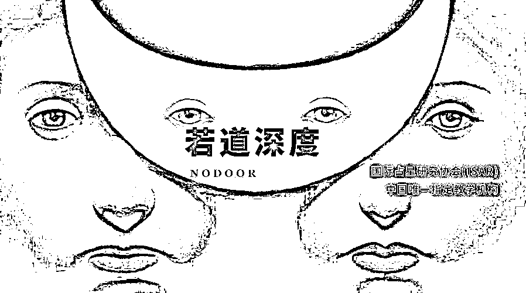作者/杨浠 Vera ISAR 认证占星师
 编辑/Tang 图片/网络近日微博热搜频频爆出令人难以接受的消息。网红博主“宇芽 YUYAMIKA”被前男友“沱沱的风魔教”殴打至无法起身，艺人蒋劲夫再次被爆出家暴女友……根据联合国统计全球有三分之一的女性都遭受过身体或性暴力，大部分的施暴者是她们的亲密伴侣。在中国，每 7.4 秒就有 1 位女性遭丈夫殴打。还有多少女性在亲密关系中遭受暴力，无人知晓。施暴者为何要对伴侣拳脚交加？有些受虐者为什么屡次被打后，仍不愿意离开？要如何才能够离开家暴的泥沼？本文作者想要从占星学和心理学的角度和大家聊聊。心理学的一个核心理念，是告诉我们一切都要向内去看，因为**所有的答案都在内在，不在外界**。所以当人们都去把家暴的剑指向外在的施暴者时，另一面也许是更加确认了受虐者的身份认同——她会认为自己就是那任人宰割的可怜羔羊，而现在终于因为有人看到这个真相，坏人才得以绳之以法。**这样的认同剥夺了受虐者向内去探寻根源，以及根除“病根”的机会，因为当她认同自己是一个弱者时，一切就在此处画上了句号。 **在荣格心理学中，有两个原型概念——“阿尼玛”和“阿尼姆斯”，阿尼玛是指男性内在的女性形象，而阿尼姆斯则是女性内在的男性形象。**一个女性会吸引来的男性，必然与其内在的阿尼姆斯特征相符。所以从另一个层面施虐者与受虐者其实是一体的两面，就像硬币的两个面向。而会吸引来暴力男性的女性，她的内在也一定有一个侵略性的男性形象。**

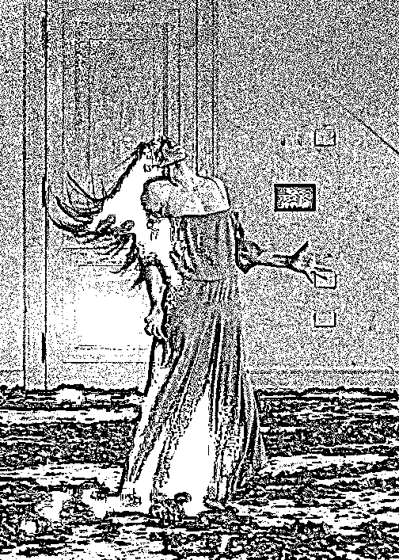

| 皮娜.鲍什 1977 年《蓝胡子》舞蹈节选 Pina Bausch "Barbe Bleue" (1977) **占星象征**从占星学出生星图的角度，**暴虐的侵略者必然与地狱的守护者——冥王星相关**，而阳性能量则是由太阳与火星来象征。所以**会吸引来有暴力倾向男性的女性，星图中极有可能有着太阳/火星与冥王星的合相或挑战相位。因为太阳和火星象征着我们内在的阳性法则，以及我们在外在世界中遇到的男性。** **冥王星象征着禁忌与最深的创伤，它是无意识的地府，是肮脏恶臭的阴沟，是我们唯恐避之不及的领域。但如果一直不去看它，它就会在暗中破坏我们生命的根基，直到毒素蔓延至可见的生活。**有着冥王星与太阳/火星挑战相位的女性，很可能在早年经历过与父亲（或其他男性）相关的创伤，而这个创伤中，最核心的情绪和感受，是羞耻感。但是，会造成这种感受的外在事件却可能有很多种，其中包括真实地被施以暴行、遭遇语言上的羞辱和伤害、被拒绝和否定，甚至被忽视等等，都可能会让一个年幼的女孩感受到被侮辱和不被珍视。**识别出这个冥王星式的伤害模式，有一个关键点，就是你会在内心深处渴望报复，渴望有一天你将以同样、甚至加倍的伤害去反击回去**。如果你被以上描述的心理过程所触动，很可能你就需要去对自己内在的“消极阿尼姆斯”做一些深度的心理工作。 **心理根源**这样的“内在男性”会以外在可见的方式出现在你的生活中，**你需要做的第一步，就是认出他。通常来说，带有暴力和控制倾向的男性，他们的内在都是极端软弱和无力的**。好比在蒋劲夫的家暴事件中，他的女友写到： 

  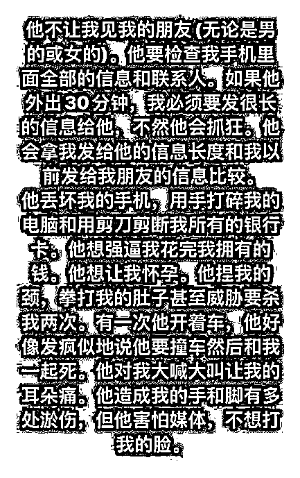

| 蒋劲夫女友在社交平台发文

这些描述清晰地展现出当事人是一个内心极度缺乏安全感的人，而安全感是由爱供给的，所以极度缺爱是他的核心根源（当然，几乎所有的心理问题都是由于没有得到应有的爱，但不同个体症状的形成脉络是不同的）。他们很可能在早年间，就处在需求无法得到满足的状态中，或者他的主要养育者通过控制和欺压等方式去和他建立情感联结。而依恋自己的照料者是人类的本能，因为婴儿必须要保持与照料者的身体和情感亲近才得以存活，所以婴儿往往会不顾一切地维系与依恋对象的亲密。就像是上图中描述的：“发疯似的撞车，要和我一起死”。 **对爱和依恋的需求是人类最正常的本能，但当这种本能的需求在早年间不被满足，甚至遭到打压和扭曲时，正常的需求就会变成贪婪的欲望，让一个人在他自己看不到的地方，变成怪物和恶魔。那时，他就会像一个恶鬼，用恐怖的方式从别人那里获取畸形的爱和关注，以填补自己内在欲望的黑洞。 ****而两个人的相遇永远没有意外，因为在最深的地方，他们是同病相怜的。** 会遭遇暴力男性的女性，很可能在早年极度缺失来自父亲（男性）的爱，甚至在她试图去满足自己对父爱的需求时，换来的是被施以某种暴行（有些暴行不一定是以身体伤害的方式，语言、甚至态度、神情，都可以在一个孩子的心里留下伤口），之后她会在无意识中将爱与虐待关联，所以当一个暴力的男性用纠缠和可怕的方式表达“爱”时，正好契合了她对于爱的期待，而她不知道的是，自己原本对于爱的理解也许就是扭曲的。 就如同家暴主角的死缠烂打一样。

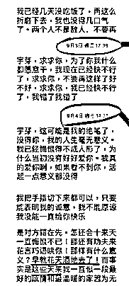
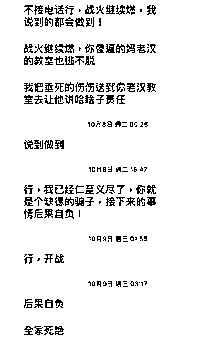

| 沱沱发信息死缠烂打，并威胁恐吓宇芽

**童话原型**

欧洲有一个非常著名的童话《蓝胡子》，也许很多人都很熟悉。 

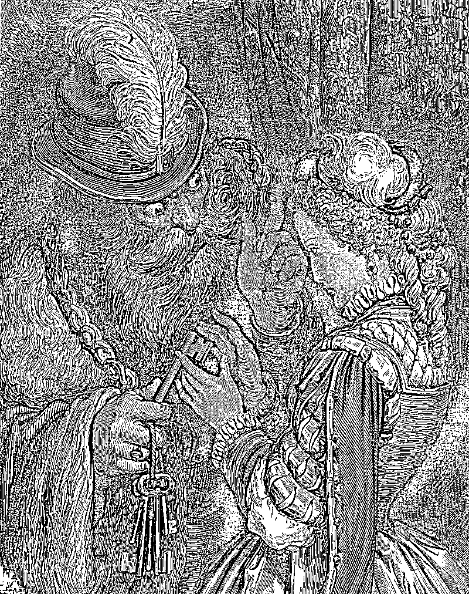

| 童话《蓝胡子》插图

**蓝胡子**

蓝胡子是一个有钱的地方贵族，但样貌奇特。由于他有着蓝色的胡子，所以大家叫他为蓝胡子。他娶过几个妻子，可是最终都下落不明。周围的人害怕了，不敢把女儿嫁给他。一天，他向一户家人的两个女儿求婚，两个女孩都吓坏了，不敢答应。但他最终说服到这家中的小女儿，让她一起去到自己的城堡，举办舞会，后来小女儿同意嫁给他。

不久，蓝胡子说他要离开这个国家一阵子，把所有的钥匙交给小女儿，告诉她可以随意打开并查看各个房间，但城堡下面最小的那个房间绝对不可打开。小女儿发誓自己绝不会那样做，蓝胡子就离开了。蓝胡子离开后，小女儿产生强烈的好奇心，欲望促使她去打开那个房间。来访的姐姐劝告她，但也无法阻止她。
她最终忍不住而打开了，房间打开后她才发现蓝胡子的秘密：房间里面吊挂着蓝胡子的前几任妻子，可怕的尸体血流满地。
她吓了一跳，不慎把钥匙掉到地上，沾到了鲜血，结果怎么样都洗不掉。她吓坏了，于是和姐姐商量想逃走，没想到蓝胡子提前回来了，发现钥匙上的血迹，明白了小女儿已经查看那个房间，立刻就想杀她。
她求他给一点时间祷告，蓝胡子同意了。小女儿与她的姐姐把自己锁在高塔上祷告，正在蓝胡子要破门而入之时，她的两个兄弟赶来城堡，杀死了蓝胡子。这个故事中的蓝胡子，就象征着现实世界中吸干女性生命力的暴虐男性，同时也是女性内在的消极阿尼姆斯。**这样的外在/内在男性，通常会贬低和否定女性的自我价值，让女性觉得自己不够好、不配得到，当处在这样的关系中时，女性通常会觉得自己没有得到应有的尊重，尊严被践踏，她的意志力无法正常运作——即病态的内在阳性面。****当你在一段关系中感到力量被剥夺时，就应该开始反思了**。因为这种消极的阿尼姆斯情结是一个由严重到轻度的连续谱，在最极端的情况下，会以家暴的方式呈现，实际上在这个连续谱的轻度级别区，已经会有很多征兆了，例如，你感到不对对方珍惜，甚至有一点“怕”他，哪怕只是怕他不高兴，或者怕他不喜欢你。 在克莱丽莎的《与狼同奔的女人》中，她将蓝胡子形容为“**入侵者**”：“**入侵者唯一的任务就是把所有的十字路口都变成封闭的道路。而在女性的梦里面反复出现的那样一种内容，叫做‘侵略性的当权者’，这样一个有侵略性的男性的形象，会切断女性与她的直觉本性……它让女性在感情上变得麻木，变得虚无，无法进入她的生活，让她的思想和她的愿望都会在她的脚下失去活力**。”

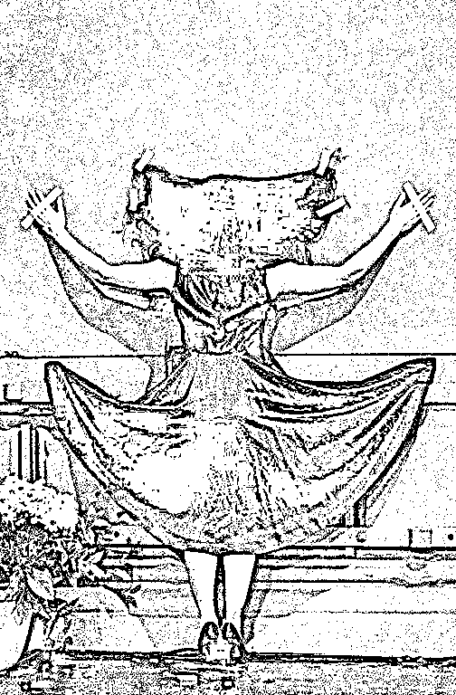

| 皮娜.鲍什 1977 年《蓝胡子》剧照 Pina Bausch "Barbe Bleue" (1977)

此外，你也可以反思一下，**自己内在的阳性能量是否健康**，自己是否在大部分的时间里都是不够积极主动的，不愿意面对冲突和争执、很少去确立自己的目标和计划，即便确立了也很难按计划完成，缺乏行动力，喜欢依赖他人和关系，边界感模糊，不够自律和守时等等……**这些特质都可能会造成低自尊和低价值感，因为当你无法行动的时候，就无法有所作为，也就很难获得真正的自我认可。**

 **不管是男性还是女性，健康的人格要求我们平衡自身内在的阴阳能量。**当一个女性无法以自己的双脚坚实地站立，或者无法为自己做主时，就代表其内在阳性面的虚弱，而这样虚弱的阿尼姆斯会自带暴力阴影，因为它需要补偿自身软弱的那一端。就像内心极度恐惧的人，才会渴望掌握权力和控制一样。

**艺术表达**《蓝胡子》的童话曾经被多次搬上艺术舞台，其中世界级的舞蹈艺术家皮娜·鲍什就在 1977 年出演过其代表作《蓝胡子》，而非常巧合的是，在舞蹈《蓝胡子》中，有一段舞蹈动作，与最近爆发的家暴事件视频影像惊人地一致。 

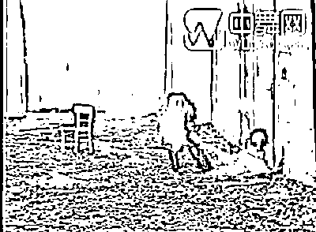

|  皮娜.鲍什 1977 年《蓝胡子》舞蹈节选 Pina Bausch "Barbe Bleue" (1977)

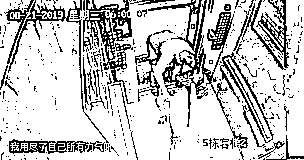

|  家暴事件主人公宇芽被沱沱在电梯中施暴此外，童话“蓝胡子”的历任妻子，也与现实中施暴者沱沱的婚姻经历及其相似。

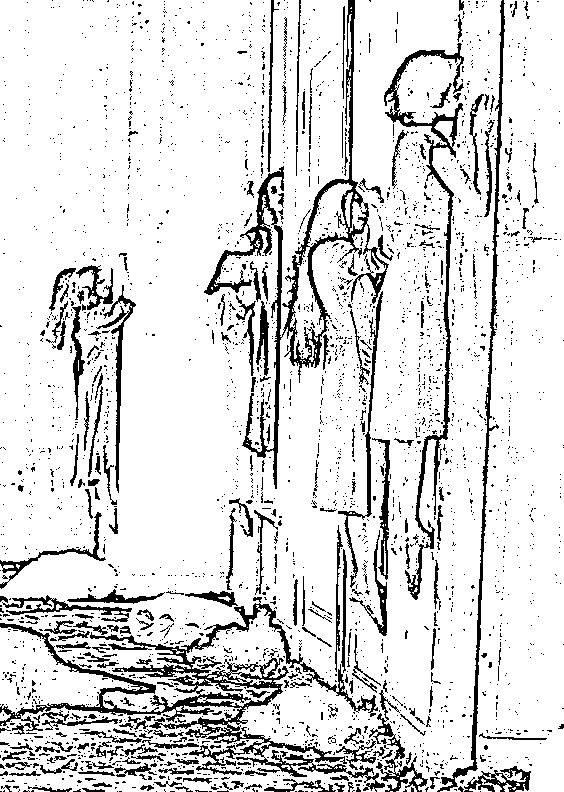

|  皮娜.鲍什 1977 年《蓝胡子》剧照 Pina Bausch "Barbe Bleue" (1977)

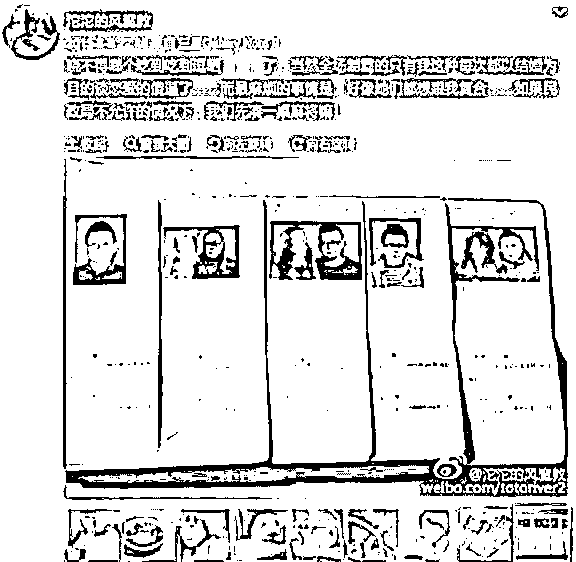

|  家暴事件主人公沱沱的微博在童话的结尾，小女儿的两个兄弟赶来杀死了蓝胡子，这**象征着女性内在阳性面的复苏和觉醒**。只有一个女人从自己内在生长出健康的阳性能量，才能确立自己的身份，构建自己的生活和保护自己，而不至于在现实中重蹈覆辙。 最终，她要知道，她可以成为自己的男人，自己的父亲。

📹 [`v.qq.com/iframe/preview.html?width=500&height=375&auto=0&vid=h30266ygm9h`](https://v.qq.com/iframe/preview.html?width=500&height=375&auto=0&vid=h30266ygm9h)

|  舞蹈《家暴》（法国）

**版权声明：**文章由作者授权发布于若道平台，欢迎转发，反对抄袭。


**杨浠 Vera**

ISAR 认证占星师（2017 年获得）

全职心理占星师，若道 COAC 高阶学员（2012 届）

咨询时长已达 400 小时

**占星咨询微信号：**haloace（请注名占星咨询）

**微信公众号：**verandu

长按打赏


**点击图片查看若道君推荐**


**微信又又又改版啦，不想错过若道的推送？**

**就把若道设为星标吧！**

**▼**


喜欢记得点一下“在看”哦☟

****************报名直达入口****************


# 深度 | 这个星座想要的，不过是“单纯小美好”

> 原文：[`mp.weixin.qq.com/s?__biz=MzA5NjA0NTAxNg==&mid=2651411945&idx=1&sn=6a74a4d7d15deb38d06a692ad4032ddd&chksm=8b4be75ebc3c6e4890b5034474c2894bd355bf26df5f0ad1c2fadae76f3de1d349a57de0471b&scene=126&sessionid=1692738247#rd`](http://mp.weixin.qq.com/s?__biz=MzA5NjA0NTAxNg==&mid=2651411945&idx=1&sn=6a74a4d7d15deb38d06a692ad4032ddd&chksm=8b4be75ebc3c6e4890b5034474c2894bd355bf26df5f0ad1c2fadae76f3de1d349a57de0471b&scene=126&sessionid=1692738247#rd)

******************************☆ **************后台****************************回复“今日”，给你一句生命态度****************

作者/达娜·格哈特 译者/空气 
 校对/江艺 编辑/Tang 
封面/书君 图片/unsplash 网络

黄道 12 星座对应了赫拉克勒斯的 12 个功课，当我们知晓其金牛座的功课，并尝试理解这一任务所传达的信息，可能非常容易找到金牛座的重要教义。现在，就让我们走进这个务实、稳重，而又感官至上的星座吧。

**赫拉克勒斯的金牛座功课**公元前 4000 年到公元前 1700 年，金牛座星群在春分升起。预示着春天重生的神圣的公牛和奶牛，遍布古代世界的神话中，它们的形象出现在寺庙和洞穴壁画中，珠宝上、碗和硬币上。我们的祖先遵从天上的星星。他们在大地上收集食物，从天神那里获得信息。他们的一个动作里蕴含了三种美德，将实际、自然和神秘结合在一起。今天，我们把这些分割开来，把自己的生活与机器的高效节奏同步。虽然我们既忙碌又迅速，但我们的街道上却充满了愤怒和悲伤。显然，在我们内心里仍然有着不满足，渴望将精神、大地和天空再次编织进我们的日常生活。**这种整体性是金牛座能给我们的礼物。**但我们该如何兑现呢？也许赫拉克勒斯能教我们怎么做。

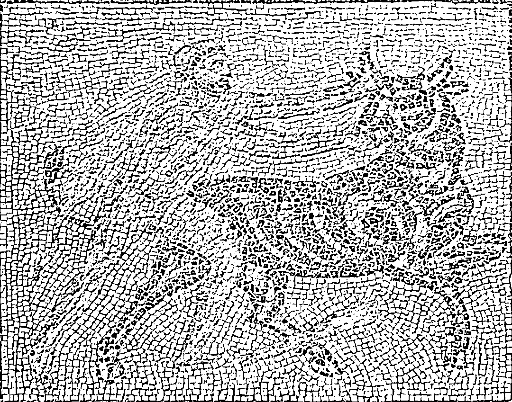

**作为他的金牛座任务，赫拉克勒斯必须抓住一头公牛。**海神波塞冬把克里特公牛变得疯狂起来，公牛从弥诺斯国王的牛群中挣脱出来，现在正在村庄四处大肆破坏。在欧律斯国王的命令下，赫拉克勒斯前往克里特岛，找到了这头漂亮的公牛，用绳子把它绑起来，骑回去献给了欧律斯。但欧律斯再次将它放回野外，它又再次四处肆虐，直到几年后公牛最终被忒修斯杀死。这是一个多奇怪的故事啊！通常赫拉克勒斯会到天涯海角去完成他的任务，一路上有人死，有时候灰心丧气。面对强大的敌人，他召唤超人的智慧和力量，寻找神奇的事物，重塑土地，与神搏斗。他的金牛座任务一点也不戏剧化，克里特岛就在附近，公牛很容易屈服，返程的过程也平安无事。一旦功绩完成，公牛就又会恢复之前的所作所为，直到另一个英雄来让这个故事完整。如果确实最初只有十个任务而不是十二个，古典文学家卡尔·凯雷尼认为这肯定是后来增加的，但调查这个故事的合法性并不是我们的目的。在将十二个任务与黄道星座相匹配的过程中，我们遵循了一个更新近的传统，这是从爱丽丝·贝莉那里得到的启示，她是帮助塑造我们今天的占星实践方式的几个神学家之一。所以我们会采用贝莉的架构，并尝试理解这一任务所传达的信息，可能帮助我们非常容易地找到金牛座的一个重要教义。

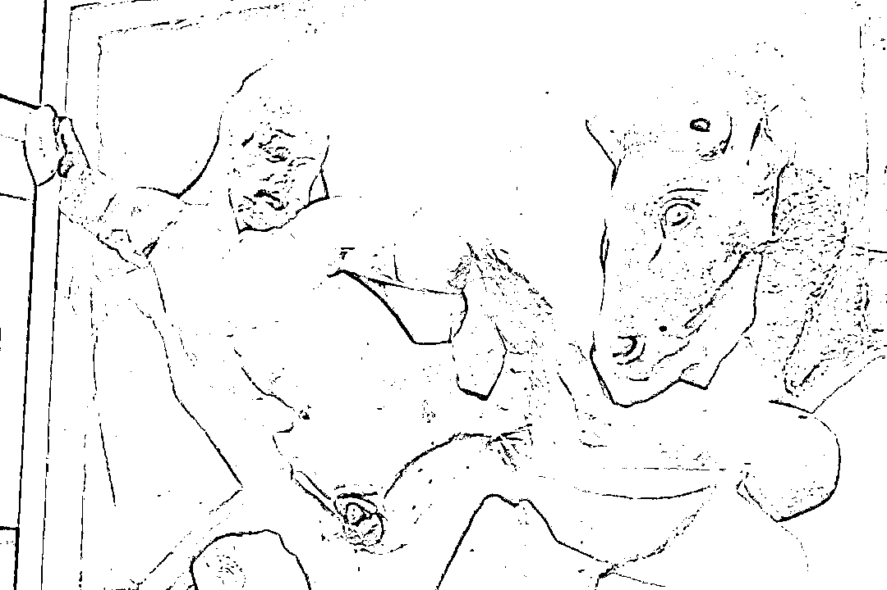

**虽然情节平淡，但赫拉克勒斯在这个神话中的确表现惊人，因为他没有遇到任何困难！现实生活从来不会这么容易，但也许这正是金牛座的目标。**赫拉克勒斯毫不拖延地找到了他的目标，毫不费力地制服了野兽，并非常耐心地把它骑回家。我们喜欢英雄去冲锋陷阵，挥舞棍棒，控制他们的对手，但这些都是阳性的价值观，**金牛座是阴性的星座，它的目标是简单、安全与平和，它的美德包括感受和接纳**。赫拉克勒斯遵从他的任务，跟随迹象找到了这只动物的位置，感知这只野兽的性情，在制服了它的疯狂之后，温柔地引导它前行。甚至当国王说“把牛放走”，让他的劳动变成白费力气时，赫拉克勒斯都没有抗议。他只是退到一边，让命运和另一个英雄来接管。**对于他的金牛座任务，赫拉克勒斯重新阐释了什么是英雄，在其中加入了更多的女性价值观。**许多现代人丧失了与土地和天空的联系，同时也与神圣的母性力量脱节。正如著名占星师罗伯特·汉德所言，**我们的文化倾向于尊崇积极的男性力量，贬低被动的女性能力，没有充分了解其角色以及金牛座的角色——作为创造性显化的母体**。**金牛座是允许能量在物质层面显现的容器，它将白羊座的创造性火花变得有形。它的行为是女性化的：它服从而不是征服，它宁愿选择归属而不是战斗，它偏爱抚育而不是毁灭，它与更大的整体相协调。**必要时，它也可以是凶猛和具有保护性的，正如女性神灵可以愤怒和生气一样，金牛座的公牛也可以鼻喷白气，跺脚掘地和冲锋来保护它的和平。公牛当然是阳刚的，但我们不要忘记金牛座的公牛是由金星掌管的，所以它听从女性的命令。

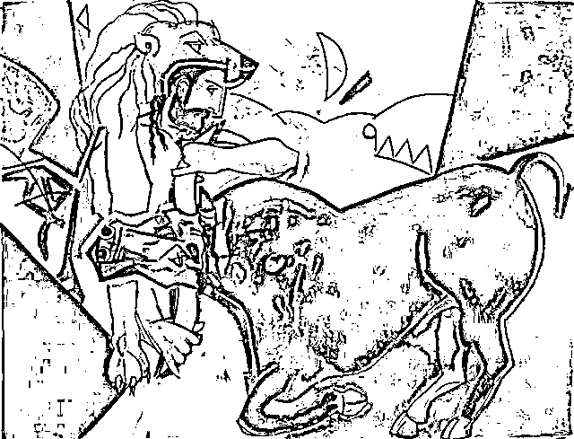

**黄道十二星座的每一个都修正了前一个星座的过度特质，金牛座也不例外**。罗伯特·汉德写道：“**金牛座几乎是白羊座所有缺点的解药**。”白羊座的能量是主动的、勇敢的，也是易激动的、不稳定和分散的；它是炽热的、严酷的，正如园丁所知，月亮在白羊座是贫瘠的。而与之正相反，金牛座是凉爽、柔软、肥沃的；它稳定、持久，可以把精力集中用于生长。没有白羊座就没有种子，而没有金牛座就没有花园。**金牛座在物质世界里是最自在的。所以也许进入这个星座最合适的方式是通过身体感官。**想象你是赫拉克勒斯，触碰一下克里特公牛的侧腹。你能通过真实的感官体会到金牛座的关键词么？去感受公牛的稳重，忠诚和耐心，它的享受和吃草的愉悦。也许你也能感觉到一种脾气，那种冲锋或掘地的能力。视情况而定，你可能会感觉到一种明显的懒散的能量，沉迷习惯，慢悠悠，喜欢美丽，感恩自然界。想象一下爬上这头野兽，像赫拉克勒斯一样骑着它缓慢而坚定地朝着你的目标前进。在你金牛座所落宫位的情境中，你能想象如何像这样骑这头牛么？如果金牛座落第 11 宫，是和你的朋友一起时。如果金牛座落第 6 宫，是在你的日常工作场所。如果金牛座掌管你的第 7 宫，是和你的伴侣一起时。公牛缓慢的步伐和沉迷感官享受的感觉在这里让你感觉舒服还是烦恼？你在这个宫位是感觉自如——就像费迪南德（《公牛历险记》的主角）在甜蜜的牧场上嚼着小花一样？或者你觉得自己像是一头瓷器店里的公牛，你的角正把盘子从架子上撞下来？公牛是金牛座的一个很有用的比喻，可是今天我们很少有人身边有真正的公牛。即便如此，还是**有很多机会去感知和接触这个星座的**。

*   让你自己**来到金牛座的环境里**：进入郁郁葱葱的花园、美术馆、银行和股票经纪公司，在树周围、地毯上、地窖里，被你的财产包围，在铜或母牛附近。感知是什么无形力量使这些地方和物体变为有形的存在，让这个领域渗透你。

*   只要有可能，**用心触摸金牛座的物品**：戒指、地板、宝石、支票簿、乐器、百合花、你的钱包、苔藓。

*   **练习去听金牛座的声音**：歌曲里的合唱，收银机的响声，一头呼噜呼噜的猪。

*   **关注金牛座掌管的身体部位**：你的颅底，你的下牙、下唇、下巴、下颌骨、耳朵和喉咙。静谧地，与你的声音的源泉相连结。

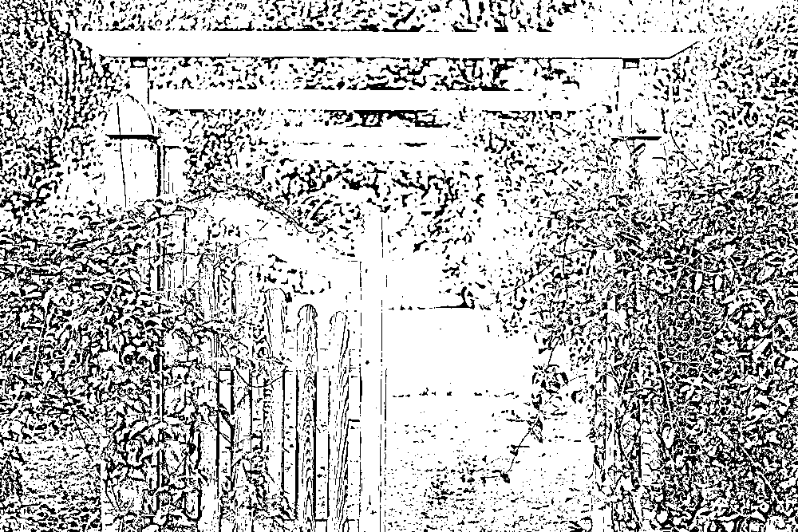

行星落入金牛座的感受是怎样的？想象一下水星、土星或金星遇到这个固定、土象、接纳性的星座。想象一下落在这个星座中的每一个原型。也许会感觉像嵌入树干中，像树一样一动不动，你的手臂被太阳温暖，你的叶子被风抚摸，天空向你的树枝敞开怀抱。你被像锚一样固定不动，你可以容纳许许多多蚂蚁、鸟、蜘蛛和松鼠。永远定在一个地方是怎样一种感觉？移动迅速的水星会喜欢这样吗？喜欢享乐的金星会怎么样？你吃什么？感觉你的根深深地扎入大地，从这个黑暗的、永恒的仓库中汲取营养。想象一下，如果你被攻击，如果你的树皮被雕刻或剥落，如果你的树枝被伐木者砍断或被暴风雨蹂躏，如果你的树干被闪电劈裂，你的反应是什么？在金牛座的土星会有什么反应？**用这种方式来感知金牛座，也许能帮助我们更好地理解为什么那些拥有金牛座特质的人有时会如此固定，抗拒变化，不断地索取，沉溺，抓紧不放。这也很容易理解为什么滋养、敏感的月亮在金牛座曜升，为什么渴望行动的火星在这个星座上是弱陷的。****金牛座渴望安全**。它的**稳定性**和**忠诚度**可以加深我们在地球上生活的乐趣。它的重量可以让我们**慢下来**，以便可以凝望天空，聆听风，或读取云朵中的信息。**金牛座也很实际**，鼓励我们有条理地关注任何任务。虽然我没有行星落入金牛座，但它落入第 9 宫，给我的信仰带来了坚定稳固的特征。我的太阳在射手座，也许还有我出生在加利福尼亚的原因，我特别能接受最新的想法和模式。但是每一个新发现都必须通过我第 9 宫金牛座的现实测试。如果我不能把这个新概念植入自己身体，不能真正感受到它的真实性，如果它不能像土壤滋养树木一样的滋养和支持我，那么我的兴趣就会消失。

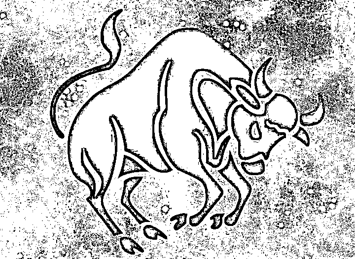

**与这头牛和解**

“你不是金牛座，对吧？”每当我在一个团体中，被人发现是个占星师时，关于喜欢和讨厌的星座的谈话常常就紧接着开始了。这通常更多是反映了人们对事物（特别是对其他人）的爱憎倾向，而对黄道十二星座的没有任何意义。

“我不喜欢金牛座。”那人重复了一遍。这句话里最奇怪的部分就是他自己了，他又矮又壮，有着强壮固执的下巴。他看上去结实质朴，是那种你不会去惹，却可以依靠的人。他话不多，说话的时候每个字都慢慢的，不慌不忙。

从他的分享得知，他一直都对朋友和家庭十分忠诚，但这带给他的不稳定让他十分恼怒。他为了让自己的家庭度过难关，卖了自己的资产，而且需要不断乘飞机往返于他的祖国秘鲁。在我们参加的工作坊休息期间，他大部分时间都待在原地，裹着外套，一动不动像块石头。如果让我“猜猜他的星座”，金牛座将是我的首选。

“我是射手座”，他说。“我也是”，我回答道。我们看了看对方，立刻发现除了太阳星座外，我们没有任何共同点。我们转向别处继续这个对话，“我的母亲和姐夫是金牛座”，我无意中听到他说。我勉强可以把他远离家乡这点当作射手座的特质，可除此之外他的风格和目前的苦痛都是金牛座特质。

也许他的上升或者月亮星座是金牛座。也许我们会在另一个背景下认识到我们作为射手座的相似之处。**虽然我喜欢占星学，但我最不喜欢用星座给人分类。**我不喜欢它把我们分成黄道上的“访客”和“家庭”团队，或者把我们内部划分为各种性格特征的万花筒。不管我面前有没有那个人的星图，我都知道他迫切需要和金牛座建立新的关系。**星图包含了所有十二个星座，在某种程度上每一个星座都是我们的一部分。当行进行星周期以重叠的节奏经过在我们的星图时，每个星座都会有属于它自己的时刻。**

**“我拥有”是金牛座的关键词**。但在这个星座中，占有问题可能困扰我们。我不知道那个秘鲁人为什么不喜欢他金牛座的妈妈和姐夫，但内情可能是某人把获取的欲望引入了错误的方向，至少这是让克里特公牛陷入麻烦的原因。

在赫拉克勒斯降伏那头牛之前，国王弥诺斯渴望拥有它。弥诺斯是吸引力法则的早期实践者，喜欢吹嘘自己和神的特殊关系。他宣称自己可以实现任何愿望，为了证明这一点，他向海神波塞冬祈祷，请他从深海里派一头公牛，并承诺会立即将它祭祀回馈海神。波塞冬派来了一头最漂亮的牛，漂亮得让弥诺斯不忍心割舍。于是他把公牛藏在了自己牛群里，用其他公牛顶替做了祭品。这让波塞冬非常愤怒，他将公牛变得疯狂，然后让国王的妻子帕西法厄王后爱上了这头牛。

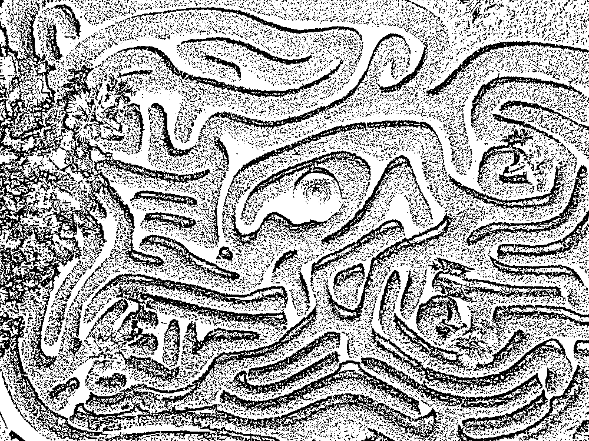

也有人说这里应该责怪的是维纳斯，帕西法厄和她的丈夫一样，长期以来忽略和缺乏对维纳斯的尊重和崇敬，所以这位女神诅咒她产生这种极不自然的欲望。无论是哪个神造成的，可怜的帕西法厄不断来到牛棚，富于暗示性地脱掉自己的长袍，但这都没有让公牛产生任何反应。最终她让天才手艺人代达罗斯造了一头木头母牛，自己藏在里面，才让公牛上了当，与她进行交媾。之后，帕西法厄生下了一个半人半牛的怪物。国王弥诺斯十分羞耻，命代达罗斯设计了一个精巧的迷宫把这个怪物藏了起来，并每年献祭七个少男少女来满足弥诺陶洛斯这个怪兽的胃口。这是一个有关金牛座的警示故事，毫不意外是有关财富和性的主题。金牛座本应热爱这个形式世界，但并不过分。让我们比较一下弥诺斯偷牛和赫拉克勒斯骑牛，赫拉克勒斯塑造了一个易于控制的动物典范，也象征了他自己的动物激情。他走的不紧不慢，就像我们在金牛座一样，**尊重自然的流动**。当我们这样做的时候，我们会优雅地行动。我们在适当的时间享受我们所拥有的，到了该放手的时候，我们放开神想要拿回的东西。但是弥诺斯国王违背了自然法则，抓住公牛不放。与其说是拥有，不如说他着了魔。他的欲望控制着他。很快，他就会被一个怪物困住。代达罗斯所代表的金牛座的创造力，在这个故事中被糟糕的目的扭曲，建造一头木牛和一个致命迷宫的。最近我拜访了一位上升巨蟹座，太阳、月亮都在金牛座的可爱的人。她自己一个人住，但无力处理家里的杂物。每个橱柜和壁橱里都塞满了家庭纪念品，她说爱人们坚持要她为他们保存。她是怎么失去说不的能力的？我想起另一个金牛座，他在一个自称让他生病的岗位上工作了多年。还有一个金牛座顽固而悲伤，拒绝原谅她的成年子女。**这些是现实生活中的金牛座为自己建造的木牛和迷宫，让自己走入违背天性的执迷之地，并将其合理化，就像迷宫中的道路一样耗尽心力，循环往复，久而久之就失去了生命力，就像被献祭的年轻人失去了他们的生命一样**。在这个神话中，聪明的忒修斯最终杀死了克里特公牛和弥诺陶洛斯。当然，他是一个双子座的英雄，**暗示金牛座的过度和固执是如何用被下一个星座的适应性、机智和轻松的美德所纠正**。

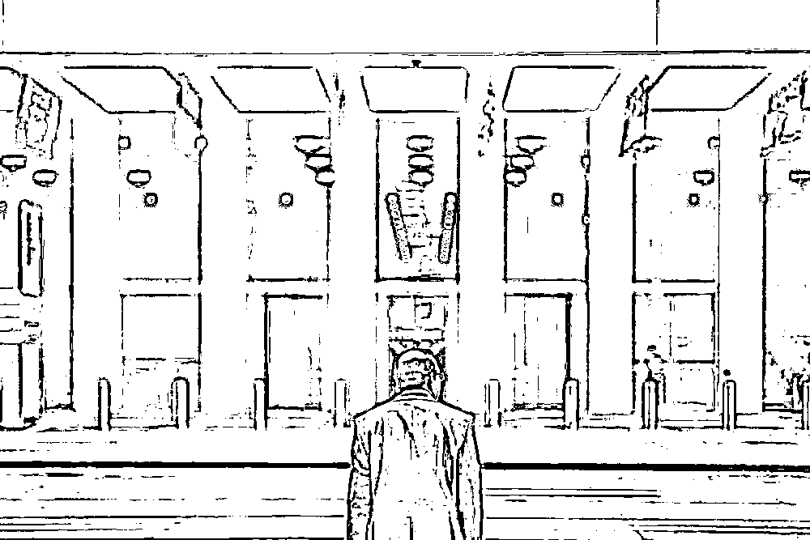

**不得不说的财富**

**金牛座很容易与金钱联系在一起**，其财富是占星学的陈词滥调了。但是**拥有金牛座的行星并不意味着会让一个人富有，甚至不会让他们擅于管理他们的资金**。我有两个朋友太阳落金牛座，一个有钱，但另一个却让钱从指尖划走。仔细看他们的星图，发现了下面的线索。有钱的那个朋友，太阳在第 8 宫，她获得财富的方式是通过第 8 宫的方式来实现的，即继承和投资。而另外一个朋友的太阳落入了日常工作的第 6 宫内，很显然她不得不为了工资而工作（低工资）。

但是停留在这里就错过了更深的一点。想想占星师芭芭拉·沃特斯关于土像星座和财务管理说过什么：“通过我多年与客户工作的实际经验......不断地告诉土象星座的人他们是务实的，他们对金钱的价值观是合理的，这根本行不通。首先，他们知道情况并非如此，而我总是遵循书本上的规则，向他们建议那些以金钱为导向的实际工作，往往对他们没有吸引力。”

“很多画家和雕塑家都有着强烈的金牛座元素，他们根本不以金钱为导向。我认为**物质主义的标签源自金牛座对有形事物和身体的关注**……**所有固定星座主要作为组织者来发挥作用**。狮子座组织力量，天蝎座组织知识，水瓶座组织社会，**金牛座组织个人或地球的物质资源**……**金牛座喜欢组织地球上物质资产的过程，不管这是否会使他富有**。”

这可以描述我那两个金牛座朋友：一个钻研她的股票投资组合，另一个整理她心爱的书、珠子、颜料、羽毛和纺织品。**我们的金牛座组织哪些资源是我们的选择，可能是钱、性、艺术或者别的什么。但我们的选择和方式决定了我们金牛座的体验。**愿我们怀着对赫拉克勒斯的坚定和尊敬来做选择，而不要像贪婪的弥诺斯或他忽视女神的妻子。我们满怀崇敬，知道我们在金牛座所接触和拥有的是神圣的。让我们感激我们所得到的，让我们小心创造，让我们永远做这里的爱人。

**版权声明：**本文由若道翻译发布，欢迎转发，反对抄袭。


**也许你还想看下面的文章** 

[天秤座](https://mp.weixin.qq.com/s?__biz=MzA5NjA0NTAxNg==&mid=2651410544&idx=1&sn=45b51d84210a84c8103c140df5a28229&chksm=8b4be2c7bc3c6bd1c86b8ffd8d8722efe3cfa1fc4b71e2cc8f71230218b8c73a7119d8a22745&token=1399143765&lang=zh_CN&scene=21#wechat_redirect) | [射手座](http://mp.weixin.qq.com/s?__biz=MzA5NjA0NTAxNg==&mid=2651411022&idx=1&sn=adf59f6eb38f2fd19ca975b4287168ea&chksm=8b4be0f9bc3c69ef250cafb4d517694bb952529461017c53da4d7ca120ed4ec0004161eccdb0&scene=21#wechat_redirect) | [水瓶座](https://mp.weixin.qq.com/s?__biz=MzA5NjA0NTAxNg==&mid=2651411498&idx=1&sn=25b8051c9c778065f9fffa37628c9950&chksm=8b4be69dbc3c6f8b94ee79ae682233634bcd0f32e8dce890672ea1bb4e5241a34cb59ebb3045&token=1771457470&lang=zh_CN&scene=21#wechat_redirect)

**达纳·格哈特**一位国际范围内受尊敬的占星师。她为众多占星学网站和出版物讲课、写稿。她在十二宫的月亮激励她对这颗发光体进行了深刻而持久的探索研究。

**点击图片查看若道君推荐**


**微信又双叒叕改版啦，不想错过若道君的推送？**

**就把若道设为星标吧！**

**▼**


就是这个“在看”，戳戳戳 ☟

********报名直达入口********


# 核心课程 L5 | 多种预测技法，助你成为职业占星师（插班中）

> 原文：[`mp.weixin.qq.com/s?__biz=MzA5NjA0NTAxNg==&mid=2651411945&idx=2&sn=843362cfcd8c944d0f0983a6cad1326b&chksm=8b4be75ebc3c6e48cf558d4e0390f6bdf0bc826ae1ccbe74a25ffeac7e9ef87549bdfa6e896a&scene=126&sessionid=1692738247#rd`](http://mp.weixin.qq.com/s?__biz=MzA5NjA0NTAxNg==&mid=2651411945&idx=2&sn=843362cfcd8c944d0f0983a6cad1326b&chksm=8b4be75ebc3c6e48cf558d4e0390f6bdf0bc826ae1ccbe74a25ffeac7e9ef87549bdfa6e896a&scene=126&sessionid=1692738247#rd)


占星学不只是一门技术。占星学不只是一门知识。 占星学是**有****觉察****地活着，活在对过去、现在、未来的觉知、了悟和行动之中**。 我们强调学员的自我觉察，和如何活出占星学智慧，而非仅仅告知他人自己所知道的占星学。 占星学最终是**为了个人的人生服务**。 只有经过了深入的自我探索和个人疗愈旅途的占星学学生，才可能进一步成为好的占星师。 只有被活出的占星学技术，才对你和他人有意义。 你最终要去活你所学的占星学。你选择什么样的占星学意味着你怎么活着。 **寻找那些“实践其所知占星学”（Live their astrology)的占星师带领你走这条道路，而非谈其所知的占星师。**

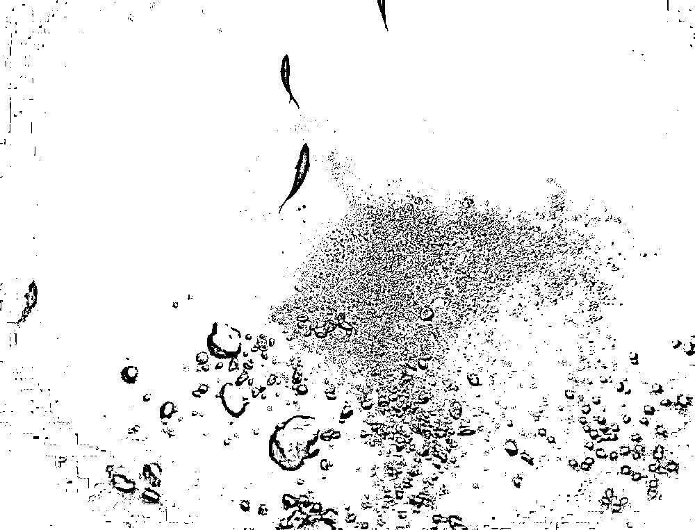

**课程内容****第五阶 历史、预测和咨询技巧** 15 次线上直播网络课程，每次 2 小时，课堂中依旧会使用同学们的星图作案例**两场北京现场工作坊：2 天职业占星工作坊和 3 天咨询技巧工作坊**

**课程安排** 

占星学的进化历史

预测的历史和原理：预测的原理——有哪些可能和不可能，以及原因

预测的核心：出生图

预测技术：行进 
太阳的行进、月亮的行进、水星的行进、金星的行进、火星的行进、木星的行进、土星的行进、天王星的行进、海王星的行进、冥王星的行进

预测技术：行星逆行、日月食

预测技术：月相、行星周期

预测技术：二次限

预测技术：太阳弧

预测技术：返照

咨询技巧：常见咨询问题初探

咨询技巧：聆听、述意、提问的技巧

咨询技巧：确定咨询范围和厘清问题

咨询技巧：模式识别和洞察过往经历意义

咨询技巧：情绪识别

咨询技巧：核心信念识别咨询技巧：客户周期识别咨询技巧：寻找星图资源，提供希望和方向 ISAR 能力考试词汇表和大纲

**工作坊：（北京现场）**

**2 天北京占星学与职业工作坊** **2020 年 4 月**

**3 天咨询技巧工作坊 2020 年 5 月**

**导师介绍**


**蒋颖（Felicia）**

*   ISAR 中国副主席（ISAR 为国际占星研究协会缩写，在各国只设副主席），若道创始人。 

*   厦门大学化学系硕士，经济学学士，人民大学中美经济学培训项目福特班学员，长江商学院 MBA。 

*   曾为国内最早从事金融并购业务的机构合伙人。 

*   国内第一位被邀请在国际占星学会议上正式就西方占星学发表演讲的演讲人。第一批通过 ISAR 认证的职业占星师。ISAR 职业占星师资质认证培训师和中国考区考试负责人。 

*   跟随大卫·瑞雷、杰夫·焦耳、斯蒂芬·弗里斯特、苏·汤普金斯、格伦·佩里、诺·泰尔、罗伯特·汉德、雷蒙德·梅里曼、琳恩·贝尔等国际占星大师系统学习占星学，广泛涉猎人本主义心理占星、进化占星、原型占星、医疗占星、金融占星、卜卦占星、企业占星等多个占星学流派分支。 

*   曾接受萨提亚家庭治疗、本性治疗、Hakomi 治疗等心理学培训。接受进化教练培训。


**大卫·瑞雷（David Railey）**

*   ISAR 全球副主席，ISAR 考试委员会主席，若道创始人。 

*   被称为占星界的“马可·波罗”，第一位将西方严肃占星学系统教学和多位西方占星学大师引入中国的西方占星师。 

*   第一位在美国用电视和广播媒体推广严肃占星学的职业占星师。 

*   培养最多中国职业占星师的老师。 

*   《灵魂的目标》、《一生的旅程》作者。 

*   研究占星四十余年，拥有三十多年的占星咨询的执业经验，其服务客户包括学生、工人、市长、州长、议会议员、企业家、心理咨询师、工程师、艺术家、演员、知名企业家等，客户年龄跨度从襁褓婴儿到耄耋老人（大卫老师的老客户常常是一家三代人）。2010 年 6 月，大卫的书《灵魂的目标》中文版出版。在 2011 年春季的北京之行期间，大卫接受了《南方周末》记者的采访，同时参与了 CCTV9 的纪录片的拍摄。


**为什么选择若道学习占星学？****如果你相信自由意志的重要，愿意与命运共舞** 若道是人本主义占星学的旗手。因为我们相信，人通过了解模式、觉察习性、积极疗愈、终将释放其潜能，与命运共舞。**如果你想要充分国际化的眼光和见多识广** 占星界的“联合国”ISAR（国际占星研究协会），是具有全世界影响力的占星教学和研究组织和职业占星师全球认证机构，认证占星师遍布 45 个国家。在 ISAR 的 13 所附属学校中，大中华地区的附属学校只有若道一家。在国际化的教学理念大纲标准下，若道毕业生在 ISAR 国际认证占星师的考试通过率多次全球第一。**如果你相信教学需要经验和支持服务** 在中国确立西方占星学的标准，引入世界顶级的占星大师进行教学，传播人本主义的占星学智慧，若道已经做了七年。学好占星学不仅仅需要延请一、两个老师，而是需要对教学难点有充分了解，且有持续的教学跟进服务。若道在 7 年的多次核心课程教学中，有多年国外老师和中国老师、助教的配合、课程顾问配合教学的经验，对于教学知识点和中国学生的疑问有很多积累。仅在若道论坛，就有近千个学生问题的答疑解惑和作业的批改。

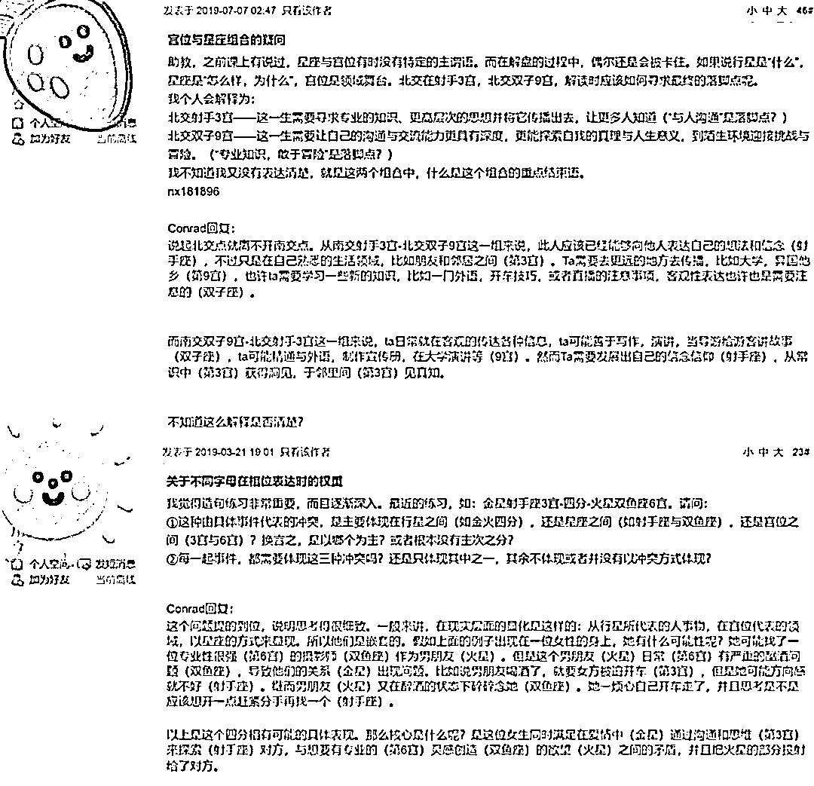

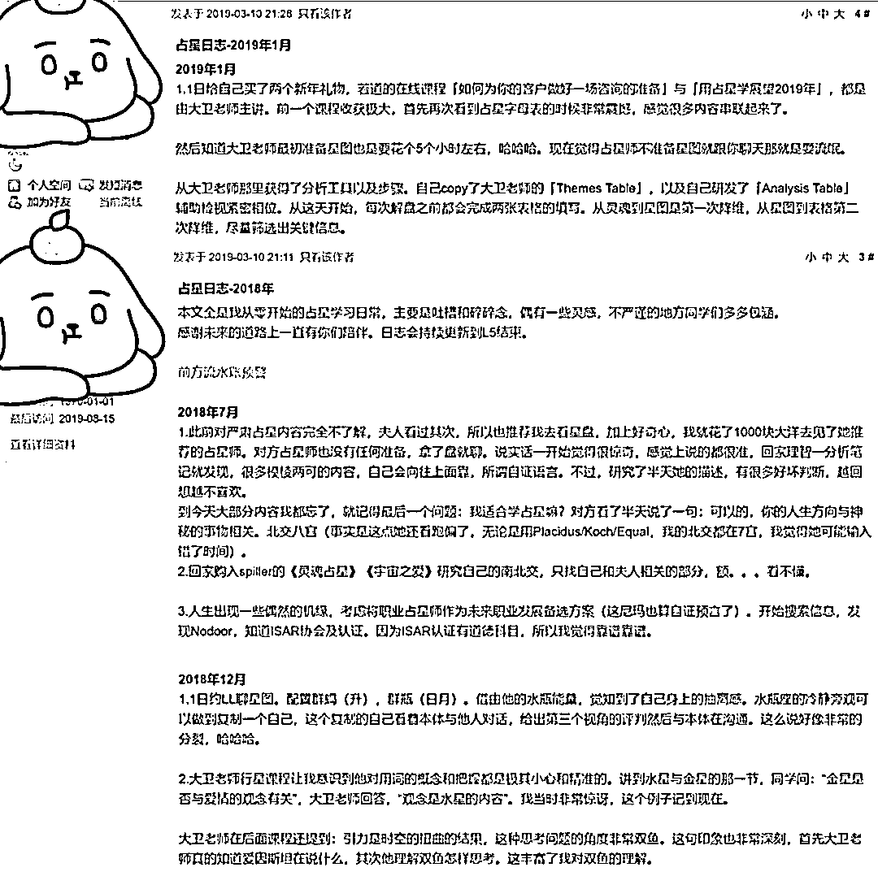

**如果你相信“联结和部落”**

若道为中国职业占星师的“黄埔军校”。职业占星师的培养从若道开始，进入若道，你就走近了中国最顶尖职业占星师群体，和一群志同道合的师兄师姐联谊，获得经验，共同成长。**如果你需要职业规划和支持** 若道为占星学生配备实习平台和咨询平台，并有着严肃占星学影响力最大的媒体平台，全力为其毕业生提供宣传渠道。若道还为学员准备学习 APP 供学员使用。在 7 年的占星教学耕耘后，本次两位创始人人大卫和蒋颖首次“联手”开设占星核心课程。一个是身在中国本土最有影响力的西方占星师，一个是在西方占星学界最有影响力的中国人。从若道开始，你全新的职业占星之路。


**学过的人怎么说？**


**课程费用****原价**：21000 元
**优惠价：20000 元**转发课宣，截图给客服即可享受优惠价。具体请长按下方二维码添加课程顾问小姐姐咨询哦。

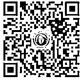

**授课时间****上课时间：****2019 年 11 月 12 日开课，每周二晚上 20:00-22:00****插班中****授课方式****如何听课？**我们使用先进的网络教学平台，支持手机、电脑、iPad 上网，可以随时随地学习。教室平台登陆方式课前请留意查看客服推送的登陆提示。英语授课部分，实时翻译。**错过直播课程怎么办？**直播课程结束后 24 小时内课程回放将发布至个人中心；学员可登录网站收看课程回放，在线复习课程，每次课可完整重看 3 次，课程回放在每阶课程结束后的 3 个月内有效。**退转课程**

*   **退款原则请详看《教学协议》，如有疑问请咨询课程顾问。**


****若道核心课程 Level 5****

**授课老师：蒋颖、大卫·瑞雷**

**授课时间：**2019 年 11 月 12 日开课

**授课方式：**线上直播网络课程及两场北京现场工作坊，中英文授课，英文部分配备中文翻译

**费用：**21000 元；**优惠价：20000 元。转发课宣，截图给客服即可享受优惠价。具体请长按下方二维码添加课程顾问咨询。**

**课程负责人：施老师**（微信：nodoor233，手机：18515059056，请备注“核心课咨询”）

长按二维码添加课程负责人咨询~


****报名请点击“阅读原文”****


# 解密冥王星（上） | 你所恐惧的，正在暗中操控你的人生

> 原文：[`mp.weixin.qq.com/s?__biz=MzA5NjA0NTAxNg==&mid=2651411924&idx=1&sn=d9a10f7f763dbb80a857ca94e2a67830&chksm=8b4be763bc3c6e759456fd2dd4dc92e87ea3b3b2507a5be70072d2c6339b895af34e04c1f7d6&scene=126&sessionid=1692738247#rd`](http://mp.weixin.qq.com/s?__biz=MzA5NjA0NTAxNg==&mid=2651411924&idx=1&sn=d9a10f7f763dbb80a857ca94e2a67830&chksm=8b4be763bc3c6e759456fd2dd4dc92e87ea3b3b2507a5be70072d2c6339b895af34e04c1f7d6&scene=126&sessionid=1692738247#rd)

****后台回复“今日”，给你一句生命态度****

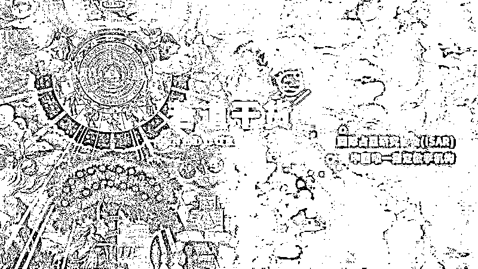作者/蓝女巫 编辑/佳黛头图制图/书君 图片/网络**引语**

你在恐惧什么？

每一个冥王星落点，都有一种特定的恐惧...……

 你在恐惧什么？恐惧不安全。因何而不安全？害怕失去，怕被夺走所拥有的。你拥有着什么？拥有着熟悉。熟悉的感觉，即是安全的感觉，就像脚下的大地。本能地害怕被抽地毯般失控而跌倒的感觉，有如害怕死亡。失去正代表这种瓦解。那你的大地由什么组成？由自我身份认同吧。你的身份认同取决于什么？取决于所拥有的，诸多外物......多少才能让你感到安全？每当拥有了，就又想要更多。似乎永远都无法绝对安全和满足。仿佛越多越安全，实际却感到越多越匮乏。The best is yet to come......

所以，当你把身份认同投射到外物，你便注定要失去。这就是失去的原因。因外在的一切，都是有限的，都属于分离的欲望，有悖于回归的欲望。回归哪里？回归自身，回归本源。那里是无限的。自身就是本源的一部分，如浪花之于大海。

既然终要回归，为何还要分离？既然终将失去，为何还要拥有？既然终将死亡，为何还要诞生？ 

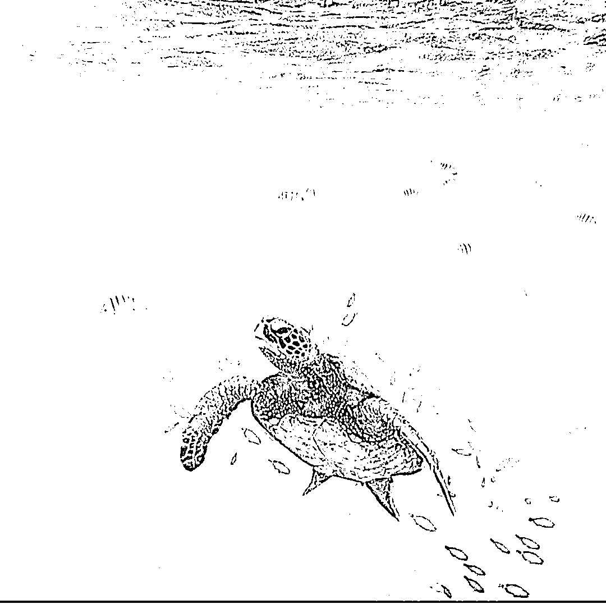

因为灵魂需要成长和进化吧......1：看山是山；2：看山不是山；3：看山还是山。这 1 与 3 之间的不同，解释了一切。又或许，唯有经历厌倦，你才会真正地停下？而当失去了外在的一切后，你还剩下什么？剩下的就是人生最后一秒时，你仍将拥有的东西。你自己的本质，一个又进化过一世的灵魂。

**存在的意义**生存还是毁灭？一个哈姆雷特式的哲学问题。作为最根本的哲学问题。存在还是虚无？一个冥王星式的进化问题。作为进化占星的最后底线。 存在的意义，这才是冥王星的根本问题。冥王星的碎片化论述，我们已听过很多了。而本篇我则是致力将冥王星所有零散漂浮着的关键词，穿成一个完整的灵魂故事……人生好像在沙漠中跋涉，无论你多么努力地去留下脚印，创造意义。然而，身后的风沙却顷刻就无情地抚平了这一切。多么荒谬？

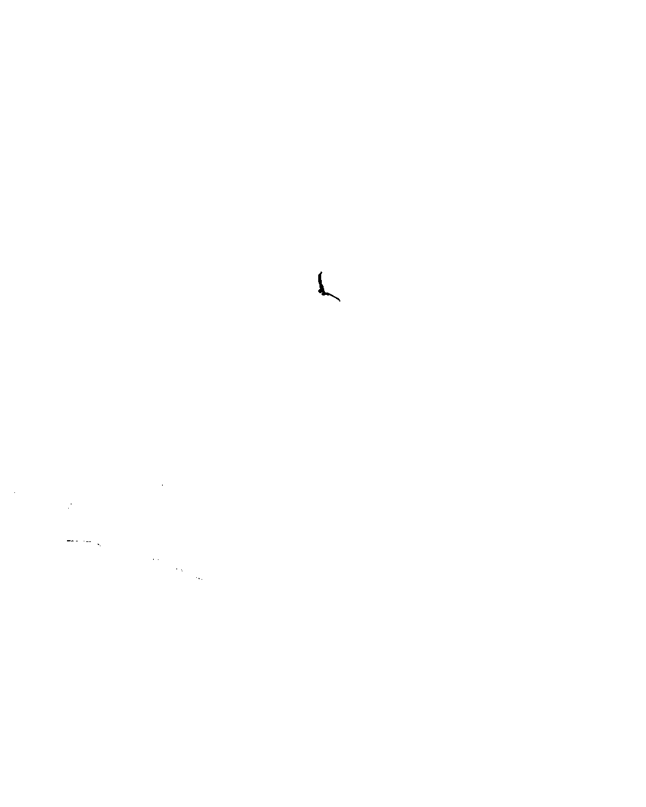

**生命之轻**

**精神漫游者，眼望着远方：人生究竟有没有意义？倘若没有意义，那又为何要活下去？**

人类尝试以“伟大的进军”向对岸喊话，世界却报之以难以置信的沉寂。这死一般的沉寂，令人类不禁焦虑起来……可就算你挥舞拳头，威胁对岸的沉寂，回答你的将还是沉寂。这注定了世界永无法被理解。寄望世界有意义、有目的，人类只是一厢情愿。也许，**生活本身就是目的，而非实现目的的途径。何必那么依附于外部的有意义？我们只有此时此地。**

尼采说：“**人类之伟大处，正在于它是一座桥而不是一个目的**。”人类之可爱处，正在它是一个过程与一个没落。进化占星，立足轮回，给了你一个意义的选项。比如，当你将目光投向北交点时……

**生命之重**

**普遍沉沦者，埋首于日常：人生究竟值不值得？生活为何如此艰难，且一直如此？**

即使无暇去思考人生意义者，同样也总会在生活的转角遇见“荒诞”，任世界之脱缰时时打断你所有想当然的连贯，直到它的无情让你痛不欲生时，才开始对天发问，去审视自己的生命之于这个陌生的世界。其实，**矛盾才是真相？痛苦恰是命运？**

叔本华说：“**痛苦恰似生命之船的压舱物，令其能保持平稳地照直行驶**。”人被痛苦的重量牢牢地压在地面，也才能时刻感受到肉体之真实和脚下的大地。而进化占星学语境中的冥王星，刚好就在述说着这个问题……

Steven Forrest 也说：“**冥王星，它是所有这些问题的答案。面对冥王星就是去面对生命本质的无意义。**”Futility？它将一种空虚的宿命感刺进意识。我们如何能够吸收这关于一切都转瞬即逝的认知而不毁灭自己呢？只能通过一个存在的根本转变。只是生存是不够的。只是活着什么都不是。我们死去时，一会就被遗忘了。在绝望地逃离荒诞的旅程中，我们只有一条路：**我们必须在永恒中留下自己的印记。我们必须跟更大的东西，一个永恒的东西认同**。否则，冥王星会强迫我们看到自己存在的终极的无意义性。没有任何事情是重要的。

“**土星负责划分主观意识的边界；天王星代表个人无意识领域；海王星代表集体无意识领域；冥王星则代表灵魂本身。冥王星是原始的推手，主要的演化原因，也是最后的底线**。”关于在进化占星中冥王星的座次，Jeff Green 如是说。 既然，冥王星就是灵魂本身。那么，灵魂本身又是什么？是关于生命背后那股意志？还是关于欲望？关于生命力？

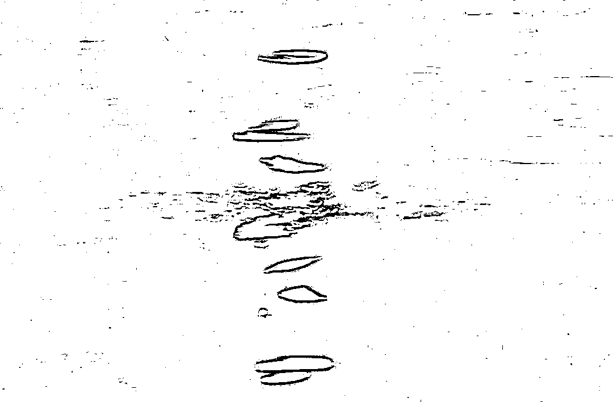

**意志力**

人掌控不了自己，更主宰不了世界，却总是被各种冲突的力量卷着走......我认为这个力，就是进化占星学中**冥王星**所担当的角色。借用叔本华与尼采的欲望和意志本体论，来理解冥王星代表的意志，顿时很形象。

叔本华认为，这个力就是世界意志 World-Will，世界的终极本体就是**意志**，是盲目的、不断挣扎的意志。“一种昏暗无光的、冥顽的冲动”，它是万物发端之本原力量。不受它以外任何力量控制，自主自决，在其身外再无任何目的了。可见，这是集体背后的那个冥王星。而这个世界意志，是将个人意志推广到宇宙中而得来的。

那么个人意志又是什么？叔本华说：“**意志力在人身上的表现即是性格**。”尼采说：“**其背后还有自身，这个自身总是倾听和寻找，它进行比较、强制、征服、摧毁。它统治着，也是自我的统治者**。”可见，这是每个人独有的那个冥王星。人类世界的关系，就展现着力与力之间不断的争夺与厮杀。身体就像是与意志力密切结合的战场。这里的身体，又让我想到了火星，继而联想到了火冥关系：冥王的“力”，最直接充分地表现在了火星的“身体”上。

 所以，关于行动力，个人意志与世界意志的关系，最恰当的比喻就是：**火星是海浪，冥王的灵魂是波浪的源头，但灵魂也不过是终极本源的海浪。**（戳链接阅读：[论火冥与酒神精神，历万劫而永生](http://mp.weixin.qq.com/s?__biz=MzA5NjA0NTAxNg==&mid=2651407854&idx=1&sn=7e0e4ed2e417b45c7a4fe3beb05e2d6e&chksm=8b4bf759bc3c7e4fb3e8427e46571ad1873f36fef391a841d685ef11b07323d8c2dc84cedacc&scene=21#wechat_redirect)）

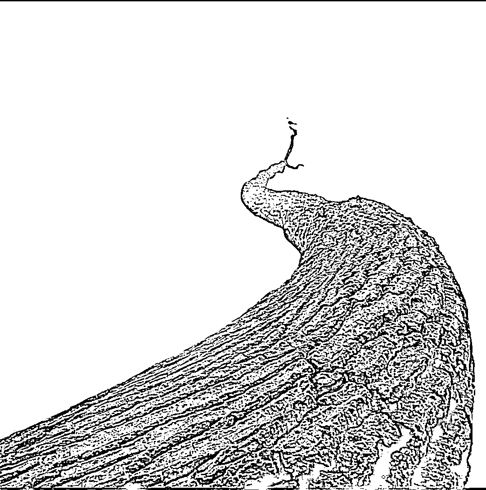

**火冥关系**

火冥关系由 Jeff Green 提出。**冥王星，无意识，相关灵魂；火星，有意识，相关人格**。低八度的火星是高八度的冥王之具体而密集的表现。所有欲望，源自灵魂（冥王星），然后被传达到个人层次（火星）。即冥王星须将无意识欲望传递给火星，火星能够有意识地认定识别灵魂欲望，而产生本能反应并采取行动。火冥宫座相位，都影响着火星将如何去执行源自冥王灵魂的欲望。可否想象成，火星就是冥王大 Boss 所选的执行官 CEO？

以冥王星为起点，逆时针计算冥王星与火星之间的角度，可得出火冥的阶段关系。灵魂便是通过火冥周期，来实现其进化驱力的。我觉得**这就像是个钟表，冥王星类似行动缓慢的时针，火星则是奔跑不休的分针**。灵魂不灭，只能不停转换着形式。即人生一直处于变成状态中，灵魂须八世才能完成本命进化目的。以火冥关系来判断灵魂进化目的已经进行多久了。在这一套进化功课中，你是个新灵魂还是老灵魂？

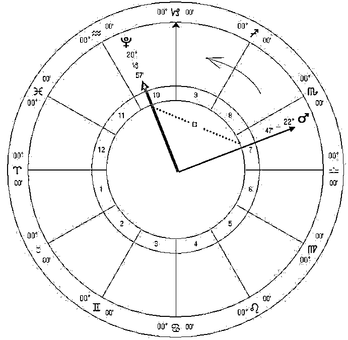

所以我认为，从冥王星出发的进化占星探秘，第一个伙伴就是**火星**，展现给你**一个时钟般的维度，告诉你，过去已走过多远了**；第二个重点研究对象，则是**冥王星的对宫**，即冥王星对应点。它是**以一个发射的维度，为你指明未来的路**。

关于冥王解读的第三个伙伴，就是**南北交**，及其主星。讲对应点之前，须先提及一对概念，即 Jeff Green 提出的灵魂两种欲望原型。

**灵魂双重欲望**

灵魂拥有欲望，灵魂也因欲望的存在而存在。灵魂仍在红尘中游荡，是否正因其尚存有未竟的欲望？

灵魂有两种欲望原型：**分离与回归**。分离的欲望，渴望突显独立的存在，可想象第 1 宫/白羊座的原型，刚从本源的混沌中喷薄而出，如涟漪般，一念接着一念，扩散着生生不息的我执；回归的欲望，则无时不在思念着创造本源，类似第 12 宫/双鱼座的原型，已准备好消融臣服于更大的整体。

于是，在归一和分离的矛盾意志拉扯摆荡之间，灵魂的年轮，循环往复，螺旋成长，进化之路才因此而显得冗长。而灵魂进化的立足点，就是要逐步消灭所有分离独立的欲望，以重返源头合一为终极目的。而分离欲望之最大特点，就是永远无法餍足，一旦拥有，就又想要更多。这也恰恰反映出了其无意识中对回归本源的终极圆满之渴望吧，即对统合的怀念，所谓灵魂思乡。所以我总结，若说分离欲望的最大特点，是贪婪；回归欲望的最大特点，应该是纽带。即在人类集体最深处的根，类似“同情”这个词的深义…… 

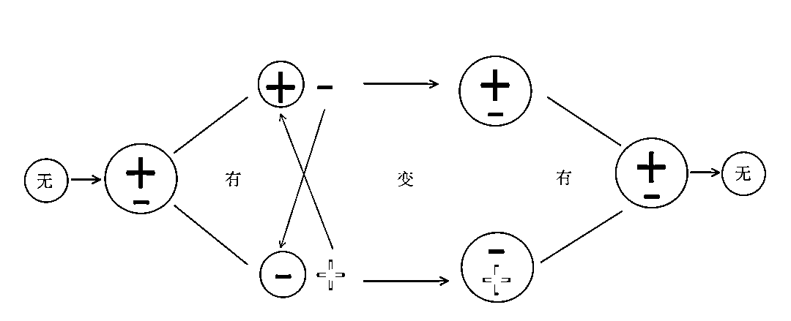

参考我画的这个图，可以再从灵魂阴阳性的角度，进一步诠释上述内容。**灵魂进化，是个有无变的历程**。**无有之间，以变相连。**道生一，一生二，二生三，三生万物……从无到有，灵魂的阴阳解体，在显与隐的二元法则下，灵魂选择呈现出阴或阳。显象为正电核的你，却总暗含一个负电荷。并将对立电极向外投射，与对立形式建立关系，来吸纳另一半能量。与外包的那部分自我，重新融合，以消除分离欲望，驶向本源。

阴阳和合，可见雌雄同体是一个很高级的状态。以此，灵魂得以重生，重返源头。故我认为，诸如南交点和冥王星，都携带着明显的分离属性；而北交点与冥王对应点，则都提供了合一属性的桥梁。 

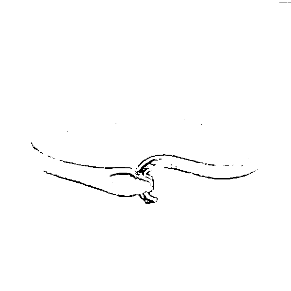

“你相信这两条路会永远背道而驰吗？”一切笔直者都是骗人，所有真理都是弯曲的，时间本身就是一个圆圈。”尼采与重力精灵的对话。 

**冥王星与对应点**

在掌握了欲望双重性本质的前提下，便能更好地理解冥王星与对应点的概念了。冥王星的星座宫位，揭示了灵魂累世的欲望类型和进化目的，也是你与生俱来的身份认同模式。但它常显示出老旧且偏执的病态属性，出于进化的要求，常以冥王星对应点的星座宫位所描述出的对立性，来暗示着改变的道路，让灵魂以此方式获得重生。

 而我又进一步思考了冥王星和对应点与灵魂双重欲望之间的关系：**如海浪时时想挣脱大海，人类也抗拒重融于创造本源，此驱力模式就是造成一切冲突的来源**。所以，相对于统合的目的，每一个分离欲望的结果，都注定要遭遇失败的。冥王星落点处的我执，常凸显出这种分离的本质；而对宫的下一站，则以全然互补的模式，象征着一种回归型的解药，点明了欲望在今生的进化导向。于是，人们总在这组对宫的交互作用中，经历着最重要的生命功课。 

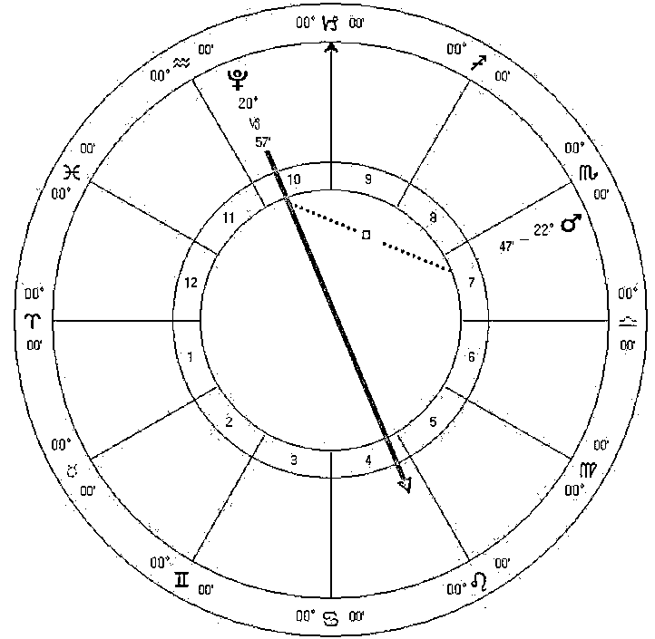

叔本华哲学痛苦地认为：“人的生命最终只是世界意志的体现和镜像，你所有的那些选择和行动，最后都是来自一个远远超越于你之上的，你根本无法控制甚至无法理解的力量……”但进化占星学认为，**一旦意识到那些暗中操纵你人生经验的冥王星式问题根源后，只要你有意愿改变，生命就能够改变**。

灵魂都有自由意志和抉择权，进行欲望的拣择与取舍。你周遭降临的每件事其实都源自欲望。去改写它的源头！灵魂病了，对宫有药。


**我们全体都滚滚，奔向永恒的故乡……**

**——《归乡》尼采**

（未完待续，后续文章见二条）

**版权声明：**本文由作者授权发布于若道平台，欢迎转发，反对抄袭。


**蓝女巫**

英国伯明翰大学 市场营销学硕士

职业占星师/专栏作者/芳疗师/珠宝设计师

中国首批 ISAR 英文认证占星师（2012 届）

**微信公众号**：cecilia_sui

长按打赏


**双证书核心课程火热报名中**

**点击图片了解详情**

**

**微信又双叒叕改版啦，不想错过若道君的推送？**

**就把若道设为星标吧！**

**▼**


就是这个“在看”，戳戳戳 ☟

********报名直达入口********


# 解密冥王星（下） | 人需得受过多少苦难，才能变得如此之美

> 原文：[`mp.weixin.qq.com/s?__biz=MzA5NjA0NTAxNg==&mid=2651411924&idx=2&sn=2d0e1e9c0cca79e09826c1133cfb6a43&chksm=8b4be763bc3c6e759effc54dc35ae4d5fbd8dd9ffa0498764c132a1af5c3d0ab9387e23e97c9&scene=126&sessionid=1692738247#rd`](http://mp.weixin.qq.com/s?__biz=MzA5NjA0NTAxNg==&mid=2651411924&idx=2&sn=2d0e1e9c0cca79e09826c1133cfb6a43&chksm=8b4be763bc3c6e759effc54dc35ae4d5fbd8dd9ffa0498764c132a1af5c3d0ab9387e23e97c9&scene=126&sessionid=1692738247#rd)

**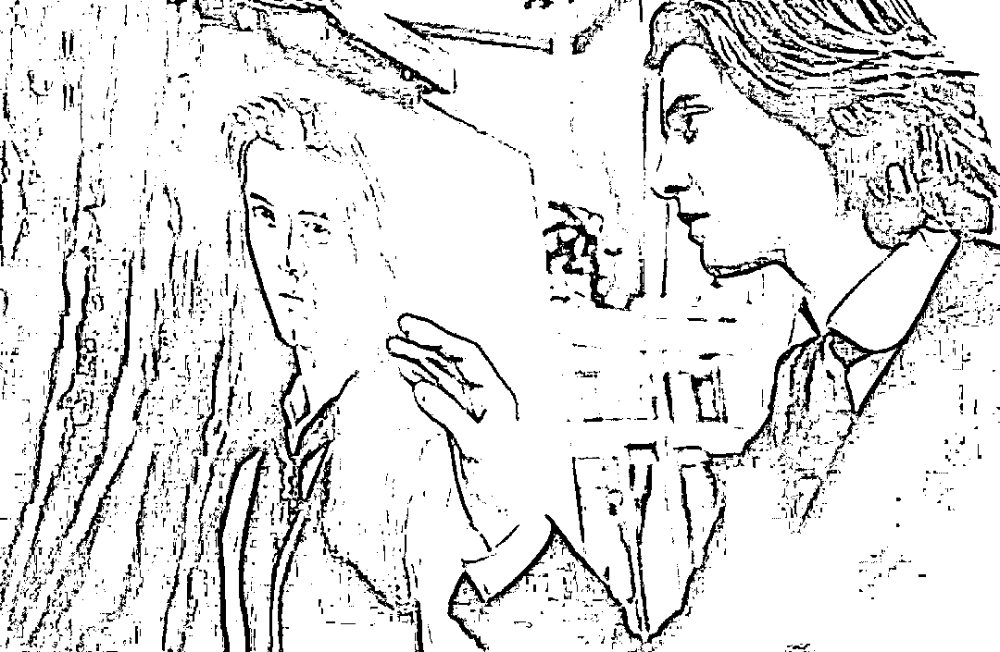**作者/蓝女巫 编辑/玫瑰头图制图/书君 图片/网络**欲望画像**

关于冥王星的欲望画像，可以从三个维度打开它：

在时间的久远中，打开欲望。欲望时间性，就是轮回。我们看到了，那一页写满了时空感的创伤，力透纸背。未竟之志，何等沧桑，才让这记忆的生命力如此顽强。灵魂烙印，是曾有多痛苦，才须穿越时空瀚海地游来......当巨大的焦虑感爬满周身，那是你不断闪回过去世的**被害妄想**。你总隐约听到的次声，那是身份认同之基础正遭受威胁在瓦解中。曾求之不得的绝望，顿失所依的彷徨，业力残渣凝成了琥珀，作为生命原动力的创伤，似乎永远也难以愈合。前一天你才觉悟得像个天使，而次日却又瞬间变成了魔鬼。

在胸怀的广袤间，打开欲望。放眼望去，是**无止境的贪婪，欲壑难填**。你总被一种莫名的匮乏所驱赶，明知不堪重负，仍疯狂扩张，巧取豪夺，到底意难平。你并不知，它通往的是一个无底洞，耗尽你累世的能量，仍难以穷竭。早已被这欲望榨干的你，像个奴隶，神色慌张。而那黑色的漩涡，却始终盯住你，它始终在那里。只因你始终不能彻底理解它，注定了你将永远无法填满它。

讲一个捉猴子的故事，猎人在树底固定一个椰子，椰子上挖一个洞。洞的大小，刚好只够猴子空手进出的，然后放一根香蕉在洞里。结果屡试不爽，几乎所有的猴子都被捉住了，只因它们死死不肯放手。重获自由很简单，只需要松开握着香蕉的拳头，但并没有猴子懂得放下。正如人类，释放自己很简单，只须**放下身心的执念**，但没有人能轻易地松开拳头。放下，即接纳事情本来的样子，并顺其自然。**查看星图，你应该在哪个宫位里松开拳头？那里有你放不下的执着，累世的……**在无意识底端的深邃里，打开欲望。但见一个根深蒂固的情结，正在强迫性地重复，不停做错。你像被施了魔咒般，用头撞墙，莫名失控，卡在业力困境中，进退维谷。宿命的阴云总笼罩着冥王星所在的宫位，你常在此因怨恨而放弃权力，恶意失败。无意识的聚结物，如纠缠着泥沙的暗流扭动着，拧成了神秘晦涩的编码，盘踞在欲望的深潭。深埋的用意，正因这里封锁着你生命本能的魔鬼，最原始的冲动，一旦释放，足以崩坏人生。同时，又恰因其难以理解而珍贵，因那才是最本质而真实的你。任何冥王星相关事物，都难从表象获知。精神废物须经淘汰，将无意识显化，以获疗愈。我们只能用人生的渔网去不断打捞其奥义，可终究却也只是管中窥豹。那是始终无法洞穿的谜底。唯有耐心地一世世去追寻，一片片去集齐它完整的拼图。而这正是推动你累世生命发展进化的谜之动力。**你与 Evil 的关系**

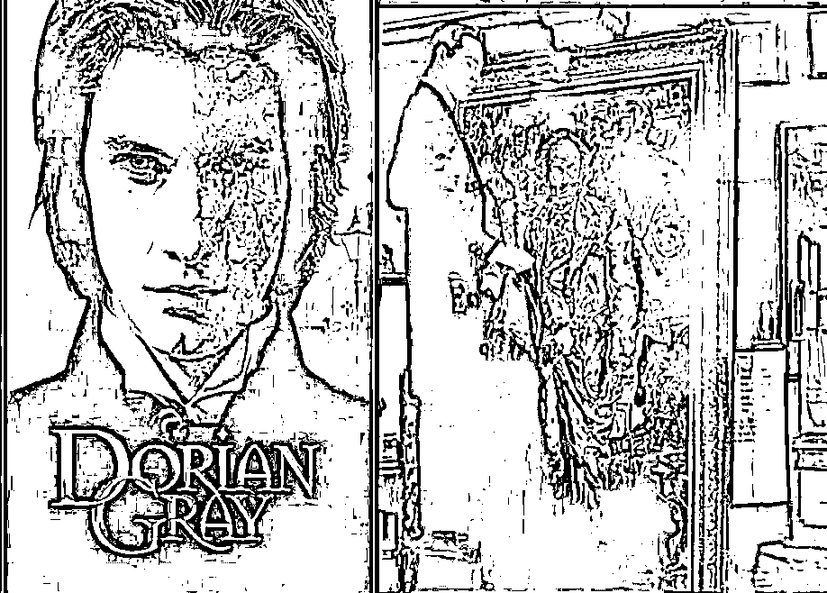

你对秘密忌惮，还是对禁忌痴迷？你选择只看到生命的美丽，还是渴望观看生命的完整？

面对那些冥王画风的画，你会觉得激动，还是觉得失衡？当那触目惊心的丑陋，让你感到不适，你会想马上逃逸，还是敢于继续审视它？

你又何必慌张？它只是有意保留命运的全貌，给你个机会去直面内心深处的挣扎。在这痛苦的笔触中，却又揭示着华丽的真实，得以让生命的残酷升华到悲剧精神的崇高。冥王星总会邀请你去见识生命的极端，而你却不假思索地将其打包并统称为“负能量”？你看到了邪恶？不，**你看到的只是，你与邪恶的关系......**

有人哭了，你马上递上纸巾；有人疯了，你马上让她吃药。我们总是本能地试图第一时间去扑灭地狱里的火苗。你在恐惧什么？**怕失控…… 怕被一股疯狂的生命力席卷入其洪荒。**

而生命之美就在于它的完整。不加粉饰地去观看，那才是真正的命运之爱。人在何时需要粉饰？是因为残缺吗？虚假而不完整的你，是丧失活力的。等待所有假装的，必将是一道闪电，一朝它击破你虚掩的门，将一切推向毁灭。

而冥王星人偏偏不怕被卷入。他得先掌握了完整，穷尽了真实，他算把控了人生。他很清楚，用意志力去镇压欲望的后果。否认那欲望的存在，假装你可以控制它，结果总是被其反扑。麻痹与偏执，都是压抑的结果。失控，就意味着被完全无法意识到的能量所掌控，为之着迷。也就是说，正是那被你拒绝而后深深压抑到潜意识里的真实欲望又俘获了你。于是，冥王人学会了**向死而生**。**看清世界，看清自己，才能疗愈他人**。能深入看待自己的人，才能深入看见你。这里埋藏的是你自己的冥王星，也是至深处的你——**你不下地狱，谁下地狱？**只有身处恐惧者获得安息。**冥王星人**

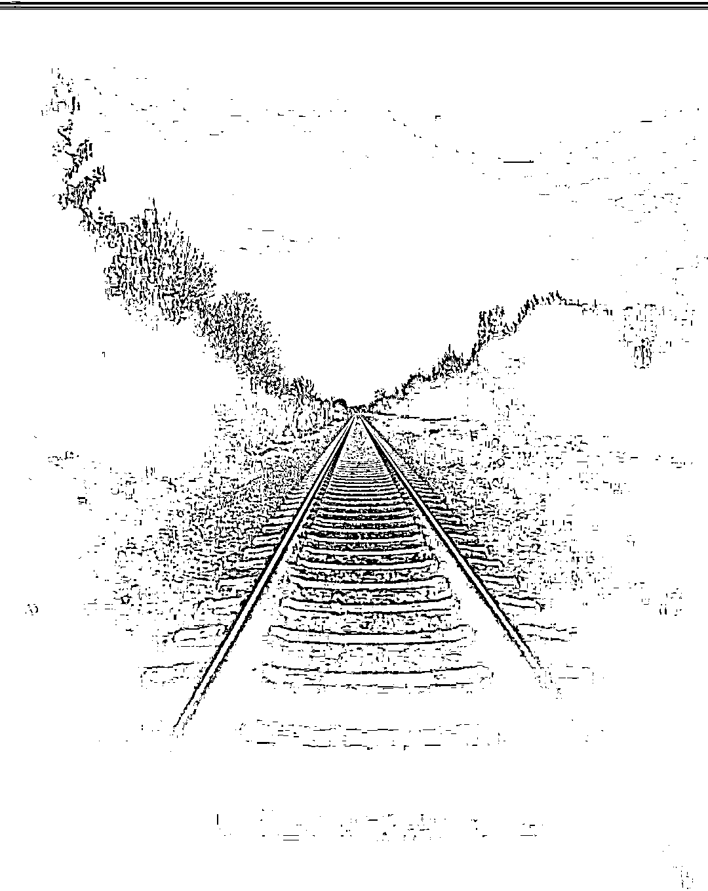

**他们会去隐藏自己，同时试图洞穿他人。二者皆出于安全感的焦虑。**

一方面，他们习惯埋伏于暗处，遮蔽伪装自已，并通过秘密操纵，能让一切尽在掌握。**防御，必定源于曾因揭露真相而遭受惩罚，才习得了静水流深，归于缄默**。与生俱来的**信任危机**，使其警惕于背叛和抛弃，对敞开感到脆弱，他们好像本能地获知，当你把权力拱手让人，对方必将“杀死”你，那就是赤裸的人性。于是为避免被权力裹挟，而先发制人地行使权力。**操控他人，其实是为了让自己不失控。**

同时，又目光如炬，对**凝视**有一种本能的渴望。那视线仿佛在刺穿山洞，恰因偏狭而深刻。企图刺入心理表征，和一切动机深处。要占有一切真相，不留死角。行事风格无底线，不也正象征着一种凝视的热望？用凝视击穿底线，测试着对方绝对的忠诚；用凝视打破藩篱，藩篱是阻碍联结的秘密。安全感寄托于全胜的洞察。必须拥有所有得分才算赢！仿佛穷尽所有，才安全。力求完整，不也正是一种控制？

恰是这份矛盾而抑制的焦虑能量，使之气场显得格外复杂激荡，充满磁性。极具压倒性的神秘，如同宇宙中那股不可抗拒的力。能让人臣服于其裹挟，被那强烈的驱力迷住，情愿泯灭于这黑洞，窒息于生死交错的瞬息。在这股扎根于地心的引力面前，不可救药地感到晕眩……说明你也是冥王星人。

其实，那个裹着黑袍子的人，他比你更恐惧，所以他要威慑你，压倒你，以克服他的恐惧。你盲目服从，助纣为虐。你与他对抗，两败俱伤。有一句话叫作：凝视深渊，也终将被深渊所凝视。这里想反过来说：**面对痛苦的深渊，让我们毫不躲闪地回视。即对它的无情，报以一种理解。**

所以尼采说，人在哪儿会不面临深渊呢！难道观看本身不就是看深渊吗？人多么深刻地观入生命，他同样也多么深刻地观入痛苦。谁看见深渊而带着苍鹰之眼，谁以苍鹰的利爪抓住深渊，他就是有勇气的。

**冥王星能量的进化阶梯**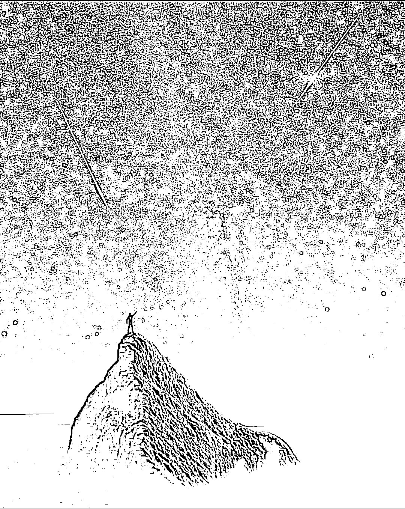

天蝎座有高中低三阶：蝎子、老鹰、凤凰。与冥王星的四种进化功能整合，我总结了冥王星能量的四步进化阶梯：

**毁灭性****的色彩**

也就对应**天蝎座的初阶**，长着致命螯刺的蝎子，**极度情绪化，盲目而激烈，完全受本能和欲望支配**。执迷于**对抗，滥用权力、意气用事，不惜沉没成本，将怨恨之物付之一炬，无情背弃，同归于尽，沦为情绪的奴隶**。

可以想象，这个阶段常会吸引来**灾变式的严惩**，用毁灭性的情感震撼，成全你意欲颠覆的原始执迷，终以惨痛的失去收场，逼迫你激烈地成长进化。在仇恨的僵局中，你的灵魂倍感孤立，独饮着毫无意义的生命，飘落下一片无足轻重的虚空......当你醒来，你变成了鹰。

**建设性****的意愿**

可对应**天蝎座的中阶**，鹰的阶段。情绪的洪荒已被驯化为激光般的精神，乘着张力的气魄一飞冲天。也发展出了**敏锐的视力与心机**，全神贯注只聚焦目的，锲而不舍，战无不胜。学会了与代表转化力量的表征物相结合，获取身份认同，以跨越自身限制，拓展疆界。即以联结来呈现自我需求，汲取你所需要的力量。建立关系后，它成了你的一部分，你也渐渐变成它。在相互渗透融合中，自他都突破了限制，实现了双赢。

冥王星能量在此常表现为**相对缓慢而持续的进化**。然而，硬币的另一面，这却让你受制于人或物，形成了新的限制。尤其当天性激烈的你执迷于占有物，过度凝视中，变得忘我而疯狂时，你已被这联结物所束缚。这必将招致毁灭和离散的通牒，成长在无意识中密谋着倾覆。前方，注定是再一次**失去和绝望**，无可避免，作为唤醒的代价。冥王星断舍离的祭坛，针对你最珍视的外物，致命一击。你俯冲而下，义愤填膺地捍卫，你最后的记忆中，留下了眼前的，断壁残垣，一片火海......若你还能醒来，你就变成了凤凰。

**冲破限制，驶向一体**

可对应天蝎座**高阶**时的视野，凤凰的阶段。一切你的身份认同和存在感，所过度依附于的身外之物，已层层被剥落，作为上一轮的惩罚。你接纳了一个事实，**一切你自以为不能失去的，都会因不再有生命力而被适时抽走**。人生就是在学习不断失去，直到一无所有。**一面建立联结，一面又打破联结**。即一切外包的力量，终须回归自身。我想到尼采那句：你把自己高高抛出，但每一块被抛的石头都必将掉落下来！你确实把石头抛得很远，但它将回落到你自己身上！发生的一切，都不过在提醒你，你自身真正的价值和身份并不依附于由外物所定义。你的本质是无穷无尽的，不应被束缚。外在的联结，仍可以作为陪伴，只是不能过度依赖。每当你忘记了这一点，冥王星就要无情地去帮你剔除这些外在身份认同的冗余。因为你联结的这些占有物，终究是有限之物，而灵魂成长终将驶向无限。所以，当一切有限终将被剥离，那么无限在哪里？它在宇宙本源的伟大一体性之中。也在你的自身。因你那超越个人自我的核心中，即有着那永恒而完整的全体。你与之辉映，相关又相似。凡寻求无限者只需必要闭上双眼……

**潜能发挥**

当凋落了身外一切虚伪，方能看到失去所有后，你还剩下了什么？你终于能看清自己真正的本质，发现那属于你的精粹。至少，你身上还有一呼一吸间的生命之权利，可以牢牢地抓在自己手中，那也是你唯一拥有而不能被剥夺的东西，唯一用以对抗荒谬命运的力量。如石头般坚强的生命力，有着终究无法被占领的核心。直至死亡击碎它，却仍不空无，因灵魂不灭。

回归核心自我后，提纯你**最真实的价值**。冥王星的欲望母体中，包裹着最浓缩的精神能量，若能释放，将是核能般惊人的力量，它叫作**生命力**！常须以情感震撼先将其激发，才能带到意识表层。当无意识黑暗中消耗和控制你的负面情绪全部清除后，因能量守恒，精纯的剩余能量，便可等待被建设性地利用了，也终于能展现为你真实的选择和行动了。现在，你可以使用它为所欲为了。真正的力量升起，它通往你潜力天赋里的无限。将其不断提纯，炼金术般进行到底，臻于完美。于是，你的潜能得以发挥。

至此，我们已疗愈了自己，也就能疗愈别人。冥王星能量便可以转化为治疗管道了。每当你动用冥王星意识去表达，世界被催眠。因为个人的冥王星，都连通着集体的冥王星，它通往神性的本源......

**向死而生，冥王星的双刃剑**

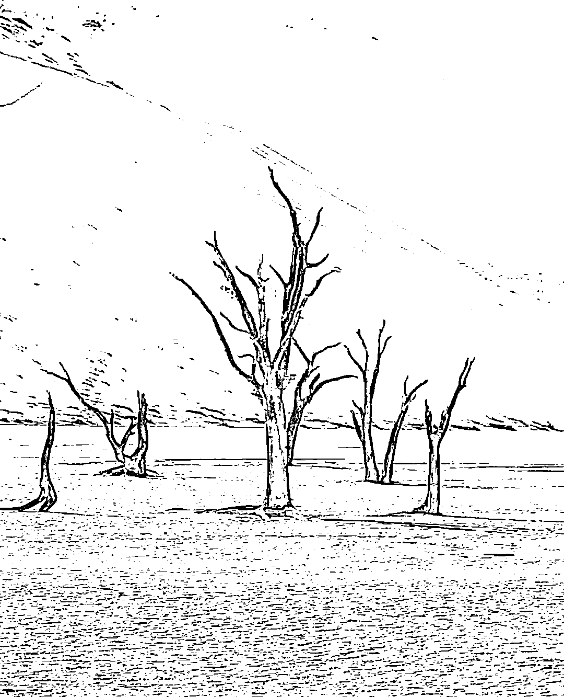

最后，再结合开篇关于生命意义的哲学反思来作个回顾。面对人生的荒谬，我们何去何从？**怨恨与反抗**，是源自冥王星的两种人生态度......前者象征分离，固着于惯性；后者象征回归，聚焦于成长。

**冥王的分离型欲望，表现为怨恨**

怨恨者的人生，在嫌恶的瘴气和抵制的防御中，最终毒害到的只是自己，剥夺否定了自身生命创造的行动。憎恨世界，诅咒仇敌，希望它们尽毁，尽管这对自己也没啥好处，除了暗中冷笑的快感，此处可联想到天蝎座最低阶的形象，在怨恨中作茧自缚，在厌世中隔绝枯萎。**怨恨把万物分开，这是冥王星最直观的一种分离欲望。**

**冥王的回归型欲望，表现为反抗**

以生命权力为底限的加缪，号召去对抗一切剥夺生命的力量。对抗，这很冥王星，但却是**积极**的那种，因为“反抗”的对像是命运。相对于怨恨的死水，反抗却能掀起无边巨浪，激发行动，改造现实。以此超越孤独狭隘的个人僻径，战胜了冥王星的 futility。**反抗者拒绝屈辱，却不志在霸凌他人，反抗因此不是恨，反而是无边的大爱**。反抗令人们彼此互助交织凝聚，这不正是冥王星回归欲望的真谛吗？

在冥王星的生死追问面前：叔本华说应斩断欲望之流；尼采与加缪却主张跳进漩涡；而进化占星学，同样能让你了悟，**死亡与勇气，这一对冥王星的双刃剑**。一念之转，地狱变天堂。而二者结合之处，就是冥王星的生命力。死亡才能激发出生之动力。人生既有意义，又无意义，世界就是这一冲突的战场。这是深入本原的悖论，也贯穿人生的始末。**“人之所以伟大，不在于走向一个极端，而恰恰在于同时触碰两端。”**尼采生命的山树，在**向上与向下的力量间寻求着平衡**。象征着灵魂向上渴望着星辰，本能却又难耐那重力的精灵。“它越是想长到髙处和光明处，它的根就越是力求扎入土里，扎到幽暗的深处，深入到恶里去。”“最高的山从何处而来？它们来自大海。最高者必定从最深者而来获得自己的高度。顶峰与深渊，现在已经包含于一体了。”而加缪的“西西弗是幸福的”，因他**超越了自己的命运**。“这个时辰就像是一次呼吸”，“哪怕每一次呼吸就是一场西西弗式的悲壮努力”，那也是你能紧抓在自己手中的自由。人生无非就是对抗着必死的宿命，仍无比坚强的活下去，这勇气本身，就是生命的真意。位于天蝎座的水星逆行在我出生星图中第 4 宫的一天，家里停电，我在一片漆黑中重听查拉图斯特拉如是说。其间，紧促的呼吸竟沉降得格外深长。我发现疗愈呼吸最好的工具，总是“黑夜”…… 如果说生命的真意，就是一呼一吸之间。那么，相对于光明，黑暗更能彰显生命吧。且黑夜中似乎有着一切问题的答案…… 向冥王星致敬。

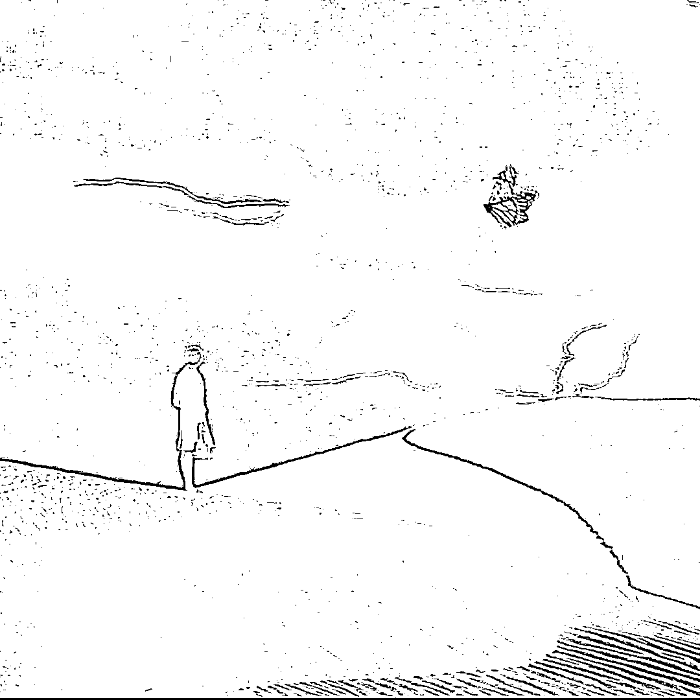

冥王星行进时，就是要让你**跪下**。**你正经历着极度不安全的身心瓦解感，又尚无重生的立足之地**。虽然感到艰难，但此运势也在明示你：当下，你命运的意愿，已然准备好了，去迎接涅磐时那无限弃绝的一跃！末了，再听尼采说：面对重力，我已经学会了飞翔。不是用愤怒杀戮，而是用大笑杀戮。蝴蝶和肥皂泡，似乎最懂得幸福。当它翩翩飞舞，这诱使査拉图斯特拉落泪和歌唱。我只会信仰一个善于跳舞的上帝......


**你这个人，**

**势必受过多少苦难，**

**才能变得如此之美！**

**版权声明：**本文由作者授权发布于若道平台，欢迎转发，反对抄袭。


**蓝女巫**

英国伯明翰大学 市场营销学硕士

职业占星师/专栏作者/芳疗师/珠宝设计师

中国首批 ISAR 英文认证占星师（2012 届）

**微信公众号**：cecilia_sui

长按打赏


**点击图片查看若道君推荐**


**微信又双叒叕改版啦，不想错过若道君的推送？**

**就把若道设为星标吧！**

**▼**


就是这个“在看”，戳戳戳 ☟

********报名直达入口********


# 海王星顺行 | 这一场迷途，是宇宙给我们最深的恩宠

> 原文：[`mp.weixin.qq.com/s?__biz=MzA5NjA0NTAxNg==&mid=2651411898&idx=1&sn=4277955e803dedb1e95d71333e3e1fbf&chksm=8b4be70dbc3c6e1b365193369af0f6affde9afaa554cf9732b8aeb94711f3938b0c1345f08f2&scene=126&sessionid=1692738247#rd`](http://mp.weixin.qq.com/s?__biz=MzA5NjA0NTAxNg==&mid=2651411898&idx=1&sn=4277955e803dedb1e95d71333e3e1fbf&chksm=8b4be70dbc3c6e1b365193369af0f6affde9afaa554cf9732b8aeb94711f3938b0c1345f08f2&scene=126&sessionid=1692738247#rd)

****后台回复“今日”，给你一句生命态度****

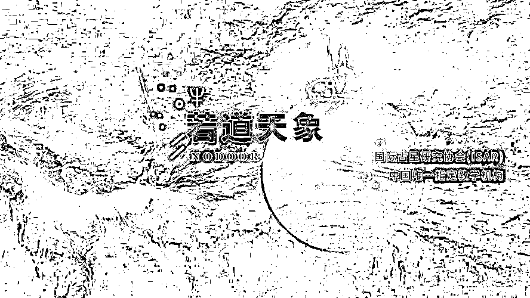

作者/编辑/玫瑰 图片/unsplash

**海王星顺行**

**2019 年****主题回顾**

*   2019 年一整年，天王星行进在金牛座，海王星行进在双鱼座；

*   双鱼座在古典占星学中的守护星木星行进在射手座，并分别在**1 月 14 日、6 月 16 日、9 月 22 日**同海王星形成四分相；

*   **6 月 21 日**，海王星在双鱼座 18°43‘逆行，**11 月 27 日**，海王星在 15°55‘恢复顺行；

*   海王星顺行前一个月，水星与**10 月 31 日**在天蝎座逆行；

*   木星将于**12 月 3 日**离开射手座，进入摩羯座；

*   土星与冥王星也在逐渐靠近，将于**2020 年 1 月**在摩羯座精准合相。

一年的乐观膨胀后，美梦和斗志被打回原形。水星在天蝎座的逆行毫不留情地揭示出赤裸裸的真相——**一些钱被骗走了，一些感情被辜负了，一些梦想无计可施**。梦碎后的一地鸡毛还没收拾，粗粝的现实就滚滚而来，驱赶我们朝向更新、更变革的 2020 年，在这一年，有 3 个最长的行星周期即将开启。

新旧交替十字路口，太多人**迷茫、无力**：进还是退？追加投资还是赶快撤离？他到底是不是对的人？努力保持现状还是开辟一条从没走过的路？**无法选择是因为没有方向，失去信心**。这一切，源自 2019 年我们多次经历的**希望-幻灭，再希望-再幻灭**的过程。幻灭，是海王星双鱼座时代的集体潜意识创伤。这份幻灭，恰是海王星带给我们的礼物。今年的海王星逆行-顺行之旅是一条天梯，帮助我们安然开启 2020 年时代变革的重大周期。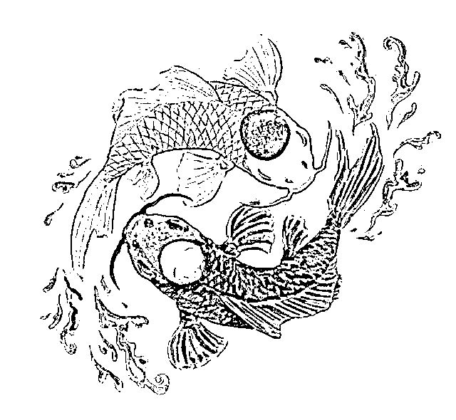

**2019 年****海王星顺行重点影响人群**

*   **主要****个人行星、南北交点在变动星座（双子座、处女座、射手座、双鱼座）13°-19°**的人群；
*   **主要****个人行星、南北交点在巨蟹座、天蝎座 13°-19°**的人群；
*   **主要个人行星、南北交点在金牛座、摩羯座 13°-19°**的人群；
*   **12 个宫头在双鱼座 13°到 19°**的人群。

此外，如果当下，你有**浓烈的无助、迷茫、空虚感**，说明你正在攻克海王星的课题。你也可以参照这篇文章，对自己做深度的清理和疗愈。**海王星的顺行-逆行-顺行旅程**

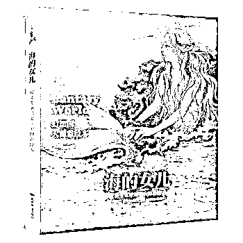

| 《海的女儿》是安徒生创作的童话，也被译为《人鱼公主》，首次出版于 1837 年。   

相信大家对于**行星“顺行-逆行-顺行”开启**“**觉知-接纳-转化”**的概念都不陌生。那么，如何具象地实现它？在此，我想借用安徒生童话《海的女儿》来同大家讲述一场完整的海王星之旅。**这是一个讲述爱情的故事，然而，我们可以将任何我们迷恋的“外在”代入到角色之中：一个人、一份事业，又或者一条不同的生活道路。**

**海王星****第一次顺行****：救赎与被救赎**

在海底王国，最小的人鱼是个“古怪”的孩子，最爱一遍遍听关于人类世界的故事。

到了 15 岁， 5 个姐姐先后去了海面，看到了人类世界。她们说：“还是住在海里好。”姐姐们手挽手浮出海面的时候，最小的人鱼瞧着他们。她想哭，但是她没有眼泪。终于到了 15 岁，她浮上海面，看到王子在庆祝生日，小美人鱼无法将眼睛从王子身上移开。而大风暴来了。王子从裂开的船上朝她落下。“不成，决不能让他死去！”小美人鱼拼尽全力将王子救到岸边。她觉得他很像自己珍藏的一尊大理石像。她吻了王子，然后躲了起来。王子醒来的时候，看到的是另一个女子。小美人鱼日夜思念王子。然而他做梦也不会想到她。祖母告诉他，人类有不灭的灵魂，人鱼没有。只有当一个人类把全部的爱情和思想都放在人鱼身上，他的灵魂才会转移到她身上。——《海的女儿》 

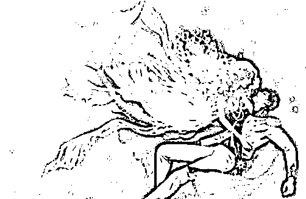

小美人鱼代表**落在双鱼座的海王星**。**双鱼座的符号♓是两尾首尾相连，反向而游的鱼**。一条向下，潜入黑暗却安适的深海，令一条向上，寻找海面。向上那条鱼，代表古典占星学中双鱼座另一个守护星木星的意涵：**去探索，离开舒适区，寻找光明**。

小美人鱼遇见和自己热爱的大理石雕塑很像的王子，她拯救了他。也爱上了他。

当心中爱人（雕塑）的样子活生生出现在眼前，她相信，**只有得到王子的心才能获得救赎（不灭的灵魂）**。无论姐姐们如何告诉她人类世界并不好玩，无论祖母如何说服她人类不会爱上她丑陋的鱼尾，她都听不进去。**渴望同对方融合（海王星）的心会冲破（天王星）任何世俗（土星）和恐惧（冥王星）。**

初次唤醒内在海王星能量时，我们**迷恋于人世间自私占有的爱欲游戏**。并试图**通过爱欲中的深度融合去拯救对方和拯救自己**。

**海王星逆行****：不断自我牺牲**

“我爱他胜过我的爸爸和妈妈，我时时刻刻在想念他。我把我一生的幸福放在他的手里，我要牺牲一切来争取他和一个不灭的灵魂。”小美人去找海的巫婆，巫婆给她一副药。代价是，她再也不能回到水底，还要给出最宝贵的东西。小美人鱼交出了她的声音，变出双腿。王子将她带回宫殿。

她不能唱歌也不能讲话。只是不停地舞着，每一步都像在刀尖上。夜里，她需要将脚站在海水里才能感到一些清凉。

王子象爱一个好孩子一样爱她。他没想过娶她为妻，然而，她必须成为她的妻子。她知道王子心中最爱那个海边美丽的姑娘，却无法告诉他，她是救了他命的人。——《海的女儿》 

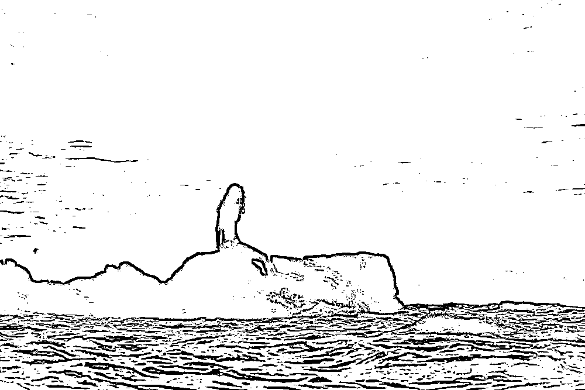

如果说，第一次海王星顺行的时候，我们只是被那种柔软和迷恋蛊惑，魂不守舍，那么，**海王星逆行，真正的考验才开始**。**海的巫婆是我们内在的阴暗面**。她帮我们看清一厢情愿的梦幻，试图用无情的现实将我们打醒。但是，**迷恋令人生出最强的力量，让我们幻想自己可以面对所有的伤痛和苦难。**巫婆拿走小美人鱼的声音有其深意：交出的声音，是**水星，是语言和头脑**。小美人鱼的头脑中，若王子知道她才是拯救他的人，便有极大可能爱上她（回报）。这是头脑层面逻辑的推演。带着这样的逻辑，**被拯救者成了亏欠的那方，无形中负有回报拯救者的责任**——小美人鱼越是不断牺牲，王子越有责任回报。这样的**施与受**的关系，是海王星剧情中最常出现的，也是拯救方变本加厉牺牲最根本的心理动因——**给你越多，你越欠我的。**然而，让头脑的把戏无法施展，才是海王星的用意：**一切都得用心。**没有了声音的小美人鱼只能靠曼妙的身形来打动王子，于是，她忍受刀尖行走之痛不停舞蹈。像极了我们，**为了吸引对方，将全部的爱、巨额的金钱甚至自尊和骄傲拱手奉上……改头换面打磨成和对方匹配的人，削足适履迎合讨好，只为睡在他床边一席之地的机会。**带着美梦进入海王星第一层疆域的人，在逆行期被巨浪打得体无完肤：不断投入，不断熄灭再重新燃起渴望。想象中能够承受的痛苦，在现实里变得如此凌厉：你千回百转，痛彻心扉，每一步都像走在刀尖上，他却以为你只是轻轻松松地跳了一场舞，浑然不知在无人的角落，你独自将双脚（双鱼座）放进海水，才能缓解这种切肤之痛。对方享受的一切都是我们用痛苦的自我牺牲换来的。然而独自承受，也是我们自己的选择。因为**仍旧相信，唯有通过自我牺牲，才可能得到对方的心**。对成功的渴望像鬼魅一般诱惑着，除了继续追加付出，我们“认为”自己已没有退路。

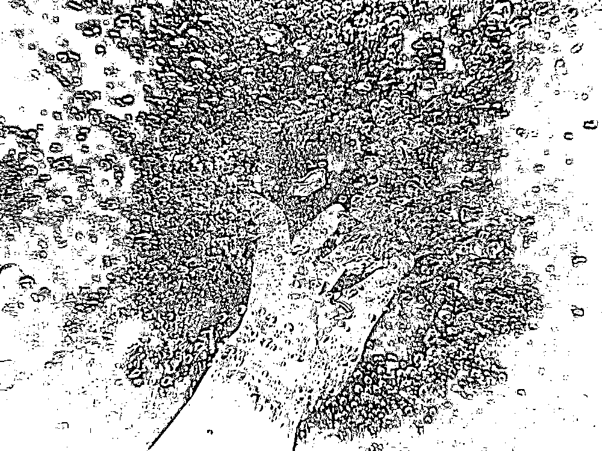

**海王星恢复顺行****：宽恕**

王子要和公主结婚了。王子对小美人鱼说：“我从来不敢希望的最好的东西，现在终于成为事实了。你会为我的幸福而高兴吧，因为你是一切人中最喜欢我的人！”小美人鱼的心在碎裂。她知道婚礼的头一个早晨，她就会变成海上的泡沫。这是她能够和他一起呼吸同样空气的最后一个晚上了。姐姐们把长发剪掉，同巫婆交换了一把刀子。在太阳出来之前，将刀子插进王子的心里，他的热血流到小美人鱼脚上时候，她就可以恢复人鱼形状，回到水里，依旧可以活过 300 年。王子在梦中呢喃着新娘的名字，小美人鱼在王子的眉毛上吻了一下。这时候，她看到光明的太阳。“我将向谁走去呢？”她问。“到天空的女儿那去呀！人鱼是没有不灭的灵魂的，而且永远也不会有这样的灵魂，除非她获得了一个凡人的爱情。她的永恒的存在要依靠外来的力量，天空的女儿也没有永恒的灵魂，不过他们可以通过善良的行为而创造出一个灵魂。”小美人鱼向太阳举起了她光亮的手臂，她第一次感觉要流出眼泪。——《海的女儿》

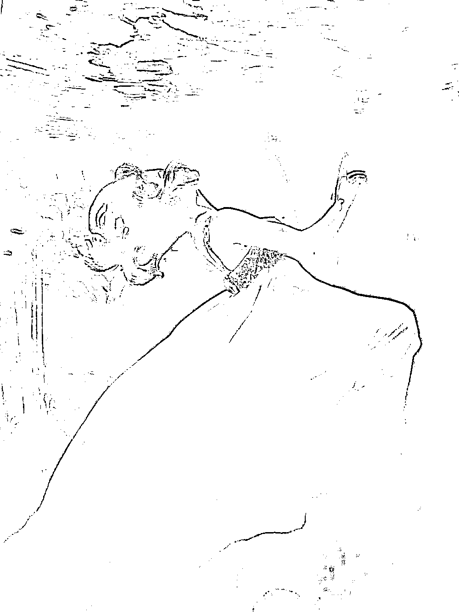

现在，我们进入了海王星再次顺行的旅程：**再也无法自欺欺人**。他无法再假装爱你，他爱上了别的人，而他还要你的祝福，因为你是这个世界上最喜爱他的人。你的心碎成两半，你知道，在他美梦成真的那一刻，就是你毁灭的时候。巫婆（内心的阴暗面）递给你一把刀。你应该愤怒不是吗？反正你也得不到他的爱了。杀了他，你就能活下去，忘了不灭的灵魂吧，那就是个无法实现的梦。刀在你手上。你可以轻易将刀插进他的胸膛，尤其是，他在梦里还呼唤着别的名字。然而，你下不了手。你终于明白，即便他知晓是你救了他的命，还是会无法自拔地爱上另一个女人。**你的底牌无用，再妩媚妖娆，再隐忍吞咽，都无用。**可是，你无法因为他娶了别人就毁掉他，这是头脑的逻辑。就像无论你多美好，付出多少，他都会全心爱另一人一样，无论他朝三暮四，移情别恋，你都爱他。他是你拿命换来的珍宝，是你曾经倾注了所有的热望。杀死他，就等于杀死了自己，即便回到海里，也将带着痛悔度过毫无指望的 300 年。你想起日复一日的牺牲和自我折磨，一次次自己缝上破碎的心，再装作若无其事去温暖他的种种。它们充满**悲伤**。**一直背着这些悲伤，就像被一尾向下的鱼，不断拉进更深的沉沦里。能够带领我们离开这种沉沦的，不是仇恨，也不是自我麻醉和逃避，而是真正的放下：我放下那些悲伤，放下过去的种种。**你要**原谅这一切**。**原谅，是接受事情没有按照我们所期待的结果（得到王子的心），宽恕看似导致这种结果的人（王子），祝福他（同公主的婚姻），并放下所有内在的伤痛。**

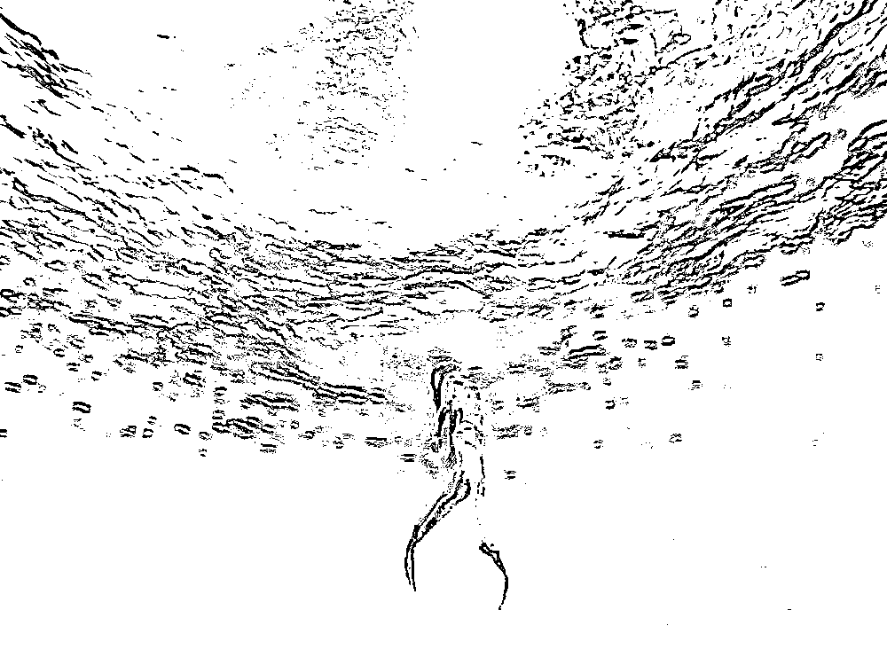

**海王星的礼物**这就是海王星，这颗高八度的金星送给我们的礼物。要得到它，需要**超越人世间自私、占有、爱欲的力量，相信宇宙间有更大的爱在照拂和恩宠我们，并臣服与它。**

因爱而生的疼痛会无限延展我们对于爱的理解和感受。最终，一切努力化作泡影，面临幻灭之时，方是海王星给我们终极的考验：能在这一刻，对那个看似导致这一切的人放下刀，是因为明白**他只是一个载体，透过他，你看到了自己的勇敢、大爱与真正的善良**。你才明白，**将自我的救赎寄托在任何一个外在的人、事、物身上，都等于承认自己软弱无力；只有将外在攀附的一切都除去，才能真正找回属于自己内在自我救赎的能力和勇气。**

这时的你，不会在梦中执着于幻象的人和事。你醒过来，睁开眼睛去看身边环绕的所有，发现**宇宙正在将之前所付出的源源不断地回馈给你**。一个人走了，有另外一个人来了；一扇窗关闭了，另外一扇窗已然打开。

放下那把对外的刀，就解放刀尖上的行走。就**放下了期盼、欲望、自我折磨，宽恕了自己**。迎向真正的光明，黑暗才能无所遁形。这光明足以让人鱼流泪，是因为她听到了天使的声音：“你不需要王子的爱来获得不灭的灵魂，你可以通过自己的善良得到它。”**这天使，就是海王星。**

放下吧。**你的伤痕是你自己创造的，里面包含所有向下游的能量：不配得、悲伤、委屈……**放下它们，才能让那尾带着负面能量的鱼停止游动，从混乱和自我挣扎中走出来，才能听见内心最真纯、最正能的声音。那声音一直都在守护和引领你走向光明。

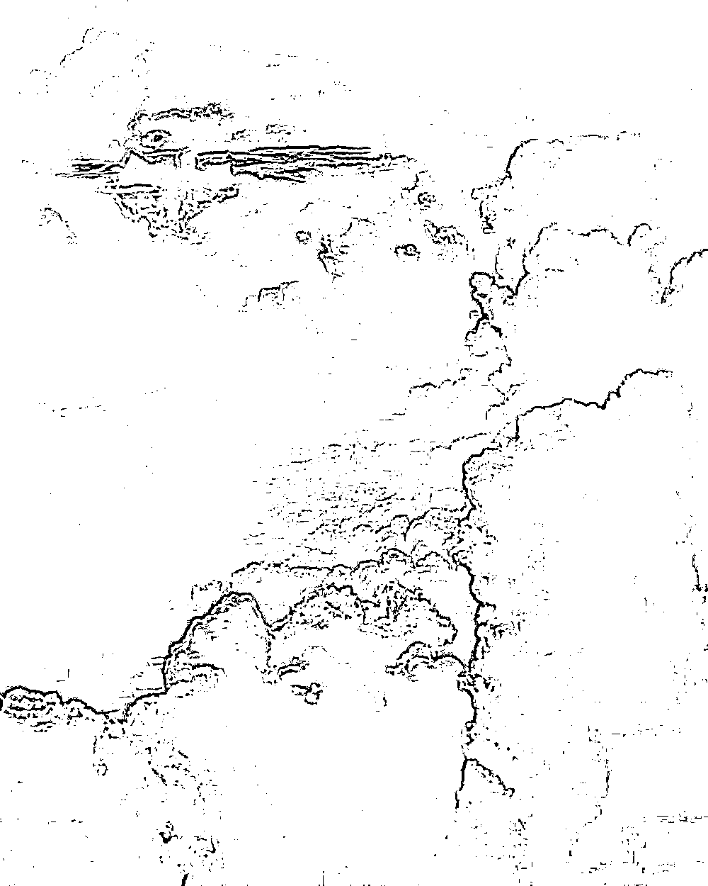

**让我们带着智慧走向 2020 年**


**世间无常，多少事如梦如幻，如泡如影，如露如电；****佛性有妙，古今来不增不减，不生不灭，不垢不净。**每个人星图中都有海王星能量。我们从海中来，走上陆地，要在这世间体验**疼痛、疗愈、付出、宽恕、放下**。被海王星席卷后，仿佛迷恋的都像慢镜头一样缓缓离开，伸手出去，只有空空。当你认为自己无能为力，不知何去何从，陷入深深空茫的时候，要相信，这是通往最深觉醒的必经之路：**一切具象的、现实世界拥有的，最终都会失去**。唯有如此，才能找回与生俱来内在的**神性**。它指引我们**寻回不依附在任何人和事物上的，属于我们自身本源的大爱，引领我们穿越外物迷障，寻到方向，过上真正属于我们内心渴望的人生。**这恰是在双鱼座的海王星需要传达给我们的，黄道最后一个星座终极的智慧。越早领悟，越能带着清明的智慧生活下去。再理性的人也无法抗拒海王星的召唤。它氤氲着跨越一切障碍，漫过海洋和陆地的土星界限，抚慰冥王星切肤一般的疼痛。这恰是**海王星在双鱼座六分（六分代表机会）即将合相的土星和冥王星为我们展现的可能性。**当下的你，有两种选择：

❶ 被低阶能量笼罩，无力虚弱地寄望于外在，在自我创造的幻象里腾挪、挣扎，等待碰壁、落空和由此而生的恐惧。

❷ 听从海王星高阶的呼唤，停止向外寻求，找到内在声音，消融边界和恐惧，依靠自己的力量走出全新的人生道路。2019 年，海王星逆行时，恰逢射手座满月；5 个月后，海王星顺行时，我们迎来[射手座新月](http://mp.weixin.qq.com/s?__biz=MzA5NjA0NTAxNg==&mid=2651411808&idx=1&sn=2a38e3e94aa0469492965ca9ab2fbf78&chksm=8b4be7d7bc3c6ec14756efb4a410bfa92032643953d76ee7fcf52373a18e0ccf175b51671084&scene=21#wechat_redirect)（点击可阅读）。射手座代表着**超越动物性的信念和希望**。有了这份信念，再伴随着海王星的高阶能量，我们会在发现自己拥有**超越世俗的内在信念和爱的力量**。

后记：

2016 年 5 月，海王星从 12 宫靠近我的上升点；2019 年 11 月 27 日，海王星顺行后离开它。这一生，它第一次，也是最后一次亲吻刚出生时的我，唤醒那时地平线上太阳的样子，重温第一口呼吸。回想 3 年半的海王星行进，那些从深海到天空，从迷失到相信的一路，和内心充盈到满溢的爱与慈悲。我将它们化成文字，把这份感动分享给你们。**参考资料**

## 《海的女儿》

**版权声明：**原创文章由作者授权发布于若道平台，欢迎转发，反对抄袭。友号转载请申请白名单。

****

****想阅读更多作者的文章****

****请在后台回复******玫瑰****** 即可****

**玫瑰**

英国 Cass Business School 管理学硕士

若道 2015 届核心课程毕业生，若道微信公众号兼职编辑

占星师，咨询时长超过 400 小时

**个人微信号：**stillrosy

**公众号**：still__Queen 

长按二维码，给作者打赏


**点击图片查看若道君推荐**


**微信又双叒叕改版啦，不想错过若道君的推送？**

**就把若道设为星标吧！**

**▼**


就是这个“在看”，戳戳戳 ☟

********报名直达入口********


# ISAR 大会精彩回顾丨最后两天有哪些动人瞬间你不容错过？

> 原文：[`mp.weixin.qq.com/s?__biz=MzA5NjA0NTAxNg==&mid=2651411898&idx=2&sn=5163789704b50db7298b0f35be159a09&chksm=8b4be70dbc3c6e1bb4ed6870b7f4dcf626d423ce83f152567f39bbac241c50196676b98b9e05&scene=126&sessionid=1692738247#rd`](http://mp.weixin.qq.com/s?__biz=MzA5NjA0NTAxNg==&mid=2651411898&idx=2&sn=5163789704b50db7298b0f35be159a09&chksm=8b4be70dbc3c6e1bb4ed6870b7f4dcf626d423ce83f152567f39bbac241c50196676b98b9e05&scene=126&sessionid=1692738247#rd)

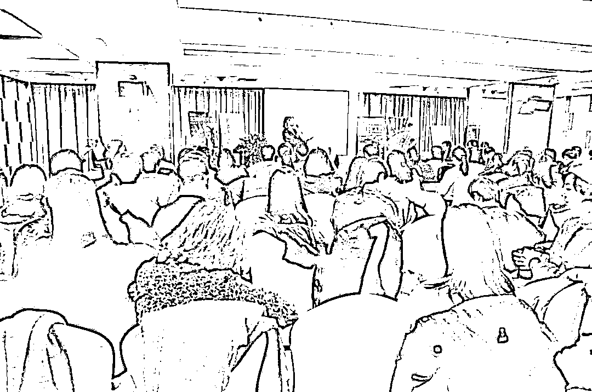

五天的时间过得飞快，转瞬之间，首届中国区的占星盛宴——2019 北京 ISAR 大会圆满落幕。
200 余位来自世界各地的小伙伴，历史性的见证和经历了严肃占星在中国的十年来的里程碑时刻。志同道合又合而不同的占星师们汇聚在一起成为一个共同的大家庭，现场可谓感动与欢乐汇聚，泪水与笑声齐飞。

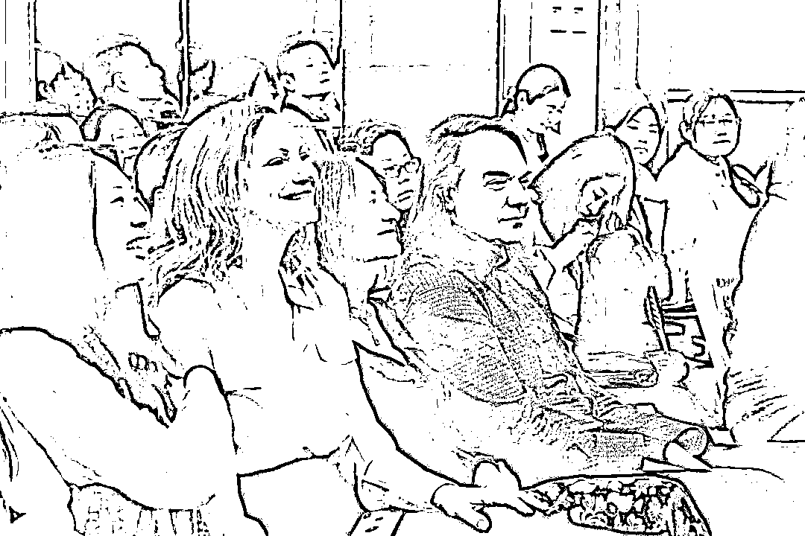

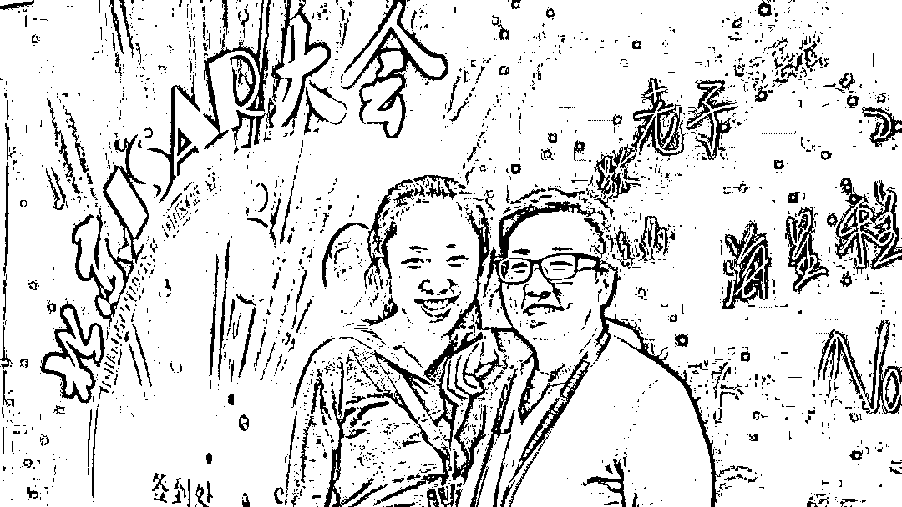

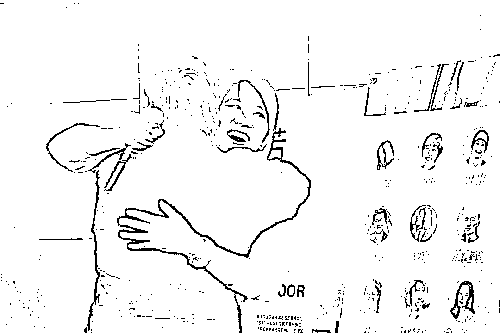


随着专业化和职业化的进程，越来越多中国朋友正在学习和进入严肃占星领域。本次大会本着共创共荣的初心，举办了四场工作坊、三场圆桌会议与 24 场占星演讲，一方面国际大师为大家带来了顶级的国际化占星视野，另一方面国内占星师前辈与新人同台竟演，展示自己独特的个人风格和研究领域。我们都在一个宏大的星空背景下找到了某种共同的方向。


在场的人不同的感受分享成为了最让人感动的瞬间。大家需要这样的一个大会来交流、碰撞彼此对于占星的看法，每个人思想的火花需要交叉和交汇，彼此才能够看见在交汇处能够产生什么。让我们带着这种感动和满足，回顾一下最后两天的盛况。
**现场直击：DAY 4**气场温和又强大的占星师**IRIS**，分享的是《**占星、戏剧与人生——戏剧如何支持星图整合**》。从原型的角度入手，延伸戏剧表现力，以戏剧为解构星图的手法，通过各种戏剧表现让在场的观众感受到不同行星、星座以及相位之间的能量和角力。以一种直接能感受到的方式，像一把精确的手术刀，切中在场观众的心。


**“戏剧最初的诞生不是为了娱乐大家，戏剧诞生是在问一个占星师最初也会问的问题：我到底是谁，我在这里做什么？是这样的发问，让我们与更大的世界联系在一起。”**90 后网红占星师**奶羊**，本次分享的是《**中西占星学对比之五星意义**》。占星学中关于太阳、月亮、水星、火星、金星的意涵大家已经很熟悉了，而通过从七政四余中对于五颗行星的理解，会让我们对这几颗占星学的基本行星多了一些不一样的角度去思考。


**“水的能量是有极强的流动性、活动性的，使用的是你的大脑。”**

国际候选荣格心理分析师在读的占星师**杨浠**，分享的是《**那些来访者教会我的事：分享从业四年来全职心理占星师的收获和所得**》。本身冥王星特质较重的杨浠，对于阴影和创伤都有其独特和深入的体验，在与个案之间的互动中，也加深了她对于这些议题方面的理解。俗话说“深入洞穴，寻其宝藏”，而关于阴影和创伤的部分也是一样，当我们深入其中探索，最终总会获得来自于生命的礼物。


**“星辰是指引我们方向的，长程的心理咨询中，占星学的行进可以指引客户识别当下议题。”**

占星师**刘娜**，此次分享的主题是《**家庭星象学看命运的模样**》。占星师刘娜从家族议题的角度入手，通过家庭成员之间星图的分析和交融，解读家族的议题。对于我们现代人来说，有时候家族感不是那么地强烈，但是实际上，我们的祖辈以及更往上的祖先，这种世代的关系对于我们的性格、经历等等都会有不同程度的影响。


**“星图是一张密码图，我们会了解世界的意义；通过家庭成员的星图、我们的星图，可以打开了解过去的那扇门，并且发现，我们需要知道什么。”******圆桌会谈之《关于占星研究的一切》****最后一天的圆桌论坛，可谓是阵容豪华——共由六位资深占星师组成：天空的空、海星程、女祭司、丁宏、Justine、郑玮玲。六位占星师毫不吝啬地分享自己与占星学缘起的那些事情，从个人经历的角度深入浅出地解析着占星学落实到每个人身上的不同作用力。占星师们还聊到占星学的经典问题：双胞胎。现场也非常共时性地收获了一对双胞胎关于星图的分享。


**“你需要去修行、修习。你要去找到你自己的路，我们可以去聆听别人的经验，但是别人的经验是无法复制的。——天空的空”**

**“你永远要知道你的点，每个人都是很独特的。那些最适合的东西会向你走来。——Justine”**

**“你只要愿意去研究就有助力和机缘。——海星程”**

**“你需要做真实的自己，面对自己真实的阴影。你的内在是有智慧的，就看你愿不愿意去聆听那个声音。——丁宏”**

**“内在探索的部分是不可或缺的。你在和客户工作的过程中，一定会反复地遇见自己生活的议题，与你共振。——女祭司”**

**“学占星的目的是要带有一种占星的觉识，我们做的工作是内在心灵向外的一种投射。——郑玮玲”**

是占星师同时也是瑜伽修习者的**Gaff**，此次分享的是《**占星与瑜伽的整合运用**》。在有关于占星学的实践当中，gaff 逐渐发现瑜伽对于客户能量发挥的妙用。而因为行星与身体之间的对应，可以通过针对性的体式和方法，来帮助用户发挥出不同的能量。


**“瑜伽帮助我们拆掉自己身上固有的东西，无论是思想情绪的固有模式，还是取出来身体上固有的阻塞的东西，因此瑜伽不是建立一个新模式，而是打破某个旧模式。”**《变幻的天空》、《一生的旅程》译者及占星师**Cora**，此次带来的分享主题是《**马克思盘的意义与实践价值**》。占星师 Cora 分享了自己有关于在咨询中使用马克思盘的经验，她认为，马克思盘对于关系的展现是较为具体和直接的，也是个人星图中关于关系议题的延伸表现。


**“马克思盘反映了‘与这段关系的关系’；关系是能量场，马克思盘是能量场的激发，我们需要从成长和进化的角度来看待它。”**
中国首批 ISAR 英文资质认证占星师**蓝女巫**，分享的是《**解密冥王星，去驶向意识的深海**》。蓝女巫用诗一样的语言，深入且迷人地挖掘了关于冥王星哲学性的议题，在场的观众无不感觉到跟随着演讲人经历了一场关于生与死、生命与意义的探索和思考。


**“存在的意义，这才是冥王星的最根本问题。”**

若道首届学员、国内首批获得 ISAR 资质认证的占星师**孙继红**，此次分享的是《**占星与脉轮**》。占星学让我们可以从理性的角度去认知去了解每个生命个体的能量中心的运行状态，同时我们每个人能根据自己的星图找到适合自己的日常练习。天上如是，人体亦然。占星师孙继红从古典瑜伽系统入手，让在场的观众了解到行星与身体，脉轮及意识的整合运作。


**“是什么让疗愈自然地发生？是爱。咨询关系会超过任何一种技术，借助这样一种关系完成疗愈。”****现场直击：DAY 5**ISAR 大会最后一天，琳恩老师《穿越边界-第八宫》工作坊里挤满了求知若渴的占星师与占星爱好者，大家不仅对琳恩老师充满了期待，也对深邃沉重的第八宫主题有着无限的好奇。


在琳恩老师充满力量和智慧的话语中，我们跟随着她沿着第八宫黑暗的阶梯不断向下走，走到深处，更深处。第八宫是一个通道、一个窄门，当我们向下走，穿越那扇窄门，我们会联结到其他的能量。引领我们看向未知的世界、未知的自己，去直面我们的恐惧、剖析我们的阴影面。那时我们的生命不再停留在表面，而是去触碰一个真实的自己，不论有多么不堪，那就是我们自己。第八宫的行星、宫主星，要你要走得更远，但当你去到这样一个困难的地方，你再回来之后将更有活力。


双子座能量很强的琳恩老师自带幽默感，工作坊上不时响起轻快的笑声，虽然主题沉重，却依旧让人感到希望与生机。工作坊结束后，大家蜂拥而上，不仅仅是与老师探讨占星学的种种，更纷纷与老师合影，留下这特别有纪念价值的一刻。


**“第八宫的旅程，让我们走下一道黑暗的阶梯，让我们更深入地走向自己，我们有可能超越业力。”****“第八宫是我们去接收到他人的能量，并允许他人去改变自己，可能是好的，也可能是坏的，但都非常有力量。”**

另一个会场上，ISAR 全球副主席，ISAR 考试委员会主席，若道创始人**大卫·瑞雷**，带来了一场关于《**不可思议的客户故事**》主题的工作坊。

对于年轻一代从业的占星师而言，很少有机会几十年陪伴自己的客户，亲眼见证他们的成长和改变，走向属于自己生命故事的风云变幻。这对于从业四十多年的占星师大卫·瑞雷而言，就是可以分享给年轻占星师不可多得的宝藏。


大卫·瑞雷细致地分享了四个精彩的案例故事，其中有的展现了情感模式对于一个人一生的影响；有的是人与动物之间的传奇故事。大卫还在工作坊上分享了关于自己祖辈的故事。在场的观众无不感受到来自于占星细致的能量展现。

工作坊后，大家争相与大卫·瑞雷合影。 


至此，五天的工作坊圆满结束了。在大会的闭幕式上，我们也收获了很多来自于在场参与者分享的感动。我们也想把这份感动分享给你们。


我觉得做占星师是很孤独的，很多人一开始不被理解。无论是周围朋友还是家人都说我从原来根正苗红的学物理的到算命先生。之前离职后憋了很久，想要分享自己做的统计，现在可以在大会上面分享出来真是太爽了。第一天做完圆桌会议后很轻松，很惬意的看着其他同行的表演，一路看下来很感恩，原来占星学已经在各个领域茁壮发展了。有一天也许我们的所学所做可以影响更多的人，会成为强有力的声音，而不是只当作特别边缘的、神叨叨的一帮人。所以特别感谢大卫老师、感谢 ISAR，给我们这样一个机会。


我有一个很重要的感触，生活赋予我们生命其实是非常伟大的。有一些面孔是我 10 年前就认识的，也有 5 年前、1 年前认识的，所以我这次觉得时光之门被打破了，这次大会就像一个家庭一样。我们其实在从事助人的功课，和人在一起工作，我们像改变自己一样在改变他们。


我和大卫结缘是在出版他的书的时候，我其实自己的英语是特别不好，我和大卫并没有很多语言交流，但是我不知道为什么，第一眼看到他就有一种内在很深的连接感存在。包括像蒋颖，我们认识得也很早。所以若道从成立到不断发展壮大，做 ISAR 资质认证的整个过程，很多过程我都是作为一个陪伴和见证。

这一次在中国也举办 ISAR 大会，可以分析自己的研究成果和学习心得，我对这个事情本身特别震动和感动。从第一天亚历山大老师的演讲，特别颠覆我之前对占星的认知，之后的中国占星同行朋友的分享，让我一次又一次的被打动和触动，有一个很强烈的能量共振在发生，在集体无意识的层面像漩涡一样的在发生。在未来的十年二十年，在很长的一个时期，整个中国的集体意识都会转化，这个是让我特别感动的一个事情。


这几天我一直默默的坐在边缘上听大家讲，因为我确实就是一个占星小白。我知道 ISAR 占星大会时是两个月前，我当时升起一股强烈的心念——我要来看一下。我也就是今年夏天的时候才接触占星找一些书来看。但是我就是很享受的这几天呆在这个会上，我想我也应该属于这里的一份子了，我相信有同频的能量所以才来到这里。我这几天也被 ISAR 演讲人深深的感动到，接下来我要做的事情就是去若道报名交学费。有一个想法就是，再过两年我也要站在那个演讲台上，希望我未来的演讲可以给更多有缘人一些启示。


之前我们一直在说，这是离宇宙最近的 120 个小时，而当这 120 个小时真的结束的时候，我们每个人的心里都怀着强烈的不舍与期盼。不舍的是此刻与每个人短暂的分离，期盼的是再次拥有这样美好的记忆。而唯有一点不变的是，我们与每个人的链接是真实的，也是深刻的。

最后想说的是，这份宇宙的时间是送给你们的。能够把这样一份礼物送到每个人的手里，也是我们的荣幸。

这次再见，我们 2021 年再见。

# 福利 | 新月报告免费送，属于你自己的许愿指南

> 原文：[`mp.weixin.qq.com/s?__biz=MzA5NjA0NTAxNg==&mid=2651411808&idx=3&sn=b54482ae45053de61b0c1b7734531616&chksm=8b4be7d7bc3c6ec1598979bd394f5b6f4e43dbe0f5efca44d30deba14c3714804033c58ce51e&scene=126&sessionid=1692738252#rd`](http://mp.weixin.qq.com/s?__biz=MzA5NjA0NTAxNg==&mid=2651411808&idx=3&sn=b54482ae45053de61b0c1b7734531616&chksm=8b4be7d7bc3c6ec1598979bd394f5b6f4e43dbe0f5efca44d30deba14c3714804033c58ce51e&scene=126&sessionid=1692738252#rd)

编辑/Tang 图片/网络

北京时间 2019 年 11 月 26 日 23:05，新月发生在射手座 4°3′。每到新月时分，若道君都会为你奉上根据你出生星图量身打造的免费新月报告。可是新月为什么要许愿？新月报告该如何领取？让若道君来教你。

　**什么是新月？**　

从占星学看，新月是月亮周期的一种相位。新月是开始，又称为朔，对应中国农历初一，太阳、月亮在此时合相。此时月亮运行到太阳与地球之间时，月亮以黑暗的一面对着地球，并且与太阳同升同落，地球上看不见月亮。

**本次新月时间**

**2019 年 11 月 26 日 23:05，新月发生在射手座 4°3′。**


**为什么新月要许愿？**

新月是一个周期的开始，新月发生的时候，太阳与月亮合相，能量很强。当新月出现时，你也许会发现灵感忽现，非常适宜开启新领域、项目与行动，缔结一段新的关系或合作。许愿会加强新月的能量，也有助于你了解自己现阶段适合开启的方向。 

**本次新月最佳许愿时间**

从新月开始到其后的 48 小时内，许愿的力量最强。

**最佳许愿时间：2019 年 11 月 26 日 23:05～11 月 28 日 23:05**


**这有一份属于你的免费新月报告，等待认领**

每到新月时刻，看着占星文章里写着：看看你新月的宫位，如果新月在第 X 宫，你可以许愿的方向是……

是不是常常一头雾水？新月的宫位？我到底该看哪里啊？

而有时，那些标注上升星座的文章也会让你忍不住想：虽然我的上升星座是这个，可是我的新月好像并不落在你说的宫位啊？你是不是写错了？


虽然这些文章都没有写错，可是好像对你而言都太不友好了。

**Don't Worry！**别着急，让博学又体贴的若道君来帮你！

我们推出了一份**免费**又**好用**的新月报告！

而且是专门为你设计的哦，**根据你出生星图为你量身打造的，只****属于你的独家新月报告**。

**报告有哪些内容？**

**新月时间****最佳许愿时间**

**如何许愿 **属于你的**许愿关键词**

本次新月给你的**建议**

你会有怎样的**感受 **

****机会****

********

**如何许愿？**

许愿方式也很简单。

你可以把愿望写下来，或者双手合十后交叉，闭上眼睛来祈祷。

报告中会为你提供**祈祷词示例**，可以多多参考哦～

你还可以适当添加自己的语言，创造属于你自己的祈祷文！

如果报告拿到手了，快对照着许愿吧！

**这份好用又暖心的报告，点击阅读原文即可领取！**

****

****点击“阅读原文”即可获取新月报告****


# 雷蒙德·梅里曼金融占星周运 | 可能出现短期反转趋势

> 原文：[`mp.weixin.qq.com/s?__biz=MzA5NjA0NTAxNg==&mid=2651411808&idx=2&sn=f4409a547d3c84d09f754f9d788a55b6&chksm=8b4be7d7bc3c6ec1c56fa90b31d492043071c837b4870d7fedfc9c0d06d3a952a035499e92f0&scene=126&sessionid=1692738252#rd`](http://mp.weixin.qq.com/s?__biz=MzA5NjA0NTAxNg==&mid=2651411808&idx=2&sn=f4409a547d3c84d09f754f9d788a55b6&chksm=8b4be7d7bc3c6ec1c56fa90b31d492043071c837b4870d7fedfc9c0d06d3a952a035499e92f0&scene=126&sessionid=1692738252#rd)


作者/雷蒙德·梅里曼翻译/Luke 校对/李含编辑/Tang 图片/unsplash

雷蒙德·梅里曼是在金融占星学界稳坐第一把交椅的占星师，同时他也是若道签约的金融占星课老师，我们引进了雷蒙德·梅里曼老师的《上证指数月度报告》《黄金周期月度报告》（感兴趣的同学可以扫码文末图片购买）。我们经老师的授权，将每周刊登梅里曼老师的周运，供大家参考和学习。于是，这是这周的周运（11.25-11.29）。

注意：美国将在 11 月 28 日星期四庆祝感恩节。美国市场在当天会休市。

**展望与回顾**

特朗普推特发消息声称，美国利率应该比其他国家利率低。因为美元是世界上最大的储蓄货币，有理由认为美国利率应该降低。不断下跌的贸易额削弱了这一观点。当前不断膨胀的美国财政赤字和预算赤字也表明，美国利率应该高于其他国家。 

——保罗·多诺万

瑞银早间评论

2019 年 11 月 19 日

全球贸易和经济增速放缓，可能是正在进行的美国总统弹劾程序导致的，如果不是，那可能是由于企业在了解 2020 年的世界贸易情况之前不愿意投放资金导致的。所有这些问题都是由相同的占星学因素引发的：**木星即将在 12 月 3 日离开向外扩展、性情乐观的射手座，将在明年与土星、冥王星一起合相在更加稳重和受限的摩羯座。这三颗行星将在 2020 年开始新一轮的合相周期，这正是所谓的“摩羯座星群”。**让我们从占星学的观点看问题。木星、土星、天王星、海王星和冥王星之间共有 10 个合相周期。这些是时间最长的行星周期，长度从 13-492 年不等。这 10 个周期中的 3 个周期的起点和终点将聚集在同一年，即 2020 年，这不寻常。最近一次在 12 个月以内出现三个长期相合周期是 1881-1882 年，但当时并没有出现在同一个星座，而且不包括土星和冥王星。当前情势的全球经济放缓，弹劾案都**和摩羯座星群有关，尤其是未来两个月内将出现的 31-37 年的土星/冥王星相合周期**。**木星射手座带来的进展，或更确切地说木星射手座带来的对进展的希望，正在逐渐停滞**。这就是为什么多个股票市场创下历史新高或多年来的新高后，上周停滞不前的原因。出于同样的原因，国债市场上周反弹，从而导致多个商品市场，比如黄金、白银和原油市场小幅反弹。然而，无论是股票市场的下跌还是贵金属市场的上涨，都不足以象征当前基本趋势的反转。这看起来更像是暂停阶段，**这在水星结束逆行处于停滞状态时是很正常的现象**。


**短期占星趋势与长期考量**

以色列总理本杰明·内塔尼亚胡因腐败指控被起诉……总检察长阿维猜·曼德尔布利特周四说，内塔尼亚胡面临贿赂、欺诈和违反信任三项腐败调查的指控……内塔尼亚胡的政治生涯现在可能取决于以色列议会是否给予他豁免权，这使他在离开议会机构前暂时不被起诉。

——费利西亚·施瓦茨和多弗利贝尔

《以色列内塔尼亚胡因受贿和欺诈指控被起诉》

《华尔街日报》

2019 年 11 月 22 日


**将于 2020 年 1 月 12 日发生的 32-37 年的土星/冥王星合相已经在美国之外的地区充分施展其影响力。****土星和摩羯座**与世界各个国家的政府有关，**冥王星**与针对世界领导人的腐败指控，或世界领导人对敌人或构成威胁的人提出的腐败指控有关。这个相位与弹劾、免职或剥夺权力有关。**这是一种转化或改革的力量，针对的是领导者或机构获取权威和权力的架构和方式。**

**冥王星和火星共同守护天蝎座**。上周，火星进入天蝎座，它会在这个星座停留到 2020 年 1 月 3 日。因为冥王星和天蝎座掌管着调查、揭露和掩盖不法行为的指控（比如勒索、贿赂），看到对特朗普总统和内塔尼亚胡总理的弹劾上周成为头条新闻也就不足为奇了。这些弹劾的活动不太可能在土星和冥王星在 1 月 12 日合相前结束。

然而，至今为止，看来弹劾对世界股票指数没有太多负面影响。在美国，投资者发出信号，指出他们不希望特朗普总统被免职。然而，火星天蝎座在 11 月 24 日与天王星形成对分相。**仅这个相位就和全球股市在 4 个交易日内突然大幅下跌有着很强的历史相关性，此后往往迎来强劲反弹**。

在 11 月 27 日周末的时候，海王星将转向停滞顺行。**海王星是原油的守护星之一，能源市场近期的趋势可能会反转**。事实上，木星和海王星共同掌管着原油，一直到 12 月 20 日时都会保持活跃，因为当天木星与天王星形成三分相，此后 12 月 26-27 日新月合相木星。对诸多金融市场来说，今年年底的表现将十分有趣，因为**对于木星来说，没有小事，每件事都被夸大**。

总结来看，水星和海王星都将在 11 月 21 日-27 日期间出现由逆行转为顺行的停滞状态。**两颗行星在一周之内接连改变方向往往是金融市场短期趋势即将反转的信号。**这两颗行星的象征含义很有趣：水星代表沟通和信息，海王星往往与谣言和错误的讯息联系在一起。这段时间不利于揭露谎言，虚假信息可能会到处蔓延（已经是这样了）。然而，这段时间对于音乐，舞蹈和艺术有利。

太阳位于聚会和庆祝的星座射手座，这段时间适合与朋友和家人团聚，享受节日气氛。在美国，这是庆祝感恩节的好时机。然而，现在参与政治辩论可能不太明智，因为火星位于天蝎座，而且土星即将合相冥王星。射手座代表轻松快乐的氛围，但是火星天蝎座与土冥合相在摩羯座则代表沉重的气氛。如果不够谨慎，出口可以伤人，哪怕本意不是如此。人们可能对说出的话变得不够小心，而其他人对自己听到的话过分敏感。这就是为什么**谣言、错误的信息和误解可能主导这周金融市场的趋势**。

**版权声明：**本文由若道翻译发布，欢迎转发，反对抄袭。友号转载请申请白名单。


**雷蒙德·梅里曼（Raymond Merriman）**

若道签约老师。著名金融占星师，ISAR（国际占星研究协会）前主席，梅里曼市场分析公司的总裁。他由于“提升了占星学的职业形象”，在 1995 年国际占星大会上被授予轩辕十四奖；在 2012 年国际占星大会上，被授予轩辕十四终身成就奖。

1“中国上证指数月度报告”发售

**从****7****月开始，若道推出了****中文版****的雷蒙德·梅里曼中国上证指数月度报告，并持续发行该报告！**

当把金融市场的周期和占星学的周期相结合时，雷蒙德·梅里曼老师的金融占星学研究**为投资者应对金融市场的周期波动，并随之调整投资策略提供了极大的价值参考**。

2“黄金价格周期月度报告”发售

**现在，又有一个好消息要告诉你。从****9****月开始，若道将推出****中文版****的雷蒙德·梅里曼黄金价格周期月度报告！**不仅仅为广大读者在中国股市的投资出谋划策，更将视角放眼黄金市场。

**每当世界经济形式不明朗的时候，有一个地方是保值的港湾，那就是****黄金**。从 2018 年 8 月开始，黄金已经用自己的升值再次提醒众人它在经济不稳定时的位置。**截至目前，2019 年 8 月底，黄金已飙升至 6 年新高，高于 1565 美元。**

自 1982 年雷蒙德·梅里曼出版第一本研究《地球宇宙学征象与黄金价格的关联》的著作以来，**他一直作为最重要的黄金市场时机预测者之一享誉国际**。

过去 1 年，那些订阅并遵循建议的梅里曼市场时机学院日报和周报的订阅者，如果从 2018 年 8 月 16 日的低点或 8 月 23-24 日的次低点购买黄金，他们已经赚到了不少的 30%左右的利润。

**购买套餐**，买得越多越优惠

**11 月报告均已更新！**

中国上证指数月度报告套餐价

*   **单月报告**：280 元

*   **3 个月套餐**：780 元（260 元/月）

*   **12 个月套餐价**：1999 元（166 元/月）

**长按下图识别二维码**

**购买金融报告****套餐**

**▼**


黄金周期月度报告超级优惠折扣

*   **同时购买上证指数 12 个月套餐**和**黄金周期报告 12 个月套餐**，即可享受黄金周期报告 12 个月套餐**立减 1199**元的**超级优惠折扣**。

*   **已经购买**了**上证指数 12 个月套餐**的朋友，**再购买**黄金周期报告 12 个月套餐，也可享受**立减 1199**元的**超级优惠折扣**。**购买黄金周期报告 12 个月套餐时，超级优惠折扣会自动生效**。

**长按下图识别二维码购买黄金报告套餐**

▼


**微信又双叒叕改版啦，不想错过若道君的推送？**

**就把若道设为星标吧！**

**▼**


********点击阅读原文购买金融报告********


# 射手座新月 | 在“银河中心”穿越黑洞，重建信心与希望

> 原文：[`mp.weixin.qq.com/s?__biz=MzA5NjA0NTAxNg==&mid=2651411808&idx=1&sn=2a38e3e94aa0469492965ca9ab2fbf78&chksm=8b4be7d7bc3c6ec14756efb4a410bfa92032643953d76ee7fcf52373a18e0ccf175b51671084&scene=126&sessionid=1692738252#rd`](http://mp.weixin.qq.com/s?__biz=MzA5NjA0NTAxNg==&mid=2651411808&idx=1&sn=2a38e3e94aa0469492965ca9ab2fbf78&chksm=8b4be7d7bc3c6ec14756efb4a410bfa92032643953d76ee7fcf52373a18e0ccf175b51671084&scene=126&sessionid=1692738252#rd)

******************☆ **************后台回复“今日”，给你一句生命态度****


作者/王芝桦 编辑/玫瑰 图片/Unsplash
**射手座新月****北京时间 2019 年 11 月 26 日 23:05 迎来射手座新月，太阳与月亮精准合相于射手座 4°03′。**变化意味着全新开端的到来。此次射手座新月发生在充满神秘变化，又极具开启意义的宇宙时空之中，奏响**“规划未来 30 年现实格局”**的前奏，拉开**“开启未来 12 年经济周期”**的序幕。

**射手座新月重点影响人群**

**·**出生星图中，有**行星、四轴、南北交点落入固定星座（金牛座、狮子座、天蝎座、水瓶座）0-7,11-18 度**的人群。 

**· **出生星图中，有**行星、四轴、南北交点落入基本星座（白羊座、巨蟹座、天秤座、摩羯座 0-5,14-24 度**的人群。 

**·** 出生星图中，有**行星、四轴、南北交点落入变动星座（双子座、射手座、处女座、双鱼座）0-8,12-18,25-30 度**的人群。

**“银河中心”的穿越旅行**


**如果我们已经抵达终点，则人类精神将枯萎死亡。但我认为，我们将永远不会停止：我们若不更加深邃，定将更加复杂。**

**——史蒂芬.霍金 《果壳中的宇宙》**


| 银河中心﹐即银河系的自转轴与银道面的交点。银心在射手座（图中写为人马座）方向。它是银河系的中心凸出部分，很亮的球状。在中心区域可能存在着一个巨大的黑洞，星系核的活动十分剧烈。2019 年 11 月注定是一个重要而敏感的时间点，中旬开始，木星逐渐进入占星师们相当在意的特殊位置——**银河中心**。1974 年 2 月发现的“银河中心”，从地球观测目前正处于射手座 27 度多的位置上，意味着**所有行进在射手座最后 5 度的行星都将与“银河中心”形成合相，在经过“银河中心”的洗礼之后才能迈入摩羯座。**说到“银河中心”就要说到“连光都无法逃逸的黑洞”，**“银河中心”的洗礼亦是“穿越黑洞”的旅程**。从占星学的视角，“黑洞”蕴含着将旧有模式转化的疗愈机会，布置出将无用残渣清除的净化功课，为那些更高阶的意识和更有意义的智慧腾出空间。清除和转化，才能露出安全根基**天象**

*   **金木合相银河中心**：金星与木星合相于射手座的银河中心位置；
*   **火天对分**：行进于天蝎座的火星对分逆行于金牛座的天王星；
*   **水海三分**：行进于天蝎座的水星三分逆行于双鱼座的海王星。

**11 月 24 日**是值得标记的一天：“金木合相银河中心”正处能量核心，“火天对分”结构紧密呈相，“水海三分”结构初步形成（11 月 21 日，水星于天蝎座恢复顺行，新月转天 11 月 27 日海王星于双鱼座恢复顺行）。火星和木星最终定位并接纳着这几组结构的能量表达。**火星在天蝎座**的行进**从 2019 年 11 月 19 日-2020 年 1 月 3 日**，引领我们**透过情绪的投射进入内在的觉察，对“早已意识到，但却没有改变”的老旧模式进行清除和转化**；木星每 12 年回归到自己守护的射手座，2019 年木星在“银河中心”的洗礼发生**在 11 月 9 日-12 月 3 日**，引领我们**通过外在机遇触碰到内在理想，对“想做但不敢做，不能做却盲目做”的内在功课进行清除和转化**。火星和木星共同指向**“清除和转化”**。

虽然 2019 年的“洗牌”工作已经进行了将近一年，**打碎了不少“不着地的理想”，浇灭了不少“盲目性的激情”，但依然隐藏着不少“逃避现实危机的侥幸心理”，以及“喂养膨胀欲望的冒险行为”**，而 2020 年 1 月即将到来的**“土冥合相”**重磅大戏则在前方等着我们的“补课和填坑”。

“清除和转化”意味着会打碎一些人事物的结构，改写一些观念的编码，这无疑会令人感到失望和焦虑，但更会**将愚钝和虚妄从各种假象中唤醒**，原来“曾经以为的自己”仍有真相，原来“向外投射的自我追寻”毫无意义。但是，也只有将那些不再具有建设性的人事物打碎，将那些禁锢自我的观念改写，才能让我们清晰地看到——还能踩稳的（剩余的）“安全根基”是什么。


在伤痛的中心，获得疗愈和升级**天象**

*   **天王星同新月成梅花相位**：逆行于金牛座的天王星与射手座新月形成 150 度梅花结构；
*   **火星与新月成 30 度相位**：行进于天蝎座的火星与射手座新月形成 30 度结构。
*   **“金凯四分”与“木凯四分”**：逆行于白羊座的凯龙星四分摩羯座金星，四分射手座木星。

如果说 11 月 24 日的“金木合相银河中心”是一场**“暂别光辉岁月”**的告别仪式，那么此次射手座新月的“天王与新月梅花”结构就是这场仪式的变奏尾曲：**新月当天，接纳了金牛座天王星能量的金星走过“银河中心”迈入摩羯座；12 月 3 日，接纳了射手座新月能量的木星走过“银河中心”迈入摩羯座。**射手座是时空中的旅行者，但是摩羯座是红尘中的大修行家。于是，一边是射手座的“辉煌”落幕了，但另一边却是摩羯座的“账单”马上要来了。“金凯四分”结构与“木凯四分”结构引发我们**对“内在小孩”的关注**。如果愿意面对真实的自己并接纳内在的阴影，就能听到**“那些必须和应该的观念限制了心灵的自由”**，感应**“那些不行和不好的自我认同埋下了身体的隐痛”**，这个时候“火星新月 30 度”结构就能帮助我们**唤醒“寻回内在力量”的生命渴望，联结“创造未来自我”的生命动力。**

遇见全新的自己，升级高阶的意识，这两个部分都无法从外界获得。我们需要**回归内在家园，与内在小孩真诚相见，与内在伤痛平静相对**——为什么一定要出类拔萃呢？为什么就不能遇到挫折呢？很多时候，恰恰是自我的有限认知折磨了自己。

自我成长是什么？其实是**自我试错和自我回归**的游戏，最终与**“本自圆满”**的自我核心合二为一。故而，只有在试错的路上，只有在伤痛的中心，真正的疗愈和升级才会到来。从此刻起，感恩自己踩稳的“安全根基”吧，因为未来正是构建在这个“安全根基”之上的作品。当下需要觉察的是：**我愿意付出多少努力，我能够接受多少考验？**


全新经济周期到来**天象**

*   **“金天三分”与“木天三分”**：金牛座天王星三分摩羯座金星，三分射手座木星。

今天恰好在微博上看到这样一句话：**“每年 12 月市场都是跌的多”**。每年真的谈不上，但是有些特殊年份确实会揭示出经济周期的曲线。

12 月中的大半时间属于“射手月”，当太阳行进在射手座的时候，距离太阳相对较近的快速行星（水星、金星、火星）总是不太远地陪伴在太阳左右，而如果那一年恰好有慢速行星（木星、土星、天王星、海王星、冥王星）行进在射手座尾度，走过“银河中心”并迈入摩羯座，就容易呈现出慢速行星和快速行星之间能量搭配的相似模型。

*   **2008 年**：11 月 12 日，“金木合相银河中心”，火星行进在天蝎座。全球金融风暴时期；
*   **2017 年**：12 月，金星紧跟土星脚步走过银河中心，火星行进在天蝎座。金融周期转换奏响前奏。
*   **2019 年**：12 月 24 日，“金木合相银河中心”，火星行进在天蝎座。金融周期转换正式开启。

2019 年，无疑已经将两个经济周期的转换进程正式开启，无论是国际合作的谈判，还是世界经济架构的调整，无一不在揭示——**旧的游戏规则已经落伍，新的游戏规则即将整合。**这个转换过程势必会带来一些震荡，造成一些迷茫，无论市场业态或职场沉浮都让我们感觉到大背景的严峻，无论金融趋势或货币政策都在让我们猜测全球通缩的挑战。随着浮夸的崩塌和泡沫的破灭，人们的意识之中开始出现更为深刻的反省，更为落地的考量，集体文化也将向着更为**“有序，有爱”**的层级迈进。回顾前面提到的 2008 年和 2017 年的金融环境，不难发现**整体并没有真正的回落，只是局部或个别的动荡，而那些动荡的也只是没有踩稳“安全根基”，或是对世界不再具有贡献的部分**。故而，2019 年的年末，我们要知道自己的站位和实力，更要对 2020 年规则重建和格局重构的充满信心，而对于我们每个人更重要的是**“做好自己”**。此次射手座新月，两句话送给 2019 年-2020 年的过度时刻：

*   **有些时候，什么都不干就是干了最重要的事。**

*   **特殊时期，“不做后悔的事”比“后悔没做的事”更为关键。**


可能经历的

*   **关系**

*   内心猜忌和原有隔阂被引爆，自我保护与不容侵犯被激活，撕开隐情，立场站队，利益冲突，关系决裂，每一种都带着原始本能的冲动和剑拔弩张的气势。在你所处的这段关系中，或许你并不喜欢自己现在的状态，或是并不想成为现在的样子，那么你可以选择未来的自己。没有任何东西可以困住你，但也没有任何东西能够帮到你，你只有自己（当然还有心理占星师的陪伴）。 

*   **职场**

*   有人撑不下去想跳槽离开，有人心有不甘想最后一搏，其实我想说句实话，这两年能够活下来并保存实力的就是好样的。当然也有新的机会出现，可能是你没有经验的领域或并不擅长的事物，但是 2020 年恐怕我们就要迎接“有些难度的挑战”，做出“全力以赴的努力”，那么现在就是选择主动或被动的时刻。

*   **财务**

*   看紧钱袋！朴素生活！金钱纠葛或收付账款的处理可以借助相关法律；有出境计划的朋友近期需要关注有无限制性的政策和新闻。 

*   **集体**

*   教育和互联网行业值得关注，或有政策出台，或有新闻曝出。


**寄语**

 

**当爱因斯坦说“上帝并不掷骰子”的时候他错了。黑洞的研究证明，上帝不但掷骰子，他还经常把骰子掷到我们看不到的地方来使我们迷惑。**

**——史蒂芬.霍金 《时空本性》**作为人类，我们不但对宇宙有盲点，对自己也有盲点。2019 年是非常奇特的一年，我们借助科学看到了“黑洞”的真实样子，也通过现实洞悉到“自我”的真实样子。宇宙大循环与生命小循环“如在其上，如在其下”地共振着：宇宙中的一切围绕着“银河中心”旋转，我们生活中的一切围绕着“生命中心”旋转；**内在自我是什么样的层级和状态，外在现实就是什么样的层级和状态。**任何一个可以称之为“中心”的事物，都需要具备强大的磁场和坚稳的根基。2019 年的射手座新月，如果现实的压力令“流浪的旅者”潇洒不起来，那么“流浪的旅者”可能并不知道自己要向哪里去，可以说，现实束缚了他的自由，但是没有自由的他又如何创造潇洒的现实呢？那么，尝试看向自己的内心，找找那个“经常看不到的骰子”在哪里，觉察自己的磁场是否自信，检视自己的根基是否坚稳，然后带着更为宏大的视角看待生命在红尘中的旅行，就像那首非常适合射手座的吉普赛歌谣所唱的：**时间是用来流浪的，****身躯是用来相爱的，****生命是用来遗忘的，****灵魂是用来歌唱的。**祝福大家。


**新月如何许愿？****许愿时间**：北京时间 2019 年 11 月 26 日 23:05 后，48 小时内有效、8 小时内最佳。**许愿人群**：所有人。**许愿数量**：每人最多 10 个。**许愿方式**：静心冥想，身心祈祷或记录收藏。**许愿格式**：请万能的宇宙赐予我能量，我将以我的能量吸引**（什么）来到生命中……**许愿原则**：发心诚善利人。

**版权声明**：原创文章由作者授权首发于若道平台，欢迎转发，反对抄袭。友号转载请申请白名单。

****

****想阅读更多作者的文章，****

****请在后台回复******王芝桦****** 即可。****

****王芝桦****

心理占星师，统合疗愈师，占星专栏作者

全职于个案咨询与占星教学工作 14 年

**个案预约咨询微信号**：zhihua0621 

**微信公众号**：daoxi-life

**长按打赏**

****

**福利来啦**

**点击**

**“阅读原文”**

**获取最好用的免费**

**新月报告**

****获取免费新月报告，请点击文末“阅读原文”****


# 原来星图这些逆行行星，都跟你未完成的灵魂功课有关……

> 原文：[`mp.weixin.qq.com/s?__biz=MzA5NjA0NTAxNg==&mid=2651411762&idx=1&sn=1ca2ae3bb9c13462d9ea307866a450c3&chksm=8b4be785bc3c6e93db8c504f8d5883e72efcffb6e98621f85fe466fe3171ec158aa95b17738d&scene=126&sessionid=1692738252#rd`](http://mp.weixin.qq.com/s?__biz=MzA5NjA0NTAxNg==&mid=2651411762&idx=1&sn=1ca2ae3bb9c13462d9ea307866a450c3&chksm=8b4be785bc3c6e93db8c504f8d5883e72efcffb6e98621f85fe466fe3171ec158aa95b17738d&scene=126&sessionid=1692738252#rd)

****************☆ 后台回复“今日”，给你一句生命态度****************

作者/曼迪·洛克利 译者/Jun 校对/Arrow 编辑/Tang 封面/书君 图片/unsplash 今天，若道君想和你聊聊关于灵魂的那些事儿。我们出生星图中逆行的行星，可以帮助我们深刻地理解我们的过去的生活/业力问题和挑战，但这并不意味着我们在过去的生活中是“坏的”或“失败的”，所以不要苛刻地评判自己。一起来看看，那些逆行的行星都想要向我们传递些什么吧！**灵魂的功课**

我相信每个灵魂来到这个世界，都有自己的天命，自愿学习的一系列功课，以及选择接受的一系列挑战。这些都是为了帮助灵魂成长和学习而设计的。然而，在地球这里，我相信我们有自由意志来决定是否接受这些挑战，或如何应对它们。

**当你阅读我列出的每一个逆行行星的“意义”时，请记住这仅仅是符合每颗行星的传统象征意义的建议。不要把它们当作“解读”，而是把它们当作提示你的****启发****，然后让你自己的经验和直觉引导你发现你的逆行行星对你个人意味着什么。答案没有对错。**

同样值得考虑的是，有些前世的问题需要释然，这样灵魂才能继续前进。例如，那些在前世因自己的思想和观点而受到迫害的灵魂，今生可能需要释放对自由言论的恐惧，这样他们才能完成自己的使命。那些前世过着修行生活、发过贞洁或贫穷誓言的灵魂，可能需要在这一世从那些誓言中解脱出来，以便放下对财富和性行为的负面恐惧和情绪。


**出生星图中逆行行星的意义****所有的行星（除了太阳和月亮）都会逆行一段时间，大多数人在他们的出生星图上都有一颗或多颗逆行行星。**当一颗行星逆行时，你可能会从内部和主观上体验到它的能量。在早年生活中，你可能会在这颗行星所代表的生活领域遇到困难，但是在以后的生活中你会得到第二次机会。
**业力占星师认为我们出生星图上逆行的行星代表**:

*   **前世的未尽事宜。**
*   **通过解决前世问题来平衡业力的第二次机会。**
*   **有机会放下那些一直在今生阻碍你的前世问题。**
*   **可以帮助你的灵魂在这一世成长的前世能量。**
*   **可以找到前世被剥夺的满足感和成就感的机会。**


**如何知道自己出生星图中哪颗行星逆行？**

打开若道公众号进入后台，选择“**占星服务-在线星盘-出生盘**”，输入**出生信息**，点击下一步生成出生星图，行星符号下标注了 **R **的即是出生星图中逆行的行星，见下图~


1 水星逆行

*   前世关于沟通和自我表达的未尽事宜。

*   克服前世对批评的恐惧的第二次机会。

*   释放前世对畅所欲言的恐惧的机会。也许你在前世因为你的观点而受害，但是现在你有机会说出来并且被听到。

*   通过学习倾听他人的观点，或通过学习保持灵活并接受新思想来使灵魂成长的机会。

*   通过学习和教育获得满足感和成就感的机会。如果你前世没有受过教育，今生可以弥补。

2 金星逆行

*   前世在关系中的未尽事宜。

*   有第二次机会去体验前世被拒绝或失去的爱和感情。

*   通过建立人际关系，有机会摆脱无益的情绪化行为和恐惧。例如，学会信任他人并敞开心扉。

*   释放并治愈前世低自尊问题的机会。

*   通过学习在关系中给予和接受来使灵魂成长的机会。

*   有机会通过人际关系和亲密关系、或者通过重视自己和他人来获得满足感和成就感。

3 火星逆行

*   前世关于竞争和自我主张未尽事宜。

*   有第二次机会来平衡过去不义之行的业力，你的潜意识仍因此感到内疚。

*   释放前世遗留下来的愤怒和沮丧的机会。

*   通过学习积极和健康地坚持自我来使灵魂成长的机会。

*   有机会通过积极行动来获得你真正想要的和需要的，以此来获得满足感和成就感。

*   学习如何跟随你的激情和欲望的机会。

4 木星逆行

*   有机会通过深入审视自己，找到真理和意义，从而完结前世的议题。

*   有机会放下来自前世不值得拥有奖励和财富的感觉。

*   通过解决精神和宗教信仰的问题来使灵魂成长的机会。例如，你可能在前世因为宗教信仰而受到迫害，或者你被迫信仰一个你并不相信的宗教。

*   有第二次机会通过以下方式找到满足感和成就感：深度学习和高等教育；体验不同的国家和文化；学会对生活、对自己和对世界有信心。

5 土星逆行

*   前世那些让你感到不足、悲观或受阻的未尽事宜。这些问题可以通过直面它们并采取积极措施来解决。

*   有第二次机会通过解决你过去难以承担责任或设定健康界限的问题来平衡业力。

*   有机会放下前世可能阻碍你前进的恐惧。

*   通过成为父母或权威来使灵魂成长的机会。

*   通过成功并用自己的努力赢得尊重来获得灵魂成长，而不是走捷径。

*   有机会通过耐心和勤奋地朝着长期目标努力而获得满足感和成就感。


6 天王星逆行

*   前世你拒绝改变的未尽事宜。在这一生中，你学会改变可能是一件好事。

*   有机会通过敢于按照自己的方式行事来平衡前世业力，即使这会打破现状。

*   放下前世恐惧的机会，前世害怕因为与众不同而受到迫害。

*   追求独立和自由的机会，这在过去的生活中被剥夺了。

*   通过拥抱你的个性和独创性来使灵魂成长的机会。

*   通过真实的生活、做真实的自己获得到满足感和成就感的机会。

7 海王星逆行

*   前世让你极度敏感的未尽事宜。今生，你可以学会用你的敏感去帮助别人，同时学会设定健康的个人界限。

*   通过拥抱你的创造力和想象力来平衡业力的机会，特别是如果你在前世未曾培养这些。

*   让你放弃那些无益幻想和逃避现实倾向的机会，这些东西前世一直阻碍着你。

*   认识到生活中除了你用五官能看到的和摸到的，还有更多的东西，以此使灵魂成长。

*   通过培养对自己和所有生命的慈悲心来获得满足感和成就感的机会。

8 冥王星逆行

*   前世围绕权力和控制权问题未尽事宜。也许你在前世没有能力或控制力，或者你拥有太多而滥用它。今生，你认识到可以健康地、有建设性地使用权力和控制力，而不是以破坏性的方式。你可能还需要认识到，生活中有些事情是你无法控制的。

*   有机会通过清除无益的、自我毁灭的行为和情绪去平衡业力和重生。

*   有机会通过探寻旧（前世）问题的新视角而获得解脱，由此平衡业力。

*   有机会通过学习更冷静、更有控制地处理生活的起起伏伏，从而放下前世对危机和动荡生活的沉迷。

*   通过学习相信你的直觉来使灵魂成长的机会。

*   认识到当你不能总是控制发生在你身上的事情时，你可以控制你的反应和反应，以此来使灵魂成长。

*   通过学习诚实和宽容来获得满足感和成就感的机会。


## 你需要注意的是，外行星（天王星、海王星、冥王星）有很长时间在逆行，大多数灵魂来到这个世界上至少有一颗外行星逆行。

这些是世代行星，所以如果你的星图中有一个或多个外行星逆行，你就是有集体业力需要解决的一代人中的一份子。因此，逆行的外行星可能在个人/个体层面上与你没有太多的业力共振。然而，如果你逆行的外行星在轴点上（如上升或中天），或者与你的个人行星（太阳、月亮、水星、金星、火星）呈紧密相位，那么它可能对你有一 些业力意义。如果你太不确定，就听从你的直觉和经验。

**你的出生星图有行星逆行吗？**

**欢迎在留言区和我们分享你的感受～**

”

**ISAR 大会仍然在进行时，明天我们会推出最后两天精彩内容的回顾，敬请期待~**

**版权声明：**本文由若道翻译发布，欢迎转发，反对抄袭。友号转载请申请白名单。


**曼迪·洛克利**

伦敦的一位占星师、作家。2012 年，她出版了电子书《天蝎座土星：穿越黑暗的指南》(*Saturn in Scorpio: Your Guide Through the Dark*)，还以小说作家的身份出版了作品。

******点击图片查看若道君推荐******


**微信又又又改版啦，不想错过若道的推送？**

**就把若道设为星标吧！**

**▼**


就是这个“在看”，戳戳戳 ☟

**如何报名？请点击“阅读原文”**


# 苏·汤普金斯核心课 L4-5 | 领你研习爱情、职业、预测&咨询

> 原文：[`mp.weixin.qq.com/s?__biz=MzA5NjA0NTAxNg==&mid=2651411762&idx=2&sn=72e28e0b9e574d6025111e01c7ebf062&chksm=8b4be785bc3c6e93ec49f06a81d0eaefc9912a4ce684cd8f16469ee032001f9b5161cfb3da6e&scene=126&sessionid=1692738252#rd`](http://mp.weixin.qq.com/s?__biz=MzA5NjA0NTAxNg==&mid=2651411762&idx=2&sn=72e28e0b9e574d6025111e01c7ebf062&chksm=8b4be785bc3c6e93ec49f06a81d0eaefc9912a4ce684cd8f16469ee032001f9b5161cfb3da6e&scene=126&sessionid=1692738252#rd)


**苏·汤普金斯，英国目前****最资深****的占星学家和咨询师之一，她拥有****超过 40 年****的占星经验，是占星学习者****必备****之两本圣经《顺逆皆宜的人生》与《当代占星研究》作者。**

**她以自己的冷幽默、****抽丝剥茧的研究天分****和****占星直觉****而闻名。她是一名执业占星师，也是一名顺势疗法医师，是心灵和身体的****敏锐诊断专家。**

**2003 年，为表彰其卓越贡献，英国占星协会为苏·汤普金斯授予查尔斯·哈维****终身成就奖。**

**第一届苏·汤普金斯核心课****金牌助教：ISAR 认证占星师咔咔****会在第二届核心课中和苏·汤普金斯老师联合授课。咔咔是最熟悉苏·汤普金斯老师教学风格的中文占星老师，可以帮助学员更好地****梳理知识架构****，了解学员的****学习进度和疑问。**

**两本占星学必备圣经出自她！**


**《当代占星研究》**

01

本书由当代占星权威苏·汤普金斯女士集 30 年研究成果撰述而成。全书观点独到犀利，展现出作者对占星学这门学问**极富洞察力和启发性的理解**。

本书架构严谨清晰，语言易于理解，阐释深入精微，其内容涵盖占星学的历史背景、理论基础、星座意义、宫位象征、相位图形、星图解读，可用以检视人格模式、心理需求、情绪处理、人际互动、生涯发展等各个人生面向。**这本书是理解占星学精髓的入门指南，是广大占星爱好者进入严肃占星学领域一窥堂奥的必备经典。**


**《顺逆皆宜的人生》**

02

★《当代占星研究》作者的另一部经典力作 

★ 西方占星学界最权威的著作之一

★ 全面解读各种占星相位的含义

★ 即台版书《占星相位研究》

苏·汤普金斯倾注多年从事占星研究和实践的心血完成此书，以幽默而精准的语言，详解各种相位所代表的能量运作方式，有助我们理解心理模式的复杂面向。又举诸多名人为例，使相位含义变得更为生动和容易理解。

**名人推荐**“**苏·汤普金斯的《顺逆皆宜的人生》令人赞叹！苏是一名倍受爱戴的老师，并且任教多年。苏以自己的冷幽默、抽丝剥茧的研究天分和占星直觉而闻名。她是一名执业占星师，也是一名顺势疗法医师，是心灵和身体的敏锐诊断专家。**
** ——法国心理占星学协会会长琳恩·贝尔**
”**苏老师的智慧语录**“

**相位是星图的能量所在，这些能量能够把星图从毫无生气的一张纸，变成能够象征人类生命力与活力、冲突与喜悦的符号。占星学的解读技巧，就在于把各种象征符号，整合成一个综合性的结论。**

**占星学的的确确是我日常生中必不可少的部分，除去英语，它甚至是我思考的主要语言。或者换种说法表达，占星学的征象在很大程度上代表了我独特的信仰体系，占星学的世界观因此成为我的人生观。**

”**课程内容**

**第*****4*****阶：出生星图解读（进阶），以及关系与职业议题**

*   相位模式

*   含相位模式的星图解读

*   元素失衡的解读方法

*   最终定位星

*   星图中的人物

*   星图中的人物（续）：双亲、手足、爱人

*   爱情关系：星图比较，包括学生作业、示例、3 或 4 个学生案例演示！

*   职业解读

**第*****5*****阶：预测、关系、咨询、为执业和考试做准备**

*   预测观与行进
*   推进（尤其是次限推进），它们是什么以及如何应用？
*   太阳弧
*   三种技巧结合使用
*   时机、月相与解读
*   示例与案例
*   太阳返照图、月亮返照图及其他
*   学员案例
*   星图解读结合预测的案例
*   如何利用星图为事件（婚礼、商务等）择时？
*   关系议题，复习第四阶所学
*   更多评估关系的技巧，组合图及关系星图
*   其他不为人所知但有效的评估关系的技巧
*   中点入门
*   关系示例，各种关系技巧与预测相结合，学员案例
*   创造性相位——72°和七分相
*   心理学与咨询模式与技巧，以当代心理学思想为核心，倾向于“以人为本”的占星师
*   倾听技巧，咨询方法，道德议题
*   为执业做准备
*   如何以占星师为职业谋生
*   必要的历史和天文学知识，为考试做准备

**强大的导师及助教团队**


**苏·汤普金斯（Sue Tompkins）**

**英国目前最资深的占星学家和咨询师之一，她拥有超过四十年的占星经验。**占星学习者必备之两本圣经**《当代占星研究》**和**《顺逆皆宜的人生》**作者。


**占星师咔咔（Caroline）**

若道首届学员，国内最早获得 ISAR（CAP）职业占星师资质的职业占星师(2013 年获得认证)，现兼任若道占星核心课程助教。

在国际知名广告公司和市场研究公司从事的市场研究和推广工作十余年，曾任职于阳狮集团、尼尔森市场研究有限公司、MTV 和《Madame Figaro》杂志。


**助教 丁宏（Esme）**

ISAR（CAP）认证占星师(2012 年获得认证)，首批获得若道认证讲师（2018 年度），若道核心课程兼职助教，资深占星课程口译。复旦大学英文学士，伦敦大学国王学院文化创意产业硕士，国家三级心理咨询师。受教于伦敦占星学院及若道，跟随多位名师研习各流派技法，致力于现代占星与古典占星的积极融合。


**适合人群**

*   想要系统学习占星学，有志成为职业占星师的人

*   有一定占星学基础，但不知道该如何整合星图复杂碎片的人

*   希望成为优秀的占星师，想要借鉴国际大师解读思路并融入自己的体系的人

*   苏·汤普金斯的粉丝，学过占星学，但就是想跟着偶像再学一遍的人

*   走在自我探索和个人成长道路上的人

**学过的人怎么说？**


| **苏老师主讲的核心课程体系，最吸引你的地方是什么？** |
| **学员回答** |
| 老师用她的亲身经历，讲解占星学在现实中的运用，深入浅出，容易理解 |
| 详细的分析，丰富的知识，重视基础，实用、谦逊、专业、朴实、真诚   |
| 是案例分析部分，会从中学到职业占星在咨询过程中对案主的引领，以及思考问题的视角 |
| 老师讲的干货很多，分享的真实案例很受用，很喜欢理论性强的内容 |
| 老师丰富的学识、经验，以及她身为占星师所具备的专业品质，例如谦逊 |
| 知识体系清晰全面，老师经验丰富，有独特的个人魅力 |
| 适合系统的占星入门，可以打下扎实的基础，尤其是纠正了坊间的很多误区 |
| 很有体系，案例多，幽默，知识点丰富 |
| 案例分析，星图解读特别有趣，很多让人意想不到的相位解读和小知识点 |
| 课堂上的案例讲解以及苏老师的客观、诚实，最重要的是谦卑，一点都没有大师的架子 |
| 核心课程，基本上把所有常见的、基础的知识技法都系统地讲到了 |
| 干货满满，理智客观 |
| 是老师的不评判的态度，没有预设的对错 |
| 老师的解盘思路，让我从不同的角度去理解星图 |
| 苏老师多年沉淀出的态度对我的影响深远 |

**课程费用**

**课程费用**：32200 元

**优惠价：27600 元**

**优惠价获取方式请咨询课程顾问许老师（微信：nodoorC，手机：18513802118）**

**授课时间****第四阶，2019 年 10 月 14 日开课**每周一晚上 20:00-22:00（网络课程，共 13 次课）

**插班中**

**第五阶，2020 年 3 月开课**每周一晚上 20:00-22:00 上课（网络课程，共 27 次课）**退转课程**

*   **退款原则请详看《教学协议》，如有疑问请咨询课程顾问。**

****若道核心课程 Level 4-5****

**授课老师：苏·汤普金斯、咔咔**

**授课时间：第四阶**，2019 年 10 月 14 日开课（共 13 次课）；**第五阶**，2020 年 3 月开课（共 27 次课）

**授课方式：**网络课程**，**英文授课，中文翻译

**费用：**32200 元；**优惠价：27600 元（添加课程负责人获取优惠方式）**

**课程负责人：许老师**（微信：nodoorC，手机：18513802118，请备注“苏·汤普金斯核心课”）

长按二维码添加课程负责人咨询~


****报名请点击“阅读原文”****


# ISAR 大会现场直击丨前三天都有哪些精彩瞬间？

> 原文：[`mp.weixin.qq.com/s?__biz=MzA5NjA0NTAxNg==&mid=2651411761&idx=1&sn=22afb41f98c014d630b7c4f818807292&chksm=8b4be786bc3c6e90e0af9a128185c78b11ea20afd5c8716812b334bf2a0abd2b6643a5eeb26d&scene=126&sessionid=1692738252#rd`](http://mp.weixin.qq.com/s?__biz=MzA5NjA0NTAxNg==&mid=2651411761&idx=1&sn=22afb41f98c014d630b7c4f818807292&chksm=8b4be786bc3c6e90e0af9a128185c78b11ea20afd5c8716812b334bf2a0abd2b6643a5eeb26d&scene=126&sessionid=1692738252#rd)


文字/腻虫 佳黛 狄狄 编辑/佳黛
现场摄影/腻虫 梦格 刘肉丝儿 王亚楠

2019 年 11 月 21 日，首届北京 ISAR 大会在千呼万唤中隆重拉开大幕。此次大会恰逢金星与木星合相，职业占星师们与占星爱好者们齐聚一堂，共享这盛大的节日。

作为国际占星协会的中国区盛宴，此次有**4 位国际大师、24 场演讲和 3 场论坛**轮番登场，我们不仅能在大会期间向享誉国际的占星大师们学习，还聆听到近些年快速成长的优秀国内占星师们的分享，他们在各自领域的研究与实践体会，见证了严肃占星在中国的十年发展历程。


这是一次关于分享与学习的盛会，是职业占星师们与占星爱好者们相互之间交流与沟通的平台，更是“天王星人自远方来”的相聚时刻。让我们用热腾腾的现场报道带你回顾大会前三天的盛况吧！

**现场直击：DAY 1**

11 月 21 日的会前工作坊就像“冬日里的一把火”，瞬间点燃大家的热情。ISAR 主席亚历山大的《业力与轮回占星》，蕾雅·因舍阿吉克的《用能量占星照亮生命》分别在木星厅与金星厅齐齐开讲。9 点开始的工作坊，大家无惧冬日的早高峰，纷纷提早到场，除了见面一定要做的相互拥抱与合影拍照，选择去听谁的工作坊并占据好位置成为最重要的事。


**丨**图一为 ISAR 主席亚历山大；图二为蕾雅·因舍阿吉克


**在你人生中发生的每一件事，遇到的每一个人，都可以在你的星图中找到对应的符号，他们都是你灵魂的一部分。你只需要去了解你自己的出生星图，你就会了解周围的一切。只需要在星图中采用特定视角，就知道要发生什么。**

**——亚历山大·因舍阿吉克**


ISAR 主席亚历山大的工作坊热度极高，观众们炯炯有神聆听关于我们最深的内在的奥秘。月亮与灵魂有着密切的关联，在它之中饱含着我们生生不息的生命故事。生命的循环往复，如同螺旋般旋转，没有什么比活在当下更加重要。


**每一份接收到的爱，你要两倍去感恩，这就是变得快乐的方程式。**

**——亚历山大·因舍阿吉克**


**占星学是非常不可思议的一门学科。你有一些挑战的相位，它会给人带来一些困扰。我也发现一旦掌握了相位的能量，这个问题就开始为我服务，而不是跟我对着干。**

**——蕾雅·因舍阿吉克**


相较于《业力与轮回占星》，蕾雅·因舍阿吉克《用能量占星照亮生命》工作坊上的听众们对人体的精微能量场以及它们与占星学的联系有了深入了解。每个人的出生就像一部电台，不断发射自己独一无二的频率，它是带着我们个人标记的能量，并通过出生星图反映出来。拥有医学博士背景的蕾雅老师，把医学、瑜伽、占星进行了完美融合，将行星能量与脉轮系统紧密联系起来，教授现场听众如何运用身体练习提升星图中的行星能量，从而达到改变人生目的。


**你的客户是你的一部分，宇宙总是为你服务的。我的客户教给我一些非常重要的东西，这里面没有好坏，只有平衡与失衡。失衡就是试图去避开一些灵魂的功课，而它们恰恰使你通往有意义的人生大门。**

**——蕾雅·因舍阿吉克**


蕾雅老师温柔、细腻又系统的讲授，让现场听众受益匪浅。直视对方双眼的力量，使我们感受到彼此的能量；把心敞开，用爱拥抱，工作坊成为滋养你我的场域。当我们好好爱自己，也就能对世界做出我们的贡献。

两场会前的大师工作坊，各自六小时，ISAR 大会的第一天让人回味无穷。如果你认为只有这样，别急，让我们来看看精彩的大会开幕式。

大卫老师专门为北京 ISAR 大会创作了歌曲，大家在现场聆听来自亚历山大鼓舞人心的演讲，蕾雅老师的一席话让现场的所有人有了情感上的共鸣，刚下飞机就赶到开幕式现场的琳恩·贝尔老师的发言让全场响起热情的掌声。


ISAR 的全球成员国已达到 47 个国家，它是一个大家庭，大家在这里体会到家庭的温暖。大卫老师更是在开幕式上介绍了 ISAR 未来在中国的发展目标，并给新晋通过 ISAR 考试的学生颁发了 ISAR 证书。

**现场直击：DAY 2**

国内职业占星师们的演讲从第二日早上开始，逐一登场。

作为国内最早获得 ISAR 职业占星师资质的占星师，**咔咔**在《**冥王星对月亮行运的观察**》的主题分享中，结合名人星图与自身经历，让听众深入冥王星的世界，讨论了行进冥王星与出生星图上月亮的相位，会给个体带来深刻的“重生式”的影响与改变。


**“我们经历的所有东西都不是全新的出现，唤起我们压抑情绪的事件，就像是唤起过去情绪的一个镜像。我们要去重新处理情绪，让它带来整合与升华。”**

语言风格幽默逗趣的**查理**分享的主题是《**占星万花筒**》。从国宝大熊猫的出生、某超级大国历届 45 任总统的火星星座统计、887 位诺贝尔奖得主的星座分析、音乐家们的星图特点，到各类组织机构的注册时间、风险投资机构们的共同特征，再到多个城市的城市星图，查理以典型的理科生思维诠释了什么叫做“万物皆可盘”。


**“通过观察天象来观察人类活动，就像通过周围的光来观察黑洞。”**

**丁宏**分享的主题是《**出生星图及行进中的海王星**》。她结合案例，阐述了海王星的多个面向。海王星带给我们看待世界的其他视角，带领我们进入超越现实的层面。超越现实的时候，我们会经历一些迷惑，但当我们找到跟无意识沟通的方法，便会在做任何事情的时候感受到内在的自愈力。


**“如果能把人生中的苦难转化成慈悲心，那么自己的痛苦也会得到转化。我们要对自己包容一些，温柔一些，当我们无法做到土星的成就，就去接纳自己是脆弱的，这样也会活得更加真实。“**

对小行星有独到研究的**Justine**带来的演讲主题是《**婚神星——寻找持久爱情的关键**》。她从小行星被发现的历史、婚神星的神话传说和名人星图讲述了个人星图中婚神星在案主生活中起到的作用。婚神星可以是人际关系中最深刻的连接，也可以是最麻烦的勾心斗角，它是人类女性原则的体现，亲密与操控是它的两极。


**“婚神星不是月亮的亲情，也不是金星、火星的单纯本能需求。婚神星是一种爱恨交加的激情，以及寻找深刻联结的可能性——权利、金钱与性的连接。”**

**圆桌会议之《2020 年特大天象讨论》**

本次北京 ISAR 大会的第一场圆桌会议从对 2020 年的土冥大合相讨论开始，四位占星师在台上分享自己对 2020 年天象的看法与感受，从不同视角阐述土冥在摩羯座的合相、木星进摩羯座、木土在水瓶座的合相对集体和个人的影响，并分析了我们将要面对的挑战与机遇。


**“不合规范的东西最后都有代价。修剪树枝，也不是把主干也剪掉，会将资源导向更加合理稳妥的方式。”——咔咔**

**“群星进入摩羯座意味着大家更关注结果、生存、指标。”——查理**

**“土冥在占星学的符号含义和恐惧有关，你看到土冥的合相，你对 2020 年有期望还是恐惧呢？我们都可以问问自己这个问题。”——逸月**

**“木星加入土冥的摩羯座队伍，这对大家来说是积极的，我们会更加将摩羯座的行事方式和价值观内化为我们自己的认知，重新调整我们的判断、选择和目标。”——Cora**

《**创造情感表达的艺术——音乐、即兴舞动中的行星原型**》的演讲者**郑玮玲**，从古老的《诗经》入手，分享她从即兴舞蹈里体会的对深层情感的表达，我们星图中的不同行星，会通过舞动中的肢体语言向外部进行能量的传递，呈现我们内在的状态。此外，她还在现场播放了不同行星能量对应的音乐类型，这些音乐都成为引导舞者感受的媒介。


**“对身体的信任与探索就是对内在真我的信任与探索。”**

**Amor**的分享主题是《**从占星学的角度看团队建设的搭配**》，她认为占星学在各种类型的团队搭建中能都提供很有价值的参考。Amor 将团队建设分为两种类型，同时提出每个团员星图上的太阳、月亮、火星、金星与水星代表了他们与团队在不同层面上的关系，同时也显现出每个成员在团队中起到的功能与作用。


**“和领导的关系，很可能是跟父亲关系的重复。”**

大会第二天的最后两场精彩演讲来自**荆华**和**女祭司**。荆华在主题为《**西方占星学与创作实践**》的演讲中，以亲身经历为出发点，挖掘狮子座的核心关键词，分享自己对勇气、生命力、火象星座“永恒的火焰”的认识，同时阐述了自己对太阳/狮子座/第 5 宫代表的关于“表达”的感受，她鼓励大家自我呈现并实现自我表达。占星学作为创作者的工具，可以帮助创作者更好的洞悉世界，同时也会在遇到创作中的困难时，找到症结所在。


**“如果我们想通过占星学提升自己，就去创作吧。无论创作是什么水平，它都会为你带来成长。”**

**女祭司**的分享主题是《**从占星原型看女性的自我实现**》。每一个占星学配置在原型层面都有多维度、多层次的表达，我们的生命能量在社会文化与成长环境的土壤中，形成我们的心理特征并通过外在事件进行表达。女性的自我实现通过太阳与月亮、金星与火星的“内在联姻”得到实现，而阴影原型则通过星图上的木星、土星、天王星、海王星、冥王星达到转化与整合。


**“出生星图可以看作心灵/自性的象征。其中每一个占星原型都代表某种碎片化的人格或无意识的一部分，同时它们也可以整合在一起，成为‘自性’”。**

**现场直击：DAY 3**

**薇安**分享的《**占星与塔罗在咨询中的整合运用**》，让我们从荣格的原型入手，深入浅出的分析，通过对行星原型，与塔罗牌 22 张大阿卡纳牌寓意的原型同类对比，为大家提供了一种咨询思路：面对某些曾经做过占星咨询的长期客户，或是防御型的客户，可以使用塔罗牌做咨询。相比抽象的占星术语，具象的塔罗图案会更加激发案主的参与感，达到看见和疗愈的目的。


**“塔罗和占星都是关于象征的学问。试图用纷繁复杂的符号告诉我们一些共同的问题。这些符号有着非常深的意涵。它们通过不同的路径，在回答相同的问题。”**早年在国家科研机构工作的**海星程**，这次分享的是《**职业规划咨询分析思路和方法**》。他在中天延伸的理论基础上，通过自己经手的 400 多生时校正案例的数据分析，发现了一个具有一致性的规律方法“量化中天定位链职业分析方法”（VAP 模型）。在场的观众无不为这种理科生思维的分析方法所倾倒，理解到占星学这种偏左脑思维的工具，从右脑的角度来体验，也充满了魅力。


**“我们的目标是利用占星的优势解决职业的困扰。”**

身为进化占星师的**逸月**，《**土木大合相**》的主题讲得可谓是非常精彩。从历史上的土木大合相谈起，将四个时期的不同的影响讲得深入浅出。从在水元素的时期（十四世纪到十六世纪欧洲文艺复兴时期），谈到土木在火元素的时期（1603-1802 年左右的时期），再到土木在土元素的时期（1802 年-现在）。木土进入风元素是 200 年后，也就是 2199 年，水瓶座尾度。在场的观众仿佛经历了一场历史的浪潮，坐看这个相位风云涌动的影响。


**“2020 年有 3 次土木冥合相，第一次第二次合相是试错，我们要放下旧的才能迎来新的，要放下恐惧，寻找到造成扭曲的原因。”**测测创始人**任永亮**分享了《**AI 与信息技术对占星行业的影响**》，作为本次大会唯一的非 ISAR 占星师，任永亮从科技和行业的领域向我们阐述了占星咨询如何与现代技术对接。他认为 AI 的机制和占星是类似的，我们的大脑就是最高效的神经网络。AI 让占星更聪明，可以做职业预测，运势预测，通过技术提供数据的预测系统。


**“AI 的机制和占星是类似的。我们的大脑就是最高效的神经网络，我们不能保证 AI 可以说人话，因为它不会说人话，它自动就是这样的。”**

**圆桌会谈之《占星师如何打造个人品牌》**

本次北京 ISAR 大会的第二场圆桌会议激起了一个小高潮，被观众称为“占星大会奇葩说”，场面十分火爆。四位人气财气俱旺的人本主义占星师，在台上分享自己对于职业占星师如何打造个人品牌的经验与建议。拨开众多观众问题的迷雾，几位占星师们对大家最渴望的问题进行了解构：所谓建立个人品牌，我们首先要对自己的优势和资源进行总结；所有问题其实都归于两个问题，占星市场前景如何？客户和钱从哪里来？70 后、80 后和 90 后，面对不同时代与受众资源，有哪些不同的自我营销策略？


**丨**图 1 为占星师王芝桦；图 2 为占星师傅莎珈；图 3 为占星师奶羊；图 4 为占星师理想国女巫

若道金牌助教及讲师**天空的空**，分享的是《**浅谈中国文化对占星解读的启发**》从中国传统文化的角度入手，解读占星学中的行星能量。结合佛法中的贪嗔痴及五遍行，拆解行星之间的能量互动，具体作用到每个人身上的影响。也从阴阳的角度，解读了 12 星座的阴阳两面。


同样身为进化占星师的**Helen**，此次分享的主题是《**如何通过进化占星获知此生的灵魂目标**》。你是否曾对自己有过这样的灵魂拷问：我为什么是这样的性格？我有什么天赋？我来到这个世界的目标是什么？转世轮回是否真实存在？等等。Helen 通过进化占星学，解读了南北交点的 12 星座，给出在场同学关于过去与未来的深刻理解。


**“星图中被强化的星座能量是此生被强化的功课，可能是此生灵魂目标的一部分，用来支持去达成此生那个更大的灵魂目标。”**

90 后占星师**Yiyi**此次分享的主题是《**世界名著，作家和他们的星图**》，通过对三毛、金庸、JK·罗琳星图的分析，深刻解析了星图在具体的名人身上的作用，并且通过对其作品中人物的分析，延伸出其人物与作家本人的能量之间的共振。


**“通过作品，可以看到作家星图能量的分解到每个故事、每个角色身上。实际上我们通过作品看到的就是他们自身能量的相互斗争，融合。 ”**占星师**王嘉祺**此次分享的是《**12 星座与生活哲学感悟**》，关于星座的知识我们听说了不少，但是真正落实到生活中的时候，我们又该如何运用呢？占星师王嘉祺从具体的生活角度入手，小到生活关系中的点点滴滴，大到关于自我、人生方向的选择。生活处处皆是占星。


**“你生命中最美妙的事情之一，是没有人有权力告诉你，你将成为一个什么样的人，你是决定自己成为什么样的人的那个人。”**

大会的前三天，无论国际大师还是国内的职业占星师们，大家的分享都异常精彩，干货满满。我们又会在接下来的两天里收获怎样的体验与惊喜呢？真是满心期待。

**最后机会 还可以上车**

**ISAR 大会还可以抢购****单日票**

**下图扫码** **买它！！！**


**** 大会门票一旦售出 ****概不退换**** 请理性地抢******购票答疑****添加微信：****nodoor2018******大会每场次**内容简介**与演讲嘉宾**老师身份介绍****请猛击链接了解**

****

👇**我们欢迎全世界的朋友****希望每个人都能找到作为占星迷的部落和乐趣！****享受****2019 年华语地区****离宇宙****最近****的****120****小时！**

# 射手座落在 12 个宫头 | 它引领你追寻那永远不会失去的爱

> 原文：[`mp.weixin.qq.com/s?__biz=MzA5NjA0NTAxNg==&mid=2651411719&idx=1&sn=1bfed57d51d1f6b922b6c3cb20ed6edd&chksm=8b4be7b0bc3c6ea6f73f440805db65430519d64bb9d9c86c2ca60e700cfef5a16ff459a1611d&scene=126&sessionid=1692738252#rd`](http://mp.weixin.qq.com/s?__biz=MzA5NjA0NTAxNg==&mid=2651411719&idx=1&sn=1bfed57d51d1f6b922b6c3cb20ed6edd&chksm=8b4be7b0bc3c6ea6f73f440805db65430519d64bb9d9c86c2ca60e700cfef5a16ff459a1611d&scene=126&sessionid=1692738252#rd)

****************************☆ **************后台回复“今日”，给你一句生命态度**************


作者/阿兰·欧肯 译者/甦鸿
本文授权转载自新浪星座编辑/玫瑰 封面/书君 图片/unsplash

北京时间 11 月 22 日 22:58 太阳将进入射手座，我们也将正式迈入射手月的能量之中。射手座是一个半人马的形象。这代表着什么？同其他黄道星座一样，射手座有两种面向。那么，高级感的射手座是怎样的呢？这篇文章将从奥义占星学的角度为你解答。

**我们每一个人降生时都随身携带个人业力的履历表。我们出生是为了继续沿着既定的能量模板自我发展，同时也去启发他人和成全他人。我们来到世上要去偿还能量上的债务，并为未来进化的可能播下种子。即便一个人不能全然相信轮回转世，但是所有出生的婴儿无一不携带着前尘往事的片段进入今生。人类的过往履历以基因和 DNA 染色体的形式呈现。它也保存于人类的集体意识中，存在于种族记忆中并被装载进孩子的灵魂。一个行进在光明之路上的人通过自身的奋斗变得越有觉悟，意识思维就会从过往获得越多的启示。灵魂就是记忆的开启者。**
****——阿兰·欧肯******射手座追求的爱**

射手座是一个非常**“人性”**的星座，因为**它代表着我们每个人必须经历的奋斗，从而摆脱人格桎梏，并由此更有觉悟地提升进入更开阔的、更具灵性的客观现实**。太阳射手座或上升射手座投生在尘世的主要目的之一：**引导自身达到更高目标，能够解锁更高目标以获得有意识的生命方向**。

一本非常古老的、神圣的占星文献中这样写道：**“生命之光在射手座变成了一道光束，指向前方更耀眼的光明，并且照亮了直达光明中心的道路。”**射手座出现在启蒙之山的顶峰，在黄道占星符号系统中，紧挨着射手座的下一个星座就是摩羯座。

关于射手座追求意识觉悟的扩展以期获得开示方面，占星学家最常被学生和客户问及的问题是：**“我人生的目标是什么？”**虽然从灵魂占星的角度讲，可以从出生星图中看到某人特定的人生目标，但是我们还要共同承担集体的人生目标。事实上，这就是太阳系本身的“生命目标”。简明扼要地讲，**生命的目标就是意识觉悟的进化，而意识觉悟就是爱。**


| 天文学中的射手座射手象征着**对扩张的渴望**，但是像所有生活在地球上的人一样，射手座是一个双重性星座，所表达的是**同时既需要从个人的物质层面去拓展，也需要通过灵魂的精神层面去扩充**。半人马的符号阐明了射手座生命中的二元性：半人马的下半身是动物（一匹马），说明了**半兽人具有出于本能的激情**。上半身的形象是有见识的人，他的弓箭瞄准了获得启示的更高目标。由此，**当爱被表达出来并且在个人层面展开就会变为浪漫的爱情、自恋、自私和排他的爱，所有这些层次的爱都可能会“失去”。****在灵魂层面所体验的爱，精神上的勇士手挽着弓箭，只会去追求和发现爱，而爱永不会迷失。**这是**超越个人的，具有治愈性的爱**。是**非感官的、具有包容性的、无条件的，永不会迷失的爱。****射手座教给我们的是这两种爱之间的区别和联系，并给出将两种爱结合为一的路径**。射手座代表的精神成长阶段，是指**摆脱了天蝎座激烈冲突后的全新境界**。现在，射手座的山峰出现在地平线上，还没到攀登的时候。在人类精神追求获得启示的进程中，**天蝎座、射手座和摩羯座这三个星座被认为象征着“山谷、平原和山顶”。**


我们也可以认为射手座是一个**“回旋镖星座”**，或者如一位伟大的占星师曾经写下的：**“（射手座）是直觉的回头箭。”**在这方面，未开化的、以个人为中心的半人马最像是在诉说：“我向空中射出一支箭，它掉落回地上，但我不知道它掉在哪了，掉在哪我也不在乎！”而更为成熟的信徒——弓箭手，经过了自己“寻梦”之旅后，更可能会发现：“我向天空射出一支箭，箭落回地面并击中了我！”**这里的箭是指灵感之箭，箭头以觉悟之光的形式返回到发射者身上。**

对于以灵魂为中心的射手座人而言，地球是最为重要的行星，**按照密宗占星的观点，地球是射手座的守护星**。为了从个人和集体两个层面上实现更高的生命目标，成熟的弓箭手是**理想主义的、渴望扩张的、利他主义为导向的**，他必须**在世俗的务实层面站稳脚跟**。只有这样，不仅能使他射出的箭击中目标，也确保了目标的存在，做到有的放矢。**射手座落在 12 宫头**现在让我们来看看，当射手座落在出生星图中不同宫头时，它是如何对 12 宫产生影响的。

**射手座落入 1 宫头（上升点）**

盘踞于此的半人马让人渴望在有生之年去踏足大片的疆土。他们是黄道 12 宫中的哲学家，他们明确地渴望去**旅行、学习、教学，生活给予什么就去体验什么**。最终他们会开发出一种**专注如一**的能力，明显能够帮助他为自己全部的热情确立方向。**如果生命缺乏清晰的方向感，或者在找到方向感之前，他们会倾向于漫无目的地向数个不同方向出击，伴随着对自身火象生命力的消耗**。因此，**拥有明确的生活目标**成为了上升射手座生命中需要考虑的头等大事。很多上升射手座的人都表达出一种**明确的、肢体上、情绪上和智力方面的焦虑不安。**他们满怀乐观和自信，把生活当做一个挑战，一场必须打赢的战役。这组星座-宫头组合代表着**此人试图去逃离任何会限制他行动自由的环境，回避任何让他无法率性而为的情景**。作为一个独立的个人，射手座落在 1 宫宫头的人明确鄙视任何一种对他行为的限制。他们人生的主要课题之一就是需要去**培养一种正确的，脚踏实地的个人责任感。**

**射手座落入 2 宫头**

射手座落在这个位置**对钱财的态度往往是非常慷慨甚至满不在乎的**，经常带有**投机取巧和赌博**的倾向。当**木星落在 5 宫或与 5 宫宫主星存在主要相位**的时候，这种情况尤为明显。赢或输都是游戏的组成部分，重要的是游戏本身。落在 2 宫宫头的射手座骨子里喜欢**通过教学、出版和旅行来表达自己的才华和能力**。他们**在这些生命领域中最容易获得物质上的支持。**当木星落在 9 宫或与 9 宫宫主星存在主要相位的时候，这种趋势就更加被强化。**当木星同土星形成合相、四分相、对分相的时候，盈利能力是有限的**；特别是当木星落在射手座，如果木星与土星的相位良好，意味着在**56 岁后收入一定会趋于增加。**


**射手座落入 3 宫头**

当半人马驻足于此，代表着**对人生有着贪婪的好奇心**，表现出**急于对智力方面进行探索**。当星图中**木星的相位良好**，这组星座-宫头组合指代着**此人终其一生都会不断学习**。热爱知识（这是单词“philosophy 哲学”的字面含义），也热爱不断积累知识。**频繁地出去旅行，并且总是热切地盼望着去（旅行）。****此人的某一位兄弟或姐妹可能是其非常亲密的伙伴、终生的好友甚至是一位赞助人**（特别是当木星的相位良好并落在此人星图的 2 宫或 12 宫时）。对此人而言，教学可能和学习同样重要。**当木星所在星座较弱或相位困难时，易倾向于同时涉足太多领域的学习，由此造成脑力过度消耗**。当木星落在双子座或水瓶座或木星同水星或天王星形成合相、四分相、对分相时，情况尤为显著。

**射手座落入 4 宫头（下中天）**

这一组星座-宫头组合代表着此人可能降生在这样的家庭中：**宗教或某种人生哲学对这家人非常重要**。当出生星图中**木星与天王星间存在合相、四分相、对分相时，此人会想要改变这种早期的精神环境，为自己的人生观开辟更具个性化的道路**。

**当木星与土星存在相位时，特别是当两颗行星中有一颗落在巨蟹座、射手座或落在固定宫星座（金牛座、狮子座、天蝎座、水瓶座）时**，此人倾向于**沿袭他早期就接触到的、父母的信仰体系**。有些时候很容易做到（当木星和土星呈三分相、六分相时），而有时则会觉得被这种信仰高度限制住了（当木星和土星间存在合相、四分相、对分相时）。

**射手座落在下中天的时候，代表此人通常会在很年轻的时候离开家。**他们要么会定居在其他国家，要么会在远离出生地的地方安家，这种情况屡见不鲜。**特别是当他们步入晚年的时候，这种倾向更为明显。**

**射手座落入 5 宫头**

拥有这组星座-宫头配置的人，**生性豁达，急于为自己的创造力导向寻找表达出口**。这类人生命中最冒险（大胆）的部分是，他们往往会**在爱情、金钱和艺术上投机炒作**。当射手座落在 5 宫宫头的时候，基本上狮子座正处于上升点的位置，所以肯定会**增加和强调对愉悦和激情的偏好**。这些人生乐趣往往发生在**旅行**中。当木星和太阳间存在强烈相位的时候，上述情况会特别突出。当射手座落在 5 宫宫头的时候，**积累知识**成为了最大的乐趣。知识的积累通常是通过**亲身旅行的经历和高度个性化的教育选择**来实现的。可以通过寻找**木星与 3 宫和 9 宫宫主星间的相位**来对这种倾向做进一步分析，勾画出其属性和相关环境影响。他们对待孩子的态度是去**培养孩子的独立性，并将自己的冒险精神赋予后代**。**当太阳或月亮落在射手座的时候，对冒险精神传承的渴望会特别突出。**

**射手座落入 6 宫头**

因为射手座是一个活力四射的星座，他会**将希望和乐观带入职场**。这种人对所有任务都会加以审视。但如果**木星落入处女座并且同土星或水星形成合相、对分相、四分相**时，要注意，此人会**放大所有的任务，为细枝末节发愁，会为指定的工作而焦虑**。

如果木星的相位良好，在工作上会**容易得到升迁**，当**木星是 10 宫或 1 宫的宫主星**时就更为确定。当射手座落在 6 宫宫头时，**工作会与旅行、运动和出版密切相关**。

**身体状况通常是强健的，特别当木星与太阳或冥王星相位良好的时候**。身体上最为敏感的部分是**臀部、大腿和肝脏**。通常**喜欢大型宠物**（射手座落在这个位置的人天生会喜爱马匹），当**木星与天王星间存在强烈相位**的时候，他们会更喜欢**有异国血统或稀有品种的宠物。**


**射手座落入 7 宫头（下降点）**

当射手座落在 7 宫宫头时，**（情感）关系会创造出冒险的潜力**；伴侣为其指出一条路，通往充满机遇的新世界。务必要牢记，当射手座落在这个位置时，双子座通常将位于上升点。这两个星座交汇所指向的是，**对所有类型的伙伴关系持有开放的、自由随性的、发自内心的友善态度。**显然这种人并**不会在“婚姻关系”中寻求被再教育感，也不会感受到强迫和束缚。**即便在承诺“爱、尊敬和服从”的时候，落在下降点的射手座仍然需要在**个人自由与自主方面**有很大弹性。作为这样的人的伴侣，聪明的做法是**不要去期盼此人会成为恋家的、一成不变的爱人**。实际上，这种类型的伴侣，他们的做法是会打电话询问“另一半”是否愿意去另一个国家的某个特色餐厅享受一顿大餐。**在这种情感关系拼图中不存在（除非月亮落在天蝎座并且四分冥王星或者与冥王星合相）：情感的深度、激情的依恋以及由此产生的嫉妒和不安全感。**这类人希望自己的伴侣能够自立，不要有太多情感上的索求。特别是当**木星落在火象（白羊座、狮子座、射手座）或风象（双子座、天秤座、水瓶座）星座时，或与落在火象或风象星座的月亮存在相位**的时候，情况就更为突出。

**射手座落入 8 宫头**

这一组星座-宫头组合代表着一个人**在生命过程中遭遇的转型危机**，其特征往往表现为**需要对个人信仰系统做出巨大改变**。此人可能会发现**宗教或生活哲学不能满足当下环境的需求**。对意识觉悟的扩展，对人生目标的再定义成为内在需求，迫使此人去继续寻求更高真理。真是幸运！**对待性方面，要么会表现为非常放任的态度，持实验性的开放心态（特别是当木星与天王星间存在强烈相位时）；要么此人会惊人地受限。**这些限制可能来自于相对传统且正统的宗教约束。留意**木星与土星间的合相、四分相、对分相（特别是当牵扯到巨蟹座或金牛座的时候）**，加上射手座落在 8 宫宫头，会造成此人**哲学信仰和个人性表达之间的冲突。**

**射手座落入 9 宫头**

9 宫本就是射手座守护的宫位，射手座落于此处是相当积极的，至少是一个有力的位置。代表着此人**渴望去旅行、学习和探索**。要记得，当射手座落在 9 宫宫头的时候，往往白羊座会处于上升点的位置。形成了**勇士与哲学家**的组合。当**木星与火星间存在强烈相位**时，会更为明显。我们会看到**“游侠骑士”**，一位高贵的男士或女士，**追求真理，愿意帮助落难之人，总是在追求更高的人生价值**。

当**木星同其他行星形成合相、四分相、对分相，特别是同海王星或火星**的时候，理想主义可能会用错了地方，**不知疲倦地追寻真理，哪怕得知不会被认可也还会继续**。当牵扯到**相关行星落在双鱼座或射手座**的时候，这种倾向就更突出。在最好的情况下，落在 9 宫宫头的射手座会让人**通过人生经验来拓展见识，扶持他的理想并让他成为具有最高理想与节操的导师。**


**射手座落入 10 宫头（中天）**

当半人马占据中天的位置，犹如在说：**“天高任鸟飞。”**居于中天的射手座明确地陈述着**：****“我看到了目标，我达到这个目标之后将会去寻找下一个。”**虽然这是一种有助于人生的态度，但是落在 10 宫宫头的射手座的**上进心太强，也会让他看不到脚下的大地**。倾向于**更多关注有关可能性的世界，低估了每时每刻身边的现实世界**。当木星与土星间成合相、四分相、对分相，这方面肯定会出问题。当木星与土星相位良好，特别是牵扯到一个或更多土象星座（金牛座、处女座、摩羯座）时，将非常有助于缓和这些问题，不过，**过于膨胀的野心**仍然是一个隐患。无论怎么说，这都是一个相当幸运的位置，至少它提供了很多机遇使人得以在人生的道路上稳步前进。**涉及到体育、旅行、宗教、出版的所有相关专业**都会相当出彩。如果木星的相位良好，特别是和土星互动良好的时候，此人的**父亲会为他提供帮助，并发挥善意的影响。**

**射手座落入 11 宫头**

当射手座落在 11 宫宫头的时候会对出生星图发生积极的影响，因为**射手座和水瓶座（是 11 宫的守护星座）都是有关视野、理想主义和机会的星座。**这组星座-宫头组合描绘的人能够**为任何群体运作注入惊人的能量，同时带来自己的深刻见解**。

射手座总是从全局去看事情，从而避免了陷入极为利己主义的纠纷之中。但是，**当木星同土星或天王星形成合相、四分相、对分相的时候，特别是牵扯到固定星座（金牛座、狮子座、天蝎座、水瓶座）的时候，此人所持有的宗教和哲学信仰会与她所属的集体利益和社会团体发生冲突。**

在友情层面上，射手落在 11 宫宫头通常会是个好朋友，**带着开放的热忱来处理朋友关系。**

**射手座落入 12 宫头**

这组星座-宫头组合往往指向一个**对玄学和哲学兴趣浓厚的人**。不断地索求知识。当射手座落在 1 宫宫头的时候同样会有这种倾向。但，**当上升星座是射手座时，此人的内在精神世界和他在物质世界里的责任和义务间会产生冲突**。从而形成此人生命中的重要的挑战：如何将两个看起来对立的生命刻面融为一体。当土星和木星间存在合相、四分相、对分相的时候，这个挑战会更难应对；而土星和木星间存在三分或六分相位时会缓和挑战的难度。木星和土星的合相会形成整合后的世界观，现实和理想融为一体。落在 12 宫宫头的射手座还有一份特殊的馈赠。这种人具有某种不可思议的能力，能够**理解最为晦涩难懂的事实**，至少他们知道去哪能找到相关的线索。

**版权声明：**本文由作者及新浪星座授权转载于若道，欢迎转发，反对抄袭。


**你可能还想知道**

[白羊座落在 12 个宫头](http://mp.weixin.qq.com/s?__biz=MzA5NjA0NTAxNg==&mid=2651397741&idx=1&sn=64632167a59797e9f1081d31672a1f91&chksm=8b4bacdabc3c25cc19169f3b8a982b038f60201b62a034c61ca53c54e3f94eca1de6627faa6c&scene=21#wechat_redirect) | [金牛座落在 12 个宫头](http://mp.weixin.qq.com/s?__biz=MzA5NjA0NTAxNg==&mid=2651398220&idx=1&sn=9ecb5ec6f9c1aba4357cd5229d12f21e&chksm=8b4b92fbbc3c1bed5e246a52491a24cc41fd86f27f73d0a3ca6095431e21085abbd8cd7b3693&scene=21#wechat_redirect)

[双子座落在 12 个宫头](http://mp.weixin.qq.com/s?__biz=MzA5NjA0NTAxNg==&mid=2651398705&idx=1&sn=5763aa3338d2411d45192b3af8ca7ce0&chksm=8b4b9086bc3c19906fbab75cf922c829e6805175b918702f911b25a5249a177968e6f0b4ef8c&scene=21#wechat_redirect) | [巨蟹座落在 12 个宫头](http://mp.weixin.qq.com/s?__biz=MzA5NjA0NTAxNg==&mid=2651399464&idx=1&sn=fce501eaae8164ddf5f12b1546b2fa27&chksm=8b4b979fbc3c1e893fba44267589423e646b4705c99c24b81a45d37aa3fa1cdbfba17d7f10de&scene=21#wechat_redirect)

[狮子座落在 12 个宫头](http://mp.weixin.qq.com/s?__biz=MzA5NjA0NTAxNg==&mid=2651400166&idx=1&sn=fb05ee18af3d50942d3b46db59e8ded9&chksm=8b4b9551bc3c1c475c32b33a38a9e9e423584af43749fb54a12761283b66013126a29887b0b0&scene=21#wechat_redirect) | [处女座落在 12 个宫头](http://mp.weixin.qq.com/s?__biz=MzA5NjA0NTAxNg==&mid=2651400985&idx=1&sn=fe18329c8294d28c7a0313e019d1d7d1&chksm=8b4b99aebc3c10b87ffcb7ab59d3cec3c9217f7717ec5db75adb5b68491743d6436c18fa2797&scene=21#wechat_redirect)

[天秤座落在 12 个宫头](http://mp.weixin.qq.com/s?__biz=MzA5NjA0NTAxNg==&mid=2651401737&idx=1&sn=b91202c841b6af9122d4fccd2f9c50f5&chksm=8b4b9cbebc3c15a80c293643914ec74c984c90447816e42c4c97a608d626c25bf29b3548f479&scene=21#wechat_redirect) | [天蝎座落在 12 个宫头](http://mp.weixin.qq.com/s?__biz=MzA5NjA0NTAxNg==&mid=2651402892&idx=1&sn=ac456bfdacf7094f4a4b2c60cbe9b7df&chksm=8b4b803bbc3c092d867d732089b8db08faad604c70cf7f64ca1082e904600c1800984cbf3e2d&scene=21#wechat_redirect)

[双鱼座落在 12 个宫头](http://mp.weixin.qq.com/s?__biz=MzA5NjA0NTAxNg==&mid=2651405542&idx=1&sn=8dd7f497190589387b7be9a37679f12d&chksm=8b4b8e51bc3c07471f23a766f3253eecd0e44d5901d233b90d7b13a46d71ad9bd260f91b86ca&scene=21#wechat_redirect) 

**阿兰·欧肯**

若道签约老师，1944 年出生于纽约，毕业于纽约大学罗曼语言及语言学专业。著有包括《灵魂占星》、《星图中的守护关系》、《阿兰·欧肯完全占星》等数十部著作。他还为《戴尔星运杂志》以及其他许多国内外评论与期刊撰写过数百篇文章。他是译者、老师、环球旅行家和国际导游。

**2019 中国 ISAR 大会**

**全华语地区占星迷今秋在此重聚！**

**还有少量三日票及单日票**

**买它**

**点击下图了解详情**


******点击图片查看若道君推荐******


**微信又双叒叕改版啦，不想错过若道君的推送？**

**就把若道设为星标吧！**

**▼**


就是这个“在看”，戳戳戳 ☟

********报名直达入口********


# 第一手新鲜资讯丨 ISAR 大会第 1 天·我们与宇宙的距离，很近

> 原文：[`mp.weixin.qq.com/s?__biz=MzA5NjA0NTAxNg==&mid=2651411719&idx=2&sn=2856399f1145d6b05845cbafce5bbeac&chksm=8b4be7b0bc3c6ea602eca34649dd063e98b75773e7aaa81de1e11e38b1bd913bbaaf0d075e4f&scene=126&sessionid=1692738252#rd`](http://mp.weixin.qq.com/s?__biz=MzA5NjA0NTAxNg==&mid=2651411719&idx=2&sn=2856399f1145d6b05845cbafce5bbeac&chksm=8b4be7b0bc3c6ea602eca34649dd063e98b75773e7aaa81de1e11e38b1bd913bbaaf0d075e4f&scene=126&sessionid=1692738252#rd)


2019 年 11 月 21 日早上九点，“首届北京 ISAR 大会”终于与大家见面了！

若道君特送上一手新鲜现场，快来看一看场上的盛况。

**金星厅**

**工作坊：《用能量占星照亮生命》**

****

** 内容 **

“当我们试图逃避与我们的十颗行星中的任何一个相关的灵魂功课时，疾病就出现了。然后我们的意识从某个器官，或者从一段关系或财务中抽离（金钱也是能量）。能量占星学为我们提供了一张极其精确的地图，帮助我们去发现自己在逃避什么课程，如何回到正轨，以及如何通过结合占星学、指导和能量工作来获得健康。”

** 讲师 **** 蕾雅・因舍阿吉克博士**

蕾雅是 6 本占星学和共振健康相关书的作者，也是开普勒占星研究与教育研究所的联合创始人，塞尔维亚贝尔格莱德能量占星学协会主席。她是一位国际演说家、作家、直觉和成功教练。融合了人类生理学、针灸、能量心理学、花卉精华和占星学的专业知识，帮助人们发现他们最不可思议和最深层的天赋，并在生活的各个领域充分利用它们。


**木星厅**

**《业力与轮回占星》**

****

** 内容 **

**每个人在任何时刻都会同时经历三个化身。它们代表着对我们的发展至关重要的三种不同的生命。**找到一种方式将它们整合就意味着解放，这也就是奥秘占星学的最终目标。在这个讲座中，我们将详细说明我们每时每刻都在活出的三个不同的化身，并且我们将讲述一种将不同的生命整合起来的方法，来创造一个真正的宇宙生命，代表我们的真实存在。** 讲师 **** 亚历山大·因舍阿吉克****国际占星研究协会（ISAR）的主席和 ISAR 教育总监**。他还是位于塞尔维亚贝尔格莱德的约翰尼斯·开普勒占星学院的创办人。他从 1988 年起开始实践占星学，教授冥想。他著有 14 本占星学书籍，自 2001 年起在贝尔格莱德组织年度国际占星学大会。 他的工作基于对东西方知识传统的整合，对恒星、业力占星学和占星疗愈领域情有独钟。


**大会开幕式**


**现场花絮**


**最后机会 还可以上车**

**ISAR 大会还可以抢购****三日票****及****单日票**

**下图扫码** **买它！！！**


**** 大会门票一旦售出 ****概不退换**** 请理性地抢******购票答疑****添加微信：****nodoor2018******大会每场次**内容简介**与演讲嘉宾**老师身份介绍****请猛击链接了解**

****

👇**我们欢迎全世界的朋友****希望每个人都能找到作为占星迷的部落和乐趣！****享受****2019 年华语地区****离宇宙****最近****的****120****小时！**

# 12 星座水星顺行全攻略 | 有时等待会给你带来更好的结果

> 原文：[`mp.weixin.qq.com/s?__biz=MzA5NjA0NTAxNg==&mid=2651411630&idx=1&sn=f1244dc99788f822313967ac52f8d05f&chksm=8b4be619bc3c6f0fa5f0cd59d7df8daa816fc13723d67c3cd3eabee7362e8f8e7d72836a680c&scene=126&sessionid=1692738252#rd`](http://mp.weixin.qq.com/s?__biz=MzA5NjA0NTAxNg==&mid=2651411630&idx=1&sn=f1244dc99788f822313967ac52f8d05f&chksm=8b4be619bc3c6f0fa5f0cd59d7df8daa816fc13723d67c3cd3eabee7362e8f8e7d72836a680c&scene=126&sessionid=1692738252#rd)

************************☆ **************后台**********************回复“今日”，给你一句生命态度************************

作者/Justine ISAR 认证占星师
编辑/Tang 封面/书君 图片/unsplash 北京时间 11 月 21 日 03:11，逆行了大半个月的水星终于顺行了！水星顺行后对 12 星座又有怎样的影响呢？本文给你答案。**水星终于顺行啦！**每个人都有他的水逆恐怖故事！通讯不灵通；电脑行为异常；东西丢失了，后来找到了，然后又丢失了；预约被取消或忘记；拨错了电话；延迟打断了正常的进程……水星可能是所有逆行行星中最“臭名昭著”的。因为水星掌管了我们的**思维、语言与沟通**，水逆期对于部分人而言，就好像自己的大脑被偷走了！**好消息是，2019 年的第三次水逆在 11 月 21 日 03:11 结束。但水星在天蝎座已经待了很长一段时间，而且还会待几个星期，直到 12 月 9 日 17:41 换座进入射手座。**如果你最近感觉像夏洛克·福尔摩斯，那是因为水星在天蝎座逆行。无论如何，**水星在天蝎座是本身就会对真相着迷，当逆行时更是如此**。


| 神话中的赫尔墨斯

在神话中，赫尔墨斯不仅是信使之神，他还引导死者的灵魂进入地下世界。因此，这次的水逆可以**为你的潜意识的“地下世界”打开一扇门**，从而改变你外显意识的感知和体验。不知道大家在天蝎座水逆期间有没有做梦。有些人可能会做一些梦，关于情感激烈的纠葛，性或资源共享的议题，对死亡的恐惧，或者是当下星图中重大行进的表达。**这些梦可能提供重要的线索和洞察力，帮助你了解现实生活中通常无法承认或感知的情况。**在现实的场域，我们可能会看到隐私与秘密突然显现，被暴露在大众的面前，当事人不得不去面对它们，虚假的人设终究倒坍，无处可逃。在水逆期，网络上各种奇形怪状的新闻一波接着一波。**天蝎座是最在乎真实的星座，天蝎座的水逆是就是为了帮助我们清除壁橱中隐藏的骨架。**但水逆还是会让我们觉得沮丧，原因在于：大家都有不断向前行进的惯性。然后突然之间，遇到路障或崎岖不平的道路，迫使我们不得不减速、谨慎行事、改变方向，甚至停下来。


水星重新顺行也可能带来沮丧，因为我们刚刚习惯了逆行的能量，突然之间我们要再次该改变方向！但大多数时候，我们还是欢迎顺行的到来。因为在**水星顺行之后**：

*   **在水逆期一直在调查、研究、困扰的一些事情最终会有突破。一切都会重新有意义，你可以期待大的惊喜时刻。**
*   **在水逆期间积累的压力可能会得到释放。**
*   **通过能量的转换，可以让在水逆期被困住的习惯性或强迫性的模式得到转化。**

有一种说法，在水星顺行时，水星的原型能量倾向于在大脑的“左脑”模式中最舒适地工作（即在逻辑、理性和分析的场域）。而逆行阶段，则会鼓励我们更多地使用我们的“右脑”（即创造力，直觉和感性）。因此，水星顺行后，我们会重新回到习惯的左脑模式，去适应社会意识和日常工作中逻辑分析的需要。**值得注意的是，水星在 11 月 21 日前后几天会进入停滞。任何行星的停滞都是能量增强的时期。**停滞的效果有点像让手指穿过烛光。如果动作很快，你只会感到火的温暖，但不会感到痛苦。如果慢慢经过，你会感到手指被灼烧！所以，行星正常运行时，能量是相对轻盈的，而当其停滞时，就会变得强而有力。我们可以关注这个停滞期，天蝎座的水星会发出怎么样的重音符。


**水逆的阴影期**

**行星在黄道上经过环形的逆行区域被称为阴影区。每个阴影区的星座和度数都不同。逆行的前阴影期和后阴影期，与实际逆行时期一样重要和具有变革性。**

1 逆行前阴影期

**本次水星逆行的前阴影期****：10 月 12 日到 10 月 31 日，天蝎座 11 度到 27 度。**

水星逆行前阴影期一般持续两周半。这是水星第一次顺行穿过阴影区。**这个时期通常会将即将到来的逆行周期中议题提上议程。**

2 逆行期

**本次水星逆行期****：10 月 31 日到 11 月 21 日，天蝎座 27 度逆行回到 11 度。**

水星逆行期会持续三周左右。这是水星第二次穿越阴影区，但是以逆行的方式。**在此阶段，你可能会发现自己正在重新考虑，关于第一次穿越时所做的操作或决定。**

此时，你可能不得不面对事情运行不佳的情况，会因不得不绕开原来或偏爱的道路而感到沮丧，愤怒与恐惧，或者你可能会用新的方式来探索自己的潜力。

**逆行期通常是学习、研究、反思和重新评估的好时机，但需要保持一定的灵活度和耐心。**因为你可能会遇到意外的岩石松动和坑洼的道路，如果你试图过快地翻过它们，可能会导致绊倒和跌倒。

3 逆行后阴影

**本次水星的后阴影期****：11 月 21 日到 12 月 8 日，天蝎座 11 度到天蝎座 27 度。**

水星逆行后阴影期一般持续两周半。水星在停滞后顺行，这是第三次也是最后一次通过该阴影区。**在此阶段中，你将把逆行期间学到的知识应用到现实中，探索解决问题和目标的新方法。**

如果你一直在与“内心的恶魔”（不舒服的感觉、冲动、恐惧等）作斗争，那么此阶段可以尝试处理和表达它们的新方法。

一般而言，后阴影期比前阴影期好得多。**后阴影期有关于整合与行动**。但当水星转向时，就好像从深度睡眠中醒来一样，可能需要一些时间才能恢复速度。因此，部分人会感觉水星在顺行后第一周仍在逆行一样。

另外，后阴影期仍会出现新的信息，因此如果你要做出不可撤销的最终决定，最好还是谨慎一点。如果可能，等到水星完全脱离阴影后，再执行重要的新计划。**有时等待会给你带来更好的优势或结果。**


**12 星座水星顺行指南**

**水星顺行之后对 12 星座有什么影响呢？一起来看看吧。**

阅读请参考自己的**上升星座**，建议直接参考**水星顺行宫位**来阅读，如果不了解水星顺行发生在自己的哪个宫位，可以根据下图查看，或咨询身边的专业占星朋友。

**怎样知道水星在出生星图的第几宫顺行？只要进行如下步骤。**打开若道公众号进入后台，选择**占星服务-在线星盘-行运盘**，输入**出生信息**以及**水星顺行时间**，点击下一步生成行进星图，看看水星 **☿** 所落的宫位就知道啦，见下图~


**上升****天蝎座****，水星在第****1****宫顺行**

*   你会被看成天蝎座风格的人，会拥有冥王星式的经验。在这个水逆期，诸如“我是谁？我应该做什么？”这样的哲学问题会困扰你。经过一系列的反思，**现在你对自我身份感有了重新的积极定义，做各种决定时会更加自信**。

*   当水星在天蝎座逆行时，你不太容易发出声音，而是通过埋头研究与沉默来产生影响。而现在，你会**重新拾起话题的主导权**，比过去三周更容易说出自己深刻的见解。你的言语会被仔细思考并具有分量，传递具有具大影响力的信息。

**上升****天秤座****，水星在第****2****宫顺行**

*   对于金钱，你一直有深刻的洞察力。水逆过后，**财务上的调整变得顺畅，收入可能会增加**。你很快就会收到加薪的消息，或现金的礼物。有什么比这个让跟你开心的事呢？

*   金钱和财务，当然是我们安全感很重要的一部分，但不是第 2 宫的精髓。当天蝎座的水星在你的第 2 宫逆行，你会经历自我怀疑——能会在语言、思维、表达上低估自己。过去的三周，你会挖掘内在的资源，向自己证明自己。在水星顺行后，**自我价值的增强是可以期待的**。

**上升****处女座****，水星在第****3****宫顺行**

*   对于处女座而言，确保每封邮件都看，所有的通知都保持在打开状态，但沟通上的乌龙事件可能让他们在过去的三周特别头大。现在，事情会顺利很多，你**更懂得筛选信息，而不是被海量信息淹没**。当然，水星顺行之后，你也会更加奔波忙碌，应接不暇。

*   你充满了好奇心，会渴望深入的沟通和学习，也乐于传递或传授。水星顺行后，新的工作机会、新的朋友可能会在日常沟通中出现。**关键在于，不要让漫无目的的活动、没有重心的沟通淹没你，让天蝎座敏锐的直觉和判断力来指引你**。选择跟诚实、深刻的人对话，或者讨深度心理、玄学相关的话题，更容易给你带来益处。


**上升****狮子座****，水星在第****4****宫顺行**

*   水逆是你探索自己心灵之根的三周。有关原生家庭、手足的问题在沉淀之后，现在能顺利地解决，你在情绪上得到了缓解。当天蝎座在第 4 宫，你的确更容易有功能失调的家庭情境，但也可能只是更善于向内挖掘自己，有勇气去探索自己的核心是什么。如果这是大魔术师逆行给你带来的信息，你会发现：**看到自己的阴暗面，也让你变得更鲜活**。

*   你一直是个骄傲的王者，而当下你在情绪上会有点偏内向。的确，**这个阶段合适从世界上撤退，寻求内在的平和安静**。你可以尝试购入喜欢的装饰品，让住所变得舒适温馨。

**上升****巨蟹座****，水星在第****5****宫顺行**

*   在生命中，我们有愉悦，也有痛苦。当你的天蝎座在第 5 宫，你对于那些欢愉和享乐的话题，会比别人多了一份严肃和深邃的审视。在过于的三周里，你面对了怎么样情感的隐秘浮出水面的现实？如果两个人能在关系里诚实并赤裸地面对，现在误会会得到消除，感情会进一步升温。

*   第 5 宫也有关于生命力、创造与自我表达。当水星顺行，**在创造力的领域，无论工作、艺术或灵性上，你会重新焕发活力**。你的生命力和洋溢的快乐，也会吸引新的朋友和恋人进入你的生活，来打破你对过去的痴恋。

**上升****双子座****，水星在第****6****宫顺行**

*   双子座的你一直是聪明伶俐的。在水逆期，你通过勤勉的学习，提升自己的技能。经过对工作环境、日常行程的简化与调整，更好地与人合作。你的真诚、完美和高效将给老板留下深刻的印象，他们可能会通过升职或加薪来奖励你。如果你有换工作或跳槽等一些重大决定，至少等到 12 月中旬再看。

*   当你的第 6 宫是天蝎座，你需要深邃、真实、具有复杂的心理认知的导师。当水星顺行，**你更有机会寻找到担任这样角色的人，得到他们的指导与智慧的传递**。


**上升****金牛座****，水星在第****7****宫顺行**

*   当你的下降点是天蝎座，你的生命中容易吸引一些激烈的关系。有时在关系中保持真实并不容易，但**你比其他人需要这样的真相**——你不需要善良和支持的言辞，不需要外交手腕，不需要谎言。在过去的三周里，你可能经历了亲密关系、友谊、合作关系因沟通而造成的阻碍。如果你的伙伴现在明白了真实和信任对你的重要性，现在这些关系会顺利进展。

*   如果你是单身，在水星顺行之后，你可以**积极创造缔结关系的纽带**。一对一的关系是我们成长的必须，每个人永远不可能独自获得自我的深刻洞察。你也需要**学习尊重、接纳和真诚的沟通**。不要内心恐惧背叛和伤害，而畏惧迈出那一步。

**上升****白羊座****，水星在第****8****宫顺行**

*   当你的第 8 宫是天蝎座，神秘的灵性、直觉、隐晦深刻的议题、以及深刻的感情联结是你生命中的主题。在水逆期，你如果经历了背叛，性，丧失……这段时间的内审会让你的心灵快速成长。**现在的你获得了重生，能以更成熟的态度去面对挑战。**

*   这次的水逆跟死亡与地下世界有关，无论你是听闻、目睹、还是切身体会到死亡，在过去的三周里，你都能比其他人更深刻地感受到超越我们感官之外的世界，明白生命同时具有脆弱性与永恒性。当你在地下世界行走时，你是女王还是囚徒？这取决于你是不是有勇气跟衣柜里的骷髅呆在一起。

**上升****双鱼座****，水星在第****9****宫顺行**

*   当你的天蝎座在第 9 宫，你是“离开熟悉的环境，让我们看到自己内在的真实”忠实的信奉者。你过于几周可能想出去长途旅行、接受教育，甚至去国外定居，但一直有客观的延迟或阻碍，现在开始会顺利很多，而你的跨文化冒险之旅会为你开启全新的视野。

*   当水逆的几周，如果你允许怀疑进入你的生活，允许问题进入你的头脑，允许你的心深思熟虑去解决你不知道的议题，现在这些努力会得到回馈——因为你**突破了你的心理壁垒，扩展你的视野**。记得继续使用你敏锐的直觉，当水星在你的第 9 宫时多用情感交流。


**上升****水瓶座****，水星在第****10****宫顺行**

*   你的中天在天蝎座，社会形象跟这个深刻秘密的星座有关吗？当水星在你的第 10 宫反复三次来回行进，如果你在职业上感到没有方向或处在瓶颈期，信使之神在邀请你思考：如果你有足够的技能和金钱，你会选择做什么？什么能让你真正感到开心、欢愉并且不后悔？水星顺行之后，记得**对自己坦诚**。被困不是问题，不对自己真实才是。

*   如果你足够幸运，你会发现自己在正确的道路上，并最大化你的发展。特别是现在射手座木星和金星行进在你的第 11 宫，你会遇到贵人或行业的权威人士，在职场可能被委以重任，工作会辛苦但收获颇丰。

**上升****摩羯座****，水星在第****11****宫顺行**

*   你本身是对自己的朋友圈很挑剔的人。水逆期你重新与老朋友获得了联系，现在各种邀请与聚会都集中在一起。从这些活动中，你会认识更多拥有共同爱好、目标与愿景，并能一起走向未来的人吗？取决于你是否先**认识到自己是谁，这样才能清楚地知道自归属什么样的社群**。

*   第 11 宫是有关优先级的，背后是人生长期的目标与方向。对于第 11 宫天蝎座的人而言，有很多低阶的表达：互相利用、互相操纵、互相残害、彼此虚假的群体。但你需要真实，需要可以带来深刻联结、能彼此疗愈的群体。**如果你在水逆期发现有人背叛你，只是说明他不合适做你的朋友。现在的你，更比以前清晰地知道自己要什么。**

**上升****射手座****，水星在第****12****宫顺行**

*   天蝎座的隐秘和安静的能量不是你的风格，不过你最近在学习安静和深思。在水逆期，你可能做了很多色彩斑斓的梦，或有不少白日梦的遐想。这些梦会让打开你的感知，深入自己的潜意识。现在，你会**基于现实的考量，并结合直觉、想象力、创意去行动**。

*   当你的第 12 宫是天蝎座，你的内在需要进行深入的萨满工作。你可能比常人更容易吸引一些天蝎座的事件，如果你在水逆期经历了外在的灾难、周围人的死亡或某些打击，这是某种信号，要求你**继续深入内在艰苦的工作**。或者通过失去，让你学习臣服的功课，并在你的生命中能腾出空间，来迎接新的事物。请**保持信念**。


**开启 2020 年**在水逆结束后，在 12 月 9 日之前水星依然行进在天蝎座。在水逆期间，我们所经历的改变与失去，在重新审视议题之后，在**水星顺行时有了第三次的机会**。我们现在距离进入 2020 年大约有 2 个月的时间，2020 年是关键的崭新二十年的开启。我们将目睹个人，社会和文化的转变的到来。

*   **2020 年 1 月，土冥合相**，这是一个过去、现在和未来碰撞的警钟，代表一个新的框架和议程的开端。
*   **2020 年 11 月，木冥合相**会更加乐观和富有创意，带来积极治疗愈和再生。
*   **2020 年 12 月，木星和土星在水瓶座相遇**，为将进行的更大转变创造空间。
*   **火星和金星在 2020 年都会逆行**，并将面临一些挑战的相位。有些关系将在下半年受到考验。

**2020 年会是一个告别旧时代迈向新时代的时期。无论社会还是个体，都在经历改变的阵痛。**如果当下的世界行进如果在你的星图中凸显，你会感觉一切都迫在眉睫，甚至你会质疑自己到底是谁，或者你到底应该怎么做。而**水星在天蝎座停留的这两个月，包括逆行的周期，给我们带来了深度向内探索的可能性**。你会将意识扩展到平时不会去拜访之处、地下世界或潜意识的神秘深处。我们生活在一个强调理性和外在的物质世界里，容易忘记每个人本质都是灵魂，都有敏锐的直觉，都必须走向内在。我们都知道，**天蝎座有三个阶段**：

*   强烈的控制欲、不诚实与报复心态的蝎子；
*   翱翔在天际，以诚实与道德为操守的老鹰；
*   以及在灰烬之中浴火重生的凤凰。

**水星在天蝎座的最后日子，聚焦内在的挖掘与转化，对于 2020 年将如何展开至关重要。****现在是时候，去凝聚你的勇气，向内探索你丰盛广阔的小宇宙。亲爱的，不要害怕坐在黑暗中，去拥抱黑暗，潜入黑暗，去寻找光。这比向上寻找光，更加勇敢与彻底。**这是水星在天蝎座对我们的低语。祝愿大家在水星行进天蝎座的最后几周里，用天蝎座“点石成金”的魔法，立足现实扭转局势，将接触到的一切变成黄金。

**版权声明**：原创文章由作者授权首发于若道平台，欢迎转发，反对抄袭。友号转载请申请白名单。

****

**Justine**

ISAR 国际认证占星师（2016 年获得）/塔罗师

毕业于浙江大学，十年跨国企业 HR 经验

咨询时长超过 800 个小时

**咨询微信**：Justine_JT

**公众号**：星光体

长按打赏


**2019 中国 ISAR 大会**

**今日开幕**

**全华语地区占星迷今秋在此重聚！**

**还有少量票**

**买它！买它！买它！**

**点击下图了解详情**


**点击图片查看若道君推荐**


**微信又双叒叕改版啦，不想错过若道君的推送？**

**就把若道设为星标吧！**

**▼**


喜欢记得点一下在看哦☟

****************报名直达入口****************


# 重要通知：ISAR 大会明日入场规则&游览指南

> 原文：[`mp.weixin.qq.com/s?__biz=MzA5NjA0NTAxNg==&mid=2651411629&idx=1&sn=da377c9053a35f0d96e70591a5b4524c&chksm=8b4be61abc3c6f0cb551e4c10be3a25c6f0529f90c415d83df2eaf7601c1f9fac5f96586b41f&scene=126&sessionid=1692738252#rd`](http://mp.weixin.qq.com/s?__biz=MzA5NjA0NTAxNg==&mid=2651411629&idx=1&sn=da377c9053a35f0d96e70591a5b4524c&chksm=8b4be61abc3c6f0cb551e4c10be3a25c6f0529f90c415d83df2eaf7601c1f9fac5f96586b41f&scene=126&sessionid=1692738252#rd)

**大会 ISAR 会员票已售罄啦！鞠躬！**

**分场次票和全价票还可以有~买它！**


明天就是“首届北京 ISAR 大会”见面的日子啦！参会不知道在如何入场、见面不知道在哪里汇合、想去的演讲不知道在哪天几点、去不了的讲座不知道如何看回放、

……

**别着急！**

**行车路线****、****终极版日程表******、******内容全介绍****来****啦~**

**01** **如何抵达大会场馆？**

**会场地址：**

北京广播大厦酒店 10 楼 多功能厅）

北京市朝阳区建国门外大街甲 14 号(近日坛路)


**附近地铁站： **

地铁 1 号线永安里站 C 口、1 号线建国门 B 口。 

**交通方式：**

1\. 首都国际机场。建议打车，28 公里左右。约 50 分钟。

2\. 北京大兴国际机场。建议打车，52 公里左右。约 60 分钟。

3\. 北京南站。地铁 4 号大兴线北京南站上车，西单站转地铁 1 号线，永安里站下 车，步行 817 米（步行约 12 分钟）。全程约 43 分钟。

 4\. 北京西站。地铁 9 号线北京西站上车，军事博物馆转地铁 1 号线，永安里站下 车，步行 817 米（步行约 12 分钟）。全程约 41 分钟。

5\. 北京站。公交站北京站前街上车 126 路/804 路/9 路/140 路上车（开往石各庄方向），乘坐两站 后在日坛路下车，步行 275 米 (步行约 4 分钟)。全程约 28 分钟。

****

**02**** 大会终极日程安排？**

大会期间恰逢“金木合相”在射手座

本次分设**金星厅**和**木星厅**两个相邻会场 

部分同时进行的内容需二选一参与

时间安排如图 

👇

（一定要存手机里哟）


大会每场次**内容简介**与演讲嘉宾**老师身份介绍****详见****“若道今日二条文章”**
********

**03**** 北京 ISAR 大会注意事项**

1、大会参会人需**持本人身份证入场**，

入场前请提前填写**“ISAR 大会入场表”，**

**已购票，尚未填表、入观众群的朋友，**

**请添加微信 nodoor2018**

2、**各会场容纳人数有限，每场可容纳 100 人。**

门票没有座位号排序，请有序入场，随机入座。 

热门场次请务必提前排队，遵从工作人员指引。

3、**会场内请勿饮食，谢谢配合。**

会场外有专门的免费茶点区为大家做体力补给。 

4、与大师签书照相，可以在不打扰大会正常流程的工作坊间隙自助，本次大会未安排单独签书时间。

5、本次大会与晚宴没有着装要求，建议大家穿得随心、舒适、自由！

**感谢各位宇宙心灵探索者的热情，理解和支持。**

********

**04**** 现在想参会还来得及吗？**

**最后机会 还可以上车**

**ISAR 大会仅剩****5 个****席位 **

**下图扫码** **买它！！！**


**** 大会门票一旦售出 ****概不退换**** 请理性地抢******购票答疑****添加微信：****nodoor2018**

**05**** 购买门票我能获得什么**

**荣耀感 ****—**出席国际范最 hot 占星学术论坛

**幸福感 ****—**与 30 余位顶尖占星师的聚会交流

**归属感**** — **浸入现场 200 人独享的占星语境

**成就感**** — **五天头脑与灵魂的“星系风暴式”蜕变

以及……

签到时换取的**ISAR 参会包**

ISAR 纪念环保袋 1 只 星座笔记本 1 本 星座笔 1 支大会胸牌 1 枚**星座茶叶礼盒（仅五日通票观众）**


（笔和本的星座图案 现场随机领取）

由**ISAR 认证占星师**倾力打造的小众高端茶品牌**“茶然间”**，作为本次 ISAR 大会唯一茶品赞助品牌，为每位观众带来了来自核心原产地直供的特选级茶叶，为每位爱占星更爱生活的小伙伴，把握住生活中突然不期而遇的美好瞬间。

感受东方美学与西方严肃占星学的美妙碰撞，有趣的灵魂，都不会错过哦~**ISAR 大会五日通票观众每人将拥有一只茶然间品质礼盒**，其他观众也可以在茶饮区品尝到高品质又高颜值的同款好茶哦~（参会小伙伴还有购茶五折优惠券）

提前欣赏一下~☕️ 


**06**** 如何观看大会视频回放？**

本次大会参会人

下载若道 app

即可**在****会后****回看 24 场中文演讲**

方法如图

**👇**


👇**我们欢迎全世界的朋友****希望每个人都能找到作为占星迷的部落和乐趣！****享受****2019 年华语地区****离宇宙****最近****的****120****小时！**

# ISAR 大会全日程公布 | 4 位国际大师+24 场演讲+3 场论坛

> 原文：[`mp.weixin.qq.com/s?__biz=MzA5NjA0NTAxNg==&mid=2651411629&idx=2&sn=5487a507b296e71c34148aa75de8fa98&chksm=8b4be61abc3c6f0c432deeaa57d894d75bbd4d6ff31cd3e8530fbc81bbf28dab41c32babe96a&scene=126&sessionid=1692738252#rd`](http://mp.weixin.qq.com/s?__biz=MzA5NjA0NTAxNg==&mid=2651411629&idx=2&sn=5487a507b296e71c34148aa75de8fa98&chksm=8b4be61abc3c6f0c432deeaa57d894d75bbd4d6ff31cd3e8530fbc81bbf28dab41c32babe96a&scene=126&sessionid=1692738252#rd)

** 2019 **

**  北京 ISAR 大会  **

**  终极日程  **

**5****天，****12****小时，****4****位国际大师**

**4****场工作坊，****24****场演讲，****3****次圆桌论坛**

图片存好

（点击放大保存）


**DAY****1 **


**《业力与轮回占星》**

** 内容 **

**每个人在任何时刻都会同时经历三个化身。它们代表着对我们的发展至关重要的三种不同的生命。**找到一种方式将它们整合就意味着解放，这也就是奥秘占星学的最终目标。在这个讲座中，我们将详细说明我们每时每刻都在活出的三个不同的化身，并且我们将讲述一种将不同的生命整合起来的方法，来创造一个真正的宇宙生命，代表我们的真实存在。时间是一个循环，或者更准确地说是呈螺旋状。因此，在时间螺旋中定义的过去或未来事件，无论距离现在有多远，总是通过化身之间的弦与我们相连，因而显著地影响着我们现在的生活。更重要的是，在前世化身中发生的事件代表了一个人（当前）命运的基石。** 讲师 **** 亚历山大·因舍阿吉克****国际占星研究协会（ISAR）的主席和 ISAR 教育总监**。他还是位于塞尔维亚贝尔格莱德的约翰尼斯·开普勒占星学院的创办人。他从 1988 年起开始实践占星学，教授冥想。他著有 14 本占星学书籍，自 2001 年起在贝尔格莱德组织年度国际占星学大会。 他的工作基于对东西方知识传统的整合，对恒星、业力占星学和占星疗愈领域情有独钟。


**工作坊：《用能量占星照亮生命》**

** 内容 **

“当我们试图逃避与我们的十颗行星中的任何一个相关的灵魂功课时，疾病就出现了。然后我们的意识从某个器官，或者从一段关系或财务中抽离（金钱也是能量）。能量占星学为我们提供了一张极其精确的地图，帮助我们去发现自己在逃避什么课程，如何回到正轨，以及如何通过结合占星学、指导和能量工作来获得健康。”

** 讲师 **** 蕾雅・因舍阿吉克博士**

    十多年来，丽雅・因舍阿吉克博士利用她在人类生理学、针灸、能量心理学、花精和占星学方面的专业知识，创建了一个用于诊断和治疗的精确的占星学系统：**“能量占星学”。 **丽雅是 6 本占星学和共振健康相关书的作者，也是开普勒占星研究与教育研究所的联合创始人，塞尔维亚贝尔格莱德能量占星学协会主席。她是一位国际演说家、作家、直觉和成功教练。融合了人类生理学、针灸、能量心理学、花卉精华和占星学的专业知识，帮助人们发现他们最不可思议和最深层的天赋，并在生活的各个领域充分利用它们。**DAY****2 **


**内容简介：**全球 1000 位知名音乐家为何能成为音乐家？900 位诺贝尔奖得主为何能得奖？400 位中国影视明星的星图中有什么特点？全球排名前 300 的高校的立校之本都是什么？100 多家独角兽公司又因何崛起？200 家领先风险投资机构的投资诀窍是什么？世界各个国家最有趣的特点是什么？为什么说全球经济牵一发动全身？**查理认为在占星学的世界里，万物皆可“盘”（用星图进行解读）。**如果你对这些问题有兴趣，那么在一个多小时的沙龙中，占星都能给你带来启发。**个人简介：****查理**，国际占星研究协会（ISAR）认证占星师，企业占星师。目前全职为中小型创业企业提供战略和管理咨询服务。2016 年成为全职占星师，跟随大卫·瑞雷，苏·汤普金斯，斯蒂芬·福里斯特，罗伯特·汉德，格伦·佩里等全球知名占星大师学习，并结合占星系统研究企业发展规律。上海交通大学物理系毕业，欧洲顶级管理咨询公司十年工作经验，为客户提供战略规划和管理提升服务，曾为世界 500 强企业制定中长期发展战略，服务客户包括南方电网、民生银行、中国移动、普洛斯物流、上汽集团等。


**内容简介：**结合自身经历，以及由共时性所吸引来的多位咨询案例的经历，**严肃探讨行进冥王星与出生星图月亮的相位，对个体带来怎样“重生式”的影响与改变。**
**个人简介：**占星师**咔咔**，她是国内最早获得 ISAR 职业占星师资质的职业占星师。从 2010 年开始，师从美国占星师大卫·瑞雷学习，并得到世界名师斯蒂芬·弗里斯特、罗伯特·汉德、苏·汤普金斯传授各种占星技法。同时兼任国内最大的占星教育机构若道占星的老师。2015 年专职占星之前，咔咔有着近 20 年的传媒、广告公司和市场研究公司的经验。她服务过的公司包括：AC 尼尔森，MTV 电视台，阳狮集团（全球第二大广告传媒集团），积累了丰富的研究经验。


**内容简介：**何谓真实？**真实和虚幻的边界究竟在哪里？海王星给到我们什么启示，又有哪些陷阱？**本选题希望结合一些案例和这几年的自身经历，探讨出生星盘及行运中海王星的各种运作方式，并就个人如何在现实生活中建设性地运用海王星能量提出一些可能性。**个人简介：****丁宏**，ISAR 认证占星师（2013 年获得），若道认证老师及核心课程助教，资深占星课程口译。复旦大学英文学士，伦敦大学国王学院文化创意产业硕士，国家三级心理咨询师。受教于伦敦占星学院及若道，跟随多位名师研习各流派技法，致力于现代占星与古典占星的积极融合。2011 年起开展占星咨询，咨询经验丰富，擅长梳理个人成长、情绪处理、职业发展、亲密关系等议题，并提供切实可行的趋势及发展建议。咨询风格兼具清晰透彻的分析与包容支持的疗愈。


**内容简介：****婚神星定义了你理想的伴侣——你永远不会厌倦的人**，你知道自己总是可以依赖的人，无论病痛还是挫折仍然会站在你身边的人，会时刻提醒你有多棒，即使你已经 80 岁了，与你第一次见面时完全不同的模样。你理想的伴侣了解你的每一个细微之处，让你变得美丽。他们不会要求去改变你的缺点。婚神星是有耐心的，也是有远见的。**了解你的婚神星，可以防止你在亲密关系的选择上，一开始就浪费在那些从来不适合你的人身上。*** 小行星——转化的媒介* 婚神星的神话学* 婚神星的心理学与神秘学引导* 婚神星的占星学意义：在 12 宫/12 星座/婚神星的相位* 名人个案分析**个人简介：****Justine**，81 年生人，ISAR 国际认证占星师(C.A.P)，天使卡/天使塔罗认证解读师。毕业于浙江大学，十年跨国企业人力资源管理经验，一年互联网 IT 行业猎头。2014 年开始全职占星师生涯，咨询风格为人本主义，偏灵性、心理与直觉。目前居住于杭州，专注于心理/进化占星与天使卡的咨询、写作与授课。


**内容简介：****占星学不但可以为个人指引方向，同样也可以为任何团队的搭建提供非常有价值的参考。**在搭建团队时可以有不同的风格，这次讲座会提供 2 种团队建设风格的案例，不仅如此，还会**从太阳、月亮和另外 3 颗个人行星的角度来剖析团队配合中，这些重要行星代表的个人与团队各个层面的表现**，比如与领导的关系、个人的工作能力、与其他人的沟通和配合等。**个人简介：****Amor**，1981 年生人，独立职业占星师和塔罗师，持 ISAR 国际职业占星师资质认证，ISAR 中国活动委员。2009 年开始研习占星学，2011 年开始全职占星和研习塔罗工作，具有丰富的教学和咨询经验，也一直持续不断跟随多位国际优秀的老师进修，研习现代心理占星、家族占星、业力占星、医疗占星、古典占星、卜卦择日等多项占星学专业，以及基于卡巴拉生命之树的塔罗应用实践，走在探索、挖掘个人内在成长和潜能的路上。


**内容简介：**行星的原型能量在音乐中的展现以及通过肢体语言的表达。“诗者，志之所之也，在心为志，发言为诗，情动于中而形于言，言之不足，故嗟叹之，嗟叹之不足，故咏歌之，咏歌之不足，不知手之舞之足之蹈之也。”——《诗经毛诗序》舞蹈是人类最尽致的表达方式，古人已知人类最高的智慧和表达出口在肢体语言而非逻辑性语言**。举例演说不同类型音乐、乐器带来的行星原型能量，透过实践、现场演示来体验音乐与肢体语言的联接，及内在的行星原型能量。用出生星图案例说明如何通过音乐、肢体语言激发身体最高语言的表达。**出生星图会提供一些线索对应特定的音乐类型和特殊的肢体语言天赋、特质和限制。**个人简介：****郑玮玲**，国际占星研究协会（ISAR）认证职业占星师，2016 年赴美参加 ISAR 大会，2018 年获 ISAR 奖学金赴美参加 UAC（国际占星联会大会），若道占星认证占星老师，占星舞动创始人，将占星学与音乐、舞动结合为表达性艺术的意识探索工具，独立研发开设了国内唯一的占星与舞动的自我探索体系课程。致力于传播占星学并整合占星学与艺术疗愈之径，将东西方神秘学体系兼容于生活实修，通过舞蹈、多乐器演奏深入意识的探索者。


**内容简介：****西方占星学是以原型符号为基础的抽象语言，所衍生出的丰富的意涵与意象，不仅描绘出人类的全部已知生命体验，也可为文学艺术创作提供重要的素材与灵感。**毕达哥拉斯早已建立了音乐与天体间的关系，而相传古埃及人也有按照天象演奏唱颂音乐的习俗；音乐与占星学之间的关系正逐渐现被现代占星师们重新认识。在文学创作领域，星图符号已经成为作家塑造人物、情节和对话的有力工具，而星座与色彩间的对应关系也为室内装修、个人形象设计、绘画等领域的提供了有趣的参考依据。**个人简介：****荆华**，ISAR 认证占星师，英文同传，研究生毕业于巴黎第一大学索邦法学院欧盟经济法专业。自 2009 年起学习研究西方占星学，致力于心灵疗愈与人类意识进化领域知识信息的传播与推广。


**内容简介：**同一个占星配置，甚至是同样一张出生星图，对于当下社会文化语境中的男性和女性来说，是否会展现出截然不同的原型表达？在这个讲题中，我会试图**结合占星学当中的阴阳法则、当下的社会性别文化，以及女性对自我性别身份的认同/拒斥，来探讨当代中国女性在自我认知、自我实现上的困境，以及透过占星学的原型解读获得转化与整合的可能性。**正值天王星进入金牛座之际，我们的社会或将迎来女性价值的剧烈觉醒。作为女性占星师，我也想透过一些真实的案例分析，来鼓舞更多的女性走向自我实现的道路。**个人简介：****袁星筱**，曾用笔名**女祭司**，独立执业占星师，现居云南大理。毕业于北京大学的文学硕士，神秘学和心灵的探索者，拥有国家二级心理咨询师、ISAR 职业占星师的资质考核认证。曾从事图书出版工作数年，任北京立品图书副总编辑。2007 年始研习占星，2010 年在北京创立个人工作室，开始专职从事占星咨询、教学及写作。2016 年移居大理，开设“命运之爱”实体工作室，致力于将占星、心理学和艺术美学融会在一起，发展出整合性的疗愈方式。**圆桌会谈之《2020 年特大天象讨论》********内容简介：**大师斯蒂芬·弗里斯特说：**“2020 年的土木合相于摩羯座，会是我们每个人生命中一个重要的转折。”**如果再加入在摩羯座行进的冥王星影响，恐怕是百年难遇的特大天象了。致力于趋势和周期预测的占星师们，将如何看待这次机遇和挑战呢？本次大会邀请四位风格迥异的资深“天象预报员”，以各自的视角，猜想一下明年将会是怎样特别的 2020 年。**DAY****3 **


**内容简介：**职业规划主题是占星咨询中涉及的比较频繁的内容，所以在职业主题的咨询上可以说是五花八门……从整体综合星图解读的思路来说，都有欠缺和不足之处。“规划”代表的意思是找到方向然后实现，这里面实际上是两个问题：“职业发展方向”和“职业目标实现”，如何从出生星图中区别出两个因素是职业规划咨询的重点。**在中天延伸的理论基础上，通过自己经手的 400 多生时校正案例的数据分析，发现了一个具有一致性的规律方法“量化中天定位链职业分析方法”（VAP 模型），这种方法就可以清晰的看出职业的发展方向和重点**，再结合来访客户的背景、经历和现状，帮助来访者就能分析出如何“扬长避短”的发挥自身优势去实现这个目标。**个人简介：****海星程 Hastro**，早期研习东方传统文化，后跟多名国际著名占星师研习现代占星学，工商管理高级注册咨询师，若道认证授课老师。ISAR 国际占星研究协会职业资质认证占星师。2014 年通过 ISAR 职业占星师考试，获得职业占星师资质认证。2015 年若道首次“生时校正考核”中精准计算出大卫老师真实案例的出生时间而获第一名。2016 年和 2017 年连续两年若道核心课程 Level 5 助教。2017 年若道生时校正课程助教。2019 年若道生时校正课程主讲老师。


**内容简介：**传统上，星图与塔罗牌都曾一度被主要用做对当前事件趋势或结果的预测工具；然而，随着精神分析学的出现，尤其是卡尔.荣格将“原型”这一概念引入到意识研究中——“从本质上讲，原型是一种经由成为意识以及被感知而被改变的无意识内容，从显形于其间的个人意识中获取其特质”——占星学与塔罗都找到了一个共同的落脚基石，并经由此，使两者的运用得以深入到个体意识进化的内在世界之中。**从在咨询中的效用来看，出生星图浓缩了时间，建构了整体；塔罗牌则放大了当下的时间片段，并因其直观而深藏奥义的牌面，能够更好地协助来访者获得心理意象上的领悟。若占星师在咨询中能够将星图与塔罗牌整合运用，尤其能够使——“帮助来访者深度理解自身个体化进程的英雄之旅”——这一咨询目标，更加具化有效地达成。****个人简介：****薇安**，心理占星咨询师、ISAR 认证占星师（2016 年获得）、若道兼职助教。北大心理学硕士、MBTI 国际认证施测师。若道认证生时校正资质及 COAC 高阶资质毕业生。


**内容简介：**

土星和木星合相，是 2020 年最让人期待的天象。**此次演讲将全面分析木星土星各自的含义；木土合相的难易及功课；木土周期历史回顾；木土大合相展开的新周期；以及对于个人成长的意义。**

**个人简介：**

**逸月**，曾经的外企高管，现为职业进化占星师。经营自媒体-若星辰，发布专业原创占星文章，专注严肃占星学在中国的普及和推广。专业译者-精通占星及各类身心灵工作坊现场翻译及笔译。AICC 认证心理教练，熟悉心理咨询及 NLP 技术。并将各类技术揉合进占星咨询。钻研多类占星体系并师从多位国际占星大师，主攻进化占星和人本占星。10 年的从业经验，形成了自己稳健而独到的风格。瑜伽习练者，将生活和工作都视为一场修炼。


**内容简介：**以前端开拓者的视角，讲解人工智能（AI）将如何对占星行业产生影响。**个人简介：****任永亮，****测测星座创始人**，占星爱好者，毕业于北京大学，曾在 IBM 从事智慧医疗解决方案的研发工作。2011 年开始进入星座领域创业，2013 年开始运营移动端星座软件--测测星座 App，见证了中国星座行业的发展和演变，目前测测星座是中国最大的在线星座咨询平台。


**内容简介：****以中国文化、古历法以及周易为指导**，思考西方占现代星学的解读。**个人简介：****天空的空**，2008 年接触严肃占星学，至此爱不释手。2013 年师从大卫·瑞雷，研习整套现代占星学核心课程，并于 2014 年起至今连续多年担任该课程的助教。期间也跟随多位国际顶尖占星大师进行定向占星主题研究。2014 年末，参加并通过国际占星研究协会（ISAR）资质认证。2017 年初至 2019 年初，与大卫·瑞雷老师合作，完成若道核心课程 Level 1-5 的整体授课，收获颇丰。目前在若道星文化任职，将传播系统、严谨、真实的占星学作为职业使命。在业余期间也提供占星咨询服务。目前正致力于占星学与个人成长的整合。


**内容简介：**你是否曾对自己有过这样的灵魂拷问：**我为什么是这样的性格？我有什么天赋？我来到这个世界的目标是什么？转世轮回是否真实存在？**……来听听进化占星是如何解释的。**个人简介：****木九（Helen Zou）**，国际占星研究协会 ISAR 认证占星师，北京若道占星学院认证老师，全职占星师，致力于占星个案咨询和占星教学工作。擅长以进化占星的角度为咨询客户就自我成长提供深刻洞见，并会就职业发展、亲密关系、亲子培育等具体领域提供切实可行的建议。师从世界殿堂级占星学家，进化占星学派权威 Steven Forrest，并承担其中国个案的预约和翻译工作。曾任职北京若道占星学院，得以向众多国际一流占星师亲近学习，博览众长。早年为美国纳斯达克上市公司总监。


**内容简介：****选择 5-7 本世界名著，研究作者的生活经历，结合星图分析**，重新焕发经典的魅力，以星图的视角来解构人生。**个人简介：****Yiyi**，90 后占星师，研究生毕业于拉夫堡大学，大学毕业于英国诺丁汉大学主修英语语言学。2015 年开始学习占星，2016 年 11 月成为大卫的助理至今，2017 年成为 ISAR 认证占星师。主修过国外各个大师的课程，如大卫·瑞雷的人本主义占星，斯蒂芬·弗里斯特的进化占星，格伦· 佩里的心理占星，雷·梅里曼的金融占星，苏·汤普金斯的医疗占星，阿兰·欧肯等等。也认为真正的占星老师，是我们的生活，以及在日常生活中我们遇到的每个人。


**内容简介：**处女座的人生哲学，与“一万小时定律”有哪些契合性？生活当中所谓的“幸运”，除了射手座式的幸运，是否也需要摩羯座式的坚持？巨蟹座所谓的“家”，在社会中到底有怎样的体现？常见的**生活细节会对应哪些占星学原型？……****个人简介：****王嘉祺（Conrad）**，自 2010 年开始学习占星学，2015 年在若道跟随大卫老师学习，2016 年毕业并开始进行占星咨询。于 2017 年通过 ISAR 考试并拿到 ISAR 认证占星师证书。2018 年从事若道的核心课程助教工作至今。

**圆桌会谈之《占星师如何打造个人品牌》**

****

**内容简介：****占星师这个职业收入究竟如何呢？行业大咖是怎样成功进行自我营销的？**互联网时代，独立职业占星师的执业之路，大多结合自媒体的传播进行发展及推广。微博、微信公众号、直播、短视频等形式，如何决定占星学走入主流人群，帮助占星师获取受众和收入。本场会邀请粉丝最多的几位资深占星师，分享实操过程中的经验和收获。是各阶段占星从业者必听场次。**DAY****4 **


**内容简介：**在古典占星学中，金木水火土为意义重大的五星，在中国传统星相学七政四余中皆是如此，行星位置的计算方法完全一致，但在中西两种文化中，意义却有些不同。**从中西两个视角解读“金木水火土”五星的意义，列举异同，结合一些案例和文化典故进行解说。****个人简介：****奶羊占星**，职业命理师，国际占星研究协会（ISAR）认证占星师，国际认证占星师（CAP)，微博知名星座命理博主，星座专栏作家，星座节目《奶羊星人》、《奶羊星头条》主持人，传统星相学七政四余推广者，致力于中西结合的占星学研究和传播。


**内容简介：**我们可以通过星图清晰看到很多的“模式”、“业力”、“卡点”、“天赋”……但有不少同行都觉得只凭占星一个工具难以全面或快速支持到客户的转化。也**有客户表示说“占星像开刀，管开不管缝”。实践和探索证明，戏剧是一个可以完成后面“转化”部分的有力补充，不仅刚好可以负责“缝”的部分，还能将“看到”深化为感知层面的内在体验。**在这次大会演讲中，我想和大家分享的是戏剧与占星之间的联结，以及以戏剧支持星图整合的实践中的一些案例。**个人简介：****Iris** , 2014 年 ISAR 执业认证占星师；“若道”认证讲师、公众平台作者。开创占星戏剧与造化力工作坊协助个体意识转化。曾带领“融合的艺术：占星、塔罗和自然疗愈”工作坊；奥修禅卡塔罗工作坊；塔罗学徒工作坊；占星、戏剧与造化力工作坊。并在初心心理平台教授网络占星课：《与星辰为友，唤醒你在人际关系中的洞察力和创造力》。


**内容简介：****当一个孩子出生在一个家庭中的时候，这个家庭当中，包括父亲和母亲，都在经历着中他们特别的运势，**而这个瞬间，会成为这个家庭具有象征意义的一刻。**这个能量，将会深远而长久的影响这个家庭及其成员。**如何从家庭的星图互动，去挖掘和看到这个家庭中发生的故事？如何通过家庭成员彼此之间深刻的牵连，去觉察个体生命更大的可能性，以及彼此积极的驱动力。我们将会通过几个案例去看不一样的故事，通过这些同一时间，不同层面的故事，去了解命运的纬度，体会命运不同的模样。**个人简介：****刘娜（Natalie）**，2004 年起研习占星，师从美国知名占星师大卫·瑞雷。2010 年创立了 NA 星象与心理工作室，为个人及企业提供占星咨询服务，客户遍及海内外；长期进行占星及星座课程讲授，星座沙龙和五百强企业咨询培训活动。曾为新浪、名汇、心探索、Coco 薇、中智视野、Time Out 等多家媒体撰写星座专栏、占星专业文章。2012 年和 2018 年出席美国国际占星大会。美国国际占星协会认证职业占星师（CAP）。全美占星师联盟（AFAN）会员。国际占星协会（ISAR）会员。中英文双语占星师。国家二级心理咨询师。企业 EAP 管理咨询师。


**内容简介：**大卫老师曾说，有些客户在咨询时带给我们的感动和力量，让他简直想付给客户钱。入行四年的占星师杨浠对此深有体会，此次她会**分享自己从事全职心理占星师的收获和所得，挫败与困惑，灵感与启发。**占星咨询与心理咨询有哪些区别呢？咨访关系中又会遇到怎样的神奇的经历呢？听占星师杨浠为你娓娓道来。**个人简介：****杨浠**，ISAR 认证职业占星师，国际候选荣格心理分析师在训，初级表达艺术治疗师，德国 TRE 认证躯体治疗 Provider，梦工作者。


**内容简介：****马克思盘（Marks chart）以其发明人 Bob Marks 的名字命名，是一种用于解读关系中双方各自的心理和行为模式的星图。它反映了一个人处于某段特定的关系的能量场中，会表现出什么样子。**马克思盘在主流的占星学界并未得到广泛认可，但在我实践看来，它的参考价值不可忽视。马盘不仅是辅助关系的分析，更重要的是它显示了，一段关系会激发出我们自身的哪些能量。而如果把这个跟出生星图中所显示的个人的重要议题和成长主题相结合，便可以看出我们要在一段关系中面对的，自身的功课。我认为这是一个非常有价值的视角。**个人简介：**占星师**聆宇（Cora）**，大学毕业于中国传媒大学戏剧影视文学专业，自 2008 年接触西方占星学，于 2010 年进入“若道占星”供职，跟随大卫·瑞雷老师系统学习现代西方占星学，跟随斯蒂芬·弗里斯特老师学习进化占星，跟随格伦·佩里老师学习心理占星。于 2014 年获得 ISAR 授予的职业占星师资质认证。目前为独立的全职占星师，从事占星学教学及占星个案的咨询工作。译有《变幻的天空：现代预测占星学》，《一生的旅程》；曾为《心探索》《上海电视周刊》《北京青年周刊》《空中生活》等杂志媒体撰写占星类稿件。


**内容简介：**现代的占星针对心智、情绪、健康等多个层面，进行有意识、结构化的认知与发展，瑜伽围绕身体、心识等层面，通过哲理、体式、呼吸、冥想、清洁等系统和多样化的实际练习，达到对身心的调整、提升。**占星与瑜伽都注重对内在心识层面进行工作，二者间的交集，为彼此的整合、相互支持提供了基础和通道，通过占星的分析，能帮助每一不同的个体建立起更为个体化的瑜伽修习策略**，而瑜伽实际、针对性的习练，也能协助我们改善占星中所示的个人议题，促进个人多层面的发展。这个演讲将主要围绕以上整合应用的实践与探索进行讲解说明。**个人简介：****Gaff**，ISAR（国际占星研究协会）认证占星师，若道认证授课教师。跟随现代占星、古典占星领域里的多位知名占星师，如大卫·瑞雷、斯蒂芬·弗里斯特、罗伯特·汉德等不断深入学习，探索现代占星与古典占星的结合运用；也是一名瑜伽修习者，获得全美认证的瑜伽教师资格证书，多年来专注于占星与瑜珈、心理、艺术、疗愈等领域的整合。


**内容简介：**宇宙中的一切能量都包含在每个个体生命的生理机能及心理状态中，**而每个生命个体内部也都存有一个太阳系，每个行星都以其特定的方式在影响着每个生命个体的不同层面，而同时每个生命个体的生理状态通过信念、情绪及能量状态显化在对外境的反应上**；每个身体症状（身结），背后都有能量结（气结），其背后隐藏着不断反复的情绪及局限的信念（心结）；能量的运行是打通身体与意识的管道。占星学让我们可以从理性的角度去认知去了解每个生命个体的能量中心的运行状态，同时我们每个人能根据自己的星图找到适合自己的日常练习。天上如是，人体亦然，此次将从古典瑜伽系统了解行星与身体，脉轮及意识的整合运作。**个人简介：****子月(Selene）****，**若道占星首届（2011 年）学员，国内首批（2013 年）获得 ISAR 职业占星师资质认证，师从受益于若道各流派占星大师的开启，专注于整合身体及心理，瑜伽及中医的星相疗愈探索；曾旅居印度、北美、欧洲等地的古典瑜伽传承的静修学院及社区教学占星学及古典瑜伽；跟随超个人心理学各流派疗愈大师的净化与指引，探索并实践包括占星学、超个人心理学、古典瑜伽哲学、阿育吠陀医学等。


**内容简介：**将从一个宏大的哲学命题展开...... **立足于进化占星的语境，从时空角度，完整探秘冥王星的最深层旨义。**并对冥王星相位及冥王星落点进行例举。**个人简介：****蓝女巫 CeciliaSui**，英国伯明翰大学 市场营销硕士。中国首批 ISAR 英文资质认证占星师（2012），美国 GIA 珠宝设计师，英国 IFPA 认证芳疗师，涉猎服装设计及时尚插画等。审美与疗愈并行，擅长跨界探索。海王拱上升，冥王拱下降，凯龙中天的进化占星师。日处月蝎，细致精准，专长定位：帮灵魂穿珠子的人！

**圆桌会谈之《关于占星研究的一切》**

****

**内容简介：****学术派的占星高手过招是怎样的？不同专攻领域会碰撞出怎样的火花？**本场会谈以占星学内核为基础，重点探讨在当下的环境中有哪些学术领域得以实践、发展及创新。五位占星业内公认的超级学术派，也是有创新研究精神的学术领袖，将从不同的占星研究领域进行学术碰撞。严肃占星界的华山论剑，极具围观价值。**DAY****5 **


**工作坊：《不可思议的客户故事》**

** 内容 ** 

“这些引人入胜的客户故事来自毕生的占星学实践，讲述这些故事是为了展示个人成长的可能性和个人潜力的发展。讲述的每个故事时间跨度从 20 年到 40 年不等。占星学的这些故事提供了一个非凡的意义框架，让我们占星师更好地欣赏他们发展旅途的延伸。”

** 讲师 **** 大卫·瑞雷**

**ISAR 全球副主席，ISAR 考试委员会主席，若道创始人。被称为占星界的“马可·波罗”，第一位将西方严肃占星学系统教学和多位西方占星学大师引入中国的西方占星师。**第一位在美国用电视和广播媒体推广严肃占星学的职业占星师。培养最多中国职业占星师的老师。《灵魂的目标》《一生的旅程》作者。


**《穿越边界 - 第八宫》**

** 内容 **

“第八宫描绘了我们生命中的多次穿越边界，从性启蒙到生与死之间的通道。作为希腊占星学中进入地狱的入口，它把我们带入未知，并提供了一个开端。抑郁和内疚常常是被困在这里的症状。如果最好地实现这个宫位中的行进或出生行星所要求的蜕变呢？”

** 讲师 **** 琳恩·贝尔**

琳恩·贝尔(Lynn Bell)是世界最受欢迎的占星学演讲者、作家和老师之一。她定居巴黎，对心理占星学和家族模式有几十年的研究。前法国 ISAR 主席。琳恩是著名的心理占星学中心（Centre for Psychological Astrology）的长期导师。2016 年，琳恩获得了查尔斯·哈维（CharlesHarvey）杰出的占星学服务奖。扫描二维码 直接购票

**小伙伴们重点来喽**

**现在上车还有机会**

**下图扫码** **买它！！！**


**** 大会门票一旦售出 ****概不退换**** 请理性地抢******购票答疑****添加微信：****nodoor2018**谢谢赞助品牌

由**ISAR 认证占星师**倾力打造的小众高端茶品牌**“茶然间”**，作为本次 ISAR 大会唯一茶品赞助品牌，为每位观众带来了来自核心原产地直供的特选级茶叶，为每位爱占星更爱生活的小伙伴，把握住生活中突然不期而遇的美好瞬间。

感受东方美学与西方严肃占星学的美妙碰撞，有趣的灵魂，都不会错过哦~**ISAR 大会五日通票观众每人将拥有一只茶然间品质礼盒**，其他观众也可以在茶饮区品尝到高品质又高颜值的同款好茶哦~**（参会小伙伴还有购茶五折优惠券哦）**

提前欣赏一下~☕️ 


👇**我们欢迎全世界的朋友****希望每个人都能找到作为占星迷的部落和乐趣！****享受****2019 年华语地区****离宇宙****最近****的****120****小时！**

# 总是遇见令你倍感压抑的人？ | 你需要面对这两颗星星的功课

> 原文：[`mp.weixin.qq.com/s?__biz=MzA5NjA0NTAxNg==&mid=2651411548&idx=1&sn=c7344e3eac7caf93c9ae861375eb65c8&chksm=8b4be6ebbc3c6ffddcee9f5523c3381951c2b93b4c4569262bc5c734a991b180baf88ec26c04&scene=126&sessionid=1692738252#rd`](http://mp.weixin.qq.com/s?__biz=MzA5NjA0NTAxNg==&mid=2651411548&idx=1&sn=c7344e3eac7caf93c9ae861375eb65c8&chksm=8b4be6ebbc3c6ffddcee9f5523c3381951c2b93b4c4569262bc5c734a991b180baf88ec26c04&scene=126&sessionid=1692738252#rd)

******************************☆ **************后台****************************回复“今日”，给你一句生命态度****************


作者/薇安 ISAR 认证占星师
编辑/玫瑰 图片/unsplash**总遇到百般挑剔的领导是怎么了**小艾情绪激动地写完辞职报告，心情也 down 到了低谷。就这样离开，她心有不甘。自问在工作中，她的专业不输给任何人，却总是遇到对她百般挑剔的领导。做出的成绩好像是理所应当，领导总盯着不够完美的部分，甚至提出一些她认为很不合理的要求。但小艾总是没有勇气说出自己的真实想法，而是选择了“听话照做”。“或许是我真的还不够好吧，如果我再努力一点……”虽然感到委屈，但小艾每次都这样提醒自己，可情况并没有因此好转。前两次变换工作，就是因为相似的遭遇，最后实在压抑的难受，想着换个环境会有所不同。这一次，又要这样吗？……**日土对分的课题**小艾在职场中的遭遇，仿佛“完美”诠释了她出生星图中**太阳（自我）与土星（权威）的对分相（挑战的关系）**。**出生星图中的土星**

*   传统占星学中，人们谈“土”色变，即使现代占星学不再用“凶星”来定义土星，但关于它意涵的描述，恐怕大部分仍然令人感觉不太舒服： 

*   土星主宰着所有的**疆界和各种局限**，包括心理及生理的，来自自己或家庭的，顶头上司的或国家的；它的法则是**收缩、控制、压抑和下定义**。 
*   土星是**行动上的制约力**，既能**压制我们的冲动**，也能**粉碎我们的自信心和行动力**；带来**恐惧和防卫性**。 
*   土星也是象征**父亲**的重要元素之一，但更准确地说，它象征的是**原型上的父亲**，我们**认同为权威的人物**。这个形象一样会显化在母亲、老师或上司身上，他们对我们树立规矩，进行教化。


**出生星图中的太阳**

*   而出生星图中的**太阳**，象征的似乎是与土星截然相反的东西： 

*   太阳是**意志力、力量和欲望（不必然是性的欲望）**的原型。它有一种**“想要去的成为”**的意味。 
*   为了寻求**变化和提升**，寻求更大的**表达自己的空间**，太阳会**去对抗来自环境的，试图改变我们本来的样子，甚至试图完全摧毁我们的那些压力**。 
*   就像太阳维系着整个太阳，并为万物生长提供光和热一样；星图中太阳的符号也象征着**把我们内在各个子人格（其他行星所象征），并为其提供能量的核心元素，对应心理学定义的自认同我（ego）和身份认同（我们认为的自己，及可能的自我）**。

从上述描述中我们可以看出，星图中**太阳与土星是一组对立的要素，无论有没有相位都如此**。就像每个人都会面临来自现实世界不同形式的压力，以及共同的终极局限（死亡）一样。**太阳和土星的相位** 

*   而当两者形成相位时，心灵学习整合这两股能量的进程被加速了。这一相位，特别是**合相与困难相位（对分相、四分相）**通常在人生早期就会以如下的人生剧情显化出来： 

*   重要抚养人对孩子**“应该成为什么样的人”**有强烈的主张，而对儿童自身的**独特性和个性**，往往给予**否定和不接纳**——**“你应该这样，你不能那样”**。 
*   孩童为展现自我重要性而进行的行为表达，被打压——**“你这样真让人丢脸”**，或**完全忽视**； 
*   权威人物为孩子**设定严苛的高标准并不断将其与之比较**——**“你看别人家的孩子”**。 
*   父亲给予孩子**滋养和欣赏的时间非常少**，得到来自他的肯定似乎是无论如何也做不到的。 
*   另外一些情况中，父亲性格懦弱，令家人感到失望，无法扮演强而有力的至亲，使**正面的权威榜样缺失**。


**强迫性重复的意义**不需要复杂的心理学知识，我们也能理解到，在儿童时期，我们的自我认知和评价都是依赖外界的反馈。**当面对来自权威人物（土星）不断的否定、批判、忽视和改造时，那个真实的自我（太阳），饱含恐惧与委屈退缩到了阴影之中，甚至“消失不见了”**。我们也会在潜意识中形成**“我没有资格做自己”**或**“我是无能为力者”**等消极的自我信念。认知心理学的研究告诉我们，**早期情况造成的根深蒂固的、强大的自我限制性信念，会成为自我实现的预言**。我们其后的人生境遇中会去重演带来相似体验的经历，仿佛我们就**“只能是这样（糟糕）了”**。就如文章开篇的主人公小艾，她的日土对分相在人生中的第一次显化，就是童年与父亲的关系。小艾的父亲是一位事业有成的政府人员，性情严肃，不苟言笑，更鲜少陪伴她玩耍。小艾非常崇拜自己的父亲，一直努力做个“好孩子”想要争取父亲的关注，但这样的记忆少之又少。**当小艾在职场中“一再遇到不认可自己的上司”时，其实就是在重演她童年的经验模式，却没有意识到自己也在参与促成此事的发生**。心理学上将这种情况称为**“强迫性重复”**。但是这种重演是有着积极意义的，因为**它将之前无意识的记忆和内含的意义带入了意识之中；****同时也提供了一个机会，去“****重做”或“重写这个故事”,得到一个新的、更令人满意的结局**。藉此，我们可以**修正关于自我的信念**。**如何修正关于自我的信念**

*   如果小艾能够像一个观察者那样，看出自己不断在职场关系中**重复的模式**，她要做的就不是马上递交辞职报告，而是停下来问问自己： 

*   当领导说“这个项目报告需要修改时”，TA 是冲我来的吗？还是我自己感到“糟糕，又犯错了”？ 
*   如果我对领导提出的要求有不同意见，我能平静而坚定地表达出自己的看法，是否一定就会带来糟糕的结果？ 
*   我很期待获得肯定，却为什么总是对那些“批评”的信息更敏感？这种感觉最早来自于什么时候？ 
*   接受小时候父亲没有给我足够支持的事实，现在的我是否有能力对自己给出肯定？

……

这个过程的进行一定不是一蹴而就的，但**意识到这个心理议题，一定是自我疗愈的第一步，也是我们解除“厄运”的唯一途径**。

**日土人还可以成为这样的英雄**

*   必须要说明的是，即使有相似的童年际遇，也不是所有日土人的成年经历都与小艾相同。事实上，**内心深处自我重要性的缺憾，也会由于补偿性需求而转化为一种在现实层面的发展驱力**。例如，许多有日土相位的人，往往： 

*   **渴望成为权威者或者负起重大责任的人**，以肯定自己的价值； 
*   因为害怕自己的表现遭到别人批评（其实是他们在批判自己），试图**在世上做出一些具体成就，或是对人类做出一些特殊的贡献**，而且是**经得起时间考验**的； 
*   无论他们取得怎样的成就，仍然会**认为自己还不足够好，而不断地努力下去，最后成为真正的卓越人士**。 

**认清恐惧并与之和解**

即使一开始这些努力的背后仍然是令人不悦的恐惧，但当日土人不断取得进步和成就时，**来自外界的肯定和认可，也会帮助他们逐步疗愈内在的创伤；并令他们能从对自己的真实评价中获得信心和自知之明**。就像历经暗夜的太阳，重新冉冉升于空中，让我们认清了自己的恐惧，能够与之和解。

星图中的相位本身，并不会改变所涉及的两个行星的原始能量，它只能显示出调和的这两股能量时是轻松的还是困难的。但无论难易，我们总是可以透过不断的自我了解，学习有效地调和并运用它们，来达成生命目的。虽然土星确实象征了人类天性不喜欢的一些东西，但任何一颗逐步走向成熟的心灵都不会反对：**人们总是可以善用它带来的痛苦、制约和纪律，发展出更高的意识和圆满性**。**出生星图中太阳所落的星座、宫位，也可以帮助我们探索自己内在渴望的人生目的、意图和方向——太阳的这些配置会帮助我们清晰：“我要在哪里做我自己，成为一个独特的人”，以及“我要以何种方式成为一个独立的人”。****太阳和土星的相位（特别是合相和困难相位），就是要让个体历经辛苦的方式，最终实现对自己的了解和接纳，建构出真正属于自己的身份。**


日土相位的人怎样说

@十八线土豆泥 日土合相

从小我对我的父亲就没有什么印象，给我最大的感觉就是经常不在家，出去外面玩。而且几乎从来没有给予我正面的肯定（也许曾经肯定过我？但是几乎没有印象了）。

感觉我做什么他好像从来都没有很满意过，但是也没有不满意，有一种，好像和这个呢小孩随便怎么样都可以的感觉。我曾经七弯八拐地听亲戚，还有父母的朋友提到过，我父亲居然在他们面前夸奖过我，但是这样的肯定我仿佛是没有亲耳听到父亲对我说的。

仅有的 1-2 次肯定，我觉得也是不怀好意，不像是正面肯定。是带有一种嘲笑和讽刺的意味给我一些夸赞，这种夸赞听起来比什么都不说更让人感到不适，他夸起来浑身难受，我听起来也心里别扭。

**版权声明：**原创文章由作者授权发布于若道平台，欢迎转发，反对抄袭。友号转载请申请白名单。


**薇安**

全职心理咨询师与 ISAR 认证占星师、若道助教

北大心理学硕士、MBTI 国际认证施测师

若道认证生时校正资质及 COAC 高阶资质毕业生

**微信 ID**：weianhuilai

**公众号 ID**：Radio-for-Alice

长按打赏


**2019 中国 ISAR 大会**

**全华语地区占星迷今秋在此重聚！**

**点击下图了解详情**


**双证书核心课程火热报名中**

**点击图片了解详情**

**

**微信又双叒叕改版啦，不想错过若道君的推送？**

**就把若道设为星标吧！**

**▼**


就是这个“在看”，戳戳戳 ☟

********报名直达入口********


# 雷蒙德·梅里曼金融占星周运 | 本周或有债务赤字问题

> 原文：[`mp.weixin.qq.com/s?__biz=MzA5NjA0NTAxNg==&mid=2651411548&idx=2&sn=6f5563da1f18513f2a87aaa08095089c&chksm=8b4be6ebbc3c6ffdaeec73a1422871c1f015352313ab5a3cb77fb105c9bd1a2da23451689059&scene=126&sessionid=1692738252#rd`](http://mp.weixin.qq.com/s?__biz=MzA5NjA0NTAxNg==&mid=2651411548&idx=2&sn=6f5563da1f18513f2a87aaa08095089c&chksm=8b4be6ebbc3c6ffdaeec73a1422871c1f015352313ab5a3cb77fb105c9bd1a2da23451689059&scene=126&sessionid=1692738252#rd)


作者/雷蒙德·梅里曼翻译/Luke 校对/李含编辑/玫瑰 图片/unsplash

雷蒙德·梅里曼是在金融占星学界稳坐第一把交椅的占星师，同时他也是若道签约的金融占星课老师，我们引进了雷蒙德·梅里曼老师的《上证指数月度报告》《黄金周期月度报告》（感兴趣的同学可以扫码文末图片购买）。我们经老师的授权，将每周刊登梅里曼老师的周运，供大家参考和学习。于是，这是这周的周运（11.18-11.22）。

**回顾与展望**

**白宫经济顾问拉里·库德罗说美中正接近达成协议，闻讯道琼斯工业指数上周五上涨到历史新高，这是历史上首次达到 28000 点。——弗雷德·因伯特**

**《道琼斯跳涨超过 200 点达到 28000，是连续第四周上涨》www.cnbc.com **

**2019 年 11 月 15 日**

**就像是一种魔法——每次特朗普政府吹嘘美中贸易出现了积极进展，股票就上涨。****——李云****《贸易战的谈判推动了市场—即使没有进展》www.cnbc.com****2019 年 11 月 15 日**上周的情况是，逆行的“魔术师水星”正在大放光彩。上上个周末，11 月 7 日-8 日，随着水星进入逆行周期的中点，世界上大多数的股票市场都停止了凶猛的涨势。然而，只有美国的主要股指不是如此，道琼斯工业指数和纳斯达克综合指数周五继续攀升至历史新高。这是因为美中贸易谈判又出现了一轮转折。刚开始谈判正在进行，然后因为出现了新的问题导致谈判搁置，然后又有人放出消息说贸易谈判又有新进展了。哪怕实际上没有进展，但是美国市场还是上钩了。然而，这些伎俩在中国那边不太好使，因为上证指数周五的时候跌倒了 10 周以来的最低点。不过，当美国方面声称取得进展的时候，中国的市场在休市，与此同时道琼斯工业指数跳涨了超过 200 点。上周，除了澳大利亚全澳指数，全球其他股票市场均没创新高。苏黎世 SMI 指数在 11 月 7 日一度冲击历史最高点，但还是失败了。原油上周表现良好，周五测试了 58.00，是 7 周以来的最高价，也是当前基本周期的新高。另一方面，黄金和白银，上周早些时候下跌到了数周以来的新低，随后开启了一波良好的反弹，然而周五再次回落。比特币上周一路下跌，跌至三周以来的最低点，但仍然保持在 8000 以上。最大的反弹出现在美国国债市场，在 11 月 7 日跌至三个月以来的最低点后大幅反弹，尽管美联储主席杰罗米·鲍威尔表示美联储暂时不会继续降息。通常这样的声明会使国债下跌，利率上升。但是现在水星逆行在天蝎座，这是一个代表**债务**的星座，因此规则被逆转了。这就好像爱丽丝镜中奇遇记一样，上下变得颠倒。但“魔术师”这周恢复顺行后就会恢复正常模式。不过，他仍然位于天蝎座，因此必须要应对**债务负担过重**的问题。或者，在政治领域，他仍然要面对和开启无休无止的调查。**水星天蝎座会坚持不懈地寻找谜底，或创造新的谜团和不寻常的理论，让别人解密。**当一切结束后，纳税人要缴纳过高的税金，因此投资回报率也不高。**这只是维持或积聚权力的代价，是天蝎座另一个执着的领域。**


**短期占星趋势与长期考量****美国财政部周三公布的数据显示，今年 10 月，即 2020 财年的第一个月，联邦赤字达到 1340 亿美元。这一数字比去年 10 月高出约 34%，显示出联邦支出与财政收入之间的差距在稳步扩大。****——尼维伊利斯****《一个月内联邦赤字达到 1340 亿美元》****www.the hill.com****2019 年 11 月 13 日**

**美联储主席鲍威尔周三警告国会议员，不断膨胀的联邦债务可能会阻碍国会在经济低迷时期支持经济的能力，敦促国会让预算“走上可持续发展的道路”。**

**——保罗·戴维森**

**《鲍威尔：“美国债务正走在不可持续的道路上”，削减了应对衰退的能力》**

**《今日美国》**

**2019 年 11 月 13 日**

火星和木星推动了美国股市不断上涨的趋势。正如[上周的专栏](http://mp.weixin.qq.com/s?__biz=MzA5NjA0NTAxNg==&mid=2651411365&idx=2&sn=023fbac6e5a7363d7c6c2e6238946a0f&chksm=8b4be112bc3c6804dfd3f27679edd2f9f8f9a71e4ce1ab6c3d1178e4137482832a08362f7b9c&scene=21#wechat_redirect)（点击可阅读）所说：“与此同时，其他的天象也支撑了最近美国股市的上涨。其中之一是行进在射手座的木星，与纽约证券交易所的“梧桐树”成立星图中的木星、冥王星、土星，和海王星形成了和谐相位。这个行进相位在 10 月 11 日开始发挥影响力，并会持续到 11 月 25 日。在此期间，行进火星将在 11 月 7-16 日合相纽约证交所星图中木星-海王星在天秤座 22-27°的合相。由于火星（热度）和木星（膨胀）如此显著，市场‘崩盘’的概念也就不那么令人奇怪了。”**火星会在这周的 11 月 19 日离开天秤座，与水星会合在深沉、黑暗、神秘的天蝎座**。通常这会引发**债务和赤字方面令人不安的消息**（已是如此）。**太阳也会在下周 11 月 22 日进驻射手座**，这时通常会引发每年的**“圣诞老人”上涨行情**，因为商家要为即将到来的节日囤货。因此，**即使个人和国家层面的债务很可能下个月会飙升，但却没有引起一点紧张的气氛。****但是过了新年以后情形可能会迅速改变，因为 32-37 年周期的土星冥王星合相在摩羯座将在 2020 年 1 月 12 日发生。**许多读者知道，我正沉浸于写作 2020 年预报。这将是 MMA 内容最丰富的本年度预报，因为**10 个最长的行星周期中有 3 个都会在 2020 年开始（和结束）**。这不仅包括**32-37 年的土星-冥王星合相周期**，也包括**20 年的木星-土星合相周期**，此外土木合相的星座元素也会发生改变，这大约每 200 年才会发生一次。第 3 个行星合相周期是**13 年的木星冥王星合相周期（“极端的手段”）。**这么多年来，我们还从没见过 10 个最长的合相周期中有 3 个都在如此短的时间内出现。此外，这幕宇宙戏剧中还包括了 2020 年美国总统大选。研究这些合相周期的历史，发掘他们与当下事件的关联，花费了如此多的精力，同时也是如此引人入胜。


目前花费最大精力的部分是研究木星/土星合相与过去总统大选的关联。这个 20 年的合相周期也被称为“大计时器”，每 5 届美国总统大选会出现一次。比如，2000、1980、1960 年的总统大选等等。在我们获得的 11 个案例中，每次大选期间都会发生一些不同寻常的事情。比如说，有 7 个案例中当选的总统都没有完成他的最后一个任期。这可能是重要的信息，因为迄今为止 2020 年大选的 5 位领先候选人都超过了 70 岁。感谢 MMA 的编辑兼交易员丹·麦卡曼为我们指出这一点。然而，这只是美国大选和木星-土星合相有趣的相关性之一。

我认为 2020 年预报的读者会认为这份 2020 大选的“预览”是迄今为止最具洞察力分析报告之一。我知道自己仿佛在自吹自捧，但是倘若你仔细观察候选人的星图、美国的星图，和这些星图选举日的行进状况，然后将这些数据和过去选举时的周期和地球宇宙学研究做对比，你就会发现 2020 年的大选不是一场普通的大选。因为 20 年木星-土星相合周期时发生的选举绝对不同寻常。

**版权声明：**本文由若道翻译发布，欢迎转发，反对抄袭。友号转载请申请白名单。


**雷蒙德·梅里曼（Raymond Merriman）**

若道签约老师。著名金融占星师，ISAR（国际占星研究协会）前主席，梅里曼市场分析公司的总裁。他由于“提升了占星学的职业形象”，在 1995 年国际占星大会上被授予轩辕十四奖；在 2012 年国际占星大会上，被授予轩辕十四终身成就奖。

1“中国上证指数月度报告”发售

**从****7****月开始，若道推出了****中文版****的雷蒙德·梅里曼中国上证指数月度报告，并持续发行该报告！**

当把金融市场的周期和占星学的周期相结合时，雷蒙德·梅里曼老师的金融占星学研究**为投资者应对金融市场的周期波动，并随之调整投资策略提供了极大的价值参考**。

2“黄金价格周期月度报告”发售

**现在，又有一个好消息要告诉你。从****9****月开始，若道将推出****中文版****的雷蒙德·梅里曼黄金价格周期月度报告！**不仅仅为广大读者在中国股市的投资出谋划策，更将视角放眼黄金市场。

**每当世界经济形式不明朗的时候，有一个地方是保值的港湾，那就是****黄金**。从 2018 年 8 月开始，黄金已经用自己的升值再次提醒众人它在经济不稳定时的位置。**截至目前，2019 年 8 月底，黄金已飙升至 6 年新高，高于 1565 美元。**

自 1982 年雷蒙德·梅里曼出版第一本研究《地球宇宙学征象与黄金价格的关联》的著作以来，**他一直作为最重要的黄金市场时机预测者之一享誉国际**。

过去 1 年，那些订阅并遵循建议的梅里曼市场时机学院日报和周报的订阅者，如果从 2018 年 8 月 16 日的低点或 8 月 23-24 日的次低点购买黄金，他们已经赚到了不少的 30%左右的利润。

**购买套餐**，买得越多越优惠

**11 月报告均已更新！**

中国上证指数月度报告套餐价

*   **单月报告**：280 元

*   **3 个月套餐**：780 元（260 元/月）

*   **12 个月套餐价**：1999 元（166 元/月）

**长按下图识别二维码**

**购买金融报告****套餐**

**▼**


黄金周期月度报告超级优惠折扣

*   **同时购买上证指数 12 个月套餐**和**黄金周期报告 12 个月套餐**，即可享受黄金周期报告 12 个月套餐**立减 1199**元的**超级优惠折扣**。

*   **已经购买**了**上证指数 12 个月套餐**的朋友，**再购买**黄金周期报告 12 个月套餐，也可享受**立减 1199**元的**超级优惠折扣**。**购买黄金周期报告 12 个月套餐时，超级优惠折扣会自动生效**。

**长按下图识别二维码购买黄金报告套餐**

▼


**微信又双叒叕改版啦，不想错过若道君的推送？**

**就把若道设为星标吧！**

**▼**


********点击阅读原文购买金融报告********


# 琳恩·贝尔亲密关系工作坊 | 2 天洞见爱情的真相（ISAR 选修）

> 原文：[`mp.weixin.qq.com/s?__biz=MzA5NjA0NTAxNg==&mid=2651411548&idx=3&sn=06af4386a7cf4216b1da42efd375e02d&chksm=8b4be6ebbc3c6ffd0e84b964c9653c1594137262e9c7460656f6ea2bfab6f7e59eac220999fb&scene=126&sessionid=1692738252#rd`](http://mp.weixin.qq.com/s?__biz=MzA5NjA0NTAxNg==&mid=2651411548&idx=3&sn=06af4386a7cf4216b1da42efd375e02d&chksm=8b4be6ebbc3c6ffd0e84b964c9653c1594137262e9c7460656f6ea2bfab6f7e59eac220999fb&scene=126&sessionid=1692738252#rd)


我们遇到的每个人，特别是那些我们所爱之人，都会以特殊的方式呼唤我们，唤醒我们自己星图的某些部分。有时，这种联结感觉如此美妙，如此恰当，以至于出现分歧时，它又是如此令人烦恼。几乎在每一段关系中都有让人不舒服、感觉不合适之处。与其将它们看作烦恼，不如让它们随着时间的推移，成为我们学习成长和加深关系之处。 **和琳恩·贝尔老师一起，用星图来探索亲密关系的更深层面，并把它变成祝福你的力量。** 在本次工作坊中，欢迎大家提供自己的星图供探索。 

**此课程可作为 ISAR 选修课。**

**课程内容****深入学习比对图**我们会研究两张星图之间的关联，研究创造流动和吸引力的比对图，以及更复杂的星图关联。关系方面真正的功课，以及我们自己的功课，常常来自于让我们最不舒服的地方。这项功课的一部分是**了解我们自己在爱情以及一对一的关系中的模式**。这种方法也适用于我们的职业和家庭关系。


**两人行星之间的关联**

我们会观察两张个人星图之间的成对行星，以及它们之间的互动。是不是一颗行星比另一颗行星更有力？它们是否有类似的性质？工作坊将侧重于**识别行星之间的关联，并了解它们的运作方式**。在长期关系中，随着时间的推移，有些相位会逐渐“觉醒”。老师会演示案例，也会以学员的星图为例。学员有机会提交自己的星图作为工作坊案例讲解，大约一半时间会演示学员案例。


**亲密关系中无意识的契约**

我们为什么经常会吸引那些与我们的个人行星形成传统占星学中困难关联的伴侣呢？在乐趣和浪漫过后，在金星、太阳和上升点经典的吸引力之后，在月亮的舒适过后，真正的关系考验才刚刚开始。我们将探寻**关系中无意识的契约**，这种不太明显的模式往往存在于表象之下。

 

**两张星图之间真正的交汇处**比对图帮助我们区分投射以及两张星图之间真正的交汇处。我们对比对图中行星的体验，尤其是对土星的体验，会随着时间的推移而改变。海王星会让人变得柔软，令人着迷，让人神魂颠倒。冥王星和火星对于激情来说是必要的，但可能导致冲突和权力斗争，造成短暂的战争状态。


**如何找到关系中隐藏的宝藏？**每颗行星，无论多么麻烦，都有所馈赠。我们可能感到被赋予力量或遭受折磨，获得灵感或被碾碎，目眩神迷或大失所望。如果我们愿意坚持下去，重视被唤醒的内在能量，那最困难的相位关联可能就会成为最大的奖赏。我们该如何随着时间的推移善用比对图中的行星能量？我们该如何找到关系中隐藏的宝藏？


**授课老师**


**琳恩·贝尔(Lynn Bell)**
琳恩·贝尔(Lynn Bell)是世界最受欢迎的占星学演讲者、作家和老师之一。是定居巴黎的占星师，她的占星工作包括演讲、教学、写作及咨询，跨越不同文化与范畴。对心理占星学和家族模式有几十年的研究，客户遍及世界各地。经过多年在法国授课和演讲，她于 1995 年被邀请加入伦敦的心理占星学院(*Centre for PsychologicalAstrology [CPA]*)。作为资深而全面的占星咨询师，琳恩的占星工作着重结合心理与灵性的观点；而启发她对家族模式的兴趣，除了是咨询经验外，还有她在芝加哥那段复杂的童年生活。长时间的个人分析和 Eriksonian Hypnosis（艾瑞克森催眠法）的训练，引领她专注于家族系统的工作，以及后来进行了数年的家族星图研究。她有关行星与家族模式的著作《Planetary Threads》 在 1998 年出版，中文版《行星的脉络：占星学与家族模式》也已出版。2016 年，琳恩获得了查尔斯·哈维（CharlesHarvey）杰出的占星学服务奖。 

琳恩对于占星学的兴趣广泛，由世俗占星周期到原型与神话，由身体与精神的关系至传统占星学对心理影响的反思；而她对太阳返照的专门知识，更促成其著作《Cycles of Light》（光的循环周期）在 1995 年面世。同时，她亦是合著作品《The Mars Quartet”》（火星四重奏）的其中一位作者，并曾于众多期刊与杂志发表文章。

琳恩亦经常在重要的国际占星会议中担任主讲，她曾参与讲授的研讨会遍及世界各地，包括西欧、峇里、墨西哥、澳洲、南非和美国。在英国，她于 Faculty of Astrological Studies（占星学院）在牛津举办的夏令课程、London School of Astrology （伦敦占星学校）与及 CPA（心理占星学院）讲学，而在巴黎则继续进行咨商工作。占星以外，琳恩亦经常跟 Caroline Myss 女士及其 CMED 学院（Caroline Myss Education Institute）合作，并曾在过去七年参与法国 Wisdom University 的 New Chartres School 在沙特尔举办的年度课程。**适合人群**

*   职业占星师，希望深入学习，看到大师如何解决亲密关系相关咨询问题及解读星图

*   对于自己和他人的亲密关系选择和方向有困惑的人

*   占星知识水平在若道核心课程 L3 及以上的人　


**课程费用**

**正价：5800 元**

**老学员优惠价：4800 元**

**开课时间****2019 年 11 月 30 日、12 月 1 日（周六、周日）****授课方式**

**线下工作坊，北京现场，英文授课，中文翻译**

**具体地址开课前课程顾问会通知**

**退转课程**

**退款原则请详看《教学协议》，如有疑问请咨询课程顾问。**

****琳恩·贝尔北京亲密关系工作坊****

**授课老师：琳恩·贝尔**

**授课时间：**2019 年 11 月 30-12 月 1 日

**授课方式：**线下工作坊，北京现场，英文授课，中文翻译

**费用：5****800 元**；**老学员优惠**价：4800 元****

**课程负责人：王老师**（微信：18510107057，请备注“琳恩·贝尔”）

长按二维码添加课程负责人咨询~


****报名请点击“阅读原文”****


# 苏·汤普金斯核心课 L4-5 | 领你研习爱情、职业、预测&咨询

> 原文：[`mp.weixin.qq.com/s?__biz=MzA5NjA0NTAxNg==&mid=2651411521&idx=2&sn=accba343bbb3534b068b2f3c84f4cf16&chksm=8b4be6f6bc3c6fe0e790c1832172778c9346020d32f7b2fc7b748f91f16b4d87efe37c052275&scene=126&sessionid=1692738252#rd`](http://mp.weixin.qq.com/s?__biz=MzA5NjA0NTAxNg==&mid=2651411521&idx=2&sn=accba343bbb3534b068b2f3c84f4cf16&chksm=8b4be6f6bc3c6fe0e790c1832172778c9346020d32f7b2fc7b748f91f16b4d87efe37c052275&scene=126&sessionid=1692738252#rd)


**苏·汤普金斯，英国目前****最资深****的占星学家和咨询师之一，她拥有****超过 40 年****的占星经验，是占星学习者****必备****之两本圣经《顺逆皆宜的人生》与《当代占星研究》作者。**

**她以自己的冷幽默、****抽丝剥茧的研究天分****和****占星直觉****而闻名。她是一名执业占星师，也是一名顺势疗法医师，是心灵和身体的****敏锐诊断专家。**

**2003 年，为表彰其卓越贡献，英国占星协会为苏·汤普金斯授予查尔斯·哈维****终身成就奖。**

**第一届苏·汤普金斯核心课****金牌助教：ISAR 认证占星师咔咔****会在第二届核心课中和苏·汤普金斯老师联合授课。咔咔是最熟悉苏·汤普金斯老师教学风格的中文占星老师，可以帮助学员更好地****梳理知识架构****，了解学员的****学习进度和疑问。**

**两本占星学必备圣经出自她！**


**《当代占星研究》**

01

本书由当代占星权威苏·汤普金斯女士集 30 年研究成果撰述而成。全书观点独到犀利，展现出作者对占星学这门学问**极富洞察力和启发性的理解**。

本书架构严谨清晰，语言易于理解，阐释深入精微，其内容涵盖占星学的历史背景、理论基础、星座意义、宫位象征、相位图形、星图解读，可用以检视人格模式、心理需求、情绪处理、人际互动、生涯发展等各个人生面向。**这本书是理解占星学精髓的入门指南，是广大占星爱好者进入严肃占星学领域一窥堂奥的必备经典。**


**《顺逆皆宜的人生》**

02

★《当代占星研究》作者的另一部经典力作 

★ 西方占星学界最权威的著作之一

★ 全面解读各种占星相位的含义

★ 即台版书《占星相位研究》

苏·汤普金斯倾注多年从事占星研究和实践的心血完成此书，以幽默而精准的语言，详解各种相位所代表的能量运作方式，有助我们理解心理模式的复杂面向。又举诸多名人为例，使相位含义变得更为生动和容易理解。

**名人推荐**“**苏·汤普金斯的《顺逆皆宜的人生》令人赞叹！苏是一名倍受爱戴的老师，并且任教多年。苏以自己的冷幽默、抽丝剥茧的研究天分和占星直觉而闻名。她是一名执业占星师，也是一名顺势疗法医师，是心灵和身体的敏锐诊断专家。**
** ——法国心理占星学协会会长琳恩·贝尔**
”**苏老师的智慧语录**“

**相位是星图的能量所在，这些能量能够把星图从毫无生气的一张纸，变成能够象征人类生命力与活力、冲突与喜悦的符号。占星学的解读技巧，就在于把各种象征符号，整合成一个综合性的结论。**

**占星学的的确确是我日常生中必不可少的部分，除去英语，它甚至是我思考的主要语言。或者换种说法表达，占星学的征象在很大程度上代表了我独特的信仰体系，占星学的世界观因此成为我的人生观。**

”**课程内容**

**第*****4*****阶：出生星图解读（进阶），以及关系与职业议题**

*   相位模式

*   含相位模式的星图解读

*   元素失衡的解读方法

*   最终定位星

*   星图中的人物

*   星图中的人物（续）：双亲、手足、爱人

*   爱情关系：星图比较，包括学生作业、示例、3 或 4 个学生案例演示！

*   职业解读

**第*****5*****阶：预测、关系、咨询、为执业和考试做准备**

*   预测观与行进
*   推进（尤其是次限推进），它们是什么以及如何应用？
*   太阳弧
*   三种技巧结合使用
*   时机、月相与解读
*   示例与案例
*   太阳返照图、月亮返照图及其他
*   学员案例
*   星图解读结合预测的案例
*   如何利用星图为事件（婚礼、商务等）择时？
*   关系议题，复习第四阶所学
*   更多评估关系的技巧，组合图及关系星图
*   其他不为人所知但有效的评估关系的技巧
*   中点入门
*   关系示例，各种关系技巧与预测相结合，学员案例
*   创造性相位——72°和七分相
*   心理学与咨询模式与技巧，以当代心理学思想为核心，倾向于“以人为本”的占星师
*   倾听技巧，咨询方法，道德议题
*   为执业做准备
*   如何以占星师为职业谋生
*   必要的历史和天文学知识，为考试做准备

**强大的导师及助教团队**


**苏·汤普金斯（Sue Tompkins）**

**英国目前最资深的占星学家和咨询师之一，她拥有超过四十年的占星经验。**占星学习者必备之两本圣经**《当代占星研究》**和**《顺逆皆宜的人生》**作者。


**占星师咔咔（Caroline）**

若道首届学员，国内最早获得 ISAR（CAP）职业占星师资质的职业占星师(2013 年获得认证)，现兼任若道占星核心课程助教。

在国际知名广告公司和市场研究公司从事的市场研究和推广工作十余年，曾任职于阳狮集团、尼尔森市场研究有限公司、MTV 和《Madame Figaro》杂志。


**助教 丁宏（Esme）**

ISAR（CAP）认证占星师(2012 年获得认证)，首批获得若道认证讲师（2018 年度），若道核心课程兼职助教，资深占星课程口译。复旦大学英文学士，伦敦大学国王学院文化创意产业硕士，国家三级心理咨询师。受教于伦敦占星学院及若道，跟随多位名师研习各流派技法，致力于现代占星与古典占星的积极融合。


**适合人群**

*   想要系统学习占星学，有志成为职业占星师的人

*   有一定占星学基础，但不知道该如何整合星图复杂碎片的人

*   希望成为优秀的占星师，想要借鉴国际大师解读思路并融入自己的体系的人

*   苏·汤普金斯的粉丝，学过占星学，但就是想跟着偶像再学一遍的人

*   走在自我探索和个人成长道路上的人

**学过的人怎么说？**


| **苏老师主讲的核心课程体系，最吸引你的地方是什么？** |
| **学员回答** |
| 老师用她的亲身经历，讲解占星学在现实中的运用，深入浅出，容易理解 |
| 详细的分析，丰富的知识，重视基础，实用、谦逊、专业、朴实、真诚   |
| 是案例分析部分，会从中学到职业占星在咨询过程中对案主的引领，以及思考问题的视角 |
| 老师讲的干货很多，分享的真实案例很受用，很喜欢理论性强的内容 |
| 老师丰富的学识、经验，以及她身为占星师所具备的专业品质，例如谦逊 |
| 知识体系清晰全面，老师经验丰富，有独特的个人魅力 |
| 适合系统的占星入门，可以打下扎实的基础，尤其是纠正了坊间的很多误区 |
| 很有体系，案例多，幽默，知识点丰富 |
| 案例分析，星图解读特别有趣，很多让人意想不到的相位解读和小知识点 |
| 课堂上的案例讲解以及苏老师的客观、诚实，最重要的是谦卑，一点都没有大师的架子 |
| 核心课程，基本上把所有常见的、基础的知识技法都系统地讲到了 |
| 干货满满，理智客观 |
| 是老师的不评判的态度，没有预设的对错 |
| 老师的解盘思路，让我从不同的角度去理解星图 |
| 苏老师多年沉淀出的态度对我的影响深远 |

**课程费用**

**课程费用**：32200 元

**优惠价：27600 元**

**优惠价获取方式请咨询课程顾问许老师（微信：nodoorC，手机：18513802118）**

**授课时间****第四阶，2019 年 10 月 14 日开课**每周一晚上 20:00-22:00（网络课程，共 13 次课）

**插班中**

**第五阶，2020 年 3 月开课**每周一晚上 20:00-22:00 上课（网络课程，共 27 次课）**退转课程**

*   **退款原则请详看《教学协议》，如有疑问请咨询课程顾问。**

****若道核心课程 Level 4-5****

**授课老师：苏·汤普金斯、咔咔**

**授课时间：第四阶**，2019 年 10 月 14 日开课（共 13 次课）；**第五阶**，2020 年 3 月开课（共 27 次课）

**授课方式：**网络课程**，**英文授课，中文翻译

**费用：**32200 元；**优惠价：27600 元（添加课程负责人获取优惠方式）**

**课程负责人：许老师**（微信：nodoorC，手机：18513802118，请备注“苏·汤普金斯核心课”）

长按二维码添加课程负责人咨询~


****报名请点击“阅读原文”****


# 当金星碰上天王星 | 比起稳定感，变幻无常的爱情也很酷

> 原文：[`mp.weixin.qq.com/s?__biz=MzA5NjA0NTAxNg==&mid=2651411521&idx=1&sn=4577d3eab93fa1a2acb44caf4f3aabc2&chksm=8b4be6f6bc3c6fe0bcd90dd0405eafd19f31797c7ff3ba33d4a41161e01e14e9bb69bcf3b8eb&scene=126&sessionid=1692738252#rd`](http://mp.weixin.qq.com/s?__biz=MzA5NjA0NTAxNg==&mid=2651411521&idx=1&sn=4577d3eab93fa1a2acb44caf4f3aabc2&chksm=8b4be6f6bc3c6fe0bcd90dd0405eafd19f31797c7ff3ba33d4a41161e01e14e9bb69bcf3b8eb&scene=126&sessionid=1692738252#rd)

************************************************☆ **************后台**********************************************回复“今日”，给你一句生命态度****************


作者/聆宇 Cora ISAR 认证占星师 

编辑/玫瑰 图片/unsplash

爱情啊，总是充满着各种甜蜜和惆怅。代表爱情的金星遇上代表特立独行的天王星，会碰出的火花，真不是一般人类能够 hold 得住。让我们一起来看看，这些“no zuo no die”的爱情，缘起何处，又如何表现呢？


**他们彼此深信**

**是瞬间迸发的热情让他们相遇**

**这样的确定是美丽的**

**但变幻无常更为美丽**

**——辛波丝卡《一见钟情》**

很喜欢波兰女诗人辛波丝卡的这首诗，道尽了爱情的变幻无常，又有冥冥中的缘分一线牵引。有趣的是，其中写到的**“瞬间迸发的热情（一见钟情）”、“变幻无常”，都是“天王星式的爱情”的典型描述**。这首诗出现在电影《向左走，向右走》中，而这部电影，也讲述了一个天王星式的爱情故事。


**丨**电影《向左走 向右走》剧照

> 金城武饰演的智康和梁咏琪饰演的嘉仪，住在同一座公寓楼里，他们的房间仅一墙之隔，二人却从来没有见过面。他们总是在几乎同一时刻出门，却一个向左走，一个向右走。直到有一天，他们在公园相遇，一见钟情，度过了一个甜蜜的下午。临分别时天降大雨，他们匆忙交换了写有自己电话号码的纸片，便又走向不同的方向。回家后，他们发现那张写有对方电话号码的纸片被雨水打湿，字迹已经模糊，无法辨认。两个人就这样相隔着一堵墙，却再也找不到对方。经过一番波折，在故事的结尾，他们最终还是重聚了，因为城市发生地震，隔在他们两个房间之间的墙壁，坍塌了。

故事里的这对恋人，他们本身并不是典型的天王星人，但他们的爱情的发展过程，却极具**天王星色彩**：**一见钟情，快乐的时光非常短暂，意外失联，恋情中断，最后又以一种非常令人震惊的方式——地震令墙倒塌——重逢**。

如果你的爱情总是**来得快去得快**，甚至开始和结束都有些**“莫名其妙”**；如果你的爱情经常**充满惊喜或惊吓，有炽热的火花却难以持久**；如果你**很容易喜欢上特立独行甚至是有些古怪、反复无常的人**——那么很可能，你的金星被天王星撞了一下腰。


**天王星的关键词**叛逆、革命、解放、独立、创新、改变、放逐、疏离、无拘无束、反传统、反常规、不稳定、突变、怪异、震惊、前卫、高科技……

**当渴求亲密和欢愉的金星，遇到变动不定、以抽风为日常的天王星，这样的爱情，注定如过山车般让人感到刺激又惊恐。**你需要有一颗比较“大”的心脏和自由的灵魂，才能上车。

**金天之恋，会有一个怎样的开始？**

**快**

就像那句歌词唱的：**“爱情来得太快就像龙卷风”**。还不等你反应过来，一切已经发生。也可以说是“**一见钟情**”，但能钟情多久就不知道了。

**触电般的震颤感**“**被电到”、“触电般的感受”**是非常准确的形容；在占星学中，**“闪电”、“电力”、“电子”本就跟天王星相关联**。金天型人非常擅长**在人群中捕捉那些“与众不同”的人**，而如果对方身上的特别之处，恰好符合自己的独特趣味，电流就通了。就像两个隐藏在人群中的外星人彼此相认，我知道我是不同的，而你也是。

**不寻常**

金天型人启动爱情的方式，可能在很多人看来是**不可思议**的。爱情可能在令人意想不到的场合，以令人意想不到的方式发生。比如是火车上偶然遇到的陌生人，在网络上打游戏认识的人，打错电话却聊起天来的人……实际的情况可能没有这么戏剧性，但多少带有一种“怎么会这样”的震惊和意外感。**金天之恋的典型症状是啥样的？**

**多变化/不确定**

“**反复无常**”是金天型爱情的典型症状。**可能今天还在一起嗨皮，明天就断联了；或是相反，冷了一阵儿突然出现，问你今天想吃什么，像什么都没发生**。金天型人有时会让伴侣感到**“忽冷忽热”**，然而这种忽冷忽热并不是暧昧，只是不按套路出牌，有点像“打一枪换一个地方”的游击战。如果你能跟上他们怪异的节奏，甚至比他们还怪还疯，他们会很兴奋，觉得你是可以一起玩耍的伙伴。

**出生星图中天王星能量比较弱，同时水元素（巨蟹座、天蝎座、双鱼座）、土元素（金牛座、处女座、摩羯座）能量多的人，可能无法接受这种让人感觉“不着调”的爱情。**

**自由/不设限**
“反复无常”还有另一层含义，就是“**难以预测**”。未来怎样，是不知道的，也不需要知道。金天型人并不想给关系设限，他们想要时刻与“可能性”同在，想要跟随变化，想让关系在一个更为广阔的空间里自由发展。他们可能**对在物质层面为关系做规划没什么兴趣，而更想把注意力放在如何拓宽两个人的心灵空间，让爱情可以服务于个人的自我发现和意识解放。**


**空间/距离感**

金天型人不喜欢太黏腻的关系，“**保持一定距离**”是他们想要的方式。同居生活对他们来说甚至都有点困难。因为他们非常重视每一个个体的独立性和自主权，当然也包括他们自己的。这种“互不干涉”的疏离态度，常常会让他们的伴侣感到不安。但他们虽然抗拒在物理空间上挨得太近，却**非常渴望有精神上的共振**，那种**“革命友谊”**式的关系，不因空间距离而改变。如果伴侣因为缺乏安全感而步步紧逼作天作地，会让金天型人感到窒息。他们会比较认同，大脑才是人身上最性感的部位。

**非常规的关系形式**金天型的爱情，容易带有某种**反常规**、**反传统**、**反一般社会标准**的印记。程度较轻的，可能只是关系的双方在某些外在条件上看来差异比较大，比如年龄差异大，社会地位悬殊，或者是异地恋。而“反”得比较厉害的，则是为关系的形式带来更为大胆的变革，比如开放式关系、LGBT。**天王星要革命，要造反，这种能量在爱情中发挥到极致，可能让一段关系变得“惊世骇俗”。****金天之恋，不同相位表现大不同**

**出生星图中金星和天王星形成不同相位的表现，可能大相径庭**。

**和谐相位**

金星与天王星的**和谐相位（三分相、六分相）**，对一个人的爱情的影响，可能仅仅表现为**在亲密关系中比较重视个人空间和自由，希望伴侣独立、有某方面的独特之处。**对待爱情的态度比较洒脱，制造浪漫的方式很有创意。总体表现尚属“正常”。

**挑战相位**

金星与天王星的**挑战相位（合相、对分相、四分相）**，则更容易让一个人在爱情中有**反复折腾**的倾向；或主动或被动、或有意或无意地，进入到一段充满变数、不够稳定的关系中。这有时跟童年的某些创伤体验有关，有些是**害怕自由被剥夺而对亲密关系有恐惧**，有些则是**害怕被拒绝所以总是先准备好拒绝别人，也就是“假装不在乎”**。

但无论是和谐相位还是挑战相位，都可能有正面和负面的表现。我们始终可以做出选择，以更加积极的方式活出我们的星图。

此外需要强调下，**在男性的出生星图中，金天相位更加对应了其喜欢或吸引来的女性伴侣的样子。对女性来说，则更多是自己在爱情中的风格表现。**

在金天型的爱情中，“结果”是不重要的，重要的是，**曾有瞬间辨认出彼此的时刻**。就像徐志摩的《遇见》中写的：


**你我相逢在黑夜的海上，**

**你有你的，我有我的，方向；**
**你记得也好，****最好你忘掉，****在这交会时互放的光亮。**

**版权声明：**原创文章由作者授权发布于若道平台，欢迎转发，反对抄袭。友号转载请申请白名单。


**聆宇 Cora**

ISAR 认证占星师（2014 年获得）

斯蒂芬·弗里斯特《变幻的天空》译者，大卫·瑞雷《一生的旅程》译者

全职占星师，从事占星个案咨询及教学工作

**个人微信号：**CoraAstro

**微信公众号**：聆宇 FM 

长按二维码，给作者打赏


**2019 中国 ISAR 大会**

**全华语地区占星迷今秋在此重聚！**

**点击下图了解详情**


**点击图片查看若道君推荐**


**微信又双叒叕改版啦，不想错过若道君的推送？**

**就把若道设为星标吧！**

**▼**


就是这个“在看”，戳戳戳 ☟

********报名直达入口********


# 一个大会让你比 99%的占星迷都厉害 | ISAR 大会时间表&伴手礼

> 原文：[`mp.weixin.qq.com/s?__biz=MzA5NjA0NTAxNg==&mid=2651411520&idx=1&sn=54f6213dd4bf10d815b64e3a28f82d42&chksm=8b4be6f7bc3c6fe1e496a6b99040785058de55ebb13cde4d49a4e38ae963f058a9499236aab5&scene=126&sessionid=1692738252#rd`](http://mp.weixin.qq.com/s?__biz=MzA5NjA0NTAxNg==&mid=2651411520&idx=1&sn=54f6213dd4bf10d815b64e3a28f82d42&chksm=8b4be6f7bc3c6fe1e496a6b99040785058de55ebb13cde4d49a4e38ae963f058a9499236aab5&scene=126&sessionid=1692738252#rd)

严肃占星在中国的十年光阴，随着专业化和职业化的进程，越来越多国人学习和进入严肃占星领域。其间，国际星座研究协会 ISAR 通过中国唯一认证教学机构“若道占星”为中国的严肃占星学大力发展、共荣铺路。

下周四，

千呼万唤的**ISAR 北京大会就要正式开幕啦！**

作为占星学在中国十年的里程碑见证， 

大会将盘点严肃占星在中国的各类数据现状，一方面描绘出严肃占星在中国的发展，一方面勾勒出严肃占星在中国的行业雏形。世界占星大会的首届**“中国区盛宴”**，将成为中国严肃占星学发展历史上浓墨重彩的一笔。 

  还没拿到入场券的小伙伴

**抓！紧！买！**

扫描二维码 直接购票

**小伙伴们重点来喽**

**ISAR 大会最后****15****个****席位 **

**下图扫码** **买它！！！**


**** 大会门票一旦售出 ****概不退换**** 请理性地抢******购票答疑****添加微信：****nodoor2018****“还不了解大会内容？”****点击大会海报**穿越大会**完整游览攻略****👇** 


大会完整日程表

大会期间恰逢“金木合相”在射手座

本次分设**金星厅**和**木星厅**两个相邻会场 

部分同时进行的内容需二选一参与

时间安排如图 

👇


（参会小伙伴 长按保存哦）


购买大会门票，你将获得：

**荣耀感 ****—**出席国际范最 hot 占星学术论坛

**幸福感 ****—**与 30 位顶尖占星师的聚会交流

**归属感**** — **浸入现场 200 人独享的占星语境

**成就感**** — **五天头脑与灵魂的“星系风暴式”蜕变

以及……

签到时换取的**ISAR 参会包**

ISAR 纪念环保袋 1 只 星座笔记本 1 本 星座笔 1 支大会胸牌 1 枚星座茶叶礼盒（仅五日通票观众）  


（笔和本的星座图案 现场随机领取）

由**ISAR 认证占星师**倾力打造的小众高端茶品牌**“茶然间”**，作为本次 ISAR 大会唯一茶品赞助品牌，为每位观众带来了来自核心原产地直供的特选级茶叶，为每位爱占星更爱生活的小伙伴，把握住生活中突然不期而遇的美好瞬间。

感受东方美学与西方严肃占星学的美妙碰撞，有趣的灵魂，都不会错过哦~**ISAR 大会五日通票观众每人将拥有一只茶然间品质礼盒**，其他观众也可以在茶饮区品尝到高品质又高颜值的同款好茶哦~（参会小伙伴还有购茶五折优惠券）

提前欣赏一下~☕️ 


听听占星师们怎么说

业内视角 会前测评

**人文角度**——“联结中国占星和国际占星的友谊，为散落在各地的占星小伙伴们提供聚会机会，交流彼此的学习心得和从业收获，也让更多中国占星爱好者认识了解严肃占星行业。”**行业角度**——“探讨严肃占星学在中国的发展，寻找占星产业化更大的可能性，通过大会综合性的行业梳理，共创中国占星职业之路。”**学术角度**——“既有技术流的学术领袖分享，又有国内实操界的执业探讨，侧重不同创新领域进行学术碰撞，让更多的从事严肃占星学的占星师有舞台发声。”


👇**我们欢迎全世界的朋友****希望每个人都能找到作为占星迷的部落和乐趣！****享受****2019 年华语地区****离宇宙****最近****的****120****小时！**相关阅读[占星大会怎么玩？最全观看攻略](http://mp.weixin.qq.com/s?__biz=MzA5NjA0NTAxNg==&mid=2651411188&idx=1&sn=d2babf2126784376c1aa8c4416871b9d&chksm=8b4be043bc3c69551bcf89a2d70aabedb88990f1af55d93c6acc10da2ca213067f1731862528&scene=21#wechat_redirect)

## [ISAR 占星大会最全 Q&A](http://mp.weixin.qq.com/s?__biz=MzA5NjA0NTAxNg==&mid=2651409730&idx=1&sn=427afb73ab7e317be30858238441fb8c&chksm=8b4bfff5bc3c76e38e88a59ecf3b3db56698f665879d2fa613feb924210c5db9ebca0260ff06&scene=21#wechat_redirect)

## [专访演讲人 Iris](https://mp.weixin.qq.com/s?__biz=MzA5NjA0NTAxNg==&mid=2651410101&idx=2&sn=3923fe31599a4f6ed70148e83e1c87a5&chksm=8b4bfc02bc3c75140e63c6fc0f59f94dbce404ad7fe1bea5e052166b317999c3cdf20e7125c0&mpshare=1&scene=21&srcid=1022LkbE1FrtamhZvosiIQNI&sharer_sharetime=1571738732265&sharer_shareid=79ff492e946a049c0745c8e806eec753&pass_ticket=iCNXGp5pmcaXDzviJN/ZIxIumnH910vIOgW4WeZ21EI=#wechat_redirect)

## [专访演讲人 Justine](http://mp.weixin.qq.com/s?__biz=MzA5NjA0NTAxNg==&mid=2651410186&idx=1&sn=b41eeac467f969c626026f70e09a9330&chksm=8b4bfdbdbc3c74abcfbdb407ab1d93851eb59779e12cf428c74f322c8e646310094790de6af8&scene=21#wechat_redirect)

## [专访演讲人查理](http://mp.weixin.qq.com/s?__biz=MzA5NjA0NTAxNg==&mid=2651410420&idx=1&sn=41ccee980fd595aedc8716d3cc0a67e4&chksm=8b4bfd43bc3c74551dff7e4c3cd7b3469809a81e8f3c19bba5f14848247a9dd089db1cd27bd4&scene=21#wechat_redirect)

## [专访演讲人海星程](http://mp.weixin.qq.com/s?__biz=MzA5NjA0NTAxNg==&mid=2651410574&idx=1&sn=f1d2f7afda038a1c500daf32d626aa40&chksm=8b4be239bc3c6b2fe6ffba94800e50e6b293cd50d9d003e1d1414c20804d6e56d04e47de0f45&scene=21#wechat_redirect)

[专访测测创始人任永亮](http://mp.weixin.qq.com/s?__biz=MzA5NjA0NTAxNg==&mid=2651411313&idx=1&sn=4d9b1c17ecff04f993dc16aa7fc81d7c&chksm=8b4be1c6bc3c68d0f86ed33f763de570a0403ecfa94b25ec697659ca0370e13943fc1cc5ea28&scene=21#wechat_redirect)

# 深度 | 这个星座对你忽冷忽热，原因只有一个

> 原文：[`mp.weixin.qq.com/s?__biz=MzA5NjA0NTAxNg==&mid=2651411498&idx=1&sn=25b8051c9c778065f9fffa37628c9950&chksm=8b4be69dbc3c6f8b94ee79ae682233634bcd0f32e8dce890672ea1bb4e5241a34cb59ebb3045&scene=126&sessionid=1692738257#rd`](http://mp.weixin.qq.com/s?__biz=MzA5NjA0NTAxNg==&mid=2651411498&idx=1&sn=25b8051c9c778065f9fffa37628c9950&chksm=8b4be69dbc3c6f8b94ee79ae682233634bcd0f32e8dce890672ea1bb4e5241a34cb59ebb3045&scene=126&sessionid=1692738257#rd)

******************************☆ **************后台****************************回复“今日”，给你一句生命态度****************

作者/达娜·格哈特 译者/李含 
 校对/江艺 编辑/Tang 
封面/书君 图片/unsplash 网络在一个陌生的房间里，你谁也不认识，而水瓶座很可能是那个第一个打破僵局，友好欢迎你到来的人，仿佛久别重逢的老友。水瓶座很受欢迎，他们既热情又可爱，但在某个时刻，他们的温暖却又是不稳定的。在没有警告的情况下，他们的善意可能会消失，拒你与千里。这个友好的星座给人一种忽冷忽热、忽远忽近感觉。真实的他们究竟是什么模样？**赫拉克勒斯的水瓶座功课**


奥革阿斯是太阳之子，他那引人注目的眼睛闪耀着他父亲神圣的无畏。作为一个卷发王子，奥革阿斯有宏大的计划。从一小群奶牛开始，他计划着一个超乎凡人想象的未来。到他中年的时候他成为了现在的国王，他已经囤积了如此多的牛、马、山羊和绵羊，甚至没有人能够一一数清。

当奥革阿斯国王照镜子的时候，他看到了一个伟人回顾过去。即便如此，他还是忽略了一些细节。首先，他忘了把皇家马厩里的粪便清理掉。几十年过去了，粪肥的恶臭变得非常浓郁，充满了整个半岛。这个王国完全被粪便侵蚀了，庄稼都无法生长。饥饿和瘟疫席卷全国。在他晚年的那个冬天，国王眼睁睁地看着他的遗产逐渐枯萎死亡。

**如果黄道的终点停留在摩羯座，永远没有到达水瓶座，文明就会这样崩溃。**摩羯座的国王梦想远大。他们实现了重要的目标，创造了令人印象深刻的结构。他们制定规则，指导商业流通，并保持现状。但即使是建筑大师也有盲点。他们忽略了毕生努力带来的意外后果，可能看不到资源的浪费和消耗，以及他们的野心或贪婪的黑暗惯性。

摩羯座的国王不可避免地陷入自己思维的桎梏之中，不能放弃自己的权威。创造力受到阻碍。问题堆积成山。幸运的是，**每一个星座的局限总是把我们带向下一个星座的天赋，所以摩羯座把我们引向了水瓶座的天赋。**水瓶座的**无私**、**进步**、**不落俗套**，让我们有意识地向前飞跃，从而让世界不会绝望地陷入陈年粪便的泥潭。


|  奥革阿斯国王的牛圈

赫拉克勒斯的 12 件功绩中，每一件都采用了 12 星座必需的方法和优势。在他的水瓶座功课中，他面对奥革阿斯国王，把自己设计为一个局外人，一个大胆的、不寻常的陌生人，想要来拯救王国。他承诺，“我会在一天内清理你的牛圈。”“酬劳是多少？”国王小心翼翼地问道。“不收费。这里到处都是臭味，”我们的英雄说，“我是那种喜欢让世界变得更美好的人。”国王很怀疑，“没有人会免费工作。不过，我欢迎任何能胜任这项工作的人。如果你成功了，我就把我全部财富的十分之一给你。如果你失败了，你的生命和财富就是我的。”

那天下午，赫拉克勒斯参观了牛圈。牛圈无边无际，肮脏比他想象的还要糟糕。一辆堆满尸体的马车嘎嘎作响地驶过，混杂的毒气使他头晕目眩。他爬上附近的瀑布，把脸放入清水中缓解不适。“需要一千个人干上一年才能移走那该死的东西！”赫拉克勒斯望着天空沉思，观察下面的牛圈，又望向山谷两岸的两条大河，突然他笑了。“啊哈！”他会将把这些河流直接注入牛圈。第二天早上，他努力干活儿，将河流从有几个世纪历史的旧河道中引流，滚动巨石，挖沟，在稳固的墙壁上挖洞。到了下午，河水从恶臭的暗淤中呼啸而过。一天之内，这些臭气熏天的垃圾就被清理干净了。

“你作弊了！”国王那天晚上抱怨道，“河流才应该得到奖励。”的确如此。赫拉克勒斯努力干活儿，但是河流完成了这项工作。这很有启发性。**水瓶座的天才就是这样投机取巧的。它从可能性的范围中窃取，重新安排了规则，改变了当前的范式。凭直觉灵光一闪，它找到了解决旧问题的新方法。**水瓶座的态度是大胆的，对主流的权力和结构不屑一顾。它的才华是天赐的，因为它似乎赋予了像赫拉克勒斯这样正确完成水瓶使命的人超人的能力。


**局外人的解决之道**

**水瓶座与来自更高力量的馈赠有很久远的联系。**古埃及人注意到，尼罗河总是在水瓶座在日落时升起的几个星期里泛滥。他们相信奥西里斯当时正在和伊希斯做爱，这是诸神让尘世生命受孕的方式。希腊人讲述了另一个故事，但同样也认为这个星座具有让生命脱胎换骨之力量。水瓶座侍者是一个英俊的年轻人，名叫盖尼米德，宙斯招募他来为众神提供源源不断的美食。如今，我们更倾向于认为水瓶座的波浪线象形符号中是无线电波或电。这个星座更新生命的水让位于了它风象星座的身份。**水瓶座现在是灵感的闪电，让人类，至少暂时像神一样去观察，去思考。**


|  水瓶座的符号

**自从天王星被发现并被指定为水瓶座的现代守护星（土星是它的传统守护星）以来，这个星座逐渐与发明、创新和技术联系在一起。**没有水瓶座的创新者，我们的世界将会多么贫穷！将托马斯·爱迪生从我们人类历史中拔除，数以千计的现代便利设施将会消失。如果富兰克林·罗斯福没有当选美国总统，那些重大的社会项目便会流产。很可能是水瓶座太阳或月亮的人最先提出：“也许西红柿是无毒的”或“用皮革包住脚可以使走路更容易”。水瓶座的人在那么多地方、那么多时代中从根本上改变了自己所生活的社区，与小镇上的弃儿成为朋友，大声疾呼反对不平等，或仅是挑战常规的行为方式？


|  绘画中的普罗米修斯

**水瓶座是具有人道主义前瞻性思维的星座，这让它两个守护星的神话令人费解。**土星和天王星（克罗诺斯和乌拉诺斯）都是古板的天空之神，他们吃了自己的孩子来维持现状，阻碍一切改变的机会。这可不是水瓶座！原型占星学家理查德·塔纳斯的主张令人信服，他认为至少天王星的命名有误。这颗行星应该被称为“普罗米修斯”，以这位狡猾的泰坦神命名，他用粘土创造了人类，然后为我们偷走了众神的火种，给人类带来了生命、文化和科学。**普罗米修斯确实是一个更能呼吁水瓶座灵感的神——独立的思想，叛逆的行为，最重要的是，具有不断把我们的世界变得更好的热情。**想要把普罗米修斯精神带入你的水瓶座宫位和众行星，请遵循赫拉克勒斯在奥革阿斯牛圈的范式——**以局外人的身份参与进来**。调查周围领土，解决问题，愿意看到新鲜事物。一旦受到灵感启发，就满怀信心地将水引来冲洗牛圈，以前所未有的方法清理陈旧腐朽的污秽。**水瓶座在解决我们今天所面临的巨大问题方面提供了一种特别好的思路**。的确，在上个世纪初，城市被马粪淹没时，只有新思想和新技术才能“拯救世界”，因为汽车取代了城市街道上的马匹。如今的街道和机构被一种更加隐蔽的粪便淹没。贫困无处不在，对生态保护的无知，贪婪的企业让污水横流。我们的星球处于众多灾难的边缘，唯一的喜讯是我们正在进入水瓶时代。愿它给我们陷入困境的世界带来所需要的伟大的普罗米修斯式的飞跃！


**情冷情热**水瓶座是黄道中最可爱的星座之一。如果你走进一个满是陌生人的房间，感到尴尬和害羞，水瓶座的人很可能会打破等级秩序欢迎你，结识新朋友就像老友再见般高兴。**这个星座有一种真诚的好奇和谦逊的态度。**难怪水瓶座人似乎认识房间里的每个人。当他们的目光转向你时，你会突然感到非常有趣。想想水瓶座脱口秀主持人奥普拉·温弗瑞，她与嘉宾和观众的融洽关系让数百万观众视她为一位老友。
然而，尽管水瓶座很受欢迎，但在某个时刻，你会发现它的温暖是不稳定的。在没有警告的情况下，它的善意可能会消失。你走近你的水瓶座朋友，她的眼睛直视着你，没有回以微笑。这与她之前的行为形成了鲜明的对比，这让痛苦加剧。你做错了什么或者说错了什么吗？令人害怕的是，你会想起有时用来描述水瓶座人的话：“**他们热爱人类，他们只是无法忍受人**。”**这个友好的星座有许多矛盾之处，其中之一就是它看起来是多么的不友好。**


|  小野洋子和列侬

**水瓶座的人既生动有趣又冷酷无情。**小野洋子就是一个被误解的水瓶座案例。想象一下她十二岁的时候，和她的母亲和两个弟弟妹妹蹲在东京的一个防空洞里，无数的美国 B29 轰炸机对日本城市实施了二战时最大规模的空袭，投掷的大量炮弹造成了毁灭性打击。8.3 万人死亡。洋子和她的家人徒步逃离了燃烧的瓦砾，在数周的时间里，他们在乡下寻找食物。洋子是一个古怪的艺术家（有些人认为她很糟糕，有些人认为她才华横溢），但她却将自己的一生献给了促进世界和平的事业。尽管如此，她最为人所知的身份还是导致披头士乐队解散的“邪恶女人”，业内人士称这一指控有失公允。甚至保罗·麦卡特尼也曾表示：“之前我觉得她是个冷酷的女人。我现在认为这是错误的。恰恰相反，我认为她只是比大多数人更坚定地做自己。”我们不会在占星解读中对水瓶座的人说“你麻木、冷漠”，但我们会对其他人这样描述他们。多年来，我一直训练自己不要把他们的冷淡当成是针对我个人的。当我的水瓶座朋友看起来很冷漠疏离的时候，我发现他们通常对自己给人的印象一无所知。尽管这个星座可以很有社交头脑，但它也可能是社交迟钝的。**也许“无辜”是一个比“冷漠”更适合的词**，他们通常不知朋友的亲密需求；不知自己可能造成的伤害；即使对于他们与社会规范不同步的古怪时刻他们也一无所知。**他们可能敏锐地与更大的社会共同体保持一致，看到其他人可能错过的机会和转变，但他们往往忽视了人与人之间需求的微妙之处。**这种超然的进化优势是显而易见的。为了保持对新的可能性开放，水瓶座人必须能够像开门一样轻松地关门。这有助于他们的脚不陷入他人期望的黏胶之中。当你没有意识到这一点时，就更容易变得反传统。**但超然并不能提供保护，水瓶座的人确实会因为社交创伤而流血。**在孩提时代，我们中的许多人都经历过“部落”的拒绝；我们用这些早期经历的定义我们的天性（或被其定义）。有些人认为这个世界充满敌意，不值得信任；另一些人则认为“我并不重要”。然而，水瓶座的印记几乎似乎加深了它与部落的联系——仿佛被拒绝的痛苦掏空了一个空间，这个空间充满了对这个群体永恒的依恋和爱。根据多年来对水瓶座的解读，我学会了问这个标准的水瓶座问题：“你有没有觉得自己像个被遗弃的人？”答案总是肯定的。这种经历通常更痛苦，因为他们没有预见到它的到来。**被排斥是水瓶座的经历，最终也是人类的体验。**我们都会时而被排斥。也许我们可以向水瓶座学习，并以一种乐观的方式来回应，这种方式会增强我们的信心，而不是让我们的心变坚硬。**受伤和保持开放的能力，对局外人的同情，无疑是水瓶座被认为甚至比富有同情心的双鱼座或服务型处女座更契合于宽容、利他和人道主义目标的原因。**


**唯一的规则：不墨守成规**

当今世界需要如此多的治疗，难怪有那么多人开始称自己为“萨满”。但这个名号最初是需要努力才能获得的。你能够成为“萨满”是因为社群需要你的治疗能力。**水瓶座还必须倾听集体的需求**。这是对利他主义的一种描述，但在这一点上，我的一位水瓶座客户反抗了。

“占星书籍中所写的，就好像我应该放弃我的生活去拯救鲸鱼或者喂养非洲饥饿的孩子。但我不想做那些事。”拯救鲸鱼或喂饱饥饿的人是人道主义的传统形象。尽管水瓶座的人经常是这些事业的积极分子和大力支持者，但他们绝不是传统的人。**他们的首要责任是倾听自己的梦想，追寻自己独特的激情轨迹。**


|  达尔文在他的《物种起源》中提出了进化论

水瓶座的人尤其如此。**他们的情绪和发展可能与同龄人截然不同。**当罗伯特·达尔文看着他的水瓶座儿子查尔斯时，他看到的是一个在学校懒惰，在家里惹是生非的男孩。他确信这个学习迟钝的孩子会成为家族的耻辱。年少的查尔斯喜欢在野外玩耍和远足。他对花鸟着迷。但是作为一个年轻人，他觉得医学院太枯燥了，所以他翘了大部分的课。达尔文更喜欢和学校里的标本制作师长时间相处，他关于南美洲雨林的故事在达尔文的梦中熠熠生辉。达尔文从医学院退学了。他开始做牧师，但很快也厌倦了。然后他沉迷于一个新的爱好，收集甲虫。谁能料到这一连串忽冷忽热的兴趣爱好最终会走向加拉帕戈斯群岛和达尔文的进化论呢？只有当回首一段人生，天才的轨迹才会变得清晰。 

**水瓶座的人没有什么规则，只有一个例外：不要墨守成规。**水瓶座的人需要空间来适应不同的节奏。他们可能像小野洋子一样，过于前卫和富有争议，以至于很少有人理解他们。或者像查尔斯·达尔文一样，他们的研究会在他们死后一百年依然能够引发争论。也许，像詹姆斯·乔伊斯一样，他的作品将在自己的国家遭到禁止。但世界最终会让他声名鹊起。这本小说有一句最诱人的话，莫莉·布鲁姆臣服她的情人的独白——乔伊斯提出，**我们所有人可能都会臣服于我们星图中水瓶座天赋的特殊路径：是的，我说是的，我会同意**。

**版权声明：**本文由若道翻译发布，欢迎转发，反对抄袭。


**也许你还想看下面的文章** 

[天秤座](https://mp.weixin.qq.com/s?__biz=MzA5NjA0NTAxNg==&mid=2651410544&idx=1&sn=45b51d84210a84c8103c140df5a28229&chksm=8b4be2c7bc3c6bd1c86b8ffd8d8722efe3cfa1fc4b71e2cc8f71230218b8c73a7119d8a22745&token=1399143765&lang=zh_CN&scene=21#wechat_redirect) | [射手座](http://mp.weixin.qq.com/s?__biz=MzA5NjA0NTAxNg==&mid=2651411022&idx=1&sn=adf59f6eb38f2fd19ca975b4287168ea&chksm=8b4be0f9bc3c69ef250cafb4d517694bb952529461017c53da4d7ca120ed4ec0004161eccdb0&scene=21#wechat_redirect)

**达纳·格哈特**一位国际范围内受尊敬的占星师。她为众多占星学网站和出版物讲课、写稿。她在十二宫的月亮激励她对这颗发光体进行了深刻而持久的探索研究。

**2019 中国 ISAR 大会**

**全华语地区占星迷今秋在此重聚！**

**点击下图了解详情**


**点击图片查看若道君推荐**


**微信又双叒叕改版啦，不想错过若道君的推送？**

**就把若道设为星标吧！**

**▼**


就是这个“在看”，戳戳戳 ☟

********报名直达入口********


# “断言式预测”究竟会给客户和占星师，带来怎样的伤害？

> 原文：[`mp.weixin.qq.com/s?__biz=MzA5NjA0NTAxNg==&mid=2651411498&idx=2&sn=b8994fdef1635fa5e218a715079147d5&chksm=8b4be69dbc3c6f8b50e5d915d1ef368b8ca0aac67fb63d6e499675f0169af24905ee5bfa4e2c&scene=126&sessionid=1692738257#rd`](http://mp.weixin.qq.com/s?__biz=MzA5NjA0NTAxNg==&mid=2651411498&idx=2&sn=b8994fdef1635fa5e218a715079147d5&chksm=8b4be69dbc3c6f8b50e5d915d1ef368b8ca0aac67fb63d6e499675f0169af24905ee5bfa4e2c&scene=126&sessionid=1692738257#rd)

作者/若道创始人 大卫·瑞雷  翻译/若道翻译团队 编辑/Tang 图片/pexels

预测是占星学不可避免的话题，那我们究竟要怎样预测才能够真正给予客户帮助呢？如果我们的预测不准确，又该如何面对客户的质疑？在这篇文章里，大卫·瑞雷将告诉那些年轻的占星师们，遇见自己预言被打破的时候应该如何应对，以及应该如何引导客户。

**我非常理解，新的职业占星师想要给新客户留下深刻印象，从而实现占星事业的腾飞，而给客户留下深刻印象的最好方式就是准确描述客户曾经历过的事件。这是唯一方法吗？****——大卫·瑞雷**

**你可能听过这样的对话**

从星图里我看到你和丈夫三年前分开了，但是直到一年之后才正式离婚。


某占星师

客户

你说的太准了！就是这样的！快告诉我，我会和现在的男朋友结婚吗？

根据星图显示，你和男朋友会在七月份结婚。


某占星师

客户

太棒了！大师么么哒！我要把我的朋友都介绍来！

然而，七月还没到，这位占星师就接到了客户的电话：


客户

我男朋友离开我了，找了别的女人。你对我的过去推断得那么准确，怎么对未来的预言一点不准呢？


**为什么会变成这样？**

这里我要**再次强调区分“事件预言”和“趋势预测”的重要性**。如果你将自己的工作变成事件预言，那你就是一个算命师，那你应该告诉你的客户你是算命的。如果你将自己的工作变成事件预言，你就会限制客户的自由意志和选择——很可能你“注定”要这么做。你会让客户更加确信他们的人生是注定的，他们无论做什么都无法改变命运。打着“占星学”的幌子，这样的占星实践不仅可能对客户有害，而且也不会有客户重复找你，推动你的占星事业蓬勃发展。**将占星实践仅仅建立在事件预言上的占星师最终会失败。**是的，也许他们对事件的预言时不时是正确的，而且会吸引“新的”客户。但是，没有客户会长时间留在这样的占星师身边。这样的占星师或算命师会一直挣扎着争取新的客户，但是当他们对事件的预言错了的时候，客户又会离开他们。对于一个不道德、不关心个人的“占星师”，这种算命不过是迅速赚钱的一种方式，只会招致客户的不满。对于勤勤恳恳的年轻占星师来说，依赖事件预言也并不是能够获得成功占星实践的方式。

**占星学真正的价值在哪里？**

**占星学可以帮助人们学会创造更令人满足的人生。**
正是因为这个原因，我的客户们才一直持续向我咨询，有的人向我咨询了 38 年。很多其他西方占星师的客户们也是这样。我的客户们之所以持续接受咨询，并不是因为我会为他们预测事件，而是因为我帮助他们更加了解自己和自己的生活，从而让他们创造了更满足的人生。许多时候我也会预言事件，但并非总是如此，我给客户们举的例子恰好是他们过去的经历，或者是他们未来的确遇到了这样的事件。可是，我对具体事件的预言并不感兴趣，**我感兴趣的是帮助客户成长、改变，并且创造更有意义更有价值的人生**。和客户一起工作是一项“工作”，这是一个“双方”（占星师和客户）共同参与、共同努力的过程。


**占星学是一门艺术**

很多年轻的或新的占星师都下定决心要找到一个更好的预言系统，他们会去考察占星学的许多分支。几乎所有的年轻占星师都这么做。我在学习和实践占星的前 12 年也一直在寻找这样的系统，我也鼓励我所有的学生去探索任何吸引他们的占星学分支。每一个高阶学员或新的职业占星师都需要找到最适合他们的方法和技术。因为，虽然占星学本身是一种行为科学，但是实践占星学，特别是预测，是一门“艺术”。**占星师需要意识到他们在实践一门艺术**。在我居住的亚特兰大，医生们有一栋医学楼，名叫“医学艺术楼”。之所以取这个名字并不是因为楼里有很多医生在绘画，而是因为大部分医生都意识到医学的实践虽然是一门应用“物理科学”，但同时也是一门艺术。

**占星师应该如何做？**

**占星师需要深呼吸来放松自己，通过教育客户让他们形成更加合理的期待，通过更深刻地理解生命、掌握基础知识、提高咨询能力来服务客户。**中国的年轻占星师们，鼓起勇气吧！不要让潜在客户错误的期许对你产生的压力，让你陷入同样错误的假设和论断中。是的，占星师的确预测趋势，但是我们不应该误导客人去更加相信我们能准确预言他们人生中所有的或大部分事件。与此相比，我们还有一个更好的方式来建立稳定的、蓬勃发展的占星事业，这个方式也一定能更好地服务于客户。了解你所从事的工作的真正的价值，掌握它助人的技术和艺术，比去寻找“万能法则”更能让客户，也让占星师收获更令人满意的人生。

**版权声明：**本文由若道翻译发布，欢迎转发，反对抄袭。友号转载请申请白名单。


****想阅读更多作者的文章，请在后台回复******大卫****** 即可。****

**喜欢文章请长按下方二维码打赏**

**给大卫老师加杯咖啡呗~**

**▼**


**若道创始人领你系统学习占星学**

************点击图片查看详情************


**微信又又又改版啦，不想错过若道的推送？**

**就把若道设为星标吧！**

**▼**


就是这个“在看”，戳戳戳 ☟

********报名直达入口********


# 若道星空分享会第 3 期 | 用摩羯座的智慧打开木星的幸运之门

> 原文：[`mp.weixin.qq.com/s?__biz=MzA5NjA0NTAxNg==&mid=2651411498&idx=3&sn=64ce09ca9fa2aec3b1d4350dc2a403f6&chksm=8b4be69dbc3c6f8b8db525b98a9b1efcea6acae1991d466dd7f840ff8c0f9b288c94e75039b2&scene=126&sessionid=1692738257#rd`](http://mp.weixin.qq.com/s?__biz=MzA5NjA0NTAxNg==&mid=2651411498&idx=3&sn=64ce09ca9fa2aec3b1d4350dc2a403f6&chksm=8b4be69dbc3c6f8b8db525b98a9b1efcea6acae1991d466dd7f840ff8c0f9b288c94e75039b2&scene=126&sessionid=1692738257#rd)


“

第一次的内容发布有提到，**落在射手座的木星在 11 月底会高调地和金星射手座合相，一路的推进让幸运的丰盛有落入现实的可能。**

紧接着在**12 月 3 日，木星就会告别射手座，进入摩羯座，开启新的一个木星周期（2019 年 12 月 3 日-2020 年 12 月 19 日）**。

在这个木星转换星座的转折点，谈**木星（射手座）的乐观幸运如何能够落入摩羯座所代表的现实考验，并获得实实在在的所谓幸运**，是一个非常必要也非常好的时机，所以我会在第一期的内容发布会用“锻造”这个词来指向获得幸运之门钥匙的关键密码。

我们会运用**占星学知识梳理、身体觉知、自由写作的开启、经验故事的回顾与总结、塔罗镜像的演绎**，帮助大家认识射手座、木星和木星落摩羯座的各种呈现；

我们也会一一提醒**木星落在摩羯座周期（2019 年 12 月 3 日——2020 年 12 月 19 日）的几个关键时间点和主要相位所呈现的影响**。我们还会解读**每个人太阳星座和木星摩羯座的呼应所产生的挑战、机遇和转化之道，**从而为大家打开一扇跟随木星进入摩羯座的大门，把握从理想照进现实的钥匙。在沙龙举办的当天，金星射手座已经和木星射手座进入手牵得到手的合相范围了，作为**好兆头的开启**，针对你们每个人的太阳星座所代表的英雄之旅，我们赠送给每位学员一份**木星新周期年的幸运魔力卡**，希望你们伴随新一年的征途，收获实打实的幸运。


| 幸运魔力卡样例

因此，此次**抽奖获得免费咨询的三名学员，也会针对个人星图详解木星新周期的机遇与挑战**。幸运就是这样一点一点积攒累进而来的，这是木星摩羯座告诉我们的智慧之一。

——ISAR 认证占星师.滴答

****”****

**活动信息**

**活动时间：2019 年 11 月 17 日 14:15-16:30**

**举办地点：厦门市思明区南岳山庄（场地待定，临时如有变化，请以通知为准）**

**活动人数：场地限制，仅限 20 人****报名费用：50 元/每人**🎁**活动福利 1：****所有活动参与者**针对每个人的太阳星座所代表的英雄之旅，**赠送一张木星新周期年的幸运魔力卡**，希望可以伴随你们新一年的征途，收获实打实的幸运。🎁**活动福利 2：**所有参与者都有机会在现场参与幸运抽奖，提供**3 个名额**获得**滴答老师 30 分钟的针对个人星图详解木星新周期的机遇与挑战。****关于滴答老师**“滴答老师是 ISAR 认证占星师，也是我在人生道路上的好友，她丰富的人生经历和对于内在诚挚，坚定的探索，对于中国道家，佛家修行的深入实践，面对无常而发展的智慧和勇气让她对占星学发展出深入而独特的理解。我很有幸在人生道路上有她相伴，也很有幸请她把对占星和人生的领悟分享给更多人。**——若道创始人，蒋颖****”****活动咨询****Q：****此次活动是仅限射手座的人参加吗？****A：**此次的活动主题虽然是射手座和木星，但是不是射手座的人也是可以参加，**因为每个人的星图里都会有射手座和木星的元素。此次活动，是让你对你星图中的射手座和木星的元素会有更具象的体会和了解。****Q：****我没有任何占星基础，适合参加此次活动吗？****A：**可以的。此次活动是**以一种沉浸式体验的方式开展，通过冥想、体悟让你对射手座和木星有一种更具象的了解**。即使没有任何占星基础，也可以通过互动体验，感受最真实的射手座和木星的能量。**如果有占星基础，此次活动会让你对射手座和木星的认知更深刻，用另一种视角去触感射手座和木星。****Q：****我如果报名参加此次活动，还有什么注意事项吗？**

**A：**为了达到一种更好的互动体验效果，请报名参加活动的同学，尽量可以做到：

**（1）准时到场**。务必开场前 15 分钟到场，给自己 15 分钟静心的时间，有个良好的活动参与的状态； 

**（2）摒弃干扰的决心。**活动现场会有专门的储物柜，需将手机、包包等物品放置在储物柜，给自己一个完整、放空、属于自己的时间和空间； **（3）着装宽松舒适。**活动现场是瑜伽场馆，活动过程中会有冥想、静坐的部分，请穿着宽松、舒适的衣服。**活动报名**

请长按下方二维码


**更多活动信息，可咨询客服人员微信****May****手机号码**：13650952990**微信号**：Nodoor201705


****************购票通道直达入口****************


# 日本连环杀人魔女案件分析 ：为何她其貌不扬，却将男人玩弄于股掌？

> 原文：[`mp.weixin.qq.com/s?__biz=MzA5NjA0NTAxNg==&mid=2651411463&idx=1&sn=472d980481369f05ae5c130bab0e702f&chksm=8b4be6b0bc3c6fa65652a8ed9500ca538321576db2d4ac22be14ddde231b5882333b0c445c80&scene=126&sessionid=1692738257#rd`](http://mp.weixin.qq.com/s?__biz=MzA5NjA0NTAxNg==&mid=2651411463&idx=1&sn=472d980481369f05ae5c130bab0e702f&chksm=8b4be6b0bc3c6fa65652a8ed9500ca538321576db2d4ac22be14ddde231b5882333b0c445c80&scene=126&sessionid=1692738257#rd)

**☆ 后台回复“今日”，给你一句生命态度**

作者/Anastasia ISAR 认证占星师编辑/Tang 图片/网络在日本犯罪史上，有一位相貌平平，且体重逾 200 斤的女子，3 年内交往十多个情夫，1 年内以征婚名义成功骗取 3 位男士的巨额钱财，并将他们一一杀害。不仅如此，在她锒铛入狱被判死刑后，追求者依旧不断，而且还在监狱中结了婚……学过占星学的人，都会养成一种习惯，当我们看到或者遇上有趣的或者奇葩的人类时，会在心里暗暗猜想他的星座。如果有机会深入接触，能够知道他的生日，就会更有趣了。

**注：****本文中讨论的是极端状况下的案例，哪怕是相同的配置也未必会作出极端的选择和行为，同样的星图能量也可以拥有不同的人生。****大家请勿对号入座，仅作案例讨论。**

**日本连环杀人魔女**这位女性 M 出生在一个条件优渥、家教严格的家庭。她在上学期间成绩优秀，心高气傲，但因相貌和身材一直受到同学的嘲笑。而她为了证明自己，在初中的时候和一位非常年长的男性交往，因此被同学指指点点。她并不在意。只是暗下决心，一定要离开故乡的小镇。初三时，她选择离家出走，并且盗取了家中的存款。被发现后，她给出的理由是想去更大的世界看看；也有报导说她是被骗，偷了家里的钱去帮男友度过生意上的难关，而男友拿到钱后却选择了人间蒸发。这行为导致了她和家人的感情破裂。她最终没有考上大学，又不想继续待在家里，于是选择独身前往大城市打工谋生，自己养活自己。最终，她的父母分居，父亲自杀，她也没有自强不息，好好工作，而是选择了卖淫、诈骗、谋杀的人生之路。


| 博客中 M 自己制作的美食

神奇的是，相貌平平，身材也并不出众的她却能够获得众多男性的青睐，在社交平台上，她建了一个个人博客，分享自己做的美食和心情，以及去各大餐厅打卡的记录。她还注册了多个小号，各有各的身份，彼此互动，互相吹捧，她在其中展示才艺，将自己打造成为一个懂生活、有内涵的网红人设，然后开始网络征婚。一番操作下来，她的博客不但获得了众多的关注和赞美，她也和十多位男性发展出恋爱关系，累积骗取了超过一亿日元的金钱。与此同时，她又分身假冒大家闺秀，包养了一位帅气的男性，而这位男性最后决定和她结婚，她却拒绝了他的求婚。最终，她因在一年之内杀害了至少三位交往过的男性被警察抓获，法庭审理后判处死刑。


| M 连环杀人案登报

**她其貌不扬，却将男人玩弄于股掌**听了这样神奇的经历，我们再来看看她的真容。所有人都好奇，这样一位女性，如何能骗到如此多的男人，而且都对她死心塌地。她包养的小情人，以及最后一位上当的男性，直到警察把所有证据摆在他们之前，都完全不相信警方对她的指控。直到真相确凿，完全不能自欺下去，才崩溃大哭。并且，在等待死刑执行期间，她还先后同仰慕她的众多粉丝中的两位结了婚。现在公布答案，这位神奇女性叫做**木嶋佳苗**，**本世纪日本大名鼎鼎的杀人魔女**。基于我们拥有的占星知识，我们知道这样其貌不扬，却充满吸引异性魅力的人，通常会有一颗长势强大的金星。那么，来猜一猜她的太阳星座？


| 木嶋佳苗出生星图，忽略四轴、宫位及月亮

**木嶋佳苗出生于 1974 年 11 月 27 日，出生地是日本北海道的中标津町**。她是群星射手座，太阳、金星、海王星，包括北交点都在射手座。金星和海王星精确合相在射手座 9 度，并且合相了在射手座 4 度的太阳和射手座 10 度的北交点。蛤？这和我们平时对于射手座的理解可大大不同。我们印象中的射手座，往往热情大方、乐观向上、充满阳光，虽然有些自以为是、好为人师，也顶多被人诟病花心、不负责任，怎么可能是一个心思缜密、图财害命、杀人如草芥的连环冷血杀人犯？**这里面有个误区要提醒大家，我们平时讨论说射手座、天蝎座、摩羯座等等概念，说的都是十二星座的原型能量，而不是特指的某个具体的人。当我们落实到具体的个人身上，一定要非常小心，提醒自己不要去贴上星座标签。**这对于我们理解人类，理解占星学不但不会有帮助，反而会带来困扰和误导。对于具体的、活生生的人来讲，其背后都是一整张出生星图的能量，就好像一个配置是太阳狮子座、月亮白羊座的人，和同样太阳狮子座，但是月亮在天蝎座的人，呈现出来的行为模式会非常不一样。


| 2009 年，木嶋佳苗被警方正式拘捕时的照片

那么，我们来看看木嶋佳苗这个群星射手座的人为什么会变成一个杀人狂魔？自然，我们首先看到了**那颗突出的金星，合相太阳和海王星**，她能吸引到众多的异性毫不奇怪。金星给太阳带来了柔美的女性魅力，海王星又让这种能量散发出一种梦幻般的光芒。相貌平平如何？身材臃肿又如何？在那些男人的眼中，她就是善解人意、贤惠能干、热爱生活、宜家宜室的理想婚姻女性。我们看到，她的**射手座群星四分了定位星木星，木星落在双鱼座**，在古典占星中，木星也是双鱼座的守护星，在现代占星中，双鱼座的木星又和射手座的海王星互容。互容的两颗行星，能量往往彼此交汇影响，共同作用。在木嶋佳苗身上，**木星的疯狂和海王星的欺骗能量汇在一起**，形成了一股强壮的力量，共同作用在射手座的太阳和金星身上。这样在关系中一意孤行，为了自己的目的不择手段。她通过社交平台，专门针对年长、内向、独居、个性孤僻的男人下手。同样在异性关系中起着重要作用的**火星落在天蝎座，合相了水星，三分了巨蟹座的土星**。那些平时在生活中得不到女性关心的老男人，对于她主动营造的温良形象，对她在社交平台上的知性谈吐，没有任何抵抗力。她在网络上表现出温柔、贤惠、知书达理，对待婚姻态度严肃认真，所有关系的发展在一开始就挑明是为了长久地共同生活。她熟知这类年长宅男的心理，在交往前期并不见面，而是通过网络和邮件打造人设，一方面展示自己的厨艺以及生活兴趣；一方面暗示自己并不美貌，但性格柔顺，更关注内在美。在往来的邮件中，她文笔优美，姿态卑微，很擅长话术，对于对方一直抱着夸赞和认可的态度。


| 木嶋佳苗厨艺了得，还去国际著名厨艺学校蓝带进修过

这些男人对她的网红美厨娘人设深信不疑，在见面前就陷入了对她的情感幻象，此时，她再进一步抛下性的诱饵。“我觉得，两个人的交往应该是灵肉结合的。单纯是生活或精神交流，这样的生活并不是我未来所期盼的，不知道您是否与我有同样的想法？如果在身体交流上，我们俩并不能契合，恐怕婚姻也不会维系长久，如果您的想法和我一致，那我们找个时间尝试一下，您看可以吗？”她会在邮件中表示以婚姻为前提的话，愿意和对方进行婚前的性尝试，即便因此有了孩子也是可以的。到了这个时候，她已经牢牢取得了他们的信任和情感，成为了对方最佳的婚姻对象。相貌平庸反而成了居家过日子的优势。紧接着，她以想要继续在法国蓝带厨师学校学习为由，希望对方资助适当的学费。这一招次次得逞，从不落空。在她获得足够的金钱之后，就会毫不留情地把这些男人杀掉以结束关系，然后换下一个目标。**太阳所落的星座代表了我们最主要的人格面向。太阳在射手座，四分了自己的定位星木星，形成了不良定位关系。**这意味着太阳的功能要么会不足，要么会过度发展。当太阳能量没有得到健康的发展，当事人就会变得自以为是、变得主观盲目、对他人不容易建立起同情心和同理心。而太阳和海王星的合相，让她拒绝去面对和承认太阳在压力之下的变态行为。


| 木嶋佳苗庭审时的情景画

在后来的庭审过程中，木嶋佳苗始终不承认自己杀了人，也不承认自己曾经卖淫，她说那些巨额金钱都是男人们主动给她的，都是恋爱中的正常行为。他们是自杀，是因为她要分手而导致的自杀，她对此毫不知情。**水星和火星三分土星**，更加助长了她在自述过程中的旁若无人和心安理得。她杀人的手法非常简单粗暴，都是事先买好安眠药和木炭，在晚餐时，暗中给对方服食安眠药，当对方昏昏入睡后，她就伪造现场，通过在房间或者车内烧炭，造成当事人一氧化碳中毒身亡。


| 木嶋佳苗杀害大出嘉之的案发现场，埼玉县富士见市针谷

**三分相往往意味着流畅的行星能量，形成相位的两颗行星方向一致，配合默契。积极的方面，这会带来持久、稳定的行动力；消极来说，这也会导致当事人过于相信自己，理所当然地认为自己所想所为就是真理。**我们看到这里的三分相是一个渐盈的三分相，渐盈三分相具有狮子座的意味。木嶋佳苗从来不承认自己做错了什么，她一直冷漠得可怕，在杀人之后的当晚，还会在博客上贴出美食的照片，配上“晚安，世界”的文字。我们虽然不知道木嶋佳苗的太阳落在什么宫位，但她的太阳毫无疑问地处于压力之下，功能变态。她想要荣耀自己，想要奢侈的生活和漂亮的伴侣，却选择了一种恶性的方式。在这里，太阳合相了海王星和金星，和定位星木星形成四分相。一个被海王星消弱了能量的太阳，一个被木星劫持了方向的太阳，是无法给予其它行星力量支持的。在这组结构中，就涉及到了金星。**她外在的表现就像镜子一样反应出了她内在的冲突。**于是，我们看到她对于金钱和关系，呈现出了一种疯狂状态。她从小花钱就大手大脚，骗来的钱马上就挥霍一空，租住高级公寓，两辆奔驰汽车，爱马仕的包包有十多个，热衷于米其林餐厅摘星，还负担了自己情人的所有费用。庞大的花销让她想法设法榨干每一个进入她情感圈套的男性。当我们想到木星的时候，那是一种疯狂扩张的热情；当我们想到海王星的时候，那是一种无边界的妄想和欺骗。当这二者在压力之下相遇，带来的后果就是灾难性的。


| 木嶋佳苗博客中她收集的爱马仕手袋

**木嶋佳苗的人生经历告诉我们，对于异性关系来讲，天使容貌和魔鬼身材并不是关键性的因素。真正吸引人的，是对人心的洞察和理解，以及一往无前的热情和自信。吉星和柔和相位带来的坚定和一帆风顺，如果选错了方向，也只能是通往深渊的死路一条。**当然，这是木嶋佳苗自己选择的人生道路。**在这里，我并不是说所有太阳处在压力相位之下的人都会做出疯狂变态的人生选择。反而，我们会因此了解到，同样的星图能量下，会有怎样不同的人生。每个人可以做出的选择范围是很广大的。**木嶋佳苗选择了欺骗和谋杀的疯狂人生，而同样配置的人完全可以是天才艺术家或者心灵疗愈师，音乐家**莫扎特**就有太阳合相水星对分海王星的配置，心理学家**荣格**是日海四分，小说家**简·奥斯汀**是金海四分，思想家**蒙田**也有日海合相四分木星的配置。**金星、海王星和木星如果能够联手去支持太阳，就会展示出卓越的艺术才华和疗愈能力。**他们可以选择和伴侣一起，做一些整合海王星和木星的事情，去传播美好或者疗愈他人。他们具有深入他人内心世界的敏感性，能够精准而深刻地理解并且表达出人性深处的复杂和幽微，从而带来深层的精神疗愈，在更广阔的世界中助人为乐，得到幸福。当然，困难相位带来的强迫性驱力会让这条路走起来非常艰难，但，我们知道，人生就是如此。我们不是来享乐的。

**版权声明：**文章由作者授权发布于若道平台，欢迎转发，反对抄袭。友号转载请申请白名单。


**想阅读更多作者的文章**

**请在后台回复 ****Anastasia****即可**

**Anastasia**

职业占星师/专栏作者/策展人

ISAR 认证占星师（2016 年获得）

若道认证生时校正资质（2015 年获得）

**微信公众号**：KairosMoment

长按打赏


**2019 中国 ISAR 大会**

**全华语地区占星迷今秋在此重聚！**

**点击下图了解详情**


**点击图片查看若道君推荐**


**微信又又又改版啦，不想错过若道的推送？**

**就把若道设为星标吧！**

**▼**


就是这个“在看”，戳戳戳 ☟

********报名直达入口********


# 阿加莎星图里藏着怎样的秘密？| 和推理女王一起烧脑

> 原文：[`mp.weixin.qq.com/s?__biz=MzA5NjA0NTAxNg==&mid=2651411463&idx=2&sn=c9a5cfa879bc66b06414d4865a6ae9e3&chksm=8b4be6b0bc3c6fa6cf62342ca68bb660e5fa4c28aaf99387908b108f2969ca902830d4b732fb&scene=126&sessionid=1692738257#rd`](http://mp.weixin.qq.com/s?__biz=MzA5NjA0NTAxNg==&mid=2651411463&idx=2&sn=c9a5cfa879bc66b06414d4865a6ae9e3&chksm=8b4be6b0bc3c6fa6cf62342ca68bb660e5fa4c28aaf99387908b108f2969ca902830d4b732fb&scene=126&sessionid=1692738257#rd)


作者/苏·汤普金斯 图/网络 编辑/佳黛 Tang

本文节选自《当代占星研究》 由立品图书授权

阿加莎·克里斯蒂是推理小说的大神级人物，就算你对推理小说没多大兴趣，相信也耳闻过她的大名。不仅仅书籍畅销全球，多部作品如《东方快车谋杀案》《无人生还》《尼罗河谋杀案》等更是被屡次改编成影视剧，在世界各地上演。

阿加莎坚持写作的原因是什么？背后的心理动因？为什么对推理小说情有独钟？为何如此高产，还畅销国际？本篇阿加莎星图的详细分析给你答案（全文干货，仔细阅读）。

**关于星图分析的小建议**

占星学子有时喜欢将整张星图划分成不同的领域，譬如工作、关系、健康、金钱等。虽然这个做法也行得通，但事实上一个人的性格特质，是无法被局限在某些生命领域里的。人格议题会在人生的许多层面上获得转化，每一个层面彼此之间都能提供一些讯息，同时，一个人的生命主题（关系、健康、工作等），往往会浓缩成一张星图的心理重点。因此不会只局限在几个宫位里面。让我们以知名作家阿加莎·克里斯蒂的星图为例，来检视一下里头有哪些元素和她的工作及职业有关。

**走进侦探小说女王的世界**


**阿加莎·克里斯蒂比任何一个女人更能提供床上乐趣。**

**——南西·班克司·史密斯**

阿加莎一共写了 77 本侦探小说，好几本短片故事，并且以玛丽·卫斯麦考特的假名，撰写了 6 本浪漫爱情小说，也出版过好几本剧本（包括历史上演出最久的一个舞台剧“捕鼠器”，还有一本自传和诗集）。**她的杰出之处不在于她写了什么或写了多少书，而在于她写的书比任何一位小说家都要畅销。她的著作已经销售了数十亿本，而且改编成无数的电视剧和电影。**阿加莎并不是一位惊悚小说作家，她写的东西比较偏向轻松的犯罪小说。她的悬疑犯案故事里没有流血，没有令人毛骨悚然的细节描述，书里的人物通常是模式化的角色，所以能带给读者一种舒适的熟悉感。书里头的道德意识相当守旧，故事结尾总是好人战胜坏人，正义的一方获得了胜利。这类轻松的犯罪小说之所以能大受欢迎，主要是描绘出了一个井然有序、符合正义法则、令人感觉舒适安全的世界，而这正是月亮落在天秤座的人的理想世界。


**丨**阿加莎·克里斯蒂的出生星图，由专业星图软件开普勒制作

除了阿加莎受欢迎的程度和多产之外，整张星图里也有非常明显的成为作家的征兆。阿加莎写侦探小说很显然不只是一份工作而已（更像是她灵魂的使命，一种个人的治疗方式，也是她潜意识里的心理议题出口）。让我们先提醒自己什么是代表工作和写作的象征符号。与工作有关的宫位一向是二宫、六宫和十宫，与写作有关的宫位则是三宫。与写作有关的行星是水星和月亮，星座则是双子座。九宫及木星也和出版有关，但象征犯罪行为的符号又是什么呢？犯罪活动，尤其是偷窃，大部分是由水星管辖的，火星则跟暴力有关。不过小偷多半有明显的火星能量，因为速度和胆量是偷窃行为中必备的条件。冥王星则往往与谋杀有关。天蝎座、海王星和冥王星全部和神秘的迷思相关。


**丨**阿加莎·克里斯蒂与她的作品

**翻开阿加莎的星图我们会发现：**上升点是处女座，守护星水星是整张星图的命主星，而水星又是太阳星座的守护星。**水星落在二宫里，说明了案主的个人收入和水星的活动有关。**我们要留意的是水星不但涉及到写作，也涉及到其他的沟通活动。如果单从水星本身来看，则代表此人可以从事秘书工作、营销或是在运输业服务，同时这个位置的水星也代表此人会重视教育、阅读、沟通及书信往来，而且沟通得非常和谐（天秤座），因此可能从事的职业类型也包括计帐员；水星落在天秤座带有平衡账目的意味。**金星是中天（事业）的守护星，落在代表写作的三宫和天蝎座——与神秘侦探及谋杀有关的星座**，而金星又跟火星成八分相。由于三宫头的星座是天秤座，因此金星也是三宫的守护星。**代表事业的十宫里有成合相的海王星与冥王星及北交点，而且全部落在与写作最有关的双子座上面。冥王星则代表谋杀最主要的象征符号。冥王星和海王星合相，显然意味着此人的职业和想象的谋杀案有关，或者可以说把谋杀案理想化（也可说是美化，以脱离原来的恐怖现实）。**


**丨**阿加莎·克里斯蒂在写作

水星由于和上升点成紧密的八分相，所以带有更明显的能量。如果阿加莎诞生的时间比目前的时间早一点或晚一点，这个相位就不可能出现，因此对她而言是非常具有代表性的。同时水星还有一点很值得注意，那就是除了这个八分相之外，没有跟其他行星形成任何相位。

阿加莎星图里的土元素和风元素的组合，代表了她的小说作品呈现出枯燥风格，她不是一个喜欢沉溺在热情与情绪当中的人。

她的土象特质再加上升点附近的土星，意味着她的自我控制非常严格。即使是她的自传，虽然写得很长，都鲜少透露她真正的感觉，也没有说明她为什么会在 1926 年消失一段时间。她的土元素和风元素的组合以及火星落在射手座四宫里，代表她在沙漠里感觉非常舒服，因为风与土再加上处女座，都和沙漠有关。

**她的土星合相上升点落在处女座，代表她面对世界的方式带有某种程度的恐惧和不安，特别是年幼时期。**她可能对自己很严苛，不断地批判自己，总觉得会遭到惩罚，结果是她很希望呈现出有自制力、负责和有效率的形象。最重要的是她很渴望服务别人，做个有用的人。

如果处女座是这张星图里最突出的星座，那么最突出的相位就应该是土星与海王星及冥王星的四分相，因为这两个相位都很紧密，而且涉及的行星全都落在创始宫里面。土星和海王星的组合代表的是害怕中毒，或是变成毒物或化学方面的权威。

由于阿加莎的星图里有好几个处女座，所以难怪她会在第一次世界大战期间从事护理工作，在两次世界大战里充当药剂师；她也从其中获得了一些毒物学知识，这对她后来撰写侦探小说很有帮助。土星落在一宫里，代表阿加莎是个有强烈责任意识的人；她觉得她对别人的健康和疾病似乎有一份责任。


**丨**青年时期的阿加莎·克里斯蒂

为了进一步探讨最后这个论点，让我们检视一下阿加莎的童年和双亲。

**阿加莎星图里象征父母的部分如下：**

*   海王星落双子座，因为它是落在十宫里。

*   冥王星落在双子座，因为它也是落在十宫里，而且是四宫的守护星。

*   火星落在射手座，因为它是四宫里，而且是四宫的守护星。

*   金星落在天蝎座，因为它们分别落在中天及下中天的轴线。

**象征母亲的符号：**

*   月亮落在天秤座、二宫里，因为月亮和母亲有关。

**代表父亲的一些符号：**

*   太阳，传统上这是代表父亲的行星，而且太阳和火星成四分相，和金星成八分相。

*   土星，传统上也是代表父亲的行星。它和海王星及冥王星都呈四分相。

父亲的过世，导致她终生在小说里寻找死亡原因


**丨**童年时期的阿加莎·克里斯蒂和父亲

阿加莎的父亲佛莱德是一味喜欢迎合别人的人，因此很受人欢迎，“他有许多朋友，而且他很喜欢招待朋友。”

由于阿加莎中天的星座是金牛座，太阳和金星又成八分相，所以她的父亲也带有金星人的懒散特质。“他没有特别明显的性格，也没有专业训练，智力也不算太高。”但是她觉得他的心非常单纯而富有情感。

阿加莎十一岁的时候父亲佛莱德过世，这可以**从土星和海王星及冥王星呈四分相看出来：她的父亲是因为死亡而离开了她，但父亲活着的时候就是一个逃避责任的弱者，因为他对责任有一种扭曲的观点。**

佛莱德的死因大家并不清楚（土星与海王星的四分相，意味着父亲的疾病从未妥当的诊断过），也许太阳和火星的四分相代表的是心脏病发。


**丨**童年时期的阿加莎·克里斯蒂

**当一个孩子失去了身边的重要人或是情况变得很糟的时候，某种程度上孩子会觉得是自己的错，但可能意识不到这种自责倾向。**阿加莎当时年纪太小，因此无能改变父亲的疾病和死亡、家庭的贫穷或是母亲相继过世这些事，但因为土星与上升点合相，所以她一定觉得自己应该负责。

这一直是侦探小说的重点所在，因为侦探永远想弄清楚谁在一味地搪塞找托词，亦即谁是有罪的，谁是无罪的。**她好象花了一辈子的时间去弄清楚谁应该为父亲的死负责，来证实她是无罪的。**或许她在内心深处一直觉得父亲是因为被下毒而身亡。我们也可以说，她的父亲藉由死亡而逃离了犯罪现场：他再也不必面对家庭缺钱这件事以及内心的罪疚感了。

母亲也让她充满焦虑

阿加莎的母亲克莱拉是一个很容易感到乏味的人，她可以在同一时间里思考好几件事，谈话总是从一个主题跳到另一个主题，她对自己所谈的每一个题材都感到兴奋，这听起来实在太像海王星和冥王星都落在双子座！

克莱拉在 72 岁的时候过世，起因是支气管炎。行星落在四宫和十宫都代表双亲，阿加莎的火星落在四宫里和太阳成四分相，意味着佛莱德过世之后，克莱拉也开始出现心脏病发的情况，而且发病的速度非常快。

阿加莎经常在深夜里惊醒，以为母亲已经死了。


**丨**童年时期的阿加莎·克里斯蒂和母亲

**土星与上升点合相落在处女座，代表此人面对世界时带有一种焦虑感，其实她早期就经常接受到他人的焦虑感。写作可能是阿加莎逃避的管道，也可能是平抚焦虑的一种方式。**

**阿加莎的月亮是落在天秤座，代表她和她的母亲都喜欢维持和谐**，她们就像维多利亚式的中产家族一样，很怕在公众场合出丑，总是竭力维持妥当的行为举止。

阿加莎的月亮是落在二宫里面，这显示出她的母亲是掌理金钱的人。同时木星和海冥形成了大三角，虽然这是我可能会忽略的相位，但因为月亮和木星也有一个紧密的三分相，因此代表阿加莎有能力保持乐观积极，而且相信宇宙的正义法则。

在阿加莎的推理小说里，宇宙的天秤总是带来了正向结果，善良的人从此过着快活的日子，坏人则被捕入狱。她的书里虽然有许多犯罪事件，但从不会出现过于丑陋或暴力的场面。虽然她描写的故事都和神秘难解的事有关，但次要的剧情往往是爱情关系，这可以从月亮落在天秤座，水星也落在天秤座，再加上金星落在代表写作的三宫里看出端倪。

**版权声明：**本文由立品图书授权发布，欢迎转发，反对抄袭。


**苏·汤普金斯**

若道签约老师。英国目前最资深的占星学家和咨询师之一，她拥有超过四十年的占星经验。占星学习者必备之两本圣经《占星相位研究》(即国内版顺逆皆宜的人生）与《当代占星研究》作者。她是伦敦占星学院这所享有盛名的专业学府的创办人。2003 年，为表彰其卓越贡献，英国占星协会为苏·汤普金斯授予查尔斯·哈维终身成就奖。

******点击图片查看若道君推荐******


**微信又双叒叕改版啦，不想错过若道君的推送？**

**就把若道设为星标吧！**

**▼**


就是这个“在看”，戳戳戳 ☟

********报名直达入口********


# 苏·汤普金斯核心课 L4-5 | 领你研习爱情、职业、预测&咨询

> 原文：[`mp.weixin.qq.com/s?__biz=MzA5NjA0NTAxNg==&mid=2651411463&idx=3&sn=7ef0964d1d7d64cdc482d4e80d17a387&chksm=8b4be6b0bc3c6fa6a2df673819d779d591413b2e0638897bb1315ff980eec2d62a9dfcdcb4a0&scene=126&sessionid=1692738257#rd`](http://mp.weixin.qq.com/s?__biz=MzA5NjA0NTAxNg==&mid=2651411463&idx=3&sn=7ef0964d1d7d64cdc482d4e80d17a387&chksm=8b4be6b0bc3c6fa6a2df673819d779d591413b2e0638897bb1315ff980eec2d62a9dfcdcb4a0&scene=126&sessionid=1692738257#rd)


**苏·汤普金斯，英国目前****最资深****的占星学家和咨询师之一，她拥有****超过 40 年****的占星经验，是占星学习者****必备****之两本圣经《顺逆皆宜的人生》与《当代占星研究》作者。**

**她以自己的冷幽默、****抽丝剥茧的研究天分****和****占星直觉****而闻名。她是一名执业占星师，也是一名顺势疗法医师，是心灵和身体的****敏锐诊断专家。**

**2003 年，为表彰其卓越贡献，英国占星协会为苏·汤普金斯授予查尔斯·哈维****终身成就奖。**

**第一届苏·汤普金斯核心课****金牌助教：ISAR 认证占星师咔咔****会在第二届核心课中和苏·汤普金斯老师联合授课。咔咔是最熟悉苏·汤普金斯老师教学风格的中文占星老师，可以帮助学员更好地****梳理知识架构****，了解学员的****学习进度和疑问。**

**两本占星学必备圣经出自她！**


**《当代占星研究》**

01

本书由当代占星权威苏·汤普金斯女士集 30 年研究成果撰述而成。全书观点独到犀利，展现出作者对占星学这门学问**极富洞察力和启发性的理解**。

本书架构严谨清晰，语言易于理解，阐释深入精微，其内容涵盖占星学的历史背景、理论基础、星座意义、宫位象征、相位图形、星图解读，可用以检视人格模式、心理需求、情绪处理、人际互动、生涯发展等各个人生面向。**这本书是理解占星学精髓的入门指南，是广大占星爱好者进入严肃占星学领域一窥堂奥的必备经典。**


**《顺逆皆宜的人生》**

02

★《当代占星研究》作者的另一部经典力作 

★ 西方占星学界最权威的著作之一

★ 全面解读各种占星相位的含义

★ 即台版书《占星相位研究》

苏·汤普金斯倾注多年从事占星研究和实践的心血完成此书，以幽默而精准的语言，详解各种相位所代表的能量运作方式，有助我们理解心理模式的复杂面向。又举诸多名人为例，使相位含义变得更为生动和容易理解。

**名人推荐**“**苏·汤普金斯的《顺逆皆宜的人生》令人赞叹！苏是一名倍受爱戴的老师，并且任教多年。苏以自己的冷幽默、抽丝剥茧的研究天分和占星直觉而闻名。她是一名执业占星师，也是一名顺势疗法医师，是心灵和身体的敏锐诊断专家。**
** ——法国心理占星学协会会长琳恩·贝尔**
”**苏老师的智慧语录**“

**相位是星图的能量所在，这些能量能够把星图从毫无生气的一张纸，变成能够象征人类生命力与活力、冲突与喜悦的符号。占星学的解读技巧，就在于把各种象征符号，整合成一个综合性的结论。**

**占星学的的确确是我日常生中必不可少的部分，除去英语，它甚至是我思考的主要语言。或者换种说法表达，占星学的征象在很大程度上代表了我独特的信仰体系，占星学的世界观因此成为我的人生观。**

”**课程内容**

**第*****4*****阶：出生星图解读（进阶），以及关系与职业议题**

*   相位模式

*   含相位模式的星图解读

*   元素失衡的解读方法

*   最终定位星

*   星图中的人物

*   星图中的人物（续）：双亲、手足、爱人

*   爱情关系：星图比较，包括学生作业、示例、3 或 4 个学生案例演示！

*   职业解读

**第*****5*****阶：预测、关系、咨询、为执业和考试做准备**

*   预测观与行进
*   推进（尤其是次限推进），它们是什么以及如何应用？
*   太阳弧
*   三种技巧结合使用
*   时机、月相与解读
*   示例与案例
*   太阳返照图、月亮返照图及其他
*   学员案例
*   星图解读结合预测的案例
*   如何利用星图为事件（婚礼、商务等）择时？
*   关系议题，复习第四阶所学
*   更多评估关系的技巧，组合图及关系星图
*   其他不为人所知但有效的评估关系的技巧
*   中点入门
*   关系示例，各种关系技巧与预测相结合，学员案例
*   创造性相位——72°和七分相
*   心理学与咨询模式与技巧，以当代心理学思想为核心，倾向于“以人为本”的占星师
*   倾听技巧，咨询方法，道德议题
*   为执业做准备
*   如何以占星师为职业谋生
*   必要的历史和天文学知识，为考试做准备

**强大的导师及助教团队**


**苏·汤普金斯（Sue Tompkins）**

**英国目前最资深的占星学家和咨询师之一，她拥有超过四十年的占星经验。**占星学习者必备之两本圣经**《当代占星研究》**和**《顺逆皆宜的人生》**作者。


**占星师咔咔（Caroline）**

若道首届学员，国内最早获得 ISAR（CAP）职业占星师资质的职业占星师(2013 年获得认证)，现兼任若道占星核心课程助教。

在国际知名广告公司和市场研究公司从事的市场研究和推广工作十余年，曾任职于阳狮集团、尼尔森市场研究有限公司、MTV 和《Madame Figaro》杂志。


**助教 丁宏（Esme）**

ISAR（CAP）认证占星师(2012 年获得认证)，首批获得若道认证讲师（2018 年度），若道核心课程兼职助教，资深占星课程口译。复旦大学英文学士，伦敦大学国王学院文化创意产业硕士，国家三级心理咨询师。受教于伦敦占星学院及若道，跟随多位名师研习各流派技法，致力于现代占星与古典占星的积极融合。


**适合人群**

*   想要系统学习占星学，有志成为职业占星师的人

*   有一定占星学基础，但不知道该如何整合星图复杂碎片的人

*   希望成为优秀的占星师，想要借鉴国际大师解读思路并融入自己的体系的人

*   苏·汤普金斯的粉丝，学过占星学，但就是想跟着偶像再学一遍的人

*   走在自我探索和个人成长道路上的人

**学过的人怎么说？**


| **苏老师主讲的核心课程体系，最吸引你的地方是什么？** |
| **学员回答** |
| 老师用她的亲身经历，讲解占星学在现实中的运用，深入浅出，容易理解 |
| 详细的分析，丰富的知识，重视基础，实用、谦逊、专业、朴实、真诚   |
| 是案例分析部分，会从中学到职业占星在咨询过程中对案主的引领，以及思考问题的视角 |
| 老师讲的干货很多，分享的真实案例很受用，很喜欢理论性强的内容 |
| 老师丰富的学识、经验，以及她身为占星师所具备的专业品质，例如谦逊 |
| 知识体系清晰全面，老师经验丰富，有独特的个人魅力 |
| 适合系统的占星入门，可以打下扎实的基础，尤其是纠正了坊间的很多误区 |
| 很有体系，案例多，幽默，知识点丰富 |
| 案例分析，星图解读特别有趣，很多让人意想不到的相位解读和小知识点 |
| 课堂上的案例讲解以及苏老师的客观、诚实，最重要的是谦卑，一点都没有大师的架子 |
| 核心课程，基本上把所有常见的、基础的知识技法都系统地讲到了 |
| 干货满满，理智客观 |
| 是老师的不评判的态度，没有预设的对错 |
| 老师的解盘思路，让我从不同的角度去理解星图 |
| 苏老师多年沉淀出的态度对我的影响深远 |

**课程费用**

**课程费用**：32200 元

**优惠价：27600 元**

**优惠价获取方式请咨询课程顾问许老师（微信：nodoorC，手机：18513802118）**

**授课时间****第四阶，2019 年 10 月 14 日开课**每周一晚上 20:00-22:00（网络课程，共 13 次课）

**插班中**

**第五阶，2020 年 3 月开课**每周一晚上 20:00-22:00 上课（网络课程，共 27 次课）**退转课程**

*   **退款原则请详看《教学协议》，如有疑问请咨询课程顾问。**

****若道核心课程 Level 4-5****

**授课老师：苏·汤普金斯、咔咔**

**授课时间：第四阶**，2019 年 10 月 14 日开课（共 13 次课）；**第五阶**，2020 年 3 月开课（共 27 次课）

**授课方式：**网络课程**，**英文授课，中文翻译

**费用：**32200 元；**优惠价：27600 元（添加课程负责人获取优惠方式）**

**课程负责人：许老师**（微信：nodoorC，手机：18513802118，请备注“苏·汤普金斯核心课”）

长按二维码添加课程负责人咨询~


****报名请点击“阅读原文”****


# 这个“冷冷的”行星碰上月亮，却成就了一颗成熟的心

> 原文：[`mp.weixin.qq.com/s?__biz=MzA5NjA0NTAxNg==&mid=2651411426&idx=1&sn=c604510c8f7bc2762194f650f3c9304a&chksm=8b4be155bc3c6843a940e02328b7f9889c36e7135dfd61b1decb733ce7640ac6b22596202126&scene=126&sessionid=1692738257#rd`](http://mp.weixin.qq.com/s?__biz=MzA5NjA0NTAxNg==&mid=2651411426&idx=1&sn=c604510c8f7bc2762194f650f3c9304a&chksm=8b4be155bc3c6843a940e02328b7f9889c36e7135dfd61b1decb733ce7640ac6b22596202126&scene=126&sessionid=1692738257#rd)

******************************☆ **************后台****************************回复“今日”，给你一句生命态度****************


作者/HIROKI NIIZATO（新里弘树）
翻译/江艺 校对/Jun 编辑/玫瑰 图片/unsplas

土星代表时间、结构、必要的控制和权威人物。月亮代表我们核心的情感需求。

出生或行进的土星与月亮呈合相、四分相或对分相是感受深刻的相位，随着时间的沉淀，它为情感的丰盈和成长提供了机会。那些月土六分相或三分相的人可能会经历类似的成长过程，但也许不那么强烈。在这篇文章中，我们将讨论与月亮-土星困难相位有关的情感成长的常见阶段。首先，我们将讨论出生星图中的土星-月亮相位，然后是行进土星与出生月亮的困难相位(合相、四分相或对分相)。**月亮-土星合相情感成长的阶段**

***第一阶段：*****压抑的情感需求**

**月亮的主要象征与家庭、母爱和情感滋养有关**。**土星与月亮的困难相位会抑制月亮对滋养的天然需求。**如果你出生星图中有月亮-土星合相、四分相或对分相，那么你可能成长于一个**家人之间没有太多亲热互动的家庭。**另一种可能是，**父母的赞许和喜爱与土星式的工作和责任紧密交织在一起**。因此，你可能**过于早熟**，在满足基本的情感需之前，你就学会了像成年人一样行事。

##### **月亮星座的问题**

尽管这样的模式可能出现在任何一个出生时有土星-月亮相位的孩子身上，你的月亮星座可以稍微改变这种体验。**月亮落在土象星座（金牛座、处女座、摩羯座）或风象星座（双子座、天秤座、水瓶座）的人可能对土星的合相、四分相或对分相感觉更舒适**，因为与火象（白羊座、狮子座、射手座）或水象月亮（巨蟹座、天蝎座、双鱼座）的人相比，他们**更有天分面对情感的抽离**。

***第二阶段：*****与父亲的关系影响以后的情感模式**

**土星代表权威人物，特别是早期家庭环境中的父亲**。**土星与月亮合相**，代表**孩子可能深深认同父亲的情感价值观，也许太深了。**

**土星四分或对分月亮，**可能暗示着一种**更紧张的关系，在这种关系中，父亲通过他的行为无意识地压制了月亮的复杂需求**。例如，那些月亮落白羊座、狮子座或射手座的人，土星四分或对分月亮可能暗示着，在你与父亲的关系中，他的批评或忽视让你觉得自己不够重要。

土星和月亮之间发展的张力也暗示了一种塑形的影响，也就是说，**你儿时与父亲之间的互动塑造了你的情感模式，持续到你成年。**

**月亮-土星的父亲关系体现在婚姻中**

在一个女人的星图中，性格形成时期与父亲之间的困难关系，如土星合相、四分或对分月亮，可能会成为后来关系（特别是婚姻）中反复出现的主题，经常会通过**她的丈夫**表现出来。然后婚姻就变成了一亩良田，让你有意识地改造你的情感模式。


 ***第三阶段：*****获得指引和长期目标**

**土星的权威是为了提供必要的控制、指引和领导**。土星可以代表成年生活中的老师或导师的形象，让你在月亮-土星相位中表现出更积极的情感成长。

**通过学习获得和接受这样的指导，你的长期目标和生活方向将变得清晰，从而实现你月亮的需求。**

***第四阶段：*****培养孤独**

我们已经从土星（权威人物）影响月亮（你的首要需求）的角度讨论了月亮-土星相位。如果我们现在转换视角，试想月亮的核心情感需求在某种程度上需要土星式的元素，我们可以把这个相位看作是对**边界和结构**的需求。

**也许你需要定期独处，创造边界来培养你的情感生活，从而滋养你的灵魂（月亮）。**就像在有围墙的花园里培育奇花异草一样，独处可以为有月亮-土星相位的人提供保护的空间，帮助她更深地扎根地下，让她在情感上成长和丰盈。

**行进土星同出生星图中月亮的相位**

行进土星合相、四分或对分出生月亮可能暗示着，**额外责任带来的情感挑战**。土星行进触及月亮期间所经历的困难可能表明，**你目前的情感模式失效了，需要改变**（过时情感模式的潜在原因详见上文）。


**雄心大志的觉醒**行进土星与月亮的合相、四分相或对分相也可能是**雄心大志觉醒的信号**，特别是当行进土星或出生星图中月亮与第 10 宫有关时。

##### **独处的需要**

在土星-月亮行进期间，你可能会**感到孤独，或者感到需要独处来触及更深的情感。**如果你为土星的边界腾出空间，而不是试图抵抗孤独，你可能会找到情感的滋养。

**土星与抑郁**在古代，土星被称为“抑郁之神”。在人们的想象中，**抑郁和忧郁表明土星的存在**。现在抑郁症被认为是一种可以通过药物或社交活动治愈的症状。而我们失去了一种与抑郁情绪联结的方式，它可能伴随着土星-月亮行进出现。

如果你不畏惧抑郁的体验，而是欢迎土星到来，让他引导你进入心智中那些需要照料的部分，你可能会体验到完全不同的行进，还会变得更加情感丰富，与情感联结更深厚。

**情感的成熟**是土星-月亮合相、四分相或对分相的礼物或机会。通过我们所讨论的情感成长过程，你可以清楚了解你的需求，也能获悉你通过工作和关系来满足需求的能力。月土相位的人怎样说

@环环相扣 月土六分

月土六分给我的感受就是从小母亲对于亲密的拥抱十分抗拒，令我有受挫感。成年后也开始压抑自己的情感，尤其是在和女性互动的过程中，面对对方的亲密举动会手足无措，也不愿意和对方太过靠近。作为权威的父亲形象一直都是生疏且充满着挑剔和冷漠。从另一个角度而言，月土相位使我比一般的月亮巨蟹座更能忍耐，有时候回头看发觉自己忍了很久，很多情绪。好的一方面是，土星使我比较能够坚持，尤其是内心之家、内心认定的家庭成员，会用十分长久的方式陪伴和守护对方。

**在你的出生星图中，是否有土星合相、四分或对分月亮？**

**是否正在经历行进土星与月亮的困难相位？**

**请在评论区自由分享你的想法和经验。**

”

**版权声明：**本文由若道翻译发布，欢迎转发，反对抄袭。友号转载请申请白名单。


**HIROKI NIIZATO(新里弘树)**

诺·泰尔门下的高材生

从 2001 年开始从事职业占星咨询

**2019 中国 ISAR 大会**

**全华语地区占星迷今秋在此重聚！**

**点击下图了解详情**


**点击图片查看若道君推荐**


**微信又双叒叕改版啦，不想错过若道君的推送？**

**就把若道设为星标吧！**

**▼**


就是这个“在看”，戳戳戳 ☟

********报名直达入口********


# 超级好用的占星软件 | 若道 APP2.0 版本上线啦

> 原文：[`mp.weixin.qq.com/s?__biz=MzA5NjA0NTAxNg==&mid=2651411426&idx=2&sn=eb03951632d3807a61c02c2c83eb8764&chksm=8b4be155bc3c6843352a7807fe9f485ead5731a7159a4fd9527bb2dd35c947b9e98f136b0136&scene=126&sessionid=1692738257#rd`](http://mp.weixin.qq.com/s?__biz=MzA5NjA0NTAxNg==&mid=2651411426&idx=2&sn=eb03951632d3807a61c02c2c83eb8764&chksm=8b4be155bc3c6843352a7807fe9f485ead5731a7159a4fd9527bb2dd35c947b9e98f136b0136&scene=126&sessionid=1692738257#rd)


**历时将近一年****默默迭代更新的若道 APP2.0 版本****正式亮相啦！！！****想知道若道 APP2.0 版本****有哪些功能亮点和使用技巧吗**

**且听若道君细细道来**

**登录/注册**在若道公众号里已有账号的同学，第一次登录若道 APP 时， 推荐使用“微信一键登录”；在电脑端 www.nodoor.com，已有若道账号的同学，也可以直接用已有的账号和密码直接登录，如果忘记密码，可以直接点击忘记密码，重新获取新的密码。


**第一篇：星图** 更新后的若道 APP2.0 的星图模块，整合了占星爱好者常用的星图：天象星图、出生星图、行进星图、次限单图、次限双图、太阳弧、太阳返照图、月亮返照图、比较星图、组合星图、卜卦星图。**划重点啦，全都可以免费使用。**


使用技巧

**★** **一次输入星图用户信息，一键切换自动生成相关星图**

一次性选择出生星图用户信息，即可一键切换快速查看该用户的行进星图、次限星图、太阳弧、太阳返照图、月亮返照图……再也不用重复录入用户信息，左右滑动即可轻松实现各盘之间比较！


****★** 比较星图一键即可实现内外星图切换**分析比较星图时，内外星图切换是不是刚需，但总被繁琐的操作所困扰？在若道 APP 里，你再也不用为此烦恼了，一键切换，瞬间实现。


****★** 星图笔记，随时随地记录**

每天看天象星图，是不是有很多心得体会或感悟？在若道 APP，你可以随时记录，随心查阅记录历史。


****★** 星图分享，一键达成**

想把星图分享给好友或朋友圈，再也不用截图、裁剪这么麻烦了，若道 APP 里星图分享就是这么简单，一键达成。


****★** 支持拖拽缩放，让星图的每个细节更清晰**手机上星图太小，老看不清，很抓狂是不是？在若道 APP，生成后的星图，你可以拖拽放大，让你更好看清星图的每个细节。


****★ **想更好研究星盘配置，名人星图档案不容错过**很好奇名人怎么活出他们的星图配置？在若道 APP 里，你可以查阅拥有准确出生时间的名人档案，让你随时研究名人的星图信息。(PS:该名人数据库我们会持续更新和维护，你想知道的名人也可以随时留言，我们会及时补充哟)。


****★**** **出生地点支持自定义经纬度，想看谁的星图都可以**

查看星图，出生地不是在中国范围内，没法支持？在若道 APP 里，这都不是问题啦，创建用户档案时，出生地点支持自定义经纬度，想看哪个地方出生的星图都可以。


**第二篇：资讯** 若道微信公众号里的已累积的几千篇的文章资讯，在若道 APP 里你都可以查阅到，并且支持关键词搜索和标签快速检索。


使用技巧

****★**** **标签快速检索**

你在查看文章资讯时是不是也很想看看其他相关内容，比如你在看“水逆”的文章资讯，是不是也很想看看，其他“水逆”的文章，在若道 APP 里，你只需要点击文章顶部的“水逆”标签，即可查阅到所有水逆有关的文章，是不是很便捷？


******★**** 关键词搜索**如果你有更具体的想了解的文章资讯，也可以在资讯列表的搜索框中，输入关键词，比如“天蝎座”，然后点击搜索，就可以查阅到有关天蝎座的文章资讯。


********★****** 喜欢的文章随手收藏，慢慢品读**如果某篇文章你很喜欢，或者暂时没有时间仔细阅读，你只需要点击下收藏按钮，就可以收藏该文章内容，有时间的时候，可以慢慢品读。


**第三篇：报告** 如果你想更好地了解年度运势、爱情关系、职业发展……这些在若道 APP 里，你都可以购买到相应的报告，并且让你购买和查看报告更简单方便。


使用技巧

********★******** **报告的用户信息，支持一键导入**

在若道 APP 里购买报告，你将不用每次都录入用户信息，已保存过的用户档案，你可以一键导入，再也不用每次都记录了。


********★******** **出生地不在中国地区的用户，也可以购买报告啦**

出生地在国外，购买不了心仪的报告，很困扰？在若道 app 里，这也不是问题啦，报告购买页面，出生地可以通过自定义经纬度的方式提交啦，不管你出生地点在哪，都可以购买心仪的报告啦。


********★******** **报告查看更便捷**报告购买后，可以在“个人中心-已购报告”中直接查看，再也不用担心找不到报告查看入口了。


**第四篇：课程** 全新改版的若道 APP2.0 版本，对课程功能进行了全新的规划和设计，让你拥有更好的课程学习体验。


使用技巧

********★******** **课程体系更丰富，大师沙龙免费看**

若道 APP2.0 整合了若道已有的课程体系：若道核心课、ISAR 选修课、斯蒂芬视频课、ISAR 会员沙龙、大师沙龙……你可以根据需要快速检索到各种占星学习课程，满足及时学习的需求；


********★ ******视频观看更方便，观看体验更人性化**若道 APP 里观看视频课程，支持视频目录正逆序切换、支持视频倍数播放选择、随时记录视频播放历史等，让你的视频学习体验更顺畅。


**重点来了**

**若道 APP2.0 版本哪里下载？**

**扫描下图的二维码**

**或**

**点击文末阅读原文即可下载**


# ISAR 选修｜琳恩·贝尔工作坊，找到亲密关系中隐藏的宝藏

> 原文：[`mp.weixin.qq.com/s?__biz=MzA5NjA0NTAxNg==&mid=2651411426&idx=3&sn=e903577d9f003252b6b382fed0a233dd&chksm=8b4be155bc3c68434e82865bb36ff31f839900294b9f8cc16ec587682b62f975673303a6da5e&scene=126&sessionid=1692738257#rd`](http://mp.weixin.qq.com/s?__biz=MzA5NjA0NTAxNg==&mid=2651411426&idx=3&sn=e903577d9f003252b6b382fed0a233dd&chksm=8b4be155bc3c68434e82865bb36ff31f839900294b9f8cc16ec587682b62f975673303a6da5e&scene=126&sessionid=1692738257#rd)


我们遇到的每个人，特别是那些我们所爱之人，都会以特殊的方式呼唤我们，唤醒我们自己星图的某些部分。有时，这种联结感觉如此美妙，如此恰当，以至于出现分歧时，它又是如此令人烦恼。几乎在每一段关系中都有让人不舒服、感觉不合适之处。与其将它们看作烦恼，不如让它们随着时间的推移，成为我们学习成长和加深关系之处。 **和琳恩·贝尔老师一起，用星图来探索亲密关系的更深层面，并把它变成祝福你的力量。** 在本次工作坊中，欢迎大家提供自己的星图供探索。 

**此课程可作为 ISAR 选修课。**

**课程内容****深入学习比对图**我们会研究两张星图之间的关联，研究创造流动和吸引力的比对图，以及更复杂的星图关联。关系方面真正的功课，以及我们自己的功课，常常来自于让我们最不舒服的地方。这项功课的一部分是**了解我们自己在爱情以及一对一的关系中的模式**。这种方法也适用于我们的职业和家庭关系。


**两人行星之间的关联**

我们会观察两张个人星图之间的成对行星，以及它们之间的互动。是不是一颗行星比另一颗行星更有力？它们是否有类似的性质？工作坊将侧重于**识别行星之间的关联，并了解它们的运作方式**。在长期关系中，随着时间的推移，有些相位会逐渐“觉醒”。老师会演示案例，也会以学员的星图为例。学员有机会提交自己的星图作为工作坊案例讲解，大约一半时间会演示学员案例。


**亲密关系中无意识的契约**

我们为什么经常会吸引那些与我们的个人行星形成传统占星学中困难关联的伴侣呢？在乐趣和浪漫过后，在金星、太阳和上升点经典的吸引力之后，在月亮的舒适过后，真正的关系考验才刚刚开始。我们将探寻**关系中无意识的契约**，这种不太明显的模式往往存在于表象之下。


**两张星图之间真正的交汇处**比对图帮助我们区分投射以及两张星图之间真正的交汇处。我们对比对图中行星的体验，尤其是对土星的体验，会随着时间的推移而改变。海王星会让人变得柔软，令人着迷，让人神魂颠倒。冥王星和火星对于激情来说是必要的，但可能导致冲突和权力斗争，造成短暂的战争状态。**如何找到关系中隐藏的宝藏？**每颗行星，无论多么麻烦，都有所馈赠。我们可能感到被赋予力量或遭受折磨，获得灵感或被碾碎，目眩神迷或大失所望。如果我们愿意坚持下去，重视被唤醒的内在能量，那最困难的相位关联可能就会成为最大的奖赏。我们该如何随着时间的推移善用比对图中的行星能量？我们该如何找到关系中隐藏的宝藏？


**授课老师**


**琳恩·贝尔(Lynn Bell)**琳恩·贝尔(Lynn Bell)是世界最受欢迎的占星学演讲者、作家和老师之一。是定居巴黎的占星师，她的占星工作包括演讲、教学、写作及咨询，跨越不同文化与范畴。对心理占星学和家族模式有几十年的研究，客户遍及世界各地。经过多年在法国授课和演讲，她于 1995 年被邀请加入伦敦的心理占星学院(*Centre for PsychologicalAstrology [CPA]*)。作为资深而全面的占星咨询师，琳恩的占星工作着重结合心理与灵性的观点；而启发她对家族模式的兴趣，除了是咨询经验外，还有她在芝加哥那段复杂的童年生活。长时间的个人分析和 Eriksonian Hypnosis（艾瑞克森催眠法）的训练，引领她专注于家族系统的工作，以及后来进行了数年的家族星图研究。她有关行星与家族模式的著作《Planetary Threads》 在 1998 年出版，中文版《行星的脉络：占星学与家族模式》也已出版。2016 年，琳恩获得了查尔斯·哈维（CharlesHarvey）杰出的占星学服务奖。 

琳恩对于占星学的兴趣广泛，由世俗占星周期到原型与神话，由身体与精神的关系至传统占星学对心理影响的反思；而她对太阳返照的专门知识，更促成其著作《Cycles of Light》（光的循环周期）在 1995 年面世。同时，她亦是合著作品《The Mars Quartet”》（火星四重奏）的其中一位作者，并曾于众多期刊与杂志发表文章。

琳恩亦经常在重要的国际占星会议中担任主讲，她曾参与讲授的研讨会遍及世界各地，包括西欧、峇里、墨西哥、澳洲、南非和美国。在英国，她于 Faculty of Astrological Studies（占星学院）在牛津举办的夏令课程、London School of Astrology （伦敦占星学校）与及 CPA（心理占星学院）讲学，而在巴黎则继续进行咨商工作。占星以外，琳恩亦经常跟 Caroline Myss 女士及其 CMED 学院（Caroline Myss Education Institute）合作，并曾在过去七年参与法国 Wisdom University 的 New Chartres School 在沙特尔举办的年度课程。**适合人群**

*   职业占星师，希望深入学习，看到大师如何解决亲密关系相关咨询问题及解读星图

*   对于自己和他人的亲密关系选择和方向有困惑的人

*   占星知识水平在若道核心课程 L3 及以上的人　


**课程费用**

**正价：5800 元**

**老学员优惠价：4800 元**

**开课时间****2019 年 11 月 30 日、12 月 1 日（周六、周日）****授课方式**

**线下工作坊，北京现场，英文授课，中文翻译**

**具体地址开课前课程顾问会通知**

**退转课程**

**退款原则请详看《教学协议》，如有疑问请咨询课程顾问。**

****琳恩·贝尔北京亲密关系工作坊****

**授课老师：琳恩·贝尔**

**授课时间：**2019 年 11 月 30-12 月 1 日

**授课方式：**线下工作坊，北京现场，英文授课，中文翻译

**费用：5****800 元**；**老学员优惠**价：4800 元****

**课程负责人：王老师**（微信：18510107057，请备注“琳恩·贝尔”）

长按二维码添加课程负责人咨询~


****报名请点击“阅读原文”****


# 金牛座满月 | 所有的失去都是开始，只是你还不知道而已

> 原文：[`mp.weixin.qq.com/s?__biz=MzA5NjA0NTAxNg==&mid=2651411365&idx=1&sn=f04d021962931b77362836e1be327e0f&chksm=8b4be112bc3c68043041f1951e74f263d4cadb229db31d462e1827421e10d0fbce2290d5adab&scene=126&sessionid=1692738257#rd`](http://mp.weixin.qq.com/s?__biz=MzA5NjA0NTAxNg==&mid=2651411365&idx=1&sn=f04d021962931b77362836e1be327e0f&chksm=8b4be112bc3c68043041f1951e74f263d4cadb229db31d462e1827421e10d0fbce2290d5adab&scene=126&sessionid=1692738257#rd)

******************☆ **************后台回复“今日”，给你一句生命态度****

作者/王芝桦 编辑/玫瑰 图片/Unsplash
**金牛座满月**

**北京时间 2019 年 11 月 12 日 21:34 迎来金牛座满月，天蝎座太阳与金牛座月亮于 19°51′精准对分。**

2019 年虽然令人感觉到“寒冬”的凌厉，但是经历多了不由得不想或不觉察，故而 2019 年也更大向度地激发出人们内在心灵的敏感度：**“卡”在那里的，真的是走不通吗，还是自己根本没准备好？“拖延”很久的，真的是提不起劲儿吗，还是机缘根本未到？**

当然，2019 年也着实令人有些焦躁，甚至感觉“不安全”：**有目标并有作为往往令人感觉“进步”，而停滞和困顿总是令人感觉“退步”。**但是，**“不进则退”用于 2019 年，很可能就成为了误导性思维，因为今年最大的风险并不是“错失进的机会”，而是“退不回来的覆没”**。有些时候，**“敢不干”比“敢干”更需要勇气与智慧。**此次金牛座满月，在天蝎月驱动着我们对“更大盘子”生起欲望的时候，金牛座满月再一次提醒我们——**看清自己脚下的“安全根基”，在 2020 年 1 月“土冥合相”的重磅来临之前守住你的阵地。**因为**2020 年的重点是“失去那些对你并没有建设性的东西”，**所以我们需要**先看清自己的实力，再理清自己的边界，而后才能知道哪些东西可以带来建设性，哪些需要放弃。**


**金牛座满月重点影响人群**

**·** 出生星图中，有**行星、四轴、南北交点落入固定星座（金牛座、狮子座、天蝎座、水瓶座）0-6,11-24 度**的人群。

**·** 出生星图中，有**行星、四轴、南北交点落入基本星座（白羊座、巨蟹座、天秤座、摩羯座）13-28 度**的人群。

**·** 出生星图中，有**行星、四轴、南北交点落入变动星座（双子座、射手座、处女座、双鱼座）10-18,22-30 度**的人群。

**宏大盛宴之中，踩稳“安全根基”**


**没有一个故事是孤立的。它们有时在拐角相遇，有时一个压着一个，重重叠叠，就像河底的卵石。**

**——米奇.阿尔博姆《你在天堂里遇见的五个人》**天象

*   **日水合相**：逆行的水星与太阳合相天蝎座。

*   **月冥三分和日冥六分**：行进于摩羯座的冥王星三分金牛座月亮，六分天蝎座太阳。

*   **土海六分**：行进于摩羯座的土星六分逆行于双鱼座的海王星。

占星学中，冥王星是地狱之神，掌管着所有黑暗和隐秘的事物。冥王星是天蝎座的守护行星，与天蝎座之间有着天然的共振关系，**天蝎座意欲到达“斩断虚妄并留存重要”的目的地，而冥王星正是那把“割破表象并清理病毒”的手术刀**。“日冥六分”结构可说是一拍即合的联手协作，誓**将留之无用的腐朽和害人不浅的病毒“杀他个干干净净”**。

从哪下刀？怎么下刀？此次金牛座满月，**正在天蝎座逆行的水星帮助我们揪出线索与真相，提供策略与方案。**


水星代表信息交流和信息分析的功能，天蝎座更是为其润然上如“狗仔”一般挖掘秘密和洞悉真相的能力。10 月 31 日-11 月 21 日期间，逆行的天蝎座水星着实会揭露出很多的隐秘真相，并触发**10 月 12 日-10 月 31 日**期间的某些事件再次成为关注的焦点，而我们也似乎**穿越着当下的时光，与过去的自己重遇，在回溯与反思中获得疗愈与成长**。当然，每一种疗愈与成长都是带着痛的。

此次金牛座满月周期，水星逆行在天蝎座 17 度-14 度的位置上，而上一次水星顺行行进在在这个位置的时候正是一个月前的白羊座满月（详情点击：[白羊座满月 | 踩稳“安全基线”，迎接 2020 年土冥考验](http://mp.weixin.qq.com/s?__biz=MzA5NjA0NTAxNg==&mid=2651410592&idx=1&sn=5414bc0837225479ec32c801fba0ed0b&chksm=8b4be217bc3c6b01ce125742a33cfbe0fef7528bf837089735c6bb2709559aca7ff5b4f29d87&scene=21#wechat_redirect)），还记得当时提到的“安全根基”吗？在撇去一切泡沫并彻底洗牌的 2019 年，我们每个人都必须重新审视自己“安全根基”，看清自己能创造的生存方式，确认自己能获取的价值满足。**这里说的是“能”，而不是“想”。**此次金牛座满月，对操盘有着“欲望”企图的天蝎座能量与对生存有着“安全”防患的金牛座能量进行着一场拔河：**天蝎座要去融资操盘大局，而金牛座要看紧钱袋保证稳定，想向欲望走近一步但又怕安全失控，想向安全走近一步但又怕欲望落空**。我们哪一次的进退两难和取舍不定，又不是因为欲望与安全的两极撕扯呢？

还好，冥王星介入撕扯的日月对分阵地，分别组成“日冥六分”和“月冥三分”结构，然后魔法棒一挥，安置一扇旋转门，预设两个结果：

*   **地狱之门**

*   无论梦想多么伟大或壮志多么热烈，都要遵循“活着才能发展”的现实规律。追逐梦想是必要的，但是**千万不要被膨胀的欲望和盲目的扩张“饿死”在追逐的半路上，先确定喂饱自己的本领和口粮。** 

*   **安全之门**

*   如果我们愿意穿越生命中的黑暗时刻，不再强迫自己抓住安全，不再逃避失去的脆弱，就有勇气看到从生命中清理出去的泡沫是什么，留存下来的价值又是什么，而那些留存的正是我们的“安全根基”。

这是需要**既看清大背景版图，又找准自己位置**的一个满月，我们会更加清晰 2019 年之所以大环境一再裂变，自己一再退却是因为“洗牌”已从最根基的部分进行，无论上到集体，还是下到个人，抖落出隐藏性的问题并进行彻底性的清理已是不可避免。

2019 年，宇宙安排了一场宏大的告别盛宴，此次金牛座满月让我们看清自己正置身盛宴的中心，随着“洗牌”的打乱交错难免磕碰，随着“清理”的铲除净化难免疼痛，与其毫无用处地抵挡宏大进程的发生，不如顺势宇宙神秘力量的洗礼，将那些不再具有建设性和价值意义的东西“杀他个干干净净”。

此次金牛座满月，不必急着寻找答案，只需选择自己那扇“安全之门”，踩稳自己那个“安全根基”，然后将生命与信任交给宇宙。**臣服，顺应，不再试图以自我的微力抗拒或以自我的浅薄干预，将曾经削弱与消耗的能量逐渐回收到生命之中。**如此才能在 2020 年 1 月“土冥合相”的重磅来袭之时拥有自己的立足点，并在下一个周期的必然来临之际拥有自己的起始点。


**带你去往真正想去的地方**

 

**理解你生命里发生的一切，让你的生命得到诠释。你一生所寻觅的正是这份宁静。**
**————米奇.阿尔博姆 《你在天堂里遇见的五个人》**1 天象

*   **火木六分**：行进于天秤座的火星精准六分行进于射手座的木星。
*   **土海六分**：行进于摩羯座的土星六分逆行于双鱼座的海王星。
*   **金海四分**：行进于射手座的金星四分逆行于双鱼座的海王星。

还记得半个月前天蝎座新月（详情点击：[天蝎座新月 | 有些时候，什么都不干就是干了最重要的事](http://mp.weixin.qq.com/s?__biz=MzA5NjA0NTAxNg==&mid=2651410973&idx=1&sn=bdf5a1aac9cdb4cc1766d4f8774b28e9&chksm=8b4be0aabc3c69bcb8b3fc224fd0f607f092b9bebb640f37c324c271fed034e71a6353c6b5a7&scene=21#wechat_redirect)）提到的“什么都不干”吗？但是从 10 月下旬到 11 月上旬这段时间，天秤座火星与摩羯座土星、摩羯座冥王星形成“火土四分”和“火冥四分”结构，却是**“踢爆了现实的围墙，释放出囚困的猛兽”。**猛兽出笼，攻击难免。于是，**10 月初就已触发出的“情感真相和金钱损伤”的问题，再也无处可躲，再也不能自欺欺人，终于彻底爆发并要个了结**。其实，这些问题是不是在 6 月 17 日的射手座满月（详情点击：[“炸裂”的射手座满月！有狼藉，也有宝藏](http://mp.weixin.qq.com/s?__biz=MzA5NjA0NTAxNg==&mid=2651407754&idx=1&sn=6acc28b4439ef3f30e8a88eb2e4160f7&chksm=8b4bf73dbc3c7e2bf65564757004073df5da09da1b6a3020afc6e5a11c770f2a461254e6ad55&scene=21#wechat_redirect)）就炸裂过呢？是不是在 8 月 30 日的处女座新月（详情点击：[处女座新月 | 恰逢“超级黑月亮”，清理能量大大增强！](http://mp.weixin.qq.com/s?__biz=MzA5NjA0NTAxNg==&mid=2651409677&idx=1&sn=10bf3fe6059cc306eda69ba07c88eb71&chksm=8b4bffbabc3c76ac34fda07f9081b89b54f7385f1e941b1c1ab3cd64ba16da419b162aae1f25&scene=21#wechat_redirect)）已经处理过呢？当然，当下的再次呈现只是在告诉我们那些问题还没有处理完结。越来越近的“土冥合相”脚步打乱着原有的次序，而天蝎月能量携带着“看透究竟”的极致与决绝，水星逆行天蝎座更是令我们的意识触角透过现实事件沉入潜意识的隐秘角落，于是：**为什么“不安全”的创痛感又一次光临？为什么“无能为力”的羞耻感又一次重现？**

以为已经过去的或忘记的，其实一直沉睡在身体里，等待生命中的某一刻将其唤醒。我们要如何面对呢？是狠狠地投射愤怒火焰，还是静静地走过心理幽径？其实，**只要不超出社会规范和人伦道德的愤怒投射未必是坏事，因为每一份掩埋的伤痛都需要被看见，每一分压抑的情绪都需要被释放，这样身体疾病和精神抑郁就能少一些。**

但是，我们已不再是站在过去时间点的自己。我们走过时间的长廊，拨开旧日伤痛的藤蔓，穿越布满阴影的小径，或多或少已经成长出更茁壮的自己，那么**如今的我们有没有更为成熟的选择呢？**此次金牛座满月，精准呈相的“火木六分”结构提供升级的策略——**选择那些具有长久意义的关系，才能带你去往真正想去的地方。**同期，2019 年天象背景之一的“土海六分”结构正处于最后一次精准呈相周期，而射手座金星与逆行的双鱼座海王星也形成了“金海四分”结构，两组能量再次提示我们：**越是艰辛和纷乱的境况，越是要踩稳“安全根基”，辨析真假，及时止损。**


2 你可能经历的

*   **情感**

*   暧昧不清无疑并不坚定，谎言隐瞒无疑并不真诚，单相思无疑并无回应，同情泛滥无疑自我感动。不要自我催眠或自欺欺人，真爱的人会将真诚和时间留给你，无论现在或未来。如果你想进入承诺性关系，那么首先要确定对方是否怀有同样的期许，否则“伤心总是难免的”。

*   **金钱**

*   无论消费或投资，都要看紧钱包。手里的钱比网上的数字更真实。

*   **集体**

*   食品物价仍有波动，食品安全引发关注；金融市场出现涨幅，货币市场出现波动，看清是不是放水再投入；知名企业曝出税务风波或负债消息。

此次金牛座满月，选择那些具有长久意义的关系，无论是伴侣，还是金钱，他们才能带你去往真正想去的地方。**寄语****所有的结尾亦是开端。我们只是当时不知道而已。****————米奇.阿尔博姆 《你在天堂里遇见的五个人》**

2019 年，我们好像失去了很多东西：**理想、稳定、某些地方、某些人、某些回忆、某些钱......**

想想“清除毒素”的手术，就不难理解眼前的疮痍。此次金牛座满月，**我们将会看到那些曾经隐藏起来的真相，这令我们对全局拥有了更为透彻的洞悉。**就像是找到曾经丢失的拼图模块，当拼图模块置入整张拼图的时候，我们终于得以了解整张拼图的全貌和意义。

满月周期带着完结的能量。我们迈着 2019 年的艰辛步伐来到此次金牛座满月，一路上**满地的破碎已经为“不变”的固守思维和“应该”的执着欲念划上句号**，而不知不觉中**“一切皆有可能”的意识和“顺应起伏”的智慧已然在生命内在升起。**

祝福大家。

**版权声明**：原创文章由作者授权首发于若道平台，欢迎转发，反对抄袭。友号转载请申请白名单。

****

****想阅读更多作者的文章，****

****请在后台回复******王芝桦****** 即可。****

****王芝桦****

心理占星师，统合疗愈师，占星专栏作者

全职于个案咨询与占星教学工作 14 年

**个案预约咨询微信号**：zhihua0621 

**微信公众号**：daoxi-life

**长按打赏**

****

**2019 中国 ISAR 大会**

**全华语地区占星迷今秋在此重聚！**

**点击下图了解详情**


**长按下方图片**

**两位大占星师领你系统学习占星学**

************点击图片查看详情************


**微信又双叒叕改版啦，不想错过若道君的推送？**

**就把若道设为星标吧！**

**▼**


就是这个“在看”，戳戳戳 ☟

********报名直达入口********


# 雷蒙德·梅里曼金融占星周运 | 12 日的满月值得关注

> 原文：[`mp.weixin.qq.com/s?__biz=MzA5NjA0NTAxNg==&mid=2651411365&idx=2&sn=023fbac6e5a7363d7c6c2e6238946a0f&chksm=8b4be112bc3c6804dfd3f27679edd2f9f8f9a71e4ce1ab6c3d1178e4137482832a08362f7b9c&scene=126&sessionid=1692738257#rd`](http://mp.weixin.qq.com/s?__biz=MzA5NjA0NTAxNg==&mid=2651411365&idx=2&sn=023fbac6e5a7363d7c6c2e6238946a0f&chksm=8b4be112bc3c6804dfd3f27679edd2f9f8f9a71e4ce1ab6c3d1178e4137482832a08362f7b9c&scene=126&sessionid=1692738257#rd)


作者/雷蒙德·梅里曼
翻译/Luke 校对/李含编辑/玫瑰 图片/unsplash

雷蒙德·梅里曼是在金融占星学界稳坐第一把交椅的占星师，同时他也是若道签约的金融占星课老师，我们引进了雷蒙德·梅里曼老师的《上证指数月度报告》《黄金周期月度报告》（感兴趣的同学可以扫码文末图片购买）。我们经老师的授权，将每周刊登梅里曼老师的周运，供大家参考和学习。于是，这是这周的周运（11.11-11.15）。

**回顾与展望**

**北京周四声明称，作为贸易协议“第一阶段”的一部分，美中双方同意削减关税。这一声明提振了金融市场。但对于特朗普政府能够做出多大的让步，仍然存在疑问。**

**——乔希·祖姆布伦 威廉·莫尔丁和赵登**

**《中国人说协议已经达成，但障碍依然存在》**

**《华尔街日报》 **

**2019 年 11 月 8 日**


**特朗普总统周五表示，他还没有同意削减对中国商品加征的关税，扑灭了迅速解决贸易争端的希望。“他们想要减少关税”，他告诉记者说：“中国希望减少一定幅度关税，而不是完全撤回关税，因为他们知道我不会那样做”。在特朗普发表评论后，股票跌至日内低点。**

**——雅各布·普拉穆克**

**《一周的贸易乐观情绪后，特朗普表示，他还没有同意降低对中国的关税。》**

**早先是木星四分海王星引领了非理性繁荣的气氛，推动股票市场不断创下历史新高。现在则是逆行的水星不断释放出自相矛盾的经济和政治信号，起初传达了乐观的信息，随后又被否认或逆转**。在美中双方同意削减关税的新闻（谣言）影响下，美国股票市场于 11 月 7 日星期四创下历史新高。道琼斯工业指数突破了 7 月 16 日的历史高点 27398 点，达到 27774 点（其他主要指数在 7 月的最后一周达到历史高点）。

上周，因为有望达成贸易协议，在总统澄清事实以前，其他世界股票市场也创下了历史新高或数年来的高点。欧洲的苏黎世 SMI 指数于 10 月 7 日星期四达到了历史新高 10356 点。同一天，荷兰 AEX 指数达到了 597.66 点，是自 2001 年 5 月来的最高点，同时德国 DAX 攀升至 13300 点，与 2018 年 1 月 23 日的历史最高 13596 点相差不远。伦敦富时指数上升至 7432 点，是 5 周来的高点，但离 2018 年 5 月 25 日的历史最高 7903 点还差得很远。在亚太地区，日经指数和印度 NIFTY 指数都表现良好，前者周五时上升至 23591 点，接近 2018 年 10 月 2 日创下的 27 年峰值 24448 点。印度 Nifty 指数周五时达到 12034 点，非常接近 2019 年 6 月 3 日的历史最高点 12103 点。香港恒生指数同样表现不俗，创下三个月来的最高点。然而，上证指数和澳大利亚股指依然在持续数个月的盘整区间中萎靡不振。


在美洲，美国和巴西的股票市场 11 月 7 日周四时都实现了历史新高。总而言之，自 10 月 3 日以来，全球大多数股指都接连创新高。

在国债和贵金属市场中就是另一副景象了。10 年国债自 8 月 1 日以来第一次跌破 128。由于长期利率上升，黄金和白银也跌至 8 月以来的最低点。原油逆势上涨，随股市升至 6 周来的最高水平。自 10 月 25 日突破数月来的新高后，比特币也回撤到低位。这一回撤看起来是惊人上涨后的一次正常回调。**短期占星趋势与长期考量**

**长期看好股市的爱德华·亚德尼正担心股票变得太贵。他警告称，如果标普的远期收益倍数达到 19 或 20 倍，可能引发“严重的回调”，目前该指数为 17。历史正常水平是 15 到 16。**

**——斯蒂芬妮·兰德斯曼**

**《随着股市创下新高，“市场崩盘”正在成为一个真正的风险》**

**2019 年 11 月 3 日**

**www.cnbc.com**

似乎每个人都在发出市场“崩盘”的警报。当然，许多知名的市场分析师早在 3 月到 6 月之间就声称市场要“崩盘”了。的确，**美国股市（以及全球许多其他股市）在 7 月下旬攀升到了历史新高。****这符合我们对市场长期周期波峰将出现在 2019 年 8 月的两个月内的预测。**这一预测建立在**道琼斯工业指数和木星射手座行进的历史相关性**之上。这一行进从 2018 年 11 月 8 日持续到 2019 年 12 月 3 日。木星于 8 月 11 日开始在射手座中段停滞顺行。根据历史相关性的研究，同时也考虑到美国股市在 2007 年 10 月 11 日木星在射手座中段时达到历史高点后，迎来了自大萧条以来最大的一轮下跌这一事实，可以认为**7 月下旬市场到达 4 年周期的顶部**是合理的推测。与此同时，其他的天象也支撑了最近美国股市的上涨。其中之一是行进在射手座的木星，与纽约证券交易所的“梧桐树”成立星图中的木星、冥王星、土星，和海王星形成了和谐相位。这个行进相位在 10 月 11 日开始发挥影响力，并会持续到 11 月 25 日。在此期间，行进火星将在 11 月 7-16 日合相纽约证交所的木星-海王星在天秤座 22-27°的合相。**由于火星（热度）和木星（膨胀）如此显著，市场“崩盘”的概念也就不那么令人奇怪了**。但这会持续多久呢？


说到火星，我们的 TMI 指标（特朗普火星指标）其中之一将在下周生效，因为行进火星将在 11 月 8-14 日与总统出生星图的金星-土星合相形成四分相。看起来这个行进已经生效了，因为他刚刚否决了中国方面所声称的美中贸易战达成协议的声明。上周五时市场不喜欢这样，但迄今为止没造成什么严重后果。市场已经证明它仍然能够上涨，尽管总统性情不定。然而，水星现在逆行于天蝎座逆行（持续到 11 月 21 日），因此两党正在加紧针对对方的调查（天蝎座、冥王星）。不仅民主党人正在弹劾总统，司法部部长威廉巴尔也已经任命美国康涅狄格州检察官约翰·达勒姆展开刑事调查，调查 FBI 为何对 2016 年大选展开反情报调查，从而任命特别检察官罗伯特·穆勒。特朗普和他的支持者们声称，民主党人（又被称为“深态政府”）编造了俄罗斯人干预总统大选以阻止克林顿当选的故事。如果调查 FBI 的关于 2016 年大选反情报调查的说法有点混乱，不要担心。这只是因为猎巫的时刻到了……魔术师水星正在穿越黑暗的洞穴和地下秘密藏身处，寻找埋藏在那里的天蝎座记录。**经过这些调查，有些真相将会大白于天下，但可能和公众所预期的不同**。**在 2020 年 1 月 12 日土星和冥王星将进入新一轮 32-37 年的合相周期。**政治上，这可能**引发类似于火山爆发的情景**（冥王星在摩羯座，天蝎座被强调）。到时可能不只是“排干沼泽”那么简单了，因为两党的领导人可能都被卷入了腐败和掩盖罪行的蛛网中。这很有趣，也很复杂，这些神秘的话题是逆行在天蝎座的水星所致力挖掘的，尤其是在**11 月 12 日出现满月的这周**，以及**水星逆行周期的中点 11 月 9-10 日**的上周末。准备从你本地（或国家）的调查官那里听到一些猛料吧。与此同时，最好抑制自己质问别人行为或动机的冲动，因为这可能引发别人对你的质疑。天蝎座逆行的水星：已经进行了一场调查的调查人员正在接受调查。很快，他们可能也会被调查，因为他们的动机受到质疑。看起来，政府中的每个人都有些事情想要隐瞒，或者想要揭露别人隐藏的事情，或两者都有。

**版权声明：**本文由若道翻译发布，欢迎转发，反对抄袭。友号转载请申请白名单。


**雷蒙德·梅里曼（Raymond Merriman）**

若道签约老师。著名金融占星师，ISAR（国际占星研究协会）前主席，梅里曼市场分析公司的总裁。他由于“提升了占星学的职业形象”，在 1995 年国际占星大会上被授予轩辕十四奖；在 2012 年国际占星大会上，被授予轩辕十四终身成就奖。

1“中国上证指数月度报告”发售

**从****7****月开始，若道推出了****中文版****的雷蒙德·梅里曼中国上证指数月度报告，并持续发行该报告！**

当把金融市场的周期和占星学的周期相结合时，雷蒙德·梅里曼老师的金融占星学研究**为投资者应对金融市场的周期波动，并随之调整投资策略提供了极大的价值参考**。

2“黄金价格周期月度报告”发售

**现在，又有一个好消息要告诉你。从****9****月开始，若道将推出****中文版****的雷蒙德·梅里曼黄金价格周期月度报告！**不仅仅为广大读者在中国股市的投资出谋划策，更将视角放眼黄金市场。

**每当世界经济形式不明朗的时候，有一个地方是保值的港湾，那就是****黄金**。从 2018 年 8 月开始，黄金已经用自己的升值再次提醒众人它在经济不稳定时的位置。**截至目前，2019 年 8 月底，黄金已飙升至 6 年新高，高于 1565 美元。**

自 1982 年雷蒙德·梅里曼出版第一本研究《地球宇宙学征象与黄金价格的关联》的著作以来，**他一直作为最重要的黄金市场时机预测者之一享誉国际**。

过去 1 年，那些订阅并遵循建议的梅里曼市场时机学院日报和周报的订阅者，如果从 2018 年 8 月 16 日的低点或 8 月 23-24 日的次低点购买黄金，他们已经赚到了不少的 30%左右的利润。

**购买套餐**，买得越多越优惠

**11 月报告均已更新！**

中国上证指数月度报告套餐价

*   **单月报告**：280 元

*   **3 个月套餐**：780 元（260 元/月）

*   **12 个月套餐价**：1999 元（166 元/月）

**长按下图识别二维码**

**购买金融报告****套餐**

**▼**


黄金周期月度报告超级优惠折扣

*   **同时购买上证指数 12 个月套餐**和**黄金周期报告 12 个月套餐**，即可享受黄金周期报告 12 个月套餐**立减 1199**元的**超级优惠折扣**。

*   **已经购买**了**上证指数 12 个月套餐**的朋友，**再购买**黄金周期报告 12 个月套餐，也可享受**立减 1199**元的**超级优惠折扣**。**购买黄金周期报告 12 个月套餐时，超级优惠折扣会自动生效**。

**长按下图识别二维码购买黄金报告套餐**

▼


**微信又双叒叕改版啦，不想错过若道君的推送？**

**就把若道设为星标吧！**

**▼**


********点击阅读原文购买金融报告********


# 占星师必备技能 | 发现星图中暗藏的职业方向

> 原文：[`mp.weixin.qq.com/s?__biz=MzA5NjA0NTAxNg==&mid=2651411365&idx=3&sn=752d0c5c9beb75d9880ebae916b51c88&chksm=8b4be112bc3c68046e8914084b0368f3127bfd7ec20818f29d5a592573a2171cdd3ebf28d65f&scene=126&sessionid=1692738257#rd`](http://mp.weixin.qq.com/s?__biz=MzA5NjA0NTAxNg==&mid=2651411365&idx=3&sn=752d0c5c9beb75d9880ebae916b51c88&chksm=8b4be112bc3c68046e8914084b0368f3127bfd7ec20818f29d5a592573a2171cdd3ebf28d65f&scene=126&sessionid=1692738257#rd)


在我们新的认证教师计划中，海星程 Hastro 是 8 位若道认证老师之一。所有若道认证的教师都是 ISAR 认证占星师，曾担任助教或在若道有相关工作经验，他们熟悉若道的老师以及培训课程、课程标准和职业道德规范。他们的课程独立于若道的课程系统。学习占星学不但要了解占星对宇宙法则的架构逻辑，也要融入我们对人性与社会的观察，当我们通过 1-2 年系统的占星学习后，发现我们掌握了解读星图的重要元素：行星能量、星座特质、宫位情境、相位情节，但是在面对来访者做咨询时，感觉无法将这些元素做有效整合而对客户做有价值的综合分析。 “占星咨询实战技法”主题系列课程是针对我们普遍咨询中遇到的**职业规划、亲密关系、亲子关系、生时校正**等主题的系列方法论，在 400 多个真实校正案例数据中分析总结出来的。经过 300 多实际咨询中验证的有效技法，以整合星图中元素、找到整个星图中相关主题的重点和议题为目的。在此基础上，占星师可以自由融入自己的理念和对占星学的理解，做到具有占星师个性化的咨询。从 2018 年开始，占星实战技法系列主题教授只是针对一对一的私教，为了让更多人掌握这种技法，通过咨询帮助更多人，今年将**在私教基础上，陆续开设线下小班课程**（线下课程的原因是需要通过练习，手把手教会方法的使用）。


| 往期线下工作坊花絮

**主题 1：职业规划 Vocational Astrology****实战技法：量化职业中天定位链分析方法（VAP 模型）**职业规划主题是占星咨询中涉及的比较频繁的内容，由于没有一个完整的方法，所以在职业主题的咨询上可以说是五花八门，有用中天星座来确定职业的，也有用中天守护星落宫位来确定职业的，也有用 10 宫宫内星来确定职业的……这些方法都没有原则性的错误，不过从整体综合星图解读的思路来说，都有欠缺和不足之处。“规划”代表的意思是找到方向然后实现，这里面实际上是两个问题：**“职业发展方向”和“职业目标实现”**，如何从出生星图中区别出两个因素是职业规划咨询的重点。占星泰斗诺·泰尔的**“职业中天延伸解读”**的理论给出了一个非常清晰的思路和方法，在实际占星咨询中也验证了其有效性，但是随之而来的问题是：如何让这种方法更加的具有逻辑性和可操作性，即使不同的占星师在做职业分析时，大家的职业方向的分析都应该具有一致性和可重复性。


在中天延伸的理论基础上，参考其他国外相关职业占星书籍，通过自己经手的 400 多生时校正案例的数据分析，发现了一个具有一致性的规律方法**“量化中天定位链职业分析方法”（Vocational Analysis Pattern 模型）**，通过对中天定位链链条行星的量化数据处理，就可以清晰的看出职业的发展方向，再结合星图中重要行星落位和相位，就能分析出如何“扬长避短”的发挥自身优势去实现这个目标。通过中天延伸定位链将整张星图元素结合在一起进行综合分析是 VAP 模型的核心思路，利用量化后的数据，总结出一套可以实用在咨询中的解读方法，比如：一个人的职业方向不可能只是 1 个宫位领域代表的（需要看 3-5 个宫位的统合）、不看宫位特指的领域，关心宫位代表的元素（关键词）……这样就可以完成一个职业规划主题的占星咨询了。比如，我们来分析乔布斯的星图，他的中天落在双座子、中天守护星水星落在 5 宫、命主星落再 5 宫、最终定位星火星守护 3 宫和 8 宫、10 宫内的木星守护 4 宫和 7 宫……这些碎片式的信息如何能分析出他的职业方向呢？我们不妨用“量化职业中天定位链”的方法分析乔布斯的人生职业经历：


通过“量化中天职业定位链”计算出：乔布斯最强的职业宫位领域为：5、11、3、10、8 宫，结合这几个宫位代表的领域，我们可以看出乔布斯的职业方向核心元素为：“娱乐”+“科技”+“信息”+“创业”+“资本”


纵观乔布斯整个人生职业发展过程，我们发现几乎都是围绕这个职业链条在展开，无论是涉及到的行业、产品还是投资方向，甚至职场经历都有完美的呈现。


**“量化职业中天定位链”方法也是在亲子关系主题中对于儿童潜力、特长、专业选择等分析中行之有效的方法。********| 往期线下工作坊花絮****课程内容**

**课程分为两部分：**

**第一部分****：占星职业规划基础理论（视频课程）**1、职业定义和传统人力资源职业规划方法 2、占星职业规划相对传统职业规划的优势 3、宫位心理动力与职业规划的关联和作用 4、诺·泰尔“职业中天延伸解读“”理论和方法 5、TP 个人状态评估和 TOP 个人成功评估 6、职业发展周期理论**第一部分****：量化职业中天定位链计算和解读（线下练习）**7、绘制本命星图中的中天定位链的树状图 8、量化职业中天定位链的计算和解读原则**课程费用****3200 元**（5 人精品小班授课）**4000 元** 一对一私教（商定时间随时开课）**授课时间****上课时间：****2019 年 11 月 北京**
**课程福利**赠送量化定位链计算的 Excel 小程序
**导师介绍**


**海星程 Hastro**

*   国家咨询协会工商管理高阶注册咨询师；

*   ISAR 国际占星研究协会职业资质认证占星师、若道认证授课老师；

*   早期研习东方传统文化；后跟多名国际著名占星师研习现代占星学；

*   2014 年通过 ISAR 职业占星师考试，获得职业占星师资质认证；

*   2015 年若道首次“生时校正考核”中精准计算出大卫老师真实案例的出生时间而获第一名；

*   2016 年和 2017 年连续两年若道核心课程高阶助教；

*   2017 年若道生时校正课程助教；

*   2019 年若道生时校正课程主讲老师。

**报名方式** 

**报名联系人**：海星程 Hastro

**报名微信**：Hastro3121（注明：若道读者）

**长按下图二维码报名（注明：若道读者）**


**未来将陆续开放的其他主题精品课程**：

主题 2：亲密关系（空窗期、恋爱期、婚姻期的不同解读技法）

主题 3：亲子关系（家族业力模式分析、儿童特质、特长、专业选择分析）

主题 4：生时校正学徒班

# 金海相位 | 你不需要牺牲自己才能让对方快乐

> 原文：[`mp.weixin.qq.com/s?__biz=MzA5NjA0NTAxNg==&mid=2651411326&idx=2&sn=c6951f5b46f603da7680b6be13b847ca&chksm=8b4be1c9bc3c68dfe8d7d222c852b2dd88a7eb2336828d7e96f86dee9343c12d14c42b371a33&scene=126&sessionid=1692738257#rd`](http://mp.weixin.qq.com/s?__biz=MzA5NjA0NTAxNg==&mid=2651411326&idx=2&sn=c6951f5b46f603da7680b6be13b847ca&chksm=8b4be1c9bc3c68dfe8d7d222c852b2dd88a7eb2336828d7e96f86dee9343c12d14c42b371a33&scene=126&sessionid=1692738257#rd)


作者/唐娜·坎宁安、维多利亚·贝兹利 校对/Christy 编辑/玫瑰 图片/unsplash
**金海四分的情感模式**考虑到每一个个体都是极其复杂的，就像一张完整的出生星图那么复杂。因此，当两个人联结时，情况自然也非常复杂。仅仅考量金星或火星的相位不足以覆盖到我们关系的所有面向。略去个体化的细节，我们可以发现一些更大的模式，而这些模式显示这些人在一些重要方面都非常类似。（你也可以在**金星落于双鱼座或金星落在第 12 宫**的人身上发现一些我们以下要讨论的特质。）

这个观点值得我们研究：**当你把人们当做一个群体，而非个体去看的时候，你会有所发现**。这成为了一个社学会而非心理学问题。这是关于那些有金星海王星困难相位的、结三次婚的人的社会学。根据金星和海王星所在星座的不同，他们爱情故事的细节可能千差万别，但整体的**心理动力和结果**往往是一致的。

让我们以四分相为例。情况可能是这样：一位来自纽约苏荷区的波西米亚女孩**金星落于巨蟹座，四分落于天秤座的海王星。**有着圣母般善良之心的她，试图用爱去滋养一位敏感的艺术家。这位艺术家每天都抽大麻，看起来没办法再画画了。但他不能娶她，因为他已经和他的艺术结婚了。又或者，那个拖车公园的女孩（**金星落于射手座四分落于处女座的海王星**）爱上了一位骑摩托车的人。他永远跟他的飞车党在路上，只有半夜，当其他的成员都喝得叮咛大醉，他想要一点温存的时候才会来看她。

与之相反，一位上流社会的姑娘（**金星在摩羯座四分在天秤座的海王星**）爱上了一位 40 多岁、每周工作 70 小时的人。他总是通过把自己喝得不省人事来放松。他一直出差在外，从来都记不得她的生日，而且他说在赚到自己的第一桶金以前，不会给她任何承诺。然而，当他终于赚到了第一桶金后，他却在事业上升期娶了一位 23 岁的像花瓶一样的老婆，这给了金海四分相小姐毁灭性的一击。

如你所见，故事的细节非常不同。**金星所在的星座和宫位与谁会拨动我们的心弦密切相关**——为什么一个金星在摩羯座的人会爱上积极进取的主管，而一个金星在射手座的人不能抵抗摩托车手的诱惑。本质上到底有什么不同呢？这三个有金海四分相的人都不断和这样的人交往：**不能给出承诺、有一个或多个上瘾症、在很多重要的方面无法满足女方而使女方感到筋疲力竭、被利用以及不被爱**。
有金海四分相的男士也无法对这些模式免疫。他们的典型故事是：**把一个他爱慕了很多年的姑娘从一段虐待式的关系中拯救出来，帮助心碎的姑娘重新站起来，但随后这姑娘又进入另一段受虐的恋情。**不可否认，对于这些故事中的个体来说，细节固然很重要。然而，具有指导意义的是这个模式。当有着金海相位的男士或女士痛苦万分地打电话来谈论他们难以捉摸的恋人时，我能通过这个多年以来观察到的模式，了解他们接下来会面临什么。


**金星同海王星关联的情感表达**

**金星在第 12 宫、金星落在双鱼座、金星与海王星有相位以及海王星在第 7 宫**可能有类似的呈现，因为海王星、第 12 宫和双鱼座的能量都相互关联，而金星守护着代表关系的第 7 宫。（如果**海王星落在天秤座**，并且此配置在星图中很重要，那么也会表现一些类似的特质。）

以下列出了这些组合的一些表现方式。大家可以看出，出生星图上的一个配置就可以在一生中有非常多样化的含义。想一想你自己的**金星、第 12 宫、双鱼座以及海王星**的配置。从以下的列表中，你能了解到自己的哪些天性？

**金星在第 12 宫、金星与海王星有相位、金星在双鱼座、或海王星在第 7 宫**可能通过以下的任何一种方式（从**不可取的**到**可取的**）来表达：

*   难以感觉到被爱

*   隐藏的艺术/音乐才华或兴趣

*   以对他人过于“友好”的方式自我毁灭

*   非常看重同情心

*   有平衡感、听觉或喉咙方面的问题（金星掌管平衡感和喉咙）

*   吸引双鱼或海王特质强的人进入你的生活

*   隐藏的懒惰

*   隐藏的纵欲

*   喜欢幻想

*   喜欢孤独或大自然

*   喜欢睡觉（这是一个跟金星有关的嗜好）

*   缺乏自制力

*   缺乏对物质的兴趣

*   渴望不寻常或开放的关系

*   不喜欢关系中的承诺（模糊的海王星落在需要承诺的关系宫位）

*   被艺术家、酗酒者或嗑药的人吸引并爱上他们

*   能守密的爱情伴侣

*   有很强的通灵能力或直觉力的伴侣

*   对婚姻有着浪漫的态度

*   与上帝或灵性有很强的连结

*   投射出一种“光环”或圣人的气质（第十二宫对上升点的影响）

*   与每个人都能共情，甚至建立共情关系

*   隐藏的神秘经历

*   直觉性的人际交往能力

*   只有独自一人时才能放松

*   幕后的慈善行为

*   爱上一个在监狱里的人或有慢性疾病的人

*   很享受和满足于在十二宫代表的机构工作，如医院、临终安养院、精神病院等

*   感受到上帝和宇宙的爱

*   感情生活和财务状况都随着时间的推移，随着个体慢慢挖掘出第十二宫的天赋后而改善

*   终身追求爱、金钱或精神上的满足

*   秘密的仰慕者

*   愿意尝试多种多样的灵性实践或信念

*   重视从整体的角度解决人生问题

*   热爱海洋、帆船运动或其他水上运动

*   喜欢催眠术以及/或做有关潜意识的工作

*   喜欢摄影

*   更喜欢做“替补”或幕后角色，而不是站在台前受人瞩目

*   柔和的声音

*   缺乏辨别事物差异的能力

*   感到平等地爱每一件事物

*   沉迷于购物

*   为精神和艺术追求花钱

*   对爱与金钱有理想主义

*   吸引“灵魂伴侣”

*   通过在电影、舞蹈或艺术领域的幕后工作而挣钱

*   渴望将关系保密

*   对谁被自己吸引没有觉察

*   吸引他人而遭殃

*   被公众看做是灵性的、包容的、艺术的

*   对爱上瘾

*   通过艺术的形式来表达爱的能力

*   把爱与牺牲联系在一起

*   成为那些说爱你的人的受害者

*   拯救你爱的人

*   在关系中粗心大意或相反，过度关心

*   不切实际而导致失败

*   缺乏贪婪之心

*   不重视常识

*   把“精神财富”或精神价值理想化而不在意世俗成就

*   比起行动来，更喜欢沉思

*   倾向于屈服让步

*   喜欢跟着感觉走

*   更相信普世价值而非差异化的个性

*   因善变而失败

*   让人觉得很难定义

*   迷人的形象

*   外表具有欺骗性或感觉别人误解你

*   被他人理想化

*   潜意识地引诱人

*   外表看上去很放松

*   对于关系表现得很随意或放松

*   抱持“来得容易，去得快”的态度

*   沉浸式的、全身心投入的关系

*   寻找精神而非肉体的伴侣

*   对个人财产有超然的态度

*   把灵性当做资源

*   分散的或缄默的情感

*   对钱粗心大意

*   对于财务安全缺乏关注

*   相信“上帝会赐予”

*   不允许给自己物质享受

*   拒绝厚此薄彼


金海相位的人怎样说

@这个杀手有点太冷 金星合相海王星

我是一个**对爱情充满幻想的人**，并且痴迷于这种关于恋爱的幻想，因此早年沉浸在各式各样的**暗恋**当中，大部分暗恋对象是不是太熟悉的人，可能是同班几乎没说过句话的同学，也可能是仅仅在校园里见过面高年级的学长……面对一个具体的人物形象，将自己脑海中的各种期待与愿望注入他们体内。将一个不熟悉乃至不认识的人塑造成自己的理想型，迷恋的所有元素都放置在对方身上。至于他们本身是一个什么样的人，我似乎从来没有考虑过。深陷暗恋的人，可能总是不自觉地怀疑和揣测对方也喜欢着自己。虽然这显然是自己妄想过度导致的迷失和错乱，但是依旧会流连于**“他是不是也喜欢我？”**这样的迷思，反反复复个几万次吧。**一旦对方表现出喜欢我，或者真的想要和我交往，我对他的迷恋和爱慕之情瞬间就消失了。**也许，我就是喜欢他不喜欢我的样子，或者沉迷于猜测“他到底喜欢不喜欢我？”那种又苦又甜的快感中吧。

@娜塔莉·狄特曼 金星巨蟹座对分海王星摩羯座

我好像是喜欢**幕后的慈善行为**，会深更半夜偷偷捐款，匿名那种，不想被熟人看见，可能担心自己捐得太少吧。以前救助过好多流浪猫，当时觉得爱任何生命都很容易，但是学习爱自己就很难。救助流浪猫那会搞得我真是精疲力尽。**直觉型的社交方式**也有，无论男女基本看第一眼就知道要不要继续交往，看一个人第一眼的感受和十年后基本没有差别。以前还开店卖过东西，对于单纯的倒买倒卖赚差价的方式赚钱，我觉得很别扭，几年下来都适应不了。于是定价越来越便宜，被朋友吐槽简直是白送。只有卖自己创作的艺术品时才会开心，才允许自己定高价赚钱。觉得**艺术创作是独一无二的**，里面还有一些精神力量，顾客在这方面多花一些钱没毛病。

@Helena 金海四分

作为一个星图里有金海四分相位的人，总憧憬爱情如同偶像剧一般跌宕起伏、轰轰烈烈。总是在恋情开始时，自己主动丢弃掉理性的判断，让海王星为我编织美丽的梦。我会把男朋友在自己心里幻化成童话里的王子，完美无缺，即使在相处初期已经察觉到对方的不足，我也会选择性忽略，继续美化另一半。听不见理性的提醒，听不见亲友的规劝，**眼里只有被我用海王星的滤镜美化之后的那个王子**。
当残酷的现实在我眼前揭开，当我自己编导出的海王戏剧最终幻灭，那时候的心痛是深入灵魂的。当自我觉知开启之后，我才明白，他们从不曾说过自己是王子，他们从没有掩饰过他们的缺陷，是我自己一定要在心里把他们幻化成最美的样子。现在的我让自己更理性地判断爱情里的是非对错，也以更平和的态度接受了平平淡淡才是真的生活状态。**金海四分如果向正向发挥，也是对艺术创作，和灵性学习很有帮助的。**现在我已经接受自己的金海四分了，也已经可以去感谢它带给我的所有经历和成长了。

**版权声明：**本文由若道翻译发布，欢迎转发，反对抄袭。


**唐娜·坎宁安**

占星师，有超过 45 年的从业经验。撰有数十本占星著作以及上百篇占星学和其他形而上学类的文章。

**维多利亚·贝兹利**

作家和职业占星师。为 SiTARA 杂志撰写每月星座运势。研习占星学长达 40 年时间，并发展出“行星阶段”的方法来理解出生星图所象征的个体的人生旅程。

**点击图片查看若道君推荐**


**微信又双叒叕改版啦，不想错过若道君的推送？**

**就把若道设为星标吧！**

**▼**


就是这个“在看”，戳戳戳 ☟

********报名直达入口********


# 12 星座的味道丨哇哦，食物居然揭露了你的性格？！

> 原文：[`mp.weixin.qq.com/s?__biz=MzA5NjA0NTAxNg==&mid=2651411326&idx=1&sn=1f68e197be7febdc7e66113287546460&chksm=8b4be1c9bc3c68dfce4ded1ff0d1db5a6d4d83f2d93ddb425c7cd63e838a9ee606c978043fc1&scene=126&sessionid=1692738257#rd`](http://mp.weixin.qq.com/s?__biz=MzA5NjA0NTAxNg==&mid=2651411326&idx=1&sn=1f68e197be7febdc7e66113287546460&chksm=8b4be1c9bc3c68dfce4ded1ff0d1db5a6d4d83f2d93ddb425c7cd63e838a9ee606c978043fc1&scene=126&sessionid=1692738257#rd)

******************************☆ **************后台********************************回复“今日”，给你一句生命态度****************作者/朱莉·戴姆博斯基
译者/Arrow 校对/江艺
编辑/Tang 图片/unsplash 占星学是一门神奇的学科，能够帮助我们更深入地了解自己，也能够更好地理解他人。12 星座星座可能会钟情不同的美食，在意不一样的用餐环境，或者有着各自的饮食习惯……就让我们透过食物一起来了解一下 12 星座的味道吧。**占星学帮你抓住 TA 的胃**

民以食为天，人类自古以来在吃吃喝喝上费了不少功夫。毕竟，**饮食是一种感官活动，可以成为一种共享的感官体验，可能带来更深的联结**。事实上，我们在亲密地分享彼此之前，分享食物几乎成了一种强制的仪式。有句老话不无道理：“要抓住男人的心，最快的方式就是抓住他的胃。”有人注意到，张开嘴、填满胃也会打开我们的其他方面，这正是我们要探索的。

当然，**食物不是万能的，本文所呈现的纯属娱乐，但不要忽视了玩笑中包含的真相，以及你想方设法取悦你在乎的人时所蕴含的潜在力量，这种力量最纯粹的表达就是爱。**

**跟随星图上的主导能量，解读那个星座，或者试试上升星座，或是看看月亮，尤其是对于情绪化的吃货，有时要考虑成对的能量。**

**举个例子**一个强大的海王星和冥王星同盟，或金星和海王星联盟——很多元素落在双鱼座和天蝎座，或双鱼座和金牛座/天秤座，他们可能会对以下食物更感兴趣：贝壳牡蛎、比目鱼卷、小洋葱香煎鳟鱼或盐焗鲷鱼、海藻纤维丸、蛤肉番茄汁、鱼肝油、沙丁鱼配苏打饼干、豪华的甜点、鲑鱼慕斯、玛德莲蛋糕（贝壳形状）、瑞士小鱼软糖。**一旦你开始思考这个问题，你可能会同时看到多样性和趣味性**。


**12 星座美食指南**1 白羊座

菜放在滋滋作响的长柄煎锅上，或者给白羊座一个大拼盘，配上桌面烧烤架，他们就可以**自己动手**了。但是要注意：如果白羊座们用不到刀叉，他们就觉得那不是一顿饭。他们也**喜欢一切需要与之较劲的食物**：刮掉蒸洋蓟的叶子，与裂开的螃蟹或蜜饯苹果搏斗，这些都**让他们觉得自己是食物的征服者**。

麻辣小龙虾、各种乱炖、蜜汁鸭胸配腌甘蓝都是不错的选择，**有点热，有些肉，丰盛大餐，都是白羊座的菜**。他们爱喝血腥玛丽、波尔多和勃艮第之类浓郁的红酒，以及军用口粮（即食食品）。


2 金牛座

他们不会站着吃东西——如果你只认识金牛座，你会认为人类不屈膝就不能吃饭。他们**喜欢慢烤的肉，烤牛肉串、烤乳猪，点什么都要配烤土豆或玉米糊**。为他们提供一顿大餐，即使只是一份披萨：把它摊开，折好餐巾，**绝对不要催他们**。想要一顿真正的大餐，可以试试手工面包和奶酪拼盘、黄油生菜配干酪酱、清炖肉汤、意大利烩饭配芦笋、上好的牛肉配蜜汁胡萝卜和黄油煎土豆、奶油蛋糕。

他们可能还有一些隐秘的喜好，钟情于黑布丁、啤酒、牛肉、彩虹糖；以及所有巧克力制品，尤其是果仁巧克力。只要是有个小土墩能**让金牛座坐下安心吃饭**，即使是一碗粥也能够让他们很开心。


3 双子座

双子座可以一口气吃许许多多的食物，然后几天不怎么吃（所有风象星座都是如此）。**晚餐选择吃干酪火锅——适合双子座在用餐期间的社交需求，同样适合的还有吃饭时自己组合三明治，烤肉串，或自己填充墨西哥卷的馅料**。双子座也**喜欢分层**，所以混合肉冻和乳汁蛋糕，他们可能也觉得很有趣。他们还喜欢许多小盘子和小点心，以及有一点苦味的花哨鸡尾酒，比如莫吉托；喜欢有点“冲”的饮料，比如苦艾酒。

双子座总是**乐于尝试新美食**。他们通常喜欢用米打底但有很多料的食物，像炒饭、印度香饭和盖浇饭；喜欢好吃的米粉，因为汤里可能有很多东西。他们是肝脏的秘密粉丝，特别喜欢肝丸汤、鸡肝培根卷和法式肉酱（主要成分是肝脏）。你也可能会发现他们坚持只吃有机、自由放养、手工饲养的食物，之后又狂吃快餐或奶酪酱。


4 巨蟹座

**巨蟹座喜欢把早餐当晚餐一样吃。**显然，他们喜欢“**安慰性食物**”：通心粉奶酪、炖菜、土豆泥、汤，尤其是奶油汤、木薯粉、椰子蛋糕。他们对奶酪要么喜欢，要么讨厌。

如果他们觉得没人会说三道四，就会把肉汁当饮料。**为巨蟹座做菜的烹饪秘诀，是在所有食物中添加脂肪，尤其是奶油。**巨蟹最喜欢的一餐很可能是，炖肉配新鲜青豆加洋葱和培根、土豆泥配肉汁、酪乳加黄油、鲜蔬色拉配新鲜西红柿和浓郁的酱汁、自制的香草冰淇淋，以及姜饼配自制柠檬酱。**这是一个无论去哪里都随身带着抗胃酸和抗腹泻药物的星座。**


5 狮子座

**狮子座不太在意自己吃的是什么，只是想让自己吃的时候看起来优雅，但他向别人讲述这顿饭时，希望能给他们留下深刻的印象。****非常在意气氛、环境、晚餐同伴**，话虽如此，如果有机会，也会吃得像匹马。他们**胃口很大**，因此狮子座可能是给每个人分配口粮的那位，食物是他们的投射，他们在你身上看到自己隐藏最深的行为，因为他们认为自己根本没有食欲。

如果你真的想取悦狮子座，那就把所有的东西都扮成金色：一只烤鸡、一瓶果香浓郁的白仙芬黛或香槟、大量的黄油或橄榄油、加拿大育空的鱼子酱、荷兰芦笋酱、精致糕点上的真金箔，加上一份送给他们的闪闪发光的小礼物，也无伤大雅。


6 处女座

**处女座希望能够提前拿到菜单，然后想要评论一番，并且很高兴知道一共会花多少钱。**如果处女座被招待时不太自在，可以让他们帮忙准备，这能够缓解他们那种不自在的状况。他们私底下喜欢探究食物的秘密，“酪乳是什么做的?”“芝士蛋糕里的芝士在哪儿？”等等。他们喜欢在吃饭时看书。**这是一个最有可能接纳素食主义或成为纯素食者的星座**，其次是天秤座和双鱼座。

****如果可能的话，**请给他们当季的食物，就是刚从地里摘的那种。**如果能把玉米穗扯下来，然后扑通一声扔进沸水里，或是扔进火里自己烤，都会给他留下好印象。事实上，他们**喜欢在户外用餐，如果你能让他们更亲近食物，那就更好了**。例如，在葡萄园或花园正中间摆张桌子用餐。也许他们认为自己喜欢**“从田地到餐盘**”的体验，但他们也有可能害怕某些他们觉得不能吃的动物的部位。


7 天秤座

**菜肴要漂亮！如果是伴侣做的，天秤座会更喜欢。**尽管我们看到这个星座，就会马上想到甜食，但他们的口味很特殊，不是任何一种甜点都适合。要么完全不喜欢水果，要么把水果当做水果最喜欢的一类食物。喜欢蘸酱，可以把前菜当饭吃。事实上，**天秤座喜欢舒服的食物，或者至少是他觉得舒服的**。

他们倾向于不寻常的爱好，其中许多源于他们与食物和人之间的关联，会因为奶奶爱草莓派，下半辈子都在吃草莓派。他们是最可能在吃肉和不吃肉之间摇摆的星座。喜欢美味的调料或精致简单的菜品，无论吃什么饭，一定要坐下，备好餐巾，最好有烛光。**需要一点小小的仪式，因为对于天秤座来说，用餐是一个值得细细品味的场合**。


8 天蝎座

从未见过不爱食用菌类的天蝎座。他们不喜欢“干”的食物，喜欢隐藏自己常兼容并蓄的口味，天蝎座的喜好仿佛是一个猜谜游戏。在他们看来你饭做得有多好取决于你在床上和恋爱中有多好玩。他们是最有可能点昆虫菜肴的星座。可能是一个“偷偷”吃喝的人，**更喜欢独自享用**。这个星座的人有可能喝多了，但仍然看起来没什么异样。如果你带他们去一家餐馆，**选个幽暗而浪漫的地方，找个挂着窗帘的位置，享受二人世界**。

天蝎座可能非常喜欢日本食物，尤其是寿司，也可能特别钟情泰国菜。他们通常非常喜欢甲壳类动物——给他们一只龙虾，你的罪过就会被宽恕。意大利菜也很中他们下怀，试试现代开胃小菜（奶酪、香肠、火腿、甜瓜、腌蘑菇和芦笋、腌小章鱼、各种橄榄）配上红酒、海鲜色拉、意大利宽面条、白葡萄酒炖小牛肉、开心果冰淇淋配上蘸着巧克力的杏仁脆饼、意式咖啡，或者只是给他们一碟温暖的黄油、一块脆饼干。


9 射手座

**射手座喜欢民族风味食物，尤其是那些与自己民族完全不同的食物；或任何需要他不远千里才能得到的食物；还有他们亲自猎杀的食物。**麻辣鸡可能是他们的大爱，或者牦牛、馍馍和青稞酒。他们还喜欢美味的饼干。尽管他们如此地贪恋美食，但他们可能有一个脆弱的胃，所以不妨先问问他们是否有什么忌口。

这些美味可能让他们眼前一亮：先来一碗汤，里面要有时令蔬菜和草本植物，最好多放些从野外采集的森林蘑菇或洋葱，或者是浓稠的罗宋汤加酸奶油；莴笋、馅饼、鱼子酱和烤面包；野味鹿肉；野猪肉或野鸡肉配块菌；芝士蛋糕配野生黑莓果盘；饭后是小杯的雪莉酒。

**这个变动的火象星座有时会渴望一些咸的东西**：沙丁鱼、凤尾鱼、爆米花、咸腰果。**酒精会让射手座开口，或者让他们变得特别友善——如果他们需要保持礼貌，那就限制酒量。**这个星座很乐意放下一切，飞到巴黎去吃一顿小酒馆的午餐，或者在阿尔卑斯登山顶与你分享一罐金枪鱼。**每一口都必须是一次小冒险，是一个不同于他们目前位置的象征和地方。**


10 摩羯座

摩羯座喜欢刺激性的羊奶干酪配烤面包块、金黄色的甜菜沙拉配香醋调汁、奶油土豆韭菜汤、鳟鱼或其他带皮带骨的原始鱼类、萝卜汁炖排骨、传统的拿破仑，每道菜都配陈年葡萄酒。这个星座的人发明了燕麦粥，所以摩羯座可能会意外地容易取悦。

**摩羯座是最有可能采用长寿饮食法（只吃健康有机产品）的星座**，尤其是吃了几个墨西哥卷吃坏肚子后。他们喜欢盒饭和动物饼干，还喜欢陈年的东西，例如奶酪、葡萄酒、意大利火腿、香醋。**但不管吃什么，规律的用餐时间对他们来说都是必须的**。


11 水瓶座

**水瓶座喜欢现代的就餐环境**，他们会买方形、蓝绿色的盘子和八角形的酒杯；在水瓶座的家里吃饭有点像在未来电影片场吃饭，他们还可能有一个装满了餐具和厨房小工具的抽屉。**最时尚的“新”食材融合菜系，以及“概念”饮食**（在漆黑的环境中用餐，吃饭时饭桌和菜品都被起重机吊在半空中）**对水瓶座而言都是绝佳的选择**。

他们可能是**食物嬉皮士**，无论去哪里都要在包里装上豆腐和腰果黄油，或者相反，坚持最新的饮食潮流。水瓶座的人发明了装在牙膏管里的宇航员餐，脑洞特别大的他们可以被引诱去**尝试几乎任何食物**，尤其是河豚、迷幻蘑菇、牛蛋和牡蛎，以及反季食物。


12 双鱼座

**双鱼座喜欢咸的东西**：泡菜、爆米花、焦糖、太妃糖、任何卤味、薯条——只要放出一把盐，双鱼座就会聚集过来。如果你带他们出去吃饭，那就选中餐。

他们可能有秘密的嗜好，**喜欢小店，或老式酒吧里的黑暗料理**：腌猪脚、漂浮在浑水中的鸡蛋、啤酒坚果、椒盐卷饼。**他们要么喜欢咖啡，要么讨厌咖啡**，如果是前者，确保你每餐都有不同的咖啡，比如土耳其咖啡、咖啡冰淇淋、摩卡慕斯、巧克力意式浓缩豆。

**双鱼座非常期待餐后的活动**，当然也少不了咖啡：搓脚、在沙滩上漫步、泡热水澡，或者在阳台上吹吹暖风。请**确保双鱼座的手里一直有某种饮料**，有时他们表现得好像已经在沙漠中迷失了很多年，因为对他们来说生活就是这种感觉。


**这是一篇西式饮食的建议，**

**12 星座的你们，**

**对自己喜欢的食物怎么看呢？**

**欢迎在留言区和我们分享～**

”

**版权声明：**本文由若道翻译发布，欢迎转发，反对抄袭。友号转载请申请白名单。


朱莉·戴姆博斯基

占星师、拼贴艺术家、画家、出版商/印刷商、蚀相占星杂志编辑。

**2019 中国 ISAR 大会**

**全华语地区占星迷今秋在此重聚！**

**点击下图了解详情**


**双证书核心课程火热报名中**

**点击图片了解详情**

**

**微信又双叒叕改版啦，不想错过若道君的推送？**

**就把若道设为星标吧！**

**▼**


就是这个“在看”，戳戳戳 ☟

********报名直达入口********


# 这是最神秘的行进丨穿越最深的灵魂暗夜，生命的实相终会浮现

> 原文：[`mp.weixin.qq.com/s?__biz=MzA5NjA0NTAxNg==&mid=2651411283&idx=1&sn=4e58f2a0f06c2d6343ba3c2db94632ed&chksm=8b4be1e4bc3c68f2f10af63cb206eba415e72ecbfae1e741833f07c77459a63e7833144ca9fb&scene=126&sessionid=1692738257#rd`](http://mp.weixin.qq.com/s?__biz=MzA5NjA0NTAxNg==&mid=2651411283&idx=1&sn=4e58f2a0f06c2d6343ba3c2db94632ed&chksm=8b4be1e4bc3c68f2f10af63cb206eba415e72ecbfae1e741833f07c77459a63e7833144ca9fb&scene=126&sessionid=1692738257#rd)

**☆ 后台回复“今日”，给你一句生命态度**

作者/唐娜·坎宁安 译者/李含
校对/Arrow 编辑/Tang 图片/unsplash 本文节选自《占星分析：星图解读主题精选》多年以来，著名占星师唐娜·坎宁安一直在观察到当一个颗行星经过第十二宫最终出现在第一宫时会发生什么。这个时刻，一个深藏了一段时间的私密进程终于浮出水面，让全世界都看到。第十二宫虽然看不见，却有着丰富的意义。**典型的第十二宫行进：暗夜触底****分析出生星图中与第十二宫相关的星座和行星可以揭示成长和力量的秘密源泉，也可以指出我们暗中自我破坏和制造痛苦的方式。**这两种可能性的区别在于，愿意有意识地检查和承担自我挫败的行为和思想的责任，并审视我们不愿意承认的感受。
然而，出生星图中第十二宫的星座和行星倾向于对他人和我们自己保密。我们不仅对其他人，而且对我们自己都有否认自我挫败的行为模式。**正是在第十二宫行进的过程中，我们自己的这些隐藏的部分被揭示出来，因此我们可以开始着手处理它们。**如果它们是有害的，我们就有机会，通常也是动力，去改变它们；或者如果它们有价值，就强化它们。**无意识会变得越来越有意识**，无论是通过遭遇惯性的自我挫败带来的痛苦后果，还是自愿进入沉思和自我质询。


**第十二宫是一个静修之所，通常我们会获得空间，可以私下处理这些模式，而不必暴露我们的缺点或伤口。**有时，创造这种宝贵空间的环境**似乎是不幸的事**（例如长期病痛发作或失业的休息期），但从长远来看，我们会发现它们是**圣灵的恩赐**。**当我们拥抱沉默，常常进行孤独的自我探索时，我们就可以停止破坏自己。过往自我挫败的追求消耗的能量可以转而用于成长和精神追求**。有了新的洞察力，我们获得了对他人的同情和理解，因此我们也可能发现自己会以新的方式帮助和服务他人。**相反，如果我们选择继续否认，甚至加强我们的防御，拒绝接纳生活中这些痛苦的面向。那么第十二宫的行进可能会显示为自我挫败的旧习惯及其破坏性潜力的逐步强化。**例如，根据出生星图中第十二宫的情况，我们可能会对药物上瘾，沉溺于强迫性甚至虐待性关系，或者是工作狂，直到他们过上自己真正的生活。随着时间流逝，在行进过程中，我们进入了一个“**触底**”阶段，疯狂地坚持这些过去的行为，尽管它们明显越来越不能满足我们的需求，并造成越来越痛苦的后果。最后，我们只能沿着这条路越走越远直到我们到达一个转折点。**但愿，我们能选择追寻第十二宫更富于爱的表达。**


**第十二宫行进及与之相关的过程会持续一段时间，这取决于出生星图中该宫位的度数范围。**你甚至可能会发现，太阳、水星和金星每年在你的第十二宫运行的一两个月里，你本能地退出这个世界及其对你的要求，将时间投入内在生活之中。只有我们以结果为导向的社会才会贬低这些隐退时期，认为这是没有收益的，而没有认识到它们**让我们修身养息、焕然一新，并且给我们的生活带来的新视角**。**第十二宫行进持续的时间越长，过程中经历的人生转变就越多，自我觉知也就越重要。**木星的行进一般持续一年，而土星需要 2 到 3 年才能穿过一个宫位。天王星可能需要 7 年，而海王星和冥王星的行进可能持续 10-12 年。


**从第十二宫移入第一宫：太阳终将升起****无论行进的时间有多长，内在的过程有多激烈，当那颗行星从第十二宫离开，出现在第一宫时，都会有一个明显的转变。**对于运行较慢的行星，能量的变化可能是渐进式的，因为它们会穿过上升点，然后有几次逆行回到第十二宫。以木星为例由于**木星依次在每一个宫位停留不超过一年的时间**，它在一个宫位的时间足够长，足以注意到行进对宫位的影响；但又足够短，当它移动到下一个宫位时，它会注意到它带来的一系列事件。**当木星行进在第十一宫时，经常会有一连串的社交活动。然后在第十二宫行进期间转入一段沉思独处的时间，人们本能地退而向内，思考自己的人生方向，观察自己的情感生活。**第十二宫是隐修之处的宫位，有一个印度单词可以形容木星那就是古鲁（上师），所以即使那些不是特别向往修行的人也会发现自己在更认真地学习哲学。当然，这些是木星更积极的表现，在这个宫位里，木星应该是非常幸运的。**尽管如此，木星还是倾向于过度，所以这个行进可能会夸大任何自我毁灭的行为模式，这些行为模式由出生星图中第十二宫的配置所象征。**人们疯狂地相信，“我可以逃脱惩罚，上帝站在我这边，无论如何我不会被抓到。”对于那些有上瘾或暴饮暴食倾向的人来说，木星的影响力可能会导致越来越多的渴望，可能导致上瘾的加剧。**当木星从第十二宫进入第一宫时，那个在这次行进中选择了更高阶道路的人会带着新的热情和目标感走出自愿接受的孤立。**在学习和沉思的过程中，他们学到了一些新的重要真理，现在他们可能觉得有重要的东西要传授，所以他们可能开始教学或传道。**出生和行进的木星星座决定了他们想要教授什么，以及他们是否擅长于此，还是傲慢自大、自以为是**。尽管如此，**木星在第十二宫安静退隐的一年，往往会重新点燃能量和希望**。


土星又是怎样的呢？相比之下，**土星在第十二宫会停留两年或更长时间**。要预测这一行进可能带来什么，重要的是全面了解土星在出生星图中的情况——所落的星座、宫位和相位。在人生的这个阶段，评估个人如何满足土星对**责任、成熟、自律、成就和应对权威人物的要求**也很有意义。**如果个人能很好地履行这些职责，那么第十二宫行进带来不良后果的可能性就会降低。**然而，如果这个人表现得**不负责任、不成熟，在生活或事业方向上没有真正的目标，并且期望权威人物扮演溺爱型父母的角色**，那么土星穿过第十二宫很可能会被令人清醒的现实迎头一击。**在令人清醒的现实中，将遭遇由出生星图中第十二宫行星所代表的破坏性模式的后果。**即使是那些通常与土星关系友好的人也会发现这种转变是具有挑战性的，尽管他们已经发展出工具和策略来应对土星的需求，包括内在和外在。具有强烈驱动力的成功人士可能会发现这是一段令人沮丧的时期，因为他们的事业或生活目标似乎总是停滞不前，很少有外在实现。当然，例外的是那些正在追求与第十二宫有关的服务从业者，如果是这种情况，他们可能终于升职到了管理或监督职位。对修行人士来说，这也是一个重要的开端。然而那些发现自己的职业陷入停滞或停滞不前的人，不妨回想一下我们之前所说的隐退时期的好处，因为隐退时间使我们能够处理和消化迄今为止发生的那些事情。在这里，是时候评估我们的成就以及成就如何使我们获得真正的满足。**第十二宫是服务之宫，如果我们取得了许多成就或有丰富的收获，也许是时候回馈世界了。****这个宫位中，压抑的情绪或自我挫败的行为也会带来内在生活和健康方面问题。**如果我们为了实现物质目标而牺牲了内在的生命，推迟了内在的发展，忽视了健康，那么现在就是让我们的生活回归平衡的时候了。如果我们拒绝这样做，在这个过程中，我们可能会面临焦虑或抑郁（土星情绪失衡），或可能与工作有关的健康问题。我们可能也会遭受精神上的焦虑，在物质成就中感觉到空虚，最终让我们转向精神追求寻求解脱。


**当土星穿过上升点进入第一宫时，会发生什么完全取决于个人如何利用它的第十二宫行进。**那些曾经不负责任的人，那些在过去几年里没有成熟起来的人，可能会发现，如果他们还没有成长的话，有时候他们不得不为自己的行为付出代价。那些习惯性地过度工作，忽视身体需要和极限的人可能会面临健康危机，迫使他们放弃过度工作，照顾自己。然而，那些选择了更安静、更沉思的方式来重新评估自己的人生道路，并付出时间的人，很可能会发现自己能够向世界展现出新的技能和新的性格发展。当土星进入第一宫时，这些人开始以其焕然一新的成熟度和能力给其他人留下深刻的印象，因此通常是他们“**被选中**”担任高度负责的新职位或角色的时候。现在，他们更轻松地肩负起了权威的角色，以一种新的方式走进了自己的生活。

**你是否也经历过第十二宫的行进？**

**你有什么样的感受呢？**

**欢迎在留言区和我们分享～**

”**版权声明：**本文由若道翻译发布，欢迎转发，反对抄袭。友号转载请申请白名单。


**唐娜·坎宁安**一位在国际上都广受尊敬的占星师，她已有超过 45 年的从业经验。她已撰有数十本占星著作以及上百篇占星学和其他形而上学类的文章。于 2017 年 7 月 5 日离世，享年 75 岁。

**2019 中国 ISAR 大会**

**全华语地区占星迷今秋在此重聚！**

**点击下图了解详情**


**现在，你有机会跟若道创始人学习** 

**点击下图了解详情**


**微信又双叒叕改版啦，不想错过若道君的推送？**

**就把若道设为星标吧！**

**▼**


喜欢记得点一下在看哦☟

********报名直达入口********


# 核心课程 L5 | 助你成为职业占星师（11 月 12 日开课）

> 原文：[`mp.weixin.qq.com/s?__biz=MzA5NjA0NTAxNg==&mid=2651411283&idx=2&sn=4a812f5f6a8fb3b971153366ced04183&chksm=8b4be1e4bc3c68f298160ecd468b0ae08de6f4b9e12a8e74041d960ea6d7dbf1089267d504e1&scene=126&sessionid=1692738257#rd`](http://mp.weixin.qq.com/s?__biz=MzA5NjA0NTAxNg==&mid=2651411283&idx=2&sn=4a812f5f6a8fb3b971153366ced04183&chksm=8b4be1e4bc3c68f298160ecd468b0ae08de6f4b9e12a8e74041d960ea6d7dbf1089267d504e1&scene=126&sessionid=1692738257#rd)


占星学不只是一门技术。占星学不只是一门知识。 占星学是**有****觉察****地活着，活在对过去、现在、未来的觉知、了悟和行动之中**。 我们强调学员的自我觉察，和如何活出占星学智慧，而非仅仅告知他人自己所知道的占星学。 占星学最终是**为了个人的人生服务**。 只有经过了深入的自我探索和个人疗愈旅途的占星学学生，才可能进一步成为好的占星师。 只有被活出的占星学技术，才对你和他人有意义。 你最终要去活你所学的占星学。你选择什么样的占星学意味着你怎么活着。 **寻找那些“实践其所知占星学”（Live their astrology)的占星师带领你走这条道路，而非谈其所知的占星师。**


**课程内容****第五阶 历史、预测和咨询技巧** 15 次线上直播网络课程，每次 2 小时，课堂中依旧会使用同学们的星图作案例**两场北京现场工作坊：2 天职业占星工作坊和 3 天咨询技巧工作坊**

**课程安排** 

占星学的进化历史

预测的历史和原理：预测的原理——有哪些可能和不可能，以及原因

预测的核心：出生图

预测技术：行进 
太阳的行进、月亮的行进、水星的行进、金星的行进、火星的行进、木星的行进、土星的行进、天王星的行进、海王星的行进、冥王星的行进

预测技术：行星逆行、日月食

预测技术：月相、行星周期

预测技术：二次限

预测技术：太阳弧

预测技术：返照

咨询技巧：常见咨询问题初探

咨询技巧：聆听、述意、提问的技巧

咨询技巧：确定咨询范围和厘清问题

咨询技巧：模式识别和洞察过往经历意义

咨询技巧：情绪识别

咨询技巧：核心信念识别咨询技巧：客户周期识别咨询技巧：寻找星图资源，提供希望和方向 ISAR 能力考试词汇表和大纲

**工作坊：（北京现场）**

**2 天北京占星学与职业工作坊** **2020 年 4 月**

**3 天咨询技巧工作坊 2020 年 5 月**

**导师介绍**


**蒋颖（Felicia）**

*   ISAR 中国副主席（ISAR 为国际占星研究协会缩写，在各国只设副主席），若道创始人。 

*   厦门大学化学系硕士，经济学学士，人民大学中美经济学培训项目福特班学员，长江商学院 MBA。 

*   曾为国内最早从事金融并购业务的机构合伙人。 

*   国内第一位被邀请在国际占星学会议上正式就西方占星学发表演讲的演讲人。第一批通过 ISAR 认证的职业占星师。ISAR 职业占星师资质认证培训师和中国考区考试负责人。 

*   跟随大卫·瑞雷、杰夫·焦耳、斯蒂芬·弗里斯特、苏·汤普金斯、格伦·佩里、诺·泰尔、罗伯特·汉德、雷蒙德·梅里曼、琳恩·贝尔等国际占星大师系统学习占星学，广泛涉猎人本主义心理占星、进化占星、原型占星、医疗占星、金融占星、卜卦占星、企业占星等多个占星学流派分支。 

*   曾接受萨提亚家庭治疗、本性治疗、Hakomi 治疗等心理学培训。接受进化教练培训。


**大卫·瑞雷（David Railey）**

*   ISAR 全球副主席，ISAR 考试委员会主席，若道创始人。 

*   被称为占星界的“马可·波罗”，第一位将西方严肃占星学系统教学和多位西方占星学大师引入中国的西方占星师。 

*   第一位在美国用电视和广播媒体推广严肃占星学的职业占星师。 

*   培养最多中国职业占星师的老师。 

*   《灵魂的目标》、《一生的旅程》作者。 

*   研究占星四十余年，拥有三十多年的占星咨询的执业经验，其服务客户包括学生、工人、市长、州长、议会议员、企业家、心理咨询师、工程师、艺术家、演员、知名企业家等，客户年龄跨度从襁褓婴儿到耄耋老人（大卫老师的老客户常常是一家三代人）。2010 年 6 月，大卫的书《灵魂的目标》中文版出版。在 2011 年春季的北京之行期间，大卫接受了《南方周末》记者的采访，同时参与了 CCTV9 的纪录片的拍摄。


**为什么选择若道学习占星学？****如果你相信自由意志的重要，愿意与命运共舞** 若道是人本主义占星学的旗手。因为我们相信，人通过了解模式、觉察习性、积极疗愈、终将释放其潜能，与命运共舞。**如果你想要充分国际化的眼光和见多识广** 占星界的“联合国”ISAR（国际占星研究协会），是具有全世界影响力的占星教学和研究组织和职业占星师全球认证机构，认证占星师遍布 45 个国家。在 ISAR 的 13 所附属学校中，大中华地区的附属学校只有若道一家。在国际化的教学理念大纲标准下，若道毕业生在 ISAR 国际认证占星师的考试通过率多次全球第一。**如果你相信教学需要经验和支持服务** 在中国确立西方占星学的标准，引入世界顶级的占星大师进行教学，传播人本主义的占星学智慧，若道已经做了七年。学好占星学不仅仅需要延请一、两个老师，而是需要对教学难点有充分了解，且有持续的教学跟进服务。若道在 7 年的多次核心课程教学中，有多年国外老师和中国老师、助教的配合、课程顾问配合教学的经验，对于教学知识点和中国学生的疑问有很多积累。仅在若道论坛，就有近千个学生问题的答疑解惑和作业的批改。


**如果你相信“联结和部落”**

若道为中国职业占星师的“黄埔军校”。职业占星师的培养从若道开始，进入若道，你就走近了中国最顶尖职业占星师群体，和一群志同道合的师兄师姐联谊，获得经验，共同成长。**如果你需要职业规划和支持** 若道为占星学生配备实习平台和咨询平台，并有着严肃占星学影响力最大的媒体平台，全力为其毕业生提供宣传渠道。若道还为学员准备学习 APP 供学员使用。在 7 年的占星教学耕耘后，本次两位创始人人大卫和蒋颖首次“联手”开设占星核心课程。一个是身在中国本土最有影响力的西方占星师，一个是在西方占星学界最有影响力的中国人。从若道开始，你全新的职业占星之路。


**学过的人怎么说？**


**课程费用****原价**：21000 元
**优惠价：20000 元**转发课宣，截图给客服即可享受优惠价。具体请长按下方二维码添加课程顾问小姐姐咨询哦。


**授课时间****上课时间：****2019 年 11 月 12 日开课，每周二晚上 20:00-22:00****授课方式****如何听课？**我们使用先进的网络教学平台，支持手机、电脑、iPad 上网，可以随时随地学习。教室平台登陆方式课前请留意查看客服推送的登陆提示。英语授课部分，实时翻译。**错过直播课程怎么办？**直播课程结束后 24 小时内课程回放将发布至个人中心；学员可登录网站收看课程回放，在线复习课程，每次课可完整重看 3 次，课程回放在每阶课程结束后的 3 个月内有效。**退转课程**

*   **退款原则请详看《教学协议》，如有疑问请咨询课程顾问。**


****若道核心课程 Level 5****

**授课老师：蒋颖、大卫·瑞雷**

**授课时间：**2019 年 11 月 12 日开课

**授课方式：**线上直播网络课程及两场北京现场工作坊，中英文授课，英文部分配备中文翻译

**费用：**21000 元；**优惠价：20000 元。转发课宣，截图给客服即可享受优惠价。具体请长按下方二维码添加课程顾问咨询。**

**课程负责人：施老师**（微信：nodoor233，手机：18515059056，请备注“核心课咨询”）

长按二维码添加课程负责人咨询~


****报名请点击“阅读原文”****


# 越是接近越是无法触碰 | 你爱的 TA 可能是“冷漠型人”

> 原文：[`mp.weixin.qq.com/s?__biz=MzA5NjA0NTAxNg==&mid=2651411264&idx=1&sn=0add48cc9672a961e80e9ea8d23f9684&chksm=8b4be1f7bc3c68e10536b465c321b63d4037d03cc8cf7d24ef2632c834102a101539b2a8a323&scene=126&sessionid=1692738257#rd`](http://mp.weixin.qq.com/s?__biz=MzA5NjA0NTAxNg==&mid=2651411264&idx=1&sn=0add48cc9672a961e80e9ea8d23f9684&chksm=8b4be1f7bc3c68e10536b465c321b63d4037d03cc8cf7d24ef2632c834102a101539b2a8a323&scene=126&sessionid=1692738257#rd)

**********************☆ **************后台回复“今日”，给你一句生命态度********
作者/杨浠 Vera ISAR 认证占星师
 编辑/Tang 封面/书君 图片/unsplash

为什么有的人总是如此如此的冷漠，即使进入亲密关系之后也感觉不到 TA 的温度，明明说着“爱你”，你却依然感受不到“爱”？也许 TA 真的爱你，却总是以一副拒绝的姿态和你保持距离，仿佛你们之间有一层永远也无法捅破的“窗户纸”。有一类人被成为“冷漠型人”，今天，也许你想了解一下他们。

**依恋是人类生存的基础**

精神分析有一个非常重要的理论：**依恋（Attachment）**，最初由约翰·鲍尔比在上世纪 60 年代提出。鲍尔比的核心贡献在于，他认识到儿童对于其照看者的依恋具有基于生物基础的进化需求。也就是说，**依恋是一种人类本能的需求，是生存所必须的。这种原始的本性来自于婴儿绝对需要保持自己与照看者之间的身体亲近，这不仅是为了促进情绪的安全，而且更重要的是保证婴儿能存活下来。**

**与“依恋”有关的占星原型是月亮和金星**。**月亮是母亲的照料和滋养，是我们内心最深沉的情感；金星守护着金牛座，它与生存最基本的物质条件以及身体的舒适感和爱抚相关。**一项调查显示，有 70%的孤儿无法活过四岁，即便他们是在条件完善的孤儿院，能够得到很好地饮食和个人卫生的照顾，但缺乏情感上的滋养和呵护，生命也无法继续。

就像月亮是地球的卫星一样，如果没有月亮的守护，地球随时可能被陨石撞击。据说最初月球接近地球时，地球表面的海洋出现强烈的潮汐起伏，这种起伏所引起的巨大摩擦力，使地球温度剧增，导致地心熔化。地心的岩浆在高温及高牵引力的作用下，出现旋转式的滚动，其结果产生了磁场。这个“超巨”的磁场，对地球形成了一个“保护盾”，减少了来自太空的宇宙射线的侵袭。地球上生物得以生存滋长，全赖这个磁场保护盾的庇护。

在占星学中，月亮象征着我们的家，她是我们存在的根基，就像植物需要从土地中汲取养分才能生长一样，**月亮最天然的功能就是呵护与滋养**。所以月亮也代表我们与母亲的关系，**当星图中的月亮与其他行星产生挑战相位时，也象征着在与母亲、情感、情绪、亲密、自我照顾的这些层面，宇宙给这个人提出了功课。**


**很多“心理问题”无不是与情感、感受和情绪相关的**。即便一个人有着享誉全球的成就，也无法阻止焦虑和痛苦（事实上，人类历史中最不缺的，就是成功却痛苦的人），但“情绪上的安全感”却可以让我们过上更加宁静祥和的生活，也只有先心理健康，生活的“上层建筑”才能更加发挥出应有的效应。

**依恋/月亮不仅是人类生存和发展的基础，同时它还是我们有能力去应对外界的压力的前提，因为早年的依恋关系会被我们内化为内在的“安全基地”。**儿时我们将母亲（依恋对象）作为“安全港”，在面对危险和受到惊吓的时候逃向此处，如果一个人与照料者有着健康的依恋关系，成年后这个人就更可能发展出内在的安全感，这就是心理健康的基石，也是月亮和金星的关键词。


**依恋的 3 种模式**

**当月亮和金星受到来自其他行星的挑战时，也意味着我们的依恋关系和安全感遭到了威胁。**在依恋理论创立之初，心理学家们曾经做过一个非常著名的“**陌生情境实验**”，他们招募了几十对 6-9 个月大的婴儿和母亲，让母亲和孩子呆在一个有玩具的房间里，然后母亲短暂离开去观察婴儿的反应，之后再让母亲回来，再次观察婴儿的反应。心理学家从实验中发现了**三种截然不同的依恋模式**。

首先是**安全型依恋**，这类婴儿会在感到安全时探索周围的环境（玩耍），在他们感到不安时，能自然从联结中寻求安慰。就是说不管在分离时多么难过，当和母亲重聚时，他们几乎瞬间就得到安慰了，而且很容易继续去玩耍。

其次是**矛盾型依恋**，这类婴儿在母亲离开时会表现出淹没性的悲伤，并会在重聚时表现得既想要跟母亲联结又充满愤怒和拒绝。

最后一种是**回避型依恋**，他们对母亲的离开或回来都表现得无动于衷和漠不关心，只是不停地探索周围的环境。但在实际的分离场景中，测验仪器表明他们和能够表达出痛苦的其他类型儿童一样，会心率加快，并且皮质醇水平（身体主要的压力荷尔蒙）明显增高。

**与回避型依恋相对应的占星原型似乎是月亮/金星与土星/天王星之间的合相与挑战相位**，因为实验中回避型婴儿的母亲会主动拒绝婴儿想要联结的请求，此外他们还观察到母亲在孩子看起来很悲伤的时候，会出现退缩行为。

对情绪表达的抑制和对身体接触的厌恶都是此类父母的典型特征，所以**回避型儿童也学会了压抑（土星）在分离和依恋（月亮/金星）方面相关情绪的自动表达——但这并不代表他们感受不到这些情绪**。

**例如**

典型的月土相位会让一个人的童年生活处在各种行为规范和对责任义务的强调中，他们的父母也很可能是不太会表达情感和温暖的类型，对情绪的控制和隔离亲密会让这个人在内心产生沮丧的孤独感，同时也加强了强迫性的自我防御，因为很可能每当他们走向父母去寻找安慰时，换来的都是拒绝和和失望。


**“冷漠型人”是如何长成的？**回避型儿童的父母都被评定为“**冷漠型**”（如果占星学中有哪两颗行星能与冷漠挂钩，那无疑是土星与天王星），因为他们通常会贬低依恋关系的重要性和影响力。这类父母的典型特征是会坚持说对童年的体验缺乏记忆，当被问起他们自己的父母时，他们通常会说“正常”、“很好”，但在回忆具体事件时却不像他们说得那么乐观。此外，他们还会“合理化”自己童年时情绪的隔离，把父母的拒绝、忽略或者愤怒，解释为艰苦的锻炼——认为这样可以磨砺独立性和毅力，这是**典型的“土星式”回答**。事实上，这类冷漠型父母总是表现出无意识地主动保持情绪隔离，通过对过去依恋体验的合理化、选择性不注意、坚持回忆缺失等方式将把对感受的觉知，特别是与依恋有关的感受降到最低，这些都是**土星的“经典策略”**。因为当他们感到痛苦和脆弱时，似乎无法做到将这些感受自然地表达出来，所以总是需要觉得自己是坚强、自给自足或者独立能干的，这种内在景象就像是被阴影遮蔽了起来。

**举个例子**

我就有这样一位同时拥有月土和金土相位的朋友，他几乎可以算是回避型依恋和冷漠型成人的典型代表。他曾经说过：“我是一个不善于坚持的人，如果女朋友说分手，我是从来不会去挽留的。”

这个表达正是月土相位最无意识的自动化反应：**因为害怕被拒绝而不敢去靠近**。但更加整合与意识化的月土相位会知道自己渴望的是真实持久的情感，并知道这样的情感是需要克服很多现实困难才能达成的，所以他们会带着铁杵磨成针和愚公移山的精神去修习情感的炼金术。

在这位月土朋友的童年经历中，也有着一段非常契合“月土精神”的小故事：他从小生活在乡村，父亲是一位不善言辞、不苟言笑，并且不会和孩子有太多身体接触，看起来木讷、实在又严肃的人。有一天父亲骑着自行车带他出门，回来的路上，土地上坑坑洼洼的非常难走，一不小心，父亲就连车带人和他一起摔了个大跟头。

但是他们两个人都一声不吭，父亲起来拍拍身上的土，甚至也没有问他有没有摔到哪里，疼不疼，两个人就这样尴尬地继续坐上车，骑着走了。这是一个听上去很平凡的小故事，但我们都不难体会故事里这对别扭的父子间那种情感冻结和不自然的感觉。

**通过不去关注亲密的情感体验，使得他们和他人以及自身最深切的情感渴望保持距离**。过程中，他们不仅阻碍了对自身情感体验以及对体验的反思能力，也阻碍了对孩子的需求的反应能力。作为回应，回避型儿童的需求被阻断了，所以他们学会了让自己活在无人之境，然后，与父母关系中的经历会被儿童内化——再一次，又一位冷漠型成人产生了。


**为何他们总是如此如此的冷漠？****人类本能中天然就有着对依恋、情感和舒适、联结的需求——就像你无法将月亮和金星从星图中拿掉。**不过冷漠型成人可以对这些最基本的需求发展出特有的防御机制——将相关的觉知最小化，用土星和天王星的方式将情感冻结和隔离。这种模式会矛盾地交织在一起，并塑造他们的亲密关系——在意识层面或无意识层面。**在意识层面**，冷漠型成人通常会认同土星或天王星这类较“硬”的行星能量，即认为自我是好的、强大的、理性的，而其他人是不可信的、依赖的、不足的。**在无意识层面**，伴随着恐惧和令人不安的感觉，他们觉得自己是有缺陷的、无助的、依赖的，而他人对自己的反应有可能是拒绝的、控制的、惩罚的，正如他们父母曾经对待他们的那样。冷漠型成人通过将自己变成与情感保持距离、控制和孤独的，然后将自己的脆弱和需求“重新放置”在他人身上，而把对方体验为一个软弱的、麻烦的、令人讨厌的、依赖的角色，即他们否认掉的情感需求和脆弱通常都会被投射到他人身上——由他人来扮演月亮和金星这类较“软弱”的行星能量，以此来最大化否认和远离自己无意识中的阴影。在临床中观察到的是，男性似乎更容易认同此类挑战相位中强硬的行星，而女性则相反，但无论如何，这两股能量的分裂都会带来问题。


**从隔离走向亲密****只有通过关系双方建立情绪上的联结，人们才能真正进入一段能够促使其发生改变的关系。**如果你的伴侣是冷漠型成人，那么你需要做的就是尽可能地去共情 TA 的感受，以及尽可能地表达自己的真实感受，如此他们才有可能“学会”与自己的感受建立联结，并且意识到这些脆弱的感受并没有那么可怕。因为在他们的依恋历史中，承认需要爱，感觉上就像在邀请一个拒绝，或者自取其辱地承认自己的不足一样。然而，如果恰好，你发现自己就是冷漠型成人，你就是很难和他人变得亲密，**事实上，很可能是因为你跟自己也并没有更亲近**。**你害怕去感受原本就是属于你的那些感受**，由其是那些会让你觉得自己脆弱、无助的感受，这些感受很可能会激发出你对于温暖和安慰的渴望。在成长早期，很可能每当你感到需要别人时，收到的都是拒绝和排斥。这进一步激发了羞耻和痛苦，然后你“立志”要让自己变得不需要任何人，并且要变得“强大”。实际上，这些都是你的防御和盔甲，你努力地在世俗层面获得成就，对任何有可能激起你寻求他人支持或关心的感受、想法和欲望，都保持距离。你甚至会冷漠地对待那些想要靠近你的人，他们渴望被爱的样子也会激起你的反感，因为这会让你想到自己曾经也渴望爱，但是你得到的却是失望。渐渐地，这变成一个无解的循环……**识别出这个模式，是改变的第一步**。**第二步，是去超越它，你只需要在每一个发生的当下，看到自己的恐惧和克制，然后放下它。**放下并不意味着你要和自己的克制作斗争，或强迫自己不去克制、强行开放自己，而是不去计较，只是去感受当下克制或恐惧带给你的那个感觉。尽可能地去觉知和感受每一个当下你自己的感觉，不管是痛苦的还是愉悦的，就是与自己亲近的方法。慢慢地，你就会发现自己的变化。你也需要意识到，让其他人变得重要对你来说是如此困难，以至于他人也很难在与你的关系中感受到温暖。**你可以试着去猜测和体会他人的感受，并与对方核实 TA 是否有你认为的那种感受。**此外，在那些你认为可以信赖的人面前去表达你的感受也会很有帮助。如果你真的想要改变这个模式，**时间和耐心是必须的，但最重要的是意念——你真的想改变，并且不害怕改变**。最终，如果你足够耐心和认真地（土星）去面对这个议题，你就可以为自己“挣来安全（月亮）”，并与那些真正爱你、想要靠近你的人变得更亲密。**渴望亲密和依恋本身并没有错，相反，它们是这世界上最好的东西之一。****参考文献**John Bowlby ,(1969). Attachment.David J. Wallin ,(2007). Attachment in Psychotherapy.

**版权声明：**原创文章由作者授权首发于若道平台，欢迎转发，反对抄袭。友号转载请申请白名单。


**杨浠 Vera**

ISAR 认证占星师（2017 年获得）

全职心理占星师，若道 COAC 高阶学员（2012 届）

咨询时长已达 400 小时

**占星咨询微信号：**haloace（请注名占星咨询）

**微信公众号：**verandu

长按打赏


**点击图片查看若道君推荐**


**2019 中国 ISAR 大会**

**全华语地区占星迷今秋在此重聚！**

**点击下图了解详情**


**微信又又又改版啦，不想错过若道的推送？**

**就把若道设为星标吧！**

**▼**


喜欢记得点一下“在看”哦☟

****************报名直达入口****************


# 琳恩·贝尔 11 月工作坊｜法国占星心理协会会长，领你探索亲密关系

> 原文：[`mp.weixin.qq.com/s?__biz=MzA5NjA0NTAxNg==&mid=2651411264&idx=2&sn=aadabc8f4fb3820b380da150883862e7&chksm=8b4be1f7bc3c68e1b4bf32c7d93ef12df1e7cc58e1a9a678615c5f6c23b9b4e0dc5f8f944241&scene=126&sessionid=1692738257#rd`](http://mp.weixin.qq.com/s?__biz=MzA5NjA0NTAxNg==&mid=2651411264&idx=2&sn=aadabc8f4fb3820b380da150883862e7&chksm=8b4be1f7bc3c68e1b4bf32c7d93ef12df1e7cc58e1a9a678615c5f6c23b9b4e0dc5f8f944241&scene=126&sessionid=1692738257#rd)


我们遇到的每个人，特别是那些我们所爱之人，都会以特殊的方式呼唤我们，唤醒我们自己星图的某些部分。有时，这种联结感觉如此美妙，如此恰当，以至于出现分歧时，它又是如此令人烦恼。几乎在每一段关系中都有让人不舒服、感觉不合适之处。与其将它们看作烦恼，不如让它们随着时间的推移，成为我们学习成长和加深关系之处。**和琳恩·贝尔老师一起，用星图来探索亲密关系的更深层面，并把它变成祝福你的力量。**在本次工作坊中，欢迎大家提供自己的星图供探索。**此课程可作为 ISAR 选修课。****课程内容****深入学习比对图**我们会研究两张星图之间的关联，研究创造流动和吸引力的比对图，以及更复杂的星图关联。关系方面真正的功课，以及我们自己的功课，常常来自于让我们最不舒服的地方。这项功课的一部分是**了解我们自己在爱情以及一对一的关系中的模式**。这种方法也适用于我们的职业和家庭关系。**两人行星之间的关联**我们会观察两张个人星图之间的成对行星，以及它们之间的互动。是不是一颗行星比另一颗行星更有力？它们是否有类似的性质？工作坊将侧重于**识别行星之间的关联，并了解它们的运作方式**。在长期关系中，随着时间的推移，有些相位会逐渐“觉醒”。老师会演示案例，也会以学员的星图为例。学员有机会提交自己的星图作为工作坊案例讲解，大约一半时间会演示学员案例。

**亲密关系中无意识的契约**

我们为什么经常会吸引那些与我们的个人行星形成传统占星学中困难关联的伴侣呢？在乐趣和浪漫过后，在金星、太阳和上升点经典的吸引力之后，在月亮的舒适过后，真正的关系考验才刚刚开始。我们将探寻**关系中无意识的契约**，这种不太明显的模式往往存在于表象之下。**两张星图之间真正的交汇处**比对图帮助我们区分投射以及两张星图之间真正的交汇处。我们对比对图中行星的体验，尤其是对土星的体验，会随着时间的推移而改变。海王星会让人变得柔软，令人着迷，让人神魂颠倒。冥王星和火星对于激情来说是必要的，但可能导致冲突和权力斗争，造成短暂的战争状态。**如何找到关系中隐藏的宝藏？**每颗行星，无论多么麻烦，都有所馈赠。我们可能感到被赋予力量或遭受折磨，获得灵感或被碾碎，目眩神迷或大失所望。如果我们愿意坚持下去，重视被唤醒的内在能量，那最困难的相位关联可能就会成为最大的奖赏。我们该如何随着时间的推移善用比对图中的行星能量？我们该如何找到关系中隐藏的宝藏？**授课老师**


**琳恩·贝尔(Lynn Bell)**琳恩·贝尔(Lynn Bell)是世界最受欢迎的占星学演讲者、作家和老师之一。她定居巴黎，对心理占星学和家族模式有几十年的研究。琳恩是著名的心理占星学中心（Centre for Psychological Astrology）的长期导师。2016 年，琳恩获得了查尔斯·哈维（CharlesHarvey）杰出的占星学服务奖。作为一个从多个层面进行工作的占星咨询大师，琳恩的工作结合了心理学和灵性的观点。她对家族模式的兴趣首先来自与客户的合作。通过在分析领域所做的个人工作，她所受的埃里克森催眠训练将她引领至家族系统。后来，她组织研究小组在家族星图上进行了数年的研究。她写的《家族占星学》就是这项研究的结果。她是法国心理占星学协会的的会长。除了占星学，她在法国沙特尔的新沙特尔学校任教八年，还与 5 次获得《纽约时报》畅销书作者卡萝琳·迈斯（Caroline Myss）在她的卡萝琳·迈斯教育学院（Caroline Myss Educational Institute）合作教学。**适合人群**

*   职业占星师，希望深入学习，看到大师如何解决亲密关系相关咨询问题及解读星图

*   对于自己和他人的亲密关系选择和方向有困惑的人

*   占星知识水平在若道核心课程 L3 及以上的人　

**课程费用**

**正价：5800 元**

**老学员可享受早鸟价：4800 元**

**开课时间****2019 年 11 月 30 日、12 月 1 日（周六、周日）****授课方式**

**线下工作坊，北京现场，英文授课，中文翻译**

**具体地址开课前课程顾问会通知**

**退转课程**

**退款原则请详看《教学协议》，如有疑问请咨询课程顾问。**

****琳恩·贝尔北京亲密关系工作坊****

**授课老师：琳恩·贝尔**

**授课时间：**2019 年 11 月 30-12 月 1 日

**授课方式：**线下工作坊，北京现场，英文授课，中文翻译

**费用：5****800 元**；**老学员可享受**早鸟价：4800 元****

**课程负责人：王老师**（微信：18510107057，请备注“琳恩·贝尔”）

长按二维码添加课程负责人咨询~


****报名请点击“阅读原文”****


# 若道星空分享会第三期（射手座与木星） | 打开幸运之门

> 原文：[`mp.weixin.qq.com/s?__biz=MzA5NjA0NTAxNg==&mid=2651411264&idx=3&sn=6818a3298986fcfa03b64952cd0c4aa0&chksm=8b4be1f7bc3c68e145b2f8a4a077f847f665949515178c6cb3a945e75750ff2d34132fb15cba&scene=126&sessionid=1692738257#rd`](http://mp.weixin.qq.com/s?__biz=MzA5NjA0NTAxNg==&mid=2651411264&idx=3&sn=6818a3298986fcfa03b64952cd0c4aa0&chksm=8b4be1f7bc3c68e145b2f8a4a077f847f665949515178c6cb3a945e75750ff2d34132fb15cba&scene=126&sessionid=1692738257#rd)


“

**我们决定提前一周举行这期的分享沙龙**

**虽然也有其他日程上的考量****但我觉得可以借着水星还逆行在天蝎座的时日****来看看射手座和守护他的木星的阴影面****当阴阳能够结合，我们也许才能真正锻造一把幸运之门的钥匙。**同时，木星进入它守护的射手座已经快接近尾声了，在它最后离开之前，会和金星紧密联手在 11 月 24 日。我们知道自从金星在水逆时就和水星各奔东西了，一个洄游继续深潜在天蝎座，一个就要直奔木星射手座而去了。**金星射手座不仅带来慷慨大方快乐自由爱的丰盛，她还要和木星在一起，让这个美好的气场上升到无限的可能……**

现实有可能吗？或许，有时候，好运就是这么突然掉下了的。更何况，金星随后几天就会在摩羯座三分金牛座的天王星，这就像一个升华在宇宙高空上的幸运梦想，并没有变成幻灭的泡沫，而是挤掉一些泡沫，进入地球，突然落入了人类的现实中，吧嗒，就只砸落在你的怀里，半天让你合不拢嘴。

所以，记住，**盯着捡宝的日子——从 11 月 24 日木星和金星合相，到 11 月 29 日金星与天王星联手砸好运撒钱什么的，然后 12 月 3 日，木星就离开射手座了。**我们当然不好意思占用大家捡宝的时间开沙龙了，毕竟沙龙应该分享的是如何捡宝，如果临时抱佛脚还来得及的话。不过，这个沙龙可不仅是临时抱佛脚的分享，对木星随后进入摩羯座的一年也是深有益处的，毕竟有点理想照进现实的气息……只是如果不懂摩羯座的锻造术，过去也没有好好的老老实实打铁锻造的话，那么木星进入摩羯座就变成要加倍努力才行哦。累？你真以为好运是落在不累的人身上的？那就来参加沙龙吧，借着水逆天蝎座，分享曾经的捡宝经验，看看**爱与财富的宝藏是怎样挖掘，幸运的钥匙是怎样打造**，先做个热身，打有准备的仗。


是的，打有准备的仗。大家知道，11 月 19 号，火星进入天蝎座，在对分天王星后，一场突然的战役打响在突然的幸运之前，水星也转为顺行，策略更清晰，目标更精准，相继与土星、冥王星合作。这就像是在幸运钥匙的锻造过程丢进了一把火，火力更强大，力道更扎实，大有去芜存菁，志在必得之态势。好运经常就在艰难困境下逼出的最后一搏中，是你的就来找你了，这就是意志力和信念的强大转化力量。铺垫得那么冗长，南交点在处女座的滴答一调整时间就会焦虑，就会感觉抱歉，就会解释很多，就还要拗到很合理才觉得交代得过去。说完了，就是**11 月 17 日，提早一周，开沙龙。**内容设计，暂保密，毕竟是要锻造幸运之门的钥匙，不太早透露哈。——ISAR 认证占星师.滴答

****”****


**活动信息****活动时间：2019 年 11 月 17 日 14:15-16:30****举办地点：厦门市思明区南岳山庄（场地待定，临时如有变化，请以通知为准）**

**活动人数：场地限制，仅限 20 人**

**报名费用：50 元/每人**🎁**活动福利：**所有参与者都有机会在现场参与幸运抽奖，提供**3 个名额**获得滴答老师 30 分钟的课后私教，解答你当下迫切想了解的问题。**关于滴答老师**“滴答老师是 ISAR 认证占星师，也是我在人生道路上的好友，她丰富的人生经历和对于内在诚挚，坚定的探索，对于中国道家，佛家修行的深入实践，面对无常而发展的智慧和勇气让她对占星学发展出深入而独特的理解。我很有幸在人生道路上有她相伴，也很有幸请她把对占星和人生的领悟分享给更多人。**——若道创始人，蒋颖****”****活动咨询****Q：****此次活动是仅限射手座的人参加吗？****A：**此次的活动主题虽然是射手座和木星，但是不是射手座的人也是可以参加，**因为每个人的星图里都会有射手座和木星的元素。此次活动，是让你对你星图中的射手座和木星的元素会有更具象的体会和了解。****Q：****我没有任何占星基础，适合参加此次活动吗？****A：**可以的。此次活动是**以一种沉浸式体验的方式开展，通过冥想、体悟让你对射手座和木星有一种更具象的了解**。即使没有任何占星基础，也可以通过互动体验，感受最真实的射手座和木星的能量。**如果有占星基础，此次活动会让你对射手座和木星的认知更深刻，用另一种视角去触感射手座和木星。****Q：****我如果报名参加此次活动，还有什么注意事项吗？**

**A：**为了达到一种更好的互动体验效果，请报名参加活动的同学，尽量可以做到：

**（1）准时到场**。务必开场前 15 分钟到场，给自己 15 分钟静心的时间，有个良好的活动参与的状态； 

**（2）摒弃干扰的决心。**活动现场会有专门的储物柜，需将手机、包包等物品放置在储物柜，给自己一个完整、放空、属于自己的时间和空间； **（3）着装宽松舒适。**活动现场是瑜伽场馆，活动过程中会有冥想、静坐的部分，请穿着宽松、舒适的衣服。**更多活动信息，可添加客服人员微信咨询****May****手机号码：**13650952990**微 信 号：**Nodoor201705

长按下方二维码，添加微信


********购票通道直达入口********


# 金星进入射手座 | 在天蝎座的痛苦之中，终于迎来了希望！

> 原文：[`mp.weixin.qq.com/s?__biz=MzA5NjA0NTAxNg==&mid=2651411251&idx=1&sn=a69bbad4b1841215daef7274b38b1fc7&chksm=8b4be184bc3c6892c41bb6e8c7734910dc8e744623eeb194c1f60631d1d93bd2348e56535271&scene=126&sessionid=1692738257#rd`](http://mp.weixin.qq.com/s?__biz=MzA5NjA0NTAxNg==&mid=2651411251&idx=1&sn=a69bbad4b1841215daef7274b38b1fc7&chksm=8b4be184bc3c6892c41bb6e8c7734910dc8e744623eeb194c1f60631d1d93bd2348e56535271&scene=126&sessionid=1692738257#rd)

******************************☆ **************后台****************************回复“今日”，给你一句生命态度****************


作者/聆宇 Cora ISAR 认证占星师编辑/玫瑰 图片/unsplash**金星进入射手座****北京时间 2019 年 11 月 2 日 04:24，金星由天蝎座进入射手座，直至 11 月 26 日 8:28，离开射手座进入摩羯座。**金星在天蝎座的一个月里，我们经历了白羊座满月和天蝎座新月，有些关系中的秘密和真相被无情揭示出来；在生活的各方面，有些一直被我们忽视的问题，可能以非常极端的方式逼近眼前。在剧烈的碰撞和心灵拉扯中，我们可能不得不去**面对人性的复杂和阴暗之处**——无论是他人的还是自己的。在**亲密关系、金钱、个人价值感**等方面，有些东西我们不想看但没法不看，不想面对却必须面对。灵魂仿佛被撕开一个口子，欲望、恐惧、伤痛、执念喷薄涌出，又撞上现实的墙壁。**那些建立在自欺、一厢情愿和侥幸心理之上的空中楼阁会塌下，当虚妄的浮萍消散，我们也有机会瞥见更真实的自己。**问题是，**看见真实之后怎么办？****口子撕开要怎么合上？**此时，如果可以**对以往的信念模式进行彻底的、诚实的反思**，便有可能把握住这个机会，对那些一直阻碍我们活出真实力量的阴影面进行清理。回归内在才是核心。金星进入射手座之时，天蝎座水逆刚刚开始，这是一个有趣的组合，说明老天在给我们一个机会清理残骸、重塑价值的同时，也赐予了我们度过暗夜的最重要的武器——**希望**。射手座关乎希望和远方。在黄道十二星座的排序里，天蝎座之后紧接着就是射手座，这暗示了**经过痛苦、毁灭感、死亡与重生之后，一个人可以带着希望迎向未来的生命发展路径。****当金星在射手座，我们会更加愿意让自己拥抱快乐和希望，而这常常就是改变的开始。**人在陷入困境时，最可怕的是，没有意识到自己有选择“改写剧本”的可能。而射手座能量，可以帮助人打开视野，看到未来的诸多可能性，有时仅仅是意识到“还有其他选择”，便已经可以让深陷泥潭的心醒来——那就是上帝为陷入痛苦和执拗中的人开的一扇窗。


由于本次金星在射手座的大部分时间里，水星在天蝎座逆行并且太阳也在天蝎座，而 11 月初仍有火冥四分的影响，所以**此时的射手座金星，虽然能给生活增添欢乐与积极的氛围，但并不会让人真的放下心来纵情快乐。**我们或许会试着**通过一些社交或娱乐活动来放松身心**，也可能**通过学习、上课、与良师益友交谈分享而提振精神**，但最终的目的，还是为了**完成天蝎月的自我挖掘和深度清理的功课。**值得注意的是，由于金星在射手座赶上天蝎座水逆，所以这也是一段**很适合去跟故人联络**的时间。我们可能会**重新看待一些过去不能理解或无法面对的人或事，从中发现新的意义，获得新的启迪**。可能会有一些关系在“相逢一笑泯恩仇”中进入到一个新的阶段，而即便在关系之外的领域，射手座金星的乐观态度，也会帮助我们度过天蝎座水逆的考验。而最终会有多少收获与成长，取决于我们能否在理想和现实、未来和眼下之间找到平衡。但另一方面，**11 月中旬的金海四分，也可能会放大我们对某些浪漫关系的想象**。射手座的对未来的乐观、天真的期待，在海王星编造的想象与幻梦的泡泡里被进一步美化。针对这一情况，天蝎座水逆可能带来**两种效应**，一个是**由于沟通中的“美丽的误会”或信息不对称，使关系的双方都更加沉浸在这个美好的泡泡里，而忽视了关系中更现实或更本质的问题**；另一种可能是，**新的秘密被曝出，或对对方的不客观的负面揣测，而令金海的泡泡很快破碎带来幻灭，或是造成一种幻梦和不信任、期待和心伤同时存在的局面。**这是射手座的乐天精神与天蝎座的阴暗真相的对峙，也是海王星的疗愈与冥王星的深挖、摧毁与控制之间的两难。总之，在这个看似光明、充满活力的射手座金星背后，一切爱情故事并不简单。但不简单之中，又孕育着疗愈和成长的种子。面对的核心，还是要回归自己的内在，看到是哪些模式和议题，在不断重复；看到光明和黑暗的两种剧情，都只是由心所造。无论是对爱与光明的向往，还是对黑暗的恐惧以及由此而来的控制与毁灭欲，都只是我们无法接纳与调和的内在的复杂性和多元需求的映射。真诚地面对这点，就能穿越纷纷扰扰的剧情，从自己的心中找到力量。那个力量，仅跟诚实、彻底地面对自己有关，而跟剧情的结局无关。因为一切的故事，都只是为了帮助我们找到自己，去做一个更好的自己。所以，在这个光明与陷阱同在的金星射手座加天蝎座水逆的阶段，我们还可以主动去创造另一种结局：**带着射手座的开放性与信念，运用天蝎座的洞察力和转化力，去除心灵的枷锁与毒瘤，拥抱真正的未来**——那是让我们能够活出真正的自由、向自身的完整性打开的未来，而不是幻想中美好但依然受缚于老旧模式的未来。而当我们迎向这“另外一种结局”，就是我们心中的天蝎座和射手座握手言和的时刻。这个提示不仅适用于爱情关系，也适用于其他类型的关系，甚至扩展到关系之外的领域。因为爱情也好，钱财也好，事业工作也好，是我们为了标记世间的剧情而有的划分，而在心的层面，所有这些主题、剧情，都是彼此联动的。一个环节的疗愈，也会令其他部分的能量获得自由。而自由，就是射手座能为我们带来的最宝贵的礼物。


**金星射手座的人是怎样的？**

**社交风格**

金星射手座在外形打扮上没有明显的风格，射手座的**随意和大条**会体现在他们对外观的修饰上。很多金星射手座都会更喜欢看上去**休闲、轻松**的装扮。但在某些场合，比如化装舞会、派对上，他们会时不时有让人眼前一亮的扮相，可以跟他们平时的风格差异很大。很多金星射手座的人，都有明亮的眼睛，很容易露出**神采奕奕**的神情。他们往往不是那种会在第一时间吸引人注意力的人，但是如果你跟他们交谈几句，在一个有他们存在的场合里多待一阵，便会感受到他们能在一个环境中制造的感染力。如果说金星狮子座在社交活动中是明面上的聚光灯，那么金星射手座便有些**隐形大佬**的味道，他们更有亲和力，擅长活跃气氛，能在嘻嘻哈哈插科打诨的氛围里，将话题引向一个更具开阔性的方向。

大部分金星射手座与人相处的风格是**热情开朗**的。射手座的热情是发散式的，不像狮子座的光芒，是向内聚焦，指向“成为中心”的目标。射手座带有木星的扩张特质，以及变动星座的灵活、善于协调的风格。所以金星射手的热情会让人感到更加**随性、易靠近**，并且有一种**扩散性**，就好像要把那个快乐的磁场一浪一浪地向更远处扩展开。

金星射手座也是**幽默**的，而幽默离不开**智慧**。个人行星落在风元素（双子座、天秤座、水瓶座）或火元素（白羊座、狮子座、射手座）居多的金星射手座，在交际中的幽默气质会流露得更加明显，也会更加活泼善谈，在给别人带来启发与鼓舞方面非常主动积极；受土元素（金牛座、处女座、摩羯座）和水元素（巨蟹座、天蝎座、双鱼座）影响更重的金星射手座，则很可能在笑而不语中，突然有金句冒出，让人豁然开朗。


**他们不是那种通常意义上所谓的情商高的人（这也不是射手座所关注的），但他们常常人缘很好**。他们很容易成为别人遇到困难时想要去寻求心理支持的对象，因为他们真的非常擅长鼓励他人，给予希望。我们往往把“鼓励”这个词想得很简单，好像就是说说好听的：“加油，你是最棒的！”但真正要让一个处于低潮中的人把心打开、去相信生活是非常难的，这可不是说说鸡汤那么简单，但**金星射手座确实有这种能量，能够带动别人去相信生活，至少是在不开心的时候变得开心。**所以金星射手座的人很容易在朋友圈中扮演**“导师”或“知心姐姐”**的角色。在其他一些时候，他们也会表现出**非常中二或逗比**的一面，他们的风格时常在这两种角色之间切换。

**喜好偏好，个人气质**

**金星射手座是非常想要去不断丰富生命体验的人，他们对未知的远方有一种天然的信任，对探索未知充满热忱**。很多金星射手座都非常**喜欢读书**，而几乎所有的金星射手座都**爱旅行**，或是到处跑，游山玩水。他们对外国的人事物有天然的亲近，很可能选择需要跟外国人打交道的工作。金星在射手座的人大都**非常爱笑**，他们的笑点通常比较低，并且笑起来常常给人一种很豪迈的感觉，就好像要把他们的快乐传递给更多的人。如果你在微信上跟他们聊天，你可能会发现他们很喜欢用一连串的“哈哈哈哈哈”来表达情绪，他们在“笑”这件事上会喜欢用一些很夸张的表达。月亮射手座也有这样的倾向。他们的笑，常常会在一些**自嘲**的时刻出现。有时遇到一些倒霉事，一些别人看来会觉得 wtf 的事情，他们却非常能够泰然处之——他们的第一反应可能会想笑。笑谁呢？笑自己，笑生活，笑命运的无常和人间诸事的荒唐与滑稽。所以如果你发现他们在一些不该笑的时候笑了，不要觉得他们不靠谱或缺乏同情心，他们只是天然更喜欢从一个更大的角度来审视人生，不自觉地就把别人的疾苦和自己的疾苦，把别人的愚蠢和自己的愚蠢，都以一种戏谑的方式看淡了。


所以射手座是一个跟**“喜剧演员”**相关的星座，而金星射手座也是有一些搞笑天赋的，他们喜欢能把人逗乐的东西，也很愿意去分享这些。但他们所喜欢的“搞笑”，其实往往包含着**苦涩**的成分。就像最动人的喜剧，内核都是悲剧。这种笑对人生的洒脱态度，也会带给金星射手座一种**很独特的自信气质**。这种自信很微妙，并不是那种觉得自己很好而有的自信。本质上，他们不是相信自己，而是相信生命必然存在一个更乐观的答案。你会觉得他们很快乐，但不知道他们在快乐什么；你会觉得他们相信一些东西，那些东西是什么他们自己可能也说不清，但你会从他们身上感觉到那种由相信而来的快乐和自足。射手座是代表了**乐观、希望与成长**的星座。**金星在射手座的人，会喜欢一切让生命更有希望，让人能够在看到生命的残破和痛苦之后，依然能够笑对人生的东西**。他们不喜欢任何让生命受到限制的感觉，并且会有一种想要将他们自己所热爱的自由和真理传递给更多人的冲动。他们会想要帮助别人去了解一些东西，了解那些他们自己所相信的，能够令生命获得成长的东西。其实要更深地理解射手座，我们或许要回过头来看看天蝎座。在黄道十二星座中，后一个星座会是前一个星座所欠缺的某种能量的补充，也可以说是给前一个星座带来进一步发展所需要的东西。**经历过天蝎座所象征的生命的复杂、创伤、阴影面，会更深刻地意识到射手座的闪光点为何有那么重要的意义**。因为如果没有痛苦和阴霾，就看不出能带人走出阴霾的希望和信念的可贵，就像没有黑暗做衬，我们不会意识到光是多么令人振奋。从这个角度出发，我们或许更容易理解为什么射手座是一个跟“智慧”和“好运”相关的星座。因为乐观或希望，不是一句口号，不是说有就会有的东西。**平顺生活中的天真和乐观容易实现，而在绝境和苦难中还能保有希望并相信命运、相信未来，则需要智慧。而拥有这种智慧，未尝不是一种运气。**


| 《活出生命的意义》
曾有位太阳天蝎座、金星射手座的朋友，推荐我看一本书，叫做《活出生命的意义》（一个多么射手式的名字！），是一位奥地利心理学家写的自传。他在纳粹时期，因为犹太人的身份，全家被关进奥斯维辛集中营，他以惊人的“运气”和相信自己能活下来的信念（天真？），最终幸存，后来成为“意义疗法”及“存在主义分析”学派的创始人。他的人生故事被视作一个奇迹，在这个奇迹中，运气和个人信念，到底哪个更重要，无法比较，这两样东西或许本来就是交织在一起的。就像那句话说的，**相信奇迹的人会创造奇迹**——射手座会非常明白这一点。而金星射手，无疑会爱这样的故事。


但这里面确实有一个陷阱，便是人们常常诟病射手座的**“假乐观”**。**金星射手座喜欢表现出的“一切都不是事”以及“未来总会更好”的态度，可能会成为妨碍他们认真对待眼下的事实。**特别是**如果星图中还有海王星与个人行星形成挑战相位的话，他们的乐观和放眼未来，很可能成为对现实困境的某种逃避**。但如果让金星射手座的乐观信念，与务实、持久的努力相结合，他们便会在人生中收获甘美的果实，那在别人看来可能是“幸运”，但他们自己会知道他们的所得不是靠运气，虽然他们擅长把握机会的本领，很容易让别人那样认为。近期备受关注的演员杨紫，便是太阳在天蝎座的金星射手座。她曾在一段访谈中透露，出演《家有儿女》而成为童星之后，宋丹丹曾对她说，以她的长相当不了演员，因为她不够漂亮；从小大家就跟她说，你不够漂亮，当不了演员。杨紫形容自己是“一直在被否定中成长，自己往外生顶”。她还说：“大家都说你不行的时候，你说：‘哦，不行就算了吧’，那就是真的完了”。这就是一个积极的金星射手座对生命会有的态度。他们会知道，**幸运和奇迹都会有的，但努力才是前提。****爱情中的金星射手座**金星落射手座的人通常热情开朗，喜欢逗人开心。他们看上去总是一副兴致勃勃的样子，好像跃跃欲试地想要带你一起飞。所以他们常常会给人一种**比较容易招蜂引蝶**的印象。他们的打趣、调笑，也很容易让别人觉得他们对待爱情的态度很开放。金星射手座确实有比较**“浪”**的一面，因为他们真的爱自由，不愿受束缚，总是渴望去看到更宽广的世界。这种渴望探索、扩张的倾向，在爱情中会体现为，**想要追求丰富的体验，以及希望关系能带来成长。**同金星双子座一样，金星射手座也很**需要对方是个有趣的人，在爱情中需要新鲜感**。但金星双子座想要的更多是不断给注意力新鲜的刺激，重点在于激发思维和心智的活动；金星射手座则是想要通过关系获得一些自己之前没有的体验，要的是一种不断扩充生活广度的感觉，一起旅行，从对方身上学习一些东西，通过分享生活而拓宽彼此的视野……总之他们追求**“成长性”**。他们理想中的另一半，是一个能够跟他们一起探索世界、共同成长的人，是让他们能够对共同生活的未来有期待和想象的人。而有期待和想象，也就意味着“未知”。他们需要在未来、在远方，有一些空白还在等待被涂上油彩的感觉。**他们不太容易接受那种一眼能望到头的爱情，也不喜欢没有探索精神、没有成长性的人，特别是，不喜欢愚蠢的人。**年轻的金星射手座可能会在对一个人的“探索欲”的推动下，比较快地陷入爱情。这种快和金星白羊座的快有所不同，白羊座的快很多时候是由征服欲推动的，而射手座的快，是因为他们总是**心系未来的可能性**，他们想要在现在和理想的未来之间，快速建立起桥梁。


当他们在对方身上看到一点令他们兴奋的光芒时，他们可能因为这点光芒，燃起对未来崭新画卷的期待。在这种对于“快速跃入未来”的期盼之下，他们可能会**忽视一些很现实的因素**，而选择跟一个激发起自己对未来的憧憬的人快速进入关系，或是先进入到爱情的浪漫快乐之中，而**没有准备好进入责任和承诺之中**。金星射手座在爱情中有**理想主义和天真**的一面，容易看到关系中那些美好、积极的部分。**当他们喜欢一个人，会很容易信任对方**。这种信任不是说要把自己的银行卡密码交给对方，而是他们天然地认为，我们在一起就是要一起分享快乐，一起探索生命的精彩——那个快乐和精彩才是主题，为其他事情操心是不必要的。他们不想去关注细节和现实的部分，甚至不太想去关心两个人之间发生了什么，只想拉着一个“旅伴”开开心心往前走。他们的目标容易放在远处，而那个远处是他们自己理想中的。而当他们发现他们一开始寄予期待的伴侣，并不是一个好伙伴——他可能跟不上自己的脚步，也看不到自己能看到的风景，金星射手座会感到失望，不愿意面对这个事实。**如果关系带来的束缚和压迫感太重，有些金星射手座会在这个时候选择放弃，迅速逃离，让自己重获自由，或是去别处寻找可以让他们重新燃起对未来的期待的目标。**还有些金星射手座，会选择坚持，他们可能非常想要**“拉对方一把”**，通过各种方式，将对方纳入自己未来的生活蓝图。但在这个过程中，他们的乐观天真可能成为阻碍他们真正了解对方、了解关系中的真相的障碍。而**如果金星射手座发挥了逃避的一面，便很可能在“一切皆有可能”、“未来总会好”的假想中，令关系中的障碍自然发酵到一个终于无法解决而必须结束的地步。**这并不是说金星射手座的爱情一定是惨淡的，事实上恰恰相反，他们在爱情中是**非常有光彩**的人，他们会非常享受爱情带来的活力和快乐，也会在关系中慷慨对待对方，给予对方指引和希望。跟金星射手座的人谈恋爱，无疑是踏上生命的发现之旅。而之所以要指出这些看似负面的情况，是因为**阻碍金星射手座获得幸福的最大障碍，便是对射手座乐观能量的误用。**如果金星射手座能够将天蝎座的**对关系中复杂面向的洞察**，和摩羯座的**负责和务实精神**，纳入自己的爱情视野，他们便有望找到一个真正能够跟自己去探索未知的风景的人。那时他们爱情的远方便不是海市蜃楼的想象——他们不用再一个人流浪。

**版权声明：**原创文章由作者授权首发于若道平台，欢迎转发，反对抄袭。友号转载请申请白名单。


**你可能还想知道金星在**

[白羊座](https://mp.weixin.qq.com/s?__biz=MzA5NjA0NTAxNg==&mid=2651406466&idx=1&sn=85f216f9981e4dd4fe8a6aa8ea22ec12&chksm=8b4bf235bc3c7b23ea58f356e9b7f5cf395ef7ccc243cceced390c429d1336038208e5543426&token=1106547272&lang=zh_CN&scene=21#wechat_redirect) | [金牛座](https://mp.weixin.qq.com/s?__biz=MzA5NjA0NTAxNg==&mid=2651407011&idx=1&sn=33e9156cac239ef582222edd40798165&chksm=8b4bf014bc3c7902a0a39a38a9f908ca96b2656f281940a86b3223a0131531d2db05f71a371e&token=1106547272&lang=zh_CN&scene=21#wechat_redirect) | [双子座](https://mp.weixin.qq.com/s?__biz=MzA5NjA0NTAxNg==&mid=2651407560&idx=1&sn=9c27b831fba8c1df5e3063d344e82ffa&chksm=8b4bf67fbc3c7f69e4e760c09eedb23eca769b0b54b6a07fc54de03dc59a2ca7e94d1aadcdaa&token=1106547272&lang=zh_CN&scene=21#wechat_redirect)

[巨蟹座](https://mp.weixin.qq.com/s?__biz=MzA5NjA0NTAxNg==&mid=2651408217&idx=1&sn=db1f9eb7c86ea956ccc3d491fed7145f&chksm=8b4bf5eebc3c7cf85c53c53654fd963bd0fef773caea47a2abed021df444267038838fa35297&token=1106547272&lang=zh_CN&scene=21#wechat_redirect) | [狮子座](https://mp.weixin.qq.com/s?__biz=MzA5NjA0NTAxNg==&mid=2651408817&idx=1&sn=6dfbe0f334c87e68e36f3fba2a7d8b18&chksm=8b4bfb06bc3c721094157bd756a789529c29ba8d3c62fa5d84f9ce99a7223d690b2eea182cec&token=1106547272&lang=zh_CN&scene=21#wechat_redirect) | [处女座](https://mp.weixin.qq.com/s?__biz=MzA5NjA0NTAxNg==&mid=2651409443&idx=1&sn=848fbc14158de192b52af4a4c4464ae5&chksm=8b4bfe94bc3c7782c23101082fb341561433671acd3101bfe2f8d9273f8b83c281333e0fe711&token=1106547272&lang=zh_CN&scene=21#wechat_redirect)

[天秤座](https://mp.weixin.qq.com/s?__biz=MzA5NjA0NTAxNg==&mid=2651410016&idx=1&sn=b32358cc261f5bb51c083e8a51b1a403&chksm=8b4bfcd7bc3c75c13d86066f13e5030805fd1e1b7a046befebcf550d6f39054dd097123efafb&token=1106547272&lang=zh_CN&scene=21#wechat_redirect) | [天蝎座](http://mp.weixin.qq.com/s?__biz=MzA5NjA0NTAxNg==&mid=2651410465&idx=1&sn=3d3015c873e9e4f271e3562d01d65160&chksm=8b4be296bc3c6b8053efd35a957390bae4804cc3fdddca5e5fa6ecaf6d4c2a0e88f263594549&scene=21#wechat_redirect) | [水瓶座](https://mp.weixin.qq.com/s?__biz=MzA5NjA0NTAxNg==&mid=2651405455&idx=1&sn=a01152b0d400028a8e404f8312fbe971&chksm=8b4b8e38bc3c072e04e693dfa2aadc064c74506b7d542eb17048b91fb785cc6418a6b64006f4&token=1106547272&lang=zh_CN&scene=21#wechat_redirect)

[双鱼座](https://mp.weixin.qq.com/s?__biz=MzA5NjA0NTAxNg==&mid=2651405813&idx=1&sn=1db89fe7063d0f4c55aa405f044c6dd0&chksm=8b4b8f42bc3c0654f4a2b30ecf24a556491bc42fae9abc513d11b862aae42d15b7258f9cf163&token=1106547272&lang=zh_CN&scene=21#wechat_redirect)

**聆宇 Cora**

ISAR 认证占星师（2014 年获得）

斯蒂芬·弗里斯特《变幻的天空》译者，大卫·瑞雷《一生的旅程》译者

全职占星师，从事占星个案咨询及教学工作

**个人微信号**：CoraAstro

**微信公众号**：聆宇 FM

长按二维码，给作者打赏


**2019 中国 ISAR 大会**

**全华语地区占星迷今秋在此重聚！**

**点击下图了解详情**


**点击图片查看若道君推荐**


**微信又双叒叕改版啦，不想错过若道君的推送？**

**就把若道设为星标吧！**

**▼**


就是这个“在看”，戳戳戳 ☟

********报名直达入口********


# 太阳天蝎座+3 种水星 | 为什么有的天蝎座说话很决绝？

> 原文：[`mp.weixin.qq.com/s?__biz=MzA5NjA0NTAxNg==&mid=2651411251&idx=2&sn=54c24418aee4cdc67ccb4ba7065743db&chksm=8b4be184bc3c6892d67a95371a1d5ee613c6ea40131f1f5fdbd1bbbeaf39514d3c084ea65821&scene=126&sessionid=1692738257#rd`](http://mp.weixin.qq.com/s?__biz=MzA5NjA0NTAxNg==&mid=2651411251&idx=2&sn=54c24418aee4cdc67ccb4ba7065743db&chksm=8b4be184bc3c6892d67a95371a1d5ee613c6ea40131f1f5fdbd1bbbeaf39514d3c084ea65821&scene=126&sessionid=1692738257#rd)

作者/安德烈 ISAR 认证占星师
编辑/Tang 图片/蒙克

由于太阳与水星形成角度的限制，日水的组合只会出现 36 种。这 36 种组合，可以被视为最基本的“表达模式”的模板。当然，在实际解读星图的时候，肯定也要考虑落宫和相位等影响。今天就让我们来看看太阳天蝎座的 3 种水星组合吧！

**太阳天蝎座**

**天蝎座的太阳，总是黑白分明的，什么事情都需要想得特别清楚**。虽然这是个善于“**伪装**”的星座，但他们的**态度也时常无比清晰，不留下什么余地**。只不过表露出来的方法会比较含糊那么一点点，或者说有选择性一些，喜欢话说一半。他们把自己完全表露出来是很需要勇气的，他们也很喜欢在让别人猜不透的同时把意思给传达到了，这种若隐若现的态度，有时候比起太阳狮子座那种锋芒毕露，要显得更加深入人心，令人回味许久。
和同为火星守护的白羊座一样，天蝎座的太阳在同一时间，通常也是把**注意力集中在一处**的，但这毕竟是个后半截的“集体星座”，他们思考什么东西时，**会带入更多的限制性要素**，而不是白羊座式的“说干就干”。举个例子，当他们开始策划或表达什么时，会喜欢利用场上可以利用的因素，比如借别人之口说自己想说的，或借别人的话来组合自己的意见等等。在表达的姿态上，天蝎座有点儿“**卧底**”的感觉。他们就像特工似的——“这些话你别跟别人说，我只跟你和 XX 说了”，其实这种话我们是听得最多的，而且通常还能再从第二个人的嘴里听到差不多的事……他们在组织自己的语言时，其实也比较**简洁有力**。对于那些不该说的，也没什么太大兴趣去八卦，而别人说的内容则比较会被**过度解读**。因为天蝎座的太阳始终是**充满怀疑**的，有时候他们会过度解读出很多东西，其中包括被隐藏在台面之下的真相。**这种不信任、凡事留几分的态度，正是天蝎座太阳洞察力的来源。**除非他们的天蝎座太阳落入了第十宫或第十一宫这种地方，他们的八卦可能是搜集一切信息去分析自己的**目标**，或者保持自己的**安全**。倒也不是双子座式的“关你屁事，关我屁事，不妨碍我们聊这个”。除非他们的天蝎座太阳落入了第十宫或第十一宫这种地方，否则多半也不太喜欢在公开场合表达自己的意见，而是**更喜欢私下一对一的方式**，甚至对不同的人说不同的话，因人而异地起到效果。虽然不像是巨蟹座的太阳那样特别强调“自己人”还是“外人”，但他们**对不同的人的信任程度是不一样的，表露出的信息也有很大的差异**。


**太阳天蝎座+水星天秤座**

天秤座是一个很清晰的星座，所以在 3 种关于太阳天蝎座的日水组合里，这种组合算是**话说得最明白的**。他们并不像太阳天蝎座-水星天蝎座那样对自己的观察力很有自信，所以很擅长以提问和沟通的方式来补全自己所知道的。
天秤座的水星很难有什么强势的压迫感或攻击性，虽然少了太阳天蝎座-水星天蝎座特有的那种犀利，但会让人觉得**更客观理性一些**，不过这种组合可能**不会话很多**，除非太阳或水星落入了比较“显赫”的位置（合轴或在第一宫）。话不多的原因在于天蝎座的太阳并没有太强烈的暴露欲望，而天秤座的水星又容易给人感觉不疼不痒的。**虽然喜欢成为谈话里的参与者，但并不会太喜欢表达什么自己特有的意见。**在决策层面上，也**更像是观察者，而非做决定的人**，制定的计划也多是站在**多方面考量**，考虑下被动地“**不惹麻烦**”，而不是像太阳天蝎座-水星天蝎座一样有着强烈的急迫性。这是一种明显处于“**守势**”的日水组合，**维持现状或摆脱麻烦是他们所擅长的**。

**太阳天蝎座+水星天蝎座**

当水星也在天蝎座时，除非受到海王星一类行星的影响，否则在表达时**容易很决绝，隐约带着股很强的攻击性**。说出来的部分，比如自己的欲望什么的，都是一定要做到的，属于典型的“说砍你全家，就一定一个都不剩”的类型。
太阳天蝎座-水星天蝎座是一种**自发式的表达或决策模式**。在决策层面上，太阳天蝎座-水星天蝎座**非常具有决断力**，一旦决定了什么，就不可能轻易改变或放弃；一旦抛弃了什么，就不再有什么回头路。他们**不喜欢无意义的尝试，只去做值得去做的事情**，一方面避免浪费自己的精力，另一方面也是避免给自己惹上不必要的麻烦。他们很懂得“**斩草不除根，春风吹又生**”，一旦开始安排计划，肯定不会是日拱一卒，而是**猛药急攻，一步到位**。


**太阳天蝎座+水星射手座**

这种组合是**比较擅长洗脑**的，天蝎座的太阳给人凝造紧张的氛围，而射手座的水星又很擅长给人提供预设的未来，沿着当下的状况一路讲下去前景会如何。**他们的思路非常清晰，清晰中带着点果断，果断里透露出一股虔诚。**一旦真的这去这么想了，就**很难被说服**。射手座的水星带有强烈的**传播性**，除非这枚水星落入了第十二宫（注意，是水星而不是太阳），否则很**喜欢把自己的价值观灌输给别人，而且对于自己说的话的正确性有着很高的自信**，断绝了疑念。虽说天蝎座的太阳是善于怀疑的，但在这种组合里，这种怀疑明显不会是针对自身想法的，而是用于**捍卫自己所说的话**。他们常见的思想可能是：“如果不……就会……”
在决策层面上，也带有**强烈的决断性**，一旦设定好的方案，就不太能容忍去改变，若是随意改变，那说明这事对他们不太重要。他们**喜欢自始至终就按照预设的轨迹，这种组合的人也很注重什么是真理，他们眼中的真理是比较绝对，而非相对的**。  

**版权声明：**本文由作者授权发布于若道，欢迎转发，反对抄袭。友号转载请申请白名单。


**太阳+水星星座系列，你可能还想知道**

[白羊座](https://mp.weixin.qq.com/s?__biz=MzA5NjA0NTAxNg==&mid=2651406342&idx=2&sn=ab8b3a91cce87e334d368555d9c53fbd&chksm=8b4bf2b1bc3c7ba704661802584f2b0ab0d0ad5e488e60ba8e314cee5376d69a9694b2ef01ff&token=2144587045&lang=zh_CN&scene=21#wechat_redirect) | [金牛座](https://mp.weixin.qq.com/s?__biz=MzA5NjA0NTAxNg==&mid=2651407011&idx=2&sn=37c8e419ab237ae90950e4eae30e2b57&chksm=8b4bf014bc3c7902eafb26fab854dfeee4b5c676a56a00618edd304d0833287b02fc2c812416&token=2144587045&lang=zh_CN&scene=21#wechat_redirect) | [双子座](https://mp.weixin.qq.com/s?__biz=MzA5NjA0NTAxNg==&mid=2651407271&idx=2&sn=3c16a4987525d98aae143b52f2ede818&chksm=8b4bf110bc3c78060a29a4492e434c2f2a66d334fcd20832696109b2552fb1187ed1d767711b&token=2144587045&lang=zh_CN&scene=21#wechat_redirect)

[巨蟹座](https://mp.weixin.qq.com/s?__biz=MzA5NjA0NTAxNg==&mid=2651408217&idx=2&sn=4cf2d4772cc1ed200444ef06391ffd36&chksm=8b4bf5eebc3c7cf8b6ff62a96cd8386cd8a3bbc60efa1e1667ce7b7ad6da764afc5727e8b4a5&mpshare=1&scene=21&srcid=07243vbLK4riTythzaSUeKdd&sharer_sharetime=1563938471114&sharer_shareid=79ff492e946a049c0745c8e806eec753&pass_ticket=gtqhMlmoskFIotTtja2BcL%20HZHbVqC045CkjC/l0SRg=#wechat_redirect) | [狮子座](https://mp.weixin.qq.com/s?__biz=MzA5NjA0NTAxNg==&mid=2651408958&idx=2&sn=ce114d7fb9b8954580657bd5bf094647&chksm=8b4bf889bc3c719fa9bd554a750354a589286ea8d16b7f5440bad89714722382940944598751&token=1831769559&lang=zh_CN&scene=21#wechat_redirect) | [处女座](http://mp.weixin.qq.com/s?__biz=MzA5NjA0NTAxNg==&mid=2651409737&idx=2&sn=b994cda1213485cf7e464bf0c5c6014e&chksm=8b4bfffebc3c76e8291561bc773e6cf80542492d7c290d0be3d18945e2744e7cf23f42b4b190&scene=21#wechat_redirect) | [天秤座](http://mp.weixin.qq.com/s?__biz=MzA5NjA0NTAxNg==&mid=2651410937&idx=2&sn=6decbfd3e3568160bd75166a00e86ada&chksm=8b4be34ebc3c6a5813739f94d33510700a0692d117df7cebacd28b5a0be68b4fb576d2fed354&scene=21#wechat_redirect)

**想阅读更多作者的文章**

**请在后台回复 ****安德烈****即可**

**安德烈**

ISAR 认证占星师（2014 年获得）

全职心理占星师/若道金牌作者

**微信 ID**：Andres0819

**个人微博**：占星师安德烈

**微信公众号**：安德烈与心理占星（ID：xlzx-2016）

长按打赏


**双证书核心课程火热报名中**

**点击图片了解详情**

**

**微信又又又改版啦，不想错过若道的推送？**

**就把若道设为星标吧！**

**▼**


********报名直达入口********


# 深度摩羯座丨当这个星座与神性相连之后……

> 原文：[`mp.weixin.qq.com/s?__biz=MzA5NjA0NTAxNg==&mid=2651411213&idx=1&sn=654b828a56055eac9263650d37489d87&chksm=8b4be1babc3c68ac1daa0e9f383b787384338518df8e9f75baf881548150ee590ad9d91b2e82&scene=126&sessionid=1692738257#rd`](http://mp.weixin.qq.com/s?__biz=MzA5NjA0NTAxNg==&mid=2651411213&idx=1&sn=654b828a56055eac9263650d37489d87&chksm=8b4be1babc3c68ac1daa0e9f383b787384338518df8e9f75baf881548150ee590ad9d91b2e82&scene=126&sessionid=1692738257#rd)

****************☆ 后台回复“今日”，给你一句生命态度****************


作者/Iris ISAR 认证占星师

编辑/Tang 封面/书君 图片/unsplash

**2020 年高光星座——摩羯座****今年 12 月 3 日，也就是一个月后，木星就结束了一年多在射手座的旅程，加入土星和冥王星，共同在摩羯座推进。2020 年，是这三颗强而有力的外行星在摩羯座共舞的年份。**最近发生的一些事件，无论是演员江一燕领建筑师大奖行业内外的人“炮轰”，还是当当的创始人李国庆夫妇的“残暴”互撕，似乎都预告了这股强而有力的能量的呈现方式之一：**所有虚假不实的面向被曝光、浮华的人设崩塌，虚化和伪装不但没有任何帮助，还会为自己日后的尴尬和落败打下伏笔**。**土星、木星和冥王星合相在摩羯座的 2020 年好像在告诉我们：让实力说话，扎实稳健地做事做人才是王道。摩羯座成为 2020 年天象舞台上的“高光”星座，主动地与这个星座的本质合作，是我们可以为下一年提前做的内在建设。**那就让我们深入摩羯座的原型和能量呈现，去了解和亲近这个星座带给我们的洞见和智慧吧。为了更好地理解摩羯座，我们先把目光投向太阳系，看一下**这个星座的守护星——土星的位置**。这颗行星运行在木星和天王星的轨道之间。长久以来，土星就是古人认为的宇宙的边界了，随着三王星的发现才扩展出对宇宙的新的认知。土星像一道门坎，经由它象征的“界限”和“传统”，人类走到了天王星象征的“自由”和“革新”中。土星也像是一名守卫，手中紧握着捍卫个体道德和社会规则的权杖，望向宇宙更深远的地方。**摩羯座的尊重传统、保守、守规则、重视规矩和严肃大抵可以从上面的意象中得到映现。**不管外在表现如何，摩羯座总有一种让人不能忽视的**持重**和**力量感**，也常见一种超越其自身年龄的**成熟冷静**。年轻的摩羯座看起来少年老成，自律且持重。他们也似乎总能吸引责任和义务。这个星座有趣之处在于，当摩羯座越来越年长时，反而可以越来越自在和轻松，当他们可以和自己的摩羯座本质很好的合作，我们就可以看到一个“返老还童”的摩羯座，永远保有一颗成熟但不世故，天真且好奇的心。而**要达到这一步，就要邀请摩羯座深刻的去体认约束与自由的关系，孤独与承担的意味，以及权威与胜利的真义**。


**约束与自由**当我们把目光投向太阳系背后永恒的背景——黄道带上时，就发现**摩羯座是位于射手座和水瓶座之间的一组恒星**。射手座和它的守护星木星喜欢对一切说“是”以及“更多、更多”。它们象征的丰盛富饶，以及永远追求更加高远的一种宏观的能量。但这种能量的演化若是没有边界会带来什么状况呢？想象一下你的手机每分钟都有新的消息进来；想象你可以学习的知识潮涌而来；想象你马不停蹄地在世界的每一个角落流浪探索，不得停息；想象你面对一桌的吃不完的盛宴，当你想偃旗息鼓时，服务生又端来一盘精美的甜品……终于有一刻，我们觉得被这些曾经心驰神往的经验淹没，想大喊一声：够了！停下来！这句话就带我们来到了土星和摩羯座的领域，这个星座会说：“不”，会做减法。它们的能量是：**约束**。如果没有之前的背景，我们经常认为约束是不好的，受限的，然而**有时，约束带来更大的自由**。当我们对一些人事物说 No 的时候，我们有了更多的时间来探索自己真正在意、对自己真正重要的事，我们会更有效的使用我们有限的能量。**举个例子**我认识一名摩羯座的占星师。作为占星师，她经常会遇到半熟不熟，或者刚刚第一次见面的人问：我是某星座，我老公是某星座是什么意思啊？我的月亮星座在某星座是什么意思呀？某颗星落在第几宫是什么意思啊？……曾经有段时间为了大家“面子上好看”或是想要别人更多地了解占星学，那位占星师都会一一回答，又因为摩羯座无法对他们重视的领域用戏觑肤浅的态度来对待，他们想要尊崇他们觉得真正有意义的事情。所以每次她回答这些问题的时候都要花上好长的时间，先说明占星不是算命，意义何在，再详细地解释星座的原型和各种可能……结果可以想象，因为说的再详细也是碎片化的解读，这样既没有很好地支持到对方又把自己累到最后不想说话。直到有一天她做了一个新决定：不在咨询和课程之外随意应别人的需求讲占星。克服掉拒绝别人的不舒服而坚定的说：请约咨询！她打定主意把一分一秒都投入在服务已经打算全心全意去探索生命的人。坚持捍卫自己的原则和界限。她说做完那个决定的瞬间忽然领悟到：**界限创造自由**。那是一份对摩羯座的领悟，对“太多”说不，找到自己的“自由”。


如果你有坚持过一项体育运动，无论是长跑或是瑜伽，在痛苦劳累到一个极点过后，忽然你感觉到身体找到了一种韵律，在这其中有自由的喜悦。这个辛劳的过程中，你需要自律，需要意志力，需要咬紧牙关，这是摩羯座的品质，而在到达那种自由的喜悦之前，这个过程是不可或缺的。或者说，它就是**通往自由的必经之路**。

这让我想起古早时代的人们对摩羯座的一种理解：有一种说法是**将摩羯座看作“神之门”**。在这个说法中，与摩羯座形成 180 度的巨蟹座被认为是灵魂降落，进入肉身的途径，即“人之门”的开启。而摩羯座则被看作是灵魂离开肉身回到星空中的管道。所以当摩羯座于冬至那天起开始占据星空的时候，被认为是一个人类可以和神圣存有对话的时期，即打开了“神之门”。**通过摩羯座，灵魂可以有挣脱肉身的束缚的片刻，得以释放回到星空中，和更广大的智慧联结。**

如果你有观察和深入了解摩羯座的人，你会发现他们心中有一种与生俱来的驱动力：**想要追求并成就一些比自身“更大”的东西**。有个摩羯座的朋友这样对我说：我总觉得我这辈子就是应该“修身、齐家、治国、平天下”。这是一个个头小小的安静的女孩子，却心怀一片江山。

在我的经验和观察中，我从没有见过一个“肤浅”的摩羯座，他们可以耍酷、可以卖萌、可以奇装异服、可以前卫搞怪，但是有一个共同的内核：**他们渴望成就，不屑于想鸡毛蒜皮的“小事”**。如果你期待一场有点严肃和深度的话题，找他们谈一谈也许会有不少的惊喜，让你对他们刮目相看。也许你身边就有一位摩羯座的朋友，在“为往圣继绝学，为万世开太平”默默地做着努力与准备。成就伟大的工作，留下一些遗产给后世的人类，是摩羯座的原型在这个世界中贡献的角色。


**孤独与承担**

不知道有没有哪个摩羯座没有充分品尝过孤单的滋味。自己吃饭、独自去看电影、一个人去山中远足徒步……这对于摩羯座来说，根本不是个事儿，甚至可能是一种非凡的享受。当年轻的摩羯座不理解这种能量时，有时候会在社交中非常的害羞和恐惧，觉得自己格格不入，觉得身边的人好像都不喜欢自己。自己永远是那个热闹的聚会中，默默藏在角落里的人。笨拙、不知所措，想要融入人群讲个笑话都会让周围的氛围迅速降温，真是尴尬到极点。

如果我们深入**摩羯座“隐士”、“智慧老人”的原型**，了解到**摩羯座的进化需要时间，这其中蕴含着关于孤独的智慧，就会对自己之前的不知所措和尴尬经验生出包容之心**。朝向山顶攀登的山羊，是摩羯座经常会被提到的意象，最美妙的一刻莫过于当他们来到山巅，那里离星空和他们仰望的神性那么接近，那卓然而立的时刻，是属于摩羯座的时刻。

打开“神之门”与那神圣的对话的关键一步是：**空寂**。当我们让头脑的杂音和外在的喧闹止息，在那个做完减法腾出的空间中，新的东西才有机会来到。而这个空寂需要孑然独立的时刻，神圣的智慧于寂静中被接收到。

所有的基本星座（白羊座、巨蟹座、天秤座、摩羯座）都需要开创一些新的东西，而摩羯座需要一些来自更高智慧的指引，开创他们在这个世界上的建造之路，这条路的起点也许就是孤独。因此，**摩羯座特别需要发展出主动创造一些“孤独”的时段和空间，发展“倾听”的能力**。

这种主动选择的孤单中有一种承担。**摩羯座是一个非常注重责任和承诺的星座，似乎在摩羯座的原始基因中，有一种要去承担和负责的基因**。这让他们成为靠谱的、可信任的员工、朋友、家人。如果你认识一个摩羯座，想要请他帮忙做一件事，有两种情况会发生：一种是他想了想就拒绝了；但是如果他答应了，你就可以绝对放心并安心等待他给交给你一个保证品质的漂亮的结果。

因为摩羯座不会打无准备之仗，是“**使命必达**”的典范，无论过程中他要面对多少的困难。当然这样的承担会让他们看起来过得特别累，像是一台工作机器，但我们真的需要勤勉踏实的摩羯座来将创意、想法落实，他们为这个世界带来锚定的能量。


**权威与胜利****“一个人越是不肤浅——懂得越多和越有能力——就越能拥有权威性。”**摩羯座似乎天然懂得这个道理。在星图中，第 10 个星座——摩羯座在星图的最高点上，象征声望和成就。可能我们会在公司和一个组织的管理层看到活跃的摩羯座的身影，或是一个年轻的摩羯座很自然的想要走到最高的位置上去。喜欢竞争、喜欢赢得胜利让很多人认为摩羯座是一个很注重功名、极具野心的星座。所以江湖上有传闻：“人固有一死，或死于天蝎，或死于摩羯”。的确，有抱负有野心、不怕吃苦、耐得住寂寞、熬得过时间，只要锁定目标就不达目的决不罢休这样的品质让摩羯座看起来绝对是不容小觑的“狠角色”。似乎对于摩羯座来说，只有一个终极问题：**我的目标是什么**。**它决定了在这个星座原型影响下的生命能量流向何方。**很多的摩羯座深受“想要赢”和“想成为权威”这样的目标所累，在“错误”的领域跟自己死拼多年。或是只为了当第一而忽略了“倾听”的步骤。选定正确的目标和发展倾听心声的能力也许比刻苦和拼搏对于摩羯座来说来得更重要。让我们再深思一下“权威”的涵义，看看老子《道德经》揭示出的“权威”的奥秘：“曲则全，枉则直；洼则盈，弊则新；少则得，多则惑，是以圣人抱一为天下式。 不自见，故明；不自是，故彰；不自伐，故有功；不自矜，故长。 夫唯不争，故天下莫能与之争。”陈鼓应教授在《老子注释及评介》中这样解释这段话：“委屈反能保全，屈就反能伸展，低窪反能充盈，敝旧反能生新，少取反能多得，贪多反而迷惑。所有有道的人坚守这一原则作为天下事理的范式。不自我表扬，反能显明；不自以为是，反能彰显；不自己夸耀，反能见功；不自我矜持，反能长久。正因为不跟人争，所以天下没有人和他争。”**如果摩羯座可以学习到“不争”的智慧，或可以帮助他们在世间行走得更为自在和放松，走在摩羯座高阶能量的显化之中——了解到“权威”其实是将神性的指引带到物质世界的工作。**摩羯座的创造，可以于无限的虚空中产生，像是一颗向天空伸展的大树，树根向下联结心的智慧和直觉的灵感（巨蟹座），树干和树冠则向上对无限的神性敞开。摩羯座将承接的启示与灵感锚定在这个物质世界上，留下“伟大的工作”。


**如何成为一个高阶摩羯座？**如何分辨摩羯座的低阶和高阶？什么让摩羯座崩塌？什么让摩羯座跃升呢？让摩羯座能量崩塌的是那些基于我一定要胜过别人的欲望，基于我要赢得掌声和赞赏的欲望，基于我要向所有人证明自己厉害的欲望，基于不服输要扳回一局的欲望。而**让摩羯座能量跃升和荣耀的是那些从巨蟹象征的根部——内心生长出来的出于保护和滋养的渴望，基于想要给予的渴望，基于勇于承担和负责的渴望，以及基于服务世界的渴望**。这些渴望会激励摩羯座走在成就伟大工作的道路上。更为有趣的是，在成功完成这些工作以后，他们之前并没有期待的掌声与喝彩会奇迹般的到来，他们放弃的那些小我的欲望以一种更为真实和荣耀的方式来到他们的生命中。摩羯座，赢得了他们生命的成功。

****版权声明：****原创文章由作者授权首发于若道平台，欢迎转发，反对抄袭。友号转载请申请白名单。


**Iris**

职业占星师 / 塔罗师 / 摄影师

若道 2014 届核心课程毕业生

ISAR 认证占星师（2014 年获得）

国家广电媒体工作 10 年，现定居大理

**咨询微信号**：semsa-sun

**微信公众号**：TheStarWisperer

长按打赏


**2019 中国 ISAR 大会**

**全华语地区占星迷今秋在此重聚！**

**点击下图了解详情**


**点击图片查看若道君推荐**


**微信又又又改版啦，不想错过若道的推送？**

**就把若道设为星标吧！**

**▼**


喜欢记得点一下在看哦☟

****************报名直达入口****************


# 苏·汤普金斯核心课 L4-5 | 进阶职业占星师的必修高阶课

> 原文：[`mp.weixin.qq.com/s?__biz=MzA5NjA0NTAxNg==&mid=2651411213&idx=2&sn=81f28ec80f30119263f3bf264fd492ae&chksm=8b4be1babc3c68ac2446671848a1a685a9b1a25596b67d7d21a8c2fabeecadc0d779552d28fd&scene=126&sessionid=1692738257#rd`](http://mp.weixin.qq.com/s?__biz=MzA5NjA0NTAxNg==&mid=2651411213&idx=2&sn=81f28ec80f30119263f3bf264fd492ae&chksm=8b4be1babc3c68ac2446671848a1a685a9b1a25596b67d7d21a8c2fabeecadc0d779552d28fd&scene=126&sessionid=1692738257#rd)


**苏·汤普金斯，英国目前****最资深****的占星学家和咨询师之一，她拥有****超过 40 年****的占星经验，是占星学习者****必备****之两本圣经《顺逆皆宜的人生》与《当代占星研究》作者。**

**她以自己的冷幽默、****抽丝剥茧的研究天分****和****占星直觉****而闻名。她是一名执业占星师，也是一名顺势疗法医师，是心灵和身体的****敏锐诊断专家。**

**2003 年，为表彰其卓越贡献，英国占星协会为苏·汤普金斯授予查尔斯·哈维****终身成就奖。**

**第一届苏·汤普金斯核心课****金牌助教：ISAR 认证占星师咔咔****会在第二届核心课中和苏·汤普金斯老师联合授课。咔咔是最熟悉苏·汤普金斯老师教学风格的中文占星老师，可以帮助学员更好地****梳理知识架构****，了解学员的****学习进度和疑问。**

**两本占星学必备圣经出自她！**


**《当代占星研究》**

01

本书由当代占星权威苏·汤普金斯女士集 30 年研究成果撰述而成。全书观点独到犀利，展现出作者对占星学这门学问**极富洞察力和启发性的理解**。

本书架构严谨清晰，语言易于理解，阐释深入精微，其内容涵盖占星学的历史背景、理论基础、星座意义、宫位象征、相位图形、星图解读，可用以检视人格模式、心理需求、情绪处理、人际互动、生涯发展等各个人生面向。**这本书是理解占星学精髓的入门指南，是广大占星爱好者进入严肃占星学领域一窥堂奥的必备经典。**


**《顺逆皆宜的人生》**

02

★《当代占星研究》作者的另一部经典力作 

★ 西方占星学界最权威的著作之一

★ 全面解读各种占星相位的含义

★ 即台版书《占星相位研究》

苏·汤普金斯倾注多年从事占星研究和实践的心血完成此书，以幽默而精准的语言，详解各种相位所代表的能量运作方式，有助我们理解心理模式的复杂面向。又举诸多名人为例，使相位含义变得更为生动和容易理解。

**名人推荐**“**苏·汤普金斯的《顺逆皆宜的人生》令人赞叹！苏是一名倍受爱戴的老师，并且任教多年。苏以自己的冷幽默、抽丝剥茧的研究天分和占星直觉而闻名。她是一名执业占星师，也是一名顺势疗法医师，是心灵和身体的敏锐诊断专家。**
** ——法国心理占星学协会会长琳恩·贝尔**
”**苏老师的智慧语录**“

**相位是星图的能量所在，这些能量能够把星图从毫无生气的一张纸，变成能够象征人类生命力与活力、冲突与喜悦的符号。占星学的解读技巧，就在于把各种象征符号，整合成一个综合性的结论。**

**占星学的的确确是我日常生中必不可少的部分，除去英语，它甚至是我思考的主要语言。或者换种说法表达，占星学的征象在很大程度上代表了我独特的信仰体系，占星学的世界观因此成为我的人生观。**

”**课程内容**

**第*****4*****阶：出生星图解读（进阶），以及关系与职业议题**

*   相位模式

*   含相位模式的星图解读

*   元素失衡的解读方法

*   最终定位星

*   星图中的人物

*   星图中的人物（续）：双亲、手足、爱人

*   爱情关系：星图比较，包括学生作业、示例、3 或 4 个学生案例演示！

*   职业解读

**第*****5*****阶：预测、关系、咨询、为执业和考试做准备**

*   预测观与行进
*   推进（尤其是次限推进），它们是什么以及如何应用？
*   太阳弧
*   三种技巧结合使用
*   时机、月相与解读
*   示例与案例
*   太阳返照图、月亮返照图及其他
*   学员案例
*   星图解读结合预测的案例
*   如何利用星图为事件（婚礼、商务等）择时？
*   关系议题，复习第四阶所学
*   更多评估关系的技巧，组合图及关系星图
*   其他不为人所知但有效的评估关系的技巧
*   中点入门
*   关系示例，各种关系技巧与预测相结合，学员案例
*   创造性相位——72°和七分相
*   心理学与咨询模式与技巧，以当代心理学思想为核心，倾向于“以人为本”的占星师
*   倾听技巧，咨询方法，道德议题
*   为执业做准备
*   如何以占星师为职业谋生
*   必要的历史和天文学知识，为考试做准备

**强大的导师及助教团队**


**苏·汤普金斯（Sue Tompkins）**

**英国目前最资深的占星学家和咨询师之一，她拥有超过四十年的占星经验。**占星学习者必备之两本圣经**《当代占星研究》**和**《顺逆皆宜的人生》**作者。


**占星师咔咔（Caroline）**

若道首届学员，国内最早获得 ISAR（CAP）职业占星师资质的职业占星师(2013 年获得认证)，现兼任若道占星核心课程助教。

在国际知名广告公司和市场研究公司从事的市场研究和推广工作十余年，曾任职于阳狮集团、尼尔森市场研究有限公司、MTV 和《Madame Figaro》杂志。


**助教 丁宏（Esme）**

ISAR（CAP）认证占星师(2012 年获得认证)，首批获得若道认证讲师（2018 年度），若道核心课程兼职助教，资深占星课程口译。复旦大学英文学士，伦敦大学国王学院文化创意产业硕士，国家三级心理咨询师。受教于伦敦占星学院及若道，跟随多位名师研习各流派技法，致力于现代占星与古典占星的积极融合。


**适合人群**

*   想要系统学习占星学，有志成为职业占星师的人

*   有一定占星学基础，但不知道该如何整合星图复杂碎片的人

*   希望成为优秀的占星师，想要借鉴国际大师解读思路并融入自己的体系的人

*   苏·汤普金斯的粉丝，学过占星学，但就是想跟着偶像再学一遍的人

*   走在自我探索和个人成长道路上的人

**学过的人怎么说？**


| **苏老师主讲的核心课程体系，最吸引你的地方是什么？** |
| **学员回答** |
| 老师用她的亲身经历，讲解占星学在现实中的运用，深入浅出，容易理解 |
| 详细的分析，丰富的知识，重视基础，实用、谦逊、专业、朴实、真诚   |
| 是案例分析部分，会从中学到职业占星在咨询过程中对案主的引领，以及思考问题的视角 |
| 老师讲的干货很多，分享的真实案例很受用，很喜欢理论性强的内容 |
| 老师丰富的学识、经验，以及她身为占星师所具备的专业品质，例如谦逊 |
| 知识体系清晰全面，老师经验丰富，有独特的个人魅力 |
| 适合系统的占星入门，可以打下扎实的基础，尤其是纠正了坊间的很多误区 |
| 很有体系，案例多，幽默，知识点丰富 |
| 案例分析，星图解读特别有趣，很多让人意想不到的相位解读和小知识点 |
| 课堂上的案例讲解以及苏老师的客观、诚实，最重要的是谦卑，一点都没有大师的架子 |
| 核心课程，基本上把所有常见的、基础的知识技法都系统地讲到了 |
| 干货满满，理智客观 |
| 是老师的不评判的态度，没有预设的对错 |
| 老师的解盘思路，让我从不同的角度去理解星图 |
| 苏老师多年沉淀出的态度对我的影响深远 |

**课程费用**

**课程费用**：32200 元

**优惠价：27600 元**

**优惠价获取方式请咨询课程顾问许老师（微信：nodoorC，手机：18513802118）**

**授课时间****第四阶，2019 年 10 月 14 日开课**每周一晚上 20:00-22:00（网络课程，共 13 次课）**第五阶，2020 年 3 月开课**每周一晚上 20:00-22:00 上课（网络课程，共 27 次课）**退转课程**

*   **退款原则请详看《教学协议》，如有疑问请咨询课程顾问。**

****若道核心课程 Level 4****

**授课老师：苏·汤普金斯、咔咔**

**授课时间：第四阶**，2019 年 10 月 14 日开课（共 13 次课）；**第五阶**，2020 年 3 月开课（共 27 次课）

**授课方式：**网络课程**，**英文授课，中文翻译

**费用：**32200 元；**优惠价：27600 元（添加课程负责人获取优惠方式）**

**课程负责人：许老师**（微信：nodoorC，手机：18513802118，请备注“苏·汤普金斯核心课”）

长按二维码添加课程负责人咨询~


****报名请点击“阅读原文”****


# 占星大会怎么玩儿？ | ISAR 中国大会终极游览攻略（结尾有彩蛋）

> 原文：[`mp.weixin.qq.com/s?__biz=MzA5NjA0NTAxNg==&mid=2651411188&idx=1&sn=d2babf2126784376c1aa8c4416871b9d&chksm=8b4be043bc3c69551bcf89a2d70aabedb88990f1af55d93c6acc10da2ca213067f1731862528&scene=126&sessionid=1692738262#rd`](http://mp.weixin.qq.com/s?__biz=MzA5NjA0NTAxNg==&mid=2651411188&idx=1&sn=d2babf2126784376c1aa8c4416871b9d&chksm=8b4be043bc3c69551bcf89a2d70aabedb88990f1af55d93c6acc10da2ca213067f1731862528&scene=126&sessionid=1692738262#rd)


终于，时间到了 2019 年 11 月首届 ISAR 中国大会开幕进入倒计时阶段小伙伴们 不要激动的睡不着觉哦 针对大家“吐槽”的大会内容太丰富让人欲罢不能导致选择障碍的问题若道君贴心准备了本期参会全攻略 为**来自不同星星的你**官方定制不错过任何精彩的独家路线 **四条精品畅学游览路线****快来看看哪种适合你吧！****（文末有惊喜 坚持读到底）**👇


占星大会攻略之**"占星学的力量"**

梳理命运的毛线球

** 适合人群 **宇宙趋势与自由意志，渴望兼得的人** 路线方案 **
**7**场中文演讲+**1**个圆桌会谈+**2**个大师工作坊** 内容简介 **👇


**内容简介：**同一个占星配置，甚至是同样一张出生星图，对于当下社会文化语境中的男性和女性来说，是否会展现出截然不同的原型表达？在这个讲题中，我会试图**结合占星学当中的阴阳法则、当下的社会性别文化，以及女性对自我性别身份的认同/拒斥，来探讨当代中国女性在自我认知、自我实现上的困境，以及透过占星学的原型解读获得转化与整合的可能性。**正值天王星进入金牛座之际，我们的社会或将迎来女性价值的剧烈觉醒。作为女性占星师，我也想透过一些真实的案例分析，来鼓舞更多的女性走向自我实现的道路。**个人简介：****袁星筱**，曾用笔名**女祭司**，独立执业占星师，现居云南大理。毕业于北京大学的文学硕士，神秘学和心灵的探索者，拥有国家二级心理咨询师、ISAR 职业占星师的资质考核认证。曾从事图书出版工作数年，任北京立品图书副总编辑。2007 年始研习占星，2010 年在北京创立个人工作室，开始专职从事占星咨询、教学及写作。2016 年移居大理，开设“命运之爱”实体工作室，致力于将占星、心理学和艺术美学融会在一起，发展出整合性的疗愈方式。


**内容简介：**你是否曾对自己有过这样的灵魂拷问：**我为什么是这样的性格？我有什么天赋？我来到这个世界的目标是什么？转世轮回是否真实存在？**……来听听进化占星是如何解释的。**个人简介：****木九（Helen Zou）**，国际占星研究协会 ISAR 认证占星师，北京若道占星学院认证老师，全职占星师，致力于占星个案咨询和占星教学工作。擅长以进化占星的角度为咨询客户就自我成长提供深刻洞见，并会就职业发展、亲密关系、亲子培育等具体领域提供切实可行的建议。师从世界殿堂级占星学家，进化占星学派权威 Steven Forrest，并承担其中国个案的预约和翻译工作。曾任职北京若道占星学院，得以向众多国际一流占星师亲近学习，博览众长。早年为美国纳斯达克上市公司总监。


**内容简介：****当一个孩子出生在一个家庭中的时候，这个家庭当中，包括父亲和母亲，都在经历着中他们特别的运势，**而这个瞬间，会成为这个家庭具有象征意义的一刻。**这个能量，将会深远而长久的影响这个家庭及其成员。**如何从家庭的星图互动，去挖掘和看到这个家庭中发生的故事？如何通过家庭成员彼此之间深刻的牵连，去觉察个体生命更大的可能性，以及彼此积极的驱动力。我们将会通过几个案例去看不一样的故事，通过这些同一时间，不同层面的故事，去了解命运的纬度，体会命运不同的模样。**个人简介：****刘娜（Natalie）**，2004 年起研习占星，师从美国知名占星师大卫·瑞雷。2010 年创立了 NA 星象与心理工作室，为个人及企业提供占星咨询服务，客户遍及海内外；长期进行占星及星座课程讲授，星座沙龙和五百强企业咨询培训活动。曾为新浪、名汇、心探索、Coco 薇、中智视野、Time Out 等多家媒体撰写星座专栏、占星专业文章。2012 年和 2018 年出席美国国际占星大会。美国国际占星协会认证职业占星师（CAP）。全美占星师联盟（AFAN）会员。国际占星协会（ISAR）会员。中英文双语占星师。国家二级心理咨询师。企业 EAP 管理咨询师。


**内容简介：**

土星和木星合相，是 2020 年最让人期待的天象。**此次演讲将全面分析木星土星各自的含义；木土合相的难易及功课；木土周期历史回顾；木土大合相展开的新周期；以及对于个人成长的意义。**

**个人简介：**

**逸月**，曾经的外企高管，现为职业进化占星师。经营自媒体-若星辰，发布专业原创占星文章，专注严肃占星学在中国的普及和推广。专业译者-精通占星及各类身心灵工作坊现场翻译及笔译。AICC 认证心理教练，熟悉心理咨询及 NLP 技术。并将各类技术揉合进占星咨询。钻研多类占星体系并师从多位国际占星大师，主攻进化占星和人本占星。10 年的从业经验，形成了自己稳健而独到的风格。瑜伽习练者，将生活和工作都视为一场修炼。


**内容简介：**何谓真实？**真实和虚幻的边界究竟在哪里？海王星给到我们什么启示，又有哪些陷阱？**本选题希望结合一些案例和这几年的自身经历，探讨出生星盘及行运中海王星的各种运作方式，并就个人如何在现实生活中建设性地运用海王星能量提出一些可能性。**个人简介：****丁宏**，ISAR 认证占星师（2013 年获得），若道认证老师及核心课程助教，资深占星课程口译。复旦大学英文学士，伦敦大学国王学院文化创意产业硕士，国家三级心理咨询师。受教于伦敦占星学院及若道，跟随多位名师研习各流派技法，致力于现代占星与古典占星的积极融合。2011 年起开展占星咨询，咨询经验丰富，擅长梳理个人成长、情绪处理、职业发展、亲密关系等议题，并提供切实可行的趋势及发展建议。咨询风格兼具清晰透彻的分析与包容支持的疗愈。


**内容简介：**结合自身经历，以及由共时性所吸引来的多位咨询案例的经历，**严肃探讨行进冥王星与出生星图月亮的相位，对个体带来怎样“重生式”的影响与改变。**
**个人简介：**占星师**咔咔**，她是国内最早获得 ISAR 职业占星师资质的职业占星师。从 2010 年开始，师从美国占星师大卫·瑞雷学习，并得到世界名师斯蒂芬·弗里斯特、罗伯特·汉德、苏·汤普金斯传授各种占星技法。同时兼任国内最大的占星教育机构若道占星的老师。2015 年专职占星之前，咔咔有着近 20 年的传媒、广告公司和市场研究公司的经验。她服务过的公司包括：AC 尼尔森，MTV 电视台，阳狮集团（全球第二大广告传媒集团），积累了丰富的研究经验。


**内容简介：**将从一个宏大的哲学命题展开...... **立足于进化占星的语境，从时空角度，完整探秘冥王星的最深层旨义。**并对冥王星相位及冥王星落点进行例举。**个人简介：****蓝女巫 CeciliaSui**，英国伯明翰大学 市场营销硕士。中国首批 ISAR 英文资质认证占星师（2012），美国 GIA 珠宝设计师，英国 IFPA 认证芳疗师，涉猎服装设计及时尚插画等。审美与疗愈并行，擅长跨界探索。海王拱上升，冥王拱下降，凯龙中天的进化占星师。日处月蝎，细致精准，专长定位：帮灵魂穿珠子的人！**圆桌会谈之《2020 年特大天象讨论》********内容简介：**大师斯蒂芬·弗里斯特说：**“2020 年的土木合相于摩羯座，会是我们每个人生命中一个重要的转折。”**如果再加入在摩羯座行进的冥王星影响，恐怕是百年难遇的特大天象了。致力于趋势和周期预测的占星师们，将如何看待这次机遇和挑战呢？本次大会邀请四位风格迥异的资深“天象预报员”，以各自的视角，猜想一下明年将会是怎样特别的 2020 年。


**《业力与轮回占星》**

** 内容 **

**每个人在任何时刻都会同时经历三个化身。它们代表着对我们的发展至关重要的三种不同的生命。**找到一种方式将它们整合就意味着解放，这也就是奥秘占星学的最终目标。在这个讲座中，我们将详细说明我们每时每刻都在活出的三个不同的化身，并且我们将讲述一种将不同的生命整合起来的方法，来创造一个真正的宇宙生命，代表我们的真实存在。时间是一个循环，或者更准确地说是呈螺旋状。因此，在时间螺旋中定义的过去或未来事件，无论距离现在有多远，总是通过化身之间的弦与我们相连，因而显著地影响着我们现在的生活。更重要的是，在前世化身中发生的事件代表了一个人（当前）命运的基石。** 讲师 **** 亚历山大·因舍阿吉克****国际占星研究协会（ISAR）的主席和 ISAR 教育总监**。他还是位于塞尔维亚贝尔格莱德的约翰尼斯·开普勒占星学院的创办人。他从 1988 年起开始实践占星学，教授冥想。他著有 14 本占星学书籍，自 2001 年起在贝尔格莱德组织年度国际占星学大会。 他的工作基于对东西方知识传统的整合，对恒星、业力占星学和占星疗愈领域情有独钟。


**《穿越边界 - 第八宫》**

** 内容 **

“第八宫描绘了我们生命中的多次穿越边界，从性启蒙到生与死之间的通道。作为希腊占星学中进入地狱的入口，它把我们带入未知，并提供了一个开端。抑郁和内疚常常是被困在这里的症状。如果最好地实现这个宫位中的行进或出生行星所要求的蜕变呢？”

** 讲师 **** 琳恩·贝尔**

琳恩·贝尔(Lynn Bell)是世界最受欢迎的占星学演讲者、作家和老师之一。她定居巴黎，对心理占星学和家族模式有几十年的研究。前法国 ISAR 主席。琳恩是著名的心理占星学中心（Centre for Psychological Astrology）的长期导师。2016 年，琳恩获得了查尔斯·哈维（CharlesHarvey）杰出的占星学服务奖。       
占星大会攻略之**"占星的学术与技术"**

占星技法点亮未来

** 适合人群 **烧脑爱好者** 路线方案 **
**8**场中文演讲+**1**个圆桌会谈+**1**个大师工作坊** 内容简介 **👇


**内容简介：****以中国文化、古历法以及周易为指导**，思考西方占现代星学的解读。**个人简介：****天空的空**，2008 年接触严肃占星学，至此爱不释手。2013 年师从大卫·瑞雷，研习整套现代占星学核心课程，并于 2014 年起至今连续多年担任该课程的助教。期间也跟随多位国际顶尖占星大师进行定向占星主题研究。2014 年末，参加并通过国际占星研究协会（ISAR）资质认证。2017 年初至 2019 年初，与大卫·瑞雷老师合作，完成若道核心课程 Level 1-5 的整体授课，收获颇丰。目前在若道星文化任职，将传播系统、严谨、真实的占星学作为职业使命。在业余期间也提供占星咨询服务。目前正致力于占星学与个人成长的整合。


**内容简介：**职业规划主题是占星咨询中涉及的比较频繁的内容，所以在职业主题的咨询上可以说是五花八门……从整体综合星图解读的思路来说，都有欠缺和不足之处。“规划”代表的意思是找到方向然后实现，这里面实际上是两个问题：“职业发展方向”和“职业目标实现”，如何从出生星图中区别出两个因素是职业规划咨询的重点。**在中天延伸的理论基础上，通过自己经手的 400 多生时校正案例的数据分析，发现了一个具有一致性的规律方法“量化中天定位链职业分析方法”（VAP 模型），这种方法就可以清晰的看出职业的发展方向和重点**，再结合来访客户的背景、经历和现状，帮助来访者就能分析出如何“扬长避短”的发挥自身优势去实现这个目标。**个人简介：****海星程 Hastro**，早期研习东方传统文化，后跟多名国际著名占星师研习现代占星学，工商管理高级注册咨询师，若道认证授课老师。ISAR 国际占星研究协会职业资质认证占星师。2014 年通过 ISAR 职业占星师考试，获得职业占星师资质认证。2015 年若道首次“生时校正考核”中精准计算出大卫老师真实案例的出生时间而获第一名。2016 年和 2017 年连续两年若道核心课程 Level 5 助教。2017 年若道生时校正课程助教。2019 年若道生时校正课程主讲老师。


**内容简介：****婚神星定义了你理想的伴侣——你永远不会厌倦的人**，你知道自己总是可以依赖的人，无论病痛还是挫折仍然会站在你身边的人，会时刻提醒你有多棒，即使你已经 80 岁了，与你第一次见面时完全不同的模样。你理想的伴侣了解你的每一个细微之处，让你变得美丽。他们不会要求去改变你的缺点。婚神星是有耐心的，也是有远见的。**了解你的婚神星，可以防止你在亲密关系的选择上，一开始就浪费在那些从来不适合你的人身上。*** 小行星——转化的媒介* 婚神星的神话学* 婚神星的心理学与神秘学引导* 婚神星的占星学意义：在 12 宫/12 星座/婚神星的相位* 名人个案分析**个人简介：****Justine**，81 年生人，ISAR 国际认证占星师(C.A.P)，天使卡/天使塔罗认证解读师。毕业于浙江大学，十年跨国企业人力资源管理经验，一年互联网 IT 行业猎头。2014 年开始全职占星师生涯，咨询风格为人本主义，偏灵性、心理与直觉。目前居住于杭州，专注于心理/进化占星与天使卡的咨询、写作与授课。


**内容简介：**传统上，星图与塔罗牌都曾一度被主要用做对当前事件趋势或结果的预测工具；然而，随着精神分析学的出现，尤其是卡尔.荣格将“原型”这一概念引入到意识研究中——“从本质上讲，原型是一种经由成为意识以及被感知而被改变的无意识内容，从显形于其间的个人意识中获取其特质”——占星学与塔罗都找到了一个共同的落脚基石，并经由此，使两者的运用得以深入到个体意识进化的内在世界之中。**从在咨询中的效用来看，出生星图浓缩了时间，建构了整体；塔罗牌则放大了当下的时间片段，并因其直观而深藏奥义的牌面，能够更好地协助来访者获得心理意象上的领悟。若占星师在咨询中能够将星图与塔罗牌整合运用，尤其能够使——“帮助来访者深度理解自身个体化进程的英雄之旅”——这一咨询目标，更加具化有效地达成。****个人简介：****薇安**，心理占星咨询师、ISAR 认证占星师（2016 年获得）、若道兼职助教。北大心理学硕士、MBTI 国际认证施测师。若道认证生时校正资质及 COAC 高阶资质毕业生。


**内容简介：**全球 1000 位知名音乐家为何能成为音乐家？900 位诺贝尔奖得主为何能得奖？400 位中国影视明星的星图中有什么特点？全球排名前 300 的高校的立校之本都是什么？100 多家独角兽公司又因何崛起？200 家领先风险投资机构的投资诀窍是什么？世界各个国家最有趣的特点是什么？为什么说全球经济牵一发动全身？**查理认为在占星学的世界里，万物皆可“盘”（用星图进行解读）。**如果你对这些问题有兴趣，那么在一个多小时的沙龙中，占星都能给你带来启发。**个人简介：****查理**，国际占星研究协会（ISAR）认证占星师，企业占星师。目前全职为中小型创业企业提供战略和管理咨询服务。2016 年成为全职占星师，跟随大卫·瑞雷，苏·汤普金斯，斯蒂芬·福里斯特，罗伯特·汉德，格伦·佩里等全球知名占星大师学习，并结合占星系统研究企业发展规律。上海交通大学物理系毕业，欧洲顶级管理咨询公司十年工作经验，为客户提供战略规划和管理提升服务，曾为世界 500 强企业制定中长期发展战略，服务客户包括南方电网、民生银行、中国移动、普洛斯物流、上汽集团等。


**内容简介：**在古典占星学中，金木水火土为意义重大的五星，在中国传统星相学七政四余中皆是如此，行星位置的计算方法完全一致，但在中西两种文化中，意义却有些不同。**从中西两个视角解读“金木水火土”五星的意义，列举异同，结合一些案例和文化典故进行解说。****个人简介：****奶羊占星**，职业命理师，国际占星研究协会（ISAR）认证占星师，国际认证占星师（CAP)，微博知名星座命理博主，星座专栏作家，星座节目《奶羊星人》、《奶羊星头条》主持人，传统星相学七政四余推广者，致力于中西结合的占星学研究和传播。


**内容简介：****占星学不但可以为个人指引方向，同样也可以为任何团队的搭建提供非常有价值的参考。**在搭建团队时可以有不同的风格，这次讲座会提供 2 种团队建设风格的案例，不仅如此，还会**从太阳、月亮和另外 3 颗个人行星的角度来剖析团队配合中，这些重要行星代表的个人与团队各个层面的表现**，比如与领导的关系、个人的工作能力、与其他人的沟通和配合等。**个人简介：****Amor**，1981 年生人，独立职业占星师和塔罗师，持 ISAR 国际职业占星师资质认证，ISAR 中国活动委员。2009 年开始研习占星学，2011 年开始全职占星和研习塔罗工作，具有丰富的教学和咨询经验，也一直持续不断跟随多位国际优秀的老师进修，研习现代心理占星、家族占星、业力占星、医疗占星、古典占星、卜卦择日等多项占星学专业，以及基于卡巴拉生命之树的塔罗应用实践，走在探索、挖掘个人内在成长和潜能的路上。


**内容简介：****马克思盘（Marks chart）以其发明人 Bob Marks 的名字命名，是一种用于解读关系中双方各自的心理和行为模式的星图。它反映了一个人处于某段特定的关系的能量场中，会表现出什么样子。**马克思盘在主流的占星学界并未得到广泛认可，但在我实践看来，它的参考价值不可忽视。马盘不仅是辅助关系的分析，更重要的是它显示了，一段关系会激发出我们自身的哪些能量。而如果把这个跟出生星图中所显示的个人的重要议题和成长主题相结合，便可以看出我们要在一段关系中面对的，自身的功课。我认为这是一个非常有价值的视角。**个人简介：**占星师**聆宇（Cora）**，大学毕业于中国传媒大学戏剧影视文学专业，自 2008 年接触西方占星学，于 2010 年进入“若道占星”供职，跟随大卫·瑞雷老师系统学习现代西方占星学，跟随斯蒂芬·弗里斯特老师学习进化占星，跟随格伦·佩里老师学习心理占星。于 2014 年获得 ISAR 授予的职业占星师资质认证。目前为独立的全职占星师，从事占星学教学及占星个案的咨询工作。译有《变幻的天空：现代预测占星学》，《一生的旅程》；曾为《心探索》《上海电视周刊》《北京青年周刊》《空中生活》等杂志媒体撰写占星类稿件。

**圆桌会谈之《关于占星研究的一切》**

****

**内容简介：****学术派的占星高手过招是怎样的？不同专攻领域会碰撞出怎样的火花？**本场会谈以占星学内核为基础，重点探讨在当下的环境中有哪些学术领域得以实践、发展及创新。三位占星业内公认的超级学术派，也是有创新研究精神的学术领袖，将从不同的占星研究领域进行学术碰撞。严肃占星界的华山论剑，极具围观价值。


**工作坊：《用能量占星照亮生命》**

** 内容 **

“当我们试图逃避与我们的十颗行星中的任何一个相关的灵魂功课时，疾病就出现了。然后我们的意识从某个器官，或者从一段关系或财务中抽离（金钱也是能量）。能量占星学为我们提供了一张极其精确的地图，帮助我们去发现自己在逃避什么课程，如何回到正轨，以及如何通过结合占星学、指导和能量工作来获得健康。”

** 讲师 **** 蕾雅・因舍阿吉克博士**

    十多年来，丽雅・因舍阿吉克博士利用她在人类生理学、针灸、能量心理学、花精和占星学方面的专业知识，创建了一个用于诊断和治疗的精确的占星学系统：**“能量占星学”。 **丽雅是 6 本占星学和共振健康相关书的作者，也是开普勒占星研究与教育研究所的联合创始人，塞尔维亚贝尔格莱德能量占星学协会主席。她是一位国际演说家、作家、直觉和成功教练。融合了人类生理学、针灸、能量心理学、花卉精华和占星学的专业知识，帮助人们发现他们最不可思议和最深层的天赋，并在生活的各个领域充分利用它们。


占星大会攻略之**"占星师的过去、现在与未来"**

星星点灯 照亮职业人生

** 适合人群 **对占星师职业、占星行业感兴趣的一切人士** 路线方案 **
**2**场中文演讲+**1**个圆桌会谈+**1**个大师工作坊** 内容简介 **👇


**内容简介：**以前端开拓者的视角，讲解人工智能（AI）将如何对占星行业产生影响。**个人简介：****任永亮，****测测星座创始人**，占星爱好者，毕业于北京大学，曾在 IBM 从事智慧医疗解决方案的研发工作。2011 年开始进入星座领域创业，2013 年开始运营移动端星座软件--测测星座 App，见证了中国星座行业的发展和演变，目前测测星座是中国最大的在线星座咨询平台。


**内容简介：**大卫老师曾说，有些客户在咨询时带给我们的感动和力量，让他简直想付给客户钱。入行四年的占星师杨浠对此深有体会，此次她会**分享自己从事全职心理占星师的收获和所得，挫败与困惑，灵感与启发。**占星咨询与心理咨询有哪些区别呢？咨访关系中又会遇到怎样的神奇的经历呢？听占星师杨浠为你娓娓道来。**个人简介：****杨浠**，ISAR 认证职业占星师，国际候选荣格心理分析师在训，初级表达艺术治疗师，德国 TRE 认证躯体治疗 Provider，梦工作者。

**圆桌会谈之《占星师如何打造个人品牌》**

****

**内容简介：****占星师这个职业收入究竟如何呢？行业大咖是怎样成功进行自我营销的？**互联网时代，独立职业占星师的执业之路，大多结合自媒体的传播进行发展及推广。微博、微信公众号、直播、短视频等形式，如何决定占星学走入主流人群，帮助占星师获取受众和收入。本场会邀请粉丝最多的几位资深占星师，分享实操过程中的经验和收获。是各阶段占星从业者必听场次。


**工作坊：《不可思议的客户故事》**

** 内容 ** 

“这些引人入胜的客户故事来自毕生的占星学实践，讲述这些故事是为了展示个人成长的可能性和个人潜力的发展。讲述的每个故事时间跨度从 20 年到 40 年不等。占星学的这些故事提供了一个非凡的意义框架，让我们占星师更好地欣赏他们发展旅途的延伸。”

** 讲师 **** 大卫·瑞雷**

**ISAR 全球副主席，ISAR 考试委员会主席，若道创始人。被称为占星界的“马可·波罗”，第一位将西方严肃占星学系统教学和多位西方占星学大师引入中国的西方占星师。**第一位在美国用电视和广播媒体推广严肃占星学的职业占星师。培养最多中国职业占星师的老师。《灵魂的目标》《一生的旅程》作者。


占星大会攻略之**"占星无边界"**

占星生活不止眼前的苟且

** 适合人群 **爱文学爱艺术、爱健康爱生活的各路小可爱** 路线方案 **
**7**场中文演讲** 内容简介 **👇


**内容简介：**行星的原型能量在音乐中的展现以及通过肢体语言的表达。“诗者，志之所之也，在心为志，发言为诗，情动于中而形于言，言之不足，故嗟叹之，嗟叹之不足，故咏歌之，咏歌之不足，不知手之舞之足之蹈之也。”——《诗经毛诗序》舞蹈是人类最尽致的表达方式，古人已知人类最高的智慧和表达出口在肢体语言而非逻辑性语言**。举例演说不同类型音乐、乐器带来的行星原型能量，透过实践、现场演示来体验音乐与肢体语言的联接，及内在的行星原型能量。用出生星图案例说明如何通过音乐、肢体语言激发身体最高语言的表达。**出生星图会提供一些线索对应特定的音乐类型和特殊的肢体语言天赋、特质和限制。**个人简介：****郑玮玲**，国际占星研究协会（ISAR）认证职业占星师，2016 年赴美参加 ISAR 大会，2018 年获 ISAR 奖学金赴美参加 UAC（国际占星联会大会），若道占星认证占星老师，占星舞动创始人，将占星学与音乐、舞动结合为表达性艺术的意识探索工具，独立研发开设了国内唯一的占星与舞动的自我探索体系课程。致力于传播占星学并整合占星学与艺术疗愈之径，将东西方神秘学体系兼容于生活实修，通过舞蹈、多乐器演奏深入意识的探索者。


**内容简介：**现代的占星针对心智、情绪、健康等多个层面，进行有意识、结构化的认知与发展，瑜伽围绕身体、心识等层面，通过哲理、体式、呼吸、冥想、清洁等系统和多样化的实际练习，达到对身心的调整、提升。**占星与瑜伽都注重对内在心识层面进行工作，二者间的交集，为彼此的整合、相互支持提供了基础和通道，通过占星的分析，能帮助每一不同的个体建立起更为个体化的瑜伽修习策略**，而瑜伽实际、针对性的习练，也能协助我们改善占星中所示的个人议题，促进个人多层面的发展。这个演讲将主要围绕以上整合应用的实践与探索进行讲解说明。**个人简介：****Gaff**，ISAR（国际占星研究协会）认证占星师，若道认证授课教师。跟随现代占星、古典占星领域里的多位知名占星师，如大卫·瑞雷、斯蒂芬·弗里斯特、罗伯特·汉德等不断深入学习，探索现代占星与古典占星的结合运用；也是一名瑜伽修习者，获得全美认证的瑜伽教师资格证书，多年来专注于占星与瑜珈、心理、艺术、疗愈等领域的整合。


**内容简介：**我们可以通过星图清晰看到很多的“模式”、“业力”、“卡点”、“天赋”……但有不少同行都觉得只凭占星一个工具难以全面或快速支持到客户的转化。也**有客户表示说“占星像开刀，管开不管缝”。实践和探索证明，戏剧是一个可以完成后面“转化”部分的有力补充，不仅刚好可以负责“缝”的部分，还能将“看到”深化为感知层面的内在体验。**在这次大会演讲中，我想和大家分享的是戏剧与占星之间的联结，以及以戏剧支持星图整合的实践中的一些案例。**个人简介：****Iris** , 2014 年 ISAR 执业认证占星师；“若道”认证讲师、公众平台作者。开创占星戏剧与造化力工作坊协助个体意识转化。曾带领“融合的艺术：占星、塔罗和自然疗愈”工作坊；奥修禅卡塔罗工作坊；塔罗学徒工作坊；占星、戏剧与造化力工作坊。并在初心心理平台教授网络占星课：《与星辰为友，唤醒你在人际关系中的洞察力和创造力》。


**内容简介：****选择 5-7 本世界名著，研究作者的生活经历，结合星图分析**，重新焕发经典的魅力，以星图的视角来解构人生。**个人简介：****Yiyi**，90 后占星师，研究生毕业于拉夫堡大学，大学毕业于英国诺丁汉大学主修英语语言学。2015 年开始学习占星，2016 年 11 月成为大卫的助理至今，2017 年成为 ISAR 认证占星师。主修过国外各个大师的课程，如大卫·瑞雷的人本主义占星，斯蒂芬·弗里斯特的进化占星，格伦· 佩里的心理占星，雷·梅里曼的金融占星，苏·汤普金斯的医疗占星，阿兰·欧肯等等。也认为真正的占星老师，是我们的生活，以及在日常生活中我们遇到的每个人。


**内容简介：**宇宙中的一切能量都包含在每个个体生命的生理机能及心理状态中，**而每个生命个体内部也都存有一个太阳系，每个行星都以其特定的方式在影响着每个生命个体的不同层面，而同时每个生命个体的生理状态通过信念、情绪及能量状态显化在对外境的反应上**；每个身体症状（身结），背后都有能量结（气结），其背后隐藏着不断反复的情绪及局限的信念（心结）；能量的运行是打通身体与意识的管道。占星学让我们可以从理性的角度去认知去了解每个生命个体的能量中心的运行状态，同时我们每个人能根据自己的星图找到适合自己的日常练习。天上如是，人体亦然，此次将从古典瑜伽系统了解行星与身体，脉轮及意识的整合运作。**个人简介：****子月(Selene）****，**若道占星首届（2011 年）学员，国内首批（2013 年）获得 ISAR 职业占星师资质认证，师从受益于若道各流派占星大师的开启，专注于整合身体及心理，瑜伽及中医的星相疗愈探索；曾旅居印度、北美、欧洲等地的古典瑜伽传承的静修学院及社区教学占星学及古典瑜伽；跟随超个人心理学各流派疗愈大师的净化与指引，探索并实践包括占星学、超个人心理学、古典瑜伽哲学、阿育吠陀医学等。


**内容简介：****西方占星学是以原型符号为基础的抽象语言，所衍生出的丰富的意涵与意象，不仅描绘出人类的全部已知生命体验，也可为文学艺术创作提供重要的素材与灵感。**毕达哥拉斯早已建立了音乐与天体间的关系，而相传古埃及人也有按照天象演奏唱颂音乐的习俗；音乐与占星学之间的关系正逐渐现被现代占星师们重新认识。在文学创作领域，星图符号已经成为作家塑造人物、情节和对话的有力工具，而星座与色彩间的对应关系也为室内装修、个人形象设计、绘画等领域的提供了有趣的参考依据。**个人简介：****荆华**，ISAR 认证占星师，英文同传，研究生毕业于巴黎第一大学索邦法学院欧盟经济法专业。自 2009 年起学习研究西方占星学，致力于心灵疗愈与人类意识进化领域知识信息的传播与推广。


**内容简介：**处女座的人生哲学，与“一万小时定律”有哪些契合性？生活当中所谓的“幸运”，除了射手座式的幸运，是否也需要摩羯座式的坚持？巨蟹座所谓的“家”，在社会中到底有怎样的体现？常见的**生活细节会对应哪些占星学原型？……****个人简介：****王嘉祺（Conrad）**，自 2010 年开始学习占星学，2015 年在若道跟随大卫老师学习，2016 年毕业并开始进行占星咨询。于 2017 年通过 ISAR 考试并拿到 ISAR 认证占星师证书。2018 年从事若道的核心课程助教工作至今。
**好！消！息！！！****ISAR 主办方将大会****最后少量余****票****进行友好的 ****拆！分！售！卖！****一个大会 让你比 99%的占星迷都厉害！****快！抢！啊！**👇 ISAR 大会 时间&票价**11 月 21 日 会前工作坊****ISAR 主席 & **蕾雅**博士****单日门票：1200 元**（含开闭幕式）**11 月 22-24 日 ISAR 大会****24 场中文演讲、3 场行业会谈******三日门票：2400 元****（演讲有回放、含开闭幕式）**11 月 25 日 会后工作坊****大卫·瑞雷 & 琳恩·贝尔******单日门票：1200 元****（含开闭幕式）**11 月 21-25 日****大会通票 ：**3980 元** **

凭大会**五日通票**

将获赠神秘**占星伴手礼**一份

（下期公布内容！）

👇 抢票须知

**全场总共****200 个****席位 **

**目前余**少量****席位** 手慢无**

会员票：**已售罄**

单场票：**下图扫码购买**

** 大会门票一旦售出 ****概不退换** **请理性购买**

扫描二维码 直接购票


**购票答疑****添加微信：****nodoor2018**👇**我们欢迎全世界的朋友****希望每个人都能找到作为占星迷的部落和乐趣！****享受****2019 年华语地区****离宇宙****最近****的****120****小时！**相关阅读

## [ISAR 占星大会最全 Q&A](http://mp.weixin.qq.com/s?__biz=MzA5NjA0NTAxNg==&mid=2651409730&idx=1&sn=427afb73ab7e317be30858238441fb8c&chksm=8b4bfff5bc3c76e38e88a59ecf3b3db56698f665879d2fa613feb924210c5db9ebca0260ff06&scene=21#wechat_redirect)

## [专访演讲人 Iris](https://mp.weixin.qq.com/s?__biz=MzA5NjA0NTAxNg==&mid=2651410101&idx=2&sn=3923fe31599a4f6ed70148e83e1c87a5&chksm=8b4bfc02bc3c75140e63c6fc0f59f94dbce404ad7fe1bea5e052166b317999c3cdf20e7125c0&mpshare=1&scene=21&srcid=1022LkbE1FrtamhZvosiIQNI&sharer_sharetime=1571738732265&sharer_shareid=79ff492e946a049c0745c8e806eec753&pass_ticket=iCNXGp5pmcaXDzviJN/ZIxIumnH910vIOgW4WeZ21EI=#wechat_redirect)

## [专访演讲人 Justine](http://mp.weixin.qq.com/s?__biz=MzA5NjA0NTAxNg==&mid=2651410186&idx=1&sn=b41eeac467f969c626026f70e09a9330&chksm=8b4bfdbdbc3c74abcfbdb407ab1d93851eb59779e12cf428c74f322c8e646310094790de6af8&scene=21#wechat_redirect)

## [专访演讲人查理](http://mp.weixin.qq.com/s?__biz=MzA5NjA0NTAxNg==&mid=2651410420&idx=1&sn=41ccee980fd595aedc8716d3cc0a67e4&chksm=8b4bfd43bc3c74551dff7e4c3cd7b3469809a81e8f3c19bba5f14848247a9dd089db1cd27bd4&scene=21#wechat_redirect)

## [专访演讲人海星程](http://mp.weixin.qq.com/s?__biz=MzA5NjA0NTAxNg==&mid=2651410574&idx=1&sn=f1d2f7afda038a1c500daf32d626aa40&chksm=8b4be239bc3c6b2fe6ffba94800e50e6b293cd50d9d003e1d1414c20804d6e56d04e47de0f45&scene=21#wechat_redirect)

# 11 月宇宙天气 | 没有一丝丝防备，好运可能就突然降临

> 原文：[`mp.weixin.qq.com/s?__biz=MzA5NjA0NTAxNg==&mid=2651411087&idx=1&sn=5548005fdf10d95a23f104de9e4c60e6&chksm=8b4be038bc3c692e687e78ff52cd79b7dfb28fd1e6d9ab9b30e7707a5b74220f58584b268974&scene=126&sessionid=1692738262#rd`](http://mp.weixin.qq.com/s?__biz=MzA5NjA0NTAxNg==&mid=2651411087&idx=1&sn=5548005fdf10d95a23f104de9e4c60e6&chksm=8b4be038bc3c692e687e78ff52cd79b7dfb28fd1e6d9ab9b30e7707a5b74220f58584b268974&scene=126&sessionid=1692738262#rd)

****************☆ 后台回复“今日”，给你一句生命态度****************


作者/咔咔 ISAR 认证占星师编辑/Tang 图片/unsplash**水逆带来的礼物**水逆这个概念已被广泛普及。水逆前夕，股评师在推送的文章里郑重提醒股民，“基本每一次在高点的时候，水逆总是不会错过”，还附上了 2018-2019 上证指数的水逆期间的走势转折。当然，读者可以在**雷·梅里曼上证指数月度研究报告**里，看到更严谨的分析。该股评师除了提醒“水星逆行会带来股票市场下跌”，还推荐了**水逆概念板块**，水泥（意思是，在水逆期间，水泥的股票会大涨）。看来每一朵乌云，都镶着几缕金边呢~**本年度最后一次水星逆行，其实大有益处。水星会在逆行和恢复顺行的时候，分别与土星、冥王星和海王星形成具有积极意味的“小三角”。**

**占星知识小课堂**

**什么是小三角？**

**小三角是三颗行星中的两颗形成 120 度相位（三分相），这两颗行星又分别于另外那颗行星形成 60 度相位（六分相）。**

三分相和六分相，在占星爱好者的眼中都自带光环，被认为是吉利的相位。专业占星师对此看法更为中性。三分相因为行星所在的星座属于同一元素，具有相似的能量，可以彼此支持，彼此促进，有时候也会因为太容易而无法成长。六分相更加具有活力，虽然不在同一元素，但是星座能量即和谐又有差异性，是一个能导致事情发生，推动事情的进展的相位。

苏汤普金斯老师认为六分相是一个能带来“机会”的相位，“容易加上努力等于机会”。占星师比尔·蒂尔尼则使用了“诱使” 这个词说明六分相会带来改变。

**我们可以利用行星形成小三角这段期间，调用自己的优势和才华，并且付出努力来发挥它们，就能看到原来我们在新的领域也能做的很好**。有一句话很好地总结以上所说，**机会总是留给有准备的人**。


11 月水星会两次经过天蝎座 15-20 度这个区间，与在摩羯座的土星、冥王星，在双鱼座的海王星分别形成六分相和三分相。**天空中将有两次代表“****希望****”和“****机会****”的小三角助你实现梦想**，你说，这是不是水星逆行带来的礼物呢？

**两次小三角发生的时间**

*   **11 月 10-13 日**，水星在逆行的状态下先后六分冥王星、土星，三分海王星

*   **11 月 28-12 月 3 日**，水星恢复顺行后，在本月第二次三分海王星，六分土星和冥王星

这两次影响的人群范围很广，有行星和轴点在水象星座（巨蟹座、天蝎座、双鱼座）和土象星座（金牛座、处女座、摩羯座）15-21 度的人群，是重点被影响群体。

**要怎么理解水星与土星、冥王星和海王星带来的礼物呢？**当下宇宙天气的大背景是土星与冥王星在摩羯座的合相，我们正在经历难得一见的“寒冬”。社会结构、文化传统、个人的安全感和根基正在遭受挑战。以前我们认为理所当然的事情，现在并不是唯一的选择了。就连人类生育和繁衍后代的本能都遭遇了挑战。我们的邻居韩国 2018 年的生育率仅为 0.98，成为了世界首个且唯一一个生育率进入”零时代”的国家——韩国的女性不甘于继续祖辈“女人天生注定要干家务带孩子，男人只是帮忙或者完全甩手不管”的传统，选择发展自己的事业，靠自己的经济实力享受人生。过去被认为能带来安全感的东西，现在不能依靠了，或者意识到这种安全感只是桎梏。有一些人因为裁员失掉了工作，有一些人裁掉了雇主，翻开了新的事业篇章。


**土冥在摩羯座的课题是，当打破旧有的生命结构之后，你要创造怎样的未来呢？水星在代表“转化”和“重生”的天蝎座，与土星和自己的守护星冥王星形成了六分相。这意味着一些深入灵魂的思考和探索，借助着这股能量，去看到阻碍我们结束旧有模式的最核心的原因是什么？****天蝎座不接受流于表面的答案**。来访者问占星师，我合适做什么工作呢？其实绝大多数时候，来访者的内心早已清楚自己渴望的工作，但是他的内心还有另外一个很不安的声音：如果做这个想做的工作，收入不稳定，我害怕……无法在社会生存/获得爱，会遭受失败和贬低。**土星是一颗与恐惧有关的行星，冥王星代表人类的生存本能，这些恐惧阻碍了人们生命能量的流动。**当人们可以在一个安全和抱持的环境下，开诚布公地（天蝎座）讨论（水星）自己的恐惧，把无意识的阴影带入到理性客观的思考层面，会看到无意识的恐惧并不符合“常识”：即使一个人进入全新的行业，付出努力，积累经验和资源，都是可以获得进步的，收入是工作的必然回报。**在小三角期间，我们可以利用天蝎座的能量，挖掘和清理无意识的恐惧，转化为创造的激情（天蝎座）。**


水星搭建了土星与海王星的桥梁，意味着用沟通、传播、写作（水星）的方式将灵感（海王星）变为现实（土星），我们可以**利用这个能量完成实现创意和灵感的计划书、宣传方案和时间表**。**11 月 27 日**，海王星恢复顺行，这股能量会在告别老旧模式的时候，帮助我们接纳（海王星）恐惧（土星）和阴影（冥王星）。包容、接纳、慈悲心和同理心会帮助我们完成清理和转化，顺利撒下梦想的种子。你可以回想一下今年 1 月和 6 月，木海四分、土海六分的时候，有哪些灵感浮现在你的脑海，你为了实现这些灵感做了哪些准备？当木星离开海王星的时候，那些过于美好和不现实的念头像泡沫一样消散，你会意识到什么才是最想要做也最愿意长期做下去的事情，用坚韧和毅力，交出新的成绩单。


**11 月，这些日也很重要****本月初，我们的行动力和勇气会率先遭到考验。火星在天秤座四分摩羯座的冥王星**，如果说上个月底人们要练习管理自己的愤怒，释放被压抑的怒火，火星与冥王星则要测试我们不屈不挠斗争的能力。我们可以选择为了维护公平和争议，挑战权力，也要警惕是否被恐惧和耻辱感驱使过度使用武力，造成巨大的伤害。行星和轴点在基本星座（白羊座、巨蟹座、天秤座、摩羯座）18-22 度是重点影响人群。**11 月 2 日，火星的定位星金星进入了射手座。**每次金星在射手座运行的时候，人们对待他人更友善。经历了天蝎座的激烈情感和危机后，射手座明白，正是因为生命脆弱，人生无常，更要珍惜生活的每一分钟，积极和乐观地创造更多可能性。**11 月中旬，宇宙天气是非常浪漫的。**代表爱与美的金星在**11 月 15 日和 11 月 24 日**，分别四分了海王星，与木星合。这段时间，我们会乐于在关系里看到积极的那面，欣赏对方的优点，美化扭曲对方的缺点，慷慨地给予爱、付出爱。只是射手座看事情都是从宏观着眼，大而化之，在关系里有可能会本着“我不要你觉得，我要我觉得”的想法，强迫伴侣按照自己的方式出演一部浪漫爱情剧。但是别忘了，浪漫和美好的关系会受到现实生活的检验，尤其在土冥的大背景下，真挚的感情是无论甘苦都互相支持、安慰和滋养。金星和海王星、木星的相位也提醒我们，这段时间的投资如果想的太美，可能会承受损失。**11 月 25 日，**火星与在金牛座的天王星对分，我们很容易冲动地投资、消费，做出欠考虑的决定。**11 月 26 日**，金星进入摩羯座以后，我们对待金钱和感情的态度会更为现实。**1****1 月 29 日**，金星与天王星的三分相，好运可能会突如其来地出现。祝，水逆愉快。

**附录：本月重要天象一览表**

| **日期** | **星象** |
| **2019.11.2** | **金星进入射手座** |
| **2019.11.5** | **火星（天秤座）四分冥王星（摩羯座）** |
| **2019.11.9** | **土星（摩羯座）六分海王星（双鱼座）** |
| **2019.11.10** | **水星（天蝎座）六分冥王星（摩羯座）** |
| **2019.11.13** | **火星（天秤座）六分木星（射手座）** |
| **2019.11.13** | **水星（天蝎座）六分土星（摩羯座）** |
| **2019.11.14** | **水星（天蝎座）三分海王星（双鱼座）**  |
| **2019.11.15**  | **金星（射手座）四分海王星（双鱼座）**  |
| **2019.11.19** | **火星进入天蝎座** |
| **2019.11.21**  | **水星在天蝎座恢复顺行** |
| **2019.11.22** | **太阳进入射手座** |
| **2019.11.24** | **金星合相木星（射手座）** |
| **2019.11.25**  | **火星（天蝎座）对分天王星（金牛座）** |
| **2019.11.26** | **金星进入摩羯座** |
| **2019.11.27** | **海王星恢复顺行** |
| **2019.11.28** | **水星（天蝎座）三分海王星（双鱼座）** |
| **2019.11.29**  | **金星（摩羯座）三分天王星（金牛座）**  |
| **2019.11.30**  | **水星（天蝎座）六分土星（摩羯座）** |

**版权声明：**原创文章由作者授权首发于若道平台，欢迎转发，反对抄袭。友号转载请申请白名单。


********想阅读更多作者的文章********

********请在后台回复**************** 咔咔 即可********

**咔咔**

职业占星师，若道核心课程讲师

ISAR 认证占星师（2014 年获得）

国际知名广告公司和市场研究公司工作十余年

**微信公众号**：咔星人

长按打赏


**2019 中国 ISAR 大会**

**全华语地区占星迷今秋在此重聚！**

**点击下图了解详情**


**点击图片查看若道君推荐**


**微信又又又改版啦，不想错过若道的推送？**

**就把若道设为星标吧！**

**▼**


喜欢记得点一下在看哦☟

****************报名直达入口****************


# 琳恩·贝尔亲密关系工作坊，早鸟价 11 月 6 日截止！

> 原文：[`mp.weixin.qq.com/s?__biz=MzA5NjA0NTAxNg==&mid=2651411087&idx=2&sn=76a233a836b0688560ea8109df439e43&chksm=8b4be038bc3c692e1701dfaf70f44fff2333f8cc09e1e4e86f5b619c2cd920ec6c2ef3cf4610&scene=126&sessionid=1692738262#rd`](http://mp.weixin.qq.com/s?__biz=MzA5NjA0NTAxNg==&mid=2651411087&idx=2&sn=76a233a836b0688560ea8109df439e43&chksm=8b4be038bc3c692e1701dfaf70f44fff2333f8cc09e1e4e86f5b619c2cd920ec6c2ef3cf4610&scene=126&sessionid=1692738262#rd)


我们遇到的每个人，特别是那些我们所爱之人，都会以特殊的方式呼唤我们，唤醒我们自己星图的某些部分。有时，这种联结感觉如此美妙，如此恰当，以至于出现分歧时，它又是如此令人烦恼。几乎在每一段关系中都有让人不舒服、感觉不合适之处。与其将它们看作烦恼，不如让它们随着时间的推移，成为我们学习成长和加深关系之处。**和琳恩·贝尔老师一起，用星图来探索亲密关系的更深层面，并把它变成祝福你的力量。**在本次工作坊中，欢迎大家提供自己的星图供探索。**此课程可作为 ISAR 选修课。****课程内容****深入学习比对图**我们会研究两张星图之间的关联，研究创造流动和吸引力的比对图，以及更复杂的星图关联。关系方面真正的功课，以及我们自己的功课，常常来自于让我们最不舒服的地方。这项功课的一部分是**了解我们自己在爱情以及一对一的关系中的模式**。这种方法也适用于我们的职业和家庭关系。**两人行星之间的关联**我们会观察两张个人星图之间的成对行星，以及它们之间的互动。是不是一颗行星比另一颗行星更有力？它们是否有类似的性质？工作坊将侧重于**识别行星之间的关联，并了解它们的运作方式**。在长期关系中，随着时间的推移，有些相位会逐渐“觉醒”。老师会演示案例，也会以学员的星图为例。学员有机会提交自己的星图作为工作坊案例讲解，大约一半时间会演示学员案例。

**亲密关系中无意识的契约**

我们为什么经常会吸引那些与我们的个人行星形成传统占星学中困难关联的伴侣呢？在乐趣和浪漫过后，在金星、太阳和上升点经典的吸引力之后，在月亮的舒适过后，真正的关系考验才刚刚开始。我们将探寻**关系中无意识的契约**，这种不太明显的模式往往存在于表象之下。**两张星图之间真正的交汇处**比对图帮助我们区分投射以及两张星图之间真正的交汇处。我们对比对图中行星的体验，尤其是对土星的体验，会随着时间的推移而改变。海王星会让人变得柔软，令人着迷，让人神魂颠倒。冥王星和火星对于激情来说是必要的，但可能导致冲突和权力斗争，造成短暂的战争状态。**如何找到关系中隐藏的宝藏？**每颗行星，无论多么麻烦，都有所馈赠。我们可能感到被赋予力量或遭受折磨，获得灵感或被碾碎，目眩神迷或大失所望。如果我们愿意坚持下去，重视被唤醒的内在能量，那最困难的相位关联可能就会成为最大的奖赏。我们该如何随着时间的推移善用比对图中的行星能量？我们该如何找到关系中隐藏的宝藏？**授课老师**


**琳恩·贝尔(Lynn Bell)**琳恩·贝尔(Lynn Bell)是世界最受欢迎的占星学演讲者、作家和老师之一。她定居巴黎，对心理占星学和家族模式有几十年的研究。琳恩是著名的心理占星学中心（Centre for Psychological Astrology）的长期导师。2016 年，琳恩获得了查尔斯·哈维（CharlesHarvey）杰出的占星学服务奖。作为一个从多个层面进行工作的占星咨询大师，琳恩的工作结合了心理学和灵性的观点。她对家族模式的兴趣首先来自与客户的合作。通过在分析领域所做的个人工作，她所受的埃里克森催眠训练将她引领至家族系统。后来，她组织研究小组在家族星图上进行了数年的研究。她写的《家族占星学》就是这项研究的结果。她是法国心理占星学协会的的会长。除了占星学，她在法国沙特尔的新沙特尔学校任教八年，还与 5 次获得《纽约时报》畅销书作者卡萝琳·迈斯（Caroline Myss）在她的卡萝琳·迈斯教育学院（Caroline Myss Educational Institute）合作教学。**适合人群**

*   职业占星师，希望深入学习，看到大师如何解决亲密关系相关咨询问题及解读星图

*   对于自己和他人的亲密关系选择和方向有困惑的人

*   占星知识水平在若道核心课程 L3 及以上的人　

**课程费用**

**正价：5800 元**

**早鸟价：4800 元**

**早鸟价截止日期：2019 年 11 月 6 日****开课时间****2019 年 11 月 30 日、12 月 1 日（周六、周日）****授课方式**

**线下工作坊，北京现场，英文授课，中文翻译**

**具体地址开课前课程顾问会通知**

**退转课程**

**退款原则请详看《教学协议》，如有疑问请咨询课程顾问。**

****琳恩·贝尔北京亲密关系工作坊****

**授课老师：琳恩·贝尔**

**授课时间：**2019 年 11 月 30-12 月 1 日

**授课方式：**线下工作坊，北京现场，英文授课，中文翻译

**费用：5****800 元**；**早鸟价：4800 元，截止到 2019 年 11 月 6 日**

**课程负责人：王老师**（微信：18510107057，请备注“琳恩·贝尔”）

长按二维码添加课程负责人咨询~


****报名请点击“阅读原文”****


# 天蝎座水逆求生报告发放中

> 原文：[`mp.weixin.qq.com/s?__biz=MzA5NjA0NTAxNg==&mid=2651411055&idx=2&sn=76cbd229aeccadaab5f68364c54fa23c&chksm=8b4be0d8bc3c69ce590b2b7fbb1863d11ccb4865a31894ec11eff40bd9715550af5baf949975&scene=126&sessionid=1692738262#rd`](http://mp.weixin.qq.com/s?__biz=MzA5NjA0NTAxNg==&mid=2651411055&idx=2&sn=76cbd229aeccadaab5f68364c54fa23c&chksm=8b4be0d8bc3c69ce590b2b7fbb1863d11ccb4865a31894ec11eff40bd9715550af5baf949975&scene=126&sessionid=1692738262#rd)


**2019****年**

**第 3****次水逆来啦！**

**2019 年第 3 次（最后一次）水星逆行已于 10 月 12 日进入“阴影期”，并将于 10 月 31 日开始在天蝎座逆行，于 11 月 21 日在天蝎座恢复顺行。**


**▲2019 年第 3 次水星逆行时间表**

水逆带给你一个重新思考计划或想法的机会，水逆期间常常有助于更多的**反省**，并能带来更多明晰和认识。

想知道这次水逆期间，应该注意些什么？如何更地好利用这个时期进行更多的反思和计划？

若道君邀请你一起来参加本次**水逆影响值测试**。当然啦，独乐乐不如众乐乐，**如果你成功邀请****6****位好友一起参与测试，将会有专属于你的****水逆报告免费赠送****哟**！

**水逆测试&报告**

**领取指南**

﹀

﹀

﹀

Tips 1 怎么参与水逆影响值免费测试？

**①** **点击文末“****阅读原文****”或****扫描下图二维码**

**长按下图扫描二维码**

▼


**②** **进入水逆报告****活动首页**


**③** **填写和提交****个人信息**


**④** **获取本次****水逆影响值**


Tips 2 如何获取专属的水逆报告？

**①** **最快速高效****的方式：****付费购买****n(*≧▽≦*)n**


**②** **最经济共享****的方式：****邀请好友助力****，****免费获取**

**（友情提示，需邀请满 6 位好友成功参与助力哟）**


Tips 3 如何查看已购买的水逆报告和好友助力情况

**来来……划重点啦**

**①** **扫描下图二维码，进入****活动首页****，点击右上角的头像 ** **， 进入****个人中心**


**②** **在个人中心，点击“****我的报告****”，查看已购买过的水逆报告**


**③** **在个人中心，点击“****好友助力榜****”，查看好友助力情况**


********点击“阅读原文”，免费测水逆影响值********


# 2019 年最后一波水逆来了！！！

> 原文：[`mp.weixin.qq.com/s?__biz=MzA5NjA0NTAxNg==&mid=2651411055&idx=1&sn=7e56ae64382d9d9e63ad62c146930145&chksm=8b4be0d8bc3c69ce7d64fd7a9d23066293d53f58ed48e9f6be2c2619b665f86360e8897bbdbd&scene=126&sessionid=1692738262#rd`](http://mp.weixin.qq.com/s?__biz=MzA5NjA0NTAxNg==&mid=2651411055&idx=1&sn=7e56ae64382d9d9e63ad62c146930145&chksm=8b4be0d8bc3c69ce7d64fd7a9d23066293d53f58ed48e9f6be2c2619b665f86360e8897bbdbd&scene=126&sessionid=1692738262#rd)

************************☆ **************后台**********************回复“今日”，给你一句生命态度************************


作者/查理 ISAR 认证占星师编辑/Tang 封面/书君 图片/unsplash 网络

北京时间 10 月 31 日 23:42，水星又又又要逆行了！这是本年度最后一次水星逆行，发生在天蝎座。“水逆”+“天蝎座”，这两者加在一起会发生什么？一起来看看吧。

如果要问西方占星学为咱中国的老百姓到底带来了什么，也许“水逆”概念的普及是其最大的贡献之一。**“少年不努力，老大怪水逆”**的段子已经深入人心，甚至连嘻哈界的老司机 Mc Hotdog 都把“水逆”写进了最新单曲《吉娃娃》。


**“背锅侠”水星，了解一下**无论水星在西方是什么形象，“背锅侠”的标签估计在这一代华人心中是难以撕下了。很多故事在传播过程中很难拷贝不走样，就像在西方盛行的中餐“左宗棠鸡”和左宗棠毫无关系，在中国也几乎找不到这道菜。而牛顿 diss 胡克的那句“我是站在巨人的肩膀上”，传入中国后被误读为谦逊的含义。

赫尔墨斯（右），墨丘利（中），透特（右）

**即使在西方的各类神话中，水星的含义都有所不同，且对应了不同原型的神明**，比如：

*   希腊神话中的名字叫赫尔墨斯，也称爱马仕（Hermes），听着有点贵
*   罗马神话中叫墨丘利（Mercury），这是我们一般会用的名字
*   埃及神话中对应了智慧之神——透特（Thoth），前方走来的是塔罗师方阵
*   北欧神话中类似的原型是恶作剧和谎言之神洛基（Loki），就是在《复联》里骗了灭霸的那位万人迷小哥
*   北美信仰中类似的是郊狼（Coyote）
*   爱斯基摩文化则称为渡鸦（Raven）


电影中的洛基

人类的各种古代文明中大多将水星赋予了一些奇特的角色，小偷、魔术师、工匠、邮差、商业之神、语言文字之神，数学之神。《荷马史诗》描述了一箩筐有关水星爱马仕的奇闻异事，比如：

*   出生第一天就偷偷跑出襁褓，偷了哥哥阿波罗的牛，还为自己做了一双凉鞋掩盖自己的脚印，事情暴露后还和他哥讨价还价，最终反让哥哥送了他 50 头牛
*   为了帮助自己老爸宙斯的私生子海克力士获得神力，布局设计天后赫拉骗取其乳汁
*   作为唯一能够横跨神冥两界的神仙，护送冥界王后珀尔塞福涅出入冥府等等

神话故事饱含着前人的隐喻和智慧，但依然有些晦涩。如果希望将故事联系到我们的现实生活，也许可以换个思路理解，比如：

*   过去的小偷现在可能是电信诈骗犯、黑客、渣男/渣女
*   过去的魔术师现在可能是催眠师、咨询师
*   过去的工匠现在可能对应工程师、码农，甚至是电脑、自动化机器、服务器
*   过去的邮差可以对应快递和外卖小哥，出租车/网约车司机，甚至是飞机和高铁

并且，我们的眼光不能只限于这些角色本身，而要看这些角色在现代社会中承载着什么功能和职责。有很多关键词可以描述水星的功能，比如说话、运送、传递、链接、判断、评估、分析、筛选、交易等等。结合一些画面来理解：咨询师在分析客户的状态，工程师在评估机器的运转性能，快递小哥在运送物件，电信诈骗犯在传递误导信息......**这些画面都可以描述水星的运作功能，它会透过这一个个社会中的角色来实现它的功能。**


**关于水星逆行**记得在上世纪，我们经常会看到外国译制片中出现这样的翻译，“哦，我的上帝啊”，“你好啊，我的老伙计”，“我会用靴子狠狠地踢你的屁股”。当英文“**Retrograde**”翻译为“**逆行**”时，这个词在中文里似乎有相当的负面意义。特别是看到“逆”这个词时，我们很容易联想到“不顺”、“倒霉”、“顺我者昌，逆我者亡”，另外根据 2019 年的新交规，在高速公路上“逆行”会扣 12 分，罚款 20 元-200 元，并可处吊扣驾驶证十二个月。而如果我们探索英文中“Retrograde”这个词时，其深层含义是“倒车、倒退、次序颠倒”。再把这个英文单词拆解，"Re-"这个词根代表“向后，相反”的含义，我们平时见到的很多单词都与此有关：

*   reflect 回想；反射（re+flect 弯曲→反弯曲→反射）
*   retreat 后退，撤退（re+treat 拉→拉回来→撤退）
*   retract 缩回；收回（re+tract 拉→拉回，缩回）
*   resist 反抗，抵抗（re+sist 站→反着站→反抗）
*   reverse 反转的，颠倒的（re+verse 转→反转的）
*   renaissance 复兴（re+naissance 创造→复兴）

之前我们说到水星可以代表黑客、咨询师、工程师、电脑、外卖小哥、飞机、高铁等角色或事物，我们不妨用这些画面来理解水星逆行。黑客想起以前入侵服务器的漏洞，咨询师帮助个案回溯了一段往事，工程师发现了一篇以前的检查日志，电脑检索到以前的一个文件，快递小哥逆向行驶，飞机掉头飞，高铁反方向开等等。这些并不一定会在水逆期间真实发生，但也许有助于我们理解场景。


让我们再进一步理解水逆。刚才我们说到很多关键词可以描述水星的功能，比如说话、运送、传递、链接、判断、评估、分析、筛选、交易等等。我们不妨在不同层次给水星的职能做一个归类：

*   **对个人而言：水星可以代表思维、表达、分析、判断、筛选等心智功能**
*   **对公司而言：水星可以代表渠道、流程、交易、引流、行政等管理职能**
*   **对国家而言：水星可以代表交通、运输、贸易、外交、传媒等国家职能**

**那么水逆期间，这些功能会有一定倒退**，比如：

*   **对个人而言**，平时我们的思维是按照次序且有逻辑的，但水逆期间我们可能会被过去的记忆吸引，使得我们的思维失去秩序。前任来找属于比较典型的情景。当然很多人也会遇到电子产品的问题，也是由于在电子器件中，水星会代表电路，水逆时会有一种电路失去功能的状态，表现出来可能就是电子产品损坏

*   **对公司而言**，平时渠道分发信息或者产品通常是有一套方法，我们称之为渠道管理或者信息管理，但在水逆期间，公司的各级渠道可能会出现大量的旧账要处理，使得公司在向渠道分发产品时容易失去原有秩序。最近三年的双十一都处在水逆周期内，也许很多人经历过退货的经历

*   **对国家而言**，日常的媒体、运输、外交等部门都有一套自己的运作规则，但在水逆期间，可能会有很多陈年旧闻出现，或者交通道路遇到问题需要修缮，或者外交时向外传递的信息遭遇误解需要反复解释

**这样的倒退的确会带来所谓的“倒霉”、“不顺”、“阻碍”的情况，但凡事有利有弊，当前进不顺利时，我们可以因势利导用跟着宇宙的节奏一起倒退，也许会有新发现。****水逆代表的倒退通常是一个内化的过程**。**水星顺行时**，我们经常需要通过外在的环境来学习成长，比如遇到新的老师、同学或者朋友，从他们那里学习经验。而**水星逆行时**，我们则需要透过自我反省，自我检查来获得经验。举个例子在今年 7 月的狮子座水逆期间，我的新客户增量明显减少，于是我开始回访自己的老客户们，收集他们的最近半年的咨询反馈，收获了很多很有价值的信息，帮助我改善了自己的咨询实践。下面这张老外总结的图提示了**水逆期间可以做的事情**，比如：**重新安排、再评估、修缮、叙旧、二次谈判、修改、撤退、重新考虑、重访、三思、重新联结、复习、重新编辑等等。**


**水星在天蝎座****以上是有关于水逆的解释以及应对策略，但是因为这次水逆发生在天蝎座，我们需要再加入天蝎座能量做进一步理解。**“珍爱生命，远离天蝎”，也许这句话是大众对天蝎座的直观印象，认为天蝎座的人就代表着危险、麻烦和深藏不露。如果我们换个角度来理解，也许能够拓宽我们对于天蝎座的认知。天蝎座的确代表某类人，他们敏感、不露声色，内心似乎又充满渴望。这其实是表面的形象，如果我们深入探索这类人的成长环境，就会发现他们可能成长于极富危险的环境中。危险可能是容易造成身体伤害的危险环境中，比如出生时就遭遇难产，也可能是心理方面的危机，比如经常遇到被抛弃或者背叛的经历。经历过重大危机的人，的确容易更加敏感，更害怕失去的感觉。当然，也容易更加顽强。这取决于这些人的意识如何成长，是习惯被恐惧和欲望支配，还是懂得如何与自身的恐惧欲望相处。所以，如果以“危险、极端、秘密的环境”来理解天蝎座，也许会帮助我们更加客观地理解这个神秘星座的能量。事实上，我们可以以 12 种不同的环境来理解 12 星座，不同的人生活在形态各异的环境中自我成长，甚至一个人的不同星体都在不同的环境中成长。那么水星落在天蝎座怎么理解呢？**这意味着代表说话、沟通、思考、分析、交易、交通、贸易等功能的水星正处于危险的环境中**，这样的一颗水星会带来什么呢？**也许是禁忌话题，比如自杀、性交易、毒品交易或者各类丑闻，可能会透露隐私的信息，由此会引发深度的思考和分析**。

我们最近已经不断听到与此有关的新闻露出水面，包括韩国某知名女星的神秘自杀，某信用卡管理机构被爆存在暴利催收贷款问题而接受调查，还有新鲜出炉的当当大瓜等等。当然，天蝎座水星带来的也不完全是这些，还有最新公布的“先导编辑”（prime editing）的技术，一种新型基因编辑工具，可以修复由于人类基因损坏而导致的遗传疾病。同时，还有令人振奋的消息：世界首款阿兹海默药被证有效。

有趣的是，希腊神话中的故事似乎暗合了水星落在天蝎座的含义：**穿梭死亡和禁忌**。在希腊神话中，水星之神赫尔墨斯经常陪同冥后珀尔塞福涅（Persephone）出入冥界，护送死者的幽灵去冥界；他也曾带领大英雄赫拉克勒斯到冥府，帮助其把冥府的三头狗刻耳柏洛斯弄到人间。


**天蝎座水逆**我们现在主要来讨论这次水星在天蝎座的逆行是怎么回事，**以下是这次水逆的路径，如果你看不懂可以忽略，完全没关系**：

*   10 月 12 日，水星进入天蝎座 11°35′，水逆阴影区开始展现
*   10 月 31 日 23:42，水星于天蝎座 27°38′ 开始逆行
*   11 月 21 日 03:11，水星于天蝎座 11°35′ 开始顺行
*   12 月 8 日，水星离开天蝎座 27°38′，告别阴影区

以上的这段文字，一般只有占星师和专业的占星爱好者才会需要知道。如果你是星座小白，只需要知道一点就好：**这次水逆完全落在天蝎座，更加纯粹**。有些时候，水逆会跨两个星座，比如上一次水逆，从狮子座退回到巨蟹座再进入狮子座，这样的水逆理解起来会更加复杂。即便水逆只在一个星座，要解释清楚也非常不容易。我们也许可以结合画面来想象，比如一位快递或者外卖小哥，弄错了投送地址，误打误撞闯入了黑社会地盘；一位心理咨询师，在为个案催眠时，发现个案深入潜意识回溯到了前世；或者一架飞机零件发生故障不得不返航，返航时又误入了禁飞区。这些事情并不一定会真实发生，但它们都具有“天蝎座水逆”象征性的含义。之前说水逆是一个内化的过程，**天蝎座的水逆，意味着我们需要内化的部分与天蝎座有关**。每个人都有天蝎座的能量，代表着我们经历过的黑暗、恐惧、挣扎和欲望，学会如何与他们相处非常重要，因为那一部分也是真实的经历，真实的自己。不去面对真实的自己，容易自己和自己较劲。**善用自身的天蝎座能量，能带来极大的成就。**如果被天蝎座能量带走，则容易黑化走上不归路。就好比，核能可以为人类带来巨大的源源不断的福利，但是原子弹也拥有无比的摧毁力。**从 10 月 12 日起，当水星进入逆行阴影区时，很多人似乎已经开始感受到了天蝎座水逆**，比如走错路、电子产品错乱、航班延误等都是比较典型的现象。在此期间，让自己慢下来很重要，觉察到自己有哪些不安的情绪和感受，尝试识别它们。**10 月 31 日开始，水逆正式开始，届时估计会有更显著的现象和事件发生，一直持续到 11 月 21 日。**在此期间，如果不巧遇见极端的情况，记得深呼吸一口，先舒缓自身的情绪，特别如果有深度的恐惧和欲望情绪，需要设法和这种情绪相处，然后再做决定，这些过程会让你不被情绪支配而做出极端的决定。**11 月 21 日之后，各类乱象可能开始平息，最终在 12 月 8 日左右消散**，慢慢调整自身的状态，也许你会对自己有更深度的认识，重大的决定可以之后再做。


**天蝎座水逆 12 星座攻略**这里简单描述**12 上升星座**在未来一个月水逆期的核心策略和指南。**强烈建议直接参考****水逆宫位****来阅读，如果不了解水逆发生在自己的哪个宫位，请咨询自己的占星师或者身边的专业占星朋友。当然，也可以参考****上升星座****，但其中可能会带来误差。**既然是水逆，我们也倒着从上升双鱼座开始写起。这些内容可能有些抽象，希望能够给你带来些许启发。1 上升双鱼座（水逆在第 9 宫）未来一个月，也许会有声音出现，提醒你有关于与过去经历的**旅行探索、宗教信仰、生命意义**的课题。通过回溯过去，也许你对自己生命的理解更为透彻。2 上升水瓶座（水逆在第 10 宫）

未来一个月，也许会不时有声音出现，让你重新回顾过去的**职业**发展中的黑暗经历。通过回顾职业生涯，你也许会对自己未来的职业形象有更清晰的认识。

3 上升摩羯座（水逆在第 11 宫）

未来一个月，会不断有声音提醒你，回顾曾在**社会和团体**中的深刻经历，比如曾被社会遗弃或者背叛等等。尝试识别出你对于自己圈子的恐惧和创伤，会有助于你清晰地认识到你需要什么样的朋友。

4 上升射手座（水逆在第 12 宫）

未来一个月，可能会反复出现**梦境**，提醒你去看到回顾内在心灵的微妙感受。也许可以记录自己的梦境，看看自己在梦中害怕什么，可能你一直忽略的感受。

5 上升天蝎座（水逆在第 1 宫）

未来一个月，可能你一直会问自己：我在正确的道路上吗？我有没有在做**真实的自己**。也许你可以回顾一路走来的黑暗经历，看看透过这些经历，有没有发现自己想要成为的自己。

6 上升天秤座（水逆在第 2 宫）

未来一个月，可能你会反复遇到的问题是：我现在所做的事情能体现我的**价值**吗？这是不是我该挣的钱呢？也许你可以回顾那些自己为了挣钱而付出的代价，看看是不是值得。

7 上升处女座（水逆在第 3 宫）

未来一个月，也许你会又想起和**兄弟姐妹**有关的过往经历，一段不太令人愉快的深刻记忆。也许你想想，如果回到过去，你还想对 TA 说什么呢？

8 上升狮子座（水逆在第 4 宫）

未来一个月，或许一些与**原生家庭或者家族**有关的深刻经历又会从记忆中重现。如果你内心涌起挣扎、害怕和焦虑，尝试去识别它们。也许你可以了解，自己的哪些需求在家族中未曾被理解，自己又可以如何去填补内心的空白。

9 上升巨蟹座（水逆在第 5 宫）

未来一个月，也许总会有声音在问你，你现在**开心**吗？你找对舞台了吗？你和**孩子的**关系有什么深层次的问题吗？是时候对这些问题做一些深入的思考了。

10 上升双子座（水逆在第 6 宫）

未来一个月，如果在**工作**中频繁出现让人不适应的混乱情况，尝试让自己慢下来，觉察自己在工作中的焦虑问题，有些事情可以先放一放，等水逆之后再处理和决定。这时候放慢脚步，地球不会不转的。

11 上升金牛座（水逆在第 7 宫）

未来一个月，你在**人际交往**方面的黑历史可能会被反复提醒。也许正好是一个时机，透过回溯帮助你了解到，自己想和什么人继续深入交往。

12 上升白羊座（水逆在第 8 宫）

未来一个月，你在**亲密关系**方面的深刻回忆可能会反复出现，可能那是你不愿去挖掘的禁忌话题。回想一下，自己在亲密关系中有哪些不被理解和满足的需求，导致了曾经的黑暗经历，也许能够帮助你更好地认清亲密关系的本质。


“水逆”和“天蝎座”在社会中似乎都是黑化的象征意义，这次两者结合在一起，也许会让人更加闻之色变。我们当然可以继续让水逆背锅，也可以继续“珍爱生命，远离天蝎”，那没有任何问题。但我们也失去了一次直面创伤、恐惧、人性的机会，更失去了一次面对真实自己的机缘。

如果你想继续嘻嘻哈哈么么哒，假装世界和谐美好温柔善良，完全没问题，这是个人的选择。**如果你想深度探索人性本质，面对社会和人性的黑暗面，挖掘真相，那么这次水逆绝对不容错过。**

**版权声明：**原创文章由作者授权首发于若道平台，欢迎转发，反对抄袭。友号转载请申请白名单。


**查理**

ISAR 认证占星师（2017 年获得），全职占星师

企业占星顾问（有丰富的企业占星咨询和教学经验）

若道 2016 届核心课程学员，10 年跨国管理咨询工作经验

**咨询微信：**qinglee821

**微信公众号**：suoyingmk

长按打赏


**2019 中国 ISAR 大会**

**全华语地区占星迷今秋在此重聚！**

**点击下图了解详情**


**该如何应对本次水逆？**

**你需要一份专属于你的**

**天蝎座水逆求生报告**

**点击左下角**

**阅读原文**

**获取**

**微信又双叒叕改版啦，不想错过若道君的推送？**

**就把若道设为星标吧！**

**▼**


就是这个“在看”，戳一下☟

****************点击“阅读原文”，免费测水逆影响值****************


# 深度 | 乐观却又不能过度乐观，这个星座有点累

> 原文：[`mp.weixin.qq.com/s?__biz=MzA5NjA0NTAxNg==&mid=2651411022&idx=1&sn=adf59f6eb38f2fd19ca975b4287168ea&chksm=8b4be0f9bc3c69ef250cafb4d517694bb952529461017c53da4d7ca120ed4ec0004161eccdb0&scene=126&sessionid=1692738262#rd`](http://mp.weixin.qq.com/s?__biz=MzA5NjA0NTAxNg==&mid=2651411022&idx=1&sn=adf59f6eb38f2fd19ca975b4287168ea&chksm=8b4be0f9bc3c69ef250cafb4d517694bb952529461017c53da4d7ca120ed4ec0004161eccdb0&scene=126&sessionid=1692738262#rd)

******************************☆ **************后台****************************回复“今日”，给你一句生命态度****************

作者/达娜·格哈特
译者/江艺 校对/Arrow
编辑/玫瑰 图片/unsplash

当射箭的时候，你能够看到什么？这个答案对于不同的星座而言各不相同。而射箭这项技能，尤其需要射手座去反复修炼。因为他们总是看向天空，企图射中什么，却又容易因为自己的自负、乐观而失了准星。也许你觉得这和你无关，因为你不是射手座。但是，每个人都有一个领域被射手座管辖，想想这些年你以为万无一失却又最终一塌糊涂的事情，你会发现，认真读读这篇文章是很有必要的。

**“地平线练习”****一个人要保持头脑清醒，每天至少要凝望一次地平线**。这是一个周末出海的水手告诉我的，他是从一位有纳瓦霍血统的长者那里听来的。我没有看过他们的出生星图，但我怀疑其中射手座能量很强。至少，这位水手和长者给射手座人推荐了一个极好的每日练习：**射手座们，把你的目光投向你思想的禁锢之外，投向那迷人的远方，那未知的空间，那个你所不知道的地方**。把你的心融入到这片未曾见过的土地上，那遥远的路线，你的现在将富有洞见，光明的未来会向你招手。为射手座太阳做此练习可以滋养创造之火和自信；为射手座水星做此练习可以为思维插上美丽的翅膀；为射手座金星做此练习可以忆起爱的广阔和开放；为……做此练习，我还可以继续说下去，但占星学的公式化表达让我不安——尤其涉及地平线的功课，这不是把生活收纳放入整洁的碗柜和抽屉。凝视地平线就像是最好的占星学。它的目的是打开生活，拓展生活，让它充满新的可能性。每个人都需要这样的扩展。这就是为什么黄道 12 宫给了我们每人一个射手座宫位。如果你最近没有与你的射手座宫位联结，请试试下面的实验：**思考你星图中由射手座指引的生活领域。在接下来的 30 天里，每天坚持地平线练习。**如果射手座引导你的第 5 宫，那这个练习是关于孩子、写诗，或画出你的所见。如果射手座引导你的第 6 宫，在你每天喝咖啡休息的时间挑选一个窗边的位置瞭望远方。如果射手座引导你的第 7 宫，和你的伴侣一起观看日落一个月。如果射手座……你懂的。让你内心的人马来引导，你的灵魂将跟随。


但我要“警告”你——盯着地平线太久，一件奇怪的事情会发生。世上的烦恼就像淤泥一样沉淀下来。它们会堆积在一块不起眼的鹅卵石上，你可能会不经意地把它踢走。你的眼睛朝上，你的思想飞翔——就像一个高飞的生日气球！在上面，你看到一切！你知道一切！你的心激情满溢。你感觉如此积极，如此抖擞，如此慷慨，你想与每个人分享你的真理！你刚刚跨越，进入了遥远的射手座管辖的区域。在射手座的领域，你会觉得自己像高山徒步旅行者一样健康和快乐。带着哲学家的睿智和精神探索者赤足向前的步伐，你渴望走出去，阅读世界的巨著！你可能会在拥挤的曼谷人行道上，或者在一个被遗忘的图书馆书架上发霉的书里找到上帝。像**“正义、自由、正直”**这样的字眼会让你心跳加速。如果你看到不公正的行为，你会想要主持正义。当夜幕降临，你充满了希望。如果生活变得难以理解，答案就在你的嘴边。在射手座的领域，你高兴地跳上讲台，向你的朋友说教——但奇怪的是，他们在恐惧中退缩了。你刚刚伤害了他们的感情。或者你忘了一个约会。人马的马蹄被别人不断扔在你前进道路上的恼人承诺绊倒。人们指责你**好辩、自我放纵、做事拖拉**。这是真的。有时候，你不想做任何成年人的事情。最近，你注意到你的箭偏离目标的频率有多高，你的美好计划就有多快变得无聊。你把这个想法推开，但它又回来了：也许问题不在别人，而在于你自己。难道……以你的高见，你只是个傻瓜?简短的回答是：“对！”我这么说是因为我的太阳落射手座，而且我有很多射手座能量丰富的朋友。当我们用四条腿慢跑时，我们会很明显地与周围两条腿的人不同步。我们可以表现出阳光灿烂、无忧无虑、滔滔不绝，除非当我们愤怒、自以为是，或摆出学究又枯燥的样子时。我们可以像古典神话中的半人马一样不负责任和粗鲁，他们是狂欢者，容易醉酒，喜欢预言。我们可能会像《哈利·波特》世界里的森林生物一样令人恼火：“永远不要，”猎场看守海格里德恼火地说：“试图从半人马那里获得直截了当的答案。一群精力充沛、仰望星空的家伙。他们对眼前的事毫无兴趣。”当你有正经的工作要做时，射手座通常不是你最先打电话的人。但无论何时，当你渴望**更多的意义、欢笑或冒险**时，你终究会呼唤它们。射手座在黄道 12 宫的位置很有教育意义。它夹在天蝎座和摩羯座之间，将黄道带中两个最有野心的星座（有人会说是最可怕的）分开。**从天蝎座转化的灰烬堆中升起，射手座开始飞翔**。在它的翅膀上，我们享受新的自由，超越我们的极限，通过原始的经验或高等教育寻求智慧和意义。我们探索新的哲学、宗教和外国文化。我们挑战我们的身体和头脑。我们跟随我们的灵魂去解放真理，跟随我们内心火焰的引领，越走越远——直到我们坠落或着陆。然后，**我们必须以摩羯座的现实和实际来奠定我们崇高的理想。**如果说天蝎座是黑暗王子，摩羯座是老国王，那么射手座就是**愚人**，是宫廷小丑。他的把戏让所有人惊掉了下巴，让他能弹一下他们的鼻子（以示惩戒）。愚人让事情变轻松，这样智慧就能流入。愚人用他的俏皮话向国王说出残酷的事实，却没有被砍头。他的顽皮使世界免于毁灭。他的观点给王国带来了新的生机。


**射手座带给你的世界**哪怕你没有射手座的行星，甚至没有射手座的朋友，几十年来，这个星座仍然会带给你扩展、挫伤、鼓舞或烦恼。3 颗外行星行进经过射手座（大约从 1970 年到 2008 年）将射手座的主题深深融入了后现代世界，以至于很容易认为射手座是当代文化的中心，就像我们银河系的中心也在射手座一样。如果海王星没有出现在探索、冒险和精神追求的星座中，我们会如此热情地前往遥远的星球大战中的星系，挥舞着光剑，与尤达大师一起掌握原力吗?当海王星在 1970 年进入射手座时，它通过集体无意识传播了一种新的精神，在接下来的 14 年里，引领着时尚、电影、政治和梦想走向射手座的方向。


| 《海鸥乔纳森》
《海鸥乔纳森》（译注：美国作家理查德·巴赫所创作的寓言性小说，于 1970 年出版，并在美国创下销售纪录）的走红要归功于海王星。我们情不自禁地感觉就像那只海鸥：充满哲思、自由、不顾一切地想要飞翔到新的高度。海王星给了我们难忘的射手座化身：自由的莱娅公主，挥鞭冒险家印第安纳·琼斯，甚至还有约翰·特拉沃尔塔扮演的迪斯科舞者托尼·曼内罗。他的射手座活力和道德准则最终让他离开了他所谓“虚假的”布鲁克林生活，进入视野更广阔的曼哈顿。特拉沃尔塔身穿白色西服，摆出标志性的手指天空的姿势，这不过是射手座的另一种表达。火象星座射手座在迪斯科舞厅的镜面球和亮晶晶的面料中闪耀；它穿着增高的厚底鞋，在迪斯科劲爆的舞蹈中热情绽放。健身热潮也开始了。还记得射手座的简·方达是如何鼓励我们去“感受燃烧”的吗?当披头士追随他们的导师来到印度时，这是一件充满异国情调和奇怪的事情；海王星进入射手座后，宗教追求变得司空见惯。在 20 世纪 60 年代，由于海王星落在热爱自由的射手座，许多激进的做法得到了广泛接受。从 1981 年到 1988 年，天王星落在射手座，在这 10 年里，天王星发出了反叛的、打破传统的冲动。迪斯科让位于朋克——一种强烈而狂热的射手座乐观主义的颠覆性表现。饶舌乐，一种说唱的音乐流派，也诞生了。这位戴着闪闪发光的金项链的说唱歌手是另一个射手座的化身。天王星也统治着技术和太空。1981 年，美国第一艘可重复使用的宇宙飞船哥伦比亚号发射升空，让《星际迷航》和《星球大战》中充满想象力的世界更贴近现实。同年，IBM 推出了第一台个人电脑 Acorn，微软推出了新的操作系统 MS-DOS。也许没有一项发明比个人电脑更能突破知识的极限。就好像射手座所渴望的更高层次的精神刚好在这个小盒子里降临到地球上。天王星的革新带来了冲击。1986 年，挑战者号航天飞机在发射后发生爆炸，机上有一名教师。1987 年，股市暴跌。这是伊卡洛斯神话的现代版本——关于一个男孩因为飞行而如此兴奋，以至于他离太阳太近了，太阳融化了他的蜡翅膀，让他坠入死亡。这也是射手座的一个教训，射手座的人很容易狂热、夸张和过度。与射手座有关的塔罗牌是“节制”，描绘了一个天使拿着两个高脚杯，把水和酒混合在一起。我的建议是，**在射手座，我们必须学会平衡，用清晰的思维来缓和我们的陶醉。**冥王星从 1995 年到 2008 年进入射手座，我们必须一次又一次地学习一个教训。虽然射手座的乐观情绪继续刺激着购买和消费，但网络泡沫繁荣后，随之而来的是网络泡沫的破灭。信用卡的邀请充斥了我们的邮箱，个人债务的飞速增长与个人破产的爆发成正比。房地产泡沫越吹越大，直到破裂。射手座高风险的抵押贷款投资，加上多年的放松管制，使得世界金融系统一片混乱（冥王星在摩羯座仍然必须清理这个烂摊子）。美国联邦储备委员会前主席艾伦•格林斯潘总结了我们闪亮射手座岁月的盲点：“（金融危机）各不相同，但它们都有一个根本的根源……人类在面对长期繁荣时，有一种不可抑制的能力，那就是相信繁荣会持续下去。”**射手座，他们的箭总是指向天空，必须不断发现，上升的事物最终会下降。**冥王星是一颗体积虽小但威力巨大的行星，它把射手座带向一个更大的极端，并给它的阴影注入了能量。狂热者获得了权力。宗教排外变得更加集中和两极分化。真理的弹性被拉伸到了极限。在全球范围内，射手座的自以为是与同样的射手座暴行形成了对抗——尽管塔罗牌上的节制天使可能想让我们看到，在我们的差异之下，我们是如何拥有同样的本质，但一个世俗的信念也获得了普及。与此同时，流行文化吞噬了精神性，就像吃下一颗糖。到冥王星离开射手座的时候，精神之旅通过像《美食、祈祷和恋爱》、《新世界：灵性的觉醒》、和《秘密》这样的畅销书，摇身变成了一种文化强迫症。如果没有冥王星落入关于出版的星座，奥普拉的读书俱乐部会如此成功吗？这个行业也在冥王星落射手座的年份发生了转变。有声书变得流行起来，让我们可以一边读书一边锻炼或旅行！通过古登堡计划，我们现在可以在网上得到整本书。像博得书店、巴诺书店和亚马逊这样的大型书店改变了图书的销售方式。还有射手座风格的**丑闻、剽窃和虚构回忆录**的曝光。然而，在这个行进结束时，一场不那么安静的射手座革命发生了。想成为作家的人不再需要出版商和编辑。任何有想法的人都可以在博客上大声呼喊。在冥王星落射手座的年代，互联网就像葛藤一样迅速发展。通过万维网，计算机实现了它们的射手座功能，即**瓦解边界和扩展我们的视野**。我们现在可以把图书馆和大学带进我们的卧室。我们可以不带任何行李周游世界。我可以在早上醒来，发现来自挪威、南非或香港的 Moonprints 网络订单。中午，我可以在 kiva 上为危地马拉的织布工或肯尼亚的蛋糕小贩提供贷款。晚上，我可以阅读我在不丹的朋友写的博客。外行星穿过射手座确实给了我们世界。如果它们在这个星座再多徘徊几年，我们可能得到整个宇宙吗？


**赫拉克勒斯的射手座挑战**当然，如果没有外行星进入摩羯座，我们的世界可能无法生存下来。对于我们这些经历了过去 40 年经济萧条的人来说，似乎已经在这方面付出了足够的努力。但让我们回到几千年前，看看我们能从赫拉克勒斯的射手座考验中学到什么。这是他的第 6 次任务；国王想让他清理阿卡迪亚的斯廷伐利亚沼泽。阿卡迪亚沼泽到处都是成群的吃人鸟，像狮子和豹子一样凶猛。当赫拉克勒斯到达时，他发现他们的噪音令人无法忍受。它的尖嘴能刺透铁和铜，所以他的战衣毫无用处。它们就像企鹅一样停在沼泽地里，而他的箭只是从保护他们身体的金属羽毛上弹回来。大力神不知如何是好。为了获得一些平静和洞见，他爬上了附近的一座山。在那里，他遇到了雅典娜，雅典娜给了他一对由不朽工匠赫菲斯托斯铸造的响板。赫拉克勒斯摇着青铜响板。它们欢快的响声把斯廷法利亚怪鸟吓了一跳，它们迅速飞了起来。有些会永远飞走了，剩下的被赫拉克勒斯一个接一个地用箭射死了，他的箭射到了它们柔软的肚子上。赫拉克勒斯给了我们一个射手座成功的完美公式。射手座，无论你的挑战是什么，首先**去一个宽敞的地方，最好是一个你有空间呼吸的高地，在那里你的思维可以扩展，从而有助于获得沉着的高等思想**。当灵感（像神圣的响板）出现时，让自己变得热情。让新的想法填满你，就像声音填满空气一样。像《音乐之声》里的朱莉·安德鲁斯那样转圈，充满活力和灵感！然后集中精神，拾起你的弓。训练你的眼睛瞄准你的目标。射箭，直到你的目标实现。鸟是思维的普遍象征。然而，在阿卡迪亚地区，这个神秘的地方以其无忧无虑的快乐和安逸而闻名(就像射手座！)，鸟类的聚集却显得不安、黑暗。这些斯廷法利亚的捕食者描述了射手座心智中的阴影活动。沼泽是无意识本能聚集和溃烂的停滞之地。射手座的人着眼于未来，拓展它的地平线，寻求那些能增长智慧的经历。但是**射手座也会深陷于过去，迷失它的视野，伤害自己，而不会变得更聪明**。斯廷法利亚怪鸟是那些**阻碍清晰视觉和判断的无意识信念**。它们是**阻碍我们实现潜能的习惯性想法**。**射手座人的不安分、自负、自以为是和自私都是让射手座衰落的因素。****金属羽毛的鸟儿是无处可去的信念和想法。蛮力或决心都无法摆脱它们。**射手座必须自己行动起来。其意识必须转变。一次旅行就可以实现；发现一个新作者可以实现这一点；冥想也可以。射手座有很多选择来清理他们内心的沼泽。但当消极情绪飞走的那一刻，那会是一份永恒的礼物。这不是自我努力的结果。射手座只能敞开心扉，等待更高的智慧出现，就像来自天体的神圣音乐一样。**真正理解这一点的射手座人永远都是谦卑的，因此愿意在她真正的工作中实践**。射手座必须发展的技能是**射箭——专注和达到目标的能力**。一个只是玩耍，任神圣自动到来的射手座永远无法充分发挥她的潜力，除非他/她也开始努力。在《黄道的原型》中，凯瑟琳·伯特讲述了一个有关射手座专注的精彩故事。一位箭术大师，他是一位时间非常宝贵的老人，他正在接见学生。他不愿意教任何人箭术。当他问学生看到了什么时，每个想要成为他学生的人必须握着弓，全神贯注。第一个学生看到了山谷对面的山、天空、树木，和一只鸟在树梢上。“出去。”大师说。下一个学生看到了同样的事物，并从他的眼角看到了大师。“你也失败了。”老人说。更多的准学生给出了类似的回答，直到最后轮到年轻的王子。“你看到了什么?”大师问。“我只看见那只鸟。”“再看一遍，集中精神。”大师教导道。“啊！我只看到鸟儿前额中央的那块地方。”“很好，”大师说，“放箭。你将是我的学生。”这就是如何成为一个成功的射手座！

**版权声明：**本文由若道翻译发布，欢迎转发，反对抄袭。友号转载请申请白名单。

**也许你还想看下面的文章**

[天秤座 ](https://mp.weixin.qq.com/s?__biz=MzA5NjA0NTAxNg==&mid=2651410544&idx=1&sn=45b51d84210a84c8103c140df5a28229&chksm=8b4be2c7bc3c6bd1c86b8ffd8d8722efe3cfa1fc4b71e2cc8f71230218b8c73a7119d8a22745&token=428430174&lang=zh_CN&scene=21#wechat_redirect)


**达纳·格哈特**一位国际范围内受尊敬的占星师。她为众多占星学网站和出版物讲课、写稿。她在十二宫的月亮激励她对这颗发光体进行了深刻而持久的探索研究。

**2019 中国 ISAR 大会**

**全华语地区占星迷今秋在此重聚！**

**点击下图了解详情**


**现在你有机会跟随**

**阿兰·欧肯老师学习奥义占星学**

**点击下图了解详情**


**微信又双叒叕改版啦，不想错过若道君的推送？**

**就把若道设为星标吧！**

**▼**


就是这个“在看”，戳戳戳 ☟

********报名直达入口********


# 全息呼吸，生之向往 | 原来这就是有情众生对快乐的不懈追求

> 原文：[`mp.weixin.qq.com/s?__biz=MzA5NjA0NTAxNg==&mid=2651411022&idx=3&sn=19e087c363d6f1ca7ad83d655cf1a72b&chksm=8b4be0f9bc3c69ef47b23a7a306114e12041f0ba8b9a0fca723d30290bf61dbfe0f93b5b53de&scene=126&sessionid=1692738262#rd`](http://mp.weixin.qq.com/s?__biz=MzA5NjA0NTAxNg==&mid=2651411022&idx=3&sn=19e087c363d6f1ca7ad83d655cf1a72b&chksm=8b4be0f9bc3c69ef47b23a7a306114e12041f0ba8b9a0fca723d30290bf61dbfe0f93b5b53de&scene=126&sessionid=1692738262#rd)

作者/Hong ISAR 认证职业占星师 图片/网络  从远古时代起，各种呼吸技巧就被用在宗教和疗愈活动中。10 月底至 11 月上旬，将于成都和厦门举办两场“全息呼吸工作坊”。若道君向小伙伴们友情推荐这种由格罗夫博士创立的呼吸疗愈法，它可以引领我们探索和疗愈更深层次的自我。现在，先让我们一起来看看参加过两次工作坊的占星师 Hong 有怎样的体验吧！这篇文章的题目很早便想好了，内容却酝酿了许久，似乎在超凡的经验面前，所有语言都显得苍白无力。**人的理性有边界，而智慧其实没有**。这也是全息呼吸传递给我的一条重要启示。
作为一个头脑活跃、惯于依赖理性思维的人，我在去年 11 月第一次全息呼吸中的体验完全是颠覆性的。当我躺在垫子上，跟随引导放松完毕，激烈的音乐声响起，整个身体却突然麻痹，手指紧紧捏成拳头，四肢和躯干完全帖在地上，仿佛被钉住一般动弹不得。同时，恐慌的感觉升起，头脑中响起警报：**我到底是在这里做什么？**幸好，身体的麻痹在十多分钟后退去，先前的恐惧也慢慢减弱，一丝兴奋感升了起来。而我仿佛分裂了一般，一边，头脑还是晕晕的不明就里，另一边，身体似乎自有打算，变得越来越轻盈，在垫子上扭动，接着索性坐了起来，手跟随音乐舞动着……


三小时终了，当导师来询问的时候，我忍不住放声大笑。笑自己一直以来的惯性模式，笑那一刻不停四处奔忙的头脑，自诩为智慧的化身，身体的指挥官，总想为我做主，给我最好的规划，却常常事与愿违。而随着每一次的失败，焦虑与恐惧层层累积，头脑只得不断加强控制，并缩小对安全区的划定，给身体和心灵加诸越来越多的条条框框，不能做这个，小心那个……**殊不知，这些限制完全是出于恐惧，而恐惧又是因为无知**。在呼吸中，**身体从容地穿越了头脑的各种质疑和恐慌，作为内在智慧的载体，带领我去探索，去直面自己的真相**。而头脑，对不起，只能先在一边待机。**还有什么比这更自由的吗？**


在回程的飞机上我继续回味着写下：**只要有勇气去相信，内在智慧就会给予你指引**。如果太过依赖头脑过滤过的所谓经验和智慧，只会离真正的自己越来越远，活得越来越失魂落魄。**快乐和自由真的很简单，而这样简单的真相，我却苦寻了那么久**。也许我在呼吸结束时的发笑也是因为这份真相居然踏破铁鞋无觅处、得来全不费功夫。真是捡到宝。 


之后的一段时间有点神奇，导师们称之为整合期，即把呼吸中的体悟带回日常生活中。对我来说，虽然积习还在，头脑依然时不时想要接管一切，但这一模式似乎不是那么天经地义、牢不可破了。在有裂缝的地方，光照了进来。可以说，第一次全息呼吸的体验开启了我内在探索的新篇章。在这之前将近十年的时间里，我行走在占星学、命理、心理学等领域，如饥似渴地学习着各种知识体系与技法，试图寻找关于自己的真相，以及关于这个世界、关于命运与自由意志的终极答案。我已经收获了不小的成长，然而最想要的答案似乎总在迷雾中时隐时见，时远时近。现在我明白了，真理只为准备好的人显露。**之所以一直没有找到答案，是因为我太执着于理解，玩着思维的游戏，而不是去体验，让自己直接成为那个觉察、承接的容器。**


我没有多想就再次报名了今年 4 月的呼吸。在这次的体验中，我触及了一个极为重要的生命真相，感受到了生而为人那痛及灵魂的分离之苦。一分钟前，我还在快乐地起舞，拉着两个伙伴转圈圈，一分钟后，当我躺回垫子上，突然感受到一阵阵强烈的悲伤从腹部深处涌出，进而不可抑制地抽泣起来，抱着亲爱的 Holly 老师哭了许久。许多画面在眼前闪过，我看见自己曾像个精灵，与伙伴们生活在霍比特村般的绿色仙境；我看见自己不知何故离开家园，与伙伴失散，突然被抛入这个陌生的世界；我看见自己作为原始部落的萨满，却不愿意为人类服务；我看见自己轮回多世依然无法停止追寻遥远记忆中的家园和伙伴；我看见自己终于决定接受命运，安心在这里开始新生活。


不管这些画面意味着什么，情绪是无比真实的。在那个时刻，我知道，无论以前发生过什么，是时候放下过去，放过自己了，虽然真的很难。我挣扎良久，终于站起身来，拉着 Holly 的手说了声再见，然后放开，退后。我默默地说：我会永远记得“你”，但我必须要走了。我会好好生活，正如我知道，“你”也会……做完这一切，我感到无比轻松愉悦。

**原来，在强烈的悲伤之下是满满的爱，是生命力，是一切有情众生自无始以来对快乐的不懈追求。我从未如此深刻地理解过自己，也从未对自己升起过这般纯粹的慈悲。**


这次呼吸后的整合期更神奇，很多事情都加速发生了，并持续发生着。最重要的是，我想我已经找到了一直追寻的那个答案，仿佛十年的成长之路终于抵达了一个目的地。我体会到，归根结底，每个人的命运都是由自己创造的，**因果自负便是真正的自由**。我再也不会再像人生前三十年那样漂泊不定了，因为我已经找到了心之归属，并清楚地知道自己将去往何方。哪怕前路慢慢，荆棘遍地，我也毫不畏惧。

我由衷地感谢格罗夫博士及其夫人，还有可爱的全息呼吸导师团队，发展起这一简单又震撼的疗愈之道，并将其带到中国。跟市面上那么多五花八门的课程比起来，全息呼吸是如此简洁、快速、柔软又有力。它体现了什么叫做大道至简。完全没有令人头昏的理论说教，只提供一个无条件的爱与包容的场域，和好听的音乐。在这个空间里，头脑的喧嚣与陈年的防御机制都暂时偃旗息鼓，让位于内在智慧的自然生发。而整个过程中你不必有任何担忧，因为你的所有探索都是安全的，是被祝福的。而你跟大家分享的一切也都是被尊重和接纳的，是属于你自己的珍贵启示，没有人会粗暴地分析你的所见所感，或随意践踏你的边界。


强烈推荐走在自我成长探索道路上的人都来体验一下全息呼吸，尤其是习惯了理性分析、头脑太过发达的朋友，你可能会被自己内在本自具足的爱与智慧震惊到，以及，终于明白活在头脑里非常可笑。

**什么是全息呼吸**

全息呼吸，英文全称为 Holotropic Breathwork。holotropic 一词是斯坦·格罗夫博士由两个希腊词根创造的单词：“holos”意为“完整，全部”；而 trepin 意为朝向某物移动。格罗夫博士用“returningto wholeness"（归于完整）或 "moving toward wholeness "（向整体回归）等短语来简明扼要的描绘 Holotropic 的含义。📹 [`v.qq.com/iframe/preview.html?width=500&height=375&auto=0&vid=j0152n1dcfw`](https://v.qq.com/iframe/preview.html?width=500&height=375&auto=0&vid=j0152n1dcfw)*全息呼吸来自远古人类的集体智慧，格罗夫博士作为“死亡重生的大祭司”用超个人心理学将这些密法再度诠释并推广。*

全息呼吸以快速呼吸、唤起性音乐和身体工作等方式，营造支持性的环境，协助参与者松动心理防御、情绪阻塞，具显无意识内容，进入深度的全息意识状态。借由这种意识状态**深入到情绪和身心失调在心理和灵魂层面的根源，唤醒内在的疗愈智慧和深刻的转化力量。**

**学员分享**


**以上图文已获学员及学员家属授权本公众号发布**

**2019 全息呼吸****导师培训模块与萨满文化**

全息呼吸来到中国已五年，全息呼吸在中国的第一个导师培训模块是“**萨满文化：元素之轮与源祖疗愈**”，邀请了凯尔特萨满，德鲁伊高阶女祭司凯特·布兰尼根带领学员深入萨满文化关于四元素的体验。

在深度萨满文化旅程中，学员们将学习运用萨满的方式探寻自身的灵感源泉，充分发掘与表达自身的创造力，通过神圣仪式、唱颂、舞蹈等方式进行探索和表达，从中发掘深蕴的内在智慧，同时体验萨满文化作为古老传统的美妙绝伦，并让自己走出工作坊之后能过上更富创造性，遵从内心的更自由的生活。它既适合想成为全息呼吸导师的人，也适合想要深入自我探索的人。本次工作坊可计入全息呼吸导师培训总学分。

**深解全息呼吸四大元素**

**呼吸是远古的密法**

从远古时代起，各种呼吸技巧就被用在宗教和疗愈活动中，许多修行法门如：基督教、苏菲旋转、瑜伽、禅宗、道家都将呼吸看作是连接自然、身体、精神与灵魂的关键纽带。在过去几十年的研究里，格罗夫博士探索了从印度 Pranayama，萨满部族等各大呼吸传统。

格罗夫博士发现，只要比平常更快速、饱满地呼吸，有意识地增加呼吸的辐度，并全神贯注于内在的发生，通常会松动心理防御并导致潜意识和超意识的释放和呈现。


工作坊驻地完美的自然生态环境

**身体是智慧的源泉**在全息呼吸过程中身体会发生化学反应，各种与创伤记忆相关的阻滞能量得以释放、排泄和处理，呼吸者做出很多非常态行为，如剧烈的动作，蛇行、攀爬，有的人会有窒息感，咳嗽或呕吐，有的人身体某一部位感觉疼痛、麻木；有人则会发出动物的叫声，嘶吼、乱语，或是表现出婴儿的举动或哭泣。也有人在呼吸体验中没有身体反应，但同样经历了非凡的内在之旅。整个全息呼吸过程中我们都要允许它们自然发生，给予充分自由，全息呼吸的哲学是“无为”。


学员在全息呼吸后绘制的曼陀罗
**音乐是助推的波澜**音乐如呼吸一样，在古老的仪式和实践中扮演着重要角色，无数原始部群在仪式中通过音乐转换意识进而沟通。如呼麦、苏菲神圣唱诵、印度纳达瑜伽，都是强调通过特殊的音乐和内在自性之光发生共振，从而起到疗愈和转化的目的。全息呼吸工作坊中精心挑选的音乐成为自我探索和疗愈过程中非常有效的催化剂。连续不断的音乐犹如托载的波浪，调动心灵深处的记忆，打开通往潜意识的大门，帮助参与者进入全息意识状态。同时，音乐还能掩盖现场体验者的高分贝声音，并将它们编织成充满活力的美感完形。很多体验者在呼吸过程中会随着音乐发生自然有韵律的肢体动作或是舞动，一些并不会跳舞的人可以在呼吸过程中跳出优美的舞蹈。一些人在音乐中获得了前所未有的灵感，一些人与音乐中传递的信息、梵咒产生了联接，一些人在音乐中进入了沉静而丰富的内在通道。不管发生什么，都是被允许和支持的。


导师与学员在欢庆的舞蹈中   摄影  嫣

**曼陀罗绘画的表达性**全息呼吸工作坊中的曼陀罗绘画是来自荣格。曼陀罗就像是呼吸体验的报告，是叙述自身呼吸体验的辅助工具。曼陀罗是自动绘画，是参与者进行自动整合与疗愈的过程。****曼陀罗的不同图像对应着不同的意识状态。**不同的图形是经由不同能量而与上天建立联结的，类似于************不同的呼吸频率联结着不同的情境体验。******


 学员在绘制曼陀罗      摄影  嫣

**全息呼吸，全然尊重你的内在智慧** 

全息呼吸的根本是你内心的智慧和佛性，是那个核心的智慧团体。全息呼吸的原则是根据你内心的智慧来作引导，所有的力量都是交由自己来掌握，相信内心的智慧会指导我们在过程中慢慢找到属于自己的力量。这被称为“自我赋权”，你的人生你做主。

****

每一个体都是独一无二的，任何一种解释都有可能影响个体的自主探索、干扰疗愈进程。当你给出一个定义或阐释时，你同时也扼杀了其它一切可能性。
在全息呼吸工作坊中没有“大师”与“学生”，这里只有“探索者”和“协助者”。**2015 年 6 月中国首次全息呼吸工作坊记录**📹 [`v.qq.com/iframe/preview.html?width=500&height=375&auto=0&vid=b0168snndn5`](https://v.qq.com/iframe/preview.html?width=500&height=375&auto=0&vid=b0168snndn5)

**全息呼吸工作坊导师团队**


**Cait Branigan 凯特·布兰尼根**

凯特来自爱尔兰一个拥有深厚修行传统的家族。她是一位凯尔特萨满，还是欧洲古老密教“德鲁伊团契”最高级别的女祭司。凯特在世界各地带领萨满文化工作坊；并长期与全息呼吸总部合作导师培训的萨满文化模块；同时，她还在爱尔兰的韦克斯福德运营着自己的疗愈中心。

从城市到乡村再到部落，凯特的足迹遍布世界各地；通过传播无国界的萨满文化，她为人类集体意识和我们星球的疗愈和转化默默做着贡献。


**Holly Harman 霍莉·哈曼**

全息呼吸导师培训中心（GTT）副总监，除了负责全息呼吸导师培训中心的行政管理和临床研究工作外，她还领导着全息呼吸在全球各地的发展。她曾常年跟随创始人格罗夫博士在世界各地举办工作坊，如今是全息呼吸国际团队的主要领导者，霍莉还负责全息呼吸在英国的发展。


**Deb Dunning 黛布·邓宁 **

曾任职于英国国家医疗服务中心（NHS, 欧洲最大的医疗系统）长达 20 多年并担任该机构的首席执行理事长达数年。作为 GTT 国际团队的一员，她长期协助 GTT 项目在欧洲、印度、美国和南非等国家的开展，还负责带领英国境内的全息呼吸工作坊。黛布在英国运营私人的头荐骨疗法诊所。


**Nora McDonnell 诺拉·麦克唐纳 **

诺拉来自爱尔兰， 她自 1990 年代开始体验全息呼吸，在 2011 年成为全息呼吸导师后，开始在爱尔兰、英国、捷克、乌克兰、奥地利、斯洛文尼亚等地带领全息呼吸和导师培训工作坊。诺拉还是一位中学教师，她乐于将全息呼吸的理念和视角带入与青少年的接触和日常生活中。她视全息呼吸为生活的一部分，而非仅仅是一种技法。

****成都站****


流程仅供参考，以导师现场安排为准

****厦门站****


**学费及声明**

成都站全息呼吸与萨满文化导师模块**12800 元**厦门站全息呼吸常规工作坊**6800 元**

**声明：**

1. 学费含参课费、翻译费，不含食、宿、交通

2. 开具发票须收 10%税费

3. 缴纳全款即确认学位，学位不退，可延期下次同规格工作坊

4. 学位珍贵，报名三思，缺席任一环节将被拒参课且不退学费

**报名与咨询**

**全息呼吸中国主办方负责人：郑玮玲 **

微信：zhengviolin （请注明：若道读者）

**长按二维码添加负责人报名及咨询**


**全息呼吸工作坊驻地实景**


# 了解这种配置，可能会对你的职业生涯有新启示

> 原文：[`mp.weixin.qq.com/s?__biz=MzA5NjA0NTAxNg==&mid=2651411022&idx=2&sn=19573c5fc3cae23cfc56f5c3ffa10130&chksm=8b4be0f9bc3c69ef720c759a155e670a8cdbe44b68e6ef2a61a3dc1efcfa72e098d59eb317b6&scene=126&sessionid=1692738262#rd`](http://mp.weixin.qq.com/s?__biz=MzA5NjA0NTAxNg==&mid=2651411022&idx=2&sn=19573c5fc3cae23cfc56f5c3ffa10130&chksm=8b4be0f9bc3c69ef720c759a155e670a8cdbe44b68e6ef2a61a3dc1efcfa72e098d59eb317b6&scene=126&sessionid=1692738262#rd)

作者/唐娜·坎宁安 译者/Arrow 校对/轩轩编辑/佳黛 Tang 图片/unsplash 网络

每当想要透过占星学了解职业生涯的时候，有一个元素我们一定不会错过，那就是中天。它代表我们的职业生涯、欲望和职业特质，如果有行星与它形成相位，将会对我们的职业带来重大影响。如果拥有复杂需求、带有迷惑性的海王星，遇上中天，会如何影响我们的职业生活呢？换成冥王星又会怎样呢？本文给你答案。

与中天成相的行星很重要！

中天的相位体现了当我们必须将某颗行星的需求、欲望和特质整合进职业生涯中时，可以有哪些方法。**任何一张星图上都可能有多颗行星与中天形成相位，每个相位都为此生找到合适职业的这个复杂任务增添了难度，或者多了一个让人分心的选择。**

让我们检视下海王星和中天形成的相位，这些相位代表了**创造力、灵性和服务的渴望**——这是缺乏同情心、愈发被财务状况所驱使的经济环境下急需的品质。然而，当我们缺乏智慧、常识和应对现实的能力，就去追寻海王星的理想时，海王星升华的面向也代表了自我欺骗或沦为受害者/殉道者对职业生涯所造成的破坏。

海王星难以捉摸且形态多变，它的影响难以一言蔽之，但是海王星可能在四个不同宫位形成与中天的四分相，每个四分相都体现了该宫位和世俗成功之间一种特有的紧张关系。

四分相可以代表困难，然而，外行星和中天形成四分相的名流大有人在，所以这种冲突并非无法克服。事实上，**带有困难相位的人往往比那些柔和相位的人更渴求成功**，后者可能觉得事情太轻而易举，没有特别的紧迫性或挑战。


海王星与中天成四分相全解析

**海王星落****第一宫****四分中天**

这些人的外表，以及他们投射出来的梦幻、迷糊、不切实际、模糊不清的形象，在竞争激烈的商场会妨碍成功，对偏艺术类的领域却很适合。这些人可能魅力四射，比如吉娜·戴维斯（演员）、克劳蒂亚·雪佛（超模），然而他们俊美的外貌可能将他们置于众目睽睽之下，深感不安。

**丨**左（吉娜·戴维斯），右（克劳迪娅·雪佛）

第一宫是健康的宫位之一，海王星在此可能代表每种身体上的虚弱或挑战，会导致无法从事要求体力的职业，比如史提夫·汪达（歌手），或者不容忽视的成瘾问题（比尔·克林顿的性瘾）。.jpg").jpg")

**丨**左（史提夫·旺达），右（比尔·克林顿）

**海王星落****第十二宫****四分中天**

海王星的能量类似第十二宫的能量，所以渴望隐退或逃避世俗世界会造就注重隐私、甚至隐世之人（比如哈里森·福特，演员），此外比起需要高度专注的事业，更有可能**从事需要安静、深思的职业**。成瘾或无意识的情绪、动机会破坏职业目标，秘密也是如此。然而，八卦专栏作家罗娜·巴雷特也有这个配置，却非常善于搜获他人的秘密。第十二宫很适合服务、灵性等领域（比如演员戴拉·里斯），也适用于创造性的艺术形式，比如写作和绘画，这些不需要迎合大众的需求。或许有此相位的人也将某种事业或理想置于物质成功之上（比如，20 世纪 60 年代活动家杰瑞·鲁宾）。.jpg")

**丨**左（哈里森·福特），右（戴拉·里斯）

**海王星落****第七宫****四分中天**

**尤其是海王星在天秤座或天蝎座时，伴侣的需求优先于案主自己的目标。**伴侣患有成瘾症或严重的精神或身体疾病，相互依赖的关系会耗尽案主工作上的能量。伴侣遭受低自尊之苦，暗中破坏了案主的职业生涯。还有些情况下，案主可能非常仰慕伴侣的才华，他或她觉得没有必要工作，而成为了一个辅助的角色。由于第七宫也显示了业务伙伴，这一配置是个警告，因为业务伙伴可能并不可靠，带有欺骗性或无能，破坏了事业的成功。


**海王星落****第六宫****四分中天**

恍惚昏沉、杂乱无序、变化无常的工作习惯，以及在白日梦中逃逸，可能让这些人不会去设置和实现现实目标。感到受迫害，并扮演受害者，妨碍了他们凭借自身力量成为权威；反而，他们可能表现得像垫脚石。这一配置非常有利于**服务工作**，但是案主可能成为强迫性的拯救者和某一事业的殉道者，因此牺牲了他们的健康。当工作不再匹配他们对人生目标的期待时（很可能是创造性或灵性的目标），他们可能会生病来强迫改变发生。


冥王星与中天成相会怎样？再举个冥王星的例子，冥王星对情绪的触发包括了运用和滥用权力，所以第七宫的冥王星四分中天，代表当案主开始享受成功时，爱人或合伙人可能表现出需要主导和控制。**无论和中天的相位为何，冥王星人纠结于关系，诱使他们远离对此生职业的关注**。比如，冥王星对分中天可能意味着成年以后，此人陷入复杂的家庭关系——尤其是和父母，这妨碍了他的职业进展。他们可能一起从事家族生意，案主得到的报酬不如在外部公司的薪水，但是家长利用内疚感并明确指出案主无法独自生存而操控他留下。

**版权声明：**本文由若道翻译发布，欢迎转发，反对抄袭。友号转载请申请白名单。


**唐娜·坎宁安**

一位在国际上都广受尊敬的占星师，她已有超过 45 年的从业经验。她已撰有数十本占星著作以及上百篇占星学和其他形而上学类的文章。于 2017 年 7 月 5 日离世，享年 75 岁。

******点击图片查看若道君推荐******


**微信又双叒叕改版啦，不想错过若道君的推送？**

**就把若道设为星标吧！**

**▼**


喜欢记得点一下在看哦☟

********报名直达入口********


# “我从何处来，要往何处去？” | 12 月亮交点给你答案

> 原文：[`mp.weixin.qq.com/s?__biz=MzA5NjA0NTAxNg==&mid=2651411016&idx=1&sn=a4cc5f4eba8f1eaf5a674fde63c0f0db&chksm=8b4be0ffbc3c69e9fcbd51ab30f65a1f45ec343e2947366e116a1267faeb6e2dec548eb03186&scene=126&sessionid=1692738262#rd`](http://mp.weixin.qq.com/s?__biz=MzA5NjA0NTAxNg==&mid=2651411016&idx=1&sn=a4cc5f4eba8f1eaf5a674fde63c0f0db&chksm=8b4be0ffbc3c69e9fcbd51ab30f65a1f45ec343e2947366e116a1267faeb6e2dec548eb03186&scene=126&sessionid=1692738262#rd)

******************☆ **************后台回复“今日”，给你一句生命态度****


作者/大卫·瑞雷 ISAR 认证占星师

译者/李含 校对/Arrow

编辑/玫瑰 图片/unsplash

文章来源/《风度》杂志

**作者的话**

2010 年我第一次来到中国巡回售书，我与听众们分享了许多在我的书《灵魂的目标》中提到的名人轶事。我解释了这些名人的故事如何与他们出生星图中月亮交点的位置相呼应。那时，中国没有人对月亮交点有太多了解，所以我花了很多时间解释天文学和占星学中的月亮交点是什么。从一开始，我的中国听众和学生就和西方的听众和学生一样，对月亮交点和他们人生故事的核心主题表现出了同样的认同。

今天，中国大多数占星爱好者都听说过月亮交点，这是月亮与地球绕太阳的轨道相交的上下两点。当然，我不是唯一一个强调月亮交点重要性的占星师。斯蒂芬·弗里斯特和他的学生们，其中许多人继而成为职业占星师，还有杰弗里·格林和他的学生们，都强调月亮交点。同样，许多人本主义和现代占星师使用月亮交点，这是丹恩·鲁伊尔对后世占星师们的影响。 我自己对这些交点的关注始于 1972 年，甚至远早于斯蒂芬·弗里斯特在其畅销书中的星图中放上月交点。 自从我 1976 年开始从事占星执业以来，我在 26000 多次咨询中和客户讨论到了月亮交点的相关内容。

我的学生们都知道我有多么强调在星图解析中使用月亮交点。我总是希望在我的学生们毕业并开始占星实践后，会使用月亮交点为框架来探讨客户的星图。然而，有时我不确定他们中有多少人完全理解这些交点位置与一个人人生故事之间的紧密关联，或者与客户建立有意义的咨访关系时月交点有多大价值。那些继续成功实践占星学的毕业生们似乎明白了月亮交点在他们工作中的价值。 他们在与我交流时，经常说到自己的成功很大程度上源于他们与客户建立的关系，而基于他们对月交点的理解的咨询部分促成了这种关系的发展。

试想一下。这些占星师把他们的成功归功于在客户工作中对月亮交点的运用。斯蒂芬·弗里斯特不会对此感到惊讶，我也不会。


**月亮交点在 12 星座**

思考以下针对月亮交点在各星座的提问。**这些问题旨在进行自我反省，以帮助“你”探索你的月亮交点对宫星座的普遍议题**。然而，也可以在咨询中改写这些问题，以便与客户进行有意义的讨论。 这些问题提供了一个框架，在这个框架内可以确认和探索客户的核心人生问题。 因此，这种互动和探索就构建了一种关系。 这种关系构成了成功的、有成就感的占星学实践的基础。

我向成千上万的客户提出了各种各样的问题。他们的反应总是会引发对其生活中的核心问题的有意义的讨论。我希望你会发现这些问题富有启发性，有助于帮助你更好地了解你自己和你的人生。

***月亮北交点白羊座（南交点天秤座）***

*   你如何有效地维护自己？

*   你是果断还是倾向于拖延？

*   你的行为通常会带来你想要的结果吗，还是说你发现自己经常与其他人发生冲突，或者感觉受到不公平的对待？

*   你是否能在不过度妥协自己生活的情况下，保持愉悦的人际关系？

*   你的故事中是否有很多在维护自己和与人合作之间的紧张拉扯？

***月亮北交点金牛座***（***南交点天蝎座***）******

*   你容易信任别人吗？

*   你对机会怀疑吗？

*   你是否学会了在生活中更加放松？

*   你是一个有韧性的人吗？

*   你认为自己是幸存者吗？

*   你允许自己享受和拥抱生活的回报吗？

*   你是否安于舒适？

*   你会执迷于失去你所拥有的吗？

*   你害怕你无法控制的事情会破坏你的生活吗？

*   你在生活中创造了稳定吗？

***月亮北交点双子座******（******南交点射手座***）******

*   获得理解对你来说重要吗？

*   你想不想成为一个更好的沟通者？

*   当遭到拒绝时，你是否感觉被误解了？

*   当别人不认同你的想法或观点时，你会采取防御措施吗？

*   去远方探险对你有吸引力吗？

*   徒步旅行或冒险会给你带来幸福感吗？

*   你的观念和哲学是否获得了充分的发展？

*   你喜欢学习吗？

*   你是天生的老师或导师么？

*   你有没有认真考虑过写一本书，或者已经出版了你的大作？

***月亮北交点巨蟹座******（******南交点摩羯座******）*********

*   你是个严肃的孩子吗？

*   在某些方面，你比实际年龄更老成持重？

*   你是否重新定义了自己人生中成功的意义？

*   你年轻时是否非常勤奋，愿意做出牺牲，但随着年龄的增长，你会觉得热情不再、意兴阑珊？

*   你至少追求过两种截然不同的职业吗？

*   你能力卓越，但却选择了一种情感上更满足的生活吗？

*   你学会相信自己的感觉并接受自己的情绪了吗？


***月亮北交点狮子座*********（*********南交点水瓶座************）*********

*   你有没有在自信问题上挣扎过？

*   当受到威胁或感到不安全时，你是否倾向于疏离？

*   你是否依靠自己的客观或智力来重新获得一种确定感或幸福感？

*   你生命中的关键时刻是否是那些你决定掌控自己人生的时刻？

*   你有没有去探索自己到底拥有多少勇气？

*   在你的生活中，你是不是在观众角色和舞台中央之间摇摆不定？

*   在你的人生中，自信是否与日俱增？

***月亮北交点处女座************（************南交点双鱼座************）*********

*   你是否通过更多的专注和练习完善了自己的技能或专业知识？

*   当你感到疲惫或者没有安全感的时候，你是否会感到不知所措？

*   当你不知所措的时候，你会暂时对生活产生幻灭吗？

*   当激励人心的灵感再次出现时，你会变得更加专注吗？

*   随着年龄的增长，你自己的生活态度十分更加务实了？

*   你认为自己是一个现实主义梦想家吗？

*   你是否在非常聚焦和没有焦点的阶段之间波动？

*   你是否曾经感觉自己像一个落入人间的天使？

***月亮北交点天****************秤座（南交点白羊座）***************

*   是不是别人让你着迷，却经常惹恼你？

*   你是否自力更生，但也有兴趣与他人分享你的生活？

*   当你感到沮丧和不耐烦的时候，你会试着独处一段时间吗？

*   当你感到不安或愤怒时，你需要独行一段时间吗？

*   当你开始感到更安全的时候，你想和别人在一起的冲动会再次出现吗？

*   不论有多少关系问题困扰着你，你是否仍然渴望一段充实的关系？

***月亮北交****点天蝎座（南交点金牛座）***

*   你渴望体验与生命更深的亲密感，这是否挑战了你同样看重的舒适感？

*   你会说自己在面对变化时很固执吗？

*   尽管你花费了时间和精力来维持生活的稳定，但你最终有没有放弃并接纳改变呢？

*   当你接纳改变的时候，你是否有时会觉得自己一开始就快死了，但后来却感觉更有活力了？

*   你的生活在稳定时期和危机时期之间波动吗？


***月亮北交****点射手座（南交点双子座）***

*   更自由的生活方式对你来说很重要吗，但是你有太多事情要做，有时这似乎是不可能的。

*   你是否擅长解决问题，但被日常挑战弄得心烦意乱，你开始思考“这一切是为了什么？”

*   旅行和冒险是你探索更多知识和智慧的一部分吗？

*   你觉得你可以做永远的学生，一生都在研究、阅读和学习吗？

*   当你发现一个重要的真理时，这个真理会开始指引你的生活吗？

***月亮北交点摩羯****座（南交点巨蟹座）***

*   你是否觉得不管你多大年纪了，你都还没有完全成熟？

*   你孩子的那一面相信你已经是成年人了吗？

*   你是否在克服对失败的恐惧方面取得了长足的进步？

*   你是否已经学会接受失败，但仍然努力追求成功？

*   你是否对自己实现目标的能力更有信心了？

*   你现在自律能力更强了吗？

*   你是否提升了效率，去完成你将要做的事情？

***月亮北交****点水瓶座（南交点狮子座）***

*   在人生中做出贡献对你来说重要吗？

*   当你是一个厉害的团队的一员，一起为你的公司或组织做出独创性贡献时，你是否体验到了成就感？

*   你有时会适应环境困难吗？

*   你是否一直在寻找合适的团队？

*   你有强大的自豪感吗？

*   你是否觉得除非你掌控一切，否则事情无法完成？

*   你学会如何授权了吗？

***月亮北交点双****鱼座（南交点处女座）***

*   你学会相信自己的直觉了吗？

*   当你感到不安时，你是否会对自己和他人更加挑剔？

*   你是否依赖自己的逻辑来构建安全性？

*   然而，一旦安全了，你会开始倾听自己的感受吗？

*   在你的生活中，灵感是否在重要的方面给予你指引？

*   你是否在极度集中注意力和极度不集中注意力之间波动？

*   虽然你有担忧和疑虑，但你是否学会了对生活更有信心？

**版权声明：**本文由若道翻译发布，欢迎转发，反对抄袭。友号转载请申请白名单。


****想阅读更多作者的文章，请在后台回复******大卫****** 即可。****

**喜欢文章请长按下方二维码打赏**

**给大卫老师加杯咖啡呗~**

**▼**


**2019 中国 ISAR 大会**

**全华语地区占星迷今秋在此重聚！**

**点击下图了解详情**


**两位若道创始人领你学习多项占星绝密技法**

************点击图片查看详情************


**微信又又又改版啦，不想错过若道的推送？**

**就把若道设为星标吧！**

**▼**


就是这个“在看”，戳戳戳 ☟

********报名直达入口********


# 雷蒙德·梅里曼金融占星周运 | 当心“突发和急迫”的天象

> 原文：[`mp.weixin.qq.com/s?__biz=MzA5NjA0NTAxNg==&mid=2651411016&idx=2&sn=59a83136f52fce4a8b34e61b73aed17b&chksm=8b4be0ffbc3c69e9412cc243e1e9905b822f226fa390239ecbeda61d106ee8983a1198ea1e20&scene=126&sessionid=1692738262#rd`](http://mp.weixin.qq.com/s?__biz=MzA5NjA0NTAxNg==&mid=2651411016&idx=2&sn=59a83136f52fce4a8b34e61b73aed17b&chksm=8b4be0ffbc3c69e9412cc243e1e9905b822f226fa390239ecbeda61d106ee8983a1198ea1e20&scene=126&sessionid=1692738262#rd)


作者/雷蒙德·梅里曼
翻译/Luke 校对/李含编辑/玫瑰 图片/unsplash

雷蒙德·梅里曼是在金融占星学界稳坐第一把交椅的占星师，同时他也是若道签约的金融占星课老师，我们引进了雷蒙德·梅里曼老师的《上证指数月度报告》《黄金周期月度报告》（感兴趣的同学可以扫码文末图片购买）。我们经老师的授权，将每周刊登梅里曼老师的周运，供大家参考和学习。于是，这是这周的周运（10.28-11.1）。

**回顾与展望****美国财政部周五表示，2019 财年联邦财政赤字为 9840 亿美元，较 2018 年增加 26%，但仍低于政府此前预测的 1 万亿美元大关。收入和支出之间的差距为七年来最高水平，因为国防、医疗保险和国债利息的的支出使赤字膨胀。唐纳德·特朗普总统任期内的年度赤字几乎翻了一番，尽管失业率处于数十年来的低点，收入数字也有所改善。财政赤字通常会在经济增长期间缩减，因为高收入和华尔街的利润可以充实国库，同时食品卷等项目的自动支出会下降。****——托马斯·弗兰克****《2019 财年联邦赤字增长 26%至 9840 亿美元，为 7 年来最高水平》****www.cnbc.com****2019 年 10 月 25 日**金融市场与季节，日期和特定天象周期之间的共时性令人惊叹。比如说，在 2018 年 10 月初，也就是一年以前，许多股票指数都创了当时的历史新高，随后开始剧烈下跌，直到 12 月 26 日才停止。在那一轮下跌中，道琼斯工业指数下跌超过 19%，形成 4 年周期波谷。一年以后的 10 月 3-4 日，全球许多股票市场形成低点。虽然不是长期低点，但足以构成 5-7 周主要周期波谷。自那以后，世界上大多数股票指数开始了一轮令人印象深刻的上涨，多个市场都涨到了 2018 年的最高点附近。**2018 年 10 月 2-5 日（高点）与 2019 年 10 月 3-4 日（低点）之间有什么区别呢？**在 2018 年，金星在 10 月 6 日逆行，历史上这是最稳定和有效的天象，对应着股票市场基本周期或更大周期的完结。那一次对应了 4 年周期的波峰。

在 2019 年，金星与土星和冥王星形成渐亏的四分相，同时冥王星转向顺行。虽然金星四分土星、冥王星与基本周期也有着可靠的关联性，但当时不处在形成基本周期低点的有效时间段内。因为标准普尔指数和道琼斯工业指数已经分别在 8 月 6 日和 8 月 15 日完成一轮基本周期。当时的时间处于那之后的 5-7 周，恰逢构成主要周期波谷的时机。

重点在于，天象在确定市场反转的时机方面非常有效。然而，**市场反转幅度不仅由当时起作用的天象决定，也和天象出现时，市场处于周期的哪个位置有关**。一个一级的天象（最强的）出现在 18 周基本周期尾部和出现在 6 周主要周期尾部，所引发的反转幅度会有很大差别。

让我们回到当前的市场状况。对世界上大多数股市来说上周是利好的。许多股市，比如美国和欧洲，都接近历史最高。苏黎世 SMI 和巴西圣保罗指数已经在周五时创下了历史新高。其他股票市场可能会随后赶上，如果没有，则世界股票指数将呈现市场间看跌背离的格局，也就是说某些股指创了周期新高（或历史新高），但其他股票指数没创新高，然后在随后的几周里，所有股票指数都开始剧烈下跌。迄今为止，还没出现股指下跌的迹象，但这种情况可能会很快改变，因为**本周将出现一些相当“突发和急迫”的天象。**

其他市场，黄金和白银上涨势头良好。10 月 25 日周五时，黄金上涨到 2 周来的高点 1520.5，白银暴涨至本月的最高点 18.35。但最有趣的市场是比特币，在周四时下跌到 5 个月来的最低点 7205，但随后急转直上，周五晚间反弹至 8800 点，因有消息称中国已正式认可区块链开发。**天王星在金牛座的下一个阶段来了。这对比特币来说是个好兆头！**


**短期占星趋势与长期考量**

**特朗普总统有钢铁般的决心。要么签个大协议，要不就什么都不签。他从第一天开始，就是这样的姿态。（特朗普贸易顾问）彼得纳瓦罗说。   **

**——凯拉·陶谢**

**《特朗普贸易顾问彼得·纳瓦罗谈对华贸易协议第一阶段》**

**www.cnbc.com**

**2019 年 10 月 25 日**

**美国贸易代表办公室 5 日透露，美中两国在贸易谈判方面取得了进展，已接近敲定第一阶段协议的部分内容。在美国贸易代表莱特希泽和财政部长姆努钦与中国国务院副总理刘鹤进行对话后，该机构发表声明总结现状。“双方在具体问题上取得进展，接近敲定协议的部分内容。”在这则新闻的推动下美国主要股指周五时上涨至高点“  **

**——雅各布·普拉穆克**

**《美国和中国即将敲定部分贸易协议》**

**www.cnbc.com**

**2019 年 10 月 25 日**

从这周末开始，**火星将在 10 月 27 日和 11 月 5 日分别与土星和冥王星形成困难相位**。**太阳也将在 10 月 28 日与天王星形成对分相，随后是 10 月 31 日的水星逆行（持续到 11 月 21 日）**。这些天象并没有预示着基于善意签署协议，反而带有胁迫别人，施加压力的意味，如果没有得到自己想要的东西，会变得非常激动。就像滚石乐队那句经久不衰的歌词：“你不可能每次都如愿以偿，但是如果你去尝试，你可以得到你需要的。”
由于火星天秤座（想签协议的欲望）四分土星和冥王星（不能如愿以偿的挫折），这类行为很可能导致**贸易谈判倒退，市场下跌**。**我预计接下来的两周内，当贸易谈判的乐观情绪转换为失望和幻灭时，有那么一两天，股票被大幅抛售**。我本以为木星四分海王星已经结束了，但显然**只要木星还停留在代表“贸易”乐观的星座射手座，这个相位就仍然在发挥影响力。**本周太阳对分天王星，水星也逆行，准备好应对一些奇怪的情绪波动。准备好面对这样的可能性，贸易谈判的情绪钟摆从乐观的位置发生 180 度转向，然后双方开始互相指责（可能也适用于美国-土耳其的关系）。当然，这种情况并不一定发生。善意和妥协有可能克服敌对的心态。我们已经见过这种敌对的模式了，一方摆出立场坚定的姿态，像个“硬汉一样行动”。天象显示我们即将看到这样做带来的结果。希望这次结局有所不同。或许我们会获得惊喜，因为太阳对分天王星，这个天和地震、停电或其他一些疯狂的举动有关，但也和惊喜有关。但是由于情节和角色都和以往一样，期待看到不同的结局是不理性的。

**版权声明：**本文由若道翻译发布，欢迎转发，反对抄袭。友号转载请申请白名单。


**雷蒙德·梅里曼（Raymond Merriman）**

若道签约老师。著名金融占星师，ISAR（国际占星研究协会）前主席，梅里曼市场分析公司的总裁。他由于“提升了占星学的职业形象”，在 1995 年国际占星大会上被授予轩辕十四奖；在 2012 年国际占星大会上，被授予轩辕十四终身成就奖。

1“中国上证指数月度报告”发售

**从****7****月开始，若道推出了****中文版****的雷蒙德·梅里曼中国上证指数月度报告，并持续发行该报告！**

当把金融市场的周期和占星学的周期相结合时，雷蒙德·梅里曼老师的金融占星学研究**为投资者应对金融市场的周期波动，并随之调整投资策略提供了极大的价值参考**。

2“黄金价格周期月度报告”发售

**现在，又有一个好消息要告诉你。从****9****月开始，若道将推出****中文版****的雷蒙德·梅里曼黄金价格周期月度报告！**不仅仅为广大读者在中国股市的投资出谋划策，更将视角放眼黄金市场。

**每当世界经济形式不明朗的时候，有一个地方是保值的港湾，那就是****黄金**。从 2018 年 8 月开始，黄金已经用自己的升值再次提醒众人它在经济不稳定时的位置。**截至目前，2019 年 8 月底，黄金已飙升至 6 年新高，高于 1565 美元。**

自 1982 年雷蒙德·梅里曼出版第一本研究《地球宇宙学征象与黄金价格的关联》的著作以来，**他一直作为最重要的黄金市场时机预测者之一享誉国际**。

过去 1 年，那些订阅并遵循建议的梅里曼市场时机学院日报和周报的订阅者，如果从 2018 年 8 月 16 日的低点或 8 月 23-24 日的次低点购买黄金，他们已经赚到了不少的 30%左右的利润。

**购买套餐**，买得越多越优惠

中国上证指数月度报告套餐价

*   **单月报告**：280 元

*   **3 个月套餐**：780 元（260 元/月）

*   **12 个月套餐价**：1999 元（166 元/月） 

**11 月报告均已更新！** 

**长按下图识别二维码**

**购买金融报告****套餐**

**▼**


黄金周期月度报告超级优惠折扣

*   **同时购买上证指数 12 个月套餐**和**黄金周期报告 12 个月套餐**，即可享受黄金周期报告 12 个月套餐**立减 1199**元的**超级优惠折扣**。

*   **已经购买**了**上证指数 12 个月套餐**的朋友，**再购买**黄金周期报告 12 个月套餐，也可享受**立减 1199**元的**超级优惠折扣**。**购买黄金周期报告 12 个月套餐时，超级优惠折扣会自动生效**。

**长按下图识别二维码购买黄金报告套餐**

▼


**微信又双叒叕改版啦，不想错过若道君的推送？**

**就把若道设为星标吧！**

**▼**


********点击阅读原文购买金融报告********


# 天蝎座新月 | 有些时候，什么都不干就是干了最重要的事

> 原文：[`mp.weixin.qq.com/s?__biz=MzA5NjA0NTAxNg==&mid=2651410973&idx=1&sn=bdf5a1aac9cdb4cc1766d4f8774b28e9&chksm=8b4be0aabc3c69bcb8b3fc224fd0f607f092b9bebb640f37c324c271fed034e71a6353c6b5a7&scene=126&sessionid=1692738262#rd`](http://mp.weixin.qq.com/s?__biz=MzA5NjA0NTAxNg==&mid=2651410973&idx=1&sn=bdf5a1aac9cdb4cc1766d4f8774b28e9&chksm=8b4be0aabc3c69bcb8b3fc224fd0f607f092b9bebb640f37c324c271fed034e71a6353c6b5a7&scene=126&sessionid=1692738262#rd)

******************☆ **************后台回复“今日”，给你一句生命态度****


作者/王芝桦 编辑/玫瑰 图片/Unsplash

**天蝎座新月**

**北京时间 2019 年 10 月 28 日 11:38 迎来天蝎座新月，太阳与月亮精准合相于天蝎座 4°25′。**

2019 年，“土冥合相”结构的“洗牌与重建”无疑是残酷的。看看从白羊座满月到此次天蝎座新月的半个月里发生了什么：先是雪莉的离去掀起“抑郁症”的热议和“网络暴力”的声讨，后是各国的纷乱引发“金融财经”的震荡和“安全环境”的忧虑，而个人生活金钱的损失和人际的触礁更是在你我左右......

现实撕开了内心最脆弱的忧伤，释放出内心最深层的恐惧——这个世界怎么了？“洗牌”还要多久？“重建”如何进行？未来是什么样的呢？

再看看**10 月 24 日太阳进入天蝎座**时当天的新闻：英国货车 39 具尸体，上海车祸 14 名死伤，云南再现坠楼事件，大连女童被害惨案，李俞夫妻凌晨互撕，明星再陷验毒风波......天蝎座的关键词：**死亡、性、财富、隐情、阴暗面......**但是，真不喜欢以如此悲伤的方式写下这些词汇。此次天蝎座新月进一步延展并深化着白羊座满月的能量，**一方面将敏感事件推进到撕裂的地步和取舍的路口，另一方面也为我们带来反思的契机和转化的机缘。****天蝎座新月重点影响人群** 

*   出生星图中，有**行星、四轴、南北交点落入基本星座（白羊座、巨蟹座、天秤座、摩羯座）7-23 度**的人群。

*   出生星图中，有**行星、四轴、南北交点落入固定星座（金牛座、狮子座、天蝎座、水瓶座）0-8,21-30 度**的人群。

*   出生星图中，有**行星、四轴、南北交点落入变动星座（双子座、射手座、处女座、双鱼座）13-25 度**的人群。


**游戏之中，怎么玩呢？**


**当整个游戏都要崩溃瓦解的时候，遵守规则就很难了。****——詹姆斯·希尔顿 《消失的地平线》**

**天象**

*   **天王星对分新月**：行进在金牛座的天王星对分天蝎座新月。
*   **火星四分“土冥合相”**：行进在天秤座的火星四分行进在摩羯座的土星和冥王星。
*   **火海梅花**：行进在天秤座的火星与逆行在双鱼座的海王星形成 150 度梅花结构。
*   **水星逆行**：10 月 31 日，水星将于天蝎座逆行，此次新月水星处于逆行前影响期。

10 月 24 日，天蝎月与“霜降”节气同天而至，肃冷之气悄然笼罩，强烈之情蕴含更深，波澜不惊之下暗涌着惊涛骇浪，平静无波之下隐藏着深不见底。天蝎座是一个**“向死而生”**的星座——**与那些已经“死亡”或正去往“死亡”路上的，与那些不再具有鲜活本质和建设性的事物告别，为重要和珍贵的事物腾出空间**。但是，生死之间的抉择与转化，如果不弄个究竟明白，谁又能做到毅然决然呢？故而，天蝎座的“死亡”路径上铺满了写有“真相”的 X 光片，赤裸裸地将真实摆在我们面前，卷走了所有的自欺与欺人。**天蝎座通过“死亡”教导我们保持诚实，并将虚妄彻底清理。**此次天蝎座新月，“天王星对分新月”结构带有一种**“不破不立”**的能量，金牛座天王星主导**“打破旧有的安全结构，重立全新的安全根基”**的变革之风，天蝎座新月主导**“清理无用，请进重要”**的断舍离进程。如果我们能有意识地去引领这股“不破不立”的能量，那么将会收获此次天蝎座新月的魔幻礼物——**破除那些自以为是的固执，清理那些欲望涌动的虚妄，就能找到自己已经拥有的财富，看清自己无可替代的实力，如此，也就踩稳了关乎 2020 年整个航行的“安全基线”。**但是，此次天蝎座新月并没有那么简单。占星学中的任何符号都具有高阶和低阶的两极可能性，“天王星对分新月”结构充满张力并需要有效的整合，否则两端行星就容易将彼此能量拉向低阶并带来风险：**金牛座天王星“打破安全”的意外事件容易扰乱天蝎座新月的心性，从而勾起猜忌和愤恨的内在阴影；而天蝎座新月的情绪投射又会再次令稳定结构摇摇欲坠，逼迫金牛座天王星“打破安全”。**此次天蝎座满月，就像是一场形势严峻却又不能过于执着的游戏，因为**过于焦虑的心态或过于用力的言行都可能造成这场游戏的崩溃瓦解和规则系统的难以维系**。更为敏感的是，**此次天蝎座新月的前一周呈现出的“乱局”还未善后，为“天王星对分新月”结构的能量整合带来更大的考验。**

**玩不起的游戏里藏着秘密**

还是要从 10 月 14 日白羊座满月（详情点击：[白羊座满月 | 踩稳“安全基线”，迎接 2020 年土冥考验](http://mp.weixin.qq.com/s?__biz=MzA5NjA0NTAxNg==&mid=2651410592&idx=1&sn=5414bc0837225479ec32c801fba0ed0b&chksm=8b4be217bc3c6b01ce125742a33cfbe0fef7528bf837089735c6bb2709559aca7ff5b4f29d87&scene=21#wechat_redirect)）说起。白羊座满月周期，天蝎座金星与金牛座天王星正处于“金天对分”结构，引发**情感关系和金融财经两个方面不小的震荡**，而在那些关系冷遇和现实触礁的过程中，更是激起**“自我”对前景未明的不安，对理想未达的不满**。行进在天秤座的白羊座守护行星火星，接纳着白羊座满月周期的所有情绪沉淀。

10 月 22 日，天秤座火星与摩羯座土星的**“火土四分”**结构开始形成，天蝎座金星与双鱼座海王星、“土冥合相”结构组成和谐的小三角。随着现实再一次呈现出令人难以接受的真相，人们按耐已久的情绪狂潮便再也忍无可忍，为什么不公，又凭什么隐忍，于是一场**捍卫“自我”立场的战斗**随即拉响。


**你可能经历的**

*   **关系** 

*   你可能意识到自己为那个人戴上了太多的光环，而实际情形并不是如你所想。或许真相令人难以接受，但无论被蒙骗或自我催眠，都是因为理想化过了火。 
*   你可能希望一段情感关系进入更加紧密和深刻的阶段，但是极致的情感表达也会令对方感到窒息。“爱就全爱，不爱就全不爱”的极端，到底是不是爱呢？ 
*   猜忌的争吵或试探的分手，不过是想考验对方是否挽留，求证自己重要性的戏码。是如愿了，还是搞砸了，此次新月或许会看到答案。 
*   当还有回旋余地的时候，谁都不愿撕破脸皮；当无处可退的时候，即使心里流泪也只能一路向前。但是，关系中最大的恐怖是不再敢见，记得“凡事留一线，日后好想见”。 
*   关系存在冲突是正常不过的事情，只是每个人都习惯按照“自我理想化”去期待关系的美好，依据“自我主观性”去评断关系的公平，故而关系中并不相同的人们就发展出误解与矛盾。那个“自我”值得审视。

*   **职场**

*   架构重组或人事调整将会有所推进，但是合作拆伙或企业破产也是一个高发期。其实，这算是各种形式的“毁约”，但如果存在程序不合法或条款不明确的情况，维权也是必要的途径。 

*   职场出现权力之争或上下不睦的情况。结局未定的时候，注意不要急于越界，不要急着表达，言行有状且分寸有度才有一丝胜算，因为你对一个人的态度大家都看着呢。 
*   转行或跳槽不只需要激情，还需要理性。如果还没有客观地做出自我评估和市场评估，还没有找到并踩稳你的“安全基线”，那么建议先等一等，因为盲目是职业生涯中的“隐形杀手”。 

*   **集体**

*   暴力流血事件仍有发生，作为个人尽量不跟风和不妄评，因为集体层面也和我们个人一样都在寻找“安全基线”，而作为一个庞大的机器无疑比螺丝钉要复杂得多。 
*   金融财经和贸易市场受到集体运动的影响，反转快速，涨跌频繁；国际谈判可能出现强势立场造成僵局或两散的可能。

此次天蝎座新月，“火土四分”结构达到能量顶峰。火星将白羊座满月开始积聚至今的情绪能量投射到天秤座的关系模式之中，“自我理想”求而未得的愤怒，“自我主观”未被重视的不平衡，令人像是在游戏之中遇到挫折且玩不起的孩子一样，在不苟言笑的摩羯座土星面前竖起中指并撕毁契约，挑战规则并毁坏和谐。但是，火星恰恰忽略了一个最重要的问题——那些现实挫折正在揭示出“洗牌”的真相！**为什么你的“自我理想化”就是公平的标准？凭什么外界就要配合你“自我主观化”的评判？**这两个问题也正是“火海梅花”结构最关键的核心——无意识犹如一个巨大的气泡，将暴躁的孩子置于其中，其实他伸手就能戳破这个气泡，但是他并没有意识到自己身在气泡之中。不要紧，还有下文......


**玩不起的游戏可以再玩一遍**

目前，“土冥合相”结构中的土星与冥王星仅有 5 度之距，但因为土星是摩羯座的守护行星，故而土星最终接纳着冥王星的能量。冥王星是天蝎座的守护行星，两者之间有着天然共振的能量关系，如果说天蝎座描述了“死亡”的线索与意义，那么冥王星则直接代表了“死亡”的功能与过程——将那些已经腐朽却仍在粉饰鲜活的部分打回原形，就像是揪出隐藏在“画皮”下面的阴影，即使再不能复活那张画皮的生命，但是也不要一个替代品魅惑人心。

10 月 31 日，也就是此次天蝎座新月周期的结尾时刻，天秤座火星与摩羯座冥王星开始进入“火冥四分”结构。冥王星的打回原形令那个暴躁的孩子再加一层愤怒，毕竟没有人愿意被撕下假面；但同时冥王星的毫不留情也令那个气泡中的孩子看见自己的真实，即使羞愧但至少看见了真相。

有趣的是，10 月 31 日同天，行进于天蝎座的水星开始逆行，我们迎来 2019 年的第三波水星逆行。而这一波水星逆行的前影响期从 10 月 12 日就已经开始了，这意味着**我们要跟随水星逆行的脚步回头检视 10 月 12 日-10 月 31 日的这一段旅途，当然也包括白羊座满月和此次天蝎座新月的脚步。**

我们将会**重新经历 10 月 12 日-10 月 31 日这段时间内的某些事件，并进行有意识的反思**——为什么这些事件又发生了？“自我”的理想化和主观性为这些事件造成多大的影响？我可以尝试哪些更有建设性的视角与思维，哪些更为成熟的决定与方式？

**玩不起的游戏应该这样玩**

此次天蝎座新月，如果我们能**有意识地透过“玩不起的游戏”洞悉到“自我”的局限和偏执**，就能有效平衡“天王星对分新月”结构带来的“不破不立”的节奏与力度，从而保持这场游戏能够持续，保证规则系统能够运行，如此我们才能打开此次天蝎座新月的魔幻礼物——**破除那些自以为是的固执，清理那些欲望涌动的虚妄，才能找到自己已经拥有的财富，看清自己无可替代的实力。**如此，也就踩稳了关乎 2020 年整个航行的“安全基线”。

“不破不立”并不是一蹴而就的动作，而是需要轻拿轻放的艺术，因为从“破”到“立”的转化过程中，强势地改变蕴含着对过往的“否定”，而不被接纳和不被认同的作用力一定会招来反抗和失衡的反作用力。故而，我们需要对“不破不立”的转化进程给出多一些的时间，慢慢来，放轻松，才能玩好这场游戏。


**寄语**


**干蠢事时偷懒是一种伟大的美德。**

**——詹姆斯·希尔顿 《消失的地平线》**2019 年的天象进程和现实情境可以说是步步惊心，压力困扰和焦虑情绪也确实难以避免，但是人最容易干蠢事也正是在这个时候，不过**有些时候什么都不干就是干了最重要的事。**想想溺水时的挣扎是会助力救援，还是会拖累救援，就会想明白这个道理。**挣扎意味着不接纳和不认同的力量，也就一定会生出反抗和斗争的反作用力。**“战争”就是如此产生的，而“死亡”也是如此开始的。**此次天蝎座新月，现实正在考验我们臣服的心性，宇宙正在教导我们顺势的智慧。**如果你不想生命中的某个部分“死亡”，那么就停止挣扎，不拼命抓住，不急于翻身，只是顺应运势的流转与起伏，慢慢觉察每一个执着的痛，渐渐松开每一个卡住的点，接纳自己的脆弱，不强迫自己逞强，而这份“努力但不过力”的状态就恰好是踩稳在你的“安全基线”之上了。祝福大家。


**新月如何许愿？****许愿时间**：北京时间 2019 年 10 月 28 日 11:38 后，48 小时内有效、8 小时内最佳。**许愿人群**：所有人。**许愿数量**：每人最多 10 个。**许愿方式**：静心冥想，身心祈祷或记录收藏。**许愿格式**：请万能的宇宙赐予我能量，我将以我的能量吸引**（什么）来到生命中……**许愿原则**：发心诚善利人。

**版权声明**：原创文章由作者授权首发于若道平台，欢迎转发，反对抄袭。友号转载请申请白名单。

****

****想阅读更多作者的文章，请在后台回复******王芝桦****** 即可。****

****王芝桦****

心理占星师，统合疗愈师，占星专栏作者

全职于个案咨询与占星教学工作 14 年

**个案预约咨询微信号**：zhihua0621 

**微信公众号**：daoxi-life

**长按打赏**

****

**2019 中国 ISAR 大会**

**全华语地区占星迷今秋在此重聚！**

**点击下图了解详情**


**福利来啦**

**点击**

**“阅读原文”**

**获取最好用的免费**

**新月报告**

就是这个“在看”，戳戳戳☟

****获取免费新月报告，请点击文末“阅读原文”****


# 免费新月报告大放送 | 天蝎座新月，深度清理的时机

> 原文：[`mp.weixin.qq.com/s?__biz=MzA5NjA0NTAxNg==&mid=2651410973&idx=2&sn=8a628a61be484cb28c1bcd2703a499a1&chksm=8b4be0aabc3c69bcbba36dc28df7eaece8d83c01c62d8ae57942f91e701431daa10eea210a0c&scene=126&sessionid=1692738262#rd`](http://mp.weixin.qq.com/s?__biz=MzA5NjA0NTAxNg==&mid=2651410973&idx=2&sn=8a628a61be484cb28c1bcd2703a499a1&chksm=8b4be0aabc3c69bcbba36dc28df7eaece8d83c01c62d8ae57942f91e701431daa10eea210a0c&scene=126&sessionid=1692738262#rd)


编辑/玫瑰 图片/unsplash

北京时间 2019 年 10 月 28 日 11:38，新月发生在天蝎座 4°25′。每到新月时分，若道君都会为你奉上根据你出生星图量身打造的免费新月报告。可是新月为什么要许愿？新月报告该如何领取？让若道君来教你。

　**什么是新月？**　

从占星学看，新月是月亮周期的一种相位。新月是开始，又称为朔，对应中国农历初一，太阳、月亮在此时合相。此时月亮运行到太阳与地球之间时，月亮以黑暗的一面对着地球，并且与太阳同升同落，地球上看不见月亮。

**本次新月时间**

**2019 年 10 月 28 日 11:38，新月发生在天蝎座 4°25′。**


**为什么新月要许愿？**

新月是一个周期的开始，新月发生的时候，太阳与月亮合相，能量很强。当新月出现时，你也许会发现灵感忽现，非常适宜开启新领域、项目与行动，缔结一段新的关系或合作。许愿会加强新月的能量，也有助于你了解自己现阶段适合开启的方向。 

**本次新月最佳许愿时间**

从新月开始到其后的 48 小时内，许愿的力量最强。

**最佳许愿时间：2019 年 10 月 28 日 11:38～10 月 30 日 11:38**


**这有一份属于你的免费新月报告，等待认领**

每到新月时刻，看着占星文章里写着：看看你新月的宫位，如果新月在第 X 宫，你可以许愿的方向是……

是不是常常一头雾水？新月的宫位？我到底该看哪里啊？

而有时，那些标注上升星座的文章也会让你忍不住想：虽然我的上升星座是这个，可是我的新月好像并不落在你说的宫位啊？你是不是写错了？


虽然这些文章都没有写错，可是好像对你而言都太不友好了。

**Don't Worry！**别着急，让博学又体贴的若道君来帮你！

我们推出了一份**免费**又**好用**的新月报告！

而且是专门为你设计的哦，**根据你出生星图为你量身打造的，只****属于你的独家新月报告**。

**报告有哪些内容？**

**新月时间****最佳许愿时间**

**如何许愿 **属于你的**许愿关键词**

本次新月给你的**建议**

你会有怎样的**感受 **

****机会****

********

**如何许愿？**

许愿方式也很简单。

你可以把愿望写下来，或者双手合十后交叉，闭上眼睛来祈祷。

报告中会为你提供**祈祷词示例**，可以多多参考哦～

你还可以适当添加自己的语言，创造属于你自己的祈祷文！

如果报告拿到手了，快对照着许愿吧！

**这份好用又暖心的报告，点击阅读原文即可领取！**


****点击“阅读原文”即可获取新月报告****


# 当冥王星遇上金星 | 逃婚之后，才是疼痛的开始

> 原文：[`mp.weixin.qq.com/s?__biz=MzA5NjA0NTAxNg==&mid=2651410937&idx=1&sn=7a14ad655f3d5db82038bbc0bd8d27b5&chksm=8b4be34ebc3c6a58cb2e026e696e728237a08a4993763e52f999ea8db31650af1c055b294f3b&scene=126&sessionid=1692738262#rd`](http://mp.weixin.qq.com/s?__biz=MzA5NjA0NTAxNg==&mid=2651410937&idx=1&sn=7a14ad655f3d5db82038bbc0bd8d27b5&chksm=8b4be34ebc3c6a58cb2e026e696e728237a08a4993763e52f999ea8db31650af1c055b294f3b&scene=126&sessionid=1692738262#rd)

****后台回复“今日”，给你一句生命态度****


作者/Miss 柳 编辑/玫瑰 图片/unsplash

和一个极尽宠爱自己的男人结婚，该是很多女孩子的梦想吧。然而，在梦想就要成真的时候，为了一个变幻莫测的男人逃婚，这到底是“作”还是“傻”呢？冥王星触碰金星的时候，注定是要痛一场吗？Alina 的故事会给我们一些启发。**金星在说：“我不能就这样过下去”**认识 Alina 的时候，她正处于一段很幸福的恋情中，男友把她宠的像个小公主，任她如何任性胡闹，都永远能稳稳地接住她的情绪。

这段恋情持续了将近两年，然后，她毫无预兆地分手了。准确地说，是逃婚。提分手那天，男友正在拟婚礼宾客名单，准备蜜月旅行攻略。

逃婚的直接导火索，是她无法控制地爱上了另一个男人。那个男人，热忱、活力、才华，还有我行我素与放荡不羁。他站在她面前，熠熠生辉。

二十多年来，她一直活的很乖，乖乖上学，乖乖上班，乖乖谈恋爱，循规蹈矩，从未有任何不得体的举动。

而他的出现，像是猛地为她推开了一扇窗，窗外有无限风景，还有清冽新鲜的空气。而她长久以来呆着的这间温馨小屋，很安全也很舒服，却也一成不变、死气沉沉，让她只想逃离。

她心里浮现出一个声音：“我不能就这样过下去。”

当 Alina 做出分手决定的那天，**行进冥王星恰好精准四分了她出生星图中落在白羊座 10 宫的金星。**没有人支持她的决定。从父母到闺蜜，都一脸沉痛地警告她：“你怎么可以这样？一定会后悔的。”后果的确如他们所说。那个深深吸引着她的男人，居无定所，前途茫茫，给不了她任何承诺，也不愿意给出承诺。还飘忽不定，忽而激情四溢，忽而疏离冷淡。他面对现实利益时，和所有凡俗之人一样自私、卑琐、怯懦。为了随随便便一点蝇头小利，便可以舍弃她，轻易说出“我们结束吧”。

有天深夜，她哭到昏天黑地时，看见前男友在微信留言：“小姑娘，如果外面的世界没有你想象的那么美好，就回家吧。”

谢谢你的守护，小姑娘长大了，要去走自己的路了。这次，你陪不了她。


**冥王星的洗礼就像断了绳子的蹦极**世界上有一种因缘，没有遇见过的人，都觉得自己绝对不会陷落进去。而一旦遇到，便天崩地裂，再也无路可退——你过着自己的小日子，有点闷，却也基本知足，没有感觉多好，也没有什么不好。直到有个人突然出现，你这才意识到，自己活得如同槁木死灰，日渐麻木。他一瞬间把你激活，逼得你不得不承认：**原来我根本不喜欢现在的生活，还一直在欺骗和压抑自己。**因为他，你**重新联结到属于金星白羊座那种生命原初的那份热情和力量**，所有**困在 10 宫里坚不可破的习惯、规条，乃至于社会公认的道德标准**，都无法成为你走向他的障碍。为了和他在一起，你不惜一切代价，你相信，**一个人一生总是要疯狂一次，才不辜负自己。**你毁掉安稳舒适的小世界，满怀着期待和激情，一心想要追随他，远走天涯。可当你的生活天翻地覆，他却直截了当地辜负了你——离开你，忽视你，抛弃你，再也不好好回应你。你把他当成彻底改变的勇气和动力之后，发现他根本没有同样的勇气。

这种感觉，就像**蹦极的时候绳子突然断掉**，周围只有无穷无尽的自由、虚空，却不知道前面等待着的是什么。**你完全失控，只能循着某一股不可抗拒的引力，一路直冲下去，深深地扎入黑暗之中。**

粉身碎骨？没那么痛快。死而后生？没那么轻松。

在这个过程中，所有高大上的术语、概念和方法都全部失效，毫无意义可言——你知道应该“转化”，却痛到连安安静静陪伴自己一会儿都没有力气；你知道得好好“觉察”，可是四顾茫茫，哪里能看得清楚？你知道得学会“穿越”，然而每一步都是鲜血淋漓，痛彻身心；你知道要“回到内在”，但除了哭，什么都不想做，也做不了。

唯一可以做的，是痛过一阵之后，趁着缓和的间隙艰难地与自己共处，等着下一次的剧痛来袭，再等着下次痛苦缓和……

这就是**冥王星触发的剧情与课题**，反复拷问，把你的一颗心照的纤毫毕现。**好的，坏的，一览无余，容不得一丝虚假。**


**看似“傻”的决定，恰是不想再傻下去**Alina 问我：“你是不是觉得我特别傻？”**很多看起来“傻”的决定，无非是因为不愿意继续傻下去，才冒险做出的。**浑浑噩噩地在“差不多”的感情里过一生，实在太容易。也许过着过着，别人都觉得你很幸福，你就相信了自己真的应该幸福。偶尔闪过一点不甘心，也会很快被压抑住。别人都觉得好，你何必身在福中不知福？**你的感觉不重要，你过的生活是否足够得体妥当，有没有迅速攒齐车子、房子、孩子等“标配”，才是落在 10 宫的金星所看重的。**然而，落在白羊座的金星，始终在呼唤着折腾、“作死”、推翻过去，提醒自己多少还保留着那么几分胆量，愿意诚实郑重地对待自己，不忍心继续敷衍和逃避。遵从内心所愿，本来就是一件冒险的事情，一路荆棘，凶多吉少。如果你又是因为一份爱情、一个人而甘冒如此风险，当然会显得“傻”。在冥王星行进时，你视为信仰和动力的那个人，通常是配不起你的勇敢决绝的。这样颠覆性的强烈爱情，也不容易有世俗所认为的美满结局。你会一次次质疑自己，或者被人质疑：为了一个幻象，放弃了所拥有的一切，闹得天翻地覆，值得吗？

从功利的角度而言，短期内失去的很可能大大多于得到的，不值得。然而，即使极光一样的绚丽幻象已经破灭，当初你动念去义无反顾地追寻的时候，依循的也是发自内心的热情与喜爱，求仁得仁。感情中的值得与不值得，本来就不在于对方如何回应你，更不在于所谓的“结局”，而在于**你是否对自己坦诚相待，是否出自真心而做出选择。**你所放弃的人、事、物，其实内心深处早就不想要了，又何必再纠结失去了多少。

冥王星的能量，帮助我们变得**真实**。连痛，也要真实通透地去痛，不打麻药，刮骨疗毒。

他未必是最适合你的那个人，也未必能够和你共同创造圆满的关系，只是因缘际会，**承担了来唤醒你的任务**。借着爱情的幻象，引你进入灵魂暗夜，直视内心底层的冥府。**“借假修真”**，说的就是这么一回事。**这个世界上，从来就没有哪个人，哪段关系，可以拯救你，为你创造理想的生活**。你只有自己，只能靠自己。**当你经由一个人，真真切切地看到你的理想之后，便要学会放下那个人，离开舒适区，去创造你真心想要的东西。**与其被火焰的外围灼伤，带着一身的恐惧离开，再继续给自己设置许多心障，何妨直接扑向烛芯深处，把执念与痛苦体验透彻，经历一场涅槃重生。不彻底体验，下次仍然会有相似的课题重新呈现。**逃避的代价，比真实面对要高的多。**


**所有的破碎，都是为了更加完整**最近，一位老师对我说：**“脆弱与自私，是人性的根本。你能够接纳与坦诚自己的脆弱与自私，不再遮掩，才会回归本性，开始对自己有一点爱。”**真正深入而彻底的疗愈，都不可能有多温柔。**它要求我们看见内在最阴暗的地方，并在一片黑暗中，拆解与重建**。一次不行，就再来一次。在学习真实面对自己的过程中，一个人往往容易显得“反复无常”，很难继续做一个完美平和的好人。一边习惯性地选择妥协、牺牲，一边又不甘心地想要去颠覆，在“作死”的边缘不断试探，反复撕扯。被人嫌弃，也自我嫌弃。那么，就真实地去嫌弃，然后真实地和解。身在谷底时，最强烈的感受是**“孤绝”**。所有的保护层与自我防御机制全部碎为齑粉，身边没有了可以抓取的东西，更无处可逃。也只有这样的时刻，才能别无选择地面对内在的幽微与荒芜，看清楚最完整的自己到底是个怎样的人，不情不愿地耐下心来与她对话，尝试接纳她。**所有的破碎，都是为了更加完整。**这份真实的完整，超越对错，超越所有评判、理论、学说、技巧。它从生命，血淋淋地生长出来，一腔孤勇，带着开天辟地的创造力。冥王星所引动的情感成长契机，既狠戾决绝，又通透慈悲。每次赤手空拳、毫无防备地面对黑暗之后，都会触痛旧伤，挑起新伤，但同时也打开了新的空间，让我们得以更自由一点点，不再那么小心翼翼地困守在狭小的空间，患得患失。所以，痛过之后，会有打破禁锢的快感。业力伴侣也好，灵魂伴侣也好，亲密关系的深层意义，都在于**经由彼此，找回和接纳自己最渴望的生命状态。**你遇到的人，是迷宫里的一面面镜子，从不同的角度映照出你内在真相。了却业力，靠的是清醒无畏的担当。一段关系的发展与结局如何，你心里有多少执念和恐惧，冥王星并不关心。它只是不断向你提出同一个问题：**“你想要什么？”**带着这个问题，你终会艰难地重整生活，把散乱在外的神识，一一迎接回来，形成一个全新的小宇宙。这里依然有过去的印记，有你每一次经历过的痛，但痛苦和恐惧再也无法限制住你。始于爱情，终于自我。暴露了最脆弱的内核，便有机会建构起坚韧而有弹性的新外壳，离开狭小拘谨的生命空间，继续上路，见识广阔的星辰大海。既然走了，就不再回来。

**你经历过冥王星触碰金星的行进吗？**

**发生了什么，又是如何度过的？** 

**分享，让更多的人疗愈。** 

**留言区等你。**

”

**版权声明：**原创文章由作者授权发布于若道平台，欢迎转发，反对抄袭。友号转载请申请白名单。


**Miss 柳**独立占星师公众号：Miss 柳的小宇宙（MissLiu325） 长按二维码，给作者打赏


**2019 中国 ISAR 大会**

**全华语地区占星迷今秋在此重聚！**

**点击下图了解详情**


**微信又双叒叕改版啦，不想错过若道君的推送？**

**就把若道设为星标吧！**

**▼**


就是这个“在看”，戳戳戳 ☟

********课程报名直达入口********


# 太阳天秤座+3 种水星 | 原来 TA 才是 36 种组合里最低调的！

> 原文：[`mp.weixin.qq.com/s?__biz=MzA5NjA0NTAxNg==&mid=2651410937&idx=2&sn=6decbfd3e3568160bd75166a00e86ada&chksm=8b4be34ebc3c6a5813739f94d33510700a0692d117df7cebacd28b5a0be68b4fb576d2fed354&scene=126&sessionid=1692738262#rd`](http://mp.weixin.qq.com/s?__biz=MzA5NjA0NTAxNg==&mid=2651410937&idx=2&sn=6decbfd3e3568160bd75166a00e86ada&chksm=8b4be34ebc3c6a5813739f94d33510700a0692d117df7cebacd28b5a0be68b4fb576d2fed354&scene=126&sessionid=1692738262#rd)

作者/安德烈 ISAR 认证占星师
编辑/Tang 图片/弗拉戈纳尔

由于太阳与水星形成角度的限制，日水的组合只会出现 36 种。这 36 种组合，可以被视为最基本的“表达模式”的模板。当然，在实际解读星图的时候，肯定也要考虑落宫和相位等影响。今天就让我们来看看太阳天秤座的 3 种水星组合吧！

**太阳天秤座**

很多人一提到这个星座就只想到了它的**社交性**，全然忽略了它在心智层面比起其他星座的特殊之处。天秤座远不止是长袖善舞、乐于交际和优柔寡断那么简单，有别于前面白羊座到处女座的“个体星座”，从天秤座开始，十二星座的循环进入到了全新的“**集体星座**”的阶段。**天秤座的太阳所关注的焦点不再只是自身，而是把视角投放到了周围的环境之中，对自己之外的东西也有所求，甚至容易忽略掉自己的意愿。** 

不过这并不意味着天秤座就那么地“无私”，有些人觉得这是个虚伪的星座，认为他们只是披着助人的外表去做有利于自己的事，实际上——还真是如此。但这并不是什么值得声讨的事情，天秤座的太阳需要场面的和谐，所以至少在表达上，会尽量尊重他人的感觉，就算是出于利己为目的，也要尽量做到可持续性的**双赢**，所以在姿态上，天秤座的太阳经常是以“**合作者**”的身份示人。

天秤座的太阳并不会像前半截星座那样有着鲜明的个人特色，很多时候也会依别人的姿态而改变自己，但不论如何，他们都会对双方的“**平等**”做很多要求。他们既不愿让自己咄咄逼人，也不愿让自己低声下气。由于这枚太阳本身的优柔和沉默，很多人并没有注意到这点，于是就归咎于其在“该服从”时故作高雅，在“该决断”时犹豫不决。**在表现力上，天秤座比较善用他人比较能接受的方式，但在这个过程中，容易掩盖掉自己的真实意图。**


**太阳天秤座+水星处女座**

这种组合的人普遍有着**清晰的表达能力**，他们能把很抽象的东西用最具体的方法表达出来——无论是举例、比较、解构还是逆向思考，他们也擅长**根据不同的人做不同的论述**。

和太阳处女座-水星处女座比起来，可能天秤座的太阳更擅长抽象与换位思考一些，虽然在表达的严谨性上略差一筹，但毕竟不是每个人都愿意去看论文的；而和太阳狮子座-水星处女座比起来，这种组合的人又不是那么咄咄逼人，天秤座的太阳能让处女座的水星讲出更易于接受的大实话，这些人都是很不错的劝诫者。

在决策层面上，这种组合的人**非常注重条理，做任何决定，都需要理论足够清晰**。但可能也是因为他们太擅长给什么事一个解释了，反而显得什么都容易接受，只要能够想清楚前后原委，就算事与愿违也不太在意。

**太阳天秤座+水星天秤座**

虽然太阳和水星都在风象的阳性星座，但这种组合却给人感觉**表达的并不多**。他们懂得什么时候该说什么，如果不是极力反对，否则并不怎么喜欢说清楚自己的反对意见，但你也同样别想听到他们热烈地去赞许什么（除非出生星图里兼备不少火元素）。

这些人总是**比较平静而冷淡地持保留意见**——“我的话说完了，听不听那就是你的事了”，语言中并没有什么强制性，而且尽力让自己**保持客观**，不去说太偏激的话。当他们提到了什么是好的，必然会举其不那么美好的限制；当他们提到了什么是坏的，也会去诠释它的合理之处。**这种“中立”的态度让他们不会特别招人厌，但也很难引起别人的强烈赞同。**

在决策层面上，太阳天秤座-水星天秤座很喜欢做一些**缓和之计**的决策，他们喜欢**让事情保持均势状态**，不能过多也不能过少，不能太急也不能太缓，可谓恪守中庸之道的典范，由他们做主的地方，总是很难看到尴尬和不协调的场景。


**太阳天秤座+水星天蝎座**

天秤座那沉默的太阳，配上话不多的水星，算得上是三十六种组合里**最低调的类型**。他们不愿意在话语上花费太多精力，每一句话的背后都肯定有很多的**言外之意**。在社交活动中，他们寄希望于很少的言语去调整场面的均势，更多的时候可能会更像个**观察者**（除非太阳或水星之一合轴，或落入了第一宫这种位置）。

天秤座的太阳会收敛住天蝎座的水星所自带的攻击性，让自己的语言显得不怎么尖锐，但也正因为他们善于换位思考，所以也更容易用暗示性的语言给别人管束思想。但比起处女座的水星，这种组合并不会表达地很清晰，**给别人留下了很多猜测和解读空间，可能在文字的论述上有些力不从心**。

在决策层面上，这种组合的人是**比较谨慎**的。只去做行之有效的事情，可做可不做、可选可不选的，不要也罢，他们最害怕的是自己看不清下一步会怎样，以及自己的话不能再起到什么控制性的作用。

**版权声明：**本文由作者授权发布于若道，欢迎转发，反对抄袭。友号转载请申请白名单。


**太阳+水星星座系列，你可能还想知道**

[白羊座](https://mp.weixin.qq.com/s?__biz=MzA5NjA0NTAxNg==&mid=2651406342&idx=2&sn=ab8b3a91cce87e334d368555d9c53fbd&chksm=8b4bf2b1bc3c7ba704661802584f2b0ab0d0ad5e488e60ba8e314cee5376d69a9694b2ef01ff&token=2144587045&lang=zh_CN&scene=21#wechat_redirect) | [金牛座](https://mp.weixin.qq.com/s?__biz=MzA5NjA0NTAxNg==&mid=2651407011&idx=2&sn=37c8e419ab237ae90950e4eae30e2b57&chksm=8b4bf014bc3c7902eafb26fab854dfeee4b5c676a56a00618edd304d0833287b02fc2c812416&token=2144587045&lang=zh_CN&scene=21#wechat_redirect) | [双子座](https://mp.weixin.qq.com/s?__biz=MzA5NjA0NTAxNg==&mid=2651407271&idx=2&sn=3c16a4987525d98aae143b52f2ede818&chksm=8b4bf110bc3c78060a29a4492e434c2f2a66d334fcd20832696109b2552fb1187ed1d767711b&token=2144587045&lang=zh_CN&scene=21#wechat_redirect)

[巨蟹座](https://mp.weixin.qq.com/s?__biz=MzA5NjA0NTAxNg==&mid=2651408217&idx=2&sn=4cf2d4772cc1ed200444ef06391ffd36&chksm=8b4bf5eebc3c7cf8b6ff62a96cd8386cd8a3bbc60efa1e1667ce7b7ad6da764afc5727e8b4a5&mpshare=1&scene=21&srcid=07243vbLK4riTythzaSUeKdd&sharer_sharetime=1563938471114&sharer_shareid=79ff492e946a049c0745c8e806eec753&pass_ticket=gtqhMlmoskFIotTtja2BcL%20HZHbVqC045CkjC/l0SRg=#wechat_redirect) | [狮子座](https://mp.weixin.qq.com/s?__biz=MzA5NjA0NTAxNg==&mid=2651408958&idx=2&sn=ce114d7fb9b8954580657bd5bf094647&chksm=8b4bf889bc3c719fa9bd554a750354a589286ea8d16b7f5440bad89714722382940944598751&token=1831769559&lang=zh_CN&scene=21#wechat_redirect) | [处女座](http://mp.weixin.qq.com/s?__biz=MzA5NjA0NTAxNg==&mid=2651409737&idx=2&sn=b994cda1213485cf7e464bf0c5c6014e&chksm=8b4bfffebc3c76e8291561bc773e6cf80542492d7c290d0be3d18945e2744e7cf23f42b4b190&scene=21#wechat_redirect)

**想阅读更多作者的文章**

**请在后台回复 ****安德烈****即可**

**安德烈**

ISAR 认证占星师（2014 年获得）

全职心理占星师/若道金牌作者

**微信 ID**：Andres0819

**个人微博**：占星师安德烈

**微信公众号**：安德烈与心理占星（ID：xlzx-2016）

长按打赏


******点击图片查看若道君推荐******


**微信又又又改版啦，不想错过若道的推送？**

**就把若道设为星标吧！**

**▼**


********报名直达入口********


# 国际导师苏菩提·西安丨探索亲密关系不同品质工作坊

> 原文：[`mp.weixin.qq.com/s?__biz=MzA5NjA0NTAxNg==&mid=2651410937&idx=3&sn=8773e83315123ab6006eeab54ae3c608&chksm=8b4be34ebc3c6a584875c5a29bc5a79e3cd75037980129cf6dc72060ac4502fa0d79cea854a3&scene=126&sessionid=1692738262#rd`](http://mp.weixin.qq.com/s?__biz=MzA5NjA0NTAxNg==&mid=2651410937&idx=3&sn=8773e83315123ab6006eeab54ae3c608&chksm=8b4be34ebc3c6a584875c5a29bc5a79e3cd75037980129cf6dc72060ac4502fa0d79cea854a3&scene=126&sessionid=1692738262#rd)


国际导师苏菩提将于 11 月 2-4 日在西安为我们带来探索亲密关系不同品质工作坊，带领大家探索亲密关系中的未知品质。

**什么是亲密关系？**

通常情况下，我们称它为伴侣之间的关系。这意味着两个人之间有更多的亲密接触和更多的共同生活。他们致力于将自身引入更深层次的联系，彼此交流，分享生活。亲密关系通常包括：性行为，同居，有时也包括经济层面上的分享，但它也可以有自己的表达，如远距离的关系或不住在一起的伴侣。


**为什么要学习和了解亲密关系？**

莎兰老师曾说，我们的心有三层：保护层、感受层和真我。最外面一层是保护层，接下来是感受层，而最深处是真我。感受层也可以说是伤痛层，因为每个人的感受层中都有种种伤痛。 

因为有伤痛，所以有保护层，但是因为有保护层组成的墙，所以真我深藏着，令我们自己碰触不到自己的真我，别人也碰触不到。

我们之所以想组建亲密关系，之所以想爱与被爱，就是想要一种亲密感。真正的亲密感是真我与真我的联结感，但是因为保护层和伤痛组成的墙太厚，两个人的真我就不可能相遇了。当真我不能相遇时，我们就会将自己的保护层强加给别人，将自己的伤痛转嫁给对方，于是就会导致“越爱越孤独”的局面。

所以，**想要拥有真正的亲密，想和自己的恋人建立真正的联结，关键就是去穿越心灵的保护层**。

我们对自己的了解越深，我们在人际关系中的处理中就越有意识。这将有助于我们处理当我们和某人在一起时可能出现的任何困难。这种对自己和他人的理解可以帮助我们建立一种健康的关系，包括处理冲突、分享爱、建立性关系，当然还有分享生活，也许还有抚养孩子的责任。

**课程内容**

本次课程将了解： 

**1.什么是所谓的“阅读本质”？**

所谓阅读本质，一方面指的是激情和对一段关系至关重要的热情。另一种是代表温柔和奉献品质的黄金品质。这两种品质本质上都存在于人际关系中，因为它们一方面创造了安全感和信任，另一方面使我们能够处理冲突，设定我们的界限，并在两人之间获得清晰的关系。

**2.如何探索关系中的未知品质？**

在这三天里，苏老师将带领大家做不同的练习，以对这些品质有更深入的了解，在教学中观察和理解这些品质对我们的人格有什么影响。了解和理解自己是建立良好关系的基础。当你对自己的了解越深入，对自己的了解就越真实，那么对他人的了解就越真实。

例如，也许你是一个害怕冲突的人。然后你可能会经常尝试在你的关系中创造出一种和谐的能量。你可能会意识到，尽管有时处理冲突的能力会有帮助来让你说出真相，并在你和伴侣之间建立一些清晰的关系。这意味着你需要学会相信你内心的激情和力量。

**本次课程适用于任何人，无论你是在恋爱中还是单身。了解你自己，了解在人际关系，甚至是友谊中发生的动态变化，将会给你和你的同伴带来更快乐的生活。**

经过这次课程能够让我们有机会再一次去认识彼此，深入看见对方，融化那些横亘在彼此之间的坚冰。我们可以由此出发，经营好爱的银行，找回打开心灵密码的钥匙，重新认识和感受到家庭中的幸福。学习用爱建立互动的沟通模式，理解对方更深层的需求和感受，深化亲情；学习用家庭和家族的能量联结宇宙的强大祝福。

学习这门课程，你不单单知道如何让自己快乐，促进关系的和谐，同时你还可以从事一份爱的事业——传播爱的文化，也可将所学融会贯通到自己已有的事业中，有爱的事业才可能毫不费力。

**课程特色**

*   **高度体验式的学习**：运用生动的小组练习、角色互换、冥想、TA 互动体验技术的融合，展现亲密关系、家庭动力、家族动力，与自我的内在资源融合；

*   **内外和谐发展之路**：经由这一神奇而实用的转化和升华，走上内在发展之路，拥有更和谐、健康、亲密、美好的关系。“自我合一”，让自己在爱中，心灵在自然的成长中富足；

*   **爱的疗愈与传递**：“家庭疗愈”实现对过往深层次的呈现和疗愈，在互动中相互支持；在“爱的传递”中体验爱使生命能量得以绽放，让幸福传递。

**导师介绍**

**苏菩提 **Subodhi

德国著名能量治疗导师、排列治疗师；

印度普纳国际静心社区导师，培训导师的大导师；

Peter Levine 呼吸基础躯体治疗； 

创伤预防以及疗愈的国际认证导师； 

创立脉动呼吸、静心等导师培训系统。 

拥有三十年的修行品质，三十年的禅修静心经验，她身形娇小，动作有力；声音语调轻柔，稳定，但是可以让你感受到她内在的力量。

她是德国人，出生在南非，具有深深的与大地联结的扎根的能量，现在是享誉国际的著名能量治疗导师，也是一位素食的环保主义者。1987 年，她成为治疗师，在美国、德国、印度等国巡回授课，带领治疗，静心的团体培训等。1999 年起，她开始专职带领培训团体，成为印度普纳社区培训导师的大导师。

**报名详情**

**时间**：2019 年 11 月 2-4 日 

**地点**：西安

**费用**：4800 元/人

**早鸟价及老学员价**：3800 元/人

**报名咨询**：马阵 18210524773（**微信手机同步，备注“若道读者”**）

**长按下图二维码报名&咨询**

▼


**2019 年 10-11 月苏老师日程安排**

10 月 24-26 日“爱的序位”家庭、组织、健康系统排列工作坊    **北京·彩虹书吧**

11 月 1 日“爱的序位”家庭、组织、健康系统排列工作坊    **西安**11 月 2-4 日  探索亲密关系不同品质工作坊    **西安**

****报名请点击文末“阅读原文”****


# 10 大行星在摩羯座 | 摩羯座真是太太太难了……

> 原文：[`mp.weixin.qq.com/s?__biz=MzA5NjA0NTAxNg==&mid=2651410912&idx=1&sn=599b12a103f166c5aa60526f6523f7a1&chksm=8b4be357bc3c6a4199c2b32f4f9ce9dc82c9b53fe511f7c5ee855e2650ebf38b7af4423461ac&scene=126&sessionid=1692738262#rd`](http://mp.weixin.qq.com/s?__biz=MzA5NjA0NTAxNg==&mid=2651410912&idx=1&sn=599b12a103f166c5aa60526f6523f7a1&chksm=8b4be357bc3c6a4199c2b32f4f9ce9dc82c9b53fe511f7c5ee855e2650ebf38b7af4423461ac&scene=126&sessionid=1692738262#rd)

****************************☆ **************后台回复“今日”，给你一句生命态度**************

作者/阿兰·欧肯 译者/戴维斯本文授权转载自新浪星座编辑/Tang 封面/书君 图片/unsplash

行星是一张星图里最重要的元素，决定了一张星图的色彩、形式、条件和多重含义。当行星落入了勇攀高峰的摩羯座，会展现出什么样的色彩，碰撞出怎样的火花。占星大师阿兰·欧肯是这样告诉我们的，一起来看看吧。


**行星是一张星图里最重要的元素。每一颗行星代表着所接收到的太阳能量的不同面向，他们各自表现的是太阳折射出的不同光谱。因此行星决定了一张星图的色彩、形式、条件和多重含义。**

**行星也有自己的特征，但是他们都需要太阳的引力和能量才能被活化和彰显。所以太阳被视为造物主，它持续地与行星协同合作并影响着他们的能量表达。**

**——阿兰·欧肯**

**摩羯座与“土星老爹”**

行星落入白羊座描述的是赋予个人的潜力，行星在白羊座表现的都是最原始的能量特质和效果，这些能量与潜质与白羊座的火元素交织在一起，但是缺乏了土元素的经验。金牛座可以通过五官感受去赋予生命力最初的具象形态，而处女座会对他们进行精雕细琢，加入具体的目的。

**摩羯座是三个土象星座中的最后一个，行星的能量在这里进入了成熟和收获期。**行星经历了运动和发展的周期之后在摩羯座到达巅峰，我们每个人的个性发展也是如此。

摩羯座会对行星们宣布：“亲爱的朋友们，你们已经来到了能量的最高点。如果还想要更上一层楼，你们需要向世界释放自己的经验，接受过去因为使用创造意志和力量带来的奖赏或惩罚，创造出蕴含巨大能量的更加精炼的结构。” 这就是来自宇宙的旨意，难怪我们总觉得**摩羯座给人感觉肩上的责任很重**。

我们可以从另外一个角度来审视摩羯座对于行星的影响，那就是山羊的形象。摩羯座这个单词由两个拉丁词根构成（capri + corn），意思是山羊的犄角。**实际上摩羯座不仅掌管山羊，也掌管崇山峻岭。它的象征意义清晰地揭示出太阳或上升摩羯座的个性特点**：

摩羯座拥有**山羊般的意志和求生本能**，也能理解生命本身的能量和价值，不断地向山峰**发起攻顶挑战**。摩羯座**高瞻远瞩**，总能看到前面的山峰，把自己的**目标牢记于心**。即使山峰被云雾缭绕，他们也很清楚任何的山峦都有顶峰，阻挡他们前进或观察的**障碍都只是暂时的**，而矗立的山峦是永恒的。**不仅太阳或上升摩羯座拥有这样的特质，当星图有行星落入摩羯座时也会有相同的特征。**


**摩羯座的守护星是“土星”。土星是一颗非常强势的行星，它要求我们安分守己，履行责任，遵守宇宙和社会规则，在清晰的结构和准确的范围内行事。**土星代表“**父辈”原型**，星图上土星和摩羯座的太阳可以清楚地描述出一个人与亲生父亲的关系。出生星图上的土星也代表我们在社会环境中**与上级的关系**，比如老师，政治人物，政府或军队。

**如果土星处于较弱的位置或者产生困难相位，这代表无法与土星的步调一致，或者与上级或长辈相处会有困难和矛盾，落入摩羯座的行星也因此会成为生活中发挥不出来的关系或面向**。总的来说，这种情况下土星变成了障碍而不是助力，生存环境变成了“逆境学校”而不是“智慧殿堂”。

**土星与“巩固”原则有关。奥义占星学认为土星主宰“意念之身”，**它与水星主宰的“理性思维”不同，“意念之身”是一个存储和创造思维与观点的能量池。它超越了理性，而理性只是思维的一部分。因此当土星或水星在固定星座产生困难相位，一个人的思维或观念就会被禁锢，进入固化和老旧的模式。总之，**摩羯座是思维为导向的星座，总是在不停地安排计划，不停地研究策略，不停地指挥意志去占领自我的制高点。**

**摩羯座以目标为导向，他们把这一点融入了自己的行为模式或习惯。**白羊座喜欢开疆拓土，摩羯座则喜欢沿着前人的道路攀登高峰。白羊座把一座座山峰视为一段段的人生经历，他们很快就会迈向下一个目标。摩羯座则会尽可能地占领高地，维持自己的胜利果实越久越好。相比之下，白羊座更喜欢投入新的征程而淡化攀登的顶峰，摩羯座则非常重视登顶的愿景，它把攀登高峰的过程视为赢得胜利的方式。

**以灵魂为中心的摩羯座知道目标即道路，道路即目标。如果摩羯座的行动和目标缺乏真理的支持，他们很容易虐待他人或被他人虐待。**许多摩羯座非常重视个人的成就，围绕着自我去巩固和明确自身的创造力。任何阻止他们追求成就的人或事都被视为障碍，会让他们非常受挫。

**摩羯座消极的一面**在于利用环境中的一切资源只为自己获取利益，同时任意践踏在过程中出现的人对他们来说只是“附带伤害”。**以灵魂为中心的摩羯座**会把同情心作为成就的基础，巩固原则服务于内心，把灵魂作为疆界。他们为了奋斗目标而启动自身能量，过程中严格遵守纪律，善念会让他们把自己的成果分享给他人。


**不同行星在摩羯座的含义**

**我们现在来分析行星落入摩羯座的特点**：

**太阳****落入摩羯座**

当有行星落入摩羯座时，星图中土星的位置就显得极其重要。太阳摩羯座都关注：**对成功的欲望，对规则的敏感，与权威人物或机构的关系（对立或合作）**。

土星如果处在良好的位置，攀登成功的阶梯就会容易许多：比如土星落入土象星座或天秤座，同时三分或六分太阳；或者土星落入第十宫与命主星形成良好相位，尤其上升狮子座，太阳是命主星。

土星位置不佳对于一张星图有着负面影响，对于太阳摩羯座来说土星位置不佳则更受影响，例如土星四分太阳；土星合相太阳同时与海王星、月亮、火星、冥王星或天王星产生困难相位；土星落入第十宫并与命主星产生困难相位，尤其当太阳为命主星时。

**月亮****落入摩羯座**

月亮在摩羯座是失势的位置。就个人性情来说，**月亮摩羯座的确不会给人温暖和亲和的感觉**。月亮摩羯的母亲通常来说都在家里都比较专制，又或者月亮被伤害，比如月土四分相、对分相或者合相的时候，他们和自己的母亲不会很亲近。**这个配置的人通常不善于培养亲密的情感，但他们会是坚定的盟友或者称职的父母。**

月亮摩羯座通过在他人的人生中扮演的角色，或他人在月亮摩羯座人生中扮演的角色来定义自己的地位，担负起一定的经济或社会责任。

**水星****落入摩羯座**

水星在摩羯座还是很开心的，特别是水星与土星形成良好相位的时候。**水星摩羯座给人严谨的感觉，说话办事有条不紊**。他们也很喜欢凡事设定时间表，不浪费每一分钟。务实是水星摩羯座的天性，尤其当水星落入土象星座的时候他们不愿意浪费时间、精力和金钱。

如果摩羯座的水星三分处女座的土星，这会是一个天生的钟表大师，追求极致的精准，讲求时间和精力的精准投放和产出。如果水星在摩羯座与土星产生困难相位，比如对分巨蟹座的土星，这个人会特别得悲观主义，凡事都看的过于严重。

**金星****落入摩羯座**

**金星摩羯座非常看重社会地位，他们希望结婚对象能够起到拉抬自身地位的作用。**财富和家庭出身对于婚姻来说很重要吗？金星摩羯座的回答是肯定的。除非金星与海王星或冥王星产生困难相位，才会是一个例外。比如 1942 到 1956 年海王星天秤座的一代，或者 1971 到 1984 年冥王星天秤座的一代。他们的人际关系常常挑战自身的社会和经济地位。

**金星摩羯座的法则是：恋爱必须务实。**如果土星与金星产生强相位（包括困难和和谐相位），他们会吸引到年长或社会地位较高的另一半。和谐相位时，人际关系处理起来会比较简单；困难相位时，吸引力不会下降，但是达成圆满的关系会显得比较困难。除非天王星参与其中，**通常来说金星摩羯座的关键词一定是传统而不是反传统。**


**火星****落入摩羯座**

火星进入摩羯座是“擢升”的位置。好的士兵需要好的将领，**火星摩羯座需要的是切实可行的作战计划，不仅要在战斗中获得胜利，而且要安全归来。**这就是火星摩羯座作为一个军官的角色，他们不只是服从命令，也知道纪律对于取得胜利的重要性。

因此他们对于服从和自律保持一以贯之的态度。他们也喜欢给自己订立规矩，然后严格执行。在追求个人目标的时候，他们也会做好清晰的作战计划。如果火星与土星形成六分或三分相，火星会更加专注和坚定。如果火星与天王星、水星、海王星或者月亮产生困难相位，火星的能量就会变的杂乱无章，失去方向感。

**木星****落入摩羯座**

伟大的宙斯变得渺小，幽默的朱庇特变得沉默起来，智者在摩羯座也失去了睿智之光。以上所有的名字都是不同文化下对于木星的定义，不管怎么念怎么写，木星在摩羯座都不太舒服。我们要记住木星最喜欢在扩张的表达环境。这就是为什么除了守护的射手座，木星也喜欢狮子座、水瓶座和双鱼座。

摩羯座与木星恰恰唱的是反调，守护摩羯座的土星代表的就是规则和限制。**木星只能放大摩羯座的个人野心**，如果其目的只为自己收割好处，那么摩羯座会限制其产生的结果。实际上，**木星所在星图的位置强调了我们需要扩张哪些方面的经验，但是摩羯座会为这些扩张性的追求设定范围**。因此，木星摩羯座会教会一个人不要过度索取，不要贪婪成性，尤其是在宫头星座是摩羯座的宫位所代表的领域。

**土星****落入摩羯座**

大家可能都知道，土星在摩羯座最开心了。但是其实也没有那么开心，毕竟土星还是一副不苟言笑的样子。我们可以这样说：**土星在自己守护的星座能做到效率最大化**。如果摩羯座的土星和其他行星形成良好相位，代表这个人对于自律这件事情抱有积极的态度，能够做长远的计划而且认真执行下去，也能够被委以重任。

土星在摩羯座是“入庙”，但如果土星与天王星或者海王星产生困难相位，这种“入庙”的能量就会被削弱，比如说 1988 年 11 月中旬到 1991 年 2 月中旬出生的一代，他们的星图里天王星、海王星和土星都在摩羯座。这代人的特点是对于社会权威定下的准则不予理会，想要打破这些规则并建立新的自己的规则。当这代人逐渐成熟，我们会看到他们生活在经济结构崩坏的时代，而他们身上的责任就是重建新的结构。


**天王星****落入摩羯座**

天王星在摩羯座那也是浑身不自在。我们都知道在希腊神话中土星（克洛诺斯）割掉了天王星（乌拉诺斯）的生殖器。代表自由，无序，革命的天王星进入了一个代表规则、传统、权威的土星时代。但是在神话故事里，乌拉诺斯的后续呢？他的精液从伤口中流出，创造出了新一代的奥林匹斯诸神，最后推翻了克洛诺斯的统治。

出生在天王星摩羯座的一代（1988-1996 年）会深深感受到自己被当下的社会集体条件所束缚。他们会想尽办法打破从父辈继承过来的一切秩序。你可能会问：“这并不是什么新鲜事啊？毕竟长江后浪推前浪，一代更比一强啊？” 没错！但我们要关注的是他们的表达：**用何种方式去执行这种反叛**。

这代人中间有很多人海王星或者土星也在摩羯座。我相信他们不只是热衷染发和人体穿刺的一代，他们会用自己的方式打破现状、改变世界、改变未来。经他们之手，世界的能源和经济模式会被深刻改变。下一次天王星进入摩羯座要等到本世纪末期。

**海王星****落入摩羯座**

**海王星摩羯座的一代（1984-1998 年）不太会喜欢探索神秘的领域，**他们也不会像海王星天秤座的一代那么的热衷于“爱与和平”，他们**更喜欢接地气的东西**。前面我们提到了，这代人的天王星也在摩羯座，甚至土星也在摩羯座。所以他们不太会是喜欢追求“精神”世界的一代人。他们的理想会紧扣金钱和物质，对于神圣世界的想象也无外乎如此。

当然并不是所有的人都这样，他们中不乏有人为了人类福祉而奔走传递来自上帝的福音。前方的任务还很艰巨，他们一定也需要依靠爷爷奶奶们的帮助和指导。下一次海王星进入摩羯座要等到 22 世纪中叶。

**冥王星****落入摩羯座**

上一次冥王星摩羯座是在 1762 年到 1779 年，时值美国建国和工业革命，世界进入了新的秩序。美国独立运动为法国大革命开辟了道路，沿着这一道路，125 年之后俄罗斯也发生了资产阶级革命。**我们现在正处于冥王星摩羯座的时代（2008 年 1 月 26 日-2024 年），世界将经历深刻的权力改组**。

冥王星是第一光芒（意志/力量）的行星，摩羯座也是第一光芒的星座，两者放在一起代表世界的能源问题会持续下去。如果摩羯座积极的一面能显现出来，能源问题就能被妥善解决。世界上很多人正为能源问题投入自己的心血，四处奔走。不幸的是，直到现在掌握世界能源的一方并没有做好自己的本职工作，反而让能源问题越来越糟。

冥王星行进在摩羯座的时候会与激发起上述一代人星图中的土星、天王星和海王星能量。但目前为止，我只看到了这股能量表现出的物质追求。我在亚洲生活的观察，物质至上确实主导了现在 20-30 岁年轻人的文化主题。

**版权声明：**本文由作者及新浪星座授权转载于若道，欢迎转发，反对抄袭。


**你可能还想知道**

[摩羯座在 12 个宫头（上升、下降、中天、下中天摩羯座）](http://mp.weixin.qq.com/s?__biz=MzA5NjA0NTAxNg==&mid=2651404465&idx=1&sn=071fc2070b2383fb5b7889dda31f8127&chksm=8b4b8a06bc3c03101db43cd6c44ea96e396ba5e912d18c9fac9d6a45785601e4ac8b61c227a8&scene=21#wechat_redirect)

[白羊座 ](http://mp.weixin.qq.com/s?__biz=MzA5NjA0NTAxNg==&mid=2651405769&idx=1&sn=156bc792f68f1492fa60b0a75807d02e&chksm=8b4b8f7ebc3c066829618dd0df203d10ba59debc8fc1cfc2e9570cc36cb45624bbc99f0e6cd0&scene=21#wechat_redirect)| [金牛座](http://mp.weixin.qq.com/s?__biz=MzA5NjA0NTAxNg==&mid=2651406747&idx=1&sn=6ab6613948b18bb20bafd9e517bce34c&chksm=8b4bf32cbc3c7a3a022b2062d11eceeb462a6e8d74cd50ab18e57c9b1f197bfbaf742d25990a&scene=21#wechat_redirect) 

[双子座](http://mp.weixin.qq.com/s?__biz=MzA5NjA0NTAxNg==&mid=2651407375&idx=1&sn=c60ba8cead10352e8dfd711797aeb20f&chksm=8b4bf6b8bc3c7faef468d681cfca00c144af1884284cf8e74bccc7d007dba878238b6967e71c&scene=21#wechat_redirect) | [狮子座](http://mp.weixin.qq.com/s?__biz=MzA5NjA0NTAxNg==&mid=2651408958&idx=1&sn=01945300700fa406f833c7ae716cf20e&chksm=8b4bf889bc3c719f425ddbf1b7fde67e750caf3aeac345f59c31a6d0e0d872c9ebebdbeb719b&scene=21#wechat_redirect) | [处女座](http://mp.weixin.qq.com/s?__biz=MzA5NjA0NTAxNg==&mid=2651409494&idx=1&sn=d2f7d831723d6f39d17f42ef39776048&chksm=8b4bfee1bc3c77f715f93a00db395d75c766be1af66bf7453992f79b21e5de9685df50f4cdbd&scene=21#wechat_redirect)

**阿兰·欧肯**

若道签约老师，1944 年出生于纽约，毕业于纽约大学罗曼语言及语言学专业。著有包括《灵魂占星》、《星图中的守护关系》、《阿兰·欧肯完全占星》等数十部著作。他还为《戴尔星运杂志》以及其他许多国内外评论与期刊撰写过数百篇文章。他是译者、老师、环球旅行家和国际导游。

**现在你就有机会跟随**

**阿兰·欧肯老师学习奥义占星学**

**点击下图了解详情**


**2019 中国 ISAR 大会**

**全华语地区占星迷今秋在此重聚！**

**点击下图了解详情**


**微信又又又改版啦，不想错过若道的推送？**

**就把若道设为星标吧！**

**▼**


就是这个“在看”，戳戳戳 ☟

**如何报名？请点击“阅读原文”**


# 若道星空分享会（厦门站) | 天蝎座自我深处的守护与清理

> 原文：[`mp.weixin.qq.com/s?__biz=MzA5NjA0NTAxNg==&mid=2651410912&idx=2&sn=c0c3baa6fd80e0f4d32102e34146ae11&chksm=8b4be357bc3c6a4186d91c4f8244cba81555dfe30cdb8b8de521fc3fb8c52934390ea819bdf8&scene=126&sessionid=1692738262#rd`](http://mp.weixin.qq.com/s?__biz=MzA5NjA0NTAxNg==&mid=2651410912&idx=2&sn=c0c3baa6fd80e0f4d32102e34146ae11&chksm=8b4be357bc3c6a4186d91c4f8244cba81555dfe30cdb8b8de521fc3fb8c52934390ea819bdf8&scene=126&sessionid=1692738262#rd)


“

不是只有太阳、月亮、上升点或其他个人行星落在天蝎座的人才和天蝎座有关。

占星学是一组象征的符号，是一门精密的语言，是一种宇宙生命真相的翻译代码。所有的星座星星们都在每个人自己生命的小宇宙里以不同的排列组合构成不同的螺旋运转，并和天地这个大宇宙的运转联动呼应，开放出不同的生命之花，生长出不同的生命之树。就像一个钻石的不同切割面，这些星座星星们也都代表着我们生命的一个特质与面向，代表我们拥有的一系列能量的表达。我们将如何认知我们的内在，又如何有效地发挥和运用我们的特质，如何与天地这个大宇宙共舞，在天时地利中发挥人和最智慧的一面，如星辰一般，活出我们在宇宙的长河中短暂却光芒四射的自我。——ISAR 认证占星师 滴答

**”**

**活动流程**

**PART** **1**


**从头脑风暴到下半身觉察**

**从理性思维到感性觉察**

**我们罗列我们大脑思维中关于天蝎座的一切想象**

**列出我们所有记忆中的表述**

**放在一边**

**PART ****2**


**回来****自己身上****借由呼吸帮我们回到自我觉察****让身体告诉我们****什么是天蝎座****天蝎座是怎样的存在****在一草一木中****在自己的肉身中****感受个体生存的真相，****感受生命的生存动能——****性、生、死、排泄、丢弃、自我的背离与死守。****感受群体生态环境的共存真相，纷争、挤压、资源的掠夺与分配，****死亡与再生，****感受万物存在的本性本能。****认识并共情于存在于自然万物中的自然属性****——生存，不可或缺的天蝎属性。**

**PART** **3**


**回到身体与身体，人与人的关系中****提升自我觉知的运用，****让原始能量文明化的过程****就是发展自我觉知并建设性运用的过程****冥想带我们进入一段关系****感受关系激发出我们人性中对欲望和痛苦的反应****感受我们对关系的渴望和恐惧****感受关系中的进退收放之奥秘****你的底线和尺度在哪里？****PART** **4**


**身体——冥想——自由写作****让感受在笔端自由释放****借由带领让身体告诉我们答案****让纸笔为身体代言****冥想和自由写作的过程帮助我们看到****天蝎到底是什么**

**PART ****5**


**回到大脑****重新审视之前书本上学来的****坊间八卦来的****生活经验中来的****天蝎座到底是什么****我们重新认识，重新梳理****我们也开始借由一个沙龙了解****一切答案都在我们自己身上****我们学习的路径是****发展自我的觉察力、感知力、与创造力****它超越语言又落实于语言****如此，我们学习真正的智慧——****不失偏颇地、中正地，共情地看待一切的存在。****天蝎座，帮你获得这样的转化。****活动信息****活动时间：2019 年 10 月 27 日 14:15-16:30****举办地点：厦门 YONION 有你瑜伽花园（厦门市思明区滨北新港广场南楼 0108 瑜伽花园）**

**活动人数：场地限制，仅限 20 人**

**报名费用：50 元/每人**🎁**活动福利 1：**活动**报名前 10 名**的同学，将有机会参与幸运抽奖，获得滴答老师 15 分钟的私教咨询，主题关于“**给你内在天蝎能量运用的小小建议”，**幸运名额**仅限 3 个**哟**！**🎁**活动福利 2：**所有参与者都有机会在现场参与幸运抽奖，提供**3 个名额**获得滴答老师 30 分钟的课后私教，解答你当下迫切想了解的问题。**关于滴答老师**“滴答老师是 ISAR 认证占星师，也是我在人生道路上的好友，她丰富的人生经历和对于内在诚挚，坚定的探索，对于中国道家，佛家修行的深入实践，面对无常而发展的智慧和勇气让她对占星学发展出深入而独特的理解。我很有幸在人生道路上有她相伴，也很有幸请她把对占星和人生的领悟分享给更多人。**——若道创始人，蒋颖****”**


**活动咨询****Q：****此次活动是仅限天蝎座的人参加吗？** **A：**不是的，此次的活动主题虽然是天蝎座，但不是天蝎座的人也可以参加，因为每个人的星图里都会有天蝎座的元素。此次活动，是**让你对你星图中的天蝎座元素会有更具象的体会和了解。****Q：****我没有任何占星基础，适合参加此次活动吗？****A：**可以的。此次活动是以一种**沉浸式体验**的方式开展，通过冥想、体悟让你对天蝎座有一种更具象的了解。即使没有任何占星基础，也可以通过互动体验，感受最真实的天蝎座的能量。如果有占星基础，此次活动会让你对天蝎座的认知更深刻，用另一种视角去触感天蝎座。**Q：****我如果报名参加此次活动，还有什么注意事项吗？**

**A：**为了达到一种更好的互动体验效果，请报名参加活动的同学，尽量可以做到：

**（1）准时到场**。务必开场前 15 分钟到场，给自己 15 分钟静心的时间，有个良好的活动参与的状态； 

**（2）摒弃干扰的决心。**活动现场会有专门的储物柜，需将手机、包包等物品放置在储物柜，给自己一个完整、放空、属于自己的时间和空间； **（3）着装宽松舒适。**活动现场是瑜伽场馆，活动过程中会有冥想、静坐的部分，请穿着宽松、舒适的衣服。**更多活动信息，可添加客服人员微信咨询****May****手机号码：**13650952990**微 信 号：**Nodoor201705

长按下方二维码，添加微信


********购票通道直达入口********


# 12 月大理 │ 占星、戏剧与造化力工作坊

> 原文：[`mp.weixin.qq.com/s?__biz=MzA5NjA0NTAxNg==&mid=2651410912&idx=3&sn=72e2cd79dfadc52a9961f439849859e4&chksm=8b4be357bc3c6a4173c544f058e93c8800244bdbbb9877bb8198e05c60f06fd7ff50c49fefde&scene=126&sessionid=1692738262#rd`](http://mp.weixin.qq.com/s?__biz=MzA5NjA0NTAxNg==&mid=2651410912&idx=3&sn=72e2cd79dfadc52a9961f439849859e4&chksm=8b4be357bc3c6a4173c544f058e93c8800244bdbbb9877bb8198e05c60f06fd7ff50c49fefde&scene=126&sessionid=1692738262#rd)


在我们新的认证教师计划中，Iris 是 8 位若道认证老师之一。所有若道认证的教师都是 ISAR 认证占星师，曾担任助教或在若道有相关工作经验，他们熟悉若道的老师以及培训课程、课程标准和职业道德规范。他们的课程独立于若道的课程系统之外。占星、戏剧与造化力工作坊将在美丽的大理举办，推荐给感兴趣的朋友参加。

十二月的大理

冬樱盛开、天清欲雪 

17-22 日的六天工作坊

就是我们今年的**第四场**

也是最后一场

倏忽已到一年之末

你要拿什么来庆祝

这一年的探索与成长？

又要拿什么来迎接

奇妙的 2020 年？

如果想送一份年末大礼给自己

这个工作坊会是完美的礼物 

如果想清理身心迎接新年

这个工作坊又是真正的迎新庆典

每一场来的，都是对的人

每一场都那么新鲜，那么有趣 

只因我们给出了空间

鼓舞每个人投入当下共同的创造


**我们共同创造什么？**

进入我们工作空间的人

不同程度上

都想深入看见 

自己生命的意图 

都想精微感知

内在真实的需求 

我们有一个基本的结构

也会因应你当下愿意探索愿意了解的部分

来展开探索的过程 

在星辰的启示和群体的映照中 

我们将发现 

独属于个人的真相 

我们也将创造 

群体的深度连接和亲密


**我们的工作方式**

“内在形态”映照

星座原型剧场模拟
即兴相遇 

多主题塔罗
群体雕塑

   适量占星知识讲解

  大量戏剧游戏手法


**预期得到提升的品质和能力**

明白自己此生的方向和使命所在

对生命的信任感和内在的安全感得到显著提升

平衡发展自己的日、月、升星座
知道如何获得内在的深刻满足感
找到自己与世界互动的最佳方式
懂得以别人喜欢和需要的方式提供支持 

恢复对人类的喜爱和信任
敏感度增加，对于去创造新的现实充满信心

**1** 

**内容掠影**

① 深度解读“日月升”深入凝视你的“出生星图”，了解它最核心的三个面向——太阳星座、月亮星座和上升点，用“日月升”来协助你“看见”你的灵魂骨架② 用大量戏剧手法，在群体中深度对话，获得对自我真相的映照③ 惊喜加料十二宫位 哪个生命领域里的活动对你至关重要月亮南北交点前世的业力模式和今生进化的“妙药”命主星引领你生命道路的重要行星能量是什么更多感知力训练植物观察；山林、星空，户外深入自然＊专场福利＊2020 重大星象分析，协助你与“天时”合作创作

**六天具体安排**

Day1

核心内容

宇宙运行的法则和韵律

黄道十二星座的来源与原型

生命四大元素

火元素星座及水元素星座的能量特质与原型

相关戏剧练习、塔罗、游戏

你的收获

对大宇宙与小宇宙的关联获得体验性认知

亲身探索火元素星座和水元素星座的特质

对这些星座产生深度理解和联结

看见自我内在的火元素和水元素特质

产生深度自我接纳

知道怎样和具有这些元素特质的人

进行有效沟通和协作

Day2 核心内容土元素星座和风元素星座的能量特质与原型元素的互补与碰撞支持自己的元素能量相关戏剧练习、塔罗、游戏你的收获

亲身探索土元素星座和风元素星座的特质对这些星座产生深度理解和联结看见自我内在的土元素和风元素特质产生深度自我接纳知道怎样和具有这些元素特质的人进行有效沟通和协作
Day3 核心内容太阳星座的占星学象征太阳在十二星座的体验个性和生命目标的探索
相关戏剧练习、塔罗、游戏
你的收获

发现你独特的生命目的对个人的核心人格特质有新发现和领悟与自己的“世界角色”相遇Day4 核心内容月亮星座的占星学象征月亮在十二星座的体验
探索情绪和满足感
接收与倾听的训练
相关的戏剧练习、塔罗、游戏
你的收获

了解自己的情绪和本能对自我和他人的需求更敏感懂得适宜地接纳自己和他人的情绪“倾听艺术”的占星版创造滋养的家居环境获得切实有效地“爱自己”的“私家配方”Day5
核心内容上升星座的占星学象征十二星座上升的风格体验
发现你在社交生活中的自我认同
上升星座与身体健康
相关的戏剧练习、塔罗、游戏你的收获  发现你独一无二的“人生之路” 看见你的“社交面具”了解什么是你与他人相处的最自在模式了解你的身体最合适的“充电”方式在群体中自在地展示自己Day6
核心内容
整合你的太阳星座、月亮星座和上升星座探索你生命的最大潜力和最高目标
创造个人愿景
相关的戏剧练习、塔罗、游戏你的收获发现你独一无二的“人生之路”看见你的“社交面具”了解什么是你与他人相处的最自在模式了解你的身体最合适的“充电”方式在群体中自在地展示自己

**2** 

**一月场、六月场、九月场** 

**部分学员分享摘录**

***伍洲*（戏剧编剧、编导）：**

"选择排除万难参加工作坊（带上一对九个月的龙凤胎和两个阿姨，飞了两程飞机），源于三年前曾经对一位职业占星师朋友提议尝试占星结合戏剧，让意识流的部分能显化在具体的体验之内。三年后，当知道有人已经铺成了这条有价值的路，除了兴奋以外，只剩义无反顾的以行动加入其中。

Iris 温柔包容的特性令稍显生涩的占星概念更具人文化、形象化，宋颜冷静精准的特质，恰如其分的支持到整个课程体系的严谨与深刻。

没有故弄玄虚的讨好，没有生搬硬套的教条，更没有含糊不清的说教，全程的引领与融合让整个生命能量在悄无声息中自动扬升、净化。人们需要游戏，需要唤醒觉知进入有意义的互动之中，lris 和宋颜做到了，谢谢她们！"

***小船*（银饰设计师、银饰独立品牌创始人）：**

"

……在一个更大的面向上了解自己的意识架构，更加清晰如何应对业力习性，也更坚定了未来努力的方向。

"

***Jasmine*（曾是高校法语老师，现在家带娃）：**

"

脑子里想了好多词来形容描述这次工作坊的收获和体验，想了好多都觉得不太贴切，一时想不出来如何表达。直到某一刻，突然蹦出一个词：续命。

……

灵魂像是醒过来一样，对自己的认知更全面和清晰，对不同元素的使用更有觉知和力量，会刻意让自己摆脱习性与惯性，尝试新的挑战。

"

***夏风 （占星学爱好者，未来的占星咨询从业者）：***

"

六天的工作坊结束后，想起每一位同伴心里总是暖暖的，那个场域里流动的能量与心的连接，让我深深地被滋养。同时内心也升出一种清明，如果人生是场大戏，愿我能觉察到每一个行为、每一刻起心动念的背后是基于内在的恐惧匮乏欲望去抓取、占有、控制，还是源于内心的和谐丰盛自由去经营、创造、投入，并有足够的智慧和勇气去分辨它们。

"

**3** 

**导师介绍**


**Iris**

资深职业占星师

ISAR 认证占星师（2014 年获得）

“若道”认证讲师、公众平台作者

神话塔罗课程助教

开设工作坊：

“融合的艺术：占星、塔罗和自然疗愈”

奥修禅卡塔罗工作坊 

塔罗学徒工作坊

“初心心理”网络系列占星课：

《与星辰为友，唤醒你在人际关系中的洞察力和创造力》


**宋颜**

意识演化探索者、践行者、服务者

译者

国内外已出版译作：

克里希那穆提 

《智慧的觉醒》

《最初和最终的自由》

《聆听万物之美》 

哈利·帕尔默

《阿梵达的传世珍宝》

阿梵达课程高阶教材

**4** 

**特别推荐**


"

Iris 和宋颜，一直投入在学习与内在转化的道路上。因为这份投入，这个世界的很多语言向她们打开了，使她们能够用内在意识已吸收的部分来协助他人。她们善于倾听，善于精微地感知。在社交过程、团体觉察和戏剧生活方面，她们也发展出了杰出的能力。她们很能看到他人，看出他们下一步需要什么样的学习。她们对无形世界的兴趣以及运用，让宇宙的广大领域有可能在她们工作的空间中显现自身。她们一起搭档，是一股慷慨的力量，值得遇见。

"

**我想报名！**

**时间** 2019 年 12 月 17 日－22 日（六天） ** 地点** 大理绿社 ** 课费**

   9999 元／人

 （此费用不包含食宿、交通费用）

** 咨询联系**

太阳猫
    工作微信：Sun_Song69 

    可扫下面二维码，注明：**若道读者**


**最后提醒**

*   课程内容会根据学员现场情况进行微调。

*   报名时请提供准确的出生时间和地点，如时间不准确（准确到分钟），需尽快联系主办方安排“生时校正”，费用另付。

*   报名成功后，导师组将即刻开始对你的出生星图进行工作。星图解读很费时，报名请加紧。

*   工作坊学员享受绿社最优价，房间紧俏，订房请尽快，房型、价格详询“太阳猫”。

# 当行进冥王星触发月亮和金星，恰是情感的深度疗愈期

> 原文：[`mp.weixin.qq.com/s?__biz=MzA5NjA0NTAxNg==&mid=2651410887&idx=2&sn=fe8d73f2afa7864abc24b32294f7e8cf&chksm=8b4be370bc3c6a668a378512e59f30ce56ee379fa69f117601ebc28c09128dc3ca35e777ac9a&scene=126&sessionid=1692738267#rd`](http://mp.weixin.qq.com/s?__biz=MzA5NjA0NTAxNg==&mid=2651410887&idx=2&sn=fe8d73f2afa7864abc24b32294f7e8cf&chksm=8b4be370bc3c6a668a378512e59f30ce56ee379fa69f117601ebc28c09128dc3ca35e777ac9a&scene=126&sessionid=1692738267#rd)


作者/Gaff ISAR 认证占星师
编辑/玫瑰 图片/unsplash 冥王星的行进是最漫长，最激烈，也是最为深入的。而当冥王星作用在代表爱、情感和内在安全的月亮、金星之时，可以说这是人生为数不多的痛苦转化期。如果你想一次药到病除，就要好好利用这个时机，怕是没用的，躲过去了下一次还会再来。直面伤口，深度疗愈，是唯一的路径。具体怎么做？看看这篇案例吧~**现代人本主义占星学的预测**在占星学的领域中，最引人入胜的两个部分，就是**出生星图的解读和对未来的预测**。如果将出生星图比喻为人生故事的节目单，那么预测就像是故事上演的时间表，提示着阴晴圆缺、悲欢聚散的剧情何时上演。然而，现代人本主义占星学对于预测的理解与运用，早已不同于往日的传统、以及普罗大众的理解。**现代人本主义占星学的趋势预测，不仅仅将重心放在对未来外在事件的预测之上，更是将焦点从事件的表象，转移集中于对事件背后根源的探索。通过对事件的感受、过往经历、内在模式、自我需求、事件意义等多个面向的深入探索，促进个人的认知、成长。****其目标是帮助发现问题及找出解决之道，做出合理的选择，创造更好的未来。**基于以上的基本理念，现代人本主义占星学的趋势预测，有其区别于传统宿命论占星预测，将未来紧紧钉在宿命的十字架之上的运用形式。下文以一个简单的案例，作概略性的说明。


**月金相位的核心议题**

琳，是一位相貌、气质都比较出众的女性，拥有稳定的家庭生活和职业，育有两个可爱的孩子。虽说琳已结婚生子，身后却不乏追求者，她与追求者们，小心保持着恰当的距离，不会越过雷池半步。她坦言，享受着这种安全的、有距离的、被异性倾慕的状态。

在琳的出生星图中，较能突出反应她这种现实状况的配置，是**月亮与金星形成紧密的对分相**：象征基本需求、安全感来源的月亮，落在注重家庭、亲情、安全的巨蟹座，位于代表友谊、朋友、归属感的 11 宫；象征关系、喜好、价值、享乐的金星，落在寻求尊重、认可、稳定的摩羯座，位于代表恋情、创造、自我表现的 5 宫。

从月亮与金星的配置看来，琳在安全与喜好、亲情与恋情、家庭与享乐、归属与自我表现等方面，可能存在潜在、未解的矛盾。她比较容易出现的一种模式是：**为了保证月亮所象征的安全、归属需求，而忽略金星所象征的创造、情感关系等需要，或陷入矛盾、拉扯的两难状态。**（月亮与金星的对分相，所象征的意涵并不仅限于此，鉴于篇幅的原因，只将分析集中在其中一个面向。）大约 3 年前，琳有某种隐约的预感，于是通过电话与我做了简短的咨询，她问从占星学的角度来看，她的感情生活，在未来是否会有异于寻常的状况发生？
我打开琳的星图，发现此时行进的冥王星（象征激烈、摧毁）进入琳出生星图的第 5 宫（代表恋情），冥王星差 2°的距离与出生星图中的金星形成精准的合相，并对分月亮；同时，行进木星（象征扩张、冒险）、行进天王星（象征突变、意外）将从第 8 宫（代表亲密关系），与出生星图中的金星与月亮形成四分相；次限推进的水星（象征沟通、思考），在出生星图第 5 宫，逐渐与金星形成精准的合相；太阳弧正向推进的冥王星（象征激烈、摧毁）、火星（象征行动、竞争）也将与出生星图中的金星形成精准的相位。（当然还有其他预测技巧上的征兆，此处暂不一一罗列。）。综合多种趋势预测的方法来看，琳出生星图中月亮和金星的对分相，将被强烈触发，月亮和金星对分相所象征的矛盾议题，在未来将以激烈的形式显化表现出来。


由于行进冥王星运行速度最慢，影响周期最长，所以将它作为此周期观察的核心。**它具有深入挖掘潜藏的问题、让问题及背后的模式浮现，之后再将模式摧毁、瓦解，最终让人从老的旧模式中解脱，促进个人成长发展的作用。**

而行进冥王星最直接触发的是琳出生星图中位于第 5 宫的金星，所以行进冥王星借由金星第 5 宫所代表的恋情领域着力运作。

于是我告诉琳：在未来两、三年的时间里，你有较大的机率，进入一个令人感觉意外、深刻的情感周期，或许会陷入一段充满激情的恋情之中。在感觉充满强烈吸引的同时，也会引发内心强烈的不安，并给你的伴侣关系、家庭生活带来显著的危机。

从外在事件的层面来看，这只是婚姻之外偶然的一段感情。但是于内在层面而言，这种状况**反应了内心安全与喜好、亲情与恋情等多方面未曾留意与解决的矛盾**。在此期间，如果你对自己的情感需求、伴侣关系、价值喜好等，有更为认真的体验、思考，并对自己过去的经历进行回顾检视，发现和理解过去经历塑造形成的内在模式。经历这个阶段之后，你或许会基于对自己的发现和理解，产生深刻的变化，这会帮助你建立让自己更加满足的情感关系、家庭生活……


大半年的时间之后，琳再次前来咨询，此时行进冥王星与出生星图中的金星刚好形成精准的合相，而行进木星、次限推进的水星、太阳弧正向推进的冥王星、火星也与出生星图中的金星形成了更为紧密的相位。琳反馈正如上次的趋势预测所言，近期自己进入了一种让自己都感觉意外的情感状态，非常明显地与一位追求者互相吸引，自己再也无法像以前那样自控，与追求者保持安全、恰当的距离，而是渴望与对方有更多的相处、接触。当然与此同时，也感觉到深深的不安。因为自己毕竟有一个相对稳定家庭，也很留恋过去安稳的状态，在乎给自己带来长久归属感的朋友圈。所以陷入了**既享受恋情，又留恋家庭的两难，兴奋与焦虑，激情与危机并存的内心状态……**

在听完琳对外在状况和内在感受的详细反馈之后，结合趋势预测中影响最漫长、最突出的行进冥王星对出生星图中金星、月亮的触发，我向琳解释：这个阶段提供了一个契机，让她有机会**更加深入了解自己的内在需求，也将平时被她忽略未解的矛盾议题，与议题相关的认知、处理模式等带到到表面**。**并逐渐将不再适合她的老旧模式瓦解，最终从老旧模式中解脱，以新的态度与方式，去面对处理出生星图中月亮与金星对分相所象征的矛盾议题**。

因此，也建议琳在接下的时间里，带着更多的觉知与意识，去观察自己在这段难以自拔的情感关系之中，**为什么自己会被对方深深的吸引？从中获得了什么满足？为什么不能在旧有的伴侣关系之中、安稳的家庭生活之中获得相同的满足感？**……经过咨询之后，琳紧张的状态稍获纾解，带着建议与问题回去了。之后的日子里，随着行进冥王星的逆行、顺行，琳通过这段深刻的感情，在外在处境和内在感受上，都经历了许多起起伏伏的变化，有欣喜，有痛苦，也有对自我的发现。在必要时，琳也前来进行占星咨询，深入探讨她的感受与发现，深化对这个周期趋势的理解，同时也获得心理上的支持。直到行进冥王星渐渐远离了她出生星图中的金星、月亮，影响力逐渐弱化时，琳再次前来咨询，我们就过去的这个周期，作了总结性的探讨。经历过这个阶段之后，琳深刻地体验和发现自己过去对于月亮和金星代表的两个人生面向。理解是矛盾的，进而采取分割处理的模式，**基于对月亮巨蟹座第 11 宫所象征的对熟悉不变、安全感、归属感的需求，而忽略了对金星摩羯座第 5 宫所象征的在关系中被欣赏、被尊重的需要**。在过去这段让她深感执迷的恋情中所获得的，正是自己长期以来**为了安全、稳定而在原有家庭、伴侣关系中忽略的尊重、欣赏、认同**。同时琳也发现，自己这种老旧模式的形成，在一定程度上也与过往经历相关：比如极度缺乏安全感的母亲带来的影响，童年失败受挫的舞台表演经历引发的自我否定，家人和伴侣对她的喜好、价值的长期否定等。**而以冥王星为核心的行进，将这些潜藏在内心深处的影响、塑造的模式，内在需求，通过情感经历的形式，带到了意识的表面。**琳逐渐意识到需求从这种分割的老旧模式中解脱出来，学习整合月亮和金星所象征的不同面向，在原有的、安全稳定的家庭和伴侣关系之中，去获取自己需要的尊重、欣赏与认同。以上的实际案例说明，现代人本主义占星学趋势预测的运用，不仅限于对个案的外在事件进行预测，也通过趋势预测，围绕个案的事件、感受、情绪、经历等，进行多层面的深入工作。出生星图与趋势预测，是相辅相成、永恒互动的两个部分，趋势预测所涉及的行星，仿佛神秘的钥匙，开启出生星图中蕴藏的生命议题与潜能，深化对出生星图的理解，并为出生星图的主人，注入新的机能，促进自我的发展，创造更美好的未来。现代人本主义占星学的趋势预测技巧，让我们得以探听到内在和星空密语……

**版权声明：**原创文章由作者授权发布于若道平台，欢迎转发，反对抄袭。友号转载请申请白名单。


**若道创始人领你系统学习占星学**

************点击图片查看详情************


**微信又双叒叕改版啦，不想错过若道君的推送？**

**就把若道设为星标吧！**

**▼**


就是这个“在看”，戳戳戳 ☟

********报名直达入口********


# 2019 中国 ISAR 大会 | 全华语地区占星迷今秋在此重聚！

> 原文：[`mp.weixin.qq.com/s?__biz=MzA5NjA0NTAxNg==&mid=2651410887&idx=3&sn=856b5ae4319367be2e3d6d910b41a238&chksm=8b4be370bc3c6a66abc707fb42421c5a4bd187f47e6c3946a806ce81bb0f86887f3b1a51b329&scene=126&sessionid=1692738267#rd`](http://mp.weixin.qq.com/s?__biz=MzA5NjA0NTAxNg==&mid=2651410887&idx=3&sn=856b5ae4319367be2e3d6d910b41a238&chksm=8b4be370bc3c6a66abc707fb42421c5a4bd187f47e6c3946a806ce81bb0f86887f3b1a51b329&scene=126&sessionid=1692738267#rd)


(此文是**完整版**的中国 ISAR 大会内容清单通读全文大约要**8 分钟**） 

国际占星协会“中国区盛宴”，

**2019****北京 ISAR 大会开幕****倒计时！**

职业占星师、占星爱好者们最盛大的节日，

今秋 11 月敞开大门 欢迎你**一起来玩！**


**2019 北京 ISAR 大会**

**ISAR IN CHINA 2019**

时间

**2019 年 11 月 21-25 日**

**（3 天大会+2 日工作坊）**

**9:00-18:00 **

地点

**北京广播大厦酒店**

（北京市朝阳区建国门外大街甲 14 号）

** * 大会全场仅设置****200 个席位**


关于大会内容

严肃占星学进入中国内地，不过短短十年光阴，发展成果和速度却非常惊人，此次 ISAR 大会的召开即是一次标志性的盛事见证。

2014 年，ISAR 曾在北京开办过一次秋季占星论坛，各方占星师汇报分享自己的学术研究成果，彼此交流切磋理念和技艺，**堪称严肃占星界的“华山论剑”**。

**作为五年等一次的占星巅峰论坛，今年秋天的北京 ISAR 大会有延续也有升级，我们准备了——**

|  **演讲、论坛、工作坊、星际表演、粉丝聚会一样不少**

|  **4 场世界级占星大师工作坊、24 场中文占星演讲喂饱求知欲**

|**  3 个国内顶配高度占星行业圆桌会谈——学者、领袖任你围观**

|  **占星周边、占星文创等猎奇内容**

会前&会后 · 大师工作坊占星学在世界星火相传国际占星大师 共聚一堂传道解惑


**《业力与轮回占星》**

** 讲师 **** 亚历山大·因舍阿吉克**

“ 每个人在任何时刻都会同时经历三个化身。它们代表着对我们的发展至关重要的三种不同的生命。找到一种方式将它们整合就意味着解放，这也就是奥秘占星学的最终目标。在这个讲座中，我们将详细说明我们每时每刻都在活出的三个不同的化身，并且我们将讲述一种将不同的生命整合起来的方法，来创造一个真正的宇宙生命，代表我们的真实存在。

时间是一个循环，或者更准确地说是呈螺旋状。因此，在时间螺旋中定义的过去或未来事件，无论距离现在有多远，总是通过化身之间的弦与我们相连，因而显著地影响着我们现在的生活。更重要的是，在前世化身中发生的事件代表了一个人（当前）命运的基石。”

**ISAR 君一句话推荐：**首位 ISAR 非美籍主席，来自海王星的占星学王者，修复世人的心灵。懂占星不来 ISAR 大会非好汉，来 ISAR 大会不听主席授业太遗憾。


**《用能量占星照亮生命》**

** 讲师 **** 蕾雅・因舍阿吉克博士**

“当我们试图逃避与我们的十颗行星中的任何一个相关的灵魂功课时，疾病就出现了。然后我们的意识从某个器官，或者从一段关系或财务中抽离（金钱也是能量）。能量占星学为我们提供了一张极其精确的地图，帮助我们去发现自己在逃避什么课程，如何回到正轨，以及如何通过结合占星学、指导和能量工作来获得健康。”

**ISAR 君一句话推荐：**西方占星学界的“中医”，不仅会给星图“摸脉”，还打通了占星与“脉轮”的界限。


**《穿越边界 - 第八宫》**

** 讲师 **** 琳恩·贝尔**

“第八宫描绘了我们生命中的多次穿越边界，从性启蒙到生与死之间的通道。作为希腊占星学中进入地狱的入口，它把我们带入未知，并提供了一个开端。抑郁和内疚常常是被困在这里的症状。如果最好地实现这个宫位中的行进或出生行星所要求的蜕变呢？”

**ISAR 君一句话推荐：**她是 2018 美国 UAC 大会最受欢迎演讲者之一，也是法国 ISAR 副主席。世界顶级的不老美女占星师带我们穿越“生与死的边界”，试问谁能拒绝呢？


**《不可思议的客户故事》**

** 讲师 **** 大卫·瑞雷**

“这些引人入胜的客户故事来自毕生的占星学实践，讲述这些故事是为了展示个人成长的可能性和个人潜力的发展。讲述的每个故事时间跨度从 20 年到 40 年不等。占星学的这些故事提供了一个非凡的意义框架，让我们占星师更好地欣赏他们发展旅途的延伸。”

**ISAR 君一句话推荐：**中国占星学子们的老朋友，也是在场许多占星师的启蒙恩师，当之无愧的“西方占星学界的马可·波罗”，真人真事讲述 40 年来占星学对客户人生的巨大转变。


论坛 · 演讲世界需要更多中国占星师的声音**3 天 24 场****中文****演讲**全领域覆盖

**“星座、命运与成长”****系列 **

**梳理命运的毛线球**

《从占星原型看女性的自我实现》

《占星与塔罗在咨询中的整合运用》

《家庭星象学看命运的模样》

《如何通过进化占星获知此生的灵魂目标——从十二星座谈起》

**“星际探索”系列 **

**人生暗夜里最亮的星**

《行星与脉轮》

《中西占星学对比之“五星”意义》

《木土大合相》

《冥王星对月亮行运的观察》

《从时空角度探秘冥王星深层旨意》 

《人生的梦与幻——出生星图及行进中的海王星》

《婚神星——寻找持久爱情的关键》

**“社交、职场、高科技”系列 **

**占星科技点亮未来**

《AI 与信息技术对占星行业的影响》

《马克思盘的意义与实践价值》

《职业规划咨询分析思路和方法》

《从占星学的角度看团队建设的搭配》

《占星万花筒——如何用占星的方式观世界》

**“文化、艺术、生活”系列 **

**占星不止眼前的苟且**

《浅谈中国文化对占星解读的启发》

《占星、戏剧与人生——戏剧如何支持星图整合》 

《占星与瑜伽的整合应用》

《创造情感表达的艺术——音乐、即兴舞动中的行星原型》

《浅谈西方占星学在文学艺术创作领域的应用》

《世界名著，作家和他们的星图》

《十二星座与生活哲学感悟》

《那些来访者教给我的事：分享四年来从事全职心理占星师的收获和所得》


三天正式会议期间每天一场业界大咖的圆桌会谈**将集中探讨行业生存及发展方向****为执业或即将执业的占星师们打开思路****为占星产业“破圈”提供灵感**也给到观众充分**提问互动**的空间**共创共荣，共谋未来**既是本次大会的隐藏菜单 对于整个严肃占星行业也是一个具有时代意义的**好消息！** **马上了解一下！******圆桌之“天象”专场

**《2020 年特大天象讨论》**

**内容简介：**大师斯蒂芬·弗里斯特说：**“2020 年的土木合相于摩羯座，会是我们每个人生命中一个重要的转折。”**如果再加入在摩羯座行进的冥王星影响，恐怕是百年难遇的特大天象了。

致力于趋势和周期预测的占星师们，将如何看待这次机遇和挑战呢？本次大会邀请四位风格迥异的资深“天象预报员”，以各自的视角，猜想一下明年将会是怎样特别的 2020 年。

****圆桌嘉宾：****


圆桌之“职业发展”专场

**《占星师如何打造个人品牌》**

**内容简介：****占星师这个职业收入究竟如何呢？行业大咖是怎样成功进行自我营销的？**物联网时代，独立职业占星师的执业之路，大多结合自媒体的传播进行发展及推广。微博、微信公众号、直播、短视频等形式，如何决定占星学走入主流人群，帮助占星师获取受众和收入。

本场会邀请粉丝最多的几位资深占星师，分享实操过程中的经验和收获。是各阶段占星从业者必听场次。

****圆桌嘉宾：****


圆桌之“学术”专场

**《关于占星研究的一切》**

**内容简介：学术派的占星高手过招是怎样的？不同专攻领域会碰撞出怎样的火花？**本场会谈以占星学内核为基础，重点探讨在当下的环境中有哪些学术领域得以实践、发展及创新。三位占星业内公认的超级学术派，也是有创新研究精神的学术领袖，将从不同的占星研究领域进行学术碰撞。严肃占星界的华山论剑，极具围观价值。****圆桌嘉宾：****


占星迷见面会

ISAR 历来举办的专业占星学术论坛，皆是广发“英雄帖”，与会者不分肤色、性别、年龄、出身，来自世界各地。**演讲的间隙、开幕式及闭幕式**，北京 ISAR 大会将全国乃至全球的优秀占星师聚集在一起，与各个阶段、流派的占星学 Fans，**形成观点交流和项目运作的集散之地，也是智慧升起的自由之地。**

划重点！！！

凭场限通票

可获赠**占星福利**

（领取一份占星伴手礼！）

ISAR 大会时间说明**11 月 21 日** 会前工作坊——**ISAR 主席 & **蕾雅**博士****11 月 22-24 日 24 场中文演讲、3 场行业会谈——华人占星师****11 月 25 日** 会后工作坊——**大卫·瑞雷 & 琳恩·贝尔*****工作坊与演讲均****两场同步****进行  现场请****二选一****观看*********中文演讲有视频回放****（不包含圆桌会谈）*****ISAR 大会场次安排最终解释权归主办方若道占星所有**


抢票须知

**全场总共****200 个****席位 **

**目前余**50****席** 手慢无**

 全价通票：**¥ 3980**

** ISAR 会员价：****仅****¥** **2600**

**门票一旦售出 概不退换**

门票包含北京 ISAR 大会所有工作坊、演讲

**ISAR 大会 11 月 22 日-11 月 24 日**

**工作坊 11 月 21 日、25 日**

（3+2=5 天）

如何购买 ISAR 会员优惠票？

**成为 ISAR 会员，即可立即以超低优惠价购买大会门票。**

**目前，ISAR 会员以支付年会费的形式加入，**

**直接长按下方二维码购买会员，**

**购买会员成功后，****添加微信****获取会员门票：****nodoor2018****（狄狄）**


购买大会门票，你将获得：

**荣耀感 ****—**出席国际范最 hot 占星学术论坛

**幸福感 ****—**与数十位顶尖占星师的聚会交流

**归属感**** — **浸入现场 200 人独享的占星语境

**成就感**** — **五天头脑与灵魂的“星系风暴式”蜕变


成为 ISAR 会员 有哪些福利？

**会员享有以下权利：**

*   每年 3 期的《国际占星师》（International Astrologer）线上期刊

*   可选择每年收到 3 份《国际占星师》软装订本

*   免费的 ISAR 星空俱乐部（Star Club）系列讲座

*   与 David Cochrane 老师的季度在线占星研究会议

*   免费访问我们不断增长的 ISAR 媒体图书馆（Media Library）

*   一些占星活动和大会的折扣

*   每周 1 次的会员时事通讯邮件（E-zine）

*   有机会与世界各地的占星师建立联系

*   查阅过去期刊文章和时事通讯的可搜索文档

*   占星研究的培养以及合作研究的机会

*   参与免费的占星学习小组

*   有资格获得奖学金以进一步深造你的占星技艺

*   成为 ISAR 认证占星师，卓越的全球认可的占星成就

关于 ISAR

**国际占星研究协会**（ISAR, International Society for AstrologicalResearch）ISAR 是一家于 1979 年在加州洛杉矶成立的非盈利组织，**它是国际上最具声望的占星组织**，也是 UAC（国际占星大会）的四个举办方之一。

ISAR 是一个国际组织，成员遍及世界 45 个国家。这些不同地域的占星文化彼此碰撞，互通有无，形成积极的交流互动局面，推动了占星学研究和实践的多样性发展。同时，ISAR 的网站已被翻译成多种不同语言，旨在将世界各地的占星师联合起来，共建和谐互助的伙伴关系。

**ISAR 的占星资质认证项目包括，职业道德意识培训、咨询技巧培训及测试，以及专业占星技能的考试。**满足上述各方面要求者，可获国际职业占星师资格证（CAP, Certificate of Astrological Proficiency）。目前全球有 19 所 ISAR 附属占星学院。**在中国的唯一指定教学机构是若道占星。**


高热度 Q&A**Q: 我已购票，如何入场取票？****开场前会有通知提醒吗？****A: **购票付款成功后，大会**现场可凭付款微信直接扫码，换取个人专属胸牌入场**（是低碳环保节省人力的进步哦~）**。**开场前几日也会有微信提醒哦，防止记错，放心放心~**Q:对观众的占星基础知识有要求吗？****我是小白我听得懂吗？****我是专业占星师我会觉得内容太简单吗？****A: **本次大会最友好的特色之一就是包容性和全面性，喜欢占星学的“男女老幼”皆可参与。横看成岭侧成峰，**如果把现代占星学比喻成一座风景恢弘的群山，你正身处山间的什么位置，你在 ISAR 大会就会收获哪些独属的“风景”。**无论你是大神级别的职业占星师，或者仅仅是爱好占星学的未入门小白，我们都敢保证你此次收获满满。**Q: 参与大会，在广播大厦酒店订房有优惠吗？******A: ****有！订房时注明**“若道会议”**，即可享受酒店客房会议优惠价。酒店拼房需求联系微信 nodoor2018（狄狄）。经济出行的小伙伴，可以考虑搜索周边民宿哦。听听占星师们怎么说

业内视角 前期测评


加入我们

**志愿者招募**

你是占星爱好者，愿意花一点时间，作为志愿者参与活动的平面**设计、短视频制作等宣传**工作，请发邮件和作品，至 didi@nodoor.com，邮件标题注明【ISAR 大会志愿者】

**媒体报道**

你是有一定影响力的媒体，希望参与前期宣传、采访嘉宾或参与现场报道，请发邮件至 didi@nodoor.com，邮件标题注明【ISAR 北京大会媒体】

**我们欢迎全世界的朋友****希望每个人都能找到作为占星迷的部落和乐趣！****享受****2019 年华语地区****离宇宙****最近****的****120****小时！**相关阅读

## [ISAR 占星大会最全 Q&A](http://mp.weixin.qq.com/s?__biz=MzA5NjA0NTAxNg==&mid=2651409730&idx=1&sn=427afb73ab7e317be30858238441fb8c&chksm=8b4bfff5bc3c76e38e88a59ecf3b3db56698f665879d2fa613feb924210c5db9ebca0260ff06&scene=21#wechat_redirect)

## [专访演讲人 Iris](https://mp.weixin.qq.com/s?__biz=MzA5NjA0NTAxNg==&mid=2651410101&idx=2&sn=3923fe31599a4f6ed70148e83e1c87a5&chksm=8b4bfc02bc3c75140e63c6fc0f59f94dbce404ad7fe1bea5e052166b317999c3cdf20e7125c0&mpshare=1&scene=21&srcid=1022LkbE1FrtamhZvosiIQNI&sharer_sharetime=1571738732265&sharer_shareid=79ff492e946a049c0745c8e806eec753&pass_ticket=iCNXGp5pmcaXDzviJN/ZIxIumnH910vIOgW4WeZ21EI=#wechat_redirect)

## [专访演讲人 Justine](http://mp.weixin.qq.com/s?__biz=MzA5NjA0NTAxNg==&mid=2651410186&idx=1&sn=b41eeac467f969c626026f70e09a9330&chksm=8b4bfdbdbc3c74abcfbdb407ab1d93851eb59779e12cf428c74f322c8e646310094790de6af8&scene=21#wechat_redirect)

## [专访演讲人查理](http://mp.weixin.qq.com/s?__biz=MzA5NjA0NTAxNg==&mid=2651410420&idx=1&sn=41ccee980fd595aedc8716d3cc0a67e4&chksm=8b4bfd43bc3c74551dff7e4c3cd7b3469809a81e8f3c19bba5f14848247a9dd089db1cd27bd4&scene=21#wechat_redirect)

## [专访演讲人海星程](http://mp.weixin.qq.com/s?__biz=MzA5NjA0NTAxNg==&mid=2651410574&idx=1&sn=f1d2f7afda038a1c500daf32d626aa40&chksm=8b4be239bc3c6b2fe6ffba94800e50e6b293cd50d9d003e1d1414c20804d6e56d04e47de0f45&scene=21#wechat_redirect)

# 点进来看看！属于 12 星座的进化故事（每个星座都有）

> 原文：[`mp.weixin.qq.com/s?__biz=MzA5NjA0NTAxNg==&mid=2651410887&idx=1&sn=cadf89e1cc542d20f879b6532882bc98&chksm=8b4be370bc3c6a665fc40752526905a9440a484259577a5323d8c8ce4bd8ea5656c9e0253325&scene=126&sessionid=1692738267#rd`](http://mp.weixin.qq.com/s?__biz=MzA5NjA0NTAxNg==&mid=2651410887&idx=1&sn=cadf89e1cc542d20f879b6532882bc98&chksm=8b4be370bc3c6a665fc40752526905a9440a484259577a5323d8c8ce4bd8ea5656c9e0253325&scene=126&sessionid=1692738267#rd)

**********************************************☆ **************后台********************************************回复“今日”，给你一句生命态度****************


作者/克劳迪亚·拉贝罗 翻译/Arrow 校对/Jun 编辑/Tang 图片/unsplash

你必须踏上哪条道路才能走向英雄之旅？占星学中的太阳，作为英雄的象征，它代表了你必须有意识地去争取的东西，最大化表达它所在的星座，无论是光明面还是黑暗面。本文透过对 12 个太阳星座寻求各自身份的进化路径的描述，与大家一同探索 12 星座英雄人生的原型轨迹。

**太阳，成为自己的英雄**

你必须踏上哪条道路才能培养你的**个性意识**和**健康的自我意识**？

占星学中的**太阳指向父亲的原型、阿尼姆斯（女性的阳性面）、自我和英雄**。作为英雄的象征，**它代表了你必须有意识地去争取的东西，最大化表达它所在的星座，无论是光明面还是黑暗面**。

太阳的体验构成了**个人满足**、**自我决断**和**意志的重要建设性因**素，它代表了**有意识的自我**。太阳是自我感知之路上的一种心理冲动，它的**光明面**可以表达为：自信、决心、健康的抱负、独立、魅力、创造力、吸引力和领导力；它**黑暗面**可以表达为：做作、专制、自私、炫耀、害羞、无能和不安全感。

**黄道十二星座反映了英雄人生的原型轨迹**，他披着以下外衣经历了个人发展的 12 个阶段：**战士、坚持者、信使、保护者、统治者、分析者、恋人、重生者、冒险者、攀登者、改革者和启蒙者**。几个世纪以来，**太阳的星座一直在讲述我们探索意识发展的故事（历史）**。

接下来我们将逐一描述**英雄的十二张脸谱，对应 12 星座寻求各自身份的进化路径**，星座的元素帮助我们理解英雄致力于融入其个性的**精神（火元素）、物质（土元素）、理智（风元素）和情感（水元素）视角**。


**12 星座的进化之旅**战士太阳在白羊座（火元素）

英雄受到了召唤，**开始了他勇敢的旅程**。他超越了自己的生活。原始能量显现，他撒下了他的种子。他不知道自己的极限，表现出年轻人的**独创性**。天生的冲动会让位于急躁和侵略性。他一开始有动力，但是很多项目会因为失去了最初的热情和寻求下一个挑战而半途而废。

坚持者太阳在金牛座（土元素）

英雄现在需要**坚持不懈地将他的计划进行到底**。战士分散的冲动需要一个方向。大地需要得到照料，这样种子才能生长。在这个阶段，他是一个企业家，**坚定而务实**。他相信，生活的自然秩序总是带来好结果，耐心是他的美德。然而，安全与保守的必要性会限制或减缓英雄的发展。

信使太阳在双子座（风元素）

现在，**英雄需要接触并了解他的环境，他敏捷地走出他个人信念的世界**。他设法整合大量的信息，同时发展许多兴趣，他周围的世界唤醒了他的**好奇心**，引起了他的注意。他对周围的世界产生头脑的感知，他合理化一切，而失去了一些深度。他非常关注外部世界，太多的客观威胁到了他的平衡。

保护者太阳在巨蟹座（水元素）

**英雄需要退回到他深层和安全的内心世界。**个人的发展经由内心的寂静来体验。他通过联结自己的感觉强大起来，他开始了解和理解它们。他成为了一位优秀的**保护者**，因为他知道如何为自我关爱和内心稳定打开一个空间。一旦有了自我意识的人格，英雄就无法继续隐居了，他需要在社会舞台上考验自己。


统治者太阳在狮子座（火元素）

**英雄觉得他有很多东西可以贡献，他知道自己的力量，他散发着活力和创造力。**他完全相信他的个性和他的统治权利，似乎没有什么能把他从他的地盘赶走。英雄的伟大稳定性可以带来**决心和勇气**，把他变得：善良、礼貌、迷人和勇敢。然而，这个阶段的傲慢可能是有害的危险，如果英雄成为自己幻想的受害者，他就会被压垮。

分析者太阳在处女座（土元素）

现在，英雄体验到自己的弱点，**学会了调查和认识自己的错误**。**在这一阶段，自我完善和自我批评很重要**。他以高超的分析技巧详细地研究自己。对完美的渴望与对自己的不确定感密切相关，这有助于他的成长。英雄的**批判能力**使他准备好与一位伴侣一起进入世俗生活。

恋人太阳在天秤座（风元素）

**英雄现在找到了伴侣，这是他成长中的一个关键点。**他/她面对的是他/她的影子，他的阴性面或她的阳性面。他或她可以通过与对立面的相遇和张力来深刻地反省自己的内心世界。**这个阶段强调对比，寻求表现为冲突的平衡**。主人公犹豫、合理化一切，但最终还是屈服于命运的安排，屈服于亲密和融合。

重生者太阳在天蝎座（水元素）

在强烈的性体验和情感危机中，英雄完全加深和扩展了这种关系。在此，英雄知道，**伴有痛苦情绪的冲突会导向成长和转化的道路**。他经历了多次象征性的死亡，并由此重生。他可能在对立的张力中被撕裂，但如果他完成了对超越表象的根本的探索，这类经验的扩展会在旅途中等待着他。


冒险者太阳在射手座（火元素）

**英雄希望投身世界，发现普遍的法则。**他现在把自己引向两个方向：内在的和外在的。他超越了个人领域的限制。英雄现在有必要成为一名**宣传者**，他想宣告他的真理，以此巩固自己的精神基础。他感觉自己是一个更大整体的一部分，并挑战自己在这个整体中找到一个自己的新位置。英雄不能建造空中楼阁，他需要一片可以安放他热情理想的坚实土地。

攀登者太阳在摩羯座（土元素）

**英雄必须证明他有能力在严冬生存下来，并登上山顶**。他获得了很多技能，他找到了平衡，他重生了，他充满热情地投身于这个世界，现在他在这里，攀登着他的进化之路，准备登上顶峰。他耐心地反抗限制、必要性和挫折，实现他切实可行的目标。他依靠**计划、纪律，坚持有效的方法**。然而，任何无用的东西或没有经受住考验的东西都必须放弃。

改革者太阳在水瓶座（风元素）

**英雄是自由的，超越了表象，他努力从形式中解脱出来，超越界限。**在为坚忍和稳定而战之后，我们会对心理进行调查和分析，剔除那些变得无用和过时的东西。改革对于英雄来说很重要，每一次淘汰都伴随着重建的提议。此处的英雄是一位**世界公民**，他不偏袒任何一方，他是普遍主义者、利他主义者和人道主义者。他把自己与人类的理想联系起来。然而，这个过程会变得**理性**，**强调思想**。

启蒙者太阳在双鱼座（水元素）

**这里累积了最终的智慧，形式的缺失蕴含了英雄之旅中获得的全部知识的集合**。此处出现了一种沉思的精神，一种微妙的智慧，在欣然敞开的奉献中与宇宙一起脉动。英雄准备开始一个新的周期，他内心成熟了很多，掌握了个人和非个人的对立的张力，他溶解在潜意识的海洋中，以慈悲冥想者的形态重新与宇宙联结。他在身后留下了一片沃土，新的种子将会播撒在那里，**周期重新开始**。

**版权声明：**本文由若道翻译发布，欢迎转发，反对抄袭。


克劳迪亚·拉贝罗

占星学老师和咨询师，躯体精神治疗师，针灸师，理疗师和荣格心理学专家。她为荣格心理学网站撰写宣传占星学的文章。

**双证书核心课程火热报名中**

**点击图片了解详情**

**

**微信又双叒叕改版啦，不想错过若道君的推送？**

**就把若道设为星标吧！**

**▼**


就是这个“在看”，戳戳戳 ☟

****************报名直达入口****************


# 《双子杀手》或血亏 5 个亿，高阶天秤座的李安为何“失手”也要坚持拍 120 帧？

> 原文：[`mp.weixin.qq.com/s?__biz=MzA5NjA0NTAxNg==&mid=2651410861&idx=1&sn=03bdc9e62c1381a92a883fb32824f926&chksm=8b4be31abc3c6a0cbb8780062f78aad9868395981d9930566ed9132ab9942766aceb33bad813&scene=126&sessionid=1692738267#rd`](http://mp.weixin.qq.com/s?__biz=MzA5NjA0NTAxNg==&mid=2651410861&idx=1&sn=03bdc9e62c1381a92a883fb32824f926&chksm=8b4be31abc3c6a0cbb8780062f78aad9868395981d9930566ed9132ab9942766aceb33bad813&scene=126&sessionid=1692738267#rd)

******************************☆ **************后台****************************回复“今日”，给你一句生命态度****************


作者/Justine ISAR 认证占星师

编辑/Tang 图片/网络

作者的话

去看了李安的新片《双子杀手》。在 10 月 18 日全国正式上映之前，有些人已经参加了前期的试映会。北美的评分不甚理想，有些人说故事拧巴，技术失真，也有人说李安这次真的老了，江郎才尽。

电影口碑不佳，票房也不如意，北美票房失利，中国票仓不火。据外媒报道，《双子杀手》的制作成本高达 1.38 亿美元，全球票房只有达到 2.75 亿美元，才能保证回本。从目前票房的走势来看，它可能会亏 7500 万美元（折合 5.25 亿人民币）。

李安这次真的失手了吗？他丢掉了自己的艺术性，并且在新技术里迷失了吗？这取决于我们想在电影屏幕前获得什么，我们对李安大导演的期待又是什么。极致的技术只是手段，而对于技术下面蕴藏的深意，又能捕捉多少？

**友情提示：本文内容涉及剧透。**


| 《双子杀手》剧照

**人性探索：我们跟自己的关系与搏斗****电影依然继承了李安本色的人性探索。**当一个最顶级的杀手老了，开始噩梦连绵，被鬼魂纠缠，甚至不愿意看到镜子中的自己时，他选择了退休。这个时候，他知道了一个不应该知道的秘密，开始被追杀。而追杀他的是 23 岁的他自己的克隆。是的，这个情节很科幻，无论是 2 公里外命中射死高速列车上的顶级杀手，还是年轻自己近 30 岁的克隆人，都没有办法跟普通人的生活产生共鸣。而克隆人小克，被养父抚养了 23 年，建立了深厚的父子感情。他的养父想延续所有在 Henry 身上的顶级杀手特质，并且给予克隆人最好的父爱，抹去 Henry 成长过程中的阴影，培养一个最完美的杀手儿子。但这真的是克隆人所需要的吗？什么才是真正的爱？


| 《双子杀手》动图

对于一个冥王星人而言（我坚信克隆人的星图上有凸显的冥王星，他的出生本身就是一个巨大的阴谋和秘密，他的前半生被人操控，不知道自己的出生，而杀手本身也跟冥王星的死亡意向有关），真正的爱是赤裸的诚实，完全的真相。**当隐藏和谎言在冥王星人的关系中，这段关系注定是脆弱易碎的。而作为一个冥王星人，目标是对自己真实，才能带来灵魂的疗愈。而当你的周围是对你不真实的人，你无法企及这样的目标。**最后，当小克要杀掉生父时，Henry 阻止了他。他说，如果你今天开了枪，一直会活在阴影中，内心的伤口将一辈子无法平复。你不会想被鬼魂纠缠的。然后，Henry 举枪自己杀死了阴谋背后的大魔王。对于 Henry 而言，看到小克，好像在照镜子。51 岁的自己看着 23 岁年轻版本的自己。他懂得小克所有的情绪、习性、爱好、软肋、杀手本能、心理活动和思维偏好。


| 《双子杀手》剧照

我觉得好奇的是，克隆人真的会跟本人一模一样吗？我不太苟同。其一，我相信克隆人从母亲出生的那一刻，还是会拥有自己的星图。这意味着即使是克隆，背后也有灵魂，自然会有灵魂的独特创伤与目标。其二，一个人的成长环境会改变个体太多。那些性格、习气和思维方式，一部分是环境影响和打造的。所以，从这个层面上，我觉得“照镜子”只是在某种外表、基因上的相似，但不会一模一样。而李安这么处理，更多强调了克隆人相似的那一面，大概是在探索：职业杀手被完美克隆之后的出路。如何跟自己的克隆人相处？而当你的敌人是自己时，你又该如何面对？即使在职业最顶尖的位置，还是会有那么多的迷茫和焦虑，作为一个杀手，“只有匍伏在地上，扣动扳机的那一刻是放松的。”“想想你人生的其他可能性。”Henry 跟小克说。“除了杀手，我什么都不会。医生？律师？”“不，成为父亲，成为爸爸。”李安在那一刻就把我们拉回了人性。再成功的职业杀手，都不是完整的、平衡的人生。即使这是一个有良知和智慧的顶级杀手，他还是有那么多的遗憾。从某种意义上说，Henry 是非常成功的，不仅仅是职业的层面，还是圈内的关系网和很多能为他献出生命的朋友。他也从没有滥杀无辜，甚至他拿到的都是有足够理由被杀的人。但他依然痛苦与困惑。这是作为任何一个人，都无法逃避的生而为人痛苦与困惑，归根结底，是来自于个体与自己的关系。小克的出现，是那个镜子里无法直视的自己突然在现实中出现，而且还是年轻二十几岁的版本！他如何处理跟另一个“我”的关系，意味着他如何处理跟自己的关系。从这个意思上，小克虽然是想尽一切办法杀他的杀手，也是他内心的救赎。


| 《双子杀手》剧照

在人骨教堂里，他们有一段非常精彩的搏杀。导演给了人骨一个特写，**在死亡的历史长河里，我们不是一直也跟自己在搏斗吗？**电影最后的镜头，小克出现在大学校园里，开始自己新的人生。Henry 问他想学什么专业，听到一个不怎么喜欢的回答，Henry 并试图纠正他和影响他，说：我懂得你，我不想让你走弯路。小克说，我想尝试下弯路。即使是跟自己如此相似的克隆人，我们都无法对年轻版本的自己说：这不是你最好的选择，我来告诉你好的选择。我们怎么能以老师或者家长的身份，去对学生或孩子说这些呢？**每个人都那么不同——不合适你的，也许恰恰是契合他的。即使真的不合适他，不亲身经历怎么带来成长？****即使看着最爱的人走弯路，也要让他去经历，这才是人生最真实的一面。**


| 《双子杀手》工作照

**不是为了技术而技术**

据说，像我这样看 2D 版本的人（没有选择 120 帧，甚至也没选 60 帧），等于没有看过这部电影。因此，**强烈推荐有条件的人选择 120 帧、4K、3D 的场次。**我相信，李安在 120 帧的高科技里，一定倾注了自己火星水瓶座的能量。

**他有一颗在 T 三角的火星，对分了木星、天王星合相，四分了太阳、海王星合相。因此，去创造高科技特效的未来数字影片，是他的动力，而海王星在 T 三角顶点带来的梦想和愿景，让渲染了这条道路的宿命感。**


| 李安出生星图，1954 年 10 月 23 日（时间未知，忽略四轴、宫位，及月亮度数），中国台湾屏东

李安受采访时说，从《少年派的奇幻漂流》开始，他便对 3D 电影着了迷：“这是一个我不熟悉但又觉得代表电影未来的领域。我不是搞科技的人，但 3D 影像深深吸引了我。它让我体验到一种属于数码电影的新鲜美感，跟我过去的感受完全不一样，好像为我开拓了一个新的世界，让我看到了更多新的可能。我不能不去尝试，哪怕前面的路再辛苦。”而高帧的背后，不是为了技术而技术，是“**让观众真的进入到情景中，跟着人物去行动去思考。**”


| 《少年派的奇幻漂流》海报

李安拍摄的题材跨度非常大，他说，“婚姻要忠实，但拍片不需要，什么好玩就去拍什么”。“拍电影是一个赤子之心的流露，不管光明的一面，黑暗的一面，总是我有感而发的东西，其实是很个人的，也很需要自由的东西。”这还是他火星水瓶座的表达，这颗火星不仅仅被太阳和木星强化和提升，也受到天王星和海王星的影响，因此李安的拍摄是极具创造力的，由内而发，敢于革新，不拘泥于某种形式的。这部电影评价的两极化可能是必然的。**李安导演在拍摄《双子杀手》的时候，行进的天王星合相了他水瓶座的火星。他突破了自己擅长的领域，不断革新和描绘新的宏大愿景。**对于天王星特质而言，作为新时代的开创者，能够接受的人在前期肯定是有限的。


| 李安在奥斯卡颁奖礼上

**理解每一个灵魂的温柔与本质上的脆弱**李安是个很温和的人，我们看到他的**太阳合相海王星在天秤座**，永远是彬彬有礼的外表。他不喜欢凸显他自己，他在任何场合都是感谢别人。李安把自己放得很低，低到他可以理解每一个灵魂的温柔，低到他可以超越他和父亲之间的价值观差异，超越东西方文化的差异，他既不会特别崇拜西方，也不会特别炫耀东方，他也可以超越宗教。这大概是日海合相高段位的表达。而**南交巨蟹座、日海合相的人，肯定也是敏感、纤细而脆弱的**。文茜在采访李安时问他：中国男人通常不谈自己的脆弱，但你却认为很多脆弱时刻让你找到了力量，为什么“**脆弱**”对你而言那么重要？李安回答说：“事实上，我经过很多失败，脆弱是我的本质，但不知道为什么，通过戏剧的方式，脆弱反而成了我的强项。我因为自己脆弱，所以很能同情别人的脆弱。而戏剧是检验人性的艺术，强的东西不太容易动人，你脆弱时，大家就会替你着急，帮你演戏，这时才是最动人的。“


| 《双子杀手》剧照

**内在涌动着天蝎座激烈的岩浆****李安的星图上另外一个引人注目的点，是他的天蝎座能量：金星、水星、土星、谷神星都在天蝎座。**而且金星在天蝎座尾度，金冥四分，日冥六分。天蝎座能量强的人是最不怕失败的，即使遇到其他人不敢面对的种种挫折，都不会打倒，他们的自我疗愈能力也特别强。**天蝎座的方式是不外显的炽热，像火山一样，很亲密很激情，但不为人知。**李安的妈妈是金牛座，太太是水瓶座，所以他在日常生活中的亲密关系都不会很强烈，但天蝎座的谷神星必须找到表达的通道：因此**天蝎座类型的题材能滋养李安本人，同时他需要通过深刻的情感联结、强烈的表达方式去滋养世界**。**李安的影片中承载了那么多的深刻激烈的情感、残酷的战争厮杀与刺激打斗、以及人与人之间不信任、嫉妒、愤怒与抱负。**我们从《色戒》，《断背山》到《卧虎藏龙》、《比利·林恩的中场战事》，都体会到他平和之下的汹涌。即使电影本身天蝎座的色彩不那么浓厚，他也会特别在乎戏中最能发挥出天蝎座特质的角色，例如在《卧虎藏龙》中，他最重视的角色就是由杨紫琼演出的最为压抑的俞秀莲。


| 《卧虎藏龙》剧照中的杨紫琼

在这部《双子杀手》中，印象中温文尔雅的李安，拍起动作片带给观众很多惊喜和快感。在高帧+3D 的拍摄模式下，影片的每一个细节都被无限放大，不仅一拳一脚、一枪一弹都真实清晰到可触可感，连打斗时威尔脸上的表情、迸发的细微情绪，都完全展现在银幕上。“让动作戏不只刺激感官，更能承载和传递情感”，是李安的目标之一。**智神星带来的创造性**无奈李安导演的星图没有出生时间，无法从宫位和全盘整合来探究一二，会有不过瘾的感觉。所以，让我们**尝试用另类的技巧来解读星图**。
打开四大小行星，李安星图中最强大的智神星。智神星在 29 度的天秤座（关键度数），三分灶神星，合相太阳和海王星，四分木星，天王星及火星。智神星作为天秤座星群的一部分，是 T 三角的顶点。一般在说一个人的创造力和艺术表达强的时候，我们会联想到海王星。而**小行星智神星也是艺术的象征**，意味着运用清晰的见解和对整体图案感知的艺术能力，会在涉及视觉艺术的个人星图中凸显，譬如说影视或绘画等。


| 年轻时的李安

智神星在神话中就是智慧和正义女神女雅典娜，她从父亲宙斯的头上出生，代表了智慧的火花，引发了创造性的行动。在占星学上，雅典娜的精髓在于狮子座的创造冲动、水瓶座超个人的社会关怀和天秤座的平衡和内聚力之间的互相作用。智神星代表了一种远远超出双子座-射手座综合代表的智力范畴的智力类型，象征着创造性的智慧——闪现的洞察力（水瓶座）会产生新的和原创的可能性的构想（狮子座）。当智神星落在天秤座，反应了一种寻求调和对立面的感知。当落在天秤座尾度时，就强化了这个突破个人极限的冒险特质和未来主义思维——非比寻常的前瞻性。因此，李安在电影主题上，跟同期的知名导演相比，特别有平衡的智慧，能协调和整合两级的能力。


| 《断背山》工作照，李安在给两位男主角讲戏

当李安在复旦大学参加《双子杀手》对谈活动，期间被问到：作为直男是怎么拍出《断背山》来的？李安说：“人不能用男女、阴阳这么粗糙地来分类。每个人内心都有很多元素在里面。我们男人里面都有女人在，女人里面也有男人在。”他还表示：“不那么简化男女、直弯、怪异不怪异的话，这个世界对我来说会是更理想的。”**这里呈现了不仅仅是太阳、海王星都在天秤座的待人处事的平衡特质，更是一种平衡的“创造性”智慧。****智神星三分灶神星，是聚焦和显化愿景的强大组合。**个体有能量将性能力升华为艺术或精神追求，会有一种为想法所激发或为事业而献身的能力。**智神星与太阳合相，象征了精神创造原则与身份和目的相结合。**因此，李安能将创造性能量转化成艺术和精神上的成就，变成他生活的目的和核心。而智神星与海王星的合相，是精神创造性的原则与个性和超越的冲动相结合，个体能感知并允许进入更多的微妙领域和维度。特别是拥有心灵感应能力，使用颜色和音乐进行心灵疗愈的能力，特别是会拥有可以在美术、电影和摄影中表现出来的特殊才能。有多少人钦佩李安导演，是因为他电影中的灵性主题和疗愈人心的力量呢？**智神星与火星的四分相**，会在人生的早期有创造性的表达障碍或无法实现创造性想法。但当个体学会发掘个体的内在力量和勇气后，会将创造性的原则整合男性的勇气和行动主义。


| 李安和太太

李安在成名之前，是很挫折的，靠博士的太太养着。等他成名之后，全世界的导演中只有李安这样拍电影，虽然他也觉得压力很大。因为他觉得电影还有很多疑问需要他去解答，也希望这种尝试能给年轻电影人带来有益的影响，这是火星的勇气和行动主义。**智神星与木星的四分相**，会将精神的创造性的原则与扩展的冲动想结合。因为木星在神话中是宙斯，是雅典娜的父亲，这个挑战相位对应了李安不符合父亲的期望（父亲期望他成为传统价值观下的成功人士）。

**智神星与天王星的四分相**，在实现整合以后，会有原创和直觉的头脑，可以将创造性的冲动普遍化，产生有远见和人道主义的洞察力。这个相位也能描绘出中性的倾向，并能与所有类型的人成为朋友。这跟“同性恋题材”以及“不那么简化男女、直弯、怪异不怪异”的观点相呼应。

**关于李安，关于《双子杀手》，你怎么看？**

**欢迎在留言区和我们分享～**

”**参考文献**《陈文茜对话李安：“有些你们觉得我还不错的地方，其实是我装出来的”》《李安：创造数码时代的新鲜美感》

**版权声明**：原创文章由作者授权首发于若道平台，欢迎转发，反对抄袭。友号转载请申请白名单。

****

**Justine**

ISAR 国际认证占星师（2016 年获得）/塔罗师

毕业于浙江大学，十年跨国企业 HR 经验

咨询时长超过 800 个小时

**咨询微信**：Justine_JT

**公众号**：星光体

长按打赏


**长按下方图片**

**两位大占星师领你系统学习占星学**

************点击图片查看详情************


**微信又双叒叕改版啦，不想错过若道君的推送？**

**就把若道设为星标吧！**

**▼**


喜欢记得点一下在看哦☟

****************报名直达入口****************


# 斯蒂芬·弗里斯特工作坊回顾丨天象艰辛，但我们学会了寻光

> 原文：[`mp.weixin.qq.com/s?__biz=MzA5NjA0NTAxNg==&mid=2651410861&idx=2&sn=79063a34a86635692e1fe3a9cf1cb070&chksm=8b4be31abc3c6a0cf7ae89285e2050dafd25d10f4ed1d474b5a7bec138eff53138932ee18bf4&scene=126&sessionid=1692738267#rd`](http://mp.weixin.qq.com/s?__biz=MzA5NjA0NTAxNg==&mid=2651410861&idx=2&sn=79063a34a86635692e1fe3a9cf1cb070&chksm=8b4be31abc3c6a0cf7ae89285e2050dafd25d10f4ed1d474b5a7bec138eff53138932ee18bf4&scene=126&sessionid=1692738267#rd)


文/编辑/若道君 摄影/理想国的女巫 李洁
摘录文字部分均来自《斯蒂芬·弗里斯特成都工作坊》斯蒂芬·弗里斯特的工作坊对很多占星学子来说，像是每年的“朝圣活动”。每年都有无数的小伙伴想来一睹进化占星学大师的风采。对于她们来说，斯蒂芬·弗里斯特不仅仅是一位占星大师，更是一位智慧导师。他能三言两语就把明年严峻的天象拆解：

> 2020 年的土星、木星及冥王星合相摩羯座木星的比喻是山顶上有一箱金子，土星是为了那箱金子你必须攀爬高山。但是冥王星会说：我怀疑你会爬错那座山。
> 
> 群山中只有某一座山顶才有金子，你觉得会是哪一座呢？内在会有一些无意识的东西在运作，它会扰乱你去寻找正确的山。只有先面对了冥王星的恐惧，才能了解爬那座山的对或错。
> 
> ——摘自《斯蒂芬·弗里斯特土木工作坊实录》

他是这样轻松活泼地提醒我们注意：

> 木星说：你爱吃冰淇淋？来，随便吃吧，尽情享受它！
> 
> 土星说：注意健康问题。
> 
> 冥王星说：让我们来聊聊食欲背后的无意识部分……
> 
> ——摘自《斯蒂芬·弗里斯特土木工作坊实录》


作为进化占星学占星大师的斯蒂芬·弗里斯特有一种让人亲近的温和感，这与他身上的智慧和慈爱浑然一体，让人忍不住想要靠近，想要多听听他说话，有些话语哪怕此刻过于深邃，但是汲取一些智慧的养分也足以让人觉得温暖和充满力量。

> 每个人来到世界可能都是要收集某些经历，要去学会某些功课。当我们学习这些功课的时候，是需要能量的。宇宙赐予你的这些能量，就是你生命的力量，这就是你的“气”，你生命生存的、内在的能量。它允许你生下来进行所有活动。现在我们看到你生命所需要的这些能量好像被吸走了，事实上它被链接在受创伤的领域，每个创伤都让你变得更虚弱了。就好像你变得没那么聪敏、有活力、有智力了。就好像缺少创造力，跟生活缺少互动力，就好像你在流血一样。
> 
> 那些抑制住创伤的能量来自于哪里？事实上是来自你心智、从你的能量体中吸收能量。
> 
> 在一个健康、成功的冥王星进程之后，事实上它就会释放你内在你无限的生命能量。对于那些生命之源，你会做什么呢？你可以用它们做任何你想做的事情，它就是你的能量。突然你比自己想象中更富有，并不是有更多的金钱，但是更聪敏，更有创造力，你更有能力疗愈自己。你更有能力让身边的世界变得更好。
> 
> ——摘自《斯蒂芬·弗里斯特土木工作坊实录》


关于土星的部分，他是这样说的：

> 在 2020 年土木冥组合里，土星是占更强势力量的。
> 
> 你没有完成你下定决心要做的事情，接下来你会感到有些悲伤，你会感到有点抑郁。因为人性脆弱懒惰的部分为你做了决定。
> 
> 对土星能量的积极回应，去做那个艰难的决定，我们会获得自我的尊重。
> 
> ——摘自《斯蒂芬·弗里斯特土木工作坊实录》

> 土星不是坏的行星，它只是颗艰难的行星。
> 
> 我个人最喜欢的土星定义：土星就是那颗“让你去做不愿做的事情”的行星。
> 
> —摘自《斯蒂芬·弗里斯特土木工作坊实录》

在漫长的人生路上，我们不可能总遇见好事，也不可能总遇见坏事。人生高高低低、起起伏伏都是常事。不是总有句话吗？“无常才是平常”。斯蒂芬·弗里斯特这个智慧老人给我们指了一条木星的路：

> “希望”永远是个好词吗？没有人想活在无望中对吧？但是如果你一次一次地经历了失望，无论是在亲密关系中无数次经历爱上一个人然后关系破裂、或是在职业生涯中你一次次创业却屡遭失败，再或是灵性追求上的失望……在这之后你会不会告诉自己：比起一次次经历失望后的失落和痛苦，我宁愿以后不要再抱有希望了？
> 
> 想在无望中寻求救赎，这是一种诱惑。而木星的核心精神是：你拥有希望，无论在你之前的人生中发生过什么，哪怕你身后带着无数的损失和伤痕，你仍然敢于去希望。这是木星给予我们的灵性挑战。
> 
> —摘自《斯蒂芬·弗里斯特土木工作坊实录》


太阳弧这个技法对于很多读者朋友们来说，可能有点复杂和陌生。我们以往聊到的时候，也许都会呈现出一定程度的专业性和复杂性。但是斯蒂芬这个智慧的老人家，就是能把这个复杂的技法讲的生动又深刻。

> 对冥王星根本性理解的核心在于，我们必须尊敬人类的无意识。太阳弧冥王星推进星图中的敏感点时，我们心灵中被抑制已久的创伤浮现了，我们必须面对真相才能疗愈那些顽固而深刻的伤痛。在生命中显化的震荡和闹剧会导致激烈的情绪，不要惧怕，勇敢地走进黑暗的领域，感受我们真实的感受。
> 
> ——摘自《斯蒂芬·弗里斯特太阳弧工作坊实录》

> 海王星演化的意图在于：将我们的外在人格与内在意识联结，和我们的灵魂重建联结。在太阳弧海王星推进星图中的敏感点期间，我们会遇到灵性的教导和导师，无限的神奇和魔法会在我们的生命中显化，那些被隐藏已久的想象力和创造力将展现在我们的生命里。 
> 
> 太阳弧海王星推进星图中的敏感点时，我们会变得敏感，我们需要一些灵性的实践以处理“敏感”，从而获得灵性的成长。否则，我们可能会被日积月累的敏感性淹没，这就是为什么我们也许会通过逃避、酗酒、追剧或陷入某种幻象来错误地呈现海王星的能量。
> 
> ——摘自《斯蒂芬·弗里斯特太阳弧工作坊实录》


有时候，我们聊了太多如何给予他人，我们总以为接受应该是不需要力气的，但实际上，有时候接受的感觉如同被雷劈了，又疼又怕又舍不得扔掉。像手捧着摇晃的豆腐，生怕力气一大就把它晃散了。

> 如果那个你爱的人受苦，你给他拥抱，那很简单。如果你在受苦，很想要拥抱，你却很难向对方要求一个拥抱。那是个问题。做咨询师比做客户容易。给予容易，接受很难。总是躲在给予的角色里，那不是真正的亲密关系，在这个世界首先需要疗愈自己的伤。
> 
> ——摘自《斯蒂芬太阳弧工作坊实录》


六天的工作坊说起来不太长，但是又好像过去得太快。我们好像还没有来得及跟那个未完全消化知识和能量的自己做个完全的链接，一切就结束了。像放烟火，心里同时留着烟火灿烂时刻的惊奇、被充盈，以及烟火消逝之后的寂寞。但是心里留下的温暖和记忆，都是真实的。


祝福此刻感受到的一切，也祝福我们，无论在怎样的天象下，都能保持智慧、清醒。

感恩今年的际遇，我们把笑脸、泪水、美好和祝愿都保留在此。


我们明年再见。

别走……故事还没结束！每一年惯例，中国行结束临别之际，斯蒂芬都会留下亲笔签名的伴手礼，由若道君帮忙义卖。今年是 2020 年土星木星的天象纪念款，没能亲临斯蒂芬工作坊的小伙伴们别遗憾，赶紧下方扫码，抢购义卖环保袋吧！收入将全部捐助公益机构哦


********点击阅读原文也可购买哦********


# 雷蒙德·梅里曼金融占星周运 | 美股还会再创新高吗？

> 原文：[`mp.weixin.qq.com/s?__biz=MzA5NjA0NTAxNg==&mid=2651410861&idx=3&sn=cfd12853d05173435775104188ac71b4&chksm=8b4be31abc3c6a0c60d9a627cbdd34411b57043b3da01ea875291c53411608e0dba160bc5a1f&scene=126&sessionid=1692738267#rd`](http://mp.weixin.qq.com/s?__biz=MzA5NjA0NTAxNg==&mid=2651410861&idx=3&sn=cfd12853d05173435775104188ac71b4&chksm=8b4be31abc3c6a0c60d9a627cbdd34411b57043b3da01ea875291c53411608e0dba160bc5a1f&scene=126&sessionid=1692738267#rd)

作者/雷蒙德·梅里曼
翻译/Luke 校对/李含编辑/Tang 图片/unsplash

雷蒙德·梅里曼是在金融占星学界稳坐第一把交椅的占星师，同时他也是若道签约的金融占星课老师，我们引进了雷蒙德·梅里曼老师的《上证指数月度报告》《黄金周期月度报告》（感兴趣的同学可以扫码文末图片购买）。我们经老师的授权，将每周刊登梅里曼老师的周运，供大家参考和学习。于是，这是这周的周运（10.21-10.25）。

**回顾与展望****特朗普总统首席经济顾问拉里·库德洛指责美联储董事会成员是“深层政府”的一部分。****——梅根·亨尼****《拉里·库德洛指责美联储董事会是“深层政府”》****foxbusiness.com****2019 年 10 月 17 日****共和党参议院多数党领袖麦康奈尔周五在华盛顿邮报的一篇评论文章中抨击特朗普总统从叙利亚北部撤军的决定，称此举是“一个严重的战略错误”。麦康奈尔在评论文章中写道，“最近的撤军决策可能重蹈奥巴马政府鲁莽撤出伊拉克的覆辙，后者直接促成了伊斯兰国的崛起。虽然他的评论文章没有直接指责特朗普总统，甚至没提他的名字，但警告说特朗普政府突然转变外交政策“将使美国的人民和土地更加不安全，增强了敌人的气焰，并削弱了重要的盟友”。****——凯文·布鲁宁格****《米奇·麦康奈尔将特朗普从叙利亚撤军斥为‘战略噩梦’》****www.cnbc.com****2019 年 10 月 18 日****白宫周四表示，美国总统特朗普将于 2020 年在他位于迈阿密的多拉尔高尔夫度假村举行七国集团经济峰会，招待世界各国领导人，尽管国会议员和总统批评者谴责特朗普，称他再次利用公职谋取私利。****——大卫·杰克逊和约翰·弗里茨****《特朗普将在他位于迈阿密的高尔夫俱乐部主持 G-7 峰会》****今日美国****2019 年 10 月 18 日**在一周前举行了富有成效的贸易会谈之后，上周全球股市开始走强。但随着一系列针对特朗普总统的决策，行为甚至心理稳定的批评声浪开始浮现，加上不断推进的弹劾调查，市场再度面临最大的风险——也就是“政治风险”。对特朗普总统来说上周并不如意，尽管周四晚上他在德克萨斯州发表了激动人心的演讲，证明他的支持者仍然爱他，与他站在一起。
上周的天象也很有趣。10 月 12 日星期六时金星对分天王星，10 月 14 日星期一时木星与天王星成补八分相（135°），在这两个天王星相位之间，满月与冥王星成 T 三角。满月与冥王星的 T 三角有可能与弹劾程序相关，也可能与最近出现的更多揭露白宫混乱情况的的书籍和文章有关。但**天王星相位对我们市场时机决策的工作更加重要，因为一般情况下它不是引发市场趋势的反转（逆势的波动），就是引发市场价格突破长期有效的阻力和支撑**。观察上周全球股市的表现，可以发现两种市场行为都出现了。在美国，道琼斯工业指数在 10 月 16 日到达周内新高，随后开始回撤。在 10 月 17 日，随着月亮进入双子座，标准普尔指数和纳斯达克指数都创出周内新高。但在周五收盘前，这三个市场都大幅回落，道琼斯指数当天就下跌了 255 点。双子座月亮的时期有可能突然引起市场急剧反转，但反转持续的时间未必很长。不过，在天王星相位后道琼斯指数虽然到达了一个高点，却没有创出新高，是令人担忧的迹象。在亚洲和环太平洋地区，相似的模式出现在上证指数中，它于 10 月 14 日创出了一个三重顶部，随后开始一路下跌持续到周末。但是在日本、印度和香港，股市上涨的势头一直持续到周末，其中日经指数创出了 2019 年的新高。在欧洲，德国 DAX 指数在 10 月 17 日创下了今年的新高。欧洲的其他股指均没有创出年内的新高，在欧洲股市上出现了市场间看跌背离的格局。其他市场上，原油持续上涨，于 10 月 14 日测试 55.00，这是 10 月 3 日可能是基本周期底部的低点以来的最高点。随后价格连续 2 天下跌，之后再次爬升，涨势持续到周末。看起来本周原油还能继续走高。欧元上周表现不错，周五时飙升至 1.1172，是 2 个月以来的最高价。有迹象表明，欧元的长期周期低点可能是 10 月 1 日的 1.0877。如果是这样的话，对黄金和白银来说是这个吉兆，这两个市场上周表现相对平静，但价位仍保持在 10 月 1 日基本周期潜在的低点之上。然而，比特币市场上周表现不佳，于星期五时跌回 7719，测试 10 月 7 日的数月低点 7671。如果比特币在这个位置形成双底，前景是非常看涨的。但是如果跌破，再下跌 20%恐怕也是“命中注定”。**由于天王星还会在金牛座行进 5-6 年，不排除这个加密货币在不远的将来还会有巨大的上涨潜力。**


**短期占星趋势与长期考量**上周出现的两个天王星相位以及满月与冥王星的 T 三角，可能与加州太平洋煤气与电力公司的停电事故，以及旧金山 4.5 级的地震有关。除此之外，上周的天象相对平静。**下一轮重要的相位将于 10 月 27 日开始出现，届时，火星将与土星和冥王星形成渐亏四分相，并持续到 11 月 5 日。**这个相位具有重大的地缘政治影响力，可能表现出好战的，类似于战争的行动或言辞。**火星与土星和冥王星的组合象征着人类生命或自然受到了威胁，需要考虑采用带有敌对或胁迫意味的行动选项。**火星位于失势的天秤座。天秤座掌管着协议，为了达成协议，需要双方妥协让步。但火星代表着“以我优先”，或“要么听我的，要么滚蛋”的原则。**这个组合意味着提出新的（火星）提案，以便推进谈判协商（天秤座）。**但由于火星和冥王星的参与，可能很难接受提案，反而会出现抗拒。如果没有妥协的意愿，结果可能引发某一方的愤怒和沮丧，可能导致谈判进程崩溃。考虑到 10 月 28 日的新月将于天王星成对分相，同时水星在 10 月 31-11 月 21 日期间逆行。**我们建议在采取行动或作出冲动反应之前，最好有耐心并确保考虑到所有的可能性及结果。**对于美国总统来说，我们注意到 11 月的前两周尤其充满了压力。这是一个充斥 TMI（“信息过多”和“特朗普火星指标”）的时期。这段时间市场承受的政治风险最为突出。这一时期股票市场会如何回应？**10 月 27 日到 11 月 14 日期间，有 5 个相位都与市场剧烈却可能短暂的反转有很强的相关性。**这些反转不一定意味着牛市趋势的终结，但它们可能代表突发的 1-4 天的下跌。考虑到我们即将进入木星行经射手座 13 个月中的最后两个月，市场随时可能出现长期周期波峰。理想的时间是 2019 年 8 月+/-2 个月。迄今为止，标准普尔指数和纳斯达克指数的最高点出现在 7 月份的最后一个星期，正好准时。然而，市场还没有崩溃，所以我们不能排除，在我们追踪的三个美国股市中，如果不是全部三个的话，至少其中一个，**有继续上涨到历史新高的可能性**。

**版权声明：**本文由若道翻译发布，欢迎转发，反对抄袭。友号转载请申请白名单。


**雷蒙德·梅里曼（Raymond Merriman）**

若道签约老师。著名金融占星师，ISAR（国际占星研究协会）前主席，梅里曼市场分析公司的总裁。他由于“提升了占星学的职业形象”，在 1995 年国际占星大会上被授予轩辕十四奖；在 2012 年国际占星大会上，被授予轩辕十四终身成就奖。

1“中国上证指数月度报告”发售

**从****7****月开始，若道推出了****中文版****的雷蒙德·梅里曼中国上证指数月度报告，并持续发行该报告！**

当把金融市场的周期和占星学的周期相结合时，雷蒙德·梅里曼老师的金融占星学研究**为投资者应对金融市场的周期波动，并随之调整投资策略提供了极大的价值参考**。

2“黄金价格周期月度报告”发售

**现在，又有一个好消息要告诉你。从****9****月开始，若道将推出****中文版****的雷蒙德·梅里曼黄金价格周期月度报告！**不仅仅为广大读者在中国股市的投资出谋划策，更将视角放眼黄金市场。

**每当世界经济形式不明朗的时候，有一个地方是保值的港湾，那就是****黄金**。从 2018 年 8 月开始，黄金已经用自己的升值再次提醒众人它在经济不稳定时的位置。**截至目前，2019 年 8 月底，黄金已飙升至 6 年新高，高于 1565 美元。**

自 1982 年雷蒙德·梅里曼出版第一本研究《地球宇宙学征象与黄金价格的关联》的著作以来，**他一直作为最重要的黄金市场时机预测者之一享誉国际**。

过去 1 年，那些订阅并遵循建议的梅里曼市场时机学院日报和周报的订阅者，如果从 2018 年 8 月 16 日的低点或 8 月 23-24 日的次低点购买黄金，他们已经赚到了不少的 30%左右的利润。

**购买套餐**，买得越多越优惠

中国上证指数月度报告套餐价

*   **单月报告**：280 元

*   **3 个月套餐**：780 元（260 元/月）

*   **12 个月套餐价**：1999 元（166 元/月）

**长按下图识别二维码**

**购买金融报告****套餐**

**▼**


黄金周期月度报告超级优惠折扣

*   **同时购买上证指数 12 个月套餐**和**黄金周期报告 12 个月套餐**，即可享受黄金周期报告 12 个月套餐**立减 1199**元的**超级优惠折扣**。

*   **已经购买**了**上证指数 12 个月套餐**的朋友，**再购买**黄金周期报告 12 个月套餐，也可享受**立减 1199**元的**超级优惠折扣**。**购买黄金周期报告 12 个月套餐时，超级优惠折扣会自动生效**。

**长按下图识别二维码购买黄金报告套餐**

▼


**微信又双叒叕改版啦，不想错过若道君的推送？**

**就把若道设为星标吧！**

**▼**


********点击阅读原文购买金融报告********


# 接下来一个月，占星界应人尽皆知的两个好消息

> 原文：[`mp.weixin.qq.com/s?__biz=MzA5NjA0NTAxNg==&mid=2651410790&idx=1&sn=ee8de35f0fa09189dd294c99622d26e2&chksm=8b4be3d1bc3c6ac711009ee890352c327b7c77fb261cbdea3b726f49143bc37b5c6adc3e64d2&scene=126&sessionid=1692738267#rd`](http://mp.weixin.qq.com/s?__biz=MzA5NjA0NTAxNg==&mid=2651410790&idx=1&sn=ee8de35f0fa09189dd294c99622d26e2&chksm=8b4be3d1bc3c6ac711009ee890352c327b7c77fb261cbdea3b726f49143bc37b5c6adc3e64d2&scene=126&sessionid=1692738267#rd)

**敲！黑！板！**距 11 月 21 日开幕的北京 ISAR 国际占星大会**仅有最后一个月啦！！！**整个严肃占星学界翘首以盼的盛世开票以来受到各方小伙伴踊跃支持**还有少量余票**

（别犹豫赶紧抢吧）  

（错过今年只能漂洋过海去美国参会了）

**划！重！点！**已购票的小伙伴最关心的问题**“大会演讲到底有木有回放啊”** **“全都好精彩完全不想错过任何一场啊”**经过若道君与 ISAR 大会主办方的沟通终于可以拍着胸脯对大伙儿讲 “放心哦”**“本次 ISAR 大会”****“全部中文演讲沙龙均有回放”**（这真是一个大快人心的好消息诶）**但是！！**依照国际大会惯例总有一些精彩环节要偏爱现场观众的比如本次 ISAR 大会首次启动的带有**行业尖端论坛属性**的 **“严肃占星圆桌会谈”**  就**不提供回放** （现场专属 加倍精彩哦）三天正式会议期间每天一场业界大咖的圆桌会谈**将集中探讨行业生存及发展方向****为执业或即将执业的占星师们打开思路****为占星产业“破圈”提供灵感**也给到观众充分**提问互动**的空间**共创共荣，共谋未来**既是本次大会的隐藏菜单 对于整个严肃占星行业也是一个具有时代意义的**好消息！** **马上了解一下！******圆桌之“天象”专场

**《2020 年特大天象讨论》**

**内容简介：**大师斯蒂芬·弗里斯特说：**“2020 年的土木合相于摩羯座，会是我们每个人生命中一个重要的转折。”**如果再加入在摩羯座行进的冥王星影响，恐怕是百年难遇的特大天象了。

致力于趋势和周期预测的占星师们，将如何看待这次机遇和挑战呢？本次大会邀请四位风格迥异的资深“天象预报员”，以各自的视角，猜想一下明年将会是怎样特别的 2020 年。

****圆桌嘉宾：****


圆桌之“职业发展”专场

**《占星师如何打造个人品牌》**

**内容简介：****占星师这个职业收入究竟如何呢？行业大咖是怎样成功进行自我营销的？**物联网时代，独立职业占星师的执业之路，大多结合自媒体的传播进行发展及推广。微博、微信公众号、直播、短视频等形式，如何决定占星学走入主流人群，帮助占星师获取受众和收入。

本场会邀请粉丝最多的几位资深占星师，分享实操过程中的经验和收获。是各阶段占星从业者必听场次。

****圆桌嘉宾：****


圆桌之“学术”专场

**《关于占星研究的一切》**

**内容简介：学术派的占星高手过招是怎样的？不同专攻领域会碰撞出怎样的火花？**本场会谈以占星学内核为基础，重点探讨在当下的环境中有哪些学术领域得以实践、发展及创新。三位占星业内公认的超级学术派，也是有创新研究精神的学术领袖，将从不同的占星研究领域进行学术碰撞。严肃占星界的华山论剑，极具围观价值。****圆桌嘉宾：****


（痴迷占星学多年的若道君 一场也不能错过啊啊啊）
******想全方位了解****占星学术与行业****11 月****北京 ISAR 占星大会****现场******百余位******占星师****与爱占星****“你”****不见不散**大会限量席位报名详情**点击下图**了解大会**全部内容**


抢票须知

**全场总共****200 个****席位 **

**目前余**100****席** 手慢无**

 全价通票：**¥ 3980**

** ISAR 会员价：****仅****¥** **2600**

门票包含北京 ISAR 大会所有工作坊、演讲

**ISAR 大会 11 月 22 日-11 月 24 日**

**工作坊 11 月 21 日、25 日**

（3+2=5 天）

如何购买 ISAR 会员优惠票？

**成为 ISAR 会员，可以用超低优惠价购买大会门票。**

**目前，ISAR 会员以支付年会费的形式加入，**

**直接长按下方二维码购买会员，**

**购买会员成功后，****添加微信****获取会员门票：****nodoor2018****（狄狄）**


相关阅读[2019 北京 ISAR 大会正式开票](http://mp.weixin.qq.com/s?__biz=MzA5NjA0NTAxNg==&mid=2651409965&idx=2&sn=0ea54934da3339b1644b3881ef635a04&chksm=8b4bfc9abc3c758c9d4d5afa684072d4a7ceca2d26268e12050a2f68f6c90d7731985f2c484f&scene=21#wechat_redirect)

## [ISAR 占星大会最全 Q&A](http://mp.weixin.qq.com/s?__biz=MzA5NjA0NTAxNg==&mid=2651409730&idx=1&sn=427afb73ab7e317be30858238441fb8c&chksm=8b4bfff5bc3c76e38e88a59ecf3b3db56698f665879d2fa613feb924210c5db9ebca0260ff06&scene=21#wechat_redirect)

## 专访占星师 Iris：[](http://mp.weixin.qq.com/s?__biz=MzA5NjA0NTAxNg==&mid=2651410101&idx=2&sn=3923fe31599a4f6ed70148e83e1c87a5&chksm=8b4bfc02bc3c75140e63c6fc0f59f94dbce404ad7fe1bea5e052166b317999c3cdf20e7125c0&scene=21#wechat_redirect)[戏剧还可以整合星图? ](http://mp.weixin.qq.com/s?__biz=MzA5NjA0NTAxNg==&mid=2651410101&idx=2&sn=3923fe31599a4f6ed70148e83e1c87a5&chksm=8b4bfc02bc3c75140e63c6fc0f59f94dbce404ad7fe1bea5e052166b317999c3cdf20e7125c0&scene=21#wechat_redirect)

## [专访 Justine：锤炼水星的写作魔法，与婚神星神圣的伴侣相遇](http://mp.weixin.qq.com/s?__biz=MzA5NjA0NTAxNg==&mid=2651410186&idx=1&sn=b41eeac467f969c626026f70e09a9330&chksm=8b4bfdbdbc3c74abcfbdb407ab1d93851eb59779e12cf428c74f322c8e646310094790de6af8&scene=21#wechat_redirect)

## [专访查理：环球旅行占星师教你用占星学“玩”转世界！](http://mp.weixin.qq.com/s?__biz=MzA5NjA0NTAxNg==&mid=2651410420&idx=1&sn=41ccee980fd595aedc8716d3cc0a67e4&chksm=8b4bfd43bc3c74551dff7e4c3cd7b3469809a81e8f3c19bba5f14848247a9dd089db1cd27bd4&scene=21#wechat_redirect)

## [专访海星程：](http://mp.weixin.qq.com/s?__biz=MzA5NjA0NTAxNg==&mid=2651410574&idx=1&sn=f1d2f7afda038a1c500daf32d626aa40&chksm=8b4be239bc3c6b2fe6ffba94800e50e6b293cd50d9d003e1d1414c20804d6e56d04e47de0f45&scene=21#wechat_redirect)[从国家科研人员，到占星“职业规划师”之路](http://mp.weixin.qq.com/s?__biz=MzA5NjA0NTAxNg==&mid=2651410574&idx=1&sn=f1d2f7afda038a1c500daf32d626aa40&chksm=8b4be239bc3c6b2fe6ffba94800e50e6b293cd50d9d003e1d1414c20804d6e56d04e47de0f45&scene=21#wechat_redirect)

# “操控”我们行为的宇宙“元凶”｜看行星如何影响日常行为

> 原文：[`mp.weixin.qq.com/s?__biz=MzA5NjA0NTAxNg==&mid=2651410730&idx=1&sn=4ea08cea9d09a9da576a4d02692f8d22&chksm=8b4be39dbc3c6a8b4d528951f2a92b1df87c344e1236e6d7d4546c8630a68eec3ac0a17af220&scene=126&sessionid=1692738267#rd`](http://mp.weixin.qq.com/s?__biz=MzA5NjA0NTAxNg==&mid=2651410730&idx=1&sn=4ea08cea9d09a9da576a4d02692f8d22&chksm=8b4be39dbc3c6a8b4d528951f2a92b1df87c344e1236e6d7d4546c8630a68eec3ac0a17af220&scene=126&sessionid=1692738267#rd)

****后台回复“今日”，给你一句生命态度****

作者/格伦·佩里 翻译/Jun 校对/Arrow
 编辑/Tang 封面/书君 图片/unsplash 网络

为什么你会在吸引另一半时简单直接、积极主动，而有的人则会运用自己的博学多才、能言善辩去散发个人魅力？这些都与我们星图中的行星有关，行星所在的星座不仅象征着它的行为风格，也象征着其行为目标的本质。这篇文章，让我们一起跟随格伦老师深入地了解行星是如何影响我们的行为目标。

**行星对我们的行为目标有怎样的影响？****在占星心理学中，星座和它们的守护星可以理解为一个星座-行星系统，在这个系统中星座的感受会触发行星的行动**。由此可见，**行星是它们所守护的星座的主动代理**。不同的感受组合成情感的信号，从而促使行星采取行动。行星所采取的行动取决于当时的情境所唤起的感受本质。

> 例如，当一个女人在社交活动中被一个男人吸引时，她的金星会经由天秤座对吸引力的感受而激活。她可以通过各种方式来表达自己的爱慕之情——积极主动的（白羊座）、感官的（金牛座）、博学多识的（双子座）、关心他人的（巨蟹座）等等。换句话说，她金星行动的特质是由金星所在的星座决定的。这是她的金星风格。

然而，风格只是行星所在的星座其中一个含义。当人们通过必然的情绪反应意识到动机时，他们就建立了一个行为目标**。这个行为目标旨在满足动机需求，并达成一种满意的状态。**鉴于行星描述了行动，比如社交（金星），星座位置不仅暗示了**行动的风格**，也暗示了其目标——**行为目标**。

> 如果一个女人的金星在摩羯座，她的社交风格可能是严肃而有计划的；她的行为目标可能是通过与有钱有势的人建立关系网络来推进自己的事业。她喜欢的那个男人可能是她希望被录用的公司的首席执行官。如果她能成功与他搭上话，并给他如愿留下正面印象，那她就完成了两件事：
> 
> ① 通过严肃而有计划的行动来满足天秤座对社会关系的需求；
> 
> ② 促成了她摩羯座提升自我地位的目标。简而言之，摩羯座的金星不仅描述了她的风格，也描述了她行动的目标。


要辨别一颗行星的风格，我们只需要**陈述行星的行为，然后问：怎么做？**如果金星进行社交，会如何社交？它所在的星座回答了这个问题。金星在白羊座的人热衷于社交；金星在金牛座的人，慢热而平静；金星在双子座的人，健谈而博学。相反，在辨别行星的目标（行为目标）时，**行星所在的星座回答了“做什么”的问题**。如果火星要主张，它主张的是什么？如果金星要吸引，它吸引的是什么？如果水星要学习，它学习的是什么？行星所在的星座是行星动词的直接宾语。直接宾语接受动词的动作，并回答“（行动者的）目标是什么？”

| 太阳 | 我表达 | 表达什么？ |
| 月亮 | 我关心 | 关心什么？ |
| 木星 | 我相信 | 相信什么？ |

当个体通过体验必然的情绪反应而意识到星座动机时，他们就必须满足这个动机。因此，**每一个星座动机都会激活它的守护星**。当感到社交上孤立时（天秤座），一个人也许必须寻求关系（金星）；如果感到好奇（双子座），这会刺激她去学习（水星）；如果有野心（摩羯座），这会驱使他追求成功（土星）。简而言之，**人们建立他们所期望的一般行为目标，这些目标将使他们达到想要的满意状态，我们称之为目标状态**。由此可见，行为目标是为达到特定的情感状态服务的。这种动机序列可以分为三个阶段：**情感**、**行动**和**目标**。

> 以金星为例，它看起来是这样的:第一阶段：情感——一种吸引的感觉，表明了天秤座对社会关系的需求。第二阶段：行动——金星人为了满足天秤座的需求而参与、考虑和适应的行为。第三阶段：目标——设定一个具体的目标，让金星人的行动专注于追求实现目标状态。

**每颗行星都象征着一种行为**。太阳要表达，月亮要倾听，水星要学习，火星要主张，金星要吸引，木星要扩张，土星要命令，天王星要觉醒，海王星要消融，冥王星要转化。事实上，**每颗行星都象征着一类相关的行动，所有这些行动都旨在满足动机需求以及达到目标状态。**例如，金星不仅是吸引，它还会参与、社交、合作、妥协和调解。**星座所象征的基本需求是人类固有的**。我们都有相同的 12 个核心需求。例如，白羊座象征着我们生存的需求，这推动了行星行动去主张（火星），主张是为了满足生存的内在需求而设计的行为。如果一个人成功地达到了他的行为目标，那么确认他存在的权利就是一种内在回报。换句话说，如果火星的行动带来一种充满活力的状态，并让人感到自己是一个自由和自主的主体，还能为自己的利益而有效行动，那么火星的目标状态就实现了。


|  一个男人在生火

**目标状态是行星的主观目标，同时也有一个隐含的行为目标**。行为目标与目标状态的不同之处在于，行为目标与外在回报或外部结果有关，外部结果的实现将引发目标状态。在上图中，这个人的内在目标是生存；他的行为目标是生火。如果他成功生火，他将达到他生存的目标状态，随之而来的是勇敢、有力量和有活力的感觉。总之，他会受到鼓舞。

**行星的内在目标（目标状态）由行星守护的星座所象征，而特定的行为目标由行星落入的星座所象征**。例如，一个人决定主张自我，可能为了努力保护他的爱人（巨蟹座的火星），或可能为了捍卫占星学的信仰体系（射手座的火星），或为了在竞争中占据优势（摩羯座的火星）。在每个例子中，他都主张他的白羊座存在的权利；然而，每个例子里火星的行为目标都是不同的——保护所爱之人，捍卫占星学，或在竞争中主导。这些目标与他作为一个自主生命而存活的需求相关联。

**注意外在回报和内在回报的区别。**火星的内在目标（目标状态）总是相同的：生存、感觉活着、勇敢和自由，这些由白羊座所象征。然而，火星所在的星座指明了实际的行为目标。火星在巨蟹座，外在回报是爱人得到保护，射手座成功地捍卫了他对占星学的信仰，而摩羯座则认为自己凌驾于竞争对手之上。这些不同的结果说明了行星所在的星座如何描述行动的目标，而行星守护的星座则描述了目标背后的动机。同样，行星的星座构成了三阶段动机序列的最后一个阶段。第一阶段是意识到表达需求的情感，然后是为满足需求而以某种方式行事的冲动。第三阶段是为必要的行动确定具体目标。这个行为目标——外在回报——是由行星所在的星座决定的。

                                             


|  连环杀手泰德·邦迪

想象一下，一个人感到好奇，因此意识到对信息的需求（双子座）。他水星的学习功能被激活了。但他好奇的是什么呢？他想学什么？如果水星在天蝎座，他可能对性、死亡、犯罪或权力的阴谋感到好奇。然后他带着这个目标行动起来，选择阅读连环杀手泰德·邦迪的传记，因为其中性，死亡，犯罪和权力的主题可能非常明显。**如果阅读邦迪的传记满足了他的学习欲望，那么行为序列就会终止。**

注意，水星所在的天蝎座象征着这个序列的行为目标：阅读邦迪的传记来满足他对天蝎座式信息的渴望。如果目标状态没有得到满足，也就是说，如果他觉得没有得到足够的信息，他将为水星建立另一个行为目标。无论他选择学习什么，都极有可能与天蝎座的水星相吻合。或许他会着手调查全球恐怖主义、性交易或企业腐败，所有这些都是天蝎座的话题。

**行星行动的目标并不总是与其所在的星座相关**。一个人可能有火星在双子座，并且为保护挚爱之人而争斗，这与双子座无关。在这种情况下，星座位置仅仅描述了行星的行为风格。双子座的火星可能会为了挺身保护爱人，在口头上痛斥冒犯者！**虽然一个行星的行为并不局限于其星座位置所象征的目标，星座位置往往会为该行星确立一个主要的主题或兴趣领域。**

**特朗普为什么会如此“疯狂”？**


**在考虑到行星所在的星座时，同时描述风格和目标会带来更完整、更细致的解释。**例如，唐纳德·特朗普总统狮子座的火星和狮子座的上升点合相，因此火星显得尤为突出。**无论落入哪个星座，火星在上升点就像给火星打了兴奋剂。**火星狮子座在上升点就像漫威漫画中的超级英雄钢铁侠，或是从大炮里射出来的马戏团演员。无畏而有趣，但过于夸张，反而有点可笑！

如果我们拆解这个配置，就会清楚为什么这些因此的组合如此不同寻常，虽然出奇地管用。上升点在星图中起着火星点的作用。它就像一个火箭准备就绪的发射台（上升星座）；所以，**火星在上升点实际上是双倍的火星能量**，就像一个有超大载重的巨型火箭。


| 唐纳德·特朗普，1946 年 6 月 14 日上午 10 点 54 分，牙买加区，纽约市

**作为火象星座白羊座的守护星，火星是冲动的、自主的且好斗的。**这一点在特朗普高亢的、充满活力的个性中显而易见。说明白些就是，他是一个鲁莽、厚颜无耻、咄咄逼人、不屈不挠且不断行动的人。特朗普的精力过人，每晚只需要睡四小时。此外，他极度独立，以事无巨细地管理项目而闻名。作为一个典型的企业家，特朗普自力更生、独断专行、直觉敏锐，他相信自己的直觉，不会听从专家的建议。特朗普一直是个快乐的战士，他在各个方面步步紧逼，以致于四面受困，甚至和自己党派的成员都打过仗。所有这一切都符合火星在上升点的情况，无关星座。如果我们在这个组合中再加入火象星座狮子座，特朗普就会更加引人注目。**火象星座的火星在上升点将是无法抑制的，就像一个开足马力的火车头沿着轨道飞驰而下。**火星象征着一系列行动：**发起、主张、宣布、竞争和战斗**。同样，它所在的星座回答了“怎么做？”的问题。火星狮子座**自信地主张，激烈地竞争，英勇地战斗**!


人们很容易把特朗普夸张的公众形象误认为仅仅是在表达狮子座的特质，但这没有抓住重点。**火星会激发、鼓励和表现出侵略性，让狮子座的特质在他的性格中非常突出。**特朗普不仅仅是上升点在狮子座，他的狮子座还是从一门上升的大炮里发射出来的。他是咄咄逼人的狮子座，他是钢铁侠般的狮子座。既没有自我审查，也不是深谋远虑，它是不自觉且自发的。当他彰显自己，并且坚持他必须这么做的时候，那是炫耀的、有趣的、好玩的、魅力非凡且极度自信的。简而言之，**特朗普无法控制自己**，他就是这样一个人。

当然，特朗普火星的目标与风格有关。特朗普主张的是什么？狮子座再次回答了这个问题。要理解这一点，我们必须明白**狮子座的一切都可以归结为确认和巩固自我认同的需求，以及建立自尊的需求**。所有狮子座人的行为都服从于这些目的。

**实际上，特朗普所主张的是他的意志、骄傲和身份。**一时的目标可能会改变，但归根结底都是这个**基本需求**：特朗普宣告特朗普，也就他的身份是一个有价值的人。开车绕着纽约市转一圈，你会发现特朗普的名字随处可见：特朗普大楼、特朗普国际酒店、特朗普广场、特朗普世界大厦、特朗普大厦、特朗普公园大道、特朗普 Soho、特朗普高尔夫球场等等。而这仅仅是在纽约。


| 特朗普国际酒店

**火星/上升点原型与出生、从零开始和新的起点有关**。在包括公司、组织和其他实体的创立。同样，火星在狮子座的特朗普创立了他自己，即一遍又一遍地宣告着他的品牌。特朗普推出的以他名字命名的事物几乎不计其数，特朗普大厦、酒店、赌场、度假村、高尔夫球场、广场、酒厂、餐厅、杂志、书籍、电视和广播节目、游戏、航空公司、服饰品牌、学校等等。

在大多数的这些类别中，特朗普拥有的不只是一个品牌，而是多个。他拥有 17 个高尔夫球场、9 座特朗普大厦、6 个娱乐度假村、6 家国际酒店、4 座特朗普广场、4 个图书公司等等。如果白羊座-火星原型与播种有关，那么特朗普已经把种子播撒到了全世界，他已经成为地球上最著名的人。


| 特朗普在迪拜的特朗普国际高尔夫俱乐部挥出第一杆

**作为与玩耍、游戏和运动相关的原型，狮子座的一切都是为了赢。**赢意味着赢得芳心，从交易中获利，在竞争中胜出，夺得奖杯，成为明星，在聚光灯下看到你的名字！这没有什么错，事实上，我们为它庆祝。然而，如果过分追求胜利，人们会怀疑这是自恋情结，就好像这个人在过度补偿某些内在缺陷。

特朗普的自恋如此张扬，以至于人们等着他随时泄气。在病态自恋中，自信是一种补偿。人的膨胀是为了抵御内心的空虚和无价值感，就像一个画上笑脸的大气球，其实里面没有任何实质的东西。一旦虚假的骄傲被戳穿，伎俩就会瓦解，自恋者就会自我毁灭。


多年来，他一直是我认为的自恋型人格障碍的典型代表。后来他成为了总统。自那以后，在左翼媒体无情的连番攻击下，他时时刻刻遭受着名誉诋毁，他的政治对手不断地诽谤和调查他。根据穆勒和霍洛维茨的报道，司法部对他发起了不实指控和暗中破坏，蓄谋破坏他的总统职位。然而，如果对他有任何影响的话，只会让他变得更强大。

这迫使我重新评估我最初的评价。有没有可能我们看到的不是传统意义上的自恋，而是某种类似自恋，但又有别于病态自恋的东西呢？凭借一种真诚的过度自信，再加上一种不受约束的本能，来主张自己的价值。这与火星狮子座在上升点相一致。虽然他夸夸其谈、自我膨胀的风格可能并不赏心悦目，但也不一定是病态的。


| 劲量兔

真正的自恋不仅仅是一组令人讨厌的特质，更是一种由内在匮乏和外在显现所共同定义的人格结构。特朗普更像是一只劲量兔（劲量电池广告中的兔子），不管他被打击多少次，他都不停地前进。作为总统，他表现出了非凡的韧性。他一生的成就不言自明，即使动静大得惹人厌烦。

还有一件事让我怀疑特朗普是否真的自恋。他是个矛盾的人，一方面，特朗普似乎过分关注自己的形象和人气；另一方面，他非常独立而且无拘无束，经常说一些政治上不正确的东西，肯定会冒犯别人。在真正的自恋中，自我认同（太阳）被夸大了，过度地补偿了内心的缺陷，这种缺陷使自恋者暗自担心自己的渺小、不重要和可有可无。通过激发、加强和渲染更有侵略性的、狮子座的自我推销倾向，上升点的狮子座火星模拟了自恋的表象；然而，这种表达并不是补偿。这是狮子座突然爆发出的力量，如同压力下的喷泉，是一种纯粹创造力的源泉，真实的东西都在内部。

**特朗普不在乎别人怎么想，他要做真实的自己，做他认为正确的事，不管多么不受欢迎，他会继续这样做**。当受到挑战时，他会严词辩护，并且猛烈反击。但这就是火星狮子座，不屈不挠的国王捍卫他的荣誉。特朗普自己说得好：“我唯一有点弱的就是我的个性，但谁在乎呢？”

我们需要记住，火星的行为总是为了满足对自主、自由和生存的动机需求。火星所在的星座象征着它的行动风格和行为目标，但两者都是为了肯定自己存在的权利。**特朗普的火星就是一个很好的例子。他以一种以自我为中心的戏剧性方式彰显自我，并且不断地彰显他的品牌——他的名字、形象和骄傲，仿佛他的生命就依赖于此。**对他来说，也许确实如此。这就是占星学的美妙之处，它能提升我们的同理心，让我们换位思考。

**版权声明：**本文由若道翻译发布，欢迎转发，反对抄袭。


**格伦·佩里**若道签约老师。著名占星师，ISAR 董事会成员，共出版 8 本占星著作；心理/意识研究专业博士；占星心理学学院（Academy of AstroPsychology）的创办人；康涅狄格州研究生院（the Graduate Institute of Connecticut）原型宇宙学与意识进化项目的负责人。

**双证书核心课程火热报名中**

**点击图片了解详情**

**

**微信又双叒叕改版啦，不想错过若道君的推送？**

**就把若道设为星标吧！**

**▼**


就是这个“在看”，戳戳戳 ☟

********报名直达入口********


# 占星师真的能“看到”一切吗？ | 那些星图没法告诉你的事儿

> 原文：[`mp.weixin.qq.com/s?__biz=MzA5NjA0NTAxNg==&mid=2651410730&idx=2&sn=a208a8c804d9bea4c3cd64e5c57dc1b5&chksm=8b4be39dbc3c6a8b5b76c256134d9fc3ee99bd3c24e927c2a59b34ab45bb894670918078c1b8&scene=126&sessionid=1692738267#rd`](http://mp.weixin.qq.com/s?__biz=MzA5NjA0NTAxNg==&mid=2651410730&idx=2&sn=a208a8c804d9bea4c3cd64e5c57dc1b5&chksm=8b4be39dbc3c6a8b5b76c256134d9fc3ee99bd3c24e927c2a59b34ab45bb894670918078c1b8&scene=126&sessionid=1692738267#rd)


作者/雷·格拉斯 译者/鱼非 校对/王宏
编辑/玫瑰 图片/unsplash
**星图不能告诉你的那些事儿**不久前，一位第一次来咨询的客户不知怎么吞吞吐吐地问我：“星图真的会告诉你关于某个人的一切吗？”我不确定她脸上关切的表情是否是因为她害怕她内心最深处、最黑暗的秘密可能会以某种方式通过占星术那 X 光一般的透视被揭露，或是因为她担心她可能发现她什么时候会死，或其他所有的一切。无论是什么原因，我回答说，不会，有很多东西是星图无法揭示的。这实际上究竟是一个好消息还是坏消息，我希望我能很快解释清楚。

无论如何，在与我的客户交谈完不久后，我开始思考那些星图无法显现的东西，我列了一个简短的清单。它们包括：

*   **你的性别**。星图不能显示你是男人还是女人。 

*   **你的种族或民族**。星图不会告诉你，它的所有者是黑种人、白种人、黄种人，还是混血儿，或者是告诉你是日本人、美国人，还是意大利人。

*   **你的宗教信仰**。一张星图确实可以显示有关你宗教倾向的重要信息，例如你对于你的信仰是更传统的还是非传统的，更虔诚的还是分析性的等等，但事实上它不能表明你是基督徒、穆斯林、佛教徒、耆那教徒，还是有其他的信仰。

*   **你是同性恋、异性恋，还是双性恋**。同样在这方面，星图也可以提供一些笼统的关于性取向的线索，例如你是更拘谨还是更奔放，是传统型还是体验型等等，但任何这些特质都可能存在于任何一种性生活方式中。 
*   **无论你是人类还是动物，或者是建筑、想法、事件，甚至是问题**。如果有人给了你一张星图却没有告诉你这张星图对应的实体主人是谁，你就无法知道它是否与上述哪一个有关。


*   **你什么时候死亡**。这是一个很重要的问题。是的，星图可以指出一个人生命中的关键时期，但无法指出他们的死亡日期或时间，至少不能确定。有些系统和技术声称可以确定死亡的日期，甚至是时间，但这种方法有明显的局限性。例如，给你的星图可以属于一个人，也可以属于一只宠物仓鼠，而这两种生物有着截然不同的平均寿命。所以说，不考虑星图所投射的生物的基线寿命，仅仅看星图本身，怎么能揭示准确的死亡日期或时间呢？ 
*   **你或任何人确切的天赋水平**。虽然星图可以展现出某些天才似的倾向，但它并不能揭示这些潜力是否会真正上升到天才的水平。如果可以，那么我们会期望与阿尔伯特·爱因斯坦、艾萨克·牛顿或詹姆斯·乔伊斯在同一时间和地点出生的人达到与他们相同的成就高度，而事实显然并非如此。 
*   **你受什么样的集体事件影响**。想象一颗小行星在北美大陆上坠落了，它毁灭了北美大陆上所有的生命。这件事会出现在每个北美居民的星图中吗？当然不会。那是因为我们自己的星图嵌在了超出我们个人星图力量的某些集体业力中。如果你会在一次夺走数百万人性命的小行星撞击中丧生，这不太可能会显现在每一个死者的星图上。 
*   **你生活中的各种成功或悲剧的具体表现形式**。一颗受到严重不利影响的火星落在某人出生星图的第四宫，这可能会在这个人的生命中以许多不同的方式表现出来，比如通过性问题、家庭暴力、家里着火、房子翻新等。但是，就事件在任何人身上发生的方式而言，没人能 100％地确定所涉及的具体细节。 


*   **你精神层面成长或成熟的真实水平**。星图展示了你今生会遇到的挑战和潜力的一般性质，而不是你对它们的回应。双胞胎是一个常见的例子。两个人的出生时间仅仅相差几分钟，拥有着几乎完全相同的星图，并且海王星都受到严重不利的影响，但其中一个可能成为酗酒者，而另一个则成为宗教狂热分子。我们对星图的回应中存在着不确定性和自由意志的因素。几乎出于同样的原因，星图无法准确呈现一个人的灵性水平，因为这是在应对生活的挑战时自我控制和内在平衡的功能。 
*   **你的未来**。当然不会是详细的。正如理查德·塔纳斯所说，**占星学是原型预测类的，而不是实际预测类的**。星图可以描述你生活中可能会出现的大体趋势，例如你可能从远方某人那里获得好运的时期，但它不会告诉你在 2023 年 5 月 21 日，你会遇到一个名为拉乌尔的人，此人来自罗马尼亚，会给你一张 1000 美元的支票！ 
*   最后，也许是最微妙的一点，**星图不会告诉你在面对重大人生抉择的时候，你应该做什么**。也就是，虽然星图会提供关于事情可能如何发展的有用信息，但这完全不同于说明某人应该做什么，即对他们而言最明智的行动选择是什么，因为这是一个非常个人化的问题，取决于每个人独有的很多因素。

**有些事不容易，但不意味我们不该经历**几十年前，我受邀参加一位朋友的婚礼，我不由自主地注意到他已经计划好的婚礼日子正好是土星四分金星的那一天。我用了我的每一分意志力去阻止自己警告他避开那个日子，因为那对于一个幸福快乐的浪漫婚礼来说不是最吉利的相位。但是我觉得主动对他说些什么是不道德的，因为他实际上并没有问我的意见。所以我什么也没说。结果这变成了一件好事。因为尽管婚姻可预见地遇到了问题，但它成为了我朋友的宝贵经验教训，他的出生星图中太阳、月亮落在白羊座，土星、金星成四分相。由于他自己的自我中心和自恋，这场可以确定的婚姻灾难如期而至。因此，**尽管整件事情对他来说是痛苦的，但他从中学习并做出改变，成为了更好的自己。**当时**行星成困难相位并不一定意味着他不应该结婚，仅仅意味着婚姻可能会很艰难，**但这完全就是另一回事了。**很多有用的或重要的生活经历都不容易，但这并不意味着人们不应该经历这些事情。**


**星图不是一切**这些是我认为星图无法揭示的一些事情。为什么知道这些局限是什么很重要？我要说明几点原因。其中第一点原因只和**背景**有关。星图勾勒了一个人生命的宽广轮廓，但那些轮廓受特定生活，即此人背景的极大影响。比如，为一个孩子解读星图不同于到他 70 岁时为他解读星图。**虽然行星模式可能是一样的，但此人带给这些模式的外在环境和内在心理将截然不同**。同样，为日本人和意大利人解读星图也会有所不同，正如为在亚马逊丛林中生活的人解读星图不同于你与曼哈顿的华尔街经纪人交谈。（你不会告诉亚马逊部落成员，即将到来的天王星与其中天的三分相可能展现为期货市场中的巨大新机会！）环境背景几乎是一切，更好地理解它只会对我们的咨询有好处。例如，在为客户做基于预测的解读时，我经常发现**在开始时询问一些有关近期他们生活中发生了什么事情的问题是有帮助的。**当然，他们来找我很大的一部原因首先是找出他们身上会发生什么。然而，在我们的讨论开始时了解一些情况，事实上可以让我更准确地为他们预测。假设行进天王星即将与他们的金星汇合，并且他们告诉我他们已经结婚十年了。如果他们告诉我自己是单身，那么这个相位会表现得极为不同。**提前获得一定数量的客户信息为我提供了一块有用的跳板，让我可以专注于预测他们即将面对的事情。**但了解占星学局限性的另一个价值更多地与**客户的观点和安全性**有关。就像我在这篇文章开篇时所提到的那样，我偶尔会遇到这种误解，特别是在第一次接触的客户中：**星图会展现一切，占星师是某种无所不知的神谕。这可以为客户树立虚假的希望，更不用说虚假的恐惧了**。假设占星师告诉某人他将变得富有或出名，或将有美满的婚姻。如果这些事情没有发生，此人就可能会无比失望，特别是当他们认为占星师是无所不知的或从不出错的时候。相反，如果占星师告诉他们会有不幸的恋情或者他们会在某个时间死亡，这就可能在其他方面严重影响客户的福祉。然后就有这样的事情：**一些人投射到占星师身上的神谕权威的光环会使脆弱的客户暴露在潜在的滥用权威的危险中，如果他们碰巧遇到掠夺性的占星师的话。**这类占星师往往用如下言论引诱客户：“我可以从我们的星图中看出，你和我今生注定要在一起。”或“我们的星图之间有很强的性吸引力和化学反应！”因此，我认为对一些客户来讲，尤其是那些对这门学科全然陌生的客户，**认识到占星学的局限性以及占星师既不是无所不知的也不是从不犯错的事实，这可能是健康的**。毋庸置疑，这类问题并不是占星学领域所独有的，因为它们几乎可以在任何为人提供帮助的行业中发生。但假装它们完全不会在我们的领域里发生是幼稚的。在最后，我补充一点，我们在这里讨论的各种局限性实际上是在讨论占星学一些相当正面的事情。换句话说，**星图不是一切**。在我看来，这意味着**我们可以享受生命中一定程度的自由，我们对自己星图的回应中实际上存在一些“余地”**。我在此常用的类比是，星图有点像是一张乐谱，它可以用许多不同的方式和风格来演奏——爵士、摇滚、民谣、古典等。即使我们不能轻易改变音符，我们却绝对可以影响风格。所以说，回到开篇时提到的我的客户最初提出的那个问题：“星图真的会告诉你关于某个人的一切吗？”不，它不会，但，这反而是我们应该很高兴知道的。

**版权声明：**本文由若道翻译发布，欢迎转发，反对抄袭。友号转载请申请白名单。


**现在，你有机会跟若道创始人学习** 

**点击下图了解详情**


**微信又双叒叕改版啦，不想错过若道君的推送？**

**就把若道设为星标吧！**

**▼**


喜欢记得点一下在看哦☟

********报名直达入口********


# 哪个动物才是特别适合你的小可爱？

> 原文：[`mp.weixin.qq.com/s?__biz=MzA5NjA0NTAxNg==&mid=2651410698&idx=1&sn=cf9a19c29c85c7ecff45d7324360c1e3&chksm=8b4be3bdbc3c6aab33cb9dadf8176c59082915adb07d60aeb6ad5fa010672bf2f7d98c884de5&scene=126&sessionid=1692738267#rd`](http://mp.weixin.qq.com/s?__biz=MzA5NjA0NTAxNg==&mid=2651410698&idx=1&sn=cf9a19c29c85c7ecff45d7324360c1e3&chksm=8b4be3bdbc3c6aab33cb9dadf8176c59082915adb07d60aeb6ad5fa010672bf2f7d98c884de5&scene=126&sessionid=1692738267#rd)

******************************☆ **************后台****************************回复“今日”，给你一句生命态度****************

作者/乔纳森·凯斯 翻译/江艺 校对/Arrow 编辑/Tang 封面/ 图片/unsplash

关于动物的故事，我们从小就听过很多。动物不仅是大自然的恩赐，还可以成为我们灵魂的强大盟友和疗愈者。许多土著部落将动物看作强大的精神存在，可以教会我们很多东西。现在，本文作者想和大家聊一聊他眼中的动物与占星学，从四元素的角度列举了部分动物，让我们从不同动物身上去了解行星的能量，希望给予你启示。

我喜欢在夏天的时候去奥林匹斯山，沿着长长的河床和山谷，爬上丘陵和小山。大量的降雨造就了世界上最壮丽的温带雨林之一。奥林匹斯山脉为各种动物的成长和繁荣创造了一个不可思议的环境。当我和它们一起行走的时候，这些动物给我上了许多功课。熊教我要慢下来，更加专注。鹰教我变得更坚强，用清晰的视野看东西。**每一种动物都以一种特定的方式，在我关注他们时启发和治愈我。**

**如果我们花时间观察它们并将它们的灵魂融入我们的心中，这些动物可以成为我们灵魂的强大盟友和疗愈者。**许多土著部落将动物看作强大的精神存在，可以教会我们很多东西。我曾经目睹过一个来自厄瓜多尔的盖丘亚族的印第安萨满在做疗愈时呈现出美洲虎的特质。数千年来，临海的印第安人对鲸鱼怀有深深的崇敬之情。鲸鱼不仅是食物和燃料的来源，也是整个部落的精神食粮。


**动物和占星学，有着怎样的联系？**

**当我花时间观察这些动物的习性时，我注意到它们天然接近我们在占星学中研究的各种元素和行星。**鸟类与风元素有很强的联系，而海豹和鲸鱼与水元素有关。但当我们更深入地研究这些动物时，我们可**以看到它们的特征是如何与不同的行星协调一致的**。虽然海豚可能与水元素有一种基本的类似，但它们的顽皮和交流风格将它们与水星联系在一起。虽然大蓝鹭与风元素相关，但它们优雅的威严和高大的身材显示了它们木星般的天性。每一种环境都产生了当地多样的动物生命，而气候将有助于将动物调和到特定的性情。干燥、阳光充足的地区，比如犹他州南部的峡谷，自然会有更多像蜥蜴和爬行动物这样的凶猛动物。刮风的平原和多风的峭壁会有与风元素相关的生物，如渡鸦、隼和鹰。


**动物与占星学如何疗愈我们？**

当我们花时间观察我们周围的野生动物时，我们可以感受到它们的力量和技能。他们的美丽和与环境的互动关系让我们着迷。通过观察和联系自然界中的动物，我们变得更能呼应自然的周期和生命的节奏。花足够的时间研究和学习这些动物的行为方式，我们很快就会发现，我们也可以获得一些它们的技能、力量和智慧。

**当我们通过研究、观察和阅读了解一种动物时，我们就会发现它能教给我们什么。**也许这是关于坚定和毅力的一课（野牛）；或者它们讲的是敏捷和速度（蜂鸟)。在每一种情况下，我们可以模仿他们的能力，这样我们就可以变得更强大，更聪明。

**通常，为了获得一部分这种智慧，与和我们星图关联的一种动物一起工作是有益的。**

*   如果我们的火象行星占优势，我们可能想要与火象动物一起工作，**来学习如何更好地利用我们自己的内在能量**。
*   我们也可能想要与能**平衡我们的星图，强化我们缺失元素**的动物一起工作。如果我们有很多火元素，我们可能想要与像鲸鱼或水獭这样的水象生物一起工作。

**火象动物**1 狮子 **与太阳关联**。这种强大的动物有很多种形态，从家养的猫到塞伦盖蒂平原的老虎。他们都拥有敏捷、优雅的技能，在必要时变得凶猛。美洲狮是强壮而隐秘的猎手，**教会我们安静、难以捉摸和高贵**。


2 野狼 **与水星和天王星关联**。野狼以它们的嚎叫而闻名，它们自己捕猎或与另一只伙伴一起。他们长期以来被许多文化传统视为骗子的图腾。野狼教我们**大智若愚**。它们可以考验我们，也可以让我们开怀大笑，帮助我们在突如其来的灵光一闪中打开觉悟之门。


3 蛇**与冥王星关联**。蛇有一种原始的力量，由于它们的速度，有时是毒牙，可以引起巨大的恐惧。这些爬行动物可以通过舌头、眼睛和身体内感受到的震动来感知周围的环境。它们每年至少会蜕皮一次。**蛇是治疗师和药师的强大盟友，这是因为他们的很多工作都是转化性的。**最有名的治愈标志之一是双蛇杖，它描绘了两条蛇盘绕在一根手杖上。蛇教我们**变得强大、紧张和警觉。**


4 蜜蜂 **与太阳和海王星关联。**蜂群中有多达 6 万只工蜂、一只蜂王和几百只雄蜂。它们通过采集花蜜和花粉来帮助植物和树木授粉。工蜂们用舞蹈来交流哪里可以找到花粉。这个强大的小生物教会我们**在生活中收集甜蜜，通过服务来滋养社会共同体，用爱和性来交流**。


**风象动物**

1 鹰 **与木星关联**。这种威严的猛禽经常栖息在溪流和地面上空。凭借强大的视觉，老鹰能够看到猎物，并以闪电般的速度飞向猎物。鹰教会我们**成熟和坚实的力量，清晰的视野和领导技能**。


2 山羊 **与土星关联**。虽然这些生物也类似于土元素，但他们的天然的活动领域是在高高的云层和刮风的薄雾山脉。山羊步伐稳健，能利用其强大的力量迅速越过巨石和峭壁。这些生物帮助我们**更明确自己道路，在我们的行动和关系中变得清晰和踏实**。


3 燕子 **与水星关联**。看着它们在空中起舞、转圈，欢快地在树丛和灌木丛中相互嬉戏。这些鸟教我们**此时此刻要顽皮、欢笑、快乐**。


4 乌鸦 **与冥王星关联**。这种强大的鸟警惕而自信。它们拥有极大的聪明才智，可以利用身边的一切，制定战略，做出决定，然后直接去追求他们想要的和需要的。乌鸦帮助我们**大胆而诚实地行动，面对黑暗或隐藏的东西，从而以揭示真相**。


**水象动物**1 鲸鱼 **与海王星关联**。这种庞大的生物遍布世界各地的海洋。它是地球上最大的哺乳动物，但其浩瀚的身躯却有着惊人的优雅和美丽。鲸鱼还通过一系列复杂的哀号、鼻息和口哨声进行交流，这些声音富有表现力，令人着迷。这种强大的生物具有很高的情商。它们有**同理心，高度敏感，能触动我们心灵的最深处**。


2 海豚 **与水星和海王星关联**。这些哺乳动物的行为方式带有很多嬉闹和欢乐。它们喜欢用口哨声和咔哒声相互交谈。它们生活在小小的群体中，在遇到危险时互相照顾。海豚是关于**友谊、沟通、玩耍和表达的伟大图腾动物**。


3 水獭 **与海王星和水星关联**。这些圆滑而孤独的生物有一种巨大的能力，可以沿着河流和湖泊的岸边快速优雅地潜水和游泳。他们通常独自生活，花无数时间清洗自己。水獭不会一生都定居在一个地方，而是四处迁移，寻找最佳的觅食地点。**对于那些生活中需要快速、敏捷、优雅和流动性的人来说，水獭是一个很好的盟友。**水獭也有助于我们**更快乐，更顽皮，更享受当下**。


4 鲑鱼 **与月亮、海王星关联**。这种强大的生物长期以来一直是美国沿海土著民族的图腾，也是许多部落力量的来源。鲑鱼一生中大部分时间生活在咸水中，然后逆流而上，在淡水中产卵，然后新生鲑鱼再次下行到海洋。鲑鱼帮助我们**调整到自己的自然周期和节奏，并提醒要我们与环境调和一致**。鲑鱼**高度滋养身体、情感和精神层面，给我们带来力量和宁静**。


**土象动物**1 熊 **与火星和海王星关联**。这些大型动物在森林和山脉中漫步，人们经常可以在河床附近看到它们在饮水或等着抓鱼。它们缓慢而笨拙的特质是具有欺骗性的，因为如果需要的话，它们可以以极快的速度奔跑，还能轻而易举地越过巨石和树桩。熊通常是放松的，会花几个小时寻找浆果和健康的植物。如果受到威胁或走投无路，它们会变得凶猛，用爪子和牙齿迅速杀死对手**。对于那些需要力量、信心和能量的人来说，熊是一个很好的盟友**。它们与做梦也有一种特殊的关系，因为它们大部分时间都在冬眠。


2 野牛 **与土星关联**。野牛曾经成群结队地在北美平原上游荡。由于被猎杀到几乎灭绝，它们的数量增长缓慢。这些动物每天大部分时间都在吃草，以喂养它们庞大的身躯。野牛长途跋涉寻找合适的觅食地。它们一直被奉为食物、衣服、住所和工具的源泉。野牛教会我们**耐力、力量和在逆境中保持坚定和真实的力量**。


3 獾 **与月亮和火星关联**。獾在它们挖的地洞里安家。它们白天喜欢呆在那里，晚上出来觅食。这些动物非常善于挖掘，很快就会挖出一个新的洞来居住。如果受到威胁，它们会变得很有攻击性，会用锋利的爪子和牙齿捕食其他小动物。獾是**有韧性和勤劳的，在必要时变得凶猛。它们是带来保护和勇气的好盟友。**


4 麋鹿 **与土星关联**。这些强壮的动物喜欢独自旅行或成群穿越森林和山区。它们小心翼翼、一丝不苟地行走，但遇到危险时可以跳跃着逃跑。它们有非常敏锐的嗅觉和听觉，能够感知几百码外的动静。对于那些需要更加脚踏实地和自信的人来说，麋鹿是一个强大的盟友。麋鹿**自豪而独立，它们的行为方式敏感而节制**。


**动物是我们可以在日常生活中召唤的力量和能量的来源。**在你的星图中找到最适合你元素构成的动物。为了帮助召唤这些生物，找一根羽毛，一根骨头，一颗牙齿，甚至一张他们的照片，把它放在一个神圣的地方，就像在祭坛上。在你的祈祷和思想中加入动物，花些时间在它们的天然环境中观察它们。慢慢地，你与动物灵魂的关系将会发展，久而久之，你将获得一些关于那种生物的智慧。

**关于动物与占星学，你怎么看？**

**欢迎在留言区和我们分享～**

”

**版权声明：**本文由若道翻译发布，欢迎转发，反对抄袭。

****

乔纳森·凯斯

占星师，草药医生和植物精神医学从业者，持有理科学士学位。他的作品曾发表在《大占星师》和卢埃林的许多年鉴中。乔纳森著有《自然健康指南：星图是古代治疗实践之匙》一书。

**现在你有机会**

**插班跟随****阿兰·欧肯老师**

**学习奥义占星学**

**点击下图了解详情**


**微信又双叒叕改版啦，不想错过若道君的推送？**

**就把若道设为星标吧！**

**▼**


就是这个“在看”，戳戳戳 ☟

********报名直达入口********


# 琳恩·贝尔 11 月工作坊｜法国占星心理协会会长，领你探索亲密关系

> 原文：[`mp.weixin.qq.com/s?__biz=MzA5NjA0NTAxNg==&mid=2651410698&idx=2&sn=ab23c63651a3b8d847759cac2156907e&chksm=8b4be3bdbc3c6aab7fa06bee37b4ae192d612626ab71fc8d90267a096ea8f9deede90daebc1a&scene=126&sessionid=1692738267#rd`](http://mp.weixin.qq.com/s?__biz=MzA5NjA0NTAxNg==&mid=2651410698&idx=2&sn=ab23c63651a3b8d847759cac2156907e&chksm=8b4be3bdbc3c6aab7fa06bee37b4ae192d612626ab71fc8d90267a096ea8f9deede90daebc1a&scene=126&sessionid=1692738267#rd)


我们遇到的每个人，特别是那些我们所爱之人，都会以特殊的方式呼唤我们，唤醒我们自己星图的某些部分。有时，这种联结感觉如此美妙，如此恰当，以至于出现分歧时，它又是如此令人烦恼。几乎在每一段关系中都有让人不舒服、感觉不合适之处。与其将它们看作烦恼，不如让它们随着时间的推移，成为我们学习成长和加深关系之处。**和琳恩·贝尔老师一起，用星图来探索亲密关系的更深层面，并把它变成祝福你的力量。**在本次工作坊中，欢迎大家提供自己的星图供探索。**此课程可作为 ISAR 选修课。****课程内容****深入学习比对图**我们会研究两张星图之间的关联，研究创造流动和吸引力的比对图，以及更复杂的星图关联。关系方面真正的功课，以及我们自己的功课，常常来自于让我们最不舒服的地方。这项功课的一部分是**了解我们自己在爱情以及一对一的关系中的模式**。这种方法也适用于我们的职业和家庭关系。**两人行星之间的关联**我们会观察两张个人星图之间的成对行星，以及它们之间的互动。是不是一颗行星比另一颗行星更有力？它们是否有类似的性质？工作坊将侧重于**识别行星之间的关联，并了解它们的运作方式**。在长期关系中，随着时间的推移，有些相位会逐渐“觉醒”。老师会演示案例，也会以学员的星图为例。学员有机会提交自己的星图作为工作坊案例讲解，大约一半时间会演示学员案例。

**亲密关系中无意识的契约**

我们为什么经常会吸引那些与我们的个人行星形成传统占星学中困难关联的伴侣呢？在乐趣和浪漫过后，在金星、太阳和上升点经典的吸引力之后，在月亮的舒适过后，真正的关系考验才刚刚开始。我们将探寻**关系中无意识的契约**，这种不太明显的模式往往存在于表象之下。**两张星图之间真正的交汇处**比对图帮助我们区分投射以及两张星图之间真正的交汇处。我们对比对图中行星的体验，尤其是对土星的体验，会随着时间的推移而改变。海王星会让人变得柔软，令人着迷，让人神魂颠倒。冥王星和火星对于激情来说是必要的，但可能导致冲突和权力斗争，造成短暂的战争状态。**如何找到关系中隐藏的宝藏？**每颗行星，无论多么麻烦，都有所馈赠。我们可能感到被赋予力量或遭受折磨，获得灵感或被碾碎，目眩神迷或大失所望。如果我们愿意坚持下去，重视被唤醒的内在能量，那最困难的相位关联可能就会成为最大的奖赏。我们该如何随着时间的推移善用比对图中的行星能量？我们该如何找到关系中隐藏的宝藏？**授课老师**


**琳恩·贝尔(Lynn Bell)**琳恩·贝尔(Lynn Bell)是世界最受欢迎的占星学演讲者、作家和老师之一。她定居巴黎，对心理占星学和家族模式有几十年的研究。琳恩是著名的心理占星学中心（Centre for Psychological Astrology）的长期导师。2016 年，琳恩获得了查尔斯·哈维（CharlesHarvey）杰出的占星学服务奖。作为一个从多个层面进行工作的占星咨询大师，琳恩的工作结合了心理学和灵性的观点。她对家族模式的兴趣首先来自与客户的合作。通过在分析领域所做的个人工作，她所受的埃里克森催眠训练将她引领至家族系统。后来，她组织研究小组在家族星图上进行了数年的研究。她写的《家族占星学》就是这项研究的结果。她是法国心理占星学协会的的会长。除了占星学，她在法国沙特尔的新沙特尔学校任教八年，还与 5 次获得《纽约时报》畅销书作者卡萝琳·迈斯（Caroline Myss）在她的卡萝琳·迈斯教育学院（Caroline Myss Educational Institute）合作教学。**适合人群**

*   职业占星师，希望深入学习，看到大师如何解决亲密关系相关咨询问题及解读星图

*   对于自己和他人的亲密关系选择和方向有困惑的人

*   占星知识水平在若道核心课程 L3 及以上的人　

**课程费用**

**正价：5800 元**

**早鸟价：4800 元**

**早鸟价截止日期：2019 年 11 月 6 日****开课时间****2019 年 11 月 30 日、12 月 1 日（周六、周日）****授课方式**

**线下工作坊，北京现场，英文授课，中文翻译**

**具体地址开课前课程顾问会通知**

**退转课程**

**退款原则请详看《教学协议》，如有疑问请咨询课程顾问。**

****琳恩·贝尔北京亲密关系工作坊****

**授课老师：琳恩·贝尔**

**授课时间：**2019 年 11 月 30-12 月 1 日

**授课方式：**线下工作坊，北京现场，英文授课，中文翻译

**费用：5****800 元**；**早鸟价：4800 元，截止到 2019 年 11 月 6 日**

**课程负责人：王老师**（微信：18510107057，请备注“琳恩·贝尔”）

长按二维码添加课程负责人咨询~


****报名请点击“阅读原文”****


# 若道星空分享会（厦门站) | 天蝎座自我深处的守护与清理

> 原文：[`mp.weixin.qq.com/s?__biz=MzA5NjA0NTAxNg==&mid=2651410698&idx=3&sn=91461d02d9c36b124ac9191b4af65088&chksm=8b4be3bdbc3c6aab26bbd9d927da9178f55ce77fc8588ea690a34006b8ac5fc2c4970fd0f808&scene=126&sessionid=1692738267#rd`](http://mp.weixin.qq.com/s?__biz=MzA5NjA0NTAxNg==&mid=2651410698&idx=3&sn=91461d02d9c36b124ac9191b4af65088&chksm=8b4be3bdbc3c6aab26bbd9d927da9178f55ce77fc8588ea690a34006b8ac5fc2c4970fd0f808&scene=126&sessionid=1692738267#rd)


“

不是只有太阳、月亮、上升点或其他个人行星落在天蝎座的人才和天蝎座有关。

占星学是一组象征的符号，是一门精密的语言，是一种宇宙生命真相的翻译代码。所有的星座星星们都在每个人自己生命的小宇宙里以不同的排列组合构成不同的螺旋运转，并和天地这个大宇宙的运转联动呼应，开放出不同的生命之花，生长出不同的生命之树。就像一个钻石的不同切割面，这些星座星星们也都代表着我们生命的一个特质与面向，代表我们拥有的一系列能量的表达。我们将如何认知我们的内在，又如何有效地发挥和运用我们的特质，如何与天地这个大宇宙共舞，在天时地利中发挥人和最智慧的一面，如星辰一般，活出我们在宇宙的长河中短暂却光芒四射的自我。——ISAR 认证占星师 滴答

**”**

**活动概述**


借由**引导自由表达、塔罗投射、冥想引领和自由书写、占星知识解析**等步骤技巧，带领参与者从**清倒——辨析——分拣——清理——守护**的过程中去体验内在能量浮现在意识层面上的感知与梳理，大家从无意识的认知到内在的感受、从理性的了解到感性的诉求等反复交汇的经验中，看到自己的完整，并接纳和尊重自己的完整。


效果的好坏取决于带领老师，也取决于参与者愿意全程只和自己的内在在一起，送给自己完整的一个下午去看见完整的自己。因此要求参与者，**有这样的善待自己的心态，有愿意深入看见自己的敞开，有全程将手机隔离在储物柜中的决心，还有一身让自己可以静坐可以自由躺坐卧的着装。**中场会休息 10 分钟给予必要的能量补给和应对必要的外在牵挂。

**活动时间：****2019 年 10 月 27 日 14:15-16:30****举办地点：****厦门思明区.瑜伽花园（场地待定，临时如有变化，请以通知为准）****活动人数：****场地限制，仅限 20 人****报名费用：****50 元/每人**🎁**活动福利 1：**活动**报名前 10 名**的同学，将有机会参与幸运抽奖，获得滴答老师 15 分钟的私教咨询，主题关于“**给你内在天蝎能量运用的小小建议”，**幸运名额**仅限 3 个**哟**！**🎁**活动福利 2：**所有参与者都有机会在现场参与幸运抽奖，提供**3 个名额**获得滴答老师 30 分钟的课后私教，解答你当下迫切想了解的问题。**关于滴答老师**“滴答老师是 ISAR 认证占星师，也是我在人生道路上的好友，她丰富的人生经历和对于内在诚挚，坚定的探索，对于中国道家，佛家修行的深入实践，面对无常而发展的智慧和勇气让她对占星学发展出深入而独特的理解。我很有幸在人生道路上有她相伴，也很有幸请她把对占星和人生的领悟分享给更多人。**——若道创始人，蒋颖****”**


**活动咨询****Q：****此次活动是仅限天蝎座的人参加吗？** **A：**不是的，此次的活动主题虽然是天蝎座，但不是天蝎座的人也可以参加，因为每个人的星图里都会有天蝎座的元素。此次活动，是**让你对你星图中的天蝎座元素会有更具象的体会和了解。****Q：****我没有任何占星基础，适合参加此次活动吗？****A：**可以的。此次活动是以一种**沉浸式体验**的方式开展，通过冥想、体悟让你对天蝎座有一种更具象的了解。即使没有任何占星基础，也可以通过互动体验，感受最真实的天蝎座的能量。如果有占星基础，此次活动会让你对天蝎座的认知更深刻，用另一种视角去触感天蝎座。**Q：****我如果报名参加此次活动，还有什么注意事项吗？**

**A：**为了达到一种更好的互动体验效果，请报名参加活动的同学，尽量可以做到：

**（1）准时到场**。务必开场前 15 分钟到场，给自己 15 分钟静心的时间，有个良好的活动参与的状态； 

**（2）摒弃干扰的决心。**活动现场会有专门的储物柜，需将手机、包包等物品放置在储物柜，给自己一个完整、放空、属于自己的时间和空间； **（3）着装宽松舒适。**活动现场是瑜伽场馆，活动过程中会有冥想、静坐的部分，请穿着宽松、舒适的衣服。**更多活动信息，可添加客服人员微信咨询****May****手机号码：**13650952990**微 信 号：**Nodoor201705

长按下方二维码，添加微信


********购票通道直达入口********


# 韩国艺人崔雪莉过世 | 她在走向冥王星的道路上，虽损尤荣

> 原文：[`mp.weixin.qq.com/s?__biz=MzA5NjA0NTAxNg==&mid=2651410675&idx=1&sn=d5a0a41276b90ecf4b143174728f88fc&chksm=8b4be244bc3c6b529b40300f597bcc21448a8e1b9ffe57f41e750c2e5431a5965600534f0968&scene=126&sessionid=1692738267#rd`](http://mp.weixin.qq.com/s?__biz=MzA5NjA0NTAxNg==&mid=2651410675&idx=1&sn=d5a0a41276b90ecf4b143174728f88fc&chksm=8b4be244bc3c6b529b40300f597bcc21448a8e1b9ffe57f41e750c2e5431a5965600534f0968&scene=126&sessionid=1692738267#rd)

****后台回复“今日”，给你一句生命态度****


作者/编辑/玫瑰 图片/网络

**走向极致的虽损尤荣**

雪莉一度红到热搜能令微博崩溃，她的死也令微博崩溃。选择在这个前有木海四分（过度膨胀的希望破灭），后有土冥合相（冷酷现实步步紧逼）的白羊座满月离开世界，第一直觉，是这个 25 岁的女孩子对陈旧世界最后的抗争。

对于雪莉的报导大多提到她生前曾经遭受的网络暴力，因其行止乖张，离经叛道。

在文化如此多元的今日，还有那么多人对上直播不带乳贴给予“荡妇羞辱”。雪莉曾在节目中提到，穿不穿内衣是自己的自由，希望大家对此放下偏见。这种做法无疑符合她星图中**金星白羊座四分天王星的另类和大胆**。金星白羊座的女人，在审美这件事上，永远怀有婴儿一般的赤子之心。太阳也在白羊座的雪莉无疑是**是鲜活、富有生命力而不同于主流社会**的（金星四分天王星摩羯座）。这也是从备受好评到被骂“关种”（博眼球）的急变的原因——**她挑战（天王星、白羊座）了一个保守社会的权威和规则**（摩羯座）**，必受强烈打击。**


| 雪莉在节目上呼吁大家对内衣不要再有偏见

像极了《皇帝的新装》。只不过，叫着“皇帝没穿衣服”的人是个看起来已经长大了的成年人，人们对此就没有了“她只是个孩子”的宽容。

为什么大人就算看到这场荒诞的游戏也噤若寒蝉？因为他们知道，一旦张口，等待他们的是什么。果不其然，对于那个站出来的雪莉，哪怕有那么一个时刻，有人认为她说的是你所想的，却因为这种**“我居然和她一样”的羞耻和恐惧**而更加猛烈地攻击她。攻击她的时候，也像是攻击自己那个被世俗禁锢到僵化懦弱的赤子之心——**你不是孩子了，你应该装得像个大人，你怎么能把这样的想法说出来？这是禁忌，是突破。是不被允许的。**

于是，在满月精准触发雪莉这颗骁勇善战却引来更多祸事的白羊座的金星之时，她为漫长的对抗划上了悲怆的句号。明明你们也看见了，你们却不说，你们侮辱我，用脏水泼我，那么，我用这样的方式，来让你们苏醒；我想让你们穿越虚伪，拥抱真相，爱护我就像爱护自己内心那个真诚的孩子，然而你们并没有。那么，我用这样的方式，来让你们苏醒。生前，她以一己之力对抗整个世界的污言秽语，她的死，在我看来并非认输，而是将这种抗争推到了极致。这个消息也的确迅速激发了满月酝酿的集体潜意识中的情绪巨浪。原来，人人都在恐惧着、痛苦着、对抗着。很多人哭了，也有很多人惋惜，更多的人开始意识并且谴责网络暴力，也反思自己的言行会否给他人带来伤害。从这个角度来看，她对顽固而陈旧社会的抗争，尽管走向了令人惋惜的极致，却也是一种极致的虽损犹荣。**一场盛大的雪莉秀**


| 崔雪莉出生星图，时间取中午 12 点。

昨天，我正在重看《楚门的世界》。这是一场华丽的真人秀。全世界看着楚门出生、长大、工作、结婚。所有的人都是演员，被导演操纵来陪着楚门推进剧情。观众对着电视津津乐道地评判楚门的一举一动。回归现实世界，每一个明星都是精心炮制的一场秀。同样是金星白羊座的伊能静经历的并不比雪莉少，却越挫越勇。因为**白羊座是生，是斗争，是生生不息的斗争**。雪莉的死最令人震惊的部分在于，面对网暴，她似乎一直是正面刚，展现出顽强的战斗力。如此勇敢的金星白羊座能量爆棚的女孩子，为什么忽然就放弃世界，投奔黑暗了？在雪莉的星图中，**斗士一般的白羊座落在了代表阴性之美的金星领域里，被充满不安定的天王星紧绷着；掌管行动力和斗争欲的火星却落在双鱼座，同水星、土星形成双鱼座星群**。这就像**让战士穿上晚礼服走 T 台，让舞者拿着钢枪上战场**。行星们都无法发挥出正向的力量时，对当事人而言如同**走火入魔。**


| 知乎中对雪莉的评价

这种未曾被驾驭好的横冲直撞的能量，使得她在有些观众眼中犹如**“画在油画里因熟透而正在腐烂的水蜜桃”**，好像谁都可以上去啐一口，反正也就要腐烂掉了。

多么戏剧化的张力！于是，在众多明星中，人们更为津津乐道地看着她出道、成名、备受宠爱、C 位，一直看到她状况频出、狼狈不堪，最终离开。

眼见她起高楼，眼见她宴宾客，眼见她楼塌了。

女主角以如此壮烈的方式忽然离世，将真人秀推向高潮。**当她开始死去，全世界才开始“爱她”**。泪水也好，痛惜也好，声讨也好。一切演尽，电视机上出现雪花点，多数人会做的，只是同《楚门的世界》中一般，拿起遥控器，换个台，继续看其他的节目。

呵，铺天盖地的爱超不过三天。


| 10 月 12 日，雪莉晒出粉丝送给她的礼物，写道：“我接受你的告白”，这是她最后一条社交互动内容。

有人真的爱过她么？也许有。但一定不是看客所发出的自我感动的爱。也许是看厌了虚假，受够了无休止的对抗（金星白羊座），才想要彻底逃离（火星双鱼座）这场秀。抗争是属于火一般的白羊座的，而消融（消失）则是属于水一般的双鱼座的。水和火，红和黑，光明和黑暗，在雪莉身上并存到极致，这是个多么精彩而有趣的灵魂？

盛极必衰，慧极必伤，我宁可相信，雪莉这样饱满而敏锐的灵魂，是上帝的无心之错。她无法在这个世界里假装愚钝地活着，于是，历了个劫，便回到她该去的地方了。

**唯真爱能摆平一切**如果有一天，你发现周围的一切都是虚假的。一切都被操纵着，其他人都是演着剧本，毫无真情实感的假人。没有什么真正可以信赖和托付，依靠和触摸。你跌怕滚打，如坠深渊地呼号求救，外头的人大多报以轻蔑和攻击，要么不痛不痒地说：“一切都会好的，加油啊。”然后为你点上一颗小心心。如果这是你亲自出演的真人秀，你会做出何种举动？电影中，楚门在人造的世界里有“亲情”，有“爱情”，有“友情”。但是，有一个击中楚门灵魂的女孩子，告诉他，一切都是假的。被强制带离的时候，她对楚门喊着，她在斐济。

楚门一直从各种杂志上收集各种五官来拼凑这个女孩子，他不顾一切想去斐济，却因恐水而吓退，以及被各种阻挠。最终，在海难中死去的父亲（演员）奇迹“复生”，闯进真人秀，令他疗愈了对水的恐惧。他毅然驾船离开了这片看似安宁却局限的安全地带。

为了阻止楚门，导演在人造海洋上掀起了巨浪，然而楚门并没有退缩。最后，他终于碰到了人造世界边缘的幕布，并找到了 exit（出口）。在同导演进行一番灵魂对话后，他大笑着谢幕，跳出了那扇门。

一直通过电视屏幕关注他的场外那个姑娘奔向楚门。在心里，她从来都相信楚门一定会这样做。

观众们也欢呼起来，楚门终于逃离了导演设计的秀，战胜了命运，找到了自由。这是在剧情设计之外，却又令人无比振奋的结局。促使楚门豁出命去逃脱的勇气在哪里？在那个唯一揭露虚伪，说出真相的姑娘。他爱她，也相信她爱他，这份穿透所有谎言的爱令他最终走出了困局。每个故事的最终，都是真爱摆平一切。**真实的，有力的，不离不弃的爱。****死亡，是冥王星极致的爱**


| 关于鳗鱼的网络发布，网友指责这样的做法残忍，雪莉回应：“你们可别吃鳗鱼”、“你们更可恶”。

在搜索雪莉相关的新闻时，她发布的一条视频吸引了我。一些活着的鳗鱼正在被烤熟。雪莉在视频中配音：“啊，救救我~”说真的，这样的画面配合着有些恐怖的画外音，的确令人不适。人们觉得她一定是疯了。但是，这恰恰是她星图中**南交点金牛座向合相冥王星的北交点天蝎座拉扯**的隐喻。**金牛座是安宁、富足，充满美好的生命感**。同时也代表**食物**。当一条活生生的鳗鱼被放在火上炙烤，最终成为盘中美餐。谁会真的想去救它？它的宿命便是变成食物。而这炙烤的过程，如同**冥王星（天蝎座）**一般，在**疼痛和煎熬中走向死亡。**像极了雪莉，一个鲜活的生命，在攻击和谩骂中慢慢被定型，成为他人口中的闲聊谈资。雪莉用自己要命的疼痛喂养着观众，然而这也是她的南北交点最为极端的表现形式。


| 雪莉亲自朗读网络上对自己的恶评   某种意义上说，是雪莉潜意识中“主动选择”了**被网络暴力**。**北交点天蝎座所追求的绝对的真实和真相只能在极致的黑暗中获得**。她深入了这黑暗，并且用各种方式将自己逼向更为极端的深渊。**她触碰社会的禁忌（冥王星），却不能退，只能单枪匹马，朝着刀尖撞过去**。我在高呼虚假世界背后的真相，你们却以脏污泼向我。我唯有义无反顾战斗下去，**如果你们没有弄死我，你们就再也弄不死我了**。这就是一个北交点在天蝎座、太阳白羊座的人生课题。


| 雪莉的手写信
在新闻报道中，公开了雪莉离世一个月前的手写信。


**今年是我出道的第 14 周年了，我最近甚至到了忘记了什么时候出道的程度，失魂落魄看着前方生活着。但是没有忘记最先给我祝贺的各位。对我过去的人生和以后的计划真心给与支持而感到感谢，暂时放下无数的想法，去回顾过去的每一刻都在哪一些人的帮助下生活，多亏这些人，才能有笑出来的勇气，会产生我不是一个人在活着的想法，很多人和我一起创造了很多珍贵的瞬间，我也想成为向大家传递温暖的人。想对大家说声谢谢，以后爱也好恨也好，拜托大家了。**

 雪莉像个信使，穿行在金牛座和天蝎座两端。仔细留意，会看到她给我们带来的讯息，这讯息因为水土的合相，潜藏在不易觉察的字里行间。

**她试图唤起那些足够的爱，证明自己不孤独，那是属于南交点金牛座的宁静富足。然而，她同时面对来自冥王星强大的驱力和召唤，那召唤令人恐惧，却又无法招架**。在最后的日记中，她写道：**“痛苦。”**是怎样的痛苦能够盖过对死亡的恐惧？在这样的痛苦中，死是解脱，也是无可选择的蜕变之路。写到这里，我想起了 2016 年永远离开我们的，我亲爱的占星学同学坤子。她的北交点也恰在天蝎座，6 宫。同病魔顽强斗争了很久之后，她悄悄地离开了这个世界。而她的月亮，就在斗士一样的白羊座。那段时间，我总好像在某个楼梯口看见她。我能感受她笑着，却有蔓延开的凄凉。她并不悲伤，悲伤的是我。因为**我永远失去她了，而她也许正走在某个更为期待的路上。****北交点落在天蝎座的人，今生需要参透的便是生死**。这并不是说拥有这个配置的人都会生命堪忧，只是，在人生不断的剧情推进中，他们**对于死亡会有属于自己的认知——无论是肉体，还是精神上。**在东方文化中，死亡还是一种令人恐惧的存在。然而，当某些人生走到死胡同的时候，要么绝地求生，要么施施然离去，这两种结局对于当事人而言都未尝不算一种胜利。我记得蔡康永曾在他的书中说过一段话，大意是，当他遇到越不过去的坎，一想到自己还能去死，就觉得十分轻松。我想我们还是很难读懂死亡，是因为我们总认为活着才是更为正确的人生之路。也更因为我们对死后的世界，其实是一无所知的。


| 雪莉所属公司 SM 声明，雪莉家属希望能够安静准备葬礼，恳请大家送她走好最后一程，不希望采访吊唁者。

选择结束自己生命的人，也是一种勇敢，对于这样的选择，我们需要尊重。而**对逝者最大的尊重，便是静默**。如果一些人的使命便是参透生死，那么生死对于他，就有了更为严肃的意义。

如果我们不再像看一条被炙烤的鳗鱼一样看着雪莉，我们就能看到她**面对痛苦和恐惧时潜藏的壮烈和骄傲，激情和义无反顾**。鳗鱼的牺牲带给食客美味，那么，雪莉呢？也许，**看似一直在勇猛战斗的她，内在渴望的却是如此一点点温情的关爱的她，用生命触碰禁区，恰是给世界和给自己最后的爱意吧**。她就像那个告诉楚门一切都是虚假的女孩一样，在戒备森严的真人秀中豁出去自己来唤醒一些什么人，哪怕只有一个人看到了，而不觉得她只是疯了，那也是她存在的意义吧。

身处所有人观看的秀中，要么同命运死磕，要么活在虚假的世界里接受安排。雪莉选择的，是彻底终结了这场曾经万千宠爱于一身的秀。是因为她醒过来了。醒过来的人，就没办法装作自己还在睡着。**冥王星人的痛苦在于太过清醒地追求极致的真实，无法容忍一丁点指鹿为马的虚伪，所以，他们的涅槃之路也注定异于常人。****抑郁，是失去了感知爱的能力**


雪莉对着镜头说：“观众朋友们也请多多疼爱我吧。”她曾经是个小公主，她站在 C 位，再大牌的明星都只能在边上陪衬。人们在爱她，只不过，那不是她想要的爱，那是镜头前的，口是心非的爱。这样的爱对于冥王人而言毫无分量。

**“姐姐你看，我知道疼的感觉了。”**

**“不过被扎了一下，不要以为自己什么都懂。”**

**“我就是懂。”**

**“你有过人的体温吗？有过心跳吗？闻过花香吗？看得出天空的颜色吗？你流过眼泪吗？世上有人爱你吗？情愿为你去死吗？有吗？”**

**——《画皮二》**

**在冥王星的世界里，爱必然伴随着生死，那不是“么么哒，爱你哦~”不是“多喝点水”，甚至不是一粥一饭，而是在我最黑暗的时候，仍然能够托起我的不离不弃的一双手。是能够让人感到真实的疼痛，以及真实的抚慰的温度。**

如果以这样的标准来看，这世上大多数的宠爱，的确都不算爱。能在你顺意的时候捧你上天，也能在你忤逆的时候踩你入地。

**你乖，就有糖吃，不然，你就去死。**像极了网暴雪莉秀的观众们。然而可悲的是，**冥王星属性的人，吸引来的大多都是这样的充满控制和条件的爱。**

据说，雪莉患有严重的抑郁症。她的星图中，**土星同水星、火星一同组成了双鱼座星群。**也意味着她**对于表达、发怒的恐惧（我不该说话，不该发火）、无力、瘫软、严重内耗。**

在占星学中，**抑郁症同土星更为相关**。它代表我**们被压抑的，被否定的，被逐渐堵住进而丧失的机能**。

顺从于这种压抑，就如同真人秀一样，在看似安全却到处是墙的世界里假装着过完这一生。还有一部分人，和楚门一样，带着对爱的信念，走出墙外，决然离开虚假的循规蹈矩的生活，寻找坎坷然而真实的世界。置之死地而后生，成为人人称道的逆袭英雄。抑郁的人，恰恰是那些**敏感而精致**的人，他们**看到了这堵墙，却无力推翻它**。如果雪莉只是抑郁，她也许没有那么多显化的攻击性，对抗性。然而，**她的太阳、金星在白羊座，她需要向全世界展现她野蛮幼稚却直接和充满生命力的爱憎！**她坐上了那艘通往外面的船，却无力推翻那堵人造的墙。最终，她用性命撞了过去。有人说，你都敢去死，居然不敢活着？的确。**抑郁症患者并非真的无力，只是他的力量无法释放，只能向内攻击。攻击到了极致，便是自我结束。**而如果这股能量能够得以向外释放，该是多么强大？**抑郁的人感觉自己在孤岛，在黑洞，他们丧失了感知爱的能力。土星是墙，困住自己的同时也堵住外界的援助。**没有了希望的人，无论在哪里，都觉得是虚假**。无论如何呐喊爱，却在心里有个声音说：“我可能永远得不到爱。”无论如何抗争，都只是在用自己那一点点的火力填补进不断扩大的寒冷。**因此，我们听到来自墙里的呼喊，也伸出手去，可是墙里的人接受不到。她丧失了感觉。看不到那双手也拉不住，于是被黑洞吸个干净。**真实面对自己，就很值得**太敏锐的灵魂一直在寻找绝对的爱和真实，可是，这世间**没有绝对的爱，也没有绝对的真实**。除非你敢放下所有口是心非的矫饰，先对自己这么去做。人人都处在自己的真人秀中，设计者不是导演，不是造物主，不是任何外在的力量。**自导自演的，始终只有你自己**。你创造了演员一般的身边的人；创造了生还的父亲，疗愈了内在的恐惧；创造了外面的姑娘，给自己逃离的目标。你从虚假中逃离，为自己走进了真实的世界狂喜，又被那里的更深的黑暗和虚假所打败——**当一个人无法感知爱的时候，无论逃到哪里，都只是从一个虚假去到更深的另一个虚假。**一次次狂喜之后的失望，只是在黑洞里越走越深。外面没有桃花源，如果这些人不爱你，那么另外一些人也不会。因为**爱，始终是自己所感知到的。**这个世界给予我们的，永远是一场冰雹加一束阳光，**只收集冰雹的人，只是在将寒冷编织成棉衣，越穿越把自己冻僵。****而一个真正具有涅槃能力的冥王星人，之所以敢深处到黑暗之处，不是为了让自己变成地狱里的魔鬼，而是勇气、力量，和坚信自己可以在黑暗中找到宝藏的信念。**当她拥有这样的信念，**这世界所有的恶意都是为了将她逼向更深的地方，加快寻找的进程**。这时的她，不需要同情和怜悯。因为她眼中的黑暗和我们不同，于是，生死也就有了不同的意义。我们无从得知雪莉决定死去那一刻是怎样的心情。或许有**对抗的快感（白羊座的以死相争）；有无力和不甘（火星双鱼座的自困和虚弱）；有不被懂得的悲凉（土星合相水星在双鱼座，表达太困难了，只能用一些意向来发出呼救，比如烤熟的鳗鱼），有恐惧和留恋（南交点金牛座），更多的，是北交点的召唤。**

也许她始终太过热烈和极致，于是，当世间无法寻找到她所渴望的爱时，冥王星对她说：**“来吧，来我的怀抱里，你会解脱。”**就像仙人飞升，三道天雷过后，一切又是崭新。冥王星最深沉的爱，便是帮助我们经历这天雷，并获得永远的救赎——无论肉身活着，还是死去，因为死去，也可能是另外一种我们看不见的，更有尊严和力量的“活着”。

我们这一生都在寻找爱，但无论找到了还是找不到，都是一场华丽的秀，有那么一刻你敢对自己无比真实，撕裂所有虚伪，忠于自己的内心，就等于深深地爱了自己一场。那便足够了。

**版权声明：**原创文章由作者授权发布于若道平台，欢迎转发，反对抄袭。友号转载请申请白名单。

****

****想阅读更多作者的文章****

****请在后台回复******玫瑰****** 即可****

**玫瑰**

英国 Cass Business School 管理学硕士

若道 2015 届核心课程毕业生，若道微信公众号兼职编辑

占星师，咨询时长超过 400 小时

**个人微信号：**stillrosy

**公众号**：still__Queen 

长按二维码，给作者打赏


**长按下方图片**

**两位大占星师领你系统学习占星学**

************点击图片查看详情************


**微信又双叒叕改版啦，不想错过若道君的推送？**

**就把若道设为星标吧！**

**▼**


喜欢记得点一下在看哦☟

********报名直达入口********


# 雷蒙德·梅里曼金融占星周运 | 期待下一个重要天象集中期

> 原文：[`mp.weixin.qq.com/s?__biz=MzA5NjA0NTAxNg==&mid=2651410619&idx=2&sn=e2318dd144d22a30539bd27f94d4ab76&chksm=8b4be20cbc3c6b1ad55cde3609d7dc381156daf42052c1bdd708b6030735b14041b5861e5f8d&scene=126&sessionid=1692738267#rd`](http://mp.weixin.qq.com/s?__biz=MzA5NjA0NTAxNg==&mid=2651410619&idx=2&sn=e2318dd144d22a30539bd27f94d4ab76&chksm=8b4be20cbc3c6b1ad55cde3609d7dc381156daf42052c1bdd708b6030735b14041b5861e5f8d&scene=126&sessionid=1692738267#rd)


作者/雷蒙德·梅里曼
翻译/李含 校对/Luke 编辑/玫瑰 图片/unsplash

雷蒙德·梅里曼是在金融占星学界稳坐第一把交椅的占星师，同时他也是若道签约的金融占星课老师，我们引进了雷蒙德·梅里曼老师的《上证指数月度报告》《黄金周期月度报告》（感兴趣的同学可以扫码文末图片购买）。我们经老师的授权，将每周刊登梅里曼老师的周运，供大家参考和学习。于是，这是这周的周运（10.14-10.18）。

**回顾与展望****周五，美国和中国达成贸易战“第一阶段协议”后，股市从盘中最好水平下滑，但仍然保留了强劲涨幅。这项协议需要三到五周的时间来完成，其中包括中国同意将其农业采购额从 80 亿美元到 160 亿美元提高到 400 亿美元到 500 亿美元，此外还包括对知识产权和金融服务进行改革。美国方面则保证不会在 10 月 15 日将关税从 25%提高到 30%。定于 12 月 15 日提高关税的决定还没有做出安排。中国的贸易团队称该协议是贸易战的“暂停”，而不是一项协议。道琼斯工业指数在宣布消息后的那段时间里上涨了 517 点，收盘时上涨了 319 点，涨幅为 1.2%。****——乔纳森·加伯****《美国和中国同意在贸易战中达成“第一阶段交易”，股市反弹。》****www.foxbusiness.com ****2019 年 10 月 11 月**10 月 11 日，星期五，投资者如愿以偿，与中国达成了一项贸易协议，闻讯股市一路飙升。但是他们真的如愿了么？特朗普总统称之为协议——尽管只是“第一阶段”。中国称之为贸易战的“暂停”。两者的说法有很大的不同。**这种乐观的看法再一次是木星-海王星四分相位的“非理性繁荣”的原则引发的**。虽然这个相位的最后一次准确成相发生在 9 月 22 日，但此时它们仍处于四分相的 3°容许度内。但此刻这个四分相被更加强烈的激活了，因为在周一，10 月 14 日，行进木星与天王星恰好准确形成 135°相位，而天王星与海王星也正好是在 1°容许度内形成 45°相位。我们在《2019 年预报手册》中讨论了这种不寻常的相位结构。这种配置不仅激活了木星和海王星的动力（未被证实的希望和愿望相关的非理性繁荣），而且也激活了天王星的动力（预期的情况出现了的突然、意外和骤然的变化）**。****一方认为协议所谈成的内容，和另一方声称协议谈成的内容之间，可能存在脱节（天王星）**。这三个因素的组合通常会导致**混乱和协议破裂**，就像上次 1 月到 6 月同样的配置出现时发生的事情一样。也许这一次协议会成立，因为这是这几年里这几个行星最后一次形成这样的格局。或者，可能又是投资界的一次美好“希望和愿望”罢了。


尽管如此，股票投资者还是喜欢这个消息。或者说，在公布“协议”后，直到收盘的最后 15 分钟以前，他们都还是喜欢的。道琼斯指数从当日高点 27014 点跌至 26798 点，跌幅超过 200 点。现在天王星的影响力加入进来，像这样的突然逆转更为常见。关注下周初协议细节公布后，市场将作何反应，将是很有趣的。由于海王星也参与其中，细节可能缺乏实质内容，而更多的是……希望和愿望。

在其他市场，黄金周五再次大幅下跌，当日早些时候跌至每盎司 1478 美元，这是因为投资者预期将宣布一项贸易协议。然而，在宣布消息后不久，黄金开始了良好的反弹，最终收于 1493.50。跌幅最大的是美国国债，因为贸易协议意味着贸易的不确定性正被消除，因此美联储可能不会再降低利率（果真如此么？中国称其为“暂停”，而不是“达成协议”）。奇怪的是，美元上周（在前一周大幅下跌后）大幅下跌。如果利率上升，人们会预期美元升值。前两周美元下跌是因为投资者认为利率将趋于下降。但在贸易战取得进展的情况下，利率上升，美元反而下跌。**美国国债和美元之间的这种脱节是天王星影响力的另一种反映。不能保证未来会重复过去的模式。****短期占星趋势与长期考量**

**美国总统唐纳德·特朗普周五表示，即使中国和美国就贸易协定的第一部分达成协议，美联储仍应降低利率。特朗普在椭圆形办公室表示：“美联储应该降息，不管情况多好。我们的经济状况非常好，但我们有一个与世界其它地区步调不一致的美联储。”美国央行今年已经两次降息，部分原因是全球经济疲软，而全球经济疲软是由持续的贸易战造成的。然而，周五，双方宣布在结束贸易战方面取得了大踏步的进展。**

**—— 弗雷德·英伯特**

**《特朗普表示，即使美国和中国已达成贸易协议，美联储仍应降息。》**

**www.cnbc.com **

**2019 年 10 月 11 日**

一连串的行星征象，从 8 月 24 日开始，9 月 18 日达到顶峰，到现在 10 月 14 日周一划上句号。但它不会悄无声息地退场，因为在 10 月 12 日至 14 日期间，金星将对分天王星，木星与天王星成 135°相位，满月将与冥王星形成一个 T 三角。在那之后，宇宙的焦点开始转移到一些自八月下旬以来一直在加剧（弹劾和中国贸易）的问题上。接下来会发生什么呢？


下一个重要天象集中出现的时间带将**于 10 月 27 日开始，持续到 11 月 14 日**。它以**在天秤座行进的火星四分摩羯座的土星、冥王星合相**为开端。火星在天秤座（10 月 5 日至 11 月 20 日）已经是一个有挑战性的配置，因为火星落在了它陷落的位置。尽管天秤座希望以外交方式达成协议，但火星往往是有侵略性和强势的，并希望现在就下决定，而不是稍后。人们立刻就可以看到，作为天秤座国家的中国与唐纳德·特朗普之间就贸易战“达成协议”或“暂停”的说法可能产生冲突，唐纳德·特朗普是非常火星的人，他的星图中火星合相他的狮子座上升点。

那么，当**天秤座的火星（“让我们现在就签协议”）**与**摩羯座（要么接受现状，要么承受后果）**的**土星（延迟和障碍）**和**冥王星（赢家通吃，输家输得很惨）**形成一个四分相时会发生什么呢？**11 月 7 日至 14 日**，当下一个 TMI （特朗普火星征象指示器）出现时，我们可能会知道答案，我们会看到特朗普总统是否展现“冷静而稳定的天才”的一面，还是他内在的儿童爆发，导致谈判进程或者其他正在处理的事项再次崩溃，比如弹劾调查（冥王星也掌管着调查），或比如土耳其、伊朗或委内瑞拉的问题，这些都是带有火星气质的“热点”问题。在此期间，**水星也会在 10 月 31 日至 11 月 20 日在天蝎座逆行**。事实上，从 10 月 4 日至年底水星都会行进在天蝎座。天蝎座的水星也象征着调查和秘密工作。弹劾程序不会在今年结束，而且被发现的（隐藏的）信息量很可能是巨大的。2020 年有两个非常重要的周期：第一个周期是**土星和冥王星 32-37 年的合相**。这是自 1518 年以来，这个行星周期首次在摩羯座合相。那时是新教改革的时代，是马丁·路德领导的一项重大成就，旨在结束天主教会出售“赎罪券”来赎罪的腐败行为。同样有趣的是，从 1982 年 11 月开始的当前土星-冥王星周期的四分阶段与美国利率之间的相关性。事实上，这种相关性也涉及到之前 1947 年 8 月土星-冥王星周期的四分阶段。例如，在 1947 年的合相期间，短期利率也接近于零。但此后土星和冥王星每四分之一周期都与一个利率周期高点相关，并且每次都高于上一个周期。也就是说，1982 年利率达到顶峰。然后相关性翻转了过来。自 1982 年的高点之后，土星-冥王星的每四分之一周期都对应一个利率低点，每一阶段都比前一阶段的利率低点更低。

我们现在的情况是，当前的土星-冥王星周期将于 2020 年 1 月结束。我们即将进入的这个 32-37 年土星-冥王星周期，是否类似于 1947-1982 年的模式？这对 2020 年及以后的美国国债市场意味着什么，投资计划应该考虑些什么呢？毕竟，对于那些了解宇宙天象的人来说，土星摩羯座，以及 2020 年的摩羯座星群都有相同的重要品质：**高效计划的**能力。摩羯座和土星都掌管着计划的过程，如果做得好（分析、逻辑、目标设定），它会带来成功和成就。如果没有做好，则结果可能导致某种损失。

在 2020 年发生的另一个重要相合周期是**2020 年 12 月 22 日的 20 年木星-土星合相（正值冬至）**。它将在水瓶座 0°合相。这也是非常罕见的，因为这是自 1405 年以来首次在水瓶座形成这个相位。实际上，这是自 1228 年以来，首次开始在风象星座形成了一系列的合相位。这就是我接下来两周的研究方向，我确信重要的政治、经济周期将与这次 20 年木星-土星合相产生呼应，因为它们出现的时间总是非常接近美国总统大选。

**版权声明：**本文由若道翻译发布，欢迎转发，反对抄袭。友号转载请申请白名单。


**雷蒙德·梅里曼（Raymond Merriman）**

若道签约老师。著名金融占星师，ISAR（国际占星研究协会）前主席，梅里曼市场分析公司的总裁。他由于“提升了占星学的职业形象”，在 1995 年国际占星大会上被授予轩辕十四奖；在 2012 年国际占星大会上，被授予轩辕十四终身成就奖。

1“中国上证指数月度报告”发售

**从****7****月开始，若道推出了****中文版****的雷蒙德·梅里曼中国上证指数月度报告，并持续发行该报告！**

当把金融市场的周期和占星学的周期相结合时，雷蒙德·梅里曼老师的金融占星学研究**为投资者应对金融市场的周期波动，并随之调整投资策略提供了极大的价值参考**。

2“黄金价格周期月度报告”发售

**现在，又有一个好消息要告诉你。从****9****月开始，若道将推出****中文版****的雷蒙德·梅里曼黄金价格周期月度报告！**不仅仅为广大读者在中国股市的投资出谋划策，更将视角放眼黄金市场。

**每当世界经济形式不明朗的时候，有一个地方是保值的港湾，那就是****黄金**。从 2018 年 8 月开始，黄金已经用自己的升值再次提醒众人它在经济不稳定时的位置。**截至目前，2019 年 8 月底，黄金已飙升至 6 年新高，高于 1565 美元。**

自 1982 年雷蒙德·梅里曼出版第一本研究《地球宇宙学征象与黄金价格的关联》的著作以来，**他一直作为最重要的黄金市场时机预测者之一享誉国际**。

过去 1 年，那些订阅并遵循建议的梅里曼市场时机学院日报和周报的订阅者，如果从 2018 年 8 月 16 日的低点或 8 月 23-24 日的次低点购买黄金，他们已经赚到了不少的 30%左右的利润。

**购买套餐**，买得越多越优惠

中国上证指数月度报告套餐价

*   **单月报告**：280 元

*   **3 个月套餐**：780 元（260 元/月）

*   **12 个月套餐价**：1999 元（166 元/月）

**长按下图识别二维码**

**购买金融报告****套餐**

**▼**


黄金周期月度报告超级优惠折扣

*   **同时购买上证指数 12 个月套餐**和**黄金周期报告 12 个月套餐**，即可享受黄金周期报告 12 个月套餐**立减 1199**元的**超级优惠折扣**。

*   **已经购买**了**上证指数 12 个月套餐**的朋友，**再购买**黄金周期报告 12 个月套餐，也可享受**立减 1199**元的**超级优惠折扣**。**购买黄金周期报告 12 个月套餐时，超级优惠折扣会自动生效**。

**长按下图识别二维码购买黄金报告套餐**

▼


**微信又双叒叕改版啦，不想错过若道君的推送？**

**就把若道设为星标吧！**

**▼**


********点击阅读原文购买金融报告********


# 艾薇儿公开电话号码 | 因为敞开，所以无畏的群星天蝎座

> 原文：[`mp.weixin.qq.com/s?__biz=MzA5NjA0NTAxNg==&mid=2651410619&idx=1&sn=8a28e6dd8934a36ee462a8451ee9779e&chksm=8b4be20cbc3c6b1a48e5ef1608efcc0e99083d249f7dc8fb713b78ffecb2e7c08453e33f8a61&scene=126&sessionid=1692738267#rd`](http://mp.weixin.qq.com/s?__biz=MzA5NjA0NTAxNg==&mid=2651410619&idx=1&sn=8a28e6dd8934a36ee462a8451ee9779e&chksm=8b4be20cbc3c6b1a48e5ef1608efcc0e99083d249f7dc8fb713b78ffecb2e7c08453e33f8a61&scene=126&sessionid=1692738267#rd)

******************☆ **************后台回复“今日”，给你一句生命态度****


作者/Justine ISAR 认证占星师编辑/玫瑰 图片/网络


**10 月 12 日，艾薇儿在社交平台上大方公开了自己的电话号码。**

**消息传到国内不久，就立马炸上热搜第一，讨论过万。粉丝们纷纷激动不已，赶紧拿出自己的小本本记下。有的贡献了自己的初次国际长途，却一不小心打给了湖南常德某位小老弟，直给人打到自闭关机。**

**有些粉拿出大学后就很少用到的四六级英语功底，再三组织了语言后，激动地打通艾薇儿电话。结果，半天只蹦出来两句“hello”，“I love you”都是挂了电话后才敢发短信说。**

**也许对于很多 00 后们来说，会有些不解：当年的艾薇儿是有多红啊，怎么这么多人讨论她？**

**她是我们青春的信仰**


艾薇儿，曾是很多人的信仰。那些年，是艾薇儿的歌，带领很多人走进了欧美音乐。也是她用歌声，陪伴了大多人整个青春。00 年代是偶像元年。苏东剧变，两级格局瓦解，世界变成了一个万花筒。互联网，YouTube 和《美国偶像》选秀节目的诞生，将青春偶像小甜甜布兰妮、后街男孩推向了风口。在这些青春偶像中，来自加拿大的艾薇儿是个异数。2002 年，17 岁的艾薇儿顶着烟熏妆横空出世。她跟所有千禧年后的偶像都不太一样，拿着滑板，背着吉他，穿肥大的裤子穿帆布鞋，黄毛，颓废，好像一个坏女孩。她大部分的歌也都在讲同一件事：我是一个反叛并且自我的姑娘，我不需要别人告诉我应该怎么做。她继承了流行朋克的嗓音，带来了流行音乐的朋克新方向。这个瘦小的女孩子，抱着电吉他，在一群男生簇拥下跳着吼着对男朋友说：“既然你喜欢传统乖巧的女孩子，那就滚蛋”，简直唱出了不少女孩子想说不敢说的话。

17 岁的年纪，别人逃学是为了玩，艾薇儿干脆从加拿大一路跑到美国创作她的音乐。别人都在学校比成绩的时候，她硬是把自己的歌曲打榜到美国榜单的冠军位置；别的女孩用手刷睫毛，她却用手刷吉他，并在美国成功立足。

玩摇滚的女孩不多，像她这样大胆和倔强的更少。她很野，野里裹着狠。虽然她本人并不喜欢叛逆朋克少女的标签，但她深深吸引着那些在小甜甜布兰妮和克里斯蒂娜之外寻找另类偶像的小女生，曾经有粉丝在信中如临大敌地写道：感谢你不是小甜甜。这些特质如何映照艾薇儿的星图呢？在她的星图上，有几颗耀眼的行星：**海王星、天王星、冥王星和凯龙星。****强势海王，超越限制**


| 艾薇儿出生星图。Astro.com 和 Astrotheme 上都是这个时间，但 Rodden 等级是 C，来源未知。其他网站上用的也是这个时间。  

凸显的**海王星**，往往是音乐创作人的共同特质。艾薇儿海王星在第三宫，28 度 44 分的射手座的位置，接近 AP 点（白羊点）。海王星四分了太阳和水星，也合相了射手座的火星和摩羯座的木星。
因此，艾薇儿的个性、思维、表达是带着明显的艺术天份的，充满创造性的灵感。当她的敏感和想象力在音乐中找到表达的通路，疏解了海王星与火星的合相带来的挑战，音乐成为她的武器和子弹。她的专辑**内省、赤裸，更饱含情绪**（这里的海王星特质被冥王星熏染了）。她掌握着自己专辑的艺术走向，很多歌曲都由她共同参与写作和制作，关于曾经发生在艾薇儿周遭的真实故事。她把**悲愤、狂妄**全部写入词中，把**忧郁、迷惘**尽数唱进曲里。合作的制作人惊叹于她对创作的强劲动力，说她写歌就像发射子弹。海王星，当然也会带来伤感的特质，**日海和木海型的人都会渴望活出理想的人生，也拥有慈悲心，会强调宏大的梦想与愿景。**当有粉丝找艾薇儿要签名，她总是会叮嘱一句：“好好读书”。她会帮助家庭困难的粉丝交学费。为了提升大众对莱姆病的认知（她曾因医生误诊而耽误治疗），帮助更多受病魔侵扰的人，艾薇儿成立了一个慈善基金会，挽救更多人的生命。2008 年汶川地震的时候，她捐了 300 多万。她成立莱姆病基金会后，也特地去上海看过同样有莱姆病的孩子。2015 年夏季特奥会的宣传歌曲，她把单曲所有收益将捐给了特奥会。艾薇儿的海王特质还表现在**12 宫的太阳和水星**上。**12 宫代表所有一切我们无法控制的事情，那些比我们的小我更大的东西**。**我们只能接受，只能臣服，接受宇宙的礼物与馈赠。****水星跟想法、表达、创作有关**。当水星在 12 宫，意味着可以**通过水星（音乐的创作与表达）跟大众相连，触碰时间界限之外的意识**。艾薇儿的歌声会被很多人听到，世界上每个人都会知道她。**12 宫会跟公众人物、名声有关系**。因为通过 12 宫，我们可以触碰到集体。这是融化个体与其他人之间界限的宫位。当然这里有不同的层次、不同可能性的表达，但其中一个可能是变成公众人物。艾薇儿的 12 宫有太阳和水星，而她的 10 宫没有行星。她通过 12 宫跟比自己更大的事物（意识）相连。因此，她的表演可以**超越时间，超越国度，超越限制**。不管你是否喜欢她的音乐，她是一个非常引人注目的明星。在地球上的很多人都知道她。这是 12 宫的魅力，艾薇儿借助自己 12 宫和海王星的力量，超越地理与时空的限制，让自己变得很耀眼。**破茧成蝶，涅槃重生**


艾薇儿的**冥王星**特质也是星图中的重点。她的太阳和上升都在天秤座，而天秤座的守护星金星落在天蝎座。金星与月亮、冥王星、土星合相，形成一个天蝎座的星群。月亮南交点在天蝎座，冥王星落在 1 宫。当她画着烟熏妆，穿着夹克，在台上纵情高歌，天蝎座（冥王星）的特质漫溢。她是那个力量爆棚的朋克女孩，她的歌声中充满了勇气、激情和毅力。别人的野是轻狂。她的野是真疯。她**激烈**，同时她那么**真实**（这是冥王星 1 宫的正面表达）。有人说：艾薇儿的歌声，有一种自由而坦荡的生命力。汤姆· 伯尔曼曾评价摇滚圈歌手: “布兰妮虽光鲜亮丽，但不够真实。艾薇儿更像个普通孩子，平易近人。” 是的，她唱歌，是唱到人们心底的。多年后，有人问她的第一经纪人克里夫：“你当初为什么会看上艾薇儿？”克里夫说：“我就是看上了她那股野性的狠劲。”她很野，野里裹着狠。但她的野与狠，不是无厘头的张狂，而是细水流长的温情。这里应该是**海王星和天秤座的爱与美，带来的平衡。**可是，这么嚣张不可一世的艾薇儿，却陷入了深深的困境。**分离、疾病与死亡是冥王星的主题**。对于南交点落在天蝎座的人，注定人生中会与灾难狭路相逢。艾薇儿曾一度沉寂，八卦甚嚣尘上，甚至怀疑她早已离开人世，指使某个面貌相似之人继续做大众偶像。后来我们才知道，在这几年中，她数度遭逢变故，经历了与第一任丈夫 Deryck Whibley 的离婚，2013 年再次结婚，与 Nickelback 主唱 Chad Kroeger 共谐连理，再于 2015 年离婚。2013 年，艾薇儿在媒体面前承认，自己得了莱姆病。病痛，几乎摧毁了她的全部。5 年间，她一直在和病魔做斗争。有多痛，有多累？外人是无法获知的。


在 2015 年夏季特殊奥运会，饱受疾病折磨的她乐观地献上一首《Fly》用歌声劝慰歌迷要乐观：“你我的身体里潜藏着无限的光芒，当你无助得想要放弃时，记住，你我注定翱翔天际。”与莱姆病抗争数年后的她，带着新单曲，以《Head Above Water》的姿势，重回歌迷面前。她的新单曲封面很有深意。似乎代表她的重生。画面里，她遨游于水，在水里挣扎、痛思，仿佛跌落进了万丈深渊。在水里漂浮，又在水里沉浮。她在新专辑中告诉我们，**“即便被困在无边苦海，不能抵达彼岸”，也要继续为自己战斗。****最终，逆流而上，奋起向上，涅槃重生。**多年以后，她终于“破茧成蝶”。当初教会我们叛逆的姑娘，终是长大了。**朋克女孩，叛逆偶像**既然是朋克女孩，不得不说艾薇儿的叛逆。她 2 岁就蹦迪。站在床上，拿着枕头，边蹦边咿呀学语。她自哼自唱。虽然她自己也不知道唱的是什么。后来成了小姑娘。母亲希望她成为淑女：“你要有点女孩子模样！”可艾薇儿偏不！她将裙子丢到一边，换上短裤短袖。像个假小子东奔西跑，甚至跑去男孩堆，打棒球、玩曲棍。怎么快活怎么玩。玩累了就跑去教堂，跟着神父学唱圣歌。但圣歌太过于平和，与她性子不符。“当初感觉心里有股东西没有被释放出来。”后来她回忆道。直到她遇到一个“怪男人”。他盯着艾薇儿：“你和母亲一起去打猎，如果有头小鹿，不停地纠缠着你母亲，你会怎么做？”“把它变成晚餐。”  男人一愣，但又会心一笑。后来，他成了她第一经纪人克里夫·法布里。到了 16 岁，艾薇儿愈发叛逆。别人忙着考试、逛街、偷偷谈恋爱。艾薇儿呢？化着烟熏妆、染着爆炸头、挂着骷髅链、踏着长滑板。在大家面前，指手画脚，纵情高歌。她是学校里最张扬、最嚣张的一个。后来，她干脆“流浪”到纽约。在克里夫·法布里的帮助下，她唱起了歌。当时公司不知如何确定艾薇儿的风格，他们只想要一个带来快速效益的歌手，而不是一个单纯的寻梦女孩。艾薇儿在大都市接触到了各类音乐，她最后选择了摇滚。“我喜欢摇滚。它炫酷、它爆炸。”克里夫有些惊讶：“现在的摇滚歌手，就像夜店女王。各个都衣着暴露，露腰、露屁股、露胸，这些都是少不了的。”艾薇儿一听，严词拒绝：“我唱摇滚，绝不会穿任何裸露服装，我的腰、屁股、胸部，都不会露。”此话一出，公司不同意，克里夫疑惑，外界也是耻笑。


|《Let Go》专辑封面
最终几番推脱下，她坎坷地发行了专辑《Let  Go》。唱片一出，全球爆火。到现在，很多电视节目都会放这首歌。艾薇儿因为这张专辑，获得“最佳新人”、“ 世界唱片销量最高艺术家”以及 8 项格莱美奖提名。

这是个开始。

艾薇儿大部分的歌也都在讲同一件事：我是一个反叛并且自我的姑娘，我不需要别人告诉我应该怎么做。

在《Girlfriend》里，她唱“我不喜欢你女朋友”，是**青春期对爱情的不管不顾和争取**，替我们说出了那些不敢开口的告白。在《Rock  n Roll》里，她唱“我更喜欢我的破洞牛仔裤”，是**从不在意别人的眼光，也不迎合世俗**。在《Here'sto Never Growing Up》里，她唱“永远活的像个小孩”，因为**长大就是一个扫兴的过程。**

在她的星图中，我们看到天王星在射手座第二宫，对分了落在第八宫双子座的凯龙星，四分了在第五宫的智神星（双鱼座 8 度），四分了第 11 宫的谷神星（处女座 10 度）和婚神星（处女座 8 度）。如果我们算上这些小行星的话，这形成了一个变动星座的大十字格局。

是的，艾薇儿需要找到她表达自我和特立独行的舞台，无论是从亲密关系（婚神星），还是从事业的专注和创意上（灶神星与智神星），这是她灵魂的渴望。

当凯龙星落在第 8 宫双子座对分天王星，她有着与生俱来的做真实自己的渴望，同时无意识中会恐惧最真实的自己不被接受，害怕自己的声音不被听到，害怕自己不被倾听和理解，害怕自己没有影响力。但是艾薇儿是如此地勇敢，如此有狠劲，她突破了这些恐惧和创伤。**上帝的手指，凯龙星的礼物**在艾薇儿的星图中，还有一个上帝的手指格局（Yod）。第八宫的凯龙星与天蝎座的月亮、摩羯座的木星形成了两个梅花相位，月亮和木星形成六分相，这是一个关键的图形相位。**如果在你的出生盘上有一个 Yod，意味着在这一生中，你觉得有必要去完成某些事情，所有的生活似乎都朝着同一个目标，有内在的火焰在推动你去完成一些事情。**Yod 的顶点如果是月亮，主要动力是成为一位母亲，去养育——无论是为她自己的孩子，或为全世界的孩子。如果顶点是天王星，会指向独立、变革与强烈的自我意识。如果是冥王星的支点，则想要影响力，深入探索与转化。当这个 Yod 的顶点是第八宫双子座的凯龙星，支点是关于**创伤与疗愈**。艾薇儿在她土星回归的时候（2013 年）遭遇了疾病与死亡的威胁。


被蜱虫叮咬的螺旋体感染性莱姆病，几乎难以根治，它可能使人出现脑膜炎、脑炎、颅神经炎等症状，对神经系统会造成严重损害。艾薇儿光确诊就耗费了近八个月的时间，而她在那封致谢中也说道：这将是我一生要为之的战斗。她的人生使命大概是通过她的极有穿透力的激情的歌声，去疗愈跟多的灵魂。这就是凯龙星的原型，**她无法真正治愈自己，只能通过疗愈他人、帮助他人从而疗愈自己。**而落在第八宫金牛座的北交点，是不是也在说：**在深入灵魂的战役中，与他人深度联结，探索内在，去发现自己真正的力量感，最终去获得内在的平和与宁静**呢？**公开电话号码的背后**我们来看一下，艾薇儿大方公开了自己的电话号码时的行进：

*   **天蝎座的金星合相她月亮、金星、冥王星的星群**（朋克女孩的作风，我就是这么激烈，有问题吗？） 
*   **天蝎座的水星合相本命的土星**（我接粉丝电话回粉丝微信，不是一个笑话，是言出必行的承诺） 
*   **天秤座的火星合相她 12 宫的太阳**（敢作敢为，愿意跟粉丝建立联结，更重要的是：每个人都是平等的，我不是高高在上的偶像） 
*   **天王星对分她出生星图中的月亮，土星合相下中天**（我们不确定艾薇儿当下在经历情感、家庭生活或内在怎么样的的逆境或变革，但相信她总是可以漂亮面对）。

有人说，对于电话这头的粉丝而言，只是想听听她的声音，希望她一直过得好，并且想告诉这个 35 岁依旧朋克的女孩：“多谢你如此精彩耀眼，做我平淡岁月里的星辰。”艾薇儿不仅仅是个大众偶像，更是一个个活生生、有血有肉、敢爱敢恨的人。她的铁粉真的可以说，我们追的不止是偶像，还是自己。**参考文献：**

```
《艾薇儿公开电话获 3 亿点击！因病失踪 5 年的“过气女星”，凭什么？》 Instagram 优选公众号
《青能量丨您点的“艾薇儿”》 向尚公众号
《五年了，艾薇儿回来了》 筑豆音乐公众号
《艾薇儿：永远叛逆！永远抗争！》 妈咪 Hong 公众号
《艾薇儿：她被“锁”在了十八岁》 XGANG 公众号
《艾薇儿，如行逆水》 小莫醒了公众号
```

**版权声明**：原创文章由作者授权首发于若道平台，欢迎转发，反对抄袭。友号转载请申请白名单。

****

**Justine**

ISAR 国际认证占星师（2016 年获得）/塔罗师

毕业于浙江大学，十年跨国企业 HR 经验

咨询时长超过 800 个小时

**咨询微信**：Justine_JT

**公众号**：星光体

长按打赏


**长按下方图片**

**两位大占星师领你系统学习占星学**

************点击图片查看详情************


**微信又双叒叕改版啦，不想错过若道君的推送？**

**就把若道设为星标吧！**

**▼**


喜欢记得点一下在看哦☟

********报名直达入口********


# 第四个职业宫位：第 12 宫，天命之路

> 原文：[`mp.weixin.qq.com/s?__biz=MzA5NjA0NTAxNg==&mid=2651410592&idx=2&sn=fbf1cfd7e0cbb2cbfab9ccc836ba5732&chksm=8b4be217bc3c6b018ddb779d079fc53082ca170c17ccf0a5f6b484640e72b5cd86a1f40e07ee&scene=126&sessionid=1692738267#rd`](http://mp.weixin.qq.com/s?__biz=MzA5NjA0NTAxNg==&mid=2651410592&idx=2&sn=fbf1cfd7e0cbb2cbfab9ccc836ba5732&chksm=8b4be217bc3c6b018ddb779d079fc53082ca170c17ccf0a5f6b484640e72b5cd86a1f40e07ee&scene=126&sessionid=1692738267#rd)


作者/唐娜·坎宁安 译者/Luke

编辑/Tang 图片/unsplash

本文节选自作者的占星书籍《职业选择和挑战》

除了第 2 宫、第 6 宫、第 10 宫，这三个我们通常提及的传统职业宫位，还有一个宫位也与职业有着极大的关系。大多数时候，我们并没有想到第 12 宫也与职业有关，而这个宫位中有着职业征象的人，更像是是受到召唤，而非自主选择去从事某些工作，对于他们而已这可能是“天命之路”。今天，就让我们跟随大占星师唐娜·坎宁安了解这个观点吧！

**第 12 宫，内向的力量**要知道，**有第 12 宫的太阳不代表你这辈子注定默默无闻**。你可能以为太阳落在这个位置的人大部分时间只能处于幕后，这并不全对！以下这些知名人物就有第 12 宫的太阳：英国前首相托尼·布莱尔、美国前总统乔治·W·布什、演员朱迪·福斯特、米歇尔·菲弗、篮球明星奥尼尔……近 45 年的占星解读给我留下的印象是，**第 12 宫人大多都是内向者，他们享受和需要独处的时光。**他们经常发现其他人的陪伴或身处某一团体时，无论时间长短，都使人感到烦心和疲惫。这种内向性格对他们的职业生涯有巨大的影响。我的写作需要长时间的独处和完全的静默——没有电视、电话，甚至连音乐都没有。为了深入钻研某一主题，我需要内省、沉思、放飞思绪和大胆想象。我的星图帮我认识到**无需为内向感到羞耻**，它是我本性的一部分。位于第 12 宫的太阳和木星告诉我，避世倾向是我的长处之一，也是我的工作中创造力的源泉。有一件事阻止第 12 宫人自我感觉良好，那就是人们（特别是西方世界）对内向的看法。内向被认为是适应不良的症状，需要改变。内向的人被告知应该接受心理治疗，找一个恋人，过和正常人一样的生活。他们可能会因为与众不同而感到羞愧，感觉应该假装变得外向起来，无论演技多么笨拙。不过我碰巧在《今日心理学》和《科学美国人》杂志上读到关于内向者的心理学研究。研究发现，**内向者在实际的工作表现上有令人惊讶的优势，尤其是那些需要注意力、集中力、长期独自进行的工作**。如果内向者成为管理人员，他们能够倾听雇员的意见和反馈，从而提升工作场所的士气和效率。关于这个主题，作家苏珊·凯恩写了一本重量级的书：《内向性格的力量》（皇冠出版社，2012 年）。书的简介上写道：“世界上至少有 1/3 的人是内向者。他们相较于说话，更喜欢倾听，相较于聚会，更喜欢阅读；他们发明创造，却不喜欢自我推销；他们喜欢独立工作。虽然他们常常被贴上安静的标签，却对社会作出了巨大的贡献——从梵高的向日葵到个人电脑的发明，都是内向者的作品。”**一个有时外向，有时内向的人被称作双向性格者。当一个人第 12 宫有行星，水象星座有行星，同时又有行星或星图的四轴在火象或风象星座时，这种情形就会发生。**一位读者说：“我有一组星群包括天王星、水星、冥王星和金星在第 12 宫靠近上升的位置，我喜欢拥有自己的空间（内向特质），但另一方面我的太阳和月亮又在第 1 宫，人们觉得我有阳光快乐的个性，所以我认为我是双向性格者。


**秘密之宫****第 12 宫也被认为是秘密宫。**如果你有个大秘密要藏起来，**害怕别人发现秘密的恐惧和羞愧可以构成沉重的心理负担**。秘密可能来自你的家庭，也可能只属于你自己。这两种秘密也可能合二为一，因为问题家庭的孩子往往会重蹈家庭的覆辙，或是为了应对痛苦的童年，发展出了其他功能失调的行为。家庭的秘密使人感到羞愧，想要深深隐藏自己，但学着应对和治疗这些秘密，使许多人走上了助人的道路。重要的一课是，在监视技术盛行的今天，几乎没有秘密可言。**不轨行为早晚会被揭露，通常发生在行星行进至第 12 宫行星时**，那时人们就知道你真正的为人。问题不在于是否会发生，而是何时会发生。特别值得一提的是，**合相上升的第 12 宫行星的相关特质会对你周遭的人显露得特别明显**。这颗行星离上升越近，它就越无法成为一个秘密，所以你除了自己以外其实没有骗到任何人。**第 12 宫行星的特质通常受到了压抑，所以你可能没意识到你有这些特质。****仔细解读第 12 宫的行星和星座可以使你了解这些能量是如何被误用、阻碍你的职业目标的。**在这个位置的行星通常代表人们注意到你身上的某种特质，但是却不便和你开口讨论它们，这种情形会在你和他人之间树起一道墙。如果这颗第 12 宫行星也是职业征象，它会直接妨害你的成功。因为精明的老板和客户可能得到你不可信的印象，因此不会雇用你。


**辨别那些阻碍成功的模式**第 12 宫也被称为自我毁灭之宫。这是搬起石头砸自己脚的旧式说法。**第 12 宫的职业征象可以象征你妨害自己成功的方式**。前面说过，这些模式及其动机通常是无意识的，所以有必要了解和改变它们。如上所述，**占星学可以帮你辨识它们**，但还需要其他的治疗手段克服它们。

> 假设你的金星在第 12 宫，和中天成四分相。你可能觉得对于第 12 宫的职业来说，金星十分有利，会带来热心、慈悲、关爱他人的特性。这都很好。然而，金星第 12 宫的配置因秘密恋情而臭名昭著。这个位置的金星作为职业征象，在工作场所的秘密恋情可能为你的职业生涯招致严重后果，尤其当外行星行进与其成硬相位时。金星和中天成四分相的配置可能意味着你和老板有些风流韵事，会伤害你在行业中的名誉。如果金星和第 6 宫的行星成对分相，当这个配置和行进行星成硬相位时，和同事的恋情会变成一场灾难。更糟的是，如果你在服务行业，和客户的性关系被曝光，不仅你栽了个大跟头，也会对你的客户造成巨大的伤害。因此，服务型行业，包括占星机构，有规章禁止这类关系发生。

**职业征象落第 12 宫的人要学到的最重要的一课是，直到你能为你的行为负责之前（不找借口），你很可能会不断重复自我挫败的行为。**觉察到这些模式是改变的开始，如果看起来近期的外行星行进会带来麻烦的话，那最好赶快开始行动。


**天命之路**虽然这不容易，但是**第 12 宫的配置，如果用得好，也可以带来很多快乐和满足**。如果你走在第 12 宫的道路上，这不是诅咒，而是你的与生俱来的权利。和许多占星师一样，我相信，在我们的灵魂回到地球以前，我们选择了何时出生，选择了自己的星图。 继续前世今生的话题，许多在服务行业的第 12 宫人的转世历史中有许多世献身宗教，在那些世，他们可能发誓保持贫穷，而这些誓言被无意识地带到此生。他们可能对收费提供服务抱有罪恶感，甚至一点都不收费，也不愿意推销自我。**如果这些描述在你内心引发共鸣，进行仪式解除贫穷的誓言会很有帮助。**另一件对你或某位忙于应付第 12 宫问题的人很有帮助的事，是阅读崔西·马克写的占星书，《你的秘密自我：揭露第十二宫的神秘》（宜必思出版社，2010 年）。这本富有洞见和充满治愈能力的书使我肃然起敬。书会教你如何体会第 12 宫配置的美好和正当，以及如何摆脱这些能量的负面表达。**第 12 宫不适合胆小鬼，在此宫有重要配置的人似乎是由神赐予天命。**他们通常是已经历练无数人世的老灵魂，现在踏上最具有挑战性的人生道路。可能他们的任务就是终结业力，结清生生世世的债务。**版权声明：**本文由若道翻译发布，欢迎转发，反对抄袭。友号转载请申请白名单。


**唐娜·坎宁安**一位在国际上都广受尊敬的占星师，她已有超过 45 年的从业经验。她已撰有数十本占星著作以及上百篇占星学和其他形而上学类的文章。于 2017 年 7 月 5 日离世，享年 75 岁。

******点击图片查看若道君推荐******


**微信又双叒叕改版啦，不想错过若道君的推送？**

**就把若道设为星标吧！**

**▼**


喜欢记得点一下在看哦☟

********报名直达入口********


# 白羊座满月 | 踩稳“安全基线”，迎接 2020 年土冥考验

> 原文：[`mp.weixin.qq.com/s?__biz=MzA5NjA0NTAxNg==&mid=2651410592&idx=1&sn=5414bc0837225479ec32c801fba0ed0b&chksm=8b4be217bc3c6b01ce125742a33cfbe0fef7528bf837089735c6bb2709559aca7ff5b4f29d87&scene=126&sessionid=1692738267#rd`](http://mp.weixin.qq.com/s?__biz=MzA5NjA0NTAxNg==&mid=2651410592&idx=1&sn=5414bc0837225479ec32c801fba0ed0b&chksm=8b4be217bc3c6b01ce125742a33cfbe0fef7528bf837089735c6bb2709559aca7ff5b4f29d87&scene=126&sessionid=1692738267#rd)

******************☆ **************后台回复“今日”，给你一句生命态度****


作者/王芝桦 编辑/玫瑰 图片/Unsplash
**白羊座满月**

**北京时间 2019 年 10 月 14 日 5:07 迎来白羊座满月，天秤座太阳与白羊座月亮于 20°13′精准对分。**

时间一路向 2020 年行进。**2019 年 4 月，带来“洗牌与重建”功课的“土冥合相”结构开始形成，并在 2019 年 4 月-2020 年 1 月期间一路伴随着我们的进程。**在此期间，以太阳为核心的个人行星（太阳、水星、金星、火星）在 4 个时间点上与“土冥合相”形成敏感结构，带来显著影响：

*   **2019 年 4 月白羊月**：四分结构开启洗牌工作，个人定位或外部环境发生变化；

*   **2019 年 7 月巨蟹月**：对分结构触发洗牌工作呈现白热化，再加上日月食的助攻，标记出 2019 年问题最为撕裂，处境最为艰难的月份；

*   **2019 年 10 月天秤月**：四分结构促动洗牌工作渐露“定局”，走过去来的再也回不去了，走下去的必须“重建”；

*   **2020 年 1 月摩羯月**：合相结构正式开启“重建”工作，2020 年依然布满选择与取舍。

此次白羊座满月发生在天秤月之内，定局初成，真相显露，不由令人深思缘由，探寻出路：为什么是这样的？是什么造成了当下的现实？如果想要修复那些破碎的现实，需要反省哪些理想化的执着，舍弃哪些已腐朽的模式，重建哪些更具价值和建设性的规则？

**白羊座满月重点影响人群**

**·** 出生星图中，有**行星、四轴、南北交点落入基本星座（白羊座、巨蟹座、天秤座、摩羯座）0-25 度**的人群。 

**·** 出生星图中，有**行星、四轴、南北交点落入固定星座（金牛座、狮子座、天蝎座、水瓶座）2-19 度**的人群。 

**·**  出生星图中，有**行星、四轴、南北交点落入变动星座（双子座、射手座、处女座、双鱼座）13-23 度**的人群。


**凝视它，才能明白并转化它**


**我很想知道事实，但又害怕面对事实。****——丹尼尔·凯斯《献给阿尔吉侬的花束》**1 天象

*   **金火互容**：天秤座守护行星金星行进于天蝎座，天蝎座守护行星火星行进于天秤座，这两颗分别行进于对方守护星座内的行星形成互容能量。

*   **金天对分**：行进在天蝎座的金星对分行进在金牛座的天王星。

10 月 3 日，冥王星恢复顺行，同天水星换座进入天蝎座，冥王星与天蝎座的守护关系和共振能量令气氛逐渐走向肃穆；10 月 5 日-10 月 8 日，水星与天王星形成“水天对分”的挑战结构，太阳与土星形成“日土四分”的紧张结构，停滞期的冥王星虎视眈眈地注视着一切；10 月 9 日至此次满月，金星换座进入天蝎座并与天王星形成“金天对分”的挑战结构，太阳与冥王星形成“日冥四分”的紧张结构，停滞期的冥王星依然在虎视眈眈地注视着一切......

最近这些天，你有没有感觉到**“意外”的突然袭击，“变化”的节外生枝**呢？

2 可能经历的

*   **职场**

*   职场人际或团队结构可能发生变化，全新格局或全新模式开启，记得找准自己的位置；工作内容出现临时安排或意外变化，某个决定变得犹豫不决或顾虑增加，尽量包容理解。

*   **情感**

*   情感面临严峻的现实问题，金钱、性、忠诚、距离这几方面赤裸裸地摆在面前，自欺欺人留不住情感，“狠和恨”都不能解决问题，想明白想做什么样的自己，想过什么样的生活，评估这段情感是让你越来越精彩，还是越来越狼狈，选择便更清晰化。另外，荷尔蒙吸引和意外邂逅的几率大大增加，渴望长久的朋友就要睁大眼睛看清对方意图。

*   **关系**

*   容易出现价值观念和言行模式的冲突，一些强势或控制性的言行可能会触碰他人底线或雷区，一些原则或立场的不同可能触发“终于看清”的失望和愤怒，持续冷战或突然拆伙、重新评估或界定关系的情况较多发生。一个需要自问的问题：原谅或推开这个人，会令你感到轻松还是痛苦？

*   **集体**

*   国际关系与群体关系迎来一波“质变”，后期形势依然会有反复，所以不要轻易判断或跟风；金融政策与贸易趋势迎来一波震荡，谨慎投资，看好钱包，相关的应付款项或税务事项及时处理。


如果你恰好正在经历这些事件，那么此次白羊座满月的能量会帮助你做一次清理。但是，**即将在 10 月 31 日逆行的水星已于 10 月 12 日进入前影响期，故而这些问题和事件可能会在 10 月下旬到 11 月下旬这段时间卷土重来，帮助我们进入更加深入的反省与修正。**

现实或许有些艰难，但这种艰难正是我们的内在意识能够看到的现实维度，或者说是我们的内在意识吸引了外在现实的呈现。故而，**开放心态或转换视角都可能会吸引现实不同以往的呈现，带给我们不可思议的体验。**

每一个生命都在渴望真相，但又恐惧真相并不那么理想和美好，但是只有凝视真相，才能明白并转化它。此次白羊座满月，正是**凝视并转化那些真相**的时刻。**诚实面对真相并不会悲伤**

 

**我不知道哪种情况更糟：不了解自我但很快乐，还是实现理想但感到孤独。**

**——丹尼尔·凯斯《献给阿尔吉侬的花束》**

1 天象

*   **日月冥 T 三角**：摩羯座冥王星四分天秤座太阳和白羊座月亮。
*   **日木六分和月木三分**：射手座木星六分天秤座太阳，三分白羊座月亮。
*   **木冥 30 度**：射手座木星与摩羯座冥王星形成 30 度结构。
*   **水土海小三角**：摩羯座土星六分天蝎座水星和双鱼座海王星，天蝎座水星三分双鱼座海王星。

《献给阿尔吉侬的花束》这部小说讲述的是先天“智障”的查理希望变得聪明并交到更多朋友，但是他在通过手术变成“天才”的 7 个月体验中，一方面拥有了高级的心智和哲思的智慧，另一方面也陷入了人性的复杂和情绪的增长之中，逐渐变成令人讨厌的人。以往的朋友离他而去，原有的快乐已无温暖，最终查理主动选择走回以前甚至无法自理的生活。这是一个从黑暗追寻光明，又从光明回归黑暗的故事。黑暗似乎代表着无明与痛苦，光明似乎寓意着更大的希望与更多的快乐，但往往光明与黑暗像是难以用肉眼分清的光速，瞬间转化的极端体验反而令人痛苦不堪。2 在光明与黑暗的颠簸中找到安全基线在人类文明日益发展的现今，随着资源的漫天飞舞，平台的真假炫晒，“成功”成为了安全和丰盛的标签，“智慧”成为了无忧和幸福的法宝，于是人们对那些看似可以带来光明的事物追逐得更加执着与急切，梦想与欲望快速膨胀，机会与捷径触手可得，似乎打开手机就能抓住世界，但又常常感觉抓不住自己的生活。

2019 年，射手座木星和双鱼座海王星组成的“木海四分”结构放大了人们对光明的渴望，怂恿着人们对光明的追逐，也同时制造出“机会”的诱惑和“便捷”的风险。故而，**“木海四分”结构是 2019 年的一块试金石，验证着“机会主义者”和“大修行人”。**

2019 年的艰难很大程度上来自于：**一次又一次地掠过理想而后却一次又一次地破灭；一次又一次地燃起斗志而后却一次又一次地失落。**那种犹如穿梭在光明与黑暗两极之间的感觉，如梦似幻般的不真实，忽上忽下般的折磨人，令人变得焦虑与脆弱。**如果我们能有意识地保持觉察和警醒，就不难发现这可能是太膨胀或太盲目了，也可能是走错路或走弯路了，那么我们就能及时停下来进行反思或努力止损**。但即使我们一直无意识地冲冲撞撞走到现在，也会在光明与黑暗的两极体验的挤压之中，逐渐碰触并退回到最基本的**“安全基线”**。如果你恰好感觉到了这条“安全基线”，那么**站定别动，好好看着脚下**，因为那条看似一退再退的“安全基线”，就是你生命最质朴的真相和最真实的土壤，或者说是你目前足以存活并创造价值的核心竞争力。而**2019 年“洗牌”过程中，所有打乱了局面或震荡出问题的事件，都正是帮助这条“安全基线”逐渐显露的过程。**光明与黑暗是相对的。光明不代表绝对的喜悦与智慧，因为在我们还没有真正成熟的情况下，光明也容易令人排斥黑暗或挑剔愚昧，滋生出傲慢与偏见；黑暗也不代表绝对的悲惨与痛苦，如果我们愿意接受黑暗的磨练，黑暗就会帮助我们保持诚实并沉淀自我，发展出成熟的智慧和同理的慈悲心。


3 诚实面对因果，顺利开启重建

此次白羊座满月，号称“地狱之神”的冥王星与太阳、月亮形成紧密的**“日月冥 T 三角”**结构。冥王星将自 4 月以来逐步演变的现实结果摆上桌面，向我们宣召——**当下就是过去的“定局”，那些“已死亡”或“准死亡”的部分再也回不去了。**

冥王星的宣告犹如强悍而赤裸的一记直击，真相就在那里，管谁乐意不乐意。我们看到曾经辛苦维系的全被打破，努力平衡的彻底失控，不愿撕破脸的其实已伤痕累累，已经撕破脸的盖也盖不住，我们如何向自己交代，又如何给过去一个公平？**此次白羊座满月的前后 5 天，我们可能会体味到“打掉牙往肚里咽”的苦涩，但满月的情绪释放通道也令那些被动挨打的不甘心，撕碎尊严的愤怒喷涌而出。**冥王星是教导我们不再自欺欺人，保持诚实的老师。此次白羊座满月，我们可以**从 4 月开始回溯，探究 4 月-10 月的半年历程，洞悉曾经的初衷如何一步一步演变成而今的“定局”，其中的因果真相又如何呢？**

*   那些一直极力控制的部分还在手里吗，是否已经面目全非了呢？
*   那些已经不再为你服务的人事物，还占用着你的生命空间吗？
*   告别和清理那些已无意义的人事物，你会获得什么样的全新自己？

此次白羊座满月，宇宙赐予两股能量助力我们对真相的一探究竟：“水土海小三角”结构帮助我们**倾听内心渴望并疗愈内在阴影**，射手座木星帮助我们**客观评估并做出选择。**我们可以透过那些饱含痛苦和苦涩的人事物进行分辨，舍弃那些已经不再提供服务并不再具有意义的部分，留存那些可以滋养内在心灵并提供建设性的部分。

如果我们能够勇敢面对真相，客观评估现实，对自己保持一份珍贵的诚实，那么这个时候“土冥合相”结构中的土星就将会顺利开启“重建”的进程——不要怕，即使再艰辛，我也会帮助你重新确立“安全基线”的边界和底线，对那些在“安全基线”之外的部分说“不”，对那些“死亡”的部分说“不”，你会回收曾经消耗的能量，并收获成熟的智慧。

此次白羊座满月是关系到 2020 年进程的重要一步，我们还有 2019 年的最后两个多月时间可以再次理清并确认自己的“安全基线”，而这个基线就是我们迎接 2020 年 1 月“土冥合相”考验的实力根本，迎接 2020 年重建工作的原则基准。但是，**找到“安全基线”的前提是对真相诚实，对自己诚实。**

**诚实面对真相并不会悲伤，因为将真相彻底看个明白，就能洞悉光明与黑暗的距离究竟有多远，就能转化真相**。或许，那个距离就是**“自我理想的执着和偏执”与“现实世界的规则和边界”**之间的距离，现实我们改变不了，但我们绝对可以调整自我理想的杠杆。


**寄语****眼睛的困惑有两种，也来自两种起因，不是因为走出光明，就是因为走进光明所致，不论是人体的眼睛或心灵的眼睛，都是如此。记得这件事的人，当他们看到别人迷茫和虚弱的眼神不会任意嘲笑，而会先询问这个人的灵魂是否刚从更明亮的生命走出来，因为不适应黑暗而无法看清周遭；或是他刚从黑暗走入光明，因为过多的光芒而目眩。**
**——柏拉图 《理想国》**在光明与黑暗中穿梭，这种感觉很像 2019 年的感觉。希望这一年帮助我们**沉淀出真实的自我和成熟的智慧。**

我们都曾在某一刻感受过孤独，那个并不懂我的伴侣，那个观念相左的伙伴，那个孤立无援的时刻，那个挫败流泪的夜晚，孤独让人唏嘘“爱比不爱更寂寞”。如果某段关系或某种联结可以赶走孤独，那么只会感觉更加孤独，因为孤独是生命特有的真相，是人类共有的现实。

我们不如去**珍惜这种现实，彼此允许和善待，而不是彼此期待和抱怨**。即使每个人都是孤独的，但我们在光明与黑暗中的体验是一样的，正是这种体验让我们感受到彼此，互不嘲笑，心领神会。如此，“自我理想的执着和偏执”与“现实世界的规则和边界”之间的距离就有效地缩短了，因为自我理想不再执拗和执着。

祝福大家。

**版权声明**：原创文章由作者授权首发于若道平台，欢迎转发，反对抄袭。友号转载请申请白名单。

****

****想阅读更多作者的文章，****

****请在后台回复******王芝桦****** 即可。****

****王芝桦****

心理占星师，统合疗愈师，占星专栏作者

全职于个案咨询与占星教学工作 14 年

**个案预约咨询微信号**：zhihua0621 

**微信公众号**：daoxi-life

**长按打赏**

****

**两位大占星师领你系统学习占星学**

************点击图片查看详情************


**微信又双叒叕改版啦，不想错过若道君的推送？**

**就把若道设为星标吧！**

**▼**


喜欢记得点一下在看哦☟

********报名直达入口********


# 若道核心课 L4 | 教你解读星图中的爱情&职业（今天开课啦）

> 原文：[`mp.weixin.qq.com/s?__biz=MzA5NjA0NTAxNg==&mid=2651410592&idx=3&sn=986e541266bae0037128c4f020609a9f&chksm=8b4be217bc3c6b0179c841419c2ae965b41a25e3f50bf753e6f0ce241e611d36599e4fa68822&scene=126&sessionid=1692738267#rd`](http://mp.weixin.qq.com/s?__biz=MzA5NjA0NTAxNg==&mid=2651410592&idx=3&sn=986e541266bae0037128c4f020609a9f&chksm=8b4be217bc3c6b0179c841419c2ae965b41a25e3f50bf753e6f0ce241e611d36599e4fa68822&scene=126&sessionid=1692738267#rd)


**苏·汤普金斯，英国目前****最资深****的占星学家和咨询师之一，她拥有****超过 40 年****的占星经验，是占星学习者****必备****之两本圣经《顺逆皆宜的人生》与《当代占星研究》作者。**

**她以自己的冷幽默、****抽丝剥茧的研究天分****和****占星直觉****而闻名。她是一名执业占星师，也是一名顺势疗法医师，是心灵和身体的****敏锐诊断专家。**

**2003 年，为表彰其卓越贡献，英国占星协会为苏·汤普金斯授予查尔斯·哈维****终身成就奖。**

**第一届苏·汤普金斯核心课****金牌助教：ISAR 认证占星师咔咔****会在第二届核心课中和苏·汤普金斯老师联合授课。最熟悉苏·汤普金斯老师教学风格的中文占星老师，可以帮助学员更好地****梳理知识架构****，****了解学员的****学习进度和疑问。**

**苏老师写给学员们的信**

December 16, 2018

Dear Students,

I am delighted to tell everyoe that  my second phase of Nodoor core course starts soon! Beginning Tuesday 4 March I will be teaching Nodoor’s Level 1 – 5 Webinar Program, offering students a chance to develop a variety of advanced levels of astrological knowledge. 

For those wishing to become Certified Professional Astrologers and earn your ISAR CAP, this is the program for you! 

I am thrilled to be your teacher; it's always fantastic to accompany people on the first steps of their astrological journey.  This is when you discover just how mind blowing a subject astrology is, and I’m looking forward to being your guide on your journey.  I am a very straightforward and practical teacher, but I always endeavor to make our experience together as exciting as possible.

As for me, I have been studying astrology since the early 70's and have been teaching astrology and seeing clients for about forty years, both in the U.K. and around the world.  My approach is practical and psychological.

I believe that we humans have free will that operates within a meaningful reality of potential.  The astrologer's job involves helping people discover this meaningful reality and how to use this awareness to create a more fulfilling life.  In China I am mostly known for my two best-selling books Aspects in Astrology and The ContemporaryAstrologer's Handbook and for my work with Nodoor.  You can find out more about me at: www.nodoor.com .

Looking forward to meeting you!

Sue Tompkins

亲爱的学员们：

很高兴告诉大家，我联合若道占星开设的第二期占星核心课马上就要开始了！从 2019 年 3 月 4 日星期二开始，我会教授若道第一阶至第五阶的网络课程，让学员们有机会学习各种占星学高阶知识。

希望成为获得认证的职业占星师、希望获得 ISAR 职业占星师资质认证的学员们，这是适合你们的课程！

能担任你们的老师我很激动，陪伴人们开启占星学之旅永远是一件美妙的事。当你踏上这段旅程后，你会发现占星学是多么令人惊奇而兴奋，而我期待着成为你们旅途上的向导。我是一位非常直白而务实的老师，但我会不断努力，尽最大可能让这段旅程有趣而刺激。

我从 20 世纪 70 年代初开始研习占星学，在英国和世界各地从事占星教学与客户咨询工作已经近 40 年。我的方法注重实践、贴近心理学。

我认为，我们人类拥有自由意志，这种意志在一个有意义的潜在现实中运作。占星师的工作就是帮助人们发现这个有意义的现实，并且学会运用这份觉知去创造更有满足感的人生。

在中国，大家知道我大多是因为我的两本畅销书《当代占星研究》、《顺逆皆宜的人生》，以及我与若道的合作，访问若道网站 www.nodoor.com，你可以获得更多关于我的信息。

期待与你们相遇！

苏·汤普金斯

2018 年 12 月 16 日


**两本占星学必备圣经出自她！**


**《当代占星研究》**

01

本书由当代占星权威苏·汤普金斯女士集 30 年研究成果撰述而成。全书观点独到犀利，展现出作者对占星学这门学问**极富洞察力和启发性的理解**。

本书架构严谨清晰，语言易于理解，阐释深入精微，其内容涵盖占星学的历史背景、理论基础、星座意义、宫位象征、相位图形、星图解读，可用以检视人格模式、心理需求、情绪处理、人际互动、生涯发展等各个人生面向。**这本书是理解占星学精髓的入门指南，是广大占星爱好者进入严肃占星学领域一窥堂奥的必备经典。**


**《顺逆皆宜的人生》**

02

★《当代占星研究》作者的另一部经典力作 

★ 西方占星学界最权威的著作之一

★ 全面解读各种占星相位的含义

★ 即台版书《占星相位研究》

苏·汤普金斯倾注多年从事占星研究和实践的心血完成此书，以幽默而精准的语言，详解各种相位所代表的能量运作方式，有助我们理解心理模式的复杂面向。又举诸多名人为例，使相位含义变得更为生动和容易理解。

**苏老师的智慧语录**“

**相位是星图的能量所在，这些能量能够把星图从毫无生气的一张纸，变成能够象征人类生命力与活力、冲突与喜悦的符号。占星学的解读技巧，就在于把各种象征符号，整合成一个综合性的结论。**

**占星学的的确确是我日常生中必不可少的部分，除去英语，它甚至是我思考的主要语言。或者换种说法表达，占星学的征象在很大程度上代表了我独特的信仰体系，占星学的世界观因此成为我的人生观。**

”**课程内容**

**第四阶：出生星图解读（进阶），以及关系与职业议题**

*   相位模式

*   含相位模式的星图解读

*   元素失衡的解读方法

*   最终定位星

*   星图中的人物

*   星图中的人物（续）：双亲、手足、爱人

*   爱情关系：星图比较，包括学生作业、示例、3 或 4 个学生案例演示！

*   职业解读

**强大的导师及助教团队**


**苏·汤普金斯（Sue Tompkins）**

**英国目前最资深的占星学家和咨询师之一，她拥有超过四十年的占星经验。**占星学习者必备之两本圣经**《当代占星研究》**和**《顺逆皆宜的人生》**作者。


**占星师咔咔（Caroline）**

若道首届学员，国内最早获得 ISAR（CAP）职业占星师资质的职业占星师(2013 年获得认证)，现兼任若道占星核心课程助教。

在国际知名广告公司和市场研究公司从事的市场研究和推广工作十余年，曾任职于阳狮集团、尼尔森市场研究有限公司、MTV 和《Madame Figaro》杂志。


**助教 丁宏（Esme）**

ISAR（CAP）认证占星师(2012 年获得认证)，首批获得若道认证讲师（2018 年度），若道核心课程兼职助教，资深占星课程口译。复旦大学英文学士，伦敦大学国王学院文化创意产业硕士，国家三级心理咨询师。受教于伦敦占星学院及若道，跟随多位名师研习各流派技法，致力于现代占星与古典占星的积极融合。

**适合人群**

*   想要系统学习占星学，有志成为职业占星师的人

*   有一定占星学基础，但不知道该如何整合星图复杂碎片的人

*   希望成为优秀的占星师，想要借鉴国际大师解读思路并融入自己的体系的人

*   苏·汤普金斯的粉丝，学过占星学，但就是想跟着偶像再学一遍的人

*   走在自我探索和个人成长道路上的人

**学过的人怎么说？**


| **苏老师主讲的核心课程体系，最吸引你的地方是什么？** |
| **学员回答** |
| 老师用她的亲身经历，讲解占星学在现实中的运用，深入浅出，容易理解 |
| 详细的分析，丰富的知识，重视基础，实用、谦逊、专业、朴实、真诚   |
| 是案例分析部分，会从中学到职业占星在咨询过程中对案主的引领，以及思考问题的视角 |
| 老师讲的干货很多，分享的真实案例很受用，很喜欢理论性强的内容 |
| 老师丰富的学识、经验，以及她身为占星师所具备的专业品质，例如谦逊 |
| 知识体系清晰全面，老师经验丰富，有独特的个人魅力 |
| 适合系统的占星入门，可以打下扎实的基础，尤其是纠正了坊间的很多误区 |
| 很有体系，案例多，幽默，知识点丰富 |
| 案例分析，星图解读特别有趣，很多让人意想不到的相位解读和小知识点 |
| 课堂上的案例讲解以及苏老师的客观、诚实，最重要的是谦卑，一点都没有大师的架子 |
| 核心课程，基本上把所有常见的、基础的知识技法都系统地讲到了 |
| 干货满满，理智客观 |
| 是老师的不评判的态度，没有预设的对错 |
| 老师的解盘思路，让我从不同的角度去理解星图 |
| 苏老师多年沉淀出的态度对我的影响深远 |

**课程费用**

**课程费用**：12600 元

**优惠价：10800 元**

**优惠价获取方式请咨询课程顾问许老师（微信：nodoorC，手机：18513802118）**

**授课时间**

2019 年 10 月 14 日开课

每周一晚上 20:00~22:00（网络课程，共 13 次课）

**退转课程**

*   **退款原则请详看《教学协议》，如有疑问请咨询课程顾问。**

****若道核心课程 Level 4****

**授课老师：苏·汤普金斯、咔咔**

**授课时间：**2019 年 10 月 14 日开课（共 13 次课）

**授课方式：**网络课程**，**英文授课，中文翻译

**费用：**12600 元；**优惠价：10800 元（添加课程负责人获取优惠方式）**

**课程负责人：许老师**（微信：nodoorC，手机：18513802118，请备注“苏·汤普金斯核心课”）

长按二维码添加课程负责人咨询~


****报名请点击“阅读原文”****


# 神秘月天蝎八宫理工男自述：从国家科研人员，到占星“职业规划师”之路

> 原文：[`mp.weixin.qq.com/s?__biz=MzA5NjA0NTAxNg==&mid=2651410574&idx=1&sn=f1d2f7afda038a1c500daf32d626aa40&chksm=8b4be239bc3c6b2fe6ffba94800e50e6b293cd50d9d003e1d1414c20804d6e56d04e47de0f45&scene=126&sessionid=1692738272#rd`](http://mp.weixin.qq.com/s?__biz=MzA5NjA0NTAxNg==&mid=2651410574&idx=1&sn=f1d2f7afda038a1c500daf32d626aa40&chksm=8b4be239bc3c6b2fe6ffba94800e50e6b293cd50d9d003e1d1414c20804d6e56d04e47de0f45&scene=126&sessionid=1692738272#rd)

****************************☆ **************后台回复“今日”，给你一句生命态度**************


撰文&编辑/狄狄图片/海星程接到若道突然的采访邀请，海大师显露出少有的害羞，他说自己从来没有被采访过。海大师全名**海星程**，是若道 2019 年生时校正课程的中文老师、ISAR 认证占星师，主攻的方向是**职业占星**，也就是使用占星学为客户做全面的职业规划。入行不足十年，却被占星圈很多人常年戏称作“海大师”，他猜想大概是因为自己剃了光头的缘故吧。剃光头缘起自有一年去泰国的禅修，之后海星程就再没有留头发了。他当时以为，剪掉头发会意味着减少很多烦恼，现在想想其实也不意味着什么。不过海星程可以确定的是，现在的确少了去理发店的烦恼。理发店原是个让他恐惧的地方，因为总有人拿把刀在他脑袋上晃来晃去的，他也不喜欢被理发师问东问西，现在他可以不用再去了。


| 剃了光头的海星程
熟人也很难对海星程问东问西。他给朋友们的印象一直是个自带神秘感的人，“海星程“这个名字也不是他真实的名字，他的出生星图也一直是对外保密。多年的佛学修行，和打“太极”的健身爱好，让人不仅从口中问不出他的真实年纪，从面相上也不太能看出来。本次接受若道采访，神秘的海大师首度公开了自己的一些个人经历。虽然我们听起来仍觉得这哪里是采访，简直像是一位理工男在读自己简历。但是细细品来，他的履历里又像有一条线，串起了他对占星、对职业、对人生、对修行的领悟。其实颇有点匹配他“大师”称谓的气质。以下是若道君有史以来**“最艰难”**的采访，送给正在思考人生的你们。


** 海星程****&****若道占星 ****以下为海大师本人自述**我个人的职业经历还蛮复杂的。毕业后在事业单位做过检测技术相关的科研，后来到政府性服务机构，做跟人才和国家政策投资相关的咨询服务性工作。这个期间算是事业的高峰吧，然后是跟人合作创业，最后又转入外资企业做技术总监。我也在外企服务公司 FESCO 工作过，就是帮助国外的企业找合适的人做合适的岗位。那个时候我就发现，一个合适的人对企业是多么的重要。再后来在一个企业做软件公司副总，由于当时公司用人政策的失误，导致公司开发不出期望的产品曾经在学 MBA 的时候，我最喜欢上的课就是“人力资源管理”，最后我的毕业论文也是跟人力资源相关的主题。可能是月亮天蝎座八宫的原因吧，月亮在天蝎座的人，天生具有对事情的洞察力，和一种对人察颜观色的能力。另外我的太阳在水瓶座，有种可以抽离出来，在边上观察人的感觉。我的太阳落在十二宫，所以在做到一定阶段和职位后，就会觉得没有意义，自己也不是很想做一把手，反而更想做那种幕后角色。而且职场上越往高走，越感觉会涉入“天蝎式”的权力斗争，这也不符合我太阳十二宫的目标。


| 月天蝎八宫的海大师我学占星不是按部就班的过程，我是从意外做了占星课助教开始的。有一次我在一个高阶占星课上帮忙当摄像，课间休息的时候，有学员以为我是助教，就问我课上讲的问题。我觉得核心知识不是很难懂，就按我的理解回答了，同学也很有收获。当时在听占星高阶课程的时候，才真正意识到占星其实不是像我以前理解的那么浅显，还是有很深奥的哲理性在里面。**一方面，****占星的复杂性能体现出人的个性化****；另一方面，****占星的可变性代表了不同的能量呈现方式，和不同的意识状态****。****一张星图中既有不变的因素——我们的议题和能量形式。也有可变的因素——议题的呈现和转化以及能量的变化和提升。**以前网络上面每次提及的 12 个星座，每个星座不同的性格和运势，我会想全世界这么多人，怎么可能某一星座的人在哪个时候都发生同样的事情。但现在我也能理解，网络上的星座是在强调人类的共同性，而占星咨询是在强调的人类个体独特性的发展。


接触占星学后，才发现对我来说，具有成就感和使命感的职业就是做占星咨询和占星研究，所以我发现如果一个人真正能找到这种真正有活力的职业，是非常重要的。传统的人力资源咨询，对于职业的方向是采用量表的方式（量表就是一些性格测评之类的，比如 MBTI 和九型人格），当然这种方式非常科学，但是人在不同的阶段填写的结果也是不一样的。另外，通过填表的方式可以看到我们的主意识层面，但是那些在我们浅意识里面深藏的人生使命、根本需求、进化方向，甚至潜能天赋，是量表不能体现出来的。星图就不一样了，这些都可以看到，而且星图的信息也是非常客观丰富的。那么问题来了，每个占星师有每个占星师的看法，不同的占星师给同一个客户指出的职业方向有可能完全不一样，这样客户就会觉得用星图来看职业规划不靠谱。我们的职场机会并不是很多，人生职场黄金年代就那么十几年，所以，如果要从星图看职业方向，必须是整合全部星图信息的综合解读，否则可能是“盲人摸象”。


| 左起：格伦·佩里、海星程、大卫·瑞雷所以我也再想，有没有一种占星职业规划技法具有科学性和系统性，让不同的占星师看到的星图的方向趋于相同。老话说的“女怕嫁错郎、男怕入错行”的意思，是说职业选择不应该毫无目的频繁更换，这样就如狗熊掰棒子，沉没成本会变得很高。应该树立起对职业方向的架构，致力于在其之上添砖加瓦。在我早期做咨询的时候，其实自己心里也没谱，到底看什么才是这个客户的职业方向。另外也有客户反馈，做了几次职业咨询，每个占星师解读的方向不一样，只有多做结果，每个占星师的意见都参考才踏实。我平时跟占星师们聊天，也问过他们看职业都看什么：有的以宫位为基础，看二宫、六宫；有的以行星为核心，看太阳、月亮、木星、土星、月亮交点；也有的说结合着都看，但是具体怎么结合，每个人的思路或者侧重点又不一样了。


| 上：海星程和诺·泰尔  下：海星程和斯蒂芬·弗里斯特怎么才能做到整合整张星图看职业呢？在我看到诺泰尔的《职业——中天定位链延伸》这本书后，受到了很大的启发，通过定位链的方式就可以把星图信息整合了。而这个链条的源头是中天——代表着我们具有成就感和使命感的职业。

在诺泰尔定位链理论基础上，通过大量的实践和研究，总结了一套量化职业中天定位链的 VAP 分析模型（职业分析模型），使大家在职业方向上具有一致性和可重复性。


**丨**VAP 分析模型（职业分析）示例

在 VAP 模型的基础上，也总结了一套解读方法，我们一旦找到职业方向后就可以进入议题的探讨。

**比如爬同一座山，有的人上山的路平坦些，有的人曲折些，但是这个方向都是会给他们带来成就感和使命感。这座山难走但有成就感，那些好走的山对他没有成就感。所以如果“山”确定了，就在他“要不要走”、“如何走”上进行分析和探讨了。这样就回到了他的人生议题了，就会发现他要做咨询的心理困惑和纠结了。**人生议题会贯穿到我们人生的各个面向和领域，**规划是战略性的，去实现是战术问题，解决战术问题就是要去解决具体议题。**


| 2018 美国 UAC 大会 海星程和人气占星师苏珊·米勒
找我做职业规划咨询的客户什么行业的都有，解读的另外一个核心原则就是只能解读方向的核心意思，围绕这个核心意思可以举例，让客户容易理解，但不能把这个方向说的太具体。毕竟现在社会行业分工越来越细，我们占星师不可能知道所有的行业，如果只是给出我们知道的那点行业，就容易犯错误。职业占星客户的年龄也是跨度很广，从 2 岁到 50 岁的都有。小孩客户是属于亲子关系咨询中看孩子潜能的部分。年青客户在找到方向后，更多的是去鼓励他们如何发挥潜能和天赋，以及如何以一个积极的态度去面对可能出现的障碍或者瓶颈，这些都跟他们自己的人生功课有关。中年客户更多的是开始面临瓶颈，以及意识到职业方向选择上的不如意，解读中就会涉及如何整合他们的资源，以及他们遇到瓶颈的原因，如何去面对和解决。


**职业占星咨询是不劝人换工作的，只是分析如何补足方向中涉及的内容。**比如，有一个客户星图的方向是在医药领域创业的（医药领域是十二宫，她星图能量上有天蝎八宫议题）。她确实是学医的，在国外开诊所，然后回国创业，但是遇到了与合作人的权力斗争，所以在确定了方向后，咨询就转入了议题探索。当然也涉及原生家庭，这里就不谈那么细了。一个建议是如何解决原生家庭的议题，另外就是说要加强八宫这个方向的学习和发展，这样在第二次和人合作创业的时候，就不会再遇到类似的问题了。但是在这里，我们会看到八宫不是她的职业发展方向，而是她的议题方向。就是说在她的职业发展中，会涉及到八宫相关的内容。如果只是看到她的太阳、土星和北交点在八宫，把八宫作为她的职业发展方向，可能就会出现一些偏差。在探讨中也得知其实她是不喜欢这种掌控的，还是喜欢自己做些医学研究，但是确实她的职业方向有创业的潜力，所以我就建议她学习财务和管理，掌握些财务和管理的知识就可以了。这些具体的职业技法案例，我会在**今年秋天的 ISAR 大会演讲**中具体展开。


| 海星程在北京大云峰寺

2014 年，我获得 ISAR 占星资质认证，之后我又去泰国接触了禅修。对我个人而言，禅修对我做咨询和理解占星学有很大帮助。可以更好的理解人为什么有这样一张星图，以及星图中在更高层面提供的信息是什么。**不同的占星师可以在不同的层面去解读星图，只有自己透过修行，对人生有更深的理解，才可以在不同的层面进行理解和解读。**透过修行理解人生，同时也慢慢地在想和星图解读相结合的方法，感受到了它给自己带来的收益，也改变了自己的一些习性和观念，所以就坚持在修。如果当初先接触禅修，我可能就不想学占星了。之所以坚持在占星学领域深造，是因为不是所有的人都需要禅修的。他们面对的困惑还是需要有人去帮助分析和解决，不同的人适用不同的方法，占星咨询可以让客户去了解自己，增加更多洞见。******想深入了解****职业占星****的方方面面****11 月****北京 ISAR 占星大会****现场******大师范的******海大师****与爱占星****“你”****不见不散**大会限量席位报名详情**点击下图**了解大会**全部内容**


抢票须知

**全场总共****200 个****席位 **

**目前余**100****席** 手慢无**

 全价通票：**¥ 3980**

** ISAR 会员价：****仅****¥** **2600**

门票包含北京 ISAR 大会所有工作坊、演讲

**ISAR 大会 11 月 22 日-11 月 24 日**

**工作坊 11 月 21 日、25 日**

（3+2=5 天）

如何成为 ISAR 会员？

**如果你也想成为 ISAR 会员，**

**请****直接长按下方二维码购买会员，**

**购买会员成功后，****添加微信****获取会员门票：nodoor2018（狄狄）**


相关阅读

[2019 北京 ISAR 大会正式开票](http://mp.weixin.qq.com/s?__biz=MzA5NjA0NTAxNg==&mid=2651409965&idx=2&sn=0ea54934da3339b1644b3881ef635a04&chksm=8b4bfc9abc3c758c9d4d5afa684072d4a7ceca2d26268e12050a2f68f6c90d7731985f2c484f&scene=21#wechat_redirect)

## [ISAR 占星大会最全 Q&A](http://mp.weixin.qq.com/s?__biz=MzA5NjA0NTAxNg==&mid=2651409730&idx=1&sn=427afb73ab7e317be30858238441fb8c&chksm=8b4bfff5bc3c76e38e88a59ecf3b3db56698f665879d2fa613feb924210c5db9ebca0260ff06&scene=21#wechat_redirect)

## [什么？](http://mp.weixin.qq.com/s?__biz=MzA5NjA0NTAxNg==&mid=2651410101&idx=2&sn=3923fe31599a4f6ed70148e83e1c87a5&chksm=8b4bfc02bc3c75140e63c6fc0f59f94dbce404ad7fe1bea5e052166b317999c3cdf20e7125c0&scene=21#wechat_redirect)[！](http://mp.weixin.qq.com/s?__biz=MzA5NjA0NTAxNg==&mid=2651410101&idx=2&sn=3923fe31599a4f6ed70148e83e1c87a5&chksm=8b4bfc02bc3c75140e63c6fc0f59f94dbce404ad7fe1bea5e052166b317999c3cdf20e7125c0&scene=21#wechat_redirect)[戏剧还可以整合星图? | ISAR 演讲人访谈](http://mp.weixin.qq.com/s?__biz=MzA5NjA0NTAxNg==&mid=2651410101&idx=2&sn=3923fe31599a4f6ed70148e83e1c87a5&chksm=8b4bfc02bc3c75140e63c6fc0f59f94dbce404ad7fe1bea5e052166b317999c3cdf20e7125c0&scene=21#wechat_redirect)

## [锤炼水星的写作魔法，与婚神星神圣的伴侣相遇](http://mp.weixin.qq.com/s?__biz=MzA5NjA0NTAxNg==&mid=2651410186&idx=1&sn=b41eeac467f969c626026f70e09a9330&chksm=8b4bfdbdbc3c74abcfbdb407ab1d93851eb59779e12cf428c74f322c8e646310094790de6af8&scene=21#wechat_redirect)

## [环球旅行占星师教你用占星学“玩”转世界！](http://mp.weixin.qq.com/s?__biz=MzA5NjA0NTAxNg==&mid=2651410420&idx=1&sn=41ccee980fd595aedc8716d3cc0a67e4&chksm=8b4bfd43bc3c74551dff7e4c3cd7b3469809a81e8f3c19bba5f14848247a9dd089db1cd27bd4&scene=21#wechat_redirect)

# 深度 | 这个星座没有伴侣活不下去？那可太小看他们了

> 原文：[`mp.weixin.qq.com/s?__biz=MzA5NjA0NTAxNg==&mid=2651410544&idx=1&sn=45b51d84210a84c8103c140df5a28229&chksm=8b4be2c7bc3c6bd1c86b8ffd8d8722efe3cfa1fc4b71e2cc8f71230218b8c73a7119d8a22745&scene=126&sessionid=1692738272#rd`](http://mp.weixin.qq.com/s?__biz=MzA5NjA0NTAxNg==&mid=2651410544&idx=1&sn=45b51d84210a84c8103c140df5a28229&chksm=8b4be2c7bc3c6bd1c86b8ffd8d8722efe3cfa1fc4b71e2cc8f71230218b8c73a7119d8a22745&scene=126&sessionid=1692738272#rd)

******************************☆ **************后台****************************回复“今日”，给你一句生命态度****************

作者/达娜·格哈特译者/Jun 校对/鱼非
编辑/玫瑰 图片/unsplash

提到天秤座，我们总爱说：“这个星座怕孤独，没有伴侣活不下去，因此他们也长袖善舞，备胎众多。”然而，本文会让你看到一个真正的天秤座的卓越之处。如果单纯将天秤座的优势局限在同伴侣的关系上，那真是太小看他们了哦。

**“这月亮的位置不行！”**“这月亮的位置不行！”我正穿过大厅去拿一份传真，突然我的羊水破了。一群焦急的同事围了过来，迅速采取了行动。当他们决定谁送我去医院、谁坐我的车跟在后面的时候，我只关注着一个问题：“我的孩子可不能出生在月亮在天秤座的时候啊！”我成为一个职业占星师才 3 年，这意味着我所知道的知识大部分来自书本以及少数验证这些知识的星图。我看过的书里说，孩子的月亮星座代表他（她）母亲的性格。天秤座是一个可爱的星座，善于外交、善于交际、有艺术细胞、品味高雅、善于与人相处。但是，是我吗? ! 我是一个笨拙的射手座，喜欢自由自在、实话实说。我脑海中月亮天秤座的妈妈形象是用蕾丝和微笑编织起来的，我想象着她四处游走，试图让每个人都开心。如果有一天，我的儿子坐在治疗师的办公室里抱怨我的缺点，不应该是说我过于可爱、肤浅或优柔寡断。

最终看到布兰登的星图时，我松了一口气。他天秤座的月亮与木星的合相——啊，这是他射手座的母亲。另外，月亮在第 10 宫——是的，这就是我自己焦虑又雄心勃勃的月亮和土星四分相的不幸影响。

我对上天的信心恢复了。但占星学充满了能引起新妈妈恐惧的信息。有一天，我了解到月亮天秤座的孩子是为了给他们的父母带来和谐。呵，我和他父亲的关系一直岌岌可危。由于我孕期的荷尔蒙分泌和他父亲双子座对父亲身份的双重看法，我的子宫经常混乱地震动。难怪布兰登的灵魂不停地在转瞬即逝的天象中寻找天秤座的月亮，不过我很遗憾我孩子的任务不可能完成。布兰登三岁前，我和他父亲分手了。

然后我发现了这个真相：**“月亮天秤座孩子的母亲是理想主义者和浪漫主义者，她们常常对自己的关系感到非常失望。”**哎哟。我出身于一个对自己男人极度失望的女性世家。我想象着我十代以前的曾祖母在她那戴着漂亮帽子的丈夫出门骑马的时候边挤牛奶边啐他。但要说是个浪漫的人？我吗？从来就不是！


说实话，占星学的格言往往真假参半。那么我们为什么要不断地传播它们呢？**它们很好地启发占星师与原型对话。**起初，我们的知识越少，就越坚持我们菜单中的句子（“这当然是正确的……占星师观察这个现象已经有几千年了！”）。然后阅历使我们成熟起来，意识到没有什么是永远正确的。最终，我们完全抛弃了泛泛而谈，而是与原型建立起一种鲜活的关系。

**观察行星和星座的无限创造力是占星学的真正乐趣，因为它们以精确到个人的方式出现**。我们所服务的行星之所以如此引人注目，是因为它们从未完全穷尽或显露出来。特别是在孩子的星图里，我们应该把出生时的配置看作庆典的空椅子，等待着星图上的贵宾到来。随着时间的推移，他们带来的礼物会慢慢显露出来，包括那个不可避免的不速之客带来的诅咒，还有一些我们没看到的东西。这些当然让故事变得有趣，充满了神灵。

多年来，我一直对我儿子的星图睁一只眼闭一只眼，等待着他的神灵想要出现的时刻。布兰登 8 岁时对衣服的剪裁和颜色非常挑剔，我为他高雅的天秤座品味欢呼。现在他是一名会沉迷于电子战争游戏好几个小时的橄榄球运动员。但他的天秤座月亮会定期重新装饰他的小房间，偶尔还换台到浪漫的真人秀节目《单身汉》(the Bachelor)。当募捐者来到门口时，他的月亮会躲在沙发后面。他不能忍受说：“不，我没兴趣”的尴尬时刻。每次去学校前，他的月亮从没忘记说一句：“妈妈，我爱你。”至于调和我和他的父亲，布兰登的月亮也成功了：因为我们作为他的父母一直非常和谐地团结在一起。布兰登送给我的第一件礼物是一个磁性小玩具，展示的是一个男孩和一个女孩在跷跷板上保持平衡。他学前班的礼物列表为天秤座符号挑选了完美的摹本。直到现在我才知道他真正在做什么。他在暗示我，我在天秤座的训练就要开始了，而现在他 17 岁了，我发现自己满满都是甜蜜、都是蕾丝花边：买小东西、给他带零食、适时闭嘴以保持和平。所以这是我们可能要传递的有关月亮星座的另一个信息：**我们孩子的月亮星座是个提醒，它预示着他或她将要求我们成为什么样的母亲！**


**天秤座可并不局限于追求关系****被美丽的金星守护着的天秤座迷人、和谐和敏感**。人们常说天秤座人需要人际关系。然而，从太阳落在天秤座的人群里，你很容易就能发现独居者与真正有伴的人一样多。查阅占星学书籍常常会增加天秤座单身人士的痛苦：“书上说我只能通过他人寻找自己……我的动力是为了人际关系。那么如果我没有怎么办呢？”奇怪的是，**对于这样一个以人为本的星座来说，天秤座是唯一拥有非生命符号的星座。**为什么古人没有将天秤座的符号视为一种关系的图像，就像双子座配对的双生子或双鱼座背对背的鱼呢？相反，它的星体通过一种仪器来发光——一种用来称重的东西：**天平。**苏美尔人把这个星座叫做 Zib-ba An-na，意思是**“上天的平衡”**。那个时候，在秋季昼夜等长的那一天，太阳从天秤座升起，这启示着人们相信**天秤座崇尚的是平衡而非伙伴关系**。今天，我们不再以星座为参照来观察太阳，即使这样做了，我们也会发现秋分点已经脱离了天秤座。应该如何理解这个符号呢？在天秤座激发我们星图的地方，我们应该努力去合作、保持平衡还是权衡考虑？像一根上下倾斜的平衡木一般反复思考，当然很像天秤座。**这是一个可以快速跳转到多重观点的星座。它还致力于寻求什么是公平、公正和真实的**。这是天秤座天平的神话遗产，埃及人视之为玛特的神圣天平。有权衡那些像灵魂和羽毛般微妙事物的能力，也是天秤座的一个礼物。事实上，这种不寻常的敏感是天秤座平衡的中心支柱。天秤座人深刻地意识到生活的目标，并受其影响。**天秤座精致的天性总是寻求美与和谐的抚慰**，这是可以理解的。它的敏感可能又可以称为**“审美敏感力”**，正如托马斯•摩尔（Thomas Moore）所定义的那样：“美学的原始意义包括感知世间事物的特殊性，并受到事物多种呈现方式的影响。”换句话说，它是一种能够**深入感知生命的结构、气味和纹理**的能力。**我们可以说天秤座的任务是把自己的敏感融入到各种事物中去**。当它测量时，它知道。当它了解所遇到的事物的特殊性质时，它就与之结合**。****感知事物的本质不仅能促进亲密感，还能促进对美、和谐、自然秩序和法则的欣赏**。很明显，如果我们只谈论人际关系，我们就限制了天秤座。考虑一下世界上有多少东西可以感知，就知道与天秤座相关的事物肯定是无尽的。


一个天秤座的瑜伽老师可能单身，但仍然享受于带给她自己和学生身体活力平衡而来的成就感。一个天秤座的生物学家可能通过发现培养皿中细菌的和谐来成就自己。一个录音工程师可能会在声卡前活跃起来，用他天秤座的敏感听出哪一刻音轨该进入、哪一刻该消失。最终，**这种审美实践将天秤座引向灵魂**。摩尔再次写道：“人类的灵魂渴望与它的母体结合……”而“一种至关重要的、敏感的美感是人类灵魂找到（它的）团聚、（它）与世界亲密无间的方式。”这样看来，**我们所有的关系都可能成为自我发现的手段**。**不是小我，而是更大的自我**。一位艺术家朋友向我说了她曾经上过的雕塑课。所有人的目光都集中在同一个模型上，但后来老师展示了每个人是如何或多或少雕刻出了自己脸上的特征的。我们渴望通过灵魂在他人身上找到自己，因为在某种程度上，我们明白我们与所有人是一体的。如果我们允许自己的审美敏感力真正触及这个世界，我们就治愈了灵魂的痛苦分离。最终，我们将沐浴在和谐里。**天秤座的阴影**精致的天秤座也有自己的阴影。它可能会**妥协得太多了**。它会**让优柔寡断迷惑自己**。所有风象星座都可能迷失在自己的思绪中。像空气一样，思绪可以神游得很远；它们也会含糊其辞，跳过天秤座的审美使命。**大脑可以促进良好关系所需要的互相理解，但它也可以制造投射和抽象这样的概念以抑制真正的关系**。**风象的天秤座激起了我们对白马王子或公主的幻想，激发了我们对关系的“想法”，但没有火象的激情把我们送入对方的臂弯，或水象的感情主义把我们在所有的脆弱中绑定在一起，天秤座可以在优柔寡断的阴影里呆上很长时间**。一个月亮天秤座的朋友总是在想她是不是真的恋爱了，这个人是不是就是她的真命天子。“你怎么知道呢？”她不停地问我。天秤座人有时很难做到这一点。**天秤座永远在权衡和平衡，这样做的缺点之一就是无法安定下来，这不仅关乎人际关系，还涉及很多事情。**我父亲有天秤座的太阳、月亮和木星，都在第 10 宫职业的宫位，现在他都 80 多岁了，仍然不确定他这辈子想做什么。我父亲娶了个白羊座，也就是我母亲，她通常是带头制定目标和日程的那个人，但每个她发起的新冒险，我天秤座的父亲总是从另一面去表态。他使这段关系平衡的方法是，用他的悲观匹敌她的乐观，以他突然想做另一个计划的渴望来搭配她对这个计划的承诺。她采取行动，他就做出反应。他疯狂地反抗她，但又如影随形。**随和、依赖、不惜一切代价的和平是天秤座合作的一种方式，但反应强烈、好争论的天秤座可能同时也紧紧伴随。**拒人千里的天秤座和拉近关系的天秤座一样敏感。


**赫拉克勒斯的天秤座功课**

说起大力神赫拉克勒斯。他天秤座的功课可以教会我们什么呢？我们的英雄必须抓住厄律曼托斯山的野猪（the Erymanthian Boar）。这是一种可怕的野兽，它在厄里曼提斯山的山坡上乱冲乱撞、攻击人类、撕咬动物，用它的獠牙蹂躏整个森林。

正是在这个任务中，赫拉克勒斯犯了一个严重的错误：**他射出了致命的一箭，给不朽的凯龙（Chiron）留下了无法治愈的伤口**。这发生在他拜访半人马朋友佛洛斯（Pholus）的时候，福卢斯住在厄律曼瑟斯山上的一个洞穴里。福卢斯很高兴见到他的老朋友，他招待赫拉克勒斯吃烤肉，而自己吃生肉。很快两人都渴了想喝酒，但佛洛斯不愿意打开酒桶，因为它属于所有的半马人。“啊，开吧！” 赫拉克勒斯催促道，“他们不会介意。”

但是森林里的半马人闻到了酒的味道，很快就怒不可遏。他们带着着石头和木棍向山洞冲去。赫拉克勒斯抓起他的弓，射倒了几个，然后追着一小群人朝凯龙的洞穴跑去。赫拉克勒斯向这群人连射了几发箭。一支箭穿过半人马的手臂，落在了凯龙的膝盖上。赫拉克勒斯发现时，他吓呆了。凯龙曾经是他的老师。事实上，箭尖上的毒药正是凯龙发明的一种绝妙的配方。赫拉克勒斯把箭拔出来，在伤口上涂了凯龙的药膏，尽管这个老师和我们的英雄都知道这是徒劳的。对于这位不朽的半人马来说，痛苦将永远持续下去。与此同时，好奇的佛洛斯捡起了那根致命的箭。箭从他的指尖滑落，刺穿了他的脚。他立刻就死了。


| 赫拉克勒斯我们可能希望天秤座的故事会更文雅些！我们的英雄难道不应该换作去阿芙洛狄特（Aphrodite）的礼仪学校学习礼仪和舞步吗？在天秤座的宫位里，我们希望生活是轻松、和谐和快乐的，但这个功课提醒了我们另一个现实。**当我们足够敞开敏感的天秤座心扉时，常常会遇到冲突和痛苦。**有人做了傻事，或者我们自己做了傻事，然后就唇枪舌战、伤痕累累。这在人际关系中经常发生；尽管如此，人们仍然普遍认为真爱从不伤人。只有在想法的国度，我们才可能不受痛苦地去爱。正如约翰·威尔伍德在《心灵之旅》中提醒我们的那样：**“一段有深度和力量的关系将不可避免地穿透我们平常的防御壳，揭露我们最脆弱和敏感的地方，让我们感到脆弱——也就是说，‘会受伤’。”****恰恰是受伤后所做的事，最能塑造我们爱的能力**。想要退却和硬起心肠都是人之常情。但是，凯龙这位伟大的老师，塑造了一种不同的反应。他宽恕了赫拉克勒斯，接受了他的伤害，并提出与普罗米修斯交换位置。普罗米修斯因为将火种带给人类而被惩罚拴在岩石上，被一只老鹰不断啄食肝脏。凯龙竟乐意从一个痛苦踏入另一个痛苦！宙斯为凯龙的心胸宽广所深深触动，于是他释放了普罗米修斯，还把凯龙送上了天堂，使他成为人类永恒的光明和灵感之源。我们从这个大师课中学到了什么呢？爱的痛苦可以改变一切。但是赫拉克勒斯的功课仍在继续。他怀着沉重的心情埋葬了佛洛斯，离开了凯龙，开始追踪厄律曼托斯山的野猪。赫拉克勒斯在他的 12 宫功课里追踪了许多野兽。每个野兽对于在某个功课的星座中须掌握的东西来说，都是一个有用的线索。为什么把野猪给天秤座？我们可以笑着想象出**“野猪”和“讨厌鬼”或“粗人”之间的双关语**——这两个晚宴客人是优雅的天秤座所不能容忍的。但这只野兽真正的意义在于它的背景故事。厄律曼托斯（Erymanthus）是阿波罗（Apollo）的儿子；这个小男孩看见了阿芙罗狄蒂洗澡，她弄瞎了他的眼睛。在悲伤和愤怒中，阿波罗派野猪去杀死阿芙罗狄蒂心爱的美男子阿多尼斯（Adonis）。**这种以牙还牙的行为可能会永远持续下去，就像天秤座有时也会做的那样**。但阿芙罗狄蒂饶过了这头野兽，让它在厄律曼瑟斯山上游荡、蹂躏，这象征着**受伤的心所能造成的伤害**。 “事实上，”威尔伍德写道：**“心永远不会破碎，因为它本质上是柔软的、善于接纳的。****真正破开的是心周围的防御壳，我们构建它是为了保护我们的软肋。”** 赫拉克勒斯天秤座功课的真正目的可能是**学会卸下防御、发自内心地生活。**在佛洛斯之死以及弄伤了凯龙之后，赫拉克勒斯决定不带弓箭去见野猪。他毫无防备、脆弱不堪，他想在没有更多暴力的情况下捕获这头野兽。他远远地跟着它，然后觉得机会来了，就把它赶进了一个雪堆里，野猪因为自己的重量陷进去了。雪冷却了野兽的体温，它心甘情愿地屈从了英雄的枷锁。赫拉克勒斯成为了一位和平主义大师。他已经**驯服了自己的攻击性，学会了如何巧妙地与他人合作**。**在他的旅途中，他遇到了自己的缺点和生活的残酷现实，但他一直敞开着心扉**。这是真正的平衡。愿你在自己天秤座宫位里，伴随着你的天秤座行星，享受同样的成功。

**版权声明：**本文由若道翻译发布，欢迎转发，反对抄袭。


**达纳·格哈特**一位国际范围内受尊敬的占星师。她为众多占星学网站和出版物讲课、写稿。她在十二宫的月亮激励她对这颗发光体进行了深刻而持久的探索研究。

**现在你有机会**

**插班跟随****阿兰·欧肯老师**

**学习奥义占星学**

**点击下图了解详情**


**微信又双叒叕改版啦，不想错过若道君的推送？**

**就把若道设为星标吧！**

**▼**


就是这个“在看”，戳戳戳 ☟

********报名直达入口********


# 月亮天蝎座的转化 | 8 岁女儿的一句话，解开了我和妈妈的结

> 原文：[`mp.weixin.qq.com/s?__biz=MzA5NjA0NTAxNg==&mid=2651410544&idx=2&sn=4be7150ad10c0fc6769ecb073eaa23e9&chksm=8b4be2c7bc3c6bd165589e52414b9ce807655d882716a7ed4dc1ab299ee078045e9c81b0b57e&scene=126&sessionid=1692738272#rd`](http://mp.weixin.qq.com/s?__biz=MzA5NjA0NTAxNg==&mid=2651410544&idx=2&sn=4be7150ad10c0fc6769ecb073eaa23e9&chksm=8b4be2c7bc3c6bd165589e52414b9ce807655d882716a7ed4dc1ab299ee078045e9c81b0b57e&scene=126&sessionid=1692738272#rd)

********

作者/Serina Sun ISAR 认证占星师

编辑/玫瑰 图片/unsplash

**作者的话**

本文针对人群：出生星图中，月亮落在天蝎座，以及月亮与冥王星形成主要相位（合相、三分相、六分相、四分相、对分相）的人群。
这世界上的爱，分为很多种。而母亲的爱，是每个来到这个世界的人第一次感受到的被爱，也是最原始、最本能的情感交流体验。母爱天生是伟大的，天底下所有的母亲都想尽最大所能，为自己的子女无条件付出情感、物质甚至自己的生命。纵观每个人出生星盘中月亮所落的星座，我们都能看得到母亲付出爱的不同方式：月亮巨蟹座母亲的温柔，月亮摩羯座母亲的严厉，月亮双鱼座母亲的宠溺，月亮白羊座母亲的直率，月亮水瓶座母亲的冷静等等。而 12 个星座中，最为复杂和激烈的一种母爱——月亮落在天蝎座，以及月亮与冥王星形成主要相位的人们，他们与母亲之间的关系，可谓深刻又极端，相爱相杀的程度远胜过其他星座。**月亮天蝎座的亲子关系是怎样形成的**月亮所落的星座，通常都是母亲的性格展现，也就是说，月亮天蝎座的孩子，其母亲会带有天蝎座（或冥王星）的议题、特质。**天蝎座是一个需要不断经历丧失、穿越恐惧来进行自我转化和成长的星座**。作为天蝎座式的母亲，她们可能年轻的时候也曾经是单纯、卖萌和温柔的小白兔，但是当岁月在她们身上留下越来越多的痕迹，人生中总要不断经历“天蝎招牌式”的坎坷，如失去至亲、遭遇背叛、经历重大变故等等，蝎子断尾之痛，不仅让她们体会过人性中最绝望的境地，同时更激发出置之死地而后生的能力，在一次次的诛心中逐渐练成虎妈。于是在月亮天蝎座人的原生家庭，我们很容易看到一个**充满掌控欲**的妈妈，为了这个家，不断付出心血，试图为儿女扛起生活中的一切困难，小到日常生活起居，大到学业、职业、择偶，妈妈们有意无意地控制了家庭中的一切。而月亮天蝎座的爸爸，在权利博弈中败下阵来，越来越习惯将困难和危机推给老婆去解决的同时，也因此，容易同妻子之间出现隔膜。然而，**天蝎座天然就有一种与他人深刻联结的渴望**。**当天蝎座式母亲，在伴侣身上得不到渴望的联结和关爱，会将这种渴望一股脑转移到了子女的身上，错了位的家庭顺序，让那股激烈的爱变得无处安放，对于孩子来说，很难讲到底是福是劫**。


**摆荡于两种极端的母爱**或许是因为经历过太多失去，于是更想紧紧抓住。**天蝎式的母亲们，很难让孩子离开自己的视线。**

她们以自己认为是对的方式，向孩子投出炽热的情感，会拿“妈妈都是为你好”、“你知不知道妈妈有多么的不容易”，以及“没有你，妈妈活不下去” 这种话来证明自己。

作为一个资深月亮天蝎座，我小时候就经历着此类的模式。我知道我妈很爱我，是因为她经常会这样说：**“昨晚梦见找不到你了。如果这是真的，那我真活不下去了。” **

我想她在这样表达的时候，一定是觉得自己简直太爱这个孩子了，被自己的爱给感动坏了。

而其实这样“殉情”式的母爱，对于我当时这么个小孩来说，真的太沉重了。**跟感动比起来，我应该是恐惧更多。**

之所以动不动就将母爱升华到至死不渝的境界，是因为在天蝎座的观念里，爱就应该是这样的，all or nothing，只有以死明志才足够抒发忠贞的情感，少了一点都不过瘾。

**天蝎座也是喜欢试探的，尤其是对忠诚二字特别在乎**。我妈有时候也会拿一些伪命题来考验我对她的忠诚：“要是妈妈和爸爸离婚，你会跟妈妈还是跟爸爸？” 我的答案自然是选择妈妈。这个政治正确的回答，总能让我妈特别的得意和满足。

表面上看，这是一个孩子更爱谁的问题。实质折射出的是一个**内心极度缺乏安全感**的妈妈，希望不断从孩子身上确认自己是被需要的。我之所以不假思索地选择向我妈表忠心，并不是因为觉得我爸没有我妈重要，而是如果我不这样说，以她这种善妒的性格，她一定会用接下来的十天半个月时间里，用冷暴力来报复我。**当母爱中掺杂了源自恐惧而生出的占有、掌控，这种爱，就不再是无条件的爱，不再让人愉悦和快乐。有多爱，就有多痛。**但是，比这种强烈的占有欲更加伤人的，往往还来自于妈妈的两种极端化的情绪：**前一秒还爱我们到骨头里，爱到恨不得吞到肚子里；下一秒发起脾气来，却像冰山一般冷酷，仿佛永远都别想修好了。**被世界上你最亲的人抛弃的那种绝望和恐惧，对月亮天蝎座人来说，是一种家常便饭。**制造被抛弃感**，是天蝎座式母亲惯用的杀手锏。记得小时候，每当我妈进入这种抛弃模式的时候，我都特别的害怕，我觉得她再也不会爱我了，不管我怎么求饶，她都一副冷冰冰面无表情。而这样的体验，次数多了，我似乎也被动地学会了如何自救：**放弃对温柔的期待，不需要希冀对方能够改变，并不断给自己洗脑，这样没什么不好。**给自己设定了这种最低底线，仿佛就能承受更多的绝望，不再害怕被冷落和抛弃（其实后来才知道，这也只是饮鸩止渴的极端方法而已，并不能治本）。所以，当天蝎座经常被别人误解成阴沉、冷酷与绝情时，其实他们也会懒得去解释什么，因为从小就经常穿梭于火焰与冰山之间，体会着极端的情绪两极，特殊的土壤培养出天蝎座特有的性子：**他们学不会以一种松弛和信任的状态去面对这个世界，所以他们给自己铸造一个坚强的外壳，来掩饰内里像熔岩般炽热的激情**。你只有真正的卸下了他们的安全防卫，才有可能看到冰山下的火焰。


**与母亲的和解**

月亮天蝎座踩着与母亲之间相爱相杀的故事长大了。成年以后，他们会开始拥有自己的小秘密、小心思，想要放飞，遇到恋爱的对象，组建自己的家庭。当然，他们或许也开始觉醒，意识到童年留下的心理阴影，如何让自己在亲密关系中屡屡受挫。

正如月亮天蝎座的我，在关系的摸爬滚打中开始明白，原来，在什么色的染缸里泡大的，以后也会变成什么色的人——我将童年时在母女关系中所有的互动模式，原封不动用在了与伴侣的相处中。**骨子里的不安全感，让自己很难不用全方位掌控的方式与对方相处**：每当关系即将进入亲密无间之际，我会下意识地往外推，因为害怕失去；而有时候当对方表现的不够投入时，又有种被背叛的愤怒涌上来；意见不和时，我会立刻切断沟通，操控节奏，直到对方认输。小时候如此讨厌被我妈这样对待，长大了，却只学会了以同样的方式去爱别人。在很长一段时间里，我对童年被如此对待的经历始终有心结，我对我妈的感情也很复杂，是既爱又恨，既渴望靠近又想推开。我对她有很多怨气没有发泄干净，我觉得都是因为她，使得我无法在亲密关系中学会温柔简单地相处。心理学上讲，在适当的年纪，人总要经历一次心理上与原生家庭的断奶，才能重新建立与父母之间的关系。我的这个断奶工作，经历了特别漫长且艰难的内心重建。我刻意保持距离，不跟她提自己的现状、未来计划，尽可能减少她控制我的机会，做好足够的保护。同时我阅读大量的书籍，参加情绪疗愈的工作坊……而我的心结一直没有被解开，那些很痛苦、愤怒的情绪还是时不时会被翻出来。

理论上说，心理上的隔离是为了能够清楚划分自己与父母之间的界限，带有觉知地观察家族中的重复性限制模式，让这些负面的情绪和模式不再被无意识的传递下去。

**而实践中，对这种限制性模式重塑的前提其实是原谅、放下**。这一课，竟然还是 8 岁的女儿给我上的。

女儿习惯丢三落四，我已经持续好几年跟这个坏毛病抗战，一直没有收效。而前阵子她在旅行回家之后告诉我她找不到电动牙刷了，我的怒火蹭一下上来，对她一顿火爆脾气之后，好几天没有理她。她跟我说话，我不依不饶，始终是冷漠相对，照搬了我妈当年对我的方式。

情绪平复以后，我问我女儿，你会害怕或者恨妈妈对你这样冷漠吗？她回答说：“不会啊，我为什么要恨你呢？” 我不太相信地问：“为什么不恨我呢？我对你做了那么过分的事。” 谁知她竟然那么轻描淡写不当回事儿地回答：“不为什么啊，就因为你是我的妈妈啊。”那一刻，我的脑子里突然涌现出特别大的信息量。在这颗纯洁心灵面前，我心里的那些芥蒂，显得如此不堪、渺小。一瞬间，我明白了**母女之间的爱，本来就是无条件的爱，既然有无条件的爱，当然也就有无条件的原谅。**

8 岁女儿都懂的道理，在自己这里，竟然是心里翻不过去的一道坎。原来**不能和解与平复的，不是那些伤痛本身，而是我自己一直迟迟不肯放下对这些伤痛的执着。**

所以，竟然就在这一句简简单单的大实话里，我内心深处被疗愈了。

**终究还是月亮天蝎座人自身更愿意去认同和回应那些伤痛，导致自己陷于伤痛中走不出来。**之所以有认同，仍然还是源于我们内心的投射。反求诸己，答案已然明了。

我妈自始至终还是没有改变过自己的脾气、性格，以及对待我的态度：她还是那个一天需要打无数个连环夺命 call 来确认我正在做的每一件事的虎妈，她依然会不经我邀请就来我家做饭并且未经同意就往里塞家具、挪橱柜、拿走锅碗瓢盆；也会经常看不顺眼我给女儿扎的小辫儿，给重新改成马尾；偶尔脾气上来了，还是会好几天对我爱搭不理。面对这样的她，我不但不再觉得压抑，反而觉得她每天为我忙忙叨叨的样子，特别可爱。我的内心深处，发生了巨大的改变。或许月亮天蝎座与母亲之间的灵魂约定，原本就是**借着这种相爱相杀之痛，看到心之裂痕，然后才有了疗愈之光的进入。****我们都没有理由去改变一个人原有的样子，以及她认为她做的对的方式。与原生家庭之间的心理断奶，也并不是去强硬改变双方的互动模式，而是学会以宽容和柔软相待。**所以，月亮天蝎座的朋友们，当内心准备好了的时候，我们是否可以换一个角度去看待与母亲之间的关系，把她们当成小孩，让我们成为那个包容的母亲呢？相信疗愈之光会照进心房。祝福大家。

**版权声明：**本文由作者授权发布于若道，欢迎转发，反对抄袭。友号转载请申请白名单。


**Serina Sun**

ISAR 认证占星师（2016 年获得）

曾任跨国企业品牌公关职业经理人

现居纽约，专注占星个案咨询与教学

**微信公众号**：宸时星语

**个人微信号**：yanniesun2010

长按打赏


**双证书核心课程火热报名中**

**点击图片了解详情**

**

**微信又双叒叕改版啦，不想错过若道君的推送？**

**就把若道设为星标吧！**

**▼**


就是这个“在看”，戳戳戳 ☟

********报名直达入口********


# 若道核心课 L4 | 教你解读星图中的爱情&职业（还有 3 天开课啦）

> 原文：[`mp.weixin.qq.com/s?__biz=MzA5NjA0NTAxNg==&mid=2651410544&idx=3&sn=3901c6dd0a11a54ff7201cd067ad7060&chksm=8b4be2c7bc3c6bd14232bc950c328523305cd3a5dc448c1638fd40925bee46585f181b0f6399&scene=126&sessionid=1692738272#rd`](http://mp.weixin.qq.com/s?__biz=MzA5NjA0NTAxNg==&mid=2651410544&idx=3&sn=3901c6dd0a11a54ff7201cd067ad7060&chksm=8b4be2c7bc3c6bd14232bc950c328523305cd3a5dc448c1638fd40925bee46585f181b0f6399&scene=126&sessionid=1692738272#rd)


**苏·汤普金斯，英国目前****最资深****的占星学家和咨询师之一，她拥有****超过 40 年****的占星经验，是占星学习者****必备****之两本圣经《顺逆皆宜的人生》与《当代占星研究》作者。**

**她以自己的冷幽默、****抽丝剥茧的研究天分****和****占星直觉****而闻名。她是一名执业占星师，也是一名顺势疗法医师，是心灵和身体的****敏锐诊断专家。**

**2003 年，为表彰其卓越贡献，英国占星协会为苏·汤普金斯授予查尔斯·哈维****终身成就奖。**

**第一届苏·汤普金斯核心课****金牌助教：ISAR 认证占星师咔咔****会在第二届核心课中和苏·汤普金斯老师联合授课。最熟悉苏·汤普金斯老师教学风格的中文占星老师，可以帮助学员更好地****梳理知识架构****，****了解学员的****学习进度和疑问。**

**苏老师写给学员们的信**

December 16, 2018

Dear Students,

I am delighted to tell everyoe that  my second phase of Nodoor core course starts soon! Beginning Tuesday 4 March I will be teaching Nodoor’s Level 1 – 5 Webinar Program, offering students a chance to develop a variety of advanced levels of astrological knowledge. 

For those wishing to become Certified Professional Astrologers and earn your ISAR CAP, this is the program for you! 

I am thrilled to be your teacher; it's always fantastic to accompany people on the first steps of their astrological journey.  This is when you discover just how mind blowing a subject astrology is, and I’m looking forward to being your guide on your journey.  I am a very straightforward and practical teacher, but I always endeavor to make our experience together as exciting as possible.

As for me, I have been studying astrology since the early 70's and have been teaching astrology and seeing clients for about forty years, both in the U.K. and around the world.  My approach is practical and psychological.

I believe that we humans have free will that operates within a meaningful reality of potential.  The astrologer's job involves helping people discover this meaningful reality and how to use this awareness to create a more fulfilling life.  In China I am mostly known for my two best-selling books Aspects in Astrology and The ContemporaryAstrologer's Handbook and for my work with Nodoor.  You can find out more about me at: www.nodoor.com .

Looking forward to meeting you!

Sue Tompkins

亲爱的学员们：

很高兴告诉大家，我联合若道占星开设的第二期占星核心课马上就要开始了！从 2019 年 3 月 4 日星期二开始，我会教授若道第一阶至第五阶的网络课程，让学员们有机会学习各种占星学高阶知识。

希望成为获得认证的职业占星师、希望获得 ISAR 职业占星师资质认证的学员们，这是适合你们的课程！

能担任你们的老师我很激动，陪伴人们开启占星学之旅永远是一件美妙的事。当你踏上这段旅程后，你会发现占星学是多么令人惊奇而兴奋，而我期待着成为你们旅途上的向导。我是一位非常直白而务实的老师，但我会不断努力，尽最大可能让这段旅程有趣而刺激。

我从 20 世纪 70 年代初开始研习占星学，在英国和世界各地从事占星教学与客户咨询工作已经近 40 年。我的方法注重实践、贴近心理学。

我认为，我们人类拥有自由意志，这种意志在一个有意义的潜在现实中运作。占星师的工作就是帮助人们发现这个有意义的现实，并且学会运用这份觉知去创造更有满足感的人生。

在中国，大家知道我大多是因为我的两本畅销书《当代占星研究》、《顺逆皆宜的人生》，以及我与若道的合作，访问若道网站 www.nodoor.com，你可以获得更多关于我的信息。

期待与你们相遇！

苏·汤普金斯

2018 年 12 月 16 日


**两本占星学必备圣经出自她！**


**《当代占星研究》**

01

本书由当代占星权威苏·汤普金斯女士集 30 年研究成果撰述而成。全书观点独到犀利，展现出作者对占星学这门学问**极富洞察力和启发性的理解**。

本书架构严谨清晰，语言易于理解，阐释深入精微，其内容涵盖占星学的历史背景、理论基础、星座意义、宫位象征、相位图形、星图解读，可用以检视人格模式、心理需求、情绪处理、人际互动、生涯发展等各个人生面向。**这本书是理解占星学精髓的入门指南，是广大占星爱好者进入严肃占星学领域一窥堂奥的必备经典。**


**《顺逆皆宜的人生》**

02

★《当代占星研究》作者的另一部经典力作 

★ 西方占星学界最权威的著作之一

★ 全面解读各种占星相位的含义

★ 即台版书《占星相位研究》

苏·汤普金斯倾注多年从事占星研究和实践的心血完成此书，以幽默而精准的语言，详解各种相位所代表的能量运作方式，有助我们理解心理模式的复杂面向。又举诸多名人为例，使相位含义变得更为生动和容易理解。

**苏老师的智慧语录**“

**相位是星图的能量所在，这些能量能够把星图从毫无生气的一张纸，变成能够象征人类生命力与活力、冲突与喜悦的符号。占星学的解读技巧，就在于把各种象征符号，整合成一个综合性的结论。**

**占星学的的确确是我日常生中必不可少的部分，除去英语，它甚至是我思考的主要语言。或者换种说法表达，占星学的征象在很大程度上代表了我独特的信仰体系，占星学的世界观因此成为我的人生观。**

”**课程内容**

**第四阶：出生星图解读（进阶），以及关系与职业议题**

*   相位模式

*   含相位模式的星图解读

*   元素失衡的解读方法

*   最终定位星

*   星图中的人物

*   星图中的人物（续）：双亲、手足、爱人

*   爱情关系：星图比较，包括学生作业、示例、3 或 4 个学生案例演示！

*   职业解读

**强大的导师及助教团队**


**苏·汤普金斯（Sue Tompkins）**

**英国目前最资深的占星学家和咨询师之一，她拥有超过四十年的占星经验。**占星学习者必备之两本圣经**《当代占星研究》**和**《顺逆皆宜的人生》**作者。


**占星师咔咔（Caroline）**

若道首届学员，国内最早获得 ISAR（CAP）职业占星师资质的职业占星师(2013 年获得认证)，现兼任若道占星核心课程助教。

在国际知名广告公司和市场研究公司从事的市场研究和推广工作十余年，曾任职于阳狮集团、尼尔森市场研究有限公司、MTV 和《Madame Figaro》杂志。


**助教 丁宏（Esme）**

ISAR（CAP）认证占星师(2012 年获得认证)，首批获得若道认证讲师（2018 年度），若道核心课程兼职助教，资深占星课程口译。复旦大学英文学士，伦敦大学国王学院文化创意产业硕士，国家三级心理咨询师。受教于伦敦占星学院及若道，跟随多位名师研习各流派技法，致力于现代占星与古典占星的积极融合。

**适合人群**

*   想要系统学习占星学，有志成为职业占星师的人

*   有一定占星学基础，但不知道该如何整合星图复杂碎片的人

*   希望成为优秀的占星师，想要借鉴国际大师解读思路并融入自己的体系的人

*   苏·汤普金斯的粉丝，学过占星学，但就是想跟着偶像再学一遍的人

*   走在自我探索和个人成长道路上的人

**学过的人怎么说？**


| **苏老师主讲的核心课程体系，最吸引你的地方是什么？** |
| **学员回答** |
| 老师用她的亲身经历，讲解占星学在现实中的运用，深入浅出，容易理解 |
| 详细的分析，丰富的知识，重视基础，实用、谦逊、专业、朴实、真诚   |
| 是案例分析部分，会从中学到职业占星在咨询过程中对案主的引领，以及思考问题的视角 |
| 老师讲的干货很多，分享的真实案例很受用，很喜欢理论性强的内容 |
| 老师丰富的学识、经验，以及她身为占星师所具备的专业品质，例如谦逊 |
| 知识体系清晰全面，老师经验丰富，有独特的个人魅力 |
| 适合系统的占星入门，可以打下扎实的基础，尤其是纠正了坊间的很多误区 |
| 很有体系，案例多，幽默，知识点丰富 |
| 案例分析，星图解读特别有趣，很多让人意想不到的相位解读和小知识点 |
| 课堂上的案例讲解以及苏老师的客观、诚实，最重要的是谦卑，一点都没有大师的架子 |
| 核心课程，基本上把所有常见的、基础的知识技法都系统地讲到了 |
| 干货满满，理智客观 |
| 是老师的不评判的态度，没有预设的对错 |
| 老师的解盘思路，让我从不同的角度去理解星图 |
| 苏老师多年沉淀出的态度对我的影响深远 |

**课程费用**

**课程费用**：12600 元

**优惠价：10800 元**

**优惠价获取方式请咨询课程顾问许老师（微信：nodoorC，手机：18513802118）**

**授课时间**

2019 年 10 月 14 日开课

每周一晚上 20:00~22:00（网络课程，共 13 次课）

**退转课程**

*   **退款原则请详看《教学协议》，如有疑问请咨询课程顾问。**

****若道核心课程 Level 4****

**授课老师：苏·汤普金斯、咔咔**

**授课时间：**2019 年 10 月 14 日开课（共 13 次课）

**授课方式：**网络课程**，**英文授课，中文翻译

**费用：**12600 元；**优惠价：10800 元（添加课程负责人获取优惠方式）**

**课程负责人：许老师**（微信：nodoorC，手机：18513802118，请备注“苏·汤普金斯核心课”）

长按二维码添加课程负责人咨询~


****报名请点击“阅读原文”****


# 深度干货 | 这个重要宫位，是你获得亲密关系的基础（不是 7 宫）

> 原文：[`mp.weixin.qq.com/s?__biz=MzA5NjA0NTAxNg==&mid=2651410498&idx=1&sn=a3be5fbce9499926f8032bec96bd5dc9&chksm=8b4be2f5bc3c6be302243147d9d39d70edcaa6260571928d8eb6bf32b187a6d3ccebe1b53261&scene=126&sessionid=1692738272#rd`](http://mp.weixin.qq.com/s?__biz=MzA5NjA0NTAxNg==&mid=2651410498&idx=1&sn=a3be5fbce9499926f8032bec96bd5dc9&chksm=8b4be2f5bc3c6be302243147d9d39d70edcaa6260571928d8eb6bf32b187a6d3ccebe1b53261&scene=126&sessionid=1692738272#rd)

********************☆ **************后台**********************回复“今日”，给你一句生命态度********************


作者/斯蒂芬·弗里斯特 译者/昕心 整理/Lulu

编辑/Tang 封面/书君 图片/unsplash

本文节选自斯蒂芬·弗里斯特“星图中的宫位解读”工作坊

第六宫，是一个关于责任、义务、日常琐事的宫位。我们生活中的确充满了无聊、常规、必须去做的事，这些都跟第六宫有关。但是，你知道么，第六宫其实还是代表婚姻、合作、亲密关系的第七宫的基础。这篇文章中，进化占星学创始人之一的斯蒂芬·弗里斯特想带你领略不一样的第六宫，引领你了解遗失的第六宫核心意涵，点亮你困顿的第六宫。

**第六宫**

**周一早上你必须要做的事就是第六宫，但它还有其他核心意涵。**

每个人都有自己的责任和义务。因为一些道德伦理的原因，我们需要做一些事情；因为一些实际的原因，我们需要做一些事情，这些都是第六宫的领域。

第六宫和第十宫是很有趣的，它们有很多很类似的东西。职业生涯可能与这两宫都相关。第六宫和第十宫不一样，但有重叠的部分。你可以这样来思考第十宫——你在社交场合遇到一个人，那个人问：“你是做什么的？”当你说了你的职业，他就此判断了你的社会地位，要么很高，要么很低，这是第十宫的现实。

第六宫的现实则不太一样，就好像星期一早上，你在做你要做的工作。**第六宫更多的是去做这个手工，做这个技艺；而第十宫更多的是你在世界上戴个什么样的帽子**。这个两者是有区别的，但在实践中也有很多重叠的部分。

上述提到的所有对第六宫的描述，都是严肃的、真实的、根本的，**日常事务、责任、义务**，它们基本上构成了现代占星学中对第六宫的解释。第六宫也和**健康和疾病**联系在一起，这也是准确的，但是不令人兴奋，而且我也相信这不是第六宫的核心关键。


**从学徒走向导师**

传统占星学的一些意涵，随着时代发展，逐渐在现代占星学中遗失了，但对人类现实来说，那些部分仍然是很根本的方面。50 到 100 年前的占星学还有这样的线索。之前讲第四宫，我讲到家庭是如何改变的，在历史上存在的庞大的血亲家族团体在现代社会中已经不再和我们紧密相连了。

**如果回到那些时代，占星师对第六宫的解读会与某种血亲关系相联，指涉叔叔、阿姨与侄子、侄女之间的关系。**在现代占星学书籍中，偶尔还是会看到这样的解读。而同样在现代社会，叔叔、阿姨与侄子、侄女之间的关系也不那么重要，不那么紧密相连了。

让我们想想，过去姨妈和侄女的关系。姨妈不是母亲，她们扮演着不同角色。对侄女来说，姨妈有权威，因为她是成年人，姨妈与侄女之间的关系有友谊的品质。侄女能有这么亲爱的成年人给她提供意见和引导，难道不好吗？妈妈会太过保护，姨妈理解，没法完全保护，但是可以分享她已经获得的智慧。这种类型的关系在世界上还存在，那就是**导师关系**！**我们也会做别人的导师，这也是第六宫！开启和引导的工作！**

**有人将人生经验分享给我们，是一件很棒的事。**

**世界上有很多令人迷惑的问题，做人好难，有人经历过，能帮助我们，不是很棒的事情吗？**我会联想到一个做面具的人与学徒的关系，我会联想到有个教授特别关心某个学生，我还会联想到导师与信徒，有些东西被传递着。你是否会成为一个好阿姨或者好叔叔，那就在于你是否有过一个好阿姨和好叔叔。

**当我们被引导的时候，同时也在学习如何引导别人**。毛毛虫变成了蝴蝶，我们理解毛毛虫和蝴蝶是同一生物的不同阶段。但如果我们第一次来到地球，我们可能不知道，蝴蝶和毛毛虫是同一种生物。**导师和学徒之间也是如此，我们希望成为导师，就必须从学徒开始，这就是第六宫的机制。　**


**强烈的第六宫人能成为导师**

**如果你第六宫很强，你人生中的一部分，就是成为导师。**如果你成功做到了这点，你追随导师，将来也有人追随你，这是个人性的追随。

也许你读到一本书，你太惊讶了，书的作者要做一场讲座，你参加了这场讲座，你被讲座鼓舞和提升，你感觉到你对于书中观点有了更好的理解。你知道你确实学到了某些东西，因为你和作者面对面了，你获得了某些东西。你们中的某些人读过我的书，你们参加了我们的工作坊，可能会更深入地了解我教授的东西。**有些微妙的东西会在面对面的时候发生，这就是传递的特质，这就是第六宫！**

**人类经验非常重要和根本的部分，就是面对面。**有些人会邀请我做网络课程，但我觉得自己上网络课程会有压力。网络是个很好的媒介，但我对于面对面的教学有更本质的热爱，**因为面对面的时候会发生一些事情，那是在网络上无法发生的。这是人类社会很重要的东西，这是现代文化中没有包含的东西。**

现在我们把太多的事情放到头脑里，学术界的人会嘲笑我，科学无法证明你会用身体和心来学习。但我们确实可以通过身体和心来学习，我相信你们都能感受到这一点。


**谦卑，长久亲密关系的基础**

还有比头脑更深刻的学习方式，你们很多人正在体验这点。我肯定你们都有自己擅长的东西，我也可以向你们学习，这会比我从书本中学到的东西多得多。**第六宫是非常让人激动的，它与第十二宫相对立。对立的事物之间有种对话。** 

我用神秘预言来描述第十二宫，我看到第六宫的核心，这是两者对话的一部分。有些人因为走在修行的道路上而沾沾自喜，如果你过度自我关注，第六宫是治愈它的天然良药。对别人的服务就是治愈过度的自我关注的良药。

**在服务之中都有这些特质，和日常工作、责任相关，这也是你修行道路的一部分。它教会你谦卑。谦卑真的是第六宫关键词。如果我们被骄傲蒙蔽，我们永远不能接收到别人交给我们的东西。**要成为导师，你要先成为信徒，这是心智最根本的定律在第六宫的体现。

“谦卑”这个词有时候和“侮辱”是相近的。**第六宫的黑暗面是侮辱，它会让我们陷入被奴役的境地，我们允许别人把我们当工具使用，无穷无尽地服务他人。谦卑可能会带来这种负担，你要学会爱你自己和尊重你自己。**尊重自己有两个方法，一个是找到你自己的老师，一个是找到你在世界上应该做的服务工作。**有好老师和好服务，自尊就能够产生，那才是健康的第六宫。**

**为什么第六宫是第七宫的基础呢？谦卑是关系与亲密的基础。**

当我们坠入爱河，对伴侣来说，我们就是世界上最重要的人。坠入爱河很像好莱坞故事，过一阵子就不那么好莱坞了，我们无所遁形，我们的问题困难、麻烦全部展现在那个人面前，伴侣开始认为我们是多么无聊、疯狂、一成不变。

其实我们都是疯狂、无聊、一成不变的。如果我们想让自己和别人的爱可以成功，那我们就必须要接受这些疯狂、无聊、一成不变的部分。但是如果要接受这些特质，我们要接受自己身上的这些部分。如果我有一个爱人，但我会觉得他不完美，我就想要抛弃他，找一个完美的人。**我们要接纳自己卑下的一面，这样我们才能接纳别人**。谦卑是长久的亲密关系的基础。


**传承，第六宫的核心**

我们往前走，**第六宫和引导相关**。如果我们想让爱持续几十年是很困难的，但是人们在努力这样做。两个 20 岁的年轻人结婚了，他们彼此相爱，还不知道自己进入了什么情况。他们才 20 岁，把浪漫等同于亲密，这并非完全错误，但是还有太多需要学习的。他们肯定让彼此失望、难过的，我们该怎么处理这些状况呢？如果能有些比我们年长、在这条路走得更远的人来引导我们，那就再好不过了。我们必须要接受训练甚至开启，才能了解这些，我们需要被开启成为人。

如果小孩被熊猫养大，他就不会有成人的技能。在混乱的时代，年轻人没有指导，他们在同伴间接受开启，比如帮派文化，充满恐惧和暴力，这就是孩子的文化。**我们需要那些曾经走过这些道路的人，他们曾经犯过的错误，现在他们谦卑地把它们作为礼物送给我们。**

**如何彼此相处，如何作为不完美的人在不完美的世界相处，彼此相爱，这才是第六宫的精神。**从老师传递给学生，学生变成老师，好像毛毛虫变成蝴蝶……序列不断重复。

当我想到第六宫时，我头脑里有一幅这样的图画：长长的一列人，他们都穿着白色的袍子，就像天使一样，每个人手上都拿着没有点燃的蜡烛。我们看到有一个人点燃了他的蜡烛，他转过身，看着那个人的眼睛，点燃了他手里的蜡烛，然后他熄灭了自己的蜡烛，死去了；然后第二个人把他的光传给第三个人……这个过程，不断地重复。只有一个火苗，在这个长长的队列中传递。也许这个序列花了好几万个世代。

我们有时候会看到这一点的外在表达，就好像佛教的上师，会追溯他的上师的上师的上师，直到最前端，找到释迦摩尼；在罗马天主教的传统里，我们就能看到一长串教皇链，直至圣彼得，而他是圣基督的门徒。有些联结也许比另一些联结更闪闪发光，其间也可能会有一些失败，但这也还是一种传承。

我们想象，在北京有一个男孩弹钢琴，他弹奏爵士乐，他有位老师，他可能听美国爵士乐的音乐自学成才的，只是通过听 CD 来学习，就像中间有个沟壑，但还是有些东西传到了这里。而这样的传承是可以一直往前追溯的。这个男孩后来成了很好的爵士钢琴师，他也会有学生，有这些学生也会有学生，这个火苗被传递着。对我来说这不无聊，这才是第六宫的核心。**传承才是第六宫的核心。**

**版权声明：**本文由若道翻译发布，欢迎转发，反对抄袭。友号转载请申请白名单。


斯蒂芬·弗里斯特

若道签约老师。进化占星学的创始人之一，当今世界最有影响力的占星大师之一；1985 年，他凭借《内在的天空》一书获得职业占星师协会奖（Professional Astrologers Incorporated Award）。他四次获得占星界最高的占星学联合协会奖（United Astrology Congress Regulus Award）提名，2018 年获得轩辕十四教育奖。

**这里有两个斯蒂芬老师的工作坊**

**点击下图了解一下呗**


**微信又双叒叕改版啦，不想错过若道君的推送？**

**就把若道设为星标吧！**

**▼**


就是这个“在看”，戳戳戳 ☟

********报名直达入口********


# 插班中 | 若道占星核心课程 101-205：双证书等你拿！

> 原文：[`mp.weixin.qq.com/s?__biz=MzA5NjA0NTAxNg==&mid=2651410498&idx=2&sn=cf948c2848c09c225f927709bf0223fe&chksm=8b4be2f5bc3c6be33a6906be82996cc51bdabcafdc7aeb75c7ab278d3cd8f18ec58e70d8e9d0&scene=126&sessionid=1692738272#rd`](http://mp.weixin.qq.com/s?__biz=MzA5NjA0NTAxNg==&mid=2651410498&idx=2&sn=cf948c2848c09c225f927709bf0223fe&chksm=8b4be2f5bc3c6be33a6906be82996cc51bdabcafdc7aeb75c7ab278d3cd8f18ec58e70d8e9d0&scene=126&sessionid=1692738272#rd)


**美国占星心理学学院创办人**

**格伦·佩里**授课

**40 余年**职业占星师生涯所学精华**倾囊相授**

修完 101-205 全部课程，并通过考核的毕业生将获得

**美国占星心理学学院证书**( Academy of Astropsychology )

和**若道毕业证书**

**高含金量双证书**

跟随主讲老师学习融合**心理学体系**的**占星知识**

为星图咨询解读打下坚实的基础

**大量**的课程资料，光是课后阅读资料就**超过 60 万字**

合理的课程设计，贴心的助教服务，及时的课后测验

1

**这门课程最大的看点是什么？**

1. **两位国际占星学大师**共同授课，将合计**90 年职业占星师生涯所学精华**倾囊相授；

2. 修完**101-205 全部课程**，并考核通过的毕业生将获得**美国占星心理学学院证书**（Academy of Astropsychology）和**若道毕业证书**，**高含金量双证书**；

3. **82 次课程**的充分授课时间（格伦·佩里老师 72 次课；大卫·瑞雷老师 10 次课），全面而详细地讲解占星学历史、知识、技能、案例、咨询和运用；

4. 跟随主讲老师学习**自成体系、逻辑严密、实用性强的占星语法、星图解读方法**；

5. 学习独特的**发展年龄预测法**，从星图看对关键年龄阶段的发展及议题；

6.** 大量的课程资料，光是课后阅读资料就超过 60 万字**；

7. 合理的课程设计，初中阶课程，每一节都有课后测验；

8. 本课程可以作为**ISAR 选修课**中的一门，再修两门就满足 ISAR 认证选修课要求；

9. **12 次占星咨询技巧的培训**，为 ISAR 口试保驾护航，也为正式从事占星咨询建立基础；

10. 教授重要的**心理学概念**，比如与客体关系、心理动力理论、个人神话和叙事疗法相关的一些概念，学习如何将它们整合到星图解读中；

11. 了解**《精神疾病诊断与统计手册》**诊断标准，探索星图中的心理疗愈；

12.  学习**叙述疗法**和**自传写作**，将之作为自我疗愈和咨询的工具。

2

**课程是怎么安排的？**

**第一学年 2019 年 8 月 14 日（周三）开课**

**共****43****次课程**

**格伦·佩里 42 次课程，**

**主题主要涵括若道核心课程 1-4 阶内容**

**大卫·瑞雷 1 次课程，讲述月亮交点**

**101 占星学基础 ****8 次课**

**占星学**关注成长，聚焦心理。外部事件意义重大，但我们可以把它们看作是对于发展中的心理结构的共时性反映，以及未来发展的媒介和催化剂。

在这个阶段的课程中，会以四种形态的几何形式介绍**占星原型：星座、行星、宫位和相位**。黄道带是人类心灵的象征性地图，其中的每个**星座**都代表一种基本的人类需求、原型人物、发展阶段和行为风格。**行星**代表心理功能，以满足其关联星座的基本需求。**宫位**提供了环境舞台，行星在其中扮演它们的角色，而**相位**是行星之间的角度关系，在主观上体验为内在对话。

**课程安排**：

第一课：核心概念介绍

第二课：黄道带的结构

第三课：图例、单态星体和其他奇妙的元素

第四课：星座介绍（从白羊座到处女座）

第五课：星座介绍（从天秤座到双鱼座）

第六课：行星作为过程

第七课：行星作为内容

第八课：将碎片整合起来

**102 行星落星座、宫位** **8 次课**

这个阶段的课程**聚焦于初步的星图整合。**

学员将学习**占星语法**，以及如何运用它们来阐释**行星的星座落点**。学员不需要强记书中的星图解读，而是学习分析基础的占星句法结构，应用这些语法规则来思考和讲述这门语言。学员们将学习如何构建精妙的句子，将动机、功能、特质、状态和事件组合起来。

此外，还将学习解读**行星宫位落点**的规则。宫位被定义为心理环境，为特定类型成长和发展提供背景。行星落在宫位中，象征着情境中的特殊状态，应对环境挑战的方式，以及通过共时性人物和事件而外化的自我部分。

学员们将探索如何将星座和宫位落点融合在一个单一、整合的陈述中，做出灵活、层次分明的解读。

**课程安排**：

第一课：占星语法介绍

第二课：行星星座作为行为风格

第三课：思维状态和行为结果

第四课：学习行星的星座落点

第五课：回顾宫位的含义

第六课：宫位中的行星过程

第七课：行星在宫位中的状态

第八课：行星作为宫位的内容

**103 行星相位与个人神话** **8 次课**

在这个阶段的课程中，**相位**被解释为由更大的故事结构的潜在动力构成的个人神话。

学员将学习相位是如何象征内在心理的冲突、重要的童年情感体验、主要的人生挑战和内在对话的。需要着重强调的是，相位的意涵会随着心理成熟的程度而改变。人会成长、进化，会解决内在冲突，这些不仅反映在态度和行为的改变上，而且也会表现在某人吸引的事件及其与他人的关系品质上。

学员们还将学习一些**心理学概念**，比如与客体关系、心理动力理论、个人神话和叙事疗法相关的一些概念，它们将整合到相位解读中。

**课程安排**：

第一课：重要主题与核心冲突

第二课：渐盈相位与渐亏相位

第三课：主要相位的核心意义

第四课：罗生门原则

第五课：占星学中的认知

第六课：心灵的控制结构

第七课：作为认知结构的相位

第八课：强迫性重复

**104 征象星与定位星：作为进化故事的星图 ****9 次课**

这个阶段的课程聚焦于**从叙事角度整合星图。**

学员们将探索**宫位征象星**和**行星定位星**如何讲述一个故事，反映一个人进化发展之旅。行星定位关系揭示了个人神话的主体构架。而这个故事的主题常常处于意识觉知和控制之外，占星学提供了一种方式，揭示、解读、改编这个神话。

我们推荐的星图整合方式是将相位和定位星关系融合成一个单一、连贯的叙事。要特别强调的是，如何活出整合程度更高的生命故事。

学员们还将了解**叙事疗法**和**自传写作**，把它们当作促进整张星图整合的一种方式。

**课程安排**：

第一课：每张星图都讲述了一个故事

第二课：互容与最终定位星

第三课：将相位整合进流程图

第四课：完整的故事

第五课：听大卫·瑞雷讲月亮交点

第六课：过渡短语

第七课：良好定位或不良定位

第八课：发展年龄方法

第九课：进行全面整合

**105 星图中的精神病理学与疗愈 ****10 次课**

在这个阶段的课程中,我们将**聚焦于十二星座(从白羊座到双鱼座）及其对应的守护星的潜在功能障碍**。

我们将学习如何识别、理解和应对每个星座的潜在挑战。我们将在各种相应的心理障碍背景下来考察占星原型，这些心理障碍表现为功能障碍、失衡的极端状态。

学员们将了解**《精神疾病诊断与统计手册》诊断标准**。我们会探讨治疗的概念，尤其是那些与整合和个性化相关的概念。我们将特别关注外行星的困难相位，以及它们与内在心理冲突、防御和症状形成的关系。

学员们将探索人的痛苦如何成为发展和实现天赋才能的催化剂。在考察病因时，我们会将平常的因果关系理论与传统的命运、业力和转世观念整合起来。

**课程安排**：

第一课：白羊座-火星的病理学

第二课：金牛座/天秤座-金星的病理学

第三课：双子座/处女座-水星的病理学

第四课：巨蟹座-月亮的病理学

第五课：狮子座-太阳的病理学

第六课：天蝎座-冥王星的病理学

第七课：射手座-木星的病理学

第八课：摩羯座-土星的病理学

第九课：水瓶座-天王星的病理学

第十课：双鱼座-海王星的病理学

**第二学年 2020 年**

**共****39****次课程**

**格伦·佩里 30 次课，大卫·瑞雷 9 次课**

**201 回顾占星历史 ****9 次课**

在这个阶段的课程中，我们将探索**占星历史如何反映心灵的进化**。

现代之前的占星学以事件为导向，注重具体预测，偏向决定论，它反映了现代之前的主导意识模式。上世纪以来，占星学已经逐渐变得更加抽象、心理化、开放和非决定性，这似乎反映了集体意识的改变。因此，我们将在人类发展和意识进化的背景下考察占星历史。我们会谈到不同时代的星图解读和咨询技术，以此来比较和对比前现代、现代和后现代占星学。

**课程安排**：

第一课：朝着整体占星学前进

第二课：占星原教旨主义

第三课：占星学的其他分支——大卫·瑞雷

第四课：从古代占星学到后现代占星学

第五课：比较与批评

第六课：希腊占星学：摘录与评论

第七课：比对图中的伴侣匹配度，古代与现代

第八课：比对图——大卫·瑞雷

第九课：组合图——大卫·瑞雷

**202 预测与意识演变(一) ****6 次课**

作为一门艺术，**预测占星学**运用行星的运行来预测特定时期的性质、意义和持续时间。在这个阶段的课程中，我们会考察**意识进化**的概念、其基本原理及其与占星学预测部分的关系。

意识进化可以被定义为有意识地与星图中固有的进化过程合作。学员们将探索如何用**行进**和**推进**来为意识进化服务。我们不是简单描述事件的结果，而是将行星运行描述为实现先天潜能的机遇之窗。

**课程安排**：

第一课：开始预测

第二课：发展年龄方法

第三课：太阳的行进

第四课：月亮的行进与推进

第五课：水星的行进

第六课：金星的行进

**203 预测与意识演变(二) ****9 次课**

在这个阶段的课程中，学员们会继续探索**如何将对行进、推进和其他预测方法的分析运用于个人成长**。

具体事件反映并促进了意识的改变；因此，行星运行可以帮助我们洞察成长过程的精确时机，让我们领会内在和外在现实如何同时发生、彼此反映、互相转化。

我们还将探索宏观的世界行进，考察占星格局如何在社会、政治、经济、艺术和生态层面上表现出不同的形式，却又在多样化的现象中反映单一的**原型**。

这里的挑战是去思考，我们对宇宙的这种参与式关系如何能为共同创造一个积极的、更充满希望的未来做出贡献。

**课程安排**：

第一课：火星的行进

第二课：木星的行进

第三课：土星的行进

第四课：天王星的行进

第五课：海王星的行进

第六课：冥王星的行进

第七课：次限推进——大卫·瑞雷

第八课：太阳弧——大卫·瑞雷

第九课：太阳返照图和月亮返照图——大卫·瑞雷

**204 占星咨询技巧(一) ****6 次课**

在这个阶段的课程中，学员们将学习**咨询技巧**，比如如何选取一段经历，询问相关问题，提出假设，进行解读，重塑冲突，预测成长机遇，深化疗愈。

我们会审视各种**咨询理论**，重点强调它们在占星学中的**运用**。学员们将学习如何处理危机，做出恰当的推荐引介。

我们强调**有效沟通**的原则、聆听技巧、言语和非言语沟通，以及占星学如何帮助我们建立共情关系。

我们会专门介绍**伦理道德**法则，因为它关系到职业责任问题、资质能力、咨询和预测。

我们会特别关注**占星师的阴影**以及我们在自卑和膨胀问题上的集体脆弱。

**课程安排**：

第一课：导言与概述

第二课：确定咨询范围

第三课：会见客户

第四课：厘清问题(剥开占星学的洋葱)

第五课：认出生活模式(隐喻思维)

第六课：提出假设与辨识核心信念

**205 占星咨询技巧 (二) ****9 次课**

在这个阶段的课程中，参与者将**继续学习咨询技巧**，包括如何选取一段经历，询问相关问题，提出假设，进行解读，重塑冲突，预测成长机遇，深化疗愈。

我们还将考察各种**电影**，考察它们与理解人们寻求帮助的共同议题的关系。我们会审视各种咨询理论，着重强调它们在占星学中的运用。学员们会学到如何处理危机，做出恰当的推荐引介。我们会强调有效沟通的原则，以及聆听技巧、言语和非言语沟通，以及占星学如何帮助我们建立共情关系。我们会专门介绍伦理道德法则，因为它关系到职业责任问题、资质能力、咨询、预测和古代术语的运用。

**课程安排**：

第一课：检验假设

第二课：对星图做出初步解读

第三课：建设性解读星图的艺术

第四课：洞悉客户经历的目的

第五课：提供希望和方向

第六课：案例研究和督导

第七课：ISAR 资质认证考试大纲和准备——大卫·瑞雷

第八课：ISAR 资质认证考试术语词汇表第一部分——大卫·瑞雷

第九课：ISAR 资质认证考试术语词汇表第二部分——大卫·瑞雷

若道核心课程结业考试

3

**导师简介**


**格伦·佩里（Glenn Perry）**

*   这位传奇的占星师，也是一名拳击和摩托车爱好者

*   他毕业于赛布鲁克学院(Saybrook Institute)，是心理/意识研究专业博士

*   也是拥有 30 余年经验的加州注册婚姻和家庭治疗师 （CAMFT）

*   美国占星心理学学院（Academy of AstroPsychology）的创办人

*   他曾任国际占星研究协会 （ISAR）以及联合占星大会董事会（UAC）副主席

*   也是 ISAR 突破性道德标准的设定者

*   康涅狄格州研究生院（the Graduate Institute of Connecticut）原型宇宙学与意识进化项目的负责人

*   共出版八本占星学著作：《心理占星学入门》《心理占星论文集》《盗取天火》《从忠诚到革命》《星图中的阴影》《占星职业议题与伦理》《出生星图深度分析》《从古代到后现代占星学》


**大卫·瑞雷（David Railey）**

*   ISAR 全球副主席，ISAR 考试委员会主席，若道创始人

*   被称为占星界的“马可·波罗”，第一位将西方严肃占星学系统教学和多位西方占星学大师引入中国的西方占星师

*   第一位在美国用电视和广播媒体推广严肃占星学的职业占星师

*   培养最多中国职业占星师的老师

*   《灵魂的目标》、《一生的旅程》作者

*   研究占星 48 年，拥有三十多年的占星咨询的执业经验，其服务客户包括学生、工人、市长、州长、议会议员、企业家、心理咨询师、工程师、艺术家、演员、知名企业家等，客户年龄跨度从襁褓婴儿到耄耋老人（大卫老师的老客户常常是一家三代人）

*   2010 年 6 月，大卫的书《灵魂的目标》中文版出版。在 2011 年春季的北京之行期间，大卫接受了《南方周末》记者的采访

4

**学员评价**

格伦是一位卓越的学者，比其专业贡献更打动人心的，莫过于那些在他身上自然流动的丰沛情感。人类心灵的问题，远不是对错的逻辑是非，使我们与他人联结在一起的，是彼此共享的情绪世界。感受到格伦这位智慧学者那颗柔软敏感的心，让他教授的知识技巧都变得更有生命力。

——**心理占星学学员薇安**


占星学于我而言，是一个很自然的理解和学习的过程，好像一直都在血脉之中，自己生来就是会去学习占星的。能一直在若道学习当然是因为大卫老师和各位老师同学的能量一直伴随着我，能够遇到大卫师这样的老灵魂，接受他的教导真心是三生有幸，我相信也是修了很多世的缘分。今后的人生，定将大卫老师的教导贯彻到一言一行中，将人本主义占星学的理念发扬传承下去。 

——**2015-2016 届 Level 1-5 学员 尔愔**

5

**选择若道学习占星学的优势**

**如果你相信自由意志的重要，愿意与命运共舞**

若道是人本主义占星学的旗手。因为我们相信，**人通过了解模式、觉察习性、积极疗愈、终将释放其潜能，与命运共舞**。

**如果你想要充分国际化的眼光和见多识广**

占星界的“联合国”ISAR（国际占星研究协会），是具有全世界影响力的占星教学和研究组织和职业占星师全球认证机构，认证占星师遍布 45 个国家。**在 ISAR 的 19 所附属学校中，大中华地区的附属学校只有若道一家**。在国际化的教学理念大纲标准下，**若道毕业生在 ISAR 国际认证占星师的考试通过率多次全球第一**。


**如果你相信教学需要经验和支持服务**

**在中国确立西方占星学的标准，引入世界顶级的占星大师进行教学，传播人本主义的占星学智慧，若道已经做了八年**。

学好占星学不仅仅需要邀请一、两位老师教学，而是需要对教学难点有充分了解，且有持续的教学跟进服务。若道在 8 年的多次核心课程教学中，有多年国外老师和中国老师、助教的配合、课程顾问配合教学的经验，对于教学知识点和中国学生的疑问有很多积累。仅在若道论坛，就有近千个学生问题的答疑解惑和作业的批改。

**如果你相信“联结和团体”**

若道为中国职业占星师的“黄埔军校”。职业占星师的培养从若道开始，**进入若道，你就走近了****中国顶尖的职业占星师群体****，和一群志同道合的师兄师姐联谊，获得经验，共同成长**。

**如果你在求学过程中出现经济困难，需要奖学金支持**

为了鼓励同学们不因为暂时出现的经济问题而放弃学习，我们特意给出各种**技能交换和奖学金**。

对于有一技之长的同学，我们推出的技能交换的项目包括**“笔译”、“笔记整理”、“平面设计”、“课本朗读”、“班级服务”**等技能交换项目；

而对于努力学习、出勤率高、完成作业率高的同学，我们也有各种奖学金等着你。

每年，为了纪念彭坤子同学，我们还有一年一度的“**坤子奖学金**”；

对于感谢帮助我们推荐同学的老同学们，我们有“**老学员推荐奖**”；

对于通过问卷提建议，帮助我们提高服务的同学，我们也有相应奖学金。

2017 年初至 2018 年上半年，若道占星累计发放各类奖学金总金额 178250 元。领取奖金学员总人数 317 人。学员个人最高领取奖金 8600 元。

ISAR 中国还为一些同学颁发参加国际会议的奖学金，被选中的报名者可获取额度高达 5000 元。

当美好的知识遇上奖学金，你可以在新的学习旅途里多、快、好、省。

**如果你需要占星咨询的职业规划和支持**

若道为占星学生配备占星问答平台和占星咨询平台，并有着严肃占星学影响力最大的媒体平台，全力为其毕业生提供宣传渠道，帮你吸引和积累咨询生涯初期的种子客户。若道还为学员准备学习 APP 供学员使用。

**占星师职业规划**

除了系统的培训课程，我们还为学员提供实操平台。您不仅可以获得实习机会，还可以通过占星咨询获得收入，若道为您的占星师职业生涯保驾护航！

**具体规划**：

**问答平台占星师入驻标准如下：**


**咨询平台占星师入驻标准如下：**


**问答平台**

问答平台帮助同学们接触客户的实际问题，并在毕业前就进行演练答题，自 2016 年上线运营，同学们接触的问题数量达 2250， 答题数量 TOP1 学员在问答平台收入达 5 万多元。

**咨询平台**

咨询平台是我们为优秀毕业生所创建的平台，帮助毕业生在自己的咨询拓展之外，用若道平台扩展咨询客户群，自 2017 年 8 月上线运营，入驻咨询师 23 人，TOP1 咨询师收入达 4 万多元。

此处所列同学收入仅为参考，收入高的同学和其努力程度密切相关。若道平台尽其所能将自己定位为辅助同学开展职业生涯的桥梁。

**微信平台**

若道微信平台作为业内颇具影响力专业平台，为文笔好的若道毕业生提供传播占星学并免费宣传自己的机会。有的学员因为文笔获得广大粉丝喜爱，而在 2 年多时间积累起多大 1000 多人的潜在客户。

**从若道开始，你全新的职业占星之路。**

6

**此次课程适合哪些人？**

*   对占星学感兴趣，想要入门的零基础者

*   对心理学感兴趣，想学习专业的咨询技巧

*   占星学小白，但有志成为职业占星师的人

*   有一定占星学基础，但不知道该如何整合星图复杂碎片的人

*   希望成为优秀的占星师，想要借鉴国际大师解读思路并融入自己的体系的人

*   格伦·佩里&大卫·瑞雷的粉丝，学过占星学，但就是想跟着偶像再学一遍的人

*   走在自我探索和个人成长道路上的人

7

**课程价格**

**101**

**课程费用**：4000 元

**101-102 **

**课程费用**：6500 元

**101-105**

**课程费用**：18000 元

**101-205**

**课程费用**：42000 元

★ **其他各阶段课程单报价格，请咨询课程顾问**:

**王老师（微信/手机：18510107057，请备注“格伦核心课”）**

8

**开课时间**

**2019 年 8 月 14 日（周三）20:00-22:00 ****网络课程（共 82 次课）**

**插班中**

9

**退转课程**

**退款原则请详看《教学协议》，如有疑问请咨询课程顾问。**

****2019 双证书核心课****

**授课老师：格伦·佩里、大卫·瑞雷**

**授课时间：2019 年 8 月 14 日开课（共 82 次课）**

**授课方式：******网络授课，英文授课，中文翻译****

**费用：101 价格：**4000 元，**101-102 价格**：6500 元，**101-105 价格**：18000 元；**101-205 价格**：42000 元；

**课程负责人：王老师**（微信/手机：18510107057，请备注“格伦核心课”）

长按二维码添加课程负责人咨询~


****报名直达入口****


# 金星进入天蝎座 | 凝视深渊过久，深渊将回以凝视

> 原文：[`mp.weixin.qq.com/s?__biz=MzA5NjA0NTAxNg==&mid=2651410465&idx=1&sn=3d3015c873e9e4f271e3562d01d65160&chksm=8b4be296bc3c6b8053efd35a957390bae4804cc3fdddca5e5fa6ecaf6d4c2a0e88f263594549&scene=126&sessionid=1692738272#rd`](http://mp.weixin.qq.com/s?__biz=MzA5NjA0NTAxNg==&mid=2651410465&idx=1&sn=3d3015c873e9e4f271e3562d01d65160&chksm=8b4be296bc3c6b8053efd35a957390bae4804cc3fdddca5e5fa6ecaf6d4c2a0e88f263594549&scene=126&sessionid=1692738272#rd)

******************************☆ **************后台****************************回复“今日”，给你一句生命态度****************

作者/聆宇 Cora ISAR 认证占星师编辑/Tang 封面/书君 图片/unsplash 网络**金星进入天蝎座**

**北京时间 2019 年 10 月 9 日 01:05，金星由天秤座进入天蝎座，直至 11 月 2 日 04:24 离开天蝎座进入射手座。**

金星入天蝎座时，水星已经进入天蝎座，冥王星也恢复了顺行。太阳和火星虽然还在天秤座，但太阳已经开始接近四分冥王星的位置。所以十月中旬开始，虽然我们仍处在“天秤月”，但整体的天象能量，已经开始向天蝎座的风格倾斜。**这段时间人们会对金钱和资源相关的问题更加敏感，更有危机意识，或许会投入更多精力在投资理财或资源整合相关的事情上，这也确实是对个人的资产、资源进行重新调配的好时候。**一些之前没有被关注到的资源或机遇可能被看到，一些隐蔽的价值有待发现。在人际交往中，我们会**更容易关注到关系中一些比较复杂的面向**，更有兴趣去探测人心，也更容易体验到关系中权力与欲望的纠缠。爱情中，**对于激情和关系的深刻度的需要会有所提升**，情侣间可能有更多的爱欲纠缠，也会更加享受性的愉悦。无论在商业合作还是爱情关系中，我们都会更加重视“**是否能够信任对方**”或“**能信任到什么程度**”，也会有更多控制倾向表现出来。有些关系可能要经历某种形式的冲突或危机，才能锻造出更深度的信任，令这段关系能为双方带来更大的价值。有些关系中的“**真相**”可能被揭示出来，在这个过程中，我们或许不得不面对自己或他人身上那些不那么单纯美好的部分，但**这样的“揭露”是值得的，常常也是必要的**。


**金星天蝎座的人是怎样的？**

金星天蝎座是一个非常能够带动话题的金星落座，懂占星的人，说到金星天蝎座时，常常会流露出某种微妙的神色，好像在说，“你懂的”。人们对金星天蝎座总是有很多想象，觉得这些人又性感又危险，有致命的吸引力，又很容易给人带来致命的伤痛。或许我们潜意识里都被那些深沉、复杂、神秘、危险的事物深深吸引，所以金星天蝎座才会很容易成为人们痴缠爱欲的投射。

**金星天蝎座或许是高阶和低阶表现之间差异最大的一个金星落座。他们可以极端地善，也可以极端地恶，但无论如何他们都会令人印象深刻，无法被轻描淡写地带过。**


**为什么金星天蝎座特别“性感”？**

首先金星在天蝎座的人确实是**非常有吸引力**的，通俗地说就是很“**性感**”。他们的性感通常跟身材、肉体无关，他们也未必会刻意打扮自己。但他们的言行举止、不经意间的神态表情，常常很容易吸引到别人的注意，**让人有一种探索欲**。他们身上好像有一种**独特的“磁场”**，能让你感觉到，在这个人的寻常表象之下，有一些更深邃、更激烈、更有强度的东西，在吸引着你潜入、靠近、交出自己。

金星跟我们如何展示个人魅力有关，而天蝎座是一个复杂又善于隐藏的星座，当金星落在这里，会另一个人在“如何展示自己的吸引力”方面，有很复杂的态度。虽然金星天蝎座在内心深处，都是渴望魅力被承认的，但在我的观察中，**不同的金星天蝎座，对如何展现个人魅力这件事，会有非常不同的表现**。他们并不是像很多人想象的那样，总是以一副性感尤物的样子出现。

确实有很多金星天蝎座非常擅于修饰自己的外表，会有意识地在个人形象方面营造“魅惑力”，特别是如果他们从事的工作，跟个人魅力的展示相关的话，比如艺术家、演员、设计师等等。**金星在天蝎座的演艺明星很多**，这其中有范冰冰、黄晓明、赵丽颖、杨幂、赵雅芝、林青霞、安妮·海瑟薇、吴亦凡、陈伟霆、莱昂纳多·迪卡普里奥，等等。


| 年轻时的莱昂纳多·迪卡普里奥

或许金星天蝎座天然更加懂得，美或个人魅力，是一种资源，他们很擅长运用这种资源，会有意识地把这种资源的价值发挥到最大，如果他们需要的话。

但也有相当一部分的金星天蝎座，是不太在意外在形象的，他们的衣着风格偏于随意或低调，乍看上去非常普通。这通常是因为，他们认为表面的修饰并不能反映内在本质的价值，由此而来的吸引是肤浅的，不具备真正的深度。

还有些金星天蝎座会对于展示自己的美，有种比较拧巴的心理，他们一方面希望自己是被关注的，希望自己有吸引力，但他们又不愿意以太过明显、直白的方式去展现自己的魅力。他们更容易将自己的魅力“藏匿”起来，但又会在一些细节上，用某些隐晦的方式去吸引注意，就好像要考验你是不是眼光独到能够发现一样。

不管怎样，**他们都不想以肤浅的方式被喜欢**。即便最初他们凭外表吸引到你的注意，他们仍然会进一步考验你是不是懂得他们的灵魂。整体而言，太阳在天秤座的金星天蝎座，在个人魅力的表达和对美的追求方面，会更加有意识，也更加自然；天王星或水瓶座特质强烈的金星天蝎座，在个人魅力的展现方面会更加大胆、不羁，或是喜欢给人带来强烈冲击的风格，或是十分的随意、不在乎；金星受冥王星影响的金星天蝎座，会更偏爱黑色系和冷色调，男性的气质会有点阴柔。


**金星天蝎座在人际交往中会有怎样的表现？**

**大部分金星天蝎座面对不太熟的人时，会给人一种高冷或闷骚的印象，但也有很多金星天蝎座是热情直率的，会很快给人一种值得信赖的感觉。**这种直率和火象星座的直率不同，金星天蝎座的直率里有一种**透彻的力量**，而不是那种傻白甜式的热情，那往往是源于清晰地知道自己想要什么，并且敏锐地感知到对方想要什么，才会有的直接。他们无论表现出的样子是冷是热，他们身上都**有一个“雷达”在扫描着对方灵魂深处的欲望和恐惧**。他们是属于**交往中冷热反差很鲜明的那类人，可以冷得像冰，也可以烫得像火，但只有在比较深入的关系中，你才会见识到他们这种极端强烈的冷热反差**。他们是好恶鲜明、情感表达激烈的人，但不是对谁都会表现。而无论是平时看起来多么温和谦顺的金星天蝎座，都有可能在某些时刻，用他们洞穿你秘密般的目光，吓你一跳，让你意识到他们身上也有“不单纯”的一面。如果一个金星天蝎座始终没有对你展露出他/她的欲望和恐惧，那些对丑恶事物的深刻认知，那些说出来会吓到别人的犀利态度，或许他/她没有把你当自己人。无论是面对爱情、友情，还是事业上的合作关系，他们都**渴望达成更深入的联结**。他们也常常有惊人的直觉，能迅速判断对方是否是灵魂上的同类，或者是否有共同的利益诉求。他们需要对方是跟自己坐在同一条船上的人——并且对方不会推自己下水。**金星天蝎座对人心的复杂，关系中的虚情假意，非常敏锐**。他们很容易看透人情关系中的虚假——看到别人“不真”的地方。但也有一部分金星天蝎座，是处在另一个极端，他们是太容易信任而让自己受伤的类型，他们很可能会在伤痛带来的深刻体验中，完全转化自己对人性的认识。天蝎座是一个大善大恶的星座，**金星天蝎座对极善和极恶有同样强烈的感知和鉴别**，或许是因为对恶太了解，所以他们也容易被至纯至善的东西打动。他们是那种隐藏的非常有同情心的人，对那些受到伤害的人或群体，有强烈的悲悯。这种悲悯和双鱼座的悲悯不同，天蝎座的悲悯，带着鲜明的善恶区分，含有更多对“恶”的不容，对人间丑事的憎恶。金星天蝎座会更加相信“除恶务尽”，而金星双鱼座会认同“众生皆苦”，每个人在在一个更大的视角下都是可以被原谅的。这是天蝎座“极端”的表现，也是同为水象星座的天蝎座和双鱼座的很大的不同。同为火星守护的星座，天蝎座和白羊座有某种类似的“除恶情结”。本质上是对于引起愤怒的事物的敏感，会有强烈的“反击”冲动。所以金星天蝎座，对那些他们看不惯、与他们的审美或价值观相冲突的事物，态度常常是比较激烈的；在关系中则可能体现为报复心理，虽然他们未必会真的采取行动。


**用艺术探索人性的金星天蝎座**

**金星落在天蝎座的人，容易被带有玄秘、禁忌色彩的事物吸引，也会喜欢那些极致、深刻、揭示真相，或是表达激烈或复杂情感的故事。**金星天蝎座是很有潜力在艺术领域获得成果的一个金星落座。他们中的有些人会直接将对人性的探索通过作品来表达，还有一些会去做能够将艺术创作和资源整合相结合的事，比如艺术品投资、影视策划、电影制片，等等。总之，他们有一种“**挖掘艺术价值**”的能力，他们很可能通过某种艺术形式来赚取金钱。

**金星在天蝎座的创作者，在艺术表达方面会有种走极端的倾向，这可能体现在他们作品的风格、内容上，也可能体现在他们对待创作的态度和方式中。**他们对于个人审美的表达通常是非常执着、决绝的，加上他们有对那些生命中最为敏感话题的深刻理解，他们往往能够抓住一些揪心的主题，做出十分打动人心的作品。这里面非常典型的一个例子是电影导演李安。


| 导演李安

李安导演的金星在天蝎座，太阳在天秤座。当他凭着最初的“家庭三部曲”——他个人更加熟悉、更有把握的故事——获得了资本的认可，在创作上拥有了更大权力之后，他开始挑战一系列**极富天蝎座意味的题材**。在《卧虎藏龙》中有隐藏的情欲和对野性的呼唤，《断背山》讲述了同性之间的禁忌之爱，《色戒》是女间谍爱上了所要刺杀之人，最终为爱牺牲。而到了《少年派的奇幻漂流》和《比利·林恩的中场战事》，他开始探讨人如何面对死亡、如何接纳自己的命运，这些人生的终极命题。


| 电影《卧虎藏龙》剧照

在一次访谈中，他被问到，“为什么要挑战‘小孩、动物和水’这三样电影界公认最难拍的题材，不害怕失败吗？”他是这么回答的，“怕，怕才有劲儿。怕，人才会提高警觉。就像那个小孩跟老虎漂洋过海，他后来发现没有那个老虎，他活不了。他对老虎的恐惧，提了他的神，增加了他的精气神。那种提高警觉的心理状态其实是生存跟求知学习最好的状态……你看我这个人，很平和很温和的一个人，为什么我拍电影会这么冒险，我想跟那个‘老虎’有关系。”

那猛虎，是对生的欲望，也是对死的恐惧。对生的欲望有多强烈，对死的恐惧就有多骇人，而**死中蕴含着生——金星天蝎座会为这种生死之间蕴藏的巨大转化力量着迷**。他们本能地知道，危险和恐惧是带来突破的加速器，这是为什么他们会在死亡边缘试探，常常有些举动被看做是在“作死”的原因。

**金星天蝎座在金融投资领域也常常是很有天分的，他们十分擅长发现别人看不到的价值和商机，并且通常非常擅长风险管理。**


**金星天蝎座的爱情**

**跟金星天蝎座的人谈恋爱是刺激的，肯定不会觉得平淡，心脏差一些可能无法承受。****他们就是那种能把你拉入灵魂深渊的恋人，让人体验到爱情中可以有的极致的快乐和痛苦。**他们的迷人之处，和可怕之处，都在于，他们对于爱情的深度和纯度的要求太高了。他们极端、决绝、激烈、难以妥协，会不惜以鱼死网破、两败俱伤的态度，来要求心中渴望的那份爱。**很多金星天蝎座在爱情中的表现会被认为很“作”，皆是因为，他们的灵魂在呐喊：为什么不能爱我爱得更彻底？！**

说到金星天蝎座的爱情，常常被用到的一个词是“**灵魂感**”。但什么是“灵魂感”？“灵魂感”即是，经由这段关系，让他们感到被戳中，内心更深处的一些东西被挖开的感觉。所以，与其说是灵魂感是他们从伴侣身上感受到的东西，不如说是，**他们与自己的灵魂有了更深度接触的感觉**。

**金星天蝎座之所以喜欢有深度、有复杂性的人，是因为跟这类人的相处更容易搅起内心激荡的感受。**但即便对方是一个简单的人，也未必这段关系就不能是深刻的，换句话说，未必金星天蝎座在这个过程中感受就不深刻。所以重点不在于对方如何，而是金星天蝎座需要在关系中将自己剖开、令自己有机会更深刻地理解亲密和激情为何物，让灵魂经历生死。他们可能会认同，灵魂伴侣就是给你最多磨难的那个人。

亲密关系中的金星天蝎座是**非常执着的**，他们**占有欲强，也很容易有嫉妒心**。当他们感到不安全时，便很容易采取一些极端的方式来验证伴侣的忠诚。他们可能采取一些非常激烈的方式来索要爱，就像是要将一切毁灭一样。这里面有一层潜在的心理是，他们是特别害怕关系中出现不可控状况，但或许是因为想要绝对的、全方位地对一段关系有所控制，所以有时他们宁愿先去把最坏、最难看的部分摊开，让对方和自己都去直面，由此反而得到了安全感和确认。

**金星天蝎座对爱情可能给人带来的痛苦和伤害十分敏感，但另一方面，他们在关系中承受冲突和危机的能力也很强。**他们享受冲突过后关系更加紧密，爱情得以升华的那种震撼。他们会相信，**任何有价值的东西都是要经过死亡考验的，爱情也是**。就像那句话说的，“杀不死我的，会令我更强大。”这也是很多金星天蝎座的爱情会比较“虐”的一个原因。


有些金星天蝎座会因为一个人的“不离不弃”、“豁出去的付出”、“共度危难”而选择跟一个人不分开，哪怕他们清楚这个人身上的某些特质并不是自己喜欢的，但最终可能因为这种羁绊感而留下。

他们这样选择，表面上看似乎是基于责任或同情，但更深层的原因是，能以这样的一种态度对待爱情，本身就反映了这个人灵魂中的某种力度。他们潜意识里知道，这样的付出需要巨大的能量。他们会被这种力量深深折服。而当他们感受到一个人对他们投入了如此的力量，他们也会给出他们可以给出的回报。天蝎座从来是不吝于付出的，但他们需要确认，这个过程不容易。他们容易被“生死相依”的态度打动，但**他们喜欢的是有灵魂强度的人，喜欢对爱有勇气的人**，而不是失去自我死缠烂打式的付出。

**虽然很多金星天蝎座的爱情生活确实是“丰富多彩”的，但也有很多金星天蝎座的爱情履历，看上去十分简单，其中不乏情感经历相当少的人。**他们在爱情中的天蝎座式的需求，更多表现在对某一段关系的深度挖掘中。还有一些金星天蝎座，会更多地成为他人爱欲的投射，他们会激发他人心中对爱的执念，而他们自己却未必真的投入其中。

**说到金星天蝎座的爱情，很难不提“性”和“钱”。**金星天蝎座天然清楚性的魔力，他们在亲密关系中对性的激情需求很高。他们是更加享受性，也更加容易用性来表达爱、证明爱的人。金星天蝎座也是比较容易跟伴侣有金钱上的卷入或纠缠的，他们可能是给出金钱的一方，也可能是得到金钱的一方。总之他们会很看重关系中的金钱和资源的结合，视之为亲密的证明。

这种对于金钱的关注，并不能简单地从物欲的层面去理解。与其说金星天蝎座在关系中关注金钱，不如说他们**太容易关注到那些生命中最为关键、最能搅动一个人心灵不安的东西，而金钱是很难避而不谈的**。

如果让天蝎座和金牛座简单用一句话来表达对钱的态度，金牛座或许会说，有钱真好，而天蝎座会说，没钱会死。这就是天蝎座的生死视角。他们本能地会去抓住要害，去控制住那些最为“**致命**”的部分。


要怎么概括金星天蝎座的爱呢？我想**金星天蝎座是真正有资格说“爱情不分年龄、性别、种族”的人。****他们也会喜欢这样的描述，“只有死亡能将我们分开”，或者“死亡也不能”。**

**成熟的金星天蝎座**，会懂得这种对爱的极致渴求可能给爱人和自己带来的消耗，他们会有意识地在爱情中转化自己的心灵，并支持对方的成长——他们会学着与自己的欲望和解。而**安全感不足的金星天蝎座**，非常可能用极端的方式去摧毁一段关系，给对方和自己的心里都留下无法平复的伤痕，哪怕他们最初的动机只是为了爱。

**版权声明：**原创文章由作者授权首发于若道平台，欢迎转发，反对抄袭。友号转载请申请白名单。


**你可能还想知道金星在**

[白羊座](https://mp.weixin.qq.com/s?__biz=MzA5NjA0NTAxNg==&mid=2651406466&idx=1&sn=85f216f9981e4dd4fe8a6aa8ea22ec12&chksm=8b4bf235bc3c7b23ea58f356e9b7f5cf395ef7ccc243cceced390c429d1336038208e5543426&token=1106547272&lang=zh_CN&scene=21#wechat_redirect) | [金牛座](https://mp.weixin.qq.com/s?__biz=MzA5NjA0NTAxNg==&mid=2651407011&idx=1&sn=33e9156cac239ef582222edd40798165&chksm=8b4bf014bc3c7902a0a39a38a9f908ca96b2656f281940a86b3223a0131531d2db05f71a371e&token=1106547272&lang=zh_CN&scene=21#wechat_redirect) | [双子座](https://mp.weixin.qq.com/s?__biz=MzA5NjA0NTAxNg==&mid=2651407560&idx=1&sn=9c27b831fba8c1df5e3063d344e82ffa&chksm=8b4bf67fbc3c7f69e4e760c09eedb23eca769b0b54b6a07fc54de03dc59a2ca7e94d1aadcdaa&token=1106547272&lang=zh_CN&scene=21#wechat_redirect)

[巨蟹座](https://mp.weixin.qq.com/s?__biz=MzA5NjA0NTAxNg==&mid=2651408217&idx=1&sn=db1f9eb7c86ea956ccc3d491fed7145f&chksm=8b4bf5eebc3c7cf85c53c53654fd963bd0fef773caea47a2abed021df444267038838fa35297&token=1106547272&lang=zh_CN&scene=21#wechat_redirect) | [狮子座](https://mp.weixin.qq.com/s?__biz=MzA5NjA0NTAxNg==&mid=2651408817&idx=1&sn=6dfbe0f334c87e68e36f3fba2a7d8b18&chksm=8b4bfb06bc3c721094157bd756a789529c29ba8d3c62fa5d84f9ce99a7223d690b2eea182cec&token=1106547272&lang=zh_CN&scene=21#wechat_redirect) | [处女座](https://mp.weixin.qq.com/s?__biz=MzA5NjA0NTAxNg==&mid=2651409443&idx=1&sn=848fbc14158de192b52af4a4c4464ae5&chksm=8b4bfe94bc3c7782c23101082fb341561433671acd3101bfe2f8d9273f8b83c281333e0fe711&token=1106547272&lang=zh_CN&scene=21#wechat_redirect)

[天秤座](https://mp.weixin.qq.com/s?__biz=MzA5NjA0NTAxNg==&mid=2651410016&idx=1&sn=b32358cc261f5bb51c083e8a51b1a403&chksm=8b4bfcd7bc3c75c13d86066f13e5030805fd1e1b7a046befebcf550d6f39054dd097123efafb&token=1106547272&lang=zh_CN&scene=21#wechat_redirect) | [水瓶座](https://mp.weixin.qq.com/s?__biz=MzA5NjA0NTAxNg==&mid=2651405455&idx=1&sn=a01152b0d400028a8e404f8312fbe971&chksm=8b4b8e38bc3c072e04e693dfa2aadc064c74506b7d542eb17048b91fb785cc6418a6b64006f4&token=1106547272&lang=zh_CN&scene=21#wechat_redirect) | [双鱼座](https://mp.weixin.qq.com/s?__biz=MzA5NjA0NTAxNg==&mid=2651405813&idx=1&sn=1db89fe7063d0f4c55aa405f044c6dd0&chksm=8b4b8f42bc3c0654f4a2b30ecf24a556491bc42fae9abc513d11b862aae42d15b7258f9cf163&token=1106547272&lang=zh_CN&scene=21#wechat_redirect)

**聆宇 Cora**

ISAR 认证占星师（2014 年获得）

斯蒂芬·弗里斯特《变幻的天空》译者，大卫·瑞雷《一生的旅程》译者

全职占星师，从事占星个案咨询及教学工作

**个人微信号**：CoraAstro

**微信公众号**：聆宇 FM

长按二维码，给作者打赏


**若道创始人领你系统学习占星学**

************点击图片查看详情************


**微信又双叒叕改版啦，不想错过若道君的推送？**

**就把若道设为星标吧！**

**▼**


就是这个“在看”，戳戳戳 ☟

********报名直达入口********


# 雷蒙德·梅里曼金融占星周运 | 密切注意 13-14 日

> 原文：[`mp.weixin.qq.com/s?__biz=MzA5NjA0NTAxNg==&mid=2651410465&idx=2&sn=f8b71b5069fcc94a8422b02bfeaea99b&chksm=8b4be296bc3c6b8085e0587dcf5c0670f24ef168ae2ded11beb158c3b267905bc89cfdc4f78a&scene=126&sessionid=1692738272#rd`](http://mp.weixin.qq.com/s?__biz=MzA5NjA0NTAxNg==&mid=2651410465&idx=2&sn=f8b71b5069fcc94a8422b02bfeaea99b&chksm=8b4be296bc3c6b8085e0587dcf5c0670f24ef168ae2ded11beb158c3b267905bc89cfdc4f78a&scene=126&sessionid=1692738272#rd)


作者/雷蒙德·梅里曼
翻译/Luke 校对/李含编辑/玫瑰 图片/unsplash

雷蒙德·梅里曼是在金融占星学界稳坐第一把交椅的占星师，同时他也是若道签约的金融占星课老师，我们引进了雷蒙德·梅里曼老师的《上证指数月度报告》《黄金周期月度报告》（感兴趣的同学可以扫码文末图片购买）。我们经老师的授权，将每周刊登梅里曼老师的周运，供大家参考和学习。于是，这是这周的周运（10.7-10.11）。

**回顾与展望**

**美国劳工统计局星期五表示，九月美国经济增加 136000 个就业岗位。道琼斯问卷调查显示经济学家预计就业岗位将增加 145000 个。失业率下跌至 3.5%，是 50 年来的最低，但上月工资涨幅低于预期。“这些数字看起来恰到好处。”，斯图尔特·弗兰克尔机构销售总监史蒂夫·格拉索对 CNBC 表示，“这给了美联储一些推迟降息的理由。市场的表现不冷不热。”**

**——弗雷德·因伯特** **《就业报告保持稳定，道琼斯指数跳涨超过 200 点》 2019 年 10 月 4 日 www.cnbc.com**

就业报告推出后，美联储主席杰罗姆·鲍威尔发表积极言论，表示经济基础良好，美国股市一路上扬。对全球股市来说，上周有一个艰难的起点。对唐纳德·特朗普总统的弹劾调查快速推进，加之周中糟糕的制造业报告，导致投资者们认为美国可能加快进入衰退。上周四早盘时，道琼斯工业指数下跌到了当周最低点 25743 点，是 5 周以来的最低点，比 9 月 12 和 19 日在 27306 和 27272 点形成的双顶结构相距甚远。这一双顶结构刚好在 9 月 22 日星期日的木星-海王星渐亏四分相前几天形成。但是，周五收盘时，道琼斯指数回到了 26573 点，本周仍然下跌了 246 点，但相比较而言，星期四的低点下跌超过了 1000 点。好日子又回来了！其他市场和股票市场一样**动荡不安**。比如说，黄金在 10 月 1 日星期二时下跌到了 1465 的低点。是 8 周以来的最低点。这次下跌也没持续很长时间。星期四收盘时，它又回了 1525 点，最终在周末时收盘在 1510 点。白银也有戏剧性的表现。10 月 1 日星期二时下跌至 16.94 点，是 7 周以来的最低点。但第二天时，价位又回到了 17.50 点以上。这可能是 9 月 26 日-10 月 7 日时日心水星位于射手座，以及 9 月 14 日-10 月 8 日地心金星天秤座联合作用的结果。**前一时间段对应着贵金属市场价格的剧烈波动，后一时间段对应着基本或半基本周期的底部。****股票市场快速下跌的时候，国债和外汇市场迅速上涨**。当股票下跌的时候，投资者们害怕经济即将衰退，相信美联储会降低利率。由于利率已经非常低，继续降息被认为会引发通胀，导致美元贬值，从而增加了商品期货和外汇的预期价值。**如果股票市场下周继续上涨，那么国债和外汇市场可能会下跌。**


**短期占星趋势与长期考量**

如果像投资者所希望的那样，市场如愿降息，而且美中贸易协定在接下来的 1-2 周内得到推进，那么好日子将再次到来。尽管木星和海王星已经结束了最后一次相位，市场上仍然残留了一些“非理性繁荣“的气氛和虚假的愿望，因为没有任何迹象表明这两个愿望中的任何一个会实现。

我们注意到在**10 月 14 日这一周**，一项关于这两件事中的一件或两件的重要公告将于本周发布，**木星将与不可预测的天王星形成补八分相(135°)**，这将**重新激活木星-海王星四分相，因为它们仍然相互处于精确相位的容许度内**。也就是说，木星仍与海王星在 3°容许度内形成四分相，而天王星与海王星距离精确的八分相差了 3°多一点。在这一周，木星将通过 135°的补八分相重新激活天王星和海王星。

如果这还不够的话，**10 月 14 日是一个满月（效果会在 10 月 14 日星期一早上亚洲市场开盘时显现）**。而且一天前的**10 月 13 日，行进在天蝎座的金星将与行进在金牛座“不可预测的天王星”形成重要的对分相**，这两个星座都和**金钱**有关。金牛座是金钱，比如说存款，天蝎座是债务。这一相位也会把木星-海王星四分相的能量带回来，因此**宇宙天象对“非理性繁荣”的支持会再持续 1-2 个星期，然而却非常有可能引起另一次大幻灭的局面。**

这似乎还不够，我们也注意到**太阳将分别于 10 月 8 日和 14 日与土星和冥王星形成四分相**。土星与政府有关，而冥王星正如之前提到的，与债务和税收有关。这一组合可以代表罢免某人的职务，意味着弹劾调查可能会至少继续持续 1-2 个星期。如果我的解读正确，那弹劾可能会持续到 2020 年大选，因为 2020 年火星将在白羊座后半段逆行，同时将在 8 月到 11 月的大部分时间里与土星和冥王星成四分相。我不知道弹劾程序是否会持续到那个时候，但我的观察就是如此。

如果有人认为 2016 年的选举很肮脏，那么等着看 2020 年火星逆行四分土星和冥王星时的选举吧。此外，水星也会在这次选举的 24 小时之内结束逆行。好消息是，2020 年选举的政治混乱局面可能是我们这辈子里的最高峰。更多的信息请参考《2020 年预测手册》，我发现这是一项引人入胜的工作。这本手册预计于 2019 年 12 月 15 日出版。2017 和 2018 年的预测书中谈到了全球政治和经济的“重置”。情况非常吻合。2019 年的预测手册中谈到了 2020 年摩羯座星群出现之前的“准备”，目前事件正如我们所讨论的那样展开。2020 年将是“将军”的一年。在这场自 2017 年开始，由美国政府和其他世界和国家的领导人之间展开的象棋博弈中，有人将取得胜利，有人会输。

**版权声明：**本文由若道翻译发布，欢迎转发，反对抄袭。友号转载请申请白名单。


**雷蒙德·梅里曼（Raymond Merriman）**

若道签约老师。著名金融占星师，ISAR（国际占星研究协会）前主席，梅里曼市场分析公司的总裁。他由于“提升了占星学的职业形象”，在 1995 年国际占星大会上被授予轩辕十四奖；在 2012 年国际占星大会上，被授予轩辕十四终身成就奖。

1“中国上证指数月度报告”发售

**从****7****月开始，若道推出了****中文版****的雷蒙德·梅里曼中国上证指数月度报告，并持续发行该报告！**

当把金融市场的周期和占星学的周期相结合时，雷蒙德·梅里曼老师的金融占星学研究**为投资者应对金融市场的周期波动，并随之调整投资策略提供了极大的价值参考**。

2“黄金价格周期月度报告”发售

**现在，又有一个好消息要告诉你。从****9****月开始，若道将推出****中文版****的雷蒙德·梅里曼黄金价格周期月度报告！**不仅仅为广大读者在中国股市的投资出谋划策，更将视角放眼黄金市场。

**每当世界经济形式不明朗的时候，有一个地方是保值的港湾，那就是****黄金**。从 2018 年 8 月开始，黄金已经用自己的升值再次提醒众人它在经济不稳定时的位置。**截至目前，2019 年 8 月底，黄金已飙升至 6 年新高，高于 1565 美元。**

自 1982 年雷蒙德·梅里曼出版第一本研究《地球宇宙学征象与黄金价格的关联》的著作以来，**他一直作为最重要的黄金市场时机预测者之一享誉国际**。

过去 1 年，那些订阅并遵循建议的梅里曼市场时机学院日报和周报的订阅者，如果从 2018 年 8 月 16 日的低点或 8 月 23-24 日的次低点购买黄金，他们已经赚到了不少的 30%左右的利润。

**购买套餐**，买得越多越优惠

中国上证指数月度报告套餐价

*   **单月报告**：280 元

*   **3 个月套餐**：780 元（260 元/月）

*   **12 个月套餐价**：1999 元（166 元/月）

**长按下图识别二维码**

**购买金融报告****套餐**

**▼**


黄金周期月度报告超级优惠折扣

*   **同时购买上证指数 12 个月套餐**和**黄金周期报告 12 个月套餐**，即可享受黄金周期报告 12 个月套餐**立减 1199**元的**超级优惠折扣**。

*   **已经购买**了**上证指数 12 个月套餐**的朋友，**再购买**黄金周期报告 12 个月套餐，也可享受**立减 1199**元的**超级优惠折扣**。**购买黄金周期报告 12 个月套餐时，超级优惠折扣会自动生效**。

**长按下图识别二维码购买黄金报告套餐**

▼


**微信又双叒叕改版啦，不想错过若道君的推送？**

**就把若道设为星标吧！**

**▼**


********点击阅读原文购买金融报告********


# 进化占星学创始人斯蒂芬·弗里斯特解读星图的秘诀是什么？

> 原文：[`mp.weixin.qq.com/s?__biz=MzA5NjA0NTAxNg==&mid=2651410424&idx=2&sn=c81ff915c3d451984706a091d6d9cd76&chksm=8b4bfd4fbc3c74590a11e156af3514d55b884a59e8240f0f34a91c5075a7dc0fc7a079a88a5f&scene=126&sessionid=1692738272#rd`](http://mp.weixin.qq.com/s?__biz=MzA5NjA0NTAxNg==&mid=2651410424&idx=2&sn=c81ff915c3d451984706a091d6d9cd76&chksm=8b4bfd4fbc3c74590a11e156af3514d55b884a59e8240f0f34a91c5075a7dc0fc7a079a88a5f&scene=126&sessionid=1692738272#rd)


作者/刘小猫 ISAR 认证占星师

编辑/玫瑰 Tang 摄影/赵磊 钱建伟

2017 年斯蒂芬·弗里斯特老师在中国进行了为期三天的整合星图工作坊。这位进化占星学创始人都说了些什么？他智慧的言辞，带给我们怎样的启示？一起来回顾一下吧！斯蒂芬老师还将于今年在成都为大家带来两场工作坊，分别是：[太阳弧工作坊（详情戳）](https://mp.weixin.qq.com/s?__biz=MzA5NjA0NTAxNg==&mid=2651409327&idx=3&sn=a49d352edf8fceada003e0b9d6adc4ab&chksm=8b4bf918bc3c700e4030848df90aaf0df7db9e853c68b1390be9fa2e6a39e5861285a0be44cf&scene=21#wechat_redirect)和[土木工作坊（详情戳）](https://mp.weixin.qq.com/s?__biz=MzA5NjA0NTAxNg==&mid=2651409327&idx=2&sn=2f7698ab3e05203d5a873bd83e9ca41c&chksm=8b4bf918bc3c700ed49e9c1d212f4064fa5c171c62be1bf5d1e680af082d611d391cb1565f53&scene=21#wechat_redirect)。

我们可以怎样去帮助他人？

斯蒂芬老师的开场非常特别，他讲了一个小小的故事。他最开始做占星的时候，第一次来到纽约参加学术的会议，身边的占星师都在交流着艰深的占星技巧，甚至会因为他分享的内容过于简单而露出匪夷所思的表情。这一切让他惶恐。

他说，现在我并不再为自己不懂得什么而惶恐。我们都是人类，但我们在某种程度上都只是猴子。我们通过知道别人所不知道的事情来获得优越感，但是问题是，当你身为一名占星师的时候，你要明确最根本的一点是：

**我们可以怎样去帮助他人？**

在结束了三天的斯蒂芬整合星图工作坊后，我回过头来思索这一段话时才明白，原来在故事的最开头，老师便讲出了最为重要的主线，最最关键的根本。当后续故事抽丝剥茧的展开，细节更加丰富内容更为深入，但是主旨只有一句，我们应该记得，要怎样运用星图解读去帮助他人？

**身为一名占星师，却摆脱不了身而为人的各种劣根性，忍不住想要去突显自己，炫技、卖弄，想要让别人知道我们有多么厉害，想让别人知道，你看我说得有多么准确。让你精准，让你哭泣，让你倍受冲击，而我的 EGO 也在这样之下得到满足**。 

但是，这是客户她最需要的吗？这样做真的可以帮助到他们吗？

对面这个无助的，全然信任你的来访者，他真的需要的是这样对命运的解析吗？

当你开始慢慢明白，我们最重要的目的，是为了去支持我们的客户，支持他在生命中获取更大的力量。这个时候我们就明白，一切哪怕正确但不能帮助到这一点的星图解读，都应该被舍弃。

所以我们要去决定，在这样浩瀚的星图内容中放弃那些又从哪里入手，而这才是星图整合的关键。

**这也是在一名小白占星师，学习完所有的占星符号后，要运用自己身为人的直觉，你的灵性，去完成的部分。也是在人工智能高度发展的水瓶座时代，机器无法替代的咨询内容**。


大师解读星图的秘密

把你的客户来访者看作是一个跟你一样的人。去感受他的星图，去感受你看到他星图过后那 1/10 秒形成的感觉，那个情绪，最最宝贵。这是从一份钢琴十级考生到一位钢琴演奏家的成熟过程。

**从匠气，到灵气**。灵气是天赋，但天赋的熟练展现，需要不断的练习。

任何一位占星大师都把每个占星符号视做自己的朋友，与他们坐下来，沉默一会儿，感受一下这个气氛，而这个时候，你才真正进入到了对星图的解读。

****保********持诚实，回归简单****

斯蒂芬说：**“这么多年过后，我还是愿意从最简单的三元素开始，上升点、太阳、月亮。”**

大师的秘密如此的简单。这句话从他的第一本书《内在的天空》就开始写起。在我最初接触占星时便读到记得，**上升点、太阳、月亮**，**是星图的骨架**。

而在几十年过去之后，他依然保持着这么简单的步骤，从三元素开始。

太阳，总是要先从太阳开始，它让你把整个星图整合起来，它是你人生必须活出的部分，是你心智健康的所在。

**举个例子**

一个太阳射手座，月亮巨蟹座，上升双子座的人离婚了，她来找你，你应该跟她说些什么呢？让我们试着从她的太阳入手，射手座的本质是获取生命的经验，是要去敞开去收集，射手座的一辈子会需要活出他人 3-4 辈子的经历，这是射手座灵魂的目的。

当你（深刻）了解了这一点，你才会理解她，帮助她看到，离婚的伤痛并不是重点，而是重点是她如何实现自己的这个目标。很多时候，外界世界的经历只是我们内心呼唤的投射 ，而那些形式的事件只是路途的插曲，如果你能看清自己终点何在，将去往何地时，路上的一切颠簸和挫折，就显得不再难以接受。

在这样的主题下，你要再去理解月亮与上升点，上升点在双子座，所以太阳在第七宫，月亮巨蟹座的敏感与小心。太阳与月亮之间的矛盾，她的太阳在对月亮说，“你是一个胆小鬼，你害怕去经历冒险，你没用极了。”而敏感多情的月亮在担心着太阳，“你不要去不要去冒险，你会受伤，我会担心。”去理解这个星图主体骨架的 矛盾，就对当事人有了更深的理解。


****保********持简单和谦卑****

**当你过度去启用心智时，你的直觉便会关闭，你或许会成为一名颇有技术的占星师，但你不会赢得客户。** 

永远要保持简单和谦卑，永远不要忘记停下来询问自己，**“我现在迷惑了吗？”**

而这个过程，好像不是你居高临下的在给出咨询，而是你也在与他一起探索，你也在诚实的面对着自己。保持简单，保持清明，这是斯蒂芬给出的最简单也最重要的一点建议。

不要害怕去掉一些信息，当你感觉到迷惑了，就停下来。

看懂星图之下的星图

****最********重要的南北交点****

当然，在太阳、月亮、上升点“三巨头”之外，还有最重要的**南北交点**，这是斯蒂芬所创立的进化占星学里最重要的内容。如果说三巨头是这个人的骨骼，那南北交点就是这个人的灵魂，他前世今生所聚集的业力。

而对南北交点的解读，是占星师在准备一次咨询之前的工作。是埋藏于这位占星师的内心深处，却不一定要先去解释给客户的重要内容。即使不提及他，但南北交点的气氛却从未消散。这一解读的方法也恰似南北交点的自身意念。

所以**保持简单，并非是解读的浅薄，而是你如同读书一般把星图读厚之后再去读薄的，返璞归真**。

****看********懂星图之下的星图****

读厚星图，就是要去：**看懂星图之下的星图**。

进化占星学的核心与精粹在于，他认为在出生星图的背后还有一张星图，这是由你的南北交点以及相关的元素组成的，有关你的业力，你不断的模式所在。他回答了一个根本的问题：**为什么是我？为什么我在反复遭遇着这一切？**

这是**业力**（Karma）, 斯蒂芬不断提到这个词。业力，就是过去的灵魂与现在之你的不停互动。

业力这个概念，对于大多数信奉科学的现代人而言，不是一个容易被接纳的词语。即使如我，在经过十几年理工科高等教育之后的占星师，坐在他面前时仍怀抱着一丝怀疑。业力这个东西真的存在么？它合乎逻辑么？它难道不是大师们故弄玄虚的创造么？

如果你也与我一样，科学、逻辑、充满着怀疑，那你会很喜欢斯蒂芬提到的下面的故事。


**举个例子**

一位女性，她很小时父亲就酗酒，她很爱他却无法改变他，父亲很少陪伴在她身边。长大后她渴望得到家庭的温暖，结婚后结果自己的老公也是酗酒者，而她再一次遭遇了童年时代类似父亲的家庭模式。她感到，这如同命运一般。

这是我们非常熟悉的心理学中关于原生家庭的理论，你的原生家庭造就了你未来的情感关系。

但问题来了，她为什么会遭遇这样的父亲？

一个人出生在怎样的家庭，在他出生之前便已经决定。这不是他的错，但却成为他的命运。到底是什么决定了，他进入到这样的家庭呢？

如果说宇宙的一切都有迹可循，在这里的原因是什么？是不是在他灵魂的记忆深处，有一种这样的模式，有一种声音，想要去遭遇这一切，或者说，想要去解决这样的渴望。如果没有业力，你又如何解决这一切，或者说你相信宇宙的一切遭遇只是随机事件？

业力有点如同他灵魂的声音，所以她一次又一次遭遇到酗酒的亲人，这是她一直在寻求的爱，变成了一种模式，要去拯救一位受伤的爱人，让他变得热情而亲密。这个业力的故事会唤起她灵魂最深处的共鸣，当你讲出它时，对方也感到深刻的被听到。这份理解，可能就是疗愈的关键。

而这份解释把它放在星图解读之中时，一切便变得深刻而聚焦起来。

前面那位离婚的女士，她的南交点在天秤座第七宫，与金星相合。那你读懂了它背后的星图后，你意识到她一直在重复的模式是，被关系所控制。她被困在了爱里，丧失了自己。所以她的太阳得不到满足，所以去调和爱的渴望与自由的向往，是她今生的议题。

而当你记得这个背后的灵魂故事，一切的解读都会有不一样的光芒。**斯蒂芬让我惊艳的是关于木星的解读**。我们总是为木星的部分而骄傲自得，觉得木星代表着富足与乐观，却忽略了可能的困难。而在业力之下，你的木星可能是困住你的优越环境。你成为了一个有钱的可怜鬼，你因为害怕失去富足的物质而小心谨慎。


****占********星师自身的修行与挑战****

每一个占星符号都拥有着它高阶形式和低阶实现，星图如同地图，但没有星图可以定义你能否成为伟大的旅行家。没有一个星图拥有遗憾，没有一张星图生而被诅咒。**每一个人都可以活出自己的高阶能量**。

而作为占星师，你要提醒你的客户，警惕自己活在低阶能量的陷阱之中，要不断的告诉他们高阶能量的实现方法。

而我也在问自己，**身为占星师，我自己有理解所有的高阶能量么？如果当我都没有看向那些更高的能量时，又如何帮助他人呢？这对我们自身而言，也是一场修行与挑战**。

故事进行到结尾，工作坊来到第三天，所有的人慢慢意识到，这种只有三元素与南北交点的简单解读，并不那么简单。因为那个背后的星图，一直以各种方式把星图的元素串联起来，交织在三元素之中。不论从哪里出发，最后都会指向一整张星图。因为，每一张星图都是精巧的杰作。

背后的星图，如同一首优美而低吟的背景交响乐曲，始终在占星师的心中演奏，响彻在整个咨询的过程中。不敢忘记，这个人曾经有着怎样的经历？她带着怎样的恐惧怎样的记忆，在生活着这一世。

所以你永远要带着爱与理解，去倾听她，帮助她。

**With Love**

签书的时候告诉斯蒂芬老师，我的北交点在第 12 宫双子座，他点点头，写下很简单的两个字：**“with love”**。

起初我以为他在讲我第十二宫的内容，要带着爱去生活。而当我写完此文，突然明白，他是在告诉我，身为占星师，你的所有咨询，你的所有工作，都要带着爱，对你的客户，更是对你自己。

**往期工作坊如此精彩**

**现在，有一个好消息要告诉你**

**斯蒂芬老师今年 10 月将于成都举办 2 场工作坊**

**你有机会现场与**进化占星创始人进行课程互动****

**点击下图了解详情**


********版权声明：**本文由作者授权发布于若道平台，欢迎转发，反对抄袭。友号转载请申请白名单。******


**刘小猫**

ISAR 认证占星师（2015 年获得）

北京大学心理学专业硕士研究生在读、星译社译者

超过 1000 小时的占星咨询经验

**微信公众号**：沐迦（woodastro）

**预约咨询邮箱**：xiaomaoastro@qq.com

长按打赏


**微信又双叒叕改版啦，不想错过若道君的推送？**

**就把若道设为星标吧！**

**▼**


喜欢记得点一下在看哦☟

********报名直达入口********


# 重大天象 | 冥王星顺行！12 星座准备好迎接灵魂的洗礼吧

> 原文：[`mp.weixin.qq.com/s?__biz=MzA5NjA0NTAxNg==&mid=2651410424&idx=1&sn=1980fd8fb3a335792cc89165ebf6bef4&chksm=8b4bfd4fbc3c7459a00a6f7490a18fed1dba64f7988a267c98fe3d00ed31c241e934d72e3b4e&scene=126&sessionid=1692738272#rd`](http://mp.weixin.qq.com/s?__biz=MzA5NjA0NTAxNg==&mid=2651410424&idx=1&sn=1980fd8fb3a335792cc89165ebf6bef4&chksm=8b4bfd4fbc3c7459a00a6f7490a18fed1dba64f7988a267c98fe3d00ed31c241e934d72e3b4e&scene=126&sessionid=1692738272#rd)

******************☆ **************后台回复“今日”，给你一句生命态度****


作者/Justine ISAR 认证占星师

编辑/Tang 图片/unsplash

十一假期结束了，不管你愿不愿意，我们都要收拾好心情，重新开工了～你知道么，就在假期的 7 天内，逆行了五个月的冥界之王——冥王星已经恢复顺行！恢复顺行后的冥王星会对 12 星座产生怎样的影响？我们又该如何去应对？一起来看看吧。

**冥王星顺行啦！**

**经过五个月的逆行之后，微小而强大的冥界之王，将于 2019 年 10 月 3 日开始在摩羯座 20 度 38 分顺行，并将一直向前行进至 2020 年 4 月 26 日，然后将在摩羯座 24 度 29 分逆行。**

从广义上讲，当行星逆行，会倾向于向内反思。**当它转身顺进时，会变得更加自信，并且倾向于物质世界的体验**。在从逆行到顺行中间的停滞过程，行星的能量会非常集中且强烈。

对于冥王星，这种激烈自然意味着：**要么完成一些深层次的心理工作，要么是因为缺乏内在的反思在现实层面出现的灾难性情况**！


**冥王星行进在摩羯座**

**冥王星代表了我们可以经历的最深层次的转变，它支配着死亡和重生的过程。冥王星的能量有助于发现我们最深处的阴影，以便将它们带入光明，并赋予个体从一切中崛起的力量。**

从 2008 年到 2024 年，冥王星都行进在摩羯座，而冥王星和摩羯座有一些共同点。它们**都以成功和力量为导向，都有着强烈的意图和专注力，这使它们在执行任务时极为高效**。

由于它们对结果的共同渴望，我们可能会发现：**冥王星在摩羯座的过境中，我们尤其不能容忍相反的观点，对他人的想法与观点的同理心的空间被挤压了**。

另外，**冥王星希望我们摈弃负面老旧的模式和结构（摩羯座），通常这个转化过程会涉及一定程度的破坏——必须先释放过去，以便重新建立**。


**冥逆期你选择了哪一条道路？**

在漫长的逆行期，冥王星得到了一些休息。它停止向下挖掘，而让我们有反思的时间**。冥王星逆行是进入内心深处、评估自己的位置以及应该成为谁的时刻**。

你可能会发现自己一直试图控制生活中无法控制的事物，从而给自己造成了毫无结果的焦虑。如果获得此控制议题的确切性质的进一步线索？你可以观察行进的冥王星位于你的星图中的宫位。

**如何查看行进冥王星落在你星图中的宫位？**

打开若道公众号进入后台，选择**占星求助-在线星盘-行运盘**，输入出生信息以及当下时间，点击下一步生成行进星图，看看冥王星所落的宫位就知道啦，见下图~


无论如何，从 4 月 25 日冥王星逆行开始，你就开始洞悉此类控制问题，如果你在冥逆期重新评估了生活中的相关方面，在**9 月下旬冥王星慢慢停滞下来的时候，你会思考如何在现实层面采取有力和谨慎的行动。你可以改变或控制什么？你应该在哪里放弃权力与影响力？**

如果你的内在工作已经完成，现在是时候真正采取行动了——**对自己和他人诚实，把黑暗转化成光亮**。譬如你发现有人控制或操纵了你，那么现在是时候让他们离开了；抑或你一直在控制他人或局面，也许现在该放手了。**在冥王星停滞的几周内，可能会发生“爆炸”，从而为此类行动和决策创造机会**。

如果从 4 月底开始，你一直在精神上懒惰，或者忙着把自己的控制问题归咎于他人，那么在 10 月初冥王星开始顺行的几周内，你所有最深切的欲望和秘密将开始浮出水面，在现实层面显现。

你可能会遇到一些关乎生死存亡的“列车失事事件”。不要认为它们是“坏运气”或“老天在惩罚你”。**这不是惩罚，而是简单的因果法则，以及宇宙在指引我们走向自身进化道路上的无尽耐心。**

当然，这不是消极的，而是将真相暴露出来以便加以处理的一种方式。这在个人和地球层面都起到了催化的作用，我们可以**期待冥王星的力量来改变我们的生活**。


**冥王星顺行对 12 星座的影响**

如果你有行星、月亮交点、四轴在**基本星座（白羊座、巨蟹座、天秤座、摩羯座）19 到 26 度之间**，那么冥王星顺行后与该行星或虚点形成合相、对分相或者四分相，会对你产生比较大的影响。这样外显的影响会持续到明年 4 月冥王星在摩羯座 24 度 29 分逆行之前，具体可以参考以下的指南。

**如果没有明显的相位，冥王星的顺行对你的影响会小一些，主要体现在宫位代表的生命领域。**

**上升****白羊座****（冥王星顺行在第十宫，或行进冥王跟土星成相）**

自冥王星进入你的第十宫以来，你经历了**与权威人物或父母之间的控制议题**。抑或你在更大的范围内，面对权力、公司内部的政治，或改变某种社会秩序。也许，你对当下的职业感到不满或困惑。

你往往会感觉到自己一个天生的领导者，但是在从 4 月底冥逆期以来，你可能会有权力上瘾的倾向。需要自我反思，划清界限，让你的力量以其他方式发光。

当冥王星顺行时，**你发现自己内在的力量可以对世界产生强大影响，带来治愈或改变**。或者你感到无法再去面对自己现在的职业了，需要进行根本性的转型。有可能，你决心进入一个冥王星式的职业——譬如占星学或身心疗愈！

**上升****金牛座****（冥王星顺行在第九宫，或行进冥王跟木星成相）**

自冥王星进入你的第九宫以来，你会**发现自己在学术研究上的天分，会深入研究很多感兴趣的议题，并从自己的学习中获得极大的满足感**。

在冥王逆行的五个月，你从现实世界更多地撤离，听从自己内在的呼唤，深入吸收生命中深奥的一面。

现在冥王星顺行了，**积极拥抱现实的改变吧**。你可能会发现自己有触及抽象问题核心的天赋，可以成为老师或作者，把前面所学的东西整合好传递给更多的人，利用思想的力量将他人从各种思想的束缚中解放出来……知识就是力量，当冥王星行进在你的第九宫，你可以通过正确使用知识来改变世界。

**上升****双子座****（冥王星顺行在第八宫，或行进冥王跟冥王星成相）**

自冥王星进入你的第八宫以来，**可能会有跟伴侣、性、共享资源以及控制的议题出现**。性的会成为一种控制手段，床可以成为战场。当亲密关系产生怨恨或不信任时，性就会被冻结。关系中的权力问题会显现出来。

从 4 月底冥逆以来，当亲密关系深层的秘密会浮出水面，你不得不深入黑暗的水域去探索它。

当冥王星顺行，你可以**行动起来，让性爱摆脱沉重的情感包袱，成为恢复活力和增进感情的重要手段**。金钱并不需要成为权力斗争的源头。你可以赋予合作伙伴更强大赚钱能力，或帮助彼此成功。

如果你单身，你更多遇到**信任自己的议题**。冥逆期你会发现自己的直觉非常强大，现在需要把这样的内在力量用在现实世界中，相信更高的自我会指引你前进的道路。


**上升****巨蟹座****（冥王星顺行在第七宫）**

在冥王星进入你的第七宫以来，你有没有感受到你必须逃离合作伙伴或伴侣的控制？或者有将头撞墙，试图控制对方的行为或态度？这段时间，**关系的过山车可能会起伏不定，一波三折**。某些一对一关系会经历毁灭或重生。

在过去五个月的冥逆期间，如果你内省，会发现爱不等于与控制、占有、恐惧…… 怨恨和权力斗争会让我们陷入孤立，或者形成有毒的伙伴关系。

当冥王星顺行之后，你可以**建设性地使用冥王星的能量，让关系成为转化自我和对方的舞台**。你会治愈自己关系上的挑战，或学会放手。如果你本身就是一个治疗师或婚姻顾问，这是一段利用咨询关系和爱的能力，更好提供治疗的时期。

**上升****狮子座****（冥王星顺行在第六宫）**

在冥王星进入你的第六宫以来，你可能**在工作场合获得权力失败，或者比任何人更容易注意到他人的权力斗争，抑或因为积累的疲劳或怨恨出现一些身体上的不适**。

从 4 月底冥逆以来，如果你积极向内看，会认识到工作本身或工作关系是生活的一个缩影。工作中出现的任何情况都可以作为一种手段，来面对和处理自己需要改变的部分。

当冥王星顺行，你可以**让工作可以成为改变生活的强大力量，以更加明智与自信的姿态，在权力斗争之间游刃有余，在工作场所做一个强大的变形金刚**。

**上升****处女座****（冥王星顺行在第五宫，或行进冥王跟太阳成相）**

在冥王星进入你的第五宫以来，狮子座的自我主义和对注意力的渴望，以及天蝎座对权力的渴望叠加在一起，你会**期望自己对世界产生更大的影响，成为大家关注的焦点**。你会强迫自己工作，不断接近自己的野心。如果你的目标在现实世界受挫，你可能会憎恨聚光灯下的人或投入权力斗争，或消极地自我憎恨。

在过去五个月的冥逆阶段，你会发现权力没有那么重要，力量并不来自权力，而是来自无穷无尽的足智多谋。真正强大的人，内在会有永不熄灭的光芒和不断辐射的力量。这样的发现，可能意味着你核心身份的死亡与重生。

当冥王星顺行，你会**拥有一个比以往任何时候都真实可信的新身份，会去表达更真实的自己**。你依然会努力工作，但不会用手上的权力操纵自己或他人，而是为更多的人谋利益。


**上升****天秤座****（冥王星顺行在第四宫，或行进冥王跟月亮成相）**

在冥王星进入你的第四宫以来，你可能会**被唤起不曾有的情感**。特别当你有强势的或缺乏爱的父母，或你的童年经历过死亡、遗弃、分离，原生家庭的议题会浮出水面。这段时间内，家庭可能成为权力斗争的战场，或者单纯是由亲密关系促发的内在小孩议题。

从 4 月底冥逆以来，你也许会去直面童年的创伤和怨恨，无论通过什么方式，去治愈自己早期的创伤。当冥王星顺行，你会**更容易和别人生活在一起，无论是你的另一半，还是你的父母，并由此加深你的家庭纽带**。家庭生活会成为再生的源泉，带给你扎根大地的稳固感。

如果在冥逆期间，你逃避了内在探索与疗愈，现在你可能会选择与父母切段关系，抑或童年缺乏爱的养成所留下的伤疤是如此之深，以至于你决心永远不做父母。

**上升****天蝎座****（冥王星顺行在第三宫，或行进冥王跟水星成相）**

在冥王星进入你的第三宫以来，你会**发现语言的力量如此强大，以至于它们可以摧毁一切**。你非常小心地控制自己的言论，以免泄露一些可能被他人用来伤害或控制你的信息。另一种可能性是，语言可能是权力斗争的焦点——只要你不把自己的话告诉别人，你就占了上风。

在过去五个月的冥逆阶段，你可能会发现，文字的确可以用来操纵，但有建设性地使用冥王星力量的方式。你可以变得更有洞察力，让自己的思维和沟通更加深刻。你可以用语言来影响和授权他人，而不是操纵他人。

当冥王星顺行，是时候**行动起来，用你的言语去治愈他人，直接触及问题的核心**。尝试做一个优秀的分析作家或老师，把你冥王星的积极能量带给更多的人。

**上升****射手座****（冥王星顺行在第二宫，或行进冥王跟金星成相）**

冥王星进入第二宫以来，**权力斗争可以集中在金钱上，你容易把金钱等同于控制**。如果你处在长期的经济困难的阶段，会怨恨失败或有钱人。如果你有很多金钱，也可能因为自己讨厌的理由而被迫挣钱，产生的怨恨毒害着你付出的努力。

从 4 月底冥逆以来，你会向内探索自己赚钱的能力。努力摆脱冥王星的怨恨、内疚、权力斗争和控制，去思考自己有哪些内在资源可以转化为财富。

如果你重新评估了你与金钱的关系，当冥王星顺行后，你会**清除以前任何财务上的不当行为，用自己的优势和资源快乐地去赚取金钱，成为吸引丰盛和显化财富的魔术师**。


**上升****摩羯座****（冥王星顺行在第一宫，或行进冥王跟火星成相）**

在冥王星进入第一宫以来，你会**经历与自我权力相关的各种斗争，或者压抑更多的怒火**。当愤怒、怨恨或失败时，你可能会退回到孤独的状态，与人隔离，信任比以往要难。

从 4 月底冥逆以来，你会向内探索自己的力量，什么时候适合炫耀自己的力量？什么时候需要行使自己的权力？必须对他人施压让自己处在支配地位才安全吗？

当冥王星顺行，**如果你对权力的使用感到舒适时，你可以对自己的环境施加很大的影响**。你甚至可以在这个阶段成为咨询师、治疗师或疗愈师，因为你能直接看到问题的核心，并影响他人治愈自己。

**上升****水瓶座****（冥王星顺行在第十二宫，或行进冥王跟海王星成相）**

冥王行进入第十二宫以来，**你情绪的压抑可能引发自我伤害的行为，或者躯体上的不舒服**。如果出现躯体疾病，可以是你对身边的人的隐性操控或者对可怕现实的逃避。

有些人只是感到焦虑，但除非你在过去五个月的冥逆期间，能深入第十二宫的黑暗的秘密，面对自己的潜意识，疗愈久远的情绪议题，要不然在冥王星顺行之后，缓解焦虑依然会变得很困难。

如果你本身就是一个咨询师，这段时间是你为他人做深入疗愈的好时机。在冥王顺行之后，你**有更多的时间在现实层面去处理来访者的各种议题**。

**上升****双鱼座****（冥王星顺行在第十一宫，或行进冥王跟天王星成相）**

冥王行进在你的第十一宫以来，**权力斗争可能会干扰友谊，或让友谊进入占有欲强、共生的层面**。你可能会选择保持孤立，因为很难信任其他人。

从 4 月底冥逆以来，你会重新评估人际关系的面向，去思考这些信任议题的根源是什么？

当冥王星顺行，**你会从个人疏离中走出来，参加团体治疗或自助社群可以带来这样的转变**。你会被吸引到变革或身心治疗的团体中，甚至你可能会成为一个强大的团队领导者。

友谊会成为你个人转变的契机，因为你会遇到一些不害怕激烈和强度的冥王星人，与之交往和互动，可以帮助彼此疗伤。


**信任、放手与成长**

尽管冥王星每年都逆行，但让 2019 年变得有趣的是，这是冥王星在 2020 年 1 月与土星合相之前将要进行的最后一次逆行。这为这两颗行星相遇将要产生的巨大能量波做准备。

**冥王星顺行之后，在土冥合相之前一直会向前，压力会在 2020 年 1 月土冥合相时达到峰值。**特别是你有**个人行星在基本星座（白羊座、巨蟹座、天秤座、摩羯座）21 到 25 度之间**。这对于生日在 1 月 12 日到 16 日之间的人（会经历土冥合太阳），或者对于出生在 1990 年的人（会经历土冥合土星，第一次土星回归还遇到了冥王星），会是特别大的考验。

冥王星的过境是所有行星中最深刻的：**这是从一种存在方式向一种的完整转变，如同毛毛虫变成蝴蝶**。在这种深刻而艰难的心理过程中，我们常常感到自己处于崩溃或“迷失在黑暗中”，不知道我们将成为什么，或者生活下一步将是怎么样。

这要求对我们与生命有深切的信任。冥王星的运势，对于想要控制自己的人来说是可怕的。其实，生命本身就是无常的，有太多不可控的因素，每一分钟的生命都可能结束，每小时的新闻都提醒我们——从飞机失事到连环杀手再到自然灾难，每个人的生存是多么脆弱。

如果不逃避冥王星残酷的真相，你就可以**在当下变得勇敢，学习放手**。勇敢地从被虫蛹里出来，变成美丽的蝴蝶。**通过危机去深入自己的内在，发现藏在地底的宝藏**。请相信，你会享受这个转变的过程。

祝大家都好运！

**版权声明：**原创文章由作者授权首发于若道平台，欢迎转发，反对抄袭。友号转载请申请白名单。


**Justine**

ISAR 国际认证占星师（2016 年获得）/塔罗师

毕业于浙江大学，十年跨国企业 HR 经验

咨询时长超过 800 个小时

**咨询微信**：Justine_JT

**公众号**：星光体

长按打赏


**点击图片查看若道君推荐**


**微信又又又改版啦，不想错过若道的推送？**

**就把若道设为星标吧！**

**▼**


就是这个“在看”，戳戳戳 ☟

********报名直达入口********


# 中国上证指数+黄金周期 | 10 月份金融报告上线，为你的财富保驾护航！

> 原文：[`mp.weixin.qq.com/s?__biz=MzA5NjA0NTAxNg==&mid=2651410422&idx=1&sn=3057a3e73484c963700e620544531019&chksm=8b4bfd41bc3c7457dd8a4f4255a3b2419d31f3a9e5d46b40e956aa67dada4fae5ab184212d73&scene=126&sessionid=1692738272#rd`](http://mp.weixin.qq.com/s?__biz=MzA5NjA0NTAxNg==&mid=2651410422&idx=1&sn=3057a3e73484c963700e620544531019&chksm=8b4bfd41bc3c7457dd8a4f4255a3b2419d31f3a9e5d46b40e956aa67dada4fae5ab184212d73&scene=126&sessionid=1692738272#rd)


上证指数在 8 月份出现了大幅下跌，而且在 8 月 6 日跌幅超过了前期低点 2822，就在人们认为趋势由牛转熊后，上证随后又出现大幅度的反弹，且这个反弹非常强劲，至 3042 点，非常接近前期高点 3048 点。而随后在 9 月 16 日，又出现新一轮的下跌。


**丨**图：8 月份上证指数

**8 月 6 日的低点，只比《上证指数 8 月度研究报告》中所列出的地球宇宙学二星关键反转日期 8 月 9 日早 2 个交易日，而 8 月 11 日正是木星结束逆行，天王星则开始逆行的时刻；9 月 16 日，只比《上证指数 9 月度研究报告》中所列出的地球宇宙学三星关键反转日期的中点 9 月 18-19 日早两个交易日，而 9 月 22 日是木海第三次四分。**

金融占星学为何时市场会反转提供了极佳的市场时机点，但有些时候，比如现在的情况，趋势指标研究在看涨和看跌之间波动，这反过来又给市场周期的标记带来了不确定性。**市场会继续向下，并最终完全走成熊市，还是不会跌破 8 月 6 日的低点就开始反弹，并仍有走出牛市的可能性存在？**梅里曼老师的《上证指数 10 月研究报告》已经发布，如果您已经购买，请参照下图指引，查看报告内容。

 

如果您还没有购买，您可以**点击文末阅读原文**，购买报告。在每个月度报告中，梅里曼学员的金融占星分析师给出**上证指数价格目标区间及重要价格反转日**，为短期、中期和长期投资者进行市场操作的时机提供参考。

**优惠价不要错过！**


上证指数月度报告价格

**单月报告**：280 元

**3 个月套餐价**：780 元（相当于 260 元/月）

**12 个月套餐价**：1999 元（相当于 166 元/月）

此外，[10 月黄金周期报告](http://mp.weixin.qq.com/s?__biz=MzA5NjA0NTAxNg==&mid=2651410255&idx=2&sn=217d7ad78ce3510415a5ef5410f65aa3&chksm=8b4bfdf8bc3c74eeccdee35c87d2a3c5dac4642907cd568a868abe0e050d6b04700754e0b4a5&scene=21#wechat_redirect)（点击可阅读）也已上线。在你的理财组合中，如果你还没有开始关注黄金，在货币不断贬值的当下，也许你可以在你的资产配置中开始认识它。毕竟，天王星进入金牛座的 7 年，国际货币体系会出现无法预测的动荡，而每当世界经济形式不明朗的时候，有一个地方是保值的港湾，那就是黄金。2018 年 8 月报告中，梅里曼老师写到：“我会建议你们在 1185 +/-6 买入（12 月黄金）。”1 年来，金价从 2018 年 8 月 14 日$1160/盎司已经涨至 2019 年 8 月 26 日$1565/盎司，如果你用 10000 元在 2018 年投资黄金，2019 年 8 月，这个投资已获得 34.9%的投资回报。目前，黄金价格从最高点回落，最低至 1490.7 美元。那么这个再次买入的机会到了吗？不妨听听梅里曼老师的看法。**双报告年度套餐更优惠（直降 1199 元）****12 个月黄金报告+12 个月上证指数报告：仅需 3200 元****本价格只到 2019 年年底有效。**

**长按下图识别二维码购买上证+黄金报告**

▼


**购买者重要须知**

① 梅里曼市场时机学院《中国上证指数月度研究报告》是梅里曼市场时机学院（以下简称 MMA）的研究“预报”，而不是市场“预测”，是梅里曼老师及 MMA 金融占星分析师对人类活动周期历史与行星周期之间相关性的研究，二者在大部分情况下具有 80%或更高的相关性，而不是因果关系。报告中的研究完全存在错误的可能性。即便是非常认真的研究和几十年的研究经验，金融占星师无法总是正确地解读出各种征象在实际层面上会如何相互作用，并显化为事件结果。

所以请将报告看作一个研究参考，务必结合其他市场研究和你个人对市场的理解，根据你的自由意志做决策。

② 本报告只是上证指数研究，没有个股研究。

③ 此报告一旦售出，**即不接受退款。**

④ 此报告每月 1 期，**并非都是在每月相同日期发布**。⑤ **此报告仅支持手机网页阅读，不支持电脑阅读和下载。**

**以上须知，请仔细阅读。一旦付款，即视为已了解并接受所有须知内容。**

购买后有疑问怎么办？请联系技术客服
**微信：nodoor201705**


********购买上证指数月报直达入口********


# 藏在星图里的秘密：为什么有些人一旦爱了，就失去自我？

> 原文：[`mp.weixin.qq.com/s?__biz=MzA5NjA0NTAxNg==&mid=2651410421&idx=1&sn=9b515d90849125a27db335e4edc112ab&chksm=8b4bfd42bc3c74549b47062434e67c35aa70f812a241cb126a37978c2a12371367d538977187&scene=126&sessionid=1692738272#rd`](http://mp.weixin.qq.com/s?__biz=MzA5NjA0NTAxNg==&mid=2651410421&idx=1&sn=9b515d90849125a27db335e4edc112ab&chksm=8b4bfd42bc3c74549b47062434e67c35aa70f812a241cb126a37978c2a12371367d538977187&scene=126&sessionid=1692738272#rd)

******************☆ **************后台回复“今日”，给你一句生命态度****

作者/斯蒂芬·弗里斯特 翻译/逸月编辑/佳黛 Tang 封面/书君 图片/unsplash

当我们进入一段关系，最开始有天堂一般的感觉，激情让我们着迷，也让我们容易走失。向对方展现脆弱，存在一种交付，我把灵魂都给你，我是不是就剩下了躯壳？那我该怎么活下去？第八宫，就是那个有关脆弱、深邃、激情等东西存在的宫位。现在，就让我们一起了解一下吧。

**我要占有你的身体、思想和灵魂**欢迎来到第八宫，这是一个非常深刻、非常神秘的宫位。**先来回顾一下第七宫**当我谈到第七宫的时候，我需要强调一个一直被强调的问题，**即第七宫的意涵是包含在那些不是性方面的基础上的，也许有性的意涵，但并不是所有的关系都基于性。**我们可以说第七宫是关于友情的宫位，在所有愉快的、长期稳定的关系中，男人与女人要建立友谊。所以友谊也是婚姻的一部分，但婚姻要比友谊多一点。**现在来到第八宫**也许我们会遇到那些在很多方面与我们不那么合适的人，只是那个深层的能量如此强烈，让我们无法抗拒对方。也许我们就会看到那些疯狂的激情，这也是第八宫的故事。 **所以第八宫是关于性的宫位，但并不只是狭义的发生性关系的宫位，而是发生性关系那种深层能量交流的亲密关系。**我们就会问自己非常基础的第八宫的问题：

*   在我们之间是否有足够的能量交换让我们可以持续地进行下去？
*   还是我们应该互相祝福然后分手呢？

如果决定继续，那个古老的关系联结就开始发生了，也许是美丽的，也许不是的，但确实是非常强大而有力量的。


**只有在你面前，我才是脆弱的****在历史上第八宫被称为死亡之宫，第八宫确实描述了世界上所有可怕的议题，当然也包括心理上可怕的议题。****在第八宫里，藏着持续的、激情的秘密。**如果我们成为了爱人，我第一次看到你赤裸的时候，我认为那是非常兴奋的时刻。过了一阵以后，我就会习惯，这是很自然的。那么我说，赤身裸体会让我充满兴奋，脱下衣服是个简单的动作，

*   **接下来你会脱下什么呢？**
*   **你愿意在我面前呈现多少你内在的脆弱呢？**
*   **我跟你相处的时候愿意展现我多大的脆弱呢？**

**这是第八宫运作的精华。**在第八宫，冲突是必然的，而爱人们通常会因此与对方进入更深的领域。


**我曾因为伴侣而看低自己**接下来，让我们把一颗行星放在第八宫中。我想象木星在第八宫，木星在这里有个进化的问题：

*   **我是如何看低了自己？**
*   **我为何选择一个比我灵魂更矮小的对象呢？**

传统上，木星通常会被描述为一颗吉星，木星在第八宫，也许你会嫁给一个非常有钱的人，这好像就是一个算命式的解读。也许你确实需要嫁给一个有钱人，这并不糟糕，只要你爱他们或者他们值得你爱。 


**来想象一个场景**想象一个游泳池，一边是 10 米深，这就是你的深度，而你自己认为自己只有 8 米深，所以你就与那个只有 8 米深的人陷入爱河了，这并不是一个空洞的人。可是你那 2 米的内涵永远不会被触及到，你的某一个层面永远会在关系中感到孤独。在这样的关系中没有任何解药，因为那个人不可能突然进化。所以你是如何看低自己？也许我们可以通过看出生星图来回答你这个问题。或者可以这样回答：

*   为什么你会看低你自己？也许是一个你前世的业力故事，可以通过南北交来解读。
*   也许这是一个心理上的议题，在你的成长过程中父母亲让你失望了，这使你的自我价值降低。

所以看低自己可能来自不同的方面。最终来说，**你会认识到你的伤口会通过你选择的伴侣对象来表现出来。为了让你建立健康的亲密关系，你需要把自己的木星扬升起来，你需要建立自信。**但是你如何做到呢？这是一个大的问题，我们也可以回答。但是每个星图都是不同的，我们需要全盘观察之后来回答。简短的回答就是：**真实地做自己。去延续你的出生星图描述的那条道路，然后你会获得自尊。**


**进一步理解第八宫在双方关系中的运作**现在讲的案例是：我的月亮与你第八宫的木星产生关系，我把月亮的能量投射到你的木星上。我们要把所有的可能性都摆到桌面上来，我们也意识到，**作为占星师的职责与任务，就是把这对伴侣的功课引到高阶的可能，然后也会警示他们关系中的阴影和负面可能性是怎么样的。**但是我们的任务并不是去预测他们的关系会发生什么，他们之间所产生的实相是他们自己创造的。**先来看正向的演化**我们可以看一下木星与月亮的关系正向、高阶的演化。**月亮非常关键的一点是母亲的原型，我们可以想象为人类的母亲，一个充满爱的神圣的母亲，这个母亲倾向于滋养、养育她的小孩，母亲看到孩子长大是充满欢心的。****我的月亮与你的木星产生相位，我在滋养你的木星，我尝试去创造一个安全的、支持性的环境，让你的木星在其中得以成长。**木星的问题是：你如何低估了自己，如何限制了自己的发展？所以，作为月亮人，我为你创造了一个安全的环境，就好像母亲为她的小孩创造了一个安全的环境。那么我会说，“如果没有限制，你会做什么，告诉我你真实想要的是什么？”如果我持续地和你有这样的对话，就好像我创造了这样的一个环境，让你在头脑中探索生命的无限可能，你产生的某些想法可能并不一定是实际的，但让你去想象这些可能性仍然让你感觉良好。每一个亲密关系都有一个情绪基调，**月亮是和情绪、感受深刻地联结在一起。**在这个交互相位中，因为月亮与木星的关系，这段感情就会有愉悦的基调产生。当然我们还是需要从全盘观察。也许在这个关系中也有非常有压力的冥王星的相位，但是月亮与木星的交互相位确实带来了一种轻松的基调。**现在想想负面的演化**那么，月亮和木星交互相位的黑暗面是什么样的呢？我在滋养你的木星，鼓励你去想象、去做梦，然后把你自己想象得更高大，这可能会让你自我感觉良好，却也可能是无益的。


**我想要与你一直相爱**

自从有人类的历史以来，男人与女人都希望去维持一段关系，就性能量而言，在世界的菜单上有 3 个选项：

*   你可以是一个无性主义者；

*   你可以进入一段有承诺的性关系；

*   你可以在接下来的人生不停地约会。

我们大多数人认为下半辈子不停约会并不是一个非常有价值的事情，我们中也不是有太多人希望独身，即使我们中有单体行星存在。当然，在座的大多数人最终都要面对这样一个挑战：**即与另一个人建立长期、稳定、健康的关系**。

自从有人类的历史以来，就如何建立这样的关系有两个理论：第七宫与第八宫。

**第七宫的理论**：

*   **靠近我，让我们的生活交织在一起。**

*   **好的，我觉得我们现在够接近了。**

*   **你可以拥有你的秘密，我也可以拥有我的秘密。**

*   **也许你会经历一些心理进程，我不需要了解那个过程，让我们集中精力对对方仁慈友善，让我们在关系中尽力营造这样和平、稳定、持久的关系。**

这样的一个理论确实是行之有效的。但是别忘了，还有**第八宫的理论**：

*   **靠近我，再靠近一点，我想要看着你的双眼，我想要看到你眼中的天使，也想要看到你眼中的魔鬼。**

*   **也许我对你说：你确定吗？你知道你要求的是什么吗？**

*   **好的，现在就是我的恶魔了，这也是我的天使。**

**版权声明：**本文由若道翻译发布，欢迎转发，反对抄袭。友号转载请申请白名单。


斯蒂芬·弗里斯特

若道签约老师。进化占星学的创始人之一，当今世界最有影响力的占星大师之一；1985 年，他凭借《内在的天空》一书获得职业占星师协会奖（Professional Astrologers Incorporated Award）。他四次获得占星界最高的占星学联合协会奖（United Astrology Congress Regulus Award）提名，2018 年获得轩辕十四教育奖。

**这里有两个斯蒂芬老师的工作坊**

**点击下图了解一下呗**


**微信又又又改版啦，不想错过若道的推送？**

**就把若道设为星标吧！**

**▼**


就是这个“在看”，戳戳戳 ☟

********报名直达入口********


# 环球旅行占星师免费教你，如何用占星学“玩”转世界！

> 原文：[`mp.weixin.qq.com/s?__biz=MzA5NjA0NTAxNg==&mid=2651410420&idx=1&sn=41ccee980fd595aedc8716d3cc0a67e4&chksm=8b4bfd43bc3c74551dff7e4c3cd7b3469809a81e8f3c19bba5f14848247a9dd089db1cd27bd4&scene=126&sessionid=1692738272#rd`](http://mp.weixin.qq.com/s?__biz=MzA5NjA0NTAxNg==&mid=2651410420&idx=1&sn=41ccee980fd595aedc8716d3cc0a67e4&chksm=8b4bfd43bc3c74551dff7e4c3cd7b3469809a81e8f3c19bba5f14848247a9dd089db1cd27bd4&scene=126&sessionid=1692738272#rd)

****************************☆ **************后台回复“今日”，给你一句生命态度**************


撰文&编辑/狄狄
文字整理/Margaret 直播采访/yiyi 图片/查理

2015 年，《西方哲学史》的作者理查德·塔纳斯第一次来中国讲课时，有两句话让占星师**查理**印象特别深刻。

一句是：**如果你要成为占星师并且把占星学发扬光大，建议你在其他的世俗领域一定要获得成功。然后获得成功再告诉世人，你是用占星学的方法获得成功的。**

另一句是：**学占星需要与同伴一起学。一个人走你会走得很快，但一群人走你们会走得更远。一定要进入对的团体。**

当时，查理还不是占星师，塔纳斯的沙龙让他决定报名若道的课程。起初，查理对严肃占星感兴趣是因一个客户，他偶然发现在商务洽谈时，与这位不耐烦的客户聊星座，可以迅速改善自己与客户的关系。

于是查理开始看一些经典“入坑”书籍，比如《内在的天空》、《现代占星研究》、《顺逆皆宜的人生》，并且查阅大量占星资料。那一年，他辞掉工作又卖了房子，全身心投入对严肃占星学的学习。


| 查理

刚开始学占星时是很孤独的，周围的朋友不懂还以为他在学玄学。有时候他又怀疑自己是不是路走偏了，发了很多占星相关的朋友圈给自己打气。一个人看占星书的时候，查理常常不觉就到了天亮，书中反复出现的“觉察、体会、体认、自我意识”等词汇，让物理系出身的查理感到迷茫，有时觉得是翻译的不够好，有时又感到不明觉厉。

2016 年，查理正式系统学习严肃占星学，2017 年考取 ISAR 资质认证。他确定自己真的很有深入研究占星的能力，又由于有多年欧洲顶级企业咨询公司的工作背景，他很快就想到可以用占星学的方法研究企业。

“想象一个人出生时会有一张星图，这个人会承载着星图的能量，然后慢慢发展。**人有 DNA 会影响人的性格，我一直在想企业是不是也有 DNA。**我假设它应该是有的，在过去十年中我一直在找这个东西。”


| 2018 美国 UAC 占星大会 查理与金融占星泰斗雷蒙德·梅里曼 

对于查理而言，占星学可以让他看到“别人看不见的东西”。他回顾自己为何从学物理转而到学占星也是有原因的。**物理本身是在研究物质层面、现实层面的规律，而且是可以被掌握的。而那一些看不见的东西，比如人的意识和心理活动、社会活动，这些东西没办法用物理的方式来研究，但是占星可以。**

“我在读物理系的时候就会做各种各样的实验，现在做占星师我也喜欢做各种各样的实验，透过现象观看本质。”

在众多前辈已经铺好的占星道路里另辟蹊径研究企业，查理觉得，这也许是一条很适合自己的路。


** 查理****&****若道占星 ****若道：**你在研究企业占星时，是否有老师对你有过影响或启发？**查理：**2016 年大卫老师的企业占星工作坊，我受到了启发——可以将占星学用于企业管理。大卫老师讲他帮助建筑测评的一家公司做过企业占星，这家公司从 0 开始到最后以 2000 万美元的价格被收购。他全程介绍案例后，我发现这不是我过去十年在做的事情吗？他陪伴了一家公司从 0 到成功，但我顶多就是陪伴一家公司一两年。所以我就想试试企业占星，大卫也鼓励我做这方面的研究。我从 2016 年开始琢磨。我是理科生的思路，先做假设，各个行星在企业里代表什么东西。所以 2017 年我都在做企业占星的验证，我在网上查很多公司的星图做验证，还有研究朋友介绍的一些公司。经过这一年研究，证明很多事实和结果确实是有效的。我不仅验证了公司的出生星图，还验证了行进星图。


| 查理在维也纳河边涂鸦太阳系 以及当时的天象图
**若道：**讲讲常规企业咨询，和以占星学为背景的企业咨询有什么区别？**查理：**经营企业，看好方向很重要，就像占星学中的第五宫一样，有“赌”的意义。我最早是想，是否可以用占星的方式加快了解企业的效率，就是说你不需要去调研这家公司的行业，你一看这家公司的星图，就可以知道他到底在面临怎样的问题。企业占星可以省掉很多资源投入，这里主要体现为两个优势：**第一点是为提供咨询方节约时间和人力成本。**之前传统的企业咨询，我们需要至少用四个月的时间去做调研和访谈才能出方案。而现在我最快一天就能出一套完整的企业方案。人力也从之前的一个咨询团队，缩减至现在的一两个人。**第二点是为企业主大大节省资金成本。**原来出一整套企业管理咨询方案的费用大概是 200-300 万，而现在我用企业占星只收一两万元。这是大部分创业公司都能花费得起的咨询价格。**企业占星能够让一个懂一点企业的人，快速抓到这个企业的核心问题在哪里。**我可能看一下企业的星图，然后和创始人聊半个小时就可以非常让深入的了解这家公司，效率就提高了很多。在国家工商局网站可以查到这家公司的注册信息，**我通常用注册日期做星图，除非有些公司有精准的开业日期，我就也会去看他的开业日期。**在中小企业通常一个人就说了算，只要告诉他，我根据星图可以给他一个什么样的建议就行。比如天王星行进的时候需要突破一些改革。以前我们做企业咨询的时候是不可能做出推运的，但现在有了占星后就很快。**占星学可以预测企业的发展环境。**


| 查理在不同国家跳伞
**若道：**企业占星更适用于中小型公司吗？**查理：**是的。除非哪个大型企业公司也是老板一个人说了算。困难在于要说服所有董事会成员，有些人会不接受占星咨询这个东西。**若道：**简单分享一下企业占星大概的理论架构吧~**查理：**和严肃占星看个人星图一样，**企业占星看星座、行星和相位**。因为很多企业的出生时间不能精确到小时，所以很多时候不看宫位。把人的生活分成了 12 个领域——我自己、我的钱、我的知识等，这是以人为划分的，但如果从企业来看这么划分是有点勉强的。从我的实践来看，不看宫位也依然能够得到大量信息，再结合行进，行进简直就是最神奇的时间观测工具。**十颗星在企业里面代表的意义：*****太阳***——**这家公司的创始人、管理层。如果换过领导人也代表现任的领导人，以及这家公司的领导人最擅长在什么样的环境里面。**同时也代表这家公司在什么样的环境下会更加有创造力。具体在什么样的环境就看在什么星座上，十二个星座就是十二个环境。比如白羊座的环境是狼烟四起，相当于在一个斗争的环境里。通常来说白羊座的公司是很有战斗力的，比如美团在当年千团大战中它是最后赢的人，这样的公司特别擅长打硬仗。如果太阳在天秤就不喜欢竞争打仗，喜欢和谈、谈判、合作。狮子座公司的创始人、领导人，喜欢有一个舞台可以让他们 show，我分析过 2017 年中国 100 家独角兽公司，其中 20%都是太阳在狮子座，这是个很高的比例。


| 查理和动物们在迪拜戏水
**若道：**什么是独角兽公司？**查理：**独角兽公司是指年收入超过 10 亿美金的公司，但是还没有上市。我去问过投资人为什么公司可以起来，他说了一句很经典的话：资本市场他就是菜市场，谁吆喝的大谁就能吸引来更多的投资人。然后我就想到没人比得过狮子座的嗓门大。他们的 Logo 颜色都是闪闪亮的，比如说小红书、淘票票、喜马拉雅，Logo 都是红色的，很符合狮子座的气质。我还认识一个朋友的公司 Logo 上就是一个狮子，他的公司太阳就在狮子座。**若道：**月亮代表什么？**查理：*****月亮***就是这家**公司的 HR**，因为 HR 的职能是来关怀这家公司的。**行政也是，还有工会也有可能是。CEO 也有可能。**给大家一个明确的信息，如果大家是吃货的话，一定要去月亮在金牛座或者月亮在巨蟹座的公司。特别是月亮金牛座，如果他们有食堂的话，食物一定特别特别好吃。**若道：**你去哪家月亮金牛座公司吃过饭吗？**查理：**我没吃过，但是我查过，中粮集团太阳在巨蟹座，月亮在金牛座，所以他就善于关怀大众。我在网上看到一篇文章，一哥们儿去中粮面试，他原来还想去别的公司再看看，他面试完后面试官叫他去食堂吃顿午饭，于是他吃完后感觉特别好吃就留下来了。而且月亮金牛座的公司福利都很稳定，至少物质层面比较满足。我有个朋友在猎豹，猎豹是做互联网产品的，他们办公室里都是吃的，他们是太阳在射手座月亮在金牛座。很多太阳摩羯座公司是国企公司，很多太阳巨蟹座公司是房地产公司。月亮天蝎座的公司大家会发现很多人都野心勃勃，大家都在琢磨如何获得信任和资源。乐视就是太阳在天蝎座，这家公司很难死，有九条命。很多处理不良资产的公司也是太阳天蝎座的公司。他们对于资源和处理危机特别敏感，因为每一个危险后面都有一个机会。


| 查理在迪拜沙漠
从水星到土星，全都有对内和对外的两个部分的功能。***水星***，**对内的就是内部沟通，内部分析，对外的就是宣传和传播。**所以水星对做零售的公司很重要，因为有渠道关系。处理合同也和水星有关。水星狮子座的公司发出来的报道都是比较夺人眼球花里胡哨的，但实事可能是另外一回事。如果水星在处女座，这家公司的流程会非常细致，内布开会时都会在追求细节。***金星***的功能，**对外是吸引力，它对内的是供应链和财务**。因为供应链是否健全会牵扯到财务，对外的话会表示你这家公司打动人的地方在哪里。举个例子：滴滴出行的金星在哪里？在双子座，它是起到一个链接的过程，车主和乘客的链接，菜鸟物流的金星也在双子座，喜马拉雅金星也是在双子座，罗莱家纺的金星在巨蟹座。***火星***的两个功能：**通过什么样的方式获得资源，以及需要争夺什么东西。**火星狮子座的公司回去争夺网红。火星对外是侵略，什么东西可以帮助它获得力量。火星天蝎座的侵略是悄然无声的，什么时候把你买了都不知道。还有就是当它受到侵犯时的反应。**火星还代表这家公司的执行力和销售团队。**我见过很多火星天秤座的公司都没有销售团队，他们获得订单的方式是他们的关系人脉资源，去做社交和品味，依靠品味吸引顾客。


| 查理在新西兰体验开飞机接下来说***木星***，木星**对外功能就是能源扩展**，靠钱扩张、靠关系扩张或是靠资源扩张。**对内就是企业文化企业信仰**，把大家凝聚在一起。木星在巨蟹座就是家文化。木星在巨蟹座的公司遇到困难的时候，员工一个都不会离开，因为大家都是家人。我有一个欠债一千万的兄弟的公司就是木星巨蟹座，公司遇到困难员工一个也没有离开，因为有一种家庭的氛围，他们凝聚成了一个 family。***土星*****对外就是壁垒、护城河，对内是规矩。**如果一家公司的防护是资源，那么就是土天蝎，对内就是组织架构，你是扁平式的还是金字塔型的。**土星也代表管控方式，以及公司元老**，因为元老也是权威。**若道：**简单说一下天王星、海王星和冥王星吧。**查理：**天海冥是这样的，很多公司可能还没发展出天海冥就会挂了，但是如果发挥出天海冥就很厉害了，***天王星***代表一家公司的创新和研究能力，会带来很大的突破。***海王星***就是“孵化器”，很多企业会慢慢孵化一个新的东西出来，从小变大，像一个摇篮一样孕育新的东西。***冥王星***是这家公司的野心和资源。


| 查理拍摄于阿布扎比 全球最大的清真寺
今年 11 月即将在北京召开的**ISAR 大会**查理担心单纯讲企业占星过于学术枯燥**于是把演讲主题定为****《占星万花筒》**分享如何识人、识企业、识城市、识国家用占星学玩转**五****彩****斑****斓**的世界他在**演讲主题简介**里是这样写的——******900 位诺贝尔奖得主为何能得奖？400 位中国影视明星的星图中有什么特点？全球排名前 300 的高校的立校之本都是什么？100 多家独角兽公司又因何崛起？200 家领先风险投资机构的投资诀窍是什么？世界各个国家最有趣的特点是什么？为什么说全球经济牵一发动全身？如果你对这些问题有兴趣，那么在一个多小时的沙龙中，占星都能给你带来启发。********若道：**你每到一个城市（国家），都会用企业占星那种视角给它们做一些占星学的解读吗？
**查理：**对的。我这有一本书，里面有全球所有国家的星图，随时可以查。😂**若道：**与大多数只在研究人的占星师相比，你用占星学去找这些国家的规律，对你个人而言有哪些收获或乐趣呢？**查理：** 用占星学看世界，可以帮我更深入地理解某个国家和城市。🤓我群星天蝎座九宫，木星一宫，深刻理解广阔的世界对我而言特别有意思。而且我群星狮子座七宫，用这种前人很少做过的方法解读世界，比较容易激发我的原创能力。😎**想深入了解****占星与世界****的方方面面****11 月****北京 ISAR 占星大会****现场******玩转世界的******查理****与爱占星****“你”****不见不散**大会限量席位报名详情**点击下图**了解大会**全部内容**


抢票须知

**全场总共****200 个****席位 **

**目前余**100****席** 手慢无**

 全价通票：**¥ 3980**

** ISAR 会员价：****仅****¥** **2600**

门票包含北京 ISAR 大会所有工作坊、演讲

**ISAR 大会 11 月 22 日-11 月 24 日**

**工作坊 11 月 21 日、25 日**

（3+2=5 天）

如何成为 ISAR 会员？

**如果你也想成为 ISAR 会员，**

**请****直接长按下方二维码购买会员，**

**购买会员成功后，****添加微信****获取会员门票：nodoor2018（狄狄）**


文末彩蛋


（ 查理在新西兰玩一种酷似“钢铁侠”的水上极限运动，尽管照片看起来很帅，实际上他说自己**摔得很惨**……）
相关阅读

[2019 北京 ISAR 大会正式开票](http://mp.weixin.qq.com/s?__biz=MzA5NjA0NTAxNg==&mid=2651409965&idx=2&sn=0ea54934da3339b1644b3881ef635a04&chksm=8b4bfc9abc3c758c9d4d5afa684072d4a7ceca2d26268e12050a2f68f6c90d7731985f2c484f&scene=21#wechat_redirect)

## [ISAR 占星大会最全 Q&A](http://mp.weixin.qq.com/s?__biz=MzA5NjA0NTAxNg==&mid=2651409730&idx=1&sn=427afb73ab7e317be30858238441fb8c&chksm=8b4bfff5bc3c76e38e88a59ecf3b3db56698f665879d2fa613feb924210c5db9ebca0260ff06&scene=21#wechat_redirect)

## [什么？](http://mp.weixin.qq.com/s?__biz=MzA5NjA0NTAxNg==&mid=2651410101&idx=2&sn=3923fe31599a4f6ed70148e83e1c87a5&chksm=8b4bfc02bc3c75140e63c6fc0f59f94dbce404ad7fe1bea5e052166b317999c3cdf20e7125c0&scene=21#wechat_redirect)[！](http://mp.weixin.qq.com/s?__biz=MzA5NjA0NTAxNg==&mid=2651410101&idx=2&sn=3923fe31599a4f6ed70148e83e1c87a5&chksm=8b4bfc02bc3c75140e63c6fc0f59f94dbce404ad7fe1bea5e052166b317999c3cdf20e7125c0&scene=21#wechat_redirect)[戏剧还可以整合星图? | ISAR 演讲人访谈](http://mp.weixin.qq.com/s?__biz=MzA5NjA0NTAxNg==&mid=2651410101&idx=2&sn=3923fe31599a4f6ed70148e83e1c87a5&chksm=8b4bfc02bc3c75140e63c6fc0f59f94dbce404ad7fe1bea5e052166b317999c3cdf20e7125c0&scene=21#wechat_redirect)

## [锤炼水星的写作魔法，与婚神星神圣的伴侣相遇](http://mp.weixin.qq.com/s?__biz=MzA5NjA0NTAxNg==&mid=2651410186&idx=1&sn=b41eeac467f969c626026f70e09a9330&chksm=8b4bfdbdbc3c74abcfbdb407ab1d93851eb59779e12cf428c74f322c8e646310094790de6af8&scene=21#wechat_redirect)

# 雷蒙德·梅里曼金融占星周运 | 保持冷静和稳定

> 原文：[`mp.weixin.qq.com/s?__biz=MzA5NjA0NTAxNg==&mid=2651410419&idx=1&sn=3d1dd63964f064a72660c0bfd9fe2fd4&chksm=8b4bfd44bc3c745278da3fa8cf6e7c163e5031471479eea5fbeba85080c456788e39d35ee933&scene=126&sessionid=1692738278#rd`](http://mp.weixin.qq.com/s?__biz=MzA5NjA0NTAxNg==&mid=2651410419&idx=1&sn=3d1dd63964f064a72660c0bfd9fe2fd4&chksm=8b4bfd44bc3c745278da3fa8cf6e7c163e5031471479eea5fbeba85080c456788e39d35ee933&scene=126&sessionid=1692738278#rd)

******************☆ **************后台回复“今日”，给你一句生命态度****作者/雷蒙德·梅里曼
翻译/李含 校对/Jun 编辑/Tang 图片/unsplash

嗨，小伙伴们，若道君祝大家“十一”快乐！虽然国内休市了，不过在我们好好度过假期之外，还可以了解下海外市场。

雷蒙德·梅里曼是在金融占星学界稳坐第一把交椅的占星师，同时他也是若道签约的金融占星课老师，我们引进了雷蒙德·梅里曼老师的《上证指数月度报告》《黄金周期月度报告》（感兴趣的同学可以扫码文末图片购买）。我们经老师的授权，将每周刊登梅里曼老师的周运，供大家参考和学习。于是，这是这周的周运（9.30-10.6）。

**回顾与展望****这周本来是民主党人竭力摧毁特朗普的一周，但很容易就被称为是终结拜登竞选的一周。****——金伯利·斯特拉塞尔****《乔·拜登出局》****《华尔街日报》 ，2019 年 9 月 27 日****我们所知道的（弹劾）呼声突显了特朗普作为总统的最大缺陷，那就是他的政治自恋。每一个决定都归结为对他自己或他连任前景的影响。其他总统也做了类似的考量，但特朗普缺乏基本的筛选，无法知道他何时越过了给自己或国家制造麻烦的底线。****——回顾与展望 ****《特朗普的乌克兰通话》****《华尔街日报》 ，2019 年 9 月 23 日**

几个月来，本专栏经常谈到，股市牛市和美国经济面临的最大风险是政治风险。上周的戏剧性事件再次证明了这一真理。这场闹剧再次在 9 月 13 日至 23 日生效的 TMI（特朗普火星指征）下展开。在过去的案例中，股票市场的反应是负面的，总统也是如此，不过话又说回来，当火星与出生星图中的三个行星形成困难相位时，这是意料之中的事情。

9 月 21 日（周六），就在木星/海王星第三次也是最后一次渐亏四分相精确成相之前，全球大多数股票指数都从前一周的高点下跌。就好像“非理性繁荣”突然消失了，取而代之的是土星的现实主义。土星在 9 月 18 日顺行，金星在 9 月 25 日和 30 日分别与土星和冥王星形成具有挑战性的四分相。这可能还没结束。

太阳也将在 10 月 7-14 日与土星和冥王星形成四分相。**木星和海王星可能预示着夸张的希望、愿望和幻想，既不现实也缺乏证据支持，而涉及到土星的行进困难相位恰好相反：严峻的现实检验表明，严重的犯罪和不端行为可能正在酝酿之中，必须进行调查**。

一个人的行动、行为和决定都必须计算在内，任何遮掩（海王星）都必须被曝光（土星）。唯一的问题是确定这些活动是否真的构成严重的犯罪和不端行为。不可思议的是，**这一切与现在正发挥影响的木星/海王星和土星所象征的意义密切相关**。

现在的疑问是：**什么是真实的，什么是虚幻的？**木星和海王星成四分相确实可以暗示“政治迫害”，企图通过伪装成“可信”的指控和谣言来损害一个人的声誉，但信息来源是不可见和匿名的。这太海王星了。

尽管如此，每个人似乎都有自己的看法，许多人似乎在调查开始之前就已经做出了结论，这也是土星-海王星组合的突出特征。密歇根州底特律市的占星师罗伯特·蒂博多指出了一个有趣的观察结果（他是为数不多的预测唐纳德·特朗普将在 2016 年当选总统的占星师之一 ，而他本人也不是共和党人）——在众议院议长南希·佩洛西的星图中，行进海王星现在正合相她的出生水星。水星是掌管沟通和信息的行星，而海王星可以代表缺乏做决定或发起行动的能力。**这个征象预示着人们必须对说的或写的东西十分审慎，因为相关的事实和细节可能会缺失。**

更有趣的是，行进海王星也与特朗普的出生太阳/天王星形成了一个 T 三角，与他的出生月亮成对分相。**这涉及到一个人的声誉和诚信问题。**毫无疑问，他们两者之间缺乏信任（受海王星行进影响的星图之间可能的表达之一）。但这也可能成另一种情况，佩洛西决定在这个时候启动弹劾调查，其意外后果是是乔·拜登的总统竞选失败。好了，现在伊丽莎白·沃伦来了，正如本专栏最近所预测的那样（以及 2017 年的预测），她可能在 2020 年成为民主党候选人。


让我们回到市场上来。**在美国启动弹劾程序的少数案例期间，股市曾跌至长期周期波谷，但随后反弹。** 1998 年，众议院对比尔·克林顿进行弹劾投票，导致股市降至 4 年周期最低点。但这种下跌只持续了两个月，随后股市反弹到一个历史新高。1974 年，弹劾程序于 1974 年 2 月启动。不久之后，理查德·尼克松辞职，道琼斯工业平均指数在同年 12 月下跌到 36 年周期最低点。从那以后，就再未跌落到如此之低。

**上周的事件不仅影响了股指，贵金属、原油、欧元和比特币也受到了影响。**截至周中，黄金在 9 月 18 日三星关键反转日跌至 1490 点六周新低后，回升至 1543 点。截至 9 月 27 日周五，黄金回落至 1493 点（收于 1503 点）。另一方面，白银在 9 月 27 日周五跌至 17.34，为五周来最低，较 9 月 4 日 19.75 的多年最高点大幅下跌。如果两种金属都保持低位并在下周反弹，这可能会成为一种被称为市场间看涨背离的图表模式。

欧元值得注意，因为它在周五下探到 1.0900，跌到了两年来的最低点。原油价格也从前一周的高点 63.38 大幅下跌。上周五，该价格降至 54.70。**这就是土星的本质，在木星/海王星四分相之后尤为凸显。原本看似有希望和乐观的东西突然变成了清醒的现实。**我们是一个分裂的世界，在寻找一个值得信赖的政治领导人或制度。


**短期占星趋势与长期考量****在周一的一次言辞犀利的演讲中，青少年瑞典气候活动家葛丽泰·桑伯格告诉各国政府，‘你们还不够成熟，不能说实话。你们让我们失望了。但年轻人开始认识到了你们的背叛。你们用空话偷走了我的梦想和童年。所有子孙后代的目光都在注视着你们。如果你们选择让我们失望，我说我们永远不会原谅你们。我们不会让你们得逞的。此时此刻，就是我们的底线。’****——奥利·米尔曼****《葛丽泰·桑伯格在联合国发表富有感染力的演讲谴责全球领导人》****www.theguardian.com，2019 年 9 月 23 日**让我们展望未来，经过上周的木星/海王星最后一次精确成渐亏四分相之后，有两个长期占星学征象正在逼近。**第一个是木星在射手座为期 13 个月旅程的终结，这将会发生在 12 月 3 日。第二个是随后开始的“摩羯座群星”，整个 2020 年木星、土星和冥王星将在摩羯座相继交错。** “摩羯座群星”的高光时刻从 2020 年 1 月 12 日土星 / 冥王星长达 32-37 年的合相周期开始，到 2020 年 12 月 17-21 日木星和土星在冬至附近从摩羯座进入水瓶座结束。**第一个占星学征象将标志着一个与美国股指长期周期波峰具有相当高历史相关性的时间段的结束。**事实上，这些波峰具体在 2019 年 12 月 3 日木星离开射手座进入随后一年的摩羯座之前就会结束。射手座木星和长期周期波峰之间的相关性不是 100% 。也有这样的情况，即使在木星进入摩羯座之后，反弹仍在继续，尽管在进入之前反弹的幅度要更大一些。正如之前的专栏所讲述的，我们对此的看法是，美国股市的历史高点将在 2019 年 8 月起两个月内完成。到目前为止，最高点还是出现在 2019 年 7 月下旬。然而，目前还没有技术或图表证实波峰已经完成，而且在道琼斯工业指数跌破 24680 点不会完成。**第二个征象是“摩羯座群星” ，这个征象很有趣，因为它涉及到彼此接近的土星/冥王星合相和木星/土星合相。** 前者是为期 32-37 年的行星天文周期，后者是为期 20 年的天文周期，由于它和人类活动中社会和政治领域的广泛趋势变化有关，**几个世纪以来世俗占星家都十分重视这个周期**。正如《2019 年梅里曼年度金融预报》所指出的那样，**木星和土星同时进入水瓶座可能标志着一个新的世界领袖的出现，这个人会登上世界舞台，并对人类文明道路产生重大影响。** 他不一定会出现在政治舞台上，也不一定会牵涉到美国。可能是在一些更水瓶座的领域——比如一个将改变未来轨迹造福全人类的团体或世界运动。这是一个值得思考的问题，我将在即将出版的《2020 年梅里曼年度金融预报》中作更详细的阐述。短期来看，我们注意到冥王星将在 10 月 3 日顺行，水星也将在 10 月 3 日进入天蝎座。由于冥王星和天蝎座统治着强烈程度，（弹劾）调查的力度可能会加大，由于还涉及到了水星，调查可能要求提供更多信息和进行彻底改革（呼吁弹劾）。接下来的一周，金星也将进入天蝎座（10 月 9 日），而太阳开始与土星和冥王星形成四分相（10 月 7-14 日）。这种局势不会很快过去。市场很可能难以确定这对经济意味着什么。10 月 14 日还将出现木星与天王星之间的梅花相位（135°），这也将与正在出相位的木星/海王星渐亏四分相关联。**但这个相位也将让木星/海王星的歇斯底里持续下去，并可能与正负一周之内股票价格的突然大幅反转或下跌相一致。**它还可能与自然灾害同时发生（地震、洪水和飓风），所有这些都属于天王星和海王星突出时可能出现的主题。**你能做什么呢？保持冷静和稳定。**你也不需要是个天才。

**版权声明：**本文由若道翻译发布，欢迎转发，反对抄袭。友号转载请申请白名单。


**雷蒙德·梅里曼（Raymond Merriman）**

若道签约老师。著名金融占星师，ISAR（国际占星研究协会）前主席，梅里曼市场分析公司的总裁。他由于“提升了占星学的职业形象”，在 1995 年国际占星大会上被授予轩辕十四奖；在 2012 年国际占星大会上，被授予轩辕十四终身成就奖。

1“中国上证指数月度报告”发售

**从****7****月开始，若道推出了****中文版****的雷蒙德·梅里曼中国上证指数月度报告，并持续发行该报告！**

当把金融市场的周期和占星学的周期相结合时，雷蒙德·梅里曼老师的金融占星学研究**为投资者应对金融市场的周期波动，并随之调整投资策略提供了极大的价值参考**。

2“黄金价格周期月度报告”发售

**现在，又有一个好消息要告诉你。从****9****月开始，若道将推出****中文版****的雷蒙德·梅里曼黄金价格周期月度报告！**不仅仅为广大读者在中国股市的投资出谋划策，更将视角放眼黄金市场。

**每当世界经济形式不明朗的时候，有一个地方是保值的港湾，那就是****黄金**。从 2018 年 8 月开始，黄金已经用自己的升值再次提醒众人它在经济不稳定时的位置。**截至目前，2019 年 8 月底，黄金已飙升至 6 年新高，高于 1565 美元。**

自 1982 年雷蒙德·梅里曼出版第一本研究《地球宇宙学征象与黄金价格的关联》的著作以来，**他一直作为最重要的黄金市场时机预测者之一享誉国际**。

过去 1 年，那些订阅并遵循建议的梅里曼市场时机学院日报和周报的订阅者，如果从 2018 年 8 月 16 日的低点或 8 月 23-24 日的次低点购买黄金，他们已经赚到了不少的 30%左右的利润。

**购买套餐**，买得越多越优惠

中国上证指数月度报告套餐价

*   **单月报告**：280 元

*   **3 个月套餐**：780 元（260 元/月）

*   **12 个月套餐价**：1999 元（166 元/月）

**长按下图识别二维码**

**购买金融报告****套餐**

**▼**


黄金周期月度报告超级优惠折扣

*   **同时购买上证指数 12 个月套餐**和**黄金周期报告 12 个月套餐**，即可享受黄金周期报告 12 个月套餐**立减 1199**元的**超级优惠折扣**。

*   **已经购买**了**上证指数 12 个月套餐**的朋友，**再购买**黄金周期报告 12 个月套餐，也可享受**立减 1199**元的**超级优惠折扣**。**购买黄金周期报告 12 个月套餐时，超级优惠折扣会自动生效**。

**长按下图识别二维码购买黄金报告套餐**

▼


**微信又双叒叕改版啦，不想错过若道君的推送？**

**就把若道设为星标吧！**

**▼**


********点击阅读原文购买金融报告********


# 10 月宇宙天气 | “十一”快乐！又是一个精彩纷呈的月份

> 原文：[`mp.weixin.qq.com/s?__biz=MzA5NjA0NTAxNg==&mid=2651410377&idx=1&sn=54b80c79ed305cbd8f6535e17d2d0fd4&chksm=8b4bfd7ebc3c7468478c590520c9ae7a2c8c2c5d399bb7d75c04ad0e6963c55550eca38bfece&scene=126&sessionid=1692738278#rd`](http://mp.weixin.qq.com/s?__biz=MzA5NjA0NTAxNg==&mid=2651410377&idx=1&sn=54b80c79ed305cbd8f6535e17d2d0fd4&chksm=8b4bfd7ebc3c7468478c590520c9ae7a2c8c2c5d399bb7d75c04ad0e6963c55550eca38bfece&scene=126&sessionid=1692738278#rd)

****************** ☆ **************后台****************回复“今日”，给你一句生命态度****************


作者/咔咔 ISAR 认证占星师

编辑/玫瑰 图片/unsplash

**冥王星恢复顺行****本月 3 日，冥王星在摩羯座 20 度 38 分恢复顺行**。像天王星、海王星、冥王星这样体量的外行星，每一年都有一半的时间在逆行。关于逆行，我们可以想象太阳系的行星站在体育场的各条跑道，地球、水星、金星这样的“轻量级”选手跑的快，站在内圈，很容易就超过外圈的木星、土星、三王星。“洋洋得意”的地球一边跑一边回头看，发出了啧啧的赞叹：哎，你怎么越跑还越倒退了呢！不过，像冥王星这样的体量的选手，每一次转换方向，都会带来**外部世界和内心世界的颠覆性变化**。冥王哈迪斯主管地下世界，很少在地面上活动。由于他主管最终的生死，即使是高高在上的神祗和英雄，也害怕提到他的名字。**冥王星与集体意识的阴影面有关，它代表了社会群体正在为什么事着迷、认为什么事是禁忌、会造成大众的恐惧，因而希望把让人感到恐惧和“非正常”的人和事淘汰掉。**和神话里的人物一样，我们也不想面对冥王星代表的社会和人性阴影面。冥王星在 10 月的大部分时间里，定位了太阳、水星、金星和火星，说明在人际交往、感情、工作、学习、沟通、国际和国内事务等诸多方面，不管表象如何运作，最终将会走向冥王星和土星联手为您呈现的核心议题：**面对现实、承担责任、处理个人和集体意识里被压抑的议题**。这些议题和**权力斗争、生存危机、暴力、死亡、淘汰、禁令、信任、掠夺、控制**有关，我们可能会看到**一些事情的彻底终结，包括公司破产、清算、裁员、合作关系的结束，无法挽回的感情关系**。读者看到这里可能要连声高呼，吓死了，日子没法过了。9 月土星顺行，10 月冥王星顺行，我们要受罪了。行星不会代替我们生活，它们不刷淘宝，不透支信用卡不打白条，不恋爱不分手，不投资不上班。这都是我们人类在做的事情，凡事有因就有果，在合适的时间节点，被行星能量触发，结果自然会出现。我最近听到一件事，某公司的高管被裁，此人善于迎合老板，团队绩效越来越糟，现在经济环境日益严峻，他就首当其冲被列入了裁员名单。我身边也有一些人，一直做着一份只有工资没有乐趣的工作，他们近期裁掉了老板，从斜杠青年变成了彻底的自由职业者，每天忙碌但是充实。自由职业者和高管一样，在土星和冥王星运进在某个位置的时候，“丢了”工作。但是他们做出这个决定的动机是，承认自己不喜欢这个工作，终结的目的是带来解放和新开始。10 月 3 日，“残忍的”冥王星又恢复顺行了，我们要面对**生命里的各种阴影和真相**。10 月 1 日，金星在天秤座率先与停滞的冥王星形成四分相。人们首先要面对的是**亲密关系里的阴影**，**重要行星和轴点在基本星座（白羊座、巨蟹座、天秤座、摩羯座）18-22 度的人们感受可能更为深刻**。通常人们说到金星和冥王星的组合的时候，总是会提到**“虐恋情深”**这个词，包括**争夺更多的爱和关注，要求对方随时随地无限度的包容，用没有底线来证明在关系里爱的足够投入和激烈**。虐恋的背后，是一个情感的黑洞，如果我们在小时候没有被欣赏，缺乏陪伴，情感的需求得不到回应，对亲密的需求和自我价值被贬损，就总会陷入“缘木求鱼”的怪圈。**要求激烈而深刻的关系，但是因为成长过程里没有体验过稳定、可长久以来的、自我需求可以被满足的关系，又总是带着“这些东西终是不属于我的”方式来测验和挑战伴侣。**


**10 月重要天象**

**本月的重要天象有：**

10 月 3 日-9 日**水星进入天蝎座，火星进入天秤座，金星进入天蝎座****此时的人际交往不在于广度，在于深度**。任何关系都带有**激烈、占有、深度信任和融合**的色彩。**10 月 7 日**，水星对分天王星，可能会带来一场**开诚布公的对话**，人们可以诚实地表达自己的观点，这些观点和天蝎座代表的生存危机、资源的争夺、被拒绝被抛弃的感受、对人性和制度的深刻洞察有关。届时社会上可能会有**关于金融、经济的爆炸性消息**。**10 月 13 日**，金星对分天王星，人们可能体验到**关系和收入里的“震惊”**。**重要行星和轴点在固定星座（金牛座、狮子座、天蝎座、水瓶座）3-6 度的人们感受最为强烈**。在关系里，可能会意识到自己**“激烈、兴奋、独特、不稳定”**的需求，尤其想冲破冥王星摩羯座代表的世代沿袭的规范和制度。10 月 14 日-25 日**金星和水星分别于土星、海王星和冥王星形成相位**10 月中旬，水星和金星在天蝎座互相接近，先后与土星、海王星和冥王星形成相位。和金星对分天王星不同，这段时间人们比较能**在关系里体会到稳定、和谐、彼此支持，信任和体谅**。水星、金星和自己的定位星冥王星形成六分相，有利于这段时间深入研究，**可能是研究一个项目，也可能是发掘这个关系里两个人对亲密的需求**。海王星会**增加同情心，减少评判**。与土星的六分相，利于**做出长期的承诺**。10 月 24 日-27 日**太阳进入天蝎座，火星在天秤座四分土王星**太阳进入天蝎座，天蝎月里人间的故事总是围绕着**信任、激情、对抗、权力**等议题展开。火星与土星和冥王星在 10 月底、11 月初的四分相的主题是，**我们是否信任自己的勇气和力量**。

**当人们愤怒到失控的时候，其实是被压抑的阴影浮现出来，占据了理智和意识**。当猫狗感到敌意、被攻击，会摆出进攻性的姿势，伴随朝对方狂吠。人类压抑的动物性本能也会如此运作。土星会压抑和阻碍火星主张自我、保护自我的能力，冥王星会帮助火星走向极端，过度攻击他人，或者攻击自我，造成不可挽回的后果。应对这个挑战的方法包括：

*   通过**运动、搏击**等方式消耗自己的攻击性和能量； 
*   **关注自己的状态**，我现在是生气的么？我的身体哪个部分感到紧张，疼痛？这些疼痛如果会说话，它们在说些什么？ 
*   **给自己独处的时间**，让曾经被暴力对待，被权威压制的回忆浮现出来，给被压抑和隐藏的阴影面同情、关注和支持。


10 月 31 日

**水星在天蝎座逆行**

**本次逆行持续 21 天，从天蝎座 27 度回到 11 度**。在此期间有些**被含糊带过的问题会重新拿出来进行讨论和研究**。人们要看到事物背后隐秘的动机，把秘密晾晒在阳光下，才能真的建立信任、达成谅解、解决冲突。祝，乐享金秋。

**附录：本月重要天象一览表**

| **日期** | **星象** |
| **2019.10.1** | **金星（天秤座）四分冥王星（摩羯座）** |
| **2019.10.3** | **冥王星恢复顺行 水星进入天蝎座** |
| **2019.10.4** | **火星进入天秤座** |
| **2019.10.7** | **水星（天蝎座）对分天王星（金牛座）** |
| **2019.10.9** | **金星进入天蝎座**  |
| **2019.10.13** | **金星（天蝎座）对分天王星（金牛座）**  |
| **2019.10.14** | **水星（天蝎座）六分土星（摩羯座）**  |
| **2019.10.16**  | **水星（天蝎座）三分海王星（双鱼座）**  |
| **2019.10.20** | **水星（天蝎座）六分冥王星（摩羯座） 金星（天蝎座）六分土星（摩羯座）** |
| **2019.10.22**  | **金星（天蝎座）三分海王星（双鱼座）** |
| **2019.10.24** | **太阳进入天蝎座** |
| **2019.10.25** | **金星（天蝎座）六分冥王星（摩羯座）** |
| **2019.10.27**  | **火星（天秤座）四分土星（摩羯座）**  |
| **2019.10.31**  | **水星合相金星（天蝎座） 水星在天蝎座逆行** |

**版权声明：**原创文章由作者授权首发于若道平台，欢迎转发，反对抄袭。友号转载请申请白名单。


********想阅读更多作者的文章********

********请在后台回复**************** 咔咔 即可********

**咔咔**

职业占星师，若道核心课程讲师

ISAR 认证占星师（2014 年获得）

国际知名广告公司和市场研究公司工作十余年

**微信公众号**：咔星人

长按打赏


**微信又又又改版啦，不想错过若道的推送？**

**就把若道设为星标吧！**

**▼**


******苹果 iOS 系统的小伙伴******

******可以到 App Store 下载******

******“************星运日历************”******

******随时关注宇宙天气******

******安卓系统的小伙伴请不要着急******

******耐心等待我们哟******

喜欢记得点一下在看哦☟

# 2019 年 10 月中国上证指数+10 月黄金周期研究报告上线啦

> 原文：[`mp.weixin.qq.com/s?__biz=MzA5NjA0NTAxNg==&mid=2651410336&idx=1&sn=be6c108a0f631df4cb0b5a4f5804ea3b&chksm=8b4bfd17bc3c740162173b781ff2a1e154dcc2b50af2d3f5a9a87bb05e15a5bddf42b952bb19&scene=126&sessionid=1692738278#rd`](http://mp.weixin.qq.com/s?__biz=MzA5NjA0NTAxNg==&mid=2651410336&idx=1&sn=be6c108a0f631df4cb0b5a4f5804ea3b&chksm=8b4bfd17bc3c740162173b781ff2a1e154dcc2b50af2d3f5a9a87bb05e15a5bddf42b952bb19&scene=126&sessionid=1692738278#rd)

******************☆ **************后台回复“今日”，给你一句生命态度****


上证指数在 8 月份出现了大幅下跌，而且在 8 月 6 日跌幅超过了前期低点 2822，就在人们认为趋势由牛转熊后，上证随后又出现大幅度的反弹，且这个反弹非常强劲，至 3042 点，非常接近前期高点 3048 点。而随后在 9 月 16 日，又出现新一轮的下跌。


**丨**图：8 月份上证指数

**8 月 6 日的低点，只比《上证指数 8 月度研究报告》中所列出的地球宇宙学二星关键反转日期 8 月 9 日早 2 个交易日，而 8 月 11 日正是木星结束逆行，天王星则开始逆行的时刻；9 月 16 日，只比《上证指数 9 月度研究报告》中所列出的地球宇宙学三星关键反转日期的中点 9 月 18-19 日早两个交易日，而 9 月 22 日是木海第三次四分。**

金融占星学为何时市场会反转提供了极佳的市场时机点，但有些时候，比如现在的情况，趋势指标研究在看涨和看跌之间波动，这反过来又给市场周期的标记带来了不确定性。**市场会继续向下，并最终完全走成熊市，还是不会跌破 8 月 6 日的低点就开始反弹，并仍有走出牛市的可能性存在？**梅里曼老师的《上证指数 10 月研究报告》已经发布，如果您已经购买，请参照下图指引，查看报告内容。

 

如果您还没有购买，您可以**点击文末阅读原文**，购买报告。在每个月度报告中，梅里曼学员的金融占星分析师给出**上证指数价格目标区间及重要价格反转日**，为短期、中期和长期投资者进行市场操作的时机提供参考。

**优惠价不要错过！**


上证指数月度报告价格

**单月报告**：280 元

**3 个月套餐价**：780 元（相当于 260 元/月）

**12 个月套餐价**：1999 元（相当于 166 元/月）

此外，[10 月黄金周期报告](http://mp.weixin.qq.com/s?__biz=MzA5NjA0NTAxNg==&mid=2651410255&idx=2&sn=217d7ad78ce3510415a5ef5410f65aa3&chksm=8b4bfdf8bc3c74eeccdee35c87d2a3c5dac4642907cd568a868abe0e050d6b04700754e0b4a5&scene=21#wechat_redirect)（点击可阅读）也已上线。在你的理财组合中，如果你还没有开始关注黄金，在货币不断贬值的当下，也许你可以在你的资产配置中开始认识它。毕竟，天王星进入金牛座的 7 年，国际货币体系会出现无法预测的动荡，而每当世界经济形式不明朗的时候，有一个地方是保值的港湾，那就是黄金。2018 年 8 月报告中，梅里曼老师写到：“我会建议你们在 1185 +/-6 买入（12 月黄金）。”1 年来，金价从 2018 年 8 月 14 日$1160/盎司已经涨至 2019 年 8 月 26 日$1565/盎司，如果你用 10000 元在 2018 年投资黄金，2019 年 8 月，这个投资已获得 34.9%的投资回报。目前，黄金价格从最高点回落，最低至 1490.7 美元。那么这个再次买入的机会到了吗？不妨听听梅里曼老师的看法。**双报告年度套餐更优惠（直降 1199 元）****12 个月黄金报告+12 个月上证指数报告：仅需 3200 元****本价格只到 2019 年年底有效。**

**长按下图识别二维码购买上证+黄金报告**

▼


**购买者重要须知**

① 梅里曼市场时机学院《中国上证指数月度研究报告》是梅里曼市场时机学院（以下简称 MMA）的研究“预报”，而不是市场“预测”，是梅里曼老师及 MMA 金融占星分析师对人类活动周期历史与行星周期之间相关性的研究，二者在大部分情况下具有 80%或更高的相关性，而不是因果关系。报告中的研究完全存在错误的可能性。即便是非常认真的研究和几十年的研究经验，金融占星师无法总是正确地解读出各种征象在实际层面上会如何相互作用，并显化为事件结果。

所以请将报告看作一个研究参考，务必结合其他市场研究和你个人对市场的理解，根据你的自由意志做决策。

② 本报告只是上证指数研究，没有个股研究。

③ 此报告一旦售出，**即不接受退款。**

④ 此报告每月 1 期，**并非都是在每月相同日期发布**。⑤ **此报告仅支持手机网页阅读，不支持电脑阅读和下载。**

**以上须知，请仔细阅读。一旦付款，即视为已了解并接受所有须知内容。**

购买后有疑问怎么办？请联系技术客服
**微信：nodoor201705**


********购买上证指数月报直达入口********


# 天秤座新月 | 下半年重要节点上，该如何处理不如意的人生

> 原文：[`mp.weixin.qq.com/s?__biz=MzA5NjA0NTAxNg==&mid=2651410335&idx=1&sn=c12f0e32f77357459498b32a93909bec&chksm=8b4bfd28bc3c743e8418568a34e951aea2ac06784bd2ecc95af4c9843ae46b92704b80dec68a&scene=126&sessionid=1692738278#rd`](http://mp.weixin.qq.com/s?__biz=MzA5NjA0NTAxNg==&mid=2651410335&idx=1&sn=c12f0e32f77357459498b32a93909bec&chksm=8b4bfd28bc3c743e8418568a34e951aea2ac06784bd2ecc95af4c9843ae46b92704b80dec68a&scene=126&sessionid=1692738278#rd)

******************☆ **************后台回复“今日”，给你一句生命态度****


作者/王芝桦 编辑/玫瑰 图片/Unsplash

**天秤座新月**

**北京时间 2019 年 9 月 29 日 2:26 迎来天秤座新月，太阳与月亮精准合相于天秤座 5°20′。**

希腊神话中，天秤座象征着审判个体意识选择与集体伦理道德的正义女神，是正义与公平的化身。天秤座愿与世界万物和平共存，这本是宇宙的最高法则，但在现实中却时时受到考验，因为始终保持和谐并维持平衡无疑难如登天，故而天秤座也容易纠结失衡或抱怨不公，并患上了著名的“选择恐惧症”。选择意味着需要依照自我主观做出分辨，与哪些结盟，对哪些排斥，这与天秤座主张的集体伦理道德之间充满张力。但正是个人与集体的价值矛盾，开启了人类对深层自我的觉察，并意识到宇宙的最高法则其实是**接纳失衡，允许错误**的自然法则。因为**世界万物的能量是流动的，我们没有能力控制或固定流动，而只有与流动融合而一，接纳各种状态变化，才能与世界万物和谐共赢。**2019 年走到现在，每个人似乎都需要一个**转折**。有多少人在这个刚入“秋分”的时节，却在盼望着下一个春分的快点到来。现实确实有些艰难，但时间始终没有跨过去的一步。**此次天秤座新月是 2019 年珍贵的转折点，并不是艰难突然化解了，而是现实敲响了人类意识的大门——学会接纳，创建共赢**。**天秤座新月重点影响人群** 

*   出生星图中，有**行星、四轴、南北交点落入基本星座（白羊座、巨蟹座、天秤座、摩羯座）0-30 度**的人群。

*   出生星图中，有**行星、四轴、南北交点落入固定星座（金牛座、狮子座、天蝎座、水瓶座）2-8 度**的人群。

*   出生星图中，有**行星、四轴、南北交点落入变动星座（双子座、射手座、处女座、双鱼座）13-30 度**的人群。


**内在意识决定了外在生活**


**看不见的风景决定了看得见的风景。**

**——伊塔洛.卡尔维诺 《看不见的城市》**


**天象**

*   **水土四分和水冥四分**：行进在天秤座的水星四分行进在摩羯座的土星和冥王星。

*   **金土四分和金冥四分**：行进在天秤座的金星四分行进在摩羯座的土星和冥王星。

*   **金海梅花**：天秤座金星与逆行的双鱼座海王星形成 150 度梅花结构。

此次天秤座新月，**“基本星座”**被彰显：十大行星中的太阳、月亮、水星和金星汇聚天秤座，土星和冥王星汇聚摩羯座，小行星凯龙星行进白羊座，于是共有 7 颗行星行进在基本星座（白羊座、巨蟹座、天秤座、摩羯座）之内。

新月适合开启计划和许下愿景，基本星座的开创性和创建性与新月的开启能量相得益彰。天秤座和摩羯座都强调“秩序”，但它们的模式却充满“四分”结构的矛盾性：**天秤座的秩序倾向公平与正义，摩羯座的秩序倾向现实与成效；**天秤座认为美好的，摩羯座未必认为实用，而摩羯座认为有效的，天秤座未必认为和谐。

这简直就是有着共同的“装修”目标，但关注点完全不同的设计达人和实用主义者之间的矛盾，一个注重环境的美好，一个注重使用的便捷，有些时候难免互不理解和耽搁消耗。但是，**如果可以取长补短和整合并存，一定会有更加完善的策略和结果。**此次天秤座新月的一周前，9 月 23 日太阳进入天秤座的时候，矛盾便从各个方面开始呈现，直至此次天秤座新月影响仍在持续。

**你可能经历的**

*   **情感关系**

*   金钱的压力、长辈的阻力、激情的冷却、不忠的真相，这一波“现实性”的考验有些艰难。摩擦不断，冷战升级，分手频出，其实情感关系的本质就在现实之内，缘来缘去自有因果。也有一些朋友遇见新人或滋生情愫，涉及多角恋情的朋友一定要先做好趟浑水的准备，没准备好还是算了吧。

*   **人际关系**

*   某些人际关系变得敏感和微妙，容易听出对方的不满与敌意，也容易投射自己的愤怒与攻击；与男性或长辈的摩擦几率加大，可能来自价值观念的差异，也可能来自对“权威压制”的反抗。这个时间注意人际的边界和分寸，坚持自我立场，但也不要收不了场，保持理性的沟通和就事论事的态度。

*   **工作职场**

*   注意职场人际，特别是与上司的关系，其实有些所谓的“打压”不过是恰巧打在了对方的功课上面，做好自我觉察，寻找协作方法。可能出现紧急情况打乱计划，或合作事宜临时生变，特殊时期就需要特殊变通，要效率那么流程就要让让步，要流程那么效率就要慢慢来，只要不违反大原则，搞清楚要的重点是什么，任何问题都能理出头绪。

*   **集体层面**

*   金融市场震荡，可能出现市值蒸发的情况，投资的朋友需谨慎辨别市场动态和参考信息。群体性事件暴力仍有持续，“化干戈为玉帛”需要时间尝试和沟通磨合，首先摘下强势或弱势的有色眼镜，平等而理性的态度才能达成和解与共赢。


此次天秤座新月的前后 5 天有些忙乱，我们可能会惊讶于自己或他人的粗暴，觉察到紧张和抱怨的情绪，同时洞悉到这些事件的发生并非偶然，因为**“乱套”的并不只是看得见的外在现实，更是看不见的内在意识。**此次天秤座新月这个转折点的意义在于，**引领我们穿越现实的困境，看清心灵的伤痛**：为什么现实总不如意，为什么理想总是沉没，为什么内心总缺力量，为什么情绪总是反复。天秤座为这些“乱套”的问题提供出**理性的视角和友善的态度**——我对不美好是接纳的吗？我与现实变化是相谐的吗？转化哪些内在认知，突破哪些自我限制，我才能与世界同向运转，同频“共赢”？

**几个必要的反思**

*   为什么进展没有预想的那么顺利？预想的依据是什么？
*   为什么希望外界配合自己？凭什么？
*   回想过去一年，主动选择了什么，又被被动推到了哪里？
*   哪些方面已经无处可逃，必须改变？

**接纳失衡才能走向平衡**


**你跑了那么远的路，只是为了摆脱怀旧的负担。**

**——伊塔洛.卡尔维诺 《看不见的城市》****天象**

*   **凯龙星与新月对分**：逆行于白羊座的凯龙星对分天秤座新月。
*   **天王星与新月梅花**：逆行于金牛座的天王星与天秤座新月形成 150 度梅花结构。

此次天秤座新月，被称为“背负着伤痕的心灵治疗者”的凯龙星登上舞台。这颗运行轨道在土星和天王星之间的小行星，代表着未被疗愈的“心理情结”，未被满足的“内在小孩”，这种“未被”犹如深藏内心的一根刺，令人本能地羞愧和愤怒，过度地渴望和执着，但却难以疗愈。“久病成医”的经验令凯龙星沉淀出洞知痛苦来源的智慧，愿以亲手教导的大爱，但他自己心底“未被”的伤痛却始终未能自愈，因为制造伤痛的时间已经走过再也回不去了。**凯龙星代表着时间留下的现实**。但是，现实怎么可能是完美的呢？故而，凯龙星的自愈方法只有一个：**接纳**。白羊座强调“自我”，具有强烈的取胜心和快速的行动力，也具有一定的冲动性和莽撞性。凯龙星用 2019 年-2026 年的 7 年时间行进白羊座，行进的白羊座凯龙星是“教导自我的老师”，它行进于你出生星图的那个宫位所掌管的领域和内容，正是你未来 7 年“自我”成长的试炼场。当然，我们也会经验伤痛的考验，甚至付出犯错的代价，但这两点正是成长旅途中必不可少的内因与外缘。凯龙星进入白羊座的这大半年时间里，我们就像是入学不久的年轻而冲动的学生，当自我的安稳被金牛座天王星凌厉打碎，当自我的定位被“土冥合相”严肃拷问，那些未被认同的伤口被撕开，恐惧失败的情绪被激化，于是急着自我证明，急着找到位置，而“木海四分”的理想主义激情更是蒙上我们理性和清明的眼睛。一股“看不见”的力量左右着局面：**理想主义，冲啊，被打碎......理想主义，冲啊，又被打碎......理想主义，冲啊，还是打碎......**这股“看不见”的力量其实是我们自身的无意识状态，不会缔造“英雄的壮举”，只会付出“英雄的代价”，直到我们有意识地看见并打破这股循环。历史总是惊人的相似。凯龙星大概 50 年左右行进黄道一周天并回归同一星座。上一次凯龙星行进白羊座是 1969 年-1976 年，当时集体层面正处于一场集体意识的创伤之中，为此我们付出了“英雄的代价”。而此次凯龙星行进白羊座是 2019 年-2026 年，正逢金牛座天王星带来全球金融环境的重组，“土冥合相”带来现实规则的重建，一切都在宣告**“不破不立，新老交替”**的必然进程。虽然难免有些“英雄的代价”，但是当下的集体意识已然升级，**人们开始学习思辩和接纳现实，努力寻找对集体发展具有建设性的途径与方法。**


此次天秤座新月，无论集体或个人，觉察那些过度失衡的现实：

*   未被满足的渴望是否过于理想化？他人是否有义务配合？
*   未被满足的渴望是否合理？如何调试到合理的范畴？

*   未被认同的渴望被谁驱动？是当下的你，还是“内在小孩”？

*   对那些“未被”的事物，你会做出什么习惯性反应？

此次天秤座新月，是我们**重置“平衡”**的时机，需要我们深入解读“平衡”的意义。平衡是一种有参照的谨慎判断和客观考量。很难同时在一座秤两端放上价值等量的砝码，只要不过度失衡砝码就不会失控跌落，就完全可以开启你的重置进程。

**失衡并不意味着牺牲，只是有意识地通过调控走向平衡的自然过程**，而这个过程揭示着天秤座的成长路径。**所有花费在“错误”上的时间就像是跑了那么远的路，只是为了洞悉“错误”的双面性，从而接纳失衡的现实，找到平衡的方法。**

现实远比理想化更为公正，因为现实是人类集体伦理道德对个人理想主义的照见和解答。**我们每个人都要花费或长或短的时间，将自我理想化与现实世界磨合，将自我独特性与现实世界融合。**而往往走上很长一段路程才会发现，其实现实世界正在帮助我们完成自己与自己的和解，即**自洽**。

只有对自我真实全然接纳的人，才能与现实世界的真实和谐相处，懂得**“正义”是面对真实的互不嫌弃，“公平”是面对差异的互不妥协**，**只有在保有自我但不过度自我，尊重对方但不讨好对方的前提下，真正的“共赢”才有可能产生。**此次天秤座新月，尝试与美好或与不美好都坦然面对，无论来自于自己，还是来自于外界。尝试与那些流动和变化融合一体，如果我们能**更顺势和更接纳**一些，我们就更主动和更智慧地加入到宇宙的“共赢”矩阵之中。**寄语**


**多少人都活在自己幻想的城市，又为了自己的想象搬去一个城市。这种固执真是既可爱又可悲啊。**
**——伊塔洛.卡尔维诺 《看不见的城市》**迁徙、旅行、恋爱、偏好等等，都像是可爱又可悲的心理情结。我们在这个世界寻找什么？我们在幻想国度编织什么？或许，是**未被认同或未被满足的“内在小孩”的理想吧。**难得现实掀起那么大的风浪，摇醒我们假装遗忘的情结。那个在时间线上已经渐行渐远的过往，那个在灵魂深处脆弱得不肯走出的小孩，似乎注定了我们要在**“心理情结”**的那根刺上执着。**渴望情感的需求被看见，期待补偿的奇迹会出现，但是时间再也回不去，那根刺再也拔不出来，一切的追逐和填补犹如跌进了神秘的黑洞，于是“内在小孩”在绝望中渐渐变得安静，但是无论谁碰了那根刺都会令他/她再次伤痛和愤怒。****愤怒是有关尊严的情绪，因为无视和冷漠令人感受到权力被剥夺的羞愧**。羞愧足以让人四处寻找安全的“城市”，以此来隐藏自己的窘迫；羞愧也足以让人慌乱投射防御性的攻击，以此来保护自己的尊严。**此次天秤座新月，如果你恰好看到了粗暴或愤怒，那是现实正在测试你的“分别心”。****天秤座追求的“平衡”并不是一个固态结果，而是接纳错误并调试失衡，成长自我并构建共赢的一个动态过程**。故而，高阶天秤座的“爱”没有分别心，它会爱这个过程中的每一个变化和可能，也包括“内在小孩”的经验与感受。我想，这就是此次天秤座新月为我们带来的愿景和目标吧。祝福大家。


**新月如何许愿？****许愿时间**：北京时间 2019 年 9 月 29 日 2:26 后，48 小时内有效、8 小时内最佳。**许愿人群**：所有人。**许愿数量**：每人最多 10 个。**许愿方式**：静心冥想，身心祈祷或记录收藏。**许愿格式**：请万能的宇宙赐予我能量，我将以我的能量吸引**（什么）来到生命中……**许愿原则**：发心诚善利人。

**版权声明**：原创文章由作者授权首发于若道平台，欢迎转发，反对抄袭。友号转载请申请白名单。

****

****想阅读更多作者的文章，请在后台回复******王芝桦****** 即可。****

****王芝桦****

心理占星师，统合疗愈师，占星专栏作者

全职于个案咨询与占星教学工作 14 年

**个案预约咨询微信号**：zhihua0621 

**微信公众号**：daoxi-life

**长按打赏**

****

**福利来啦**

**点击**

**“阅读原文”**

**获取最好用的免费**

**新月报告**

就是这个“在看”，戳戳戳☟

****获取免费新月报告，请点击文末“阅读原文”****


# 免费新月报告大放送 | 天秤座新月，好运开启！

> 原文：[`mp.weixin.qq.com/s?__biz=MzA5NjA0NTAxNg==&mid=2651410335&idx=2&sn=0ffd5ae33c22d0e6daf78e05d307e73f&chksm=8b4bfd28bc3c743ec8ca722907ae4f045b78ec70021dbab5656728cf59f26d39b149eb75945a&scene=126&sessionid=1692738278#rd`](http://mp.weixin.qq.com/s?__biz=MzA5NjA0NTAxNg==&mid=2651410335&idx=2&sn=0ffd5ae33c22d0e6daf78e05d307e73f&chksm=8b4bfd28bc3c743ec8ca722907ae4f045b78ec70021dbab5656728cf59f26d39b149eb75945a&scene=126&sessionid=1692738278#rd)


编辑/玫瑰 图片/unsplash

北京时间 2019 年 9 月 29 日 2:26，新月发生在天秤座 5°20′。每到新月时分，若道君都会为你奉上根据你出生星图量身打造的免费新月报告。可是新月为什么要许愿？新月报告该如何领取？让若道君来教你。

　**什么是新月？**　

从占星学看，新月是月亮周期的一种相位。新月是开始，又称为朔，对应中国农历初一，太阳、月亮在此时合相。此时月亮运行到太阳与地球之间时，月亮以黑暗的一面对着地球，并且与太阳同升同落，地球上看不见月亮。

**本次新月时间**

**2019 年 9 月 29 日 2:26，新月发生在天秤座 5°20′。**


**为什么新月要许愿？**

新月是一个周期的开始，新月发生的时候，太阳与月亮合相，能量很强。当新月出现时，你也许会发现灵感忽现，非常适宜开启新领域、项目与行动，缔结一段新的关系或合作。许愿会加强新月的能量，也有助于你了解自己现阶段适合开启的方向。 

**本次新月最佳许愿时间**

从新月开始到其后的 48 小时内，许愿的力量最强。

**最佳许愿时间：2019 年 9 月 29 日 2:26～10 月 1 日 2:26**


**这有一份属于你的免费新月报告，等待认领**

每到新月时刻，看着占星文章里写着：看看你新月的宫位，如果新月在第 X 宫，你可以许愿的方向是……

是不是常常一头雾水？新月的宫位？我到底该看哪里啊？

而有时，那些标注上升星座的文章也会让你忍不住想：虽然我的上升星座是这个，可是我的新月好像并不落在你说的宫位啊？你是不是写错了？


虽然这些文章都没有写错，可是好像对你而言都太不友好了。

**Don't Worry！**别着急，让博学又体贴的若道君来帮你！

我们推出了一份**免费**又**好用**的新月报告！

而且是专门为你设计的哦，**根据你出生星图为你量身打造的，只****属于你的独家新月报告**。

**报告有哪些内容？**

**新月时间****最佳许愿时间**

**如何许愿 **属于你的**许愿关键词**

本次新月给你的**建议**

你会有怎样的**感受 **

****机会****

********

**如何许愿？**

许愿方式也很简单。

你可以把愿望写下来，或者双手合十后交叉，闭上眼睛来祈祷。

报告中会为你提供**祈祷词示例**，可以多多参考哦～

你还可以适当添加自己的语言，创造属于你自己的祈祷文！

如果报告拿到手了，快对照着许愿吧！

**这份好用又暖心的报告，点击阅读原文即可领取！**


****点击“阅读原文”即可获取新月报告****


# 最好看的星座系列 | 这个精致又脆弱的星座为什么爱做梦？

> 原文：[`mp.weixin.qq.com/s?__biz=MzA5NjA0NTAxNg==&mid=2651410307&idx=1&sn=e55495bdb7fe4fcbd878abbac6107e8f&chksm=8b4bfd34bc3c7422eff2dae4fe2c0ffe2bb89048d8f7ab0fb9480a25036a65272b30100de852&scene=126&sessionid=1692738278#rd`](http://mp.weixin.qq.com/s?__biz=MzA5NjA0NTAxNg==&mid=2651410307&idx=1&sn=e55495bdb7fe4fcbd878abbac6107e8f&chksm=8b4bfd34bc3c7422eff2dae4fe2c0ffe2bb89048d8f7ab0fb9480a25036a65272b30100de852&scene=126&sessionid=1692738278#rd)

******************************☆ **************后台****************************回复“今日”，给你一句生命态度****************


作者/格伦·佩里 译者/若道翻译团队 编辑/玫瑰 封面/书君 图片/unsplash

据说，格伦老师的星座文章已经成为最受欢迎的系列没有之一！今天，我们就来认识一下黄道星座上排在第十二位的双鱼座。

**双鱼座的“身份证”**

**双鱼座：****♓**

| 守护星  | 海王星 |
| 关联宫位 | 第 12 宫 |
| 关联相位 | 渐亏的十二分相 |
| 极性 | 阴性 |
| 元素 | 水 |
| 形态 | 变动星座 |
| 视角 | 宇宙 |

**心理需求（动力/目的）**

*   **超越（二元性）**

*   **无限的爱与美**

*   **统一的意识**

*   **赎罪和宽恕**

*   **奉献、臣服**

*   **与生活/自然合一**

*   **神圣、圣洁**

*   **极乐、狂喜** 

**原型人物**

**救世主 弥赛亚 殉道者 替罪羊**

**圣人 神秘主义者 神圣的人 牺牲者**

**受骗者 遇难者 诗人 梦想家**

**艺术家 病痛 虚弱 无助者**

**欺诈者 作弊 巫师** **拯救者**

**共生 嗜酒者 吸毒者 **

**精神病患者 精神分裂患者**


**双鱼座深度研究报告****发展阶段**

**77 岁到人生的尽头**。时间和空间最大限度的扩展，或是分割时空的界限崩塌。**“不是我，不在此地，不是在现在。”**生活在想象之中，“做梦的时期”。可能混淆或迷失方向。被动、衰老，可能不知不觉陷入无意识。记忆消退，交往稀疏。失去和受苦的时期。为周遭逝者悲伤。生命终结。可能与世隔绝（退避）或被送到收容机构。身体衰退恶化。疾病，无能力。因为个人做好死亡及与本源团聚的准备，所以灵性可能有所增加。

**行为特质和题**

**空间框架**

双鱼座最引人注目的特征莫过于其**被动性**。它似乎**明显缺乏热情、精力和活力**。或许这是双鱼座对放手交给集体无意识的需求产生的结果。双鱼座感觉一切都应该是本来的样子，一个人仅需随着现实而动，而现实是终极实在。双鱼座象征着我们**成为空的、无私的，与神合一的能力**。它是行动或努力的对立面。**关键词**

**安静 害羞 隐退 超世俗**

**缥缈 被动顺从 无生气 空虚**

**透明 浮动柔软 流动**

**易变 梦幻 古怪 单调**

**无精打采 乏味 脆弱 纤细**

**虚弱 无生命 空虚**

**随真实漂流**

**“顺其自然。”“随波逐流。”“放手交给上帝。”**这些表达反映了双鱼座对于**臣服于对宇宙无私的爱**的冲动。双鱼座象征着**流动的状态、无欲和毫不费力的努力**。作为宇宙性的水象星座，双鱼座寻求与整体合为一体。这不是个人的爱，而是一种无所不包、不加区别的爱。没有什么东西，也没有什么人可以被排除在外，因为双鱼座之爱的本质就是无所不包。接受一切，却什么都不认同，欲望终结了。因为当所有的存在都被视为自身的一部分时，还有什么值得渴望的？已成之事物即为一切。这种与整体无差别的同一性创造了统一意识之感。**处女座希望剖析现实，并对比当前不完美的现实和理想，双鱼座却不同，它代表已经实现的理想。****关键词**

**容许 接受 丧失欲望 不费力气**

**怜悯 宽容 顺从流动**

**臣服 敞开不加选择的爱 **

**共情 敏感 包容一切的爱**


**救赎倾向**

因为双鱼座代表**包容一切、不加区别的爱和怜悯**，所以双鱼座对于世间一切悲剧非常敏感。就我们所处的状态来说，如同耶稣所说：“我们的兄弟就是帮手”，我们共同担负由于对贫穷者、残疾人、老年人、无家可归之人和病人的忽视而导致的人类的集体内疚。双鱼座的本质是，认同社会的受害者，**力图帮助那些看上去不能自助的人，不管他们是否真的缺乏能力**。而这就是问题。双鱼座这种无私、慈爱的本性常常使得他们与那些仅仅是自我毁灭的人在个人层面上牵涉不清。当这样的情况发生的时候，双鱼座常常最终变为受害者的牺牲品。心理学上的自助运动已经将这种行为标注为**“互相依赖”**，意思是说助人者实际上强化了想象中病态之人的依赖性。事实上，助人者和无助者之间存在着无意识层面的认同。这或许源自双鱼座人无意识的内疚感，他们感觉自己对受害者的苦难负有责任。 **关键词**

**营救 挽救 软心肠 **

**互相依赖 救赎式的爱 催人泪下**

**悲剧 无意识的内疚**

**一切皆空**

当界限消融，区别不再有意义时，一种**不确定**的状态占据上风。回忆双子座和处女座如何成为二元性的，因为它们都想把事物区分开来。主体和客体，或自我和他人的二元性是自我意识所依赖的基本区分。相反，**双鱼座代表我们超越二元性的冲动**。达成统一意识意味着现象不再被视为单独的和独特的，因为一切都已经被归入更大的现实之中。这样的观念很难用文字表达，因为文字在本质上是分离的、有区别的。于是，双鱼座的交流依赖于形象来传达意义。**符号和隐喻**是双鱼座的语言，尤其是这些包含于寓言、童话、梦想、传奇、神话和故事之中的。形象当然天生含混，因为其含义取决于其出现的整体语境。任何难以捉摸的、难以形容的、朦胧的或无定形的事物都是双鱼座的。**关键词**

**象征 隐喻 模糊 晦涩**

**不明朗 无定形不成形 想象**

**比喻 朦胧 不清晰** **整体**

**循环 原型 神秘 难以理解**

**难以形容 语无伦次 模棱两可 寓言**

**杜撰 无组织 难以辨认 **

**模糊不清 失真 昏暗 **


**神秘和精神错乱的连续统一体**

在佛教中，意识暂且被描述为主体和客体，或自我和非我之间的关系。这两个术语是相对的，其中一个隐含着另一个，也就是说主体的存在离不开客体，反之亦然。自我，或佛教术语中的众生，仅仅因为它接受这种极性而存在。自我意识自然把现实分割成相对的部分，即自我和非我，善良和邪恶，希望和恐惧，生命和死亡。这些成对的对立物都是互相依赖的，因为如果不破坏一个，另一个也不能终止。佛教认为，从二元性中得到解放有赖于一种能力，这种能力就是识别出这种相对根本上是大脑所耍的花招，是一种自创的幻觉（maya），而这两者的协调使得统一意识和解放得以实现。通过意识来中和对立，二元性的幻觉被消除了，而个人得以涅槃。虽然这是古典主义双鱼座的概念，但是它有助于我们了解当这样的状态过早出现时会发生什么，也就是说，在个人已经形成牢固的和稳定的身份之前。为了放弃自我，自我必须彻底成熟，并完全分化。这是代表双鱼座的一种可爱的小悖论。自我意识视对二元性的认可而定。要想具有单独的身份，把自我与其他分割开来的界限必须相对清晰和清楚。假如这些界限没有被充分发展出来，那自我就仍然是无差别的，并隐匿于无意识之中。这可以导致深刻的方向迷失感，本体的失落和身份的混乱。在最极端的形式下，这与精神病相关，患精神病时个人无法分清内与外。声音、幻想、幻觉和错觉使得个人的内部状态可以投射到环境中去。主观和客观现实融合起来，而生活变成一场清醒时的噩梦。总而言之，**双鱼座代表一种神秘主义和精神病并存的状态，具体取决于自我实现的水平**。我们大部分存在于两者之间的连续体上的某处。**关键词**

**困惑 糊涂散布 无判断力**

**混杂 无助 混淆 迷惑**

**曲解 疯狂精神病 精神错乱**

**逃避现实的倾向**

双鱼座的行为以**特定的踌躇或矛盾心理**为特征。双鱼座没有自己的观点，因此具有同时看清所有观点的能力，存在着在大量的可能性中迷失的感觉。再一次，双鱼座没有选择的参考点。决定一件事就是否认其对立面，这是双鱼座无法做到的。这就是两条捆绑在一起的鱼朝着相反的方向游动的双鱼座符号的含义。对于双鱼座来讲，所有的观点都同样真实。这种困境可从纳斯鲁丁的故事中窥见。纳斯鲁丁以法官身份去听一起诉讼案件。当原告结束辩论时，纳斯鲁丁说：“是的，我确实认为你说得对。”然而，当被告说完富有逻辑的雄辩演说后，纳斯鲁丁惊叹道：“是的，我确实认为你说得对。”而当他的执行官大喊道：“你不能认为一方是对的，同时又赞同反方的观点！”然后纳斯鲁丁回答说：“是的，我确实认为你说得对。”**因为双鱼座肯定一切，所以它不太具备在两者之间选择的能力**。事实上，双鱼座**鲜有做任何事的欲望**。没有星座比双鱼座更消极、顺从和犹豫。双鱼座无法表明清楚的立场，因此被迫默许，它易于受到更强大的意志的影响。常见的双鱼座形象为心智软弱的傻瓜，接受某个强大的冥王星人物的命令。

双鱼座总是**有可塑性的、矛盾的和犹豫的**。因为双鱼座具有清晰的超脱尘世的性格，所以没有什么动机来处理这个世上的世俗现实。其相对星座处女座忙于解决问题，使效率最大化，而双鱼座却把这种追求看作不可忍受的苦差事。正是无尽的爱和美的理想感召了双鱼座。有各种渠道追求这一理想，如**冥想、祈祷、静修、亲近自然，或是通过像音乐、舞蹈、诗歌或电影**一类双鱼座式的艺术活动遁入想象的世界。假如现实过于侵扰梦想，总会有毒品和酒精麻痹神经，并编制保护性的茧来守护自己的私人世界。

**关键词**

**懒散 拖延 犹豫 可塑**

**矛盾 踌躇 心不在焉 飘渺虚幻**

**不负责任 逃避现实 易受影响**

**天真 意志薄弱 虚弱无力 自我克制**


**爱丽丝梦游仙境式的心态**

双鱼座对于理想和神奇现实的渴望非常强烈，因此这个星座**很难承认具体存在更为令人不快的现实**。痛苦的损失或失败这类真相和事件的物质世界可能被暂停，或扭曲为与主观愿望相符，因此所谓的“真实的世界”可能看起来显然是虚幻的，而梦想和幻想的国度被更真实地体验到了。因此这个星座的一个显著特点就是它**歪曲或否认现实**的能力。假如直面实际情况，双鱼座或许**凭借欺骗、谎言或困惑以图保护幻想**。简而言之，不管是什么，只要不符合理想，都可能被歪曲、被忽略，不需要任何意图，而且双鱼座不需要有意识的意图就能这样去做。这个星座难以捉摸、不稳定的特质是其与无意识和想象的联合的自然结果。

**关键词**

**难以捉摸 逃避 伪装 隐藏****错觉 想象 老套 狡猾 欺诈** **迷惑 机警虚伪 欺骗**

**悖论式的思想**

**双鱼座的本质是对超越二元性并将区别调和为共通的整体的需求**。如同纳斯鲁丁的故事所阐明的，这可能是混乱的。西方思维已经接受了亚里斯多德逻辑学的训练，该逻辑学宣称，事情无法同时呈现出真与假两面。**“A”不是“非 A”。这是处女座的推理或分析，只能在区别和反驳中认知。它并没有理解整体。**但是东方哲学认为，**整体事实上是对立的互相作用**，比如说，一个物体在对立物体不存在的情况下是无法存在的，两者是关联的和不可分割的。因此似是而非的逻辑认为“A”和“非 A”不会互相排斥，事实上是相同现实的两个方面。与双鱼座相伴的是认知之上对意识的体验。探求者和探寻的事物逐步聚集、混合，并变为同一的。射手座可以在如何与其和谐的生活在一起方面形成有关终极实在的概念，并制定法规，而双鱼座则**寻求对上帝直接的体验**。作为一个水象星座，双鱼座奋力争取绝对存在中内在的感情参与，而不是对其进行外部的描述。领会到终极实在并不能靠言语表达，因为它是不可言语的、不能传达的。如同道家所说：**“非此非彼。”**或者像美斯特·艾克哈特所宣称的：**“上帝是否定之否定……是一个中心无处不在，但边界却无处可寻的圆形。”**“神秘的”（mystic）这个词出自希腊词根 mu，意思是是寂静的或不出声的——muo，字面意思是“我闭上嘴巴”。所有这些被双鱼座表述出来，**双鱼座是黄道带上的最后一个星座，象征沉默和难以了解的神秘。**

**关键词**

**难以形容** **神秘 矛盾 无逻辑****高深莫测 深奥难懂 难以传达 谜一般****自相矛盾 无理性 晦涩 ****不可知**

**深度创造性**

自双鱼座流出的创造性灵感有别于狮子座和天秤座，这两者都以自己的方式具有创造性。狮子座主管表演艺术，而天秤座则表现出一切形式的美。但是双鱼座的创造性有一种**卓越和超群**的品质。特别是与意象相结合，像梦境一般从无意识中涌现。**绘画、摄影和电影**尤其属于双鱼座的类型。**音乐和舞蹈**同样也能表现出双鱼座在创造性的行动中迷失自我的冲动。诗歌用语言绘制图像，音乐把情感转化为声音，舞蹈让声音流动有形。**神话、预言、寓言和传说**同样是释放双鱼座创造力的合适媒介。

**关键词**

**象征 隐喻 超群 振奋****抒情 艺术 创造性 音乐****想象 诗意 牧歌 ****完结——最终的造诣**作为黄道带的最后一个星座，**双鱼座代表完结或回归所有生命的本源**。这个圆圈自我闭合。**在印度教哲学中，这被称为大印，即同宇宙形成的最大高潮**。**佛教徒称之为涅磐，即个性最终完全消失，但却没有减损意识。**而基督教神学中，天堂的形象捕获了追求的精华。**双鱼座渴望成为整体的仆人，成为一个神圣的通道，成为表达庄严事物的工具**。从这种对神圣的臣服之中，出现了**极乐、狂喜和超越所有疼痛和限制**的经历。虽然鲜有人能够达到这样崇高的境界，但是理解这种渴望的一些暗示总是明显体现在双鱼座的行为中，就可以了。在更世俗的角度上，双鱼座象征**我们对于理想的追求，**这一追求最初出现于想象的层面。对**至上的爱、力量、美、勇气、知识或技能的幻想或梦想**，被双鱼座的意识维度所激励。因此，这个星座与所有优雅的、精美的和原型的事物有关。**关键词****理想 根本 绝对 有教养**
**优雅 精致 喜悦 狂喜****神圣 神秘 心灵 统一****欢乐 鼓舞人心圣洁 救世主****容光焕发 明亮 祝福**我已经说过，虽然双鱼座受到理想的信念的启发，它同时也倾向于欺骗、软弱、踌躇，并否认现实。重要的是理解这些特征之间的关系，并理解它们为什么与星座的本质首尾一致。因为**双鱼座象征着我们对于卓越理想的渴望，也就是对于无尽的爱和美的渴望，所以双鱼座不愿承认任何偏离这一理想的事物**。对现实的否认成为对丧失同一性之苦的抵御，这种同一性即为与生命、宇宙和上帝的同一性。因为这一理想必然从想象（集体无意识）之中出现，所以这一星座很自然地有**幻想**的倾向。因此，**假如现实明显偏离理想，就很容易用幻想代替现实，因此出现欺骗的倾向**。欺骗牵涉用一种受到偏爱的现实代替实际现实。因为双鱼座奋力把二元性整合为统一的整体，所以双鱼座很难做决定，这必然导致与整体的分离，也就是受到偏爱的同一性状态，因此出现了踌躇的倾向。**双鱼座是一个软弱的星座，因为它代表我们臣服、放手并信任通过我们起效的较高权威的能力**。这使得这个星座容易被更强的意志所影响，而这些意志通常意图上并非神圣的。因此双鱼座常常成为受骗者或牺牲者。**假如双鱼座以相对整合的方式运转，就会出现极乐、灵感和理想主义，但也会出现与神圣重新结合的悲切的渴望**。从更高和更好的地方分离所造成的这种敏锐和痛苦的意识必然赋予双鱼座有些顺从和悲哀的特质。从双鱼座的观点来看，任何脱离理想的事物都近似于悲剧。因此双鱼座大多数时间因其对人的不完美、与生俱来的、不可避免的悲剧的认识而痛苦。

**版权声明：**本文由若道翻译发布，欢迎转发，反对抄袭。


**也许你还想看下面的文章**

[](http://mp.weixin.qq.com/s?__biz=MzA5NjA0NTAxNg==&mid=2651408059&idx=1&sn=6dea667d4adc6c031b28d4d99846334d&chksm=8b4bf40cbc3c7d1ad9cc89a0023dc52fc297b730923c33ff10df05f419cf1e8db792f2a2bb2e&scene=21#wechat_redirect)[白羊座](http://mp.weixin.qq.com/s?__biz=MzA5NjA0NTAxNg==&mid=2651408387&idx=1&sn=96a3fc05fa527c6f8f1b021932f24662&chksm=8b4bfab4bc3c73a213c9cc8b3daf23d64283956a49eee6bbc6dafbaf0b446eaaf281aa336d3f&scene=21#wechat_redirect) | [金牛座](http://mp.weixin.qq.com/s?__biz=MzA5NjA0NTAxNg==&mid=2651408556&idx=1&sn=95adb38feec1d4b8a922e86589f44c2d&chksm=8b4bfa1bbc3c730d94d558e82e27276ffa4b7274878b12bfa76cbea1979650096e0a65371769&scene=21#wechat_redirect) | [双子座](http://mp.weixin.qq.com/s?__biz=MzA5NjA0NTAxNg==&mid=2651408747&idx=1&sn=ad9f249e52cc794887258408386e8f4e&chksm=8b4bfbdcbc3c72cabee38d4f1f8df659e309eef62d42babad3c4d008bd443e7c6d5beac69a8b&scene=21#wechat_redirect)

[巨蟹座](http://mp.weixin.qq.com/s?__biz=MzA5NjA0NTAxNg==&mid=2651409491&idx=1&sn=595bf07be344466ba342eef2f2131d27&chksm=8b4bfee4bc3c77f292d22893b0145d2cdf74baba57bcedcf63240530f8fe220d2720600e7b26&scene=21#wechat_redirect) | [狮子座](http://mp.weixin.qq.com/s?__biz=MzA5NjA0NTAxNg==&mid=2651409836&idx=1&sn=9bd7a52fc1fcf7f845eaa0e22bbf3c2d&chksm=8b4bff1bbc3c760d7e679f8d932f2cb113ef89598063e02f4b9eed60a7d0b01c4c8755fc5db1&scene=21#wechat_redirect) | [处女座](http://mp.weixin.qq.com/s?__biz=MzA5NjA0NTAxNg==&mid=2651409210&idx=1&sn=4f15c216b7db1b6047eda3d86baaa6e4&chksm=8b4bf98dbc3c709b12ff0acd7d203a89a3af6cfc7454f98ab43e82a3961e4555b99770a98bc3&scene=21#wechat_redirect)

[天秤座](http://mp.weixin.qq.com/s?__biz=MzA5NjA0NTAxNg==&mid=2651409130&idx=1&sn=19a19290341a80957898b724045849a0&chksm=8b4bf85dbc3c714b903c3abc4cd17eae7fd1973b6366854594a482c6f6f647c04de8bea30473&scene=21#wechat_redirect) | [天蝎座](http://mp.weixin.qq.com/s?__biz=MzA5NjA0NTAxNg==&mid=2651408059&idx=1&sn=6dea667d4adc6c031b28d4d99846334d&chksm=8b4bf40cbc3c7d1ad9cc89a0023dc52fc297b730923c33ff10df05f419cf1e8db792f2a2bb2e&scene=21#wechat_redirect) | [射手座](http://mp.weixin.qq.com/s?__biz=MzA5NjA0NTAxNg==&mid=2651409699&idx=1&sn=562d8f8b6a32284d942efa3221a7c690&chksm=8b4bff94bc3c7682601c3ed34eca36ea35ba5b9addb43372b677580d6d3b64e7d5441f374199&scene=21#wechat_redirect)

[摩羯座](http://mp.weixin.qq.com/s?__biz=MzA5NjA0NTAxNg==&mid=2651408226&idx=1&sn=a2c4b537b4ff75fa8ff1dc10f9c62c18&chksm=8b4bf5d5bc3c7cc3ccb9100ae48367125b9c91a6c9501f768bbe76411fe4e746374d619353b6&scene=21#wechat_redirect) | [水瓶座](http://mp.weixin.qq.com/s?__biz=MzA5NjA0NTAxNg==&mid=2651409979&idx=1&sn=73e0b37b9b06888527c0df4d2a886d9d&chksm=8b4bfc8cbc3c759ab1554231a29736c061f3a88424fc186fd80a97b347dfa5f5c476f1688d59&scene=21#wechat_redirect)

**格伦·佩里**

著名占星师，ISAR 董事会成员，共出版 8 本占星著作；心理/意识研究专业博士；占星心理学学院（Academy of AstroPsychology）的创办人；康涅狄格州研究生院（the Graduate Institute of Connecticut）原型宇宙学与意识进化项目的负责人。

**双证书核心课程火热报名中**

**点击图片了解详情**

**

**微信又双叒叕改版啦，不想错过若道君的推送？**

**就把若道设为星标吧！**

**▼**


就是这个“在看”，戳戳戳 ☟

********报名直达入口********


# 插班中 | 若道占星核心课程 101-205：双证书等你拿！

> 原文：[`mp.weixin.qq.com/s?__biz=MzA5NjA0NTAxNg==&mid=2651410307&idx=3&sn=47ba2bff983471d5627820b0b0390311&chksm=8b4bfd34bc3c74228747baede1f8fc36a1fe8127efb33320fb9ef88f174932dc3db212a10635&scene=126&sessionid=1692738278#rd`](http://mp.weixin.qq.com/s?__biz=MzA5NjA0NTAxNg==&mid=2651410307&idx=3&sn=47ba2bff983471d5627820b0b0390311&chksm=8b4bfd34bc3c74228747baede1f8fc36a1fe8127efb33320fb9ef88f174932dc3db212a10635&scene=126&sessionid=1692738278#rd)


**美国占星心理学学院创办人**

**格伦·佩里**授课

**40 余年**职业占星师生涯所学精华**倾囊相授**

修完 101-205 全部课程，并通过考核的毕业生将获得

**美国占星心理学学院证书**( Academy of Astropsychology )

和**若道毕业证书**

**高含金量双证书**

跟随主讲老师学习融合**心理学体系**的**占星知识**

为星图咨询解读打下坚实的基础

**大量**的课程资料，光是课后阅读资料就**超过 60 万字**

合理的课程设计，贴心的助教服务，及时的课后测验

1

**这门课程最大的看点是什么？**

1. **两位国际占星学大师**共同授课，将合计**90 年职业占星师生涯所学精华**倾囊相授；

2. 修完**101-205 全部课程**，并考核通过的毕业生将获得**美国占星心理学学院证书**（Academy of Astropsychology）和**若道毕业证书**，**高含金量双证书**；

3. **82 次课程**的充分授课时间（格伦·佩里老师 72 次课；大卫·瑞雷老师 10 次课），全面而详细地讲解占星学历史、知识、技能、案例、咨询和运用；

4. 跟随主讲老师学习**自成体系、逻辑严密、实用性强的占星语法、星图解读方法**；

5. 学习独特的**发展年龄预测法**，从星图看对关键年龄阶段的发展及议题；

6.** 大量的课程资料，光是课后阅读资料就超过 60 万字**；

7. 合理的课程设计，初中阶课程，每一节都有课后测验；

8. 本课程可以作为**ISAR 选修课**中的一门，再修两门就满足 ISAR 认证选修课要求；

9. **12 次占星咨询技巧的培训**，为 ISAR 口试保驾护航，也为正式从事占星咨询建立基础；

10. 教授重要的**心理学概念**，比如与客体关系、心理动力理论、个人神话和叙事疗法相关的一些概念，学习如何将它们整合到星图解读中；

11. 了解**《精神疾病诊断与统计手册》**诊断标准，探索星图中的心理疗愈；

12.  学习**叙述疗法**和**自传写作**，将之作为自我疗愈和咨询的工具。

2

**课程是怎么安排的？**

**第一学年 2019 年 8 月 14 日（周三）开课**

**共****43****次课程**

**格伦·佩里 42 次课程，**

**主题主要涵括若道核心课程 1-4 阶内容**

**大卫·瑞雷 1 次课程，讲述月亮交点**

**101 占星学基础 ****8 次课**

**占星学**关注成长，聚焦心理。外部事件意义重大，但我们可以把它们看作是对于发展中的心理结构的共时性反映，以及未来发展的媒介和催化剂。

在这个阶段的课程中，会以四种形态的几何形式介绍**占星原型：星座、行星、宫位和相位**。黄道带是人类心灵的象征性地图，其中的每个**星座**都代表一种基本的人类需求、原型人物、发展阶段和行为风格。**行星**代表心理功能，以满足其关联星座的基本需求。**宫位**提供了环境舞台，行星在其中扮演它们的角色，而**相位**是行星之间的角度关系，在主观上体验为内在对话。

**课程安排**：

第一课：核心概念介绍

第二课：黄道带的结构

第三课：图例、单态星体和其他奇妙的元素

第四课：星座介绍（从白羊座到处女座）

第五课：星座介绍（从天秤座到双鱼座）

第六课：行星作为过程

第七课：行星作为内容

第八课：将碎片整合起来

**102 行星落星座、宫位** **8 次课**

这个阶段的课程**聚焦于初步的星图整合。**

学员将学习**占星语法**，以及如何运用它们来阐释**行星的星座落点**。学员不需要强记书中的星图解读，而是学习分析基础的占星句法结构，应用这些语法规则来思考和讲述这门语言。学员们将学习如何构建精妙的句子，将动机、功能、特质、状态和事件组合起来。

此外，还将学习解读**行星宫位落点**的规则。宫位被定义为心理环境，为特定类型成长和发展提供背景。行星落在宫位中，象征着情境中的特殊状态，应对环境挑战的方式，以及通过共时性人物和事件而外化的自我部分。

学员们将探索如何将星座和宫位落点融合在一个单一、整合的陈述中，做出灵活、层次分明的解读。

**课程安排**：

第一课：占星语法介绍

第二课：行星星座作为行为风格

第三课：思维状态和行为结果

第四课：学习行星的星座落点

第五课：回顾宫位的含义

第六课：宫位中的行星过程

第七课：行星在宫位中的状态

第八课：行星作为宫位的内容

**103 行星相位与个人神话** **8 次课**

在这个阶段的课程中，**相位**被解释为由更大的故事结构的潜在动力构成的个人神话。

学员将学习相位是如何象征内在心理的冲突、重要的童年情感体验、主要的人生挑战和内在对话的。需要着重强调的是，相位的意涵会随着心理成熟的程度而改变。人会成长、进化，会解决内在冲突，这些不仅反映在态度和行为的改变上，而且也会表现在某人吸引的事件及其与他人的关系品质上。

学员们还将学习一些**心理学概念**，比如与客体关系、心理动力理论、个人神话和叙事疗法相关的一些概念，它们将整合到相位解读中。

**课程安排**：

第一课：重要主题与核心冲突

第二课：渐盈相位与渐亏相位

第三课：主要相位的核心意义

第四课：罗生门原则

第五课：占星学中的认知

第六课：心灵的控制结构

第七课：作为认知结构的相位

第八课：强迫性重复

**104 征象星与定位星：作为进化故事的星图 ****9 次课**

这个阶段的课程聚焦于**从叙事角度整合星图。**

学员们将探索**宫位征象星**和**行星定位星**如何讲述一个故事，反映一个人进化发展之旅。行星定位关系揭示了个人神话的主体构架。而这个故事的主题常常处于意识觉知和控制之外，占星学提供了一种方式，揭示、解读、改编这个神话。

我们推荐的星图整合方式是将相位和定位星关系融合成一个单一、连贯的叙事。要特别强调的是，如何活出整合程度更高的生命故事。

学员们还将了解**叙事疗法**和**自传写作**，把它们当作促进整张星图整合的一种方式。

**课程安排**：

第一课：每张星图都讲述了一个故事

第二课：互容与最终定位星

第三课：将相位整合进流程图

第四课：完整的故事

第五课：听大卫·瑞雷讲月亮交点

第六课：过渡短语

第七课：良好定位或不良定位

第八课：发展年龄方法

第九课：进行全面整合

**105 星图中的精神病理学与疗愈 ****10 次课**

在这个阶段的课程中,我们将**聚焦于十二星座(从白羊座到双鱼座）及其对应的守护星的潜在功能障碍**。

我们将学习如何识别、理解和应对每个星座的潜在挑战。我们将在各种相应的心理障碍背景下来考察占星原型，这些心理障碍表现为功能障碍、失衡的极端状态。

学员们将了解**《精神疾病诊断与统计手册》诊断标准**。我们会探讨治疗的概念，尤其是那些与整合和个性化相关的概念。我们将特别关注外行星的困难相位，以及它们与内在心理冲突、防御和症状形成的关系。

学员们将探索人的痛苦如何成为发展和实现天赋才能的催化剂。在考察病因时，我们会将平常的因果关系理论与传统的命运、业力和转世观念整合起来。

**课程安排**：

第一课：白羊座-火星的病理学

第二课：金牛座/天秤座-金星的病理学

第三课：双子座/处女座-水星的病理学

第四课：巨蟹座-月亮的病理学

第五课：狮子座-太阳的病理学

第六课：天蝎座-冥王星的病理学

第七课：射手座-木星的病理学

第八课：摩羯座-土星的病理学

第九课：水瓶座-天王星的病理学

第十课：双鱼座-海王星的病理学

**第二学年 2020 年**

**共****39****次课程**

**格伦·佩里 30 次课，大卫·瑞雷 9 次课**

**201 回顾占星历史 ****9 次课**

在这个阶段的课程中，我们将探索**占星历史如何反映心灵的进化**。

现代之前的占星学以事件为导向，注重具体预测，偏向决定论，它反映了现代之前的主导意识模式。上世纪以来，占星学已经逐渐变得更加抽象、心理化、开放和非决定性，这似乎反映了集体意识的改变。因此，我们将在人类发展和意识进化的背景下考察占星历史。我们会谈到不同时代的星图解读和咨询技术，以此来比较和对比前现代、现代和后现代占星学。

**课程安排**：

第一课：朝着整体占星学前进

第二课：占星原教旨主义

第三课：占星学的其他分支——大卫·瑞雷

第四课：从古代占星学到后现代占星学

第五课：比较与批评

第六课：希腊占星学：摘录与评论

第七课：比对图中的伴侣匹配度，古代与现代

第八课：比对图——大卫·瑞雷

第九课：组合图——大卫·瑞雷

**202 预测与意识演变(一) ****6 次课**

作为一门艺术，**预测占星学**运用行星的运行来预测特定时期的性质、意义和持续时间。在这个阶段的课程中，我们会考察**意识进化**的概念、其基本原理及其与占星学预测部分的关系。

意识进化可以被定义为有意识地与星图中固有的进化过程合作。学员们将探索如何用**行进**和**推进**来为意识进化服务。我们不是简单描述事件的结果，而是将行星运行描述为实现先天潜能的机遇之窗。

**课程安排**：

第一课：开始预测

第二课：发展年龄方法

第三课：太阳的行进

第四课：月亮的行进与推进

第五课：水星的行进

第六课：金星的行进

**203 预测与意识演变(二) ****9 次课**

在这个阶段的课程中，学员们会继续探索**如何将对行进、推进和其他预测方法的分析运用于个人成长**。

具体事件反映并促进了意识的改变；因此，行星运行可以帮助我们洞察成长过程的精确时机，让我们领会内在和外在现实如何同时发生、彼此反映、互相转化。

我们还将探索宏观的世界行进，考察占星格局如何在社会、政治、经济、艺术和生态层面上表现出不同的形式，却又在多样化的现象中反映单一的**原型**。

这里的挑战是去思考，我们对宇宙的这种参与式关系如何能为共同创造一个积极的、更充满希望的未来做出贡献。

**课程安排**：

第一课：火星的行进

第二课：木星的行进

第三课：土星的行进

第四课：天王星的行进

第五课：海王星的行进

第六课：冥王星的行进

第七课：次限推进——大卫·瑞雷

第八课：太阳弧——大卫·瑞雷

第九课：太阳返照图和月亮返照图——大卫·瑞雷

**204 占星咨询技巧(一) ****6 次课**

在这个阶段的课程中，学员们将学习**咨询技巧**，比如如何选取一段经历，询问相关问题，提出假设，进行解读，重塑冲突，预测成长机遇，深化疗愈。

我们会审视各种**咨询理论**，重点强调它们在占星学中的**运用**。学员们将学习如何处理危机，做出恰当的推荐引介。

我们强调**有效沟通**的原则、聆听技巧、言语和非言语沟通，以及占星学如何帮助我们建立共情关系。

我们会专门介绍**伦理道德**法则，因为它关系到职业责任问题、资质能力、咨询和预测。

我们会特别关注**占星师的阴影**以及我们在自卑和膨胀问题上的集体脆弱。

**课程安排**：

第一课：导言与概述

第二课：确定咨询范围

第三课：会见客户

第四课：厘清问题(剥开占星学的洋葱)

第五课：认出生活模式(隐喻思维)

第六课：提出假设与辨识核心信念

**205 占星咨询技巧 (二) ****9 次课**

在这个阶段的课程中，参与者将**继续学习咨询技巧**，包括如何选取一段经历，询问相关问题，提出假设，进行解读，重塑冲突，预测成长机遇，深化疗愈。

我们还将考察各种**电影**，考察它们与理解人们寻求帮助的共同议题的关系。我们会审视各种咨询理论，着重强调它们在占星学中的运用。学员们会学到如何处理危机，做出恰当的推荐引介。我们会强调有效沟通的原则，以及聆听技巧、言语和非言语沟通，以及占星学如何帮助我们建立共情关系。我们会专门介绍伦理道德法则，因为它关系到职业责任问题、资质能力、咨询、预测和古代术语的运用。

**课程安排**：

第一课：检验假设

第二课：对星图做出初步解读

第三课：建设性解读星图的艺术

第四课：洞悉客户经历的目的

第五课：提供希望和方向

第六课：案例研究和督导

第七课：ISAR 资质认证考试大纲和准备——大卫·瑞雷

第八课：ISAR 资质认证考试术语词汇表第一部分——大卫·瑞雷

第九课：ISAR 资质认证考试术语词汇表第二部分——大卫·瑞雷

若道核心课程结业考试

3

**导师简介**


**格伦·佩里（Glenn Perry）**

*   这位传奇的占星师，也是一名拳击和摩托车爱好者

*   他毕业于赛布鲁克学院(Saybrook Institute)，是心理/意识研究专业博士

*   也是拥有 30 余年经验的加州注册婚姻和家庭治疗师 （CAMFT）

*   美国占星心理学学院（Academy of AstroPsychology）的创办人

*   他曾任国际占星研究协会 （ISAR）以及联合占星大会董事会（UAC）副主席

*   也是 ISAR 突破性道德标准的设定者

*   康涅狄格州研究生院（the Graduate Institute of Connecticut）原型宇宙学与意识进化项目的负责人

*   共出版八本占星学著作：《心理占星学入门》《心理占星论文集》《盗取天火》《从忠诚到革命》《星图中的阴影》《占星职业议题与伦理》《出生星图深度分析》《从古代到后现代占星学》


**大卫·瑞雷（David Railey）**

*   ISAR 全球副主席，ISAR 考试委员会主席，若道创始人

*   被称为占星界的“马可·波罗”，第一位将西方严肃占星学系统教学和多位西方占星学大师引入中国的西方占星师

*   第一位在美国用电视和广播媒体推广严肃占星学的职业占星师

*   培养最多中国职业占星师的老师

*   《灵魂的目标》、《一生的旅程》作者

*   研究占星 48 年，拥有三十多年的占星咨询的执业经验，其服务客户包括学生、工人、市长、州长、议会议员、企业家、心理咨询师、工程师、艺术家、演员、知名企业家等，客户年龄跨度从襁褓婴儿到耄耋老人（大卫老师的老客户常常是一家三代人）

*   2010 年 6 月，大卫的书《灵魂的目标》中文版出版。在 2011 年春季的北京之行期间，大卫接受了《南方周末》记者的采访

4

**学员评价**

格伦是一位卓越的学者，比其专业贡献更打动人心的，莫过于那些在他身上自然流动的丰沛情感。人类心灵的问题，远不是对错的逻辑是非，使我们与他人联结在一起的，是彼此共享的情绪世界。感受到格伦这位智慧学者那颗柔软敏感的心，让他教授的知识技巧都变得更有生命力。

——**心理占星学学员薇安**


占星学于我而言，是一个很自然的理解和学习的过程，好像一直都在血脉之中，自己生来就是会去学习占星的。能一直在若道学习当然是因为大卫老师和各位老师同学的能量一直伴随着我，能够遇到大卫师这样的老灵魂，接受他的教导真心是三生有幸，我相信也是修了很多世的缘分。今后的人生，定将大卫老师的教导贯彻到一言一行中，将人本主义占星学的理念发扬传承下去。 

——**2015-2016 届 Level 1-5 学员 尔愔**

5

**选择若道学习占星学的优势**

**如果你相信自由意志的重要，愿意与命运共舞**

若道是人本主义占星学的旗手。因为我们相信，**人通过了解模式、觉察习性、积极疗愈、终将释放其潜能，与命运共舞**。

**如果你想要充分国际化的眼光和见多识广**

占星界的“联合国”ISAR（国际占星研究协会），是具有全世界影响力的占星教学和研究组织和职业占星师全球认证机构，认证占星师遍布 45 个国家。**在 ISAR 的 19 所附属学校中，大中华地区的附属学校只有若道一家**。在国际化的教学理念大纲标准下，**若道毕业生在 ISAR 国际认证占星师的考试通过率多次全球第一**。


**如果你相信教学需要经验和支持服务**

**在中国确立西方占星学的标准，引入世界顶级的占星大师进行教学，传播人本主义的占星学智慧，若道已经做了八年**。

学好占星学不仅仅需要邀请一、两位老师教学，而是需要对教学难点有充分了解，且有持续的教学跟进服务。若道在 8 年的多次核心课程教学中，有多年国外老师和中国老师、助教的配合、课程顾问配合教学的经验，对于教学知识点和中国学生的疑问有很多积累。仅在若道论坛，就有近千个学生问题的答疑解惑和作业的批改。

**如果你相信“联结和团体”**

若道为中国职业占星师的“黄埔军校”。职业占星师的培养从若道开始，**进入若道，你就走近了****中国顶尖的职业占星师群体****，和一群志同道合的师兄师姐联谊，获得经验，共同成长**。

**如果你在求学过程中出现经济困难，需要奖学金支持**

为了鼓励同学们不因为暂时出现的经济问题而放弃学习，我们特意给出各种**技能交换和奖学金**。

对于有一技之长的同学，我们推出的技能交换的项目包括**“笔译”、“笔记整理”、“平面设计”、“课本朗读”、“班级服务”**等技能交换项目；

而对于努力学习、出勤率高、完成作业率高的同学，我们也有各种奖学金等着你。

每年，为了纪念彭坤子同学，我们还有一年一度的“**坤子奖学金**”；

对于感谢帮助我们推荐同学的老同学们，我们有“**老学员推荐奖**”；

对于通过问卷提建议，帮助我们提高服务的同学，我们也有相应奖学金。

2017 年初至 2018 年上半年，若道占星累计发放各类奖学金总金额 178250 元。领取奖金学员总人数 317 人。学员个人最高领取奖金 8600 元。

ISAR 中国还为一些同学颁发参加国际会议的奖学金，被选中的报名者可获取额度高达 5000 元。

当美好的知识遇上奖学金，你可以在新的学习旅途里多、快、好、省。

**如果你需要占星咨询的职业规划和支持**

若道为占星学生配备占星问答平台和占星咨询平台，并有着严肃占星学影响力最大的媒体平台，全力为其毕业生提供宣传渠道，帮你吸引和积累咨询生涯初期的种子客户。若道还为学员准备学习 APP 供学员使用。

**占星师职业规划**

除了系统的培训课程，我们还为学员提供实操平台。您不仅可以获得实习机会，还可以通过占星咨询获得收入，若道为您的占星师职业生涯保驾护航！

**具体规划**：

**问答平台占星师入驻标准如下：**


**咨询平台占星师入驻标准如下：**


**问答平台**

问答平台帮助同学们接触客户的实际问题，并在毕业前就进行演练答题，自 2016 年上线运营，同学们接触的问题数量达 2250， 答题数量 TOP1 学员在问答平台收入达 5 万多元。

**咨询平台**

咨询平台是我们为优秀毕业生所创建的平台，帮助毕业生在自己的咨询拓展之外，用若道平台扩展咨询客户群，自 2017 年 8 月上线运营，入驻咨询师 23 人，TOP1 咨询师收入达 4 万多元。

此处所列同学收入仅为参考，收入高的同学和其努力程度密切相关。若道平台尽其所能将自己定位为辅助同学开展职业生涯的桥梁。

**微信平台**

若道微信平台作为业内颇具影响力专业平台，为文笔好的若道毕业生提供传播占星学并免费宣传自己的机会。有的学员因为文笔获得广大粉丝喜爱，而在 2 年多时间积累起多大 1000 多人的潜在客户。

**从若道开始，你全新的职业占星之路。**

6

**此次课程适合哪些人？**

*   对占星学感兴趣，想要入门的零基础者

*   对心理学感兴趣，想学习专业的咨询技巧

*   占星学小白，但有志成为职业占星师的人

*   有一定占星学基础，但不知道该如何整合星图复杂碎片的人

*   希望成为优秀的占星师，想要借鉴国际大师解读思路并融入自己的体系的人

*   格伦·佩里&大卫·瑞雷的粉丝，学过占星学，但就是想跟着偶像再学一遍的人

*   走在自我探索和个人成长道路上的人

7

**课程价格**

**101**

**课程费用**：4000 元

**101-102 **

**课程费用**：6500 元

**101-105**

**课程费用**：18000 元

**101-205**

**课程费用**：42000 元

★ **其他各阶段课程单报价格，请咨询课程顾问**:

**王老师（微信/手机：18510107057，请备注“格伦核心课”）**

8

**开课时间**

**2019 年 8 月 14 日（周三）20:00-22:00 ****网络课程（共 82 次课）**

**插班中**

9

**退转课程**

**退款原则请详看《教学协议》，如有疑问请咨询课程顾问。**

****2019 双证书核心课****

**授课老师：格伦·佩里、大卫·瑞雷**

**授课时间：2019 年 8 月 14 日开课（共 82 次课）**

**授课方式：******网络授课，英文授课，中文翻译****

**费用：101 价格：**4000 元，**101-102 价格**：6500 元，**101-105 价格**：18000 元；**101-205 价格**：42000 元；

**课程负责人：王老师**（微信/手机：18510107057，请备注“格伦核心课”）

长按二维码添加课程负责人咨询~


****报名直达入口****


# 生活理想破灭了吗？别怕，让这颗重量级行星帮你夯实未来方向

> 原文：[`mp.weixin.qq.com/s?__biz=MzA5NjA0NTAxNg==&mid=2651410275&idx=1&sn=8175ad8d3cdfd869bb756539005ee578&chksm=8b4bfdd4bc3c74c2c348a23c7d6204b4ef477cbefb98664b767ff33b7d3a9ba5888a3468eb90&scene=126&sessionid=1692738278#rd`](http://mp.weixin.qq.com/s?__biz=MzA5NjA0NTAxNg==&mid=2651410275&idx=1&sn=8175ad8d3cdfd869bb756539005ee578&chksm=8b4bfdd4bc3c74c2c348a23c7d6204b4ef477cbefb98664b767ff33b7d3a9ba5888a3468eb90&scene=126&sessionid=1692738278#rd)

********************************☆ **************后台回复“今日”，给你一句生命态度******************


作者/斯蒂芬·弗里斯特
译者/Reilla 校对/Arrow 编辑/玫瑰 图片/unsplash2019 年 9 月 22 日，木星同海王星最后一次成四分相。当这个持续接近一年的巨大泡沫终于破灭的时候，太多人经历了被欺诈、被骗、理想破碎等等，才意识到自大和膨胀的梦想早已给自己埋了太多雷。 这时候，我们需要这颗传说中的“刻薄”的行星，它是来帮助我们，重新检验和夯实未来的方向以及路途。木海的浮夸之后，裸奔的我们需要借助土星来明白：你只有拼命努力，才能看起来毫不费力。

**土星并不刻薄**

土星是能让我们去做己所不欲之事的行星。你上一次想去看牙医是什么时候呢？打扫屋子呢？但想想如果你决定无视这些琐事的后果。嗯哼……你所认为的“永远（快乐幸福）”或许会比你想象的要短，也并不那么令人愉快。

如果土星会发微博，它会这样说：**“有的行为，或明智或愚蠢，都有相应的后果。你尽可恣意而为。”**摩羯座有着相似的本质。在北半球的天空中，太阳进入海山羊的星座标志着冬季的开始。在冬季，为了生存，我们必须去做许多与满足我们当下喜好无关之事：首先，即使外面严寒也要离开被窝。砍柴、铲雪，让你的食物可以坚持到冰雪融化时……无论那要何时到来。


冬天并不刻薄。它无心伤害你。就如土星那样，如果它会说话，它将说：“悉随尊便”。换句话说，你大可以体验饥寒交迫，如果那是你所希望的话。你可以轻而易举地发现为何土星和摩羯座乃天作之合。它们惺惺相惜。它们双方都是务实的、现实的，并且谁也不会误认对方是派对达人。

当占星师看到一个星座的性格与一个行星的性格之间存在着这种天然的密切关系时，他们称之为守护关系，意味着它们的能量紧密相连。而**土星守护着摩羯座**。他们是异母的双胞胎。当土星进入摩羯座时，它们双方都会经历极致的协同加速，就如同火柴与一滩汽油擦出火花，又如类固醇（注：可增强运动员体力的物质）注入了骑行手的血液。

**土星行进在摩羯座：如何定义对错？**

土星将在自己守护的星座——摩羯座中稳定地待到**2020 年的 3 月 21 到 22 日，届时它将开始进入水瓶座**。（土星会在 2020 年的 7 月 2 日逆行再次进入摩羯座，并最终于 2020 年 12 月 17 日完全进入水瓶座。）

再一次强调，**土星和摩羯座都赋予我们能力去做我们天生倾向于避免之事**。我们之前以看牙医和做家务为例。那抵挡诱惑呢？还能记起上一次你早晨起来后感叹：“啊，今天没有什么比抵挡住一个甜蜜、刺激的诱惑更让我开心了？”显然，几乎没有人曾陷入那样的困境中。诱惑归根结底还是诱人的。然而，**尽管我们想着甘愿臣服于某个诱惑，但如果我们完全无力拒绝，会发生什么呢**？首先，可以想想你会（因抵挡不住甜食诱惑而）增重多少。另外，想想如果你每一次有性冲动时都恣意而为，你的生活将会变得一塌糊涂。


| 《查特莱夫人的情人》

D·H·劳伦斯于 20 世纪 20 年代写了《查特莱夫人的情人》一书，但仅在私下发行。按当时的标准而言，这本书是毫不掩饰的下流，充斥着大胆露骨的性场景和“污秽”之语。数年后，当文化氛围有所改变时，企鹅书屋决定毅然发表这部小说。这一举动很快在大英帝国引发了一场影响深远的淫秽罪庭审。这场法庭审判发生于土星落在摩羯座之时，在 1960 年 10 月 20 日到 11 月 2 日之间。顺应当时性观念改变的时代思潮，企鹅书屋赢得了这场官司——而且这本书几乎瞬间就卖出了 300 万册。

那是变化中的时代。这是土星在摩羯座的关键点：**我们究竟如何确切地定义对错？**许多道德是公认而普世的，例如：谋杀不可容忍，强行发生性关系不被允许。但**还有很多行为对错难辨**。因为所谓的“道德”在很多方面其实都仅仅是文化的产物。例如，人类通常是有性欲的。那么，社会允许艺术家去以直接的成人的方式去探索这一主题是否有错呢？在英国，对这个问题的回答在 1960 年之前是：“是的，这是错的。这是下流的。”但 1960 年之后，这可以了。以上这些传达的关键心信息是：与坊间占星师所信奉的相反，**不论是土星还是摩羯座，都不是天生就一本正经的老干部。****它们仅仅是努力地在一个规则不断变化的世界中去做正确的事情。**

**道德将被重新定义**

不管我们是否准备好了，现在土星在摩羯座行进着。集体焦点将落在**对道德、正直以及个人荣誉的重新定义**上。这次集体关注的范围将会十分广泛。焦点将不仅是性欲。**“品行很重要”**的概念将会迎来复兴。

所有这一切的基础是以下一个重要的进化概念**：****土星进入摩羯座后，道德将会被重新定义。**旧标准的捍卫者和需要有更多自由空间的人将会激烈地争论。当然，无赖之徒会试图钻空子，但最终会出现一个新的共识。 


要理清这一切从来都不容易。实际上，在 1959 年土星进入摩羯座的那个月，在教皇约翰 23 世的号召下举行了第二届梵蒂冈大公会议——罗马天主教会的领袖们为了解决教会与现代世界的关系而进行的重要集会。教皇约翰 23 世本人说，是时候“打开窗户，让新鲜的空气进来了”。（顺带一提，梵蒂冈委员会实际上成立于土星落在水瓶座之时。）
我们正再次面临类似的时代。当今世界已今非昔比。我们所有人都需要一些“新鲜空气”。那么，现下我们是怎样定义对错的呢？社交媒体改变了一切。甚至连礼仪也正在被重新界定。“虚假新闻”已经模糊了现实的本质。孩子们几乎可以在网上看到任何内容。经济全球化的进程也只会有增无减。贫富差距正不断扩大。在美国，似乎每个精神病患都有权携带会让匈奴王阿提拉艳羡的武器。还有基因工程、流产、难民接收、与机器人发生性关系、第一人称的设计游戏，这些是对是错呢？你很清楚这串清单上有什么。你将要在对这些事物的道德判断上投出自己的一票。所有人都即将面临自己版本的“第二届梵蒂冈大公会议”。那些试图禁售《查特莱夫人的情人》的清教徒道德家现在看来十分可笑。因为这本小说不再因其内容可耻而脱颖而出了。他们输掉了官司。但事情并不会总是以这种结局收场。在 1930 年土星落座摩羯时，美国颁布了海斯法案，作为电影的审查标准。其基本原则中的第一行如下：“不得发行会降低观众道德标准的影片。因此，永远不应让观众去同情犯罪、不法行为、邪恶或罪恶的一方。”但是，罪恶又应由谁定义呢？显然，委员们自告奋勇挑起了该重任。像旧约里的耶和华一样，他们发布了一项法令：你不可吃园子里那一棵树上的果子。并且他们赢了……然而只是短暂的。**土星落座摩羯座的阴暗面包含了对掌控未来的执念，而这种执念往往在最后被证实是徒劳无功的**。**这种执念试图强迫未来与过去完全一致**。但尽管如此，电影业还是进化了，而整个文化都在进化。海斯法案发布于 1930 年，到了 20 世纪 50 年代，它大体上已经百孔千疮了。而到了 20 世纪 60 年代，此时土星又回到了摩羯座，该法实际上被废除了。土星于 1959 年 1 月进入摩羯座，随后紧接着玛丽莲梦露的经典之作《热情如火》就上映了。该片的发行没有得到海斯法案的许可，主要是因其内容涉及男扮女装和对同性恋的正面影射。这部电影的巨大成功被视为是旧体系棺材上的最后几枚钉子之一。看过《热情如火》的人不计其数。至今它仍然占据史上最佳喜剧的榜首。还记得《查莱特夫人的情人》卖出了 300 万本吗，是哪些人买了呢？与其说是“向往罪恶”之人，还不如说是那些渴望品尝“善恶知识树之果”的人。这些人是希望基于他们的实际生活经验树立自己道德观的现代人。


**“业力”因果检验期到了**

所有的占星符号都有其阴暗面。想到摩羯座土星**紧张、压抑、评判和尖酸**的那一面，我立马想到了查尔斯狄更斯笔下那个不朽的角色，埃比尼泽·斯克鲁奇，《圣诞颂歌》里那个冷酷无情、一毛不拔的守财奴。这部小说发行于 1843 年 12 月 1 日。你猜对了，正是土星在摩羯座之际。一个原型诞生了，更准确地说，一个古老的原型在集体想象中换上了新装，重获新生。即使在今天，将近两个世纪过去了，人们听到“那人真是个彻头彻尾的斯克鲁奇”时，依然不会不解其意。

当今世界并不乏现代版的斯克鲁奇。开个玩笑，我觉得“雅各布·马利（译注：《圣诞颂歌》中的人物）的幽灵”正要带着“他过去、现在和未来圣诞节的想象”去拜访这些守财奴中的一部分人，好让他们清醒。人们对“业力”一词并不陌生，但常常误解了它的意思。真的，归根结底它仅是一个极其简单，并非常具备土星摩羯特质的法则：**每一个行为都有其对应的后果**。行动和反应。现实中，人们常常做了些“坏”事而似乎并没受到报应。但那其实只是错觉，至少从长远来看如此。行为的后果并不总是立马呈现，就如种下的种子并不会马上开花结果，仅此而已。土星落座摩羯期间，我们将会看到大量的“业力母鸡”回家孵蛋，结果或好或坏。**对于那些行为恶劣的人来说，这意味着为其恶业买单了时候到了。而对那些善良，勇敢或无私但并没得到回报的人来说，这是绝对的好消息。**业力也可以是十分甘甜的。关于业力法则的积极面向，这儿有个很好的例子：被监禁长达 26 年后，于 1990 年土星落座摩羯时，纳尔森·曼达兰终于被释放了。他继而成为了南非总统。而在此一年前，仍然是土星落座摩羯座时，柏林墙被推倒，东德与西德再次统一。对人类自由进行政治压迫的业力之果瓜熟蒂落。对于土星落座摩羯座，还有太多可说。它们代表**老者**这一原型，这话题无疑会在接下来得到大量关注，**如老年人问题、老年人关怀**等。在摩羯座里，我们也总是会体验许多完全实用的创造性。我们将见证某些逻辑和科学的丰功伟绩。法律和政府将处于聚光灯下，银行业和金融业亦是如此。


**我们可以关注的个人领域**

在此，对于这一巨大的能量转变中我们每个人可重点关注的个人领域，我仅作出如下几个关键总结：

*   **承认这个事实：你对当下的自己感到厌倦**。行进的土星摩羯座在你个人出生星图中的位置指向了在生活中的哪个领域你已经无法再满足于现状。在工作、爱情、金钱、教育领域中——不论行进土星所影响的宫位或行星是什么，你下一阶段的生活是怎样的？

*   **内心深处，你十分渴望要紧牙关，竭尽全力地做好一件事**。落在摩羯座的土星正在向你发出挑战。它在对你说：“来吧，让我好好见识下你的本事。将你的看家本领拿出来。是时候谱写你的个人代表作了。” 
*   想要获得成功，你将需要**专注、毅力、耐心以及自律**。你无法蒙混过关，也没有捷径可走。 
*   **这些努力也许伴随着道德或伦理问题**。去做正确之事，但要确保对“正确之事”的定义来源于自己，而不受任何人对“罪恶”或“职责”说教的影响。你有权去界定你自己的责任。你有权去拒绝承担不属于你的责任。 
*   如果上述几点你都努力做到了，你将会觉得很累！**但如果你不愿付出努力，你就会被困在令人麻木的过去中**。不可避免的，你将会因此而意志消沉。那么你更想选择一种呢？是精疲力尽还是抑郁寡欢？ 

不论发生了什么，请明白那都是你的个人业力所结出的果实。你可以这么做，击败陈旧的占星范式，过去认为我们只能咬着指甲，不知道土星摩羯座会“对我们干什么”。忘了所有那些关于“大凶星”的蠢话吧。土星可以是我们的好朋友，如果我们配得上它的话。并且，只要**付出努力和保持正直**，你就会够格交上土星这位益友。

**版权声明：**本文由若道翻译发布，欢迎转发，反对抄袭。友号转载请申请白名单。


斯蒂芬·弗里斯特

若道签约老师。进化占星学的创始人之一，当今世界最有影响力的占星大师之一；1985 年，他凭借《内在的天空》一书获得职业占星师协会奖（Professional Astrologers Incorporated Award）。他四次获得占星界最高的占星学联合协会奖（United Astrology Congress Regulus Award）提名，2018 年获得轩辕十四教育奖。

**这里有两个斯蒂芬老师的工作坊**

**早鸟价最后一天**

**点击下图了解一下呗**


**微信又又又改版啦，不想错过若道的推送？**

**就把若道设为星标吧！**

**▼**


就是这个“在看”，戳戳戳 ☟

如何报名？请点击“阅读原文”


# 占星师必备技能 | 发现星图中暗藏的职业方向

> 原文：[`mp.weixin.qq.com/s?__biz=MzA5NjA0NTAxNg==&mid=2651410275&idx=2&sn=f84558b55f49221c537109995253dd3b&chksm=8b4bfdd4bc3c74c2a43194c19197c8605e1d9e0317064c36e9a7ab93deeaabf7e645cefc397c&scene=126&sessionid=1692738278#rd`](http://mp.weixin.qq.com/s?__biz=MzA5NjA0NTAxNg==&mid=2651410275&idx=2&sn=f84558b55f49221c537109995253dd3b&chksm=8b4bfdd4bc3c74c2a43194c19197c8605e1d9e0317064c36e9a7ab93deeaabf7e645cefc397c&scene=126&sessionid=1692738278#rd)


在我们新的认证教师计划中，海星程 Hastro 是 8 位若道认证老师之一。所有若道认证的教师都是 ISAR 认证占星师，曾担任助教或在若道有相关工作经验，他们熟悉若道的老师以及培训课程、课程标准和职业道德规范。他们的课程独立于若道的课程系统。学习占星学不但要了解占星对宇宙法则的架构逻辑，也要融入我们对人性与社会的观察，当我们通过 1-2 年系统的占星学习后，发现我们掌握了解读星图的重要元素：行星能量、星座特质、宫位情境、相位情节，但是在面对来访者做咨询时，感觉无法将这些元素做有效整合而对客户做有价值的综合分析。 “占星咨询实战技法”主题系列课程是针对我们普遍咨询中遇到的**职业规划、亲密关系、亲子关系、生时校正**等主题的系列方法论，在 400 多个真实校正案例数据中分析总结出来的。经过 300 多实际咨询中验证的有效技法，以整合星图中元素、找到整个星图中相关主题的重点和议题为目的。在此基础上，占星师可以自由融入自己的理念和对占星学的理解，做到具有占星师个性化的咨询。从 2018 年开始，占星实战技法系列主题教授只是针对一对一的私教，为了让更多人掌握这种技法，通过咨询帮助更多人，今年将**在私教基础上，陆续开设线下小班课程**（线下课程的原因是需要通过练习，手把手教会方法的使用）。


| 往期线下工作坊花絮

**主题 1：职业规划 Vocational Astrology****实战技法：量化职业中天定位链分析方法（VAP 模型）**职业规划主题是占星咨询中涉及的比较频繁的内容，由于没有一个完整的方法，所以在职业主题的咨询上可以说是五花八门，有用中天星座来确定职业的，也有用中天守护星落宫位来确定职业的，也有用 10 宫宫内星来确定职业的……这些方法都没有原则性的错误，不过从整体综合星图解读的思路来说，都有欠缺和不足之处。“规划”代表的意思是找到方向然后实现，这里面实际上是两个问题：**“职业发展方向”和“职业目标实现”**，如何从出生星图中区别出两个因素是职业规划咨询的重点。占星泰斗诺·泰尔的**“职业中天延伸解读”**的理论给出了一个非常清晰的思路和方法，在实际占星咨询中也验证了其有效性，但是随之而来的问题是：如何让这种方法更加的具有逻辑性和可操作性，即使不同的占星师在做职业分析时，大家的职业方向的分析都应该具有一致性和可重复性。


在中天延伸的理论基础上，参考其他国外相关职业占星书籍，通过自己经手的 400 多生时校正案例的数据分析，发现了一个具有一致性的规律方法**“量化中天定位链职业分析方法”（Vocational Analysis Pattern 模型）**，通过对中天定位链链条行星的量化数据处理，就可以清晰的看出职业的发展方向，再结合星图中重要行星落位和相位，就能分析出如何“扬长避短”的发挥自身优势去实现这个目标。通过中天延伸定位链将整张星图元素结合在一起进行综合分析是 VAP 模型的核心思路，利用量化后的数据，总结出一套可以实用在咨询中的解读方法，比如：一个人的职业方向不可能只是 1 个宫位领域代表的（需要看 3-5 个宫位的统合）、不看宫位特指的领域，关心宫位代表的元素（关键词）……这样就可以完成一个职业规划主题的占星咨询了。比如，我们来分析乔布斯的星图，他的中天落在双座子、中天守护星水星落在 5 宫、命主星落再 5 宫、最终定位星火星守护 3 宫和 8 宫、10 宫内的木星守护 4 宫和 7 宫……这些碎片式的信息如何能分析出他的职业方向呢？我们不妨用“量化职业中天定位链”的方法分析乔布斯的人生职业经历：


通过“量化中天职业定位链”计算出：乔布斯最强的职业宫位领域为：5、11、3、10、8 宫，结合这几个宫位代表的领域，我们可以看出乔布斯的职业方向核心元素为：“娱乐”+“科技”+“信息”+“创业”+“资本”


纵观乔布斯整个人生职业发展过程，我们发现几乎都是围绕这个职业链条在展开，无论是涉及到的行业、产品还是投资方向，甚至职场经历都有完美的呈现。


**“量化职业中天定位链”方法也是在亲子关系主题中对于儿童潜力、特长、专业选择等分析中行之有效的方法。********| 往期线下工作坊花絮****课程内容**

**课程分为两部分：**

**第一部分****：占星职业规划基础理论（视频课程）**1、职业定义和传统人力资源职业规划方法 2、占星职业规划相对传统职业规划的优势 3、宫位心理动力与职业规划的关联和作用 4、诺·泰尔“职业中天延伸解读“”理论和方法 5、TP 个人状态评估和 TOP 个人成功评估 6、职业发展周期理论**第一部分****：量化职业中天定位链计算和解读（线下练习）**7、绘制本命星图中的中天定位链的树状图 8、量化职业中天定位链的计算和解读原则**课程费用****3200 元**（5 人精品小班授课）**4000 元** 一对一私教（商定时间随时开课）**授课时间****上课时间：**

**2019 年 10 月 成都**

**2019 年 11 月 北京**

**课程福利**赠送量化定位链计算的 Excel 小程序
**导师介绍**


**海星程 Hastro**

*   国家咨询协会工商管理高阶注册咨询师；

*   ISAR 国际占星研究协会职业资质认证占星师、若道认证授课老师；

*   早期研习东方传统文化；后跟多名国际著名占星师研习现代占星学；

*   2014 年通过 ISAR 职业占星师考试，获得职业占星师资质认证；

*   2015 年若道首次“生时校正考核”中精准计算出大卫老师真实案例的出生时间而获第一名；

*   2016 年和 2017 年连续两年若道核心课程高阶助教；

*   2017 年若道生时校正课程助教；

*   2019 年若道生时校正课程主讲老师。

**报名方式** 

**报名联系人**：海星程 Hastro

**报名微信**：Hastro3121（注明：若道读者）

**长按下图二维码报名（注明：若道读者）**


**未来将陆续开放的其他主题精品课程**：

主题 2：亲密关系（空窗期、恋爱期、婚姻期的不同解读技法）

主题 3：亲子关系（家族业力模式分析、儿童特质、特长、专业选择分析）

主题 4：生时校正辅导

# 货币贬值，黄金是理财重要一环 | 黄金周期 10 月度报告提早上线！

> 原文：[`mp.weixin.qq.com/s?__biz=MzA5NjA0NTAxNg==&mid=2651410255&idx=2&sn=217d7ad78ce3510415a5ef5410f65aa3&chksm=8b4bfdf8bc3c74eeccdee35c87d2a3c5dac4642907cd568a868abe0e050d6b04700754e0b4a5&scene=126&sessionid=1692738278#rd`](http://mp.weixin.qq.com/s?__biz=MzA5NjA0NTAxNg==&mid=2651410255&idx=2&sn=217d7ad78ce3510415a5ef5410f65aa3&chksm=8b4bfdf8bc3c74eeccdee35c87d2a3c5dac4642907cd568a868abe0e050d6b04700754e0b4a5&scene=126&sessionid=1692738278#rd)


**黄金是金钱。其他的只是信贷。**

**——约翰·皮尔庞特·摩根**

北京时间 9 月 19 日凌晨 2 点，美联储联邦公开市场委员会（FOMC）会议决策降息 25 个基点，联邦基金利率目标区间下调至 1.75%至 2.00%。美联储主席鲍威尔在发布会上承诺，如果条件允许，美联储将采取一系列降息举措，当美联储降息后，世界各国开始新一轮的降息潮。**降息意味着货币的价值进一步降低，也就是说，你手里的钱越来越不值钱。**如果你还没有开始思索理财的问题，也许你可以想一想了。**而在你的理财组合中，如果你还没有开始关注黄金，在货币不断贬值的当下，也许你可以在你的资产配置中开始认识它。**毕竟，天王星进入金牛座的 7 年，国际货币体系会出现无法预测的动荡，而每当世界经济形式不明朗的时候，有一个地方是保值的港湾，那就是**黄金**。从 2018 年 8 月开始，黄金已经用自己的升值再次提醒众人它在经济不稳定时的位置。


**丨**图：2012-2019 年黄金走势图

**1 年来，金价从 2018 年 8 月 14 日$1160/盎司已经涨至 2019 年 8 月 26 日$1565/盎司，如果你用 10000 元在 2018 年投资黄金，2019 年 8 月，这个投资已获得 34.9%的投资回报。**

黄金已经升到了这个价位，未来的前景到底会如何呢？有 39 年黄金市场研究经验的世界著名金融占星大师雷蒙德·梅里曼推出的**《黄金周期报告》**就是这样一份帮助你了解黄金投资周期的报告。自 1982 年雷蒙德•梅里曼出版第一本研究“地球宇宙学征象与黄金价格的关联”的著作以来，他一直作为最重要的黄金市场时机预测者之一享誉国际。《地球宇宙学征象与黄金价格的关联》是第一部对地球宇宙学周期与金融市场的关联进行定量研究的著作，出版后，很快销售一空。这本 344 页的著作阐释了 12 种行星组合，在短短 3 个交易日内，与黄金主要周期的高点和低点之间高于预期的关联。此后，这些研究一直在不断完善，并在预测黄金价格重大变化的时机方面创下了记录。比如就在最近一年，在本轮黄金价格上涨之前，梅里曼就发表了两篇黄金市场专题报告。第一篇报告于 2018 年 8 月 27 日发布，第二篇报告于 2019 年 6 月 25 日发布。这两篇专题报告都就黄金市场新的看涨趋势对订阅者做出了特别提示。以下是对 2018 年 8 月 27 日黄金投资报告的引述。在报告发布的十来天之前，金价创下长周期低点 1167，当时的交易价格仍低于 1200 美元。在报告中，梅里曼老师对于开始购买黄金即进行推荐，他写到：“继 2016 年 12 月上一个 10.5 个月周期的波谷之后，8 月 16 日，黄金跌至 2017 年 1 月以来的最低价格 1167.10。这也可能是一个收缩的 11 周基本周期。如果是这样，那就意味着这也会是我们一直期待的 30.5 个月的更长周期。当金价触底时，我们更希望黄金的基本周期收缩至 11-14 周，在 8 月 6-31 日期间结束，也就是在本周结束。这就是我们现在关注这个时间段，寻找大量的图表和技术信号来支持这一观点的原因。这也是 8 月 16 日为什么可能确实是黄金市场 30.5 个月周期低点的原因。低点按时发生，而时间是梅里曼市场时机学院方法论和分析中最重要的部分。（编著注：看不懂这些没关系，这些是金融占星学的逻辑推理过程，你可以边读报告边了解金融占星学，）......“我会建议你们在 1185 +/- 6 买入（12 月黄金），在低于 1167.10 的收盘价设置止损。”**后来，黄金价格一路攀升，到目前的最高峰 2019 年 8 月 26 日$1565/盎司。**为了帮助不懂英文的中国投资者利用金融占星学对黄金市场的分析，若道和梅里曼市场时机学院合作，第一份黄金周期月度报告已于 8 月 30 日发布。在 8 月 30 日发布的 9 月黄金月报中，雷蒙德·梅里曼老师提醒，黄金在连续创下新高后，会在 9 月份进行调整。

9 月报告中提示：“如上个月的报告所述，“至于这次反弹可以到达多高的价格，金价现在已经达到另一个上行价格计算目标 1567+/-35.50。由于在本文撰写时（8 月 26 日）的高点为 1565，所以这是我们认为很快可能会开始下跌的另一个原因。我们将密切关注基本周期，寻找 50 周周期已经触顶并即将开始下跌的迹象，而周期一旦结束，就会出现另一个买入的机会。”

**黄金价格在报告发布后，黄金价格从最高点回落，最低至 1490.7 美元。**那么这个再次买入的机会到了吗？点击**阅读原文**，10 月黄金周期报告雷蒙德·梅里曼老师会告诉你他对市场的看法。不仅如此，在 2019 年 12 月前购买黄金周期报告的，还可以在 2019 年年内免费获赠白银周期报告，帮助大家熟悉另一个款重要的贵金属产品——白银。从 2019 年 5 月 28 日以来，白银从 14.47 低点在三个多月的时间里上涨了令人震惊的 36.5%，不妨可以了解一下。投资有收益，投资有风险，希望这份金融占星学的研究帮助你更好地评估黄金投资。

**优惠价不要错过！**


黄金周期月度报告价格

**单月报告**：280 元

**3 个月套餐价**：780 元

**12 个月套餐价**：2400 元

**双报告年度套餐更优惠（直降 1199 元）****12 个月黄金报告+12 个月上证指数报告：仅需 3200 元****本价格只到 2019 年年底有效。**

**长按下图识别二维码购买黄金报告**

▼


**购买者重要须知**

① 梅里曼市场时机学院《黄金周期月度研究报告》是梅里曼市场时机学院（以下简称 MMA）的研究“预报”，而不是市场“预测”，是梅里曼老师及 MMA 金融占星分析师对人类活动周期历史与行星周期之间相关性的研究，二者在大部分情况下具有 80%或更高的相关性，而不是因果关系。报告中的研究完全存在错误的可能性。即便是非常认真的研究和几十年的研究经验，金融占星师无法总是正确地解读出各种征象在实际层面上会如何相互作用，并显化为事件结果。

所以请将报告看作一个研究参考，务必结合其他市场研究和你个人对市场的理解，根据你的自由意志做决策。② 此报告一旦售出，**即不接受退款。**

③ 金融月度报告每月固定 1 期，**并非都是在每月相同日期发布**。

④ **此报告仅支持手机网页阅读，不支持电脑阅读和下载。**

**以上须知，请仔细阅读。一旦付款，即视为已了解并接受所有须知内容。**

在过去的 35 年中，唯有梅里曼逐渐完善，并在梅里曼市场时机学院月度周期报告中阐释了将地球宇宙学与周期相结合的研究方法，以惊人的精确性预报了黄金价格发生重大变化的时间。黄金购买 Tip 各大银行均可购买黄金或黄金 EFT 基金，也可以在诸如天天基金或者支付宝购买黄金及黄金相关产品。不明白的可以百度搜索。
购买后如何查看报告？


购买后有疑问怎么办？请联系技术客服
**微信：nodoor201705**


********购买黄金月报直达入口********


# 国际导师苏菩提·西安丨探索亲密关系不同品质工作坊

> 原文：[`mp.weixin.qq.com/s?__biz=MzA5NjA0NTAxNg==&mid=2651410255&idx=3&sn=09ead532e1b71148109daa153d1b3700&chksm=8b4bfdf8bc3c74eed82fe901a0068009c97f93c8aab702f3be17b824e4f7437591e022086182&scene=126&sessionid=1692738278#rd`](http://mp.weixin.qq.com/s?__biz=MzA5NjA0NTAxNg==&mid=2651410255&idx=3&sn=09ead532e1b71148109daa153d1b3700&chksm=8b4bfdf8bc3c74eed82fe901a0068009c97f93c8aab702f3be17b824e4f7437591e022086182&scene=126&sessionid=1692738278#rd)


国际导师苏菩提将于 11 月 2-4 日在西安为我们带来探索亲密关系不同品质工作坊，带领大家探索亲密关系中的未知品质。

**什么是亲密关系？**

通常情况下，我们称它为伴侣之间的关系。这意味着两个人之间有更多的亲密接触和更多的共同生活。他们致力于将自身引入更深层次的联系，彼此交流，分享生活。亲密关系通常包括：性行为，同居，有时也包括经济层面上的分享，但它也可以有自己的表达，如远距离的关系或不住在一起的伴侣。


**为什么要学习和了解亲密关系？**

莎兰老师曾说，我们的心有三层：保护层、感受层和真我。最外面一层是保护层，接下来是感受层，而最深处是真我。感受层也可以说是伤痛层，因为每个人的感受层中都有种种伤痛。 

因为有伤痛，所以有保护层，但是因为有保护层组成的墙，所以真我深藏着，令我们自己碰触不到自己的真我，别人也碰触不到。

我们之所以想组建亲密关系，之所以想爱与被爱，就是想要一种亲密感。真正的亲密感是真我与真我的联结感，但是因为保护层和伤痛组成的墙太厚，两个人的真我就不可能相遇了。当真我不能相遇时，我们就会将自己的保护层强加给别人，将自己的伤痛转嫁给对方，于是就会导致“越爱越孤独”的局面。

所以，**想要拥有真正的亲密，想和自己的恋人建立真正的联结，关键就是去穿越心灵的保护层**。

我们对自己的了解越深，我们在人际关系中的处理中就越有意识。这将有助于我们处理当我们和某人在一起时可能出现的任何困难。这种对自己和他人的理解可以帮助我们建立一种健康的关系，包括处理冲突、分享爱、建立性关系，当然还有分享生活，也许还有抚养孩子的责任。

**课程内容**

本次课程将了解： 

**1.什么是所谓的“阅读本质”？**

所谓阅读本质，一方面指的是激情和对一段关系至关重要的热情。另一种是代表温柔和奉献品质的黄金品质。这两种品质本质上都存在于人际关系中，因为它们一方面创造了安全感和信任，另一方面使我们能够处理冲突，设定我们的界限，并在两人之间获得清晰的关系。

**2.如何探索关系中的未知品质？**

在这三天里，苏老师将带领大家做不同的练习，以对这些品质有更深入的了解，在教学中观察和理解这些品质对我们的人格有什么影响。了解和理解自己是建立良好关系的基础。当你对自己的了解越深入，对自己的了解就越真实，那么对他人的了解就越真实。

例如，也许你是一个害怕冲突的人。然后你可能会经常尝试在你的关系中创造出一种和谐的能量。你可能会意识到，尽管有时处理冲突的能力会有帮助来让你说出真相，并在你和伴侣之间建立一些清晰的关系。这意味着你需要学会相信你内心的激情和力量。

**本次课程适用于任何人，无论你是在恋爱中还是单身。了解你自己，了解在人际关系，甚至是友谊中发生的动态变化，将会给你和你的同伴带来更快乐的生活。**

经过这次课程能够让我们有机会再一次去认识彼此，深入看见对方，融化那些横亘在彼此之间的坚冰。我们可以由此出发，经营好爱的银行，找回打开心灵密码的钥匙，重新认识和感受到家庭中的幸福。学习用爱建立互动的沟通模式，理解对方更深层的需求和感受，深化亲情；学习用家庭和家族的能量联结宇宙的强大祝福。

学习这门课程，你不单单知道如何让自己快乐，促进关系的和谐，同时你还可以从事一份爱的事业——传播爱的文化，也可将所学融会贯通到自己已有的事业中，有爱的事业才可能毫不费力。

**课程特色**

*   **高度体验式的学习**：运用生动的小组练习、角色互换、冥想、TA 互动体验技术的融合，展现亲密关系、家庭动力、家族动力，与自我的内在资源融合；

*   **内外和谐发展之路**：经由这一神奇而实用的转化和升华，走上内在发展之路，拥有更和谐、健康、亲密、美好的关系。“自我合一”，让自己在爱中，心灵在自然的成长中富足；

*   **爱的疗愈与传递**：“家庭疗愈”实现对过往深层次的呈现和疗愈，在互动中相互支持；在“爱的传递”中体验爱使生命能量得以绽放，让幸福传递。

**导师介绍**

**苏菩提 **Subodhi

德国著名能量治疗导师、排列治疗师；

印度普纳国际静心社区导师，培训导师的大导师；

Peter Levine 呼吸基础躯体治疗； 

创伤预防以及疗愈的国际认证导师； 

创立脉动呼吸、静心等导师培训系统。 

拥有三十年的修行品质，三十年的禅修静心经验，她身形娇小，动作有力；声音语调轻柔，稳定，但是可以让你感受到她内在的力量。

她是德国人，出生在南非，具有深深的与大地联结的扎根的能量，现在是享誉国际的著名能量治疗导师，也是一位素食的环保主义者。1987 年，她成为治疗师，在美国、德国、印度等国巡回授课，带领治疗，静心的团体培训等。1999 年起，她开始专职带领培训团体，成为印度普纳社区培训导师的大导师。

**报名详情**

**时间**：2019 年 11 月 2-4 日 

**地点**：西安

**费用**：4800 元/人

**早鸟价及老学员价**：3800 元/人（**10 月 1 日前报名可享受早鸟价**）

**报名咨询**：马阵 18210524773（**微信手机同步，备注“若道读者”**）

**长按下图二维码报名&咨询**

▼


**2019 年 10-11 月苏老师日程安排**

10 月 24-26 日“爱的序位”家庭、组织、健康系统排列工作坊    **北京·彩虹书吧**

11 月 1 日“爱的序位”家庭、组织、健康系统排列工作坊    **西安**11 月 2-4 日  探索亲密关系不同品质工作坊    **西安**

****报名请点击文末“阅读原文”****


# 你知道吗？！原来月亮行经 12 星座时，最适合做这些事！

> 原文：[`mp.weixin.qq.com/s?__biz=MzA5NjA0NTAxNg==&mid=2651410255&idx=1&sn=669d14a8958aa1498e0b95c7c75ed6cb&chksm=8b4bfdf8bc3c74ee8ff83b207a28caa0c356996ac83522e1d0af84afddbdd993713ee2aec470&scene=126&sessionid=1692738278#rd`](http://mp.weixin.qq.com/s?__biz=MzA5NjA0NTAxNg==&mid=2651410255&idx=1&sn=669d14a8958aa1498e0b95c7c75ed6cb&chksm=8b4bfdf8bc3c74ee8ff83b207a28caa0c356996ac83522e1d0af84afddbdd993713ee2aec470&scene=126&sessionid=1692738278#rd)

******************************☆ **************后台回复“今日”，给你一句生命态度****************

作者/凯西·萝丝 译者/Elle 校对/Arrow 编辑/玫瑰 Tang 图片/unsplash 文章来源/《大占星师》杂志

你知道吗？行进月亮对我们的情绪有着很大的影响，而且它就像一个触发器，可能会触发我们其他的重大行进。每个月记录月亮在不同星座对我们的影响，是一个很好的运用月亮行进了解自己、了解占星学的方法。我们还可以根据行进月亮落入的星座来更好地安排自己的生活。现在，若道君就要教你如何使用这个好方法，快来看看吧。

**为什么我们要关注月亮行进？**每个月，月亮都会绕地球公转一圈，穿越黄道带上的十二个星座。**月亮每 2.5 天换一个星座，我们的情绪态度也随之改变**。这对你的性情有所影响，有时使你感到充满力量，有时又敏感而脆弱。 了解月亮所在的星座并理解这个星座的情感取向会大有裨益。事实上，**较之其他星座，某一些月亮星座或许一直以来每月都会对你产生更大影响**。一般而言，当**行进的月亮经过你出生星图中太阳和月亮所在的星座时，影响最为显著**。在这段时期，**如果你有强烈的情绪反应，说明你习惯于忽略自身需求，自我滋养始终不足——如同你在情感上采取饥饿减肥法**。月亮的能量提醒我们抚慰自己、关怀自己，时常从神性中接收无条件的爱。


**如果月亮行进让你不堪一击**

如果你在每个月的行进中都觉得不堪一击，就该明白其中的提示了！照顾你的需求！更有规律地滋养自己的情绪。 

同样，如果你**始终精心呵护自己的情绪，意识到情绪需要回流情和被接纳**——你会发觉行进的月亮经过你出生时的太阳和月亮星座时，开启了一个绝佳的时机，你**真正感受到了与自己直觉和本能的同步**。

出生星图中太阳和月亮所落的星座不是唯一可能有所反应的领域。**如果你正在经历太阳弧或某颗外行星（木星、土星、天王星、海王星和冥王星）的行进，当行进的月亮经过你星图中被影响的部分时，可能触发情绪活动以及相关事件**。重申一遍，请记住，这类月亮行进每月发生一次；此时**月亮就像一个触发器**——促进必要的成长，从月亮周期中获得最多的收获。

例如，**假设天王星正行经你的中天**。通常这是一个漫长的过程，可能要一年左右才会结束。**每个月行进的月亮经过你的中天时，你可能都会感到愈发坐立不安，并意识到自己寻找新工作的冲动，或者渴望在职业生涯中多一分冒险和自由**。这种情况下，每月当月亮经过你的中天时，你很可能都会考量是否需要展开新的方向，也可能开始慢慢消除你对适当改变的抗拒。


**关注行进月亮的方法**

**运用月亮能量的好办法是每天关注行进月亮所在的星座**。当你观察月亮的 12 个星座之旅时，会逐渐意识到**自己对某些特定星座如何反应，从而采取必要的措施来保障卓有成效的体验**。你也可以更清楚地认识这些行进对于大众的影响，观察情绪氛围中的模式和变化，从而能对此做出反应。

你可能很快就会开始看到模式出现。当**行进的月亮经过某一些特定的星座时，可能会触发每个月都一致的行为和相似的感受**。然而，保持客观很重要，做个旁观者，而不是“编排”你特定的感受或反应。**当你刚开始关注月亮的行进时，我建议你不要先去看月亮的星座，并开始等待“预期中”的效果**。

最重要的教导之一是，不再需要严格控制生活的方方面面，相反地，**给予信任、活在当下、让生命自然流动**。


**记录特别日子的月亮落座**

我建议你**把那些对你个人而言特别的日子记录下来，然后查一下月亮的落座**。记录几个月，你会发现模式自然呈现出来。你就能相信自己并不是在投射预期的结果。

以我为例，我知道**行进的月亮在天蝎座时，我最好不要过于乐观怀有奢望**。多年来，几乎每月以上行进发生时我都有这样的体会。我的太阳落于天蝎座，因此我对这个水象星座的情绪强度习以为常。我清楚意识到这点，因为我通常是个非常积极的人。几乎每一天我都在**自我肯定、冥想和积极的祈祷**。 

对于我来说，**天蝎座的月亮触发深刻的内省和激烈的情感**。这段时间，我陷入更多沉思，而且经常想要独处，如此我能**全力与内心的恐惧和其他情绪抗争**。这段情绪化的时期指出我在哪些方面很脆弱，在哪些方面需要成长。同时，它也**创造出一种情绪环境促使我聚焦于自我灵魂的进化与疗愈**。

因为这份脆弱，我特别注意把自己当作一个正在成长和进化的灵魂。我的关注点是**把生活看成一种“追寻”而非一个“测试”**——尊重事实：我们的目标不是完美，而是臻于完美。我也将暴露出来的脆弱视为成长的机会。这帮助我将月亮在天蝎座的行进变为疗愈的历程。

月亮进入射手座时，我往往会感觉松了一口气。与天蝎座能量的情绪强度相比，射手座的能量是如此轻松。


**安排与行进月亮落座相匹配的活动**

**另外一种运用月亮能量的策略是，安排与行进月亮所落星座的能量相匹配的活动**。比如，我经常在做一些行政工作时拖拖拉拉。我对于那些要求大量细节和组织性的活动（例如整理文件和处理税金）总是尽量回避。因此，我的地板上堆满没有整理的表格时，我会等待一轮适合处理此事的月亮——**处女座**。

我把杂务安排在月亮处女座的日子，不仅意味着我把事情做完了，通常也会从完成琐事中获得很多成就感。对我而言，月亮的策略如同魔法一样屡试不爽。

你对月亮也有同样的反应吗？未必，这取决于你的星图以及个性。你可能一直都喜欢做细节的工作，因此月亮在处女座并不重要。但是，正如我知道自己的软肋所在，你可能也知道自己的弱点是什么。**认识并运用月亮的行进来帮助你完成一个特定的任务是很有用的**。


**月亮行经 12 星座时最适合做的事**

为了帮助你开始了解这些能量的模式，以下列出了月亮落每个星座的大致描述。

1 月亮行进在白羊座

当月亮行经白羊座时，可以**利用强劲的体能**。这是一个**充满野心、竞争和冲动**的阶段，适合**开启新项目、开辟新道路和勇敢行动**。白羊座希望快速行事，因此可能引发**急躁和恼怒**。**小心斗气开车和超速驾驶的冲动**。如果可以找到能以自己的节奏独立完成的事，你也许可以感受到更多月亮的滋养。

2 月亮行进在金牛座

月亮在金牛座时，能量是**稳定、坚实和坚韧不拔的**，容易**抗拒改变、维持现状**。如果受到压力要作出太多改变，可能会促使其变得比平常更顽固。通常，金牛座的行进很**适合关注现实问题**，同样，也适合**享受美食、在舒服的环境中闲逛、欣赏美好的事物，以及推进已经启动的项目**。

3 月亮行进在双子座

在这个水星守护的星座里，重点转移到了**智力层面**。你可能会**产生新的想法、写作、挑战你的头脑、发掘沟通的机会**。你可能会觉得**适应能力变强、很健谈，甚至难以持续聚焦于单一的活动**。滋养双子座的是**多样性**。这是一个更容易**客观面对情绪**的时期。


4 月亮行进在巨蟹座

月亮在此宾至如归，因此在这个星座，月亮的能量最容易表达出来。**情绪变得强烈，伴有高度的的敏感和同情心**。这段时间**适合与亲密的朋友和家人待在一起**。**烘焙、园艺以及跟家有关的活动**现在最为适时应务。总而言之，这是一段**充满感性、滋养和关爱**的时光。

5 月亮行进在狮子座

月亮在狮子座时，能量是**外向的、戏剧化的和独立的**。适合进行**需要自信、热情、尊严和领导力的活动**。在此期间，**被人认可与欣赏**也更让人受用。找到出口**展现领导力、鼓励他人**，能带来强烈的满足感。

6 月亮行进在处女座

现在**细节的任务**完成得最好。此时适合**打扫和整理**。能量是**向内的、精确的、完美主义的、以及有点理性的**。月亮经过处女座时，**成就和勤奋工作**会带来强烈的满足感。

7 月亮行进在天秤座

月亮在天秤座时，**关系**尤为重要。**与他人建立关系，沟通交流，并创造和谐的氛围**是重点。此时也非常适合进行**审美活动、从事艺术创作**。能量会自然流向**社交生活**以及**搜寻高雅活动**。这也是**团队工作和建立伙伴关系**的好时机。


8 月亮行进在天蝎座

毋庸置疑，月亮在天蝎座是**激烈和热情的**。此时强有力的能量可以被导向诸如**深度内在疗愈、转化工作以及任何需要洞察的活动**。**冥想和积极的祈祷**是这股能力的正向出口。月亮所激起的深层情绪可能会**非常激烈**。通常这**不是一个特别适合社交的时段**。

9 月亮行进在射手座

经历过激烈的天蝎座之后，月亮终于能呼吸一口新鲜的空气。此时易于利用**积极、乐观**的态度。在射手座的影响下，你可能觉得**格外友好、外向并喜欢冒险**。**理念推广，生理活动（运动）自发行为和销售工作**现在都处于活跃期。**自由和独立的需求**也是重要因素。

10 月亮行进在摩羯座

当下的焦点是**务实、抱负和工作**。现在可以完成**组织和结构相关的工作**。需要**纪律性和持续聚焦**的任务得以发展。凡事要设**“底线”**。情绪和感受被搁在一边，因为**成就和效率**更重要。

11 月亮行进在水瓶座

月亮在水瓶座时，驱动力是**心智的自由**。理性压倒感性，而且经常有一种**反叛传统和发明创新的渴望**。**与群体互动，讨论进步的理念以及探索心智**都很适合。在此期间，**社会议题**也会令人兴致盎然。

12 月亮行进在双鱼座

月亮行经双鱼座期间，**想象力和逃脱世俗压力的渴望**被突显。这段时间**不太适合拼命工作**，因为能量之旅倾向选择**更具创造力和神秘感**的路线。**修行、精神联结、享受音乐以及创造性工作**自然发生。这是一个**高度敏锐和易感**的时期。


**他们有话说**

**@yiyi**

当月亮行进到巨蟹座的时候，我就特别想要滋养自己，突然觉得很有食欲，大半夜就跑去网上下单给自己买了一堆吃的。一些小零食啦，还有健康养生茶和一些小点心什么的，想要去满足自己的胃。老实说，这个并不像我平时的行为。

当月亮行进到天蝎座的时候，我会觉得心情特别低落，有一种生无可恋的感觉，就觉得人生很难，太难了。非常压抑，自己也很难处理自己的情绪，找不到出口，那种压抑的感觉也难以释放出来。偷偷想说，感觉月亮天蝎座的人生好难呀……

**@咔咔**

专注感受行进月亮的能量，真的是一种非常有意思的方式。我自己很喜欢这个方法，也会把这个方法推荐给其他的小伙伴尝试。当月亮行进到白羊座的时候，我和别人吵架了，内心有种急躁和怒火，难以去控制。

**@狄狄**
我喜欢根据月亮行进至不同的星座安排一些事务，比如说，月亮行进到水瓶座的时候我会安排朋友聚会；行进到双鱼座的时候，我觉得特别合适喝点小酒，这个时候就会喝点酒，小酌怡情一下；当月亮行进到处女座和摩羯座的时候，工作效率比较高，这个时候我就会安排做积压的工作；行进到狮子座和射手座的时候，我会比较开心，虽然具体不太记得做了些什么，但这两个时候，都会感到更开心一些。

**当月亮行进在不同星座的时候**

**你有什么样的感受呢？**

**留言区等你～**

”

**版权声明：**本文由若道翻译发布，欢迎转发，反对抄袭。友号转载请申请白名单。


**凯西·萝丝**

自 1984 年起就作为职业占星师为全世界的客户提供直觉式、富有洞见的占星咨询。


**两位大占星师领你系统学习占星学**

************点击图片查看详情************


**微信又又又改版啦，不想错过若道的推送？**

**就把若道设为星标吧！**

**▼**


就是这个“在看”，戳戳戳 ☟

********报名直达入口********


# 雷蒙德·梅里曼金融占星周运 | 你被木海四分特别关照了吗？

> 原文：[`mp.weixin.qq.com/s?__biz=MzA5NjA0NTAxNg==&mid=2651410200&idx=2&sn=9cdba0b079fcbf512f7eb623ade25b19&chksm=8b4bfdafbc3c74b965b27583df837366137421a549e89d2d811f3e1b6c22e0429f16a00a1e83&scene=126&sessionid=1692738278#rd`](http://mp.weixin.qq.com/s?__biz=MzA5NjA0NTAxNg==&mid=2651410200&idx=2&sn=9cdba0b079fcbf512f7eb623ade25b19&chksm=8b4bfdafbc3c74b965b27583df837366137421a549e89d2d811f3e1b6c22e0429f16a00a1e83&scene=126&sessionid=1692738278#rd)

作者/雷蒙德·梅里曼
翻译/李含 校对/Arrow 编辑/Tang 图片/unsplash

雷蒙德·梅里曼是在金融占星学界稳坐第一把交椅的占星师，同时他也是若道签约的金融占星课老师，我们引进了雷蒙德·梅里曼老师的《上证指数月度报告》《黄金周期月度报告》（感兴趣的同学可以扫码文末图片购买）。我们经老师的授权，将每周刊登梅里曼老师的周运，供大家参考和学习。于是，这是这周的周运（9.23-9.27）。

**回顾与展望**上周，全球股市再次飙升，许多股市已经非常接近今年的高点，许多甚至达到了历史高点。
**在 9 月 22 日木星四分海王星的“非理性繁荣”（2019 年具有影响力的所有行星相位中的最长周期）和 9 月 18 日土星顺行停滞（与股市反转相关的强大 1 级天象，也是预示担忧、焦虑和阻力的征象）之间的经典宇宙战役中，木星/海王星似乎更具优势，因为股票市场的上涨趋势持续了一个月。然而，它们不能创造新的高点。当它们接近高点时，会遇到阻力（土星）。****典型的木星和海王星，你不能相信你读到的，听到的，或者看到的，因为这是一个经典的占星学征象，代表着虚假的希望和愿望，甚至是夸张的言辞，没有任何实质的证据支持。**这些都是道听途说，大多是炒作，通常缺乏事实或准确性。尽管如此，对全球股指而言，这一周的走势还是可圈可点。在欧洲，荷兰 AEX 指数飙升至 580.52，略低于 586.32 的年度高点，高于 2007 年 7 月 563.98 的高位，是多年来的新高。但我们追踪的其他三个欧元指数没有能够突破前一周的高点。德国 DAX 指数周五接近 12490 点，仅比一周前 12494 点的高点低 4 个点。尽管如此，这仍低于 7 月 4 日创下的今年迄今为止的最高点 12656 点。9 月 20 日周五，伦敦富时指数达到了 7376 点，略低于前一周的 7380 点，但仍远低于今年 7 月 30 日的 7727 点。苏黎世 SMI 指数的情况也是类似，该指数在前一周 9 月 12 日创下了 10140 点的历史新高。但本周，该指数在 9 月 20 日对 10114 点的高点进行了测试。所有股指都度过了美好的几周，但都没能达到近期高点。


在亚太地区，澳大利亚 ASX 指数也接近再创新高，周五飙升至 6883 点，略低于 7 月 30 日创下的 6911 点的历史高点。日本日经指数本周表现也不错，周五升至 22255 点，为 4 月 24 日触及的年内高点 22362 点以来的最高水平。中国上证综合指数本周开局良好，反弹至 3042 点，非常接近当前基本周期迄今为止的高点——7 月 2 日的 3048 点。这仍然大大低于 2019 年的高点，即 4 月 8 日木星转向逆行前上涨至的 3288 点。香港恒生指数在一周前的 9 月 13 日创下 27366 点的多周高点后，本周全线下跌。也许最吸引人的指数是印度 Nifty 股指。它在 9 月 19 日没有达到上周的高点，而是在土星停滞转顺行的过程中出现了多周的双底。次日，即 9 月 20 日周五，该指数飙升 569 点。它没有遵循全球其他股指的走势，但它确实遵循了占星学所预示的方向——在一个三星关键反转日（CRD）发生一次重大反转。在美洲，道琼斯指数从 9 月 19 日周四创下的 27272 点的周高点后回落。这是 9 月 12 日创下的 27306 点的多周高点的双顶，略低于 7 月 16 日创下的 27398 点的历史高点。但在周五，道琼斯工业指数跌至接近本周低点的水平。这是一个值得关注的问题，因为这是一个非常重要的占星学关键反转阶段。纳斯达克指数的情况也类似，该指数在 9 月 12 日周四上涨到 8237 点的高点，略低于一周前创下的 8243 点的多周高点，但仍低于 7 月 26 日创下的 8339 点的历史高点。巴西 Bovespa 指数也表现得非常相似，周四高达 106001 点，接近 7 月 10 日创下的 106650 点的历史高位。**它们都接近突破新高，但是随后土星转向顺行，它们都开始遇到阻力。**在其他市场，比特币上周再次测试了数月低点，在土星转向的当日跌至 9585 点，并保持住。9 月 18 日还是在土星改变方向的时候，金价创下多周新低 1490 点。但银价保持在了上周的低点，这成为占星学关键反转日期时间带中市场间看涨背离的一个例子。对我们来说，这就是我们的市场择时方法。上周主要石油加工设施遭到袭击后，周一原油价格飙升，达到 5 月 20 日以来的最高水平。它再次下跌，但没有跌至本轮的新低。**这是目前的一个重要市场，因为木星和海王星共同掌管原油。****短期占星趋势与长期考量**

**四面楚歌之中，谈判于今年夏天在底特律开始，周日破裂，美国汽车工人联合会（UAW）十多年来第一次召集通用汽车全国性罢工。这一行动导致数万名工厂工人走上街头罢工，并使 30 多家美国工厂停产。**

**——迈克·科利亚斯和诺拉·诺顿**

**《通用汽车罢工，斗争双方各执一词：有破产前科的汽车制造商，面临工会丑闻》**

**《华尔街日报》，2019 年 9 月 20 日**


**德克萨斯州东南部一个镇在 12 小时内降雨量超过 2 英尺**

**——伊丽莎白·芬德尔**

**《德州洪水迫使疏散》**

**《华尔街日报》，2019 年 9 月 20 日**


**美国各地成千上万的高中生计划今天（星期五）罢课，参加全球气候罢工游行，呼吁立即采取行动制止气候变化。他们将参加一场全球联合抗议活动，直接针对他们所说的无视地球毁灭的成年人。**

**——伊丽莎白·韦斯**

**《学生罢课以对抗气候变化》**

**《亚利桑那共和报》，2019 年 9 月 20 日**


**可用于建设森林的土地最多的国家是俄罗斯、中国、加拿大、澳大利亚、巴西和美国。瑞士的研究人员发现，增加 1.2 万亿棵树木可以逆转 10 年的有害排放。克劳瑟说，十年的时间里，这些新树将从大气中吸收大约 2000 亿吨的碳。**

**——凯瑟琳·帕克**

**《想要阻止气候变化吗？从种植万亿棵树开始》**

**《华盛顿邮报》，2019 年 7 月 23 日**

上述引用的新闻有什么共同点？**它们都反映了当下正在发生的天象主题**。通用汽车公司的工人罢工（还有英国航空公司）反映了太阳和火星在处女座的合相，这是在[前几周的专栏文章中（阅读原文，请点击）](https://mp.weixin.qq.com/s?__biz=MzA5NjA0NTAxNg==&mid=2651409752&idx=1&sn=118546d5ac5e32477bcb88cc61750f92&chksm=8b4bffefbc3c76f9064b425f695020d1d6b19f025bf752c1469bf947ca4b5d91ba49e7635b66&token=501583064&lang=zh_CN&scene=21#wechat_redirect)讨论过的，我们认为，“本周，宇宙开始于**太阳和火星合相于处女座……全世界的工人（处女座）可能准备罢工**。”**其他三个新闻摘要与木星四分海王星相位固有的主题有关**。海王星掌管水和雨水，与木星组合预示着降水量特别大。这个相位发生期间出现洪水并不奇怪。木星和海王星也与利他主义有关，做一些宏大而高尚的事情的冲动，比如拯救地球。木星也掌管着教育，所以“数万学生”抗议停止气候变化也就不足为奇了。或许他们可以做得更多，比如带头种植 1.2 万亿棵树。


然而，你可能在媒体上不会读到的故事和信息与海王星和其他行星成困难相位的三个基本关键词有关：**迷惑、幻觉和错觉**。这对于那些可能受到不公正指责的人来说是特别脆弱的时期，有人试图编造一个故事，把造谣者的责任转移到替罪羊身上。这样一来，谣言的始作俑者就不必审视自己或自己行为背后的真相，更不必担心这会损害他们所选择的替罪羊的声誉。至少不是“我的”责任。**真相被附带伤害，随着土星的停滞，重要的是控制这种伤害，方式是否认或攻击，以及破坏对方的角色或意图。**那么，谁最容易受到这些行为的影响——无论是试图诋毁某人的主动或接受一方？在专业占星学的实践中，**最有可能受影响的是那些出生行星与行进木星/海王星成困难相位的人，这个相位影响的是 16-18°变动星座（双子座、处女座、射手座、双鱼座）**。它不一定必然是太阳星座，但是当然，在这里讲太阳星座最容易，因为每年的同一时间，太阳-地球之间的关系几乎反映为同一星座的相同度数。例如，那些 3 月 6 日至 8 日、6 月 6 日至 8 日、9 月 9 日至 11 日和 12 月 9 日至 11 日出生的人，现在可能正在“被重点关照”。他们的出生星图太阳大约落在变动星座 16-18°。他们需要特别注意这些类型的行为，不论这些行为是由他们主导的，或者是针对他们的。但是，任何落在这样位置的形象都会“感觉到”这种动力在起作用。

> 例如，特朗普总统也在这个相位影响下，因为他的出生天王星落在双子座 17°（许多出生于 1946-47 年的人也是如此），并且与他出生太阳和月亮北交点（并且对分他的出生月亮）有紧密联系。事实上，与海王星形成的这个相位在未来两年将强势影响他的星图。他可能很容易把自己看作是一些“谣言”的受害者，他认为这些谣言是为了败坏他的名声。与此同时，他本人可能也是某些谣言的制造者，对方认为这些谣言是为了伤害他们。

因此，**在当下的宇宙安排中，我们感受到了困惑、幻觉和错觉。人们和市场现在看起来有些困惑和迷茫**，他们想相信市场可以飙升到新高，但当他们接近这些里程碑时却发现了阻力。土星现在已经结束逆行，本周晚些时候和下周，金星和太阳都将与土星形成困难的四分相（9 月 25 日-10 月 7 日）。一周前看似确定的事情可能会受到越来越多的质疑。这可能意味着一场全球关系的斗争，反过来，股票价格也可能保持简单，也许做起来并不难。

**版权声明：**本文由若道翻译发布，欢迎转发，反对抄袭。友号转载请申请白名单。


**雷蒙德·梅里曼（Raymond Merriman）**

若道签约老师。著名金融占星师，ISAR（国际占星研究协会）前主席，梅里曼市场分析公司的总裁。他由于“提升了占星学的职业形象”，在 1995 年国际占星大会上被授予轩辕十四奖；在 2012 年国际占星大会上，被授予轩辕十四终身成就奖。

1“中国上证指数月度报告”发售

**从****7****月开始，若道推出了****中文版****的雷蒙德·梅里曼中国上证指数月度报告，并持续发行该报告！**

当把金融市场的周期和占星学的周期相结合时，雷蒙德·梅里曼老师的金融占星学研究**为投资者应对金融市场的周期波动，并随之调整投资策略提供了极大的价值参考**。

2“黄金价格周期月度报告”发售

**现在，又有一个好消息要告诉你。从****9****月开始，若道将推出****中文版****的雷蒙德·梅里曼黄金价格周期月度报告！**不仅仅为广大读者在中国股市的投资出谋划策，更将视角放眼黄金市场。

**每当世界经济形式不明朗的时候，有一个地方是保值的港湾，那就是****黄金**。从 2018 年 8 月开始，黄金已经用自己的升值再次提醒众人它在经济不稳定时的位置。**截至目前，2019 年 8 月底，黄金已飙升至 6 年新高，高于 1565 美元。**

自 1982 年雷蒙德·梅里曼出版第一本研究《地球宇宙学征象与黄金价格的关联》的著作以来，**他一直作为最重要的黄金市场时机预测者之一享誉国际**。

过去 1 年，那些订阅并遵循建议的梅里曼市场时机学院日报和周报的订阅者，如果从 2018 年 8 月 16 日的低点或 8 月 23-24 日的次低点购买黄金，他们已经赚到了不少的 30%左右的利润。

**购买套餐**，买得越多越优惠

中国上证指数月度报告套餐价

*   **单月报告**：280 元

*   **3 个月套餐**：780 元（260 元/月）

*   **12 个月套餐价**：1999 元（166 元/月）

**长按下图识别二维码**

**购买金融报告****套餐**

**▼**


黄金周期月度报告超级优惠折扣

*   **同时购买上证指数 12 个月套餐**和**黄金周期报告 12 个月套餐**，即可享受黄金周期报告 12 个月套餐**立减 1199**元的**超级优惠折扣**。

*   **已经购买**了**上证指数 12 个月套餐**的朋友，**再购买**黄金周期报告 12 个月套餐，也可享受**立减 1199**元的**超级优惠折扣**。**购买黄金周期报告 12 个月套餐时，超级优惠折扣会自动生效**。

**长按下图识别二维码购买黄金报告套餐**

▼


**微信又双叒叕改版啦，不想错过若道君的推送？**

**就把若道设为星标吧！**

**▼**


********点击阅读原文购买金融报告********


# 核心课程 Level 5 丨多种预测激发助你成为职业占星师

> 原文：[`mp.weixin.qq.com/s?__biz=MzA5NjA0NTAxNg==&mid=2651410200&idx=3&sn=7f6b6f2aa893bf130edb11c262c24636&chksm=8b4bfdafbc3c74b92ac8c6b3694d06b7378789e9bacfe3f08ba389d7fc3431fe0f6047059428&scene=126&sessionid=1692738278#rd`](http://mp.weixin.qq.com/s?__biz=MzA5NjA0NTAxNg==&mid=2651410200&idx=3&sn=7f6b6f2aa893bf130edb11c262c24636&chksm=8b4bfdafbc3c74b92ac8c6b3694d06b7378789e9bacfe3f08ba389d7fc3431fe0f6047059428&scene=126&sessionid=1692738278#rd)


占星学不只是一门技术。占星学不只是一门知识。 占星学是**有****觉察****地活着，活在对过去、现在、未来的觉知、了悟和行动之中**。 我们强调学员的自我觉察，和如何活出占星学智慧，而非仅仅告知他人自己所知道的占星学。 占星学最终是**为了个人的人生服务**。 只有经过了深入的自我探索和个人疗愈旅途的占星学学生，才可能进一步成为好的占星师。 只有被活出的占星学技术，才对你和他人有意义。 你最终要去活你所学的占星学。你选择什么样的占星学意味着你怎么活着。 **寻找那些“实践其所知占星学”（Live their astrology)的占星师带领你走这条道路，而非谈其所知的占星师。**


**课程内容****第五阶 历史、预测和咨询技巧** 15 次线上直播网络课程，每次 2 小时，课堂中依旧会使用同学们的星图作案例**两场北京现场工作坊：2 天职业占星工作坊和 3 天咨询技巧工作坊**

**课程安排** 

占星学的进化历史

预测的历史和原理：预测的原理——有哪些可能和不可能，以及原因

预测的核心：出生图

预测技术：行进 
太阳的行进、月亮的行进、水星的行进、金星的行进、火星的行进、木星的行进、土星的行进、天王星的行进、海王星的行进、冥王星的行进

预测技术：行星逆行、日月食

预测技术：月相、行星周期

预测技术：二次限

预测技术：太阳弧

预测技术：返照

咨询技巧：常见咨询问题初探

咨询技巧：聆听、述意、提问的技巧

咨询技巧：确定咨询范围和厘清问题

咨询技巧：模式识别和洞察过往经历意义

咨询技巧：情绪识别

咨询技巧：核心信念识别咨询技巧：客户周期识别咨询技巧：寻找星图资源，提供希望和方向 ISAR 能力考试词汇表和大纲

**工作坊：（北京现场）**

**2 天北京占星学与职业工作坊** **2020 年 4 月**

**3 天咨询技巧工作坊 2020 年 5 月**

**导师介绍**


**蒋颖（Felicia）**

*   ISAR 中国副主席（ISAR 为国际占星研究协会缩写，在各国只设副主席），若道创始人。 

*   厦门大学化学系硕士，经济学学士，人民大学中美经济学培训项目福特班学员，长江商学院 MBA。 

*   曾为国内最早从事金融并购业务的机构合伙人。 

*   国内第一位被邀请在国际占星学会议上正式就西方占星学发表演讲的演讲人。第一批通过 ISAR 认证的职业占星师。ISAR 职业占星师资质认证培训师和中国考区考试负责人。 

*   跟随大卫·瑞雷、杰夫·焦耳、斯蒂芬·弗里斯特、苏·汤普金斯、格伦·佩里、诺·泰尔、罗伯特·汉德、雷蒙德·梅里曼、琳恩·贝尔等国际占星大师系统学习占星学，广泛涉猎人本主义心理占星、进化占星、原型占星、医疗占星、金融占星、卜卦占星、企业占星等多个占星学流派分支。 

*   曾接受萨提亚家庭治疗、本性治疗、Hakomi 治疗等心理学培训。接受进化教练培训。


**大卫·瑞雷（David Railey）**

*   ISAR 全球副主席，ISAR 考试委员会主席，若道创始人。 

*   被称为占星界的“马可·波罗”，第一位将西方严肃占星学系统教学和多位西方占星学大师引入中国的西方占星师。 

*   第一位在美国用电视和广播媒体推广严肃占星学的职业占星师。 

*   培养最多中国职业占星师的老师。 

*   《灵魂的目标》、《一生的旅程》作者。 

*   研究占星四十余年，拥有三十多年的占星咨询的执业经验，其服务客户包括学生、工人、市长、州长、议会议员、企业家、心理咨询师、工程师、艺术家、演员、知名企业家等，客户年龄跨度从襁褓婴儿到耄耋老人（大卫老师的老客户常常是一家三代人）。2010 年 6 月，大卫的书《灵魂的目标》中文版出版。在 2011 年春季的北京之行期间，大卫接受了《南方周末》记者的采访，同时参与了 CCTV9 的纪录片的拍摄。


**为什么选择若道学习占星学？****如果你相信自由意志的重要，愿意与命运共舞** 若道是人本主义占星学的旗手。因为我们相信，人通过了解模式、觉察习性、积极疗愈、终将释放其潜能，与命运共舞。**如果你想要充分国际化的眼光和见多识广** 占星界的“联合国”ISAR（国际占星研究协会），是具有全世界影响力的占星教学和研究组织和职业占星师全球认证机构，认证占星师遍布 45 个国家。在 ISAR 的 13 所附属学校中，大中华地区的附属学校只有若道一家。在国际化的教学理念大纲标准下，若道毕业生在 ISAR 国际认证占星师的考试通过率多次全球第一。**如果你相信教学需要经验和支持服务** 在中国确立西方占星学的标准，引入世界顶级的占星大师进行教学，传播人本主义的占星学智慧，若道已经做了七年。学好占星学不仅仅需要延请一、两个老师，而是需要对教学难点有充分了解，且有持续的教学跟进服务。若道在 7 年的多次核心课程教学中，有多年国外老师和中国老师、助教的配合、课程顾问配合教学的经验，对于教学知识点和中国学生的疑问有很多积累。仅在若道论坛，就有近千个学生问题的答疑解惑和作业的批改。


**如果你相信“联结和部落”**

若道为中国职业占星师的“黄埔军校”。职业占星师的培养从若道开始，进入若道，你就走近了中国最顶尖职业占星师群体，和一群志同道合的师兄师姐联谊，获得经验，共同成长。**如果你需要职业规划和支持** 若道为占星学生配备实习平台和咨询平台，并有着严肃占星学影响力最大的媒体平台，全力为其毕业生提供宣传渠道。若道还为学员准备学习 APP 供学员使用。在 7 年的占星教学耕耘后，本次两位创始人人大卫和蒋颖首次“联手”开设占星核心课程。一个是身在中国本土最有影响力的西方占星师，一个是在西方占星学界最有影响力的中国人。从若道开始，你全新的职业占星之路。


**学过的人怎么说？**


**课程费用****原价**：21000 元
**优惠价：20000 元**转发课宣，截图给客服即可享受优惠价。具体请长按下方二维码添加课程顾问小姐姐咨询哦。


**授课时间****上课时间：****2019 年 11 月开始，晚上 20：00-22：00**以上的上课时间为参考时间，临时调整将提前通知。以上时间仅供参考，具体上课时间待确认后由课程顾问通知。**授课方式****如何听课？**我们使用先进的网络教学平台，支持手机、电脑、iPad 上网，可以随时随地学习。教室平台登陆方式课前请留意查看客服推送的登陆提示。英语授课部分，实时翻译。**错过直播课程怎么办？**直播课程结束后 24 小时内课程回放将发布至个人中心；学员可登录网站收看课程回放，在线复习课程，每次课可完整重看 3 次，课程回放在每阶课程结束后的 3 个月内有效。**退转课程**

*   **退款原则请详看《教学协议》，如有疑问请咨询课程顾问。**


****若道核心课程 Level 5****

**授课老师：蒋颖、大卫·瑞雷**

**授课时间：**2019 年 11 月开课

**授课方式：**线上直播网络课程及两场北京现场工作坊，中英文授课，英文部分配备中文翻译

**费用：**21000 元；**优惠价：20000 元。转发课宣，截图给客服即可享受优惠价。具体请长按下方二维码添加课程顾问咨询。**

**课程负责人：施老师**（微信：nodoor233，手机：18515059056，请备注“核心课咨询”）

长按二维码添加课程负责人咨询~


****报名请点击“阅读原文”****


# 这两颗行星越“健康”，你的情感关系越顺畅

> 原文：[`mp.weixin.qq.com/s?__biz=MzA5NjA0NTAxNg==&mid=2651410200&idx=1&sn=5732d557e399e8d77fc1b4ff13388b90&chksm=8b4bfdafbc3c74b97e8666371a4c3b8df6e5bd39f45b7d4861714c247081ff29a47b26bb1e0f&scene=126&sessionid=1692738278#rd`](http://mp.weixin.qq.com/s?__biz=MzA5NjA0NTAxNg==&mid=2651410200&idx=1&sn=5732d557e399e8d77fc1b4ff13388b90&chksm=8b4bfdafbc3c74b97e8666371a4c3b8df6e5bd39f45b7d4861714c247081ff29a47b26bb1e0f&scene=126&sessionid=1692738278#rd)

******************************☆ **************后台回复“今日”，给你一句生命态度****************


作者/大卫·瑞雷 若道占星创始人

翻译/若道翻译团队

编辑/玫瑰 图片/unsplash

占星学中有个打油诗：“男看月金，女看日火。”说的就是在情感关系中，男人需要着重看月亮和金星，女人则要关注太阳和火星。那么，到底怎么个关注法呢？这篇文章给你答案。想要情感关系顺利，说到底还是要发展自己。

**女性请处理好自己的太阳和火星议题**

在讨论一个女性的星图时，你要特别留意她星图中的太阳和火星。如果这是一个男性的星图，则要关注月亮和金星。

这并不是说对于女性来说星图中的月亮和金星就不重要了，月亮和金星在讨论关系时始终是很重要的。

**只是如果你是女性，要想了解你在生命中会吸引来的与男性相关的问题，你就必须去观察你的太阳和火星，看它们落在什么星座、什么宫位，跟哪些行星形成相位**。由此你可以知道自己会吸引到什么样的男性，以及自己在与男性相处过程中会出现的问题。

一个核心的理解方式是：**对一个女性来说，她星图中的太阳和火星，代表了如果她是一个男人的话，这个男人是怎样的**。

作为一个女性，如果你能够对自己身上男性的那一部分有充分的觉察，并且接纳自己男性的那一面，进而改变、改善自己身上男性的那部分，那么你在现实生活中与男性的互动、跟男性的关系也会获得改善。

换句话说：**你越能处理好自己的太阳和火星，你自己身上太阳和火星的部分越健康，你和男性之间的关系就越健康**。

如果女性可以觉察到自己身上男性的部分，并与之建立起良好的关系，那么她们与生活中的男性的关系也一定会发生变化。这当然不是一个容易的过程。

要记住，那个男性的你，也是你的一部分，你所经历的一切他也都在经历。他是无条件地爱你的，因为他就是你。当你接受了这一点，并敞开心扉去接纳，你与生命中的男性的关系会发生变化。


**第一个例子：太阳四分火星**

假设一位女士的出生图中太阳四分火星，那么她也会比较容易吸引来一个出生图中太阳四分火星，或是有类似情况的男士。另外这也提供了一些关于她的父亲的信息。

假设这位女士的太阳在狮子座，火星在天蝎座。那么在她很可能有一个喜欢掌管一切的父亲。虽然这位女士可能并不喜欢父亲的样子，但她在成长过程中习惯了与男性的这种互动模式，所以也会吸引到一个像她父亲一样爱掌控的男人。

假如是**太阳与冥王星的四分相或对分相**，那么这位女性与她的父亲之间，或与其他生命中的重要男性之间，会有**很激烈的权力争斗问题，同时也暗示了与抛弃有关的主题**。

但是进一步看，**这也是你自身的男性那一部分的问题**。假如出生图中太阳对分冥王星，南交在狮子座第 8 宫，这就使得这个相位更加重要。因为狮子座与太阳相关，第 8 宫与冥王星相关。本来日冥对分就是一个非常重要的相位，而现在南交点的位置令它更加重要了。

如果把太阳想象成这个女性身上的男性部分，那么这个男性经历了什么呢？冥王星可能让他经历**暴力、战争、缺失、分离**，他可能是**暴力之下的受害者也可能是暴力的实施者。**

假设这个女性的太阳是在双鱼座，冥王星在处女座。这个男性可能在前世遇到了生存危机，在想方设法度过险境。然而他没有做成一个英雄，狮子座/太阳跟英雄相关。他会觉得，虽然我赌上了性命，为了拯救他人（双鱼座），但是我还是失败了。这会带来很多自责。这是一个被愧疚感折磨的男性。

所以，**这位女性的男性部分，是一个在如何成功度过危机方面有困扰的人**。这位女性的父亲很有可能曾经抛弃了她或她的母亲。而她父亲这样做可能是因为他在他的生命中遭遇到了危机。

对于这位客户，我在引导她进行冥想时会让他想象她父亲的样子，让她在冥想中问她的父亲，为什么他要离开你。让他向你解释这一切，跟他进行对话。这是治愈关系的开始。当你成功通过了考验，你会觉得自己升华了、转化了、重生了，这就是冥王星的课题。

我在这里提到冥王星是因为冥王星是一颗会引发非常激烈情境和情绪的行星，如果女性星图中太阳与冥王星有负面相位，她很可能与生命中的重要男性有激烈冲突，这将给她的两性关系带来很大影响。


**第 2 个例子：太阳三分土星**

下面举个不这么激烈的例子。假如一位女性的太阳在天秤座，与水瓶座的土星成 120 度。她会吸引来**非常和善又踏实沉稳的男性**，她的父亲也可能是这样的人。如果她的星图中还有太阳四分海王星，那么她的父亲除了对家庭尽职尽责，还会非常有同情心，非常善良，但是他可能过于敏感，以至于在家庭中处于弱势，让人觉得无法依靠。

**第 3 个例子：太阳合相冥王星、四分土星**

太阳合相冥王星，太阳在处女座 28 度，冥王星在天秤座 4 度。太阳四分土星，土星在巨蟹座 4 度。土星合相南交点在巨蟹座。太阳三分木星，木星在水瓶座 2 度（北交点守护星土星合相南交点、四分太阳）。太阳和冥王星的合相暗示着与父亲的权力争斗。而太阳与土星的四分相位让情况更加复杂。

在你的成长过程中，你的父亲在生活中遭遇了一些挣扎。即便他没有离开你，但**工作上的职责和义务可能影响了他跟你的父女关系**。虽然在一些情况下，他试图给你一些东西，希望能够对你有所帮助，但冥王星和土星毕竟暗示了控制与限制的主题。比如在你小时候，父亲可能常常在出门前给你安排一些“任务”，要你在他回来之前完成。

这就是一个跟**限制与控制**有关的表现。**在这样的环境下成长起来的一个女性可能总是想向父亲证明一些什么，觉得如果不这样做的话就有被抛弃的危险**。这样的状况也会出现在她跟男性的相处过程中。

她会觉得必须努力向丈夫证明自己有能力掌管一个家庭，有能力对自己的家人负责，否则就会被抛弃。虽然丈夫会给予她很多支持，为她提供很多便利，但是同时她还是会感到压力与危机感。

你需要做的是，首先去观察你星图中的南北交点，确定星图中的哪些部分是最重要的。如果北交点在摩羯座，那么土星就非常重要。而她的土星在巨蟹座合相南交点，这说明在家庭责任方面有从过去遗留下来的未解决的问题。

你依然想要向他人证明你有能力获得成功，而你**对成功的需求是否获得满足将直接影响你与男性的关系**。向自己证明你能够成功，可以提升你的自尊，进而改善你与男性的关系。**只要你还觉得自己不够成功，你就会觉得你的丈夫可能抛弃你、不够尊重你，而这其实是因为你自己对自己缺乏尊重**。

**一些疑问**

***问***：如果女性星图中太阳和火星都代表男性，那么这两颗星有什么不同？

***答***：太阳和火星的不同，就在于这两颗行星本身含义的不同。正如**月亮代表你需要的，金星代表你想要的**。**太阳代表意志，而火星代表行动**。

**女性星图中的火星，代表了她喜欢的男人的行为方式、肢体语言**。火星与行动的动作和风格方式相关，这有点类似于上升星座的含义。

如果一位女性的火星在摩羯座，她会希望她的伴侣在举手投足间让人感到有尊严。**太阳与意志、意愿相关**。太阳在白羊座的女性，希望从男性身上找到非常直接的阳性能量、属于当下的力量。太阳在天秤座的女性会喜欢友好和善、喜欢为他人着想的男性。

**版权声明：**本文由若道翻译发布，欢迎转发，反对抄袭。友号转载请申请白名单。


****想阅读更多作者的文章，请在后台回复******大卫****** 即可。****

**喜欢文章请长按下方二维码打赏**

**给大卫老师加杯咖啡呗~**

**▼**


**两位大占星师领你系统学习占星学**

************点击图片查看详情************

[](http://mp.weixin.qq.com/s?__biz=MzA5NjA0NTAxNg==&mid=2651408226&idx=2&sn=76f328e913007dc783b9f600adb2bb1d&chksm=8b4bf5d5bc3c7cc3c57e6e77504082f85f0aa355d26c29063da055309f30ae298df774924d49&scene=21#wechat_redirect)

**微信又又又改版啦，不想错过若道的推送？**

**就把若道设为星标吧！**

**▼**


就是这个“在看”，戳戳戳 ☟

********报名直达入口********


# 十大行星在天秤座丨“端碗艺术家”的自我修养

> 原文：[`mp.weixin.qq.com/s?__biz=MzA5NjA0NTAxNg==&mid=2651410187&idx=1&sn=e6fb258aadd84fff00ea95083a4bfbdf&chksm=8b4bfdbcbc3c74aa1a1b746bedafe2afc649e1c6ec5b52ecab7900cec83d093c6635b83ec698&scene=126&sessionid=1692738278#rd`](http://mp.weixin.qq.com/s?__biz=MzA5NjA0NTAxNg==&mid=2651410187&idx=1&sn=e6fb258aadd84fff00ea95083a4bfbdf&chksm=8b4bfdbcbc3c74aa1a1b746bedafe2afc649e1c6ec5b52ecab7900cec83d093c6635b83ec698&scene=126&sessionid=1692738278#rd)

****************☆** 后台回复“今日”，给你一句生命态度**************


作者/阿兰·欧肯 译者/Arrow 校对/轩轩
编辑/玫瑰 封面/书君 图片/花瓣网**天秤座的摇摆是怎么来的？**当我们以灵魂的角度检视天秤座时，会发现这个星座代表了间奏、客观评估之处、沉思之时和两个对立而互补的活动之间的暂停。他们准备迎接在天蝎座等待着我们所有人的伟大战役。天秤座带来的**摇摆**体验，对天秤座人和处在关系中的另一方都可能是挑战。**天秤座人已经感知到了生活形式中比物质层面更深层的东西，所以他们的生命能量所体现的正是这类人的节奏。**他们已经意识到灵魂的存在，但并没有完全安住在它的意识中。因此，他/她是两极分化的，**倾向于在性格的欲望和牵引与更高自我的服务、目标和超越人格之间来回摇摆**。这是天秤座人的游移不定和试炼之地。生命之舞的节奏交替进行，因为在某些时候天秤座的人格可能确实占主导地位，而在生命的其他阶段，灵魂冲在他们的活动前面。天秤座人在意识的发展中，经常在这两个主要极性之间流动，但是有一个非常好的理由——**他们应该学习更高和更低自我之间关系的本质**。他们在生活中真正的工作，就是**协调和统一这些相互对立但又相互关联的能量**。这就是我所说的天秤座内在的**“垂直张力”**。**那些偏离道路的天秤座，他们的生活只专注于低级自我的欲望本性，会经历与“水平张力”的持续斗争。**这意味着刚才描述的所有的动摇都是通过**“吸引与排斥的法则”**发生的，而这一法则借由欲望的本质表达出来。这可以归结为**“我想要他/她/它和我不想要他/她/它”**之间的冲突。**我把自己奉献给我渴望的目标，或者我阻止自己这般付出（尽管我仍然渴望）。**

说到关注灵魂的人生，我们应该想起**金星**——天秤座通俗和传统意义上的守护星，也是双子座在灵魂层面的守护星。双子座在人格上代表着纯粹的二元性，但在灵魂的层面上，金星是它的守护星，双子座是那个关联并协调对立的星座。**天秤座的任务是清晰客观地认识需要团结的对立双方。**

除了寻求在彩虹桥（即我们每个人灵魂和人格之间的能量联结）的两端之间建立一种平衡的状态，**天秤座为灵性的追寻者铺好“道路”，进入天蝎座所固有的追求结合的战斗**。但这场战斗在天秤座还未开始。天秤座还没有准备好迎接这种激烈的动荡。然而天秤座确实会划定战线，尽管他们在战场上仍会变换位置。


**最高阶的天秤座能量**

所有的占星学学子都知道天秤座是个人关系的星座。**出生时太阳位于天秤座的人必须密切参与人际关系的互动，因为这是他们自我意识的核心**。上升天秤座人会通过一系列环境情境，演绎出他们的自我意识，在这些情境中，人际关系构成了此人“个人大戏”的背景和主题。以人格为本的天秤座人为了拥有关系而拥有关系。对他们来说，具有绝对重要意义的是——**对持续的人际交往的需求和这些关系带来的反馈意象**。

事实上，这样的天秤座人难以脱离个人化和亲密关系的反馈镜像来看待或认同自己。在极度自我的情况下，以人格为本的天秤座人会抱持以下态度：**“以合作的态度，用自己的方式做事。”**当以人格为本的天秤座人如此表现，并将自己投射到生活中时，其人际关系中的很多人会觉得被当作观众利用了。

注重灵魂发展的有觉知的天秤座大为不同。他们意识到对立能量的真正意义，也会用自己的方式将这些对立整合为和谐的结果。这种结果未必是和谐地融合对立方。有时婚姻与合作需要终结，目的是为了双方更好地进化。然而，灵性高的天秤座人不再需要战胜别人，因为所有的情况必须是**“双赢”**。**对更伟大、非个人和谐的追求，也会延伸到艺术、商业、政治以及更抽象的哲学领域。**

当人格最终与灵魂达成平衡时，天秤座从其二元性和矛盾的形式中被解放出来。一旦这种联盟和灵性结合发生了，天秤座会成为“正确的人际关系”的工作者，积极而有觉知。天秤座的金星式魅力依然十足，但是相比内在的转化发生之前，天秤座“融合冲动”的目标变得更加非个人化。在人生之旅的终点，天秤座的灵魂伴侣和黄道上其他 11 个星座一样，是和自我的结合。


**不同行星落在天秤座的含义**

现在我们来看看行星落入天秤座在日常生活中的表现。

**太阳****天秤座**

**拥有或促成关系的冲动**是太阳天秤座人的重心。**他们最大的天赋之一是辨识并提升他人的才华。**天秤座是完美的社交组织者，因为他们知道如何融合各色人等，形成运作良好、协调一致的群体。天秤座是天生的媒人，他们最大的乐趣之一，就是看到他们介绍认识的人，在一起快乐地做开心的事。

他们自己的爱情生活，则经常波动在**金星浪漫主义的高潮和失望**之间。之所以会失望，是由于他们的男神或女神原来不过是凡人。**如果天秤座发现自己陷入了一段有害的关系中，他们很难抽身，因为天秤座是结婚而非离婚的象征。**太阳位于这个金星守护的星座，造就了天生的艺术家，或者至少，被所有美丽的事物所吸引。

**月亮******天秤**座**

月亮的基本取向和功能之一是给人们生活带来情绪上的安全感。**当在天秤座时，这种倾向是通过人际关系产生的。**这个星座的月亮给人一种优雅和镇定之感，也带来一种冲动，将和平与和谐带入所有形式的社交中。**月亮天秤座的人对人际不和非常敏感，他们会竭尽全力避免争论和冲突。**这种态度的困难在于它会导致**自我妥协**；好处是月亮天秤座人总是**受到别人的欢迎**。当月亮相位良好，尤其是涉及金星时，个体能比较轻松地在伙伴关系中，满足自己对完整和安全的本能需求。如果相位不佳，尤其是涉及火星或土星时，情感上的亲密肯定会让人不自在。

**水星********天秤****座**

通常，天秤座人很难做出决定。这是因为他们总是看到情况的两面性，他们不愿意因为做出错误的选择而造成不和谐。这些特征被水星夸大了。虽然对于**律师、外交官或调解人**来说，水星在天秤座的位置非常适合，但在实际生活中，它会让你在早上难以选择穿哪双鞋。**此人倾向于合理化每一种想法和意见，以确保事情总是公平、公正的**。由于天秤座是和谐的星座，所以**水星在这个位置时，个体常常有着甜美的声音，有冲动也有能力在对的时候说对的事。**

**金星**********天秤******座**

爱神在她自己的星座如鱼得水。具有这个行星/星座组合的个体，**所有人际关系都增添了一份优雅、沉着与和谐。**除非天秤座的金星与土星或冥王星有困难相位，否则这个配置标志着此人在所有的社交场合都很自在。**如果金星和土星或冥王星之间有困难相位，那么案主的爱情理想中，往往会有一种不完整感，而且难以满足。**财务上的挑战也可能很棘手，尤其是涉及共享资源时。金星天秤座的人内心浪漫、热爱艺术，通常朋友众多，各种程度的亲密关系也很多。

**火星**********天秤******座**

**火星在此一点也不快乐，这是他失势的星座。**火星人喜欢自信独断、无拘无束。他喜欢自由的地方，可以表达自己，不太考虑他人是否舒服。在这方面，火星很像青春期的少年。当他在天秤座时，必须小心自己的步伐，以免与他人发生冲突。火星人享受英勇奋战，但是在和平与平衡的星座，他不会这么做。但火星必须保持火星的样子，**当他在天秤座的时候，他会想办法使关系两极分化，并在合作关系中制造争端，**尽管这并不如火星在白羊座、狮子座或射手座时那样明显。

**火星在天秤座感到受约束、矛盾和优柔寡断，这些特征与他的天性背道而驰。**在人际关系中，天秤座的火星可能会问这样一个问题：“离间我们的区别是什么?”这和天秤座的金星很不一样，后者总是彬彬有礼地说：“把我们联系在一起的共同点是什么？”


**木星**********天秤******座**

木星渴望通过扩展个体经验范围的那些追求，来拓宽对生活的理解，在天秤座的表达是经由社会关系和伙伴关系。**如果他们想要去旅行，那必然是想要去见识和体验异国情调，最好有一个非常特别的人陪同**。从事高等心智研究时，往往是因为想要更多地了解人类的社会状况。这本身是一个相当有利的位置，在社交情境中增加了一种整体的欢乐和舒适。**如果相位良好，木星位于天秤座则意味着婚姻的成功，通常伴侣拥有更高社会地位或更多物质财富。**

**土星**********天秤******座**

具有此行星/星座配置的人，**强烈地想要在所有社交场合中，建立秩序和平衡的结构**。个体更有能力，在所有社交情境中发展出完美的时机感和客观性。这个配置还有利于案主在伙伴关系和各类关系中，以和平和平衡的手段来实现个人目标。**当土星处于最佳状态时（因为他倾向于待在天秤座），他就像桥梁的建造者**。因此，天秤座的土星致力于以共同的目标联结人们，并通过协调思想、人和社会环境来构建智慧。

**天王星**********天秤******座**

天王星在任何星座都会带来实验和自由的冲动。天王星上一次出现在天秤座是 1968 年 9 月 28 日至 1969 年 5 月 22 日，然后是 1969 年 6 月 25 日至 1974 年 11 月 21 日，最后是 1975 年 5 月 2 日至 1975 年 9 月 8 日。

这是伍德斯托克的一代，也是经历了社会巨大动荡的一代，见证了妇女解放运动、同性恋权利和非裔美国人民权运动的兴起。人们也第一次站起来抗议美国政府越战政策。那个时代打下了不同形式的社会联盟的基础：比如，全职爸爸、公社生活、同性婚姻。**出生于天王星天秤座的人们，肯定会站在挑战人类关系现状这一大趋势的最前列。天王星下一次行经天秤座将是 21 世纪中期。**

**海王星**********天秤******座**

海王星喜欢把我们带离现实、走进理想。正面表达时，它会带来自我牺牲的强烈欲望，以及超越可见世界进入无形世界的深层精神冲动。天生的人道主义者将充分发挥此配置的积极面向。这也是一种高度理想化的配置，夸大了所有案主的浪漫倾向。**海王星位于金星守护的星座，孕育了许多与生俱来的艺术家，或者至少，也会喜欢那些创造美的所有人、事、物**。

海王星在 1942 年 10 月 3 日进入天秤座，1943 年 4 月 18 日短暂离开，然后在 1943 年 8 月 2 日再次进入天秤座，直到 1955 年 12 月 24 日。1956 年 3 月 12 日到 1956 年 10 月 19 日再次出现在天秤座，最后是 1957 年 6 月 16 日到 1957 年 8 月 6 日。**出生星图中有此配置的一代人，开启了全球的新时代灵性运动。22 世纪初期，它将再次出现在天秤座。**

**冥王星**********天秤******座**

冥王星的落座说明了整整一代人（以及这代人中的个体）重建自我意识的方式。负面的冥王星意味着毁灭和堕落。冥王星最后一次出现在天秤座是在 1971 年 10 月 5 日，直到 1984 年 8 月 28 日最终离开。因此，**这一代人有着非常激烈的人际关系。他们与他人的接触和对他人的影响颇具转化性**。这些人需要处于那些与现状相悖的社会环境中，无论是个人还是集体生活。这些年轻人来到这里，是为了通过他们所拥有的和所改造的关系，来改变这个世界和他们自己！让我们期待这一代人成为标杆，促进婚姻、伙伴关系和一般人际交往的发展，进而修正我们这个时代的社会道德问题。

记住，天秤座是有节奏的——它前后移动。这些人中的一部分，代表着“倒退”（原文 retrograde 也指行星逆行）的社会正义感、社会行动和活动，而另一些人必然在“向前”发展（原文 direct 也指行星顺行）。

**版权声明：**本文由若道翻译，欢迎转发，反对抄袭。友号转载请申请白名单。


**行星+星座系列文章在此**

## [](http://mp.weixin.qq.com/s?__biz=MzA5NjA0NTAxNg==&mid=2651405769&idx=1&sn=156bc792f68f1492fa60b0a75807d02e&chksm=8b4b8f7ebc3c066829618dd0df203d10ba59debc8fc1cfc2e9570cc36cb45624bbc99f0e6cd0&scene=21#wechat_redirect)

[天秤座在 12 个宫头（上升、下降、中天、下中天天秤座，戳）](https://mp.weixin.qq.com/s?__biz=MzA5NjA0NTAxNg==&mid=2651401737&idx=1&sn=b91202c841b6af9122d4fccd2f9c50f5&chksm=8b4b9cbebc3c15a80c293643914ec74c984c90447816e42c4c97a608d626c25bf29b3548f479&mpshare=1&scene=21&srcid=0920gZDFWTk0SfMF1VDSwL6y&sharer_sharetime=1568976454285&sharer_shareid=79ff492e946a049c0745c8e806eec753&pass_ticket=%20uCSkA70ZgByE1Z/Z26yu5phmNX7Awb27qiYOpP8THg=#wechat_redirect)[](http://mp.weixin.qq.com/s?__biz=MzA5NjA0NTAxNg==&mid=2651400985&idx=1&sn=fe18329c8294d28c7a0313e019d1d7d1&chksm=8b4b99aebc3c10b87ffcb7ab59d3cec3c9217f7717ec5db75adb5b68491743d6436c18fa2797&scene=21#wechat_redirect)

[10 行星+白羊座 ](http://mp.weixin.qq.com/s?__biz=MzA5NjA0NTAxNg==&mid=2651405769&idx=1&sn=156bc792f68f1492fa60b0a75807d02e&chksm=8b4b8f7ebc3c066829618dd0df203d10ba59debc8fc1cfc2e9570cc36cb45624bbc99f0e6cd0&scene=21#wechat_redirect)| [10 行星+金牛座](http://mp.weixin.qq.com/s?__biz=MzA5NjA0NTAxNg==&mid=2651406747&idx=1&sn=6ab6613948b18bb20bafd9e517bce34c&chksm=8b4bf32cbc3c7a3a022b2062d11eceeb462a6e8d74cd50ab18e57c9b1f197bfbaf742d25990a&scene=21#wechat_redirect) 

[10 行星+双子座](http://mp.weixin.qq.com/s?__biz=MzA5NjA0NTAxNg==&mid=2651407375&idx=1&sn=c60ba8cead10352e8dfd711797aeb20f&chksm=8b4bf6b8bc3c7faef468d681cfca00c144af1884284cf8e74bccc7d007dba878238b6967e71c&scene=21#wechat_redirect) | [10 行星+狮子座](http://mp.weixin.qq.com/s?__biz=MzA5NjA0NTAxNg==&mid=2651408958&idx=1&sn=01945300700fa406f833c7ae716cf20e&chksm=8b4bf889bc3c719f425ddbf1b7fde67e750caf3aeac345f59c31a6d0e0d872c9ebebdbeb719b&scene=21#wechat_redirect)

[10 行星＋处女座](http://mp.weixin.qq.com/s?__biz=MzA5NjA0NTAxNg==&mid=2651409494&idx=1&sn=d2f7d831723d6f39d17f42ef39776048&chksm=8b4bfee1bc3c77f715f93a00db395d75c766be1af66bf7453992f79b21e5de9685df50f4cdbd&scene=21#wechat_redirect)

**阿兰·欧肯**

若道签约老师，1944 年出生于纽约，毕业于纽约大学罗曼语言及语言学专业。著有包括《灵魂占星》、《星图中的守护关系》、《阿兰·欧肯完全占星》等数十部著作。他还为《戴尔星运杂志》以及其他许多国内外评论与期刊撰写过数百篇文章。他是译者、老师、环球旅行家和国际导游。

**现在你就有机会跟随**

**阿兰·欧肯老师学习奥义占星学**

**点击下图了解详情**


**微信又又又改版啦，不想错过若道的推送？**

**就把若道设为星标吧！**

**▼**


就是这个“在看”，戳戳戳 ☟

**如何报名？请点击“阅读原文”**


# 想学习如何使用占星预测？首先，你需要知道这 3 件事

> 原文：[`mp.weixin.qq.com/s?__biz=MzA5NjA0NTAxNg==&mid=2651410187&idx=2&sn=fd95d252849f3d493ac41d047982c63f&chksm=8b4bfdbcbc3c74aac759d530b11af0125308124f98d968eb010e3db0da079a34b155342e85c4&scene=126&sessionid=1692738278#rd`](http://mp.weixin.qq.com/s?__biz=MzA5NjA0NTAxNg==&mid=2651410187&idx=2&sn=fd95d252849f3d493ac41d047982c63f&chksm=8b4bfdbcbc3c74aac759d530b11af0125308124f98d968eb010e3db0da079a34b155342e85c4&scene=126&sessionid=1692738278#rd)


作者/苏·汤普金斯 译者/蒋颖

校对/江艺 编辑/Tang 图片/unsplash

“我什么时候会结婚？”“我什么时候才能发财？”“我……”当我们开始占星咨询当时候，总会面临来访者关于未来各式各样的疑问，预测是任何接占星学的人都无法避免的问题。我们是否应该去预测？什么是可以预测的？什么又是不可以预测的？现在，就让我们来看看英国资深占星师苏·汤普金斯怎么说吧。

**该不该预测未来？**

占星师本身也在争论，是否可以做预测，什么是可以预测的。有些占星师说，客户来找你就是为了预测，所以你的工作就是预测。**但是像我这样更加心理倾向的占星师，我们认为为他人做预测实际上是剥夺了他人的自由意志。**我们可以测试一下，我们是否有自由意志。比如突然有东西掉到地上，发出很大的响声，这声巨响是否是命中注定的呢？如果自由意志就是没有什么可以阻挡我把衣服脱掉，在那里跳脱衣舞，也许这里确实有自由意志，我们有选择的权利。但是也许这是早已注定的，因为我不会去做这样的事情，这不是我的性格。

**关于占星预测，你需要知道的 3 件事**

我们再回到这个问题上，客户常常问我们，会发生什么事情呢？我们可以回答这些问题吗？我会用自己的方式来看待这个问题。

首先你要把问题划分为两个类别，如果你可以想到，在这边你具有集体的责任，而另一边是你的个人责任。**那么在集体的责任上，我认为包含了已经发生的大事件，如果有些事情已经发生了，你不能改变过去，但是你可以改变对过去的态度**。

有一个占星学的分支是卜卦占星（horary），卜卦的词根是小时，所以卜卦占星问的是这样的问题：我的钱包被偷了，我的钱包在哪里？占星师可能会试图去解决这些问题。如果他们擅长卜卦占星，他们也会给你一个答案。

1 集体层面

在集体的层面，也有一些事件是我们每个个体很难去评说、无法控制或是无能为力的。比如，你工作的那个厂倒闭了，或者发生地震了，或者你的国家要去参战，对于这些事情，你无能为力，没有选择的余地，也无法对此负责，你什么都做不了。

我认为在集体层面上，占星师应该努力去做预测，但是他们可能无法做到，因为他们可能缺乏一些特殊知识。比如，我有时候会去试一试用占星学做天气预报，很容易预测那种极端的天气状况，但不容易预测每天的天气变化，这可能是因为我对气象学不太了解。**因此在集体责任上，我认为占星师们应该去预测，而且应该掌握特殊的技能，如果他们真的想做好的话。**


2 个人层面

但是大部分客户来找我，都是问关于个人责任方面的事情。**这一方面，我们每个人至少都有一点发言权，也应该对结果负有一定的责任。**

这些问题包括：

*   我应该结婚吗？

*   我应该离婚吗？

*   我应该找一份新工作吗？

**我的观点是，对于这些个人层面的问题，占星师不应该去预测，也不能预测。**预测这类事情不但不一定准确，而且可能剥夺了个人的选择权，占星师的工作应该是与客户做一次有意义的对话，然后才能明白到底是怎么回事。

**举个例子**

假如冥王星在你的第十宫，第十宫是与我们的职业以及父母相关的领域。而行进的土星合相你的冥王星，客户对我们占星师说，我在工作中跟老板的关系很糟糕，我觉得我的老板完全控制了我，我应不应该换个工作呢？那么在我和他的对话中，我会问他：“你以前有没有过同样的感觉呢？”客户可能说：“你这么说真有趣，这种感觉就像是我六岁时对我母亲的感觉一样。”所以，一场心理层面的对话可能要包括我们对客户的观察。当一个人六岁的时候，他不可能和母亲争论，小孩子是无能为力的。而现在这个人已经成年了，不管怎样，他把过去的情结带到当下的情境中，所以当事情发生的时候，客户有了一个机会，去应对过去无法应对的权力争斗问题。也许当这个客户离开我的咨询室时，会用一种不同的视角去看待当下的情形。占星师可能看到了，这是一个换工作的好时机，或者也可能不是，但不管怎样，他和占星师之间的对话会改变这个状况。“

**对我来说，在所有的情境下，占星师的工作是帮助客户感到自己有能力应对面前的任务，无论这个任务是什么。所以占星师通过帮助客户认清现在的情况，从而赋予客户更大的力量。**

”

**占星师的工作就是看到在表面之下，还有另外一个事实**，这种情况是很常见的。无知加上不负责任，等于去死的状况。现实是我们每个人都要对自己负责任，对我们的态度、失败与成功负责任，甚至从某种角度说，我们要对我们星球上发生的事情负起责任，所以不应该进行这种预测。 

一场好的咨询，或者说两个人之间一次有益的交谈，可以改变这两个人对事物的认知，从而改变他们的现实情况。换句话说，问题本身已经发生了改变。实际上，这是一个科学的法则，**对事物的看法可以改变事物，这就是为什么你不应该做个人层面的预测**。

3 个人层面里的例外

当然也有一些例外，即便也和个人相关。比如，很容易从你星图中预测发生在你生命中其他人身上的事情。这是因为你没有跟另一个人对话，所以没法改变另一个人的意识，比如商业占星。

**举个例子**

北京的一所大公司的总监到你这里来，跟你聊一聊他的生意，占星师也许可以为这个总监做很多事，比如他应该怎么为他的产品做营销，以及如何树立市场形象等等类似的问题。这是因为总监无法改变集体意识，整个事业比他个人更大，个人应该服从更大的事物，服从公司或者整个国家。

换句话说，从我们的出生图上，你可以猜测一些事情，如果星图上有非常强烈的指征的话。**但我认为我们都有自由意志，而且占星师的工作应该是增强你的自由意志，最大限度地实现你的所思所想。占星师的工作是帮助人们和天道同行。**

**版权声明：**本文由若道翻译、整理发布，欢迎转发，反对抄袭。友号转载请申请白名单。


**苏·汤普金斯**

若道签约老师。英国目前最资深的占星学家和咨询师之一，她拥有超过四十年的占星经验。占星学习者必备之两本圣经《当代占星研究》和《顺逆皆宜的人生》作者。苏是伦敦占星学院这所享有盛名的专业学府的创办人，曾任英国两家最著名的占星学院校长。2003 年，为表彰其卓越贡献，英国占星协会为苏·汤普金斯授予查尔斯·哈维终身成就奖。苏同时是一位接受过心理学与心理咨询训练的注册顺势疗法医师，并经常在英国、法国、挪威、瑞典、澳大利亚等地举办占星研讨会和公开演讲。

******点击图片查看若道君推荐******


**微信又双叒叕改版啦，不想错过若道君的推送？**

**就把若道设为星标吧！**

**▼**


喜欢记得点一下在看哦☟

********报名直达入口********


# 若道核心课 L4 | 中英文导师联手，教你解读星图中的爱情&职业

> 原文：[`mp.weixin.qq.com/s?__biz=MzA5NjA0NTAxNg==&mid=2651410187&idx=3&sn=e7798ab7d74c4e3c0c4ebe9ba8f55216&chksm=8b4bfdbcbc3c74aa5ecd98490fd3bf478ca6ca54040deab4c55a8a48d28794eae8d44ce9584e&scene=126&sessionid=1692738278#rd`](http://mp.weixin.qq.com/s?__biz=MzA5NjA0NTAxNg==&mid=2651410187&idx=3&sn=e7798ab7d74c4e3c0c4ebe9ba8f55216&chksm=8b4bfdbcbc3c74aa5ecd98490fd3bf478ca6ca54040deab4c55a8a48d28794eae8d44ce9584e&scene=126&sessionid=1692738278#rd)


**苏·汤普金斯，英国目前****最资深****的占星学家和咨询师之一，她拥有****超过 40 年****的占星经验，是占星学习者****必备****之两本圣经《顺逆皆宜的人生》与《当代占星研究》作者。**

**她以自己的冷幽默、****抽丝剥茧的研究天分****和****占星直觉****而闻名。她是一名执业占星师，也是一名顺势疗法医师，是心灵和身体的****敏锐诊断专家。**

**2003 年，为表彰其卓越贡献，英国占星协会为苏·汤普金斯授予查尔斯·哈维****终身成就奖。**

**第一届苏·汤普金斯核心课****金牌助教：ISAR 认证占星师咔咔****会在第二届核心课中和苏·汤普金斯老师联合授课。最熟悉苏·汤普金斯老师教学风格的中文占星老师，可以帮助学员更好地****梳理知识架构****，****了解学员的****学习进度和疑问。**

**苏老师写给学员们的信**

December 16, 2018

Dear Students,

I am delighted to tell everyoe that  my second phase of Nodoor core course starts soon! Beginning Tuesday 4 March I will be teaching Nodoor’s Level 1 – 5 Webinar Program, offering students a chance to develop a variety of advanced levels of astrological knowledge. 

For those wishing to become Certified Professional Astrologers and earn your ISAR CAP, this is the program for you! 

I am thrilled to be your teacher; it's always fantastic to accompany people on the first steps of their astrological journey.  This is when you discover just how mind blowing a subject astrology is, and I’m looking forward to being your guide on your journey.  I am a very straightforward and practical teacher, but I always endeavor to make our experience together as exciting as possible.

As for me, I have been studying astrology since the early 70's and have been teaching astrology and seeing clients for about forty years, both in the U.K. and around the world.  My approach is practical and psychological.

I believe that we humans have free will that operates within a meaningful reality of potential.  The astrologer's job involves helping people discover this meaningful reality and how to use this awareness to create a more fulfilling life.  In China I am mostly known for my two best-selling books Aspects in Astrology and The ContemporaryAstrologer's Handbook and for my work with Nodoor.  You can find out more about me at: www.nodoor.com .

Looking forward to meeting you!

Sue Tompkins

亲爱的学员们：

很高兴告诉大家，我联合若道占星开设的第二期占星核心课马上就要开始了！从 2019 年 3 月 4 日星期二开始，我会教授若道第一阶至第五阶的网络课程，让学员们有机会学习各种占星学高阶知识。

希望成为获得认证的职业占星师、希望获得 ISAR 职业占星师资质认证的学员们，这是适合你们的课程！

能担任你们的老师我很激动，陪伴人们开启占星学之旅永远是一件美妙的事。当你踏上这段旅程后，你会发现占星学是多么令人惊奇而兴奋，而我期待着成为你们旅途上的向导。我是一位非常直白而务实的老师，但我会不断努力，尽最大可能让这段旅程有趣而刺激。

我从 20 世纪 70 年代初开始研习占星学，在英国和世界各地从事占星教学与客户咨询工作已经近 40 年。我的方法注重实践、贴近心理学。

我认为，我们人类拥有自由意志，这种意志在一个有意义的潜在现实中运作。占星师的工作就是帮助人们发现这个有意义的现实，并且学会运用这份觉知去创造更有满足感的人生。

在中国，大家知道我大多是因为我的两本畅销书《当代占星研究》、《顺逆皆宜的人生》，以及我与若道的合作，访问若道网站 www.nodoor.com，你可以获得更多关于我的信息。

期待与你们相遇！

苏·汤普金斯

2018 年 12 月 16 日


**两本占星学必备圣经出自她！**


**《当代占星研究》**

01

本书由当代占星权威苏·汤普金斯女士集 30 年研究成果撰述而成。全书观点独到犀利，展现出作者对占星学这门学问**极富洞察力和启发性的理解**。

本书架构严谨清晰，语言易于理解，阐释深入精微，其内容涵盖占星学的历史背景、理论基础、星座意义、宫位象征、相位图形、星图解读，可用以检视人格模式、心理需求、情绪处理、人际互动、生涯发展等各个人生面向。**这本书是理解占星学精髓的入门指南，是广大占星爱好者进入严肃占星学领域一窥堂奥的必备经典。**


**《顺逆皆宜的人生》**

02

★《当代占星研究》作者的另一部经典力作 

★ 西方占星学界最权威的著作之一

★ 全面解读各种占星相位的含义

★ 即台版书《占星相位研究》

苏·汤普金斯倾注多年从事占星研究和实践的心血完成此书，以幽默而精准的语言，详解各种相位所代表的能量运作方式，有助我们理解心理模式的复杂面向。又举诸多名人为例，使相位含义变得更为生动和容易理解。

**苏老师的智慧语录**“

**相位是星图的能量所在，这些能量能够把星图从毫无生气的一张纸，变成能够象征人类生命力与活力、冲突与喜悦的符号。占星学的解读技巧，就在于把各种象征符号，整合成一个综合性的结论。**

**占星学的的确确是我日常生中必不可少的部分，除去英语，它甚至是我思考的主要语言。或者换种说法表达，占星学的征象在很大程度上代表了我独特的信仰体系，占星学的世界观因此成为我的人生观。**

”**课程内容**

**第四阶：出生星图解读（进阶），以及关系与职业议题**

*   相位模式

*   含相位模式的星图解读

*   元素失衡的解读方法

*   最终定位星

*   星图中的人物

*   星图中的人物（续）：双亲、手足、爱人

*   爱情关系：星图比较，包括学生作业、示例、3 或 4 个学生案例演示！

*   职业解读

**强大的导师及助教团队**


**苏·汤普金斯（Sue Tompkins）**

**英国目前最资深的占星学家和咨询师之一，她拥有超过四十年的占星经验。**占星学习者必备之两本圣经**《当代占星研究》**和**《顺逆皆宜的人生》**作者。


**占星师咔咔（Caroline）**

若道首届学员，国内最早获得 ISAR（CAP）职业占星师资质的职业占星师(2013 年获得认证)，现兼任若道占星核心课程助教。

在国际知名广告公司和市场研究公司从事的市场研究和推广工作十余年，曾任职于阳狮集团、尼尔森市场研究有限公司、MTV 和《Madame Figaro》杂志。


**助教 丁宏（Esme）**

ISAR（CAP）认证占星师(2012 年获得认证)，首批获得若道认证讲师（2018 年度），若道核心课程兼职助教，资深占星课程口译。复旦大学英文学士，伦敦大学国王学院文化创意产业硕士，国家三级心理咨询师。受教于伦敦占星学院及若道，跟随多位名师研习各流派技法，致力于现代占星与古典占星的积极融合。

**适合人群**

*   想要系统学习占星学，有志成为职业占星师的人

*   有一定占星学基础，但不知道该如何整合星图复杂碎片的人

*   希望成为优秀的占星师，想要借鉴国际大师解读思路并融入自己的体系的人

*   苏·汤普金斯的粉丝，学过占星学，但就是想跟着偶像再学一遍的人

*   走在自我探索和个人成长道路上的人

**学过的人怎么说？**


| **苏老师主讲的核心课程体系，最吸引你的地方是什么？** |
| **学员回答** |
| 老师用她的亲身经历，讲解占星学在现实中的运用，深入浅出，容易理解 |
| 详细的分析，丰富的知识，重视基础，实用、谦逊、专业、朴实、真诚   |
| 是案例分析部分，会从中学到职业占星在咨询过程中对案主的引领，以及思考问题的视角 |
| 老师讲的干货很多，分享的真实案例很受用，很喜欢理论性强的内容 |
| 老师丰富的学识、经验，以及她身为占星师所具备的专业品质，例如谦逊 |
| 知识体系清晰全面，老师经验丰富，有独特的个人魅力 |
| 适合系统的占星入门，可以打下扎实的基础，尤其是纠正了坊间的很多误区 |
| 很有体系，案例多，幽默，知识点丰富 |
| 案例分析，星图解读特别有趣，很多让人意想不到的相位解读和小知识点 |
| 课堂上的案例讲解以及苏老师的客观、诚实，最重要的是谦卑，一点都没有大师的架子 |
| 核心课程，基本上把所有常见的、基础的知识技法都系统地讲到了 |
| 干货满满，理智客观 |
| 是老师的不评判的态度，没有预设的对错 |
| 老师的解盘思路，让我从不同的角度去理解星图 |
| 苏老师多年沉淀出的态度对我的影响深远 |

**课程费用**

**课程费用**：12600 元

**优惠价：10800 元**

**优惠价获取方式请咨询课程顾问许老师（微信：nodoorC，手机：18513802118）**

**授课时间**

2019 年 10 月 14 日开课

每周一晚上 20:00~22:00（网络课程，共 13 次课）

**退转课程**

*   **退款原则请详看《教学协议》，如有疑问请咨询课程顾问。**

****若道核心课程 Level 4****

**授课老师：苏·汤普金斯、咔咔**

**授课时间：**2019 年 10 月 14 日开课（共 13 次课）

**授课方式：**网络课程**，**英文授课，中文翻译

**费用：**12600 元；**优惠价：10800 元（添加课程负责人获取优惠方式）**

**课程负责人：许老师**（微信：nodoorC，手机：18513802118，请备注“苏·汤普金斯核心课”）

长按二维码添加课程负责人咨询~


****报名请点击“阅读原文”****


# 锤炼水星的写作魔法，与婚神星神圣的伴侣相遇

> 原文：[`mp.weixin.qq.com/s?__biz=MzA5NjA0NTAxNg==&mid=2651410186&idx=1&sn=b41eeac467f969c626026f70e09a9330&chksm=8b4bfdbdbc3c74abcfbdb407ab1d93851eb59779e12cf428c74f322c8e646310094790de6af8&scene=126&sessionid=1692738283#rd`](http://mp.weixin.qq.com/s?__biz=MzA5NjA0NTAxNg==&mid=2651410186&idx=1&sn=b41eeac467f969c626026f70e09a9330&chksm=8b4bfdbdbc3c74abcfbdb407ab1d93851eb59779e12cf428c74f322c8e646310094790de6af8&scene=126&sessionid=1692738283#rd)

****************************☆ **************后台回复“今日”，给你一句生命态度**************

撰文/狄狄、Justine 编辑/狄狄
文字整理/Margaret 采访/yiyi 图片/Justine 提供

严肃占星学圈子里，每年都会涌现出一批“新入坑”的学霸。毕业于浙江大学英文专业的**Justine**就是其中一员，早在 2012 年就开始学习占星，2014 年获得了 ISAR 资质认证成为占星师，目前是全职执业。

Justine 一直很喜欢心理学，学过一些心理学辅修的课程，大学毕业的英文论文也是心理学话题——婚姻中的愤怒。群星在天秤座 10 宫的她，毕业后做了大约 10 年的人力资源工作。占星是和每个人的生命和生活相联系的，所以不能脱离生活区去理解占星，那些年的人力资源工作经验也为之后自由占星师职业建立了扎实的基础。

2018 年的时候，Justine 有一段时间回到企业工作，因为在做全职占星师时，不仅是做咨询，还有课程、产品、社群等要自己打理，她经常把自己累坏，欠缺对自己时间的合理安排。那段时间她完全不碰占星，只是去接触社会做猎头，去认识形形色色的人。**“这段时间我遇到了更多对人的把控力。”**


| Justine

早几年就关注若道公众号的读者，想必对 Justine 清晰中传递爱与善意的文风印象深刻。而对于新学占星的朋友，太阳处女，月亮双子的 Justine，给出了独到风格的个人建议——学习写作。**“有些人会说占星学和写作看起来是两种不同的技能，但写作是占星师建立成功职业生涯的必备技能。”**

**写作**，可以帮助占星师来发展三个面向：**营销、教育、以及学习如何表达自己。**

营销与教育都很容易理解，说到学习如何表达自己时，Justine 说：**“写作技巧可以提高你向客户表达的概念，解盘分析是一门技术，但是做解读和咨询是另外一门艺术，你要把占星语言翻译成外行人听得懂的话语，不要用占星术语和客户交流。这个交流质量最终会决定你咨询的质量。如果一个占星师非常擅长把抽象的概念转变成客户听得懂可理解的语言，客户就越能从解读中受益。”**

谈到写作，Justine 向我们举的极具说服性的例子是占星大师**斯蒂芬·弗里斯特**。斯蒂芬·弗里斯特是很有自己写作风格的一位占星师，他会用很多的比喻和故事，故事可以触及你的心。他通过写作也改变了自己的咨询风格，让两者同步受益。


| 若道工作坊 Justine 和诺·泰尔

另一个例子是占星大师**诺·泰尔**，哈佛大学毕业的他写了几十本占星书，是现代占星史上殿堂级的人物。他的水星在 29 度的摩羯座在第八宫，对分了冥王星，四分了火星。这里的配置强调了对玄学的兴趣、潜意识的挖掘、聚焦与坚持写作的能力。

更重要的是，水火四分会让他强调：**一个好的占星师在咨询的时候就应该完全不用任何占星术语，因为术语会让客户的头脑打结，而且在咨询时会在术语解释上浪费很多时间，无法让双方去关注最核心的问题。**诺·泰尔是唯一一个能把自己的咨询完全记录下来，放到书上的——当然这些都是经过客户的同意。

接下来，我们部分摘录了 Justine 沙龙里的分享内容，深度探讨不同配置的小伙伴，适合怎样风格的交流写作。


** Justine****@****若道直播 **

Justine 以下简称 JT

**若道：**从占星学看写作，主要是看水星吗？

**JT：**当我们说到写作这个词时，占星师很自然的会联想到水星，它是和沟通相关的行星。水星的梵文名叫：Budhi，它是智慧的意思。很多古老的吠陀学者会把水星看作是商业、旅行的保护者，也是写作者最好的朋友，因为它可以帮写作者找到最合适的措辞。

**水星会向我们展示我们如何沟通，在哪些方面我们沟通得最顺畅，以及通过水星与其他行星的相位，我们可以得到线索，关于如何获得沟通上的帮助。**

**若道：**期待具体的展开讲讲水星。

**JT：**从本命水星来看你的写作风格：

**Step1，****跟你的水星交流，看看他会跟你说什么。观察他的星座，宫位和相位。**

**Step2，****观察你的第三宫，宫内行星（星座，以及守护的宫位），宫头星座，第三宫的守护星在哪里（宫位，星座和相位）？**

**Step3，****水星的定位星是什么？**


譬如土星是代表我们聚焦自己精力的能力。土星跟水星的连接会给你的写作带来坚持的力量，能完成你开始的任务。如果我们把月亮看作水星的母亲，月亮也与想象力和记忆有关。它们的关系如何呢？

当你用这样的方式来看星图，你能深入理解你与写作之间的关系——你想表达什么，以什么样的方式来表达。

**若道：**关于水星，举个全面的例子吧。

**JT：**可以来来看大师斯蒂芬·弗里斯特的星图。

先简单介绍一些斯蒂芬老师：他是天空三部曲的坐在《内在的天空》、《昨日的天空》、《天空的伴侣》，他还会作曲和演奏音乐，这也是水星管辖的，他的水星摩羯在 29°，这是很关键的一个度数。**0 度是一个出生的阶段，但是 29 度就说明你过去世已经快完成这个功课，但是还需要进一步突破，往能量往更高层的走。**


| 若道工作坊 Justine（右一）、同学们和斯蒂芬·弗里斯特

水星在摩羯座是有聚焦感和坚持力的，就像土星一样，所以斯蒂芬·弗里斯特能写那么多书和这个配置也有关。当然大家也可以看到他本身土星也很强合了中天，而且是三宫的守护星，太阳又在摩羯，所以他对写作的耐心和坚持度是非常棒的。

水星三宫他很擅长讲故事，如果水星在九宫可能就是讲道理了。水星六分月亮所以他在常识方面非常丰富，善于观察人与人之间的感受。水火合相，沟通清晰果断，因为有火星的行动力，所以他想到什么都会很快记下来。

他的水星四分了南交点，从灵魂层面上讲，水星是他过去世没有迈过去的坎儿，这辈子他需要被听到和表达，那么他现在出版了很多书从某种意义上讲是完成了使命。

再看一下水星的定位星。斯蒂芬的水天互容同时有梅花相，所以天王星在他的写作风格里很重要，你在占星界看不到第二位和他一样的写作风格和演讲风格的，他非常独特。

然后我们看一下三宫，有水火合相，这里面强调了诚实简明的风格，可能也会喜欢一些讽刺。他讲故事也会带有一些讽刺，当然是比较中正，没有小我在里面，所以有时候你可能听不太出来。

水星守护了他的十宫，所以这是宇宙给予他的职业使命。所以大家可以看到土星在他星盘上很重要，然后水星与 10 宫、南交点直接相关，加上水天的互容，强调了创造性表达是他的天命。


| Justine（左三）与占星小伙伴在京聚会

**若道：**如果南北交合水星有困难相位，其实是代表未完成的一个议题，如果是和谐相位说明完成的还不错是吗？

**JT：**如果是和谐相位是和四分相完全不一样的概念。

如果水星合南交说有很多的可能性，案主过去世很年轻但是因为年轻犯了一些错，或没有耐心，或意识狭隘，是活在自己头脑中的人，或者想太多说太多，或有很好的适应能力但是一直疲于应对现实等等，因为合南交永远有一种负面的情境，代表灵魂未完成的功课。

如果是水星四分南北交点，会觉得自己的话没有被听到，有种自己没有别人聪明的匮乏感。要克服这个匮乏感，可以去接受高等教育，或者跟有智慧的人交流，要被更多人听到，那么水星的四分相这辈子就能得到解决。

**如果有挑战相位，如何判断是否完成得不错？这个真的因人而异，每个人的灵魂层次和目标不同，有的人需要被全世界的人听到，有的人只需被小部分人听到。**


**若道：**水星的宫位很重要吗？水双鱼是不是逻辑不好？

**JT：**水星的宫位也很重要。水双鱼是不是讲话逻辑不好，还要看整个星图。不少水双鱼有非常棒的直觉思维与创造力，有音乐或影像方面的才华。

**若道：**水火天合相写作会怎么样？

**JT：**单看这个相位的话，案主的灵感会来的很快，而且它能够把灵感很快记录下来。天王是灵感和原创力，火天本身很有原创力，所以如果能发挥出正面能量的话会很棒。阴影面向就是这个人可能口不遮掩，有时候思维太快会短路，神经系统会容易紧张。

**若道：**“截夺”在占星写作里会怎么表现？

**JT：**截夺是个很好的问题，截夺的确是能量被封锁了，你需要用更多的直觉去运用它而不是大脑逻辑理性，去把截夺力量发挥出来。这个历程中，你需要更多的时间和耐心去整合截夺行星的的能量。不同的占星师对截夺有着不同的理解，我比较接受的观点是**直觉是跨越截夺行星本质的桥梁**。运用调整到最和谐的方式，引导的能量。


**若道：**那逆行会有直觉力吗？

**JT：****逆行更多是向内看，只有向内看后才能向外看**，如果内在能量都没有整合好就直接向外，容易一团糟。如果你有金逆，关系可能容易出现问题，关键在于要先向内看，首先要爱自己，意识到自己的价值，再对外跟别人建立连接，这样会容易很多。

**若道：**现实层面，如何开始写作？

**JT：**就像很多减肥的书籍最后都可以被总结成：**“吃得好，吃得少，动得多”**，以下的要点也是从一些写作指导的书籍中精炼出来的。

*   **写作需要技巧，但是每个人都可以写作。**

*   **理想的状态是，每天坚持写作。**

*   **时间截止点是非常重要的。**

*   **找到你最合适你书写的办法**

*   **记得写书、写日记、写博文的风格会非常不同。**

*   **写作是孤独的工作，但是当你分享你的作品，从读者/其他作者那里得到鼓励，有很大的益处。**

关于坚持每天写作这一点，大家可以根据自己水星所落的星座来看，有些人得水星落在土相星座或风相星座，他可能会列表单，计划想要写的主题和完成的时间，我的水星落在风相星座，所以我是这样的人，我会把每个月想写的都先列下来。但是如果你的水星在水相或者火相星座，更多会被灵感所驱动，在有感觉的时候随时动手。

**最最重要的是，每天坚持写，直到写作本身变成一种冥想，最理想的状态是：你为海王星创造了一个从她的领域下载灵感到你的指尖的渠道。**


**若道：**之前有很多同学提出希望若道开一个天象写作班，或者是运势报告写作班，提高写作技巧。

**JT：**我想分享自己喜欢的一个作者庆山-安妮宝贝就曾经说过这样一句话：

**“写作真正的核心，需要对事物的感受力和理解的能力。词句和技巧的单纯袭用极为薄弱。**

**文字的质地需要灵魂的重量，力透纸背，即是说的这个要点。从一粒沙，一朵花里看宇宙世界。我们的写作前提，是为丰盛敏感的内心，不是为任何其他大而无当的背景或时代。**

**写作的积累过程跟每个人生命最终的本质有关系，一个人的生命积累中是否有写作的内在源泉，这很复杂，并不是靠努力。”**

我为什么把这段话拿出来，**这是对于一个学占星的人是非常有启发和优势的，我们的理解力、感受力、灵魂的丰盛、敏感度都是能够让我们的写作走在很多人之前的。**所以不要怕自己不会写作，只要你拿起笔都可以写作。从技巧上，我并不是一个擅长写作的人，高考时语文成绩是所有科目里最差的。


**JT：**我们接下来说一下写作的基本原则。

**第一点**就是要写的**尽量具体详细**。比如“我们去吃饭”，另外一个句子是“我和 J 去印度餐厅吃晚饭”，很明显第二个句子更好。

**第二就**是——**少即是多，去掉一些不必要的句子****。**因为我们写作的时候需要修改很多遍，可以将第一版缩减到 10%-20%，去掉一些不必要的废话，不要心疼。

**第三要**不断地修改稿件——**重新写和重新编辑**。我自己的感受就是，今天写文章，明后天改。因为你写完文章后已经很累了改不出来了，不或者在递交发表之前让其他人来审阅，这个是很重要的，不同的人会看到不同的角度。我们投稿的好处就是编辑会帮我们改，而且是免费的。

**第四点**就是**避免负面语调。**我们不会被行星所驱动，也不会被月食日食所伤害，这是一个占星师的基本道德。积极的语调可以让读者读下去。而且公共场合更适合传播积极的东西，我们对自己创造的东西要有一个热心的标准。不要写去刺激人们贪嗔痴的作品，因为这个世界已经够娱乐至上、够物质了。如果我们的作品可以去进化、疗愈、提升他人，岂不是更好吗？


那么，

掌握了**水星 Hermes**的写作魔法

我们又该如何

与**婚神星 Juno**神圣的伴侣相遇呢？

Justine 是圈内热衷研究小行星的占星师

水星是她网络沙龙的分享主题

而**婚神星则是她在 ISAR 大会现场的演讲主题**

看完以上 Justine 对水星及写作的深度分享

是否对她**《婚神星》**的主题更期待了呢？！

一起提前剧透一下


**若道：**你在 ISAR 大会上的主题是婚神星，你研究这些小行星的意义是什么？

**JT：**首先，因为我个人的小行星都落在星图中很重要的点，与太阳月亮金星水星有紧密相位，所以我很容易感受到她们的力量。其实，小行星不被重视是因为发现得比较晚。这跟人类的意识进化有关，就像三王星的发现一样。**只有我们意识准备好了，才能真正理解小行星。**

四颗小行星都与女性或阴性力量的成熟或苏醒，并进入我们的集体意识有关。女性在 19 世纪以后，特别是 20 世纪才不仅仅是月亮代表的母亲，或者金星代表的情人，才被更多认可与公平对待。在父权社会，小行星的作用要被大家所认识与承认，还是需要一段时间的。 

台湾占星师韩良露认为，小行星是占星学失落的一环，因为我们对小行星的不了解，所以在亲密关系上屡遭挫折与挑战。她激进地认为处女座、天秤座、天蝎座这三个代表关系的星座，应该是被四颗小行星以及冥王星守护的，而不是水星，金星，火星。


**若道：**可以分享一下婚神星在个人星图中是如何发挥的吗？

**JT：**金星火星会更注重约会，婚神星会更注重婚姻和长久的亲密关系。**星盘上的婚神星主要代表配偶，或者我们投射在配偶上的特质，但是也可以形容任何亲密的一对一关系。**

我发现在很多客户的星图上，他们对自己金星月亮在亲密关系中表达的需求大概百分之七十认同，因为有时候金星和月亮会有一些矛盾，还有一些来自于第五宫，第七宫，第八宫等其他因素的影响。但是只要看婚神星，描述所期待的配偶的特质时，客户会百分之百会认同。**因为婚神星是不受年龄、经历影响的，我们在不同时间段想要约会的人会变，但最终成为我们的配偶或终身伴侣的人的特质不会变。**所以，婚神星在更基础的层面上工作。

**若道：**如何区别婚神星与金星/月亮的层次呢？

**JT：****月亮是我们主导的情感需求，金星是求爱与约会。婚神星在更基础的层面上工作，代表****从情绪上、性上、心理上完全的、神秘的结合渴望，是一种深度的忠贞。**如果星图里有突显的婚神星，会被承诺的关系所吸引。**婚神星定义了你理想的伴侣——你永远不会厌倦的人，你知道你总是可以依赖的人，仍然会站在你身边的人。**


| 小行星曼陀罗：”完整“的原则。月亮所代表是女性原则的基础，金星代表的是主动形式的女性本质。而婚神星和另外三个小行星，代表是女性的另外成熟而丰富的面向，合在一起创造了一个统一的女性意识形象。

**若道：**婚神星在天蝎座有点象回家的感觉，赫拉的遭遇跟天蝎😈点像。

**JT：**是的。婚神星是天秤座和天蝎座的守护星，代表了婚姻与生殖。赫拉以对她婚姻的忠诚而著称，也会表达婚神星的阴影面：嫉妒，征服，背叛，占有，重获权力的企图，建立在配偶或子女上的自我价值，微妙操纵等。

**若道：**听起来很有趣，能否提前剧透一下，**11 月北京 ISAR 大会**你的演讲，会讲到婚神星哪些内容？

**JT：**我在 ISAR 大会的演讲主题全称是**《婚神星——神圣的配偶 & 建立持久亲密关系的关键》**

以下是演讲的大纲包含以下内容：

*   **婚神星的发现与神话学**

*   **婚神星的占星学守护**

*   **婚神星的神秘学与心理学指导**

*   **婚神星的 12 星座**

*   **婚神星在 12 宫位**

*   **婚神星的相位全是**

*   **婚神星的名人个案分享**


**想深入了解****婚神星****的方方面面****11 月****北京 ISAR 占星大会****现场****Justine****与最有爱的****“你”****不见不散**参与方式超简单详情**点击下图**了解大会**全部内容**


抢票须知

**全场总共****200 个****席位 **

**目前余**100****席** 手慢无**

 全价通票：**¥ 3980**

** ISAR 会员价：****仅****¥** **2600 **

门票包含北京 ISAR 大会（3+2=5 天）

所有工作坊、演讲 

如何成为 ISAR 会员？

**如果你也想成为 ISAR 会员，**

**请****直接长按下方二维码购买会员，**

**购买会员成功后，****添加微信****获取会员门票：nodoor2018（狄狄）**


相关阅读

## [ISAR 占星大会最全 Q&A](http://mp.weixin.qq.com/s?__biz=MzA5NjA0NTAxNg==&mid=2651409730&idx=1&sn=427afb73ab7e317be30858238441fb8c&chksm=8b4bfff5bc3c76e38e88a59ecf3b3db56698f665879d2fa613feb924210c5db9ebca0260ff06&scene=21#wechat_redirect)

## [什么？](http://mp.weixin.qq.com/s?__biz=MzA5NjA0NTAxNg==&mid=2651410101&idx=2&sn=3923fe31599a4f6ed70148e83e1c87a5&chksm=8b4bfc02bc3c75140e63c6fc0f59f94dbce404ad7fe1bea5e052166b317999c3cdf20e7125c0&scene=21#wechat_redirect)[！](http://mp.weixin.qq.com/s?__biz=MzA5NjA0NTAxNg==&mid=2651410101&idx=2&sn=3923fe31599a4f6ed70148e83e1c87a5&chksm=8b4bfc02bc3c75140e63c6fc0f59f94dbce404ad7fe1bea5e052166b317999c3cdf20e7125c0&scene=21#wechat_redirect)[戏剧还可以整合星图? | ISAR 演讲人访谈](http://mp.weixin.qq.com/s?__biz=MzA5NjA0NTAxNg==&mid=2651410101&idx=2&sn=3923fe31599a4f6ed70148e83e1c87a5&chksm=8b4bfc02bc3c75140e63c6fc0f59f94dbce404ad7fe1bea5e052166b317999c3cdf20e7125c0&scene=21#wechat_redirect)

**购买门票直接戳这里**


# ISAR 星空俱乐部第 16 场沙龙丨将星图与瑜伽结合起来

> 原文：[`mp.weixin.qq.com/s?__biz=MzA5NjA0NTAxNg==&mid=2651410186&idx=2&sn=78dcdeba1914a97f42f21d643e92a2a3&chksm=8b4bfdbdbc3c74ab46f3d1bf0e0d6b5a4081d48fea5fa971ff7948d9bbe262eb8e940c050b77&scene=126&sessionid=1692738283#rd`](http://mp.weixin.qq.com/s?__biz=MzA5NjA0NTAxNg==&mid=2651410186&idx=2&sn=78dcdeba1914a97f42f21d643e92a2a3&chksm=8b4bfdbdbc3c74ab46f3d1bf0e0d6b5a4081d48fea5fa971ff7948d9bbe262eb8e940c050b77&scene=126&sessionid=1692738283#rd)


编辑/玫瑰 图片/ISAR

2019 年 9 月 23 日晚 8 点，国际占星研究协会（ISAR）星空俱乐部沙龙迎来孙继红瑜伽与占星学结合的讲座！

沙龙主题

**沙龙主题**：**根据你的星图找到帮助你的瑜伽体式，呼吸和冥想**

**沙龙时间**：**线上沙龙 2019 年 9 月 23 日周一 北京时间 20:00-21:30** 

宇宙中的一切能量都包含在每个个体生命的生理机能及心理状态中，每个生命个体内部也都存有一个太阳系，每个行星都以其特定的方式在影响着每个生命个体的不同层面，同时每个生命个体的生理状态通过信念、情绪及能量状态显化在对外境的反应上。**每个身体症状（身结），背后都有能量结（气结），其背后隐藏着不断反复的情绪及局限的信念（心结）。而通过能量的运行是打通身体与意识的管道。**

**占星学让我们可以从理性的角度认知了解每个生命个体的能量中心的运行状态，同时我们每个人能根据自己的星图找到适合自己的日常练习**。行动起来，坚持稳态的练习，在每一个有意识的呼吸与身体相融之时，即带来头脑的明觉，之后的冥想与禅定、真知与智慧即油然而生了，在身体内显化并转化的这种宇宙能量也在太阳系中恒定的运化着，天上如是，人体亦然，通过日常稳态的练习，每个人都能感受到每个生命个体即是宇宙至美的化身！此次沙龙将从古典瑜伽系统了解行星与身体，气脉及意识的整合运作。沙龙内容：**第一部分**：生命整合疗愈四元素——占星学、心理学、生理学、能量学相合之道**第二部分**：身体中的太阳系——行星能量、脉轮瑜伽、导引术**第三部分**：案例**第四部分**：Q & A 主讲嘉宾

*   孙继红（Selene 子月），若道占星首届（2011 年）学员，国内首批（2013 年）获得 ISAR 职业占星师资质认证，师从受益于若道各流派占星大师的开启，专注于整合身体及心理，瑜伽及中医的星相疗愈探索； 
*   曾旅居印度、北美、欧洲等地的古典瑜伽静修学院及社区教学占星学及古典瑜伽； 
*   跟随超个人心理学各流派疗愈大师的净化与指引，探索并实践包括占星学、超个人心理学、古典瑜伽哲学、阿育吠陀医学等。

如何参加本次沙龙？

❶ 如果你**已经是 ISAR 会员**，请注意邮件通知，告知如何参加。

❷ 如果你**不是 ISAR 会员**，对星空俱乐部讲座感兴趣，就赶紧报名加入全球影响力最大的占星组织 ISAR 吧！加入后还可以在官网观看往期沙龙视频！成为会员后， 中国 ISAR 沙龙你可以免费在若道小程序里观看！

ISAR 星空俱乐部

今年，ISAR 在主席亚历山大·因舍阿吉克的带领下，成立了 ISAR 星空俱乐部，每月为全球 ISAR 会员提供在线直播讲座，邀请全球著名占星师开讲，学习和分享新的理念。讲座时长一小时，涉及占星学的不同领域、不同观点，每个会员都可以参与其中，每次讲座之后还有 20-30 分钟问答时间向老师们提问！

每一场在线讲座都会记录下来，ISAR 除了提供视频，还会提供相关的讲座资料，以及单独的问答录音，自动发送到专门的 ISAR 星空俱乐部页面存档，每位 ISAR 会员可以在 ISAR 网站上自己的会员主页俱乐部页面找到。在 2018 年最初几个月，ISAR 星空俱乐部会每月举办一场在线演讲。之后，两周举办一场演讲，最终每周举办一场演讲。

但是，过去星空俱乐部讲座只有英文沙龙，因此，中国会员只有懂英文才能受益。为了使得更多不懂英文的中国会员能够受益，我们特别和 ISAR 总部协商，今后会安排有中文翻译的星空俱乐部占星沙龙，作为给中国 ISAR 会员的福利！

如何成为 ISAR 会员？

**如果你也想成为 ISAR 会员，请复制链接在浏览器打开**

http://www.nodoor.com/isarcert.do?contentId=3588（仅支持网站支付）

**或直接长按下方二维码，微信购买会员：**


ISAR 会员有什么福利？

一年期会员仅需支付**人民币****420****元**，即可享受：

**☆ 星空俱乐部免费沙龙**

**☆每年出版 3 次的《国际占星师》（目前只有英文）；**

**☆每周电子邮件交流汇总杂志（目前只有英文）；**

**☆专项研究基金和奖学金资格；**

**☆ISAR 主办的会议和论坛的会员折扣，包括国际占星大会（UAC）、ISAR 的会议和研讨会等会员权益。** 

有疑问怎么办？

关于 ISAR 星空会员俱乐部以及我们的讲座，如果你还有任何疑问，**请联系处女座工作人员**：

**仲老师  **

**电话：18513802156**

**微信：YY18513802156**

**若道 Conrad**

**微信：nodoor2019**

# 12 星座恋爱手册（下）| 敢爱上这些星座？你可真本事！

> 原文：[`mp.weixin.qq.com/s?__biz=MzA5NjA0NTAxNg==&mid=2651410125&idx=1&sn=ac677306c2df2c67bd92039858e1b9c5&chksm=8b4bfc7abc3c756cf5c64fd8efd41d674d6e9e4cf5928b67d6f999ec06af7ce984d0255759ac&scene=126&sessionid=1692738283#rd`](http://mp.weixin.qq.com/s?__biz=MzA5NjA0NTAxNg==&mid=2651410125&idx=1&sn=ac677306c2df2c67bd92039858e1b9c5&chksm=8b4bfc7abc3c756cf5c64fd8efd41d674d6e9e4cf5928b67d6f999ec06af7ce984d0255759ac&scene=126&sessionid=1692738283#rd)

******☆** 后台回复“今日”，给你一句生命态度****作者/奥利维亚·马图斯翻译/江艺 校对/Arrow 编辑/Tang 图片/unsplash[上篇文章](http://mp.weixin.qq.com/s?__biz=MzA5NjA0NTAxNg==&mid=2651410101&idx=1&sn=88fa0cb114c193e68b92095e484e1083&chksm=8b4bfc02bc3c75145d3f0e459761fa356d5c1ce0a2b012f1da8c5fa90859296083563b0e9375&scene=21#wechat_redirect)（戳），我们从爱的角度详细分析了火元素与风元素的 6 个星座。现在，我们接着往下看土元素与水元素的 6 个星座吧！**土元素**1 金牛座

**当土元素通过金星守护的金牛座来表达时，就产生了承诺、坚韧和忠诚。**

**金牛座能对爱人提供完全的承诺和忠诚，历经兴衰沉浮、艰难险阻，他们对关系的坚韧意志始终不变，这在 12 星座中是最独特的。**他们保持忠诚的意图从不动摇，这让他们的伴侣放松下来，产生温暖舒适的安全感。因此，我们**爱的第七要素是：忠诚的能力**。

我们都知道嫉妒是关系的最大破坏者。嫉妒的孵化者包括缺乏安全感的恋人，他们需要不断从调情中得到小我的满足；或者和伴侣玩心理战的恋人，让对方永远处于焦虑状态；或者是那些不断寻求关系“升级”的恋人，就像他们换掉旧车一样；或者是那些劈腿的恋人，千方百计想要隐藏；或者是那些劈腿了还根本不加掩饰的恋人，等等，这些都播下了嫉妒的种子。

年轻的情侣很难对伴侣保持忠诚，这是很自然的。俗话说，刺激的性经验太多，人生太短！的确，在过去几十年里，一夫一妻制的概念已经彻底改变。我们已经从一对一的关系，开始走向交换配偶，尝试开放式婚姻。但是，尽管已经出现了多重的性/恋爱关系，**研究表明，在任何关系中，忠诚仍然以某种面目存在**。

金牛座的坚韧和对忠诚的承诺带来的回报，首要的是你实现对情感和性的承诺后的快乐。这意味着，不要在很多风流韵事中稀释你的性欲和情感，而是把它们运用于构建你的幸福关系。这意味着一段没有闹剧的爱情生活，没有关系破裂的沉重代价。它意味着内心的平静。

最后，一对一的忠诚关系意味着对你的爱人完全的、坚定的奉献，其意义重大!


2 处女座

**当土元素通过水星守护的处女座来表达时，会有支持、帮助和不断的自我完善。**

处女座的人总是有一大堆事情要做，以改善他们的健康、工作和人际关系方。**一旦恋爱，处女座就会简单地把他们的伴侣加到清单上**：他在工作上真的快乐吗？如果他减点儿肥会不会更健康？为什么他对性的欲望越来越少？处女座把所有的时间、金钱和精力都花在了“改善家庭”上，这就构成了**爱情的第八要素：无私的能力**。

现在，任何人都可以向爱人建议，他们需要更多锻炼，但只有真爱才能让你在黎明时分起床慢跑，分享痛苦和收获。任何人都可以指出，房子需要认真打扫，但只有真正的关心才能让你拿起拖把开始劳作。这种无私的爱是真正的疗愈，因为它来自内心，这是处女座的爱。

像处女座这样言之必行的人之所以这样做，是因为没有什么比指出爱人的问题、参与解决问题、鼓励伴侣在身体、情感和精神上成长更能给他们带来快乐了。**他们需要被人需要，通过非常真实、有益的方式表达爱，在爱人的生活中变得重要。**

然而，尽管有一些方法可以指出恋人的敏感问题，从而鼓励对话和解决问题，但也有一些方法非常生硬，不够圆滑，因而会在伴侣的心灵上留下踩踏的痕迹。所以，必须要记住，对更敏感的爱人需要策略和机智。事实上，每一个爱人都需要策略和机智，即使是那些嘲笑言语不会伤人的恋人。永远不要信以为真。

**以具体而有用的方式无私地提供帮助**，比如做家务、跑腿、训练功课、排练商业演示文稿，甚至是穿着运动服迎接黎明，将会给伴侣带来回报，这位爱人亦师亦友。

3 摩羯座

**当土元素通过土星守护的摩羯座来表达时，有了责任、稳定和安全。**

如果有一家公司提供实现追求梦想的策略和架构，那么它很可能属于一位摩羯座人。土象星座野心勃勃、梦想远大，但他们也很现实，并且坚持不懈。**一旦选择了一种成功的策略，摩羯座就会采取控制，并坚持不懈，直到成功。**这种对成功的耐心奉献带来了**爱的第九个要素：坚持不懈的能力**。

很少有刚坠入爱河的恋人对他们的未来有诚实的视角。他们总是会达成一致吗？他们当然会的。尊重、同情心和宽恕是否一直会立即出现？怎么会不一样呢？因此，当不可避免地出现争吵、幻灭和失望时，如果没有摩羯座的坚持不懈和为这段感情奋斗的意志，这段感情可能就不会长久。

只有承诺依靠彼此的情感资源，才能让相爱的人度过艰难的时刻、疾病、债务、死亡，或任何把现实强加于梦想的千难万险。如果背叛了信任，必须重建，那么这一承诺就至关重要。背叛带来的情感创伤是刻骨铭心，如果它们不是致命的，就必须用通过慷慨地给予爱、理解和牺牲来治愈。恋人们可能背离爱情，失去彼此，只有坚持不懈的意志才能使他们重新走到一起。然而，为了让这段关系再次向前发展，伴侣双方都必须摆脱阻碍他们前进的怨恨的路障：只有当他们原谅对方时，才能继续前进。

是的，**一段爱情关系的最终成功取决于坚持不懈的承诺，一次又一次地重新开始，要知道每一次加深理解，亲密感也在加深，经受过考验的爱情比以前更强大**。女演员鲁比·迪伊对此表达得最好：“真正结婚需要很长时间。在这段婚姻中，一个人在不同层次上结了很多次婚。如果在这段婚姻中，你结婚的次数比离婚的次数多，那么很幸运，你坚持下来了。”


**水元素**1 巨蟹座

**当水元素通过月亮守护的巨蟹座来表达时，就有了关怀、支持和无条件的爱。**

情侣们在一段关系中扮演着许多角色，包括朋友、建议者、老师和顾问。也许最需要的角色是巨蟹座所象征的：一位慈爱的母亲，给予孩子奉献、保护和无条件的爱。这些重要的品质构成了**爱的第十个要素：滋养的能力**。

男性和女性伴侣都应该好好培养月亮宝宝的能力来滋养他们的爱人，变得温柔和富有同情心。与此同时，更独立的恋人们必须明白，**接受滋养是完全可以的，这并不表示他们软弱**。

大多数情侣都会经历情感脆弱的时期。在这些日子里，你会失去信心，觉得自己没有得到足够的重视，甚至可能没有人爱你。爱上有这种心态的人意味着要有温柔的耐心去激发他的感情，灌输更多乐观主义，鼓励他们的才能，简而言之，滋养这个暂时迷失的爱人。

然而，就像星图中四元素的健康分布带来了必要的平衡，在爱情关系中，滋养这种必不可少的特定元素也需要平衡，因为太多的好东西可能是致命的。当过多的滋养侵占了伴侣的情感空间，他开始要求在关系中获得更多的喘息空间时，危险就出现了。这就是滋养变得令人窒息的时候，它的长期影响非常危险，远超过任何暂时的抑郁。 

母亲想要保护她受伤的孩子的愿望是迫切的。她的关心和滋养给她一种被需要，不可或缺的感觉。安慰伴侣也不例外，但其中存在危险。聪明的巨蟹座母亲会让孩子成长，变得独立。他们不会为了维持被需要的温暖感觉而让孩子在情感上依赖。明智的恋人也必须这样做。**他们必须确保他们的滋养给他们的伴侣足够的呼吸空间，这样他们才能成长，这段关系也是。**

2 天蝎座

**当水元素通过冥王星守护的天蝎座来表达时，就有了激烈、激情和性。**

**天蝎座在黄道上掌管性，天蝎座渴望与爱人体验强烈而亲密的联结。**这种激情将关系推向更深层的亲密和性兴奋的新高度。天蝎座的特质展示了**爱的第十一个要素：激发激情的能力**。

**天蝎座由冥王星掌管，它将激情的深度和广度带入所有能唤醒伴侣激情的经历中。**当情侣之间有性欲的时候，它就会渗透到他们关系的方方面面。在眼神的交流中有了更多的感动，更多的亲密。

在一段关系中，当一方对性表现出不感兴趣时，就会出现一个非常创伤性的时刻。无论是什么借口，受伤的爱人都可以把这当成一种个人的拒绝，并且可能会遭受信心的骤降。很少有话题比为什么他们对性生活不满意更让情侣们难以讨论，但是就像一个恋人的激情是会传染的一样，缺乏激情也是会传染的。

激情激发性欲，想象力激发激情。当想象力和快感之间几乎没有障碍，并且存在实验性和意想不到的因素时，一段关系会保持性兴奋。仅仅在做爱时出现是远远不够的。

在性生活中缺乏想象力的恋人，安于一种完全可预测的例行公事的性爱，失去了激情的某些好处：逃入那些让心理和身体释放日常生活压力的幻想和感觉中，同时以新鲜的方式探索他们的伴侣，在性、情感和精神上融合。

即使当夫妻俩渐渐老去，在一起很多年了，性生活可能变得不那么频繁，但时间会用更多的温柔来弥补。性吸引力和欲望仍然存在，仍然充满活力，可以被看到和感觉到。

**天蝎座告诉我们，只有当我们全身心投入到正在经历的事情中时，激情才会产生。**


3 双鱼座

**当水元素通过海王星守护的双鱼座来表达时，有了牺牲、敏感和慈悲。**

**海王星掌管的双鱼座渴望臣服于无私的的爱情关系，同时渴望为此牺牲**。理想主义的双鱼座标志着**爱的第十二要素：牺牲的能力**。

爱情关系需要牺牲，研究表明，如果伴侣像双鱼座一样愿意为彼此和关系做出牺牲，他们更有可能保持亲密和快乐。

有时候，牺牲是微不足道的，比如去看一部浪漫的电影，而不是你更喜欢的动作片。这通常被认为是“让步”，而不是真正的牺牲。然而，为了让伴侣能够接受一生一次的工作机会而搬到另一个城市，这符合牺牲的标准。

但这是一种牺牲，还是只是一种期待?

**为爱人做出牺牲是有一些潜规则的**。首先，爱人应该带着仁善和爱意做出牺牲，否则就完全不要牺牲。如果牺牲是咬紧牙关做出的，而且不断在口头上提醒你那是多么痛苦和艰难，那只会导致内疚，随之而来的是不可避免的怨恨。

另一方面，从伴侣的牺牲中获益的爱人必须承认它。这就是爱的第二个要素，有狮子座表达的：表达感激的能力。

通过表达感激和认可牺牲，伴侣是在说，“我并非理所当然地享受你的牺牲。”此外，一方不应该总是牺牲的一方，所以表达感激意味着愿意在必要时用未来的牺牲回报对方。

牺牲不仅能让爱人们自我感觉良好，而且还能在他们的内心和思想中加强这段关系的重要性。事实上，与其从伴侣利益的角度来考虑牺牲，情侣们更积极的方式是将他们的牺牲看作一份保险单……为了保护这段关系的长期健康。


记住，**从火、风、土、水四元素中产生的这些品质的种子，都表现在你的占星星图中**。正是通过落在同一元素中的行星，和谐与平衡才在你的星图中创造出来，也正是通过两个人有属于同一元素的星座，关系中才创造出和谐。所以，你可能想要了解你伴侣和你自己的星图。

毕竟，如果你仔细想想就会发现：**当情侣们对彼此有了内在的了解时，他们会感到如鱼得水，因为他们真正在他们的元素中**。

**版权声明：**本文由若道翻译发布，欢迎转发，反对抄袭。友号转载请申请白名单。


**你可能还想知道**
[12 星座恋爱手册（上）| 这几个星座在爱情里特别可爱浪漫](http://mp.weixin.qq.com/s?__biz=MzA5NjA0NTAxNg==&mid=2651410101&idx=1&sn=88fa0cb114c193e68b92095e484e1083&chksm=8b4bfc02bc3c75145d3f0e459761fa356d5c1ce0a2b012f1da8c5fa90859296083563b0e9375&scene=21#wechat_redirect)

奥利维亚·马图斯

作家、占星师，专攻占星心理学，帮助个体和夫妻寻求更深层次的理解和沟通。著有《性爱占星学》(巴兰坦出版社)和《性爱之后的爱情》(卢埃林出版社)。

**点击图片查看若道君推荐**


**微信又双叒叕改版啦，不想错过若道君的推送？**

**就把若道设为星标吧！**

**▼**


喜欢记得点一下在看哦☟

********报名直达入口********


# 被人欺辱，除了忍气吞声或怼回去，还有更高级的方法

> 原文：[`mp.weixin.qq.com/s?__biz=MzA5NjA0NTAxNg==&mid=2651410125&idx=2&sn=c5d9cfc617d2f7061785cbb4ccacb55b&chksm=8b4bfc7abc3c756cddf90081eb82f5585802542ca4b2e06a062135cd703b3d30884aa715c46f&scene=126&sessionid=1692738283#rd`](http://mp.weixin.qq.com/s?__biz=MzA5NjA0NTAxNg==&mid=2651410125&idx=2&sn=c5d9cfc617d2f7061785cbb4ccacb55b&chksm=8b4bfc7abc3c756cddf90081eb82f5585802542ca4b2e06a062135cd703b3d30884aa715c46f&scene=126&sessionid=1692738283#rd)


作者/杨浠 Vera ISAR 认证占星师
 编辑/玫瑰 图片/张梦格

作者的话

记得在工作坊最后的发言中，翻译 Vera 说到：“Toni 老师就像一部行走的 NVC 教科书，她的一言一行都践行着 NVC 的理念，同时也正如我们体验和经验到的那样， NVC 从本质上触碰着生命的品质。”这段话大概是每一位参加这次工作坊的学员的心声，因为这次课程不仅让我们学到了实实在在的技能，更让我们感受到了彼此间真切的联结和接纳，这既是 NVC 本身的魅力，也归功于由 Toni 老师带领的所有参与者的临在品质。**非暴力沟通的练习**

在工作坊最后一天里，我们要在过去两天所学的基础上（识别自己感受和需求），学习提出请求（也就是寻找策略去满足自己的需求）。每位学员都要拿出一件自己亲身经历的事件去和小组成员进行练习。

我的事件是这样的：19 岁那年上大学的时候，有一次和我几个女孩朋友一起出去玩，我们到了一家美容院，大家叽叽喳喳地聊天，其中一个我第一次见面的女孩不停描述着她是怎样运用计谋让男友给她买了一条金项链，在大家聊天嬉笑玩闹的过程中，我几乎从头到尾一直默默坐在旁边没有说话，后来不知为何，这个女孩忽然看着我说：“你怎么看着那么窝囊？”语气中带着不易察觉的轻视和嫌弃。当时的我愣在那里，什么都没说。

*   在练习中，我们第一步要做的是**观察事实**，那就是，这个女孩对我说：**“你怎么看着那么窝囊？”**

*   第二步是**做出主观的评价和判断**，我的判断是**她在欺辱我**；
*   第三步是**识别感受**，我的感受是**震惊、愤怒和羞耻**；
*   第四步，**做出解读，我不知道如何应对**。

接下来，我们需要用非暴力的方式和对方沟通，第一步是要**共情**，即**猜测对方的感受和想法，然后去和对方澄清，也就是问对方自己的猜测是否正确**。这一步中，我的猜测是**对方并不喜欢我，并想通过这样的方式去显得自己很强大**，那么这句话就变成了：**“所以你这么说我，是因为这会让你觉得自己很厉害吗？”**显然，这句话更像是挑衅，所以我不知道应该怎样回应。


| NVC 工作坊现场花絮

我的南交点合相上升点在天秤座，火星和水星也在天秤座，从小就**不知道怎样处理冲突**。不过妙的是，目前行进冥王星和土星正在第四宫四分我落在出生星图一宫的火星，看来学习的时间到了。

在示范环节，老师问：“哪位同学愿意贡献自己的案例？”话音还没落，我就已经举手。老师问我：“你愿意扮演那个说你的女孩吗？”我说可以，老师再次确认：“如果你不愿意，可以拒绝，没有关系。”我再次确认愿意。

教室的地面上铺了所有步骤的标示纸张，老师从第一步观察事实开始——女孩说了那句话；然后是第二步，做出判断，老师冷静又略带愠怒地说：“Oh, such a bitch.”第三步，感受，老师说：“我感到非常糟糕，并且愤怒”；第四步，解读：“我不明白她为什么忽然这么说”。然后老师走到了自我表达的一边，自言自语到：“我感到非常不舒服，并且不明白她为什么要这么说，所以我需要先找她搞明白。”老师走到与对方共情的位置，也就是我扮演的那个女孩，对我说：“我不懂你的意思，你能告诉我你为什么说那句话吗？”我站在原地想了半天（我想也许是内在的防御机制让我无法在第一时间表达出我理解到的对方恶意），说：“可能就是看着你那个样子，就想欺负你一下吧。”在场的同学们发出笑声（就像斯蒂芬说的那样：**冥王星引起的发笑，当我们对某些真相感到不舒服时，就会发展出一种“幽默感”**），老师很无语地扭头回到第一步，重新判断，她说：“我认为她不喜欢我”；第二步感受，“我感到很不安，并觉得受到威胁”；第三步，解释，“我需要知道她是否不喜欢我。”老师走到我面前，说到：“所以你不喜欢我是么？”我说：“是的，没有喜欢的感觉。”老师回到自我表达的位置，说：“我很看重关系，但看起来你和我想的不一样，那么我们以后没有交往的必要了。”老师问我会有什么感觉，会怎样回应，我说：“我觉得自己做错了，但我也的确不想和你交往，同时感到你并不好欺负。”老师点点头，练习结束。                   


| NVC 工作坊现场花絮

**对自己的接纳**练习过程中我就意识到，这个女孩是我的阴影，也就是我内在明明有，却把她压抑在无意识中的那个面向。想到这里，我更沮丧了，我真的无法接纳自己内在有这样一个形象：**靠欺压别人去获得觉得很有力量的感觉**。想到这，我已经想骂脏话了。  课程继续进行着，我努力让自己集中注意力在当下的学习中，但下课后我无法停止地思考着，怎样接纳自己的这个阴影。终于到了提问环节，我把自己才的所思所想全说了出来，并向老师提问：“怎样才能接纳这样的自己？这简直是不可能完成的任务！”翻译可能有一个不明白的地方，她问我：“所以你曾经的确欺负过别人？”我回答：“不，我从小都是被欺负的那个。”说完这句话，我更确定这就是我的阴影。老师问我：“所以你的意思是，你能理解她为什么这么做是吗？”我说：“是的，她想通过这样的方式显得自己很厉害、很强大。”

老师点点头，用一种无法形容的慈悲看着我说：**“所以，你只需要知道，你自我的核心部分是善良和有爱的，这就够了。”**

这一刻像是有什么事情发生了。


| NVC 工作坊现场花絮

在课程结束的分享环节，每个人都要发言，我拿着 NVC 的吉祥物长颈鹿玩偶（Toni 老师说用长颈鹿当吉祥物，是因为长颈鹿是陆地上心脏最大的动物，而且它的长脖子让它能够拥有宽广的视野）说：“刚才对我来说像是发生了一个奇迹，我认为我被老师的意识震频影响了，一瞬间，我忽然可以接纳自己里面有那样一个女孩了，因为她和我一样渴望能自己拥有力量，只是她那时太年轻，用了一个不那么合适的方式。”我有点哽咽……我相信，这份自我接纳来自于那一刻老师对我的接纳。后来旁边的同学眼睛湿润地对我说，你刚才说的那一瞬间好像特别动情，老师的眼睛也红了。


| NVC 工作坊现场花絮
最后，用 Toni 老师在第一天开始上课前的一首诗作为结尾。**语言是窗户，或者是墙** /鲁斯·贝本梅尔听了你的话，我仿佛受了审判，无比委屈，又无从分辨，在离开前，我想问，那真的是你的意思吗？在自我辩护前，在带着痛苦或恐惧质问前，在我用言语筑起心灵之墙前，告诉我，我听明白了吗？语言是窗户，或者是墙，它们审判我们，或者让我们自由。在我说与听的时候，请让爱照耀我。我心里有话要说，那些话对我如此重要，如果言语无法传达我的心声，请你帮我获得自由好吗？如果你以为我想羞辱你，如果你认定我不在乎你，请透过我的言语，倾听我们共有的感情。

**今年的 NVC 工作坊播报到这里了，**

**期待明年再和大家再相遇。**

**你有过被别人的言语伤害的经历吗？**

**留言区也来分享给大家吧。**

”

**版权声明：**原创文章由作者授权首发于若道平台，欢迎转发，反对抄袭。友号转载请申请白名单。


**杨浠 Vera**

ISAR 认证占星师（2017 年获得）

全职心理占星师，若道 COAC 高阶学员（2012 届）

咨询时长已达 400 小时

**占星咨询微信号：**haloace（请注名占星咨询）

**微信公众号：**verandu

长按打赏


******两位大师强强联手******

******点击下图了解详情******

**

**微信又又又改版啦，不想错过若道的推送？**

**就把若道设为星标吧！**

**▼**


喜欢记得点一下“在看”哦☟

********报名直达入口********


# 12 星座恋爱手册（上）| 这几个星座在爱情里特别可爱浪漫

> 原文：[`mp.weixin.qq.com/s?__biz=MzA5NjA0NTAxNg==&mid=2651410101&idx=1&sn=88fa0cb114c193e68b92095e484e1083&chksm=8b4bfc02bc3c75145d3f0e459761fa356d5c1ce0a2b012f1da8c5fa90859296083563b0e9375&scene=126&sessionid=1692738283#rd`](http://mp.weixin.qq.com/s?__biz=MzA5NjA0NTAxNg==&mid=2651410101&idx=1&sn=88fa0cb114c193e68b92095e484e1083&chksm=8b4bfc02bc3c75145d3f0e459761fa356d5c1ce0a2b012f1da8c5fa90859296083563b0e9375&scene=126&sessionid=1692738283#rd)

******☆** 后台回复“今日”，给你一句生命态度****

作者/奥利维亚·马图斯翻译/江艺 校对/Arrow 编辑/Tang 图片/unsplash**你拥有哪种爱的元素？**将两个人吸引到一起的神奇而又无限神秘的化学作用，似乎更应属于炼金术的世界，而不是科学。我们可能永远不会知道是什么让心跳加速、激情澎湃，但我们知道需要什么元素将激情转化为爱，将炙热转化为深度，这包括：**信任、同情心、耐心、愿意妥协**，还有我们常常最难给予伴侣的元素——**自由**。我们已经拥有了这些爱的元素，还有许多其他的，它们都反映在我们的星图中。我们将 12 星座划分为火、风、水、土四元素。由于**我们每个人的星图中都拥有 12 个星座，所以我们都或多或少地拥有将爱情魔力转化为一段持久关系所需的元素。**要想知道你拥有什么元素的力量，只要在你的星图中数一数属于这四种元素中每一种的行星数量。

*   **火元素**（白羊座、狮子座、射手座）创造了**独立自主和对生活与爱的热忱**。
*   **风元素**（双子座、天秤座、水瓶座）创造了**超然的视角和对沟通的渴望**。
*   **水元素**（巨蟹座、天蝎座、双鱼座）创造了**敏感和对爱与被爱的需要**。
*   **土元素**（金牛座、处女座、摩羯座）创造了**坚定和构建永恒的耐心**。

你可能发现你的大部分行星都在火元素中，这是与能量和热情关联的元素，会将爱的表达提升到一种艺术的形式。然而，如果你有更多行星落在感官的土元素，几乎没有或只有很少的行星落在火元素中，会发生什么呢？这样的话，浪漫的举动可能会让位于更实际的表达爱的方式。例如，编辑爱人的第一部小说到深夜，这与准备烛光晚餐一样，是对爱的真实表达。**一种元素太多也需要平衡**。你是否有过多的行星落在水象星座？然后，当你沉溺在情绪中满足自己的情感时，实际的想法可能会被淹没。如果是这样的话，你就需要在寻求超然的视角和三思而后反应。太多的行星落在风元素中？那么通过你的智力过滤经验可能会使你过于情感抽离，你必须记得经常问自己：“我的内心怎么说？”重要的是要意识到，无论你所拥有的某种元素有多么少，成长的种子都在那里，只有通过培育和滋养才能找到表达。如果一种元素太多，其他元素太少，那么你可以有意识地开始强化那些较弱的元素。**我们的目标是在你自己内部创造平衡，这样每种元素的力量都会给你的生活带来更多的均衡，并帮助滋养和维持你的关系。**


**12 星座的爱情魔力**

**现在让我们来深入了解 12 星座的每一个，以及它们在天生的宇宙元素中表现出的积极品质。**

**火元素**1 白羊座

**当火元素通过火星守护的白羊座来表达，就有了激情、自发性和兴奋。**

白羊座对挫折的忍耐力较低，容易发怒。事实上，火象星座表达强烈的愤怒就像表达激情的性欲那样轻而易举，瞬间爆发！幸运的是，**白羊座不会心存怨怼，而且很容易原谅别人。这种品质是爱的第一要素：宽恕的能力。**

没有什么比无言的伤害和埋藏在心底的怨恨更能迅速地侵蚀爱的甜蜜。因为大多数关系的发展都会遭遇伤心、愤慨和彻底的愤怒，记住这句话是有好处的：“生气时说开口，这会是你最精彩的演说，让你追悔莫及。”

伴侣之间也必须有一个共识，那就是在激烈的争吵中，他们要公平地交锋，而没有任何身体或情感上的虐待。情侣们能快速了解彼此的敏感之处，这通常被视为一种神圣的信任。因此，潜规则就是必须始终尊重这些弱点。情人可能造成的最糟糕的背叛之一就是利用和滥用这种信任，口头攻击伴侣敏感的“死穴”。

当伴侣们明白没有什么是非黑即白的，对现实不同的内在认知之间可能同时存在多重的灰色地带，宽恕就更容易了。所以，在交流不同想法时，重要的是你要调到一个频道，真正倾听爱人的现实。这可能与你自己的现实有惊人的不同。理解一种思维方式是如何产生的，它的产生并不一定只是为了惹恼你，而很可能是对方小时候习得的一部分，这会激发更大的耐心来帮助你的伴侣理解你的观点。它也激发了宽恕。

**那么，最明智的做法可能来自白羊座对面的天秤座：寻求妥协。如果无法达成妥协，那么暂时满足于“留同存异”。**

2 狮子座

**当火元素通过太阳守护的狮子座来表达时，会是浪漫和慷慨的。**

**无论是在爱情还是性欲方面，没有任何星座能像狮子座一样在时间、金钱和想象力上如此慷慨大方。**作为一个完美的浪漫主义者，这个火象星座比任何人都知道如何用爱的表达来点燃浪漫的火焰。所以，**爱的第二个必要因素是：表达感激的能力**。

**狮子座表达爱和感激的方式是他们全身心投入和计划的产物。**无论是塞在枕头下的手写诗歌、香槟野餐，还是在周末到他们选择的梦幻之地来一场说走就走的旅行，这都会是戏剧性的，极为浪漫的，而且只要时间和财力允许，也会充满想象力。狮子座知道浪漫是恋人的礼物，是庆祝彼此共度时光，也是保持关系活跃的重要营养。

很多时候，情侣们在他们的关系中变得舒适，他们以为伴侣知道他们的感受。当他们终于听到对方抱怨自己很理所当然时，典型的回答可能是：“但你知道我有多爱你！”这就成为了他们不经常表达自己感受的理由，如果这还有理由的话。然而，忽视用语言和行动来表达你对另一半的关心，肯定会是浪漫走向结束的起点。

当爱人的全部注意力都倾注在用正确的方式表达“谢谢你来到我的生命中”时，伴侣会意识到你投入这种感激的表达的时间和心思，因而会被感动，感激不已。因此，当一颗心灵碰撞另一颗时，花时间计划和取悦对方的那个人同样会感激对方的欣赏，并同样会感到被爱。

真诚的感激对于平衡每段关系所遭遇的艰难现实很重要。**狮子座的戏剧性和浪漫的想象力，以及他们敢于吐露心声，创意地表达感激来表达，为所有的恋人树立了榜样。**


3 射手座

**当火元素通过木星守护的射手座来表达时，就产生了智慧和对独立的欣赏。**

射手座生活在一个不断膨胀的宇宙中，在那里**独立等同于自由地探索所有物质、情感和精神领域**。对射手座来说，恋爱可能意味着调整这段旅程，但肯定不会结束它。因此，**爱情的第三个要素是：尊重个人自由的能力。**

当恋人有了安全感，他们就会明白，伴侣需要在一起的时间，也需要分开的时间，容他们反思、做梦，并成长为独立的个体。给对方“空间”有时意味着分离，但当这种自由没有被滥用，当伴侣的舒适度得到优先考虑时，双方都不会感到威胁。事实上，**分开的时间可以让你们的关系耳目一新，重新焕发活力**。

缺乏安全感的情侣可能会在伴侣表达追求独立兴趣的愿望或需要独处时感到恐慌，他们可能会变得粘人，需要情感支持。对于像射手座这样重视自己物理和情感空间的人来说，这种反应会立即产生幽闭恐惧症和深深的挫败感，通常随之而来的是负罪感，然后是不可避免的怨恨，接着往往是悄悄走人。

然而，比尊重伴侣和自己空间更好的爱人还会带来鼓励和动力。帮助你的伴侣发挥自己的潜力意味着在不同的时间扮演不同的角色，有时你是老师，有时你是学生。如果你们中的一个在任何时候都扮演着同样的角色，天平就会倾斜。

这意味着，激情洋溢的谈话不仅存在于电视上，还可以“现场”进行，频繁进行——情侣们都享受必要的意见交流。即使是充满激情的辩论也会成为无穷乐趣的源泉，因为它们会带来知识的增长，让你自由地反对，学习，成为更好的你!

因此，**当情侣们尊重伴侣的独立，并且充满爱意地向彼此保证在合理和无愧的范围内享有个人自由的权利时，这种关系就会在更大的空间中发展，被激发和滋养。**


风元素 1 双子座

**当风元素通过水星守护的双子座来表达时，会产生沟通的需求和幽默。**

双子座善变的头脑是永恒的吉卜赛人，联系这儿、那儿，到处接触，总是不安并急于去发掘下一座山那边是什么。**他们所发现的都想要与他们的爱人交流和分享，他们的交流通常充满迷人的机智和幽默。**

长期以来，幽默感一直被认为是智慧的标志，也是许多女性寻找伴侣的先决条件。研究表明，在约会网站上，女性比男性更希望对方“很有幽默感”。然而，当女人在寻找能让她们开怀大笑的人时，男人更喜欢那些能被他们的笑话逗乐的女人。所以，无论爱人是喜欢做一个表演者还是一个欣赏的观众，**我们爱的第四个要素是：分享笑声的能力。**

每个人都知道，在家里的每个房间，幽默都是一位受欢迎的客人，尤其是在卧室里，它能让情侣们摆脱理智，鼓励更多的性冲动。然而，要确保你使用的幽默是令人享受的，而不仅仅是可以接受的。例如，取笑和幽默很容易混淆。很少有情侣喜欢这种消极攻击的风格，而对方取笑的通常是一些可以更好地用温和、诚实的交流方式来表达的东西。

同样，不要让幽默变成刻薄。幽默被用来掩盖残忍，或者是侮辱性的、深深伤害他人的弱点，然后被合理化——“这只是个玩笑!”——一点也不好笑。

当情侣们分享一个微笑，转而变成了捧腹大笑，如释重负，随意放松，幽默提供了一个摆脱烦恼的好方法。

因此，由于冲突是任何关系中不可避免的一部分，**双子座对幽默的热爱告诉我们，重要的是要放松，让幽默缓解沉重的时刻，化解潜在的危险的分歧，并正确看待问题**。


2 天秤座

**当风元素通过金星守护的天秤座来传达时，就有了合作、妥协和沟通。**

**天秤座被渴望和谐的需求激发，他们知道如何通过缓和矛盾、沟通和妥协来平衡关系，他们在这些方面树立了完美的典范。**这需要有意识的觉知，它带来了我们**爱的第五个要素：沟通的能力**。

通过有意识地朝着健康的沟通方向努力，情侣们建立了一个足够稳固的基础，来保护他们的关系不受情感地震的影响。这需要很多的爱来完成，因为强大和诚实的沟通需要很多的工作。

当一方付出一切，而另一方偶尔付出时，和谐永远不会持久。所以，在一段平衡的关系中，不可能有牺牲的羔羊，只有相爱的人为了沟通而一起努力，他们有勇气，带着善意，诚实而不残酷。

事实上，坦诚地交换想法和感受是平衡不同意见、品味和需求的唯一方法。它始于认同这句老话：每个故事都有两面。**天秤座能够公正、尽可能客观地倾听对方的想法，这就是他们的才能所在，怀着礼貌、机智和妥协去沟通。**这些品质代表着崇高的抱负，在受挫或生气的时候，即使是天秤座人也很难召唤这些品质。所以，虽然爱可以在一瞬间发生，但是找到维持爱的平衡与和谐需要有意识的努力，一次又一次……很多的爱。

在争吵之后，一定要有时间冷静下来，但是不要恢复能量后回到对话中去争论，而是要用新的能量去触碰对方，重新渴望交流。

通过自信倾听、推迟评判、质疑、渴望理解对方，伴侣们实际上是在说，“我们的关系值得我花时间和精力思考！”这是任何人都能给予爱人的最高赞美。 

3 水瓶座

**当风元素通过天王星守护的水瓶座来传达时，有了变化、突破和觉醒。**

水瓶座一直被称为神圣的不满足的星座，但这种不满足可以成为在爱情关系中**制造兴奋的催化剂**。正是水瓶座的不满，渴望脱离传统，打破现状，敢于标新立异，滋养了一段不同寻常的关系。这是一种天赋，包括性实验，它能将无趣驱除出卧室，因此它成为我们**爱的第六个要素：制造兴奋的能力**。

无聊常常是一段关系的丧钟。遵从不变的常规，毫无新发现的快乐，就像日复一日地点同样的菜单。无论我们多么喜欢菜单上的菜，也无论我们多么热爱这位厨师，我们的味蕾都无法忍受一成不变。

因此，为避免成为彼此的一种习惯，情侣们要变动他们的舒适水平，温柔地打破界限，帮助对方在身体、情感、智力和性方面觉醒，如果做得对，这些方面可以同时完成。

情侣们应该知道他们的伴侣幻想什么样的新体验。他们从来不敢或梦想做什么？他们想尝什么不同的食物，他们一直想看什么风景，他们想尝试什么新的性体验，他们的五官感觉中哪一种最需要满足？如果情侣们不知道大部分的答案，或者他们没有一个有根据的猜测，那么是时候开始提问了。

是的，**水瓶座的想象力和自发性是兴奋的必要组成部分**，但即使缺乏想象力的情侣也不得不准备变得自发（你知道你是谁！），最终结果应该是从未尝试过的玩意，带来肾上腺素飙升的刺激，产生激情，让关系焕发活力。这是快乐的渗透经济学。

**（未完待续，下篇明日发布，**敬请期待**）**

**版权声明：**本文由若道翻译发布，欢迎转发，反对抄袭。友号转载请申请白名单。


奥利维亚·马图斯

作家、占星师，专攻占星心理学，帮助个体和夫妻寻求更深层次的理解和沟通。著有《性爱占星学》(巴兰坦出版社)和《性爱之后的爱情》(卢埃林出版社)。

**琳恩·贝尔家族占星课开放报名**

**有兴趣？**点击下图了解更多****


**微信又双叒叕改版啦，不想错过若道君的推送？**

**就把若道设为星标吧！**

**▼**


喜欢记得点一下在看哦☟

********报名直达入口********


# 什么？！戏剧还可以整合星图?

> 原文：[`mp.weixin.qq.com/s?__biz=MzA5NjA0NTAxNg==&mid=2651410101&idx=2&sn=3923fe31599a4f6ed70148e83e1c87a5&chksm=8b4bfc02bc3c75140e63c6fc0f59f94dbce404ad7fe1bea5e052166b317999c3cdf20e7125c0&scene=126&sessionid=1692738283#rd`](http://mp.weixin.qq.com/s?__biz=MzA5NjA0NTAxNg==&mid=2651410101&idx=2&sn=3923fe31599a4f6ed70148e83e1c87a5&chksm=8b4bfc02bc3c75140e63c6fc0f59f94dbce404ad7fe1bea5e052166b317999c3cdf20e7125c0&scene=126&sessionid=1692738283#rd)


撰文&编辑/狄狄图片摄影/丰树 冯伟 丁丁 安蓝
**Iris****是 2014 年 ISAR 执业认证占星师、若道认证讲师，也是 2019 北京 ISAR 大会的演讲人。**近几年她深居大理，开创了一系列占星戏剧与造化力工作坊，协助个体意识转化。此次占星大会，她将为大家带来的演讲主题非常“有戏”——**《占星、戏剧与人生——戏剧如何支持星图整合》**，带领各位占星界的小伙伴，过足戏瘾。Iris 认为，ISAR 大会今年在中国召开是**恰如其时**，占星学在中国**前途无量**。3 年前，她去洛杉矶参加美国 ISAR 大会的时候，就有一种强烈的感觉，占星学的薪火在中国正在蓬勃燃烧，势不可挡。中国占星师们的研究热情和专业技能都在飞速成长，将会给占星学的发展带来非常不一样的能量。到了今年，ISAR 大会在中国召开就成了一件很自然的事。她期待听到同行们的最新的研究成果，与大家分享和交流占星实践中的经验，探讨在当代社会，占星学是如何扎根，如何普及，以及如何发展。


在此次大会的策划人员狄狄看来，Iris 是把艺术与占星学实践结合的很出色的疗愈师。**Iris 定义自己的占星风格为****“融合的艺术”****：“我一直在实践的是广泛探索占星学之外的各种学科，从意识演化的技术和角度来运用占星学，并把戏剧的因素整合到占星学的教学中。”**Iris 在大会发布前夕，临时决定把演讲主题由“算命与改命”改成“占星与戏剧”。而全程见证她更换主题的若道团队反而觉得，这两个主题的内核其实是相通的。每个个体都需要先通过某种途径来认识、觉察自己，比如占星学；再经由另一种途径让自己疗愈和成长，比如戏剧；然后再回到某途径继续认识觉察新的自己。**是以形成一个“算”命到“改”命的循环。**对此主题，也许有些小伙伴还是感觉云里雾里。分享一段占星师 Iris 找若道君修改 ISAR 大会演讲主题的聊天记录，提前剧透《占星戏剧》演讲的部分内容。


** Iris****&****若道狄狄 ****Iris：**可能措辞还在斟酌一下，但是主题想是探讨**占星和戏剧的关联**。**若道：**太巧了~我昨天整理演讲主题的时候还想起你，好奇你这次为什么不讲你在实践的戏剧。**Iris：**真的吗？！这是接上宇宙天线了！🤩**Iris：**我有很多新奇的灵感这两天一直在往外冒，感觉是一个召唤，所以赶紧上来寻你，改主题。**若道：**跑题请教一个问题，我最近迷恋看恐怖戏剧，是不是在发展我的天蝎座能量呢？**Iris：**哈哈，可能是的。天蝎能量需要有个疏解管道。给你看两张剧照，是我们刚刚西安公演的戏剧，宋颜和我扮演了剧中的男女主角：一个黑人将军和一个白人元老的女儿。宋颜在虐我。我们这出戏也很天蝎，结局就是宋颜把我掐死在床上。


|  左：宋颜（占星戏剧工作坊联合发起人）

|  右：Iris  

**Iris：**给你看最后一幕，全死了。**若道：**这么惨😢……这个剧叫什么名字？**Iris：**《奥赛罗》，莎士比亚最黑暗的一出戏剧。经典里面有疗愈的力量，这是很神奇的。


|  《奥赛罗》最后一幕 毁灭与死亡**悲剧中呈现的至暗人性，好像会造成一个反作用力，让光明更多的展现出来。**觉得和天蝎之路很像，深入黑暗的底端。🦂这个剧情基本讲的就是一个内心全然光明的将军，如何被一个嫉妒他的下属一步一步诱入深不见底的黑暗，从地狱中升起的复仇之火和恶魔的力量，接管了光明的心，然后亲手毁灭了自己的挚爱。**若道：**你这个主题改的太好了！但演讲得找一下和占星的关联，看看怎么把它俩结合。**Iris：**是的，我自从开始进入这部戏剧的过程，就觉得**戏剧简直和占星就是一回事。****角色的原型与星座行星的原型呼应，类型剧很像我们每人选择的人生风格，而剧本，不就是我们的星图嘛！**想到这些就觉得很激动，有种想要分享的感觉，就想干脆换这个演讲主题。**若道：**特别好！😍**Iris：**而且演讲中也能分享近期的真实案例。**看到星图如何在一个人的姿态中呈现出来，通过戏剧的方式，能如何转化星图中呈现的“问题”。**很好玩。


**若道：**我没太明白，我感觉这里有两个路线😏。你是想分享戏剧占星——是要讲你体验到的这些经典戏剧中的占星原型？还是讲参加戏剧体验的人，Ta 可以通过某个戏剧，比如说自己去扮演哪些角色，然后来疗愈自己的星图？**Iris：****占星能清晰看到，戏剧能帮助疗愈和转化，这两者的结合会极大的激发出人的自由和造化力。****若道：**那就是偏向于第二种，扮演戏剧角色过程中，顺带疗愈了自己星图中看到的问题？**Iris：**我现在想到的提纲呢，是分下面几部分。**先讲一下占星、戏剧、还有人生的对应性。**这种对应性，可以再细分为戏剧中的角色，和我们星图中呈现的一种角色的对应关系。如果从宏观上讲，戏剧中会有表演者、有观众、有导演，而在占星和我们真正的人生中，这三位也是一体的……。**然后第二部分就是”戏剧如何帮助星图的展开”**，可能是以一个具体的例子来分享，比如角色和演员的互相选择，会讲一些具体的戏剧排练和演出中的例子，大概是这样。其实这次也让我们惊叹的是，有一个我们的朋友也是同学，她选择了一个角色，这个角色和她自己家族的整个故事是非常像的，然后她在经历完这出戏剧以后，觉得人生有了一个转化，**“我觉得完结了家族加在我身上的重量，人一下子轻松了，觉得我可以去过自己的人生了”**。当时我们听到她分享这个历程心里是很震撼的。包括我自己的角色选择，也会发现和我自己星图里的一些模式，以及原先我生活里的一些故事，是有非常相应的部分的。看得多了，就觉得这种例子很好玩儿。另外一方面，其实作为观众，在戏剧的整个呈现中是特别重要的一环。也就是说，戏剧不可能离开观众而存在。其实戏剧最原初的作用，**在古希腊的时候，无论是悲剧还是喜剧，都是把一种原型的力量呈现出来，然后让看剧的人，也就是观众产生一种自发的呼应的能量，然后演员和观众都在其中得到净化——这个就是****戏剧的净化和疗愈的作用****。**这是目前的一些零星的灵感。这些灵感可能还会不停的丰富。到最后演讲的时候，希望可以呈现出一个结构化的东西。但是这个主题我会觉得比我刚开始报的那个主题，好像更具体，可能更有趣味，或者说更相应于我当下正在探索的东西。


|  小丑戏🤡**若道：**好玩！**Iris：**是呀！主要都是比较鲜活的发生～**若道：**你刚才说的时候我就在想，我一直想演个坏女人，狐狸精之类的越坏越好！演完感觉就被疗愈了，我北交白羊八宫嘛。


|  青楼戏
**Iris：**是的。我下次也想演青楼女子试试😜。**把平时抗拒的、排斥的、都以艺术性的创作表现出来的时候，真的特别疗愈。**我们在广州的戏剧《泰尔亲王》就是有青楼戏，大家都觉得演老鸨的太有戏了，小丑这个角色也好玩。还有打斗戏，白羊和火星很爽。😈


|  满足火星和白羊座的打斗戏**若道：**你真是个好导演，我觉得自己已经入坑了。**Iris：觉得自己星图里“毛病多的”，都会是戏很足的。你星图里的狮子和双鱼会很满足，可以站在舞台上，变来变去的。****若道：**听着简直都可以疗愈 12 星座了💙。但我好奇摩羯座能满足吗？你怎么疗愈你的摩羯座部分？**Iris：**这个我有发言权，我就是个太阳摩羯座，我们的导演也是个摩羯座。**其实整个戏剧是一个非常有结构感和节奏感的东西，而且很需要纪律——我是想说很需要耐力和自律**。因为它是个体力活儿，就是你真的一遍一遍一遍一遍的去背台词，用各种方式。然后还包括对于形体的训练，人不能松松垮垮的。站在台上就一定要有形态感，我觉得类似这种都是非常土星的东西。然后你会发现，当你的形态感出来的时候，才有更多的表现力能出来。**所以我当时的一个灵感就是“限制和自由”，就是总是认为土星是“限制”，但其实就是那个限制，才能让更大的自由有一个空间。**所以我觉得这个就是我感受到的摩羯座的那一部分。


|  文中图片里所有演员均为西安三年半“戏剧与内在转化”课程学员**若道：**懂了，真好玩儿。回头必须隆重介绍一下这个主题。**Iris：**有机会一起玩才更好玩。进入戏剧，真是像打开人生的又一道门啊。**若道：**我其实完全不敢上台演戏。之前试过戏剧课，尴尬到老师都同情我。但是听你讲完，**“带着星图”去演，好像又没那么尴尬了😬**。**Iris：**我们大多数人都这样。这是把戏剧带入生活很好的切入点啊。我们有好多同学都是很怕上台，最终没想到自己可以站在舞台上，这个过程本身就很疗愈。**Iris：**给你讲个有趣的事，我的占星老师叫大卫（大卫·瑞雷），戏剧老师也是大卫——大卫·安德森，中文叫安大为。**若道：**两个大卫太逗了，我觉得这都可以作为你演讲的开场。这也是一种占星和戏剧的独特共性。


|  戏剧界的“大卫老师”聊天结束后，Iris 又发来了一段话概括她此次将演讲的主题，这次她思路更清晰了，也分享给大家。**Iris：**我们可以通过星图清晰看到很多的“模式”、“业力”、“卡点”、“天赋”……然而看到不一定能马上做到，甚至有时候不知道怎么做到。可能有不少同行都觉得只凭占星一个工具难以全面或快速支持到客户的转化。也有客户表示说**“占星像开刀，管开不管缝”。**在我的实践和探索中，**戏剧是一个可以完成后面“转化”部分的有力补充，不仅刚好可以负责“缝”的部分，还能将“看到”深化为感知层面的内在体验。我们不是看到我们的星图，我们是活进我们的星图。**在这次大会演讲中，我想和大家分享的是戏剧与占星之间的联结，以及以戏剧支持星图整合的实践中的一些案例。**想深入了解****占星****与****戏剧****的关联****11 月北京 ISAR 占星大会现场****Iris****与最有戏的****“你”****不见不散**参与方式超简单详情**点击下图**了解大会**全部内容**


抢票须知

**全场总共****200 个****席位 **

**目前余**100****席** 手慢无**

 全价通票：**¥ 3980**

** ISAR 会员价：****仅****¥** **2600 **

门票包含北京 ISAR 大会（3+2=5 天）

所有工作坊、演讲 

如何成为 ISAR 会员？

**如果你也想成为 ISAR 会员，**

**请****直接长按下方二维码购买会员，**

**购买会员成功后，****添加微信****获取会员门票：nodoor2018（狄狄）**


相关阅读

## [2019 年的 11 月，从占星学看真的很特别！](http://mp.weixin.qq.com/s?__biz=MzA5NjA0NTAxNg==&mid=2651409730&idx=1&sn=427afb73ab7e317be30858238441fb8c&chksm=8b4bfff5bc3c76e38e88a59ecf3b3db56698f665879d2fa613feb924210c5db9ebca0260ff06&scene=21#wechat_redirect)[| ISAR 占星大会最全 Q&A](http://mp.weixin.qq.com/s?__biz=MzA5NjA0NTAxNg==&mid=2651409730&idx=1&sn=427afb73ab7e317be30858238441fb8c&chksm=8b4bfff5bc3c76e38e88a59ecf3b3db56698f665879d2fa613feb924210c5db9ebca0260ff06&scene=21#wechat_redirect)

# 苏·汤普金斯核心课 L4 | 金牌导师教你解读亲密关系与职业议题

> 原文：[`mp.weixin.qq.com/s?__biz=MzA5NjA0NTAxNg==&mid=2651410101&idx=3&sn=deb959b768f8f9fc49a2598b9e8c749d&chksm=8b4bfc02bc3c7514cedb5f316337d068420197da1058c1aa8bddcf00766eb721550d62052621&scene=126&sessionid=1692738283#rd`](http://mp.weixin.qq.com/s?__biz=MzA5NjA0NTAxNg==&mid=2651410101&idx=3&sn=deb959b768f8f9fc49a2598b9e8c749d&chksm=8b4bfc02bc3c7514cedb5f316337d068420197da1058c1aa8bddcf00766eb721550d62052621&scene=126&sessionid=1692738283#rd)


**苏·汤普金斯，英国目前****最资深****的占星学家和咨询师之一，她拥有****超过 40 年****的占星经验，是占星学习者****必备****之两本圣经《顺逆皆宜的人生》与《当代占星研究》作者。**

**她以自己的冷幽默、****抽丝剥茧的研究天分****和****占星直觉****而闻名。她是一名执业占星师，也是一名顺势疗法医师，是心灵和身体的****敏锐诊断专家。**

**2003 年，为表彰其卓越贡献，英国占星协会为苏·汤普金斯授予查尔斯·哈维****终身成就奖。**

**第一届苏·汤普金斯核心课****金牌助教：ISAR 认证占星师咔咔****会在第二届核心课中和苏·汤普金斯老师联合授课。最熟悉苏·汤普金斯老师教学风格的中文占星老师，可以帮助学员更好地****梳理知识架构****，****了解学员的****学习进度和疑问。**

**苏老师写给学员们的信**

December 16, 2018

Dear Students,

I am delighted to tell everyoe that  my second phase of Nodoor core course starts soon! Beginning Tuesday 4 March I will be teaching Nodoor’s Level 1 – 5 Webinar Program, offering students a chance to develop a variety of advanced levels of astrological knowledge. 

For those wishing to become Certified Professional Astrologers and earn your ISAR CAP, this is the program for you! 

I am thrilled to be your teacher; it's always fantastic to accompany people on the first steps of their astrological journey.  This is when you discover just how mind blowing a subject astrology is, and I’m looking forward to being your guide on your journey.  I am a very straightforward and practical teacher, but I always endeavor to make our experience together as exciting as possible.

As for me, I have been studying astrology since the early 70's and have been teaching astrology and seeing clients for about forty years, both in the U.K. and around the world.  My approach is practical and psychological.

I believe that we humans have free will that operates within a meaningful reality of potential.  The astrologer's job involves helping people discover this meaningful reality and how to use this awareness to create a more fulfilling life.  In China I am mostly known for my two best-selling books Aspects in Astrology and The ContemporaryAstrologer's Handbook and for my work with Nodoor.  You can find out more about me at: www.nodoor.com .

Looking forward to meeting you!

Sue Tompkins

亲爱的学员们：

很高兴告诉大家，我联合若道占星开设的第二期占星核心课马上就要开始了！从 2019 年 3 月 4 日星期二开始，我会教授若道第一阶至第五阶的网络课程，让学员们有机会学习各种占星学高阶知识。

希望成为获得认证的职业占星师、希望获得 ISAR 职业占星师资质认证的学员们，这是适合你们的课程！

能担任你们的老师我很激动，陪伴人们开启占星学之旅永远是一件美妙的事。当你踏上这段旅程后，你会发现占星学是多么令人惊奇而兴奋，而我期待着成为你们旅途上的向导。我是一位非常直白而务实的老师，但我会不断努力，尽最大可能让这段旅程有趣而刺激。

我从 20 世纪 70 年代初开始研习占星学，在英国和世界各地从事占星教学与客户咨询工作已经近 40 年。我的方法注重实践、贴近心理学。

我认为，我们人类拥有自由意志，这种意志在一个有意义的潜在现实中运作。占星师的工作就是帮助人们发现这个有意义的现实，并且学会运用这份觉知去创造更有满足感的人生。

在中国，大家知道我大多是因为我的两本畅销书《当代占星研究》、《顺逆皆宜的人生》，以及我与若道的合作，访问若道网站 www.nodoor.com，你可以获得更多关于我的信息。

期待与你们相遇！

苏·汤普金斯

2018 年 12 月 16 日


**两本占星学必备圣经出自她！**


**《当代占星研究》**

01

本书由当代占星权威苏·汤普金斯女士集 30 年研究成果撰述而成。全书观点独到犀利，展现出作者对占星学这门学问**极富洞察力和启发性的理解**。

本书架构严谨清晰，语言易于理解，阐释深入精微，其内容涵盖占星学的历史背景、理论基础、星座意义、宫位象征、相位图形、星图解读，可用以检视人格模式、心理需求、情绪处理、人际互动、生涯发展等各个人生面向。**这本书是理解占星学精髓的入门指南，是广大占星爱好者进入严肃占星学领域一窥堂奥的必备经典。**


**《顺逆皆宜的人生》**

02

★《当代占星研究》作者的另一部经典力作 

★ 西方占星学界最权威的著作之一

★ 全面解读各种占星相位的含义

★ 即台版书《占星相位研究》

苏·汤普金斯倾注多年从事占星研究和实践的心血完成此书，以幽默而精准的语言，详解各种相位所代表的能量运作方式，有助我们理解心理模式的复杂面向。又举诸多名人为例，使相位含义变得更为生动和容易理解。

**苏老师的智慧语录**“

**相位是星图的能量所在，这些能量能够把星图从毫无生气的一张纸，变成能够象征人类生命力与活力、冲突与喜悦的符号。占星学的解读技巧，就在于把各种象征符号，整合成一个综合性的结论。**

**占星学的的确确是我日常生中必不可少的部分，除去英语，它甚至是我思考的主要语言。或者换种说法表达，占星学的征象在很大程度上代表了我独特的信仰体系，占星学的世界观因此成为我的人生观。**

”**课程内容**

**第四阶：出生星图解读（进阶），以及关系与职业议题**

*   相位模式

*   含相位模式的星图解读

*   元素失衡的解读方法

*   最终定位星

*   星图中的人物

*   星图中的人物（续）：双亲、手足、爱人

*   爱情关系：星图比较，包括学生作业、示例、3 或 4 个学生案例演示！

*   职业解读

**强大的导师及助教团队**


**苏·汤普金斯（Sue Tompkins）**

**英国目前最资深的占星学家和咨询师之一，她拥有超过四十年的占星经验。**占星学习者必备之两本圣经**《当代占星研究》**和**《顺逆皆宜的人生》**作者。


**占星师咔咔（Caroline）**

若道首届学员，国内最早获得 ISAR（CAP）职业占星师资质的职业占星师(2013 年获得认证)，现兼任若道占星核心课程助教。

在国际知名广告公司和市场研究公司从事的市场研究和推广工作十余年，曾任职于阳狮集团、尼尔森市场研究有限公司、MTV 和《Madame Figaro》杂志。


**助教 丁宏（Esme）**

ISAR（CAP）认证占星师(2012 年获得认证)，首批获得若道认证讲师（2018 年度），若道核心课程兼职助教，资深占星课程口译。复旦大学英文学士，伦敦大学国王学院文化创意产业硕士，国家三级心理咨询师。受教于伦敦占星学院及若道，跟随多位名师研习各流派技法，致力于现代占星与古典占星的积极融合。

**适合人群**

*   想要系统学习占星学，有志成为职业占星师的人

*   有一定占星学基础，但不知道该如何整合星图复杂碎片的人

*   希望成为优秀的占星师，想要借鉴国际大师解读思路并融入自己的体系的人

*   苏·汤普金斯的粉丝，学过占星学，但就是想跟着偶像再学一遍的人

*   走在自我探索和个人成长道路上的人

**学过的人怎么说？**


| **苏老师主讲的核心课程体系，最吸引你的地方是什么？** |
| **学员回答** |
| 老师用她的亲身经历，讲解占星学在现实中的运用，深入浅出，容易理解 |
| 详细的分析，丰富的知识，重视基础，实用、谦逊、专业、朴实、真诚   |
| 是案例分析部分，会从中学到职业占星在咨询过程中对案主的引领，以及思考问题的视角 |
| 老师讲的干货很多，分享的真实案例很受用，很喜欢理论性强的内容 |
| 老师丰富的学识、经验，以及她身为占星师所具备的专业品质，例如谦逊 |
| 知识体系清晰全面，老师经验丰富，有独特的个人魅力 |
| 适合系统的占星入门，可以打下扎实的基础，尤其是纠正了坊间的很多误区 |
| 很有体系，案例多，幽默，知识点丰富 |
| 案例分析，星图解读特别有趣，很多让人意想不到的相位解读和小知识点 |
| 课堂上的案例讲解以及苏老师的客观、诚实，最重要的是谦卑，一点都没有大师的架子 |
| 核心课程，基本上把所有常见的、基础的知识技法都系统地讲到了 |
| 干货满满，理智客观 |
| 是老师的不评判的态度，没有预设的对错 |
| 老师的解盘思路，让我从不同的角度去理解星图 |
| 苏老师多年沉淀出的态度对我的影响深远 |

**课程费用**

**课程费用**：12600 元

**优惠价：10800 元**

**优惠价获取方式请咨询课程顾问许老师（微信：nodoorC，手机：18513802118）**

**授课时间**

2019 年 10 月 14 日开课

每周一晚上 20:00~22:00（网络课程，共 13 次课）

**退转课程**

*   **退款原则请详看《教学协议》，如有疑问请咨询课程顾问。**

****若道核心课程 Level 4****

**授课老师：苏·汤普金斯、咔咔**

**授课时间：**2019 年 10 月 14 日开课（共 13 次课）

**授课方式：**网络课程**，**英文授课，中文翻译

**费用：**12600 元；**优惠价：10800 元（添加课程负责人获取优惠方式）**

**课程负责人：许老师**（微信：nodoorC，手机：18513802118，请备注“苏·汤普金斯核心课”）

长按二维码添加课程负责人咨询~


****报名请点击“阅读原文”****


# ISAR 星空俱乐部第 16 场沙龙丨将星图与瑜伽结合起来

> 原文：[`mp.weixin.qq.com/s?__biz=MzA5NjA0NTAxNg==&mid=2651410076&idx=2&sn=58bb6cb2583224c7747cac96d5916367&chksm=8b4bfc2bbc3c753d30e047de8d23ad9ec4bd570af174cb43194a8f2fd6f4717bee7f18fb3973&scene=126&sessionid=1692738283#rd`](http://mp.weixin.qq.com/s?__biz=MzA5NjA0NTAxNg==&mid=2651410076&idx=2&sn=58bb6cb2583224c7747cac96d5916367&chksm=8b4bfc2bbc3c753d30e047de8d23ad9ec4bd570af174cb43194a8f2fd6f4717bee7f18fb3973&scene=126&sessionid=1692738283#rd)


编辑/玫瑰 图片/ISAR

2019 年 9 月 23 日晚 8 点，国际占星研究协会（ISAR）星空俱乐部沙龙迎来孙继红瑜伽与占星学结合的讲座！

沙龙主题

**沙龙主题**：**根据你的星图找到帮助你的瑜伽体式，呼吸和冥想**

**沙龙时间**：**线上沙龙 2019 年 9 月 23 日周一 北京时间 20:00-21:30** 

宇宙中的一切能量都包含在每个个体生命的生理机能及心理状态中，每个生命个体内部也都存有一个太阳系，每个行星都以其特定的方式在影响着每个生命个体的不同层面，同时每个生命个体的生理状态通过信念、情绪及能量状态显化在对外境的反应上。**每个身体症状（身结），背后都有能量结（气结），其背后隐藏着不断反复的情绪及局限的信念（心结）。而通过能量的运行是打通身体与意识的管道。**

**占星学让我们可以从理性的角度认知了解每个生命个体的能量中心的运行状态，同时我们每个人能根据自己的星图找到适合自己的日常练习**。行动起来，坚持稳态的练习，在每一个有意识的呼吸与身体相融之时，即带来头脑的明觉，之后的冥想与禅定、真知与智慧即油然而生了，在身体内显化并转化的这种宇宙能量也在太阳系中恒定的运化着，天上如是，人体亦然，通过日常稳态的练习，每个人都能感受到每个生命个体即是宇宙至美的化身！此次沙龙将从古典瑜伽系统了解行星与身体，气脉及意识的整合运作。沙龙内容：**第一部分**：生命整合疗愈四元素——占星学、心理学、生理学、能量学相合之道**第二部分**：身体中的太阳系——行星能量、脉轮瑜伽、导引术**第三部分**：案例**第四部分**：Q & A 主讲嘉宾

*   孙继红（Selene 子月），若道占星首届（2011 年）学员，国内首批（2013 年）获得 ISAR 职业占星师资质认证，师从受益于若道各流派占星大师的开启，专注于整合身体及心理，瑜伽及中医的星相疗愈探索； 
*   曾旅居印度、北美、欧洲等地的古典瑜伽静修学院及社区教学占星学及古典瑜伽； 
*   跟随超个人心理学各流派疗愈大师的净化与指引，探索并实践包括占星学、超个人心理学、古典瑜伽哲学、阿育吠陀医学等。

如何参加本次沙龙？

❶ 如果你**已经是 ISAR 会员**，请注意邮件通知，告知如何参加。

❷ 如果你**不是 ISAR 会员**，对星空俱乐部讲座感兴趣，就赶紧报名加入全球影响力最大的占星组织 ISAR 吧！加入后还可以在官网观看往期沙龙视频！成为会员后， 中国 ISAR 沙龙你可以免费在若道小程序里观看！

ISAR 明星俱乐部

今年，ISAR 在主席亚历山大·因舍阿吉克的带领下，成立了 ISAR 明星俱乐部，每月为全球 ISAR 会员提供在线直播讲座，邀请全球著名占星师开讲，学习和分享新的理念。讲座时长一小时，涉及占星学的不同领域、不同观点，每个会员都可以参与其中，每次讲座之后还有 20-30 分钟问答时间向老师们提问！

每一场在线讲座都会记录下来，ISAR 除了提供视频，还会提供相关的讲座资料，以及单独的问答录音，自动发送到专门的 ISAR 明星俱乐部页面存档，每位 ISAR 会员可以在 ISAR 网站上自己的会员主页俱乐部页面找到。在 2018 年最初几个月，ISAR 明星俱乐部会每月举办一场在线演讲。之后，两周举办一场演讲，最终每周举办一场演讲。

但是，过去明星俱乐部讲座只有英文沙龙，因此，中国会员只有懂英文才能受益。为了使得更多不懂英文的中国会员能够受益，我们特别和 ISAR 总部协商，今后会安排有中文翻译的明星俱乐部占星沙龙，作为给中国 ISAR 会员的福利！

如何成为 ISAR 会员？

**如果你也想成为 ISAR 会员，请复制链接在浏览器打开**

http://www.nodoor.com/isarcert.do?contentId=3588（仅支持网站支付）

**或直接长按下方二维码，微信购买会员：**


ISAR 会员有什么福利？

一年期会员仅需支付**人民币****420****元**，即可享受：

**☆ 星空俱乐部免费沙龙**

**☆每年出版 3 次的《国际占星师》（目前只有英文）；**

**☆每周电子邮件交流汇总杂志（目前只有英文）；**

**☆专项研究基金和奖学金资格；**

**☆ISAR 主办的会议和论坛的会员折扣，包括国际占星大会（UAC）、ISAR 的会议和研讨会等会员权益。** 

有疑问怎么办？

关于 ISAR 星空会员俱乐部以及我们的讲座，如果你还有任何疑问，**请联系处女座工作人员**：

**仲老师  **

**电话：18513802156**

**微信：YY18513802156**

**若道 Conrad**

**微信：nodoor2019**

# 土星终终终于顺行了！！！！！！！

> 原文：[`mp.weixin.qq.com/s?__biz=MzA5NjA0NTAxNg==&mid=2651410076&idx=1&sn=624de88677fd576d755c364c767e9331&chksm=8b4bfc2bbc3c753dd68bf7810399a3e468f7342ab488bbe12883695f6468502abd83674e9fdc&scene=126&sessionid=1692738283#rd`](http://mp.weixin.qq.com/s?__biz=MzA5NjA0NTAxNg==&mid=2651410076&idx=1&sn=624de88677fd576d755c364c767e9331&chksm=8b4bfc2bbc3c753dd68bf7810399a3e468f7342ab488bbe12883695f6468502abd83674e9fdc&scene=126&sessionid=1692738283#rd)

******************☆ **************后台回复“今日”，给你一句生命态度****

作者/查理 ISAR 认证占星师编辑/Tang 封面/书君 图片/unsplash

北京时间 9 月 18 日 16:46，逆行了 4 个多月的土星终于恢复顺行了。逆行的功课是内化，土星逆行期间，很多人的内化功课是去学习“如何在严冬中活下去”。现在，土星恢复顺行，我们在土星逆行期间学会的各种本领和能力，会在顺行时再次受到现实的检验。一起来看看 12 星座土星顺行攻略吧！

**如何在“严冬”中活下去**


最近流行的一些很有意思的表情包，比如：我太难了，南上加南。这些表情包很大程度上也代表了大众的感受：**现实太残酷了**。
从国家的方面来说，经济下行压力与日俱增。对企业而言，各类监管措施越来越严，市场发展空间收缩，生存压力不断加大。个人而言，虽然北半球刚经历了夏天，但是很多朋友像是过了一个严冬。我在这几个月接触的个案中，不乏遭受公司裁员、婚姻和家庭变故、财务困境的朋友，更有甚者还有面临现金流断裂并欠债几个亿的企业主。**“严冬”是一个与摩羯座有关的词**。摩羯座的时间开始于太阳直射在地球南回归线的那一天，那也是北半球日照时间最短的一天。那就是严寒的开始。恰好摩羯座开始对应的时间也是中国的“冬至”。严冬也意味着大雪封山，万物寂静的极端环境。几乎没有生物会喜欢这样的环境，食物短缺，气候恶劣。刚退休的马云曾说：今天很残酷，明天很残酷，后天很美好，但很多人死在了明天晚上。摩羯座的时间就好像是“明天晚上”。但这就是大自然的规律，在极度缺少阳光的环境下，如果万物继续生长，那么有限的存量资源和能量可能会被浪费。这种规律和法则，由占星学里的土星代表。


我们都生活在时间里，时间对所有生命都是公平的，万物的兴衰都有一些特定的时间。如果我们以傍观者的角色看待世界，会眼见起高楼，宴宾客，眼见楼塌了。**土星绕太阳的周期是 30 年左右，我们现在面临的严酷环境，大约也是 29 年左右出现一次**。最近一次在 1989 年，上一次在 1959 年，再上一次 1929 年。在严冬中，几乎没有生物能在这样的环境中寻找到食物。如果还要活下去，就要看谁的储备粮食更多。**今年 4 月末，土星开始在摩羯座逆行。逆行的功课是内化，土星逆行期间，很多人的内化功课是去学习“如何在严冬中活下去”。**不同的人有不同的方法，有人选择了逃避，有人学会了高效的降低生活成本的方法，有人去开拓“下沉市场”寻找新增量（也就是三线以下城市的市场），还有人学会了如何去争夺存量资源。

> 比如，我身边的朋友，原来理发都是两三百，现在就在小区门口二三十剃个头。也有朋友在此期间决定带孩离婚，告别过去的生活模式，正在寻找新的生活节奏。还有几个宏观层面的例子：5 月，华为受到美国的芯片技术限制后，海思“备胎芯片”一夜转正；8 月，为了挽救经济危机，委内瑞拉发行了全新的货币；8 月，有一篇名为《走向存量残杀的危险世界》描绘了目前我们在面临的现实版黑暗森林；9 月，青黄不接的中国男篮最终没能获得直通奥运的门票；9 月，曾经的快递行业老大顺丰快递，在经历市场份额不断下降之后，决定下沉，开辟低端电商速递。


**土星顺行了！**

**9 月 18 日，土星再次顺行了，直到 2020 年 5 月。我们在土星逆行期间学会的各种本领和能力，会在顺行时再次受到现实的检验。我们学会的低成本生活方式是否真的能活下去？我们的方法是否能适应“下沉市场”？我们是否能够掠夺到存量资源？所有的这一切有待检验。**

**这一次顺行，土星会从摩羯座 13°开始，一路狂奔到水瓶座 2°。**其中，**最重要的节点在摩羯座 22°附近**，因为土星会在那里遇见冥王星。我们曾经在今年 4-6 月份期间见识过土星和冥王星在一起时的巨大威力。明年 1 月份，我们会再次遇见这股强大的力量。**如果你的出生星图中有落在 22°附近的行星，特别是落在基本星座 22°（白羊座、巨蟹座、天秤座、摩羯座）附近的行星，那么我建议现在就可以开始准备应对。**

*   如果你出生星图中的**太阳**落在基本星座 22°（白羊座、巨蟹座、天秤座、摩羯座）附近，那么你可能会面临重要的人生转折点，甚至可能是生死存亡的十字路口。保存好自己的精力和注意力，将所有无关的事情都抛去，只做自己最关心的事情，是让你活下去的出路。那些留下来的事情，也是你不计代价都会选择的事情，也许那些才是你未来的发展方向。

*   如果你出生星图中的**月亮**落在基本星座 22°（白羊座、巨蟹座、天秤座、摩羯座）附近，那么你可能会遭受最严酷的生活环境挑战。建议把日常生活中不需要的东西都抛去，选择自己最轻的生活方式。而那些留下来的东西，会是你未来生命中最重要的东西。

*   如果你出生星图中的**水星**落在基本星座 22°（白羊座、巨蟹座、天秤座、摩羯座）附近，那么你的大脑可能会开始超负荷运转，比如面临沉重的课业负担，或者别人总和你聊非常沉重的话题。建议把那些不相关的学习内容、各类想法都做彻底的清理，只专注于探究和学习你最关心的课题和想法。这些才是你未来几十年会持续学习的方向。

*   如果你出生星图中的**金星**落在基本星座 22°（白羊座、巨蟹座、天秤座、摩羯座）附近，那么你可能会面临巨大的财务困境，或者有众多债务需要处理。在财务压力之下，你可能会不得不做一些你不情愿的事情，也许你需要趁此期间把这些债务都处理完，属于你的真正价值才会显现。同时，你也会需要处理重大的婚姻关系、社交关系或者合作关系的事宜。把不必要的关系做一次全面的清理，你真正需要的关系才会留下来。

*   如果你出生星图中的**火星**落在基本星座 22°（白羊座、巨蟹座、天秤座、摩羯座）附近，那么你可能会接收到相当沉重的工作和任务，或者你的身体机能可能正在经受极限状态。在重压之下，你可能会需要选择最重要的工作，或者做身体最重要的锻炼内容。保存体力和实力，才能帮你打赢最重要的那场战斗。

*   如果你出生星图中的**木星**落在基本星座 22°（白羊座、巨蟹座、天秤座、摩羯座）附近，那么你的信念可能会受到彻底的改变。原本你相信的事情，现在不存在了，或者你原来不相信的存在，活生生地出现在你的面前。或许这个世界本不完是你认识的那样。

*   如果你出生星图中国的**土星**落在基本星座 22°（白羊座、巨蟹座、天秤座、摩羯座）附近，那么你原本认为牢不可破的既有规则和现实，也许会被连根拔起。也许这对你而言是一种解放，也许会给你带来恐惧。重要的是，你会意识到，世界没有一成不变的架构。


**12 星座土星顺行攻略**以下我们就分为上升 12 星座来介绍应对不同的攻略，如果已经具备行进（Transit）的占星知识，可以看括号里的**土星顺行宫位**。如果不了解行运知识，那么可以直接查看自己的**上升 12 星座**。
**上升白羊座（顺行土星在第 10 宫）**今年上半年，可能你已经在职业发展上体会过翻天覆地的改变。9 月开始，你可能接收到一些沉重的项目，并可能会影响你未来的职业生涯，压力最大的时间点可能出现在 2020 年 1 月份。也许你已经在 5-8 月深入思考过自己的未来发展方向，并且有了自己的选择。勇敢地开始行动吧，别再想太多了，无论成功或者失败，现实都会告诉你结果，这个结果并不完全受你的掌控。最重要的是，你选择的是不是自己最愿意付出精力的项目，最想跟随的老板，最想从事的行业。**上升金牛座（顺行土星在第 9 宫）**

今年上半年，可能你已经去过很多地方，也深入了解过不同的宗教和文化，或者开始一段探索旅程，你的世界观完全被颠覆了。5-8 月份时，相信你对此有过深入的思考。9 月开始，你的思考派上用场了，因为你可能会需要做出决定，未来留在哪个城市和国家，往哪个方向探索，相信哪种宗教，乃至未来要过怎么样的人生。当然，作为上升金牛座，也许你的选择标准可以是，在哪里能过上更富足、稳定、有保障的生活呢？

**上升双子座（顺行土星在第 8 宫）**今年上半年，可能你经历过关于亲密关系、信任、背叛方面的挣扎，或者你的伴侣和或合伙人在经历严重的财务困境。5-8 月份，也许你对于如何与人建立亲密合作关系的体会更深了。9 月份开始，也许你需要做决定了，是否继续与对方走下去？如果继续的话，双方需要如何共同承担责任和义务？作为上升双子座的你，不妨和对方多聊聊，更多交换想法，慢慢地你心里就有数了。


**上升巨蟹座（顺行土星在第 7 宫）**

今年上半年，可能你经历过婚姻、交际或者各类合作关系的困境，比如被甩锅或者背黑锅。5-8 月份时，估计你对于这些关系有过重要的反思，琢磨出一些新方法来应对。9 月份开始，考验又来了，你所学习的新方法要开始用起来了。关系的本质是“用我所有，换我所需”。你想要的是什么？你愿意付出的又是什么呢？即便遇到困难，先照顾好自己的情绪，再处理实际问题，也许对你更有效。

**上升狮子座（顺行土星在第 6 宫）**

今年上半年，可能你曾面临繁重的琐事，身体方面小毛小病不断。5-8 月份时，可能你一直在思考如何更有效率地应对琐事，或者开始尝试一些新的方法调理身体。9 月份开始，如果你的工作方法有效，会带来极大的效率并带来卓有不错的成果。同时，你可能会意识到规律的生活会极大改善你的身体状况，并更加坚定地付诸于行动。即便生活很繁琐，也别忘了经常给自己找点乐子，上升狮子座的你需要欢乐的生活。

**上升处女座（顺行土星在第 5 宫）**今年上半年，你可能很难开心起来，出于各种原因你不能出去玩了。例如与孩子有关的问题拖累着你，或者你饱受恋爱的困扰，或者在投资投机方面遇到重大挫折。而在过去，这些似乎都没有成为很大的问题。5-8 月份时，可能你攒了很大的能量，关于怎么管教孩子，或者好好考虑如何恋爱，又或者重新审视自己的投资。这些能量会在 9 月份开始起作用，或许可以经常挤出一些时间，让自己做一些创作，无论是绘画、跳舞、表演，也许会缓解你的很多压力，让你开心起来。


**上升天秤座（顺行土星在第 4 宫）**今年上半年，你可能背负着极大的家族压力，你可能一夜之间需要成为家里的顶梁柱。5-8 月份，可能你思考了很多关于如何承担这份压力，做了一些规划。9 月开始，现实压力又出现了，如果你做好准备了，就去实施你的计划吧，让现实告诉你这些工作能否完成。作为上升天秤座的你，也许可以找个伙伴帮你一起分担。**上升天蝎座（顺行土星在第 3 宫）**今年上半年，你可能在沟通、交流、培训和出行等方面临极大的压力，比如想和人说话时总有负担，或者有比较沉重的学习和培训负担，或者经常面临重要的出差任务。这些压力可能会让你喘不过气来。5-8 月份，可能你的内心已经攒积了特别多的想法要表达，也学习了一些新的方法来应对学习和培训的负担。9 月开始，你会更成熟地表达你的想法，也会更有效率地学习培训和安排出行。**上升射手座（顺行土星在第 2 宫）**今年上半年，你可能面临极强的财务压力，比如需要很努力才能赚到钱。这里的赚钱特指劳动所得，而非投资收益或其他资本性收入。5-8 月份，或许你已经琢磨出一些增长收入的全新方法，并且可以更体现你在自身的价值。9 月份开始，检验这些赚钱方法的时间已经到来，让现实成为你的老师，帮助你不断完善和打造真正的创造价值的方法。


**上升摩羯座（顺行土星在第 1 宫）**

今年上半年，你可能还在面临干啥都艰难的阶段，特别是做自己的事时阻力重重。5-8 月份时，也许你已经在做新一轮的准备工作，目标是更有效率地推进你的事情。9 月份开始，推进的节点开始了，现实会给你真实的反馈，你的推进也许依然会有很强的阻力，但只要你坚持自己的目标并且根据现实状况不断地调整方法和路径，距离你的目标实现也只是时间问题。

**上升水瓶座（顺行土星第 12 宫）**

今年上半年，你可能感觉自己做的事情都是无用功，有些碌碌无为，或者很多事情不在自己的掌控内，做着做着就没后续了。5-8 月份时，也许你已经慢慢调整状态去应对这种无力的环境，并学会不对做事的结果抱太大期望，率性而为。9 月份开始，可能又有新的状况出现，也许你可以把你的目标调整为结更多的善缘，而不要把过多的目标放在获得结果上。很多时候，做事情需要有极强的耐心和韧劲儿，真正属于你的时间也许会出现在 2020 年末。

**上升双鱼座（顺行土星第 11 宫）**

今年上半年，你可能面临了来自于圈子里的压力，比如不得不为朋友们承担更多责任，或者为了你的社团和俱乐部付出很多努力。5-8 月份时，也许你已经开始收缩你的朋友圈，并在打量哪些朋友和社团更值得你付出精力。9 月份时，做出决定和付之行动的时间开始了，专注于核心的圈子，友谊可以天长地久。


土星在摩羯座的这两年，地主家也没有余粮，我们都需要备好粮草安心过冬。要“活下去”，比拼的是后劲，纵深防线和板凳深度。**在逆行期间，我们有机会逐渐适应这种环境，并发展出核心的生存技能。**9 月开始，土星顺行的未来大半年，环境压力将会越来越大，峰值可能会在 2020 年 1 月到来，希望大家更能聚焦于自己的核心，在时代切换的阵痛中，依然能够获得更好的成长。

**版权声明：**原创文章由作者授权首发于若道平台，欢迎转发，反对抄袭。友号转载请申请白名单。


**查理**

ISAR 认证占星师（2017 年获得），全职占星师

企业占星顾问（有丰富的企业占星咨询和教学经验）

若道 2016 届核心课程学员，10 年跨国管理咨询工作经验

**咨询微信：**qinglee821

**微信公众号**：suoyingmk

长按打赏


**点击图片查看若道君推荐**


**微信又双叒叕改版啦，不想错过若道君的推送？**

**就把若道设为星标吧！**

**▼**


就是这个“在看”，戳一下☟

********报名直达入口********


# 这颗行星帮你找到灵魂的野性，释放被禁锢的潜能

> 原文：[`mp.weixin.qq.com/s?__biz=MzA5NjA0NTAxNg==&mid=2651410039&idx=1&sn=9ab41836e207a927d89b6aa9f5974f28&chksm=8b4bfcc0bc3c75d6c5817b679444a2de5372dd6014cf982e3ce0e94724c176005aacd7384691&scene=126&sessionid=1692738283#rd`](http://mp.weixin.qq.com/s?__biz=MzA5NjA0NTAxNg==&mid=2651410039&idx=1&sn=9ab41836e207a927d89b6aa9f5974f28&chksm=8b4bfcc0bc3c75d6c5817b679444a2de5372dd6014cf982e3ce0e94724c176005aacd7384691&scene=126&sessionid=1692738283#rd)

**************************************☆ ******************后台回复“今日”，给你一句****************生命态度********************************************

作者/HIROKI NIIZATO（新里弘树）翻译/鱼非 校对/江艺编辑/Tang 图片/unsplash**灵魂的野性**

每个人理解和对待世界的方式都不一样，而我们每个人的行为却又大同小异——因为我们许多人从很早就明白与众不同意味着很有可能被别人排斥，所以学会了很好地隐藏自己奇特的地方。但是在我们的内心深处，一些奇怪或者独特的部分依然存在。**在占星学中，天王星就是这种奇特的象征。**

如果你对自己的潜力感到不是特别兴奋，那就思考一下天王星强调了你出生星图的什么部分，比如宫位守护关系、落宫和相位：**你就有机会发现在那里有很多能量等待被你从自我限制的禁锢中释放出来。**


**天王星原型的意象**

用原型的语言来说，天王星就是**原始人**，或者是**疯狂的科学家**，又或者是**内心的反抗者**。这一部分的我们无比独立，不在意他人的想法，并且置规则和限制于不顾。它想要空间去做自己，喜欢跟随内心的步伐走入丛林，进入人迹罕至的小径。

不难理解，原始人的恐惧来自我们更加文明的部分——天知道我们让野性释放会发生什么！如果我们让疯狂的科学家出席一场商务大会，那又会发生什么？经理能让他们内心的反抗者来主持一切吗？

所以很有可能，当我们像平常一样工作时，**天王星能量并不会在这种和谐并且有秩序的环境中被释放**。于是，我们常常把这部分的自己放逐，并且选择或多或少去变得和别人一样，比如浏览新闻，谈论投资、金融、政治等。


**出生星图中的天王星**

**天王星就像其它外行星一样，必须以某种形式被整合到心智的整体表达中，而后我们才能以一种健康的方式体验它的强烈能量。**因为这部分的我们总是想要去“**挑战底线**”，所以如果我们能从 “这也许太奇怪了，别人会怎么想我？”之类的恐惧中解脱，那我们每次审视自己天王星的部分时都能找到一种**全新的能量**。

**现在，就让我们来看看天王星在我们出生星图中可能出现的部分情况**：

*   **天王星和太阳的相位**将一致性的议题带到我们意识的舞台中央。有一种敏锐的认知：我们和别人是不同的，通常这种不同标志着存在一些挑战，但同样也是天赋。

*   天秤座是一个或多或少追求一致性和被他人喜爱的星座。如果你的**天秤座、金星同时或其中之一与天王星产生关联**，那你的挑战就是以一种优雅的方式跳出一致性的框架。

*   **火星或白羊座**的主题或多或少是关于做自己的事，当它们**与天王星一起作用时**，强烈的自我追求会使他人感觉到有点过度了，就像一个原始人拿着矛，当然会让别人感觉到威胁。你要指向哪里，如何引导这样喜怒无常的能量呢？

*   **天王星在角宫（第一、四、七和十宫）**表示我们会主动、清晰地利用个性中独特的能量让自己在某些方面被他人记住。比如，第一宫——通过我们的外表、行为和谈吐；第四宫——通过我们的父母；第七宫——通过与我们有伴侣关系的人；第十宫——通过我们谋生的事情。

*   **天王星与土星的困难相位**在某种意义上代表土星会需要让天王星脱离监狱，也就是说在这两颗行星代表的领域中，必须培养新的思维、言语、行为模式。诺·泰尔把这种相位称为“**新旧之间的冲突**”。

*   **天王星落入或守护第十二宫**代表了这一原型或许表现出自我捍卫的样子（例如通过反抗和疏离他人），或者就是你已经把它抛弃在心里很远的角落里，从而完全感受不到它。

**与天王星原型联结意味着你可以真实地面对让自己感到快乐的东西，并且能够去选择一种能充实自己的特殊生活方式（比如职业、兴趣、伴侣关系、精神活动），不在乎它会如何导致你自己和周围的人“不同”。**


**行进&太阳弧天王星**

**在重要的天王星行进期间，你可能会意识到在你目前所选择的生活导向中，你并没有被充实，甚至可能感到无聊。这说明是时候去问问你自己的价值和目标了**——“待在舒适区”和“不要打翻小船”是不是压制了你的创造性灵魂？到底是什么使你停滞了追求新的行动计划？

我们可能常常会选择去压抑自己格格不入的部分，仅因为这通常是为了维持职业和婚姻的明智和必要做法。但是**人生中可能会迎来这样一种时刻**：**压抑自己的代价太大，而且试图迎合别人可能会损害你灵魂的完整性**。

这种转折点在每个人的生命中都会出现几次，比如，天王星行进或太阳弧与轴点产生相位的时候，或者行进天王星对分出生天王星时。**在这些时候，你肯定需要花额外的时间和空间独处，问问自己的人生价值并且重新评估什么是重要且有意义的事情。**

**现在，就让我们来看看行进或太阳弧天王星触发我们出生星图时可能出现的部分情况**：

*   如果天王星的行进包含了一段**关系**（比如行进触及上升或者下降，金星或第 7 宫守护星），这说明考验这段感情的时候到了。你可能需要有勇气去寻找什么是你不需要身边人的认同就感觉重要的事情。在有些情况下，你的伴侣会成为那个能够鼓励你冒险尝试新方向的人。另一些情况下，一个新的元素可能会被加入到你现有的关系中。

*   如果天王星行进包括了一段**职业生涯**（中天——下中天轴线，第 6 宫或第 10 宫守护星），你可能需要考虑一个更符合你真实兴趣和激情的职业发展的可能性。你现在的工作仅仅是符合别人期望的结果（还款和支撑家庭）吗？行进天王星是否告诉你，其实你正处在可以追求真正热爱的工作的时候？

*   **天王星行进至上升点（第 1 宫）**和它的守护星帮助我们去问“我是谁和我要去哪儿？”奇特的是每次天王星行进结束的时候，我们的答案都会和之前的不同。

*   **天王星行进到金星或第 2 宫和它的守护星**会带来这样的问题：“我有多少价值？”通常涉及财务和社交方面。此时也会产生一个强烈的动力去证明自己在关系、工作和爱好中的特殊价值。

*   **天王星行进至水星或第 3 宫和它的守护星**可能会要求我们改变自己的思维方式，并找出激发我们能量的新的、刺激的信息。传统上来说，该行进同样关联“突然的旅行计划”，这可能同样会产生激发思想的效果。


**通过这些方式，你将有机会去更新或者重启你生命中被行进或者太阳弧天王星触及的领域。**有时候，一个人或者集体会进入到你的生活中并帮助你走到一个新的方向。

对我来说，天王星行进到我的上升点时，改变了所有事，并把我引入了全新的职责、社会关系和长期目标，还有几个导师在我完成这个转化过程中起了非常重要的作用。

**无论你在星图中的什么地方发现天王星，如果我们能足够长时间地放下对拒绝的恐惧，那么这个原型就会高效运作，准备给我们以能量和方向。**

**关于天王星，他们有话说**

**@Finn**

我的天王星与土星精准合相，仅差了 39 分。循规蹈矩的生活对我言，痛苦远大过于安全，每当我想要去突破什么，去改变什么，各种传统、压力和束缚就随之而来。我不断地努力去突破，我渴望凭借自己的自由意志作出抉择，但总是容易和家人产生冲突，亲朋好友也很难理解。除了外在对抗，有时候我内心也是充满矛盾的……

**@牯岭街少年**

我的天王星落在了上升点，从小就被别人当作奇怪的小朋友，长大了被视为古怪的大人。但是是怎么样都好，我就喜欢那些小众又独特的装扮，也愿意这样走在街上。从小镇来到一线城市之后，我才发现行走在街上的人，其实并没有那么在乎你是谁，你穿着什么，我感到了更多的放松。这也是为什么我不愿回去工作最重要的原因。虽然我也可以把那些认为我“有病”的人视为“村夫家的傻儿子、傻闺女”，但是在这个没人在乎“你是谁”的城市冷漠中，我得到了别样的快乐。也许很多人会吐槽大城市人过于冷漠，但是对我来说，恰恰就是享受这种冷漠带来的便利。

**@子夜**

当行进天王星行进至我的第 4 宫时，我开始了一种没有长期固定居所的生活。从一个地方搬离，再到另一个地方短暂安顿，成为了一种常态。地理位置上的不安定，也给我的观念和生活产生了许多新的疑问：到底什么才是家？我是否真的需要购买房子？如果要买，我应该在哪里买？我应该定居在一座城市吗？等等等等。也许人生本身就是由一连串的疑问组成的吧。

**你也有关于天王星的故事吗？**

**那么请和我们分享吧**

**在留言区等你～**

”

**版权声明：**本文由若道翻译发布，欢迎转发，反对抄袭。友号转载请申请白名单。


**HIROKI NIIZATO(新里弘树)**

诺·泰尔门下的高材生

从 2001 年开始从事职业占星咨询

**现在，你有机会跟进化占星创始人学习** 

**点击下图了解详情**


**微信又双叒叕改版啦，不想错过若道君的推送？**

**就把若道设为星标吧！**

**▼**


喜欢记得点一下在看哦☟

********报名直达入口********


# 雷蒙德·梅里曼金融占星周运 | 切莫盲目乐观的一周

> 原文：[`mp.weixin.qq.com/s?__biz=MzA5NjA0NTAxNg==&mid=2651410039&idx=2&sn=56756c5f2ae149f52f435b0beb568f67&chksm=8b4bfcc0bc3c75d60281225cb0edb45150e22e6eb85703c4f7fc947c5865044fecbe8a6fa713&scene=126&sessionid=1692738283#rd`](http://mp.weixin.qq.com/s?__biz=MzA5NjA0NTAxNg==&mid=2651410039&idx=2&sn=56756c5f2ae149f52f435b0beb568f67&chksm=8b4bfcc0bc3c75d60281225cb0edb45150e22e6eb85703c4f7fc947c5865044fecbe8a6fa713&scene=126&sessionid=1692738283#rd)


作者/雷蒙德·梅里曼

翻译/luke 校对/Arrow 编辑/玫瑰 图片/unsplash

雷蒙德·梅里曼是在金融占星学界稳坐第一把交椅的占星师，同时他也是若道签约的金融占星课老师，我们引进了雷蒙德·梅里曼老师的《上证指数月度报告》《黄金周期月度报告》（感兴趣的同学可以扫码文末图片购买）。我们经老师的授权，将每周刊登梅里曼老师的周运，供大家参考和学习。于是，这是这周的周运（9.16-9.20）。

**回顾与展望**

**美国财政部周四表示，美国预算赤字 7 年来首次突破 1 万亿美元。联邦政府 8 月份的预算赤字增加了 2000 亿美元，达到 1.067 万亿美元，与上个预算年度相比，增长了 19%，即 1690 亿美元。美国国债目前为 22.5 万亿美元，较特朗普 2017 年 1 月上任以来增长 13%。** 

**——乔纳森·加伯 
《美国预算赤字超过 1 万亿美元》
www.foxbusiness.com 
2019 年 9 月 12 日 **

**欧洲央行周四宣布了一项新的量化宽松计划，只要央行认为有必要，每月将购买 200 亿欧元（219 亿美元）的净资产。央行还将其主要存款利率下调了 10 个基点至-0.5%，创下历史新低，并推出了分层措施，以减轻对银行资产负债表的损害。****——艾略特史密斯
《欧洲股市在欧洲央行推出经济刺激政策后收高》** **www.cnbc.com
2019 年 9 月 12 日**上周世界股市再次飙升，道琼斯工业平均指数在 9 月 12 日（星期四）达到 27306 点，距离 7 月 16 日创下的历史最高点 27398 点不到 100 点。原因是人们认为中美贸易争端有所缓和，此外央行采取了激进措施降低利率。上周，欧洲央行率先采取了重大刺激措施，将主要存款利率降至-0.5%，并开始实施另一项重大量化宽松政策。然而，尽管全世界都在放松利率政策，美国国债市场还是大幅下跌。当利率下降，而国债也跟着贬值时，证明有些地方不对劲。因为它们应该是彼此成反比的关系。这背后有什么猫腻？我们不知道，因为我们现在正处于**第三次同时也是最后一次木星-海王星渐亏四分相的影响力下（下周 9 月 22 日精确成相）**，此外**太阳、水星、金星和火星都与木星-海王星形成 T 三角格局。**一切都好像处于一团迷雾之中。正如本专栏之前多次谈到的，**你现在不能相信自己看到、听到或读到的东西**。所有与木海四分相相关的行星活动都会产生一种欣喜和乐观的感觉，因此许多市场分析师现在宣布，这轮反弹将持续到今年年底。然而，对于木海四分相来说，它所象征的是虚假的希望和愿望，非理性的繁荣，随后带来幻灭和失望，一切希望和愿望都无法成真。哪怕真的成真了，也和人们之前预想的有很大不同。


再一次，金融占星学提醒你，**现在不能相信有所读到、听到、或看到的。**拥有积极的态度是很好的一件事，但是倘若乐观的信息实际是操控性的（以提振市场），而不是真实或准确的，那么可能导致严重的问题。**木星四分海王星会带来这种操控性信息，这就是为什么我们在 2019 年预测书中说 2019 年是“调整的一年”。**2019 年 12 月 2 日以后，木星将在摩羯座合相土星和冥王星，形成“摩羯座星群”。  **历史相关性显示木星射手座时市场往往会达到长期周期的顶点（2018 年 11 月-2019 年 12 月），随后木星从摩羯座行进到双鱼座时（2020 年-2022 年）跌向长期周期的底部**。这种相关性不是 100%准确，但是发生的频率远远高于正常值，因此值得关注。由于上周股市继续飙升，其他市场下跌，如美国国债、贵金属和原油。就连比特币也在过去两周跌破 1 万美元，直到上周末才开始反弹。但更重要的是股市，尤其是美国的股市正接近历史新高。不知这次能否再创新高？美国国债和贵金属市场的下跌也很快引发大量关注。**短期占星趋势和长期考量**


****2019 年 9 月 5 日据《抵押贷款新闻日报》报道，30 年期固定利率的平均水平目前比周一高出 20 个基点，比 9 月 4 日最近的低点高出 36 个基点。这是自唐纳德·特朗普当选总统后以来最大的短期涨幅。********——戴安娜·奥力克
《这是 3 年来抵押贷款利率最差的一周，可能只是个开始》**** ****www.cnbc.com
2019 年 9 月 13 日****上周的专栏中（[点击可阅读](http://mp.weixin.qq.com/s?__biz=MzA5NjA0NTAxNg==&mid=2651409921&idx=3&sn=7dbb7adc8dc963622337f80fb6038737&chksm=8b4bfcb6bc3c75a018cd5ed6eb0c9d78c48e77b280c7ce6ae601bc31f3568447e521d6a060f8&scene=21#wechat_redirect)）提到从现在开始到 9 月 22 日期间，数个相互矛盾的天象正在发挥影响力。当时是这么说的：“这周太阳和火星将四分木星，木星象征夸大，因此我们将看到市场价格向某一个方向剧烈波动。如果‘非理性繁荣’占据主导地位，市场将继续上涨。但是如果 9 月 18 日的土星停驻的影响力开始占据主导地位，那么市场情绪将迅速转向歇斯底里和恐慌，这体现了木海相位的另一面，当现实来袭，希望和愿望会变成幻灭和失望。”


随着我们奔向 9 月 18-21 日的土星停滞（与美国星图里的太阳-土星四分相形成 T 三角）以及木海四分相，到目前为止，仍是非理性繁荣在股市中占据主导地位。但**在国债和贵金属市场中，市场情绪可能更接近于歇斯底里和恐慌，这是木海相位的另一面。**
本周还出现了其他一些有趣的天象。**9 月 14 日星期六，水星和金星将进入金星守护的天秤座。通常这对股市看涨，对贵金属看跌**。**水星和金星在天秤座的行进分别持续到 10 月 3 日和 10 月 9 日。在这一时期，股市不会一直上涨，贵金属也不会一直下跌。但可能在高点或低点形成重要的趋势转折。**心理上来看，水星和金星进入天秤座通常与签订协议有关，所以美中有希望签署贸易协定。但是木星射手座四分海王星双鱼座，警告人们不要过于乐观。更有可能的是**双方只会谈判，但不会签协议，或者签的协议和投资者们期望的不同**。**到 9 月 25 日-10 月 1 日以前，金星将与土星和冥王形成四分相。这看起来像谈判破裂的标志。**

与此同时，我们正大量迎来新的“TMI”市场指标。在现代俚语中，这代表**“信息过多”（Too MuchInformation）**。但是我们赋予它一个略微不同的涵义：**“特朗普火星指标”（Trump Mars Indicator）**。每当行进火星与特朗普总统的出生星图中的行星形成紧张相位时，这个指标都会生效：他会变得容易发怒，并且对美联储、中国或其他不满的人发射推特导弹。这通常会导致**市场经受压倒性抛售**。现在 TMI 指标于 9 月 12-22 日期间生效，因为此时行进火星在处女座，与特朗普总统出生星图中的双子座太阳、天王星合相对分射手座月亮形成了 T 三角（他生于月食期间）。让我们看看接下来 10 天中这是否会发生。

从技术面和图表分析来看，股市看起来一切都好。但是**天象发出严厉警报，爆炸或洪水可能突然袭来。**而且美国国债市场——一个比股市大得多的市场正处于有点疯狂的状态。如果某些基金或政府参与了大规模持续抛售国债的活动，可能会在未来引起严重问题。**免责和目的说明：本文目的是阐述占星学因素与正在发生的人类集体活动之间的关联性，在这方面给予读者指导。作者关注的是世界上的军事、政治、经济甚至金融市场。根据这些因素，可能会做出一些预测。然而，从占星学的角度来看，我们的主要目标是指导和提醒读者我们所处的心理气氛。希望这样能够帮助读者理解当下新闻事件和金融市场潜在（或关联的）的心理动力。但金融市场的任何决定都需自负责任。**

**版权声明：**本文由若道翻译发布，欢迎转发，反对抄袭。友号转载请申请白名单。


**雷蒙德·梅里曼（Raymond Merriman）**

若道签约老师。著名金融占星师，ISAR（国际占星研究协会）前主席，梅里曼市场分析公司的总裁。他由于“提升了占星学的职业形象”，在 1995 年国际占星大会上被授予轩辕十四奖；在 2012 年国际占星大会上，被授予轩辕十四终身成就奖。

1“中国上证指数月度报告”发售

**从****7****月开始，若道推出了****中文版****的雷蒙德·梅里曼中国上证指数月度报告，并持续发行该报告！**

当把金融市场的周期和占星学的周期相结合时，雷蒙德·梅里曼老师的金融占星学研究**为投资者应对金融市场的周期波动，并随之调整投资策略提供了极大的价值参考**。

2“黄金价格周期月度报告”发售

**现在，又有一个好消息要告诉你。从****9****月开始，若道将推出****中文版****的雷蒙德·梅里曼黄金价格周期月度报告！**不仅仅为广大读者在中国股市的投资出谋划策，更将视角放眼黄金市场。

**每当世界经济形式不明朗的时候，有一个地方是保值的港湾，那就是****黄金**。从 2018 年 8 月开始，黄金已经用自己的升值再次提醒众人它在经济不稳定时的位置。**截至目前，2019 年 8 月底，黄金已飙升至 6 年新高，高于 1565 美元。**

自 1982 年雷蒙德·梅里曼出版第一本研究《地球宇宙学征象与黄金价格的关联》的著作以来，**他一直作为最重要的黄金市场时机预测者之一享誉国际**。

过去 1 年，那些订阅并遵循建议的梅里曼市场时机学院日报和周报的订阅者，如果从 2018 年 8 月 16 日的低点或 8 月 23-24 日的次低点购买黄金，他们已经赚到了不少的 30%左右的利润。

**购买套餐**，买得越多越优惠

中国上证指数月度报告套餐价

*   **单月报告**：280 元

*   **3 个月套餐**：780 元（260 元/月）

*   **12 个月套餐价**：1999 元（166 元/月）

**长按下图识别二维码**

**购买金融报告****套餐**

**▼**


黄金周期月度报告超级优惠折扣

*   **同时购买上证指数 12 个月套餐**和**黄金周期报告 12 个月套餐**，即可享受黄金周期报告 12 个月套餐**立减 1199**元的**超级优惠折扣**。

*   **已经购买**了**上证指数 12 个月套餐**的朋友，**再购买**黄金周期报告 12 个月套餐，也可享受**立减 1199**元的**超级优惠折扣**。**购买黄金周期报告 12 个月套餐时，超级优惠折扣会自动生效**。

**长按下图识别二维码购买黄金报告套餐**

▼


**微信又双叒叕改版啦，不想错过若道君的推送？**

**就把若道设为星标吧！**

**▼**


********点击阅读原文购买金融报告********


# 金星进入天秤座 | 走过了人来人往，陪伴是最长情的告白

> 原文：[`mp.weixin.qq.com/s?__biz=MzA5NjA0NTAxNg==&mid=2651410016&idx=1&sn=b32358cc261f5bb51c083e8a51b1a403&chksm=8b4bfcd7bc3c75c13d86066f13e5030805fd1e1b7a046befebcf550d6f39054dd097123efafb&scene=126&sessionid=1692738283#rd`](http://mp.weixin.qq.com/s?__biz=MzA5NjA0NTAxNg==&mid=2651410016&idx=1&sn=b32358cc261f5bb51c083e8a51b1a403&chksm=8b4bfcd7bc3c75c13d86066f13e5030805fd1e1b7a046befebcf550d6f39054dd097123efafb&scene=126&sessionid=1692738283#rd)

**************************************☆ ******************后台回复“今日”，给你一句****************生命态度********************************************


作者/聆宇 Cora ISAR 认证占星师

编辑/Tang 图片/unsplash

**金星进入天秤座****北京时间 2019 年 9 月 14 日 21:42，金星由处女座进入天秤座，直至 10 月 9 日 1:05 离开天秤座进入天蝎座。**就在金星进入天秤座的同一天，水星也进入天秤座，双鱼座满月也是发生在这一天。所以**9 月 14 日，是一个重要的行星能量发生转换的时间。**这意味着，过去一段时间由群星处女的星象推动的务实、专注、精耕细作的努力，开始有了某些松动，我们会将更多的注意力**放到社交生活上，爱情和合作关系都可能借良好的沟通而获得进展**。金星和水星在这个时候进入天秤座，也为中秋假期增加了人际相处中的愉悦，让这次的中秋更加适合走亲访友，让交流更加顺畅。未来二十多天的时间里，我们会**更容易享受到关系带来的快乐，也更需要人陪伴**。工作上，可能有新的合作出现，或是通过人际关系网络发现新机遇、新资源。这段时间也有利于已有关系的维护，无论是伴侣关系，还是友谊或合作关系。我们可能在跟人相处中感到更加放松，更愿意换位思考，懂得协调配合。这也是一段有助于爱情进展的时间，我们更容易在简单的陪伴中感受到甜蜜和快乐。这期间关系上的所有进展，跟我们在心态上的变化，以及积极、有效的沟通，密不可分。金星在天秤座的这段时间，也是“**对美丽敞开**”的时刻。我们可能变得更加“**爱美**”，这既包括更愿意付出时间和金钱打扮自己，发现自身的美好之处，也包括更想要去享受生活中的美。我们会对生活中富有美感的那些事物更加敏感，想要被更多美丽的东西围绕，同时这也有助于任何跟“**创造美**”相关的才艺的表达。在一个更深层的意义上，**天秤座的金星会帮助我们发现拥有内在和谐的重要性，让我们愿意去寻找面对生活的平衡点，享受“不对抗”的快乐**。


**金星天秤座的人是怎样的？**同金牛座的金星一样，金星在天秤座，也是一个有利于金星能量圆满表达的位置，这主要体现在**良好的审美品位和社交天赋上**。
**某种意义上，天秤座的金星可以说是最懂得美的金星。**美有很多标准，金星天秤对美的口味和标准，是**比较主流和传统的**，也就是说，绝大部分人（正常的人类）都无法否认“那是美的”那种美。并且天秤座和金牛座一样，对“自然之美”是有更深度的、直觉式的感知的。土象的金牛座对自然之美的直觉，是经由感官享受而来，有生理性的基础；风象的天秤座对自然之美的直觉，则跟天秤座对人类心理的洞察和敏感度密切相关，**他们本能地知道什么可以给人带来心理和精神上的愉悦**。当他们看到落日的余晖，看到漫山的花蕾，他们知道这是全人类都会从中获得心灵抚慰的东西，他们自己也一样。而他们看待这一切的方式，又带着风元素的理性和抽离，这令天秤座成为一个有能力去为美设立标准的星座。天秤座对美的良好直觉，会在金星这颗星上被放大。金星天秤座的审美是比较主流的，这跟他们天然地知道如何能够被人喜欢、如何能让更多人感到舒服有关，所以他们的审美和对美的表达，总是会有意无意地，与社会的主流标准或某些潜在的社会规范下的审美保持一致。


**他们在那些偏向视觉体验的艺术领域，尤其有天赋**，比如绘画、摄影、服装设计、造型艺术、美容美发，等等。在艺术表达方面，金星天秤座喜欢的风格，通常都有一种**均衡的美**，让人看了有一种心理上的舒适。比如，如果是画画，会重视构图和色彩搭配的和谐；如果是化妆或造型，会比较在意左右对称。除非金星受到强烈的天王星、冥王星或火星的影响，否则金星天秤座对美的表达都有一种**四平八稳、娓娓道来的气质**，他们不太容易喜欢那些太过先锋、小众、太激烈或太具颠覆性的风格。**金星天秤座是比较有机会在跟“美”或“美感”相关的领域取得成功的，这个范围很宽泛**，可以是绘画、摄影、设计、演艺这些直接跟创作或才艺展示相关的事，也可以是策展人、广告策划、文案、影评、小说家，这些泛文化艺术领域的工作。其实还是利用了金星天秤座在“**洞悉大众心理**”方面的天赋。此外，**金星天秤座也很适合从事要与人协调、带有社交性质的工作，比如公关、咨询顾问**。金星天秤座如果从事艺术创作相关的工作，他们比较容易成为那种在主流标准之下能将作品完成得很完美的人。但是**“太合乎规矩”也可能成为他们的局限，尤其是在那些要求更多创意和独特性的领域**。在艺术表达之外，**金星天秤座对美也是很有要求的，他们对“美感”的重视会延伸到生活的方方面面**。他们对看起来不够优雅、美好的东西，容忍度很低。


金星在天秤座的人都**比较重视形象**，这包含了外形和气质两方面。外表的修饰、穿衣打扮对他们很重要，但他们更在意的是，自己看起来是否举止得体、优雅大方。他们对美有很好的直觉，他们不必刻意花心思来修饰自己，也可以让自身的美以一种和谐的、浑然天成的方式散发出来，比如将简单的款式穿出自己的韵味。而如果他们花了时间在外形打扮上，就会更加精致，成为人群中很自然地吸引人目光的人。**金星天秤座的魅力，是一种不具攻击性的美；他们对自身魅力的呈现是很有分寸的，要求一种整体的平衡，不多不少，不会过火。**天秤座是与社交、外交相关的星座，**金星在天秤座，会让一个人能够在社交的舞台上绽放光芒**。如果仔细观察金星天秤座的人，常常会发现，他们在社交活动或是一些要“抛头露脸”的场合中的表现，跟平时私下面对朋友，特别是一对一关系中的表现，会很不一样——整个人的气场有明显提升，更加能言善道，也更有亲和力，看起来可以跟各类人打成一片。而平日里的金星天秤座，是更加温和、平静的，他们的配合度很高，但对于自己不喜欢的人，会不动声色地保持距离，又不会让对方难堪。**金星天秤座是非常需要陪伴的，并且有维系住关系的需要。**所以他们对待身边的人的态度，基本都是和气、友善的，会愿意配合他人的需求。他们享受给身边的人带来快乐的过程，喜欢大家在一起和和气气的氛围。但在表面和谐之下，他们可能在心里默默衡量别人对自己的付出是否有同等的回馈。他们内在的衡量和纠结，比他们表现出来的要多。**金星天秤座对关系存在某种潜在的掌控欲，希望跟所有人保持一个友善又不会太亲密而干扰到自己内在空间的距离。**即便在关系中感到不悦，他们也很难在第一时间表达出自己的不满。当对一个人的失望和不满累积到一定程度，他们的心会慢慢冷掉，将自己的热情从这段关系中抽出来，他们还是会表现得礼貌、和善，但那笑容是对所有人的，他们对这个人已经不放在心上，而这点你很难从他们的外在表现看出来。


**金星天秤座的爱情**金星天秤座或许是最容易“**爱上爱情**”的金星落座，这点上能够与之媲美的还有金星双鱼座。但金星天秤座和金星双鱼座对爱情——而不是爱情的对象——的需求点是不同的。金星双鱼座需要藉由爱情，感受到自己跟更大的存在、无限与永恒之间的联结；**金星天秤座则是需要“处于爱情之中”的感觉，来让自己不孤单。**金星天秤座对于美的要求，在爱情中也会有明显体现。无论男女，他们都有“**颜控**”倾向。如果对方不是通常意义上长得好看的人，那就需要是一个注重形象、有意识地在行为举止上保持优雅风度的人。金星天秤座在爱情上是**比较被动的**，虽然他们很享受爱情，享受跟人建立关系的感觉，但他们往往不是主动出击的人。心理学上有种说法，人更容易喜欢那些喜欢自己的人，这点对金星天秤座，或是任何天秤座能量强的人，都更加适用。**天秤座非常在意互动感**，在意公平和平衡，更喜欢扮演配合并给出反应的角色，喜欢做接球的人而不是打球的人，所以即便他们对一个人有好感，也很难在对方没有主动示好的情况下，先迈出那一步。所以面对喜欢的人，他们更可能采用**以退为进的策略**，吸引对方的注意，或是先保持一定距离，给自己一个观察与衡量的空间。他们很可能先在一个社交的背景下跟对方建立关系，比如大家要一起做什么事情，或是有共同的朋友圈子可以时不时见面，在这样一种“合理”的背景下去接触对方，增加互相了解的机会。如果对方无意发展亲密关系，金星天秤座也不会太纠结，因为一切并没有开始，他们心里那座关系的天平也就不会失衡。而面对追求自己、但自己不那么喜欢也不讨厌的人，金星天秤座可能会出于礼貌，以及本能的“维系关系”的需要，而去对对方好，给对方造成有机会或关系比较亲密的错觉。这是金星天秤座有时会被人认为很暧昧的一个原因。金星天秤座会这么做，还有部分原因是，他们确实很享受有陪伴的感觉，可能会沉浸在良好的互动带来的快乐中，却忽略了对方对自己的真实期待是什么。


当金星天秤座真正进入一段关系后，他们可以是非常完美的爱人，会用心经营关系的方方面面。他们也会有粘人的倾向，非常需要对方的陪伴，未必要朝夕相处，而是需要维持一种互动感，需要对方对自己有回应。**他们需要的是一种“和这个人处于关系之中”的心理状态**。所以，不考虑月亮的话，金星天秤座是比较有可能因为长久的、稳定的心理上的陪伴，而选择跟一个人进入关系的。

金星天秤座更加依恋的，是**关系中和谐美好的氛围**，而不一定是这个人——但当他们跟一个人相处久了，跟这个人相处的氛围，与这个人，便已经分不开了。这种“错位感”有时会被对方察觉，觉得金星天秤座似乎爱的是自己，同时又不是。

三个风象星座的金星，在面对爱情时，都会有**理智和情感之间的矛盾**，特别是金星水瓶座和金星天秤座，金星双子座相对而言这方面的纠结感会轻一点。而在金星天秤座身上，这种矛盾会以更加外化的方式呈现出来，也更容易让他人迷惑。

因为他们在关系中的很多表现，会让人觉得他们是十分动情且依赖的。这点和金星水瓶座或金星双子座很不一样，这两个风元素的金星更容易表现得云淡风轻、轻松随意，他们的理性和用脑倾向是更明显地呈现在行为表现中的，而**金星天秤座的疏离和冷静，藏得更深**。在金星天秤座表面的依赖和配合之下，时刻有一杆理性的秤，就像关系中隔了一张门帘，门帘后面，是他们的自留地，是一个难以被撼动和打扰的空间。

他们在**关系中最大的问题是，比较容易回避冲突，或者以有些表面化的方式，去假装面对了问题但其实没有触到实质**。同样，他们也是很难主动提出分手的人，因为他们不愿意伤害到另一半，也很不想做“坏人”。他们在关系中的权衡感和一些比较“官方”的处理方式，常常会让人觉得不近人情。

金星天秤座如果想拥有更加令人满意的关系，就必须学着像白羊座或天蝎座那样，可以去直面冲突，去触碰关系的实质和真相。这样做或许不那么优雅和谐，但能带来真实的两颗心的交融，而不是表面的亲密。**金星天秤座需要学习“允许天平失衡”，试着感受“不和谐中的和谐”，这样或许能在关系和生活中发现新的活力，以及更加能够震撼人心的美。**

**版权声明：**原创文章由作者授权首发于若道平台，欢迎转发，反对抄袭。友号转载请申请白名单。


**聆宇 Cora**

ISAR 认证占星师（2014 年获得）

斯蒂芬·弗里斯特《变幻的天空》译者，大卫·瑞雷《一生的旅程》译者

全职占星师，从事占星个案咨询及教学工作

**个人微信号**：CoraAstro

**微信公众号**：聆宇 FM

长按二维码，给作者打赏


**现在你有机会跟随斯蒂芬老师学习**

**点击下图若道君推荐你看一看**


**微信又双叒叕改版啦，不想错过若道君的推送？**

**就把若道设为星标吧！**

**▼**


就是这个“在看”，戳戳戳 ☟

********报名直达入口********


# 2019 全新核心课程 Level5 丨两位若道创始人联合出品

> 原文：[`mp.weixin.qq.com/s?__biz=MzA5NjA0NTAxNg==&mid=2651410016&idx=2&sn=5310ed4c62e7f72cdd7f8014f2c4dab3&chksm=8b4bfcd7bc3c75c156195c1e817d2a1d86904c84c739809a4c856542ff459819f4d5a6d31fb2&scene=126&sessionid=1692738283#rd`](http://mp.weixin.qq.com/s?__biz=MzA5NjA0NTAxNg==&mid=2651410016&idx=2&sn=5310ed4c62e7f72cdd7f8014f2c4dab3&chksm=8b4bfcd7bc3c75c156195c1e817d2a1d86904c84c739809a4c856542ff459819f4d5a6d31fb2&scene=126&sessionid=1692738283#rd)


占星学不只是一门技术。占星学不只是一门知识。 占星学是**有****觉察****地活着，活在对过去、现在、未来的觉知、了悟和行动之中**。 我们强调学员的自我觉察，和如何活出占星学智慧，而非仅仅告知他人自己所知道的占星学。 占星学最终是**为了个人的人生服务**。 只有经过了深入的自我探索和个人疗愈旅途的占星学学生，才可能进一步成为好的占星师。 只有被活出的占星学技术，才对你和他人有意义。 你最终要去活你所学的占星学。你选择什么样的占星学意味着你怎么活着。 **寻找那些“实践其所知占星学”（Live their astrology)的占星师带领你走这条道路，而非谈其所知的占星师。**


**课程内容****第五阶 历史、预测和咨询技巧** 15 次线上直播网络课程，每次 2 小时，课堂中依旧会使用同学们的星图作案例**两场北京现场工作坊：2 天职业占星工作坊和 3 天咨询技巧工作坊**

**课程安排** 

占星学的进化历史

预测的历史和原理：预测的原理——有哪些可能和不可能，以及原因

预测的核心：出生图

预测技术：行进 
太阳的行进、月亮的行进、水星的行进、金星的行进、火星的行进、木星的行进、土星的行进、天王星的行进、海王星的行进、冥王星的行进

预测技术：行星逆行、日月食

预测技术：月相、行星周期

预测技术：二次限

预测技术：太阳弧

预测技术：返照

咨询技巧：常见咨询问题初探

咨询技巧：聆听、述意、提问的技巧

咨询技巧：确定咨询范围和厘清问题

咨询技巧：模式识别和洞察过往经历意义

咨询技巧：情绪识别

咨询技巧：核心信念识别咨询技巧：客户周期识别咨询技巧：寻找星图资源，提供希望和方向 ISAR 能力考试词汇表和大纲

**工作坊：（北京现场）**

**2 天北京占星学与职业工作坊** **2020 年 4 月**

**3 天咨询技巧工作坊 2020 年 5 月**

**导师介绍**


**蒋颖（Felicia）**

*   ISAR 中国副主席（ISAR 为国际占星研究协会缩写，在各国只设副主席），若道创始人。 

*   厦门大学化学系硕士，经济学学士，人民大学中美经济学培训项目福特班学员，长江商学院 MBA。 

*   曾为国内最早从事金融并购业务的机构合伙人。 

*   国内第一位被邀请在国际占星学会议上正式就西方占星学发表演讲的演讲人。第一批通过 ISAR 认证的职业占星师。ISAR 职业占星师资质认证培训师和中国考区考试负责人。 

*   跟随大卫·瑞雷、杰夫·焦耳、斯蒂芬·弗里斯特、苏·汤普金斯、格伦·佩里、诺·泰尔、罗伯特·汉德、雷蒙德·梅里曼、琳恩·贝尔等国际占星大师系统学习占星学，广泛涉猎人本主义心理占星、进化占星、原型占星、医疗占星、金融占星、卜卦占星、企业占星等多个占星学流派分支。 

*   曾接受萨提亚家庭治疗、本性治疗、Hakomi 治疗等心理学培训。接受进化教练培训。


**大卫·瑞雷（David Railey）**

*   ISAR 全球副主席，ISAR 考试委员会主席，若道创始人。 

*   被称为占星界的“马可·波罗”，第一位将西方严肃占星学系统教学和多位西方占星学大师引入中国的西方占星师。 

*   第一位在美国用电视和广播媒体推广严肃占星学的职业占星师。 

*   培养最多中国职业占星师的老师。 

*   《灵魂的目标》、《一生的旅程》作者。 

*   研究占星四十余年，拥有三十多年的占星咨询的执业经验，其服务客户包括学生、工人、市长、州长、议会议员、企业家、心理咨询师、工程师、艺术家、演员、知名企业家等，客户年龄跨度从襁褓婴儿到耄耋老人（大卫老师的老客户常常是一家三代人）。2010 年 6 月，大卫的书《灵魂的目标》中文版出版。在 2011 年春季的北京之行期间，大卫接受了《南方周末》记者的采访，同时参与了 CCTV9 的纪录片的拍摄。


**为什么选择若道学习占星学？****如果你相信自由意志的重要，愿意与命运共舞** 若道是人本主义占星学的旗手。因为我们相信，人通过了解模式、觉察习性、积极疗愈、终将释放其潜能，与命运共舞。**如果你想要充分国际化的眼光和见多识广** 占星界的“联合国”ISAR（国际占星研究协会），是具有全世界影响力的占星教学和研究组织和职业占星师全球认证机构，认证占星师遍布 45 个国家。在 ISAR 的 13 所附属学校中，大中华地区的附属学校只有若道一家。在国际化的教学理念大纲标准下，若道毕业生在 ISAR 国际认证占星师的考试通过率多次全球第一。**如果你相信教学需要经验和支持服务** 在中国确立西方占星学的标准，引入世界顶级的占星大师进行教学，传播人本主义的占星学智慧，若道已经做了七年。学好占星学不仅仅需要延请一、两个老师，而是需要对教学难点有充分了解，且有持续的教学跟进服务。若道在 7 年的多次核心课程教学中，有多年国外老师和中国老师、助教的配合、课程顾问配合教学的经验，对于教学知识点和中国学生的疑问有很多积累。仅在若道论坛，就有近千个学生问题的答疑解惑和作业的批改。


**如果你相信“联结和部落”**

若道为中国职业占星师的“黄埔军校”。职业占星师的培养从若道开始，进入若道，你就走近了中国最顶尖职业占星师群体，和一群志同道合的师兄师姐联谊，获得经验，共同成长。**如果你需要职业规划和支持** 若道为占星学生配备实习平台和咨询平台，并有着严肃占星学影响力最大的媒体平台，全力为其毕业生提供宣传渠道。若道还为学员准备学习 APP 供学员使用。在 7 年的占星教学耕耘后，本次两位创始人人大卫和蒋颖首次“联手”开设占星核心课程。一个是身在中国本土最有影响力的西方占星师，一个是在西方占星学界最有影响力的中国人。从若道开始，你全新的职业占星之路。


**学过的人怎么说？**


**课程费用****原价**：21000 元
**优惠价：20000 元**转发课宣，截图给客服即可享受优惠价。具体请长按下方二维码添加课程顾问小姐姐咨询哦。


**授课时间****上课时间：****2019 年 11 月开始，晚上 20：00-22：00**以上的上课时间为参考时间，临时调整将提前通知。以上时间仅供参考，具体上课时间待确认后由课程顾问通知。**授课方式****如何听课？**我们使用先进的网络教学平台，支持手机、电脑、iPad 上网，可以随时随地学习。教室平台登陆方式课前请留意查看客服推送的登陆提示。英语授课部分，实时翻译。**错过直播课程怎么办？**直播课程结束后 24 小时内课程回放将发布至个人中心；学员可登录网站收看课程回放，在线复习课程，每次课可完整重看 3 次，课程回放在每阶课程结束后的 3 个月内有效。**退转课程**

*   **退款原则请详看《教学协议》，如有疑问请咨询课程顾问。**


****若道核心课程 Level 5****

**授课老师：蒋颖、大卫·瑞雷**

**授课时间：**2019 年 11 月开课

**授课方式：**线上直播网络课程及两场北京现场工作坊，中英文授课，英文部分配备中文翻译

**费用：**21000 元；**优惠价：20000 元。转发课宣，截图给客服即可享受优惠价。具体请长按下方二维码添加课程顾问咨询。**

**课程负责人：施老师**（微信：nodoor233，手机：18515059056，请备注“核心课咨询”）

长按二维码添加课程负责人咨询~


****报名请点击“阅读原文”****


# 若道粉丝厦门首场线下体验式沙龙丨欢迎踏入金星的世界

> 原文：[`mp.weixin.qq.com/s?__biz=MzA5NjA0NTAxNg==&mid=2651410016&idx=3&sn=178bb77ea7f80f60a9a4bddadc29dfc8&chksm=8b4bfcd7bc3c75c183428cea3e0df4e711c870b8a4091dfb49a03f8f5698e9a2f3bccecf4db8&scene=126&sessionid=1692738283#rd`](http://mp.weixin.qq.com/s?__biz=MzA5NjA0NTAxNg==&mid=2651410016&idx=3&sn=178bb77ea7f80f60a9a4bddadc29dfc8&chksm=8b4bfcd7bc3c75c183428cea3e0df4e711c870b8a4091dfb49a03f8f5698e9a2f3bccecf4db8&scene=126&sessionid=1692738283#rd)

**若道粉丝厦门首场线下体验式沙龙**

专业占星师&资深内在探索者——**滴答**

将引领你通过沉浸式体验

进行一场

**“关于金星的自我感知和探索”**

**时间**

2019 年 9 月 21 日 14:30-16:30

（请提前半小时现场签到）

**地点**

YONION 有你瑜伽花园

（厦门市思明区滨北新港广场南楼 0108 瑜伽花园）

**价格**

50 元/位

（场地限制，仅限 30 个名额，先到先得，报名后不支持退款）

**活动报名**点击文末“阅读原文”或扫描下图二维码**蒋颖推荐**

**滴答老师是 ISAR 认证占星师**，也是我在人生道路上的好友。她丰富的人生经历和对于内在诚挚、坚定的探索，对于中国道家、佛家修行的深入实践，面对无常而发展的智慧和勇气，让她对占星学发展出深入而独特的理解。我很有幸在人生道路上有她相伴，也很有幸请她把对占星和人生的领悟分享给更多人。

开启秋天的活动


在信息泛滥的时代，读了那么多的书，搜集了那么多的信息，听了那么多的众说纷纭，我们是更加迷茫还是更加清醒：

**我们是谁？在哪里？又将去往何处？我们内在的声音在告诉我们什么？我们听得到吗？我们看见我们自己了吗？我们又如何看见我们身边的人呢？**

**在金星和水星双双携手在天秤座的 9 月 21 日，为迎接 9 月 23 日即将到来的****秋分时节——太阳进入天秤座**，让我们尝试放下日日紧绷的神经、不停运转的焦虑大脑，放松下来，让大脑宕机，回归自己的本体，**体验属于你自己的爱、美、愉悦、财富、自信、交往……一切关于****金星的丰盛**。它就在你的内在里，等着你来发现，来感知，来告诉自己，什么是你的金星？你与它同在，从未分离。

给自己两个小时，放空、归零，一切从呼吸出发，一切从身体出发……

望你能借由这短短的两个小时重启你内在的——绝非信息处理器的那颗心……带给你的，关于金星的，或许只是一个开始，回家后，你发现，真的，金星与你同在。

**活动流程**

**第一环节 感受金星**


Wish you were here！

1、借由带领者引领参与者通过呼吸冥想回归对自我身心的觉知，探寻金星在我们内在运作的潜在反应。通过自由走动、自由互动，记录，探寻金星/天秤座——我们互相的看见与投射。

2、由带领者通过静坐冥想进入我们的金星/金牛座的内在世界，探寻我们对自我存在感的体验；


Wish you were here！


Wish you were here！

3、通过简单的造句式自由书写，探寻我们潜意识下的爱与渴望。

**【第一轮幸运抽奖环节】：抽取幸运参与者 1 名**

（幸运奖品为滴答老师 30 分钟的一对一线上免费咨询，根据你的个人星图带领进一步探索你内在的金星）

**第二环节  看见金星**

带领者带我们来看看金星本身的存在，包括其守护的金牛座与天秤座。


Wish you were here！

**【第二轮幸运抽奖环节】：抽取幸运参与者 1 名**

（幸运奖品为滴答老师 30 分钟的一对一线上免费咨询，根据你的个人星图带领进一步探索你内在的金星）

**第三环节 问答金星**


Wish you were here！

由带领者回答参与者的相关问题。

**【第三轮幸运抽奖环节】：抽取幸运参与者 1 名**

（幸运奖品为滴答老师 30 分钟的一对一线上免费咨询，根据你的个人星图带领进一步探索你内在的金星）

**本活动适合这样的小伙伴**

*   适合对占星一无所知或已经学了很多的占星爱好者；

*   适合想了解和探索自我的任何人；

*   适合想来度过一个美好的周末下午，或许能放松静心、能认识有趣可爱的人，无论如何，这是一个关于爱的金星活动。

报名及咨询


**May**

**微信号：nodoor201705**

**电   话：13650952990**

长按识别二维码添加

（请备注“厦门线下沙龙”）


********报名直达入口********


# 有一种人生坚持，叫做“中秋节不吃月饼”

> 原文：[`mp.weixin.qq.com/s?__biz=MzA5NjA0NTAxNg==&mid=2651410004&idx=1&sn=ce0eac268b17cddcaf53a367a099c533&chksm=8b4bfce3bc3c75f5a49c4de3e08ed1dba321191e8c75fc0d8505da16d82b73220ec648b75a44&scene=126&sessionid=1692738283#rd`](http://mp.weixin.qq.com/s?__biz=MzA5NjA0NTAxNg==&mid=2651410004&idx=1&sn=ce0eac268b17cddcaf53a367a099c533&chksm=8b4bfce3bc3c75f5a49c4de3e08ed1dba321191e8c75fc0d8505da16d82b73220ec648b75a44&scene=126&sessionid=1692738283#rd)

******************************☆ **************后台****************************回复“今日”，给你一句生命态度****************


策划/编辑/玫瑰 图片/网络

**作者说：**

中秋节有个令我难受的事儿，那就是吃月饼。

从小我就不爱吃月饼。可，既然是阖家团圆的节日，就一定要吃月饼。无论是甜月饼、冰月饼，肉月饼，还是五仁月饼。

默默地吃着，心里在想：“就不能吃点别的吗？”

像不像我们的人生？不爱做的事，因为别人都在做，因为世俗好像规定了必须做，就得去做。3 岁进幼儿园，6 岁上小学，18 岁考大学，30 岁前结婚，结婚后 5 年内生孩子……

看起来也有选择，大学可以国内读读，国外深造，结婚对象也是自己挑的。然而，这种选择就好像吃蛋黄月饼还是莲蓉月饼，还是蛋黄莲蓉月饼一样，这块月饼，都得在这一天吃了。有时候在想，如果 18 岁结婚了，22 岁再去考大学就不行吗？这辈子都不考大学，人生又会怎样？


2015 年，37 岁的我决定不再去做朝九晚五的工作，开始在若道学习占星学。到现在，4 年过去了。我花了 2 年时间学完了占星学课程，成为了一名职业占星师，并在最喜欢的公司里找到了一枚兼职的工作。
想想当年那些质疑和反对的声音，也蛮佩服自己的。但是当时，**有一种力量将我推向这条路。**其实那个时候，我也不知道这条路到底该如何走下去，走下去会不会真的比之前的人生过得更好。我只知道我得走下去，因为这虽然不是别人眼中我该做的，却是我自己真心想做的。**我已经在别人的眼光和期待里活了那么久，接下来的日子，我想为自己活一活。**

时至今日，我依然无法证明自己的选择会比按部就班的人生更好，因为人生没有假设。但至少，我知道自己开心多了，顺畅多了，不再担心得不到老板赏识，不再每天醒来都自我挣扎到底要不要请假逃班。我在这条路上找回了自信，也找到了自己。

这条路更舒服，更容易吗？我想并不是。选择一条路，就有一条路的荆棘，但至少，你可以对自己坦然地说：**“姐们，咱们选择的是自己真心想要的，光凭这一点，就够你牛逼一辈子。”**

每当有人捧着星图战战兢兢地问我：“你觉得我适合这个工作吗？”、“你觉得我应该和这个人在一起吗？”、“你觉得我应该这样做吗？”我都会看到曾经那个内在声音习惯性被否定的自己。我总会笑着回问他们：**“你真的想做吗？如果真的想，那就去。”**
最有趣的部分在于，这些人问到的，恰恰在星图中可以得到相对的印证。你看，占星学是指引，但绝对不是判官。**你人生的答案始终在你自己的心里。但前提是你真的想，而不是嘴上想，心里却排斥**。请记住，你身边的一切只有靠你自己吸引来，无论快乐、成功，还是痛苦、失败。
在这里，我也想给大家分享更多前阵子征集到的内容，我们一起来看看，那些努力听从自己内心声音的人们，都活成了什么样子。 如果人生就是中秋节的月饼，到底要怎么吃，甚至能不能选择不吃？我希望你能如同最近被黑惨了的黄晓明一样说出这句话：**“我不要你觉得，我要我觉得。”**某个角度上，这句话其实真的蛮酷的。 


* * *

** 求学路上的“我觉得” ****“离开复读班的时候，****我没和任何同学打招呼”**

**1**

@ninazmm

18 岁高考发挥失常不够本科线，虽然专科也有升本机会但后期要付出巨大的努力，于是选择复读。

但是**在复读期间遇到霸凌事件，被全班孤立，顶着巨大的压力每天煎熬着……终于用了半年时间考到本科还算理想的学校和专业。**

我清晰地记得收拾东西那天，选了一个没有人在教室的时间，收拾好东西后没有和任何一个同学打招呼，就这样走的。现在回想起，已经觉得风淡云轻了。但当时真是咬牙挺过来的！以至于**现在遇到很多困难会和自己说等过去回头看不算什么，也会风淡云轻的，加油！！**

**2**

@阿培 _UD

我，太阳白羊座，月亮双子座，上升摩羯座，有点木讷，不善言辞。25 岁那年，已经工作 4 年半的我做了一个决定，从此走上了一条不一样的道路。

彼时，我是交警队的一名普通协警，负责维护路口的交通秩序，虽然忙碌，但是工资微薄，学不到什么东西。一个偶然的机会，我看到论坛里一篇专科考研成功经历的文章，大受启发。经过几天的资料搜集和评估，我决定开始准备考研。尽管早已放下书本多年，尽管每天上班一站就是六个小时，尽管父母并不特别支持，但我依然选择了坚持。为的是能学到一份安身立命的本领，为的是能获得更好的工作机会，为的是**过上更好的人生**。

就这样，我开始漫漫备考之路，所有课本都要从头开始复习，每天换班休息的时候，就在交通岗附近的保安亭，我摸起课本就读，旁边大叔们的高谈阔论我也充耳不闻。甚至站岗执勤的时候，我脑子里想的都是英语单词，翻来覆去地背。

转眼间，9 个月过去了，我走进了考研的考场。幸运的是，我被分到了高中母校考试，一种主场的感觉油然而生，做题都感觉特别兴奋。之后的进程，考研成功，总分专业第一，三年求学，重新工作。

虽然现在的我依然很普通，但是当年的那份坚持，我都牢记在心，就算再经历什么大风大浪，也没有过不去的坎。**如果你想过一个不一样的人生，那就去寻找你所热爱和追求的东西吧，坚持下去，阳光总在风雨后！**


**3**

@菜菜

大学退学了，自己在家养伤，慢慢的能量恢复了，可以出门了，然后慢慢赚钱。

现在在当滴滴司机，一天 100 块，然后断舍离，把家里没用的东西都扔了。爱干净，经常收拾屋子，洗衣服擦地做饭，喜欢自由，现在感觉很舒服。

**4**

@静如

初三、高二、大二试图退学未果，可能应了那句“河流弯曲是为了滋润更多的地方”。**从初中开始决定不生孩子，常常给父母洗脑，社区型养老。剃头、零废弃、有机生活、全植物性饮食、二手衣交换，尽量不使用动物制品。**

周围的人忙着出国考研，我却想着去非洲和拉美的孔子学院做志愿者，教书旅行存钱（攒若道双证的学费）。过几年再找个山里，半农半 X，一边种地，一边做占星咨询，一边禅修😊😊😊  

像我这样星图设置的人，**无法遵从自己的内心才是最痛苦的**。那些我不能做自己的时候的痛苦，反而成就了自己吧。**其实很多阻碍都是我们自己给自己制造的，如果没有做自己的勇气和能力，永远都可以给自己找借口。**

**5**@玉琮 90 年的老阿姨（作者说：好了吧！），至今也没谈过几段恋爱，唯一的一段还被抛弃。喜欢不同文化的碰撞。自己在做对外汉语教师，今后还想继续做这个，想出国时间长一点，出去看看不同的世界，体验不同的人生。感情随缘，事业心强。

今年暑假回来家人不想让我再出去了，**最好找个稳定工作，找个对象尽快安稳下来，过上普通人认为的幸福安稳的日子**。可是我偏不想这样。我觉得**我已经走上了属于自己的一条路，已经开启了机遇**，特别想继续走下去，婚姻都是水到渠成的事情，天天念叨也不一定有用。所以我还是反抗了他们。

父亲比较理解支持我。母亲相反（我是月亮天蝎座，太阳处女座）。尽管如此。我也想**活出属于自己的人生**，我不愿意从众，过着平淡无奇的生活，那不是我想要的。我折腾几年不管结果如何，最起码我不会后悔。趁自己有精力比较自由，做一做自己想做的事情。等到进入婚姻的围城，就没有自由像现在这样为了一件事情专注去做了，我会加油，坚持下去，也祝自己好运啦。


** 关系上的“我觉得”**
**“坚持****和最好的朋友疏远”**

**6**

@阿墨

**坚持和最好的朋友疏远**。从 2018 年开始。既然彼此在一起都不是个事，互相捅刀又有什么意思呢？价值观念也不同，不如一了百了，真的累了。我不知道是不是对的，我只知道好像心中空荡荡地被挖去了一大块，是对是错未有定论，且行且思吧。

**7**

@云烟

作为典型的月亮天蝎座，月亮还同金星、火星、土星成紧张相位，这些位置所关于母亲的一切都在我身上印证。这几年最让我庆幸的坚持就是**选择人格独立**，把母亲推远在我的世界里。很多人都会不理解，甚至在不了解的情况下指责，我想当下只有在这个层面的解脱才是对我人生新开始的起点吧。


# **身体上的“我觉得” **
**“在镜子和我妈之间，****我选择相信镜子”****8**@青山有情

# 在生病的日子，西医说无药可医，回家等死。没有告诉家人，后来研究易经的朋友说我那一年底死不掉就不会死了。因此来深圳求医问药，各种民间医生，各种神奇的经历，各种因缘际会，各种尝试，包括走进心理学的学习。人活下来了，家人却不理解，认为我没有病，是自己闹腾的，最该去死，最悲凉的莫过于此。

**9**

@她说她叫瘦瘦

减肥的阻碍是我妈永远说我不胖我还可以再吃点。我在我妈和镜子之间选择信任了镜子，开始了好几次的减肥。

**减肥在我妈眼里既不健康也不孝顺，但是我还是忤逆着坚持了下来，现在我瘦了**。

# 


**爱情中的“我觉得” **
**“我的清欢****是一种幸福”**

**10**

@连芬占星

就像处女座的神话故事一样，被一个群星 7 宫的双鱼男诱骗成功，婚后就像被带入了地府生活。

从几乎无父母保姆支持的一个人边上班边带小孩；从无婚房到几乎无父母支持的一点点积累买下房子；从工作几乎下岗到各种打零工；从父母等至亲的家人相继意外病逝到至信至亲的爱人的背叛；从以为可以借助法律来维护自己的权益到无依无靠无绝对公平无是非对错真假的绝望；从处女座的辨识到双鱼座的浑浊，置死地而后生。凤凰涅槃大概就是那样子。

我能体会绝望时，痛不欲生，时生不如死时，对这个世界失望时，想轻生时是什么样子的，可能只有经历过的人才会生出一种**慈悲心**。

当我绝望问苍天许多“为什么”的时候，随着时间的推移，我才知道当初虽然苍天无语，但似乎接收到了我的质问。因为我遇见了占星学，也找到了自己想要的答案。**所以我这么心无旁鹜爱占星学，似乎世人不懂我，但星星知我，我感谢宇宙，感谢星星**。

看起来我很孤独，但有他们陪伴，我没感觉到空虚寂寞，也没有渴求世人认同，只要不吵到我，要我认同他们，**我的清欢是一种幸福**。

**11**

@梦潮

**最难的坚持，就是被催婚！**介绍很多不适合你的，然后父母不理解，就有矛盾。冷战，反正就是好难受，那也坚持自己！

# **人生态度上的“我觉得” **
**“留学回来，****每个人都瞧着我有什么大作为”**

**12**

@Aurun

30 岁辞职去留学的时候，很多人想象不到这么好的工作为什么要辞，今年留学回来，每个人都等着瞧我能有什么大作为。

但我一直在慢慢探索自己的方向，想找到最能让自己沉淀下来投入去做的事。当然过程中也没少感受到人情冷暖，加上出国前手里拿着的钱到今年也快用完了。但是我慢慢不着急了，因为**我找到了能让我体会到心流的事情**。 

**13**

@静心

从 2018 年开始越来越想做自己，各种学习，做义工。可是公公婆婆总说：“那么大了学了也没有用了，不要去了，周末在家里好好照顾孩子的生活和学习。”

我没有说什么，虽然还在坚持学习和做义工，但是为了缓解家庭矛盾，还是减少了学习和义工的时间。**我不想丢了自己，也要照顾好孩子。我坚持我快乐。**  

# **14**

@楼梯口
**35 岁已退休。**

* * *

**你有和他们一样的经历和感悟吗？****留言区等你哦。**
**不管吃不吃月饼，吃什么样的月饼，都祝大家中秋快乐，阖家欢乐。****我们一直在这里陪伴你。**

# 双鱼座满月 | “高压锅一般”的时期，破局唯有一个锦囊

> 原文：[`mp.weixin.qq.com/s?__biz=MzA5NjA0NTAxNg==&mid=2651410002&idx=1&sn=4fb8d10253a1faabdfdaf02791742de7&chksm=8b4bfce5bc3c75f3507711f0a208c466e7dec137d8e18b2fc7b9a35a45526d32ab433d1ba1f7&scene=126&sessionid=1692738283#rd`](http://mp.weixin.qq.com/s?__biz=MzA5NjA0NTAxNg==&mid=2651410002&idx=1&sn=4fb8d10253a1faabdfdaf02791742de7&chksm=8b4bfce5bc3c75f3507711f0a208c466e7dec137d8e18b2fc7b9a35a45526d32ab433d1ba1f7&scene=126&sessionid=1692738283#rd)

******************☆ **************后台回复“今日”，给你一句生命态度****

作者/王芝桦 编辑/玫瑰 图片/Unsplash
**双鱼座满月****北京时间 2019 年 9 月 14 日 12:32 迎来双鱼座满月，处女座太阳与双鱼座月亮于 21°05′精准对分。**2019 年有一个非常重要的天象特点，就是 3 个土象星座主导的“金牛月”、“处女月”和“摩羯月”，会因“土冥合相”摩羯座和天王星行进金牛座，而令**土象能量的现实感和务实性集中强化。**

9 月的大半时间都属于“处女月”的时间界限之内。处女座是一个善于分辨细节和善于梳理逻辑的星座，故而 9 月的生活具有一种**戴着放大镜的奇妙感和透彻性，既能看清的当下的现实境况，亦能理清当下呈现的正是前面大半年的现实“后果”，但绝不是最终结果**。“现实已经演化成这个样子了”，那么下一步该何去何从，如何前行呢？

此次双鱼座满月为 9 月的上半月和下半月划分出一道分水岭：如果说上半月群星汇聚处女座是我们对这些“后果”洞悉和了解的时间，那么下半月群星汇聚天秤座就是我们对这些“后果”进行整合和优化的时间，而此次双鱼座满月正是我们对这些“后果”进行辨别和清理的时间——**有价值的“后果”进入下一步的整合优化，已腐朽的“后果”直接清理干净。**

**双鱼座满月重点影响人群**

*   出生星图中，有**行星、四轴、南北交点落入变动星座（双子座、射手座、处女座、双鱼座）13-25 度**的人群。 
*   出生星图中，有**行星、四轴、南北交点落入基本星座（白羊座、巨蟹座、天秤座、摩羯座）0-7、10-23 度**的人群。

*   出生星图中，有**行星、四轴、南北交点落入固定星座（金牛座、狮子座、天蝎座、水瓶座）3-9 度**的人群。


**9 月的“高压锅”**


**真正的生活应当永远在别处，当生活在别处时，那是梦，是艺术，是诗，而当别处一旦变为此处，生活就会展现它的另外一面——残酷。**
**——米兰·昆德拉《生活在别处》**现实总是不太圆满，故而梦总是奔腾不息。在 2019 年这个“寒冬”年，梦也更加诱人。9 月上半月，我们**在飘渺无边的梦与谁可改变的现实之间游走**，维持平衡或完成整合真的是一件辛苦而不易的事。
9 月，射手座木星与双鱼座海王星组成的 2019 年重大天象背景**“木海四分”**结构进入最后的呈相阶段。这组在 2019 年一直燃烧着梦想并澎湃着激情的结构，从 9 月初开始便被汇聚在处女座的金星、水星、太阳和火星陆续介入，并组成**“变动星座 T 三角”**结构。“T 三角”本身是一组充满挑战且极具张力的结构，3 个顶点的行星能量难达共识且互相制约，因此容易将行星能量拉到低阶，呈现出负面状态。“变动星座 T 三角”结构 3 个顶点的行星都落于善于主动适应，但又极不稳定变动星座（双子座、处女座、射手座、双鱼座）之中，故而**在面对挑战和张力的时候，一方面积极调试并努力适应，另一方面却变化难测且配合混乱，颇有些越忙越乱，越乱越忙的味道**。9 月上半月，“变动星座 T 三角”结构持续发挥影响：处女座群星注重落实且在意成效，但却遭遇来自“真假难辨”的双鱼座海王星和“过度理想”的射手座木星的双重挑战，就像是**务实落地的人却遇见了脚不着地的人，一个想脚踏实地但另一个还在如梦似幻，一个想做些实事但另一个还在畅游理想。**生活的残酷可能就是**“不在一个频道上”**的无力感，想使劲儿但使不上劲儿，想出拳但拳拳打在海绵上，于是紧张和压力不断积聚，较真和挑剔不断升温，逐渐演化成一口濒临爆炸的高压锅。此次双鱼座满月介入“变动星座 T 三角”结构之中，似乎要凭借满月的“完结”能量对这口高压锅进行处理。那么，如何打开盖子才能更加稳妥呢？


**将不能“太当真”的清理**


**人们一旦把一件事太当真了，那么信任就会把这件事推向荒诞的地步。**

**——米兰·昆德拉《好笑的爱》**1 天象

*   **火木海 T 三角**：处女座火星对分逆行的双鱼座海王星，四分射手座木星。
*   **满月介入“火木海 T 三角”**：双鱼座满月的日月对分轴线介入“火木海 T 三角”，处女座太阳合相处女座火星，双鱼座月亮合相双鱼座海王星。

双鱼座满月营造出浪漫氛围和艺术灵感，激活了第六感和直觉，但是因为太阳和月亮介入“火木海 T 三角”结构，故而更多地**强化出情感的敏感性和情绪的脆弱性，对未来的迷茫感和对现实的无力感。**

直至此次双鱼座满月，“变动星座 T 三角”结构已经演化到最后阶段，能量表达集中在“火木海 T 三角”结构上，火星成为敏感的触发点。半个月来，充满挑战和极具张力的“变动星座 T 三角”结构其实早已将处女座火星惹怒了，处女座火星似乎需要在此次双鱼座满月得到一次爆发和释放：**它愤恨脚不着地的“木海四分”结构不干正事，却不知正是射手座木星强化着它的愤恨程度，正是双鱼座海王星弱化着它的理性界限，所以它才“太当真”地吹毛求疵，愤愤不平**。

往往，**受骗者愤恨的并不是受骗本身，而是“居然信以为真”的罪疚感，于是脆弱地逃避真相，偏激地指责他人**。自我认知中的“应该”令人自我催眠，权威口中的“正确”令人甘愿洗脑，由此陷入丧失思辩和逃避真相的荒诞。但是，**自我认为的“应该”就一定应该吗？****“正确”的究竟是权威口中的真理，还是权威标签的光环？**

此次双鱼座满月，建议**先不要急着做重要选择，平复冲动，回归理性，分辨清楚再决定不迟。**

2 可能经历的

*   **职场**

*   **不止是基层员工，高管领导也可能出现变动。**这个时间段容易盲目和膨胀，一些朋友可能准备跳槽或要求加薪，一些朋友可能不明方向或倍感迷茫。虽然目前的市场环境并不乐观，但是也不至于悲观，关键是要做好个人评估，看清自己的位置，拎清自己的斤两，想想——如果将现在的工作土壤和职业身份暂且丢在一边，那么你的竞争力还剩下多少，你能做什么？ 

*   **关系**

*   这个时间，**“每个人都不完美”的同理心和“每个人都不容易”的慈悲心非常浓重。**包容是关系中必不可少的态度，但是不要“过度”高估或强迫自己，不要“过度”美化或幻想关系，否则自我感动的戏码有多认真，将来“受害者”的心理就有多沉重。浪漫约会或重遇旧人的情况可能发生，但是多角关系或暧昧关系也令人烦恼倍增，规划好原则，把握好边界。 

*   **危险**

*   容易出现**被骗或欺骗他人**的情况。记得**不迷信权威，不蛊惑他人，任何“过度之中都潜藏着荒诞的危险和损失。**另外，这段时间注意**远离毒品，避免酗酒，看紧钱袋。** 

*   **睡梦**

*   这是**失眠或多梦**的多发时间，失眠的朋友可以练习冥想静心或放松术，多梦的朋友可以觉察未了的渴望或隐藏的恐惧。 

*   **集体**

*   近期金融走势在短期上涨之后，可能会迎来一波**剧烈的震荡。**保持理性，切莫侥幸，因为涨跌的幅度难以预测；近期的集体事件仍然处于演变期，在信息难辨的情况下，不跟风，少评断。

以上这些事件可不仅仅是最近半个月的杰作，而是**自 2019 年 6 月以来逐渐演化的“后果”**。试着回溯过去 3 个月的历程，此次双鱼座满月需要我们对那些处于临界点的事情做出回应，就像对那口濒临爆炸的高压锅进行处理——**分辨出有价值的“后果”进一步调整和完善，分辨出已腐朽且不能太当真的“后果”进行清理。**

生活确实需要认真一点，但不能太当真。**认真是为了全然地体验过程并达成目标，太当真则容易因执着而忘记前行，因较真而忽略全局**。若越过客观和理性的界限，我们就会变成一个无意识的人，从而失去生命的灵动和游戏的乐趣。此次双鱼座满月，**有意识地联结双鱼座海王星的直觉和灵感再次感应梦想，运用射手座木星的远见和格局再次校准方向，凭借处女座群星的实践和精耕再次推进现实**。虽然这一组“变动 T 三角”结构就像那口打开极需技巧的高压锅，整合起来相当复杂，但是我们依然要去勇敢尝试，因为风险证明技能的缺乏，而能力不磨不增，技巧不练不熟。


**不能改变现实就改变自己**


**假如我们不能改变这个世界，那么我们至少应该改变我们的生活。**

**——米兰·昆德拉《生活在别处》**

1 天象

*   **“日冥三分”和“月冥六分”：**摩羯座冥王星介入日月对分轴线形成两组和谐结构。
*   **“水金合相”换座**：满月当天，合相于处女座的水星和金星同期换座进入天秤座。

此次双鱼座满月，摩羯座冥王星虽然与摩羯座土星间隔了 7 度的距离，但是 2019 年重大天象背景“土冥合相”结构仍然在发挥影响。故而，“土冥合相”结构也为此次双鱼座满月积极地送上**“洗牌和重建”**的助力。

此次双鱼座满月周期，即将在 9 月 18 日恢复顺行的摩羯座土星已经进入停滞期，再加上较为紧密地合相摩羯座南交点，故而再次撕开了过往的痛点。**那些未尽的梦想再次来敲门，那些挫败的经验再次被撞击**。但是，这个世界并没有那么多的一马平川，所有的胜利者都是困境逆袭的英雄。此次双鱼座满月，**“洗牌和重建”**的号角再次吹响：

*   **洗牌**

*   勇敢面对既成的现实，总结经验并做出改变，分辨有价值的“后果”和已腐朽的“后果”，将那些有价值的整合重建，已腐朽的直接清理。 

*   **重建**

*   重组资源，制定策略，精准定位下一步的目标方向，落地计划下一步的投入重点，目标明确且精力集中才能更有效地推动进程。

**“洗牌和重建”是此次双鱼座满月非常关键的一步，我们将会在“土冥合相”结构更加紧密，影响更加激烈的 2020 年 1 月看到当下这一步的“后果”**。故而，此次双鱼座满月，真诚地审视一下 2019“寒冬”之下涌动的那些梦。很多时候，梦想之所以不能照进现实，是因为我们现有的结构和能力还不足以支撑那个梦想，而金牛座天王星的变革能量正是突破这一瓶颈的有效助力，金牛座的守护行星金星也是这股变革和突破能量的“具象风向标”。

此次双鱼座满月当天，“水金合相”结构的水星和金星一起挽手从处女座跨进天秤座，划出一条 9 月上半月群星汇聚处女，下半月群星汇聚天秤座的分水岭，一方面为此次处女座满月提供出的突破瓶颈的策略，另一方面为未来一个月规划出和平共赢的调性——**无论是商业合作，还是立场冲突，共赢的理念是转化僵持局面的优化策略，真诚的沟通是化解矛盾冲突的成熟方法。**此次双鱼座满月，“土冥合相”的洗牌和重建，天王星的变革和突破双管齐下，我们会在现实层面看到**“破”和“立”**的强劲能量。或许现实生活就像那口充满危险而又难以搞定的高压锅，但是不要担心，一个永远有效的策略就是——**不能改变现实的时候就改变自己。**改变不了锅，还改变不了自己吗？当然，自己改变和成长了，锅的危险和难度也就降低了，因为那口高压锅是我们自己的作品。**寄语****归根到底，年轻人如果装腔作势，不能算他们的错；他们还没有定型，但生活把他们置于一个定型的世界之中，在这个世界里，人们要求他们像成熟的人一样行事。于是他们迫不及待地采用那些流行的方式和样子，这些东西容易对他们的胃口，使他们喜欢——他们在扮演角色。**
**——米兰·昆德拉 《玩笑》**

我们都是宇宙中的年轻人，我们难以保证自己每时每刻都在“活着”自己，而不是“扮演”角色。所以，我们还有很多空间可以去成长和完善自我，并且还有很多同理心可以去理解和包容他人，当然还有很多能量可以去尊重和维护这个现实世界的规则。

此次双鱼座满月，处理“后果”和改变自己是每个人都要进行的功课，但是我认为这是一道没有标准答案，全凭自主选择的题目。怎么选，怎么走，没有好坏对错，因为米兰·昆德拉还有一句非常富有哲理的话——**“往哪走都是往前走”**。但是，每一当下的选择也一定会在未来的某一时刻呈现出“后果”。在此，恭祝各位读者们中秋佳节快乐。祝福大家。

**版权声明**：原创文章由作者授权首发于若道平台，欢迎转发，反对抄袭。友号转载请申请白名单。

****

****想阅读更多作者的文章，****

****请在后台回复******王芝桦****** 即可。****

****王芝桦****

心理占星师，统合疗愈师，占星专栏作者

全职于个案咨询与占星教学工作 14 年

**个案预约咨询微信号**：zhihua0621 

**微信公众号**：daoxi-life

**长按打赏**

****

**琳恩·贝尔家族占星课开放报名**

**有兴趣？**点击下图了解更多****


**微信又双叒叕改版啦，不想错过若道君的推送？**

**就把若道设为星标吧！**

**▼**


喜欢记得点一下在看哦☟

********报名直达入口********


# 苏·汤普金斯核心课 L4 | 金牌导师教你解读亲密关系与职业议题

> 原文：[`mp.weixin.qq.com/s?__biz=MzA5NjA0NTAxNg==&mid=2651410002&idx=2&sn=d87015d64b07131523e86d32f93e9c30&chksm=8b4bfce5bc3c75f351690a1b68b60979121051058093d2375a876f734abb79e7fffe8da59cfd&scene=126&sessionid=1692738283#rd`](http://mp.weixin.qq.com/s?__biz=MzA5NjA0NTAxNg==&mid=2651410002&idx=2&sn=d87015d64b07131523e86d32f93e9c30&chksm=8b4bfce5bc3c75f351690a1b68b60979121051058093d2375a876f734abb79e7fffe8da59cfd&scene=126&sessionid=1692738283#rd)


**苏·汤普金斯，英国目前****最资深****的占星学家和咨询师之一，她拥有****超过 40 年****的占星经验，是占星学习者****必备****之两本圣经《顺逆皆宜的人生》与《当代占星研究》作者。**

**她以自己的冷幽默、****抽丝剥茧的研究天分****和****占星直觉****而闻名。她是一名执业占星师，也是一名顺势疗法医师，是心灵和身体的****敏锐诊断专家。**

**2003 年，为表彰其卓越贡献，英国占星协会为苏·汤普金斯授予查尔斯·哈维****终身成就奖。**

**第一届苏·汤普金斯核心课****金牌助教：ISAR 认证占星师咔咔****会在第二届核心课中和苏·汤普金斯老师联合授课。最熟悉苏·汤普金斯老师教学风格的中文占星老师，可以帮助学员更好地****梳理知识架构****，****了解学员的****学习进度和疑问。**

**苏老师写给学员们的信**

December 16, 2018

Dear Students,

I am delighted to tell everyoe that  my second phase of Nodoor core course starts soon! Beginning Tuesday 4 March I will be teaching Nodoor’s Level 1 – 5 Webinar Program, offering students a chance to develop a variety of advanced levels of astrological knowledge. 

For those wishing to become Certified Professional Astrologers and earn your ISAR CAP, this is the program for you! 

I am thrilled to be your teacher; it's always fantastic to accompany people on the first steps of their astrological journey.  This is when you discover just how mind blowing a subject astrology is, and I’m looking forward to being your guide on your journey.  I am a very straightforward and practical teacher, but I always endeavor to make our experience together as exciting as possible.

As for me, I have been studying astrology since the early 70's and have been teaching astrology and seeing clients for about forty years, both in the U.K. and around the world.  My approach is practical and psychological.

I believe that we humans have free will that operates within a meaningful reality of potential.  The astrologer's job involves helping people discover this meaningful reality and how to use this awareness to create a more fulfilling life.  In China I am mostly known for my two best-selling books Aspects in Astrology and The ContemporaryAstrologer's Handbook and for my work with Nodoor.  You can find out more about me at: www.nodoor.com .

Looking forward to meeting you!

Sue Tompkins

亲爱的学员们：

很高兴告诉大家，我联合若道占星开设的第二期占星核心课马上就要开始了！从 2019 年 3 月 4 日星期二开始，我会教授若道第一阶至第五阶的网络课程，让学员们有机会学习各种占星学高阶知识。

希望成为获得认证的职业占星师、希望获得 ISAR 职业占星师资质认证的学员们，这是适合你们的课程！

能担任你们的老师我很激动，陪伴人们开启占星学之旅永远是一件美妙的事。当你踏上这段旅程后，你会发现占星学是多么令人惊奇而兴奋，而我期待着成为你们旅途上的向导。我是一位非常直白而务实的老师，但我会不断努力，尽最大可能让这段旅程有趣而刺激。

我从 20 世纪 70 年代初开始研习占星学，在英国和世界各地从事占星教学与客户咨询工作已经近 40 年。我的方法注重实践、贴近心理学。

我认为，我们人类拥有自由意志，这种意志在一个有意义的潜在现实中运作。占星师的工作就是帮助人们发现这个有意义的现实，并且学会运用这份觉知去创造更有满足感的人生。

在中国，大家知道我大多是因为我的两本畅销书《当代占星研究》、《顺逆皆宜的人生》，以及我与若道的合作，访问若道网站 www.nodoor.com，你可以获得更多关于我的信息。

期待与你们相遇！

苏·汤普金斯

2018 年 12 月 16 日


**两本占星学必备圣经出自她！**


**《当代占星研究》**

01

本书由当代占星权威苏·汤普金斯女士集 30 年研究成果撰述而成。全书观点独到犀利，展现出作者对占星学这门学问**极富洞察力和启发性的理解**。

本书架构严谨清晰，语言易于理解，阐释深入精微，其内容涵盖占星学的历史背景、理论基础、星座意义、宫位象征、相位图形、星图解读，可用以检视人格模式、心理需求、情绪处理、人际互动、生涯发展等各个人生面向。**这本书是理解占星学精髓的入门指南，是广大占星爱好者进入严肃占星学领域一窥堂奥的必备经典。**


**《顺逆皆宜的人生》**

02

★《当代占星研究》作者的另一部经典力作 

★ 西方占星学界最权威的著作之一

★ 全面解读各种占星相位的含义

★ 即台版书《占星相位研究》

苏·汤普金斯倾注多年从事占星研究和实践的心血完成此书，以幽默而精准的语言，详解各种相位所代表的能量运作方式，有助我们理解心理模式的复杂面向。又举诸多名人为例，使相位含义变得更为生动和容易理解。

**苏老师的智慧语录**“

**相位是星图的能量所在，这些能量能够把星图从毫无生气的一张纸，变成能够象征人类生命力与活力、冲突与喜悦的符号。占星学的解读技巧，就在于把各种象征符号，整合成一个综合性的结论。**

**占星学的的确确是我日常生中必不可少的部分，除去英语，它甚至是我思考的主要语言。或者换种说法表达，占星学的征象在很大程度上代表了我独特的信仰体系，占星学的世界观因此成为我的人生观。**

”**课程内容**

**第四阶：出生星图解读（进阶），以及关系与职业议题**

*   相位模式

*   含相位模式的星图解读

*   元素失衡的解读方法

*   最终定位星

*   星图中的人物

*   星图中的人物（续）：双亲、手足、爱人

*   爱情关系：星图比较，包括学生作业、示例、3 或 4 个学生案例演示！

*   职业解读

**强大的导师及助教团队**


**苏·汤普金斯（Sue Tompkins）**

**英国目前最资深的占星学家和咨询师之一，她拥有超过四十年的占星经验。**占星学习者必备之两本圣经**《当代占星研究》**和**《顺逆皆宜的人生》**作者。


**占星师咔咔（Caroline）**

若道首届学员，国内最早获得 ISAR（CAP）职业占星师资质的职业占星师(2013 年获得认证)，现兼任若道占星核心课程助教。

在国际知名广告公司和市场研究公司从事的市场研究和推广工作十余年，曾任职于阳狮集团、尼尔森市场研究有限公司、MTV 和《Madame Figaro》杂志。


**助教 丁宏（Esme）**

ISAR（CAP）认证占星师(2012 年获得认证)，首批获得若道认证讲师（2018 年度），若道核心课程兼职助教，资深占星课程口译。复旦大学英文学士，伦敦大学国王学院文化创意产业硕士，国家三级心理咨询师。受教于伦敦占星学院及若道，跟随多位名师研习各流派技法，致力于现代占星与古典占星的积极融合。

**适合人群**

*   想要系统学习占星学，有志成为职业占星师的人

*   有一定占星学基础，但不知道该如何整合星图复杂碎片的人

*   希望成为优秀的占星师，想要借鉴国际大师解读思路并融入自己的体系的人

*   苏·汤普金斯的粉丝，学过占星学，但就是想跟着偶像再学一遍的人

*   走在自我探索和个人成长道路上的人

**学过的人怎么说？**


| **苏老师主讲的核心课程体系，最吸引你的地方是什么？** |
| **学员回答** |
| 老师用她的亲身经历，讲解占星学在现实中的运用，深入浅出，容易理解 |
| 详细的分析，丰富的知识，重视基础，实用、谦逊、专业、朴实、真诚   |
| 是案例分析部分，会从中学到职业占星在咨询过程中对案主的引领，以及思考问题的视角 |
| 老师讲的干货很多，分享的真实案例很受用，很喜欢理论性强的内容 |
| 老师丰富的学识、经验，以及她身为占星师所具备的专业品质，例如谦逊 |
| 知识体系清晰全面，老师经验丰富，有独特的个人魅力 |
| 适合系统的占星入门，可以打下扎实的基础，尤其是纠正了坊间的很多误区 |
| 很有体系，案例多，幽默，知识点丰富 |
| 案例分析，星图解读特别有趣，很多让人意想不到的相位解读和小知识点 |
| 课堂上的案例讲解以及苏老师的客观、诚实，最重要的是谦卑，一点都没有大师的架子 |
| 核心课程，基本上把所有常见的、基础的知识技法都系统地讲到了 |
| 干货满满，理智客观 |
| 是老师的不评判的态度，没有预设的对错 |
| 老师的解盘思路，让我从不同的角度去理解星图 |
| 苏老师多年沉淀出的态度对我的影响深远 |

**课程费用**

**课程费用**：12600 元

**优惠价：10800 元**

**优惠价获取方式请咨询课程顾问许老师（微信：nodoorC，手机：18513802118）**

**授课时间**

2019 年 10 月 14 日开课

每周一晚上 20:00~22:00（网络课程，共 13 次课）

**退转课程**

*   **退款原则请详看《教学协议》，如有疑问请咨询课程顾问。**


****若道核心课程 Level 4****

**授课老师：苏·汤普金斯、咔咔**

**授课时间：**2019 年 10 月 14 日开课（共 13 次课）

**授课方式：**网络课程**，**英文授课，中文翻译

**费用：**12600 元；**优惠价：10800 元（添加课程负责人获取优惠方式）**

**课程负责人：许老师**（微信：nodoorC，手机：18513802118，请备注“苏·汤普金斯核心课”）

长按二维码添加课程负责人咨询~


****报名请点击“阅读原文”****


# 最好看的星座系列 | 这个星座冷静、冷漠、冷淡、冷……

> 原文：[`mp.weixin.qq.com/s?__biz=MzA5NjA0NTAxNg==&mid=2651409979&idx=1&sn=73e0b37b9b06888527c0df4d2a886d9d&chksm=8b4bfc8cbc3c759ab1554231a29736c061f3a88424fc186fd80a97b347dfa5f5c476f1688d59&scene=126&sessionid=1692738288#rd`](http://mp.weixin.qq.com/s?__biz=MzA5NjA0NTAxNg==&mid=2651409979&idx=1&sn=73e0b37b9b06888527c0df4d2a886d9d&chksm=8b4bfc8cbc3c759ab1554231a29736c061f3a88424fc186fd80a97b347dfa5f5c476f1688d59&scene=126&sessionid=1692738288#rd)

******************************☆ **************后台****************************回复“今日”，给你一句生命态度****************


作者/格伦·佩里 译者/若道翻译团队
编辑/玫瑰 封面/书君 图片/unsplash

据说，格伦老师的星座文章已经成为最受欢迎的系列没有之一！今天，我们就来认识一下黄道星座上排在第十一位的水瓶座。

**水瓶座的“身份证”**

**水瓶座：****♒**

| 守护星  | 天王星 |
| 关联宫位 | 第 11 宫 |
| 关联相位 | 渐亏的六分相 |
| 极性 | 阳性 |
| 元素 | 风 |
| 形态 | 固定星座 |
| 视角 | 宇宙 |

**心理需求（动力/目的）**

*   **觉醒**
*   **启示**
*   **视角（整体的）**
*   **启蒙**
*   **概观（全景的）**
*   **解放**
*   **释放**
*   **客观展望**
*   **改变**
*   **进步**
*   **突破**
*   **改革** 

**原型人物**

**恶作剧者 ****小丑 ****普罗米修斯 ****改革者**

**宫廷弄臣 ****聪明的傻瓜 反叛者 革命者**

**无拘无束之人 ****不墨守成规之人 ****激进分子**

**反传统的人 ****客观的证人 ****愤怒的理想主义者**

**乌托邦空想家 疯狂的科学家/天才** 

**古怪的人 创新者 ****发明家**

****

**水瓶座深度研究报告****发展阶段**

**65 到 77 岁之间**。退休年龄，到了离开并总结一生的时候。将人生看作一个整体，获得对事物的开阔视野。与之前被定义为身份的象征（工作、角色和定位）分离。**极端客观性**。老年的古怪行为。坦率直言。脱离自我同一性，并因此缺乏对他人想法的关心。把自己视为从过去到将来漫长人类历史演变的一部分。拥有去做任何事的自由和独立性。或许重新开始愿意去实验。伴侣可能去世。变成疯癫的祖父母。离开、分离和孤立或许源于失去身份、朋友或伴侣。可能被太多的变故所压倒。

**行为特质和主题****永远的观察者**

我们或许可以把水瓶座称为**永远的观察者**，或者仅仅是**见证者**。如同广角镜头，水瓶座让我们站在处境之上，从超然的角度观察冲突和过程。水瓶座有达成根本客观的能力，因为它对于别人看到的情形的结果没有什么依附。因此水瓶座有**“看清真相”**的罕见本事。善意地来说，尽管是用不受个人情感影响的方式来说，水瓶座无条件地接受人类的一切。

不同于狮子座，**水瓶座并不会为奉承所动**。它也不在意让人们感到重要或特别。水瓶座透过防御直接看到人的内心。有时候这种观点稍微有些悲伤，似乎水瓶座能看到你的内在，而你自己没有准备好或无法认清。正是这种开阔的视野，以及对人性弱点、缺点和失败的容忍，赋予水瓶座**古怪和异想天开的幽默感**。没有星座像水瓶座这样经常嘲弄虚荣做作。事实上，这是水瓶座恶作剧者原型的基础。

**关键词** 

**冷静** **超然 无联系 ****不带感情**

**公正 ****客观** **冷漠 冷淡**

**疏离 善于观察 ****无偏见 **

**洞悉人世悲伤 ****异想天开 古怪 **

**大爱、兄弟姐妹之爱**作为宇宙星座，水瓶座代表兄弟姐妹之爱的原则，或者说是希腊人所说的**大爱**。这是一个人**仅仅因为对方是人类而对对方产生的爱意**。柏拉图式的爱是它的另一种术语说法，柏拉图用它指更高层次的爱，这种爱**从对个人的激情上升至对理想的沉思**。与浪漫爱情（狮子座）或情欲之爱（天蝎座）不同，柏拉图式的爱与性欲无关，也不需要互相给予。这种爱通过承认将人类捆绑为一个整体的全人类内部的共同核心，而超越了国籍、种族或信条之类的差别。水瓶座不做评判，不会像狮子座那样，认为“喜欢我的人是好人，不喜欢我的人是坏蛋”。相反，**水瓶座认识到并且确实期待每一个个体完全独一无二**。差异被自动承认并接受。水瓶座并没有陷入与社会或文化标准相符的陷阱中，而是通过认同人类本身的精髓，而超越人为地将一个团体与另一个团体分离的差别。因此水瓶座的视角使得个人可以自由地承认自己展示出任何行为的能力。就像诗人特伦斯一样，水瓶座可以说：**“关于人的事物对我来说都是熟悉的。”**

**关键词** 

**接受 ****心胸开阔 ****友好 社团**

**思想开明 包容 平等主义 ****不势利**

**不偏不倚 ****自由主义 客观的（爱）**


**发散思维和收敛思维**

发散思维与收敛思维适用于这个发现，即非常富有创造力的个人，也就是发散思维者，能够考虑一个问题各种不同的可能答案，恰好是因为他们不担心成功或失败，也不在乎别人可能如何看待他们。水瓶座同样还有**极强的创造性思维能力**，因为心智的这一部分并不与确认或认可（狮子座）相关，因此彻底向思维的另一层面开放。水瓶座因其**视角的独特性、创造力和古怪**而闻名。这一层面上，不必担心一个人是否符合外部强加的接受条件。一个人可以自由地做任何人或做任何事情，行为不必具有一致性，身份也并不局限于特定的模式和观点。 

水瓶座对于进步和改变的需求通常表现为不稳定的行为，因此水瓶座有时候显得**奇怪并难以预测**。作为恶作剧原型的化身，水瓶座因嘲弄自我的虚荣做作而快乐，不管这种自我是自己的还是他人的。这一点并不令人吃惊，因为水瓶座与代表自我的星座狮子座相对。从自我的角度来讲，水瓶座的行为可能令人震惊和烦恼。个性艾萨·凯特（太阳星座是水瓶座）在用十分明确的言辞告诉林登·约翰逊总统和总统夫人她对越南战争的看法后，遭到了社会排斥。她在白宫宴会上的情感爆发非常令人震惊，甚至登上了全国的新闻头条。原型的另一个纯粹表现是 1972 年名为《哈洛与慕德》（Harold and Maude）的另类电影中“慕德”这一角色。水瓶座所代表的开明观点可能**使个人感到与世界其他人隔绝和分隔**。这似乎是这个星座的障碍之一，因为特立独行的人总是独自前行。他们的“观察”将他们与那些没有看到他们观察到的事物的人分隔开来。人们很容易感受到水瓶座行为的威胁，因为这个星座的本质就是**通过激怒人们或让人们感到震惊而进行改变**。

**关键词** 

**非典型 差异 ****有争议 ****古怪**

**不寻常 ****有弹性 ****不受拘束 灵活**

**独创 新颖 新鲜 ****不墨守成规**

**单独 ****非传统性 **独特 **奇怪** 

**疯狂的科学家**

水瓶座代表**对突破性进入新的、更好的世界的需求**。就像巨人普罗米修斯一样，水瓶座受到神圣的不满的驱使，想从天神那里盗取火种，也就是把人类从愚昧之中解放出来，让人类觉醒成为更加开明的状态。因此，水瓶座永远推动全新的、没有尝试过的和未经检验的事物发展。他们前瞻思维的倾向、发现的才能以及对传统办法和规程持续感到没有耐心，使水瓶座天生受到技术新进步的吸引。**电脑和现代科学**是水瓶座的娱乐场。看到新的可能性和想到新想法的能力让水瓶座与普通的头脑相比具有特定的才华。这个星座代表我们的**整体思考能力**，也就是立刻看清一个系统的所有部分如何构成整体。这种综合、整体的视角与根本的洞察力有关，这种顿悟的经历震撼心灵，推动知识沿着新的，并通常是意料之外的方向前进。

**关键词** 

**实验 发明** **创新 ****新颖独特**

**未来主义 ****先锋地位 先进 **

**前卫 前瞻思维 独创 ****前进 **

****

**乌托邦式的空想**

水瓶座已经超越了分离的假象，并因此超越了证明自己重要并与众不同的需要，水瓶座涉及**人类作为整体的理想和愿望**。水瓶座不满足于接受事物的原本状态，而是想探索人类最终的可能性。正是人类精神未开发的潜能，或者如亚伯拉罕·马斯洛所说的**“人性所能达到的更高境界”**，吸引了水瓶座的兴趣。这种为了更好的世界而奋斗的理想主义在水瓶座**人道主义和利他行动**的倾向中表现得很明显，在这个更好的世界中，所有人都将彼此视为兄弟和姐妹。对于水瓶座来说，不得不因琐碎的争吵、偏狭的想法和让人类互相分裂的不合理的恐惧而违背人权，这一点极其重要。水瓶座对于自治和民主世界的理想自然而然地吸引该星座参与到志趣相投的个人为了共同目标而联合起来的运动和改革之中。

**关键词** 

**人道主义 ****人本主义 非自我中心 **

**无私 民主 ****利他 **

**理想主义** **空想 ****团体导向** 

**义愤填膺的空想家**

水瓶座代表**对挣脱外部控制、限制和权威的束缚的需求**。水瓶座接受每件事物，并将其当成自身的一部分而整合，因此没有什么可辩护的，水瓶座具有本能的道德感，并对于人类同伴拥有持续不变的信念。水瓶座象征我们启迪开化的能力，而启迪可以被定义为**“无知的缺失”**。阴暗面已经从自我制造的恐惧所带来的惊恐中被放弃，而自我已经被解放，与我们所有人都在其中“移动并存在”的惟一再次结合。在这一背景中理解，就很容易体会水瓶座**对于权威和控制的敌意**。白羊座对自由的冲动与它对生存的关心有关，与白羊座不同，**水瓶座的自由则源自对从压迫的结构中解放出来的需求**。水瓶座的乌托邦式幻想把全人类视为兄弟姐妹，这些兄弟姐妹如果放任不管也自然会做正确的事情。外部控制因此没有必要。在合作的和谐之中为了整体而生活是水瓶座的理想，而强烈的水瓶座个性将在每次机会中体现并表现这一理想。因为受制于管理机构的仲裁标准与这一理想相抵触，所以水瓶座**反抗权威**。管理机构的存在于水瓶座的世界观相抵触，水瓶座的世界观即每个个体本质上是善的，会自然地去做对整体的益处必要的事情。正是那些当权者对同胞感到明显不信任，使得法规和控制成为必要的，并因此妨碍了水瓶座对于普遍自由的理想。

因此不仅仅是叛逆性，还有朝向自由和从外部施与的权威中获得独立的叛逆性，标志着水瓶座的驱动力。**摩羯座说“你应该遵从”，而水瓶座说“我们都可以自由地不去服从。”**当然没有责任就没有真正的自由，这就是为什么摩羯座在黄道带上位于水瓶座之前。责任的概念是预先设定在水瓶座中的。

**关键词** 

 **反叛 ****激进 反独裁 打破旧习**

**无政府 革新 不满现状** **持异见 **

**鼓动 ****抵抗 社会活动家**


**开放式容器**

水瓶座的符号是一个男人一条腿屈膝，肩上朝上放着一个水瓶。值得注意的是，容器两头开口。这一形象代表我们人类充当普遍意识的容器和通道的能力，而普遍意识从天际向下流入尘世。由于总是存在占星学上的象征意义，所以这一比喻很恰当。因为水瓶座确实似乎充当了表述普遍思想的媒介。不同于其他两个风象星座双子座和天秤座，水瓶座的视角转移到完全抽象的领域，即观察思想的思想维度。想法在像电脑一般的模式里相互交织，直到形成临界物质，而才智完全量变到另一个理解层面。水瓶座理解各个部分是如何综合成整体的，它认识到所有事物在进化的宽广过程中的必然性。这种整体的思维在许多方面都超越道德。或许可称之为**超道德**，因为道德是固定在这个星座职中的，但同时又被超越了。

**关键词** 

**启迪 ****启发 令人吃惊** **有争议**

**灵巧** **有才气** **令人震惊 烦扰**

**刺激 令人惊愕难过 ****综合** 

**超逻辑 ****揭露** **觉醒 气人**

**抽象 意外 ****自发 ****广泛综合 **

**心不在焉的教授**

水瓶座对于自由和改变的欲望结合了它对于限制和结构的蔑视，这不是有组织性的规划的好兆头。再次强调，结构的概念建立于水瓶座之中。水瓶座只是一个向外倾洒宇宙智慧的中空容器，它鄙视提前规划事情或坚持时间安排。太拘束了！水瓶座可能会争辩：“从长远来看有什么关系吗？”水瓶座致力于无限的事物，胡思乱想，会安静地把午餐邮寄出去，把钥匙放在冰箱里，并在晚宴时跑到当地天文馆去看最新的空间展览。它似乎是一种任何对秩序或稳定的需要来说不被察觉的特质。由于无论如何宇宙都在运行整场表演，且做得非常好，水瓶座为什么会担心呢？为什么做这一切呢？因此，这个星座以**多孤独者、怪胎以及怪癖者**而著称。不同于狮子座和摩羯座，水瓶座对在世界中赢得重要的位置或制造任何有形的东西没有什么需求。**水瓶座对褒奖和批评相对漠视，以显著缺乏个人抱负为特征**。假如**在极端情况下，这可能导致分裂型人格障碍的情况**。这种障碍的本质特征是**漠视社会关系的普遍模式以及情感体验和表达的一系列限制**。具有这种人格障碍的人通常表现得**冷淡和疏离**。他们似乎对目标感到含糊，行动中犹豫不决，发展职业的能力受损。另一方面，他们或许在某些情况下，能够在使得他们在与世隔绝的条件下表现的情况中，获得很高的职业成就。

**关键词** 

**唐突 ****无系统 ****无法预言 直率 **

**紊乱 不稳定 分散 ****心不在焉**

**古怪 ****不可靠 无常 精神分裂**

**孤立 ****不合群的心态**

**版权声明：**本文由若道翻译发布，欢迎转发，反对抄袭。


**也许你还想看下面的文章**

[](http://mp.weixin.qq.com/s?__biz=MzA5NjA0NTAxNg==&mid=2651408059&idx=1&sn=6dea667d4adc6c031b28d4d99846334d&chksm=8b4bf40cbc3c7d1ad9cc89a0023dc52fc297b730923c33ff10df05f419cf1e8db792f2a2bb2e&scene=21#wechat_redirect)

[白羊座](http://mp.weixin.qq.com/s?__biz=MzA5NjA0NTAxNg==&mid=2651408387&idx=1&sn=96a3fc05fa527c6f8f1b021932f24662&chksm=8b4bfab4bc3c73a213c9cc8b3daf23d64283956a49eee6bbc6dafbaf0b446eaaf281aa336d3f&scene=21#wechat_redirect) | [金牛座](http://mp.weixin.qq.com/s?__biz=MzA5NjA0NTAxNg==&mid=2651408556&idx=1&sn=95adb38feec1d4b8a922e86589f44c2d&chksm=8b4bfa1bbc3c730d94d558e82e27276ffa4b7274878b12bfa76cbea1979650096e0a65371769&scene=21#wechat_redirect) | [双子座](https://mp.weixin.qq.com/s?__biz=MzA5NjA0NTAxNg==&mid=2651408747&idx=1&sn=ad9f249e52cc794887258408386e8f4e&chksm=8b4bfbdcbc3c72cabee38d4f1f8df659e309eef62d42babad3c4d008bd443e7c6d5beac69a8b&token=1761350562&lang=zh_CN&scene=21#wechat_redirect) 

[巨蟹座](http://mp.weixin.qq.com/s?__biz=MzA5NjA0NTAxNg==&mid=2651409491&idx=1&sn=595bf07be344466ba342eef2f2131d27&chksm=8b4bfee4bc3c77f292d22893b0145d2cdf74baba57bcedcf63240530f8fe220d2720600e7b26&scene=21#wechat_redirect) | [狮子座](http://mp.weixin.qq.com/s?__biz=MzA5NjA0NTAxNg==&mid=2651409836&idx=1&sn=9bd7a52fc1fcf7f845eaa0e22bbf3c2d&chksm=8b4bff1bbc3c760d7e679f8d932f2cb113ef89598063e02f4b9eed60a7d0b01c4c8755fc5db1&scene=21#wechat_redirect) | [处女座](http://mp.weixin.qq.com/s?__biz=MzA5NjA0NTAxNg==&mid=2651409210&idx=1&sn=4f15c216b7db1b6047eda3d86baaa6e4&chksm=8b4bf98dbc3c709b12ff0acd7d203a89a3af6cfc7454f98ab43e82a3961e4555b99770a98bc3&scene=21#wechat_redirect)

[天秤座](http://mp.weixin.qq.com/s?__biz=MzA5NjA0NTAxNg==&mid=2651409130&idx=1&sn=19a19290341a80957898b724045849a0&chksm=8b4bf85dbc3c714b903c3abc4cd17eae7fd1973b6366854594a482c6f6f647c04de8bea30473&scene=21#wechat_redirect) | [天蝎座](http://mp.weixin.qq.com/s?__biz=MzA5NjA0NTAxNg==&mid=2651408059&idx=1&sn=6dea667d4adc6c031b28d4d99846334d&chksm=8b4bf40cbc3c7d1ad9cc89a0023dc52fc297b730923c33ff10df05f419cf1e8db792f2a2bb2e&scene=21#wechat_redirect) | [射手座](http://mp.weixin.qq.com/s?__biz=MzA5NjA0NTAxNg==&mid=2651409699&idx=1&sn=562d8f8b6a32284d942efa3221a7c690&chksm=8b4bff94bc3c7682601c3ed34eca36ea35ba5b9addb43372b677580d6d3b64e7d5441f374199&scene=21#wechat_redirect)

[摩羯座](http://mp.weixin.qq.com/s?__biz=MzA5NjA0NTAxNg==&mid=2651408226&idx=1&sn=a2c4b537b4ff75fa8ff1dc10f9c62c18&chksm=8b4bf5d5bc3c7cc3ccb9100ae48367125b9c91a6c9501f768bbe76411fe4e746374d619353b6&scene=21#wechat_redirect)

 [](http://mp.weixin.qq.com/s?__biz=MzA5NjA0NTAxNg==&mid=2651408226&idx=1&sn=a2c4b537b4ff75fa8ff1dc10f9c62c18&chksm=8b4bf5d5bc3c7cc3ccb9100ae48367125b9c91a6c9501f768bbe76411fe4e746374d619353b6&scene=21#wechat_redirect) 

**格伦·佩里**

著名占星师，ISAR 董事会成员，共出版 8 本占星著作；心理/意识研究专业博士；占星心理学学院（Academy of AstroPsychology）的创办人；康涅狄格州研究生院（the Graduate Institute of Connecticut）原型宇宙学与意识进化项目的负责人。

**双证书核心课程火热报名中**

**点击图片了解详情**

**

**微信又双叒叕改版啦，不想错过若道君的推送？**

**就把若道设为星标吧！**

**▼**


就是这个“在看”，戳戳戳 ☟

********报名直达入口********


# 阿兰·欧肯奥义占星学 | 今天开课！没上车的小伙伴抓紧啦~

> 原文：[`mp.weixin.qq.com/s?__biz=MzA5NjA0NTAxNg==&mid=2651409979&idx=2&sn=a7550bd378de34a90eba4c093ceaae62&chksm=8b4bfc8cbc3c759ac57eb1f2ca1434a551a69ab8190692b5c5e5b0403f89ed726b422faf0746&scene=126&sessionid=1692738288#rd`](http://mp.weixin.qq.com/s?__biz=MzA5NjA0NTAxNg==&mid=2651409979&idx=2&sn=a7550bd378de34a90eba4c093ceaae62&chksm=8b4bfc8cbc3c759ac57eb1f2ca1434a551a69ab8190692b5c5e5b0403f89ed726b422faf0746&scene=126&sessionid=1692738288#rd)


**学习古老智慧教诲的首要原则**

**做个寻求灵魂的占星师**

意识层面的新觉醒正在扩展和转化我们。阅读到这些词语的你们现在正在参与我们进化发展这个激动人心的阶段。这种生活潮流正在给我们的生活带来新的危机和紧张、快乐和发现。然而，对于我们中的许多人来说，直到最近这种转变才成为我们考量的一部分，或者至少，只是我们精神和情感层面上的抽象概念。

奥义占星学，这个以**灵魂为中心的占星学**致力于应对这些状况，它打开了一扇用其他透镜解读出生星图之门。穿过这扇门会带给你更多的直觉和对生活的理解。**这个占星学透镜的焦点是通过观察人格，或自我与灵魂之间的关系来支持我们的成长。**

**课程内容**阿兰·欧肯老师奥义占星学课程简介

📹 [`v.qq.com/iframe/preview.html?width=500&height=375&auto=0&vid=e0897yc91vc`](https://v.qq.com/iframe/preview.html?width=500&height=375&auto=0&vid=e0897yc91vc)

奥义占星学系列网络课程的目的

向你展示以灵魂为中心的占星学体系中**核心部分**的一些**最重要的法则和原则**。这需要你**学习新的词汇表**，这个词汇表基于你已经学习到的对传统心理占星学语言的理解。本系列网络课程将通过详细展开奥义占星学内在的核心教诲，来教授这些概念及其词汇。

1 第一讲

*   **什么是以灵魂为中心的占星学？**

这一方法解读出生星图与传统的心理占星学及以事件为导向的占星学有什么区别？

*   **灵魂、人格和“彩虹桥”的结构是什么？**


*   **意识和创造力的七个层面**

7\. Physical 身体

6\. Astral  星芒  

5\. Mental  心智  (Lower) （低阶）

4\. Mental  心智  (Higher)（高阶）      

3\. Intuitional  直觉       

2\. Atmic  阿特密          

1\. Monadic  一元

*   **内化、进化和我们内在因此过程而存在的特殊张力之间的关系**


2 第二讲

*   **古老智慧教诲的十大法则和原则，及其在以灵魂为中心的占星学中的应用**

*   **介绍七道光**

3 第三讲

*   **七道光：三道主要光和四道次要光**

*   **意志、爱和智慧的光**

*   **精神、灵魂、人格和七道光**

4 第四讲

*   **七道光和十二星座**

*   **七道光和行星**

*   **介绍在以灵魂为中心的占星学中两颗额外的行星：地球和火神星**


**神圣行星**，透过灵魂运作，水星、金星、木星、土星、天王星、海王星、火神星

**非神圣行星**，透过人格运作，太阳、月亮、火星、冥王星、地球

**第一道光**，意志与力量大的光，白羊座、狮子座、摩羯座；冥王星、火神星

**第二道光**，爱与智慧的光，双子座、处女座、双鱼座；太阳、木星

**第三道光**，积极的智力的光，巨蟹座、天秤座、摩羯座；地球、土星

**第四道光**，通过冲突的和谐的光，金牛座、天蝎座、射手座；月亮、水星

**第五道光**，科学技术之光，狮子座、射手座、水瓶座；金星

**第六道光**，宗教、奉献、意识形态，处女座、射手座、双鱼座；火星、海王星

**第七道光**，仪式性秩序之光，架构、阶级，白羊座、巨蟹座、摩羯座；天王星

5 第五讲

*   **通过奥义之眼看出生星图是奥义占星学解读的第一步**

*   **十二星座的奥义守护星与传统守护星的比较**


6 第六讲：

*   **上升点、太阳和月亮在以灵魂为中心的占星学中的意义**

*   **光、行星和星座的综合影响，第一部分**

7 第七讲

*   **光、行星和星座的综合影响，第二部分**

*   **在出生星图中寻找灵魂目的的公式**


8 第八讲

*   **以灵魂为中心的奥义占星学中宫位的意义**

*   **以灵魂为中心的占星学解读的第一步：将奥义和传统结合起来**

**所有网络课程持续 2 小时（20:00-22:00 小时），其中将包含 2 个 15 分钟的答疑时间。**

**本课程为奥义占星学****第一阶段课程****，如果大家在学习了第一个阶段的课程后对于奥义占星学感兴趣，在****第二阶段的课程****中阿兰·欧肯老师将以学员的个人星图为案例进行教学。**

**阿兰·欧肯老师为什么这么厉害？**


**阿兰·欧肯老师**

1**著作等身的占星学泰斗**

**阿兰·欧肯老师代表作**

**出版书籍**

****1 ***An Astrological Guide to Living in the Age of Aquarius*(Popular Library)，1970

《水瓶时代的占星指引》，大众图书馆 1970 年版

****2 ***As Above, So Below* (Bantam Books)，1971

《上行下效》，矮脚鸡图书公司 1971 年版

****3***The Horoscope, The Road, and Its Travelers* (Bantam Books)，1973 

《占星-路途-行者》，矮脚鸡图书公司 1973 年版

****4 ***Astrology: Evolution and Revolution*(Bantam Books)，1975

《占星学：演化与革命》，矮脚鸡图书公司 1975 年版

***5 ****Alan Oken’s Complete Astrology* (Bantam Books)，1980

《阿兰-欧坎完全占星》，矮脚鸡图书公司 1980 年版

***6 ****Soul-Centered Astrology* (Bantam Books)，1988

《灵魂占星》，矮脚鸡图书公司 1988 年版

***7 ****Pocket Guide to Astrology* (The Crossing Press)，1996

《占星口袋书》，十字出版社 1996 年版

***8 ****Pocket Guide to Numerology* (The Crossing Press)，1996

《命理学口袋书》，十字出版社 1996 年版

***9 ****Pocket Guide to Tarot *(The Crossing Press)，1996

《塔罗口袋书》，十字出版社 1996 年版

***10 ****Houses of the Horoscope* (The Crossings Press)，1999

《黄道十二宫》，十字出版社 1996 年版

***11 ****The Hidden Truth of Your Name* (Ballantine Books)，1999 (co-authored)

《名字隐藏的真相》，巴兰坦图书出版集团 1996 年版（合著）

***12 ****Numerology Demystified* (The Crossing Press)，2000

《揭开神秘的命理学》，十字出版社 2000 年版

***13 ****Rulers of the Horoscope *(The Crossing Press)，2000

《占星规则》，十字出版社 2000 年版

***14 ****Astrologie des Schicksals *(Urania)，2000 (in German only)

《命运占星学》（乌拉尼亚）2000 年版（仅发行过德语版）

***15 ****The Hidden Power of Everyday Things *(Pocket Books)，2000 (co-authored)

《寻常事背后的力量》（口袋书系列）2000 年版（合著）


左右滑动查看更多

2**极具语言天赋的翻译家、教育大师**

他可以使用**英语、法语、意大利语、西班牙语和葡萄牙语**在全球演讲。他是一位受人尊重的演讲人，先后在**牛津、剑桥、挪威占星协会**（哥德堡和马尔摩）**、俄罗斯占星协会**（圣彼得堡和莫斯科）开设讲座。

1960 年从纽约大学毕业以后，阿兰担任法语和西班牙语教学工作。在此期间，他把美国流行音乐歌词翻译成了多种语言，并翻译了一本从意大利语到英语的少儿百科全书。此外，他还为几部国外电影翻译过英文字幕。

3**深耕众多超自然学科的神秘学大师**

这位多才多艺的探索者所研究的超自然的东西让人为之着迷，他的研究真实且实际。各个神秘学领域的相关人员在看到阿兰老师的研究和作品时，无不对其的准确指点大加称赞。而阿兰似乎并不把此事看作是理所当然的，相反对他的天赋怀有一种深深的感激之情。

**阿兰·欧肯老师是对占星学和神秘学都感兴趣的同学的绝对良师之选。**

4**带你遨游占星宇宙观的权威领航家**“

**宇宙的意义，是人类意识的扩张。**

**——阿兰·欧肯**

”

阿兰·欧肯老师认为占星学包含艺术和科学。说占星学是一门科学，是因为包含了上下五千年的天文和占星观测，而且是经验主义的积累。在他看来，占星学是一种难懂的科学，因为**占星学是人类发展的关键**。真正的占星学需要有一定的**对直觉的感悟，要有一定的洞察力。**这样我们才能看到以人为载体现实里的原型。占星学是一种**结构体系**。**我们虽强调哲学的内涵，更看重占星学是一种经验积累的艺术。**占星师就是艺术家，占星学本身是一门科学。

**殿堂级占星导师：阿兰·欧肯**


**阿兰·欧肯（Alan Oken）**

*   **世界顶尖占星师**

*   **智慧学院（Santa Fe, NM）主任**

*   **澳大利亚意识发展研究所的联合创始人**

*   **翻译、教师、全球旅行者和国际导游**

阿兰·欧肯，1944 年出生于美国纽约，在纽约大学主修罗曼斯语言和语言学。出版过十几本著作，比如《灵魂占星学》《星图中的守护关系》《阿兰·欧肯完整占星学》。并为《戴尔占星杂志》以及许多国内外评论和期刊，撰写了数百篇文章。他用 5 种语言授课，用 7 种语言解读星图。

**适合人群**

*   **有一定占星学基础，能整合星图复杂碎片的人，学习本课程需要具备若道 L3 以上占星水平**

*   同时热爱占星学和其他神秘学的人

*   想要探索更高远的占星宇宙观的人

*   想深入探寻占星学符号的形而上原理的人

*   走在自我探索和个人成长道路上的人

*   希望成为优秀的占星师，想要借鉴国际大师解读思路并融入自己的体系的人


**课程价格**

**正价**：6800 元

**开课时间**

**2019 年 9 月 12 日（周四）20:00-22:00 网络课程**

**共 8 次网络课**

**退转课程**

*   **退款原则请详看《教学协议》，如有疑问请咨询课程顾问。**

****阿兰·欧肯奥义占星网络课****

**授课老师**：**阿兰·欧肯**

**授课时间**：2019 年 9 月 12 日开课（共 8 次课）

**授课方式**：**网络课程，英文授课，中文翻译**

**费用**：6800 元

**课程负责人**：王老师（微信/手机：18510107057，请备注“阿兰·欧肯”）

长按二维码添加课程负责人咨询~


**直达报名入口**


# 十大行星与“性”超全解析（下）丨触及你最深层的欲念，怕了吗？

> 原文：[`mp.weixin.qq.com/s?__biz=MzA5NjA0NTAxNg==&mid=2651409965&idx=1&sn=8e7b642497a0aa4ce020d8e1aa8b9d2c&chksm=8b4bfc9abc3c758ca3afcbfe4831e7e7903638ce059ced81c0c4be32652aff61adaafeb4ec50&scene=126&sessionid=1692738288#rd`](http://mp.weixin.qq.com/s?__biz=MzA5NjA0NTAxNg==&mid=2651409965&idx=1&sn=8e7b642497a0aa4ce020d8e1aa8b9d2c&chksm=8b4bfc9abc3c758ca3afcbfe4831e7e7903638ce059ced81c0c4be32652aff61adaafeb4ec50&scene=126&sessionid=1692738288#rd)

****后台回复“今日”，给你一句生命态度****


作者/安特罗·阿莱 译者/Arrow 校对/江艺 编辑/Tang 图片/unsplash

作者的话

[本文第一部分](http://mp.weixin.qq.com/s?__biz=MzA5NjA0NTAxNg==&mid=2651409921&idx=1&sn=2af0fc77e4395bedebbd41fe3c9fb555&chksm=8b4bfcb6bc3c75a066ace6ade398f9b03f314f97d0a1bc889e6fcbdc16421e2262d1261801a0&scene=21#wechat_redirect)将太阳、月亮、水星、金星和火星的占星学象征重译为一连串的人类性现实。我还指出，诸如“异性恋、双性恋、同性恋、泛性恋等等”之类的术语并不是性的范畴，而是政治范畴，因为它们代表了特定的性群体的习俗、仪式、癖好和偶像，即双性恋群体、泛性恋群体、无性恋群体等。在下半部分中，我旨在揭示一个更大的人类性行为分类，其中还包括前面所有的子分类。

**现在是第二部分，木星、土星、凯龙星、天王星、海王星和冥王星的占星学力量被重新定义为人类性潜能中越来越深邃、奇怪和神秘的方面。**


木星

**无罪之性，还是无性之罪？**

**木星是道德和伦理发展的复合象征。**然而，“伦理”和“道德”这两个术语常常被混淆为同一个意思。对我来说，伦理是一种从祖先的精神传统和所有有组织的宗教教条中继承下来的信仰体系，是教堂、犹太教会堂、庙宇和主日学校的领地。违反任何你被教导要信奉的伦理，你就会体验到罪恶的道德反应，然而，这种反应会从我们最个人化的反应发展为对人类善恶、对错困境的艰难抉择。

道德表达了你的个人立场，通过定义你自身良心中的好与坏、对与错。当你违反你的道德标准时，会体验到自我创造的罪恶感。这两种罪恶的区别是什么？一种是遗传的习惯，另一种是自我创造的警告信号；一种是机械的，另一种是创造的。

有谁未曾在某种性体验之前、期间或之后感到过罪恶？但这是一种什么样的罪恶感呢？机械的还是创造的？它是对违反过去的宗教、父母、教条的惩罚，还是个人对背叛自己的生活准则和我们良知的恐惧？**这两种罪恶感都代表了木星力量的范畴，当爱人星图中的行星触及你出生星图上的木星时，这种力量就会被激活。**

扩展心智之性

**另一种形式的木星之性包括那些大胆的冒险，扩展你的意识，超越信仰。**这种异域之性可以通过追求陌生的、异国的体验来激发。当你被某个不同种族、意识形态、文化或种族背景的人强烈吸引时，木星可能参与其中。在极端情况下，这些异国的风流韵事可能转变为伪装成恋爱关系的意识扩张实验。虽然这种意识扩展的恋情可能扩大个人的知识，但它未必能确保对他人的真正认知。他们可能忽略了更深层次的种族、意识形态和文化的差异，从而破坏和谐。想象一下两个相爱的人说着不同的语言。

一见钟情可以很浪漫，但是想象一下你努力解释自己的时候。有着深刻意识形态差异的恋人们也可能试图将对方转变成他们自己的文化或道德价值观，以维持关系。所有这些例子可能的象征包括出生木星合相下降或落于第八宫，金星落射手座或第九宫，双子座上升，以及其他涉及木星的行进和相位。

有时，当出生木星被激活时，我们会寻求与已婚或不可能的人发生非承诺性的性关系，与情感不成熟（青少年）以及任何你并不真正在乎的人发生性行为。所有这些性经历都必然会扩展你的意识，但只是“通过否定”，即负面的例子。

有时，我们的良知仅为检验自己而寻找具有道德挑战的交锋。当我们的意识通过这些考验得到扩展时，它自然会对我们真正关心的东西产生更多的认知。当性变得更合乎道德时，爱人不再作为自我的延伸而存在。相反，你在爱人自己的光芒中看见他或她，正如马丁·布伯所说的“汝”（Thou，古英语中的“你”）。我见过行进木星穿越出生星图下降点时，出现过这种情况。


土星之性

**仪式化的权利之性**

性感土星的掌握模式

**土星代表凝聚那些试图巩固在物质世界中显现方式的心理因素。**这里所说的“物质世界”，是指所有存在于时间和空间中具有物质属性，因而注定会瓦解的东西。从这个方面而言，物质世界是一团糟。缺点比比皆是，缺陷处处可见。世界上充斥着会出错、崩溃的东西，要不就在积累惰性和无序状态。

在这个注定要分崩离析的世界里，土星象征着心理的肌肉力量，主张努力、结构和持久的压力以维持事物的完整。**当土星在任何关系中展现强大力量时，会出现明显的掌握模式。**当某人的出生土星与你的出生太阳、月亮、火星或金星有密切相位时，他们的掌握模式正以特定的方式作用于你。他们土星的压力可能会形成一种凝聚力，影响到你生活中某个正在分崩离析的部分，你甚至可能会喜欢它，也许，非常喜欢它。

这些掌握模式可以给你一种被爱人容纳的感觉，这可能是好事，也可能非常可怕，这取决于我们的需求。通常情况下，恋人之间相对困难的土星相位（四分相、对分相、合相）可以象征潜在的亲子动力。在这一点上，性别并不重要，重要的是不断暴露出不成熟、幼稚的需求结构。一个爱人倾向于表现出他们性格中的孩子面向，而另一个则是成年人或父母的角色。

**土星之性测试任何关系的完整性和持久力。**扮演父母角色的爱人可能会发现自己让对方承担了更多责任，大过此人过去所表达的。如果一个爱人的土星合相或对分另一个的太阳，那么这位太阳人的自我承诺和个性就会受到考验。有时这种掌握模式可能是非常令人兴奋和火热炎热的，尤其涉及到出生火星时。**有时土星能让我们感到非常安全，特别是涉及到月亮的时候。**其他情况下，同样的土星掌握模式可以表现为控制牵绊和边界争端。在更多责任的情况下，这些权力牵绊也可能有目的地表现为仪式虐待的性爱。

土星充当施虐者或主人

在双方同意的情况下，无意识的权力牵绊可以通过嬉戏式的戏剧化情景变为权力之性，这些情形包括在信任主导和自愿服从下的各种姿势。传统的 SM（性虐）文化加入了鞭子、链条、皮带和其他性玩具来进行仪式化的权力性游戏。而且，如果没有施虐者或主人和奴隶，就不存在权力之性。

受虐的奴隶和施虐者或主人都同意了土星式的游戏计划。无论是采用真正的束缚带、锁链、手铐，还是口头命令，“主人”都试图在完全信任的氛围中，先增加“奴隶”对快乐、压力、强化感官的体验，然后是痛苦。这个痛苦的阈值取决于每个奴隶，因此**信任的元素对于尊重限制至关重要**。

尽管传统的 SM 群体性文化依赖于大量的仪式用具，但这对于达成共识的成年人之间的权力性行为都不是必要的。关键因素是参与者与仪式结构本身之间的信任，这种信任随着个人需求、幻想和欲望的公开表达而出现。**我们中有的人更需要被另一个人的土星掌握模式施加影响，有的人则需要成为掌握力量、左右他人之人。**

由于是公开探索这种给予和接受的性过程，所以信任是建立在对性的更大自我认知和对爱人性需求更真实的理解之上。不幸的是，太多 SM 仪式都在无意识中进行，情侣们未能透露他们真实的权力需求——被控制或控制。家庭暴力展现了一种可怕的权力性游戏的变质，源于沟通障碍和真实需求的挫败。无意识的 SM 关系往往由于双方对权力动力的无知而注定以悲剧收场。


转换角色，拯救婚姻

**当恋人之间的组合中点图上，火星、月亮、太阳和金星与土星有相位时，这可能暗示了这段关系中潜在的“权力之性”动力关系，潜在是因为土星需要时间来显现。**通常，更动荡和更有激情的关系需要一个共同的结构来持续稳定自身。权力动力越大，越需要创造性的渠道来避开自我毁灭。如果没有出口，现有的压力就会增加。它们无处可去，只能内爆或爆炸。当情侣们越来越意识到他们共有的权力斗争，通过接纳斗争并为他们更安全的表达构建创造性的出口，他们可以整合困难但回报丰厚的土星业力。也许是一起去健身房锻炼，或者散步，或者加入排球队，或者打很多很多回合网球。

传统上，土星在天秤座的曜升暗示了这些掌握模式如何最终寻求平衡（天秤座）来重新稳定。如果情侣的任何一方过度认同并固守在主导或顺从的某一极，就会丧失平衡。认同自己的某一面会造成片面的自我形象和僵化的自我。在任何一种主从模式主导的关系中，角色变得固化和紧张关系开始加剧只是时间问题。顺从的一方变得更加矜持和温顺；主导的一方变得更有攻击性，更残忍。这些压力迟早会带来对抗、发作和爆发，暴力突发。如果这发生在你的爱情生活中，也许你已经准备好进行一个小小的角色转换。

角色转换的目的是平衡关系的能量，并创造机会透过对方的眼睛去看问题。这并不意味着男士要穿胸罩、洗碗，但也有可能。这也不是说女人要穿裤子、倒垃圾，但也有可能。如果权力之性的恋人们不能偶尔站在对方的立场上思考，他们的关系就会变得僵化和不稳定。如果家庭角色互换不起作用，试试在卧室里进行。让从前的主人成为现在的奴隶，让从前的奴隶成为现在的主人。对角色互换的兴奋有时可以重建平衡。


**当情侣们共有强烈的土星相位时，他们的性生活和关系本身可能需要一个双方都同意的结构来继续运作。**这种关系更像是一种相互理解的安排，而不是试图实现或虚构一个理想。这种努力需要相当的成熟度，哪怕只是为了超越我们宝贵但呆板受限的理想，为了满足你情我愿的成年人存在的实际需求。

**从太阳到土星的占星力量所关联的性代表了一种基于自我、自我中心的性满足方式。**自我-人格经历这些阶段的发展，探索这些性体验，以进一步了解和表达自己的需要。**超个人之性以凯龙星、天王星、海王星和冥王星为象征，当你被这些电力的、梦幻的行星力量唤起，去表达有更大意图的超个人的欲望满足时，超个人之性就发生了。**这些力量是超个人的，因为他们起源于自我意识之外，通过运用你的性为媒介来表达他们的意图，从而变得与性相关。

凯龙星之性

**超个人之性和凯龙星的反应**

**占星学的超个人力量始于彗星凯龙星，它在土星和天王星之间运行。**凯龙星的（凯龙星的英文 Chirotic 与情欲的英文 erotic 押韵）性唤起沉睡的昆达里尼蛇，激活的脊髓随着脉冲电荷起伏。脊骨疗法的研究为理解凯龙星提供了一个有价值的隐喻。脊椎指压治疗师巧妙地控制脊椎、骨骼系统（土星）和各种带电的神经系统（天王星）之间的相互作用。

**凯龙星在土星的结构完整性和天王星的白热电力之间进行调解。**当情侣们有关于凯龙星的联结时——通过行进或相位，他就们进入了第三意识的奥义启蒙。当恋人之间的性能量上升到超出任何一方所能容纳的程度时，这种能量要么分散，要么改变方向，服务于超越每个自我的第三意识。**凯龙星的性释放出一种动物性魅力的包围感，引爆了自我，超越以往的自我概念和信念。**超个人的性冲击自我去超越它自身，以获得信息和新的方式来回应比它更大的能量。


天王星之性

**电力之性，大脑快感**

**凯龙星所激发的，天王星来充电。**心灵或电力之性透过肉体之爱发生，但无需接触也可以发生。当中枢神经系统能量旺盛时，感官享受转化为神经高潮下超越感官的大脑快感。当中枢神经系统变得有自我意识时，情侣们就会对他们体内、周围和彼此之间奔涌的温暖而炽热的神经电子信号做出反应。

当我们沉浸在心灵感应、共时的扩展时刻，也会享受这种电能。电力之性也可能如意外般爆发。在自发的、无拘无束的身体性行为中，信号在大脑和身体其他部分之间传递，阻力更小，速度更快。电能——更多的光和热穿过肌肉，赋予中枢神经系统更多自由的表达，这非常天王星。当情侣们渴望更高层的电力亲密关系时，有什么可能阻止他们提升光和热呢？自我。当任何一方或双方都需要放慢节奏时，他们往往会表现出之前自我专注的神经习性，然后电流就会放慢。

在这种情况下，自我就像紧急刹车，把强烈到无法控制的快乐降到最低。一个人能有多少狂喜？当我们狂喜的能力难以承受时，我们很自然甚至有必要将注意力移向一些熟悉的、平庸的、世俗的事情，比如我们的个人问题，或者把这些问题投射到我们的爱人身上。当情侣们带着更少的自我和更多的意图，来到电力之性的情境。


海王星

**梦中爱人**

**海王星象征着由个人、集体和行星梦想体组成的神圣网络，构成了土著人所称的黄金时代。**在这飘渺的构思之中还交织着闪闪发光的魅力、错觉、幻想、疯狂，以及人类关于集体想象力与天体音乐的诗意天赋。海王星原型从人类想象之外的遥远领域召唤着我们，如此全然陌生，就像天外来客，以至于我们必须扩展我们的想象，只为捕捉稍纵即逝的一瞬。

海王星掌管着我们最奇怪的灵魂体验、灵魂旅行。**海王星也象征着最真实和最虚妄形式的梦中情人原型。海王星行进也能触发我们最疯狂、最虚幻的爱情，毫无希望在物质世界中显化任何真实或持久的亲密关系。**在这个方面，海王星可以非常严厉和狡猾，将我们最高的希望和梦想与我们最灾难性的幻灭结合在一起。海王星也掌管着开悟。

这是梦想体之间的性，我们晚上春梦中的越轨，以及白天的性幻想。梦想体之性也可以在没有性交的情况下发生，受海王星影响的情侣们，仅是牵着手，迷失在梦幻的眼神中，就会神魂颠倒。梦想体的力量为性体验提供了多维度。**海王星的性破坏自我，或自我形象，通过消融自我创造的界限，让我们臣服于对包容一切的合一无法磨灭的印象。**

**行进海王星触及出生金星、月亮或水星时，爱情韵事几乎完全以精神投射开始和维系**，即荣格所说的“阿尼玛、阿尼姆斯”。在“阿尼玛攻击”中，一个男人会固执地确信他遇到了“梦中情人”，不管外在那个有血有肉的女人是否真的在乎他。他可能曾在梦中遇到这个女人，但只是她被投射到他的心灵之外，投射到外在的那位女性身上。当现实中的女人不能满足男人不切实际的要求时，即假扮女神，这些幻想就会破灭。

在不久的将来，随着色情文学产业引入复杂的虚拟现实（VR）沉浸式软件，虚幻的海王星性爱的新形式将会兴起。消费者会被承诺得到“超出他们最狂野的梦想”的虚拟性爱，许多人会选择集体模拟的性，而不是真实体验。现在，类似的情节正在网络社区公告栏、光盘互动性游戏和聊天室性幻想角色扮演里上演。


冥王星

**执迷之性**

遗传的冥王星之性如果冥王星象征着火星的泛音（火星作为肉体的激情性交），那么它可能代表了受孕的无形过程。**每当情侣间的基因通道或 DNA 基质参与时，冥王星之性就会爆发。**最直白地说，这对恋人共同被强烈的生育欲望所压倒。除了恋人之间的生育契约，冥王星之性不那么直白的模式不会繁殖后代，但大大有助于促进 DNA 的进化目标。在某些冥王星的行进中，包括合相和对分位，特别是对月亮、金星、火星和太阳的相位，可能会激发强大的转化性性交，与恋爱、结婚、生孩子或购买家具几乎无关或全然无关。这些经历也可能不属于 “冲动、偶然发生的性爱”、“一夜情”、“风流韵事”和其他任何我们头脑试图将其归入某类事件的常规类型。执迷之性：冥王星的黑暗面**冥王星之性的黑暗面是着魔的性。**性出了问题，以一种破坏性的方式失控。就其本身而言，着魔并不是糟糕或邪恶的，也不是失控。以创造之名失控仍是艺术的最高目标之一。着魔揭示了你在何处直觉地、直接地与你最大的能量来源相连。着魔表达了你所有的能量都集中在哪里。当你着魔时，你会充满激情地专注于一个能产生巨大热量和力量的领域。当这种着魔的结果产生破坏性影响时，你就是以毁灭而非创造之名失控了。**出生冥王星清晰阐释出任何特定星图上最着魔的点，以及案主去哪里寻找他们与生命能量最直接、最直觉的联系。**第一宫的冥王星自我着魔，就像第七宫位的冥王星在追求与生命力量的直接联结中为他人着魔。第六宫的冥王星容易为工作着魔，而第九宫的冥王星则对自己的愿景和信仰着魔。出生冥王星透露的线索可以揭示出在哪里以及如何发生性着魔。**在这篇由两部分组成的文章中，谈论的所有性体验都不局限于出生、行进或关系占星学。**即使没有明显的行进和比对星图的关联，它们也可以在任何时候发生在任何人身上。**人类的性活动范畴可以用占星学来解释，但并不总是如此。**你自己最直接的经验就是或应该是你最终的权威来源，尤其是在性方面。生活领域本身就是真理所在，星图（如果准确解读）最多可以指引你到那个领域。

**版权声明：**本文由若道翻译发布，欢迎转发，反对抄袭。友号转载请申请白名单。


**你可能还想知道**

[行星与性能量（上篇）](http://mp.weixin.qq.com/s?__biz=MzA5NjA0NTAxNg==&mid=2651409921&idx=1&sn=2af0fc77e4395bedebbd41fe3c9fb555&chksm=8b4bfcb6bc3c75a066ace6ade398f9b03f314f97d0a1bc889e6fcbdc16421e2262d1261801a0&scene=21#wechat_redirect)

**安特罗·阿莱（Antero Alli）**

隐居作家，著有 8 本书，占星师，也是派拉电影研究所的地下电影制作人和艺术导演（自 1977 年起）

**点击图片查看若道君推荐**


**微信又双叒叕改版啦，不想错过若道君的推送？**

**就把若道设为星标吧！**

**▼**


戳一下在看，支持他们☟

********报名直达入口********


# 28 位豪华嘉宾阵容大集合 | ISAR 中国占星大会

> 原文：[`mp.weixin.qq.com/s?__biz=MzA5NjA0NTAxNg==&mid=2651409965&idx=2&sn=0ea54934da3339b1644b3881ef635a04&chksm=8b4bfc9abc3c758c9d4d5afa684072d4a7ceca2d26268e12050a2f68f6c90d7731985f2c484f&scene=126&sessionid=1692738288#rd`](http://mp.weixin.qq.com/s?__biz=MzA5NjA0NTAxNg==&mid=2651409965&idx=2&sn=0ea54934da3339b1644b3881ef635a04&chksm=8b4bfc9abc3c758c9d4d5afa684072d4a7ceca2d26268e12050a2f68f6c90d7731985f2c484f&scene=126&sessionid=1692738288#rd)


国际占星协会“中国区盛宴”，

**2019****北京 ISAR 大会****正式开票！**

职业占星师、占星爱好者们最盛大的节日，

今秋 11 月敞开大门 欢迎你**一起来玩！**


**2019 北京 ISAR 大会**

**ISAR IN CHINA 2019**

时间

**2019 年 11 月 21-25 日**

**（3 天大会+2 日工作坊）**

**9:00-18:00 **

地点

**北京广播大厦酒店**

（北京市朝阳区建国门外大街甲 14 号）

票价

**早鸟票 3280 元（前 100 张）**

全价票 3980 元 

ISAR 会员始终享受**ISAR 家族价格****2600 元**！

**（建议先****买 1 年会员** **即可购买****会员优惠门票****）**

** * 大会全场仅****余 100 个席位**


关于 ISAR

**国际占星研究协会**（ISAR, International Society for AstrologicalResearch）ISAR 是一家于 1979 年在加州洛杉矶成立的非盈利组织，**它是国际上最具声望的占星组织**，也是 UAC（国际占星大会）的四个举办方之一。

ISAR 是一个国际组织，成员遍及世界 45 个国家。这些不同地域的占星文化彼此碰撞，互通有无，形成积极的交流互动局面，推动了占星学研究和实践的多样性发展。同时，ISAR 的网站已被翻译成多种不同语言，旨在将世界各地的占星师联合起来，共建和谐互助的伙伴关系。

**ISAR 的占星资质认证项目包括，职业道德意识培训、咨询技巧培训及测试，以及专业占星技能的考试。**满足上述各方面要求者，可获国际职业占星师资格证（CAP, Certificate of Astrological Proficiency）。目前全球有 19 所 ISAR 附属占星学院。**在中国的唯一指定教学机构是若道占星。**


关于大会内容

严肃占星学进入中国内地，不过短短十年光阴，发展成果和速度却非常惊人，此次 ISAR 大会的召开即是一次标志性的盛事见证。

2014 年，ISAR 曾在北京开办过一次秋季占星论坛，各方占星师汇报分享自己的学术研究成果，彼此交流切磋理念和技艺，**堪称严肃占星界的“华山论剑”**。

**作为五年等一次的占星巅峰论坛，今年秋天的北京 ISAR 大会有延续也有升级，我们准备了——**

|  **演讲、论坛、工作坊、星际表演、粉丝聚会一样不少**

|  **4 场世界级占星大师工作坊、24 场中文占星演讲喂饱求知欲**

|**  3 个国内顶配高度占星行业圆桌会谈——学者、领袖任你围观**

|  **占星周边、占星文创等猎奇内容**

会前&会后 · 大师工作坊占星学在世界星火相传国际占星大师 共聚一堂传道解惑


**《业力与轮回占星》**

** 讲师 **** 亚历山大·因舍阿吉克**

“ 每个人在任何时刻都会同时经历三个化身。它们代表着对我们的发展至关重要的三种不同的生命。找到一种方式将它们整合就意味着解放，这也就是奥秘占星学的最终目标。在这个讲座中，我们将详细说明我们每时每刻都在活出的三个不同的化身，并且我们将讲述一种将不同的生命整合起来的方法，来创造一个真正的宇宙生命，代表我们的真实存在。

时间是一个循环，或者更准确地说是呈螺旋状。因此，在时间螺旋中定义的过去或未来事件，无论距离现在有多远，总是通过化身之间的弦与我们相连，因而显著地影响着我们现在的生活。更重要的是，在前世化身中发生的事件代表了一个人（当前）命运的基石。”

**ISAR 君一句话推荐：**首位 ISAR 非美籍主席，来自海王星的占星学王者，修复世人的心灵。懂占星不来 ISAR 大会非好汉，来 ISAR 大会不听主席授业太遗憾。


**《用能量占星照亮生命》**

** 讲师 **** 蕾雅・因舍阿吉克博士**

“当我们试图逃避与我们的十颗行星中的任何一个相关的灵魂功课时，疾病就出现了。然后我们的意识从某个器官，或者从一段关系或财务中抽离（金钱也是能量）。能量占星学为我们提供了一张极其精确的地图，帮助我们去发现自己在逃避什么课程，如何回到正轨，以及如何通过结合占星学、指导和能量工作来获得健康。”

**ISAR 君一句话推荐：**西方占星学界的“中医”，不仅会给星图“摸脉”，还打通了占星与“脉轮”的界限。


**《穿越边界 - 第八宫》**

** 讲师 **** 琳恩·贝尔**

“第八宫描绘了我们生命中的多次穿越边界，从性启蒙到生与死之间的通道。作为希腊占星学中进入地狱的入口，它把我们带入未知，并提供了一个开端。抑郁和内疚常常是被困在这里的症状。如果最好地实现这个宫位中的行进或出生行星所要求的蜕变呢？”

**ISAR 君一句话推荐：**她是 2018 美国 UAC 大会最受欢迎演讲者之一，也是法国 ISAR 副主席。世界顶级的不老美女占星师带我们穿越“生与死的边界”，试问谁能拒绝呢？


**《不可思议的客户故事》**

** 讲师 **** 大卫·瑞雷**

“这些引人入胜的客户故事来自毕生的占星学实践，讲述这些故事是为了展示个人成长的可能性和个人潜力的发展。讲述的每个故事时间跨度从 20 年到 40 年不等。占星学的这些故事提供了一个非凡的意义框架，让我们占星师更好地欣赏他们发展旅途的延伸。”

**ISAR 君一句话推荐：**中国占星学子们的老朋友，也是在场许多占星师的启蒙恩师，当之无愧的“西方占星学界的马可·波罗”，真人真事讲述 40 年来占星学对客户人生的巨大转变。


论坛 · 演讲世界需要更多中国占星师的声音**3 天 24 场中文演讲**全领域覆盖

**“星座、命运与成长”****系列 **

**梳理命运的毛线球**

《占星学和双胞胎初探：天性，养育和其他》

《从占星原型看女性的自我实现》

《占星与塔罗在咨询中的整合运用》

《家庭星象学看命运的模样》

《如何通过进化占星获知此生的灵魂目标——从十二星座谈起》

**“星际探索”系列 **

**人生暗夜里最亮的星**

《中西占星学对比之“五星”意义》

《木土大合相》

《冥王星对月亮行运的观察》

《从时空角度探秘冥王星深层旨意》 

《人生的梦与幻——出生星图及行进中的海王星》

《婚神星——寻找持久爱情的关键》

**“社交、职场、高科技”系列 **

**占星科技点亮未来**

《AI 与信息技术对占星行业的影响》

《马克思盘的意义与实践价值》

《职业规划咨询分析思路和方法》

《从占星学的角度看团队建设的搭配》

《占星万花筒——如何用占星的方式观世界》

**“文化、艺术、生活”系列 **

**占星不止眼前的苟且**

《浅谈中国文化对占星解读的启发》

《占星、戏剧与人生——戏剧如何支持星图整合》 

《占星与瑜伽的整合应用》

《创造情感表达的艺术——音乐、即兴舞动中的行星原型》

《浅谈西方占星学在文学艺术创作领域的应用》

《世界名著，作家和他们的星图》

《十二星座与生活哲学感悟》

《那些来访者教给我的事：分享四年来从事全职心理占星师的收获和所得》

*24 位中文演讲人 按名字首字母排序*具体讲座内容及演讲人介绍后期将陆续推送


占星迷见面会

ISAR 历来举办的专业占星学术论坛，皆是广发“英雄帖”，与会者不分肤色、性别、年龄、出身，来自世界各地。**演讲的间隙、开幕式及闭幕式**，北京 ISAR 大会将全国乃至全球的优秀占星师聚集在一起，与各个阶段、流派的占星学 Fans，**形成观点交流和项目运作的集散之地，也是智慧升起的自由之地。**

划重点！！！

凭场限通票

可获赠**占星福利**

（领取一份占星伴手礼！）

ISAR 大会时间说明**11 月 21 日** 会前工作坊——**ISAR 主席 & **蕾雅**博士****11 月 22-24 日 24 场中文演讲、3 场行业会谈——华人占星师****11 月 25 日** 会后工作坊——**大卫·瑞雷 & 琳恩·贝尔*****工作坊与演讲均****两场同步****进行  现场请****二选一****观看*****具体场次内容安排 后期将陆续推送*****ISAR 大会场次安排最终解释权归主办方若道占星所有**


抢票须知

**全场总共****200 个****席位 目前余**100****席** 手慢无**

早鸟票：**¥ 3280**（前 100 张）

全价票：**¥ 3980                     **

** ISAR 会员价：****仅****¥** **2600 **

门票包含北京 ISAR 大会（3+2=5 天）所有工作坊、演讲 

** 文末点击 阅读原文 立即抢票 **

**** 购买最优惠门票 推荐先加入********ISAR********会员  ****

**门票一旦售出 概不退换**

如何成为 ISAR 会员？

**如果你也想成为 ISAR 会员，**

**请****直接长按下方二维码购买会员，**

**购买会员成功后，****添加微信****获取会员门票：nodoor2018（狄狄）**


购买大会门票，你将获得：

**荣耀感** **—**出席国际范最 hot 占星学术论坛

**幸福感** **—**与数十位顶尖占星师的聚会交流

**归属感** **—**浸入现场 200 人独享的占星语境

**成就感** **—**五天头脑与灵魂的“星系风暴式”蜕变


听听占星师们怎么说

业内视角 前期测评


加入我们

**志愿者招募**

你是占星爱好者，愿意花一点时间，作为志愿者参与活动的**设计、视频、宣传**工作，请发邮件和作品，至 didi@nodoor.com，邮件标题注明【ISAR 大会志愿者】

**媒体报道**

你是资深媒体，希望了解关于活动的信息、采访嘉宾或参与报道，请发邮件至 didi@nodoor.com，邮件标题注明【ISAR 北京大会媒体】

**我们欢迎全世界的朋友****希望每个人都能找到作为占星迷的乐趣！****享受****2019 年华语地区****离宇宙****最近****的****120****小时！**没看够？ISAR 大会独家最全 Q&A 一次满足你！

## [2019 年的 11 月，从占星学看真的很特别！](http://mp.weixin.qq.com/s?__biz=MzA5NjA0NTAxNg==&mid=2651409730&idx=1&sn=427afb73ab7e317be30858238441fb8c&chksm=8b4bfff5bc3c76e38e88a59ecf3b3db56698f665879d2fa613feb924210c5db9ebca0260ff06&scene=21#wechat_redirect)[| ISAR 占星大会最全 Q&A](http://mp.weixin.qq.com/s?__biz=MzA5NjA0NTAxNg==&mid=2651409730&idx=1&sn=427afb73ab7e317be30858238441fb8c&chksm=8b4bfff5bc3c76e38e88a59ecf3b3db56698f665879d2fa613feb924210c5db9ebca0260ff06&scene=21#wechat_redirect)

下期前情提要

**占星行业****圆桌****会谈全揭秘**

**先下手抢票吧！**

# 雷蒙德·梅里曼金融占星周运 | 非理性繁荣或令股市大涨

> 原文：[`mp.weixin.qq.com/s?__biz=MzA5NjA0NTAxNg==&mid=2651409921&idx=3&sn=7dbb7adc8dc963622337f80fb6038737&chksm=8b4bfcb6bc3c75a018cd5ed6eb0c9d78c48e77b280c7ce6ae601bc31f3568447e521d6a060f8&scene=126&sessionid=1692738288#rd`](http://mp.weixin.qq.com/s?__biz=MzA5NjA0NTAxNg==&mid=2651409921&idx=3&sn=7dbb7adc8dc963622337f80fb6038737&chksm=8b4bfcb6bc3c75a018cd5ed6eb0c9d78c48e77b280c7ce6ae601bc31f3568447e521d6a060f8&scene=126&sessionid=1692738288#rd)


作者/雷蒙德·梅里曼

翻译/luke 校对/Arrow 编辑/玫瑰 图片/unsplash

雷蒙德·梅里曼是在金融占星学界稳坐第一把交椅的占星师，同时他也是若道签约的金融占星课老师，我们引进了雷蒙德·梅里曼老师的《上证指数月度报告》《黄金周期月度报告》（感兴趣的同学可以扫码文末图片购买）。我们经老师的授权，将每周刊登梅里曼老师的周运，供大家参考和学习。于是，这是这周的周运（9.9-9.13）。

**回顾与展望****美国劳工部周五公布的数据显示，8 月份美国就业保持温和增长势头，非农就业人口增加了十三万，这在很大程度上要归功于政府临时雇佣了一批人口普查员。工资增长保持稳定，当月平均小时收入增长 0.4%，同比增长 3.2%；这两个数字都比预期高出十分之一个百分点。** **——杰夫·考克斯 《8 月就业人数增长十三万低于预期，工资保持稳定增长》 www.cnbc.com 2019 年 9 月 6 日 ****早先临时加征的关税现在看起来是永久性的，而且税率比最初公布的高。贸易战中对立的国家改变了购买计划，这将产生长期深远的影响。为了应对贸易战后的长期风险。企业供应链已经转移，而且再也回不到贸易战之前的状态了，因为贸易战后的长期风险会在企业高管心中挥之不去，他们不得不将分散供应链作为应对手段。关税是对贸易征税，无论谁纳税，贸易都受到损害。因此，全球贸易正在放缓，而且随着全球贸易放缓，全球经济增长也放缓了。** **——布卢福德·普特南 《贸易战：一切都变了》 **********www.cmegroup.com ********2019 年 9 月 4 日 ************上周又是金融市场引人注目的一周，因为股票自 8 月中旬达到低点后继续一路走高，而贵金属市场在 9 月 4 日星期三达到了多年来的新高，却在随后两天被大幅抛售。此外，欧元也下跌到了自 2017 年 5 月以来的最低位，而 10 年国债则上升到了自 2016 年 9 月以来的最高位。基于美元的资产，如美国国债和股票，目前仍然是这个世界上最受青睐的投资品种。这可能要归功于特朗普总统在 2017 年到 2018 年期间所采取的经济政策，当时他的党（共和党）自 1929-1930 年以来第一次掌控了政府全部三个分支。然而，最近贵金属和美国国债突破性上涨到多年以来的新高，反映了世界金融市场的不确定性在增长，这可能也是特朗普政府在 2018 年年底以来所采取的政策导致的。面对去年爆发的贸易争端和货币战争，投资者购入美元计价的资产，是为了寻找资金的“避风港”，甚至“对冲”风险。全球化的企业必须调整供应链和运营方案，以应对美中相互增加的关税。随着我们接近**9 月 22 日木星-海王星的第三次也是最后一此成相**，这一切都在发生，而且有不断升级的趋势。正如上文提到的，世界上大多数股票市场上周继续上涨势头。在欧洲，我们追踪的 4 个股票指数都上升到了 5 周以来的最高点。苏黎世 SMI 的表现最为有趣，因为它周五时达到了 10076 点。它的历史最高点是 10091 点，出现在今年 7 月 3 日。


亚洲和环太平洋地区的股票表现大体相似，但又有少许不同。比如说，上证指数周四时升到了 3015 点，是自 7 月 4 日以来的最高点。而在最近的 8 月 6 日它还处于这几个月以来的最低点 2734 点。也就是说，它在一个月内就上涨了 10%。香港的恒生指数，日本日经指数，以及澳大利亚 ASX 指数都达到了 5 周以来的最高位。然而印度 Nifty 指数表现相反，再次下跌，并且跌到了 8 月 23 日 7 个月以来的最低点 10637 点附近。

美国股市也上涨到了自 8 月 6 日或 8 月 15 日低点以来的最高位。（由于市场间出现背离，有些指数在 8 月 9 日二星级关键反转日以前触底，另一些指数一周后才触底。）其他市场上，比特币和大麻股上周大幅上涨。比特币上周五飙升至 10982 点，较一周前 8 月 30 日的低点 9312 点增加 1600 美元。Canopy，一个很受欢迎的大麻股票，周五时上涨到了 28.15 点，相较于前一周的低点上涨了接近 25%。尽管大麻股相较于 4 月底的高点仍然大幅下降，但随着数州即将推行近期通过的医疗和大麻提案，前景似乎充满希望。**短期占星趋势和长期考量**


**“一方面，制造业和制造业相关的数据增速正在放缓，表明有刺激经济的必要。但另一方面，就业率、物价和通胀的数据表明还不需要刺激经济”，摩根士丹利财富管理机构首席投资官丽莎•沙利特表示：“事实上，通胀有所反弹，驱散了今年早些时候人们对通缩的担忧。”沙利特说相互矛盾的经济信号，加上特朗普对美联储的批评，使美联储处在一个艰难的局面，如果不大幅降息，就会显得冥顽不化，如果降息比目前情况所需的更快，就会显得受政治因素驱动。** 

**——杰夫·考克斯 《美联储预计将降息 25 个点，这可能无法满足市场需求》www.cnbc.com 2019 年 9 月 5 日**我们现在处于数个相互矛盾的天象之中。**即将出现的最重要的相位，就是 9 月 22 日木星-海王星的第三次同时也是最后一次渐亏四分相**。9 月 8 日到 14 日期间，太阳与火星将分别与木海四分相形成变动星座的 T 三角格局。上周 9 月 2 日至 4 日，金星已经这样做过了。这或许可以从天象角度来解释为什么股票价格在上涨，因为**木海相位重复出现的主题之一就是虚假的希望和愿望，从而导致“非理性繁荣”**。从世俗领域来看，这一相位毫无疑问与上周宣布美中贸易谈判继续的新闻有关。然而，这种乐观情绪以前也出现过，但都以破灭告终。我们很快将知道这次木海相位引发的结局是否会有所不同。**这周太阳和火星将四分木星，木星象征夸大，因此我们将看到市场价格向某一个方向剧烈波动。如果“非理性繁荣”占据主导地位，市场将继续上涨**。**但是如果 9 月 18 日的土星停滞的影响力开始占据主导地位，那么市场情绪将迅速转向歇斯底里和恐慌，这体现了木海相位的另一面，当现实来袭，希望和愿望会变成幻灭和失望。** 


关于美中两国 10 月会晤的前景，有一段时间需要密切关注，那就是 9 月 12 日至 22 日，当时火星行进在处女座，并与特朗普总统的双子座太阳、天王星合相对分射手座月亮（他于月食时出生）形成 T 三角。他是否能控制住自己的冲动，不要在下次会谈开始前攻击中国，从而导致对方取消谈判呢？因为中国已经清楚表明，只有礼貌尊重的态度才能推进谈判。之前就是因为这种模式导致谈判破裂。也就是说，谈判开始前，美国尖锐地抨击中国，就好像这种策略能帮他们在谈判中取得有利地位。事实上，这只会使世界上盼望谈判取得积极成果的人们失望。之前这个策略没起作用，没签协议，这次很可能也不会对签协议有任何帮助。再次重复这一模式并导致谈判失败的话，很可能导致 2020 年大选前再也不会有任何谈判了。但话说回来，或许这一策略的初衷就是如此。

**同样值得关注的是本周五和周六，也就是 9 月 13-14 日，将是一个满月**。换句话说，满月将加强木海四分相的能量。看来接下来几周可能将发生一些非常重要，非常有趣的事情。但也可能是令人迷惑的事情，或许还同时将发生破纪录的降雨和洪水。到时也可能有些人丧失理智。

这段时间不利于做决定或传播流言，因为可能没有证据支撑自己的观点。然而对于那些想要放松和享受无压力生活的人来说是一段有利的时间。对于度假和享受轻松愉快的音乐和社交生活来说非常有利。**对于股票市场来说，要么强势地上涨到新高，要么跌落到这个月（或更长周期）的新低**。木星的力量使每件事都被夸大。海王星的力量使一切都变得荒唐。因此，这段时间最好还是坐下来好好享受荒唐和夸大的事件。让那些核实事实的人好好忙活一通。

**免责和目的说明：本文目的是阐述占星学因素与正在发生的人类集体活动之间的关联性，在这方面给予读者指导。作者关注的是世界上的军事、政治、经济甚至金融市场。根据这些因素，可能会做出一些预测。然而，从占星学的角度来看，我们的主要目标是指导和提醒读者我们所处的心理气氛。希望这样能够帮助读者理解当下新闻事件和金融市场潜在（或关联的）的心理动力。但金融市场的任何决定都需自负责任。**

**版权声明：**本文由若道翻译发布，欢迎转发，反对抄袭。友号转载请申请白名单。


**雷蒙德·梅里曼（Raymond Merriman）**

若道签约老师。著名金融占星师，ISAR（国际占星研究协会）前主席，梅里曼市场分析公司的总裁。他由于“提升了占星学的职业形象”，在 1995 年国际占星大会上被授予轩辕十四奖；在 2012 年国际占星大会上，被授予轩辕十四终身成就奖。

1“中国上证指数月度报告”发售

**从****7****月开始，若道推出了****中文版****的雷蒙德·梅里曼中国上证指数月度报告，并持续发行该报告！**

当把金融市场的周期和占星学的周期相结合时，雷蒙德·梅里曼老师的金融占星学研究**为投资者应对金融市场的周期波动，并随之调整投资策略提供了极大的价值参考**。

2“黄金价格周期月度报告”发售

**现在，又有一个好消息要告诉你。从****9****月开始，若道将推出****中文版****的雷蒙德·梅里曼黄金价格周期月度报告！**不仅仅为广大读者在中国股市的投资出谋划策，更将视角放眼黄金市场。

**每当世界经济形式不明朗的时候，有一个地方是保值的港湾，那就是****黄金**。从 2018 年 8 月开始，黄金已经用自己的升值再次提醒众人它在经济不稳定时的位置。**截至目前，2019 年 8 月底，黄金已飙升至 6 年新高，高于 1565 美元。**

自 1982 年雷蒙德·梅里曼出版第一本研究《地球宇宙学征象与黄金价格的关联》的著作以来，**他一直作为最重要的黄金市场时机预测者之一享誉国际**。

过去 1 年，那些订阅并遵循建议的梅里曼市场时机学院日报和周报的订阅者，如果从 2018 年 8 月 16 日的低点或 8 月 23-24 日的次低点购买黄金，他们已经赚到了不少的 30%左右的利润。

**购买套餐**，买得越多越优惠

中国上证指数月度报告套餐价

*   **单月报告**：280 元

*   **3 个月套餐**：780 元（260 元/月）

*   **12 个月套餐价**：1999 元（166 元/月）

**长按下图识别二维码**

**购买金融报告****套餐**

**▼**


黄金周期月度报告超级优惠折扣

*   **同时购买上证指数 12 个月套餐**和**黄金周期报告 12 个月套餐**，即可享受黄金周期报告 12 个月套餐**立减 1199**元的**超级优惠折扣**。

*   **已经购买**了**上证指数 12 个月套餐**的朋友，**再购买**黄金周期报告 12 个月套餐，也可享受**立减 1199**元的**超级优惠折扣**。**购买黄金周期报告 12 个月套餐时，超级优惠折扣会自动生效**。

**长按下图识别二维码购买黄金报告套餐**

▼


**微信又双叒叕改版啦，不想错过若道君的推送？**

**就把若道设为星标吧！**

**▼**


********点击阅读原文购买金融报告********


# 教师节快乐！快来送上你对老师的祝福吧！| 文末有惊喜

> 原文：[`mp.weixin.qq.com/s?__biz=MzA5NjA0NTAxNg==&mid=2651409921&idx=2&sn=620001de6992a1d144bbcb75e9406bfc&chksm=8b4bfcb6bc3c75a0e9342c1b515b2c6778c622ea5112dc0b588a705fc699625e70c7b1e4a0e7&scene=126&sessionid=1692738288#rd`](http://mp.weixin.qq.com/s?__biz=MzA5NjA0NTAxNg==&mid=2651409921&idx=2&sn=620001de6992a1d144bbcb75e9406bfc&chksm=8b4bfcb6bc3c75a0e9342c1b515b2c6778c622ea5112dc0b588a705fc699625e70c7b1e4a0e7&scene=126&sessionid=1692738288#rd)


**教师节快乐！**

**来看看若道老学员们对历任老师的祝福吧~**


**表白老师篇**

**大卫·瑞雷**


（向上滑动查看内容）

**致大卫老师：**

大卫老师，你的冒险精神让我感到振奋。我想，你严谨做事、大胆探索的生活态度是我人生学习的榜样。我很希望像你一样精力充沛、热爱生活，以及拥有对世界真诚的探索精神。感恩生命中能够遇见你。

——姝婷

海王星型的大卫老师，教师节快乐！谢谢你在中国传播占星学！

——陈小荣


**蒋颖**


（向上滑动查看内容）

**致蒋颖老师：**

蒋颖老师用这个做案例，真是让我们收获更很多，感受更清晰，谢谢她，辛苦了！

——秦莉卿

听蒋颖老师的课很流畅过瘾，反复听仍然很吸引人，很有收获！

——didi

蒋颖老师谈到的阴影工作太有启发了，我为蒋颖老师分享的个人案例潸然泪下。忽然一下子就被戳到了。整理完笔记我也练习着做了一点阴影工作，对自己有意想不到的发现。感恩若道平台和老师们的分享!

——佚名


**斯蒂芬·福里斯特** 


（向上滑动查看内容）

**致斯蒂芬老师：**

他关于我星图的解读，让几乎所有在场的人掉泪，我也从此开启了一段灵魂追寻的旅程。我很惊讶他透过星图可以如此深入一个人的灵魂。很多东西你自己都不知道，但是他讲出来你会发现，啊，这是真的，这是占星学的神奇。

——孟想

每个来参加老师课程的同学，都会被老师深深的慈悲心感动。这种慈悲心，并不是表面上说的一些什么话，而是一种从意识层次上发出的能量。每个来上课的人，都能感受到老师的爱。这种爱，并不是盲目的爱，而是深刻地洞悉真相后的慈悲。

——逸月

上斯蒂芬的课，你只需要睁大眼睛目不转睛的看着他。一言一语都不要错过。在这个过程之中，已经被洗礼了灵魂。上他的占星课，学习到的不止于占星技术，而是生命包括身体细胞意识形态在内的华丽转身。作为职业的占星师，这位导师的职业态度和职业素质，是我的楷模。期待再次的拥抱。

——裴恩


**格伦·佩里**


（向上滑动查看内容）

**致格伦老师：**

祝愿我们系统、专业、逻辑性强的格伦老师；热情、解答精准的薇安姐姐大美女助教；主动性及服务意识超强的课程顾问节日快乐！在接下来一年有余的我们的学习中，继续亦师亦友的一起成长，么么哒！

 ——雪冥

格伦老师的占星心理学体系严谨，他本人的学识渊博，功力深厚在补充资料的字里行间随处可见。

 ——呙小华

因为格伦老师遇见占星学，走进心理学。发现心理学好美，第一次见到老师是照片，印象深的是老师温暖的笑容。学习之后，吸引我的是老师对占星学深深的爱。遇见格伦老师的占星课，生活充满了乐趣。

 ——蔡爽

Happy Teacher's Day!

Thank you so much for leading me into the spectacular world of the Astrology!

Love your voice and wisdom! As a wanderer outside the threshold for such a long time, I know well how lucky I am to meet you!

 ——Zuleika

亲爱的格伦老师，能在若道认识您真的很荣幸。时间好快，一转眼 101 和 102 就已经结课了。跟着您的教学，我感觉自己正慢慢走向心中的自己，原来那个模糊的轮廓也慢慢变清晰了，特别开心。

除此之外，跟您的学习中还感悟到了很多人生哲学，感觉自己更有智慧了，这真的是意想不到的惊喜。感谢您这段时间的教诲，感激您真诚的付出。很期待跟您继续学习，期待 103 课程又能看到您和蔼的笑容。

 ——米苏


**苏·汤普金斯**


（向上滑动查看内容）

**致苏汤老师：**

苏老师给人的感觉很平易近人，上课有时候会用很夸张幽默风趣的神态和动作来表达，非常有趣。祝亲爱的苏老师节日快乐！

 ——晨曦

您无与伦比的人格魅力总是带给我们惊喜，只想乖乖做你的迷妹。豁达、开明的教学理念深深吸引着我，不管别人怎么想，您就是我心中成功女性的代表。祝老师心想事成，一切顺利！

——神佑

It's a great honor to follow you to study Astrology!

I learned a lot from it.

Thank you for your teaching,can't wait to see you in Level 4.

 —— 森森

祝苏老师健康，能多来中国，吃好喝好。

 ——莱莱

首先我是苏老师的小迷妹，得知苏老师在若道开课，当即就去报了名。苏老师给我印象最深的是：她逻辑严谨、认真负责。过三阶大坎时总是对我们说不要担心，鼓励我们积极面对困难，后面都会豁然开朗的。

苏老师用她自己的星图做示范，让我们解读她的 T 三角，让我们看到了一个努力追求真理与真相，睿智可爱又励志的老师。关键是苏老师很诚实，懂就是懂，不懂就说不懂，这种品质值得称赞。

她提供给我们一个清晰的思路去抓住解读星图的重点，相应实例也比较丰富。接下来需要我们复习三阶的内容，夯实基础知识，大量练习造句，已经等不及四阶课的到来了一定会很精彩。祝苏老师教师节节日快乐，三阶辛苦了，我们四阶再见。

 —— 飞飞 Vioce

Dear 苏：

做梦也没有想到有朝一日能亲身跟随您进行学习，您的那本《当代占星研究》是我从占星小白到入门时期从头到尾看得最认真也是最仔细的一本书。

当然，我相信不只是我，而是全中国所有热爱占星学，且想要进入严肃认真的占星领域的首选书籍，也是必备的书籍。

去年，当我看到您将要在若道开设了 1~5 阶核心系统课程时，内心的激动无以言表。当时就毫不犹豫的直接报名了全阶课程学习。能够在学习占星学初期就能跟您进行系统学习的我是多么的幸运。

中国的教师节马上就要到了，我希望在此佳节，可以借由若道平台表示我对您十分（满分）的喜爱，祝您教师节快乐！希望您能感受到我这个群星狮子座的热情和对您的喜爱！

 ——罗马仁

教师节要来了，苏老师和两位助教老师都辛苦了！我祝苏老师平安健康，快乐幸福！祝空妈越来越帅！咔咔怎么吃都不胖！大家教师节快乐！

——王福泉


**熊鹰**


（向上滑动查看内容）

**致熊鹰老师：**

天空师兄系统详细的讲解，为我们打开了占星的大门，让我们看到了占星这庞大精深的世界。虽然现在还是初阶的学习，但是已经开始慢慢感知自己的思维和行为模型，开始了解自己，接纳自己，也更容易理解别人。非常感谢天空师兄，特别喜欢看天空师兄咧嘴大笑。

—— 周不语

昨晚第一次听熊鹰大师兄的课，觉得他不经意间好幽默，蛮喜欢他上课的风格，细心、耐心，而且谦虚认真又有深度。支持他，预祝大师兄教师节快乐，期待之后的课程。

—— 孔雀翎

祝熊鹰老师节日快乐，全家幸福。我们会努力学好占星学，不辜负他的谆谆教诲，他可是我们占星路上的启蒙老师。希望可以学到更多的东西，更好地认识自己。如果有能力，也希望像熊鹰老师一样，能够帮助别人，去解决一些问题。最后再次祝老师节日快乐，隔空送朵小红花。

—— Fiona

天空师兄，若道号宇宙飞船期待你的引领和导航，希望你带我们飞向浩瀚的天空，一起探索和成长！教师节快乐，老师！

—— 星空下的梦旅人

如果说占星学是一根指向真相的手指，那么天空老师就是一道于黑暗中爱的光亮，指引我们在占星学习的路上看得更清走得更稳。祝我们宇宙无敌超级帅无所不知无所不能的天空老师教师节快乐！

—— 雨梵

大师兄，福如东海，寿比南山！

—— 川楽

因为大师兄，我爱上了所有的处女座！

—— 小熊乖乖

天空小哥哥，为啥你就比我没大几岁，却睿智不止很多呢？喜欢听你的助教沙龙，处女座万岁！

——Nancy

第一次上天空助教的课，是星历表的答疑，看着那密密麻麻的数字，我这个双子座与处女座能量均缺失的人有着深深的恐惧。没想到天空助教用双子座的轻松幽默与处女座的专业，云淡风轻地解读完了。顿时非常的佩服。

每一次群答疑与助教课程，天空助教都精心准备，专业的知识用轻松活泼的话语传达给我们，最让我感动的是，看到天空助教在我的行进分享上细致的批注和鼓励的话语还有行进群分享时的指导，不但让我的专业知识有了提高，而且我往内在挖掘了更多，感觉得到了看见，得到了滋养，所以深深的感恩。

——秋霞

天空，感觉你的讲课风格很有个人特点，“轻快”与“内涵”的结合。在你的身上看到了很多双子座与处女座的能量。双子座兴趣多对知识的广度，与处女座严谨务实，都能够在你身上看到。并且感觉你是个很可靠的人。教师节快乐哦！

——姝婷

深受大家爱戴的“空妈”，知识渊博、教学严谨、风趣幽默，希望“空妈”能发挥“春蚕到死丝方尽”的精神，带领我们迈过四阶，冲出五阶，走向辉煌，走向胜利。

——晨曦

我的印象深深留在了您描述自己在游戏中周旋在男人之间，服气厉害了空妈。感谢您带给我们轻松愉快的学习氛围以及时不时的提点。祝空妈：人间至美，妖娆灵动无可匹敌！双击 666！

——神佑

祝天空的闺女和爸爸亲密无间，让他无忧。吃好喝好。

——莱莱

谢谢空妈的谆谆教诲~

以后要抱紧空妈的大腿~

（哈哈哈，还有点押韵~）

祝空妈节日嗨皮~

——森森

去年认识空妈的时候还没有当老师，给空妈的快速成长一个大大的赞。月亮双鱼座的空妈，在网游游戏中有一个妖艳贱货的网名，还曾经时常被别人当成女性，得到不少装备呢，哈哈哈。这就是空妈无节操又风趣的风格被我们深深喜欢。

他说网络世界，处在内心相对有安全感的地方是比较能体现月亮星座的那一面，这个观点让我十分认同。通过他总结的一些知识经过他讲解后让我一下能豁然开朗。

印象比较深刻的是空妈带我们微信群互动练习造句、相位解读过程中提出引发我们思考的论点，提升我思考的能力，升华了知识点，真的让我学到了很多。祝空妈教师节节日快乐！教学越来越棒，在以后的讲课中继续保持“无节操”的风格，如果有小学妹感兴趣占星，我一定会推荐你的课的。

——飞飞 Vioce

我最爱的空妈，我是你的头号迷妹，我要毫不吝啬的表达我对你的喜爱。从进入若道学习，到你第一次开口讲课的瞬间，我就被你迷倒了，在心中惊呼“哇。天底下为何能有如此迷人且有魅力的讲师！”

从小脾气又臭又硬的我，从来都是跟老师对这着干的，也根本没有佩服的和服气的老师，可是遇到你就不同了。看着你帅气的面庞，迷人的眼眸；听着你悦耳的声线，和讲课是优雅的逻辑，让我彻底沦陷在你的每一节课里。如果非要给这种体验加上一个期限，我希望是一万年！

最后，让我在 2017 年的教师节对你大声的呼喊一声“节日快乐 and I Love U so much！！！”（对，一定要把节日祝福写成粉丝疯狂表白书才甘心！我就是这样的迷妹！）

——罗马仁


**咔咔**


（向上滑动查看内容）

**致咔咔老师：**

亲爱的咔总：

非常感谢平日里您尽心尽力的为我们备课，

为我们细心批改作业，

在练习是耐心得带领和引导我们走向更深入的知识认知中，

从不吝啬自己丰厚的知识经验，倾囊相授。

而且您的声音听着特别温柔~

心水~~

在此，祝您 2017 年教师节快乐哦~~

——罗马仁

美丽温柔的咔总总是耐心认真地回答大家提出的问题，会结合她的学习方法给我们提出很好的建议和指导，希望在未来的四五阶学习中，咔总能继续带领我们，陪伴我们，一路前行！

——晨曦

您总能体察到我们的感受，感谢一直与我们的互动，能够感觉到努力做到完美的那份认真，所以真的很感谢。很能体察到我们内心所想，也总是在大家迷糊的时候一针见血，瞬间醒脑。祝老师：钞票多多，快乐多多~

——神佑

祝咔咔的卡乐让她快乐、省心。吃好喝好。

—— 莱莱

谢谢咔总每次的满满干货，很受启发

（会回去好好背关键词的）

祝咔总节日嗨皮~

（祝卡乐吃好喝好~）

——森森


**海星程**


（向上滑动查看内容）

**致海星程助教：**

海大师，教师节快乐！

——陈小荣

海大师，难忘你对太阳弧的讲解和进一步阐释。你的沙龙用三个字来概括：“高精尖”！好了，我继续去复习你的沙龙了……

——Nancy

每次上海星程助教的课，心中都是重复着几个念头：太专业了、太系统了。把所有的知识全部系统的归纳到了一起，海大师的几节课，我估计得用几年的时间来慢慢消化、掌握与应用。那次行进分享，我本来只写了行进，而海大师批注说：看看能否再写太阳弧与次限，我才又加上了。

我深深得感受到海大师月亮天蝎座的能量，深入极致的追求和对专业能力的不断挑战提升，这些都是我需要去学习的品质。同时深深的感恩。

——秋霞

海大师，每次对你的沙龙印象最深刻，那就是头脑风暴。并且你的课件、课程内容的设置、讲话逻辑清晰，对问题理解的一针见血。完全颠覆了我对“认真”的认识。我也希望有一天可以像你一样发光发亮。教师节快乐哦！

——姝婷

**表白助教篇**

**薇安**


（向上滑动查看内容）

**致薇安助教：**

助教薇安无私的利他之心在一次一次对我们耐心负责的辅导中被彰显。在掌握当前知识结构后她还希望扩展我们的视野，教导我们用客观全面的态度来面对占星学，并教导我们不迷信权威，要有自己独立思考的能力。自信包容开放的态度让人欣赏，感恩这一路学习中有你们这样的老灵相伴，倍感幸运！

——呙小华

充满温暖的声线，超强的逻辑分析能力和总结能力，用中文娓娓道来占星学，用中文架起占星学，告诉我们生命的奥秘，使学习不再孤独。

——蔡爽

感谢薇安！感谢你毫无保留地分享心得，让我们在占星的奇幻世界里不那么迷茫。

你的温柔总可以安抚我的焦虑不安。你的洞察力总可以照亮我思考的盲区。爱你哟~

——Zuleika

亲爱的薇安，好幸运在若道遇到你做助教！每一次答疑课，都能深入浅出，条理分明地将我头脑中的团团乱麻整理清晰。每次在论坛或群里答疑也是如此。

而且除了占星学的解惑，亲爱的你还分享了很多人生的哲学给大家，比如“病就是药”，真心感觉受益匪浅。平时表白的比较少，今天借教师节前夕向你表达我内心的感谢，并祝你永远快乐幸福，米苏爱你，么么哒～

——米苏

课堂内容没能理解的时候，课后思考遇到困难的时候，助教姐姐总能用最浅显易懂的语言，轻易的带我们走出困境，也时常用她自己的学习心得，指引着我们少走弯路。

有助教姐姐在，我感到十分安心，无论在未来的学习道路上遇见什么困难，都不会觉得害怕，都有勇气去克服。

我相信，在助教姐姐的陪伴下，我们都能够坚持到底，认真修完两年的课程，获得成长和领悟。感谢助教姐姐，您不仅是我们的导师和榜样，也是我们的灯塔，为我们指引着方向，赋予我们希望和勇气。助教姐姐，祝你教师节快乐！我们爱你！永远爱你！

——晓涛


**丁宏**


（向上滑动查看内容）

**致丁宏助教：**

助教 Hong 有种青春的学院风！

—dingding

占星英语专业水准高，吐字发音很舒服，冷静理智严谨，是偶像！

——ED


**Conrad**


（向上滑动查看内容）

**致 Conrad 助教：**

喜欢 Conrad 的沙龙，把重点给我们总结了一下，很赞！

—蔡晨

Conrad 老师，教师节快乐！

——大水

**感谢占星旅途中 各位老师的辛劳付出**


**等等别走 以下才是正文！**只看别人留言不好玩评论区写下你对若道占星老师的感谢
**评论点赞****最高的前 10 位**
将获得以下**五本占星入门书籍****大师****签名版**
（随机一本快递包邮送出哦！）
书单名录如下： 大卫·瑞雷 **《灵魂的目标》**大卫·瑞雷 **《一生的旅程》**格伦·佩里**《自由意志、业力与命运》**  斯蒂芬·福里斯特 **《变幻的天空》**  斯蒂芬·福里斯特 **《昨日的天空》**


**赶紧抢位留言吧！**

# 行星与“性”超全解析 （上）| 深度好文，可能会颠覆你的认知！

> 原文：[`mp.weixin.qq.com/s?__biz=MzA5NjA0NTAxNg==&mid=2651409921&idx=1&sn=2af0fc77e4395bedebbd41fe3c9fb555&chksm=8b4bfcb6bc3c75a066ace6ade398f9b03f314f97d0a1bc889e6fcbdc16421e2262d1261801a0&scene=126&sessionid=1692738288#rd`](http://mp.weixin.qq.com/s?__biz=MzA5NjA0NTAxNg==&mid=2651409921&idx=1&sn=2af0fc77e4395bedebbd41fe3c9fb555&chksm=8b4bfcb6bc3c75a066ace6ade398f9b03f314f97d0a1bc889e6fcbdc16421e2262d1261801a0&scene=126&sessionid=1692738288#rd)

****后台回复“今日”，给你一句生命态度****


作者/安特罗·阿莱 译者/Arrow

校对/江艺 编辑/Tang 图片/unsplash 占星学与性普遍的占星学和占星师都回避处理与性有关的问题，这让我觉得很奇怪。这是为什么呢？我认为这部分源于文化制约下对人类性体验的误解。如果你去研究我们用语言描述性的方式，就可以理解这种困惑。例如，我们所谓的性标签——异性恋、双性恋、同性恋、泛性、无性、变性，更多指的是政治范畴，而不是性的实际范畴。它们是政治性的，因为它们有助于将我们对安全、地位、社会政治身份和群体归属感的个人需求分类。更重要的是，这些术语充当着各种性群体的政治称谓，每个群体都有自己独特的习俗、仪式、癖好、偶像、代码，以及文化或亚文化的整体力量。一个群体固有的性仪式虽然重要，但只是该群体的文化生存和政治身份的更大结构中的一部分。由于美国大多数人都是活跃的异性恋者，“异性恋群体”显然形成了一种主导文化，在这种文化周围，所有其他的性群体都在奋力维护自己的主权（通过争取被异性恋者承认伴侣权利，如婚姻、福利、抚养孩子等）。有人以为占星师仅凭星图解读就能确定性别或性取向，我认为这是很荒唐的。然而，我确实相信占星学可以用来阐明性的实际情况，无论是何种性别、性群体或性取向。尤其如果占星师可以避开对星体的传统性别分配，即火星=男性或金星=女性。我认为，占星师略有常识，就可以运用直接的谈话和特定的信息破解星图的性密码。为此，我的建议**是所有的行星，包括太阳和月亮，都代表着不同程度的性复杂度，能反映人类性反应的更大神秘性和多样性**。本文的第一部分将探讨以太阳、月亮、水星、金星和火星为代表的更**偏心理的意涵**；第二部分将讨论以木星、土星、凯龙星、天王星、海王星和冥王星为代表的更**偏社会和超个人的性**。


太阳之性

**起舞的恒星**

**太阳之性点燃存在**。什么是“存在”？不是你对存在的理解，而是其存在本身。对于存在，生存就足够了，活着就够了。人们怎么了解这种存在呢？当你身上散发出生命力，当你确定自己是谁。当存在被确认之后，从占星学的角度而言，你的太阳星座“性奋”了。太阳之性几乎不会让你觉得自己微不足道、被贬低或渺小。**太阳之性能增强你的自我意识，就像太阳本身一样，当你的存在被点燃，你将温暖和光传递给那些确认你现实性的人。****占星学上，当你恋人星图中的某些力量（如月亮、金星、木星或海王星）合相与你出生的太阳，或者当你的太阳在某段关系中经历自我肯定的行进影响时，这种情况就可能发生。****太阳之性，不管你来自哪个性群体，也不管你的性取向如何，会让你觉得如鱼得水，让你觉得更像自己。**在极端情况下，太阳之性可以激发对人他人的性慷慨和性表现。发挥到极致时，你会体验到彻底的性表达带来的无拘无束的刺激。在更为保守的关系结构中，无论性别或性取向如何，一个人经常扮演太阳，而另一方是月亮；月亮人的生活倾向于更多围绕太阳伴侣。有的情侣更喜欢月亮的功能，就像有人需要成为家中唯一的恒星一样。每个人都是一颗恒星，至少，有这种潜力。成为恒星就是自我实现。**太阳之性通过肯定你闪光的品质来滋养自我实现的过程**。两个自我实现的个体或两颗恒星之间的求爱，他们的爱情围绕着第三个共同的重心（比如共同工作或合作的创意项目）展开，引发了一种“星际两极”，两颗恒星从他们的存在层面上舞出一种动态的融洽关系。这些星际关系需要双方更多的意识（更多的光和热）来超越社会认可的、传统的太阳/月亮理想以及爱情、婚姻和家庭教化的道德规范。


| 理查德·伯顿和伊丽莎白·泰勒

任何星际两极的“联姻”都是罕见且难以维持的，尤其是在我们这种统治者文化的传统下。然而，越来越多自我实现的恒星在寻找彼此，拒绝满足于过去传统定义的婚姻。星际两极也有他们的问题。理查德·伯顿（天蝎座的太阳）和伊丽莎白·泰勒（双鱼座的太阳）之间多次暴风雨般的婚姻展示了两颗舞动的恒星是如何在迸发炽热、光明和壮丽的激情之时，也恢弘地爆发出混乱和毁灭。**太阳之爱的阴暗面被称为自私的性：以自我为中心的享乐主义所包含的“以我为先”、基于自我的性。**在群体中，这表现为宗教人物身后极端的个人崇拜。无论是自我崇拜，还是来自他人或其他群体的崇拜，这种自我膨胀或过分强调个人的太阳星座，不可避免地会在其自身的傲慢、自大、妄想和偏执的重压下崩溃。


月亮之性

**巫毒之爱：束缚与纽带**

**在那些让你感到眷恋的性经历中，很可能月亮“性奋”了。**并不是所有的性爱都带有情感，但当涉及到月亮时，你就有依恋了。情感并不总是等着你的认可或理解才开始行动。无论你想不想，激起情感的性都伴随着情感依恋。情感之性似乎满足了一种重要的、往往是未知的、未被满足的婴儿**对安全或信任的需求**。情感有自己的生命，代表着一种强大的力量，并不总是受制于理智的规则或道德的评判。情感栖息在你的身体里，直到另一个身体对你的身体表现出深刻的接纳，将情感激发。一旦被激发，情感就会转移到别人那里安家，成为他们精神世界的一部分，如果你愿意的话。情感喜欢以自己的方式在最舒适地被接纳之处安营扎寨。
如果这听起来像巫术般的爱情，那是因为情感之性有时就是如此。它让你如坐针毡，如果你的身体离开了你的情感所安住的某人，你可能会发现自己疯狂地渴望对方，而实际上你可能想念的是自己“背井离乡”的情感。无论一个人对“完美伴侣”或“梦中情人”有什么样的浪漫理想或想象，情感之性都会表现为一种潜意识的努力，要与某人建立情感纽带。**情感之性可能是动物身体绝望地试图与他人建立有意义的关系，以应对否则毫无意义的生活带来的压力；你也许不想要依恋，但你可能需要它。**通过情感之性，你可能会注意到有那么一瞬间，对对方有一种无法解释的熟悉感，奇怪而熟悉。“只过了一个晚上，我怎么能如此了解这个人呢？”如果某种家人般的感觉伴随着一个微小的内在声音，告诉你“这个人可能是我的妻子”或“我的丈夫”，或者，告诉你是“我的兄弟”或“我的母亲”，也许是更深层次的业力暗示正在发挥作用。有时，情感或月亮之性，涉及到各种禁忌的乱伦欲望和性虐的捆绑仪式。如果这些仪式是在完全相互信任的气氛中进行的，那么对那些早期婴儿安全需求从未得到满足的人来说，被绑起来或身体被固定可以产生一种深刻的内在安全感。**月亮之性也可以创造一种与某人之间家人般的浪漫，对方扮演你情感上的母亲、父亲、哥哥或妹妹。**“乱伦之爱”（不要与乱伦字面意思相混淆）会引发烦恼、仇恨、兄弟姐妹间的竞争，以及拔河式的权力斗争。当乱伦关系损害了我们的尊严和自尊，当重要的个人界限被淡化，在对方身上失去了自我，这种关系会让我们疯狂。请留意那些已婚夫妇，随着时间流逝，实际上他们开始看起来越来越像对方，有些夫妻喜欢这样。另一些人则在压抑情感需求的关系中挣扎，争取重获个人领地和自控权。**权力斗争在情感之性中相当常见**。一旦揭露出这是婴儿时期的领地扩张，也许某些性成熟就会出现。然而，这取决于所有当事人是否坦诚接受。只要有人在指责别人，就不会有真正的改变。**情感之性的需求可以体现在你出生时的月亮落点如何被你爱人出生星图的下中天和月亮影响；此外，还有其他出生和行进力量集合的影响。**例如，第八宫的月亮可能需要情感之性来加速个人成长。巨蟹座的月亮可能暗示着一种情感化的性动力，基于对安全感和情感纽带的深层需求。情感在我们最脆弱的状态中浮现。**要与他人分享脆弱，共同的信任感变得至关重要，真正的情感纽带也会自然而然地产生。**有时，情侣们会毫无预兆地一起经历生活中的噩梦，流产、失去孩子、婚外情、家庭暴力、离婚等等，并因此变得更加亲密。战争中士兵之间的情感纽带则展现了在逆境和危险环境中建立联结的另一种情况。


水星之性

**赫尔墨斯的双性向窥探癖**

**水星之性象征着那些打开你话匣子的邂逅，要么是自言自语，要么是在乐于倾听的爱人耳边说个不停。**心智之性的倾向告诉你，你可能需要更多的交流才能激发性欲。**对水星来说，沟通和智力就像催情剂**。不管其中有几分水星，你可能在性爱前、性爱中、性爱后都在聊天。在所有的占星力量中，这个原型的神话是双性的赫尔墨斯，他可以在冥府和天国之间旅行，而不成为任何一方的居民。
赫尔墨斯可以穿梭于各个卧室之间，而不会住在其中任何一间。一些占星师和神话学者单纯地把水星和“双向摇摆”的双性恋联系在一起。我更喜欢“双性人”这个词或“倾向于矛盾的性向”，哪怕只是为了尊重双性恋群体的现实生活。矛盾不是双性恋的表现，而是一种普遍情况，对所有人来说，无论性取向如何。矛盾是一个信号，表示在可疑的兴奋中意图摇摆不定，它暗示了一个复杂的灰色地带，超出了简单的黑白分明的反应或答案。


| 赫尔墨斯

这也许就是为什么水星和赫尔墨斯也象征着艺术、智慧和浮躁。**占星学中的水星可以代表对性体验本身的矛盾心理，导致一段时间的独身或拥护无性一族。有时候，当水星被过分强调的时候，比如在第三宫、双子座，或合相南交点、木星或天王星，它会对性产生一种只说不做的态度，或者更多的是对性的思考和幻想，而不是臣服于实际的体验。**有时过多的谈话会分散性冲动和化学反应。过多地谈论或“处理”人际问题也可能是相关矛盾的合理症状，也许这些情侣现在真的不想做爱，但只是认为自己想要。有时，情侣之间的性力量需要转入地下，去滋养他们的潜意识过程，去经历停滞、死亡或复活。性能量不断地自我转化。在这种情况下，谈话可以作为一种保护措施，抑制情侣们进行更多不必要的“行尸走肉之性”。当没有性冲动的时候，最好是一起躺在床上看书或者看电影。也许是时候培养更深层的社会价值观，持久的友谊，哪怕只是为了争取更多的时间让这些潜意识的性转化发生。如果情侣之间不能成为朋友，也许他们最好分道扬镳，以避免更有害的“僵尸”性行为。**占星学中的水星也象征着监控我们和他人行为的能力。从性的角度来看，水星象征着性窥探：一种依赖于身体距离和强烈视觉刺激的兴奋。**如果你在观看伴侣自慰或伴侣享受与他人的性爱时感到“性奋”，你是在满足强烈的窥探癖好。因此，恋人们之间紧密的水星联结可能暗示着潜在的窥探幻想。谈论性幻想，写情色故事，以及进行电话性爱是双性水星偷窥癖的三个明显出口。模糊的性不需要任何承诺，只需要在那一刻保持“性奋”，也因此，允许更大的不确定性存在，也使得追随激情的能力成为可能。这样，**水星就象征着一种与对错无关的非道德之性，只要性能量不断移动、变化，并保持在一个人或观看者的注意力范围内。**


金星之性

**花园中的神奇之性**

**金星象征着我所谓的神奇的性行为。**当一段性经历让你觉得你可能真的喜欢或爱上这个人本身的优点时，这是神奇的。当你想到有多少人爱上了他们并不喜欢的人时，也很神奇。尽管听起来很简单，但在一个充斥着即时满足和大肆炒作的投射理想（阿尼玛和阿尼姆斯之舞）的世界里，神奇之爱是罕见的。坠入爱河可能与真正爱另一个人没有什么关系。**出生时金星的落点，以及它的星座和与其他行星的相位，可以表明我们如何习惯了被爱，也因此，我们如何学会了定义爱本身。**爱的方式，或者金星，可能源于我们小时候被爱的方式，我们必须做什么，我们必须如何表现，才能被爱。别人爱你的什么？看看出生时金星的位置。我的金星在射手座第二宫，受到喜爱是因为我对家庭问题和困难一直很慷慨；我被人喜爱是因为我总是能理解别人。现在，我也依然因为总是理解别人而被喜爱。由于性是在共同的亲密感基础上发展起来的，有些金星之性感觉就像朋友之间的性。真正友好的性在其结束后也会感觉友好。当性缺乏爱的时候，你就不可能和你的爱人成为朋友。情侣们可以对彼此表现出极大的激情（火星的功能），然而，没有金星，做爱很容易变成“性交或战斗”的武力冲动。**根据我们内在的金星原型，爱就是一切。**面对残酷、幻灭、失落、苦涩、愤世嫉俗、利己主义、傲慢、仇恨、恐惧、贪婪、艳羡、嫉妒，以及无数其他让人类挫败的恶魔，只有爱本身才能爱上我们所变成的这些残酷、幻灭、失落、愤世嫉俗、利己主义、傲慢、仇恨、恐惧、贪婪、嫉妒的恶魔。只有爱才能用发自内心的自我接纳和慈悲来化解所有的负面情绪。在地球层面，金星是植物王国的代言人，包括所有种类的花卉、植物群、菌类、水果、蔬菜和藤本植物。和爱一样，植物之灵就像种子播种在肥沃的泥土中那样进入世界的心脏。如果天气允许，这颗种子会发芽破土吸收阳光。同样和爱一样，这些脆弱的幼苗需要关爱和保护才能存活。更多的幼苗还等不到开花结果之前就死了。如果幼苗得到足够的支持，它就会朝着天空生长。如果它是一朵花，它就会开放。如果它是一棵树，也许会结出果实。无论它以何种形式出现，植物之灵遍布大地，就像爱一样，自由地将自己奉献给任何有耳可听，有眼可看，有心可以被爱的人。在隐喻和字面意义上，**金星之性都是花园中的性**。


火星之性

**武力之性并非危速狂飙**

**火星象征着最本能的性形式。**武力之性让你感觉充满活力，因此你觉得必须用这股能量做点什么（不同于太阳复苏生命）。**火星力量乐于响应身体的冲动，做出兴奋的反应。**随着火星力量在我们内在增强，它变得易燃、暴烈，它寻求的表达方式从冲动和自发的性、火辣的性、权力的性、愤怒的性、进攻的性、好斗和粗鲁的性，到性暴力和公然的强暴，这不是性爱，而是最残酷的暴政（有时会在出生火星和冥王星或土星之间存在相位或行进时发生）。**火星的力量越强大，我们对他人的性现实就越盲目，除非他们的火星力量也随着我们的升级。**在火星力量的性加速下，一些男同性恋者比异性恋者更了解性暴力。在任何国家的监狱系统中都能找到可怕的案例。吉姆·霍格舍尔在为他的书《你会去监狱》（鲁姆潘尼克斯出版社，1994）做调研时，发现美国监狱内每年被强奸的男性是监狱外被强奸女性的两倍。纯粹武力的过度累积，又无处释放，往往会引发暴力、混乱的性、性骚乱、失控和迫在眉睫的危险。
对于那些主要用侵略性武力来定义掠夺性行为的人，性冲动是一个非常重要的标准。对于另一些人来说，可能出生火星比较弱，他们可能会因为有人对他们表现出更强的火星力量而感到兴奋。这样，较弱的火星人就可以（通过与较强的火星人之间的性渗透）启动自己较弱的火星。一个较弱的出生火星也可能意味着更需要外部资源的激励，就像一个较强的出生火星可以显示出更大的自我激励。**这些趋势可能会随着出生火星经历的合相、四分相、对分相的行进而变化，尤其是来自土星、天王星、海王星或冥王星的相位。**生长激素睾酮存在于男性和女性体内，但生物学事实是，大多数男性体内的睾酮含量是女性的两倍。美国罗格斯大学的研究人员琼·赖尼施发现，体内睾酮水平的升高会立即产生攻击性。生理学家朱利安·戴维森对性欲低下的男性进行了一项研究。当给予受试者更多睾酮时，所有人的性幻想和性欲都有所增加，戴维森由此得出结论：睾酮是“性欲的生物基础，至少在男性中是这样”。这可能在科学上并不合理，但它存在**占星学上的意义，出生时火星位置较强的男性和女性，睾丸激素的分泌都高于平均水平**，他们往往具有更高的身体能量状态、攻击性、竞争性和对抗行为，以及总体上更强的性冲动。**当出生火星遭遇任何外行星的行进（来自天王星、海王星或冥王星），其力量进入冲击状态时，睾酮水平可能会大幅波动，并随之影响性欲**。当武力遭受打击和暂停时，高亢的性冲动和性兴奋的时期往往会出乎意料地消散，进入性欲全无的状态。当然，这取决于很多因素，比如相位、落点，以及你那时和谁上床。当你内在的火星力量波动时，与之关联的整体驱力和激情也随之波动。火星的性欲可能比任何其他力量都更能充当我们灵性的载体，因为生存的意志取决于我们对为何而活的认识。活下去的动力是我们在地球上生存之本的脉搏。如果我们对自己活着的目的缺乏积极的认识，我们常常会经历一些麻木的阶段，就像活着的自杀者一样，不管是有意识还是无意识的，活着就是为了死亡。通过定期重新评估我们的生存意愿，通过质疑我们的动机，挑战我们目前的假设，我们有更大的机会复活我们内心的火星力量，并点燃我们存在的理由。

**（未完待续，第二部分明日发布，**敬请期待**）**

**版权声明：**本文由若道翻译发布，欢迎转发，反对抄袭。友号转载请申请白名单。


**安特罗·阿莱（Antero Alli）**

隐居作家，著有 8 本书，占星师，也是派拉电影研究所的地下电影制作人和艺术导演（自 1977 年起）

**点击图片查看若道君推荐**


**微信又双叒叕改版啦，不想错过若道君的推送？**

**就把若道设为星标吧！**

**▼**


戳一下在看，支持他们☟

********报名直达入口********


# 若道创始人联袂打造“组合拳” | 核心课程 Level 5 开始报名啦

> 原文：[`mp.weixin.qq.com/s?__biz=MzA5NjA0NTAxNg==&mid=2651409888&idx=2&sn=ea682e151988bfdb09c3a8a961009653&chksm=8b4bff57bc3c764181363b9c3c4cc026f9c441ff4d01162d17996e7355b9f675e980fd5fe764&scene=126&sessionid=1692738288#rd`](http://mp.weixin.qq.com/s?__biz=MzA5NjA0NTAxNg==&mid=2651409888&idx=2&sn=ea682e151988bfdb09c3a8a961009653&chksm=8b4bff57bc3c764181363b9c3c4cc026f9c441ff4d01162d17996e7355b9f675e980fd5fe764&scene=126&sessionid=1692738288#rd)


占星学不只是一门技术。占星学不只是一门知识。 占星学是**有****觉察****地活着，活在对过去、现在、未来的觉知、了悟和行动之中**。 我们强调学员的自我觉察，和如何活出占星学智慧，而非仅仅告知他人自己所知道的占星学。 占星学最终是**为了个人的人生服务**。 只有经过了深入的自我探索和个人疗愈旅途的占星学学生，才可能进一步成为好的占星师。 只有被活出的占星学技术，才对你和他人有意义。 你最终要去活你所学的占星学。你选择什么样的占星学意味着你怎么活着。 **寻找那些“实践其所知占星学”（Live their astrology)的占星师带领你走这条道路，而非谈其所知的占星师。**


**课程内容****第五阶 历史、预测和咨询技巧** 15 次线上直播网络课程，每次 2 小时，课堂中依旧会使用同学们的星图作案例**两场北京现场工作坊：2 天职业占星工作坊和 3 天咨询技巧工作坊**

**课程安排** 

占星学的进化历史

预测的历史和原理：预测的原理——有哪些可能和不可能，以及原因

预测的核心：出生图

预测技术：行进 
太阳的行进、月亮的行进、水星的行进、金星的行进、火星的行进、木星的行进、土星的行进、天王星的行进、海王星的行进、冥王星的行进

预测技术：行星逆行、日月食

预测技术：月相、行星周期

预测技术：二次限

预测技术：太阳弧

预测技术：返照

咨询技巧：常见咨询问题初探

咨询技巧：聆听、述意、提问的技巧

咨询技巧：确定咨询范围和厘清问题

咨询技巧：模式识别和洞察过往经历意义

咨询技巧：情绪识别

咨询技巧：核心信念识别咨询技巧：客户周期识别咨询技巧：寻找星图资源，提供希望和方向 ISAR 能力考试词汇表和大纲

**工作坊：（北京现场）**

**2 天北京占星学与职业工作坊** **2020 年 4 月**

**3 天咨询技巧工作坊 2020 年 5 月**

**导师介绍**


**蒋颖（Felicia）**

*   ISAR 中国副主席（ISAR 为国际占星研究协会缩写，在各国只设副主席），若道创始人。 

*   厦门大学化学系硕士，经济学学士，人民大学中美经济学培训项目福特班学员，长江商学院 MBA。 

*   曾为国内最早从事金融并购业务的机构合伙人。 

*   国内第一位被邀请在国际占星学会议上正式就西方占星学发表演讲的演讲人。第一批通过 ISAR 认证的职业占星师。ISAR 职业占星师资质认证培训师和中国考区考试负责人。 

*   跟随大卫·瑞雷、杰夫·焦耳、斯蒂芬·弗里斯特、苏·汤普金斯、格伦·佩里、诺·泰尔、罗伯特·汉德、雷蒙德·梅里曼、琳恩·贝尔等国际占星大师系统学习占星学，广泛涉猎人本主义心理占星、进化占星、原型占星、医疗占星、金融占星、卜卦占星、企业占星等多个占星学流派分支。 

*   曾接受萨提亚家庭治疗、本性治疗、Hakomi 治疗等心理学培训。接受进化教练培训。


**大卫·瑞雷（David Railey）**

*   ISAR 全球副主席，ISAR 考试委员会主席，若道创始人。 

*   被称为占星界的“马可·波罗”，第一位将西方严肃占星学系统教学和多位西方占星学大师引入中国的西方占星师。 

*   第一位在美国用电视和广播媒体推广严肃占星学的职业占星师。 

*   培养最多中国职业占星师的老师。 

*   《灵魂的目标》、《一生的旅程》作者。 

*   研究占星四十余年，拥有三十多年的占星咨询的执业经验，其服务客户包括学生、工人、市长、州长、议会议员、企业家、心理咨询师、工程师、艺术家、演员、知名企业家等，客户年龄跨度从襁褓婴儿到耄耋老人（大卫老师的老客户常常是一家三代人）。2010 年 6 月，大卫的书《灵魂的目标》中文版出版。在 2011 年春季的北京之行期间，大卫接受了《南方周末》记者的采访，同时参与了 CCTV9 的纪录片的拍摄。


**为什么选择若道学习占星学？****如果你相信自由意志的重要，愿意与命运共舞** 若道是人本主义占星学的旗手。因为我们相信，人通过了解模式、觉察习性、积极疗愈、终将释放其潜能，与命运共舞。**如果你想要充分国际化的眼光和见多识广** 占星界的“联合国”ISAR（国际占星研究协会），是具有全世界影响力的占星教学和研究组织和职业占星师全球认证机构，认证占星师遍布 45 个国家。在 ISAR 的 13 所附属学校中，大中华地区的附属学校只有若道一家。在国际化的教学理念大纲标准下，若道毕业生在 ISAR 国际认证占星师的考试通过率多次全球第一。**如果你相信教学需要经验和支持服务** 在中国确立西方占星学的标准，引入世界顶级的占星大师进行教学，传播人本主义的占星学智慧，若道已经做了七年。学好占星学不仅仅需要延请一、两个老师，而是需要对教学难点有充分了解，且有持续的教学跟进服务。若道在 7 年的多次核心课程教学中，有多年国外老师和中国老师、助教的配合、课程顾问配合教学的经验，对于教学知识点和中国学生的疑问有很多积累。仅在若道论坛，就有近千个学生问题的答疑解惑和作业的批改。


**如果你相信“联结和部落”**

若道为中国职业占星师的“黄埔军校”。职业占星师的培养从若道开始，进入若道，你就走近了中国最顶尖职业占星师群体，和一群志同道合的师兄师姐联谊，获得经验，共同成长。**如果你需要职业规划和支持** 若道为占星学生配备实习平台和咨询平台，并有着严肃占星学影响力最大的媒体平台，全力为其毕业生提供宣传渠道。若道还为学员准备学习 APP 供学员使用。在 7 年的占星教学耕耘后，本次两位创始人人大卫和蒋颖首次“联手”开设占星核心课程。一个是身在中国本土最有影响力的西方占星师，一个是在西方占星学界最有影响力的中国人。从若道开始，你全新的职业占星之路。


**学过的人怎么说？**


**课程费用****原价**：21000 元
**优惠价：20000 元**转发课宣，截图给客服即可享受优惠价。具体请长按下方二维码添加课程顾问小姐姐咨询哦。


**授课时间****上课时间：****2019 年 11 月开始，晚上 20：00-22：00**以上时间仅供参考，具体上课时间待确认后由课程顾问通知。**授课方式****如何听课？**我们使用先进的网络教学平台，支持手机、电脑、iPad 上网，可以随时随地学习。教室平台登陆方式课前请留意查看客服推送的登陆提示。英语授课部分，实时翻译。**错过直播课程怎么办？**直播课程结束后 24 小时内课程回放将发布至个人中心；学员可登录网站收看课程回放，在线复习课程，每次课可完整重看 3 次，课程回放在每阶课程结束后的 3 个月内有效。**退转课程**

*   **退款原则请详看《教学协议》，如有疑问请咨询课程顾问。**


****若道核心课程 Level 5****

**授课老师：蒋颖、大卫·瑞雷**

**授课时间：**2019 年 11 月开课

**授课方式：**线上直播网络课程及两场北京现场工作坊，中英文授课，英文部分配备中文翻译

**费用：**21000 元；**优惠价：20000 元。转发课宣，截图给客服即可享受优惠价。具体请长按下方二维码添加课程顾问咨询。**

**课程负责人：施老师**（微信：nodoor233，手机：18515059056，请备注“核心课咨询”）

长按二维码添加课程负责人咨询~


****报名请点击“阅读原文”****


# 美味一周 | 从“不开火”到“爱上做饭”，快速做出好吃营养的三餐

> 原文：[`mp.weixin.qq.com/s?__biz=MzA5NjA0NTAxNg==&mid=2651409888&idx=3&sn=ea149823cb83419d847329fc69c3ae80&chksm=8b4bff57bc3c7641a5e504b604f146cb3f87e45a11304e8e4255d15e486757040e2ecca09fbd&scene=126&sessionid=1692738288#rd`](http://mp.weixin.qq.com/s?__biz=MzA5NjA0NTAxNg==&mid=2651409888&idx=3&sn=ea149823cb83419d847329fc69c3ae80&chksm=8b4bff57bc3c7641a5e504b604f146cb3f87e45a11304e8e4255d15e486757040e2ecca09fbd&scene=126&sessionid=1692738288#rd)


提到健康餐，想到的只有沙拉、水煮菜；

早饭发愁吃什么；

晚上回家累的要死，懒得做饭；

叫外卖吃不满足； 

晚上回家想吃有味道、负担不重的饭菜；

需要方便携带、补充能量的零食；

…… 

如果这些说出了你的心声，你并不是一个人。“美味一周”帮助你掌握快速做出好吃、营养的三餐的技能。这个过程中，你可能发现做饭没有想象的那么花时间，自己做的饭菜原来可以很好吃，也能找回身体的轻盈和轻松。

“**在我心里这不单单是简单学做饭的课程，而是开启我对食物、植物、味觉探索的一扇门，滋养我自己的另一个工具。** **——学员反馈**”**你也想掌握****快速做出好吃、营养的三餐的技能吗？****加入我们的“****美味一周****”吧！**


**连我都能做饭，你一定也可以**

**从“不开火”到“爱上做饭”的蜕变**

十几年前，我去到美国读 MBA。重回校园的生活让人兴奋而紧张，两年里我没什么时间做饭，有时候连吃饭的时间都没有，经常吃速冻食品、pizza、没什么菜的三明治，新鲜的蔬菜水果吃的很少，两年长了十好几斤。毕业后大概半年到一年的时间，我脸上长了很多痘痘，看医生吃药就好转，不吃药就反复。那时我每周去健身房两次，吃的是鸡肉沙拉之类我自认为健康的食物，不明白为什么脸上会长痘痘。直到不久前我才醒悟到，在商学院期间**严重的营养缺乏和长期的慢性压力**导致了肠道菌群的破坏，这个过程花了两三年显现出来，但症状一出，已经冰冻三尺非一日之寒。回到国内后，我看着中里巴人的书厘清了跟自己对症的穴位，每天按摩，大概半年以后，痘痘完全没有了。但很快出现了另一个问题：因为白天工作很忙，早上在便利店买包子、中午吃食堂、晚上在外面吃，全年几乎不在家开火。那时候身体感觉沉重，慢慢在长胖，感冒之类的小毛病不断。现在回头看，还是营养不足、缺乏锻炼和减压。


而且那时根据我的认知，身体一不舒服就吃药。现在回头看，真是心疼自己。**有些亚健康状况可以通过食物调整，药物压抑症状但不治根本**，这些事我当时完全不懂。后来我在德国工作，工作之余有时间做饭，但总是感觉“不得不做”、“做饭浪费时间”，感受不到丝毫的乐趣。从德国回国前我休息了 3 个月，这段时间真正地放松下来。白天去家附近的树林里散步，上写作课、写了 3 篇英文短篇小说，读书、写札记，晚上去探戈舞会。那段时间我经常去有机店采购食材，也更有心情做饭。但仍然觉得做饭是个大工程，“又该吃饭了，吃什么好呢？” 这种感觉。那时候做饭也只是米饭炒菜和简单的沙拉，现在看来营养肯定仍然是不够的。**真正的转折**发生在学习整合营养学之后。课程一开始就有做饭课，校友现场演示教了几道菜。当时觉得太好玩了，学到了一些新知识，了解了新的食材。后来的时间就是慢慢把所学运用到餐盘上的过程。比如：意识到蔬菜有多重要，完全增大蔬菜的比例；有意识吃发酵食物；饭菜有了层次，通过撒在上面的超级食物吃到更多营养；做饭的花样也大大拓展了。


身体也给了我回应。在家不开火那阵，吃完饭脾胃总觉得不舒服、“噪杂”，当时吃了很多中药调脾胃但**从来没想过问题出在吃饭上**！后来这噪杂不知什么时候好了。现在吃完饭舒服，不困。以前是有什么吃什么。现在我在外出、旅行的时候，会提前简单规划一下，带上蔬菜、坚果、自己做的加餐。以前看到食物心里想的是“这是凉皮” “这是饺子” “这是面条”，现在看到食物本能地想“这是碳水化合物” “这是蛋白质” “这个提高免疫力”，好像给食物做了 X 光片。以前觉得做饭耽误时间，是个大工程，现在心里有菜谱，闲的时候做做备餐，到了饭点儿基本 20 分钟搞定。而且，做饭的时候**手指接触食物的感觉非常疗愈**。专注在洗菜切菜做菜的时候，脑子放空，反而会有工作生活的灵感浮出（德语里“我想出了一个主意” 的说法是“一个主意掉在了我身上”）。现在我工作上卡住的时候，有时会去准备下一餐，或者做些吃的，十年前那个从不开火的我真想不到会有今天。以前觉得去餐厅吃饭“解馋”，现在除了和朋友家人聚会，绝大部分时间还是觉得在家吃最舒服、更满足。我也更乐于实验，最近做了 truffles 巧克力，吃的非常满足。


**自己在家做饭是通往 wellbeing 的必经之路**，没有任何人可以替代：因为你要了解营养知识，再结合自己的身体感受和家里有的食材快速搭配。这个过程阿姨代替不了，父母代替不了，外卖更代替不了。最近我来到新的阶段开始教做饭，把这个联系营养和身体的通道传播给更多的人。开课前我犯过嘀咕：我？教做饭？——让我坚持下去的是营养课学员们的反馈：有人被白天犯困的事困扰了两三年，上营养课调整饮食一周后就不困了。**食物就可能这么立竿见影。**2000 多年前，古希腊医药之父希波拉底说过：Take food as thy medicine. **以食为药**。现在我们终于在自己身上得到了印证：运用完整整合营养学知识做搭配、好吃不牺牲味道、快速做好。这不意味着我们整天要围着灶台转，而是相反：花少量的时间做饭，**换取剩余时间的高质量生活和身体感受，不让身体拖累日常的工作和生活**。这就是我的做饭四部曲。我常跟学员们说，连我都能做饭，你一定也可以。其实，真的是这样呢。**课程内容**

*   **Meng 搭配的一周营养餐食方案**

*   **好吃、建康、易操作的一周食谱**

*   **线下讲座：营养基础知识+现场演示***

*   **配餐需要考虑的 10 大营养因素** 

*   **课前一对一通话，给与每个人个性化的支持** 

*   **微信群支持，采购清单** 

*   **食材包（可选，需另付费用）**

***不在北京的朋友们可以看直播**

餐食方案以天然、应季的植物性食物为主，没有精加工食品、精制糖，很少白米、白面。没有特别限制，不数卡路里，不必节食。

**导师介绍**

**Meng**

李萌，美国整合营养学院认证的整合营养健康教练，留美 MBA，绿莆方洲联合创始人。曾在欧洲和美国生活和工作，后来终于发现身心健康领域是自己此生的热情所在。萌也是身心课程翻译，多年的阿根廷探戈舞者。她的生活感悟、工作经验、学习心得都被萌融合在课程中。

**学员反馈**

*   课程的学习是很意外的经历，没有太多期待，主要是担心自己做不到。可一旦开始尝试，美妙的感受就会接二连三。课程最大的体会就是：开始照顾自己的身体，然后身体会给你带来意想不到的回馈。
*   早餐吃太好的直接结果是上午不但不用加餐，中午到饭点儿了还一点都不饿。

*   我吃到了食物原有的味道，很有能量的感觉。

*   一直以来我很讨厌做饭，因为总能联想起满身满头的油烟味。还觉得自己做顿营养丰富的一餐非常不容易，得有荤有素，菜的种类还得多样才能营养均衡，总觉得得花大把的时间，且荤菜自己又不太拿手。通过美味一周的课程，彻底打破了我以往对做饭的观念，原来做饭可以既营养又快捷，绝不是凑活而是精心搭配，且美味又时尚。丰富了我对各种食材和调味料的认知，以前跟风买的超级食物也会用起来啦！真的非常荣幸能上这个课程，老师又特别有责任心，如果没上这次的课我真的损失好多。因为在我心里这不单单是简单学做饭的课程，而是开启我对食物、植物、味觉探索的一扇门，滋养我自己的另一个工具。

*   感觉体重减了一点，一称减了三斤，这是没想到的。感觉以前生活太不健康，稍微健康起来就给我很好的感受。

*   以前做菜凭感觉，现在做菜多了一些不常用的调料，配菜多了好多。

*   食物好美味啊。要开心哭了！


**常见问题****①** **每天需要多长时间做饭？**工作日早饭准备时间约 10 分钟，给中午备餐大约 10 分钟，晚饭约 20 分钟。周末要花长一些时间备餐。**②** **需要哪些厨房工具？**需要搅拌机和烤箱，最好有压蒜器和擦丝器。**③** **这个课程和分享食谱的博主有什么不同？**其一，这个课程是“授人以渔”的课程。不只教菜谱，而且教搭配原则，让大家在课程结束后可以自己配餐、做饭。其二，课程的餐食安排有严格的营养学知识做支撑，对社会上流行一些认知甚至误区做了澄清和纠正。还是很不同的。 **④** **食量**除非另有说明，每个菜谱提供一人份。也可以增加分量为全家享用。**⑤** **食材采购**蔬菜水果等生鲜食物需要自行采购。非生鲜食材可在我们微店买到，需额外支付费用。


**美味一周**

**时间**：

线下讲座：9 月 15 日（周日）上午 10:00-11:30

实操时间：9 月 15 日（周日）-9 月 22 日（周日）

*不在北京的朋友们可以看线上直播。

**线下讲座地点：**北京国贸附近，报名后通知具体地点

**价格**：￥698/人

**退款原则**：报名后不退款。

**报名课程请长按下图二维码**

▼


# 12 星座之佛陀“中道” | 如何有效表达你的星座能量？

> 原文：[`mp.weixin.qq.com/s?__biz=MzA5NjA0NTAxNg==&mid=2651409888&idx=1&sn=bb0d5067507ec8026062a05a5bffa8d5&chksm=8b4bff57bc3c76419aae534179d682cc408acce6ee1966e4a750a82a4cb78089c6efc84a7031&scene=126&sessionid=1692738288#rd`](http://mp.weixin.qq.com/s?__biz=MzA5NjA0NTAxNg==&mid=2651409888&idx=1&sn=bb0d5067507ec8026062a05a5bffa8d5&chksm=8b4bff57bc3c76419aae534179d682cc408acce6ee1966e4a750a82a4cb78089c6efc84a7031&scene=126&sessionid=1692738288#rd)

 **************************************☆ ******************后台回复“今日”，给你一句****************生命态度********************************************


作者/大卫·瑞雷 若道占星创始人译者/李含 校对/江艺编辑/玫瑰 图片/unsplash 文章来源/《风度》杂志**你找到自己的中道了吗？**众所周知，佛陀体验过各种非常极端的状态，从中悟出在世间生活的智慧：**中道**。这听起来很简单，很容易。但是你在生活中内外压力的夹击之下，是否找到了自己的中道呢？如果找到了，你如何知晓这就是中道呢？你会体验一股突然席卷而来的巨大领悟，指引你余下的人生吗？也许是的，但答案更可能是“还没有”。与此同时，有许多种方法来衡量你如何运用自己的星座。即使像 12 星座这样笼统的事物也会给予我们线索去寻找自己的中道，在这个过程中提升自我觉知。每个黄道星座都有其极端的表达，这些表达要么夸大要么缩减了这个星座的核心特质。在这些极端之间，就是中道。帮助你找到自己的中道的关键问题是**“如何有效地表达你的黄道星座？****”**毕竟，你的星座并不是出生时就已完工的产品，而是一个潜能指示器。你可能在摩羯月或水瓶月出生，但你终其一生都在发展你的星座。理解自己星座的核心特质为你提供了一种方法去衡量和指引你的发展，为你指明寻找自己中道的方向。因为中道是最有效的一种生活方式。


**12 星座如何寻找自己的中道？*****白羊座***

**你如何有效地坚持自己的主张？你是直率、鲁莽还是犹豫不决？**

你可能会说，“三种情况都有可能。”是的，但是哪一种行为占主导呢？你可以用以下问题来核查：**你常常换朋友圈子吗？你唯一的老朋友现在是否居住在离你很远的地方？**如果答案是肯定的，那么你的鲁莽占主导，你需要弄清原因。在工作中，你是否讨厌和老板讨论事情，有时候还会头疼？如果是，那么你需要找到一种方法去面对恐惧，它正渐渐破坏你有效地坚持自己的主张。

***金牛座***

**你如何有效地在生活中维持舒适感？你是放松、懒惰还是顽固？**

也许你三种情况都有，但是哪种占主导呢？你内心中是否**因为没有获得所想要的事物而焦虑，但又感觉太懒，不想做太多？**如果是，你需要弄清楚是**什么在渐渐削弱你的自我价值感**。或者，你是否如此抗拒改变，以至于影响你应对工作和私人生活中的新情况的能力？**放松让你能够欣赏生命给予你的美好。**

***双子座***

**你如何有效地进行交流？人们是否真的听你说话或只是假装在听？**

如果上一个问题让你困惑，那么你很可能并不是一个给人印象深刻的沟通者。**如果你倾听，人们也会倾听。**如果你喋喋不休地诉说，其他人则会关上耳朵，因为你不听他们的诉说。另一方面，你是否很安静——神经质地避免交谈和好奇的目光？如果是，是什么关闭了你成长的大门？当然，交谈并不是有效沟通的唯一方式。也许你是一位作家，已经找到一种通过你的作品或公众号来表达自己想法的方式。这会给你带来什么呢？


***巨蟹座***

**你如何在生活中有效地体验安全感？你的家庭生活安全吗？你的朋友是否接纳你的情绪化？你的愤怒是否常常让朋友们感到不安？你是否疏远了家庭成员，造成不和睦？**

你的中道的核心是**理解和接纳自己的情感需求，然后主动去创造一种会带来更多幸福安全感的生活**。如果你和你的家人、朋友们感受到了互相的关怀，那么你就是行于自己的中道之上。否则，就存在情感的失衡状况。

***狮子座***

**如何有效地把握你的领导角色？你是否掌控着自己的生活？如果你认为你并没有掌控自己的生活，是什么削弱了你的权威感？**另一方面，**你是否能客观地嘲笑你自己偶尔流露出来的傲慢自负？**

如果你被这个问题冒犯了，那么人们有没有指控你傲慢自大？你是否在炫耀表现时感到快乐，同时也甘当观众？你是否爱好玩耍取乐？你的中道是**克服傲慢或怯懦两种极端状况，愿意负责掌控，满足于一时所扮演的角色。**

***处女座***

**你如何有效地发展自己的主要兴趣？你是否享受发展自己技能的过程？你是否把自己的生活打理得井井有条，从而能够支持你日常的发展和自我提升？如果生活杂乱无章，对你有什么影响？**

你需要弄清楚是什么在破坏你的专注，通常可能是认同危机。你是否过于专注了？你是不是一个工作狂？你是不是一个完美主义者？这些显然都是极端状态。你的朋友是否说你太挑剔苛刻？运用你的分析技巧推断出是什么让你过度专注或不够专注。行于中道时，你**思虑周全，愿意给予帮助。**


***天秤座*****你是有效的调解人，并善于社交吗？你是乐于合作、过度妥协还是抗拒？**如果你以调解人著称，那么中道很可能会受到极大的威胁。早年生活中痛苦的关系带来的失望会带来**非典型愤怒**，这样的天秤座人会认为**他们的所有合作都会导致可怕的妥协和失望。**这样的天秤座人可能会成为一位迷人的麻烦制造者。另一方面，**过度妥协的天秤座人可能会悲惨地无视自身的利益。**任何一种极端都无法促进和谐的关系。如果你是一位天秤座人，不妨谨记：**有效的关系需要双方的合作，惠及其中所有人，包括你自己！**
***天蝎座***

**你是否有效地维系亲密关系并建立信任？你是否相信他人？你是否相信你自己？**

早年生活中的**失去或背叛**可能会有极大的副作用。未解决的内在宿命论可能会带来**极端的愤怒和怨恨，并导致抑郁消沉**。天蝎座因为这种极端状态而声名狼藉，但同样也因其**转化能力**而著称。通过面对自身痛苦，一个真正转化了的天蝎座人会迈步行于中道，成功完成“地狱之旅”。放下痛苦和恐惧，这样的天蝎座人能够**获得深度亲密，建立或重建信任，**这一点足够令许多人大跌眼镜。

***射手座***

**你是否坦诚、有效地给予他人指引？**作为“充满智慧的愚人”，你们**极度狂野地追求自由，十分热情地追求知识**，这会让你们言谈举止间表现出令人惊讶的矛盾性。在这些极端之间，可能锻造出智慧，就像一本只有极少数人读过的小书。你的中道是**既作为老师又是永远的学生，总是以开放的心态学习新知识，同时也准备好去分享你一路上积累的知识或智慧**。沿着中道前行，你在对真理的追寻中放弃了绝对性，同时保持着自己的幽默感。


***摩羯座***

**你是否有效地负起责任，并有能力去实现你的目标？**害怕失败常常会将你推向**极端的野心勃勃和争强好胜，或是导致抑郁和一种失败主义的态度**。任一极端都会暗中破坏你实现目标的能力，阻碍你体验肩负责任带来的成就感。你的中道是**接受合理的责任，同时执行一个可以双赢的计划，惠及你自己和你所负责的人**。行于中道，让你可以有效地实现你的目标，又不必因他人的野心抱负而痛苦偏执。***水瓶座***

**你如何有效地做出自己的社会贡献？你的努力是否给你带来更多归属感，凸显了你的创造力？或者，你是否认为自己不适应任何地方，人类社会无法认可你的天赋？**

如果你认为自己是个疏离的局外人，那么你并没有找到自己的中道。探寻中道，你必须**解决“个人与群体”间的关系**，承认你想要做出贡献与你所需要的归属感和参与感同等重要。行中道并不会让你丧失自己的个性。

***双鱼座*****你如何有效地回应你的灵感？****你是否相信自己的直觉或想象力？或者你是否被幻灭所压垮而无法行动，通过酒精、药物或其他上瘾症寻求逃避？**梦想家与幻灭的对峙，这之间就是中道，由未知的信念之光照亮前路。真正的远见卓识超越了梦想，它不止启迪头脑，更启迪灵魂。所有行于中道的双鱼座人都是**智慧之人**，跟随着其他人听不见的音乐，伴随着怜悯之心的韵律。这会是一条神秘之路。

**版权声明：**本文由若道翻译发布，欢迎转发，反对抄袭。友号转载请申请白名单。


****想阅读更多作者的文章，请在后台回复******大卫****** 即可。****

**喜欢文章请长按下方二维码打赏**

**给大卫老师加杯咖啡呗~**

**▼**


**双证书核心课程火热报名中**

**点击图片了解详情**

****

**微信又又又改版啦，不想错过若道的推送？**

**就把若道设为星标吧！**

**▼**


就是这个“在看”，戳戳戳 ☟

********报名直达入口********


# 最好看的星座系列 | 这个星座可爱无敌到爆炸！

> 原文：[`mp.weixin.qq.com/s?__biz=MzA5NjA0NTAxNg==&mid=2651409836&idx=1&sn=9bd7a52fc1fcf7f845eaa0e22bbf3c2d&chksm=8b4bff1bbc3c760d7e679f8d932f2cb113ef89598063e02f4b9eed60a7d0b01c4c8755fc5db1&scene=126&sessionid=1692738288#rd`](http://mp.weixin.qq.com/s?__biz=MzA5NjA0NTAxNg==&mid=2651409836&idx=1&sn=9bd7a52fc1fcf7f845eaa0e22bbf3c2d&chksm=8b4bff1bbc3c760d7e679f8d932f2cb113ef89598063e02f4b9eed60a7d0b01c4c8755fc5db1&scene=126&sessionid=1692738288#rd)

****************************** ☆ **************后台****************************回复“今日”，给你一句生命态度****************


作者/格伦·佩里 译者/若道翻译团队

编辑/玫瑰 图片/unsplash

据说，格伦老师的星座文章已经成为最受欢迎的系列没有之一！今天，我们就来认识一下黄道星座上排在第五位的狮子座。

**狮子座的“身份证”**

**狮子座：****♌ **

| 守护星  | 太阳 |
| 关联宫位 | 第 5 宫 |
| 关联相位 | 渐盈的三分相 |
| 极性 | 阳性 |
| 元素 | 火 |
| 形态 | 固定星座 |
| 视角 | 社会 |

**心理需求（动力/目的）**

*   **身份认同**

*   **认可**

*   **爱玩与创新性**

*   **自尊**

*   **注意力**

*   **自我表达**

*   **积极的自我形象**

*   **崇拜**

*   **享受**

**原型人物**

**男英雄/女英雄 ****表演者 自我主义者**

**孔雀/好炫耀的人** **明星 **

**富有创造力的艺术家**** 派对动物 国王/女王 **

**浪漫的爱人 ****玩伴**


**狮子座深度研究报告****发展阶段**

**14 到 20 岁**。**青少年。身份危机**。对身份巩固和确认的需要。需要脱离家庭母体，因此会变得**叛逆，挑战父母的权威**。坚持选择自己的价值观、信仰和习惯。喜欢尝试各种不同的角色和身份。英雄人物和模范人物对他们具有吸引力。善于形式运算、有抽象思考的能力。具有深入的自我意识和他人意识。与同辈的关系占据了主要地位，但对自尊的渴求至高无上。**善于社交、喜欢聚会、喜欢追求爱人**。强迫性地关注外表，形象和受欢迎程度。自我为中心。既渴望独立人格，也希望获得同辈接受。十分需要关注和认同。

**行为特质和主题**

**孔雀**

狮子座心中天生有种**“我最重要”**的意识，几乎就是只孔雀。毫无疑问的自信和自我肯定是其行为特征。狮子座给人一种皇家范或明星气质。不过，也常常会**害怕自己只是平庸之辈。**

**关键词**

**骄傲 自信 崇拜 ****高贵 ****威严**

**华丽 ****值得表扬和赞美**** 自命不凡 **

**傲慢 ****高人一等****狂妄**

**密集社交**

到了狮子座，**自爱的品质及人与人之间的爱**都被唤醒。因此，狮子座非常善于给人带来一种被爱、被欣赏并且享受其中的感觉。因为有了太阳的参与，无论何时，只要狮子座将注意力放到你身上，你就会感到自己好似沐浴在温暖的阳光里。我有个狮子座的朋友，每次只要他们认可我做的事情，就会为我热烈鼓掌。通常这并不是因为我真的值得如此，而是因为这是出于他们的本性。作为一个固定星座，狮子座的吸引力让你为之倾倒。狮子座之所以这么吸引人，完全在于其自身**十足的快乐劲、正能量和美好的意愿**。狮子座是十足的乐活人。这是个乐天派，没有哪个星座比狮子座更可爱了。

**关键词**

**光芒四射**** 生气勃勃** **活力充沛**

**和蔼** **快活 ****爱交际 爱玩乐**

**开心** **有趣** **有魅力**

**有吸引力 迷人 ****活泼爽朗**


**被认同的需要**

俗话说：**“人人都爱有情人”**，这句特别适用于狮子座。要记住，狮子座象征着对**感觉自己很重要、特别以及独一无二**的需求。当这种需要投射到其他人身上时，狮子座也会如此对待他们。而且，他们还有能力让对方喜欢上自己。所以，狮子座的行为会无形中有意地赢得别人的支持。实际上，这是一种**“获胜行为”**。对这种行为模式最好的例子可见于追求爱情和浪漫的时候，那时就是要得到心爱的那个人，让对方在爱慕者的陪伴中获得好心情。

**关键词**

**浪漫 ****谦和威严 ****彬彬有礼 **

**优雅 慷慨 ****亲切 ****英勇 **

**宽宏大量**

**安抚 奉承 ****赞赏**

**魔镜，魔镜告诉我，谁是世界上最美丽的人**  

狮子座需要获得认同，隐藏在这背后的是需要确认身份。我们身体中狮子座的那部分需要通过接纳而确认，从而证明我们创造的自我形象的有效性。就这个层面而言，我们仅仅是通过他人的回应来认识自己的。诗人罗伯特·彭斯曾经这样写道：**“我们透过别人的眼睛看自己。****”**所以，狮子座的危险在于，那部分给予自己回应的人可能仅仅是观众中的一部分。不过，不考虑动机的话，没有任何星座比狮子座更擅长博人眼球、赢得认可。他们有天生闪亮，有吸引力。

**关键词**

**创造性** **表现力**** 热情奔放 外向**

**自信 乐观** **戏剧化** **引人注目**

**炫耀** **光芒四射** **积极**

**为统治而生**

狮子座渴望聚光灯，自认为很重要，这常常将狮子座推向**权威**的地位。而且，既然狮子座代表了意志或意愿背后的动力，所以说该星座自身有一种天生的**“任性”**。做决定也是天性使然。另外还有一个天性使然的方面，就是**替别人做决定**，比如说告诉别人该做什么。正因为如此，狮子座有时会有些**专横霸道**。拿破仑，这位法国皇帝，他的名字几乎成为专制暴君的同义词，现在看来，大概是狮子座这一特征最好的历史范例。

**关键词**

**权威性** **骄傲自大** **专权霸道**

**居高临下 ****傲慢 ****有家长风范**

**强有力 ****指示**** 命令 ****暴君**


**引人注目的欲望**

当渴望被认同的需要发展到极端，就会导致**对其外表的过分在意**。狮子座满脑子想的更多的会是一些外在因素，比如**受欢迎度、给别人的印象、自身形象**等等类似的东西。所以说，如果内涵无法实现吸引别人，狮子座就会上演一出华丽丽的秀，以自己的风格特点力压众人，让人过目难忘。 

**关键词**

**自大** **自负** **自命不凡**

**奢侈** **卖弄** **浮夸**

**膨胀** **鲜艳** **铺张**

**做作 ****假装**** 吹嘘**

**乐天派**

在狮子座心理中，存在一种主要的动力因素，那就是**对快乐的追求**。我们可以称之为英雄式追求的世俗版本，因为这样的目的非常简单：**单纯为了享受真正的自己。**此外，如果狮子座还能外加让你也过得乐活，那真是再好不过了。所以狮子座的主要活动就是**追求幸福快乐，躲避悲伤不悦**。这些都可以在狮子座参与的**戏剧、体育、游戏、聚会、爱情**中寻得踪迹，因为这些活动一般都掺杂着乐趣和幸福（一场酣畅淋漓的纸牌游戏就会让狮子座乐翻天）。另一方面，狮子座都**厌恶努力工作和清规戒律**，这一点也足以证明他们对快乐的追求。不过，**对进步和改良的追求暗示着狮子座也不会裹足不前。** 

**关键词**

**爱玩** **快活** **没精打采** **懒散**

**不喜工作** **追求快乐 **

**不活泼** **派对动物**

**心理盲点——易被奉承左右**

狮子座可能在**看人的性格方面毫无判断力**，这点已是人尽皆知，究其原因，有以下几点：

**1.** 他们需要得到别人的喜爱，所以这让狮子座更容易看到别人身上那些最好的品格。 

**2.** 因为如此，他们对阿谀奉承也毫无免疫力。

以上两点就让狮子座很容易成为那些强势推销员、马屁精、哈巴狗们、骗子们的俘虏，除此之外，还有一些人专门捕猎那些一听好话就腿软的人，狮子座当然难逃其手。简而言之，**狮子座比较不容易看到其他人的缺点和弱点。**

**关键词**

**不具批判性或质疑精神 ****短视  **

**容易受骗 ****太相信人 ****辨别力差**

**太容易接受 ****对阿谀奉承没有免疫力**

**上帝情结**

狮子座的自我意识强烈需要得到认可和认同，所以**很难让他们承认犯错**。我们本性中的这个部分极少承认过错，收回意见、从争论中退出或为犯下错误而致歉。狮子座非常严肃地看待自己，**批评或羞辱会让他们意志消沉**。该星座有一种固执的（固定的）骄傲，容易让他们产生**自我防御机制**，如否认、合理化、投射和压抑。而且，狮子座很可能实施双重标准，或者我们称之为**“君权神授”**，即**自己做错了事情，可以无条件宽恕，但对敌人绝不会饶恕。**

**关键词**

**自恋** **自我中心** **专横** 

**辩护** **合理化**** 防御性 **

**对批判不屑** **倔强**  **刚愎自用**

**任性** **自大****轻视**

**版权声明：**本文由若道翻译发布，欢迎转发，反对抄袭。


**也许你还想看下面的文章**

[白羊座](http://mp.weixin.qq.com/s?__biz=MzA5NjA0NTAxNg==&mid=2651408387&idx=1&sn=96a3fc05fa527c6f8f1b021932f24662&chksm=8b4bfab4bc3c73a213c9cc8b3daf23d64283956a49eee6bbc6dafbaf0b446eaaf281aa336d3f&scene=21#wechat_redirect) | [金牛座](http://mp.weixin.qq.com/s?__biz=MzA5NjA0NTAxNg==&mid=2651408556&idx=1&sn=95adb38feec1d4b8a922e86589f44c2d&chksm=8b4bfa1bbc3c730d94d558e82e27276ffa4b7274878b12bfa76cbea1979650096e0a65371769&scene=21#wechat_redirect) | [双子座](https://mp.weixin.qq.com/s?__biz=MzA5NjA0NTAxNg==&mid=2651408747&idx=1&sn=ad9f249e52cc794887258408386e8f4e&chksm=8b4bfbdcbc3c72cabee38d4f1f8df659e309eef62d42babad3c4d008bd443e7c6d5beac69a8b&token=1761350562&lang=zh_CN&scene=21#wechat_redirect)

[巨蟹座](http://mp.weixin.qq.com/s?__biz=MzA5NjA0NTAxNg==&mid=2651409491&idx=1&sn=595bf07be344466ba342eef2f2131d27&chksm=8b4bfee4bc3c77f292d22893b0145d2cdf74baba57bcedcf63240530f8fe220d2720600e7b26&scene=21#wechat_redirect) | [处女座](http://mp.weixin.qq.com/s?__biz=MzA5NjA0NTAxNg==&mid=2651409210&idx=1&sn=4f15c216b7db1b6047eda3d86baaa6e4&chksm=8b4bf98dbc3c709b12ff0acd7d203a89a3af6cfc7454f98ab43e82a3961e4555b99770a98bc3&scene=21#wechat_redirect) | [天秤座](http://mp.weixin.qq.com/s?__biz=MzA5NjA0NTAxNg==&mid=2651409130&idx=1&sn=19a19290341a80957898b724045849a0&chksm=8b4bf85dbc3c714b903c3abc4cd17eae7fd1973b6366854594a482c6f6f647c04de8bea30473&scene=21#wechat_redirect)

[天蝎座](http://mp.weixin.qq.com/s?__biz=MzA5NjA0NTAxNg==&mid=2651408059&idx=1&sn=6dea667d4adc6c031b28d4d99846334d&chksm=8b4bf40cbc3c7d1ad9cc89a0023dc52fc297b730923c33ff10df05f419cf1e8db792f2a2bb2e&scene=21#wechat_redirect) | [射手座](https://mp.weixin.qq.com/s?__biz=MzA5NjA0NTAxNg==&mid=2651409699&idx=1&sn=562d8f8b6a32284d942efa3221a7c690&chksm=8b4bff94bc3c7682601c3ed34eca36ea35ba5b9addb43372b677580d6d3b64e7d5441f374199&mpshare=1&scene=21&srcid=09054c8wkDHLBWVjHo9ZKLeZ&sharer_sharetime=1567651258509&sharer_shareid=79ff492e946a049c0745c8e806eec753&pass_ticket=FyVGQXq3LzdJtYGnEvfeUB5zEQueVMXKW0bMWo/w/WI=#wechat_redirect) | [摩羯座](http://mp.weixin.qq.com/s?__biz=MzA5NjA0NTAxNg==&mid=2651408226&idx=1&sn=a2c4b537b4ff75fa8ff1dc10f9c62c18&chksm=8b4bf5d5bc3c7cc3ccb9100ae48367125b9c91a6c9501f768bbe76411fe4e746374d619353b6&scene=21#wechat_redirect)

**格伦·佩里**

著名占星师，ISAR 董事会成员，共出版 8 本占星著作；心理/意识研究专业博士；占星心理学学院（Academy of AstroPsychology）的创办人；康涅狄格州研究生院（the Graduate Institute of Connecticut）原型宇宙学与意识进化项目的负责人。

**双证书核心课程火热报名中**

**点击图片了解详情**

**

**微信又双叒叕改版啦，不想错过若道君的推送？**

**就把若道设为星标吧！**

**▼**


就是这个“在看”，戳戳戳 ☟

********报名直达入口********


# 插班中 | 若道占星核心课程 101-205：双证书等你拿！

> 原文：[`mp.weixin.qq.com/s?__biz=MzA5NjA0NTAxNg==&mid=2651409836&idx=2&sn=21cc8037c4a5005c4ea49efb2888fb13&chksm=8b4bff1bbc3c760d3445bade79c25706a8b57ef3246cd46260bc15894ccc111e537e4c13b74e&scene=126&sessionid=1692738288#rd`](http://mp.weixin.qq.com/s?__biz=MzA5NjA0NTAxNg==&mid=2651409836&idx=2&sn=21cc8037c4a5005c4ea49efb2888fb13&chksm=8b4bff1bbc3c760d3445bade79c25706a8b57ef3246cd46260bc15894ccc111e537e4c13b74e&scene=126&sessionid=1692738288#rd)


**美国占星心理学学院创办人**

**格伦·佩里**授课

**40 余年**职业占星师生涯所学精华**倾囊相授**

修完 101-205 全部课程，并通过考核的毕业生将获得

**美国占星心理学学院证书**( Academy of Astropsychology )

和**若道毕业证书**

**高含金量双证书**

跟随主讲老师学习融合**心理学体系**的**占星知识**

为星图咨询解读打下坚实的基础

**大量**的课程资料，光是课后阅读资料就**超过 60 万字**

合理的课程设计，贴心的助教服务，及时的课后测验

1

**这门课程最大的看点是什么？**

1. **两位国际占星学大师**共同授课，将合计**90 年职业占星师生涯所学精华**倾囊相授；

2. 修完**101-205 全部课程**，并考核通过的毕业生将获得**美国占星心理学学院证书**（Academy of Astropsychology）和**若道毕业证书**，**高含金量双证书**；

3. **82 次课程**的充分授课时间（格伦·佩里老师 72 次课；大卫·瑞雷老师 10 次课），全面而详细地讲解占星学历史、知识、技能、案例、咨询和运用；

4. 跟随主讲老师学习**自成体系、逻辑严密、实用性强的占星语法、星图解读方法**；

5. 学习独特的**发展年龄预测法**，从星图看对关键年龄阶段的发展及议题；

6.** 大量的课程资料，光是课后阅读资料就超过 60 万字**；

7. 合理的课程设计，初中阶课程，每一节都有课后测验；

8. 本课程可以作为**ISAR 选修课**中的一门，再修两门就满足 ISAR 认证选修课要求；

9. **12 次占星咨询技巧的培训**，为 ISAR 口试保驾护航，也为正式从事占星咨询建立基础；

10. 教授重要的**心理学概念**，比如与客体关系、心理动力理论、个人神话和叙事疗法相关的一些概念，学习如何将它们整合到星图解读中；

11. 了解**《精神疾病诊断与统计手册》**诊断标准，探索星图中的心理疗愈；

12.  学习**叙述疗法**和**自传写作**，将之作为自我疗愈和咨询的工具。

2

**课程是怎么安排的？**

**第一学年 2019 年 8 月 14 日（周三）开课**

**共****43****次课程**

**格伦·佩里 42 次课程，**

**主题主要涵括若道核心课程 1-4 阶内容**

**大卫·瑞雷 1 次课程，讲述月亮交点**

**101 占星学基础 ****8 次课**

**占星学**关注成长，聚焦心理。外部事件意义重大，但我们可以把它们看作是对于发展中的心理结构的共时性反映，以及未来发展的媒介和催化剂。

在这个阶段的课程中，会以四种形态的几何形式介绍**占星原型：星座、行星、宫位和相位**。黄道带是人类心灵的象征性地图，其中的每个**星座**都代表一种基本的人类需求、原型人物、发展阶段和行为风格。**行星**代表心理功能，以满足其关联星座的基本需求。**宫位**提供了环境舞台，行星在其中扮演它们的角色，而**相位**是行星之间的角度关系，在主观上体验为内在对话。

**课程安排**：

第一课：核心概念介绍

第二课：黄道带的结构

第三课：图例、单态星体和其他奇妙的元素

第四课：星座介绍（从白羊座到处女座）

第五课：星座介绍（从天秤座到双鱼座）

第六课：行星作为过程

第七课：行星作为内容

第八课：将碎片整合起来

**102 行星落星座、宫位** **8 次课**

这个阶段的课程**聚焦于初步的星图整合。**

学员将学习**占星语法**，以及如何运用它们来阐释**行星的星座落点**。学员不需要强记书中的星图解读，而是学习分析基础的占星句法结构，应用这些语法规则来思考和讲述这门语言。学员们将学习如何构建精妙的句子，将动机、功能、特质、状态和事件组合起来。

此外，还将学习解读**行星宫位落点**的规则。宫位被定义为心理环境，为特定类型成长和发展提供背景。行星落在宫位中，象征着情境中的特殊状态，应对环境挑战的方式，以及通过共时性人物和事件而外化的自我部分。

学员们将探索如何将星座和宫位落点融合在一个单一、整合的陈述中，做出灵活、层次分明的解读。

**课程安排**：

第一课：占星语法介绍

第二课：行星星座作为行为风格

第三课：思维状态和行为结果

第四课：学习行星的星座落点

第五课：回顾宫位的含义

第六课：宫位中的行星过程

第七课：行星在宫位中的状态

第八课：行星作为宫位的内容

**103 行星相位与个人神话** **8 次课**

在这个阶段的课程中，**相位**被解释为由更大的故事结构的潜在动力构成的个人神话。

学员将学习相位是如何象征内在心理的冲突、重要的童年情感体验、主要的人生挑战和内在对话的。需要着重强调的是，相位的意涵会随着心理成熟的程度而改变。人会成长、进化，会解决内在冲突，这些不仅反映在态度和行为的改变上，而且也会表现在某人吸引的事件及其与他人的关系品质上。

学员们还将学习一些**心理学概念**，比如与客体关系、心理动力理论、个人神话和叙事疗法相关的一些概念，它们将整合到相位解读中。

**课程安排**：

第一课：重要主题与核心冲突

第二课：渐盈相位与渐亏相位

第三课：主要相位的核心意义

第四课：罗生门原则

第五课：占星学中的认知

第六课：心灵的控制结构

第七课：作为认知结构的相位

第八课：强迫性重复

**104 征象星与定位星：作为进化故事的星图 ****9 次课**

这个阶段的课程聚焦于**从叙事角度整合星图。**

学员们将探索**宫位征象星**和**行星定位星**如何讲述一个故事，反映一个人进化发展之旅。行星定位关系揭示了个人神话的主体构架。而这个故事的主题常常处于意识觉知和控制之外，占星学提供了一种方式，揭示、解读、改编这个神话。

我们推荐的星图整合方式是将相位和定位星关系融合成一个单一、连贯的叙事。要特别强调的是，如何活出整合程度更高的生命故事。

学员们还将了解**叙事疗法**和**自传写作**，把它们当作促进整张星图整合的一种方式。

**课程安排**：

第一课：每张星图都讲述了一个故事

第二课：互容与最终定位星

第三课：将相位整合进流程图

第四课：完整的故事

第五课：听大卫·瑞雷讲月亮交点

第六课：过渡短语

第七课：良好定位或不良定位

第八课：发展年龄方法

第九课：进行全面整合

**105 星图中的精神病理学与疗愈 ****10 次课**

在这个阶段的课程中,我们将**聚焦于十二星座(从白羊座到双鱼座）及其对应的守护星的潜在功能障碍**。

我们将学习如何识别、理解和应对每个星座的潜在挑战。我们将在各种相应的心理障碍背景下来考察占星原型，这些心理障碍表现为功能障碍、失衡的极端状态。

学员们将了解**《精神疾病诊断与统计手册》诊断标准**。我们会探讨治疗的概念，尤其是那些与整合和个性化相关的概念。我们将特别关注外行星的困难相位，以及它们与内在心理冲突、防御和症状形成的关系。

学员们将探索人的痛苦如何成为发展和实现天赋才能的催化剂。在考察病因时，我们会将平常的因果关系理论与传统的命运、业力和转世观念整合起来。

**课程安排**：

第一课：白羊座-火星的病理学

第二课：金牛座/天秤座-金星的病理学

第三课：双子座/处女座-水星的病理学

第四课：巨蟹座-月亮的病理学

第五课：狮子座-太阳的病理学

第六课：天蝎座-冥王星的病理学

第七课：射手座-木星的病理学

第八课：摩羯座-土星的病理学

第九课：水瓶座-天王星的病理学

第十课：双鱼座-海王星的病理学

**第二学年 2020 年**

**共****39****次课程**

**格伦·佩里 30 次课，大卫·瑞雷 9 次课**

**201 回顾占星历史 ****9 次课**

在这个阶段的课程中，我们将探索**占星历史如何反映心灵的进化**。

现代之前的占星学以事件为导向，注重具体预测，偏向决定论，它反映了现代之前的主导意识模式。上世纪以来，占星学已经逐渐变得更加抽象、心理化、开放和非决定性，这似乎反映了集体意识的改变。因此，我们将在人类发展和意识进化的背景下考察占星历史。我们会谈到不同时代的星图解读和咨询技术，以此来比较和对比前现代、现代和后现代占星学。

**课程安排**：

第一课：朝着整体占星学前进

第二课：占星原教旨主义

第三课：占星学的其他分支——大卫·瑞雷

第四课：从古代占星学到后现代占星学

第五课：比较与批评

第六课：希腊占星学：摘录与评论

第七课：比对图中的伴侣匹配度，古代与现代

第八课：比对图——大卫·瑞雷

第九课：组合图——大卫·瑞雷

**202 预测与意识演变(一) ****6 次课**

作为一门艺术，**预测占星学**运用行星的运行来预测特定时期的性质、意义和持续时间。在这个阶段的课程中，我们会考察**意识进化**的概念、其基本原理及其与占星学预测部分的关系。

意识进化可以被定义为有意识地与星图中固有的进化过程合作。学员们将探索如何用**行进**和**推进**来为意识进化服务。我们不是简单描述事件的结果，而是将行星运行描述为实现先天潜能的机遇之窗。

**课程安排**：

第一课：开始预测

第二课：发展年龄方法

第三课：太阳的行进

第四课：月亮的行进与推进

第五课：水星的行进

第六课：金星的行进

**203 预测与意识演变(二) ****9 次课**

在这个阶段的课程中，学员们会继续探索**如何将对行进、推进和其他预测方法的分析运用于个人成长**。

具体事件反映并促进了意识的改变；因此，行星运行可以帮助我们洞察成长过程的精确时机，让我们领会内在和外在现实如何同时发生、彼此反映、互相转化。

我们还将探索宏观的世界行进，考察占星格局如何在社会、政治、经济、艺术和生态层面上表现出不同的形式，却又在多样化的现象中反映单一的**原型**。

这里的挑战是去思考，我们对宇宙的这种参与式关系如何能为共同创造一个积极的、更充满希望的未来做出贡献。

**课程安排**：

第一课：火星的行进

第二课：木星的行进

第三课：土星的行进

第四课：天王星的行进

第五课：海王星的行进

第六课：冥王星的行进

第七课：次限推进——大卫·瑞雷

第八课：太阳弧——大卫·瑞雷

第九课：太阳返照图和月亮返照图——大卫·瑞雷

**204 占星咨询技巧(一) ****6 次课**

在这个阶段的课程中，学员们将学习**咨询技巧**，比如如何选取一段经历，询问相关问题，提出假设，进行解读，重塑冲突，预测成长机遇，深化疗愈。

我们会审视各种**咨询理论**，重点强调它们在占星学中的**运用**。学员们将学习如何处理危机，做出恰当的推荐引介。

我们强调**有效沟通**的原则、聆听技巧、言语和非言语沟通，以及占星学如何帮助我们建立共情关系。

我们会专门介绍**伦理道德**法则，因为它关系到职业责任问题、资质能力、咨询和预测。

我们会特别关注**占星师的阴影**以及我们在自卑和膨胀问题上的集体脆弱。

**课程安排**：

第一课：导言与概述

第二课：确定咨询范围

第三课：会见客户

第四课：厘清问题(剥开占星学的洋葱)

第五课：认出生活模式(隐喻思维)

第六课：提出假设与辨识核心信念

**205 占星咨询技巧 (二) ****9 次课**

在这个阶段的课程中，参与者将**继续学习咨询技巧**，包括如何选取一段经历，询问相关问题，提出假设，进行解读，重塑冲突，预测成长机遇，深化疗愈。

我们还将考察各种**电影**，考察它们与理解人们寻求帮助的共同议题的关系。我们会审视各种咨询理论，着重强调它们在占星学中的运用。学员们会学到如何处理危机，做出恰当的推荐引介。我们会强调有效沟通的原则，以及聆听技巧、言语和非言语沟通，以及占星学如何帮助我们建立共情关系。我们会专门介绍伦理道德法则，因为它关系到职业责任问题、资质能力、咨询、预测和古代术语的运用。

**课程安排**：

第一课：检验假设

第二课：对星图做出初步解读

第三课：建设性解读星图的艺术

第四课：洞悉客户经历的目的

第五课：提供希望和方向

第六课：案例研究和督导

第七课：ISAR 资质认证考试大纲和准备——大卫·瑞雷

第八课：ISAR 资质认证考试术语词汇表第一部分——大卫·瑞雷

第九课：ISAR 资质认证考试术语词汇表第二部分——大卫·瑞雷

若道核心课程结业考试

3

**导师简介**


**格伦·佩里（Glenn Perry）**

*   这位传奇的占星师，也是一名拳击和摩托车爱好者

*   他毕业于赛布鲁克学院(Saybrook Institute)，是心理/意识研究专业博士

*   也是拥有 30 余年经验的加州注册婚姻和家庭治疗师 （CAMFT）

*   美国占星心理学学院（Academy of AstroPsychology）的创办人

*   他曾任国际占星研究协会 （ISAR）以及联合占星大会董事会（UAC）副主席

*   也是 ISAR 突破性道德标准的设定者

*   康涅狄格州研究生院（the Graduate Institute of Connecticut）原型宇宙学与意识进化项目的负责人

*   共出版八本占星学著作：《心理占星学入门》《心理占星论文集》《盗取天火》《从忠诚到革命》《星图中的阴影》《占星职业议题与伦理》《出生星图深度分析》《从古代到后现代占星学》


**大卫·瑞雷（David Railey）**

*   ISAR 全球副主席，ISAR 考试委员会主席，若道创始人

*   被称为占星界的“马可·波罗”，第一位将西方严肃占星学系统教学和多位西方占星学大师引入中国的西方占星师

*   第一位在美国用电视和广播媒体推广严肃占星学的职业占星师

*   培养最多中国职业占星师的老师

*   《灵魂的目标》、《一生的旅程》作者

*   研究占星 48 年，拥有三十多年的占星咨询的执业经验，其服务客户包括学生、工人、市长、州长、议会议员、企业家、心理咨询师、工程师、艺术家、演员、知名企业家等，客户年龄跨度从襁褓婴儿到耄耋老人（大卫老师的老客户常常是一家三代人）

*   2010 年 6 月，大卫的书《灵魂的目标》中文版出版。在 2011 年春季的北京之行期间，大卫接受了《南方周末》记者的采访

4

**学员评价**

格伦是一位卓越的学者，比其专业贡献更打动人心的，莫过于那些在他身上自然流动的丰沛情感。人类心灵的问题，远不是对错的逻辑是非，使我们与他人联结在一起的，是彼此共享的情绪世界。感受到格伦这位智慧学者那颗柔软敏感的心，让他教授的知识技巧都变得更有生命力。

——**心理占星学学员薇安**


占星学于我而言，是一个很自然的理解和学习的过程，好像一直都在血脉之中，自己生来就是会去学习占星的。能一直在若道学习当然是因为大卫老师和各位老师同学的能量一直伴随着我，能够遇到大卫师这样的老灵魂，接受他的教导真心是三生有幸，我相信也是修了很多世的缘分。今后的人生，定将大卫老师的教导贯彻到一言一行中，将人本主义占星学的理念发扬传承下去。 

——**2015-2016 届 Level 1-5 学员 尔愔**

5

**选择若道学习占星学的优势**

**如果你相信自由意志的重要，愿意与命运共舞**

若道是人本主义占星学的旗手。因为我们相信，**人通过了解模式、觉察习性、积极疗愈、终将释放其潜能，与命运共舞**。

**如果你想要充分国际化的眼光和见多识广**

占星界的“联合国”ISAR（国际占星研究协会），是具有全世界影响力的占星教学和研究组织和职业占星师全球认证机构，认证占星师遍布 45 个国家。**在 ISAR 的 19 所附属学校中，大中华地区的附属学校只有若道一家**。在国际化的教学理念大纲标准下，**若道毕业生在 ISAR 国际认证占星师的考试通过率多次全球第一**。


**如果你相信教学需要经验和支持服务**

**在中国确立西方占星学的标准，引入世界顶级的占星大师进行教学，传播人本主义的占星学智慧，若道已经做了八年**。

学好占星学不仅仅需要邀请一、两位老师教学，而是需要对教学难点有充分了解，且有持续的教学跟进服务。若道在 8 年的多次核心课程教学中，有多年国外老师和中国老师、助教的配合、课程顾问配合教学的经验，对于教学知识点和中国学生的疑问有很多积累。仅在若道论坛，就有近千个学生问题的答疑解惑和作业的批改。

**如果你相信“联结和团体”**

若道为中国职业占星师的“黄埔军校”。职业占星师的培养从若道开始，**进入若道，你就走近了****中国顶尖的职业占星师群体****，和一群志同道合的师兄师姐联谊，获得经验，共同成长**。

**如果你在求学过程中出现经济困难，需要奖学金支持**

为了鼓励同学们不因为暂时出现的经济问题而放弃学习，我们特意给出各种**技能交换和奖学金**。

对于有一技之长的同学，我们推出的技能交换的项目包括**“笔译”、“笔记整理”、“平面设计”、“课本朗读”、“班级服务”**等技能交换项目；

而对于努力学习、出勤率高、完成作业率高的同学，我们也有各种奖学金等着你。

每年，为了纪念彭坤子同学，我们还有一年一度的“**坤子奖学金**”；

对于感谢帮助我们推荐同学的老同学们，我们有“**老学员推荐奖**”；

对于通过问卷提建议，帮助我们提高服务的同学，我们也有相应奖学金。

2017 年初至 2018 年上半年，若道占星累计发放各类奖学金总金额 178250 元。领取奖金学员总人数 317 人。学员个人最高领取奖金 8600 元。

ISAR 中国还为一些同学颁发参加国际会议的奖学金，被选中的报名者可获取额度高达 5000 元。

当美好的知识遇上奖学金，你可以在新的学习旅途里多、快、好、省。

**如果你需要占星咨询的职业规划和支持**

若道为占星学生配备占星问答平台和占星咨询平台，并有着严肃占星学影响力最大的媒体平台，全力为其毕业生提供宣传渠道，帮你吸引和积累咨询生涯初期的种子客户。若道还为学员准备学习 APP 供学员使用。

**占星师职业规划**

除了系统的培训课程，我们还为学员提供实操平台。您不仅可以获得实习机会，还可以通过占星咨询获得收入，若道为您的占星师职业生涯保驾护航！

**具体规划**：

**问答平台占星师入驻标准如下：**


**咨询平台占星师入驻标准如下：**


**问答平台**

问答平台帮助同学们接触客户的实际问题，并在毕业前就进行演练答题，自 2016 年上线运营，同学们接触的问题数量达 2250， 答题数量 TOP1 学员在问答平台收入达 5 万多元。

**咨询平台**

咨询平台是我们为优秀毕业生所创建的平台，帮助毕业生在自己的咨询拓展之外，用若道平台扩展咨询客户群，自 2017 年 8 月上线运营，入驻咨询师 23 人，TOP1 咨询师收入达 4 万多元。

此处所列同学收入仅为参考，收入高的同学和其努力程度密切相关。若道平台尽其所能将自己定位为辅助同学开展职业生涯的桥梁。

**微信平台**

若道微信平台作为业内颇具影响力专业平台，为文笔好的若道毕业生提供传播占星学并免费宣传自己的机会。有的学员因为文笔获得广大粉丝喜爱，而在 2 年多时间积累起多大 1000 多人的潜在客户。

**从若道开始，你全新的职业占星之路。**

6

**此次课程适合哪些人？**

*   对占星学感兴趣，想要入门的零基础者

*   对心理学感兴趣，想学习专业的咨询技巧

*   占星学小白，但有志成为职业占星师的人

*   有一定占星学基础，但不知道该如何整合星图复杂碎片的人

*   希望成为优秀的占星师，想要借鉴国际大师解读思路并融入自己的体系的人

*   格伦·佩里&大卫·瑞雷的粉丝，学过占星学，但就是想跟着偶像再学一遍的人

*   走在自我探索和个人成长道路上的人

7

**课程价格**

**101**

**课程费用**：4000 元

**101-102 **

**课程费用**：6500 元

**101-105**

**课程费用**：18000 元

**101-205**

**课程费用**：42000 元

★ **其他各阶段课程单报价格，请咨询课程顾问**:

**王老师（微信/手机：18510107057，请备注“格伦核心课”）**

8

**开课时间**

**2019 年 8 月 14 日（周三）20:00-22:00 ****网络课程（共 82 次课）**

**插班中**

9

**退转课程**

**退款原则请详看《教学协议》，如有疑问请咨询课程顾问。**

****2019 双证书核心课****

**授课老师：格伦·佩里、大卫·瑞雷**

**授课时间：2019 年 8 月 14 日开课（共 82 次课）**

**授课方式：******网络授课，英文授课，中文翻译****

**费用：101 价格：**4000 元，**101-102 价格**：6500 元，**101-105 价格**：18000 元；**101-205 价格**：42000 元；

**课程负责人：王老师**（微信/手机：18510107057，请备注“格伦核心课”）

长按二维码添加课程负责人咨询~


****报名直达入口****


# 行进天王星经过 12 个宫位 | 生命的哪一部分需要变化了？

> 原文：[`mp.weixin.qq.com/s?__biz=MzA5NjA0NTAxNg==&mid=2651409807&idx=1&sn=5b862569cfe2f92fd980a6d308e5253e&chksm=8b4bff38bc3c762e1ee873615b57cb57f8f3709c1ccff880e40d3a543d2fc045147fc8be46f4&scene=126&sessionid=1692738288#rd`](http://mp.weixin.qq.com/s?__biz=MzA5NjA0NTAxNg==&mid=2651409807&idx=1&sn=5b862569cfe2f92fd980a6d308e5253e&chksm=8b4bff38bc3c762e1ee873615b57cb57f8f3709c1ccff880e40d3a543d2fc045147fc8be46f4&scene=126&sessionid=1692738288#rd)

****************************☆ **************后台回复“今日”，给你一句生命态度**************


作者/斯蒂芬·弗里斯特 译者/Leisha 校对/王宏本文经《大占星师》杂志许可转载编辑/玫瑰 封面/书君 图片/unsplash**天王星行进在 12 个宫位会发生什么？**

***天王星行进至第******1******宫***

**准备好迎接个性化的大爆发**。我们的真实身份与我们的人生现实相悖。心灵要求解决这种分裂，而解决的过程通常十分具有戏剧性。它涉及**与权威人物的冲突、关系的重大重组以及许多存在主义的混乱**。对他人的期望心存不满，不愿被这些期望定义。告别习俗、义务或“言行得体”的标准定义。其可怕的症结在于，**如果选择忠实于自己的话，我们就会使自己陷入困境。**宇宙正在发问，我们究竟**愿意为诚实、正直和自由付出怎样的代价**。“真实”对我们而言究竟价值几何？财务或社会保障呢？我们的朋友或伴侣呢？我们对正直的重视程度是否仍然足以让我们自称是正直的人？如果我们做出了较为软弱的选择，那在前行之路上我们将感觉精神力量被削弱——感觉疲惫，如行尸走肉般活着。但如果我们勇敢地选择踏上更高阶的道路，那奇迹就会发生：尽管形势不利，宇宙还是开启了所有理智之人都未曾料想的微乎其微的可能性。精神为我们打开了这些外部之门，前提是我们首先要足够勇敢地跨过内在的“真诚”之门。***天王星行进至第******2******宫***

金钱是受欢迎的东西，原因不难理解。从最原始的层面而言，我们能用金钱买到食物和居所、舒适、玩具、有趣的经历和社会地位。银行里有存款，我们会感觉自己可以应对大部分的人生境遇。没有钱，我们对生活不确定性的天然恐惧就会被放大。怪不得人们情愿为了钱付出如此高昂的代价！

天王星行进至第 2 宫，我们这时应该考虑，**我们赋予了这些物质保障多少高于生命的权力。我们是否仅仅为了增添一丝安全感就在诚实、真实和正直方面付出过高的代价**？通常情况下，宇宙现正通过制造不稳定的财务状况来触动我们。我们的**“金融体系”**被动摇了。简单而言，金钱的问题吸引了我们的注意力。

这种不稳定性可能以**意外支出**的形式出现——屋顶开裂漏水、汽车熄火、我们失业。或者，它同样可能以**意外之财**的形式出现——我们赢得比赛、继承财产、加薪或找到更高薪的工作。无论出现哪种情况，都是在要求我们**重新考量自己与物质的、实际的保障的关系**。

***天王星行进至第******3******宫***

就像一个“图形-背景”的视觉幻象，其中两张脸变成一个花瓶，然后又变回两张脸一样，现实本身正在我们眼前变幻。天王星行进至第 3 宫时，**我们认知的本质正在发生变化。**我们都被教导以特定的方式、带着特定的假设和偏见来看待世界。现在是我们在人生中第一次开始完全为自己审视世界——与我们被训练着去看的世界相比，这是一个截然不同的世界。

我们身上正生发出一种天赋，也就是说，**看待事物的方式中显现出激进的个性**。这种天赋使我们感到惊奇和备受威胁。如果我们现在相信自己的感官，它们会给我们带来很多麻烦！宇宙邀请我们感知的并非“官方现实”可为人所接受的部分。

我们常常“性急口快”，脱口而出令人震惊的言论。所谓的“弗洛伊德式错误（下意识说出心声的口误）”比比皆是，仿佛我们的话语跑在了思想前面一样。我们说出来的是我们“以为自己不知道”的事情，或不敢想的事情！这个时期非常适合**写作和写日记**，这样我们至少可以在话语脱口而出之前“预览”一下自己的想法。


***天王星行进至第******4******宫***

我们的“根”在一定程度上定义了我们所有人。也许我们是白人、黑人或西班牙后裔。也许我们来自积极上进的律师家庭，或每况愈下的酒鬼家庭。无论如何，那些虚构的家庭现实都给我们的身份蒙上了长长的阴影。**“氏族能量”在许多方面丰富了我们的个性，但它也可能与我们的真实身份之间存在紧张关系**。当天王星行进至第 4 宫时，关键是**解决这种紧张关系**。我们需要离开家。这个过程可能是字面意义上的，**我们可能发觉自己需要离开原生家庭或原生社区。** 即使不是现实层面的离开，我们仍需**从我们父母和文化的内化神话中理清我们真实的自我**。如今，我们许多人的生活都远离了自己的“根”。我们建立了新的“家庭”和社区。而且即便是新的家庭和社区，也可能让我们感觉乏味！当天王星行进至第 4 宫时，一位“居住在亚利桑那州塞多纳（美国著名的灵修之地）的新纪元人”也许真的需要“把控自己”，搬到纽约市生活，或者可能是纽约的一位股市奇才可能需要离开那个“家”，搬到塞多纳生活！无论如何，是否能**重新调和我们的内在本质和外在生活，取决于是否能改变我们与社区和家庭根基的关系。**从某种意义上而言，是时候搬家了。

***天王星行进至第******5******宫***

**愉快对我们的理智和幸福而言至关重要**。从未体验过“释放”的人往往会感到愤怒和沮丧。这样的人容易生病。他们常常控制和伤害别人。然而，每种文化都对愉快施加了诸多限制：有关性的禁忌、有关饮酒的禁忌、有关贪图享乐而不履行责任的禁忌。出于显而易见的原因，这些禁忌至少在一定程度上是必要的。但当天王星行进通过第 5 宫时，我们想要反抗这些禁忌。我们内心深处有些东西真的需要顺其自然。**我们厌倦了约束，再也不想遵守规则。**这是个微妙的行进，因为在此期间我们可能会遇到很多困难。例如，我们可能真的会胡作非为，通过伤害他人来伤害自己，或是可能通过不管不顾的饮酒狂欢来伤害自己的身体。然而，在这一切之下的一个基本事实是：我们已经任由我们对狂饮释放的基本需求变得过度饥渴。原因是我们已经内化了与我们没有真正的精神关联的“道德”规则。一个重点是要认识到，**需要玩乐的不仅是我们“内在的孩子”，还有我们内在的天赋**。这通常意味着，我们现在需要一些**具有创造性的途径，也需要获得更多的“生理”快感。**

***天王星行进至第******6******宫***

**义务和责任**是成年人生活的一部分。除非我们完全与世隔绝地生活，或幼稚地以自我为中心，否则我们就必须**尊重自己与他人的“契约”**。此外，我们还须**对自己负责**：我们必须照顾好自己的身体，维持生计，偶尔还得清理冰箱深处的“科学课题”，以免因肉毒杆菌中毒而亡！就其性质而言，**这些责任是日常惯例，而日常惯例往往会变得枯燥呆板。**

当天王星行进至第 6 宫时，是时候重新安排这些日常惯例了。我们有充分的理由对这些日常惯例感到怨恨。在我们的心灵深处，出现了有关如何应对日常惯例的新想法。我们的责任正在发生变化。我们的身体也在发生变化，需要不同的保养方式：**新的锻炼形式、不同的食物**。

我们所有现存的契约都已到期，需要重新商定。也许会出现一些相当滑稽的导师，展示出我们需要踏上的新道路。无论多么奇特，跟随他们的脚步，我们就会自我更新。


***天王星行进至第******7******宫***

爱和自由也许不一定全然对立，但它们也不完全天生就是一路人。爱一个人，我们会做出妥协。本着对所爱之人的温柔和慷慨之心，我们放弃了我们天性的特定层面。我们会原谅和隐忍。最重要的是，亲密关系本身会产生熟悉感，而**熟悉感会造成盲目、麻木和照本宣科的行为。**当天王星撼动第 7 宫时，所有这些议题都会施压，**不仅会对我们的性关系施压，还会对友谊和职场关系施压**。我们以爱的名义牺牲了太多真实自我的实际现实。这是我们感觉不被“看到”的主要原因。这是我们以叛逆和难搞的方式行事的原因，准备好不分好坏地全盘否定。我们必须认识到，尽管我们可能看到的是已经寿终正寝并难以为继的伴侣关系，但很可能我们需要做的只是“按下重置键”——向对方摊牌，要求重新设计“交易”，以反映我们实际上已经成为什么样的人。这通常涉及**给彼此更多的“空间”，在伴侣关系中更少的一致性，以及对坦诚的差异更为包容。*****天王星行进至第******8******宫***我们的自我可能兴奋地把尖尖的小耳朵竖在海浪之上，但自我这座冰山的其余部分则潜藏在无意识心智的深海底处。当天王星行进通过第 8 宫时，即将浮现的是心灵深处的事物。实际上，它们势不可挡。突然间，我们**最大的恐惧、不得志的愿望、不被承认的渴求**——我们**心灵中所有未被整合的面向**都开始向上挤压。我们内心中狂野的女性和男性都在积聚力量。他们冲出原始的荒野，撞击“自我之城”的院墙。我们“正式”说来非常开心，但秘密的悲痛会跃然而出。也许我们渴望得到一种快乐，但遭到文明自我的禁止。那么这种快乐就会开始为我们做选择，握住方向盘。代表或促发这些欲望的人会如期而至。我们受邀做一些深刻的影子工作，去**整合我们自己曾被社会或家庭羞辱的部分，做出自己的道德判断，**并且无论好坏，都一力承担后果。对我们大多数人而言，该行进代表**“成熟”**，即便我们已经 90 岁了！***天王星行进至第******9******宫***每种文化都试图向自己解释生活。很久以前，做出这些解释的总是宗教。每个社会都被其神学所定义。（在当今这个多元文化的时代，我们必须将“宗教”一词的范围扩展到囊括人们理解生活的所有方式，包括唯物主义、犬儒主义和科学。）如今，我们都是某种文化或亚文化的一部分，这意味着我们都被教导以特定的方式看待生活。天王星行进通过第 9 宫，是时候质疑那些假设了。**我们灵魂的发展已经到达了一个节点，此时我们为了向前发展，必须“离开出生地”。**这可能意味着实际上搬到本国的另一个地区生活，也可能象征在异国文化中经历关键的、改变人生的事件。“旅行”也许不是直白的字面意思，可以**通过拓宽思维的教育经历或接触异域哲学**而被触发。无论如何，核心议题并不是去累积航空公司的里程。正是核心信念系统的变化构成了我们现实感的基础。我们的思想牢狱对我们的灵魂而言已经变成了过于狭窄。


***天王星行进至第******10******宫***对该行进的标准解读是**“事业中令人吃惊的变动”**。这一预测时常被人称赞“说得准”。但第 10 宫并不仅仅关于我们如何谋生，目前为止更广义的理解是**我们在这个世界上“戴的帽子”**。我们所做的工作是其中一部分，但也包括我们生活方式的其余部分：我们的**婚姻状态、是否有子女，甚至是我们的穿衣打扮向世界传递的信息**。第 10 宫其实是关于**在不太了解我们的人的眼中定义我们的一切事物**。这些“肤浅的议题”实际上描绘出很多有关我们如何度日的内容，而当易发地震的天王星行进通过星图的这个部分时，我们可以预想自己的**公众生活领域会发生重大变化**。该预测带有进化目的：**我们的生活方式和我们的真实自我之间的鸿沟已然扩大**。我们的世俗角色就像是一双鞋子小了一码。这些期望、行为和人际关系让我们感到局促。同时，我们的灵魂和外在生活的情境都在向我们传递同一条信息：**拥抱未知。敢于改变。愿意把一切推倒重来。**而且，不要担心其他人对这些决定的看法。这是你的人生，不是他们的！

***天王星行进至第******11******宫***

有时在一千英里的旅途中，我们以为自己在朝北前行。接着我们爬到山顶，欣赏风景。突然间感觉，西北方看起来是个更好的决定。这就是天王星行进至我们的第 11 宫给人的感受。**我们生活的重点已经发生了变化**。我们曾经以为自己想要的东西正在失去其吸引力，即便我们还没有完全得到它。一直以来，我们相信“达到目的”就是重点。但更重要的其实是旅程，而不是到达。我们的挑战在于**认识到并承认“灵魂真相”**。有时，固执的自我会发现接受“灵魂真相”非常困难。也许我们从医学院辍学，不想当医生了。也许我们要离开花了 10 年才买下的农场。也许我们放弃公司，成为一名占星师。无论如何，我们周围肯定有人认为我们损失惨重！他们对我们横加批判，就跟多了解我们似的。但他们并不了解我们：他们了解的只是我们向他们呈现的自我的版本，一个连我们自己都不再相信的版本！**我们需要换掉周围的人，也需要改变我们生活的优先事项。*****天王星行进至第******12******宫***从出生到死亡，我们都迫于压力，要随大流，想问题的方式要和邻居一样，要相信我们在电视上看到的现实。这是没完没了的压力，许多人被群体裹挟。我们的生活中出现了奇特的分裂，人们的灵魂对日常生活的状态没有什么发言权。相反，我们拥有宝贵的、来之不易的诚实和正直：我们有权成为真正的自己。我们必然会越来越热衷于这种胜利的果实。我们中有谁能不为自己的独特性感到些许自豪呢？有谁能不为自己和普通人群的不同之处而感到骄傲呢？当天王星行进至第 12 宫时，我们受邀直面的是，**由于迷恋自己的个性而造成的进化局限**。我们的怪癖正在阻碍我们灵魂的成长！我们已经变得过度沉迷于自己的怪癖，为自由付出了过高的代价。从我们的内心中浮现出一些讯息，帮助我们放手：我们开始理解有关我们是谁的笑话。需要的话，也许我们的外在生活也会给予我们一些激励，支持我们独立、我们的“特别之处”，以及我们的主权感的情境开始消失。我们已经赢了，因此现在是屈服的时刻了。

**版权声明：**本文由若道翻译发布，欢迎转发，反对抄袭。友号转载请申请白名单。


斯蒂芬·弗里斯特

若道签约老师。进化占星学的创始人之一，当今世界最有影响力的占星大师之一；1985 年，他凭借《内在的天空》一书获得职业占星师协会奖（Professional Astrologers Incorporated Award）。他四次获得占星界最高的占星学联合协会奖（United Astrology Congress Regulus Award）提名，2018 年获得轩辕十四教育奖。

**这里有两个斯蒂芬老师的工作坊**

**点击下图若道君推荐你看一看**


**微信又又又改版啦，不想错过若道的推送？**

**就把若道设为星标吧！**

**▼**


就是这个“在看”，戳戳戳 ☟

如何报名？请点击“阅读原文”


# 与自己进行非暴力沟通（NVC）是一种怎样的体验？

> 原文：[`mp.weixin.qq.com/s?__biz=MzA5NjA0NTAxNg==&mid=2651409807&idx=2&sn=b60efe8308726f4f5773d011763f473e&chksm=8b4bff38bc3c762ebe8c706cd5309df0023c0f4d61e680a2475f0d02e80b4c44181f9910bae9&scene=126&sessionid=1692738288#rd`](http://mp.weixin.qq.com/s?__biz=MzA5NjA0NTAxNg==&mid=2651409807&idx=2&sn=b60efe8308726f4f5773d011763f473e&chksm=8b4bff38bc3c762ebe8c706cd5309df0023c0f4d61e680a2475f0d02e80b4c44181f9910bae9&scene=126&sessionid=1692738288#rd)

作者/克劳丁翻译/Jun 校对/Arrow 编辑/Tang 图片/unsplash 文章来源/健康元素非暴力沟通（NVC）除了在职场上、生活中为我们建立良好的同事人际关关系，与和谐的家庭关系、伴侣关系之外，我们还可以将其运用在与自己的沟通当中，用来改善我们与自己的关系，改变我们的健康状况。**原来，这些行为也是暴力**

你上一次对自己恶语中伤是什么时候？这周？昨天？刚刚？今天已经第十次了？

哦，是的。我们每个人都会这么做。我们会对自己发出某种负面信息——无论是大声说出来，还是心中默念。我指的不是面对烦人精和丧气鬼的几句普通的抱怨。我们常常会对自己说一些绝不会对他人说的话（至少不是大声说出来），除非是在最黑暗、最绝望的时刻，或幻想中。

你对我的话有共鸣吗？我猜你有，因为我们都会这么做。

坦白说，我有很长一段时间对自己恶语中伤。我跟人们半开玩笑地说，我的灵魂从前世来到这个世界时就已经是一个完美主义者，我这辈子的工作就是解开那些完美主义倾向。

完美主义者以高成就和高度批判性著称。毫无疑问，我就是如此，这也是无情的自我批评的完美秘诀。我经常打击自己的一个口头禅是：“你怎么能那么蠢？！”

这有多可悲？我并不为我这辈子对自己说过的刻薄的、贬低的话而感到骄傲，但我感到自豪的是，我对自己说得很少了。近来，我已经很久没有在精神上、情感上自我攻击了。但就像我们所有人一样，我最近在一个高压时刻又回到了过去的模式，退化了。我沮丧地发现，这几年为了摆脱不良习惯所做的努力都白费了，又回到了起点。

不过，这次有个不错的情况，当这些负面话语一出口时，我能够**运用“非暴力沟通”的新意识，不至于让自己困在我的模式中**。我之后就能以不同的方式处理这种情况了。**这种转变是因为我上过一门非暴力沟通（Nonviolent Communication，NVC）的课，也叫善意沟通（Compassionate Communication）。**当我开始了解非暴力沟通时，我便爱上了这个过程。


**我们需要与自己非暴力沟通**

**非暴力沟通的核心是激发富有同情心的、发自肺腑的对话，让每个参与者的需求不仅会得到考虑，还会得到重视。非暴力沟通的目标是创造一个理解和尊重的环境，使我们发自内心地给予和接受。**

工作坊和书面材料通常侧重于为夫妻、家人和朋友建立更健康的关系。

马歇尔·卢森堡（Marshall Rosenberg）开发的非暴力沟通引导我们重塑自己倾听他人的方式、表达自己的方式以及解决冲突的方式。它是一个**强大而简单的工具**，用来摆脱强调控制和遵从的模式，脱离“基于控制权和支配的系统”（我们认为所有基于支配的关系和系统都是暴力的）。

有一天，我突然意识到，**非暴力沟通的美好体验不仅仅是为了夫妻或友谊；假使我们有必要将其用来改善我们与自己的关系会怎么样呢？**

作为一名健康教练，我不禁想知道，如果我们的客户将非暴力沟通用于关注健康问题或努力实现目标，会发生什么。

在我多年的教练生涯中，我多次目睹客户对待自己的健康问题或目标时，既暴力又毫无自我同情，就是这么夸张。这就好像他们越诋毁自己，就会越快地解决担忧或实现目标似的。


**我们是如何对自己施暴的？**

让我们来了解一下，对自己的暴力行为可能是什么样的。

我们大多数人都会同意极端节食或暴饮暴食应该归为暴力行为。吸烟、酗酒、嗜糖、食用反式脂肪等不健康食品或剥夺自己充足的睡眠也是如此。这些做法造成的伤害不可否认。科学数据和我们重复这些行为时的感受都证明了这一点。

科学也向我们证明了，**思考并重复那些刻薄、消极或自我挫败的想法是如何让我们陷入压力反应之中的。压力反应会带来一系列负面后果**，从高血压到激素失衡，再到自身免疫性疾病的患病概率增加，包括桥本氏症。

你可能听说过身心相连。自身免疫性疾病会让身体处于“攻击”模式。如果我们用消极的语言和自我诋毁来攻击自己，那么免疫系统也会直线下降。事实上，功能医学界人士表明，**长期的情绪压力是导致自身免疫的因素之一，消极的自我对话是其中最大的因素之一**。

马歇尔·卢森堡对暴力有一个更宽泛的定义，发人深省。他说，**“任何时候，我们试图让某人因为内疚、羞耻、害怕惩罚或承诺奖励做某些事”，暴力就出现了**。让我们再读一遍，“任何时候，我们试图让某人因为内疚、羞耻、害怕惩罚或承诺奖励做某些事”，这是一种暴力行为。

如果我们说自己很胖，并决定限制热量摄入，这就是一种暴力行为；如果我们说自己很懒，把超重或不能坚持无麦麸饮食都归咎于此，我们就是在对自己施加暴力；再比如，我们选择喝一瓶红酒，吃半块蛋糕，或加班来逃避或麻木困难的感觉或情况，这也是一种暴力行为。

作为一名健康教练，我经常听到客户说，“这周我真的很糟糕”，或者，“我不知道我是怎么了，就是无法坚持下去。”

我听到这些自我批评时，我很难过。为了与自己和他人建立一种非暴力的关系，我们必须从理解、同情心和爱的角度出发——而不是恐惧、内疚或羞耻。

在我看来，要是**我们带着好奇心去面对，就更容易进入爱的领域**。有好奇心时，我们可以问自己下列问题，而不需要附加判断:

*   **到底发生了什么？**

*   **我此刻的感受是什么?**

这是我们的起点。马歇尔·卢森堡接着说：“评价和暴力是未满足需求的负面表现。”这也是宝藏所在。如果我们发现自己不是在自我鞭策，而是陷入不健康的自我对话，或不健康的行为中，**我们要做的就是认识并承认自己的感受，然后发掘背后未满足的需求**。


**你可以怎么做？**

**以下是非暴力沟通的基本流程和一些建议与技巧，能让你开始解开对自己有害的思维定势**：

① 首先，**学会识别你最常用来自我攻击的口头禅**。我们都有常见的包括：“你怎么这么蠢？”“你懂的不止如此！”以及“如果你继续做 ________，你永远也好不起来。”意识是改变一切的第一步。学会识别你的口头禅吧。

② **要意识到这些攻击性语言不是事实**。它们很可能是你不知不觉陷入的一种默认环境。有可能过去有人真的对你说过这句话，但这更有可能是你创造的一个想法，慢慢成为了你的默认环境。

③ **学会识别你的感受**。非暴力沟通里常讲，人有愉快的感觉（喜悦、感激、爱等）和困难的情绪（愤怒、难过、悲伤），但是没有好的或坏的情绪。如果我们有种愉快的情绪，说明我们的需求得到了满足。如果我们有种比较困难的情绪，这说明需求没有满足。一些人比其他人更容易描述出某种情绪，马歇尔书上的情绪清单可能会对你有帮助。就像任何事情一样，学习识别情绪需要练习。

④ **在确定了现在的情绪之后，试着停下来，温柔地问自己：“我有这种情绪，是因为什么需求没有满足？”**如果你和我一样，我不知道除了食物、住所、水、衣服和爱之外，自己还有什么需求。我觉得**非暴力沟通课程中最有价值的部分之一就是学习识别需求**，比如安全感、满足感、情感、平和、肯定、休息、安静、希望、创造力、尊重、支持等等。

⑤ **怀着同情心，充分认识到自己的需要**。例如，安静、轻松的休息时间。

⑥ **开动脑筋想想满足你需求的方法，或者让身边人帮你**。例如，如果我觉得自己在某件事上失败了，或者“表现”不如我期望的那么好，我会给亲密的朋友打电话，解释发生了什么，然后问他们是否能告诉我他们喜欢我的三件事。这很有帮助，因为它满足了我对支持和爱的需求。

⑦ **如果你真的被难住了，就问问自己，如果你的反应出于爱和理解，会是什么样子?**

**举个例子**

回到我提到的那个我呵斥自己很蠢的高压时刻，我的内心在说，“你实在太蠢了。如果你昨晚熬夜再努力一点，你就应该会为观众的问题做好准备，而不是什么都答不上来。”

你可以清楚地看到，这种反应来源自罪恶感和羞耻感。

如果我能停下来，与自己善意沟通，对话就变成了这样：“等一下，克劳丁。你并不蠢。没人能知道所有事，而你已经尽力了。你为没能回答所有人的问题而感到失望，因为你对胜任、正直、为他人服务有强烈的需求。”

你感受到区别了吗？

然后，我就可以更深入地探究（富有同情心地）为什么我会对自己厉声斥责。我很可能会意识到，我已经为准备这场重要的演讲而疲惫不堪。因此，我需要更多在家休息和安静的时间。

为了满足这个需求，我必须在日程里留出一些时间，确保没有任何事情会妨碍我恢复精力。


**非暴力沟通是一个强大的转变过程，希望我们都能学会如何对自己更温柔、更爱自己，尤其是当我们努力改变自己的健康状况时**。督促自己改变是一项挑战，如果我们对自己严格要求，改变反而会变得更加困难。

最后，我想说，我觉得很乐观，因为你们所有人都会探索与自己的善意沟通。当这成为现实时，它将满足我对世界做出贡献的需求，以及对疗愈和希望的需求。

**版权声明：**本文由若道翻译发布，欢迎转发，反对抄袭。友号转载请申请白名单。


**想了解自己目前的****NVC 指数****吗？**

**长按这里测试**▼▼▼****


**对 NVC 的课程感兴趣？**

**点击图片查看详情**


**微信又双叒叕改版啦，不想错过若道君的推送？**

**就把若道设为星标吧！**

**▼**


就是这个“在看”，戳戳戳 ☟

********直达报名入口********


# 有福利！NVC 北京工作坊：非暴力沟通，有效提升沟通能力

> 原文：[`mp.weixin.qq.com/s?__biz=MzA5NjA0NTAxNg==&mid=2651409807&idx=3&sn=7c0a061bf967909f0249d9d1252eb606&chksm=8b4bff38bc3c762e6d747dc1d4b1dfa02708c5a73be55b749b748264fc58d77d18515e03ed8f&scene=126&sessionid=1692738288#rd`](http://mp.weixin.qq.com/s?__biz=MzA5NjA0NTAxNg==&mid=2651409807&idx=3&sn=7c0a061bf967909f0249d9d1252eb606&chksm=8b4bff38bc3c762e6d747dc1d4b1dfa02708c5a73be55b749b748264fc58d77d18515e03ed8f&scene=126&sessionid=1692738288#rd)


**为什么我们要学 NVC？**

（向上滑动查看内容）


**蒋颖**

若道联合创始人

2016 年，我在新西兰参加一个 Hakomi 亲密关系治疗的治疗工作坊。参加这个工作坊的都是治疗师。在这个工作坊中，有一位女性让我特别印象深刻，因为她身上有种**特别的气质，某种既温柔又坚定的东西，充满力量，对这个世界充满关怀**，她身上表现出的让人惊讶的真实也让我有很多思索。她叫**托尼·麦克尔兰（Toni McErlane）**。

在工作坊间隙，我们攀谈起来。从谈话中我了解到她原来很多年前就一个人在藏区徒步旅行，后来又骑自行车穿越西藏，了解她是一个悬挂式滑翔运动的运动员，曾经背着滑翔机在世界各地的上空飞行和比赛，现在她是一名**非暴力沟通（Nonviolent Communication，简写 NVC）培训师和注册的家庭纠纷调解人**。而她对中国也充满了某种关切。当时我记得我对她的户外运动和冒险的经历充满钦慕，因此和她聊了很多。

谈话的内容中关于 NVC，我们聊了很多。因为我一直认为，如果这是一堂从小就学习的必修课程，我们和家人、朋友、同事的关系都会比现在更亲密，我们的人生都会更幸福，也会更成功。在我学了很多占星学、心理学等课程后，我感觉**非暴力沟通几乎是人生基础课堂最重要的一课**。毕竟，我们每天都在说话，也都在倾听和回应他人，就像我们每天都吃饭、睡觉一样基本。沟通充满了我们整个生活。

在我的观察中，不管是否觉察到，可能几乎每个人都用言语暴力伤害过他人，也曾被他人的语言暴力伤害。**除帮助解决暴力表达引起冲突和不当的方式处理冲突外，NVC 可以帮助解决一些对我们人生幸福至关重要的阻碍因素**：比如喜欢猜心和揣测，不敢直接表达需求，不敢拒绝，不敢面对冲突，无法接受和表达感激等等。

Toni 因为喜欢一个人冒险，所以从小就学习了武术，而后来她发现，**NVC 比武术更管用**。

于是，2018 年，我把 Toni 请到中国，给若道北京的团队做了第一次 NVC 培训。**这次培训棒极了**，若道君们的个人体验也会在下文分享给大家。

**今年 9 月，我们再次请 Toni 来北京，希望用 3 天的工作坊让她能够跟更多人分享 NVC 的精髓、精神和技巧。**

**导师介绍**


**Toni McErlane**

我来自新西兰的罗托鲁瓦，现在和丈夫帕里斯住在陶朗加。我拥有**社区和人类服务-咨询康复学士学位**，是**Aminz 的注册家庭纠纷调解人**，也是**NVC Aotearoa 的 NVC 培训师**。

我曾在在美国的加利福尼亚州索诺玛县拘留所为女犯人提供三年的非暴力培训，协助美国 NVC 培训师提供非暴力静修营两年，协助社区非暴力浸入计划 1 年，在旧金山大学一个护士研究项目中提供非暴力沟通培训，在美国 Vason 岛 NVC 家庭营地协助培训。

我在陶朗加执业，举办工作坊，支持夫妻和个人将其沟通与其价值观结合起来，并对家庭进行调解。我从广泛的冥想练习和冥想训练中汲取经验，特别将正念作为 NVC 工作坊和治疗支持的基础组成部分。

向上滑动可查看更多

**Toni 老师 NVC Q&A**

📹 [`v.qq.com/iframe/preview.html?width=500&height=375&auto=0&vid=v0920smdosi`](https://v.qq.com/iframe/preview.html?width=500&height=375&auto=0&vid=v0920smdosi)

**福利！**

**凡参课学员送 NVC 情绪-需求卡一套**

**NVC 情绪-需求卡****课程内容**

**今年 9 月 13-15 日，我们邀请你和 Toni 老师一起在北京学习 NVC。**

**三天工作坊的培训体验内容如下：**

1 区分感受和想法

*   学习区分想法、感受和故事感受。

*   体会为什么在表达中分享自己对某一情境的感受很重要，而不仅仅是想法和判断。

*   学习辨识和认同身体传递的感受和情感，将它们作为自我觉知和自我联结的资源。

*   理解感受是重要的信息媒介，支持你与自身的需求建立联结。

*   认识关注感受、探索联结需求的重要性，而不是对感受做出反应。

2 将感受与需求、需求与策略关联起来

*   学习理解需求的概念，学习区分需求和策略。

*   体验如何用多种不同的策略来满足一种需求，以及如何通过选择一种特定的策略满足或不满足其他需求。

*   了解并理解满足一个人需求的策略可能无法满足另一个人相同的需求。

3 倾听和共情

*   学习倾听他人话语中透露出的情绪和需求。

*   体验受到共情和受到其他形式的有意识的支持之间的差别，比如同情、安慰、分散注意力、陪伴等等……

*   学习认可别人的体验和情感，而不必认同对方的策略，认识这种技能所能带来的力量和解脱。

4 观察与评价

*   学习在表达中运用观察而非评价的重要性。

*   体验两者之间的差异，自己去领会为何有此差异。

*   学习区分对情境的解读和事实。

5 自我共情

*   学习认识和观察自己的评判和评价，并用它们与自身感受和需求建立联结，借此更深入、更清晰地理解自己。

*   学习识别自己赋予情境的意义，并探求其中的事实。

6 提出请求

*   学习请求是表达中重要的一部分。

*   学习如何提出满足自身需求和他人需求的请求。

*   分辨请求和要求之间的区别。

*   学习如何倾听拒绝，如何表达拒绝。

7 练习坦诚地表达

*   在一个支持性的框架中，综合运用之前所学, 练习相互联结、清晰有效、对自己负责的沟通。

8 接受和表达感激和谢意

*   运用之前所学，练习表达感激和谢意。

*   学习表达感激之情，远不止一句随口说出的“谢谢”。

**若道团队学习感受**

*   非暴力沟通带给我的最大的收获是：通过课堂的学习和大量互动练习提升了觉察力，提升了沟通技能，非暴力沟通并不仅仅停留在语言的表达，非暴力沟通的核心是同理心。通过倾听对方的感受，帮助我将情绪转化为解决问题的动力。

*   我过去和其他人沟通时，常常陷在自己的思维中，通过练习我才发现，原来别人说话的时候我常常其实并没有听到对方说什么，都是在自己的想法里打转，现在我起码学习到当对方说话的时候，能够去尽量不想自己的想法。

*   过去我不会留意到原来自己的某种表达方式会让别人不舒服，而且其实也无助于解决问题，对于我想达到的完全无效，NVC 的学习能够让我更能觉察哪些表达会让别人不舒服，让我的沟通更有效，更能帮助我达到我的需求。

*   我学完后，才觉察到过去在沟通中，如果对方有情绪，我也是情绪化地回应，现在，我能够和自己和对方的情绪都拉开一些距离。

*   过去我对于对方情绪化的表达，会有情绪化的回应或不知所措，现在我更能去感受他们情绪下的需求是什么，因此就更从容，不那么容易被他人的情绪影响，能够更有效地回应那些有负面情绪的人。

*   我是一个比较理性的人，在练习中发现原来对一个在我用理性分析如此很明显的画面，每个人竟然有如此截然不同的看法，这还是挺让我吃惊的，这个发现好像打开了一扇门。

*   我是一个比较感性的人，过去有什么事情，常常是情绪化的沟通；NVC 的学习让我能够更理性一些，能够更客观去看问题。

*   这个培训让我非常感动，这是我没有想到的，一个关于沟通的培训如此让人感动。在那些常见的表面事件呈现之下，是如此脆弱、温柔的人性。我们如此绝望地想要被理解、被爱，想要与他人联结，然而我们常常用非常错误的沟通方式去做，这时我们离我们的目标就越来越远。


**什么人适合学习 NVC？**

**老实说，NVC 真的是一门人生必修课。**

**NVC 可以非常有效地帮助提高沟通能力，提高觉察力、自我同理心和他人同理心，进而减轻童年创伤对成年生活的影响，帮助有效改善亲密关系、与父母的关系、亲子关系、职场关系。**

*   如果你正被低效的沟通方式困扰或正经历沟通暴力，想**提升觉察，避免伤害的话**，NVC 培训是个不错的选择；

*   如果想结束“相爱相杀”恶性循环的相处模式，**享受一段真诚而愉快的亲密关系**，NVC 培训是个不错的练习途径（可以拉着你的 Ta 一起来哦）；

*   如果你的**工作、求学、生活和“表达”息息相关**，想更理解自己，想改善你的人际关系，改进工作，NVC 培训可以体验到一种更有力量的表达。

**授课时间**

**2019 年 9 月 13 日、14 日、15 日**

**授课方式**

**线下工作坊，北京现场，英文授课，中文翻译**

**具体地址待定，报名后开课前课程顾问会具体通知**

**工作坊价格******课程费用**：**4800 元**优惠价：****4500 元****不分组转发本文至朋友圈，保留一天，截图给客服，即可获得优惠价**客服微信：NodoorC**购买须知**

❶ **本课程一旦报名，不接受退转课。**

**❷ ****本课程是互动体验式工作坊，课后不提供视频回放。**

 

****NVC 北京工作坊****

**授课老师：TONI 老师**

**授课时间：**2019 年 9 月 13 日-15 日

**授课方式：****线下工作坊，北京现场，英文授课，中文翻译**

**费用：**4800 元；**优惠价：4500 元（不分组转发本文至朋友圈，保留一天，截图给客服）**

**课程负责人：许老师**（微信：NodoorC，手机：18513802118，请备注“NVC”）

长按二维码添加课程负责人咨询~


****直达报名入口****


# 火星回归 | 这里有个机会，让你重返 19 岁

> 原文：[`mp.weixin.qq.com/s?__biz=MzA5NjA0NTAxNg==&mid=2651409788&idx=1&sn=2e9bbac24f0550e8a7dcdaaf5c3172d7&chksm=8b4bffcbbc3c76dd17edc6be3c3a4b9a523b5e31d1f11f430af156ee1c83af63ca2ae3fa5496&scene=126&sessionid=1692738288#rd`](http://mp.weixin.qq.com/s?__biz=MzA5NjA0NTAxNg==&mid=2651409788&idx=1&sn=2e9bbac24f0550e8a7dcdaaf5c3172d7&chksm=8b4bffcbbc3c76dd17edc6be3c3a4b9a523b5e31d1f11f430af156ee1c83af63ca2ae3fa5496&scene=126&sessionid=1692738288#rd)

****************************** ☆ **************后台****************************回复“今日”，给你一句生命态度****************


文/塞缪尔·F.·雷诺兹 译者/Christy 

校对/王宏 编辑/玫瑰 图片/unsplash

选自/《大占星师》

**作者的话**

本文关注的是 10 年间的行星周期，这是我们第一个也是唯一一个既被认为是“小孩”，同时也被视为成人的 10 年——我们 20 多岁的时候。和大多数行星周期一样，这些周期不只发生一次。事实上，我们从 2 岁起就一直经历火星回归，大约每两年一次。但是，我们可以在 20 岁出头时学习很多有关我们火星回归的知识，或许以此为模板，来理解我们在未来成年生活中经历的其他回归。

**19-20 岁时的你什么样？**

当你 19 岁时，严格说来，你还是青少年（teenager），因为 19“nineteen”这个单词里还有个 teen。但我并没有这种感觉，或许其他人也没有。也许年龄上与青少年期靠近会让你感受到青春，但你在这个年龄段也在候车室里等待着人生的大部分旅程。你要登车了。

**19-20 岁时你：** 

*   为你自己的人生旅程做好准备；

*   评估自己的性格与旅程的“适合度”；

*   弄清楚谁和你同行。

**两次行星“回归”**：火星回归和月亮交点回归象征着这一时期正在发生什么。

**行星回归是指，一颗行星回到你出生时其所在的确切的黄道位置上**。比如，如果不是在你生日当天，那在你生日前后，太阳也会回到你出生时它所处的位置上。如果你出生时太阳在狮子座 13°，那么每年 8 月 4 日前后，你就会迎来我们所谓的太阳回归。月亮每月也会回归。但我们在 19-20 岁时应该关注的是火星回归。


**火星回归**

火星的占星学符号**♂**和我们用来表示男人的符号相同。当然，它表达的更多的是**我们与阳刚之气的关联**，而不仅指与作为男性有关的一切。这些关联在男女当中皆存在，无论我们是否欣赏得来。

用占星学的话说，**火星代表我们如何有能力去定义我们想要的并为之奋斗**。火星是原始的战士、富有进取心的人、霸气的蜜獾。它象征着我们**个人说“不”的能力**。大多数时候，我们有着看似无数种前进的可能性，但火星作为一种原则，向我们展示如何缩小这些可能性并采取行动。它是我们喜欢行动的那部分。**当我们无法行动（或不行动）时，火星可能转化为愤怒**。在你不能采取你想要的行动时，愤怒通常会爆发。或是当某人威胁你未来采取行动的能力时，或许以一种从身体上或情感上伤害你的方式，愤怒也会爆发。**如果管理好了，这种火星的愤怒可以变成强大的保护者**。这是火星的另一面。

**作为保护者，火星为保护生命和我们珍视的东西而行动**。即便在我们太阳系的天文学中也是如此。火星从地球出发，远离太阳，是向外朝着太阳系边缘而行的下一颗行星。讽刺的是，我们很多现代科幻神话都是关于来自火星的外星人攻击我们的。事实上，火星是在保护我们不受它与木星之间的小行星带的伤害。

**每两年，充满能量的、独立的火星会回到它在我们出生图中的初始位置上**。如果你出生在 1987 年 12 月 9 日，那么火星就会每两年回到天蝎座 10°左右的位置上。通常，火星不会在你生日当天回归，但在它回归那年的某个时候，它会回到那个点。到你 20 岁时，你已经经历了 9 次火星回归。或许最具戏剧性且最能说明问题的火星回归是第一次回归。

**第一次火星回归发生在你两岁时，难怪会被称作“可怕的两岁”**。在这个年纪，即使是通常情况下最温顺的小孩也学会说“不”并且爱上说“不”。他是在运用他的火星。这是**设立界限**的一个重要阶段（虽然通常会惹恼父母和照料者）。对这个年龄的孩子来说，重要的是知道自己是独立的，不同于身边事物和人。她必须坚持自我。或许这个孩子害怕自己会被他人的照料和关心吞噬，这种担心是有益的。因此孩子会抵抗。而如果孩子的抵抗在照料者那里遇到了更多的阻力，愤怒就会增加。这都是火星带来的，并且常常导致商场过道里的拉锯战。在第一次回归时，**“混乱”和“火星”**似乎是可以互换的两个词。

19-20 岁时，你可能不会像两岁时那样，演变成与家人在食品市场拉扯。但你会发现自己在更奇怪的地方以更奇怪的方式与人发生冲突，并且你可能体验到与早先火星回归时体验到的类似的感觉（甚至是情境）。**可能会有一些激烈的斗争，来表达你是谁以及你想从生活中得到什么**。不过，正是这种原始的火星能量在一开始就象征性地把你推进 20 岁。当然，这不会是你遇到的唯一推动力。记住，你每两年会经历一次火星回归，也就是说，你在 30 岁之前还会经历 4 次火星回归。但是，这次是你人生第二个 10 年的最后一次火星回归，也是全新冒险的开始。


**找到你的火星**

回归的情况并不唯一，大多时候取决于火星在你的星图中如何运作，而一位训练有素的占星师可以告诉你它是如何运作的。她可能会查看火星所落的星座和度数，以及这颗战士之星如何与其他行星和你出生图的其他部分联结。但要获得易于掌握的线索，了解你的火星回归会如何作用于你的人生，有一个方法是查看火星在你星图中的位置，如果你知道自己的出生时间的话。这个“位置”在占星学术语中被称作宫位。每个宫位都有与之相关的不同主题，比如婚姻、财务、旅行、群体和健康。 

**怎样知道火星落在出生星图的第几宫？只要进行如下步骤。**

打开若道公众号进入**后台**，选择“**占星服务**-**在线星盘**-**出生盘**”，输入出生信息，点击下一步生成出生星图，看看火星**♂**所落的宫位就知道啦，见下图~


**| **上图♂符号代表火星，6 代表宫位 

**出生星图中火星在 12 个宫位的表现**

***第 1 宫***

第 1 宫为你**如何完成人生旅程**定下基调。它代表你的认同感、你的身体，以及你坚持自我的能力。勇敢的火星落于此处，你更有可能寻找方式证明自己，并展示你能做些什么。**火星回归时，你倾向于寻找方式“展示”自己或变得更加自主**。小心别在给自己铺路时触怒他人，不要过于莽撞去冒不必要的风险。

***第 2 宫***

第 2 宫将我们的兴趣引向**金钱、财产和物质保障**。火星在这个宫位会将你的注意力引向**努力建立你的财政储备**上。对你而言，你钱包里的或银行账户里的东西会让你感到强大。你也可能冲动地花钱获得你认为会让你更强大的东西。**火星回归时，你可能开启新方式来实现更多的财务保障，或是你与他人抗争以获取更多的财务保障或避免任何钱财损失**。

***第 3 宫***

第 3 宫触发了**我们与身边最直接的人和事的利害关系**，比如兄弟姐妹、邻居或同事。你可能**花费很多精力与你身边的（也可能是珍视的）人和场所联系或交流**。在你追求与他人建立联系时，你有可能分散太多精力。**火星回归时，某个兄弟姐妹、邻居或同事可能带来敏感问题或者争论点**。同样，为保存精力，你可能要努力找到一个方法来驾驭你各种各样的义务、关系或兴趣。


***第 4 宫***

第 4 宫关乎你**家园意识、家庭、根和父母，尤其是你的父亲或某个父亲式的人物**。总之，火星通过维护自己得到归属感，你通过坚持自我得到物质和情感上的安全感。火星落在这个宫位触发你更多防御性的思考，也许还有行动。你可能固守自己的领地，难以忍受别人踏入他们没被邀请的地方。**火星回归时，你可能必须要更努力地保护或支持你的家庭、远房亲戚、家以及让你感到安全和踏实的事物**。你也可能与父母产生问题。坚持你的立场，但别因此掀起太多争吵。

***第 5 宫***

第五宫反映了你的**创造力和生育力**。创造力不仅限于我们常说的艺术，而是一种投射自信的能力。你可以在自己所能做的事情中倾入自我的本质，称为风格或范儿。这显然也是我们生育时所做的，我们能够把自我的本质投射到另一个人身上。火星耗费大量精力来展现范儿，有时是通过冲突。火星在这个宫位时喜欢从生理的层面表达自己，无论是通过某种运动，还是涉及金属或艰苦体力劳动的艺术技巧。**火星回归时，你可能不得不花大力气去“产出”热爱的工作、自我的某个面向或者一个新生命**。

***第 6 宫***

第 6 宫与**维持你健康、高效和正常运转的日常事务、人和工作**相关。火星在此清扫宫位——也许真的会发生清扫。掌控日程表令你效率大增，你享受这个把能量和秩序带入生活的机会。但得小心能量的部分，别过度投入或用力过猛，否则感受到更多的不是充满力量，而是精疲力尽。**火星回归时，你更可能感到日常事务或常规工作陷入停滞**。你很可能是对的。持续关注健康问题也很重要。任何小恙和异常变化都应该认真对待。别只是敷衍了事。

***第 7 宫***

第 7 宫描述的是我们**如何邂逅（业务或爱情的）伴侣和其他一对一人际关系，比如治疗师、咨询师甚至某位熟悉的敌人或竞争对手**。火星给这类关系注入热情，但这种热情是把双刃剑。的确，爱情在这里有时候会感觉像个战场。对重要他人直言不讳的需求会变得让人精疲力尽。同样，别人也可能感觉需要提出质疑和对你直接。**火星回归时，你可能会经历更多的争执，即便在最久经考验的、平时平静如水的关系中也是如此**。关键在于，学会回归火星能量的积极表达，而不是不顾一切地要成为对的一方。别带着自负反击，即便你赢了这场战役，也会输掉战争或者这段关系。


***第 8 宫***

第 8 宫是我们**面临人生考验、苦难和财务责任**的地方。在这个宫位，火星有着“永不屈服”的心性，这一点有巨大的优势，也有劣势。你可能不得不忍受人生中一些艰难的情况，这些情况会赋予你十足的坚毅品格。不过你可能渐渐认识到，这种坚毅是一切事物所必须的。或许你已经变得过度关注几乎每一次遭遇蒙受的损失。但你可以相信，过去没有杀死你的，会赋予你在未来蓬勃发展的信心。**火星回归时，你可能害怕会在某个交易或某段关系中理解错误**。多想想，到底更多是恐惧作祟还是客观事实如此。记住，你有选择。你可以选择双赢局面或者转身离开。

***第 9 宫***

第 9 宫展示了我们如何**在精神和身体领域远途冒险，采用其他途径去思考、表达思想（比如出版图书），或远途旅行，或邂逅从远方来的人**。火星在这一宫位突出了一个真正有旅游癖的人。你有着不安的精神、身体和灵魂，那些希望看到你固着于一件事，或希望让你离家更近的人常常因此感到沮丧。你不禁感到，外面还有一整个世界等着你去学习和发现。你更倾向于在不同的兴趣之间来回切换，这也是你常常陷入困境的地方。你可能开启过多事项而没有时间完成。**火星回归时，你应该在投入学习某样东西或到某地旅行之前考虑清楚。如果感觉都对就没问题**。但同样重要的是，投入这件事是对的。比如，如果你想去一个令人着迷的异国，但不愿意学习这里的语言或尊重其习俗，那么就没有意义。

***第 10 宫***

**第 10 宫是星图中的最高点，就像正午的太阳**。这里反映的是你如何在你的团体或更大的世界中建立名誉和职业。它不仅关乎你的职业或工作，更关乎你想如何以最好的方式被看见或记住。火星在这里或许反映了一种在人生中功成名就的强大野心，它可以引领你走向卓越，尤其是在运动、公共服务和医疗领域，或者以军事、防卫为核心的领域，在这里你必须通过保卫自己或他人证明你的勇气。**火星回归时，是时候更专注于一个界定清晰的任务或目标了**。别逃避冲突。直面你的恐惧或他人设下的障碍是你建立信心和竞争力的方式。

***第 11 宫***

第 11 宫描述了你**如何联结他人或依赖他人的帮助实现个人或集体目标**。火星在这里必须更善于与团队合作，更多考虑他人，尤其是同事和朋友。火星在这个位置通常是个挑战。有火星在这个位置的人必须既学会如何领导他人，又学会如何听从他人。有时候很难弄清楚该做哪一个。了解这一点的智慧在于，思考哪一个有助于至善，而不是你的自我。**火星回归时，挑战将在于弄清楚如何在不疏远同事、队友和朋友的前提下分享你独特的天赋和能力**。

***第 12 宫***

第 12 宫传递的是**你如何体验独处，以及哪些你开始的活动超出了自己的控制**。火星在这里象征着，你的部分最佳工作可能是在幕后完成的，或者你更喜欢单独工作或低调工作。你可能默默无闻地成长起来，或者人们的关注点更多在事情上，而不是做事情的人。也许在一个受限制的环境中你也能做得很好，比如录音棚或电影制片厂，甚至拳击台。你倾向于努力工作，但过劳可能毁掉你。**火星回归时，最好是缩减你的社会责任，专注于你想要为自己或为慈善而完成的清晰任务**。


**火星回归实践清单**

*   **监控你的能量水平**。你是否有足够的能量来做想做的事？像个工程师一样想一想，我会说这要么是燃料的问题（需要更好或更多的卡路里），要么是传递的问题（你没有释放足够的能量到行动中）。 

*   **投入系统的行动中去消耗能量**，无论是以健康、性还是精神导向的行动。 

*   **反思什么让你愤怒**，你可以采取什么积极的、非侵略性的行动去表达这种愤怒。 

*   **思考哪里是你不会实践自己独立性和强悍的地方**。 

*   **看看你的火星回归图**，或者请人做一个。

通过观察火星的宫位或相位，你可以对你的火星回归保持更密切的关注，更清晰、更有力、更强势地步入 20 岁。

**版权声明：**本文由若道翻译发布，欢迎转发，反对抄袭。友号转载请申请白名单。


塞缪尔·雷诺兹

任职于国际占星研究协会(ISAR)董事会、2018 国际占星大会(UAC)规划委员会和占星新闻播报(ANS)。曾为 Ebony.com、Tarot.com、Astrograph.com、《纽约杂志》和英国黑人女性杂志《骄傲》撰稿。

**琳恩·贝尔家族占星课插班中**

**有兴趣？**点击图片了解更多****


**微信又双叒叕改版啦，不想错过若道君的推送？**

**就把若道设为星标吧！**

**▼**


喜欢记得点一下在看哦☟

********报名直达入口********


# 苏·汤普金斯核心课 L4 | 金牌导师教你解读亲密关系与职业议题

> 原文：[`mp.weixin.qq.com/s?__biz=MzA5NjA0NTAxNg==&mid=2651409788&idx=2&sn=0f34aa3e8ec5002b5f23668ce689fd2a&chksm=8b4bffcbbc3c76dd55e44454c14dd7a0c13a87a267e8cb31af2de8cd71cbb7308edc3b449115&scene=126&sessionid=1692738288#rd`](http://mp.weixin.qq.com/s?__biz=MzA5NjA0NTAxNg==&mid=2651409788&idx=2&sn=0f34aa3e8ec5002b5f23668ce689fd2a&chksm=8b4bffcbbc3c76dd55e44454c14dd7a0c13a87a267e8cb31af2de8cd71cbb7308edc3b449115&scene=126&sessionid=1692738288#rd)


**苏·汤普金斯，英国目前****最资深****的占星学家和咨询师之一，她拥有****超过 40 年****的占星经验，是占星学习者****必备****之两本圣经《顺逆皆宜的人生》与《当代占星研究》作者。**

**她以自己的冷幽默、****抽丝剥茧的研究天分****和****占星直觉****而闻名。她是一名执业占星师，也是一名顺势疗法医师，是心灵和身体的****敏锐诊断专家。**

**2003 年，为表彰其卓越贡献，英国占星协会为苏·汤普金斯授予查尔斯·哈维****终身成就奖。**

**第一届苏·汤普金斯核心课****金牌助教：ISAR 认证占星师咔咔****会在第二届核心课中和苏·汤普金斯老师联合授课。最熟悉苏·汤普金斯老师教学风格的中文占星老师，可以帮助学员更好地****梳理知识架构****，****了解学员的****学习进度和疑问。**

**苏老师写给学员们的信**

December 16, 2018

Dear Students,

I am delighted to tell everyoe that  my second phase of Nodoor core course starts soon! Beginning Tuesday 4 March I will be teaching Nodoor’s Level 1 – 5 Webinar Program, offering students a chance to develop a variety of advanced levels of astrological knowledge. 

For those wishing to become Certified Professional Astrologers and earn your ISAR CAP, this is the program for you! 

I am thrilled to be your teacher; it's always fantastic to accompany people on the first steps of their astrological journey.  This is when you discover just how mind blowing a subject astrology is, and I’m looking forward to being your guide on your journey.  I am a very straightforward and practical teacher, but I always endeavor to make our experience together as exciting as possible.

As for me, I have been studying astrology since the early 70's and have been teaching astrology and seeing clients for about forty years, both in the U.K. and around the world.  My approach is practical and psychological.

I believe that we humans have free will that operates within a meaningful reality of potential.  The astrologer's job involves helping people discover this meaningful reality and how to use this awareness to create a more fulfilling life.  In China I am mostly known for my two best-selling books Aspects in Astrology and The ContemporaryAstrologer's Handbook and for my work with Nodoor.  You can find out more about me at: www.nodoor.com .

Looking forward to meeting you!

Sue Tompkins

亲爱的学员们：

很高兴告诉大家，我联合若道占星开设的第二期占星核心课马上就要开始了！从 2019 年 3 月 4 日星期二开始，我会教授若道第一阶至第五阶的网络课程，让学员们有机会学习各种占星学高阶知识。

希望成为获得认证的职业占星师、希望获得 ISAR 职业占星师资质认证的学员们，这是适合你们的课程！

能担任你们的老师我很激动，陪伴人们开启占星学之旅永远是一件美妙的事。当你踏上这段旅程后，你会发现占星学是多么令人惊奇而兴奋，而我期待着成为你们旅途上的向导。我是一位非常直白而务实的老师，但我会不断努力，尽最大可能让这段旅程有趣而刺激。

我从 20 世纪 70 年代初开始研习占星学，在英国和世界各地从事占星教学与客户咨询工作已经近 40 年。我的方法注重实践、贴近心理学。

我认为，我们人类拥有自由意志，这种意志在一个有意义的潜在现实中运作。占星师的工作就是帮助人们发现这个有意义的现实，并且学会运用这份觉知去创造更有满足感的人生。

在中国，大家知道我大多是因为我的两本畅销书《当代占星研究》、《顺逆皆宜的人生》，以及我与若道的合作，访问若道网站 www.nodoor.com，你可以获得更多关于我的信息。

期待与你们相遇！

苏·汤普金斯

2018 年 12 月 16 日


**两本占星学必备圣经出自她！**


**《当代占星研究》**

01

本书由当代占星权威苏·汤普金斯女士集 30 年研究成果撰述而成。全书观点独到犀利，展现出作者对占星学这门学问**极富洞察力和启发性的理解**。

本书架构严谨清晰，语言易于理解，阐释深入精微，其内容涵盖占星学的历史背景、理论基础、星座意义、宫位象征、相位图形、星图解读，可用以检视人格模式、心理需求、情绪处理、人际互动、生涯发展等各个人生面向。**这本书是理解占星学精髓的入门指南，是广大占星爱好者进入严肃占星学领域一窥堂奥的必备经典。**


**《顺逆皆宜的人生》**

02

★《当代占星研究》作者的另一部经典力作 

★ 西方占星学界最权威的著作之一

★ 全面解读各种占星相位的含义

★ 即台版书《占星相位研究》

苏·汤普金斯倾注多年从事占星研究和实践的心血完成此书，以幽默而精准的语言，详解各种相位所代表的能量运作方式，有助我们理解心理模式的复杂面向。又举诸多名人为例，使相位含义变得更为生动和容易理解。

**苏老师的智慧语录**“

**相位是星图的能量所在，这些能量能够把星图从毫无生气的一张纸，变成能够象征人类生命力与活力、冲突与喜悦的符号。占星学的解读技巧，就在于把各种象征符号，整合成一个综合性的结论。**

**占星学的的确确是我日常生中必不可少的部分，除去英语，它甚至是我思考的主要语言。或者换种说法表达，占星学的征象在很大程度上代表了我独特的信仰体系，占星学的世界观因此成为我的人生观。**

”**课程内容**

**第四阶：出生星图解读（进阶），以及关系与职业议题**

*   相位模式

*   含相位模式的星图解读

*   元素失衡的解读方法

*   最终定位星

*   星图中的人物

*   星图中的人物（续）：双亲、手足、爱人

*   爱情关系：星图比较，包括学生作业、示例、3 或 4 个学生案例演示！

*   职业解读

**强大的导师及助教团队**


**苏·汤普金斯（Sue Tompkins）**

**英国目前最资深的占星学家和咨询师之一，她拥有超过四十年的占星经验。**占星学习者必备之两本圣经**《当代占星研究》**和**《顺逆皆宜的人生》**作者。


**占星师咔咔（Caroline）**

若道首届学员，国内最早获得 ISAR（CAP）职业占星师资质的职业占星师(2013 年获得认证)，现兼任若道占星核心课程助教。

在国际知名广告公司和市场研究公司从事的市场研究和推广工作十余年，曾任职于阳狮集团、尼尔森市场研究有限公司、MTV 和《Madame Figaro》杂志。


**助教 丁宏（Esme）**

ISAR（CAP）认证占星师(2012 年获得认证)，首批获得若道认证讲师（2018 年度），若道核心课程兼职助教，资深占星课程口译。复旦大学英文学士，伦敦大学国王学院文化创意产业硕士，国家三级心理咨询师。受教于伦敦占星学院及若道，跟随多位名师研习各流派技法，致力于现代占星与古典占星的积极融合。

**适合人群**

*   想要系统学习占星学，有志成为职业占星师的人

*   有一定占星学基础，但不知道该如何整合星图复杂碎片的人

*   希望成为优秀的占星师，想要借鉴国际大师解读思路并融入自己的体系的人

*   苏·汤普金斯的粉丝，学过占星学，但就是想跟着偶像再学一遍的人

*   走在自我探索和个人成长道路上的人

**学过的人怎么说？**


| **苏老师主讲的核心课程体系，最吸引你的地方是什么？** |
| **学员回答** |
| 老师用她的亲身经历，讲解占星学在现实中的运用，深入浅出，容易理解 |
| 详细的分析，丰富的知识，重视基础，实用、谦逊、专业、朴实、真诚   |
| 是案例分析部分，会从中学到职业占星在咨询过程中对案主的引领，以及思考问题的视角 |
| 老师讲的干货很多，分享的真实案例很受用，很喜欢理论性强的内容 |
| 老师丰富的学识、经验，以及她身为占星师所具备的专业品质，例如谦逊 |
| 知识体系清晰全面，老师经验丰富，有独特的个人魅力 |
| 适合系统的占星入门，可以打下扎实的基础，尤其是纠正了坊间的很多误区 |
| 很有体系，案例多，幽默，知识点丰富 |
| 案例分析，星图解读特别有趣，很多让人意想不到的相位解读和小知识点 |
| 课堂上的案例讲解以及苏老师的客观、诚实，最重要的是谦卑，一点都没有大师的架子 |
| 核心课程，基本上把所有常见的、基础的知识技法都系统地讲到了 |
| 干货满满，理智客观 |
| 是老师的不评判的态度，没有预设的对错 |
| 老师的解盘思路，让我从不同的角度去理解星图 |
| 苏老师多年沉淀出的态度对我的影响深远 |

**课程费用**

**课程费用**：12600 元

**优惠价：10800 元**

**优惠价获取方式请咨询课程顾问许老师（微信：nodoorC，手机：18513802118）**

**授课时间**

2019 年 10 月 14 日开课

每周一晚上 20:00~22:00（网络课程，共 13 次课）

**退转课程**

*   **退款原则请详看《教学协议》，如有疑问请咨询课程顾问。**


****若道核心课程 Level 4****

**授课老师：苏·汤普金斯、咔咔**

**授课时间：**2019 年 10 月 14 日开课（共 13 次课）

**授课方式：**网络课程**，**英文授课，中文翻译

**费用：**12600 元；**优惠价：10800 元（添加课程负责人获取优惠方式）**

**课程负责人：许老师**（微信：nodoorC，手机：18513802118，请备注“苏·汤普金斯核心课”）

长按二维码添加课程负责人咨询~


****报名请点击“阅读原文”****


# 雷蒙德·梅里曼金融占星周运 | 股市触底反弹？且看木海四分

> 原文：[`mp.weixin.qq.com/s?__biz=MzA5NjA0NTAxNg==&mid=2651409752&idx=1&sn=118546d5ac5e32477bcb88cc61750f92&chksm=8b4bffefbc3c76f9064b425f695020d1d6b19f025bf752c1469bf947ca4b5d91ba49e7635b66&scene=126&sessionid=1692738288#rd`](http://mp.weixin.qq.com/s?__biz=MzA5NjA0NTAxNg==&mid=2651409752&idx=1&sn=118546d5ac5e32477bcb88cc61750f92&chksm=8b4bffefbc3c76f9064b425f695020d1d6b19f025bf752c1469bf947ca4b5d91ba49e7635b66&scene=126&sessionid=1692738288#rd)

****后台回复“今日”，给你一句生命态度****


作者/雷蒙德·梅里曼
翻译/luke 校对/Leisha 编辑/玫瑰 图片/unsplash

雷蒙德·梅里曼是在金融占星学界稳坐第一把交椅的占星师，同时他也是若道签约的金融占星课老师，我们引进了雷蒙德·梅里曼老师的《上证指数月度报告》《黄金周期月度报告》（感兴趣的同学可以扫码文末图片购买）。我们经老师的授权，将每周刊登梅里曼老师的周运，供大家参考和学习。于是，这是这周的周运（9.2-9.6）。

**回顾与展望**

**共和党参议员托姆•蒂利斯正在推动对美联储独立性的调查，在此之前，一位前任美联储机构主席建议政策制定者向特朗普总统问责，因为他为了开展美国-中国贸易战而不惜任由经济衰退，损害 2020 年连任的机会。作为参议院银行委员会的一名成员，蒂利斯表示，他计划要求主席和爱达荷州共和党参议员迈克•克拉波就美联储的独立问题举行听证会。特朗普频繁批评美联储的行为引发了人们对美联储独立性的担忧——促使四位前任主席在华尔街日报的专栏文章中强调，中央银行必须保持独立，不受短期政治压力的影响。**

**保罗•沃尔克、艾伦•格林斯潘、本•伯南克和珍妮特•耶伦写道：“关键在于，美联储应从国家最佳利益出发，而不是以一小撮政客的利益为基础而做决定”。他们四位都曾担任美联储主席，分别获得来自共和党或民主党的六位不同总统的任命和再次任命。**

**——梅根·亨尼 《共和党参议员呼吁调查美联储的独立性》**

随着更镇定的思维模式开始占据上风，加上即将开启新一轮谈判这一信息的宣布，一周前因美中贸易战升级导致的股市崩盘形势已得以扭转。这剧情我们之前见过，它完美地反映了当前天象的变动，尤其是即将发生的**木星与海王星之间今年第三次也是最后一次渐亏的四分相，精准成相时间为 9 月 22 日**。木星和海王星形成困难相位，又分别落入各自守护的射手座和双鱼座，这就如同一位无可救药的浪漫主义者。人们会相信任何积极正面的信息，因为他们想要相信一切都会好的，哪怕没有任何证据或理由显示事情真的已经发生了什么变化。

但是不要在意与天象相关的过往及其重复的模式。投资者们只想要听好消息！他们想要看到股市上涨，哪怕这意味着要相信各国之间竞相降低利率（甚至降为负利率）和贬值本国货币的比赛。研究金融占星学的人无疑会想，木星和海王星在 9 月 22 日形成最后一次渐亏的四分相之后，会发生什么？或者，木星结束其在射手座为期一年的行进之后，会发生什么？**这个将于 12 月 2 日结束的行进在历史上是世界股指长周期波峰结束的标志。**

上周，世界股市收复了所有前一周的跌幅，大部分股市飙升至自 8 月 2 日以来的最高水平。这是股市表现良好的一周。

尽管黄金和白银都在上周一时创下年度新高，而且白银在上周大多数时间里持续上涨，但商品和货币市场上周的表现并不尽如人意。事实上，黄金在上周一早晨飙升至 1565 点，是 6 年以来的最高水平。到周五时，黄金跌至 1525 左右，创下周内新低。白银在 8 月 24 日周四持续上涨至 23 个月新高 18.61 点。到周五时，白银回落下探 18.00 大关。这一阻力位与美元挂钩，美元在周五飙升至自 2017 年 5 月以来的最高水平 99.02。美元上涨意味着贵金属和其他货币兑美元下跌，比如欧元，自 2017 年 5 月以来首次跌破 1.1000。然而，所有这些波动都符合长期周期的模式，表明**金融市场在不久的将来将发生新一轮的重置，早的话也许甚至 9 月就会开始。**上周还有一个表现不佳的市场是比特币，自 7 月中旬以来，比特币现已第三次下探 9000 美元大关，此前比特币刚从今年早些时候的 3300 飙升至 6 月 26 日的新高 13895。比特币似乎在进入很强的土星征象时就会表现不佳，因此 9 月 18 日的土星停滞也许会对应这个电子货币的触底。多个下跌的市场届时触底都不足为奇，而上涨的市场则可能碰到阻力位。


**短期占星趋势和长期考量**如天象的相关性所示，**9 月正在成为对世界股指而言非常重要的一个月**。也就是说，**在 9 月 2 日至 9 月 30 日期间将发生 5 个天象，它们与 50 周周期呈现出 40%或以上的相关性**。这是很高的相关性，包括以下内容，括号中是相关性的百分比数值，数据取自《股票市场时机预测终极手册卷三：地球宇宙学与交易周期的相关性》一书中发表的研究，：**9 月 2 日** 太阳合火星（43%）**9 月 10 日** 太阳对分海王星（43%）**9 月 18 日** 土星顺行（43%）**9 月 22 日** 木星四分海王星（40%）**10 月 1 日** 金星四分冥王星（55%）

相比较而言，8 月和 10 月分别只会出现一个与 50 周周期的波峰或波谷呈现 40%或以上相关性的征象。**9 月征象的中点是 9 月 16 日，因此我们会关注 9 月 16 日+/-一周，**将其看作这一宇宙征象汇集期的顶峰。

在占星学研究中，所有这些征象都被认为是**“困难相位”**，这意味着**世界的集体情绪可能会受到某种压力**。然而，在过去，我们曾看到木星-海王星成相位期间，随着股价飙升至历史新高，市场上出现了**“非理性繁荣”**的感觉。9 月 22 日将是这个相位今年第三次精准成相。**在前两次成相的案例（2019 年 1 月 14 日和 6 月 16 日）中，股市在成相的大约两周前结束了剧烈下跌，到精准成相时，股价都发生了较为强劲的反弹**。这一情况似乎正在重现，因为市场的剧烈下跌已于 8 月 26 日结束，比最后一次成相早了大约 3 周多一点的时间。然而，**土星将在 9 月 18 日转向顺行，也就是木星-海王星形成最后一次四分相的仅 4 天前，这可能预示着不同的结果。**我们从过去的观察中得知，由木星（夸大）和海王星（希望和愿景）所代表的无限狂喜可能会凸显出这一时期的特征，世界对即将宣布的某些好消息（比如贸易协定的签署）满怀期望，却只能在落空后失望而归。这次的情况可能也是如此，只是也许更对应到失望的反应，因为土星是与失望和损失相关的心理动力。就其最积极的表达形式而言，如果各方都坚守目标并遵守公平竞争和行为规则，土星就可能代表重大的成就，但“成就”和“遵守规则”并不是与木海四分相关的自然行为。本专栏曾多次提到，**在木星-海王星成相期间，你无法相信自己所读到、看到或听到的事。****这个相位与谣言和假希望更为相关**。比如，令人费解的是，世界人民经常听到贸易战即将得以解决的好消息，只要贸易协谈宣布恢复，投资界就会继续推高股价。也许这次会有所不同，这本身就是在木星和海王星影响下的共同信念。

由于太阳、金星、火星将在 9 月 2-14 日期间与木海四分形成 T 三角，并同时将在 9 月 6-19 日期间与土冥合相形成三分相，因此**谈判的进度可能会时断时续**。与土冥合相形成的三分相可能非常有建设性，有利于长期协定的达成。但与木海四分形成的 T 三角却不然，可能会导致 9 月股市上下波动，如同新闻媒体报道在误导性的谣言和准确的新闻和事实之间摇摆不定一样。分清孰真孰假成为 9 月的一个挑战，这不仅适用于美中贸易战，还适用于英国脱欧。

**只要谈判计划进行，并宣布进展，本月股票就会上涨**。但这可能又是一个木星和海王星式假希望和“非理性繁荣”叙事的情况。**我怀疑贸易谈判可能会再次破裂，谈判一旦破裂，股票就会下跌，而且可能是暴跌**。**这意味着木星在射手座的波峰周期可能已经结束，随后木星将在 2020-2022 年期间进入摩羯座、水瓶座、双鱼座，历史显示这是与长周期低点相关的时间段。**或者，**从乐观的角度来看，在此期间，股票（也有可能是房地产）市场的价格将为勇敢和持有现金的人提供绝佳的进场机会。**

本周，宇宙天象始于**太阳和火星在处女座的合相**。之前提过这个相位，表明**股市将结束 8%或以上幅度的下跌，并开始反弹**。这一轮跌势看起来在上周初的 8 月 26 日已经结束。但战争还没有结束。世界上的工人们（处女座）或许做好了罢工的准备。这周也是美国大学橄榄球赛季的开始，因为太阳-火星代表竞争，这可能是个非常激动人心的赛季，有望打破许多记录，但是希望不要有太多球员打到骨折。这可能是开启新项目或者新一轮抗议活动的好时机。由于力求完美的驱动力，火星在处女座是个难以取悦的组合。对具有分析或运动技能的人而言，这是个非常好的组合。好好享受这周，但注意行事不要太草率，要三思而后行。过于不耐烦或冲动行事可能会导致犯错，甚至事故的发生。现在，**对你正在做的事保持耐心、深思熟虑和热情可以带来成功。****免责和目的说明：本文目的是阐述占星学因素与正在发生的人类集体活动之间的关联性，在这方面给予读者指导。作者关注的是世界上的军事、政治、经济甚至金融市场。根据这些因素，可能会做出一些预测。然而，从占星学的角度来看，我们的主要目标是指导和提醒读者我们所处的心理气氛。希望这样能够帮助读者理解当下新闻事件和金融市场潜在（或关联的）的心理动力。但金融市场的任何决定都需自负责任。**

**版权声明：**本文由若道翻译发布，欢迎转发，反对抄袭。友号转载请申请白名单。


**雷蒙德·梅里曼（Raymond Merriman）**

若道签约老师。著名金融占星师，ISAR（国际占星研究协会）前主席，梅里曼市场分析公司的总裁。他由于“提升了占星学的职业形象”，在 1995 年国际占星大会上被授予轩辕十四奖；在 2012 年国际占星大会上，被授予轩辕十四终身成就奖。

1“中国上证指数月度报告”发售

**从****7****月开始，若道推出了****中文版****的雷蒙德·梅里曼中国上证指数月度报告，并持续发行该报告！**

当把金融市场的周期和占星学的周期相结合时，雷蒙德·梅里曼老师的金融占星学研究**为投资者应对金融市场的周期波动，并随之调整投资策略提供了极大的价值参考**。

2“黄金价格周期月度报告”发售

**现在，又有一个好消息要告诉你。从****9****月开始，若道将推出****中文版****的雷蒙德·梅里曼黄金价格周期月度报告！**不仅仅为广大读者在中国股市的投资出谋划策，更将视角放眼黄金市场。

**每当世界经济形式不明朗的时候，有一个地方是保值的港湾，那就是****黄金**。从 2018 年 8 月开始，黄金已经用自己的升值再次提醒众人它在经济不稳定时的位置。**截至目前，2019 年 8 月底，黄金已飙升至 6 年新高，高于 1565 美元。**

自 1982 年雷蒙德·梅里曼出版第一本研究《地球宇宙学征象与黄金价格的关联》的著作以来，**他一直作为最重要的黄金市场时机预测者之一享誉国际**。

过去 1 年，那些订阅并遵循建议的梅里曼市场时机学院日报和周报的订阅者，如果从 2018 年 8 月 16 日的低点或 8 月 23-24 日的次低点购买黄金，他们已经赚到了不少的 30%左右的利润。

**购买套餐**，买得越多越优惠

中国上证指数月度报告套餐价

*   **单月报告**：280 元

*   **3 个月套餐**：780 元（260 元/月）

*   **12 个月套餐价**：1999 元（166 元/月）

**长按下图识别二维码**

**购买金融报告****套餐**

**▼**


黄金周期月度报告超级优惠折扣

*   **同时购买上证指数 12 个月套餐**和**黄金周期报告 12 个月套餐**，即可享受黄金周期报告 12 个月套餐**立减 1199**元的**超级优惠折扣**。

*   **已经购买**了**上证指数 12 个月套餐**的朋友，**再购买**黄金周期报告 12 个月套餐，也可享受**立减 1199**元的**超级优惠折扣**。**购买黄金周期报告 12 个月套餐时，超级优惠折扣会自动生效**。

**长按下图识别二维码购买黄金报告套餐**

▼


**微信又双叒叕改版啦，不想错过若道君的推送？**

**就把若道设为星标吧！**

**▼**


********点击阅读原文购买金融报告********


# 太阳处女座+3 种水星 | “细节控”的 3 种策略

> 原文：[`mp.weixin.qq.com/s?__biz=MzA5NjA0NTAxNg==&mid=2651409737&idx=2&sn=b994cda1213485cf7e464bf0c5c6014e&chksm=8b4bfffebc3c76e8291561bc773e6cf80542492d7c290d0be3d18945e2744e7cf23f42b4b190&scene=126&sessionid=1692738293#rd`](http://mp.weixin.qq.com/s?__biz=MzA5NjA0NTAxNg==&mid=2651409737&idx=2&sn=b994cda1213485cf7e464bf0c5c6014e&chksm=8b4bfffebc3c76e8291561bc773e6cf80542492d7c290d0be3d18945e2744e7cf23f42b4b190&scene=126&sessionid=1692738293#rd)


作者/安德烈 ISAR 认证占星师

编辑/Tang 图片/雅克-路易·大卫

由于太阳与水星形成角度的限制，日水的组合只会出现 36 种。这 36 种组合，可以被视为最基本的“表达模式”的模板。当然，在实际解读星图的时候，肯定也要考虑落宫和相位等影响。今天就让我们来看看太阳处女座的 3 种水星组合吧！

**太阳处女座**

处女座的太阳相比较狮子座来说，更懂得摆出较低的**虚心姿态**，他们一方面有着“**学徒**”的身份，较为踏实和认真地去看待眼前的事物，绝不妄自尊大（因为他们很容易感觉到自己的缺陷在哪）；另一方面，他们又有着“**劝诫者**”的身份，当发现了什么**细节上的瑕疵**，总是难以忍耐的。这可能也是很多人吐槽处女座龟毛或啰嗦的主要原因。

在定位星的层面上，除非这枚水星在狮子座（日水互容），否则太阳会被水星牵着走，尤其是水星也在处女座的情况下。这时候水星会显得非常强势，太阳的决策都会显得**十分理性而清晰**。在表达时，无论是怎样的处女座太阳，都会想要**把事情给说清楚，他们不太喜欢造成什么误解**。

**太阳处女座+水星狮子座**

这是一种**日水互容的组合，太阳和水星都分别落入了对方守护的星座**，处女座的太阳不像狮子座那样锋芒毕露，狮子座的水星不像处女座那样逻辑细密，但这两者在建立了神奇的互容关系后，会变得**非常协调**，甚至有那么点“日水紧密合在一起”的感觉。处女座的太阳所想的，会参考水星的意见（因为水星守护处女座），而狮子座的水星所阐述的，会参考太阳的意见（因为太阳守护狮子座）。这样一来，这种组合的人会在表达上不怎么像普通处女座人的“谦卑”和“矜持”。

比如比起太阳狮子座-水星处女座，他们不太会有那种狮子座的意志和处女座的逻辑相抵触的自我矛盾、自我设限，而是**更加顺畅地用声张的方式表述自己的细致思维**。他们是最忠实的反对派，也是最严厉的告诫者，也**需要树立起自身的优越感，来自于想法的严密和言语的磅礴**。虽然自我主观上觉得舒服，但这两枚行星更舒服，你中有我，我中有你，互相依存于对方。

这种组合的人也很**擅长去争辩**，他们水星的**绘声绘色**也有助于让别人听进去自己太阳的想法，只要稍稍隐藏自己的压迫感即可。在决策上，太阳处女座-水星狮子座的人也会**偏好“万无一失”**，他们会在决策时强调自己是多么有用，并努力纠正前人经验的错误。


**太阳处女座+水星处女座**

当水星也在处女座时，**会用清晰的思路去表达自己清晰的想法，甚至在表达时会尽力掩盖自己的个人意志，就事论事**。而不像前面提到的太阳狮子座-水星处女座那样，也要在表达时显露自己的重要。他们并不是那么锋芒毕露，所以并不像太阳狮子座-水星处女座那样擅长尽显自己处女座水星的聪明才智，也不是靠着自己去把整个逻辑说全了，而是较为冷静和谦虚地指出自己认为的不合理之处。他们**很喜欢摆事实、讲证据，对于没有事实和经验所支撑的内容，也会持很强的怀疑态度，甚至在说话时也会尽力避免各种假设，这是一种善于具象化思考胜过抽象的类型**。

他们**更擅长如实、细致地去汇报、拆解、分析事物，而不是大刀阔斧地提出什么极具冒险性的理论**。著名占星师丽兹·格林就有着这样的太阳和水星，她就非常善于整理、归纳、举证和辨别，不少人调侃过她给学生的教材就像平铺在纸面上的百科全书一样，不会漏过、放过任何一个她觉得重要的细节。在决策层面上，这种组合的人会**比较注重实际和有效的方案**，除非现有的证据和技术引导自己不得不这么做，否则不会选择充满瑕疵和漏洞的冒险。

**太阳处女座+水星天秤座**

这是一种**比较矜持**的组合。可以说，天秤座的水星让那处女座的太阳“不会讨人厌”，他们一样会关注问题的细节和瑕疵，但经天秤座的水星那么一说，那些话语就显得丝毫不尖锐、刻薄了。**这种组合的人需要时刻让自己保持清醒**，不去说那些意气而发的话，开口闭口都留个度。甚至会隐藏自己的真实想法，换个法子来说服他人。

**他们诚恳的意见有时也容易缺乏点力度**，让别人忽略他们所讲的话，以及背后表露的意图如何。因为对谁都有点**客客气气**的，所以容易让旁人有时看不透他们内心深处到底在支持或反对什么。在决策层面上，这种组合的人**不容易被一时之间的情绪冲昏头脑，总是要找点什么东西说服自己，并留有一定的后路可走，容易因为自己的矜持而显得不够坚决，容易被人当“墙头草”，他们需要一点自信和魄力**，这样就会显得更具“大佬风范”。

**版权声明：**本文由作者授权发布于若道，欢迎转发，反对抄袭。友号转载请申请白名单。


**太阳+水星星座系列，你可能还想知道**

[白羊座](https://mp.weixin.qq.com/s?__biz=MzA5NjA0NTAxNg==&mid=2651406342&idx=2&sn=ab8b3a91cce87e334d368555d9c53fbd&chksm=8b4bf2b1bc3c7ba704661802584f2b0ab0d0ad5e488e60ba8e314cee5376d69a9694b2ef01ff&token=2144587045&lang=zh_CN&scene=21#wechat_redirect) | [金牛座](https://mp.weixin.qq.com/s?__biz=MzA5NjA0NTAxNg==&mid=2651407011&idx=2&sn=37c8e419ab237ae90950e4eae30e2b57&chksm=8b4bf014bc3c7902eafb26fab854dfeee4b5c676a56a00618edd304d0833287b02fc2c812416&token=2144587045&lang=zh_CN&scene=21#wechat_redirect) | [双子座](https://mp.weixin.qq.com/s?__biz=MzA5NjA0NTAxNg==&mid=2651407271&idx=2&sn=3c16a4987525d98aae143b52f2ede818&chksm=8b4bf110bc3c78060a29a4492e434c2f2a66d334fcd20832696109b2552fb1187ed1d767711b&token=2144587045&lang=zh_CN&scene=21#wechat_redirect) | [巨蟹座](https://mp.weixin.qq.com/s?__biz=MzA5NjA0NTAxNg==&mid=2651408217&idx=2&sn=4cf2d4772cc1ed200444ef06391ffd36&chksm=8b4bf5eebc3c7cf8b6ff62a96cd8386cd8a3bbc60efa1e1667ce7b7ad6da764afc5727e8b4a5&mpshare=1&scene=21&srcid=07243vbLK4riTythzaSUeKdd&sharer_sharetime=1563938471114&sharer_shareid=79ff492e946a049c0745c8e806eec753&pass_ticket=gtqhMlmoskFIotTtja2BcL%20HZHbVqC045CkjC/l0SRg=#wechat_redirect) | [狮子座](https://mp.weixin.qq.com/s?__biz=MzA5NjA0NTAxNg==&mid=2651408958&idx=2&sn=ce114d7fb9b8954580657bd5bf094647&chksm=8b4bf889bc3c719fa9bd554a750354a589286ea8d16b7f5440bad89714722382940944598751&mpshare=1&scene=21&srcid=0830za0Hg85zADeNgQMJn4VJ&sharer_sharetime=1567152764120&sharer_shareid=79ff492e946a049c0745c8e806eec753&pass_ticket=YmYvKGKKpAB4aL%20iVRtr2xCm7ar1QNNOVTzAkMKv9M8=#wechat_redirect)

**想阅读更多作者的文章**

**请在后台回复 ****安德烈****即可**

**安德烈**

ISAR 认证占星师（2014 年获得）

全职心理占星师/若道金牌作者

**微信 ID**：Andres0819

**个人微博**：占星师安德烈

**微信公众号**：安德烈与心理占星（ID：xlzx-2016）

长按打赏


**双证书核心课程火热报名中**

**点击图片了解详情**

**

**微信又又又改版啦，不想错过若道的推送？**

**就把若道设为星标吧！**

**▼**


********报名直达入口********


# 家族占星·可插班丨琳恩·贝尔领你探索命运暗流

> 原文：[`mp.weixin.qq.com/s?__biz=MzA5NjA0NTAxNg==&mid=2651409737&idx=3&sn=f3d599cf06397d8ec0def1cc621686be&chksm=8b4bfffebc3c76e87ded538d069b609623f17823855d0ba6fff33617e030d57bbaa51ef033ce&scene=126&sessionid=1692738293#rd`](http://mp.weixin.qq.com/s?__biz=MzA5NjA0NTAxNg==&mid=2651409737&idx=3&sn=f3d599cf06397d8ec0def1cc621686be&chksm=8b4bfffebc3c76e87ded538d069b609623f17823855d0ba6fff33617e030d57bbaa51ef033ce&scene=126&sessionid=1692738293#rd)


**这是一门特别适合中国占星学子的课程。**因为我们是世界上最重视家族和家庭的国度，而家族和家庭又对我们和我们的后代影响至深。

你的命运可能会被你素未谋面的祖父母、曾祖父母以及他们的祖先所影响，被家族中被遗忘的人所影响，也通过你向下传递给你的孩子们。

**这种无意识的传承故事是我们命运的背景和暗流，而家族占星学就是照亮这个背景和暗流的镜子。**

我们的祖先从未真的死去，他们通过我们活着，由我们重复他们的荣耀、失败、屈辱和悲伤，直到我们真的看见他们，一切才会变为祝福。


|  琳恩·贝尔老师

**和琳恩·贝尔老师一起，用星图来探索隐秘的家族故事，并把它变成祝福你的力量。**

在这门课程中，**欢迎大家提供自己的家族星图供探索**。

**此课程可作为 ISAR 选修课。**


**课程内容****占星实践中的家族模式**

我们第一次经由童年的巨大主导力量——我们的父母，来体验我们**太阳和月亮**、**土星和金星**。我们用他们给我们的暗示来解读这个世界，而他们的回应反过来又受到大家庭的影响，我们常常发现祖先的成功和失败、怪癖和才干经常在我们自己的生活和我们的星图中重复。越仔细观察，我们就越能发现日期的神秘重复、平行事件，镜像先辈故事的我们自己命运的奇怪扭转。

**在课程中，我们将识别这些模式并与之合作，看看我们如何能够尊重过去，同时在生活中走自己的路。**更重要的是，我们如何面对我们祖先未活出的能量，而这些能量似乎在我们自己的人生经历中再次升起？在我们前进的道路上，昔日的先人向我们提出的问题是什么呢？

**父亲与孩子**

我们将看看**父亲的原型，以及它如何在出生星图中反映出来**。我们的父亲（或缺位的父亲）如何影响心灵结构？无论是缺席还是在身边，无论是亲生父亲还是“养父”，父亲的角色都会影响我们的基本认同和亲密关系，以及我们进入更大世界的能力。

虽然**土星和太阳**是父亲的传统指征，但它们很少被描述为漫游者、梦想家或一块“滚石”。父亲过去是法律和权威的承载者。随着文化的发展和婚姻的重新定义，父亲的原型也随之改变。

**母亲与孩子**

我们的**第一个养育者（或她的替代者），给予我们生命的人**，经常通过星图中的**月亮和它的相位**来指征。但是**其他行星**也可以描述她，其他人可以扮演她的角色。不论在星图上是哪些征象来体现这种基本关系，都在我们的一生中，留下了深刻的情感烙印。我们现实生活中的养育者如何与出生星图中的母亲形象相对应？我们如何将过去的力量整合到我们的成人生活中？

**家族价值观**

**在每个家族中，都有一个主导价值，你需要认同它才能成为这个“部落”的真正成员。**它可能是力量，或智慧，或能干成事情的能力。对某些家族来说，这个主导价值是金钱；而对另一些家族来说，则是亲密和爱。崇尚运动的家族可能会嘲笑爱读书的孩子，赶走爱做梦的人。我们对家族的忠诚可能会阻止我们追随自己的天赋。那个离经叛道的孩子会怎样？**第二宫-第八宫轴线和金星的相位将为我们提供这些问题的线索。**

有内在的价值观，也有文化和家庭强加的价值观。我们将探讨家庭价值观和对我们最重要的价值观部分之间的交集。我们该如何尊重灵魂，并且仍然对那些养育我们，使我们充满希望和梦想的人保持信心？

**成功、家族压力、负债和牺牲**

家族中的一个孩子，通常是最年长的，承载着家族成功的需求。但是，当这个孩子是女性，或者和家族传统的性情不同时，会发生什么呢？当个人需求和家族需求之间存在紧张关系，孩子可能会牺牲自己的天赋，而这会影响下一代人。一个拥有强大外行星的人可能会发现很难像以往那样简单地继续下去，而这也会动摇家族的自我认知。他们也可能是那个冲破家族一直以来的挣扎的人。一个孩子可以救赎数代人的失望。这些议题会由出生星图的哪些征象体现出来呢？我们将看**第四宫和第十宫，第二宫的价值观和第十二宫的牺牲**。

**当前关系中的过去模式**

继续探索家族模式，密切关注过去对当前关系的影响。我们的原生家庭和先辈是如何定义爱的？如果爱是奴役的一种形式，我们可能需要找到自由，或者重新定义服务。如果我们的某个孩子让我们想起自己害怕和憎恨的父母，或者我们最不喜欢的兄弟姐妹或表亲时，会发生什么？即使那些似乎完全与过去决裂以逃避“家族遗产”的人，也可能在一个困难的工作环境、一个特别难相处的老板或他们自己孩子的生活中重新遇到它，因为失落的爱的幽灵和没有被活出的故事往往会跳过一两代人重新出现。**家族的无意识带着某种印记，邀请我们再试一次，为一个旧故事找到新的结局。**

**家族秘密与家族创伤**

**许多藏在家族“壁柜”里的秘密通常在第八宫显现，或者由冥王星相位显露出来。**有些东西是隐藏的，因为它们很危险；另一些是因为它们太珍贵了，不能分享，比如失去的爱，或是被收养的孩子。秘密可能涉及小的轻率行为，或大的背叛。他们可能隐藏痛苦、欲望或可怕的创伤。这些被锁住的能量经常隐藏在我们身上，带来焦虑。轻柔地将它们带到光明中，有助于释放和转化家族中内疚和羞耻的力量。

**授课老师**


**琳恩·贝尔（Lynn Bell）**

世界最受欢迎的占星学演讲者、作家和老师之一。她定居巴黎，**对心理占星学和家族模式有几十年的研究**。

琳恩是著名的**心理占星学中心（Centre for Psychological Astrology）的长期导师**。2016 年，琳恩获得了**查尔斯·哈维（Charles Harvey）杰出的占星学服务奖**。

作为一个从多个层面进行工作的占星咨询大师，琳恩的工作结合了心理学的观点。她对家族模式的兴趣首先来自与客户的合作。通过在分析领域所做的个人工作，她所受的埃里克森催眠训练将她引领至家族系统。后来，她组织研究小组在家族星图上进行了数年的研究。她写的**《家族占星学》**就是这项研究的结果。

她是**法国心理占星学协会的会长**。除了占星学，她在法国沙特尔的新沙特尔学校任教八年，还 5 次获得了在《纽约时报》畅销书作者卡萝琳·迈斯（Caroline Myss）的卡萝琳·迈斯教育学院（Caroline Myss Educational Institute）合作教学的机会。


|  琳恩·贝尔老师著作《家族占星》的中文版（左）和英文版（右）

**课程价格**

**正价**：6800 元

**开课时间**

**2019 年 8 月 7 日（周三）20:00-22:00**

**共 8 次网络课**

**插班中**

**退转课程**

*   **退款原则请详看《教学协议》，如有疑问请咨询课程顾问**。

****ISAR 选修·家族占星网络课****

**授课老师：琳恩·贝尔**

**授课时间：**2019 年 8 月 7 日开课（共 8 次课）

**授课方式：**网络课程**，**英文授课，中文翻译

**费用：**6800 元

**课程负责人：****王老师**（微信/手机：18510107057，请备注“家族”）

长按二维码添加课程负责人咨询~


****报名请点击“阅读原文”****


# “非暴力沟通”北京线下交流会 | 限额报名！还免费！

> 原文：[`mp.weixin.qq.com/s?__biz=MzA5NjA0NTAxNg==&mid=2651409737&idx=1&sn=fedcfe93be9a3ab80561625525951fef&chksm=8b4bfffebc3c76e8bb3cf9b1237300046838154efb8f7cafee83773045e4b59b39ef12d45ea9&scene=126&sessionid=1692738293#rd`](http://mp.weixin.qq.com/s?__biz=MzA5NjA0NTAxNg==&mid=2651409737&idx=1&sn=fedcfe93be9a3ab80561625525951fef&chksm=8b4bfffebc3c76e8bb3cf9b1237300046838154efb8f7cafee83773045e4b59b39ef12d45ea9&scene=126&sessionid=1692738293#rd)


“

**非暴力沟通向我们展示了一种非常诚实的方式，不带任何批评、侮辱或奚落，也没有任何暗示错误的理智诊断。**

**——马歇尔·卢森堡博士**

”**非暴力沟通，也被称为 NVC（Nonviolent Communication），通常被称为“富有同情心的沟通”——帮助你建立高质量的联结，在这种联结中，人们自然而然地喜欢为彼此的幸福做出贡献。**非暴力沟通是马歇尔·卢森堡博士发明的神奇而平和的沟通方式，他在世界各地游历近 50 年，通过训练人们以及调解冲突来教授什么是非暴力沟通。通过非暴力沟通，世界各地无数的人们获得了爱、和谐和幸福。当我们褪去隐蔽的精神暴力，爱将自然流露。非暴力沟通的目的是通过建立联系使我们能够理解并看重彼此的需要，然后一起寻求方法满足双方的需要。换言之，**非暴力沟通提供具体的技巧帮助我们建立联系，使友爱互助成为现实**。

**“非暴力沟通”交流分享会**

📹 [`v.qq.com/iframe/preview.html?width=500&height=375&auto=0&vid=v0920smdosi`](https://v.qq.com/iframe/preview.html?width=500&height=375&auto=0&vid=v0920smdosi)

NVC 培训师 Toni 和你聊 NVC

**活动主题**：“非暴力沟通”交流分享

**主要分享人**：NVC 培训师 Toni、若道创始人蒋颖、若道君们

**活动时间**：**2019 年 9 月 7 日 周六 19:00-21:00**

**活动地点**：彩红书吧

**具体地址**：北京市朝阳区东三环中路 39 号建外 soho 西区 15 号楼 B1 层 B1578-1579 号

**活动费用**：50 元**（想获得免费入场机会？往下看）**

**报名方式**：**务必点击“阅读原文”，在报名链接进行报名**

**人数限制**：40 人

**活动内容**

NVC 培训师 Toni 和刚刚结束进阶 NVC 培训的若道创始人蒋颖、若道君们，计划在 NVC 工作坊正式开始之前，举办一场与学员、朋友们的近距离交流分享会。想和已经报名 9 月 13 日-15 日培训的同学们，还有对“非暴力沟通技巧”有浓厚兴趣的朋友们共同交流与分享。**分享话题包含**：

*   **非暴力沟通在生活中的发现；**
*   **讨论怎样的表达是“不暴力”的？**
*   **NVC 是否对职场合作、建立和经营关系有帮助？**
*   **NVC 是否可以快速提升我们的沟通技巧？**

等等大家关心的话题。**欢迎参加本次线下交流会的朋友们，带着自己的理解与困惑提问。**


| 活动举办地点彩虹书吧

**和 Toni 老师聊 NVC**


**Toni McErlane**

我来自新西兰的罗托鲁瓦，现在和丈夫帕里斯住在陶朗加。我拥有**社区和人类服务-咨询康复学士学位**，是**Aminz 的注册家庭纠纷调解人**，也是**NVC Aotearoa 的 NVC 培训师**。

我曾在在美国的加利福尼亚州索诺玛县拘留所为女犯人提供三年的非暴力培训，协助美国 NVC 培训师提供非暴力静修营两年，协助社区非暴力浸入计划 1 年，在旧金山大学一个护士研究项目中提供非暴力沟通培训，在美国 Vason 岛 NVC 家庭营地协助培训。

我在陶朗加执业，举办工作坊，支持夫妻和个人将其沟通与其价值观结合起来，并对家庭进行调解。我从广泛的冥想练习和冥想训练中汲取经验，特别将正念作为 NVC 工作坊和治疗支持的基础组成部分。

向上滑动可查看更多

Q 你为什么对非暴力沟通充满热情？

**非暴力沟通为我提供了一个结构，一个真正理解沟通基本原则的基础。**别人真正想说的是什么？我真正想说的是什么？有了这些信息，就有了选择和自由，让我能够选择我接下来要说什么，下一步我想如何回应。它让人释放的方式是我以前从未体验过的。

对我来说合作是件非常重要的事。**除了非暴力沟通以外，我还没发现什么其他方法能提供这么多工具，让我们能够真正创建一个有利于合作的环境。**

我曾经辅导一群边缘青少年，其中一个少年手里拿着块石头，他用石头在巴士候车亭刻名字。我看见了，就立即说，“啊，请不要这样，这样警察会来的，那你就有麻烦了。”但他回答，“我才不在乎。”

我想，“好吧，这么说也无济于事。”于是，我说，“好吧，我们现在可能面临一个困境。我猜拥有自主选择权对你来说非常重要。”他微微点了下头。我接着说，“我的工作职责对我来说也很重要，那就是要保证你们的安全，远离危险。那么，我们现在就陷入两难了。我们要怎么做才好呢？”

在那个合作的时刻，我给予了他选择权。我给予了他平等，姑且说，给予他对即将发生之事的平等决定权。他丢下石头，随我离开了。所以，对我来说，那是一次非常美好的学习机会，让我认识到真诚合作的力量，也认识到非暴力沟通的力量可以支持真诚的合作。

Q 可以展开下非暴力沟通的概念么？

对我来说，它就**是一张路线图，一张内在的沟通路线图，内在的沟通要素路线图**。无论是通过肢体语言，还是口头交流，它都能让我理解别人的立场，我的立场，以及我是如何处理这些信息的。

因此，通过这种方式，我可以收集信息，理解信息，然后决定怎么做。这再次表明，**非暴力沟通会赋予人力量。它给予我选择，给予我自由，给予我非常非常多的自由，如何去处理生活中我与他人的关系，我与自己的关系。**

Q 你还有什么想要告诉大家吗？我想对我来说，非暴力沟通就像一段旅程。我最开始接触它的时候，**它满足了我理解他人、理解自我以及对清晰感的需求**。那种感觉非常美好，我会想：“啊！这就是非暴力沟通啊！”之后，随着我能越来越熟练地减轻冲突，我**变得更有力量、更自由**。我就会想：“这才是非暴力沟通！它是要赋予人力量。”等我来到当下，开始教授非暴力沟通之后，我发现人们获得了很多选择和自由。我想：“哦，这就是非暴力沟通。**它关于选择和自由**。”所以，对我来说，**非暴力沟通是一段旅程、一次成长**。我仍在探索它。

**免费入场券**

**现在，你有机会获得免费入场券**

**与 Toni 老师、蒋颖老师和若道君们**

**一起交流分享**

**“****非暴力沟通****”**

**❶****已报名 NVC 工作坊的同学****，可免费报名**

**❷****本文末点击【在看】并留言****，可免费报名**

**特别提醒：**

**❶ 空降或未满足以上要求的朋友，需支付 50 元报名费（含零食茶水）**

**❷ 由于个人原因无法出席沙龙，不提供活动开始后退款，敬请谅解**

★**如有任何疑问请联系活动负责人“若道 Ranie”****微信：NodoorC**

**长按二维码添加负责人报名**

**▼**

****

**点击“阅读原文”报名**


# 9 月宇宙天气 | 今年最后一次集体狂欢的月份，稳住啊！

> 原文：[`mp.weixin.qq.com/s?__biz=MzA5NjA0NTAxNg==&mid=2651409733&idx=1&sn=217ffd9f8519ee54d042bd0549d5c929&chksm=8b4bfff2bc3c76e4e57a1910f65eed40aecc41b86f58539028ee717143d1c981ffcbdc6e0741&scene=126&sessionid=1692738293#rd`](http://mp.weixin.qq.com/s?__biz=MzA5NjA0NTAxNg==&mid=2651409733&idx=1&sn=217ffd9f8519ee54d042bd0549d5c929&chksm=8b4bfff2bc3c76e4e57a1910f65eed40aecc41b86f58539028ee717143d1c981ffcbdc6e0741&scene=126&sessionid=1692738293#rd)

****************** ☆ **************后台****************回复“今日”，给你一句生命态度****************


作者/咔咔 ISAR 认证占星师

编辑/玫瑰 图片/unsplash

**即将告别木海四分的 9 月**虽然还没有正式进入秋天，但是北京的早晚已经凉爽许多。偶尔在路上看到飘落的树叶，预告着秋天即将到来了。回顾即将过去的夏天，似乎比往年任何一个夏天都要炎热。在社会和文化层面，过去的 3 个月也显现了炎夏的热度：喜欢综艺娱乐的，李现、肖战王一博、《哪吒》、《长安十二时辰》、《乐队的夏天》，必有一款适合您；关心国际局势的，那就更热闹了……人世间的喧嚣和狂热，与天空中的木星与海王星四分相的能量呼应。**9 月，木星与海王星将第三次，也是最后一次形成四分相，在此之后，木星将告别海王星，独自完成在射手座的旅程。直到 12 月进入摩羯座以后，与在金牛座的天王星形成三分相。**即将告别木海四分的时候，太阳、水星、金星和火星都将在处女座与它们形成相位，来一场离别前的狂欢。


**9 月重要天象**

**本月的重要天象有：**

9 月 1 日-4 日前方向我们走来的是代表**感情生活、社交联谊、享乐与金钱**的**金星**。她目前在低调朴实的处女座，她的口号是：**“低调朴素，为您服务！****”** 金星加入了木星和海王星的四分相，这个方阵会为我们带来以下影响：

*   热闹而忙碌的社交生活；
*   人际关系里更加乐观积极、慷慨慈悲、乐于助人；
*   憧憬或者有机会进入一段“完美”的关系，渴望浪漫、理想化和神圣的爱；
*   通过灵性、音乐、戏剧或者其他方式，接近艺术和美；
*   注意：过于美好的一切都可能是场梦，金星与木海四分可能让人在关系里丧失界限，陷入救赎的游戏，在金钱和感情上遭受幻灭的打击。

届时，处女座新月刚刚过去，太阳、水星和火星仍然在处女座合相，土元素会帮助我们**评估事物的“有用性”，行动和思维也会相当的敏锐迅速**。我们希望利用处女座务实沉着的能量平衡金星、木星和海王星组合里不切实际的那面，也希望木海的能量来帮助我们多一些包容，中和群星处女座挑剔和评判的天性。
**影响人群**：**个人行星或者四轴在变动星座（双子座、处女座、射手座和双鱼座）14-19 度的人群。**9 月 5 日-9 日

下一个加入木星与海王星组合的，是以**分析能力、沟通能力和聪明狡黠**著称的**水星**。水星天然的特性就是变动性强，善于传播，它这次在自己守护的处女座，加入了木星与海王星的方阵，它会带来的影响包括：

*   热闹忙碌的学习生活和商务活动；
*   我们很容易感觉到，信息是个“任人打扮的小姑娘”，被放大、美化或者扭曲；
*   在信息里迷失，陷入群体性的狂热，轻信他人、传媒的观点和理念；
*   太阳与火星仍然在合相的范围内，冲动和愤怒会驱使人们做出过激的行为，人们可以有意识地将这个能量用在服务他人、健康锻炼、让日常工作和生活的变得更加有条理和有效率。；
*   9 日，水星三分冥王星，这会帮助我们识破一些虚张声势和夸大其词的言论；
*   注意：越处于狂热的人群中，就越需要独立思考和谦卑的态度。

**影响人群**：**个人行星或者四轴在变动星座（双子座、处女座、射手座和双鱼座）14-19 度的人群**


9 月 9 日-14 日紧接着水星后面的，是没什么好脸色的**火星**，这家伙一言不合就开打，在处女座行进的火星**不见得会大发雷霆，但是对完美的要求会让他吹毛求疵，难以讨好**。它会带来的影响包括：

*   我们要选择为什么而战，找到需要帮助的群体，“拯救”受苦的人们和流浪动物； 

*   这个组合最让人不安的方式是为了某个理想而牺牲的狂热，木星和海王星创造了一个极端理想化的愿景，火星处女座则不知疲倦地为了这个理想而付出； 

*   9 月 14 日，双鱼座的满月也加入了火木海组合，进一步加强了**“受害”、“救赎”**的主题。满月带来的情绪张力也是让我对于这一组能量有点不安的原因。月亮在双鱼座合相海王星让情绪变得敏感，太阳与火星四分木星，放大了自我和行动力，海王星又消融了边界……总之，这个满月让一切都太狂热了； 

*   但是对于那些缺少行动力的人和项目，这个时间段是可以勇敢地向前一跃的。如果我们卡在对“完美”的期望里，总是认为自己没有准备好，可以在这个期间转变下思路：“我想做，而且我可以边做边学，在这个过程里，我会一天比一天更好”。“我允许自己每天进步一点点，不是即刻完美，而是日渐完美。”

**影响人群**：**个人行星或者四轴在变动星座（双子座、处女座、射手座和双鱼座）14-19 度**9 月 23 日起的宇宙天象

*   9 月 23-25 日，聚焦关系议题；
*   9 月 23 日，水星四分土星，太阳进入天秤座；
*   9 月 26 日，金星四分土星；
*   9 月 27 日，水星四分冥王；
*   10 月 1 日，金星四分冥王；
*   9 月 14 日，水星和金星会进入天秤座，给当时狂热的气氛带来理性的能量。

随着**9 月 23 日太阳进入天秤座**，宇宙天象的关注点转移到了**公平、公正、外交、关系**等议题。水星与土星的组合要求我们**不能为了维系关系而一味地承诺，要做到承诺的事情。**金星与土星会让人感到**关系里的沉重和孤独**。冥王星像在暗处的眼睛，想要找到这里面的**漏洞和谎言**。有**个人行星和轴点在基本星座（白羊座、巨蟹座、天秤座、摩羯座）10-22 度的人们**啊，**勇敢地暴露自己的脆弱吧，诚实地说出自己的孤独和不安。**那些不畏惧你的阴影面的人，将是值得信赖的朋友和伴侣。英文有句老叫做：“A friend in need is a friend indeed.”祝大家秋日安康！

**附录：本月重要天象一览表**

| **日期** | **星象** |
| **2019.9.1** | **水星（处女座）三分天王星（金牛座）** |
| **2019.9.2** | **金星（处女座）三分土星（摩羯座）** **太阳合相火星（处女座）** |
| **2019.9.3** | **金星（处女座）四分木星（射手座）** |
| **2019.9.4** | **金星（处女座）对分海王星（双鱼座）** |
| **2019.9.5** | **水星（处女座）三分土星（摩羯座）**  |
| **2019.9.6** | **水星（处女座）四分木星（射手座）**  |
| **2019.9.7** | **金星（处女座）三分冥王星（摩羯座）** **水星（处女座）对分海王星（双鱼座）** |
| **2019.9.9**  | **水星（处女座）三分冥王星（摩羯座）** **火星（处女座）三分土星（摩羯座）** |
| **2019.9.12** | **火星（处女座）四分木星（射手座）** |
| **2019.9.13**  | **水星合相金星（处女座）** |
| **2019.9.14** | **火星（处女座）对分海王星（双鱼座）** **双鱼座满月**
**水星和金星进入天秤座**
 |
| **2019.9.18** | **土星恢复顺行** |
| **2019.9.19**  | **火星（处女座）三分冥王星（摩羯座）**  |
| **2019.9.22**  | **木星（射手座）四分海王星（双鱼座）**  |
| **2019.9.23**  | **水星（天秤座）四分土星（摩羯座）** **太阳进入天秤座**
 |
| **2019.9.25**  | **水星（天秤座）六分木星（射手座）**  |
| **2019.9.26**  | **金星（天秤座）四分土星（摩羯座）**  |
| **2019.9.27**  | **水星（天秤座）四分冥王星（摩羯座）**  |
| **2019.9.29**  | **金星（天秤座）六分木星（射手座）**  |

**版权声明：**原创文章由作者授权首发于若道平台，欢迎转发，反对抄袭。友号转载请申请白名单。


********想阅读更多作者的文章********

********请在后台回复**************** 咔咔 即可********

**咔咔**

职业占星师，若道核心课程讲师

ISAR 认证占星师（2014 年获得）

国际知名广告公司和市场研究公司工作十余年

**微信公众号**：咔星人

长按打赏


**微信又又又改版啦，不想错过若道的推送？**

**就把若道设为星标吧！**

**▼**


******点击图片查看梅里曼报告系列******


******苹果 iOS 系统的小伙伴******

******可以到 App Store 下载******

******“************星运日历************”******

******随时关注宇宙天气******

******安卓系统的小伙伴请不要着急******

******耐心等待我们哟******

喜欢记得点一下在看哦☟

********购买金融月报直达入口********


# 2019 年的 11 月，从占星学看真的很特别！| ISAR 占星大会最全 Q&A

> 原文：[`mp.weixin.qq.com/s?__biz=MzA5NjA0NTAxNg==&mid=2651409730&idx=1&sn=427afb73ab7e317be30858238441fb8c&chksm=8b4bfff5bc3c76e38e88a59ecf3b3db56698f665879d2fa613feb924210c5db9ebca0260ff06&scene=126&sessionid=1692738293#rd`](http://mp.weixin.qq.com/s?__biz=MzA5NjA0NTAxNg==&mid=2651409730&idx=1&sn=427afb73ab7e317be30858238441fb8c&chksm=8b4bfff5bc3c76e38e88a59ecf3b3db56698f665879d2fa613feb924210c5db9ebca0260ff06&scene=126&sessionid=1692738293#rd)

自从半个月前，2019 北京 ISAR 占星大会正式开票，占星小伙伴之间见面就多了一句必备的问候语：**“11 月的北京 ISAR 大会，你去吗？”**经讨论，大多数小伙伴来是肯定要来的，只是对于大会的具体内容和细节，纷纷提出了各路有趣的**灵魂拷问**。ISAR 大会的工作人员们觉得这些问题**很有价值**，只要你是占星师或占星爱好者，其中就一定有你感兴趣的问题。**本篇****北京 ISAR 大会****Q&A****，****马上****官方****逐******一******为你解答。**（按问题人气从高到低，依次分享给大家）**Q: 这是 ISAR（国际占星研究协会）****在中国的第几届大会?****A: ****第一届。**国际占星研究学会的盛宴首次来到中国举办，可谓中国 ISAR 大会的元年。**Q:这个大会是干嘛的？****A: **我们理解这是在问大会的初心和主旨。**人文角度**——联结中国占星和国际占星的友谊，为散落在各地的占星小伙伴们提供聚会机会，交流彼此的学习心得和从业收获，也让更多中国占星爱好者认识了解严肃占星行业。**行业角度**——探讨严肃占星学在中国的发展，寻找占星产业化更大的可能性，通过大会综合性的行业梳理，共创中国占星职业之路。**学术角度**——既有技术流的学术领袖分享，又有国内实操界的执业探讨，侧重不同创新领域进行学术碰撞，让更多的从事严肃占星学的占星师有舞台发声。


**Q：****此次大会的背景？****A: **严肃占星在中国十年光阴，随着专业化和职业化的进程，越来越多国人学习和进入严肃占星领域。其间**ISAR（国际星座研究协会）通过中国唯一认证教学机构“若道占星”在中国大力发展，为中国的严肃占星学共荣铺路。**2019 北京 ISAR 大会将盘点严肃占星在中国的各类数据现状，一方面描绘出严肃占星在中国的发展，一方面勾勒出严肃占星在中国的行业雏形。定位为世界占星大会的**“中国区盛宴”**，将成为中国严肃占星学发展历史上浓墨重彩的一笔。**Q: 我可以现在购买 ISAR 会员，****再享受 2600 元的 ISAR 会员价抢票吗？****A: **当然可以。**一个小秘密**——**先扫码下图购买一年期 ISAR 会员，再找大会工作人员 didi 申请会员票，就是****最****最****最优惠的抢票方式****。**成为 ISAR 会员，不仅可以享受所有 ISAR 活动的门票优惠，同时可获得世界最大规模的专业占星师组织的很多福利哦：比如收看每月一场的占星大咖“星空俱乐部”分享，也会收到 ISAR 组委会定期发放的电子期刊，等等。**再次声明哦，已购门票不退不换。**如何成为 ISAR 会员？

**直接长按下方二维码，微信购买会员，**

**购买会员成功后，****添加微信****获取会员门票：nodoor2018（didi）**


**Q: 本次大会一共有几天？****各有什么主要流程？****A: 共五天，11 月 21-25 日。**其中首尾两天是会前和会后的工作坊——由世界级占星大师主讲。中间三天是大会的论坛和沙龙——由中国业界数十位知名占星师和行业领袖主讲。这是最主要的。穿插在讲座其中的，也有开闭幕式、圆桌会谈、星友见面会、小型观影空间、身体练习、占星周边买买买，等等等等。**Q: 开幕式和闭幕式各在什么时间？****（好看吗？****A: **开幕式是 21 日晚 8:00-10:00。闭幕式开始（开饭）时间是 24 日晚 7:30。开幕式会更精彩，毕竟有 ISAR 主席夫妇对中国占星学发展的期待和祝福，也有现代占星学进入中国十年的历史回溯，艺术表演什么的更是必备环节。闭幕式会更实在，以晚宴的形式回溯大会成果，说白了就是还是占星大家庭一起吃吃吃啦。**Q: 大会上能见到哪几个国际占星大师？****A: **ISAR 全球主席**亚历山大**，ISAR 全球副主席**大卫·瑞雷**，精通医术、占星与脉轮的**蕾雅博士**，法国 ISAR 副主席**琳恩·贝尔**。会前会后工作坊，分享四位大师几十年的占星知识精华、也是业界巅峰的学术内容。大会期间，也将与观众亲切交流互动。


**Q:有多少场中文占星演讲呢？****A: 共 24 场。**遍布现代占星学可以覆盖的多栖领域。演讲题材以**“星座、命运与成长”、“星际行星探索”、“社交、职场、高科技”**和**“文化、艺术、生活”**四个系列展开。内容如下，名单如图，后期推文将持续揭秘这 24 场演讲人以及演讲内容，全系满足你的占星味蕾。

**“星座、命运与成长”****系列 **

**梳理命运的毛线球**

《占星学和双胞胎初探：天性，养育和其他》

《从占星原型看女性的自我实现》

《占星与塔罗在咨询中的整合运用》

《家庭星象学看命运的模样》

《如何通过进化占星获知此生的灵魂目标——从十二星座谈起》

**“星际探索”系列 **

**人生暗夜里最亮的星**

《中西占星学对比之“五星”意义》

《木土大合相》

《冥王星对月亮行运的观察》

《从时空角度探秘冥王星深层旨意》 

《人生的梦与幻——出生星图及行进中的海王星》

《婚神星——寻找持久爱情的关键》

**“社交、职场、高科技”系列 **

**占星科技点亮未来**

《AI 与信息技术对占星行业的影响》

《马克思盘的意义与实践价值》

《职业规划咨询分析思路和方法》

《从占星学的角度看团队建设的搭配》

《占星万花筒——如何用占星的方式观世界》

**“文化、艺术、生活”系列 **

**占星不止眼前的苟且**

《浅谈中国文化对占星解读的启发》

《占星、戏剧与人生——戏剧如何支持星图整合》 

《占星与瑜伽的整合应用》

《创造情感表达的艺术——音乐、即兴舞动中的行星原型》

《浅谈西方占星学在文学艺术创作领域的应用》

《世界名著，作家和他们的星图》

《十二星座与生活哲学感悟》

《那些来访者教给我的事：分享四年来从事全职心理占星师的收获和所得》


**Q:对观众的占星基础知识有要求吗？****我是小白我听得懂吗？****我是专业占星师我会觉得内容太简单吗？****A: **本次大会最友好的特色之一就是包容性和全面性，喜欢占星学的“男女老幼”皆可参与。横看成岭侧成峰，**如果把现代占星学比喻成一座风景恢弘的群山，你正身处山间的什么位置，你在 ISAR 大会就会收获哪些独属的“风景”。**无论你是大神级别的职业占星师，或者仅仅是爱好占星学的未入门小白，我们都敢保证你此次收获满满。**Q: 所有演讲“两场同时进行”，是什么意思？****A:** 由于大会内容非常丰富，时间所限，4 场国际大师工作坊及 24 场中国占星师演讲，必须**分为两个会议厅两两同时举行。**正式大会期间，（除圆桌会谈外）**中文演讲每天八场，上下午各四场。**会前将发布所有演讲和两个会场时间内容排期表，现场观众也将人手一份，方便随时二选一选择自己感兴趣的演讲主题。理论上，在不影响演讲的情况下，允许观众中途离场，而中途入场则需要根据现场实际状况而定。**Q: “圆桌会谈”这个环节听起来很有趣，****能具体介绍一下吗？****A: **圆桌会谈是本次大会**最精彩的隐藏菜单**。三天正式会议期间，每天一场业界大咖的圆桌会谈**集中探讨行业生存及发展方向，为执业或即将执业的占星师们打开思路，为占星产业“破圈”提供灵感**，也给到观众充分提问互动的空间。**共创共荣，共谋未来。**


**Q: 厉害厉害，****这届大会还有什么特别之处你们没讲嘛？****A: **有啊，占星周边买买买啥的就不多说啦，早上还有占星师带领做冥想和做瑜伽，这些内容具体信息都在我们后期推文里，我们想保留一点神秘感，会前慢慢讲给你听。**Q: 大会支持买单日门票吗？****A: **不支持。大会仅 200 个席位，不能再拆分啦。**Q: 我已购票，如何入场取票？****开场前会有通知提醒吗？****A: **购票付款成功后，大会**现场可凭付款微信直接扫码，换取个人专属胸牌入场。**开场前几日也会有微信提醒哦，防止记错，放心放心~**Q: 观众有视频回放可以观看么？****A: **我们理解大家想看回放的心情，但国际惯例占星大会**没有回放**。由于相关技术问题，本次大会**回放仍在争取中**，我们不保证一定有哦。所以来大会的小伙伴，请准备好体力，不要错过任何精彩。**Q: 参与大会，在广播大厦酒店订房有优惠吗？******A:**** 有！订房时注明**“若道会议”**，即可享受酒店客房会议优惠价。


**Q: 真的不想错过又没时间，是否可以远程参与，比如会开售直播票？****A: **为保证大会交流互动的需求，我们会先保证现场票的售卖。直播票需要等到现场票售罄后，看需求待定。我们会尽最大可能把大会精华传递给更多的人。**Q: 好担心 200 张票没有一张留给自己，钱和时间暂时还没到位，有木有售罄前的温馨提示呐？****A: **可以呢。目前大会门票约余一半，担心下个月购不到票的小伙伴，可以**加微信号 Nodoor2018**小姐姐，申请专属提醒服务，不给占星旅途留下一丁点儿遗憾。本次 2019 北京 ISAR 占星大会，官方首场 Q&A 预售答疑到此结束。**9 月起定期推送****超级详尽****的****大会专属攻略****，****敬请持续关注…****亲爱的****占星家族成员****们，****11 月北京不见不散！**


（更全大会信息 点击图片回顾）

**2019 北京 ISAR 大会**

**ISAR IN CHINA 2019**

时间

**2019 年 11 月 21-25 日（五天）**

**9:00-17:00 **

地点

**北京广播大厦酒店**

（建国门外大街甲 14 号）

票价

**早鸟票 3280 元（前 100 张）**

全价票 3980 元 

ISAR 会员始终享受**ISAR 家族价格 2600 元**！！！

** * 大会全场仅****余 100 个左右席位**

**    早鸟票可以****直接****文末点击原文购票！**

****

# 最好看的星座系列 | 没错，我们就是射手座

> 原文：[`mp.weixin.qq.com/s?__biz=MzA5NjA0NTAxNg==&mid=2651409699&idx=1&sn=562d8f8b6a32284d942efa3221a7c690&chksm=8b4bff94bc3c7682601c3ed34eca36ea35ba5b9addb43372b677580d6d3b64e7d5441f374199&scene=126&sessionid=1692738293#rd`](http://mp.weixin.qq.com/s?__biz=MzA5NjA0NTAxNg==&mid=2651409699&idx=1&sn=562d8f8b6a32284d942efa3221a7c690&chksm=8b4bff94bc3c7682601c3ed34eca36ea35ba5b9addb43372b677580d6d3b64e7d5441f374199&scene=126&sessionid=1692738293#rd)

******************************☆ **************后台****************************回复“今日”，给你一句生命态度****************


作者/格伦·佩里 译者/若道翻译团队
编辑/玫瑰 封面/书君 图片/unsplash

据说，格伦老师的星座文章已经成为最受欢迎的系列没有之一！今天，我们就来认识一下黄道星座上排在第九位的射手座。

**射手座的“身份证”**

**射手座：****♐ **

| 守护星  | 木星 |
| 关联宫位 | 第 9 宫 |
| 关联相位 | 渐亏的三分相 |
| 极性 | 阳性 |
| 元素 | 火 |
| 形态 | 变动星座 |
| 视角 | 宇宙 |

**心理需求（动力/目的）**

*   **真相**

*   **希望**

*   **正义**

*   **意义**

*   **重要性**

*   **智慧**

*   **扩长**

*   **道德**

*   **伦理**

*   **美德**

*   **目的**

*   **旅行**

**原型人物**

**教授 宙斯 朱庇特** **牧师 **

**神父 煽动者 政治家** **理论家 **

**先知 未来主义者 道德家** **立法者**

**旅行者 探险家 盲目乐观的人 乐天派**

**智者** **圣人 传教士 宣传者**

**促进者 支持者 超级推销员**


**射手座深度研究报告****发展阶段****44 到 54 岁之间**。影响力和智慧增加的年龄，尤其远超年轻人。商业和政治高层的平均年龄为 54 岁。教学、建议、指导并看清真相的时间，是**“顾问”**的角色。盖尔‧希伊（美国作家 Gail Sheehy）称其为“富有洞察力和哲学关怀的年龄”。更深的理解力和改进的判断力构成了**“充满智慧的年龄”**。达到真正的**“自我统合”**，也就是，在伦理和道德方面认可自我，独立于他人的标准（科尔伯格和埃里克森）。对真理和正义的渴望是至高无上的。同时，这也是**个人扩张、收入最多、孩子离家、自由自在旅行**的时间。整体满足感的增强，对伴侣和孩子抱有积极的态度，**“感觉到生活很好”**。成为祖父母的年龄。   
**行为特质和主题**

**热情——心中被神填满**

快活的射手座或许是黄道带中**最热情**的一个星座。“热情”（enthusiasm）一词来自希腊语，意思是“心中被神填满”（to be filled with God）。词根是表示“在其中”（in）的 en 和表示“上帝”（god）的 theos。此处的基调是**信念**。射手座象征着对生活的信仰、对上帝的信仰、对宇宙的信仰。根本的信念就是，我们生活在一个有序和智能的宇宙之中，更高等级的公正仁慈的力量掌管着宇宙。所有事情都理所应当地是有意义的和“公正的”，我们只需分辨明显有益于人生的美好之处。可是假如这种乐观太过极端，我们就变得**盲目乐观**，天真无邪地期待每件事都会变好，尽管所有证据都是相反的。伏尔泰的讽刺作品《老实人》中按耐不住的邦格乐思博士就是这一特征的例证。

**关键词**

**快活** **幽默 爱交际** **积极**

**确信 活跃** **热情** **有希望**

**开朗 乐观** **轻快** **按耐不住**

**信赖** **充满信念** **炽热** **激烈**

**热心** **天真** **盲目乐观**

**教师—理论家**

射手座象征**抽象思维**，应该区别于具体思维（双子座）。事实和理论之间的天然极性在双子座和射手座的对立中体现出来。道德是我们长期在抽象层面上思考的能力，以及把不仅仅是我们自己，还将其他人包括在这一等式中的直接结果。**射手座的远见卓识赋予了它为了人性的未来而识别结果的能力。**通过理解当下所采取的行动的后果，我们能够**制定法律、规则、道德准则和道德标准**。

作为变动星座，射手座象征着**真相是相对的、不断变化的**。真相依据形式和背景的事实（双子座）而定，而这些事实就是形式和背景中被观察的。射手座通过以一种方式合成信息碎片来扩充知识的界限，从而带来现有知识总数的增加。**从事实中提炼原则或规章的能力代表了射手座的“高等心智”**。意义并不是不言自明的，而是从事实的综合中浮现出的一种构建。

**对因果关系的分析**也明显是射手座的特征。这种分析引出假定、理论，并最终形成规则，因为它使思考着能够预测结果。这种预见未来、依据有条件预言或预知、从可能的原因中推断结果是射手座的活动。**劝告者和顾问**是射手座性质的，**哲学家和道德家**也是如此。事实上，根据原因预测结果是宗教和道德的基础，因为智慧和道德是对时间的理解。射手座的基本问题是：**“假如现在我做这件事，随后会发生什么？于己于人，结果是糟糕的（痛苦的）还是良好的（愉快的）？”**

****关键词****

**哲学 宗教** **推论**  **高尚 **

**智力**  **抽象 推测 冒失**

**面向未来 见解深刻 富有逻辑 通情达理**

**聪明** **推理 有远见 先知**


**伟大的辩论家**

射手座有一种确定的**“无所不知”**的特质，独立于其意见的相对价值运作。射手座充满一种“知晓一切”的特质，因此射手座人感觉被迫分享自己所知道的，即便没有什么证据能支持他的断言。虽然这种知识或许仅仅是无正当理由的意见，但拥有观点本身对射手座而言就是一个终结。

即便射手座的信仰没有得到证据的支持，它在构建理论时依然具有一定的喜悦。从理想状态来讲，人的信念应该依据新事实的引入而乐于接受改变。再强调一次，射手座是变动星座。当信念变得僵硬、教条，并不能适应新信息时，困难就会出现。正如曼利·豪尔（Manly Hall）所说的：“通常所称的知识只不过是一种意见，是在幻觉层面上的。”“他夸夸其谈”这一表达毫无疑问指的是射手座。迪斯尼卡通人物来亨鸡福亨（Foghorn Leghorn）就是体现这一特质的射手座漫画形象。 

 ****关键词****

**夸大 自大** **诚实 坦率**

**好辩 教条 吹牛 说教**

**不老练 修辞** **膨胀** **固执己见 **

**直截了当** **使人消除警惕性的直接**

**正义和高尚**射手座代表我们**对道德信任体系的需求**。然而真正的道德必须超越对个体或集体而言单纯的善行。道德必须是放之全人类而皆准的。**“为最多的人谋求最好的善意”**是射手座的观点。然而社会性的星座涉及到符合约定的文化标准，即“文化相对主义”，宇宙星座则与超越个人社会环境和集体忠诚的原则和规则有关。射手座与诸如好坏、对错、真假这一类线性概念有关，在此意义上它**具有批判性**。作为火象星座和宇宙星座，射手座**对感情不怎么敏感**（与巨蟹座成十二分之五相）。对于美德和真理的承诺如此强有力，因此其他方面的考虑都退回到背景之中。正如他们所说的，正义是盲目的，而逻辑可以是非常冰冷的。然而，这个星座固有的热情和正义通常使他们劝服他人去“做正确的事情”。

 ****关键词****

**伦理 道德 正义 不容异议**

**不同情 正直 说教 改变宗教信仰****有说服力 评判 有原则 宣传****洗脑 鼓舞人心 神谕**


**地球和思想中勇敢的旅行者**

射手座不愿被局限于具体的、实际的东西，而是与可能的事物相关。射手座总是询问并想知道什么可能是真的，什么可能实现。这种有希望的、探究的特质驱使个人寻求更广阔的视野和更碧绿的草地。**射手座象征着我们超越现有界限去扩展的需求，不仅仅是智力上的，还是身体上的**。射手座的象征符号是弓箭手，他的箭指向天空。这个星座具有灵感的理想主义推动我们一直朝着更高的状态前进、上升。

 ****关键词****

**扩张** **冒险 爱旅行 焦躁不安 **

**理想主义** **探索** **四处奔波 徘徊 **

**充满远见 勇往直前**

**乐善好施之人**所有火象星座都有着积极的态度。作为一个宇宙性的星座，**射手座喜欢向外扩展到全人类**。因此射手座是博爱的，其字面意思为**“热爱全人类”**。这个星座固有的信念和乐观使得它能发现人们最好的一面，而人通常被视为好人。这是对前一个星座天蝎座的补偿，而天蝎座总是怀疑人们中最恶的部分。射手座因不实际的改良主义善行而声名狼藉，它积极支持它认为对公众有好处的活动。除了其宗教和哲学偏好之外，射手座天生是**政治性质**的。 ****关键词******慷慨 博爱 慈善 精彩**
**有公德心 乐于助人 豪爽大方****贪多嚼不烂**

受到对不停扩张的需求的驱使，射手座的主要问题在于**过度膨胀**。这一问题可表现为多种形式。表现极端的乐观只能变为愚蠢。假如热情变为夸张，那一个人就变得不可靠。过分自信可能导致浮夸的计划和轻率的浪费。而扩展视野的渴望假如不受约束就或许会变成流浪癖。或者是个人可能仅仅活在头脑的想象中，变成象牙塔中的书呆子，不去接触现实世界。

通常射手座**难以不费力气地落实口中说出的事情**。伪善恰好是背离理想主义的失足。然而夸张与盲目乐观结合起来可能非常有说服力。人们渴望去信任信赖自身的人。当射手座不能履行承诺时，问题就会出现。射手座过度扩展和承诺超过自己能完成之事的倾向，导致很多不怀疑他人的灵魂堕落，比如说快速致富的方案和土地交易欺诈都很典型。当受害人寻求补偿自己的损失时，法律困境就出现了。

**这种不自量力和浮夸的特质是心理学家称为躁狂症的典型特点**。这种失调以**情绪高涨、夸大妄想、言语急迫、思想紊乱、注意力分散以及过多参与极有可能带来负面结果的娱乐性活动**为特征，比如说疯狂购物。

 ****关键词****

**过度 挥霍 拈花惹草 放荡**

**不可靠 不一致 浪费 无远见**

**愚蠢 不负责 散漫 散乱**

**虚伪 不切实际的 浮夸 躁狂**

**版权声明：**本文由若道翻译发布，欢迎转发，反对抄袭。


**也许你还想看下面的文章**

[白羊座](http://mp.weixin.qq.com/s?__biz=MzA5NjA0NTAxNg==&mid=2651408387&idx=1&sn=96a3fc05fa527c6f8f1b021932f24662&chksm=8b4bfab4bc3c73a213c9cc8b3daf23d64283956a49eee6bbc6dafbaf0b446eaaf281aa336d3f&scene=21#wechat_redirect) | [金牛座](http://mp.weixin.qq.com/s?__biz=MzA5NjA0NTAxNg==&mid=2651408556&idx=1&sn=95adb38feec1d4b8a922e86589f44c2d&chksm=8b4bfa1bbc3c730d94d558e82e27276ffa4b7274878b12bfa76cbea1979650096e0a65371769&scene=21#wechat_redirect) |[双子座](https://mp.weixin.qq.com/s?__biz=MzA5NjA0NTAxNg==&mid=2651408747&idx=1&sn=ad9f249e52cc794887258408386e8f4e&chksm=8b4bfbdcbc3c72cabee38d4f1f8df659e309eef62d42babad3c4d008bd443e7c6d5beac69a8b&token=1761350562&lang=zh_CN&scene=21#wechat_redirect) 

[巨蟹座](http://mp.weixin.qq.com/s?__biz=MzA5NjA0NTAxNg==&mid=2651409491&idx=1&sn=595bf07be344466ba342eef2f2131d27&chksm=8b4bfee4bc3c77f292d22893b0145d2cdf74baba57bcedcf63240530f8fe220d2720600e7b26&scene=21#wechat_redirect) | [处女座](http://mp.weixin.qq.com/s?__biz=MzA5NjA0NTAxNg==&mid=2651409210&idx=1&sn=4f15c216b7db1b6047eda3d86baaa6e4&chksm=8b4bf98dbc3c709b12ff0acd7d203a89a3af6cfc7454f98ab43e82a3961e4555b99770a98bc3&scene=21#wechat_redirect) | [天秤座](http://mp.weixin.qq.com/s?__biz=MzA5NjA0NTAxNg==&mid=2651409130&idx=1&sn=19a19290341a80957898b724045849a0&chksm=8b4bf85dbc3c714b903c3abc4cd17eae7fd1973b6366854594a482c6f6f647c04de8bea30473&scene=21#wechat_redirect)

[天蝎座](http://mp.weixin.qq.com/s?__biz=MzA5NjA0NTAxNg==&mid=2651408059&idx=1&sn=6dea667d4adc6c031b28d4d99846334d&chksm=8b4bf40cbc3c7d1ad9cc89a0023dc52fc297b730923c33ff10df05f419cf1e8db792f2a2bb2e&scene=21#wechat_redirect) | [摩羯座](http://mp.weixin.qq.com/s?__biz=MzA5NjA0NTAxNg==&mid=2651408226&idx=1&sn=a2c4b537b4ff75fa8ff1dc10f9c62c18&chksm=8b4bf5d5bc3c7cc3ccb9100ae48367125b9c91a6c9501f768bbe76411fe4e746374d619353b6&scene=21#wechat_redirect)

**格伦·佩里**

著名占星师，ISAR 董事会成员，共出版 8 本占星著作；心理/意识研究专业博士；占星心理学学院（Academy of AstroPsychology）的创办人；康涅狄格州研究生院（the Graduate Institute of Connecticut）原型宇宙学与意识进化项目的负责人。

**双证书核心课程火热报名中**

**点击图片了解详情**

**

**微信又双叒叕改版啦，不想错过若道君的推送？**

**就把若道设为星标吧！**

**▼**


就是这个“在看”，戳戳戳 ☟

********报名直达入口********


# 兄弟姐妹不合？非暴力沟通（NVC）之道助你解决家庭冲突

> 原文：[`mp.weixin.qq.com/s?__biz=MzA5NjA0NTAxNg==&mid=2651409699&idx=2&sn=7ebff1cfc2bc7f4a8d8a924c819141b3&chksm=8b4bff94bc3c768204de7aa42f758d085c4775d3e4d5e3bea9a36dde19b75d7fbd00701d836b&scene=126&sessionid=1692738293#rd`](http://mp.weixin.qq.com/s?__biz=MzA5NjA0NTAxNg==&mid=2651409699&idx=2&sn=7ebff1cfc2bc7f4a8d8a924c819141b3&chksm=8b4bff94bc3c768204de7aa42f758d085c4775d3e4d5e3bea9a36dde19b75d7fbd00701d836b&scene=126&sessionid=1692738293#rd)


作者/艾克·拉萨特 朱莉·斯泰尔斯翻译/Reilla 校对/Arrow 编辑/Tang 图片/unsplash**家庭冲突有“药”可解**

当我们陷入和一位或多位家庭成员的长期冲突时，也许会心灰意冷，觉得不可能找得到任何满意的解决方法。当身处这样的情况时，我们常常自以为只有两种选择，要么妥协让步，要么一意孤行而没有完全顾及另一方的需求。但这两种选择都会让我们感到差强人意。这样的动力模式影响了我们所希望与家人建立的关系的质量，并常常会成为又一个的冲突焦点。如此，家庭中的冲突似乎是无药可解的。

你是否曾发现自己处于这样的动力模式当中，认为没有任何路径可以通往理想的结果？我们发现借由同理心和觉察力，人们有机会免于陷入常见的陷阱和模式，甚至会让根深蒂固的困境发生转变，从而家庭成员之间产生更好的关系。

**非暴力沟通大大有助于解决涉及家庭成员之间长久积累的不信任和挫败感的冲突**。以下这个案例从几个方面展示了非暴力沟通的冲突调解模式。


**玛莎和哥哥的困境**

玛莎前来咨询时对她和她哥哥之间持续的冲突感到大为苦恼。我与玛莎单独进行了咨询，结果是**她的观念和行为发生的转变意味着着她与哥哥之间的整个互动模式也会发生转变**。用非暴力沟通模式来解决冲突时，常见的做法时从冲突中的一方着手而另一方无需在场。这个案例仅研究仅聚焦与玛莎的第一次会面咨询，后续的咨询中她的哥哥可能参与，也可能不参与。

玛莎和她的哥哥陷入了一个常见的家庭模式，而这个模式很多人都觉得难以脱离。他们年迈的母亲与玛莎相邻而住，并一直需要照料。鉴于玛莎住得近和以往她哥哥的表现，每当她的妈妈有需要时值班护士都会打电话给玛莎。

而玛莎希望和她哥哥共同承担照顾妈妈的责任，因此会打给他提出具体的请求，如去取药或买日用品。玛莎讲述到，她和哥哥互动的模式是她让她的哥哥去做一些事，她哥哥答应了但并没有去做。当玛莎打给他问是否完成了所交代的事情时，他就会找借口或生气。

而下一次她去请求他的帮助时，她预计同样的情形会重复上演。玛莎因此感到很沮丧，并认为她哥哥是问题所在——如果他能按她说的去做该多好！**一旦形成了双方都期待对方有特定行为的模式，该模式会趋向于自我强化。**


**如何运用非暴力沟通解决家庭冲突？**

在这表层的故事之下其实还有另一个故事，一个关于感受、需求和觉察的故事。**非暴力沟通首先是从这一层面切入冲突的**：在当下的每一方有什么需求，并且对于这些需求是否被满足的感知触发了怎样的情绪感受。

因此，用非暴力沟通处理冲突这个过程的**第一步是帮助玛莎满足她目前对于被共情的需求**——让她自己去找出在与她哥哥和妈妈的互动关系中有哪些需求得到了满足哪些没有。

常见的情况是，这一过程听起来就像是由我提出的一系列猜测性问题所引导的，这些问题都是基于下列主题的不同提问形式：“你是否感觉到……因为你需要……？”我根据她的回答而好奇地继续提问。我并不是在告诉她答案，也没有进行预测、分析或诊断。我的角色是帮助玛莎自己去识别并表达她的观察（而非评判）、感受和需求。

在这样做的过程中，事情很快就清晰起来了：她觉得挫败和愤怒，还伴随着对兄妹关系的绝望。她需要在照顾妈妈这件事上得到支持，需要以一种深入而满意的方式被倾听（倾听者最好是她哥哥，但非必须如此），并且她也需要相信约定会被遵守。

45 分钟的咨询接近尾声时，玛莎的肢体语言、语调和语速都告诉我，她渴望共情的需求已经得到了满足。随着她变得柔和并转变了焦点，她感受到了自己的难过——过去十年里和哥哥的关系并不亲密。她为失去年少时兄妹之间的关系而悲伤。

当她得到倾听，她说这种倾听的方式让她深深地满足，当她对兄妹密切关系的悲伤和向往浮出水面，她自然而然地转向了对哥哥的好奇：为什么他一再答应她的请求但却不付诸行动呢？透过她已经转变了的视角，她可以不带任何责备，而仅出于好奇和关心地去问她哥哥这样的行为满足了什么需求。

在她和我进行的探寻中，我们并不需要确切地知道是什么需求驱使了她哥哥的行为。**我们所有人都有着同样的基本需求。因此，我们所做的是去探索下面这个问题的答案**：“当他这样做时，他可能想要满足哪些需求？”通过这个过程，她猜想他的所作所为也许是出于他对自主权的需求；他也许感觉到实际上他别无选择，玛莎的请求对他而言就是命令。


在对非暴力沟通有所接触后，玛莎说她已经告诉了她哥哥她所发出的是请求而非命令。然而，在这个节点上，她也开始思考她的请求是否真的只是请求而已。她之前将她的需求和请求捆绑在了一起；换而言之，她认为如果要满足她对得到支持的需求，她哥哥必须去执行她的请求。

因此，这种请求实际上是她为满足自己对被支持的需求而采取的策略。**混淆了策略和需求所导致的是命令，而非请求**。换一种说法，玛莎执着于，或紧紧地抓住让她哥哥依照她的话行事这个结果不放。

随着玛莎得到了她所需要的同理心并开始和她的哥哥共情，她开始**看到她有更多的选择，其他可以满足她需求的策略开始浮现**。她可以预见自己以别的方式得到她所需要的支持。

她开始列出在咨询伊始之际完全没有预见到的其他可能性。而当她意识到自己有别的选择时，她的行为就能脱离那些一直以来伴随着她与哥哥互动的挫败和怨恨。此外，我相信如果她从这一转变了的视角出发去和哥哥互动，她哥哥对她的回应将有极大的可能会满足她对支持的需求。

与冲突中的双方一起进行咨询可遇不可求，并不总是现实可行。而通过与玛莎单独进行咨询，**她能够对她与哥哥之间的冲突获得清晰的认识和理解，看到她实际上有着更多的选择，并可能转变她在日后与哥哥的互动中的想法和行为**。

就现在而言，即便玛莎对于自己的行为已经有了更多的选择，她与哥哥的互动模式也许并不会在朝夕间就有所改变。她哥哥仍会期待她以特定方式行事，并可能根据他们的过往经历而曲解她的话中的本意。但假以时日，如果玛莎继续让自己的需求得到满足并持之以恒地向她哥哥敞开，他们之间原本基于不信任，挫败感和负罪感的互动模式则会转变得充满联结和喜悦。

**版权声明：**本文由若道翻译发布，欢迎转发，反对抄袭。友号转载请申请白名单。


**想了解自己目前的****NVC 指数****吗？**

**长按这里测试**▼▼▼****


**对 NVC 的课程感兴趣？**

**点击图片查看详情**


**微信又双叒叕改版啦，不想错过若道君的推送？**

**就把若道设为星标吧！**

**▼**


就是这个“在看”，戳戳戳 ☟

********直达报名入口********


# 有福利！NVC 北京工作坊：非暴力沟通，有效提升沟通能力

> 原文：[`mp.weixin.qq.com/s?__biz=MzA5NjA0NTAxNg==&mid=2651409699&idx=3&sn=7a7ba415baa00cd2cb7cabeff890e1f1&chksm=8b4bff94bc3c7682844b2464f7800d78042c489aa9a1a8e4cb0df15316ec46ea40038ef97be6&scene=126&sessionid=1692738293#rd`](http://mp.weixin.qq.com/s?__biz=MzA5NjA0NTAxNg==&mid=2651409699&idx=3&sn=7a7ba415baa00cd2cb7cabeff890e1f1&chksm=8b4bff94bc3c7682844b2464f7800d78042c489aa9a1a8e4cb0df15316ec46ea40038ef97be6&scene=126&sessionid=1692738293#rd)


**为什么我们要学 NVC？**

（向上滑动查看内容）


**蒋颖**

若道联合创始人

2016 年，我在新西兰参加一个 Hakomi 亲密关系治疗的治疗工作坊。参加这个工作坊的都是治疗师。在这个工作坊中，有一位女性让我特别印象深刻，因为她身上有种**特别的气质，某种既温柔又坚定的东西，充满力量，对这个世界充满关怀**，她身上表现出的让人惊讶的真实也让我有很多思索。她叫**托尼·麦克尔兰（Toni McErlane）**。

在工作坊间隙，我们攀谈起来。从谈话中我了解到她原来很多年前就一个人在藏区徒步旅行，后来又骑自行车穿越西藏，了解她是一个悬挂式滑翔运动的运动员，曾经背着滑翔机在世界各地的上空飞行和比赛，现在她是一名**非暴力沟通（Nonviolent Communication，简写 NVC）培训师和注册的家庭纠纷调解人**。而她对中国也充满了某种关切。当时我记得我对她的户外运动和冒险的经历充满钦慕，因此和她聊了很多。

谈话的内容中关于 NVC，我们聊了很多。因为我一直认为，如果这是一堂从小就学习的必修课程，我们和家人、朋友、同事的关系都会比现在更亲密，我们的人生都会更幸福，也会更成功。在我学了很多占星学、心理学等课程后，我感觉**非暴力沟通几乎是人生基础课堂最重要的一课**。毕竟，我们每天都在说话，也都在倾听和回应他人，就像我们每天都吃饭、睡觉一样基本。沟通充满了我们整个生活。

在我的观察中，不管是否觉察到，可能几乎每个人都用言语暴力伤害过他人，也曾被他人的语言暴力伤害。**除帮助解决暴力表达引起冲突和不当的方式处理冲突外，NVC 可以帮助解决一些对我们人生幸福至关重要的阻碍因素**：比如喜欢猜心和揣测，不敢直接表达需求，不敢拒绝，不敢面对冲突，无法接受和表达感激等等。

Toni 因为喜欢一个人冒险，所以从小就学习了武术，而后来她发现，**NVC 比武术更管用**。

于是，2018 年，我把 Toni 请到中国，给若道北京的团队做了第一次 NVC 培训。**这次培训棒极了**，若道君们的个人体验也会在下文分享给大家。

**今年 9 月，我们再次请 Toni 来北京，希望用 3 天的工作坊让她能够跟更多人分享 NVC 的精髓、精神和技巧。**

**导师介绍**


**Toni McErlane**

我来自新西兰的罗托鲁瓦，现在和丈夫帕里斯住在陶朗加。我拥有**社区和人类服务-咨询康复学士学位**，是**Aminz 的注册家庭纠纷调解人**，也是**NVC Aotearoa 的 NVC 培训师**。

我曾在在美国的加利福尼亚州索诺玛县拘留所为女犯人提供三年的非暴力培训，协助美国 NVC 培训师提供非暴力静修营两年，协助社区非暴力浸入计划 1 年，在旧金山大学一个护士研究项目中提供非暴力沟通培训，在美国 Vason 岛 NVC 家庭营地协助培训。

我在陶朗加执业，举办工作坊，支持夫妻和个人将其沟通与其价值观结合起来，并对家庭进行调解。我从广泛的冥想练习和冥想训练中汲取经验，特别将正念作为 NVC 工作坊和治疗支持的基础组成部分。

向上滑动可查看更多

**Toni 老师 NVC Q&A**

📹 [`v.qq.com/iframe/preview.html?width=500&height=375&auto=0&vid=v0920smdosi`](https://v.qq.com/iframe/preview.html?width=500&height=375&auto=0&vid=v0920smdosi)

**福利！**

**凡参课学员送 NVC 情绪-需求卡一套**

**NVC 情绪-需求卡****课程内容**

**今年 9 月 13-15 日，我们邀请你和 Toni 老师一起在北京学习 NVC。**

**三天工作坊的培训体验内容如下：**

1 区分感受和想法

*   学习区分想法、感受和故事感受。

*   体会为什么在表达中分享自己对某一情境的感受很重要，而不仅仅是想法和判断。

*   学习辨识和认同身体传递的感受和情感，将它们作为自我觉知和自我联结的资源。

*   理解感受是重要的信息媒介，支持你与自身的需求建立联结。

*   认识关注感受、探索联结需求的重要性，而不是对感受做出反应。

2 将感受与需求、需求与策略关联起来

*   学习理解需求的概念，学习区分需求和策略。

*   体验如何用多种不同的策略来满足一种需求，以及如何通过选择一种特定的策略满足或不满足其他需求。

*   了解并理解满足一个人需求的策略可能无法满足另一个人相同的需求。

3 倾听和共情

*   学习倾听他人话语中透露出的情绪和需求。

*   体验受到共情和受到其他形式的有意识的支持之间的差别，比如同情、安慰、分散注意力、陪伴等等……

*   学习认可别人的体验和情感，而不必认同对方的策略，认识这种技能所能带来的力量和解脱。

4 观察与评价

*   学习在表达中运用观察而非评价的重要性。

*   体验两者之间的差异，自己去领会为何有此差异。

*   学习区分对情境的解读和事实。

5 自我共情

*   学习认识和观察自己的评判和评价，并用它们与自身感受和需求建立联结，借此更深入、更清晰地理解自己。

*   学习识别自己赋予情境的意义，并探求其中的事实。

6 提出请求

*   学习请求是表达中重要的一部分。

*   学习如何提出满足自身需求和他人需求的请求。

*   分辨请求和要求之间的区别。

*   学习如何倾听拒绝，如何表达拒绝。

7 练习坦诚地表达

*   在一个支持性的框架中，综合运用之前所学, 练习相互联结、清晰有效、对自己负责的沟通。

8 接受和表达感激和谢意

*   运用之前所学，练习表达感激和谢意。

*   学习表达感激之情，远不止一句随口说出的“谢谢”。

**若道团队学习感受**

*   非暴力沟通带给我的最大的收获是：通过课堂的学习和大量互动练习提升了觉察力，提升了沟通技能，非暴力沟通并不仅仅停留在语言的表达，非暴力沟通的核心是同理心。通过倾听对方的感受，帮助我将情绪转化为解决问题的动力。

*   我过去和其他人沟通时，常常陷在自己的思维中，通过练习我才发现，原来别人说话的时候我常常其实并没有听到对方说什么，都是在自己的想法里打转，现在我起码学习到当对方说话的时候，能够去尽量不想自己的想法。

*   过去我不会留意到原来自己的某种表达方式会让别人不舒服，而且其实也无助于解决问题，对于我想达到的完全无效，NVC 的学习能够让我更能觉察哪些表达会让别人不舒服，让我的沟通更有效，更能帮助我达到我的需求。

*   我学完后，才觉察到过去在沟通中，如果对方有情绪，我也是情绪化地回应，现在，我能够和自己和对方的情绪都拉开一些距离。

*   过去我对于对方情绪化的表达，会有情绪化的回应或不知所措，现在我更能去感受他们情绪下的需求是什么，因此就更从容，不那么容易被他人的情绪影响，能够更有效地回应那些有负面情绪的人。

*   我是一个比较理性的人，在练习中发现原来对一个在我用理性分析如此很明显的画面，每个人竟然有如此截然不同的看法，这还是挺让我吃惊的，这个发现好像打开了一扇门。

*   我是一个比较感性的人，过去有什么事情，常常是情绪化的沟通；NVC 的学习让我能够更理性一些，能够更客观去看问题。

*   这个培训让我非常感动，这是我没有想到的，一个关于沟通的培训如此让人感动。在那些常见的表面事件呈现之下，是如此脆弱、温柔的人性。我们如此绝望地想要被理解、被爱，想要与他人联结，然而我们常常用非常错误的沟通方式去做，这时我们离我们的目标就越来越远。


**什么人适合学习 NVC？**

**老实说，NVC 真的是一门人生必修课。**

**NVC 可以非常有效地帮助提高沟通能力，提高觉察力、自我同理心和他人同理心，进而减轻童年创伤对成年生活的影响，帮助有效改善亲密关系、与父母的关系、亲子关系、职场关系。**

*   如果你正被低效的沟通方式困扰或正经历沟通暴力，想**提升觉察，避免伤害的话**，NVC 培训是个不错的选择；

*   如果想结束“相爱相杀”恶性循环的相处模式，**享受一段真诚而愉快的亲密关系**，NVC 培训是个不错的练习途径（可以拉着你的 Ta 一起来哦）；

*   如果你的**工作、求学、生活和“表达”息息相关**，想更理解自己，想改善你的人际关系，改进工作，NVC 培训可以体验到一种更有力量的表达。

**授课时间**

**2019 年 9 月 13 日、14 日、15 日**

**授课方式**

**线下工作坊，北京现场，英文授课，中文翻译**

**具体地址待定，报名后开课前课程顾问会具体通知**

**工作坊价格******课程费用**：**4800 元**优惠价：****4500 元****不分组转发本文至朋友圈，保留一天，截图给客服，即可获得优惠价**客服微信：NodoorC**购买须知**

❶ **本课程一旦报名，不接受退转课。**

**❷ ****本课程是互动体验式工作坊，课后不提供视频回放。**

 

****NVC 北京工作坊****

**授课老师：TONI 老师**

**授课时间：**2019 年 9 月 13 日-15 日

**授课方式：****线下工作坊，北京现场，英文授课，中文翻译**

**费用：**4800 元；**优惠价：4500 元（不分组转发本文至朋友圈，保留一天，截图给客服）**

**课程负责人：许老师**（微信：NodoorC，手机：18513802118，请备注“NVC”）

长按二维码添加课程负责人咨询~


****直达报名入口****


# 处女座新月 | 恰逢“超级黑月亮”，清理能量大大增强！

> 原文：[`mp.weixin.qq.com/s?__biz=MzA5NjA0NTAxNg==&mid=2651409677&idx=1&sn=10bf3fe6059cc306eda69ba07c88eb71&chksm=8b4bffbabc3c76ac34fda07f9081b89b54f7385f1e941b1c1ab3cd64ba16da419b162aae1f25&scene=126&sessionid=1692738293#rd`](http://mp.weixin.qq.com/s?__biz=MzA5NjA0NTAxNg==&mid=2651409677&idx=1&sn=10bf3fe6059cc306eda69ba07c88eb71&chksm=8b4bffbabc3c76ac34fda07f9081b89b54f7385f1e941b1c1ab3cd64ba16da419b162aae1f25&scene=126&sessionid=1692738293#rd)

******************☆ **************后台回复“今日”，给你一句生命态度****


作者/王芝桦 编辑/玫瑰 图片/Unsplash

**处女座新月****北京时间 2019 年 8 月 30 日 18:37 迎来处女座新月，太阳与月亮精准合相于处女座 6°46′**。此次处女座新月是 8 月的第二次新月，且是 2019 年距离地球最近的一个新月，但由于新月时分我们并无缘见到月亮，故而此次处女座新月是一次罕见的**“超级黑月亮”**，蕴含着重要的开启意义。**处女座新月重点影响人群** 

*   出生星图中，有行星、四轴、南北交点落入变动星座（双子座、射手座、处女座、双鱼座）0-20 度的人群。

*   出生星图中，有行星、四轴、南北交点落入基本星座（白羊座、巨蟹座、天秤座、摩羯座）11-23 度的人群。

*   出生星图中，有行星、四轴、南北交点落入固定星座（金牛座、狮子座、天蝎座、水瓶座）0-9 度的人群。


**处女座新月开启“成长季”**


**即使不能拥有完美的生活，所幸追求过完整的自我。****——约翰·威廉斯 《斯通纳》**

8 月 15 日的水瓶座满月（详情点击：[水瓶座满月 | 在燃爆的临界点找回自我，穿越曾经困顿](http://mp.weixin.qq.com/s?__biz=MzA5NjA0NTAxNg==&mid=2651409275&idx=1&sn=8b47031c2224770202a295a02d43a105&chksm=8b4bf9ccbc3c70da54025175a0c34c6657bbbd011aeba3d00f147dd71c80bd9436c90929eb88&scene=21#wechat_redirect)）划分了 8 月上半月和下半月不同的节奏：18 日火星进入处女座，21 日金星进入处女座，23 日太阳进入处女座，29 日水星进入处女座，30 日月亮精准合相太阳形成处女座新月。至此，5 颗个人行星汇聚处女座，处女座能量集中强化并强劲上场。

处女座具有洞悉细节和精准分析的能力，足以在混乱之中理清逻辑，筛选有用的，精简无用的，就像是**“毒霸+格式化”**功能，**完善体系，优化价值**。

新月能量适合许下愿景和开启计划，而此次处女座新月更像是**开启了一段打磨愿景和精雕计划的进程。**

**此次新月至 9 月中旬，我们将拥有半个月的时间用“毒霸+格式化”功能一点一点地扫描生活中的各个部分，既会扫描出机会与成果，也会扫描出漏洞与局限**。不要认为梦想“必须那样才对”，不要设限自我“只能如此这般”，因为梦想和自我都需要完善的空间。当我们沉溺在对不完美的忧思和指责的时候，反而会错失了完善和成长的机会，不如**有意识地借助处女座完善和优化的能量，接纳不足，顺势成长。**

此次处女座新月，调整心态是首要的任务：**抱有一颗宽容之心，因为现实和生活并不完美；抱有一颗谦卑之心，因为每个人和每件事物都需要成长。**


**解密“复杂”最有效方法就是“简洁”**

**两组天象进程**

*   **土象大三角**

*   8 月 26 日-9 月 8 日，行进在处女座的金星、火星、太阳、新月、水星陆续与金牛座天王星、摩羯座土星形成三分结构，并在宽泛容许度下形成“土象星座大三角”格局。 

*   **变动 T 三角**

*   9 月 2 日-9 月 14 日，行进在处女座的金星、火星、太阳、水星陆续介入射手座木星和双鱼座海王星的“木海四分”结构，并在宽泛容许度下形成“变动星座 T 三角”格局。

此次处女座新月，宇宙天象甚是奇特：十大行星中的 8 颗行星都行进在土象星座，参与到“土象大三角”结构之中；十大行星中的 7 颗行星都行进在变动星座，参与到“变动 T 三角”结构之中。

如果我们将两组结构中的处女座群星暂且放到一边，将其他行星分别列队，就会出现以下的主题：

*   **变动 T 三角**

*   射手座木星和双鱼座海王星的主题是**理想愿景。**

*   **土象大三角**

*   金牛座天王星和摩羯座土星（包括“土冥合相”结构）的主题是**现实重建。**

处女座群星在理想愿景和现实重建之间穿针引线，似乎要将理想与现实“完善为一体”。但是，大三角结构更具支持性与和谐性，T 三角结构则更具挑战性与整合性，这两组结构的调性似乎并不一致。故而，**在两组天象同时发挥影响的 9 月上半月，我们还是会看到一些混乱，经历一些矛盾，就像是希望前脚来而破灭后脚到的感觉。**

但是，将理想与现实“完善为一体”并不是那么简单的事。理想需要现实照见真相，现实需要理想照亮航向，理想与现实是一对互相辩证的关系，不一致的调性才能抖落出问题，整合出秩序。而处女座倡导的正是“以最节制的投入换取最大化的回报”，也就是完善理想并分辨价值，发现问题并降低损失，落地现实并提升成效。

处女座能量引领我们用最质朴和最简洁的方式，从理想的价值到现实的成本两个方面分别进行“毒霸+格式化”的扫描，筛选并留下有用的，精简并放弃无用的，去除复杂，重见清爽，将理想与现实更紧密，更有效地组织在一起。这是对未来非常有利的一件事情。

此次处女座新月，**解密“复杂”最有效方法就是“简洁”。**


***1.***  **土象大三角：基础明确，安全扎根**


**人的脆弱和坚强都超乎自己的想象。有时，可能脆弱得一句话就泪流满面；有时，也发现自己咬着牙走了很长的路。**

**——莫泊桑 《一生》**十二星座中的三个土象星座，如接力般演绎着现实法则：**基本模式的摩羯座负责制定目标和构建基础，固定模式的金牛座负责加固结构和确保安全，变动模式的处女座负责完善功能和精进效能。**2019 年，在摩羯座和金牛座两个星座上分别凝聚着一股压力。摩羯座上的“土冥合相”结构忙着洗牌整顿和重建规则，金牛座上的天王星忙着裂变结构和重立安全，这两个方面的事都有些“伤筋动骨”，因为这些事对我**们个人的定位、工作、金钱、关系**都会带来直接影响。“土象大三角”结构中的处女座群星，帮助我们审视金牛座天王星的颠覆和变革的有效性，提供摩羯座土星（土冥合相）的洗牌和重建的具体计划。我们可以从以下几个时间段回顾一下过往一年多的旅途：

*   **2018 年 5 月-8 月**：生命的哪个部分经历了震荡，颠覆了哪些认知，重刷新了哪些观念？ 

*   **2018 年 8 月-12 月**：是否重新确立了自我的定位？ 

*   **2019 年 1 月-4 月**：是否开启了新梦想或新尝试？经历了哪些现实困境或方向性变化？ 

*   **2019 年 4 月-8 月**：哪些问题再次卷土重来，具体解决的计划是什么？

“土象大三角”结构会促使我们看向自己的生命真相。行的或不行的不再含糊，有的或没有的不再装蒜，自己能干什么，自己几斤几两，面对了，接纳了，生活的基础就明确了，内心的安全感就扎根了。

此次处女座新月，我们将会**看到不能再浪费成本或消耗时间的那些部分，拿出自律的品质和朴素的心态，在理想与现实之间建立起更紧密，更完整的运作体系。**


***2.*** **变动 T 三角：努力中顺应，标准中留白**


**他辛苦追求的宁静，当意识到自己生活中的时间那么少，而要读的东西那么多，这份宁静开始破碎了。**

**——约翰·威廉斯 《斯通纳》**

“变动 T 三角”结构充满变化的可能性，故而容易盛产**焦虑和混乱**。但是不要慌，处女座绝对具有**抽丝剥茧和梳理逻辑**的能力。
此次处女座新月，我们能做的是**尽量运用“毒霸+格式化”功能对理想愿景实事求是地评估，一丝不苟地完善，但是全力以赴的同时也要学会顺应结果。**水星在自己守护的处女座入庙，接纳了处女座群星的能量。在“变动 T 三角”结构中，处女座水星、射手座木星和双鱼座海王星组成的 T 三角，我曾在 6 月 3 日双子座新月那篇文章末尾提到过这组结构（详情点击：[双子座新月丨如果你能看穿我的孤独](http://mp.weixin.qq.com/s?__biz=MzA5NjA0NTAxNg==&mid=2651407448&idx=1&sn=46813d8269034f1d7e28b00ffded5fc4&chksm=8b4bf6efbc3c7ff9806221266725dfaf220d09a34e937f117a88fb4f3c63e5aecc66a53c8295&scene=21#wechat_redirect)）。**如果你在 6 月的时候曾经历了一番混乱和撕扯，那么 9 月上旬这几天就去看看还有没有未完结的议题。**此次处女座新月，标准与规则被强化，价值与成效被突出。需要注意的是，**2019 年的进程和故事仍然未完待续，现在只是一个发展期和过渡期，并不是拿到最终成果的时刻。**故而不要批判过度或指责不断，也不要吹毛求疵或钻牛角尖儿，尽量为自己和他人留一些空间，为未来和可能性留一些余地，因为过程之中一切都可能发生回旋。

*****3. ***你可能经历的**

*   **情感和关系**

*   **某些关系意外走近或作出承诺，某些关系面临考验或纠结难断**。比“爱或不爱”更重要的是两个人对一段情感相同的期许，如果期许不同，即使再用力去爱，再分析原因，依然无法到达你所期望的目标。

*   **事业与金钱**

*   一些变化可能发生。某些朋友可能获得新的机会或项目，开始新的尝试和体验；某些朋友可能遭遇职场的裁员或换岗，项目的搁置或延期；某些朋友可能遭受金钱损失或投资险境。**这段时间容易出现敏感和焦虑的状态，容易产生竞争或隔阂的关系，故而保持乐观的心态和积极的行动非常重要，建议多做几套方案应对临时状况。**  

*   **国际和集体**

*   颁布突然性政策或出现爆炸性新闻；**金融市场出现剧烈震荡或密集波动**。


**寄语**


**凡是有意义的事都不会容易。成年人的生活里没有“容易”二字。**
**——电影 《天气预报员》**处女座被娱乐“坏”了，但其实处女座是十二星座中**最具进化激情**的星座，就像是一枚正面写着“漏洞”，背面写着“完善”的金币，总不满意又总在努力，一边挑出问题又一边鞭策自己，故而处女座这枚金币的进化价值不可小觑。
处女座不怕不容易，只怕太容易，因为发现瑕疵并处理完善是处女座验证完美的必要路径。故而，对于处女座而言，不容易不过是铺在通往成功路上的鹅卵石，既不整齐，又不实用，它深深硌痛了处女座的洞悉之眼，即使不能将它抠掉，也要将它磨平。2019 年的生活不容易，我们就更要看清自己的生活。

此次处女座新月的前一周开始，那些一直以来委屈求全的将就之处已经忍无可忍，那些一直以来脚不着地的如梦似幻已经上不了天。现实毫不客气地打开钱包，让我们看看自己拥有多少金币，真相一目了然，未来不可回避。

金牛座天王星与此次处女座新月的精准三分结构，送上宇宙第一条开示——**此时的钱包不是十年后的钱包，只要你愿意突破此时的模式与局限，愿意尝试全新的思维与方法，此时的钱包怎会装得下十年后的金币？**

紧密合相此次处女座新月的处女座火星，送上宇宙第二条开示——**选择有价值和有成效的事情去做吧，就像对待那些鹅卵石一样，现在就开始寻找方法并尽力打磨吧，每磨平一块就会收获一枚金币。**

祝福大家。


**新月如何许愿？**

**许愿时间**：北京时间 2019 年 8 月 30 日 18:37 后，48 小时内有效、8 小时内最佳。

**许愿人群**：所有人。

**许愿数量**：每人最多 10 个。

**许愿方式**：静心冥想，身心祈祷或记录收藏。

**许愿格式**：请万能的宇宙赐予我能量，我将以我的能量吸引**（什么）来到生命中……

**许愿原则**：发心诚善利人。

**版权声明**：原创文章由作者授权首发于若道平台，欢迎转发，反对抄袭。友号转载请申请白名单。

****

****想阅读更多作者的文章，请在后台回复******王芝桦****** 即可。****

****王芝桦****

心理占星师，统合疗愈师，占星专栏作者

全职于个案咨询与占星教学工作 14 年

**个案预约咨询微信号**：zhihua0621 

**微信公众号**：daoxi-life

**长按打赏**

****

**福利来啦**

**点击**

**“阅读原文”**

**获取最好用的免费**

**新月报告**

就是这个“在看”，戳戳戳☟

****获取免费新月报告，请点击文末“阅读原文”****


# 免费新月报告来了，12 星座一起来许愿吧！

> 原文：[`mp.weixin.qq.com/s?__biz=MzA5NjA0NTAxNg==&mid=2651409677&idx=2&sn=cb43eefe9feab4ed0ae393c33c5db10e&chksm=8b4bffbabc3c76ac1ae2e95f482deaa0b0a644913be463bf56e52b1815da35d528d5ade8a004&scene=126&sessionid=1692738293#rd`](http://mp.weixin.qq.com/s?__biz=MzA5NjA0NTAxNg==&mid=2651409677&idx=2&sn=cb43eefe9feab4ed0ae393c33c5db10e&chksm=8b4bffbabc3c76ac1ae2e95f482deaa0b0a644913be463bf56e52b1815da35d528d5ade8a004&scene=126&sessionid=1692738293#rd)


编辑/Tang 图片/unsplash

北京时间 2019 年 8 月 30 日 18:37，新月发生在处女座 6°46′。每到新月时分，若道君都会为你奉上根据你出生星图量身打造的免费新月报告。可是新月为什么要许愿？新月报告该如何领取？让若道君来教你。

　**什么是新月？**　

从占星学看，新月是月亮周期的一种相位。新月是开始，又称为朔，对应中国农历初一，太阳、月亮在此时合相。此时月亮运行到太阳与地球之间时，月亮以黑暗的一面对着地球，并且与太阳同升同落，地球上看不见月亮。

**本次新月时间**

**2019 年 8 月 30 日 18:37，新月发生在处女座 6°46′。**


**为什么新月要许愿？**

新月是一个周期的开始，新月发生的时候，太阳与月亮合相，能量很强。当新月出现时，你也许会发现灵感忽现，非常适宜开启新领域、项目与行动，缔结一段新的关系或合作。许愿会加强新月的能量，也有助于你了解自己现阶段适合开启的方向。 

**本次新月最佳许愿时间**

从新月开始到其后的 48 小时内，许愿的力量最强。

**最佳许愿时间：2019 年 8 月 30 日 18:37～9 月 1 日 18:37**


**这有一份属于你的免费新月报告，等待认领**

每到新月时刻，看着占星文章里写着：看看你新月的宫位，如果新月在第 X 宫，你可以许愿的方向是……

是不是常常一头雾水？新月的宫位？我到底该看哪里啊？

而有时，那些标注上升星座的文章也会让你忍不住想：虽然我的上升星座是这个，可是我的新月好像并不落在你说的宫位啊？你是不是写错了？


虽然这些文章都没有写错，可是好像对你而言都太不友好了。

**Don't Worry！**别着急，让博学又体贴的若道君来帮你！

我们推出了一份**免费**又**好用**的新月报告！

而且是专门为你设计的哦，**根据你出生星图为你量身打造的，只****属于你的独家新月报告**。

**报告有哪些内容？**

**新月时间****最佳许愿时间**

**如何许愿 **属于你的**许愿关键词**

本次新月给你的**建议**

你会有怎样的**感受 **

****机会****

********

**如何许愿？**

许愿方式也很简单。

你可以把愿望写下来，或者双手合十后交叉，闭上眼睛来祈祷。

报告中会为你提供**祈祷词示例**，可以多多参考哦～

你还可以适当添加自己的语言，创造属于你自己的祈祷文！

如果报告拿到手了，快对照着许愿吧！

**这份好用又暖心的报告，点击阅读原文即可领取！**


****点击“阅读原文”即可获取新月报告****


# 摩羯-巨蟹轴超超超详解析丨生命的重要周期来袭，如何逐浪人生？

> 原文：[`mp.weixin.qq.com/s?__biz=MzA5NjA0NTAxNg==&mid=2651409599&idx=1&sn=5baf9f81bfcfefb6110c0c5c2d2c2328&chksm=8b4bfe08bc3c771e982ac2aca708948b71e4a383b1504497f69424fdd681d2d43a4920ef6897&scene=126&sessionid=1692738293#rd`](http://mp.weixin.qq.com/s?__biz=MzA5NjA0NTAxNg==&mid=2651409599&idx=1&sn=5baf9f81bfcfefb6110c0c5c2d2c2328&chksm=8b4bfe08bc3c771e982ac2aca708948b71e4a383b1504497f69424fdd681d2d43a4920ef6897&scene=126&sessionid=1692738293#rd)

******************☆ **************后台回复“今日”，给你一句生命态度****

作者/Serina Sun ISAR 认证占星师编辑/Tang 头图制图/书君 图片/Pinterest

**写在前面的话**

北京时间 2018 年 11 月 6 日，月亮交点切换至南交摩羯座-北交巨蟹座的轴线，并在此停留 18 个月直至 2020 年 5 月 5 日。而现在，天空中摩羯座的南交点与土星合象，并受到“土冥合相”周期的影响，让人感到压力倍增。此刻，非常适合聊一聊南交摩羯座。
**本文主要针以下人群（出生于以下时段），但也适用于其他南交摩羯座-北交巨蟹座的人，以及想了解这个配置的小伙伴和正在感受当下压力天象的你们**：

*   1981 年 9 月 20 日，02:20am—1981 年 9 月 21 日，05:22am
*   1981 年 9 月 24 日，01:32am—1983 年 3 月 15 日，09:06am

出生于 1981 年 9 月底，到 1983 年 3 月中旬的人，是月亮南交点落在摩羯座的一群人，今年已是三十七八左右的年纪。**80 后的南交摩羯座**说到南交摩羯座的人们，印象最深刻的便是**“吃苦”**二字。摩羯座的成功总是跟“好运”无缘，总是被动的成为社会制度改革的试点人群，独生子女的第一批、高考填报志愿改革的第一批、大学毕业取消就业分配的第一批。似乎总要靠更加刻苦的学习才能不至于被时代淘汰。而我们每个人的成长环境也带着相类似的集体特征，相信我们仍然留有这样的共鸣。出生在第一批独生子女家庭，成长于中国经济高速发展的大时代背景下，听着黄家驹、崔健的摇滚，周杰伦的 R&B 和看着琼瑶剧长大；在房价从当初的几百块飙到如今几万一平米的几十年中，我们一起见证了中国作为一个超级大国的崛起。我们从小就是懂事和早熟的孩子，父母工作很忙，我们通常是脖子上挂着一把钥匙，一张公交车月票，自己挤公车上学，放学回家独自待在家里写作业，热一热冰箱里留下的饭菜。如果考试成绩不好，或是学校老师向家长告了状，经常会被父母劈头盖脸的乱揍一气，完事儿以后还要忍着委屈重复父母说的，“打你是为了你好”。

等我们长大成人，上班赚钱了，发现工资的涨速赶不上房价，好不容易买上了房，结婚生了子，却又发现养孩子的成本也在水涨船高。上有老下有小，成为了夹心饼干最中间的那一块，没有一天敢放松自己，因为是家里的独生子女，这份重担，只有自己挑起来。

我们没有赶上靠大学毕业分配谋得金饭碗的年代，也没有赶上经济野蛮生长的下海创业潮。当我们进入职场时，社会资源基本只剩很少的一部分供公平竞争去赢得，想实现成功梦都要依靠一步一步脚踏实地的熬，一级一级的升职，一个一个难关去啃。

总之，80 后南交摩羯座的人终于在人近中年之际，熬到了企业中高层管理者的岗位，背后的心酸恐怕都是不可言说的。

**之所以要为 80 后南交摩羯座族群的人写这一篇，是因为我们正经历着一个很重要的行进期——月亮交点回归。**


**月亮交点&交点回归**


1 什么是月亮交点？

月亮每个月绕行地球一圈，会在黄道面上出现两次：一次是从南半球上升至北半球的时候，另外一次是两周之后，从北半球下降至南半球的时候，这两个时间点彼此刚好位于黄道的正对面。这个上升的点被称为**北交点**，也被称为罗睺（Rahu）或是 Caput Draconis，意思是龙头；而那个下降的点则是**南交点**，也被称为计都（Ketu）或是 Cauda Draconis，意思是龙尾。北交点和南交点会刚好落在彼此相对的宫位和星座上。 

2 什么是交点回归？

**月亮交点有它的周期，经过 18.6 年会回到它和太阳的轨道（黄道）相交的同一交点。**

“**与总体的需求模式相对应，这 18.6 年的周期可以划分为两个不同的阶段——成就需求阶段和安全需求阶段。在每个阶段的关键年龄，此阶段的需求会表现得特别明显，在这一关键年龄，成就需求或者安全需求会极大地影响我们的选择和我们的行为。**
**——大卫·瑞雷《灵魂的目标》**”**个人成就 vs 家庭幸福**

**对于南交摩羯座-北交巨蟹座这个族群的人来说，个人成就与家庭幸福两个目标，是贯穿生命始终的一对矛盾体，它们各自代表着安全需求与成就需求。**在某些重要的年龄，我们感觉到事业为我们带来踏实感，于是我们所有的行动，都围绕着**南交摩羯座的安全需求**而产生。而某些年龄，却觉得一个圆满的家才是最重要的，于是我们暂缓对事业步伐，回归家庭，而这是由**北交巨蟹座的成就需求**所推动的。

**每 18.6 年，完成一个完整的回归周期，而每 4.5 年，每 9 年，又可以被视为阶段性的改变，在成就感、安全感之间两边摇摆，就像压跷跷板一样。**这种不断转变的需求，表面看上去是很矛盾的，但这正是人生再正常不过的一种动态的成长，也完美对应着**月亮南北交点回归的重要周期**。因此我们会在某些时候渴望家人的关爱，那是我们前行的动力；而某些时候却渴望摆脱家庭的束缚，远走高飞，通过努力工作来赢得人身自由。

**在三十七八岁，迎来第二次月亮交点回归的阶段**，我们会回到**上一轮月亮交点回归（18 岁左右）**的情景。18 岁时，我们成年并独立，告别远离父母，出去求学、探索这个世界，那个时候，我们更追求成就感，我们想要让生命绽放出精彩，因此即使外面的世界充满未知，我们仍然勇敢的上路。

18 年之后的我们，完成了上个阶段的任务，此时的我们，三十七八岁，拥有的成就不大不小，不多不少，还在路上。**我既是同一个我，也不再是同一个我**。**在一个轮回以后，回到原来的地方，我们仍然渴望一种成就感**，但是，基于过去 18 年以来的人生阅历，我们的人格面向变的更加丰富，心态也更加成熟，**我们对成就感的定义，自然也会有所改变。**


相信**自 2017 年年底至今**，80 后南交摩羯座的人会更加感受到生活、事业的方方面面都面临着更严峻的挑战。**因为天象中的土星，于 2017 年 12 月进入了摩羯座，将在这个星座一直待到 2020 年 12 月**。**行运的土星与摩羯座的月亮南交点相会，**我们很多人都有些透不过气来的压抑感，困难和考试接踵而至，像是背着石头跑马拉松，咬着牙只顾着跑，而离最终的目标总是那么遥遥无期。

**进入 2019 年开始，又迎来了天象中土星与冥王星合相在摩羯座的大周期**，更是感觉到除了辛苦之外，还伴随着内心巨大的恐惧感，和被生活的冷漠无情所吞噬的感觉，似乎人生前半段，所有自己认为可被掌控的东西，都变得令人无能为力，越想紧抓安全感，就越被现实夺走。不知道为什么要遭受这样的委屈，看着一砖一瓦亲手建立起来的东西，恐惧着或许不知哪一天就会瞬间失去，这样的人生节点，真的不知道还能怎么样继续。

**在南交摩羯座的人身上，在这一轮的月亮交点回归时，同时在经历着土星、冥王星同在摩羯座所带来的深远作用力。**复杂交织的星体行运，为这个人生阶段增添了更多的剧情。

> 究竟什么才是成就感？我的人生如何去体现自己的成就感？
> 
> 是个人成就更加重要，还是家庭幸福更加重要？
> 
> 事业中遇到了诸多压力，感觉到突破不动了，我该继续攻坚克难，再拿下一城？还是选择另辟蹊径，干脆回家带娃，照顾好家庭？
> 
> 我之前在工作中所有的努力，不都是为了能让家庭幸福吗？如果因为工作加班，牺牲了对孩子的陪伴，错失了成长过程里最重要的年龄段，我是否又会充满了自责和愧疚？

**这所有问题的提出，都呼应了当下这个年龄理应升起的对自我的深度剖析与设问。**所有这些自我设问，并不代表真的不知道，而是希**望对自己在已有基础上做出更高的要求**，在正式迈入四十不惑之前的这几年，暂停一下**慢慢思考，质疑、迷茫、寻找答案**，整个过程都像是一种注定要发生的，且是值得去做的重整——**人生的下半段，我要活的更有质量。假如再给我一次选择的机会，我想怎么过自己的人生？**


**在事业与家庭之间不断寻找平衡**

生于 1981 年 10 月的我，也是**月亮南交点落在摩羯座的**，就在我迎来自己的月亮交点回归之时，上天给了我一份硕大的礼物——2019 年 5 月底，我再一次成为了母亲，而那个当下，天象中的月亮南交点移动到摩羯座 18 度，与我自己出生星图中的南交点摩羯座产生了合相，儿子出生了。相同的一个天象，于他，是崭新的生命的开始，于我，是月亮交点回归期。

儿子的出生星图中，月亮星座落在白羊座 14 度，与摩羯座 18 度的南交点形成了 90 度的相位，并且同时在四分着与南交点合相的土星、冥王星——月亮，作为母亲的象征星，在他的星图里留下了浓重的一笔。这个母亲，既有白羊式的战士原型，也有着与旧事物、旧习惯之间进行的摩擦与冲突，一种深刻的变革呼之欲出，在**整合从摩羯座与巨蟹座能量的这段旅程，需要付出很多勇气和果敢**。

很奇妙的一个现象，在他出生之后，我的工作量突然增加，毫不夸张地讲，从产房刚出来，就发现手机上多了几十条有关占星咨询、占星课程咨询的短信。而作为一个南交点在摩羯座的工作狂，看到有新工作进来，第一个念头就是狂喜，刚刚生产完那虚弱的身体条件，早已被我抛之脑后了。就在坐月子的那一个月里，我不仅自己独立带娃，而且还完成了几个重要的咨询，并且筹备了新一期占星课程。

距离出月子还有一周的时候，老公的生意突然遭遇员工辞职，短期内找不到合适的人接手，于是我又要去紧急支援他的店，照看生意；因为还在母乳期，只能把尚未满月的儿子也推到店里，忙起来的时候，给自己头上套上一块方巾遮住宝宝和上半身，边喂奶边招呼客人。而晚上在家哄睡儿子以后，还经常要忍住涨奶的痛，准备占星课程的讲义、批改作业。

如此大压力且心累的日子里，我有时候会想，假如当初命运没有这样安排，或许今天的我，除了仍在从事着最热爱的占星事业，还会在某个山上的寺庙里学习禅修，在旅行中学习不同文化与知识，那样的日子，是自己一直理想与期盼的一种生活——结果现在的自己，却被家庭生活捆绑着，哪里都去不了，我想要的那种生活，已经离我更遥远了，目前的生活并不允许我潇洒的什么都不顾，说走就走，或者在某个修行中心一呆就是一个月。

南交摩羯座的人，骨子里仍然是对更高追求无法免疫的，就在我还想继续**以南交点旧有习惯的方式前行时**（南交摩羯座第 12 宫，对精神世界、远离世俗的生活抱有执着），上天以他的方式给我拉了回来，让我不得不面对生活中的俗事，照顾孩子，做好一个妈妈，经营好一个家庭。

其实，自己对于**北交点巨蟹座所象征的家庭生活带来的情绪安全感**，并没有很深的感知，或者说，根本不敏感。可能在自己**习惯性的认知里**，为了照顾到家庭，放弃某一些对事业的计划，并不能确定究竟是否值得，手中的天秤如何平衡，这个功课并不轻松——这一切的发生，真的是应了儿子星图中那白羊座圣斗士般形象的自己，**在南北交点的两端所象征的事业与家庭之间不断地寻找平衡**。


**找到回家的路**“**月亮交点两极的作用非常简单。北交点与我们的成就感的体验相联系，它指出了我们最根本最重要的渴望，这个渴望激发了我们对成就感的向往。南交点关系到我们对安全感的需求，本质上，南交是我们的习惯，是我们熟悉的行为、情境和体验，我们可以依赖这里获得安全感。北交关系到我们的内心向往，南交关系到我们的习惯。**
**在北交的作用上，饶有趣味的一点在于，北交是如何显示我们未开发的潜能的。北交领域能够展现出显著的天赋。虽然出生时北交点所代表的潜力必须通过开发才能得到，但只要有合适的环境或鼓励，这种潜力能力或天赋似乎就能充分施展。****——大卫·瑞雷《灵魂的目标》**”

在我实际的咨询工作中，有很多个案都正在经历相同的行运，她们都是我的同龄人，今年三十七八岁，南交摩羯座-北交巨蟹座。**虽然各自的故事版本并不完全相同，但是穿插的主题，却是一致的——都在事业与家庭中试图寻找一种和谐、平衡。**

一位客户是外企资深高管，事业上感觉碰到了天花板，于是想辞职回家带孩子，同时找点更加有弹性工作时间的事情做，她想到的是教小朋友学英语。

一位客户是金融界的精英，今年突然萌生了一种远离俗世的念头，他想去到山里，建个小房，开几亩地，研究种绿色有机蔬菜，他的出发点，就是希望自己的孩子能吃上放心的蔬菜。

还有身边多位好朋友，也都是希望把休养生息提到日程上来，开营养创意厨房、生二胎、移民海外安家、在儿童教育专业上深造等等，这些都是以北交点的发展需求为核心的，她们虽然在这条新开辟的路上，感觉到好像充满了冒险，因为前路是未可知，但是却因为正在不断发现和使用自己的潜力，而时常充满了意外的惊喜，原来学习做个巨蟹座是如此有意思的一件事。

是啊，南交摩羯座的 80 后，已经在命运的夹缝里重新为自己谋划一种早早退休的生活状态了，对于社会认可的一种成功标准，我想，大多数处在这个年纪的南交摩羯座，都不再那么的执着和在意。这或许是因为已经达到过人生的巅峰，于是就开始向往另一种自在圆满。或许是努力了许久执着于一个目标，如今就算尚未到达，却觉得退一步海阔天空是更好的。

**这些南交摩羯座的人，是一群较早就清晰的看懂自己人生，并且开启了智慧的人，她们活出了成就感与安全感的平衡，生命对于她们来说，是一场充满了各种奇迹与丰盛的派对。**

而回头看我这个南交摩羯座，这几年我也有了很大的改变，这种改变来自于认知的改变，对于成功，我**不再执着于去获得、抓取某样东西**（比如说一定要咬牙坚持，成为父母眼中的成功人士的标准：有钱有地位，甚至总因为自己达不到而自责和自我评判）。

我开始认识到，**成功并不在外面，也不是由任何人定义给自己的，成功没有一个统一的标准，每个人都可以创造属于自己的成功标准**。成功是来自内在的一种自信与坚信，相信自己能够为自己的人生选择而负起百分百的责任，当做到可以如此强大的时候，根本也不会在意别人的眼光和评价了。

月亮交点回归的人生经历，带给我的感受是，**南交点与北交点两个需求都不能放弃**，也不是要选择一个而摒弃另外一个，重要的是要学会让二者更好的融合。每 18.6 年一次的回归，就是让我们有机会经历足够长的人生，去体会、去积攒经验，锻炼肌肉，**学习如何让旧的经验跟今天的所学相融合，再迸发出新的人生感悟，让南交点代表的自己所擅长的天赋与北交点代表的潜力与愿景很好的磨合并兼容**。

今天的我，也已经进入半退休的状态，几年前从职场退出，开始了全职占星师的创业过程，而眼下边带娃边工作的日子，充满了烟火气息，我既能做着自己喜欢的事情，又能陪伴孩子们的重要成长过程，自给自足，岁月静好。这个离一个巨蟹座的最高境界有多远，我也不敢说自己完成的有多好，但至少，我已经在路上了。

以这些敢于去吃螃蟹的人们的故事，来分享给深陷十字路口迷茫和寻求答案的南交摩羯座人们，如果感觉到四处受卡，读了这篇文章之后，是否会有一种新的思路呢？

**愿所有的 80 后南交摩羯座的人都能找到回家的路。**

**版权声明：**文章由作者授权发布于若道平台，欢迎转发，反对抄袭。友号转载请申请白名单。


**Serina Sun**

ISAR 认证占星师（2016 年获得）

曾任跨国企业品牌公关职业经理人

现居纽约，专注占星个案咨询与教学

**微信公众号**：宸时星语

**个人微信号**：yanniesun2010

长按打赏


**这里有一个关于南北交点的工作坊**

**点击下图若道君推荐你看一看**


**微信又双叒叕改版啦，不想错过若道君的推送？**

**就把若道设为星标吧！**

**▼**


就是这个“在看”，戳戳戳 ☟

********报名直达入口********


# 斯蒂芬·弗里斯特连报套餐新鲜出炉 | 宠粉活动进行时

> 原文：[`mp.weixin.qq.com/s?__biz=MzA5NjA0NTAxNg==&mid=2651409599&idx=2&sn=4e91dfa47f460f9172b17e246e9588ee&chksm=8b4bfe08bc3c771e02c22f1e11d513388969dedb26804bdaf286c3c648d70b1d8e949e8ae69f&scene=126&sessionid=1692738293#rd`](http://mp.weixin.qq.com/s?__biz=MzA5NjA0NTAxNg==&mid=2651409599&idx=2&sn=4e91dfa47f460f9172b17e246e9588ee&chksm=8b4bfe08bc3c771e02c22f1e11d513388969dedb26804bdaf286c3c648d70b1d8e949e8ae69f&scene=126&sessionid=1692738293#rd)


**为了回馈****连年追斯蒂芬老师工作坊的****进化占星女孩们****若道君推出**

**2019 限定连报套餐**

**“行星套餐”和****“预测套餐”**

**参与条件****：**

**连报任一套餐中的所有课程，即可享受套餐优惠价~**

具体优惠力度请**联系若道销售小姐姐**帮你核算：你已经报名哪几门课程，还需报名哪几门课程，一共优惠多少银子，还需补交多少即可享受套餐全部课程。长按下方二维码和销售小姐姐 say hi


已经粉了斯蒂芬老师很多年，报过很多课的老粉丝不要错过超值返利机会哦~新粉丝想一口气追上斯蒂芬老师几年来的中国行工作坊精华，也正是报名的好时节呢~**“行星套餐”**

**五门课程总价：31000 元**

**套餐优惠价：****23000 元** **立省****8000 元**报名请长按下方二维码联系销售小姐姐哟  


**包含以下课程**


**“预测套餐”****两门课程总价：12600 元****套餐优惠价：****11000 元******立省********16********00 元****报名请长按下方二维码联系销售小姐姐哟


****包含以下课程****


# 具惠善的离婚声明 | 土星人被“短暂地爱了一下”之后会怎样？

> 原文：[`mp.weixin.qq.com/s?__biz=MzA5NjA0NTAxNg==&mid=2651409541&idx=1&sn=3427b129c63ab8d706c2b4cbf3a13e02&chksm=8b4bfe32bc3c77242140fc9c1565e5cc6d054caeb7cbb3420512094929f5587780a35630c8eb&scene=126&sessionid=1692738293#rd`](http://mp.weixin.qq.com/s?__biz=MzA5NjA0NTAxNg==&mid=2651409541&idx=1&sn=3427b129c63ab8d706c2b4cbf3a13e02&chksm=8b4bfe32bc3c77242140fc9c1565e5cc6d054caeb7cbb3420512094929f5587780a35630c8eb&scene=126&sessionid=1692738293#rd)

****后台回复“今日”，给你一句生命态度****


作者/编辑/玫瑰 图片/网络

**离婚口水仗：伤敌一千，自损八百**


**在两人生活失去激情后 ，我丈夫改变主意想要离婚但我并不想，在下周我丈夫公司代表会发布新闻报道，但我告诉你 ，那些报道都是不真实的 ，我会将真相昭告天下。”**
**——具惠善**| 具惠善 ins2016 年 5 月 21 日结婚的韩国艺人具惠善和安宰贤，于 2019 年 8 月上演了一场离婚口水战。曾经高甜的 CP 翻脸如此之快。唇枪舌战之间，瓜众们被具惠善优美流畅的文笔折服，并选出年度最扎心的四句话：

> **“姐姐已经三十四岁了，无论做什么都不会心动了，最后一次心动只有你。”****“他好像只是，非常短暂地，爱了我一下。”****“像说服我结婚时一样，离婚时也负起责任地说服我吧。”****“我是住在家里的幽灵，你曾经爱过的女人变成了僵尸。”**

**| **具惠善表示恋爱的时候很讨厌先联系对方，婚后却总是她打电话。/图源@漂亮虎咚咚

对离婚一事，安宰贤也做了声明。声明很长，看官可自行百度。其中有一段摘录如下：“我正在接受结婚后第一年零四个月的精神科治疗，并在服用抑郁症用药。开始了结婚生活后，我作为丈夫尽了最大的努力，从未做过羞耻的事情。我看到了（女方）说想守护家庭的文章。因为长对话的末尾把相互协议好的谈话内容都扭曲了，不仅给其他人带来了损失，我看着一直在讲述被歪曲的真相的她，我只觉得我更加没有信心继续去维持婚姻生活了。”

不得不说，具惠善那样的语句在看到那一刻，心里真的痛了一下。于是“婚姻期间患上抑郁症”也好，“努力做一个好丈夫”也好，安宰贤的声明在此时显得苍白无力，充满狡赖。

太阳、土星、南交点都在天蝎座的具惠善在面临爱情分崩离析时迸发出的超强战斗力令她大获全胜。然而此刻，“不会为什么动心”的她，也许需要的不是全世界站在她这边。可惜的是，纵然感动了所有人，唯一令她动心的安宰贤，却也一定离她越来越远了。**“他好像只是短暂地爱了我一下”**


**因为我等不及要和这个人一起生活了。**

**——安宰贤被问为什么这么着急结婚时的回答**

很多人都有过具惠善这样的体验吧：不轻易打开心门的人，为了另一个人敞开了自己，却得到重重一击。对方爱得那么稍纵即逝。然而，从被爱过回到曾经一个人，却再也没有了之前的无谓和洒脱。那些快乐甜蜜的日日夜夜该怎么忘记？此后，如何面对他同别人你侬我侬？

爱情像潘多拉盒子，只要打开，便再回不了从前。在如此的变故面前，有多少怨恨和声讨，就有多少夜深人静时碎裂到一片片的心。当初你不是那么爱我吗？现在怎么能说不爱就不爱了呢？我到底是哪里不好，做错了什么？求你不要离开我……  

有的人，能嘶吼，能哀求，无论是哪一种，至少情绪抒发了，纾解了。然而，**更多的人，守着破碎的心，忍着痛，以为再坚持一下，对方就能回心转意**。这样的人，爱得最深沉，最持久，也最容易被辜负。他们多半都是是**土星人（重要个人行星落摩羯座，特别是月亮、金星；四轴、南北交点落摩羯座，或同土星成合相、对分相、四分相、六分相、三分相）**。


| 具惠善出生星图，具体时间不详，故取中午 12 点

具惠善的星图中，**太阳合相土星在天蝎座，月亮在金牛座对分土星，火星在摩羯座，****南交点在天蝎座**。34 岁，告别青涩，尚未成熟，正有探索世界的无限可能。34 岁时的具惠善，冰雪聪明，多才多艺、貌美事业有成。没有什么是她没有的。却已“无论做什么都不会心动了”。太阳、月亮都被土星碰撞，火星摩羯座的她，想必是个十分**早熟**的孩子。没有童年，因为她不允许自己不够成熟。在她的家庭中，**结构、规则、道德约束**随处可见。这些土星能量在光鲜外表背后，造成**压抑、自我否定、渴求认可，以及令人沮丧的孤独感**。

📹 [`v.qq.com/iframe/preview.html?width=500&height=375&auto=0&vid=x0020339lh0`](https://v.qq.com/iframe/preview.html?width=500&height=375&auto=0&vid=x0020339lh0)

| 恋情公布不久，安宰贤布置了一整个后备箱的荠菜花，向具惠善求婚。荠菜花的花语是：“春姑娘，为你献上我的一切。”

具惠善却还有一颗**落在射手座，合相海王星的金星**。在如此重压的人生中，金星是她的一扇窗。她向往欢快洒脱，王子公主般浪漫的爱情。于是，当群星巨蟹座，金木六分的安宰贤出现在她生命里，那扇窗被打开了。安宰贤给了她无微不至的爱，令她成了真正的公主——在那一刻，她动心了。金星的乍见之欢令人沉迷晕眩。在二人婚后，罗英锡制作组为他们专门拍摄了《新婚日记》，长时间无死角的拍摄让参与者的生活暴露无遗，如果看过这部综艺节目，相信也会被安宰贤的温柔、体贴、甜蜜所打动。

于是不管怎样，星图配置如钢铁女战士一般的具惠善决定勇敢一次。那时候，她相信他是爱她的。

然而，她希望的是长久的爱。最终，却发现，爱那么短暂。


| 两人结婚，未举办婚礼，婚礼费用均捐赠给了慈善机构。（金海合射手座）/图源@新西游记**你不爱了，但要对我负责**在你心中，**爱是什么？**如果将答案彼此对照，会发现居然如此不同。无论你的答案是什么，都映照出成长过程中**最深的空洞**：总是被挑剔的人，认为赞美是爱；总是被敷衍的人，却认为鞭策是爱；总是被管束的人，认为自由是爱；总是被忽略的人，却认为霸道是爱……对于具惠善而言，满是土星和天蝎座能量的世界里那一颗**自由洒脱、充满温柔包容**的种子在金星这里萌出了新芽。然而，种子真正开花结果，却需要回归到**月亮最深层次的彼此联结中**。所有的轰轰烈烈最终归于平淡的时候，金星的乍见之欢，如何去往月亮的久处不厌？在这里，具惠善和安宰贤好像失败了。从具惠善的声明中，可以看到她做的种种努力。

她出了房子所有装修费用；干了 100%家务活；丈夫生日那天，凌晨开始准备牛肉萝卜汤（然而丈夫喝了几口就跑去和别的女人庆祝生日了）；即使吵架，她也给婆婆家购置了空调、洗衣机和冰箱。她所做的一切，都是她认为爱的方式：月亮金牛座，对分土星天蝎座的世界中，**给你我的钱，给你照顾，给你稳定的家庭生活，给你长长久久的坚持和承诺**。这就是我的爱。而这种爱，和金海合射手座的一起携手浪漫走天涯有着天渊之别。


| 具惠善表示自己不想上《新婚日记》节目，因为对于生活被记录下来，觉得“很难为情”。/图源@漂亮虎咚咚  

当金星的狂热尚在，具惠善讨厌主动打电话、不愿意上成为二人甜蜜生活记录的《新婚日记》节目，需要被说服去结婚，安宰贤都可以包容，甚至认为这样的她充满了吸引。**对于热烈又温柔的男子而言，女人的被动和羞涩是催情剂**。当他强烈地进攻，用自己的一腔赤诚感化了女人，最终获得她全然的爱时，他得到了雄性动物征服的快感。然而，狂热渐渐归于平淡，面对一个土星式的妻子，你发觉**什么事都要去说服她，推动她，而她似乎尚在这个年纪便对周遭的一切失去了热情和探究的兴趣。**当女朋友变成妻子，她不再浪漫，而是每天守着锅边灶台，计算各种开销；她还是不够热情，似乎怎样都无法令她变得真正热情……这时候，她的**被动、压抑、冷感**，便成了囚牢。**当她用土星的规则和框架框住自己的时候，同样也框住了身边这个男人**。而这，是热烈缠绵、热爱自由的金星无法接受的。**恋爱的时候，你被什么吸引，走入婚姻后，吸引你的东西就成了致命的毒药**。安宰贤曾被具惠善强烈吸引着，而之后，他的抑郁症、他迫不及待地在生日时将妻子丢在家中，跑去和别的女人共度、他大声播放男人倦怠期的油管广播……也都是真的。那是一个群星巨蟹座在土星牢笼中在试图发声：**“我很压抑，我快要被憋死了**！”然而具惠善“听不到”。她的土星令她习以为常在这样的生活中。也许这个男人给她带来了短暂的脱轨的愉悦，然而，**成为丈夫的男人如果还是如此“不守规矩”会令她感到恐惧和不安（土星天蝎座）**。于是，就算安宰贤喊破了喉咙，她也会当做听不见，然后继续用她认为的爱的方式不断填进丈夫已经苟延残喘的人生。**土星在爱情中最大的悲剧便是，我用我以为的方式去爱你，哪怕这个方式也令我不舒服，然而我不会别的。同时，我还渴望着你来填补我这份缺爱的空洞**。于是，一个有洞的人把另一个热烈而温暖的人牢牢扯住，拉进自己的空洞，不断从对方身上吸取能量，直到他再也给不出什么。也不许他逃，因为说好了要一起走到死。**你要负责，要对我负责。****她“错”在“没有一对性感的 rutou”**

写到这里，我想一定会有人说：“作者你的三观不正，明明安宰贤是渣男，具惠善这么善良美好，难道错都在她么？”


| 具惠善针对安宰贤声明之后的声明，其中提到：“我问他我到底做错了什么他居然回答说我不性感，我的 rutou 不够性感所以一定要离婚。”**在爱情里，最没有的，就是对错。然而，土星能量强的人，最喜欢将一切事物都分成对错。**具善惠问安宰贤：“我做错了什么？”安宰贤说：“因为你不够性感，你有一对不够性感的 rutou。”于是，具惠善在这样的指责中得以**回归曾经被苛责、被评判的熟悉模式（月土对分）**——**土星式关系中，如果婚姻有问题，一定是某个人的错。****你指摘不出我的错，那么就一定是你有错**。无论安宰贤如何声明，具惠善都能用更强大的逻辑来压倒他，击败他。这是她在长期被评判否定的环境中形成的**自我保护机制**，唯独“没有性感的 rutou”这句话触到了她属于土星天蝎座最深的痛点。


**（土星落在天蝎座的人）有性表现上面的不自在感和恐惧。他可能以过度弥补的方式来掩饰内心的恐惧，试图在纯肉体的层次上变成一个“完美的爱人”。此外，他也会试图防堵能量和情感流向他的伴侣，而无意识呈现心不在焉的样子。让他的伴侣深深地感到挫败和困惑……这类人会在婚姻或婚姻结束后面临金钱方面的问题，他们很容易发现自己必须背负经济上的责任义务，同时也得背负他们的伴侣在性上面的挫败感。**

**——丽兹·格林 《灵魂的功课》**


**“不够性感”是致命的一击，深深触动了具惠善内在（月亮）关系（对分）中的恐惧和不自信（土星天蝎座）。这恰恰是她需要由此做最深度转化的面向。同时，也是她认为自己最为委屈，最想要自我防御的面向**。而当具惠善在忍无可忍，最终绝地反击的时候，她知道最刺痛她的，也一定会深深刺痛大众。果然，安宰贤被嘲讽而愤怒地冠以“乳头鉴定师”的称号。人们难以想象，拥有具惠善这样的妻子，居然还有什么值得向外寻求的吗？具惠善这样的美人还不够性感吗？  

因为我们总是习惯用外表、地位、财富来定义一个人，却忘了，真正能够了解这个人的，唯有走近他月亮的那些极少数人。


| 节目中，彼此玩乐着相爱的舒适感是金星，月亮在我们看不到的地方

**打破土星的墙，爱一直都在**那么，具惠善真的不够性感，什么都不好，活该被离婚么？她原本可以不是。但这恰恰是**她出场时设定的人生剧本**。对于**土星人**而言，无论多么优秀，她都还觉得不够，还觉得自己是**自卑的，不够好的，不值得被爱的**。她没法轻易接受别人的求爱，因为骨子里，她认为自己**“不配”（土星）**。对于这样的女孩子，能够打动她的唯有 1000%的真实和真诚。她的心就像一扇久久关闭的柴门，需要不断持之以恒的热情和坚持才能叩开一点，而门里面，还有着更多的关卡和深埋的灰烬。一个人如果总是试图让另一个人来爱自己，却无法回报对方所需要的，再热情，再有爱的人也会黯然离去。
具惠善说，你曾经爱过的女人成为了僵尸。说这句话的时候，她或许还没意识到，成为“僵尸”，是她人生剧本的选择，如果继续这样的相处模式，只会令这个男人也成为另一具僵尸。

| 具惠善要求安宰贤同她的母亲赔罪，否则不会善罢甘休。/图源@Korean 搬运机

在两性关系中，我并不赞同一边倒地苛责任何一方，将其冠以“渣”的名声。这对于认识关系和认识自己毫无帮助。**这种批判，恰恰是土星最直接的表现**。具惠善在短信中要求安宰贤同自己的母亲赔罪，承认自己无法遵守诺言了。然而，**婚姻有承诺，爱却没有**。

你能让爱做任何保证么？如果没有了爱，是否都是另外一个人的错呢？如果没有了爱，还要继续在无爱的婚姻中守住所谓的承诺，又有什么意义呢？如果结婚的时候他需要说服你，离婚的时候，他却真的没有力气再去说服你了。离开的那个人，不代表就没有爱过。当初他给你那么多的爱，难道就因为如今他要离开你，就可以一笔勾销，没有任何感恩和感念了么？

**具善惠需要回到同父母（尤其是母亲）的关系中，看到自己的模式**。从她发给安宰贤的短信可以看到，她自己尚且可以在幽灵般的屋子里继续不放手，但如果不重视妈妈，不亲自去同妈妈赔罪，则是不可能善罢甘休。月亮对分土星的她，一定是极**服从**妈妈的。当年，妈妈是她的支柱，是她的权威。然而，在成年后，如果妈妈不能退出，将土星的能量交还给她，她还会一直成为提线木偶，如若违背和忤逆了妈妈，罪不可赦。而同父亲之间关于**权威和认可**的议题，也很可能将她带到**对于生命中男性怀有公开或者隐秘敌意**的状态。离婚对具惠善而言，一定是痛苦的事，却未必是祸事。**如果不是离婚，她无法将自己最深处的自我否定和耻辱（不性感的 rutou）呐喊到全世界面前**。她更要明白，**并非批判对方到无言以对就能令人反思、改进、回来求饶并渴望得到她的认可（土星）**，那是她的模式，却不是其他人的。一个用温情融化她的男人，是柔软善感的，在被整合进她的生命之后，也曾努力做一个负责的好丈夫。然而，责任（土星）是她追求的，却并非他需要。他要的温情、自由，她给不了，他最后离开的方式，也自然不是用她所熟悉的套路可以逼他就范或者挽回。**土星的枷锁套在自己身上有用，在别人身上，不行。******| 具惠善在面临婚变时，月亮金牛座安全感的崩塌令她将金钱算得很清楚，并用土星天蝎座的方式强势施压。/图源@哎一股清流

**在尚未开启自我觉知的时候，我们习惯将自己当做无辜者，身边一切的问题都在给我们制造痛苦**——令人烦恼的父母、移情别恋的丈夫、不服管教的孩子、毫无意思的工作……然而，必须承认的是，**这一切都是我们自己吸引来的**。但我们**不需要过度苛责自己**。只要尝试从人生这出剧中抽离出来，站在更高的角度看待你亲自出演的这场“戏”。当了然了剧情，看到了自己在戏中的贪嗔痴，爱恨情仇，通透，便是一念之间。

如果具惠善可以从**“他不爱我了”、“他做错了那么多”、“他不负责任”**这些念头中抽离出来，用更高的维度去看待她和安宰贤之间的一切，她会看到这个男人对她的**情感、矛盾、纠结、失望、和试图逃离**的过程。这个过程会令她心碎，但如果不勇敢去看到，就始终无法从小我制造的痛苦中走出。**“他不爱我”，是因为他没有继续填补你内心那个爱的空洞**。但你也要看到，这是否是因为你一直也没有在填补他的。如果你能真的，认真看到他的心，也许你也会流泪的。


**你今生的任务不是去寻找爱，只是寻找并发现，你内心构筑起来的，那些抵挡爱的障碍。****——鲁米**

**土星所在的，就是你渴望却又觉得无能为力的恐惧，它像一堵墙，挡住了你看到爱的双眼。**当有一个人走过来帮你打破这堵墙，千万不要将他拉到墙壁的这头，也不要因为他不再帮你而怨恨或痛苦。要知道，他能帮你这一程，已是福分。**“我们总觉得借由别人才能获得重生，然而，我们的功课就是要一个人靠自己来达成灵魂的转化和救赎。”**（《灵魂的功课》）  

那么，这个爱了你很短时间又走掉的人到底有什么意义呢？因为，他让你不再动的心动了一下，让你看到了爱和被爱的可能性。聚散终有时，但心动会一直在心里。请感谢他，也感谢自己。感谢你最终能够打通那堵墙，看到彼此爱的流动。这时候你会发现，爱还在，爱一直都在。

**参考文献**

丽兹·格林《灵魂的功课》

sweety《安宰贤具惠善，终。》

**版权声明：**原创文章由作者授权发布于若道平台，欢迎转发，反对抄袭。友号转载请申请白名单。

****

****想阅读更多作者的文章****

****请在后台回复******玫瑰****** 即可****

**玫瑰**

英国 Cass Business School 管理学硕士

若道 2015 届核心课程毕业生，若道微信公众号兼职编辑

占星师，咨询时长超过 400 小时

**个人微信号：**stillrosy

**公众号**：still__Queen 

长按二维码，给作者打赏


**点击图片查看若道君推荐**


**微信又双叒叕改版啦，不想错过若道君的推送？**

**就把若道设为星标吧！**

**▼**


就是这个“在看”，戳戳戳 ☟

********报名直达入口********


# 雷蒙德·梅里曼金融占星周运 | 这一轮市场下跌，10 月会结束吗？

> 原文：[`mp.weixin.qq.com/s?__biz=MzA5NjA0NTAxNg==&mid=2651409541&idx=2&sn=4b878880075dd05695fb506e6011c0bc&chksm=8b4bfe32bc3c772403d74e74efa8468b5ee9b5843c25eb8b13e081fe15c0bb5458205a53e1b8&scene=126&sessionid=1692738293#rd`](http://mp.weixin.qq.com/s?__biz=MzA5NjA0NTAxNg==&mid=2651409541&idx=2&sn=4b878880075dd05695fb506e6011c0bc&chksm=8b4bfe32bc3c772403d74e74efa8468b5ee9b5843c25eb8b13e081fe15c0bb5458205a53e1b8&scene=126&sessionid=1692738293#rd)

作者/雷蒙德·梅里曼
翻译/luke 校对/Arrow 编辑/Tang 图片/unsplash

雷蒙德·梅里曼是在金融占星学界稳坐第一把交椅的占星师，同时他也是若道签约的金融占星课老师，我们引进了雷蒙德·梅里曼老师的《上证指数月度报告》《黄金周期月度报告》（感兴趣的同学可以扫码文末图片购买）。我们经老师的授权，将每周刊登梅里曼老师的周运，供大家参考和学习。于是，这是这周的周运（8.26-8.30）。

**回顾与展望****对冲基金经理凯尔·巴斯表示，各国央行正在开始实施货币宽松政策。他预计美国利率将继续下跌，并跟随全球利率一路降至零。海曼资本管理的创始人兼首席投资官巴斯星期二告诉 CNBC 说，“我们是唯一一个债券收益率大于 1 的国家。我们拥有世界 90%的投资级债务。我们有真正的法治，我们有稳健的经济，所有的钱都会到这里来。”****——弗雷德·伊姆伯特** **《凯尔·巴斯表示，美国利率将跟随世界其他地区利率降至零——这太疯狂了》****www.cnbc.com, 2019 年 8 月 20 日**我们又开始追逐龙卷风了。我度过了一个美好的假期，在一艘美妙的莱茵河游轮上结婚，在意大利托斯卡纳郁郁葱葱的丘陵和葡萄园中度过蜜月。但当婚礼结束的时候，就必须回到另一个世界的现实……应对推特的风暴和 “疯狂的”经济和政治政策导致的金融市场混乱。


看起来美国总统和我最近都在提出一些深层次的问题。早些时候他发推说：“谁是我们最大的敌人？”而我提的问题则简单多了：”什么是真正的现实？是在托斯卡纳轻松惬意的生活方式，还是我电脑屏幕前突发的推特和新闻，导致世界股市的另一次雪崩？“上周五以前看起来一切都好。8 月 11 日的木星和天王星停滞期间，股票市场从 8 月 7 日和 8 月 15 日形成的双底结构起展开了一波不错的反弹趋势。但在太阳进入务实的处女座后，这些涨势却在上周五时骤然停止，这是因为中国宣布对另外价值 750 亿美元的美国商品（包括汽车）加征关税，以应对几周前美国对中国加征的关税。当中国宣布他们的应对措施时，市场大幅波动，直到总统在推特上愤怒地发表回应。**这里可以看出占星学的经典用法**，因为上周末的周报里说过：“本周地球宇宙学的主要变化发生在太阳、金星和火星上，它们正在离开狮子座进入处女座。这对特朗普总统来说很重要，因为它们会依次合相他星图中在狮子座末尾的上升点和火星。”火星象征战斗的冲动，采取进攻性的冲动行动。这本身没什么问题，但一旦产生愤怒或暴怒，就会变得无法平息，直到精力耗尽。到那时，就会产生无法预期的后果，比如市场再次下跌，股票再次崩盘，而这是总统最不想看到的局面。再次强调，**市场正表现出经典的熊市行为**。先是上升，然后突然直线下跌，回吐涨幅，反而跌得更深。**短期占星趋势和长期考量****德国央行警告称，受出口大幅下降和工业生产下降的拖累，欧洲最大的经济体可能在第三季度陷入衰退。****——马丁·阿诺德** **《德国央行增加了对德国经济衰退的担忧》****《金融时报》，2019 年 8 月 20 日****接下来 3-4 周会出现大量矛盾的地球宇宙学征象，可能会使投资者感到非常困惑。**但是让我们回到短期趋势分析。**从 8 月 24 日到 8 月 28 日，金星和火星（恋人或争吵者）合相于重视完美、好批评的的处女座，并与天王星形成和谐的三分相。8 月 29 日时太阳也会与天王星形成三分相。通常情况下，人们会认为这样的天象会提振股市，并代表谈判将得到突破。**的确如此，尤其这几颗行星也会在 9 月 1 日到 19 日期间与土星、冥王星形成三分相。但在这些柔软的三分相背后隐藏着**更加强大的宇宙力量：**9 月 2 日的太阳/火星合相，以及 9 月 21 日的木星/海王星第三次在变动星座形成渐亏四分相。在 9 月的前两个星期，太阳/金星/火星的行运将与木星和海王星形成挑战性的 T 三角相位。这就是为什么**9 月份可能充斥混乱，会有许多自相矛盾的信息被宣布**。9 月份可能会充满谣言，不是导致“非理性繁荣”，就是歇斯底里，或者两者皆有。因为事实会澄清谣言，而且希望在事实面前也会苍白无力。**9 月份的头 2-3 个星期世界股票市场可能会剧烈波动。**长期来看，问题在于木星射手座的行运（2018 年 11 月 8 日到 2019 年 12 月 3 日）是否已经导致市场见顶（我认为是的，但还没被确认），以及太阳/火星相位引发的抛售是否已经结束。正如在本专栏以前多次提到过的，**木星行进射手座与美国股票市场长期周期高点有着很强的相关性**，通常在这一行进结束以前两个月就会出现高点。理想情况下，这个高点会出现在木星行经射手座的中间几度时。在 2019 年 8 月 11 日，木星几乎在射手座的正中间处开始停滞。因此，从 7 月到 9 月时，木星位于射手座的中间部分（也就是 13-17 度）除了木星射手座的行运，我们也要重视**9 月 2 日的太阳/火星合相**。历史显示，在这个日期的四周以内，世界股票市场很可能会从这一时期或之前形成的高点下跌 8%或更大幅度，7 月的高点符合这个模式。因此，我们现在就有可能处于 8%或更大幅度的下跌之中了，倘若真是如此，这次下跌也会在这一时间区间中结束。即使这一轮下跌在 10 月以前结束，**12 月 3 日木星将离开射手座进入摩羯座，历史表明这一天象更多关联市场下跌而不是上涨**，这将发生在 12 月 3 日。市场可能会从太阳/火星的下跌低点开始反弹，但这并不意味着随后市场还会出现历史新高。**9 月的木星/海王星相位也和原油有关**，原油已经在 50 美元附近徘徊了三个月了。这个相位的前两次出现也与黄金的主要周期低点重合，随后黄金市场强势反弹。现在也许已是夏末，但金融市场似乎还在持续升温。**免责和目的说明：本文目的是阐述占星学因素与正在发生的人类集体活动之间的关联性，在这方面给予读者指导。作者关注的是世界上的军事、政治、经济甚至金融市场。根据这些因素，可能会做出一些预测。然而，从占星学的角度来看，我们的主要目标是指导和提醒读者我们所处的心理气氛。希望这样能够帮助读者理解当下新闻事件和金融市场潜在（或关联的）的心理动力。但金融市场的任何决定都需自负责任。**

**版权声明：**本文由若道翻译发布，欢迎转发，反对抄袭。友号转载请申请白名单。


**雷蒙德·梅里曼（Raymond Merriman）**

若道签约老师。著名金融占星师，ISAR（国际占星研究协会）前主席，梅里曼市场分析公司的总裁。他由于“提升了占星学的职业形象”，在 1995 年国际占星大会上被授予轩辕十四奖；在 2012 年国际占星大会上，被授予轩辕十四终身成就奖。

******点击图片查看梅里曼报告系列******


**微信又双叒叕改版啦，不想错过若道君的推送？**

**就把若道设为星标吧！**

**▼**


********点击阅读原文购买金融报告********


# 投资者必备 | 雷蒙德·梅里曼中国上证指数月报+黄金周期月报

> 原文：[`mp.weixin.qq.com/s?__biz=MzA5NjA0NTAxNg==&mid=2651409541&idx=3&sn=0bcd584e7d85f276bf246893c0644f0c&chksm=8b4bfe32bc3c772478a4632d1dcfc5cb2e0059ed7191924b5726514fa724bf38d8a377e89192&scene=126&sessionid=1692738293#rd`](http://mp.weixin.qq.com/s?__biz=MzA5NjA0NTAxNg==&mid=2651409541&idx=3&sn=0bcd584e7d85f276bf246893c0644f0c&chksm=8b4bfe32bc3c772478a4632d1dcfc5cb2e0059ed7191924b5726514fa724bf38d8a377e89192&scene=126&sessionid=1692738293#rd)


2018 年底，我们首度发布**世界金融占星大师雷蒙德·梅里曼老师所创建的梅里曼市场时机学院有 42 年历史的每年一次的《年度金融预报》**。

2019 年上半年过去了，很多《年度金融预报》的读者都跟我们反映，购买年度报告对他们的投资给出了**很有效的指导**！在木星进入射手座、天王星进金牛座的大环境下，做出了很多正确的选择，**在占星学习和投资实践两个领域都赚得盆满钵满**。

比如，2018 年 12 月发布的《2019 年金融预报》指出：“最重要的是，2018 年末至 2019 年初，中国股市处于三个重要周期低点的时间段。紧随这一低点，将会出现一次非常大的反弹”。2019 年 1 月 4 日，反弹如期而至。从 1 月最低点到 4 月最高点，上证指数涨幅 34.7%。


**丨**图：上证综合指数日线走势图，选自梅里曼市场时机学院《7 月上证指数研究报告》

同时，年度报告给出的市场反转时机之一：1 月 11 日-14 日，和实际的市场反转日 1 月 4 日只相差 5 个交易日！而今年 6 月 11 日开始的反弹更是在《年度报告》的反转时机“6 月 14 日”附近。

而《年度报告》中**对比特币和黄金的预测更是让参考其研究的投资者收获甚丰**！报告中准确预测了这两个领域的最低点时间节点，并给出了可以遵循的投资策略。

不过，1 年才 1 次的《年度报告》对于一些交易者而言，有些望眼欲穿，毕竟 1 年才发布一次，而在 2019 年一年中，大周期中有小波段的变化，如果有一份金融占星研究报告可以每月都能让大家对于阶段周期的变化有所了解，这不是更好吗？

**好消息来了！**

1“中国上证指数月度报告”发售

**从****7****月开始，若道推出了****中文版****的雷蒙德·梅里曼中国上证指数月度报告，并持续发行该报告！**

当把金融市场的周期和占星学的周期相结合时，雷蒙德·梅里曼老师的金融占星学研究**为投资者应对金融市场的周期波动，并随之调整投资策略提供了极大的价值参考**。

2“黄金价格周期月度报告”发售

**现在，又有一个好消息要告诉你。从****9****月开始，若道将推出****中文版****的雷蒙德·梅里曼黄金价格周期月度报告！**不仅仅为广大读者在中国股市的投资出谋划策，更将视角放眼黄金市场。

**每当世界经济形式不明朗的时候，有一个地方是保值的港湾，那就是****黄金**。从 2018 年 8 月开始，黄金已经用自己的升值再次提醒众人它在经济不稳定时的位置。**截至目前，2019 年 8 月上旬，黄金已飙升至 6 年新高，高于 1500 美元。**

自 1982 年雷蒙德·梅里曼出版第一本研究《地球宇宙学征象与黄金价格的关联》的著作以来，**他一直作为最重要的黄金市场时机预测者之一享誉国际**。

过去 1 年，那些订阅并遵循建议的梅里曼市场时机学院日报和周报的订阅者，如果从 2018 年 8 月 16 日的低点或 8 月 23-24 日的次低点购买黄金，他们已经赚到了不少的 30%左右的利润。

**优惠价不要错过！**


**购买套餐**，买得越多越优惠

中国上证指数月度报告套餐价

*   **单月报告**：280 元

*   **3 个月套餐**：780 元（260 元/月）

*   **6 个月套餐价**：1440 元   （240 元/月）

*   **12 个月套餐价**：1999 元  （166 元/月）

**长按下图识别二维码**

**购买金融报告****套餐**

**▼**


黄金周期月度报告早鸟价

*   **9 月报告早鸟价**：260 元

**长按下图识别二维码购买 9 月黄金报告**

▼


黄金周期月度报告套餐早鸟价

*   **3 个月套餐早鸟价**：660 元   （220 元/月）

*   **6 个月套餐早鸟价**：1160 元 （193 元/月）

*   **1 年套餐早鸟价**：1999 元   （167 元/月）

**注意！黄金报告早鸟价截止至 8 月 31 日，9 月 1 日恢复原价**

*   单月报告：280 元

*   3 个月套餐价：860 元

*   6 个月套餐价：1660 元

*   12 个月套餐价：2400 元

黄金周期月度报告超级优惠折扣

*   **同时购买上证指数 12 个月套餐**和**黄金周期报告 12 个月套餐**，即可享受黄金周期报告 12 个月套餐**立减 1199**元的**超级优惠折扣**。

*   **已经购买**了**上证指数 12 个月套餐**的朋友，**再购买**黄金周期报告 12 个月套餐，也可享受**立减 1199**元的**超级优惠折扣**。**购买黄金周期报告 12 个月套餐时，超级优惠折扣会自动生效**。

**8 月 31 日 24:00 前，****两报告****联购****，****1 份黄金月报****每月只需投资****66.66****元，即可了解世界金融占星大师对于未来黄金走势的看法。**

**两报告联购的“超级优惠折扣”有效期截止至 2019 年 12 月 31 日。**

**长按下图识别二维码购买黄金报告套餐**

▼


**购买者重要须知**

① 梅里曼市场时机学院《黄金周期月度研究报告》和《上证指数月度报告》是梅里曼市场时机学院（以下简称 MMA）的研究“预报”，而不是市场“预测”，是梅里曼老师及 MMA 金融占星分析师对人类活动周期历史与行星周期之间相关性的研究，二者在大部分情况下具有 80%或更高的相关性，而不是因果关系。**报告中的研究完全存在错误的可能性。**即便是非常认真的研究和几十年的研究经验，金融占星师无法总是正确地解读出各种征象在实际层面上会如何相互作用，并显化为事件结果。所以请将报告看作一个研究参考，务必结合其他市场研究和你个人对市场的理解，根据你的自由意志做决策。

② 中国上证指数月度报告只是上证指数研究，没有个股研究。

③ 此报告一旦售出，即**不接受退款**。④ 金融月度报告每月固定 1 期，**并非都是在每月相同日期发布**。**以上须知，请仔细阅读。一旦付款，即视为已了解并接受所有须知内容。**黄金购买 Tip 各大银行均可购买黄金或黄金 EFT 基金，也可以在诸如天天基金或者支付宝购买黄金及黄金相关产品。不明白的可以百度搜索。
购买后如何查看报告？


购买后有疑问怎么办？请联系技术客服 May
**微信：****teimiho**


********购买金融月报直达入口********


# 报名中 | 阿兰·欧肯奥义占星学网络课：以灵魂为中心的占星学

> 原文：[`mp.weixin.qq.com/s?__biz=MzA5NjA0NTAxNg==&mid=2651409494&idx=3&sn=e39ad429570226cbb088d79ec366ff4e&chksm=8b4bfee1bc3c77f771f622ff773738b63d8fa5edf02be76581441f8ebf3e476bb27163b611f1&scene=126&sessionid=1692738293#rd`](http://mp.weixin.qq.com/s?__biz=MzA5NjA0NTAxNg==&mid=2651409494&idx=3&sn=e39ad429570226cbb088d79ec366ff4e&chksm=8b4bfee1bc3c77f771f622ff773738b63d8fa5edf02be76581441f8ebf3e476bb27163b611f1&scene=126&sessionid=1692738293#rd)


**学习古老智慧教诲的首要原则**

**做个寻求灵魂的占星师**

意识层面的新觉醒正在扩展和转化我们。阅读到这些词语的你们现在正在参与我们进化发展这个激动人心的阶段。这种生活潮流正在给我们的生活带来新的危机和紧张、快乐和发现。然而，对于我们中的许多人来说，直到最近这种转变才成为我们考量的一部分，或者至少，只是我们精神和情感层面上的抽象概念。

奥义占星学，这个以**灵魂为中心的占星学**致力于应对这些状况，它打开了一扇用其他透镜解读出生星图之门。穿过这扇门会带给你更多的直觉和对生活的理解。**这个占星学透镜的焦点是通过观察人格，或自我与灵魂之间的关系来支持我们的成长。**

**课程内容**阿兰·欧肯老师奥义占星学课程简介

📹 [`v.qq.com/iframe/preview.html?width=500&height=375&auto=0&vid=e0897yc91vc`](https://v.qq.com/iframe/preview.html?width=500&height=375&auto=0&vid=e0897yc91vc)

奥义占星学系列网络课程的目的

向你展示以灵魂为中心的占星学体系中**核心部分**的一些**最重要的法则和原则**。这需要你**学习新的词汇表**，这个词汇表基于你已经学习到的对传统心理占星学语言的理解。本系列网络课程将通过详细展开奥义占星学内在的核心教诲，来教授这些概念及其词汇。

1 第一讲

*   **什么是以灵魂为中心的占星学？**

这一方法解读出生星图与传统的心理占星学及以事件为导向的占星学有什么区别？

*   **灵魂、人格和“彩虹桥”的结构是什么？**


*   **意识和创造力的七个层面**

7\. Physical 身体

6\. Astral  星芒  

5\. Mental  心智  (Lower) （低阶）

4\. Mental  心智  (Higher)（高阶）      

3\. Intuitional  直觉       

2\. Atmic  阿特密          

1\. Monadic  一元

*   **内化、进化和我们内在因此过程而存在的特殊张力之间的关系**


2 第二讲

*   **古老智慧教诲的十大法则和原则，及其在以灵魂为中心的占星学中的应用**

*   **介绍七道光**

3 第三讲

*   **七道光：三道主要光和四道次要光**

*   **意志、爱和智慧的光**

*   **精神、灵魂、人格和七道光**

4 第四讲

*   **七道光和十二星座**

*   **七道光和行星**

*   **介绍在以灵魂为中心的占星学中两颗额外的行星：地球和火神星**


**神圣行星**，透过灵魂运作，水星、金星、木星、土星、天王星、海王星、火神星

**非神圣行星**，透过人格运作，太阳、月亮、火星、冥王星、地球

**第一道光**，意志与力量大的光，白羊座、狮子座、摩羯座；冥王星、火神星

**第二道光**，爱与智慧的光，双子座、处女座、双鱼座；太阳、木星

**第三道光**，积极的智力的光，巨蟹座、天秤座、摩羯座；地球、土星

**第四道光**，通过冲突的和谐的光，金牛座、天蝎座、射手座；月亮、水星

**第五道光**，科学技术之光，狮子座、射手座、水瓶座；金星

**第六道光**，宗教、奉献、意识形态，处女座、射手座、双鱼座；火星、海王星

**第七道光**，仪式性秩序之光，架构、阶级，白羊座、巨蟹座、摩羯座；天王星

5 第五讲

*   **通过奥义之眼看出生星图是奥义占星学解读的第一步**

*   **十二星座的奥义守护星与传统守护星的比较**


6 第六讲：

*   **上升点、太阳和月亮在以灵魂为中心的占星学中的意义**

*   **光、行星和星座的综合影响，第一部分**

7 第七讲

*   **光、行星和星座的综合影响，第二部分**

*   **在出生星图中寻找灵魂目的的公式**


8 第八讲

*   **以灵魂为中心的奥义占星学中宫位的意义**

*   **以灵魂为中心的占星学解读的第一步：将奥义和传统结合起来**

**所有网络课程持续 2 小时（20:00-22:00 小时），其中将包含 2 个 15 分钟的答疑时间。**

**本课程为奥义占星学****第一阶段课程****，如果大家在学习了第一个阶段的课程后对于奥义占星学感兴趣，在****第二阶段的课程****中阿兰·欧肯老师将以学员的个人星图为案例进行教学。**

**阿兰·欧肯老师为什么这么厉害？**


**阿兰·欧肯老师**

1**著作等身的占星学泰斗**

**阿兰·欧肯老师代表作**

**出版书籍**

****1 ***An Astrological Guide to Living in the Age of Aquarius*(Popular Library)，1970

《水瓶时代的占星指引》，大众图书馆 1970 年版

****2 ***As Above, So Below* (Bantam Books)，1971

《上行下效》，矮脚鸡图书公司 1971 年版

****3***The Horoscope, The Road, and Its Travelers* (Bantam Books)，1973 

《占星-路途-行者》，矮脚鸡图书公司 1973 年版

****4 ***Astrology: Evolution and Revolution*(Bantam Books)，1975

《占星学：演化与革命》，矮脚鸡图书公司 1975 年版

***5 ****Alan Oken’s Complete Astrology* (Bantam Books)，1980

《阿兰-欧坎完全占星》，矮脚鸡图书公司 1980 年版

***6 ****Soul-Centered Astrology* (Bantam Books)，1988

《灵魂占星》，矮脚鸡图书公司 1988 年版

***7 ****Pocket Guide to Astrology* (The Crossing Press)，1996

《占星口袋书》，十字出版社 1996 年版

***8 ****Pocket Guide to Numerology* (The Crossing Press)，1996

《命理学口袋书》，十字出版社 1996 年版

***9 ****Pocket Guide to Tarot *(The Crossing Press)，1996

《塔罗口袋书》，十字出版社 1996 年版

***10 ****Houses of the Horoscope* (The Crossings Press)，1999

《黄道十二宫》，十字出版社 1996 年版

***11 ****The Hidden Truth of Your Name* (Ballantine Books)，1999 (co-authored)

《名字隐藏的真相》，巴兰坦图书出版集团 1996 年版（合著）

***12 ****Numerology Demystified* (The Crossing Press)，2000

《揭开神秘的命理学》，十字出版社 2000 年版

***13 ****Rulers of the Horoscope *(The Crossing Press)，2000

《占星规则》，十字出版社 2000 年版

***14 ****Astrologie des Schicksals *(Urania)，2000 (in German only)

《命运占星学》（乌拉尼亚）2000 年版（仅发行过德语版）

***15 ****The Hidden Power of Everyday Things *(Pocket Books)，2000 (co-authored)

《寻常事背后的力量》（口袋书系列）2000 年版（合著）


左右滑动查看更多

2**极具语言天赋的翻译家、教育大师**

他可以使用**英语、法语、意大利语、西班牙语和葡萄牙语**在全球演讲。他是一位受人尊重的演讲人，先后在**牛津、剑桥、挪威占星协会**（哥德堡和马尔摩）**、俄罗斯占星协会**（圣彼得堡和莫斯科）开设讲座。

1960 年从纽约大学毕业以后，阿兰担任法语和西班牙语教学工作。在此期间，他把美国流行音乐歌词翻译成了多种语言，并翻译了一本从意大利语到英语的少儿百科全书。此外，他还为几部国外电影翻译过英文字幕。

3**深耕众多超自然学科的神秘学大师**

这位多才多艺的探索者所研究的超自然的东西让人为之着迷，他的研究真实且实际。各个神秘学领域的相关人员在看到阿兰老师的研究和作品时，无不对其的准确指点大加称赞。而阿兰似乎并不把此事看作是理所当然的，相反对他的天赋怀有一种深深的感激之情。

**阿兰·欧肯老师是对占星学和神秘学都感兴趣的同学的绝对良师之选。**

4**带你遨游占星宇宙观的权威领航家**“

**宇宙的意义，是人类意识的扩张。**

**——阿兰·欧肯**

”

阿兰·欧肯老师认为占星学包含艺术和科学。说占星学是一门科学，是因为包含了上下五千年的天文和占星观测，而且是经验主义的积累。在他看来，占星学是一种难懂的科学，因为**占星学是人类发展的关键**。真正的占星学需要有一定的**对直觉的感悟，要有一定的洞察力。**这样我们才能看到以人为载体现实里的原型。占星学是一种**结构体系**。**我们虽强调哲学的内涵，更看重占星学是一种经验积累的艺术。**占星师就是艺术家，占星学本身是一门科学。

**殿堂级占星导师：阿兰·欧肯**


**阿兰·欧肯（Alan Oken）**

*   **世界顶尖占星师**

*   **智慧学院（Santa Fe, NM）主任**

*   **澳大利亚意识发展研究所的联合创始人**

*   **翻译、教师、全球旅行者和国际导游**

阿兰·欧肯，1944 年出生于美国纽约，在纽约大学主修罗曼斯语言和语言学。出版过十几本著作，比如《灵魂占星学》《星图中的守护关系》《阿兰·欧肯完整占星学》。并为《戴尔占星杂志》以及许多国内外评论和期刊，撰写了数百篇文章。他用 5 种语言授课，用 7 种语言解读星图。

**适合人群**

*   **有一定占星学基础，能整合星图复杂碎片的人，学习本课程需要具备若道 L3 以上占星水平**

*   同时热爱占星学和其他神秘学的人

*   想要探索更高远的占星宇宙观的人

*   想深入探寻占星学符号的形而上原理的人

*   走在自我探索和个人成长道路上的人

*   希望成为优秀的占星师，想要借鉴国际大师解读思路并融入自己的体系的人


**课程价格**

**正价**：6800 元

**开课时间**

**2019 年 9 月 12 日（周四）20:00-22:00 网络课程**

**共 8 次网络课**

**退转课程**

*   **退款原则请详看《教学协议》，如有疑问请咨询课程顾问。**

****阿兰·欧肯奥义占星网络课****

**授课老师**：**阿兰·欧肯**

**授课时间**：2019 年 9 月 12 日开课（共 8 次课）

**授课方式**：**网络课程，英文授课，中文翻译**

**费用**：6800 元

**课程负责人**：王老师（微信/手机：18510107057，请备注“阿兰·欧肯”）

长按二维码添加课程负责人咨询~


**直达报名入口**


# 群星天蝎座的重生转化之旅 | 走出冥府深渊的疗愈三部曲

> 原文：[`mp.weixin.qq.com/s?__biz=MzA5NjA0NTAxNg==&mid=2651409494&idx=2&sn=8e2760b427cb2f59e57e674d9e1e0b10&chksm=8b4bfee1bc3c77f70e8992a8858e905192894633f57349f1f8704615627a94dbed37e3769118&scene=126&sessionid=1692738293#rd`](http://mp.weixin.qq.com/s?__biz=MzA5NjA0NTAxNg==&mid=2651409494&idx=2&sn=8e2760b427cb2f59e57e674d9e1e0b10&chksm=8b4bfee1bc3c77f70e8992a8858e905192894633f57349f1f8704615627a94dbed37e3769118&scene=126&sessionid=1692738293#rd)

作者/Daisy ISAR 认证占星师
编辑/Tang 图片/Unsplash

作者的话

在今年 4 月若道举行的阿兰·欧肯老师“权威感工作坊”上，老师说：

“**我们将要从月亮式的部落式社会**（以原生家庭亲情关系为纽带和父母长辈及集体的意愿活自己的一生）**进化成太阳式的发挥个人创造力的社会**。身处在其中的每一个人都将被潮流推着走，**如何能活出个体化的自我，同时保持原来在集体社会力量中创造出来的繁荣昌盛，对个人和集体都有着考验**。

在这巨变到来之前（土星、木星合相水瓶座、冥王星水瓶座时代的到来），很多人活在隧道式的视野中，对巨变没有觉知。但我们可以将占星视角带给更多的人，从而引导人们带着广阔的视角更好地活在这隧道式的世界当中，去**实现个人的权威——实现你能够成为自己的那种能力，实现自己个人创造的冲动，成为负责的个人，去写自己的生命之书**。”

上完老师 2 天的工作坊，有太多的感触。出生星图中群星落第 8 宫，再加上群星天蝎座，天蝎座/冥王星能量特别强的我，有着一些强烈而又深刻的人生议题。现在，想要与大家分享一下我从 2015 年开始如何走出原生家庭阴影和生命早期创伤，慢慢活出自己的心路历程。

**群星天蝎座+群星第 8 宫，落入冥府深渊**


| 作者 Daisy 的出生星图

我的出生星图中太阳、月亮、土星合相在天秤座落于第 8 宫；群星天秤座的定位星是天蝎座的金星（第４宫宫主星）；命主星是天蝎座的天王星；中天天蝎座；水星天蝎座（第 8 宫宫主星）；南交摩羯座落第 12 宫且四分水星和冥王星；火星狮子座在第 7 宫四分天蝎座的金星与上下中天；凯龙星在第 4 宫合相下中天，与海王星、冥王星成 YOD 相位。无论哪一项配置都指向了原生家庭和生命早期的创伤严重，而走出这份创伤，**重建安全感、活出爱的滋养、与他人建立深度的情感联结和信任、活出自己的权威是我的人生功课**。

**2013 年冥王星行进到我的第 12 宫四分第 8 宫的日月土配置**，过往冻结在第 8 宫冥府深渊的剧烈情绪开始涌现，当时整个人处在恐惧、绝望、严重的自我攻击、怨恨悔恨、被迫害妄想等恨不得以死求解脱的极端状态中。是冥冥中吸引，在这时接触到占星资料成了我在痛苦中唯一能释放内在激烈情绪的渠道，**占星学在我完全黑暗的内心点亮了一丝光亮，运用占星学作为指引，也让我用了五年的时间深度疗愈内在创伤，活出爱与幸福感**。


**原生家庭之伤**

学习占星后才知道，**人生过程中发生的事件都是强迫性重复生命早期发生的事件**（如下图：最里面的刻度），**会随着一次又一次的行进及推进等再次触发**（外面的相同刻度），**事件的性质不同，但发生的目的却是相同**：**让我们带着觉知进行转化，活出个人的权威与英雄之旅**。


|  图片来源：若道 ISAR 会员课程

所以我去深度挖掘了**日月土合相落第 8 宫在我生命早期到底发生了什么**，从妈妈的口中得之：

爷爷去逝时最小的姑妈 6 岁，爸爸是家中长子 15 岁就承担起养家糊口的责任，如此大的崩塌导致奶奶内在埋藏了非常多的怨恨与痛苦。而我作为家族第一个孩子在７年后出生，家族本身死亡恐惧的阴影还存留，同时激发了奶奶和妈妈作为女性身份留在潜意识里不被接纳等一系列的深层次创伤。

妈妈在做月子时，奶奶因为一点小事而爆发出极端的情绪，把妈妈骂了半个月，包括生女儿没用没钱养等一系列的话。软弱的妈妈每天以泪洗面差点死掉，爸爸只能隐忍陪妈妈一起哭而不敢反抗奶奶（日月土合相在第 8 宫，父母因土星式的事件——祖辈的压力和世俗层面的物质条件的压力，产生的死亡危机与挫折痛苦）。

婴儿为了存活下去有着天生的防御机制，将这些强烈情绪都冻结在潜意识的深处（月土在第 8 宫）。但强烈的生存危机、极端恐惧绝望无助、谁也无法信任的信念、“我就算死也不能赎罪”的心理情结，也一并冻结在第 8 宫冥府潜意识的深渊中，影响我往后 30 多年的人生路。

此次危机也完全中断了我和妈妈的情感联结，在后续成长的过程中，奶奶一直否定攻击妈妈。妈妈内在怨恨痛苦情绪无法释放，转而投射给了我，对我在语言上长达 30 多年的否定。


**亲密关系之痛**

同时 2004 年**进入深度亲密关系时，这种创伤再次显现**，我也一直被伴侣否定、打击、不接纳。在长达 10 年的时间里，因为土星的情感冻结，两个人情感完全无法流动，我的内心一直对他充满了恐惧与不信任，我把所有的精力都放在工作上，离不开电脑，否则内在剧烈的空心失落感就会把自己吞噬（日月土在第 8 宫的体现）。

甚至在我个人成长的几年里，最大的困难仍是来自伴侣的否定，他对我学习占星学和各种疗愈的课程都持否定态度，第 7 宫宫主星太阳合相土星在第 8 宫，这份否定极其深重。火星狮子座在第 7 宫甚至以攻击的形式爆发，其实也有非常多委屈，因为那个受伤极深的小小孩真的渴望他的看见与安抚，渴望他能对我的成长给予认可，但他给的还是负性的打击或者对我情绪流露完全的屏蔽。

而我则只能发挥上升水瓶座、天王星空相排除一切外在的压力，完全按照自己的意愿走完了这几年的疗愈重生之旅、活出自己。


**走出深渊的疗愈三部曲**

**疗愈过程*****1*****：看见创伤，疏导情绪**

 从 2015 年开始，我将从小到大所经历的强迫性重复事件造成的创伤，一件件清理疏导，每天都做内在觉察，每次情绪能量爆发时继续疏导。这才明白，那个创伤极深的内在小孩其实一直渴望的是被深深的看见与无条件的接纳和允许。

也让我最终明白，埋藏在潜意识深处剧烈的情绪只能被疏导，不能被管理，只有情绪的水流被接纳与疏导，内在才会越来越宁静。因为**月亮象征的情绪感受代表着我们极其敏感的内在最脆弱的阴性能量，这股能量有着很深的情感联结的作用**。

但因为土星式的否定或管理情绪，这份联结的作用就会消失，从而产生冷漠与隔离的状态，同时若是最初的情感联结没有实现，就很容易造成被抛弃、不被接纳，不被爱的心理情结，转而走向另外一个极端，用怨恨、冷漠、对抗、攻击来面对关系。


**疗愈过程*****2*****：接纳一切**

在看见和疏导后，下一步要做的就是接纳。我透过占星学和其他学习对自己进行了很多的接纳，包括接纳过往发生的创伤、接纳所有我觉得不够好甚至糟糕的部分、接纳我原来认为非常痛苦的人生。最终才明白内在所有的怨恨、嫉妒、悔恨和第 8 宫里埋藏的阴影禁忌，只是需要被接纳和精神上的允许。

**第 8 宫是天蝎座能量的水象宫位**，这些深藏在个人潜意识中的负性的能量，若不带着觉知，则需要外在极深的欲望去填补，但仍得不到内在的满足与宁静；或是透过身体和精神的疾病或死亡、深度亲密关系的痛苦来呈现，只有最深的看见才能接纳与转化。同时我从 2015 年开始透过坚持瑜伽、静坐、舞蹈等一系列的身体疗愈方法来释放内在的能量，才真正完成第 8 宫的部分功课——欲望的净化，深度的情感联结，以及信任的功课。


**疗愈过程*****3*****：用爱联结，创造新的模式**

**阿兰·欧肯老师说，我们只能为自己负责任，对身边的人则采取爱与关怀，不再陷入原来的负面相处模式中，而是提升自己的能量，创造出新的相处模式。**

在生命早期形成的各种模式及信念会限制我们看待所有事情的发生，从而也造成了内在的痛苦和折磨。在 2015 年前，我真的觉得人生完全是负面的，除了女儿没有任何可以值得我去珍惜和留恋的人事物。

月土在第 8 宫、北交巨蟹座，修复和妈妈的情感联结是我最重要的功课。从小被责骂和否定，心中充满了怨恨，但我知道只有修通了这条爱的管道，我才能真正找到心灵的归属与安全感。

从 2017 年开始我更多去透过对妈妈的看见、接纳、疏导（发挥北交巨蟹座能量）来完成这个转化的过程。越往后越明白，我对妈妈的恨只是因为我得不到妈妈的爱与接纳、认可，以及对生命早期无法承受妈妈的痛苦，渴望拯救但又无力的愧疚。这份恨的背后其实藏着极深的爱（月土天秤座在第 8 宫与金星天蝎座，与女性关系的冥王星议题严重，爱恨交织）。

**当这份自爱的能力修通后，我就一遍遍在内在确认，我深深地爱着自己就行了**。同时，怨恨清理得越多，小时侯妈妈照顾我的点点滴滴中也有爱浮现出来，母女俩人的情感慢慢联结上了。我也转而从原来的索取、求而不得的痛苦，**转变成能够安住当下，自我滋养的满足的模式（北交巨蟹座）**。

最难改变的还是和伴侣的相处模式，虽然我一遍又一遍地告诉自己，我为我自己负起所有的责任，但和他相处过程中情绪能量爆发时，还是非常痛苦。从 2015 年起就通过上课及做个案的方式疏导自己内在的痛苦，并学习自爱。因为学习占星学后知道，**我们都有如此深的痛苦与怨恨，彼此都无法接纳，也无法填满对方内在的黑洞，而我只能拼尽全力活出自己，从这种模式中挣脱出来，否则陷入纠缠中一辈子无法解脱**。

从 2019 年开始，我和他的相处模式从原来的情感隔离、冷漠、冷战（土星的模式），他打击我我会崩溃几天，到现在偶尔一次的打击我都没啥反应。同时可以正面地回应说出我内在真正的想法与心声（水星天蝎座四分下降北交点，这也是一段极其漫长的转化过程），给予他各种接纳，我知道自己内在稳定圆满很多，虽然他还是反反复复，但负性事件发作频率少了很多，他也温暖了很多。


**活出自己，实现内在的权威**

原生家庭和早期创伤一直限制着我让我痛苦了 30 多年，但内在渴望爱与蜕变的能量，让我坚持初心走自己的重生转化之旅；让我透过提升自己的能量场，用真诚、爱与接纳对待身边所有的人；同时慢慢去活出自己内在权威肯定认可自己，努力地构建（土星正面的能量）。这过程中让我深深明白：对自己完全负起责任，同时挖掘出内在源头的爱是我可以走出这么深的创伤，又可以慢慢活出自己的原因。

正如阿兰·欧肯老师在课上说：**克里希那穆提和基督是同一个词，是爱的象征，体现的是同一个事物，就是宗教并不重要，爱才重要**。

每个人成长的历程各不相同，但目的都是透过占星学指引活出星图中高阶的能量，不再陷入低阶的能量模式中。愿大家在土冥合相的重重压力中，用巨蟹座的滋养和海王星的大爱，清理和释放内在情绪，疗愈创伤，让爱流动。从而融化从小在内在建立起来的各种防御墙，让内在小孩子得到爱与滋养。当月亮的本能需求被满足后，再去实现太阳的英雄之旅，实现自己的内在权威。待 2020 年土木合相水瓶座，去发挥自己内在最大的原创力，为整个社会的繁荣与稳定贡献出个人的力量。

**版权声明**：原创文章由作者授权首发于若道平台，欢迎转发，反对抄袭。友号转载请申请白名单。

****

Daisy

ISAR 认证占星师（2017 年获得）

2017 届若道核心课程毕业生（通过若道 L5 毕业考核）

全职占星师

咨询微信号：taobao_qzz

长按打赏


**现在你有机会跟随阿兰·欧肯老师学习**

**点击下图了解详情**


**你还可以长按下图添加客服**

**购买阿兰·欧肯老师的**

**权威感工作坊&财富占星工作坊视频**


**微信又双叒叕改版啦，不想错过若道君的推送？**

**就把若道设为星标吧！**

**▼**


喜欢记得点一下在看哦☟

********报名直达入口********


# 10 大行星落处女座 | 掌握了这种能力，你就找到了自己的天职

> 原文：[`mp.weixin.qq.com/s?__biz=MzA5NjA0NTAxNg==&mid=2651409494&idx=1&sn=d2f7d831723d6f39d17f42ef39776048&chksm=8b4bfee1bc3c77f715f93a00db395d75c766be1af66bf7453992f79b21e5de9685df50f4cdbd&scene=126&sessionid=1692738293#rd`](http://mp.weixin.qq.com/s?__biz=MzA5NjA0NTAxNg==&mid=2651409494&idx=1&sn=d2f7d831723d6f39d17f42ef39776048&chksm=8b4bfee1bc3c77f715f93a00db395d75c766be1af66bf7453992f79b21e5de9685df50f4cdbd&scene=126&sessionid=1692738293#rd)

******************☆ **************后台回复“今日”，给你一句生命态度****

作者/阿兰·欧肯 译者/戴维斯本文授权转载自新浪星座编辑/Tang 封面设计/书君 图片/unsplash 北京时间 8 月 23 日 18:01，太阳离开自信、耀眼的狮子座来到注重秩序、追求完美的处女座。处女月特别合适聊聊处女座，这个被黑得最厉害的星座在奥义占星学里是什么样的呢？10 大行星落在在处女座又会有怎样的表现？答案就在这里。


**上天赋予了人类宇宙真理，目的是带领我们穿越迷雾找到光明。我们也拥有许多通往智慧的工具，帮助我们正确地看待自己和宇宙。占星学就是其中之一，但需要指出一点，智慧的本来面貌高于其表述工具。如果致密物质遮盖了细微物质，语言也会掩盖事物背后的真实意义。**

**——阿兰·欧肯**

**奥义占星学的处女座**

奥义占星学有句话叫做“**处女座在摩羯座修成正果**”。这句话提醒我们正是处女座代表的“圣母”诞下了受洗的“耶稣”，这层关系可以有多种解读。处女座首先是土象星座，它也掌管通过治愈达成圆满的过程。处女座和摩羯座的关系可以被视为：**爱的化身只诞生于净化后的物质，在星图上从处女座倒着数 9 个星座就是摩羯座，摩羯座的 0 度在远古的玄学教义中被称为“始发度数”**。

**处女座和第六宫要求我们运用技能、方法和准则从杂乱无章的业力和个性中得以自愈**，这就是炼金术里“**合成**”的过程。我们通过处女座学会了鉴别力。处女座有一个同为水星守护的好兄弟双子座，但是，双子座是放电和阳性能量，它主导分析和拆解；处女座是吸引和阴性能量，它主导合成和整合。前者的原则是拆分和征服，后者的原则是融合和治愈。


| 处女座的符号

**不成熟的处女座特别喜欢囤积和收集东西，处在不断变动中的他们焦急地想要获得物质上的支持。**他们总会有意识和无意识地运用合成的原则，但还无法掌握灵魂层面的吸引力。这种灵魂层面的吸引力（表达为超越个人的爱）能让处女座做出正确的选择：**选择正确的生活方式，自我疗愈，以及其他的事务**。

如果不能与吸引力结合，如果不能掌握鉴别能力，一个人的生活注定充满了生理、情感和心理上的混乱，此时的处女座很难把婴儿和洗澡水分开。重视形式和依赖形式带来的后果是强迫症式的不断索取而拒绝释放。处女座掌管消化系统（吸收营养，排泄废物），过度索取的处女座常常伴有胃肠方面的问题。

处女座也害怕空旷的空间，一定要把自己的头脑，身体和房间的每个角落都填满东西。这一切行为的原因是他们害怕空虚，害怕一无所有，以及内心深处亟待需要找到的内聚力、治愈力和吸引力。想要孕育孩子则子宫首先要有足够的空间，但创造空间必须出于自爱，因为只有爱才能吸引到爱，这也是需要理解的原则之一。

要达到这种有意识的状态我们必须先获得“**奥义鉴别力**” —— **看透一切形式背后所蕴含的能量的特质**。外在的形式可以是一张沙发，一种感觉，或者一种思维。鉴别力让我们在走进一家商店时能够挑选出有益于身体健康的食物，而不是去选择那些外表好看而没有营养的东西。正确使用这种鉴别力也能告诉我们站在面前的人是否是我们生命中那个对的人，无论他高矮胖瘦，发色是深是浅。


**不成熟的处女座拥有的是批判力而不是鉴别力。**这种批判源于本能的情绪、欲望和心理意识，表达出喜爱或者排斥。**灵魂层面的处女座能用开明的头脑为自己的内心世界找到正确的人事物。**这就是有意识的行为，如此一来，处女座丢掉了挑剔拾起了智慧。

此时处女座的发展进入了**秩序井然的世界，强调正确和有意识地整合事物的影响力**。他会不时地从过去习得的经验、知识和思维中提炼出精华，再剔除无用的部分，让位给新的更好的生命经验。有价值的部分被留下，剩下的部分被移除，处理一切事物只需要查阅处女座自己总结出的操作章程。

**以个性为中心**的处女座会说：**无论何时何地，我都能发光发热，生存下来**。**以灵魂为中心**的处女座则会说：**我想做一些融入创造性的自我表达的事情，同时也能帮助别人，促成双赢的局面**。意识到发展和社会的贡献两个目标能够同时完成。最终，这一需求和能力会扩展到服务人类和地球。**掌握了合成之术，处女座也就找到了自己的天职。**


**不同行星在处女座的含义**

**接着我们来分析出生星图中行星落入处女座的具体含义**：

**太阳****落入处女座**

处女座位于狮子座和天秤座的中间，因此它继承了狮子座的创造潜能，但需要将这一原始能量锻造打磨并付诸具体的成果。作为变动星座的处女座很**喜欢参与到行动和变化之中**，这些活动首先得有意义，要是能赚钱就更好了。

狮子座喜欢把自己的热情像强电流一样往外输送，**处女座则特别在乎自身行为的外界评价**。因此，他们**做起事来总喜欢尽善尽美**。从这点来说，我们能看到处女座朝着天秤座的目标迈进。天秤座代表的就是完美、宁静和理想关系。太阳处女座非常努力地在生活中达成这一和谐的目标，但结果总有不尽人意之处，这反过来又促使他们继续加倍努力。

**月亮****落入处女座**

月亮的功能是滋养，当它进入处女座并与其他星座形成积极相位（特别是金星、水星或土星），则会**带来治愈、圆满和功能上的完美**。月亮也会带来或禁止个人的安全感。如果月亮在处女座，无论何时何地，都能有所作为。此时的月亮就像是一个品行分数全优的学生，并且可以参加童子军了。

当月亮落位不佳时，安全感就会成为问题，此人会觉得自己能力欠缺，不能圆满地完成目标和任务。如果土星参与其中，此人会有满满地内疚感。当金星与月亮呈现紧张相位，财务方面的担忧会变得突出。

**水星****落入处女座**

**这个组合描述的是一颗繁忙的脑袋，强烈的驱动力能帮助其收集到对工作有用的信息和数据。**水星处女座懂得非常多的知识，特别是那些关于改善环境和提高效率的内容。因此他们总能在需要的时候助人一臂之力或给出有价值的建议。

如果发挥出负面的能量，特别是与土星形成困难相位，他们会变得特别焦虑，他的生活哲理会变成“可能会出事就等于要出事”。相反，积极的水星处女座会说“不管出什么事儿我都能摆平”。


**金星****落入处女座**

**如果金星在出生星图中位置良好，金星处女座可以掌握许多细节，无论日常社交、商业聚会还是自己的形象和家务，他们都能打理得井井有条。如果金星落位不佳，则会缺乏社交的自信。**

如果金星和海王星形成四分相、合相或对分相，金星处女座会拥有强烈的浪漫主义情怀，但是不论他花多长时间等待，心仪之人总是迟迟不肯露面。部分金星与海王星有相位的金星处女座会选择投身慈善工作或者帮助病患或弱势群体。

**火星****落入处女座**

**火星受到处女座挑剔和鉴别力点影响，只有在环境需要时才会行动。**好斗和独断的战神艾瑞斯被处女座的能量控制，因而火星会说：“如果能产出具体的成果，我才会采取行动。”**火星处女座在完成目标的时候不喜欢出现错误。**他们会努力精进自己掌控局面的能力，但这也阻碍了他们发展从事一些特殊工作的能力。

在性吸引力方面，他们只喜欢某些特定的特质。挑剔的火星会说：“我喜欢的人必须拥有具体的优点和特质。”不成熟的火星处女座缺乏正确的鉴别力来挑选性伴侣，尤其当火星与天王星或与海王星产生相位的时候。

**木星****落入处女座**

**这个配置描述的是在任何情形下都能放大细节，以点概面，缺乏全盘思维的人。****积极的一面在于，他们能掌握解决大问题的突破口；缺点在于被细节所淹没。**对于高等教育和学习的追求讲究现实：学了这个我能养活自己吗？在追求精神和哲学的道路上他们喜欢加入练习和技法。木星处女就像是课程表：每周必须冥想多少小时，每个小时必须练习多少种瑜伽姿势。对他们来说，取得成就的方法比取得成就本身更重要。

**土星****落入处女座**

**凡事一丝不苟是土星处女座的特点。如何整合和目的为何是土星处女座的两大首要考量。**处女座讲求的效率是土星展现个人权力点重要组成部分。土星处女在完成任务和职责的时候谨守以下原则：**严格遵守规章制度，你能做得更好**。

当土星落位不佳，特别是月亮或水星形成困难相位，不管你多努力，土星处女总是担心你事情做得不够好。**当太阳与土星合相于处女座，这才是一个骨灰级的完美主义者：对自己，对他人，永远不满意。**


**天王星****落入处女座**

**想要改善群体的生存现状是天王星处女座的驱动力。**他们强烈地想要改变现状，发明更好的工具。积极的一面在于他们可以务实地运用先进的科学技术。出生星图相位良好时（尤其和水星），他们能找到令人惊叹又独特的解决问题的方法。天王星处女座一代不满足于普通的工作，他们想要**拥有独特的生存之道和个人自由**。

**海王星****落入处女座**

和木星落入处女座一样，海王星也会**抓取细节，夸大微不足道的不适，煞有其事地无中生有**。如果表达出精神层面的积极能量，它能认识到神圣之力如何像涓涓细流一样表现在具体的创造之上，即：**大道至简，悟在天成**。如果海王星梦幻的一面与处女座相结合，则会将幸福寄托于物质，因而沉溺于物质。

**冥王星****落入处女座**

冥王星处女座的一代**渴望个人的转化，他们对健康、营养、健身、服务特别感兴趣**。同时积极拥抱生态、绿色、回归地球的行动和哲学。他们关注正确的饮食和身体与精神的健康状态，并投身相关的工作、公司和产业，为关注健康的群体提供服务。

天王星和冥王星同在处女座的一代（1962-1969）尤为关注正确的生活方式对个人成长的重要性，并将这一理念作为就业指导，想要投身其中创造更美好的世界。

**版权声明：**本文由作者及新浪星座授权转载于若道，欢迎转发，反对抄袭。


**你可能还想知道**

[处女座在 12 个宫头（上升、下降、中天、下中天处女座，戳）](http://mp.weixin.qq.com/s?__biz=MzA5NjA0NTAxNg==&mid=2651400985&idx=1&sn=fe18329c8294d28c7a0313e019d1d7d1&chksm=8b4b99aebc3c10b87ffcb7ab59d3cec3c9217f7717ec5db75adb5b68491743d6436c18fa2797&scene=21#wechat_redirect)

[10 行星+白羊座 ](http://mp.weixin.qq.com/s?__biz=MzA5NjA0NTAxNg==&mid=2651405769&idx=1&sn=156bc792f68f1492fa60b0a75807d02e&chksm=8b4b8f7ebc3c066829618dd0df203d10ba59debc8fc1cfc2e9570cc36cb45624bbc99f0e6cd0&scene=21#wechat_redirect)| [10 行星+金牛座](http://mp.weixin.qq.com/s?__biz=MzA5NjA0NTAxNg==&mid=2651406747&idx=1&sn=6ab6613948b18bb20bafd9e517bce34c&chksm=8b4bf32cbc3c7a3a022b2062d11eceeb462a6e8d74cd50ab18e57c9b1f197bfbaf742d25990a&scene=21#wechat_redirect) 

[10 行星+双子座](http://mp.weixin.qq.com/s?__biz=MzA5NjA0NTAxNg==&mid=2651407375&idx=1&sn=c60ba8cead10352e8dfd711797aeb20f&chksm=8b4bf6b8bc3c7faef468d681cfca00c144af1884284cf8e74bccc7d007dba878238b6967e71c&scene=21#wechat_redirect) |[10 行星+狮子座](http://mp.weixin.qq.com/s?__biz=MzA5NjA0NTAxNg==&mid=2651408958&idx=1&sn=01945300700fa406f833c7ae716cf20e&chksm=8b4bf889bc3c719f425ddbf1b7fde67e750caf3aeac345f59c31a6d0e0d872c9ebebdbeb719b&scene=21#wechat_redirect)

**阿兰·欧肯**

若道签约老师，1944 年出生于纽约，毕业于纽约大学罗曼语言及语言学专业。著有包括《灵魂占星》、《星图中的守护关系》、《阿兰·欧肯完全占星》等数十部著作。他还为《戴尔星运杂志》以及其他许多国内外评论与期刊撰写过数百篇文章。他是译者、老师、环球旅行家和国际导游。

**现在你就有机会跟随**

**阿兰·欧肯老师学习奥义占星学**

**点击下图了解详情**


**微信又又又改版啦，不想错过若道的推送？**

**就把若道设为星标吧！**

**▼**


就是这个“在看”，戳戳戳 ☟

**如何报名？请点击“阅读原文”**


# 若道占星核心课程 101-205：既是 ISAR 选修还能获得双证书！

> 原文：[`mp.weixin.qq.com/s?__biz=MzA5NjA0NTAxNg==&mid=2651409491&idx=2&sn=9b1efabb878cd29173e138afd7dba824&chksm=8b4bfee4bc3c77f28f5906020269a437787472463a741099d6d0f041f12966c64df44057d233&scene=126&sessionid=1692738293#rd`](http://mp.weixin.qq.com/s?__biz=MzA5NjA0NTAxNg==&mid=2651409491&idx=2&sn=9b1efabb878cd29173e138afd7dba824&chksm=8b4bfee4bc3c77f28f5906020269a437787472463a741099d6d0f041f12966c64df44057d233&scene=126&sessionid=1692738293#rd)


**美国占星心理学学院创办人**

**格伦·佩里**授课

**40 余年**职业占星师生涯所学精华**倾囊相授**

修完 101-205 全部课程，并通过考核的毕业生将获得

**美国占星心理学学院证书**( Academy of Astropsychology )

和**若道毕业证书**

**高含金量双证书**

跟随主讲老师学习融合**心理学体系**的**占星知识**

为星图咨询解读打下坚实的基础

**大量**的课程资料，光是课后阅读资料就**超过 60 万字**

合理的课程设计，贴心的助教服务，及时的课后测验

1

**这门课程最大的看点是什么？**

1. **两位国际占星学大师**共同授课，将合计**90 年职业占星师生涯所学精华**倾囊相授；

2. 修完**101-205 全部课程**，并考核通过的毕业生将获得**美国占星心理学学院证书**（Academy of Astropsychology）和**若道毕业证书**，**高含金量双证书**；

3. **82 次课程**的充分授课时间（格伦·佩里老师 72 次课；大卫·瑞雷老师 10 次课），全面而详细地讲解占星学历史、知识、技能、案例、咨询和运用；

4. 跟随主讲老师学习**自成体系、逻辑严密、实用性强的占星语法、星图解读方法**；

5. 学习独特的**发展年龄预测法**，从星图看对关键年龄阶段的发展及议题；

6.** 大量的课程资料，光是课后阅读资料就超过 60 万字**；

7. 合理的课程设计，初中阶课程，每一节都有课后测验；

8. 本课程可以作为**ISAR 选修课**中的一门，再修两门就满足 ISAR 认证选修课要求；

9. **12 次占星咨询技巧的培训**，为 ISAR 口试保驾护航，也为正式从事占星咨询建立基础；

10. 教授重要的**心理学概念**，比如与客体关系、心理动力理论、个人神话和叙事疗法相关的一些概念，学习如何将它们整合到星图解读中；

11. 了解**《精神疾病诊断与统计手册》**诊断标准，探索星图中的心理疗愈；

12.  学习**叙述疗法**和**自传写作**，将之作为自我疗愈和咨询的工具。

2

**课程是怎么安排的？**

**第一学年 2019 年 8 月 14 日（周三）开课**

**共****43****次课程**

**格伦·佩里 42 次课程，**

**主题主要涵括若道核心课程 1-4 阶内容**

**大卫·瑞雷 1 次课程，讲述月亮交点**

**101 占星学基础 ****8 次课**

**占星学**关注成长，聚焦心理。外部事件意义重大，但我们可以把它们看作是对于发展中的心理结构的共时性反映，以及未来发展的媒介和催化剂。

在这个阶段的课程中，会以四种形态的几何形式介绍**占星原型：星座、行星、宫位和相位**。黄道带是人类心灵的象征性地图，其中的每个**星座**都代表一种基本的人类需求、原型人物、发展阶段和行为风格。**行星**代表心理功能，以满足其关联星座的基本需求。**宫位**提供了环境舞台，行星在其中扮演它们的角色，而**相位**是行星之间的角度关系，在主观上体验为内在对话。

**课程安排**：

第一课：核心概念介绍

第二课：黄道带的结构

第三课：图例、单态星体和其他奇妙的元素

第四课：星座介绍（从白羊座到处女座）

第五课：星座介绍（从天秤座到双鱼座）

第六课：行星作为过程

第七课：行星作为内容

第八课：将碎片整合起来

**102 行星落星座、宫位** **8 次课**

这个阶段的课程**聚焦于初步的星图整合。**

学员将学习**占星语法**，以及如何运用它们来阐释**行星的星座落点**。学员不需要强记书中的星图解读，而是学习分析基础的占星句法结构，应用这些语法规则来思考和讲述这门语言。学员们将学习如何构建精妙的句子，将动机、功能、特质、状态和事件组合起来。

此外，还将学习解读**行星宫位落点**的规则。宫位被定义为心理环境，为特定类型成长和发展提供背景。行星落在宫位中，象征着情境中的特殊状态，应对环境挑战的方式，以及通过共时性人物和事件而外化的自我部分。

学员们将探索如何将星座和宫位落点融合在一个单一、整合的陈述中，做出灵活、层次分明的解读。

**课程安排**：

第一课：占星语法介绍

第二课：行星星座作为行为风格

第三课：思维状态和行为结果

第四课：学习行星的星座落点

第五课：回顾宫位的含义

第六课：宫位中的行星过程

第七课：行星在宫位中的状态

第八课：行星作为宫位的内容

**103 行星相位与个人神话** **8 次课**

在这个阶段的课程中，**相位**被解释为由更大的故事结构的潜在动力构成的个人神话。

学员将学习相位是如何象征内在心理的冲突、重要的童年情感体验、主要的人生挑战和内在对话的。需要着重强调的是，相位的意涵会随着心理成熟的程度而改变。人会成长、进化，会解决内在冲突，这些不仅反映在态度和行为的改变上，而且也会表现在某人吸引的事件及其与他人的关系品质上。

学员们还将学习一些**心理学概念**，比如与客体关系、心理动力理论、个人神话和叙事疗法相关的一些概念，它们将整合到相位解读中。

**课程安排**：

第一课：重要主题与核心冲突

第二课：渐盈相位与渐亏相位

第三课：主要相位的核心意义

第四课：罗生门原则

第五课：占星学中的认知

第六课：心灵的控制结构

第七课：作为认知结构的相位

第八课：强迫性重复

**104 征象星与定位星：作为进化故事的星图 ****9 次课**

这个阶段的课程聚焦于**从叙事角度整合星图。**

学员们将探索**宫位征象星**和**行星定位星**如何讲述一个故事，反映一个人进化发展之旅。行星定位关系揭示了个人神话的主体构架。而这个故事的主题常常处于意识觉知和控制之外，占星学提供了一种方式，揭示、解读、改编这个神话。

我们推荐的星图整合方式是将相位和定位星关系融合成一个单一、连贯的叙事。要特别强调的是，如何活出整合程度更高的生命故事。

学员们还将了解**叙事疗法**和**自传写作**，把它们当作促进整张星图整合的一种方式。

**课程安排**：

第一课：每张星图都讲述了一个故事

第二课：互容与最终定位星

第三课：将相位整合进流程图

第四课：完整的故事

第五课：听大卫·瑞雷讲月亮交点

第六课：过渡短语

第七课：良好定位或不良定位

第八课：发展年龄方法

第九课：进行全面整合

**105 星图中的精神病理学与疗愈 ****10 次课**

在这个阶段的课程中,我们将**聚焦于十二星座(从白羊座到双鱼座）及其对应的守护星的潜在功能障碍**。

我们将学习如何识别、理解和应对每个星座的潜在挑战。我们将在各种相应的心理障碍背景下来考察占星原型，这些心理障碍表现为功能障碍、失衡的极端状态。

学员们将了解**《精神疾病诊断与统计手册》诊断标准**。我们会探讨治疗的概念，尤其是那些与整合和个性化相关的概念。我们将特别关注外行星的困难相位，以及它们与内在心理冲突、防御和症状形成的关系。

学员们将探索人的痛苦如何成为发展和实现天赋才能的催化剂。在考察病因时，我们会将平常的因果关系理论与传统的命运、业力和转世观念整合起来。

**课程安排**：

第一课：白羊座-火星的病理学

第二课：金牛座/天秤座-金星的病理学

第三课：双子座/处女座-水星的病理学

第四课：巨蟹座-月亮的病理学

第五课：狮子座-太阳的病理学

第六课：天蝎座-冥王星的病理学

第七课：射手座-木星的病理学

第八课：摩羯座-土星的病理学

第九课：水瓶座-天王星的病理学

第十课：双鱼座-海王星的病理学

**第二学年 2020 年**

**共****39****次课程**

**格伦·佩里 30 次课，大卫·瑞雷 9 次课**

**201 回顾占星历史 ****9 次课**

在这个阶段的课程中，我们将探索**占星历史如何反映心灵的进化**。

现代之前的占星学以事件为导向，注重具体预测，偏向决定论，它反映了现代之前的主导意识模式。上世纪以来，占星学已经逐渐变得更加抽象、心理化、开放和非决定性，这似乎反映了集体意识的改变。因此，我们将在人类发展和意识进化的背景下考察占星历史。我们会谈到不同时代的星图解读和咨询技术，以此来比较和对比前现代、现代和后现代占星学。

**课程安排**：

第一课：朝着整体占星学前进

第二课：占星原教旨主义

第三课：占星学的其他分支——大卫·瑞雷

第四课：从古代占星学到后现代占星学

第五课：比较与批评

第六课：希腊占星学：摘录与评论

第七课：比对图中的伴侣匹配度，古代与现代

第八课：比对图——大卫·瑞雷

第九课：组合图——大卫·瑞雷

**202 预测与意识演变(一) ****6 次课**

作为一门艺术，**预测占星学**运用行星的运行来预测特定时期的性质、意义和持续时间。在这个阶段的课程中，我们会考察**意识进化**的概念、其基本原理及其与占星学预测部分的关系。

意识进化可以被定义为有意识地与星图中固有的进化过程合作。学员们将探索如何用**行进**和**推进**来为意识进化服务。我们不是简单描述事件的结果，而是将行星运行描述为实现先天潜能的机遇之窗。

**课程安排**：

第一课：开始预测

第二课：发展年龄方法

第三课：太阳的行进

第四课：月亮的行进与推进

第五课：水星的行进

第六课：金星的行进

**203 预测与意识演变(二) ****9 次课**

在这个阶段的课程中，学员们会继续探索**如何将对行进、推进和其他预测方法的分析运用于个人成长**。

具体事件反映并促进了意识的改变；因此，行星运行可以帮助我们洞察成长过程的精确时机，让我们领会内在和外在现实如何同时发生、彼此反映、互相转化。

我们还将探索宏观的世界行进，考察占星格局如何在社会、政治、经济、艺术和生态层面上表现出不同的形式，却又在多样化的现象中反映单一的**原型**。

这里的挑战是去思考，我们对宇宙的这种参与式关系如何能为共同创造一个积极的、更充满希望的未来做出贡献。

**课程安排**：

第一课：火星的行进

第二课：木星的行进

第三课：土星的行进

第四课：天王星的行进

第五课：海王星的行进

第六课：冥王星的行进

第七课：次限推进——大卫·瑞雷

第八课：太阳弧——大卫·瑞雷

第九课：太阳返照图和月亮返照图——大卫·瑞雷

**204 占星咨询技巧(一) ****6 次课**

在这个阶段的课程中，学员们将学习**咨询技巧**，比如如何选取一段经历，询问相关问题，提出假设，进行解读，重塑冲突，预测成长机遇，深化疗愈。

我们会审视各种**咨询理论**，重点强调它们在占星学中的**运用**。学员们将学习如何处理危机，做出恰当的推荐引介。

我们强调**有效沟通**的原则、聆听技巧、言语和非言语沟通，以及占星学如何帮助我们建立共情关系。

我们会专门介绍**伦理道德**法则，因为它关系到职业责任问题、资质能力、咨询和预测。

我们会特别关注**占星师的阴影**以及我们在自卑和膨胀问题上的集体脆弱。

**课程安排**：

第一课：导言与概述

第二课：确定咨询范围

第三课：会见客户

第四课：厘清问题(剥开占星学的洋葱)

第五课：认出生活模式(隐喻思维)

第六课：提出假设与辨识核心信念

**205 占星咨询技巧 (二) ****9 次课**

在这个阶段的课程中，参与者将**继续学习咨询技巧**，包括如何选取一段经历，询问相关问题，提出假设，进行解读，重塑冲突，预测成长机遇，深化疗愈。

我们还将考察各种**电影**，考察它们与理解人们寻求帮助的共同议题的关系。我们会审视各种咨询理论，着重强调它们在占星学中的运用。学员们会学到如何处理危机，做出恰当的推荐引介。我们会强调有效沟通的原则，以及聆听技巧、言语和非言语沟通，以及占星学如何帮助我们建立共情关系。我们会专门介绍伦理道德法则，因为它关系到职业责任问题、资质能力、咨询、预测和古代术语的运用。

**课程安排**：

第一课：检验假设

第二课：对星图做出初步解读

第三课：建设性解读星图的艺术

第四课：洞悉客户经历的目的

第五课：提供希望和方向

第六课：案例研究和督导

第七课：ISAR 资质认证考试大纲和准备——大卫·瑞雷

第八课：ISAR 资质认证考试术语词汇表第一部分——大卫·瑞雷

第九课：ISAR 资质认证考试术语词汇表第二部分——大卫·瑞雷

若道核心课程结业考试

3

**导师简介**


**格伦·佩里（Glenn Perry）**

*   这位传奇的占星师，也是一名拳击和摩托车爱好者

*   他毕业于赛布鲁克学院(Saybrook Institute)，是心理/意识研究专业博士

*   也是拥有 30 余年经验的加州注册婚姻和家庭治疗师 （CAMFT）

*   美国占星心理学学院（Academy of AstroPsychology）的创办人

*   他曾任国际占星研究协会 （ISAR）以及联合占星大会董事会（UAC）副主席

*   也是 ISAR 突破性道德标准的设定者

*   康涅狄格州研究生院（the Graduate Institute of Connecticut）原型宇宙学与意识进化项目的负责人

*   共出版八本占星学著作：《心理占星学入门》《心理占星论文集》《盗取天火》《从忠诚到革命》《星图中的阴影》《占星职业议题与伦理》《出生星图深度分析》《从古代到后现代占星学》


**大卫·瑞雷（David Railey）**

*   ISAR 全球副主席，ISAR 考试委员会主席，若道创始人

*   被称为占星界的“马可·波罗”，第一位将西方严肃占星学系统教学和多位西方占星学大师引入中国的西方占星师

*   第一位在美国用电视和广播媒体推广严肃占星学的职业占星师

*   培养最多中国职业占星师的老师

*   《灵魂的目标》、《一生的旅程》作者

*   研究占星 48 年，拥有三十多年的占星咨询的执业经验，其服务客户包括学生、工人、市长、州长、议会议员、企业家、心理咨询师、工程师、艺术家、演员、知名企业家等，客户年龄跨度从襁褓婴儿到耄耋老人（大卫老师的老客户常常是一家三代人）

*   2010 年 6 月，大卫的书《灵魂的目标》中文版出版。在 2011 年春季的北京之行期间，大卫接受了《南方周末》记者的采访

4

**学员评价**

格伦是一位卓越的学者，比其专业贡献更打动人心的，莫过于那些在他身上自然流动的丰沛情感。人类心灵的问题，远不是对错的逻辑是非，使我们与他人联结在一起的，是彼此共享的情绪世界。感受到格伦这位智慧学者那颗柔软敏感的心，让他教授的知识技巧都变得更有生命力。

——**心理占星学学员薇安**


占星学于我而言，是一个很自然的理解和学习的过程，好像一直都在血脉之中，自己生来就是会去学习占星的。能一直在若道学习当然是因为大卫老师和各位老师同学的能量一直伴随着我，能够遇到大卫师这样的老灵魂，接受他的教导真心是三生有幸，我相信也是修了很多世的缘分。今后的人生，定将大卫老师的教导贯彻到一言一行中，将人本主义占星学的理念发扬传承下去。 

——**2015-2016 届 Level 1-5 学员 尔愔**

5

**选择若道学习占星学的优势**

**如果你相信自由意志的重要，愿意与命运共舞**

若道是人本主义占星学的旗手。因为我们相信，**人通过了解模式、觉察习性、积极疗愈、终将释放其潜能，与命运共舞**。

**如果你想要充分国际化的眼光和见多识广**

占星界的“联合国”ISAR（国际占星研究协会），是具有全世界影响力的占星教学和研究组织和职业占星师全球认证机构，认证占星师遍布 45 个国家。**在 ISAR 的 19 所附属学校中，大中华地区的附属学校只有若道一家**。在国际化的教学理念大纲标准下，**若道毕业生在 ISAR 国际认证占星师的考试通过率多次全球第一**。


**如果你相信教学需要经验和支持服务**

**在中国确立西方占星学的标准，引入世界顶级的占星大师进行教学，传播人本主义的占星学智慧，若道已经做了八年**。

学好占星学不仅仅需要邀请一、两位老师教学，而是需要对教学难点有充分了解，且有持续的教学跟进服务。若道在 8 年的多次核心课程教学中，有多年国外老师和中国老师、助教的配合、课程顾问配合教学的经验，对于教学知识点和中国学生的疑问有很多积累。仅在若道论坛，就有近千个学生问题的答疑解惑和作业的批改。

**如果你相信“联结和团体”**

若道为中国职业占星师的“黄埔军校”。职业占星师的培养从若道开始，**进入若道，你就走近了****中国顶尖的职业占星师群体****，和一群志同道合的师兄师姐联谊，获得经验，共同成长**。

**如果你在求学过程中出现经济困难，需要奖学金支持**

为了鼓励同学们不因为暂时出现的经济问题而放弃学习，我们特意给出各种**技能交换和奖学金**。

对于有一技之长的同学，我们推出的技能交换的项目包括**“笔译”、“笔记整理”、“平面设计”、“课本朗读”、“班级服务”**等技能交换项目；

而对于努力学习、出勤率高、完成作业率高的同学，我们也有各种奖学金等着你。

每年，为了纪念彭坤子同学，我们还有一年一度的“**坤子奖学金**”；

对于感谢帮助我们推荐同学的老同学们，我们有“**老学员推荐奖**”；

对于通过问卷提建议，帮助我们提高服务的同学，我们也有相应奖学金。

2017 年初至 2018 年上半年，若道占星累计发放各类奖学金总金额 178250 元。领取奖金学员总人数 317 人。学员个人最高领取奖金 8600 元。

ISAR 中国还为一些同学颁发参加国际会议的奖学金，被选中的报名者可获取额度高达 5000 元。

当美好的知识遇上奖学金，你可以在新的学习旅途里多、快、好、省。

**如果你需要占星咨询的职业规划和支持**

若道为占星学生配备占星问答平台和占星咨询平台，并有着严肃占星学影响力最大的媒体平台，全力为其毕业生提供宣传渠道，帮你吸引和积累咨询生涯初期的种子客户。若道还为学员准备学习 APP 供学员使用。

**占星师职业规划**

除了系统的培训课程，我们还为学员提供实操平台。您不仅可以获得实习机会，还可以通过占星咨询获得收入，若道为您的占星师职业生涯保驾护航！

**具体规划**：

**问答平台占星师入驻标准如下：**


**咨询平台占星师入驻标准如下：**


**问答平台**

问答平台帮助同学们接触客户的实际问题，并在毕业前就进行演练答题，自 2016 年上线运营，同学们接触的问题数量达 2250， 答题数量 TOP1 学员在问答平台收入达 5 万多元。

**咨询平台**

咨询平台是我们为优秀毕业生所创建的平台，帮助毕业生在自己的咨询拓展之外，用若道平台扩展咨询客户群，自 2017 年 8 月上线运营，入驻咨询师 23 人，TOP1 咨询师收入达 4 万多元。

此处所列同学收入仅为参考，收入高的同学和其努力程度密切相关。若道平台尽其所能将自己定位为辅助同学开展职业生涯的桥梁。

**微信平台**

若道微信平台作为业内颇具影响力专业平台，为文笔好的若道毕业生提供传播占星学并免费宣传自己的机会。有的学员因为文笔获得广大粉丝喜爱，而在 2 年多时间积累起多大 1000 多人的潜在客户。

**从若道开始，你全新的职业占星之路。**

6

**此次课程适合哪些人？**

*   对占星学感兴趣，想要入门的零基础者

*   对心理学感兴趣，想学习专业的咨询技巧

*   占星学小白，但有志成为职业占星师的人

*   有一定占星学基础，但不知道该如何整合星图复杂碎片的人

*   希望成为优秀的占星师，想要借鉴国际大师解读思路并融入自己的体系的人

*   格伦·佩里&大卫·瑞雷的粉丝，学过占星学，但就是想跟着偶像再学一遍的人

*   走在自我探索和个人成长道路上的人

7

**课程价格**

**101**

**课程费用**：4000 元

**101-102 **

**课程费用**：6500 元

**101-105**

**课程费用**：18000 元

**101-205**

**课程费用**：42000 元

★ **其他各阶段课程单报价格，请咨询课程顾问**:

**王老师（微信/手机：18510107057，请备注“格伦核心课”）**

8

**开课时间**

**2019 年 8 月 14 日（周三）20:00-22:00 ****网络课程（共 82 次课）**

**插班中**

9

**退转课程**

**退款原则请详看《教学协议》，如有疑问请咨询课程顾问。**

****2019 双证书核心课****

**授课老师：格伦·佩里、大卫·瑞雷**

**授课时间：2019 年 8 月 14 日开课（共 82 次课）**

**授课方式：******网络授课，英文授课，中文翻译****

**费用：101 价格：**4000 元，**101-102 价格**：6500 元，**101-105 价格**：18000 元；**101-205 价格**：42000 元；

**课程负责人：王老师**（微信/手机：18510107057，请备注“格伦核心课”）

长按二维码添加课程负责人咨询~


****报名直达入口****


# 最好看的星座系列 | 这个星座感情激动时可能会晕过去

> 原文：[`mp.weixin.qq.com/s?__biz=MzA5NjA0NTAxNg==&mid=2651409491&idx=1&sn=595bf07be344466ba342eef2f2131d27&chksm=8b4bfee4bc3c77f292d22893b0145d2cdf74baba57bcedcf63240530f8fe220d2720600e7b26&scene=126&sessionid=1692738293#rd`](http://mp.weixin.qq.com/s?__biz=MzA5NjA0NTAxNg==&mid=2651409491&idx=1&sn=595bf07be344466ba342eef2f2131d27&chksm=8b4bfee4bc3c77f292d22893b0145d2cdf74baba57bcedcf63240530f8fe220d2720600e7b26&scene=126&sessionid=1692738293#rd)

****************************** ☆ **************后台****************************回复“今日”，给你一句生命态度****************


作者/格伦·佩里 译者/若道翻译团队

编辑/玫瑰 图片/unsplash

据说，格伦老师的星座文章已经成为最受欢迎的系列没有之一！今天，我们就来认识一下黄道星座上排在第四位的巨蟹座。巨蟹座虽然是最懂得感情的星座，却在表达情感上非常迂回，有可能默默喜欢你很多年，你都还没领会他的暗示。那么，该如何看到巨蟹座壳子里的部分呢？格伦老师来剖析！

**巨蟹座的“身份证”**

**巨蟹座：****♋ **

| 守护星  | 月亮 |
| 关联宫位 | 第 4 宫 |
| 关联相位 | 渐盈的四分相 |
| 极性 | 阴性 |
| 元素 | 水 |
| 形态 | 基本星座 |
| 视角 | 个人 |

**心理需求（动力/目的）**

*   **养育**

*   **母性**

*   **情感上的安全感**

*   **归属感与温柔**

*   **呵护与保护**

*   **善解人意**

*   **温暖与亲密**

*   **无条件的爱**

*   **接纳与支持**

**原型人物**

**母亲 ****保姆 ****受抚养的孩子**

**子宫 ****巢穴 ****看护人 ****厨师**

**反复无常的人 ****容器 ****养育者的角色**

**主妇 ****保护者**


**巨蟹座深度研究报告****发展阶段**

**9 岁到 14 岁**。这是童年时期的一段潜伏期，“安静的插曲”。在这段时间里会出现感性的自我，具备了一种**“内敛、包容”**的能力，而不是“外显、表现”的情感，此外还具备更加强大的内心控制倾向。孩子们变得更加**内向、安静、平静、柔顺、接纳和反省**。他们能够进行反省，评估情感，越来越具有同理心。记忆被唤醒了，也有了对“可逆性”的认知能力。孩子们第一次理解了过渡的概念。同时，超我（自抑制）变得更加巩固。这是一个**建立自我表达根基**的主要阶段。

**行为特质和主题**

**母性本能**

**巨蟹座代表母亲对自己孩子的母爱**。那是一份**心甘情愿、无条件、呵护备至**的爱。作为个人星座，这份爱非常私人，妈妈之所以对她的孩子付出爱，其根源在于那是她自己的孩子。母子之间存在着一种情感纽带和密切联系，这样她的孩子能够最终将这种母子关系内化、转变成自我关爱的能力。没有哪个星座像巨蟹座这样温柔、呵护、充满爱了。

**关键词**

**养育 ****母性 ****母爱 ****温柔** 

**善良 ****和蔼 ****忠实 ****衷心** 

**溺爱 ****付出 ****温暖 ****呵护**

**保护 ****令人窒息 ****包容**

**对情绪敏感**

巨蟹座代表**在情感上与他人产生联结**的能力，对各种情感能够敏锐地适应，不管是自己的抑或是他人的情感。这种敏感度让巨蟹座能够应对情感变化，做到**善解人意，建立感情纽带**。所以说，巨蟹座像一个了不起的感受器，能够吸收各种各样的情感信息。

**关键词**

**敏感** **接受能力强** **容纳 ****开放**

**情感导向 ****直觉力强** **吸收性强**

**易对感情做出反应** **具有感知力**

**易受影响**


**变色龙或魔镜**

因为巨蟹座强烈需要与他人建立情感关系，所以他们倾向于**随环境的改变而改变，呈现出环境的颜色**。他们对感情刺激极其敏感，会给予回应；而且会吸收其周围环境中的情感色调或情绪。如此一来，巨蟹座反而很难分辨出哪是自己的情感，哪是他人的情感。因此，巨蟹常常被描述成**情绪化、感情多变**。

****关键词****

**回应 ****感应 ****像变色龙**

**适应力 ****调整 ****吸收 ****变化无常**

**情绪化 ****镜像 ****反射**

**温柔且灵活**

**巨蟹座会像水一样，根据容器的不同改变自己的形状**。其实，只有当水被装到容器里时才会出现形状变化，否则水会一直向下流直到遇见一个容器——一个小池塘、一片湖水或一片汪洋大海。一方面，巨蟹座相当敏感，加之其对被爱和被“容纳”的渴求，让巨蟹座**无法抗拒他人的影响**。注意了，**这点特性与摩羯座的固执己见完全相反。**

****关键词****

**易受影响** **易弯曲** **可塑性**

**依从** **易变**

**优柔寡断****容****易被感染**

**像螃蟹一样行动：走迂回路线**

虽然巨蟹座是个基本星座，但他们**像水一样的本性使其行为方式迂回曲折**。由于巨蟹座不愿意直接接近人，所以会创造一种情形，让他人必须做出回应。理想的状况是，巨蟹座激发的回应可以让自己有种被接受的感觉，而且能获得它想要的。不妨想象一下，有个害羞的男孩围着自己心仪的女子转，但却从不上前接近，最终那个女孩看到了他，瞟了一眼正在害羞微笑的男孩后，挪开了眼神，如此反复，最终他们建立了持久的联系。关键就在于那个非语言信息“我能接近你吗？”这类方式或策略可以应用到任何场合。

****关键词****

**迂回** **巧妙操作** **害羞**

**潜伏 ****间接 ****掩藏** **压抑**

**绕圈子** **暗示 ****不坦率 ****隐蔽**


**不擅长社交、害羞、孤僻**

**巨蟹座对拒绝极其敏感，这让它很难在社交场合与别人建立关系**。他们更喜欢一对一的交流，觉得这样更自在；要不就喜欢在一个能够表达关心关爱的场合。肤浅、轻浮、爱玩可不是巨蟹座的专长。巨蟹座是典型的内向人，他们更适合内心的感情世界、幻想和想象。巨蟹座这个感情的把脉者，他们最关心的是**“我现在的感受如何？”**

****关键词****

**羞****怯** **褊狭** **被动**

**安静 沉思 敏感** **温顺**

**内向** **自我保护**

**住在过去的回忆里：不忘自己的根**

**巨蟹座代表着回忆**。从一方面来看，巨蟹座象征着我们需要有一份值得回忆的过去。因此，巨蟹座就与所有关于**出身起源、基础和根基**的东西挂上了钩，因为这些东西代表了情感安全的源泉，让人有了一份归属感，激起了爱、接受和保护的各种记忆。对过去的迷恋，反应到现实中就是**收集、保存各种能象征“过去美好时光”的物件**，比如各类纪念品、纪念物、遗物、有意义的物品等等。这些物品往往和一堆家庭照片、儿童玩具一起放在某个旧鞋盒或大箱子里。**巨蟹座会美化过去，而且也倾向于证明自己对家和家园的那份伟大的忠实。**

****关键词****

**多愁善感** **感情脆弱** **部族 **

**紧密编织的纽带 ****爱家** **忠诚**

**美化过去** **保留** **执着于过去**

**传统** **历史**

**依赖行为**

作为对无条件的爱的需要，巨蟹座象征了**依赖**的需要。尽管“依赖”这个词有各种各样贬义的表达，事实上，人们都需要彼此依赖从而获得关爱和支持。这种依赖需求也具有健康的表达。但是，由于这个非常基本的需求经常得不到满足，所以会出现的各种问题，导致这种需求被过分表达或产生太过强烈的感受。这样一来，巨蟹座**对回绝极其敏感，表现脆弱**。对这一特质的最佳诠释者就是原型“南方美人”，每次感情激动时都可能会晕过去。

****关键词****

**历史依赖 ****柔弱** **容易受伤**

**依恋** **没有安全感** **占有欲**

**版权声明：**本文由若道翻译发布，欢迎转发，反对抄袭。

****

**也许你还想看下面的文章**

[白羊座](http://mp.weixin.qq.com/s?__biz=MzA5NjA0NTAxNg==&mid=2651408387&idx=1&sn=96a3fc05fa527c6f8f1b021932f24662&chksm=8b4bfab4bc3c73a213c9cc8b3daf23d64283956a49eee6bbc6dafbaf0b446eaaf281aa336d3f&scene=21#wechat_redirect) | [金牛座](http://mp.weixin.qq.com/s?__biz=MzA5NjA0NTAxNg==&mid=2651408556&idx=1&sn=95adb38feec1d4b8a922e86589f44c2d&chksm=8b4bfa1bbc3c730d94d558e82e27276ffa4b7274878b12bfa76cbea1979650096e0a65371769&scene=21#wechat_redirect) | [双子座](http://mp.weixin.qq.com/s?__biz=MzA5NjA0NTAxNg==&mid=2651408747&idx=1&sn=ad9f249e52cc794887258408386e8f4e&chksm=8b4bfbdcbc3c72cabee38d4f1f8df659e309eef62d42babad3c4d008bd443e7c6d5beac69a8b&scene=21#wechat_redirect)

[处女座](https://mp.weixin.qq.com/s?__biz=MzA5NjA0NTAxNg==&mid=2651409210&idx=1&sn=4f15c216b7db1b6047eda3d86baaa6e4&chksm=8b4bf98dbc3c709b12ff0acd7d203a89a3af6cfc7454f98ab43e82a3961e4555b99770a98bc3&token=193589494&lang=zh_CN&scene=21#wechat_redirect) | [天秤座](https://mp.weixin.qq.com/s?__biz=MzA5NjA0NTAxNg==&mid=2651409130&idx=1&sn=19a19290341a80957898b724045849a0&chksm=8b4bf85dbc3c714b903c3abc4cd17eae7fd1973b6366854594a482c6f6f647c04de8bea30473&mpshare=1&scene=21&srcid=0822K426UdiOOFjL9Bo4rK43&sharer_sharetime=1566466656285&sharer_shareid=79ff492e946a049c0745c8e806eec753&pass_ticket=wPb69C50WbcGrWjErV4A0FTAK0FdYgsh3v95vvJnM1c=#wechat_redirect) | [天蝎座](http://mp.weixin.qq.com/s?__biz=MzA5NjA0NTAxNg==&mid=2651408059&idx=1&sn=6dea667d4adc6c031b28d4d99846334d&chksm=8b4bf40cbc3c7d1ad9cc89a0023dc52fc297b730923c33ff10df05f419cf1e8db792f2a2bb2e&scene=21#wechat_redirect) | [摩羯座](http://mp.weixin.qq.com/s?__biz=MzA5NjA0NTAxNg==&mid=2651408226&idx=1&sn=a2c4b537b4ff75fa8ff1dc10f9c62c18&chksm=8b4bf5d5bc3c7cc3ccb9100ae48367125b9c91a6c9501f768bbe76411fe4e746374d619353b6&scene=21#wechat_redirect) 

**格伦·佩里**

著名占星师，ISAR 董事会成员，共出版 8 本占星著作；心理/意识研究专业博士；占星心理学学院（Academy of AstroPsychology）的创办人；康涅狄格州研究生院（the Graduate Institute of Connecticut）原型宇宙学与意识进化项目的负责人。

**双证书核心课程火热报名中**

**点击图片了解详情**

**

**微信又双叒叕改版啦，不想错过若道君的推送？**

**就把若道设为星标吧！**

**▼**


就是这个“在看”，戳戳戳 ☟

********报名直达入口********


# 深度星座 | 狮子座：成为光源，从来不是因为被认可

> 原文：[`mp.weixin.qq.com/s?__biz=MzA5NjA0NTAxNg==&mid=2651409466&idx=1&sn=660dae2ddf54106a06e2c70a0b7b9d57&chksm=8b4bfe8dbc3c779bd535c8c333914904f940b94634b0df78c7b154c8d29f27fb16b0bab75fa4&scene=126&sessionid=1692738298#rd`](http://mp.weixin.qq.com/s?__biz=MzA5NjA0NTAxNg==&mid=2651409466&idx=1&sn=660dae2ddf54106a06e2c70a0b7b9d57&chksm=8b4bfe8dbc3c779bd535c8c333914904f940b94634b0df78c7b154c8d29f27fb16b0bab75fa4&scene=126&sessionid=1692738298#rd)

  ****************************☆ **************后台回复“今日”，给你一句生命态度**************

作者/摇光 编辑/Tang 图片/网络

作者的话

提到狮子座，你会想到什么？王者？傲慢？要面子？暴脾气？大体就是这些标签吧。毕竟狮子座的性格是相对比较分明的，直爽强势的御姐风，浑身都是名牌的浮夸浪荡子，亦或者是自信满满气场全开的霸道总裁。也因为这些标签，似乎分析起来有些肤浅和苍白。
但，这个太阳守护着的星座，真的这么简单么。他们拼命要维护的面子，要坚持的体面，对于他们来说，究竟又是什么呢？


**第五宫**

狮子座位于黄道上的第五宫，是一个相关自我的宫位。

一个灵魂在第一宫有了生命的意愿，有了身体；在第二宫拥有了活下来的食物和资源；在第三宫开始有了思考和语言的能力；在第四宫，跟家人互动，有了血缘亲族的滋养和情感。

到这个时候，这个人基本已经成形了，就像每一个人最初的生活，艰难出生，多吃多睡身体慢慢强壮，牙牙学语，在学校和父母的教育中，初步形成一些普世的价值观。1+1=2，吃蔬菜对身体好，学习好的就是好孩子，孝敬父母，团结同学。

有生命，有肉身，有文字，有情感，这不就已经是一个人了吗？

然后我们来到了第五宫，遇到了一面墙。

山本耀司说：“**自己这个东西，是看不见的，撞上一些别的什么，反弹回来，才会了解自己。**”

很多人在最开始，并不知道自己的需求、喜好，以及自己真正要成为什么。只是跟着集体潜意识的潮流牵引惯性地活着。但是**每一个星座，都会有一些原生的动力，让你慢慢地显露出不一样。**

比如一个金牛座小朋友，会喜欢攒东西，好吃的最重要；一个双鱼座小朋友，会沉迷在自己的童话书或者跟芭比娃娃对话中，他们投射自我的客体，也许是最实在的物质，也许是最虚幻的自我想象；而一个狮子座小朋友，最在意的是，自己是不是最棒的小孩，那么他的这个自我如何看到？父母的认可甚至都不够，他需要登上舞台，在聚光灯下，获得众人的掌声。

而如何获得众人的注意呢？最好的方法，就是弄出点动静来，热闹，与众不同，站在最显眼的位置，所以我们看到很多狮子座，吵闹、浮夸、虚荣、爱吹牛，**这些都是方法，为的是获得关注，从而感受到自己内心那颗巨大的自我。**

心理学中，有一个全能自恋的理论，说每个婴儿（在格伦·佩里老师的心理占星学体系中，为白羊座年龄阶段）早期都觉得自己是无所不能的，只要我一动念头，和我完全浑然一体的世界就会按照我的意愿来运转。


**狮子座是太阳的庙旺之地，这种天生的自我会比其他的星座都要强烈和明显**，所以如果外在的环境没有让他成功地度过这个时间段，潜意识就会一直停留在巨婴状态，不管你的外在长到多少岁，内在都有一种巨大的自我感。

所有评判事物的标准，都是以“我”出发，而不是以规则出发，火元素是不客观的，水星落在狮子座在古典占星中的落陷位置也侧面证明了这一点，情绪化的评判标准，主观冲动的行事作风，盲目争夺眼球的肤浅要求。都让一些狮子座从王者的预期，变成小丑一样的存在（小丑，本身也是狮子座的原型之一）。

**在这个阶段的狮子座，是原始而低阶的，他们拼命想要证明自己，不断地从外界得到反馈来判断自己的地位，并且傲慢地轻视一切跟自己不一样的人事物。**

这种自我膨胀而虚弱，非常地不堪一击，这也就是为什么很多狮子座白天和晚上两幅面孔，看起来傻大姐炫酷哥，其实内心非常敏感，容易被激怒，夜晚一到，这些卸下面具的大狮子就变成了爱哭的小猫咪。

**神话：刀枪不入的赫拉克勒斯**


| 赫拉克勒斯征服尼米亚猛狮，图源自神话塔罗牌

狮子座的神话原型，是一个叫赫拉克勒斯的英雄，他是宙斯与凡人的私生子，天生具有无比的神力。天后赫拉非常善妒，所以在赫拉克勒斯还是婴儿的时候，放了两条巨蛇在摇篮里，没想到被他笑嘻嘻地捏死了。

拥有这样的神力，自然会膨胀，所以在神话里，赫拉克勒斯遇到的第一件打击，是赫拉让他发疯，亲手打死了自己的妻子和孩子。他清醒之后非常后悔，祈求神灵给他赎罪的机会，神谕让她们去完成十二个艰苦的任务，第一个就是征服尼米亚猛狮。

这头猛狮身上的皮毛刀枪不入，它几乎吃光了附近所有的居民和动物，非常凶猛。赫拉克勒斯经过很长时间的寻找，才找到了他，因为刀剑都伤害不了猛狮，他只能用双手紧紧地掐住它的喉咙。经过很久的缠斗，狮子终于死了，赫拉克勒斯剥掉他的皮，制作了一套盔甲穿戴在身上，获得了刀枪不入能力。

在这个神话里，赫拉克勒斯和尼米亚猛狮其实都是狮子座的原型，而他们似乎都有一个共同点，**刀枪不入的孤独**。

**狮子座的骄傲是它的底气，也是它的原罪，当他们不肯去面对真实的时候，会出于自我保护不断地去巩固那个虚幻而庞大的自我。**这种时候，它的内心会选择性地听取声音，夸我的我才听，不同的意见，都是居心叵测。

所以他们会因为不同的意见暴跳如雷，为了面子伤害到身边的人。在这种伤害过程中，实际上也是**狮子座因为没有得到认可的自我伤害，他的骄傲不允许它低头，甚至不允许他反省**。它会给自己找理由，主动地离那些不认可自己的人远一些。

孤独的王，也是王，不给任何人有质疑自己的机会。如果所有人都不认可我，那么我宁愿抛弃所有人，做自己的王。


**对宫的解药：抽离出自我，你又是谁**

对宫一向都是一体两面的存在，很多时候，内核是一样的，只是表现方式南辕北辙。所以当你在死胡同里找不到出口时，不如抬头向对面看一看。

**与狮子座的一腔火热不同，水瓶座可以说是 12 星座里最冷感的位置了，风元素所带来的客观、抽离，正好可以平衡狮子过于自我的坚持，在狂躁的时候浇上一瓢冷水。**

先冷静下来，抽离出这些情绪，看看问题的症结在哪里。

你是狮子座你想做王。这没有问题。只是这个王，可能在最初始的概念上，就有另外的意义。

太阳：**成为光源，从来不是因为被认可**。

太阳的重要性，毋庸置疑，作为太阳系核心的存在，没有它，整个体系都会崩溃。它的重要性，从来都不来自于其他人的评价。

**而狮子座的成长，也就来自于，当他终于知道并且做到，自己发光，而不是期待被肯定。**

发光的人，自然会被肯定、被欣赏、被追随。

而发光，不来自于豪车华服，而在于**意志给人带来的吸引**。

最贴近狮子座形象的，是好莱坞大片里那些超级英雄。他们每一个都像赫拉克勒斯，拥有着一些天生的神力，心怀苍生，拯救世界，自然也就会吸粉无数。

可不是每一个普通人，都背负着拯救世界的使命，拥有着拯救世界的能力。那么当这样的我们成为一个狮子座，拿什么去荣耀我们的太阳？


| 动画电影《千与千寻》

前不久刚刚复播了宫崎骏的《千与千寻》，里面有一个非常知名的角色，叫做无脸男，他没有身份，不知来历，也不知道自己要去哪里。他不会说话，会被环境所影响，吃掉青蛙，就用青蛙的语言说话，看别人喜欢金子，就变出金子去讨好别人。

就像一张太阳被压死的星图，其他行星再有力，也是一支飘飘荡荡的风筝，人生没有方向，随着周边的环境变成饥饿的怪兽。

而他一直被千寻所吸引。

千寻是不符合传统意义上的英雄角色的，她瘦小，细胳膊细腿儿地跑去找锅炉爷爷的时候，我总害怕她会受伤。她也很笨拙，小玲答应带她去见汤婆婆，她连谢谢都不会说。她孤身一人，在一个完全陌生且可怕的世界，爸爸妈妈变成了猪。她不知道发生了什么，也不知道要怎么做。

要说能力，她甚至不如无脸男，无脸男会魔法，可以变出其他人渴望的东西，而千寻，从始至终，只是一个手无缚鸡之力的小女孩。


| 动画电影《千与千寻》

感受特别深刻的片段，是她带着几个小伙伴坐电车去找钱婆婆，与刚开始的慌乱害怕不同，这个时候的她，目标明确，内心坚定。无脸男和汤婆婆被变成小猪的儿子就一直跟着她，她依然瘦小，却散发出了一种沉稳又大气的领导力。

她不是一个国王的象征，也没有狮子座的外在特质。但片子本身却是动画电影里王者般的存在，它获得过第 75 届奥斯卡最佳动画长片奖，第 52 届柏林电影节金熊奖。2001 年首次上映，时隔 18 年，再次上映，依然获得了将近 5 个亿的票房，维持着 9.3 的评分，获得了专业和大众的一致认可。

你看，**赢的人并不需要多么地喧嚣热烈，被认可的也从来不是浮夸的表面文章。大众一直都是需要精神领袖的**。

而**领导力，从来都是狮子座的天赋**。

做为被太阳守护的星座，大狮子们生来就拥有比其他人更加多的热情，当这些热情不再用于维护虚假全能的自尊心，而投入到生命中真正热爱的事情。他们巨大自我的光亮就会被点亮了，那些自带的正直、善良、真诚、忠实的美好品质，也会涌动出来，吸引来众多的追随者。这种时候，猛狮刀枪不入的皮毛，就会变成真正稳定的内在自我，**坚信自己的方向，不为外部影响，成为自我荣耀的狮子王**。

**版权声明：**原创文章由作者授权首发于若道平台，欢迎转发，反对抄袭。友号转载请申请白名单。


**摇光**

若道 2016 届 Level 4 学员

兼职占星师，咨询时长超过 300 小时

媒体人

**咨询微信：**yaoguangnihao

**微信公众号**：yaoguang-zx

长按打赏


**琳恩·贝尔家族占星课火热插班中**

**有兴趣？**点击图片了解更多****


**微信又双叒叕改版啦，不想错过若道君的推送？**

**就把若道设为星标吧！**

**▼**


喜欢记得点一下在看哦☟

********报名直达入口********


# 家族占星丨琳恩·贝尔领你探索命运暗流（仅剩少量优惠名额）

> 原文：[`mp.weixin.qq.com/s?__biz=MzA5NjA0NTAxNg==&mid=2651409466&idx=3&sn=37f90663432cf84e75be9f4e5e858470&chksm=8b4bfe8dbc3c779b065976f4bd3f9840fab55b31a215bec807ee37adf7838f39d635b88f1e26&scene=126&sessionid=1692738298#rd`](http://mp.weixin.qq.com/s?__biz=MzA5NjA0NTAxNg==&mid=2651409466&idx=3&sn=37f90663432cf84e75be9f4e5e858470&chksm=8b4bfe8dbc3c779b065976f4bd3f9840fab55b31a215bec807ee37adf7838f39d635b88f1e26&scene=126&sessionid=1692738298#rd)


**这是一门特别适合中国占星学子的课程。**因为我们是世界上最重视家族和家庭的国度，而家族和家庭又对我们和我们的后代影响至深。

你的命运可能会被你素未谋面的祖父母、曾祖父母以及他们的祖先所影响，被家族中被遗忘的人所影响，也通过你向下传递给你的孩子们。

**这种无意识的传承故事是我们命运的背景和暗流，而家族占星学就是照亮这个背景和暗流的镜子。**

我们的祖先从未真的死去，他们通过我们活着，由我们重复他们的荣耀、失败、屈辱和悲伤，直到我们真的看见他们，一切才会变为祝福。


|  琳恩·贝尔老师

**和琳恩·贝尔老师一起，用星图来探索隐秘的家族故事，并把它变成祝福你的力量。**

在这门课程中，**欢迎大家提供自己的家族星图供探索**。

**此课程可作为 ISAR 选修课。**


**课程内容****占星实践中的家族模式**

我们第一次经由童年的巨大主导力量——我们的父母，来体验我们**太阳和月亮**、**土星和金星**。我们用他们给我们的暗示来解读这个世界，而他们的回应反过来又受到大家庭的影响，我们常常发现祖先的成功和失败、怪癖和才干经常在我们自己的生活和我们的星图中重复。越仔细观察，我们就越能发现日期的神秘重复、平行事件，镜像先辈故事的我们自己命运的奇怪扭转。

**在课程中，我们将识别这些模式并与之合作，看看我们如何能够尊重过去，同时在生活中走自己的路。**更重要的是，我们如何面对我们祖先未活出的能量，而这些能量似乎在我们自己的人生经历中再次升起？在我们前进的道路上，昔日的先人向我们提出的问题是什么呢？

**父亲与孩子**

我们将看看**父亲的原型，以及它如何在出生星图中反映出来**。我们的父亲（或缺位的父亲）如何影响心灵结构？无论是缺席还是在身边，无论是亲生父亲还是“养父”，父亲的角色都会影响我们的基本认同和亲密关系，以及我们进入更大世界的能力。

虽然**土星和太阳**是父亲的传统指征，但它们很少被描述为漫游者、梦想家或一块“滚石”。父亲过去是法律和权威的承载者。随着文化的发展和婚姻的重新定义，父亲的原型也随之改变。

**母亲与孩子**

我们的**第一个养育者（或她的替代者），给予我们生命的人**，经常通过星图中的**月亮和它的相位**来指征。但是**其他行星**也可以描述她，其他人可以扮演她的角色。不论在星图上是哪些征象来体现这种基本关系，都在我们的一生中，留下了深刻的情感烙印。我们现实生活中的养育者如何与出生星图中的母亲形象相对应？我们如何将过去的力量整合到我们的成人生活中？

**家族价值观**

**在每个家族中，都有一个主导价值，你需要认同它才能成为这个“部落”的真正成员。**它可能是力量，或智慧，或能干成事情的能力。对某些家族来说，这个主导价值是金钱；而对另一些家族来说，则是亲密和爱。崇尚运动的家族可能会嘲笑爱读书的孩子，赶走爱做梦的人。我们对家族的忠诚可能会阻止我们追随自己的天赋。那个离经叛道的孩子会怎样？**第二宫-第八宫轴线和金星的相位将为我们提供这些问题的线索。**

有内在的价值观，也有文化和家庭强加的价值观。我们将探讨家庭价值观和对我们最重要的价值观部分之间的交集。我们该如何尊重灵魂，并且仍然对那些养育我们，使我们充满希望和梦想的人保持信心？

**成功、家族压力、负债和牺牲**

家族中的一个孩子，通常是最年长的，承载着家族成功的需求。但是，当这个孩子是女性，或者和家族传统的性情不同时，会发生什么呢？当个人需求和家族需求之间存在紧张关系，孩子可能会牺牲自己的天赋，而这会影响下一代人。一个拥有强大外行星的人可能会发现很难像以往那样简单地继续下去，而这也会动摇家族的自我认知。他们也可能是那个冲破家族一直以来的挣扎的人。一个孩子可以救赎数代人的失望。这些议题会由出生星图的哪些征象体现出来呢？我们将看**第四宫和第十宫，第二宫的价值观和第十二宫的牺牲**。

**当前关系中的过去模式**

继续探索家族模式，密切关注过去对当前关系的影响。我们的原生家庭和先辈是如何定义爱的？如果爱是奴役的一种形式，我们可能需要找到自由，或者重新定义服务。如果我们的某个孩子让我们想起自己害怕和憎恨的父母，或者我们最不喜欢的兄弟姐妹或表亲时，会发生什么？即使那些似乎完全与过去决裂以逃避“家族遗产”的人，也可能在一个困难的工作环境、一个特别难相处的老板或他们自己孩子的生活中重新遇到它，因为失落的爱的幽灵和没有被活出的故事往往会跳过一两代人重新出现。**家族的无意识带着某种印记，邀请我们再试一次，为一个旧故事找到新的结局。**

**家族秘密与家族创伤**

**许多藏在家族“壁柜”里的秘密通常在第八宫显现，或者由冥王星相位显露出来。**有些东西是隐藏的，因为它们很危险；另一些是因为它们太珍贵了，不能分享，比如失去的爱，或是被收养的孩子。秘密可能涉及小的轻率行为，或大的背叛。他们可能隐藏痛苦、欲望或可怕的创伤。这些被锁住的能量经常隐藏在我们身上，带来焦虑。轻柔地将它们带到光明中，有助于释放和转化家族中内疚和羞耻的力量。

**授课老师**


**琳恩·贝尔（Lynn Bell）**

世界最受欢迎的占星学演讲者、作家和老师之一。她定居巴黎，**对心理占星学和家族模式有几十年的研究**。

琳恩是著名的**心理占星学中心（Centre for Psychological Astrology）的长期导师**。2016 年，琳恩获得了**查尔斯·哈维（Charles Harvey）杰出的占星学服务奖**。

作为一个从多个层面进行工作的占星咨询大师，琳恩的工作结合了心理学的观点。她对家族模式的兴趣首先来自与客户的合作。通过在分析领域所做的个人工作，她所受的埃里克森催眠训练将她引领至家族系统。后来，她组织研究小组在家族星图上进行了数年的研究。她写的**《家族占星学》**就是这项研究的结果。

她是**法国心理占星学协会的会长**。除了占星学，她在法国沙特尔的新沙特尔学校任教八年，还 5 次获得了在《纽约时报》畅销书作者卡萝琳·迈斯（Caroline Myss）的卡萝琳·迈斯教育学院（Caroline Myss Educational Institute）合作教学的机会。


|  琳恩·贝尔老师著作《家族占星》的中文版（左）和英文版（右）

**课程价格**

**正价**：6800 元

**优惠价：****5800 元**

**优惠价仅剩少量名额，详情请咨询课程顾问**

**课程顾问微信/手机：18510107057**

**开课时间**

**2019 年 8 月 7 日（周三）20:00-22:00**

**共 8 次网络课**

**插班中**

**退转课程**

*   **退款原则请详看《教学协议》，如有疑问请咨询课程顾问**。

****ISAR 选修·家族占星网络课****

**授课老师：琳恩·贝尔**

**授课时间：**2019 年 8 月 7 日开课（共 8 次课）

**授课方式：**网络课程**，**英文授课，中文翻译

**费用：**6800 元；**优惠价：5800 元（仅剩少量名额）**

**课程负责人：****王老师**（微信/手机：18510107057，请备注“家族”）

长按二维码添加课程负责人咨询~


****报名请点击“阅读原文”****


# 听见祖辈的呐喊：星图中的家族生命树，揭开沉睡的秘密

> 原文：[`mp.weixin.qq.com/s?__biz=MzA5NjA0NTAxNg==&mid=2651409466&idx=2&sn=53857c51593333544821b2be41f3d7ba&chksm=8b4bfe8dbc3c779bc4af02d2d68bffce6f1f20775a87901105a8d54c602ae601cd0a4a45d4d0&scene=126&sessionid=1692738298#rd`](http://mp.weixin.qq.com/s?__biz=MzA5NjA0NTAxNg==&mid=2651409466&idx=2&sn=53857c51593333544821b2be41f3d7ba&chksm=8b4bfe8dbc3c779bc4af02d2d68bffce6f1f20775a87901105a8d54c602ae601cd0a4a45d4d0&scene=126&sessionid=1692738298#rd)


作者/植语瞳 编辑/Tang 图片/unsplash 网络**揭开沉睡的家族秘密**电影《寻梦环游记》中，小男孩米格和家人生活在墨西哥的一个小村庄，村里的人都热爱音乐。唯独米格一家除外，家中几代人以制鞋为生。就像透过音乐与源头、家族梦想联结的双鱼座能量被站在对立面的处女座能量阻断和否认，米格的家里被勒令不允许响起任何音符，祖辈灵坛的合照中隐藏了曾是音乐家却被认为背叛了家人的曾曾祖父的相片。


| 动画电影《寻梦环游记》截图

象征海王星符号的曾曾祖父被家人误解为抛弃家庭，代表冥王星的秘辛往事被认定是背叛，在土星的严苛限制与冥王星的强权剥夺下，米格的音乐梦想被压抑。可他天生热爱音乐，梦想像歌神德拉库斯那样把音符带给全世界。在亡灵节这天，米格被要求开始学习家族传承的制鞋工艺。偷偷制作的吉他被祖母砸坏，并意外发现曾曾祖父似乎就是那位歌神德拉库斯。为了参加唱歌比赛米格偷取了吉他，却被诅咒带入亡灵世界，在亡灵世界中，米格遇到了祖辈家人，发现并揭开了那个沉睡了近一个世纪的家族秘密。


|  动画电影《寻梦环游记》截图

**星图中的家族生命树****电影中的米格似乎被选中去直面那个未解决的家族议题。而在我们的家庭生活中，那些被埋葬的家族故事，和被隐藏的家族秘密从来都不会真正消失。而在一代一代人中被延续的家族诅咒，或被传递与继承的物质遗产和精神天赋，都被悄悄刻写在家族生命成员的星图中。**家族繁盛的生命树，根系绵延至遥远古老的过去，**它们用在祖辈身上出现过的重复的困境模式考验着我们，用这个家族独特的精神营养供奉指引着我们**。荣格在《哲学树》中写道，树及其象征，是深远无意识的存在与表达，生命如以根系来维系生存的植物，而其真正久远的生息却藏于根茎，并不可见……每个家族都是独特的，也因此，**家族成员的星图中往往共振着同样的主题故事**，如家族占星师琳恩·贝尔所说：**我们经由童年的巨大主导力量-我们的父母-初次体验我们的太阳和月亮、土星和金星。我们用父母给予我们的暗示解读这个世界，而他们的回应反过来又受到别人、大家族和祖先的影响。我们常常发现祖先的成功和失败、怪癖和天赋以重复的行星模式出现在我们的星图中。****我们越仔细看，就越能发现反映出先辈故事的神秘重复日期、平行事件、奇怪的命运缠绕。我们要识别这些模式并与之工作，从而了解我们可以怎样在尊重过去的同时，走出自己的人生道路。更重要的是，我们如何应对祖先未活出的能量？这些能量似乎在我们自己的经历中再次浮现。在我们能走上自己的道路前，过去的幽灵在向我们请求什么呢？****死亡从来不是终点，死亡的族人也从未曾远离我们的生命。当行进和推进的行星触发了你的星图，便是冥冥中你觉知的或无意识里的那个一直在等待的时机到来了，你的生活被邀请参与到某个故事进程中**。祖辈的生物心理剧本与你的共振，也许在你的生活里，吸引来一位似父亲当年暴力对待母亲的男性伴侣；或是你不顾反对选择诞下的私生子与当年你的姥姥做出的选择如出一辙；也可能你发现自己面对的是与当年母亲一样“选择家庭，还是梦想？”的艰难抉择；又或者你面临的是和祖父一样被流放的边缘身份困境……更有可能，你尚未察觉，这些是早已在家人身上出现过的生命痕迹。有些东西，一旦被创造，就不会随意被消灭。当代表观遗传学和实验胚胎学的研究表明，如果一个人遭受强烈的创伤，创伤可能会影响到基因，甚至改变细胞，而这种改变也会遗传到下一代。如果有些行为不断被重复，也可能被遗传到下一代作为特征。这可能也给到了解释：为何在家族中有些事情会重复发生；是哪些被压抑、未解决的议题影响着家族之树的生长进程和你的生命故事。


**家族成员的联结最常通过月亮、金星、太阳和上升点之间的联结，以及星座的重复关联起来，如果知道出生时间，宫位配置可能会很重要。除了这些联结行星的“粘合”之外，每个家族的构成都遵循自身的方式，鲜有相同的构建方式。****——整理自琳恩·贝尔《家族占星》系列课程****谭恩美案例**

**本案例整理自琳恩·贝尔《家族占星》系列课程**


 

**与母亲纠葛的情感关系**

美籍华人谭恩美，是讲述两代移民华裔故事的畅销小说《喜福会》的作者。谭恩美于 1952 年出生在旧金山，是移美华人的第二代，她的母亲在 1949 年离开中国移居美国。


|  《喜福会》英文版

谭恩美的一生与母亲有强烈而紧密的关系，两人充满了依赖性和各种复杂困难的能量，由月亮、天王星 150 度相位代表，月亮射手座落第 8 宫、金星摩羯座合相中天象征。第 4 宫宫头在巨蟹座，莉莉丝在下中天附近。莉莉丝代表了从一个完美的世界中脱离出来被流放到不同的地方，与流放有关。第 4 宫守护星月亮落在第 8 宫宫头，月亮射手座落第 8 宫（落第 8 宫宫头，可被认为在第 8 宫）描述了谭恩美母亲的情况——逃离危机、危险的需要。月亮与木星精准三分，成功逃离到了另一个国家，但木星同时也接收到了天王星、凯龙星、土星的压力，谭恩美小时父母平均每年搬家一次，童年生活充满了漂泊振荡。母亲有自杀倾向，总是当着谭恩美及兄弟的面说自己想要死，并作出种种疯狂的事，在第 8 宫的这颗月亮是不稳定的、充满创伤的。而火星天蝎座四分冥王星，象征被吞没、被压垮，以及强烈的个人意志、权力斗争，与母亲自杀倾向相关。


|  谭恩美与母亲

**未曾提及过的家族往事**

第 4 宫守护星是月亮，金星落在第 10 宫头合相中天，这加强了谭恩美人生故事中的女性的元素。落在第 4 宫的冥王星对应极端情况、极端经历，人生中和家族过往有关的经历似乎被完全抹去。谭恩美的母亲对在中国漂泊的往事提及甚少，那段过去似乎被永远留在母女二人身后。除了失去家族在中国生活的故事，在谭恩美 15 岁时，父亲被诊为脑肿瘤去世，同年，兄长也被诊为脑肿瘤去世。这让年少的谭恩美对伤痛和死亡显得亲近和熟悉，母亲觉得房子像是被诅咒了，带着谭恩美去了瑞士，显示了月亮射手座第 8 宫代表的家族模式对安全有很深的焦虑，从危险中逃离出来。谭恩美小时与母亲的关系非常困难，困难到害怕自己做了母亲也是不好的母亲。南交点落第 5 宫，也许对她来讲这是正确的选择，第 8 宫的月亮显示，所有创伤都需要通过这颗月亮承受，似乎让月亮没办法具备能力提供生理上的生育。


|  谭恩美

**天命，被选定成为那个讲述家族故事的人**

月亮射手座，以及木星白羊座、海王星和土星天秤座、凯龙摩羯座、天王星巨蟹座形成的基本星座大十字，表达了突破性的疗愈愿景和她重要的人生使命。这个模式中包含了月亮的定位星——木星，是谭恩美星图中最重要的模式，基本星座与新的开始、运动、让事情开启有关。太阳水星合相北交点，把光明和创造力带给世界的强烈召唤。水星对分冥王，语言可以造成破坏，也能带来转化，谭恩美曾受训成为语言治疗师，帮助别人解决说话的问题。第 6 宫的土星、海王星描述了父亲生病、去世，父亲有种脆弱性无法被拯救。后来谭恩美也得了一种奇怪的疾病导致 5 年内无法写作，由很小的昆虫叮咬造成的莱姆病，会影响到心智的清晰度。虽然有天赋擅长写作，但在生病周期的一段时间只能做些平凡的技术文字工作，这是第 6 宫的海王星和土星要求去做平凡的工作，不是为了任何光鲜。从家族占星分析的角度，**配置强的第 6 宫行星要求我们去清理家族的一些未解决议题，这种奇怪的疾病多少是这些未解决的东西的体现。**之后母亲被诊断患癌症，母亲说有些事情必须和你讲，谭恩美意识须要讲述某个故事，除了从母亲的谈话中听到了那个年代的中国，她创造性地开始书写横跨两代的女性命运，第一部小说在 37 岁出版，共振了星图的土海周期 35-36 年。在谭恩美接受的访谈中提到母亲是她所有写作的灵感来源（金星合相中天），她说：“在我小的时候，我会问她，我的家人到底发生了些什么，妈妈从来不会直接告诉我说。当我写《喜福会》时，妈妈说这就像写她的母亲。妈妈告诉我，她的母亲死了丈夫，非常伤心，然后她说要再次嫁人了，嫁给一个富有的男人，然后她就死了。”**我改写了这个故事，妈妈读了我的东西后说：“你怎么知道事情是怎么继续下去的**，在家族中，你的外祖母年轻守寡，遭强暴后被迫为妾，最后吞生鸦片而亡，我目睹了她自杀的经过。”谭恩美明白了母亲心底强烈伤痛的来源，也似乎理解了为何她不断威胁要自杀。** “这种伤痛从一位母亲传到她的女儿，再传给下一代，她们将这种绝望传给了我”。**


|  电影《喜福会》剧照

**祖先经历过的危机需要被公之于众**

作为小说家，创造性书写出来的故事经历反而是真实的，**月亮在第 8 宫，谭恩美就像过去幽灵的管道，这些幽灵是通过她在说话**。小说《喜福会》中有位主角逃离中国时没办法只能留下她的孩子，这也是真实的，是发生在谭恩美母亲身上的真实经历。就像谭恩美在接受采访中所说，“也许我从没经历过，但它确实存在于我的记忆中。”

**这是很典型的第 8 宫经历，对创伤的传递、对过去强烈危机的经历，必须在个人生命中被表达出来，需要得到空间。谭恩美作为作家通过写作来展示和表达家族古老的幽灵**。第 6 宫、第 10 宫配置显示了**她要承担这份责任，需要做些家族过往模式的清理，去修复家族过往的模式，并且是运营她的想象力**。对于谭恩美来说，太阳合相水星合相北交点，所做的一切事都是为了带出：**与过去被隐藏、被忘记的东西沟通，写的所有小说都是为了传递出代际创伤。**

上升点金牛座，金星合相中天，从世俗来看谭恩美也许过了成功的一生，物质充足，但从心理层面来说，她的一生是艰辛的。也许她的任务，就是去讲述他人的故事，因此那些人的苦难是不会被遗忘的。

我们中的大部分人都不会成为作家，但我们可以讲述家族故事，**这是一种转化的方式，把过去转化为语言，无论过去是秘密的、屈辱的、带有恐惧，如果不把它们说出，它们会对我们拥有掌控力。**


|  谭恩美

评论家采访时提问，你试图通过小说探讨什么是我们应对他人苦难的最好方法，现在你得到了这些答案么？

谭恩美回答说：答案……答案就是一切神秘，可能发生的力量，或者什么都不是。问题的关键不在于答案，答案也许就是去“做”，要去探求。母亲在读了《喜福会》之后，对我说了一句话，过去是可以被改变的；如果你告诉世人，模式就可以被改变。

**就像《寻梦环游记》中的米格，奏响了被家族禁止了一个世纪的音符，打破了家族诅咒，延续了曾曾祖父的梦想传递，谭恩美从无意识底端掏挖出与母亲、及母亲的母亲那些被隐藏的往事，被冥冥中指引着，选择执笔讲出，而后与母亲及家族过往更亲密的和解。**


**讲出即是疗愈**

**讲出即是疗愈，识别家族的心理地图便是整合的开始。**

作为太阳、月亮在第 4 宫巨蟹座，并与第 10 宫摩羯座的土星、天王星、海王星精准对分的心理占星师，我意识到很多案主现实生活中的爱情、事业、生活的困境，不仅与案主在伴随个人成长经历中所产生的认知信念、心理动力有关，案主潜意意识里复杂幽微的心理情节往往来自那颗独特的家族生命树的底干根系。

一位月亮、木星、火星 T 三角，火星是第 5 宫守护星的女案主，拥有美好平顺的婚姻和事业，却因不相信自己可以做一位完美的母亲，在长辈催生的压力下陷入矛盾困境。当问及她这份不相信能做个好母亲的信念来自何处时，我望向案主母亲的星图：落在第 4 宫的水星合相下中天的南交点是第 5 宫守护星，天王星、冥王星落在第 5 宫内，水星、木星、火星 T 三角（木星是焦点行星），月亮、凯龙星、天王星 T 三角（月亮是焦点行星）。

案主的母亲关于自身女性身份的创伤和养育能力的深层恐惧、抽离绝情与冷酷强势（对案主学习画画考学的要求几乎成为这对母女日常生活沟通的唯一内容）被印记传递在案主身上，而案主的母亲这份关于养育子女的决绝信念又来自何处呢，家族中的什么被重复了，什么又被无意识延续了呢？


| 女案主的画，题为《想玩耍却疲惫的树》

这颗孕育了几代女性家人的家谱树，是什么动力让它们的枝干长成如今的模样，而这个家族的女性要突破的身份议题是什么呢？

琳恩.贝尔在《家族占星》一书中写道：**作为个人，我们都与更大的模式相关联，每个人都以自己的方式与之相关联。我们从家庭的沃土之中成长，从遗传之中成长为我们独特的自我。**


琳恩·贝尔《家族占星》中文版

如果出生时，你是一颗橡树而非其他任何植物的种子，你是否想象过你的父母、祖父母及更古老的祖辈，如何以橡树种子的路径走完这一生？

每一颗橡树种子的生命密码都是独特的，而在这属于橡树的基因密码中，我们却遵循了一条神秘而独特的家族道路。

也许当某个宇宙时刻来临，你或某位家族成员的星图被触发照亮，于是，那个沉睡许久的故事，那份未完成的，便在你的生命旅途中，重新开始……

**版权声明：**原创文章由作者授权首发于若道平台，欢迎转发，反对抄袭。友号转载请申请白名单。


植语瞳

2017 届若道核心课程&美国占星心理学学院毕业生（通过毕业考核）

心理占星|梦境占星师 豆瓣签约作者

预约微信：morali001（添加请备注：占星预约）

长按打赏


**琳恩·贝尔家族占星课插班中**

**有兴趣？**点击下图了解更多****


**微信又双叒叕改版啦，不想错过若道君的推送？**

**就把若道设为星标吧！**

**▼**


就是这个“在看”，戳戳戳 ☟

********直达报名入口********


# 金星进入处女座 | 秩序、条理、纯净……他们是这个亚子的

> 原文：[`mp.weixin.qq.com/s?__biz=MzA5NjA0NTAxNg==&mid=2651409443&idx=1&sn=848fbc14158de192b52af4a4c4464ae5&chksm=8b4bfe94bc3c7782c23101082fb341561433671acd3101bfe2f8d9273f8b83c281333e0fe711&scene=126&sessionid=1692738298#rd`](http://mp.weixin.qq.com/s?__biz=MzA5NjA0NTAxNg==&mid=2651409443&idx=1&sn=848fbc14158de192b52af4a4c4464ae5&chksm=8b4bfe94bc3c7782c23101082fb341561433671acd3101bfe2f8d9273f8b83c281333e0fe711&scene=126&sessionid=1692738298#rd)

**************************************☆ ******************后台回复“今日”，给你一句****************生命态度********************************************


作者/聆宇 Cora ISAR 认证占星师 

编辑/玫瑰 图片/unsplash

**金星进入处女座**北京时间 2019 年 8 月 21 号 17:06，金星由狮子座进入处女座，直至 9 月 14 号 21:44 离开处女座进入天秤座。在金星进入处女座之前的 8 月 18 号，火星已经先于金星来到处女座，而太阳也在 8 月 23 号进入处女座。在这短短的几天时间里，我们迎来了群星狮子座到群星处女座的转换。处女座能量与狮子座能量的风格大为不同。在黄道 12 星座的排列中，后一个星座始终对相邻的前一个星座，有某种功能上的“补充”或“制衡”，这在狮子座和处女座之间，表现得尤其明显。**狮子座有天然的自信，要求被关注、被重视，通过自我表达获得快乐和荣耀，其关注点聚焦于个人的身份感。处女座则谦逊、低调，致力于就事论事地解决问题**——某种意义上恰恰是对个人身份感和独特性的背离。当星象从群星狮子座变为群星处女座，**我们会更加理性、务实，想要将注意力放在工作和解决具体的问题上**。金星在处女座期间，我们会更加**重视工作和健康，对娱乐活动的兴趣或许会明显减少**。我们可能会**从工作中获得更多快乐和满足感，这个阶段适合努力精进，也是一个塑造良好的工作习惯和生活习惯的好时机**。这段时间我们**在爱情和社交中的风格，可能变得比较内敛、被动，面对一段关系时可能容易想太多，但也会以更加认真的态度去面对关系中的现实问题**。整体说来，这是一段比较**容易操劳、忙碌**的时间，也是有可能通过努力收获实实在在的成果的时间。在秋天真正到来之前，群星处女座的这段时间，或许会成为决定我们一年收成的最关键的时节。


**金星处女座的人是怎样的？**处女座的“完美主义”让他们成为各行各业的杰出代表，但也为他们招黑不少。处女座最为人诟病的地方在于他们**太挑剔**，但其实深究的话，会令人反感的并不是他们的高要求本身，而是**面对不符合他们的要求和标准的事物时，过于就事论事而显得不近人情的态度**，这常常会令他们身边的人觉得被指责而感到挫败。当这种挫败感积累到一定程度，就形成了对处女座的反攻。某种意义上，处女座的能量是**“反人性”**的——因为人性中有太多复杂、含混、变化莫测的“灰色地带”，而处女座要求**绝对的秩序、条理、纯净、正确**，这样的追求与人性相悖。这也符合“处女”这一原型的特征：**对“人欲”缺乏了解**。这种“纯净”是处女座的优势，也是劣势和容易带来伤害的部分。处女座拥有**强大的辨识力、分析能力和对于细节的把控力**，非常擅长找到最有效的方法来解决实际问题，但硬币的另一面是，他们太容易看到事情的不足也太难以接受事情的不完美，而他们**对于“完美”的追求可能是没有尽头的**——就像鞋里永远有沙子的感觉，那些沙子虽少，却倒不完。所以处女座能量更适合用在工作和做事上，用到那些可以以具体的标准来衡量好坏对错的目标上，而与需要快乐、享乐和亲密的金星相结合，则会带来很多矛盾。因为在金星这里，专注于事和物的处女座必须要面对情与欲的课题。所以，金星落在处女座，会比其他个人行星（除了月亮）落在处女座，要面临更多“不舒服”的感觉，这主要体现在爱情和亲密的面向上。 **金星处女座在穿衣打扮方面，通常比较低调，他们对自己的修饰常常藏于细节之中**。有些金星处女座的女性会喜欢有性冷感意味的中性风，还有些金星处女座会对小碎花或素雅的风格情有独钟。金星处女座的女性，常常有一种**知性中带着少女感的气息**。金星处女座的男性，则会有些**文质彬彬的书卷气**。无论男女，他们通常都会给人一种**干净、整洁、清秀**的印象。还有些金星处女座会有种**“不食人间烟火”**的仙气儿，他们会让人感觉冷冷的，同时又有不着痕迹的精致。
金星处女座也常常对**养生保健**很感兴趣，他们通常**很重视身体健康，在生活习惯、饮食习惯上都比较有要求。**他们并不是特别重视身体享受的人，事实上他们**对于任何形式的“享乐”都非常节制**，但他们会非常重视身体的“功能”是否保持良好，各部分机能是否处在一个最佳的运作水平上。因为金星处女座天然知道身体的健康状况，会直接影响到工作和生活的“效率”；他们对于自身在物质世界的功能性的要求，会体现在对身体健康的重视上。所以有些金星处女座也会从事跟**医疗、身体疗愈**相关的职业。他们会倾向于使用那些比较**天然**的方式来保养身体，与其花很多钱去买护肤品和保健品，他们更可能选择通过**良好的生活习惯和营养、自然的饮食，**来达到保健的效果。这是因为，他们知道这样的方式其实才是最有效率、最实际的。并且他们对身体的保养工作会形成**“规律”**，比如定期健身，每天吃水果或特定的食材，对于吃什么不吃什么可能有明确的要求——他们喜欢**标准化、量化**的操作。**所以金星在处女座的人，特别是女性，通常不太容易发胖**。这一方面跟他们在个人形象方面的自我要求有关，另外也跟他们对于健康的本能重视相关。金星处女座有强大的**“对美的细节把控”**的能力，他们能非常敏感地意识到多一分少一毫，会对美感造成怎样的影响，他们也很有耐心去对细节进行精雕细琢，来实现美的表达。所以金星处女座在那些需要进行“精细化操作”的艺术领域是很有天赋的，比如**编曲、剪辑、工艺美术、设计**，等等。也有很多金星处女座会对**裁剪、布艺、手工艺**很感兴趣，喜欢自己动手做东西。


| 山本耀司著名的日本设计师山本耀司，金星就在处女座。他的母亲是一位裁缝，他最早是帮母亲做衣服才开始喜欢上服装设计。山本耀司的设计风格带有典型的处女座的风格，造型简洁流畅、线条突出，颜色方面多用低调又纯粹的黑色，制造出四两拨千斤的效果——处女座大概是最懂得**“少即是多”**的星座。


| 孙俪娘娘剧本上的“标签”
金星处女座也是有**“匠人精神”**、欣赏**“专业性”**的金星落座。他们常常是在专业领域默默积累实力的人。金星在处女座的刘德华，是演艺圈公认的“劳模”。而金星处女座的孙俪，也是出了名的敬业，她的剧本上有密密麻麻的标注和便利贴，看上去就像高三学生的笔记本。另外，孙俪还是个“养生达人”，会研究中医，在家里做各种养生食品，邓超曾在微博发过孙俪给他做的养生黑蒜，估计还有其他很多“家庭养生食谱”没有放出来。**爱情中的金星处女座**金星处女座在爱情中常常带有一种**矜持和羞涩感**，给人感觉比较**被动**。他们其实有点小傲娇，非常敏感，享受爱情中的小快乐、小确幸，喜欢以一些比较隐晦的方式表达爱意。他们喜欢那些**低调、内敛又优秀**的人。金星处女座对伴侣会有一些比较务实的要求，但他们更关注的不是身份地位、钱财这些，而是更偏向**“个人素质”**，比如**工作能力、沟通能力、打理生活的能力、身体健康状况**，等等。他们会认为这些才是更加实在的东西，会决定未来两个人的生活质量。处女座是重视分析、筛选和辨别的星座，这种能量用到爱情中，会让金星处女需要**花更多时间去确认，对方到底是不是适合自己的那个人**。他们在爱情中也很容易**焦虑、担忧**，会因为一些小事而影响到对关系的信心。所以金星处女座会给人感觉有些慢热，或者是让人觉得暧昧，不确定自己在他们心中到底是一个什么样的位置。他们可能因为对方身上的某一个点而受到吸引，但当这种喜欢的感觉出现时，他们会马上进入到一个**对关系进行全方位的分析和衡量**的过程中，去考虑对方和自己各方面的条件是否相匹配。他们并不是要求对方的条件要有多好，而是他们习惯从**“发现问题、解决问题”**的角度去对待一段关系。所以他们很容易看到对方身上的不足，也容易对自己身上那些可能令对方不喜欢的部分有自我批判。有些关系可能就在这个反复辨认的过程中被扼杀在摇篮里。


说他们对伴侣要求高，其实不太准确，他们是容易表现得比较有要求，有一些自己的条条框框，但并不是一定要求伴侣多么完美。作为土象星座，处女座是理性、务实的。金星处女座选择和一个人在一起时，通常心里是有一个比较清晰的理由的，知道对方身上哪里是自己不喜欢的，哪些优点又是自己更加重视的，经过这样的一番分析和优先级上的考虑，最终选择进入一段关系。

真正进入一段关系中的金星处女座，是非常有**服务精神**的，会愿意做很多事来让对方满意，来让关系有更好的发展。但同时他们又是**眼里容不得沙子**的人，很容易看到关系中的问题和对方身上的不足。处女座是有“推动事情变得更好”的需求的，在金星处女座身上，这有可能表现为对伴侣的**“修理欲”和“改造欲”**。比较成熟的金星处女座，会更加愿意接受现实，会理性地看待关系中的不和谐之处，他们会更愿意将注意力放在解决问题上。而不够成熟、不擅长换位思考的金星处女座，则很有可能在关系中呈现出一种很矛盾的状态，**一边挑剔抱怨对方，一边又为对方做了很多操碎了心，**这常常会让对方感到困惑，不知道他们到底是不是爱自己。这种情况是金星处女座在关系中面对的最大的困境，在抱怨和指责中，他们的善意的动机常常被忽略了，他们的付出得不到对方珍惜。对方感到自己的价值被否定了，而金星处女座也会觉得委屈，双方都没有得到自己想要的。这是金星处女座在爱情中必须要面对的功课，他们需要意识到，我们可以通过周密的计划和坚持不懈的努力来让一件事尽善尽美，但是对关系、对人，需要有不同的方式。爱情不是工作，人也不是一个需要打磨的物品，没有一个绝对正确无误的操作方式可以保证爱情有完美的结果，事实上那个“完美的结果”本身就是不存在的。**金星处女座需要理解人性的复杂和暧昧，学习与关系的不确定性和谐相处。**我们可以想一下金庸笔下的“小龙女”这个人物，成长在古墓，不谙世事，清冷孤独，武功高强，并且练的武功是一个只传给处女的武功。这是一个带有明显的处女座特质的人物，某种意义上，“小龙女”这个人物身上，呈现出了金星处女座的两难——**必须去面对爱情中的情绪、欲望，与“完美无瑕”的自身要求之间的冲突。**很有意思的是，两代“小龙女”——李若彤和刘亦菲，都是金星在处女座。这也是演员与角色之间的微妙缘分。

*   **太阳天秤座的金星处女座，**在爱情中的纠结会更多一些。他们更容易因为得不到理想的回应，而在心里给关系默默减分，但也更容易因为喜欢对方，而将自己放低去配合对方。 
*   **太阳处女座的金星处女座**，挑剔和服务的倾向都会更加明显，也会将更多注意力放在解决实际问题上。

*   **太阳狮子座的金星处女座，**在爱情中会更加主动，更愿意去做一些让大家都开心的事，对对方的要求也会更高一些。

**高阶的金星处女，是真正有谦卑和服务精神、能够以大爱行小事的人**。他们会明白，完美不是一个要努力达到的结果，完美存在于每个当下对生活的热忱之中。了解这点的金星处女座，会放松下来，在平凡生活的点滴小事中，发现意义和快乐。那些快乐看似微不足道，却在让世界一天天变得更好。

**版权声明：**原创文章由作者授权首发于若道平台，欢迎转发，反对抄袭。友号转载请申请白名单。


**聆宇 Cora**

ISAR 认证占星师（2014 年获得）

斯蒂芬·弗里斯特《变幻的天空》译者，大卫·瑞雷《一生的旅程》译者

全职占星师，从事占星个案咨询及教学工作

**个人微信号**：CoraAstro

**微信公众号**：聆宇 FM

长按二维码，给作者打赏


**双证书核心课程火热报名中**

**点击图片了解详情**

****

**微信又双叒叕改版啦，不想错过若道君的推送？**

**就把若道设为星标吧！**

**▼**


就是这个“在看”，戳戳戳 ☟

********报名直达入口********


# 如何优雅地拒绝别人？| 拜拜了，那些开不了口说“不”的日子

> 原文：[`mp.weixin.qq.com/s?__biz=MzA5NjA0NTAxNg==&mid=2651409443&idx=2&sn=125edbe370ed7ad802aa94b78d083e7c&chksm=8b4bfe94bc3c7782a0c3d0a4612a3db20c9cc9c6c252905c0dfb977b71f828f5ff25089abc9f&scene=126&sessionid=1692749967#rd`](http://mp.weixin.qq.com/s?__biz=MzA5NjA0NTAxNg==&mid=2651409443&idx=2&sn=125edbe370ed7ad802aa94b78d083e7c&chksm=8b4bfe94bc3c7782a0c3d0a4612a3db20c9cc9c6c252905c0dfb977b71f828f5ff25089abc9f&scene=126&sessionid=1692749967#rd)


作者/莎拉·西姆斯·威廉姆斯 翻译/Jessica 校对/Arrow 编辑/Tang 图片/unsplash

很多时候，我们都会觉得开口说“不”很难，可能是不好意思，也可能是担心对方不高兴。尤其当我们面对重要的人，这个难度指数愈加升级。同样，当我们被别人拒绝的时候，也会感到不快，又或者伤心难过。现在，NVC（非暴力沟通）想要告诉我们，这两者其实远没有我们想象中的那么难。一起来看看吧！

**为什么我们很难开口说“不”？**

你是否觉得很难拒绝你在乎的人的请求？

你是否希望他们不曾开口？

对我来说，拒绝可能很难，我有时会答应我所爱之人的要求，这会让自己付出代价！

为什么我会答应他们，却忽略自己的需求呢？也许：

*   我害怕他们的反应——他们的失望、愤怒、批评的言论等等；
*   我害怕失去他们的爱、赞同或我们的关系；
*   如果我拒绝，会让自己感到不安或内疚……

并且，我更没有完全清楚地意识到自己的需求—— 

*   “他们的要求看似简单、容易……”

*   我希望他们知道我真的在乎他们。如果我拒绝，我觉得难以表达出我的在乎。
*   我认为自己的需求不如他们的重要。

有时，你是不是明明想拒绝，却答应了？


**其实，我们可以不妥协！****我喜欢****NVC（非暴力沟通）的一点是，它鼓励我认真对待自己的需求，而且对自己抱有同情心**。所以在这种情况下，我想确认自己是**真心答应**，而不是出于担忧或想要取悦的心态，也想确认自己足以帮忙。我**越是学会在答应别人之前确认自己的需求，就越容易在我想要拒绝时说不**。此外，当我拒绝的同时，我是答应了自己的某些需求。我也意识到，当我被别人拒绝时，他们是在应允自己的需求——听到他们的需求让我不会介怀他们的拒绝，或者帮助我去联结他们。**有时拒绝可以变成答应，而且不用妥协。**让我举一个简单的例子，来表达得更清楚：艾米丽邀请约翰明天来参加一个野餐。约翰说：“不行。对不起，我很忙。”也许艾米丽会感到不安，她甚至可能臆想约翰不喜欢她或不在乎她。如果约翰改成这么说：“不，我想去，但是我必须要整理我的房屋，否则我之后的一周都没法放松。”说明他的需求，接下来可能发生的两件事：艾米丽可以获悉约翰的现状，知道拒绝与她无关，并且很欣慰他在照顾自己。如果约翰表达了怎样可以让他去野餐，艾米丽可以为满足这些需求出力。收到艾米丽的提议后，约翰可以确认他现在是否不用妥协也可以答应了；又或者约翰还是有更多未满足的需求，因此依然无法答应。这段推动他们走向目标的对话，说明了拒绝未必是结束。因为我们所做的一切都是为了满足需求，约翰的“不行”等于“满足他需求后的行”。**如果能满足所有这些需求，他的拒绝就会转变成答应**。这多么神奇！


**学会拒绝也很重要**如果我拒绝，该如何与对方保持关系？**我在拒绝时会包括这些内容**：表达对他们想到我的**感谢**；让他们知道，因为他们对我**很重要**，我很乐意为他们的需求出力；**解释**我现在照顾自己需求的重要性，而无法顾及他们。**如果我面对自己的担忧，并对自己抱有同情心，那么，我更容易按照自己的意愿拒绝。**很多次我这样做了之后，当我对他人的反应做出**共情的回应**时，我发现自己的担忧消失了; 认可他们的需求和感受，而不是让步。然后，令人惊讶的是，他们不再需要我说“行”。**此外，即使我拒绝，也能增进关系。这比我通过答应竭尽全力讨好来保持关系要好得多。**而且如果我的需求能以某种方式得到满足，我发现可能会容易从拒绝变为答应，也不用让步。如果我不想这么做，那必然还有一个未满足的需求。当我们听到拒绝，有时别人会说他们很忙，也没有解释具体情况。我可能认为他们不在乎我，或不想和我在一起。**NVC（非暴力沟通）向我展示了如何通过倾听自己的感受和需求来表达对自己的同情心，或者猜测对方还需要什么才能同意。**为什么大多数人都在写对生活说“行”，而我对“不行”这么感兴趣？这是因为我热衷于赋予所有人权力。我意识到，在还未确认我的需求也被考虑到的时候就去答应别人某事，这种状况已经对我的人生产生了不利的影响，所以我想为自己和他人做一些改变。当你上次欲拒还迎的时候——如果你拒绝了，是否自己的某些需求本可以被满足？你能想到你当时可以要求的事情吗？这样你就可以在不放弃自己需求的情况下答应了。在那件事中，是什么阻止了你说“不”呢？**当我们实践 NVC（非暴力沟通）时，我们的目标是通过深度反省我们自己的需求并旨在了解他人的需求来建立关系。由此，我们可以看到双方的需求，并对所有这些需求感同身受。双方都知道自己的需求很重要时，关系会面目一新！**

**版权声明：**本文由若道翻译发布，欢迎转发，反对抄袭。友号转载请申请白名单。


**想了解自己目前的****NVC 指数****吗？**

**长按这里测试**▼▼▼****


**对 NVC 的课程感兴趣？**

**长按下图添加客服了解详情**


**微信又双叒叕改版啦，不想错过若道君的推送？**

**就把若道设为星标吧！**

**▼**


就是这个“在看”，戳戳戳 ☟

********直达报名入口********


# 有福利！NVC 北京工作坊：非暴力沟通，有效提升沟通能力

> 原文：[`mp.weixin.qq.com/s?__biz=MzA5NjA0NTAxNg==&mid=2651409443&idx=3&sn=48e567d41779a0be066ce3c46bcd3fa0&chksm=8b4bfe94bc3c7782570a6667d953879dd20831bf380a1edc177cef919ca68173b1c3d54019a9&scene=126&sessionid=1692738298#rd`](http://mp.weixin.qq.com/s?__biz=MzA5NjA0NTAxNg==&mid=2651409443&idx=3&sn=48e567d41779a0be066ce3c46bcd3fa0&chksm=8b4bfe94bc3c7782570a6667d953879dd20831bf380a1edc177cef919ca68173b1c3d54019a9&scene=126&sessionid=1692738298#rd)


**为什么我们要学 NVC？**

（向上滑动查看内容）


**蒋颖**

若道联合创始人

2016 年，我在新西兰参加一个 Hakomi 亲密关系治疗的治疗工作坊。参加这个工作坊的都是治疗师。在这个工作坊中，有一位女性让我特别印象深刻，因为她身上有种**特别的气质，某种既温柔又坚定的东西，充满力量，对这个世界充满关怀**，她身上表现出的让人惊讶的真实也让我有很多思索。她叫**托尼·麦克尔兰（Toni McErlane）**。

在工作坊间隙，我们攀谈起来。从谈话中我了解到她原来很多年前就一个人在藏区徒步旅行，后来又骑自行车穿越西藏，了解她是一个悬挂式滑翔运动的运动员，曾经背着滑翔机在世界各地的上空飞行和比赛，现在她是一名**非暴力沟通（Nonviolent Communication，简写 NVC）培训师和注册的家庭纠纷调解人**。而她对中国也充满了某种关切。当时我记得我对她的户外运动和冒险的经历充满钦慕，因此和她聊了很多。

谈话的内容中关于 NVC，我们聊了很多。因为我一直认为，如果这是一堂从小就学习的必修课程，我们和家人、朋友、同事的关系都会比现在更亲密，我们的人生都会更幸福，也会更成功。在我学了很多占星学、心理学等课程后，我感觉**非暴力沟通几乎是人生基础课堂最重要的一课**。毕竟，我们每天都在说话，也都在倾听和回应他人，就像我们每天都吃饭、睡觉一样基本。沟通充满了我们整个生活。

在我的观察中，不管是否觉察到，可能几乎每个人都用言语暴力伤害过他人，也曾被他人的语言暴力伤害。**除帮助解决暴力表达引起冲突和不当的方式处理冲突外，NVC 可以帮助解决一些对我们人生幸福至关重要的阻碍因素**：比如喜欢猜心和揣测，不敢直接表达需求，不敢拒绝，不敢面对冲突，无法接受和表达感激等等。

Toni 因为喜欢一个人冒险，所以从小就学习了武术，而后来她发现，**NVC 比武术更管用**。

于是，2018 年，我把 Toni 请到中国，给若道北京的团队做了第一次 NVC 培训。**这次培训棒极了**，若道君们的个人体验也会在下文分享给大家。

**今年 9 月，我们再次请 Toni 来北京，希望用 3 天的工作坊让她能够跟更多人分享 NVC 的精髓、精神和技巧。**

**导师介绍**


**Toni McErlane**

我来自新西兰的罗托鲁瓦，现在和丈夫帕里斯住在陶朗加。我拥有**社区和人类服务-咨询康复学士学位**，是**Aminz 的注册家庭纠纷调解人**，也是**NVC Aotearoa 的 NVC 培训师**。

我曾在在美国的加利福尼亚州索诺玛县拘留所为女犯人提供三年的非暴力培训，协助美国 NVC 培训师提供非暴力静修营两年，协助社区非暴力浸入计划 1 年，在旧金山大学一个护士研究项目中提供非暴力沟通培训，在美国 Vason 岛 NVC 家庭营地协助培训。

我在陶朗加执业，举办工作坊，支持夫妻和个人将其沟通与其价值观结合起来，并对家庭进行调解。我从广泛的冥想练习和冥想训练中汲取经验，特别将正念作为 NVC 工作坊和治疗支持的基础组成部分。

向上滑动可查看更多

**Toni 老师有话对你说**

📹 [`v.qq.com/iframe/preview.html?width=500&height=375&auto=0&vid=o0916nx94lx`](https://v.qq.com/iframe/preview.html?width=500&height=375&auto=0&vid=o0916nx94lx)

**福利！**

**凡参课学员送 NVC 情绪-需求卡一套**

**NVC 情绪-需求卡****课程内容**

**今年 9 月 13-15 日，我们邀请你和 Toni 老师一起在北京学习 NVC。**

**三天工作坊的培训体验内容如下：**

1 区分感受和想法

*   学习区分想法、感受和故事感受。

*   体会为什么在表达中分享自己对某一情境的感受很重要，而不仅仅是想法和判断。

*   学习辨识和认同身体传递的感受和情感，将它们作为自我觉知和自我联结的资源。

*   理解感受是重要的信息媒介，支持你与自身的需求建立联结。

*   认识关注感受、探索联结需求的重要性，而不是对感受做出反应。

2 将感受与需求、需求与策略关联起来

*   学习理解需求的概念，学习区分需求和策略。

*   体验如何用多种不同的策略来满足一种需求，以及如何通过选择一种特定的策略满足或不满足其他需求。

*   了解并理解满足一个人需求的策略可能无法满足另一个人相同的需求。

3 倾听和共情

*   学习倾听他人话语中透露出的情绪和需求。

*   体验受到共情和受到其他形式的有意识的支持之间的差别，比如同情、安慰、分散注意力、陪伴等等……

*   学习认可别人的体验和情感，而不必认同对方的策略，认识这种技能所能带来的力量和解脱。

4 观察与评价

*   学习在表达中运用观察而非评价的重要性。

*   体验两者之间的差异，自己去领会为何有此差异。

*   学习区分对情境的解读和事实。

5 自我共情

*   学习认识和观察自己的评判和评价，并用它们与自身感受和需求建立联结，借此更深入、更清晰地理解自己。

*   学习识别自己赋予情境的意义，并探求其中的事实。

6 提出请求

*   学习请求是表达中重要的一部分。

*   学习如何提出满足自身需求和他人需求的请求。

*   分辨请求和要求之间的区别。

*   学习如何倾听拒绝，如何表达拒绝。

7 练习坦诚地表达

*   在一个支持性的框架中，综合运用之前所学, 练习相互联结、清晰有效、对自己负责的沟通。

8 接受和表达感激和谢意

*   运用之前所学，练习表达感激和谢意。

*   学习表达感激之情，远不止一句随口说出的“谢谢”。

**若道团队学习感受**

*   非暴力沟通带给我的最大的收获是：通过课堂的学习和大量互动练习提升了觉察力，提升了沟通技能，非暴力沟通并不仅仅停留在语言的表达，非暴力沟通的核心是同理心。通过倾听对方的感受，帮助我将情绪转化为解决问题的动力。

*   我过去和其他人沟通时，常常陷在自己的思维中，通过练习我才发现，原来别人说话的时候我常常其实并没有听到对方说什么，都是在自己的想法里打转，现在我起码学习到当对方说话的时候，能够去尽量不想自己的想法。

*   过去我不会留意到原来自己的某种表达方式会让别人不舒服，而且其实也无助于解决问题，对于我想达到的完全无效，NVC 的学习能够让我更能觉察哪些表达会让别人不舒服，让我的沟通更有效，更能帮助我达到我的需求。

*   我学完后，才觉察到过去在沟通中，如果对方有情绪，我也是情绪化地回应，现在，我能够和自己和对方的情绪都拉开一些距离。

*   过去我对于对方情绪化的表达，会有情绪化的回应或不知所措，现在我更能去感受他们情绪下的需求是什么，因此就更从容，不那么容易被他人的情绪影响，能够更有效地回应那些有负面情绪的人。

*   我是一个比较理性的人，在练习中发现原来对一个在我用理性分析如此很明显的画面，每个人竟然有如此截然不同的看法，这还是挺让我吃惊的，这个发现好像打开了一扇门。

*   我是一个比较感性的人，过去有什么事情，常常是情绪化的沟通；NVC 的学习让我能够更理性一些，能够更客观去看问题。

*   这个培训让我非常感动，这是我没有想到的，一个关于沟通的培训如此让人感动。在那些常见的表面事件呈现之下，是如此脆弱、温柔的人性。我们如此绝望地想要被理解、被爱，想要与他人联结，然而我们常常用非常错误的沟通方式去做，这时我们离我们的目标就越来越远。


**什么人适合学习 NVC？**

**老实说，NVC 真的是一门人生必修课。**

**NVC 可以非常有效地帮助提高沟通能力，提高觉察力、自我同理心和他人同理心，进而减轻童年创伤对成年生活的影响，帮助有效改善亲密关系、与父母的关系、亲子关系、职场关系。**

*   如果你正被低效的沟通方式困扰或正经历沟通暴力，想**提升觉察，避免伤害的话**，NVC 培训是个不错的选择；

*   如果想结束“相爱相杀”恶性循环的相处模式，**享受一段真诚而愉快的亲密关系**，NVC 培训是个不错的练习途径（可以拉着你的 Ta 一起来哦）；

*   如果你的**工作、求学、生活和“表达”息息相关**，想更理解自己，想改善你的人际关系，改进工作，NVC 培训可以体验到一种更有力量的表达。

**授课时间**

**2019 年 9 月 13 日、14 日、15 日**

**授课方式**

**线下工作坊，北京现场，英文授课，中文翻译**

**具体地址待定，报名后开课前课程顾问会具体通知**

**工作坊价格******课程费用**：**4800 元**优惠价：****4500 元****不分组转发本文至朋友圈，保留一天，截图给客服，即可获得优惠价**客服微信：NodoorC**购买须知**

❶ **本课程一旦报名，不接受退转课。**

**❷ ****本课程是互动体验式工作坊，课后不提供视频回放。**

 

****NVC 北京工作坊****

**授课老师：TONI 老师**

**授课时间：**2019 年 9 月 13 日-15 日

**授课方式：****线下工作坊，北京现场，英文授课，中文翻译**

**费用：**4800 元；**优惠价：4500 元（不分组转发本文至朋友圈，保留一天，截图给客服）**

**课程负责人：许老师**（微信：NodoorC，手机：18513802118，请备注“NVC”）

长按二维码添加课程负责人咨询~


****直达报名入口****


# 想要识别爱情中的阴暗面，从了解 12 金星的真实需求开始

> 原文：[`mp.weixin.qq.com/s?__biz=MzA5NjA0NTAxNg==&mid=2651409417&idx=1&sn=a0f00580d9d752cdfe23636219c0f0cc&chksm=8b4bfebebc3c77a805ffa6ea0ca2a64b5fd695e9a85de15cb27dadf44f08419bf5a74ef89423&scene=126&sessionid=1692738298#rd`](http://mp.weixin.qq.com/s?__biz=MzA5NjA0NTAxNg==&mid=2651409417&idx=1&sn=a0f00580d9d752cdfe23636219c0f0cc&chksm=8b4bfebebc3c77a805ffa6ea0ca2a64b5fd695e9a85de15cb27dadf44f08419bf5a74ef89423&scene=126&sessionid=1692738298#rd)

****************************☆ **************后台回复“今日”，给你一句生命态度**************


作者/斯蒂芬·弗里斯特
译者/逸月 修订/神婆阿丘编辑/玫瑰 图片/unsplash 甜蜜的金星也有黑暗的一面。当我们受到这一面的操控时，我们会感到非常饥渴地想和对方建立关系，以至于自己的真正面向都被掩藏了。因此我们需要进入金星的高阶学校，学习如何正确地去建立关系。而在诸多方法中，最核心的一点是：真实地告诉对方你是谁，你的需求是什么……**金星的黑暗面**金星最基本的功能是建立人与人之间的情感联结，以及维护这种联结，实际上这是一个在人与人之间搭建桥梁的过程。当我们这么做的时候，我们在创造和谐以及和平。我们在自我和他人之间创造了一种理解和共情的震动及能量。
想象一下我们被某人吸引，我们想要和那个人更亲近，目的可以是浪漫的也可以是很动物性的。这时我们会展现自己性格里最具吸引力的一面给对方。而当我们发现对方说了某些话做了某些事不让我们那么舒服的时候，我们仍然是把这些放在一边，也不表达自己的情绪，我们表面上点头微笑，因为我们带着与别人建立联结和搭建桥梁的目的，以便满足自己的需求。这个过程中我们会把自己的一些特质扔到一边，也不会向对方呈现我们的真实面目，因为我们有那么强烈的意愿想要和对方建立关系，感受那种融合、那种合二为一。所以**我们会无意地或无意识地操控别人喜欢上我们**。我们可能非常善于这么做，会很成功。反过来说，别人肯定曾经也对你这么做过。当有人在欺骗你、伤害你、利用你时，他们可能会侥幸成功，但当你有过受伤受骗经历时，再遇到别人在骗你的情况，你可能会有所察觉。或许是他们闪烁的眼神这一类的信号，告诉你应该更小心一些。但如果对方无意识地去“欺骗”你，那将更具有诱惑力。因为那些像是闪躲的眼神这类我们熟知的信号，可能都不会出现。没有意识到自己在撒谎的人就不是骗子。再次说明，当我们受到金星恶魔的一面的操控时，我们会感到非常饥渴地想和对方建立关系，以至于我们自己的真正面向都被掩藏了。


**金星在 12 星座的真实需求**

金星在 12 星座的含义,让我们了解自身的真实需求。

***金星在白羊座***

白羊座是黄道第一个星座，在传统占星学来看，金星到了白羊座是遇到麻烦的位置，这里我们看到爱神遇到了战神，言下之意也就是说，在你的亲密关系领域会有冲突。

**你的亲密关系中，需要有持续的激情**。但没有什么比未解决的愤怒更能快速浇灭激情，当我们对某人愤怒的时候，我们基本的本能会这样运作，当对方触碰我们的时候，我们会说：“别碰我！”所以**学习如何处理亲密关系中冲突的艺术**是金星白羊座的关键。

**你需要的伴侣是对方愿意和你经历这些激烈的情绪，ta 不会惧怕你的愤怒，在一起解决问题的过程中对方也要坚定而诚实地参与其中**。你应该自由自在地展现你的能量和激情，这不仅需要你自己有意识地去表达，也需要一个愿意接纳这些能量的伴侣。

***金星在金牛座***

金星守护金牛座，在那个位置是非常强大的。**与他人快速建立联系和亲密关系**似乎对你而言更加重要。

金牛座是**土象的、真实的、冷静的、平静的**，想象一下漫步在春天草地上的牛，那种古老的冷静和臣服，那种大自然的气息。如果你坐在那片草地旁，闻着奶牛的气味，这就是金牛喜欢的味道，喜欢自然朴实的东西。

金星在金牛座，对你来说很重要的是**在生命的亲密关系中培养一种稳固的、自然的、朴实的、臣服的状态**。你需要一个不会让事情变得过度复杂的伴侣，这个伴侣并不执迷于经营关系，你们的关系可能并不需要经营。你们之间能自然而然地相互宽容，如果不把那些可笑的浪漫的和精神性的期待投射到对方身上，完完全全接纳对方的本真，也感受到对方同样那么简单地自然地朴实地爱着自己，那么你们会更深地爱对方，也能去欣赏生命中的舒适。

***金星在双子座***
 第三个星座，金星在双子座和**沟通**非常紧密地联系在一起，这是双子座的本质。双子座代表孪生子，**在古代的神话中代表双生子卡斯托尔(Castor)和波吕克斯(Polydeuces)，两兄弟一人代表纯净，一人代表堕落**。一个人非常疯狂，另一个则一本正经，所以他们两个有很多可以交流的。 如果你的金星在双子座，你获得真实的亲密关系的关键是：**你需要对方的聆听。他可以不同意你的观点，可以和你争论和探讨，但是你必须感觉自己被听到了。**如果对方只是表达自己的观点，对你的看法不予理睬，那么你们的亲密关系就会死亡。我总是想到约翰·列侬在给他母亲写的歌曲《Julia》中非常美丽的歌词，歌词的开始是：“我说的一半话可能是没有意义的，但是我说出来是为了接近你，Julia。”这就是双子座的交流和谈话模式。你的伴侣喜欢听你说话，也愿意向你表达他自己的观点。


 ***金星在巨蟹座***

巨蟹座是黄道第四个星座，代表螃蟹——一种躲在壳的保护下的脆弱生物。巨蟹座总是和**房子、家**联系在一起的，家里的墙将你与外界世界隔离。这种安全的感觉，这种**被包裹在稳固的、保护性的结构中**的感觉，是巨蟹座的基本特质。金星在巨蟹座，你的亲密关系的核心驱动力是**承诺**，是希望有长久的故事可以和对方分享。你的亲密关系伴侣是那些**不会害怕“承诺”和“永远”这类词的人**。金星在巨蟹座是一种保守的能量。在传统观念中，人们倾向于建立稳固的家庭，稳定的夫妻关系。你的亲密关系的本质、性的本质都与这种原型相关联。你们不再是男女朋友或情人，你们是伴侣是夫妻。这是一种更成熟、更深入的承诺，你们全力拥护对方，这是你的真实本质，这也是适合你的伴侣的本质。虽然并不是所有的人都需要这样的关系，但是你真正的伴侣不惧怕承诺。

***金星在狮子座***

金星在狮子座，黄道第五个星座。你**很容易坠入爱河，但却不擅长维系感情**。这里有一个问题：恋爱的时间期限是多长？什么时候应该停止？我们可以永远沐浴在爱河中。我知道这听上去很夸张，让我们深入探索。当人们坠入爱河的时候，他们会做些什么呢？答案多种多样：出去约会吃一顿烛光晚餐，认真听对方说话，赞美对方……有的说法认为，两个人在一起时间长了，就“看不见”对方了，有一些人可以接受这样的关系，但不是金星狮子座的人。你需要别人长期的求爱过程，能够解救你的是，你愿意给你的伴侣一样的待遇，但是你的伴侣不会把这视为理所当然。他要关注你，让你表演，为你鼓掌，会表扬你的形象、你的穿着、你的言谈举止、你的打扮，永远不会把你视为理所当然的，而是会永远关注你。同样，他也愿意你这么对待他，并且很珍惜。金星在狮子座，你在**追求命中注定的或以精神为目的的爱情**。在关系中，你和你的伴侣永远是对方的拉拉队长，期待、关注和强调最好的对方，帮助对方发光。 
***金星在处女座***
处女座是黄道第六个星座，处女座代表了仆人或者手工艺人。金星在处女座，你会把**责任和对人有帮助的特质**带入到亲密关系。有一种为你爱的人做些什么的使命感。反过来说，为了让你感到被爱，你的伴侣需要在某些方面对你有帮助的，愿意为你服务的。另外，在所有星座中，处女座是**最渴望成长**的。也许现在的状态并不那么糟糕，但是只要看到有更好的可能性存在，我们就想要得到。对金星处女座而言，爱的乐趣和目的似乎是与生俱来的——即无尽的成长和改善。如果关系没有成长，就中断了。人们会说如果坏了就别修了，而金星处女座正好相反。在现实生活中，假设你在一段关系中，关系似乎不错，你对这段关系很感恩、很开心。你对伴侣说：“我们去做伴侣咨询吧……”很多人会皱皱眉头问：“我们有问题了吗？”你回答：“完全没有，我们的关系很不错，但可以更好。”你真正的伴侣应该在听到这句话以后说：“好吧，让我们去咨询吧。我们的关系确实不错，但为什么不能更好呢？”那种**无尽的成长和改变**的感觉，那种渴望持续改善的感觉，那就是金星处女座的精神，我们可以用爱的技艺来形容。**把爱的技艺发展纯熟**，这就是金星处女座的领域。


***金星在天秤座***

这是金星掌管的另一个星座。天秤座带给我们一种**平衡与和谐**的感受，天秤座能够意识到并尊重人与人之间的不同。我可以想象两个陷入爱河的人会不由自主地讨论彼此有多么相似。但在相处了 2-3 年后，也许会说：“我们两个太不一样了。”那并不代表关系有冲突。当我们经历过真实的多维度的亲密关系，我们会开始意识到，每个人在脑海中对现实的看法都是不同的。天秤座接受那些不同。天秤座的人能意识到，每个真相都是由两半彼此对立的真相构成。把这对立的两半真相拼在一起，我们就会看到大得多的真相。如果我有金星在天秤座，我会说：“请做我另一半的那个真相吧。提出那些和我不一样的看法，虽然有时候会让我们相互对立，让我们花时间解决问题，但我总是感觉，我们在一起会比分开更强大。”天秤座代表礼貌，这个词并不代表任何呆板形式化的东西。**你需要你的伴侣礼貌地对待你，尊重你。**对你而言，通往性的道路必须是罗曼蒂克的，而非低俗放荡的。当然，如果你的浪漫需求得到了满足，你也可以很放得开。但要到那个程度，并感觉良好，关键还是要相互尊重。这就是金星天秤座，最本质的一点是，这个星座不仅重视自己的性格，也重视伴侣的性格。

***金星在天蝎座***

天蝎座是第八个星座。蝎子都是让人害怕的，在我们的亲密关系中，很多可怕的事情会浮上水面。

如果你是金星在天蝎座的人，你脑海中有一个亲密关系的模式，你知道在关系中会出现问题。你真正的伴侣也应该了解，在亲密关系中，我们受伤的地方、被污染的地方，所有这一切都会浮上水面。在看到你生气、不安、敏感和紧张时，他不会被吓到。因此你们承诺，在这个心理历程中坦诚以对，这一过程也让彼此更亲密。你们揭露自己的阴暗面和伤口，你们几乎无法想象和另外的人在一起。

如果你成功通过了金星天蝎座的考验，我可以说，如果你的伴侣对你不忠的话，你们两个人都会知道。这将是你们积极的亲密关系的标准。**你们两个人之间不可能存在那些深埋的秘密，因为你们两个都深入到了对方的内在世界中**。金星天蝎座需要那样的深刻。用一句话总结，我们可以称之为强烈的感情。

***金星在射手座***

射手座是第九个星座。射手座代表了吉普赛人，吉普赛人的精神是在生命的酒中沉醉，欢笑着在篝火周围跳舞，感受着生命是一个伟大的冒险旅程。当你诚实地表达自己的需求时，你需要一个**情感上和心理上都非常强健的伴侣**，对方愿意和你一起参与生命的伟大冒险，但这并不意味着他是大大咧咧没有深度的人。

借用一首优美的诗中的一句话：**你的伴侣愿意把帽子戴在头痛的位置然后快乐起舞。**生命总是充满了烦恼和让人头疼的事情，但我们可以只是把这些事情放在一边，戴上帽子，出去寻找快乐。你真正的伴侣会理解这一点，他们会倾向于**乐观的、正向的、勇敢的、冒险的思考**。

射手座与**旅行**有关，一起旅行，体验不同文化，尤其是那种说走就走的旅行，比如早上三点决定的去墨西哥。这比喻了生命中充实多彩的感觉。如果你是金星射手座，你会很擅长追求这样的感觉。在这个过程中，在对生命的探索中，你们深度的感情联结形成了。“让我们不要浪费任何一分钟。”如果你是金星射手座，你就明白我在说什么，你真正的伴侣也会懂。


***金星在摩羯座***

摩羯座被看作是严肃的，至少在北半球来说，摩羯座代表了冬天。因此我们可能会联想到冬天的艰苦，以及与冬天相关的必要特质：**冷静和实际。**当冬天来临时，我们会强迫自己去做必须要做的事，我们会让自己变得更强壮。摩羯座就代表了这样一种力量，它推动我们去做不想做的事，在面临困难时让自己强大起来。亲密关系，至少是有承诺的亲密关系，除了带来甜蜜和快乐以外，在某些时候也是困难的。所有的亲密关系有一天都会面临那个时刻，而让我们仍然呆在一起的是原则、是承诺、是誓言的力量，而代表这些的正是摩羯座。如果你的金星在摩羯座，你会对亲密关系带着严肃的、成熟的态度。亲密关系有时候确实是困难的，感情的魔力确实有时候会淡去，我们必须让自己熬过那些冬天的时刻，为了再次抵达春天。爱的春天会再来的，这是自然规律。你真正的伴侣也需要带有成熟和严肃的品质。再次声明，你真正的伴侣不会害怕这些严肃的字眼：**永远，我承诺，我发誓，我坚定立场**。他不害怕承诺，不害怕夫妻这样的字眼。 

***金星在水瓶座***

水瓶座是黄道第 11 个星座，水瓶座代表了个人化的过程，也就是**发现真实的自己，然后成为那样的人，或者做那样的事。**而个人化的展开总是和别人期待我们成为的人这种背景相冲突的。对金星水瓶座而言，**一定的不合常规在健康幸福稳定的关系中是绝对合理的**。你会说：“我们相爱也希望结合，但他很邋遢，我需要整洁，所以我们结婚了但仍分开居住在原来的地方。”你们**敢于想象，敢于扔掉规定，去寻找适合彼此的生活方式。**这个例子是为了说明那种自由思考的精神。你真正的伴侣会愿意这样思考，他可能看上去有些古怪或独特，或许他对你来说也是一个不同寻常的选择。金星水瓶座的人可能会**被“错误”年龄，“错误”肤色，“错误”种族或者“错误”经济地位的人所吸引**。你真正的灵魂伴侣可能在主流观点看来是与你不相配的，或者是一个人们看不懂的选择。但为了要从茫茫人海中找到你的伴侣，你必须做到个人化，去了解真正的自己，你需要跳出传统思维的框框。这只是第一步——找到你的伴侣，然后要让关系能够运作，也是需要水瓶座逻辑的：跳出思维的框框，你们如何最大程度满足对方的需要，如果你们的方法让他人觉得奇怪，我希望你们能对他人的嘲笑或质疑不屑一顾。 

***金星在双鱼座***

我们到了黄道最后一个星座双鱼座，双鱼座是代表意识的星座，它是一个**神秘的、精神性的**星座。让我们把**冥想、穿越**两个词加进来。金星在双鱼座，对你来说亲密关系联结的最基础的转化，是**你和你的伴侣一起进入了穿越状态**。我想象现实生活中，你们两个躺在星空下，在夏夜仰望着美丽的星空，思绪飘向远方，完全没有任何语言。你们看着星空，甚至没有看着对方，但是在内心深处感受着对方，共同体验着神秘的无限宽广的星空，那就是穿越。这只是一个比喻，描述金星双鱼座进入精神的灵性联结的那种感觉，那种精神性的融合和联结。你和你真正的伴侣去描述，他会点点头说：“我懂。”有时候，性爱神秘的、难以置信的魔法力量也会将我们带入灵肉合一的瞬间，那一刻你们的眼神和灵魂的碰撞到达了某种极致，你们都看到了彼此的本质。这就是金星双鱼座的本质。金星双鱼座的伴侣可以互相提醒对方，你是古老的存在，是能量，是光，是光明的，你只是碰巧进入了这个物质的身体。“天啊，你是居住在身体中的灵魂。”我希望金星在双鱼座的人们，你会从你的伴侣那里听到这句话，你会在那个层次上被感知到。我也希望你把同样的礼物赐予你的伴侣，我希望你的伴侣有足够的智慧去发现那个礼物的珍贵。

**版权声明：**本文由若道翻译发布，欢迎转发，反对抄袭。友号转载请申请白名单。


斯蒂芬·弗里斯特

若道签约老师。进化占星学的创始人之一，当今世界最有影响力的占星大师之一；1985 年，他凭借《内在的天空》一书获得职业占星师协会奖（Professional Astrologers Incorporated Award）。他四次获得占星界最高的占星学联合协会奖（United Astrology Congress Regulus Award）提名，2018 年获得轩辕十四教育奖。

**点击图片查看若道君推荐**


**微信又又又改版啦，不想错过若道的推送？**

**就把若道设为星标吧！**

**▼**


就是这个“在看”，戳戳戳 ☟

如何报名？请点击“阅读原文”


# 雷蒙德·梅里曼金融占星周运 | 熊市来了么？

> 原文：[`mp.weixin.qq.com/s?__biz=MzA5NjA0NTAxNg==&mid=2651409417&idx=2&sn=c7461f9c7adc7530f5ba96f40fa17a0a&chksm=8b4bfebebc3c77a8c07506f60c0c4c5be9e9719d597fd875726d38852d95f0728eb750ac73c4&scene=126&sessionid=1692738298#rd`](http://mp.weixin.qq.com/s?__biz=MzA5NjA0NTAxNg==&mid=2651409417&idx=2&sn=c7461f9c7adc7530f5ba96f40fa17a0a&chksm=8b4bfebebc3c77a8c07506f60c0c4c5be9e9719d597fd875726d38852d95f0728eb750ac73c4&scene=126&sessionid=1692738298#rd)


作者/雷蒙德·梅里曼

翻译/luke 校对/Arrow

编辑/玫瑰 图片/unsplash

雷蒙德·梅里曼是在金融占星学界稳坐第一把交椅的占星师，同时他也是若道签约的金融占星课老师，我们引进了雷蒙德·梅里曼老师的《上证指数月度报告》（感兴趣的同学可以扫描文末图片购买）。我们经老师的授权，将每周刊登梅里曼老师的周运，供大家参考和学习。于是，这是这周的周运（8.19-8.23）。

**回顾与展望****国债收益率曲线正发出经济衰退的警告。周三美国 2 年期国债和 10 年期国债之间的利差自 2007 年来首次出现负值。过去 50 年里这种势头出现在每次美国经济衰退之前，有时提前了 24 个月之久。“从历史上看，2-10 年国债的利差比股票更好地预测了经济衰退。”加州圣莫尼卡全球战略公司总裁斯瑞库马对福克斯新闻说。****——乔纳森·加伯《衰退指示器正在亮起红灯》****www.foxbusiness.com**对比绝对强烈。我坐在蒙特古丰城堡里。这座 12 世纪的城堡坐落在意大利托斯卡纳起伏的山丘上。在一个慵懒的星期三下午，聆听着窗外微风吹拂树叶沙沙作响的声音。灿烂而宜人的桃红色的阳光流连于天花板和墙壁上辉煌的文艺复兴画作间，投下忽隐忽现的影子，我意识到这是我生命中一个多么不同凡响的时刻。你看，我刚和我见过的最美的女人结婚了，一场最完美的婚礼，在一艘为结婚租来的莱茵河游轮上，游轮上有 140 个世界上最美的人——他们是我的家人和朋友。我看向自己的手机（这里已经产生了对比，我位于 12 世纪的佛罗伦萨城堡，但实际上活在 21 世纪），发现道琼斯工业指数跌了 800 点。我给我的办公室打电话，得知客户很不满，因为金融世界如此动荡，但我却没有发表报告。当然，他们不知道我现在写不了报告。因为 WIFI 信号不够强，交易软件无法显示数字和图表，它每隔几分钟就报告超时的信号。所以，一方面，我感到不安，因为罗马燃起了大火，我却不能服务我的客户，网络信号不够强使我无法回应。另一方面，和我结婚的这位美丽的女神戏弄我说：“好吧，梅里曼先生，这几天你只需要好好呆在这里，什么也不做，在这个地球上独一无二的如梦似幻的自然世界里放松，享受我的全部魅力。““该死，”我想，“对于一个金星和木星合在天蝎座第 2 宫的人来说，这真的很难办。一方面我感到沮丧，因为世界股票市场在崩盘，我却不能给我忠诚的客户们发布报告。另一方面，生活在所有男男女女都梦想的如此美景中，我为自己的好运感到欣喜若狂。”随后我意识到，天下万物都有定时。现在是我梦想成真的时候。下周我会回到平行宇宙。我将怀念中世纪城堡窗外托斯卡纳树上吹过的轻柔的风，太阳神的光线在床上滑过，在美好的梦中流连忘返的日子。我知道下周我将应对风暴。但是现在，我无法追踪这些灾难，因为我没有必备的 21 世纪的工具。我很高兴自己被困在了 12 世纪，就在美第奇家族发明银行和外汇交易之前。


我想到，这座城堡可能是在上次的木星-土星会合在风象星座（双子座、天秤座、水瓶座）的大变动时期建造的。800 年以来我们第一次再次迎来这一周期，而且它将会在接下来的 140-200 年内充分展开。关于这点在接下来的 2020 年预测书中我会说得更多。先说一点，从土象星座（自 1802 年）到风象星座（2020 年 12 月）的转变，象征了**社会状态将从物质主义的状态将转向智性和艺术才华**。或许这就是为什么我现在一点也不恐慌。我不相信物质财富和中央政府的管控在接下来的 200 年中还会像过去 200 年那样占据主导地位。转变的过程需要时间，但接下来的 20 年内就可以见到明显的变化。  **短期占星趋势和长期考量**

**周期研究表明，4 年周期的顶点将出现在 2019 年 10 月，甚至可能出现在 2019 年 7 月以前……图表显示，长期周期高点倾向于出现在木星射手座的时候，也就是 2018 年 11 月 8 日到 2019 年 11 月 27 日…木星在射手座的行进使人们有理由相信，美国股票市场将创出新高，突破 2018 年 10 月 3 日的历史最高点。因此，我们需要关注市场未来是否会测试 2018 年 10 月 3 日的高点，甚至在 2019 年突破这个高点**

**——《 2019 年预测书》**

过去几个月以来，我们的报告提醒了读者**牛市可能在 2019 年 8 月前后的两个月以内结束，依据是木星射手座与市场高点的相关性**。道琼斯工业指数的历史最高点出现在 7 月 17 日的月食，只比我们 7 月 12-15 日二星级关键逆转日晚了两天。一星期以后，标准普尔指数和纳斯达克指数创出了历史最高点，而道琼斯工业指数却没有再创新高，从天象角度来说，这可能指示市场已经达到最高点。然而，除非价格下跌低于两月以前主要周期的低点，否则周期和形态研究不会给出熊市的确认信号。不过，**当客户问我是否认为牛市已经结束，熊市已经开始，我的回答，就目前来说，“是的“，依据是 7 月末和 8 月初出现的市场背离和天象分析**。自那时起，市场表现出经典的“熊市行为”。也就是说，每次上涨总是伴随着一波更为猛烈的下跌，每次短期的买入信号伴随着更猛烈的短期卖出信号。此外，7 月高点出现的时机也恰到好处。确实在木星射手座期间，市场有可能再创新高，只要道琼斯工业指数高于 24680 点，这种可能性依然存在，但我不会指望这点。
除了木星射手座与股市高点的相关性以外，我们现在也处在**9 月 3 日太阳-火星合相的 4 周容许度区间**内。这一时间段与世界股票指数从高点或低点起 8%-20%幅度的反转波动有很强的相关性。因此，如果市场大幅度下跌，我们不应该感到惊讶。这个天象也意味着一旦抛售完成，市场可能迎来 8%-20%的反弹。但 8%-20%的上涨所代表的价值比 8%-20%的下跌要少得多。本周天象的主要变化发生在太阳、金星和火星上，它们正在离开狮子座进入处女座。这对唐纳德·特朗普总统来说很重要，因为它们会依次合相他星图中在狮子座末尾的上升点和火星。正如之前多次提到并被证实正确的，国家和世界经济以及股票市场面临的主要威胁是政治威胁。我们可能见证这场宇宙戏剧持续到 10 月。与中国的贸易或美联储委员会方面可能会释放一些积极的消息，这会推动股票走高。但是积极解决中美贸易争端的最佳机会可能已经错过了。美国股市似乎也确立了下行的趋势，除非收盘价稳定在 26800 点以上。对于交易者来说，这可能无足轻重，因为你们可以通过在熊市里短线做空获取更多利益。我们下周 8 月 20 日以后将回归正常的日程安排。与此同时，我从心底衷心感谢上周因为我完美的婚礼庆典而发给我贺信的每个人。与 140 位亲友在莱茵河的游轮上连续两天举行宴会是一次独一无二的体验。现在我在度蜜月，我很遗憾在过去两周的金融和股票市场危机中我度假去了。似乎每当我度假离开的时候，这种事就会发生，市场会暴涨或暴跌。如果不是我计划得太好了，就是奇特却美好的业力使然。

**免责和目的说明：本文目的是阐述占星学因素与正在发生的人类集体活动之间的关联性，在这方面给予读者指导。作者关注的是世界上的军事、政治、经济甚至金融市场。根据这些因素，可能会做出一些预测。然而，从占星学的角度来看，我们的主要目标是指导和提醒读者我们所处的心理气氛。希望这样能够帮助读者理解当下新闻事件和金融市场潜在（或关联的）的心理动力。但金融市场的任何决定都需自负责任。**

**版权声明：**本文由若道翻译发布，欢迎转发，反对抄袭。友号转载请申请白名单。


**雷蒙德·梅里曼（Raymond Merriman）**

若道签约老师。著名金融占星师，ISAR（国际占星研究协会）前主席，梅里曼市场分析公司的总裁。他由于“提升了占星学的职业形象”，在 1995 年国际占星大会上被授予轩辕十四奖；在 2012 年国际占星大会上，被授予轩辕十四终身成就奖。

******点击图片查看梅里曼报告系列******


**微信又双叒叕改版啦，不想错过若道君的推送？**

**就把若道设为星标吧！**

**▼**


********点击阅读原文购买金融报告********


# 投资者必备 | 雷蒙德·梅里曼中国上证指数月报+黄金周期月报

> 原文：[`mp.weixin.qq.com/s?__biz=MzA5NjA0NTAxNg==&mid=2651409417&idx=3&sn=dfc3cd4240262a5d3699d68405b46d86&chksm=8b4bfebebc3c77a878a10c9cc2b6349e2d429192b7917a7d1618df8eb48c234682b2000d99a9&scene=126&sessionid=1692738298#rd`](http://mp.weixin.qq.com/s?__biz=MzA5NjA0NTAxNg==&mid=2651409417&idx=3&sn=dfc3cd4240262a5d3699d68405b46d86&chksm=8b4bfebebc3c77a878a10c9cc2b6349e2d429192b7917a7d1618df8eb48c234682b2000d99a9&scene=126&sessionid=1692738298#rd)


2018 年底，我们首度发布**世界金融占星大师雷蒙德·梅里曼老师所创建的梅里曼市场时机学院有 42 年历史的每年一次的《年度金融预报》**。

2019 年上半年过去了，很多《年度金融预报》的读者都跟我们反映，购买年度报告对他们的投资给出了**很有效的指导**！在木星进入射手座、天王星进金牛座的大环境下，做出了很多正确的选择，**在占星学习和投资实践两个领域都赚得盆满钵满**。

比如，2018 年 12 月发布的《2019 年金融预报》指出：“最重要的是，2018 年末至 2019 年初，中国股市处于三个重要周期低点的时间段。紧随这一低点，将会出现一次非常大的反弹”。2019 年 1 月 4 日，反弹如期而至。从 1 月最低点到 4 月最高点，上证指数涨幅 34.7%。


**丨**图：上证综合指数日线走势图，选自梅里曼市场时机学院《7 月上证指数研究报告》

同时，年度报告给出的市场反转时机之一：1 月 11 日-14 日，和实际的市场反转日 1 月 4 日只相差 5 个交易日！而今年 6 月 11 日开始的反弹更是在《年度报告》的反转时机“6 月 14 日”附近。

而《年度报告》中**对比特币和黄金的预测更是让参考其研究的投资者收获甚丰**！报告中准确预测了这两个领域的最低点时间节点，并给出了可以遵循的投资策略。

不过，1 年才 1 次的《年度报告》对于一些交易者而言，有些望眼欲穿，毕竟 1 年才发布一次，而在 2019 年一年中，大周期中有小波段的变化，如果有一份金融占星研究报告可以每月都能让大家对于阶段周期的变化有所了解，这不是更好吗？

**好消息来了！**

1“中国上证指数月度报告”发售

**从****7****月开始，若道推出了****中文版****的雷蒙德·梅里曼中国上证指数月度报告，并持续发行该报告！**

当把金融市场的周期和占星学的周期相结合时，雷蒙德·梅里曼老师的金融占星学研究**为投资者应对金融市场的周期波动，并随之调整投资策略提供了极大的价值参考**。

2“黄金价格周期月度报告”发售

**现在，又有一个好消息要告诉你。从****9****月开始，若道将推出****中文版****的雷蒙德·梅里曼黄金价格周期月度报告！**不仅仅为广大读者在中国股市的投资出谋划策，更将视角放眼黄金市场。

**每当世界经济形式不明朗的时候，有一个地方是保值的港湾，那就是****黄金**。从 2018 年 8 月开始，黄金已经用自己的升值再次提醒众人它在经济不稳定时的位置。**截至目前，2019 年 8 月上旬，黄金已飙升至 6 年新高，高于 1500 美元。**

自 1982 年雷蒙德·梅里曼出版第一本研究《地球宇宙学征象与黄金价格的关联》的著作以来，**他一直作为最重要的黄金市场时机预测者之一享誉国际**。

过去 1 年，那些订阅并遵循建议的梅里曼市场时机学院日报和周报的订阅者，如果从 2018 年 8 月 16 日的低点或 8 月 23-24 日的次低点购买黄金，他们已经赚到了不少的 30%左右的利润。

**优惠价不要错过！**


**购买套餐**，买得越多越优惠

中国上证指数月度报告套餐价

*   **单月报告**：280 元

*   **3 个月套餐**：780 元（260 元/月）

*   **6 个月套餐价**：1440 元   （240 元/月）

*   **12 个月套餐价**：1999 元  （166 元/月）

**长按下图识别二维码**

**购买金融报告****套餐**

**▼**


黄金周期月度报告早鸟价

*   **9 月报告早鸟价**：260 元

**长按下图识别二维码购买 9 月黄金报告**

▼


黄金周期月度报告套餐早鸟价

*   **3 个月套餐早鸟价**：660 元   （220 元/月）

*   **6 个月套餐早鸟价**：1160 元 （193 元/月）

*   **1 年套餐早鸟价**：1999 元   （167 元/月）

**注意！黄金报告早鸟价截止至 8 月 31 日，9 月 1 日恢复原价**

*   单月报告：280 元

*   3 个月套餐价：860 元

*   6 个月套餐价：1660 元

*   12 个月套餐价：2400 元

黄金周期月度报告超级优惠折扣

*   **同时购买上证指数 12 个月套餐**和**黄金周期报告 12 个月套餐**，即可享受黄金周期报告 12 个月套餐**立减 1199**元的**超级优惠折扣**。

*   **已经购买**了**上证指数 12 个月套餐**的朋友，**再购买**黄金周期报告 12 个月套餐，也可享受**立减 1199**元的**超级优惠折扣**。**购买黄金周期报告 12 个月套餐时，超级优惠折扣会自动生效**。

**8 月 31 日 24:00 前，****两报告****联购****，****1 份黄金月报****每月只需投资****66.66****元，即可了解世界金融占星大师对于未来黄金走势的看法。**

**两报告联购的“超级优惠折扣”有效期截止至 2019 年 12 月 31 日。**

**长按下图识别二维码购买黄金报告套餐**

▼


**购买者重要须知**

① 梅里曼市场时机学院《黄金周期月度研究报告》和《上证指数月度报告》是梅里曼市场时机学院（以下简称 MMA）的研究“预报”，而不是市场“预测”，是梅里曼老师及 MMA 金融占星分析师对人类活动周期历史与行星周期之间相关性的研究，二者在大部分情况下具有 80%或更高的相关性，而不是因果关系。**报告中的研究完全存在错误的可能性。**即便是非常认真的研究和几十年的研究经验，金融占星师无法总是正确地解读出各种征象在实际层面上会如何相互作用，并显化为事件结果。所以请将报告看作一个研究参考，务必结合其他市场研究和你个人对市场的理解，根据你的自由意志做决策。

② 中国上证指数月度报告只是上证指数研究，没有个股研究。

③ 此报告一旦售出，即**不接受退款**。④ 金融月度报告每月固定 1 期，**并非都是在每月相同日期发布**。**以上须知，请仔细阅读。一旦付款，即视为已了解并接受所有须知内容。**黄金购买 Tip 各大银行均可购买黄金或黄金 EFT 基金，也可以在诸如天天基金或者支付宝购买黄金及黄金相关产品。不明白的可以百度搜索。
购买后如何查看报告？


购买后有疑问怎么办？请联系技术客服 May
**微信：****teimiho**


********购买金融月报直达入口********


# “30 岁后看上升？”No！ | 12 个上升星座超全攻略在此

> 原文：[`mp.weixin.qq.com/s?__biz=MzA5NjA0NTAxNg==&mid=2651409382&idx=1&sn=d0e52db66919f8b18936d2b4675b96a5&chksm=8b4bf951bc3c704782282353643ff81db4f084068d970b7f9f41980d008a4114a054a6928a37&scene=126&sessionid=1692738298#rd`](http://mp.weixin.qq.com/s?__biz=MzA5NjA0NTAxNg==&mid=2651409382&idx=1&sn=d0e52db66919f8b18936d2b4675b96a5&chksm=8b4bf951bc3c704782282353643ff81db4f084068d970b7f9f41980d008a4114a054a6928a37&scene=126&sessionid=1692738298#rd)

****************************☆ **************后台回复“今日”，给你一句生命态度**************


作者/阿兰·欧肯 译者/戴维斯

本文授权转载自新浪星座

编辑/玫瑰  图片/unsplash

今天我们来聊聊上升星座以及上升点与出生星图中的行星产生主要相位时的互动关系。与上升点产生相位的行星在一张星图里发挥着重要的作用。**上升星座的意义**灵魂和个性之间的关系我们可以类比为战车、驾驶员和三匹马儿的关系。战车好比个性，有三个面向（三匹马）：**身体、情感、低阶本能**。当这三个面向协同工作，战车就能在路上正常行驶。但是如果离开了驾驶员的控制（灵魂），三匹马就会各自为政，战车随即翻覆。这就是我们常见的精神错乱的状态。正因如此，灵魂修炼之路也被认为是统合之路。
**出生星图第一宫（上升点/命宫）描述的是我们与眼前环境的互动，在日常生活中怎样和周遭事物打交道，简言之：“当下的一切”**。上升星座很大程度上也说明了**我们怎样认识和定义自己的性格和个性特征。****与上升点产生主要相位的行星可以很大程度上修正上升星座的特点，他们同时也构成了自我/灵魂的外衣（人格面具）。**在一些极端的案例中，我们会看到很多人将自己的个性和灵魂画上等号。大错特错！**12 个上升星座关键词**

在正式开始之前，我们简要梳理一下 12 个上升星座的关键词：

*   **白羊座**

*   果断、主观投射、胆大、英勇、创新、敢为人先但不一定有始有终地完成任务、计划或项目 

*   **金牛座**

*   务实、行动缓慢但是思考全面、感官敏锐、可靠 

*   **双子座**

*   迅速、喜欢变化、很容易感到无聊、喜爱交流

*   **巨蟹座**

*   敏感、滋养他人、爱幻想、自我保护意识强

*   **狮子座**

*   骄傲、慷慨、自大、热情、生性乐天 

*   **处女座**

*   高效、对于物质过于焦虑、有能力同时处理多项任务

*   **天秤座**

*   关系为导向、寻求和谐和平衡、乐于分享

*   **天蝎座**

*   紧张、转化、可能很自私、很神秘

*   **射手座**

*   热爱自由、逃离亲密关系、哲学思维、向外扩张和探索 

*   **魔羯座**

*   目标为导向、务实、强烈的制约感、责任感

*   **水瓶座**

*   理想化、群体为导向、珍视友谊、不可预测、疏离感 

*   **双鱼座**

*   情绪化、包容、容易迷失自我或迷失在环境中、艺术感 


**与上升点互动的行星**在考察行星与上升点互动时，我们只纳入以下主要相位：**合相、对分相、四分相、六分相和三分相**。其他的次要相位（半四分相、半六分相、七分相等）影响力微弱，很容易被星图中的其他能量压制。请注意，**与上升点产生的 5 个主要相位的容许度比一般意义上行星之间产生相位的容许度要小。**我们认定**与上升点产生合相的行星若落入第 1 宫，容许度为 5°；****行星若落入 12 宫，则容许度为 3°。**如果行星所在位置超过这个容许度，我们则不认为它们与上升点产生合相。举例来说：如果你的上升点为双子座 14°，那么与上升点产生合相的行星只能落在双子座 11°~19°之间。**与上升点的三分和四分相如果超过了 5°的范围，能量就很弱了，六分相则不可超过 4°。**
还有一点比较特殊的是对分相：请牢记容许度为 8°（**行星落入 6 宫距离下降点 3°之内；****行星落入 7 宫距离下降点 5°之内**）。原因是与上升点产生对分相的行星同时也与下降点产生合相。此时我们要理解：**只有当行星影响到我们自身的人际关系时（下降点/第 7 宫的宫头星座）它才会挑战到我们如何面对和处理与自己的关系。****与上升点成相位的行星意义**

***太阳***

*   **当太阳与上升点合相，个性就会加入狮子座的特征。**头发会是特别能抓住眼球的外形特点，他们也很注意自己的衣着和形象。太阳合上升的人通常喜欢**无时无刻地占领舞台的中央，掌控大局**。他们感觉不到环境和自我的距离，这就是法国路易十四国王的名言“朕就是国家”。 

*   **太阳三分或四分上升点会给人带来许多额外的能量**；**四分相可能给得太多把控不住，三分相则带来了源源不断的行动力。**

*   六分相带来的推动力影响范围较小。 

*   当太阳对分上升点，**能量就会过度导向他人，自己则很容易失去自我意识**。 

***月亮***

*   不难想象，月亮与上升合相代表这是一个**非常敏感的人**。他会持续不断地感知周遭的一切，确保自己的情感和人身安全。家和家人（特别是母亲）对他的生命来说非常重要。他也会时刻想要照顾周围的人，但是**月亮如果同土星成对分相、四分相、合相，这种强烈的驱力会被土星压制住**。 

*   就外形特征而言，眼睛和脸庞通常很圆，上半身比下半身比例稍显大一些。 

*   **月亮四分上升点的人则非常缺乏安全感，他们也很难去接受所在即所属的概念。** 

*   **三分或六分相则恰好相反，他们很容易去照顾他人（环境）或被他人（环境）照顾，当月亮落入变动星座的时候这点尤为明显**。“挂衣帽的地方就是我的家”会是他们的认知。 

*   **对分相则代表咨询师的角色，培养他人，倾听他人的困难。**负荷过重则会让他们失去与当下环境的感知和联系。


***水星***

*   **当水星与上升点合相，身材通常很纤细（除非水星也与木星、海王星或月亮形成强势相位，身材则不会是纤细的类型），性格喜动，拥抱变化**。他们非常乐于交流，如果水星与土星或海王星形成困难相位（或者水星落入天蝎座），交流的欲望会被部分限制。 
*   **三分和六分相位促进了行动和交流，四分相则反其道而行之。**  
*   **水星对分上升点则代表与他人的交流是人生的重点，有时候过于赞同他人的观点而没能表达出自己的独特见解。**

 ***金星***

*   不难看出，**当金星与上升点呈合相，个性会散发出魅力，美好和优雅。但同时也带来了虚荣、懒惰和放纵**。至于能量如何发挥，还是那句话：全靠一个人的灵魂去把握。金星掌管吸引力法则，即使相位不佳，它也会想尽办法来发展关系。但是我们都知道，不是所有的关系都会好。 
*   **四分相代表关系关系趋于紧张，三分或六分则会增加个人魅力，吸引到赏心悦目的人。** 
*   **金星对分上升点通常代表强势和积极的能量，**因为此时金星在她守护的第 7 宫，带来的是热情似火的另一半。

  ***火星***

*   **火星与上升点合相代表宣誓“这是我的地盘！”，他们会誓死捍卫自己的“空间”。**如果火星落在水象星座或天秤座、金牛座，这种好斗的性格特点会被修正为被动防御的性格特点。 
*   **火星四分上升点通常也会很好斗，个性桀骜不驯，但是精力旺盛**。 
*   **三分或六分相则代表顺水推舟的行动力**，“步步为营”地完成自己的目标。 
*   **火星对分上升点通常为人际关系带来冲突**，因为火星在第 7 宫：通过他人来向自己宣战。


 ***木星***

*   拥有扩张效应的木星如果与上升点合相，此人的身材就会被放大！**木星合上升的人通常块头很大，如果木星同时与金星或者月亮形成紧密相位（尤其是月亮落入了金牛座或者巨蟹座），会很容易发福**。他们是生性快活和待人慷慨的乐天派，也拥有强烈的愿望与他人分享自己的人生哲学。
*   **四分相的作用与合相并无太大差异，**只不过可能会腰围（体重）失控，要么自己的观点与他人格格不入，绝不退让（木星与上升点的紧张相位皆如此）。 
*   **三分或六分相的作用与合相一致**，表现形式更为温和而协调。 
*   **对分相能带来积极的人际关系**，对方也很慷慨大方。

***土星***

*   与木星相比，土星的效力与之背道而驰。**土星与上升点合相通常会是身型苗条，骨骼修长**。 

*   **土星与上升点合相或者形成四分相，遇事自怜而悲观，性情严肃，常常被责任压垮。** 

*   **三分或六分相就会轻松许多**，承担责任的同时不会感到负担或者时间不够用等由土星过重带来的问题。 

*   **土星对分上升点在面对一段人际关系时则会带入责任感**。而且无论年轻还是年长，他们在人群中总显得更为成熟。随着时间流逝，这种看似年龄造成的差距感会在关系中越来越明显。


******天王星****** 

*   天王星的关键词是“变化莫测”。**天王星与上升点产生紧张相位都会给人生带来不同程度的“不可预期”。**天王星与上升点合相的人非常我行我素，行不更名，坐不改姓。他们总是想要打破陈规，活出自我，常有一种众人皆醉我独醒的疏离感，而且屡教不改。

*   **四分相则凸显了这种叛逆的特质**。

*   **三分或六分相的表达方式使他人比较能接受这种我行我素的行事作风。**

*   **对分相代表他们的人际关系都很特别，或者对方是不同寻常的人物。**自己想要与别人“不一样”的目的其实是为了吸引到“不一样”的人。 

******海王星******

*   《哈姆雷特》中的名句：“生存还是死亡，这是一个问题。” 海王星与上升点合相会让人很容易从一切社交场合中消失，有强烈的隐居欲望。由于对外界过于敏感，身处在像超市一样的嘈杂环境会让他们非常抓狂。如果过度敏感（很容易陷入的状态），他们几乎在任何社交环境中都感到极其不自在。这个配置也让人有着很强的神秘感，他们很喜欢向内在精神世界探寻。这种神秘感会让他们用人格面具来伪装自己。 

*   **四分相与合相有着相同的特征，但是表现没有合相那么强烈。**因为四分上升点的行星同时也四分下降点，因此他们**在关系中很难分清彼此。** 

*   **三分或六分相的能量则恰如其分，温润和谐。**实际上**海王星与上升点形成任何相位都会让人对电影，艺术和一切美丽的事物产生兴趣。** 

*   **当海王星对分上升点，同时同其他行星成合相、对分相、四分相（尤其是金星），人际关系中则会充满了欺骗和背叛，包括源于对方的自我欺骗。**

******冥王星******

*   冥王星个头小，离我们十分遥远，但可别小瞧它的能量！**冥王星合上升的人会扮演社交场合中的催化剂，他们的出现会带来转化和改变的机会**。如果冥王星同时与第 7 宫的宫主星（或金星）产生紧张相位，他们的人际关系通常会非常紧张。这点对于冥王星天秤座（1971-1984 年）的一代来说非常明显。冥王星合上升的人非常需要独处，因为他们总是在处理重大的内在改变过程。 
*   **四分相与合相并无二致，只不过转化的动能根植于冥王星所在的宫位**。 
*   **三分或六分相能给个性带来积极的冥王星能量（重生与重塑的能量）**。 
*   **对分相（特别是冥王星落入天秤座或者与金星形成紧张相位）带来的则是紧张且拥有转化能量的人际关系。**


**阿兰·欧肯**

若道签约老师，1944 年出生于纽约，毕业于纽约大学罗曼语言及语言学专业。著有包括《灵魂占星》、《星图中的守护关系》、《阿兰·欧肯完全占星》等数十部著作。他还为《戴尔星运杂志》以及其他许多国内外评论与期刊撰写过数百篇文章。他是译者、老师、环球旅行家和国际导游。

**现在你就有机会跟随**

**阿兰·欧肯老师学习奥义占星学**

**点击下图了解详情**


**微信又又又改版啦，不想错过若道的推送？**

**就把若道设为星标吧！**

**▼**


就是这个“在看”，戳戳戳 ☟

如何报名？请点击“阅读原文”


# 报名中 | 阿兰·欧肯奥义占星学网络课：以灵魂为中心的占星学

> 原文：[`mp.weixin.qq.com/s?__biz=MzA5NjA0NTAxNg==&mid=2651409382&idx=2&sn=f51ee7a85649483e5674ceba5b1c4fa4&chksm=8b4bf951bc3c704731f15ee0737eafdd3f661e34959accb9c0ff3b0db0487a493235f1ac2995&scene=126&sessionid=1692738298#rd`](http://mp.weixin.qq.com/s?__biz=MzA5NjA0NTAxNg==&mid=2651409382&idx=2&sn=f51ee7a85649483e5674ceba5b1c4fa4&chksm=8b4bf951bc3c704731f15ee0737eafdd3f661e34959accb9c0ff3b0db0487a493235f1ac2995&scene=126&sessionid=1692738298#rd)


**学习古老智慧教诲的首要原则**

**做个寻求灵魂的占星师**

意识层面的新觉醒正在扩展和转化我们。阅读到这些词语的你们现在正在参与我们进化发展这个激动人心的阶段。这种生活潮流正在给我们的生活带来新的危机和紧张、快乐和发现。然而，对于我们中的许多人来说，直到最近这种转变才成为我们考量的一部分，或者至少，只是我们精神和情感层面上的抽象概念。

奥义占星学，这个以**灵魂为中心的占星学**致力于应对这些状况，它打开了一扇用其他透镜解读出生星图之门。穿过这扇门会带给你更多的直觉和对生活的理解。**这个占星学透镜的焦点是通过观察人格，或自我与灵魂之间的关系来支持我们的成长。**

**课程内容**阿兰·欧肯老师奥义占星学课程简介

📹 [`v.qq.com/iframe/preview.html?width=500&height=375&auto=0&vid=e0897yc91vc`](https://v.qq.com/iframe/preview.html?width=500&height=375&auto=0&vid=e0897yc91vc)

奥义占星学系列网络课程的目的

向你展示以灵魂为中心的占星学体系中**核心部分**的一些**最重要的法则和原则**。这需要你**学习新的词汇表**，这个词汇表基于你已经学习到的对传统心理占星学语言的理解。本系列网络课程将通过详细展开奥义占星学内在的核心教诲，来教授这些概念及其词汇。

1 第一讲

*   **什么是以灵魂为中心的占星学？**

这一方法解读出生星图与传统的心理占星学及以事件为导向的占星学有什么区别？

*   **灵魂、人格和“彩虹桥”的结构是什么？**


*   **意识和创造力的七个层面**

7\. Physical 身体

6\. Astral  星芒  

5\. Mental  心智  (Lower) （低阶）

4\. Mental  心智  (Higher)（高阶）      

3\. Intuitional  直觉       

2\. Atmic  阿特密          

1\. Monadic  一元

*   **内化、进化和我们内在因此过程而存在的特殊张力之间的关系**


2 第二讲

*   **古老智慧教诲的十大法则和原则，及其在以灵魂为中心的占星学中的应用**

*   **介绍七道光**

3 第三讲

*   **七道光：三道主要光和四道次要光**

*   **意志、爱和智慧的光**

*   **精神、灵魂、人格和七道光**

4 第四讲

*   **七道光和十二星座**

*   **七道光和行星**

*   **介绍在以灵魂为中心的占星学中两颗额外的行星：地球和火神星**


**神圣行星**，透过灵魂运作，水星、金星、木星、土星、天王星、海王星、火神星

**非神圣行星**，透过人格运作，太阳、月亮、火星、冥王星、地球

**第一道光**，意志与力量大的光，白羊座、狮子座、摩羯座；冥王星、火神星

**第二道光**，爱与智慧的光，双子座、处女座、双鱼座；太阳、木星

**第三道光**，积极的智力的光，巨蟹座、天秤座、摩羯座；地球、土星

**第四道光**，通过冲突的和谐的光，金牛座、天蝎座、射手座；月亮、水星

**第五道光**，科学技术之光，狮子座、射手座、水瓶座；金星

**第六道光**，宗教、奉献、意识形态，处女座、射手座、双鱼座；火星、海王星

**第七道光**，仪式性秩序之光，架构、阶级，白羊座、巨蟹座、摩羯座；天王星

5 第五讲

*   **通过奥义之眼看出生星图是奥义占星学解读的第一步**

*   **十二星座的奥义守护星与传统守护星的比较**


6 第六讲：

*   **上升点、太阳和月亮在以灵魂为中心的占星学中的意义**

*   **光、行星和星座的综合影响，第一部分**

7 第七讲

*   **光、行星和星座的综合影响，第二部分**

*   **在出生星图中寻找灵魂目的的公式**


8 第八讲

*   **以灵魂为中心的奥义占星学中宫位的意义**

*   **以灵魂为中心的占星学解读的第一步：将奥义和传统结合起来**

**所有网络课程持续 2 小时（20:00-22:00 小时），其中将包含 2 个 15 分钟的答疑时间。**

**本课程为奥义占星学****第一阶段课程****，如果大家在学习了第一个阶段的课程后对于奥义占星学感兴趣，在****第二阶段的课程****中阿兰·欧肯老师将以学员的个人星图为案例进行教学。**

**阿兰·欧肯老师为什么这么厉害？**


**阿兰·欧肯老师**

1**著作等身的占星学泰斗**

**阿兰·欧肯老师代表作**

**出版书籍**

****1 ***An Astrological Guide to Living in the Age of Aquarius*(Popular Library)，1970

《水瓶时代的占星指引》，大众图书馆 1970 年版

****2 ***As Above, So Below* (Bantam Books)，1971

《上行下效》，矮脚鸡图书公司 1971 年版

****3***The Horoscope, The Road, and Its Travelers* (Bantam Books)，1973 

《占星-路途-行者》，矮脚鸡图书公司 1973 年版

****4 ***Astrology: Evolution and Revolution*(Bantam Books)，1975

《占星学：演化与革命》，矮脚鸡图书公司 1975 年版

***5 ****Alan Oken’s Complete Astrology* (Bantam Books)，1980

《阿兰-欧坎完全占星》，矮脚鸡图书公司 1980 年版

***6 ****Soul-Centered Astrology* (Bantam Books)，1988

《灵魂占星》，矮脚鸡图书公司 1988 年版

***7 ****Pocket Guide to Astrology* (The Crossing Press)，1996

《占星口袋书》，十字出版社 1996 年版

***8 ****Pocket Guide to Numerology* (The Crossing Press)，1996

《命理学口袋书》，十字出版社 1996 年版

***9 ****Pocket Guide to Tarot *(The Crossing Press)，1996

《塔罗口袋书》，十字出版社 1996 年版

***10 ****Houses of the Horoscope* (The Crossings Press)，1999

《黄道十二宫》，十字出版社 1996 年版

***11 ****The Hidden Truth of Your Name* (Ballantine Books)，1999 (co-authored)

《名字隐藏的真相》，巴兰坦图书出版集团 1996 年版（合著）

***12 ****Numerology Demystified* (The Crossing Press)，2000

《揭开神秘的命理学》，十字出版社 2000 年版

***13 ****Rulers of the Horoscope *(The Crossing Press)，2000

《占星规则》，十字出版社 2000 年版

***14 ****Astrologie des Schicksals *(Urania)，2000 (in German only)

《命运占星学》（乌拉尼亚）2000 年版（仅发行过德语版）

***15 ****The Hidden Power of Everyday Things *(Pocket Books)，2000 (co-authored)

《寻常事背后的力量》（口袋书系列）2000 年版（合著）


左右滑动查看更多

2**极具语言天赋的翻译家、教育大师**

他可以使用**英语、法语、意大利语、西班牙语和葡萄牙语**在全球演讲。他是一位受人尊重的演讲人，先后在**牛津、剑桥、挪威占星协会**（哥德堡和马尔摩）**、俄罗斯占星协会**（圣彼得堡和莫斯科）开设讲座。

1960 年从纽约大学毕业以后，阿兰担任法语和西班牙语教学工作。在此期间，他把美国流行音乐歌词翻译成了多种语言，并翻译了一本从意大利语到英语的少儿百科全书。此外，他还为几部国外电影翻译过英文字幕。

3**深耕众多超自然学科的神秘学大师**

这位多才多艺的探索者所研究的超自然的东西让人为之着迷，他的研究真实且实际。各个神秘学领域的相关人员在看到阿兰老师的研究和作品时，无不对其的准确指点大加称赞。而阿兰似乎并不把此事看作是理所当然的，相反对他的天赋怀有一种深深的感激之情。

**阿兰·欧肯老师是对占星学和神秘学都感兴趣的同学的绝对良师之选。**

4**带你遨游占星宇宙观的权威领航家**“

**宇宙的意义，是人类意识的扩张。**

**——阿兰·欧肯**

”

阿兰·欧肯老师认为占星学包含艺术和科学。说占星学是一门科学，是因为包含了上下五千年的天文和占星观测，而且是经验主义的积累。在他看来，占星学是一种难懂的科学，因为**占星学是人类发展的关键**。真正的占星学需要有一定的**对直觉的感悟，要有一定的洞察力。**这样我们才能看到以人为载体现实里的原型。占星学是一种**结构体系**。**我们虽强调哲学的内涵，更看重占星学是一种经验积累的艺术。**占星师就是艺术家，占星学本身是一门科学。

**殿堂级占星导师：阿兰·欧肯**


**阿兰·欧肯（Alan Oken）**

*   **世界顶尖占星师**

*   **智慧学院（Santa Fe, NM）主任**

*   **澳大利亚意识发展研究所的联合创始人**

*   **翻译、教师、全球旅行者和国际导游**

阿兰·欧肯，1944 年出生于美国纽约，在纽约大学主修罗曼斯语言和语言学。出版过十几本著作，比如《灵魂占星学》《星图中的守护关系》《阿兰·欧肯完整占星学》。并为《戴尔占星杂志》以及许多国内外评论和期刊，撰写了数百篇文章。他用 5 种语言授课，用 7 种语言解读星图。

**适合人群**

*   **有一定占星学基础，能整合星图复杂碎片的人，学习本课程需要具备若道 L3 以上占星水平**

*   同时热爱占星学和其他神秘学的人

*   想要探索更高远的占星宇宙观的人

*   想深入探寻占星学符号的形而上原理的人

*   走在自我探索和个人成长道路上的人

*   希望成为优秀的占星师，想要借鉴国际大师解读思路并融入自己的体系的人


**课程价格**

**正价**：6800 元

**开课时间**

**2019 年 9 月 12 日（周四）20:00-22:00 网络课程**

**共 8 次网络课**

**退转课程**

*   **退款原则请详看《教学协议》，如有疑问请咨询课程顾问。**

****阿兰·欧肯奥义占星网络课****

**授课老师**：**阿兰·欧肯**

**授课时间**：2019 年 9 月 12 日开课（共 8 次课）

**授课方式**：**网络课程，英文授课，中文翻译**

**费用**：6800 元

**课程负责人**：王老师（微信/手机：18510107057，请备注“阿兰·欧肯”）

长按二维码添加课程负责人咨询~


**直达报名入口**


# 好消息！梅里曼黄金月报即将上线，准确预测了 2018 年 8 月金价低点

> 原文：[`mp.weixin.qq.com/s?__biz=MzA5NjA0NTAxNg==&mid=2651409378&idx=1&sn=34a60c6557fe0c392ecd9ca58548b10e&chksm=8b4bf955bc3c7043b5fe683283c49eca8099f3f616ef7f25b30736b2aa825f29160f691aa47d&scene=126&sessionid=1692738298#rd`](http://mp.weixin.qq.com/s?__biz=MzA5NjA0NTAxNg==&mid=2651409378&idx=1&sn=34a60c6557fe0c392ecd9ca58548b10e&chksm=8b4bf955bc3c7043b5fe683283c49eca8099f3f616ef7f25b30736b2aa825f29160f691aa47d&scene=126&sessionid=1692738298#rd)


**黄金是金钱，其他的只是信贷。****——约翰·皮尔庞特·摩根**

**黄金，保值的港湾**

2019 年是风雨飘摇的一年，中美贸易战越演越烈，中国经济乃至世界经济都处于前景不明之中。

熟悉天象的朋友可能知道，这本来就是土星和冥王星合相的一个前兆。

在货币领域，动荡也开始出现。8 月 5 日，人民币汇率破 7 ，预示货币贬值调整经济的开始。8 月 13 日，阿根廷比索跌 37%。在欧洲，英镑汇率已经跌入谷底。

贸易战，经济减速，货币战争......我们所担忧的一切都在地平线上，只是身影越来越大和明晰。

天王星进入金牛座的 7 年，国际货币体系出现无法预期的动荡、崩溃和变革本来也在情理之中。

而**每当世界经济形式不明朗的时候，有一个地方是保值的港湾，那就是****黄金**。从 2018 年 8 月开始，黄金已经用自己的升值再次提醒众人它在经济不稳定时的位置。


1 年来，金价从 2018 年 8 月 14 日$1160/盎司已经涨至 2019 年 8 月 15 日$1520/盎司，升值 31%。

如果世界经济面临危机，黄金会重演 2008 世界经济危机的上涨大戏吗？在这样的高位上，是否应该等待回调？


**好消息来了！**

**从****9****月开始，若道将推出****中文版****的雷蒙德·梅里曼黄金价格周期月度报告!**

自 1982 年雷蒙德·梅里曼出版第一本研究《地球宇宙学征象与黄金价格的关联》的著作以来，**他一直作为最重要的黄金市场时机预测者之一享誉国际**。

《地球宇宙学征象与黄金价格的关联》是第一部对地球宇宙学周期与金融市场的关联进行定量研究的著作，出版后很快销售一空。这本 344 页的著作阐释了 12 种行星组合，在短短 3 个交易日内，与黄金主要周期的高点和低点之间高于预期的关联。此后，这些研究一直在不断完善，并在预测黄金价格重大变化的时机方面创下了记录。

就在最近一年，在本轮黄金价格上涨之前，梅里曼在 2018 年就发表了两篇黄金市场专题报告。

**第一篇报告于 2018 年 8 月 27 日发布，第二篇报告于 2019 年 6 月 25 日发布。这两篇专题报告都就黄金市场新的看涨趋势对订阅者做出了特别提示。**

以下是对 2018 年 8 月 27 日黄金投资报告的引述。在报告发布的十来天之前，金价创下长周期低点 1167，当时的交易价格仍低于 1200 美元。在报告中，**梅里曼老师对于开始购买黄金即进行推荐**，他写到：


继 2016 年 12 月上一个 10.5 个月周期的波谷之后，8 月 16 日，黄金跌至 2017 年 1 月以来的最低价格 1167.10。这也可能是一个收缩的 11 周基本周期。如果是这样，那就意味着这也会是我们一直期待的 30.5 个月的更长周期。

当金价触底时，我们更希望黄金的基本周期收缩至 11-14 周，在 8 月 6-31 日期间结束，也就是在本周结束。这就是我们现在关注这个时间段，寻找大量的图表和技术信号来支持这一观点的原因。

**这也是 8 月 16 日为什么可能确实是黄金市场 30.5 个月周期低点的原因**。低点按时发生，而时间是梅里曼市场时机学院方法论和分析中最重要的部分。


**为什么 2018 年 8 月 16 日可能是黄金的 30.5 个月的更长周期，以及我们现在怎么应对？**

**以下为 2018 年黄金专题报告中梅里曼老师给出的分析内容**：

**❶** 这个周期的结束时间预计为 2018 年 6-7 月，+/- 5 个月

**❷** 它处于收缩的 11-14 周基本周期的时间段中，在更长的周期快要结束时，我们希望看到这样收缩的基本周期。

**❸** 它落在我们得出的低点价格目标范围内。正如我们在 8 月 13 日的黄金和白银周报（以及 8 月 13 日的完整周报）中所述：“……根据周线图，低点的价格目标为 1168.40 +/- 23.40。日线图显示 1180 +/- 17.20 可能是基本周期低点。”

**❹** 它仅仅发生在木星三分海王星之前的两个交易日。正如我们在 8 月 13 日的黄金和白银周报（以及 8 月 13 日的完整周报）中所述：“黄金在木星相位之下似乎表现并不佳，而且 8 月 19 日的木星三分海王星是一个重大相位，也正好发生在我们希望看到的收缩的基本周期波谷的时间段内。”

**❺** 白银出现市场间的看涨背离，形成一个新的 2.5 年低点，突破了 2016 年 12 月和 2017 年 7 月的低点，而黄金价格则维持在 2016 年 12 月的低点之上。

**❻** 8 月 24 日金价回落至 1189.50，4-9 个交易日后出现了“伦达尔摆动”的次低点。正如我们为 8 月 20 日开始的那周所写的黄金和白银周报中所述，“**我会建议你们在 1185 +/- 6 买入（12 月黄金），在低于 1167.10 的收盘价设置止损**（金价跌至 1189.50）。”

**未来怎么做？**

过去 1 年，那些订阅并遵循建议的梅里曼市场时机学院日报和周报的订阅者，如果从 2018 年 8 月 16 日的低点或 8 月 23-24 日的次低点购买黄金，他们已经赚到了不少的 30%左右的利润。

**截至目前，2019 年 8 月上旬，黄金已飙升至 6 年新高，高于 1500 美元。**

在黄金不断上涨后，梅里曼市场时机学院第二篇黄金市场专题报告已于 2019 年 6 月 25 日向订阅用户发布。以下是这篇报告的引言：

金价终于突破了持续长达 6 年的阻力区间 1360-1377，从而证实这确实是一个从 2015 年 12 月的低点开始的 7.83 年牛市周期。事实上，这是更长的 23.5 年周期的第三个 7.83 年周期阶段。从对周期及其阶段的研究中，我们知道，当前两个阶段是牛市时（自 1999 年以来都是如此），整个周期中最剧烈的反弹可能发生在第三阶段。因此，当金价在 2018 年 8 月跌至 1167 时，我们对上一期黄金看涨专题报告做了进一步分析。

在 31.33 个月周期内通常有三个 50 周周期，各持续约 9-14 个月。从 2018 年 8 月 16 日这个周期的起点开始计算，第一个 50 周周期低点将在 2019 年 5 月至 10 月出现。它可能在 5 月 2 日的低点 1267 时就已经出现了，落在这份报告给出的一个三星关键反转日期区间中。如果是这样，那这就是一个新的 50 周周期，上行价格目标是 1450 +/- 33.50。

**从那时起的结果如何呢？黄金最近的高点是 1535。**


**黄金的下一步走向如何？**

在黄金已经从去年最低点上涨了 30%的情况下，是否可以继续投资？或者，应该如何投资这个历来在世界经济不稳定时的保值增值产品呢？

好消息来了，为了帮助不懂英文的中国投资者利用金融占星学对黄金市场的分析，若道和梅里曼市场时机学院合作，黄金周期月度报告将于**9 月初发布**。**这将会是第一份被翻译成中文的梅里曼黄金周期月度报告！**

**现在订购报告，享受超级特惠价、特惠早鸟价，不容错过！准备好迎接黄金市场短期内将出现的下一个交易良机。**

**优惠价不要错过！**

黄金周期月度报告早鸟价

*   **9 月报告早鸟价**：260 元

**长按下图识别二维码购买 9 月黄金报告**

▼


黄金周期月度报告套餐早鸟价

*   **3 个月套餐早鸟价**：660 元   （220 元/月）

*   **6 个月套餐早鸟价**：1160 元 （193 元/月）

*   **1 年套餐早鸟价**：1999 元   （167 元/月）

**注意！黄金报告早鸟价截止至 8 月 31 日，9 月 1 日恢复原价**

*   单月报告：280 元

*   3 个月套餐价：860 元

*   6 个月套餐价：1660 元

*   12 个月套餐价：2400 元

超级优惠折扣

*   **同时购买****上证指数 12 个月套餐**和**黄金周期报告 12 个月套餐**，即可享受黄金周期报告 12 个月套餐**立减 1199**元的**超级优惠折扣**。

*   **已经购买**了**上证指数 12 个月套餐**的朋友，**再购买**黄金周期报告 12 个月套餐，也可享受**立减 1199**元的**超级优惠折扣**。**购买黄金周期报告 12 个月套餐时，超级优惠折扣会自动生效**。

**8 月 31 日 24:00 前，****两报告****联购****，****1 份黄金月报****每月只需投资****66.66****元，即可了解世界金融占星大师对于未来黄金走势的看法。**

**两报告联购的“超级优惠折扣”有效期截止至 2019 年 12 月 31 日。**

**长按下图识别二维码购买黄金报告套餐**

▼


**购买者重要须知**

① 梅里曼市场时机学院《黄金周期月度研究报告》和《上证指数月度报告》是梅里曼市场时机学院（以下简称 MMA）的研究“预报”，而不是市场“预测”，是梅里曼老师及 MMA 金融占星分析师对人类活动周期历史与行星周期之间相关性的研究，二者在大部分情况下具有 80%或更高的相关性，而不是因果关系。**报告中的研究完全存在错误的可能性。**即便是非常认真的研究和几十年的研究经验，金融占星师无法总是正确地解读出各种征象在实际层面上会如何相互作用，并显化为事件结果。所以请将报告看作一个研究参考，务必结合其他市场研究和你个人对市场的理解，根据你的自由意志做决策。② 此报告一旦售出，即**不接受退款**。③ 黄金月度报告每月固定 1 期，**并非都是在每月相同日期发布**。**以上须知，请仔细阅读。一旦付款，即视为已了解并接受所有须知内容。**黄金购买 Tip 各大银行均可购买黄金或黄金 EFT 基金，也可以在诸如天天基金或者支付宝购买黄金及黄金相关产品。不明白的可以百度搜索。
购买后有疑问怎么办？请联系技术客服 May
**微信：****teimiho**


********购买黄金月报直达入口********


# 2019 北京 ISAR 大会开票 | 全球占星迷今秋在此重聚！

> 原文：[`mp.weixin.qq.com/s?__biz=MzA5NjA0NTAxNg==&mid=2651409345&idx=1&sn=44b60bb89785cd3ae65931e0b8e4a335&chksm=8b4bf976bc3c7060d3270ef8d14c7d69bba505d1e8b91093b1fd691c345ca0453a0883b8a5c6&scene=126&sessionid=1692738298#rd`](http://mp.weixin.qq.com/s?__biz=MzA5NjA0NTAxNg==&mid=2651409345&idx=1&sn=44b60bb89785cd3ae65931e0b8e4a335&chksm=8b4bf976bc3c7060d3270ef8d14c7d69bba505d1e8b91093b1fd691c345ca0453a0883b8a5c6&scene=126&sessionid=1692738298#rd)


国际占星协会“中国区盛宴”，

**2019****北京 ISAR 大会****正式开票！**

职业占星师、占星爱好者们最盛大的节日，

今秋 11 月敞开大门 欢迎你**一起来玩！**


**2019 北京 ISAR 大会**

**ISAR IN CHINA 2019**

时间

**2019 年 11 月 21-25 日（五天）**

**9:00-17:00 **

地点

**北京广播大厦酒店**

（建国门外大街甲 14 号）

票价

**早鸟票 3280 元（前 100 张）**

全价票 3980 元 

ISAR 会员始终享受**ISAR 家族价格 2600 元**！！！

**   * 大会全场仅****200 个席位**

**      急性子可以先拉到文末点击原文购票！**


关于 ISAR

**国际占星研究协会**（ISAR, International Society for AstrologicalResearch）ISAR 是一家于 1979 年在加州洛杉矶成立的非盈利组织，**它是国际上最具声望的占星组织**，也是 UAC（国际占星大会）的四个举办方之一。

ISAR 是一个国际组织，成员遍及世界 45 个国家。这些不同地域的占星文化彼此碰撞，互通有无，形成积极的交流互动局面，推动了占星学研究和实践的多样性发展。同时，ISAR 的网站已被翻译成多种不同语言，旨在将世界各地的占星师联合起来，共建和谐互助的伙伴关系。

**ISAR 的占星资质认证项目包括，职业道德意识培训、咨询技巧培训及测试，以及专业占星技能的考试。**满足上述各方面要求者，可获国际职业占星师资格证（CAP, Certificate of Astrological Proficiency）。目前全球有 19 所 ISAR 附属占星学院。**在中国的唯一指定教学机构是若道占星。**


关于大会内容

严肃占星学进入中国内地，不过短短十年光阴，发展成果和速度却非常惊人，此次 ISAR 大会的召开即是一次标志性的盛事见证。

2014 年，ISAR 曾在北京开办过一次秋季占星论坛，各方占星师汇报分享自己的学术研究成果，彼此交流切磋理念和技艺，**堪称严肃占星界的“华山论剑”**。

**作为五年等一次的占星巅峰论坛，今年秋天的北京 ISAR 大会有延续也有升级，我们准备了——**

|  **演讲、论坛、工作坊、星际表演、粉丝聚会一样不少**

|  **四位世界级占星大师、20 余位占星师、学者、行业领袖任你围观**

|  **占星周边、占星文创等猎奇内容**

会前&会后 · 大师工作坊占星学在世界星火相传国际占星大师 共聚一堂传道解惑


**《业力与轮回占星》**

** 讲师 **** 亚历山大·因舍阿吉克**

“ 每个人在任何时刻都会同时经历三个化身。它们代表着对我们的发展至关重要的三种不同的生命。找到一种方式将它们整合就意味着解放，这也就是奥秘占星学的最终目标。在这个讲座中，我们将详细说明我们每时每刻都在活出的三个不同的化身，并且我们将讲述一种将不同的生命整合起来的方法，来创造一个真正的宇宙生命，代表我们的真实存在。

时间是一个循环，或者更准确地说是呈螺旋状。因此，在时间螺旋中定义的过去或未来事件，无论距离现在有多远，总是通过化身之间的弦与我们相连，因而显著地影响着我们现在的生活。更重要的是，在前世化身中发生的事件代表了一个人（当前）命运的基石。”

**ISAR 君一句话推荐：**首位 ISAR 非美籍主席，来自海王星的占星学王者，修复世人的心灵。懂占星不来 ISAR 大会非好汉，来 ISAR 大会不听主席授业太遗憾。


**《用能量占星照亮生命》**

** 讲师 **** 蕾雅・因舍阿吉克博士**

“当我们试图逃避与我们的十颗行星中的任何一个相关的灵魂功课时，疾病就出现了。然后我们的意识从某个器官，或者从一段关系或财务中抽离（金钱也是能量）。能量占星学为我们提供了一张极其精确的地图，帮助我们去发现自己在逃避什么课程，如何回到正轨，以及如何通过结合占星学、指导和能量工作来获得健康。”

**ISAR 君一句话推荐：**西方占星学界的“中医”，不仅会给星图“摸脉”，还打通了占星与“脉轮”的界限。


**《穿越边界 - 第八宫》**

** 讲师 **** 琳恩·贝尔**

“第八宫描绘了我们生命中的多次穿越边界，从性启蒙到生与死之间的通道。作为希腊占星学中进入地狱的入口，它把我们带入未知，并提供了一个开端。抑郁和内疚常常是被困在这里的症状。如果最好地实现这个宫位中的行进或出生行星所要求的蜕变呢？”

**ISAR 君一句话推荐：**她是 2018 美国 UAC 大会最受欢迎演讲者之一，也是法国 ISAR 副主席。世界顶级的不老美女占星师带我们穿越“生与死的边界”，试问谁能拒绝呢？


**《不可思议的客户故事》**

** 讲师 **** 大卫·瑞雷**

“这些引人入胜的客户故事来自毕生的占星学实践，讲述这些故事是为了展示个人成长的可能性和个人潜力的发展。讲述的每个故事时间跨度从 20 年到 40 年不等。占星学的这些故事提供了一个非凡的意义框架，让我们占星师更好地欣赏他们发展旅途的延伸。”

**ISAR 君一句话推荐：**中国占星学子们的老朋友，也是在场许多占星师的启蒙恩师，当之无愧的“西方占星学界的马可·波罗”，真人真事讲述 40 年来占星学对客户人生的巨大转变。


论坛 · 演讲世界需要更多中国占星师的声音**3 天 24 场中文演讲**全领域覆盖

**“星座、命运与成长”****系列 **

**梳理命运的毛线球**

《占星学和双胞胎初探：天性，养育和其他》

《从“算命”到“改命”，占星学如何支持个体意识演化》

《从占星原型看女性的自我实现》

《占星与塔罗在咨询中的整合运用》

《家庭星象学看命运的模样》

《如何通过进化占星获知此生的灵魂目标——从十二星座谈起》

**“星际探索”系列 **

**人生暗夜里最亮的星**

《中西占星学对比之“五星”意义》

《木土大合相》

《冥王星对月亮行运的观察》

《人生的梦与幻——出生星图及行运中的海王星》

《婚神星——寻找持久爱情的关键》

**“社交、职场、高科技”系列 **

**占星科技点亮未来**

《AI 与信息技术对占星行业的影响》

《马克思盘的意义与实践价值》

《职业规划咨询分析思路和方法》

《从占星学的角度看团队建设的搭配》

《占星万花筒——如何用占星的方式观世界》

**“文化、艺术、生活”系列 **

**占星不止眼前的苟且**

《浅谈中国文化对占星解读的启发》

《占星与瑜伽的整合应用》

《创造情感表达的艺术——音乐、即兴舞动中的行星原型》

《浅谈西方占星学在文学艺术创作领域的应用》

《世界名著，作家和他们的星图》

《十二星座与生活哲学感悟》

《那些来访者教给我的事：分享四年来从事全职心理占星师的收获和所得》

*24 位中文演讲人 按名字首字母排序


*具体讲座内容及演讲人介绍后期将陆续推送

占星迷见面会

ISAR 历来举办的专业占星学术论坛，皆是广发“英雄帖”，与会者不分肤色、性别、年龄、出身，来自世界各地。**演讲的间隙、开幕式及闭幕式**，北京 ISAR 大会将全国乃至全球的优秀占星师聚集在一起，与各个阶段、流派的占星学 Fans，**形成观点交流和项目运作的集散之地，也是智慧升起的自由之地。**

划重点！！！

凭场限通票

可获赠**占星福利**

（领取一份占星伴手礼！）

ISAR 大会时间说明**11 月 21 日** 会前工作坊——**ISAR 主席 & **蕾雅**博士****11 月 22-24 日** 24 场中文演讲——**24 位华人占星师****11 月 25 日** 会后工作坊——**大卫·瑞雷 & 琳恩·贝尔*****工作坊与演讲均****两场同步****进行  现场****请****二选一****观看*****具体场次内容安排 后期将陆续推送*****ISAR 大会场次安排最终解释权归主办方若道占星所有**


抢票须知

**全场仅****200 个****席位** **手慢无**

早鸟票：**¥ 3280**（前 100 张）

全价票：**¥ 3980                     **

** ISAR 会员价：****仅****¥** **2600 **

门票包含北京 ISAR 大会（五天）所有工作坊、演讲 

** 文末点击 阅读原文 立即抢票 **

**门票一旦售出 概不退换**

购买大会门票，你将获得：

**荣耀感** **—**出席国际范最 hot 占星学术论坛

**幸福感** **—**与数十位顶尖占星师的聚会交流

**归属感** **—**浸入现场 200 人独享的占星语境

**成就感** **—**五天头脑与灵魂的“星系风暴式”蜕变


听听占星师们怎么说

业内视角 前期测评


如何成为 ISAR 会员？

**如果你也想成为 ISAR 会员，请复制链接在浏览器打开**

http://www.nodoor.com/isarcert.do?contentId=3588（仅支持网站支付）

**或直接长按下方二维码，微信购买会员，**

**购买会员成功后，****添加微信****获取会员门票：nodoor2018（狄狄）**


关注我们

·     微博：**@若道星文化 Nodoor**

·     微信：**公众号【若道】（nodoorbj）**

·     邮箱：**nodoor@vip.126.com**

加入我们

**志愿者招募**

你是占星爱好者，愿意花一点时间，作为志愿者参与活动的**设计、视频、宣传**工作，请发邮件和作品，至 didi@nodoor.com，邮件标题注明【ISAR 大会志愿者】

**媒体报道**

你是媒体，希望了解关于活动的信息、采访嘉宾或参与报道，请发邮件至 didi@nodoor.com，邮件标题注明【ISAR 北京大会媒体】

**其他合作**

你是占星行业从业者或对占星行业有兴趣的合作方，愿意以各种形式参与这次盛典，请联系 didi@nodoor.com，邮件标题注明【ISAR 北京大会合作】

**我们欢迎全世界的朋友****希望每个人都能找到作为占星迷的乐趣！****享受****2019 年华语地区****离宇宙****最近****的****120****小时！**ISAR 大会合作伙伴持续增加中…📹 /mp/newappmsgvote?action=show&__biz=MzA5NjA0NTAxNg==&supervoteid=462202807#wechat_redirect

# 斯蒂芬工作坊重磅来袭丨占星学必备三技法之一：太阳弧

> 原文：[`mp.weixin.qq.com/s?__biz=MzA5NjA0NTAxNg==&mid=2651409327&idx=3&sn=a49d352edf8fceada003e0b9d6adc4ab&chksm=8b4bf918bc3c700e4030848df90aaf0df7db9e853c68b1390be9fa2e6a39e5861285a0be44cf&scene=126&sessionid=1692738298#rd`](http://mp.weixin.qq.com/s?__biz=MzA5NjA0NTAxNg==&mid=2651409327&idx=3&sn=a49d352edf8fceada003e0b9d6adc4ab&chksm=8b4bf918bc3c700e4030848df90aaf0df7db9e853c68b1390be9fa2e6a39e5861285a0be44cf&scene=126&sessionid=1692738298#rd)


**我们将在工作坊学习什么？**太阳弧就像种子所携带的基因密码一样运作。


与推进类似，太阳弧是嵌入你出生星图的内在发展时钟。


当你来到由它们所标记的进化的十字路口时，特定的可能性会如期而至，如同橡树可能会在每年春天长出嫩绿的叶芽，然后每年秋天人们会看见树叶变红、变金黄一样。


太阳弧是可靠的，对于每个研究“当前发展趋势”的占星师而言，不使用这个技法都是不完整的。


太阳弧背后的理论很简单：取太阳在特定日期推进的度数，然后将相同的“弧度”加到其他行星上。由于太阳每年推进一度，因而任何行星在太阳弧技法中移动的度数都非常接近于你的年纪。你甚至可以趁晚上睡不着的时候在脑海中计算太阳弧。太阳弧推进（Solar Arc Progressiong 简写做 SA）**把推进太阳的度和分加到星图其他所有行星和点位上。仅仅将太阳的位移加到出生图上其他元素上，这样，你就有了太阳弧星图。****推进的☉= 平均每年推进一度。**太阳弧星图中完全维持着出生图的样子（星体的相对位置不变）。出生时太阳对分海王星，那么你的太阳弧星图上的太阳也会对分海王星。因此，**你永远不需要单独看太阳弧星图！****你只需要看太阳弧和出生图形成的相位。****对太阳弧来说，首要的是相位。行星在太阳弧中变换星座没有任何意义。****和四轴形成的相位需要优先考虑，容许度是 1 度入相，1 度出相**。因此**太阳弧相位的影响大概是 2 年。**在太阳弧中，外行星也在移动，所以外行星的活动也很多。太阳弧的起源与发展太阳弧推进的思想起源很早，但一直不得要领，而且计算繁琐，因此没有得到普遍的应用。成熟的太阳弧推进方法是 20 世纪才成形的，准确性比较有保证，此后太阳弧推进渐渐被广泛运用。


**此次授课内容**


成功运用太阳弧技法的关键是：因为太阳弧与太阳相关，所以太阳弧具有“太阳”的性质。这意味着太阳弧与人生明显的现实大事记直接相关。换句话说，太阳弧“运作”的方式很具体，虽然它欠缺一些推进所具有的心理深度。在实践中，**太阳弧、行进和推进组成了占星学预测的三大核心技法。**在这个工作坊中，我们将**介绍太阳弧的理论，然后单独研究每颗行星和星图的四轴**。我们会特别关注**月亮交点轴线的所有重要太阳弧**，因为它们标记着打破你生命中“业力之波”的时期。太阳弧推进中各星体的基本含义：**太阳**：光亮、显扬**水星**：思想**金星**：优雅、爱情**火星**：能量、信念**木星**：提升、改进**土星**：严肃、挑战**天王星**：个性的增强、当前状态的颠覆、新点子**海王星**：迷惑、忽视、自我抹杀、可能带来幻想和灵感**冥王星**：洞察力、巨大的改变、力量**太阳弧推运的基本原则如下：****❶** 推进星体与出生星图中的星体成相位时，仅**硬相位**（合相、对分相、四分相、八分相、补八分相等，一般只用前三者）有效。几种硬相位在推进中的影响力没有分别。**❷** **重视四轴（上升、下降、中天、下中天），重视外行星，重视月亮交点。**影响力较大的太阳弧主要是外行星和四轴产生的太阳弧。**冥王星****带来人生观的巨大改变，及各种意义上的改变和颠覆**。如果个案还是小孩，则此太阳弧的影响可能表现在父母身上，比如巨大的家庭变故、搬家去较远的地方、家庭成员的死亡、父母人生观的重大改变等等。


**海王星**代表着**迷惑、消沉、削弱**，同时也代表**想象、幻想、灵感。**


**天王星**是围绕个人状况的不和谐音，经常和**失败的计划**有关，获得或失去，自立或退却等等，最重要的影响力在于**人生观和价值观的变化和新生**。


**土星**代表**野心、志向、受到控制下的策略、结构上的重组**，或是**可能影响到人生规划的死亡事件。**


**木星**代表**“拓展力”**。它既可以扩充你的智慧，也可以扩展你的腰围。这是因为木星的影响力不止于心智和灵魂，它也能让你暴饮暴食。


**中天和下中天**主要代表**儿童时期的父母**，另外**中天代表自己的职业**（包括改行、晋升、创业、成为创业动机的对公司的不满），**下中天与家庭和住所有关**（包括搬家、不动产及家具买卖、以及“新的开始”）。


**上升和下降**代表着**自我以及对自我的认识**，也代表着**健康和儿童时期的父母状况**。要注意的是上升和下降是联动的，所以所有与个人有关的状况都会影响到与自己亲密的人，配偶、合作伙伴等。


进化占星学比传统心理学走得更远，比当代占星学更加深入。它的核心是：**星图既代表出生时灵魂的进化条件，又代表灵魂在此生的进化目的。**月亮交点一直是斯蒂芬老师进化占星学里的核心元素，**月亮交点如何在太阳弧技法中运用**相信也会是本次工作坊中的知识亮点。


**❸** 太阳弧用于确定大致时间段，用行进和次限确定具体时间。太阳弧的影响力大致在一年左右，前六个月的力量大于后六个月。核心事件的精确激发往往是由运行较快的参数完成的，比如次限月亮和行进星体。

**❹**  太阳弧推进与出生星图中形成不止一个相位时，往往代表重大事件的发生。

当工作坊结束时，你将**掌握太阳弧技法的实用知识**，并将它运用到你自己或你的朋友和客户的星图解读中去。

**关于斯蒂芬老师**


**斯蒂芬·弗里斯特(Steven Forrest)**

*   进化占星学的创始人之一，当今世界最有影响力的占星大师之一；
*   毕业于美国北卡罗莱纳大学宗教学专业； 
*   1984-1988 年间，写作出版了《内在的天空》、《变幻的天空》和《天空的伴侣》三本占星经典著作，奠定了早期在占星学界的地位。前后一共出版了 12 部占星著作，在世界占星学界拥有很高的声誉。 
*   1985 年，他凭借《内在的天空》一书获得职业占星师协会奖（Professional Astrologers IncorporatedAward）。1992、1995、2008 年、2018 年，他四次获得占星界最高的占星学联合协会奖（United Astrology Congress Regulus Award）提名，2018 年获得轩辕十四教育奖。 
*   斯蒂芬将自己的绝大部分时间都花在教学以及个人咨询上，他于 1998 年创立了占星学徒计划（AstrologicalAppretice Program），这个计划致力于培养职业占星师； 
*   至今为止已经有 600 余位学员完成了培训，其中很多都成为了优秀的职业占星师； 
*   他是一位脚踏实地的导师，充满快乐和活力，亲和幽默同时又充满了智慧； 
*   他的课程不仅仅是一次占星知识和经验的学习，也是一次与智者的相遇。

1**斯蒂芬老师的占星著作**1984-1988 年间，斯蒂芬写作出版了《内在的天空》（已有中文版）、《变化的天空》和《天空的伴侣》3 本占星经典著作，奠定了早期在占星学界的地位。 2002-2005 年间，他与朱迪·弗里斯特共同创作了两本经典的关系占星学著作《天空的伴侣 I：爱、性、和进化占星学》《天空的伴侣 II：组合图》。　2008 年，斯蒂芬出版了一本非常重要的著作《昨日的天空》，此书是至今为止关于轮回转世跟星图的清晰对应最详尽的著作之一。斯蒂芬前后一共出版了 12 部占星著作，在世界占星学界拥有很高的声誉。2**斯蒂芬老师获得的荣誉**

1985 年，他凭借《内在的天空》一书获得职业占星师协会奖（*Professional Astrologers Incorporated Award*）。1992、1995、2008 年、2018 年，他 4 次获得占星界最高的占星学联合协会奖（*UnitedAstrology Congress Regulus Award*）提名，2018 年获得轩辕十四教育奖。

3**斯蒂芬老师的占星哲学观**斯蒂芬的占星风格以自由和选择为中心，他的解读不是以下定论的方式来“预测”未来，他强调如何改善生命而不是宿命式的论断。他以心理占星的语言来解读星图上的人格部分，但是通过南北交点及其相位和守护星来探索星图所揭示的前世业力与今生方向，在灵魂进化的背景里来整体解读星图。他认为进化占星学的目的在于鼓励人们做出更符合进化方向的智慧选择，我们学习去了解前世的时侯，关注点应该集中在如何通过意识来疗愈自己。
**这些名人怎么说？**斯蒂芬让我们停止了玩责备命运的游戏，而开始看到自己是一个走在进化路途上的勇士。 ——**奥普拉杂志 “O: THE OPRAH MAGAZINE”**


斯蒂芬和杰夫这两位著名占星师创造性地相互应和，展现出他们出色的教师才华，发展并弘扬了占星这门艺术。（对《测量天空：进化占星学和灵魂的钥匙》的书评） ——**著名心理占星师 现代占星之父  ****诺·泰尔（Noel Tyl）**


请享用斯蒂芬和朱迪这两个博大的灵魂在此书中所提供的洞见大餐吧。（对《天空的伴侣》的书评） ——**进化占星学的创始人之一 ****杰夫·格林（Jeff Green）**我为斯蒂芬解读的精准感到惊叹，他强调没有一件事是坏得无法挽回的，也没有一件事是如此之好以至于它不会因为现在的错误判断而消失的。我怎样推荐他都不为过！ ——**好莱坞著名影星“钢铁侠”男主角 ****小罗伯特·唐尼（Robert Downey Jr）**


**上过课的占星师怎么说？**伤过可的他关于我星图的解读，让几乎所有在场的人掉泪，我也从此开启了一段灵魂追寻的旅程。我很惊讶他透过星图可以如此深入一个人的灵魂。很多东西你自己都不知道，但是他讲出来你会发现，啊，这是真的，这是占星学的神奇。——**《心探索》创始人孟想**每个来参加老师课程的同学，都会被老师深深的慈悲心感动。这种慈悲心，并不是表面上说的一些什么话，而是一种从意识层次上发出的能量。每个来上课的人，都能感受到老师的爱。这种爱，并不是盲目的爱，而是深刻地洞悉真相后的慈悲。——**斯蒂芬老师工作坊翻译逸月**斯蒂芬老师的一对一咨询已经排期到两年之后，我特别幸运，曾在课堂上被老师抽中分析过我的星图，老师充满爱与智慧的指引让我更加清晰的认识了自我。内在的潜能、需求和矛盾被老师娓娓道来。——**禄丽荣**我南交水瓶座，北交狮子座分别在 2 宫和 8 宫，听了老师对 2 宫的解读深受触动，我突然明白了为什么我构建的安逸舒适的生活、我曾引以为荣的所谓“80 分幸福”的女性生活智慧，仍不能弥补我内心深处的空虚和不安。当老师说出“underachiever”触动了我，似乎以前引以为傲的东西突然被发现是空的，让我开始仔细的思考北交点的意义。——**Luna Zhu**深刻的宫位解读，不仅是学习宫位，更是在聆听一个智者，有关哲学、心灵、人生的分享。以进化的观点了解宫位，以进化的态度完成自我宫位之旅。知其然，也知其所以然。——**李鹤**带着满满的幸福。结束了斯蒂芬老爷子的工作坊。从未想过一个占星导师能做出如此了不起的工作。看似简单的教学方式但心里接收到的却比每次都要丰富许多。心情随着他一个个美妙的宫位故事，忽而喜悦忽而悲伤；在沉重里他给予我们希望！在愉悦中，他又总提醒我们洞见隐殇。斯蒂芬给予我们的是琼浆，值得去经年的回味，为我们带来不绝的灵魂滋养！——**卢迪**上斯蒂芬的课，你只需要睁大眼睛目不转睛的看着他。一言一语都不要错过。在这个过程之中，已经被洗礼了灵魂。上他的占星课，学习到的不止于占星技术，而是生命包括身体细胞意识形态在内的华丽转身。作为职业的占星师，这位导师的职业态度和职业素质，是我的楷模。期待再次的拥抱。——**裴恩**

非常感谢感谢斯蒂芬老师。参加这样的课程让我非常受益。斯蒂芬老师讲了占星背后的智慧，这些都非常非常打动我，我非常非常的感谢斯蒂芬，能够把占星学习和灵性成长结合的这么好。

——**王丽群**

斯蒂芬老师说读书是心智头脑的学习，而工作坊是能量的互动。刚结束的课程让我想到读书就好比终于明白了光合作用是多么自然，简单而又奇妙，而面授工作坊则让你成为春风暖阳中绽放的叶与花，发生在你身边，你身上的就是光合作用本身。真心推荐的课程，身心灵的 SPA。——**出土儿**

斯蒂芬老师是位非常非常值得推荐的大师，很粉他，这位进化占星学的创始人，对人的理解是那么的全面完整、深刻洞见、慈悲和温暖，就这方面而言足可以媲美我无比崇敬的荣格和史坦纳（这两位去天堂里玩了），如果你对西洋占星感兴趣，或者对人的所有角度、各个层次的真相和可能性感兴趣，推荐斯蒂芬老师的书和课程，特别是他的课程，数倍的功力大增的好机会，错过真是占星粉丝的莫大损失。

——**仁华**

**往期工作坊是怎样的？**


**什么人适合这门课程？**✦ 占星师或渴望成为占星师的人群。   ✦ 本课程并非针对初学者，需具备若道核心课程 level 4 及以上水平，即了解星座、行星、宫位、相位等。✦ 课程会涉及行进、推进等高阶内容，不了解相关知识的同学，请提前学习相关内容。 **课程费用****早鸟价：5800 元（9 月 25 日前付款享受早鸟价）****正价：6800 元（9 月 26 日之后恢复原价）***会场座位会按照付款先后顺序排序**授课时间**

**2019 年 10 月 18 日-10 月 20 日（周五、周六、周日），每天 9:30-18:00**

**授课方式****线下工作坊，成都现场，英文授课，中文翻译**具体地址开课前课程顾问会通知**退转课程**

**退款原则请详看《教学协议》，如有疑问请咨询课程顾问。**

****斯蒂芬·弗里斯特太阳弧工作坊****

**授课老师**：**斯蒂芬·弗里斯特**

**授课时间**：2019 年 10 月 18 日-10 月 20 日

**授课方式**：**线下工作坊，成都现场，英文授课，中文翻译**

**费用**：6800 元，**早鸟价 5800 元**（9 月 25 日前付款）

**课程负责人**：王老师（微信/手机：18510107057，请备注“斯蒂芬工作坊”）

长按二维码添加课程负责人咨询~


**直达报名入口**


# 知道吗？还有另一个“过去的太阳星座”在主导你的人生

> 原文：[`mp.weixin.qq.com/s?__biz=MzA5NjA0NTAxNg==&mid=2651409327&idx=1&sn=7937697d0732a726d2ae802f05996294&chksm=8b4bf918bc3c700eb75a3ea7cc2613f3df507bccd76177298920dcd6eeb9fee1e0196295cb03&scene=126&sessionid=1692738298#rd`](http://mp.weixin.qq.com/s?__biz=MzA5NjA0NTAxNg==&mid=2651409327&idx=1&sn=7937697d0732a726d2ae802f05996294&chksm=8b4bf918bc3c700eb75a3ea7cc2613f3df507bccd76177298920dcd6eeb9fee1e0196295cb03&scene=126&sessionid=1692738298#rd)

****************************☆ **************后台回复“今日”，给你一句生命态度**************


作者/斯蒂芬·弗里斯特
译者/Lucia 修订/郭宇本文节选自作者进化占星学经典著作《昨日的天空》第三章

编辑/玫瑰 图片/unsplash

我们现在都明白，生命中有很多重复的行为模式（习惯），使我们不断地重复在同一个剧情里。但是，即使意识到此，却很难通过理性的头脑加以改变。如同怪圈，知道该挣脱，却做不到。这是因为，能够影响命运的，并非头脑的记忆，而是从过去带来的情绪记忆。了解了自己的情绪记忆，才能谈得上破解之法。而这些情绪记忆，就藏在你的月亮南交点里。**月亮南交点**

月亮交点在历史上被称为**龙尾**。为什么呢？

月亮是非常情绪化的。我们痛苦地穿越生死之门后，如影随形的并非实际记忆，或者说“水星记忆”（译者注：占星学中，水星代表记忆、沟通和理智），我们留下的是**情感记忆，即“月亮记忆”。**一个人的出生图中的南交点代表他**过去的情绪和态度**。些深刻的情感记忆是我们从过去带来的唯一东西，对我们现在的生命依然有着重要影响。这些记忆依然鲜活，是延续下来的内心记忆。想象一个两岁的孩子，她被严重虐待了。她长大成人，但是早年的创伤被压抑了。在意识层面，她对发生的事情全然无知。但是，无论她走到哪里，都带着羞耻、恐惧和怀疑。这影响了她的情感生活，对身体的态度和对自我形象的认知。你可以感觉到围绕着她的情绪仿佛一块乌云。她记不得任何事——从水星的层面来讲。但是月亮携带的情绪记忆却完好无损，就像玻璃瓶里的蝴蝶标本一样。心灵的记忆能够超越死亡，但头脑的记忆却不会。


**习惯的情绪模式**

月亮南交点，定义了一种**习惯性的、内在的态度**——**一系列的情绪模式，**这促成或强化了一整套重复的戏剧化场景。在你能够意识到它们之前，它们会掌控你的人生。伟大的丹恩·鲁伊尔 (Dane Rudhyar，人文占星学派创始者)曾经在《行星和月亮交点》（*Planetary and Lunar Nodes*）一书中写道：


**南交点“代表了一种人们容易认为是理所当然的经验；也就是说，一个人倾向于允许这些经验控制自己的潜意识，而不是有意识地去控制这些经验。他天生擅长面对这些经验，于是他很少与这些经验对抗，从而无需付出努力就能得到它们。正因如此，他更容易重复和沉溺于这些经验之中。”**

换句话说，这就是**习惯**。

在所有的咨询书籍里，都会有一个叙述积极向上的倾向。但是，对于南交点来说，我们应该在解读中有意偏向**消极**一面。

南交点代表着**前世未解决的伤痛、悲剧、局限和失败**，它影响着我们今生实现灵魂契约的能力。南交点毫无疑问是来源于过去的，既然进化过程是推动我们前进的，也就是说那时候我们没有现在好。这些古老的、未了结的过去，对灵魂纠缠不放，我们也很容易重蹈覆辙。

即使南交点涉及的**“好东西”也令人感觉疲倦不堪，过于熟稔**。对于这些已经了然于心的事，我们**没有再次学习的迫切需求**。

**南交点所落的星座描述了这个人的本质以及他或她在过去世的灵魂契约**。在这里有个诀窍：**解读时稍微带点负面的态度，然后把南交点想象成通常意义上的太阳星座。只是把它放到过去世里。**


**怎样发现自己过去的太阳星座**

占星学里，太阳星座描述了核心自我定位和价值。**南交点描述了你过去世的太阳星座。**要记住，过去不像现在这样奇妙，充满了各种可能性，旧有的灵魂契约并未完成，至少不是圆满完成，否则它便不是你的南交点，还会在今生伴随着你。

*   **南交点在白羊座，那么她前世带有战士的特质和能量，**但是你要看到负面的问题，比如**因为遭受暴力或实施暴力所导致的压力和恐惧**。

*   **南交点在天秤座，很可能我们看到的是一个很有爱的人，**但是小心**太多的“礼貌”、犹豫或对外表的过度关注**。这些是天秤座的阴暗面。

**南交点所落的宫位代表了在前世这人的物质场景**：**他实际上做了什么，从外在看起来他是什么样的人。****通过宫位也能看出压迫或限制他的环境。**

*   **南交点在 9 宫**，联想一下**学院或教会**，或考虑一下**旅行和迁移**。

*   **南交点在 11 宫**，**运动、部落、团体**。几乎难以抵抗的群体心理。

*   **南交点在 2 宫**，**钱财**的问题，生存的物质基础。

*   **南交点在 10 宫**，作为公众人物的**地位问题**，可能是令人窒息的公众身份。

接下来，**把星座与宫位结合在一起。**

*   **南交点在天秤座 11 宫**，很可能我们看到的是一个**已婚的人，被犹豫不决的性格困扰着**，对他人的想法（天秤座）顾虑太多，他生活在一个**压抑保守的社会里**（11 宫，被天秤座方向所引导）。

请注意，当我们把星座与宫位结合在一起时，故事变得具体化了，因为二者相互限制。出生图上的每个细节都会把故事变得具体起来，变得明朗起来。

*   再想想南交点在白羊座，依然在 11 宫。与天秤座相反，这个人现在以**好战、愤怒和冒险**的形象出现在我们的故事里。他依然在群体的背景下（11 宫中）行动，但是现在这个群体不再彬彬有礼，而是带上了白羊座爆发性和破坏性的特色，这也是,11 宫，但是以白羊座的形式呈现。白羊座 11 宫听起来像是一支**军队**。这至少是个有启发性的比喻。这也容易是**一群愤怒的人，或者非常火爆的运动员团体**。这些比喻和形象都与为了一个竞争或战斗的目的聚集在一起的人群是一致的。

我们在这里寻找的只是**比喻**。


**在故事里加入更多符号**每一个有关南交点的调节点：**星座、宫位、相位和行星的守护星**都帮助我们把目光聚焦在更具体化的故事上。最重要的是，每一个加入的细节，都帮助我们从各种可能的故事版本中筛选出最后的版本。
随着每一个新的符号的加入，我们把故事层层具体化。最后，我们就得到了一个讲述今生的内在的情感来龙去脉的寓言故事。我们一边发现，一边捡择，我们在寻找一个故事，这个故事要与所有的交点信息一致，而且故事里的所有细节都同样重要。**与南交点合相的行星进一步限定了这个人前世的能量和环境**。记住要把南交点想象成前世的太阳星座，**与南交点合相的行星与前世这个人的自我身份联系非常紧密**。同样，你可以把与南交点合相的星体想象成与前世出生图上的太阳合相。

*   **土星与南交点合相**。这代表着一个人不得不长期面对充满着责任、限制或贫困的环境，过着煎熬和自律的生活。我们看到的是前世中的疲惫或压抑。

*   **木星与南交点合相**会怎样呢？把扩张和胜利的元素加入其中，就是通常人们所说的“幸运”。然后，把目光投向木星的阴影表现：发光的不一定都是金子；骄兵必败；当心，你一直祈求的事物可能会出现；这些主题很可能就是过去世寓言的一部分。

之前，我们思考了南交点位于白羊座、11 宫代表的意义，最后我们得到了有关军队的映象隐喻。现在，联想一下，军队里有士兵、厨师和杂役；还有军官和统帅的分别；有勇士，也有懦夫；在战斗中，有的是胜利之师，有的兵败如山倒；当然也有不打仗的军队，只是坐视不理，袖手旁观。也就是说，在那 0.69%的几率里，依然还有非常多的可能性，我们还可以继续细分下去。将木星的合相加入对南交点的解读，焦点就愈加清晰了。故事的主角很可能在之前所说的军队里身位高位，有着权威、荣耀和权力（木星）。他很有可能在战争中凯旋而归（木星与胜利有关）。让我们他佩上一些勋章吧。可以确定的是，命运给予他自我膨胀和过分夸张的机会，他自视过高，或者试图神化自己。他的幸运很轻易地让他因此而陷入麻烦。这样一来，我们也同时排除掉了我们故事的主角服杂役的可能性。

如果南交点在双子座，水星是双子座的守护星，无论水星在出生图中的位置在哪里，我们又发现了一系列关于前生故事的新线索。如果南交点在金牛座，我们就关注金星；如果南交点在巨蟹座，我们就关注月亮。

*   如果南交点在第 9 宫，守护星落于 11 宫，我们可能会这样联想：在某一个前世，这个人去旅行（9 宫主题），但是船沉没了！（12 宫代表损失和麻烦）。还有许多其他的可能性，但是这是其中之一。第 9 宫也与宗教相关。与 12 宫结合起来，我们面前的故事也许是修行人的生活：宗教（第:9 宫）和从世俗生活中退隐（12 宫）天衣无缝地结合在一起了。这个人也许是个僧侣或是修女。

你可以看到，在这样的例子中，我们有两条非常不同的故事主线：一艘沉船和僧侣生涯。这两条主线都与出生图中的象征相吻合。把他们都摆在面前，继续探索。当更多的象征加入进来时，故事情节会变得越发清晰。每一个新出现的出生星图线索都进一步限制了这一场景。这时，场景依然相当宽泛。之前的例子中，南交点落在白羊座、11 宫，与木星合相，现在让我们把火星（南交点的守护星）加入其中。我们发现，火星是落于第 8 宫的，传统上的“死亡之宫”。战士夺取敌人的生命，也可能被敌人杀死；他们目睹不计其数的死亡，与禁忌和极限共舞。这都是第 8 宫所代表的。目睹死亡对一个人会有什么样的效果？丧命于他人之手又如何？回答这些问题，你就会知道如何在你的交点故事里加入崭新的关键心理视角。让我们再试试，如果火星在 5 宫又如何？5 宫代表着游戏、创造力和快乐。有难度，因为战争和这些乐趣之间的关联并不明显。但是，战士的压力很大。他们需要释放压力。当一个士兵休假时，他会做什么？他的行为举止如何？答案之一是，他会惹事生非！原本压抑的火气和紧张需要发泄，他们会立即采取措施。

别忘了木星：凯旋而归的士兵如何响应内心的快乐？在艰苦的战斗之后，他们如何对付战争中夺取的城市居民？可能的答案有很多，但是既然我们在讨论南交点，让我们联想一些阴暗的可能性。你听说过水手们放假时以自制禁欲闻名吗？士兵们对贞洁情有独钟？难道你没联想到烧杀淫掠么？

南交点的守护星的关键作用在于，它指向了另外的星座、宫位和相位结构，这些都是与前世故事相关的。


**进一步细化你的故事**

再谈一下守护星的概念。如果南交点在双鱼座，我们应该如何看守护星？大多数的现代占星师会看海王星，但是传统上讲是木星。水瓶座的现代守护星是天王星，传统上是土星。天蝎座的现代守护星是冥王星，传统上是火星。按照我自己的经验，**两种都是说得通的，都与它们守护的星座有密切关系。**

不止一个行星与特定的星座类似。我建议**对双鱼座、水瓶座和天蝎座的两种守护星都认可**。这让图景变得复杂，但是，就像我们已经看到的那样，**更多的细节意味着更具体、更确切的范围。**从个人的实践来看，**现代占星学中的守护星似乎更能切中要害，传统占星学中的守护星能给出有用而实际的细节。**我鼓励你两种都用用看。包括合相在内，所有与南交点形成相位的行星都表示，在过去世，这些行星代表的能量对这个人的生命或多或少都有些影响。这些行星经常表示**“其他人”**，与他人的互动常会对人的经验有很大的影响，所谓环境塑造人。

*   **四分相与对分相**指的是**对形成挑战、抵制和消极影响的人或情形**。
*   **三分相和六分相是支持和帮助的力量**。前面我们已经提出，对任何与交点有关的分析，都要带着**消极的怀疑的精神**。所以，我们要小心，不能对和谐相位大加赞赏。这些代表的可能仅仅是在困难的情境下，有个温暖的避风港或者“茶点和同情心”。就是说这些代表着在我们做蠢事时，对我们有支持和帮助的。 

再接着上面的士兵的例子说，再加上一个元素：金星落在狮子座 2 宫，与位于白羊座的南交点形成三分相。也许，我们的主角很有钱（第 2 宫的主题）。也许，他有出众的长相（狮子座金星）作为“资本”。

这是好消息吗？在历史上，有多少家庭富有、统治阶层的孩子因为宗族的需要被哄去参军？这是好事吗？记住之前的设定还有火星在第 5 宫：被冲动和宣泄紧张的需求驱使着去寻欢作乐，他又很有钱，会怎样？回答是“很有‘帮助’嘛！”当我们看到三分相或六分相的相位时，一定要警惕：**这是案主的不良行为受到鼓励和支持的的表现**。

*   对南交点最有动力的相位，除了合相之外，就是对分相和四分相了。任何与南交点对分的行星，传统上称之为“与北交点相合”。与南交点对分的行星代表**在前世阻碍、压抑、击败了案主的人或事，或是求而不得、可望不可及的人或事**。要么是难以克服、无能为力的，要么是得不到的。这代表了**现实的高墙**。

> **得不到的**：木星与南交点对分，可以代表所有生命中的美好事物，却就是得不到。想一想狄更斯笔下的雾都孤儿，在圣诞节前，他饥肠漉漉，鼻子抵在高档酒店的玻璃门上，向内张望。**难以克服的**：想象一下，国王向敌国宣战，性情温和的诗人被迫参军。他痛恨战争，这违背了他的信念。但是面对国王的至高无上的权力和威严，他能说些什么呢？这种事就是“现实的高墙”。你必须面对，没有其他选择。

这两个故事非常不同，但是二者都与木星对分南交点的主题相符。你怎么知道该讲哪个故事呢？你不能——如果你从这个相位开始，只依据这乱说一气的话。记住，进化占星学的技巧是循序渐进的。我们试图从大量的暗示和线索中寻找一个故事。就像我之前说过的那样，我们的只是寻找所有与交点信息有关的线索，事先不预设任何情节。你做的第一件事就是把所有相关的线索列出。

**版权声明：**本文由若道翻译发布，欢迎转发，反对抄袭。友号转载请申请白名单。


斯蒂芬·弗里斯特

若道签约老师。进化占星学的创始人之一，当今世界最有影响力的占星大师之一；1985 年，他凭借《内在的天空》一书获得职业占星师协会奖（Professional Astrologers Incorporated Award）。他四次获得占星界最高的占星学联合协会奖（United Astrology Congress Regulus Award）提名，2018 年获得轩辕十四教育奖。

**这里有一个关于南北交点的工作坊**

**点击下图若道君推荐你看一看**


**微信又又又改版啦，不想错过若道的推送？**

**就把若道设为星标吧！**

**▼**


就是这个“在看”，戳戳戳 ☟

如何报名？请点击“阅读原文”


# 斯蒂芬工作坊重磅来袭丨为你全方位解读木星及土星的含义

> 原文：[`mp.weixin.qq.com/s?__biz=MzA5NjA0NTAxNg==&mid=2651409327&idx=2&sn=2f7698ab3e05203d5a873bd83e9ca41c&chksm=8b4bf918bc3c700ed49e9c1d212f4064fa5c171c62be1bf5d1e680af082d611d391cb1565f53&scene=126&sessionid=1692738298#rd`](http://mp.weixin.qq.com/s?__biz=MzA5NjA0NTAxNg==&mid=2651409327&idx=2&sn=2f7698ab3e05203d5a873bd83e9ca41c&chksm=8b4bf918bc3c700ed49e9c1d212f4064fa5c171c62be1bf5d1e680af082d611d391cb1565f53&scene=126&sessionid=1692738298#rd)


**本次工作坊我们将学习什么？**

斯蒂芬老师说

**我们总是听说“幸运的”木星和“不幸的”土星。对待这两颗巨大行星的这种态度，虽然在传统占星师中极为常见，却造成了大量的错误和混乱。**关于木星的美好承诺常常只带来了失望，而关于土星的黑暗预测所指向的时期中，实际上却往往会诞生“伟大的作品”，反映出高效多产、灵感和成就。如同占星学中的所有其他元素一样，这两颗行星也都可以用于积极的进化目的。而当这两颗行星遭遇人类的愚蠢时，也都可能会导致灾难。
**在这个工作坊中，我们将探索这两颗行星，了解它们的高阶意涵、它们潜在的陷阱；最重要的是，理解它们原型中的相关性。**我们将**结合整张出生星图**全面思考这两颗行星，研究与之相关的**行进**和**太阳弧**，以及当这两颗行星**被推进触发时会发生什么**。我们还将特别关注这两颗行星即将发生的**合相**，这一主题很快将在我们所有人的生活中发挥重要作用。尽管它们在水瓶座的合相将在 2020 年 12 月发生，但明年一整年它们都在摩羯座中共舞。冥王星的加入，为这个合相增添了极大的复杂性。**课程内容**进化占星学比传统心理学走得更远，比当代占星学更加深入。它的核心是——**星图既代表出生时灵魂的进化条件，又代表灵魂在此生的进化目的**。① 对于出生星图的木星和土星这 2 颗行星的深入介绍，把之前学习到的庞杂的知识信息，通过进化占星学的思路厘清：

*   原型内涵
*   高阶意涵
*   潜在陷阱

② 通过土星-木星再次学习星图的整体解读③ 土星-木星在行进、二次限、太阳弧中的深入解读④ 2020 年的土木合相、土木冥合相的重要意义及其影响


**关于斯蒂芬老师**


**斯蒂芬·弗里斯特(Steven Forrest)**

*   **进化占星学的创始人之一，当今世界最有影响力的占星大师之一**。

*   毕业于美国北卡罗莱纳大学宗教学专业。
*   1984-1988 年间，写作出版了**《内在的天空》、《变幻的天空》和《天空的伴侣》**三本占星经典著作，奠定了早期在占星学界的地位。前后一共出版了 12 部占星著作，在世界占星学界拥有很高的声誉。

*   1985 年，他凭借《内在的天空》一书获得**职业占星师协会奖（Professional Astrologers IncorporatedAward）**。1992、1995、2008 年、2018 年，他四次获得占星界最高的**占星学联合协会奖（United Astrology Congress Regulus Award）提名**，2018 年获得**轩辕十四教育奖**。 

*   斯蒂芬将自己的绝大部分时间都花在教学以及个人咨询上，他于 1998 年创立了**占星学徒计划**（AstrologicalAppretice Program），这个计划致力于培养职业占星师；至今为止已经有 600 余位学员完成了培训，其中很多都成为了优秀的职业占星师。  

*   他是一位脚踏实地的导师，充满快乐和活力，亲和幽默同时又充满了智慧。 
*   他的课程不仅仅是一次占星知识和经验的学习，也是一次与智者的相遇。

1**斯蒂芬老师的占星著作**1984-1988 年间，斯蒂芬写作出版了《内在的天空》（已有中文版）、《变化的天空》和《天空的伴侣》3 本占星经典著作，奠定了早期在占星学界的地位。 2002-2005 年间，他与朱迪·弗里斯特共同创作了两本经典的关系占星学著作《天空的伴侣 I：爱、性、和进化占星学》《天空的伴侣 II：组合图》。　2008 年，斯蒂芬出版了一本非常重要的著作《昨日的天空》，此书是至今为止关于轮回转世跟星图的清晰对应最详尽的著作之一。斯蒂芬前后一共出版了 12 部占星著作，在世界占星学界拥有很高的声誉。2**斯蒂芬老师获得的荣誉**1985 年，他凭借《内在的天空》一书获得职业占星师协会奖（*Professional Astrologers Incorporated Award*）。1992、1995、2008 年、2018 年，他 4 次获得占星界最高的占星学联合协会奖（*UnitedAstrology Congress Regulus Award*）提名，2018 年获得轩辕十四教育奖。3**斯蒂芬老师的占星哲学观**

斯蒂芬的占星风格**以自由和选择为中心**，他的解读不是以下定论的方式来“预测”未来，他强调如何改善生命而不是宿命式的论断。他以**心理占星的语言**来解读星图上的人格部分，但是通过南北交点及其相位和守护星来探索星图所揭示的前世业力与今生方向，**在灵魂进化的背景里来整体解读星图**。他认为进化占星学的目的在于鼓励人们做出更符合进化方向的智慧选择，我们学习去了解前世的时侯，关注点应该集中在如何通过意识来疗愈自己。


**这些名人怎么说？**

斯蒂芬让我们停止了玩责备命运的游戏，而开始看到自己是一个走在进化路途上的勇士。

** ——奥普拉杂志**

**“O: THE OPRAH MAGAZINE”**


斯蒂芬和杰夫这两位著名占星师创造性地相互应和，展现出他们出色的教师才华，发展并弘扬了占星这门艺术。（对《测量天空：进化占星学和灵魂的钥匙》的书评）

 **——著名心理占星师 现代占星之父 **

**诺·泰尔（Noel Tyl）**


请享用斯蒂芬和朱迪这两个博大的灵魂在此书中所提供的洞见大餐吧。（对《天空的伴侣》的书评）

** ——进化占星学的创始人之一**

**杰夫·格林（Jeff Green）**


我为斯蒂芬解读的精准感到惊叹，他强调没有一件事是坏得无法挽回的，也没有一件事是如此之好以至于它不会因为现在的错误判断而消失的。我怎样推荐他都不为过！

** ——好莱坞著名影星“钢铁侠”男主角**

**小罗伯特·唐尼（Robert Downey Jr）**


**上过课的占星师怎么说？**

他关于我星图的解读，让几乎所有在场的人掉泪，我也从此开启了一段灵魂追寻的旅程。我很惊讶他透过星图可以如此深入一个人的灵魂。很多东西你自己都不知道，但是他讲出来你会发现，啊，这是真的，这是占星学的神奇。

**——《心探索》创始人孟想**

每个来参加老师课程的同学，都会被老师深深的慈悲心感动。这种慈悲心，并不是表面上说的一些什么话，而是一种从意识层次上发出的能量。每个来上课的人，都能感受到老师的爱。这种爱，并不是盲目的爱，而是深刻地洞悉真相后的慈悲。

**——斯蒂芬老师工作坊翻译逸月**

斯蒂芬老师的一对一咨询已经排期到两年之后，我特别幸运，曾在课堂上被老师抽中分析过我的星图，老师充满爱与智慧的指引让我更加清晰的认识了自我。内在的潜能、需求和矛盾被老师娓娓道来。

**——禄丽荣**

我南交水瓶座，北交狮子座分别在第二宫和第八宫，听了老师对第二宫的解读深受触动。我突然明白了为什么我构建的安逸舒适的生活、我曾引以为荣的所谓“80 分幸福”的女性生活智慧，仍不能弥补我内心深处的空虚和不安。当老师说出“underachiever”触动了我，似乎以前引以为傲的东西突然被发现是空的，让我开始仔细的思考北交的意义。

**——Luna Zhu**

深刻的宫位解读，不仅是学习宫位，更是在聆听一个智者，有关哲学、心灵、人生的分享。以进化的观点了解宫位，以进化的态度完成自我宫位之旅。知其然，也知其所以然。

**——李鹤**

带着满满的幸福。结束了斯蒂芬老爷子的工作坊。从未想过一个占星导师能做出如此了不起的工作。看似简单的教学方式但心里接收到的却比每次都要丰富许多。心情随着他一个个美妙的宫位故事，忽而喜悦忽而悲伤；在沉重里他给予我们希望！在愉悦中，他又总提醒我们洞见隐殇。斯蒂芬给予我们的是琼浆，值得去经年的回味，为我们带来不绝的灵魂滋养！

**——卢迪**

上斯蒂芬的课，你只需要睁大眼睛目不转睛的看着他。一言一语都不要错过。在这个过程之中，已经被洗礼了灵魂。上他的占星课，学习到的不止于占星技术，而是生命包括身体细胞意识形态在内的华丽转身。作为职业的占星师，这位导师的职业态度和职业素质，是我的楷模。期待再次的拥抱。

**——裴恩**

非常感谢感谢斯蒂芬老师。参加这样的课程让我非常受益。斯蒂芬老师讲了占星学背后的智慧，这些都非常非常打动我，我非常非常的感谢斯蒂芬，能够把占星学习和心灵成长结合的这么好。

**——王丽群**

斯蒂芬老师说读书是心智头脑的学习，而工作坊是能量的互动。刚结束的课程让我想到读书就好比终于明白了光合作用是多么自然，简单而又奇妙，而面授工作坊则让你成为春风暖阳中绽放的叶与花，发生在你身边，你身上的就是光合作用本身。真心推荐的课程，身体、心理、灵魂的 SPA。

**——出土儿**

斯蒂芬老师是位非常非常值得推荐的大师，很粉他，这位进化占星学的创始人，对人的理解是那么的全面完整、深刻洞见、慈悲和温暖，就这方面而言足可以媲美我无比崇敬的荣格和史坦纳（这两位去天堂里玩了），如果你对西方占星学感兴趣，或者对人的所有角度、各个层次的真相和可能性感兴趣，推荐斯蒂芬老师的书和课程，特别是他的课程，数倍的功力大增的好机会，错过真是占星粉丝的莫大损失。

**——仁华**

**往期工作坊是怎样的？**


**什么人适合这门课程？**

✦ 占星师或渴望成为占星师的人群。

✦ 本课程并非针对初学者，需具备若道核心课程 level3 及以上水平，即了解星座、行星、宫位、相位等。

✦ 课程会涉及行进、推进等高阶内容，不了解相关知识的同学，请提前学习相关内容。


✦ 斯蒂芬老师的忠实粉丝

**课程费用**

**早鸟价**：**5800 元（9 月 25 日前付款享受早鸟价）**

**正价**：6800 元（9 月 26 日之后恢复原价）

***会场座位会按照付款先后顺序排序**

**授课时间**

**2019 年 10 月 11 日-10 月 13 日（周五、周六、周日），每天 9:30-18:00**

**授课方式**

**线下工作坊，成都现场，英文授课，中文翻译**

**具体地址开课前课程顾问会通知**

**退转课程**

**退款原则请详看《教学协议》，如有疑问请咨询课程顾问。**

****斯蒂芬·弗里斯特土木成都工作坊****

**授课老师：斯蒂芬·弗里斯特**

**授课时间：**2019 年 10 月 11 日-13 日

**授课方式：**成都现场**，**英文授课，中文翻译

**费用：**6800 元；**早鸟价 5800 元（9 月 25 日前付款）**

**课程负责人：****王老师**（微信/手机：18510107057，请备注“斯蒂芬”）

长按二维码添加课程负责人咨询~


****报名请点击“阅读原文”****


# 水瓶座满月 | 在燃爆的临界点找回自我，穿越曾经困顿

> 原文：[`mp.weixin.qq.com/s?__biz=MzA5NjA0NTAxNg==&mid=2651409275&idx=1&sn=8b47031c2224770202a295a02d43a105&chksm=8b4bf9ccbc3c70da54025175a0c34c6657bbbd011aeba3d00f147dd71c80bd9436c90929eb88&scene=126&sessionid=1692738298#rd`](http://mp.weixin.qq.com/s?__biz=MzA5NjA0NTAxNg==&mid=2651409275&idx=1&sn=8b47031c2224770202a295a02d43a105&chksm=8b4bf9ccbc3c70da54025175a0c34c6657bbbd011aeba3d00f147dd71c80bd9436c90929eb88&scene=126&sessionid=1692738298#rd)

******************☆ **************后台回复“今日”，给你一句生命态度****


作者/王芝桦 编辑/Tang 图片/Unsplash

**水瓶座满月****北京时间 2019 年 8 月 15 日 20:29 迎来水瓶座满月，狮子座太阳与水瓶座月亮于 22°24′精准对分。****如果有一天，两手空空而没有一件行囊，没有一分钱，那么你将如何生存，你能重建什么样的生活？**答案只能“**实力说话**”。2019 年，这个提问或许可以帮助我们完成必要的自我评估，做出重要的梦想校准。此次水瓶座满月，像是分割 2019 年 8 月上半月和下半月的一个**启动点**，**引领我们觉察自我主观的局限，破除旧有模式的束缚，将需要完结的留在过去，对有益未来的积极调整，为 8 月下旬进入落地现实并检验细节的处女月做好准备**。而这个对完结和有益的分拣过程，即是突破既往执着，穿越曾经困顿的重要一步。

**水瓶座满月重点影响人群**

*   出生星图中，有行星、四轴、南北交点落入**固定星座（金牛座、狮子座、天蝎座、水瓶座）0-12,19-30 度的人群。**
*   出生星图中，有行星、四轴、南北交点落入**基本星座（白羊座、巨蟹座、天秤座、摩羯座）11-24 度的人群。**
*   出生星图中，有行星、四轴、南北交点落入**变动星座（双子座、射手座、处女座、双鱼座）11-20 度的人群。**


**一切还要从 4 月说起**

*   **8 月 11 日**：射手座木星结束自 4 月 11 日开始的 4 个月逆行期并恢复顺行。

*   **8 月 12 日**：金牛座天王星开始未来 5 个月的逆行期。天王星逆行前影响期于 4 月 25 日开始。

4 月，一个已然上场，一个开始热身；8 月 11 日-8 月 12 日，木星和天王星像是接力赛手般完成交棒动作。那么，不禁要问，4 月-8 月发生了什么？1 睿智的提炼射手座木星与双鱼座海王星组成的“**木海四分**”结构是 2019 年重大天象背景，这组结构犹如为我们的远大理想和心灵觉悟注射了一支多巴胺，激情涌动的同时也容易因兴奋过度导致麻痹和盲目。在 4 月 11 日-8 月 11 日射手座木星逆行的 4 个月之中，6 月 21 日双鱼座海王星也开始逆行，这个时间点也是“木海四分”结构第二次进入紧密呈相的时间。

*   **4 月 11 日-6 月中旬：关键词是“****奔忙****”。**逆行的射手座木星带来了一个又一个的理想愿景，一次又一次的激情热浪，我们似乎有太多的“梦想”可以追逐，有太多的“机会”可以尝试。

*   **6 月 21 日-8 月 11 日：关键词是“****适度****”。**双双逆行的射手座木星和双鱼座海王星组成的“木海四分”这支多巴胺制剂可要小心使用，不够剂量会令我们感到“梦想不堪一击”的痛，稍稍过量会令我们坠入“被机会催眠”的傻。

**梦想与梦境仅有一线之隔，而这个“一线”就是土星考验我们的现实高墙**。射手座木星逆行的 4 个月，2019 年另一重大天象背景“**土冥合相**”结构推动我们看清现实真相，重建内在序列：**从破碎的梦想之中重新认知自我，刷新观念；从幻灭的机会之中重新评估梦想，校准航向**。高墙令我们检视自知，现实令我们反思节制，帮助我们从一个盲目的发梦人逐渐转化为睿智的梦想编织者。**如果我们能够收获射手座木星逆行所带来的礼物，那么 8 月 11 日射手座木星顺行之后就是带着“****我想做什么****”的梦想再度启航的时候，9 月下旬“木海四分”结构再次紧密呈相之时就是带着“****我能做什么****”的智慧落地推进的时候。**


2 真实的解答行星逆行带来能量的内化，检视来路，反思过往。金牛座天王星的逆行，检视和反思的是 4 月 25 日-8 月 11 日的变革旅途。**我们首先回顾一下天王星在金牛座的旅程**：

*   **2018 年 5 月 15 日-11 月 6 日**：天王星进入金牛座，“变革”之风迅速席卷。金融震荡不断，经济制度调整，我们经历了金钱模式和稳定结构被打破的过程，慌乱与不适之间安全感下降，焦虑感上升。

*   **2018 年 11 月 7 日-2019 年 3 月 5 日**：天王星因逆行周期影响而再次行进在白羊座。我们逐渐意识到既然现实状况一定要变化，那么我们必须积极面对重建安全结构，突破自我局限，确立自我定位的进程。

*   **2019 年 3 月 6 日-8 月上旬**：天王星正式开启行进在金牛座的 7 年之旅。一切似乎都在快速运转和变化着，我们学习全新的方式，启动全新的梦想，而全新意味着冒险结果的难测和缺少经验的生硬，故而这也是压力爆棚，冲撞易生的一段时间。

至此，你可能会忆起过去一年多走过的旅程，惊讶于**自己的价值观念悄无声息地发生了巨变**，以往执着的或许现已松动，以往坚守的或许现已动摇，以往忽略的或许现已关注，以往不屑的或许现已重视。但是，全新的进程与处境，全新的意识和观念，我们真的已经找到智慧的支点和成熟的方法了吗？需要反思，需要验证，而这也正是 2019 年金牛座天王星逆行的 5 个月时间我们需要去做的工作。回顾自 4 月以来的生命轨迹，看向那些装模作样怪异得不像自己的地方，检视那些艰难时刻因倔强而留下的创伤。依旧是文章开头的那个问题：**如果有一天，两手空空而没有一件行囊，没有一分钱，那么你将如何生存，你能重建什么样的生活？**“实力说话”只会来自真实的解答：**我想做（要）什么，我是否愿意为此勇敢改变过去的模式，不断学习全新的方法？我能做（要）什么，我是否愿意接纳自己能做到的真实，哪怕是芝麻粒儿般的小事。**天王星行进金牛座，不单在**现实生活层面带来“变革”**，亦在**内在心灵层面带来“变革”**，而金牛座天王星的逆行能量更是深入我们意识的顶端，释放冒险失败的创伤和恐惧，重建真实自我的自信和自由。金牛座天王星带来**“生存结构和价值体系”的变革**，而**金牛座守护行星金星就成为这股变革之风的“具象风向标”**，也是平衡土星现实能量和天王星变革能量的调和剂——金星的行进位置和天象结构，标志出变革的方向和内容，也揭示出什么样的模式与方法才能更有利于推进变革的发展。


**在燃爆的临界点找回自我**★天象

*   **日金合相**：太阳与金星于狮子座紧密合相。

*   **日（金）冥梅花**：摩羯座冥王星与“日金合相”结构形成 150 度梅花结构。

*   **水瓶座守护行星土星**：摩羯座土星与射手座木星形成“木土 30 度”结构。

*   **水瓶座守护行星天王星**：逆行的金牛座天王星与狮子座水星形成“水天四分”结构。

从 8 月 1 日狮子座新月（[详情点击：](https://mp.weixin.qq.com/s?__biz=MzA5NjA0NTAxNg==&mid=2651408914&idx=1&sn=18a8f2e34e912de91fde698dbb409cde&chksm=8b4bf8a5bc3c71b351f6dd8e41aab8f2116492839065a3f02a63bb71ab2f6a2b1387166e4cbb&token=307318535&lang=zh_CN&scene=21#wechat_redirect)[越是“苦”日子，越要保持勇气与尊贵](https://mp.weixin.qq.com/s?__biz=MzA5NjA0NTAxNg==&mid=2651408914&idx=1&sn=18a8f2e34e912de91fde698dbb409cde&chksm=8b4bf8a5bc3c71b351f6dd8e41aab8f2116492839065a3f02a63bb71ab2f6a2b1387166e4cbb&token=307318535&lang=zh_CN&scene=21#wechat_redirect)）开始，金星便与太阳合相狮子座形成“日金合相”结构，该组结构延续到 8 月 23 日狮子月结束。

故而，**8 月是“自我和权力”被强化的一段时间**：

*   **个人层面**，人们热衷自我需求，坚持自我立场，容易因固守自我主张而发生观念碰撞，因执着自我诉求而忽略对方需要的情况。

*   **集体层面**，时尚、艺术和娱乐行业成为舆论重心，权力机构和权力领导成为关注焦点。

此次水瓶座满月前后 5 天，木星和天王星进入顺逆行的换挡“停滞”状态。木星借助“木土 30 度”结构为土星的现实重建工作奉上更为睿智的理想，但也同时发出急不可待的激情；水星于满月当天结束逆行后影响期，天王星正处于刚刚换挡的激进状态，“水天四分”结构带来创意风暴的同时也带来自以为是的狂妄。以上两组结构将 7 月日月食期间的事件再次推进到**“燃爆”的临界点**，似乎要在一波未平一波又起的颠簸之中“逼出”个了断。

★可能经历的个人层面

*   **职场**：职场变动和裁员风潮再度来临，特别是 8 月 18 日火星换座进入处女座之后，行业洗牌或企业变化可能加剧，以致出现裁员或调岗的可能。做好个人评估和市场评估，知道自己能干什么，知道市场需要什么都很重要。必要的时候及时维权。

*   **关系**：情感关系和人际关系突然变化。没有无缘无故的走近或离开，关系变化揭示出彼此价值观念的相同与差异。

*   **财务**：近期财务要看紧，金钱收益和投资理财容易遭受损失，莫听人引导，莫跟风买进，这个时间专业人员也未必心里有谱儿。

集体层面

人民币汇率破 7，美股大跌又暴涨，美国又要加收中国关税而后又推迟，华为正式发布鸿蒙系统，台风“利奇马”肆虐登录，香港事件再度升级，相关艺人与国际品牌解约捍卫国家主权......互联网或娱乐，科技或金融等行业或有新动态和新闻爆出；团体或国际之间可能出现对抗冲突。

此次水瓶座满月前后 5 天时间里，我们可能会看到某些令人震惊或难以接受的事实，或是某些人会颠覆你过往的认知与观念。但是，变革之路难免摧毁一些东西，摧毁也意味着改变正在发生，步伐正在前行。而此次水瓶座满月正是要告诉我们——**没有什么是不能发生的，正如摧毁之中的觉醒与重生**。

此次水瓶座满月依然带有一股**“完结”的能量**，只是，如何完结？我们可以借助水瓶座的清冷为即将“燃爆”的临界点降降温，抽离于当下困局，尝试以第三视角，借助“日（金）冥 150 度梅花”结构检视“自我”的固执与主观，借助木星的睿智和天王星的洞见寻获属于自我的独特旅程。

你可以做的

*   **独处唤回理智**：如果激进之后感觉充实，那么无妨继续激进；如果狂傲之后感觉快乐，那么无妨继续狂傲；如果感觉空虚和寂寞，那么就要停下来，给自己一个独处的空间。

*   **必要的自问**：我希望自己成为现在的样子吗？这是我想要的结果吗？如果不是，那么停！何必与自己执拗，做回真实自己。

*   **独享不如分享**：分享带来流动的能量和传递的共振。分享的本质是对彼此见解的尊重与交换，而不是正确的证明与较量。

*   **对事不对人**：立场不同或观点争执其实是正常而现实的一件事，客观交流意见，避免人身攻击，就不会失去底线。歇斯底里或恶言相向，在伤害他人的同时一定也在心底种下了自我否定的种子。

此次水瓶座满月，生活中的某些部分总要完结，或许是一个外在呈现的事物，或许是一个内在老旧的模式。记得觉察并联结脑海中闪现的那份灵感，它是来自我们意识海洋中的“外星人”，而此次水瓶座满月你或许会有幸识得它。


**寄语**

**你对胜利的渴望，要像在沙漠中跋涉，濒临死亡的人对清水的渴望一样。然后，你才有希望，仅仅是有希望获胜。**

**——李娜自传 《独自上场》**


在人生的轨道上，我们每个人都是选手，绽放生命的渴望和获得胜利的梦想犹如奔腾不息的洪流，来自生命之内，蕴于灵魂深处，流经世界，创造奇迹，以此向宇宙造物主顶礼膜拜，向生命独特性臣服致敬。

**生命在不停地上场，也在不停地选择**：我们选择生存的技能和法则，选择现实的轨迹和路口，选择内在的意识和智慧，选择外在的表达与言行。我们选择不了成绩，正如选择不了死亡，但是我们可以选择场下的学习和准备，选择上场的勇气与自信，选择场上的真实与独特。

**人生就是这个“场”，我们要像在沙漠中跋涉，濒临死亡的人对清水的渴望一样，好好经营它。**

祝福大家。

**版权声明**：原创文章由作者授权首发于若道平台，欢迎转发，反对抄袭。友号转载请申请白名单。

****

****想阅读更多作者的文章，****

****请在后台回复******王芝桦****** 即可。****

****王芝桦****

心理占星师，统合疗愈师，占星专栏作者

全职于个案咨询与占星教学工作 14 年

**个案预约咨询微信号**：zhihua0621 

**微信公众号**：daoxi-life

**长按打赏**

****

**琳恩·贝尔家族占星课开放报名**

**有兴趣？**点击下图了解更多****


**微信又双叒叕改版啦，不想错过若道君的推送？**

**就把若道设为星标吧！**

**▼**


喜欢记得点一下在看哦☟

********报名直达入口********


# 大卫·瑞雷月亮交点北京工作坊 | 从南北交点看你的生命轨迹

> 原文：[`mp.weixin.qq.com/s?__biz=MzA5NjA0NTAxNg==&mid=2651409275&idx=2&sn=7a12a353fa661f4b8e6d34493a37e0cd&chksm=8b4bf9ccbc3c70dabfbf6be2e38afa3ab43312b2d9387e783a5e670bc64ebd93eef9d5a72e1c&scene=126&sessionid=1692738298#rd`](http://mp.weixin.qq.com/s?__biz=MzA5NjA0NTAxNg==&mid=2651409275&idx=2&sn=7a12a353fa661f4b8e6d34493a37e0cd&chksm=8b4bf9ccbc3c70dabfbf6be2e38afa3ab43312b2d9387e783a5e670bc64ebd93eef9d5a72e1c&scene=126&sessionid=1692738298#rd)


“

**生命有如一条河流，有它自己的方向。这是一条从南交点开始的河流，而北交点是这条河流奔去的地方。**

**——大卫·瑞雷**

”

需求就是所有的一切。有两种人类天性的基本规则可以定义需求：我们需要获得**成就（北交点）**，我们需要有**安全感（南交点）**。

成就感意味着我们在安全感之外渴望某些东西和某些经验，关系着我们的内心向往。安全感意味着我们感到安心，和我们已经建立的参与生活的模式协调一致，关系着我们的习惯。

**人类的需求就在成就感和安全感之间来来回回，写下这一生的主题。这个主题与我们人生的发展方向和灵魂的渴望相关。**如果发展方向和灵魂渴望实现的目标变得清晰可见，那么就更容易知道做出什么样的决定，来让人生变得圆满和幸福。一些困扰的问题也会随之一一迎刃而解。

**我们这次就跟随大卫·瑞雷老师一起，进行为期两天的****寻找之旅****，从星图里南北交点以及与此相关元素的解读入手，为我们人生的生命道路找到指引，看看是朝向哪里，又是一种什么样模式和周期。于是，也会更加容易的掌握自己的命运了。**


**课程目标**

*   **帮助大家认识自己生命道路的主旋律，知道我们的生命从哪里来、到哪里去**

*   **帮助大家知道如何用占星学了解怎样获得安全感，怎样获得更大的成就感**

*   **帮助大家学会如何就南北交点提问，如何发掘我们未知的潜能**

*   **帮助大家学会如何从星座、宫位、相位解读星图中的南北交点**

*   **帮助大家学会如何以南北交点为切入点，整合星图的解读**

**课程内容**

*   **学习月亮南北交点星座、宫位、相位的关键特质**

*   **学习以月亮南北交点为轴心，整合星图解读的方法**

*   **从月亮南北交点看生命周期，解读相关交点周期**

*   **学习在占星咨询中如何就月亮南北交点提问**

*   **同学们可以带着对于自己南北交点的疑问，得到自我疗愈的解答和方法**

*   **以学员实际星图分析为例，为大家解开迷惑，做出建设性的指引**

**导师简介**


**大卫·瑞雷（David Railey）**

*   **ISAR 全球副主席，ISAR 考试委员会主席，若道创始人**

*   被称为占星界的“马可·波罗”，第一位将西方严肃占星学系统教学和多位西方占星学大师引入中国的西方占星师

*   **第一位在美国用电视和广播媒体推广严肃占星学的职业占星师**

*   **培养最多中国职业占星师的老师**

*   《灵魂的目标》、《一生的旅程》作者

*   研究占星 48 年，拥有三十多年的占星咨询的执业经验，其服务客户包括学生、工人、市长、州长、议会议员、企业家、心理咨询师、工程师、艺术家、演员、知名企业家等，客户年龄跨度从襁褓婴儿到耄耋老人（大卫老师的老客户常常是一家三代人）

*   2010 年 6 月，大卫的书《灵魂的目标》中文版出版。在 2011 年春季的北京之行期间，大卫接受了《南方周末》记者的采访

**大卫老师月亮南北交著作介绍**


**《灵魂的目标-从南北交看你的生命道路》**

本书主要研究的是占星学中的月亮交点与人生阶段、生命道路之间意味深长的联系。通过几十年来大量积累的个案，作者发掘了十二组月亮交点与人的安全感需求、天赋才华、内在渴望，以及成就感召唤之间的深层联结，并对有关职业发展、亲密关系、亲子关系、生命周期等重要议题进行了精要分析与概括总结。作者以大量名人故事及咨询个案作具体讲解，立论建立在严谨的逻辑分析和科学实证的基础上；同时，行文又充满意趣，展现出广博的人文视野和丰富的哲学蕴涵。

**往期学员分享**

**学员 A**：大卫老师既专业又敬业，他的话直指人心，能让我们看到自己更多的可能性，非常鼓舞人心，感恩老师！大卫老师特别疗愈、智慧，拥有神奇的灵感和想象力。

**学员 B**：大卫老师总能用占星征象与现实状况和心理模式进行对应，作出我们没有想到过的解读。老师很真诚，讲解也很细腻，能感受到他对占星学的投入与对学员的无限关爱。

**学员 C**：大卫老师总是能迅速在一张星图中抓住要点，同时用清晰幽默的语言把他的思路呈现给我们。针对星图中呈现的功课，他总能提供温暖有力的治愈，既共情又突破，特别赞叹他的治愈力和感染力。

**学员 D**：已经不止一次上过大卫老师的课程了，依然赞叹大卫老师的人本主义精神。

**学员 E**：大卫老师的课程让我在职业规划方面得到了新的启迪，让我面对一些曾经想都不敢想的事情，给了自己一些信心和动力去做更有意义的事情。理解了第 2、6、10 宫的具体职业体现。

**学员 F**：对于土星、天王星行运对职业的影响有了更深入的理解，并将我工作职场的问题和童年的经历联系起来，豁然开朗。

**学员 AA**：在解读职业的顺序、行星行进对职业的影响方面收获很大，收获了职业占星的基本方法论和思路。

**学员 AB**：此次上大卫老师的课程，让我对行星、星座与宫位有了更深刻的理解，融会贯通。特别是大卫老师的案例讲解，使我学习占星学有更深刻的体会。对职业方面的解读思路更加清晰。听了很多大卫老师的经验之谈，有所启发。

**学员 AC**：大卫老师一步步拆解思维的过程，让我了解到拿到一张星图应该如何入手。丰富的真人案例，以及老师的星图解读能立刻与现实事件进行对照，让我理解更深入了。

**学员 AD**：课程中看到了大卫老师精湛的占星技艺，以及若道团队的专业水准。以南北交为主题的咨询理念和占星概念特质，在今后的解读星图中要磨炼运用。

**适合人群**

*   对占星有一定了解（L3 以上水平），希望能够深入学习月亮南北交点的知识

*   职业占星师，希望深入学习，看到大师如何就南北交点提问，解读星图

**课程价格**

**课程费用**：4800 元

**与亲密关系工作坊联报优惠价：8000 元（限前 20 名）**

[**亲密关系工作坊****课宣**](http://mp.weixin.qq.com/s?__biz=MzA5NjA0NTAxNg==&mid=2651408711&idx=3&sn=9eda4fcf6d9adac36b67c4e6605e2ba7&chksm=8b4bfbf0bc3c72e69c7aa0908055f88cdac5fa11758ae9b15e503d28cee7a7db13cdf2285ea7&scene=21#wechat_redirect)

[**（点击查看详情）**](http://mp.weixin.qq.com/s?__biz=MzA5NjA0NTAxNg==&mid=2651408711&idx=3&sn=9eda4fcf6d9adac36b67c4e6605e2ba7&chksm=8b4bfbf0bc3c72e69c7aa0908055f88cdac5fa11758ae9b15e503d28cee7a7db13cdf2285ea7&scene=21#wechat_redirect)

**开课时间**

**2019 年 8 月 31 日-9 月 1 日**

**授课方式**

**线下工作坊，北京现场，英文授课，中文翻译**

**具体地址待定，报名后开课前课程顾问会具体通知**

**退转课程**

*   **退款原则请详看《教学协议》，如有疑问请咨询课程顾问。**


 

****月亮交点北京工作坊****

**授课老师：大卫·瑞雷**

**授课时间：**2019 年 8 月 31 日-9 月 1 日

**授课方式：****线下工作坊，北京现场，英文授课，中文翻译**

**费用：**4800 元；**与亲密关系工作坊联报优惠价：8000 元（限前 20 名）**

**课程负责人：李老师**（微信/手机：cd13518140789，请备注“交点”）

长按二维码添加课程负责人咨询~


****直达报名入口****


# 炒股人士必备丨梅里曼执笔，中国上证指数 8 月月度报告

> 原文：[`mp.weixin.qq.com/s?__biz=MzA5NjA0NTAxNg==&mid=2651409275&idx=3&sn=e331cbbaa9a408453769e2f154f0fba1&chksm=8b4bf9ccbc3c70dafa5efbcbaa09eb6b253b63bad4c4b570530f67d546a88472cbcfb0960a18&scene=126&sessionid=1692738298#rd`](http://mp.weixin.qq.com/s?__biz=MzA5NjA0NTAxNg==&mid=2651409275&idx=3&sn=e331cbbaa9a408453769e2f154f0fba1&chksm=8b4bf9ccbc3c70dafa5efbcbaa09eb6b253b63bad4c4b570530f67d546a88472cbcfb0960a18&scene=126&sessionid=1692738298#rd)


梅里曼上证指数研究报告

**8 月报告上线**

7 月份，我们首度发布梅里曼市场时机学院所做的 2019 年上证指数研究报告！

在 7 月份的报告中，梅里曼老师指出：“短期来看，上证综指将在本周（7 月 1 日-7 月 5 日）或下周达到主要周期峰值。”

“一旦峰值出现，预计会下跌至 15 日移动平均线或更低。我们可能会看到主要周期低点会在 7 月 16-17 日+/-2 个交易日的月食附近出现。”

“7 月 9 日至 21 日特别值得留意，因为那时太阳和金星都将与土星和冥王星形成对分相。金星与土星的相位似乎与波谷特别有关联性，如主要周期波谷。”

上证指数的 7 月份在 7 月 2 日迎来一个波峰，随后一路下跌，而 7 月份上证指数的波谷出现在 7 月 22 日，就在梅里曼老师指出的 7 月 16-17 日+/-2 个交易日的月食附近出现了。


|  中国上证指数图

**那么 8 月份梅里曼老师的研究又是什么呢？**

很多读者已经在询问，别着急，往下看吧。

金融报告购买&查看指南 1 如何购买？

如果你还没有购买，你可以**长按下图识别二维码**，购买报告。

**购买 8 月金融报告** 

**▼**


你还可以点击文末**阅读原文**，购买报告。

2 如何查看？

如果你已经购买， 请**参照下图指引，查看报告内容**。


**在每个月度报告中，梅里曼学院的金融占星分析师给出上证指数价格目标区间及重要价格反转日，为短期、中期和长期投资者进行市场操作的时机提供参考。**

更有优惠套餐价

你也可以考虑**购买套餐**，买得越多越优惠

*   **单月报告**：280 元

*   **3 个月套餐**：780 元（260 元/月）

*   **6 个月套餐价**：1440 元   （240 元/月）

*   **12 个月套餐价**：1999 元  （166 元/月）

**长按下图识别二维码**

**购买金融报告****套餐**

**▼**


购买须知

**重要！ **

① 梅里曼市场时机学院《中国上证指数月度研究报告》是梅里曼市场时机学院（以下简称 MMA）的研究“预报”，而不是市场“预测”，是梅里曼老师及 MMA 金融占星分析师对人类活动周期历史与行星周期之间相关性的研究，二者在大部分情况下具有 80%或更高的相关性，而不是因果关系。**沙龙中和报告中的研究完全存在错误的可能性**。即便是非常认真的研究和几十年的研究经验，金融占星师无法总是正确地解读出各种征象在实际层面上会如何相互作用，并显化为事件结果。

所以请将报告看作一个研究参考，务必结合其他市场研究和你个人对市场的理解，根据你的自由意志做决策。

② 本报告只是上证指数研究，没有个股研究。

③ 此报告一旦售出，即**不接受退款**。

④ 月度报告每月月初前几日发布。每月 1 期，并非都是在每月的 1 日发布。

**以上须知，请仔细阅读。一旦付款，即视为已了解并接受所有须知内容。**


********购买 8 月金融月报直达入口********


# 最好看的星座系列 | 这个星座“吹毛求疵”却能修复心灵

> 原文：[`mp.weixin.qq.com/s?__biz=MzA5NjA0NTAxNg==&mid=2651409210&idx=1&sn=4f15c216b7db1b6047eda3d86baaa6e4&chksm=8b4bf98dbc3c709b12ff0acd7d203a89a3af6cfc7454f98ab43e82a3961e4555b99770a98bc3&scene=126&sessionid=1692738298#rd`](http://mp.weixin.qq.com/s?__biz=MzA5NjA0NTAxNg==&mid=2651409210&idx=1&sn=4f15c216b7db1b6047eda3d86baaa6e4&chksm=8b4bf98dbc3c709b12ff0acd7d203a89a3af6cfc7454f98ab43e82a3961e4555b99770a98bc3&scene=126&sessionid=1692738298#rd)

****************************** ☆ **************后台****************************回复“今日”，给你一句生命态度****************


作者/格伦·佩里 译者/若道翻译团队

编辑/玫瑰 图片/unsplash

据说，格伦老师的星座文章已经成为最受欢迎的系列没有之一！今天，我们就来认识一下黄道星座上排在第六位的处女座。

**处女座的“身份证”**

**处女座：****♍**

| 守护星  | 水星 |
| 关联宫位 | 第 6 宫 |
| 关联相位 | 渐盈的梅花相 |
| 极性 | 阴性 |
| 元素 | 土 |
| 形态 | 变动星座 |
| 视角 | 社会 |

**心理需求（动力/目的）**

*   **高效运行**
*   **服务**
*   **有用**
*   **胜任**
*   **精通**
*   **提高**
*   **辨别力**
*   **改良**
*   **更正**
*   **卫生**
*   **健康**
*   **解决问题**
*   **实用性** 

**原型人物**

**效率专家 ****老处女 ****女学究**

**解决麻烦的能手****怀疑主义者****解决问题的人**

**吹毛求疵者 ****能工巧匠 ****分析家**

**批评家****学徒 ****杞人忧天**


**处女座深度研究报告****发展阶段**

**20 岁到 27 岁**。刚成年的阶段。学徒。学习、掌握一门技术、商业或手艺。成为劳动力。服务于社区团体。这是人生中一段比较**谦虚、谦卑**的日子。

**行为特质和主题**

**优秀员工**

处女座代表着对有用性的需求，所以该星座有特别明显的**实用主义**倾向。作为一个社会和土象星座，侧重点在于**对他人的服务**。处女座最喜欢说的话就是：“我能为你做什么吗？我怎么才能帮助你？”处女座的人会从事**货物和服务的交换和经销**。

**关键词**

**效率 ****胜任****实用主义**

**实用性 ****尽责** **勤奋****勤勉**

**有技巧 ****功利主义者****乐于助人**

**有用性** **认真尽责 ****可靠**

**系统化的心智**

**处女座极其注重效率，尤其喜欢寻找能够完成任务的更好的方法**。通常来说，处女座会因此将工作分解成很多步骤，并按照正确的顺序排列，一次完成一个。工业生产中的流水线就是最好的例子。在处女座看来，只要是值得做的事情，都值得做得更好。而且如果一件事情可以做得更好，那处女座就会找到一种方法来完成。处女座的过度运作是**强迫症**的典型表现。

**关键词****系统 ****条理 ****吃苦耐劳 ****深思熟虑** **讲究技术****要求严格 ****守秩序****有规则****完美主义者 ****周到细致 ****节约**


**自卑情结**

如果说狮子座是一个有自大情结的星座，那处女座则相反，会有**自卑感**。如果狮子座是欣赏、赏识，那处女座就代表了**贬低、轻视**。因为该星座的本质就是**关注事物“错误”的一面**，所以当关注点转到自我时，天生会有一种卑微感。处女座的本意是注意到并改正那些错误，这样才能改善。若是放到自己身上，就会表现出一种**自我批评或自我贬低**的倾向。像大多数阴性星座，处女座在社交场合当中也不是那么特别舒服自然。由莉莉·汤普林（Lily Tomlin 她的太阳在处女座）创造的角色——一个谨小慎微、缺爱的话务员“欧内斯廷”就是一个典型的处女座原型。

**关键词**

**谦虚 ****冷淡 ****正直** **端庄与得体****自我批评 ****高度自觉** **不善社交****谨小慎微****害羞 ****内敛****拘谨 ****谦****和** **朴实**

**怀疑主义者**

处女座做事**仔细小心**，有一种“三思而后行”的品质。**一般会犹豫不前，仔细审视情形，质疑假设，保留判断**。这是一个土象星座，不会不加怀疑地主动接受事物。处女座有一种“展示给我看”的特质，他们需要实实在在、确凿的证明。它深思熟虑、仔细斟酌、前后思量。处女座与射手座成四分相，与双鱼座对分，没有哪个星座比处女座更容易陷入不可知论。

**关键词**

**怀疑****疑虑 ****谨慎 ****小心**

**犹豫 ****无信仰** **一丝不苟**

**平凡****世俗 ****不可知论** **经验主义**

**只见树木不见森林**

到了处女座，**辨别力**被唤醒。部分凌驾于整体之上。双子座满足于知道事情是什么，但处女座却想知道其背后的运行方式，它是做什么用的，是如何制作的，以及怎样利用它让事物变得更好。作为一个土象星座，却被水星守护，处女座能**透过表面深入洞察，从整体中区分出每一部分，**就像拆开收音机，看看它的工作原理。从这个角度来说，可以被称作还原论者或原子论者。诚然，这都是善于分析的表现。处女座关心的是**细节**。如此狭窄的视野在身体上的表现通常是双眼眯成一条线，双眉之间出现一道川字纹，好似正在透过显微镜观察一个令人讨厌的细菌——一副质疑、审视的表情。查理·辛（Charlie Sheen，美剧《好汉两个半》演员）无疑是个典型的例子。他的表情就是一副苦恼状。
**关键词****分析****检索 ****辨别 ****仔细审查****区分 ****在****意细节** **分解和比较****还原论者** **视野狭窄**


| 查理·辛 《好汉两个半》剧照

**问题解决机制**

处女座具有**洞察力和审视能力**，这背后的目的就是**效率**。一旦搞明白事物的运行模式，处女座就会试着想办法改进。**实际上处女座是个不完美主义者。他并不是想让事物变得完美，而是想找出问题所在，这样就可以改进事物**。“问题是什么？”这句话处女座最常说。该星座本质上需要发掘、搜寻出事物中的瑕疵，一旦找到了，他们就可以将其更正。处女座是**心灵的修复和保养系统**。

**关键词**

**批判** **吹毛求疵** **抱怨** **喋喋不休**

**苛刻 ****令人烦恼****急躁** **严格**

**爱挑毛病** **修理** **调节 ****更正**

**改进** **不满足** **不满意 **

**无法容忍错误** **再创造** **修复**

**健康和保健专家**

处女座特别注重效率工作，所以他们天生就**关注身体的运行**。因此，处女座喜欢研究像**解剖学、人体化学以及生理学**这样的学科。处女座的一个重要关注点是**饮食**，所以他们对维他命、健康补给、素食主义诸如此类的事物感兴趣。处女座的工作包括**营养学家或营养顾问**。处女座典型的兴趣点在于**健康和保健、预防医学以及个人卫生。****关键词****爱挑剔** **爱整洁** **干净****卫生****有序** **谨小慎微****有健康意识与饮食规律的意识** **疑病症患者**

**版权声明：**本文由若道翻译发布，欢迎转发，反对抄袭。


**也许你还想看下面的文章**

[天蝎座](http://mp.weixin.qq.com/s?__biz=MzA5NjA0NTAxNg==&mid=2651408059&idx=1&sn=6dea667d4adc6c031b28d4d99846334d&chksm=8b4bf40cbc3c7d1ad9cc89a0023dc52fc297b730923c33ff10df05f419cf1e8db792f2a2bb2e&scene=21#wechat_redirect) | [摩羯座](http://mp.weixin.qq.com/s?__biz=MzA5NjA0NTAxNg==&mid=2651408226&idx=1&sn=a2c4b537b4ff75fa8ff1dc10f9c62c18&chksm=8b4bf5d5bc3c7cc3ccb9100ae48367125b9c91a6c9501f768bbe76411fe4e746374d619353b6&scene=21#wechat_redirect) | [白羊座](http://mp.weixin.qq.com/s?__biz=MzA5NjA0NTAxNg==&mid=2651408387&idx=1&sn=96a3fc05fa527c6f8f1b021932f24662&chksm=8b4bfab4bc3c73a213c9cc8b3daf23d64283956a49eee6bbc6dafbaf0b446eaaf281aa336d3f&scene=21#wechat_redirect)

[金牛座](http://mp.weixin.qq.com/s?__biz=MzA5NjA0NTAxNg==&mid=2651408556&idx=1&sn=95adb38feec1d4b8a922e86589f44c2d&chksm=8b4bfa1bbc3c730d94d558e82e27276ffa4b7274878b12bfa76cbea1979650096e0a65371769&scene=21#wechat_redirect)| [双子座](http://mp.weixin.qq.com/s?__biz=MzA5NjA0NTAxNg==&mid=2651408747&idx=1&sn=ad9f249e52cc794887258408386e8f4e&chksm=8b4bfbdcbc3c72cabee38d4f1f8df659e309eef62d42babad3c4d008bd443e7c6d5beac69a8b&scene=21#wechat_redirect) | [天秤座](http://mp.weixin.qq.com/s?__biz=MzA5NjA0NTAxNg==&mid=2651409130&idx=1&sn=19a19290341a80957898b724045849a0&chksm=8b4bf85dbc3c714b903c3abc4cd17eae7fd1973b6366854594a482c6f6f647c04de8bea30473&scene=21#wechat_redirect)

**格伦·佩里**

著名占星师，ISAR 董事会成员，共出版 8 本占星著作；心理/意识研究专业博士；占星心理学学院（Academy of AstroPsychology）的创办人；康涅狄格州研究生院（the Graduate Institute of Connecticut）原型宇宙学与意识进化项目的负责人。

**双证书核心课程火热报名中**

**点击图片了解详情**

****

**微信又双叒叕改版啦，不想错过若道君的推送？**

**就把若道设为星标吧！**

**▼**


就是这个“在看”，戳戳戳 ☟

********报名直达入口********


# 若道核心初阶课程 101-102 | 零基础入门，8 月 14 日开课！

> 原文：[`mp.weixin.qq.com/s?__biz=MzA5NjA0NTAxNg==&mid=2651409210&idx=2&sn=217bf9ef5a1dd0e2cb3226f82e876107&chksm=8b4bf98dbc3c709b92151d3b4bab730fd05846acbe4caa6c02ab2641e5e131d8d1c0237ec5af&scene=126&sessionid=1692738298#rd`](http://mp.weixin.qq.com/s?__biz=MzA5NjA0NTAxNg==&mid=2651409210&idx=2&sn=217bf9ef5a1dd0e2cb3226f82e876107&chksm=8b4bf98dbc3c709b92151d3b4bab730fd05846acbe4caa6c02ab2641e5e131d8d1c0237ec5af&scene=126&sessionid=1692738298#rd)

## 

📹 [`v.qq.com/iframe/preview.html?width=500&height=375&auto=0&vid=b0863eyah7h`](https://v.qq.com/iframe/preview.html?width=500&height=375&auto=0&vid=b0863eyah7h)

**美国占星心理学学院创办人**

**格伦·佩里**授课

**40 余年**职业占星师生涯所学精华**倾囊相授**

跟随主讲老师学习融合**心理学体系**的**占星知识**

为星图咨询解读打下**坚实的基础**

**PS**

修完全部 101-205 课程，并通过考核的毕业生将获得

**美国占星心理学学院证书**( Academy ofAstropsychology )

和**若道毕业证书**

**高含金量双证书**

**大量**的课程资料，全阶课后阅读资料就超过**60 万字**；

合理的课程设计，贴心的助教服务，及时的课后测验

1

**101-102 初阶课程最大的看点是什么？**

跟随学习格伦·佩里老师**自成体系、逻辑严密、实用性强的占星语法、星图解读方法；**

**大量的课程资料，光是课后阅读资料就超过 14 万字；**

合理的课程设计，初中阶课程，每一节课后都有**课后测验；**

**新学员，**以最严谨扎实的心理占星核心课程作为占星学习的开端；

**老学员，**最有复训价值的核心课，复习夯实基础知识的同时，补充心理学知识体系。

2

**课程是怎么安排的？**

**101-102 2019 年 8 月 14 日（周三）开课**

**共 16 次课程**


3

**导师是谁？**


**格伦·佩里（Glenn Perry）**

*   传奇的占星师，也是一名拳击和摩托车爱好者。

*   毕业于赛布鲁克学院（*S*aybrook Institute），是心理/意识研究专业博士，也是拥有 30 余年经验的加州注册婚姻和家庭治疗师（CAMFT）。

*   美国占星心理学学院（Academy of AstroPsychology）的创办人

*   曾任国际占星研究协会 （ISAR）以及联合占星大会董事会（UAC）副主席，也是 ISAR 突破性道德标准的设定者。

*   康涅狄格州研究生院（the Graduate Institute of Connecticut）原型宇宙学与意识进化项目的负责人。

*   共出版 8 本占星学著作：《心理占星学入门》、《心理占星论文集》、《盗取天火》、《从忠诚到革命》、《星图中的阴影》、《占星职业议题与伦理》、《出生星图深度分析》、《从古代到后现代占星学》。

4

**往期学员怎么说？**

不得不说格伦老师的心理占星课真的很强大，跟着老师上完了两年半的课程，仿佛做了一个长程的心理疗愈，这段时期我正好在经历冥王星的困难行运，感觉就像在地狱中行走，在这个过程中我懂得了，只有疗愈了自己，懂得自己的伤痛，才能理解他人，帮助他人。在学习占星技法的同时，深深感受到老师的慈悲心，也感受到老师对待占星学的严肃认真，能够跟随格伦老师学习真是太幸福了，同时也特别感谢若道感谢大卫老师。

——2017 心理占星学格伦核心班学员，宋轶绚

跟随美国心理占星学院 2 年课程，最受用的是格伦老师以扎实的心理学理论基础和咨询经验，所教授的心理占星的系统架构。没有哪个心理占星的课程比格伦的更系统、深入、有理论且有技巧了。还有格伦特色的发展年龄法，黄道带病理学理论在个案中很有实操性，2 年的学习，除课程外的几百万字经典的补充阅读资料，70 多场测试，以及格伦言传身教的从业道德标准，让我成长为一位合格的心理占星师。

——2017 心理占星学格伦核心班学员，植语瞳

2 年前，发现有心理占星课时，我内心是激动的。一次满足两个愿望，两个都是自己很好奇的领域。这两年的学习，发现收获的不只是两个领域的专业知识，还有一门新语言，看问题的新视角，以及有共同爱好的新朋友。最重要的，是一种对事物发展更包容更开放的心态。初学占星的路上，能有格伦老师和大卫老师帮我们推开这扇神秘的大门，是很幸运的。老师们人本主义的关怀，学者的严谨，创新的视角，让这门课魅力独到。

—— 2017 心理占星学格伦核心班学员，丫丫

2 年前，当行进天王星对分我命主星冥王星时，我开始了核心课程的学习。第一次通过视频看到格伦老师时，不敢相信这是位年近 7 旬的智者，他是一位带有智慧光芒的导师。2 年中，他把他的占星理论，系统、详尽地分享给我们，成为他的学生真的深感幸运。如果你正想找一位可以引领你的占星导师，格伦老师值得追随……即将到来的 5 月，我还报名了格伦老师的三天工作坊，真心祈祷自己的星图会被选上！

—— 2017 心理占星学格伦核心班学员，lulu

亲爱的格伦老师，你好。我是 2 年联上的学员。本以为两年会很长却没想到这么快就过去了，很舍不得。在报名时，我只是个占星小白，而且比起想要求学更多的是好奇。我是很不相信“算命”的，但相信心理学，更相信宇宙中有“高深莫测”的规律在，比如易经中的“道”。所以，课程介绍中的“心理学概念”、“意识进化”吸引了我。

但随着课程的深入，渐渐对这门学问开始着迷了，而且希望能够通过更加深入的学习和研究，帮助到更多的人，并有尝试从事这个行业的想法。两年的学习，我不只在知识上得到了提升，并且在不知不觉中被疗愈着，好几次上课时落泪，尤其是那句“孩子总会把遭遇归因于自己，是因为自己做错了，才导致这样被对待”。不只我自己感觉自己变得更好了，更宽容，更有爱，爱人和朋友也都这么说。所以，真心感谢您，感谢您对心理占星的坚持，感谢您对人类心理健康的贡献。

—— 2017 心理占星学格伦核心班学员，米苏

这次我是从 105 开始上格伦老师的课的，5 年前上过他的初阶课程。我自己就是心理学硕士，但却发现学院派的心理学对于心理问题的疗愈力有局限。而占星学是一个方向和出路。格伦老师的心理占星结合了心理学和占星学，正是我要跟随的。格伦老师的教学既有严谨的学术逻辑，又有亲切的人文关怀，光是听他的课就非常疗愈。尤其是 105，占星与精神病理学，让我受益匪浅。格伦老师的确是占星学界的先驱，能够跟随他学习我觉得很幸运，感谢若道团队提供的机会。

——2017 心理占星学格伦核心班 105 学员，巩毅梅

荣格先生曾说：“没有任何一种觉醒是不带着痛苦的。”遇到若道和格伦之前，我不曾理解到这句话的一丝一毫。那时候我是真的痛苦，而且想尽一切办法远离和避免痛苦，不愿觉醒。后来跟随格伦系统学习的两年里，我的痛苦依旧在，但我开始接纳痛苦，开始学会抱持它，开始敢于看看痛苦的背后，我开始觉醒，甚至感恩痛苦。有时候听格伦讲一个行星配置的心理动力时，会不自觉泪流满面，就好像那些连我自己都不理解的感受和情绪被他看到和理解了一样。如今，我走在自我成长的路上，而此时的我有了更多的觉知，还携带了格伦亲授的秘籍，我相信课程结束会是另外一种新的开始。致敬占星学，致敬格伦，这本身对我就是一场巨大的疗愈。

——2017 心理占星学格伦核心班 105 学员，魏一鹤

占星学于我而言，是一个很自然的理解和学习的过程，好像一直都在血脉之中，自己生来就是会去学习占星学的。**能一直在若道学习当然是因为大卫老师和各位老师同学的能量一直伴随着我**，能够遇到大卫师这样的老灵魂，接受他的教导真心是三生有幸，我相信也是修了很多世的缘分。今后的人生，定将大卫老师的教导贯彻到一言一行中，将人本主义占星学的理念发扬传承下去。

——2015~2016 届 Level 1-5 学员 尔愔

5

****此次课程适合哪些人？****

*   对占星学感兴趣，想要入门的零基础者；

*   对心理学感兴趣，想学习专业的咨询技巧；

*   占星学小白，但有志成为职业占星师的人；

*   有一定占星学基础，但不知道该如何整合星图复杂碎片的人；

*   希望成为优秀的占星师，想要借鉴国际大师解读思路并融入自己的体系的人；

*   格伦·佩里&大卫·瑞雷的粉丝，学过占星学，但就是想跟着偶像再学一遍的人；

*   走在自我探索和个人成长道路上的人。

6

**课程价格**

**101 课程费用**：4000 元

**101-102 课程费用**：6500 元

7

**授课时间**

**2019 年 8 月 14 日（周三）-12 月 18 日（周三）**

**20:00-22:00**

**网络课程**

8

**退转课程**

*   退款原则请详看《教学协议》，如有疑问请咨询课程顾问。

****格伦·佩里初阶课程 101-102****

**授课老师：格伦·佩里**

**授课时间：**2019 年 8 月 14 日-12 月 18 日

**授课方式：**网络课程**，**英文授课，中文翻译

**费用：****101 正价**：4000 元；**101-102 正价**：6500 元

**课程负责人：****王老师**（微信/手机：18510107057，请备注“格伦·佩里”）

长按二维码添加课程负责人咨询~


****报名请点击“阅读原文”****


# 重磅！天王星逆行 | 未来 5 个月，你的人生可能要巨变了

> 原文：[`mp.weixin.qq.com/s?__biz=MzA5NjA0NTAxNg==&mid=2651409175&idx=1&sn=a5b26f7b517da610dea24f6a3b6aa0d7&chksm=8b4bf9a0bc3c70b6e1b5291ee0a975811f8b24dd8ed7d615bfd4584d7dddcd8506ddc2576cfc&scene=126&sessionid=1692738298#rd`](http://mp.weixin.qq.com/s?__biz=MzA5NjA0NTAxNg==&mid=2651409175&idx=1&sn=a5b26f7b517da610dea24f6a3b6aa0d7&chksm=8b4bf9a0bc3c70b6e1b5291ee0a975811f8b24dd8ed7d615bfd4584d7dddcd8506ddc2576cfc&scene=126&sessionid=1692738298#rd)

**********************************************************☆ **************后台************************************************************回复“今日”，给你一句生命态度********************


作者/郑玮玲 ISAR 认证占星师

编辑/玫瑰 图片/unsplash

8 月 12 日，天王星即将在金牛座开始 5 个月的逆行。每年，天王星都会逆行。今年的逆行会给我们带来怎样的影响呢？一起来看看吧。

**天王星逆行****北京时间 8 月 12 日 10:27 分，天王星开始在金牛座长达 5 个月的逆行，直到 2020 年 1 月 11 日恢复顺行。**

天王星是乌拉诺斯，天空之神，他的伴侣是大地母亲盖亚，每当夜幕降临，天神便与地母相合，天王星与盖亚生下了许多孩子都长得奇形怪状，因此让乌拉诺斯无法接受，于是天神将他的孩子都塞回了大地母亲的子宫——如同**我们不喜欢的自己，都被深埋在无意识的黑暗之中**。直到土星克诺罗斯诞生，被大地母亲保护免去一死，进而与天神展开了殊死一搏，最后的结果我们都知道：天神的阴茎被阉割并抛入海中，最终诞生了爱之女神维纳斯。和平结束了战争，爱终结了恐惧，美化解了仇恨。

神话学家约瑟夫·坎贝尔说过：“神话是公开的梦”，而天王星的神话正是全人类无意识中一个公开的疯狂的梦。在这个梦境里表达了我们个性化、超然、革命与自我完整的意图。

天空之神主宰了风云变幻，如同人间世事的变换莫测，一切来去自如，无法受我们意识控制。天空也是日月的胸襟，云雨雾都在它之内，它也是高冷的，与苍茫大地遥相呼应，与日光相距陪衬，但在现实的层面确实离我们人类很远很远，我们似乎只能通过天王星代表的高科技可以抵达它的一部分。天王星的能量在太阳系所有行星里是**偏执、疯狂、怪异**的，它**不遵守规范，离经叛道**。从积极的面向看，它是**先知、先锋、革命者、解放者、自由主义者，先导意识**，也是地震和闪电的能量。然而，在大多数时候我们对天王星的体验都是不合时宜的，人们还来不及思考和理解它就已经出现了。它最擅长让物质世界以快速激烈绝决的方式腾出新的空间，这是天王星——高八度的水星，是无意识心智的呈现，总是以非线性的方式界入生命体验。它是纯粹的超个人能量，是集体性无意识的重要启动阀，也是个体个性化的解放之路。它总是带给我们震惊的、不可思议的力量，多数情况是我们根本没有在意识中准备好的。而在更深的层面，天王星正是创伤的的始发者和终结者。


关于天王星的 3 个原型可以精减概括为：**天才，革命者，罪犯**。当然，历史不断告诉我们，如果一个革命者成功了，他就会被视为天才，如果他失败了，就会沦为阶下囚。因为天王星的创伤在意识里是不着痕迹的，就像闪电霹雳一样，让物质与意识世界瞬间断裂、崩解。真正的剧痛仿佛就没有疼痛，我们身体皮肤遇到极大的创口，其实会分泌一种麻醉剂来缓解或是隔绝痛感。地震发生的当下，我们也是没有办法思考、表情和行动的，我们怔在原地，那个一秒钟的时间我们都被天王星触碰了。而后会回到意识中开始联接到这外来的不速之客的讯息从而采取行动。

**天王星在金牛座的行进要到 2025 年才结束，这期间提示着每个人如何用更高的智慧去稳固自我价值与资源，去巩固天王星曾在白羊座时开创出的自我革新、进化之果实**。金牛座对应着每个人星图中的第 2 宫，这里是关于自我价值的领域，确切地说就是**个人在物质世界的财富与身价**。这些东西可以用金钱、存款、投资、房产、职业证书来证明和展现。

更深入一层，会意味着**这世界哪些物质是我所拥有并能利用的，为已所用**——这些拥有会令每个人与周围所有的人有所区别，同为人类，同一个族群，家族，但我们会穿着不同的衣服，消费不同的产品和服务，用物质化的方式表达一个独特的自己，也是我们生存在这个世界上所展现出来的真实有质感的样貌。在已完成个人的独立声明与行动之后，需要维持这种独特性，并用财富、物质、个人先天资源和天赋去保障这独特的声明与立场，维持已确立的主张与全新的生活模式。

**天王星逆行的几个关键点****天王星逆行的重点影响人群**

天王星在金牛座从 6 度逆行回 2 度期间，重点影响的人群将是有**个人行星、四轴、月亮交点位于金牛座、狮子座、天蝎座、水瓶座 0-8 度**的人。

**天王星逆行期间重要相位**

*   **10 月 7 日至 10 月 19 日，金星在天蝎座与天王星四分**

*   许多固定星座被强化的人极可能在此期间经历一番**激情与信任**的试炼，闪电般的情爱纠缠，在关系中强力的声明主张。是什么挑畔了你感情中的底限？你在之前就嗅到了危情的滋味吗？如果不能经爱一番情海波，是否甘愿提早放手一份无法全然信任的爱？

*   **11 月 14 日至 12 月 5 日，火星在天蝎座四分金牛座天王星**

*   在此期间，**对金融投资敏感并相信自己直觉和资源的人，可能快速获取资源，从市场中获利**。这个天象当然也**危机丛生**，需要高度的专注力，和之前持续深入对市场时机的分析与把控，才可能从中发力。此外，对于那些积蓄了自我之力的人极可能在此期间遇到外界人事物的触动，引发一阵风波、冲突与对峙。最好的解决办法应该是从危机中拿回自己的力量，无关一时输赢，而是你以怎样的心态去面对这个过程，又怎样接纳最后的结果。 


**天王星逆行期的意义****破执**每一年都有 5 个月是天王星逆行的周期。行星的逆行首先是一种**向内**的力量。 每个人都需要深刻面对自己，正是在那些行星逆行时最需要去做的事情，回顾、清理和反复经验一些重要的过程，其实是在校正自我的一些偏差，也是完成一些曾被我们忽略的事物的重整和清理。因此，我们在行星逆行期间在个人生活中可能触及曾有忽略的过程，再一次的回顾、甚至重复经验某些艰难、创伤，其实是让自己更趋向敏锐与深刻，将曾经未真正明白的事情用更直觉的方式获得智慧的开启。这种破除革新之力用来深化自省，是真正能帮助我们破除盲目与执著的过程。**完善**天王星逆行期间你可能发现，**工作中的计划，新的项目很难顺利启动实施。**有些什么外来能量让计划、想法、意图无法实施，所有创造性意图都被划入需要调整和完善的境地，那么就去重复和改善这个过程。天王星逆行期间，我们胸中关于自由、真理的呐喊会停顿，收敛，我们可能也会质疑自己内在的发生，甚至推翻从前那些坚定想要向前冲的力道与意图，一些新的灵感被迫放缓实施，因为好像缺少一个完整的图景。
**独立**逆行的行星还有一层重要的意味就是：**更加独立**。因为逆行是以不同寻常的方式去实现的演化。而天王星的演化之路是要我们**从陈旧的制约中解脱**，这种制约多半与社会和传统有关，也与权威有关。只有当我们冲破了强力的制约才可能走向个体的独立和完整，表达自己的独特性与真实性。所以，逆行期会让想要突破的力量显得困难，但也更绝对的坚定了个性化的意图。当我们越是遇到阻碍就越想要证明自己。在这个过程中，可能对之前奋力抗争的事表现出懈怠，尤其是天王星逆行停滞期触发了某些个人行星，让创伤被强力启动，那些旧有未被清理的创伤情结开始活跃起来，恐惧、压力、伤痕让我们无法有力量去革除积弊。但这样的危机再现时，也提醒我们是时机去**重拾信心，寻找新的方式，或是在新的时机里采用原本就有的智慧和资源**。我们需要借助这个机会将过去的创伤经历重新以现在的力量经历一次，将之前丧失的、抗拒的、切断的精神力量启动重整。
在这样的情势其实需要一种强大而深入的自我认同感，从破碎中生出全然的自我接纳，深度共情曾切断的创伤就可以帮助我们深度联结到当下，将潜意识与意识整合贯通。在我们掩盖的创伤下面其实也深藏着独特的天赋资源，只有将那创伤揭开才可能将这光亮的一面也整合进人生。


**超我**天王星是具有超个人色彩的行星，用非线性的方式，将我们的意识推向与现实相悖的境地。但是我们要深信，每一颗行星都是带着爱的，而不来陷害我们的。许多人因为对占星学的一知半解，一度将水逆视为魔咒般的效应，完全是无稽之谈。毕竟，占星学也是一门被天王星守护的学科，所以，也难怪它无论在过去还是现在都比较难难被主流社会接受和理解。然而，每个人的灵魂深处都有一片未被意识、粗钝世界掺杂的精微能量场，如果我们不曾通过非凡的超个人体验去经验它，就很难明白那些超越肉身小我的真切事实，我们就跨不过二元对立的世界，就不能认清所有的自我都是同一个自我，神与我是一体。**天王星的逆行会用加强、独立的方式在生活中引导我们去经历一些看似创伤、切割事件**，让我们更深入在精微心智中，理解天堂国度一直在向我们敞开，我们并非在寻觅途中，而是一切如是，无须到达。**冒险**通常我们说到冒险是关于火象星座或是火星的喻意，那些火象的行动大多需要胆识、魄力。而所有火象的冒险行动是因有目标，对危险有预知的探究、尝试。但在天王星的领域里冒险是一个未知的形势，就是**我们根本没有准备好，就被推入了冒险境地**，或者更准确说，是**我们根本不知道自己已经准备好就已经进入了一段不得不冒险的旅程**。如同普罗米修斯从天神国度盗取了火种，然而这种创造性动能是将个人潜能推向极致的精彩和完整，也让个体陷入生命绝境。三王星从来不会以意识的方式到来，而是在无意识的水域里向人类发出讯号，促使我们去完成个性化的整合，我要需要一些勇气但也无须在头脑中准备好面对生活的危机四伏，因为，当命运的选题降临时，我们已然准备好了。
**新篇**天王星是高八度的水星，不是水星一般逻辑性而是非线性方式在运作。从天而降的灵启是与精微内在相应的振频。如果你的出生星图中有一颗显要的天王星，尤其它与你的南北交点相辉映，你可以了解到在你灵魂进化的过程中曾遭受到惊恐般的创伤，以至于你忘了自己是谁，以至生生世世都在以一种恢复内在精微内核的方式去重拾信心。天王星的意图就是要我们完全自我赋权，活出全部被制度、社会、权威所掩藏、打压的潜能，如果我们敢于拒绝陈规，反叛权威，脱离旧有，这个过程本身就会让我们感到被拒、被惩罚。然而经受现实瓦解，旧有格局崩塌本身就是一种进化过程，而**天王星的逆行其实会让我们有一个缓释伤痛的过程，在那些惊人的事件之后可以慢行，融入内在智慧。**


**寻回**金牛座所代表的感官强烈提示了我们在未来 6 年里，**自我更新的道路是需要回到自身的感受、体验的，感官的完全苏醒对我们尤其重要**。因为天王星的能量会在超个人领域展现，不仅仅是我们的五感，逆行的能量会加强到灵魂深处的精微心智。在我们身体出生前，灵魂就拥有了强大的记忆碎片，而这些丰厚的累世记忆被超个人心理学家斯坦·格罗夫誉为“浓缩经验系统”，高度浓缩了身体感官和情绪经验的系统，这是存在于超个人经验层面的，是集体无意识中的原型，包含了过去世的心灵体验，创伤或美好的。天王星的逆行给了我们向自我回证的机会，去理解自我深层的资源、智慧可能从天外而来，一些精微感受力被重启，让我们不要忽视自己的敏锐，去信任深层自我的诉求，明白当下所处的崭新时代其背后有着更大的图景，我们要做的每一步都只是在一点点重拾和完善。 天王星让我们冲破意识的边界，奔向无垠宇宙的一束激光闪电，划破长空的力道足以提醒我们生而为人也具有冲向天际的力量与斗志。天王星教会我们不循规蹈距，不墨守陈规，在腐朽的世界中活出新颖与天赋。**天王星所有疯狂与超前的不可思议的能量都意味着一种朝向自我完整的移动，它叫作：独立，也被我们称之为：自由。**

**版权声明：**原创文章由作者授权首发于若道平台，欢迎转发，反对抄袭。友号转载请申请白名单。


******想阅读更多作者的文章******

******请在后台回复********郑玮玲**** 即可******

**郑玮玲**

ISAR（国际占星研究协会）认证占星师（2016 年获得）

若道占星专栏作者

将占星咨询、教学与音乐、舞蹈相结合的疗愈者

**微信公众号**：Sampriya-Astrology

**微博账号**：郑玮玲

长按打赏


**双证书核心课程火热报名中**

**点击图片了解详情**

**

**微信又双叒叕改版啦，不想错过若道君的推送？**

**就把若道设为星标吧！**

**▼**


就是这个“在看”，戳戳戳 ☟

********报名直达入口********


# 什么！NVC（非暴力沟通）还可以提高工作效率？

> 原文：[`mp.weixin.qq.com/s?__biz=MzA5NjA0NTAxNg==&mid=2651409175&idx=2&sn=42d93e4a0cc0a65627a47a8753175c31&chksm=8b4bf9a0bc3c70b6993fb8bb6db77ac1b74b7ff5310915e3735c5e89cbc6b6cf99ecb10f8269&scene=126&sessionid=1692738298#rd`](http://mp.weixin.qq.com/s?__biz=MzA5NjA0NTAxNg==&mid=2651409175&idx=2&sn=42d93e4a0cc0a65627a47a8753175c31&chksm=8b4bf9a0bc3c70b6993fb8bb6db77ac1b74b7ff5310915e3735c5e89cbc6b6cf99ecb10f8269&scene=126&sessionid=1692738298#rd)

作者/德里斯 翻译/俞一君 Jun 校对/Arrow 编辑/Tang 图片/unsplash 你可能知道非暴力沟通（NVC）能够帮助我们有效提升沟通技巧，以及解决冲突。但是，你可能没有想到这种方法还能够帮助我们营造良好的工作环境，让我们的工作更高效。现在，就让我们来看看这到底是为什么吧。**影响工作效率的两个“杀手”**

采用传统管理方式的企业往往通过**强硬的手段**领导员工。员工需要遵守一系列严格的规章制度和行为准则，而犯了错的员工则会受到训斥或惩罚。这种管理方式的问题在于，它会造成压力，从而影响员工的工作效率。

**无聊**是另一个影响工作效率的隐形杀手。通常情况下，一名员工每个工作日会花 8 个小时在工作上，通常从待办事项清单开始，检查电子邮件，查看文档，很少有工作之外的交流。然而，员工会因为缺少人际互动、周而复始的日常工作而感到无聊，最终导致其工作效率的降低和创造力的匮乏。

那么，你在工作中如何处理这些问题呢？一些心理学家、思维教练和管理专家都倡议在工作场合中创造一种**富有同情心的文化**，其中一个方法就是**在工作中推广非暴力沟通（NVC）或善意沟通（Compassionate Communication）**。

**富有同情心的环境，让工作更有效率**

简单来说，**同情心是你理解自己或他人感受的能力，是帮助他人减轻痛苦的真诚愿望**。在工作场合或个人生活中缺乏同情心会让你感到被忽视，也会引起愤怒、焦虑和怨恨的情绪。在工作中，这会**增加职业倦怠和缺勤的情况**。

沃顿商学院管理学教授西格尔·巴萨德和乔治梅森大学管理学副教授奥利维亚·奥尼尔的一项研究表明，**工作场合中的同情心“不仅有感染力，而且对提高员工士气、增强团队合作和提升客户满意度也至关重要。”**

试想一下你是两个不同办公室的员工，都做着朝九晚五的工作。

1 在办公室 A

你的一天从接二连三的电子邮件开始，充斥经理和各个部门给你的大量工作任务。而这些电子邮件里，除了客套的寒暄、你的名字以及工作需求外，别无其他。你的经理从不多问一句你的工作量或者你是否有能力完成这些事情。你感觉自己更像是台执行指令的机器，而不是活生生的人。

2 在办公室 B

你依然会被工作任务狂轰滥炸，但从不觉得劳神苦心，因为你的经理总会关心你的工作量，他还会询问你如何帮到你完成任务。你的同事在找你干活之前，也会看看你有没有空，还会花时间在工作之余了解你。在这里，你感到被关心，同时享受工作。

那么，你情愿在哪个办公室工作呢？显而易见，大多数人都希望在办公室 B 工作，因为我们**希望获得关心、友善和尊重**。这种富有同情心的文化让你意识到别人的感受，并在跟他们打交道时也考虑进他们的感受，从而创造出一个**孕育成功的积极环境**。

同情心不仅在工作中有帮助，在人际关系中更是如此，富有同情心能帮你更好地了解自己和他人。在个人生活中，同情心会增加你的快乐和幸福感，因为它加深了人与人之间的联系。它能减少冲突和痛苦，还能改善健康状况，因为我们在关心他人和自己时才能真正地生活。向他人敞开心扉，既是一种释放，也让人受益匪浅。

现在的问题是，**如何真正地创造一种富有同情心的文化**？


**如何通过非暴力沟通培养同情心？**

**非暴力沟通是培养同情心最有效的方式之一，它可以应用于工作和个人生活中，因为它能帮助人们反思和重构自我表达和倾听他人的方式**。非暴力沟通是一项**沟通原则**，我们通过能被理解的方式，沟通我们的感受和需求。它的主要目的是**创建人际纽带**，建立一种政府和企业治理结构，倡导同情心的付出与接受。

**非暴力沟通主要集中在三个方面的沟通**:

*   **自我共情**——你对自己的内心体验有着深刻而富有同情心的觉察；

*   **共情**——你能够怀着强烈的同情心倾听他人；

*   **诚实的自我表达**——你能够真实地表达自己，从而激发他人的同情心。

遵循以下四个实践非暴力沟通的**基本步骤**（由非暴力沟通创始人马歇尔·卢森堡博士提出）:

1 客观观察情境

**在任何情境下，客观地观察，不要评价、指责或对自己或是他人进行道德评判，而只是用你的感官（视觉、听觉、触觉、味觉、嗅觉）去观察。**

例如，如果一个同事上班迟到了，你可以简单地观察“他上班迟到了”这个事实，避免在你观察到的内容中加入任何评价。如果你心想，“他因为懒又迟到了”，那就包含了一个评价。

人们可能无法在评价上取得共识，但他们可以在客观事实上达成统一。你无法对实际发生的、显而易见的事实进行争辩。

2 陈述观察带来的感受

感受和思考是不同的。不要在心里对自己或他人进行评判、批评或责备，而要**识别并表达你的观察给你带来什么样的感受**。这样做的目的不是为了羞辱别人，而是帮助你识别自己或他人在任何特定时刻有什么感受。

回到那个迟到员工的例子，如果一个人迟到了，而你想引起他对这个问题的注意，你可以说出你的观察和感受。比如说：“我发现你今天又迟到了，恐怕这会影响你的绩效评估打分哦。”或者，你也可以说：“我发现你今天和昨天都迟到了，最近还好吗？”

3 与需求联系在一起

接下来的一步要**把观察和感受与未被满足的需求联系在一起**。正在发生的事件以及我们的感受都是一些需求没有得到满足的结果，比如维持生计、互相信任或理解的需求。人们感到不愉快或不幸福的原因是有些需求没有得到满足。

当你把你的观察和感受与某个需求联系起来时，你可以讲出你的需求，或者试着猜想一下其他人想要什么。

同样，对那个习惯性迟到的员工，你可以说：“我注意到你每周要迟到三次，上周也是（观察）。这让我很焦虑（感受），因为我们必须在截止时间前完成工作（需求）。”

举个个人关系中的例子，你可以这样说：“我注意到你刚才对我提高了嗓门（观察），这让我很烦躁（感受）。你生气是因为我昨天没能打电话给你吗?（需求）”

4 提出请求

在说明了你的观察、感受和需求之后，是时候**具体而清晰地向对方说出你需要或想要什么了，记得避免说你不想要的内容**。这样做的目的是为了激励对方，让他心甘情愿、充满同情心地付出，而不是基于恐惧、内疚、羞愧或义务。

例如，你可以说：“我注意到你每周要迟到三次，上周也是（观察）。这让我很焦虑（感受），因为我们必须在截止时间前完成工作（需求）。你需要请几天假在家处理私事吗（请求）？”你也可以询问对方的建议或可能的解决方案。“你有什么主意能避免上班迟到吗?”


我们经常用道德判断、评价、批评、强烈要求或是非标签来沟通。以这种方式说话和思考往往会导致内心受伤，而这些伤口又会演变成悲伤和愤怒的情绪，甚至引发肢体暴力。所以，**在日常生活中实践非暴力交流将有助于消除这些负面情绪，轻松解决冲突，最终带来融洽的人际关系以及平和的工作与生活环境，帮助我们实现成长和满足**。

**版权声明：**本文由若道翻译发布，欢迎转发，反对抄袭。友号转载请申请白名单。


**想了解自己目前的****NVC 指数****吗？**

**长按这里测试**▼▼▼****


**对 NVC 的课程感兴趣？**

**点击图片查看详情**


**微信又双叒叕改版啦，不想错过若道君的推送？**

**就把若道设为星标吧！**

**▼**


就是这个“在看”，戳戳戳 ☟

********直达报名入口********


# NVC 北京工作坊：非暴力沟通（打卡满 7 日享 300 元优惠！）

> 原文：[`mp.weixin.qq.com/s?__biz=MzA5NjA0NTAxNg==&mid=2651409175&idx=3&sn=5078f447f510be51bad28d67185eb905&chksm=8b4bf9a0bc3c70b6014acce1b6276e6932319190f282f9735eeca6cc1c9c7c60d1319d008289&scene=126&sessionid=1692738298#rd`](http://mp.weixin.qq.com/s?__biz=MzA5NjA0NTAxNg==&mid=2651409175&idx=3&sn=5078f447f510be51bad28d67185eb905&chksm=8b4bf9a0bc3c70b6014acce1b6276e6932319190f282f9735eeca6cc1c9c7c60d1319d008289&scene=126&sessionid=1692738298#rd)


**为什么我们要学 NVC？**

（向上滑动查看内容）


**蒋颖**

若道联合创始人

2016 年，我在新西兰参加一个 Hakomi 亲密关系治疗的治疗工作坊。参加这个工作坊的都是治疗师。在这个工作坊中，有一位女性让我特别印象深刻，因为她身上有种**特别的气质，某种既温柔又坚定的东西，充满力量，对这个世界充满关怀**，她身上表现出的让人惊讶的真实也让我有很多思索。她叫**托尼·麦克尔兰（Toni McErlane）**。

在工作坊间隙，我们攀谈起来。从谈话中我了解到她原来很多年前就一个人在藏区徒步旅行，后来又骑自行车穿越西藏，了解她是一个悬挂式滑翔运动的运动员，曾经背着滑翔机在世界各地的上空飞行和比赛，现在她是一名**非暴力沟通（Nonviolent Communication，简写 NVC）培训师和注册的家庭纠纷调解人**。而她对中国也充满了某种关切。当时我记得我对她的户外运动和冒险的经历充满钦慕，因此和她聊了很多。

谈话的内容中关于 NVC，我们聊了很多。因为我一直认为，如果这是一堂从小就学习的必修课程，我们和家人、朋友、同事的关系都会比现在更亲密，我们的人生都会更幸福，也会更成功。在我学了很多占星学、心理学等课程后，我感觉**非暴力沟通几乎是人生基础课堂最重要的一课**。毕竟，我们每天都在说话，也都在倾听和回应他人，就像我们每天都吃饭、睡觉一样基本。沟通充满了我们整个生活。

在我的观察中，不管是否觉察到，可能几乎每个人都用言语暴力伤害过他人，也曾被他人的语言暴力伤害。**除帮助解决暴力表达引起冲突和不当的方式处理冲突外，NVC 可以帮助解决一些对我们人生幸福至关重要的阻碍因素**：比如喜欢猜心和揣测，不敢直接表达需求，不敢拒绝，不敢面对冲突，无法接受和表达感激等等。

Toni 因为喜欢一个人冒险，所以从小就学习了武术，而后来她发现，**NVC 比武术更管用**。

于是，2018 年，我把 Toni 请到中国，给若道北京的团队做了第一次 NVC 培训。**这次培训棒极了**，若道君们的个人体验也会在下文分享给大家。

**今年 9 月，我们再次请 Toni 来北京，希望用 3 天的工作坊让她能够跟更多人分享 NVC 的精髓、精神和技巧。**

**导师介绍**


**Toni McErlane**

我来自新西兰的罗托鲁瓦，现在和丈夫帕里斯住在陶朗加。我拥有**社区和人类服务-咨询康复学士学位**，是**Aminz 的注册家庭纠纷调解人**，也是**NVC Aotearoa 的 NVC 培训师**。

我曾在在美国的加利福尼亚州索诺玛县拘留所为女犯人提供三年的非暴力培训，协助美国 NVC 培训师提供非暴力静修营两年，协助社区非暴力浸入计划 1 年，在旧金山大学一个护士研究项目中提供非暴力沟通培训，在美国 Vason 岛 NVC 家庭营地协助培训。

我在陶朗加执业，举办工作坊，支持夫妻和个人将其沟通与其价值观结合起来，并对家庭进行调解。我从广泛的冥想练习和冥想训练中汲取经验，特别将正念作为 NVC 工作坊和治疗支持的基础组成部分。

我是四个可爱活泼的侄女的骄傲的姑妈，她们喜欢参与有趣的户外活动，我尽最大努力成为负责任的榜样和沟通的纽带。

向上滑动可查看更多

**给力活动！**

**现在若道君推出** 

**打卡享优惠活动**

**只要你参与“****寻-长颈鹿语言****”活动打卡满****7****日**

**即可领取****300****元若道课程优惠券（**NVC 工作坊专享**）**

**每日 1 个 NVC 小练习**

**报工作坊更优惠**

**打卡有效期截止至 2019 年 8 月 31 日** 

**快抓紧时间吧**

**长按下图识别二维码，一起来打卡吧！**

▼


**NVC 每日打卡入口**

除了长按上图识别二维码直接打卡之外，你还可以进入**服务号“若道占星”（ID：nodoorcn）**进行打卡，详情请看下图

▼


**重要 TIP**

**记得在打卡页面****开启通知****，**

**就不用担心忘记打卡啦！**

**▼**


**课程内容**

**今年 9 月 13-15 日，我们邀请你和 Toni 老师一起在北京学习 NVC。**

**三天工作坊的培训体验内容如下：**

1 区分感受和想法

*   学习区分想法、感受和故事感受。

*   体会为什么在表达中分享自己对某一情境的感受很重要，而不仅仅是想法和判断。

*   学习辨识和认同身体传递的感受和情感，将它们作为自我觉知和自我联结的资源。

*   理解感受是重要的信息媒介，支持你与自身的需求建立联结。

*   认识关注感受、探索联结需求的重要性，而不是对感受做出反应。

2 将感受与需求、需求与策略关联起来

*   学习理解需求的概念，学习区分需求和策略。

*   体验如何用多种不同的策略来满足一种需求，以及如何通过选择一种特定的策略满足或不满足其他需求。

*   了解并理解满足一个人需求的策略可能无法满足另一个人相同的需求。

3 倾听和共情

*   学习倾听他人话语中透露出的情绪和需求。

*   体验受到共情和受到其他形式的有意识的支持之间的差别，比如同情、安慰、分散注意力、陪伴等等……

*   学习认可别人的体验和情感，而不必认同对方的策略，认识这种技能所能带来的力量和解脱。

4 观察与评价

*   学习在表达中运用观察而非评价的重要性。

*   体验两者之间的差异，自己去领会为何有此差异。

*   学习区分对情境的解读和事实。

5 自我共情

*   学习认识和观察自己的评判和评价，并用它们与自身感受和需求建立联结，借此更深入、更清晰地理解自己。

*   学习识别自己赋予情境的意义，并探求其中的事实。

6 提出请求

*   学习请求是表达中重要的一部分。

*   学习如何提出满足自身需求和他人需求的请求。

*   分辨请求和要求之间的区别。

*   学习如何倾听拒绝，如何表达拒绝。

7 练习坦诚地表达

*   在一个支持性的框架中，综合运用之前所学, 练习相互联结、清晰有效、对自己负责的沟通。

8 接受和表达感激和谢意

*   运用之前所学，练习表达感激和谢意。

*   学习表达感激之情，远不止一句随口说出的“谢谢”。

**若道团队学习感受**

*   非暴力沟通带给我的最大的收获是：通过课堂的学习和大量互动练习提升了觉察力，提升了沟通技能，非暴力沟通并不仅仅停留在语言的表达，非暴力沟通的核心是同理心。通过倾听对方的感受，帮助我将情绪转化为解决问题的动力。

*   我过去和其他人沟通时，常常陷在自己的思维中，通过练习我才发现，原来别人说话的时候我常常其实并没有听到对方说什么，都是在自己的想法里打转，现在我起码学习到当对方说话的时候，能够去尽量不想自己的想法。

*   过去我不会留意到原来自己的某种表达方式会让别人不舒服，而且其实也无助于解决问题，对于我想达到的完全无效，NVC 的学习能够让我更能觉察哪些表达会让别人不舒服，让我的沟通更有效，更能帮助我达到我的需求。

*   我学完后，才觉察到过去在沟通中，如果对方有情绪，我也是情绪化地回应，现在，我能够和自己和对方的情绪都拉开一些距离。

*   过去我对于对方情绪化的表达，会有情绪化的回应或不知所措，现在我更能去感受他们情绪下的需求是什么，因此就更从容，不那么容易被他人的情绪影响，能够更有效地回应那些有负面情绪的人。

*   我是一个比较理性的人，在练习中发现原来对一个在我用理性分析如此很明显的画面，每个人竟然有如此截然不同的看法，这还是挺让我吃惊的，这个发现好像打开了一扇门。

*   我是一个比较感性的人，过去有什么事情，常常是情绪化的沟通；NVC 的学习让我能够更理性一些，能够更客观去看问题。

*   这个培训让我非常感动，这是我没有想到的，一个关于沟通的培训如此让人感动。在那些常见的表面事件呈现之下，是如此脆弱、温柔的人性。我们如此绝望地想要被理解、被爱，想要与他人联结，然而我们常常用非常错误的沟通方式去做，这时我们离我们的目标就越来越远。


**什么人适合学习 NVC？**

**老实说，NVC 真的是一门人生必修课。**

**NVC 可以非常有效地帮助提高沟通能力，提高觉察力、自我同理心和他人同理心，进而减轻童年创伤对成年生活的影响，帮助有效改善亲密关系、与父母的关系、亲子关系、职场关系。**

*   如果你正被低效的沟通方式困扰或正经历沟通暴力，想**提升觉察，避免伤害的话**，NVC 培训是个不错的选择；

*   如果想结束“相爱相杀”恶性循环的相处模式，**享受一段真诚而愉快的亲密关系**，NVC 培训是个不错的练习途径（可以拉着你的 Ta 一起来哦）；

*   如果你的**工作、求学、生活和“表达”息息相关**，想更理解自己，想改善你的人际关系，改进工作，NVC 培训可以体验到一种更有力量的表达。

**授课时间**

**2019 年 9 月 13 日、14 日、15 日**

**授课方式**

**线下工作坊，北京现场，英文授课，中文翻译**

**具体地址待定，报名后开课前课程顾问会具体通知**

**工作坊价格**

****课程费用**：**4800 元

**早鸟价：****4500 元**

**早鸟价 8 月 20 日截止**

**购买须知**

❶ **本课程一旦报名，不接受退转课。**

**❷ ****本课程是互动体验式工作坊，课后不提供视频回放。**

 

****NVC 北京工作坊****

**授课老师：TONI 老师**

**授课时间：**2019 年 9 月 13 日-15 日

**授课方式：****线下工作坊，北京现场，英文授课，中文翻译**

**费用：**4800 元；**早鸟价**：**4500 元（8 月 20 日截止）**

**课程负责人：许老师**（微信：NodoorC，手机：18513802118，请备注“NVC”）

长按二维码添加课程负责人咨询~


****直达报名入口****


# 重大天象丨借“木星顺行的东风”，整装再出发！

> 原文：[`mp.weixin.qq.com/s?__biz=MzA5NjA0NTAxNg==&mid=2651409161&idx=1&sn=7d49272093b04fb3fdcd45f6ef5a7b70&chksm=8b4bf9bebc3c70a8bfd664274a217f3d32e625e6a6fe21b7e7509dd2203518c56f97aac4d986&scene=126&sessionid=1692738303#rd`](http://mp.weixin.qq.com/s?__biz=MzA5NjA0NTAxNg==&mid=2651409161&idx=1&sn=7d49272093b04fb3fdcd45f6ef5a7b70&chksm=8b4bf9bebc3c70a8bfd664274a217f3d32e625e6a6fe21b7e7509dd2203518c56f97aac4d986&scene=126&sessionid=1692738303#rd)

********************☆ **************后台**********************回复“今日”，给你一句生命态度********************

文/李妍（理想国的女巫） 编辑/Tang
封面/书君 图片/网络 作者提供“**真正的幸运，一定始于与挫折的和解。****——李妍（理想国的女巫）**”**木星顺行了！****8 月 11 日，木星在射手座 14 度顺行**，自那之后，我们那颗沉闷停滞的心，要迎来复苏了！而在这之前得到快速历练和进化的射手座们，以及理想主义者们，又要出发了！占星学里有 10 大行星、12 个星座，每颗行星、每个星座都可以视作我们的老师，教给我们独一无二的**生存法则**、**生活理念**，以及**看待世界、理解人生、自我了然**的**途径**与**视角**。而**木星与射手座**老师教授的课无疑是最**积极向上**和**宏大奔放**的。


**木星与射手座老师**教给我们**自信和乐观**，无论我们看起来多么渺小，也能在自己的生命轨道上活出一份**精彩**。教给我们**慷慨**，无论我们自己手上拥有多少存粮，也想要和伙伴们一起**分享**。教会我们**用宽宏的视角**来**领略世界的博大**，让我们想要走出狭窄的舒适区，**去远方看一看。**教会我们给自己的人生赋予一个叫作**理想**和**意义**的东西，让我们在吃饱喝足之余，想要去**自我实现**。最为关键的是，他们教会我们要拥有**积极向上的人生观**，无论我们正身处怎样的**困境**，无论我们跌到怎样的**谷底**，都**永远坚信前方必有希望**！

这些都是木星，以及与它所守护的射手座共同带给我们的**启迪和教诲**。

**但任何老师教给我们的知识和法则，都需要经由学生亲自去体会、实践和验证，才能真正成为学生自己的观点和技能，也才能真正领悟老师所传授的内容到底为何物**?同时，学生们还要学会将其他的老师教授的课程**整合在一起**，进行**融会贯通**，才可以**去掉和避免因片面所带来的盲目**，以及**因盲目带来的失落**。**警惕盲目乐观****木星从 2018 年 11 月 8 日起行进入射手座**，无疑这给我们带来了一股非常强劲的向上迸发的积极能量，让很多人感到梦想就在不远处，理想似乎触手便可及，这尤其是对于星图中拥有显著的射手座能量的人，或被称为理想主义者的那些人们！其次是**双鱼座、双子座、处女座**，再其次是**狮子座、白羊座、天秤座、水瓶座**。大家在木星射手座能量的带动下，摩拳擦掌，挽起袖子，准备要大干一场。心里想着：“没什么是我搞不定的，大好的前景正在前方等着我！出发吧！”然而，**生命有时就是如此的诙谐，总是会变出各种招数来逼迫人们进化和成长**。


所以当射手座和理想主义者们在这波木星射手座高昂的激励下，冲出家门，快乐兴奋，斗志激昂的大张旗鼓地走了一段路之后，逐渐开始发现哪里有些不对劲。然而，**人是有惯性的**，包括思维惯性和行为惯性，不是说刹车就能迅速刹车的。而**射手座的乐天惯性让他们常常会忽视对危险和危机的警觉**。**逐渐被射手座所感知到的不对劲的源头是以下 2 个重要的天象所带来的影响力**：**其一是****：木星射手座和海王星双鱼座在 2019 年上半年构成的 2 次四分相。**海王星双鱼座对木星射手座的影响既可以带来心灵的洗礼和觉醒，但也很容易营造一种华丽美好的盛景，让我们飘飘然，让本就兴奋至极的神经变得**麻痹**，以为自己进入的是真正的盛景，然而走近一看，才知道是**海市蜃楼**。**其二是****：土星和冥王星合相带来的经济收缩和现实挑战。**射手座本来想用一颗真诚的心，换来丰盛的一季。**但不曾想土冥的现实紧迫是如此的凶悍，让大家的口袋都变得囊中羞涩，拿不出银子来兑现射手座的理想**。在这样的大环境和结构下，许多射手座和理想主义者们纷纷在今年的上半年感受到了前所未有的挫败感，开始质疑自己曾经的人生信条是不是真的如外界调侃的那般：有点自大，有点盲目，有点“二”？**但，生命就是这样，他想要教会给你的东西，就一定会教会，不管用怎样的手段来实现。**所以灵魂要习得的功课往往不是那么容易完成。但，或许也没那么难，而这是需要一些契机的。


**群星逆行带给我们的“礼物”****今年 4 月 11 日，木星开始逆行，紧随之后开始逆行的还有冥王星和土星，以及 6 月也开始逆行的海王星。行星的逆行就像是一次“自我检讨”，而群星的逆行就像是一次集体展开的“自我检讨”。**这个自我检讨的内容主要是看看之前制定的战略，以及展开执行的行动和计划是否正确合理，是否存在一些漏洞和弊端。在群星逆行所带来的放缓节奏下，一些**原始的理念**得以有机会以一种更加**智性**的方式来深究它所存在的合理性。在这样的天象下，大射手们和理想主义者们开始一改常态，进行**自我发问、自我检讨**。开始认识到**原来当自信和乐观发展到一个至高点的时候，也会成为生命前行的障碍。当豪迈和大气发展到一种极致的时候，生命就毫无节制可言**。


**节制**，这个词，或许是每个射手座和木星人都应该谨记在心的品德，它是射手座代表的高阶能量。这就是为何在塔罗牌的系统里，**节制牌对应的就是占星系统里的射手座**。如同它呈现的画面那样：**以一颗通融与融合之心，将生命中的不同经验进行整合，怀着一颗不急不躁的节制之心，温和通达，赋有耐心的去探索生命的意义，和实现高远的理想**。


| 神话塔罗中的节制牌若节制，是射手座们、理想主义者们，以及生性乐观的人们，必须要在生命的这个节点学会的一个功课。那么在这之后**才能完成这波生命能量快速升级和进化，那之前所有的挫败体验就是最宝贵的经历**。而那些付之的昂贵代价是值得的，或许也是必须的，因为只有这样才能**被射手座们所铭记**。谁让射手座的痛感神经不那么发达呢。同时，在塔罗牌和占星学对应的系统里，**命运之轮牌代表着木星**，代表着一种生生不息，顺势而为，**对宇宙律法和世间法的遵循和不间断的学习。**


|  神话塔罗中的命运之轮牌

木星的行进，就如同命运之轮的轮子一样，每时每刻都在转动，从不停歇。**而木星的逆行，就如同命运之轮牌的逆位其中代表的意涵：停滞，卡住，反转，调整，转反向。**就像一件事情在运转过程中卡在了某个地方，导致不能顺利推进，**需要将障碍移除才可以继续运转**。也代表对事物的运作要用一种和以往不同的方式进行思考和运作，调整后才能更加积极地推动事物的发展。


**借木星顺行的东风，整装再出发****8 月 11 日，木星在射手座恢复顺行，就如同命运之轮牌从逆位又回到了正位，一种转变的时机到来了**！事物的发展和推进将变得比之前顺利。同时也代表**好运或机会**更容易得到显现。若射手座和理想主义者们，能够将 2018 年 11 月 8 日自木星进入射手座以来，**这一段如此高强度的自我进化之旅进行一次深入的思考和总结式的提炼**，那将会让接下来走的路变得**更加顺遂和幸运**。也能更好的**借助木星顺行的东风，整装再出发！****木星这次顺行不久后，将会在 9 月第三次与海王星形成四分相**。而得到进化过的射手座们，不知这次是否能够以更加沉着冷静的气质，淡定地穿越海王星的迷幻丛林？也不知在土冥合相的现实重压的历练下，是否开始变得接地气？而当有一天，一个形而上的人开始融合形而下了，那会是非常厉害的。


射手座，是一个注重过程的星座，因为他们更在意那个叫做**意义**的东西。而意义的提炼是需要基于一个完备的过程才能得以完成的。在木星射手座宏大的视角下的世间万物，一切都是动态发展的。是悲是喜，是成是败，是顺境还是逆境，都只是暂时的，没有最终的定论，**一切都是过程**。**让我们在木星顺行的带动下，积极正向的推动自己的生命之轮吧**。无论你此刻的处境如何，若能从现在开始变得比之前更加多一份**开阔和智性**，开展独立思考和不间断的学习，用心的对待生活，**相信这样的你，运气不会太差**。

**版权声明：**文章由作者授权首发于若道平台，欢迎转发，反对抄袭。友号转载请申请白名单。

****

**今天上午 10:26 天王星逆行，**

**我们明天会有相关推送，**

**敬请期待**

****李妍**（**理想国的女巫**）**

人本主义占星师，塔罗咨询师，心理咨询师

2015 年于上海创立咨询工作室，全职于咨询和教学工作

占星与音乐结合教学开创者，理想国占星音乐电台主播

**咨询预约号**：vivian-yanyan(请注明咨询) 

**微信公众号**：house12ta

长按打赏


**琳恩·贝尔家族占星课插班中**

**有兴趣？**点击下图了解更多****


**微信又双叒叕改版啦，不想错过若道君的推送？**

**就把若道设为星标吧！**

**▼**


就是这个“在看”，戳一下☟

********报名直达入口********


# 报名中 | 阿兰·欧肯奥义占星学网络课：以灵魂为中心的占星学

> 原文：[`mp.weixin.qq.com/s?__biz=MzA5NjA0NTAxNg==&mid=2651409161&idx=2&sn=123998a1d2624b2e445c70a70ddab0d2&chksm=8b4bf9bebc3c70a8088e0f8ef158eb403e6c9e61e5809e0d76b3f5fffd26df0b3530b346ce90&scene=126&sessionid=1692738303#rd`](http://mp.weixin.qq.com/s?__biz=MzA5NjA0NTAxNg==&mid=2651409161&idx=2&sn=123998a1d2624b2e445c70a70ddab0d2&chksm=8b4bf9bebc3c70a8088e0f8ef158eb403e6c9e61e5809e0d76b3f5fffd26df0b3530b346ce90&scene=126&sessionid=1692738303#rd)


**学习古老智慧教诲的首要原则**

**做个寻求灵魂的占星师**

意识层面的新觉醒正在扩展和转化我们。阅读到这些词语的你们现在正在参与我们进化发展这个激动人心的阶段。这种生活潮流正在给我们的生活带来新的危机和紧张、快乐和发现。然而，对于我们中的许多人来说，直到最近这种转变才成为我们考量的一部分，或者至少，只是我们精神和情感层面上的抽象概念。

奥义占星学，这个以**灵魂为中心的占星学**致力于应对这些状况，它打开了一扇用其他透镜解读出生星图之门。穿过这扇门会带给你更多的直觉和对生活的理解。**这个占星学透镜的焦点是通过观察人格，或自我与灵魂之间的关系来支持我们的成长。**

**课程内容**阿兰·欧肯老师奥义占星学课程简介

📹 [`v.qq.com/iframe/preview.html?width=500&height=375&auto=0&vid=e0897yc91vc`](https://v.qq.com/iframe/preview.html?width=500&height=375&auto=0&vid=e0897yc91vc)

奥义占星学系列网络课程的目的

向你展示以灵魂为中心的占星学体系中**核心部分**的一些**最重要的法则和原则**。这需要你**学习新的词汇表**，这个词汇表基于你已经学习到的对传统心理占星学语言的理解。本系列网络课程将通过详细展开奥义占星学内在的核心教诲，来教授这些概念及其词汇。

1 第一讲

*   **什么是以灵魂为中心的占星学？**

这一方法解读出生星图与传统的心理占星学及以事件为导向的占星学有什么区别？

*   **灵魂、人格和“彩虹桥”的结构是什么？**


*   **意识和创造力的七个层面**

7\. Physical 身体

6\. Astral  星芒  

5\. Mental  心智  (Lower) （低阶）

4\. Mental  心智  (Higher)（高阶）      

3\. Intuitional  直觉       

2\. Atmic  阿特密          

1\. Monadic  一元

*   **内化、进化和我们内在因此过程而存在的特殊张力之间的关系**


2 第二讲

*   **古老智慧教诲的十大法则和原则，及其在以灵魂为中心的占星学中的应用**

*   **介绍七道光**

3 第三讲

*   **七道光：三道主要光和四道次要光**

*   **意志、爱和智慧的光**

*   **精神、灵魂、人格和七道光**

4 第四讲

*   **七道光和十二星座**

*   **七道光和行星**

*   **介绍在以灵魂为中心的占星学中两颗额外的行星：地球和火神星**


**神圣行星**，透过灵魂运作，水星、金星、木星、土星、天王星、海王星、火神星

**非神圣行星**，透过人格运作，太阳、月亮、火星、冥王星、地球

**第一道光**，意志与力量大的光，白羊座、狮子座、摩羯座；冥王星、火神星

**第二道光**，爱与智慧的光，双子座、处女座、双鱼座；太阳、木星

**第三道光**，积极的智力的光，巨蟹座、天秤座、摩羯座；地球、土星

**第四道光**，通过冲突的和谐的光，金牛座、天蝎座、射手座；月亮、水星

**第五道光**，科学技术之光，狮子座、射手座、水瓶座；金星

**第六道光**，宗教、奉献、意识形态，处女座、射手座、双鱼座；火星、海王星

**第七道光**，仪式性秩序之光，架构、阶级，白羊座、巨蟹座、摩羯座；天王星

5 第五讲

*   **通过奥义之眼看出生星图是奥义占星学解读的第一步**

*   **十二星座的奥义守护星与传统守护星的比较**


6 第六讲：

*   **上升点、太阳和月亮在以灵魂为中心的占星学中的意义**

*   **光、行星和星座的综合影响，第一部分**

7 第七讲

*   **光、行星和星座的综合影响，第二部分**

*   **在出生星图中寻找灵魂目的的公式**


8 第八讲

*   **以灵魂为中心的奥义占星学中宫位的意义**

*   **以灵魂为中心的占星学解读的第一步：将奥义和传统结合起来**

**所有网络课程持续 2 小时（20:00-22:00 小时），其中将包含 2 个 15 分钟的答疑时间。**

**本课程为奥义占星学****第一阶段课程****，如果大家在学习了第一个阶段的课程后对于奥义占星学感兴趣，在****第二阶段的课程****中阿兰·欧肯老师将以学员的个人星图为案例进行教学。**

**阿兰·欧肯老师为什么这么厉害？**


**阿兰·欧肯老师**

1**著作等身的占星学泰斗**

**阿兰·欧肯老师代表作**

**出版书籍**

****1 ***An Astrological Guide to Living in the Age of Aquarius*(Popular Library)，1970

《水瓶时代的占星指引》，大众图书馆 1970 年版

****2 ***As Above, So Below* (Bantam Books)，1971

《上行下效》，矮脚鸡图书公司 1971 年版

****3***The Horoscope, The Road, and Its Travelers* (Bantam Books)，1973 

《占星-路途-行者》，矮脚鸡图书公司 1973 年版

****4 ***Astrology: Evolution and Revolution*(Bantam Books)，1975

《占星学：演化与革命》，矮脚鸡图书公司 1975 年版

***5 ****Alan Oken’s Complete Astrology* (Bantam Books)，1980

《阿兰-欧坎完全占星》，矮脚鸡图书公司 1980 年版

***6 ****Soul-Centered Astrology* (Bantam Books)，1988

《灵魂占星》，矮脚鸡图书公司 1988 年版

***7 ****Pocket Guide to Astrology* (The Crossing Press)，1996

《占星口袋书》，十字出版社 1996 年版

***8 ****Pocket Guide to Numerology* (The Crossing Press)，1996

《命理学口袋书》，十字出版社 1996 年版

***9 ****Pocket Guide to Tarot *(The Crossing Press)，1996

《塔罗口袋书》，十字出版社 1996 年版

***10 ****Houses of the Horoscope* (The Crossings Press)，1999

《黄道十二宫》，十字出版社 1996 年版

***11 ****The Hidden Truth of Your Name* (Ballantine Books)，1999 (co-authored)

《名字隐藏的真相》，巴兰坦图书出版集团 1996 年版（合著）

***12 ****Numerology Demystified* (The Crossing Press)，2000

《揭开神秘的命理学》，十字出版社 2000 年版

***13 ****Rulers of the Horoscope *(The Crossing Press)，2000

《占星规则》，十字出版社 2000 年版

***14 ****Astrologie des Schicksals *(Urania)，2000 (in German only)

《命运占星学》（乌拉尼亚）2000 年版（仅发行过德语版）

***15 ****The Hidden Power of Everyday Things *(Pocket Books)，2000 (co-authored)

《寻常事背后的力量》（口袋书系列）2000 年版（合著）


左右滑动查看更多

2**极具语言天赋的翻译家、教育大师**

他可以使用**英语、法语、意大利语、西班牙语和葡萄牙语**在全球演讲。他是一位受人尊重的演讲人，先后在**牛津、剑桥、挪威占星协会**（哥德堡和马尔摩）**、俄罗斯占星协会**（圣彼得堡和莫斯科）开设讲座。

1960 年从纽约大学毕业以后，阿兰担任法语和西班牙语教学工作。在此期间，他把美国流行音乐歌词翻译成了多种语言，并翻译了一本从意大利语到英语的少儿百科全书。此外，他还为几部国外电影翻译过英文字幕。

3**深耕众多超自然学科的神秘学大师**

这位多才多艺的探索者所研究的超自然的东西让人为之着迷，他的研究真实且实际。各个神秘学领域的相关人员在看到阿兰老师的研究和作品时，无不对其的准确指点大加称赞。而阿兰似乎并不把此事看作是理所当然的，相反对他的天赋怀有一种深深的感激之情。

**阿兰·欧肯老师是对占星学和神秘学都感兴趣的同学的绝对良师之选。**

4**带你遨游占星宇宙观的权威领航家**“

**宇宙的意义，是人类意识的扩张。**

**——阿兰·欧肯**

”

阿兰·欧肯老师认为占星学包含艺术和科学。说占星学是一门科学，是因为包含了上下五千年的天文和占星观测，而且是经验主义的积累。在他看来，占星学是一种难懂的科学，因为**占星学是人类发展的关键**。真正的占星学需要有一定的**对直觉的感悟，要有一定的洞察力。**这样我们才能看到以人为载体现实里的原型。占星学是一种**结构体系**。**我们虽强调哲学的内涵，更看重占星学是一种经验积累的艺术。**占星师就是艺术家，占星学本身是一门科学。

**殿堂级占星导师：阿兰·欧肯**


**阿兰·欧肯（Alan Oken）**

*   **世界顶尖占星师**

*   **智慧学院（Santa Fe, NM）主任**

*   **澳大利亚意识发展研究所的联合创始人**

*   **翻译、教师、全球旅行者和国际导游**

阿兰·欧肯，1944 年出生于美国纽约，在纽约大学主修罗曼斯语言和语言学。出版过十几本著作，比如《灵魂占星学》《星图中的守护关系》《阿兰·欧肯完整占星学》。并为《戴尔占星杂志》以及许多国内外评论和期刊，撰写了数百篇文章。他用 5 种语言授课，用 7 种语言解读星图。

**适合人群**

*   **有一定占星学基础，能整合星图复杂碎片的人，学习本课程需要具备若道 L3 以上占星水平**

*   同时热爱占星学和其他神秘学的人

*   想要探索更高远的占星宇宙观的人

*   想深入探寻占星学符号的形而上原理的人

*   走在自我探索和个人成长道路上的人

*   希望成为优秀的占星师，想要借鉴国际大师解读思路并融入自己的体系的人


**课程价格**

**正价**：6800 元

**开课时间**

**2019 年 9 月 12 日（周四）20:00-22:00 网络课程**

**共 8 次网络课**

**退转课程**

*   **退款原则请详看《教学协议》，如有疑问请咨询课程顾问。**

****阿兰·欧肯奥义占星网络课****

**授课老师**：**阿兰·欧肯**

**授课时间**：2019 年 9 月 12 日开课（共 8 次课）

**授课方式**：**网络课程，英文授课，中文翻译**

**费用**：6800 元

**课程负责人**：王老师（微信/手机：18510107057，请备注“阿兰·欧肯”）

长按二维码添加课程负责人咨询~


**直达报名入口**

