# 若道 201912-202007 PT2

# 活不出自然流畅的自己？你可以试试做到这一点

> 原文：[`mp.weixin.qq.com/s?__biz=MzA5NjA0NTAxNg==&mid=2651414240&idx=2&sn=48d4f209a69fe855ebdb440a6c22e8ac&chksm=8b4bec57bc3c65411fc22e5c621b8aba01a441debb714a0d9574cb3809c7ba80303c3f90b2c3&scene=126&sessionid=1692738197#rd`](http://mp.weixin.qq.com/s?__biz=MzA5NjA0NTAxNg==&mid=2651414240&idx=2&sn=48d4f209a69fe855ebdb440a6c22e8ac&chksm=8b4bec57bc3c65411fc22e5c621b8aba01a441debb714a0d9574cb3809c7ba80303c3f90b2c3&scene=126&sessionid=1692738197#rd)

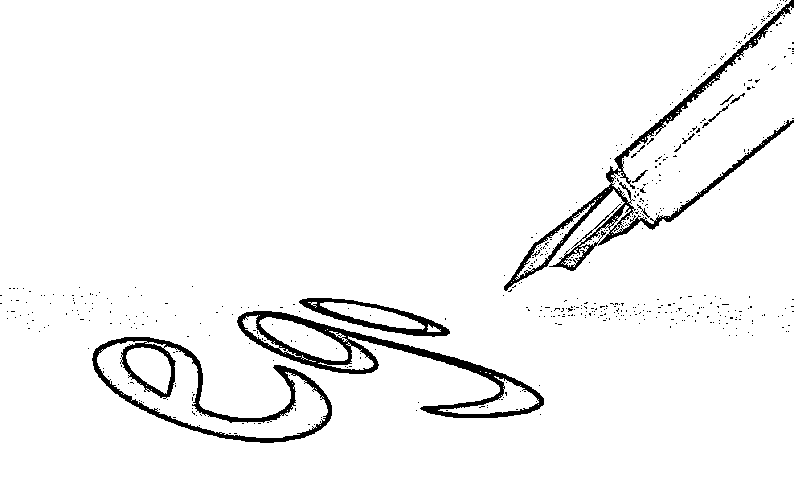作者/大卫·瑞雷 若道创始人翻译/若道翻译团队 整理/江艺编辑/玫瑰 图片/全景网

从 1 月到现在，想必大家都有一种“压抑”的感受，除了要戴口罩和各种防护之外，出门都成了奢侈的事情。这种感觉像极了一个束手束脚，活不出自己的人~这样的状态才一两个月都会令人难以忍受，更别说几年甚至一辈子了。于是，活出星图中的高阶能量，让自我流动起来，变得尤为重要。这是不是很“困难”呢？其实不然哦，一起来看看！

**占星学在生活的方方面面**占星学作为一门学科或是一种知识的领域，它存在于严格的科学和宗教之间的地带，但它既不是科学也不是宗教。占星学似乎是一种**解释生命的语言**，正如同数学是科学的语言一样。它是一种非常了不起的语言，就好像在学习一种密码。我想，如果你认真学习占星学的话，你会发现这种密码可以非常显著地应用于生活的方方面面。当我说占星学栖息于宗教和科学之间的地带时，我的意思并不是说占星学跟它们毫不相干。我想，如今即便是科学也开始探索物质世界中类似于占星学智慧的事物。你们如果熟悉量子物理学和高等数学中的弦理论（string theory），就会发现它们解释了占星学为什么行之有效。但是，只有当你去学习占星学的时候，你才会发现占星学在各个领域内是如何行之有效的。**占星学帮助我们发现那些看起来毫不相关的事物之间的联系，从而让我们获得了对自身的洞察力，不仅让我们更好地觉知到自己是谁，而且还更加明了自己与身边一切人和事物的关系。**很早很早之前，我们的老祖宗就认识到人的行为和自然节律之间的联系。比如，在西方占星学的发源地，也就是地中海地区的人们发现大自然影响着人类天性。巴比伦人和希腊人发现出生在不同时间的人个性是不同的。然后西方占星学逐渐显现。到亚历山大大帝的时候，大家所熟悉的 12 星座已确立起来，这大概是在两千三百多年前。从那时开始，占星学逐渐发展为非常复杂的系统，不过它也一直在进化、变化、发展。

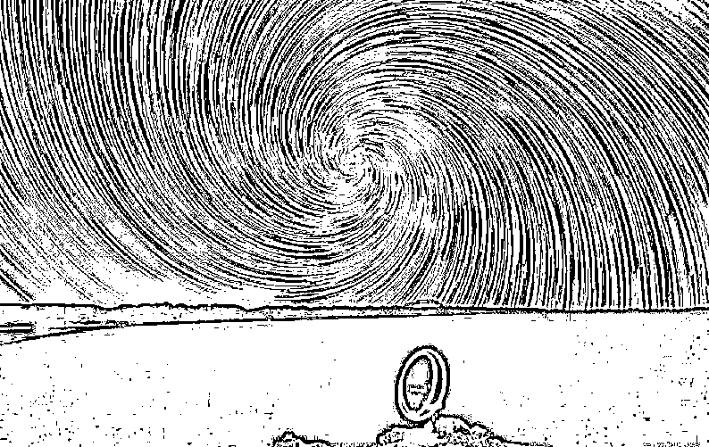

**当一个白羊座无法活出自己**

我们在若道学习的占星学，是 20 世纪初期重新被发现的占星学。在西方，占星学的复兴，恰好与心理学的出现同步。人们开始有兴趣探究为什么人的行为是这样的。在英国、欧洲、美国，很多人开始回过头去看这门古老的学问，发现它的意义和道理。人们带着现代的眼光去重新看它。自然，当人们的用不同的方式去思考，用不同的方式去看这个世界的时候，占星学被重新创造了。

在现代思想光芒的照耀下，占星学的古老传统、古老技法和理论被重新检视。在心理学中最具影响力的两个领域，上世纪出现的人本主义心理学和荣格心理学，对现代占星学产生了巨大的影响。人本主义心理学的影响之大，以至于现在仍有许多占星师称自己为人本主义占星师。

**一个白羊座的例子**

我给大家举一个例子，看看这到底是怎么回事。白羊座是非常坚持自己主张的星座。它代表**我、现在、为自己的利益采取行动的原则**，这听起来似乎特别简单。20 世纪 70 年代在美国做过一项调查，结果显示**白羊座女性有神经质倾向**。为什么是女性而不是男性呢？因为那个年代，如果女人非常坚持自己的主张、不耐心、咄咄逼人、急脾气，周围的环境就会给她压力，告诉她女人不该这样。白羊座小女孩的父母会跟她说，你这个样子没有男人会娶你的。所以白羊座女性会形成一种内在的体系，而这个体系跟她的天性是相反的。而如果她有一个兄弟表现出上述白羊座特质，她的父母会奖赏这个男孩子。但当这个白羊座女性表达自己的天性时，人们给出的都是负面评价，所以她内在会非常纠结。所以在那个时代，她会被认为是神经质的。人本主义心理学和人本主义占星学告诉我们，**要诚实面对我们的天性，知道自己是什么样的人，接纳关于自己的真相**。然后，从诚实这一点出发，我们可以创造我们想要的生活。我相信如果现在人们再做这个调查，他们得出的结论将跟 20 世纪 70 年代的结论不同！因为虽然现在还有一些老旧的社会偏见存在，但是我们的社会已然改变，年轻的女性更多地被鼓励去坚持她们的主张，勇敢地走进外面的世界，更直截了当地为自己利益而奋斗。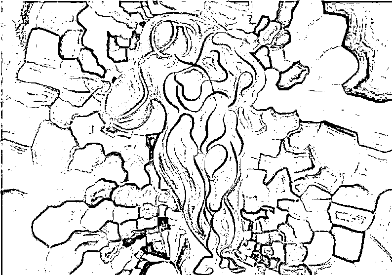**改变，从接纳开始**占星学是关于**觉察、接纳与改变**的三部曲，它可以改变你的生活，在你生活的各个层面都行之有效。

**如果白羊座接纳自己，会是怎样的呢？**

如果你是一位白羊座女性，你接纳自己有时候好斗、咄咄逼人、不耐烦的天性，**如果你接纳它们，那么其他人也会接纳你**。你的朋友会对你说，你真是个好斗的女人啊，你当然知道如何为你自己采取行动。如果有一位月亮在白羊座的男性看到了这位白羊座的女性，他会觉得这个女人实在太棒了！假设这个男人站在商店的柜台前，看到一个女人冲到柜台前对店员说，这是我昨天才买的，今天就坏了，现在你要给我退钱。如果你不给我退钱，马上叫你们经理出来，快点！那么这个月亮在白羊座的男性就站在那儿看着那个女人，他的母亲可能就是这样好斗的女性，但是当他看见这个在柜台前发火的女人时，他可能并没有想他的母亲，他只是觉得这个女人的行为太熟悉了，他喜欢她，他觉得她太有魅力了。这个年轻的女性越接纳她的本性，她的魅力就越强。学习占星学就是学习一门语言，它就像宇宙的密码一样，尤其可以说是关于人性和生命的密码。你可以将这个关于个人成长、发展的原则用于所有的星座。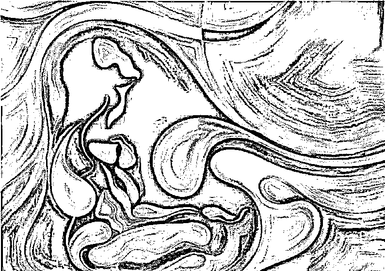**怎样去接纳？**大家可能都知道自己的太阳星座是什么，但是你们可能并不知道星座到底是什么。总是说黄道 12 星座，黄道实际上是一个**日历**，这个日历是建立在一种纯粹的物理现象之上，即地球每年绕太阳运转的轨道。在占星学中，这个日历并非按月份来划分，而是按星座划分。同样，占星学日历并非将一个月划分为多少天，而是将星座按照度数分割。所以这个日历并不是拥有 365 天的日历，而是由 360°组成的日历。大家所熟悉的星座的名称，比如白羊座、金牛座、双子座等等，这些实际上是从天文学星座借用而来的。**周期会影响我们的行为以及我们的自我认同，生命中的一切都跟周期联系在一起，周期和节奏的变化，与我们的生活息息相关。**太阳和月亮是星图中重要的一部分，其所落星座能得到怎样的表现，影响着一个人的发展。所以，这里让我们来看看太阳、月亮落在 12 星座上，各有怎样的建设性和破坏性。

**太阳星座****的建设性与破坏性表达**

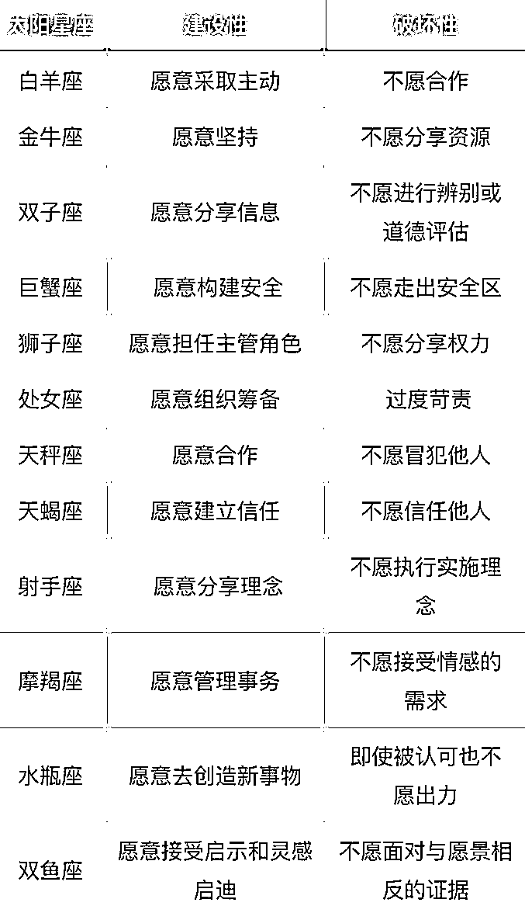

**月亮星座****的建设性与破坏性表达**

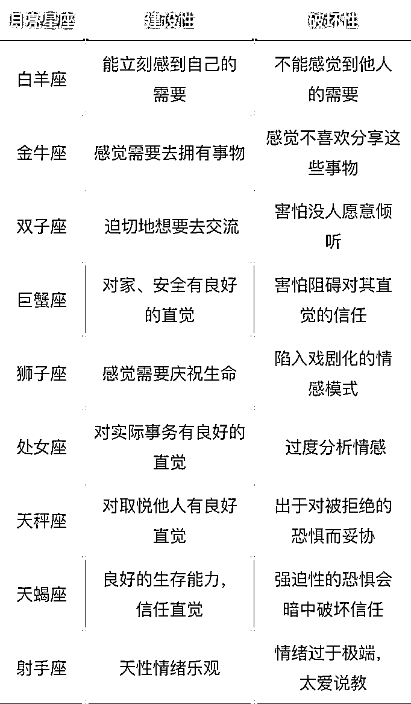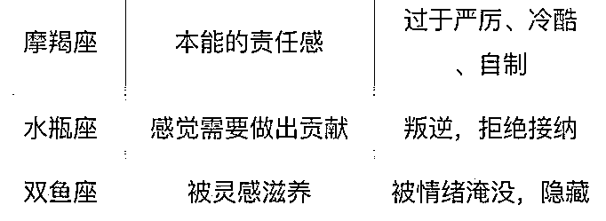

**版权声明：**原创文章由作者授权发布于若道平台，欢迎转发，反对抄袭。友号转载请申请白名单。


****想阅读更多作者的文章，请在后台回复******大卫****** 即可。****

**喜欢文章请长按下方二维码打赏**

**给大卫老师加杯咖啡呗~**

**▼**


******点击图片查看若道君推荐******


**微信又双叒叕改版啦，不想错过若道君的推送？**

**就把若道设为星标吧！**

**▼**


就是这个“在看”，戳戳戳 ☟

********报名直达入口********


# 金牌课程 L1-3 | 现在报名立省 1000 元！仅剩 6 天（内含试听）

> 原文：[`mp.weixin.qq.com/s?__biz=MzA5NjA0NTAxNg==&mid=2651414240&idx=3&sn=ddf95c387c9f5386caa30bc2f7370531&chksm=8b4bec57bc3c6541facbc91496ea184ce08a9e375f8469794ec9400cf75941c5cdab1ff90155&scene=126&sessionid=1692738197#rd`](http://mp.weixin.qq.com/s?__biz=MzA5NjA0NTAxNg==&mid=2651414240&idx=3&sn=ddf95c387c9f5386caa30bc2f7370531&chksm=8b4bec57bc3c6541facbc91496ea184ce08a9e375f8469794ec9400cf75941c5cdab1ff90155&scene=126&sessionid=1692738197#rd)


**如果学习占星学，成为一名职业占星师是你的梦想。**

“2019 年，你的梦想实现了多少？”
“2020 年，你的占星学习新规划是什么？”
不知道你是不是也最怕这种灵魂拷问，每次被问时都会噎住。加之这次疫情，给我们每个人的生活都带来了不同程度的混乱。而这是不是也打破了你本来的学习计划？

**在现实面前谈梦想，好像是不自量力的事情。** 不仅仅是这样，回顾过去，有多少次在列下计划要开始学习占星的时候，信誓旦旦。而计划却一次一次搁置下来，学习毫无起色，最后只能羞愧地藏起来。

**现在，你不必羞愧，也不必隐藏。**为什么看了那么多占星资料，却难以汇总，形成体系化知识？为什么那么多厉害的占星师，解读起来头头是道，到了自己却张口结舌，只能蹦出一两个词？

**这样的困局，到底该如何去突破？或许，你只差这个机会。**

**1**

**6 个月掌握出生星图综合解读的机会**

**第一，设置你的“灯塔”。**这个“灯塔”，代表的正是你的目标：6 个月掌握出生星图综合解读。

如何做到呢？

在本期核心课中，大卫老师和熊鹰老师联合教授，**一次可以吸收中西两种方向的智慧**：**大卫老师是若道占星学院的校长，是 ISAR 考试委员会主席，更是把严肃占星学系统引入中国的第一人，是你严肃占星学习的绝佳领航者。**大卫老师喜欢用学员案例讲解占星知识，你不仅能现场体会大师解读星图的神奇魅力，并且能及时转换身份角度，体验占星师与咨询者的不同感受及心态。**熊鹰老师作为金牌中文讲师，对于占星学和中国传统文化的结合颇有建树，授课耐心，讲解透彻，幽默亲和**。对学员占星学习过程中各阶段的难点和卡点了如指掌，秒懂你的学习困惑，给予解答和指导。**每周两小时，若道积淀 9 年研发出科学成熟的课程体系，让你层层递进掌握占星知识和技能，向着灯塔前进。****第二，立志更要立习惯。**日拱一卒，说的是持之以恒，每天都在自己专注的领域上投入时间和精力。

**在课程学习过程中**：

*   课程群里的课务人员会每天推送本周课程知识点相关的推荐阅读，为你占星知识的累积添砖加瓦。

*   提醒上课时间，记录出勤情况，对于出勤和作业优秀的学员发放课程券作为奖励。

*   3 阶开始，熊鹰老师还会亲自给学员们开设答疑沙龙，答疑解惑。

*   根据每周学习内容和反馈设计作业，组织学员互动练习。友情提示，尤其是在前期学习中，占星知识点不好消化，累积越来越多，及时的练习整合，对于能够融会贯通各类知识点非常重要。

这些专业、温暖的陪伴和激励，都会成为你养成占星学习好习惯的助力，**向着灯塔，日拱一卒**。

“**没有人喜欢灾难，但当它避无可避之时，我们最佳的选择就是修炼自己。****——沃伦·巴菲特**”

**2**

**占星学除了自我修炼，市场需求如何？**

**通过占星学习你帮助了自己，也可以选择成为自助助人的占星师，开启受益终生的第二事业**。一方面社会快速发展人们压力山大，抚慰心灵的咨询市场需求巨大。 另一方面市场鱼龙混杂，真正学院派的严肃占星从业者十分稀缺。

最重要的，占星学能让你自己帮助自己，无论你是否进行占星咨询从业，学习了占星学，它都将是**终身陪伴你成长的睿智好伙伴**。


**3**

**你的占星核心课老师是谁？**

拥有**50**年占星实践经验的

**若道创始人**

**ISAR 全球副主席**

**ISAR 全球职业占星师资质认证主席**

**大卫·瑞雷**

&

**最懂学员的若道首位认证金牌中国老师**

**熊鹰**

师徒二人合力打造
**2020 年若道****全新****核心占星课程**

**4**

**L1-3 阶，我们要学习什么？**

**第*****1*****阶  12 星座，12 种性格，12 种人生 **

❶ 学习占星学必须准备的“心法”

❷ 占星学中的火、土、风、水四元素，阴阳法则

❸ 面对面的星座有故事

❹ 12 星座：12 种性格详解，12 种行为模式，12 种价值观

❺ 太阳和月亮：了解你的太阳，生命的发动机，让你在世界闪光的方式，生命获得力量的方法；了解你的月亮，让你获得幸福的方法

❻ 了解太阳、月亮，了解你生命中已经出现的、将会出现的男性和女性

**第****2****阶  命运的线索和人生故事中的演员**

❶ 命运的线索：南北交点

❷ 星图三巨头：太阳、月亮、上升点的故事

❸ 了解心智：水星

❹ 了解金钱和关系：金星

❺ 了解行动模式：火星

❻ 了解信念：木星

❼ 了解努力：土星

❽ 了解天才和疯狂：天王星

❾ 了解梦想和幻灭：海王星

❿ 了解死亡和重生：冥王星

⓫ 12 个人生场景：黄道 12 宫位初解

**第*****1-2*****阶网络直播课程安排**

| 时间 | 课程 |
| 2020 年 4 月 2 日 | 星座 1 （主讲：大卫·瑞雷老师） |
| 2020 年 4 月 9 日 | 星座 2 （主讲：熊鹰老师） |
| 2020 年 4 月 16 日 | 太阳、月亮 （主讲：大卫·瑞雷老师） |
| 2020 年 4 月 23 日 | 水星、金星、火星 （主讲：熊鹰老师） |
| 2020 年 4 月 30 日 | 水星、金星、火星 （主讲：熊鹰老师） |
| 2020 年 5 月 7 日 | 三王星 （主讲：大卫·瑞雷老师） |
| 2020 年 5 月 14 日 | 宫位 1 （主讲：熊鹰老师） |
| 2020 年 5 月 21 日 | 宫位 2 （主讲：大卫·瑞雷老师） |
| 2020 年 5 月 28 日 | 月亮交点 1 （主讲：熊鹰老师） |
| 2020 年 6 月 4 日 | 月亮交点 2 （主讲：大卫·瑞雷老师） |

**L1-2 除了网络直播课**

**L1-2 初阶课程还有两场线下工作坊可供选择**

**L1-2 上海工作坊**（2020 年 6 月 12、13、14 日 熊鹰老师主讲）

**L1-2 北京工作坊**（2020 年 6 月 25、26、27 日 大卫·瑞雷老师主讲）

就看你是喜欢哪种形式

**文末有每种形式的价格，还有连报套餐价哦**


**第****3****阶 宫位、相位以及初步解读星图（15 次课） **

❶ **十二宫位**：

**人生中重要的领域，不止 12 个，更是 12 类。**

❷ **组合解读**：

**行星、星座与宫位的组合解读。万丈高楼平地起，这是占星解读的基本功。**

❸ **相位**：

**不仅是常规的相位：合相、对分相、三分相、四分相……还有这些更为细致的知识：**

相位计算

入相位与出相位

星座外的相位

相位解读

盈亏相位

相位的优先级

大卫老师案例课

❹ **宫主星与定位星**：

**“连接”是宇宙的基本法则之一。除了相位，还有哪些方式让行星能量连接起来？**

宫主星

定位星与定位链

大卫老师案例课

❺ **月亮交点专题**：

**月亮交点是占星解读的另一个入手角度，这里会深入教你解读月亮交点，及其相位与定位星。**

月亮交点的解法

大卫老师案例课

❻ **相位模式**：

**那些坊间赋予神秘意义的占星格局：大三角、大十字、T 三角……究竟该如何解读其相位模式。**

主要的七种相位模式

星图中没有相位模式的情况

大卫老师案例课

❼ **“空”不等于“没有”**：

**星图中那些容易被忽视的地方：**

无托勒密相位（俗称空相）

一些特殊位置

星图布局

大卫老师案例课

**第*****3*****阶课程安排**

❶ 15 次线上直播网络课程，每次 2 小时，课程中依旧会使用同学们的星图作示范

❷ 10 节课由熊鹰老师教授，重点通过名人星图阐释知识点

❸ 5 节课由大卫·瑞雷老师教授，重点通过学员星图阐释知识点

❹ 熊鹰老师会指导练习，答疑解惑，学练结合

❺ 重点在于如何根据星图去问问题，着重自我发现和自我探索的过程 

| 时间 | 课程 |
| 2020 年 7 月 2 日 | 宫位、行星和星座组合 |
| 2020 年 7 月 9 日 | 宫位、行星和星座组合 |
| 2020 年 7 月 16 日 | 月亮交点 |
| 2020 年 7 月 23 日 | 月亮交点和演示案例 |
| 2020 年 7 月 30 日 | 相位 |
| 2020 年 8 月 6 日 | 相位、星座、行星和宫位 |
| 2020 年 8 月 13 日 | 相位、星座、行星和宫位的同学案例 |
| 2020 年 8 月 20 日 | 渐盈相位和渐亏相位，示例 |
| 2020 年 8 月 27 日 | 更多的关于宫位和宫主星 |
| 2020 年 9 月 3 日 | 同学案例 |
| 2020 年 9 月 17 日 | 空相行星和定位星 |
| 2020 年 9 月 24 日 | 宫主星 |
| 2020 年 10 月 15 日 | 优先级和组织 |
| 2020 年 10 月 22 日 | 相位模式以及范例 |
| 2020 年 10 月 29 日 | 学员星图解读范例 |

**5**

**试听彩蛋**


**什么是占星学？**

📹 [`v.qq.com/iframe/preview.html?width=500&height=375&auto=0&vid=e093031qxym`](https://v.qq.com/iframe/preview.html?width=500&height=375&auto=0&vid=e093031qxym)

**6**

**这两位优秀的占星学老师是谁？**


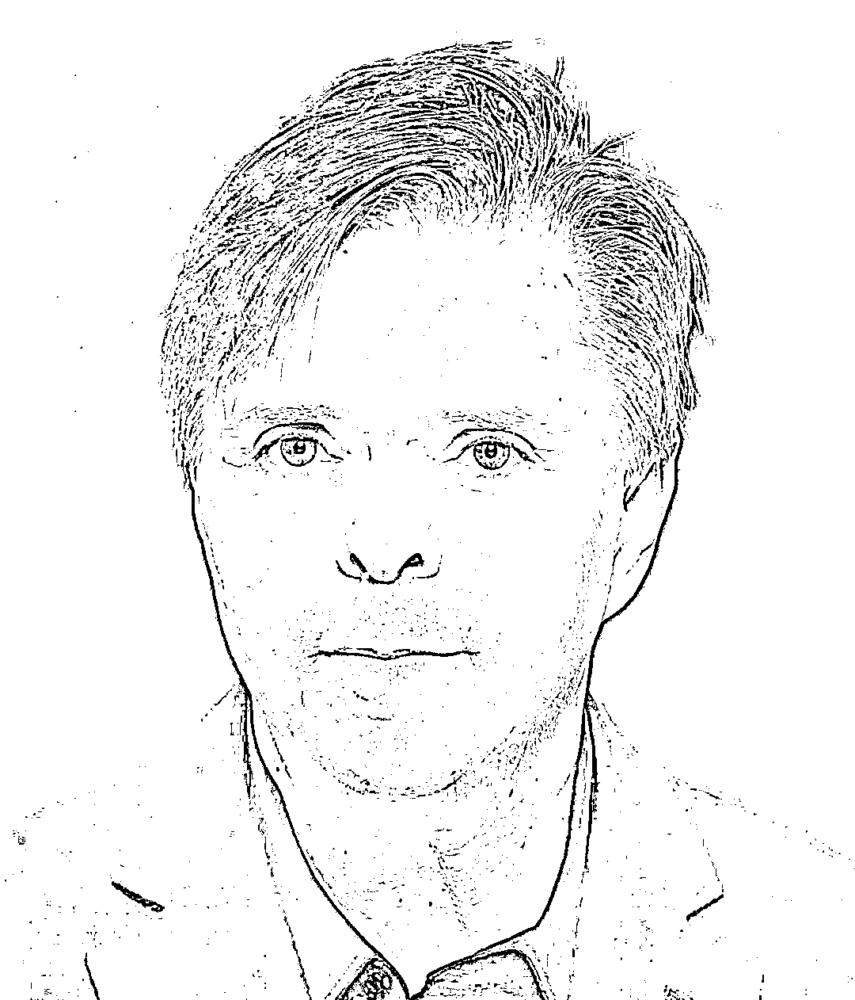

**大卫·瑞雷（David Railey）**

*   **ISAR 董事会成员，ISAR 全球副主席，ISAR 全球职业占星师资质认证主席，若道占星创始人。**
*   1976 年，通过亚特兰大职业占星师考试，成为全职占星师，随后通过**AFAN 和 ISAR 职业测试**。
*   1980 年，与**杰夫·焦耳**一起在亚特兰大创建**“每日星球”**占星学中心。此后在亚特兰大占星协会担任 4 年考官，并且两次担任**亚特兰大地区占星协会主席**。
*   1979-1992 年，作为占星师活跃于美国社会媒体，向不了解现代占星学变化的大众宣传专业占星学知识。在 1989-1992 年期间，他在 WRGG 电台 12 频道每周主持个人电视秀**“今日占星学”**，早先他还在 WRFG 的广播节目中播讲宇宙天气节目。 
*   2010-2014 年，任**全美占星师联盟监督委员会委员**。
*   2010 年，其著作**《灵魂的目标》**中国版出版，和蒋颖一起创办**若道占星**学校和其官网 www.nodoor.com。从该年开始，他工作并往返于亚特兰大和北京。目前他 80%的时间致力于在中国教授和推广西方占星学。
*   2017 年，被选为**ISAR 委员会成员**（2017）。ISAR 是世界最大的国际占星机构，会员遍布 45 个国家。


**熊鹰老师（天空的空）**

*   2008 年接触严肃占星学，至此爱不释手。
*   **2013 年师从大卫·瑞雷**，研习整套现代占星学核心课程，并于 2014 年起至今连续三年担任该课程的主助教。
*   期间也**跟随格伦·佩里、诺·泰尔、理查德·塔纳斯、罗伯特·汉德、苏·汤普金斯、斯蒂芬·弗里斯特等多位国际顶尖占星大师进行学习**，进行定向占星主题研究。
*   2015 年初，通过国际占星研究协会**（ISAR）资质认证并获得证书**。同年，进一步跟随大卫·瑞雷老师进修**“生时校正”**技术，通过最终考核并获得证书。
*   目前在若道星文化任职，将传播系统、严谨、真实的占星学作为职业使命。任专职助教期间，进行沙龙与答疑等辅助教学工作已累计超过 200 小时。
*   在业余期间也提供占星咨询与生时校正服务。目前正致力于占星学与个人成长的整合。

**7**

**什么人适合这门课？**

*   对占星学有浓厚兴趣，想要系统学习占星学

*   对占星学有一定基础，但不知道该如何整合星图复杂的碎片

*   希望成为优秀的占星师，想要借鉴国际大师解读思路并融入自己的体系

*   想学习占星学，但不擅长英文，希望有中文老师授课

*   想结合占星学理论与咨询实践

*   大卫·瑞雷、熊鹰的忠粉，学过占星，但就是想跟着偶像再学一遍

*   走在自我探索和个人成长道路上的人

**8**

**课程费用**  

**★ 1-3 阶**

**早鸟价：10500 元（2020 年 3 月 18 日之前）**

课程费用：11500 元 

**★ 1-2 阶直播课（4 月 2 日开课）**

课程费用：3500 元 

**★1-2 阶工作坊（北京工作坊、上海工作坊任选一场）**

**早鸟价：2800 元（2020 年 5 月 6 日之前）**

课程费用：3500 元 

**★1-2 阶网络直播课+现场工作坊都想要的同学：有套餐价哦**

购买 1-2 阶网络直播课程+北京工作坊、上海工作坊任选一场

**早鸟价：4200 元（2020 年 5 月 6 日之前）**

课程费用：5200 元 

**9**

**退转课程**

**退款原则请详看《教学协议》，如有疑问请咨询课程顾问。**

****中英双导师核心课 Level1-3****

**授课老师：大卫·瑞雷 熊鹰**

**授课时间：**2020 年 4 月 2 日开课

**授课方式：**网络课程，中英文授课，中文翻译；现场工作坊，中英文授课，中文翻译

**费用：********1-3 阶课程：11****500 元******早鸟价：10500 元（2020 年 3 月 18 日之前）；******1-2 阶网络直播课程：****3500 元**；**1-2 阶**（北京、上海工作坊任选一场）**：3500 元 ****早鸟价：2800 元（2020 年 5 月 6 日之前）；******1-2 阶网络直播+现场套餐价：**5200 元**** 早鸟价：4200 元（2020 年 5 月 6 日之前）**

**课程负责人：**王老师（微信：18510107057），请备注“核心课”

长按二维码添加课程负责人咨询~


****报名请点击“阅读原文”****


# 深度白羊座 | 获得幸福感的秘诀就是快乐地活在当下！

> 原文：[`mp.weixin.qq.com/s?__biz=MzA5NjA0NTAxNg==&mid=2651414203&idx=1&sn=09e8113c4b75309ca68d5fbae39af135&chksm=8b4bec0cbc3c651ab861221d22cd59af5ec8a35766aca562eb8db38da11f952e02c8b038741b&scene=126&sessionid=1692738197#rd`](http://mp.weixin.qq.com/s?__biz=MzA5NjA0NTAxNg==&mid=2651414203&idx=1&sn=09e8113c4b75309ca68d5fbae39af135&chksm=8b4bec0cbc3c651ab861221d22cd59af5ec8a35766aca562eb8db38da11f952e02c8b038741b&scene=126&sessionid=1692738197#rd)

****************☆ ****************************后台****************************回复“今日”，给你一句生命态度****************


作者/格伦·佩里 译者/Jun 校对/Arrow
编辑/玫瑰 图片/全景网**白羊座同 0 度的关系**

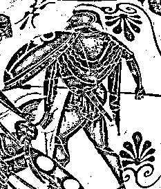

| The god Ares/Mars 阿瑞斯/战神

与任何占星原型一样，**白羊座-火星包括星座、行星、宫位和相位**。这些都是由角度组成的，唯一的例外是“行星”，它的运动产生了角度。在占星学中，一切意义都在于**行星周期的角度（阶段）**。

定义白羊座-火星星座、宫位和相位的角度是**0 度**。**3 月 20 日的春分代表白羊座 0°，正好发生在地球赤道与太阳赤道（黄道）平面的交点。**实际上，这是**地球-太阳的合相**，标志着**黄道十二星座的开始**。**出生、开创和开始**的现象是理解白羊座的关键。

如果我们认为黄道十二星座象征着四季中自然的循环，每个季节都有三个阶段——**基本、固定和变化**——那么**自然的起点就是启动每个春天的新生命周期**。豆芽冒出大地，寻找阳光，这样一个画面是白羊座完美的演绎。生命掌握主动，征服新天地，追求自己的本源，自然雄心勃勃。

**上升点是地球自转的 24 小时中地平线与黄道的任一交点**。**地平线和黄道的交点表示该星图中第一宫的第一度**。上升星座标志着出生时刻，暗示着**个人将如何在生活中坚持自己**；这是案主自然而本能地破土而出进入世界的方式。同样地，**当行进的两颗行星在同一时间以相同的黄道角度排列时，我们称那个空间（时间）点为合相**，这恰好是它们**会和周期的开始**。两颗行星在一个特定星座中的合相暗示着它们将如何**联合并主张各自的本质，**也许还会一起开始某件事。春分、上升点和合相都构成相同的角度 0°。显然，它们不仅在角度上有相似之处，而且在意义上也是，它们意味着——**开始、新起点和本能式的主张**。**0°似乎与火星关系密切**，它的性质与我们赋予白羊座、上升星座和合相的意义是一致的。在古代，所有与火星有关的现象都被认为是上帝自身的表达。火星是自然界的普遍规律。同样地，这颗红色行星属于一个更大的宇宙秩序，就像在 360°一周中的任何其他行星或角度一样，也是神的面孔之一。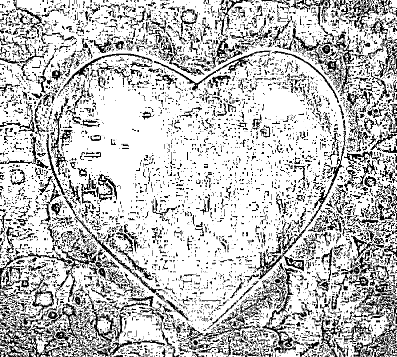**白羊座-火星做为原型**当说到占星原型时，我通常把**星座和守护行星**联系在一起，因为它们是匹配的一对。**星座是需求，行星是行动**。每一颗行星的行动都可以在它所服务的需求背景下被理解，而每一个星座的需求都可以从它的行为特征中推断出来。星座不仅仅是一种需求，它还是**为满足潜在需求而设置的一组自然特性**。**当一颗行星落入一个星座时，它会激活那个星座的行为特质。**在更深入研究白羊座-火星之前，让我先定义一下我用的术语并给出一些关键词。通过观察白羊座的行为，我们可以推断出四种相互关联的需求：**生存、自由、行动和新奇**。白羊座最基本的需求是**生存、存在、自身存在的延续**。**自我保护**是自然的第一法则，也是所有其他需求的基础。对我们的生存能力至关重要的是**为自己的利益而行动的自由**，因为自由与生存有着千丝万缕的联系。如果我们没有自由，生存就会受到威胁。与自由同义的是对**自治和独立的需求**，对这些需求的威胁是争斗和战争的普遍原因。这张需求简表上还有**行动和运动的需求**——这也许是生命最基本的属性。你知道某物是有生命的，因为它有自主运动的能力。即使在细胞水平上，生命也在运动。活着就要去做。最后，白羊座也象征着**对新奇事物或冒险的需求**；仅仅因为某件事情从未被做过，就想去做它的本能。新奇，是生命为了长存而做出的主要指令的自然延伸，通过寻找它可以开始、生存和繁荣的新领域。作为白羊座需求的积极代理人，**火星的行动分为四个子集：主张、发起、战斗和鼓励**。主张包括去**实行、声明和确认的相关行动**。再说一次，白羊座-火星守护开始，这意味着发起、启动，或孕育新的尝试。作为战士的原型，火星的行动包括**战斗的冲动、竞争和争夺统治地位。**火星的最后一个行动分类——**鼓励意味着激励、强化，或鼓舞某人或某事。**火星的主要状态只是存在，它行动的关键字是**“我要做”**。火星是行动导向的。放手去吧，只管去做，这是火星人最重要的情绪。**火星加快、鼓鼓动、鼓舞、激发和激活任何与之有相位的行星表达**。它**鼓励和刺激这颗行星采取行动**。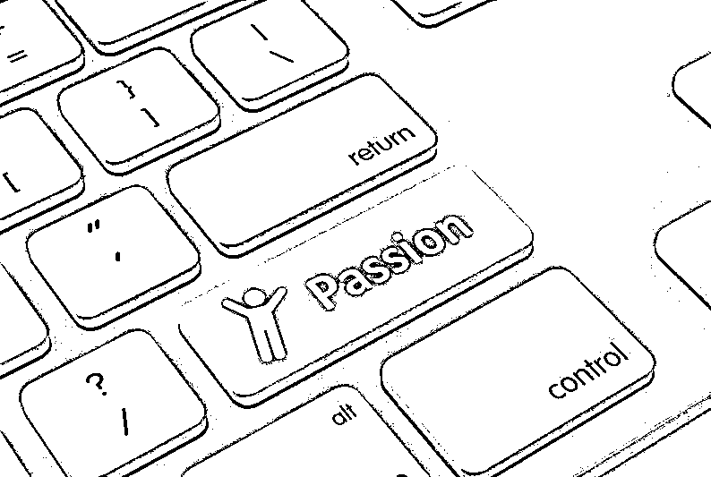对火星而言，我特别喜欢动词**“galvanize”**，它的意思是**通过电流（想想驱赶牲畜的电棒）刺激或激发某人**。近义词包括**鞭策（spur）、唤起（arouse）和煽动（incite）**。火星天秤座在第 6 宫可能意味着：“简结婚的消息激发办公室里的女士们计划了一个订婚派对。”行星的行动从来不会凭空发生，而是与**行星所落的星座和宫位以及任何与之有相位的行星**有关。例如，如果**火星在金牛座**，它可能以**缓慢、稳定**的方式主张；为抵制变化而行动；开始建一个新花园；以及争取保留股份。金牛座的火星就像斗牛犬一样，坚强不屈：永不言败，稳扎稳打。如果这些行动落在第 11 宫，这个人可能是一名**环保活动家**，他会**鼓动志同道合的人为保护环境而斗争**。**火星与另一颗行星的相位将倾向于为那颗行星所象征的事物而战或与之对抗，视角度而定**。**三分相和六分相**使火星为了另一颗行星的利益而**乐于坚持自己的主张**。例如，火星与木星呈渐盈的三分相，可能会启动一项社会活动，为慈善事业筹集资金，比如推广一个高中运动队。然而，**在困难相位（四分相、对分相）下，火星会攻击这颗行星，即使是在不自觉被它影响的情况下**。案主可能会**因为其他人对另一颗行星象征的事物过激表达而感到愤怒**。之后，**当个体更好地整合相位时，可以有意识地利用那颗行星的能量为火星本身的目标服务。**

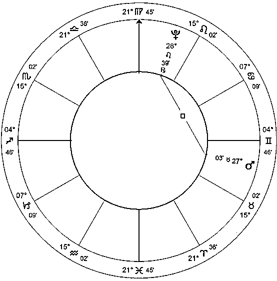

想象一下，比如**第 6 宫的金牛座火星与第 9 宫的狮子座冥王星呈四分相**。这个人可能做**景观（金牛座）工程师（火星）的工作（第 6 宫）**。他**对环境保护署强制实行的不公正生态法规感到沮丧（冥王星在第 9 宫）**，他**指控环境保护署腐败，并投诉他们的法规（渐亏四分相）太过极端，限制了他自由挖掘土地并将土地改造得更健康、更有创意。**然而，**四分相会随着时间的推移而整合**，他可能会变得更积极主动，**他倡导的法律不会将天赋人权定为犯罪，或不阻碍财产所有者改造、保护和提高他们合法拥有的土地的价值**。在这里，火星将第 9 宫的冥王星发挥出了更大优势。占星学原型体现在互相联系的角色中，因此它们在意义上是**一致**的。白羊座-火星的原型包括**战士、竞争者、开拓者、冒险家、探险家和淳朴的野蛮人**。白羊座-火星为自由和生存权利而战（战士），为存活和获得物品而战（竞争者），为了自身利益而追求冒险和新奇（冒险家、开拓者），体现了一种孩童般的天真和朴素的心灵（淳朴的野蛮人）。托马斯·杰斐逊

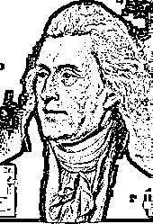

**| **托马斯·杰斐逊 

托马斯·杰斐逊是美国的开国元勋之一，他白羊座的太阳与狮子座的火星呈三分相。**火星的动词“创建”意为建立和创办一个机构、组织或（在这种情况下）一个国家**。与白羊座-火星一样，杰弗逊建立美国的先驱行动也需要**为新生国家的自由而战**的意志。杰斐逊在《独立宣言》中让白羊座-火星永垂不朽。实际上，《独立宣言》是对英格兰宣战的宣言，宣告了一个新国家的诞生。** “我们认为下述真理是不言而喻的：人人生而平等，造物主赋予他们若干不可让与的权利，其中包括生存权、自由权和追求幸福的权利。”****白羊座作为发展阶段**白羊座-火星与战争的关系值得进一步论述。一般来说，**当火星处于战斗状态时，我们会感到愤怒。**关于这个话题已经有很多著述，至少可以追溯到公元前 4 世纪亚里士多德的《尼各马科伦理学》，在一定的条件下，亚里士多德认为**愤怒是一种美德**，**如果没有愤怒，个人就会变得胆怯、懦弱和道德败坏**。相反，那些**过度表达愤怒的人成了怒不可遏，同样应该受到谴责**。**“任何人都会生气，这很容易。”**亚里士多德说：**“而要以正确的方式，在正确的时间，正确的程度，为正确的目的，对正确的人生气；这并不容易。”**几年前我住在加州的时候，我有一个太阳白羊座的朋友叫雅顿（Arden），她是一位心理治疗师。她的名字恰如其分地暗示了白羊座的核心特质——**热情（ardent，热烈、热心）**。她当然是这样。我永远不会忘记她炯炯有神的眼睛和灿烂的笑容。雅顿是如此活跃。她办公室的墙上贴着一张海报，上面画着一只鸡蛋，新生的小鸡正破壳而出。下面写着：“勇往直前，征服一切！”雅顿的海报不仅体现了她的个性，也是成熟的白羊座生命阶段的写照。和黄道其他星座一样，白羊座也是一个发展阶段，在这个阶段里，白羊座的需求和特质占主导地位可以说，**白羊座是生命的第一阶段，或者说是出生到两岁（两年的时间）**，在这段时间里，孩子**对时空的看法相对局限于此时此地**。婴儿对之前或之后都没有什么概念，除了他们当前的环境之外，对任何地方都没有概念。经验局限于永恒的现在。这种时空视角带来的情感上必然结果是**快乐——或者，当欲望受挫时的愤怒。**婴儿通常是快乐的，但容易生气，恰恰是因为他们对以后的事情没有概念。只要现在存在，那么每一个冲动都必须立即得到满足，因为除了现在没有别的时间存在。**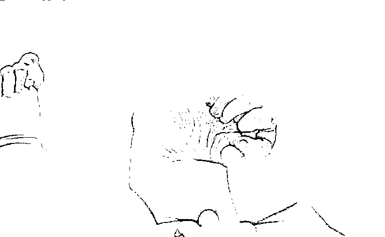**如果突然婴儿能说话，对于他们无度追求的东西，他们会捶着拳头尖叫：“如果不是现在，又是什么时候？！”可能有人认为，快乐是一种自然的、与生俱来的状态，就像婴儿热情洋溢的脸上所反映的那样。威廉·布莱克在一首名为《婴儿的欢乐》的诗中写道:** “****我有名字。我只有两天大。”****我该怎么称呼你呢？****“我很快乐。我的名字叫快乐。”**对生命充满热情可能只是生命对自身的感觉。“热情（enthusiasm）”这个词来源于古希腊的 enthousiasmós，由词根“theos”（上帝）和“en”（在里面）组成；因此，热情的字面意思是**“内在的上帝”**。对希腊人来说，热情是受到神灵的鼓舞，或者更确切地说，是神灵附体。幸福是生活的自然状态，这是一个意义深远的有趣观点。印度哲人帕帕奇（Poonjaji）认为，总是有可能幸福的，但只有不认同短暂的意识内容才能获得；换句话说，既不忧心过去，也不忧心未来。**幸福是根本的恒常，而不幸的原因来去匆匆**。如果一个人认同来了来去匆匆的东西——**依恋感、财产、物质、工作或关系**，那么不幸一定会随之而来，因为没有经验和客体是永恒的。唯一真正永恒的经验是观察的主体；也就是说，**一个人的主观体验时时刻刻见证了意识内容的产生和消逝**。通过认识到什么是永恒的——观察的自我，寻求者就是幸福本身，一种与上帝无异的开悟状态。鉴于帕帕奇的教导，**幸福就是活在当下**，这符合他出生星图中**太阳和火星合相并四分天王星**。另一位新时代的大师，巴巴·拉姆·达斯（Baba Ram Dass），拥有**太阳与天王星合相在白羊座**。“活在当下”与“白羊座-火星”的心理是一致的——拉姆·达斯 1971 年出版的经典著作《活在当下》就强调了这一点。埃克哈特·托利还有一位灵性老师，埃克哈特·托利（Eckhart Tolle），写了一本关于灵性觉悟的畅销书《当下的力量》(1997)。托利有**水瓶座的太阳与狮子座的火星精确的对分相**。托利称，自己在 29 岁经历“内心的转变”之前，他的大部分时间都很抑郁。值得注意的是，这发生在行进土星与他的火星合相，并对分他的太阳时，从而激活了他出生太阳-火星的对分相。回顾这一经验，他承认：**我再也无法与自己共存了。在这种状态下，产生了一个没有答案的问题：谁是不能与自我共存的那个“我”？自我是什么？我觉得自己被拉进了虚空！那时我并不知道，真正发生的是由思想创造的自我带着它的沉重、它的问题，生活在不满意的过去和可怕的未来之间，它崩溃了，溶解了。****第二天早上，我醒来时，一切都是那么平静。平静就在那里，因为不再有自我。只是一种存在感或“存在性”，只是观察和观望。**

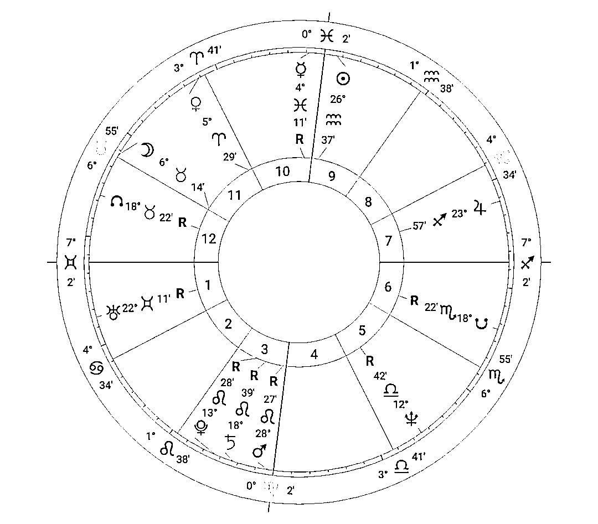

| 埃克哈特·托利：1948 年 2 月 16 日，德国多特蒙德。时间未知埃克哈特接着写了《当下的力量》，《纽约时报》称，他成了“美国最受欢迎的灵性作家”。值得注意的是，托利、拉姆·达斯和帕帕奇的白羊座-火星能量与他们的太阳都有很强的联系，反过来又与水瓶-天王星的原型联系在一起。帕帕奇有太阳-火星合相并对分天王星；拉姆·达斯的太阳与天王星合相在白羊座；托利的水瓶座太阳对分狮子座的火星。每个案例似乎都给我们例证并提醒我们，**开悟是一种幸福的状态，幸福就在当下**。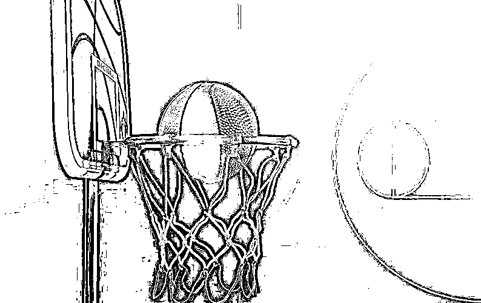**运动与竞争****体育运动最能体现当下的喜悦。**虽然团队运动大多属于狮子座的现象，但每项运动都有白羊座的成分，如果仅仅考虑它的**原始动作、竞争、关注即时性**。如果一个竞争对手要赢，他或她不可能考虑以前或以后，昨天或明天。当下才是最重要的。一旦赢了，喜悦就会爆发。有趣的是，许多描述战争的火星词汇同样适用于体育运动。这样的例子多得可以写篇文章。如果一个队以微弱优势获胜，可以说“他们差点没活下来。”但如果球队输得很惨，就可以说“他们被灭了……那是一场屠杀。”如果一个运动员“打败”（beat）了他的对手，这可能意味着他赢得了比赛，或者他殴打了另一个运动员。希望不是后者，虽然在拳击中它一语双关！写这篇文章的时候，我们正处于“疯狂三月”，顶尖的大学篮球队正在争夺全国冠军。在我居住的康涅狄格州，康涅狄格大学女子篮球是一个传奇。在过去的 20 年里，她们一直称霸着这项运动，自 1995 年以来，她们总共 12 次夺得全国冠军，4 次蝉联。这是 20 年来平均每 2 年获得一次全国冠军。在这 20 年里，康涅狄格大学有 6 个赛季不败，而其他所有球队加起来只有 3 个赛季不败。康涅狄格大学目前的连胜记录是 111 场，这是有史以来男、女篮球界的最高纪录。

为什么她们如此强势？几乎所有人都认为是因为她们的教练吉诺·奥列马(Gina Auriemma)。这位身材匀称、精力充沛的意大利裔人的太阳在白羊座，在一定程度上，他不断地创造出能体现白羊座-火星特征的团队，这是其他团队无法比拟的。受到吉诺的激发，康涅狄格大学的女子球员在比赛中充满了**无限的快乐和侵略性**——激烈的竞争、令人窒息的压力防守、无情的快攻、完美和谐的永动机。就像终结者一样，即使领先 50 分，她们也从未停止前进。

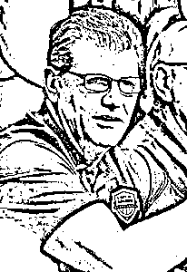

| 吉诺·奥列马

吉诺·奥列马人们一致认为奥列马可能是有史以来最伟大的教练。除了太阳和金星在白羊座，他的火星在射手座（这是教练的标志），与狮子座的冥王星和白羊座的金星形成一个火象大三角，同时射手座的火星对分了自己的定位星——双子座的木星。这种配置反映在他的团队中。有一种火星特质特别适合吉诺的女孩们：她们总是活在当下。奥列马没完没了地强调这一点。把每一场比赛当作最后一场。别做力所不能及的事。对待每一个团队，每一个时刻都是一样的：**去争取，只有现在**。过去的胜利并不重要，你不过是和你上次赢球时一样好。奥列马是终极快乐的战士，以顽皮的微笑和敏锐的幽默感而闻名。他不担心自己的得分在上升，也不担心其他教练对康州大学的统治地位感到不满。吉诺只有**一个方向——前进；一个速度——快；和一个目标——赢**。其他一切都消失在背景中，成为无关紧要的琐事。

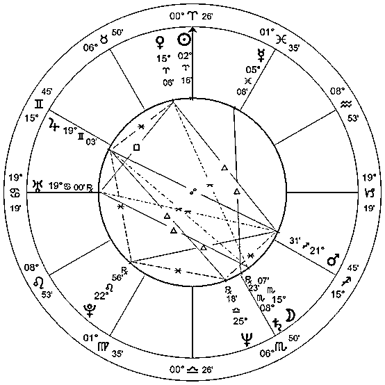

**|**吉诺·奥列马，1954 年 3 月 23 日，意大利蒙特拉。时间未知

与康涅狄格大学精心安排的战争芭蕾相比，其他团队看起来就像慢动作。她们看起来懒惰、邋遢，缺乏那些白羊座女孩所拥有的特质：**火热和竞争的激情。**虽然没有什么是永恒的，但一个人的火星能量可以扩散到几十个团队，影响无数人的生活，这是很了不起的。康州大学女子篮球就是吉诺；他的个性在他执教的每一支球队上都有着不可磨灭的印记。          **未完待续，下篇在今日二条**

**版权声明：**本文由若道翻译发布，欢迎转发，反对抄袭。友号转载请申请白名单。


**格伦·佩里**

若道签约老师，著名占星师，前 ISAR 董事会成员，共出版 8 本占星著作；心理/意识研究专业博士；占星心理学学院（Academy of AstroPsychology）的创办人；康涅狄格州研究生院（the Graduate Institute of Connecticut）原型宇宙学与意识进化项目的负责人。

**双证书核心课程火热报名中**

**点击图片了解详情**

**

**微信又双叒叕改版啦，不想错过若道君的推送？**

**就把若道设为星标吧！**

**▼**


就是这个“在看”，戳戳戳 ☟

********报名直达入口********


# 深度白羊座 | 带着对死亡的准备活下去，天佑勇者！

> 原文：[`mp.weixin.qq.com/s?__biz=MzA5NjA0NTAxNg==&mid=2651414203&idx=2&sn=3bed0dce0304490da22f58fe28a4fc54&chksm=8b4bec0cbc3c651afa895c0d36b0b218ad894faa3073b8e0c71acc9d6dd3dfef8c96744eac83&scene=126&sessionid=1692738197#rd`](http://mp.weixin.qq.com/s?__biz=MzA5NjA0NTAxNg==&mid=2651414203&idx=2&sn=3bed0dce0304490da22f58fe28a4fc54&chksm=8b4bec0cbc3c651afa895c0d36b0b218ad894faa3073b8e0c71acc9d6dd3dfef8c96744eac83&scene=126&sessionid=1692738197#rd)

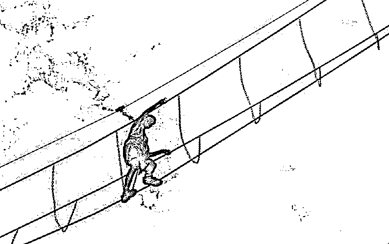

作者/格伦·佩里 译者/Jun 校对/Arrow
编辑/玫瑰 图片/全景网**“Just do it!”**耐克的广告语**“只管去做”**（Just do it）体现了白羊座-火星的态度，这种态度的标志是**勇气**。埃莉诺·罗斯福（Eleanor Roosevelt）有句名言**：“勇气，就是恐惧没能控制你。”**同样地，切斯特顿（GK Chesterton）认为勇气是一种**矛盾**，因为它意味着一种**带着对死亡的准备去生的欲望**。**一个被敌人包围的士兵，如果他想要杀出一条路来，就需要把强烈的求生欲望和对死亡奇怪的满不在乎结合起来。他不能只是等待死亡，因为那就是自杀，无法逃脱。他不能只是死死抓住生命不放，因为那样他就是个胆小鬼，也逃不掉。他必须以一种对生命极度冷漠的精神去寻求生命：他必须如渴望水一般渴望生命，同时如饮酒般喝下死亡。****——G.K.切斯特森(2015)《正统学说》**勇气不仅是维持生命所需要的，也是**各种新开始**所需要的，无论是**创业、求婚还是结婚**。我们都听过这样的格言：**“天佑勇者”**，这意味着命运（众神）密谋来强化勇敢的行为。德国作家、政治家约翰·沃尔夫冈·冯·歌德(Johann Wolfgang von Goethe)也这么认为：“勇敢起来，强大的力量就会助你一臂之力。”他说：“无论你能做什么，或梦想自己能做什么，开始行动吧。勇敢蕴含着天才、力量和魔力。现在开始吧。”尽管这句话出自歌德之口，它实际上起源于《旧约》。耶和华不断告诫他的先知约书亚要“刚强而勇敢”，带领以色列人到应许之地。神应许约书亚，如果他足够勇敢，他一定会伸出援手；神会在半路上迎接约书亚。古罗马诗人维吉尔（Virgil）是第一个写下**“Audaces fortuna iuvat”（幸运帮助那些勇敢的人）**这句不朽之言的人，但公元前 29 年至 19 年间他在他的杰作《埃涅伊德》（Aeneid）中写下这句话之前，我们必须假设希腊人在此之前早就普遍持有这种观点。  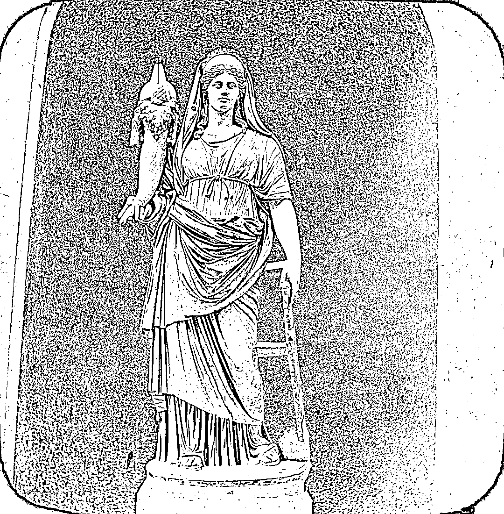
| 福尔图娜，罗马雕塑 Fortuna 在希腊和罗马神话中，**福尔图纳（或称堤喀）是财富女神，是好运和厄运的化身**。重要的是，福尔图纳（Fortuna）的青睐与**美德**紧密相连，一种象征着**勇敢、大胆、男子气概、勇气和性格**的力量——这些都是明显的白羊座特质。作为女神，福尔图纳清楚地表明，女人也不能免于美德的要求。希腊人认为，**没有美德的公民，无论男女，都会招来厄运。**天佑勇者。**白羊座如天使，是上帝的面孔之一**我经常思考白羊座-火星是否应该被视为一种**神圣价值**。我所说的“神圣价值”是指上帝（或众神）所青睐的一种人类的能力，与更明显的**灵性星座-行星原型（如射手座-木星和双鱼座-海王星）**相媲美。从占星学的角度来看，整个宇宙是上帝可见的身体；或者，正如曼利·霍尔（Manly Hall）所说：**“占星学是一种宗教，因为它揭示了上帝的解剖学和心理学。”**霍尔认为，上帝是所有占星学变量的总结产物和来源，包括白羊座-火星。在**古代占星学**中，两颗行星之间的相位意味着**每颗行星只能看到对方的特定“面向”（侧面、相位），而不能看到整颗行星**。同样地，**组成黄道带的每一个角度都只是黄道带的一面，也就是上帝的一面**。上帝的这些不同面向通常被认为是众神自身，附属的神，在服务于整个神的过程中，每个面向都扮演着从属的角色。作为 0°的角度，白羊座格外重要，因为它是**上帝的第一张面孔**，是我们**认识绝对事物（TheAbsolute）的开始**。就像一个神圣的火花，它启动了黄道带象征的进化过程。如果生命成长、发展，并引发所有自我实现的存有逐渐回归到源头意识（开悟），那么生命本身（白羊座）就是首要的，因为没有它，其他任何事情都不会发生。其他的星座或角度，其意义都来自与白羊座的关系。鹰眼与科拉思考白羊座生存的必要性时，我想起了 1992 年的电影《最后的莫希干人》中的一个场景，由丹尼尔·戴·刘易斯（Daniel Day Lewis）饰演“鹰眼”，他爱慕的科拉由光芒四射的玛德琳·斯托（Madeline Stowe）饰演。包括鹰眼和科拉在内的一小群人躲在瀑布下面，嗜血的休伦族战士们正在逼近。鹰眼知道如果休伦人找到他，他就会被杀死，如果他死了，他就无法救出科拉。他决心战斗，但鹰眼转向她喊道：** “不！你要活下去！如果他们不杀你，他们会带你去休伦湖。你听见了吗？你是强大的！你要活下去！不管发生什么事，你都要活下去！我会找到你的！无论花多长时间，无论走多远。我会找到你的！”**

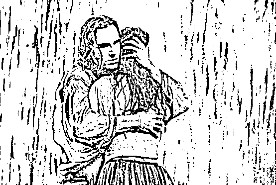

| 鹰眼和科拉最后一次拥抱，鹰眼冲过瀑布，一头扎进了下面冰冷的海水里。在几天内，他追踪到了科拉，影片迅速进入高潮。让这一幕如此震撼的是鹰眼告诫科拉要活下去的强烈情感。这是**超越一切的爱和富有感染力的勇气并存的时刻**。活下去！否则就没有未来，没有后代，没有回到源头的进化。这是神圣的命令，自然的第一法则，也是为什么我们直觉地知道自杀是错误的，任何无意义的死亡都是错误的。生存，活下去，天佑勇者。如果生存不是基本指令就是第一指令，那么也许上帝的确要求我们充分发展和实现白羊座-火星的能力，作为获得青睐的条件。白羊座是生命冲动，是生命的火花。它赋予我们一种意愿，去主张我们想要的，去为我们自己的利益而行动，去在沙滩上划一道红线并坚守它，去为主导而竞争，去为生存而战斗，必要时（仅在战争中）去杀人，让个人喜好与等同于我们热爱的东西。简而言之，**神性本身不仅包含了出生和开始的原则，也包含了侵略、战争和暴力的原则。**这并不意味着白羊座-火星只对自己有利，它是一个**平衡的、完整的心灵的重要组成部分**。一个**完全个性化的、自我实现的人**利用白羊座-火星来服务黄道十二宫的心理能力：保障繁荣、说话坦率、保护年轻人、捍卫荣誉、辛苦工作、保证公平、公开和消除腐败、为正义而战、冒着失败的风险追求成功、为了更大的善业而发起改变，最后，要**有勇气臣服于神的旨意，接受不能改变的东西**。**如果没有白羊座-火星激励我们采取行动并强化我们整体的心灵状态，其他的能力就会相应地削弱、无力或夭折。** **没有内疚，没有遗憾**最近我在看凯文·科斯特纳（Kevin Costner）的电影《三日刺杀》（3 Days to Kill）时，我对自己说：“我为什么喜欢看这个？”这部电影讲述的是一名中央情报局特工与他的妻子和女儿疏远，因为他经常被派去杀坏人。我突然想到，这类电影只不过是**旧石器时代猎人为了养家而杀人的更新版本**。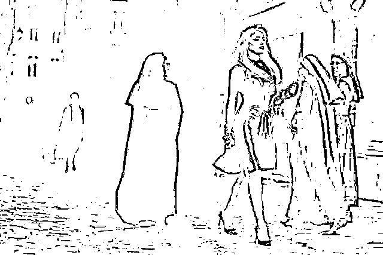| 《三日刺杀》剧照千百年来，人们都是这样做的：打死、刺死、射死其他动物，然后把它们带回家给妻儿吃，皆大欢喜。现在我们不能再这样做了。我们的动物被西夫韦（Safeway）和雄狮（Food Lion）这样的公司打死、刺死、射死。我们被剥夺了狩猎的权利，所以我们在电影中看猎人，比如兰博（《第一滴血》男主角）、詹姆斯·邦德和阿什·卡特。像《行尸走肉》这样的僵尸电视剧让我们能够集体疏导杀戮的欲望。而且严格来说，既然僵尸已经死了，我们就不必为此感到内疚。我们可以不断地杀死它们。白羊座-火星是我们的一部分，我们会**尽一切努力确保生命的延续；至少延续我们的生命，以及我们所爱的人**。矛盾的是，这意味着我们必须愿意夺取生命——不管是动物、鱼、鸟、植物还是僵尸，来**维持生命**。这是火星的首要指令，它不会为此感到内疚。再一次，这与传统的灵性原型如双鱼座-海王星形成了鲜明的对比，其中**共情、慈悲和自我牺牲**是准则。当双鱼座察觉到痛苦时，它会唤起**存在主义的罪恶感和拯救的冲动**。“我是我弟弟的守护者，”双鱼座说：“我们一起面对这一切。”我们内在的这部分原型不会割开鹿的喉咙，然后在明火上烤着吃。作为基督教信仰的**基础的爱与自然的麻木不仁的明显冲突**一直是争论的根源。19 世纪，达尔文的进化论宣称，适者生存是自然的第一法则，而神学家认为，爱是创造（Creation）的最终法则。阿尔弗雷德·丁尼生勋爵（Alfred Lord Tennyson）在《悼念集》（In Memoriam A. H.H.）一书中描述了这场冲突:**“****谁相信上帝是真正的爱****并且爱着创造的终极法则****大自然，残酷无情****峡谷中，尖叫着反对他的信条”****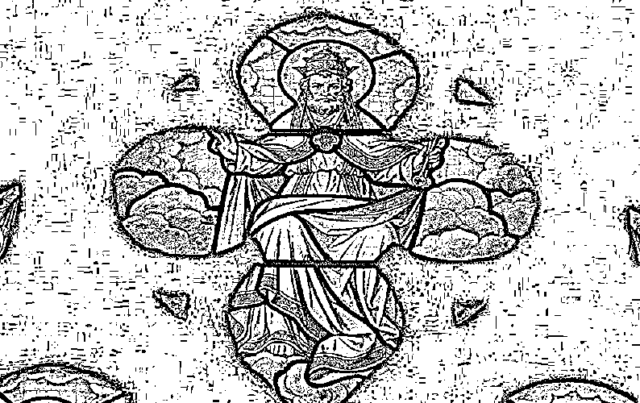**如果说占星学明确了一件事，那就是**更青睐一种原型，而不喜欢另一种，是愚蠢的做法**。因为**所有人都是相互依赖的，需要一个平衡的整体**，黄道十二星座也表明**后来的星座超越但同时包括了那些之前的星座**。关键是，**每个步骤不能跳过**。作为最后一个星座，双鱼座-海王星是无限宽容的；然而，作为第一个星座，白羊座-火星痛恨懦弱和无助的伪装。**拿出男人的样子，各尽其力，比一比。**这种态度与约翰·西阿迪（John Ciardi）的一首名为《代替诅咒》的诗中所反映的接地的灵性情感是一致的，必须的。**“在上帝的下一个空缺中，如果我被选上****我将最后一个宽恕那些受轻伤的人****他们挨的打不比别人重****再也没有起来，再也没有反抗****也不会在痛苦的赞美中出头****那些全然破碎的人****他们的仁慈是善解人意****我必须立刻抱起他们****领他们通往天堂****但是****那些以恭顺为业的人****带着假装的无助去勒索**

**引诱利用比他们更好的人 我将是最后一个去爱他们的人 永远也不会全然去爱**

**让他们都上天堂吧**

**我废除地狱**

**他们进来的时候，要念给他们听**

**“小心那些恭顺之人的算计，他们没有冒任何风险**

**没有任何付出，得到的永远都不够。”**

同样的态度在吉诺·奥列马的教练方法中得到了体现。他正在回答一个问题，谈到在赫斯基投篮后，康涅狄格大学的替补席上迸发出的热情。请注意，这些是没上场的女孩。奥列马解释说，他和他的教练团队非常重视身体语言和态度。如果一名球员在球场上因为打得不好而自怨自弃，她就会被安排到替补席上。如果一个球员已经在冷板凳上了，而且因为没有上场而生气，她会被留在冷板凳上。“如果你的肢体语言不好，”奥列马说：“你永远不能参加比赛。永远，我不管你有多好。”他继续说： “我宁愿输，也不愿看到孩子们像有些孩子那样打球。我宁愿输掉比赛。他们可以为所欲为，他们总是想着自己。我，我，我，我。我没有得分，我为什么要高兴呢？我上场时间不够，我为什么要高兴呢？这就是我们今天生活的世界。当我看到我的团队时，他们知道这一点。当我看比赛录像的时候，我检查冷板凳上发生了什么。如果有人在那里睡觉，如果有人不在乎，如果有人不投入比赛，他们永远也不会再参加比赛。永远。”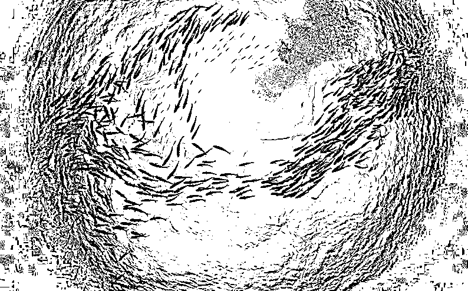这与**双鱼座的宽容、对受害者的同情以及减轻痛苦的冲动**形成了怎样的对比。火星说：**“统统甩掉，保持坚强，回到比赛中来！”**奥列马是如此坚持，所以他的球员一直展现着积极的竞争态度，否则保证你不会再上场，永远。我不得不怀疑，也许在某种程度上这也是上帝的心态。印度精神领袖、或许是世界上迄今为止最伟大的非暴力倡导者莫哈马斯·甘地（Mohatmas Gandhi）建议：**“如果只能在懦弱和暴力之间选择，我建议使用暴力。”**他接着解释说，他宁愿让印度拿起武器保卫她的荣誉，也不愿让她怯懦地屈服，继续无助地见证她自己的耻辱。**白羊座-火星的“精神变态”**如果没有提到白羊座-火星的黑暗面，我的论述将是不完整的。首先，我们应该知道，每一个星座-行星系统都与一种特定的**人格障碍**相关，这种人格障碍反映了**该原型的过度表达**。对于白羊座-火星来说，这可能会在星图中显示出太多的白羊座-火星，或者更典型的是，由于内心冲突，白羊座-火星的过度补偿。通常是两者都有。关键是，在正确的星图下，任何星座-行星的原型都可以以一种**极端、不平衡**的方式表达出来，而这正是**精神病理学**的定义。
**人格障碍的特征有四个因素：僵化、过度、损害和痛苦**。

*   首先，这个人倾向于**刻板地专注于一个单一的需求**，就像相关的原型在占星学中所象征的那样。通俗地说，我们称之为**“停滞”**。**如果一个人极度害怕自己的需求得不到满足，他们就会过度依赖一种特定的行为模式（行星）来满足需求**。 
*   第二，他们的行为太过了；也就是说，他们**不仅不断地运动（僵化），而且以极大的频率运动（过度）**。如果这种行为是一首歌，他们就会不断地以震耳欲聋的音量播放这首歌。 
*   第三，**人格障碍与满足需求的能力下降（损害）相关，这通常也是由于人在某种程度上的功能过剩（僵化和过度）**。如果过于努力，他们的行为会适得其反；总之，这是一种功能失调。 
*   第四，虽然患有人格障碍的人往往不承认是他们制造了问题，但痛苦仍然是**问题行为的自然后果**。这个人只是简单地**将他们的痛苦归咎于某件事或其他人**。 

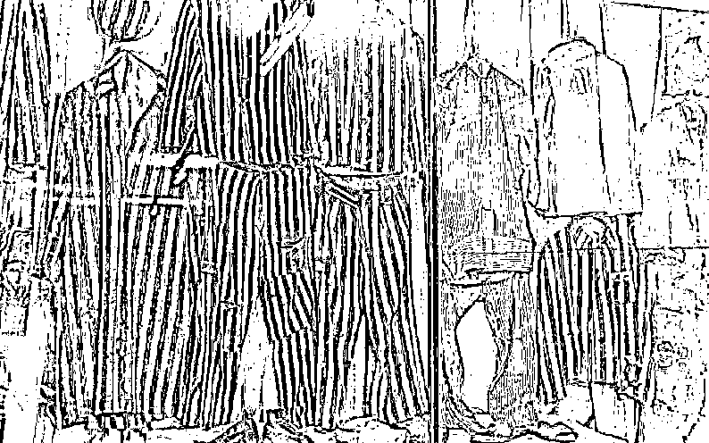与白羊座-火星相关联的精神病理是**反社会人格障碍**。在通俗心理学中，这样的人通常被称为**精神变态者或反社会者**，意思基本上是一样的。反社会人格的基本特征包括：

*   缺乏自我约束和对界限的尊重
*   经常违反或藐视法律
*   不断说谎和欺骗他人来利用他们的信任
*   冲动，不提前计划
*   会倾向于打架和好斗
*   很少顾及他人的安全
*   不负责任，不会履行财务义务
*   不会感到悔恨或内疚

 如果一个人表现出**以上三种或更多**的特征，就达到了**人格障碍**的标准——僵化、过度、损害和痛苦，那么他可能就是精神变态者。几乎精神变态的每一种特征都符合**极端的、不平衡的白羊座-火星表达**。一般来说，这种人都有**侵犯他人权利的敌对、侵略行为**前科。对独立的需求是如此的极端，以至于能力受损，无法与朋友、爱人或雇主之间维持持久、温暖和负责任的关系。**欺骗和滥交**行为是很常见的。**婴儿般对即时满足的需求损害了他们接受社会规范及合法行为的能力**。**反社会行为包括但不限于非法占有、破坏财产、盗窃、攻击、虐待配偶和儿童**。**轻率鲁莽的行为会导致事故**，例如反复超速和（或）酒后驾车。**在混乱和不稳定的工作历史中，经常缺席和无计划的辞职，缺乏可靠性可见一斑**。不负责任尤其表现在**不履行财务义务**上，如**支付账单、税款、租金、贷款或子女抚养费**。白羊座-火星对时间的定位——活在当下被曲解为**“为当下而活”**，表现为**冲动，在没有明确目标或固定地址的情况下到处迁徙**。就像婴儿一样，**精神病患者的世界坍塌为“我，此时，此地”**。他们**无法放慢脚步、展望未来，也无法反思自己行为的意义和后果，他们缺乏悔意，也无意改变**。精神变态者觉得有必要**“战胜”他人，恐吓弱者，并猎食容易上当受骗的人**。对**支配地位**的需求是如此的极端，以至于生活变成了一场无止境的竞争。他们为自己的掠夺行为辩解说：“每个人都这么做。”如果我的论点是正确的，即精神变态者过分关注白羊座对生存、自由、行动和新奇的需求，那么损害就在于无法满足这些需求。由于他们的鲁莽轻率和激起他别人的愤怒，精神变态行为的本质危害了精神变态者的存在。即使他们幸存下来，他们也经常因为犯罪而被监禁，因此失去自由。这反过来又损害了他们按照自己的意愿行事或追求新体验的能力。简而言之，精神变态者过度投入的一切最终被抵消或完全丧失了。回想一下，反社会人格可以由星图中太多的白羊座-火星来象征。这可以表现为**多颗行星在白羊座、拥挤的第一宫，或群星格局**，不管涉及的行星和星座是什么。此外，如果**火星因困难相位而受到压力**，这可能导致火星**过度补偿，以对抗与之冲突的行星冲动**。当所有这些因素结合在一起时，就有了重大的潜在白羊座-火星精神病理，尽管未必总是如此。任何配置，无论多么困难，都可以在更高级别的整合中以健康的方式运作。

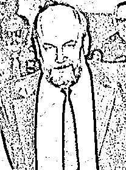

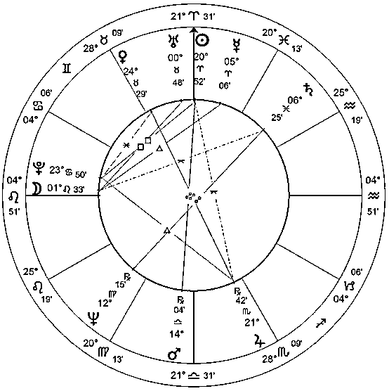

| 理查德·库克利斯基照片及出生星图

理查德·库克林斯基（Richard Kuklinski）是一个连环杀手和职业杀手，在 1948 年到 1986 年间杀死了多达 250 人。库克林斯基的**水星和太阳在白羊座，太阳与火星形成对分相，与冥王星形成四分相**。白羊座的太阳对分它自己的定位星火星，这是一个特别致命的组合，因为有一个优势的白羊座-火星能量，也会蕴含显著的内在心理冲突，从而导致**太阳和火星过度补偿以抵抗对方**。这就像把橡皮筋拉到断裂点。**适当地表达火星白羊座****白羊座-火星很容易令人感觉矛盾。很有可能行动过度或不足，并可以导致痛苦、不堪的结果，最重要的是某种形式的战争**。然而，即使是战争，也有正确的方法——那就是**勇敢地战斗。**因此，在神话和民间传说中，我们颂扬那些**对白羊座-火星的表达与人类的其他表达方式保持适当平衡**的人。因为，如果没有充分体现其核心美德——力量、勇气、独立、自我主张以及天赋权利受威胁时愤怒的能力，我们就会因胆怯而丧失自己的生命和爱人，把田地留给我们中的极恶之人，更糟的是，我们还会背叛众神。
天佑勇者。

**版权声明：**本文由若道翻译发布，欢迎转发，反对抄袭。友号转载请申请白名单。


**格伦·佩里**

若道签约老师，著名占星师，前 ISAR 董事会成员，共出版 8 本占星著作；心理/意识研究专业博士；占星心理学学院（Academy of AstroPsychology）的创办人；康涅狄格州研究生院（the Graduate Institute of Connecticut）原型宇宙学与意识进化项目的负责人。

**双证书核心课程火热报名中**

**点击图片了解详情**

**

**微信又双叒叕改版啦，不想错过若道君的推送？**

**就把若道设为星标吧！**

**▼**


就是这个“在看”，戳戳戳 ☟

********报名直达入口********


# 免费讲座 | 学习七天“星座冷知识”，用占星唤醒春天！

> 原文：[`mp.weixin.qq.com/s?__biz=MzA5NjA0NTAxNg==&mid=2651414203&idx=3&sn=bec2b6f78bf566a4114c63ea7530ae34&chksm=8b4bec0cbc3c651ace91a5636e151347fbcf09631fe471afde3a85e6860e12c4177056b57007&scene=126&sessionid=1692738197#rd`](http://mp.weixin.qq.com/s?__biz=MzA5NjA0NTAxNg==&mid=2651414203&idx=3&sn=bec2b6f78bf566a4114c63ea7530ae34&chksm=8b4bec0cbc3c651ace91a5636e151347fbcf09631fe471afde3a85e6860e12c4177056b57007&scene=126&sessionid=1692738197#rd)

占星师们一年一度的节日——**“国际占星日”**来了！

今年 3 月 20 日，太阳将离开梦幻的双鱼座，进入热忱的白羊座。告别黄道最后一个星座迎接黄道第一个星座，我们将迎来新的占星年，也自然迎来了一年一度的国际占星日（IAD）。国际占星日由 1993 年成立，过去 25 年以来，世界各地的占星师和占星学爱好者们在这一天用活动、讲座、晚会来庆祝，早已成为约定俗成的习惯。

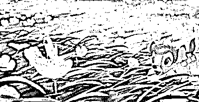

这个节日以聚会的形式，给我们一个机会，来庆祝占星学对我们的意义：**无论生活看上去多么混乱无序，占星学都可以帮助人们找到秩序和意义，应对挑战并成就未来。**2020 年初的冬天实在太久了，整个世界都变得僵硬。幸好，我们还有春天。若道占星把每年的国际占星日活动由线下搬至线上，今年**一周**连续**七天的****“星座冷知识”****主题沙龙**，我们可以和更多的朋友**一起用占星唤醒春天，给头脑和灵魂做个热身运动！**

**活动针对人群**

**零基础占星爱好者****占星学员****职业占星师**（走过路过全都不要错过）

**沙龙时间表**

**所有星座沙龙均由****“相应星座”****的占星师主讲****首度自我剖析 直击各星座灵魂**


**主讲占星师简介**

***@葛仲然 *** ***水瓶座 ***

"复旦大学旅游管理研究生，现在旅游行业从事培训与管理工作。兴趣爱好是‘好为人师’（笑），所以副业教授时间管理课程。 2018 年机缘巧合接触占星，成为大卫蒋颖核心课 L1-5 核心课学员，两年学习占星 798 小时，自觉初窥门径。从又多了一个兴趣爱好‘听别人讲他们的故事’，于是开始兼职占星咨询。北交双鱼 7 宫的我期待通过占星帮助更多人踏上自己的‘英雄之旅’。"

***@林之** *****巨蟹**********座 ******

“毕业于外交学院（China Foreign Affairs University）国际法系。2004 年获取国家法律执业资格，在大众汽车（Volkswagen）、施耐德电气（Schneider Electricity）等世界五百强企业供职十余年，任“资深法律顾问”。

2018 年初在若道跟随人本主义占星学权威大卫•瑞雷老师，系统研习人本主义占星学，并兼修卜卦、择时、生时校正等专项占星技法。2019 年，通过若道毕业考试，并获得 ISAR 职业资格认证。林之擅长职业发展、亲子关系、亲密关系、人生方向等议题，咨询风格亲切、表达条理温柔，善以“月交点故事”切入为客户提供洞见和疗愈。2019 年咨询时长 80 小时。”

***@孙继红*** ***金牛*****座****

“ISAR 认证占星师（2013 年获得）。师从于各流派大师的开启，专注于整合家庭动力系统星相探索关系、亲子等议题；曾旅居印度、北美等地的静修学院、个人成长社区多年定期接受训练，跟随并受益于心理学各流派及多个传承的疗愈大师的净化，探索并实践包括占星学、塔罗、苏菲九型；印度瑜伽哲学、吠檀多、阿育吠陀医学；人本心理学、超个人心理学等。”

***@Yiyi ******处女****座***

“90 后占星师，研究生毕业于拉夫堡大学，大学毕业于英国诺丁汉大学主修英语语言学， 2015 年开始学习占星，2016 年 11 月成为大卫的助理至今，2017 年成为 ISAR 认证占星师。主修过国外各个大师的课程， 比如大卫·瑞雷的人本主义占星， 斯蒂芬·弗里斯特的进化占星，格伦·佩里的心理占星，雷蒙德·梅里曼的金融占星，苏·汤普金斯的医疗占星，阿兰·欧肯等等。跟随大师让我站在巨人的肩膀上，对占星学有更加纯正的认知，但真正的占星老师是我们的生活以及在日常生活中我们遇到的每个人。 ”

***@Conrad ******处女****座***

“自 2010 年开始学习占星学，2015 年在若道跟随大卫老师学习，2016 年毕业并开始进行占星咨询。于 2017 年通过 ISAR 考试并拿到 ISAR 认证占星师证书。2018 年从事若道的核心课程助教工作至今。”

***@海星程 ******水瓶****座***

“早期研习东方传统文化；后跟多名国际著名占星师研习现代占星学，工商管理高级注册咨询师，若道认证授课老师。ISAR 国际占星研究协会职业资质认证占星师。2014 年通过 ISAR 职业占星师考试，获得职业占星师资质认证；2015 年若道首次“生时校正考核”中精准计算出大卫老师真实案例的出生时间而获第一名；2016 年和 2017 年连续两年若道核心课程 Level 5 助教，2017 年若道生时校正课程助教。2019 年若道生时校正课程主讲老师之一。”

***@莱莱 ******天蝎****座***

“自 2017 年在若道进行人本主义占星的系统学习，师从苏·汤普金斯和大卫·瑞雷于 2019 年完成核心课程，并深入学习了包括职业占星、择时占星、家族占星以及亲密关系等专项内容。  毕业于北京电影学院管理专业，服务于国家媒体，从事艺术创作、团队管理及内容营销 20 年，社会经验丰富，拥有利用占星服务于职业规划、亲密关系、亲子教育及团队建设等方面的专项技能，擅长个人出生星图解读、合盘解读及相关趋势预测，以敏锐的视角及情感共鸣服务生命成长。”
***@Iris ******摩羯****座***

“2014 年 ISAR 执业认证占星师；若道认证讲师、若道公众号平台作者。开创占星戏剧与造化力工作坊协助个体意识转化。曾带领“融合的艺术：占星、塔罗和自然疗愈”工作坊；塔罗学徒工作坊；占星、戏剧与造化力工作坊。并在某心理平台教授网络占星课：《与星辰为友，唤醒你在人际关系中的洞察力和创造力》。”

***@西瓜 ******摩羯****座***“ISAR 认证占星师（2017 年获得），COAC 若道高阶毕业生。太阳摩羯座妹子一枚，现阶段在专心学习心理学。”***@腻虫 ******摩羯****座***“2017 年年中，因为一本‘凑单’买的书，神奇的遇见了占星学。在天王星行运下，跟随大卫老师和天空师兄学习严肃占星并在自媒体撰写文章。2019 年开始在若道平台发表文章，并于同年通过 ISAR 考试成为认证占星师。” 

**参与方法**

**活动时间****：2020 年 3 月 16 日-22 日**

**                   19:00-20:30**

**活动费用****：免费**

**授课方式****：网络直播，中文授课**

**参与方式****：请添加客服微信（nodoorDaivd），获取直播听课方式**

**长按下图二维码报名********对这个活动感兴趣的读者** **欢迎把这篇文章分享给更多的人**

# 目前市面上的占星学课让你觉得无聊了？这门课程你得看看

> 原文：[`mp.weixin.qq.com/s?__biz=MzA5NjA0NTAxNg==&mid=2651414203&idx=4&sn=637891882e63640a7b82bbe0683767d9&chksm=8b4bec0cbc3c651afed6fe5735c20dbadbd9b9ea959a99b155e9e00f2a9c5aab3f8aca064ee3&scene=126&sessionid=1692738197#rd`](http://mp.weixin.qq.com/s?__biz=MzA5NjA0NTAxNg==&mid=2651414203&idx=4&sn=637891882e63640a7b82bbe0683767d9&chksm=8b4bec0cbc3c651afed6fe5735c20dbadbd9b9ea959a99b155e9e00f2a9c5aab3f8aca064ee3&scene=126&sessionid=1692738197#rd)

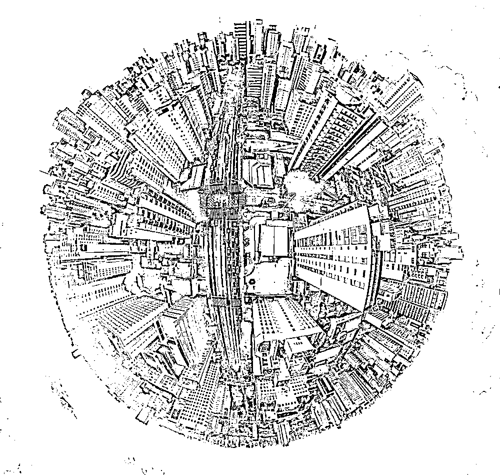

有这样一则家喻户晓的故事：三个泥瓦匠在砌墙，一个人走过来，问他们在干什么。第一个泥瓦匠没好气地说：你没看见吗？我在辛苦地砌墙呢。第二个笑笑补充回答：我们正在建一座高楼。第三个则笑容灿烂哼着小曲儿说：我们正在为城市添砖加瓦、创造美好的生活。10 年过去了，第一个人仍然在做泥瓦匠，第二个人成为了一名工程师，而第三个人则成为建筑公司的老板。**工作技能本身没有区别，为什么三个人的人生走向却大相径庭？**

*   人的一生是见自己，见众生，见天地的过程。**不同的认知层次，形成了不同的人生格局。**它决定了你能看到的风景。我们常常抱怨命运不公，抱怨生活没有诗和远方，事实上，那是因为我们高度不够，格局太小。

*   同样，占星学习也是见自己，见众生，见天地的过程。**不同的认知层次，形成了不同的占星视野。**它决定了你可以运用这门语言看到怎样的风景。占星师常常困惑占星学习遭遇瓶颈，客户拓展资源不足，帮助来访者扩展格局能力不够。究其原因，是因为我们使用占星学的高度和格局不足。

晚清名臣曾国藩说：**谋大事者首重格局**。人和人不一样，拼的是格局。那又是什么决定着一个当代占星师的格局呢？大格局的本质是：**站得高，看得远，懂取舍**2020 春季开年 ISAR 选修课若道倾力打造不可不学的**经世占星学**一起来解锁全新大格局的占星版图吧！

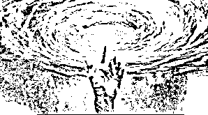

占星之旅上半场拼的是知识技法占星之旅下半场拼的是眼界格局**为什么学习经世占星学？**

**经世占星学（mundane astrology）是研究世界政治经济发展趋势和世界各国发展周期的占星学研究分支。**

任何有一些人生阅历，对于国家历史、家族历史有所了解的人都会明白，我们的个人生活是时代和国家历史的缩影，我们个人经历的行进、推进是一条小溪，而更大的背景是世界和国家行进、推进的大河。大河的流向决定了小溪的流向。

学习经世占星学，**帮助我们及我们的客户这条小溪在这个世界的大江大河“顺势而为”**。具体而言：

*   在 21 世纪这个信息世纪，经世占星学可以帮助占星师开辟新的服务项目——**为高端企业家客户及大机构提供独特服务**，因为高端客户和大机构对于国际政治经济发展趋势，主要影响力国家、重要世界组织机构的现在和未来都更为敏感。对应国家的行进和推进，更好地预测这个国家或大型组织的未来发展、变化趋势；

*   在人口的国际间流动、交流更为频繁的时代，经世占星学通过了解各国的趋势，**可以在客户有国家选择需求时，帮助占星师为客户提供更多信息服务**。

*   如果你爱历史，经世占星学可以给你**看历史长河中世代兴衰起落的独特视角**；

*   如果你爱关注国际形势，经世占星学都能够让你更**了解每一个国家的国民个性、集体潜意识，社会议题和发展方向**；也能帮助你**对领导人及其国家的影响有更深刻的了解**。

**课程大纲**

**此课程可作为 ISAR 选修课。**

在这 10 节课的时间里，我们将学习**经世占星学的重要研究方向**，包括但不限于：

*   行星周期对于世界发展及格局变化的影响
*   研究国家星图及行星周期对于国家的影响
*   研究外国领导人星图及对其国家的影响
*   如何从政府成立、总统就职时间的星图研究时事发展
*   如何从重要组织机构诞生星图（如北约、欧盟、欧元区、第一个现代证券交易所的诞生星图）看组织未来
*   如何从重大事件发生时的星图（比如从曼德拉出狱日期看南非转折和开端）发现该事件对于国家的影响

**授课老师**


**卡伦·哈梅克**·**佐达格**

**（Karen Hamaker Zondag）**

卡伦·哈梅克·佐达格是**20 世纪最受尊重和赞誉的占星师之一**，她毕业于荷兰阿姆斯特丹大学，于 1975 年开始她的占星实践。她是荷兰**两所学校的创始人之一**：一所是 1980 年成立的阿切纳占星学学校，另一所是 1987 年成立的荣格心理学学院。她也被邀请作为英国著名占星教育机构心理占星中心（Centre for Psychological Astrology）的老师和美国第一所真正的、官方的占星学大学开普勒学院任教，并是**世界各大占星会议最受欢迎的演讲人之一**。由于其**对占星学的独特贡献**，卡伦·哈梅克·佐达格在 1992 年、1995 年、1998 年分别获得占星学界最著名的奖项轩辕十四奖项提名，并于 1998 年获得**轩辕十四奖**。

卡伦·哈梅克·佐达格一个非常鲜明的个人特色是她的**研究涉猎广泛而深入，她在心理占星、金融占星、经世占星方面都是该领域排名前列的老师，并且深受该领域知名占星师的赞誉**。因为其在占星学的知名声誉，她从 2012 年被隶属于荷兰著名投资集团 Rasile 的 Dasym Research （Dasym 是全球电视节目的创新的著名领导者，比如《中国好声音》就是引入 Dasym Media 的版权）聘请为**智库成员**，该智库调研当前世界显性和隐性的社会经济趋势，为发展和投资决策服务。她也是**TEDx 演讲**人。


她是**20 多本占星学、心理学、塔罗、易经书籍的作者**，包括《从占星学视角看金融危机的背景和未来》、《性的占星学和疗愈》、《日常生活中的占星学》、《心灵和占星象征》、《作为生活之道的塔罗牌》、《12 宫》、《宫位的本质和背景》、《相位研究》、《四轴手册》、《卜卦占星》、《关系占星学》、《占星学预测》、《从新的角度看外行星》、《易经、冥想和灵性》、《实践中的荣格心理类型》、《日常生活中的灵性和心理学》、《实践中的投射机制》、《自我的愉悦——愉悦心理学》、《神话和现实》等。她的书籍因为**广受欢迎**，**被翻译为 10 多种文字在多国出版**。


**授课时间&方式**

**授课时间（共 10 次课）**：

*   2020 年 4 月 6 日（周一）

*   2020 年 4 月 14 日（周二）

*   2020 年 4 月 21 日（周二）

*   2020 年 4 月 28 日（周二）

*   2020 年 5 月 5 日（周二）

*   2020 年 5 月 12 日（周二）

*   2020 年 5 月 19 日（周二）

*   2020 年 5 月 26 日（周二）

*   2020 年 6 月 2 日（周二）

*   2020 年 6 月 8 日（周一）

**授课方式**：

**线上网络直播课，英文授课，中文翻译**

**课程价格**

**正价：7500 元**

**退转课程**

**退款原则请详看《教学协议》，如有疑问请咨询课程顾问。**

****ISAR 选修·经世占星学****

**授课老师：卡伦·哈梅克**·**佐达格**

**时间：**2020 年 4 月 6 日-6 月 8 日（共 10 次课）

**授课方式：**网络直播课，英文授课，中文翻译

**费用：**7500 元

**课程负责人：**王老师（微信：18510107057），请备注“经世占星”

长按二维码添加课程负责人咨询~


****报名请点击“阅读原文”****


# ISAR 选修 | 15 堂精修课程，彻底掌握“现代卜卦占星学”

> 原文：[`mp.weixin.qq.com/s?__biz=MzA5NjA0NTAxNg==&mid=2651414166&idx=2&sn=55a0af1fb52cfae77f2f34ceb57ab572&chksm=8b4bec21bc3c6537c541f8b200be0213a9346640801eb715cb28b1fb03b90eaf9725f7410471&scene=126&sessionid=1692738197#rd`](http://mp.weixin.qq.com/s?__biz=MzA5NjA0NTAxNg==&mid=2651414166&idx=2&sn=55a0af1fb52cfae77f2f34ceb57ab572&chksm=8b4bec21bc3c6537c541f8b200be0213a9346640801eb715cb28b1fb03b90eaf9725f7410471&scene=126&sessionid=1692738197#rd)


这次卜卦占星学课程，是为**想彻底掌握现代卜卦占星学**的同学们准备的。

若道 10 年来只开设过两次卜卦课程，因为我们希望将**传统的卜卦占星学与现代人本主义占星学的精神结合起来**。能够做到这一点占星师并不多。非常荣幸的是，我们遇到了哥本哈根占星学院院长**艾德里安·罗斯·邓肯**老师。

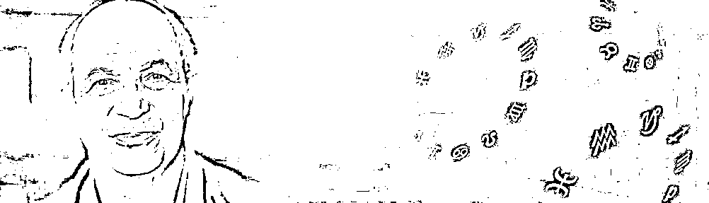

作为本次课程的主讲老师，艾德里安·罗斯·邓肯如是说：

“**卜卦占星学是对当下发生的事情的觉知。****它最重要的目标是活在当下，理解此刻是如何囊括万物的**。”

“心理占星学和卜卦占星学别无二致，所有的事件都有其心理对应。如果你的意识与世界同步，你就会看到二元统一。”

“行进和推进帮助我们理解如何抵御外在和内在的风暴。卜卦如同显微镜下的行进。**通过行进难以准确了解一段关系、房屋购买、工作机会等是否有益，但对卜卦来说并不难。卜卦也擅长回答与时间相关的问题，对行进和推进的标志进行微调。”**

通过前两次卜卦占星课程，我们对这门学科和教学难点有了更多的了解，因此这次课程我们再次和艾德里安·罗斯·邓肯老师一起设计，希望**将现代卜卦占星学的精髓传达出来，同时精细地讲解每一宫所代表的卜卦事物，并展示足够多的案例，提供足够的卜卦练习机会**。

**课程内容**

**我们将在****15****堂现代卜卦占星学精修课程中学习以下内容（并非按课程顺序排列）：**

***1****.*** **现代卜卦占星学的基础**

*   动态卜卦占星学的原则及意义

*   如何将着重心理分析的心理占星学和着重判断的卜卦占星学融合起来

***2.*** **现代卜卦的解读原则和方法**

*   上升点及上升点守护星

*   宫位守护星及行星力量

*   了解每颗行星的意涵，了解每颗行星代表什么

*   行星间相位、相位的动态变化及解读

*   成对行星及其关系

*   卜卦图中的水星逆行

*   学习卜卦中的传统规则(约束、限制等）以及对其的现代看法，如土星、火星合上升、月亮空亡、日核内、灼伤、上升在初度或末度、燃烧之路、事件的完成等

*   卜卦图中的外行星和凯龙星

*   卜卦中常用的恒星，比如大陵五、昴宿六、轩辕十四、东次将、角宿一、织女一、室宿二等

*   应期和时间预测方法

***3.*** **卜卦主题课程**

*   精讲 1-12 宫的主题，比如恋爱、婚姻关系，商务合作关系，与工作相关的主题，健康和医疗，金钱和投资，教育、怀孕、育儿，安全感和家庭事务，旅行和移民等

***4.*** **事件图的解读**

*   当大事件发生时，如何看事件图

*   如何识别星图中行星的代表事物或人物

*   如何从天象图的变化推演事件的变化

*   从日常事件的星图中看到启示

***5.*** **如何择时**

*   对于看起来的不利的时机怎么办

*   如何选择婚姻、商务、旅行时机

***6.*** **咨询星图**

*   什么是咨询星图

*   如何用咨询星图聚焦一次咨询

*   卜卦星图和出生星图的呼应、卜卦星图和推进图的呼应

*   如何将咨询星图和案主出生星图、行进图、次限图结合起来解读

***7.*** **如何运用卜卦星图做转化性的咨询**

***8.*** **咨询的预兆以及对新闻、世俗事件的解读**

**整个课程将提供大量案例演示、课后作业来帮助大家理解和练习。**

**导师介绍**


**艾德里安·罗斯·邓肯****（Adrian Ross Duncan）**1971 年在印度游学时开始学习占星学，1985 年开始成为全职占星师，**迄今执业已超过 33 年，是人本主义占星学、卜卦占星学和经世占星学领域的知名占星师。他还开发了占星软件 AstroClock 和多款占星报告。**他在日常咨询中都会运用卜卦，咨询图（卜卦的一种运用方式，即根据客户来访时间制作星图，从星图中获得大量信息）也是他**特别擅长的领域**。艾德里安·罗斯·邓肯从 1971 年开始研习佛学，受佛学影响很深，他**相信占星学和佛学观点统一、转化的一个基础是在于对现实感知的改变**。而卜卦很容易与佛教融合，因为它只关乎当下。

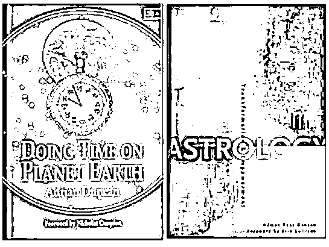

| 艾德里安·罗斯·邓肯的占星学著作

**什么人适合参加本课程？**学习整合卜卦技巧不仅有益于那些想钻研卜卦占星学这个分支的同学，对占星初学者也会很有帮助，可以让你对占星学以及运用有更深的理解。**课程费用****课程原价：9900 元****早鸟价格等你来！****2020 年 4 月 10 日前报名完款，享受早鸟价：****9200 元****（2020 年 4 月 10 日恢复原价）****老学员复训专享价****：****2018 年参加艾德里安·罗斯·邓肯卜卦占星课程的同学：****5000 元****特别优惠****：****分享课宣到朋友圈****保留 48 小时****（不设分组显示）截图给课程顾问可再获得****400 元优惠****，4 月 10 日前****新学员实付价格 8800 元****，****老学员复训实付 4600 元****。****授课时间****2020 年 5 月 15 日-9 月 25 日（7 月休息），每周五 20:00-22:00****具体日期：**

*   5 月 15 日、22 日、29 日   

*   6 月 5 日、12 日、19 日、26 日    

*   8 月 7 日、14 日、21 日、28 日 

*   9 月 4 日、11 日、18 日、25 日 

**授课方式****网络直播课，英文授课，中文实时翻译**
**退转课程****退款原则请详看《教学协议》，如有疑问请咨询课程顾问。******现代卜卦占星学精修课程****

**授课老师：艾德里安·罗斯·邓肯**

**授课时间：**2020 年 5 月 15 日-9 月 25 日（15 次课）

**授课方式：**网络课程，英文授课，中文翻译

**费用：9900 元；****早鸟价：9200 元（2020 年 4 月 10 日前）；老学员复训价：5000 元；特别优惠，分享课宣到朋友圈保留 48 小时（不设分组显示）截图给课程顾问可再获得 400 元优惠。**

**课程负责人：**童老师（微信：196267205），请备注“卜卦”

长按二维码添加课程负责人咨询


****报名请点击“阅读原文”****


# 水星终于顺行了！！！12 星座准备好了吗？

> 原文：[`mp.weixin.qq.com/s?__biz=MzA5NjA0NTAxNg==&mid=2651414166&idx=1&sn=d54bd6ea07ef91c014951a38fc49f6dc&chksm=8b4bec21bc3c6537d1eccc23a4fd87a6f1288946d6513234182bc8ddaef68877c2cafa9e305c&scene=126&sessionid=1692738197#rd`](http://mp.weixin.qq.com/s?__biz=MzA5NjA0NTAxNg==&mid=2651414166&idx=1&sn=d54bd6ea07ef91c014951a38fc49f6dc&chksm=8b4bec21bc3c6537d1eccc23a4fd87a6f1288946d6513234182bc8ddaef68877c2cafa9e305c&scene=126&sessionid=1692738197#rd)

******☆ ****后台回复“今日”，给你一句生命态度******

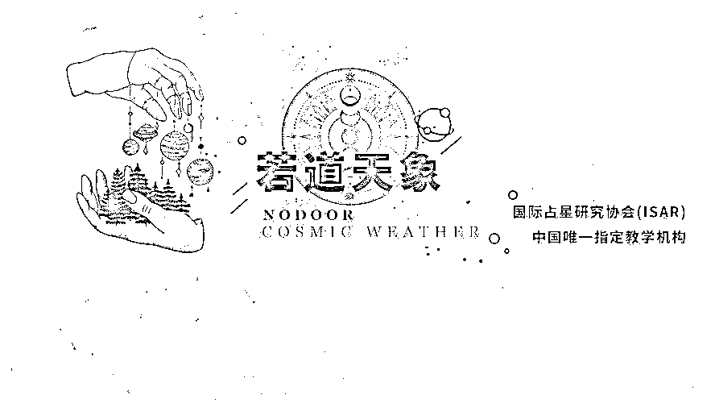

作者/Justine ISAR 认证占星师
编辑/Tang 封面/书君 图片/pexels

北京时间 3 月 10 日 11:48，水星在水瓶座恢复顺行。2020 年的第一次水逆，让很多人突然意识到原来“臭名昭著”的水逆不是最可怕的！有些行进比它更令人生畏。如果土冥合相是三十几年一次的地震海啸，而水逆则是每年三次的和风细雨。

**本次水逆的背景**土冥合相下中国大地突发新冠病毒的疫情，让那些陷入漩涡中心的人感到无能为力，被推入非常不舒服的境地。当个体的生命被大型的非个人的力量所限制，被生存的本能所驱使，在压力中努力生存下来。某些人在这场没有硝烟的战争中，呈现出坚韧、不可曲折的意志力、强大的勇气和牺牲。琳恩·贝尔曾这样说：“**土冥也奖励那些勇于面对危险与死亡的人。每个人可以用这两颗行星表演一出皮影戏，这是控制、转化与毁灭之间的对话**。“2020 年的第一次水逆就是在这样的背景下展开的。土冥合相在摩羯座（土星非常强势的位置），给我们带来**深刻的内心反思——压力不仅来自外部事件，也来自内部——强大的能量推动个体的改变**。土冥让每个人深入内心工作，与老旧的过去彻底决裂。而水逆的关键词是“**内省**”，帮助完成这个深入挖掘、向内联结的过程。

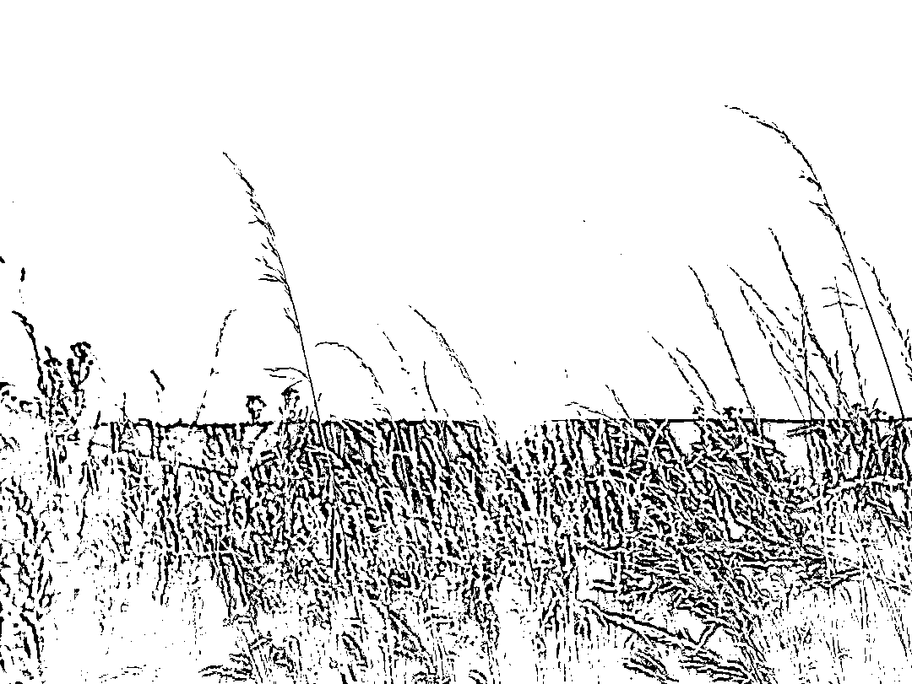

**本次水逆的整个进程**

2 月 2 日：水星进入前阴影区

2 月 3 日：水星进入双鱼座

2 月 17 日：水星在双鱼座 12°53'逆行

2 月 26 日：水星与太阳合相（近日点）

3 月 4 日：水星逆行进入水瓶座

3 月 10 日：水星在水瓶座 28°13’顺行

3 月 16 日：水星再次进入双鱼座

3 月 30 日：水星出后阴影期

**这次水逆大部分的时间发生在双鱼座。**我们常常会这样诟病双鱼座：善于造梦却又不喜边际。加上水逆的混沌与信息不畅，很多人一开始对本次水逆怀有很大的疑虑与担心。过去的三周里，疫情的防控有效开展，证明了水逆可以是一个有效率的时期。而且，水逆给我们带来了第二次机会：**有机会治愈旧伤，重新评估与纠正，弥补未完成之事**。而且，双鱼座是最灵性，最有创意，非线性和富有同情心的。水星被称为“**灵魂的向导**”，而逆行阶段的目的，是**向我们展示通往灵魂的道路**。当水星在双鱼座逆行时，每个人被**鼓励放慢脚步，依靠微妙的感官，与内部世界保持联系，并明白宇宙万物是一体的**。在疫情中，少部分在炼狱中煎熬的人们，从死神的国度返回，不再是以前的自己，开始发现自己隐藏的力量和改变的决心。大部分人，因为经济重创和死亡恐惧的触发，开始向内寻找，探索爱与信仰。更重要的是，我们开始明白：**每个人的命运都是相连的，地球与人类是一体的**。

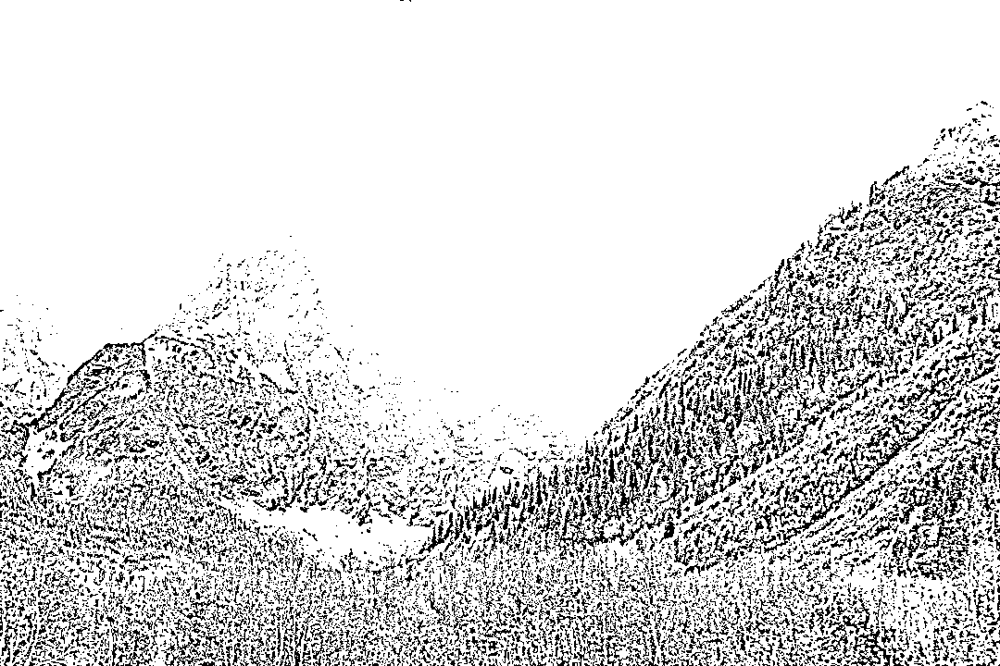

**水星的停滞与顺行****水星在 3 月 9 日和 10 日会处于停滞状态。任何行星的停滞都是能量增强的时期。那么，水瓶座 28 度的水星会发出怎么样的重音符？**水瓶座的积极面向会强调**兄弟般的情谊**，**无国界的精神**。我们发现：在这个金钱与权力开始失去意义的时期，若不是积累足够的良善与福德，若不是群体之间的信任与互助，每个人都很难走到现在。当水星在水瓶座逆行，需要注意的陷阱是，可能会感到需要情感上的撤退，特别是在疫情互相隔离的环境下，但随后又会感到疏离。所以，**试着在不把所有人都推开的情况下获得一些空间**。在水星停滞的几天里，一些人也会迫切地需要但尚未完成的所有清理工作，因为水星顺行后就没有了内省期，这是我们充分利用逆行时期的最后机会。**3 月 10 日，水星在水瓶座 28 度开始顺行。**顺行之后的几天内，也是一个能量急剧变化的阶段，有些人可能会对水逆期间遇到的任何问题，突然有难以置信的清晰度。不过依然需要有耐心，因为准备好去成功地执行新的发现，很可能需要一些时间。

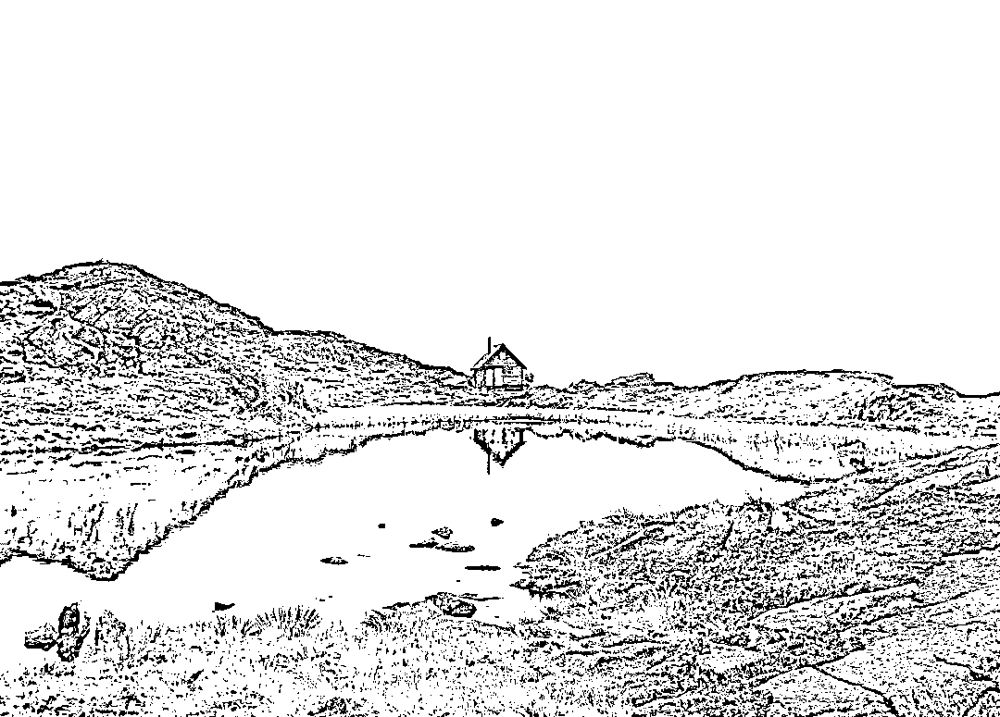

**水星顺行会带来怎么样的积极影响？****★** **在水逆期一直在调查、研究、困扰的一些事情最终会有突破。一切都会重新有意义，你可以期待大的惊喜时刻。****★** **在水逆期间积累的压力可能会得到释放。****★** **通过能量的转换，可以让在水逆期被困住的习惯性或强迫性的模式得到转化。**当下，虽然国内大部分地区的疫情已经得到了有效的防护与治疗，但企业的复工、经济的复苏并没有大规模展开，少数复工的企业也是存在着效率和沟通不顺。水星顺行后，会推动复工的进程。我们可以更好地投入工作、处理细节并保持井井有条，按时完成任务。对于个体而言，我们将把逆行期间学到的知识应用到现实中，积极探索解决问题和目标的新方法。如果你一直在与“内心的恶魔”（不舒服的感觉、冲动、恐惧等）作斗争，那么现在可以尝试处理和表达它们的新方法。

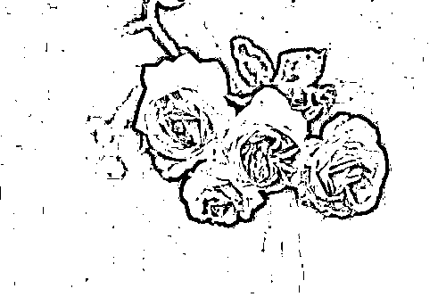

**水逆后阴影期需要注意吗？****水逆后阴影期一般持续两周半，这次是从 3 月 10 日到 3 月 30 日，从水瓶座 28 度到双鱼座 12 度。这是水星第三次（也是最后一次）通过该区域。**一般而言，后阴影期比前阴影期好得多。**后阴影期有关于整合与行动。**因此，你可以签订合同，安排重要会议，进行关键的对话，并做出重要的决定或购买。但当水星转向时，就好像从沉睡中醒来一样，可能需要一些时间才能恢复速度，并不是喝几杯宇宙咖啡就能完全恢复意识。因此，部分人会感觉水星顺行后第一周象仍在逆行一样，**要保持耐心**。**12 星座水星顺行指南**水星的周期，以一种个人的方式影响着每个人，**需要具体参考个人星图上水星所经过的宫位**。因此，无论是水星顺行还是逆行，带来的影响是个性化的。某人可能因水星顺行激活了职业与金钱领域，而另一个人则是激活了亲密关系或性的议题。建议直接参考**水星顺行宫位**来阅读（也可参考自己的**上升星座**，如不一致请以水星顺行宫位为主），如果不了解水星顺行发生在自己的哪个宫位，可以根据下图查看，或咨询身边的专业占星朋友。**怎样知道水星在出生星图的第几宫顺行？只要进行如下步骤。**打开若道公众号进入后台，选择**占星服务-在线星盘-行运盘**，输入**出生信息**以及**水星顺行时间**，点击下一步生成行进星图，看看水星 **☿** 所落的宫位就知道啦，见下图~

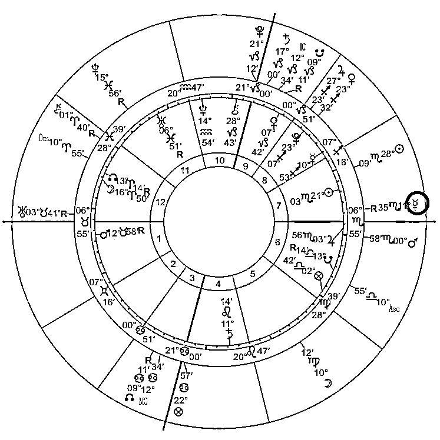

**水星顺行在****第一宫****（上升双鱼座）**

这是**自我身份感的宫位**。在水逆期，你很可能会问自己：我是谁？外界环境的突然变化给了你思考的契机。在过去的三周，你观察自己的行为，找出了需要作出的改变。经过一系列的反思，**现在你对自我身份感有了重新的定义**。也许你会确认“游动”的方向会与以前截然不同，只需要松开将双鱼座绑在一起的讨厌的“结”即可。

**水星顺行在****第二宫****（上升水瓶座）**

这是**关于财务与自我价值的宫位**。在过去的三周内，你做了一些内在的清理，发现组织混乱或缺乏意识会阻碍你的财富。你会努力挖掘内在的资源，向自己证明自己。水星顺行后，你会**增加收入来源，减少对旧收入来源的依赖，让自己更加独立**。同时，自我价值的增强是可以期待的，从而在接下来的几年中为你带来全新的生活。

**水星顺行在****第三宫****（上升摩羯座）**

这是**关于沟通、信息与感知的宫位**。在水逆期，你发现自己的沟通需要一些调整，有些事没说出来或没有被听到。也许，你需要调整筛选信息的方式，而不是被海量信息淹没。水星顺行后，**日常沟通中会出现更多新的机会**：新的人脉、新的工作或合作机会。你也会选择跟诚实、聪明、深刻的人对话，让自己的话语更容易被听到。

**水星顺行在****第四宫****（上升射手座）**

这是**关于家庭与根基的宫位**。在水逆期，你可能发现自己的家需要更好的组织或整理。如果你在面对功能失调的家庭情境，开始发现解决之道不在外在与他人，而是要先爱自己，并向内挖掘自己。水星顺行后，你可以**对家与家庭做一些深度清理或清洁**。与家人的关系在水逆期得到了反思之后，现在的你获得内在的平和与安静，是时候去付诸助改变了。

**水星顺行在****第五宫****（上升天蝎座）**

这是**关于孩子、自我表达与创造力的宫位**。在疫情期间，你可能不得不每天 24 小时面对孩子，或者有一大堆需要你关注的创意项目，抑或你的恋爱关系遇到了一些不顺……从而你不得不进行反思与调整。当水星顺行，你发现上述议题的修整，都是在为未来创造更大的空间。在筛选出无效的方法后，现在该轮到让自己去**承担新创意的风险了**。允许你最深刻的直觉浮出水面，你会对此感到惊讶。你有天生的创造天赋！

**水星顺行在****第六宫****（上升天秤座）**

这是**关于健康、技能与服务的宫位**。在这个水逆期，你大部分时间都呆在家里，简化了工作环境、日常行程和健康习惯，重新温习了一些技巧与学习，调整了捕捉灵感和管理项目的方式。现在，你能**利用学到的新技能，更好地与人合作**。你的真诚、完美和高效将给老板留下深刻的印象，成为职场中的中坚力量。

**水星顺行在****第七宫****（上升处女座）**

这是关于**一对一关系的宫位**。在过去的三周，你发现由于没有有效的分享，亲密关系、合作关系、友谊可能变得糟糕和混乱。你开始思考如何与他人更好地融合，以便在更多的层面打开可能性。

水星顺行后，你将习得的**尊重、接纳和真诚的沟通运用在人际关系中**。你会积极缔结跟某个人的深刻的合作伙伴关系，这将你带入另一个世界。如果你单身，在亲密关系上也可能获得迅速的进展。

**水星顺行在****第八宫****（上升狮子座）**

这是关于**深度联结、资源共享的宫位**。在水逆期，你意识到自己与他人资源上的所有交集，会主动了解自己的股票和个人退休账户，你的配偶的收入和支出平衡。你们之间也可能会深入探讨性。水星顺行后，你可以找到**新方法更好整合他人的资源**。水逆还跟死亡与地下世界有关，你在过去三周听闻、目睹或切身体会到死亡，现在会有更多的**勇气去直面危机，同时对生命脆弱性保持敬畏**。

**水星顺行在****第九宫****（上升巨蟹座）**

这是关于**哲学、信仰与跨文化、高等教育的宫位**。在水逆期，你会思考生活中的事情对你意味着什么，重新考虑你的信念，审视人生的意义。另外，你如果刚好有出国计划，很可能被延期。水星顺行后，跨文化冒险之旅会为你开启全新的视野。即使你依然呆在原地，你有可能去突破自己的心理壁垒，**扩展视野**。记得**继续使用你敏锐的直觉**，当水星在你的第九宫时，多用情感交流沟通，用直觉整合知识的框架。

**水星顺行在****第十宫****（上升双子座）**

这是**关于公众、社会地位与名声的宫位**。在过去的三周，你的职业可能经历了一些重大调整的危机。有些压力虽然来自外界，但确是促发内在转化的契机。你开始考虑：如果有足够的技能和金钱，自己会选择做什么？当水星顺行，你需要作出确实的决定，职业上的停滞会及时地化解。但记得**对自己坦诚**，不要为了一时的利益而牺牲长久的选择。

**水星顺行在****第十一宫****（上升金牛座）**

这是**关于群体、愿景的宫位**。在水逆期，你可能重新与老朋友获得了联系，或深度清理你的朋友圈。在疫情中，你也许认识了更多拥有共同爱好、目标与愿景，并能一起走向未来的人，也许会发现有朋友背叛了你。当水星顺行，你**清楚地知道自己归属什么样的社群或团体**，需要什么样可以带来深刻联结、能彼此疗愈的朋友。这也有关于自己人生长期的目标与方向。

**水星顺行在****第十二宫****（上升白羊座）**

这是**关于梦境、灵性、万物合一的宫位**。在水逆期，你可能接触了一些新的精神能量，你比以往要沉静、内化得多。有些梦境打开你了的感知，帮助你深入自己的潜意识。如果你在水逆期经历了外在的灾难甚至周围人的死亡，这让你继续深入内在艰苦的工作。现在，你会基于现实的考量，并结合直觉、想象力、创意去行动。通过丧失，你学习了臣服的功课。**你在自己生命中能腾出更好的空间，来迎接新的事物。**

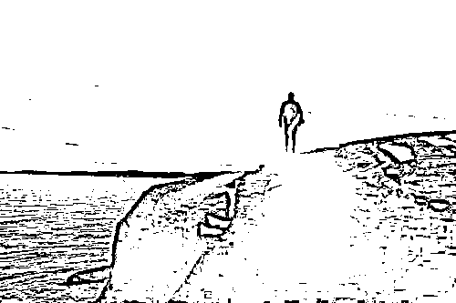

**水星恢复魔力之后****水星顺行的同一天，我们会迎来处女座满月。**处女座是水星掌管的星座，以其组织能力而闻名，这意味着**满月是清理水逆期间任何混乱的理想契机**。**3 月 20 日太阳进入白羊座的春分点**。在北半球，这是大自然春暖花开、土地肥沃的时期，也标志着**全新的占星年的开启**。作为每年的新起点，春分会带来迫在眉睫的改变动力，带来个体意向设定和思考如何度过 2020 年余下时间的契机。**3 月 22 日，土星离开摩羯座进入水瓶座。**土星平均每 2.5 年换一次座，每当土星换座时，我们都感觉到的宇宙中产生涟漪和变化。当土星结束这个业力周期时，将确保每个人已完成工作，以便我们可以成功地将精力转移到更高的新的振动上。因此，**3 月底会是 2020 年能量上的一个转折，从土木冥合摩羯座的功课与试炼，转向水瓶座能量的新时代。**虽然土星后续还会逆行回到摩羯座，而土木合相开启 140 年的风象时代要到 2020 年 12 月，但在 3 月水星顺行后，3 月底土星和火星陆续进入水瓶座，将会是一个前奏，引导我们深入了解并适应水瓶座新能量的浪潮。过去的几个月，土冥带我们去地狱之旅，赤条条的，惊恐万状的。现在当我们回来，将不再是以前的我们了。水星顺行后一系列宇宙能量的转换，会加速进化的旅程。让我们拭目以待，**将梦想和愿望设置到宇宙星辰的节奏周期，一起实现最大的潜力**。

**版权声明**：文章由作者授权在若道平台发布，欢迎转发，反对抄袭。

****

**Justine**

ISAR 国际认证占星师（2016 年获得）/塔罗师

毕业于浙江大学，十年跨国企业 HR 经验

咨询时长超过 800 个小时

**咨询微信**：Justine_JT

**公众号**：星光体

长按打赏


**点击图片查看若道君推荐**


**微信又双叒叕改版啦，不想错过若道君的推送？**

**就把若道设为星标吧！**

**▼**


喜欢记得点一下在看哦☟

**报名直达入口**


# 处女座超级满月 | 先清理自己的能量，真正的梦想经得起等待

> 原文：[`mp.weixin.qq.com/s?__biz=MzA5NjA0NTAxNg==&mid=2651414130&idx=1&sn=5983e3c6a44c01c6340da2dd674280f9&chksm=8b4becc5bc3c65d3591fcdb50e2a97ebf3dbbb79777e1f83cd312eb7ca96f7aeac4895697627&scene=126&sessionid=1692738202#rd`](http://mp.weixin.qq.com/s?__biz=MzA5NjA0NTAxNg==&mid=2651414130&idx=1&sn=5983e3c6a44c01c6340da2dd674280f9&chksm=8b4becc5bc3c65d3591fcdb50e2a97ebf3dbbb79777e1f83cd312eb7ca96f7aeac4895697627&scene=126&sessionid=1692738202#rd)

****☆ ****后台回复“今日”，给你一句生命态度****

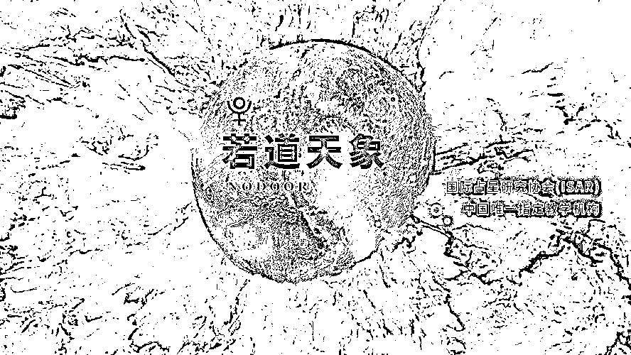

作者/王芝桦 编辑/玫瑰 图片/全景网

**处女座满月****北京时间 2020 年 3 月 10 日 1:47 迎来处女座满月，双鱼座太阳与处女座月亮于 19°37′精准对分。**如果站在几十年后的时间点上，再回头看当下的生活，那么，我们对自己在几十年前（当下）的选择和努力，会感到欣慰，还是后悔呢？下一代对我们在几十年前的选择和努力，会感到敬佩，还是忧伤呢？相信每一个人都想要一份美好的回应，此刻我们正在为未来铸就这一份回应。**“铸就”意味着“弃废留宝”的过程，对有用和无用的进行筛选辨别，对留存与淘汰的进行分类处理。**此次处女座满月，**月亮处于近地点形成“超级满月”**，为喜欢**“分类”**又酷爱**“精准”**的处女座满月送上一柄放大镜，助力处女座满月将**“宝贝”**与**“废料”**分辨得更加清晰——**将宝贝珍藏，将废料释放，减负前行，有的放矢，才能铸就那一份发生在未来的美好回应。**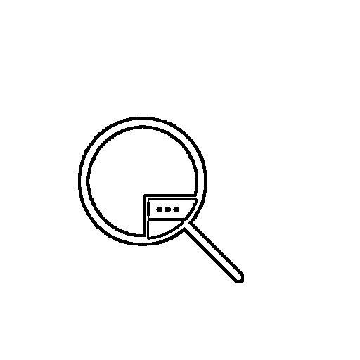

**处女座满月重点影响人群** 

*   出生星图中，有**行星、四轴、南北交点落入固定星座（金牛座、狮子座、天蝎座、水瓶座）0-9,25-30 度**的人群。

*   出生星图中，有**行星、四轴、南北交点落入基本星座（白羊座、巨蟹座、天秤座、摩羯座）0-7,12-30 度**的人群。

*   出生星图中，有**行星、四轴、南北交点落入变动星座（双子座、射手座、处女座、双鱼座）15-23 度**的人群。

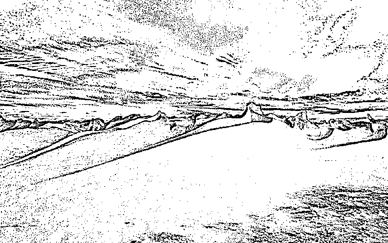**穿越迷雾，坚守“乌托邦”**

****

**一旦你放弃了某种原以为是根本的东西，你就会发现你还可以放弃其他东西，以后又有许多东西可以放弃。**

**——伊塔洛·卡尔维诺 《如果在冬夜，一个旅人》**

**天象**

*   **“日海合相”与“月海对分”**：双鱼座海王星合相双鱼座太阳，对分处女座月亮。
*   **金天合相**：金星与天王星合相于金牛座。

2020 年初这段时间，海王星最重要的能量指向与**“疫情”**相关。直至目前，美国流感也好，新型冠状肺炎也罢，源头仍难追溯，但全球已在蔓延。我们还没有走出被疫情笼罩着的生活，阴阳两隔的亲人，前线搏命的身影，步履维艰的商业，急拉弦断的经济，打乱了每一个人的梦，也挤碎了每一个泡沫。生死之下，活着是那么的实在，生命又是那么的昂贵。

半个月前的双鱼座新月（详情点击：[双鱼座新月](http://mp.weixin.qq.com/s?__biz=MzA5NjA0NTAxNg==&mid=2651413746&idx=1&sn=a2d26852667dece4f861d2e257dc7b4d&chksm=8b4bee45bc3c6753bb597ef0f7308b5f45bfea7a5835b74207fdc3b8f68a3b41239aeb6d0976&scene=21#wechat_redirect)）文章分析了最近一个月的月相周期**（双鱼座新月-处女座满月-白羊座新月）**的天象趋势，此次处女座满月正是这一月相周期的**中间释放点**，为半个月后白羊座新月的**“全新开始”**做出**必要的减负与清理**。

***1.*** **留给满月的一地鸡毛**

**2 月下旬到 3 月 4 日**这段时间，作为金牛座天王星**“生态环境和经济结构”**变革风向标的金星行进在白羊座，依次与行进在摩羯座的木星、冥王星和土星形成四分结构，同期恰逢摩羯座木星与双鱼座海王星也正形成“木海六分”结构，带来数天的持续震荡：**疫情蔓延国际社会，股市跌落屡次抄底，文娱爆发跨界纷争，关系碰触现实壁垒。**不知道你是否在这些事件之内，或者应该说**我们都在这些事件的“场”内**，因为无论生态安全或经济趋势，文化环境或关系真相，其实与我们每个人息息相关。

上述这些震荡触发了人们与**“生死、金钱、权益、结果”**的直面对视，哪一个不是直击根本，哪一个不是关乎安全呢？于是，恐惧操纵着人们的无意识，防御驱动着人们的本能，排斥可能的风险，执着贪婪的欲望，攻击不同的立场，求证自我的正确。2 月下旬到 3 月 4 日这段时间，留下了一地的鸡毛。

董卿的那一句**“枪响之后，没有赢家”**道出了真相，这个世界永远是**“命运共同体”**，无论是地球生态，还是人类社会。

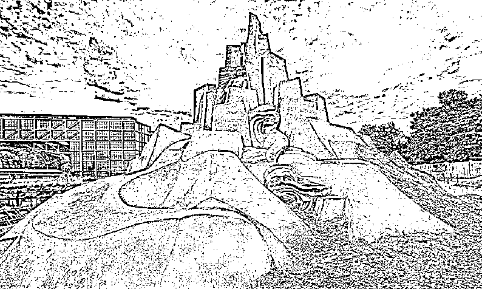

***2.***** 梦想开始的地方**

**3 月 5 日**，金星换座进入金牛座，并旋即与金牛座天王星初步形成“金天合相”结构；同天双鱼座太阳和双鱼座海王星的“日海合相”结构也初步形成。从 3 月 5 日到此次处女座满月的几天时间里，“日海合相”和“金天合相”两组结构的能量影响逐入高峰：一方面令我们面对一地鸡毛的现实混乱，不禁升起**幻灭感和迷茫感**，以往的信念和目标似乎开始倒塌，未来的方向和态度却还未够清晰；另一方面也令我们直觉到必须从一地的鸡毛中总结经验，从现实的废墟中原地爬起，冲破旧有的执着与束缚，整合**全新的梦想与模式**。此次处女座满月，“日海合相”和“月海对分”两组结构再次将**“理想与现实”的张力**呈现在我们眼前。处女座满月能量引领我们**聚焦落地和具体的现实生活**，但也令我们**对梦想的推进变得急切，对当下的进程产生焦虑。**现实是，**急不来**。但其实，我们需要时时带着梦想与现实谈判，用现实的镜子照见梦想的真相：**将梦想与白日梦“分类”，对信念与欲望“辨别”，不在白日梦逃避，不被欲望蒙蔽，清理虚妄，扎稳根基——穿越迷雾，坚守“乌托邦”**。**无论面临任何处境，都不要放弃“乌托邦”的梦想国度，因为那里是信念扎根的土壤，是“梦想”开始的地方。**一旦放弃了这个最为根本的支撑，就会发现所有的一切都可以放弃，包括生命的尊贵和心灵的安宁。此次处女座满月，别急，先做好梳理，再进行确信，**真正的梦想等得起也熄不灭**。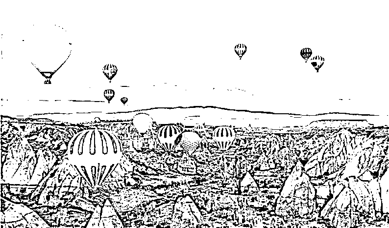**从过去到现在，从现在到未来**

****

**过去的一切生活最后都要连接成一个整体的生活，连接我当下的生活。**

**——伊塔洛·卡尔维诺 《如果在冬夜，一个旅人》**

**天象**

*   **水星顺行**：水星于水瓶座 28 度恢复顺行；

*   **水土 30 度**：水瓶座水星与摩羯座土星形成 30 度结构；

*   **火木的三分与六分**：行进在摩羯座的火星和木星分别三分处女座月亮，六分双鱼座太阳和双鱼座海王星；

*   **火冥挟持木星**：行进在摩羯座上的火星和冥王星，一左一右将木星挟持其中；

*   **4 度同频**：“金天合相”三分摩羯座南交点并六分巨蟹座北交点，白羊座凯龙星四分摩羯座南交点和巨蟹座北交点，几组结构均发生在 4 度。

***1.*** **追因究果，更重要的是成长**

**此次处女座满月当天，处女座守护行星水星于水瓶座 28 度恢复顺行**。水星上一次走过水瓶座 28 度是在**2 月 2 日，**进入逆行前影响期的时候，当时正值**1 月 25 日水瓶座新月**（详情点击：[水瓶座新月](http://mp.weixin.qq.com/s?__biz=MzA5NjA0NTAxNg==&mid=2651413062&idx=1&sn=44c7b80b1d5b93ab47abaee821c5dea4&chksm=8b4be8f1bc3c61e79e6a040ff23dc9c34d983fd5862f87d51615fc665a820416dba1d982212f&scene=21#wechat_redirect)）和**2 月 9 日狮子座满月**（详情点击：[狮子座满月](http://mp.weixin.qq.com/s?__biz=MzA5NjA0NTAxNg==&mid=2651413265&idx=1&sn=19d4da22b8361c2c455f9e42408f0e53&chksm=8b4be9a6bc3c60b0125bf337cf991fa70fe5688f1f106264a1479667561656b5a398b34f173e&scene=21#wechat_redirect)）中间的上弦月月相周期，故而也是**“危机与压力”**呈现的时间段：国内疫情正在“人传人”的蔓延阶段，确诊病例大幅增加，医疗物资却正匮乏，一方面触发出人们对权力职责的期待与敏感，对慈善捐助的热诚与监督，另一方面也造成了信息的真假难辨，真相的扑簌迷离。

**行星逆行带来反思与修正的能量**。或许是时间曾经留下了问号，或许是某些议题还未完结，此次双鱼座满月的前后 3 天**（3 月 7 日-3 月 13 日）**，水星再次回到水瓶座 28 度位置上“缓慢减速-几乎停滞-缓慢加速”，用一周的时间碾来碾去并从逆行转向顺行，将自**2 月 2 日以来的某些敏感事件**再度引爆，某些隐含问题再次热议，而此次处女座满月更是戴着“较真的放大镜”对这些事件和问题**“追因究果”**。 

**需要注意的**

*   **流动性**

*   水星恢复顺行后，**自 2 月 2 日以来“受阻”人流和物流、信息流和资金流将会得到逐渐缓解。**但是，虽然国内的防控和救治已经取得一定成绩，但流动性的恢复和国际性的蔓延又将带来新一轮的考验。不可掉以轻心，以免功亏一篑，因为“人类共同体”意味着**“短板决定着整体”**。

*   **命运曲线**

*   疫情的多米诺骨牌已经牵动了各个层面的连锁反应，引发行业和企业的又一轮洗牌，市场和职场的又一轮淘汰，而此次处女座满月的完结能量也推动着“命运”的演化和“结果”的呈现。

    希望每个企业和每个人都能跨越这一场考验，但我们也必须做出**正向的反思与回应**，因为疫情不过是催化了“洗牌与变革”的进程，命运不过是揭示出“安全根基”的真相。

*   **更重要的**

*   即使是水星逆行真的唤回了一段旧情，但是比“有多少爱可以重来”更重要的是**“我总算学会了如何去爱”**。更重要的是成长。 

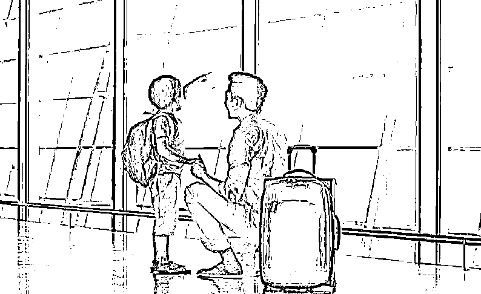

***2. *****彻底洗牌，迎接全新起点**

我们来看一看此次处女座满月的能量传导：

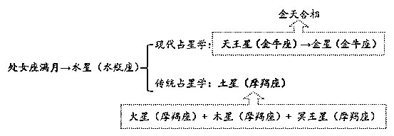

金牛座天王星和摩羯座土星接纳了此次处女座满月的能量。这是非常敏感的两颗行星：从 2019 年开始，金牛座天王星就举着大刀对**“生存安全和经济结构”**进行颠覆与变革，土星组成的“土冥合相”结构就步步紧逼地对**“组织架构和世界格局”**进行洗牌与重建，双剑合璧挥出**“不破不立”**的世纪性大动作；进入 2020 年，随着 1 月 13 日“土冥合相”结构的影响巅峰带来，不破不立”的动作就变得越发**“凶狠”和“彻底”**。此次处女座满月的前后 3 天，已经行进到摩羯座尾度的土星与辗转在水瓶座 28 度的水星形成的**“水土 30 度”**结构，将**“老化和无序”**的现实真相输送到我们眼前；摩羯座上火星、木星和冥王星组成的几组结构，也会让我们从现实事件撕开的口子中瞥见**钱权的内幕**，领略**立场的纷争**。此次处女座满月“追因究果”的终极目标，是要为半个月后**3 月 24 日白羊座新月**的全新起点做好**前期的清理与准备**；而随着**3 月 22 日土星换座进入水瓶座**试水，双剑合璧的能量将会更加紧密，“不破不立”的动作也将会更加凌厉。**划重点！**3 月 24 日白羊座新月的全新起点，意味着**“冲破原有限制和束缚，重建全新规则与秩序”**的进程将被进一步强化，故而此次处女座满月“彻底洗牌”的铺垫也就更加重要——事实不等于真相，立场不代表全局，**不要盲目跟风或肆意攻击，保持客观中立和独立思辩，沉静下来并回归自心**，**“分辨”需要减负的混乱认知和负面情绪，“确认”需要坚守的梦想信念和原则边界。**此次处女座满月，如果我们能够**跟紧整体运势下的现实演化和发展需求**，学会**以更广阔的视角去辨别真相，以更成熟的方式去解决问题**，就在这段最艰难的时期收获了最宝贵的礼物。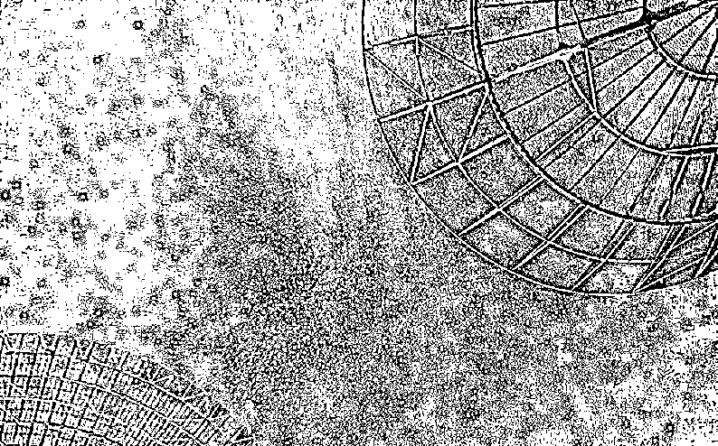

***3. *****4 度的共振**

此次处女座满月的前一天——**3 月 9 日，“金天合相”结构于金牛座 4 度紧密呈相，为金融市场、艺术领域和情感关系带来一波突然的震荡和标志性的转折。**此次处女座满月，“金天合相”结构与南北交点形成精准的和谐联动，凯龙星也正精准地四分南北交点，**“业力进化”**的相关议题被凸现和强化。此次处女座满月，我们需要特别标记一下**4 度**这个度数：

*   “金天合相”、凯龙星和南北交点都处于 4 度（不同星座）的位置。

*   从 2019 年 10 月 28 日天蝎座新月至今的每一次新月（不同星座）都发生在 4 度。

概率往往也透露着能量上的同频与共振。我们当下的现实来自于过去的现实，当下的生活来自于过去的生活，过去的一切最后都要联结成一个整体。故而，从半年前开始，我们就已经进入这场“集体业力”的进化进程之中，当下事件早就种下了因由。几乎每个人都想重启 2020 年，但是时间不能后退，**唯一能去改变的只有我们自己**。即便在与病毒博弈，与灾祸赛跑的 2020 年，我们仍然悲伤地看到那些“伪装成梦想的欲望”还在制造着战乱和斗争。这个世界永远是“命运共同体”，侥幸者不过是以为自己成功了，投机者不过是以为自己得到了，谁又能逃离宇宙矩阵的“因果不虚”？我们只能从自己做起，踩稳安全根基，做能做的事，爱能爱的人，质朴而真实的活着。如果你从去年 10 月开始已经逐渐踩稳了安全根基，现在的艰难就能跨越，而未来的机遇并不遥远。**寄语**

****

**人的肉体与灵魂看不到上帝，但是镜子却能观察到上帝。****——伊塔洛·卡尔维诺 《如果在冬夜，一个旅人》**自省者和自愈者都是照镜子的人。前些天，一位咨询者朋友发来讯息，说他的公司要撑不下去了，他为自己在这个危机时刻的“麻木”感到罪责。我建议他做一个“照镜子”的练习，过了大概一周的时间，他留言说：“哭了”，我问他看到了什么，他回复说：“失败者沧桑的眼神，孩子惶恐的眼神”......他从镜子里观察到了“上帝”，在生命深处的“上帝”，**允许失败和懂得哭泣**的“上帝”，**接纳真实和疼惜自己**的“上帝”。这个案例虽经案主同意，但我只想讲这么多。**此次处女座满月，建议给自己一个放松的时间，观察身体与感觉，观察眼神与笑容，或哭或笑，真实就好**。“上帝”不在别处，就在我们的生命之内。这样的练习我也做过，你呢？

愿每一个灵魂安好。祝福大家。

**版权声明**：原创文章由作者授权首发于若道平台，欢迎转发，反对抄袭。友号转载请申请白名单。

****

****想阅读更多作者的文章，****

****请在后台回复******王芝桦****** 即可。****

****王芝桦****

心理占星师，统合疗愈师，占星专栏作者

若道占星“新月和满月”专栏作者，腾讯视频特约占星师

全职于个案咨询与占星教学工作 15 年

**个案预约咨询微信号**：zhihua0621 

**微信公众号**：daoxi-life

**长按打赏**

****

**点击图片了解详情**


**微信又双叒叕改版啦，不想错过若道君的推送？**

**就把若道设为星标吧！**

**▼**


喜欢记得点一下在看哦☟

********报名直达入口********


# 3 月 25 日大师沙龙｜好莱坞职业占星师眼中的明星生活

> 原文：[`mp.weixin.qq.com/s?__biz=MzA5NjA0NTAxNg==&mid=2651414130&idx=2&sn=0fc366497d8e843c058a624cfea77105&chksm=8b4becc5bc3c65d398ca7570d78bd60c277343db0880cacd65332f2cef8677947c49953b6db0&scene=126&sessionid=1692738202#rd`](http://mp.weixin.qq.com/s?__biz=MzA5NjA0NTAxNg==&mid=2651414130&idx=2&sn=0fc366497d8e843c058a624cfea77105&chksm=8b4becc5bc3c65d398ca7570d78bd60c277343db0880cacd65332f2cef8677947c49953b6db0&scene=126&sessionid=1692738202#rd)

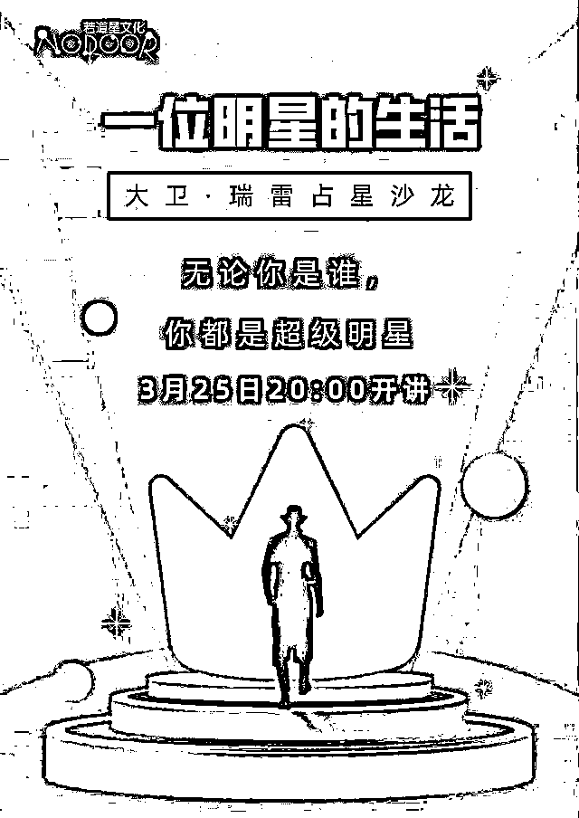

拥有**50**年占星实践经验的

**若道创始人**

**ISAR 全球副主席**

**ISAR 全球职业占星师资质认证主席**

**大卫·瑞雷**

决定公开他占星职业生涯中

**一位重要的名人个案**

用 TA 的星图为我们展示

**若道核心课 L1-5 的核心知识点**

特别适合

**零基础的占星爱好者**

&

**计划系统学习占星的学子**


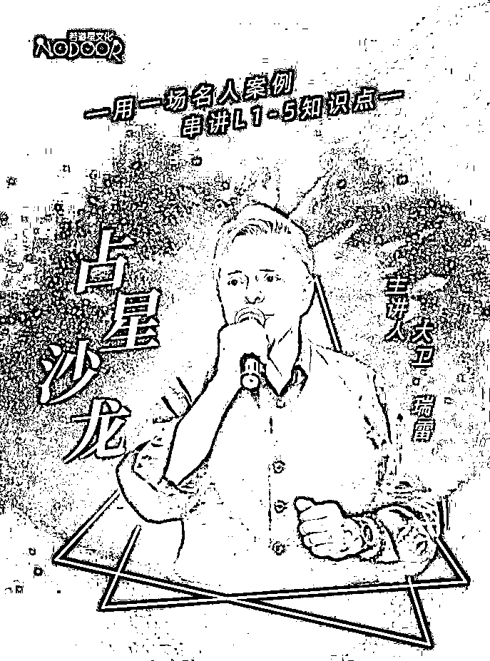

大卫老师非常擅长

透过案例分析教授占星学

生动的故事与占星知识完美结合

给大家留下了深刻的印象

这场沙龙大卫老师将分享**他在好莱坞作为职业占星师的人生经历**
与某位明星相识相知的故事一路见证 TA 的发展轨迹好莱坞明星在观众眼中，是有些遥远的存在无论是他们获奖、摘取桂冠、走上红毯亦或是电影中的他们都有着一层美好的滤镜但现实生活，往往不是如此他们也会有无法走过的困顿，难以入睡的夜晚……星光熠熠的名利场，其实是百兽争夺的修罗场而其中的那个“TA”**究竟是如何一步一步走到镁光灯下的**这一切，由著名的占星师大卫·瑞雷从占星视角为我们一一揭开**沙龙内容大纲**


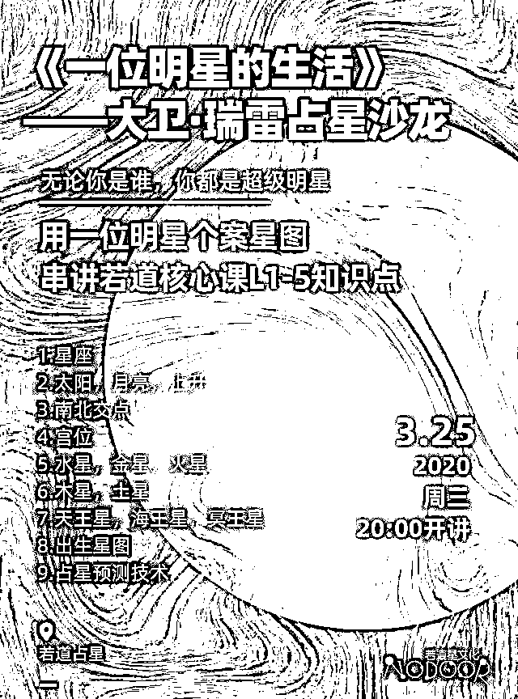

**沙龙详情**

**沙龙时间**：**2020 年 3 月 25 日 星期三  20:00-22:00**

**主讲人**：大卫·瑞雷

**参课方式**：网络直播

**沙龙价格**：198 元（**想获得半价入场机会？往下看**）

**报名方式**：**务必添加客服微信报名**

**报名截止**：2020 年 3 月 25 日 12:00

**人数限制**：200 人

**特别提醒**

❶ 不接收空降，请提前报名付款确认名额

❷ 报名成功后，会在 3 月 25 日下午统一发送参课方式，请耐心等候

❸ 由于个人原因无法出席沙龙，不提供开课后退款，敬请谅解

**主讲简介**


**大卫·瑞雷（David Railey）**

*   **ISAR 董事会成员，ISAR 全球副主席，ISAR 全球职业占星师资质认证主席，若道占星创始人。**
*   1976 年，通过亚特兰大职业占星师考试，成为全职占星师，随后通过**AFAN 和 ISAR 职业测试**。
*   1980 年，与**杰夫·焦耳**一起在亚特兰大创建**“每日星球”**占星学中心。此后在亚特兰大占星协会担任 4 年考官，并且两次担任**亚特兰大地区占星协会主席**。
*   1979-1992 年，作为占星师活跃于美国社会媒体，向不了解现代占星学变化的大众宣传专业占星学知识。在 1989-1992 年期间，他在 WRGG 电台 12 频道每周主持个人电视秀**“今日占星学”**，早先他还在 WRFG 的广播节目中播讲宇宙天气节目。 
*   2010-2014 年，任**全美占星师联盟监督委员会委员**。
*   2010 年，其著作**《灵魂的目标》**中国版出版，和蒋颖一起创办**若道占星**学校和其官网 www.nodoor.com。从该年开始，他工作并往返于亚特兰大和北京。目前他 80%的时间致力于在中国教授和推广西方占星学。
*   2017 年，被选为**ISAR 委员会成员**（2017）。ISAR 是世界最大的国际占星机构，会员遍布 45 个国家。

**「**

**半价入场券**

**」**

**转发本文至朋友圈**

**截图发给客服小姐姐获得**

**半价****98****元的报名名额**

**截止时间 2020 年 3 月 25 日 12:00**

**（分组无效）**

**长按二维码添加客服**

▼


# 雷蒙德·梅里曼金融占星周运 | 巨大风险中寻求机会的一周

> 原文：[`mp.weixin.qq.com/s?__biz=MzA5NjA0NTAxNg==&mid=2651414130&idx=3&sn=3b7e4826f71fc8be4919cc187e0bacdf&chksm=8b4becc5bc3c65d37e5021b714043fc941bd514b824dbefa625af691597765f5ace1d71fe252&scene=126&sessionid=1692738202#rd`](http://mp.weixin.qq.com/s?__biz=MzA5NjA0NTAxNg==&mid=2651414130&idx=3&sn=3b7e4826f71fc8be4919cc187e0bacdf&chksm=8b4becc5bc3c65d37e5021b714043fc941bd514b824dbefa625af691597765f5ace1d71fe252&scene=126&sessionid=1692738202#rd)

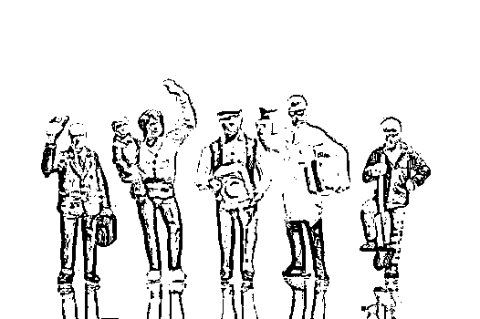

作者/雷蒙德·梅里曼
翻译/Luke 校对/李含编辑/玫瑰 图片/全景网雷蒙德·梅里曼是在金融占星学界稳坐第一把交椅的占星师，同时他也是若道签约的金融占星课老师，我们引进了雷蒙德·梅里曼老师的《[上证指数月度报告](http://mp.weixin.qq.com/s?__biz=MzA5NjA0NTAxNg==&mid=2651413966&idx=3&sn=e6b0ea2d7cb4b7aa17020e3100a1169a&chksm=8b4bef79bc3c666ff371e4266b084653b01557c2562ef95cb9ef4806959c8c14d59fc27462e8&scene=21#wechat_redirect)》《[黄金周期月度报告](http://mp.weixin.qq.com/s?__biz=MzA5NjA0NTAxNg==&mid=2651413785&idx=3&sn=ef942521571587ac93a4ae49c7ffcefb&chksm=8b4befaebc3c66b829d57620e48233e4abbc5a7f6eb3a2a69675809890a3486aa8149721c08a&scene=21#wechat_redirect)》《[2020 年金融预报](http://mp.weixin.qq.com/s?__biz=MzA5NjA0NTAxNg==&mid=2651414053&idx=2&sn=76742dd7f8b81104e5d76c71859ea812&chksm=8b4bec92bc3c6584e188938e4151ae02a15d5af8d9b2d91352bf6c69074a0de4b476b1c6b798&scene=21#wechat_redirect)》。我们经老师的授权，将每周刊登梅里曼老师的周运，供大家参考和学习。于是，这是本周的周运（3.9-3.13）。**展望与回顾**

**就业人数增长有可能强于预期的 17.5 万人，因为发布报告时木星在中天的位置。 **

**——MMA 每日周期报告**

**星期四晚**

**2020 年 3 月 5 日**

**2 月份非农就业人数增长 27.3 万,远超预期的 17.5 万，失业率小幅下降到 3.5%。就业机会普遍增加，医疗保健行业成为领头羊，增加了 5.7 万人。12 月和 1 月的就业增长预估总数上调到 24.3 万。****——杰夫·考克斯****《2 月份就业增长远超预期》****www.cnbc.com ****2020 年 3 月 6 日****上周五，全球投资者纷纷涌入美国国债，寻求政府债券的避风港…10 年国债的收益率下跌到了 0.676%的历史低点……因新冠病毒的爆发引发的全球商业活动中断，加剧了人们对全球经济放缓的担忧。在美国国债收益率大幅下跌之际，投资者纷纷逃离股市。 ****——托马斯·弗兰克****《10 年期美国国债收益率跌至 0.7%以下的历史新低》****www.cnbc.com****2020 年 3 月 6 日**全球股市又经历了动荡不安的一周，贵金属市场也是如此。民主党内对美国总统候选人的提名争夺也空前激烈。参议员伯尼·桑德斯在超级星期二中取得了领先优势。但当民主党人开始团结在前副总统拜登周围时，一切都改变了。拜登一周前几乎被赶下台，但突然间，他在超级星期二开始了一次引人注目的复出，夺回了大多数州，并在总体上领先桑德斯。这又是逆行的魔术师水星所玩的花样。参议员桑德斯是处女座，水星守护处女座。桑德斯领跑者的地位突然改变了。同样的事情也发生在 2008 年的共和党集会上。处女座的参议员约翰·麦凯恩大幅领先巴拉克·奥巴马，但在 2008 年 9 月末到 10 月初为期三周的水星逆行期间，这种领先优势突然消失了，而麦凯恩再也没能恢复过来，同时，市场开始陷入大萧条。随着拜登上周开始复出，美国股市单日涨幅扩大，因为担心伯尼·桑德斯党选的投资者们开始放下心来。但是这种放松的心情不能持续太久，即使美联储降息 50 个基点，新型冠状病毒传播的影响力还是超越了政治。我们在谈论的是**全球经济的重大崩溃（放缓），以及人们失去生命**的可能性，这是我们在 2020 年预报里谈到的“摩羯座星群”发挥的影响力。你可以点击链接：《[2020 年金融预报](http://mp.weixin.qq.com/s?__biz=MzA5NjA0NTAxNg==&mid=2651413917&idx=3&sn=58d163921efef7d700062ee80e296455&chksm=8b4bef2abc3c663c5afb5f249499e7ee26807b6d3fdbd5017bc75b9f0490f099bfff4806dfac&scene=21#wechat_redirect)》了解更多。（金融沙龙免费试看 30 分钟，大量信息等着你。）在 2 月 28 日星期五跌至 24681 的双底后（与 2019 年 6 月 3 日的 24680 低点形成双底），道琼斯工业指数在 3 月 4 日星期三回升到了 27102，上涨超过 2400 点（接近 10%）。但是在 3 月 6 日星期五，道琼斯指数又在测试上周的低点。不过，在交易的最后一小时，道琼斯指数风暴般上涨超过 700 点，大幅回收当日跌幅。上周收盘时甚至得到一根阳线。同样的模式也出现在纳斯达克综合指数和标准普尔 500 指数上。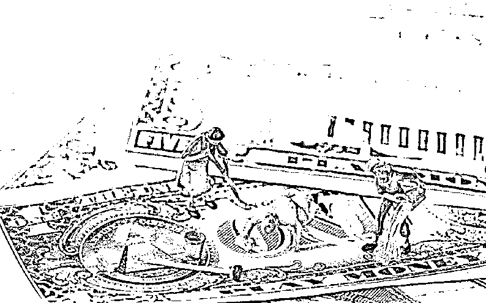全球其他指数也出现了连锁反应，大多数都在 3 月 6 日星期五开始了新一轮的周期并创下数月来的低点，比如日本、澳大利亚、印度、德国、荷兰和瑞士的股指。然而，最奇怪的是，**中国上证综指实际上已经反弹至 1 月 21 日以来的最高水平**。当中国的主要股指在上涨时，几乎所有其他的世界指数都在暴跌，而病毒的爆发地和它造成最大损失的地方是中国，这意味着什么？也许这意味着**中国已经成功地减缓了冠状病毒的传播**。也许这意味着 2 月 17 日发生在双鱼座的水星逆行，伴随着 3 月 10 日在双鱼座的太阳-海王星合相和满月，导致其他国家出现同样令人不安的歇斯底里情绪，因为它们正处在中国一月份病毒爆发前夜相似的情境之中。希望在短期内能够对这种病毒做出更明智的反应。**如果本周末以前还未能得到良好控制，股票市场的跌幅可能超过我们预期的 10-21%，这可能意味着当前更大的周期正在接近末尾。**其他市场上周也经历了巨大的价格波动。10 年国债跌破 0.7%，创历史新低，对购房者是个好消息。由于 2020 年是土星-冥王星合相，这个相位与**每 32-37 年利率的重大反转**有关，**利率下跌可能不会持续很长时间**。黄金从 2 月 28 日周五下跌到 1564 点的大幅抛售中恢复过来。一周后，**在 3 月 6 日周五，黄金再次测试 7 年高点，在日线图上回升到 1690 以上，实际上创下了新高，稍微超出了之前的高点**。原油走向相反的反向，下跌到 41.11，是 2016 年 8 月以来的最低价位。在外汇市场上也出现大幅波动，外币兑美元出现大幅上涨。这确实是动荡不安的一周。但符合上周一对投资者们发布的 MMA 股市特别报告中的内容。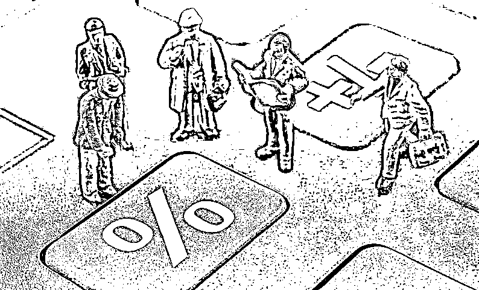**短期占星趋势**现在我们看看这个水星逆行周期是如何与当前金融市场上歇斯底里和恐慌的情绪产生关联的。**这次逆行将在 3 月 10 日星期二结束，这也是满月时双鱼座太阳合海王星的日子。**海王星和双鱼座的参与，同时水星从逆行变为顺行，这象征着**集体理解力的改变**。这代表着**这段时间出现很多假设和理论，许多都缺乏根据，更别提准确度了**。但这种情况在双鱼座和海王星的影响力消退，水星逆行结束后可能会改变。这并不意味着这一切都会准确在 3 月 10 日结束，因为水星要花**4-5 天**改变行进方向，届时**准确的信息会取代假设**。因为在**3 月 8-9 日将会出现太阳合海王星以及金星合天王星**，两者都是 1 级的地球宇宙学征象（历史上与股票指数的基本周期或更大周期有最高级别的关联性），我们必须认真考虑这所预示的 **“改变”**。下一轮强有力的地球宇宙学征象会在**3 月 20 日-4 月 7 日**期间出现。届时**火星合相木星、冥王星和土星**，这一轮征象会以**4 月 5 日的木星-冥王星合相**告终。此时**行进金星（金钱）也与木星、冥王星和土星形成有利的三分相**。宇宙告诉我们，对于我们现在正经历的混乱时期，**希望即将出现**（治疗治愈、知识，和取代猜测的正确信息），可能在**4 月 7 日以前，甚至下周末以前**。如果不是这样的话，那么我们只能将希望放在**金星逆行的 5 月 13 日到 6 月 25 日**。这个相位历史上与**美国股票的基本或更大的周期**有很强的关联性。当前的时期以及 3 月 20 日-4 月 7 日期间也和原油市场的反转有很强的关联。在市场波动如此巨大的时期进行交易是有很大风险的。但这也是那些能够在各种金融市场中抓住正确入场和出场机遇的人获取巨大利益的时期。交易的风险很大，但也令人热血沸腾。**版权声明：**本文由若道翻译发布，欢迎转发，反对抄袭。友号转载请申请白名单。


**雷蒙德·梅里曼（Raymond Merriman）**

若道签约老师。著名金融占星师，ISAR（国际占星研究协会）前主席，梅里曼市场分析公司的总裁。他由于“提升了占星学的职业形象”，在 1995 年国际占星大会上被授予轩辕十四奖；在 2012 年国际占星大会上，被授予轩辕十四终身成就奖。

1“中国上证指数月度报告”发售

**若道推出了****中文版****的雷蒙德·梅里曼中国上证指数月度报告，并持续发行该报告！**

当把金融市场的周期和占星学的周期相结合时，雷蒙德·梅里曼老师的金融占星学研究**为投资者应对金融市场的周期波动，并随之调整投资策略提供了极大的价值参考**。

2“黄金价格周期月度报告”发售

**若道推出****中文版****的雷蒙德·梅里曼黄金价格周期月度报告！**不仅仅为广大读者在中国股市的投资出谋划策，更将视角放眼黄金市场。

**每当世界经济形式不明朗的时候，有一个地方是保值的港湾，那就是****黄金**。从 2018 年 8 月开始，黄金已经用自己的升值再次提醒众人它在经济不稳定时的位置。**截至目前，2019 年 8 月底，黄金已飙升至 6 年新高，高于 1565 美元。**

自 1982 年雷蒙德·梅里曼出版第一本研究《地球宇宙学征象与黄金价格的关联》的著作以来，**他一直作为最重要的黄金市场时机预测者之一享誉国际**。

过去 1 年，那些订阅并遵循建议的梅里曼市场时机学院日报和周报的订阅者，如果从 2018 年 8 月 16 日的低点或 8 月 23-24 日的次低点购买黄金，他们已经赚到了不少的 30%左右的利润。

**3 月中英文报告已上线！**

**购买套餐**，买得越多越优惠

中国上证指数月度报告套餐价

*   **单月报告**：280 元

*   **3 个月套餐**：780 元（260 元/月）

*   **12 个月套餐价**：1999 元（166 元/月）

**长按下图识别二维码**

**购买金融报告****套餐**

**▼**


黄金周期月度报告优惠

*   **双报告年度套餐更优惠（直降 899 元）**
*   **12 个月黄金报告+12 个月上证指数报告：仅需 3500**

**长按下图识别二维码购买黄金报告套餐**

▼


32020 年金融预报 1976 年以来，由雷蒙德·梅里曼撰写的梅里曼市场时机学院每年一次的年度预报沙龙和每年一本的《年度预报》一直在应用占星学原理为投资者们服务.2018 年，若道第一次将这份广受赞誉的一年一度的金融占星报告和沙龙引入中国，供中国投资者参考。**《2020 年金融预报》将会谈及 2020 年重要的宇宙天象及其对世界经济、贸易形势的整体影响，还将覆盖中国上证股票市场的分析、黄金白银市场、美国经济、美国总统、美联储、美国国债市场、美国股票市场、主要外汇货币市场（主要外汇美元、英镑、欧元、日元、瑞士法郎）、原油市场、谷物市场、活牛市场、比特币市场等投资市场。**梅里曼老师及梅里曼市场时机学院的金融占星分析师还会给出以上市场 2020 年的**市场价格目标区间及重要价格反转日**，为短期、中期和长期投资者进行市场操作的时机提供参考。如果你关注世界经济和金融投资市场的变化，会发现梅里曼《金融年度预报》中的研究对于你了解世界经济在发生什么，这些市场的走向会如何有非同寻常的指导价值。为了让更多人从这个讲座和报告中获益，我们特意免费提供沙龙**讲座前 30 分钟试看（免费放大）**，你可以先试看，然后再决定是否购买整体报告及沙龙。如何安然度过这场危机？如何明智地投资，让自己安然度过这个充满挑战的一年，甚至获得丰厚收益？我们相信 2020 年度金融预报沙龙和报告套餐组合会给你远高于其价格的回报。**30 分钟免费试看**获取路径参见如下指引：① 请扫描下图二维码，下载若道 app 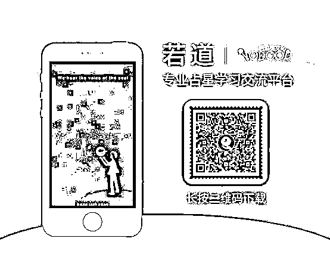**②** 登录若道 APP 首页-金融报告-《2020 年金融预报》讲座视频——免费试看，即刻免费试看 30 分钟的讲座视频。

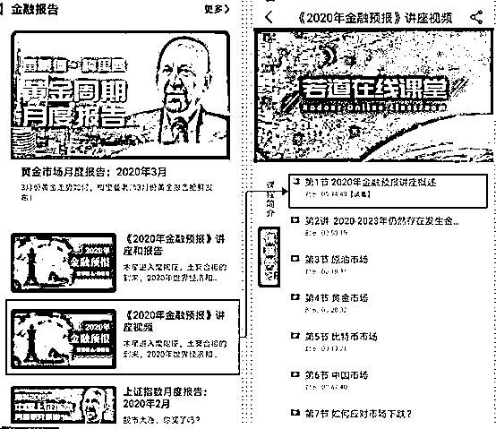

报告和讲座价格

2020 年金融预报讲座和报告价格整体售价** 1280 元**

（本讲座和报告不单独出售）

**长按下图识别二维码购买 2020 年金融预报**

▼

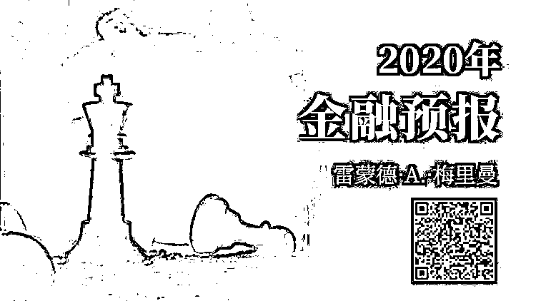

**微信又双叒叕改版啦，不想错过若道君的推送？**

**就把若道设为星标吧！**

**▼**


********点击阅读原文购买金融报告********


# 深度 | 想要真正的自由，就要先成为一个完整的女性！

> 原文：[`mp.weixin.qq.com/s?__biz=MzA5NjA0NTAxNg==&mid=2651414091&idx=1&sn=6f401b03e9545032f8569b011f498ebf&chksm=8b4becfcbc3c65ea3a5151f66a8a43c94612cd79e0bdff78ff04c790ad3cc61f4b7970ca7526&scene=126&sessionid=1692738202#rd`](http://mp.weixin.qq.com/s?__biz=MzA5NjA0NTAxNg==&mid=2651414091&idx=1&sn=6f401b03e9545032f8569b011f498ebf&chksm=8b4becfcbc3c65ea3a5151f66a8a43c94612cd79e0bdff78ff04c790ad3cc61f4b7970ca7526&scene=126&sessionid=1692738202#rd)

********************☆ **************后台**********************回复“今日”，给你一句生命态度********************

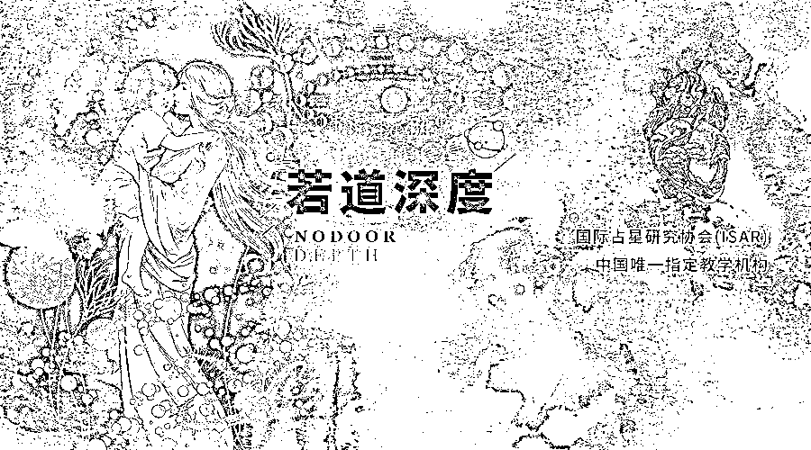作者/郑玮玲 ISAR 认证占星师编辑/Tang 图片/网络

写在前面的话

昨天是国际妇女节（International Women's Day，简写 IWD），全称“联合国妇女权益和国际和平日”，在中国又称“国际劳动妇女节”、“三八节”和“三八妇女节”。每年的 3 月 8 日为庆祝妇女在经济、政治和社会等领域做出的重要贡献和取得的巨大成就而设立的节日。 

这个保障女性权益的节日，是女性争取男女平权运动当中的重大胜利，是那些女权先驱们在付出了极大代价之后的成果。现在，就让我们来聊一聊女性吧。

**一个世纪以前的话题，我们仍需谈**

我们的时代发展很快，快到从你出生到现在，你的城市已经变得你都快不认识了。我们的时代发展也很慢，慢到一个世纪以来，我们还在谈论一个世纪以前的话题：**女权**。

**女权，就是女性的权力。**女性与男性理应具有同等的地位和价值，但是染上性别色彩的力量在历史文化潮流中是受到区别对待的。几千年的男权文化中，女权被打压、限制已成普世价值观。只有那些有意识的人，对女性身份认同有思考的人，他们会转向女性意识，并做出非凡的举动。

事实上，**女性意识并非指作为一个女人的意识，当然包括女人对自身性别身份的意识和认同**。但它真正代表的是**所有人对女性能量，男人、女人对自身阴性面的接纳与认同**。女性意识是非竞争、接纳、给予、滋养、同理心和尊重自然。

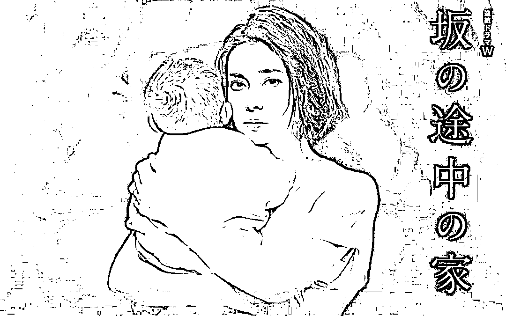

| 日剧《坡道上道家》探讨了女性婚后生活的问题，引发了广泛讨论

在大城市里依然有很多这样的女性，她们过着中产生活，无需为生活奔波劳碌，有很多时间照顾孩子和家，关注教育与健康，闲时也投入个人兴趣中。她们有不错的修养，良好的教育。然而，她们依然在心底深处认为：照顾家是我的本份。**如果在照顾家和追求自己的事业之间选择就是：没有选择。**这是前提和可能性之间的探讨。或者得先满足老公的事业，得先得到对方的认可、实现自我后，才可以去追求梦想。或者：我生了女儿，她会再次重复我的命运——生孩子、带孩子的辛酸她会再走一遍。或者：我生了儿子，所以我终于可以松一口气，不用担心儿子了受我受过的苦难。

这是一种多不接纳自身的意识？这里面隐含着多深的内在分裂感？你与你自己天然的性别分裂开了。这是漫长男权文化带来的集体潜意识。我不知道有多少人认为身为女性本身就是一种苦难？但我相信认为这是苦难的人远比不认为是苦难的人多，因为我们当下社会就是如此，很多人视此为理所当然。但，这是我自小就不明白的现象，我从来不认同这种扭曲的性别观。

当然，我们需要去问，这样放低女性自身价值的观点是从哪儿来的？多半，是你家族中的女性灌输给你的，你的母亲，你的祖母。然后她们又是被她们的祖先一代代影响下来的。

**用生命向前推动另一个生命**

其实，不仅在中国，在全世界大多数国家都是如此。**最明显的就是阳具崇拜的文化。**人类为什么要崇拜阳具？那些有阳具崇拜文化的地区不外乎出于宗教或文化原因，认为阳具是繁衍后代的象征，是生命力，创造力的象征。既然人类崇尚的是我们自身天然的创造力，问题就来了：为何没有女性生殖器图腾被公开颂扬？为何阉割女性的创造力？没有女性人类可以繁衍吗？

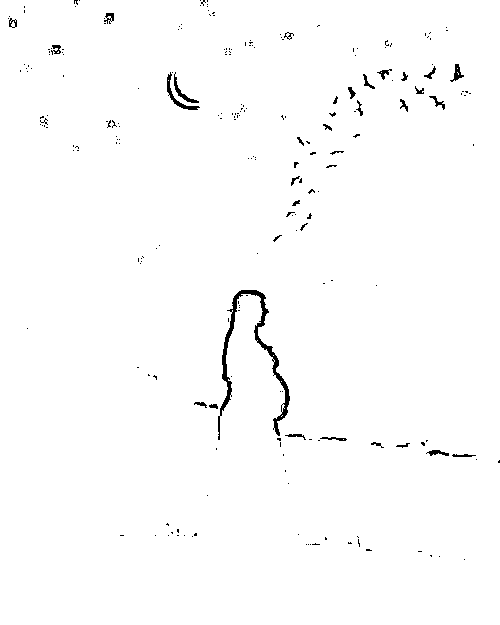

女性的卵细胞是随着月亮的规律而成熟的，而子宫也是生命最初的摇篮。这些无视女性天然力量的文化被视为正常，值得尊敬的话，就代表该文化里的女权，女性意识已经被阉割。

在英文里，“生孩子”这个词是“Bear”，它在更深的层面意味着：**用生命向前推动另一个生命的进程**。在这个语义里，我们可以触碰到女人生孩子的伟大与神圣。女人的经期是让自身每月一次更新净化的机能，不管在身体还是在心理、情绪层面。女人怀孕分娩的过程不仅带来一个新生命，因为激素水平的剧变，也从心灵的层面重生出一个全新的自己，是在活着的时候完成自我的重生：**意识的换新，内在力量的增强，更广阔的视野，天然的保护滋养能力的激发，对内在直觉的相信和勇气**。

这是男性靠天然生理机能做不到的。也许，这就是让男权掌权者意识到可怕的地方，女性的创造力。因为它太过天然无需修饰提炼，没有任何手段可以与此创造力相匹敌，除了强权限制。**历史上不同文化对女性本身都有污名化，物化的痕迹。**有的文化里女人被视为男人的财产，附属品；有的视女人为生育机器。或者，像印度女人至今都是男人泄欲的工具，将女性视为犯罪的诱因，纵容恶行频发。各种丑恶的道德标签贴给了女性，只是因为女性与男性生理上的不同，便于男性掌权者获取社会地位与资源。

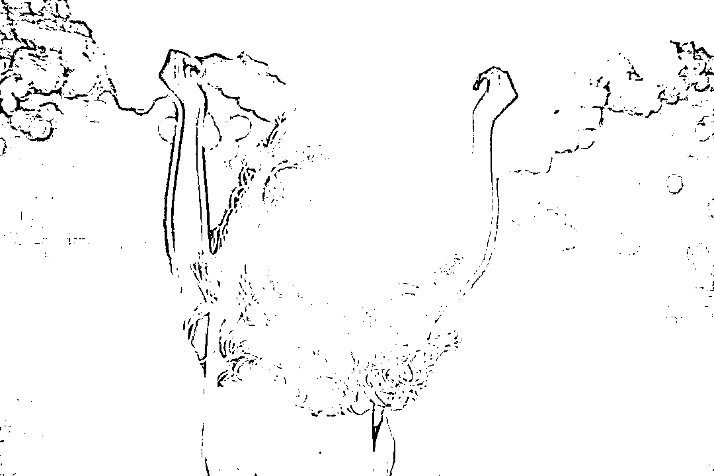

**占星学中的男性与女性**

**在人类社会发展过程中，性别渐渐显示了不同。**从早期的人类社会母权至上，演变为男权至上。男性的权力是竞争性的，竞争就意味着胜负高低，为了制衡女性力量，所以动用了权力、武力。**在占星学里女性与男性是金星与火星的原型能量，金星是爱与美，是吸引和诱惑；火星是性能量，也是进攻和竞争、战斗力。**

**当人类错把火星低阶的原型能量用来面对自我，面对世界的时候，他们就将愤怒、攻击、占有欲转向女性身份本身，也阉割掉自内在的阴性能量。**男人善于发起战争，几千年来所有的帝国建立都是依赖战争的胜利，君王以抢夺权力为先而为王。

**属于女性的金星能量是平衡的艺术，是联结的能力，金星提示了我们首先要学会和自己亲密。**完全接纳内在的欲望，无论黑白都面对和穿越它，并且做出你的选择取舍，变现为你生命独特的价值，体验生命的丰美质感。

**在人类生息繁衍、部族、家园的维系中，是月亮的原型能量在起作用：生育、滋养、保护。**人类早期母系氏族社会中是没有战争的，女性用滋养成、保护的家族能量会让人类以部落、种群聚集。人与人之间合作，人类也与天然的力量协作，尊重大自然，因此也更懂得宇宙、神秘学法则，并去生活中使用它们。

世界上很多国家都标榜男女平等，然而，事实是大多数国家，女人并没有和男人一样的工作机会。在家庭中女人也是承担更多的责任。约定俗成，其实很多时候意味着不再质疑现象，好与不好都被大众默许，而不再有人去思考有什么不妥。这是沉睡的意识。

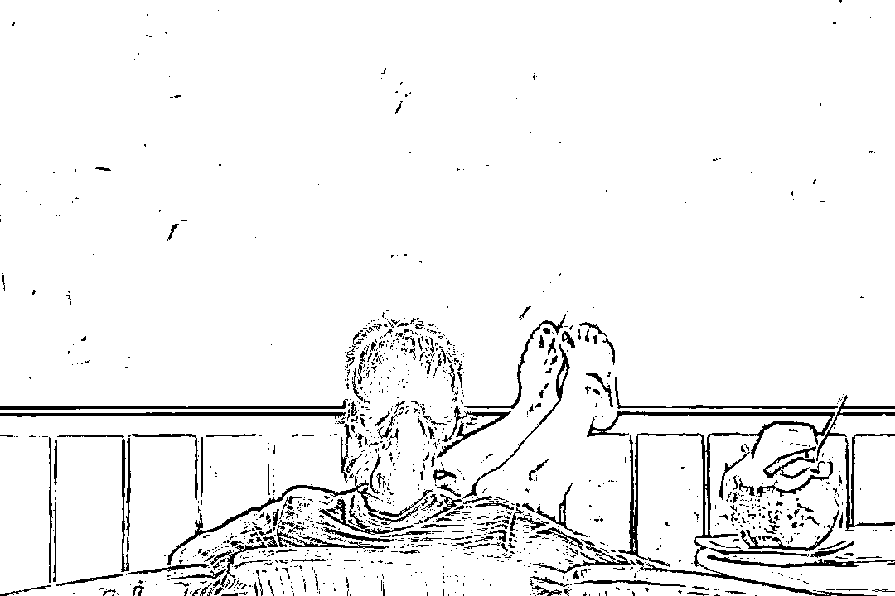

如果我们的女性意识在苏醒，我们会去问：为什么当人类赞扬自我创造力的时候不用女性生殖器图腾？或者应该是阴阳同为一体的图腾才对。为什么女性的力量、创造力被隐藏了？为什么女性自身还愿意接受、认同？为什么女人要给自己和生命设限？为什么你认为生女儿就比生儿子要经历更多痛苦？这是你的意识在拥抱那个固执的痛苦，而不是一个新的生命必须经历的宿命的剧本。

女人可以选择不结婚，也可以选择不生孩子。于男人同样。生孩子，养孩子这件事同样，不是女人需要带着受罪感去完成的义务、职责。你如果尊重自己内在的女性意识，你就会选择对你自身感受舒适、滋养、有力、有创造力的事情。如果你选择生育，你就应该看到生育本身带给你的潜力和动力，从中获得创造力和自由。如果你不选择生育，你理应有别的自由选项。

**永远不要让你的性别限制你的人生**，这就是女性意识。你的身体、你的心灵，你的意识，由你自己来掌握，无论你做什么，不做什么，只因你的心灵，你的身体有主动意愿，并享受其中。对于男人的女性意识，当然会多一层尊重、理解你身边的女性以及所有的女性，接纳自己内在脆弱，直觉的一面，当你不再控制的时候，你才会与内在阴性的智慧相遇。

而在现代文明发达的今天，不光是男性在骨子里认同男权主流文化，连女性自己也不认为自己丧失了什么？**这才是真的可悲：无意识地认同男权，放弃你内在的女性意识。**当你自己不愿意醒来，没有人可以把你叫醒。命运的轮回一次次上演，不同国家，不同文化，一样的剧本，就是女性交出自己的生命权力，让自己不再自由。

也许你会说生命太多苦难了，我想过，但是很难。如果说到一位独立、坚强又不失女性的温柔、优雅和感性，追求自我成就，过着自己想要的生活女人，你会想到谁？谁会映入你的脑海？在你身边有这样的女性吗？或者你自己就是？还是，你正在朝着那个方向努力？

**可可·香奈尔**

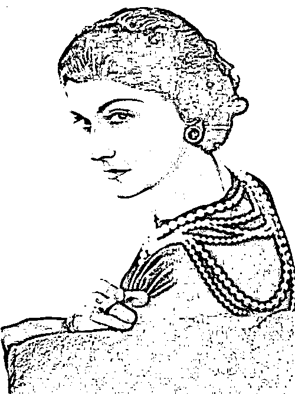

| 可可·香奈尔

五岁时母亲过世，从此她和她的姐妹被父亲送到孤儿院，她在 12 岁以后再也没见过她的父亲。她假装他去了美国，幻想“可可”是抛弃她的父亲给她的小名，她一生中都在极力隐藏自己卑微的出身。可可·香奈尔出生星图的太阳、金星落在第八宫狮子座，第八宫的行星一定程度上会带来隐藏性。她隐藏真实的出身，因为这里有些黑暗和不愿回首的伤痛。

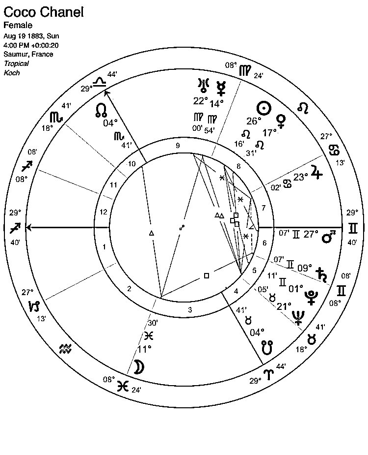

| 可可·香奈尔的出生星图

幼年的她在修道院里的孤儿院过着清苦、禁铟的生活，只有日日观看罗马式的建筑，玩起黑白光影的想像力游戏让她感受到了与自己内在灵感的联结。月亮双鱼座的她，早年是靠着幻想和自我麻醉活下来的。Chanel 的 LOGO 正是从修道院繁复的窗户图案上获取的灵感。然而，这个符号也很接近双鱼座的符号，是她的月亮星座。

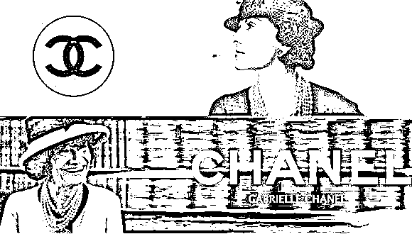

| 可可·香奈尔与其创立的香奈儿品牌

华丽的宗教仪式用具和服饰在她 7 年的孤儿院生活中烙下了深刻的印记，可可·香奈尔一生都对巴洛克风格，黄金和彩色珠宝衷爱有嘉。她的设计元素里永远有黑白对立，这些最终形成了香奈尔独特的风格。值得一提的是，资助她开设第一家精品店的情人卡柏还将文学引入她的世界，带她认识了东方文化和神秘学。一个太阳狮子座第八宫，月亮双鱼座，上升射手座的女人，无论如何是会对神秘主义产生兴趣的，也许正是因为对灵魂、宇宙有了更深刻的认知，她对自我的理解与解放才更深刻。

她的星图中水星在处女座合相天王星并且对分了月亮，她有天才般精细的裁缝技艺，将此与灵感融合用来支撑她的创造。火星合相下降点并且四分了天王星，也在说她的情人给她带来的支持，她需要超越世俗的评判去她去完成自己的梦想。她不拒情妇的身份，一心追求自己梦想的幸福爱情，她也努力实现自我价值，她在情人的资助下开设了属于自己的精品店，通过自己的创造和劳动获取人生的财富与自由。

可可·香奈尔去掉了帽子上面繁复的装饰，让其简洁、轻便。她剪短了裙摆，让女人露出脚踝；去掉束身衣，让女人的身体获得自由也充满个性化的曲线；她从男装里得到灵感，让女人也能着潇洒、方便的裤装；她的穿衣风格总是与众不同，她始终保持自己的风格，剪短头发，晒黑皮肤。她设计的第一批轻便、经济的服装的顾客其实是上班族，但很快，上流社会被吸引来，整个巴黎追逐她创造的时代潮流，她从一个孤儿院的孩子成为了巴黎的女王。

香奈儿开创了新一轮的时尚，是 20 世纪到 21 世纪不灭的时尚神话。非常重要的是，她一生都在通过自己的努力追寻想要的自由，不被社会、思维所限制，她历经磨难却不失生活的梦想，她在解放他人之前，先解放了她自己。

**维多利亚女王**

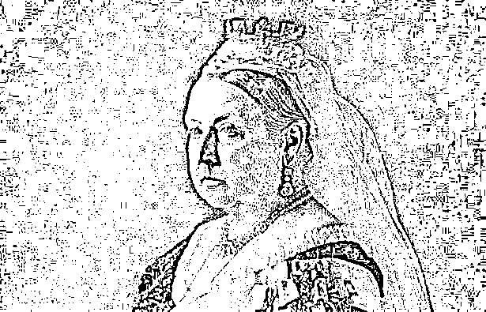

| 英国女王维多利亚

**维多利亚时期，是英国女王维多利亚在任时期（1837 年-1901 年），是她让英国成为日不落帝国，成为了世界经济的中心，成为了英国史上最强大的国家。**维多利亚女王在位时给英国带来的繁荣昌盛并非她做了什么惊天动地的大事，恰恰是因为：**她什么都不做**。她仅仅恪守君主本份，保持她的谦逊礼貌，承担她的工作、家庭责任。因此她在位的时代社会风气就是如她一般：注重道德修养，尊重鼓励科学文化，不仅工业、经济发达，科学思潮得以全面发展，文艺流派繁盛，百家齐放。

**什么都不做的智慧，正是道家无为的智慧**。水到渠成，无为而为。在自己的位置上，尽自己的责任，完成心中的渴望。她的一生正是为着内心深处的希望而做着自已渴望的事：就是为国家、为人民去做一切。用她内在的智慧去让一个新的世界被创造出来。

**阴性法则的智慧正是如此。让一切发生。在看似不作为的状态下，其实是用了生命最高的智慧。**

“

**天下之于柔，驰骋天下之至坚。**

**——《道德经》第四十三章**

”

**版权声明：**原创文章由作者授权首发于若道平台，欢迎转发，反对抄袭。友号转载请申请白名单。


**郑玮玲**

ISAR（国际占星研究协会）认证占星师（2016 年获得）

若道占星专栏作者

将占星咨询、教学与音乐、舞蹈相结合的疗愈者

**微信号**：zhengviolin

**新浪微博**：@郑玮玲

**微信公众号**：Sampriya-Astrology

长按打赏


**系统学习占星学**

**长按下图添加客服咨询详情**

**具体课宣参见今日三条**

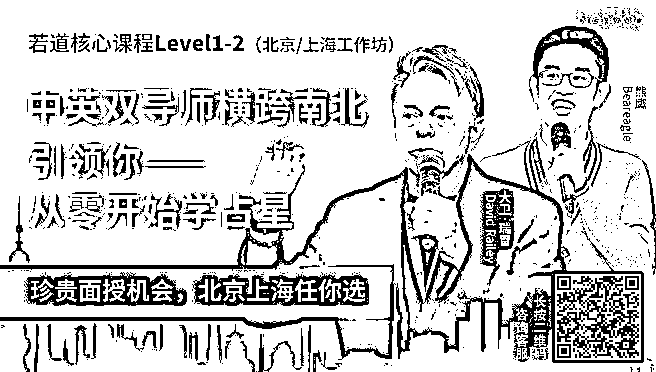

**微信又双叒叕改版啦，不想错过若道君的推送？**

**就把若道设为星标吧！**

**▼**


就是这个“在看”，戳戳戳 ☟

********报名直达入口********


# 神奇！12 星座居然可以对应二十四节气？！

> 原文：[`mp.weixin.qq.com/s?__biz=MzA5NjA0NTAxNg==&mid=2651414091&idx=2&sn=96625f64dc7fd1cc6b0a7e44f4647384&chksm=8b4becfcbc3c65eaa706a76bd9f6c22e3a3d48946cafafcb5061025c34438cf0edb48d229eb2&scene=126&sessionid=1692738202#rd`](http://mp.weixin.qq.com/s?__biz=MzA5NjA0NTAxNg==&mid=2651414091&idx=2&sn=96625f64dc7fd1cc6b0a7e44f4647384&chksm=8b4becfcbc3c65eaa706a76bd9f6c22e3a3d48946cafafcb5061025c34438cf0edb48d229eb2&scene=126&sessionid=1692738202#rd)

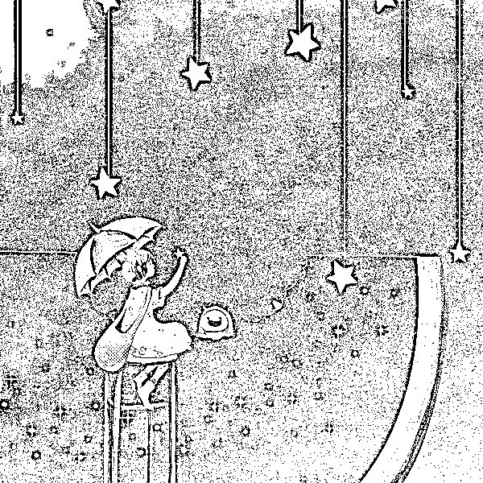

作者/熊鹰（天空的空） ISAR 认证占星师 

编辑/Tang 图片/soogif

新手问答专场又开始了！今天又有哪些迷雾要被拨开？12 星座和 24 节气能对应吗？同一个星座，男女有啥差别？电脑也有星图吗？……别着急，最懂学员的中文金牌老师熊鹰有话想说。

**为我们答疑的金牌中文讲师是谁？**


**熊鹰老师（天空的空）**

*   2008 年接触严肃占星学，至此爱不释手。
*   **2013 年师从大卫·瑞雷**，研习整套现代占星学核心课程，并于 2014 年起至今连续三年担任该课程的主助教。
*   期间也**跟随格伦·佩里、诺·泰尔、理查德·塔纳斯、罗伯特·汉德、苏·汤普金斯、斯蒂芬·弗里斯特等多位国际顶尖占星大师进行学习**，进行定向占星主题研究。
*   2015 年初，通过国际占星研究协会**（ISAR）资质认证并获得证书**。同年，进一步跟随大卫·瑞雷老师进修**“生时校正”**技术，通过最终考核并获得证书。
*   目前在若道星文化任职，将传播系统、严谨、真实的占星学作为职业使命。任专职助教期间，进行沙龙与答疑等辅助教学工作已累计超过 200 小时。
*   在业余期间也提供占星咨询与生时校正服务。目前正致力于占星学与个人成长的整合。

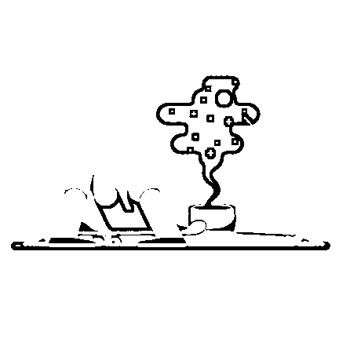

**答疑时间**

**1**

**12 星座与 24 节气能对应吗？**

**问**：有关星座和中国天文历法，白羊座对应的中国节气是清明，但是在课堂里面对应的是春分？是否对应中国节气只是参考？

**答**：**星座是 12 个，节气是 24 个，所以一个星座的时间段内都会涵盖两个节气**。比如白羊座就包含了春分与清明。星座与节气都反映了太阳的位置，你会发现，春分时太阳在白羊座 0 度，清明时太阳在白羊座 15 度。

**2**

**白羊男和白羊女为什么不一样？**

**问**：星座和性别有关系吗？星座是不是也分性别，12 星座男和 12 星座女有什么不同，例如白羊男和白羊女是否有区别？有些男性比较娘，而有些女性比较汉子，也和星座有关吗？

**答**：**星座（能量）本身没有性别之分，但是能量作用到实际的人身上，就会随着人的性别、家庭、环境、教育等而展现出不同层面的行为、语言、事件…… **就好像同样是太阳在白羊座，男性可能比女性更容易表现出其特质，因为社会大环境希望女性更温婉一些；可是这不意味着女性不能正确地表达白羊座特质，毕竟我们所处的时代越来越具有包容性。再比如，在讨论亲密关系的时候，男性与女性所关注的行星不同，比如男性要看月亮金星、女性要看太阳火星，这也就意味着性别不同会有不同的解读。 至于你说的有些男性比较娘，这个恐怕不是单看星座能决定的，需要结合星图与他的实际生活去思考。比如早年丧父的男性，长期与女性长辈在一起，并不清楚男子气概如何表达。

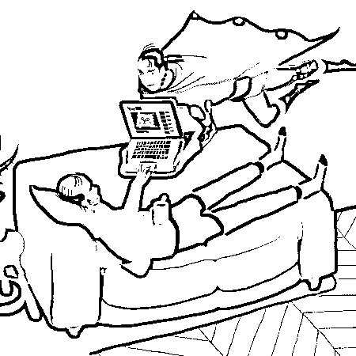

3

**电脑也有星图吗？**

**问**：所有的生命或事物都有自己的星图吗？

**答**：**任何人事物都有星图**，比如卜卦占星学就是给事件看星图，你有宠物也可以看看它的星图。甚至连电脑电器，你能找到生产日期，也可以看星图；没有生产日期，第一次打开的时间也行。这就万事万物与这个宇宙之间的关联性。

4

**同一颗行星守护两个星座，要怎么解读？**

**问**：如何看待同一颗行星守护两个星座，如何解读？

**答**：**星座的意义各有不同，行星的意义可以包括两个星座。比如金星同时具备金牛座与天秤座的意义。 **值得一提的是，在现代占星学的守护体系中，火星、土星、木星不再守护天蝎座、水瓶座、双鱼座，而改由三王星守护，因为它们的意义与这三个星座的意义有更多共鸣。（尽管在实践中，有些占星师在思考这三个星座的意义的时候，也能参考一下旧守护行星的意义，这就看个人偏好了。）

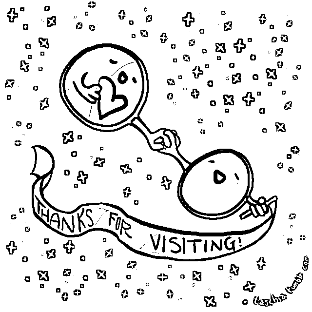

5

**如何活出你的星座正能量？**

**问**：如果每个星座都有自己存在的建设性的特质，也有非建设性的特质。那怎么才能最大限度地发挥建设性的特质，以及避免或减少非建设性的特质呢？

**答**：大卫老师曾经提到过个人成长的三部曲：**觉知－接纳－转化**。这也是我个人秉持的观念。 
首先是“觉知”，占星学本身就是一个很好的觉知工具，它可以以相对客观的方式帮助我们省视自己，而在客观与理性下，觉知是最容易升起的。也就是问题中的“怎么最大限度发挥建设性”的第一步：知道建设性的发挥是什么。继而在实际生活中，我们就可以有意识地调整自己，让一言一行都朝着建设性的方向去表达。 当然，事情有时候并不会这么简单，我们有太多太多习惯性的想法与行动方式，都是自出生以后逐渐养成的，其中造成生活不愉快的部分就是“破坏性”的面向。要调整不容易，必须寻求“修行”的方式去解决。单单通过占星学，并没有办法教会大家修行的具体细节与步骤，但能够告诉自己该选择怎样的路线去修行，换句话说，什么样的修行方式最适合你自己。（这是可以通过解读个人星图来发现的。）

6

**东方五行 vs 西方四元素**

**问**：东方玄学中天干地支的火元素和西方占星学火元素完全不同吗？

**答**：**单就“火”而言，五行中的火行是“热能”，与占星中的火元素还是有比较大的相似之处。但这仅仅是原始意义上的相似，在实际运用中差别仍旧很大。**比如：占星学里，火元素的狮子座对应心臟，在五行中的火行也是对应心臟。但中医所谓的心臟不仅仅是那一个臟器，是涵盖了整个与心臟有关的脉络或者系统。 因此，**在深入了解两者之前，建议尽可能还是不要混淆使用**。

**你可能还想知道**

[星图里四元素分布不均，影响很大吗？](https://mp.weixin.qq.com/s?__biz=MzA5NjA0NTAxNg==&mid=2651413570&idx=2&sn=e45c094729e0153b90cdfd2902a2b6df&chksm=8b4beef5bc3c67e3303dd5bb458066a4a82c87ff1130d2a986a0ebdc42b87eb8ba7cfa029ee9&token=1530151575&lang=zh_CN&scene=21#wechat_redirect)[!](https://mp.weixin.qq.com/s?__biz=MzA5NjA0NTAxNg==&mid=2651413570&idx=2&sn=e45c094729e0153b90cdfd2902a2b6df&chksm=8b4beef5bc3c67e3303dd5bb458066a4a82c87ff1130d2a986a0ebdc42b87eb8ba7cfa029ee9&token=1530151575&lang=zh_CN&scene=21#wechat_redirect)

[为什么你明明不是 XX 座，却老觉得自己像这个星座？](https://mp.weixin.qq.com/s?__biz=MzA5NjA0NTAxNg==&mid=2651413812&idx=2&sn=0e81891677434a45558dfab2bd6ec164&chksm=8b4bef83bc3c66958b7063937f05b4c646a65f49bf6ede44fdc445178ebbd713eb75e03ae1d8&token=173326699&lang=zh_CN&scene=21#wechat_redirect)

[为什么水逆的时候，手机电脑老出问题？](https://mp.weixin.qq.com/s?__biz=MzA5NjA0NTAxNg==&mid=2651413971&idx=2&sn=b771ed07a03fd86bdd2fe778ee446cfa&chksm=8b4bef64bc3c6672b26c7cef7194f5a7ce533b4eefef47048b5dc4c3dc9b98736d72194d41e4&token=1255076215&lang=zh_CN&scene=21#wechat_redirect)

**敬请期待熊鹰老师**

**下一波答疑**


**现在你有机会跟随熊鹰老师**

**系统学习占星学**

**长按下图添加客服咨询详情**

****具体课宣参见今日三条****


**微信又双叒叕改版啦，不想错过若道君的推送？**

**就把若道设为星标吧！**

**▼**


就是这个“在看”，戳戳戳 ☟

********报名直达入口********


# 中英双导师 L1-2｜零基础一脚踹入占星大门，错过还要等一年！

> 原文：[`mp.weixin.qq.com/s?__biz=MzA5NjA0NTAxNg==&mid=2651414091&idx=3&sn=b7c82492ccedae38cbf9dbc1b9eaa42f&chksm=8b4becfcbc3c65ea5f20113f317cb620048b19e6568f3f690c82185c1426c154d6be0bc1a051&scene=126&sessionid=1692738202#rd`](http://mp.weixin.qq.com/s?__biz=MzA5NjA0NTAxNg==&mid=2651414091&idx=3&sn=b7c82492ccedae38cbf9dbc1b9eaa42f&chksm=8b4becfcbc3c65ea5f20113f317cb620048b19e6568f3f690c82185c1426c154d6be0bc1a051&scene=126&sessionid=1692738202#rd)

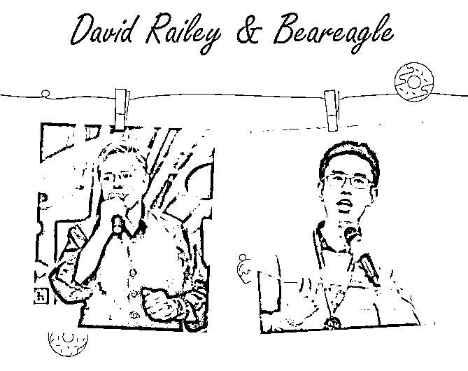

非常时期，大家在家躺着什么都不干就是为社会做贡献了。很多小伙伴跟若道君表示在家宅着已经快长蘑菇了。与其在家刷朋友圈陷入对未来的无限焦虑，不如重启一直以来的占星爱好变成专业。一起来了解一下若道 2020 年春季隆重开学的**占星入门网络直播课**。

众所周知，若道办学 9 年来，最专业的坚持是，以直播的形式**让每位零基础小白学员，与国际顶级占星大师“零距离零时差”沉浸式学习**。下面是我们对于即将到来的本学年学习方式首次详解，敬请提问互动。

**足不出户，占星智慧云掌握**

**学占星，网络直播课的妙处在哪里？**

**1**

**若道占星 9 年磨一剑**

从未来趋势上看

从线下教育向线上教育发展蓬勃

若道作为国内乃至国际上权威的占星教育平台

早已在线上直播课的路上经历 9 年的上下求索

每一届核心课都在迭代与优化

线上直播课不断积累与改进

进而提升学员的体验和学习效果

让广大若道学员有更多的收获

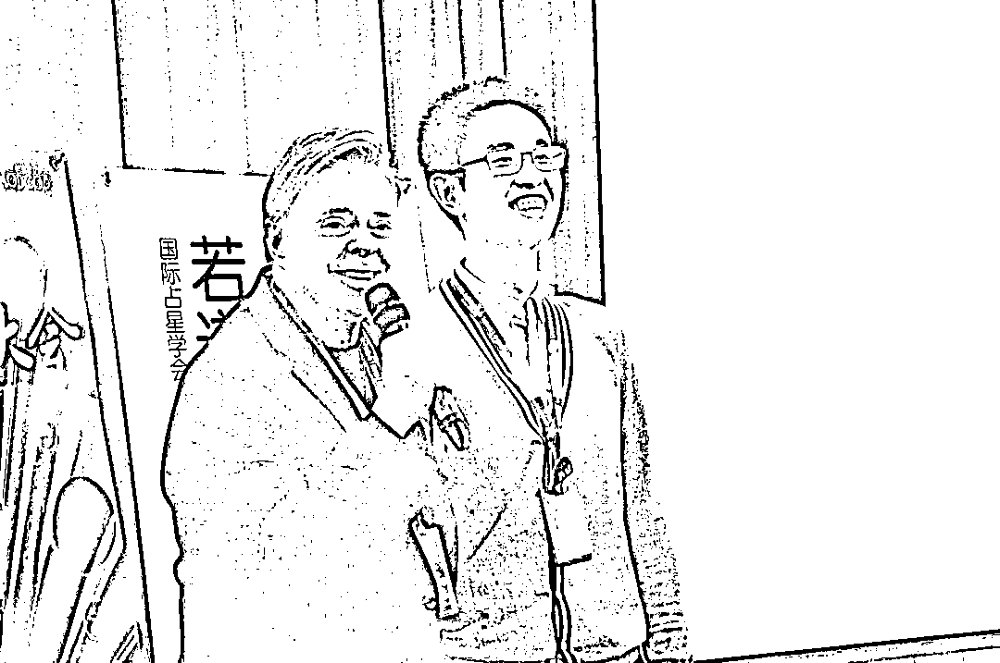


2

**直播课是一次次美丽的宇宙共时性**不同于现在市面上的各种视频录播课线上直播课，需要投入的人员和资源会更多但若道之所以选择这样的坚持是因为直播课的学习效果确实最有保障占星学本身就是一门和宇宙相关的学科每一次老师和同学们同一时间上线各自分享着近期的事件和挑战传递和接收着占星学的知识和奥义何尝不是一次次的约定和美丽的共时性呢？

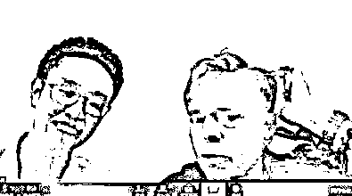

你还可以在互动区及时地提出你的问题与困惑
老师通常在下课前会留出时间进行答疑如果你的问题班里的同学知道也会帮你补充回答、及时互动甚至会因此碰撞出更有价值的思考

3

**主动学习比被动学习重要****系统学习比碎片学习珍贵**系统就是有章可循每周固定的时间和权威信赖的老师，熟悉同频的同学们一起主动学习、系统学习困惑及时被 ISAR 认证的占星助教解答今年，熊鹰老师还会亲自下场解读知识伴随着详尽的讲解生动的案例、互动的实践被吸收相信我，学习占星会变成特别珍贵的学习体验

4

那有的同学会说

道理我都懂，但我就是缺乏自觉性

老是三分钟热度怎么办？

我们的知心课程顾问就华丽登场啦！

课程顾问会变着花样

做各种好看的课程通知小海报提醒你上课

记录你的每一次出勤情况

帮你反馈和解决各种专业知识以外的问题

当你动力不足有几次缺课的时候

还会亲和地询问你最近的学习困难

给你及时的鼓励和支持

提醒和收集老师的课堂作业

5

学习不掉队，还能赢取**奖励课程券**是的若道直播课程是有机会获得课程券的可以直接当钱花，购买或抵扣之后在若道消费的其他课程帮助真正热爱占星的你减免学费压力比如土星奖&木星奖


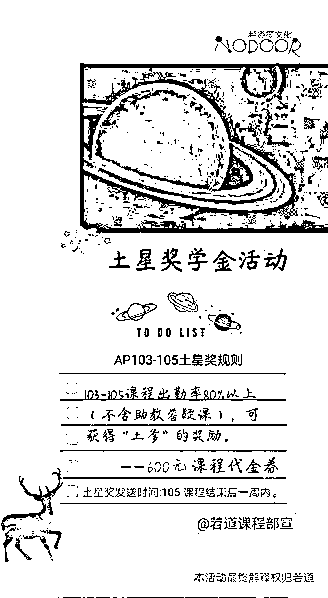


教育是什么？德国哲学家雅思贝尔斯说：**教育是一棵树摇动另一棵树，****一朵云推动另一朵云，****一个灵魂唤醒另一个灵魂。**网络直播课与老师的联结是最强烈的**我们 2020 年占星直播课的老师是谁？****拥有 49 年占星实践经验的若道创始人****大卫·瑞雷**&**最懂学员的若道首位认证金牌中国老师****熊鹰****师徒二人****合力打造****L1-2 初阶网络直播课****2020 年 4 月 2 日（周四）开课**2020 年之前我们的 L1-2 一直是 8 节课 2020 年注定是不平凡的一年所以我们决定**8+2****把初阶课直播课升级为****10****节**给刚刚踏上占星之路的你更好的支持和陪伴**万事俱备 只等你来！****1-2 阶我们要学习什么？**

**第一阶  12 星座，12 种性格，12 种人生 **

❶ 学习占星学必须准备的“心法”

❷ 占星学中的火、土、风、水四元素，阴阳法则

❸ 面对面的星座有故事

❹ 12 星座：12 种性格详解，12 种行为模式，12 种价值观

❺ 太阳和月亮：了解你的太阳，生命的发动机，让你在世界闪光的方式，生命获得力量的方法；了解你的月亮，让你获得幸福的方法

❻ 了解太阳、月亮，了解你生命中已经出现的、将会出现的男性和女性

**第二阶  命运的线索和人生故事中的演员**

❶ 命运的线索：南北交点

❷ 星图三巨头：太阳、月亮、上升点的故事

❸ 了解心智：水星

❹ 了解金钱和关系：金星

❺ 了解行动模式：火星

❻ 了解信念：木星

❼ 了解努力：土星

❽ 了解天才和疯狂：天王星

❾ 了解梦想和幻灭：海王星

❿ 了解死亡和重生：冥王星

⓫ 12 个人生场景：黄道 12 宫位初解

**大卫老师和熊鹰老师如何分工呢？**


❶ 2020 年 4 月 2 日（周四）20:00-22:00 星座 1 主讲人：大卫·瑞雷老师

❷ 2020 年 4 月 9 日（周四）20:00-22:00 星座 2 主讲人：熊鹰老师

❸ 2020 年 4 月 16 日（周四）20:00-22:00 太阳、月亮 主讲人：大卫·瑞雷老师

❹ 2020 年 4 月 23 日（周四）20:00-22:00 水星、金星、火星 主讲人：熊鹰老师

❺ 2020 年 4 月 30 日（周四）20:00-22:00 木星、土星 主讲人：熊鹰老师

❻ 2020 年 5 月 7 日（周四）20:00-22:00 三王星 主讲人：大卫·瑞雷老师

❼ 2020 年 5 月 14 日（周四）20:00-22:00 宫位 1 主讲人：熊鹰老师

❽ 2020 年 5 月 21 日（周四）20:00-22:00 宫位 2 主讲人：大卫·瑞雷老师

❾ 2020 年 5 月 28 日（周四）20:00-22:00 月亮交点 1 主讲人：熊鹰老师

❿ 2020 年 6 月 4 日（周四）20:00-22:00 月亮交点 2 主讲人：大卫·瑞雷老师

**这两位优秀的占星学老师是谁？**


**大卫·瑞雷（David Railey）**

*   **ISAR 董事会成员，ISAR 全球副主席，ISAR 全球职业占星师认证主席，若道占星创始人。**
*   1976 年，通过亚特兰大职业占星师考试，成为全职占星师，随后通过**AFAN 和 ISAR 职业测试**。
*   1980 年，与**杰夫·焦耳**一起在亚特兰大创建**“每日星球”**占星学中心。此后在亚特兰大占星协会担任 4 年考官，并且两次担任**亚特兰大地区占星协会主席**。
*   1979-1992 年，作为占星师活跃于美国社会媒体，向不了解现代占星学变化的大众宣传专业占星学知识。在 1989-1992 年期间，他在 WRGG 电台 12 频道每周主持个人电视秀**“今日占星学”**，早先他还在 WRFG 的广播节目中播讲宇宙天气节目。 
*   2010-2014 年，任**全美占星师联盟监督委员会委员**。
*   2010 年，其著作**《灵魂的目标》**中国版出版，和蒋颖一起创办**若道占星**学校和其官网 www.nodoor.com。从该年开始，他工作并往返于亚特兰大和北京。目前他 80%的时间致力于在中国教授和推广西方占星学。
*   2017 年，被选为**ISAR 委员会成员**（2017）。ISAR 是世界最大的国际占星机构，会员遍布 45 个国家。


**熊鹰老师（天空的空）**

*   2008 年接触严肃占星学，至此爱不释手。
*   **2013 年师从大卫·瑞雷**，研习整套现代占星学核心课程，并于 2014 年起至今连续三年担任该课程的主助教。
*   期间也**跟随格伦·佩里、诺·泰尔、理查德·塔纳斯、罗伯特·汉德、苏·汤普金斯、斯蒂芬·弗里斯特等多位国际顶尖占星大师进行学习**，进行定向占星主题研究。
*   2015 年初，通过国际占星研究协会**（ISAR）资质认证并获得证书**。同年，进一步跟随大卫·瑞雷老师进修**“生时校正”**技术，通过最终考核并获得证书。
*   目前在若道星文化任职，将传播系统、严谨、真实的占星学作为职业使命。任专职助教期间，进行沙龙与答疑等辅助教学工作已累计超过 200 小时。
*   在业余期间也提供占星咨询与生时校正服务。目前正致力于占星学与个人成长的整合。

**除了网络直播课，**

**春暖花开，盛夏到来的时候，**

**还会迎来两场线下工作坊**

**L1-2 上海工作坊****（2020 年 6 月 12、13、14 日 熊鹰老师主讲）**

**L1-2 北京工作坊****（2020 年 6 月 25、26、27 日 大卫·瑞雷老师主讲）**

就看你是喜欢哪种形式

**文末有每种形式的价格，还有连报套餐价哦**

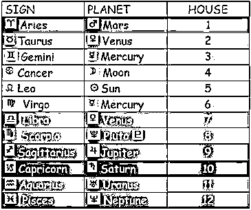

**什么人适合这门课？**

*   对占星学有浓厚兴趣，想要系统学习占星学

*   对占星学有一定基础，但不知道该如何整合星图复杂的碎片

*   希望成为优秀的占星师，想要借鉴国际大师解读思路并融入自己的体系

*   想学习占星学，但不擅长英文，希望有中文老师授课

*   想结合占星学理论与咨询实践

*   大卫·瑞雷、熊鹰的忠粉，学过占星，但就是想跟着偶像再学一遍

*   走在自我探索和个人成长道路上的人

**课程费用**

**★ 1-5 阶**

**早鸟价：33000 元（2020 年 3 月 31 日之前）**

**课程费用：46500 元 **

**★ 1-2 阶直播课（4 月 2 日开课）**

**课程费用：3500 元 **

**★1-2 阶工作坊（北京工作坊、上海工作坊任选一场）**

**早鸟价：2800 元（2020 年 5 月 6 日之前）**

**课程费用：3500 元 **

**★网络直播课+现场工作坊都想要的同学：有套餐价哦**

**购买网络直播课程+北京工作坊、上海工作坊任选一场**

**早鸟价：4200 元（2020 年 5 月 6 日之前）**

**课程费用：5200 元**

**退转课程**

**退款原则请详看《教学协议》，如有疑问请咨询课程顾问。**

****中英双导师核心课 Level1-2****

**授课老师：大卫·瑞雷 熊鹰**

**授课时间：****1-2 阶****网络直播课，**4 月 2 日开课**；****1-2 阶********工作坊，上海** 2020 年 6 月 12、13、14 日 **北京** 2020 年 6 月 25、26、27 日

**授课方式：**网络课程，中英文授课，中文翻译；现场工作坊，中英文授课，中文翻译

**费用：****1-2 阶网络直播课程：****3500 元**；******1-2 阶**（北京、上海工作坊任选一场）**：**3500 元**早鸟价：2800 元（2020 年 5 月 6 日之前）；******网络直播+现场套餐价：****5200 元** 早鸟价：4200 元（2020 年 5 月 6 日之前）；******1-5 阶：**46500 元******早鸟价：33000 元（2020 年 3 月 31 日之前）；****

**课程负责人：**王老师（微信：18510107057），请备注“核心课”

长按二维码添加课程负责人咨询~


****报名请点击“阅读原文”****


# “名校毕业，我转行做了职业占星师” | 比高学历更难的能力，是勇敢做自己

> 原文：[`mp.weixin.qq.com/s?__biz=MzA5NjA0NTAxNg==&mid=2651414090&idx=1&sn=eafde558f7b47ba5e0c8a9b880c69ea4&chksm=8b4becfdbc3c65ebfb95f6d8da0f1638dfb824175075aa8464c69b2923d14892b9b20f36f47a&scene=126&sessionid=1692738202#rd`](http://mp.weixin.qq.com/s?__biz=MzA5NjA0NTAxNg==&mid=2651414090&idx=1&sn=eafde558f7b47ba5e0c8a9b880c69ea4&chksm=8b4becfdbc3c65ebfb95f6d8da0f1638dfb824175075aa8464c69b2923d14892b9b20f36f47a&scene=126&sessionid=1692738202#rd)

****************☆** 后台回复“今日”，给你一句生命态度**************

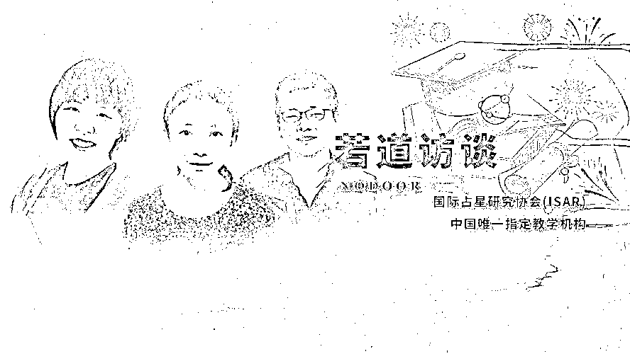

采访/作者/编辑/狄狄  封面/书君图片/张星、Cora 聆宇、查理、网络 名校毕业的背景，给了名校毕业的人们长久的光环、更多的见识和机会以及大格局的思维。但也有名校毕业的朋友感慨：**“会担心没完成家人、老师、同学的期待，名校就像一个脱不掉的标签，让人喘不过气。”**真的是这样吗？其实不少占星师都是名校毕业的。远一点的，有若道的合作授课大师**理查德·塔纳斯**和**诺·泰尔**，他们是哈佛大学毕业的。近一些的，若道十年来培养出的几千名学员中，不少也是国内顶尖名校毕业的。名校毕业坚定地从事着职业占星师这种小众职业，他们是引发了校友圈的争议？还是凭借着自己的背景资源与占星学结合，开启了 1+1＞2 的新奇人生？我们采访了来自三所不同大学、三种不同专业的若道毕业生——**双鱼座的张星、****白羊座的 Cora 聆宇**和**狮子座的查理****。**他们的故事告诉我们，比获取高学历更强大的能力，是不断地寻找并坚持做自己。

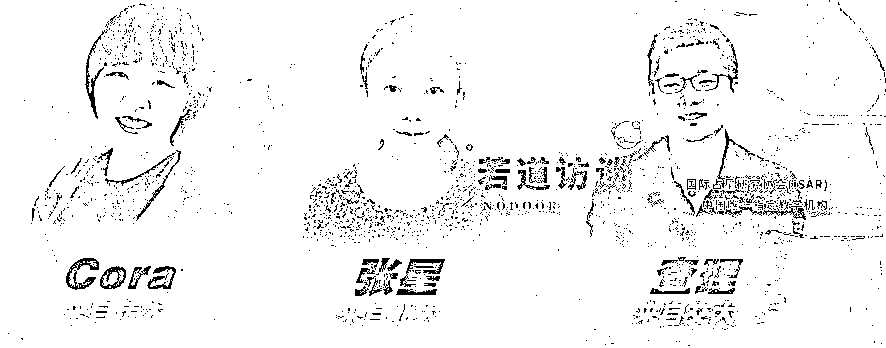

**“我很尊重我的专业”**

占星师的前世今生

**Q1：****你毕业于哪个大学，什么院系？**

** 张星：** 北京大学中文系，汉语言学专业。

**Cora：** 中国传媒大学，影视艺术学院，广播电视文学系。

** 查理：** 上海交通大学，理学院物理系。我毕业以后没多久，学院名改成了物理与天文学院。

**Q2：****本科专业主要学习什么内容？你喜欢你的专业么？**** 张星：** 汉语言学是中文系里一个偏理性的小专业，我们班也就十几个人。**学的是语音、语义、方言、符号学。**上北大是保送的，我自认为不是爱好文学的人，所以我就选了一个看起来最不像中文系的专业。对于大学的专业，我感兴趣但是保持距离。但可能因为我星图里有风象大三角的缘故，虽然算不上深刻了解，但我很尊重我的专业。**Cora：** 戏剧影视文学，是**一个培养编剧或影视评论的专业**。电影电视相关的课程也学，比如电视编导、视听语言等；再就是文学相关的课，比如文学史、文学创作。大学教育给了我很重要的审美和人生观上的启迪，我挺喜欢我们专业整个氛围的，虽然经常逃课（笑）。** 查理：** **主要是物理学和数学课程**，四大力学、高数、数学物理方法，还有各种物理实验，现在记忆也有点模糊啦。那段时间，海王星刚进入我的一宫没多久，都稀里糊涂的。我高中物理还行，没想到这大学的物理和高中时候完全不一样，理解起来特别费劲，老实说当时学习起来觉得很困难的。反倒是我辅修的经管类课程比较有趣，管理学原理、管理会计啥的，现在还都记得一些。

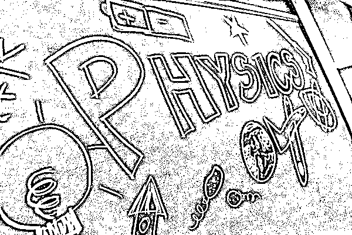

**Q3：****你在做占星师之前从事过什么职业？**** 张星：** 我是中国**第一批互联网职业人**，1998 年在搜狐，2000 在雅虎中国。我做的事情好像一直比较“水瓶座天王星”，都是比较看向未来的。后来又转型成一个战略、策略、产品构架方面的独立顾问，去处理一些公司面临的危机。这种个人顾问的的状态一直持续到 2015 年末年开始学占星的时候。**Cora：** 毕业后一年，我就进入若道工作了，我是**比较早进入了严肃占星行业**，反而本专业的编剧工作，我是在学习了占星之后才回过头去接触的。** 查理：** 基础学科本科毕业很难找到相关工作，07 年毕业的时候，我进入了企业咨询的公司，也成了**我们系历史上第一个去做企业管理咨询的**。我毕业那会管理咨询行业在中国正好火了起来，咨询公司需要各种各样背景的人提供各个领域的视角和观点，这样才能给到客户更多价值。行业寻找有商业敏感度和思考能力的人，于是我就来到了这个行业。这个工作的好处是可以对不同的行业有战略层面的认识，我在这行工作十年，服务过的行业包括金融、地产、能源、汽车、电信等等，当时我们也给客户为规划和预测，和现在占星师做预测其实有那么一点点像。

**“是占星学选择了我”**

在人生的拐点遇见占星学

**Q4：****怎么想到来做独立占星师的？**** 张星：** 现在回想起来，我想分享两个我和占星有缘分的故事。大学的某一年，我反复做过一个梦，梦见兵荒马乱的世界末日所有人都在街上跑，我跑着跑着忽然看见天上的星星，有很多彩色的、不同的星座，然后我就停下脚步，跟朋友说：“别慌，你看这些星座多美啊！”我是个群星双鱼座的人，海王星在中天，现在想想提前梦到这些也不奇怪。还有一次在雅虎中国的时候，赶上互联网行业的第一次泡沫，整个行业很萧条，我每天都无所事事很沮丧。有一天有一个同事在饭桌上问我：“以后想干嘛”。我就讲将来我想学习占星学，要有一间我自己的占星工作室。我还描述得特别具体，我说墙上挂了很多我获得的占星职业资质证书，证明我是合格的、可以做占星咨询的人……我当时完全不知道占星师是什么，都是自己想象出来的画面。**我老公现在经常打趣我说，我们的生活都是我自己想出来的。**

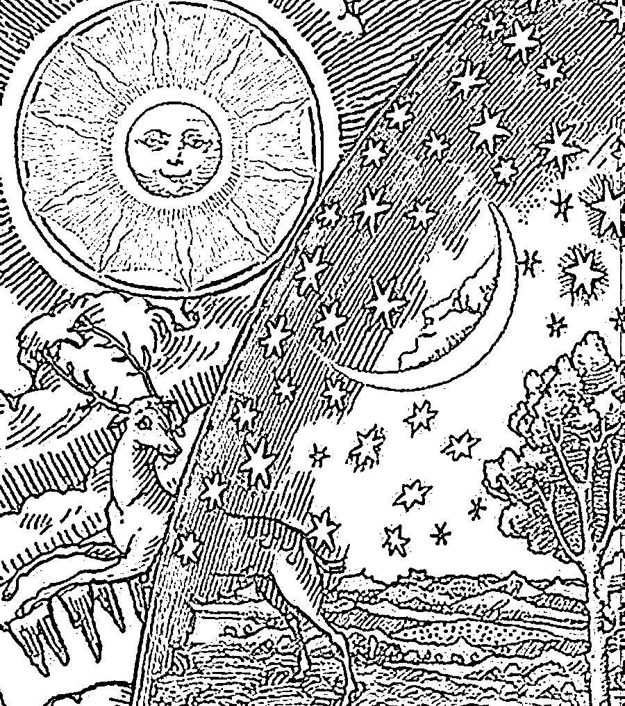

**Cora：** **我成为独立占星师的一个重要原因是我很需要自由**，我不喜欢朝九晚五的生活，需要有足够的空间做一些自己的事情。我也做过一些其他的自由职业，像翻译、编剧……但慢慢筛选下来，**我觉得我还是最适合做占星师，是占星选择了我。**** 查理：** 2014 年的时候，我一个同事给我普及了“上升星座”的概念，这是我第一次接触到占星学。2015 年的时候正好公司没什么项目做，于是我就开始在一些业余网站上自学，用网站上的行运对照了自己的一些时间点，很惊讶都是自己人生中一些重要的转折。后来就拿身边的的一些朋友做测试也都觉得挺准。比较重要的转折是，**有一次运用简单占星知识，成功改善了和我当时一个重要客户的关系**，因此开始想系统去学。**Q5：****讲讲你入学若道的经历。**** 张星：** 过去职业中，很多时候不需要关注人的情感，工作性质需要你关注产出、系统、任务，而隔离感情。人的情感是需要被大的项目所忽略的。但我是个特别敏感的人，在互联网行业的时候，会更加关注行业大佬们眼神里，偶然流露出来的悲伤、踌躇的那些情绪，我一直会被这些东西吸引。**刚入学若道的时候，最大的冲击是我接触到了“不同的人”，学习占星学帮我看到“人”，感到情感的重要性。**我经验到了我和“他者”之间的关系，这填补了之前经历里的空白。**Cora：** 十年前，我作为一个占星爱好者，刚毕业不久就进入若道工作。**那会儿更多是感觉到兴奋、新奇，求知欲得到极大的满足，好像一个新世界的大门在为我打开。**就像海绵吸水一样，更多是在学习，在体验，在感受，那时并没觉得自己将来要成为占星师，看到身边一些已经成为占星师的人，会觉得羡慕，有向往，但那时更多是想象、幻想，并没有真的想要以此为职业。那时没有什么具体的规划，感觉是被命运推着一步一步走到现在。

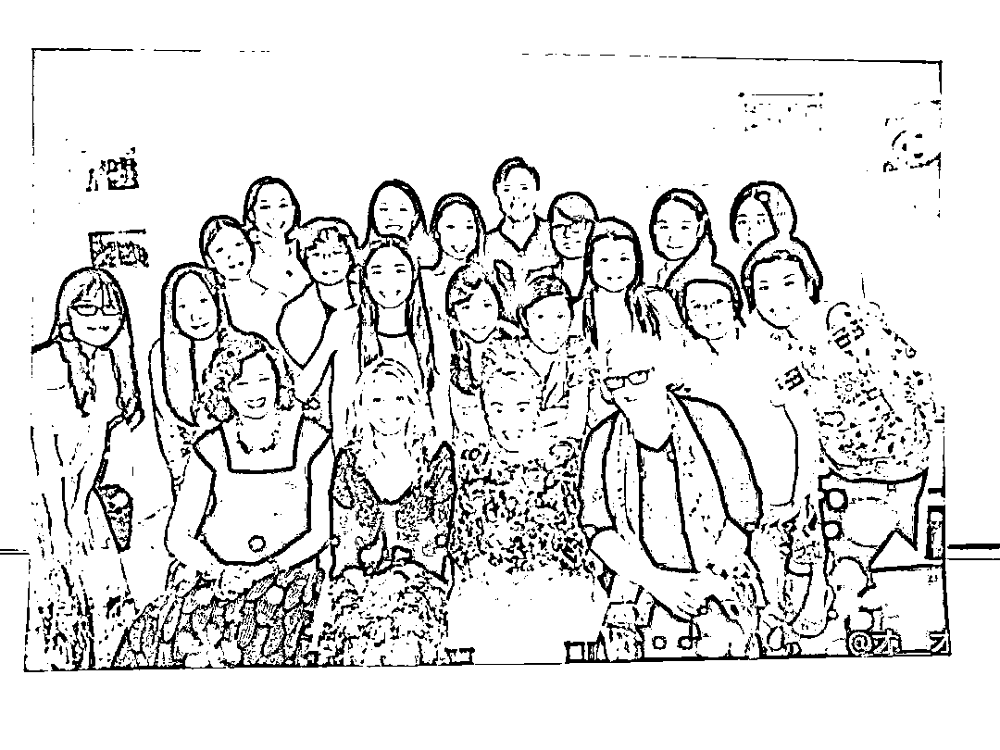

**|** 早年间入职若道的 Cora（最上排左二）入职若道对我来说，真的是个对人生挺大影响的事，也是非常偶然的事。那是 2010 年秋天，当时行进木星和天王星正在合相我出生星图的太阳。年纪越大回想起来，越觉得自己那时挺幸运的。我是月亮射手座，探索生命的意义让我有很大的满足感。**在很年轻的时候接触到西方最正宗的占星学教育，我始终觉得这是我人生中最大的幸运。**现在我可以作为一个独立占星师养活自己，毫无疑问是与我在若道接触的教育资源有重大的关系的。** 查理：** 2016 年 3 月我正式进入若道，从 level1 开始学起的。可能**我从小的习惯就是学习要从基础打起，如果基础不牢靠，到了上面就会很难学。**就像我发现在学物理时，再复杂的题目背后都是在考察基础知识，换汤不换药。入学后我印象最深刻的是，我们那届若道学员群里，每天一觉醒来未读消息条数就是 999+，里面有大量的群讨论。我们那届的助教是熊鹰和 Gaff，给我们布置了很多大量的作业，带领我们群讨论，特别热闹。**那段时间是基础打得最牢靠的时候，很有帮助。**我当时给自己休了无薪假期，从一些事务性工作中解脱出来安心学占星。其他同学很多是在职学习，而我的优势是“24 小时学习”，基本刚学习完 level2 我就已经开始接个案了。我记得 2017 年木星在处女座那年，市面上多了很多手工市集，我还会经常去市集摆摊做解读实践。

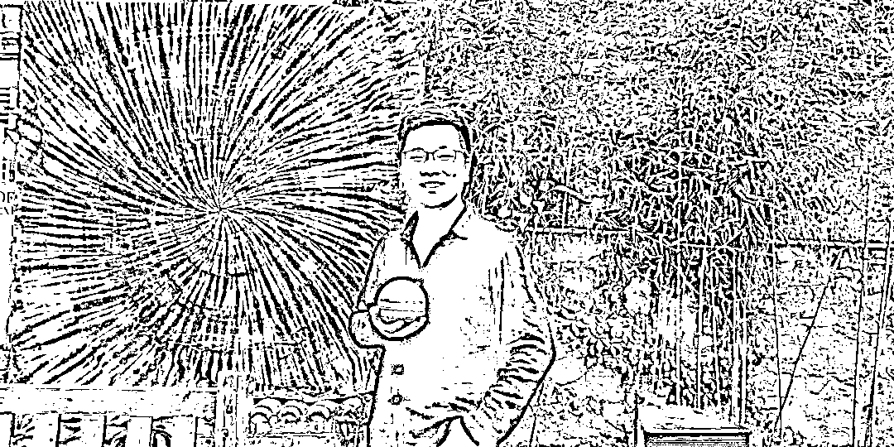

**|** 若道主办的大理“天蝎座市集”，查理在摆摊儿**Q6：****作为占星启蒙老师，大卫·瑞雷对你的占星之旅有怎样的帮助？****** 张星：** ****我认识大卫和蒋颖的时候，我自己还没有开始学习占星学。但是我当时特别开心认识他们，想着如果我要学占星，我知道未来可以去哪里学。**那时候我在给一个公益性质的农业公司处理一个危机，整个人很紧张，就找到大卫老师做了一次占星咨询，那也是我人生经历的第一次占星咨询。大卫问了我一个问题对我影响很大，他说：“你想过你的梦想是什么吗？”那时候我四十岁了，根本想不起来自己二十几岁时候讲过要做占星师的事。所以当大卫老师问出这个问题，我整个人就楞在那里了，想了半天才对他讲：“我觉得自己没有梦想，但我总在帮看起来很有梦想的人工作”。大卫老师笑了笑说：“你需要去想想你的梦想。”**那次咨询让我有很大收获，也在心里种下了学占星的种子。**第二年，我完成了对农业公司的承诺，便离开来到若道开始学习占星。

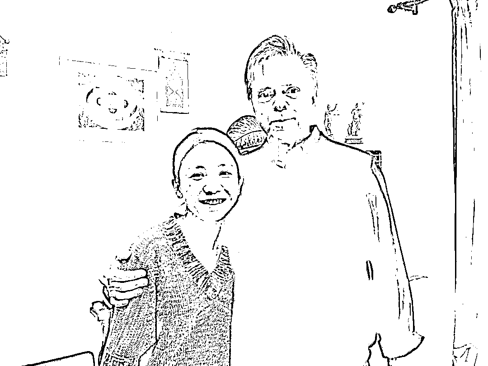

**|** 张星在若道办公室与大卫·瑞雷合影
**Cora：** 大卫是我的占星启蒙老师，也是我学习占星道路上一个很重要的老师。我们认识于若道创办初期，每次回想起来都很感动，**我觉得大卫对我的帮助，已经超出了学习上范畴。**大卫让我很佩服的有两点。一是他特别勤奋，我作为前员工以及作为学生对此都深有体会。二是他总是充满热情、特别积极乐观（大卫上升、月亮和火星都在射手座），大卫总是能看到一个事情好的方面，然后他就把事情朝这个积极的方面去推动。这两个特质让我觉得很敬佩。虽然现在我们私下联系很少，但依然会感受到大卫对我的关心，比如去年 2019 北京 ISAR 大会上，我那场演讲开场时，他突然上台来给我做了一个开场白，让我感到很受鼓励。我觉得他一直是个很贴心的人。  ** 查理：** 第一次见到大卫令我印象很深刻，那次我因为出差来北京，特意去若道办公室现场听的大卫讲课。我和大卫简单讲了一下自己的星图配置，他听到这些时候稍微顿了一下，问我叫什么名字，还立刻去找了张纸，把我的名字很正式地记了下来。我当时特别惊讶，没有人这么对待过我。我不知道是不是他知道我的配置之后，知道我特别希望被别人记住。几个月之后我来北京工作坊他一下就叫出了我的名字，我就更惊讶了。因为当时我就是一个普通的学生，大卫老师有这么多学生，还能记得我，有点受宠若惊的感觉，哈哈。[(大卫·瑞雷 2020 占星入门课即将启程，点击了解)](http://mp.weixin.qq.com/s?__biz=MzA5NjA0NTAxNg==&mid=2651414006&idx=3&sn=1140f237a4db455ace8224689accb3fc&chksm=8b4bef41bc3c6657276b30b07434c5802336ab1fbdace8db4b95a144c10f74a3c8fcf95a44db&scene=21#wechat_redirect)**除了大卫为我启蒙以外，他也开启了我的个性化研究之路。**2016 年他在上海开了一次企业占星的工作坊。讲了如何用占星学帮助企业主，从一家公司成立一直服务到那家公司被收购。当时这个课对我很有启发，原来占星和企业咨询还能联系在一起。大卫老师说太阳和企业领导人有关，月亮和人力资源、食堂有关。课上我就问大卫老师，那水星、金星这些代表企业的什么呢？大卫老师说他的案例不用这些行星所以他不知道。我想我有十年的企业管理咨询经验，很适合研究，从那个点开始，我的占星研究就开启了全新的方向。**Q7：****你现在主要从事哪个领域的占星咨询？你过去的专业或职业是否对占星咨询有辅助？****** 张星：** **2018 年，我才开始做全职占星师，我现在还属于特别初期的阶段。我是个 9 岁男孩的妈妈，所以我现在的占星领域主要有亲子、职业、个人成长、和危机陪伴……更侧重哪个方面目前还没有定型。汉语言学是一套完整的系统，语言即是符号，所以“系统论”和“符号学”是我在学汉语言学时期接触到的概念。做职业顾问期间，我又对信息化系统有了更深刻的了解。**汉语言和占星学都是“语言学”，占星学是一门系统化的、表达原型的语言。我觉得他们之间很有连接。**

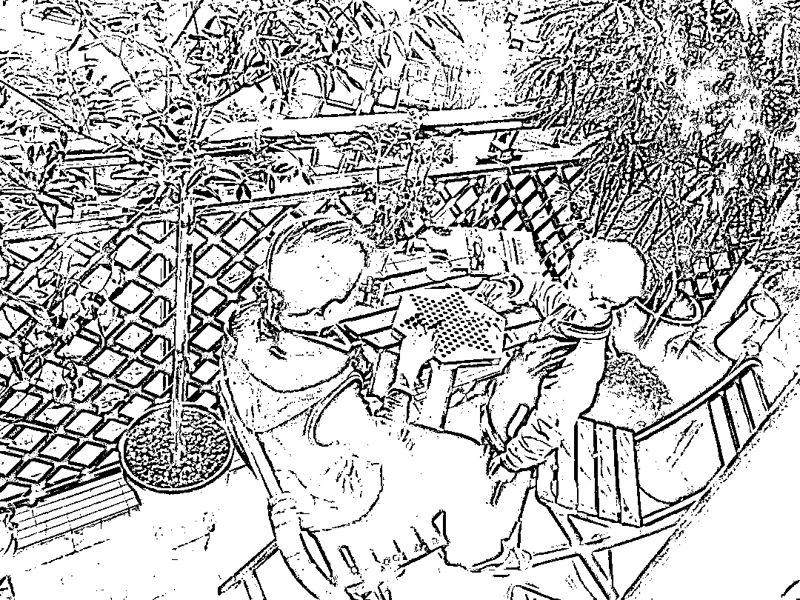

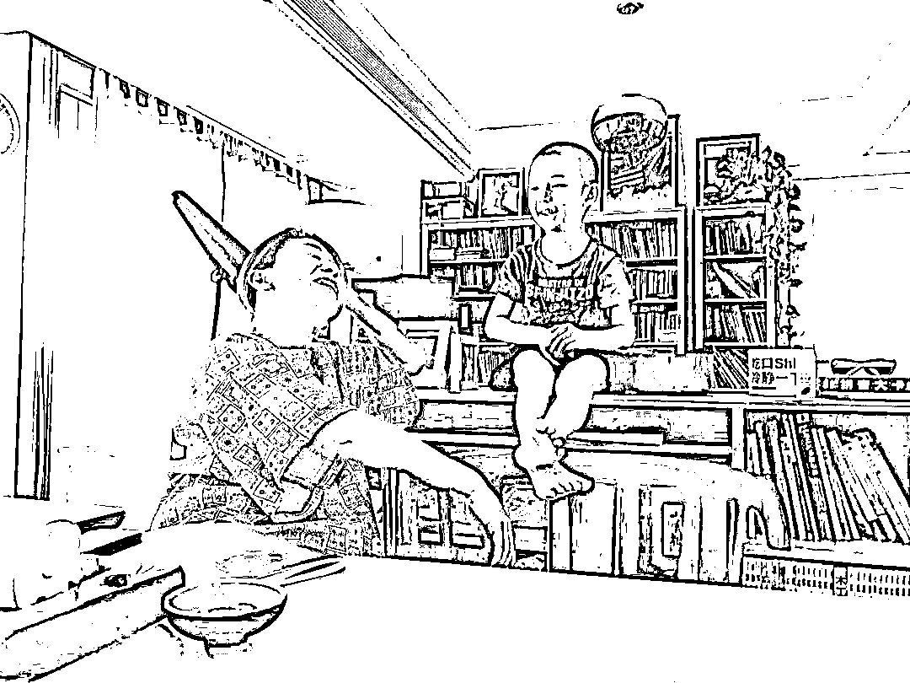

**|** 张星和儿子的日常
**Cora：** 我现在主要从事占星个案咨询和教学的工作。曾经的编剧学习对占星研究很有辅助。编剧就是在研究人，关注人的性格、心理和行为之间的规律，也是在关注人的命运……包括写剧本前要写人物小传，就是描述一个人的背景、性格，他的发展轨迹。现在编剧写人物小传也流行给每个人物加上星座。**占星学也是在研究人的，研究人与生俱来的模式和潜力，怎样的性格会遇到怎样的“故事”。占星师与编剧关注的东西，在某些内在的部分挺共振的，研究“什么样的人在做什么样的事”，他们都是对“人和命运的关系”感兴趣的一群人。**** 查理：** 我现在主要研究方向是企业占星咨询。上过大卫的企业占星课之后我发现，原来国内用占星学提供企业战略管理的占星师几乎没有。我开始把每颗行星都和企业里的内容对应起来，又把过去的企业案例星图梳理了一遍。2017 年的时候，我花了一整年时间拜访了很多企业主去做调研。占星学和企业管理对应的准确率确实挺高，对于企业的“各类模式”有神奇的映射，并且在时间点上都有惊人的对应。这个非常吸引我。**在之前将近十年的企业咨询顾问生涯中，有两个能力对我现在的职业占星工作非常重要：一是旁观者视角的思考能力，要提供给五百强企业高管一些新的角度去看问题；二是咨询的能力，管理咨询也讲究要提出一个好问题，你才能找到好答案。**我会不断深挖客户究竟是遇到了什么问题，愿意花这么一大笔钱去请人帮忙思考解决。所以永远要站在客户的角度思考问题。而这些能力在现在的占星咨询中都是很必要的。**学物理的背景也给我带来两方面经验：表面上它是一块招牌，大家看见学物理的来搞占星挺有趣的，打破了人们对理工科直男的刻板印象。甚至很多客户因此而来，想来看看我是怎么把物理学和占星兼容的。****从内在帮助来讲，学物理对我学占星也有很多帮助。理科思维更喜欢去验证，相信那些经得起考验的理论。这也是为什么我一接触到企业占星的理论，就迅速去找大量企业主聊天做调研。**我们经常说，学占星要时刻把此刻的太阳系装在脑子里，对于学物理的人这就很自然，因为大学几年我们也是把各种各样的“模型”装在脑子里的。我现在经常看到一个人，眼前就像戴上了一幅谷歌眼镜，自动给我投射了他的星图模型。

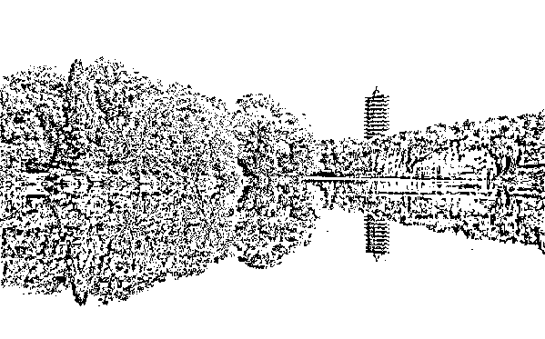

**| **北大校园**Q8：****你的大学同学们都在从事什么职业？他们知道你在做占星师么？他们怎样看待你的职业？****** 张星：** **有些同学会在汉语言学里深造，成为老师，有些会做编辑，有个同学还写了几本关于中国神话原型的书。北大的同学之间都是比较各自独立的，君子之交那种，也对他人职业选择抱持尊重。**现在有的同学偶尔会好奇，以非咨询的方式与我闲聊，从占星学中了解一下自己。****Cora：** 同系同学大部分还是在从事影视、传媒相关的职业。传媒大学的学生本身对大众传播更加敏感，我想可能面对占星时的第一反应，还是更多把它当做一种流行文化来看吧，这是我的感觉，也不是很确定。同学们知道我是占星师。跟他们沟通中我感到不同人对我的工作的理解，是很不一样的，但他们基本都是好奇的，会有兴趣想要了解。**曾经有一些影视行业的同学或朋友，知道我做占星后，提出过想要合作做一些东西。我自己早年也有过这个想法。**但影视创作和占星本质上还是很不一样的东西，服务的目的也不同，我一直没有找到一个很好的结合点，所以影视相关的合作一直没有实现。

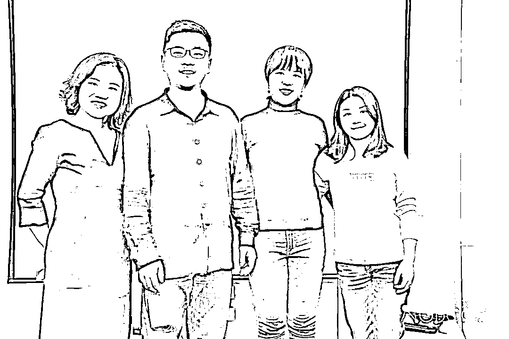

**|** 2019 北京 ISAR 会圆桌会议合影（左起：咔咔、查理、Cora、逸月）
** 查理：** 我的大学同学毕业后有三分一出国深造，三分之一国内深造，还有三分之一像我就直接工作了。有些同学读到硕士以上会进入物理研究所，也有些会进入需要物理学的行业，比如太阳能和半导体行业。**现在还在保持联系的同学不多，但他们都会觉得我研究的东西很有意思。**在大学里本来人缘也还行，所以现在也会有人时不时来问我“现在是什么天象”。也有同学来找我做过咨询。我有一个同学在东华大学物理系做教授，有一次就请了我去给物理系的教授们做占星讲座，我就用了物理的一些原理，来跟他们解释怎样理解占星这个东西。我清楚的记得分享的当天是太阳在射手座，月亮刚进入天蝎座合相金星。**当时有几个老教授听完以后觉得挺有意思，说等自己退休了也要来研究占星这个东西。**有一位太阳射手座的老师现在还经常跟我在朋友圈有互动。

**“占星学让我永远不会孤独”**

占星做得越久，好处越多

**Q9：****作为全职占星师，你现在的生活是怎样的？你对这种生活感受如何？**

**** 张星：** **我现在生活分成三部分，占星咨询、自己的家庭生活、以及学习更多的心理咨询流派技巧。一边生活一边觉察我觉得很重要。其实我现在处于占星职业初期，占星收入还不足以支持我的生活。但有句话叫做：梦想那么美，你不要太匆匆去实现。人生前半段的职业生涯都是比较严峻的，总在解决别人的危机**，从开始学占星学开始，我很想让自己慢下来，很享受这个慢的状态。**

**Cora：** 我的生活就是一个普通的自由职业者的生活。但**做占星师可能相比其他的自由职业，个人的主动权会更多一些。**占星师这个工作，如果在专业上好好耕耘，积累一段时间之后，自然会吸引来一些稳定的客户，或者是有合作的机会找上来。我**觉得占星师是一个做得越久越能体会到它的好处的工作。**目前对生活是满意的。

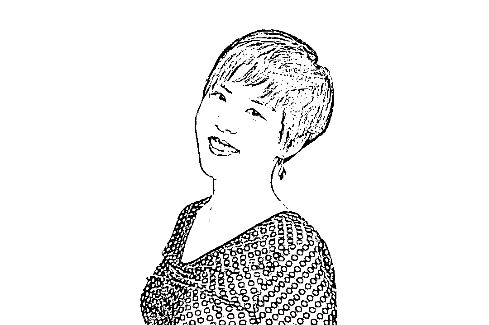

**|**近期的 Cora
** 查理：** 其实我做占星师也分几个阶段。2016 年刚辞职的时候我有点过度乐观，觉得靠占星营生肯定没问题，心情比较浮躁，日常开销没有节制。后来也因此收入非常不稳定，甚至负债抵押了房子，焦虑感十足。到了 2019 年，我觉得自己心终于静下来一些了，占星咨询和研究投入了更多时间，收入也有了稳定的盈余。现在白天会接一个咨询，自己和爱人一起做做饭，闲暇的时间看书、刷抖音或者出门逛一逛。之前没有疫情的时候，还会和咖啡馆合作做每月的占星线下沙龙，或是去做一些企业做占星演讲。**我现在对其他职业都不是太感兴趣了，能感觉到自己未来会越来越坚定地在占星道路走下去。****Q10：****占星学至今最吸引你的一点是什么？****** 张星：** **它是帮助意识扩展的特别好的工具，可以帮助我审视自己、审视自己的生活。相比其他工具，**占星学的“快速”是非常吸引我的一点。****Cora：** 我喜欢它给出了一个**更宏大的视角去看待个人命运，这本身就会带来超越，也会带来谦卑。占星学可以帮助我们看到和理解自己的内在世界，进而理解命运，在这个过程中也会更加理解他人。**它是一个会带来洞察的工具，但不是一个直接指向疗愈的工具，虽然看到、了解、理解，常常是疗愈的开始。但**就帮助我们发现自身的模式和议题这个角度来说，占星学是我所知的最好的用于认识自己的工具。**** 查理：** **它能帮助我理解世界。**很多人说我们这个世界像《黑客帝国》，有高维智慧在牵动着我们走，当我越深入学习占星对此就越有体验。最简单的例子，当每次月亮进入摩羯座，打开我的音乐 app 随机播放一些歌，就会出现一些很沧桑的歌，月亮在其他星座的时候是不会现摩羯座气质的歌的。有次我去电影院看《哪吒》，那天的天像是金牛座天王星正在四分相狮子座太阳，当哪吒说出“我命由我不由天”的时候，我真是热泪盈眶。不是因为剧情感动，而是因为我会感受到宇宙在通过这部电影，来告诉我这个天象的意义。

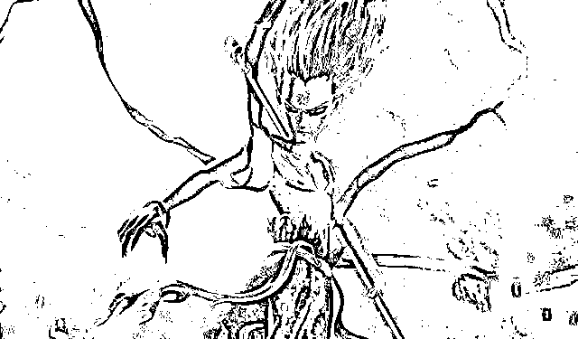

**|** 《哪吒》剧照还有更加实际的用处，就是占星学可以指导我的生活啊。比如我以前从来不自己做饭的，去年搬家时选择了月亮金牛座的时候，希望搬家后自己能做饭。现在我经常是每天做三顿饭，几乎已经成为朋友圈大厨了。然后我还会选择月亮天蝎座的时候来除蟑螂，月亮处女座的时候请阿姨来深度清洁，月亮双子座的时候讲课，月亮天秤座的时候去参加个社交聚会，月亮白羊座时去看比赛，月亮双鱼座时我还煎了条黄花鱼，味道不要太好啊。还有水逆时，我会去回访我的客户，能得到慢慢的反馈。**利用天象来生活实在太丰富了！**

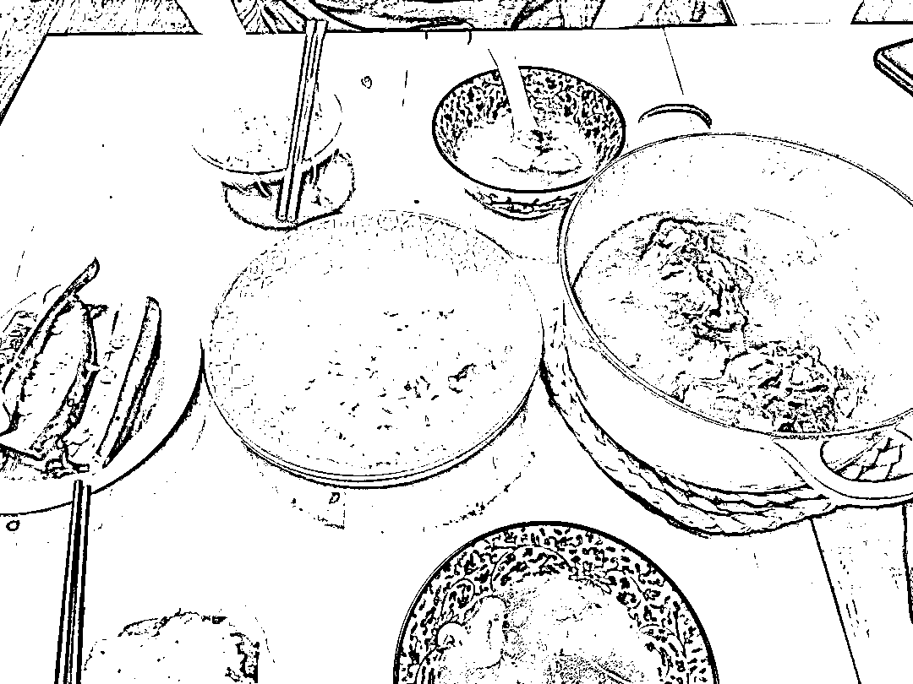

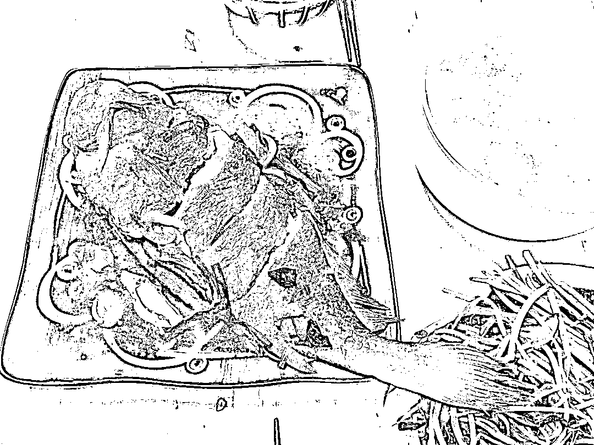

**|** 查理在月亮金牛座时做的饭，以及月亮双鱼座时煎的黄花鱼若道这次来采访我的时候，也是某种宇宙礼物。我观察到这场访谈发生时的天象，恰逢逆行的水星开始对分我的太阳。仿佛老天给了我一支麦克风，“来，谈谈你自己吧”。已故占星大师**诺·泰尔说：“占星学就像你面前有一盘国际象棋，而你的对面空无一人，当你走了一步后会发现，你对面的棋子也开始移动了。”**而且星体的位置上万年都不会重复，这意味着你每一天也都不会重复，像一个永远有新剧情、新关卡的游戏。我觉得这游戏真是太精彩了，也不知道是谁设计的。**占星学对我来说已经不是职业了，这像一个可以随时随地玩的游戏，让你永远不会孤独。**

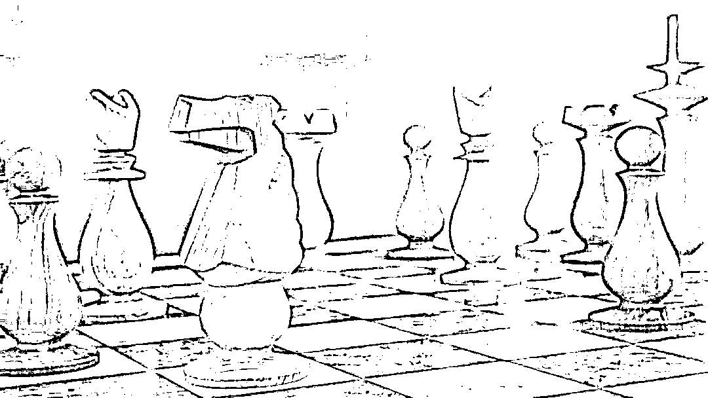

以上是来自名校的**若道毕业生**的故事想成为和他们一样优秀的占星师成为把**过往经历和占星学****1+1＞2**若道君隆重向你推荐**本期主角们**的**启蒙老师****大卫·瑞雷**联合主讲的**2020****若道春季占星入门课**最懂中国学生的大卫和熊鹰老师将最深入浅出向零基础的你讲述**12 个****星座、****12 个****性格、****12 种****人生****10 大行星****和 12 个****黄道宫位****相位模式****和****月亮交点****让你从爱好者一步飞升专业占星师的行列 **

**点击图片 **

**你也可成为会真实的自己**

**👇**

**若道毕业生故事 往期回顾**
[咔咔：占星师宅家看疫情](http://mp.weixin.qq.com/s?__biz=MzA5NjA0NTAxNg==&mid=2651413283&idx=1&sn=025534063922cbcdb3a0647b9c4522f5&chksm=8b4be994bc3c6082695e65cb8f0497cfa46aeed4dc0785c4c9b8a47ac60b7d6492c2bd4e4072&scene=21#wechat_redirect)[傅莎珈：占星师如何寻找职业优势](http://mp.weixin.qq.com/s?__biz=MzA5NjA0NTAxNg==&mid=2651413729&idx=1&sn=a080d49fa4bf0187e5a8c08cc88d9286&chksm=8b4bee56bc3c6740093123281df3bd439119f39c6bb90f457741b5b2897ececb73631953ca3d&scene=21#wechat_redirect)[熊鹰：用中国传统哲思指导占星学应用](http://mp.weixin.qq.com/s?__biz=MzA5NjA0NTAxNg==&mid=2651413917&idx=1&sn=9ce65f0047fdd511b1a3b297f4bcdef8&chksm=8b4bef2abc3c663c32dead59df45f220195c53be5789aa39200bf70983068fcd1ea3ba39d124&scene=21#wechat_redirect)

**版权声明：**本文由若道翻译发布，欢迎转发，反对抄袭。友号转载请申请白名单。


**微信又双叒叕改版啦，不想错过若道君的推送？**

**就把若道设为星标吧！**

**▼**


就是这个“在看”，戳戳戳 ☟

********报名直达入口********

# 再见，乌雷 | 漫长到心碎的爱情故事里，总能看到这三个星座

> 原文：[`mp.weixin.qq.com/s?__biz=MzA5NjA0NTAxNg==&mid=2651414053&idx=1&sn=b9e6e1af94737397e0e4b1eff4c7f1c7&chksm=8b4bec92bc3c65846744306bc6840ea83325d9c33d7af74c0136fd3d3be6700f4c50e2564950&scene=126&sessionid=1692738202#rd`](http://mp.weixin.qq.com/s?__biz=MzA5NjA0NTAxNg==&mid=2651414053&idx=1&sn=b9e6e1af94737397e0e4b1eff4c7f1c7&chksm=8b4bec92bc3c65846744306bc6840ea83325d9c33d7af74c0136fd3d3be6700f4c50e2564950&scene=126&sessionid=1692738202#rd)

****后台回复“今日”，给你一句生命态度****

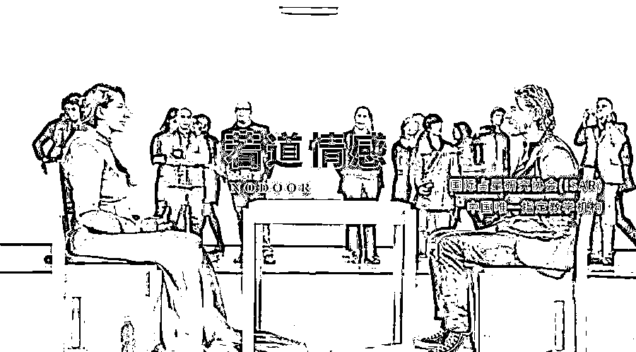

作者/编辑/玫瑰 图片/网络

**当地时间 3 月 2 日，世界著名行为艺术家乌雷（乌维·赖斯潘）于睡梦中去世，享年 76 岁。乌雷曾与被称为“行为艺术之母”的艺术家玛丽娜·阿布拉莫维奇以情侣的身份共同生活并创作了大量极具深度与强度的艺术作品。这是一场漫长到心碎的，关于天蝎座、水瓶座和摩羯座的爱情。**

**再见，乌雷**2010 年，塞尔维亚艺术家阿布拉莫维奇（下文简称阿布）举行了一场行为艺术展览——《凝视》。她端坐在木质方桌的一端，同自愿坐到对面的观众对视。那些天，她接受了 1500 多名观众的挑战，其中不乏明星——LadyGaga、莎朗·思通……无论对面是谁，她就这样坐着不动。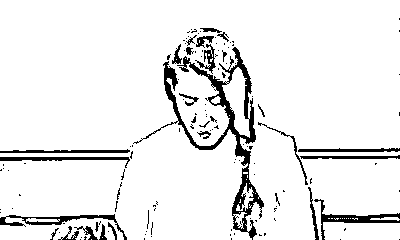
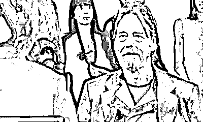▲ 《凝视》中的阿布与乌雷

直到乌雷坐在她对面。他们对视，哭泣。良久，阿布弯下身体，将手摊向桌前。乌雷亦如此，二人双手紧握。几十秒后，乌雷起身离开。

此时，距离他们分手，已是 22 年。

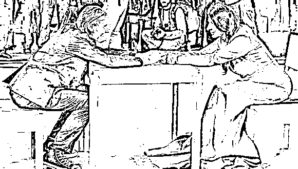

 ▲ 尽管已分手 20 余载，阿布再次轰动世界的作品依旧是同她从前的恋人、合作者乌雷共同完成的

这次相遇被做成视频、图片，流传在网络上，人们为它配上拜伦的《春逝》：**“若我会见到你，****事隔经年，****我将以何贺你，****以眼泪，****以沉默。”**

之后，又是漫长的分离。久到人们几乎忘记了他们曾经那么相爱过之后，这一次，乌雷是真的离开了。

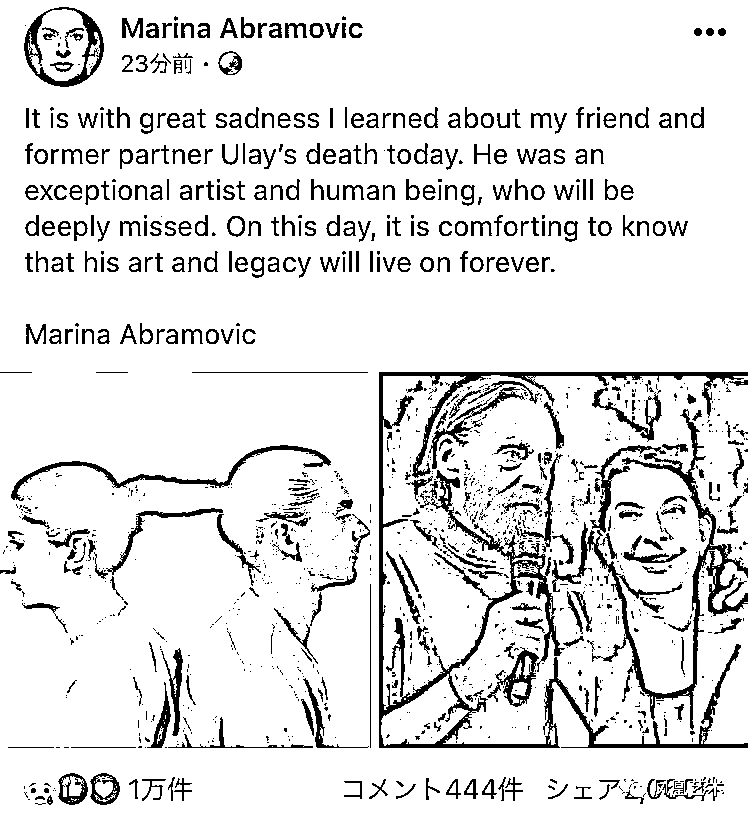 ▲ 阿布在社交媒体主页怀念逝去的乌雷**11 月 30 日是她的生日，也是他的**

1975 年 11 月 30 日，乌雷受人之托去机场接阿布。如电流击中生命，风华正茂的一对人儿见到对方，天上的星星都要亮起来了。

“你生日是什么时候？”乌雷问。阿布告诉他是 11 月 30 日。“那不可能是你的生日吧。”乌雷说，“那是我的生日。”乌雷找出自己的日记给阿布看，他把 11 月 30 日那页撕掉了。阿布给乌雷看自己的日记，11 月 30 日也被撕掉了。当天晚上，阿布就跟乌雷回了家，两人在床上待了整整十天。对这样的相遇，乌雷说：“我们很快就对彼此着迷……就像找到了失散已久的兄妹。”阿布则说：“我回到自己家后就得了严重的相思病，我不想说话也不想动。”

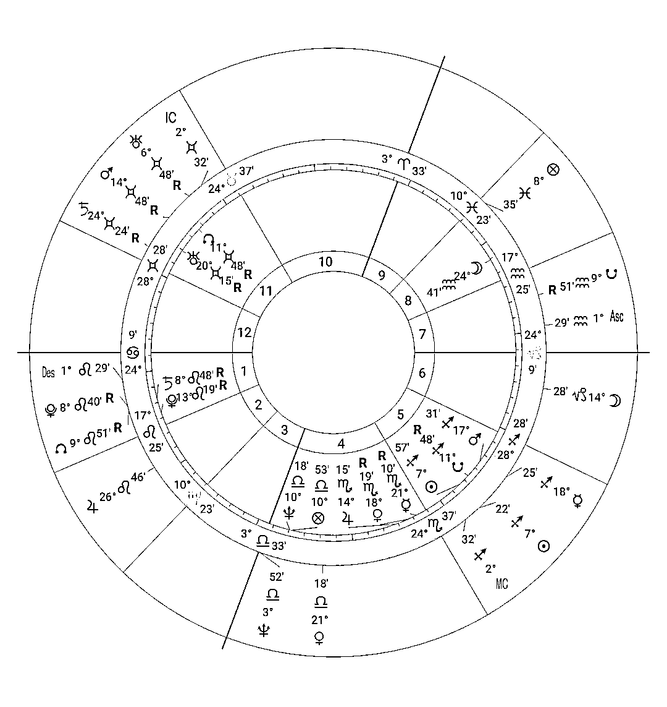

▲ 阿布同乌雷的比较图。（内圈为阿布出生星图，信息来自若道 app 名人星图；外圈为乌雷出生星图，信息来自网络，出生时间取当地时间中午 12 点）其时，**行进海王星正精准合相阿布位于五宫（代表着恋爱、创造力）的南交点**。比较图中，乌雷落在射手座的太阳同阿布的太阳、南交点合相，阿布的月亮同乌雷的南交点同样落在水瓶座。光是**太阳、月亮同对方南交点合相**，便足见**“似乎在那里见过”**的**熟悉感和宿命感**有多强烈。更遑论月亮、金星、太阳的和谐相位，以及“天雷勾地火”的火星对分。月亮水瓶座遇上南交点水瓶座。高山流水，知音难觅。心弦（月亮）在这要命的宿命感（南交点）里一击即中，静置（水瓶座）已久的危险之地（八宫），被引线瞬间点燃到绽放出致命的火花（天蝎座四宫），从此，他们开始了 12 年的相恋和合作。

阿布出生于富裕的家庭。在艺术圈小有名气的他，早期作品独特极端。然而无论白天如何疯狂，她仍旧要在母亲立下的宵禁时间：10 点前乖乖回家。

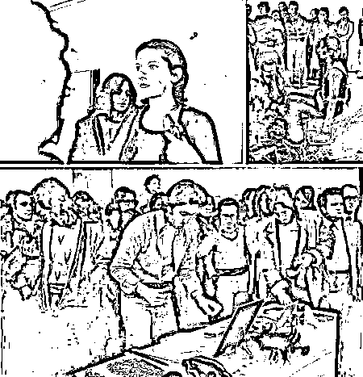

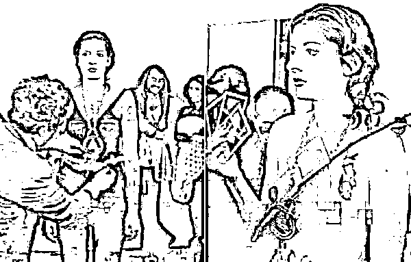


▲ 阿布，《节奏 0》，1974

在作品《节奏 0》中，阿布在桌子上摆放了 72 件物品，将自己麻醉，保持头脑清醒，并签下免除参与者所有法律责任的文书。观众可以选择任何物件对她做任何处置。他们用羽毛抚摸她，在她身上撒药水，脱掉他的衣服，直到有人拿起一把装着子弹的枪打算对准她……阿布流着眼泪，清醒看着别人对她身体的各种**羞辱、虐待**。似乎只有这样，才能重复体验自充满控制的家庭中所承受的，**金星天蝎座四宫四分冥王星狮子座一宫**的极致之痛。对此，她“**无动于衷”**——**在八宫的邪恶之地，那颗月亮在尽最大努力维持着抽离。**她探索人性能丑恶到何种程度，对于这种丑恶又能冷静到何种程度。她说：**“一旦你毫无保留地把决定权交给公众，离丧命也就不远了。”**她像一朵又奔放又怪异的花，试图用各种残破的凋零来将自己带到艺术的最深处，也带到生命体验或高或低的最巅峰。她已婚，却仍住在父母家中；29 岁尚要遵循母亲订下的规矩；像个在高压中尚未长大的孩子，用各种方式试图自由呼吸，却最终无法逃离。直到遇见乌雷。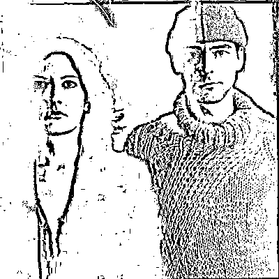


▲ 相爱时的阿布和乌雷土星回归那年，阿布终于在遇到乌雷几个月后逃离了自己的家，住进了乌雷的货车，开始了属于两个太阳射手座的冒险。**月亮摩羯座为爱人做的最好的事**

**乌雷的月亮落在摩羯座**，人们只知道他**“甘愿过着苦行僧式的生活，常年的居所只是一张 1.5 米的床垫。”**关于他的介绍寥寥，却都同阿布有关。似乎只有在同阿布捆绑在一起时，他才是个引人注目的所在。

月亮摩羯座、南交点水瓶座的人，大约会将所有投注于工作和作品中，不屑于名利和光环吧。可他到底逃不过爱情。遇见阿布前，乌雷用镜头（北交点狮子座）深入变性人、异装癖和流浪汉等边缘群体（南交点水瓶座）。阿布**的月亮、金星同冥王星能量的浸染，使得她无比渴望同对方灵魂和肉体、金钱和志趣的合一**。于是，乌雷跟随阿布走上了行为艺术之路。然而，**阿布的土星、冥王星落在狮子座，合相了乌雷的北交点，而乌雷星图中的冥王星也合相他的北交点**。可想而知，在同阿布共同完成演出（北交点狮子座）这件事上，乌雷需要翻越多少**土星和冥王星**的阻碍。第一次合作便是一份融合了**狮子座扶弱济困，水瓶座众生平等，以及穿越土星规则，挑战冥王星禁忌**的极致之作——乌雷从柏林的画廊偷走一副作品，在警察的追击下，将画放在一个贫穷的土耳其家庭中，后被抓并接受惩罚。这场轰烈到壮烈的去往北交点的征途，更是为了他爱的人——阿布自身土星、冥王星议题的完成。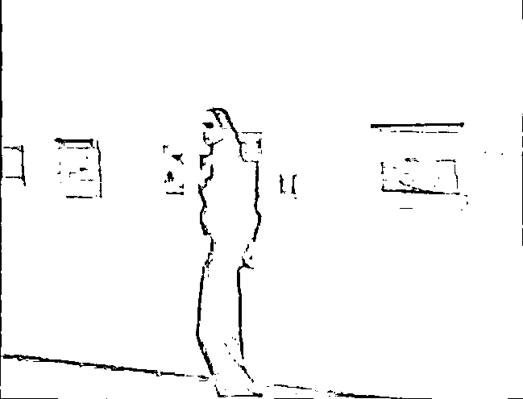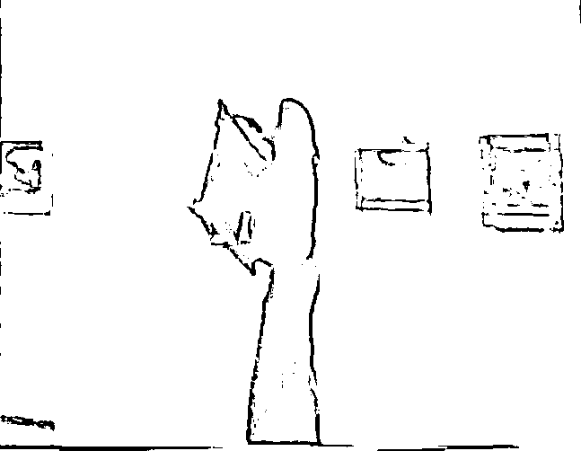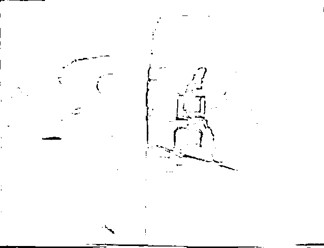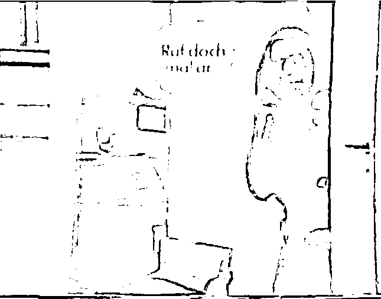

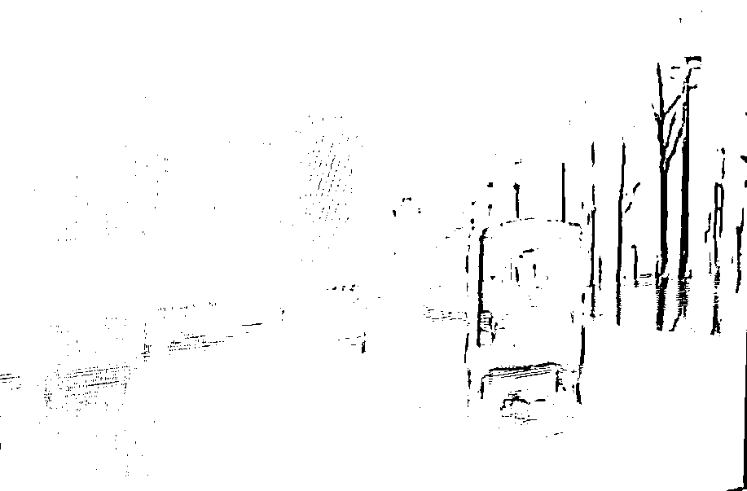

▲ 乌雷（Ulay），《挑衅，对艺术作品的非法接触》（Irritation. There is a Criminal Touch to Art），1976**月亮水瓶座，金星天蝎座，在爱里寻找痛**

月亮摩羯座**吝于言语**，**对爱人所能忍受和付出的，却出乎意料地多**。尽管这需要非常**精微而细致的观察**才能体会。从乌雷放弃自己的方向，跟随阿布的脚步开始，这份爱便生了根。然而，对于这样默然的爱，阿布似乎并未满足。

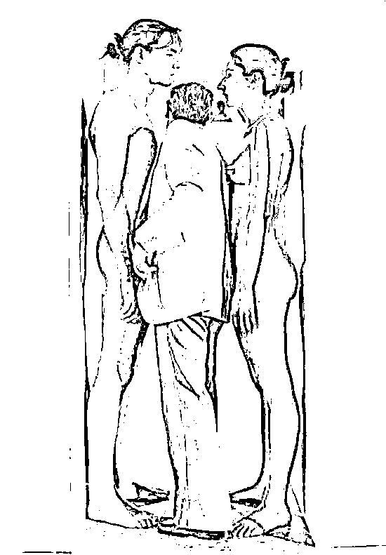

▲ 《无量之物》（Imponderabilia），1977

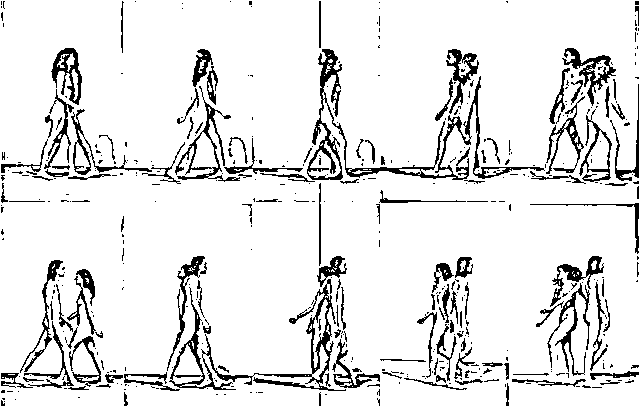

▲《空间中关系》 (Relation in Space)，1977

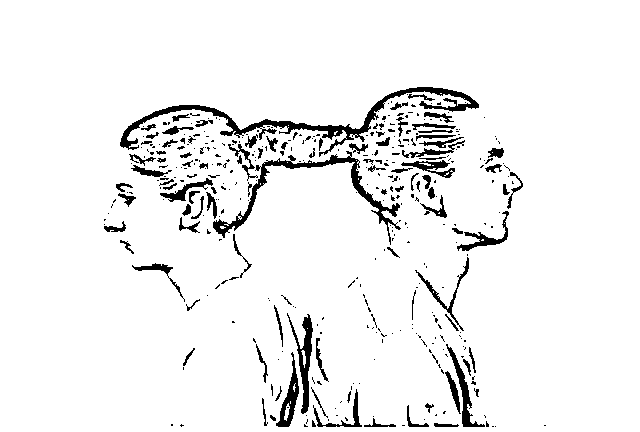

▲《时间中的关系》时长：17 小时，1977；

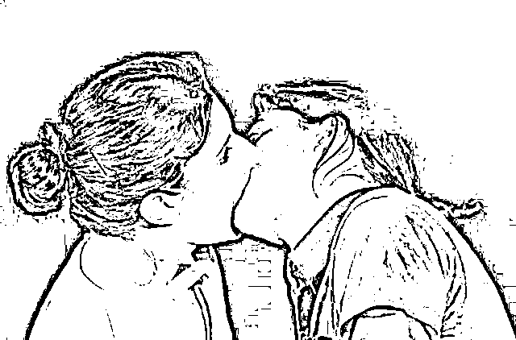

▲ 《呼气吸气》，1978

《无量之物》，二人赤身裸体站在窄小门廊两边，彼此凝视，参观者要从他们中间穿过；《空间中关系》，二人依旧赤身裸体，从彼此身边碰撞、走过，似乎素不相识却又充满激烈；《时间中的关系》，他们背对将头发绑在一起，静静坐了 17 个小时；《呼气吸气》，他们嘴对嘴呼吸着对方空中的空气，直到 17 分钟后，因为缺氧双双倒下。这些作品中，充斥着**冥王星（天蝎座）的生死、对抗、侵占、交融**，又有着**土星（水瓶座、摩羯座）在紧密融合中的抽离、空间、沉默、无视**。我们可以推测，更多的创意来自于阿布。这个被冥王星黑色笼罩的女人，将投射给大众的“控制”聚焦于她热烈爱着的乌雷。**“当你把阿喀琉斯之踵交给你的伴侣时，你也给了他伤害自己的权利。”**然而这还不够极致，于是，这一次，阿布手持一张弓，乌雷手中拉着箭，箭头指向阿布的心脏……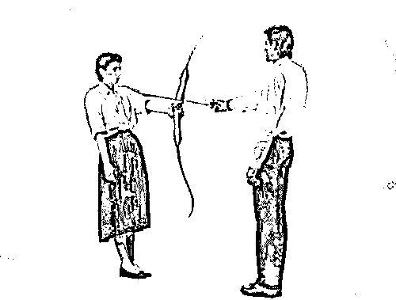▲《潜能》（Rest-Energy），时长：4 分钟，1980 阿布说：**“我处于被动状态……虽然这只持续了 4 分 10 秒，但对我来说却像永恒。这是一场完全关乎信任的表演。”**现在看，这更像是关乎如何在**将生命交付爱人（金星天蝎座），面对地狱（八宫）之时仍旧保持冷静（水瓶座）**的表演。**月亮水瓶座对于情感、情绪的体会，有着天生的抽离和淡漠，源自小时曾受过的重大创伤，使得机体采用抽离的方式自我保护。**而**金星天蝎座看似追求极致的情感，却始终需要不断通过爱的创伤和疼痛来体会那份存在**。阿布的月亮和金星的不调和，使得她在**不断钻探信任的最尖端时，仍旧在利箭指向自己时拼力保持那份超然和冷感**。**信任的确能够令相爱的人将背交给对方，但那是在体验过对彼此的不信任之后升华了的事情**。那场表演中，他们还没越过那道沟壑。阿布计算的只有**坚持的时间**，哪怕彼此的心脏都在剧烈跳动，除了跳动本身，似乎并未激起什么波澜。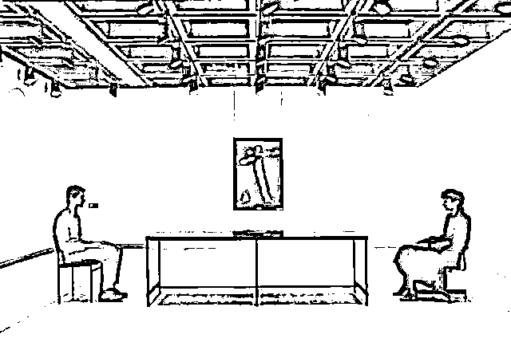 ▲《海上夜航》，1981 他们开始了下一场断断续续长达 90 天的表演——《海上夜航》，在表演期间斋戒，每天静坐、凝视彼此 8 个小时。
他们称这是对**专注力和意念**的考验——这场表演总共持续了 8 年。我们得以看到**两个古典占星学中土星守护的月亮星座在同内心最深处情感碰撞的时候有多艰难**。**凝视，是世界上最能开启人心的事。**尝试同爱的人凝视，或许用不了 10 秒钟，便会抱在一起大哭或者滚到床上。然而，他们又把这变成了一场马拉松式的土星持久战。在首次表演的第 11 天，乌雷因为难以忍受的疼痛离开了座位，阿布却依旧在凝视着乌雷坐过的位置。90 多天的表演里，乌雷多次中断了表演，阿布却从未迁就过他。**“他找不到内心的平静了。”**阿布说。那时的阿布，或许还不懂得她这颗水瓶座八宫的月亮有多幽暗，多冷然；天蝎座四宫的金星又有多逼仄，多侵犯。**当爱从肉体的放纵和灵魂的狂欢走向内心最深处的伤痕，能够抚慰彼此的，只有依恋和触动，却不是冷静地将形式做满多少时间。**也许阿布认为不能坚持，是不爱的表现，可是这样的坚持，只能让对面的人越来越寒冷起来。裂隙从那时起越来越大。阿布为了这份爱情不是不努力的——她逃离了家庭，同他一起蜷缩在 1.5 米的床垫上，在乌雷查出患有腰椎间盘突出时照顾他。可是，这份爱，无论怎样折腾，似乎都无法令她感觉到**“疼痛”**。**属于土星漫长的相爱与分开**

穿越无意识重复的人生卡点，阿布需要**背叛来触痛金星天蝎座，疏远来刺激月亮水瓶座**——乌雷开始当着阿布的面同别的女人调情，在阿布为他端汤倒水的时候，极为挑剔，在阿布对他表示同情的时候疏远、拒绝她。

阿布也开始出轨，并向乌雷炫耀自己的性生活。**出轨、背叛、性、嫉妒**，都是金-冥、天蝎座转化的必经之路。可尽管被嫉妒折磨得要疯掉，阿布仍试图用**水瓶座抽离旁观**的方式处理情绪。她提出“三人行”——**她想看到她的样子，也许这样便能理性地接受**。于是，他们在她面前做爱，仿佛她不存在。

第二天早上，阿布离开了。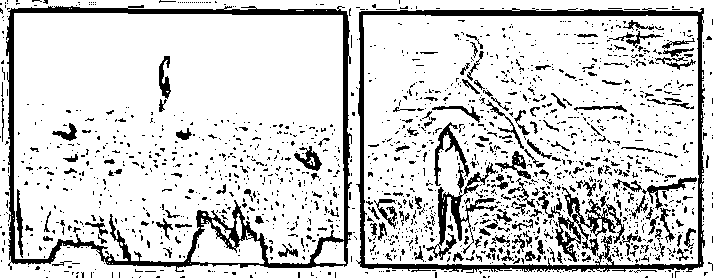

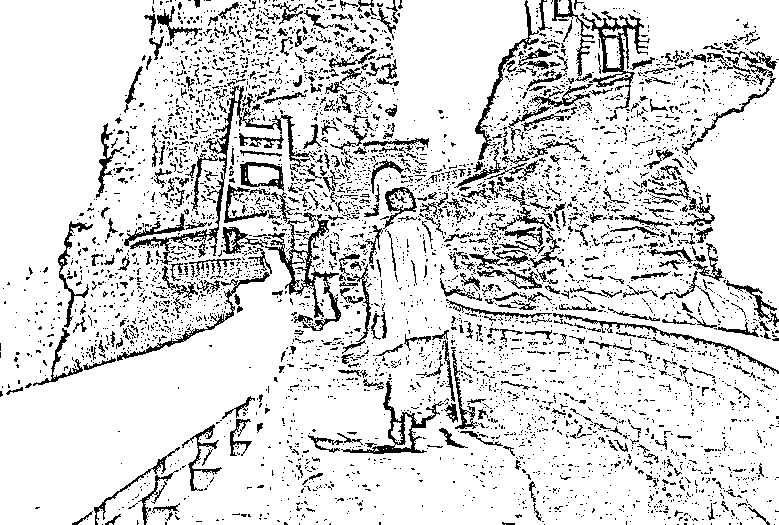

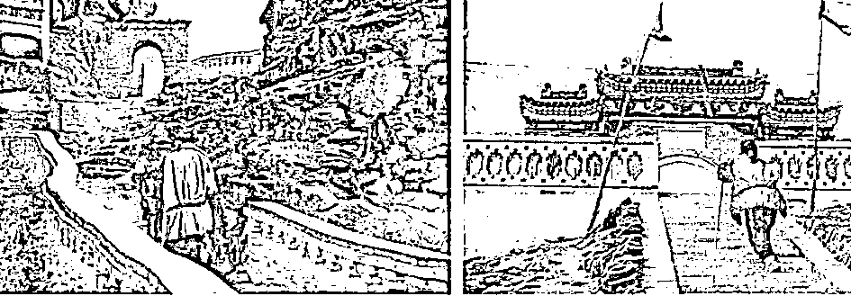

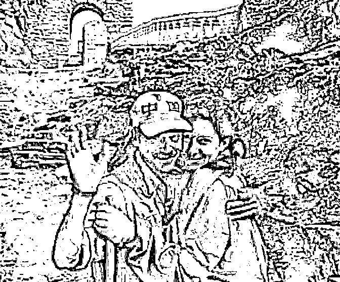

▲ 《长城》长城（The Great Wall Walk），双频道影像，彩色）（Two-channel video，color）1988 / 2010

阿布和乌雷的最后一件作品是《情人-长城》。许是还爱着，又或不甘心，他们约定从长城的两端走向彼此，见面后就结婚。为了这场约定，他们准备了八年，而最终，他们在那儿拥抱，然后告别——乌雷在朝着阿布走去的路上同翻译相恋，翻译怀孕了。乌雷认输了。**他没有动力坚持，也没有能力处理阿布内在的冲突，阿布要的不是一个伴侣，而是一个帮她激发和处理内在伤痛的工具**；阿布还是个女孩——**她尚未逃离自己母亲的阴影，也就更谈不上成长为一个真正独立和强大的女人。**而这，似乎才是乌雷这颗摩羯座的月亮历尽艰辛之后需要的。**看不到未来的月亮摩羯座会以极度现实的方式放弃一段爱情**。对此，阿布说：**“如果你是一个女人，你几乎不可能去建立一段感情。女人总是得扮演一个脆弱又依赖的角色，如果你不这样，人们会对你神魂颠倒，但那只是短暂的。然后，他们总想改变你，摧毁你，然后离去。”**她还没明白，求仁得仁，这份摧毁，恰是她的必经之路。**离开后，她活成了他的样子**乌雷重新拿起了相机，回归到家庭生活。阿布却坍塌了。觉得自己又胖又丑，没钱，没事业，没人爱她。她开始迷恋瘦身、化妆、煮饭和装修房子，迷恋她月亮水瓶曾经不屑的**世俗生活**——月亮摩羯座的乌雷最终渴望的女人该有的，正常有序、流于世俗的生活。这一次，她终于掉进了冥府，从地缝里向外看的时候，感到了真切的仇恨和疼痛。她坐在窗口，看着乌雷和怀孕的新婚妻子从街边走过，恨之入骨。她离开了乌雷的城市，与画廊解约，切断所有同乌雷的联络。在很长时间里变换不同的情人。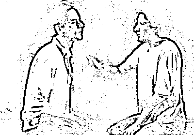

▲ 阿布记得他们情感的转折点，是她在乌雷母亲的葬礼当晚拒绝了生孩子的提议。她曾堕胎三次，并曾说：“生孩子只会影响我的道路。”多年后，回忆起与乌雷分开的情景时，她说：“如果我还年轻，我们应该有个孩子。”

她自由了，却再也无法去爱。心里有个东西碎了，却只能装作若无其事。分开两年后，德国电视台设计让她和乌雷在阿姆斯特丹的火车站外见面，她径直从他身边走过——这一幕，像极了他们共同合作过的作品。还能和他说什么呢？一切都完蛋了。他们曾经赤裸相呈，而今的她，无论多么想要撑起华丽的若无其事，仍旧在擦身而过的时候，被他看得赤身裸体，一览无余，提醒着她那份羞辱和荡然无存的尊严——他不要她了，可这不正是她拼尽全力去找寻的么？这一次，她终于知道什么是痛了。爱像一根刺，总在不经意的日脚漫长中疼上一疼。他在她心里，埋了一滴泪，直到生命延宕，最终泪流成河。她痛恨的乌雷的那部分，最终在她身上长出了另一个乌雷。
**天蝎座的恨与水瓶座的爱**他们互不联系，阿布却总在自己的生日时想起乌雷。乌雷也总是接受邀请，出现在阿布的生日宴上，重新演绎过去的作品。之后，是更深的决裂，以及下一个生日宴会上的握手言和。**没有了阿布的乌雷，回归到了南交水瓶座**。他评价阿布：“我真的很受伤，那简直太不公平了（金星天秤座），她走了另一个方向，她成了一个明星（北交点狮子座），那离我的初衷与渴望都太远了（南交点）……”2015 年，乌雷起诉阿布，说她违反了关于共有作品收入分配的合同。**在肉体的背叛和分离之后，他们最终又因为共同财产而走向了诉讼**。乌雷胜诉，阿布沉默——她没法说什么，这是她月亮八宫的议题，她已经失去乌雷了，能够和他继续纠缠的，只有钱。她恨他冷酷和绝情，因为她还爱他。他说：**“癌症的折磨是在危及我的生命，而与阿布的无止境的法律诉讼是真正威胁我的存在。”**也因为他还爱她。**爱情呀，就是夹杂着恨，有多恨，就有多么忘不掉**。还有什么比在法庭上争吵更像冥王星的爱情该做的事呢？如果不能在你的生命中彼此陪伴的人，那就做彼此摧毁的人吧。在两个水瓶座特质浓重的人之间，爱情似乎能发生在毫无联络的量子纠缠中，尽管世俗眼中，他们都各自组建家庭，又分开，那份牵绊却似乎从未停止……阿布看起来依旧强势。她走红，他落魄，他的书中，关于他们共同作品的部分都是粉色留白——她不允许他使用那些资料。《玛丽娜·阿布拉莫维奇转》的作者韦斯科特写道：

**在阿布 60 岁的生日宴上，他（韦斯科特）遇到喝醉的乌雷。**

** “我曾是阿布的助手”。**

**“我以前也是。”乌雷说。**

想来，乌雷觉得自己是无足轻重的人吧。但他不明白，那场**为了名誉了而战**的诉讼，是他**冥王星合相的北交点必经之路**。即使分开，她依旧在用决绝到极端（土星、冥王星）的方式引领着他朝向北交点。一如他们合作的第一个作品。他还是被她指引，而她从未停止在爱他与恨他之间摆荡。**人生若只如初见**在《凝视》开展前，乌雷就收到了邀请，他去了阿布的工作室。
“乌雷，我们换一下，我终于载你一次了。”阿布开车时说。她为乌雷做了一顿饭，而在他们分手之前，她甚至不知道该去哪里办一张信用卡。棱角都磨平了，却再回不到最初。一席红裙的阿布，坐在桌子的一端凝望着 1500 多位观众，任对方哭、笑，甚至脱掉裙子……她始终安静不动。直到乌雷出现。她的嘴唇翕动了一下，他深呼吸，摇头，再点头：“是的，是我。我在这。”

📹 [`v.qq.com/iframe/preview.html?width=500&height=375&auto=0&vid=z01376dfjcc`](https://v.qq.com/iframe/preview.html?width=500&height=375&auto=0&vid=z01376dfjcc)

▲ 阿布与乌雷在《凝视》中的重逢如同 29 年前那场《海上夜行》，对面坐着同样的人，同样的姿态，同样的凝视。不同的是，这一次，他们都流泪了。29 年前那个无视对方疼痛绝不妥协的女人不见了，她身体前倾，将手伸向乌雷的方向，她要他的双手。她不再是那个高傲而倔强的女人，她只是个浑身伤痕，渴望接纳的孩子。乌雷将手伸出，握住了她的。多好啊，他还在。▲ 人生若只如初见 5 年后，乌雷将阿布告上了法庭，除了共同财产、版权的纷争，一个重要的原因直指《凝视》效仿了《海上夜行》的艺术形式。看似一样的，已经不一样了。**没有他在的这些年，她独自一人走过了多少和解的路，最终走向了臣服、坦白，和朝面前这个男人带给她的伤害低下头颅**。那凝视过 1500 多人的眼神，不复三十多年前的任人宰割，而有了**沉静悲悯，触动人心**的力量。可这眼中的泪水，最终还是只会为乌雷一人流。她爱他，最后，他还是不懂。或许，是他不能懂。毕竟，再爱也没有未来了。而人生，总是要向现实和柴米油盐低头的。

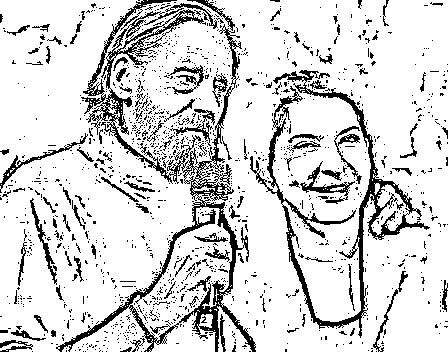

▲ 2017 年，阿布和乌雷又重归于好。阿布说，她已经放下了“一切的愤怒和所有的仇恨”。乌雷则说，“每个讨厌的、不满意的东西都被舍弃了”。天蝎座的爱，带着**排他的恨**——若不是唯一，宁可丢弃；水瓶座的爱，充满着**不屑一顾的疏离**——我不在乎，我能有多在乎？摩羯座的爱，全是**无法言说的憋闷**——我不讲，你也该懂。你若不懂，便不是那个对的人。这三个星座，简直包揽了虐心之爱的前三甲。若不是两颗射手座的太阳，阿布和乌雷怕是这一生都恩断义绝，永无宁日。感恩射手座，将天蝎座从泥沼中托起，送到摩羯座的彼此成就，升华到水瓶座对于艺术、成长、人类文明的大爱，成就了这对相爱相杀的艺术家，也为世人留下一段回味无穷的爱情故事。尚能握手言欢的阿布和乌雷，在漫长的岁月中，始终以特别的形式拥有着彼此。可有些分开的人，尽管都还在世界的某个角落，却是今生难以再相见一面。最终，我们都要走到黄道第 12 个星座——双鱼座的消失，与更大的爱融为一体。不能了断的遗憾，是否也会带到另外一个时空？浓烈的爱和刻骨的恨，无法倾诉的思念和没有回应的牵挂，是否也能盼到静坐一隅，默然相望的机会呢？人生若只如初见。**参考资料**

## 《乌雷去世，行为艺术之母阿布拉莫维奇为谁流泪..……》 凤凰艺术公众号

《他们相爱时热烈而赤裸，背叛时卑微又嫉妒……现在，都没那么重要了》 WeLens 公众号 

《凝视 再见乌雷，再见爱情》

《玛丽娜·阿布拉莫维奇传》

**版权声明：**原创文章由作者授权首发于若道平台，欢迎转发，反对抄袭。友号转载请申请白名单。

****

****想阅读更多作者的文章****

****请在后台回复******玫瑰****** 即可****

**玫瑰**

英国 Cass Business School 管理学硕士

若道 2015 届核心课程毕业生，若道微信公众号兼职编辑

占星师，咨询时长超过 600 小时

**个人微信号：**Still_Queen_Astro

**公众号**：一个娘娘 

长按二维码，给作者打赏


**长按下图二维码**

**名人星图一网打尽**

**还能体验更多功能哦**

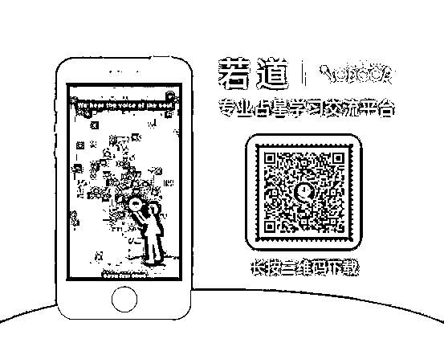

**微信又双叒叕改版啦，不想错过若道君的推送？**

**就把若道设为星标吧！**

**▼**


喜欢记得点一下在看哦☟

********更多好课报名入口********


# 福利 | 雷蒙德·梅里曼年度金融预报讲座，可以免费试看啦！

> 原文：[`mp.weixin.qq.com/s?__biz=MzA5NjA0NTAxNg==&mid=2651414053&idx=2&sn=76742dd7f8b81104e5d76c71859ea812&chksm=8b4bec92bc3c6584e188938e4151ae02a15d5af8d9b2d91352bf6c69074a0de4b476b1c6b798&scene=126&sessionid=1692738202#rd`](http://mp.weixin.qq.com/s?__biz=MzA5NjA0NTAxNg==&mid=2651414053&idx=2&sn=76742dd7f8b81104e5d76c71859ea812&chksm=8b4bec92bc3c6584e188938e4151ae02a15d5af8d9b2d91352bf6c69074a0de4b476b1c6b798&scene=126&sessionid=1692738202#rd)


**帮你打赢“收入保卫战”**2020 年新型冠状病毒的突然袭击在今年第一季度的前两个月，几乎给全中国按下了暂停键，在疫情中，很多公司的经营都受到极大的影响。一些公司已经宣布破产，一些在裁员，一些在降薪，从公司到个人，一场**收入保卫战**在打响。

这时候，你需要更好地运用自己的**货币资产**（特别在不断降息的环境下，货币越来越贬值），明智地进行**投资**来赚取一些额外的收入。如果你已经投资了股票和黄金，可能现在你会有些开心。因为在短短的两个月中，一些公司的股票已经上涨 50%甚至更多。黄金在最近也开始了一轮大涨。

**股市和黄金齐齐大涨，你上了哪辆车？**

**这样的涨幅还会持续吗？**

**在这样的涨幅下，没有上车的还敢不敢上车，已上车的应该如何操作？**

你需要一个睿智而有经验的声音。1976 年以来，梅里曼市场时机学院每年发行一次年度预报沙龙和一本《年度金融预报》（雷蒙德·A·梅里曼撰写），致力于应用金融占星学为投资者们服务，提供卓越洞见，44 年来从未间断。去年，很多若道读者购买了由雷蒙德·A·梅里曼撰写的《年度金融预报》及讲座沙龙，因此赚得盆满钵满。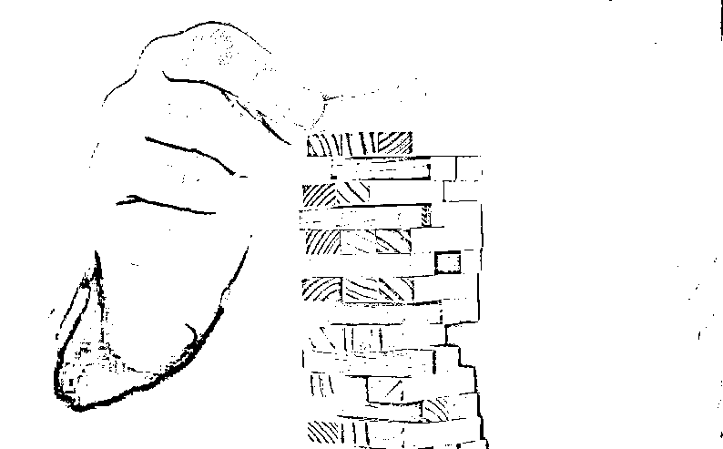**沙龙讲座都说了些什么？**今年，这个长达**三个半小时**的年度预报讲座及篇幅达到**200 页+**之多的金融市场分析报告在次如期而至！

在沙龙讲座中，梅里曼老师讲述了：

*   近两到三年的重要天象，它们在历史上出现的时候对于市场的影响
*   目前我们将经历的经济和金融周期
*   中国股票市场及中国星图、上交所星图的指征
*   贵金属市场
*   比特币市场
*   应对经济危机的投资方法

在报告中，除了以上内容更详细的解读外，还包括：

*   摩羯座星群的解读
*   土星和冥王星对市场的影响
*   木土合相周期对市场的影响
*   天王星在金牛座对市场的影响
*   2020 年美国预报
*   2020 年美国总统大选
*   2020 年美国中期国债和利率
*   2020 年谷物市场
*   2020 年水星、金星、火星逆行期的影响
*   2020 年的有利时期和挑战时期
*   ……

如何应对土冥合相带来的危机？如果准确抓住其中所蕴藏的巨大机遇？相信这份金融报告会给你启示。**沙龙 30 分钟试看来咯**为了让更多人从这个讲座和报告中获益，我们特意免费提供沙龙**讲座前 30 分钟试看（免费放大）**，你可以先试看，然后再决定是否购买整体报告及沙龙。如何安然度过这场危机？如何明智地投资，让自己安然度过这个充满挑战的一年，甚至获得丰厚收益？我们相信 2020 年度金融预报沙龙和报告套餐组合会给你远高于其价格的回报。**报告价格和讲座时间**

**报告和讲座价格**

2020 年金融预报沙龙和报告价格整体售价** 1280 元**

（沙龙和报告不单独出售）

**讲座形式**

**英文讲座，配有中文翻译**

**报告：中文报告**

**长按下图二维码购买**


沙龙讲座提供**30 分钟免费试看**，获取路径参见如下指引：
① 请扫描下图二维码，下载若道 app **②** 登录若道 APP 首页-金融报告-《2020 年金融预报》讲座视频——免费试看，即刻免费试看 30 分钟的讲座视频。


**购买者重要须知**

**①** 梅里曼市场时机学院每年一次的年度预报沙龙和《年度金融预报》是梅里曼市场时机学院的研究“预报”，而不是市场“预测”，是梅里曼老师及其金融占星分析师对人类活动周期历史与行星周期之间相关性的研究，二者在大部分情况下具有 80%或更高的相关性，而不是因果关系。沙龙中和报告中的研究完全存在错误的可能性。即便是非常认真的研究和几十年的研究经验，我们无法总是正确地解读出各种征象在实际层面上会如何相互作用，并显化为事件结果。

所以请将此沙龙和报告看作一个研究参考，务必结合其他市场研究和你个人对市场的理解，根据你的自由意志做决策。**② **此套餐一旦售出，即**不接受退款**。

**③** 此报告只能在购买者的若道手机 APP 端登陆购买者的个人中心阅读（即将推出），不能在个人电脑阅读，不能打印。

**④** 鉴于国内版权保护意识薄弱，报告将加有水印，每个人在自己的个人中心的电子报告中都会看到水印中将会包含购买者本人的姓名和电话信息，此水印不会影响阅读内容，如果购买者不让他人登陆本人客户端个人中心，其他人也不会看到该报告。对此类型水印介意者请不要购买。

**⑤ **讲座提供视频回放，购买报告后请添加客服微信（nodoor201705）免费开通讲座视频。

**长按二维码添加客服**（请备注“金融报告”）

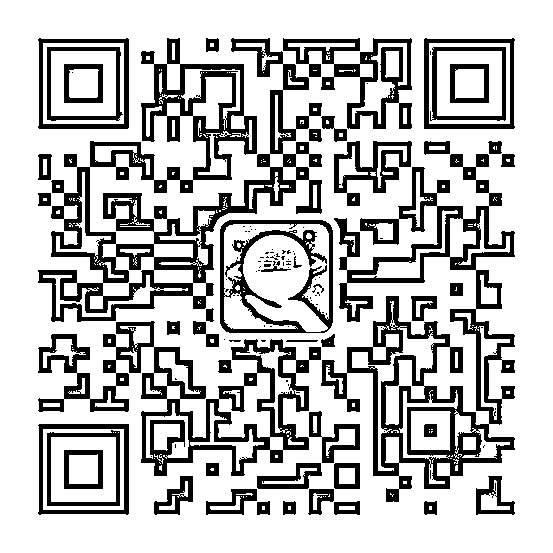

以上须知，请仔细阅读。一旦付款，即视为已了解并接受所有须知内容。

****************若道 APP 下载直达入口****************


# 近期天象指南 | 这 6 个重要行进，带给我们哪些心灵指引？

> 原文：[`mp.weixin.qq.com/s?__biz=MzA5NjA0NTAxNg==&mid=2651414036&idx=1&sn=3b5638134f54148f1000134e07a65e2b&chksm=8b4beca3bc3c65b5b0fd94e911885919b0fd9d18019dd7425ece17c34c7218f43dadc2759143&scene=126&sessionid=1692738202#rd`](http://mp.weixin.qq.com/s?__biz=MzA5NjA0NTAxNg==&mid=2651414036&idx=1&sn=3b5638134f54148f1000134e07a65e2b&chksm=8b4beca3bc3c65b5b0fd94e911885919b0fd9d18019dd7425ece17c34c7218f43dadc2759143&scene=126&sessionid=1692738202#rd)

******☆ ****后台回复“今日”，给你一句生命态度******

作者/斯蒂芬·弗里斯特 译者/胡曦兮校对/陈晓 Leisha  编辑/Tang 封面/书君 图/网络

近期，有一件事非常重要：北京时间 3 月 5 日 11:07 金星进入金牛座——它守护的星座之一。这始终是件大事，因为行星在自己守护的星座能量更强。它对个体的意义，取决于它所落的宫位及形成的相位，当然还有个人自身的业力、性格，以及智慧程度。3 月出现的 6 个重要天象，值得我们特别关注。以下是进化占星学创始人之一的斯蒂芬·弗里斯特老师，带给我们的一些指引参考。

**金星进入金牛座**新学的东西

当我们臣服于纯粹的大自然之美时，可以感受到那**宁静的愉悦感**；当我们欣赏艺术，会有那么一个时刻，超越自我的祥和从内在升起，这非常珍贵；爱你的身体，好好对它；温柔，善良；身体接触带来的神奇**治愈感**和**舒适感**。

不要执着

**不要执着于任何丑陋之物，不管它是一个情绪状态或者实体物件。**举个例子，也许现在你意识到自己感觉不愉快是因为想起客厅里的沙发太破旧，而使家庭世界的质感变得柔软，就是现在悉心善待自我的一种方式。

可以期待什么？

有些人只要一出现，哪怕你们就聊聊天气，都能抚慰你心——**在此期间你有机会和这些亲爱的、令你感觉到熟悉的灵魂一起度过一段宁静的时光**。在那样的关系里，抚触甚至沉默，都有可能比语言更能向你传递疗愈的力量。有时候，你会突然沉浸于美好——这样的机会出现时，试着体会心悦诚服。

失败的样子

死守固定的行为模式，即使其中一些确实是你的职责，也可能会防碍你追求宁静。**让自己喘口气，花点时间善待自己**，这不会导致世界末日。

有关行进

行进更多取决于你星图里哪个宫位被金星触碰，会形成哪些入相和出相的相位。在你回答以上问题时，在这些领域找准时机向外求助。助力很有可能已经在那了，而且一双援手能让压力减半。

**3 月 9 日，行进金星合相天王星。****所有的相位最终都关于能量的整合**。我不会一一解析合相、四分相、梅花相等相位之间的真正区别，只会就两种行星能量会如何进入短暂的合作关系，给出一些**基本的指引**。

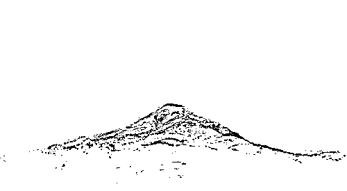

**金星与天王星的相位**最佳的减压方式

**破除自己固执推行的惯例和习惯。**你可能会成为按部就班的受害者。在内心深处，你可能对此感到厌倦。要相信这些感受，你需要改变自己身处的环境、熟识的日常模式，**最重要的还是要改变态度**。生活需要更多的自在感，而自在感需要你去创造，否则它不会自己出现。重要的亲密关系受到这种紧张的压迫感最强。占星师经常用这种相位来预测分手，而我们要反其道而行之，讲讲怎么样避免分手。

好的审美输入

你可能对自己的品味感到厌倦。是时候拓展你的审美领域了，你**需要新鲜的东西——那种能令你的眼耳为之一振的新东西**。如果你喜欢流行音乐，试着听听歌剧。如果你喜欢现代简约画，那就研究一下伦勃朗、委拉斯凯兹，或者德拉克罗瓦……

关于爱和信任，你需要学习

当自我成长的进化苗头出现时，我们的伴侣有权追寻它。无论怎样，都应该为之祝福。这是最为有效维系亲密关系的做法。正如 U2 乐队的歌词所言：“**我们是一体的，但我们不一样**。”**爱和信任应该提升而不会削减我们的自由。**求变，才是完整的活着，伴侣为彼此的鲜活而庆祝——**支持彼此的改变**。

如何识别对你灵魂有所助益的人？

与大多数人不同，他们能听见不一样的鼓点，能跟随不一样的旋律跳舞。从传统角度来看，可能他们起码有一点奇怪。他们会**提出出人意料的观点和对事物不同寻常的理解**，逗得你乐不可支。尽管他们可能看起来“不是你喜欢的类型”，但事实恰恰相反。

**在金星合天王星的那一天，我们还要经历一个太阳合海王星的行进。**

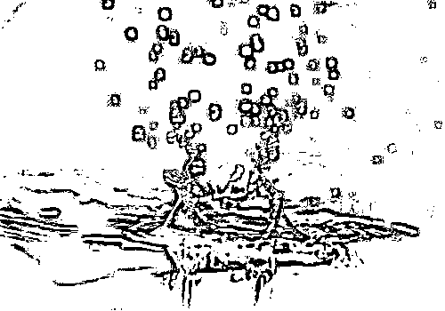

**太阳与海王星的相位**哪些需要被整合

真实存在的神秘灵性，你内在道路的下一步，心灵敏感度的提升，相信自己的直觉，创造性想象力的绽放，下一段人生旅程的愿景升起，**要想接收这个愿景，必须向它臣服**。

失败的代价

**逃避现实**，因为你没能整合已经提升的心灵敏感度。陷入虚幻的妄想之中。忽视那个正在敲门的灵感，精神涣散，置若罔闻。

共时性联结

遇到灵性的教导和老师；奇怪、费解的梦等经历；感觉到能量；你需要阅读的书自己从书橱落到你脚边……

当小我握住人生的方向盘时

**任性的执着于幻象**，空想目标，对自我进化状态的膨胀意识；**被花花世界的名利和权力所诱惑**；事后回想起来常令人难以置信的**愚蠢决定**。

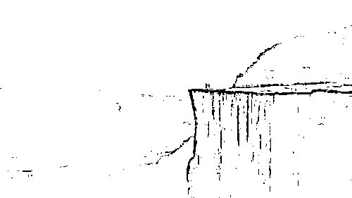

**火星与木星的相位**

**3 月 20 日，火星合相木星。**

是时候捍卫你的权利

**扩展你的领地**，让你的王国富饶；适当的**冒险**，去赌一把；赢得胜利；提升和更新你对成功的定义，随后勇于争取；庆祝自己的激情；索取你应得的回报；期待奇迹，享受胜利。

共时性联结

**机会很多，但需要你做出大胆果断的行动来争取机会**；“胆小鬼永远不会抱得美人归”；冒险；在人生的这个关键点，承认吧，你需要一个全新的胜利，你需要游戏进阶。博一把；奇迹。

警惕

**自我膨胀、不切实际的计划根本没用**；白日做梦，光说不练；不安感的夸大代偿；对他人权利、需求的专横压制；记住，你怎么对待别人，别人也会怎么对待你，他们会等着你。

**火星与冥王星的相位**

**3 月 23 日，火星又合相冥王星。**

是时候捍卫你的权利

**做深层的内在功课**，无论真相多么令你周围的人不适；向自己和他人发难；**勇敢的找出真相**；性和诚实的整合；直视恶魔的眼睛；勇敢地识别出自己创伤的确切本质；然后，在至少部分完成上述步骤的前提下，去对抗外部世界的邪恶、谎言、黑暗的问题，承担自己的使命。

共时性联结

**心理危机既是生命拐点，也能照亮前方**；你已经准备好去面对一些过去无法面对的现实；激烈的人际交往经历，通常与性相关，或者其他狂热性质的互动，会把困难的真相带出水面；遭遇暴力的可能性；遭遇真正的邪恶或黑暗；经历能揭示灵魂真相的悲剧。

警惕

**不经意间残忍地试图“帮助别人看到真相”**，但别人其实还并没准备好；哗众取宠，夸张的闹剧；极端、过激的言词；毫无觉知地发泄自己的创伤，而不去从心理上和内在直接地处理它。

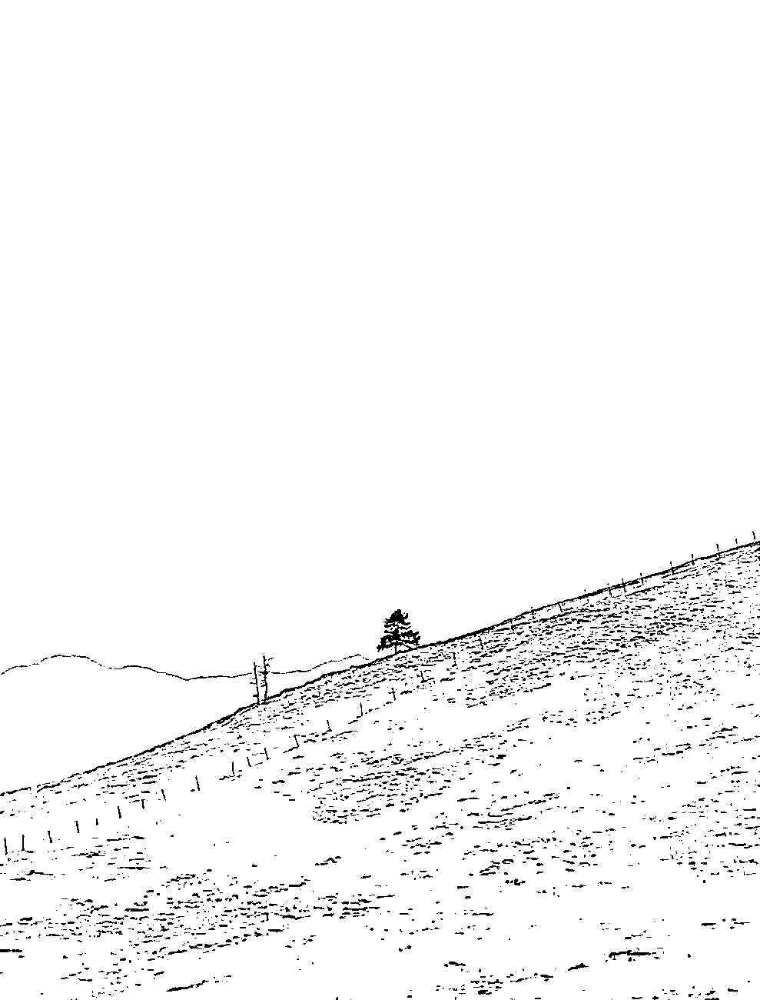

**金星与木星的相位**

**最后，3 月 28 日，金星与木星形成一个三分相。**

最佳的减压方式

做自己的圣诞老人，**给自己一个礼物；为自己花钱**；放下责任感玩一会儿；穿鲜艳的衣服；站在舞台中央，至少在你的朋友们面前如此，给他们讲个笑话；说一个有利自己光辉形象的真实故事，为了效果可以稍加润色。

好的审美输入

**任何在你平时消费水平之上的东西**：买一副漂亮的油画，升级你的音响系统，逛街买自己平时不太买得起而品质上乘的个人用品，给自己买一张很贵但一直想看的演出票，穿得美美地去看演出，对着镜子装扮成任何自己喜欢的样子。

关于爱和信任，你需要学习

**慷慨的心灵对于维持爱和信任而言很珍贵、很重要。**慷慨的心灵，是指一种支持的态度，宽容和彻底的接纳，在别人成功时真诚地为之高兴；你既要给予也要接受这种认可；现在，正是这种互动的时候；一起大笑会建立爱和信任；花点时间笑吧！

如何识别对你灵魂有所助益的人

**他们是大度的慷慨的灵魂**，他们很容易笑，仔细观察你会发现他们还有一丝明星气质，就好像他们在平行宇宙里是电影明星一样。他们甚至比你自己更相信你，他们的出现鼓舞你的精神，他们一进入房间，你就不由自主地微笑。

如果你浪费这个机会，会怎么样？

**在人际关系里越界**，对他人的慷慨（或对你的义务程度）做出无意识的自私假设；你对别人作威作福，使别人对你心怀怨恨；如果不意识到这一点，你会让你自己看起来很脑残、自以为是或者愚蠢。

当然这些仅是三月众多占星学事件中的一小部分，四月也会有更多其他的事件。实际应用，排列组合起来五花八门，但占星学的一个美妙之处就在于，**在每个月的能量万花筒背后，其实只有为数不多的一些基本原型。一旦学习了这些原型，我们就能看到在穿越此生的疯狂旅程之下，潜藏着有意义的进化机会模式。**

**版权声明：**本文由若道翻译发布，欢迎转发，反对抄袭。友号转载请申请白名单。


斯蒂芬·弗里斯特

若道签约老师。进化占星学的创始人之一，当今世界最有影响力的占星大师之一；1985 年，他凭借《内在的天空》一书获得职业占星师协会奖（Professional Astrologers Incorporated Award）。他四次获得占星界最高的占星学联合协会奖（United Astrology Congress Regulus Award）提名，2018 年获得轩辕十四教育奖。

**系统学习占星学**

**点击图片了解详情**


**微信又双叒叕改版啦，不想错过若道君的推送？**

**就把若道设为星标吧！**

**▼**


就是这个“在看”，戳戳戳 ☟

****************报名直达入口****************


# 早鸟价最后一天！经世占星学，为你打开更高格局

> 原文：[`mp.weixin.qq.com/s?__biz=MzA5NjA0NTAxNg==&mid=2651414036&idx=2&sn=07f4ed2f5a63f828ba7817d84e75f433&chksm=8b4beca3bc3c65b5c4e95a2dea8a546fdfb54a284176a7feaf7547a5d7330765280aed5a2280&scene=126&sessionid=1692738202#rd`](http://mp.weixin.qq.com/s?__biz=MzA5NjA0NTAxNg==&mid=2651414036&idx=2&sn=07f4ed2f5a63f828ba7817d84e75f433&chksm=8b4beca3bc3c65b5c4e95a2dea8a546fdfb54a284176a7feaf7547a5d7330765280aed5a2280&scene=126&sessionid=1692738202#rd)


有这样一则家喻户晓的故事：三个泥瓦匠在砌墙，一个人走过来，问他们在干什么。第一个泥瓦匠没好气地说：你没看见吗？我在辛苦地砌墙呢。第二个笑笑补充回答：我们正在建一座高楼。第三个则笑容灿烂哼着小曲儿说：我们正在为城市添砖加瓦、创造美好的生活。10 年过去了，第一个人仍然在做泥瓦匠，第二个人成为了一名工程师，而第三个人则成为建筑公司的老板。**工作技能本身没有区别，为什么三个人的人生走向却大相径庭？**

*   人的一生是见自己，见众生，见天地的过程。**不同的认知层次，形成了不同的人生格局。**它决定了你能看到的风景。我们常常抱怨命运不公，抱怨生活没有诗和远方，事实上，那是因为我们高度不够，格局太小。

*   同样，占星学习也是见自己，见众生，见天地的过程。**不同的认知层次，形成了不同的占星视野。**它决定了你可以运用这门语言看到怎样的风景。占星师常常困惑占星学习遭遇瓶颈，客户拓展资源不足，帮助来访者扩展格局能力不够。究其原因，是因为我们使用占星学的高度和格局不足。

晚清名臣曾国藩说：**谋大事者首重格局**。人和人不一样，拼的是格局。那又是什么决定着一个当代占星师的格局呢？大格局的本质是：**站得高，看得远，懂取舍**2020 春季开年 ISAR 选修课若道倾力打造不可不学的**经世占星学**一起来解锁全新大格局的占星版图吧！


占星之旅上半场拼的是知识技法占星之旅下半场拼的是眼界格局**为什么学习经世占星学？**

**经世占星学（mundane astrology）是研究世界政治经济发展趋势和世界各国发展周期的占星学研究分支。**

任何有一些人生阅历，对于国家历史、家族历史有所了解的人都会明白，我们的个人生活是时代和国家历史的缩影，我们个人经历的行进、推进是一条小溪，而更大的背景是世界和国家行进、推进的大河。大河的流向决定了小溪的流向。

学习经世占星学，**帮助我们及我们的客户这条小溪在这个世界的大江大河“顺势而为”**。具体而言：

*   在 21 世纪这个信息世纪，经世占星学可以帮助占星师开辟新的服务项目——**为高端企业家客户及大机构提供独特服务**，因为高端客户和大机构对于国际政治经济发展趋势，主要影响力国家、重要世界组织机构的现在和未来都更为敏感。对应国家的行进和推进，更好地预测这个国家或大型组织的未来发展、变化趋势；

*   在人口的国际间流动、交流更为频繁的时代，经世占星学通过了解各国的趋势，**可以在客户有国家选择需求时，帮助占星师为客户提供更多信息服务**。

*   如果你爱历史，经世占星学可以给你**看历史长河中世代兴衰起落的独特视角**；

*   如果你爱关注国际形势，经世占星学都能够让你更**了解每一个国家的国民个性、集体潜意识，社会议题和发展方向**；也能帮助你**对领导人及其国家的影响有更深刻的了解**。

**课程大纲**

**此课程可作为 ISAR 选修课。**

在这 10 节课的时间里，我们将学习**经世占星学的重要研究方向**，包括但不限于：

*   行星周期对于世界发展及格局变化的影响
*   研究国家星图及行星周期对于国家的影响
*   研究外国领导人星图及对其国家的影响
*   如何从政府成立、总统就职时间的星图研究时事发展
*   如何从重要组织机构诞生星图（如北约、欧盟、欧元区、第一个现代证券交易所的诞生星图）看组织未来
*   如何从重大事件发生时的星图（比如从曼德拉出狱日期看南非转折和开端）发现该事件对于国家的影响

**授课老师**


**卡伦·哈梅克**·**佐达格**

**（Karen Hamaker Zondag）**

卡伦·哈梅克·佐达格是**20 世纪最受尊重和赞誉的占星师之一**，她毕业于荷兰阿姆斯特丹大学，于 1975 年开始她的占星实践。她是荷兰**两所学校的创始人之一**：一所是 1980 年成立的阿切纳占星学学校，另一所是 1987 年成立的荣格心理学学院。她也被邀请作为英国著名占星教育机构心理占星中心（Centre for Psychological Astrology）的老师和美国第一所真正的、官方的占星学大学开普勒学院任教，并是**世界各大占星会议最受欢迎的演讲人之一**。由于其**对占星学的独特贡献**，卡伦·哈梅克·佐达格在 1992 年、1995 年、1998 年分别获得占星学界最著名的奖项轩辕十四奖项提名，并于 1998 年获得**轩辕十四奖**。

卡伦·哈梅克·佐达格一个非常鲜明的个人特色是她的**研究涉猎广泛而深入，她在心理占星、金融占星、经世占星方面都是该领域排名前列的老师，并且深受该领域知名占星师的赞誉**。因为其在占星学的知名声誉，她从 2012 年被隶属于荷兰著名投资集团 Rasile 的 Dasym Research （Dasym 是全球电视节目的创新的著名领导者，比如《中国好声音》就是引入 Dasym Media 的版权）聘请为**智库成员**，该智库调研当前世界显性和隐性的社会经济趋势，为发展和投资决策服务。她也是**TEDx 演讲**人。


她是**20 多本占星学、心理学、塔罗、易经书籍的作者**，包括《从占星学视角看金融危机的背景和未来》、《性的占星学和疗愈》、《日常生活中的占星学》、《心灵和占星象征》、《作为生活之道的塔罗牌》、《12 宫》、《宫位的本质和背景》、《相位研究》、《四轴手册》、《卜卦占星》、《关系占星学》、《占星学预测》、《从新的角度看外行星》、《易经、冥想和灵性》、《实践中的荣格心理类型》、《日常生活中的灵性和心理学》、《实践中的投射机制》、《自我的愉悦——愉悦心理学》、《神话和现实》等。她的书籍因为**广受欢迎**，**被翻译为 10 多种文字在多国出版**。


**授课时间&方式**

**授课时间（共 10 次课）**：

*   2020 年 4 月 6 日（周一）

*   2020 年 4 月 14 日（周二）

*   2020 年 4 月 21 日（周二）

*   2020 年 4 月 28 日（周二）

*   2020 年 5 月 5 日（周二）

*   2020 年 5 月 12 日（周二）

*   2020 年 5 月 19 日（周二）

*   2020 年 5 月 26 日（周二）

*   2020 年 6 月 2 日（周二）

*   2020 年 6 月 8 日（周一）

**授课方式**：

**线上网络直播课，英文授课，中文翻译**

**课程价格**

**正价：7500 元**

**早鸟价：6800 元**

**早鸟价截止日期：2020 年 3 月 6 日**

**退转课程**

**退款原则请详看《教学协议》，如有疑问请咨询课程顾问。**

****ISAR 选修·经世占星学****

**授课老师：卡伦·哈梅克**·**佐达格**

**时间：**2020 年 4 月 6 日-6 月 8 日（共 10 次课）

**授课方式：**网络直播课，英文授课，中文翻译

**费用：**7500 元；**早鸟价：6800 元（2020 年 3 月 6 日之前）**

**课程负责人：**王老师（微信：18510107057），请备注“经世占星”

长按二维码添加课程负责人咨询~


****报名请点击“阅读原文”****


# ISAR 选修 | 15 堂精修课程，彻底掌握“现代卜卦占星学”

> 原文：[`mp.weixin.qq.com/s?__biz=MzA5NjA0NTAxNg==&mid=2651414036&idx=3&sn=9d892159c44cd1fcd6165100c44b5ca2&chksm=8b4beca3bc3c65b5a57af6e229c64e9dd4c9764686632121faa70f639b034a5044f1f9fe6da2&scene=126&sessionid=1692738202#rd`](http://mp.weixin.qq.com/s?__biz=MzA5NjA0NTAxNg==&mid=2651414036&idx=3&sn=9d892159c44cd1fcd6165100c44b5ca2&chksm=8b4beca3bc3c65b5a57af6e229c64e9dd4c9764686632121faa70f639b034a5044f1f9fe6da2&scene=126&sessionid=1692738202#rd)


这次卜卦占星学课程，是为**想彻底掌握现代卜卦占星学**的同学们准备的。

若道 10 年来只开设过两次卜卦课程，因为我们希望将**传统的卜卦占星学与现代人本主义占星学的精神结合起来**。能够做到这一点占星师并不多。非常荣幸的是，我们遇到了哥本哈根占星学院院长**艾德里安·罗斯·邓肯**老师。


作为本次课程的主讲老师，艾德里安·罗斯·邓肯如是说：

“**卜卦占星学是对当下发生的事情的觉知。****它最重要的目标是活在当下，理解此刻是如何囊括万物的**。”

“心理占星学和卜卦占星学别无二致，所有的事件都有其心理对应。如果你的意识与世界同步，你就会看到二元统一。”

“行进和推进帮助我们理解如何抵御外在和内在的风暴。卜卦如同显微镜下的行进。**通过行进难以准确了解一段关系、房屋购买、工作机会等是否有益，但对卜卦来说并不难。卜卦也擅长回答与时间相关的问题，对行进和推进的标志进行微调。”**

通过前两次卜卦占星课程，我们对这门学科和教学难点有了更多的了解，因此这次课程我们再次和艾德里安·罗斯·邓肯老师一起设计，希望**将现代卜卦占星学的精髓传达出来，同时精细地讲解每一宫所代表的卜卦事物，并展示足够多的案例，提供足够的卜卦练习机会**。

**课程内容**

**我们将在****15****堂现代卜卦占星学精修课程中学习以下内容（并非按课程顺序排列）：**

***1****.*** **现代卜卦占星学的基础**

*   动态卜卦占星学的原则及意义

*   如何将着重心理分析的心理占星学和着重判断的卜卦占星学融合起来

***2.*** **现代卜卦的解读原则和方法**

*   上升点及上升点守护星

*   宫位守护星及行星力量

*   了解每颗行星的意涵，了解每颗行星代表什么

*   行星间相位、相位的动态变化及解读

*   成对行星及其关系

*   卜卦图中的水星逆行

*   学习卜卦中的传统规则(约束、限制等）以及对其的现代看法，如土星、火星合上升、月亮空亡、日核内、灼伤、上升在初度或末度、燃烧之路、事件的完成等

*   卜卦图中的外行星和凯龙星

*   卜卦中常用的恒星，比如大陵五、昴宿六、轩辕十四、东次将、角宿一、织女一、室宿二等

*   应期和时间预测方法

***3.*** **卜卦主题课程**

*   精讲 1-12 宫的主题，比如恋爱、婚姻关系，商务合作关系，与工作相关的主题，健康和医疗，金钱和投资，教育、怀孕、育儿，安全感和家庭事务，旅行和移民等

***4.*** **事件图的解读**

*   当大事件发生时，如何看事件图

*   如何识别星图中行星的代表事物或人物

*   如何从天象图的变化推演事件的变化

*   从日常事件的星图中看到启示

***5.*** **如何择时**

*   对于看起来的不利的时机怎么办

*   如何选择婚姻、商务、旅行时机

***6.*** **咨询星图**

*   什么是咨询星图

*   如何用咨询星图聚焦一次咨询

*   卜卦星图和出生星图的呼应、卜卦星图和推进图的呼应

*   如何将咨询星图和案主出生星图、行进图、次限图结合起来解读

***7.*** **如何运用卜卦星图做转化性的咨询**

***8.*** **咨询的预兆以及对新闻、世俗事件的解读**

**整个课程将提供大量案例演示、课后作业来帮助大家理解和练习。**

**导师介绍**


**艾德里安·罗斯·邓肯****（Adrian Ross Duncan）**1971 年在印度游学时开始学习占星学，1985 年开始成为全职占星师，**迄今执业已超过 33 年，是人本主义占星学、卜卦占星学和经世占星学领域的知名占星师。他还开发了占星软件 AstroClock 和多款占星报告。**他在日常咨询中都会运用卜卦，咨询图（卜卦的一种运用方式，即根据客户来访时间制作星图，从星图中获得大量信息）也是他**特别擅长的领域**。艾德里安·罗斯·邓肯从 1971 年开始研习佛学，受佛学影响很深，他**相信占星学和佛学观点统一、转化的一个基础是在于对现实感知的改变**。而卜卦很容易与佛教融合，因为它只关乎当下。


| 艾德里安·罗斯·邓肯的占星学著作

**什么人适合参加本课程？**学习整合卜卦技巧不仅有益于那些想钻研卜卦占星学这个分支的同学，对占星初学者也会很有帮助，可以让你对占星学以及运用有更深的理解。**课程费用****课程原价：9900 元****早鸟价格等你来！****2020 年 4 月 10 日前报名完款，享受早鸟价：****9200 元****（2020 年 4 月 10 日恢复原价）****老学员复训专享价****：****2018 年参加艾德里安·罗斯·邓肯卜卦占星课程的同学：****5000 元****特别优惠****：****分享课宣到朋友圈****保留 48 小时****（不设分组显示）截图给课程顾问可再获得****400 元优惠****，4 月 10 日前****新学员实付价格 8800 元****，****老学员复训实付 4600 元****。****授课时间****2020 年 5 月 15 日-9 月 25 日（7 月休息），每周五 20:00-22:00****具体日期：**

*   5 月 15 日、22 日、29 日   

*   6 月 5 日、12 日、19 日、26 日    

*   8 月 7 日、14 日、21 日、28 日 

*   9 月 4 日、11 日、18 日、25 日 

**授课方式****网络直播课，英文授课，中文实时翻译**
**退转课程****退款原则请详看《教学协议》，如有疑问请咨询课程顾问。******现代卜卦占星学精修课程****

**授课老师：艾德里安·罗斯·邓肯**

**授课时间：**2020 年 5 月 15 日-9 月 25 日（15 次课）

**授课方式：**网络课程，英文授课，中文翻译

**费用：9900 元；****早鸟价：9200 元（2020 年 4 月 10 日前）；老学员复训价：5000 元；特别优惠，分享课宣到朋友圈保留 48 小时（不设分组显示）截图给课程顾问可再获得 400 元优惠。**

**课程负责人：**童老师（微信：196267205），请备注“卜卦”

长按二维码添加课程负责人咨询


****报名请点击“阅读原文”****


# 金牌课程 L1-3 | 失去的两个月怎么补？2020 立志学占星还不晚

> 原文：[`mp.weixin.qq.com/s?__biz=MzA5NjA0NTAxNg==&mid=2651414006&idx=3&sn=1140f237a4db455ace8224689accb3fc&chksm=8b4bef41bc3c6657276b30b07434c5802336ab1fbdace8db4b95a144c10f74a3c8fcf95a44db&scene=126&sessionid=1692738202#rd`](http://mp.weixin.qq.com/s?__biz=MzA5NjA0NTAxNg==&mid=2651414006&idx=3&sn=1140f237a4db455ace8224689accb3fc&chksm=8b4bef41bc3c6657276b30b07434c5802336ab1fbdace8db4b95a144c10f74a3c8fcf95a44db&scene=126&sessionid=1692738202#rd)


**如果学习占星学，成为一名职业占星师是你的梦想。**

“2019 年，你的梦想实现了多少？”
“2020 年，你的占星学习新规划是什么？”
不知道你是不是也最怕这种灵魂拷问，每次被问时都会噎住。加之这次疫情，给我们每个人的生活都带来了不同程度的混乱。而这是不是也打破了你本来的学习计划？

**在现实面前谈梦想，好像是不自量力的事情。** 不仅仅是这样，回顾过去，有多少次在列下计划要开始学习占星的时候，信誓旦旦。而计划却一次一次搁置下来，学习毫无起色，最后只能羞愧地藏起来。

**现在，你不必羞愧，也不必隐藏。**为什么看了那么多占星资料，却难以汇总，形成体系化知识？为什么那么多厉害的占星师，解读起来头头是道，到了自己却张口结舌，只能蹦出一两个词？

**这样的困局，到底该如何去突破？或许，你只差这个机会。**

**1**

**6 个月掌握出生星图综合解读的机会**

**第一，设置你的“灯塔”。**这个“灯塔”，代表的正是你的目标：6 个月掌握出生星图综合解读。

如何做到呢？

在本期核心课中，大卫老师和熊鹰老师联合教授，**一次可以吸收中西两种方向的智慧**：**大卫老师是若道占星学院的校长，是 ISAR 考试委员会主席，更是把严肃占星学系统引入中国的第一人，是你严肃占星学习的绝佳领航者。**大卫老师喜欢用学员案例讲解占星知识，你不仅能现场体会大师解读星图的神奇魅力，并且能及时转换身份角度，体验占星师与咨询者的不同感受及心态。**熊鹰老师作为金牌中文讲师，对于占星学和中国传统文化的结合颇有建树，授课耐心，讲解透彻，幽默亲和**。对学员占星学习过程中各阶段的难点和卡点了如指掌，秒懂你的学习困惑，给予解答和指导。**每周两小时，若道积淀 9 年研发出科学成熟的课程体系，让你层层递进掌握占星知识和技能，向着灯塔前进。****第二，立志更要立习惯。**日拱一卒，说的是持之以恒，每天都在自己专注的领域上投入时间和精力。

**在课程学习过程中**：

*   课程群里的课务人员会每天推送本周课程知识点相关的推荐阅读，为你占星知识的累积添砖加瓦。

*   提醒上课时间，记录出勤情况，对于出勤和作业优秀的学员发放课程券作为奖励。

*   3 阶开始，熊鹰老师还会亲自给学员们开设答疑沙龙，答疑解惑。

*   根据每周学习内容和反馈设计作业，组织学员互动练习。友情提示，尤其是在前期学习中，占星知识点不好消化，累积越来越多，及时的练习整合，对于能够融会贯通各类知识点非常重要。

这些专业、温暖的陪伴和激励，都会成为你养成占星学习好习惯的助力，**向着灯塔，日拱一卒**。

“**没有人喜欢灾难，但当它避无可避之时，我们最佳的选择就是修炼自己。****——沃伦·巴菲特**”

**2**

**占星学除了自我修炼，市场需求如何？**

**通过占星学习你帮助了自己，也可以选择成为自助助人的占星师，开启受益终生的第二事业**。一方面社会快速发展人们压力山大，抚慰心灵的咨询市场需求巨大。 另一方面市场鱼龙混杂，真正学院派的严肃占星从业者十分稀缺。

最重要的，占星学能让你自己帮助自己，无论你是否进行占星咨询从业，学习了占星学，它都将是**终身陪伴你成长的睿智好伙伴**。


**3**

**你的占星核心课老师是谁？**

拥有**50**年占星实践经验的

**若道创始人**

**ISAR 全球副主席**

**ISAR 全球职业占星师资质认证主席**

**大卫·瑞雷**

&

**最懂学员的若道首位认证金牌中国老师**

**熊鹰**

师徒二人合力打造
**2020 年若道****全新****核心占星课程**

**4**

**L1-3 阶，我们要学习什么？**

**第*****1*****阶  12 星座，12 种性格，12 种人生 **

❶ 学习占星学必须准备的“心法”

❷ 占星学中的火、土、风、水四元素，阴阳法则

❸ 面对面的星座有故事

❹ 12 星座：12 种性格详解，12 种行为模式，12 种价值观

❺ 太阳和月亮：了解你的太阳，生命的发动机，让你在世界闪光的方式，生命获得力量的方法；了解你的月亮，让你获得幸福的方法

❻ 了解太阳、月亮，了解你生命中已经出现的、将会出现的男性和女性

**第****2****阶  命运的线索和人生故事中的演员**

❶ 命运的线索：南北交点

❷ 星图三巨头：太阳、月亮、上升点的故事

❸ 了解心智：水星

❹ 了解金钱和关系：金星

❺ 了解行动模式：火星

❻ 了解信念：木星

❼ 了解努力：土星

❽ 了解天才和疯狂：天王星

❾ 了解梦想和幻灭：海王星

❿ 了解死亡和重生：冥王星

⓫ 12 个人生场景：黄道 12 宫位初解

**第*****1-2*****阶网络直播课程安排**

| 时间 | 课程 |
| 2020 年 4 月 2 日 | 星座 1 （主讲：大卫·瑞雷老师） |
| 2020 年 4 月 9 日 | 星座 2 （主讲：熊鹰老师） |
| 2020 年 4 月 16 日 | 太阳、月亮 （主讲：大卫·瑞雷老师） |
| 2020 年 4 月 23 日 | 水星、金星、火星 （主讲：熊鹰老师） |
| 2020 年 4 月 30 日 | 水星、金星、火星 （主讲：熊鹰老师） |
| 2020 年 5 月 7 日 | 三王星 （主讲：大卫·瑞雷老师） |
| 2020 年 5 月 14 日 | 宫位 1 （主讲：熊鹰老师） |
| 2020 年 5 月 21 日 | 宫位 2 （主讲：大卫·瑞雷老师） |
| 2020 年 5 月 28 日 | 月亮交点 1 （主讲：熊鹰老师） |
| 2020 年 6 月 4 日 | 月亮交点 2 （主讲：大卫·瑞雷老师） |

**L1-2 除了网络直播课**

**L1-2 初阶课程还有两场线下工作坊可供选择**

**L1-2 上海工作坊**（2020 年 6 月 12、13、14 日 熊鹰老师主讲）

**L1-2 北京工作坊**（2020 年 6 月 25、26、27 日 大卫·瑞雷老师主讲）

就看你是喜欢哪种形式

**文末有每种形式的价格，还有连报套餐价哦**


**第****3****阶 宫位、相位以及初步解读星图（15 次课） **

❶ **十二宫位**：

**人生中重要的领域，不止 12 个，更是 12 类。**

❷ **组合解读**：

**行星、星座与宫位的组合解读。万丈高楼平地起，这是占星解读的基本功。**

❸ **相位**：

**不仅是常规的相位：合相、对分相、三分相、四分相……还有这些更为细致的知识：**

相位计算

入相位与出相位

星座外的相位

相位解读

盈亏相位

相位的优先级

大卫老师案例课

❹ **宫主星与定位星**：

**“连接”是宇宙的基本法则之一。除了相位，还有哪些方式让行星能量连接起来？**

宫主星

定位星与定位链

大卫老师案例课

❺ **月亮交点专题**：

**月亮交点是占星解读的另一个入手角度，这里会深入教你解读月亮交点，及其相位与定位星。**

月亮交点的解法

大卫老师案例课

❻ **相位模式**：

**那些坊间赋予神秘意义的占星格局：大三角、大十字、T 三角……究竟该如何解读其相位模式。**

主要的七种相位模式

星图中没有相位模式的情况

大卫老师案例课

❼ **“空”不等于“没有”**：

**星图中那些容易被忽视的地方：**

无托勒密相位（俗称空相）

一些特殊位置

星图布局

大卫老师案例课

**第*****3*****阶课程安排**

❶ 15 次线上直播网络课程，每次 2 小时，课程中依旧会使用同学们的星图作示范

❷ 10 节课由熊鹰老师教授，重点通过名人星图阐释知识点

❸ 5 节课由大卫·瑞雷老师教授，重点通过学员星图阐释知识点

❹ 熊鹰老师会指导练习，答疑解惑，学练结合

❺ 重点在于如何根据星图去问问题，着重自我发现和自我探索的过程 

| 时间 | 课程 |
| 2020 年 7 月 2 日 | 宫位、行星和星座组合 |
| 2020 年 7 月 9 日 | 宫位、行星和星座组合 |
| 2020 年 7 月 16 日 | 月亮交点 |
| 2020 年 7 月 23 日 | 月亮交点和演示案例 |
| 2020 年 7 月 30 日 | 相位 |
| 2020 年 8 月 6 日 | 相位、星座、行星和宫位 |
| 2020 年 8 月 13 日 | 相位、星座、行星和宫位的同学案例 |
| 2020 年 8 月 20 日 | 渐盈相位和渐亏相位，示例 |
| 2020 年 8 月 27 日 | 更多的关于宫位和宫主星 |
| 2020 年 9 月 3 日 | 同学案例 |
| 2020 年 9 月 17 日 | 空相行星和定位星 |
| 2020 年 9 月 24 日 | 宫主星 |
| 2020 年 10 月 15 日 | 优先级和组织 |
| 2020 年 10 月 22 日 | 相位模式以及范例 |
| 2020 年 10 月 29 日 | 学员星图解读范例 |

**5**

**这两位优秀的占星学老师是谁？**


**大卫·瑞雷（David Railey）**

*   **ISAR 董事会成员，ISAR 全球副主席，ISAR 全球职业占星师资质认证主席，若道占星创始人。**
*   1976 年，通过亚特兰大职业占星师考试，成为全职占星师，随后通过**AFAN 和 ISAR 职业测试**。
*   1980 年，与**杰夫·焦耳**一起在亚特兰大创建**“每日星球”**占星学中心。此后在亚特兰大占星协会担任 4 年考官，并且两次担任**亚特兰大地区占星协会主席**。
*   1979-1992 年，作为占星师活跃于美国社会媒体，向不了解现代占星学变化的大众宣传专业占星学知识。在 1989-1992 年期间，他在 WRGG 电台 12 频道每周主持个人电视秀**“今日占星学”**，早先他还在 WRFG 的广播节目中播讲宇宙天气节目。 
*   2010-2014 年，任**全美占星师联盟监督委员会委员**。
*   2010 年，其著作**《灵魂的目标》**中国版出版，和蒋颖一起创办**若道占星**学校和其官网 www.nodoor.com。从该年开始，他工作并往返于亚特兰大和北京。目前他 80%的时间致力于在中国教授和推广西方占星学。
*   2017 年，被选为**ISAR 委员会成员**（2017）。ISAR 是世界最大的国际占星机构，会员遍布 45 个国家。


**熊鹰老师（天空的空）**

*   2008 年接触严肃占星学，至此爱不释手。
*   **2013 年师从大卫·瑞雷**，研习整套现代占星学核心课程，并于 2014 年起至今连续三年担任该课程的主助教。
*   期间也**跟随格伦·佩里、诺·泰尔、理查德·塔纳斯、罗伯特·汉德、苏·汤普金斯、斯蒂芬·弗里斯特等多位国际顶尖占星大师进行学习**，进行定向占星主题研究。
*   2015 年初，通过国际占星研究协会**（ISAR）资质认证并获得证书**。同年，进一步跟随大卫·瑞雷老师进修**“生时校正”**技术，通过最终考核并获得证书。
*   目前在若道星文化任职，将传播系统、严谨、真实的占星学作为职业使命。任专职助教期间，进行沙龙与答疑等辅助教学工作已累计超过 200 小时。
*   在业余期间也提供占星咨询与生时校正服务。目前正致力于占星学与个人成长的整合。

**6**

**什么人适合这门课？**

*   对占星学有浓厚兴趣，想要系统学习占星学

*   对占星学有一定基础，但不知道该如何整合星图复杂的碎片

*   希望成为优秀的占星师，想要借鉴国际大师解读思路并融入自己的体系

*   想学习占星学，但不擅长英文，希望有中文老师授课

*   想结合占星学理论与咨询实践

*   大卫·瑞雷、熊鹰的忠粉，学过占星，但就是想跟着偶像再学一遍

*   走在自我探索和个人成长道路上的人

**7**

**课程费用**  

**★ 1-3 阶**

**早鸟价：10500 元（2020 年 3 月 18 日之前）**

课程费用：11500 元 

**★ 1-2 阶直播课（4 月 2 日开课）**

课程费用：3500 元 

**★1-2 阶工作坊（北京工作坊、上海工作坊任选一场）**

**早鸟价：2800 元（2020 年 5 月 6 日之前）**

课程费用：3500 元 

**★1-2 阶网络直播课+现场工作坊都想要的同学：有套餐价哦**

购买 1-2 阶网络直播课程+北京工作坊、上海工作坊任选一场

**早鸟价：4200 元（2020 年 5 月 6 日之前）**

课程费用：5200 元 

**8**

**退转课程**

**退款原则请详看《教学协议》，如有疑问请咨询课程顾问。**

****中英双导师核心课 Level1-3****

**授课老师：大卫·瑞雷 熊鹰**

**授课时间：**2020 年 4 月 2 日开课

**授课方式：**网络课程，中英文授课，中文翻译；现场工作坊，中英文授课，中文翻译

**费用：********1-3 阶课程：11****500 元******早鸟价：10500 元（2020 年 3 月 18 日之前）；******1-2 阶网络直播课程：****3500 元**；**1-2 阶**（北京、上海工作坊任选一场）**：3500 元 ****早鸟价：2800 元（2020 年 5 月 6 日之前）；******1-2 阶网络直播+现场套餐价：**5200 元**** 早鸟价：4200 元（2020 年 5 月 6 日之前）**

**课程负责人：**王老师（微信：18510107057），请备注“核心课”

长按二维码添加课程负责人咨询~


****报名请点击“阅读原文”****


# 水瓶座，弄清楚这些，你的事业与爱情会更好！

> 原文：[`mp.weixin.qq.com/s?__biz=MzA5NjA0NTAxNg==&mid=2651414006&idx=2&sn=e34161aa4cc33d9527fc18548e7b67d2&chksm=8b4bef41bc3c6657daf9527f655e76e3e9b0a8d6fe107be7a1b0b71971f2084b50d6f056bce0&scene=126&sessionid=1692738202#rd`](http://mp.weixin.qq.com/s?__biz=MzA5NjA0NTAxNg==&mid=2651414006&idx=2&sn=e34161aa4cc33d9527fc18548e7b67d2&chksm=8b4bef41bc3c6657daf9527f655e76e3e9b0a8d6fe107be7a1b0b71971f2084b50d6f056bce0&scene=126&sessionid=1692738202#rd)

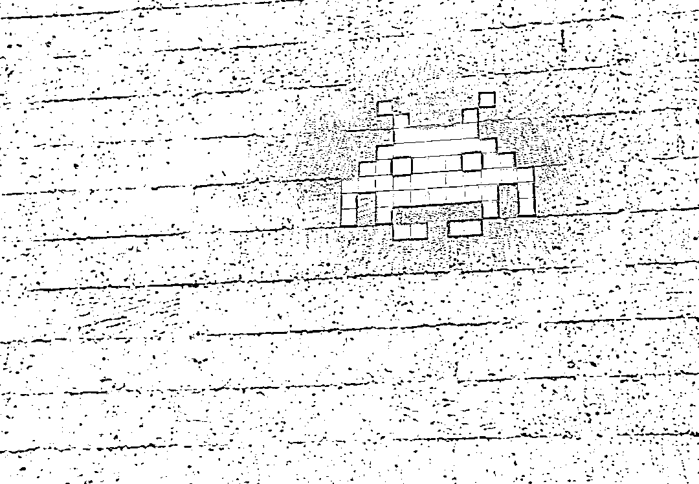

作者/大卫·瑞雷 若道占星创始人译者/聆宇 Cora
编辑/Tang 图片/网络本文节选自大卫·瑞雷著作《一生的旅程》今日头条中，大卫老师为我们深入剖析了水瓶座的特性。在这篇文章里，大卫老师将带领我们进一步了解水瓶座的事业与爱情。准备好了么？我们开始吧！

**水瓶座的事业**

就像那些著名的例子里所显示的，**如果你是水瓶座，自己做企业是个不错的选择**——对于你们中的许多人来说简直是种必须！不过，如果公司能够给你足够的自主权，你也可以在别人的企业中获得满足感。**找到一个适合自己的组织或团队对你非常重要**。

在加入一家公司之前，你要仔细观察他们是不是真的合你胃口。探索“公司宗旨”背后细的节：他们对员工的态度是怎样的？他们是否真的鼓励创新？他们的决策机制是怎样的，是否允许员工发声？他们是有森严的等级观还是更平等待人？**基本上，你需要找一个具有长远眼光的机构，他们欢迎你的加入，赏识你的独特想法，能够提供自由创新的平台。 **

**水瓶座的剑走偏锋可能让他们冒些风险，但往往也能赢得出其不意！**企业家王石在 33 岁时辞掉了稳定的工作下海经商，做饲料生意。当时由于媒体报道鸡饲料中有致癌物，导致王石手上的几千吨玉米无法出货，加上台风天非常潮湿，他的玉米积压在货车里濒临变质。凭着过人的远见和胆识，王石做出了一个惊人的决定，他反其道行之，大量买进受舆论影响而降价的玉米，并说服玉米供应商让他可以延期 100 天再支付。果然在一段时间之后，媒体承认之前关于饲料中有致癌物的报道有误，原料玉米供不应求，王石储存的 7000 吨玉米全部卖出，他凭此赚到了人生的第一桶金。37 岁时，王石进入房地产市场，最终将他的公司打造成了行业的“潮流引领者”和“风向标”，他以此区别于那些所谓“行业大佬”的称号。

**水瓶座不喜欢站到领导人的位置上被崇拜和美化，这种反感的根源在于，害怕自己变得腐败、落后。**对你们中的很多人来说，如果所在的机构或公司充满内部的政治斗争，不再推崇创新，你们会感到相当无聊和烦躁。你们对身份地位本身不感兴趣；你享受成功带来的“快感”，但不会对失败耿耿于怀，你会带着开放的态度去寻找导致失败的原因，以确保下一次不犯同样的错误。

就像保罗·纽曼会把赛车当成一项严肃的兴趣爱好，你们会冒一些“颠倒错乱”的风险去做出自己独特的尝试——就算是在经商方面也是不按牌理出牌。聪明如你，会知道踩刹车是没有用的。正是出于这样的思维，王石才会冒险投下更大的赌注，去跟供应商谈判赊购更多的低价玉米。正常人面对这样的豪赌会惊得下巴掉下来，但王石想的可能是，就算输了又怎样，他已经快被压垮了，而那些农民和供应商也是，如果市场持续低迷大家都会死。

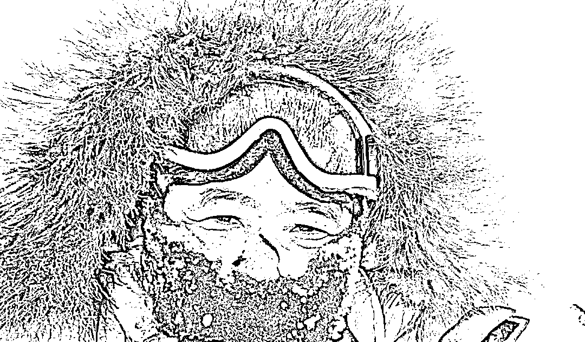

| 王石

王石是一个富有热情的登山和徒步爱好者，他在 2003 年登上了珠穆朗玛峰，对登山这一冒险活动乐此不疲，许多国家的最高峰都留下了他的脚印。虽然很多水瓶座都享受冒险的快乐，但王石身上体现出了一种更为深层的对于水瓶座式成就的渴望，他说，“随着我个人的影响力和我的公司的影响力的增加，我们现在有能力对社会服务和慈善事业做出更多贡献。我愿意用我的努力去影响更多人。”**水瓶座有一种潜在的从属于某个更大团体的需求，与此相伴的是做出贡献的需要。**演员保罗·纽曼成功开创了他的纽曼沙拉的调味品品牌，并把此品牌的所有利润捐给了慈善机构。在中国，水瓶座的演员陈坤在 2011 年推出了公益活动“行走的力量”，亲自带领大学生志愿者走进被称为“世界屋脊”的西藏，感受在挑战身体极限的行走中获得的内心力量。**大多数水瓶座的人渴望通过自己的努力来让世界变得更好，他们中的许多人也是这么做的。**你们中的一些人通过发明创造来贡献力量，比如托马斯·爱迪生，也有人为人类贡献了无与伦比的思想财富，如尼古拉斯·哥白尼、伽利略、查尔斯·达尔文；甚至还有科幻小说家儒勒·凡尔纳。还有一些水瓶座人以敏锐的观察力记录社会，像作家查尔斯·狄更斯、契诃夫、詹姆斯·乔伊斯。

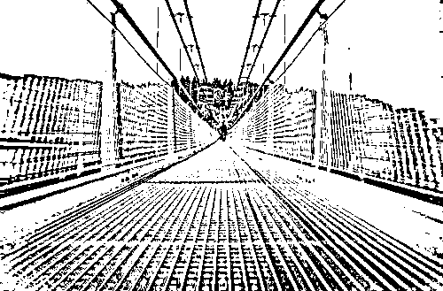

**水瓶座在面对压力和挑战时会有的酷酷的态度，反映了一种依托于智力的“冷酷无情”。**因为你们非常擅长将自我抽离出来，可以“不带私情”地回应危机，所以你们能在更为抽象的角度看清所处境况中的问题。因此，你们所下的赌注通常是“**经过了算计的冒险**”。当然，人们可能会把你看成“天才”，也可能是“疯子”，不过是成王败寇！关键是你们要为自己的天分找到最佳的表达途径，不管那是做带有革新精神的企业家，还是成为团队的幕后智囊。无论你选择了哪种方式，**这里都有一些建议给你**：

*   **注意自己对待权威的态度**：因为你喜欢人人平等的氛围，所以如果你有一个缺乏安全感的老板，他可能因为你没有表现出顺服的态度而给你脸色看。而如果你的老板是一个开通并有足够安全感的人，那么他会重视你的贡献，并且可能让你参与到重要决策之中。

*   **集思广益来发展你的想法**：偶尔跟人讨论一下你感兴趣的话题或流行趋势，了解一下他人的想法。

*   **令你的想法形成体系**：为那些你在跟人讨论时迸发出的奇思妙想，寻找更多数据和理论上的支持，来形成你自己的体系。

*   **达成一致**：与那些你“信任”的伙伴讨论交流，来检验你的理论。

*   **简明扼要并给出可操作的例子**：在展示你的想法时，不要太过抽象和理论化了。要更接地气一些，有时你的想法可能对别人来说太烧脑细胞，不好理解。

*   **跟团队成员分享你的想法**：即便是你已经准备好了，跃跃欲试要推广你的想法，你也最好先拥有团队中一些人的支持，让他们成为你强有力的后盾。

*   **保持前卫，与时俱进**：你们确实就是这样做的；不过还是要提醒你们，去关注这个世界上正在发生什么，特别是在科学和技术领域。

*   **保持头脑的活跃**：无聊是首要信号，提醒你们是时候走出舒适区不要原地踏步了。

*   **社群意识**：经常想想你为社会做出了多少贡献。这会让你的人生更有成就感。

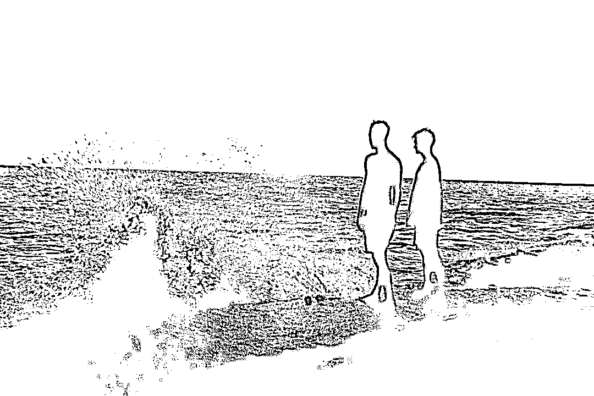

**水瓶座的爱情**

“

**我想要的男人，首先要是我的朋友，我们能够平等相处，在一起感到舒服。**

**——詹妮弗·安妮斯顿**

”

**比起伴侣关系，做朋友会让你觉得更加自然。**这点在你的爱情和婚姻方面表现得很明显。偶尔吃饭看电影你会觉得还不错，但关系一旦变得严肃，你就会开始抽离。大多数情况下，你更喜欢扮演好朋友的角色，甚至作为对方的爱情顾问为他们出谋划策——虽然你可能也会在脑子里幻想一下与他们一番云雨的模样。

事实上，对你们中的一些人来说，理想的社会结构就是理论上所讲的公共社区，所有人之间不分彼此、友好相处，最好连小孩都大家一起养，诸如此类。不过，试试在约会的时候跟你的同伴聊聊你的乌托邦理想，看看会怎样？或许他们会把你从通讯录里删掉吧，不过你也不在乎对吗？很多水瓶座的人会表现得若无其事，但其实心里很在意——只是在意的方式不同。事实上，很多水瓶座的人最终拥有了美满的婚姻，**关键是，他们所找的伴侣，是能够跟他们成为最好的朋友的人**。 

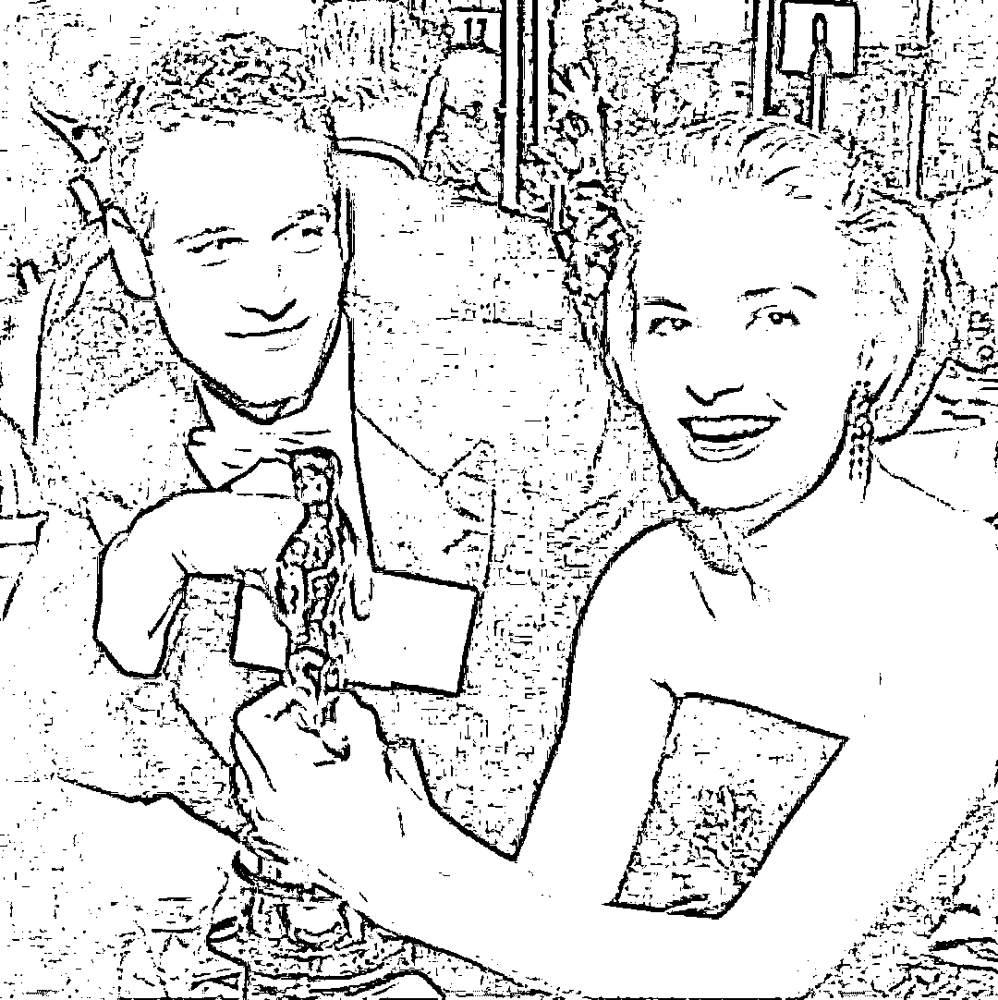

| 保罗·纽曼和妻子乔安娜·伍德沃德

不过，保罗·纽曼在提到和女演员乔安娜·伍德沃德的五十多年的婚姻时，强调的可不仅仅是成为彼此最好的朋友，他说，“**夫妻双方应该有各自的兴趣爱好，拥有各自的朋友圈子——并且不能把自己的生活强加到对方身上。**”**这样的独立性对水瓶座必不可少**。他还补充说，“人们之所以维持婚姻是因为他们‘想要’这么做，而非不得不这么做。”他在此强调的就是“自由意志”，这跟大多数水瓶座的人息息相关。 

**以下是一些婚恋关系中要注意的要点**：

*   **一开始就明确表达你需要独立空间**：很多人都会说自己需要独立空间，但你需要让对方明白你是“**真的**”需要。

*   **选择一个头脑聪明、智力上跟你势均力敌的伴侣**：跟不够聪明的人在一起，你很快就会兴味索然。

*   **选择一个跟你一样独立的人**：你会欣赏那些能够跟你的独立天性相匹配的对象，只要他们不是太不稳定就好。

*   **你重视独创性**：比起风格或扮相的古怪前卫，你更欣赏真正的有个性——如果你的朋友觉得他/她很酷又有点怪，那就更好了。

*   **黏腻的爱情不适合你**：如果对方需要向你反复确认你对他/她的爱，这样的人不适合你！你的又酷又抽离的态度或许让人觉得你就是那类“**触不到的恋人**”。

*   **向恋人证明你很靠谱**：虽然你不喜欢说甜言蜜语，但要让对方知道，当他们需要你的时候你会在他们身边。

*   **选择能够欣赏你的观点的人**：你的头脑是你最性感的部位。如果对方无法欣赏你的睿智，那就不要为这个人浪费时间了。

*   **友谊的成分很重要**：如果对方很信赖你，遇事愿意征求你的意见，这是个好兆头。虽然他们不一定总是会询问你的观点，但如果他们这样做的频率越来越高，那你们就可能越走越近，成为情侣。

*   **有共同的人道主义或公益方面的兴趣爱好**：这是一个明显有助于维系感情的因素，特别是对婚姻和家庭有益。如果你能够跟你的子女一起参与公益活动，那将带给你相当大的满足。

*   **有共同的国际视角**：“地球村”对你来说不只是一个抽象概念。你的伴侣要有广泛的兴趣和宽阔的视野，她的思维最好能够跳出地域限制。

**版权声明：**文章由作者授权在若道平台发布，欢迎转发，反对抄袭。友号转载请申请白名单。


****想阅读更多作者的文章，请在后台回复******大卫****** 即可。****

**喜欢文章请长按下方二维码打赏**

**给大卫老师加杯咖啡呗~**

**▼**


**想系统学习占星学？**

**点击下图二维码了解详情**


**微信又双叒叕改版啦，不想错过若道君的推送？**

**就把若道设为星标吧！**

**▼**


喜欢记得点一下在看哦☟

********报名直达入口********


# 触不到的恋人：有一个星座，你越想抓住，Ta 越是逃离……

> 原文：[`mp.weixin.qq.com/s?__biz=MzA5NjA0NTAxNg==&mid=2651414006&idx=1&sn=b7172d9c720de4f11135e5775387fd98&chksm=8b4bef41bc3c66570bcf5e8561e9c0e19879853d8414288aaf292eaee2a6a66efadf4298448b&scene=126&sessionid=1692738202#rd`](http://mp.weixin.qq.com/s?__biz=MzA5NjA0NTAxNg==&mid=2651414006&idx=1&sn=b7172d9c720de4f11135e5775387fd98&chksm=8b4bef41bc3c66570bcf5e8561e9c0e19879853d8414288aaf292eaee2a6a66efadf4298448b&scene=126&sessionid=1692738202#rd)

******☆ ****后台回复“今日”，给你一句生命态度******

作者/大卫·瑞雷 若道占星创始人译者/聆宇 Cora
编辑/Tang 图片/网络本文节选自大卫·瑞雷著作《一生的旅程》水瓶座，一群总觉得自己不是地球人的怪咖，一堆连他们自己都摸不透自己的另类……这究竟是一个怎样的星座？大卫·瑞雷老师将在本文中为我们细致地剖析这个星座，一起来了解一下这些超级酷的“外星人”吧。

**水瓶座到底有多“酷”**

水瓶座，总是给人一种疏离感，却又不停地勾起我们的好奇心，他们被认为是一个很酷的星座。那么水瓶座究竟可以酷到什么程度呢？**水瓶座的詹姆斯·迪恩发明了“酷”，他是上世纪 50 年代好莱坞的第一位叛逆偶像。**保罗·纽曼很酷，他甚至还因为参演了一部名字中带有“cool”的电影《黑狱喋血》（Cool Hand Luke）而获得奥斯卡奖最佳男主角的提名。

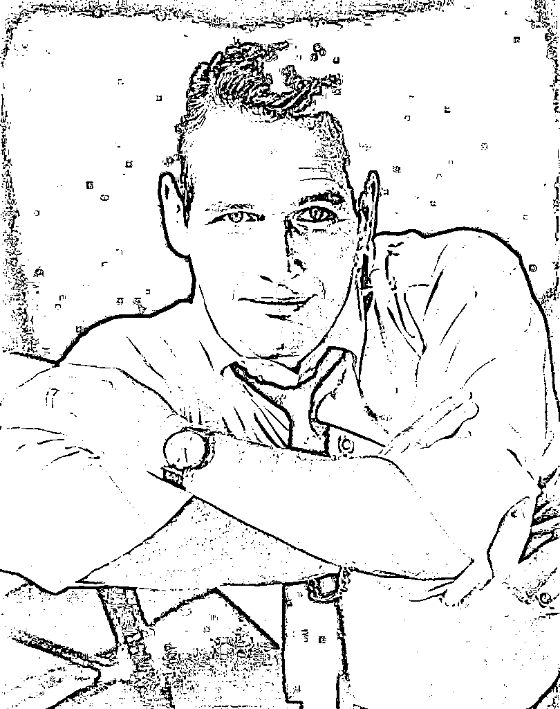

| 保罗·纽曼

每个人都认为瑞德·巴特勒很酷，他的扮演者是充满传奇色彩的克拉克·盖博，在经典影片《乱世佳人》的结尾，他对思嘉丽说，“坦白说，亲爱的，我根本不在乎！”即使是做总统也可以很酷，就像罗斯福总统在大萧条时期呼吁美国人民要“酷”，他说，“令人恐惧的是恐惧本身。”**这些人全是水瓶座。**

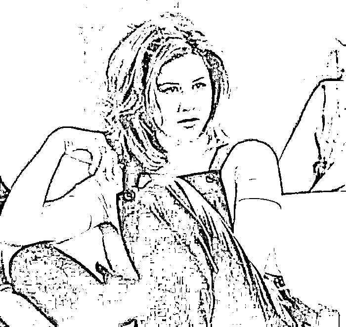

| 詹妮弗·安妮斯顿

曾主演著名美剧《老友记》的演员詹妮弗·安妮斯顿就很酷，而该剧的剧名就非常“水瓶座”。奥普拉很酷，她将美国女性从妄自菲薄和被情感奴役的消沉意识中解脱出来，她对美国女性的影响超过了争取美国妇女参政权的苏珊·安东尼，她曾为美国女性争取投票权。

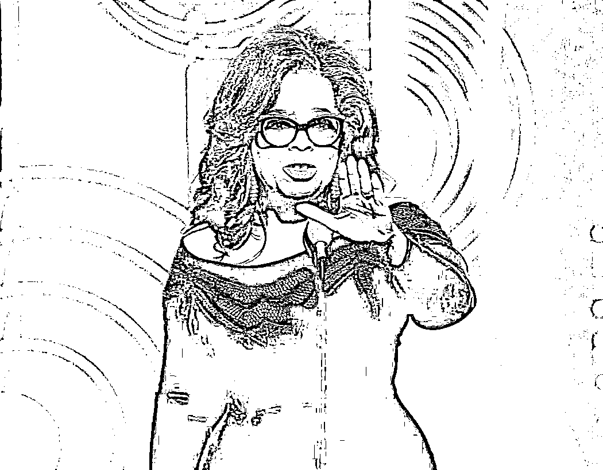

| 奥普拉

这几位女性都是水瓶座，还有著名的女权主义作家杰梅茵·格里尔也是水瓶座，她在自己的著作《被阉割的女性》（The Female Eunuch）中写道，**“安全感是对生命的否定”，这真是水瓶座的最佳宣言**。如果你还不确定她的意思，那么她还说过这样的话：“身份地位不应该以吸引和诱惑男人的能力来衡量。”喜剧演员、脱口秀主持人艾伦·德詹尼斯说，“我个人喜欢成为独一无二的人。我喜欢做我自己，喜欢有自己的风格，喜欢有自己的想法，喜欢用自己的牙刷。”我们可以称之为“酷”的古怪面……**独特、原创、发明、别具一格、古怪、与众不同、叛逆、反抗、不墨守成规，这都是典型的水瓶座特征。**水瓶座的人也常常被形容为**人道主义者**，具有社群意识，渴望参与到团队和团体中，并做出贡献。这种社会意识和参与性乍一听与水瓶座的个人主义和叛逆性格格不入，这种矛盾会把水瓶座的人逗乐，**他们是最不喜欢被模式化定义的星座**。但是，我们想要理解这个星座就需要暂停一下，将目光投向它在黄道带对面的星座——**狮子座**！

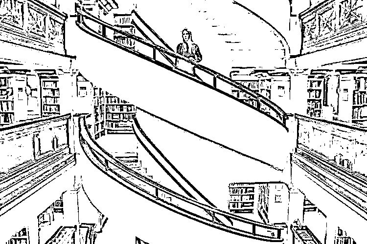

**从对宫星座看水瓶座**

**每个黄道星座不仅是前一个星座的发展进化，而且也“制衡着”它对面的星座。**狮子座是最欣赏个人创造性表达的星座，就像自信满满又充满荣耀感的小孩一样昂首阔步地走在人生的舞台上，早期的占星学书籍中将这个星座的原则定义为“**我是**”。狮子座能意识到自己在“**被注视**”，但狮子座会太过沉浸在自己的表现里，任何不能服务于他们的“表演”的事物都会被无视、略过，或被讨厌地推开。**水瓶座所代表的客观性，平衡了狮子座的自我中心和主观。**“是的，你是特别的，”水瓶座对狮子座说，“但每一个人都有他们自己的特别之处。”**水瓶座象征着“个人与群体”的关系，星图中水瓶座能量显著的人会关注“我”与“他们”的关系。**因此，没有任何星座比他们更关心自己的个性如何融入社会，也没有任何星座比他们更抗拒盲目服从。**水瓶座可以同时既“融入”又“抽离”。水瓶座的天才和原创能力，以及他们的客观见解和理性贡献，正是源自这种“融入”和“抽离”之间的张力。**要记住，水瓶座是从白羊座到双鱼座的旅程中的最后一个风象星座，它比其他两个风象星座（双子座和天秤座）更具备智能上的优势。水瓶座是唯一的“固定”风象星座，因此**有更强的力量去坚守一种理念，只要这种理念已经形成完整的框架体系**。他们会通过热切的观察讨论来发展自己的理念，并且在这个过程中会非常在意获得志同道合者的支持，不管那是朋友还是陌生人。星图中太阳落在这个酷酷的星座的人，可能会让气氛一下子冷下来；你们可能会不管好坏地固执己见，唯有经历一番艰难或面对更富智慧的辩驳，你们才可能勉强低头。你们水瓶座的很多人都非常“**睿智**”，但这里也存在一种有趣的反讽。聪明绝顶的智者偶尔也可能有自负的表现，这也就是占星师杰夫·焦耳所说的“**精英的平等观**”，他在暗示水瓶座所要求的“平等”指向他人而非自己。或许就智力上的优越感来说，太阳水瓶座会比月亮水瓶座和上升水瓶座表现更甚——这是一种狮子座的感觉，因为狮子座的守护星就是太阳。但是，**水瓶座也是最佳的社会观察者**。他们具有极佳的抽离视角，许多水瓶座都是天生的社会学家、人类学家、社会意识作家，或社会改革家，有时候甚至是经济学家——所有这些角色都在探索人类社会的模式和不平等性方面非常有洞察力。**水瓶座人渴望为社会做出贡献，这促使他们投身到一些社会运动中去，通常涉及到某些团体，这些团体或组织通常带有某种“革新”的性质，也可能有些混乱无序，或是尚未形成权威或阶级。**亚伯拉罕·林肯是第一位共和党总统，共和党是从老辉格党中诞生出的一个新的党派。当然，社会变革可能趋向解放也可能趋向保守。前总统罗纳德·里根重塑了共和党，使之成为美国 1980 年代保守运动的旗手，2008 年共和党副总统候选人莎拉·佩林成为极端保守的茶党运动的宠儿。佩林喜欢自己作为“标新立异”的政治家的角色，标新立异的意思是“个人主义”和“不是一般或典型的主流候选人”，这也是里根在其政治生涯的大部分时间里对自己的评价。与水瓶座的反讽相符的是，里根和佩林的言辞表现都有**“草根”的风格——就好像在说“我和你们一样就是个普通人”**。

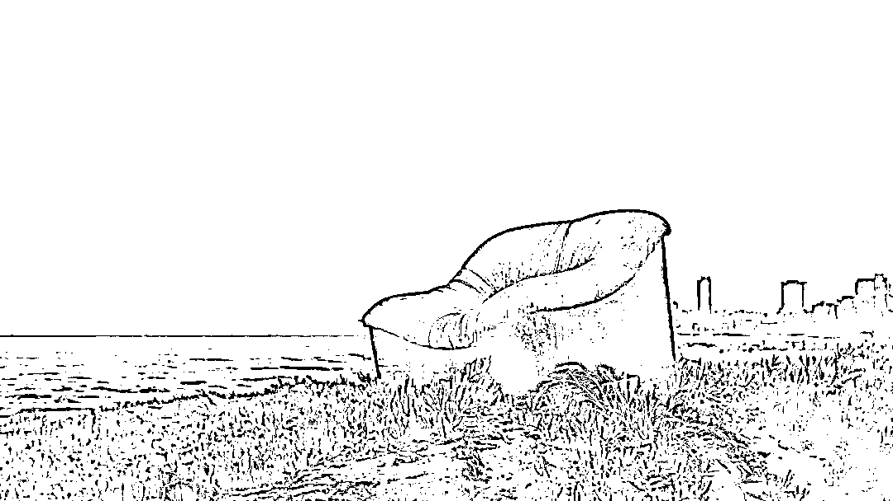

“

**我与那些穿着工装裤的人称兄道弟，这种友情即使是世界之王的垂青也无法交换。**

**——托马斯·爱迪生**

”想一想上面引用的托马斯·爱迪生的话，“世界之王的垂青”也无法取代他与普通工人的友情。我们再一次看到了对狮子座国王的拒绝，以及对劳动者的身份认同。虽然爱迪生因为他在新泽西的实验室/工厂而被称为“门洛帕克的巫师”，但他能够与为他做事的人们相处融洽——与“他们”一起工作，一起放松，启发他们思考。爱迪生是一位天才，却几乎没有受过正规教育。但他却是首位应用大规模生产原则的发明家，将大型团队合作应用在他的发明创造过程中，他的实验室是最早的工业化实验室之一。非常理想的是，**水瓶座能将原创性、客观理智与渴望做出贡献的迫切冲动、激励团队协作的天赋结合在一起**。此外他们还愿意去冒险，不走寻常路，我们看到，查尔斯·林德伯格是第一个独自飞跃大西洋的人；查尔斯·达尔文用他的进化论重塑了自然科学；以及作家儒勒·凡尔纳描绘出了一个充满奇异发明创造的未来世界——如今大部分已经成为现实。

其他著名的水瓶座人还有：冒着巨大风险拍摄电影《南京！南京！》的电影导演陆川，企业家王石，演员、歌手陈坤，以独特视角报道了自己所处时代的灾难和战争的记者、作家萧乾。另外还有 1976 年诺贝尔物理学奖获得者丁肇中，中国最早的计算机科学家之一李华天，“汉字激光照排之父”王选。

水瓶座的你，或许挺愿意加入这个水瓶座俱乐部，但或许也无所谓吧。你可能根本不在乎呢？可能有很多事你都不在乎。也许你觉得自己那么酷，有什么好在乎的。真的吗？好吧，那么你在乎什么呢？所有事？还是什么都不在乎？

**水瓶座的阴影面就是“疏离感”。**疏离就是极端的超然，甚至连“自我”似乎都变得很遥远——不重要。在心理学中“疏离感”被定义为一种由于无法融入社会而造成的人格解离，其特征是长期抑制情感。这种置身事外或“远离”的感觉是一种常见的水瓶座体验，会很自然地随着对事情的参与程度和友情的影响而产生波动。但是，疏离感代表着“极端”。注意一下心理学上对疏离的定义，包含了三件事：

*   **人格解离；**
*   **难以融入社会；**
*   **长期压抑情感。**

**这三个议题都与水瓶座的痛苦和阴影面相关，源自人生早期形成的模式。**

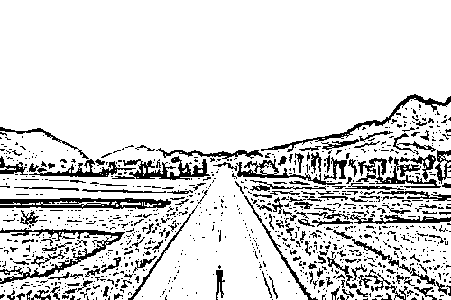

**水瓶座如何走出“疏离感”？**

回想 1980 年代，我有一位水瓶座客户“肯恩”，他来找我咨询的时候，他的婚姻似乎走到了尽头。他的妻子为了另一个男人离开了他，他想知道她会不会回来。我在前几年见过肯恩一次，只记得那次咨询平淡无奇。他只是在理性上对自己的出生星图好奇，但他有一大堆问题，许多都是关于占星学的抽象概念。我喜欢回答他的问题，但是显然他没有暴露任何自己的情感，事实上他没有说任何跟自己的生活相关的事，我只记得他似乎是 IBM 的项目经理。现在他因为面临危机又找到了我。这一次当我看到他时，他明显比之前瘦了，身上的衣服微微起皱。他在电话中说出了约见咨询的原因，我在准备咨询时注意到他的土星行进到了他的第七宫，对分他的出生月亮。我想知道这一占星学上与婚姻和情感压力有关的征象会如何与他早年的经历关联起来。我在与他握手时，他露出了微笑，对我桌上的几本书点评了一番。然而，当我坐下开始与他交谈时，他的抽离开始变得明显。虽然他频频点头好像在听我说话，但却没有跟我的眼神接触。当我开始解释他的基本趋势特征时，我的小办公室好像变大了，他不再是坐在我面前，而是缩在角落。我发现难以继续，于是停止了解释。在宁静中，我注视着面前他的出生星图，思索着有关他幼年生活的线索。我用一个提问打破了沉默，“你父母离婚时，你多大，是不是在 7、8 岁的时候？”“我想那时我 8 岁吧……”他不带情绪地说。然后他注视着我，“我不记得之前告诉过你我父母离婚的事。”他一脸不解地询问道。“你没有说，”我说，“但是你现在遇到了与你 7、8 岁时相同的主题。”“哦这样，”他说，“所以这就是命喽？所以我妻子要跟我离婚？”“我不知道什么是命，”我说，“同样的趋势并不一定会带来相同的结果。”我停顿了一会儿，“你看，我想和你聊聊你早年的生活，问你一些问题，可以吗？”“当然。”他回答。

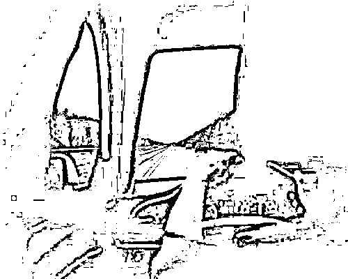

所以那一天的咨询与两年前他第一次来咨询的过程相比，简直是一座值得纪念的里程碑。肯恩幼年的生活在物质上非常优渥。他的父亲是一位非常成功的商人，在自己的圈子里享有盛誉。肯恩记得他坐过父亲的游艇，记得他曾经有很多玩具，但却记不起任何来自父亲的爱和温暖。相反，他记得自己害怕父亲，他的父亲非常严格。

父母离婚彻底改变了他的生活。他的父亲比母亲年长许多，但他与另一个女人有了婚外情。肯恩这样描述当时的情况，“和悲伤的母亲搬进了小公寓”。之后不久，他被送往一所寄宿军校，由父亲支付学费，与母亲分离。寄宿学校给他带来了一点安慰，他的体格也更强壮了，在与其他男孩的格斗中可以保护自己了，他也赢得了他们的钦羡和尊重。但是，他将自己描述成一个“不合群的人”。他是好学生，尤其擅长数学和历史，然后进入了一所好大学就读。

大学时，他说自己住在校外的一个拖车式活动房屋里，不怎么参加社交活动；但是大学的几位好朋友会到他那里找他玩，他们在校外喝酒。他谈到了大学时的约会，但是他说那些姑娘觉得他太严肃，有距离感。大学毕业之后，他进入 IBM 工作，从程序员开始逐步晋升，工作中的一位朋友介绍他认识了他后来的妻子。但是，他让妻子感到挫败，因为妻子觉得他“在情感上遥不可及，有时冷酷而严厉”——她说是因为这个原因所以要离开他，跟一个能够带给她滋养和关怀的男人在一起。

随着肯恩讲到这些生活细节，他的声音变得越来越沙哑。他的不安开始加剧，那种程度让我觉得他可能在我的办公室里崩溃。我看着他，小心地问，“我想问你一个问题。”“好的”，他结结巴巴地说。“如果你的父母亲现在在这间办公室里，他们必须听你诉说，你会对他们说什么？”

他看起来受到了惊吓。然后他的声音突然变大，“啊……我会说，我在这里，你们看到我了吗！你们认不出自己的儿子吗！我对你们来说是不是不重要？！”他开始发抖，眼泪顺着脸颊滑落。我安静地听着……

“我这一辈子都觉得自己不重要……你懂吗，就好像我什么都不是。这样已经很久了，我都不再想这些了。我思考其他事，所有事……当我还是个少年时，我常常把自己想象成是一个机器人而不是人类，以此来逗自己开心。这会让我安心。现在想起来很荒唐……”

通过我们的对话，他非常清楚地意识到自己的疏离感。我们讨论了他与妻子分居的问题。我建议他推迟离婚的决定，现在的他不适合做这样的决定。他完全同意。另外，他还提到他曾想有时间就去本地一家救济处帮助无家可归的人——他反正有些睡眠问题，他“或许可以把这些时间拿来做些事情。”我鼓励他去做。在他的下一次咨询中，他分享了去救济处的经历，他每周去两次。他看起来比上次咨询时更加放松，也更能保持“临在”。

后来他分居的妻子到救济处探望他，就是看看他在忙些什么。他们见面并喝了咖啡。她发现自己的丈夫像变了一个人。他推荐了她的妻子来找我咨询，她在咨询中对我说，“他活过来了。我知道他在听我说话，他会看着我的眼睛。他说他爱我！他告诉我‘他’想要什么。”他们会再花一些时间了解彼此，好像初识一般——重建他们的关系，不再想离婚的事。

他们的婚姻延续至今。几年前，肯恩对我说，“我觉得我对乔伊斯（他妻子的化名）来说真的很特别，她接受我和我所有的古怪。”肯恩现在已经退休了，参与了居委会的工作，管理着一家救济处和一家流浪者收容所。

他和妻子后来育有一女，女儿最近结婚了，肯恩和乔伊斯最近当了外公外婆。肯恩喜欢寻找有创意的方式来促进居委会的慈善工作，他乐在其中。看到现在的他，你很难想象 30 年前他是个疏离、古怪又别扭的男人。他虽然头发已经灰白稀疏，但是饱满的额头下是闪着微笑的眼睛。他在社区中受人喜爱，妻子也对他十分爱慕。“她是我最好的朋友”，他说。

**这是一则真实的水瓶座的故事，它指出了走出疏离感的道路。**是的，水瓶座也会流下泪水！他们可能徘徊踌躇许久，然后砰的一声——水闸被打开！每个人都有隐藏的痛苦，但是没有任何星座能像水瓶座这样出色地隐藏自己的痛苦——用他们的聪明才智、理性和借口。但是，最终他们还是需要做出贡献，让这个世界变得不同——他们的参与，让自己与世界都变得更好。

**（未完待续，下篇见今日二条）**

**版权声明：**文章由作者授权在若道平台发布，欢迎转发，反对抄袭。友号转载请申请白名单。


****想阅读更多作者的文章，请在后台回复******大卫****** 即可。****

**喜欢文章请长按下方二维码打赏**

**给大卫老师加杯咖啡呗~**

**▼**


**想系统学习占星学？**

**长按下图二维码了解详情**


**微信又双叒叕改版啦，不想错过若道君的推送？**

**就把若道设为星标吧！**

**▼**


喜欢记得点一下在看哦☟

********报名直达入口********


# 金牌课程 L1-5 | 中英导师倾囊相授，让你从小白变身专业占星师

> 原文：[`mp.weixin.qq.com/s?__biz=MzA5NjA0NTAxNg==&mid=2651413971&idx=3&sn=1745ffcbad54b544c6609f09889d3a68&chksm=8b4bef64bc3c6672e75766b60f1c7819abbf586a9449b5d4141c6cd7540ad817bc87a90206b7&scene=126&sessionid=1692738202#rd`](http://mp.weixin.qq.com/s?__biz=MzA5NjA0NTAxNg==&mid=2651413971&idx=3&sn=1745ffcbad54b544c6609f09889d3a68&chksm=8b4bef64bc3c6672e75766b60f1c7819abbf586a9449b5d4141c6cd7540ad817bc87a90206b7&scene=126&sessionid=1692738202#rd)

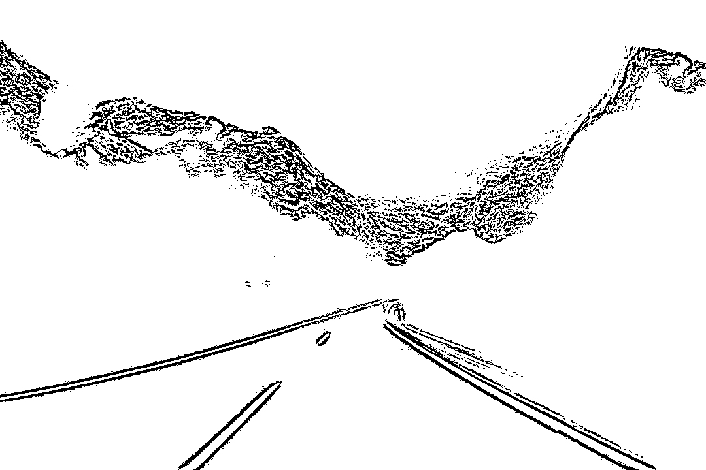

2020 年，一场疫情像一只突然出现的“黑天鹅”。让多少企业、多少人乱了阵脚。大家深刻的感觉到：没一技之长、没有两手准备，灾难面前真是手足无措。我们都在焦急的等待着疫情的拐点出现，突然多出的假期，有人焦虑刷屏，也有人重新规划未来，更新技能和认知。很多人一直都渴望发展副业，平时虽然爱好不少，突发状况面前却发现并没有哪项爱好，能成为增加收入的一技之长。

## **每一次大波折，都会倒下一批人，也站起来一批人。****这是历史的铁律。**

是时候重新认识自己了。**开启副业之路，自助助人的 PLAN B**曾经的你，有没有想过，人生还有一种全新的可能？
如果把自己的人生看成一间公司，时间和精力看成生产资料，那么你作为自己的 CEO，应该有对这家公司的“战略规划”意识。**第一，设定目标。**穿越新闻事件、外界信息的重重迷雾，我们优先要向内看，我是谁？我喜欢或不喜欢什么？我想过一种什么样的生活？正视自己，不盲目随波逐流。**第二，盘点优劣势。**我现在处于什么位置？为了达到我的目标，我有哪些优势？我还缺少哪些知识、技能、经验或领路人？**第三，制定计划、稳步实施**。我知道我在哪，我要去哪儿，我需要找到现实与梦想的差距，想方设法去缩小差距、达到目标。**占星学是非常好的“自我战略规划”的工具。**可以帮助你**认识自己、找到自己的优势和目标，根据时代趋势调整自己步伐**，更好的全力以赴，永远不用担心被淘汰！**而你通过占星学习你帮助了自己，也可以选择成为自助助人的占星师，开启受益终生的第二事业。****顺应趋势，迎来人生拐点**“

**如果你等待知更鸟的到来，你将错过整个春天。**

**——沃伦·巴菲特**

”面对这次疫情危机，不少公司开启了“云办公”，人们开始在家里办公。也有不少人抢先顺应趋势，率先迎接新世界的到来。未来是个体崛起的时代，大量个体被鼓励独立发展，比如网红、自由职业、自媒体、咨询师等，他们都不需要传统的办公室。社会越发达，人的独立性就越强，**未来有能力的人都会变成独立的经济体**。如果你也相信，想顺应时代趋势抓住时代机遇？想实现人生逆风翻盘？

## 决定一个人最终高度的，往往并非起点，而是拐点。

##  机遇都在拐点，**占星学**正站在你的人生拐点等你。

**为什么是占星学？**一方面社会快速发展人们压力山大，抚慰心灵的咨询市场需求巨大。另一方面市场鱼龙混杂，真正学院派的严肃占星从业者十分稀缺。
最重要的，占星学能让你自己帮助自己，无论你是否进行占星咨询从业，学习了占星学，它都将是终身陪伴你成长的睿智好伙伴。


**你的占星核心课老师是谁？**

拥有**49**年占星实践经验的

**若道创始人**

**ISAR 全球副主席**

**ISAR 全球职业占星师资质认证主席**

**大卫·瑞雷**

&

**最懂学员的若道首位认证金牌中国老师**

**熊鹰**

师徒二人合力打造
**2020 年若道****全新****核心占星课程**

**连报 L1-5 全阶课程，可以享受到****：** ❶ **61 次线上直播互动网络课程+2 场工作坊**（亲密关系+职业占星工作坊、知识回顾+综合解读工作坊），全面而详细地讲解占星学知识、技能、案例和重要领域实践运用。

❷ **知识点+学员星图解读有机结合**：熊鹰老师以知识点和学员案例讲解为主，大卫·瑞雷老师以参课学员案例及客户案例讲解为主。每个知识点覆盖班级内学员的亲身案例，参与感更强，每位学员都有机会听到自己的星图分析。

❸ **微信群学员互动分享**，从真实案例学习生命成长故事。

❹ **论坛提问**：论坛上每个学员的问题都将得到及时回复。

❺ **提供咨询师实习平台**，只要努力，都将有机会在毕业前进行咨询的实习演练，听取客户反馈，为成为职业占星师做准备。


**L1-5 阶，我们要学习什么？**

**1-2**

**第一阶****  12 星座，12 种性格，12 种人生 **

❶ 学习占星学必须准备的“心法”

❷ 占星学中的火、土、风、水四元素，阴阳法则

❸ 面对面的星座有故事

❹ 12 星座：12 种性格详解，12 种行为模式，12 种价值观

❺ 太阳和月亮：了解你的太阳，生命的发动机，让你在世界闪光的方式，生命获得力量的方法；了解你的月亮，让你获得幸福的方法

❻ 了解太阳、月亮，了解你生命中已经出现的、将会出现的男性和女性

**第二阶****  命运的线索和人生故事中的演员**

❶ 命运的线索：南北交点

❷ 星图三巨头：太阳、月亮、上升点的故事

❸ 了解心智：水星

❹ 了解金钱和关系：金星

❺ 了解行动模式：火星

❻ 了解信念：木星

❼ 了解努力：土星

❽ 了解天才和疯狂：天王星

❾ 了解梦想和幻灭：海王星

❿ 了解死亡和重生：冥王星

⓫ 12 个人生场景：黄道 12 宫位初解

**课程安排**

*   2020 年 4 月 2 日：星座 1（主讲人：大卫·瑞雷老师）
*   2020 年 4 月 9 日：星座 2（主讲人：熊鹰老师）
*   2020 年 4 月 16 日：太阳、月亮（主讲人：大卫·瑞雷老师）
*   2020 年 4 月 23 日：水星、金星、火星（主讲人：熊鹰老师）
*   2020 年 4 月 30 日：木星、土星（主讲人：熊鹰老师）
*   2020 年 5 月 7 日：三王星（主讲人：大卫·瑞雷老师）
*   2020 年 5 月 14 日：宫位 1（主讲人：熊鹰老师）
*   2020 年 5 月 21 日：宫位 2（主讲人：大卫·瑞雷老师）
*   2020 年 5 月 28 日：月亮交点 1（主讲人：熊鹰老师）
*   2020 年 6 月 4 日：月亮交点 2（主讲人：大卫·瑞雷老师）

**L1-2 除了网络直播课**

**L1-2 初阶课程还有两场线下工作坊可供选择**

**L1-2 上海工作坊**（2020 年 6 月 12、13、14 日 熊鹰老师主讲）

**L1-2 北京工作坊**（2020 年 6 月 25、26、27 日 大卫·瑞雷老师主讲）

就看你是喜欢哪种形式

**文末有每种形式的价格，还有连报套餐价哦**


**3**

**第三阶**** 宫位、相位以及初步解读星图（15 次课）** 

❶ 15 次线上直播网络课程，每次 2 小时，堂课中依旧会使用同学们的星图作示范

❷ 10 节课由熊鹰老师教授，重点通过名人星图阐释知识点

❸ 5 节课由大卫·瑞雷老师教授，重点通过学员星图阐释知识点

❹ 从第三阶开始，熊鹰老师将会指导练习，答疑解惑，学练结合

❺ 重点在于如何根据星图去问问题，着重自我发现和自我探索的过程 

**课程安排 **

*   2020 年 7 月 2 日：宫位、行星和星座组合

*   2020 年 7 月 9 日：宫位、行星和星座组合

*   2020 年 7 月 16 日：月亮交点

*   2020 年 7 月 23 日：月亮交点和演示案例

*   2020 年 7 月 30 日：相位

*   2020 年 8 月 6 日：相位、星座、行星和宫位

*   2020 年 8 月 13 日：相位、星座、行星和宫位的同学案例

*   2020 年 8 月 20 日：渐盈相位和渐亏相位，示例

*   2020 年 8 月 27 日：更多的关于宫位和宫主星

*   2020 年 9 月 3 日：同学案例

*   2020 年 9 月 17 日：空相行星和定位星

*   2020 年 9 月 24 日：宫主星

*   2020 年 10 月 15 日：优先级和组织

*   2020 年 10 月 22 日：相位模式以及范例

*   2020 年 10 月 29 日：学员星图解读范例

**4**

**第四阶**** 出生星图解读（进阶）以及关系与职业议题（12 次课，1 场四日亲密关系+职业占星工作坊） **

❶ 12 次线上直播网络课程，每次 2 小时，堂课中依旧会使用同学们的星图作案例

❷ 8 次课由熊鹰老师教授，4 次课由大卫·瑞雷老师教授

❸ 1 场北京现场四日工作坊：亲密关系+职业占星，学生将被选中进行案例演示和互动。

**课程安排**

*   2020 年 12 月 3 日：整合星图和星图优先级
*   2020 年 12 月 10 日：综合解读
*   2020 年 12 月 17 日：整体案例
*   2021 年 1 月 7 日：亲密关系/对比星图
*   2021 年 1 月 14 日：占星学和对比星图的例子
*   2021 年 1 月 21 日：对比星图同学案例
*   2021 年 1 月 28 日：对比星图同学案例
*   2021 年 2 月 4 日：占星学的职业介绍
*   2021 年 2 月 18 日：占星学的职业案例
*   2021 年 2 月 25 日：占星学的职业同学案例
*   2021 年 3 月 4 日：儿童职业发展
*   2021 年 3 月 11 日：亲密关系/职业同学案例

**工作坊安排**

**亲密关系（两天）+职业（两天）四日工作坊****时间**：2021 年 3 月 18 日、19 日、20 日、21 日**地点**：北京**学员将被选中进行案例演示和互动（免费）**

**5**

**第五阶**** 预测、关系、咨询，为执业和考试做准备（24 次课，1 场四日工作坊）** 

❶ 24 次线上直播网络课程，每次 2 小时，堂课中依旧会使用同学们的星图作案例❷ 15 次课由熊鹰老师教授，12 次课由大卫·瑞雷老师教授❸ 1 场综合解读工作坊（北京）：把一切串联起来，学生将被选中进行案例演示和互动。**课程安排**

*   2021 年 4 月 15 日：行进介绍 1
*   2021 年 4 月 22 日：行进介绍 2
*   2021 年 4 月 29 日：行进介绍 3
*   2021 年 5 月 6 日：当下的行进的同学案例
*   2021 年 5 月 13 日：周期，重置星图
*   2021 年 5 月 20 日：当下的行进和周期的同学案例
*   2021 年 5 月 27 日：次限
*   2021 年 6 月 3 日：次限同学案例
*   2021 年 6 月 10 日：太阳弧
*   2021 年 6 月 17 日：太阳弧同学案例
*   2021 年 6 月 24 日：亲密关系的关键节点+组合星图
*   2021 年 7 月 1 日：亲密关系的关键节点，组合星图同学案例
*   2021 年 7 月 8 日：职业周期
*   2021 年 7 月 15 日：职业周期同学案例
*   2021 年 7 月 22 日：太阳返照&月亮返照
*   2021 年 7 月 29 日：太阳返照&月亮返照同学案例
*   2021 年 8 月 5 日：高级预测技巧
*   2021 年 8 月 12 日：高级预测同学案例
*   2021 年 8 月 19 日：高级预测技巧 2
*   2021 年 8 月 26 日：高级预测同学案例 2
*   2021 年 8 月 29 日：占星学简史（周六沙龙）
*   2021 年 9 月 9 日：占星学的不同流派
*   2021 年 9 月 16 日：ISAR 考试术语和复习
*   2021 年 9 月 23 日：ISAR 考试术语和复习

**工作坊安排**
**综合解读四日工作坊（把一切串联起来，L1-5 知识回顾）****时间**：2021 年 9 月 2 日、3 日、4 日、5 日**地点**：北京**综合解读学员将被选中进行案例演示和互动（免费）****这两位优秀的占星学老师是谁？**


**大卫·瑞雷（David Railey）**

*   **ISAR 董事会成员，ISAR 全球副主席，ISAR 全球职业占星师资质认证主席，若道占星创始人。**
*   1976 年，通过亚特兰大职业占星师考试，成为全职占星师，随后通过**AFAN 和 ISAR 职业测试**。
*   1980 年，与**杰夫·焦耳**一起在亚特兰大创建**“每日星球”**占星学中心。此后在亚特兰大占星协会担任 4 年考官，并且两次担任**亚特兰大地区占星协会主席**。
*   1979-1992 年，作为占星师活跃于美国社会媒体，向不了解现代占星学变化的大众宣传专业占星学知识。在 1989-1992 年期间，他在 WRGG 电台 12 频道每周主持个人电视秀**“今日占星学”**，早先他还在 WRFG 的广播节目中播讲宇宙天气节目。 
*   2010-2014 年，任**全美占星师联盟监督委员会委员**。
*   2010 年，其著作**《灵魂的目标》**中国版出版，和蒋颖一起创办**若道占星**学校和其官网 www.nodoor.com。从该年开始，他工作并往返于亚特兰大和北京。目前他 80%的时间致力于在中国教授和推广西方占星学。
*   2017 年，被选为**ISAR 委员会成员**（2017）。ISAR 是世界最大的国际占星机构，会员遍布 45 个国家。


**熊鹰老师（天空的空）**

*   2008 年接触严肃占星学，至此爱不释手。
*   **2013 年师从大卫·瑞雷**，研习整套现代占星学核心课程，并于 2014 年起至今连续三年担任该课程的主助教。
*   期间也**跟随格伦·佩里、诺·泰尔、理查德·塔纳斯、罗伯特·汉德、苏·汤普金斯、斯蒂芬·弗里斯特等多位国际顶尖占星大师进行学习**，进行定向占星主题研究。
*   2015 年初，通过国际占星研究协会**（ISAR）资质认证并获得证书**。同年，进一步跟随大卫·瑞雷老师进修**“生时校正”**技术，通过最终考核并获得证书。
*   目前在若道星文化任职，将传播系统、严谨、真实的占星学作为职业使命。任专职助教期间，进行沙龙与答疑等辅助教学工作已累计超过 200 小时。
*   在业余期间也提供占星咨询与生时校正服务。目前正致力于占星学与个人成长的整合。

**什么人适合这门课？**

*   对占星学有浓厚兴趣，想要系统学习占星学
*   对占星学有一定基础，但不知道该如何整合星图复杂的碎片
*   希望成为优秀的占星师，想要借鉴国际大师解读思路并融入自己的体系
*   想学习占星学，但不擅长英文，希望有中文老师授课
*   想结合占星学理论与咨询实践
*   大卫·瑞雷、熊鹰的忠粉，学过占星，但就是想跟着偶像再学一遍
*   走在自我探索和个人成长道路上的人

**课程费用****★ 1-5 阶连报****早鸟价：33000 元（2020 年 3 月 31 日之前）****课程费用：46500 元 ****★ 1-2 阶直播课（4 月 2 日开课）****早鸟价：2800 元（2020 年 3 月 4 日之前）****课程费用：3500 元 ****★1-2 阶工作坊（北京工作坊、上海工作坊任选一场）****早鸟价：2800 元（2020 年 5 月 6 日之前）****课程费用：3500 元 ****★网络直播课+现场工作坊都想要的同学：有套餐价哦****购买网络直播课程+北京工作坊、上海工作坊任选一场****早鸟价：4200 元（2020 年 5 月 6 日之前）****课程费用：5200 元****★ 1-3 阶****早鸟价：10500 元（2020 年 3 月 4 日之前）****课程费用：11500 元 ****退转课程**

**退款原则请详看《教学协议》，如有疑问请咨询课程顾问。**

****中英双导师核心课 Level1-5****

**授课老师：大卫·瑞雷 熊鹰**

**授课时间：**2020 年 4 月 2 日-2021 年 9 月

**授课方式：**网络课程，中英文授课，中文翻译；现场工作坊，中英文授课，中文翻译

**费用：****1-5 阶：**46500 元****** 早鸟价：33000 元（2020 年 3 月 31 日之前）；********1-2 阶网络直播课程：****3500 元**早鸟价：2800 元（2020 年 3 月 4 日之前）；**1-2 阶**（北京、上海工作坊任选一场）**：3500 元 ****早鸟价：2800 元（2020 年 5 月 6 日之前）；******网络直播+现场套餐价：**5200 元**** 早鸟价：4200 元（2020 年 5 月 6 日之前）；******1-3 阶课程：11****500 元******早鸟价：10500 元（2020 年 3 月 4 日之前）；**

**课程负责人：**王老师（微信：18510107057），请备注“核心课”

长按二维码添加课程负责人咨询~


****报名请点击“阅读原文”****


# 金牌课程·中英双导师 L1-2｜早鸟价仅剩最后一天啦！快报名吧~

> 原文：[`mp.weixin.qq.com/s?__biz=MzA5NjA0NTAxNg==&mid=2651413971&idx=4&sn=860a301905d9928e780b5247322c02de&chksm=8b4bef64bc3c66722381417dd212161346de30259e23cf9f2996fb56701deff69665c95b398b&scene=126&sessionid=1692738202#rd`](http://mp.weixin.qq.com/s?__biz=MzA5NjA0NTAxNg==&mid=2651413971&idx=4&sn=860a301905d9928e780b5247322c02de&chksm=8b4bef64bc3c66722381417dd212161346de30259e23cf9f2996fb56701deff69665c95b398b&scene=126&sessionid=1692738202#rd)


非常时期，大家在家躺着什么都不干就是为社会做贡献了。很多小伙伴跟若道君表示在家宅着已经快长蘑菇了。与其在家刷朋友圈陷入对未来的无限焦虑，不如重启一直以来的占星爱好变成专业。一起来了解一下若道 2020 年春季隆重开学的**占星入门网络直播课**。

众所周知，若道办学 9 年来，最专业的坚持是，以直播的形式**让每位零基础小白学员，与国际顶级占星大师“零距离零时差”沉浸式学习**。下面是我们对于即将到来的本学年学习方式首次详解，敬请提问互动。

**足不出户，占星智慧云掌握**

**学占星，网络直播课的妙处在哪里？**

**1**

**若道占星 9 年磨一剑**

从未来趋势上看

从线下教育向线上教育发展蓬勃

若道作为国内乃至国际上权威的占星教育平台

早已在线上直播课的路上经历 9 年的上下求索

每一届核心课都在迭代与优化

线上直播课不断积累与改进

进而提升学员的体验和学习效果

让广大若道学员有更多的收获


2

**直播课是一次次美丽的宇宙共时性**不同于现在市面上的各种视频录播课线上直播课，需要投入的人员和资源会更多但若道之所以选择这样的坚持是因为直播课的学习效果确实最有保障占星学本身就是一门和宇宙相关的学科每一次老师和同学们同一时间上线各自分享着近期的事件和挑战传递和接收着占星学的知识和奥义何尝不是一次次的约定和美丽的共时性呢？


你还可以在互动区及时地提出你的问题与困惑
老师通常在下课前会留出时间进行答疑如果你的问题班里的同学知道也会帮你补充回答、及时互动甚至会因此碰撞出更有价值的思考

3

**主动学习比被动学习重要****系统学习比碎片学习珍贵**系统就是有章可循每周固定的时间和权威信赖的老师，熟悉同频的同学们一起主动学习、系统学习困惑及时被 ISAR 认证的占星助教解答今年，熊鹰老师还会亲自下场解读知识伴随着详尽的讲解生动的案例、互动的实践被吸收相信我，学习占星会变成特别珍贵的学习体验

4

那有的同学会说

道理我都懂，但我就是缺乏自觉性

老是三分钟热度怎么办？

我们的知心课程顾问就华丽登场啦！

课程顾问会变着花样

做各种好看的课程通知小海报提醒你上课

记录你的每一次出勤情况

帮你反馈和解决各种专业知识以外的问题

当你动力不足有几次缺课的时候

还会亲和地询问你最近的学习困难

给你及时的鼓励和支持

提醒和收集老师的课堂作业

5

学习不掉队，还能赢取**奖励课程券**是的若道直播课程是有机会获得课程券的可以直接当钱花，购买或抵扣之后在若道消费的其他课程帮助真正热爱占星的你减免学费压力比如土星奖&木星奖


教育是什么？德国哲学家雅思贝尔斯说：**教育是一棵树摇动另一棵树，****一朵云推动另一朵云，****一个灵魂唤醒另一个灵魂。**网络直播课与老师的联结是最强烈的**我们 2020 年占星直播课的老师是谁？****拥有 49 年占星实践经验的若道创始人****大卫·瑞雷**&**最懂学员的若道首位认证金牌中国老师****熊鹰****师徒二人****合力打造****L1-2 初阶网络直播课****2020 年 4 月 2 日（周四）开课**2020 年之前我们的 L1-2 一直是 8 节课 2020 年注定是不平凡的一年所以我们决定**8+2****把初阶课直播课升级为****10****节**给刚刚踏上占星之路的你更好的支持和陪伴**万事俱备 只等你来！****1-2 阶我们要学习什么？**

**第一阶  12 星座，12 种性格，12 种人生 **

❶ 学习占星学必须准备的“心法”

❷ 占星学中的火、土、风、水四元素，阴阳法则

❸ 面对面的星座有故事

❹ 12 星座：12 种性格详解，12 种行为模式，12 种价值观

❺ 太阳和月亮：了解你的太阳，生命的发动机，让你在世界闪光的方式，生命获得力量的方法；了解你的月亮，让你获得幸福的方法

❻ 了解太阳、月亮，了解你生命中已经出现的、将会出现的男性和女性

**第二阶  命运的线索和人生故事中的演员**

❶ 命运的线索：南北交点

❷ 星图三巨头：太阳、月亮、上升点的故事

❸ 了解心智：水星

❹ 了解金钱和关系：金星

❺ 了解行动模式：火星

❻ 了解信念：木星

❼ 了解努力：土星

❽ 了解天才和疯狂：天王星

❾ 了解梦想和幻灭：海王星

❿ 了解死亡和重生：冥王星

⓫ 12 个人生场景：黄道 12 宫位初解

**大卫老师和熊鹰老师如何分工呢？**


❶ 2020 年 4 月 2 日（周四）20:00-22:00 星座 1 主讲人：大卫·瑞雷老师

❷ 2020 年 4 月 9 日（周四）20:00-22:00 星座 2 主讲人：熊鹰老师

❸ 2020 年 4 月 16 日（周四）20:00-22:00 太阳、月亮 主讲人：大卫·瑞雷老师

❹ 2020 年 4 月 23 日（周四）20:00-22:00 水星、金星、火星 主讲人：熊鹰老师

❺ 2020 年 4 月 30 日（周四）20:00-22:00 木星、土星 主讲人：熊鹰老师

❻ 2020 年 5 月 7 日（周四）20:00-22:00 三王星 主讲人：大卫·瑞雷老师

❼ 2020 年 5 月 14 日（周四）20:00-22:00 宫位 1 主讲人：熊鹰老师

❽ 2020 年 5 月 21 日（周四）20:00-22:00 宫位 2 主讲人：大卫·瑞雷老师

❾ 2020 年 5 月 28 日（周四）20:00-22:00 月亮交点 1 主讲人：熊鹰老师

❿ 2020 年 6 月 4 日（周四）20:00-22:00 月亮交点 2 主讲人：大卫·瑞雷老师

**这两位优秀的占星学老师是谁？**


**大卫·瑞雷（David Railey）**

*   **ISAR 董事会成员，ISAR 全球副主席，ISAR 全球职业占星师认证主席，若道占星创始人。**
*   1976 年，通过亚特兰大职业占星师考试，成为全职占星师，随后通过**AFAN 和 ISAR 职业测试**。
*   1980 年，与**杰夫·焦耳**一起在亚特兰大创建**“每日星球”**占星学中心。此后在亚特兰大占星协会担任 4 年考官，并且两次担任**亚特兰大地区占星协会主席**。
*   1979-1992 年，作为占星师活跃于美国社会媒体，向不了解现代占星学变化的大众宣传专业占星学知识。在 1989-1992 年期间，他在 WRGG 电台 12 频道每周主持个人电视秀**“今日占星学”**，早先他还在 WRFG 的广播节目中播讲宇宙天气节目。 
*   2010-2014 年，任**全美占星师联盟监督委员会委员**。
*   2010 年，其著作**《灵魂的目标》**中国版出版，和蒋颖一起创办**若道占星**学校和其官网 www.nodoor.com。从该年开始，他工作并往返于亚特兰大和北京。目前他 80%的时间致力于在中国教授和推广西方占星学。
*   2017 年，被选为**ISAR 委员会成员**（2017）。ISAR 是世界最大的国际占星机构，会员遍布 45 个国家。


**熊鹰老师（天空的空）**

*   2008 年接触严肃占星学，至此爱不释手。
*   **2013 年师从大卫·瑞雷**，研习整套现代占星学核心课程，并于 2014 年起至今连续三年担任该课程的主助教。
*   期间也**跟随格伦·佩里、诺·泰尔、理查德·塔纳斯、罗伯特·汉德、苏·汤普金斯、斯蒂芬·弗里斯特等多位国际顶尖占星大师进行学习**，进行定向占星主题研究。
*   2015 年初，通过国际占星研究协会**（ISAR）资质认证并获得证书**。同年，进一步跟随大卫·瑞雷老师进修**“生时校正”**技术，通过最终考核并获得证书。
*   目前在若道星文化任职，将传播系统、严谨、真实的占星学作为职业使命。任专职助教期间，进行沙龙与答疑等辅助教学工作已累计超过 200 小时。
*   在业余期间也提供占星咨询与生时校正服务。目前正致力于占星学与个人成长的整合。

**除了网络直播课，**

**春暖花开，盛夏到来的时候，**

**还会迎来两场线下工作坊**

**L1-2 上海工作坊****（2020 年 6 月 12、13、14 日 熊鹰老师主讲）**

**L1-2 北京工作坊****（2020 年 6 月 25、26、27 日 大卫·瑞雷老师主讲）**

就看你是喜欢哪种形式

**文末有每种形式的价格，还有连报套餐价哦**


**什么人适合这门课？**

*   对占星学有浓厚兴趣，想要系统学习占星学

*   对占星学有一定基础，但不知道该如何整合星图复杂的碎片

*   希望成为优秀的占星师，想要借鉴国际大师解读思路并融入自己的体系

*   想学习占星学，但不擅长英文，希望有中文老师授课

*   想结合占星学理论与咨询实践

*   大卫·瑞雷、熊鹰的忠粉，学过占星，但就是想跟着偶像再学一遍

*   走在自我探索和个人成长道路上的人

**课程费用**

**★ 1-5 阶**

**早鸟价：33000 元（2020 年 3 月 31 日之前）**

**课程费用：46500 元 **

**★ 1-2 阶直播课（4 月 2 日开课）**

**早鸟价：2800 元（2020 年 3 月 4 日之前）**

**课程费用：3500 元 **

**★1-2 阶工作坊（北京工作坊、上海工作坊任选一场）**

**早鸟价：2800 元（2020 年 5 月 6 日之前）**

**课程费用：3500 元 **

**★网络直播课+现场工作坊都想要的同学：有套餐价哦**

**购买网络直播课程+北京工作坊、上海工作坊任选一场**

**早鸟价：4200 元（2020 年 5 月 6 日之前）**

**课程费用：5200 元**

**退转课程**

**退款原则请详看《教学协议》，如有疑问请咨询课程顾问。**

****中英双导师核心课 Level1-2****

**授课老师：大卫·瑞雷 熊鹰**

**授课时间：****1-2 阶****网络直播课，**4 月 2 日开课**；****1-2 阶********工作坊，上海** 2020 年 6 月 12、13、14 日 **北京** 2020 年 6 月 25、26、27 日

**授课方式：**网络课程，中英文授课，中文翻译；现场工作坊，中英文授课，中文翻译

**费用：****1-2 阶网络直播课程：****3500 元**早鸟价：2800 元（2020 年 3 月 4 日之前）；**** **1-2 阶**（北京、上海工作坊任选一场）**：**3500 元**早鸟价：2800 元（2020 年 5 月 6 日之前）；******网络直播+现场套餐价：****5200 元** 早鸟价：4200 元（2020 年 5 月 6 日之前）；******1-5 阶：**46500 元******早鸟价：33000 元（2020 年 3 月 31 日之前）；****

**课程负责人：**王老师（微信：18510107057），请备注“核心课”

长按二维码添加课程负责人咨询~


****报名请点击“阅读原文”****


# “我总是不让自己的人生好过”｜糟糕的童年比你想象中影响深远

> 原文：[`mp.weixin.qq.com/s?__biz=MzA5NjA0NTAxNg==&mid=2651413971&idx=1&sn=f117da0653e2acd11afb8350bc711083&chksm=8b4bef64bc3c6672757193bb191f6f672f351e887b0be323ead8503e5eb3709237603023c21c&scene=126&sessionid=1692738202#rd`](http://mp.weixin.qq.com/s?__biz=MzA5NjA0NTAxNg==&mid=2651413971&idx=1&sn=f117da0653e2acd11afb8350bc711083&chksm=8b4bef64bc3c6672757193bb191f6f672f351e887b0be323ead8503e5eb3709237603023c21c&scene=126&sessionid=1692738202#rd)

********************************☆ 后台回复“今日”，给你一句生命态度********************************


作者/蒋颖 若道占星创始人 编辑/Tang 

封面制图/书君 图片/《这个杀手不太冷》

当我们想要深入了解一个人的时候，他们的童年经历是不可忽视的部分。而占星学可以帮助我们更好地回溯童年。一个人的童年生活到底影响有多大？你的童年曾被父母打骂虐待过吗？你还记得童年时的感受吗？糟糕的童年到底怎样影响了你？本文作者通过多位咨询者的真实故事，为你揭露遭受父母身体和精神暴力的小孩在成年后所遇到的各类深刻议题，希望以此引起更多人关注。看见，是走向治愈的第一步。


**Is life always this hard,or is it just when you are a kid? **

**人生总是那么艰难吗？还是仅仅童年才如此？ **

**Always like this. **

**总是如此。**


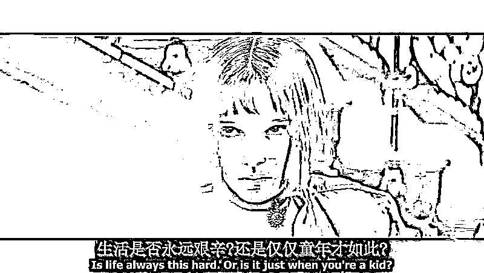

电影《这个杀手不太冷》中，当经常遭父亲殴打的玛蒂尔达第一次跟莱昂相遇时，她问了这句话。我清晰地记得莱昂不带表情地说，“总是如此”。很多年前看这个电影的时候，我觉得莱昂太残忍，为什么不给小女孩一些希望？而电影，在玛蒂尔达长大之前就结束了，我无法知道儿时曾经遭到家暴的她后来怎么样，是不是像莱昂所预测的那样一直充满艰辛？

**有些人至今都觉得“家暴”是正常的**

很多年后，我体会到了这句“总是如此”的真实性和残酷性——从来找我咨询的客户身上，从我所听到、看到的许多故事之中。

**♞ 她的童年经常被打，她觉得正常，甚至替父亲开脱**

有一位从小犯错就被父亲吊起来打的女性，现在 50 多岁了，说起童年往事已云淡风轻，“这不是正常的吗？那个年代，孩子犯错都会被吊起来打，又不是只打我一个，有时皮带都抽断了。”她的父亲是一位革命军人。

我的脑海里立刻出现了刑讯的场面，但她肯定是看到了我的这个“错误”念头，立刻说：“他其实挺爱我们的，是我不好，太调皮了，又爱撒谎。”她现在事业很成功，但是她不快乐，用她自己的话说：“我总是不让自己的人生好过。”

这个女性有**火星和冥王星的挑战相位**，结婚又离婚，自己有暴力倾向，发怒时会打丈夫和孩子，无法控制自己。

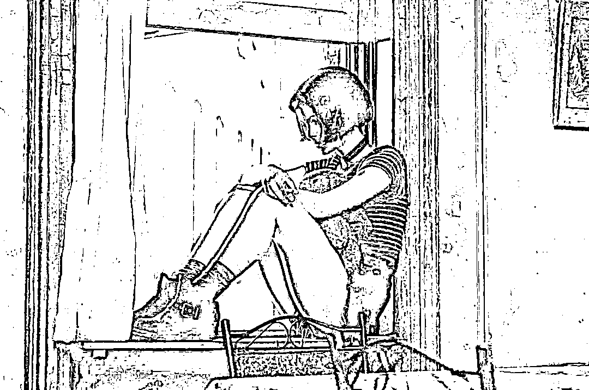

**♞ “我习惯了母亲骂我，有一天她没有骂我，我惊慌失措”**

身体上的虐待是可怕的，同样可怕而更被忽视的是情感上的虐待。

有一位女性说，有几年，她母亲每天都会骂她一顿，不论她怎样小心翼翼，努力学习，做好家事，挨骂成为生活日常的一部分。她无法记得太多童年往事，只记得有一次，母亲几天没有骂她，她非常害怕，想母亲怎么会忘记骂她，母亲是不是疯了。当时她虽然年纪很小，但是已经知道有“疯狂”这种精神疾病。

她忍受这个担忧，默默观察母亲的一举一动，不敢跟其他家人说，直到有一天，母亲又开始骂她，她的心终于落地，这证明母亲很正常，并没有发疯，她甚至有些欢喜起来。“她从来不打我，我的舅舅会随时用大巴掌扇我的表弟呢，我想和被打的孩子相比，我这点算不了什么。”

这位女性有**月亮和海王星的挑战相位**，对于外界的一切极其敏感，有严重的焦虑症，在职场上总是承担过于繁重的工作，无法设定界限，直到焦虑、严重的失眠症和工作负担一起把自己压垮。

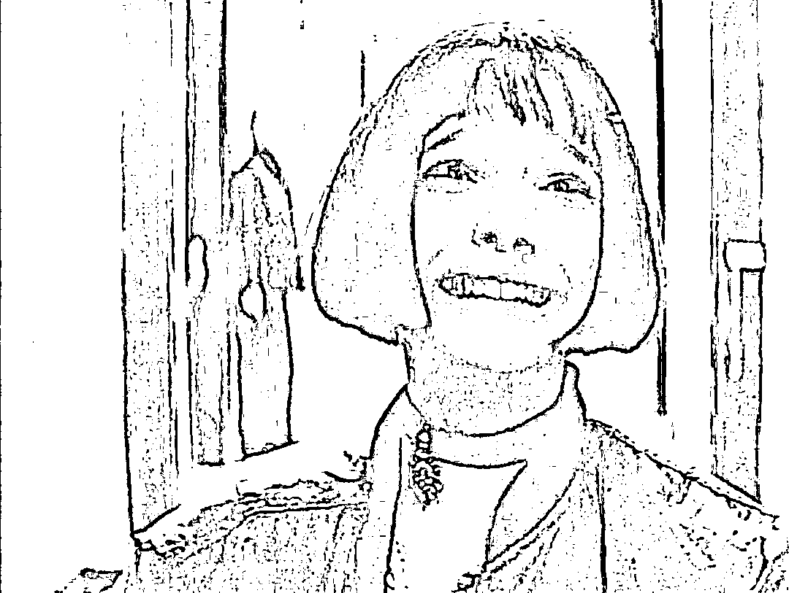

**“认同家暴”会造成什么影响？**

更加让人惊讶的是当开始探讨童年的时候，她们的回答都是：**我的童年很平常，很普通**。

当我越来越多听到这些“普通”的童年故事，让我看到我们文化的一个共通之处，“被虐待”，不论是身体，还是情感，曾经是我们养育文化中的一个“常态”。我们信奉“棍棒之下出孝子”、“打是亲、骂是爱”，因此**不论是虐待方还是被虐待方都将之轻描淡写，甚至美化其必要性，完全意识不到其影响和后果**。

♞ **长期压抑的对家暴的复杂情感，有可能会引发身体和心理疾病**

然而稍微做一个调查，你就会发现童年遭受情感和身体严重虐待的人的成年生活常常如同他们的童年一样失常：严重的焦虑症、忧郁症、拖延症、无法管理的愤怒、自卑感、情感婚姻的坎坷、职场的波折，甚至因为情绪问题而引发的身体疾病都可能出现在生活中。

某段时间，真的如莱昂所说，一切都很艰难。**他们自己也觉得有什么地方不对头，只是在深入探索之前，他们不知道哪里真正不对头。**

一切有因，也有果。

*   如果童年我们不懂得什么是爱，我们怎么在成年懂得什么是爱呢？什么样的表现算是爱？我又怎样表达爱？

*   如果童年我们所依恋的人，最亲近的人，打我们，用恶毒的语言骂、嘲笑我们，我们怎么能够信任他人？

*   如果童年时，爱和愤怒、憎恨、羞愧、内疚等感情掺杂在一起，我们怎么在日后的爱的道路中不迷惑？

*   如果我们童年我们的生活中上演的是恐怖片，那么成年后我们怎么会不被不安全感、焦虑感萦绕？

古人说，三岁看老。童年是人生的序幕。我们来简单看看这些“小玛蒂尔达”们长大后会遇到哪些可能的问题吧。

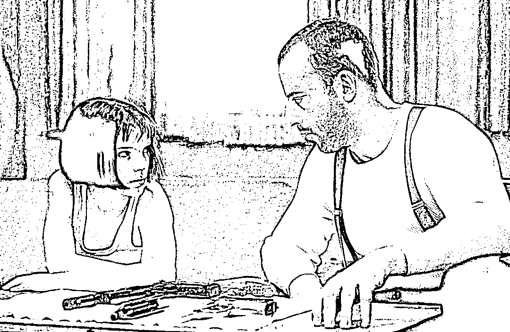

**1.****觉得自己任何东西都“不配”获得**

小时受到严重虐待的孩子，都可能有很深的“**无价值感**”。这个孩子内心深处会得出一个结论，**认为自己在这个世界上并不值得被爱**。

从很小的时候，这些孩子内心都可能会有一种，我不值得活下来、我不配活下来、我不配过得好、不配被爱的绝望感，**有的甚至会有一种罪恶感，强烈的内疚感**。

**在这种无意识的感情的影响下，他们不断做自我伤害的事情以证明，自己的确没有价值，不值得被爱。**在成人以后，这个潜意识中的“自我陈述”成为“自我实现”的预言。正如开头的那位女士一样，“我总是不让自己的人生好过”。

*   一位女士推掉了很多优秀的男性，找了一个让大家都有些惊讶的人，多年后她说“我无法接受别人对我太好，我总觉得那根本不真实。因此我找了个普通人嫁了，我以为这样我会幸福”。当然，她并不幸福。

*   另外一位女士喜欢泡夜店，她觉得有点坏、有点危险的男人对她来说更有魅力，她作为被虐方配合他人玩ＳＭ游戏，她无法识别出哪些是更正常、更健康的男士，在爱中充满困惑。她的梦境却泄漏出她的严苛的自我评判，一个重复出现的主题是，她是一个坏女人，尿液、粪便污染的澡盆、池塘、下水道是梦中常见环境。

*   一位女士经常遭受上司的责骂，大庭广众下的羞辱，动不动被克扣工资，她全部忍受下来，而且常常觉得上司讲的有道理，是为了她的成长和进步，并且因为能够和上司保持一种很奇妙的亲密关系感到自豪。

*   一位女性说“我总是和混蛋交往，好像我的鼻子能嗅出来谁更混蛋，我就闻着味道去了，让他欺负我”。

**以上种种，常常出自于“低自我价值感”。这个可怕的感觉如病毒埋藏在意识深处，就像一个自我攻击的程序一样，挫败着成年后为幸福所做的努力。**


**2.****积压的愤怒肆意宣泄，难以控制**

被殴打和辱骂的孩子心中当然有愤怒。我想现在和过去，可能很多“被侮辱和被损害的”孩子们心里也想对正在虐待过他们的大人怒吼：“你凭什么打我伤害我？你以为我小、没有力量、不得不依赖你，难以离开你，我就不会心碎，不会愤怒吗？你想错了，我和你有一样的灵魂，一样的心。如果老天赐予我一点魔法，我会让你饱尝你所施加给我的痛苦；如果我可以独自生活，我就要离开你，离开这个家！”

当然，不会有大人听到这样的怒吼。这些怒吼留在了心中。

根据孩子的天性不同，有的孩子小时候会反抗，当然由于力量悬殊所以被镇压。有的孩子会默默忍受。而**长大以后，这些积压的，没有被发泄的愤怒会以各种不当的形式表现出来**。

**❶ 你可能会无法控制愤怒**

*   “我无法控制对孩子的怒火。他不自律，磨磨蹭蹭，我必须打他，他才能听话。小时候还行，现在他更反叛了，我完全管不了他。”

*   “我无法控制对我老公的愤怒。我甚至会打他。”

*   “我的同事关系很糟。他们都怕我。但直到我离职那一天，我才知道，原来没有一个人跟我说实话，我感觉更愤怒了。”

**❷ 你可能会害怕冲突，不自觉地躲开**

*   “我总是竭尽全力不合任何人起冲突。想到会发生冲突，我的身体就会发抖。然后，我就躲开了。但是最后还是躲不过，因为对方得寸进尺。然后我像发疯一样，我觉得我杀人的心都有了，我把自己也吓坏了。”

**❸ 你用其他情感掩盖了愤怒，甚至否认愤怒**

很多人没有意识到焦虑症之下有可能是愤怒。因为不敢表达愤怒，甚至否认自己愤怒，因此情绪转移成当事人理智上更能接受的其他情感，比如抑郁、焦虑，以非理性的恐惧、担心的方式呈现在生活中。

*   “即便什么都没有发生，我也会感觉生活会出错。”

*   “我觉得一切都没有希望。”

而实际上是，你很生气！

**❹ 即使你想为自己争取什么，也依旧觉得无力**

**火星既是愤怒，也是力量。**如果火星没有力量，你感觉到自己似乎被阉割了一样。一种做什么都没有用的感觉，也无力去为自己奋斗、争取、抗争点什么。这种感觉就像一只在温水中慢慢变得麻痹、坐以待毙的青蛙。不论是在与人的互动，还是为了自己而去坚持和努力的道路上，你都感觉到没有力量，无法捍卫、追求自己的利益。

**❺ 你常常过度用力**

*   “我好像总是用力过猛，不论锻炼、工作、爱情，常常把人吓着。比如锻炼吧，我把我的肌肉和膝盖都伤了，不得不做了两次手术”。

这位女士可能不知道，她之所以这么用力，是因为她想保护自己。但是她没有掌握好力道。

**❻ 你无理由地反抗他人**

*   “我总是犯错。总是忘记时间。总是迟到。总是不按时完成任务。”

*   “我答应他们，但我就是不做。”

你总是让别人生气，而你自己也很委屈，这些都可能是你采取了被动攻击方法。其实，你很生气！　

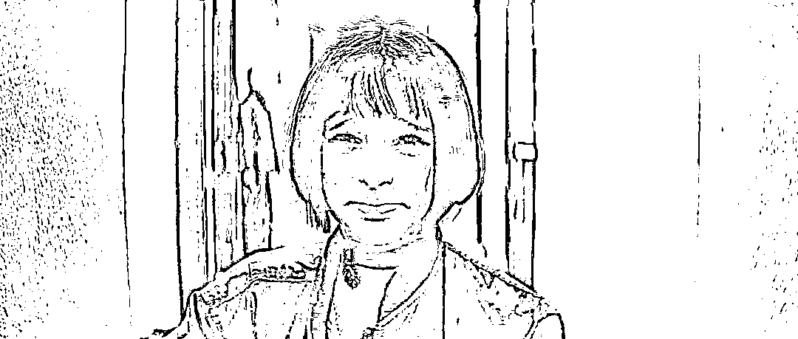

**3.****你毫无安全感，犹如惊弓之鸟**

毋庸置疑，受到身体和精神家暴的孩子长大以后，有很**强烈的不安全感**。因为从小，那个本来应该给他们安全感的容器——他们的家，没有给他们安全感。长大后，如果没有走上疗愈的旅程，他们的内心仍然是惊弓之鸟。

*   “只要他们窃窃私语，我就觉得他们一定是在说我的坏话。”

*   “我是一个特别敏感的人，光、风、声音都容易影响我，让我心情低落。陌生环境也让我害怕。或者是熟悉的环境突然改变了，来了个陌生人。”

*   “今天领导批评我了。我觉得他迟早会辞退我。”

*   “我总觉得不安全。不论我自己挣多少钱，多成功都不够。我总是还是觉得不安全。我必须要找个能保护我的男人。他必须得比我强，这样我才能有足够的安全感。我终于找到一个，结果他还背叛了我。”

**4.****要么你的心墙太高，要么你根本无法建立自己的领地**

小时候受到家暴的孩子被不当地侵犯了他们的边界，不论是身体上还是精神上的边界。他们**没有被尊重（土星），没有被无条件的接纳（海王星）**，反而因为自己的弱小，无力保护边界，被大人侵犯，变成功能失常的大人的**牺牲品（海王星）**。而这个世界上，有太多功能失调的大人。

**这会造成两种反应机制，都和边界有关：**

**❶ 建立太高的心墙，没有一个人可以接近、进入他们的内心。**

有些孩子长大后，用这种方式保护自己，形成了自然的防御机制。他们在自己的周围**建了一堵厚厚的高墙，自己走不出去，他人走不进来，因此一直孤独的生活着**。孤独不意味着不结婚，有些结婚的人比单身的人更孤独。

**❷ 根本没有边界和规则，任由他人入侵自己的领地进行践踏。**

*   “我无法对别人说‘不’，因此只能看着自己的事情越来越多，下班越来越晚，而他们则把更多的事情给我。他们说我是好人，能者多劳。”

*   “我负担家庭的一切，我一直承担主要的家庭开支，我接孩子、陪孩子学习，我为家庭牺牲了一切，而他则在外面找了其他人。他哭着求我原谅。我原谅了。后来他又出轨了。我又原谅了。后来他变得肆无忌惮。”

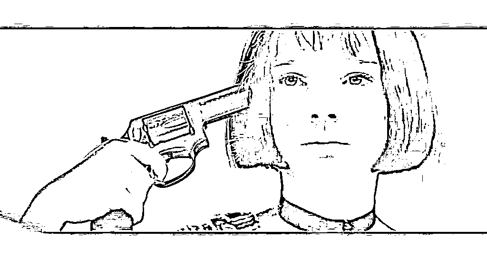

**5.****无法达到父母的期望，你会有深重的内疚和负罪感**

当父母暴打、责骂孩子的时候，他们总是会说这是孩子的错，他们应该受到这样的处罚。有的父母有严重的人格失调问题，但孩子们却不知道，**孩子们也会觉得自己真的错了，是自己引起父母的愤怒，因此会产生内疚感和负罪感**。这种内疚感有时会深深扎根到心灵之中。

*   “我知道他很糟糕，配不上我，但是我好像是上辈子欠他的。我就是离不开他。如果我离开他，也许他就活不下去了。我无法一个人过得好，我有强烈的负疚感。爱不就是要承担一切吗？”

有的父母设定了孩子无法到达的**严苛标准（土星）**，甚至**过于理想化的甚至病态的标准（海王星）**，但是这个标准从此在孩子的心中驻扎了下来。他们有了**错误的“现实感”和“徒劳感”**。当他们长大以后，哪怕父母不再要求，但是内化了的父母的声音仍然陪伴着他。

*   “我总是无法按时完成任务，有严重的拖延症，好像我就是想毁了自己似的。”

*   “我反正也做不到完美，索性连试也不去试好了。”

*   “我不断跟周围人比较，我必须让自己比其他人都强，否则我就觉得我是个彻底的失败者，哪怕现在很多人都羡慕我，但骨子里我还是觉得我是个失败者”。

因为现实是那么得难以忍受，一些孩子童年会编故事让自己的精神甚至肉体离开这个现实，而他们在成年后则成了各种各样的上瘾症患者：购物癖、电子游戏癖、嗜酒、性瘾、拖延症等。

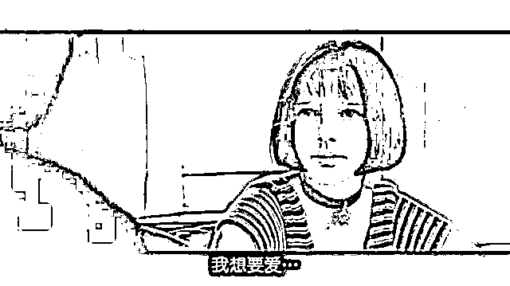

**6.****你无法相信自己的生活会变好**

受到家庭暴力的孩子在童年就经历了地狱。天真之花没有开放，就被摧残，如同玛蒂尔达那样。而世界上为什么会有地狱的存在，为什么即便是慈爱的父母也会有这样阴暗的一面，这是孩子们甚至成年人们都所无法理解的。

但是，就像被冥王掳走的珀尔塞福涅无法再用同样的天真姿态走在河边，无忧无虑地去采撷花朵和青草一样。当她看到一棵树，她首先看到的不再是茂密的枝叶、跳跃的阳光、累累的果实，而是黑色的影子。她时刻会警惕，危险会从哪个角落，哪个人那里冒出来，这些孩子长大无法再轻易相信他人、自己和生活。他们的眼睛上架着看不见的墨镜，也因此看到更多充满恶意和敌意。这种猜疑会达到一个偏执的过分的程度，但他们自己往往信以为真，结果毁了自己成年后的生活。

**最可怕的是无法相信自己。无法相信自己的力量。**

*   “我无法信任他，所以我只能去监视他的一切”。

这句话翻译一下就是：“我无法信任自己可以获得他全部的爱”。或者“我无法信任自己，不相信哪怕他离开我还会找到更好的”。　 

他们甚至会被“阴暗面”所吸引，不论是自己还是他人的阴暗面，而这常常又是在无意识之中的演化。因此，他们被“容易背叛的人”吸引，被“暴烈的争斗吸引”，被“危险的事物”吸引，甚至变成了黑暗的一部分。**因为上天安排这些被侮辱和损害的孩子在成年后需要用重新回到地狱的方式去看清楚伤口所在，看到黑暗和光明的意义，并且拿回属于自己的力量。**

为什么会有这么多家庭暴力，我想既和我们的文化相关，也和我们 100 年来的历史相关。我们 100 年来的历史是火星、冥王星的历史，不断的外战、内战、社会不公，有很多的愤怒积压在个人内心、家庭之中。一个没有经过疗愈的民族，无法真正解决家暴问题。因为历史会传承和重演。

不过，一个小的进步也是进步。在我们这代人，和更年轻的那代人中，曾经被当作常态的家庭暴力逐渐变得更让人关注，并有越来越多曾经遭受过家庭暴力的人去寻求帮助，对于自己内在的暴力更有觉察，从而疗愈几代人的伤口。

爱的想法将会成功。

**版权声明：**原创文章由作者授权发布于若道平台，欢迎转发，反对抄袭。


****想阅读更多作者的文章，请在后台回复******** 蒋颖**** 即可。****

**蒋颖**

若道创始人，中国首批 ISAR 英文认证占星师（2012 届）

长江商学院 MBA，厦门大学经济学硕士，化学学士

国际占星研究协会（ISAR）中国区副主席

《灵魂的目标》译者

**双证书核心课程火热报名中**

**点击图片了解详情**

**

**如何报名？请点击“阅读原文”**


# 为什么水逆的时候，手机电脑老出问题？

> 原文：[`mp.weixin.qq.com/s?__biz=MzA5NjA0NTAxNg==&mid=2651413971&idx=2&sn=b771ed07a03fd86bdd2fe778ee446cfa&chksm=8b4bef64bc3c6672b26c7cef7194f5a7ce533b4eefef47048b5dc4c3dc9b98736d72194d41e4&scene=126&sessionid=1692738202#rd`](http://mp.weixin.qq.com/s?__biz=MzA5NjA0NTAxNg==&mid=2651413971&idx=2&sn=b771ed07a03fd86bdd2fe778ee446cfa&chksm=8b4bef64bc3c6672b26c7cef7194f5a7ce533b4eefef47048b5dc4c3dc9b98736d72194d41e4&scene=126&sessionid=1692738202#rd)

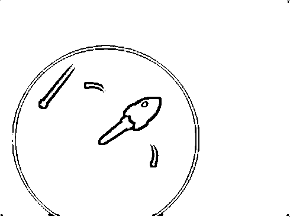

作者/熊鹰（天空的空） ISAR 认证占星师 

编辑/Tang 图片/soogif

若道金牌中文讲师熊鹰老师的问答专场来了。看看今天，我们又有什么问题等待解答。为什么水逆的时候，手机电脑老是出问题？巨蟹座为什么念旧？狮子座在乎别人的眼光吗？……

**为我们答疑的金牌中文讲师是谁？**


**熊鹰老师（天空的空）**

*   2008 年接触严肃占星学，至此爱不释手。
*   **2013 年师从大卫·瑞雷**，研习整套现代占星学核心课程，并于 2014 年起至今连续三年担任该课程的主助教。
*   期间也**跟随格伦·佩里、诺·泰尔、理查德·塔纳斯、罗伯特·汉德、苏·汤普金斯、斯蒂芬·弗里斯特等多位国际顶尖占星大师进行学习**，进行定向占星主题研究。
*   2015 年初，通过国际占星研究协会**（ISAR）资质认证并获得证书**。同年，进一步跟随大卫·瑞雷老师进修**“生时校正”**技术，通过最终考核并获得证书。
*   目前在若道星文化任职，将传播系统、严谨、真实的占星学作为职业使命。任专职助教期间，进行沙龙与答疑等辅助教学工作已累计超过 200 小时。
*   在业余期间也提供占星咨询与生时校正服务。目前正致力于占星学与个人成长的整合。

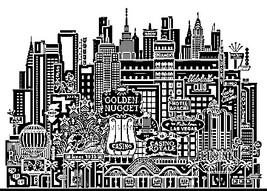

**1**

**为什么水逆的时候，手机电脑老是出问题？**

**问**：我们到底该如何理解水星逆行？为什么那时候数码产品老出问题？

**答**：我想这可能是大多数人都有的疑惑：如果不是水逆影响了我们，那为什么在这一段时间我们总是遇到那些与水星有关的事情？  这里首先想建立一个前提：**水逆并不完全是“坏事”**，比如在水逆期间其实是**适合思考**，让做出决定的行动缓一缓。**深思熟虑之后，事情往好处走的可能性也大。** 其次我想说，每一个特殊的天象时期，比如水逆，比如天王星四分冥王星，其实都是一种“共业”的爆发时期，或者换一个说法，是**“集体无意识”集中显化为事件发生的时期**。从这个角度，我们或许就能理解，为什么在水逆期发生那些水星相关的事情概率变大：平时不注意手机的放置，随手拿随手扔，水逆期间自然容易摔坏屏幕。

**2**

**星座测量的基准是什么？**

**问**：星座最早的地理位置测量是在什么时候进行的？黄道星座的测量又是以什么为基准的呢？

**答**：**星座最早出现在苏美尔人和巴比伦人的泥土石板上。这是大约距今 3800-4000 年（甚至更早）的迦勒底或者巴比伦文化。**西方星座的名称起源于迦勒底文化，之后是希腊人借用了巴比伦占星学和埃及占星学/几何学/天文学。**测量基准是“度”**，大约为从地球上观测到的太阳和月亮的半径大小。然而，测量中总会用到的“6”的概念要追溯到古代苏美尔人——大约 5000 年前，甚者更早。因此有了 360 度，一小时或者一度包含 60 分，一天包含 24 小时等。 

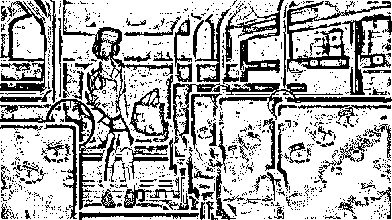

**3**

**占星学有什么优势？**

**问**：感觉占星学好像是一门一直在变化和改动的工具，想知道这样一来它作为一个系统的完备性是怎样的，又有什么样的优势呢？

**答**：**其实占星学并非一直在变化，就好像 12 星座的核心意义是自古以来就不变的。会变的是占星师所处的环境，从远古到中世纪到现代，从商朝到唐朝到我们生活的当下。 ** 也就是说，**核心意义所对应的外在事件在不断变化**。就好像白羊座在古时候我们会说，你是个战士，去打仗吧！到了现代，我们仍旧可以这样说，但是更多的是：你是个有勇气的人，去放手干一番事业赚他一个亿吧！ 你瞧，白羊座关于“勇气”关于“开拓”的核心意义并没有变。

**4**

**巨蟹座为什么念旧？**

**问**：巨蟹座为什么念旧？比如，巨蟹座保留车票，这是一种情绪抚慰吗？

**答**：巨蟹座“念旧”，因为**旧的东西往往能唤起“记忆”，而记忆能唤起情绪**。记忆与情绪往往是捆绑在一起的。 

**5**

**狮子座在乎他人眼光吗？**

**问**：有王者思想的狮子座，是否也会在乎他人的眼光？

 **答**：是的，狮子座可以说**十分在意他人的眼光**。更确切地说，狮子座十分在意“**是否被人们所瞩目**”，这也正是王者的期待——**永远做人群的焦点**。

**你可能还想知道**

[星图里四元素分布不均，影响很大吗？](https://mp.weixin.qq.com/s?__biz=MzA5NjA0NTAxNg==&mid=2651413570&idx=2&sn=e45c094729e0153b90cdfd2902a2b6df&chksm=8b4beef5bc3c67e3303dd5bb458066a4a82c87ff1130d2a986a0ebdc42b87eb8ba7cfa029ee9&token=1530151575&lang=zh_CN&scene=21#wechat_redirect)[!](https://mp.weixin.qq.com/s?__biz=MzA5NjA0NTAxNg==&mid=2651413570&idx=2&sn=e45c094729e0153b90cdfd2902a2b6df&chksm=8b4beef5bc3c67e3303dd5bb458066a4a82c87ff1130d2a986a0ebdc42b87eb8ba7cfa029ee9&token=1530151575&lang=zh_CN&scene=21#wechat_redirect)

[为什么你明明不是 XX 座，却老觉得自己像这个星座？](https://mp.weixin.qq.com/s?__biz=MzA5NjA0NTAxNg==&mid=2651413812&idx=2&sn=0e81891677434a45558dfab2bd6ec164&chksm=8b4bef83bc3c66958b7063937f05b4c646a65f49bf6ede44fdc445178ebbd713eb75e03ae1d8&token=173326699&lang=zh_CN&scene=21#wechat_redirect)

**敬请期待熊鹰老师**

**下一波答疑**


**现在你有机会跟随熊鹰老师**

**系统学习占星学**

**点击图片了解详情**


**微信又双叒叕改版啦，不想错过若道君的推送？**

**就把若道设为星标吧！**

**▼**


就是这个“在看”，戳戳戳 ☟

********报名直达入口********


# 特别金融报告免费赠送！3 月上证+黄金报告上线

> 原文：[`mp.weixin.qq.com/s?__biz=MzA5NjA0NTAxNg==&mid=2651413966&idx=3&sn=e6b0ea2d7cb4b7aa17020e3100a1169a&chksm=8b4bef79bc3c666ff371e4266b084653b01557c2562ef95cb9ef4806959c8c14d59fc27462e8&scene=126&sessionid=1692738202#rd`](http://mp.weixin.qq.com/s?__biz=MzA5NjA0NTAxNg==&mid=2651413966&idx=3&sn=e6b0ea2d7cb4b7aa17020e3100a1169a&chksm=8b4bef79bc3c666ff371e4266b084653b01557c2562ef95cb9ef4806959c8c14d59fc27462e8&scene=126&sessionid=1692738202#rd)


这两周的上证和黄金市场可谓惊心动魄。

首先，梅里曼老师又说中了。在 2 月 24 日，就在梅里曼老师在《上证指数 2 月研究报告》提到的 3 星关键反转日附近（27 日是关键反转日，一般情况下，在关键反转日的前后 3 个交易日（有时 6 个交易日） 市场会发生发转，如果星级越高，且和金融占星研究的波峰波谷周期发生重合，则反转可能性越大），上升势头甚猛的美股掉头向下大跌（上周道指跌幅 10%，幅度超过 2019 年最严重的下跌（7.5%）），而美股的下跌引发全球股市下跌，本来已经连续上涨 15 日的中国股市也无法独善其身，跟着大跌，特别是科技股更是如此。

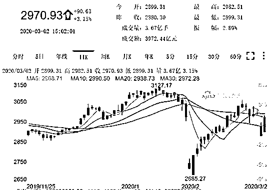

**|**图：2020 年上证指数走势 K 线图

而最匪夷所思的是，本来走势总是和美股相反的正在一路上涨、凯歌高奏，迈向 1700 美元的黄金"也”在 2 月 28 日猛烈下跌，虽然 28 日也是在关键反转日，但让无数人大跌眼镜！

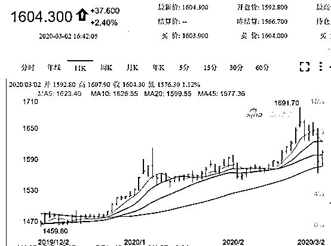

**|**图：2020 年黄金走势图

而本周一，在世界危机之中，似乎可能成为诺亚方舟的中国股市又大幅上涨。**市场怎么了？这样的大幅震荡中，该如何操作？**新型冠状肺炎在中国似乎慢慢好起来，而世界却越来越陷入危险之中。而当一场全球经济危机看起来越来越明显时，**中国能成资产避险的诺亚方舟？还是最终无法独善其身？黄金一贯的避险功能还能否保持？**对于所有投资者而言，这真的是一个特别的时期。让人感动的是，梅里曼老师非常了解投资者的慌张心态，为了帮助投资者们了解他的想法，**他为所有购买梅里曼金融报告的读者准备了一份特别报告，并免费赠送给大家！**这个报告虽然分析的主要是美国市场，但考虑到全球市场的密切相关性，对中国市场的读者也是一个重要参考！而如果你本来就投资美股，当然更有用。另外，有些朋友问，如果我不买上证指数，只买基金或者个股，《上证指数报告》也有用吗？回答是，**上证指数走势代表整个中国股票市场走势，哪怕你买的是个股、基金或者投资创业版指数，上证指数趋势都是投资者最重要的参考指标。**而在世界性的经济危机中，黄金是你一定要关注的资产配置！《上证指数 3 月研究报告》和《黄金 3 月研究报告》已经发布，如果您已经购买， 请参照下图指引，查看报告内容。**关于梅里曼市场特别报告，在老师将报告发给我们之后，也会上传到已经购买了梅里曼市场时机报告的读者的个人中心，供大家参考。**

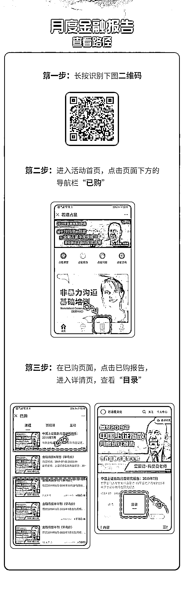

如果您还没有购买，您可以**点击文末阅读原文**，购买报告。

在每个月度报告中，梅里曼老师给出**上证指数价格目标区间及重要价格反转日**，为短期、中期和长期投资者进行市场操作的时机提供参考。

**优惠价别错过！**

上证指数月度报告价格

**单月报告**：280 元

**3 个月套餐价**：780 元（260 元/月）

**12 个月套餐价**：1999 元（166 元/月） 

**长按下图识别二维码购买上证指数报告**

▼


**黄金报告上线！**

黄金周期月度报告价格

**单月报告**：280 元

**3 个月套餐价**：860 元

**12 个月套餐价**：2400 元

**双报告年度套餐更优惠（直降 899 元）****12 个月黄金报告+12 个月上证指数报告：仅需 3500 元**

**长按下图识别二维码购买黄金报告**

▼

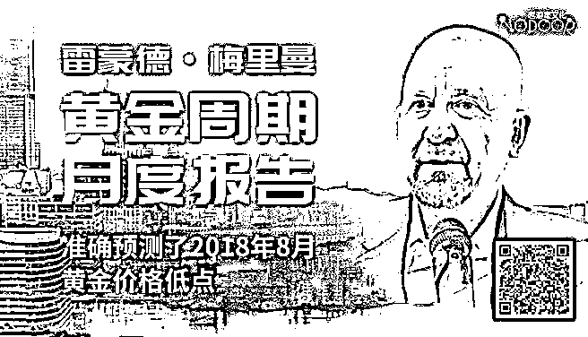

**购买者须知**

① 梅里曼市场时机学院《中国上证指数月度研究报告》是梅里曼市场时机学院（以下简称 MMA）的研究“预报”，而不是市场“预测”，是梅里曼老师及 MMA 金融占星分析师对人类活动周期历史与行星周期之间相关性的研究，二者在大部分情况下具有 80%或更高的相关性，而不是因果关系。报告中的研究完全存在错误的可能性。即便是非常认真的研究和几十年的研究经验，金融占星师无法总是正确地解读出各种征象在实际层面上会如何相互作用，并显化为事件结果。

所以请将报告看作一个研究参考，务必结合其他市场研究和你个人对市场的理解，根据你的自由意志做决策。

② 本报告只是上证指数研究，没有个股研究。

③ 此报告一旦售出，**即不接受退款。**

④ 此报告每月 1 期，**并非都是在每月相同日期发布**。我们收到英文报告的当天，即发布该英文报告。3 天后，上线报告中文版。⑤** 此报告仅支持手机网页阅读，不支持电脑阅读和下载。**

**以上须知，请仔细阅读。一旦付款，即视为已了解并接受所有须知内容。**

在过去的 35 年中，唯有梅里曼逐渐完善，并在梅里曼市场时机学院月度周期报告中阐释了将地球宇宙学与周期相结合的研究方法，以惊人的精确性预报了黄金价格发生重大变化的时间。黄金购买 Tip 各大银行均可购买黄金或黄金 EFT 基金，也可以在诸如天天基金或者支付宝购买黄金及黄金相关产品。不明白的可以百度搜索。
购买后如何查看报告？


购买后有疑问怎么办？请联系技术客服
**微信：nodoor201705**


****************购买上证指数+黄金月报直达入口****************


# 2020 我们特别需要这个星座的能量：居家旅行常备的“抗抑郁良药”

> 原文：[`mp.weixin.qq.com/s?__biz=MzA5NjA0NTAxNg==&mid=2651413966&idx=1&sn=529cd31be4340259617a6a4fb21e6364&chksm=8b4bef79bc3c666f7b69b3dc2fc09138b80b6397d113ba362c0b05599c82e47f3466c5b70f67&scene=126&sessionid=1692738202#rd`](http://mp.weixin.qq.com/s?__biz=MzA5NjA0NTAxNg==&mid=2651413966&idx=1&sn=529cd31be4340259617a6a4fb21e6364&chksm=8b4bef79bc3c666f7b69b3dc2fc09138b80b6397d113ba362c0b05599c82e47f3466c5b70f67&scene=126&sessionid=1692738202#rd)

****************☆ 后台回复“今日”，给你一句生命态度****************

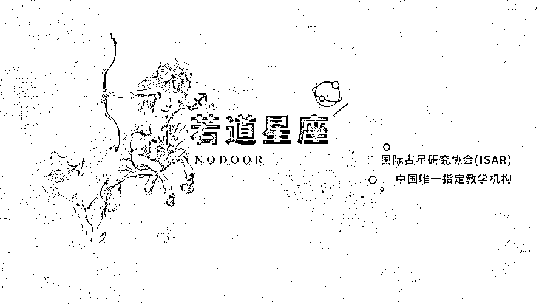

作者/Iris ISAR 认证占星师
编辑/Tang 封面/书君 图片/网络**这个时期我们格外需要的星座能量**

2020 的开年方式可能颠覆了所有人的想象，曾在网上看到一张图来调侃，说是年初立的所有的大目标、小目标最后都简化为一个目标：**活下来**。有个朋友和我感慨：真是惨烈啊。**这一场“战役”中，没有人置身事外。**大家谈论着恐惧、怀疑、愤怒、艰难，有人在经验着悲伤、无助、绝望与失去的痛苦，还有人在说着逆行的勇气、信心、至暗时刻迸发出来的人性的光芒。土星、木星、冥王星合相在象征着艰苦、试炼与考验的摩羯座，似乎大家的日子都不好过。

然而在这样的一个月中，我身边有位朋友，虽然大家同时关注着当下各种发生，一样经历不容易的回家之旅，同样也在家中隔离，但完全没有感觉她在生活节奏上被干扰多少，仍然每天哼着歌，如常过着日子。似乎任何事都不能扰动她的快乐。有天我实在没忍住就问她：你怎么每天都这么开心呢？她几乎不加思考地随口回了一句：有什么让我不开心的呢？接着还反问了我一句：你是不是又在忧国忧民呢？真是让人觉得无言以对，心里想着这是怎样一个“奇特”的生命样本呢？

也许你猜到了，那个强烈地与她生命共振的星座能量。她，拥有一个**强大的射手座星群**，出生星图中的太阳、水星、金星、天王星、海王星全部落在射手座。**射手座，虽然不在今年年度行运的高光位置，却有可能是我们在这个时期格外需要的星座能量。**为什么呢？当我们忍不住想要对射手座的“神经大条”、“没心没肺”加以批评的时候，对他们的“太傻太天真”表示无奈的时候，是否也会好奇，他们是怎么做到的？！我也曾这样好奇，所以就从射手座在黄道上的位置看出了一些端倪。

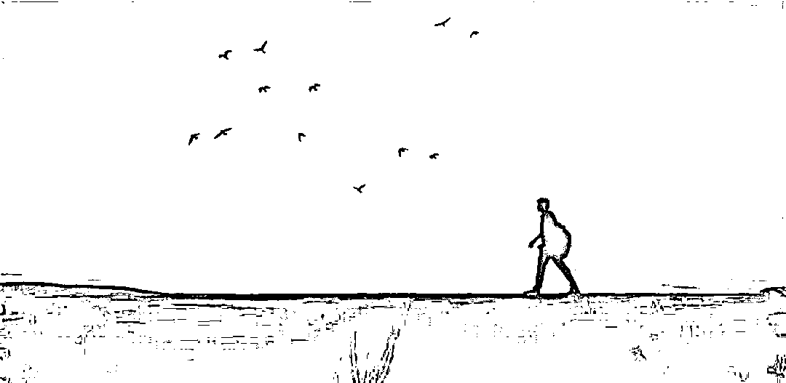

**射手座是黄道的第 9 个星座，在它之前是天蝎座，在它之后是摩羯座**。前后两个都是“不省心”的星座：一个行事强烈极端，一个作风严苛谨慎。依稀可见两张紧张严肃脸。**射手座加在中间，必须要负责调节一下节奏、活跃一下氛围，以平衡整体的生命秩序。**我们不能指望一个星座原型满足人们所有的需求，有的星座原型“负责”为众人负重前行，有的星座原型“负责”从质疑中找到改善系统的实际方法，有点星座原型“负责”冲在前线身先士卒……也许质疑和忧国忧民本就不是射手座在 12 个星座原型中需要贡献的能量，那么射手座的独特贡献是什么呢？其实刚才也有点调侃射手座前后的天蝎座和摩羯座了。在更深的层面上，天蝎座其实象征着经由强烈的经验，将潜藏的隐患和顽疾暴露出来，死而后生的一种转化体验；摩羯座则象征着一种更为成熟、负责、敢于承诺、运行有效、经历了磨难和考验之后的成功。在两者之间，需要怎样的一个过渡？需要哪些品质才能够让经历了转化之痛的生活或者系统可以演化到下一个阶段的成就和成功中？我们凭直觉就能感到，这中间一定不是直接跳跃过去的。**它需要的，正是射手座贡献的：希望、寻求意义、看到可能性、新的视野以及教育和传播。****希望**

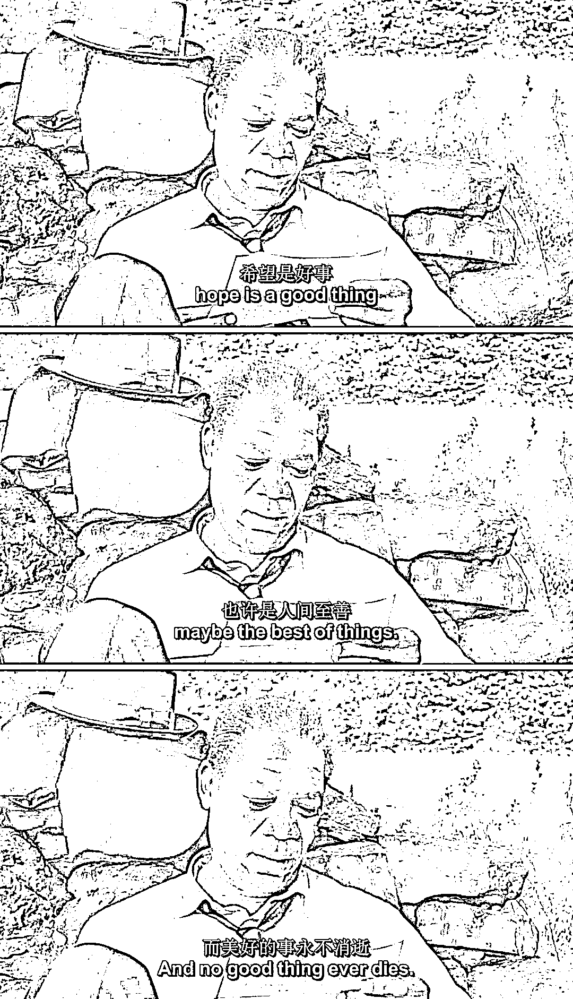

| 电影《肖申克的救赎》截图

“**希望是好事，也许是人间至善。而美好的事永不消逝。****——《肖申克的救赎》**”

这句话来自打动了无数人的电影《肖申克的救赎》，影片中的男主角 Andy 给所有人上了**射手座能量的最为生动的一课**：

被判终身监禁的他进入了充斥了暴力、腐败、权利斗争的暗无天日的肖申克监狱，这样的人生看起来毫无指望。在接连不断的打击中，他平静甚至让人感觉优雅地与周遭的黑暗博弈，重建着“自由人”的生活，不仅创造出了全美最好的监狱图书馆，甚至在监狱天台的夕阳下，与狱友享受一瓶夏日的啤酒，让交响乐响彻整座监狱。最后他成功越狱，在墨西哥的阳光海岸中与狱中好友重逢。

**心怀希望，就能重生，不管看起来那个过程多么的漫长和艰苦，当下正在面对的是多么的绝望和黑暗。**这是电影剧本的原著作者斯蒂芬·金透过 Andy 传递的信念。顺便提一下，作家斯蒂芬·金的月亮就在射手座。

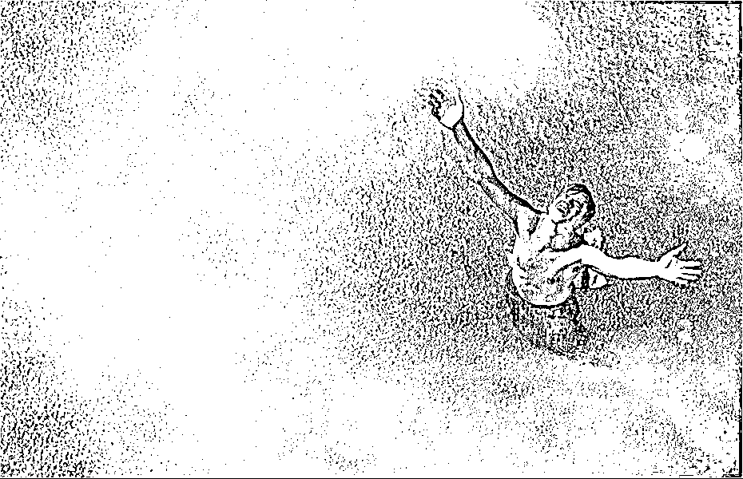

| 电影《肖申克的救赎》截图

**与希望相伴相生的，是射手座的明亮、天真和乐观**。有句话是说“天空飘来五个字，这都不是事儿，是事儿也就烦一会，一会就没事。”真是射手座能量的精彩描述。射手座这种乐观劲儿是从哪里来的？在我看来，**所有的火元素星座都有一种纯真的品质**。

射手座是黄道上第三个火元素，在第一个火元素**白羊座**那里，**火为着生存和胜利热烈的燃烧**；在第二个火元素**狮子座**那里，火为了**荣耀自我的创造而燃烧**；而到了最后一个火元素星座**射手座**，生命之火为了**一种纯粹的信念而燃烧**，那是一种发自本源的，不沾染任何的思考、逻辑推理、甚至情感的纯粹的火，它就是一团单纯的热情，烙印在生命的每一个细胞中。**这个信念就是：对生命的无来由的信任和信赖，对成长的不假思索的理所当然。**

这股纯粹的信念之火持续温暖着射手座天真、乐观的品质，它是射手座的守护星木星的礼物，慷慨大方。它是神赐予射手座的无上祝福。我群星射手座的朋友曾经说过一句可能让所有其他星座的人都会嫉妒得抓狂的话，这句话是：**幸福是我无可躲避的命运，哦哦哦**（后面这三个字是唱着歌说出来的）。

有意思的是，这话要是从别人嘴里说出来，我可能会相当怀疑且不屑，但是经她嘴里说出，带给我的就是一种被感染的快乐。可以说，射手座，是一个备受恩宠的星座。它映现着神的恩宠法则。在天蝎座的转化之痛和摩羯座的成就之路之间，恩宠犹如一道永不黯淡的光芒，鼓舞着人们走过艰难的时刻。

**寻找意义**当然**射手座不止于乐观，乐观只是一种必须，为了接下来的寻找意义奠基。**不限于当下的痛苦，**射手座在意的是：这一切的发生是为了什么？**就像前一阵社区保安们的灵魂拷问：你是谁？你从哪儿来？你要到哪儿去？这可是古老的灵魂三问，画家让·保罗·高更曾经画了一幅著名的画来表达，就是下面这一幅。名字就是《我们从何处来？我们是谁？我们向何处去？》

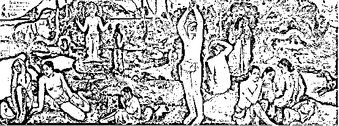

|  高更《我们从何处来？我们是谁？我们向何处去？》

画作从右到左描绘中我们每个人都要在这个世间走过的旅程，观看新生儿娇嫩的生命的喜悦、爱情、思考、老去、死亡……在画面几乎是中间的位置，有个人的视线离开了世界上发生的一切，他抬头望天、高举双手，呈现一种叩问的姿态。这个姿态，就是射手座的姿态，他在**寻找人生的意义**。这一切是怎么开始的？人活着是为了什么？我们所经历的一切到底有什么意义？我们要去向何方？这就进入了哲学、宗教和交织着各种信念体系的领域。
也许一千个追问会带来一千种不同的回答，而终究，它似乎指向的是一种精神上的安顿，一种信心和安慰，这被人们称作：**信仰**。它为人们在这个看似动荡不安的世界中提供了一个稳定的立足点，由此形成一种支撑，成为构建摩羯座象征的社会成就的内在精神根基。也可以说，**射手座本质上是为人类去找寻一种普世性的精神构架、道德与律法**。如果你问很多人成功的秘诀是什么，他们也许会说：**信念**。或者是：**相信的力量**。这种力量给人以信心，以及面对困难时的不可剥夺的精神力量。也许没人能在意志力上战胜天蝎座，没人能在耐心上跑赢摩羯座，那么，也许也没有人能在精神上战胜射手座。什么能够打击到射手座让他们一蹶不振吗？至少我还没有看到这样的例子，反而他们常表现出来的是：远方的草总是比较绿一点。这好像是他们骨子里的一种坚信：**未来总是会更好的**。所以，射手座能量爆棚的人虽然有时会让他们身边的人为他们担忧操心，但幸运的他们似乎总能险中过关，而且精神不垮。**实乃居家旅行常备之抗抑郁的一味良药。**

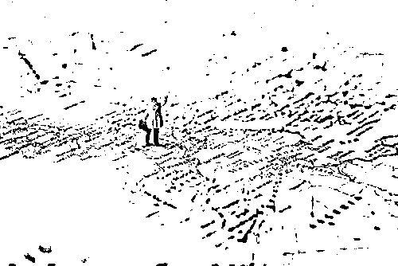

**可能性和新视角**射手座不仅心大，需要的舞台更大。人们对射手座的诟病除了觉得他们缺少危机意识，还有他们的“花心”和不愿意承诺。但**这个星座能量的本质就是扩张，而非留在原地。探索之火不可以被束缚、不可以被浇灭、不可以停止蔓延。**我认识一个射手座，她说自己出行都不愿意带太多的行李，“太多东西我都没力气和心情到处逛了”。她考虑的第一要素并非旅行中的舒适和安全补给，而是轻盈。是如何能够最少负担的上路。因为轻装才能走得远。任何影响到他们旅行的探索是否可以走得更远的，对他们而言都是负担。**他们最害怕的就是：拖累。**负责和承担？那交给后面的摩羯座吧。我要来负责的是看看还有什么可能性，提供什么新的愿景和指导原则来“指导生产”。并且，射手座本能的知道，解决问题的方案不在旧有的局面和维度中产生。奥修禅卡中有一张名为“**新的视野**”的卡牌，在谈及射手座关于“**可能性**”这个面向的时候我经常想到牌上画面的意象。

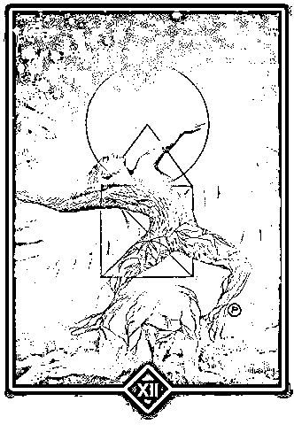

|  奥修禅卡“新的视野”

从下往上看，这个画面呈现了一个转化的过程。开始的时候是一个人匍匐在地，他目光所及之处是一片荒凉的土地。我们似乎可以感受到他内心的伤痕累累和一丝绝望。从这个黯淡的、旧有的躯体中，长出了一个更有活力和生命里的身体，他肢体舒展，灵活而有力，眼神已经离开了灰暗的大地望向了无垠的星空，在他的双臂之后，我们还看到了一对展开的翅膀。如果说，下方的那个人经历过天蝎座式的“地狱的试炼”，那么从中生长出的就是射手座的“新的视野”，这是一个蜕变和维度的切换。**无限的星空中，蕴藏着无限的可能性，在这个宽广的可能性中，新的愿景激励着人们离开旧有的窠臼，去向新的未来。**射手座热爱自由，是的。但更准确的说法或许是，**他们需要挣脱开一切的束缚，去冒险**。去探索一条不同寻常的新路，带人们离开安全地带，带人们离开局限的视野，进入生命更为激动人心的、更丰富的体验中。旅行也好、读书也罢，都是在呼应射手座这种扩张和探索的本质。**他们需要经常离开熟悉的环境、文化、人们，去收集一些陌生的体验来满足灵魂里这种不安的扩张的本质。**直到生命的有一刻，也许射手座向外寻求的躁动的心安静下来了，他们发现无论外在如何扩张，终究有边界，终究安抚不了这种扩张的需求。这会让他们迎来生命中下一个重要的阶段：**向内的无限探索**。他们会发现，内在的世界完全不乏外在世界的精彩，甚至更为丰富和无限，这让他们着迷。他们转向了意识，继而走在真诚的审视、发现真理的真相的道路上。有的人，在其中发现了一些珍贵的东西，他们的这些发现，成为了世人渴求的珍宝。这些射手座，从“求道者”变成了“传教士”，从寻求真理的人，变成讲述真理的人。

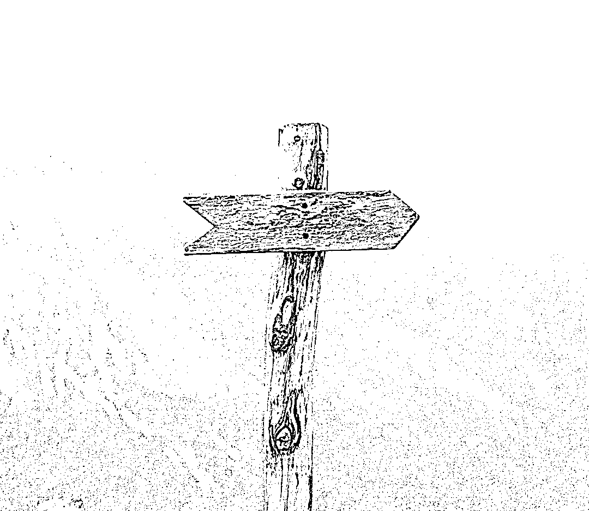

**教育和传播**你也许会发现射手座能量强的人特别喜欢给人家讲道理，很多人还特别会讲道理，俗称好为人师和“常有理”。**传道士、教师、推销员，都是射手座原型的代表。出版、传播、教导，都是射手座能量可以大展身手的领域。**他们很喜欢分享他们探索到的，因为他们真诚的相信这会帮助到别人！解放别人，给别人“松绑”，会给他们带来极大的快乐，他们“解放他人”用的工具就是教导，**用启迪人心的话语和图景去鼓舞和激励他人走出旧有的习性和模式**。他们的鼓舞中有一种火一样的热情和一种天真快乐的精神，很容易感染到他人，“好燃啊”，这就是成功的射手座式的鼓舞会给人们带来的感觉。你觉得生命力重新被点燃了，活力被唤醒了。**这种能力既是射手座的祝福，在某种程度上也是他们的需要留心的“阴影”。**这里面的**陷阱**是：**自以为是和用新的教条取代旧的教条，本质上是捆绑而非释放**。另外还需要尤其觉察的是，你的教导，是当下人们需要的吗？教导你是你的需要，还是别人的需要？**自以为是的陷阱**是阻碍了射手座继续去探索的热情，转而把这股“火力”用于劝说别人同意自己。在外人看来这更像是一种狂热，极易被别人当成是你想给我洗脑而转身走开。所以当射手座发现自己好像太过于坚持某一种观点和理念中时，可以经常问问自己：还有什么别的可能性？或者一个更强而有力的转化的“咒语”是：我能怎么为对方的那些观点辩护？当射手座可以把思考角度灵活切换在不同的观点之间的时候，也**避免了第二个陷阱**：**用教条去捆绑别人，继而把探索不同可能性的自由也留给他人。**当射手座可以时时觉察教导是来自于他人的邀请还是自己抑制不住想要说服对方时；当射手座发现对方当下并不想要被教导，就闭上嘴把心中的那把火照亮自己深入探索的道路时，他们就会给出这个世界和周围的人最珍贵的一份礼物。这份礼物的样子很像泰戈尔的一句诗，我用它来结束这篇射手座的文章：“**让我的爱像阳光一样围绕着你，又给你光辉灿烂的自由**”。

****版权声明：****原创文章由作者授权首发于若道平台，欢迎转发，反对抄袭。友号转载请申请白名单。


**Iris**职业占星师 / 塔罗师 / 摄影师
若道 2014 届核心课程毕业生 ISAR 认证占星师（2014 年获得）国家广电媒体工作 10 年，现定居大理**咨询微信号**：semsa-sun**微信公众号**：TheStarWisperer

长按打赏


**点击图片查看若道君推荐**


**微信又又又改版啦，不想错过若道的推送？**

**就把若道设为星标吧！**

**▼**


喜欢记得点一下在看哦☟

****************报名直达入口****************


# 雷蒙德·梅里曼金融占星周运 | 金星进入金牛座，带来希望

> 原文：[`mp.weixin.qq.com/s?__biz=MzA5NjA0NTAxNg==&mid=2651413966&idx=2&sn=16517623971ccba96b0cc0bf4f0a6d6a&chksm=8b4bef79bc3c666fbddc68a5bcf2308bf28e894a9894882a4cd39879f5faef53c67667f704e1&scene=126&sessionid=1692738202#rd`](http://mp.weixin.qq.com/s?__biz=MzA5NjA0NTAxNg==&mid=2651413966&idx=2&sn=16517623971ccba96b0cc0bf4f0a6d6a&chksm=8b4bef79bc3c666fbddc68a5bcf2308bf28e894a9894882a4cd39879f5faef53c67667f704e1&scene=126&sessionid=1692738202#rd)

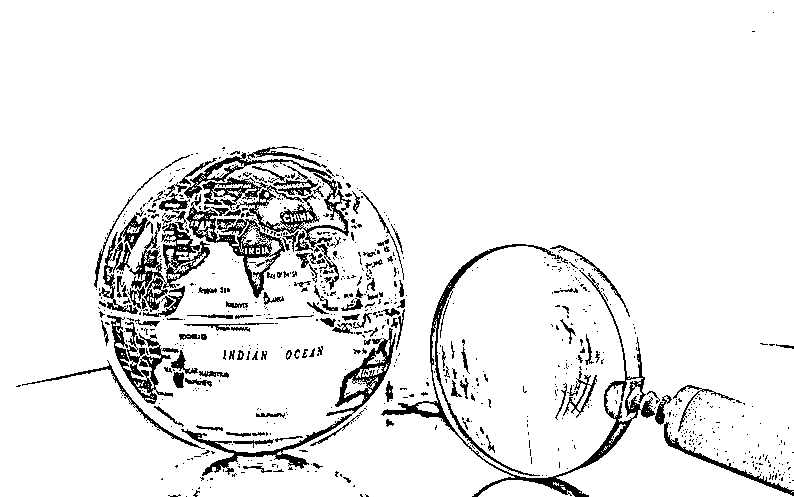

作者/雷蒙德·梅里曼
翻译/Luke 校对/李含编辑/玫瑰 图片/全景网雷蒙德·梅里曼是在金融占星学界稳坐第一把交椅的占星师，同时他也是若道签约的金融占星课老师，我们引进了雷蒙德·梅里曼老师的《[上证指数月度报告](http://mp.weixin.qq.com/s?__biz=MzA5NjA0NTAxNg==&mid=2651413928&idx=3&sn=032834e395bde8f9a5a9916259f4703c&chksm=8b4bef1fbc3c6609821d121796ca9931a4f6e69ba65d94251cefcc9d855bcefa991e89c55a07&scene=21#wechat_redirect)》《[黄金周期月度报告](http://mp.weixin.qq.com/s?__biz=MzA5NjA0NTAxNg==&mid=2651413785&idx=3&sn=ef942521571587ac93a4ae49c7ffcefb&chksm=8b4befaebc3c66b829d57620e48233e4abbc5a7f6eb3a2a69675809890a3486aa8149721c08a&scene=21#wechat_redirect)》《[2020 年金融预报](http://mp.weixin.qq.com/s?__biz=MzA5NjA0NTAxNg==&mid=2651413917&idx=3&sn=58d163921efef7d700062ee80e296455&chksm=8b4bef2abc3c663c5afb5f249499e7ee26807b6d3fdbd5017bc75b9f0490f099bfff4806dfac&scene=21#wechat_redirect)》。我们经老师的授权，将每周刊登梅里曼老师的周运，供大家参考和学习。于是，这是本周的周运（3.2-3.6）。**展望与回顾**

**美国 10 年期国债收益率周五跌至新低，因在冠状病毒爆发期间，投资者抛售风险较高的资产，寻求更安全的选择。这次病毒爆发使投资者们逃离股票市场，转而购买国债，因为国债历来是一种较安全的股票替代品。**

**道琼斯工业平均指数和标准普尔 500 指数创下金融危机以来最大单周跌幅。周五晚些时候，美联储发出信号，声称如有必要，愿意支撑美国经济，随后国债收益率下跌。 **

**——李云和弗莱德·因伯特**

**《10 年期美国国债收益率跌破 1.12%，创下另一轮历史新低》www.cnbc.com**

**2020 年 2 月 28 日**

**有一个想法：可能我们媒体应该花更多的时间和懂行的专家交谈，而不是花费时间引用那些对病毒一无所知，只想从健康危机中获利的政治家。  ****——社论版 《冠状病毒和党派政治无关》****华尔街日报****2020 年 2 月 28 日**在经历了这样的一周后，你该如何开启新一周呢？我想可以从感谢那些在生活中支持我工作的人开始。所以，感谢所有给我们发送邮件，短信，电话等等，赞扬我们在 2020 年的预报，2020 年网络研讨会和演讲的人，以及订阅各种报告的读者们。所有这些报告和演讲都预测**即将开始急剧的下跌**，而且幅度会超过 2019 年最严重的下跌（7.5%），但可能不及 2018 年 10 月-12 月的下跌（道琼斯指数下跌 19.2%，标准普尔指数超过 20%），以及这次下跌理想情况下会在**2020 年 3 月前**发生。

然而，虽然正确地提醒了读者市场即将发生严重衰退并不能算是有所建树。作为一个市场分析师，虽然你上次判断正确了，但更重要的是你下一次的判断。预测市场的顶部是一回事。预测市场的底部，以及它带来的绝佳买入机会，同样重要，也同样具有挑战性。

我曾对前来 MMA 上课的所有学生说过一句老话：**“市场上涨像走楼梯，下跌像坐电梯。”**上周，看起来所有固定电梯的电缆都断掉了，因为全世界的股市都经历了破纪录的单日和单周跌幅。这不禁使人猜测这些结构（电梯、建筑、经济、政府）是建在沙子上、纸牌上，还是某种坚固的基础之上。我们很快就知道了，因为**3 月 10 日**的满月出现时，太阳和海王星合相双鱼座，魔术师水星也将结束这段令人难以捉摸的逆行周期。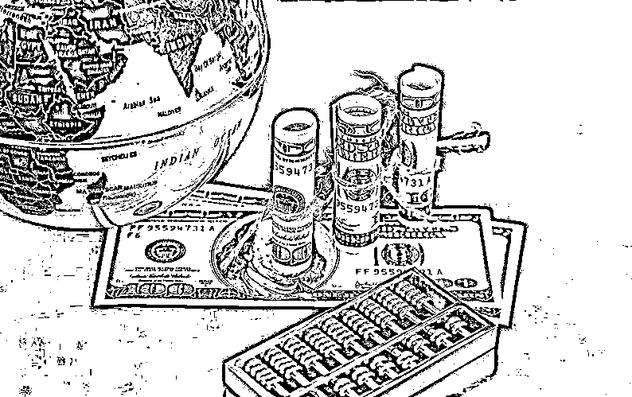不仅是全球股票市场上周剧烈下跌。原油、黄金、白银和美元也是如此。什么情况？为什么黄金和白银与美元一起下跌得这么猛烈？这种事只有**水星在双鱼座逆行**时才会发生。另一方面，对于国债和外汇来说上周表现很好，美国长期利率跌到了历史新低。如 2020 年预报中图表和研究所表明的，这更多是受到土星-冥王星周期的影响。但不要担心，根据这些研究，这个利率的低点不会持续太久。此外，如果你还没有买到 2020 年预报，但希望了解今年余下的时间会是什么情况，你还可以点击链接：《[2020 年金融预报](http://mp.weixin.qq.com/s?__biz=MzA5NjA0NTAxNg==&mid=2651413917&idx=3&sn=58d163921efef7d700062ee80e296455&chksm=8b4bef2abc3c663c5afb5f249499e7ee26807b6d3fdbd5017bc75b9f0490f099bfff4806dfac&scene=21#wechat_redirect)》了解更多。（金融沙龙免费试看 30 分钟，大量信息等着你。）**短期占星趋势**

**“我有种感觉，水星跟每个人都开了个大玩笑。”**

**——MMA 周期分析师詹尼迪·坡斯，在上周末给梅里曼的一封电邮中说道。**

地球宇宙学和周期研究中发生了如此多的事情，需要好几页才能充分解释清楚。但让我们先简短地探讨地球宇宙学中的一些重点。**❶** 这个专栏的目的是教育读者了解地球宇宙学研究与金融和政治周期的关联； **❷** 关于这个主题，网上传播着许多不完整以及可能产生误导的信息。让我们先从占星学分析的一些基本前提说起：如果传统的占星学解释提出了一种可能性，可能会产生分歧。为了让预测有坚实的基础，最好至少有**三个征象，指向同一可能性**。或者，如果只用一个征象，最好过去出现多个案例，证明**征象和结果之间有一致性**。仅根据某个地球宇宙学组合最后一次出现的案例，作为某件事可能发生的“证据”，这样的说服力是非常弱的——而且通常不可靠。不是要批评什么（因为这也很有趣），但是网上有太多言论通过这类“观察”来解释上周发生了什么。首先从 2020 年发生的最重大的行星现象，也就是**1 月 13 日**出现的 32-37 年周期的**土星-冥王星合相摩羯座**开始说起，是一个不错的选择。它影响世界局势的容许度最多有**两年**。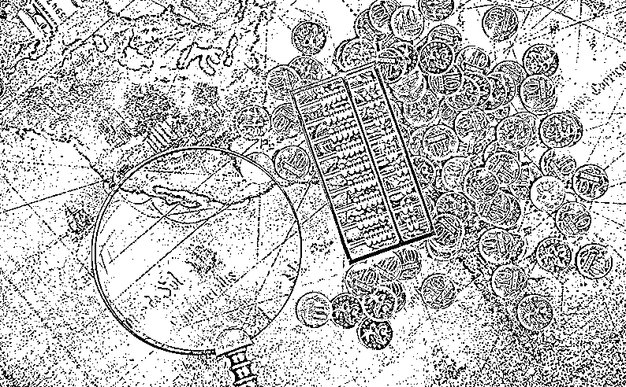在占星学研究中，**冥王星与威胁人类生命和（或）社会系统的事件或状况有关。****土星与基本结构和社会基础，比如建筑、政府、世界金融系统，和经济有关**。冠状病毒及其引发的状况确实威胁到了人类生命和社会系统运转。而且是的，前两次这个长期周期发生时，也出现了威胁人类生命的事件。最近一次是在 1980 年代初的艾滋病爆发，而在 1940 年代中后期是脊髓灰质炎。每一次，人们都找到了治愈方法，并最终遏制了威胁。接下来，我们看看**木星-冥王星合相**，由于木星的逆行，这个合相会在 2020 年出现 3 次。第一次是**2020 年 4 月 5 日**。上一次这个合相出现是**2007 年 12 月 12 日**，当月**“大萧条”**开始，就在两个月前的 2007 年 10 月 11 日，道琼斯工业指数问鼎当时的历史新高。现在道琼斯指数的历史新高出现在 2 月 12 日，比这个相位早出现不到 2 个月。这很有趣。但是如果你回溯历史，看看过去 11 次的合相（自 1860 年），你还会发现**长期周期低点或高点出现在合相的两个月之内，而且往往出现的是波峰而不是波谷**。我们在最近的网络研讨会上已经提供了木星行进射手座 10º到摩羯座 20º的研究，证明它与美国股市的长期周期波峰有 90%以上的相关性。木星会在接下来两周进入摩羯座 20º，并将在 11 月前两次再次行经这个度数。这是我们预计**市场会在 2020 年 3 月以前达到重要顶部**的依据之一。因此，我们有 3 个长期行星周期，要么直接与历史上美国股市的重要顶部直接相关，要么透过其占星学含义，暗示世界上将会发生一些大事件（也就是“黑天鹅”），会给人类活动造成巨大混乱，并且会反映在全球股票指数的价格上。现在也有一些短期的行星征象，收窄了重要的时间段。但认真地说，没有职业占星师会仅凭着这些短期地球宇宙学征象，就做出可以符合上周市场极端表现的预测。然而，在上面描述的长期行星周期的背景下，这可能是市场对更大的人类危机做出反应的几种可能性之一。让我们来看看这些短期的地球宇宙学特征。首先，我们有**水星逆行在双鱼座，始于 2 月 17 日，并在本周开始逆行短暂进入水瓶座后，将在 3 月 10 日结束逆行**。水星逆行本身往往是一段很难理清事实、收集充足信息以制定正确决策的时间。且在双鱼座，获得准确或充分的信息变成了更大的难题。不仅如此，当市场开始积累下跌动能时，缺乏充分信息还会引发失控的猜测，从而给歇斯底里的情绪火上浇油，进一步引发恐慌，尤其在**木星（夸大）接近冥王星在摩羯座（恐惧）**的背景下。当然，更不要提，**土星也在摩羯座**，这两个主要行星都和**“恐惧“**有关，而**木星和射手座与“贪婪”有关**。有趣的是水星这周也会进入水瓶座，持续到**3 月 16 日**，这段时间可能象征**出现新发明以应对迫在眉睫的危机**。随后，**土星也会在 3 月 22 日进入水瓶座**（象征着科学发现）。另一个某些占星师认为与本次下跌动能有关的地球宇宙学征象是上周**火星合相月亮南交点**，出现在**2 月 24 日**。确实火星相位可以给发生的事情“火上浇油”。但就其本身，不足以可靠地证明市场出现跌势，更何况是这个级别的跌势了。如果回看这个地球宇宙学相位的历史，可以发现其关联性是相当弱，并且缺乏一致性的，不过有几次确实对应着市场大幅抛售，比如 1987 年 10 月的大抛售。但是考虑到这个相位大概每 18-22 个月发生一次，这只是偶然，而不是规则，还需要至少 2-3 个地球宇宙学征象才能支持这种预测。就其本身，考察了过去 40 个案例，我发现火星-月亮交点与股市大幅下跌的关联有 20%是可靠的。现在让我们总结下当前发生的事情。**金星在白羊座（一个“失势”的位置）开始与“摩羯座星群”形成四分相**。也就是说，**金星在 2 月 24 日四分木星（夸大），在 2 月 29 日星期六四分冥王星，并会在 3 月 4 日星期三四分土星**。我们的规则之一是**任何在金星-土星困难相位时仍然在下跌的市场都有可能在两个交易日内反转（上涨）**。**3 月 5 日，金星会进入守护星座金牛座**，那是它强大的地方，而**水星逆行进入水瓶座**，有利于发明创造，而且不容易因为缺乏信息导致歇斯底里。在我看来，这些征象给市场带来了**希望**。稍后，满月出现在 3 月 10 日，同时太阳与海王星合相在双鱼座（仍然有一些迷惑和难以置信）。在同一时间，**3 月 9 日-10 日，金星合相天王星，水星也会结束逆行。**我认为詹尼迪·坡斯，这位金融占星学界冉冉升起的新星，她在这节开头说的话是贴切的。**试着保持冷静，寻求准确的信息，避免因别人散布的不实信息而引发歇斯底里。运用自己的常识。****版权声明：**本文由若道翻译发布，欢迎转发，反对抄袭。友号转载请申请白名单。


**雷蒙德·梅里曼（Raymond Merriman）**

若道签约老师。著名金融占星师，ISAR（国际占星研究协会）前主席，梅里曼市场分析公司的总裁。他由于“提升了占星学的职业形象”，在 1995 年国际占星大会上被授予轩辕十四奖；在 2012 年国际占星大会上，被授予轩辕十四终身成就奖。

1“中国上证指数月度报告”发售

**若道推出了****中文版****的雷蒙德·梅里曼中国上证指数月度报告，并持续发行该报告！**

当把金融市场的周期和占星学的周期相结合时，雷蒙德·梅里曼老师的金融占星学研究**为投资者应对金融市场的周期波动，并随之调整投资策略提供了极大的价值参考**。

2“黄金价格周期月度报告”发售

**若道推出****中文版****的雷蒙德·梅里曼黄金价格周期月度报告！**不仅仅为广大读者在中国股市的投资出谋划策，更将视角放眼黄金市场。

**每当世界经济形式不明朗的时候，有一个地方是保值的港湾，那就是****黄金**。从 2018 年 8 月开始，黄金已经用自己的升值再次提醒众人它在经济不稳定时的位置。**截至目前，2019 年 8 月底，黄金已飙升至 6 年新高，高于 1565 美元。**

自 1982 年雷蒙德·梅里曼出版第一本研究《地球宇宙学征象与黄金价格的关联》的著作以来，**他一直作为最重要的黄金市场时机预测者之一享誉国际**。

过去 1 年，那些订阅并遵循建议的梅里曼市场时机学院日报和周报的订阅者，如果从 2018 年 8 月 16 日的低点或 8 月 23-24 日的次低点购买黄金，他们已经赚到了不少的 30%左右的利润。

**3 月中英文报告已上线！**

**购买套餐**，买得越多越优惠

中国上证指数月度报告套餐价

*   **单月报告**：280 元

*   **3 个月套餐**：780 元（260 元/月）

*   **12 个月套餐价**：1999 元（166 元/月）

**长按下图识别二维码**

**购买金融报告****套餐**

**▼**


黄金周期月度报告优惠

*   **双报告年度套餐更优惠（直降 899 元）**
*   **12 个月黄金报告+12 个月上证指数报告：仅需 3500**

**长按下图识别二维码购买黄金报告套餐**

▼


32020 年金融预报 1976 年以来，由雷蒙德·梅里曼撰写的梅里曼市场时机学院每年一次的年度预报沙龙和每年一本的《年度预报》一直在应用占星学原理为投资者们服务.2018 年，若道第一次将这份广受赞誉的一年一度的金融占星报告和沙龙引入中国，供中国投资者参考。**《2020 年金融预报》将会谈及 2020 年重要的宇宙天象及其对世界经济、贸易形势的整体影响，还将覆盖中国上证股票市场的分析、黄金白银市场、美国经济、美国总统、美联储、美国国债市场、美国股票市场、主要外汇货币市场（主要外汇美元、英镑、欧元、日元、瑞士法郎）、原油市场、谷物市场、活牛市场、比特币市场等投资市场。**梅里曼老师及梅里曼市场时机学院的金融占星分析师还会给出以上市场 2020 年的**市场价格目标区间及重要价格反转日**，为短期、中期和长期投资者进行市场操作的时机提供参考。如果你关注世界经济和金融投资市场的变化，会发现梅里曼《金融年度预报》中的研究对于你了解世界经济在发生什么，这些市场的走向会如何有非同寻常的指导价值。为了让更多人从这个讲座和报告中获益，我们特意免费提供沙龙**讲座前 30 分钟试看（免费放大）**，你可以先试看，然后再决定是否购买整体报告及沙龙。如何安然度过这场危机？如何明智地投资，让自己安然度过这个充满挑战的一年，甚至获得丰厚收益？我们相信 2020 年度金融预报沙龙和报告套餐组合会给你远高于其价格的回报。**30 分钟免费试看**获取路径参见如下指引：① 请扫描下图二维码，下载若道 app **②** 登录若道 APP 首页-金融报告-《2020 年金融预报》讲座视频——免费试看，即刻免费试看 30 分钟的讲座视频。


报告和讲座价格

2020 年金融预报讲座和报告价格整体售价** 1280 元**

（本讲座和报告不单独出售）

**长按下图识别二维码购买 2020 年金融预报**

▼


**微信又双叒叕改版啦，不想错过若道君的推送？**

**就把若道设为星标吧！**

**▼**


********点击阅读原文购买金融报告********


# 太阳双鱼座+3 种水星 | 为什么他们总是不愿意把话说明白？

> 原文：[`mp.weixin.qq.com/s?__biz=MzA5NjA0NTAxNg==&mid=2651413932&idx=2&sn=a68769fa3f26be311c522bc169cc0fbb&chksm=8b4bef1bbc3c660d6920a1302ed3d5020a302e512b44de2b9d374509027ee04e975affc28e37&scene=126&sessionid=1692738202#rd`](http://mp.weixin.qq.com/s?__biz=MzA5NjA0NTAxNg==&mid=2651413932&idx=2&sn=a68769fa3f26be311c522bc169cc0fbb&chksm=8b4bef1bbc3c660d6920a1302ed3d5020a302e512b44de2b9d374509027ee04e975affc28e37&scene=126&sessionid=1692738202#rd)

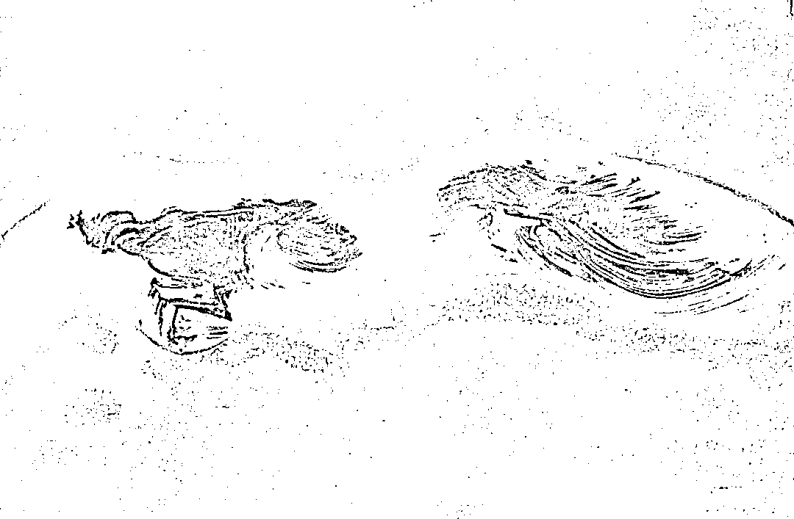作者/安德烈 ISAR 认证占星师
编辑/Tang 图片/伊夫·克莱因

由于太阳与水星形成角度的限制，日水的组合只会出现 36 种。这 36 种组合，可以被视为最基本的“表达模式”的模板。当然，在实际解读星图的时候，肯定也要考虑落宫和相位等影响。今天就让我们来看看太阳双鱼座的 3 种水星组合吧！

**太阳双鱼座**

每当提到这样一枚太阳的时候，很多人都会觉得这不是一枚善于思考的太阳，主要原因在于双鱼座实在是表现得太不切实际了。这可以用它作为处女座的对宫星座来解释。双鱼座确实不具有处女座式的清晰感，很难把各种事情分得很彻底，而是更具**包容性**地把它们都**糅合**在一起，**心中太多的浪漫愿景，使得他们难以具有清晰的视角，所以双鱼座的太阳最不喜欢谈论苛刻、薄情的分割**。

**而强调意见上的包容与谅解，正是由于他们对分歧的厌恶，所以经常在很多事情上容易显得很难坚持自己的意见，在两种矛盾的想法中，选择那最不会伤害到谁的。**双鱼座的太阳容易情不自禁地把所有东西都视为一体的，把周围环境的一切揉杂成一种氛围，他们爱屋及乌，民胞物与，一切皆是因为喜欢才去做，当他们喜欢这种氛围时，就会沉浸其中，极力地维护它不被破坏。

在身份上，双鱼座的太阳有着两种角色，其一是“**无辜者**”，他们不愿让自己背负什么罪孽，甚至会对很多其他人眼中无关紧要的小事感到懊悔，这也使得有着双鱼座太阳的人不太具有攻击性，也**比较反感尖锐的立场**。**在表达上尽量避免伤害到其他人，所以有些话容易只说一半，略去那些会引人不悦的。**

第二种身份是“**庇护者**”，或者叫“**收容者**”，相比起巨蟹座的“护短”，太阳双鱼座的庇护不只是提供给自己人的，他们也会对所有的弱者感受到同情，对他人的苦难有着切肤之痛。他们既愿为弱势一方的无力着想，也能觉察到强者所刻意隐藏的软肋，这种捕获情绪的能力，甚至能延伸到人类之外的动物、植物甚至物件上。再加上前面提到的，双鱼座的太阳喜欢维持那种沉浸其中的浪漫氛围，可以用来解释他们为何如此“**不切实际**”。

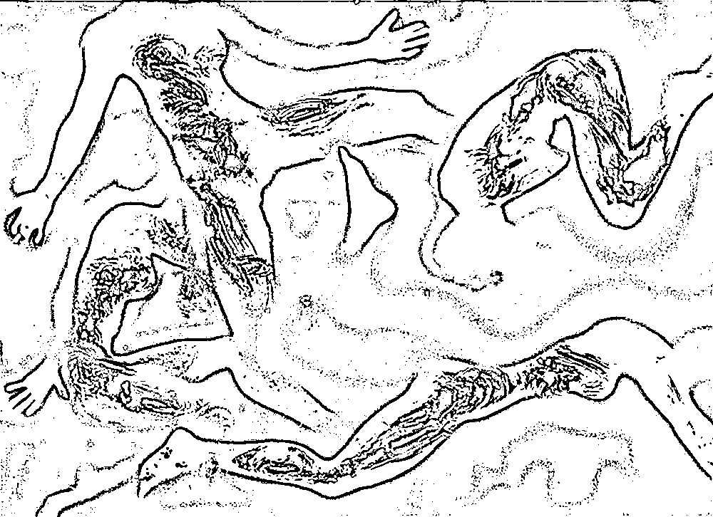

**太阳双鱼座+水星双鱼座**

当水星也在双鱼座时，他们的**表达会有着很强的感染力，并且趋于隐晦一些**。首先要讲的是水星双鱼座。太阳双鱼座-水星双鱼座的组合乍一看会给人一种软弱无力的观感，就像天空中那黯淡的双鱼座般隐晦而沉默。但事实上，若是太阳和水星紧密地合在了一起，他们也会有着极强的表达欲望。

这种组合可能会**让人的言语无边无际，发散性特别强**，很难是一环扣一环地顺着重点去说，但也胜在不会自我拘束，有什么就会说什么，只是需要让别人多猜会儿。他们的情绪、想法未必是用言语去说的，可能是通过一个眼神，一个动作，一个不起眼的表情来暗示，就算是逼着他们用最直白的语言去说，也是显得十分委婉，用旁敲侧击、迂回腾挪的方式让别人去体会。

**较有优势的是，他们很善于表达某种感受或情绪，或是用一些误导性的言语来使人改变看法，或是替自己逃脱罪责**。他们的表达也不易受到环境的约束，不会见人说人话，见鬼说鬼话，但也让别人能轻松接受。虽不具有先声夺人的起始，或条理清晰的论据，但也同样能**用委婉的方法把自己的想表达的东西深入人心**，是很好的劝诫者和富有感染力的演说者。

在**决策层面上**，同时拥有双鱼座的太阳和水星的人比较**随性而为**，他们可能会有**很强的逃避性**，避免自己或他人受到伤害，或是在沉沦在枯燥的重复之中，这些人会尽量让自己置身事外，显得无足轻重，留有足够多的退路。虽然双鱼座是一个很有浪漫精神、看上去非常“梦幻”的星座，但相比起太阳水瓶座-水星水瓶座的组合，他们还是会显得更从众一些，甚至经常会刻意放开，仅随波逐流地计划下一步。

**太阳双鱼座+水星水瓶座**

这组合并**不喜欢按照常规的方法进行表达**，水瓶座的水星善于站在理性的角度去描述双鱼座的梦想，给人一种他们十分敢想的感觉。至于敢不敢做，那就不是单单看太阳和水星所在的星座便能知晓的了。他们并不会刻意坚持自己的意见，可能一天一变，但不管再怎么天马行空，都会站在逻辑的完整性上提出水瓶座式的冷静分析。尽管显得有些空想主义，但他们经常能说出一些惊艳的内容，这种组合的人若是拥有旺盛的火元素，则可能在严肃的场合中，会显得有点口无遮拦（尤其是白羊座的部分被强化时）。

这种日水组合的人虽然**经常会从宏观去考虑问题，但却容易因忽略细节而脱离实际**，他们也容易因对现状的不满而心生抱怨，水瓶座的水星是比较冰冷的。与太阳双鱼座-水星双鱼座的组合不同，他们**喜欢通过争辩，尤其是否认他人来表达自己的看法**，就像思维上的注重宏观、忽略细节，他们也会在人际关系中依然如此，容易不明不白地戳中他人脆弱的部分。

在**决策层面上**，太阳双鱼座-水星水瓶座的人**特别敢于设想，但未必会去真的实施**。他们比较精于空中楼阁的设计，而不是去搭建它。这种组合的人在一开始就想到了全部，但看不见通往高塔的每一层台阶，等到了真正去做的时候，又容易被脚下的遥远路途吓到，转而换一个别的方法来替代，不断地尝试。所以很多时候，他们的计划都是需要别人一起协作的，通过双鱼座太阳的晓之以情、水瓶座水星的晓之以理，让别人也相信这套方法行得通，一起为了自己的计划而共同做些什么。

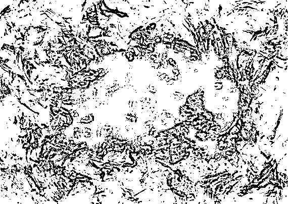

**太阳双鱼座+水星白羊座**

这些人大都是**刀子嘴豆腐心的性情中人**，有什么情绪都不会在口头上遮遮掩掩，都会毫不避讳地讲给他人听。众所周知，双鱼座太阳的浪漫幻想总是夹着万般温柔，但这样一枚犀利的水星，足够使拥有这种组合的人把对美好的幻想，用最简单直接的方式表达出来。 

不过，就算是水星落入了勇敢的白羊座，也不会决定性地意味着他们喜欢任何形式的冲突，只是他们不会再在自己与他人正在遭受折磨时仍然保持沉默，而且会时而突然发表一些自己的临时感想。他们需要倾听者，需要那些能对他们的遭遇感同身受的人，并让别人知道自己也在持续和对方保持同频，所以这类人大都是**很好的安慰者和帮助者**。 

也许那**直言情感的模式**还能产生点不错的艺术天赋，例如写作、作曲及绘画等等。双鱼座的太阳是强大的情绪渲染机，而白羊座水星的表达又在十二星座中最为强有力。虽然思想上会有些太过草率，但真正的艺术家可不会让情绪的表达被压抑太久。

在**决策层面上**，太阳双鱼座-水星白羊座的人**通常也不会做什么长期规划，但会想办法让自己尽快满足，所以容易略显折腾**。他们可能会因为一时的心直口快而做出允诺，而当真正面对困难之时又产生了畏惧和逃避；亦或者在你面前表现出某种强烈的情感意愿，但最后却又什么改变都没做。这都怪那白羊座的水星总是太大声，让他们光是通过表达就已经提前获得了想象中的满足。

**版权声明：**本文由作者授权发布于若道，欢迎转发，反对抄袭。友号转载请申请白名单。


**太阳+水星星座系列，你可能还想知道**

[](https://mp.weixin.qq.com/s?__biz=MzA5NjA0NTAxNg==&mid=2651406342&idx=2&sn=ab8b3a91cce87e334d368555d9c53fbd&chksm=8b4bf2b1bc3c7ba704661802584f2b0ab0d0ad5e488e60ba8e314cee5376d69a9694b2ef01ff&token=2144587045&lang=zh_CN&scene=21#wechat_redirect)

[白羊座](https://mp.weixin.qq.com/s?__biz=MzA5NjA0NTAxNg==&mid=2651406342&idx=2&sn=ab8b3a91cce87e334d368555d9c53fbd&chksm=8b4bf2b1bc3c7ba704661802584f2b0ab0d0ad5e488e60ba8e314cee5376d69a9694b2ef01ff&token=2144587045&lang=zh_CN&scene=21#wechat_redirect) | [金牛座](https://mp.weixin.qq.com/s?__biz=MzA5NjA0NTAxNg==&mid=2651407011&idx=2&sn=37c8e419ab237ae90950e4eae30e2b57&chksm=8b4bf014bc3c7902eafb26fab854dfeee4b5c676a56a00618edd304d0833287b02fc2c812416&token=2144587045&lang=zh_CN&scene=21#wechat_redirect) | [双子座](https://mp.weixin.qq.com/s?__biz=MzA5NjA0NTAxNg==&mid=2651407271&idx=2&sn=3c16a4987525d98aae143b52f2ede818&chksm=8b4bf110bc3c78060a29a4492e434c2f2a66d334fcd20832696109b2552fb1187ed1d767711b&token=2144587045&lang=zh_CN&scene=21#wechat_redirect) | [巨蟹座](https://mp.weixin.qq.com/s?__biz=MzA5NjA0NTAxNg==&mid=2651408217&idx=2&sn=4cf2d4772cc1ed200444ef06391ffd36&chksm=8b4bf5eebc3c7cf8b6ff62a96cd8386cd8a3bbc60efa1e1667ce7b7ad6da764afc5727e8b4a5&mpshare=1&scene=21&srcid=07243vbLK4riTythzaSUeKdd&sharer_sharetime=1563938471114&sharer_shareid=79ff492e946a049c0745c8e806eec753&pass_ticket=gtqhMlmoskFIotTtja2BcL%20HZHbVqC045CkjC/l0SRg=#wechat_redirect)

[狮子座](https://mp.weixin.qq.com/s?__biz=MzA5NjA0NTAxNg==&mid=2651408958&idx=2&sn=ce114d7fb9b8954580657bd5bf094647&chksm=8b4bf889bc3c719fa9bd554a750354a589286ea8d16b7f5440bad89714722382940944598751&mpshare=1&scene=21&srcid=0830za0Hg85zADeNgQMJn4VJ&sharer_sharetime=1567152764120&sharer_shareid=79ff492e946a049c0745c8e806eec753&pass_ticket=YmYvKGKKpAB4aL%20iVRtr2xCm7ar1QNNOVTzAkMKv9M8=#wechat_redirect) | [处女座](http://mp.weixin.qq.com/s?__biz=MzA5NjA0NTAxNg==&mid=2651409737&idx=2&sn=b994cda1213485cf7e464bf0c5c6014e&chksm=8b4bfffebc3c76e8291561bc773e6cf80542492d7c290d0be3d18945e2744e7cf23f42b4b190&scene=21#wechat_redirect) | [天秤座](http://mp.weixin.qq.com/s?__biz=MzA5NjA0NTAxNg==&mid=2651410937&idx=2&sn=6decbfd3e3568160bd75166a00e86ada&chksm=8b4be34ebc3c6a5813739f94d33510700a0692d117df7cebacd28b5a0be68b4fb576d2fed354&scene=21#wechat_redirect) | [天蝎座](http://mp.weixin.qq.com/s?__biz=MzA5NjA0NTAxNg==&mid=2651411251&idx=2&sn=54c24418aee4cdc67ccb4ba7065743db&chksm=8b4be184bc3c6892d67a95371a1d5ee613c6ea40131f1f5fdbd1bbbeaf39514d3c084ea65821&scene=21#wechat_redirect)

[射手座](http://mp.weixin.qq.com/s?__biz=MzA5NjA0NTAxNg==&mid=2651412391&idx=2&sn=9bab034620ec34f1954bf88a0e6821b8&chksm=8b4be510bc3c6c068cb6b5f4352a407baf13910fff66a45042c84c70caebc6bc0427680aa914&scene=21#wechat_redirect) | [摩羯座](http://mp.weixin.qq.com/s?__biz=MzA5NjA0NTAxNg==&mid=2651412287&idx=2&sn=6cc3dc7f9795f555752e3a93feab0c6d&chksm=8b4be588bc3c6c9e5b684340cc6bc4cdf66d0753fdcc6d8cd6b9060ed7cc4785ac80ee3a624d&scene=21#wechat_redirect) | [水瓶座](https://mp.weixin.qq.com/s?__biz=MzA5NjA0NTAxNg==&mid=2651413015&idx=2&sn=529870754395987a4a4e8e312e4d3168&chksm=8b4be8a0bc3c61b610247a2ca02e29fa2ad869303417eab2f8d6b0c2f994ef9cbfe6eac8cab1&token=2082700940&lang=zh_CN&scene=21#wechat_redirect)

**想阅读更多作者的文章**

**请在后台回复 ****安德烈****即可**

**安德烈**

ISAR 认证占星师（2014 年获得）

全职心理占星师/若道金牌作者

**微信 ID**：Andres0819

**个人微博**：占星师安德烈

**微信公众号**：安德烈与心理占星（ID：xlzx-2016）

长按打赏


**想系统学习占星学？**

**点击图片了解详情**


**微信又又又改版啦，不想错过若道的推送？**

**就把若道设为星标吧！**

**▼**


********报名直达入口********


# 占星必修 | 跟苏·汤普金斯学独家预测技法，今天开课！

> 原文：[`mp.weixin.qq.com/s?__biz=MzA5NjA0NTAxNg==&mid=2651413932&idx=3&sn=9d532588ba4421a7a234404fdc5541c6&chksm=8b4bef1bbc3c660dc80e7d6799ec8798a8d562824dd981840d7c0f6bacf59c2fceaffaa7bbe0&scene=126&sessionid=1692738202#rd`](http://mp.weixin.qq.com/s?__biz=MzA5NjA0NTAxNg==&mid=2651413932&idx=3&sn=9d532588ba4421a7a234404fdc5541c6&chksm=8b4bef1bbc3c660dc80e7d6799ec8798a8d562824dd981840d7c0f6bacf59c2fceaffaa7bbe0&scene=126&sessionid=1692738202#rd)

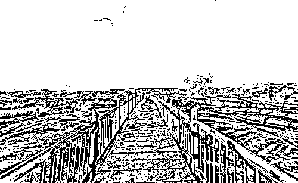

**为何推荐这门课？**占星学与其他学科相比，一个非常重要的功能是看到过去、现在和未来的周期性变化，既包括我们每个个体生命内在的变化时钟，也包括外在宇宙气候对个人、团队、社会的影响。
**如果不懂星图解读，那么你和星图的距离大概还隔着一个宇宙洪荒，如果你只会解读星图，却不会将这一种语言，用“人语”讲述出来，那么你和星图可能还距离着一个“生活”。**占星学是一本集天文学、社会学、统计学和哲学内容的书，因此，这本书也**特别需要一位或多为老师将你领进门**，我们才能窥见，宇宙自然法则中那一点万一，其他的所得，都要靠自己通过不断经历和观察才能真正掌握。**“预测技法”为什么很重要？**因为预测技法将**生活**与**占星**密切相连。在占星咨询中或者聊天聚会时，占星师经常会被问到： “我今年的职业规划应该注意什么？我还能升职吗？”“公司今年大裁员，帮我看看我会被裁掉吗？”“我什么时候可以遇到心仪之人？”“我和新认识的男友，最近总是因为一点小事吵架，我们未来会怎样？”“最近自己特倒霉，压力也很大，很难开心起来，这要持续多久啊？”“我去年身体一直不好，想看看今年应该注意什么？”这些急于知道答案的问题，是人们希望占星师为他们提供的“**预测**”。**但预测并非算命，**一位人本主义的占星师，在面对这些生活中最常见的烦恼和问题时，如何帮助到提问的人，对于每一个相信“自由意志”和“宇宙法则”的占星师来说，都是一次次的考验和经历。**如何避过“算命”大坑，真正帮助星图主人自我内在的成长；如何在某些重要的天象下，鼓励到更多的人勇敢向前，活在当下……****这门集高阶预测技法+咨询技巧教学的占星课程，我们向你强烈推荐！**

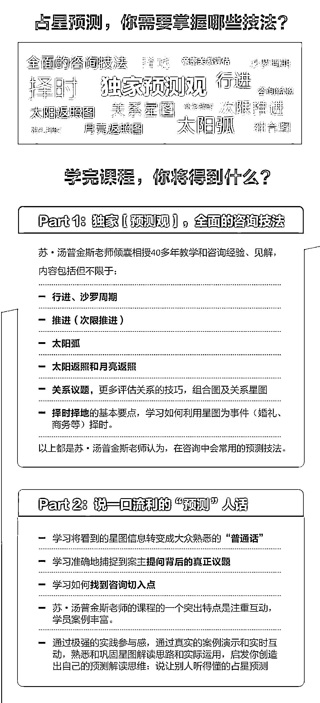

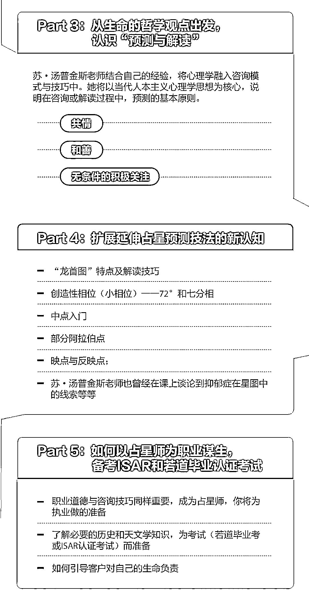

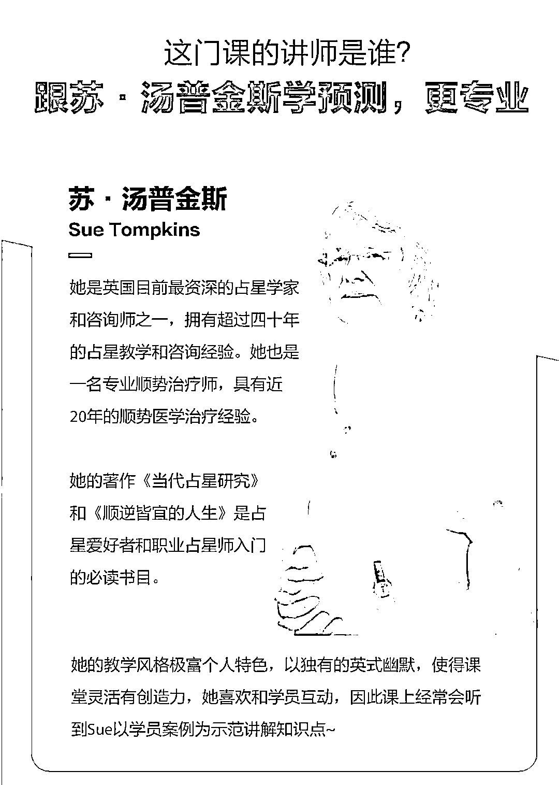

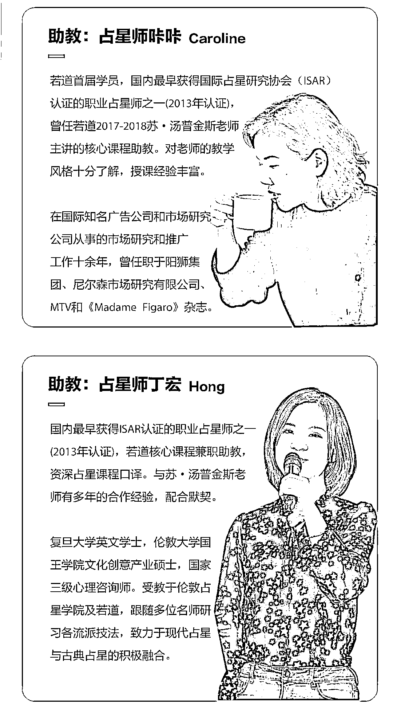

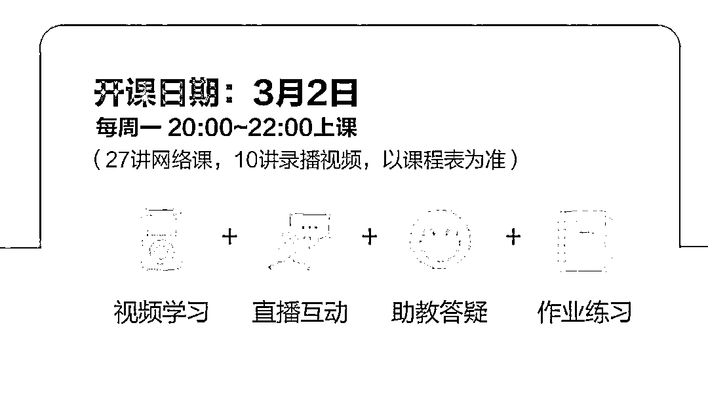

**课时安排（视频+网络直播）**

*   **视频课****：8 讲录播视频，助教答疑 2 讲**
*   **网络直播课****：共 27 讲**

**购买支付后即可观看录播视频课****网络课 2020 年 3 月 2 日开课**每周一 20:00-22:00 上课（**具体每节课排期，以课程表为准**）**适合人群**

*   **有扎实的出生星图基础**

*   **想跟从苏·汤普金斯学习预测技法**

*   **希望成为优秀的占星师，想借鉴国际大师解读思路并融入自己体系**

*   **想获得资质认证证书的人（备考 ISAR 国际资质认证考试）**

**课程费用****优惠价：19600 元****（****分享课程到朋友圈或社群，可享受此优惠价****）****复训价：11000 元****（****在若道课程体系上过核心课程第五阶的学员可享受此价格****）****课程原价**：22400 元**注意：****此课程为若道核心课程的一部分，前 8 讲为视频录像课程。具体可联系课程顾问询问。**   ****苏·汤普金斯预测课程****

**授课老师：苏·汤普金斯**

**时间：**视频课 支付购买后即可观看；网络平台课 2020 年 3 月 2 日开课（共 27 次课）

**授课方式：**网络直播课，英文授课，中文翻译

**费用：**22400 元；**早鸟价：19600 元（分享课程到朋友圈或社群，可享受此优惠价）；复训价：11000 元（在若道课程体系上过核心课程第五阶的学员享受此价格）**

**课程负责人：**许老师（微信：nodoorC，手机：18513802118 请备注“苏·汤普金斯预测课”）

长按二维码添加课程负责人咨询~


****报名请点击“阅读原文”****


# 宇宙给 12 星座的“独特命令”，你准备好接收了吗？

> 原文：[`mp.weixin.qq.com/s?__biz=MzA5NjA0NTAxNg==&mid=2651413932&idx=1&sn=9faf1493e94c786e1f6842a749d4c5a8&chksm=8b4bef1bbc3c660dedd9705f07fc362fdde646d7a086573cace8e548333447df5b400f00cbc8&scene=126&sessionid=1692738202#rd`](http://mp.weixin.qq.com/s?__biz=MzA5NjA0NTAxNg==&mid=2651413932&idx=1&sn=9faf1493e94c786e1f6842a749d4c5a8&chksm=8b4bef1bbc3c660dedd9705f07fc362fdde646d7a086573cace8e548333447df5b400f00cbc8&scene=126&sessionid=1692738202#rd)

******************************☆ **************后台****************************回复“今日”，给你一句生命态度****************

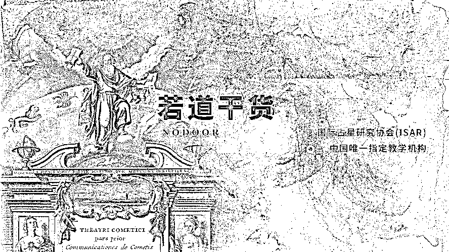作者/格伦·佩里 翻译/江艺 校对/Christy 编辑/Tang 封面/书君 图片/pexels 你知道心理占星学的核心是什么吗？为什么行星和星座的关系是我们理解感受的关键？如果行星会说话，那么每个行星都有一个独特的命令，12 星座又会收到怎样的指令呢？心理占星学大咖格伦老师带大家一起来探索行星情绪对占星学人格理论的意义。本文章虽然有一点点深奥，却干货满满，收藏起来反复阅读吧！关于 12 星座的独特指令在文章最后，如果着急的读者可以直接拉到最后哦。**心理占星学的核心是什么？**

**心理占星学的核心是这个简单的观点：需求激励。**但是一种心理模型要解释动机，就必须处理人类的情绪（emotion）和感受。一旦感觉到某种需求开始主导意识，这个人就被驱使去做出满足这种需求的行为。人们表现出愤怒、恐惧、好奇、爱、兴奋、骄傲、羞耻、审美享受等等。

*   **行星和星座的关系是我们理解感受的关键**。行星是个性的演员，每个行星代表一种特定类型的行为，旨在满足特殊的需求。 

*   我们如何知道哪个行星和哪种行为适合一种既定情况呢？是什么告诉我们何时行动，以怎样的强烈程度来行动呢？**答案是黄道星座**。 

*   每个黄道星座都可以与一组相互关联的**心理需求和相关感受**联系起来。 

*   当需求被事件触发时，需求就会通过感受传达给适当的行星功能，告诉它要做什么，何时做，应该做多少。 

*   简而言之，**感受为划分需求的轻重缓急提供了一种手段**。 

**举一个简单的例子**双子座与学习的需求关联。如果一个人对某个特定话题感兴趣，他们的好奇心就激活了水星的探究功能。学习是双子座的需求，好奇是感受，探究是水星的行动。

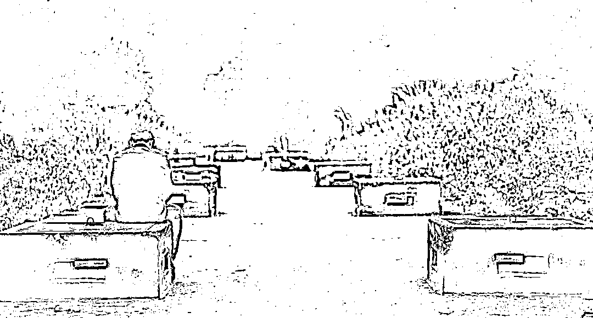

**如何区分情绪与感受？**

**在进一步讨论之前，我们有必要先区分一下情绪和感受。**

情绪

*   情绪可以理解为**对一个对象或事件含义做出的复杂生理反应**。

*   情绪是由一系列核心反应构成，这些反应可能源自宇宙的基本组织原则（遍布自然界各个层面的原型），并且构建起了我们的主观经验。

*   例如，动物甚至植物对事件的情绪反应与人类情绪没有明显差别，这是已经被确立的事实。

*   **从白羊座到双鱼座，每一个星座都可以与一组相关的情绪关联。**从每个星座中举一个情绪的例子，我们会看到：愤怒、冷静、好奇心、关怀、快乐、担心、吸引力、恐惧、希望、决心、超然和同情。 

感受

*   感受是比情绪**更普遍、更深一层的术语**，因为其涉及到**对情绪（和感官）体验的评价反应**。

*   你可能觉得鱼很滑，并进一步将它的粘性评价为奇怪的、好的或坏的，这些都可以被称为“**感受**”，但都不是情绪。

*   相反，一个人可能看到一条梭鱼向他游来，感到恐惧。这种情绪是恐惧，恐惧的感觉驱使他躲避梭鱼。

*   虽然一种被直接感受到的情绪几乎与感觉毫无差别，但它先于感觉，就好像热先于被烧的感觉。

*   公平地说，**所有感觉到的情绪都是感受，但并非所有的感受都是情绪。**

*   **一种情绪可能会被感觉到，也可能不会**。

*   如果一个人充分意识到自己陷入了恐惧，我们可以说他感到害怕。

*   但是如果他抵御自己的恐惧，就可能完全感觉不到。

*   然而，恐惧仍然存在，在无意识层面上影响着他的行为。

*   无论他是否感受到，恐惧的情绪都存在。

**为了简单起见，我在下文中所使用的“情绪”和“感觉”二词可以互换。**

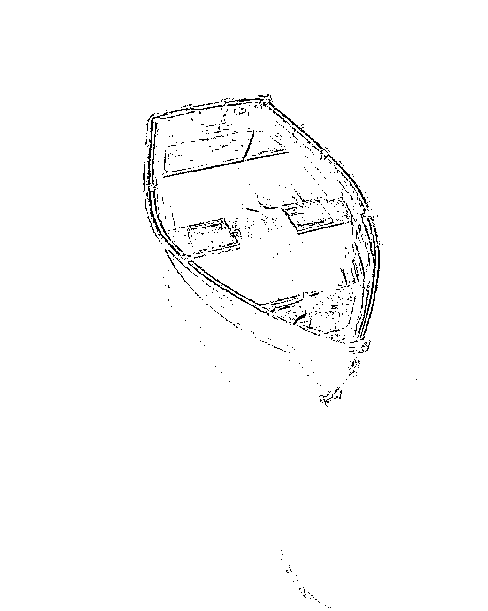

**情绪是如何产生的？**

情绪反应的确切性质是一个复杂的现象，在过去的 100 年里催生了大量的研究,包括用整本书来探讨这一主题。

我自己的观点是，**情绪是星座——行星动机体系的原型声音**。因此，**它们的作用就是需求满足的指标。**

*   从古希腊到 18 世纪中叶，我们现在所称的情绪通常被称为激情（passion）。

*   激情源自拉丁语 pati，进而与希腊语 pathos 关联，意思是痛苦。

*   另外，被动和耐心也与激情关联。

*   **情绪的体验是被动的，它们超出了个人的控制**，就像一个病人“屈服于”疾病。

*   情绪一词来源于拉丁语 e + movere，最初指的是从一个地方迁移或转移到另一个地方。

*   它也被用于指身体或心理上兴奋或不安的状态。

*   因此，**情绪常常强调了我们激烈或动荡的反应，以及这些反应引发或激活行为的倾向。**

情绪的体验是被动的

这些概念的根本观点是：**体验到情绪的人正在经历或遭受一些改变，而不是主动发起改变**。换句话说，**情绪体验是被动的而不是主动的**。在口语中，被动的情绪体验可以在许多表达中看到。我们“陷入”爱情，被恐惧“麻痹”，受怀疑“折磨”，被内疚“缠绕”，被猜忌“撕裂”，被欢乐“带走”，被嫉妒“吞噬”，被悔恨“攻占”等等。 

在原型心理学中，一个人说“恶魔附身”，意味着被一个分裂的部分篡夺了整个人格。这种表达方式意味着情绪是发生在我们身上的东西，而不是我们做的事情。就好像情绪是外来的力量，“压制”和“占有”了一个人。

即便抽离的水瓶座也是有情绪的

占星课本倾向于把月亮与感觉关联。这过于简单化且有误导性，因为每个星座——行星系统都有对应于自身的感受范围。甚至像水瓶座这样的风象星座也具有某种情绪特征——疏离、疏远、遥远、宽容、冷静、冰冷、冷漠。这样的感受与天王星功能（客观视野和整体视角）关联。这足以说明，**每个行星的行动都有自己的情绪暗流，包括我们通常认为是无感受的行为**。作为一种心理功能，**月亮只是我们控制和反思由每个星座——行星系统传达的需求/感受的能力**。 

**情绪是先于符号的**，因为它是一种不依赖于我们所谓的语言符号系统的认知方式，它是一个动机的经验表征，因为它传达了我们在任何特定时刻的存在状态，以及我们需要什么。 

简而言之，**情绪就类似于一种心理——生理状态**。正如大脑中的感觉器官通过饥饿、口渴和体温等感觉监测着身体的状态和需求。同样，情绪也为心理的运作情况提供着连续不断的信息输出。

**举个例子**

如果一个人的自由（白羊座）受到威胁，他就会感到愤怒；如果他对学习的渴望（双子座）被激发，他就会感到好奇；如果他对自尊的需求（狮子座）得到满足，他就会感到自豪。

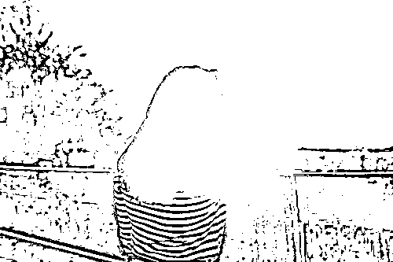

**占星学与情绪有什么关联？**

我们可以从占星学层面对此进行思考，**将每个星座——行星动机体系与一种特殊的情绪范围关联**。

**第一个例子**

我们来思考狮子座——太阳系统。

我们知道，一个星座的需求可以从那个星座的行为特征上推断出。所有的狮子座特征都可以从狮子座对证实、自尊和认可的需求背景下来理解。如果这些需要得到满足,个人就达到了狮子座——太阳的目标状态，即骄傲和自信。
然而在追求这种状态时，他可能在短时间内就经历了狮子座的全部情绪，从正面到负面：自信、快乐、蓬勃向上、好玩、有价值、任性、固执、防御性强、待人轻蔑、无价值、自我怀疑、缺乏信心、感到丢脸或羞耻。这些感觉让他知道，自己离骄傲/自信的太阳目标状态还有多少距离。

**行星彼此之间是存在关联的，这可能引起多种情绪的混合，这些情绪的优先程度取决于哪种需求/感觉是最强烈、最直接的。**

**第二个例子**

一个年轻男子有火星四分月亮的相位，他同时渴望自由（白羊座）和亲密（巨蟹座）。当一个动机系统与另一个竞争时，个体通过竞争情绪的强烈程度迅速整合出信息的重要程度，并作出决定。如果我们的这位年轻男子最近花了大量的时间独自追求个人兴趣，那么很可能他的巨蟹座——月亮动机系统将带着更大的情绪强度进入意识，从而激发他去寻求亲密关系。然而，如果他刚和女朋友在家享受了亲密的周末时光，他的白羊座——火星动机系统很可能成为主导，他会感觉到一种想要分开的冲动。情绪驱动我们的行动

*   情绪和动机之间的关联可以由这两个词的语源历史来说明。

*   这两个单词都源自拉丁语 movere 及其过去分词 motivere。

*   实际上，**情绪是主观体验，“驱动”我们去行动。**

*   心理学家亚伯拉罕·马斯洛将需求称为“**冲动之声**”。

*   **如果个体将这些原型声音充分调和，他就能“听到”自己的需求**。

*   在第二个例子中，如果要这位年轻男子解释他突然与女朋友分开的原因，他可能会说：“有个声音要我离开，我不得不走。”

*   进一步探究后我们可能会发现，他感到不安。

*   通常，当一个人与伴侣有了过长时间的亲密，就会感到厌烦，常常会引起争吵。

*   回想一下，你会发现，无论是厌烦的感觉还是随之而来的争吵，都是为了达到内心的需求——分离。

学习倾听行星的情绪声音

这再次说明，**情绪是行为的主要推动者**。利希滕贝格写道：“典型情况下，情绪为识别瞬息万变的主导动机提供了根本手段。”换句话说，情绪提供的信号暗示了哪种动机系统正在运作。**如果行星会说话，那么每个行星都有一个独特的命令，每个行星都有其独特的内在声音。**

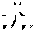

**听听行星对我们发出的指令**

**白羊座——火星**

“想做就做！去做吧！这是你的权利。”

**金牛座——金星**

“如果感觉好,享受它吧。让自己快乐，放松。”

**双子座——水星**

“这很有趣，给它下个定义分个类。发挥你的思维。”

**巨蟹座——月亮**

“倾听，转内向在，你现在感觉怎么样?”

**狮子座——太阳**

“宝贝，闪现你的光芒。表达自己!”

**处女座——水星**

“小心，这里有一个问题。解决它。”

**天秤座——金星**

“展现魅力，建立关系。思考、妥协、合作。”

**天蝎座——冥王星**

“面对你的恐惧，将它推向极限。决一死战，全心投入。”

**射手座——木星**

“保持信心，宝贝。上帝是好的，做对的事就好。”

**摩羯座——土星**

“全力以赴，专心致志。集中精神，控制自己。”

**水瓶座——天王星**

“期待意料之外的事，保持开放和超然的态度”。

**双鱼座——海王星**

“放手，顺其自然。臣服，相信宇宙。”

上面的示例展现了我们如何以一种自我对话的形式来体验行星。这些都是**我们内心的声音、原型的命令，它们通过转化为符号语言的特定情绪信号，告诉我们应该做什么**。

*   我们可能感到愤怒（火星），然后对自己说：“我必须战斗，他不能那样对我！“

*   如果我们感到吸引力（金星），我们可能会想：“太好了，让他们知道你很有趣。”

*   每个行星状态都有自己的议题和行为命令。 

与心理——生理状态类似，情绪的体验是通过一系列强度来实现的。这个强度的梯度变化可以用连续区域中一对代表相反极端情绪的词语来描述。

*   在我们的占星模型中，**每个行星都有不同的情绪范围**。

*   火星是快乐——愤怒；太阳是骄傲——羞耻；海王星是极乐——悲痛等等。

*   体验强度的变化是复杂感官系统的类似表征，让我们能够做出定量的区分，比如这个人有多愤怒（火星），多坚定（土星），或多么自豪（太阳）。

*   情绪的强度变化为需求优先顺序的排列提供了手段：最深刻、最强烈的情绪让我们全神贯注，因此激活了相应星座——行星系统的行为序列。

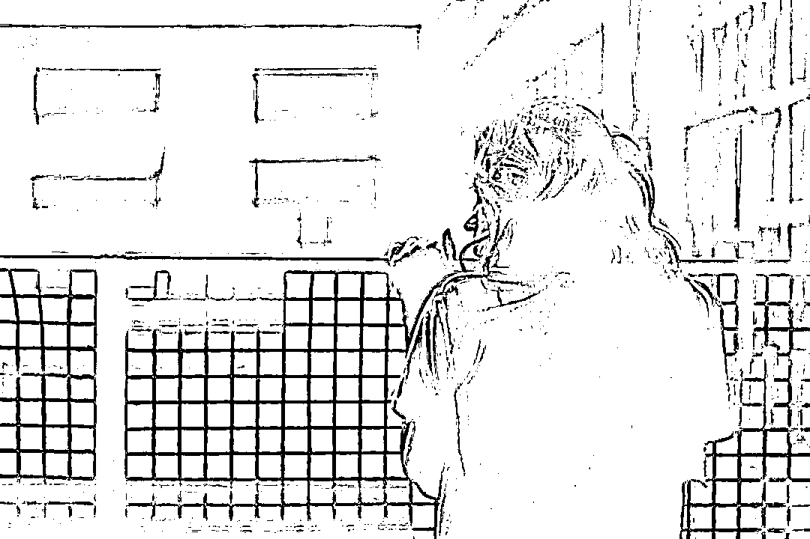

**有冲突相位，该怎么办？**

行星情绪在一系列连续的情绪状态上也有质的区别。这个质的范围说明了星座——行星动机体系的不同整合程度。

**一个整合良好、功能齐全的行星往往被体验为积极的情绪，而压抑、虚弱的行星功能通常会被体验为负面的情绪。**

*   如果一个人的摩羯座——土星动机**存在困难**，他更有可能体验到土星情绪序列中**负面的一端——绝望、悲观、自卑**。

*   然而，如果他克服了这一趋势，致力于**强化土星功能**，那么他更有可能体验到**积极的状态——一种控制的感觉、成功和优越的地位**。 

正如第二个例子中所展示的，**行星之间的困难相位可能导致一个人体验到相互矛盾的情绪和声音**。在这种情况下，两颗行星同时被激活，每个行星都有自己的情绪、动机命令和行为冲动。行星冲动朝着不同的方向发挥作用，这就是“**内心冲突**”的含义。**出生星图象征着全部的内心和情绪冲突，困难相位往往意味着动机能量的阻滞和强化，导致行星功能在发挥时过度或不及。**

**第三个例子**

如果一个人有太阳四分土星的相位，太阳的功能可能暂时被土星偏爱工作超过玩乐的命令阻碍。
当情绪发出信号：是时候寻求快乐、与朋友交往了，这个信号被忽略了，因此狮子座的需求在内心中堆积。当这些需求最终被释放的时候，这个人可能会过分努力去获得认可和确认，好像必须要弥补内心自卑的感觉。
这一相位也可能朝着另一个方向发展：更喜欢玩乐而非工作。情绪发出信号：该认真起来，创造效益了，但这个信号却被忽略（拖延）。未满足的摩羯座需求在内心中堆积，当最终被释放时，这个人可能通过加班加点来弥补失败和不足的感觉。有时，外部环境会同时反映出内在的冲突。当太阳——土星四分相的这个人拒绝土星的冲动时，这种冲突可能外化为一个专横的老板，有不切实际的要求。当然，也可能出现太阳四分土星的整合形态。

**版权声明：**本文由若道翻译发布，欢迎转发，反对抄袭。友号转载请申请白名单。


**格伦·佩里**

若道签约老师，著名占星师，前 ISAR 董事会成员，共出版 8 本占星著作；心理/意识研究专业博士；占星心理学学院（Academy of AstroPsychology）的创办人；康涅狄格州研究生院（the Graduate Institute of Connecticut）原型宇宙学与意识进化项目的负责人。

**双证书核心课程火热报名中**

**点击图片了解详情**

**

**微信又双叒叕改版啦，不想错过若道君的推送？**

**就把若道设为星标吧！**

**▼**


就是这个“在看”，戳戳戳 ☟

********报名直达入口********


# 3 月宇宙天气 | 开年两个月颠簸后，我们即将迎来土星换座！

> 原文：[`mp.weixin.qq.com/s?__biz=MzA5NjA0NTAxNg==&mid=2651413928&idx=1&sn=2f8148612c2a8ba99c18bada48e6555b&chksm=8b4bef1fbc3c6609c20c73e850c030ebbae3c5fd5416b8ae29b6810035abe3858047945c7464&scene=126&sessionid=1692738202#rd`](http://mp.weixin.qq.com/s?__biz=MzA5NjA0NTAxNg==&mid=2651413928&idx=1&sn=2f8148612c2a8ba99c18bada48e6555b&chksm=8b4bef1fbc3c6609c20c73e850c030ebbae3c5fd5416b8ae29b6810035abe3858047945c7464&scene=126&sessionid=1692738202#rd)

****************☆ 后台回复“今日”，给你一句生命态度****************

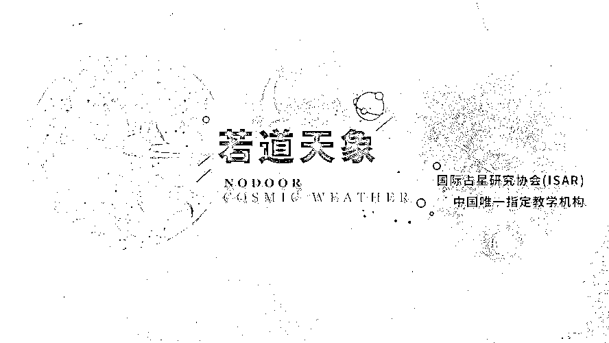

作者/咔咔 ISAR 认证占星师
编辑/玫瑰 图片/全景网**3 月主要天象**武汉封城已经过去 37 天。这一个月极其安静，又极其喧嚣。安静，人和自然的接触大大地减少了，人和人的交流被阻断了，国际和城际之间的交流也缓慢下来。喧嚣，水逆期间各种信息颠来倒去，魔幻现实主义题材俯拾皆是，国内如此，国际也如此。冗长到被广电总局批评的电视剧《新世界》终于播完了，电视剧结尾用大片的麦田展示了新世界的样貌，金色的、闪耀的、富饶的。现实生活的新世界也要在**3 月 22 日土星进入水瓶座**后露出一角了。土星上一次在水瓶座行进是 1991 年至 1994 年，国际和国内发生了几件大事：

*   1991 年，苏联解体，各加盟国独立；那一年还诞生了世界上第一个网页。

*   1992 年，邓小平南巡。

*   1993 年，《马斯特里赫特条约》正式生效，欧盟诞生。

在 2020 年底的木星-土星合相水瓶座之前，土星在水瓶座和摩羯座还会来回穿行，继续它的清理工作，检验的方向从**社会等级、阶层、权力分配、老旧传统、父权**等摩羯座的议题，转向**人道主义、公平、平等、开启民智、科技进步、观念革新、社会责任感**等水瓶座议题。这次疫情给社会生活按下暂停键，相应制造了一些空隙，让我们看到平凡如你我，都有可能在灾难下做出利他的选择。人性的光芒在每个普通人身上闪耀，虽然弱如萤火，却也温暖和照亮了几处暗淡的角落，汇聚在一起，居然明亮无比。给社区慢性病人买药的服务人员，为医护人员送咖啡送餐的店主，两个人的口罩工厂，义务接送医护人员通勤的司机……茨威格把人类在某些时刻做出的人性的选择赞誉为“宛若星辰一般永远散射着光辉，普照着暂时的黑夜。” 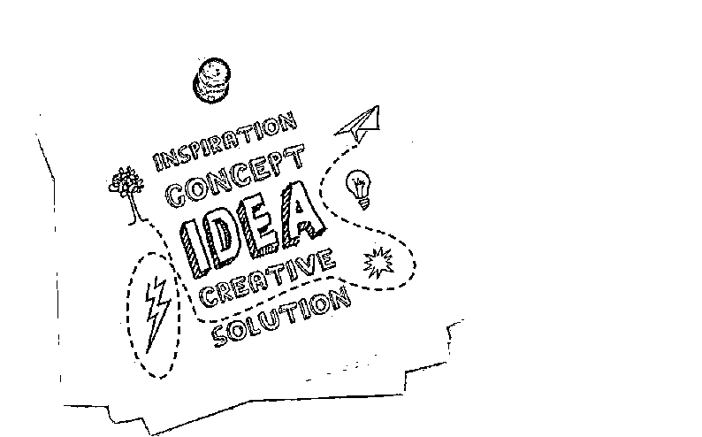在这场长达一个多月的极夜里，平凡人做出平凡却伟大的事情，确实如星辰一样，给人以希望，给人以信心。在这个极夜里，我们也看到了恐惧、贪婪驱动的人性阴暗面，看到愚昧无知、僵化封闭、缺乏独立思考造成的人间惨剧，急切地意识到一些**改革**势在必行。笨重的卡车转换方向之后还会因为惯性保持原有的运动状态一段时间，三月的宇宙天气也沿袭了之前的惯性。土星在 3 月 22 日之前还在摩羯座尾度运行，木星和冥王星在摩羯座接近合相，太阳、火星和金星会先与木星形成相位再与冥王星形成相位，通过自己的运行把木星与冥王星串联起来。**值得注意的日期**

**3 月 4 日、10 日，22 日水星轨迹**

水星在**3 月 10 日**之前仍然逆行的状态，10 日恢复顺行后要把之前逆行的度数再行过一遍，把逆行时改进的方案再应用起来。**3 月 4 日，水星重新回到水瓶座**，虽然是逆行的状态，但是**信息可能会更加清晰一些，沟通方式和回到理性客观的状态**。从 3 月 10 日，水星在水瓶座恢复顺行，16 日进入双鱼座，到**22 日**之前，水星一直空相，这段时间可以继续整理在水逆的时候所做的反思和内省，适合**独立思考，谨慎表达**。水星空相的时候，人很容易**自说自话**，沟通效率其实并不高。**3 月 22 日**，土星进入水瓶座的当天，水星在双鱼座与水瓶座的定位星天王星形成六分相。这是水星再一次来到这个度数与天王星形成相位。上一次 2 月 5 日形成六分相的时候，李兰娟院士发布成果称两种药物能有效抑制冠状病毒。很可能 22 日前后新药方面有更让人兴奋的消息。在个人层面，如果我们在水逆期间做了反思和向内观想的功课，这次的水星、天王星和土星的联手行进会帮你的**生活、工作、财务**创造新的机会。好像在高速公路上看到前方的标志牌，给你指出新的方向和路线图。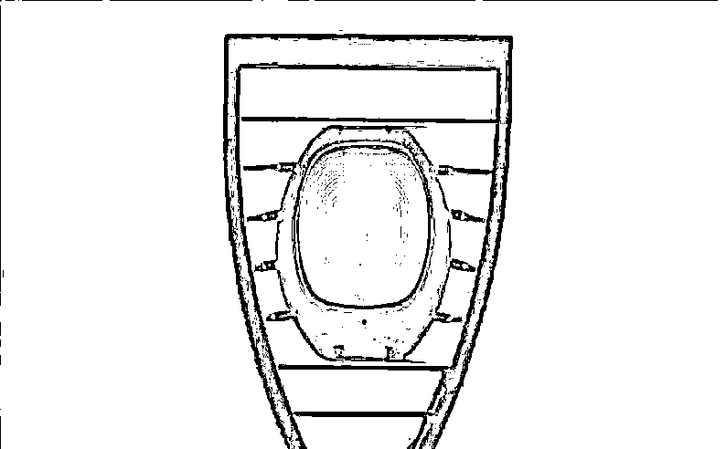

****3 月上旬****

*   **3 月 4 日，金星四分土星，会带来关系和财务受限的感觉，迫使我们收敛欲望**。

*   **3 月 5 日，金星进入金牛座**。有一种发自心底的呼唤，想踏青，想看花，想在草地上撒野。 

*   **3 月 9 日，金星合相天王星**，也许我们可以做一些**狂野的、刺激的**事情安抚饥渴的灵魂。对那些想要**感情和财务稳定**的人，**9 日前后**需要系好安全带。

****3 月中旬****

**3 月 11-20 日**，太阳与海王星会在双鱼座与木星、冥王星形成相位，这是木冥合相的一次预演。太阳与海王星伴随着处女座满月，木星与冥王星同时加入，我们会感到**脆弱，失去边界，威胁生存的灾难还没有过去**。对疫情逐渐扩散失控的国家和地区来说，这样的焦虑是由疫情带来的，对疫情有所控制的地方，开始焦虑疫情对世界经济和地区性贸易的负面影响。管理者和员工焦虑企业存续现状，**失业**成为下一个让人感到不安的问题。太阳与海王星在说，我和世界上所有的人的苦难相连，我感受到了他人的伤痛，木星与冥王星则代表了活下去的强大的信念和意志力，为了帮助被疾病、贫困和歧视伤害的人，政府和权力机构在全力以赴。处女座的月亮提醒我们，如果每个人在生活中踏实地做好每一件事，就像快递小哥、医护人员和众多坚持在工作岗位上的普通人一样，事情就会朝着好的方向发展。

****3 月下旬****

**20-23 日**，太阳进入白羊座，土星进入水瓶座，火星在摩羯座合相木星、冥王星。太阳和火星都在自己强旺的位置，白羊座代表原始的生命力，摩羯座代表着越来越成熟和完善的管理运作机制，木星与冥王星再次被火星串联起来。我们**内在的信念、集中资源、负责的组织管理和生存的本能**，会把疫情扩散控制下来。到时候希望看到更多的人怀着对改变未来的强烈意愿投入到火热的生活里。借由大卫老师的一句话：“未来由你们创造！”**28-29 日**，金星在金牛座三分木星冥王星，人们通过**消费购物**等方式满足舒适安逸的需求。期待中的**报复性反弹**即将到来。请 Tony 老师们做好 7*24 小时营业的准备吧！虽然在占星学指征上，这是一段**乐观、享乐和深度情感满足**的阶段，我们仍然提醒大家**运用常识尊重规则，做好防护。**竹外桃花三两枝，春江水暖鸭先知。祝各位，春安！

**附录：本月重要天象一览表**

| **日期** | **星象** |
| **2020.3.4** | **金星（白羊座）四分土星（摩羯座） 水星进入水瓶座** |
| **2020.3.5** | **水星（水瓶座）六分金星（白羊座） 金星进入金牛座** |
| **2020.3.8** | **太阳合相海王星（双鱼座）** |
| **2020.3.9** | **金星合相天王星（金牛座）** |
| **2020.3.10** | **水星恢复顺行** |
| **2020.3.15** | **太阳（双鱼座）六分冥王星（摩羯座）** |
| **2020.3.16** | **水星进入双鱼座** |
| **2020.3.20** | **太阳（双鱼座）六分土星（摩羯座） 太阳进入白羊座
火星合相木星（摩羯座）** |
| **2020.3.22**  | **土星进入水瓶座 水星（双鱼座）六分天王星（金牛座）** |
| **2020.3.23** | **金星（金牛座）六分海王星（双鱼座） 火星合相冥王星（摩羯座）** |
| **2020.3.28** | **金星（金牛座）三分木星（摩羯座）** |
| **2020.3.29** | **金星（金牛座）三分冥王星（摩羯座）** |
| **2020.3.31**  | **火星进入水瓶座** |

**版权声明：**原创文章由作者授权首发于若道平台，欢迎转发，反对抄袭。友号转载请申请白名单。


********想阅读更多作者的文章********

********请在后台回复**************** 咔咔 即可********

**咔咔**

职业占星师，若道核心课程讲师

ISAR 认证占星师（2014 年获得）

国际知名广告公司和市场研究公司工作十余年

**微信公众号**：咔星人

长按打赏


**点击图片查看若道君推荐**


喜欢记得点一下在看哦☟

********报名直达入口********


# 金牌课程·中英双导师 L1-2｜宅家期间，学占星的最佳选择（早鸟价仅剩 4 天）

> 原文：[`mp.weixin.qq.com/s?__biz=MzA5NjA0NTAxNg==&mid=2651413928&idx=2&sn=c6f93c5f0d746b8cc5609295108cc68a&chksm=8b4bef1fbc3c660948603a36c9227ab57e0a22d83441223e8b7fdb76bed758ce74b6907f30af&scene=126&sessionid=1692738202#rd`](http://mp.weixin.qq.com/s?__biz=MzA5NjA0NTAxNg==&mid=2651413928&idx=2&sn=c6f93c5f0d746b8cc5609295108cc68a&chksm=8b4bef1fbc3c660948603a36c9227ab57e0a22d83441223e8b7fdb76bed758ce74b6907f30af&scene=126&sessionid=1692738202#rd)


非常时期，大家在家躺着什么都不干就是为社会做贡献了。很多小伙伴跟若道君表示在家宅着已经快长蘑菇了。与其在家刷朋友圈陷入对未来的无限焦虑，不如重启一直以来的占星爱好变成专业。一起来了解一下若道 2020 年春季隆重开学的**占星入门网络直播课**。

众所周知，若道办学 9 年来，最专业的坚持是，以直播的形式**让每位零基础小白学员，与国际顶级占星大师“零距离零时差”沉浸式学习**。下面是我们对于即将到来的本学年学习方式首次详解，敬请提问互动。

**足不出户，占星智慧云掌握**

**学占星，网络直播课的妙处在哪里？**

**1**

**若道占星 9 年磨一剑**

从未来趋势上看

从线下教育向线上教育发展蓬勃

若道作为国内乃至国际上权威的占星教育平台

早已在线上直播课的路上经历 9 年的上下求索

每一届核心课都在迭代与优化

线上直播课不断积累与改进

进而提升学员的体验和学习效果

让广大若道学员有更多的收获


2

**直播课是一次次美丽的宇宙共时性**不同于现在市面上的各种视频录播课线上直播课，需要投入的人员和资源会更多但若道之所以选择这样的坚持是因为直播课的学习效果确实最有保障占星学本身就是一门和宇宙相关的学科每一次老师和同学们同一时间上线各自分享着近期的事件和挑战传递和接收着占星学的知识和奥义何尝不是一次次的约定和美丽的共时性呢？


你还可以在互动区及时地提出你的问题与困惑
老师通常在下课前会留出时间进行答疑如果你的问题班里的同学知道也会帮你补充回答、及时互动甚至会因此碰撞出更有价值的思考

3

**主动学习比被动学习重要****系统学习比碎片学习珍贵**系统就是有章可循每周固定的时间和权威信赖的老师，熟悉同频的同学们一起主动学习、系统学习困惑及时被 ISAR 认证的占星助教解答今年，熊鹰老师还会亲自下场解读知识伴随着详尽的讲解生动的案例、互动的实践被吸收相信我，学习占星会变成特别珍贵的学习体验

4

那有的同学会说

道理我都懂，但我就是缺乏自觉性

老是三分钟热度怎么办？

我们的知心课程顾问就华丽登场啦！

课程顾问会变着花样

做各种好看的课程通知小海报提醒你上课

记录你的每一次出勤情况

帮你反馈和解决各种专业知识以外的问题

当你动力不足有几次缺课的时候

还会亲和地询问你最近的学习困难

给你及时的鼓励和支持

提醒和收集老师的课堂作业

5

学习不掉队，还能赢取**奖励课程券**是的若道直播课程是有机会获得课程券的可以直接当钱花，购买或抵扣之后在若道消费的其他课程帮助真正热爱占星的你减免学费压力比如土星奖&木星奖


教育是什么？德国哲学家雅思贝尔斯说：**教育是一棵树摇动另一棵树，****一朵云推动另一朵云，****一个灵魂唤醒另一个灵魂。**网络直播课与老师的联结是最强烈的**我们 2020 年占星直播课的老师是谁？****拥有 49 年占星实践经验的若道创始人****大卫·瑞雷**&**最懂学员的若道首位认证金牌中国老师****熊鹰****师徒二人****合力打造****L1-2 初阶网络直播课****2020 年 4 月 2 日（周四）开课**2020 年之前我们的 L1-2 一直是 8 节课 2020 年注定是不平凡的一年所以我们决定**8+2****把初阶课直播课升级为****10****节**给刚刚踏上占星之路的你更好的支持和陪伴**万事俱备 只等你来！****1-2 阶我们要学习什么？**

**第一阶  12 星座，12 种性格，12 种人生 **

❶ 学习占星学必须准备的“心法”

❷ 占星学中的火、土、风、水四元素，阴阳法则

❸ 面对面的星座有故事

❹ 12 星座：12 种性格详解，12 种行为模式，12 种价值观

❺ 太阳和月亮：了解你的太阳，生命的发动机，让你在世界闪光的方式，生命获得力量的方法；了解你的月亮，让你获得幸福的方法

❻ 了解太阳、月亮，了解你生命中已经出现的、将会出现的男性和女性

**第二阶  命运的线索和人生故事中的演员**

❶ 命运的线索：南北交点

❷ 星图三巨头：太阳、月亮、上升点的故事

❸ 了解心智：水星

❹ 了解金钱和关系：金星

❺ 了解行动模式：火星

❻ 了解信念：木星

❼ 了解努力：土星

❽ 了解天才和疯狂：天王星

❾ 了解梦想和幻灭：海王星

❿ 了解死亡和重生：冥王星

⓫ 12 个人生场景：黄道 12 宫位初解

**大卫老师和熊鹰老师如何分工呢？**


❶ 2020 年 4 月 2 日（周四）20:00-22:00 星座 1 主讲人：大卫·瑞雷老师

❷ 2020 年 4 月 9 日（周四）20:00-22:00 星座 2 主讲人：熊鹰老师

❸ 2020 年 4 月 16 日（周四）20:00-22:00 太阳、月亮 主讲人：大卫·瑞雷老师

❹ 2020 年 4 月 23 日（周四）20:00-22:00 水星、金星、火星 主讲人：熊鹰老师

❺ 2020 年 4 月 30 日（周四）20:00-22:00 木星、土星 主讲人：熊鹰老师

❻ 2020 年 5 月 7 日（周四）20:00-22:00 三王星 主讲人：大卫·瑞雷老师

❼ 2020 年 5 月 14 日（周四）20:00-22:00 宫位 1 主讲人：熊鹰老师

❽ 2020 年 5 月 21 日（周四）20:00-22:00 宫位 2 主讲人：大卫·瑞雷老师

❾ 2020 年 5 月 28 日（周四）20:00-22:00 月亮交点 1 主讲人：熊鹰老师

❿ 2020 年 6 月 4 日（周四）20:00-22:00 月亮交点 2 主讲人：大卫·瑞雷老师

**这两位优秀的占星学老师是谁？**


**大卫·瑞雷（David Railey）**

*   **ISAR 董事会成员，ISAR 全球副主席，ISAR 全球职业占星师认证主席，若道占星创始人。**
*   1976 年，通过亚特兰大职业占星师考试，成为全职占星师，随后通过**AFAN 和 ISAR 职业测试**。
*   1980 年，与**杰夫·焦耳**一起在亚特兰大创建**“每日星球”**占星学中心。此后在亚特兰大占星协会担任 4 年考官，并且两次担任**亚特兰大地区占星协会主席**。
*   1979-1992 年，作为占星师活跃于美国社会媒体，向不了解现代占星学变化的大众宣传专业占星学知识。在 1989-1992 年期间，他在 WRGG 电台 12 频道每周主持个人电视秀**“今日占星学”**，早先他还在 WRFG 的广播节目中播讲宇宙天气节目。 
*   2010-2014 年，任**全美占星师联盟监督委员会委员**。
*   2010 年，其著作**《灵魂的目标》**中国版出版，和蒋颖一起创办**若道占星**学校和其官网 www.nodoor.com。从该年开始，他工作并往返于亚特兰大和北京。目前他 80%的时间致力于在中国教授和推广西方占星学。
*   2017 年，被选为**ISAR 委员会成员**（2017）。ISAR 是世界最大的国际占星机构，会员遍布 45 个国家。


**熊鹰老师（天空的空）**

*   2008 年接触严肃占星学，至此爱不释手。
*   **2013 年师从大卫·瑞雷**，研习整套现代占星学核心课程，并于 2014 年起至今连续三年担任该课程的主助教。
*   期间也**跟随格伦·佩里、诺·泰尔、理查德·塔纳斯、罗伯特·汉德、苏·汤普金斯、斯蒂芬·弗里斯特等多位国际顶尖占星大师进行学习**，进行定向占星主题研究。
*   2015 年初，通过国际占星研究协会**（ISAR）资质认证并获得证书**。同年，进一步跟随大卫·瑞雷老师进修**“生时校正”**技术，通过最终考核并获得证书。
*   目前在若道星文化任职，将传播系统、严谨、真实的占星学作为职业使命。任专职助教期间，进行沙龙与答疑等辅助教学工作已累计超过 200 小时。
*   在业余期间也提供占星咨询与生时校正服务。目前正致力于占星学与个人成长的整合。

**除了网络直播课，**

**春暖花开，盛夏到来的时候，**

**还会迎来两场线下工作坊**

**L1-2 上海工作坊****（2020 年 6 月 12、13、14 日 熊鹰老师主讲）**

**L1-2 北京工作坊****（2020 年 6 月 25、26、27 日 大卫·瑞雷老师主讲）**

就看你是喜欢哪种形式

**文末有每种形式的价格，还有连报套餐价哦**


**什么人适合这门课？**

*   对占星学有浓厚兴趣，想要系统学习占星学

*   对占星学有一定基础，但不知道该如何整合星图复杂的碎片

*   希望成为优秀的占星师，想要借鉴国际大师解读思路并融入自己的体系

*   想学习占星学，但不擅长英文，希望有中文老师授课

*   想结合占星学理论与咨询实践

*   大卫·瑞雷、熊鹰的忠粉，学过占星，但就是想跟着偶像再学一遍

*   走在自我探索和个人成长道路上的人

**课程费用**

**★ 1-5 阶**

**早鸟价：33000 元（2020 年 3 月 31 日之前）**

**课程费用：46500 元 **

**★ 1-2 阶直播课（4 月 2 日开课）**

**早鸟价：2800 元（2020 年 3 月 4 日之前）**

**课程费用：3500 元 **

**★1-2 阶工作坊（北京工作坊、上海工作坊任选一场）**

**早鸟价：2800 元（2020 年 5 月 6 日之前）**

**课程费用：3500 元 **

**★网络直播课+现场工作坊都想要的同学：有套餐价哦**

**购买网络直播课程+北京工作坊、上海工作坊任选一场**

**早鸟价：4200 元（2020 年 5 月 6 日之前）**

**课程费用：5200 元**

**退转课程**

**退款原则请详看《教学协议》，如有疑问请咨询课程顾问。**

****中英双导师核心课 Level1-2****

**授课老师：大卫·瑞雷 熊鹰**

**授课时间：****1-2 阶****网络直播课，**4 月 2 日开课**；****1-2 阶********工作坊，上海** 2020 年 6 月 12、13、14 日 **北京** 2020 年 6 月 25、26、27 日

**授课方式：**网络课程，中英文授课，中文翻译；现场工作坊，中英文授课，中文翻译

**费用：****1-2 阶网络直播课程：****3500 元**早鸟价：2800 元（2020 年 3 月 4 日之前）；**** **1-2 阶**（北京、上海工作坊任选一场）**：**3500 元**早鸟价：2800 元（2020 年 5 月 6 日之前）；******网络直播+现场套餐价：****5200 元** 早鸟价：4200 元（2020 年 5 月 6 日之前）；******1-5 阶：**46500 元******早鸟价：33000 元（2020 年 3 月 31 日之前）；****

**课程负责人：**王老师（微信：18510107057），请备注“核心课”

长按二维码添加课程负责人咨询~


****报名请点击“阅读原文”****


# 3 月中国上证指数+黄金周期研究报上线 | 关键时刻帮你共克时艰

> 原文：[`mp.weixin.qq.com/s?__biz=MzA5NjA0NTAxNg==&mid=2651413928&idx=3&sn=032834e395bde8f9a5a9916259f4703c&chksm=8b4bef1fbc3c6609821d121796ca9931a4f6e69ba65d94251cefcc9d855bcefa991e89c55a07&scene=126&sessionid=1692738202#rd`](http://mp.weixin.qq.com/s?__biz=MzA5NjA0NTAxNg==&mid=2651413928&idx=3&sn=032834e395bde8f9a5a9916259f4703c&chksm=8b4bef1fbc3c6609821d121796ca9931a4f6e69ba65d94251cefcc9d855bcefa991e89c55a07&scene=126&sessionid=1692738202#rd)


春节开盘后，受疫情的影响，上证指数大跌达 7%，因为大量稳定市场的资金和北上资金涌入，又出现连续 14 天的大涨。

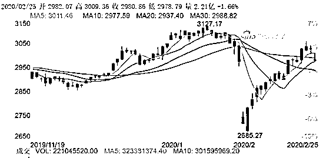

| 图：2020 年 A 股走势 K 线图

**2 月 27 日**，是梅里曼老师在《上证指数 2 月研究报告》提到的一个**三星关键反转日**，一般情况下，在**前后 3 个交易日（有时 6 个交易日）** 市场会发生发转。

梅里曼老师又说中了。上升势头甚猛的美股在 2 月 25 日掉头向下大跌，甚至引得”是否连任和股市好坏密切相关”的美国总统特朗普出来护盘，暗时投资者应抄底买入。而上证指数也在非常强劲的连续上涨 15 后出现下跌，此时应该怎么办？

**是继续持股，甚至趁着回调买入，还是应该获利了结，等待合适时机在买入？现在是水星逆行期，什么样的操作才是合适的操作？**

有些朋友问，**如果我不买指数，只买基金或者个股，这个报告也适合吗？**

回答是，**上证指数走势代表整个中国股票市场走势，哪怕你买的是个股、基金或者投资创业版指数，上证指数趋势都是投资者最重要的参考指标**。

《上证指数 3 月研究报告》已经发布，**如果您已经购买**， 请参照下图指引，查看报告内容。


如果您还没有购买，您可以**点击文末阅读原文**，购买报告。

在每个月度报告中，梅里曼学院的金融占星分析师给出**上证指数价格目标区间及重要价格反转日**，为短期、中期和长期投资者进行市场操作的时机提供参考。

**优惠价别错过！**

上证指数月度报告价格

**单月报告**：280 元

**3 个月套餐价**：780 元（260 元/月）

**12 个月套餐价**：1999 元（166 元/月） 

**长按下图识别二维码购买上证指数报告**

▼


**黄金报告上线！**

此外，3 月黄金周期报告也已上线。黄金已经开始新的上涨，是该追涨上车，还是等水星逆行周期过去再说？欢迎阅读梅里曼老师的黄金周期报告。黄金周期月度报告价格

**单月报告**：280 元

**3 个月套餐价**：860 元

**12 个月套餐价**：2400 元

**双报告年度套餐更优惠（直降 899 元）****12 个月黄金报告+12 个月上证指数报告：仅需 3500 元**

**长按下图识别二维码购买黄金报告**

▼


**购买者须知**

① 梅里曼市场时机学院《中国上证指数月度研究报告》是梅里曼市场时机学院（以下简称 MMA）的研究“预报”，而不是市场“预测”，是梅里曼老师及 MMA 金融占星分析师对人类活动周期历史与行星周期之间相关性的研究，二者在大部分情况下具有 80%或更高的相关性，而不是因果关系。报告中的研究完全存在错误的可能性。即便是非常认真的研究和几十年的研究经验，金融占星师无法总是正确地解读出各种征象在实际层面上会如何相互作用，并显化为事件结果。

所以请将报告看作一个研究参考，务必结合其他市场研究和你个人对市场的理解，根据你的自由意志做决策。

② 本报告只是上证指数研究，没有个股研究。

③ 此报告一旦售出，**即不接受退款。**

④ 此报告每月 1 期，**并非都是在每月相同日期发布**。我们收到英文报告的当天，即发布该英文报告。3 天后，上线报告中文版。⑤** 此报告仅支持手机网页阅读，不支持电脑阅读和下载。**

**以上须知，请仔细阅读。一旦付款，即视为已了解并接受所有须知内容。**

在过去的 35 年中，唯有梅里曼逐渐完善，并在梅里曼市场时机学院月度周期报告中阐释了将地球宇宙学与周期相结合的研究方法，以惊人的精确性预报了黄金价格发生重大变化的时间。黄金购买 Tip 各大银行均可购买黄金或黄金 EFT 基金，也可以在诸如天天基金或者支付宝购买黄金及黄金相关产品。不明白的可以百度搜索。
购买后如何查看报告？


购买后有疑问怎么办？请联系技术客服
**微信：nodoor201705**


****************购买上证指数+黄金月报直达入口****************


# “山川异域，风月同天”讲的是水瓶座和双鱼座 | 专访金牌中文教师熊鹰

> 原文：[`mp.weixin.qq.com/s?__biz=MzA5NjA0NTAxNg==&mid=2651413917&idx=1&sn=9ce65f0047fdd511b1a3b297f4bcdef8&chksm=8b4bef2abc3c663c32dead59df45f220195c53be5789aa39200bf70983068fcd1ea3ba39d124&scene=126&sessionid=1692738207#rd`](http://mp.weixin.qq.com/s?__biz=MzA5NjA0NTAxNg==&mid=2651413917&idx=1&sn=9ce65f0047fdd511b1a3b297f4bcdef8&chksm=8b4bef2abc3c663c32dead59df45f220195c53be5789aa39200bf70983068fcd1ea3ba39d124&scene=126&sessionid=1692738207#rd)

****************☆** 后台回复“今日”，给你一句生命态度**************

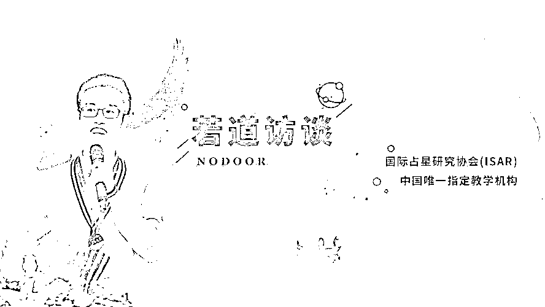

采访/作者/狄狄图片/熊鹰、网络 封面/书君熊鹰（天空的空）是若道十年办学历史上，唯一一个一毕业就当上助教，然后又成为金牌中文老师，且被无数学员热捧的占星师。他是拥有多重身份的斜杠青年：占星师/占星教师/中医/实修者……
他同时也是儿子、丈夫、父亲，且才刚刚 30 岁出头的他，是如何获得并协调好这些身份的？若道君邀请他来聊了聊自己的经历。就像他的启蒙老师大卫·瑞雷来中国时候许下的愿望，熊鹰的经历正应验着老师的初衷——让严肃占星学在中国落地生根。2017 年给苏·汤普金斯老师做助教的时候，熊鹰获得了一个至今仍被沿用的称呼——**“空妈”。**起因是学员们觉得熊鹰很会替他们着想，回答问题也很细致，于是取了他微信名“天空的空”里的空字，寓意**助教会像妈妈一样照顾我们的学习**。乍听见这样又似调侃又似赞美、还极具女性化气质的称谓，熊鹰起初有些无奈。但另一方面他很清楚地知道自己的月亮落在第十宫，在职业上常会表现出月亮的状态。看到学生们努力学习和实践严肃占星学，他也会油然而生一种“母心甚慰”的感觉。**“这跟我以前做销售时候是完全不同的体验。以前是硬着头皮做工作，现在算得上是如鱼得水般的职业了。”**

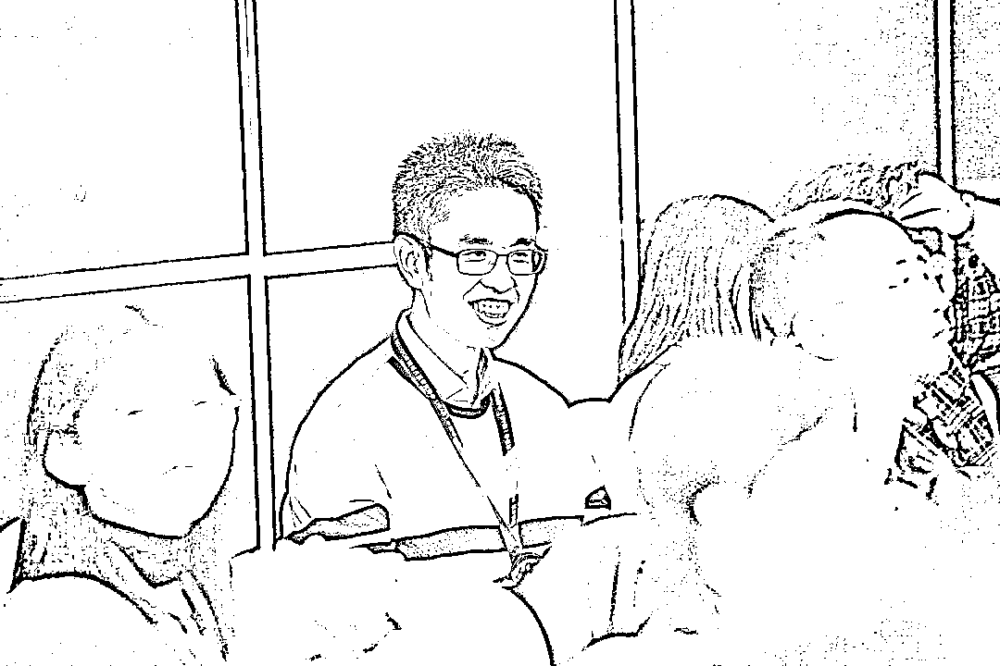

**|** 熊鹰

熊鹰大学专业学的是数学，在没来若道之前，在其他行业上过五年班。那时候还没有找到自己真正喜欢什么，就各种涉及数据管理的工作换着做。从事过工厂车间的生产管理、外贸数据的处理，管理过流水线上的零部件，负责过盘点仓储库存是否充足，后来还卖过保险、做过生物制药产品的销售……当时天空已经知道自己星图里群星落在处女座了，但他并不觉得自己很喜欢数据处理的工作（处女座领域），他知道自己星图里还有一个高挂十宫的月亮双鱼，但他并不理解这个配置在他的职业生涯中可以怎样表现。**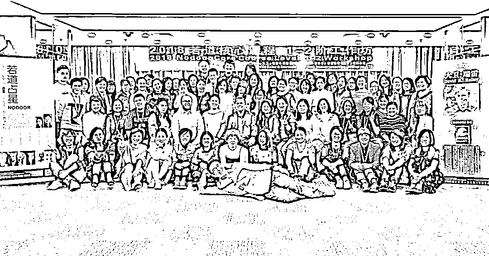****|** 熊鹰（前排横躺）与自己的占星学生们合影熊鹰对星座的兴趣可以追溯到初中，当时很多报纸杂志每期最后一版都是星座运势。他那会觉得自己还挺奇怪的，星座这种东西看起来更像是女生感兴趣的东西，他一个男孩子却一周不落看得津津有味。熊鹰模糊地觉得这种对人的 12 种区分方式很有趣，每次必看的是自己处女座的几句，然后再看看暗恋的女生的星座运势。如果某期杂志里说处女座本周运势不好，再赶上那周会遇到考试，他就会提心吊胆，担心这周会不太好过。“现在回过头来看，处女座特质就是容易焦虑，尤其是内心无处安放一些东西的时候，就容易被外在的东西影响到焦虑。可是越是让我们揪心的东西越是容易吸引我们目光。”现在深谙占星理论的熊鹰回忆起来，早已解除了对阅读星座运势的焦虑。

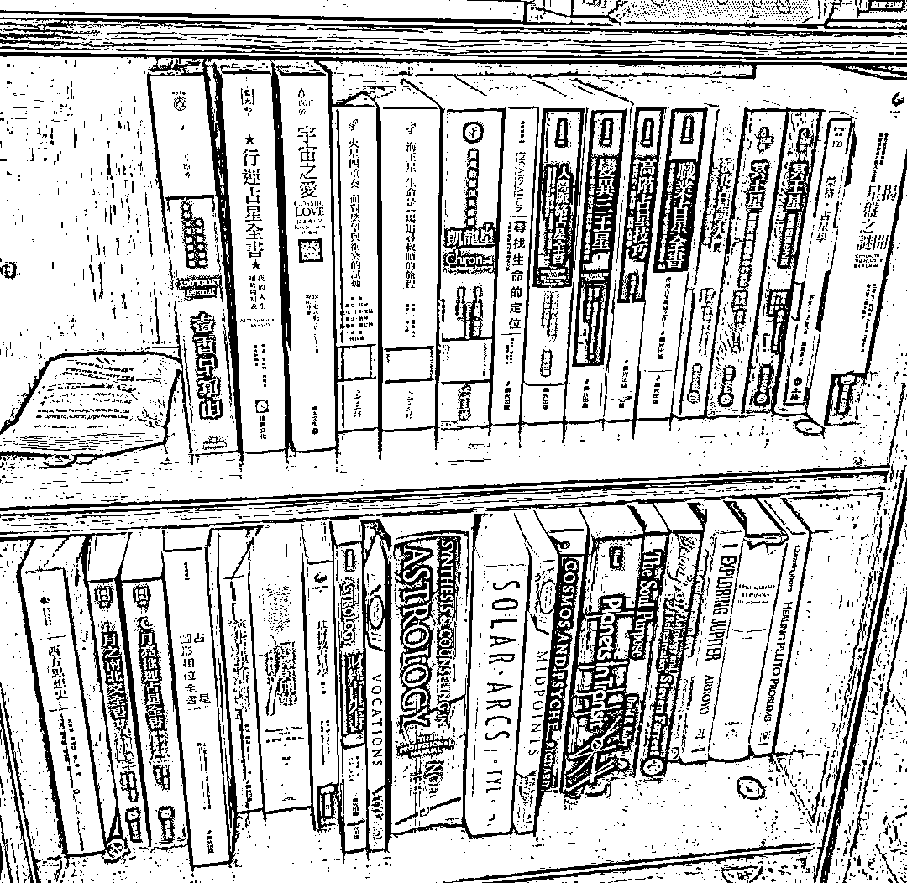

**|** 熊鹰家中占星书柜的一角（2020 年）2008 年的时候，熊鹰在网上浏览才知道原来不止有 12 星座的分类，还有星图这种东西，于是对报纸杂志上那种运势兴趣度也变低了。好奇心驱使他买了一些讲星图的书来读，也会上网去各种论坛 BBS 上看，但是网上说的中天、相位、刑冲等占星学术名词，他完全看不懂。当时熊鹰在一个空调生产的企业里，做办公室生产管理的工作。部门里女同事很多，办公室上班时间又会断外网，所以同事之间只能买报纸、买杂志，大家传着看。熊鹰用当时一种黑背景的占星软件生成星图，然后照着一本静电鱼写的星图分析的书给同事们做解读，没想到同事们都觉得熊鹰说的比报纸上那些星座运势，更能命中她们的真实想法和性格。当时那本书里的相位解读并不全，甚至有些解读诸如“日木合相代表顶级贵人运”，熊鹰现在看起来也觉得略显滑稽。但懂了一点占星学皮毛，即使不需要跟其他人过多交谈，就可以知道别人很多心理议题，或者有可能出现的想法。这种体验让那时的熊鹰觉得，占星学简直是宇宙游戏里“bug 级别”的神奇存在，萌生了正经去学习占星的想法。

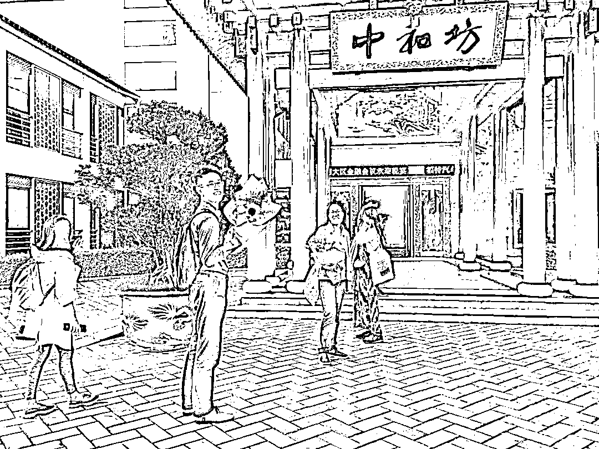

**|** 熊鹰在大理，准备去机场接机大卫·瑞雷**从入学若道到入职若道**熊鹰的母亲是中国大陆最早一批接触身心灵领域的人，主动辞去了大学里的工作，出来为一些企业主做教练技术的培训。有一次母亲在工作坊里与自己的一个学员无意间提起，儿子对星座一直挺感兴趣。学员说她知道哪有严肃占星学的培训，于是把若道介绍给了熊鹰。那个热情的同学就是逸月，后来在若道历年斯蒂芬·弗里斯特中国行工作坊中担任独家翻译。认识熊鹰那年，她刚刚在若道学完了大卫老师的高阶课程。2012 年底知道了若道，熊鹰 2013 年初便去若道报了名。与他一起入学的有杜克、海星程、Iris、yao 叔、Anastasia、Gaff、郑玮玲、封光……很多后来都成了国内严肃占星圈比较有影响力的人物。熊鹰一入学最大的感受是：**原来占星是这样的，和自己之前所了解的 12 星座完全不同。**他甚至可以记得自己第一次在网上看见大卫老师的日期是 1 月 16 日，印象深刻的是大卫老师的声音很有感染力，蒋颖老师亲自给他做课程翻译。

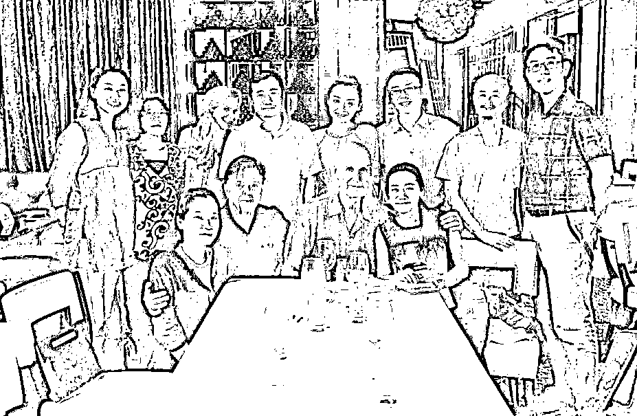

**|** 入学后若道的熊鹰（右一）与若道老师同学们的合影头几节课之后，作业要求每个人写一下自己的日、月、升三个星座，写自己对它们的理解、现实中它们的表现，以及自己的感受。刚入学的熊鹰特别有学习激情，从晚上十点开始写作业，抬起头来已经是凌晨两点钟了。那次作业还被学校用 A4 纸打印了出来，在北京线下学员中传阅。大卫老师夸奖他说：”你把处女座写明白了。”正好当时他在医药企业的销售工作不是很顺心，业余时间，他便组织了不少上海线下的若道占星同学聚会。聚会上常客有若道首届学员刘娜、逸月，也有同为若道学员的熊鹰后来的妻子。大卫老师和蒋颖老师知道了熊鹰对占星学的热情，2014 年 11 月 ISAR 考试的时候，便向他伸出了橄榄枝，邀请他入职若道做助教。

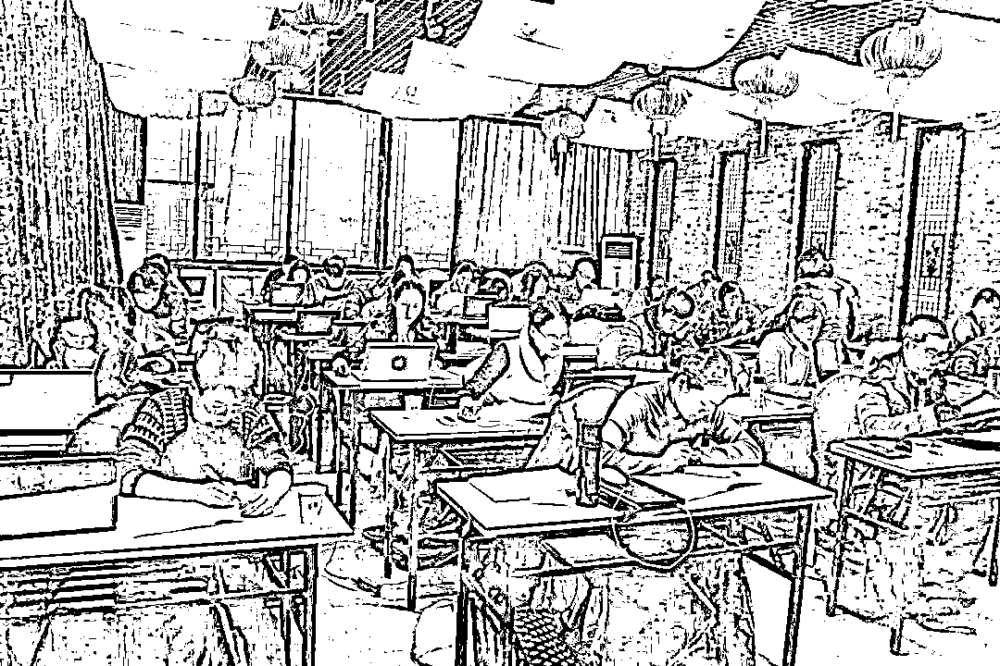

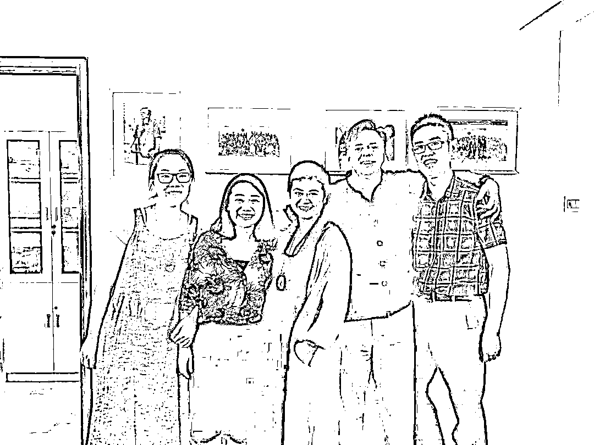

**|** 上图：熊鹰参加 ISAR 考试  下图：熊鹰（右一）在若道总部合影
在占星学方面，**熊鹰觉得大卫是自己当之无愧的授业恩师。**熊鹰敬重中国文化，他认为能让自己称得上“授业恩师”这四个字的人，几乎就是“一日为师，终身为父”的感觉。但他自己一直有一个心理议题：会对权威人物有恐惧和害怕，在权威人物面前会不自觉地矮化自己，觉得比不上人家。想到要来若道工作其实是有点紧张的，毕竟大卫老师是占星学权威人物，又是老外，他不知道要怎么跟大卫交流相处。但实际相处之后熊鹰发现大卫老师非常亲和，完全没有架子。谈入职若道的时候，他记得大卫老师对自己说：“我知道你星图里有日土四分相，但你放心我不会以权威的形象跟你互动。”熊鹰从没有告诉过任何人自己有这种害怕，那一瞬间他觉得大卫老师好像从心坎里懂自己了一样。

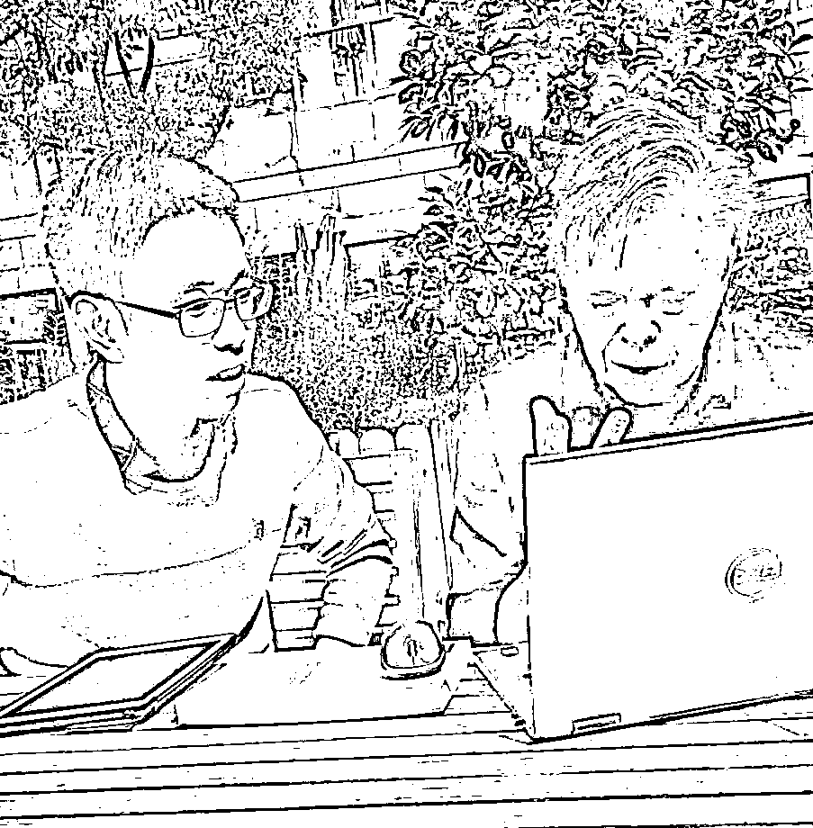

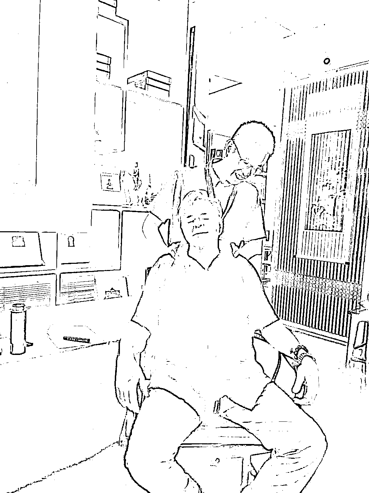**|** 熊鹰和大卫的日常
在若道工作的这五年里，大卫也的确如自己所言没有半点权威的架子。对熊鹰而言他的身份很多，是老板，也是老师，更是他生活中很重要的一个好朋友。熊鹰常住上海，大卫在北京比较多，两人大多数时候都是微信互动，还会经常开视频看对方，向彼此倾诉一些生活中的困扰。即使只在谈工作，大卫也不会板着严肃脸一板一眼，而是时不时插一个他自创的美式笑话，有些笑话翻译成中文一点也不好笑，熊鹰也会反讽他一下，两人会经常哈哈哈地笑出声来。每一次视频对话完之后，熊鹰都会跟大卫说：“So happy to talk to you.”大卫也总是会回复他：“So do I.”这几乎成了他们每一次对话结尾的小仪式。在大卫出现之前，熊鹰是无法想象自己有朝一日，真的可以和权威长辈如此轻松互动的，这让他觉得很疗愈。

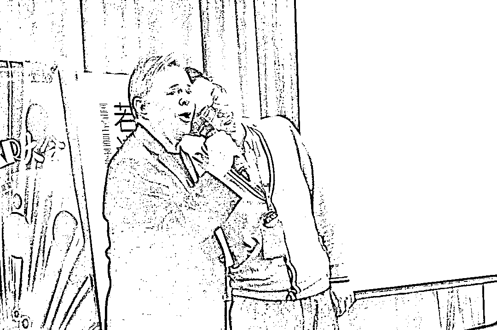

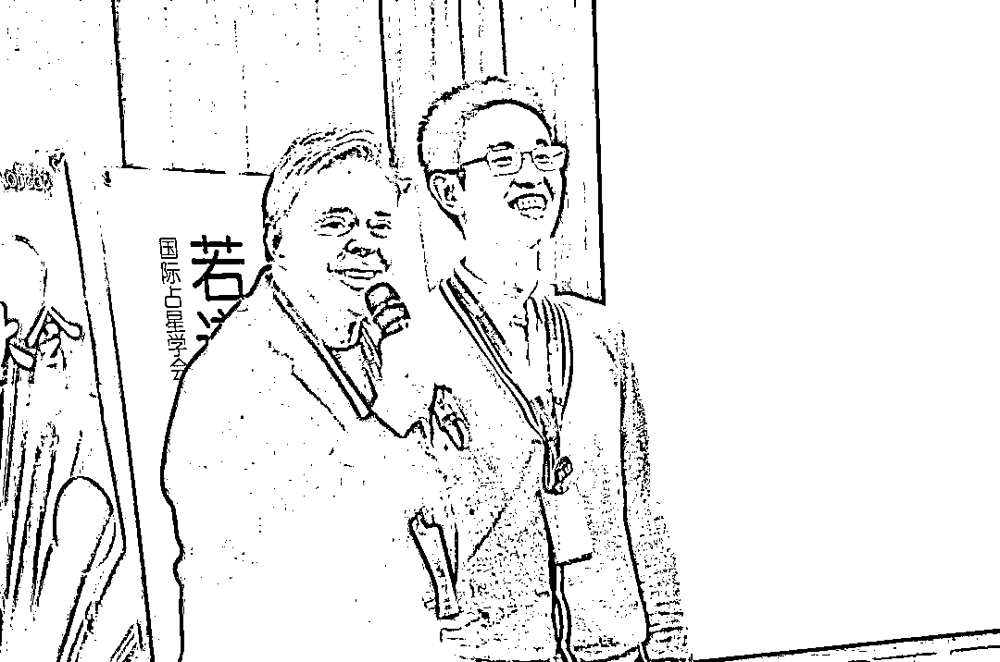**|** 2019 年 ISAR 大会上，大卫向观众们介绍他最爱的“儿子”熊鹰大卫常说自己在中国有很多“儿子”，而熊鹰是他最喜欢的一个。他猜想大卫这么说可能是因为自己在工作上也给了他很多支持，亦师亦友的关系让他们觉得很亲近。日前 2020 年核心课熊鹰主讲的招新沙龙前夕，大卫特意问他需不需要自己上线来支持一下，熊鹰赶紧说好，那晚大卫就上线为他做了沙龙开场介绍。**“****他群星天秤座，总是很设身处地的为其他人着想。****他会想到你可能需要什么，会不会需要帮助。**在公司、工作坊任何场合你都可以看到大卫是这样做的，他其实并不是只对我一个人这样。他确实是一个很 nice 的人。”**群星四宫的居家生活**熊鹰的太太职业是护士，她是当时若道上海线下同学会的常客。与母亲类似，太太也属于中国大陆最早一波接触到身心灵领域的人，十几岁就看过胡因梦翻译的占星书、克里希那穆提，或是超个人心理学的书。熊鹰和太太对这种东西很聊得来，约会的时候讨论的都是《水晶头骨之谜》、《世界未解之谜》。

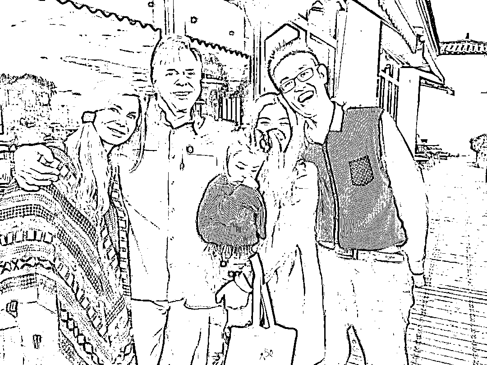

**|** 熊鹰一家与大卫·瑞雷在大理“我的下降点在射手，天王星在七宫，我吸引来的女性都是带有这种射手座和水瓶座特质，喜欢学习、探索世界、喜欢稀奇古怪的东西。”熊鹰解读自己的时候，常带有占星授课般的严谨气质。有时候太太下夜班，熊鹰去医院接她，路上俩人也会进行一些占星内容的对话。太太会跟他讲单位的同事是什么星座，有什么表现。他也会跟太太讲自己碰到什么星座的学员，有什么表现。

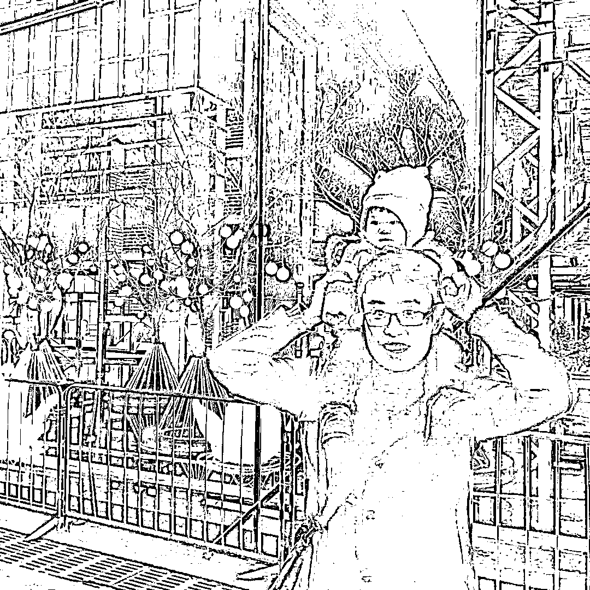

**|** 熊鹰与女儿萌萌熊女儿出生那天，熊鹰是坐在太太旁边陪产的。孩子一生出来，他马上看了一眼手机是几点几分，记录下了孩子星图。夫妻俩都懂占星就会忍不住讨论孩子星图。熊鹰星图中没有行星或四轴落在金牛座，他很奇怪为什么女儿的太阳会在金牛座（太阳是父亲的第一象征行星）。在观察自己现实中怎么对待孩子的过程里，他发现自己会特别喜欢带孩子去吃各式各样的美食，想通过“吃”来让孩子见识这个世界。“她是太阳在金牛座第九宫的。后来我才想起，小时候我父亲经常带我去应酬，我在外面吃饭可以了解不同的美味，在饭桌上见识不同的人。现在喜欢带女儿四处吃，也算是家族的一种传承吧。”

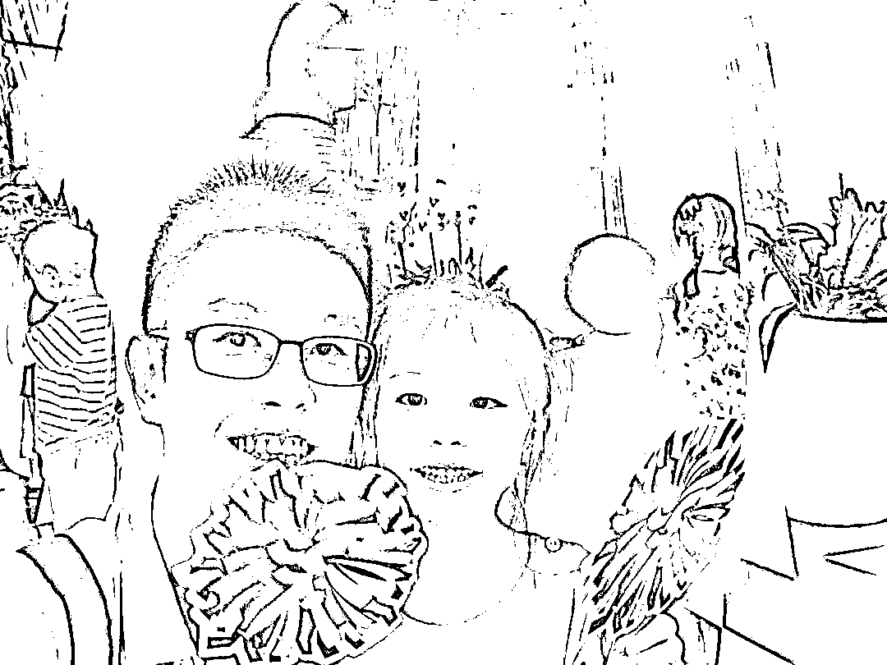

**|** 熊鹰与女儿萌萌熊有时候熊鹰也会和太太看着女儿的星图，甚至会猜测女儿以后会喜欢什么样的男孩子，从事什么样的工作。但是夫妻俩思路比较一致，星图只做为辅助，背地里讨论归讨论，几乎不会因为女儿的星图配置而非要要求她往哪个方向做。比如说女儿对学画画没有太大兴趣而想改成学手工，熊鹰就会尊重她的选择，不会因为她太阳和中天都在金牛座，就非要执着培养更像金牛座的画画技能。

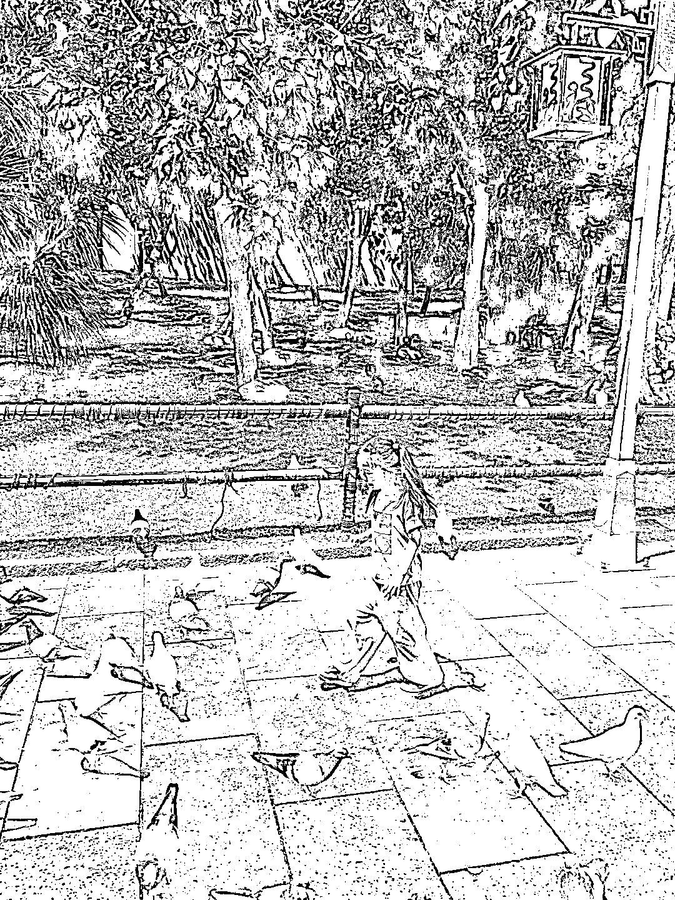

有一次女儿半夜生病了，熊鹰带她去上海儿童医院，晚上 11 点半从车库抵达医院急诊大厅。电梯门一打开的时候他都惊呆了，整个大厅全是大人带着小朋友，天上有各种气球在飘，跟公园一样，好像大家在排队等着进迪士尼乐园。其实儿童医院坐诊医生并不少，只是患儿人数实在太多。那晚熊鹰一家 11 点多取到号，到真正看上病已经是早上 7 点多了。熊鹰心想着现在的孩子生病看病折腾下来太苦了，于是 2016 年他开始自学中医。他希望家里人生病不用非要去医院，可以有不一样的治疗途径。

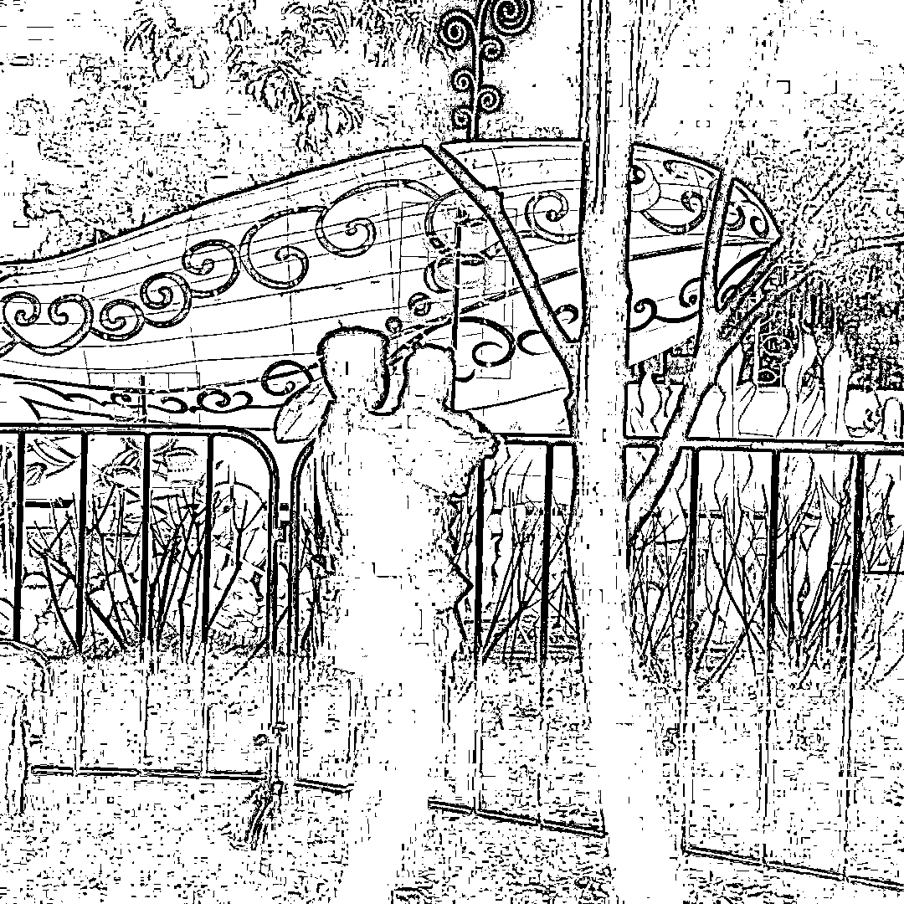

**|** 熊鹰与女儿在游乐园

**用占星学承载中国文化**熊鹰的父母都是学西医出身，父亲是个做手术的外科医生，对中医不了解，也有很多误解，一直觉得中医就是安慰剂。父亲得知熊鹰学中医后，对他露出了“招牌式的”不屑的一笑。但熊鹰其实从小就对中医感到好奇，也纳闷为什么父亲会对这门医学感到如此不堪。毕竟自己喜爱的金庸小说里，中医是很大一部分内容，点穴、汤药等内容出镜率很高，《飞狐外传》中的女主角程灵素的名字，就是以《灵枢》、《素问》两本中医典籍来命名的。学了中医之后熊鹰意外发现，中医里贯穿了许多中国的传统术数，比如天干、地支，这些知识某种程度上跟西方占星学又是有共鸣的。并且，这些内容与他一直以来喜欢的南怀瑾老师书中的中国传统哲思也是相通的。

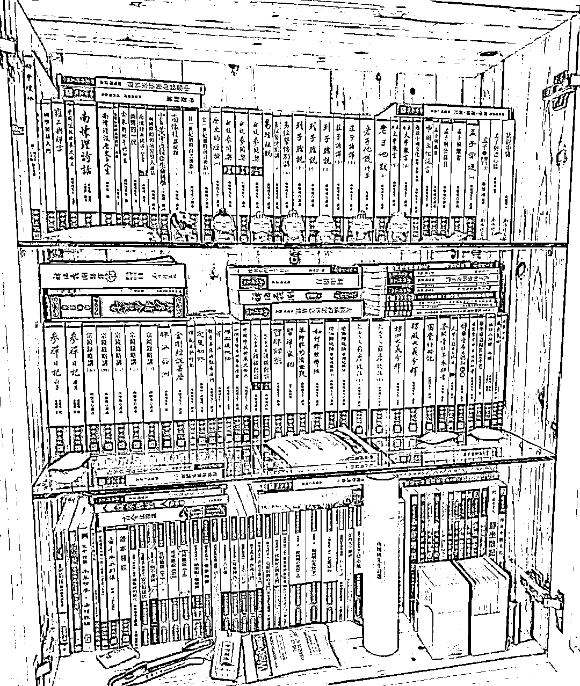

**|** 熊鹰家中书柜的一角 南怀瑾的书**“我一直觉得占星学是个很好的容器，能承载很多东西。**容器获得价值并不仅仅因为长得好看，大多数时候其价值是因为可以承载我们看中的东西，比如鲜花、果品、饭菜。**占星学的价值，也可以通过我们用它承载的东西来体现。**如果你可以纯粹用占星解读去帮助别人这非常好。但与此同时，**占星学可以是我们生活中很好的辅助，它可以辅助很多职业。**比如做金融可以用它看市场周期，做医疗可以用占星学辅助看身体健康，做人力资源可以用占星学看到员工概况……这些是很好的辅助性承载。这个世界上有什么东西是占星学承载不了的吗？其实不多。**基本现实中的东西，占星学都可以深入其中做一个辅助。”**触类旁通的熊鹰经常对占星学的实用性进行思考。

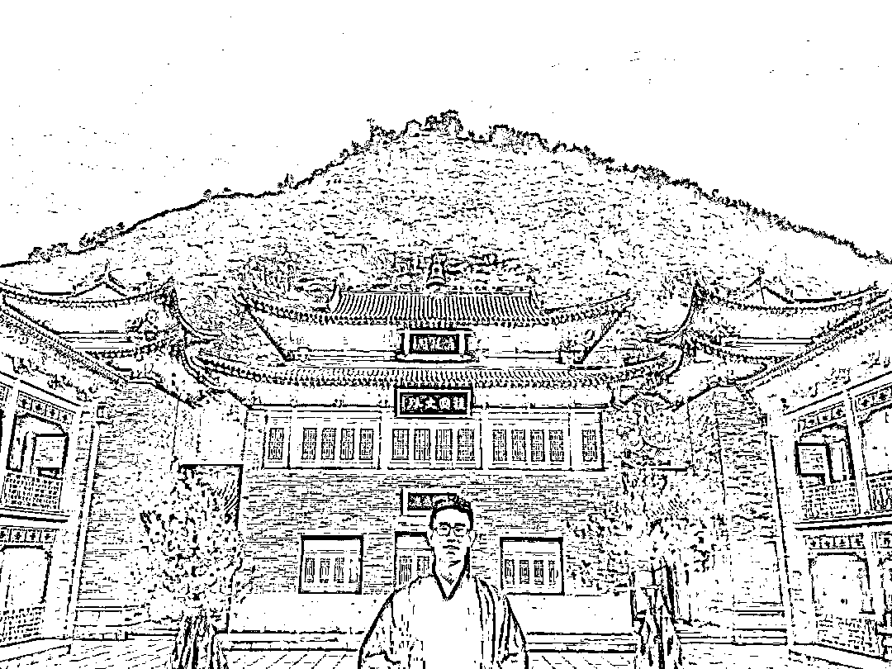

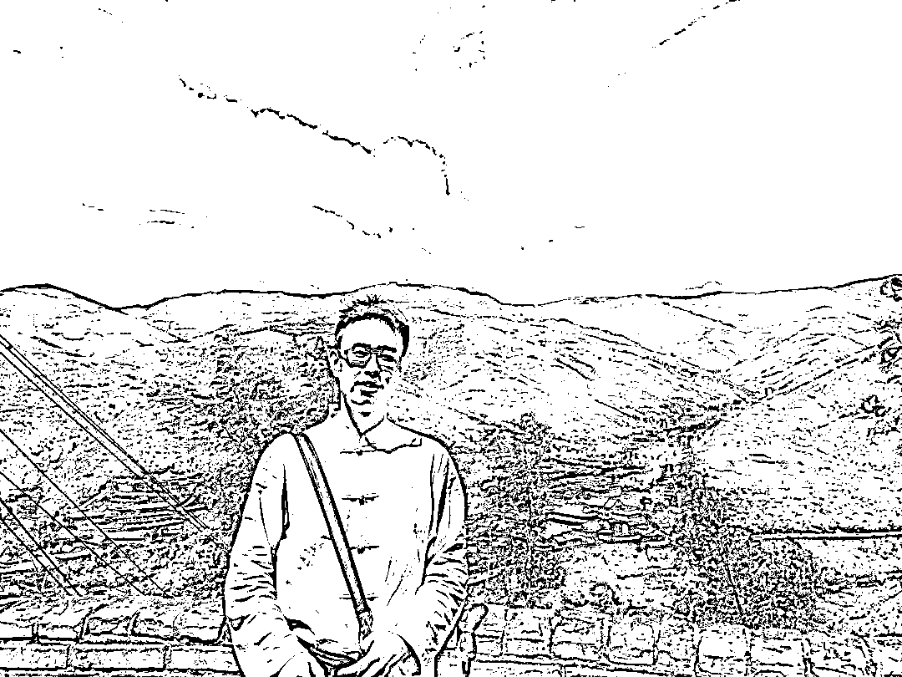

**|** 熊鹰在五台山禅修五四运动以来的一百年，中国文化被遗失了很多，很多传统里的精华放在历史角落里都积灰了。熊鹰想着这两年中国文化正处于复兴的阶段，国家号召大家把中国传统文化捡起来。所以现在的熊鹰一边在若道做全职的占星教学工作，另一边也会去学习一些中国传统文化**。****他想用中国的传统哲学思想，去指导西方占星学的使用，让西方占星学真正地融入到中国人的日常生活，而不仅仅是茶余饭后的一个谈资。**在熊鹰的占星课授中，他也努力尝试把中国文化融入进来。他观察很多中国人对中国文化并不是很熟悉，**如果能把中国文化融合进占星学，就能做一个双向促进。**

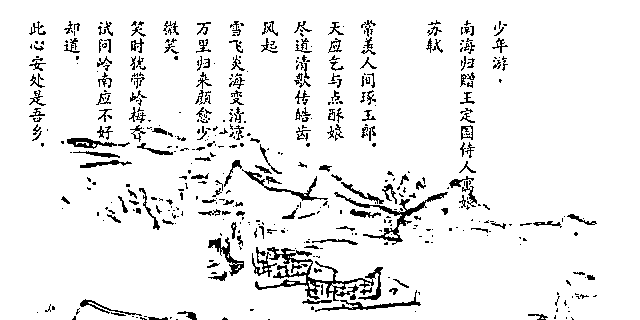

比如说用诗词来帮助新学员对十二星座加深印象。熊鹰举了个例子，他认为**“此心安处是吾乡”是很典型的巨蟹座的表现**——巨蟹座要求安全感，要求家庭，要和求熟悉的人一起。目前熊鹰在自己的 1-2 阶占星课里，把十二星座都找了比较朗朗上口且有名的对应诗词。他有点自豪这种教学方式可以一举两得，让学员既了解了星座，又记住了一句好诗。“前阵刷屏的一句诗，就是日本给我们捐赠抗疫的物资，包装上写的那句 **[山川异域，风月同天]，可以很好的帮我们理解水瓶座和双鱼座的意涵。**没有日本和中国的国界，没有种族的区别，你们有难了，我们就来支持你们。这句诗是非常典型的水瓶座的人道主义精神，以及双鱼座的无私无畏奉献他人的组合。这种方式学占星，可以很好地帮助我们理解和记忆。”

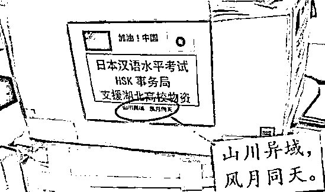

**|** 日本捐赠抗疫物资包装上的中国诗句在教学上取得不少心得的熊鹰，也仍会去兼职做占星咨询。他觉得自己每次被问“更喜欢做占星咨询师还是更喜欢做占星老师”，就好像一个孩子被问“你是更喜欢爸爸还是更喜欢妈妈”一样。两种身份各有千秋，各有吸引他的地方。做咨询个案最吸引熊鹰的一点，是让他能更近距离地见众生。会看到原来世界上有这么多各种各样的人，他们相似的行为背后可能有各种不同的心理动力。

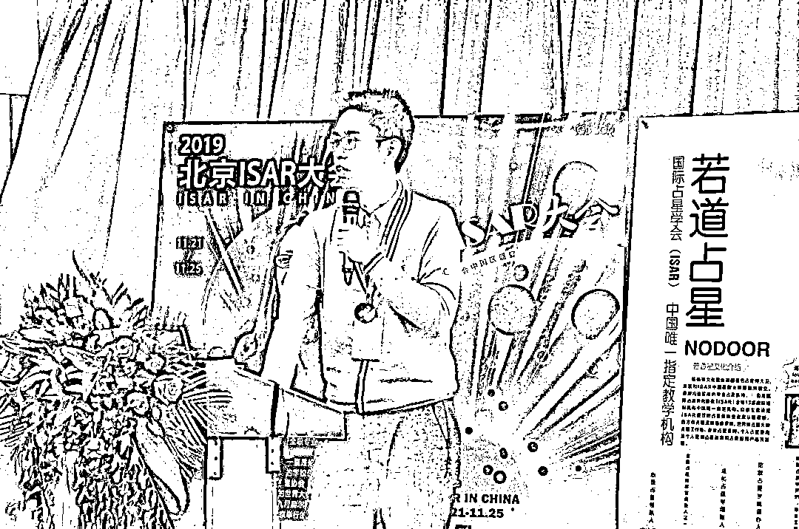

**|** 2019 北京 ISAR 大会演讲中的熊鹰

   其演讲主题《浅谈中国文化对占星解读的启发》获得满堂彩

**“做老师更多的是吸收再传授，过程需要整合很多东西，像炼一锅丹药。不仅是把我所学的，还有我听到的、看见的大师们的一些东西，以及他们的个案，融合我在我生活中体会体悟到的，这些所有东西加起来，一起传播出去。这也是我作为助教和作为老师，非常有满足感的地方。”**熊鹰是他从小的本名，“鹰”字是外婆给取的。家里人觉得熊姓不好取名字，想来想去选了另一种天上的动物搭配在一起，这样天上和地下就打通了，也寓意展翅高飞。可能就从那时起，他就命中注定要飞向那片万物互联的学术天空里去了。以上是**若道毕业生**兼**金牌中文教师****占星师熊鹰**的故事想成为和他一样优秀的占星师成为把自己多重爱好变职业的**"斜杆青年"**若道君隆重向你推荐**熊鹰****和授业恩师****大卫·瑞雷**联合主讲的**2020****若道春季占星入门课**最懂中国学生的大卫和熊鹰老师将最深入浅出向零基础的你讲述**12 个****星座、****12 个****性格、****12 种****人生****10 大行星****和 12 个****黄道宫位****让你从爱好者一步飞升专业占星师的行列 **

**点击图片 **

**你也可成为会占星的“斜杠青年”**

**👇**

**若道毕业生故事 往期回顾**
[咔咔：占星师宅家看疫情](http://mp.weixin.qq.com/s?__biz=MzA5NjA0NTAxNg==&mid=2651413283&idx=1&sn=025534063922cbcdb3a0647b9c4522f5&chksm=8b4be994bc3c6082695e65cb8f0497cfa46aeed4dc0785c4c9b8a47ac60b7d6492c2bd4e4072&scene=21#wechat_redirect)[傅莎珈：占星师如何寻找职业优势](http://mp.weixin.qq.com/s?__biz=MzA5NjA0NTAxNg==&mid=2651413729&idx=1&sn=a080d49fa4bf0187e5a8c08cc88d9286&chksm=8b4bee56bc3c6740093123281df3bd439119f39c6bb90f457741b5b2897ececb73631953ca3d&scene=21#wechat_redirect)

**微信又双叒叕改版啦，不想错过若道君的推送？**

**就把若道设为星标吧！**

**▼**


就是这个“在看”，戳戳戳 ☟

********报名直达入口********

# 12 星座“禁足”期间都在做什么？ | 我们一起，等待春天到来

> 原文：[`mp.weixin.qq.com/s?__biz=MzA5NjA0NTAxNg==&mid=2651413917&idx=2&sn=b5872e70af4a0f587ea5ae83a1baaa1e&chksm=8b4bef2abc3c663cdd26801f7d97204a757eed7ba41e80d81f83372558044a5581e75924a7fc&scene=126&sessionid=1692738207#rd`](http://mp.weixin.qq.com/s?__biz=MzA5NjA0NTAxNg==&mid=2651413917&idx=2&sn=b5872e70af4a0f587ea5ae83a1baaa1e&chksm=8b4bef2abc3c663cdd26801f7d97204a757eed7ba41e80d81f83372558044a5581e75924a7fc&scene=126&sessionid=1692738207#rd)

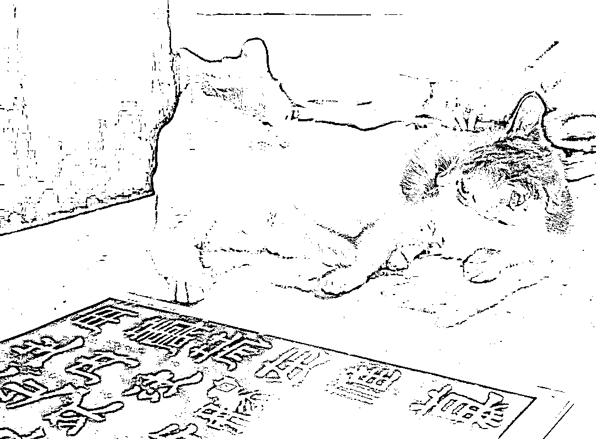

编辑 撰文/玫瑰 

文中所有图片均由若道读者提供

**为什么我的眼里常含泪水** 

**因为我对这土地爱得深沉**

上周，我们做了一次征集，想看看 12 星座的读者们在这长达一个多月的宅家生活中的花式玩乐解压大法。我们收到了 43 份反馈。
看着这些文字，像寻常日子里，亲人朋友在耳边絮絮叨叨说着一点一滴，泪水却忍不住模糊了眼眶。那一刻，他们都是如此亲切和熟悉。是家的感觉，是家人的感觉。

参与征集的读者，都是普通得不能再普通的人，面对这场疫情，也会恐惧、焦虑、沮丧、无望，却都在努力适应、调整、冲锋、搏杀。这场发生在土冥合相摩羯座的疫情，以看起来无情又残酷的方式，将我们逼向北交点巨蟹座。

也许这是一生中最渴望家的时刻，无论身在疫情严重的武汉，还是长居海外的游子，中国的命运牵动着每一个中华儿女的心。而大多数人能做的，就是回家，呆在家里，家是港湾，是安全，是最后的阵地。

我们在家里学习久违的放松、休息，细品一粥一饭、一花一叶的安然；同家人重温旧时光、好时光，建立更深远、更健康的联结；用禁足的方式来宣告对这片土地最深的爱。

这一刻，爱不是任性，而是克制。是遵从摩羯座顾全大局的规则感，又有巨蟹座守护家园的决心；是从我做起的自我约束和恪守，也是心怀众生的悲悯和柔情。

学习占星学，最终是让我们明白，宇宙中有看不见的包容和大爱；而这场看似把每个人隔离的战疫，最终是让我们明白，我们的心都在一起。我们有同样的苦难，也有同样的信念；会流下同样的泪水，也会绽放同样的笑容。

限于篇幅，只能选出 43 篇征集中最有代表性的一些发布。希望此刻的你，也能从这细碎平常的文字中读出感动。

📹 [`v.qq.com/iframe/preview.html?width=500&height=375&auto=0&vid=i0519cszyqt`](https://v.qq.com/iframe/preview.html?width=500&height=375&auto=0&vid=i0519cszyqt)

照顾好自己，因为每一个人照顾好自己，就带来多一份光芒；这光芒，如同魔法世界的魔杖，安静却又坚强，星星点点地亮起。最终，它会划破阴暗恐怖的天际。让整个宇宙知道，我们是地球的孩子。为了守护我们的家园，倾尽所有，在所不惜。

春天要来了，花儿都准备着开放。这个春天，一切如常，却一定有些东西不一样了。

禁足期间，他们都在做什么？**01**

**双子座的她开了个故事屋**

**芃芃乐 ****太阳双子座 坐标上海**

**她说：**

开了个“有芃自远方来-生命成长互动故事屋”，分享支持武汉一线医护人员的心理咨询工作，以及“在家宅着如何建立心理支持系统和周游世界”的生命成长小故事。

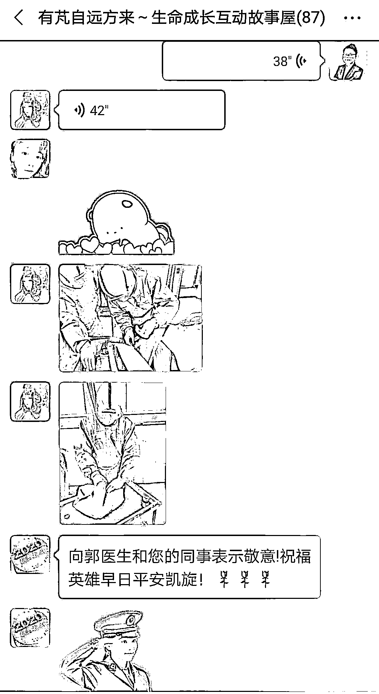

在故事屋组织的第 10 期“十全十美大补膏”小结故事会中，奋战在武汉一线的郭医生休息之余，正好看到发布在朋友圈的消息，就参与进群里，成为第十期生命成长最大的惊喜。

**02**

**日月都是水星守护的她在春联上亲手写下：“福和人间”。**

**铭滟 ****太阳双子座，月亮处女座 坐标山东聊城**

**她说：**

宅在家读些书，尝试做抖音。在网上停留的时间过多，于是在我的聊城品书会群里倡议规划时间分享，每天上午 10:00 到 11:00 读一首诗沉静自己；下午 5:00 点到 6:00 读书推荐，生活分享。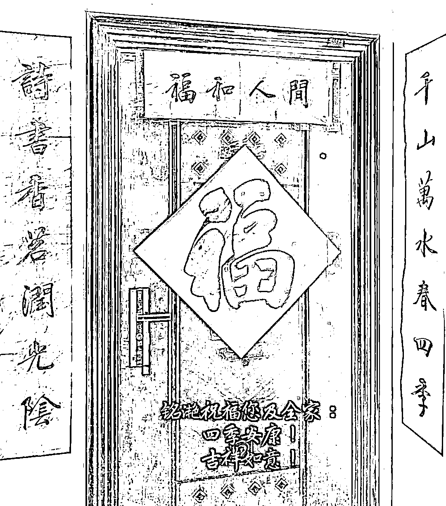每天和花相处的时间多了，花儿更加的娇艳。每天喝茶、品香也是乐趣。春节我写的春联是：**千山万水春四季；诗书香茗润光阴**。没想到这个正月以这种方式，让我天天诗书香茗润光阴。春联的横批是**“福和人间”**，我希望也是如此。**03**
**乐观又求生欲顽强的她，解锁了各种美食小吃。****乔静宜 ****太阳射手座，月亮天蝎座 坐标北京****她说：**

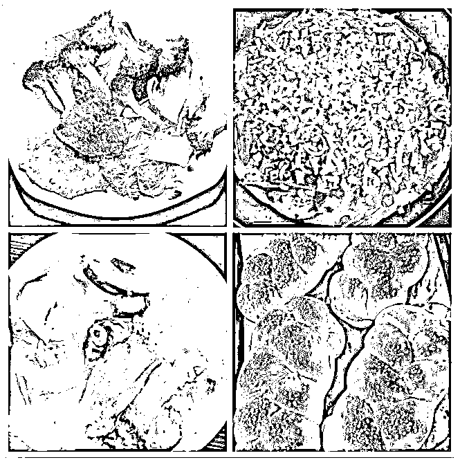

疫情期间，开始解锁各种小吃，从泡椒凤爪、三文鱼头豆花汤、披萨、以色列哈拉面包、蒸包子、包饺子、糖醋鱼、健身餐等等。若道君弱弱地问：提供打包外卖服务么？**04**
**日月都被土星、冥王星守护的她，遭遇了最深的痛，却重新认识了人生。****莲小蝎 ****太阳天蝎座，月亮摩羯座 坐标北京****她说：**

  这段日子是我最难熬的时光，发现男朋友是个从来没有在意过我的人渣，还丢了工作，身边的朋友一下子全部变得陌生起来。

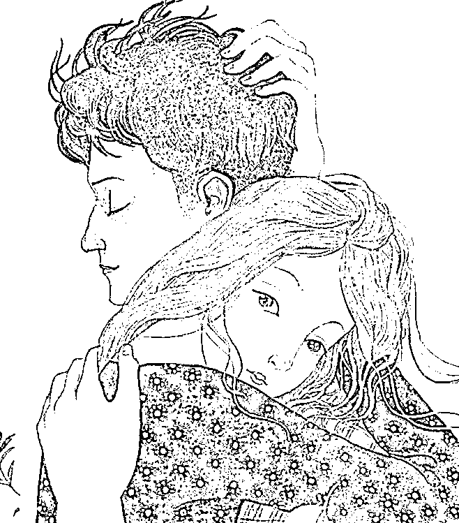

第一次重新审视周遭的一切，发现以前好像活在自己的意念里，于是痛定思痛，咬着牙重新开始，从今日起，只要现实，莫谈理想。

一直觉得自己是个很牛掰的人，突然明白自己是如此的弱小，所以要脚踏实地、所以要吃苦耐劳，思维的转变，是这段禁足时光给我最大的财富吧。

**05**
**火象能量很强的她，宅在家里学会了慢慢地生活。****小小外星人喵 ****太阳白羊座，月亮狮子座 坐标上海****她说：**

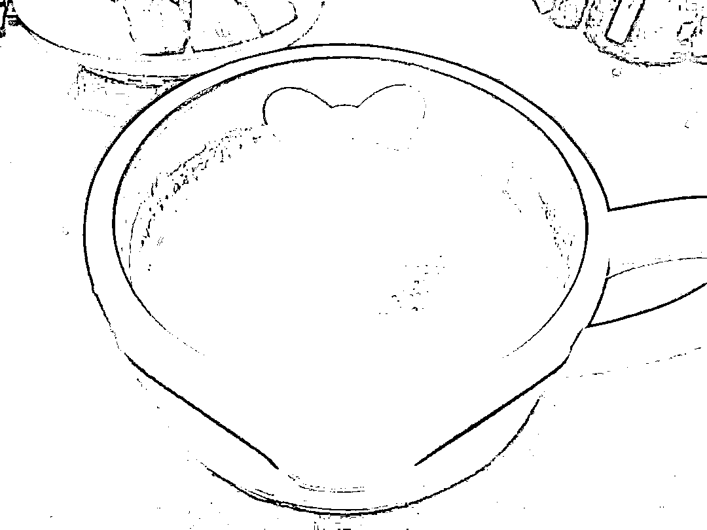

学会煮印度奶茶：红茶、豆蔻、小茴香，尝一杯健康奶茶的丰富味觉层次；大量的时间用于发呆、看书、看剧，生活的懒散、不保养却发觉自己比工作时候漂亮多了；买了一批情色海报，情色故事，爱看多久看多久；曾经忙于工作很少搭理的小鲜肉，终于有了时间去调戏几句；总算有了自己的时间，去了解植物的生存原理，看着别的物种是怎样生存的，内心满满；那些什么世故人情，全部抛之脑后，就算有人打算秋后算账那也到时候再想。**06**

**巨蟹座的她，为家人做了很多顿饭。**

**8th ****太阳巨蟹座 月亮天蝎座 坐标北京**

**她说：**

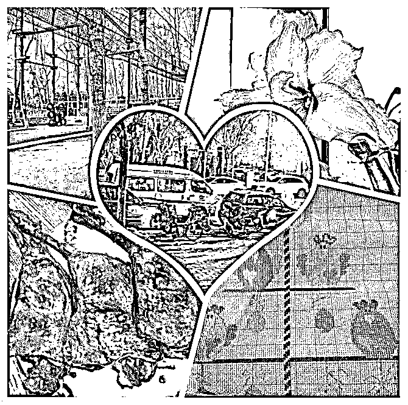

为家人做了很多顿饭；庆祝 92 岁姥爷的生日；去空旷的游乐场和雪后的森林公园遛娃；绣完了一幅耽搁许久的十字绣；去单位值班看到种了 12 年的花开了，如同看到自己另一个孩子安好；解决了长期薄弱的英文发音 bug；值班当晚回家遇到小区门口拉走疑似病人；最近长了巨疼的带状疱疹；琢磨怎样开始做一直计划做的事；和老公分隔两地，他给我买药，主动示爱，感情升温。**07**

**太阳摩羯座的她，做了肩负责任的事，月亮双鱼座的爱，从踏踏实实的脚步中荡漾出来。**

**Catherine ****太阳摩羯座 月亮双鱼座 坐标北京**

**她说：**

 摩羯座老干部做派，白天居家做饭打扫屋子收拾房间读书。

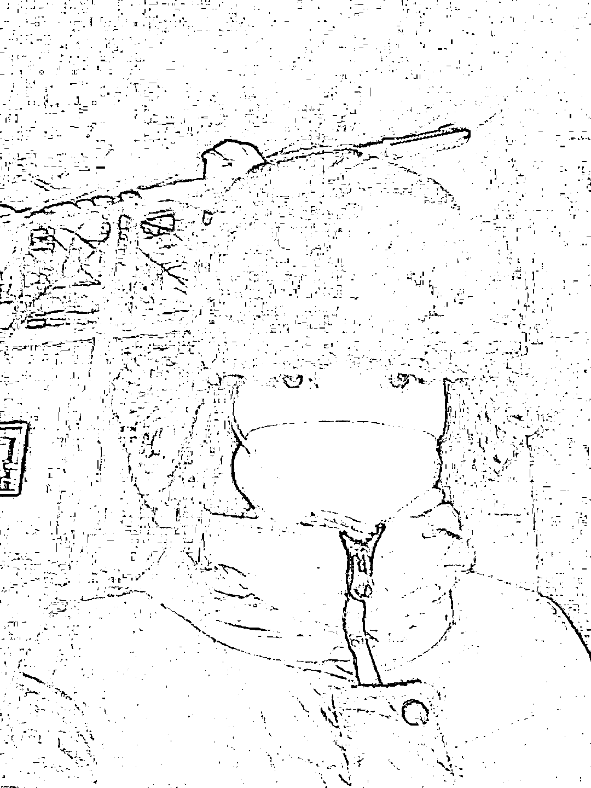

吃完晚饭，加入到小区执勤队伍中。大爷大妈年岁大，加上夜晚寒冷，不敢让他们夜风中停留太久。于是我开始一人承包晚班。

当然，过程并不无聊，有占星干货陪伴。用 app 听《内在的天空》，带来不一样的感知。

虽然以前看过这本书，这次听了感觉很不一样。

夜晚星空，抬头见到西方天空一颗明星闪闪发亮，我很喜欢金星，不知道是不是。不时有飞机划过，静谧的夜，满天的星，享受。

**08**

**变动能量强的她，安静下来，陪着孩子，陪着多肉，陪着生活。**

**喜欢多肉的东 ****太阳双子座 月亮射手座 坐标北京**

**她说：**

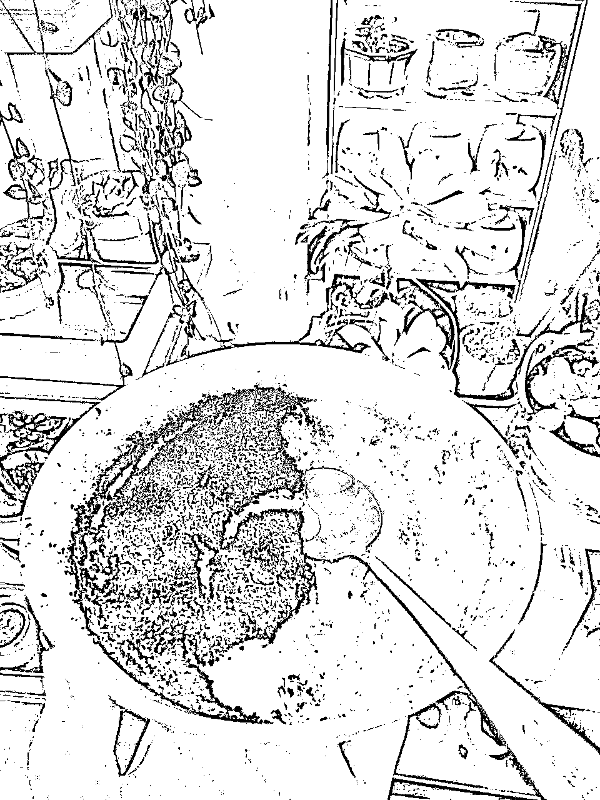

和我的两个宝贝女儿待在家，监督大宝写作业，二宝只有一岁五个月，所以要一直看着她，照顾她吃饭睡觉生活起居。

忙里偷闲照看我的多肉植物，等二宝睡觉时，在阳台和多肉植物待在一起晒着太阳，大宝做一碗双皮奶我们一起吃，是我最悠闲的时光。

**10**

**短短一句话，看到了她柔软的心闪烁着光。**

**蒲公英 ****太阳狮子座 月亮双鱼座 坐标江苏镇江**

**她说：**没有禁足，从大年初二就一直上班，比平时上班要早出晚归，初四的时候让爸妈回去了，怕自己不小心感染传给父母。**11**

**身处疫区的她，淡定安然。**

**染染 ****太阳水瓶座 月亮双子座 坐标湖北武汉**

**她说：**每天解读自己的潜意识，目前一个月时间，已经解读了 3 本半潜意识。有许多关于自己的重大发现，包括身体隐性情况、如何调理、适合什么工作、如何创业、如何管理、各方面能力如何升级完善、如何创造爱、详细的内在情况、以及调理细节。有灵感就搞搞创作、写文章。**12**

**和妈妈都是学医的她，一家三口，陪着他们的还有两只小鸟，一只乌龟和三只猫。**

**大猫 ****太阳双鱼座 月亮金牛座 坐标河南郑州**

**她说：**

 禁足这么长时间，说实话，有种重回上学时候的感觉。

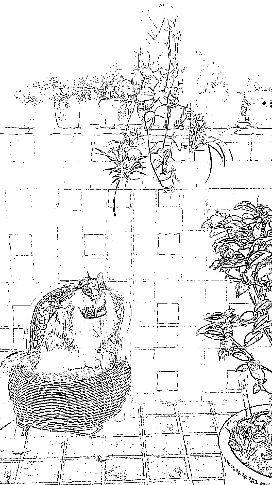

一家三口，三只猫还有两只小鸟和一只乌龟。因为我妈和我都是学医的，我们偶尔也是要出门上班的，突然感觉所有节奏都慢下来了。

一家人一起研究一下好吃的，坐在一起看看电视吐槽一下，三个人都很喜欢小动物，开开心心撸猫，愿疫情早日过去。

**13**

**太阳白羊座的她，从焦虑生气到平和，来自朋友的支持滋养了月亮天秤座。**

**soda ****太阳白羊座 月亮天秤座 坐标宁夏银川**

**她说：**

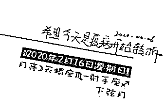

写日记，找口罩资源，做饭，研究星座运势，祈祷。开始的时候基本不能睡觉，每天焦虑，看新闻，生气。可能因为我们小区有确诊的患者。后来好一些了，买到了酒精，口罩也陆续有朋友寄来。**14**

**月亮处女座的她，何以解忧？唯有学习。太阳白羊座的她，除了学习，还有疯狂学习。**

**Vikin ****太阳白羊座 月亮处女座 坐标广东广州**

**她说：**

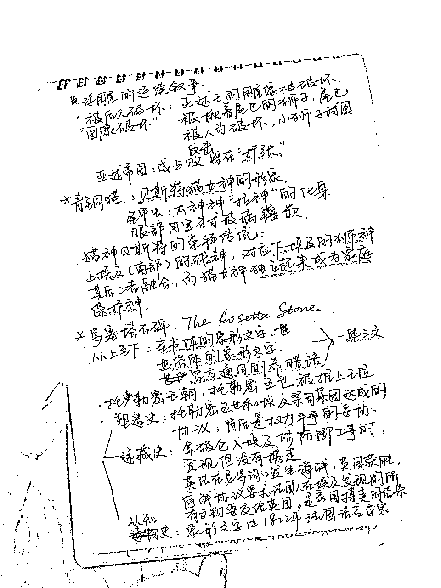

一口气打卡了 150 篇之前落下的艺术史线上课程，虽然每篇不到 15 分钟。但是疯狂学习的感觉让我很满足，写了 20 多页笔记。现在可学的学完了，可是课程还没更新完，于是陷入新的焦虑和纠结😂到处物色新课 ing……若道君：为你疯狂点赞，若道的课程了解一下呗。**15**

**月亮双子座的她，通过学习若道占星的课程，获得更多生命启迪。**

**natalie ****太阳天秤座 月亮双子座 坐标北京**

**她说：**

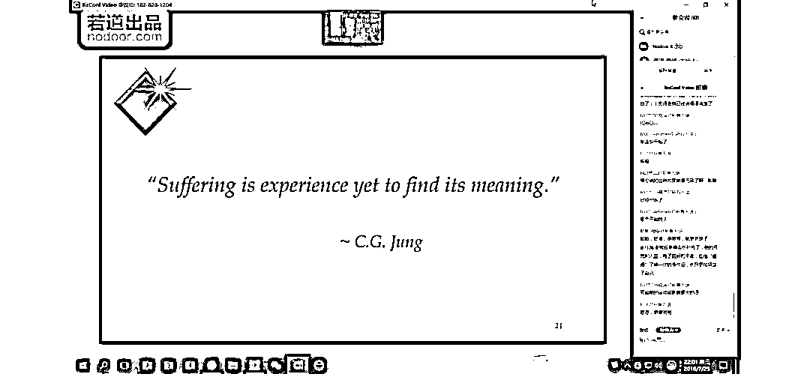

从老家回来，和物业报备后就开始隔离。早就计划好在这段时间内，抽时间把格伦老师的部分课程重新复听一遍……听到关于推进的部分，觉得内容好像还是不够，于是联系小助理又报了苏汤老师的 L3 课程。月亮双子座果然还是喜欢通过学习来化解焦虑啊，虽然学的不好，但是还是充满了热情！ps：图片上老师的这句话，很符合现在的背景，疫情总会结束，去思考它的意义是什么，每个人需要做出哪些改变？这是未来需要我们持续去做的。**16**

**坚持凌晨 5 点多起床，按部就班过完一天，这样的生活，她已经过了 22 天。**

**黄丽之 ****太阳射手座 月亮双子座 坐标广东阳江**

**她说：**凌晨 5 点多醒来，然后躺在床上做腹部按摩，结束后起床放早餐下锅煮，吃一勺芝麻粉（芝麻粒研磨成粉状）。

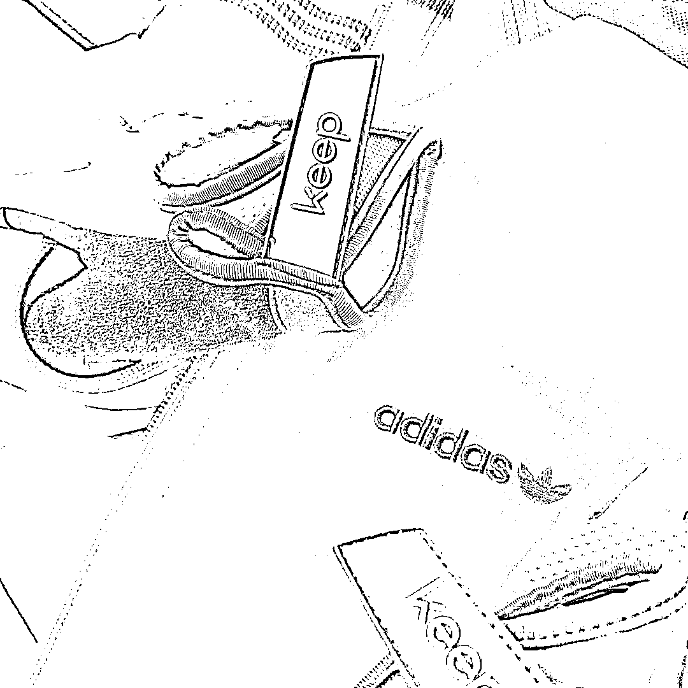

看书/运动一小时，9 点前吃早餐，10 点开始线上办公，12 点午饭，13 点洗完碗午休 18 分钟，14 点-20 点线上办公，工作结束后洗澡，然后泡脚 30 分钟（有时边听直播学习边泡脚），22 点睡觉。按这样的节奏早睡早起不知不觉已经 22 天了，精神满满正能量满满。**17**

**天秤座的她，把宅家日子过成了一首诗。**

**明也 ****太阳天秤座 月亮射手座 坐标广东汕头**

**她说：**

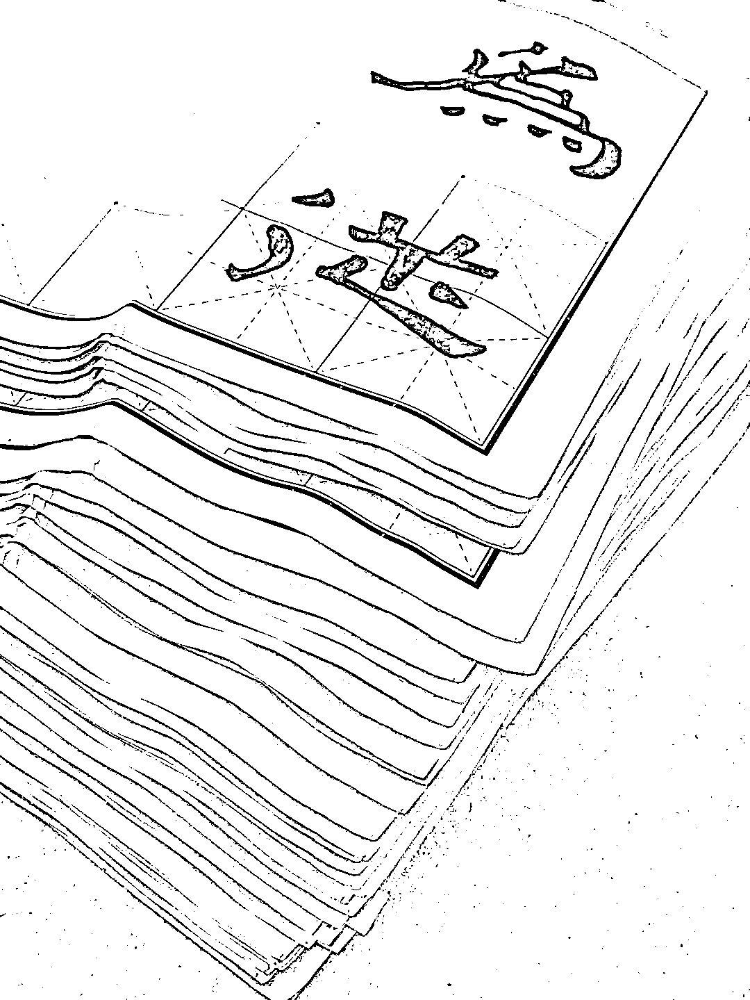

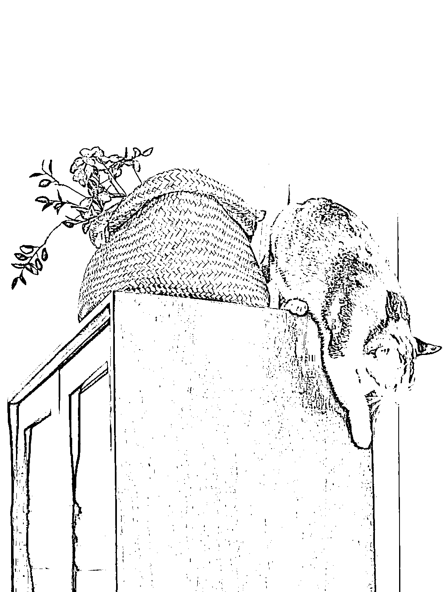

以练习毛笔字为主，还会看一些中医精神健康及占星学方面的书，每天必不可少得欣赏和护理窗台的花，与猫猫们互动。**18**

**关于坚强，关于脆弱，她在这场疫情中明白了更多。**

**Libra ****太阳天秤座 月亮巨蟹座 坐标上海**

**她说：**1 月 24 日晚，我的儿子忽然高热，他刚从北京回来，间接接触过一位湖北人。那一刻，我能坐的，只有紧紧拉着他的手，默默地哭。
孩子对我说：“妈妈，我没事的。”不知道是我安慰他，还是他安慰我。我就这样拉着他的手，很快，他昏沉沉地睡过去。看着他颈部动脉急速跳动，我感受到生命的顽强。第二天一早，他退热了。从小到大，儿子发热也有很多次，我从来都是那个坚强的妈妈，云淡风轻地告诉他，一切都会好的。这是我唯一一次在他面前展露自己的脆弱、担忧，我以为这些属于巨蟹座的情感都是不够勇敢的，但是，那或许是更有力量传递的爱。那一晚，我拉着他的手，跨过了农历的 2020 年。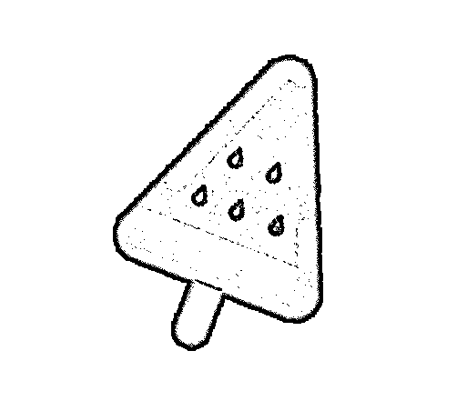疫情结束后，我们要出去撒欢儿，吃最想吃的，见最爱的人。但是现在，请为了他们，保护好你自己。让我们一起期待！
“

**要有耐心**

**不要沮丧**

**你想啊 若春天要来**

**大地会一点一点地让它实现**

**——里尔克**

”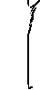—END—**你在疫情期间，又做了些什么，想了些什么？留言分享给更多的人吧。**

# 福利 | 雷蒙德·梅里曼年度金融预报讲座，可以免费试看啦！

> 原文：[`mp.weixin.qq.com/s?__biz=MzA5NjA0NTAxNg==&mid=2651413917&idx=3&sn=58d163921efef7d700062ee80e296455&chksm=8b4bef2abc3c663c5afb5f249499e7ee26807b6d3fdbd5017bc75b9f0490f099bfff4806dfac&scene=126&sessionid=1692738207#rd`](http://mp.weixin.qq.com/s?__biz=MzA5NjA0NTAxNg==&mid=2651413917&idx=3&sn=58d163921efef7d700062ee80e296455&chksm=8b4bef2abc3c663c5afb5f249499e7ee26807b6d3fdbd5017bc75b9f0490f099bfff4806dfac&scene=126&sessionid=1692738207#rd)


**帮你打赢“收入保卫战”**2020 年新型冠状病毒的突然袭击在今年第一季度的前两个月，几乎给全中国按下了暂停键，在疫情中，很多公司的经营都受到极大的影响。一些公司已经宣布破产，一些在裁员，一些在降薪，从公司到个人，一场**收入保卫战**在打响。

这时候，你需要更好地运用自己的**货币资产**（特别在不断降息的环境下，货币越来越贬值），明智地进行**投资**来赚取一些额外的收入。如果你已经投资了股票和黄金，可能现在你会有些开心。因为在短短的两个月中，一些公司的股票已经上涨 50%甚至更多。黄金在最近也开始了一轮大涨。

**股市和黄金齐齐大涨，你上了哪辆车？**

**这样的涨幅还会持续吗？**

**在这样的涨幅下，没有上车的还敢不敢上车，已上车的应该如何操作？**

你需要一个睿智而有经验的声音。1976 年以来，梅里曼市场时机学院每年发行一次年度预报沙龙和一本《年度金融预报》（雷蒙德·A·梅里曼撰写），致力于应用金融占星学为投资者们服务，提供卓越洞见，44 年来从未间断。去年，很多若道读者购买了由雷蒙德·A·梅里曼撰写的《年度金融预报》及讲座沙龙，因此赚得盆满钵满。**沙龙讲座都说了些什么？**今年，这个长达**三个半小时**的年度预报讲座及篇幅达到**200 页+**之多的金融市场分析报告在次如期而至！

在沙龙讲座中，梅里曼老师讲述了：

*   近两到三年的重要天象，它们在历史上出现的时候对于市场的影响
*   目前我们将经历的经济和金融周期
*   中国股票市场及中国星图、上交所星图的指征
*   贵金属市场
*   比特币市场
*   应对经济危机的投资方法

在报告中，除了以上内容更详细的解读外，还包括：

*   摩羯座星群的解读
*   土星和冥王星对市场的影响
*   木土合相周期对市场的影响
*   天王星在金牛座对市场的影响
*   2020 年美国预报
*   2020 年美国总统大选
*   2020 年美国中期国债和利率
*   2020 年谷物市场
*   2020 年水星、金星、火星逆行期的影响
*   2020 年的有利时期和挑战时期
*   ……

如何应对土冥合相带来的危机？如果准确抓住其中所蕴藏的巨大机遇？相信这份金融报告会给你启示。**沙龙 30 分钟试看来咯**为了让更多人从这个讲座和报告中获益，我们特意免费提供沙龙**讲座前 30 分钟试看（免费放大）**，你可以先试看，然后再决定是否购买整体报告及沙龙。如何安然度过这场危机？如何明智地投资，让自己安然度过这个充满挑战的一年，甚至获得丰厚收益？我们相信 2020 年度金融预报沙龙和报告套餐组合会给你远高于其价格的回报。**报告价格和讲座时间**

**报告和讲座价格**

2020 年金融预报沙龙和报告价格整体售价** 1280 元**

（沙龙和报告不单独出售）

**讲座形式**

**英文讲座，配有中文翻译**

**报告：中文报告**

沙龙讲座提供**30 分钟免费试看**，获取路径参见如下指引：
① 请扫描下图二维码，下载若道 app **②** 登录若道 APP 首页-金融报告-《2020 年金融预报》讲座视频——免费试看，即刻免费试看 30 分钟的讲座视频。


**购买者重要须知**

**①** 梅里曼市场时机学院每年一次的年度预报沙龙和《年度金融预报》是梅里曼市场时机学院的研究“预报”，而不是市场“预测”，是梅里曼老师及其金融占星分析师对人类活动周期历史与行星周期之间相关性的研究，二者在大部分情况下具有 80%或更高的相关性，而不是因果关系。沙龙中和报告中的研究完全存在错误的可能性。即便是非常认真的研究和几十年的研究经验，我们无法总是正确地解读出各种征象在实际层面上会如何相互作用，并显化为事件结果。

所以请将此沙龙和报告看作一个研究参考，务必结合其他市场研究和你个人对市场的理解，根据你的自由意志做决策。**② **此套餐一旦售出，即**不接受退款**。

**③** 此报告只能在购买者的若道手机 APP 端登陆购买者的个人中心阅读（即将推出），不能在个人电脑阅读，不能打印。

**④** 鉴于国内版权保护意识薄弱，报告将加有水印，每个人在自己的个人中心的电子报告中都会看到水印中将会包含购买者本人的姓名和电话信息，此水印不会影响阅读内容，如果购买者不让他人登陆本人客户端个人中心，其他人也不会看到该报告。对此类型水印介意者请不要购买。

**⑤ **讲座提供视频回放，购买报告后请添加客服微信（nodoor201705）免费开通讲座视频。

**长按二维码添加客服**（请备注“金融报告”）


以上须知，请仔细阅读。一旦付款，即视为已了解并接受所有须知内容。

****************若道 APP 下载直达入口****************


# 有一个星座，总是“把所有问题都自己扛”

> 原文：[`mp.weixin.qq.com/s?__biz=MzA5NjA0NTAxNg==&mid=2651413867&idx=2&sn=faddd43c78abb62c8bcc3319b94ed0fa&chksm=8b4befdcbc3c66ca6c757e1e61317898aed9cc5f901528fb901ef9c4584b8e7e6400df3e9355&scene=126&sessionid=1692738207#rd`](http://mp.weixin.qq.com/s?__biz=MzA5NjA0NTAxNg==&mid=2651413867&idx=2&sn=faddd43c78abb62c8bcc3319b94ed0fa&chksm=8b4befdcbc3c66ca6c757e1e61317898aed9cc5f901528fb901ef9c4584b8e7e6400df3e9355&scene=126&sessionid=1692738207#rd)

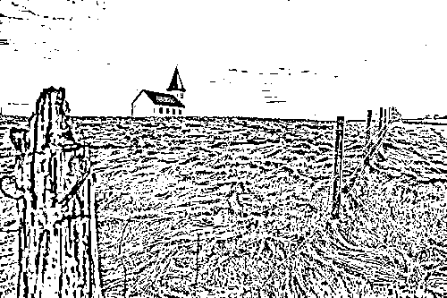

作者/咔咔 ISAR 认证占星师
编辑/Tang 图片/网络**月亮摩羯座**

有朋友留言，说想听我讲讲月亮摩羯座，好像现在的学业上有一些事情让她感到很沮丧。最近有一件事也让我很多时候感觉筋疲力尽，我暂时收养了一只三个月的狗狗，前几天北京下大雪的时候他被卡在了一根管子里，疫情期间没办法给他找主人，所以就暂时放在我家。小狗就和婴儿一样，精力充沛，时刻需要人的关注，表达热情的方式是会咬你的手。三四个月的狗狗还没有形成好的习惯，会在家大小便。**在照顾狗狗的过程里，我发现了月亮在用它的方式工作。**

**在占星学里，月亮代表了母亲和我们内在的婴儿。**母亲是给予我们生命的人，婴儿刚出生的时候，完全依赖于母亲的照顾，饿了的时候提供乳汁，大小便了要换尿布，哭的时候要抱着它轻轻地拍它轻声地哄它。因为被月亮式的关怀与照顾，被母亲给予生存的资源，回应情绪的反应，小婴儿因此感到世界是安全的，我是可以被爱的。被爱、被照顾、在生理上和情绪上被滋养，是人类最基本的需求，也是**占星泰斗诺·泰尔所说的，月亮是我们具有统治地位的需求**。

**月亮所在的星座、相位、宫位，描述了我们的体验到的母亲和照料我们的人，我们的家庭和家庭环境。**请注意，这里我们说的是体验到的母亲，而不是母亲作为独立个体的性格。**月亮的配置，还描述了我们的生活习惯、本能、安全感、情绪和感觉。**

我们从这几个层面说说月亮摩羯座吧。

★摩羯座**摩羯座、土星和第十宫，在占星学上有相似的含义，高高的山峰。**刚开始学习占星学的时候，记得老师说，摩羯座和山羊有关，因为山羊善于攀爬最陡峭的山峰。后来我在网上看到了一张照片，嶙峋陡峭的山壁零星分布着小小的凸起的石块，山羊就站在这些小石块上，一眼望去，好像山羊镶嵌在峭壁上一样。

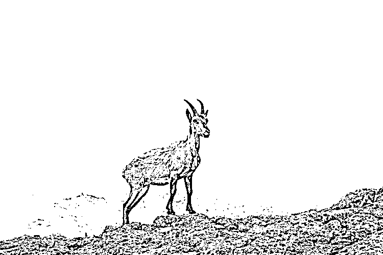

山峰，陡峭高耸，爬起来特别艰苦，而且非常容易在半山腰感觉绝望、沮丧、无望、挫折，上也上不去，下也下不来，要有自己选的路哭着也得把它走完的决心，忍耐而坚定地继续上路。**对月亮在摩羯座的人来说，生活就是在攀爬这样的一座山峰，需要决心、毅力和严肃地对待脚下的每一步。**2019 年最重要的宇宙天象是土星与冥王星在摩羯座的合相，有一部电影《攀登者》，讲述了 20 世纪 60 年代中国运动员攀登珠穆朗玛峰的故事，非常契合当时的天象。

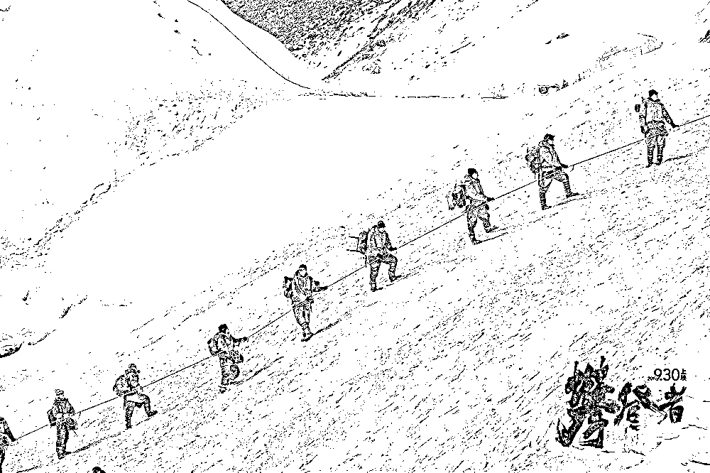

| 电影《攀登者》剧照★月亮摩羯座的家庭可能从小，月亮摩羯座的家庭给他们传递了这样的一个信息：**life is difficult**，生活不轻松。我的月亮在摩羯座，我记得我父母下班以后在厨房做饭，两个人一边做饭一边交流今天的鸡蛋多少钱一斤。幼年的我对这个话题印象如此深刻，以至于很久以后都认为每个家庭的父母都关心鸡蛋的价格。现在想想，可能是当时父母工作得非常辛苦，但是当老师的收入有限，所以要精打细算的过日子，即使如此，打理一个家庭的生活也是不轻松的，甚至可以说是艰难的。**当然不是每个月亮摩羯座的人都有和我一样的感受，但是早期家庭的氛围可能都有一种摩羯座土星式的沉重感，家庭成员尤其是母亲，特别注重责任，认为照顾孩子不是一个可以被随便对待的事情。**而且母亲或者主要照顾者在养育这件事上，给自己设立了一个像山峰那么高的标准。我对待狗狗，也和母亲当年一样，严格按照书本来喂养，特别信赖专家的话。买了七八本书，看网上的训狗视频，还很认真地阅读狗粮成分表，要找到最有营养的狗粮。但是，当狗狗开始挑食，把头从狗粮碗转开的时候，我会很坚决地掰开它的嘴，想强迫她把该吃的东西吃掉。现在回想自己当时的那个样子，很像是小时候催促我大口吃饭吃菜，碗里不剩一粒米饭的妈妈，要求我生活作息讲究规则，负起自己该负的责任，行为举止遵守清楚的规范。现在回头看看，可能偏于严格僵化，缺少一些弹性。

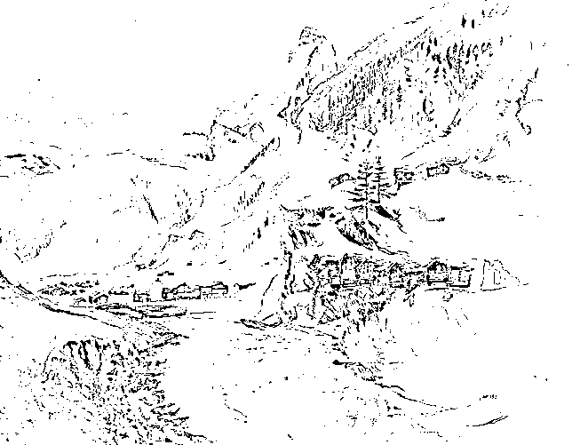

★把所有问题都自己扛**规范、责任、规则，这就是月亮摩羯座本命的词汇。**月亮摩羯座严肃地对待生活，不相信生活可以是随性的，轻松、可以躺平享受的。随着时间的增长，我发现，当我过度严肃、悲观和沉重地看待生活，把每件琐事都看成责任和负担，生活果然向我呈现了相同的面貌。有一些月亮摩羯座的人有胃溃疡的毛病，可能他们的生活被各种事情压得不堪重负，但是他们过度认同自己要对这些事负责，不愿意放手、示弱、求助，压力和焦虑导致了胃部（月亮代表的部位）出现了问题。**过度认同责任是月亮摩羯座压力的来源**，有句歌词特别生动地描述了月亮摩羯座的习惯，“**把所有问题都自己扛**”。**负起责任和义务，是他们照顾和滋养他人的第一选择。**摩羯座是个土象星座，是以结果为导向的星座，如果什么事情出了问题，那我们要把它解决掉，而我为你去解决问题，就是我在关心你，照顾你了。

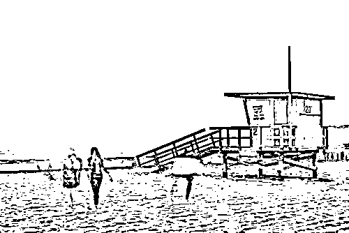

**那该怎么办呢？**

年纪略大了一些才意识到，别人和你倾诉自己的烦恼，不是期望你去帮他解决，而是他和你在分享自己的情绪和感受，是产生情感联结的一种方式。认为把事情解决了就没有问题了，对方就会开心了，其实是忽视了对方的真实需求。我们可以更多地倾听、共情，与对方在情感上先建立联结，然后再问问，我能为你做些什么呢？月亮摩羯座们，答应我，**以下表达学起来**：

*   你听起来很难过/沮丧/愤怒/绝望/无助

*   你慢慢说，我在听

*   听你这么说，我能感受你是难过/沮丧/愤怒/绝望/无助的

*   抱抱你

*   你太难了

**学习温柔地对待别人之前，月亮摩羯座们需要学习先温柔地对待自己。**在童年被照顾的经验里，妈妈通常会更在意日常生活，吃穿用住，不太关注孩子的情绪。家庭成员有可能也不太习惯表达情绪，认为每个人都要克制和管理自己的情绪。这种体验让月亮摩羯座对自己的感受不敏感，和外界的互动，尤其是两性关系上更加的克制内敛。占星大师斯蒂芬·弗里斯特把月亮摩羯座称为“**身体里面住了一个老妇人**”。

★温柔地对待自己的方式包括

***1.***  **关注自己的情绪和身体的感受**

今天的感觉，是高兴、愉快，还是紧张、有压力？身体哪个部位是紧张的？我的肩膀经常会感觉僵硬，这会提醒我，我感到压力，有可能我把什么事情想的过于严重了，或者我过度地承担了责任。**放松僵硬部位的方法非常简单，集中注意力在呼吸上，吸气时关注僵硬的部位，呼气的时候顺着气息放松下来。**几轮呼吸下来，会感觉那个部位有点热或者麻酥酥的。

***2.*****接纳情绪，表达情绪**

如果我们去回避脆弱的感觉，将克制和管理自己的情感当做坚强的表现，应该是误解了坚强的真正含义。**真正的坚强是接受自己的情感，感受各类不同的情感。**可能这会让我们情绪崩溃，流泪。但是泪水排出了积累的压力，整个人会感到轻松、真实和自在。

当我们对情绪更加清晰、接纳自己的情绪之后，就能和别人表达自己的感受，可以用“我感觉/我感到……”这样的话语开头，而不是月亮摩羯座经常会说的“这件事要怎么解决……”。

**先去感知对方真正的需求，然后再去给他需要的帮助。**我从月亮巨蟹座的朋友身上学到了这个方法，每次当我感觉沮丧和她聊天的时候，她温暖的关怀让我感觉一下子就放松下来。当感觉情绪被支持和接纳的时候，我也自然有了再次面对问题的力量。

***3.*****学习放手和求助**

占星大师苏·汤普金斯老师说，月亮摩羯座有与生俱来的组织能力和结构感，能够把任何事处理得井井有条，有明显的实事求是和掌握物质资源的能力。这让**月亮摩羯座在工作和生活里都是一个可以被信赖和托付的人**。

我们之前也说了，月亮摩羯座严肃地对待生活，把每件事都看做是责任，设立了非常高的标准，这样也让他们成为困难项目或者处理难办之事的首选。但是环境总有超出人的应对能力的时候，会出现混乱和不平衡，单纯依赖个人的力量是不够的。月亮摩羯座具有内在的权威感，但是完成一项艰苦的工作不意味着只有月亮摩羯座一个人担负所有的责任。**在适当的时候要放手和臣服，相信生命有更大的力量，相信事物像河流一样，总会奔腾着向前的。**

***4.*****追求成功，也包容挫折**

摩羯座与成功相关，可能月亮摩羯座的妈妈在职场取得了一定的成绩，获得广泛尊重。和妈妈一样，月亮摩羯座的工作和事业也需要成功，走专业性、职业化和路线。攀登顶峰永远充满挑战，**摩羯座的刻苦和毅力帮助他们走的比别人更持久**。

**月亮描述了我们的习惯，所以不管我们的太阳星座指出了怎样一条获得荣耀的道路，月亮摩羯座都习惯于认真、严肃、坚韧地对待。**除非我们躺在那里什么都不动，否则总会犯错和经历挫折。我们在承认“人非圣贤孰能无过”的同时，可以从不同的角度审视挫折。你真的需要为这个错误负责吗？你会从中学到什么新的经验呢？**孤立和苛责不会带来成长**，这个在我个人体验里是非常重要的一课。

**愿我们善意关怀自我，善待每个生命。**

**版权声明：**原创文章由作者授权首发于若道平台，欢迎转发，反对抄袭。友号转载请申请白名单。


********想阅读更多作者的文章********

********请在后台回复**************** 咔咔 即可********

**咔咔**

职业占星师，若道核心课程讲师

ISAR 认证占星师（2014 年获得）

国际知名广告公司和市场研究公司工作十余年

**微信公众号**：咔星人

长按打赏


**想系统学习占星学？**

**点击图片了解详情**


[](http://mp.weixin.qq.com/s?__biz=MzA5NjA0NTAxNg==&mid=2651413059&idx=2&sn=52028e5b75cdd27e762b866986a76d88&chksm=8b4be8f4bc3c61e28e43f849a4d529847e016a22226b9412d6a5f28b56a8e9cbdfde5539c51d&scene=21#wechat_redirect)


喜欢记得点一下在看哦☟

********报名直达入口********


# 在家里太憋久了？不如，跟随阿兰·欧肯 5 月去巴厘岛游学吧！

> 原文：[`mp.weixin.qq.com/s?__biz=MzA5NjA0NTAxNg==&mid=2651413867&idx=3&sn=c25ac67fe0de803f4ec7a05c67fe552c&chksm=8b4befdcbc3c66ca0bf674046a6e9b6e7315cb3bd49a1e53543676131c8aa3503cb529df1d84&scene=126&sessionid=1692738207#rd`](http://mp.weixin.qq.com/s?__biz=MzA5NjA0NTAxNg==&mid=2651413867&idx=3&sn=c25ac67fe0de803f4ec7a05c67fe552c&chksm=8b4befdcbc3c66ca0bf674046a6e9b6e7315cb3bd49a1e53543676131c8aa3503cb529df1d84&scene=126&sessionid=1692738207#rd)

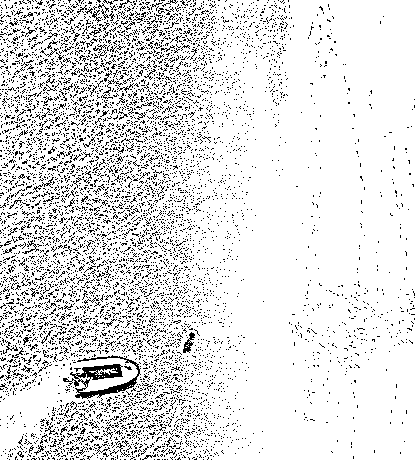

出发这件事常常会令人想起电影《美食、祈祷与恋爱》中，巴厘岛的巫医 ketut 递给女主 Liz 一幅画，并赠予了解读：

要脚踏实地，你就会感觉有四条腿，你就能在这个世上安稳下来；还有，不要用脑子看待世界，要用心去看，那样你才会了解上帝。

世间有太多纷繁复杂的事情我们要分析整理，反而忘却如何遵从心灵的声音，比如为了爱其他人而让自己的生活失衡；比如收藏了所有国家地理杂志的旅行专栏，最后哪里也没有去。偶然听到心中真实的声音，嘈杂的人生又容易失去相信自己的勇气。

幸好这世界上还有**巴厘岛**。

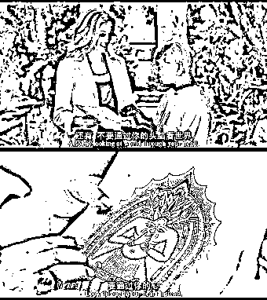

|  电影《美食、祈祷与恋爱》巴厘岛剧照

巴厘岛人说：“我们就站在世界的中心，我们就是世界的中心。”巴厘岛是一个充满灵性色彩存在的岛屿，在这个 5620 平方公里的岛屿上，散布着大大小小千余座印度教神庙，印度教思想、大乘佛教、传统的湿婆崇拜与岛上淳朴的自然崇拜、祖先崇拜交织在一起。巴厘岛人相信万物有灵，他们的生活沉浸在浓厚的神秘氛围中，他们相信自己脚下的土地是世界上最美的国度，是“世界的中心”。这座岛屿在 21 世纪的现代生活中成为一个特别异类的存在。而阿兰·欧肯，这位 75 岁深耕占星学和神秘学领域的老师，在多年前离开美国，在世界各地旅行之后，为这个岛屿独特的人文和场域所深深吸引，最终选择在巴厘岛定居。虽然阿兰·欧肯老师以占星大师身份为广大占星学子所知，但其实他更有许多神秘的古老智慧、实用的宇宙法则愿意传承，这对于我们的意识进化之旅将带来绝对深刻的了解和体悟。
**5 月 3-13 日**，阿兰·欧肯老师邀请你来到他的定居地——巴厘岛，开启这次意义非凡的巴厘岛神秘之旅，内容包括**3 日半阿兰·欧肯老师的神秘学工作坊**和穿插于其中的阿兰·欧肯老师为大家精心挑选的**巴厘岛神庙之旅**，阿兰·欧肯老师将带领大家，在理论学习的基础上，接触、感受巴厘岛的神秘之处，深入接触、体验古老智慧。**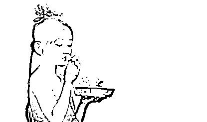**

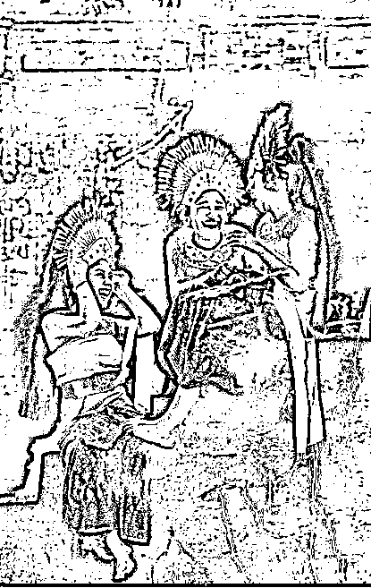

巴厘岛游学**1****位宇宙级导师****11 日 10 晚****游学，含**3 日半****工作坊****** “****心灵成长****+****文化探秘****+****生活美学****”****若道首团游学探秘之旅****一次性满足你的所有新年跨国愿望！**

📹 [`v.qq.com/iframe/preview.html?width=500&height=375&auto=0&vid=b3041y0qg4q`](https://v.qq.com/iframe/preview.html?width=500&height=375&auto=0&vid=b3041y0qg4q)

|  阿兰·欧肯老师的巴厘岛故事

1**工作坊主题****“觉醒的头脑和心灵的实际运用”——疗愈、合一和意识发展的****22****条法则和原理**本次工作坊，阿兰·欧肯老师将带领大家进入他数十年修行的智慧世界，探讨 22 条宇宙法则，并审视如何将这些原则应用在我们的日常生活中。**工作坊具体内容，请咨询课程顾问王老师（微信：18510107057）****注意****：本工作坊不是占星工作坊，对神秘学感兴趣，没有占星基础的朋友也可以参加。****游学全程领队导师是阿兰·欧肯，并配有最专业的中文翻译。**
2**具体日程安排****游学时间：2020 年 5 月 3 日-5 月 13 日****地点：印度尼西亚 巴厘岛**

*   ### 5 月 3 日 游学集合：入住巴厘岛乌布斯塔拉翠贡精选酒店 

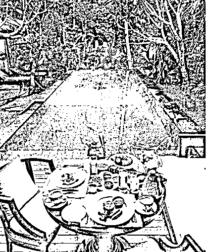

*   ### 5 月 4 日 上午水神庙、Pacung 午餐、下午海神庙；**晚上在斯塔拉翠贡精选酒店集体晚餐**

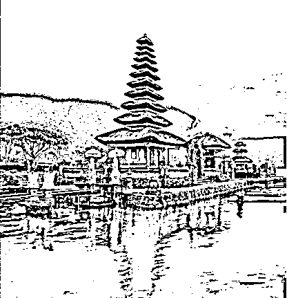

| 水神庙

 

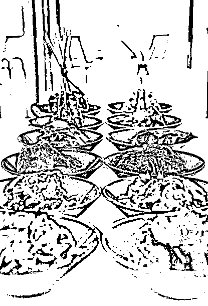

|  Pacung 午餐

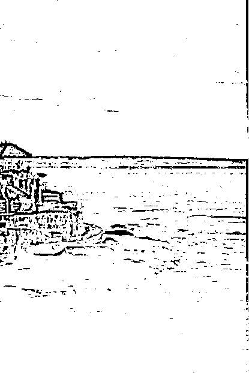

|  海神庙

*   **5 月 5 日 上午半日工作坊学习，和阿兰·欧肯老师一起冥想；下午到圣泉——巴厘岛的神圣净化池**

 

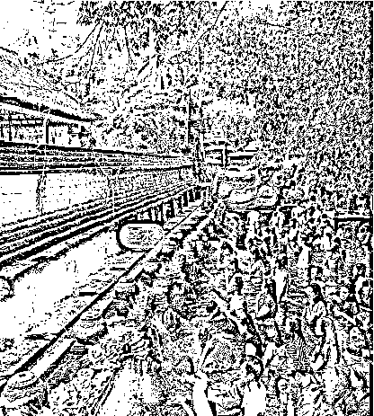

*   **5 月 6 日  半日工作坊学习、自由活动**

*   **5 月 7 日  半日工作坊学习，游览象窟——巴厘岛唯一的石窟寺院遗址**

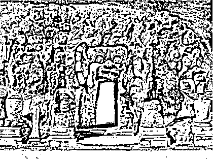

 

*   **5 月 8 日 巴图布兰寺、著名的荷花咖啡厅午餐、塔曼阿云寺**

 

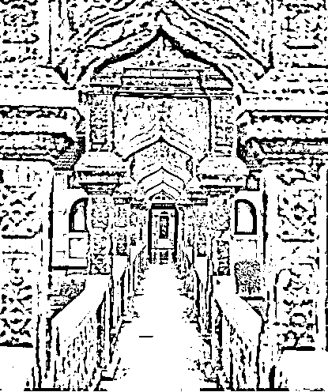

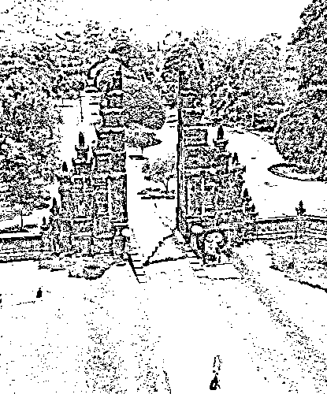

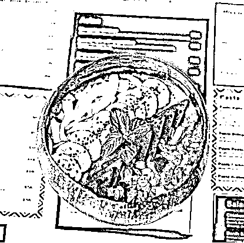

*   **5 月 9 日  全天工作坊学习**

*   **5 月 10 日  前往努沙杜瓦酒店 **

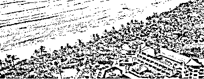

*   **5 月 11 日  全天工作坊学习**

*   **5 月 12 日  海边自由活动，晚上巴厘舞蹈表演**

 

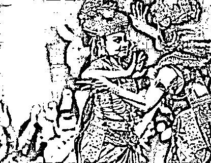

*   **5 月 13 日  前往机场回家 巴厘岛游学圆满结束**

3**适合人群**

*   占星老学员，是时候补给宇宙智慧的你

*   灵性爱好者，擅长获取各类宇宙能量的你

*   文化探迷人，有机会零距离体验异域神秘学文化的你

*   旅行达人，不错过任何一次伟大旅程的你

*   巴厘岛狂热迷，去过巴厘岛无数次的你

*   没有任何原因就是被吸引很想报名的你

**注****：****本次游学无需任何知识基础皆可报名**

4**游学费用****费用：25800 元****此游学价格为****整体报价，不拆分****。****注意**: **因为该游学需要安排酒店、交通事项较多，因此****一旦缴费后，不再退费**。


**费用说明**

**游学费用****包含**：

3 日半“觉醒的头脑和心灵的实际运用”工作坊学费

5 月 3-12 日的巴厘岛住宿费

游学中的大部分餐费

巴厘岛集体活动时的交通费

游学涉及的所有景点门票

5 月 12 日晚的舞蹈表演

境外旅行意外险

**游学费用****不包含**：

学员从国内往返巴厘岛的交通费

巴厘岛岛内自由活动的交通费

以下自由活动的餐费自理：5 月 3 日到达日午餐、5 月 6 日自由活动晚餐、5 月 8 日晚餐、5 月 10 日前往努沙杜瓦酒店的午餐、5 月 12 日海边自由活动的午餐

**住宿说明**：

乌布斯塔拉翠贡精选酒店豪华房 Deluxe room（5 月 3 日晚-5 月 9 日晚共 7 晚）和努沙杜瓦酒店豪华房 Deluxe room（5 月 10 日-12 日，共 3 晚），标准为 2 人一个房间

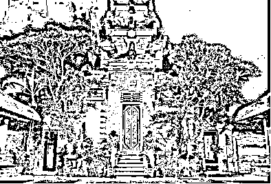

5**导师介绍**

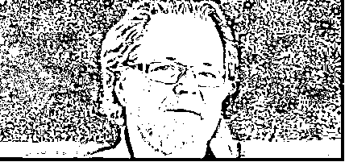

**阿兰·欧肯（Alan Oken）**

 

世界顶尖占星师

智慧学院（Santa Fe, NM）主任

澳大利亚意识发展研究所的联合创始人

翻译、教师、全球旅行者和国际导游

阿兰·欧肯，1944 年出生于美国纽约，在纽约大学主修罗曼斯语言和语言学。出版过十几本著作，比如《灵魂占星学》《星图中的守护关系》《阿兰·欧肯完整占星学》。他用 5 种语言授课，用 7 种语言解读星图。

6**退转课程**

**因为该游学需要安排酒店、交通事项较多，因此****一旦缴费后，不再退费****。**

****巴厘岛游学****

**领队老师&工作坊授课老师：阿兰·欧肯**

**游学时间：**2020 年 5 月 3 日-13 日（共 11 日 10 晚）

**游学地点**：印度尼西亚 巴厘岛

**游学方式：**巴厘岛探秘之旅+3 日半工作坊，游学全程由阿兰·欧肯领队，并配有最专业的中文翻译。

**费用：****25800 元**

**课程负责人：**王老师（微信：18510107057），请备注“巴厘岛”

长按二维码添加课程负责人咨询~


****报名请点击“阅读原文”****


# 深度 | 情感中的“惯性逃跑者”，是拥有这个相位？

> 原文：[`mp.weixin.qq.com/s?__biz=MzA5NjA0NTAxNg==&mid=2651413867&idx=1&sn=bc7d1be82ac5b9ddf97344dd4bf880c1&chksm=8b4befdcbc3c66ca0f37ed7aedcf1b52d8b8f15c73331098009626c0d73405635567d8b04928&scene=126&sessionid=1692738207#rd`](http://mp.weixin.qq.com/s?__biz=MzA5NjA0NTAxNg==&mid=2651413867&idx=1&sn=bc7d1be82ac5b9ddf97344dd4bf880c1&chksm=8b4befdcbc3c66ca0f37ed7aedcf1b52d8b8f15c73331098009626c0d73405635567d8b04928&scene=126&sessionid=1692738207#rd)

**************************** ☆ **************后台回复“今日”，给你一句生命态度**************


作者/罗宾·安特帕拉 

译者/Jun 校对/Arrow

编辑/玫瑰  图片/全景网

**当金星遇上天王星**当爱之女神金星遇上代表革命、电光火石的变化以及古怪个性的天王星时，会发生什么呢？结果之一会是对亲密感的金星式需求被狠狠打破了。一项有关行星组合尤其是困难相位的研究揭示了**在亲密关系中对空间以及偶尔分离的需求**。作为一名在国外生活了 20 年的占星师，我有很多机会在身处跨国婚姻的客户和朋友星图中观察到这组相对立的能量：在我的档案中，58%处于跨文化关系中的人都有金星和天王星的困难相位——合相、对分相或者四分相（38 张星图中占了 22 个）。这是有道理的。如果天王星与爱之行星的接触产生了对空间的需求，有什么比嫁给一个来自不同文化的人能更好地实现这一点呢？这种结合的参照系是如此不同，它们的共同点远远少于更传统的婚姻。**有金星-天王星相位的人无需太多亲密接触就能享受舒适的陪伴——这是一种虚拟的亲密，可以让他们维持关系，但无需亲密关系中必不可少的情感认同。****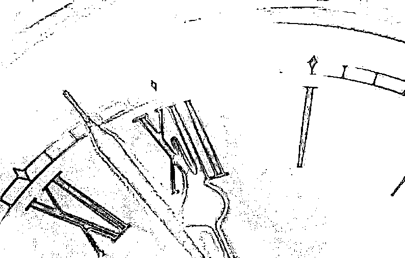****金天相位各种“奇怪”表现**当我开始更仔细地研究这一现象，我从许多地方发现了确证：跨国婚姻中的名人和公众人物，以及金星-天王星的组合通过其他方式创造了彼此之间的空间。例如，通过**年龄的巨大差异**，或者通过**教育或阶级的差异**。在这篇文章中，我将检视有金星-天王星困难相位的名人星图来探索金星-天王星的某些伪装。1 史蒂文·索德伯格


| 史蒂文·索德伯格

我们先从奥斯卡最佳导演奖得主史蒂文·索德伯格（Steven Soderbergh,《永不妥协》、《毒品网络》的导演）开始吧，他的**金星在射手座与处女座的天王星成四分相**。索德伯格的第一部电影是《性、谎言和录像带》，这是一部他 20 出头时创作的虚构作品。这部电影主要讲述了主人公格雷厄姆的故事，他四处漂泊，他回到家乡，面对一段被挚友背叛的失败恋情带来的痛苦回忆。| 《性、谎言和录影带》宣传海报格雷厄姆有一个离经叛道的癖好：录下女孩谈论她们的性生活，这是一种消遣，偶尔有女孩在镜头前脱衣服。你要知道，他从来没有和任何一个女孩子有过关系；他的规则只允许自己扮演观察员。格雷厄姆制作和观看录音带的业余爱好，是感情遗憾的替代品——自从他与大学恋人分手后，他就一直在避免亲密关系。

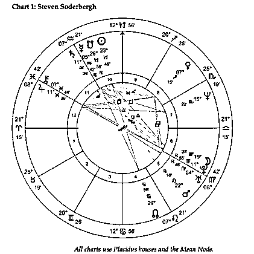

| 史蒂文·索德伯格的出生星图（本文引用的所有星图采用普拉西度宫位制及平均交点）

《性、谎言和录像带》概括了金星-天王星的动力：**关系的领域（金星）可能是痛苦的。为了制造距离，格雷厄姆使用摄像机（天王星式的技术）作为一种媒介**。通过这种方式，他可以间接体验到亲密关系的强度，而不会有风险或感到脆弱。格雷厄姆**游牧式的生活**明显是天王星式的。他靠着车过日子，在加油站洗澡。在此，我们见证了格雷厄姆**对自由的极端追求，以及他无法（拒绝）承诺任何事或任何人**。金星-天王星的另一个面向由这个故事独特的自传性本质揭示出来。虽然索德伯格承认他非常认同格雷厄姆（考虑到格雷厄姆是“电影制作人”，这并不奇怪），但他也说过，三个主角（格雷厄姆、他最好的朋友以及最好朋友的妻子安）代表了他自己的不同面向。这是天王星超然的另一种表达：天生有能力**后退一步，从远处反观自己**，在这个例子中，索德伯格就把自己分裂成三个人。2 凯瑟琳·赫本

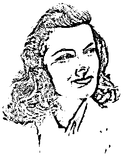

| 凯瑟琳·赫本

金星-天王星式的其他疏离形式出现在凯瑟琳·赫本（Katharine Hepburn）的星图上，她的**金星在白羊座，与摩羯座的天王星形成了四分相**。虽然她在事业之初有过短暂的婚姻，但她很少与丈夫住在一起。随着赫本事业的腾飞，这段婚姻很快就结束了。她一生的挚爱是斯潘塞·特雷西（Spencer Tracy），她与这位演员一起拍了 9 部电影，两人的关系长达 27 年，他们从未领过传统意义上的结婚证。

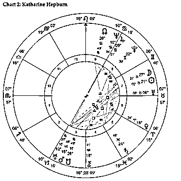

| 凯瑟琳·赫本的出生星图许多人认为这是由于特雷西的天主教信仰：这位演员已婚，而教会禁止离婚。然而，即使特雷西和他的妻子离婚了，他和赫本也永远不会结婚。如果他们结婚，他们的婚姻可能就不会长久了，因为结婚使他们的关系过于亲密，乃至没有安全出口。事实上，**需要一个情感出口**是金星-天王星的典型表现。这是一个可以迅速离开的后门（即使只是精神上觉得：“好吧，他总是可以回到妻子那里……”），这样做也可以防止亲密关系对于精神自由的天王星灵魂来说变得过于**幽闭**。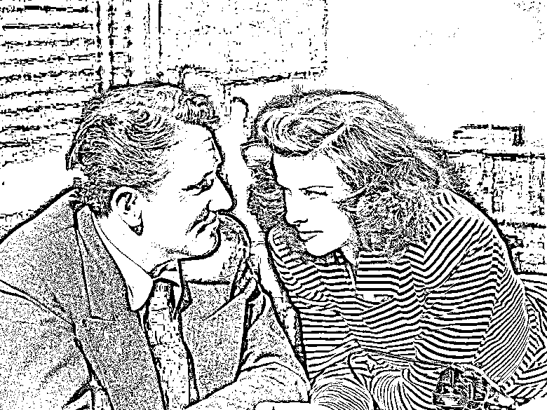| 凯瑟琳·赫本与斯潘塞·特雷西合作的银幕形象赫本创造感情空间的另一个方式是她的**事业**。演戏是她一生的挚爱；它使人从亲密人际关系中的情感纠葛中**分离又隔绝**出来。3 艾里斯·默多克

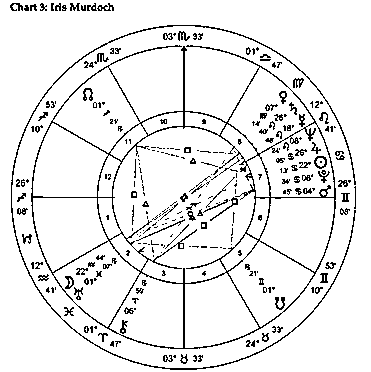

| 艾里斯·默多克的出生星图
我们从英国小说家艾里斯·默多克（Iris Murdoch）的星图中看到了**艺术过程是如何创造距离**的，她的**金星在处女座，与双鱼座的天王星形成四分相**。据她的丈夫约翰·贝利（JohnBayley）说，默多克**“秘密创造的生活”让她全神贯注于“除我之外的任何事情”上，并在他们的婚姻中制造了一种“疏远的同感”**。 “我活在一个童话故事里，”贝利在他的畅销书《献给艾里斯的挽歌》中写道：“故事的结局并不总是皆大欢喜的——一个年轻人爱上了一位美丽的少女，而这位少女也回报了他的爱，但却总是消失在某个未知而神秘的世界里，而关于这个世界，她什么也不会透露。”这个案例中，默多克对其艺术的承诺——以及承诺所需要的精神力量所促成了金星-天王星**对空间的坚持**。**通往更广阔世界的一扇门**虽然金星代表关系，但如果认为天王星的影响仅限于人际关系，那就错了。金星和天王星之间的困难相位通常表示**抽离强烈的情感**。在凯瑟琳·赫本的例子中，在她的青春期时哥哥汤姆上吊自杀，那时就设定了天王星超然的模式；凯瑟琳是第一个发现他的人。这件事是赫本家族悲剧的一部分：赫本的外祖父以及后来她父亲的两个叔叔也自杀了。在她的回忆录中，赫本描述了她家人对她哥哥之死的反应。在最初的震惊和葬礼之后，无论是自杀还是她哥哥都没有再被提起。“（我妈妈）从来没有说过：‘我要去墓地’。” 赫本写道：“爸爸也没说过……他们就是不觉得要哀悼什么……他们继续开始生活了。”
赫本家族拒绝沉浸在这场悲剧带来的强烈情感中，这不仅适用于凯瑟琳的哥哥，也适用于所有的自杀事件。事实上，随着时间的流逝，这家人不愿意承认曾经发生过这样的死亡。在这里，我们看到了**对极端强烈情感的抽离**：失去亲人的悲痛，对自杀动机的迷茫和困惑，甚至对家庭在其中所扮演的角色可能感到愧疚。这一切都被抛到一边，从意识中消失了。因此，赫本学会了**与自己内心最深处的感情保持距离**也就不足为奇了。当得知特雷西永远不会和他的妻子离婚时，赫本说，好吧，反正她也不想结婚。她在事业初期被解雇了好几次，但她并没有执着于伤害和拒绝。“这就是我。又被解雇了。”她写道：“而且摔得很惨。（我要）忙起来——忙起来。”忙起来意味着：水星与上升点精确对分，永恒的行动和忙碌帮助提供了金星-天王星渴望的疏离感。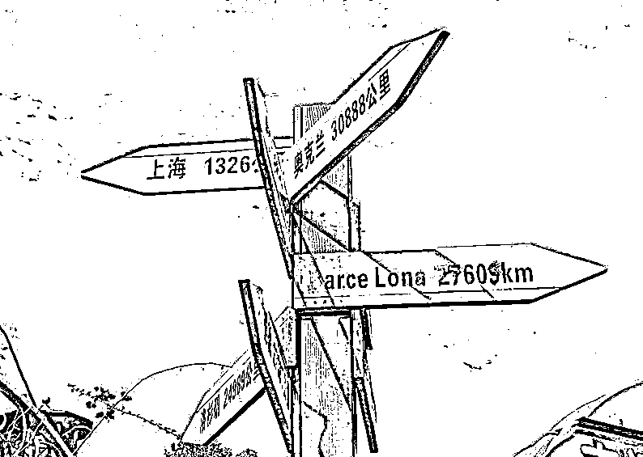归根结底，赫本强烈感情的唯一出路是她的事业。这有点讽刺，因为她的事业也让她不愿在感情上投入太多精力。但这正是问题所在：演戏是安全的；**她在银幕上描绘的是别人的感受，而不是她自己的感受**。赫本作为一名演员的伟大之处，也许部分在于她的这些感受大多是她自己的——是她**从日常生活中放逐的感受**。在日常工作中，人们可能会认为这种程度的抽离会导致对亲密的恐惧。但他们想得太简单了。我们所看到的金星-天王星与其说是对亲密关系的恐惧，不如说是**对纯粹个人主义冲动的超越**。天王星倾向于**情感上的疏离以及对更大社会图景的关注**，它将金星的个人关注转变成更宏大的东西。有人可能会说金星-天王星是“唯我一代”放肆的情感主义的解药，他们把个人的情感凌驾于一切之上。当然，双方——金星-天王星的绝对疏离和自我放纵的“唯我一代”都是不健康的极端。但是考虑到我们消费文化的不平衡本质，也许金星-天王星提供了一个必要的平衡。无论如何，天王星式的社交与赫本对 20 世纪的自我导向活动——精神分析的感受是一致的，她称之为**“疯狂的自我放纵”**。这种说法所暗示的**对内省的反感**可能有其阴暗面，但这种疏离也可以**打开通往更广阔世界的大门**。**在高度进化的情况下，天王星超越个人的能量不仅不会产生对亲密的恐惧，还会产生对更崇高之爱的追求，这是一种水瓶式的与人类的“恋爱”，世俗的亲密与之相比就显得苍白了。****走向更崇高的爱**4 戴安娜王妃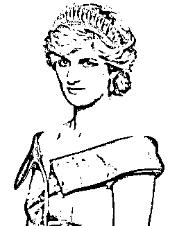| 戴安娜王妃戴安娜王妃就是一个很好的例子。乍一看，将她与金星-天王星的超然相联系似乎有些奇怪。戴安娜王妃是典型的巨蟹座，当查尔斯王子与卡米拉会面时，她总是哭喊着要亲热，还会大发脾气。戴安娜广为人知的饮食失调进一步证明，那些非常个人化的巨蟹座需求没有得到满足。一个人怎么可能把金星-天王星的动力与她联系起来呢?

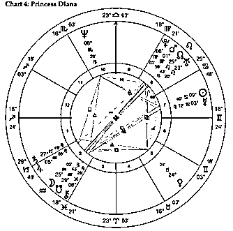

| 戴安娜王妃的出生星图但是在她的星图正中央，金牛座的金星处于 T 三角的顶点，正好落在浪漫的第 5 宫——T 三角中，狮子座的天王星对分月亮。这就更辛酸了，因为月亮守护了非常敏感且依赖的巨蟹座太阳，而月亮处于热爱自由的水瓶座。从一开始，距离感就在她的亲密关系中建立起来了。毫无疑问，“命运”将她与大她 12 岁、教育背景截然不同的男人匹配在一起。（戴安娜 16 岁时就停止了正规的学校教育）。事实上，戴安娜对**空间**有相当大的需求（她还有一个射手座的上升点），这与她对巨蟹座太阳的渴望背道而驰。在她结婚的头几年里，戴安娜未表现这一面，而是选择把她的独立需求投射到别人身上。抽离的人是查尔斯，不忠的人是查尔斯。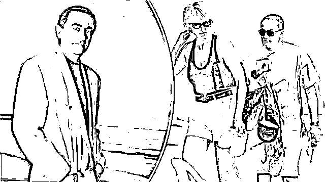| 戴安娜与多迪·法耶德多年后，当她能够建立起一种重要关系时，她不是与一个英国人，甚至也不是与一个西方人，而是与一个与她文化背景截然不同的人：出生于中东的多迪·法耶德(Dodi Fayed)。在他身上，戴安娜终于找到了她一直在寻找的安全的亲密关系。即使在实现这一点之前，她的巨蟹座太阳也没有被忘记。戴安娜王妃通过对艾滋病患者、无家可归者和地雷受害者的人道主义工作，最纯粹地表达了**巨蟹座对亲密的需求和水瓶座对社会意义的需求**。这是水瓶座和天王星两者内在固有的更崇高的爱。我们在凯瑟琳·赫本的父母身上看到了同样的水瓶座冲动，他们都是社会改革者：她的父亲是一名外科医生，也是对抗性病的先驱；她的母亲是妇女参政论者，也是计划生育的早期倡导者。这就好像赫本在超然于自己的感情之外，在说：**“看到了吧？最重要的事情是这些社会问题，而不是我琐碎的个人问题。”****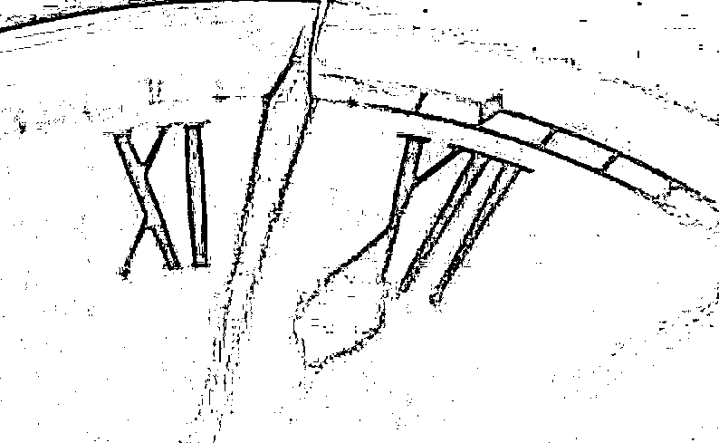**5 托马斯·默顿

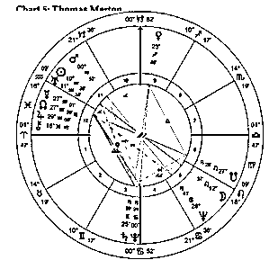

| 托马斯·默顿的出生星图在天主教沉思者托马斯·默顿（Thomas Merton）的星图中，可以清楚地看到金星-天王星**对更崇高的爱的追求**。虽然默顿的这两颗行星之间没有相位，但他的星图同时充满了**天王星和水瓶座**的能量：他有 5 颗行星在水瓶座，包括太阳和水瓶座的守护星天王星。要理解天王星在默顿星图中影响的范围，最重要的是要理解守护关系，在他的星图中天王星是所有行星的最终定位星，包括金星。和赫本一样，默顿很早就知道失去所爱之人是什么滋味，也知道**如何让自己远离失去的痛苦**。他 6 岁时母亲去世，十年后父亲也去世了。从那以后，默顿在不同的亲戚、住所和国家之间来回奔波（他的父母是移居欧洲的侨民）。那时，当他还是一个学生的时候，他最亲密的照顾者去世了。就在那时，默顿开始了一种放荡的生活：摆脱了父母的束缚，这个年轻人现在可以随心所欲地满足自己的每一个奇想和欲望。他的恋爱关系反复无常，在他著名的回忆录《七重山》(the Seven Storey Mountain)中，他拒绝详细描述这些关系，认为这些关系太肮脏了。有那么多水瓶座和天王星的能量，也就不足为奇了：他挣扎着，拼命想把自己从尘世的束缚中解脱出来。默顿最终认识到，再多的反抗也无法满足水瓶座人解放的渴望。“我花了五六年的时间才发现自己被囚禁在一个多么可怕的地方，”他这样描述那些失去的迷茫岁月。23 岁时，他经过多次灵性体验和觉醒，皈依了天主教；然后，在 26 岁时，他放弃了世俗生活，进入了特拉普派修道院。他把这种没有家庭亲密关系的修道院生活称为“我的新自由之四壁”。

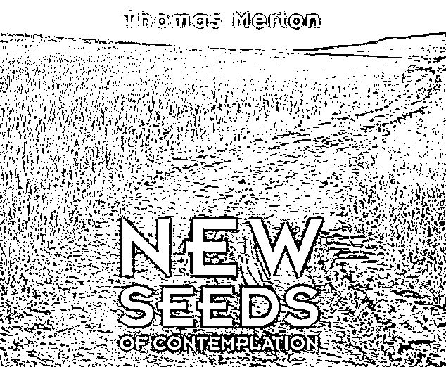

| 《默观的新苗》
默顿在他的书《默观的新苗》（New Seeds of Contemplation）中描述了水瓶座-天王星对宇宙之爱的冲动：**“一个人无法进入自己内心最深处，通过那里到达上帝，除非他能够完全离开自己，清空自己，在纯洁无私的爱之中把自己奉献给他人。”**离开自己，清空自己：这是天王星的影响——**闪电般的电流把人推到一个更高的意识水平**。最后，**无私的爱**是金星-天王星相位的意义所在；这种爱，**避开了与唯一完美伴侣专属的情感牵挂，转而寻求与全人类的亲密接触。****给金天相位人的两个告诫**在结束之前，我想提出两点告诫：**不要认为在金星和天王星之间有困难相位的人没有“个人”感情**，事实并非如此。父母去世后，默顿深感悲痛；对赫本来说，她对家人的爱和忠诚，对哥哥的悲伤，以及对斯潘塞·特雷西永恒的爱，都体现了她内心深处的感情。赫本 80 多岁时，在家中接受了记者采访，这位记者讲述了一则轶事，我们从中看到了赫本感人的情感点滴。采访快结束时，赫本带这位记者参观了她的家。当他们走下楼时，记者发现了一张斯宾塞·特雷西的照片，并提到特雷西是他母亲最喜欢的演员。听到这里，这位平常如此坚强的伟大女演员哭了起来。特雷西早在 20 年前就去世了，但赫本对他的感情初心依旧，而且惊人地呼之欲出。回到一楼，赫本叫来她的助手和客人谈话，这时她才镇定下来，请他吃午饭。那种深沉的感情还在，好吧。金星-天王星的礼物，是**退一步**的能力，是**隔着一些距离感受那些强烈情绪**的能力。现在，第二个告诫是：尽管这个行星组合有好处，但我们必须小心。金星-天王星所产生的情感疏离，在处理不当时可能被用作武器。**完全超然于情感之外的人，可能会相当蔑视那些仍在努力控制自己冲动和情感的人。**我们在索德伯格的电影《性、谎言和录像带》中看到了这样的例子。在电影的结尾，导演格雷厄姆被问及他的古怪癖好。“你为什么要这么做？你会回答我吗？”安问道。安是格雷厄姆以前的拍摄对象之一。格雷厄姆不回答，但安拒绝让步。仍然把摄像机对准他，她说：“我只想问你几个问题。比如你为什么录下女人谈论性？嗯？你为什么这样做——你能告诉我为什么吗？” “我不喜欢这种反过来的事，”他蜷缩在角落，辩解道。（译注：原来是他拍别人，现在是别人拍他）不是很多人喜欢这样。并不是很多人喜欢他们的感受遇上表面的冷漠。**有情感需求和反应是很自然的**。由这些虚幻情感产生的弱点对人类是必不可少的，也是使我们在这个地球上的生命如此珍贵的原因之一。**金星-天王星所产生的极端疏离，可能会让接收的对方不快，并最终使自己失去人性**。也许这个行星组合的最佳表达就是**从情感冲动中平静地分离出来，同情那些尚未掌握自己情感冲动的人**。星图数据及来源

史蒂文·索德伯格，1963 年 1 月 14 日；没有出生时间；使用美国东部标准时间的正午；美国亚特兰大(33°N45 '，84°W23 ')；X：没有出生时间的日期；摘自史蒂文·索德伯格:《访谈》，安东尼·考夫曼编辑，密西西比大学出版社，2002 年，引自《年表》。

凯瑟琳·赫本，1907 年 5 月 12 日；美国东部标准时间 EST 晚上 5:47；美国康涅狄格州哈特福德(41°N46 '， 72°W41 ')；AA：引自哈特福德的出生证明文件。

艾里斯·默多克，1919 年 7 月 15 日；格林威治时间晚上 8 点；爱尔兰都柏林(53°N20′，06°W15′)；A：引自 Jim Eshelman 回忆。

戴安娜，威尔士王妃，1961 年 7 月 1 日；格林威治时间晚上 7 点 45 点；英格兰桑德林汉姆（52°N50 '， 00°E30 ')；A：引自回忆；数据由查尔斯·哈维引自赫本母亲。

托马斯·默顿，1915 年 1 月 31 日；格林威治时间上午 9 点；法国普拉德(44°N13′，06°E27′)；AA：引自 Steinbrecher 提供的出生记录。

**版权声明：**本文由若道翻译，欢迎转发，反对抄袭。友号转载请申请白名单。


**罗宾·安特帕拉**

美国田纳西州塔兹维尔的占星师和老师。著有《相位》一书(Llewellyn, 2006)。

**点击图片了解若道君推荐**


**微信又又又改版啦，不想错过若道的推送？**

**就把若道设为星标吧！**

**▼**


就是这个“在看”，戳戳戳 ☟

如何报名？请点击“阅读原文”


# 从灵魂角度看，太阳星座对人生的影响居然这么大！

> 原文：[`mp.weixin.qq.com/s?__biz=MzA5NjA0NTAxNg==&mid=2651413852&idx=1&sn=b1bb174ba4438de26c34a566442ac4ef&chksm=8b4befebbc3c66fdfbf8afaef49d5a6db60aa3bc3d6c303a4aeff766f3b1b931506a03a37a38&scene=126&sessionid=1692738207#rd`](http://mp.weixin.qq.com/s?__biz=MzA5NjA0NTAxNg==&mid=2651413852&idx=1&sn=b1bb174ba4438de26c34a566442ac4ef&chksm=8b4befebbc3c66fdfbf8afaef49d5a6db60aa3bc3d6c303a4aeff766f3b1b931506a03a37a38&scene=126&sessionid=1692738207#rd)

********************☆ 后****************************台****************************回复“今日”，给你一句生命态度********************

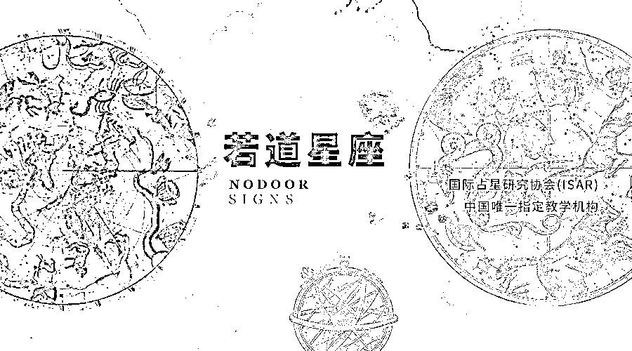

作者/阿兰·欧肯 译者/戴维斯

本文授权转载自新浪星座

编辑/玫瑰 图片/新浪网 全景网

**占星学里太阳的符号**

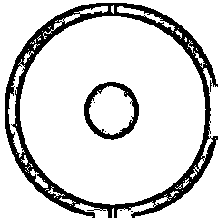

| 占星学里太阳的符号

占星学里太阳的符号包含了许多它在星图中所代表的意义。

*   **太阳符号象征聚集的光源向外发散：来自宇宙生命之源向外供给生命活力和能量**。 
*   **外面的圆圈代表无穷无尽**，因为它是一个没有起点也没有终点的闭环，是时间的起点也是终点。 
*   **太阳表示万事万物都有其核心，即我们现在所熟知的宇宙运作的基本结构和规律**。
*   **符号中间的小点代表从无形的能量场中创造出来的有形的能量体现**。我们每个人都是这个小点代表的宇宙能量的创造。 
*   与此同时，**我们未被使用的能量也都是那个圆圈**，小点就是我们自身表达出来的具体的创造力。 

太阳的符号象征了**人类的神性起源**，它表示了**每个人都有无穷无尽的可能性**，只有当**意识与心灵相结合**，能量才能被具体地展现出来。精神力量是指引我们走上光明之路（追寻生命目的）的源头。在神智学中，光明之路也叫做回归之路，只有通过意识的进化和灵魂的觉醒才能达成。历史上，太阳在不同的部落、种族和群体中有着各自各种各样的表述方式。远古时期，太阳被人类当作神来崇拜。历史上出现的先知（觉醒的人物）都被认为是太阳神的体现，但实际上他们只是神性能量的外在部分。**印度教以三大主神为核心：创造之神梵天、守护之神毗湿奴、毁灭之神湿婆**。**基督教也有对等的三元理论：圣父、圣子、圣灵**。古波斯、古埃及和古巴比伦的信仰都有三元性的体现。只有希伯来人和穆斯林认为太阳法则即是唯一。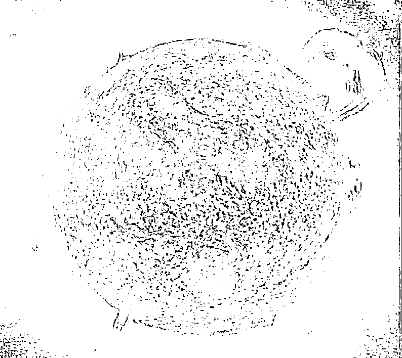**星图中太阳的重要作用**太阳是生命力的引擎。星图中**太阳所落星座及其相位能描述出个人意志的特点，以及一个人的身体条件和健康状况**。太阳所在**宫位代表创造潜力聚焦在哪里，它会在什么样的环境下体现出来**。太阳的能量活化了星图中其他行星的能量，因为如果没有太阳散发出的光和热，整个太阳系或者我们的地球都不可能有生命存在。因此，星图中的其他元素和行星相位都必须与太阳及其所落星座的能量结合起来阐述。我们都知道除了太阳，星图中还有非常多的能量组合，但现实是**如果太阳处在较弱的位置，个人的意志和体力就会严重受困**。**如果太阳的能量很强，但是其他的行星能量很弱，这代表巨大的潜力找不到良好的工具和方式去表达出来**，因为处在较弱位置的行星很难正常地运作以体现出太阳的意志和能量。在灵魂占星学中，我们认为以下几大因素影响了出生星图中太阳的特质：

*   太阳所在位置揭示了此生此世的精力，性情和特点。

*   太阳所在的星座及其相位揭示了性格特征和前世的积累，想要活出此生此世的目标。

*   太阳是自我意识觉醒的能量场。

**太阳的相位解析**太阳最基本的定义代表的是**自己**，无论是男是女。它象征了一个人的**生命力及其品质，目的和基本属性**。从**灵魂占星学**的角度来看，**太阳还代表了一个人的意识、寻求自我的驱力以及独特的自我认同**。但是，只有**克服了月亮代表的本能和潜意识的引力、摆脱了习以为常的情绪特质和原始生存驱力**，才能完整地表达出自己的独特性。只有在太阳的能量下“重生”之后，一切真实的个人特质才能彰显无遗。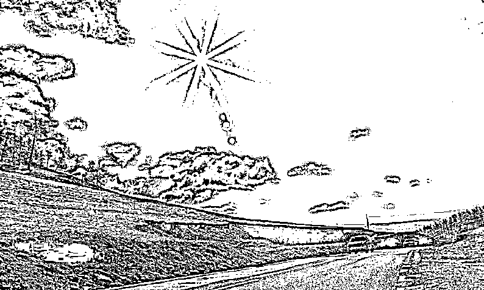我们人生所遇见的人物之中，太阳代表的是**男性**。太阳在星盘图中的位置可以描述出我们生命力源头的**父亲**所拥有的特质。**太阳处在强势位置并与土星形成困难相位**本文中，困难相位指的是行星间成 90 度、180 度、45 度、135 度的相位那么这个人的父亲会说：**“照我说的做，否则我会惩罚你”**。其结果就是：父亲的形象会被带入到这个人的人生观，他会**怯于表达出自己的个性和创造力**。而且，太阳与土星的困难相位代表了**“沉重”的影响力**，所以我们生命力的表达会被严重拖累，整个人会显得**迟疑和悲观**，尤其是当**形成困难相位的太阳和土星都处于固定星座（金牛座、狮子座、天蝎座、水瓶座）**的时候。**太阳和海王星形成困难相位**父亲会有**成瘾**的问题或者**不在我们身边**。他也可以和我们同处一个屋檐下，但**存在感却显得很低**。于是乎我们会问自己：**到底谁是我的父亲？**也有可能父亲在我们年幼的时候从人生中消失不见，或者完全不为我们所知。**太阳和火星形成困难相位**父亲会**很暴力；**相位良好时，我们会有一位非常勇敢的父亲。**太阳和金星形成良好相位**

我们的爸爸**慷慨又大方**（而且很帅哦）。女性的星图中（或者男同性恋），太阳所处的位置、与其形成相位的行星描绘出**此人心目中的父亲的形象或者会被哪种特质的另一半所吸引**。

**太阳和天王星的相位**

代表的男性会是**与众不同**的个性人物，但也有可能是**性格古怪和不可信赖**的人物。

**太阳和冥王星相位**

代表的是**强权**男性。当**太阳和冥王星成四分相、合相或对分相**，我们会与他们产生**权利冲突**；当**相位良好（三分相、六分相）**时，我们会**分享他们的权利或从中受益**。实际上，太阳和冥王星也会让我们从父亲那里继承**较强的个人能力**。

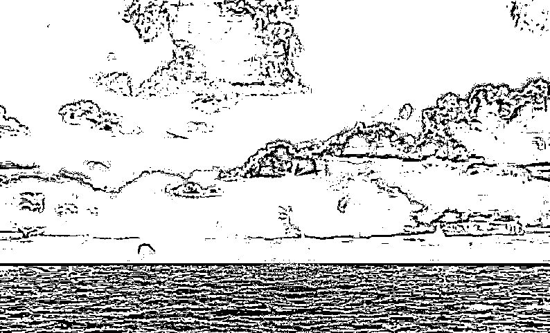

**太阳所在的宫位**太阳所在的宫位告诉我们：***1.*** 我们最有可能在何处**寻找、发现和表达自己的个性**。如果太阳落在 7 宫，伙伴和他人在我们寻找自我意识的过程中扮演着重要角色；如果太阳在 7 宫同其他行星成困难相位，则要注意在定义自我的过程中不要被他人过度影响；如果强势的太阳落在 1 宫，其他人就没什么戏份了，你就是生活这出戏的主角，连制片人、导演、编剧和演员都由你一人担当。***2.*** 我们最有可能在**何处找到人生中的重要人物**。如果太阳落在 9 宫，我们可能会遇到来自高等教育部门的重要人物。外国人或者我们出国旅行时遇到的人对我们来说有重要意义；当射手座的太阳落入 9 宫或与木星形成强势相位的情况下，以上所述表现得极为明显；太阳落在 6 宫时，重要人物常常会出现我们的工作环境之中；6 宫的太阳如果位置良好，且与土星形成三分或六分相，我们遇到的权威人士会对我们日后功成名就有所助益。

**版权声明：**本文若道获授权发布，未经新浪星座允许，不得转发，反对抄袭。


**阿兰·欧肯**

若道签约老师，1944 年出生于纽约，毕业于纽约大学罗曼语言及语言学专业。著有包括《灵魂占星》、《星图中的守护关系》、《阿兰·欧肯完全占星》等数十部著作。他还为《戴尔星运杂志》以及其他许多国内外评论与期刊撰写过数百篇文章。他是译者、老师、环球旅行家和国际导游。

**点击图片查看若道君推荐**


**微信又双叒叕改版啦，不想错过若道君的推送？**

**就把若道设为星标吧！**

**▼**


就是这个“在看”，戳戳戳 ☟

********报名直达入口********


# 想知道自己的“灵魂目标”？你需要从这里入手

> 原文：[`mp.weixin.qq.com/s?__biz=MzA5NjA0NTAxNg==&mid=2651413852&idx=2&sn=09dd13364c30d6625828002481c06b85&chksm=8b4befebbc3c66fda0f133fb86671d25640bc72b8edfe2bc124dae0d50b86d94e7d4edac1d87&scene=126&sessionid=1692738207#rd`](http://mp.weixin.qq.com/s?__biz=MzA5NjA0NTAxNg==&mid=2651413852&idx=2&sn=09dd13364c30d6625828002481c06b85&chksm=8b4befebbc3c66fda0f133fb86671d25640bc72b8edfe2bc124dae0d50b86d94e7d4edac1d87&scene=126&sessionid=1692738207#rd)

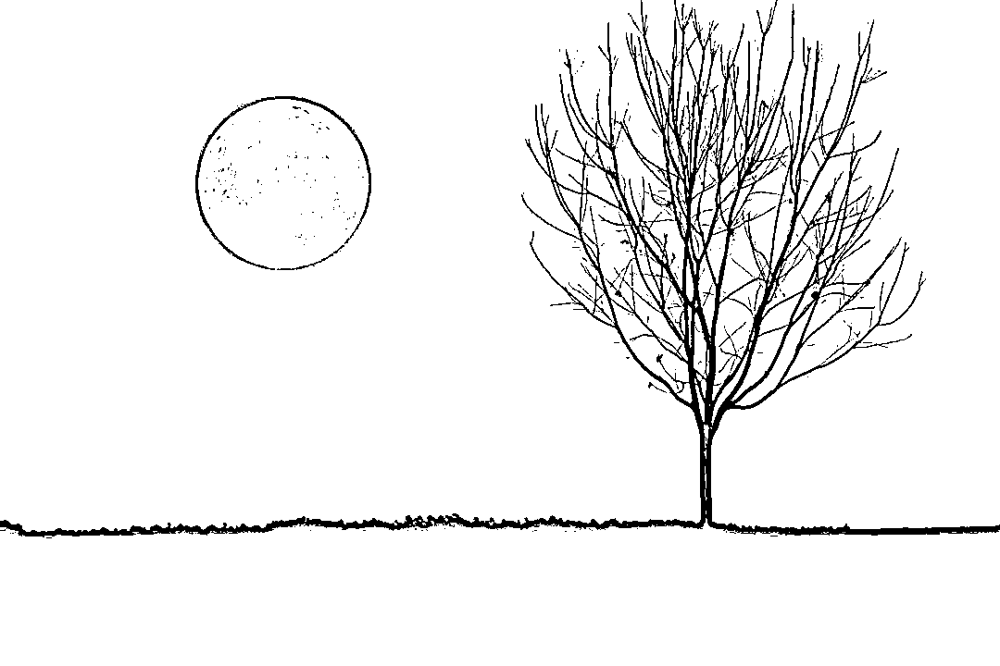作者/大卫·瑞雷 若道创始人翻译/若道翻译团队 编辑/Tang 图片/网络

我们每个人的生命中都有一个潜在的目标，它是我们内在灵魂的目标，也许，这是我们所有人最无法抗拒的需求。而我们灵魂的目标，便与星图中的南北交点相关。它们是星图故事的主线，能引导我们明确个人生命成长的方向与路径。那么，怎样才能了解南北交点呢？

**了解南北交点，从这里开始**

***1.*** **什么是南北交点？**

**南北交点是月亮绕地球的轨道穿过地球绕太阳轨道（也即黄道）的两个交点，因此也称月亮交点**。**北交点被天文学家称为上升交点，为月亮向上穿过黄道纬度 0 度时的交点，南交点被称为下降交点，为月亮向下穿过黄道纬度 0 度时的交点**。一个人星图上的北交点和南交点总是成对出现的，它们处于彼此相对的位置。

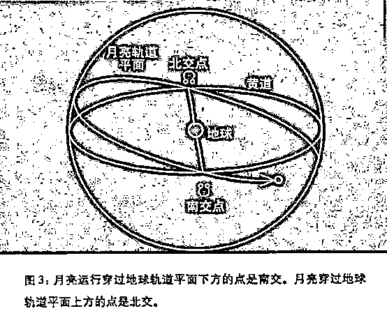

***2.*** **在占星学中的月亮交点跟我们有什么关系呢？**

**北交点与我们人生的意图和目标相关，与人生的成就感、满足感相关。南交点和我们的习惯相关，和我们的安全感相关**。成就感和安全感是人生最基本的两种需求。如果没有安全感，我们总觉得仓皇。如果没有成就感，我们可能会得人生有些空落落的。因此，了解我们的南北交点，活出它们，就有望活出圆融而充实的人生。

***3.*****南交点和北交点总处于相对的位置是什么意思？**

黄道 12 星座可以分成 6 组，**白羊座-天秤座，金牛座-天蝎座，双子座-射手座，巨蟹座-摩羯座，狮子座-水瓶座，处女座-双鱼座**，它们两两相对，可以说是能量互补的。你的北交点和南交点必然会占据这 6 组中的一组，并且各居一端。假如你的北交点在白羊座，那么你的南交点就在天秤座。而如果你的南交点在白羊座，那么你的北交点就会在天秤座。

**这 6 组星座两两相对，每一组的能量是都是互补的**。白羊座关注的是自我，天秤座重视的是关系。从这个角度来说，它们确实有所冲突。

***4.*****我们应该如何在南交点和北交点之间取舍呢？**

我们要做的，也许不是取舍，而是**整合**。因为我们都既想拥有成就感，也想拥有安全感，如果我们能兼顾两者，我们的人生就更为圆融。

南北交点，就好像是我们的两条腿。通常我们都会有一条腿更有劲，另一条相对弱一些，跟我们的左右手有差异一样**。强有力的那条腿是我们的南交点，因为我们要靠这条腿支撑，而另一条腿力量较弱，需要不断加强，它是北交点，给我们指引方向**。当我们踢球的时候，我们会用有力的那条腿踢球，用另一条腿支撑。

两条腿对我们来说，都是重要的。踢球的腿是北交点，是我们生命的方向。可以说，**北交点是我们在寻找成就感，南交点是我们已经完成的事**。

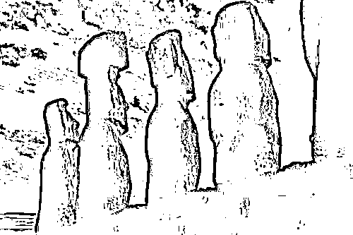

**如果想对南北交点有更多的了解，可以看一看这些关键词：**

**北交点**

成就感 

向往 

方向 

引人入胜的

正在形成的 

冒风险 

改变 

向前伸展的 

学着去信任的 

超出你想象范围之外 

缺乏经验 

新的 

冒险出去 

成为的过程 

不完全的 

天资 

法

**南交点**

安全感 

习惯

保证 

熟悉的 

完善的 

谨慎行事

拒绝改变卡住的 

你所习惯的 

厌倦的 

防御机制 

旧的 

回到本垒 

机械的行为 

完成的 

精通 

业力

***5.*** **既然它们是冲突的，如何兼顾呢？**

月亮交点有它的周期，我们的月亮经过**18.6 年**会回到它和太阳的轨道（黄道）相交的同一交点。与总体的需求模式相对应，这 18.6 年的周期可以划分为两个不同的阶段——**成就需求阶段和安全需求阶段**。

在每个阶段的“**关键年龄**”，也就是**9.3 岁、18.6 岁、27.9 岁、37.2 岁、46.5 岁、55.8 岁、65 岁、74.4 岁、83.7 岁、93 岁**，那个阶段的需求会变得表现得特别明显，在这些“关键年龄”，成就需求或者安全需求会极大地影响我们的选择和我们的行为。

当我们掌握这些周期和关键年龄，就可以呼应内在的需求，顺势而为。**在安全需求阶段，努力活出自己的南交点。当我们感觉足够安全，就进入成就需求阶段，努力活出自己的北交点，追求成就感**。

***6.*** **南北交点和轮回之间有什么关联呢？**

从转世的立场看，每一次生命都是另一个机会。就业力而言，**南交点可以看作“你从哪里来”的一个大概的线索**。通过进一步分析，过去世的情境可以从和南交点有关的出生图通过进一步的分析构建出来。

严格来讲，业力的意思只是“需要做的功课”，也就是这一世需要做的功课。就人生整体目标而言，业力的这个含义可能包含了两个交点的意义。不过南交点看似与“需要完成的功课”更相应，即需要了结的功课，而**北交点则更代表要开始的功课**。**新事物或正在成形中的事物更和“法”而不是和“业力”相关。“法”是出路，也就是从业力轮回中解脱的道路**。部分而言，**“法”是解决“业力”的办法，对极端化的习惯起到平衡的作用**。

***7.*****我不信轮回的话，南北交是不是就对我不适用了呢？**

有一则古代谚语是这样说的：**如果你想知道自己的过去世，就考虑下你当下的状况；如果你想要知道你的未来世，想一下你当下的行动**。

如果相信过去世，那么南北交点可以让你更清晰地看到过去世和业力（我们暂且把业力理解为由于过去的境遇而留下的灵魂印记，及该灵魂印记对此生的影响）故事以及解决之道。**如果不相信过去世，你可以把它看成一个假说和一个解读星图的方式，着重其意识进化的部分。**因为这些解读可以非常准确地反映出你或他人的习性、人生的主要渴望和挣扎，从而让你能够更了解自己和他人，了解人生的周期，活出踏实而又充实人生。

***8.*****到哪里去了解自己的南北交点呢？**

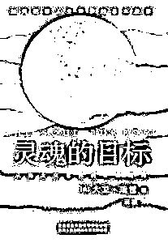

你可以阅读大卫·瑞雷的《灵魂的目标》了解更多。《灵魂的目标》列出了 1901 年到 2029 年出生的人的南北交点各落在什么星座，也阐释了交点落在不同的星座的人，他们的人生主题、生命周期、常见表现、职业、关系和父母指南。对过去世感兴趣的人，可以阅读斯蒂芬·弗里斯特的《昨日的天空》。**版权声明：**文章由作者授权在若道平台发布，欢迎转发，反对抄袭。友号转载请申请白名单。


****想阅读更多作者的文章，请在后台回复******大卫****** 即可。****

**喜欢文章请长按下方二维码打赏**

**给大卫老师加杯咖啡呗~**

**▼**


********点击图片查看精品好课********


**微信又又又改版啦，不想错过若道的推送？**

**就把若道设为星标吧！**

**▼**


就是这个“在看”，戳戳戳 ☟

**如何报名？请点击“阅读原文”**


# 金牌课程 L1-5 | 中英导师倾囊相授，让你从小白变身专业占星师

> 原文：[`mp.weixin.qq.com/s?__biz=MzA5NjA0NTAxNg==&mid=2651413852&idx=3&sn=8b0212c14d2d81e2a4ab64d8bce22293&chksm=8b4befebbc3c66fdc020cc172770b850425073ce11db1261184bccd9eb4170b5c075e1b52ad3&scene=126&sessionid=1692738207#rd`](http://mp.weixin.qq.com/s?__biz=MzA5NjA0NTAxNg==&mid=2651413852&idx=3&sn=8b0212c14d2d81e2a4ab64d8bce22293&chksm=8b4befebbc3c66fdc020cc172770b850425073ce11db1261184bccd9eb4170b5c075e1b52ad3&scene=126&sessionid=1692738207#rd)


2020 年，一场疫情像一只突然出现的“黑天鹅”。让多少企业、多少人乱了阵脚。大家深刻的感觉到：没一技之长、没有两手准备，灾难面前真是手足无措。我们都在焦急的等待着疫情的拐点出现，突然多出的假期，有人焦虑刷屏，也有人重新规划未来，更新技能和认知。很多人一直都渴望发展副业，平时虽然爱好不少，突发状况面前却发现并没有哪项爱好，能成为增加收入的一技之长。

## **每一次大波折，都会倒下一批人，也站起来一批人。****这是历史的铁律。**

是时候重新认识自己了。**开启副业之路，自助助人的 PLAN B**曾经的你，有没有想过，人生还有一种全新的可能？
如果把自己的人生看成一间公司，时间和精力看成生产资料，那么你作为自己的 CEO，应该有对这家公司的“战略规划”意识。**第一，设定目标。**穿越新闻事件、外界信息的重重迷雾，我们优先要向内看，我是谁？我喜欢或不喜欢什么？我想过一种什么样的生活？正视自己，不盲目随波逐流。**第二，盘点优劣势。**我现在处于什么位置？为了达到我的目标，我有哪些优势？我还缺少哪些知识、技能、经验或领路人？**第三，制定计划、稳步实施**。我知道我在哪，我要去哪儿，我需要找到现实与梦想的差距，想方设法去缩小差距、达到目标。**占星学是非常好的“自我战略规划”的工具。**可以帮助你**认识自己、找到自己的优势和目标，根据时代趋势调整自己步伐**，更好的全力以赴，永远不用担心被淘汰！**而你通过占星学习你帮助了自己，也可以选择成为自助助人的占星师，开启受益终生的第二事业。****顺应趋势，迎来人生拐点**“

**如果你等待知更鸟的到来，你将错过整个春天。**

**——沃伦·巴菲特**

”面对这次疫情危机，不少公司开启了“云办公”，人们开始在家里办公。也有不少人抢先顺应趋势，率先迎接新世界的到来。未来是个体崛起的时代，大量个体被鼓励独立发展，比如网红、自由职业、自媒体、咨询师等，他们都不需要传统的办公室。社会越发达，人的独立性就越强，**未来有能力的人都会变成独立的经济体**。如果你也相信，想顺应时代趋势抓住时代机遇？想实现人生逆风翻盘？

## 决定一个人最终高度的，往往并非起点，而是拐点。

##  机遇都在拐点，**占星学**正站在你的人生拐点等你。

**为什么是占星学？**一方面社会快速发展人们压力山大，抚慰心灵的咨询市场需求巨大。另一方面市场鱼龙混杂，真正学院派的严肃占星从业者十分稀缺。
最重要的，占星学能让你自己帮助自己，无论你是否进行占星咨询从业，学习了占星学，它都将是终身陪伴你成长的睿智好伙伴。


**你的占星核心课老师是谁？**

拥有**49**年占星实践经验的

**若道创始人**

**ISAR 全球副主席**

**ISAR 全球职业占星师资质认证主席**

**大卫·瑞雷**

&

**最懂学员的若道首位认证金牌中国老师**

**熊鹰**

师徒二人合力打造
**2020 年若道****全新****核心占星课程**

**连报 L1-5 全阶课程，可以享受到****：** ❶ **61 次线上直播互动网络课程+2 场工作坊**（亲密关系+职业占星工作坊、知识回顾+综合解读工作坊），全面而详细地讲解占星学知识、技能、案例和重要领域实践运用。

❷ **知识点+学员星图解读有机结合**：熊鹰老师以知识点和学员案例讲解为主，大卫·瑞雷老师以参课学员案例及客户案例讲解为主。每个知识点覆盖班级内学员的亲身案例，参与感更强，每位学员都有机会听到自己的星图分析。

❸ **微信群学员互动分享**，从真实案例学习生命成长故事。

❹ **论坛提问**：论坛上每个学员的问题都将得到及时回复。

❺ **提供咨询师实习平台**，只要努力，都将有机会在毕业前进行咨询的实习演练，听取客户反馈，为成为职业占星师做准备。


**L1-5 阶，我们要学习什么？**

**1-2**

**第一阶****  12 星座，12 种性格，12 种人生 **

❶ 学习占星学必须准备的“心法”

❷ 占星学中的火、土、风、水四元素，阴阳法则

❸ 面对面的星座有故事

❹ 12 星座：12 种性格详解，12 种行为模式，12 种价值观

❺ 太阳和月亮：了解你的太阳，生命的发动机，让你在世界闪光的方式，生命获得力量的方法；了解你的月亮，让你获得幸福的方法

❻ 了解太阳、月亮，了解你生命中已经出现的、将会出现的男性和女性

**第二阶****  命运的线索和人生故事中的演员**

❶ 命运的线索：南北交点

❷ 星图三巨头：太阳、月亮、上升点的故事

❸ 了解心智：水星

❹ 了解金钱和关系：金星

❺ 了解行动模式：火星

❻ 了解信念：木星

❼ 了解努力：土星

❽ 了解天才和疯狂：天王星

❾ 了解梦想和幻灭：海王星

❿ 了解死亡和重生：冥王星

⓫ 12 个人生场景：黄道 12 宫位初解

**课程安排**

*   2020 年 4 月 2 日：星座 1（主讲人：大卫·瑞雷老师）
*   2020 年 4 月 9 日：星座 2（主讲人：熊鹰老师）
*   2020 年 4 月 16 日：太阳、月亮（主讲人：大卫·瑞雷老师）
*   2020 年 4 月 23 日：水星、金星、火星（主讲人：熊鹰老师）
*   2020 年 4 月 30 日：木星、土星（主讲人：熊鹰老师）
*   2020 年 5 月 7 日：三王星（主讲人：大卫·瑞雷老师）
*   2020 年 5 月 14 日：宫位 1（主讲人：熊鹰老师）
*   2020 年 5 月 21 日：宫位 2（主讲人：大卫·瑞雷老师）
*   2020 年 5 月 28 日：月亮交点 1（主讲人：熊鹰老师）
*   2020 年 6 月 4 日：月亮交点 2（主讲人：大卫·瑞雷老师）

**L1-2 除了网络直播课**

**L1-2 初阶课程还有两场线下工作坊可供选择**

**L1-2 上海工作坊**（2020 年 6 月 12、13、14 日 熊鹰老师主讲）

**L1-2 北京工作坊**（2020 年 6 月 25、26、27 日 大卫·瑞雷老师主讲）

就看你是喜欢哪种形式

**文末有每种形式的价格，还有连报套餐价哦**


**3**

**第三阶**** 宫位、相位以及初步解读星图（15 次课）** 

❶ 15 次线上直播网络课程，每次 2 小时，堂课中依旧会使用同学们的星图作示范

❷ 10 节课由熊鹰老师教授，重点通过名人星图阐释知识点

❸ 5 节课由大卫·瑞雷老师教授，重点通过学员星图阐释知识点

❹ 从第三阶开始，熊鹰老师将会指导练习，答疑解惑，学练结合

❺ 重点在于如何根据星图去问问题，着重自我发现和自我探索的过程 

**课程安排 **

*   2020 年 7 月 2 日：宫位、行星和星座组合

*   2020 年 7 月 9 日：宫位、行星和星座组合

*   2020 年 7 月 16 日：月亮交点

*   2020 年 7 月 23 日：月亮交点和演示案例

*   2020 年 7 月 30 日：相位

*   2020 年 8 月 6 日：相位、星座、行星和宫位

*   2020 年 8 月 13 日：相位、星座、行星和宫位的同学案例

*   2020 年 8 月 20 日：渐盈相位和渐亏相位，示例

*   2020 年 8 月 27 日：更多的关于宫位和宫主星

*   2020 年 9 月 3 日：同学案例

*   2020 年 9 月 17 日：空相行星和定位星

*   2020 年 9 月 24 日：宫主星

*   2020 年 10 月 15 日：优先级和组织

*   2020 年 10 月 22 日：相位模式以及范例

*   2020 年 10 月 29 日：学员星图解读范例

**4**

**第四阶**** 出生星图解读（进阶）以及关系与职业议题（12 次课，1 场四日亲密关系+职业占星工作坊） **

❶ 12 次线上直播网络课程，每次 2 小时，堂课中依旧会使用同学们的星图作案例

❷ 8 次课由熊鹰老师教授，4 次课由大卫·瑞雷老师教授

❸ 1 场北京现场四日工作坊：亲密关系+职业占星，学生将被选中进行案例演示和互动。

**课程安排**

*   2020 年 12 月 3 日：整合星图和星图优先级
*   2020 年 12 月 10 日：综合解读
*   2020 年 12 月 17 日：整体案例
*   2021 年 1 月 7 日：亲密关系/对比星图
*   2021 年 1 月 14 日：占星学和对比星图的例子
*   2021 年 1 月 21 日：对比星图同学案例
*   2021 年 1 月 28 日：对比星图同学案例
*   2021 年 2 月 4 日：占星学的职业介绍
*   2021 年 2 月 18 日：占星学的职业案例
*   2021 年 2 月 25 日：占星学的职业同学案例
*   2021 年 3 月 4 日：儿童职业发展
*   2021 年 3 月 11 日：亲密关系/职业同学案例

**工作坊安排**

**亲密关系（两天）+职业（两天）四日工作坊****时间**：2021 年 3 月 18 日、19 日、20 日、21 日**地点**：北京**学员将被选中进行案例演示和互动（免费）**

**5**

**第五阶**** 预测、关系、咨询，为执业和考试做准备（24 次课，1 场四日工作坊）** 

❶ 24 次线上直播网络课程，每次 2 小时，堂课中依旧会使用同学们的星图作案例❷ 15 次课由熊鹰老师教授，12 次课由大卫·瑞雷老师教授❸ 1 场综合解读工作坊（北京）：把一切串联起来，学生将被选中进行案例演示和互动。**课程安排**

*   2021 年 4 月 15 日：行进介绍 1
*   2021 年 4 月 22 日：行进介绍 2
*   2021 年 4 月 29 日：行进介绍 3
*   2021 年 5 月 6 日：当下的行进的同学案例
*   2021 年 5 月 13 日：周期，重置星图
*   2021 年 5 月 20 日：当下的行进和周期的同学案例
*   2021 年 5 月 27 日：次限
*   2021 年 6 月 3 日：次限同学案例
*   2021 年 6 月 10 日：太阳弧
*   2021 年 6 月 17 日：太阳弧同学案例
*   2021 年 6 月 24 日：亲密关系的关键节点+组合星图
*   2021 年 7 月 1 日：亲密关系的关键节点，组合星图同学案例
*   2021 年 7 月 8 日：职业周期
*   2021 年 7 月 15 日：职业周期同学案例
*   2021 年 7 月 22 日：太阳返照&月亮返照
*   2021 年 7 月 29 日：太阳返照&月亮返照同学案例
*   2021 年 8 月 5 日：高级预测技巧
*   2021 年 8 月 12 日：高级预测同学案例
*   2021 年 8 月 19 日：高级预测技巧 2
*   2021 年 8 月 26 日：高级预测同学案例 2
*   2021 年 8 月 29 日：占星学简史（周六沙龙）
*   2021 年 9 月 9 日：占星学的不同流派
*   2021 年 9 月 16 日：ISAR 考试术语和复习
*   2021 年 9 月 23 日：ISAR 考试术语和复习

**工作坊安排**
**综合解读四日工作坊（把一切串联起来，L1-5 知识回顾）****时间**：2021 年 9 月 2 日、3 日、4 日、5 日**地点**：北京**综合解读学员将被选中进行案例演示和互动（免费）****这两位优秀的占星学老师是谁？**


**大卫·瑞雷（David Railey）**

*   **ISAR 董事会成员，ISAR 全球副主席，ISAR 全球职业占星师资质认证主席，若道占星创始人。**
*   1976 年，通过亚特兰大职业占星师考试，成为全职占星师，随后通过**AFAN 和 ISAR 职业测试**。
*   1980 年，与**杰夫·焦耳**一起在亚特兰大创建**“每日星球”**占星学中心。此后在亚特兰大占星协会担任 4 年考官，并且两次担任**亚特兰大地区占星协会主席**。
*   1979-1992 年，作为占星师活跃于美国社会媒体，向不了解现代占星学变化的大众宣传专业占星学知识。在 1989-1992 年期间，他在 WRGG 电台 12 频道每周主持个人电视秀**“今日占星学”**，早先他还在 WRFG 的广播节目中播讲宇宙天气节目。 
*   2010-2014 年，任**全美占星师联盟监督委员会委员**。
*   2010 年，其著作**《灵魂的目标》**中国版出版，和蒋颖一起创办**若道占星**学校和其官网 www.nodoor.com。从该年开始，他工作并往返于亚特兰大和北京。目前他 80%的时间致力于在中国教授和推广西方占星学。
*   2017 年，被选为**ISAR 委员会成员**（2017）。ISAR 是世界最大的国际占星机构，会员遍布 45 个国家。


**熊鹰老师（天空的空）**

*   2008 年接触严肃占星学，至此爱不释手。
*   **2013 年师从大卫·瑞雷**，研习整套现代占星学核心课程，并于 2014 年起至今连续三年担任该课程的主助教。
*   期间也**跟随格伦·佩里、诺·泰尔、理查德·塔纳斯、罗伯特·汉德、苏·汤普金斯、斯蒂芬·弗里斯特等多位国际顶尖占星大师进行学习**，进行定向占星主题研究。
*   2015 年初，通过国际占星研究协会**（ISAR）资质认证并获得证书**。同年，进一步跟随大卫·瑞雷老师进修**“生时校正”**技术，通过最终考核并获得证书。
*   目前在若道星文化任职，将传播系统、严谨、真实的占星学作为职业使命。任专职助教期间，进行沙龙与答疑等辅助教学工作已累计超过 200 小时。
*   在业余期间也提供占星咨询与生时校正服务。目前正致力于占星学与个人成长的整合。

**什么人适合这门课？**

*   对占星学有浓厚兴趣，想要系统学习占星学
*   对占星学有一定基础，但不知道该如何整合星图复杂的碎片
*   希望成为优秀的占星师，想要借鉴国际大师解读思路并融入自己的体系
*   想学习占星学，但不擅长英文，希望有中文老师授课
*   想结合占星学理论与咨询实践
*   大卫·瑞雷、熊鹰的忠粉，学过占星，但就是想跟着偶像再学一遍
*   走在自我探索和个人成长道路上的人

**课程费用****★ 1-5 阶连报****早鸟价：33000 元（2020 年 3 月 31 日之前）****课程费用：46500 元 ****★ 1-2 阶直播课（4 月 2 日开课）****早鸟价：2800 元（2020 年 3 月 4 日之前）****课程费用：3500 元 ****★1-2 阶工作坊（北京工作坊、上海工作坊任选一场）****早鸟价：2800 元（2020 年 5 月 6 日之前）****课程费用：3500 元 ****★网络直播课+现场工作坊都想要的同学：有套餐价哦****购买网络直播课程+北京工作坊、上海工作坊任选一场****早鸟价：4200 元（2020 年 5 月 6 日之前）****课程费用：5200 元****★ 1-3 阶****早鸟价：10500 元（2020 年 3 月 4 日之前）****课程费用：11500 元 ****退转课程**

**退款原则请详看《教学协议》，如有疑问请咨询课程顾问。**

****中英双导师核心课 Level1-5****

**授课老师：大卫·瑞雷 熊鹰**

**授课时间：**2020 年 4 月 2 日-2021 年 9 月

**授课方式：**网络课程，中英文授课，中文翻译；现场工作坊，中英文授课，中文翻译

**费用：****1-5 阶：**46500 元****** 早鸟价：33000 元（2020 年 3 月 31 日之前）；********1-2 阶网络直播课程：****3500 元**早鸟价：2800 元（2020 年 3 月 4 日之前）；**1-2 阶**（北京、上海工作坊任选一场）**：3500 元 ****早鸟价：2800 元（2020 年 5 月 6 日之前）；******网络直播+现场套餐价：**5200 元**** 早鸟价：4200 元（2020 年 5 月 6 日之前）；******1-3 阶课程：11****500 元******早鸟价：10500 元（2020 年 3 月 4 日之前）；**

**课程负责人：**王老师（微信：18510107057），请备注“核心课”

长按二维码添加课程负责人咨询~


****报名请点击“阅读原文”****


# 最让摩羯座捉摸不透的，就是这个“冷而湿”的星座

> 原文：[`mp.weixin.qq.com/s?__biz=MzA5NjA0NTAxNg==&mid=2651413812&idx=1&sn=268f7b018214736ca5d88771bf435860&chksm=8b4bef83bc3c669529e469630e8a286487ebbb4fc613477796699d05fbb1b626acd81096f297&scene=126&sessionid=1692738207#rd`](http://mp.weixin.qq.com/s?__biz=MzA5NjA0NTAxNg==&mid=2651413812&idx=1&sn=268f7b018214736ca5d88771bf435860&chksm=8b4bef83bc3c669529e469630e8a286487ebbb4fc613477796699d05fbb1b626acd81096f297&scene=126&sessionid=1692738207#rd)

****************☆** 后台回复“今日”，给你一句生命态度**************


作者/黛博拉·霍尔丁 译者/Arrow 校对/江艺编辑/玫瑰 图片/全景网**“冷而湿”的巨蟹座**

作为“螃蟹”星座，巨蟹座的心理特征带有一种生物的形象——它有着坚硬的外壳，保护着脆弱而易受攻击的核心。巨蟹座由月亮守护，属于水象元素。不像大多数星座会共享自己的守护星，巨蟹座专享着月亮，这个星座及其守护星的属性都是**“冷而湿的”**。如果理解了这句话的精髓，你就会发现**巨蟹座厚重、坚硬的盔甲下隐藏着复杂的敏感性**。

在古典占星学中，人们认为**“湿”是释放情感和与他人沟通的能力**。湿气模糊了界定我们身为不同个体之间的边界，带来**同理心、同情心以及对个人或集体事件的共同体验**。分享情感的行为代表了形成纽带和联盟的一个重要方面，所以潮湿也是一种创造性的条件，它是**爱、生育和繁衍**的基础。当我们变得过于情绪化时，自然的反应是**通过流泪来释放“多余的水分”。**因此，水象元素与情感和感觉的世界有关。它是一种**被动的、吸收的**元素；**善于接受，具有敏锐的感知力。**水的能量是流动的，没有形状，在界定和结构上缺乏一致性，但有强大的能力去渗入难以企及的地方，改变其形状——有时像蒸汽一般朦胧，有时如冰一样寒冷而坚固。当我们将“冷”这个词施加在这个元素之上，绝不意味着对情绪不敏感，也不代表你对情感超然，而是说这种能量是**被动的**，而非主动。水象“类型”的人不会很快被激起投入到激烈的争论或活跃、专断的行动中。他们倾向于**等待、反思和吸收**，对环境做出反应，对他人的需求和生活中不断变化的要求做出反应。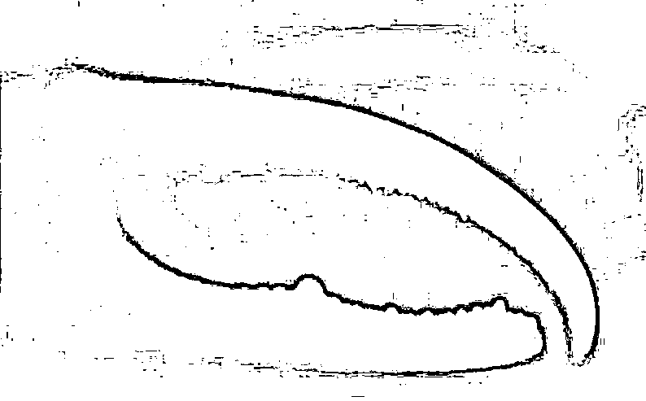**“敏感”带给巨蟹座的正反两面** 在水象星座天蝎座和双鱼座，我们看到这种能量的不同表达。**天蝎座象征着幽暗深处的静止**，那是一片**深邃而黑暗**的地方，如果没有长期积累的沉淀物的打扰，就不会有任何活动。**双鱼座**，与线性流动的河流相关，暗示着**对集体运动、趋势和理想的更直接反应。**由于缺乏其他类型水相元素的坚硬外壳，**双鱼座象征着一种敏感的能量，它很容易被周围的环境所影响。**然而，居住在海岸边的巨蟹座在月亮的守护下，会对生命潮汐的周期和节奏做出反应。众所周知，这个星座**喜怒无常**，所以巨蟹座人对世界上的欢乐和痛苦做出反应的模式可能（表面上）与他们周围发生的事情无关。由于巨蟹座的力量来源于**本能的、情感的反应**，因此他们以**非凡的心理敏感度、对记忆的专注和对情感印象的接受性**而著称。这被广泛认为是黄道十二宫中**最具心灵能量**的星座之一，通常对**神秘事物**有着显著的兴趣，能**生动地回忆起重大的梦境**，有着**强烈象征性**的认识。不过，对自己的生理和潜意识环境有着如此敏锐的感知是把双刃剑。他们察觉到看似简单的行为背后的复杂心理因素，这使得他们**难以运用自己的意志，促使他们的自我利益不受内疚感和纠结的同情心束缚**。这种**对自己和他人情绪影响的犹豫和易感给了这个星座一个软弱的名声，缺乏对直接问题采取直接行动的能力。**此外，这个星座**不喜欢公众的关注**，成为众人的焦点也很少觉得舒服。传统上对这个星座的描述是**“黑暗的”、夜间的、缺乏活力**。这一现象的天文学基础是，天文星座巨蟹座是天空中特别黑暗和黯淡的区域。它几乎没有可以辨认的恒星，主要以一个朦胧黯淡的星团而闻名，古代的天文学家认为这个星团是能量消散的地方。与水元素的关联以及月亮的守护关系强化了这种名声的古老基础。水元素与黏液体液有关，试图保留其能量，容易无精打采，而与月亮的联系增加了反复无常以及非理性或不合理的行为——或者**在纯粹理智或理性的能力评估下显得奇怪的行为。**与这个星座相关的更多负面特征是：**身体虚弱、没有生气近乎懒惰，对方法的混乱应用（通常是导致家里和衣着凌乱、邋遢的原因）、别人难以理解的喜怒无常**。巨蟹座通常**不喜欢纪律**，它恰好由一种缺乏内部骨骼结构的生物来代表，但巨蟹座处理这个问题的方式就是**简单地避免问题**；**很少倾向于反叛行为或直接和公开的对抗。****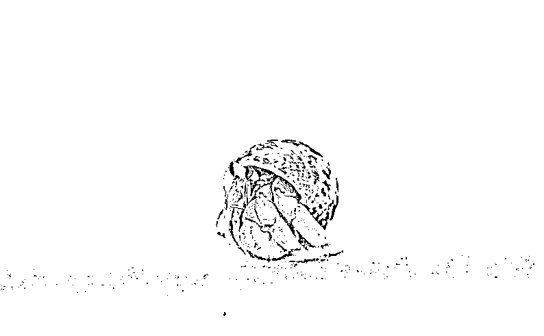****多变却又执著的巨蟹座**天空中螃蟹的象征意义也给了我们一些洞见，关于巨蟹座人在生活中的行动方式以及应对各种情况，回应各种问题的方式。**巨蟹座是黄道带中为数不多的反向升起的天文星座之一**。太阳进入巨蟹座发生在夏至——这个术语起源于**太阳在接近这一点时“静止不动”**的现象。当然，这种生物本身就是以横着走著称的。因此，与巨蟹座有关的活动很奇怪，展现了一种**犹豫**的感觉，**侧面接近事物**的方式，带有**前进而不正视前方**的特点。尽管**巨蟹座具有直觉上的天赋，但并不是行动迅速或反应直接的星座。**巨蟹座人在决定行动方法前往往会**犹豫不决**，一旦选择了这条路，**其背后的逻辑往往错综复杂**。其决策所基于的推理对其他人来说**既不明显也不易理解**，但却表现出一种**横向思维**的伟大技巧，能够**从别人还没有发现的角度出发，提出问题的解决方案**。当与巨蟹座天生的艺术天赋和丰富的想象力相结合时，这将为他们在诸如**市场营销**等职业领域带来优势，在这些领域，对非传统方法的创造性探索可以被视为一种真正的才能。这个天文星座凝视后方，也象征着巨蟹座**对过去的兴趣**，这一特点被月亮对这个星座的守护关系所强调。这体现在个人和社会层面上，巨蟹座人对**历史、过去的文化和传统**有着浓厚的兴趣，也**非常尊重个人历史、家谱、祖先起源、民族主义**，而且**渴望维护和保护家族习俗**。巨蟹座由月亮守护，与**部落本能和种族起源**有关，通常对自己的**社区和家庭结构**有一种类似**宗族**的态度。巨蟹座人会成为贴心的父母，但他们有时会在家庭关系中**受到过度保护，太“粘人”**，**过于依赖于维持一个亲密无间的家庭单元的需要**，而不知道何时该放松这种关系。当然，月亮的功能是**养育和保护年轻人**，所以透过这个星座强烈地表现出**母亲和父亲的本能**。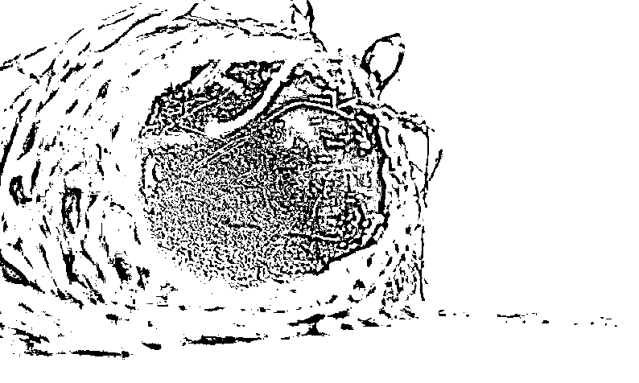基本星座以多变著称，巨蟹座人的**日常观念、情感和观点都很多变**。但是他们会发现难以应对他们的环境和基本生活结构的变化，并且在人际关系中深切地需要安全感。他们喜欢**紧紧抓住他们认为亲近和珍贵的东西**。对于那些**懂得欣赏关爱和忠诚的伴侣**的人们，巨蟹座人是很好的伴侣，他们喜欢扮演**养家的人**——提供舒适的家庭生活，美味和营养的食物，安全和愉快的家庭环境。他们带有一种**温和、放松和精巧**的能量；他们需要**温暖、亲密和情感上的亲近**，**不适合那些重视情感独立或倾向于性自由、精神自由甚至智力自由的伴侣**。尽管巨蟹座天生并不是物质主义的星座，但是他们紧紧握住的大钳子**不愿放开他们认为属于自己的东西**，这一形象确实适用于他们的**物质利益和情感投资**。单词 crabby（译注：螃蟹是 crab）通常表示“喜怒无常”，但也有**“手头紧”**的意思，这个词源于这个星座的名声，最早的历史文献中就意识到了这个特征。曼尼利乌斯在公元 1 世纪写道，出生在这个星座的人**“有攫取的精神……和赚钱的技巧；****他本性精明，随时准备为自己的利益而斗争”**（《天文学》4.165）。**当巨蟹座成为商人**在商业关系方面，巨蟹座人最擅长运用上半身硬壳的保护，**让头脑主宰心灵**。巨蟹座人可以成为优秀的投资者和商业管理者，他们的**毅力和坚韧**弥补了他们精力上的不足。由于他们天生感情上的柔软，经常被低估，必须记住，作为至日的星座，巨蟹座是一个**不会轻易放弃自己立场**的基本星座。他们在初次冲动时行动犹豫不决，这点使他们**抵触花言巧语下的肤浅交易**；相反，他们会**在所有的选择之间徘徊，犹豫不决，最后敲定对他们来说合适的交易**。
进行财务投资时，他们**谨慎而精明**。**当他们感到自己的真正利益——情感或物质利益受到威胁时，他们会战斗到底**。具有讽刺意味的是为他们提供动力的动机。他们被**保护家人和爱人的需求**所驱使，**他们并没有兴趣仅为自己使用而获取财富，而是把它当作一种保障性的遗产，可以传递给他们关心的人。**
巨蟹座是一个复杂的星座，能**根据你看待他们的角度扮演非常不同的人格**。他们**形成亲密关系的速度很慢，但除非存在亲密的情感联结，否则他们不太可能暴露柔弱内核中的软肋**。相反，他们会保持一种**超然**的感觉，你从外面看到的是一个坚硬的、无法穿透的外壳，对他们真正的价值所在毫无头绪。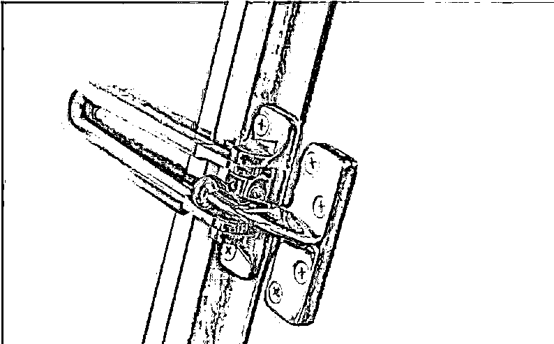**关于巨蟹座的点滴**

**行星尊贵**

**在巨蟹座有尊贵的行星：** 

*   **木星** **曜升**

*   **月亮  入庙**

*   **火星  白天和夜晚的三分主星**。然而，火星在巨蟹座位置不佳，是其落陷的星座。

**在巨蟹座无力的行星：**

*   **火星  落陷**

*   **土星  失势**

**典型外貌**身材矮小，圆脸，面色苍白，小眼睛，乳房沉重（或上半身通常比下半身大）。月亮和星图中的其他主导因素会影响所有的大体描述。

| **传统守护** |
| **方向** | 北方 |
| **身体** | 乳房和胸部 |
| **疾病** | 巨蟹座易感乳房、胃、胸部疾病。在医疗星图中，这个星座可能意味着严重的咳嗽，虚弱的胃和消化问题。总体来说，巨蟹座被视为体质差的星座。 |
| **地点** | 海洋、河流、池塘或水域附近的地方——小溪、泉水、水井、洗衣房、海滨、沼泽地等。在房屋中，它代表地窖、蓄水池、浴室和近水的地方。 |
| **国家和城市** | 包括苏格兰、荷兰、突尼斯、阿尔及利亚、伊斯坦布尔、威尼斯、米兰、阿姆斯特丹、约克、德国的威登堡、西班牙的加的斯。 |
| **颜色** | 苍白，低调和微妙的颜色;灰色、米色、银色、白色 |
| **石头和金属** | 石头和金属由行星掌管，而不是星座，但由于与月亮的关系，巨蟹座与珍珠、银和水晶密切相关。 |

**巨蟹座的名人**

***1.*** **戴安娜王妃**

**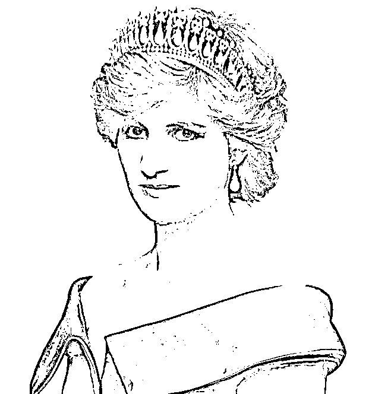**

戴安娜王妃展现出典型的巨蟹座特征。在强烈的情感主导之下，她**反复无常的情绪和明显的非理性行为**在隐忍的王室圈子里并不受欢迎。但公众爱她，因为她具有**真诚的慈悲心**，对那些不如她幸运的人们怀有**强烈的同情**。

她身边的人都说她能**很快地从开朗、慷慨变得冷酷、麻木**。一旦戴安娜意识到她有理由收回她的信任，她就会在没有理由或解释之下在她的情感周围竖起盾牌。

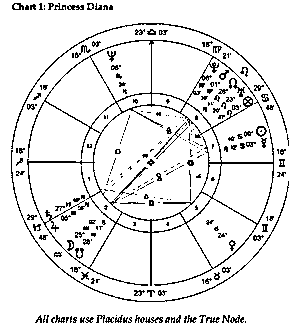

| 戴安娜王妃出生星图（文中所用星图均使用普拉西德宫位制和真实交点）

中天的守护星金星，在金牛座尊贵，这使她更受欢迎，但作为巨蟹座的黛安娜**天生不喜欢被置于聚光灯下**。有时候，她在聚光灯下是舒服的，但有时她有一种无法抗拒的需求，要躲进自己的壳里，找一个私人的地方，独自面对自己的情绪。

戴安娜不是一个天生的“斗士”，但她表现出**非凡的韧性，拒绝屈服**。**当巨蟹座人处于防御状态时，可以是强大的对手**。“水象类型”的人是通过操控来进行攻击，而戴安娜总是擅长**说服人们以她的方式看待事物，或在幕后为她工作**。

太阳三分第十宫的天蝎座海王星，表明戴安娜与**深层的秘密**有关，并喜欢**探索神秘和调查阴谋**，在私人层面上涉入这些领域。太阳与逆行的巨蟹座水星合相，表明她不喜欢公开演讲。传统上，**巨蟹座被称为“哑声”星座，因为它通常意味着不善言辞。**

*****2. *********纳尔逊·曼德拉****

****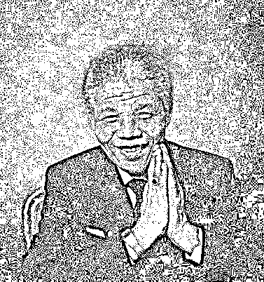****

纳尔逊·曼德拉的第八宫巨蟹座太阳与第十二宫宫头的月亮形成三分相。这是一个**生活非常艰难之人**的明显征象，**在追求理想的过程中要应对压迫，遭受对个人自由的限制，但仍然设法保持信念，取得胜利**。当然，其他因素也与此有关，比如在角宫曜升的木星，也是上升的守护星。巨蟹座曜升的木星在曼德拉 1994 年的就职演说中特别突出，当时他提醒他的同胞们，走出黑暗并且变得“聪明、美好、才华横溢、出类拔萃”是上帝赋予他们的职责。

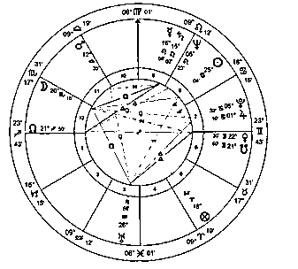

** | **纳尔逊 ·曼德拉出生星图

巨蟹座与**民族文化、传统和民族主义**的主题有着密切的联系。曼德拉无法完全脱离他人的痛苦和苦难，他被他的人民的精神所感动。没有什么比**保卫和保护他人的立场**更能激发出巨蟹座的战斗精神了。他的星图再次说明**巨蟹座的力量不在于攻击，而在于永不屈服的决心**。凭借这一点，曼德拉在世界历史上占据了一席之地，成为反抗和坚持的有力象征。*****3. *********乔治•W•布什********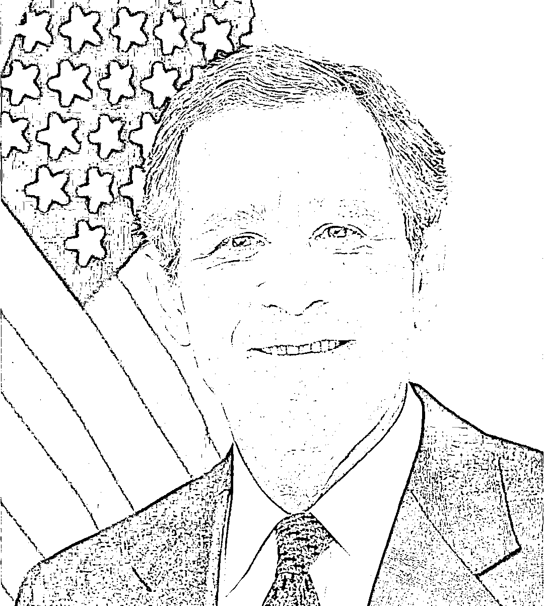****乔治·布什的巨蟹座太阳受到天秤座月亮四分相的不良影响，且位于月亮守护的第十二宫。这表明布什**很难理解自己的情绪反应，或者至少对表达情绪感到不安**。巨蟹座人似乎常常在上演家庭戏剧，作为一个个体，布什不得不面临**如何在一位世界领袖的父亲影响下建立自己的身份**，以及当他任性的闺女们的轶事占据着新闻头条之时，**如何保持优雅的个人形象**这个政治问题。当然，这是布什家族反复出现的一个主题，因为乔治自己也承认曾有一段时间有不稳定的行为和酗酒。身为总统，布什明显受到**民族主义、爱国主义和保守主义问题**的驱动，他的政治议程强烈关注**“传统家庭价值观”**。

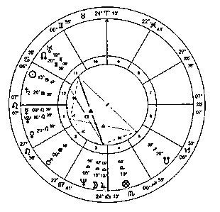

** | **乔治·布什出生星图整张星图显示了很多**冷酷无情、操纵能力和暗中运作**的倾向。水星在上升点合相冥王星，为强大的政治交流带来了潜力，但巨蟹座不是能言善辩的星座。尽管布什是一位专业的演说家，但不得不承认，他在演讲中的**失言**引起了相当大的关注。像大多数巨蟹座人一样，他**需要时间来反省，而且没有独立思考的天赋**。在政治上，布什第十二宫的太阳表明了不得不处理破坏性的社会议题，其问题或对手不易识别。它也揭示了一种长期存在的危险，即操控的事实被曝光并危及事业。

**版权声明：**本文由若道翻译，欢迎转发，反对抄袭。友号转载请申请白名单。


**你可能还想知道**

[巨蟹座在 12 个宫头](http://mp.weixin.qq.com/s?__biz=MzA5NjA0NTAxNg==&mid=2651399464&idx=1&sn=fce501eaae8164ddf5f12b1546b2fa27&chksm=8b4b979fbc3c1e893fba44267589423e646b4705c99c24b81a45d37aa3fa1cdbfba17d7f10de&scene=21#wechat_redirect)

[这个星座告诉你联结情绪多重要](http://mp.weixin.qq.com/s?__biz=MzA5NjA0NTAxNg==&mid=2651412275&idx=1&sn=0c656c445089cb315649a1cc3af37001&chksm=8b4be584bc3c6c92e9bc689480a78b3e530fc125c6a3a1fdff0e60a587ffcd06723285712045&scene=21#wechat_redirect)

黛博拉·霍尔丁

研究员，占星师，从业超过 25 年。曾是《传统占星师》（The Traditional Astrologer）杂志的编辑，著有《宫位：天空中的神庙（The Houses: Temples of the Sky）》一书。

**想系统学习占星学？**

**点击图片了解详情**


**微信又双叒叕改版啦，不想错过若道君的推送？**

**就把若道设为星标吧！**

**▼**


就是这个“在看”，戳戳戳 ☟

********报名直达入口********


# 为什么你明明不是 XX 座，却老觉得自己像这个星座？

> 原文：[`mp.weixin.qq.com/s?__biz=MzA5NjA0NTAxNg==&mid=2651413812&idx=2&sn=0e81891677434a45558dfab2bd6ec164&chksm=8b4bef83bc3c66958b7063937f05b4c646a65f49bf6ede44fdc445178ebbd713eb75e03ae1d8&scene=126&sessionid=1692738207#rd`](http://mp.weixin.qq.com/s?__biz=MzA5NjA0NTAxNg==&mid=2651413812&idx=2&sn=0e81891677434a45558dfab2bd6ec164&chksm=8b4bef83bc3c66958b7063937f05b4c646a65f49bf6ede44fdc445178ebbd713eb75e03ae1d8&scene=126&sessionid=1692738207#rd)

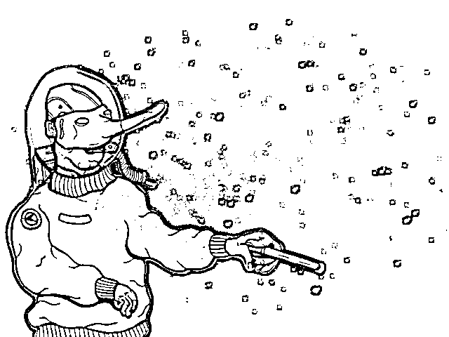作者/熊鹰（天空的空） ISAR 认证占星师 编辑/Tang 图片/soogif

看了[星图四元素分布不均问题的答疑](http://mp.weixin.qq.com/s?__biz=MzA5NjA0NTAxNg==&mid=2651413570&idx=2&sn=e45c094729e0153b90cdfd2902a2b6df&chksm=8b4beef5bc3c67e3303dd5bb458066a4a82c87ff1130d2a986a0ebdc42b87eb8ba7cfa029ee9&scene=21#wechat_redirect)，是不是还不够过瘾，还想接着了解吧？随着学习的深入，居然发现我们对占星的疑问越来越多！搞不清出生时间也可以占星吗？南半球出生，占星学还奏效吗？为什么你明明不是这个星座，却觉得自己拥有很多这个星座的特质？……

在这个关键时刻，若道金牌中文讲师——熊鹰老师，将继续为我们解答。

**为我们答疑的金牌中文讲师是谁？**


**熊鹰老师（天空的空）**

*   2008 年接触严肃占星学，至此爱不释手。
*   **2013 年师从大卫·瑞雷**，研习整套现代占星学核心课程，并于 2014 年起至今连续三年担任该课程的主助教。
*   期间也**跟随格伦·佩里、诺·泰尔、理查德·塔纳斯、罗伯特·汉德、苏·汤普金斯、斯蒂芬·弗里斯特等多位国际顶尖占星大师进行学习**，进行定向占星主题研究。
*   2015 年初，通过国际占星研究协会**（ISAR）资质认证并获得证书**。同年，进一步跟随大卫·瑞雷老师进修**“生时校正”**技术，通过最终考核并获得证书。
*   目前在若道星文化任职，将传播系统、严谨、真实的占星学作为职业使命。任专职助教期间，进行沙龙与答疑等辅助教学工作已累计超过 200 小时。
*   在业余期间也提供占星咨询与生时校正服务。目前正致力于占星学与个人成长的整合。

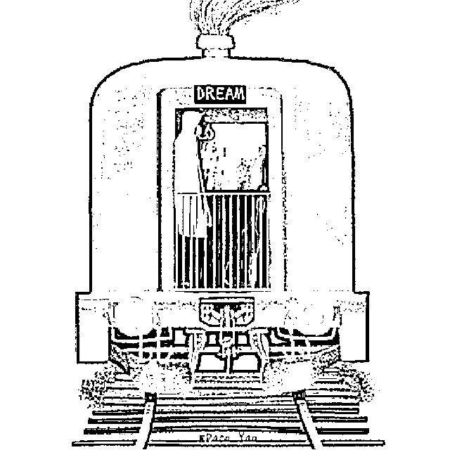

1

**为什么你明明不是 XX 座，**

**却老觉得自己像这个星座？**

**问**：为何我的星图中没有某星座（或者，没有内行星在某星座），我却能在自己身上感受到强烈的该星座特质呢？

**答**：占星学是一门很宏大而精密的学问，随着学习的深入，我们会发现，**星图上不仅有星座，还有更多的组成部分：行星、宫位、相位等。** 比如，太阳在狮子座的人，感觉自己有很强的双鱼座特质。 1. 可以看看是不是有其他行星或者上升在双鱼座？ 2. 看看是不是有海王星与内行星或者上升点的重要相位？ 3\. 是不是有群星在 12 宫？ 等等……以上信息都可能暗示了双鱼座或者类似双鱼座的特质。

**2**

**出生时间精确度对星图影响有多大？**

**问**：出生时间的精确度对星图有多大影响？

**答**：先说说出生时间的准确度，一张星图上有行星、星座、宫位、相位。其中的行星、星座、相位，基本上一天之中不会有太大的变化（月亮除外，可能会换一个星座，其相位也会有变化）。 而宫位是非常敏锐的，每过一小时就会变化很大。具体数据是：每 4 分钟，中天就移动 1 度（这是比较稳定的数值），上升点会移动 1 度左右（不是固定值）。**因此，如果出生时间不准确，那么星图中的宫位（包括上升、中天）就无法确定。这是偏差的主要所在。**

3

**占星学是不是统计学？**

**问**：占星学到底是不是统计学？占星学是不是就是数亿年大数据的总结？

**答**：说实话，这个问题的回答是“**既是统计学，又不完全是统计学**”。 

说占星学是统计学，这个大家都很好理解：基于大数量的样本，然后得出结论。 

说它不完全是统计学，是因为统计学作用的往往是事件或者人的外在行为，而非“人本身”。就好像心理学在建立实验室之后，通过心理测量的方式（其实也就是某种意义上的统计学）去归类人的心理问题，但实际上直到如今，心理学仍旧无法完整探索、归类并演绎人类的每一个起心动念。更何况除了心理之外，还有精神等等“神秘”的部分。 

**占星学是描述人与天地之间彼此相互感应的一门学问，它既是重视逻辑推演的科学，也是需要灵感与情感联结的艺术。**

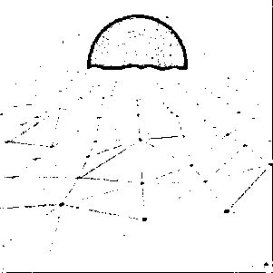

4

**8 月 23 日，你一定是处女座吗？**

**问**：太阳究竟在什么时候从一个星座变换到另一个星座呢？比如太阳从狮子座变换到处女座，是在 8 月 23 日零点吗？还是其他时间呢？这个变化的时间是每年都固定的吗？

**答**：在进一步学习之后，大家就会了解到，占星学上有个**《星历表》（Ephemeris）**，上面详细记载了每一天每一颗行星所在的星座、度数以及行星换座（从一个星座进入另一个星座）的时间等等信息，是绘制星图的必备工具。 

从这个网站

http://www.astro.com/swisseph/swepha_z.htm

我们可以查询到星历表的信息。 

通过查阅 2014 年 8 月和 2015 年 8 月的星历表（见下），就可以看到，太阳在 GMT 时间 24 日凌晨零点，所处的位置是不同的，尽管差别很小。 

这就意味着，这两年中，太阳进入处女座的时间是不同的，而实际上，**每一年都有所不同**。如果要详细列明，需要繁琐的数学计算以及较大篇幅。这也是为什么我们在平日里看到太阳进入处女座，被笼统地归到 8 月 23 日这一天的原因。

**传说中的星历表**

▼

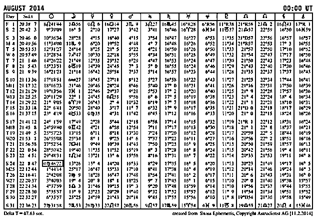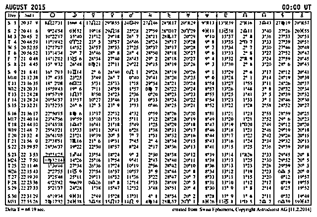

注：GMT 是格林威治时间。中国在东八区，是 GMT+8。所以具体时间上会不同，需要简单换算。比如上文中的 24 日零点（对应北京时间是 24 日上午 8 点），而此时太阳已经在处女座，代表在此前一天的某个时刻，太阳进入了处女座。在星历表中一般也会以备注的形式标记每颗行星具体的“换座时间”。

5

**占星学在南半球是否还奏效？**

**问**：12 星座是否和四季有关？因为经常提到白羊座是 12 星座的开端，象征着生机勃勃的春天，所以天真，稚嫩，有冲劲等等，可这只是对于北半球而言的。对于此时的南半球正是秋天，那白羊座的象征意义如何和季节挂钩呢？其他星座也是有这个问题。占星学在南半球是否还奏效？

**答**：这个其实还挺乌龙的，因为占星学这位白白净净的小书生，自古以来就只生活在北半球，从没坐过大飞机，没去过南边……大家想想，自 2500 多年以前的轴心时代开始，人类文化基本都聚焦在北半球，更确切的说是北回归线附近。所以在描述季节的时候，肯定是以北半球的季节为参考指针的。**占星学在南半球仍旧有效，只是季节的对应不再是北半球这样了。**再补充一点：到了后期的学习阶段，会有“星图计算”的内容，也就是脱离软件自己计算并绘制一张星图。在这部分，你会发现南半球生人的星图，前面的计算步骤都一样，只是在最后需要多加一步，就是把四轴与各宫头所在的星座，整个翻转一下。

6

**星座交替期出生的人，**

**同时拥有两个星座的特质？**

**问**：出生在两个星座交替的那几天应该是两个星座的性格都有吧？**答**：你感觉到两个星座的特质，因为：**此人的出生星图中，可能有其他行星落在了相邻的星座**。比如，出生于 8 月 22 日的人，太阳在狮子座，但水星、金星、火星等可能都在处女座。当然，**这并非唯一的理由**，这里只是简单讨论。

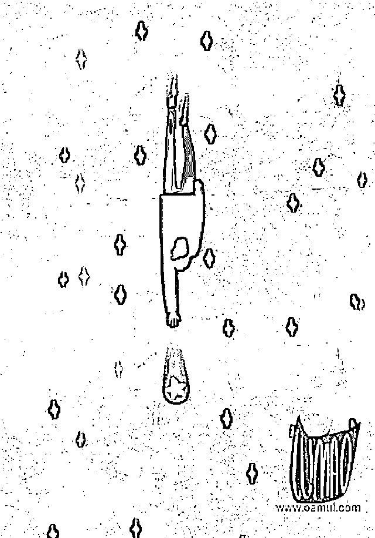

7

**后一个星座比前一个更高级？**

**问**：是不是每个星座都比前一个星座要级别高？有人认为双鱼座因位于第十二个星座，白羊座为首个星座，一路发展演变，可否理解为后面的星座收集了前各个星座的特性，所以到第十二的双鱼座可以理解为某种层面的复杂性？

**答**：关于上述问题，可以这样理解，如果黄道十二个星座描述了人的成长，的确是从白羊座的“初生牛犊不怕虎”到双鱼座的“与天地合一”。这也是在教学中为了方便起见常会用到的方式。但是我们不能忽视一点：黄道并非是一条直线，从一端的白羊座走到另一端的双鱼座就完结了。**黄道是一个圆**，你能说圆上面的某个点比另一个点要高级吗？因此，双鱼座完了，还有白羊座再次新生，这个新生的白羊座，和最开始的那个白羊座，一样又不一样。这也是我一直在教学中尝试做的一点**：避免用二元对立这样简单的世俗法则来描述人的内在世界。**比如：非黑即白，非光即暗，非高级即低级等等。

8

**人类与宇宙为什么会“相互感应”？**

**问**：宇宙与人“互相感应”，所以人类也会影响天空中的事物吗？

**答**：举个非常简单的例子，当一座城市大量向空中排放污染物的时候，就会收获“霾”。这其实就是人“影响”天的直观案例。（之所以用引号，是因为人们往往容易产生“我影响了天地”的良好自我感觉。）

当然，并非所有的“信号”都像霾那样直观、能被肉眼看见。但我们不能说没有。许多宗教、哲学等领域的研究，都提到人类的起心动念，就好像信号一般会传递到虚空中去，其影响是潜移默化的。

再说说“影响”这个词，其实我不太喜欢用它，我更喜欢用“**呼应**”。就好像你出拳打了墙壁，自己的手也会疼，这是一种**能量彼此运作的呼应状态**。在占星学上大家喜欢称之为**“共时性”或者“同时性”**。

另外，“影响”有时候会产生一种“替罪感”：都是行星的错，我也没办法！比如：都是水逆的错，我的车又坏了！

**你可能还想知道**

[星图里四元素分布不均，影响很大吗？](https://mp.weixin.qq.com/s?__biz=MzA5NjA0NTAxNg==&mid=2651413570&idx=2&sn=e45c094729e0153b90cdfd2902a2b6df&chksm=8b4beef5bc3c67e3303dd5bb458066a4a82c87ff1130d2a986a0ebdc42b87eb8ba7cfa029ee9&token=1530151575&lang=zh_CN&scene=21#wechat_redirect)[!](https://mp.weixin.qq.com/s?__biz=MzA5NjA0NTAxNg==&mid=2651413570&idx=2&sn=e45c094729e0153b90cdfd2902a2b6df&chksm=8b4beef5bc3c67e3303dd5bb458066a4a82c87ff1130d2a986a0ebdc42b87eb8ba7cfa029ee9&token=1530151575&lang=zh_CN&scene=21#wechat_redirect)

**敬请期待熊鹰老师**

**下一波答疑**


**现在你有机会跟随熊鹰老师**

**系统学习占星学**

**点击图片了解详情**


**微信又双叒叕改版啦，不想错过若道君的推送？**

**就把若道设为星标吧！**

**▼**


就是这个“在看”，戳戳戳 ☟

********报名直达入口********


# 3 月中国上证指数+黄金周期研究报上线 | 关键时刻帮你共克时艰

> 原文：[`mp.weixin.qq.com/s?__biz=MzA5NjA0NTAxNg==&mid=2651413812&idx=3&sn=5f7ec67d7d78e71022e169a25a5cfdc3&chksm=8b4bef83bc3c66958d5dd16bd47ef13542d3b638f29b0f26e9c4cf909b28a5d73d72f690b3b3&scene=126&sessionid=1692738207#rd`](http://mp.weixin.qq.com/s?__biz=MzA5NjA0NTAxNg==&mid=2651413812&idx=3&sn=5f7ec67d7d78e71022e169a25a5cfdc3&chksm=8b4bef83bc3c66958d5dd16bd47ef13542d3b638f29b0f26e9c4cf909b28a5d73d72f690b3b3&scene=126&sessionid=1692738207#rd)


春节开盘后，受疫情的影响，上证指数大跌达 7%，因为大量稳定市场的资金和北上资金涌入，又出现连续 14 天的大涨。


**丨**图：2020 年 A 股走势 K 线图

**2 月 27 日**，是梅里曼老师在《上证指数 2 月研究报告》提到的一个**三星关键反转日**，一般情况下，在**前后 3 个交易日（有时 6 个交易日）** 市场会发生发转。

梅里曼老师又说中了。上升势头甚猛的美股在 2 月 25 日掉头向下大跌，甚至引得”是否连任和股市好坏密切相关”的美国总统特朗普出来护盘，暗示投资者应抄底买入。而上证指数也在非常强劲的连续上涨 15 后出现下跌，此时应该怎么办？

**是继续持股，甚至趁着回调买入，还是应该获利了结，等待合适时机再买入？现在是水星逆行期，什么样的操作才是合适的操作？**

有些朋友问，**如果我不买指数，只买基金或者个股，这个报告也适合吗？**

回答是，**上证指数走势代表整个中国股票市场走势，哪怕你买的是个股、基金或者投资创业版指数，上证指数趋势都是投资者最重要的参考指标**。

《上证指数 3 月研究报告》已经发布，**如果您已经购买**， 请参照下图指引，查看报告内容。


如果您还没有购买，您可以**点击文末阅读原文**，购买报告。

在每个月度报告中，梅里曼学院的金融占星分析师给出**上证指数价格目标区间及重要价格反转日**，为短期、中期和长期投资者进行市场操作的时机提供参考。

**优惠价别错过！**

上证指数月度报告价格

**单月报告**：280 元

**3 个月套餐价**：780 元（260 元/月）

**12 个月套餐价**：1999 元（166 元/月） 

**长按下图识别二维码购买上证指数报告**

▼

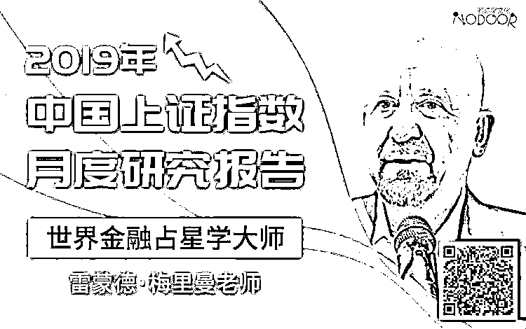

**黄金报告上线！**

此外，3 月黄金周期报告也已上线。黄金已经开始新的上涨，是该追涨上车，还是等水星逆行周期过去再说？欢迎阅读梅里曼老师的黄金周期报告。黄金周期月度报告价格

**单月报告**：280 元

**3 个月套餐价**：860 元

**12 个月套餐价**：2400 元

**双报告年度套餐更优惠（直降 899 元）****12 个月黄金报告+12 个月上证指数报告：仅需 3500 元**

**长按下图识别二维码购买黄金报告**

▼


**购买者须知**

① 梅里曼市场时机学院《中国上证指数月度研究报告》是梅里曼市场时机学院（以下简称 MMA）的研究“预报”，而不是市场“预测”，是梅里曼老师及 MMA 金融占星分析师对人类活动周期历史与行星周期之间相关性的研究，二者在大部分情况下具有 80%或更高的相关性，而不是因果关系。报告中的研究完全存在错误的可能性。即便是非常认真的研究和几十年的研究经验，金融占星师无法总是正确地解读出各种征象在实际层面上会如何相互作用，并显化为事件结果。

所以请将报告看作一个研究参考，务必结合其他市场研究和你个人对市场的理解，根据你的自由意志做决策。

② 本报告只是上证指数研究，没有个股研究。

③ 此报告一旦售出，**即不接受退款。**

④ 此报告每月 1 期，**并非都是在每月相同日期发布**。我们收到英文报告的当天，即发布该英文报告。3 天后，上线报告中文版。⑤** 此报告仅支持手机网页阅读，不支持电脑阅读和下载。**

**以上须知，请仔细阅读。一旦付款，即视为已了解并接受所有须知内容。**

在过去的 35 年中，唯有梅里曼逐渐完善，并在梅里曼市场时机学院月度周期报告中阐释了将地球宇宙学与周期相结合的研究方法，以惊人的精确性预报了黄金价格发生重大变化的时间。黄金购买 Tip 各大银行均可购买黄金或黄金 EFT 基金，也可以在诸如天天基金或者支付宝购买黄金及黄金相关产品。不明白的可以百度搜索。
购买后如何查看报告？


购买后有疑问怎么办？请联系技术客服
**微信：nodoor201705**


****************购买上证指数+黄金月报直达入口****************


# “不管别人怎么说，我只要你爱我” | 强迫性重复的破解法则

> 原文：[`mp.weixin.qq.com/s?__biz=MzA5NjA0NTAxNg==&mid=2651413785&idx=1&sn=5359781db6d7e136b8a6ed8800cc93d3&chksm=8b4befaebc3c66b879acb2026007144d8ff75f2050b56701a69a38450be0dada2245f17961c2&scene=126&sessionid=1692738207#rd`](http://mp.weixin.qq.com/s?__biz=MzA5NjA0NTAxNg==&mid=2651413785&idx=1&sn=5359781db6d7e136b8a6ed8800cc93d3&chksm=8b4befaebc3c66b879acb2026007144d8ff75f2050b56701a69a38450be0dada2245f17961c2&scene=126&sessionid=1692738207#rd)

******************☆ ******************后台回复“今日”，给你一句爱的箴言********


作者/格伦·佩里 译者/丁宏
编辑/玫瑰 封面/书君 图片/全景网******“柏油娃娃综合症”******

“柏油娃娃综合征”，是来自美国的一个著名的寓言故事。在这个故事里，有一只兔子走在路上，他看到路边田野里的一个稻草人，这个稻草人身上涂满柏油。农民为了防止有小鸟破坏农作物，所以在稻草人身上涂满柏油，这样如果有小鸟落在稻草人上面，它们就会被粘住，就不能再去吃地里的农作物了。这种穿着柏油外衣的稻草人，被叫做柏油娃娃。

这只兔子并不知道柏油娃娃不是一个真人，他走过去跟柏油娃娃打招呼，没有得到回应。这只兔子很受挫，他就去推了柏油娃娃一把，希望能得到回应。但柏油娃娃是无法给他任何回应的，无论是打声招呼还是一个拥抱。

我们星图中的一切，都在形成模式，这些模式会不断重复。通常，**那些在童年时期让我们感到挫败、痛苦的东西，会在之后的日子里重复，以此来让我们得到那些我们在过去无法得到的东西**。比如女性会去选择一个很像她的父亲的伴侣，可能有很多方面不那么像，但在一些关键的部分，是很像的，她会想从这个男人身上得到她无法从父亲身上得到的、或无法向父亲去要求的那些关爱。

很多时候，一个人会卡在当下的某种状态里，想从某个人或某种情境中得到一些东西，这些东西是在过去的经历中没有得到或是那种需求被否认了的，然后他们会强迫性地在当下的情境中过度要求获得这些东西，执着于一个特定的结果。就像那只兔子卡在了对柏油娃娃的期待中。

在柏油娃娃的故事里，兔子用尽各种办法去获得柏油娃娃的回应，他推它、打它，越来越执着在这个情境中动弹不得。我们在现实生活中也经常做这样的事。我们卡在了某段关系里，或是卡在某个工作里，或是卡在别的什么情境中，试图获得一些特定的东西。**我们没法自己给自己这些东西，只能向外求，那是我们心里缺失的部分，是我们在小时候没有得到的东西。**

**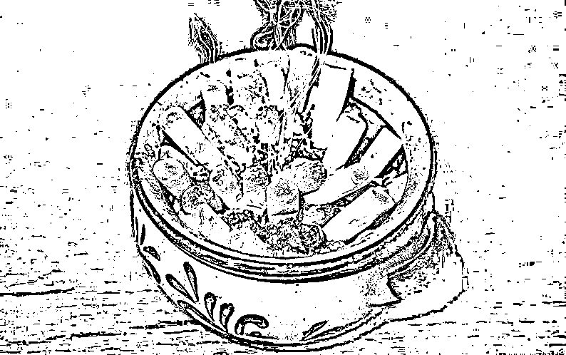**

******疗愈，需要放下******从占星学的角度上说，这可能是任何一颗行星的需求，比如**月亮所渴望的安全感、关心照料、归属感；太阳想要的认可、认同；金星所渴望的喜爱、触碰**，等等。如果我们在童年时期因为某些东西而受挫，或是被剥夺了满足某种需求的权利，我们会倾向于觉得那是我们自己的问题，是因为**我们不配拥有**。这就会让一个人**过度执着地想要从另一个人身上获得那些自己曾经无法得到的东西**，然而**另一个人可能本身就是没有能力给予这些东西的。**这是一个强迫性重复的情况，要去疗愈和处理这种情况，就需要学会**放下**，要意识到**一个人的能力是有限的，你不能强迫外在的某个人去满足你的需求。**这也要求你**原谅你自己的那些非理智的内疚感和自责，那些童年时期留下的印记。****宽恕自己，也宽恕他人的局限性，这会让我们能够释放掉过去那些没有被整合好的悲痛、受挫的感受。********月冥对分的疗伤之旅******


1 母亲带给女儿的伤痛这是一个中年女性的星图，8 岁时，她失去了她的母亲。她的家庭中还有 2 个孩子，她是 3 个孩子中排行老二的那一个。她的妈妈有一些精神上的疾病，8 岁时，她妈妈抛弃了家庭搬去了另外一个州，那时她的年龄正对应了她星图中月亮的位置。在她的星图中月**亮对分了冥王星**。冥王星合相了天王星，而天王星和金星、水星共同形成了一个上帝手指。但最重要的还是月亮与冥王星的对分相。因为这个相位象征了**对信任的破坏，以及母亲带给女儿的伤痛。**
这个女儿的成长过程中，对自己的感受有种**恐惧，害怕爱、关心、理解、归属感**。她的月亮在双鱼座，她的母亲最终搬回了他们所在的州，但是没有搬回家。她的姐姐是个侏儒，她的父亲是近乎崩溃的状态，她的弟弟也很抑郁，家庭中的每个人的功能运作都出了差错，就好像她没有权利去依靠任何一个家里的人来获得关怀和支持。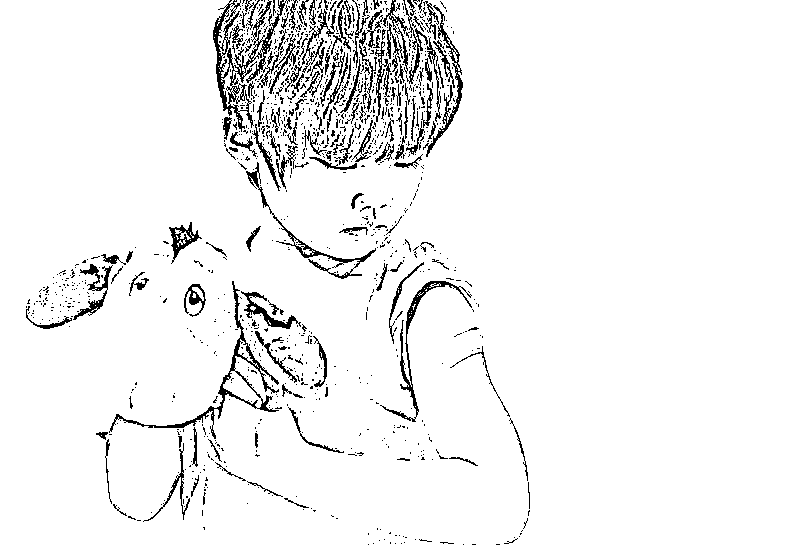2 无法表达自己感受的恐惧当她来找我时，她正处于一段关系之中，对方是一个很有问题的人。这是一段跨种族的婚姻，对方是一个黑人，她是一个白人女性，这个男人失业了、吸大麻上瘾、生活混乱无序、满嘴谎话，并且还有家暴。这个男性曾经参加过越战，所以有战后创伤综合征，在心理上他从来没有克服战争给他留下的创伤。而这个女性对婚姻家庭非常地尽责，非常努力。这个男人就像一个巨婴，她觉得她有必要照顾他。在这样一种情境中，我们看到这个男人其实象征了这个女性星图中的**月亮的创伤**，被冥王星伤害的月亮，创伤、被动无助的、没有工作、疾病、上瘾，等等。在很多方面，他就像她的母亲一样，没法照顾她，他作为一个成年人的能力、他为自己负责任的能力、爱的能力和对她负责任的能力，都是缺失的。这位女性其实就是陷入了柏油娃娃综合征，那个男人就是柏油娃娃，他们之间重现了她和她妈妈之间发生的事。她想从这个男人身上得到当年母亲没法给她的东西，但这个男人就像她的母亲，根本没有这样的能力。在工作上，她是一个办公室经理，为一个女性的牙科医生工作。她在事业上非常成功，非常有自信，非常负责任。但她的老板就像她的丈夫一样，没有能力，总是濒于崩溃、被压力压垮，没有办法有效地处理事务，并且对她怀有敌意。这位客户的名字叫做杰妮，杰妮觉得自己必须去过度地工作，以牺牲自己的方式去工作。工作时间很长，做的事很多，也没有什么假期，也没有加薪，因为她的老板，其实就是她的母亲形象的象征，是功能运作不良的，跟她自己的母亲的情况一样。

当我跟杰妮一起工作的时候，我问她：“你对自己的丈夫感觉如何呢，你对你的老板又感觉如何呢？”**她对表达自己的感受感到恐惧，她觉得自己没有权利去表达自己的感受，她觉得如果她这样做了的话，别人的反应是会让自己蒙羞的**。

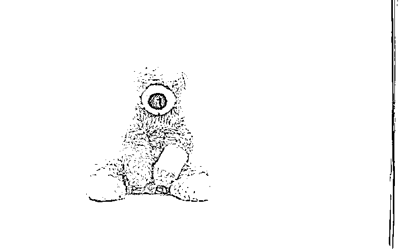

3 为什么杰妮的嘴会受伤有一次，杰妮获得了一次福利待遇，可以免费享受一次牙医老板的某种牙齿护理。但做的过程中牙医老板出现了多次失误，并且做得非常草率，最后杰妮的口腔里是一团糟，并且很疼。她觉得被背叛了，觉得牙医老板欺负了她。这类事件的出现总是有意义的，这是杰妮的月冥对分相位的反映，以这样一种极端又荒谬的方式显现了出来。嘴，是我们获得滋养和照顾的部位，特别是获得来自母亲的滋养。当我们还是婴儿的时候，我们要用嘴去吮吸母乳。如果一个人对于爱、滋养和照顾的需求没有被满足，理想的情形中，婴儿会通过哭泣、大喊，或说话来表达。是否能说话也取决于他们的年龄，以这种方式让妈妈知道我还需要更多，或是需要别的什么。但是杰妮对要求照料这件事感到羞耻，觉得自己不值得，她害怕表达自己的感受。所以，在象征意义上，她失去了她的声音、她讲话的能力，结果她的嘴受伤了，而嘴巴就是用来讲话的部位，是用来表达自己的需求和感受的部位。现在，情况变得非常极端，无论是她和她的丈夫还是和她的老板之间的关系。她好像被逼得不得不说出自己的感受了，去说出她感到被背叛、感到受伤、感到没有得到支持、感到她的老板不关心她、她的丈夫也不关心她。她开始去找到自己的声音、去表达自己的感受，那是在她还是个小女孩的时候就积压下的感受。4 过去、现在和未来的关联她终于开始去向她的丈夫和老板表达自己的感受，她的丈夫和老板其实都是她的母亲的替代。她现在对他们讲出了自己小时候没有办法对母亲讲出的话。最终，她离开了她的丈夫，也辞掉了工作，她找到了一份更好的工作，这种新的情境反映了她的一个更加整合的状态，也反映了她在获得关爱方面拥有了更好的能力。她现在可以自己照顾自己了，而不是去忍受一种别人都不关心自己的状态。她的新工作是自己创业，她去那些卖旧家具的跳蚤市场，将那些旧家具买回来，将它们重新整修。相当于冥王星的转化和重生的能量用到了月亮上，**月亮和家有关，去美化那些旧的家具，赋予它们新生。**那么当客户在一些重复出现的经历中，表现出强迫性重复时，我们可以跟他们说什么呢？下面是我会对杰妮说的话：**“你认为霍莉（杰妮的老板）和你母亲一样脆弱，如果你明确表达自己的需求，就会伤害她、击垮她，就像你小时候无法对母亲说那些话一样，因为母亲无力招架。但是如果你不说出来，你就是在让自己的嘴（声音）受到永久的伤害。”**事实上，当杰妮来找我咨询的时候，正是星图中冥王星对应的那个年龄，在这个年龄，她童年失去母亲的痛苦经历又以另外的方式呈现出来，体现在她和她的丈夫以及老板的关系中。她现在有了一次机会通过重新选择，而去处理和母亲的关系，从而疗愈自己。

重要的是要理解，同一个相位，月亮对分冥王星，既代表了她童年时和母亲的关系：母亲生病了，抛弃了家庭和孩子，辜负了孩子的信任；同时这个相位也代表了当下和丈夫以及老板的关系。

对分相总是跟关系有关，所以当下的关系其实是对过去的关系的复制，是对过去的重演。并且这给了她一个机会去找到自己的声音，去开始**表达自己的感受和情感需求**。那些从童年时就被压抑下来的东西，通过这样的方式，疗愈成为可能，她于是可以重新启程向前走。同一个相位的能量，被她用于重整家具的事业，以这样的方式她自己滋养了自己的月亮。

所以过去、现在和未来都被这个月冥对分的相位所象征。星图变量构成了一个客观框架，从中我们可以清晰地看出过去、现在与未来是如何通过同一意义模式关联起来的。

**版权声明：**本文由若道翻译发布，欢迎转发，反对抄袭。


**格伦·佩里**若道签约老师。著名占星师，ISAR 董事会成员，共出版 8 本占星著作；心理/意识研究专业博士；占星心理学学院（Academy of AstroPsychology）的创办人；康涅狄格州研究生院（the Graduate Institute of Connecticut）原型宇宙学与意识进化项目的负责人。

**双证书核心课程火热报名中**

**点击图片了解详情**

**

**微信又双叒叕改版啦，不想错过若道君的推送？**

**就把若道设为星标吧！**

**▼**


就是这个“在看”，戳戳戳 ☟

********报名直达入口********


# 雷蒙德·梅里曼金融占星周运 | 本周后半段市场或发生反转

> 原文：[`mp.weixin.qq.com/s?__biz=MzA5NjA0NTAxNg==&mid=2651413785&idx=2&sn=51237c635a89458a4750b7ead913932d&chksm=8b4befaebc3c66b8201e8b21d9a07f82f60bd3f3fee7c253d249b26d83e9880f103a88745da2&scene=126&sessionid=1692738207#rd`](http://mp.weixin.qq.com/s?__biz=MzA5NjA0NTAxNg==&mid=2651413785&idx=2&sn=51237c635a89458a4750b7ead913932d&chksm=8b4befaebc3c66b8201e8b21d9a07f82f60bd3f3fee7c253d249b26d83e9880f103a88745da2&scene=126&sessionid=1692738207#rd)

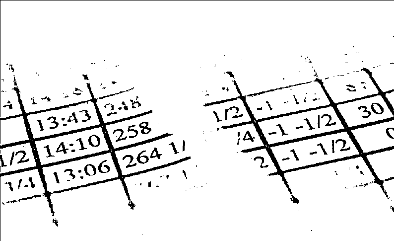

作者/雷蒙德·梅里曼
翻译/Luke 校对/李含编辑/玫瑰 图片/全景网雷蒙德·梅里曼是在金融占星学界稳坐第一把交椅的占星师，同时他也是若道签约的金融占星课老师，我们引进了雷蒙德·梅里曼老师的《[上证指数月度报告](https://mp.weixin.qq.com/s?__biz=MzA5NjA0NTAxNg==&mid=2651413099&idx=1&sn=3be98d72726abbbda1dcb0ff5466471f&chksm=8b4be8dcbc3c61ca74a5fae8d2e23e3420af5524464f94e5ef15ac4699d2363647a0eb497d4c&token=517203770&lang=zh_CN&scene=21#wechat_redirect)》《[黄金周期月度报告](https://mp.weixin.qq.com/s?__biz=MzA5NjA0NTAxNg==&mid=2651413099&idx=1&sn=3be98d72726abbbda1dcb0ff5466471f&chksm=8b4be8dcbc3c61ca74a5fae8d2e23e3420af5524464f94e5ef15ac4699d2363647a0eb497d4c&token=517203770&lang=zh_CN&scene=21#wechat_redirect)》《[2020 年金融预报](http://mp.weixin.qq.com/s?__biz=MzA5NjA0NTAxNg==&mid=2651413307&idx=1&sn=0c57f63779d302432c0c98acc22087d2&chksm=8b4be98cbc3c609af9da1e14b94337deabc2d28117de05ba4bfd25e580f78402d70d09ed6b86&scene=21#wechat_redirect)》。我们经老师的授权，将每周刊登梅里曼老师的周运，供大家参考和学习。于是，这是本周的周运（2.24-2.28）。**展望与回顾**

**因冠状病毒在中国境外传播加速，投资者采取了谨慎的态度，美国股市本周收跌。来自中国的最新数据显示，新增案例继续放缓。国家卫健委表示，截至周四的 24 小时内，全国新增冠状病毒病例 889 例，死亡 118 日，总数分别上升至 75465 和 2236 人。**

**——《股市下滑，本周收跌》**

**乔纳森·加伯**

**www.foxbusiness.com**

**2020 年 2 月 21 日**

**冠状病毒的爆发毁掉了本应取得稳定收益的财报季，并给本季度和今年余下时间的预报蒙上了一层阴影。现在财报季的收益都是在账面上，可以预见的是，冠状病毒将占据最近的新闻头条，打压本月的股市。**

**——李云**

**《冠状病毒造成的恐慌毁掉了本应盈利的财报季》**

**www.cnbc.com**

**2020 年 2 月 21 日**

上周全球股市走势喜忧参半。或许最奇怪的是道琼斯工业指数在前一周达到历史新高后，上周持续下跌，而同时中国上证指数一直上涨，事实上自从 2 月 4 日的低点以来一直在快速上涨，尽管冠状病毒的爆发对中国的打击是最大的。但话说回来，当前是**水星逆行期（2 月 17 日-3 月 10 日），而且在双鱼座，所以任何想要在市场（或个人生活）中寻求理性的人可能都发现现实与自己的预期脱节**。昨晚，我和我的妻子，占星师安东尼娅·兰斯多夫进行了一次有趣的谈话（是的，我们谈论占星学和它的原理）。她说她学到的最重要的一课是：“如果你无法改变一件事，就接受它。”这一智慧在任何时候都适用。对此，我回答说：“是的，但这只在**行进行星或推进行星与出生（创立）星体形成困难相位**的时候显得重要。”当你经历和谐相位或甚至没有相位的时候，就不会有压力去改变环境，无论你是否接受。她明白我的意思。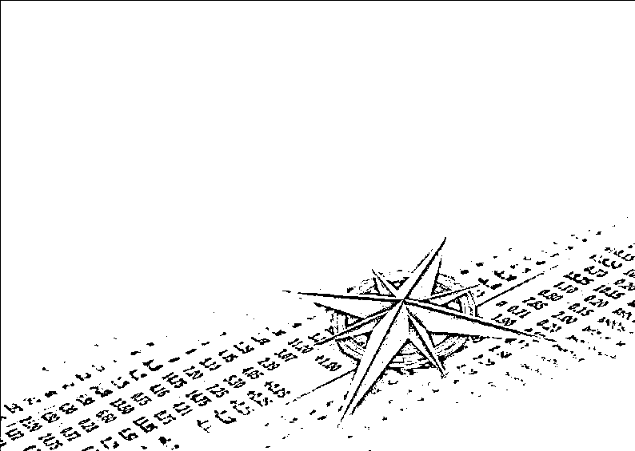上周金融市场的动向仍然让人迷惑不解，只有黄金是个例外，在 2 月 21 日星期五的时候冲向了新的 7 年高点，突破了美金 1650。黄金冲向高点的时候，美元也上升到了 2017 年 4 月以来的最高位，而欧元跌到了同时期以来的最低位。当美元如此快速上涨的时候，黄金不应该上涨得这么快……除非人们感到**害怕**，投资者迷失方向或感到不确定。这当然是水星在双鱼座逆行玩弄的戏法（迷惑和不确定性），更何况 5 个外行星中的 3 个（木星、冥王星和土星）合相在摩羯座（恐惧），构成了所谓的“摩羯座星群”这一少见的现象。这个星群会在 2020 年大多数时间发挥影响力，直到 2020 年 12 月 21 日冬至前后，土星和木星在水瓶座合相。我确信你听到过不少届时将开启“水瓶座纪元”的传闻。它象征着一个时代的终结和一个新时代的开始，但这不会在一夜之间发生。我们到底要谈的是哪个时代？但是让我们回到上周的市场动态。美国的标准普尔指数和纳斯达克指数，欧洲的 DAX 和 SMI 指数，以及澳大利亚的 ASX 指数，上周都创下历史新高。阿姆斯特丹 AEX 指数飙升到了 2001 年 2 月以来的最高位。但是美国和欧洲的股指本周收盘时都大幅下跌，因为投资者担忧冠状病毒的传播将会持续。和今年早些时候一样，其他的市场继续盘整（日经指数、恒生指数、Nifty 指数、富时指数、Bovespa 指数）。原油本周走势良好，自两周前跌到 50 美金/桶以来上涨超过 10%。白银有一轮不错的上涨，回到了美金 18.50 以上，但未能突破 2020 年 1 月 8 日的高点，但黄金暴涨到了 2013 年 2 月以来的最高位。比特币从 2 月 13 日创下数月来的高点的 10519 回落，但仍保持在 9200 上方，这使得这轮下跌仅是对两个月前从 6350 开始的强力上涨的一次调整。没有迹象表明买入比特币的狂热情绪已经结束，这种情绪与预计将在 2020 年 5 月发生的“比特币减半”事件有关。这会使比特币矿工获得的区块补贴减少 50%。**短期占星趋势**

**美国全国广播公司（CNBC）的吉姆·克莱默周四表示，他觉得拉斯维加斯的民主党辩论简直不忍直视，因为参议员伯尼·桑德斯抨击亿万富翁迈克·布隆伯格和其他富人。“真令人痛苦，因为你的财富昨晚遭到抨击”，克莱默说：“为什么会这样，如果你很富有，同时也是民主党人，就是一件坏事？”**

**——凯文·斯坦基维奇**

**《克莱默评论辩论：你的财富受到攻击，桑德斯听起来像个共产主义者》**

**www.cnbc.com**

**2020 年 2 月 20 日**

** “生命孕育生命。能量创造能量。通过消费，人才能变得富有。” **

**——法国女演员莎拉·伯恩哈特（1844-1923）**

**摘自《亚利桑那共和国报》**

**2020 年 2 月 21 日**

这次的水星逆行周期，从 2 月 17 日到 3 月 10 日，从天象来看尤其值得关注，因为在这为期三周的时期内出现的其他几个主要相位也和金融和期货市场上的**重大反转**有显著的历史相关性。其中之一是**金星与“摩羯座星群”的木星、冥王星和土星形成四分相**，这个相位从**2 月 24 日开始，持续到 3 月 4 日**。金星掌管着**外汇、股票和大豆**。我们也注意到这个水星逆行周期的中点是**2 月 27 日**。通常市场不会在逆行开始时反转**（2 月 17 日+/-3 个交易日）**，而会在**水星逆行期中点的 2 天内**反转。这中可能性会在**这一周的后半段**发生。本周伊始，即**2 月 23 日**星期日将会出现**双鱼座新月**，这也可能对应市场反转，如果新月出现的时间段也包含了其他强有力的天象的话。本周就是这种情况。双鱼座，和其守护星海王星，与**药物和治疗**有关。新月象征着一个新的周期，新的觉知。在接下来两周里（从新月到满月之间的渐盈期），或许我们会听到发现冠状病毒疗法的消息。在双鱼座能量下一切皆有可能，因为这个星座守护着想象力，可能设想出新的发现，然后将之变为现实。**如果是这样，我们将见到全球股市再次上涨，其中许多将会进入新周期或创历史新高。**我并不是说这一定发生，只是在双鱼座新月下这是有可能的，因为出现奇迹和治疗方法是这个星座信念体系的基石之一。鉴于我是本专栏的作者，我想就我今天所看到的 2020 年美国大选发表社论。早先，我说到对你星图中的困难相位，要么“改变它”要么学着去“接受它”……2020 年有不少困难相位，许多人觉得很难接受事情的现状。同样很多人也感到很难改变这些情况，因为人们觉得无力对抗控制各国政府以及选举进程的政治机制。看起来唯一能“改变”现状的方法就是参与政治，或变得极其富有，以影响政治家或为自己买选票成为政府领导人。我改变不了这种状况，所以对我个人来说接受现状没什么难度。即便如此，我还是要回到我人生中学到的另一条智慧：**我们都有自由意志去选择不可避免的事情**。这其实是学着接受那些你无法改变的事情的另一种说法，除非你有足够的能力和意志去改变那些你无法接受的事情。认清这两者之间的区别是获得幸福人生的关键。就好像当你做对的时候要让利润飙升，出错的时候要尽快止损一样。**版权声明：**本文由若道翻译发布，欢迎转发，反对抄袭。友号转载请申请白名单。


**雷蒙德·梅里曼（Raymond Merriman）**

若道签约老师。著名金融占星师，ISAR（国际占星研究协会）前主席，梅里曼市场分析公司的总裁。他由于“提升了占星学的职业形象”，在 1995 年国际占星大会上被授予轩辕十四奖；在 2012 年国际占星大会上，被授予轩辕十四终身成就奖。

1“中国上证指数月度报告”发售

**若道推出了****中文版****的雷蒙德·梅里曼中国上证指数月度报告，并持续发行该报告！**

当把金融市场的周期和占星学的周期相结合时，雷蒙德·梅里曼老师的金融占星学研究**为投资者应对金融市场的周期波动，并随之调整投资策略提供了极大的价值参考**。

2“黄金价格周期月度报告”发售

**若道推出****中文版****的雷蒙德·梅里曼黄金价格周期月度报告！**不仅仅为广大读者在中国股市的投资出谋划策，更将视角放眼黄金市场。

**每当世界经济形式不明朗的时候，有一个地方是保值的港湾，那就是****黄金**。从 2018 年 8 月开始，黄金已经用自己的升值再次提醒众人它在经济不稳定时的位置。**截至目前，2019 年 8 月底，黄金已飙升至 6 年新高，高于 1565 美元。**

自 1982 年雷蒙德·梅里曼出版第一本研究《地球宇宙学征象与黄金价格的关联》的著作以来，**他一直作为最重要的黄金市场时机预测者之一享誉国际**。

过去 1 年，那些订阅并遵循建议的梅里曼市场时机学院日报和周报的订阅者，如果从 2018 年 8 月 16 日的低点或 8 月 23-24 日的次低点购买黄金，他们已经赚到了不少的 30%左右的利润。

**3 月中英文报告已上线！**

**购买套餐**，买得越多越优惠

中国上证指数月度报告套餐价

*   **单月报告**：280 元

*   **3 个月套餐**：780 元（260 元/月）

*   **12 个月套餐价**：1999 元（166 元/月）

**长按下图识别二维码**

**购买金融报告****套餐**

**▼**


黄金周期月度报告超级优惠折扣

*   **同时购买上证指数 12 个月套餐**和**黄金周期报告 12 个月套餐**，即可享受黄金周期报告 12 个月套餐**立减 1199**元的**超级优惠折扣**。

*   **已经购买**了**上证指数 12 个月套餐**的朋友，**再购买**黄金周期报告 12 个月套餐，也可享受**立减 1199**元的**超级优惠折扣**。**购买黄金周期报告 12 个月套餐时，超级优惠折扣会自动生效。**

**长按下图识别二维码购买黄金报告套餐**

▼


32020 年金融预报 1976 年以来，由雷蒙德·梅里曼撰写的梅里曼市场时机学院每年一次的年度预报沙龙和每年一本的《年度预报》一直在应用占星学原理为投资者们服务，43 年来，这本 200 页左右对金融市场的分析报告和 3 小时的年度预报讲座在美国、日本、欧洲帮助许多投资者了解宇宙天气对于世界经济形势、政府政策及其对各个金融市场和金融产品的影响，帮助他们做出正确的投资决策，降低投资风险。2018 年，若道第一次将这份广受赞誉的一年一度的金融占星报告和沙龙引入中国，供中国投资者参考。**《2020 年金融预报》将会谈及 2020 年重要的宇宙天象及其对世界经济、贸易形势的整体影响，还将覆盖中国上证股票市场的分析、黄金白银市场、美国经济、美国总统、美联储、美国国债市场、美国股票市场、主要外汇货币市场（主要外汇美元、英镑、欧元、日元、瑞士法郎）、原油市场、谷物市场、活牛市场、比特币市场等投资市场。**梅里曼老师及梅里曼市场时机学院的金融占星分析师还会给出以上市场 2020 年的**市场价格目标区间及重要价格反转日**，为短期、中期和长期投资者进行市场操作的时机提供参考。如果你关注世界经济和金融投资市场的变化，会发现梅里曼《金融年度预报》中的研究对于你了解世界经济在发生什么，这些市场的走向会如何有非同寻常的指导价值。报告和讲座价格

2020 年金融预报讲座和报告价格整体售价** 1280 元**

（本讲座和报告不单独出售）

**长按下图识别二维码购买 2020 年金融预报**

▼


**微信又双叒叕改版啦，不想错过若道君的推送？**

**就把若道设为星标吧！**

**▼**


********点击阅读原文购买金融报告********


# 黄金，你还没上车吗？ | 雷蒙德·梅里曼 3 月黄金报告上线！

> 原文：[`mp.weixin.qq.com/s?__biz=MzA5NjA0NTAxNg==&mid=2651413785&idx=3&sn=ef942521571587ac93a4ae49c7ffcefb&chksm=8b4befaebc3c66b829d57620e48233e4abbc5a7f6eb3a2a69675809890a3486aa8149721c08a&scene=126&sessionid=1692738207#rd`](http://mp.weixin.qq.com/s?__biz=MzA5NjA0NTAxNg==&mid=2651413785&idx=3&sn=ef942521571587ac93a4ae49c7ffcefb&chksm=8b4befaebc3c66b829d57620e48233e4abbc5a7f6eb3a2a69675809890a3486aa8149721c08a&scene=126&sessionid=1692738207#rd)

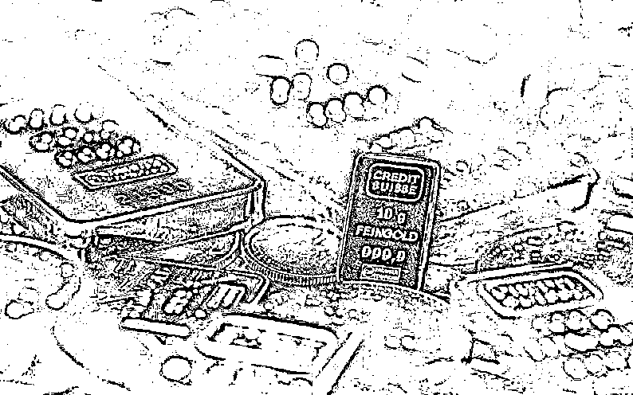


**黄金是金钱。其他的只是信贷。**

**——约翰·皮尔庞特·摩根**

黄金近日已经开始大涨。

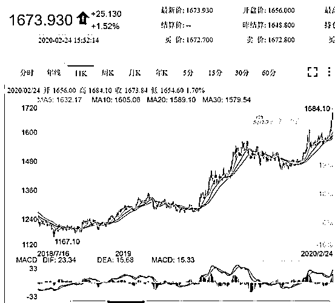

**丨**图：2020 年 2 月 24 日黄金走势 K 线图

刚刚听过梅里曼老师《年度预报》的群里，有这样几方代表:**A 同学**：梅里曼老师的讲座怎么那么及时，我听了讲座就立刻买入黄金,结果就大涨......

**B 同学**：我也是，而且真的买了很多，但是看这涨法也惊呆了，这也太猛了，心里好怕怕啊......

**C 同学**：我还没有上车，呜呜，是不是要等一等...... 

**D 同学**：感觉到有上涨阻力了,要不要等水逆过后呢....... 

**E 同学**：（没有发言，默默想）嘿嘿，2018 年跟梅里曼老师上金融占星课的时候已经跟着他在买黄金了，已经赚了 43%,这个报告太值了！

你现在是以上哪位同学的状况？

你上车了吗？准备上车？或者已经赚了很多，在考虑还敢不敢继续持有？**雷蒙德·梅里曼黄金周期 3 月度报告上线，带来有 39 年黄金市场研究经验的****世界著名金融占星大师****——雷蒙德·梅里曼对当前黄金市场的研究。**投资有收益，投资有风险，希望这份金融占星学的研究帮助你更好地评估黄金投资。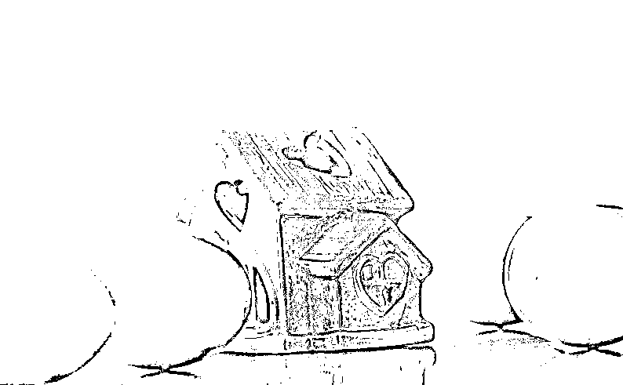

**优惠价别错过！**

黄金周期月度报告价格

**单月报告**：280 元

**3 个月套餐价**：860 元

**12 个月套餐价**：2400 元

**双报告年度套餐更优惠（直降 899 元）****12 个月黄金报告+12 个月上证指数报告：仅需 3500 元**

**长按下图识别二维码购买黄金报告**

▼


**购买重要须知**

① 梅里曼市场时机学院《黄金周期月度研究报告》是梅里曼市场时机学院（以下简称 MMA）的研究“预报”，而不是市场“预测”，是梅里曼老师及 MMA 金融占星分析师对人类活动周期历史与行星周期之间相关性的研究，二者在大部分情况下具有 80%或更高的相关性，而不是因果关系。报告中的研究完全存在错误的可能性。即便是非常认真的研究和几十年的研究经验，金融占星师无法总是正确地解读出各种征象在实际层面上会如何相互作用，并显化为事件结果。

所以请将报告看作一个研究参考，务必结合其他市场研究和你个人对市场的理解，根据你的自由意志做决策。

② 此报告一旦售出，**即不接受退款。**

③ 金融月度报告每月固定 1 期，**并非都是在每月相同日期发布**。我们收到英文报告的当天，即发布该英文报告。3 天后，上线报告中文版。④ **此报告仅支持手机网页阅读，不支持电脑阅读和下载。****以上须知，请仔细阅读。一旦付款，即视为已了解并接受所有须知内容。**在过去的 35 年中，唯有梅里曼逐渐完善，并在梅里曼市场时机学院月度周期报告中阐释了将地球宇宙学与周期相结合的研究方法，以惊人的精确性预报了黄金价格发生重大变化的时间。黄金购买 Tip 各大银行均可购买黄金或黄金 EFT 基金，也可以在诸如天天基金或者支付宝购买黄金及黄金相关产品。不明白的可以百度搜索。
购买后如何查看报告？


购买后有疑问怎么办？请联系技术客服
**微信：nodoor201705**


********购买黄金月报直达入口********


# 深度双鱼座 | 最爱哭的他们，却为了全人类擦干眼泪，踏上征程

> 原文：[`mp.weixin.qq.com/s?__biz=MzA5NjA0NTAxNg==&mid=2651413747&idx=1&sn=f64d33a0169d32f17149fc4091cd3869&chksm=8b4bee44bc3c6752ba9f17d738a3f31f3a13bc6b24136556df95086adf970e8889602d017943&scene=126&sessionid=1692738207#rd`](http://mp.weixin.qq.com/s?__biz=MzA5NjA0NTAxNg==&mid=2651413747&idx=1&sn=f64d33a0169d32f17149fc4091cd3869&chksm=8b4bee44bc3c6752ba9f17d738a3f31f3a13bc6b24136556df95086adf970e8889602d017943&scene=126&sessionid=1692738207#rd)

****************☆ 后****************************台****************************回复“今日”，给你一句生命态度****************

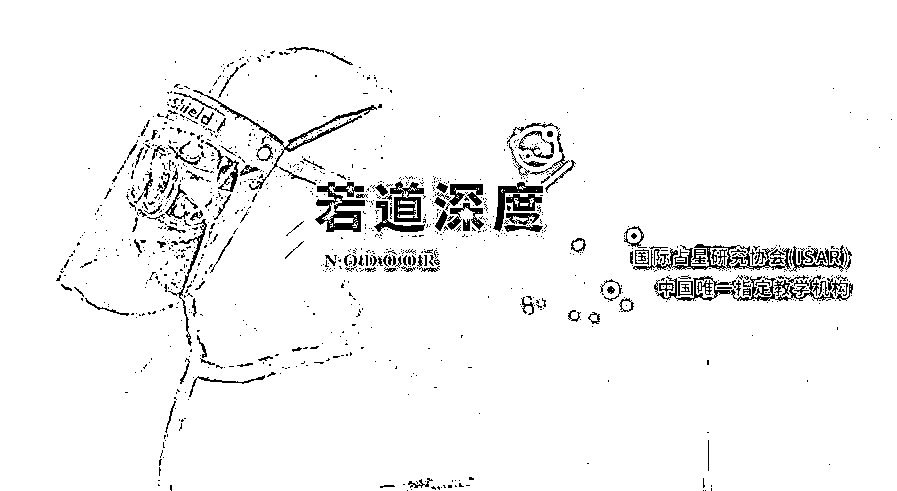

作者/大卫·瑞雷 若道占星创始人
译者/李含 校对/Jun 编辑/玫瑰 图片/网络 大卫·瑞雷提供 2020 年初，我们正在经历一场艰难的抗疫之战，这场战斗没有硝烟，却有着生死；这些士兵没有钢枪，只有血肉之躯。他们，就是白衣战士。我想你一定想不到，在占星学中，这些冲到第一线抗疫的人们，其火星的原型居然是在以“脆弱”闻名的双鱼座或者 12 宫。请仔细看完这篇文章，你会对这颗火星油然升起敬意。请记住这些人们，因为他们是最爱流泪的人，却为了全人类擦干泪水，踏上征程。**当火星遇上双鱼座**

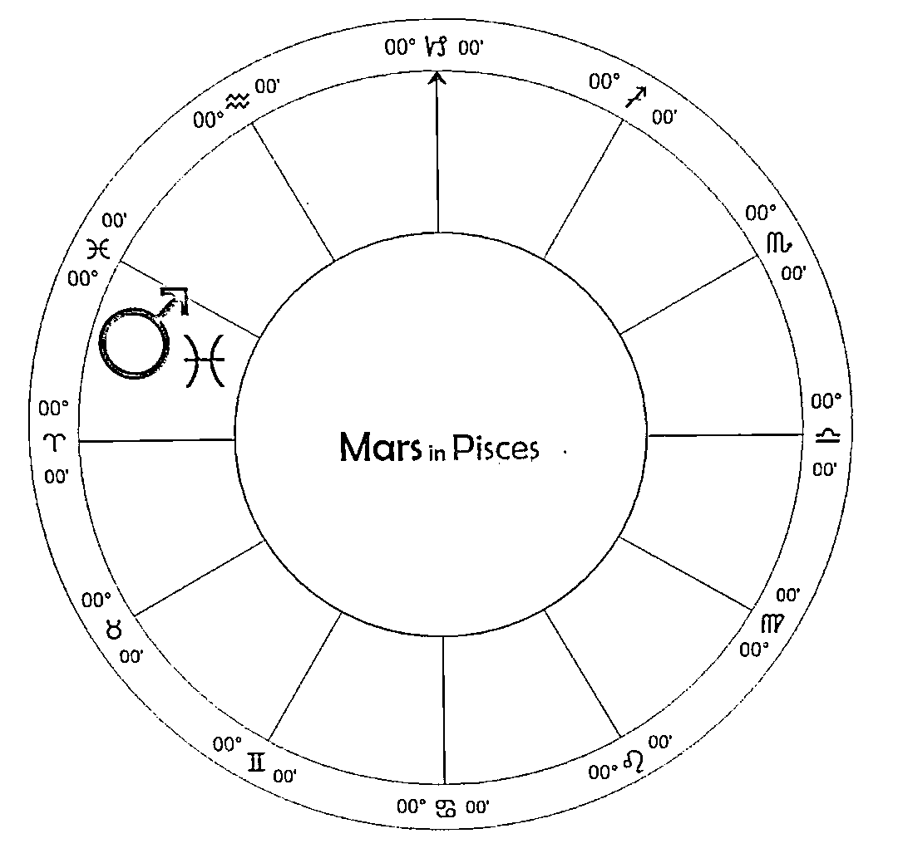

| 在上面的星图中，火星落在双鱼座或者第 12 宫

“**你有能力激励我们，去做所有人都认为不可能的事；你的行为为我们所有人照亮了通往天堂之道；你在尘世间给我们指明了通往天堂之道。**”思考一下双鱼座的象征符号。两条鱼绑在一起，一条鱼向上游向亮光，另一条鱼向下游向水底。现在，想想火星。**战斗或逃跑**。怎么办？走哪条路？你说：**“随波逐流”**。但如果是洪水呢？如果洪水把你冲到旱地上怎么办？有没有见过一条鱼离开水在沙滩上蹦来蹦去？它们已经脱离了自己的元素，水元素。  水，就是对火星的挑战。如何适应水的环境，一个情感极其敏感的环境。试过在水下奔跑吗？很笨拙不是吗？不可能像在陆地上那样前进。像醉醺醺的章鱼一样乱扑腾，看起来十分可笑。只有让你的身体适应水的环境，模仿鱼的动作，让身体变得水平，把你的腿脚当做鱼鳍一样踢动，你才能借助手臂向前移动。是的，这就是游泳。在水中前行，必须游泳。就是这么简单。然而，许多人害怕淹死，可怜的游泳者可能会像被自己的恐惧钩住的比目鱼一样用力扑腾。记住，**火星是一个非常物质化的行星**。它是我们心中的战士，与我们作为个体**如何坚持自己的主张**相呼应。对我们每个人来说，火星的关键问题总是：“我如何有效地坚持自己的主张？”我们每个人都有不同的方式来坚持主张，这种方式与我们如何有效利用我们火星的出生星图落点有很大关系。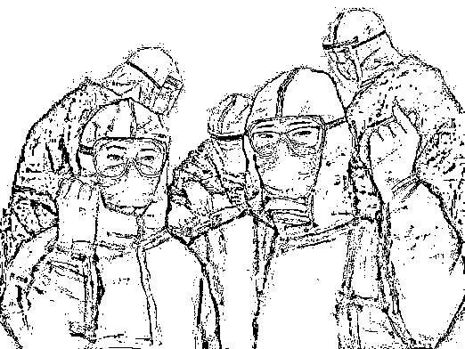

| 2020 年新冠病毒疫情爆发，抗战在第一线的医护人员剪影/图源：百度

**没有人比他们更善于忍受痛苦**对于那些出生星图中**火星在双鱼座或者火星落入第 12 宫**的人来说，**有效地坚持自己的挑战取决于你对感情的水世界掌握得有多好**。不仅仅是普通的感觉，还有像大海一样大浪滔天的非凡的感觉。灵感可以让你的肌肉动起来，去做那些看起来不可能的事情。“**很多舞者都会画画。我以前画画，最近又拿起了画笔。当我跳舞的时候，我非常忙于事业。（必须）利用你的创造力开始做一些其他的事情，因为如果你不这样做，你的内心将会死去。****——凯瑟琳·邓纳姆**”另外一个和双鱼座显著关联的是**随音乐舞动**，即：**“跳舞！”**凯瑟琳·邓纳姆被称为“黑人舞蹈之母和王后”；凯瑟琳是一位非裔美国舞蹈家、编舞家和社会活动家，她管理自己的舞蹈公司，是 20 世纪非裔美国人和欧洲剧院中最成功的舞蹈家之一。

📹 [`v.qq.com/iframe/preview.html?width=500&height=375&auto=0&vid=w3066nnk0ju`](https://v.qq.com/iframe/preview.html?width=500&height=375&auto=0&vid=w3066nnk0ju)

| 武汉方舱医院里，医护人员带领病人跳起了舞。舞蹈，是痛苦时的解药。

这并不意味着所有出生在双鱼座火星的人就会成为伟大的舞蹈家或明星运动员，它只是表明，一些出生在双鱼座火星的人已经找到了一种有效在火星的“身体”领域展示自己的方法，比如**体育和职业舞蹈**。这些人正在利用我所说的**“身体被激发的灵感”**将自己推向极限，包括**身体上的痛苦**。

**你生活中的“火星效应”**

法国著名统计学家米歇尔 · 高奎林（1928-1991）发现了所谓的**“火星效应”**(Mars effect) ，他认为**冠军运动员出生星图中火星落在第 12 宫的可能性比落入其他宫位更大。**高奎林研究的对象是冠军运动员，不是普通的职业运动员，而是那些在运动会或奥运会比赛中创纪录的运动员。怎么会这样？火星在第 12 宫不是被认为是弱势落点吗？第 12 宫和双鱼座的特点难道不是高度敏感，容易不知所措、困惑，甚至身体残疾或受伤吗？你猜怎么着？冠军运动员最容易**受伤**。他们很容易受伤，因为他们可以**“克服疼痛”**。要创造记录或突破界限就意味着要忍受疼痛。当然，我们的痛苦是想告诉我们一些事情，这是一个警告，**警告我们停止或改变我们正在做的事情**。因此，**那些能够成功克服疼痛的人更有可能伤害自己，当他意识到的时候已经为时已晚了**。所以这种超越痛苦的能力可以对你有利，也可以对你不利。有趣吧？也许当古典占星学家写到第 12 宫的火星时，他们正在观察受伤的结果，在那个时代受伤会使人残疾，在那个时代，有些疼痛是无法承受的。如果你现在周围没有人。试试做点什么。站起来，现在，跳舞，至少跳 30 秒。停下来，除了有点可笑，你感觉如何？现在，播放一些舞曲并跳舞至少 30 秒钟。停下来， 你觉得怎么样？你想继续跳舞吗？是不是有音乐跳舞比没有音乐跳舞更容易？音乐让你感到更加精力充沛吗？你在音乐停下还是播放时更留意自己的身体？

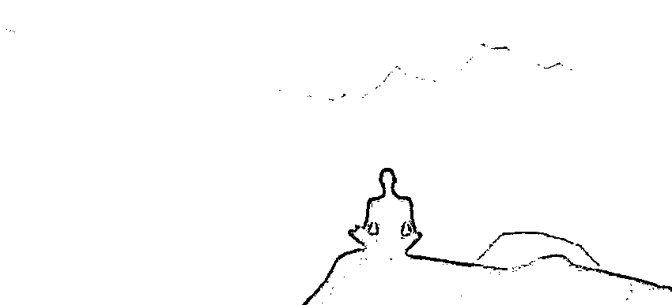

这些问题的答案显而易见。仅仅是听到舞曲就让我们想跳舞，即使我们认为自己是糟糕的舞者而抵制这种冲动（但还是想跳舞）。同样，慢跑者经常戴着耳机听着音乐慢跑——仿佛置身于他们自己的世界，如果他们在拥挤的交通中戴着耳机慢跑，这可能是危险的！无论我们是孩子还是忙碌的成年人，甚至是生活有辅助看护的久坐老人，音乐都会激发我们动起来的冲动。
**出生星图的火星在双鱼座或第 12 宫的人可能对这种自然现象更敏感，不仅在听音乐时，而且对“内在的旋律”也更敏感**。跳舞和音乐，像是锻炼和冥想都是产生内啡肽的重要活动，内啡肽是天然的止痛药。我的猜测是，**那些出生星图中火星在双鱼座或 12 宫的人，或者火星与海王星有紧密相位的人，产生的内啡肽比其他人稍多一些**。至少这是我的假设。这是一个未经验证的假设，但从研究的角度来看，它对占星学有着诱人的可能性。

**如果你认为自己是个糟糕的舞者**

也许你的火星也落在了双鱼座，你认为你是一个糟糕的舞者，是一个糟糕的运动员，一个不协调的白痴，看起来更像是在陆地上扑腾的鱼。好吧，有一个演员的火星也落在了双鱼座，他把那些不协调的身体动作变成了艺术，他就是罗恩·阿特金森，也就是你知道的憨豆先生！是的，憨豆先生。谁能比憨豆先生更别扭呢？

然而，即使一开始憨豆先生试图用他极不协调的舞蹈向围观者索取小费，他最后还是设法用他的歌剧哑剧出乎意料地激发了人们的想象力。这一幕正是火星在双鱼座的一课，即使在一个人笨拙地试图给别人留下深刻印象的时候，灵感仍然可以出现。

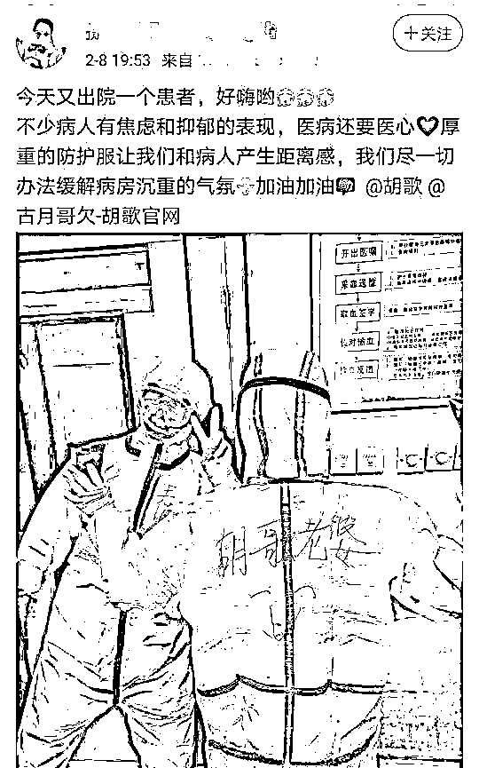

| 一名从广州援鄂的普通医务工作者自称“胡歌老婆”，她说等寸头长到齐耳短发就去找胡歌相亲。而胡歌表示：“先把名字借给她用”！这大抵是个幻想，却带给人们乐观和希望/图源：新浪微博

是的，火星在双鱼座面对的可以是一个**身体上的挑战**。两条鱼朝相反的方向游，你能怎么办？你的身体有时候会觉得内在有什么东西想要迸发出去！天哪！那是什么呢？什么东西在你体内不停地摆动、晃动和奇怪地移动？怎么把它弄出来！

当然，你想要表达的是**感觉**！是的，**从极端可怕的幻想破灭到令人难以置信的灵感**，这样极端的感觉。你需要创造性地表达你的感觉，把那些感觉发泄出来， 把那些令人惊叹的、令人无法承受的感觉付诸行动。

**文森特·梵高和米开朗基罗**

作为雕塑家和画家，米开朗基罗是无与伦比的。他的创作灵感继续激励着数百万人，他定义了意大利文艺复兴的顶峰。我最喜欢米开朗基罗的一句名言是：

**“我在大理石里看到了天使，我不停雕刻直到我将它释放出来。”**

这是多么了不起的豪言壮语啊。放飞天使，放飞我们心中的幻象、理想、被我们束缚的精神实质，让所有人都能看到！

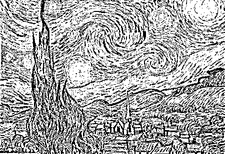

| 文森特·梵高的画作/图源：百度

文森特·梵高也看到了隐藏在每个人体内的天使。在决定成为一名画家之前，他坚信牧师是他的使命，并加入了比利时布鲁塞尔的一家宗教神学院。他在比利时一个贫穷的矿区当了一名布道者（传教士）。梵高的心被矿工们的苦难所感动，他借助布道为他们筹集资金，甚至送出了他的衣服。但矿工们认为他很奇怪，教会当局解雇了他。

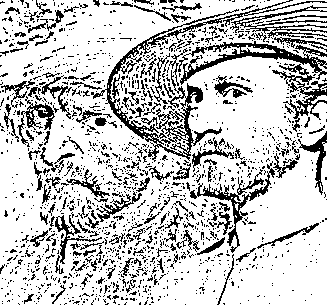

| 文森特·梵高自画像

失业和幻想破灭后，梵高从数月的自我反省中走出来，决定将自己的一生献给艺术，他看作是一种精神召唤的职业。梵高狂热地追求着他的新事业，在短短 10 年间创作了 2100 件艺术作品，其中包括大约 860 幅油画，这些大多是在他生命的最后两年画的。当然，他成为了西方艺术史上最著名和最有影响力的人物之一，但那已经是他 37 岁自杀后不久的事情了。

**吸毒、意外服药过量和自杀的风险**

梵高的自杀，他严重的抑郁症，他割下自己耳朵的丑闻，他极端古怪的行为，以及住进了精神病院的经历，自然导致许多人书写和猜测他的精神健康状况。我们知道双鱼座的阴暗面是**幻灭**，这显然可以表现为**沮丧**。

大多数占星师会告诉你，**双鱼座、第 12 宫和海王星是关于“潜在”的毒瘾、抑郁症和自杀的主要指标**。所以在刚才列出的情况中，必须考虑双鱼座的火星。然而，如果你出生星图中有双鱼座的火星，也并不意味着你是火星在双鱼座的受害者！火星的这个位置只是一个指示器。

如果你的火星在双鱼座，并且患有抑郁症，要知道你的火星在双鱼座会给你提供一些线索：**找到一个创造性自我表达的出口**。**演奏音乐、绘画、舞蹈、唱歌、写歌、雕塑、表演，**任你挑选！有一个创造性的出口与（专业）治疗是一个理想的组合。关键是**“行动”**。我们正在谈论的是火星。它要求你“做点什么”。谁知道你内在有什么才能在等待被激活呢？

**父亲的缺席是诅咒，也是祝福**正如你们许多人所知道的，**太阳和火星在出生星图中都代表着父亲或男性的影响**。双鱼座或者第 12 宫的火星通常暗示着**由于缺席和忽视而导致的幻灭**。幻灭也可能是**理想化父亲**的结果。在没有父亲的情况下，关于父亲的不切实际的信念或幻想就被创造出来作为替代品。这种信念通常会在生命早期就在父亲的严酷行为中瓦解了。有时，被压垮的情形是父亲故事的一部分，他可能生病了，或者做两份工作来养家糊口。生活的压力也可能导致失败，结果父亲可能被视为或被评判是弱者。

灵感和幻灭都会随着与父亲的经历而变化。有一位客户回忆起父亲在他成长过程中看上去是多么悲惨和退缩，几乎不知道他儿子在干什么。然后在他大概九岁的一天，他听到车库里传来喇叭声。走近车库时，他听到了这个令人难以忘怀的美妙声音。透过门缝看去，他惊讶地看着他父亲在演奏。他被声音吸引住了，无声的泪水顺着脸颊滚落下来，后来他说，在那一刻他对父亲的了解比任何人告诉他的都要多。

后来他了解到，父亲结婚时曾是一名很有前途的管弦乐队专业小号手，但儿子出生后，为了更有保障的工作和稳定的收入，他放弃了这份工作。然而，听到父亲的演奏，莫名地架起了他和父亲之间的桥梁。他的父亲很少演奏，但后来会鼓励儿子在中学时追求自己对音乐的兴趣。这对父子将会逐渐形成亲密的关系。

在火星落第 12 宫的另一个例子中，一名男子的母亲长年需要坐在轮椅上，他说，他几乎把父亲当作圣人崇拜.他的父亲打两份工，养活残疾的妻子。成年后，他震惊地发现他的父亲也有很多婚外情，导致他对父亲多年的幻想破灭。

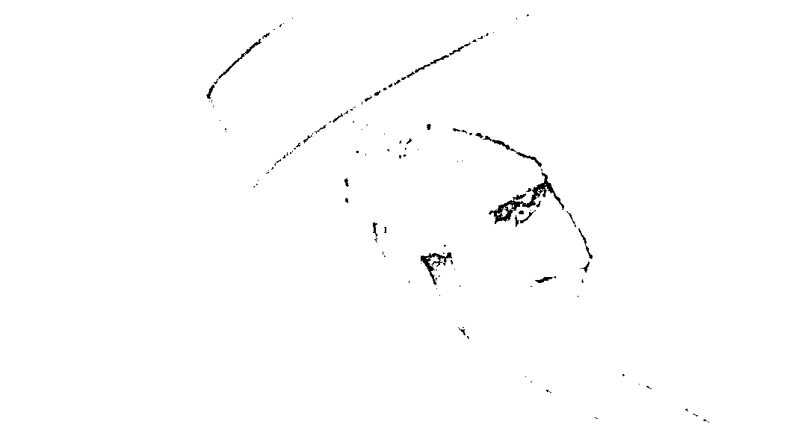

| 圣人只是一个普通的人，就像其他人一样，他们只是恰巧做着非凡的事情/图源：百度

然后有一天他问自己：“什么是圣人？有人生来就是圣人吗？” 然后他回答自己：“不，圣人只是一个普通的人，就像其他人一样，他们只是恰巧做着非凡的事情。” 在那一刻，他原谅了他的父亲“只是一个凡人”，然后得出结论，他的父亲实际上是一位圣人，毕竟他照顾和抚养了他行动不便的母亲 40 多年。

当然，对于那些火星在双鱼座的人来说，这样积极的分辨并不那么容易实现。人们很难原谅一个你从未真正认识的人。对于许多火星在第 12 宫或者双鱼座的女性来说，亲密关系的历程可以被描述为**“寻找父亲”**，这与**精神上寻求一种永远难以企及的爱**并无不同。

我的一位客户讲述了她是如何爱上她的灵性导师的，她经历了一段时间无条件的幸福，直到她发现她的导师也和其他皈依者睡在一起。在随后的幻灭中，她寻求通过治疗来促进自己的康复过程。

在后来我们的一次咨商中，她说：

“**我花了很长时间才意识到，成长中父亲的缺席既是一种祝福，也是一种诅咒。诅咒是痛苦，痛苦的孤独驱使我带着对无条件爱的渴望盲目地投入那些无法平息我这种渴望的人的怀抱。幸运的是，我对无条件爱的追求让我走上了一条精神道路，最终是一条疗愈之路，让我也成为了别人的治疗者。**”

她接受了过去的经历，最终会带来改变，并带来健康的承诺关系。

火星在第 12 宫或双鱼座也可以用其他方式带给人激励，演员柯克·道格拉斯就证明了这一点，他最近刚去世，享年 103 岁。

道格拉斯最令人难忘的是两个角色，这两个角色都让他获得了奥斯卡金像奖提名：《斯巴达克斯》——一个反叛的奴隶，他组建了一支军队战胜了，前来镇压反叛的罗马军团；另一个角色是在《生命的欲望》（Lust For Life）中饰演的文森特·梵高。他对梵高的诠释令人震惊，证明了这两个人之间的共鸣——柯克·道格拉斯的星图中第 12 宫的火星对分冥王星暗示着这种共鸣。

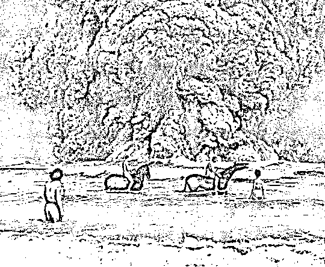

道格拉斯后来说，促使他成为一名演员的原因是他酗酒好斗的父亲，父亲对他很冷漠，从未认可过他。

**“我内心充满了可怕的愤怒，但我不敢表露出来，因为我父亲身上有更多的愤怒，而且更加强烈。”**他作为一个演员利用了这种愤怒，使人们相信他就是斯巴达克斯，是那个真实历史故事中使罗马帝国颤抖的奴隶。在古典占星学中，第 12 宫的火星与奴隶制联系在一起，所以谁能比火星在第 12 宫的人更好地表现出奴隶释放的愤怒呢！

斯巴达克斯最终被罗马人俘虏并钉在十字架上，这是一个非常像基督的结局，也就是**殉道者**——另一个**第 12 宫或双鱼座**的关键词。然而，面对前来摧毁他、他的角斗士和奴隶军队的罗马军团，他从未被击败，这将在各个时代回响，并让罗马永远铭记一个自己从未想象过的脆弱点。

**精神战士伟大的治疗之路**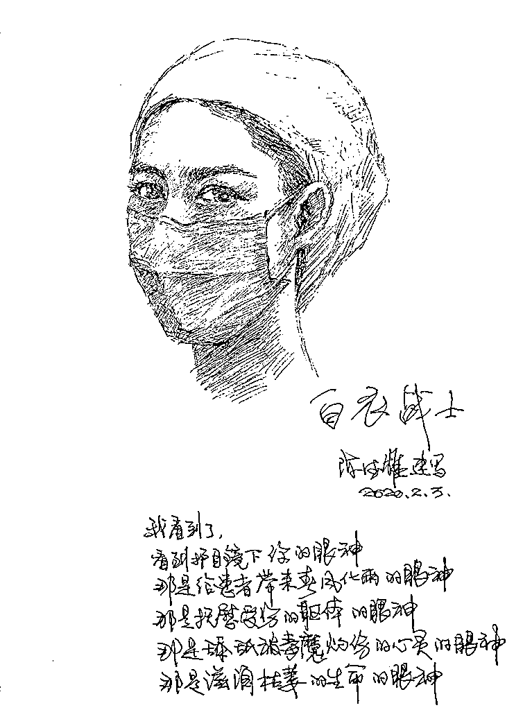| 白衣战士/图源：百度记住，**火星是愤怒的——当然，还有暴怒**。在第 12 宫中，这种愤怒通常会是**郁结而不表露**的，因为愤怒的感觉会**随着时间的推移而被压抑**。这种压抑的根源当然是恐惧，比如**恐惧受伤**——就像柯克·道格拉斯小时候因为脾气暴躁又酗酒的父亲所经历的恐惧，或者任何一个小孩小时候就暴露在愤怒和暴力之下的恐惧。这个孩子试图**躲藏**，保护自己不受伤害和痛苦，但就像所有孩子一样，他们所看到的东西会留下的烙印。因此，对于所有火星在第 12 宫或双鱼座的人来说，成长过程中面临的挑战是**如何处理这些覆盖在火星之上的伤害、痛苦和脆弱的感觉**，火星像监狱看守一样站在门口。从这个意义上说，第 12 宫就是**监狱**，自我被藏起来、关在笼子里或锁起来。打开大门真让人胆战心惊！会放出什么来，会出现什么扭曲的怪物！

许多出生星图里火星落在双鱼座或者第 12 宫的人完全明白我的意思。当你最终爆发的时候，那是多么可怕。当然，当你道歉并温顺地把你的火星带回它的禁闭室时，某种神圣的东西出现了，这会让你震惊。

占星师杰夫·贾维尔曾经说过，**火星在第 12 宫或者双鱼座的人不仅是在表达他们自己的愤怒，还有集体的愤怒。**暗示着他们在愤怒的时候不知怎么地挖到了世界的愤怒。事实上，有些人生气的时候会说，“这不仅仅是我的问题，这是这个世界的问题！”

挖掘这种集体的愤怒听起来是不可能的，但是我听到许多这类火星配置的人谈论这种经历，这对他们来说是非常真实的。但比起与世界战斗并殉道，还有更好的方式：**精神战士或女战士**的道路——火星在双鱼座或第 12 宫的最高道路。

📹 [`v.qq.com/iframe/preview.html?width=500&height=375&auto=0&vid=d306280krr4`](https://v.qq.com/iframe/preview.html?width=500&height=375&auto=0&vid=d306280krr4)

| “全村的龙已把最硬的麟给你，哪怕自己也伤痕累累。所以，武汉，加油！”

**双鱼座的火星作为精神战士**

除了创造性自我表达的出口，精神战士的道路还是**同情之路——治疗者之路**。在我的客户档案中，有相当多的火星在双鱼座或 12 宫的人曾在**医院和诊所**工作过，许多人是**医生、护士或某种类型的医疗保健专业人士**。治疗的行为是火星在双鱼座的行为。同样，精神战士也可以提供**富有同情心的服务**。


**| **戴斯蒙德·多斯

考虑一下这个非常能说明问题的事实，在美国只有两个“出于良心拒服兵役者”获得荣誉勋章：托马斯·威廉·班尼特、德斯蒙德·多斯，他们都是火星在双鱼座的人。荣誉勋章是对战时服役英勇行为的最高奖励。出于良心拒服兵役者是指那些**反对杀害他人，甚至在自卫时也不会使用枪支的人。**

**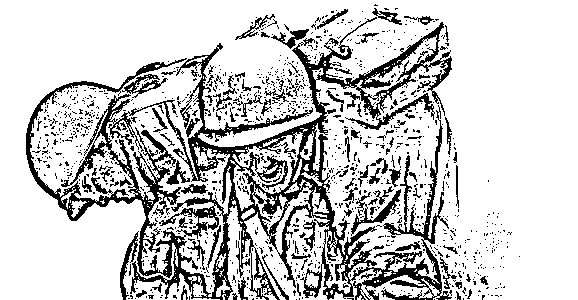**

**| **《血战钢锯岭》剧照，扮演戴斯蒙德·多斯的演员安德鲁·加菲尔德星图中有双鱼座上升点/图源：百度

两人都曾在战斗中担任医护人员，冒着生命危险一次又一次地抢救受伤的士兵。托马斯·班尼特死后获得荣誉勋章，1969 年死于越南战场。演员安德鲁·加菲尔德在 2016 年梅尔·吉布森导演的奥斯卡获奖影片《血战钢锯岭》中饰演了德斯蒙德·多斯。如果你想看火星在双鱼座会做些什么，那就看这部电影吧。看完这部电影，你就再也不会认为火星在双鱼座或第 12 宫是弱小的，永远不会。

**版权声明：**本文由作者授权首发于若道平台，欢迎转发，反对抄袭。友号转载请申请白名单。


****想阅读更多作者的文章，请在后台回复******大卫****** 即可。****

**喜欢文章请长按下方二维码打赏**

**给大卫老师加杯咖啡呗~**

**▼**


**想系统学习占星学？**

**点击图片了解详情**


[](https://mp.weixin.qq.com/s?__biz=MjM5MjQwNjAyMQ==&mid=2649436786&idx=2&sn=5490a3d3c7b1d65e7de1e719d4f2031b&chksm=beb95d1889ced40ead344a9b0bc871aec083244015c8ae757094f2608bffab1f5777c50e9682&mpshare=1&scene=21&srcid=&sharer_sharetime=1579167487529&sharer_shareid=79ff492e946a049c0745c8e806eec753&exportkey=AaKGjHB7f8Z7%20X2FSxfLRTw=&pass_ticket=xSTCFTOymnHzc7zXd5EA%20MuNAFK/CYHowayelnSc9og=#wechat_redirect)

**微信又双叒叕改版啦，不想错过若道君的推送？**

**就把若道设为星标吧！**

**▼**


就是这个“在看”，戳戳戳 ☟

********报名直达入口********


# 创造性预测，赋予我们更大的力量

> 原文：[`mp.weixin.qq.com/s?__biz=MzA5NjA0NTAxNg==&mid=2651413747&idx=2&sn=379cda60700f3fef0899a912e575cfec&chksm=8b4bee44bc3c6752dd93cb26842c015ea93f4b2a5afcf7a3806738ffe67d6b8540fb73505390&scene=126&sessionid=1692738207#rd`](http://mp.weixin.qq.com/s?__biz=MzA5NjA0NTAxNg==&mid=2651413747&idx=2&sn=379cda60700f3fef0899a912e575cfec&chksm=8b4bee44bc3c6752dd93cb26842c015ea93f4b2a5afcf7a3806738ffe67d6b8540fb73505390&scene=126&sessionid=1692738207#rd)

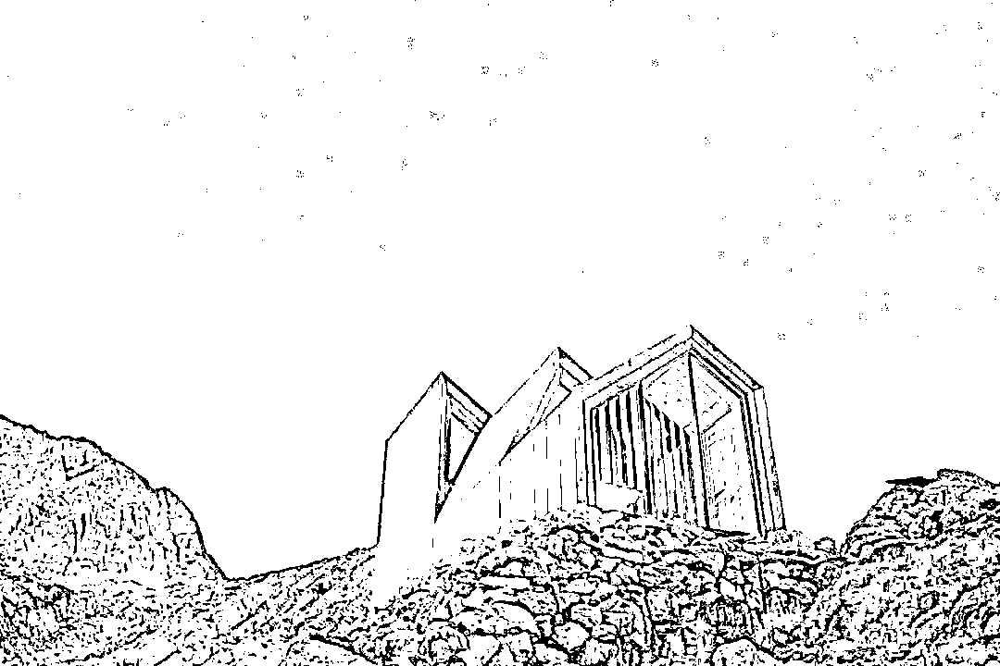作者/杰夫·焦耳 翻译/丁宏编辑/Tang 图/pexels 文章来源/杰夫·焦耳创造性预测沙龙

不管你有没有学习占星学，但凡你接触到这个领域，预测便是逃不开的话题。是的，占星预测非常接近占星学的中心，不管是东方还是西方，预测都是占星学的传统。现代关于发现的占星学和传统关于安全感的占星学，对于预测有什么不同看法？怎样预测才能够更好的帮助个案？就让著名占星师杰夫·焦耳与我们细致地聊一聊吧。

**占星学帮你更好地了解世界**

对不了解占星学的人来说，占星学非常难，比英语难。**其实占星学作为一门语言本身，没有汉语难，复杂的是人本身。**虽然通过占星学，我们可以告诉你关于你的一切个性，但是我们仍然无法了解作为一个人的神秘性。因为这个神秘性的答案不在于占星学或任何神秘学的系统，而是在于如何生活。当我们已经有了需要了解占星学的装备，如何生活才是一场冒险。

**即使你不想成为占星师，占星学也是非常值得了解的东西，因为它是能量的语言。**你不必成为专家，它也可以**帮助你更好地了解这个世界**。正如不同的音乐、绘画、小说、诗歌帮助我们以一种不同的方式了解世界，占星学也是如此。

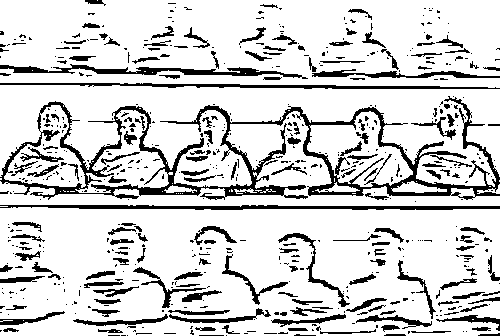

**预测，占星学的传统****占星预测非常接近占星学的中心，不管是东方还是西方，预测都是占星学的传统。**当初国王不是为了个人成长或更了解自己才去找占星师，他就想知道今年是否会有大丰收，或者什么时候他打仗能否打赢。这是占星学的传统，是非常关注预测的。不论是东方还是西方，在传统上，它都是服务于世界，在这个世界上人们为了实实在在地生存而挣扎。当然，我们物质世界的生存非常重要，占星学也帮助我们更好地了解如何生存，但我觉得现代占星学最主要的目的不是这个。我们的肚子已经吃饱了，我们也不再被过去制约了我们的父辈、祖父辈、曾祖父辈的规则和条件所制约。100 年以前，在个人层面上，预测是非常简单的。从职业上而言，如果你是一个男人，你父亲干什么，你基本上也就会干什么；如果你是女人，你母亲做什么，你基本也就做什么。**但这个在现代社会已经改变了。**当然，我们仍有限制，即便像在上海这样的现代都市。但**男性和女性如今都有比 100 年前多得多的选择**。**这既是礼物也是诅咒。**礼物是你可以不过父辈的生活，去探索与他们完全不同的生活了，诅咒是我们必须自己去搞清楚我们到底要去过怎样的生活，如何去过？但这就是自由的意思。**自由就是要面对可以选择后带来的复杂性。而之前的老旧的占星学根本和选择无关。**而我说老，其实也没有那么老。比如，当我开始学占星的时候，我读的书是 1930 年写的。我比你们年老，但是写书的人比我更老多了。写得很吓人。比如我是在满月出生的。我读的第一本占星书对天蝎座满月出生的解读是这样的，它写道“你的人生是悲惨的，但是有一个好消息，你会死得很早。”这当然不是吸引我做占星师的理由。

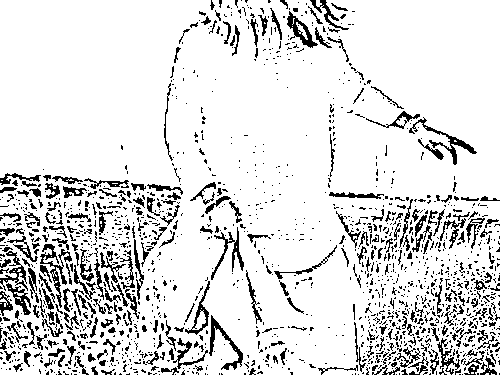

**成长比正确更重要**令人高兴的是我很快发现了现代占星学的世界。**现代占星学是“发现的占星学”（Astrology of Discovery)，传统的占星学是关于“安全感的占星学”（Astrologyof security and safe)，都是关于控制的，如何避免被老虎吃掉。**当时因为我们的生活没有更多的选择，所以，当时的占星学也不是关于如何创造生活的占星学。不过，把预测当做掌控的工具也仍然是非常有诱惑的。我猜想如果我或其他占星师在你面前说你未来一切会发生的重要的事情，你们还是会想要听的，你也会想要相信这些。虽然你不想听坏消息，但是坏消息真的很有诱惑性。生存非常重要，但是人类在改变。在对待占星的态度方面，中国人似乎走在前面，你们是创造未来的人。你们这些年轻人所做的选择，将会决定人类的未来。我想说安全感仍是是非常重要的，不论我们对个人成长多么重要，如果地震了，我们也会被迅速地切换到生存模式中，这是我们生理和心理的核心。但是为什么就停在这里呢？我们仍然在生活，仍然在书写历史，而**占星学是一个了不起的帮助我们书写历史的工具，但这取决于你如何运用它。****如果陷入古典占星学的那种好坏评判，我们就无法成长**，古典占星学里有个理论是行星在某些星座里比较强势，在某星座里比较弱势。当你星图里有些比较困难的东西那就是不好的。那就是你的业力，你将要付出代价。我知道的西方占星师都不太公开谈论这些概念。比如说代表爱情的金星、火星有个挑战相位，你的爱情生活就会很糟。好像你这一世拥有这些不好的相位是因为你过去世做了些坏事，所以受到惩罚。这种理论对某些人很有吸引力，因为很简单——如果我在受苦，那是因为我不好，这是我的业力，我正在受惩罚。

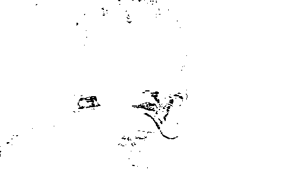

我有一个占星师朋友有一位住在巴西的老师，这位老师说过一段正好相反的观点。他说：这一世生活中的那些困难的东西就是因为过去世你做对了，所以要进入下一课。而那些容易的事就是因为你此前没做好，所以给你降低难度，好让你过关。我喜欢这个说法，从教育角度来说，这很有道理。为什么要把事情弄得更复杂来惩罚差生，而跟优等生说你不用再学了呢？它把惩罚的概念从占星学里拿走了。**成长比正确更重要。**如果你觉得现在正受苦的人是应得的话，你就很难产生同情。这不会帮我们去爱自己，爱别人。我们真能知道什么东西是好的，什么是坏的吗？我们都曾失望，当事情发生的时候感觉很糟。但在这里关上一扇门，总会在另一个地方打开一扇窗。你有没有一个很好的经历却将你带到不想去的地方的经历呢？我并不是说我们不会感到受苦，失望。有时我们的痛苦是很压抑的，有些领域甚至永远都不能康复。但我们仍能从跌倒的地方学习，站起来重新出发。**占星学的一个好处就是告诉我们，在特定时候遇到的挑战是什么，会给出遇到问题的意义。**真正痛苦的是被卡在那里——痛苦，却不知道为什么，不知怎么解决。**这就是占星学给出一个创造性解释的意义和价值，将你带出那种僵滞的状态。　　**比如土星是代表收缩的，与代表情感的月亮产生合相。这有很多表达方式。做预测的占星师会很高兴地看到这点，他笃定地说：你感觉不好吧？客户说：我感觉太糟了。这是个准确的预测，但并没什么帮助。但一个创造性的占星师会说：我理解你的感受，这是你如何去跟这种能量工作，进而成长的机会。**预测本身是一个诊断，是对现实状况的一个描述。可以是一个精确的诊断，但好的占星师提供药方，这带来疗愈，带来成长。**我们能利用不适感成长。痛苦有不同的种类。有非常神经质的痛苦，会让我们反复地经历。如果学不到经验，将会一味地伤害自己。但同时也有非常有动力的痛苦，这种痛苦可以打开视野，让我们好好看看自己的生活。这就是占星能做到的。我要传达的是如何从创造性的角度去看占星学。**我们不是单纯描述这个人的状况，我们是用占星学去打开心灵，去观察情绪的色彩，看看有多少路可以探索。从许多角度来说，占星学是教我们如何更好的问问题，而不是找正确答案。**

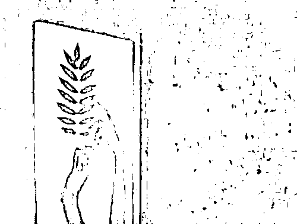

**追溯根源，改变河流的方向**

**我们从不同层面去经历占星，一层层探讨，有事件层面，有心理学情感与行为的层面，还有灵性层面，从更高的视角来解释。**有一句古老的话是：性格决定命运。占星学里出生星图所讲的就是性格，就是一次又一次地回到我们的核心，这就是树的根基。当我们更好地理解根基（出生星图），就能更好理解树枝能伸向哪里（行运预测）。对于占星学生来说，这就是去理解各种行运，将之关联到出生星图，来观察各种行进与你本身的关系。

如果你们对心理学有点了解，就知道早期的经历对我们影响巨大。很多情感和基于情感所做的决定都可以追溯到早期经历的。**可以用占星学追溯到根源，改变河流的方向。**早年的创伤经历，并不能定义现在的你。你只需带着现在已经成长的、已经具备的智慧，一遍遍地回到过去，带着智慧理解接受那些经历。有个叫汤姆·罗宾斯的美国作家，他说要拥有一个幸福的童年，永远不会太晚。如果你的童年不幸，长大后，你可以一遍遍回溯过去，理解它的意义，把那个压力释放出来。这就是改变我们生活之力量的源泉，我们生活的核心。

虽然**占星学的一些图示能说明我们的现在，但也能透视到我们的过去。**你们中的一些人可能跟我一样有创伤性的童年经历。我 12-13 岁的时候眼睁睁看着心爱的母亲死于癌症。看着生命中最重要的人慢慢在生理上，精神上的衰败。我最开始默默祈祷她能活过来，到最后变成祈祷她能早点离去。

多年后，我和妻子在一个情感治疗的小组中，小组带领者非常有智慧，善于倾听。但我问他是否能有一天我们克服这个创伤。他说不能，当时我的下巴都掉下来了。“**你不能扔掉你的历史，心灵需要持续性，需要你知道自己是谁。**”如果我说你明天能得到一切，但要忘记你是谁。你们有谁能接受吗？当然不会。但这个人跟我说，你可以降低这个创伤的主导性。痛苦经历就像是毒药。但当你过着健康的生活，有清洁的水源，这个毒药就被稀释了，不会毒害、主导你的生活。这对我很有用，我不需要忘记自己曾经的过去，才能从中解脱。**所有的行星周期都能帮我们回到过去，同时帮我们展开新的旅程。**

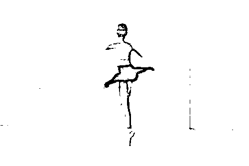

**创造性预测，赋予我们力量**还有个**占星学的复杂性就是我们能得到各个方面的信息**。可能星图一部分说他是个害羞的人，而另一部分却说他非常外向。占星师的工作就是去编织不同色彩的线，组织不同的故事。在预测上我们也可能同时经历扩张和收缩的两种周期。我喜欢的技巧就是我曾在北京工作坊运用的“**讲故事**”的方法。讲故事有什么好处呢？**如果你是占星师或占星学生，你就是在学习生命的能量，会帮你更有创造性。**如果你做了“对或错”的决定，就不如说故事更灵活，更有创造性，能让客户握有更多可能性。假使一定要去谈论绝对的对与错，做到正确，这会让预测变成监狱。我们不用成为占星学或其他任何体系的奴隶。大卫·瑞雷老师用“**赋予力量**”（empowerment）这个词。这意味着**把你放到自我的中心，拥有更清晰的视野，选择也更加清晰**。

**版权声明：**本文由若道翻译，欢迎转发，反对抄袭。友号转载请申请白名单。


杰夫·焦耳

国际占星大会（UAC）和全美占星师联盟（AFAN）创始人，美国著名占星网 www.stariq.com 创始人。曾任亚特兰大协会主席和亚特兰大占星考试委员会委员。4 本占星书的联合作者，在全世界的 4 个大洲开办过工作坊。2015 年逝世。

**点击图片查看若道君推荐**


**微信又双叒叕改版啦，不想错过若道君的推送？**

**就把若道设为星标吧！**

**▼**


就是这个“在看”，戳一下☟

********报名直达入口********


# 当代人本占星师的必修课 | 跟苏·汤普金斯学独家预测技法

> 原文：[`mp.weixin.qq.com/s?__biz=MzA5NjA0NTAxNg==&mid=2651413747&idx=3&sn=98e9d43213cf8db28eeb16af2e8e03d8&chksm=8b4bee44bc3c675270d83f1c46d7ff5057884bfaa2a6bf93289bce601ed858cff8b8dcf64f21&scene=126&sessionid=1692738207#rd`](http://mp.weixin.qq.com/s?__biz=MzA5NjA0NTAxNg==&mid=2651413747&idx=3&sn=98e9d43213cf8db28eeb16af2e8e03d8&chksm=8b4bee44bc3c675270d83f1c46d7ff5057884bfaa2a6bf93289bce601ed858cff8b8dcf64f21&scene=126&sessionid=1692738207#rd)


**为何推荐这门课？**占星学与其他学科相比，一个非常重要的功能是看到过去、现在和未来的周期性变化，既包括我们每个个体生命内在的变化时钟，也包括外在宇宙气候对个人、团队、社会的影响。
**如果不懂星图解读，那么你和星图的距离大概还隔着一个宇宙洪荒，如果你只会解读星图，却不会将这一种语言，用“人语”讲述出来，那么你和星图可能还距离着一个“生活”。**占星学是一本集天文学、社会学、统计学和哲学内容的书，因此，这本书也**特别需要一位或多为老师将你领进门**，我们才能窥见，宇宙自然法则中那一点万一，其他的所得，都要靠自己通过不断经历和观察才能真正掌握。**“预测技法”为什么很重要？**因为预测技法将**生活**与**占星**密切相连。在占星咨询中或者聊天聚会时，占星师经常会被问到： “我今年的职业规划应该注意什么？我还能升职吗？”“公司今年大裁员，帮我看看我会被裁掉吗？”“我什么时候可以遇到心仪之人？”“我和新认识的男友，最近总是因为一点小事吵架，我们未来会怎样？”“最近自己特倒霉，压力也很大，很难开心起来，这要持续多久啊？”“我去年身体一直不好，想看看今年应该注意什么？”这些急于知道答案的问题，是人们希望占星师为他们提供的“**预测**”。**但预测并非算命，**一位人本主义的占星师，在面对这些生活中最常见的烦恼和问题时，如何帮助到提问的人，对于每一个相信“自由意志”和“宇宙法则”的占星师来说，都是一次次的考验和经历。**如何避过“算命”大坑，真正帮助星图主人自我内在的成长；如何在某些重要的天象下，鼓励到更多的人勇敢向前，活在当下……****这门集高阶预测技法+咨询技巧教学的占星课程，我们向你强烈推荐！**


**课时安排（视频+网络直播）**

*   **视频课****：8 讲录播视频，助教答疑 2 讲**
*   **网络直播课****：共 27 讲**

**购买支付后即可观看录播视频课****网络课 2020 年 3 月 2 日开课**每周一 20:00-22:00 上课（**具体每节课排期，以课程表为准**）**适合人群**

*   **有扎实的出生星图基础**

*   **想跟从苏·汤普金斯学习预测技法**

*   **希望成为优秀的占星师，想借鉴国际大师解读思路并融入自己体系**

*   **想获得资质认证证书的人（备考 ISAR 国际资质认证考试）**

**课程费用****优惠价：19600 元****（****分享课程到朋友圈或社群，可享受此优惠价****）****复训价：11000 元****（****在若道课程体系上过核心课程第五阶的学员可享受此价格****）****课程原价**：22400 元**注意：****此课程为若道核心课程的一部分，前 8 讲为视频录像课程。具体可联系课程顾问询问。**   ****苏·汤普金斯预测课程****

**授课老师：苏·汤普金斯**

**时间：**视频课 支付购买后即可观看；网络平台课 2020 年 3 月 2 日开课（共 27 次课）

**授课方式：**网络直播课，英文授课，中文翻译

**费用：**22400 元；**早鸟价：19600 元（分享课程到朋友圈或社群，可享受此优惠价）；复训价：11000 元（在若道课程体系上过核心课程第五阶的学员享受此价格）**

**课程负责人：**许老师（微信：nodoorC，手机：18513802118 请备注“苏·汤普金斯预测课”）

长按二维码添加课程负责人咨询~


****报名请点击“阅读原文”****


# 浪漫又敏感的双鱼座新月时刻最适合许愿，免费福利大放送！

> 原文：[`mp.weixin.qq.com/s?__biz=MzA5NjA0NTAxNg==&mid=2651413746&idx=2&sn=34615cfc7b469ced7717b0e1669b0287&chksm=8b4bee45bc3c6753ebe49994b43bbab9e1846a18af68c529417a46aae64e5e6298e5717ac170&scene=126&sessionid=1692738207#rd`](http://mp.weixin.qq.com/s?__biz=MzA5NjA0NTAxNg==&mid=2651413746&idx=2&sn=34615cfc7b469ced7717b0e1669b0287&chksm=8b4bee45bc3c6753ebe49994b43bbab9e1846a18af68c529417a46aae64e5e6298e5717ac170&scene=126&sessionid=1692738207#rd)

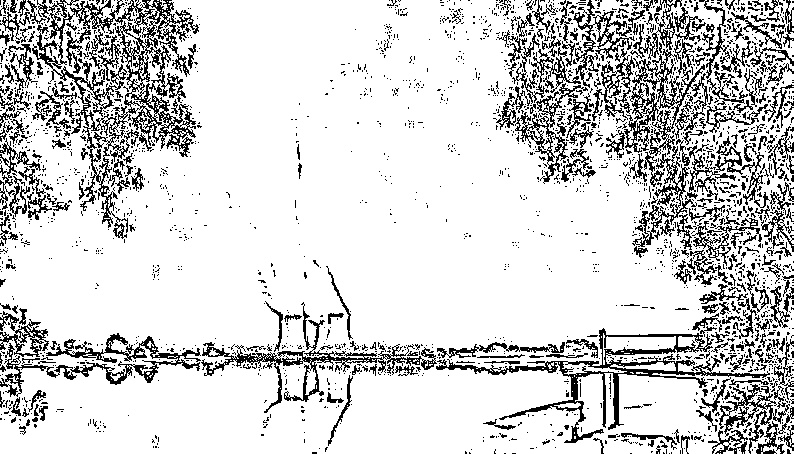编辑/玫瑰 图片/网络

北京时间 2020 年 2 月 23 日 23:31，新月发生在双鱼座 4°28′。每到新月时分，若道君都会为你奉上根据你出生星图量身打造的免费新月报告。可是新月为什么要许愿？新月报告该如何领取？让若道君来教你。

　**什么是新月？**　

从占星学看，新月是月亮周期的一种相位。新月是开始，又称为朔，对应中国农历初一，太阳、月亮在此时合相。此时月亮运行到太阳与地球之间时，月亮以黑暗的一面对着地球，并且与太阳同升同落，地球上看不见月亮。

本次新月时间

**2020 年 2 月 23 日 23:31，新月发生在双鱼座 4°28′。**


为什么新月要许愿？新月是一个周期的开始，新月发生的时候，太阳与月亮合相，能量很强。当新月出现时，你也许会发现灵感忽现，非常适宜开启新领域、项目与行动，缔结一段新的关系或合作。许愿会加强新月的能量，也有助于你了解自己现阶段适合开启的方向。 本次新月最佳许愿时间

从新月开始到其后的 48 小时内，许愿的力量最强。

**最佳许愿时间：2020 年 2 月 23 日 23:31～2 月 25 日 23:31**


属于你的免费新月报告

每到新月时刻，看着占星文章里写着：看看你新月的宫位，如果新月在第 X 宫，你可以许愿的方向是……

是不是常常一头雾水？新月的宫位？我到底该看哪里啊？

而有时，那些标注上升星座的文章也会让你忍不住想：虽然我的上升星座是这个，可是我的新月好像并不落在你说的宫位啊？你是不是写错了？


虽然这些文章都没有写错，可是好像对你而言都太不友好了。

**Don't Worry！**别着急，让博学又体贴的若道君来帮你！

我们推出了一份**免费**又**好用**的新月报告！

而且是专门为你设计的哦，**根据你出生星图为你量身打造的，只****属于你的独家新月报告**。

报告有哪些内容？

**新月时间****最佳许愿时间**

**如何许愿 **属于你的**许愿关键词**

本次新月给你的**建议**

你会有怎样的**感受 **

****机会****

********

如何许愿？

许愿方式也很简单。

你可以把愿望写下来，或者双手合十后交叉，闭上眼睛来祈祷。

报告中会为你提供**祈祷词示例**，可以多多参考哦～

你还可以适当添加自己的语言，创造属于你自己的祈祷文！

如果报告拿到手了，快对照着许愿吧！

**这份好用又暖心的报告，点击阅读原文即可领取！**

****

****点击“阅读原文”即可获取新月报告****


# 双鱼座新月 | 记得留出足够的储备，等待 3 月 24 日全新的开始

> 原文：[`mp.weixin.qq.com/s?__biz=MzA5NjA0NTAxNg==&mid=2651413746&idx=1&sn=a2d26852667dece4f861d2e257dc7b4d&chksm=8b4bee45bc3c6753bb597ef0f7308b5f45bfea7a5835b74207fdc3b8f68a3b41239aeb6d0976&scene=126&sessionid=1692738207#rd`](http://mp.weixin.qq.com/s?__biz=MzA5NjA0NTAxNg==&mid=2651413746&idx=1&sn=a2d26852667dece4f861d2e257dc7b4d&chksm=8b4bee45bc3c6753bb597ef0f7308b5f45bfea7a5835b74207fdc3b8f68a3b41239aeb6d0976&scene=126&sessionid=1692738207#rd)

**********☆****************后台回复“今日”，给你一句生命态度**********

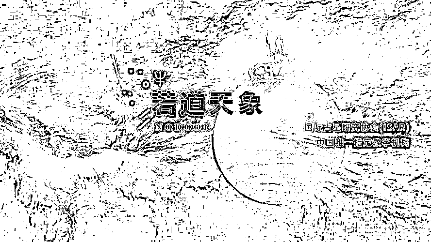

作者/王芝桦 编辑/玫瑰 图片/全景网

**双鱼座新月**

**北京时间 2020 年 2 月 23 日 23:31 迎来双鱼座新月，太阳与月亮精准合相于双鱼座 4°28′。**

此次双鱼座新月是没有任何“风象元素”，只有一个“固定模式”的新月，并且双鱼月又恰逢水星逆行于双鱼座，故而感性弥漫且淹没了理性，变化之中或迷茫更深，一切似乎尚在“无明”之中，但却已在“开辟鸿蒙”的混沌之中开启了意识的转换，铺垫出未来的旅程。我们将会在 30 天后白羊座新月的时候，发现**全新的纪元与崭新的旅程**原来已在双鱼座新月悄然展开。

> **双鱼座新月重点影响人群**
> 
> *   出生星图中，有**行星、四轴、南北交点**落入**固定星座（金牛座、狮子座、天蝎座、水瓶座）0-6 度**的人群。
>     
>     
> *   出生星图中，有**行星、四轴、南北交点**落入**变动星座（双子座、射手座、处女座、双鱼座）0-21 度**的人群。 
>     
>     
> *   出生星图中，有**行星、四轴、南北交点**落入**基本星座（白羊座、巨蟹座、天秤座、摩羯座）0-8,15-30 度**的人群。

**“土冥合相”洗礼“风控实力”**

**人都是被蒙着眼睛生活在现在的时光，只被允许去感觉和猜测自己实际上正在经验的事情。只有当蒙布被解开之后，才能够看看过去，发现自己经验了什么事情，发觉事情所具有的意义。**

**——米兰.昆德拉《好笑的爱》**

**天象**

2020 年还在初始，回首却已一片沧桑：正升腾的梦凝固在半空，向前冲的脚停顿在家中，未疼够的人离别在瞬间，正明亮的星陨落在黑夜......

过去快速发展的几十年，人类世界认为**“有了经济发展就有了更好的生存安全”**，科技成为人类的武器占尽了地球的资源，傲慢成为人类的自信宣告着地球的主权；2020 年，大火、地震、蝗灾和病毒扑面而来，我们在恐惧和颤抖之中感觉到人类与其他弱小的生命并无二致，意识到**“只有遵循整体自然界的生存安全才谈得上发展经济”**。

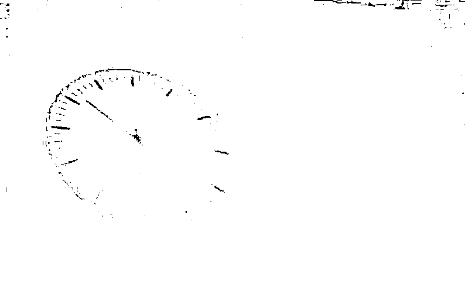

我们从 2019 年下半年就开始讨论 2020 年 1 月“土冥合相”可能带来的巨大改变，但走过 2020 年这将近两个月的日子，才真正闻到了“土冥合相”的那一股“狠劲儿”。生死关头，**“命”和“钱”**是最真实的两个关键点，这两点正经由“土冥合相”中**“割开真相”**的冥王星借由土星的**“现实考核”**向我们演绎。一场疫情，考验着我们在**“经济-生存”**之间的**“平衡”**能力，复工仍然存在传播的风险，不复工又将面临“挺不住”的考验。这一段时间，很多企业和个人都承受着“资金链”的折磨，令人不禁感慨**“只有现金流，却没有现金”**的世相。那些看上去不断扩张的企业和铺面，无比精致的生活和享受，是来自于过去的积淀，还是掏空了未来？古代的商户们从地窖里搬出来的可都是“家底儿”，小门小户还能从手绢里掏出几个铜板，现在我们却只能拿出来几张贷款单。2020 年“土冥合相”带来的“洗牌与重建”，洗礼的正是企业或个人的**“风控”实力**——**不仅要跑得快，更要谁跑得久**。2019 年下半年一直在说“踩稳你的安全根基”，2020 年再加上一句——**留出必备的现金，会让你在安全根基上跑得久一点。**我们不能再用以往的眼光看待 2020 年，这个世界正在以全新的方式打开每一天，但是我们要在每一个巨变之中反思过去的旅程，在每一次震撼之下感受内心的警醒。**透过两次新月的间隙，读懂宇宙深意**


**人们一旦把一件事太当真了，那么信任就会把这件事推向荒诞的地步。**

**——米兰.昆德拉《好笑的爱》**

1**天象**

*   **水星合相新月**：宽泛容许度下，逆行于双鱼座的水星与双鱼座新月趋近合相；
*   **金木四分**：白羊座金星四分摩羯座木星；
*   **木海六分**：摩羯座木星六分双鱼座海王星；
*   **火凯四分**：摩羯座火星四分白羊座凯龙星；
*   **两个小三角**：摩羯座火星、双鱼座新月和金牛座天王星形成“火星-新月-天王星小三角”结构；双鱼座新月、金牛座天王星和巨蟹座北交点形成“新月-天王星-北交点小三角”结构。

双鱼座象征着**“意识之海”**，虽然无边融合的海洋包含着**“理想与现实”**的二元对立性，但“意识之海”亦在揭示**“合一”**的宇宙法则——理想与现实都是自我意识创造的产物，即**“一念一世界”**，故而我们可以**通过转化意识来消融“理想与现实”的二元对立并达成合一。**

**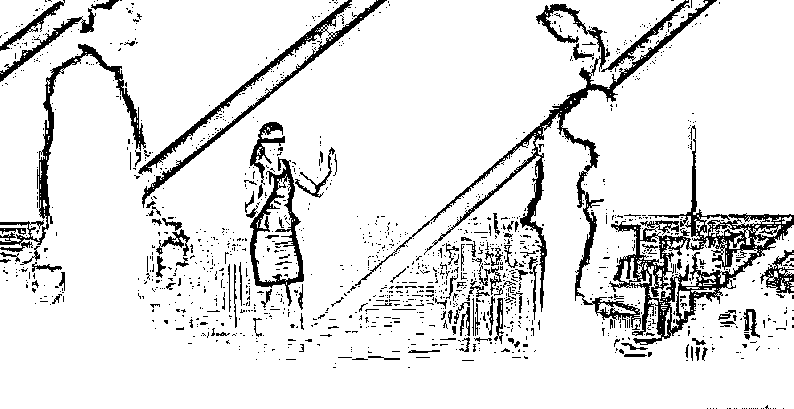**

双鱼座新月能量开启了**精微的意识管道**等待**人类意识的觉醒**。此次双鱼座新月，本就容易带来反复和混乱的逆行的水星还逐步合相新月，该组合相能量最终又由容易迷糊和逃避的双鱼座海王星定位，令我们产生一种在茫茫大海之中**“前不见彼岸，后不见来路”**的**无力感和迷失感**。怎么办？唯有奋力向前。海王星定位了双鱼座上所有行星的能量，而海王星近期最凸现的指向则与全球各地爆发的**“疾病”**有关。地球似乎“病”了，与地球上的每个国家和每个人息息相关。那么，地球在诉说什么呢？此次双鱼座新月，我们沿着**2 月 23 日双鱼座新月-3 月 24 日白羊座新月**的 30 天宇宙韵律，倾听地球的诉说，解读宇宙的深意。

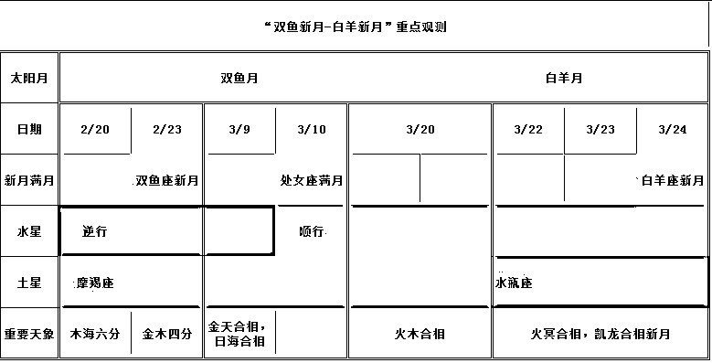

我们可以从上图看到在“双鱼座新月-白羊座新月”的 30 天时间里，**水星的顺逆转换和土星的换座**成为两条重要的背景线，而**“土星换座”**这条背景线更是 2020 年重要而敏感的背书。

行星换座会带来能量传导的变化，我们将两次新月的土星能量传导链条进行比对：

*   **双鱼座新月**：**天王星（金牛座）**→金星（白羊座）→火星（摩羯座）→**土星（摩羯座）**
*   **白羊座新月**：**土星（水瓶座）**→**天王星（金牛座）**→金星（金牛座）

可以看到，在两次新月的能量传导链条上，土星和天王星的接纳关系发生了互换：**双鱼座新月，金牛座天王星能量最终被摩羯座土星接纳；白羊座新月，随着土星换座进入水瓶座，水瓶座土星的能量被金牛座天王星接纳。**是什么在转换？土星和天王星像是一场因果互生的循环，将**金牛座天王星对现实结构的颠覆与变革**，将**“土冥合相”在现实世界的洗牌与重建**，合成出注定载入史册的**“不破不立”**的世纪性大动作，转换和循环的只是“顺序”

2**双鱼座新月**

*   **天象寓意**

*   我们正处在**“自然生态与生存安全”的剧烈震荡之中（金牛座天王星）**，但真相是我们正在承受**“人类与自然”的关系因果（土冥合相）**，任何国家或任何人都身处这场巨大的剧情之内（木海六分），因为**经济考验和资源竞争会与每一个人息息相关（金木四分）**。

    虽然困境触发出人类业力中**“失去领地的内在恐惧，本能竞争的止损反应”（火凯四分）**，但是宇宙之光正在照亮我们的意识，引领我们顿悟地球的一体性，我们只有**与自然万物彼此有爱，与所有生灵相互慈悲（新月-天王星-北交点小三角）**，才能**让科技服务地球，以文明缔造安全（火星-新月-天王星小三角）**，**重建现实世界的规则和秩序（摩羯座土星）。** 
*   集体层面，一是近期需要关注**国际社会的疫情传播和灾情动态**，**予以援助并共渡难关**；二是**金融领域出现反复震荡，组织机构面临生存危机**。 
*   个人方面，一些朋友可能进入**情感关系的评估期，重新衡量关系的价值，或是对一直悬而未决的关系做出推进**；一些朋友可能**对现实充满迷茫感，目标计划难以推动，或是久居家里激化出还未解决的关系议题**。 

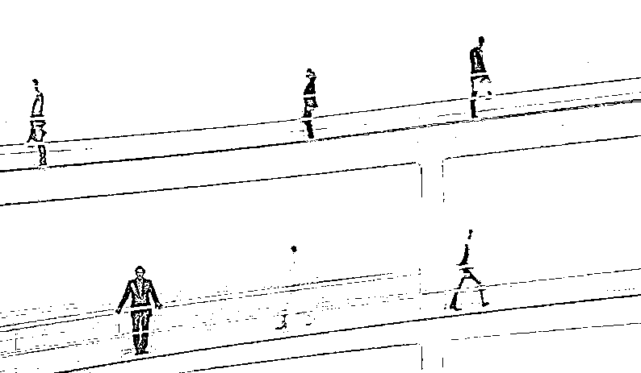

*   **水逆影响**

*   双鱼座新月周期，代表信息传递和沟通交流的水星正逆行在双鱼座的海洋之中，带来两方面的影响：一是，**人流和物流的流动性受到影响**，复工节奏不宜太快，网购速度不要着急，还没到解除警报的时候；二是，**新闻和信息的精准性受到影响**，真假难辨的不明信息锻炼不了思辩能力，只会令情绪更加感性和脆弱，不如放下手机并关注自我生活。 
*   我们总想看透世界，其实只能透过自己看世界，眼花缭乱的世界不过是“自我滤镜”的模糊。在了解自我滤镜并“放下二元对立”之前，不要把一件事或一个信息太过当真，因为主观滤镜下的信任会把这件事或这个信息推向荒诞的地步。

3**白羊座新月**

*   **双鱼座新月的成绩**

*   如果我们能借助此次双鱼座新月**敞开意识通道并升级意识频次**，就会以更智慧的视角看待 2020 年初的严峻考验，以更利他的整体意识重建现实世界的规则秩序。

*   **处女座满月的清理**

*   **3 月 10 日处女座满月**是非常重要的时间点，逆行的水星同天恢复顺行，土星也行进到摩羯座尾度准备“摩羯座-水瓶座”的试炼，海王星合相太阳并对分月亮，金星与天王星合相金牛座。 

*   水星于水瓶座 28 度恢复顺行，有关**集体社会和集体权益**的事件再次激烈呈现，而水星逆行带来的“检视与反思”能量这一次也充满**“较真儿”**的味道，比如工作失误的追责、信息真伪的披露、经济救市的策略、慈善领域的规范等等。 

*   处女座满月的完结能量既带来一次爆发，也带来一场清理。对于一些企业或个人而言，危机后的生存压力确实有些艰难，但难住我们的究竟是资金，还是“没有钱就会倒退”的恐慌呢？现在的艰难正在提醒我们**放缓脚步**，反思过去“只顾着跑得快，而忽略了跑得久”的问题。 

*   个人层面，复工后的赶工和延误后的处理也都逐渐开始。

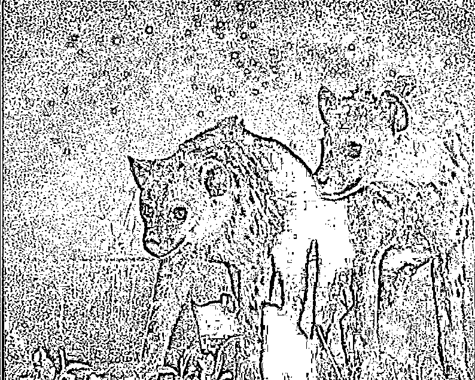

*   **白羊座新月的开启**

*   从此次双鱼座新月的意识转化，到处女座满月的爆发清理，再到白羊座新月的 30 天，我们将会进行很多功课的准备与磨砺，成绩单也将在白羊座新月破土而出——迎接土星进入水瓶座开启的全新纪元，推进金牛座天王星的变革之路，创建更加健康的生态环境，升级更利于世界的集体文明，重建更有建设性的现实秩序。 
*   “双鱼座新月-白羊座新月”两次新月能量传导中，土星和天王星定位关系的互换，向我们揭示：大自然发起剧烈的震荡（金牛座天王星）来警示我们真正的困境与危机来自于人类本身，推动我们进行现实的“洗牌与重建”（土冥合相），当我们意识到所有的发展与规则必须建立在“利于众生”的理念之上（土星进入水瓶座），才能重建健康的生态环境，才能重获生存的安全根基（金牛座天王星）。

不要用以往的眼光去看待 2020 年，这个世界正在以全新的方式打开每一天，而此次双鱼座新月正将宇宙的疗愈能量和大爱之光照进我们每个人的意识之海——**一场因果，缘于自然，归于自然，而自然中的我们和万物始终共生共息。****寄语****在人的一生中，有一些时候我们必须委曲求全，必须丢卒保车，放弃那些并不十分重要的领地，以保全基本的阵地。****——米兰.昆德拉《好笑的爱》**选择是一种必要的智慧。宅家的这段时间，每个人会有不同的感受和体会，有些朋友可能正顺势享受家人共度的珍贵时光，有些朋友可能已在家庭议题的折磨之下快速逃离，而有一些朋友却再也没有机会走进这样的时间。生活中的忙碌和奔波，最终要回归生命中最重要的因缘。生命所有的功课与成长都在**“家”**的土壤之中，家庭让我们看到自我的真实样貌，体悟时光的不能逆转，让我们懂得感恩与爱，学会自洽与交互。每一个人走出家门的时候都希望全然投入创造并达成使命，而这种全然正是建立在“家”的安然之上。2020 年正月春节的 30 天，宅家似乎是疫情帮我们做的选择，但是心态与状态却是自己做的选择。但无论怎么样，我们的基本阵地就在“家”里。祝福我们所有人安然共度险情，感谢所有奋战一线的人们，你们的负重换来我们的平安。祝福大家。**新月如何许愿？**

**许愿时间**：2020 年 2 月 23 日北京时间 23:31 后，48 小时内有效、8 小时内最佳。

**许愿人群**：所有人。**许愿数量**：每人最多 10 个。**许愿方式**：静心冥想，身心祈祷或记录收藏。**许愿格式**：请万能的宇宙赐予我能量，我将以我的能量吸引**（什么）来到生命中……**许愿原则**：发心诚善利人。

**版权声明**：原创文章由作者授权首发于若道平台，欢迎转发，反对抄袭。友号转载请申请白名单。

****

****想阅读更多作者的文章****

****请在后台回复******王芝桦****** 即可****

****王芝桦****

心理占星师，统合疗愈师，若道占星“新月和满月”专栏作者

腾讯视频特邀合作占星师

全职于个案咨询与占星教学工作 15 年

**个案预约咨询微信号**：zhihua0621 

**微信公众号**：daoxi-life

**长按打赏**

****

**微信又双叒叕改版啦，不想错过若道君的推送？**

**就把若道设为星标吧！**

**▼**


**点击**

**“阅读原文”**

**获取免费新月报告**

****获取免费新月报告，请点击文末“阅读原文”****


# 专访傅莎珈：转型做有职业优势的占星师，你需要知道这四点

> 原文：[`mp.weixin.qq.com/s?__biz=MzA5NjA0NTAxNg==&mid=2651413729&idx=1&sn=a080d49fa4bf0187e5a8c08cc88d9286&chksm=8b4bee56bc3c6740093123281df3bd439119f39c6bb90f457741b5b2897ececb73631953ca3d&scene=126&sessionid=1692738207#rd`](http://mp.weixin.qq.com/s?__biz=MzA5NjA0NTAxNg==&mid=2651413729&idx=1&sn=a080d49fa4bf0187e5a8c08cc88d9286&chksm=8b4bee56bc3c6740093123281df3bd439119f39c6bb90f457741b5b2897ececb73631953ca3d&scene=126&sessionid=1692738207#rd)

****************☆** 后台回复“今日”，给你一句生命态度**************

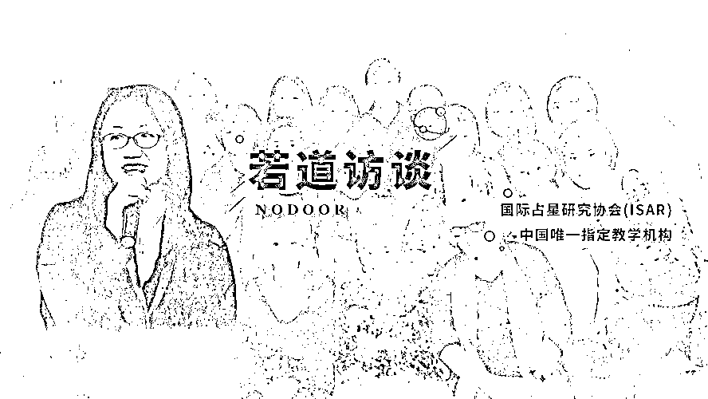

采访/作者/狄狄图片/傅莎珈 封面/书君职业占星师傅莎珈入行四年，在国内西方严肃占星学的圈子里她从业时间不算久，但名望和收入却常被其他占星师羡慕甚至仰视，很多后辈也对她成功转型占星师的方法感到好奇。转行做职业占星师初期，对收入的高标准要求成为傅莎珈不懈努力的动力。但现在的她却会说：**土星的尽头一定会有海王星等着你，物质到达了某种程度它一定会归零，服务于精神成长的需要，这是商业法则，也是宇宙法则。**在把占星咨询当作一个工作的时候，你会想要挣到多少钱；但当你某个时刻发现，自己在从事一个事业，你就会开启一种服务人群、团体、社会的工作意识。她的体内住着好几个角色：人生过半的成功人士、言辞犀利的咨询师、敢挥霍会享受的单身贵族、追求新鲜爱玩耍的少女、精神领袖的虔诚追随者、脆弱的害怕孤独的普通人……这些角色可以被她理智地随心切换，正如与她对话时你能感受到的扑面而来的强大清晰感一样，她会把不同面向的自己打理地井井有条。

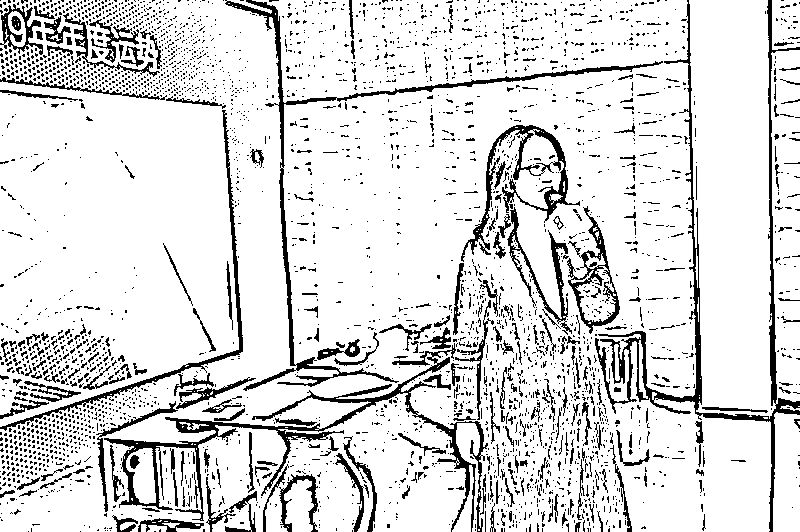

| 傅莎珈在杭州做占星演讲与傅莎珈聊占星学，你会不自觉地为她感到高兴。即使人生永远要追求更高的东西，但当下的她已经很幸运地成功转型，做了自己喜欢的职业，内在找到了一种可以不被外物干扰的坚定的信仰。我们采访了这位出众的若道毕业生，分享以占星咨询为生的职业咨询师关于咨询感悟、职业规划以及增加收入方面的思考，希望她的回答能够给新入行或正想入行的你一些有用的启发。** 若道×傅莎珈 ****在做职业占星师之前，你的工作是怎样的？**在学占星之前，我在外企从事市场分析工作。**那时候工作忙碌吗？**作为团队负责人，很多时候是在不停的开会、参与 pitch 帮助公司赢得客户。但还算能管理好时间。**什么样的机缘，让你开始占星学习之路？**2010 年时候父亲过世，我担心妈妈的身体和心理健康，就找了一份工作搬回了北京。同公司有位同事闲聊推荐说：“你不是一直喜欢占星吗，北京有一家全中国第一个完全由西方占星师来授课的占星学校，非常专业系统的讲授占星学，你要不要去报名？”我就很好奇来若道上了课。我应该是 2012 年入的学，属于若道的第二届学员，比咔咔晚一届。**当时是什么原因，让你放弃外企高管这份轻松又高收入的职位，决定全职从事占星师呢？**当时对我来说最大的困扰，就是这份工作，或者说商业的其中一个底色，是竭尽所能扩张刺激人的欲望，培养人的依赖性，买它！这个过程让我感到不舒服。我有个模糊的意识：人为什么需要买这么多？明显是浪费。商业还有很多积极向上的面向，这是我在做职业占星师时候逐渐感受到的。但在当时，我确实越做越无聊。当时所在的行业也出现了很大的转型需求，我就想着还是走吧。当时行运天王星在对分我出生星图落在十宫的天王星，我有一种强烈的冲动要辞职，至于下一步要做什么我并不知道，我想着把若道的职业占星课程读完再说。2014 年离职，2015 年通过了 ISAR（国际占星学会）认证考试。然后受邀在一家互联网汽车公司做品牌咨询顾问，同时开始半兼职的做占星师。我就发现我真的是对做品牌咨询没有很大兴趣，但是**一到做占星咨询就兴奋的两眼发光，既然这样我不如转行真的做一个全职占星师吧。**

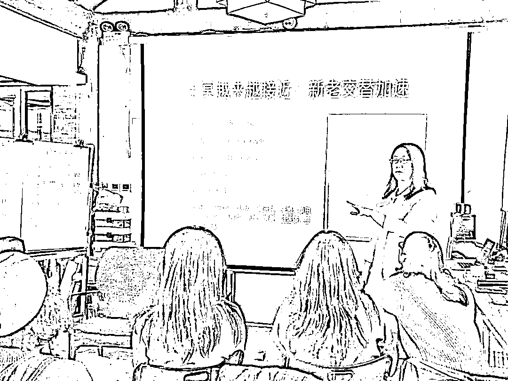

| 转型做职业占星师的傅莎珈**你从什么时候发现自己喜欢占星的？**小学四五年级开始，我对就身边出现的东方命理有关的文字很有兴趣，老想知道自己是谁，有什么特征，对自己“为什么是这个样子”、“将来会怎样”很好奇。工作后能拨号上网，在搜索引擎上搜占星、紫微、八卦什么的信息乱看，去做各种心理测试题。我到现在都留着当年网上搜索出来，整理打印的一大本占星知识素材。**刚开始学习占星的时候，自学的状态和后来在若道的学习有怎样的区别？**非常大的差别：**碎片化知识和整体性、有框架体系的学习之间有着巨大的差别。****你刚入学若道的时候感受是怎样的？大卫老师对于你的占星学启蒙有过哪些帮助？**非常震撼。之前网上自己搜索各种信息来看，都是现象知识。你不知道这些现象描述是怎么发展沉淀整合出来的。**上了大卫老师的课，初次把占星学的历史、逻辑、知识框架完整的串联了起来。**其次，大卫老师是一个海王星能量很强的人，在他的占星课程当中，他在解读客户星图时候，对行星、星座的含义进行了很多情绪，心理上解读。海王星特有的艺术化的表达、对痛苦的敏感和同情，慈悲感，在大卫老师身上非常明显。我自己是土星能量非常强的人（土星代表结构化、实用性），所以刚开始听大卫老师讲课的时候上到案例，他总是会花很多时间谈这个客户的遭遇多么值得同情和陪伴，我当时是不理解的，心想你一直讲这些干嘛，占用讲知识点的时间。

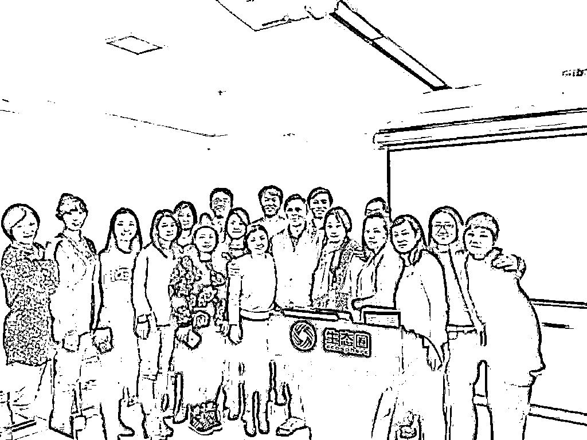

| 2015 年大卫·瑞雷在上海做占星督导（右二傅莎珈）直到 2016 年我开始做职业占星师，我才开始真正理解，**大卫老师呈现的这种同情与陪伴，对他人命运深深地怜惜和共情的部分，有多么的慈悲。**因为有很多时候，人们来找占星咨询师，是希望对自己这些遭遇进行探索：“为什么我会遭遇这些”。他们要的不仅仅是答案，还有咨询过程中“我的感受被看见”、“我的感受被接纳”。如果不怀抱着慈悲之心，你咨询很可能陷入一种“铁口直断”的客观中，可能会带来情绪上的伤害。伴随自己成为咨询师的年限越来越长，再回看当年的高阶占星课程笔记，我就越是能体会大卫老师在案例示范中的表达，对那种海王星能量产生很深的共鸣。大卫老师真的是个非常有慈悲心的老师。**占星咨询师这个职业，你可以把它做成一个答疑解惑的工作，你也可以通过星图解读这项“技能”，当成一个个人修炼的工具，找到灵魂进化的路径和方向。****是怎样的经历让你有这样的转变，可以理解大卫老师教授的“知识点以外”的部分？**在刚开始做全职占星咨询师的时候，我的风格属于很犀利很毒舌的，我会经常“骂”客户，恨铁不成钢。这个过程中我不仅发胖了，还总是充满愤怒，我无法彻底释放掉客户给我带来的负面情绪。这是为何后来遇到超个人呼吸、去印度 amma 的道场闭关，这对我来说是定期的能量清理工作，外加个人心性修炼的方法。我逐渐意识到，无论我的发心有多好，一个人的功课就是要按照自己的时间去成长，不可能靠你一句话就彻底改变一个人。而且这个爱发脾气的行为本身是我自己的功课，是我自己要去觉察的：我为什么对客户的遭遇感到这么大的愤怒？咨询师除了理智上解答提问，陪伴共情，情绪的梳理也是非常重要的工作啊。

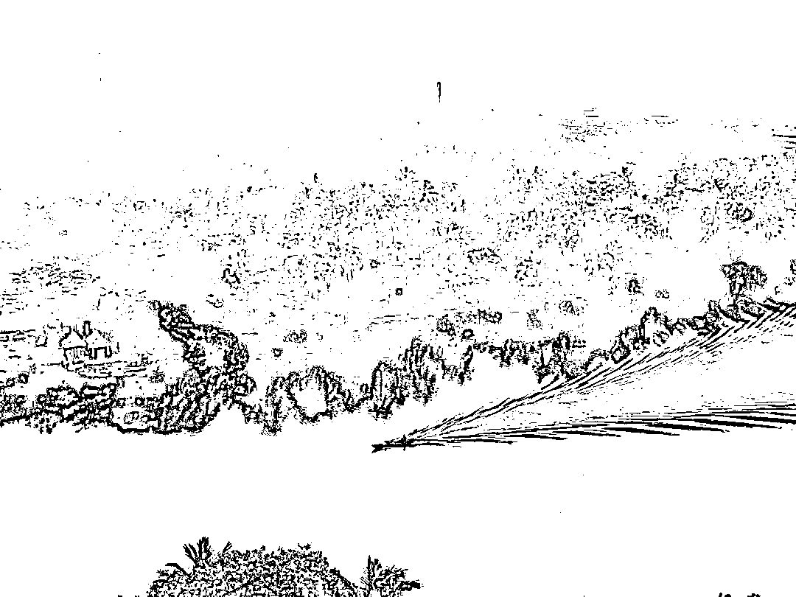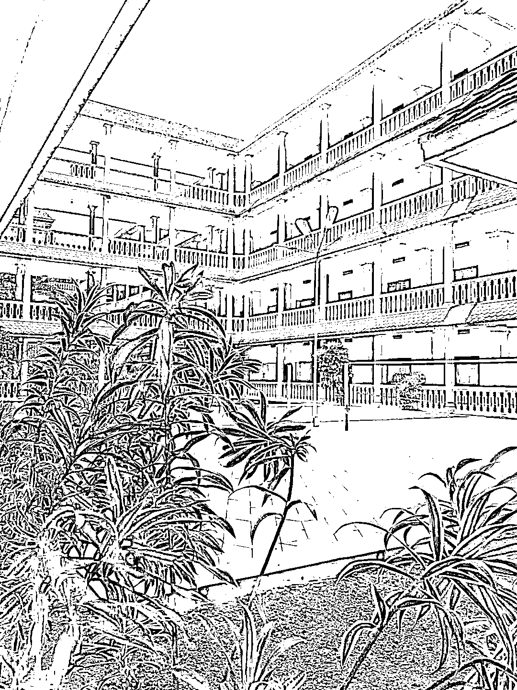

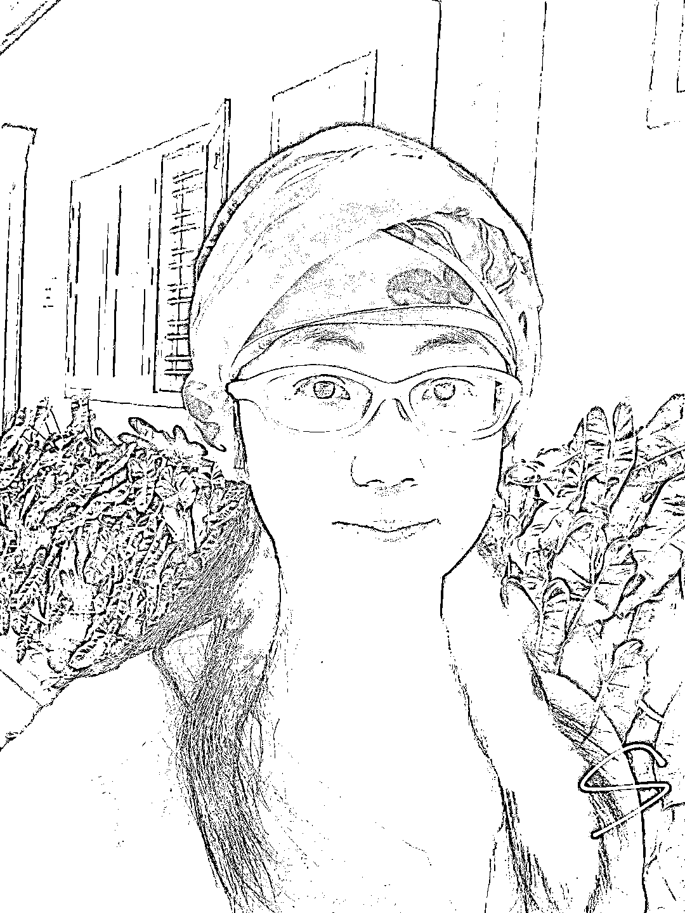

| 傅莎珈在印度 amma 道场**你的这种转变，会让你更受客户们欢迎吗？**会让我跟客户的关系变得轻松、亲密。其实不同客户对于“情绪陪伴”的需求是不同的。一部分客户她们会非常喜欢这种接纳感，但她会产生依赖性：把对理想父母的需要投射到咨询师身上了。这类客户在人群中占比挺高的。我会通过一段时间，有技巧的帮她们建立起和咨询师之间的边界感。一方面继续给予情感支持，另一方面提醒她们，我不是“理想父母的替代品”，暂时的某一个阶段，确实会有“理想父母”的功能，长远来说，能促进她们在某个面向上的独立、成长，才是我的工作目的。第二类客户是通过星图解读，以及共情理解，获得了巨大的行动动力，她们会经常回来汇报一下做了哪些事情。顺便跟你商讨下个阶段的目标。这类客户正在逐渐增加，她们是有意愿去做提升和转变，需要一个助产士，帮助新的自我出生、成长。第三类客户真的是非常欣赏你，希望在同一思维高度与自己有沟通交流。这类客户占比很小，但每次遇到这类客户，大家都有彼此惺惺相惜的感觉。

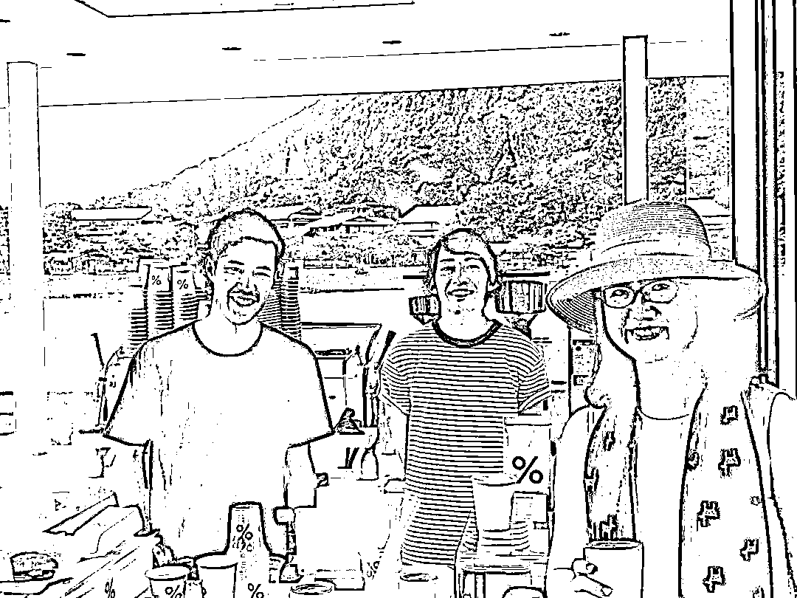

| 傅莎珈（右一）在喜欢的咖啡店**对现阶段的你而言，占星学意味着什么呢？****它既是我的职业，又是我重要的修行工具。**它让我不断感受到“如在其上，如在其下，如在其外，如在其内” 的神秘和神圣。前两天我莫名觉得身体发沉，有种把人拖到地底的阴沉的能量，情绪上莫名的感觉压迫，窒息，无力。那天我在写编辑微博文字，当打开星盘发现月亮在天蝎座，恍然大悟。然后我把屋里的所有灯打开（增加火的能量）；用鼠尾草做了身体、工作室空间、卫生间的净化（天蝎和卫生间有关）；开门开窗通风；做了一餐美食（天蝎座的对面是金牛座），打坐 30 分钟。然后那种下坠的、压迫的、带有死亡感的感受就消失了，身体变得轻盈起来。我每天都在观察我自己身上经历了哪些行星的共振，我在如何演绎这些行星能量。占星学会帮助我从现实和事件的物理角度抽离出来，站在更高的觉知角度去看待发生的每件事情。**这是一门学科，把人和大自然、宇宙紧紧联系起来的。教会人真正成为自然，宇宙的一部分。**这是个成为凡人的同时不断超越凡人性，连接神性的学科。

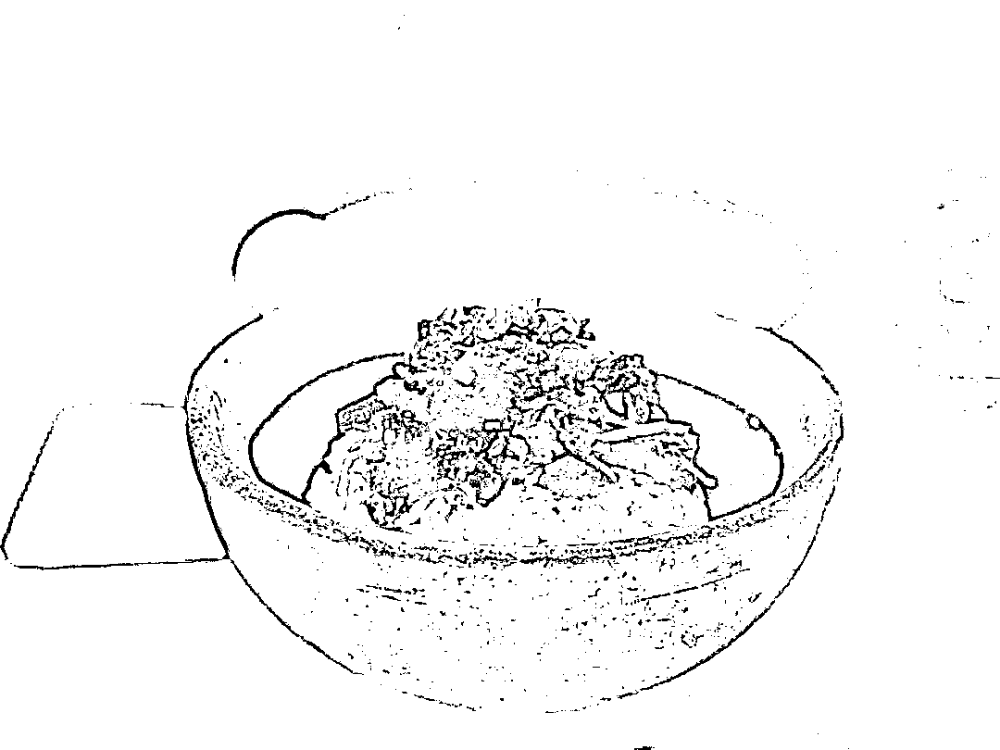

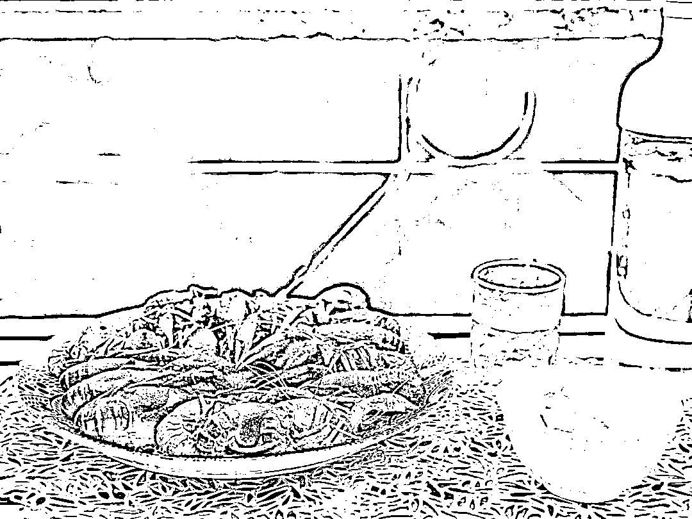

| 傅莎珈的日常美餐

**可否分享一下职业占星师的生活，你日常一天是怎样度过的？**早上七点左右起床，七点到十点点之间会做唱诵、冥想、练瑜伽。 咨询时间是下午两点到晚上九点之间，大约三四个小时。其余时间缝插针写公众号、看书、插花、养花、上各种相关课程、看展览、追剧集。最近因为疫情的关系每天要花一两个小时清洁整理住所。我发现这个活动特别滋养我，和住所的连接变深，有种非常强烈的安宁感。尤其是整理工作，我不断发现自己买了太多东西，正在进行断舍离。这个过程特别滋养我的月亮处女座：最终围在我身边的，都是最喜欢的东西。另外就是研究养花。需要换盆，追肥，翻土，修建，培育新苗。正在观察不同植物的长势，等着春天来了给它们换个地方。这种生活方式说老实话挺适合我的，我一开始还以为我这种土星能量强的人必须把时间表排满。但现在发现，做着我喜欢的工作，在空闲的时候能好好亲近大自然，好好和身体相处，正在让我变得越来越喜悦。这不仅对我有利，也对我的客户们有利：**一个喜悦感很强的咨询师，无论是解盘的流畅感，还是情绪的共振，都是在高频领域发生的，疗愈的能量很强。**

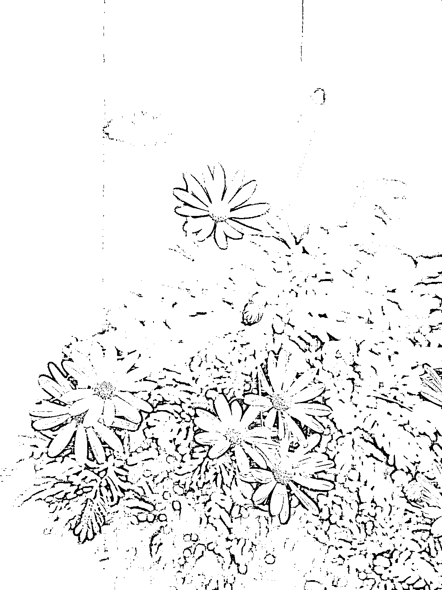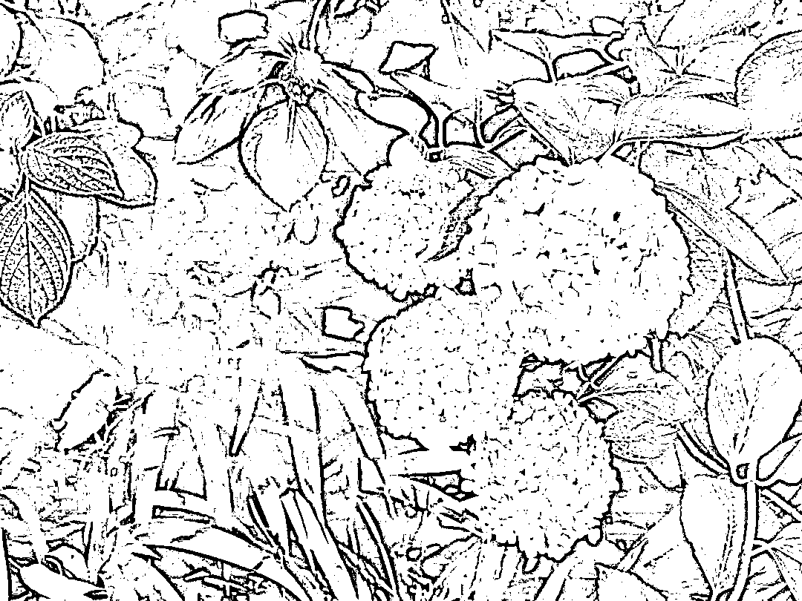

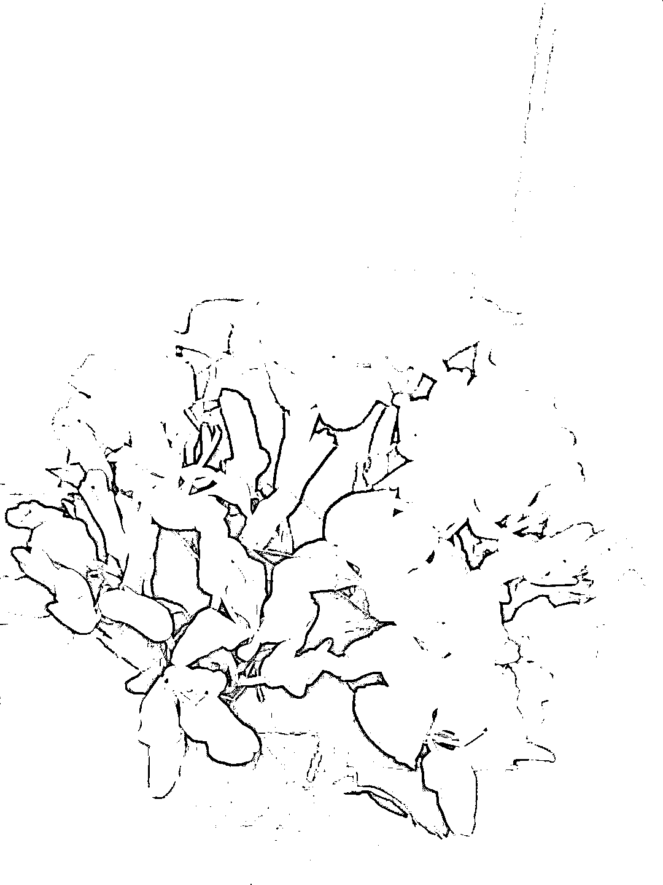

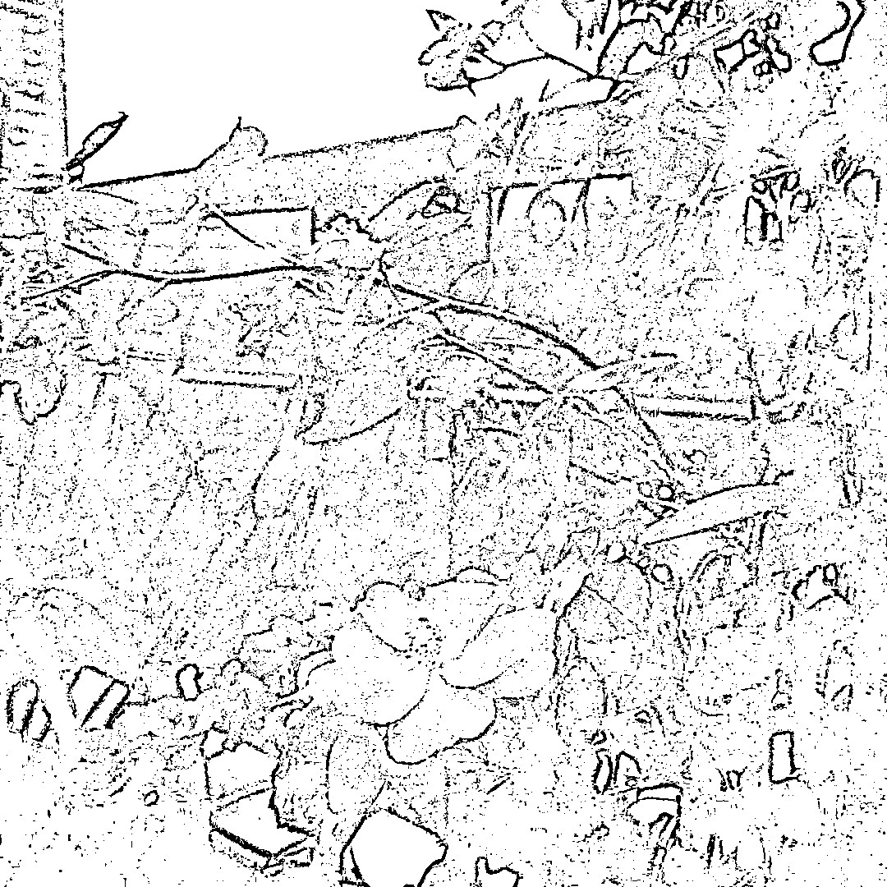

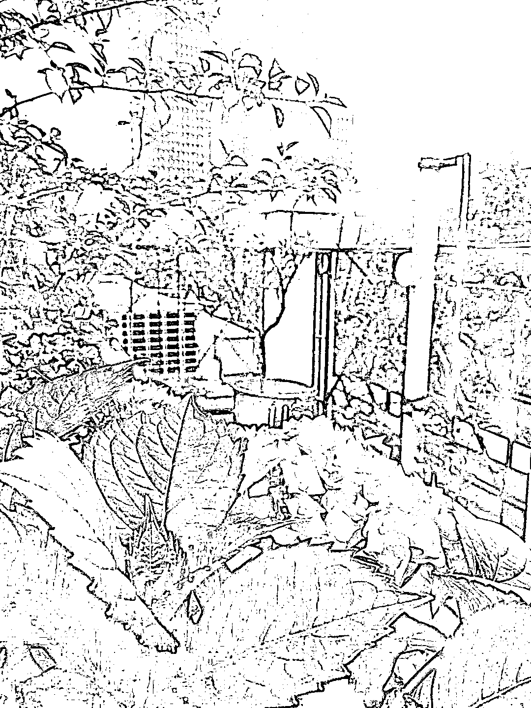

| 傅莎珈家中的花

**之前你有对若道老学员分享过“如何规划自己的职业占星师之路”的沙龙，你为什么想到会分享这个主题？**2016 年前后，我很轻松的就转型成为了职业占星师，那时候蒋颖（若道创始人）也问我是怎么做到的。我当时有一个观察，就是很多学习占星，希望从事占星工作的同学，可能从学校刚毕业或者不喜欢上班，想要做占星师。**而我觉得无论哪一种工作，职业规划是不可缺少的。**作为一个工作 20 多年的职场老人，如果我的经验能给大家一些启发，是我的荣幸。**总结下来，你觉得自己从事占星职业名望和收入较高的原因有哪些？****第一是我的学习能力很强，极其有效率。**占星学是一个要涉及大量知识整合的学科，它需要你的融会贯通能力很强。所以一个好的笔记工具不可缺少。我是个画逻辑思维导图的高手。要尽可能当场完成学习记忆。我经常在工作坊看到同学们听老师讲解可起劲了，但不记任何笔记。我挺担心她们以后还能记得一些什么。大部分参加现场的人事后根本没有时间回听录音，所以一定要现场尽可能多的吸收。我通常习惯性在老师讲课结束的时候已经同步整理出了课堂要点。写作和咨询的时候如果不记得，翻一下笔记。效率非常重要。

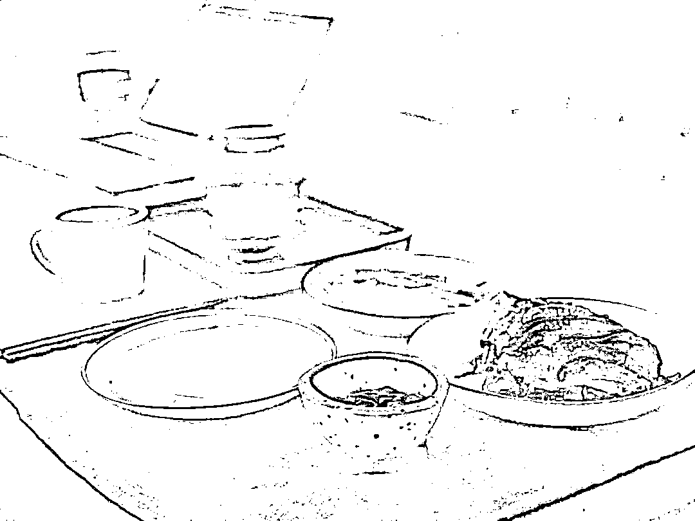

| 傅莎珈的餐桌
**第二是知道自己的优势，有规划。**据我所知很多人只是想做咨询师，但他具体要怎么做他没怎么想，所以对面临的风险也缺乏了解。除了理想和激情之外，你要知道自己的特色。要给自己做 SWOT 分析（优劣势分析法）。你的占星服务是个产品，你这个人、你的社会资源、储蓄情况，都是这个产品中的一部分。分析自己的优势特别重要。我看一个占星师能不能成功，通常先看她是否足够了解自己的优势。因为优势是你的竞争力。没有优势没有竞争力。忘记你还有哪些缺点，最大化提升发展你的优势。我自己的一个优势是写作吧。我可能是占星师中，有自己鲜明写作风格的。一圈占星公众浏览下来，有些人会记得我的文字。做兼职占星师的时候，因为公众号写得不错，有个一直以来的公众号读者，在得知我要转型做全职占星师的时候，一下付了我一年的年费。我和这个客户陪伴彼此将近两年，她是推动我走上全职占星师路程上一个无法忽视的所在。我当时只是一个很初级的占星师，她给了我无条件的信任。 所以**发挥你的优势，对任何职业转型，都意味着它会帮助你吸引来你需要的资源。**在做完自己的 SWOT 分析后，不要忘了设定 KPI，现在因为市场变化特别大，所以不能太僵硬。但你每个月打算做到多少营业额，怎么做到，是你随时要去分析一下的。

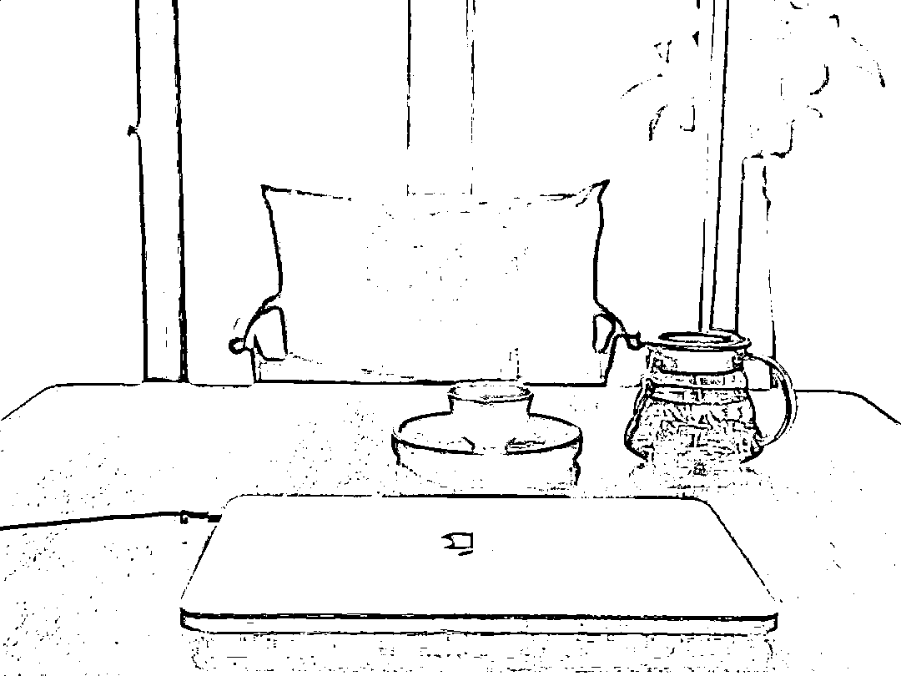

| 傅莎珈日常写公众号的桌面
**第三是强大的自律能力。**没有上班下班，没有老板和后勤机构，没有人管你。工作、学习、身体健康，生活都是你自己管理。自律的人在土木冥合相的这一年，会特别有竞争力。因为土星说了，你要给自己立下一个界碑，挑战一个高度；木星在摩羯座点头说：自律带来愉悦感。自律也意味着诚实面对自己的不足和缺陷。接纳缺陷和不足，你的创造力才会变得鲜活起来。你无法成为别人，你只能成为自己。**如果说我还有第四个优势，可能是我比较喜欢玩儿。**我一直认为任何一项工作，能不能让我产生“玩得很开心” 的感受特别重要。 很多人也说我看起来完全没有 48 岁的样子，我觉得我体内一直有很年轻的 27 岁的那个部分。这种游戏感和年轻的自我错觉，会帮助我在面临工作挑战的时候，没有那么大的年龄负担和自我限制，敢于尝试：啊这个挺好玩的，来，试试先。试着试着觉得真对口味，就会升级成长期规划。。

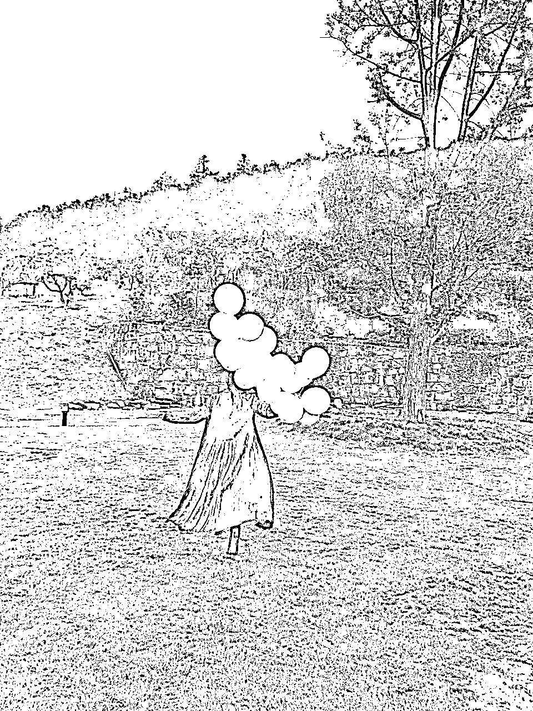

| 在朋友草坪婚礼上玩耍的傅莎珈
**这可以算作你对想成为职业占星师的新人们的建议吗?**我觉得这只能算是对一类人建议。跟我有类似之处的，比如土星、水星能量比较强，可以按照我说的建议试试看。但还有一类人是海王星能量非常强的，这类人你没办法让她们做规划的，如果我遇到海王星能量强的占星师，我可能会帮助她去开发直觉和想象力，解读自己梦境的能力等。她们不需要 KPI，她们需要随时跟宇宙有连接，在念头起来的时候跟随这个念头，不问为什么，直接跟随去做。然后莫名其妙的就成功了。其实是宇宙力量的推动，而你感应到了，并且以臣服的姿态跟从的结果。这是比规划、自律更强大的能力。这又回到之前讲的：了解你的优势。了解自己的优势是个很长的过程。对优势毫不迟疑的肯定非常重要。毫不迟疑的发挥自己的优势非常重要。

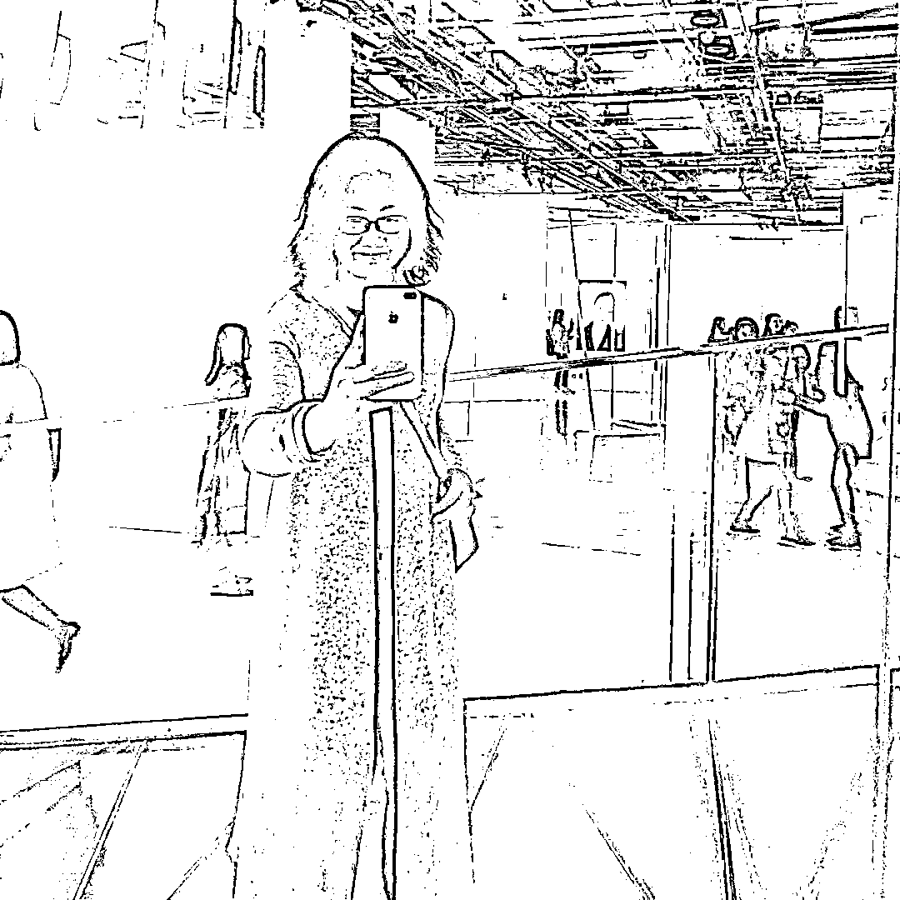

| 傅莎珈在美术馆看展
**可否透露一下，你是怎样“想方设法”增加咨询量的？**

**1. 保持定期的曝光，****不断更新传播手段，对转化的发生有耐心** 

我可能天生能写，所以公众号是我重要的吸引客户转化的渠道。2015 年的时候，我的公众号至少一周要更新两到三篇。直到现在，不管发生什么身处何种环境，我都会保持一周至少一篇的更新量。有些客户说，看了我两年的文章，决定来做咨询。转化的发生一定是需要时间的。定期曝光，吆喝，必须坚持。发表观点，是让别人注意到你是咨询师。其次是现在很多新的传播方式和渠道，短视频渠道和视频传播，是很多年轻的咨询师可以去尝试看看的。重点是坚持曝光。

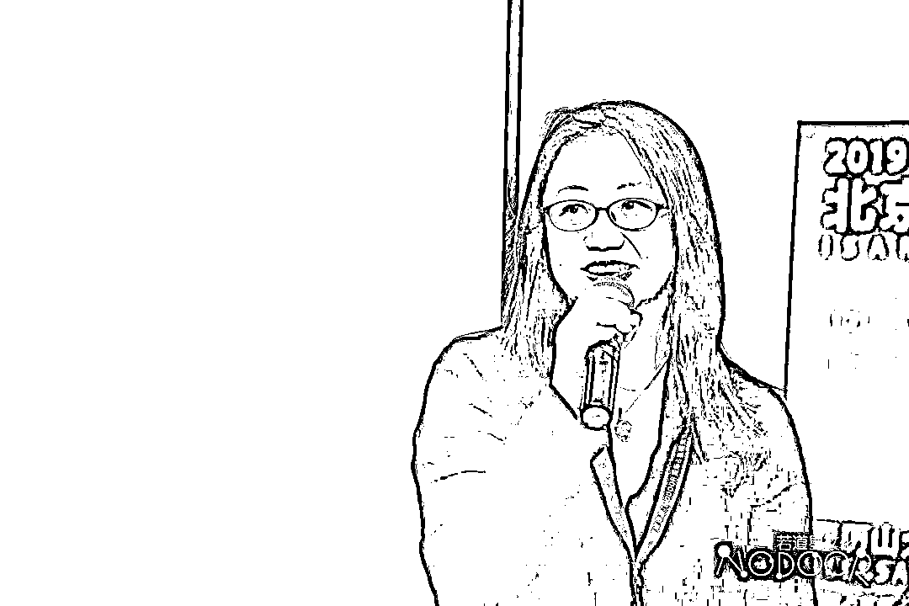

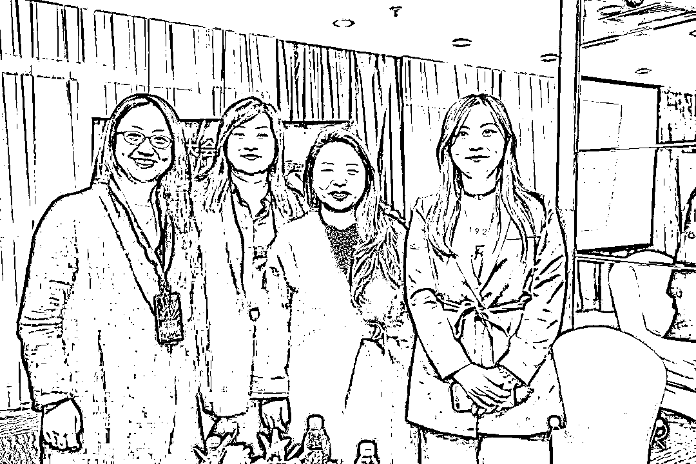

| 2019 北京 ISAR 大会，傅莎珈（左一）和占星伙伴们**2. 从兼职做起**这也是我很实在的建议：如果可以，先做兼职咨询师到积累起一定客户量，再转做职业咨询师。新手咨询师，不要害怕收费。200 块开始，每做 50 个升 100 块。其次是邀请客户推荐。不要害羞，直接说如果满意，希望能推荐想要做咨询的朋友来。这个开局是很困难的。有些人就是死活打不开局面。如果坚持了半年没有太大增长，撤。宁可只停留在做兼职咨询师的定位上。**3. 修炼咨询基本功**客户是识货的。决定她是否会回来的，是本次咨询的体验。所以你的内功，是每天每天需要练习的。哪怕没有客户，也要每天看盘做解盘练习。你对于自己交出去的功课有多少自信，客户感受得到。所以首先修炼基本功很重要。

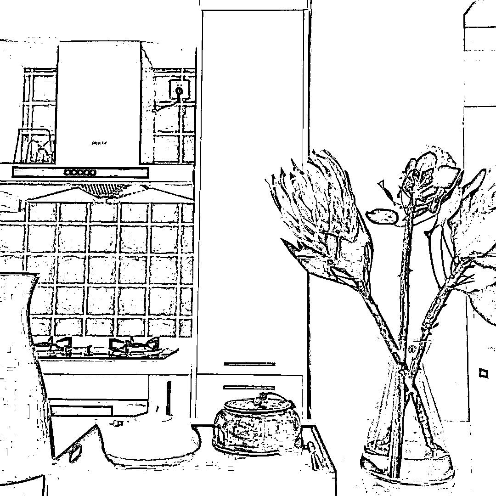

| 傅莎珈家中一角
**从主流行业转换为小众行业，是什么让你坚持占星师的职业道路？**我参加了很多若道组织的占星大师的工作坊。从一开始的**大卫·瑞雷老师**，到斯蒂芬·弗里斯特、诺·泰尔、格伦·佩里、苏·汤普金斯，去年的阿兰·欧肯，ISAR 大会上琳恩·贝尔、ISAR 主席亚历山大等等……从这些课程里，你能感受到占星学是多么宏大的学科，一个高度精神性的行业。这些大师的学识、技艺、和人品修为深深影响到我，让我觉得身为这个行业的一员，是很荣幸和骄傲的。**成为一个宇宙和人间的信息管道，还有什么比这更令人兴奋的事情呢？**以上是**若道毕业生****的****占星师傅莎珈**的思考想成为和她一样优秀的占星师从事“令人兴奋”的职业咨询师工作若道君隆重向你推荐**她的占星启蒙老师****大卫·瑞雷**主讲的**2020****若道春季占星入门课**最懂中国学生的大卫老师将最深入浅出向零基础的你讲述**12 个****星座、****12 个****性格、****12 种****人生****10 大行星****和 12 个****黄道宫位****让你从爱好者一步飞升专业占星师的行列 **

**点击图片 **

**你也可以成为大卫老师的学生**

**👇**


**微信又双叒叕改版啦，不想错过若道君的推送？**

**就把若道设为星标吧！**

**▼**


就是这个“在看”，戳戳戳 ☟

********报名直达入口********


# 公益沙龙 | 禁足家中，来自双鱼月的“治愈”指南

> 原文：[`mp.weixin.qq.com/s?__biz=MzA5NjA0NTAxNg==&mid=2651413729&idx=2&sn=c3161bd752eeccd8843d92ea4de41800&chksm=8b4bee56bc3c67406e825c1fe4caec8f17a10da6e4f120390f4ba01c827d9a30c633ed431370&scene=126&sessionid=1692738207#rd`](http://mp.weixin.qq.com/s?__biz=MzA5NjA0NTAxNg==&mid=2651413729&idx=2&sn=c3161bd752eeccd8843d92ea4de41800&chksm=8b4bee56bc3c67406e825c1fe4caec8f17a10da6e4f120390f4ba01c827d9a30c633ed431370&scene=126&sessionid=1692738207#rd)

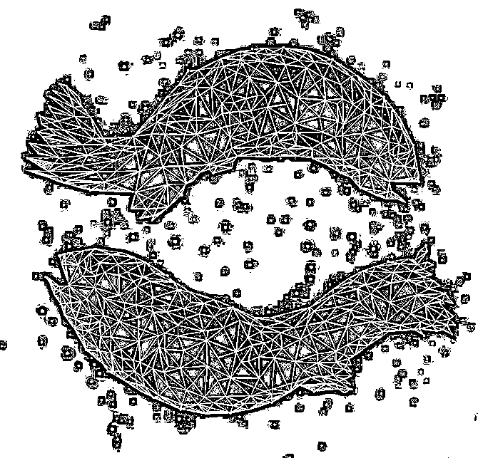**若道的小伙伴们，****在家“禁足”的生活日复一日****是否需要一份心灵养料的补给？****在这个双鱼月到来的时候，****我们特意请来一位****有着丰富生命经验和实修经验****并且已过知天命之年的****ISAR 认证职业占星师****滴答老师****来做一场公益占星沙龙****她，曾经是经常打飞的上班的人****每天忙得如陀螺一样（南交 6 宫处女座）****却因为命运的安排****真正进入北交双鱼座 12 宫的旅途****滴答老师对“禁足”曾深有体会****在过去的 9 年里****命运安排给她的困惑、无助、****恐慌、绝望、抑郁、分裂、无力......****宛如被“禁足”的生活****经过 9 年的磨练****如今的她，安定、安然、欢喜、自在......****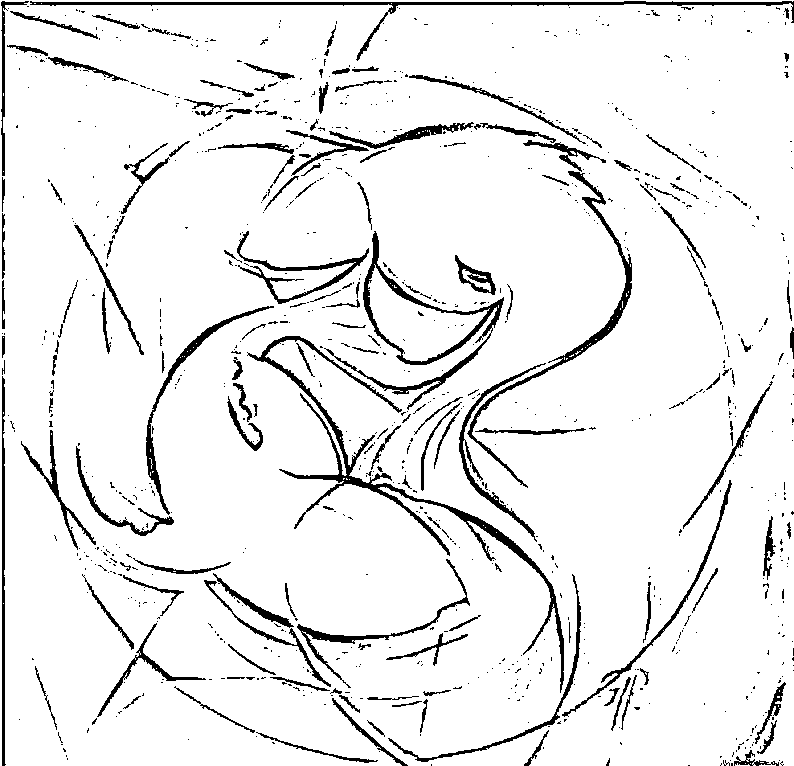****在这个新型冠状病毒肺炎肆虐的春节****她也经历了一场真实的考验****2020 年 1 月 18 日****一位亲属从武汉回来****随之，一大家子 10 口人，四代欢聚一堂****从 95 岁的老母亲到 3 岁的侄孙女，****以及 9 年来第一次回国过春节的儿子****然而 1 月 19 日，滴答老师出现干咳****虽然最后她自己并未感染肺炎，****但经由恐惧伴随着内在的挑战也从这里开始........****在这个双鱼月的沙龙中，****她将从这个不同寻常的春节谈起****回顾这不同寻常的 9 年****她如何体会穿越、体会、经历****双鱼座的一层层负面阴影****到如何运用双鱼座的一个个正向资源****她还会分享如何将土星的磨练变成恩典****她的讲座既会给一些非常双鱼座海王星的实修经验****又会谈及再切实不过的和土星相关的内容****目标管理、现金管理、金钱分配，时间分配......****及如何将土星和海王星结合在一起****度过生命的每一分钟****2020 年 2 月 29 日晚 8 点****过去和未来都藏在迷雾中****我们一起拨开云雾****等你来踏足****参加方法**

**活动时间****：2020 年 2 月 29 日 20:00-22:00**

**活动费用****：免费**

**人数限制****：300 人（报满即止）**

**授课方式****：网络直播，中文授课**

**参与方式****：报名成功后，请添加客服微信（nodoorDaivd），获取直播平台登录地址和密码**

**长按下图二维码报名**


**关于滴答老师**“

滴答老师是 ISAR 认证占星师，也是我在人生道路上的好友，她丰富的人生经历和对于内在诚挚，坚定的探索，对于中国道家，佛家修行的深入实践，面对无常而发展的智慧和勇气让她对占星学发展出深入而独特的理解。我很有幸在人生道路上有她相伴，也很有幸请她把对占星和人生的领悟分享给更多人。

**——若道创始人，蒋颖**

**”****温馨提示****Q：****我如果报名参加此次活动，有什么注意事项吗？******A：****❶ 报名后务必添加微信客服（nodoorDaivd），获取网络直播的登录地址和密码；❷ 登录直播平台，请用报名时提交的用户名，登录名称不匹配的学员将会被移出直播平台；❸ 直播期间请确保有一个较为稳定的网络环境，以保证有较好的直播观看体验；❹ 该直播不提供回放，报名后，请准时参加。

**更多活动信息**

**请长按下方二维码联络客服**


********报名直达入口********


# 神奇！睡觉的时候，太阳穿越了你出生星图中的哪几个宫位？

> 原文：[`mp.weixin.qq.com/s?__biz=MzA5NjA0NTAxNg==&mid=2651413719&idx=1&sn=62dfa0392b1b9ac0fdd69d26688f7d1d&chksm=8b4bee60bc3c67766e36d99cba2f8133d9714541afdc9a51a1e90261c916eb9521b1723b3bbc&scene=126&sessionid=1692738207#rd`](http://mp.weixin.qq.com/s?__biz=MzA5NjA0NTAxNg==&mid=2651413719&idx=1&sn=62dfa0392b1b9ac0fdd69d26688f7d1d&chksm=8b4bee60bc3c67766e36d99cba2f8133d9714541afdc9a51a1e90261c916eb9521b1723b3bbc&scene=126&sessionid=1692738207#rd)

****************☆ 后****************************台****************************回复“今日”，给你一句生命态度****************


作者/大卫·瑞雷 若道占星创始人
译者/蒋颖 速记/幽南编辑/玫瑰 图片/全景网水星在双鱼座逆行的时期，很多人都会嗜睡、多梦。那么，这些梦到底代表着什么呢？占星学对于梦境也有自己的解读。就连为什么你会在晚上入睡，占星学也有说法呢。一起来看看吧。**睡着时，太阳穿越的宫位**

如果我们看一个自然的钟，**出生星图看上去就是像一个时钟**，在太阳落山后，太阳会在地平线下待很长时间。晚上十点钟太阳就落在四宫，每天晚上都是如此。

我们知道四宫和家、睡觉的地方都是联系在一起的。**四宫是一个让你感觉到安全和舒适的位置，因为你可以躺下来开始睡觉了**。想象你的基因中，你可能晚十点到十二点你可能就睡着了，然后你就开始做梦。**睡着和做梦的时候太阳经过了 3 宫、2 宫和 1 宫，这些宫位是星图中最主观的宫位**。

*   **3 宫**是我的想法，关于“我是怎么想的”；
*   **2 宫**关于“什么是我的？我的身体，我拥有的，或者是我们对身体的所有权？”但是这是一个非常主观的想法。
*   **第 1 宫**就是一个自我的宫位，当太阳从地平线上升起，天亮了我们也会醒来；
*   **太阳在 12 宫**的时候我们会从一个睡觉做梦的状态逐渐过渡到清醒的状态。

想想看，当你醒来的时候你是多么得敏感和迷惑。可能是光太亮了，声音太吵了。这种感受像不像 12 宫呢？非常有趣的是**3 宫、2 宫、1 宫**和格式塔的梦境分析的理论非常的契合，这三个宫位都是关于**自我**的。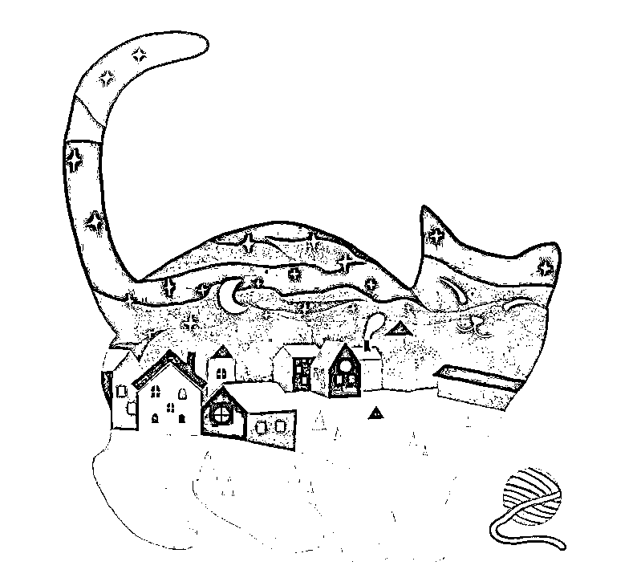**从出生星图看梦境**

从 1974 年以来我就开始关注梦，所以我也发现了一些非常有趣的地方，我发现**一个人的出生星图和人的梦境是非常相关的。**

下面我们看一些案例，这个案例展示出梦境和出生星图之间的关联。这位女士从九岁开始就重复做同样的一个梦：

在这个梦中，她的家遭到了可怕的威胁，这个威胁的力量就象是黑暗中走出的巨大野兽一样。据她描述，这些野兽看上去就像是一些凶狠的狗、熊和黑豹的混合体。她无法叫醒家中的任何人来帮助他，所以她只能朝着野兽大叫，并且挥舞着拳头。

接着她变成了其中一只野兽，变得比那些野兽更大，她拥有力量把那些野兽都赶走了。可是，她很害怕，害怕自己再也无法变成人了。她从这种巨大的恐慌中醒过来。

让我们看看她的梦是如何从出生星图中体现出来，并且又在告诉我们什么呢？

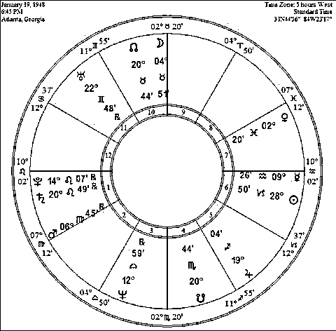

**丨**这位女士的出生星图

我们看到**冥王星合相上升点**，我们看到这个人**上升是狮子座**，狮子座在梦中必须变成野兽，这是需要勇气和力量才能变成野兽，因为他感觉到有些什么东西在威胁他的安全。我们也看到他的**南交点在 4 宫天蝎座**，**冥王星和土星合相四分南交点**。她承担了**保卫家庭的责任。**责任是土星，她独自这么做，没有人能够帮助她，这是**土星和冥王星合相在 1 宫**，这是**自我**的宫位。在梦中，她面对了自己的恐惧把这些野兽都赶跑了，但是面对她的恐惧也改变了她，她变成了可怕的东西，是否还能再变回人呢？实际上这对她来说是一个挑战，**如何把自己内在的一部分和另一部分整合在一起。**

**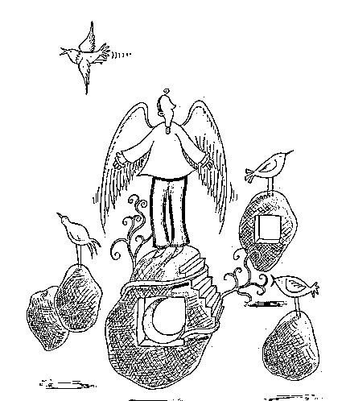**

这个女人在成长的过程中经历了和家人的分离。在四五岁的时候，她从父母身边被带走，带到祖父母身边。她也做出了反抗，当祖父要把她带走的时候，她一拳把祖父的眼镜打掉了。不过后来她又和祖父母建立了很强的联结。在她九岁的时候，她又被带回到了父母的身边。五年她都不在父母的身边，而她的梦发生九岁的时候，这时她试图重新融入自己原生家庭。这个梦是在帮助能够处理让他恐怖的一个历程。小时候，她就发展出一个很强的个性，邻里的男孩都怕她。所以当她早年被生活的突发事件改变生活的时候，她也发展出来了一个有点像野兽的自我。这个梦帮助她能够处理这个过程，能够回到原生家庭，能够和其他的人类相处。她的恐惧是：**“我怎么才能再次变回人呢？”**这个就变成了她青少年时期的一个一直的挑战，她确实后来成功地管理了这样一个过程，她慢慢地不再有这个重复出现的梦了，在他成年之后他的人生更加平和，更加成功。**在梦里，我变成了鱼**

我想和大家分享我童年时期一个重复的梦境，我童年时候就开始重复做一个和**鱼与水**相关的梦。这些梦代表人生的重要时期出现，要么是生活中的变化，要么是获得了一些个人成长。

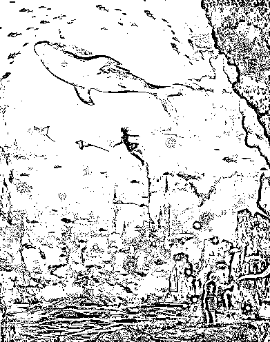

这个梦的核心是有一条清澈湍急的溪流。在我小时候这个梦开始于我成长的那个地方的前院。这条河会在房子的底下或者是周边流动，在梦中我会跟随这个溪流从后院直到朝着森林蜿蜒而去。在流水中我可以看到鱼，常常看到的是非常漂亮鲜艳的虹鳟鱼，有时候也是三文鱼而不是虹鳟鱼，但是可以感觉到冰凉的水。

我一踏进这个溪流就变成了鱼，和其他的鱼一起漂流而下，朝着溪流游过去，这个梦境总是带来安心和愉悦的感觉。我喜欢这个梦，变成一条鱼能够感觉到好像是这个溪流的一部分，醒来以后总是感觉到很平静很安宁。

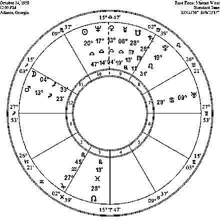

**丨**大卫·瑞雷的出生星图

我们可以在星图中看到很强的**海王星**主题，**太阳-海王星合相，月亮和火星在 12 宫，北交点在双鱼座，金星-海王星合相。**

注意，当我醒来，总是能够感觉到很安心。对于那些北交点在双鱼座的人我们常常会讲，他在学习如何能够顺着流水，顺其自然，也就是说有一点点能够顺从生活的流动。这也意味着需要对人生有更多的信任，这样就能随遇而安。

同时，你也注意到这些梦是发生在人生的一些生活有变化的时候，或者是获得了一些重大的个人成长，所以梦的作用是一种重新的确认，还有一些让人心安的作用。在这里大家看到梦境与星图出现的联系这是一个重复出现的梦境。

这几个梦都是非常重要的，我们看到太阳是一个重要的指针，实际上我们可以看到星图中的各个元素都是重要的。第一个星图中我们并没有看太阳，而是上升点和第一宫，土星和冥王星。其实所有的梦都有意义，对于情感上有执着的一些梦你会记得更清楚。**占星学还可以这样运用，你学到了吗？如果还想学习更多，可以了解一下我们的核心课程，链接在这里哦：[金牌课程·中英双导师 L1-2](http://mp.weixin.qq.com/s?__biz=MzA5NjA0NTAxNg==&mid=2651413233&idx=2&sn=aeaf7445e434b2c546c9b45916471e62&chksm=8b4be846bc3c6150ee11e712ede47c1143fdb77999fd1b5bdc4461b10d68d01bb353d0020063&scene=21#wechat_redirect)**

**版权声明：**本文由作者授权发布于若道平台，欢迎转发，反对抄袭。友号转载请申请白名单。


****想阅读更多作者的文章，请在后台回复******大卫****** 即可。****

**喜欢文章请长按下方二维码打赏**

**给大卫老师加杯咖啡呗~**

**▼**


**想系统学习占星学？**

**点击图片了解详情**


[](https://mp.weixin.qq.com/s?__biz=MjM5MjQwNjAyMQ==&mid=2649436786&idx=2&sn=5490a3d3c7b1d65e7de1e719d4f2031b&chksm=beb95d1889ced40ead344a9b0bc871aec083244015c8ae757094f2608bffab1f5777c50e9682&mpshare=1&scene=21&srcid=&sharer_sharetime=1579167487529&sharer_shareid=79ff492e946a049c0745c8e806eec753&exportkey=AaKGjHB7f8Z7%20X2FSxfLRTw=&pass_ticket=xSTCFTOymnHzc7zXd5EA%20MuNAFK/CYHowayelnSc9og=#wechat_redirect)

**微信又双叒叕改版啦，不想错过若道君的推送？**

**就把若道设为星标吧！**

**▼**


就是这个“在看”，戳戳戳 ☟

********报名直达入口********


# 沙龙 | 占星界最高奖得主，讲述土冥下的国家星图

> 原文：[`mp.weixin.qq.com/s?__biz=MzA5NjA0NTAxNg==&mid=2651413719&idx=2&sn=909a9750b0f6e0d0e2c1c7b0cb86b02f&chksm=8b4bee60bc3c6776cb8411b523cd2d6d875c27c65079a57109866dcb105a6c9ec47c1b1bf607&scene=126&sessionid=1692738207#rd`](http://mp.weixin.qq.com/s?__biz=MzA5NjA0NTAxNg==&mid=2651413719&idx=2&sn=909a9750b0f6e0d0e2c1c7b0cb86b02f&chksm=8b4bee60bc3c6776cb8411b523cd2d6d875c27c65079a57109866dcb105a6c9ec47c1b1bf607&scene=126&sessionid=1692738207#rd)


2020 年 2 月 28 日晚 8 点，国际占星研究协会（ISAR）星空俱乐部沙龙迎来著名占星师卡伦·哈梅克·佐达格的《土星和冥王星——国际事务中的动态二重唱》讲座！

**沙龙主题**

**沙龙主题****：土星和冥王星——国际事务中的动态二重唱**

**主讲人****：卡伦·哈梅克·佐达格**

**沙龙时间****：北京时间 2020 年 2 月 28 日 周五 晚 8 点 **

**沙龙方式****：线上沙龙**

2020 年初，我们遭受了冠状病毒肺炎的猛烈袭击。这个袭击始于湖北和武汉，后来是全中国，现在是全世界。袭击来得意外而迅猛，让从上到下，从中国到世界，措手不及。武汉为湖北、中国而封锁，中国为世界而封锁。但病毒已经迈出国门，向着世界其他地区蔓延。在世界越来越成为地球村的今天，**这场战役什么时候才是尽头**？

武汉战役在惊骇、喘息后，看得见死伤，也看得见希望。可是还有一场更大的、更艰苦、同样生死攸关的战役在等着我们。经济、企业、就业、收入、社会功能需要恢复运作，外交、国际贸易、国际政治的博弈无比复杂。看起来遥远，其实又与我们息息相关。

2020、2021 年，我们都知道我们要有一些**严峻的宇宙天气，如土冥合相。**但是，对于每个国家的影响都会因为其独特的国家星图而不同。**在这样的影响下整个世界现在是处于什么状态下？未来又会怎样？我们及和我们息息相关的一些国家，又会受到什么不同的影响？**

带着这些问题，我们非常有幸请到了

**占星学界最著名的奖项轩辕十四奖获得者**

**经世占星学领域中数一数二的世界著名占星师**

**卡伦·哈梅克**·**佐达格**

给大家带来一场精彩的沙龙

**土星和冥王星——国际事务中的动态二重唱**

她将在本沙龙中讲解

**一些重要国家的星图**

**并展示土星、冥王星合相的****关键问题**

**开启你对经世占星学的思索**

**经世占星学**（mundane astrology）****

**是占星学的一个分支**

**主要研究世界政治经济发展趋势和世界各国发展周期**

这场突入其来的袭击，让若道君深深感受到

个人是社会的一分子

雪崩时，每一片雪花都会滚落

社会的一粒灰，掉到每个人头上就是一座山

而**经世占星学，帮你去看到这一切**

**2020 年 2 月 28 日晚 8 点，若道君邀请你**

**在危机四伏中理解当下、为未来做准备****！**

**主讲嘉宾**


**卡伦·哈梅克**·**佐达格**

**（Karen Hamaker Zondag）**

卡伦·哈梅克·佐达格是**20 世纪最受尊重和赞誉的占星师之一**，她毕业于荷兰阿姆斯特丹大学，于 1975 年开始她的占星实践。她是荷兰**两所学校的创始人之一**：一所是 1980 年成立的阿切纳占星学学校，另一所是 1987 年成立的荣格心理学学院。她也被邀请作为英国著名占星教育机构心理占星中心（Centre for Psychological Astrology）的老师和美国第一所真正的、官方的占星学大学开普勒学院任教，并是**世界各大占星会议最受欢迎的演讲人之一**。由于其**对占星学的独特贡献**，卡伦·哈梅克·佐达格在 1992 年、1995 年、1998 年分别获得占星学界最著名的奖项轩辕十四奖项提名，并于 1998 年获得**轩辕十四奖**。

卡伦·哈梅克·佐达格一个非常鲜明的个人特色是她的**研究涉猎广泛而深入，她在心理占星、金融占星、经世占星方面都是该领域排名前列的老师，并且深受该领域知名占星师的赞誉**。因为其在占星学的知名声誉，她从 2012 年被隶属于荷兰著名投资集团 Rasile 的 Dasym Research （Dasym 是全球电视节目的创新的著名领导者，比如《中国好声音》就是引入 Dasym Media 的版权）聘请为**智库成员**，该智库调研当前世界显性和隐性的社会经济趋势，为发展和投资决策服务。她也是**TEDx 演讲**人。


她是**20 多本占星学、心理学、塔罗、易经书籍的作者**，包括《从占星学视角看金融危机的背景和未来》、《性的占星学和疗愈》、《日常生活中的占星学》、《心灵和占星象征》、《作为生活之道的塔罗牌》、《12 宫》、《宫位的本质和背景》、《相位研究》、《四轴手册》、《卜卦占星》、《关系占星学》、《占星学预测》、《从新的角度看外行星》、《易经、冥想和灵性》、《实践中的荣格心理类型》、《日常生活中的灵性和心理学》、《实践中的投射机制》、《自我的愉悦——愉悦心理学》、《神话和现实》等。她的书籍因为**广受欢迎**，**被翻译为 10 多种文字在多国出版**。


如何参加本次沙龙？

本讲座也是本月的国际占星研究协会（ISAR）星空俱乐部讲座。**ISAR 会员可以免费收看。**请注意邮件通知，具体参与方式见邮件。

❶ 如果你**已经是 ISAR 会员**，请注意邮件通知，告知如何参加。

❷ 如果你**不是 ISAR 会员**，非 ISAR 会员价格：98 元。

**非 ISAR 会员报名请长按下图** 

**▼**

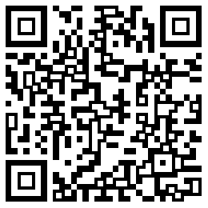

**ISAR 星空俱乐部**

2019 年，ISAR 在主席亚历山大·因舍阿吉克的带领下，成立了 ISAR 明星俱乐部，每月为全球 ISAR 会员提供在线直播讲座，邀请全球著名占星师开讲，学习和分享新的理念。讲座时长一小时，涉及占星学的不同领域、不同观点，每个会员都可以参与其中，每次讲座之后还有 20-30 分钟问答时间向老师们提问！

每一场在线讲座都会记录下来，ISAR 除了提供视频，还会提供相关的讲座资料，以及单独的问答录音，自动发送到专门的 ISAR 明星俱乐部页面存档，每位 ISAR 会员可以在 ISAR 网站上自己的会员主页俱乐部页面找到。在 2018 年最初几个月，ISAR 明星俱乐部会每月举办一场在线演讲。之后，两周举办一场演讲，最终每周举办一场演讲。

但是，过去明星俱乐部讲座只有英文沙龙，因此，中国会员只有懂英文才能受益。为了使得更多不懂英文的中国会员能够受益，我们特别和 ISAR 总部协商，今后会安排有中文翻译的明星俱乐部占星沙龙，作为给中国 ISAR 会员的福利！

如何成为 ISAR 会员？

**如果你也想成为 ISAR 会员，请复制链接在浏览器打开**

http://www.nodoor.com/isarcert.do?contentId=3588（仅支持网站支付）

**或直接长按下方二维码，微信购买会员：**


ISAR 会员有什么福利？

一年期会员仅需支付**人民币****420****元**，即可享受：

**☆ 星空俱乐部免费沙龙**

**☆每年出版 3 次的《国际占星师》（目前只有英文）；**

**☆每周电子邮件交流汇总杂志（目前只有英文）；**

**☆专项研究基金和奖学金资格；**

**☆ISAR 主办的会议和论坛的会员折扣，包括国际占星大会（UAC）、ISAR 的会议和研讨会等会员权益。** 

有疑问怎么办？

关于 ISAR 星空会员俱乐部以及我们的讲座，如果你还有任何疑问，**请联系处女座工作人员**：

**王老师  **

**电话：18510107057**

**微信：同上**

**若道 Conrad**

**微信：nodoor2019**

**因为站得高，所以望得远**

**经世占星学，助你**

**运筹帷幄**

**登高望远**

****非 ISAR 会员报名请点击“阅读原文”****


# 这门打开占星格局的课程，是时候了解一下了！

> 原文：[`mp.weixin.qq.com/s?__biz=MzA5NjA0NTAxNg==&mid=2651413719&idx=3&sn=e1159c929a1fc2bce97b26401cf3fce2&chksm=8b4bee60bc3c6776088de0ae46825bbab7b66f07ff5a3261dcc17011d871bc9c10ee77cf5a47&scene=126&sessionid=1692738207#rd`](http://mp.weixin.qq.com/s?__biz=MzA5NjA0NTAxNg==&mid=2651413719&idx=3&sn=e1159c929a1fc2bce97b26401cf3fce2&chksm=8b4bee60bc3c6776088de0ae46825bbab7b66f07ff5a3261dcc17011d871bc9c10ee77cf5a47&scene=126&sessionid=1692738207#rd)


有这样一则家喻户晓的故事：三个泥瓦匠在砌墙，一个人走过来，问他们在干什么。第一个泥瓦匠没好气地说：你没看见吗？我在辛苦地砌墙呢。第二个笑笑补充回答：我们正在建一座高楼。第三个则笑容灿烂哼着小曲儿说：我们正在为城市添砖加瓦、创造美好的生活。10 年过去了，第一个人仍然在做泥瓦匠，第二个人成为了一名工程师，而第三个人则成为建筑公司的老板。**工作技能本身没有区别，为什么三个人的人生走向却大相径庭？**

*   人的一生是见自己，见众生，见天地的过程。**不同的认知层次，形成了不同的人生格局。**它决定了你能看到的风景。我们常常抱怨命运不公，抱怨生活没有诗和远方，事实上，那是因为我们高度不够，格局太小。

*   同样，占星学习也是见自己，见众生，见天地的过程。**不同的认知层次，形成了不同的占星视野。**它决定了你可以运用这门语言看到怎样的风景。占星师常常困惑占星学习遭遇瓶颈，客户拓展资源不足，帮助来访者扩展格局能力不够。究其原因，是因为我们使用占星学的高度和格局不足。

晚清名臣曾国藩说：**谋大事者首重格局**。人和人不一样，拼的是格局。那又是什么决定着一个当代占星师的格局呢？大格局的本质是：**站得高，看得远，懂取舍**2020 春季开年 ISAR 选修课若道倾力打造不可不学的**经世占星学**一起来解锁全新大格局的占星版图吧！


占星之旅上半场拼的是知识技法占星之旅下半场拼的是眼界格局**为什么学习经世占星学？**

**经世占星学（mundane astrology）是研究世界政治经济发展趋势和世界各国发展周期的占星学研究分支。**

任何有一些人生阅历，对于国家历史、家族历史有所了解的人都会明白，我们的个人生活是时代和国家历史的缩影，我们个人经历的行进、推进是一条小溪，而更大的背景是世界和国家行进、推进的大河。大河的流向决定了小溪的流向。

学习经世占星学，**帮助我们及我们的客户这条小溪在这个世界的大江大河“顺势而为”**。具体而言：

*   在 21 世纪这个信息世纪，经世占星学可以帮助占星师开辟新的服务项目——**为高端企业家客户及大机构提供独特服务**，因为高端客户和大机构对于国际政治经济发展趋势，主要影响力国家、重要世界组织机构的现在和未来都更为敏感。对应国家的行进和推进，更好地预测这个国家或大型组织的未来发展、变化趋势；

*   在人口的国际间流动、交流更为频繁的时代，经世占星学通过了解各国的趋势，**可以在客户有国家选择需求时，帮助占星师为客户提供更多信息服务**。

*   如果你爱历史，经世占星学可以给你**看历史长河中世代兴衰起落的独特视角**；

*   如果你爱关注国际形势，经世占星学都能够让你更**了解每一个国家的国民个性、集体潜意识，社会议题和发展方向**；也能帮助你**对领导人及其国家的影响有更深刻的了解**。

**课程大纲**

**此课程可作为 ISAR 选修课。**

在这 10 节课的时间里，我们将学习**经世占星学的重要研究方向**，包括但不限于：

*   行星周期对于世界发展及格局变化的影响
*   研究国家星图及行星周期对于国家的影响
*   研究外国领导人星图及对其国家的影响
*   如何从政府成立、总统就职时间的星图研究时事发展
*   如何从重要组织机构诞生星图（如北约、欧盟、欧元区、第一个现代证券交易所的诞生星图）看组织未来
*   如何从重大事件发生时的星图（比如从曼德拉出狱日期看南非转折和开端）发现该事件对于国家的影响

**授课老师**


**卡伦·哈梅克**·**佐达格**

**（Karen Hamaker Zondag）**

卡伦·哈梅克·佐达格是**20 世纪最受尊重和赞誉的占星师之一**，她毕业于荷兰阿姆斯特丹大学，于 1975 年开始她的占星实践。她是荷兰**两所学校的创始人之一**：一所是 1980 年成立的阿切纳占星学学校，另一所是 1987 年成立的荣格心理学学院。她也被邀请作为英国著名占星教育机构心理占星中心（Centre for Psychological Astrology）的老师和美国第一所真正的、官方的占星学大学开普勒学院任教，并是**世界各大占星会议最受欢迎的演讲人之一**。由于其**对占星学的独特贡献**，卡伦·哈梅克·佐达格在 1992 年、1995 年、1998 年分别获得占星学界最著名的奖项轩辕十四奖项提名，并于 1998 年获得**轩辕十四奖**。

卡伦·哈梅克·佐达格一个非常鲜明的个人特色是她的**研究涉猎广泛而深入，她在心理占星、金融占星、经世占星方面都是该领域排名前列的老师，并且深受该领域知名占星师的赞誉**。因为其在占星学的知名声誉，她从 2012 年被隶属于荷兰著名投资集团 Rasile 的 Dasym Research （Dasym 是全球电视节目的创新的著名领导者，比如《中国好声音》就是引入 Dasym Media 的版权）聘请为**智库成员**，该智库调研当前世界显性和隐性的社会经济趋势，为发展和投资决策服务。她也是**TEDx 演讲**人。


她是**20 多本占星学、心理学、塔罗、易经书籍的作者**，包括《从占星学视角看金融危机的背景和未来》、《性的占星学和疗愈》、《日常生活中的占星学》、《心灵和占星象征》、《作为生活之道的塔罗牌》、《12 宫》、《宫位的本质和背景》、《相位研究》、《四轴手册》、《卜卦占星》、《关系占星学》、《占星学预测》、《从新的角度看外行星》、《易经、冥想和灵性》、《实践中的荣格心理类型》、《日常生活中的灵性和心理学》、《实践中的投射机制》、《自我的愉悦——愉悦心理学》、《神话和现实》等。她的书籍因为**广受欢迎**，**被翻译为 10 多种文字在多国出版**。


**授课时间&方式**

**授课时间（共 10 次课）**：

*   2020 年 4 月 6 日（周一）

*   2020 年 4 月 14 日（周二）

*   2020 年 4 月 21 日（周二）

*   2020 年 4 月 28 日（周二）

*   2020 年 5 月 5 日（周二）

*   2020 年 5 月 12 日（周二）

*   2020 年 5 月 19 日（周二）

*   2020 年 5 月 26 日（周二）

*   2020 年 6 月 2 日（周二）

*   2020 年 6 月 8 日（周一）

**授课方式**：

**线上网络直播课，英文授课，中文翻译**

**课程价格**

**正价：7500 元**

**早鸟价：6800 元**

**早鸟价截止日期：2020 年 3 月 6 日**

**退转课程**

**退款原则请详看《教学协议》，如有疑问请咨询课程顾问。**

****ISAR 选修·经世占星学****

**授课老师：卡伦·哈梅克**·**佐达格**

**时间：**2020 年 4 月 6 日-6 月 8 日（共 10 次课）

**授课方式：**网络直播课，英文授课，中文翻译

**费用：**7500 元；**早鸟价：6800 元（2020 年 3 月 6 日之前）**

**课程负责人：**王老师（微信：18510107057），请备注“经世占星”

长按二维码添加课程负责人咨询~


****报名请点击“阅读原文”****


# 星图中的这种配置，可能就是你人生“重大追求”的根源所在！

> 原文：[`mp.weixin.qq.com/s?__biz=MzA5NjA0NTAxNg==&mid=2651413613&idx=1&sn=a0558ab40f5d1871c0200bd946384e24&chksm=8b4beedabc3c67ccbbc514682831336d640d2947a759e709421bafb5691a142974edebb8dec6&scene=126&sessionid=1692738207#rd`](http://mp.weixin.qq.com/s?__biz=MzA5NjA0NTAxNg==&mid=2651413613&idx=1&sn=a0558ab40f5d1871c0200bd946384e24&chksm=8b4beedabc3c67ccbbc514682831336d640d2947a759e709421bafb5691a142974edebb8dec6&scene=126&sessionid=1692738207#rd)

****************☆** 后台回复“今日”，给你一句生命态度**************


文/卡罗尔·泰勒 翻译/Leisha 校对/Arrow 

编辑/Tang 封面/书君 图片/网络 

之前的文章我们提到了[星图中元素分配不均的影响](http://mp.weixin.qq.com/s?__biz=MzA5NjA0NTAxNg==&mid=2651413570&idx=2&sn=e45c094729e0153b90cdfd2902a2b6df&chksm=8b4beef5bc3c67e3303dd5bb458066a4a82c87ff1130d2a986a0ebdc42b87eb8ba7cfa029ee9&scene=21#wechat_redirect)。今天，若道君想和大家深入地聊一聊元素缺失具体会带来怎样的影响。你可能没想到，缺失某种元素，可能会让我们实现某种非凡的成就，这是为什么呢？土风水火，缺失其中一种元素具体的影响又是什么？这篇干货满满的文章，值得我们好好学习。**元素缺失，可能会实现非凡成就**如果星图中有一种元素很少（或缺失），可能意味着什么？名人们曾经做过什么事去弥补所谓缺失的功能？“**空白、空间或缺失会提供一个良好的机会，这是可以有所创造的地方**。”**我们既被出生星图中存在的元素所定义，也被其中缺失的元素所定义。****尽管某种元素的大量存在意味着天赋和轻而易举的表达，但元素的缺失表明相反的情况，我们可能会对元素缺失的部分表现出尴尬和局促不安，感觉自己缺乏某种重要的技能。**缺失的元素通常具有一种神话般的特质，它会**成为我们渴望的东西，我们可能会热切地尝试通过我们的工作或身边的人来找到它**。然而，这种探索本身就给予我们了一件无价之宝，**缺失某种元素所产生的激昂情感，可能会使我们受到启发去实现非凡的成就**。

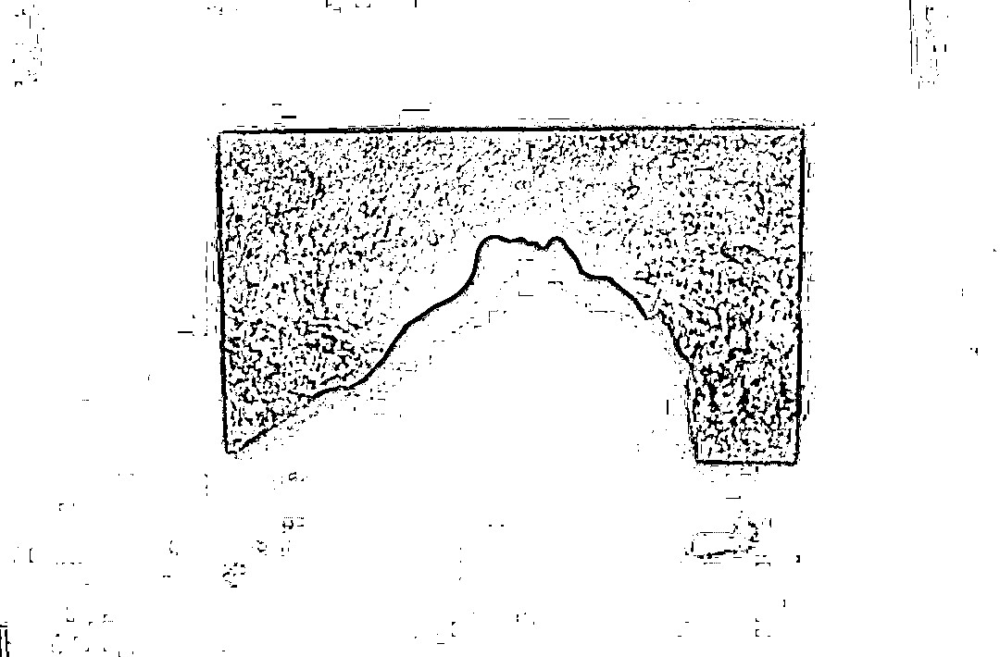

**缺失意味着存在**

在爱德华·摩根·福斯特的小说《印度之行》中，戈德博尔教授解释了宇宙中善与恶的相互作用，上帝存在于一处，便会缺席于另一处：“……存在与缺失之间的差异是巨大的……但**缺失意味着存在，缺失并非不存在**。”我们可能会对元素做出类似的陈述——**元素缺失意味着它在原型层面仍然存在**。

宇宙的基本成分由四种元素共同组成，古希腊哲学家恩培多克勒是第一位提出这个想法的人。泰勒斯曾认为宇宙的基本成分是水，阿那克西美尼认为是空气（风），赫拉克利特认为是火，如果我们认为古希腊哲学家们本身就受到元素失衡的驱使，那可能是情有可原的。

恩培多克勒认为这四种元素都是宇宙的基本成分，并声称身体健康来源于四种元素的平衡，这是非常典型的希腊人作风，将四元素与四位神祇（宙斯、赫拉、哈迪斯、珀尔塞福涅）联系起来，并将它们理解为**原型力量**。他的想象中，每个元素的物质实体牢牢地联结上帝头脑中的一个念头。

在荣格的思想中，存在对立统一的观念，超越所有的两极对立和割裂——这是一个相当宏大的灵性目标，我们在现实生活中可能会与这个目标较劲。但是，我们内在某处储存着一张实现完美平衡的蓝图，因此，我们本能地了解自身缺失什么。**与缺失的元素建立联结是一种神奇之举，源于灵魂的渴望——缺失的元素可能是重大人生追求的根源所在，对于创造自我的工作至关重要。** 

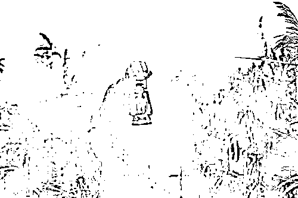

**使无意识变为有意识**理查德·埃德蒙在《神线》（The Magic thread）一书中提出了**心灵应对星图中缺失功能的五种机制：否认、压抑、投射、升华、补偿**。这表明某种事物在无意识层面运作，但试图被人意识到。缺失的元素可能看似是陌生异物，让我们感觉不熟练、不自然；我们会向他人寻求指引或认可，试图找到一个能使我们理解缺失元素的方法。任何被压抑的事物，其力量都会增长，并往往会滋生欲望和反感。如埃德蒙所言，水龙头要么开到最大，要么完全关上，但无论如何，光和影似乎都是同时产生的。**它可以成为一种类似使命的存在，驱动伟大才能的发展，但也可以成为不适感的来源，使我们容易批评别人。**

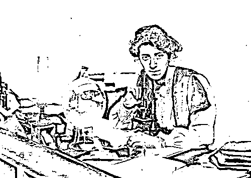

| 英国节制生育的提倡者玛丽·斯特普

例如，**玛丽·斯特普的星图中除了上升点之外，没有土元素**，她勇敢地为争取性教育和女性掌控生育的权力而积极活动。但是，她也热烈提倡优生学，她认为只有生理上完美的人才应该生育后代，而且对肢体残障感觉恐惧。她剥夺了儿子的继承权，因为她儿子娶了一位患有近视的女性，玛丽害怕他们的孩子也会有类似的问题。

上升点是唯一一个落在土元素的点，与上升点相关的情结呈现出清晰的定义——这个点象征着由出生所产生的复杂情感。上升点在处女座可能唤起了生理纯洁和控制生育过程的想法，**因为上升点是土元素唯一的出口，所以显得更为迫切和重要**。

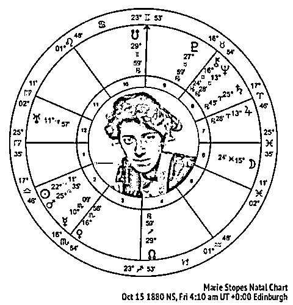

|  玛丽·斯特普的出生星图，1880 年 10 月 15 日，上午 4:10，爱丁堡

**任何被压抑的事物常会显现为投射，成为我们关系中的主题。**由于某种元素的缺失，我们可能会试图让拥有这种元素的人聚集到我们身边，从而将这种元素收为己用，用于填补空缺。一个团体中的每个人通常会自然而然地扮演起不同的角色：火象做领导，风象提出想法和计划，水象将这些想法和计划重塑得更有人情味、更精妙，而土象则做会议记录，并确保会议按时结束。但当然，我们都是独特的个体，当我们不在团体中时，就会恢复原样。伴侣关系和婚姻提供了另一条途径，这条路同样既行得通又行不通——每个伴侣都会发挥自身优势，但我们仍然要面对与缺失元素建立关系所需的心理工作。**“补偿”是强迫自己变得优秀绝伦，掩饰自认为缺乏的才能，并且去掌握或实际上去控制缺失的元素。**我有一个缺风元素的朋友，她 18 岁申请大学时，因为成绩太差而被拒。她继续考试并重新申请入学，到 24 岁时终于被录取，那时的她却因生病而无法入学。我猜想她其实并不想上大学，但确实想证明自己的智力水平。**在追寻缺失元素的过程中会付出大量的心灵能量，我遇到过的所有星图中缺失了某种元素的人，都会在人生中以某种形式投身于寻找该元素之旅。**通常这是无意识的，直到你能在更优越的位置从不同的视角看待自己的人生之后，才能有所意识——也许只有在回溯往昔的时候，我们才能将其视为塑造性的影响力。我那位缺风元素的朋友现在开办了非常成功的室内设计课程，并且发展出了一种难能可贵的沟通天赋。不用多说，她的知识基础十分广博。


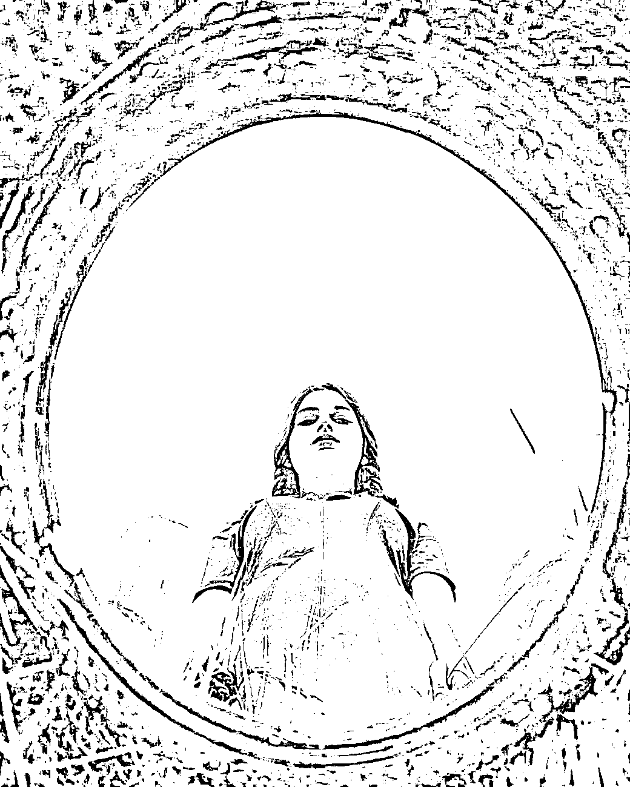

**镜中世界**因此，**元素缺失会显现出一种特殊的创造力——通常由痴迷锻造而成，并受到一种强迫性的驱使，去创造命定的元素管道所相应的终极表达**：缺风元素的人（如歌德或劳伦斯·奥利弗）成为了最出色的作家，或者缺水元素的人（如马克·施皮茨）获得了奥运会游泳项目的金牌（九次）。或者我们可以对比莫奈（水元素占主导）和马蒂斯（缺水元素），马蒂斯呈现出一种更为痛苦的情感表达，仿佛是从一个逼仄的空间中挤压出来的一样。马蒂斯发展出了一种名为“野兽派（Fauvism）”的绘画风格。“fauve”是法语词，意为“野兽”，因其不协调的色彩运用和极度狂热的风格而得名。缺水元素体现为既不圆润，也不柔软。**空白、空间或缺失会提供一个良好的机会，这是可以有所创造的地方。**在阴影中铸造的天赋常会在我们不经意间慢慢崭露头角。这种转变通常是缓慢而痛苦的，但其努力程度可能令人惊叹，与之旗鼓相当的只能是自知欠缺某种才能而自我批评的力度。作为一趟神圣之旅，它会唤起勤奋的品质。在这里，我们无意识地向原型法则致敬，我们有一种要为某事服务的感觉。我们可能并不会完全以这种方式表述，但这也许是去追寻上帝缺失的面孔。

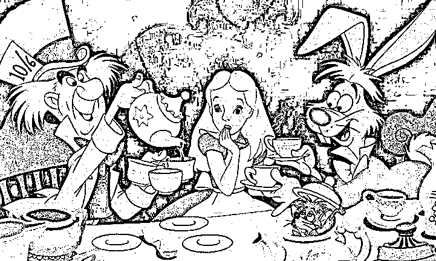

|  刘易斯·卡罗尔的《爱丽丝梦游仙境：镜中奇遇记》被迪斯尼拍成动画片

我们常常不认可自己的努力和成就。刘易斯·卡罗尔的出生星图既是示例，也是隐喻——卡罗尔缺水元素，但他用想象力构建出了一个完整的虚幻世界，名为“仙境”。与地下世界类似，这个世界存在于镜子的另一面——《爱丽丝梦游仙境：镜中奇遇记》。这是个巧妙的象征，**我们的成就建立在阴影处、在罅隙里、在镜像中**。**我们常感觉这个成就好像不属于我们，感觉它无足轻重，但它就在那里，确凿无误。**


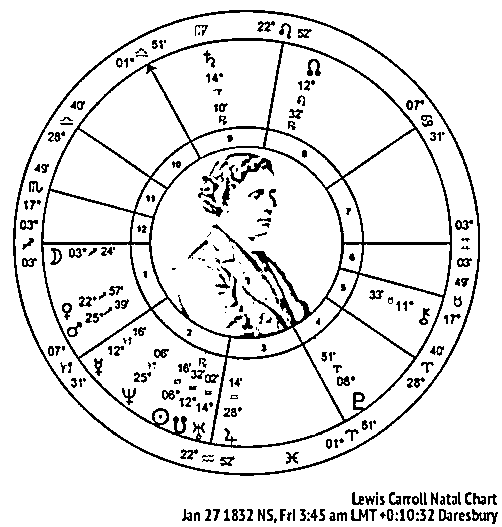

| 刘易斯·卡罗尔的出生星图，1832 年 1 月 27 日，上午 3:45，达斯伯里

**四元素缺失的影响**1 土元素**土元素被视为最密实、最稳定的元素。它效率高、可靠、现实、耐心、保守，代表此时此地的现实生活。**它将能量凝结为物质实体，并反映出维护边界的能力、做事有条不紊的能力，以及为了使一切运转如常而完成俗务琐事的能力。**土元素的缺失会使人无意识地强烈关注这些过程，产生一种要在物质领域（身体、性和感官欲望、食物、金钱以及物质世界的所有事物）证明自己能干，甚至证明自己最优秀的渴望。**这可能会让我们联想到与金钱之间的双刃关系，一个人受到驱使去创造财富，但同时又对拥有金钱感到内疚。**阴影可能是一种无意识的唯物主义：表面批判，但私下羡慕。**然而，这种动力也可能会驱使人做一些非凡的事，**从人与物质的混乱关系中显露出来**。例如，比尔·盖茨的净资产值约 650 亿美元，但他已经离开企业界，成为一名全职慈善家，专注于全球卫生计划以及改善他人的物质条件。也许有人会说他表现出了一种要把钱都给出去的冲动渴望。**缺失的功能往往是原始的、神话的、原型的，会浮现在梦境和幻想中。**《花花公子》的出版商休·海夫纳，为成千上万的男人营造了一个由赌场、豪宅和无限肉欲满足所组成的魅惑世界，让男人们梦想成真。我们的确可能在缺土元素的人身上发现一种“恋青春狂”（pueraeternus：渴望自己永远年轻）的特质——不愿适应身体层面的限制或进入成年的过渡仪式，比如那些在土星行进时期密集出现的经历。

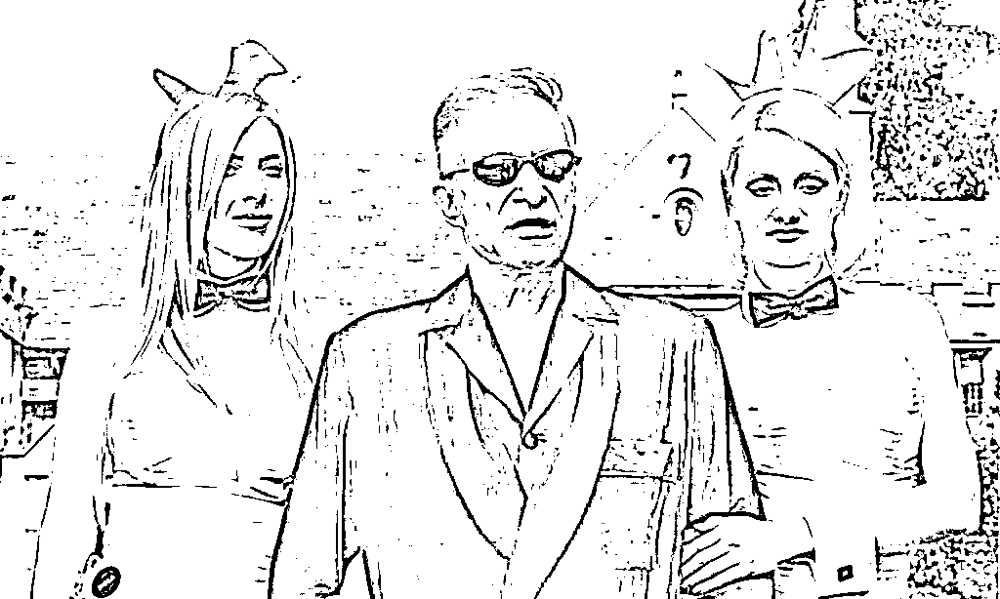

| 《花花公子》杂志创始人海夫纳和兔女郎们

但从另一个角度而言，我们也可以看到海夫纳为 20 世纪 50 和 60 年代的社会变革做出了贡献，无论你对《花花公子》的看法如何，它都为应对经济紧缩、物质和性期望低迷的战后生活，带来了更广泛的社会影响。实际上，一种植根于他个人心理和严格教养的激情多多少少成为了造就这种人生经历的原因。

**身体可能会成为一个影响力强大的关注点。**失聪的打击乐演奏家伊夫林·格兰妮会根据声音与自己身体不同部位产生的共鸣来记录音高和音色。时装设计师皮尔·卡丹和詹尼·范思哲，博物学家、地质学家、生物学家查尔斯·达尔文，以及许多著名的雕塑家和艺术家——罗丹、拉斐尔、米开朗基罗；他们的作品注重感官享受和肉体，人体构造精准，展现了物质生命的所有愉悦和痛苦。

2 水元素**水元素反映出直觉和情感真相的世界。水元素通过另一双超越有形世界的眼睛来“看”事物。感受从内心深处流出，回应方式往往是个人的、主观的、以自我为参照的。它偏向于想象力、描述、故事——善于接纳、易受影响、有感染力、引人入胜、缺乏控制。****水元素会创建情感的纽带。**巨蟹座寻求宗族、家庭、族群、归属于一个群体的重要性、保护欲和牵绊。天蝎座偏好紧锁式的关系，以忠诚为深刻联结。双鱼座眼中没有界限，将自己融入整体之中。**缺水元素意味着要寻找情感领域的表达方式。**英文“表达”（express）一词字面上的意思是“把自己掏出来”——这项任务可能会使不信任水元素第六感的人感到更为忧虑。**缺水元素的人表达情感时通常会用力过猛，而造成情感无法克制地汹涌翻腾。**在经历痛苦和丧亲之时，未被发泄的情感不断积压上涌，找寻足以宣泄情感的言语。

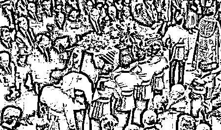

| 戴安娜王妃葬礼我们可能还记得 1997 年黛安娜王妃去世时的那种群情悲痛，这件事所唤起的情感势必远远超出了国民对王妃的爱慕之情。对于缺水元素的人而言，这类公众事件要么会引起惊恐，要么会成为他们渴望已久的宣泄出口。也可能是由个人的丧亲之痛开启情感洪流的闸门，使当事人被淹没在压抑已久的情感浪潮之中。但是，某些东西正在虚空之中慢慢成形。埃德蒙提到许多心理治疗师缺水元素。我个人也认识好几位这样的治疗师，他们都极为慎重和细心地为他人营造出一个共情的环境，使客户能够与自己的感受建立联结，这类治疗师可能对这些事更为敏感。**缺水元素的作家、艺术家、作曲家常在他们的作品中表达出极致的情感高度，也许是用这种方式来疏导情感，或处理他们在日常生活中感觉被压抑的深刻感受**：雪莱、柯勒律治、格里格、施特劳斯，当然还有伍尔芙（《海浪》的作者，弱化了散文和诗歌之间的界限）。**关系常在他们的人生中占据主导**：简·奥斯汀从未结过婚，但她的著作多围绕恋爱关系展开。

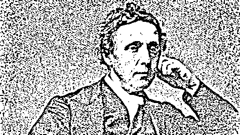

| 刘易斯·卡罗尔

回到刘易斯·卡罗尔的案例：他所创建的梦幻领域实际上是一个脱离他数学教授身份的世界，是一个载体，用于传递无法用数学公式表达的情感。他笔下的角色超凡脱俗、情感复杂。卡罗尔第一次见到爱丽丝（和她的母亲洛里娜，据说他爱上了洛里娜），便创作了第一个故事，当时他的次限太阳推进到了双鱼座（他还开始从事摄影，并开始写浪漫主义诗歌）。正当缺失的功能准备好在我们身上显现时，我们常把它幻化为关系的形式。在这个案例中，它被幻化为女性的形式，如爱丽丝以及她的姐姐和母亲，是让他打开想象力的阿尼玛（男性内心的女性意象）。3 风元素

**风元素是社会性的——感兴趣、主观，为距离、信仰、种族、观念之间的巨大鸿沟建立起中立的桥梁。**它倾向于叙述和表达，理性和抽象，不必认同却也能理解不同的观点。在很多情况下，它可能最终会固步自封于一个理论或公式，混乱麻烦的情感维度也让它感觉不适。双子座倾向于语言和言论，天秤座倾向于公平、正义、平等、交流，而水瓶座则使我们沉浸在社群和共同的纽带中。

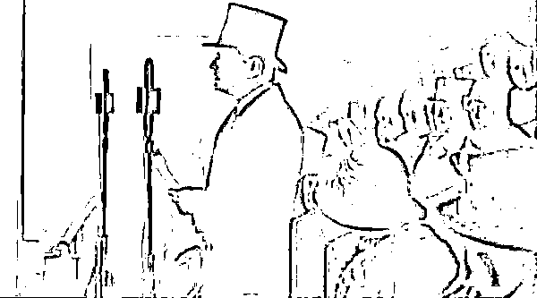

| 电影《国王的演讲》截图

**对于缺风元素的人而言，考验可能涉及语言或智力层面。**电影《国王的演讲》讲述的是国王乔治六世的故事，他患有口吃并且害怕公开演讲。在言语治疗师莱昂纳尔·罗格（在得知罗格没有行医资格后，国王与他曾闹掰过一阵）的帮助下，他才克服了这一恐惧。国王扮演者科林·费斯的星图中，只有火星落在风元素，也许他本人对这种恐惧就有一定的了解。

显然，这并不是说缺风元素的人智力水平不行。但我们确实可以说，**风元素的缺失会使智力变得敏锐，从而创造出非凡的智力成就——博学多才，通晓多门语言，以及精通语言文字艺术的人**：托尔斯泰、史文朋、仲马、海明威。

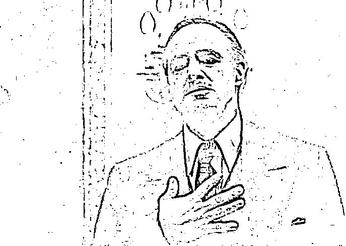

|  电影《教父》中的马龙·白兰度

马龙·白兰度缺风元素，并且还有雪上加霜的水星-土星对分相。众所周知，他爱喃喃自语（说台词也爱即兴发挥，不跟剧本），他表达的方式大多是通过展现自己强健的体格和性感风姿。


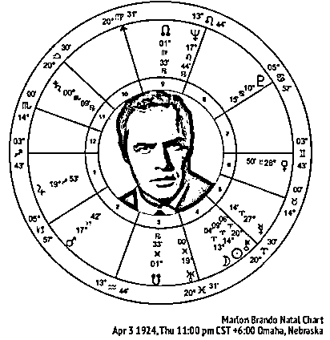

|  马龙·白兰度的出生星图，1924 年 4 月 3 日，下午 11:00，内布拉斯加州奥马哈市

4 火元素

**火元素是生气勃勃的情绪，狂野而不受限制。它的干劲、活力、鼓舞作用和果敢的精神令人倍感愉悦。**白羊座是开拓者和创业者，与险境对赌；狮子座的任务是做领导以及享受做自己的荣耀；射手座倾向于冒险，朝向遥远的地平线和未来前进。

**火元素带来一种充满希望、信心和热情的感觉。**受到鼓舞（enthused）意味着心怀神灵（entheos：希腊语中“被神鼓励的”意思），神的力量助人克服世俗障碍。在以火元素人为主角的神话和故事世界中，火元素保持“高亢”的状态；此时此地的现实生活不如冒险和虚构世界那么有趣。

**对于缺火元素的人而言，主要主题之一可能是寻找属于自己的特殊位置，得到认可和赞赏，并发扬自己的创造力之光。**看似更容易的做法也许是汲取别人的灵感，活在另一个被认为更有创造力的人的阴影下，而让自己成为万众瞩目的中心似乎并非易事。但是显然，那些缺火元素的人并不缺乏创造性的活力，其中很多人更是以其澎湃的激情著称：杰奎琳·杜普雷、范尼莎·雷德格雷夫、拜伦、济慈。

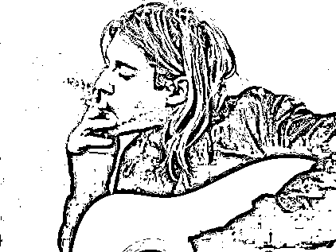

|  涅槃乐队主唱科特·柯本

**如果火元素描绘的是动作片英雄的形象，那么缺火元素的人则可能在想象中创造这个角色**，如肖恩·康纳利、布鲁斯·威利斯或鲁道夫·瓦伦蒂诺——也可能像科特·柯本一样，成为安静的偶像。**由于缺乏信任和信念，又受到寻求意义的驱使，与神的联结可能至关重要。**它可能会成为让人奉献一生热忱和激情的事业，比如圣女贞德或特蕾莎修女。虔诚的宗教信徒高迪，星图中只有金星落入火元素（在第十二宫），我们可以看到凡尘之爱被升华为最绚丽的艺术，以宗教礼拜的精神将作品敬献于世。

**我们中大多数人也许永远不会达到这种高度。但对所有缺失某种元素的人而言，它可能是处于生命核心、蕴藏非凡天赋的源泉。**

**版权声明：**本文由若道翻译，欢迎转发，反对抄袭。友号转载请申请白名单。


卡罗尔·泰勒

英国占星师，也在威尔士大学-圣大卫三一学院担任文化天文学与占星学专业菲亚文学硕士课程的导师。曾担任英国占星学院的院长，在该学院任教 20 年，现为学院的研究主任。曾在国际联合占星大会和英国占星协会大会上发表演讲。持有坎特伯雷基督教会大学神话、宇宙学和圣事专业的文学硕士学位。

**想系统学习占星学？**

**点击图片了解详情**


**微信又双叒叕改版啦，不想错过若道君的推送？**

**就把若道设为星标吧！**

**▼**


就是这个“在看”，戳戳戳 ☟

********报名直达入口********


# 金牌课程 L1-5 | 系统学习严肃占星，开启自由职业之路

> 原文：[`mp.weixin.qq.com/s?__biz=MzA5NjA0NTAxNg==&mid=2651413613&idx=2&sn=f11dd39a26526db99620fa81eeea16a9&chksm=8b4beedabc3c67cc9aa957dc94b46672e2dacd016e05bba7350ffe50366851a733da2f63d3f3&scene=126&sessionid=1692738207#rd`](http://mp.weixin.qq.com/s?__biz=MzA5NjA0NTAxNg==&mid=2651413613&idx=2&sn=f11dd39a26526db99620fa81eeea16a9&chksm=8b4beedabc3c67cc9aa957dc94b46672e2dacd016e05bba7350ffe50366851a733da2f63d3f3&scene=126&sessionid=1692738207#rd)


2020 年，一场疫情像一只突然出现的“黑天鹅”。让多少企业、多少人乱了阵脚。大家深刻的感觉到：没一技之长、没有两手准备，灾难面前真是手足无措。我们都在焦急的等待着疫情的拐点出现，突然多出的假期，有人焦虑刷屏，也有人重新规划未来，更新技能和认知。很多人一直都渴望发展副业，平时虽然爱好不少，突发状况面前却发现并没有哪项爱好，能成为增加收入的一技之长。

## **每一次大波折，都会倒下一批人，也站起来一批人。****这是历史的铁律。**

是时候重新认识自己了。**开启副业之路，自助助人的 PLAN B**曾经的你，有没有想过，人生还有一种全新的可能？
如果把自己的人生看成一间公司，时间和精力看成生产资料，那么你作为自己的 CEO，应该有对这家公司的“战略规划”意识。**第一，设定目标。**穿越新闻事件、外界信息的重重迷雾，我们优先要向内看，我是谁？我喜欢或不喜欢什么？我想过一种什么样的生活？正视自己，不盲目随波逐流。**第二，盘点优劣势。**我现在处于什么位置？为了达到我的目标，我有哪些优势？我还缺少哪些知识、技能、经验或领路人？**第三，制定计划、稳步实施**。我知道我在哪，我要去哪儿，我需要找到现实与梦想的差距，想方设法去缩小差距、达到目标。**占星学是非常好的“自我战略规划”的工具。**可以帮助你**认识自己、找到自己的优势和目标，根据时代趋势调整自己步伐**，更好的全力以赴，永远不用担心被淘汰！**而你通过占星学习你帮助了自己，也可以选择成为自助助人的占星师，开启受益终生的第二事业。****顺应趋势，迎来人生拐点**“

**如果你等待知更鸟的到来，你将错过整个春天。**

**——沃伦·巴菲特**

”面对这次疫情危机，不少公司开启了“云办公”，人们开始在家里办公。也有不少人抢先顺应趋势，率先迎接新世界的到来。未来是个体崛起的时代，大量个体被鼓励独立发展，比如网红、自由职业、自媒体、咨询师等，他们都不需要传统的办公室。社会越发达，人的独立性就越强，**未来有能力的人都会变成独立的经济体**。如果你也相信，想顺应时代趋势抓住时代机遇？想实现人生逆风翻盘？

## 决定一个人最终高度的，往往并非起点，而是拐点。

##  机遇都在拐点，**占星学**正站在你的人生拐点等你。

**为什么是占星学？**一方面社会快速发展人们压力山大，抚慰心灵的咨询市场需求巨大。另一方面市场鱼龙混杂，真正学院派的严肃占星从业者十分稀缺。
最重要的，占星学能让你自己帮助自己，无论你是否进行占星咨询从业，学习了占星学，它都将是终身陪伴你成长的睿智好伙伴。


**你的占星核心课老师是谁？**

拥有**49**年占星实践经验的

**若道创始人**

**ISAR 全球副主席**

**ISAR 全球职业占星师资质认证主席**

**大卫·瑞雷**

&

**最懂学员的若道首位认证金牌中国老师**

**熊鹰**

师徒二人合力打造
**2020 年若道****全新****核心占星课程**

**连报 L1-5 全阶课程，可以享受到****：** ❶ **61 次线上直播互动网络课程+2 场工作坊**（亲密关系+职业占星工作坊、知识回顾+综合解读工作坊），全面而详细地讲解占星学知识、技能、案例和重要领域实践运用。

❷ **知识点+学员星图解读有机结合**：熊鹰老师以知识点和学员案例讲解为主，大卫·瑞雷老师以参课学员案例及客户案例讲解为主。每个知识点覆盖班级内学员的亲身案例，参与感更强，每位学员都有机会听到自己的星图分析。

❸ **微信群学员互动分享**，从真实案例学习生命成长故事。

❹ **论坛提问**：论坛上每个学员的问题都将得到及时回复。

❺ **提供咨询师实习平台**，只要努力，都将有机会在毕业前进行咨询的实习演练，听取客户反馈，为成为职业占星师做准备。


**L1-5 阶，我们要学习什么？**

**1-2**

**第一阶****  12 星座，12 种性格，12 种人生 **

❶ 学习占星学必须准备的“心法”

❷ 占星学中的火、土、风、水四元素，阴阳法则

❸ 面对面的星座有故事

❹ 12 星座：12 种性格详解，12 种行为模式，12 种价值观

❺ 太阳和月亮：了解你的太阳，生命的发动机，让你在世界闪光的方式，生命获得力量的方法；了解你的月亮，让你获得幸福的方法

❻ 了解太阳、月亮，了解你生命中已经出现的、将会出现的男性和女性

**第二阶****  命运的线索和人生故事中的演员**

❶ 命运的线索：南北交点

❷ 星图三巨头：太阳、月亮、上升点的故事

❸ 了解心智：水星

❹ 了解金钱和关系：金星

❺ 了解行动模式：火星

❻ 了解信念：木星

❼ 了解努力：土星

❽ 了解天才和疯狂：天王星

❾ 了解梦想和幻灭：海王星

❿ 了解死亡和重生：冥王星

⓫ 12 个人生场景：黄道 12 宫位初解

**课程安排**

*   2020 年 4 月 2 日：星座 1（主讲人：大卫·瑞雷老师）
*   2020 年 4 月 9 日：星座 2（主讲人：熊鹰老师）
*   2020 年 4 月 16 日：太阳、月亮（主讲人：大卫·瑞雷老师）
*   2020 年 4 月 23 日：水星、金星、火星（主讲人：熊鹰老师）
*   2020 年 4 月 30 日：木星、土星（主讲人：熊鹰老师）
*   2020 年 5 月 7 日：三王星（主讲人：大卫·瑞雷老师）
*   2020 年 5 月 14 日：宫位 1（主讲人：熊鹰老师）
*   2020 年 5 月 21 日：宫位 2（主讲人：大卫·瑞雷老师）
*   2020 年 5 月 28 日：月亮交点 1（主讲人：熊鹰老师）
*   2020 年 6 月 4 日：月亮交点 2（主讲人：大卫·瑞雷老师）

**L1-2 除了网络直播课**

**L1-2 初阶课程还有两场线下工作坊可供选择**

**L1-2 上海工作坊**（2020 年 6 月 12、13、14 日 熊鹰老师主讲）

**L1-2 北京工作坊**（2020 年 6 月 25、26、27 日 大卫·瑞雷老师主讲）

就看你是喜欢哪种形式

**文末有每种形式的价格，还有连报套餐价哦**


**3**

**第三阶**** 宫位、相位以及初步解读星图（15 次课）** 

❶ 15 次线上直播网络课程，每次 2 小时，堂课中依旧会使用同学们的星图作示范

❷ 10 节课由熊鹰老师教授，重点通过名人星图阐释知识点

❸ 5 节课由大卫·瑞雷老师教授，重点通过学员星图阐释知识点

❹ 从第三阶开始，助教将会指导练习，答疑解惑，学练结合

❺ 重点在于如何根据星图去问问题，着重自我发现和自我探索的过程 

**课程安排 **

*   2020 年 7 月 2 日：宫位、行星和星座组合

*   2020 年 7 月 9 日：宫位、行星和星座组合

*   2020 年 7 月 16 日：月亮交点

*   2020 年 7 月 23 日：月亮交点和演示案例

*   2020 年 7 月 30 日：相位

*   2020 年 8 月 6 日：相位、星座、行星和宫位

*   2020 年 8 月 13 日：相位、星座、行星和宫位的同学案例

*   2020 年 8 月 20 日：渐盈相位和渐亏相位，示例

*   2020 年 8 月 27 日：更多的关于宫位和宫主星

*   2020 年 9 月 3 日：同学案例

*   2020 年 9 月 17 日：空相行星和定位星

*   2020 年 9 月 24 日：宫主星

*   2020 年 10 月 15 日：优先级和组织

*   2020 年 10 月 22 日：相位模式以及范例

*   2020 年 10 月 29 日：学员星图解读范例

**4**

**第四阶**** 出生星图解读（进阶）以及关系与职业议题（12 次课，1 场四日亲密关系+职业占星工作坊） **

❶ 12 次线上直播网络课程，每次 2 小时，堂课中依旧会使用同学们的星图作案例

❷ 8 次课由熊鹰老师教授，4 次课由大卫·瑞雷老师教授

❸ 1 场北京现场四日工作坊：亲密关系+职业占星，学生将被选中进行案例演示和互动。

**课程安排**

*   2020 年 12 月 3 日：整合星图和星图优先级
*   2020 年 12 月 10 日：综合解读
*   2020 年 12 月 17 日：整体案例
*   2021 年 1 月 7 日：亲密关系/对比星图
*   2021 年 1 月 14 日：占星学和对比星图的例子
*   2021 年 1 月 21 日：对比星图同学案例
*   2021 年 1 月 28 日：对比星图同学案例
*   2021 年 2 月 4 日：占星学的职业介绍
*   2021 年 2 月 18 日：占星学的职业案例
*   2021 年 2 月 25 日：占星学的职业同学案例
*   2021 年 3 月 4 日：儿童职业发展
*   2021 年 3 月 11 日：亲密关系/职业同学案例

**工作坊安排**

**亲密关系（两天）+职业（两天）四日工作坊****时间**：2021 年 3 月 18 日、19 日、20 日、21 日**地点**：北京**学员将被选中进行案例演示和互动（免费）**

**5**

**第五阶**** 预测、关系、咨询，为执业和考试做准备（24 次课，1 场四日工作坊）** 

❶ 24 次线上直播网络课程，每次 2 小时，堂课中依旧会使用同学们的星图作案例❷ 15 次课由熊鹰老师教授，12 次课由大卫·瑞雷老师教授❸ 1 场综合解读工作坊（北京）：把一切串联起来，学生将被选中进行案例演示和互动。**课程安排**

*   2021 年 4 月 15 日：行进介绍 1
*   2021 年 4 月 22 日：行进介绍 2
*   2021 年 4 月 29 日：行进介绍 3
*   2021 年 5 月 6 日：当下的行进的同学案例
*   2021 年 5 月 13 日：周期，重置星图
*   2021 年 5 月 20 日：当下的行进和周期的同学案例
*   2021 年 5 月 27 日：次限
*   2021 年 6 月 3 日：次限同学案例
*   2021 年 6 月 10 日：太阳弧
*   2021 年 6 月 17 日：太阳弧同学案例
*   2021 年 6 月 24 日：亲密关系的关键节点+组合星图
*   2021 年 7 月 1 日：亲密关系的关键节点，组合星图同学案例
*   2021 年 7 月 8 日：职业周期
*   2021 年 7 月 15 日：职业周期同学案例
*   2021 年 7 月 22 日：太阳返照&月亮返照
*   2021 年 7 月 29 日：太阳返照&月亮返照同学案例
*   2021 年 8 月 5 日：高级预测技巧
*   2021 年 8 月 12 日：高级预测同学案例
*   2021 年 8 月 19 日：高级预测技巧 2
*   2021 年 8 月 26 日：高级预测同学案例 2
*   2021 年 8 月 29 日：占星学简史（周六沙龙）
*   2021 年 9 月 9 日：占星学的不同流派
*   2021 年 9 月 16 日：ISAR 考试术语和复习
*   2021 年 9 月 23 日：ISAR 考试术语和复习

**工作坊安排**
**综合解读四日工作坊（把一切串联起来，L1-5 知识回顾）****时间**：2021 年 9 月 2 日、3 日、4 日、5 日**地点**：北京**综合解读学员将被选中进行案例演示和互动（免费）****这两位优秀的占星学老师是谁？**


**大卫·瑞雷（David Railey）**

*   **ISAR 董事会成员，ISAR 全球副主席，ISAR 全球职业占星师资质认证主席，若道占星创始人。**
*   1976 年，通过亚特兰大职业占星师考试，成为全职占星师，随后通过**AFAN 和 ISAR 职业测试**。
*   1980 年，与**杰夫·焦耳**一起在亚特兰大创建**“每日星球”**占星学中心。此后在亚特兰大占星协会担任 4 年考官，并且两次担任**亚特兰大地区占星协会主席**。
*   1979-1992 年，作为占星师活跃于美国社会媒体，向不了解现代占星学变化的大众宣传专业占星学知识。在 1989-1992 年期间，他在 WRGG 电台 12 频道每周主持个人电视秀**“今日占星学”**，早先他还在 WRFG 的广播节目中播讲宇宙天气节目。 
*   2010-2014 年，任**全美占星师联盟监督委员会委员**。
*   2010 年，其著作**《灵魂的目标》**中国版出版，和蒋颖一起创办**若道占星**学校和其官网 www.nodoor.com。从该年开始，他工作并往返于亚特兰大和北京。目前他 80%的时间致力于在中国教授和推广西方占星学。
*   2017 年，被选为**ISAR 委员会成员**（2017）。ISAR 是世界最大的国际占星机构，会员遍布 45 个国家。


**熊鹰老师（天空的空）**

*   2008 年接触严肃占星学，至此爱不释手。
*   **2013 年师从大卫·瑞雷**，研习整套现代占星学核心课程，并于 2014 年起至今连续三年担任该课程的主助教。
*   期间也**跟随格伦·佩里、诺·泰尔、理查德·塔纳斯、罗伯特·汉德、苏·汤普金斯、斯蒂芬·弗里斯特等多位国际顶尖占星大师进行学习**，进行定向占星主题研究。
*   2015 年初，通过国际占星研究协会**（ISAR）资质认证并获得证书**。同年，进一步跟随大卫·瑞雷老师进修**“生时校正”**技术，通过最终考核并获得证书。
*   目前在若道星文化任职，将传播系统、严谨、真实的占星学作为职业使命。任专职助教期间，进行沙龙与答疑等辅助教学工作已累计超过 200 小时。
*   在业余期间也提供占星咨询与生时校正服务。目前正致力于占星学与个人成长的整合。

**什么人适合这门课？**

*   对占星学有浓厚兴趣，想要系统学习占星学
*   对占星学有一定基础，但不知道该如何整合星图复杂的碎片
*   希望成为优秀的占星师，想要借鉴国际大师解读思路并融入自己的体系
*   想学习占星学，但不擅长英文，希望有中文老师授课
*   想结合占星学理论与咨询实践
*   大卫·瑞雷、熊鹰的忠粉，学过占星，但就是想跟着偶像再学一遍
*   走在自我探索和个人成长道路上的人

**课程费用****★ 1-5 阶连报****早鸟价：33000 元（2020 年 3 月 31 日之前）****课程费用：46500 元 ****★ 1-2 阶直播课（4 月 2 日开课）****早鸟价：2800 元（2020 年 3 月 4 日之前）****课程费用：3500 元 ****★1-2 阶工作坊（北京工作坊、上海工作坊任选一场）****早鸟价：2800 元（2020 年 5 月 6 日之前）****课程费用：3500 元 ****★网络直播课+现场工作坊都想要的同学：有套餐价哦****购买网络直播课程+北京工作坊、上海工作坊任选一场****早鸟价：4200 元（2020 年 5 月 6 日之前）****课程费用：5200 元****★ 1-3 阶****早鸟价：10500 元（2020 年 3 月 4 日之前）****课程费用：11500 元 ****退转课程**

**退款原则请详看《教学协议》，如有疑问请咨询课程顾问。**

****中英双导师核心课 Level1-5****

**授课老师：大卫·瑞雷 熊鹰**

**授课时间：**2020 年 4 月 2 日-2021 年 9 月

**授课方式：**网络课程，中英文授课，中文翻译；现场工作坊，中英文授课，中文翻译

**费用：****1-5 阶：**46500 元****** 早鸟价：33000 元（2020 年 3 月 31 日之前）；********1-2 阶网络直播课程：****3500 元**早鸟价：2800 元（2020 年 3 月 4 日之前）；**1-2 阶**（北京、上海工作坊任选一场）**：3500 元 ****早鸟价：2800 元（2020 年 5 月 6 日之前）；******网络直播+现场套餐价：**5200 元**** 早鸟价：4200 元（2020 年 5 月 6 日之前）；******1-3 阶课程：11****500 元******早鸟价：10500 元（2020 年 3 月 4 日之前）；**

**课程负责人：**王老师（微信：18510107057），请备注“核心课”

长按二维码添加课程负责人咨询~


****报名请点击“阅读原文”****


# 征集 | 12 星座的你，“禁足”期间都在做什么？

> 原文：[`mp.weixin.qq.com/s?__biz=MzA5NjA0NTAxNg==&mid=2651413613&idx=3&sn=ae34a789a5e94214ea141fcc6d276e05&chksm=8b4beedabc3c67ccd5466cbacdc319938b805fcd14a5ad86c58efd2e829bffd4753debbfd4e4&scene=126&sessionid=1692738207#rd`](http://mp.weixin.qq.com/s?__biz=MzA5NjA0NTAxNg==&mid=2651413613&idx=3&sn=ae34a789a5e94214ea141fcc6d276e05&chksm=8b4beedabc3c67ccd5466cbacdc319938b805fcd14a5ad86c58efd2e829bffd4753debbfd4e4&scene=126&sessionid=1692738207#rd)

**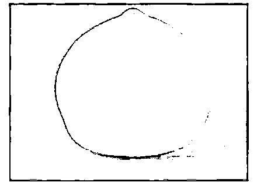****转发这颗桃子****会有久违的惊喜****讲真****若道君已经记不清今天是全民蹲家的第几天了****好像就是看着外面的天气冷下去****再热起来****阳光落下去****再灿烂起来****这是一个“悠长假期”****却端的很难有假期的闲适感****但是还是要打起精神来过好每一天****渐渐地****发现“禁足”的日子种种好处****比如****可以睡到自然醒****比如****和家人终于有了无限陪伴沟通的时间****比如****可以在全国都按了暂停键之后****捡起自己久违的爱好**

**而不用担心同龄人正在抛弃自己**

**也渐渐发现****一件看起来无比糟糕的事****也可以慢慢变成好的事情********若道君在网络上看到各种花式宅家过法****也相信我们的读者小伙伴们在这方面有很多奇招****12 个星座宅家的日子里****会不会有 120 种新鲜的方式****这些方式****又能激励和安抚多少个陌生人****于是****我们想到了这个征集****趁着水星逆行****来回顾一下拉长变慢的生活****春天还在不远处****我们终将向她走去****而当下这个有些困难的时期****请记得****我们还拥有彼此****从不会失去**

**#12 星座宅生活# 活动征集**

**2020.2.20-2.27**

**征集内容：宅家的时候你做的摆脱负面情绪，重回内心平静的事。**

**方式：长按下方二维码，进入征集表格，填写****你的现居地+太阳及月亮星座（如果不晓得月亮星座是什么，可以只填写太阳星座）+200 字以内的文字描述（有图片最好！）**

长按下方二维码参与吧

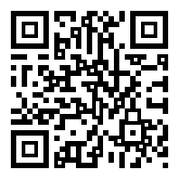

我们会在接下来的推文中将大家的投稿集结成文，敬请期待！

# 重磅天象 | 新冠病毒，非洲蝗灾……别因为世界的暂时破碎，而感到沮丧

> 原文：[`mp.weixin.qq.com/s?__biz=MzA5NjA0NTAxNg==&mid=2651413570&idx=1&sn=50e81ffebef47d2b526f7f319db7d0ce&chksm=8b4beef5bc3c67e3128522cdedee8786667ab02014726c7615f8e55090d2e615f0ac22faf8e5&scene=126&sessionid=1692738212#rd`](http://mp.weixin.qq.com/s?__biz=MzA5NjA0NTAxNg==&mid=2651413570&idx=1&sn=50e81ffebef47d2b526f7f319db7d0ce&chksm=8b4beef5bc3c67e3128522cdedee8786667ab02014726c7615f8e55090d2e615f0ac22faf8e5&scene=126&sessionid=1692738212#rd)

****************☆ 后****************************台****************************回复“今日”，给你一句生命态度****************

作者/傅莎珈 ISAR 认证占星师 编辑/Tang 封面/书君 图片/网络**让我们想要重启的 2020 年**2019 年接近尾声的时候，我们以为已有足够的准备应对土冥合相：类似 1982-1984 年剧烈的经济震荡，社会环境震荡，所有人都面对一个未知的世界，不知道该如何选择。
一踏进 2020 年，才发现根本不够，土冥合相的杀伤力，远远超出我们的想象。而且并不是从经济领域开始的，或者说经济领域的震荡还仅仅只是前菜。真正的席卷，来自大自然！

*   新冠病毒疫情大爆发，中国面临医疗，经济领域巨大的挑战

*   澳洲大火严重破坏了地球的森林植被，大批动物死亡

*   非洲蝗灾，正在向亚洲东部蔓延，可能出现世界性的经济危机

*   南极出现 20 度高温

这哪里是经济震荡？这是**关于整个人类生存环境的挑战**啊。 这时候突然想起 2018 年 5 月开始换座的天王星和金牛座。**似乎这一切的起点，和天王星金牛座有关。 **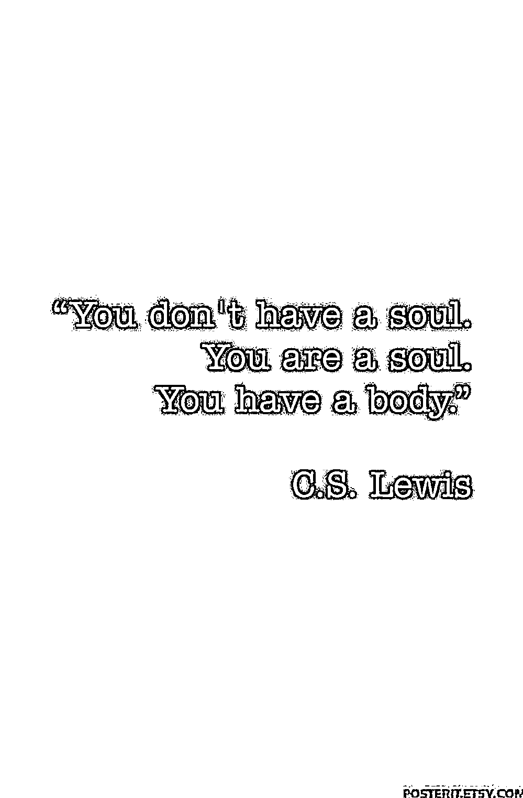**天王星、金牛座和火神星****传统占星学上，金牛座和大自然密切相关**。当天王星进入金牛座，我们在 2018 年普遍的预期是：可能进一步增加人们的环保意识，以及普及更多环保能源；人体和科技相结合的人工智能领域可能会有大飞跃。这些都是，但更激烈。**天王星和金牛座还有更激烈的关于毁灭的东西！ **有句俗语说：有破才有立。然而当这个“破”让你无条件的接近死亡，或者直接体验死亡，你还愿意去经历吗？ **在奥义占星学中，天王星是高八度的水星。天王星所到之处，意味着更高意识层面的信息传递，并伴随着旧有知识结构、意识认知被剧烈打破的任务。**让每个人从传统的家族、社会体系中走出来，真正踏上更广阔的个人成长之旅。 这种“意识”的死亡重建，对当事人来说，可能是非常难以接受的：生离死别、放弃现有的身份地位归属、跳脱二元论的世界观，走向更广阔的多元认识......**天王星想要我们理解什么？** **1. 意识的再生，从二元论走向多元化的世界观 2\. 对物质意义的重新认识****3. 社会秩序的重构****天王星进入白羊座的 7 年**，我们已经经历了个人可以如何脱离群体，通过高科技的辅助，单兵作战也可以非常强大的体验。但这 7 年的科技发展，同样增加了人类征服大自然的野心，各种生物链不断被打破，人类在挑战衰老和死亡的极限。然后，**天王星进入了金牛座**。   **金牛座在传统占星学的解释中，代表大自然、生产力、身体、物质价值，被金星守护。**在奥义占星学中，金牛座的守护星是火神星，归属于第一道光。同属于这道光的还有冥王星，守护天蝎座。  **冥王星在正向活动的时候，会让我们看到那些阻碍成长的事物。作为天蝎座的守护星，冥王星和死亡有关。**冥王星所象征的死亡，会让我们失去对我们不再有用的东西：住所、生活习惯、感觉、感受......记得伊西丝和艾瑞舒淇高的故事吗？当进入冥府，你需要一件件把身上的衣服脱下来直到赤裸，并且臣服于死亡。冥王星象征的是死亡的**释放**。这个释放，为新事物腾出空间。**在这个死亡释放之后，你将重新拿回生命的原始力量，灵魂开始新的创造。** **火神星的活动本质和月亮相关**，因为月亮所代表的是富足的身份认同。月亮所代表的内容发生转换的时候，会发生物质的转化以便被高等意识所用。 **火神星和冥王星一样，属于第一道光。这道光和“意识”有关。**第一道光，关联印度教里的湿婆神。湿婆神和**毁灭、转化、再生的能量有关**。当它通过金牛座/火神星发生，更多是关于物质的再生，以便更适用于内在成长。 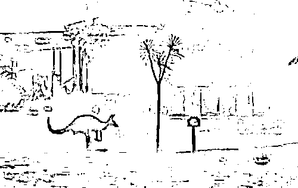| 澳洲大火**那么，如果大自然发生的无法扑灭的大火，意味着什么呢？ **以这样的角度回看火元素在 2019 年-2020 年的身影，或许我们会感受到一些线索：

*   澳洲大火
*   新冠病毒的发病征兆是发烧 

*   南极高温

**火，是大自然（金牛座）以及更高意识在进行的针对地球生物的一种物质再生升级的方式。 **
澳洲大火之后，幸存的动物正在逐渐回归家园。在大火中幸存的植物们，正在重新长出新芽。 能经得起毁灭考验的生物们，在春天重新开始成长。站在这个角度上，也许我们是在亲生体验死亡和重生。大自然在亲自展示生命的韧性。或许有人会很愤怒：你他妈把这么重大的灾难，当作颂歌来写呢。 **这就涉及到第二点：死亡毁灭和升级物质之余，还在对每个人进行欲望、死亡意识的进化。**死亡令人害怕。尤其是我们身处的大自然环境出现这么剧烈的危及生存的变化，让很多人前所未有的关注环保，建立起与自然的和平共处、物质是有限的这类观念。从小事做起的断舍离，不再无限制地买买买。**这是第一个由死亡引起的意识升级：我们意识到了欲望的破坏力。**以及，我们应该遵守的限制：**科技固然能带给我们更多自由和极限的超越，但仍然必须尊重更宏大的自然法则**。否则，只是简单的一场“流行性感冒”，就会让大众面对死亡而束手无策。其次，新冠病毒的治疗过程中，中医的参与，让人重新开始认识身体的免疫能力。西医把身体当作一个机器，哪里出问题治哪里。不断发明化学物品，不断分析病毒构成。而中医做什么？信任人体自身的免疫能力，调动和提高人体自身的防御能力，让人体自己对抗病毒。这是意识的第二个升级：人类自身的适应性和抵抗力（**火**）大有潜力可挖，和科技的结合不是让科技全面替代人体机能，而是在**挖掘人体机能潜力的基础上**，提供支持。**科技和自然之间，需要达成平衡。**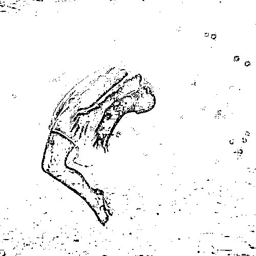第三，讨论一下死亡。死亡真的可怕吗？ 这些天以来，人们被迫困在家中不能出门，耳濡目染各种死亡消息。为医生们的英勇奋战祈福支援，为无家可归的人提供各种援助和支持，为无辜死亡的人祈祷送别。可能有一种情绪认为，为什么好人会死？ 救死扶伤的人会死？无辜的人会死，太不公平了。 那么，怎样才算公平？你要如何参与公平的建设呢？这是入世层面的意识改变推动。你不做任何事，就不会有任何改变。**死亡，更新了我们对生命的认识，更尊重生命。****NHK 拍摄了一部跟踪新冠病毒的纪录片。在这部片子里，曾在 WHO 参与指挥 SARS 的专家、东北大学大学院教授押谷仁说：就算这个病只有百分之零点一的致死率，就算说致死率低，对于去世的人来说，也不能成为什么安慰，于事无补。**

**很多人不仅仅是个数字，还是一个个生命体的无辜逝去，会带着死不瞑目的感受。这点需要我们被正视，因为我们目睹了活生生的生命与死亡。**

奥义占星学中，月亮代表所有行星的保守部分。月亮在天蝎座落陷，意味着我们本能的不想让所有东西死去。月亮在金牛座擢升是新的状态。死亡-重生，结果如何取决于意识跃升的状态。这是地球上唯一的工作。**火神星告诉我们什么时候暂停，花时间将事物聚拢来统筹。**知道什么时候运用意志，停下来，休息，再生能量，休整。就这样，等到下一个创造和冲动发生。 **当第一道光的冥王星和火神星联手，是一场积极的毁灭。这种毁灭给我们每个人的个人意志和身体带来的，是更加自我实现成长的谦卑灵魂。****请换一个角度看待死亡。**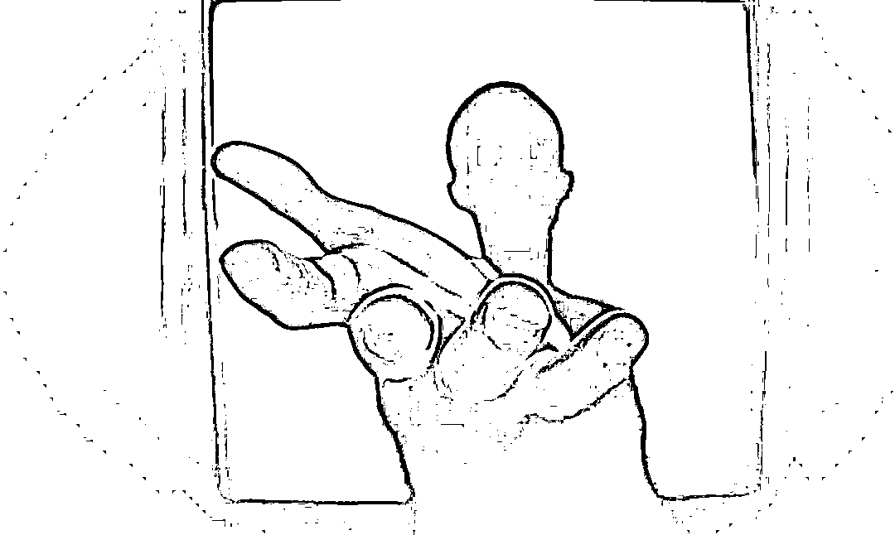**水星逆行****2 月 17 日，水星在双鱼座逆行。2 月 19 日，太阳进入双鱼座。双鱼座的能量在 2 月下旬全面聚集。**这场逆行不仅是疫情的转折点，**水逆更是修补漏洞的天赐良机。** **传统占星学里，双鱼座象征着海王星式的牺牲、救赎、奉献。**双鱼座的神话传说里，重复了一个主题：人类将为自己的贪婪、欲望付出毁灭性代价；而拯救者的行为，通常是牺牲和献祭自己的身体。这场献祭，最终带给世界光和和平。 **在奥义占星中，双鱼座是第二道光，象征爱与智慧。木星和太阳同属第二道光。**因此在二月底三月初，世界的能量将前所未有的聚焦在“**爱**“”和“**智慧**”的重新产生上，因为医务人员和科学人员前赴后继的不懈努力。**木星在 2 月 20 日的时候六分海王星。这之后的两周，至关重要。 ****尤其是火星换座摩羯座，将在 3 月 23 日的时候合相冥王星。会有 1 月 13 日以来的土冥合相事件发生么？可能不是，因为土星进入了水瓶座。****土星在奥义占星学中是第三道光，智能之光；水瓶座是第五道光，具体知识之光。所以在更大范围上，期许地球上的我们在那时候找到解决之道。****火星在奥义占星学中是第六道光，奉献和理想之光，和海王星同序列；摩羯座在七道光里分别出现在 1/3/7 道光里，我把这次的火星进入摩羯座，归属道第三道光，智能的力量在增加。**加上木海六分，水星逆行，地球上关于爱和智慧的光芒，正在不断聚集起来，支持智能和知识之光的闪耀。在疫情期间，心理咨询、正念冥想、宗教唱诵活动，在不同的人群中流传。因为物质毁灭和死亡恐惧的触发，人们开始寻找，学习“爱”与“信仰”。**所谓智慧，不仅仅是知识，更是对生命流转的坦然，对死亡的臣服：死亡令生命变得有意义，如同黑暗给光芒带来意义。因为死亡，我们对爱和光明的渴望才变得更坚定。** **在毁灭和死亡之中，唯一能战胜黑暗的东西，是爱的信念。**医生们在做医生们的事情，普通人在做普通人的工作。所有人的意志力，都聚集在“慈悲”和“爱”的光芒之下。**这次水星逆行期间，请特别注意睡梦中的信息，日常多做冥想和瑜伽练习，参与艺术活动比如绘画、唱歌、舞蹈、电影、雕塑等。**双鱼座象征艺术，各种艺术形式正在传递着更高意识的爱与慈悲的力量，带领我们走出困境。水星逆行从双鱼座逆回水瓶座，给所有人一个机会，去寻找令你愿意归属献身的，和血缘无关的、和信念和爱有关的群体，**一起去抗争病菌**，展开土冥合相期间的彼此支持和新的建设。 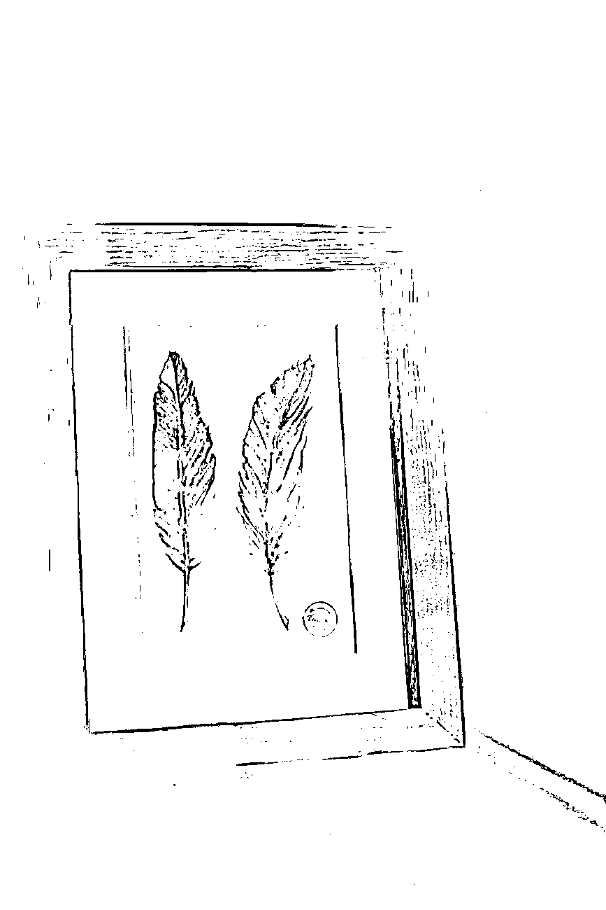**土冥合相的再度解读**

2 月 15 日早上听梅里曼的 2020 年金融占星预测讲座（有兴趣的读者可以戳这里了解：[《2020 年金融预报》火热发售](http://mp.weixin.qq.com/s?__biz=MzA5NjA0NTAxNg==&mid=2651413307&idx=1&sn=0c57f63779d302432c0c98acc22087d2&chksm=8b4be98cbc3c609af9da1e14b94337deabc2d28117de05ba4bfd25e580f78402d70d09ed6b86&scene=21#wechat_redirect) ）。他提及这样一个观点：**2020 年是一个重要的结束年份**。土星和木星一直以来在土象星座的 200 年合相周期，将在 2020 年结束。2020 年 12 月 21 日冬至日，土星和木星在水瓶座相遇，正式开启了未来 140 年的风象周期合相。

土星和木星都是社会性行星。它们构建和影响社会价值、文化、律法。当土木在土象星座不断合相的时候，人们主要通过财富、权力构建世界。而当土木进入风象星座组合的时候，人们的关注点将转向知识、艺术才能的积累，来塑造世界。

对外太空的探索是未来 120 年的主题。我们要面对的是宇宙背景。这种探索对世界现有市场运作没有立竿见影的影响，但是长远来说，对金融、经济、文化、社会习俗、标准方面则会产生巨大影响。 

土冥木合相在摩羯座的压力，在 2020 年 12 月 21 日之后，伴随木星和土星进入风象的水瓶座，将会逐渐减轻。

**再回头看天王星，这次疫情后会给我们带来哪些启示**：

*   **生命的意义是不断破碎、不断重生。死亡令生命变得有意义，如同黑暗给光明带来意义。**

*   **匮乏到丰饶的物质循环里，欲念的呼和吸，决定毁灭和重生什么时候到来，以帮助我们每个人的意识扩张。**

*   **每一次的死亡威胁，都是一个能量进化的过程，如果能量被滥用，带来的会是无情的毁灭。如果我们遵守它的法则（用爱的意志去脱离和释放）善用它的能量，带来的则是无限的生机和创造力。人生中最难获得的精神价值就是学会疏离之爱（不执着的爱）。疏离之爱是我们正确表达冥王星意义的关键。**

2020 年，土星、冥王星、木星在摩羯座的合相，是一个继往开来的合相。和天王星在金牛座的含义一样：**通过毁灭，清理出空间，让世界进入新的秩序构建**。

“不要因为这个世界的破碎而感到沮丧。
一切都会破碎，一切都可以被修补。不是随着时间，像他们说的那样。而是带着意图。所以去吧，带着意图去爱，挥霍无度的，无条件的去爱。这个破碎的世界在黑暗中等待着你的光芒。”

*   以上文章仅代表作者本人的观点，不代表本平台观点。

**版权声明：**原创文章由作者授权首发于若道平台，欢迎转发，反对抄袭。友号转载请申请白名单。

 ****

****傅莎珈****

ISAR 认证占星师（2015 年获得）

心理占星师/内观书写带领者/冥想带领者

国际著名传播集团工作 20 年

**微信公众号**：Helloshajia

长按打赏

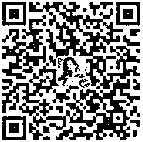

******现在你有机会跟随奥义占星大师********阿兰·欧肯******

******一起去巴厘岛游学******

**点击图片查看若道君推荐**


**微信又双叒叕改版啦，不想错过若道君的推送？**

**就把若道设为星标吧！**

**▼**


就是这个“在看”，戳一下☟

****直达报名通道****


# 占星新手都想知道：星图里四元素分布不均，影响很大吗？!

> 原文：[`mp.weixin.qq.com/s?__biz=MzA5NjA0NTAxNg==&mid=2651413570&idx=2&sn=e45c094729e0153b90cdfd2902a2b6df&chksm=8b4beef5bc3c67e3303dd5bb458066a4a82c87ff1130d2a986a0ebdc42b87eb8ba7cfa029ee9&scene=126&sessionid=1692738212#rd`](http://mp.weixin.qq.com/s?__biz=MzA5NjA0NTAxNg==&mid=2651413570&idx=2&sn=e45c094729e0153b90cdfd2902a2b6df&chksm=8b4beef5bc3c67e3303dd5bb458066a4a82c87ff1130d2a986a0ebdc42b87eb8ba7cfa029ee9&scene=126&sessionid=1692738212#rd)


作者/熊鹰（天空的空） ISAR 认证占星师 

编辑/Tang 图片/soogif

我们的星图中有土水火风四种元素，如果他们分配不均，比如火元素很多，风元素很少；或缺失水元素；或者元素主要集中在风和土……这样的情况会对个案影响很大吗？我们究竟该如何看待这种情况？

别急！别急！本文就让若道最懂中国学员的金牌中文讲师——熊鹰老师，为你解答这个所有人都想知道的问题。不仅如此，熊鹰老师还会为我们解答一些列初学占星产生的疑问。你准备好了吗？

**为我们答疑的金牌中文讲师是谁？**


**熊鹰老师（天空的空）**

*   2008 年接触严肃占星学，至此爱不释手。
*   **2013 年师从大卫·瑞雷**，研习整套现代占星学核心课程，并于 2014 年起至今连续三年担任该课程的主助教。
*   期间也**跟随格伦·佩里、诺·泰尔、理查德·塔纳斯、罗伯特·汉德、苏·汤普金斯、斯蒂芬·弗里斯特等多位国际顶尖占星大师进行学习**，进行定向占星主题研究。
*   2015 年初，通过国际占星研究协会**（ISAR）资质认证并获得证书**。同年，进一步跟随大卫·瑞雷老师进修**“生时校正”**技术，通过最终考核并获得证书。
*   目前在若道星文化任职，将传播系统、严谨、真实的占星学作为职业使命。任专职助教期间，进行沙龙与答疑等辅助教学工作已累计超过 200 小时。
*   在业余期间也提供占星咨询与生时校正服务。目前正致力于占星学与个人成长的整合。

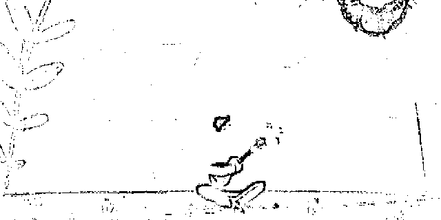

**答疑时间**

**1**

**星图里四元素分布不均，影响很大吗？**

**问**：星座有火、土、风、水四种元素，那么整个星图的四种元素会有比例分布的吧？某种元素特别多或者特别少会不会对个人特质造成一些显著影响呢？比如风象特别多，水象特别少。**答**：元素比例分布是很经典的问题。但是，除非元素比例极度失衡的情况（比如完全没有行星在水元素的星座与宫位），否则**单纯依靠元素比例分布这种技法，并不能确定案主必然有或者必然没有某种特质。**


**问**：假设某人星座以水象居多，火象很少，而其火象宫（比如第一宫）落群星，这会不会中和火象少的情况呢？

**答**：是的，**在思考元素的时候，星座与宫位都要参考。**不仅如此，我甚至认为**相位也需要考虑进来**。比如，火星的相位较多，也能增加火元素的表现。当然，这样做会变得非常复杂，因此“单纯依靠元素侧重来解读”的技巧，并非优先、主要的技术，更多是一种辅助。

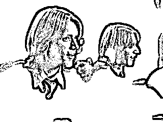

**2**

**“双胞胎”星图到底怎么解？**

**问**：两个人出生地点和时刻几乎完全一样，比如双胞胎，出生星图应该是完全一样的吧？那说明这两个人的很多特质是一样的吗？

**答****：从现代占星学的角度来说，拥有同样星图的人，也可能在后天成长中，因为环境的不同，而发展出星图不同部位的特质。 **想象一下，一对双胞胎姐妹，都是**太阳双鱼座**，因为姐姐从小被教育要做一个**“好榜样”**，照顾好妹妹，而妹妹呢？从出生起就是家中最小的，长辈们最宝贝最呵护。这样的环境，就可能让**姐姐发挥出双鱼座的“拯救者”特质，而妹妹则发挥出“受害者”特质**。随着年龄增长，这两种特质可能会越来越明显的区分开来。 同样地，一对双胞胎兄弟，**太阳狮子座，月亮处女座**，哥哥常跟着父亲，而弟弟常跟着母亲。假以时日，哥哥可能越来越容易表现出**领袖气质**，而弟弟则倾向于**服务他人**。 **相同的星图，一定是有很大的共性的，但是在“能量发挥多少”的层面上来说，一定会有不同。** 有意思的是，如果你把一对双胞胎从出生时，就分开在两个家庭抚养，他们长大后相见了，反而会觉得惊人的相似。 从这样一个情况来说，也正符合了许多大占星师的观点：**任何星图的解读，如果不是基于这张星图的主人，都是没有意义的**。即：**如果不能在保持交流的情况下，解读此人的星图，那么很多时候我们都只是在靠猜测，因为我们不知道他会发挥哪种能量，发挥多少。而猜测是不会一直准确的。**

**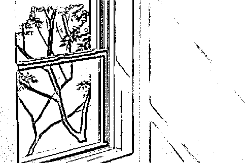**

**3**

**上升到底是什么？**

**问**：上升只是外貌、样子，还是谈吐气质等整体给人的感觉？

**答**：**上升点会反映一个人的外貌与谈吐，这也就是整体给人的第一印象。**但并不是唯一的指针。与上升点产生相位的行星，上升星座的守护星（命主星）等，都会反映，**需要整合解读**。至于气质，这是一个比较模糊的概念，每个人可能都有不同的感受。如果从“腹有诗书气自华”的角度来说，我会觉得气质是一种由内而外展现的东西，上升点并不能完全诠释它，或许还需要加上月亮、金星等一并考量。

**敬请期待熊鹰老师**

**下一波答疑**


**现在你有机会跟随熊鹰老师**

**系统学习占星学**

**点击图片了解详情**


**微信又双叒叕改版啦，不想错过若道君的推送？**

**就把若道设为星标吧！**

**▼**


就是这个“在看”，戳戳戳 ☟

********报名直达入口********


# 金牌课程·中英双导师 L1-2｜足不出户，占星智慧云掌握！

> 原文：[`mp.weixin.qq.com/s?__biz=MzA5NjA0NTAxNg==&mid=2651413570&idx=3&sn=aea7fa3fff1e77025fccd50c1f308f46&chksm=8b4beef5bc3c67e3e2a44e6437ea34149daf70847ca72c0b73a79f58d17258403a73711367a4&scene=126&sessionid=1692738212#rd`](http://mp.weixin.qq.com/s?__biz=MzA5NjA0NTAxNg==&mid=2651413570&idx=3&sn=aea7fa3fff1e77025fccd50c1f308f46&chksm=8b4beef5bc3c67e3e2a44e6437ea34149daf70847ca72c0b73a79f58d17258403a73711367a4&scene=126&sessionid=1692738212#rd)


非常时期，大家在家躺着什么都不干就是为社会做贡献了。很多小伙伴跟若道君表示在家宅着已经快长蘑菇了。与其在家刷朋友圈陷入对未来的无限焦虑，不如重启一直以来的占星爱好变成专业。一起来了解一下若道 2020 年春季隆重开学的**占星入门网络直播课**。

众所周知，若道办学 9 年来，最专业的坚持是，以直播的形式**让每位零基础小白学员，与国际顶级占星大师“零距离零时差”沉浸式学习**。下面是我们对于即将到来的本学年学习方式首次详解，敬请提问互动。

**足不出户，占星智慧云掌握**

**学占星，网络直播课的妙处在哪里？**

**1**

**若道占星 9 年磨一剑**

从未来趋势上看

从线下教育向线上教育发展蓬勃

若道作为国内乃至国际上权威的占星教育平台

早已在线上直播课的路上经历 9 年的上下求索

每一届核心课都在迭代与优化

线上直播课不断积累与改进

进而提升学员的体验和学习效果

让广大若道学员有更多的收获


2

**直播课是一次次美丽的宇宙共时性**不同于现在市面上的各种视频录播课线上直播课，需要投入的人员和资源会更多但若道之所以选择这样的坚持是因为直播课的学习效果确实最有保障占星学本身就是一门和宇宙相关的学科每一次老师和同学们同一时间上线各自分享着近期的事件和挑战传递和接收着占星学的知识和奥义何尝不是一次次的约定和美丽的共时性呢？


你还可以在互动区及时地提出你的问题与困惑
老师通常在下课前会留出时间进行答疑如果你的问题班里的同学知道也会帮你补充回答、及时互动甚至会因此碰撞出更有价值的思考

3

**主动学习比被动学习重要****系统学习比碎片学习珍贵**系统就是有章可循每周固定的时间和权威信赖的老师，熟悉同频的同学们一起主动学习、系统学习困惑及时被 ISAR 认证的占星助教解答今年，熊鹰老师还会亲自下场解读知识伴随着详尽的讲解生动的案例、互动的实践被吸收相信我，学习占星会变成特别珍贵的学习体验

4

那有的同学会说

道理我都懂，但我就是缺乏自觉性

老是三分钟热度怎么办？

我们的知心课程顾问就华丽登场啦！

课程顾问会变着花样

做各种好看的课程通知小海报提醒你上课

记录你的每一次出勤情况

帮你反馈和解决各种专业知识以外的问题

当你动力不足有几次缺课的时候

还会亲和地询问你最近的学习困难

给你及时的鼓励和支持

提醒和收集老师的课堂作业

5

学习不掉队，还能赢取**奖励课程券**是的若道直播课程是有机会获得课程券的可以直接当钱花，购买或抵扣之后在若道消费的其他课程帮助真正热爱占星的你减免学费压力比如土星奖&木星奖


教育是什么？德国哲学家雅思贝尔斯说：**教育是一棵树摇动另一棵树，****一朵云推动另一朵云，****一个灵魂唤醒另一个灵魂。**网络直播课与老师的联结是最强烈的**我们 2020 年占星直播课的老师是谁？****拥有 49 年占星实践经验的若道创始人****大卫·瑞雷**&**最懂学员的若道首位认证金牌中国老师****熊鹰****师徒二人****合力打造****L1-2 初阶网络直播课****2020 年 4 月 2 日（周四）开课**2020 年之前我们的 L1-2 一直是 8 节课 2020 年注定是不平凡的一年所以我们决定**8+2****把初阶课直播课升级为****10****节**给刚刚踏上占星之路的你更好的支持和陪伴**万事俱备 只等你来！****1-2 阶我们要学习什么？**

**第一阶  12 星座，12 种性格，12 种人生 **

❶ 学习占星学必须准备的“心法”

❷ 占星学中的火、土、风、水四元素，阴阳法则

❸ 面对面的星座有故事

❹ 12 星座：12 种性格详解，12 种行为模式，12 种价值观

❺ 太阳和月亮：了解你的太阳，生命的发动机，让你在世界闪光的方式，生命获得力量的方法；了解你的月亮，让你获得幸福的方法

❻ 了解太阳、月亮，了解你生命中已经出现的、将会出现的男性和女性

**第二阶  命运的线索和人生故事中的演员**

❶ 命运的线索：南北交点

❷ 星图三巨头：太阳、月亮、上升点的故事

❸ 了解心智：水星

❹ 了解金钱和关系：金星

❺ 了解行动模式：火星

❻ 了解信念：木星

❼ 了解努力：土星

❽ 了解天才和疯狂：天王星

❾ 了解梦想和幻灭：海王星

❿ 了解死亡和重生：冥王星

⓫ 12 个人生场景：黄道 12 宫位初解

**大卫老师和熊鹰老师如何分工呢？**


❶ 2020 年 4 月 2 日（周四）20:00-22:00 星座 1 主讲人：大卫·瑞雷老师

❷ 2020 年 4 月 9 日（周四）20:00-22:00 星座 2 主讲人：熊鹰老师

❸ 2020 年 4 月 16 日（周四）20:00-22:00 太阳、月亮 主讲人：大卫·瑞雷老师

❹ 2020 年 4 月 23 日（周四）20:00-22:00 水星、金星、火星 主讲人：熊鹰老师

❺ 2020 年 4 月 30 日（周四）20:00-22:00 木星、土星 主讲人：熊鹰老师

❻ 2020 年 5 月 7 日（周四）20:00-22:00 三王星 主讲人：大卫·瑞雷老师

❼ 2020 年 5 月 14 日（周四）20:00-22:00 宫位 1 主讲人：熊鹰老师

❽ 2020 年 5 月 21 日（周四）20:00-22:00 宫位 2 主讲人：大卫·瑞雷老师

❾ 2020 年 5 月 28 日（周四）20:00-22:00 月亮交点 1 主讲人：熊鹰老师

❿ 2020 年 6 月 4 日（周四）20:00-22:00 月亮交点 2 主讲人：大卫·瑞雷老师

**这两位优秀的占星学老师是谁？**


**大卫·瑞雷（David Railey）**

*   **ISAR 董事会成员，ISAR 全球副主席，ISAR 全球职业占星师认证主席，若道占星创始人。**
*   1976 年，通过亚特兰大职业占星师考试，成为全职占星师，随后通过**AFAN 和 ISAR 职业测试**。
*   1980 年，与**杰夫·焦耳**一起在亚特兰大创建**“每日星球”**占星学中心。此后在亚特兰大占星协会担任 4 年考官，并且两次担任**亚特兰大地区占星协会主席**。
*   1979-1992 年，作为占星师活跃于美国社会媒体，向不了解现代占星学变化的大众宣传专业占星学知识。在 1989-1992 年期间，他在 WRGG 电台 12 频道每周主持个人电视秀**“今日占星学”**，早先他还在 WRFG 的广播节目中播讲宇宙天气节目。 
*   2010-2014 年，任**全美占星师联盟监督委员会委员**。
*   2010 年，其著作**《灵魂的目标》**中国版出版，和蒋颖一起创办**若道占星**学校和其官网 www.nodoor.com。从该年开始，他工作并往返于亚特兰大和北京。目前他 80%的时间致力于在中国教授和推广西方占星学。
*   2017 年，被选为**ISAR 委员会成员**（2017）。ISAR 是世界最大的国际占星机构，会员遍布 45 个国家。


**熊鹰老师（天空的空）**

*   2008 年接触严肃占星学，至此爱不释手。
*   **2013 年师从大卫·瑞雷**，研习整套现代占星学核心课程，并于 2014 年起至今连续三年担任该课程的主助教。
*   期间也**跟随格伦·佩里、诺·泰尔、理查德·塔纳斯、罗伯特·汉德、苏·汤普金斯、斯蒂芬·弗里斯特等多位国际顶尖占星大师进行学习**，进行定向占星主题研究。
*   2015 年初，通过国际占星研究协会**（ISAR）资质认证并获得证书**。同年，进一步跟随大卫·瑞雷老师进修**“生时校正”**技术，通过最终考核并获得证书。
*   目前在若道星文化任职，将传播系统、严谨、真实的占星学作为职业使命。任专职助教期间，进行沙龙与答疑等辅助教学工作已累计超过 200 小时。
*   在业余期间也提供占星咨询与生时校正服务。目前正致力于占星学与个人成长的整合。

**除了网络直播课，**

**春暖花开，盛夏到来的时候，**

**还会迎来两场线下工作坊**

**L1-2 上海工作坊****（2020 年 6 月 12、13、14 日 熊鹰老师主讲）**

**L1-2 北京工作坊****（2020 年 6 月 25、26、27 日 大卫·瑞雷老师主讲）**

就看你是喜欢哪种形式

**文末有每种形式的价格，还有连报套餐价哦**


**若道核心课程教学支持体系**

我们有完善和系统的核心课程教学支持体系帮助你更好更全面地学习

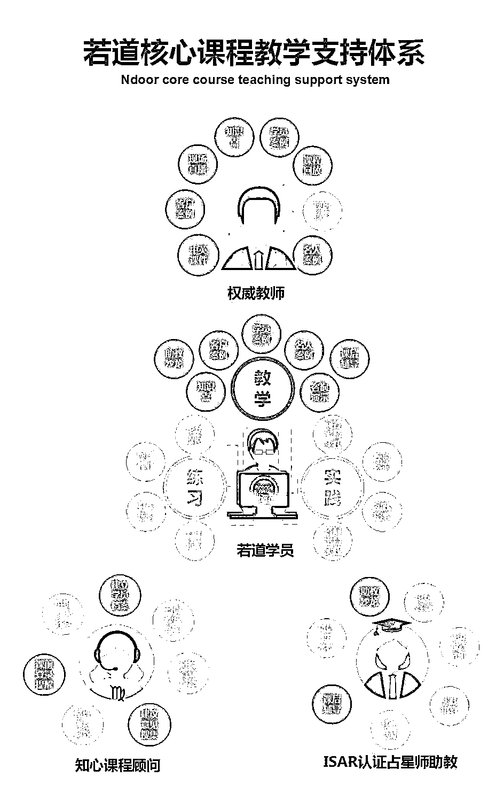

**什么人适合这门课？**

*   对占星学有浓厚兴趣，想要系统学习占星学

*   对占星学有一定基础，但不知道该如何整合星图复杂的碎片

*   希望成为优秀的占星师，想要借鉴国际大师解读思路并融入自己的体系

*   想学习占星学，但不擅长英文，希望有中文老师授课

*   想结合占星学理论与咨询实践

*   大卫·瑞雷、熊鹰的忠粉，学过占星，但就是想跟着偶像再学一遍

*   走在自我探索和个人成长道路上的人

**课程费用**

**★ 1-5 阶**

**早鸟价：33000 元（2020 年 3 月 31 日之前）**

**课程费用：46500 元 **

**★ 1-2 阶直播课（4 月 2 日开课）**

**早鸟价：2800 元（2020 年 3 月 4 日之前）**

**课程费用：3500 元 **

**★1-2 阶工作坊（北京工作坊、上海工作坊任选一场）**

**早鸟价：2800 元（2020 年 5 月 6 日之前）**

**课程费用：3500 元 **

**★网络直播课+现场工作坊都想要的同学：有套餐价哦**

**购买网络直播课程+北京工作坊、上海工作坊任选一场**

**早鸟价：4200 元（2020 年 5 月 6 日之前）**

**课程费用：5200 元**

**退转课程**

**退款原则请详看《教学协议》，如有疑问请咨询课程顾问。**

****中英双导师核心课 Level1-2****

**授课老师：大卫·瑞雷 熊鹰**

**授课时间：****1-2 阶****网络直播课，**4 月 2 日开课**；****1-2 阶********工作坊，上海** 2020 年 6 月 12、13、14 日 **北京** 2020 年 6 月 25、26、27 日

**授课方式：**网络课程，中英文授课，中文翻译；现场工作坊，中英文授课，中文翻译

**费用：****1-2 阶网络直播课程：****3500 元**早鸟价：2800 元（2020 年 3 月 4 日之前）；**** **1-2 阶**（北京、上海工作坊任选一场）**：**3500 元**早鸟价：2800 元（2020 年 5 月 6 日之前）；******网络直播+现场套餐价：****5200 元** 早鸟价：4200 元（2020 年 5 月 6 日之前）；******1-5 阶：**46500 元******早鸟价：33000 元（2020 年 3 月 31 日之前）；****

**课程负责人：**王老师（微信：18510107057），请备注“核心课”

长按二维码添加课程负责人咨询~


****报名请点击“阅读原文”****


# 雷蒙德·梅里曼金融占星周运 | 水逆期间该如何投资？

> 原文：[`mp.weixin.qq.com/s?__biz=MzA5NjA0NTAxNg==&mid=2651413555&idx=3&sn=1e8b16eaafd2550143f0c426610db383&chksm=8b4bee84bc3c6792e7a1cd5c28ce2c3898e19842dc78e06dd7c42f79cd9c9dd4f516a803403f&scene=126&sessionid=1692738212#rd`](http://mp.weixin.qq.com/s?__biz=MzA5NjA0NTAxNg==&mid=2651413555&idx=3&sn=1e8b16eaafd2550143f0c426610db383&chksm=8b4bee84bc3c6792e7a1cd5c28ce2c3898e19842dc78e06dd7c42f79cd9c9dd4f516a803403f&scene=126&sessionid=1692738212#rd)

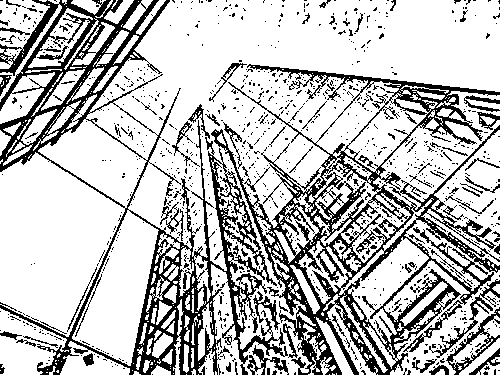

作者/雷蒙德·梅里曼
翻译/Luke 校对/李含编辑/Tang 图片/pexels 雷蒙德·梅里曼是在金融占星学界稳坐第一把交椅的占星师，同时他也是若道签约的金融占星课老师，我们引进了雷蒙德·梅里曼老师的《[上证指数月度报告](https://mp.weixin.qq.com/s?__biz=MzA5NjA0NTAxNg==&mid=2651413099&idx=1&sn=3be98d72726abbbda1dcb0ff5466471f&chksm=8b4be8dcbc3c61ca74a5fae8d2e23e3420af5524464f94e5ef15ac4699d2363647a0eb497d4c&token=517203770&lang=zh_CN&scene=21#wechat_redirect)》《[黄金周期月度报告](https://mp.weixin.qq.com/s?__biz=MzA5NjA0NTAxNg==&mid=2651413099&idx=1&sn=3be98d72726abbbda1dcb0ff5466471f&chksm=8b4be8dcbc3c61ca74a5fae8d2e23e3420af5524464f94e5ef15ac4699d2363647a0eb497d4c&token=517203770&lang=zh_CN&scene=21#wechat_redirect)》《[2020 年金融预报](http://mp.weixin.qq.com/s?__biz=MzA5NjA0NTAxNg==&mid=2651413307&idx=1&sn=0c57f63779d302432c0c98acc22087d2&chksm=8b4be98cbc3c609af9da1e14b94337deabc2d28117de05ba4bfd25e580f78402d70d09ed6b86&scene=21#wechat_redirect)》。我们经老师的授权，将每周刊登梅里曼老师的周运，供大家参考和学习。于是，这是本周的周运（2.17-2.21）。**展望与回顾**

联邦预算赤字在在这个财年的前四个月增长了 25%……在截止 1 月的上个财年里，收入增长了 6.7%，是 2016 年 2 月以来的最大涨幅。支出增长 8.8%，总赤字达到 1.06 万亿，比上年同期增长 16.4%。

——凯特·戴维森

《随着支出达到高点，赤字扩大》

《华尔街日报》

2020 年 2 月 13 日

（朱迪·谢尔顿）公开提倡采用稳定的货币体系，以解决生产力（缺乏）的问题，她向当今正统经济学理论的捍卫者提出了挑战，要求他们解释他们的模型如何比她倡导的黄金等固定标准更好。鉴于过去 50 年的一系列灾难，他们做不到这一点。难怪她的提名（进入美联储）引来了经济学教授及他们在新闻界的朋友如此可耻的抨击。他们对谢尔顿女士的不满不是因为她是个疯子，而是因为她可能是对的。

——约瑟夫·C·斯特恩伯格

《为什么经济学界讨厌朱迪·谢尔顿》

《华尔街日报》

2020 年 2 月 14 日


美国和欧洲股票指数上周表现强势。德国 DAX 和苏黎世 SMI 指数在周五录得历史新高，美国的标准普尔期货指数也是如此。在两天前的 2 月 12 日，道琼斯工业指数录得历史新高。一天前的 2 月 13 日，纳斯达克指数出现历史新高。阿姆斯特丹 AEX 指数也上升到了自 2001 年 2 月以来的最高点。

**就占星学研究的角度而言，这一轮的上涨可以部分归功于行进火星与纽约证交所“梧桐树”星图（成立于 1792 年 5 月 17 日）的木星/海王星合相形成有力的三分相。**（梧桐树协定是在 1792 年 5 月 17 日，美国 24 名经纪人在华尔街的一棵梧桐树下聚会，商订的一项协议）

在基本面上，随着欧元跌到 2019 年 4 月以来的最低位，由于欧元的弱势，欧洲股票指数获得了支撑。当成员国缺乏财政纪律却继续执行货币宽松政策（比如负利率），就会出现这种情况。

在美国，出现了相似的情形，美联储最近使用了极其宽松的手段（回购市场，持续到周五），美国政府又积累了一万亿的赤字。所有这些流动性都会流向股市，直到突破债务上限，信贷机构介入。**这可能在 2020-2023 年发生的，因为这段时间冥王星（债务和税收）在美国、特朗普总统、美联储、美联储董事长，以及纽约证交所的星图中显得非常突出。**可能朱迪·谢尔顿的想法的确是对的（即回归资产支撑的货币，比如金本位）。

在亚洲和远东的股票市场没有出现历史新高，这可能因为冠状病毒所带来的恐慌。然而，上证指数和恒生指数自 2 月 4 日的大抛售以来，已经连续两周反弹。

原油在前一周跌到数月以来的低点 50 美元/每桶后，上周表现强势。黄金和白银依然在三周来的盘整区间震荡。它们在寻找方向。**当一连串新的占星学征象于这周 2 月 17 日开始浮现时，它们可能找到方向。**倘若朱迪·谢尔顿确认担任美联储理事，也可能会为黄金牛市提供支持力。

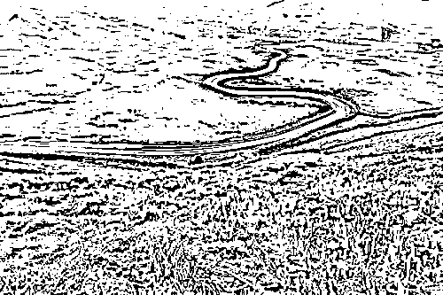

**短期占星趋势**

最危险的人是那些不知道自己不知道，却认为自己比别人知道得多的人。

——匿名

特朗普于 1987 年在曼哈顿注册为共和党人，此后他五次改变所属的党派。在 2001 年 8 月，特朗普注册为民主党人。在 2009 年 9 月，特朗普把所属政党改为共和党。在 2011 年 12 月，特朗普改为“无党派”（独立）。在 2012 年 4 月，特朗普再次回到共和党。

——en.wikipedia.org

布隆伯格曾担任纽约市第 108 任市长，自 2002 年上任以来连任三届。在寻求竞选职位之前，布隆伯格一直是民主党人，在 2001 年他转为共和党人竞选市长。

——en.wikipedia.org

他又来了。这是一位著名的市场波动和政策变化的预报者，在这周的 2 月 17 日归来了，他的影响力将会持续到 3 月 10 日。我们这里说的不是唐纳德·特朗普（曾是民主党人，现在是以共和党人的身份担任美国总统）或麦克·布隆伯格（曾是纽约的共和党人市长，现在以民主党人身份竞选总统）改变所属政党。**我们谈的是水星逆行又回来了，这位快速运转的魔术师，常常对应着支撑和阻力的假突破，以及在了解全部事实前作出不成熟或不明智的决定，或在了解全部事实后推翻先前的立场。**这一次，他可能会展示出他超凡脱俗（和不切实际）的天赋，因为他正在双鱼座这个奇妙的、疯狂的，但经常以幻想为导向的星座转向逆行。这期间你可能觉得自己在恋爱，想唱一首快乐的歌，或因为在错误的时间说了错误的话导致非常尴尬，感觉精神不振。**水星逆行在双鱼座时，无论你想提出什么看法，最好提前确认你和对方处在同一个频道上。**或者，在你或他们的脑海中，这甚至不是一个提议，但听起来像是命令或要求。就像一些总统竞选人，你可能会用错词，或叫错别人的名字。如果你和经纪人谈话，最好清楚表明你的意思是“买”而不是“卖”，尤其是当手机没电的时候。**在这个水星逆行双鱼座的特殊时期，可能出现各种奇怪的错误（一开始看起来是对的）。**但对于市场这意味着什么？没什么，只是**它常常和短期突然发生的反转有关，这不一定是基本周期的反转**。大多数时候是一个交易周期的转变。也就是说，**可以做短线交易，但最好别做长期承诺**。然而，这次水星逆行可能比大部分逆行都更加重要。它可能对应着比交易周期更大的周期，因为火星也在前一天进入摩羯座，这是一件大事。不过，当水星在双鱼座或射手座时，几乎每件事都是大事，因为木星守护这两个星座。但为什么说**火星进入摩羯座是件大事**？因为联邦储备法案是在 1913 年 12 月 23 日通过的，当时太阳正处于 1 度摩羯座，而冥王星正处于 0 度巨蟹座。届时可能是美联储的介入，往往带来新的政策或公告，引起关联利率市场的震荡，比如十年国债或外汇，从而间接（或直接）影响到贵金属和股市的价格走势。**当水星在双鱼座逆行时，事情进展可能像弧线球，当你觉得一切顺利的时候，突然焦点改变了**。但是这种变化是建立在现实，还是谣言之上？这就是水星双鱼座逆行让人搞不清的地方了。头一天看起来局势可以控制，第二天又变得不安定了。和以往一样，**金融市场往往会对这些好消息、坏消息作出反应从而产生锯齿状的波动**。**交易者和投资者需要对大局保持关注，尤其在水星双鱼座逆行这期间，因为它往往对应着许多杂音（锯齿波动），长期来看无足轻重。**那么我们要关注的大局是什么呢？这就是我们在上周 2020 年年度金融年报工作坊（有兴趣的读者可以戳这里了解：[《2020 年金融预报》火热发售](http://mp.weixin.qq.com/s?__biz=MzA5NjA0NTAxNg==&mid=2651413307&idx=1&sn=0c57f63779d302432c0c98acc22087d2&chksm=8b4be98cbc3c609af9da1e14b94337deabc2d28117de05ba4bfd25e580f78402d70d09ed6b86&scene=21#wechat_redirect) ）里讨论的话题：根据木星正处于射手座 10º到摩羯座 20º的区间，股票市场即将出现长期周期波峰（2019 年 4 月-2020 年 11 月），之后有 85%的概率（我的估算）会在 2021 年的土星/天王星四分相期间或之后出现 20-50%幅度的下跌。细节在一张展示过去土星/天王星和土星/冥王星困难相位的表格里，所有参加工作坊的人都可以看到这张表格。短期来看（毕竟，我们都是交易者），2 月 17 日是一个为期三周时间区间的起点，届时会出现八个与许多金融市场中的周期达到峰值（低点或高点）有历史相关性的占星学征象。与 2 月 17 日的水星逆行和 2 月 16 日火星进入摩羯座同样重要（甚至更重要）的是行进金星与木星、土星和冥王星（摩羯座星群）在 2 月 23 日-3 月 3 日形成四分相，以及在 3 月 9 日，水星顺行（在 3 月 10 日）的前一天，出现两个一级（最强的）反转征象太阳/海王星和金星/天王星的合相。正常情况下，我会说接下来三周必定是疯狂和飘忽不定的，但是我知道水星在双鱼座逆行时任何从口中说出的承诺最终都可能无法兑现。**这段时间最好练习唱歌跳舞，冥想也行。只是要小心不要把谣言当作事实。****版权声明：**本文由若道翻译发布，欢迎转发，反对抄袭。友号转载请申请白名单。


**雷蒙德·梅里曼（Raymond Merriman）**

若道签约老师。著名金融占星师，ISAR（国际占星研究协会）前主席，梅里曼市场分析公司的总裁。他由于“提升了占星学的职业形象”，在 1995 年国际占星大会上被授予轩辕十四奖；在 2012 年国际占星大会上，被授予轩辕十四终身成就奖。

1“中国上证指数月度报告”发售

**若道推出了****中文版****的雷蒙德·梅里曼中国上证指数月度报告，并持续发行该报告！**

当把金融市场的周期和占星学的周期相结合时，雷蒙德·梅里曼老师的金融占星学研究**为投资者应对金融市场的周期波动，并随之调整投资策略提供了极大的价值参考**。

2“黄金价格周期月度报告”发售

**若道推出****中文版****的雷蒙德·梅里曼黄金价格周期月度报告！**不仅仅为广大读者在中国股市的投资出谋划策，更将视角放眼黄金市场。

**每当世界经济形式不明朗的时候，有一个地方是保值的港湾，那就是****黄金**。从 2018 年 8 月开始，黄金已经用自己的升值再次提醒众人它在经济不稳定时的位置。**截至目前，2019 年 8 月底，黄金已飙升至 6 年新高，高于 1565 美元。**

自 1982 年雷蒙德·梅里曼出版第一本研究《地球宇宙学征象与黄金价格的关联》的著作以来，**他一直作为最重要的黄金市场时机预测者之一享誉国际**。

过去 1 年，那些订阅并遵循建议的梅里曼市场时机学院日报和周报的订阅者，如果从 2018 年 8 月 16 日的低点或 8 月 23-24 日的次低点购买黄金，他们已经赚到了不少的 30%左右的利润。

**购买套餐**，买得越多越优惠

中国上证指数月度报告套餐价

*   **单月报告**：280 元

*   **3 个月套餐**：780 元（260 元/月）

*   **12 个月套餐价**：1999 元（166 元/月）

**长按下图识别二维码**

**购买金融报告****套餐**

**▼**


黄金周期月度报告超级优惠折扣

*   **同时购买上证指数 12 个月套餐**和**黄金周期报告 12 个月套餐**，即可享受黄金周期报告 12 个月套餐**立减 1199**元的**超级优惠折扣**。

*   **已经购买**了**上证指数 12 个月套餐**的朋友，**再购买**黄金周期报告 12 个月套餐，也可享受**立减 1199**元的**超级优惠折扣**。**购买黄金周期报告 12 个月套餐时，超级优惠折扣会自动生效**。

**长按下图识别二维码购买黄金报告套餐**

▼


32020 年金融预报 1976 年以来，由雷蒙德·梅里曼撰写的梅里曼市场时机学院每年一次的年度预报沙龙和每年一本的《年度预报》一直在应用占星学原理为投资者们服务，43 年来，这本 200 页左右对金融市场的分析报告和 3 小时的年度预报讲座在美国、日本、欧洲帮助许多投资者了解宇宙天气对于世界经济形势、政府政策及其对各个金融市场和金融产品的影响，帮助他们做出正确的投资决策，降低投资风险。2018 年，若道第一次将这份广受赞誉的一年一度的金融占星报告和沙龙引入中国，供中国投资者参考。**《2020 年金融预报》将会谈及 2020 年重要的宇宙天象及其对世界经济、贸易形势的整体影响，还将覆盖中国上证股票市场的分析、黄金白银市场、美国经济、美国总统、美联储、美国国债市场、美国股票市场、主要外汇货币市场（主要外汇美元、英镑、欧元、日元、瑞士法郎）、原油市场、谷物市场、活牛市场、比特币市场等投资市场。**梅里曼老师及梅里曼市场时机学院的金融占星分析师还会给出以上市场 2020 年的**市场价格目标区间及重要价格反转日**，为短期、中期和长期投资者进行市场操作的时机提供参考。如果你关注世界经济和金融投资市场的变化，会发现梅里曼《金融年度预报》中的研究对于你了解世界经济在发生什么，这些市场的走向会如何有非同寻常的指导价值。报告和讲座价格

2020 年金融预报讲座和报告价格整体售价** 1280 元**

（本讲座和报告不单独出售）

**长按下图识别二维码购买 2020 年金融预报**

▼


**微信又双叒叕改版啦，不想错过若道君的推送？**

**就把若道设为星标吧！**

**▼**


********点击阅读原文购买金融报告********


# 占星师每天都在面对的问题：这件事情该不该预测？

> 原文：[`mp.weixin.qq.com/s?__biz=MzA5NjA0NTAxNg==&mid=2651413555&idx=2&sn=667da1a06b68b174c64fbbc6eac1a80e&chksm=8b4bee84bc3c67921d85a8f724e67a60f414569aa00acc503a139bd1fbc141a8d68a0289c5d2&scene=126&sessionid=1692738212#rd`](http://mp.weixin.qq.com/s?__biz=MzA5NjA0NTAxNg==&mid=2651413555&idx=2&sn=667da1a06b68b174c64fbbc6eac1a80e&chksm=8b4bee84bc3c67921d85a8f724e67a60f414569aa00acc503a139bd1fbc141a8d68a0289c5d2&scene=126&sessionid=1692738212#rd)

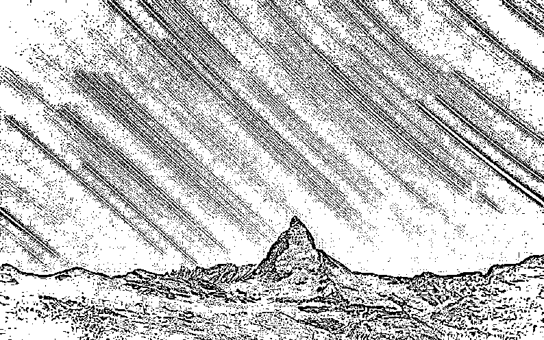

作者/苏·汤普金斯 译者/蒋颖

校对/江艺 编辑/玫瑰 图片/全景网

很多来访者的问题都让人本主义占星师非常为难，例如：“我的正缘什么样？”“我会结婚吗？”“我会有钱吗？”这种时候，占星师的第一任务是先要搞清楚自己的体系中哪些问题可以预测，哪一些是不可以的。英国资深占星师苏·汤普金斯会给到大家一些建议。

**该不该预测未来？**

占星师本身也在争论，是否可以做预测，什么是可以预测的。有些占星师说，客户来找你就是为了预测，所以你的工作就是预测。但是像我这样更加心理倾向的占星师，我们认为**为他人做预测实际上是剥夺了他人的自由意志**。我们可以测试一下，我们是否有自由意志。比如**突然有东西掉到地上，发出很大的响声，这声巨响是否是命中注定的呢？**

如果自由意志就是没有什么可以阻挡我把衣服脱掉，在那里跳脱衣舞，也许这里确实有自由意志，我们有选择的权利。但是也许这是早已注定的，因为我不会去做这样的事情，这不是我的性格。

**关于占星预测，你需要知道的 3 件事**

我们再回到这个问题上，客户常常问我们，会发生什么事情呢？我们可以回答这些问题吗？我会用自己的方式来看待这个问题。

首先你要把问题划分为两个类别，如果你可以想到，在这边你具有**集体的责任**，而另一边是你的**个人责任**。那么在集体的责任上，我认为包含了已经发生的大事件，如果有些事情已经发生了，**你不能改变过去，但是你可以改变对过去的态度。**

有一个占星学的分支是**卜卦占星（horary）**，卜卦的词根是小时，所以卜卦占星问的是这样的问题：我的钱包被偷了，我的钱包在哪里？占星师可能会试图去解决这些问题。如果他们擅长卜卦占星，他们也会给你一个答案。

1 集体层面在集体的层面，也有一些事件是我们每个个体**很难去评说、无法控制或是无能为力**的。比如，你工作的那个厂倒闭了，或者发生地震了，或者你的国家要去参战。对于这些事情，你无能为力，没有选择的余地，也无法对此负责，你什么都做不了。我认为**在集体层面上，占星师应该努力去做预测，但是他们可能无法做到，因为他们可能缺乏一些特殊知识**。比如，我有时候会去试一试用占星学做天气预报，很容易预测那种极端的天气状况，但不容易预测每天的天气变化，这可能是因为我对气象学不太了解。因此**在集体责任上，我认为占星师们应该去预测，而且应该掌握特殊的技能，如果他们真的想做好的话。**2 个人层面但是大部分客户来找我，都是问关于**个人责任**方面的事情。这一方面，我们每个人至少都有一点发言权，也应该对结果负有一定的责任。这些问题包括：

*   我应该结婚吗？
*   我应该离婚吗？
*   我应该找一份新工作吗？

我的观点是，**对于这些个人层面的问题，占星师不应该去预测，也不能预测**。预测这类事情不但不一定准确，而且可能剥夺了个人的选择权，占星师的工作应该是**与客户做一次有意义的对话，然后才能明白到底是怎么回事。**

假如冥王星在你的第十宫，第十宫是与我们的**职业以及父母**相关的领域。而行进的土星合相你的冥王星，客户对我们占星师说，我在工作中跟老板的关系很糟糕，我觉得我的老板完全控制了我，我应不应该换个工作呢？那么在我和他的对话中，我会问他：“你以前有没有过同样的感觉呢？”客户可能说：“你这么说真有趣，这种感觉就像是我六岁时对我母亲的感觉一样。”

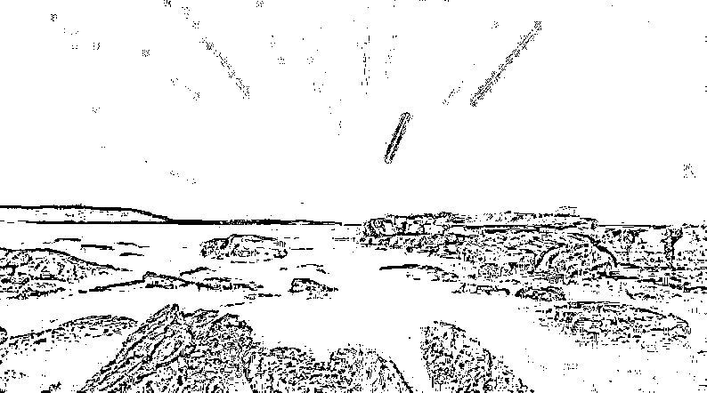

所以，一场心理层面的对话可能要包括我们对客户的观察。当一个人六岁的时候，他不可能和母亲争论，小孩子是无能为力的。而现在这个人已经成年了，不管怎样，他把过去的情结带到当下的情境中。所以**当事情发生的时候，客户有了一个机会，去应对过去无法应对的权力争斗问题。**也许当这个客户离开我的咨询室时，会用一种不同的视角去看待当下的情形。占星师可能看到了，这是一个换工作的好时机，或者也可能不是，但不管怎样，他和占星师之间的对话会改变这个状况。

对我来说，在所有的情境下，占星师的工作是**帮助客户感到自己有能力应对面前的任务，无论这个任务是什么**。所以占星师通过帮助客户认清现在的情况，从而赋予客户更大的力量。

占星师的工作就是看到在表面之下，还有另外一个事实，这种情况是很常见的。无知加上不负责任，等于去死的状况。现实是我们每个人都要**对自己负责任，对我们的态度、失败与成功负责任**，甚至从某种角度说，我们要对我们星球上发生的事情负起责任，所以不应该进行这种预测。
**一场好的咨询，或者说两个人之间一次有益的交谈，可以改变这两个人对事物的认知，从而改变他们的现实情况**。换句话说，问题本身已经发生了改变。实际上，这是一个科学的法则，对事物的看法可以改变事物，这就是为什么你不应该做个人层面的预测。3 个人层面里的例外

当然也有一些例外，即便也和个人相关。比如，很容易从你星图中预测发生在你生命中其他人身上的事情。这是因为你没有跟另一个人对话，所以没法改变另一个人的意识，比如**商业占星**。

北京的一所大公司的总监到你这里来，跟你聊一聊他的生意，占星师也许可以为这个总监做很多事，比如他应该怎么为他的产品做营销，以及如何树立市场形象等等类似的问题。这是因为总监无法改变集体意识，整个事业比他个人更大，个人应该服从更大的事物，服从公司或者整个国家。

换句话说，从我们的出生图上，你可以猜测一些事情，如果星图上有非常强烈的指征的话。但我认为我们都有自由意志，而且占星师的工作应该是增强你的自由意志，最大限度地实现你的所思所想。占星师的工作是**帮助人们和天道同行。**

**版权声明：**本文由若道翻译、整理发布，欢迎转发，反对抄袭。友号转载请申请白名单。


**苏·汤普金斯**

若道签约老师。英国目前最资深的占星学家和咨询师之一，她拥有超过四十年的占星经验。占星学习者必备之两本圣经《当代占星研究》和《顺逆皆宜的人生》作者。苏是伦敦占星学院这所享有盛名的专业学府的创办人，曾任英国两家最著名的占星学院校长。2003 年，为表彰其卓越贡献，英国占星协会为苏·汤普金斯授予查尔斯·哈维终身成就奖。苏同时是一位接受过心理学与心理咨询训练的注册顺势疗法医师，并经常在英国、法国、挪威、瑞典、澳大利亚等地举办占星研讨会和公开演讲。

**点击图片查看若道君推荐**


**微信又双叒叕改版啦，不想错过若道君的推送？**

**就把若道设为星标吧！**

**▼**


喜欢记得点一下在看哦☟

********报名直达入口********


# 10 大行星落入双鱼座 | 要么与众生相连，要么独自遨游人间

> 原文：[`mp.weixin.qq.com/s?__biz=MzA5NjA0NTAxNg==&mid=2651413555&idx=1&sn=fd068d28165d0689b1c4d1861447edff&chksm=8b4bee84bc3c6792a91ab274518b90e1a1df08a84ab2af168c0d3b22fc8b15111f3574ae67b8&scene=126&sessionid=1692738212#rd`](http://mp.weixin.qq.com/s?__biz=MzA5NjA0NTAxNg==&mid=2651413555&idx=1&sn=fd068d28165d0689b1c4d1861447edff&chksm=8b4bee84bc3c6792a91ab274518b90e1a1df08a84ab2af168c0d3b22fc8b15111f3574ae67b8&scene=126&sessionid=1692738212#rd)

**************************** ☆ **************后台回复“今日”，给你一句生命态度**************

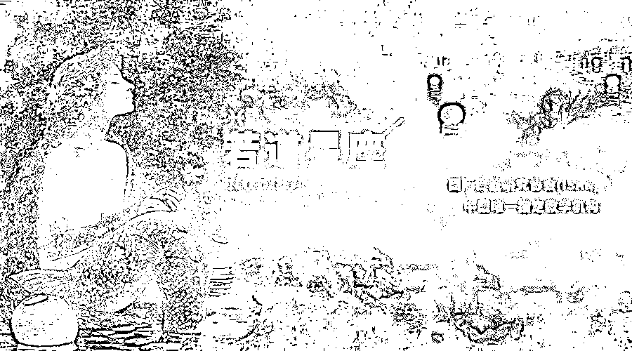

作者/阿兰·欧肯 译者/戴维斯

本文授权转载自新浪星座

编辑/玫瑰  图片/unsplash

太阳双鱼座有鲸鱼和海豚两种类型，第一种，在陆地上生存很困难，另一种却游刃有余。然而，无论哪一种，都感觉海洋中更为适合他们。那么，为什么双鱼座要上岸，用双脚行走，成为人类呢？这恰恰是灵魂进化的途径。**双鱼座的符号代表什么？**


**生命面临着精神和物质的对立，而灵魂则居中调和这对主要的矛盾：生命的核心价值与生命的外在表征。灵魂为意识提供了外显的渠道，让我们认识自己。通过这个过程，我们最终会领悟到自身神性的一面。这一领悟势必要经历持续的痛苦的转化过程，直到我们慢慢成长和发展，才能到达意识以及灵魂的本质：爱。**

**——阿兰·欧肯**  

| 双鱼座符号

双鱼座的符号反映出了这个星座的**二元性**：两个半圆由一根横线联结起来；通常我们也把它视为两条鱼被一根绳索绑在一起。这两种象征其实都在描述**灵魂和个性之间同时发生的吸引和排斥所带来的：****质朴的热情，人世的苦难和人性的救赎。**

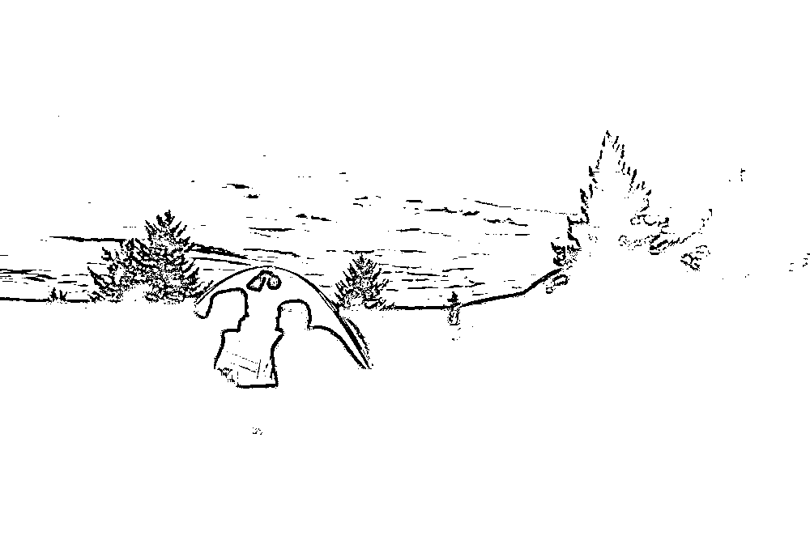

双鱼座代表了**低阶和高阶自我的冲突对立最终融合成为开悟后的高阶意识**。双鱼座这一对立的特质可以总结为以下 3 种基本原则：

***1. *****奴役或囚禁**

**灵魂被物质囚禁**。离开了生命的外在，灵魂没有办法自由地体悟自身的特质。但它可以被视为**牺牲法则**，慈悲由此而生。自我牺牲的意识是双鱼座特质的重要组成部分。牺牲这个单词“sacrifice”由两个拉丁词根构成，意思是“使神圣，使成全”。在双鱼座发展的初级阶段，个性并未完全被高阶自我所驯服。在发展的后期，两条鱼的意识结合在一起，分离的痛苦让位于统一的愿景。

***2.  *****统一或分离**

**如果意识不到统一的光明和存在，太阳或上升双鱼座非常容易走向自我诱发的个人毁灭。**

这一诱因有两层：

*   **想要逃离日常生活和物质世界中的责任和负担**，**“追寻天堂”**。不成熟的双鱼座往往会通过**吸毒或其他上瘾的方式**来逃离现实。 

*   **想要逃离灵魂触发的道德压力，“逃离天堂”，逃离成长和进化的内在压力**。其结果就是引发各种形式的**自虐**。人性（个性、物质）到达了最低点，想要重新回到“神邸”代表的统一性（灵魂占星学所说的海王星进入巨蟹座的“擢升”位置）。

     灵魂的压力就是“终结物质世界黑暗”的光明。两条鱼中间的绳索代表的中间之路让统一取代了二元对立。这条绳索在梵文中被称为经脉，也是密宗占星所说的“彩虹桥”。大家要记得水星（心智）是神的信使，灵魂占星学中的双子座并不会创造二元对立，相反，它会把对立的两面联结起来。绳索也叫做神圣的线索，精神战士们会把它牢记在心，投身物质世界，为爱而战。

***3. *** **自我牺牲和死亡**

**神智学告诉我们死亡并不存在，它只是物质的突变和转化（物质不灭定律**）。转化的过程释放了意识，目的是完成造物主所要求的进化的目的。双鱼座要教会我们的道理就是：**当个性被牺牲（甚至是身体上的死亡），生命仍然持续运作，带领我们进入灵魂，遇见不朽**。

这种进化的觉悟正是高阶的双鱼座们的特质。死亡（包括失去或抛弃）即为终点的幻觉和对死亡的恐惧被双鱼座的圣水所洗礼和净化。**我们害怕死亡，是因为欲望把我们推向了轮回，但是双鱼座代表的救赎会让我们从痛苦的轮回中脱离出来。**

**双鱼座时代也被称为救世主的时代**。我们看到了宗教的二元对立——“正义和邪恶的较量”，宗教狂热和排斥异教（十字军东征，中东地区的宗教之争），以及极端宗教（自杀炸弹客）。然而我们也看到了希望：水瓶座时代就是人道主义的时代。灵魂、意识和救世主团结一致达成人道主义意识，这一点正在慢慢变成现实。

大众看到了救世主神圣的牺牲，和平共处和全球合作变为可能。但最终能实现吗？许多个人和组织正在朝着这个目标默默奉献。当更多的人意识到了内在统一的光明，亲力亲为，这个目标就能实现。

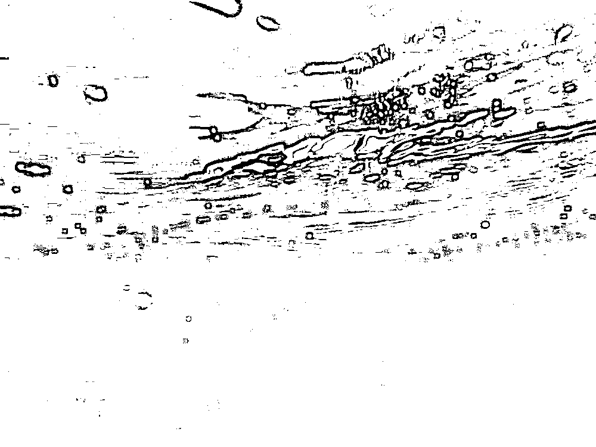

**不同的行星落入双鱼座**

我们来看看行星落入双鱼座所代表的含义：

**太阳****落入双鱼座**

太阳双鱼座的人形形色色，但有两种类型特别明显：**海豚和鲸鱼**。

*   **鲸鱼类型的双鱼座**不仅个头大，情绪表达也很突出。这意味着**这类双鱼座通常本能地缺乏疆界感，生活中总觉得他人入侵了自己的世界**。而实际上他人也觉得双鱼座们入侵了自己的世界，鲸鱼类的双鱼座反倒觉得自己很无辜。  双鱼座们在陆地上并不是最佳的位置（地球、土元素、物质生活），他们显得很笨拙，总在寻找正确遨游的方向。**大块头之下隐藏的是一颗温柔的灵魂（也可以很邪恶），表面上波澜不惊，内心则经历着翻江倒海的情绪起伏**（有时候他们块头也不大，但是情感丰沛）。 

*   **海豚类型**的双鱼座是**灵活、优雅和聪慧**的代名词。他们可以是舞者、音乐家、艺术家，有时候也可以是神秘主义者。海豚曾经也是陆地上的哺乳动物，因此这类型的双鱼座也**知道怎么在想象和梦境中遨游，在陆地和海洋中都游刃有余**（但他们还是更喜欢海洋）。

 所有的太阳双鱼座都需要**自在遨游**，因此他们对一切真实的和虚幻的界线都非常敏感。**双鱼座自觉自己是 12 星座中最孤僻的那一个，需要不时地从众人中消失，进入自己隐退的状态**。我们通常看到的双鱼座要么是走进了你的内心世界与你紧紧相依，要么离你咫尺天涯沉浸在自己的世界里遨游。

**月亮****落入双鱼座**

月亮在双鱼座本能地展现出**同情心和理解力**。**情感和精神成熟的月亮双鱼座会投身于人道主义和慈善事业**。很多心理学家、理疗师和其他类型的治疗师都是月亮双鱼座。他们的**感官能力非常敏锐**，因此很多艺术家、电影人、音乐家、演员、室内装饰设计师也是月亮双鱼座。

**如果月亮有紧张相位或心智不成熟，他们会过度敏感和同情心泛滥**。如果过度依赖于亲密关系，这就需要不时地从关系中抽离出来。个性散漫的月亮双鱼座很容易进入**持续的情绪紊乱状态，情绪反应也会反反复复，漂浮不定**。解决这个问题的关键可以通过采用一些修行的方式，让精神层面和清晰客观的思维层面达到平衡。也因此，**落在双鱼座的月亮如果和土星或者水星呈现良好相位就会相得益彰。**

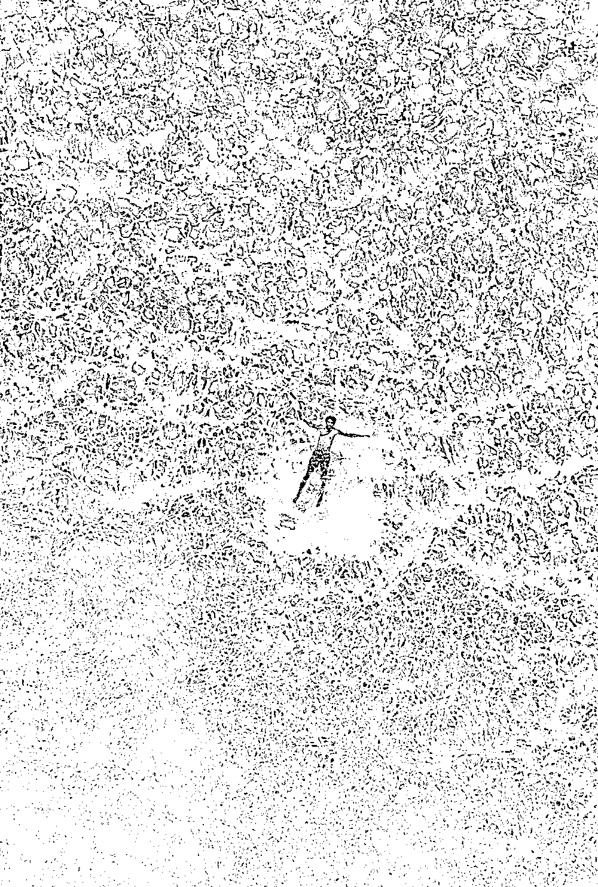

**水星****落入双鱼座**

从个性层面来说，这个配置会很麻烦，因为**逻辑分析和精准思考对他们来说很难**。但这个配置对于小说家、诗人或是电影人来说很棒。如果与有关智力的行星（例如天王星或者土星）形成良好相位，同时行星落在魔羯座或固定星座（金牛座或天蝎座），积极的能量就会有利于开展各类研究工作、策略与外交、物理研究或科学实验。 

 **金星****落入双鱼座** 

**金星进入双鱼座是“擢升”的位置，通常会把同情心纳入到关系之中**。他们**敏锐地觉察到压迫，也本能地同情需要帮助的人**。他们也对于音乐、美学和艺术有着优秀的鉴赏力，有时候也能在这些领域执业（例如金牛座或天秤座位于 6 宫或 10 宫的宫头）。部分金星双鱼座会**持续地找寻新的感官经验，导致自身进入相当混乱或情感无法满足的生活方式**。对于以灵魂为中心的金星双鱼座来说，**爱必须征服一切分裂和对立，他们因此也会成为教授爱与意识的导师。**  **火星****落入双鱼座**就个性层面来说，**火星到了一个很难发挥能量的位置**（本命星图的这个配置对个人来说也很难）。**火星的驱动力变得不稳定，方向也不明确，欲望往往主导了行动**。有些情况下，火星双座鱼带来了**盲目、理想和浪漫的奉献，结果往往是一片混乱**。也有一些火星双鱼座学会了怎样同时多线开战，成为了出色的战略家，站在隐秘的位置出奇制胜。**性爱与情绪紧密相连，常常自我陶醉引而发个人关系上的困顿。**

**木星****落入双鱼座**

木星在双鱼座的位置极佳，能够**对各种形式的宗教和哲学抱持开放的态度和学习的兴趣。**开阔、同理和普世的生命态度也能帮助他们拥有强大的信念和精神力量。**如果木星有紧张相位或心智不成熟，木星双鱼座会变得沉迷于声色。**尤其当木星与金星形成四分或对分相的时候，他们的态度就是“今宵有酒今宵醉”。

也有一些案例中，双鱼座的木星同其他行星成紧张相位会造成**精神流浪或放逐**，他们在宗教和精神道路上找不到自己的归属，这即是典型的能感受到精神世界的号召，但听不清楚究竟这号召的声音从何而来。

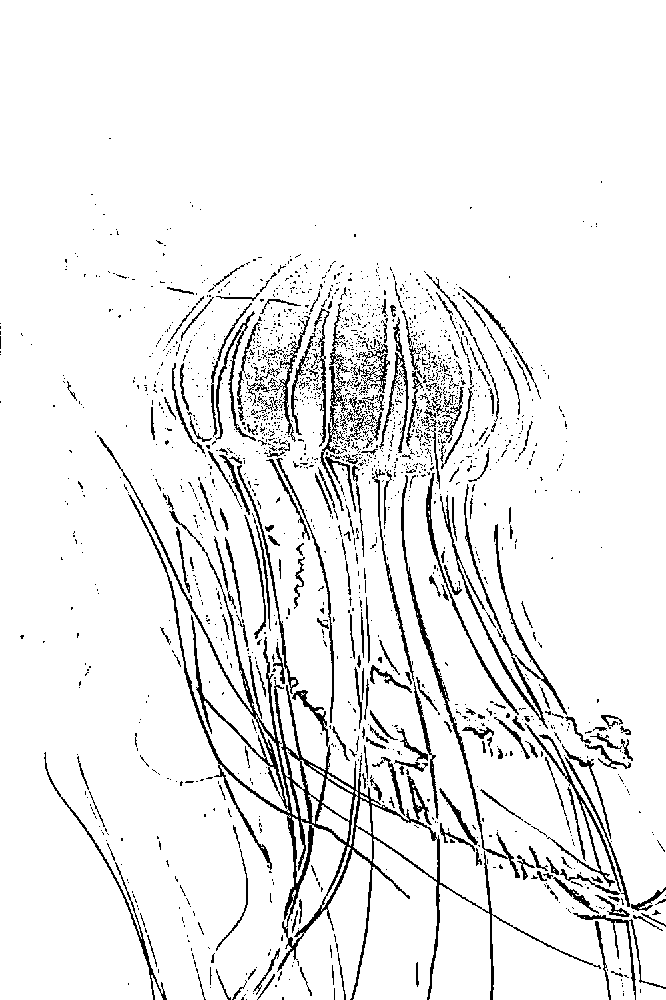

**土星****落入双鱼座**双鱼座的能量对于土星是一大挑战：双鱼座代表浩瀚的海洋，土星代表具体的疆界**。****除非其他行星产生良好相位加以调节（例如水星或天王星，这样的配置非常利于科学研究工作），土星在双鱼座会脱离逻辑而去筑起高墙和藩篱。**他们常常**感受到外界持续不断的阻碍和限制**。灵魂层面来说，**冥王星（奥义占星学中双鱼座的守护星）与土星结合，破除藩篱，把意志导向物质世界**。因此，他们**能发现许多潜意识中存在的问题和恐惧，想办法去摧毁和转化。**

**天王星****落入双鱼座**

天王星进入双鱼座是在 1920 到 1927 年间。日本和意大利军国主义崛起，法西斯战争的梦魇从德国开始。**理想、宗教和政治信条取代了一切的常识和怜悯心。**2003 年到 2010 年期间，同样的事情（在不同的国家）以另一种面貌表现出来。天王星改革的热情在双鱼座更加高涨，个人和国家皆是如此。从灵魂层面来说，**救世主的意志可以与大众意志结合，发挥出善男信女们的善念。****海王星****落入双鱼座**海王星进入双鱼座的时间是 2012 年到 2025 年。上一次行进正值美国内战，并解放了黑人奴隶（由双鱼座掌管）。不难看出在灵魂层面上，**海王星双鱼座会带来热爱世界热爱人类的救世主角色，大众也热切盼望着他们的出现**。他们可以是不需要政治正确或没有原教旨主义的救世主吗？或者非极端基督教或伊斯兰教徒吗？期间出生的这代人会拥有灵魂层面的爱的法则吗？或者海王星在双鱼座放大和彰显了本就泛滥成灾的偏执，排他和执迷呢？我们走着瞧。 **冥王星****落入双鱼座****冥王星双鱼座要等到本世纪中叶，那时候在 1984 年-1996 年期间出生的人会感受到行进冥王星三分出生星图中天蝎座冥王星的力量**。我只希望冥王星、天蝎座和双鱼座能展现出灵魂占星学定义下的积极能量。我们都知道天蝎座的死亡带来的是双鱼座耶稣的爱的信念（意志）。我们期盼（只是期盼）人类的灵魂力量能够复出。在人类的集体意识层面，这意味着行进冥王星能调动出冥王星天蝎座一代的最积极的能量。我们会看到世界上涌现出许许多多为水瓶座时代人道主义信念而奉献的人。这是我作为一个金星在双鱼座的占星学家的美好愿望。 


**也许你还想看下面的 10 大行星系列文章**[白羊座](http://mp.weixin.qq.com/s?__biz=MzA5NjA0NTAxNg==&mid=2651405769&idx=1&sn=156bc792f68f1492fa60b0a75807d02e&chksm=8b4b8f7ebc3c066829618dd0df203d10ba59debc8fc1cfc2e9570cc36cb45624bbc99f0e6cd0&scene=21#wechat_redirect) | [金牛座](http://mp.weixin.qq.com/s?__biz=MzA5NjA0NTAxNg==&mid=2651406747&idx=1&sn=6ab6613948b18bb20bafd9e517bce34c&chksm=8b4bf32cbc3c7a3a022b2062d11eceeb462a6e8d74cd50ab18e57c9b1f197bfbaf742d25990a&scene=21#wechat_redirect) | [双子座](http://mp.weixin.qq.com/s?__biz=MzA5NjA0NTAxNg==&mid=2651407375&idx=1&sn=c60ba8cead10352e8dfd711797aeb20f&chksm=8b4bf6b8bc3c7faef468d681cfca00c144af1884284cf8e74bccc7d007dba878238b6967e71c&scene=21#wechat_redirect)[狮子座](http://mp.weixin.qq.com/s?__biz=MzA5NjA0NTAxNg==&mid=2651408958&idx=1&sn=01945300700fa406f833c7ae716cf20e&chksm=8b4bf889bc3c719f425ddbf1b7fde67e750caf3aeac345f59c31a6d0e0d872c9ebebdbeb719b&scene=21#wechat_redirect) | [处女座](http://mp.weixin.qq.com/s?__biz=MzA5NjA0NTAxNg==&mid=2651409494&idx=1&sn=d2f7d831723d6f39d17f42ef39776048&chksm=8b4bfee1bc3c77f715f93a00db395d75c766be1af66bf7453992f79b21e5de9685df50f4cdbd&scene=21#wechat_redirect) | [天蝎座](http://mp.weixin.qq.com/s?__biz=MzA5NjA0NTAxNg==&mid=2651402140&idx=1&sn=ffdfd55bf1758eab5de60a7a16561064&chksm=8b4b9d2bbc3c143d6ae0619d697283fa484c6794b7c3c6b34795934a0ae1e0338651a614aebc&scene=21#wechat_redirect)[](http://mp.weixin.qq.com/s?__biz=MzA5NjA0NTAxNg==&mid=2651402140&idx=1&sn=ffdfd55bf1758eab5de60a7a16561064&chksm=8b4b9d2bbc3c143d6ae0619d697283fa484c6794b7c3c6b34795934a0ae1e0338651a614aebc&scene=21#wechat_redirect)[摩羯座](http://mp.weixin.qq.com/s?__biz=MzA5NjA0NTAxNg==&mid=2651410912&idx=1&sn=599b12a103f166c5aa60526f6523f7a1&chksm=8b4be357bc3c6a4199c2b32f4f9ce9dc82c9b53fe511f7c5ee855e2650ebf38b7af4423461ac&scene=21#wechat_redirect) | [水瓶座](http://mp.weixin.qq.com/s?__biz=MzA5NjA0NTAxNg==&mid=2651404992&idx=1&sn=d3d9b815a42559691760b17c27903040&chksm=8b4b8877bc3c0161d1d51ed9866ebb495de3c5369dd62f23e912bfc0e3d12220a35898bc328d&scene=21#wechat_redirect)

**阿兰·欧肯**

若道签约老师，1944 年出生于纽约，毕业于纽约大学罗曼语言及语言学专业。著有包括《灵魂占星》、《星图中的守护关系》、《阿兰·欧肯完全占星》等数十部著作。他还为《戴尔星运杂志》以及其他许多国内外评论与期刊撰写过数百篇文章。他是译者、老师、环球旅行家和国际导游。

**点击图片查看若道君推荐**


[](http://mp.weixin.qq.com/s?__biz=MjM5MjQwNjAyMQ==&mid=2649436468&idx=1&sn=12196ff8d1047da7503f23060eb05757&chksm=beb95e5e89ced7484c07b33d4e9654a6e131e3aea51b0fc7c5960482e7bbcac8bf73e89f1d4b&scene=21#wechat_redirect)

**微信又又又改版啦，不想错过若道的推送？**

**就把若道设为星标吧！**

**▼**


就是这个“在看”，戳戳戳 ☟

如何报名？请点击“阅读原文”


# 2020 年第一波水逆来袭！12 星座水逆解闷指南针，请收好

> 原文：[`mp.weixin.qq.com/s?__biz=MzA5NjA0NTAxNg==&mid=2651413520&idx=1&sn=7047b6f34149c1662935629be48e48df&chksm=8b4beea7bc3c67b1c0176408bada7f83fbc416e4fceeb31176861d91e80e8641a5d18e8480df&scene=126&sessionid=1692738212#rd`](http://mp.weixin.qq.com/s?__biz=MzA5NjA0NTAxNg==&mid=2651413520&idx=1&sn=7047b6f34149c1662935629be48e48df&chksm=8b4beea7bc3c67b1c0176408bada7f83fbc416e4fceeb31176861d91e80e8641a5d18e8480df&scene=126&sessionid=1692738212#rd)

******☆ ****后台回复“今日”，给你一句生命态度******作者/查理 ISAR 认证占星师编辑/Tang 封面/书君 图片/网络

北京时间 2 月 17 日 08:53，2020 年第一波水逆来袭！水星从双鱼座 12°53′逆行至水瓶座 28°12′，直到 3 月 10 日才恢复顺行。本次始于双鱼座的水逆会对我们造成怎样的影响，这期间我们又能做些什么解闷？

**双鱼座的水星**

> 2020 年 2 月 3 日晚，有一条颇具有调侃的消息流传在微信、微博和抖音：今年最惨的人，应该是躺在四川隔离病房里，遭遇地震，且满仓持股的科比粉丝，还在莆田步行街有一排商铺的，湖南养鸡场老板。短短一句话，似乎道尽人间疾苦。当天晚上，水星刚进入双鱼座。

水星并不擅长在双鱼座的世界中生活，因为水星喜欢搜集信息、逻辑分析、得出结论再传播出去。水星在双子座和处女座的世界中会发挥特长，因为在那里充满了各种有趣新颖、逻辑严密的信息，水星可以像蜜蜂采蜜一样有条不紊地搬运它们。

然而**在双鱼座的世界中，信息和数据并不是以逻辑的形式呈现的，甚至在这里时间都是非线性的，时间和空间在此互相转换。**就好比，我们有时候做了个梦，醒来时已经过去整晚；而有时候，我们梦醒时，发现才过去了十分钟。即使我们能控制自己的梦，做了一次“清明梦”，我们也都会意识到梦境经常毫无逻辑。

当然，需要特别指出的是，**这里说的“双鱼座”、“双子座”和“处女座”并不特质所谓特定人群，而是一种环境特质**。

**2 月 3 日前，水星在水瓶座的世界里**，它为我们搜集来了很多科学理论和试验数据。而**在 2 月 3 日晚，水星进入双鱼座后**，表面上我们看到的是依然是各类消息，但是我们会发现，很多数字、信息和画面给我们带来的更多是**心灵层面的共振**。

在双鱼座的世界中，充满了想象、感受、心识、因果和轮回……无论是个人的还是集体的，或者根本无法区分是个人的还是集体的。就像有些朋友看到视频里的病人带着面罩呼吸困难时，自己也会无比难受，看到成千上万名全国各地的医生赶赴疫区时，自己会热泪盈眶，还有朋友看到那些因为主人无法回家而孤立无援的宠物时，会无比心疼。**水星透过朋友圈、各种群、微博、各类视频网站，把直击心灵的感受以信息的方式传到大众面前。**

**水星在双鱼座的世界里，容易功能失调，就像我们通常很难用语言描绘出在梦境中的复杂情景和感受。**或者我们也可以想象，那只灵巧的蜜蜂进入了一个气味和地形都异常复杂的地方，它迷路了。在现实中，也许我们也能遇见很多出生星图中水星落在双鱼座的朋友，总是迷路。

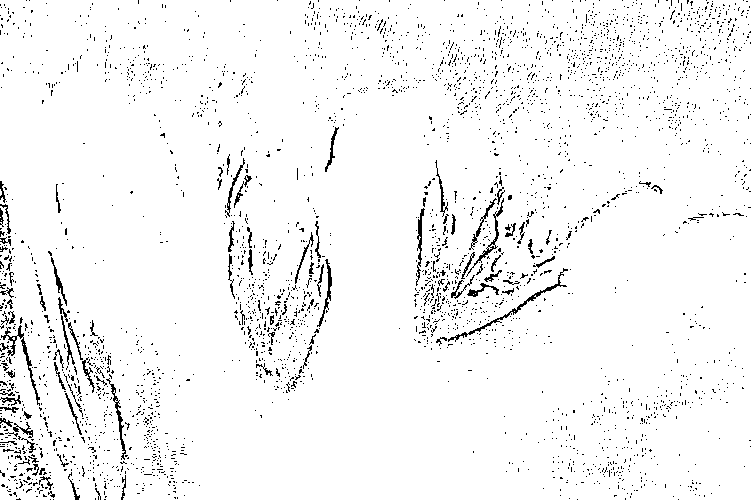

**水逆来了！**

**2****月 3 日，水星落入双鱼座开始，我们会更容易得到模棱两可的信息，语焉不详的结论，或者各类牛头不对马嘴的讨论**，这些信息可能会使得我们更加困惑，迷茫甚至会带来消沉，这些信息也许并不有助于我们能更好地理解和预测未来发展趋势。

更“糟糕”的是，**2 月 17 日开始，水星将在双鱼座 12°附近开始逆行，这意味着水星的功能可能进一步失调**。这种感觉就像，当被问到“欲穷千里目”后面一句是什么，你马上就能顺口回答“更上一层楼”，但如果问你上一句是什么，也许你需要好好回忆一下。这就是水星在双鱼座逆行失调带来的困难之处。**水星将处于逆行的状态直到 3 月 10 日**。

注：以上是天象有关的解读，并非在评价出生星图中水星双鱼座，或者出生星图水星逆行的朋友。事实上我相信你们会非常擅长用直觉处理复杂的信息，这是你们非凡的天赋。

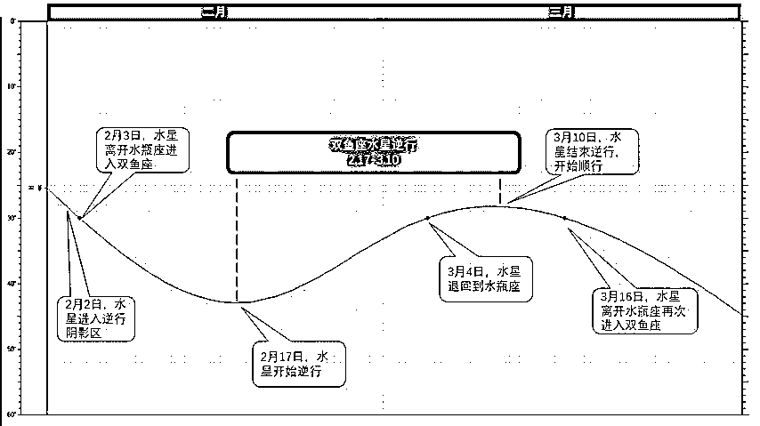

| 水星运行趋势图

听上去一切会更糟糕更麻烦是么？至少从水星的状态来看是的。也许这并非大家想了解的，大部分朋友应该会更希望从天象中得知疫情何时会褪去。那么光看水星远远不够，这需要看其他星体，至少要看木星、土星和冥王星三颗星体。疫情开启的时间，刚好是土冥合相在摩羯座 22°的时候，在 3 月 18 日，行进的木星会来到这个位置，在 3 月中下旬，也许会带来一场胜利，可能是阶段性的胜利，至少会让大家更有信心。然后，在 3 月 22 日，土星进入水瓶座，也离开了与冥王星的合相。如果那会儿，疫情还没有得到有效控制，那么在 3 月下旬，我们可能会采用全新的方式控制。4 月 5 日左右，木星会合相冥王星在摩羯座 25°附近，这会是一个强有力的合相，会带来更多的机会。

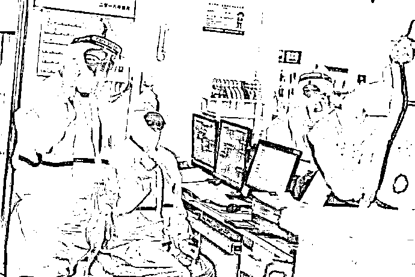

| 武汉市中心医院官方微博发布了新型肺炎救治第一线的照片

**水逆期间，12 星座可以做些什么？**回到双鱼座水星逆行的话题中来，如果我们这场战役需要历经到至少三月份中下旬，而且信息渠道方面可能还会出现更多的难以预测的情况，该怎么办呢？外在的防护，相信大家已经都有所了解了，包括口罩随身带、勤洗手、做好消毒措施等等。作为占星师，可以给到的更多建议和我们的内在心灵有关。疫情期间，很多朋友无法出门憋得慌，开工以后更害怕被传染。对此，我会提出以下的建议。☆建立边界很重要**首先是减少外界信息的接触，建立自己的信息边界。**比如暂时关闭朋友圈和微博，或者暂时屏蔽那些“热爱”发布疫情消息的朋友，退出那些总含有各类无中生有转发消息的微信群，取消关注那些一惊一乍的公众号，等等等等。如果是已经开工的朋友，也谨慎和同事、朋友聊起有关于这次疫情的话题。如果你是**对信息敏感的人群要特别注意**，比如你拥有太阳双子座、月亮双子座、上升双子座、群星双子座、水星合轴的星图配置。而那些**对集体悲伤感受力比较强的人群也要特别注意**，比如你拥有太阳双鱼座、月亮双鱼座、上升双鱼座、日海相位、月海相位、四轴合相海王星、群星双鱼座的星图配置。因为双鱼座水逆期间各路纷繁杂乱的信息会很容易让你糟心，侵害你的个人心识。包含着集体能量的消息也很容易让你有带入感，迫使你感同身受，虽然身体没有遭受痛苦，但是在心灵层面会受到冲击。其次，当你把这些信息通道关闭之后，你可能会觉得更加无聊、担心和恐慌。这也是很多人在过年自我隔离期的体验，大家都觉得憋坏了。那么这个时候，**你可以多给自己一些耐心，安静地和自己的内心呆在一起**。

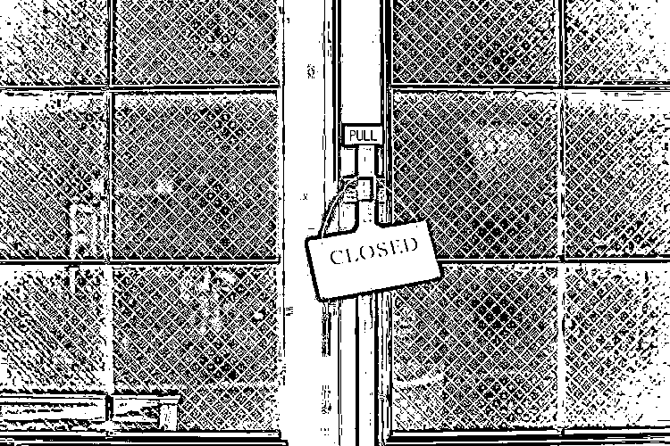

☆12 星座解闷攻略闲暇的时间如何度过？这是 2 月份群星落在双鱼座期间的重要课题之一，特别是 2 月 19 日后，太阳进入双鱼座了。简单介绍一下，**不同星座可以尝试不同的解闷方法**：**☆ 火象能量强的朋友（白羊座、狮子座、射手座）**可以多看娱乐节目，或者自己拍抖音或者直播解闷，或者在家健身做运动，天气晴朗时要多晒晒太阳，条件允许的话也可以带好口罩小区内跑跑步。**☆ 风象能量强的朋友（双子座、天秤座、水瓶座）**可以和人煲电话粥，或者网上听课学习，看书，研究，远离各种负能量的消息非常重要。**☆ 水象能量强的朋友（巨蟹座、天蝎座、双鱼座）**要保持家里温暖，在家琴棋书画，喝酒看剧两相宜，最好能够弄一些精油气味芬芳，打坐冥想，抄抄经书也是不错的选择。**☆ 土象能量强的朋友（金牛座、处女座、摩羯座）**则可以干点活，比如自己做菜烧饭，或者拼图、搭积木、做手工玩点新技能，已经开工的土象星座朋友可能是幸福的，这意味可以忙活起来了。以上是一些可以和自己相处的方法，也许在过年期间，很多朋友已经开始实践了。

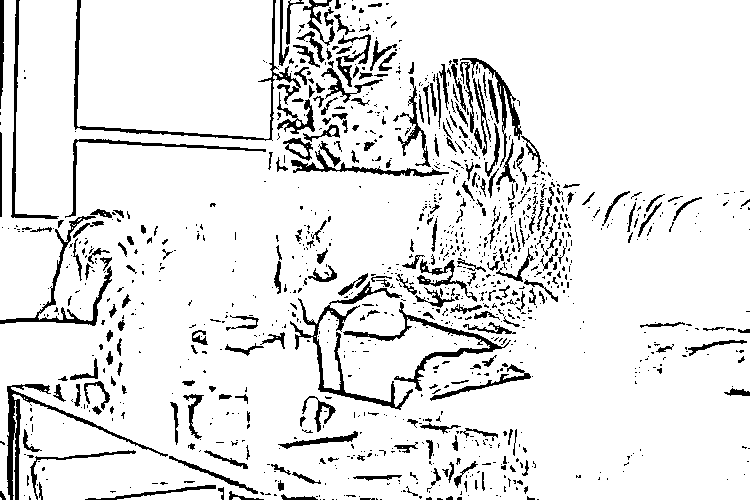

☆我们还可以做这些事当然，2 月 17 日到 3 月 10 日的水星逆行期间，还有一些更为特殊的内容。**当我们安静下来，屏蔽了外部信息后，水星会把很多过去的记忆重新带回到人的意识层面，并且我们会对这些从内而外涌起的东西感到无比熟悉**（其实即使不屏蔽外界信息，这样的情况也容易发生）。由于是双鱼座的水星在逆行，所以也**更加容易把我们曾经的双鱼座式体验重新呈现出来**。这里所说的双鱼座式体验，可能是**美好浪漫、神奇梦幻的瞬间**，也可能是**孤独无力、悲惨绝望的刹那**。这些记忆碎片是你自己的经历，只是它一直躲在角落里没有被你注意，现在它出现了。出现的方式可能多种多样，比如是一部电影中的某一个熟悉桥段，一首歌中的某一小节音符，一本书里面的某一句话，某位故人突然发来的一条消息，某条新闻中提到的一件陈年往事，某次交易中尚未结清的一笔款项，某次会谈中偶遇的一位老友，某一刻脑中突然的念头，等等等等。当大家被外界的各类信息轰炸时，偶然的闪回可能会再次被忽略。而当我们有能力屏蔽外界信息时，我们会**更关注到这些自己记忆碎片中的心灵声音**。一般而言，**放空、打坐、冥想**会是不错的选择，还可以**研究和记录自己的梦境**。如果平时从来没有这样的习惯，也许也可以去**关注神话、童话、寓言故事**，这些饱含智慧的内容也会引起我们内心的共鸣，并且引发内在的灵性。内在灵性也许会让我们感受到，**我们身处于一个更大的存有之中**。就好像婴儿生活在羊水中，鱼群生活在水中，我们人类生活在空气中，虽然每天朝夕相处，但是羊水中的婴儿、水中的鱼和空气里的人也许很难意识到自己生活在这样的环境里，因为我们的注意力通常只在于自己的五感。而当自己内在的其他感受被打开时，我们感受到的世界，也许是另外一番天地。

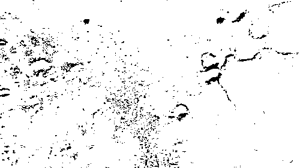

**感受另外一番天地**

枯燥的理论和语言可能很难描绘这些，我可以用最近切身的经历和大家分享这些。

**第一个故事**

去年 10 月，在成都参加占星大师斯蒂芬的工作坊时，我有幸被抽到现场解读，他花了三四个多小时的时间解读了我星图中的能量和未来的趋势预测。其中有一段非常具有戏剧化的解读：你想象自己是萨满，深夜在一座高山上打坐和冥想，突然出现了一只松鼠，你发现它竟然可以说话。于是你们开始交流，和它的交流，让你变得非常平静。

今年 1 月，当我在一位的朋友家聊天时，窗外突然出现了一只松鼠，朝我看了几眼，又消失在小树林里。朋友的家位于上海市中心的湖南路街道，而我从小生长于上海，30 多年来从未在上海市中心除了动物园以外的地方看见过松鼠。

同样 1 月，机缘巧合，我受邀参加了一次活动，活动在浙江丽水的一间民宿，活动主题是“心灵疗愈之旅”，而那家民宿恰巧在一座山上。

**第二个故事**

去年 11 月的新月和满月期间，我曾暗自许下愿望，说希望有机会办几场企业占星沙龙。没多久，机缘巧合之下，12 月份我就接触到了两位新朋友，一位朋友叫 YT，她拥有一家会所，其中的客户大多是企业主，一拍即合帮助我组织了一场沙龙。

而另一位朋友是上个故事中请我去参加浙江丽水活动的邀请者，她为什么会邀请我去呢？因为她在做活动策划的时候，突然有个想法，希望能在这样的疗愈活动中更接地气，加入商业的相关内容。当时我和她并不认识，她通过她的占星老师，了解到我的存在，于是我们联系上后，一起在丽水松阳的一座山上，做了一场疗愈+商业的活动。

**第三个故事**

在上一个故事中出现的 YT，为什么会遇到这位朋友呢？是因为我太太去年 10 月份时在苏州参加了一次区域性的疗愈节，带领了一场戏剧疗愈活动。这位 YT 是活动参与者，12 月时 YT 邀请我太太去聊聊合作，没想到去了那边，发现 YT 是占星爱好者，于是转而变成了我和她的合作。

另外，YT 的会所在上海嘉定，那里附近有一颗 1200 多年历史的银杏树，我们顺道去围观了这颗树，而且这颗银杏树是有历史记载的，所以可以查到种植年份是在唐贞元年，也就是 785 年，那几年刚好是土冥合相在摩羯座的年份，在过去的 2000 年多中，这样的天象只出现过 6 次，每次持续 1-2 年左右。

没多久之后，我便受邀请写一篇占星文章，主题就是土星-冥王星合相摩羯座。在那篇文章中，我突然想到了这颗银杏树，于是它便成为了那篇文章的主角。

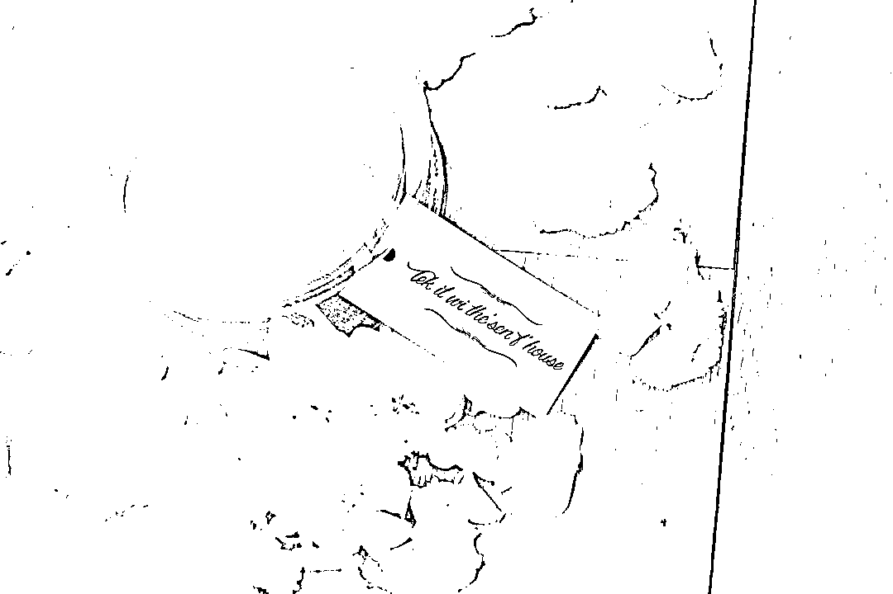

双鱼座水逆期间，我们需要屏蔽一些信息，让自己更安静地和自己相处。看上去，我经历的这些似乎都是巧合和缘分。但这就是双鱼座的世界，**一个又一个巧合，一个又一个缘分**。

如果我们总是希望有人（神）来解救我们，让我们可以解脱苦海，我们对这样的存在有很多的称谓。也许在双鱼座水星逆行期间，我们有机会通过一个内在的巧合和缘分，发现自己的内在灵性，我们自己就可以解救自己，那是另一个维度的自己，自己不曾认识的自己，一个更神奇的自己。

**版权声明：**原创文章由作者授权首发于若道平台，欢迎转发，反对抄袭。友号转载请申请白名单。


**查理**

ISAR 认证占星师（2017 年获得），全职占星师

企业占星顾问（有丰富的企业占星咨询和教学经验）

若道 2016 届核心课程学员，10 年跨国管理咨询工作经验

**咨询微信：**qinglee821

**微信公众号**：suoyingmk

长按打赏


**点击图片查看若道君推荐**


[](http://mp.weixin.qq.com/s?__biz=MzA5NjA0NTAxNg==&mid=2651412358&idx=3&sn=9acab76ab2bdd317b432029d0b47b2a4&chksm=8b4be531bc3c6c274f40ea17a23bba503bdd732a0faaee91ec2502c4d4ae52ead0a2c7a5d3e5&scene=21#wechat_redirect)

**微信又双叒叕改版啦，不想错过若道君的推送？**

**就把若道设为星标吧！**

**▼**


就是这个“在看”，戳一下☟

********报名直达入口********


# 占星小知识丨听说水逆是旧爱复合高发期？

> 原文：[`mp.weixin.qq.com/s?__biz=MzA5NjA0NTAxNg==&mid=2651413520&idx=2&sn=e1511c896adc91e0ff0e829261c90177&chksm=8b4beea7bc3c67b14c6779e829064afa73388fb64b098626f19a950c136e451cb0b327968603&scene=126&sessionid=1692738212#rd`](http://mp.weixin.qq.com/s?__biz=MzA5NjA0NTAxNg==&mid=2651413520&idx=2&sn=e1511c896adc91e0ff0e829261c90177&chksm=8b4beea7bc3c67b14c6779e829064afa73388fb64b098626f19a950c136e451cb0b327968603&scene=126&sessionid=1692738212#rd)

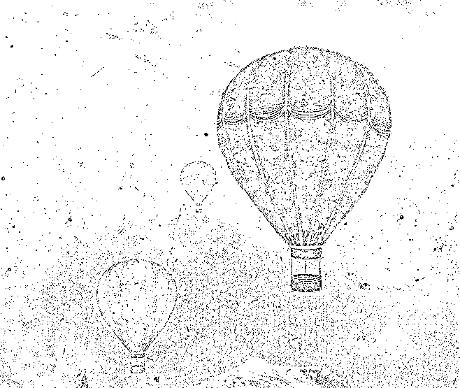

作者/咔咔 ISAR 认证占星师
编辑/Tang 图片/花瓣网**水逆期间是不是一定会复合？**

这个问题太经典了，答案也是非常明显的，不一定。

水星是主管沟通、交流、写作、旅行、交通沟通的工具，所以在水星逆行的三周时间里，是我们的想法、认知在逆行，或者说在转换角度。有可能是知道了过去不知道的事、掩盖的信息被披露了、观念转变了，抑或是对某些人某些事的评价变了。

“啊，其实我内心还对之前的那个人有点小小的放不下，如果水逆期间我们能重新开始该有多好”。如果你的内心确实有这样一个声音，你对这个想法保持诚实，其实真是件很棒的事情。可能就是因为这个心思，**你开始回头去看看，当你们在一起的时候，到底什么地方出了问题？**

**当我们对一个事情的看法和认知改变的时候，这件事就会发生改变**。所以当“想要复合”的念头升起的时候，则需要看到的是：你们当时为什么分手。**水星逆行好像是我们调用历史数据，重新解读这些数据背后的意义，从而得到新的结论**。我们总说，水逆期间要**慢下来**。慢下来做什么呢？就是**做回顾，重新梳理，获得新的洞察**。

*   当年的分手是一时冲动吗？

*   是哪方面出现了矛盾？

*   时过境迁，在另外一种情绪状态下，我们再回头看看？ 

举个例子，一方想要亲密，通常是关系里的女性，女性对情感依恋和关系的需求比男性强很多。但是在关系发展的后半段，这个女性通过抱怨来表达自己亲密的需求，埋怨对方对自己的忽视、冷淡、不能让自己感到被爱。越抱怨则另外一方就越冷漠、疏离、回避，虽然两个人在一起，但是这个关系的双方都各坏不满，之前热恋期储存的感情被一再提取，终有一天余额清零，分手了。

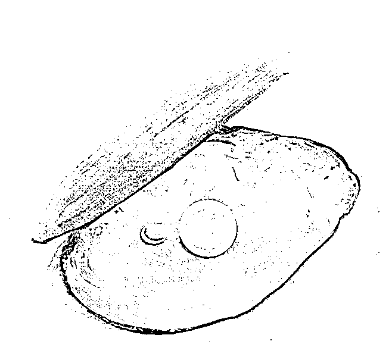

水逆期间，如果这位女性与自己的占星师谈论。占星师可以和她一起回看当初的关系，和她讨论。也许她当年在亲密关系里陷入了一种越抱怨、越被忽视的模式。

在亲密关系里被忽视的感受，与人生早年自亲子关系中所体验到的被母亲忽略，自己的情感需求被无视和轻视相关。当自己身为一个小婴儿/孩子的时候，物质上和情感上极大地依赖照料者。因为那个时候的自己，没有能力，也没有资源，进行自我关怀。

成年以后，每当她在关系里被忽视的时候，她就又回到自己的幼年时期，哭闹着寻找所需要的关注。当然，已经成年的她是不会真的哇哇大哭的，所以抱怨、喋喋不休、唠叨就成为被裹上成人色彩的哭闹替代品。

如果能看到这个模式，这位女性或许还可以再反思一下：“我现在几岁了？我还是那个哇哇大哭的幼儿吗？成年的我，现在的我，具有什么样的能力，把握怎样的资源？除了‘哇哇大哭’以外，我能为自己做些什么？”不离不弃地支持自己，看到未被满足的需要，到曾经被忽视的体验积累的伤痛，都是很好的选择。

占星学是个很神奇的工具。**星图的宫内行星和行星之间的相位关系提供再清晰不过的指征——指出创伤发生的时间**。这些创伤包括：遭受遗弃、忽视、虐待；感到羞耻、不安、孤独、痛苦……

占星学还会指出，**在什么时候，感受被某个外在的事件激活**。个体以为自己在处理一个崭新的成年人的问题，其实这个问题是童年经历的翻版。

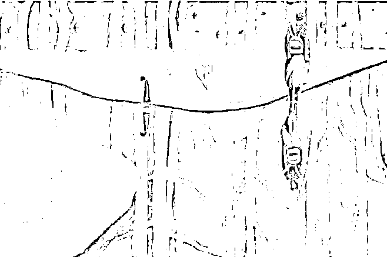

出生星图中海王星与金星合相在第四宫的女性，出生后就被送到姥姥身边抚养，海王星和金星的组合代表了她生命中的一位重要的女性——母亲，消失了。母亲的工作很忙，不能亲自带大她，也不能经常去看望她。

于是，她小时候对妈妈的一部分认知是通过自己对完美女性的想象构建的：她心目中的养育者具有海王星式的高度理想化、慈悲、宽容、超凡脱俗的样貌。成年后的她无意识地地美化了交往的对象，而且越是那种在交往里若即若离、忽视她的需求的对象，就越让她着迷。感情关系成了医治她童年创伤性经历的汤药，放再多糖还是苦涩难咽的。

通常当我和客户一起看清她的模式的时候，客户的内在会自然浮出答案：**重要的不是复合与否，而是要如何自我满足，自我关怀。以一个独立平等的姿态进入关系**。这样的梳理，在水星逆行的时候发生真是再合适不过了。

**如何在水逆期间疗愈自己**

水星在双鱼座逆行，我们可以用想象力（双鱼座）帮助自己重构认知（水星），接纳和同情幼年的自己。

❶ 找一个安静的地方，闭上双眼。联结我们的身体，感受哪些部位是放松的，而哪些部位会感觉僵硬。

❷ 想像有一双温柔的手，或者一股轻微的电流，随着你的呼吸，让僵硬的地方松软下来。

❸ 想象自己回到了小时候，在你当时住的房子里，让你感到难受的具体时刻，感受自己当时的情绪，是悲伤的，孤独的，还是无助的……

❹ 想象成年的自己也穿越回到那个时刻，满足幼年的自己的需求，可能是抱抱 ta，也可能是温柔地安慰 ta。

❺ 想象当时的照顾者以你最想要的方式对待你。

❻ 和自己的负面情绪相处，接受虚弱无助的自我就是允许自己体验内在的魔法。

❼ 使用肯定语，语言是有魔力的。心理学家的研究显示，肯定的话语甚至能改变昏迷病人的心跳次数和呼吸频率。“欢迎你来到这个世界，我一直在等你”，“无论如何，我都不会离开你”……

当我们对一件事的看法改变了，这件事就会发生根本的改变。

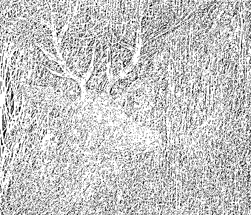

**本次水逆的其他适做之事**

本次水星逆行还有以下信息：

2 月 17 日，水星在双鱼座 12 度开始逆行，3 月 10 日在水瓶座 28 度恢复顺行，3 月 17 日再次进入双鱼座，直到 4 月 11 日进入白羊座。

水星在双鱼座逆行两天之后，太阳进入了双鱼座，木星与海王星精准形成六分相。这段期间**非常适合放松下来，进行一次身体和心灵的“大扫除”**。

自疫情伊始，疫情新闻、科普知识、各类谣言让我们的身体和心都“呆住了”。这种高度亢奋、紧张、焦虑、担忧的状态正在影响我们的免疫力，让人意志消沉，感觉无力。通过静坐、引导性冥想，把关注力放在身体的各个部位，配合呼吸的节奏来放松这些部位，松弛肌肉，让呆滞的身体再次灵活起来。艺术、音乐、电影、诗歌、舞蹈等方式可以帮助我们的头脑暂时离开强迫性的负面念头，给头脑减压。

“随时坐下来，腾出内心的空间，允许各种念头升起，不评判不压抑，无论升起什么东西，都用好奇心对待。如果感觉房间太热而升起厌恶感，就去感觉热的猛烈和沉重。如果因为房间太冷而产生嫌弃感，就去感觉冷冽冰冷的滋味。冷、热是无法医治的，它们会一再出现。”

昼夜更替，潮涨潮落，这是自然的法则。疾病会出现，也会被治愈。在水星逆行期间，来一次意念的大扫除，看着那些把你的心带着四处狂奔的念头，不评判，不压抑。

**版权声明：**原创文章由作者授权发布于若道平台，欢迎转发，反对抄袭。友号转载请申请白名单。


********想阅读更多作者的文章********

********请在后台回复**************** 咔咔 即可********

**咔咔**

职业占星师，若道核心课程讲师

ISAR 认证占星师（2014 年获得）

国际知名广告公司和市场研究公司工作十余年

**微信公众号**：咔星人

长按打赏


**点击图片查看若道君推荐**


喜欢记得点一下在看哦☟

********报名直达入口********


# 当代人本占星师的必修课 | 跟苏·汤普金斯学预测

> 原文：[`mp.weixin.qq.com/s?__biz=MzA5NjA0NTAxNg==&mid=2651413520&idx=3&sn=b778e466313a4a5c8ccb6f60f7340b46&chksm=8b4beea7bc3c67b1d18221045243573339f86393c1e617ffca1264995f6f9ba973d2f6647791&scene=126&sessionid=1692738212#rd`](http://mp.weixin.qq.com/s?__biz=MzA5NjA0NTAxNg==&mid=2651413520&idx=3&sn=b778e466313a4a5c8ccb6f60f7340b46&chksm=8b4beea7bc3c67b1d18221045243573339f86393c1e617ffca1264995f6f9ba973d2f6647791&scene=126&sessionid=1692738212#rd)


**为何推荐这门课？**占星学与其他学科相比，一个非常重要的功能是看到过去、现在和未来的周期性变化，既包括我们每个个体生命内在的变化时钟，也包括外在宇宙气候对个人、团队、社会的影响。
**如果不懂星图解读，那么你和星图的距离大概还隔着一个宇宙洪荒，如果你只会解读星图，却不会将这一种语言，用“人语”讲述出来，那么你和星图可能还距离着一个“生活”。**占星学是一本集天文学、社会学、统计学和哲学内容的书，因此，这本书也**特别需要一位或多为老师将你领进门**，我们才能窥见，宇宙自然法则中那一点万一，其他的所得，都要靠自己通过不断经历和观察才能真正掌握。**“预测技法”为什么很重要？**因为预测技法将**生活**与**占星**密切相连。在占星咨询中或者聊天聚会时，占星师经常会被问到： “我今年的职业规划应该注意什么？我还能升职吗？”“公司今年大裁员，帮我看看我会被裁掉吗？”“我什么时候可以遇到心仪之人？”“我和新认识的男友，最近总是因为一点小事吵架，我们未来会怎样？”“最近自己特倒霉，压力也很大，很难开心起来，这要持续多久啊？”“我去年身体一直不好，想看看今年应该注意什么？”这些急于知道答案的问题，是人们希望占星师为他们提供的“**预测**”。**但预测并非算命，**一位人本主义的占星师，在面对这些生活中最常见的烦恼和问题时，如何帮助到提问的人，对于每一个相信“自由意志”和“宇宙法则”的占星师来说，都是一次次的考验和经历。**如何避过“算命”大坑，真正帮助星图主人自我内在的成长；如何在某些重要的天象下，鼓励到更多的人勇敢向前，活在当下……****这门集高阶预测技法+咨询技巧教学的占星课程，我们向你强烈推荐！**


**课时安排（视频+网络直播）**

*   **视频课****：8 讲录播视频，助教答疑 2 讲**
*   **网络直播课****：共 27 讲**

**购买支付后即可观看录播视频课****网络课 2020 年 3 月 2 日开课**每周一 20:00-22:00 上课（**具体每节课排期，以课程表为准**）**适合人群**

*   **有扎实的出生星图基础**

*   **想跟从苏·汤普金斯学习预测技法**

*   **希望成为优秀的占星师，想借鉴国际大师解读思路并融入自己体系**

*   **想获得资质认证证书的人（备考 ISAR 国际资质认证考试）**

**课程费用****优惠价：19600 元****（****分享课程到朋友圈或社群，可享受此优惠价****）****复训价：11000 元****（****在若道课程体系上过核心课程第五阶的学员可享受此价格****）****课程原价**：22400 元**注意：****此课程为若道核心课程的一部分，前 8 讲为视频录像课程。具体可联系课程顾问询问。**   ****苏·汤普金斯预测课程****

**授课老师：苏·汤普金斯**

**时间：**视频课 支付购买后即可观看；网络平台课 2020 年 3 月 2 日开课（共 27 次课）

**授课方式：**网络直播课，英文授课，中文翻译

**费用：**22400 元；**早鸟价：19600 元（分享课程到朋友圈或社群，可享受此优惠价）；复训价：11000 元（在若道课程体系上过核心课程第五阶的学员享受此价格）**

**课程负责人：**许老师（微信：nodoorC，手机：18513802118 请备注“苏·汤普金斯预测课”）

长按二维码添加课程负责人咨询~


****报名请点击“阅读原文”****


# “病毒让我们恐惧或关心陌生人，也懂得了万物相连的道理” | 若道创始人看疫情

> 原文：[`mp.weixin.qq.com/s?__biz=MzA5NjA0NTAxNg==&mid=2651413503&idx=1&sn=3855f66f2b452b9f536522927311c33c&chksm=8b4be948bc3c605e858b016fc8bad930842f02683f362e81f2bdc638fa5356bef7925d6bb3ae&scene=126&sessionid=1692738212#rd`](http://mp.weixin.qq.com/s?__biz=MzA5NjA0NTAxNg==&mid=2651413503&idx=1&sn=3855f66f2b452b9f536522927311c33c&chksm=8b4be948bc3c605e858b016fc8bad930842f02683f362e81f2bdc638fa5356bef7925d6bb3ae&scene=126&sessionid=1692738212#rd)

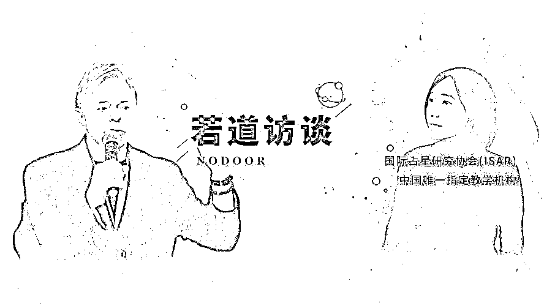

采访/作者/狄狄图片/大卫微博 封面/书君疫情已经持续了一个月了，很多人的生活都被迫发生很大的转变。大家常会问若道君，从占星学视角应该如何看待疫情？世界又将会如何改变？因为疫情，若道二位创始人——大卫·瑞雷老师和蒋颖老师，也隔离在各自北京的家里，通过网络与若道团队远程协作办公，同时也常常对疫情有一些占星学视角的思考。我们如何将自己的内在力量从隔离的困顿中解救出来？即将 70 岁的大卫老师和天蝎座的蒋颖老师，从各自的视角聊了聊疫情。身处特别时期，希望他们的回答能给出大家一些有用的启发。**对话若道创始人****从占星学视角，您如何看待这次疫情和天象的关系？****大卫：**实际上，我们不觉得这个天象和疫情有什么样绝对的关系。并不是某一种天象一定会引发疫情，没有这种必然联系。但是从占星学的角度，我们总是想要理解，作为个人、家庭、集体和社会，我们处于哪一个阶段和哪一种环境之中。因为土星和冥王星在一月份发生了合相，所以很多人说疫情与这个宇宙天象相关。当然，土星和冥王星合相是我们本年最重要一个天象，十分强烈。**我认为它最重要的意义是“如何管理我们的恐惧”。**土星与我们最重要的联系之一是，我们作为一个社会，是否能够成功地管理我们自己。而冥王星一方面和我们活下去的深刻渴望有关，另一方面也代表我们如何运作我们的资源，还有一方面与我们对于彼此的信任相关联。我想除了疫情外，土星和冥王星是以百万种的形态，在全世界的各地方呈现。这是一个机会，让我们去面对我们害怕的事情，同时能够去处理和应对它们。**这些恐惧也在帮助我们定义，在生活中什么是对我们最重要的。**不论我们害怕失去的是什么，比如我们害怕失去爱情，我们害怕失去朋友，它其实都是要我们去直面人生中最重要的是什么。以及，**当知道到底哪些事对我们最重要，我们又可以如何制定一个计划，如何脚踏实地的去把这个计划执行出来？**因为我们在中国，现在每天都要面对这场疫情，也因此我们看到我们是如何应对危机的。我喜欢土冥合相的一点是，人类作为一个族群我们要生存下来，就必须在我们的社会中有一个非常清晰的结构。我知道你是想问我，土星、冥王星和这场疫情的关系，但我想说这个天象其实是跟整个世界是有关系的。**经过这场疫情，我们必须有一个长期的计划，可以对于世界的长远发展有所帮助。**

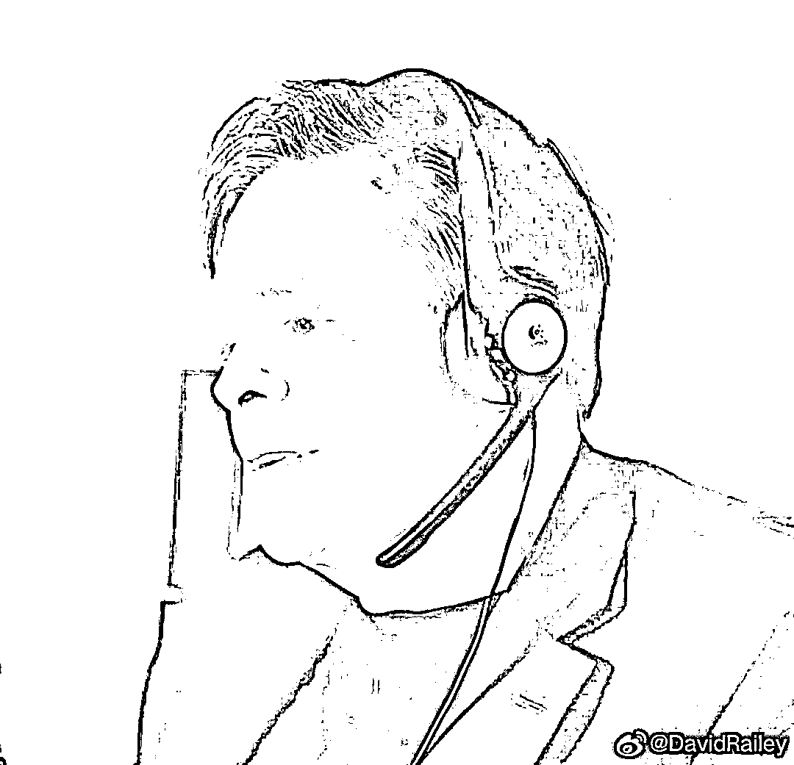

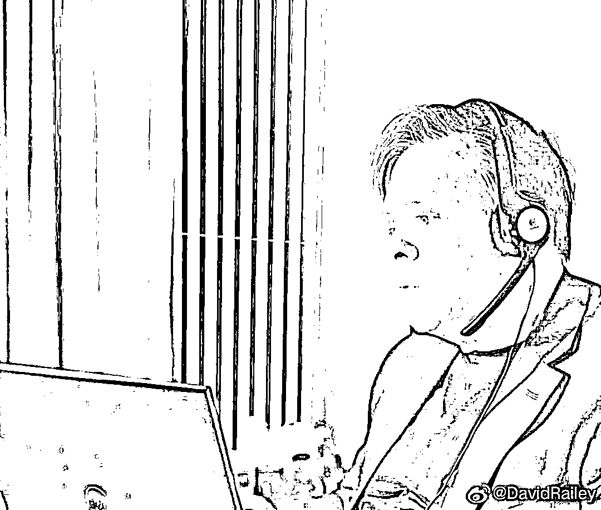

| 疫情期间 线上办公的大卫老师
**这次疫情对个体会有怎样的影响，您会如何建议您的客户？****大卫：**让我们来谈谈更个人化的影响。很多在武汉及周边地区的人，他们都在遭受地狱一般的经历。我们身体上疾病已经够糟了，但还有**另一方面，就是我们在心理上、情绪上正在经历与这场疫情相关的危机——找到我们每个人内在的资源和内在的力量。**这可以给我们带来一个议题——你情感上的资源有哪些？当如此可怕的境况出现时，你是否有足够的内在资源帮助自己应对？让大家感到无助的、无望的可能也是“隔离”本身，我们没有办法和另一个联结在一起。当人们感觉绝望的时候，他们就会做一些糟糕的事情。所以说我们应该在人们感到绝望之前，就帮助他们认识到如何面对恐惧这一功课。**罗斯福总统有一句名言：“除了恐惧之外，没有什么可以恐惧的。”精神的健康、心理的健康，能够去学习如何面对恐惧。**无论在中国，还是在世界其他地方这都是重要的一课。到今年三月份，我做占星师已经五十年了，**我喜欢占星学的一个地方，就是它可以加强一种认知：****我们人类是彼此联系在一起的。**我们的“疾病”、“痛苦”也是相连的，并不是孤独一人。当有人发出求救信息的时候，就会有人回复说你不是孤独一人，我们在这里，我们能够听到你的声音。这一点是非常重要的。因为如果人们都能意识到这一点的话，就可以更好地来应对这场危机。比如我所在的社区，当我和朋友见面的时候，我们都戴着口罩，我们也会相隔一段距离去彼此打招呼。比方说我的朋友在遛狗，过去我可能会摸摸狗，拥抱一下朋友，现在我们可能没法这么做了。昨天下午在社区里，我就和几个朋友面对面有了交流，虽然我们都戴着口罩全副武装，但这样也让我感觉很好。这场战争并不仅仅是在对抗疫情的战役，这场战争其实发生在我们每个人内在。我们每个人都可以为之做点什么。只有你是那个可以主导你内在想法感受的人，你可以为你自己做出一些改变。

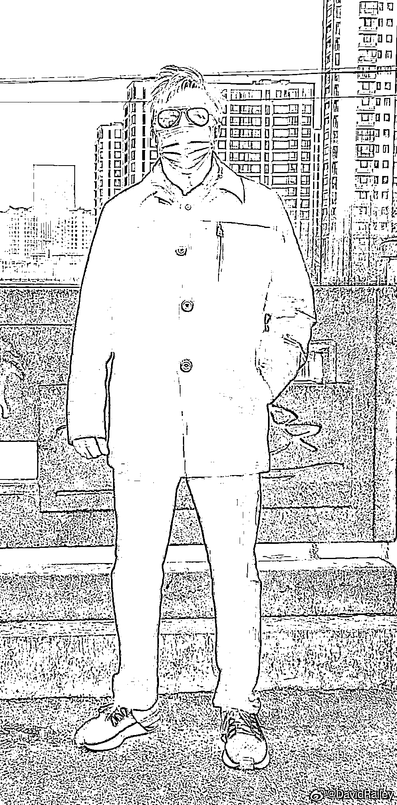

| 疫情之下 “全副武装”出行的大卫老师
**蒋颖：**我想澄清一下很多人对占星学的误解。有些对占星不够了解的朋友说现在占星师在诠释天象，有些像马后炮。那我正好可以借此机会来说明一下占星学的最大价值在哪里，及有哪些是占星学可以做到的，有哪些是占星学做不到的。我觉得明白哪些是占星学做不到的，和明白哪些是占星学可以做到的一样重要。**占星学的最大价值不是事件的预测**，如果你只是想通过学习占星达到一直准确预测事件的目的，那么可能是选择错了方向。若道邀请过很多世界顶级的占星师来授课，我也和他们都有过对话。占星学最大的价值是看到社会周期及个人周期的循环重复及其意义。我们都知道 1 月份的土冥合相，这个合相 32-37 年发生一次，在人类历史上也发生过很多次。我们也都知道要面临一个危机，我们曾猜想贸易战、债务问题、经济危机等等，或是其他层面的东西……但是这么大的危机竟然是疫情，是没有人会准确预测到的。**所以占星学更大的意义，正如大卫所言，当事件发生了，占星学可以去告诉我们它的意义所在。**大卫已经说了很多，我想补充几点，从我个人的体验来讲。因为我们讲了很多大众和社会的，我想讲一些个人的对于土冥对我的影响的觉察和体会，因为这个相位恰好落在我的 8 宫北交点附近。我想讲一些个人的经历。

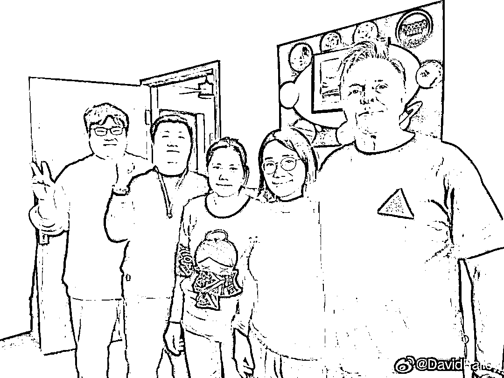

| 疫情爆发前 若道办公室的合影每个占星师都是知道“冥王星”是跟死亡相关，很多时候“死亡”是一个比喻，但是这一次我们是真的在面对死亡恐惧了。在 2003 年非典发生的时候，我在北京，当时我一点恐惧都没有，没有戴过口罩，还趁机到处游玩；但这次，我有了，我自嘲说跟年龄相关。这种恐惧和我的理性并没有什么关联，毕竟我不在疫区，物资充足，还有顺势药品及有经验的顺势治疗师的保护，可是我仍然有恐惧。这是非理性的。对我而言，我认识到我面对了存在主义的根本性的焦虑——死亡焦虑。这里面有生而为人的本能的焦虑，甚至说是一种动物性的原始的焦虑。这是我在我的内部看到的，虽然我也看到了我内部也有一个很平静的人，一个可以在暴风雨里保持平静但同时也保持敏感的警觉的人。两者都存在于我的内部。

我在我的内部也看到了一个非常警觉的负责任的守望者、保护者，也看到了一个懦弱、逃避的人，我看到了守望者对这个懦弱、只想保护自己、想逃避的人的批判。我发现他们都在我的内部。这样当我每次看到外界那些懦弱、只想保护自己、不想做事、想要逃避的人的行径感到不悦甚至愤怒的时候，我深切知道我内在也有他们，愤怒、懦弱、逃避和责任都是我的一部分。我试图对内在的阴影部分能够去共情和友善对待，而不是严厉评判。

我看到了，当疫情开始的时候，我也在等待其他人做些什么，并没有立刻行动，而当我试图为这场疫情做一点事，不论是想买到医用物资，还是试图想要顺势去帮助病患，也深切感觉到外在资源不足，到处碰壁的沮丧感、行动力有限的有心无力，这种资源有限、到处都是障碍，无力感也是冥王星和土星负面表达。我也看到当我做了什么之后，我会感觉到更有力量，也看到我一直在努力的事情可能会有一点点的结果。我还看到了我的羞愧感，和那些无私奉献的人相比，我有能力做的和我真实做到的距离很远。我看到信任在危机中是多么重要，我看到了在做一些事情的过程中，别人对我的不信任，也看到我对其他人的不信任，而这种不信任是如何导致事情无法做成。同时，我也觉察到，所有上述这些感觉也是从小就伴随着我的，在从小到大的大大小小的危机中，而这次不过是我再次梳理自己内在的机会。这些都让我更深的理解我个人的星图，理解土星和冥王星。**我也在思考，经历这场危机，我内在有什么东西可以彻底改变？变得更有资源，更有力量？什么东西必须彻底被淘汰？**世界其实是一个个个体组成的，世界的改变是需要从每一个人的改变开始的。**也许需要一场危机我们才能发现，我们就是我们所等待的人。**冥王星象征着一种很深的创伤，伤口会化脓，有些“化脓”是在暗处，是我们看不到的，不知道的。**这个疫情其实是把这个创口给揭开了，让我们看到很多东西已经“朽坏”了，当我们去医治我们内在的时候，我们才开始医治外在。****占星学可以对应到生活的方方面面，你们认为这次疫情会对世界发展趋势有怎样的影响，比如经济、行业、生活……****大卫：**在疫情之前，世界经济实际上就在对峙之中。比如在疫情之前，当我们在谈论“土冥合相”时候我们就会谈论贸易战。像气象学家一样，占星学对于结论报告比进行预测更擅长。如果是你想问对于未来经济的影响，我想一个经济学家会给出更好的答案。从占星学的角度，冥王星跟所有让我们能活下去的资源相关，比如石油、粮食。而土星跟世界上的规则相关，比如法律、制度。所有的买卖都跟我们的资源交换相关，比如你给我一些资源我把它移动到另一个地方。我们已经处于了一个应对管理我们资源的危机之中了。**2019 年到 2021 年初，我们都将投入精力在我们如何管理我们的规则，这对我们未来发展非常重要。**就像我们玩纸牌游戏，大家时不时会洗牌，会说“让我们再换一副新牌吧”。**土冥合相对于世界经济而言，就像拿了一副新牌，甚至这个游戏的“原始规则”都需要被改变。**所以如果你关注经济，你一定要关注这两年相关领域定下的规则，会有哪些新规则出现，这是非常重要的。

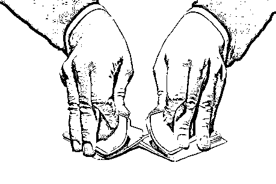

**蒋颖：**病毒在迫使我们意识到人类是一体的。土冥都和隔绝及控制相关，但是我觉得这场疫情可能让我们更谦卑，发现有些事情不是我们能够控制的。传染让我们选择害怕或是关心陌生人，也让我们明白众生一体、说真话的重要性、身心相连这些道理。2021 年初，木星土星将合相在水瓶座。木星跟信念相关，土星跟规则相关。那会是一个崭新的、充满创新的世界。我想我们会看到很多水瓶座领域的发展，例如社群互助、人工智能、高科技、互联网、文明的生活方式。占星学群体也是与水瓶座相关联的。如果我们世界的网络可以更好地运作，我们就可以帮助到更多人，我们现在看到的一些混乱，是这个“大网”中一些点功能的失灵，而**如果我们能够用水瓶座的正向的方式，有可能可以创造一个新的世界。**我觉得我们在经历一些推倒和清零，以便迎接一个更美好的世界。**职业的角度，占星师在这次疫情中可以做些什么？您有哪些建议或者不建议做什么？****蒋颖:** 我觉得首先我们要建立好我们职业的边界。哪些是我们可以做的，哪些是我们不能做的，以及哪些是我们做不到的，这点需要非常清楚。占星师可以帮客户意识到，他们目前遭遇的困境，其实是一直以来一种自身模式的重复，如何真正让一个客户认识到这一点，并发展内在的资源和内在的力量。这就跟免疫力一样。现在都在说新冠肺炎还没有特效药，治愈的患者都是靠着自身的免疫力战胜病毒。免疫力其实就是我们内在的健康的生命力。身心的治疗是在一起的，当我们可以做一场更触及这个人核心（冥王星代表核心）的占星咨询，就可能帮他排解一些“毒素”，就可以让他的“免疫力”增强，对人生更有力量。 

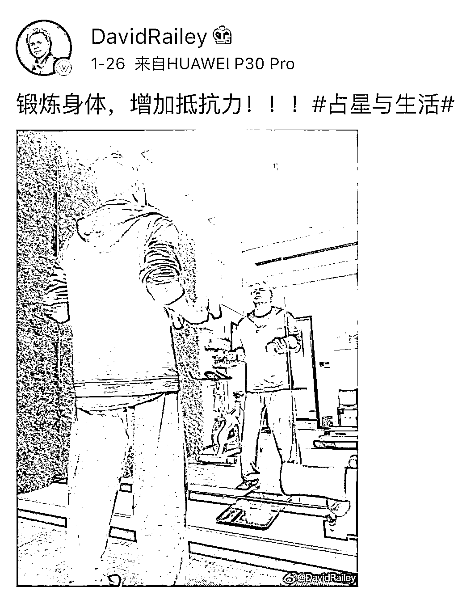

| 锻炼身体、增强免疫力的大卫老师**大卫：占星师永远不应该对客户做的，就是去“喂养恐惧”。**比如说预测死亡这种增加别人恐慌的事情，占星师在任何时候都是不应该做的。作为一个占星师，我一直在咨询中都是帮助客户认知他们内在的恐惧，面对他们的恐惧，在这样一个时期我觉得更为重要。**因为我所教授和实践的占星学是非常实用且实际的。**当我说去帮助人们面对他们恐惧的时候，我并不是说只是说一点鸡汤的话，去拉着他们的手说：“你应该感觉好一些”……不是这样的。当人们恐惧的时候人们常常会非常紧张，非常紧张的状态下人们就不会做出好的决策，而会做出非常糟糕的决策。你能够面对你的恐惧，其实就能帮助你做出更好的决定，在人生中做出更好的事情。当人们紧张的时候，他们创造性的去解决问题的能力就狭窄了。就像你去考试，如果你高度紧张你就不会考的那么好。**用占星学可以了解你自己，也意味着了解你自己的恐惧，从内到外的了解自己。**

以上是

若道两位创始人大卫·瑞雷和蒋颖老师

对于新冠疫情的一些思考

**想学习最实用又有力量的占星学**

**成为像他们一样优秀的占星师**

若道君隆重向你推荐

**五十年占星经验**的传奇占星师

**大卫·瑞雷**亲自主讲的**2020****若道春季占星入门课****Level1-2**最懂中国学生的大卫老师将最深入浅出向零基础的你讲述**12 个****星座、****12 个****性格、****12 种****人生****10 大行星****和 12 个****黄道宫位**

**自由开启自己人生的第二职业**

**点击图片 **

**你也可以成为职业占星师**

**👇**


**微信又双叒叕改版啦，不想错过若道君的推送？**

**就把若道设为星标吧！**

**▼**


就是这个“在看”，戳戳戳 ☟

********报名直达入口********


# 金牌课程 L1-5 | 系统学习严肃占星，开启自由职业之路

> 原文：[`mp.weixin.qq.com/s?__biz=MzA5NjA0NTAxNg==&mid=2651413503&idx=2&sn=fadd5a6fb88844c16b31d8b0706ca8ab&chksm=8b4be948bc3c605ea6f8c37545dd14bf8883fee7cfb277c1feb0597eff4ec65749dda6906c73&scene=126&sessionid=1692738212#rd`](http://mp.weixin.qq.com/s?__biz=MzA5NjA0NTAxNg==&mid=2651413503&idx=2&sn=fadd5a6fb88844c16b31d8b0706ca8ab&chksm=8b4be948bc3c605ea6f8c37545dd14bf8883fee7cfb277c1feb0597eff4ec65749dda6906c73&scene=126&sessionid=1692738212#rd)


2020 年，一场疫情像一只突然出现的“黑天鹅”。让多少企业、多少人乱了阵脚。大家深刻的感觉到：没一技之长、没有两手准备，灾难面前真是手足无措。我们都在焦急的等待着疫情的拐点出现，突然多出的假期，有人焦虑刷屏，也有人重新规划未来，更新技能和认知。很多人一直都渴望发展副业，平时虽然爱好不少，突发状况面前却发现并没有哪项爱好，能成为增加收入的一技之长。

## **每一次大波折，都会倒下一批人，也站起来一批人。****这是历史的铁律。**

是时候重新认识自己了。**开启副业之路，自助助人的 PLAN B**曾经的你，有没有想过，人生还有一种全新的可能？
如果把自己的人生看成一间公司，时间和精力看成生产资料，那么你作为自己的 CEO，应该有对这家公司的“战略规划”意识。**第一，设定目标。**穿越新闻事件、外界信息的重重迷雾，我们优先要向内看，我是谁？我喜欢或不喜欢什么？我想过一种什么样的生活？正视自己，不盲目随波逐流。**第二，盘点优劣势。**我现在处于什么位置？为了达到我的目标，我有哪些优势？我还缺少哪些知识、技能、经验或领路人？**第三，制定计划、稳步实施**。我知道我在哪，我要去哪儿，我需要找到现实与梦想的差距，想方设法去缩小差距、达到目标。**占星学是非常好的“自我战略规划”的工具。**可以帮助你**认识自己、找到自己的优势和目标，根据时代趋势调整自己步伐**，更好的全力以赴，永远不用担心被淘汰！**而你通过占星学习你帮助了自己，也可以选择成为自助助人的占星师，开启受益终生的第二事业。****顺应趋势，迎来人生拐点**“

**如果你等待知更鸟的到来，你将错过整个春天。**

**——沃伦·巴菲特**

”面对这次疫情危机，不少公司开启了“云办公”，人们开始在家里办公。也有不少人抢先顺应趋势，率先迎接新世界的到来。未来是个体崛起的时代，大量个体被鼓励独立发展，比如网红、自由职业、自媒体、咨询师等，他们都不需要传统的办公室。社会越发达，人的独立性就越强，**未来有能力的人都会变成独立的经济体**。如果你也相信，想顺应时代趋势抓住时代机遇？想实现人生逆风翻盘？

## 决定一个人最终高度的，往往并非起点，而是拐点。

##  机遇都在拐点，**占星学**正站在你的人生拐点等你。

**为什么是占星学？**一方面社会快速发展人们压力山大，抚慰心灵的咨询市场需求巨大。另一方面市场鱼龙混杂，真正学院派的严肃占星从业者十分稀缺。
最重要的，占星学能让你自己帮助自己，无论你是否进行占星咨询从业，学习了占星学，它都将是终身陪伴你成长的睿智好伙伴。


**你的占星核心课老师是谁？**

拥有**49**年占星实践经验的

**若道创始人**

**ISAR 全球副主席**

**ISAR 全球职业占星师资质认证主席**

**大卫·瑞雷**

&

**最懂学员的若道首位认证金牌中国老师**

**熊鹰**

师徒二人合力打造
**2020 年若道****全新****核心占星课程**

**连报 L1-5 全阶课程，可以享受到****：** ❶ **61 次线上直播互动网络课程+2 场工作坊**（亲密关系+职业占星工作坊、知识回顾+综合解读工作坊），全面而详细地讲解占星学知识、技能、案例和重要领域实践运用。

❷ **知识点+学员星图解读有机结合**：熊鹰老师以知识点和学员案例讲解为主，大卫·瑞雷老师以参课学员案例及客户案例讲解为主。每个知识点覆盖班级内学员的亲身案例，参与感更强，每位学员都有机会听到自己的星图分析。

❸ **微信群学员互动分享**，从真实案例学习生命成长故事。

❹ **论坛提问**：论坛上每个学员的问题都将得到及时回复。

❺ **提供咨询师实习平台**，只要努力，都将有机会在毕业前进行咨询的实习演练，听取客户反馈，为成为职业占星师做准备。


**L1-5 阶，我们要学习什么？**

**1-2**

**第一阶****  12 星座，12 种性格，12 种人生 **

❶ 学习占星学必须准备的“心法”

❷ 占星学中的火、土、风、水四元素，阴阳法则

❸ 面对面的星座有故事

❹ 12 星座：12 种性格详解，12 种行为模式，12 种价值观

❺ 太阳和月亮：了解你的太阳，生命的发动机，让你在世界闪光的方式，生命获得力量的方法；了解你的月亮，让你获得幸福的方法

❻ 了解太阳、月亮，了解你生命中已经出现的、将会出现的男性和女性

**第二阶****  命运的线索和人生故事中的演员**

❶ 命运的线索：南北交点

❷ 星图三巨头：太阳、月亮、上升点的故事

❸ 了解心智：水星

❹ 了解金钱和关系：金星

❺ 了解行动模式：火星

❻ 了解信念：木星

❼ 了解努力：土星

❽ 了解天才和疯狂：天王星

❾ 了解梦想和幻灭：海王星

❿ 了解死亡和重生：冥王星

⓫ 12 个人生场景：黄道 12 宫位初解

**课程安排**

*   2020 年 4 月 2 日：星座 1（主讲人：大卫·瑞雷老师）
*   2020 年 4 月 9 日：星座 2（主讲人：熊鹰老师）
*   2020 年 4 月 16 日：太阳、月亮（主讲人：大卫·瑞雷老师）
*   2020 年 4 月 23 日：水星、金星、火星（主讲人：熊鹰老师）
*   2020 年 4 月 30 日：木星、土星（主讲人：熊鹰老师）
*   2020 年 5 月 7 日：三王星（主讲人：大卫·瑞雷老师）
*   2020 年 5 月 14 日：宫位 1（主讲人：熊鹰老师）
*   2020 年 5 月 21 日：宫位 2（主讲人：大卫·瑞雷老师）
*   2020 年 5 月 28 日：月亮交点 1（主讲人：熊鹰老师）
*   2020 年 6 月 4 日：月亮交点 2（主讲人：大卫·瑞雷老师）

**L1-2 除了网络直播课**

**L1-2 初阶课程还有两场线下工作坊可供选择**

**L1-2 上海工作坊**（2020 年 6 月 12、13、14 日 熊鹰老师主讲）

**L1-2 北京工作坊**（2020 年 6 月 25、26、27 日 大卫·瑞雷老师主讲）

就看你是喜欢哪种形式

**文末有每种形式的价格，还有连报套餐价哦**


**3**

**第三阶**** 宫位、相位以及初步解读星图（15 次课）** 

❶ 15 次线上直播网络课程，每次 2 小时，堂课中依旧会使用同学们的星图作示范

❷ 10 节课由熊鹰老师教授，重点通过名人星图阐释知识点

❸ 5 节课由大卫·瑞雷老师教授，重点通过学员星图阐释知识点

❹ 从第三阶开始，助教将会指导练习，答疑解惑，学练结合

❺ 重点在于如何根据星图去问问题，着重自我发现和自我探索的过程 

**课程安排 **

*   2020 年 7 月 2 日：宫位、行星和星座组合

*   2020 年 7 月 9 日：宫位、行星和星座组合

*   2020 年 7 月 16 日：月亮交点

*   2020 年 7 月 23 日：月亮交点和演示案例

*   2020 年 7 月 30 日：相位

*   2020 年 8 月 6 日：相位、星座、行星和宫位

*   2020 年 8 月 13 日：相位、星座、行星和宫位的同学案例

*   2020 年 8 月 20 日：渐盈相位和渐亏相位，示例

*   2020 年 8 月 27 日：更多的关于宫位和宫主星

*   2020 年 9 月 3 日：同学案例

*   2020 年 9 月 17 日：空相行星和定位星

*   2020 年 9 月 24 日：宫主星

*   2020 年 10 月 15 日：优先级和组织

*   2020 年 10 月 22 日：相位模式以及范例

*   2020 年 10 月 29 日：学员星图解读范例

**4**

**第四阶**** 出生星图解读（进阶）以及关系与职业议题（12 次课，1 场四日亲密关系+职业占星工作坊） **

❶ 12 次线上直播网络课程，每次 2 小时，堂课中依旧会使用同学们的星图作案例

❷ 8 次课由熊鹰老师教授，4 次课由大卫·瑞雷老师教授

❸ 1 场北京现场四日工作坊：亲密关系+职业占星，学生将被选中进行案例演示和互动。

**课程安排**

*   2020 年 12 月 3 日：整合星图和星图优先级
*   2020 年 12 月 10 日：综合解读
*   2020 年 12 月 17 日：整体案例
*   2021 年 1 月 7 日：亲密关系/对比星图
*   2021 年 1 月 14 日：占星学和对比星图的例子
*   2021 年 1 月 21 日：对比星图同学案例
*   2021 年 1 月 28 日：对比星图同学案例
*   2021 年 2 月 4 日：占星学的职业介绍
*   2021 年 2 月 18 日：占星学的职业案例
*   2021 年 2 月 25 日：占星学的职业同学案例
*   2021 年 3 月 4 日：儿童职业发展
*   2021 年 3 月 11 日：亲密关系/职业同学案例

**工作坊安排**

**亲密关系（两天）+职业（两天）四日工作坊****时间**：2021 年 3 月 18 日、19 日、20 日、21 日**地点**：北京**学员将被选中进行案例演示和互动（免费）**

**5**

**第五阶**** 预测、关系、咨询，为执业和考试做准备（24 次课，1 场四日工作坊）** 

❶ 24 次线上直播网络课程，每次 2 小时，堂课中依旧会使用同学们的星图作案例❷ 15 次课由熊鹰老师教授，12 次课由大卫·瑞雷老师教授❸ 1 场综合解读工作坊（北京）：把一切串联起来，学生将被选中进行案例演示和互动。**课程安排**

*   2021 年 4 月 15 日：行进介绍 1
*   2021 年 4 月 22 日：行进介绍 2
*   2021 年 4 月 29 日：行进介绍 3
*   2021 年 5 月 6 日：当下的行进的同学案例
*   2021 年 5 月 13 日：周期，重置星图
*   2021 年 5 月 20 日：当下的行进和周期的同学案例
*   2021 年 5 月 27 日：次限
*   2021 年 6 月 3 日：次限同学案例
*   2021 年 6 月 10 日：太阳弧
*   2021 年 6 月 17 日：太阳弧同学案例
*   2021 年 6 月 24 日：亲密关系的关键节点+组合星图
*   2021 年 7 月 1 日：亲密关系的关键节点，组合星图同学案例
*   2021 年 7 月 8 日：职业周期
*   2021 年 7 月 15 日：职业周期同学案例
*   2021 年 7 月 22 日：太阳返照&月亮返照
*   2021 年 7 月 29 日：太阳返照&月亮返照同学案例
*   2021 年 8 月 5 日：高级预测技巧
*   2021 年 8 月 12 日：高级预测同学案例
*   2021 年 8 月 19 日：高级预测技巧 2
*   2021 年 8 月 26 日：高级预测同学案例 2
*   2021 年 8 月 29 日：占星学简史（周六沙龙）
*   2021 年 9 月 9 日：占星学的不同流派
*   2021 年 9 月 16 日：ISAR 考试术语和复习
*   2021 年 9 月 23 日：ISAR 考试术语和复习

**工作坊安排**
**综合解读四日工作坊（把一切串联起来，L1-5 知识回顾）****时间**：2021 年 9 月 2 日、3 日、4 日、5 日**地点**：北京**综合解读学员将被选中进行案例演示和互动（免费）****这两位优秀的占星学老师是谁？**


**大卫·瑞雷（David Railey）**

*   **ISAR 董事会成员，ISAR 全球副主席，ISAR 全球职业占星师资质认证主席，若道占星创始人。**
*   1976 年，通过亚特兰大职业占星师考试，成为全职占星师，随后通过**AFAN 和 ISAR 职业测试**。
*   1980 年，与**杰夫·焦耳**一起在亚特兰大创建**“每日星球”**占星学中心。此后在亚特兰大占星协会担任 4 年考官，并且两次担任**亚特兰大地区占星协会主席**。
*   1979-1992 年，作为占星师活跃于美国社会媒体，向不了解现代占星学变化的大众宣传专业占星学知识。在 1989-1992 年期间，他在 WRGG 电台 12 频道每周主持个人电视秀**“今日占星学”**，早先他还在 WRFG 的广播节目中播讲宇宙天气节目。 
*   2010-2014 年，任**全美占星师联盟监督委员会委员**。
*   2010 年，其著作**《灵魂的目标》**中国版出版，和蒋颖一起创办**若道占星**学校和其官网 www.nodoor.com。从该年开始，他工作并往返于亚特兰大和北京。目前他 80%的时间致力于在中国教授和推广西方占星学。
*   2017 年，被选为**ISAR 委员会成员**（2017）。ISAR 是世界最大的国际占星机构，会员遍布 45 个国家。


**熊鹰老师（天空的空）**

*   2008 年接触严肃占星学，至此爱不释手。
*   **2013 年师从大卫·瑞雷**，研习整套现代占星学核心课程，并于 2014 年起至今连续三年担任该课程的主助教。
*   期间也**跟随格伦·佩里、诺·泰尔、理查德·塔纳斯、罗伯特·汉德、苏·汤普金斯、斯蒂芬·弗里斯特等多位国际顶尖占星大师进行学习**，进行定向占星主题研究。
*   2015 年初，通过国际占星研究协会**（ISAR）资质认证并获得证书**。同年，进一步跟随大卫·瑞雷老师进修**“生时校正”**技术，通过最终考核并获得证书。
*   目前在若道星文化任职，将传播系统、严谨、真实的占星学作为职业使命。任专职助教期间，进行沙龙与答疑等辅助教学工作已累计超过 200 小时。
*   在业余期间也提供占星咨询与生时校正服务。目前正致力于占星学与个人成长的整合。

**什么人适合这门课？**

*   对占星学有浓厚兴趣，想要系统学习占星学
*   对占星学有一定基础，但不知道该如何整合星图复杂的碎片
*   希望成为优秀的占星师，想要借鉴国际大师解读思路并融入自己的体系
*   想学习占星学，但不擅长英文，希望有中文老师授课
*   想结合占星学理论与咨询实践
*   大卫·瑞雷、熊鹰的忠粉，学过占星，但就是想跟着偶像再学一遍
*   走在自我探索和个人成长道路上的人

**课程费用****★ 1-5 阶连报****早鸟价：33000 元（2020 年 3 月 31 日之前）****课程费用：46500 元 ****★ 1-2 阶直播课（4 月 2 日开课）****早鸟价：2800 元（2020 年 3 月 4 日之前）****课程费用：3500 元 ****★1-2 阶工作坊（北京工作坊、上海工作坊任选一场）****早鸟价：2800 元（2020 年 5 月 6 日之前）****课程费用：3500 元 ****★网络直播课+现场工作坊都想要的同学：有套餐价哦****购买网络直播课程+北京工作坊、上海工作坊任选一场****早鸟价：4200 元（2020 年 5 月 6 日之前）****课程费用：5200 元****★ 1-3 阶****早鸟价：10500 元（2020 年 3 月 4 日之前）****课程费用：11500 元 ****退转课程**

**退款原则请详看《教学协议》，如有疑问请咨询课程顾问。**

****中英双导师核心课 Level1-5****

**授课老师：大卫·瑞雷 熊鹰**

**授课时间：**2020 年 4 月 2 日-2021 年 9 月

**授课方式：**网络课程，中英文授课，中文翻译；现场工作坊，中英文授课，中文翻译

**费用：****1-5 阶：**46500 元****** 早鸟价：33000 元（2020 年 3 月 31 日之前）；********1-2 阶网络直播课程：****3500 元**早鸟价：2800 元（2020 年 3 月 4 日之前）；**1-2 阶**（北京、上海工作坊任选一场）**：3500 元 ****早鸟价：2800 元（2020 年 5 月 6 日之前）；******网络直播+现场套餐价：**5200 元**** 早鸟价：4200 元（2020 年 5 月 6 日之前）；******1-3 阶课程：11****500 元******早鸟价：10500 元（2020 年 3 月 4 日之前）；**

**课程负责人：**王老师（微信：18510107057），请备注“核心课”

长按二维码添加课程负责人咨询~


****报名请点击“阅读原文”****


# 转发此文给你的 12 星座男人，就会收获一个甜蜜的情人节！

> 原文：[`mp.weixin.qq.com/s?__biz=MzA5NjA0NTAxNg==&mid=2651413455&idx=1&sn=01391cf97572b90a115b59f7901e1800&chksm=8b4be978bc3c606ecfffa64d10667803052108c190ee1414fcb805f0e5b2eef9a011fa83ae2e&scene=126&sessionid=1692738212#rd`](http://mp.weixin.qq.com/s?__biz=MzA5NjA0NTAxNg==&mid=2651413455&idx=1&sn=01391cf97572b90a115b59f7901e1800&chksm=8b4be978bc3c606ecfffa64d10667803052108c190ee1414fcb805f0e5b2eef9a011fa83ae2e&scene=126&sessionid=1692738212#rd)

**☆ 后台回复“今日”，给你一句生命态度**


作者/大卫·瑞雷 若道占星创始人

翻译/李含 校对/江艺 编辑/玫瑰

封面/书君 图片/unsplash

文章来源/《风度》杂志 2019 年 9 月刊

**作者的话**

情人节的二月似乎非常适合给男人提供一点恋爱建议。不论你们是刚刚恋爱还是已经“老夫老妻”，关于和女人的关系，男人总是还有很多东西需要学习。或许透过占星学的视角参详一二可能会有所帮助。与其简单地按顺序列出 12 个星座，我觉得，根据每个议题适当地点出相关星座会更好。从以往关于男性和女性的研究中可以发现，这 9 个方面似乎是男性最典型的问题领域。

**男性在关系中的 9 个改进建议**

**1.****不要质疑她的感受**

很多男人都爱**反驳伴侣的感受**。比如，你可能会说：“生气是件愚蠢的事”，或者：“我无法相信这会让你心烦意乱”，相反你们可以试着去**认可伴侣的情绪**，**为触发这种情绪而道歉，但不承认犯错**。例如，你可以这样说：“如果我的行为让你感到不安，我很抱歉。这不是我的本意。”这不仅听起来好多了，而且也不那么具有评判性。如果你想让她与你建立真正沟通，你需要有一个**开放的支持态度**。火象星座的白羊座、狮子座或者射手座人可能会急于做出判断，如果你是水瓶座的人，你可能会过于超然于她的情绪，或者你是摩羯座，可能认为她的情绪表现代表软弱。水象星座的双鱼座、天蝎座和巨蟹座人拥有更丰富的同情心和感同身受的能力。处女座的人可能会寻找切实可行的解决方案，好像有什么错误需要去解决。不管怎样，**试着用更好的判断力接纳她的感受。**

**2.****为她和其他人挺身而出**

当一个男人看到需要处理的情况时，他应该**挺身而出**。如果有人对你的伴侣粗鲁无礼，女人还是会感激男人站出来指出他们的错误。确保你在那儿是要保护她。这并不意味着她不能保护自己，这只是意味着骑士精神并没有消失。在这个问题上，火象星座（白羊座、狮子座、射手座）的表现最好的，尤其是狮子座。在风象星座（双子座、天秤座、水瓶座）中，天秤座的人会跳出来保护她，尤其是当她受到不公平对待的时候。

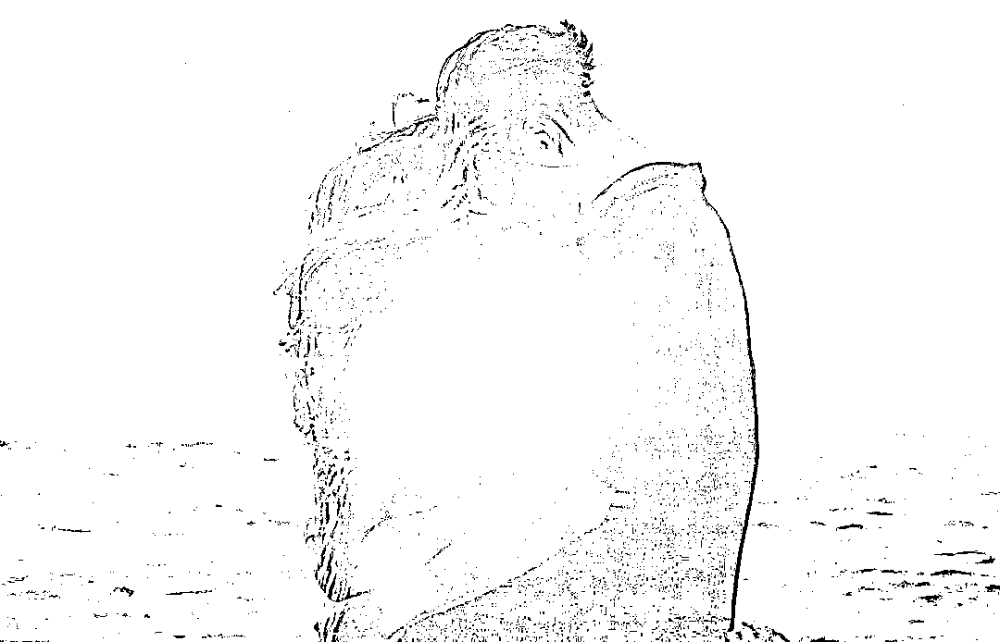

**3.****说出你的烦心事**很多男人在恋爱中的另一个共同倾向是，**当感觉受到伤害时选择闭嘴，而不是表达出来。**没有人能从沉默中获益，或真正压制那些困扰你的东西。换一种做法，**花 10-30 分钟的时间冷静下来，处理好你的情绪，以便用语言表达出来**。然后向你的伴侣**解释你的感受**。风象星座双子座、天秤座和水瓶座最擅长于此，而水象星座（巨蟹座、天蝎座、双鱼座）的人常常闭口不言。然而，即使是双鱼座的人，也能找到一种方式来谈论困扰你的事情，不管它有多复杂。有时双子座的人可能说得太多，而天蝎座和摩羯座的人则说得不够。**4.****与你的伴侣分享**美国男人以**隐瞒自己的需要、情感、恐惧、希望**而臭名昭著。但是时代不同了，一个能**说出自己感受**的男人是大多数女人想要和需要的。我知道你们中的很多人可能担心自己会显得软弱。但更有可能的是，你的伴侣会从你开诚布公的能力中看到**力量**。这会让你们彼此感觉更亲密，感受到更多支持。天秤座的人喜欢分享，但往往太在意别人会怎么看待你的话。双鱼座的人太闪烁其词了，让你的伴侣去猜测你的真实感受。同样的情况也可能发生在天蝎座的人身上。

**5.****别以为她不想要性生活**

你可能会觉得没有得到自己想要的关注，但是如果你的伴侣忙于工作、孩子、差事，或者就是日常生活，那并不是说她不关心你或爱你，而是很难把这些放在一边。虽然和伴侣独处和亲密是很重要的，但要明白，如果她把精力重新集中在你身上，对她来说是多么大的挑战，不要把它当作拒绝的信号。狮子座的男人肯定会为此而挣扎，因为你们想得到特别关注。天蝎座男人比其他所有的星座都要看重性爱，而且往往最容易感到被拒绝。

**6.****倾听伴侣的诉说**

要想和一个女人拥有美满的关系，你真的需要违背自己解决问题的本性，成为更好的**积极倾听者**。这一点对金牛座、处女座和摩羯座这些土象星座来说尤其如此。你可能曾听女人说过她们希望你倾听，而不是试图解决问题。这意味着她们希望获得你的**支持**，你的**陪伴**，而不是告诉他们应该做什么或应该怎么想。有些问题不能解决，但是倾听是你可以给予的帮助。射手座的人在提供建议之前也需要倾听，即使你是“对的”，你这样做也不合适。没有人愿意被说教。

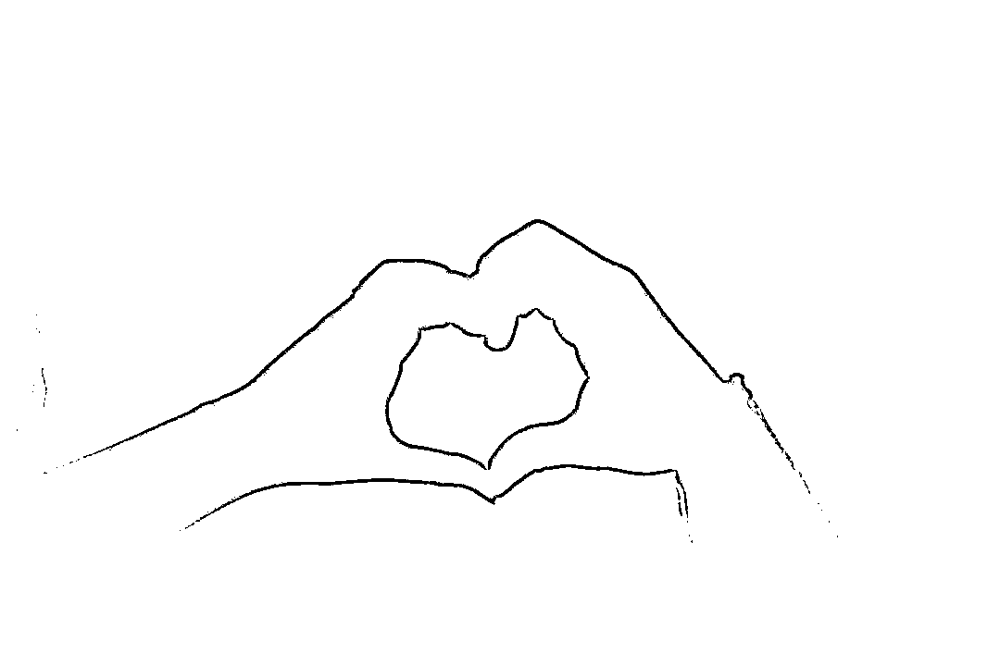

**7.****更加果断**

我说的不仅仅是选择餐厅或看什么电影，而是**更重大的人生决定**。对许多女人来说，男人不做决定就是在逃避责任。在事业、家庭甚至人际关系等问题上优柔寡断，会让人完全倒胃口。我知道这对一些天秤座、双鱼座和射手座人来说都是一项挑战。

**8.****收拾一下烂摊子**照顾孩子、做晚饭、做家务，更不用说还有工作，女性有很多事情要做。女人想成为你的伴侣，她们不想要另一个需要她们照顾的人。**收拾残局**能给她带来极大的解脱，她真诚地感激这种解脱。不要等她要求。**看到就做**。我知道你们很多人都工作很长时间，可能似乎你没有时间和精力，但即使是**做一些小事情**也会有帮助，也会获得欣赏。巨蟹座的男人似乎比摩羯座的男人更了解这一点。同样，处女座、双鱼座和天秤座的人也是好帮手。白羊座的人会参与进来并提供帮助，但是你很容易失去耐心——所以在你成为问题的一部分之前停下来。**9.****不管用什么方式，只要让她觉得自己很特别。**也许你不愿意表达自己的情感，特别是土象星座的摩羯座和处女座，以及风象星座，尤其是水瓶座。但无论如何，你必须通过**陪伴和照顾**让你的伴侣知道你有多喜欢她。你可以通过**语言甚至是肢体语言**告诉她。你们许多男人可能不需要这些，但是对于大多数女人来说，这就是她的氧气。当然，每个女人都是不同的，她们处理压力、家庭、感情、争吵和惊喜的方式也会不同。记住这些普遍的事情，并拿出你的最佳判断力。不管你的太阳星座落在哪里，你对伴侣的了解都超出你的想象。**这个情人节最有希望的是水象星座：巨蟹座、天蝎座和双鱼座，尤其是天蝎座，因为月亮在天蝎座！土象星座的人也有机会。火象星座的人可能需要稍微低调一点，变得更加敏感、更富于直觉力**。然而，有些白羊座的人可能会受益于金星正行进在白羊座。风象星座的人需要做出一些调整，**水瓶座的人面临最大挑战**。客观和激情很难兼顾，除非你愿意看着你的女朋友和别人回家。今年情人节的主题是**信任和激情**。首先是信任，然后是激情。**祝大家 2020 年情人节快乐！**

**版权声明：**本文由若道翻译发布，欢迎转发，反对抄袭。友号转载请申请白名单。


****想阅读更多作者的文章，请在后台回复******大卫****** 即可。****

**喜欢文章请长按下方二维码打赏**

**给大卫老师加杯咖啡呗~**

**▼**


**在这个特殊的日子里****若道君邀请你一起**

**长按下图二维码**

**测试你的恋爱关系**


**微信又又又改版啦，不想错过若道的推送？**

**就把若道设为星标吧！**

**▼**


就是这个“在看”，戳戳戳 ☟

********测试恋爱关系直达入口********


# 当代人本占星师的必修课 | 跟苏·汤普金斯学预测

> 原文：[`mp.weixin.qq.com/s?__biz=MzA5NjA0NTAxNg==&mid=2651413455&idx=2&sn=05004f116ed891576e9c401ba8f22da2&chksm=8b4be978bc3c606ef1d90e7e3ca1e5be863c911bf534e1e8cc9d0ef9628cefc3110ff96f9f60&scene=126&sessionid=1692738212#rd`](http://mp.weixin.qq.com/s?__biz=MzA5NjA0NTAxNg==&mid=2651413455&idx=2&sn=05004f116ed891576e9c401ba8f22da2&chksm=8b4be978bc3c606ef1d90e7e3ca1e5be863c911bf534e1e8cc9d0ef9628cefc3110ff96f9f60&scene=126&sessionid=1692738212#rd)


**为何推荐这门课？**占星学与其他学科相比，一个非常重要的功能是看到过去、现在和未来的周期性变化，既包括我们每个个体生命内在的变化时钟，也包括外在宇宙气候对个人、团队、社会的影响。
**如果不懂星图解读，那么你和星图的距离大概还隔着一个宇宙洪荒，如果你只会解读星图，却不会将这一种语言，用“人语”讲述出来，那么你和星图可能还距离着一个“生活”。**占星学是一本集天文学、社会学、统计学和哲学内容的书，因此，这本书也**特别需要一位或多为老师将你领进门**，我们才能窥见，宇宙自然法则中那一点万一，其他的所得，都要靠自己通过不断经历和观察才能真正掌握。**“预测技法”为什么很重要？**因为预测技法将**生活**与**占星**密切相连。在占星咨询中或者聊天聚会时，占星师经常会被问到： “我今年的职业规划应该注意什么？我还能升职吗？”“公司今年大裁员，帮我看看我会被裁掉吗？”“我什么时候可以遇到心仪之人？”“我和新认识的男友，最近总是因为一点小事吵架，我们未来会怎样？”“最近自己特倒霉，压力也很大，很难开心起来，这要持续多久啊？”“我去年身体一直不好，想看看今年应该注意什么？”这些急于知道答案的问题，是人们希望占星师为他们提供的“**预测**”。**但预测并非算命，**一位人本主义的占星师，在面对这些生活中最常见的烦恼和问题时，如何帮助到提问的人，对于每一个相信“自由意志”和“宇宙法则”的占星师来说，都是一次次的考验和经历。**如何避过“算命”大坑，真正帮助星图主人自我内在的成长；如何在某些重要的天象下，鼓励到更多的人勇敢向前，活在当下……****这门集高阶预测技法+咨询技巧教学的占星课程，我们向你强烈推荐！**


**课时安排（视频+网络直播）**

*   **视频课****：8 讲录播视频，助教答疑 2 讲**
*   **网络直播课****：共 27 讲**

**购买支付后即可观看录播视频课****网络课 2020 年 3 月 2 日开课**每周一 20:00-22:00 上课（**具体每节课排期，以课程表为准**）**适合人群**

*   **有扎实的出生星图基础**

*   **想跟从苏·汤普金斯学习预测技法**

*   **希望成为优秀的占星师，想借鉴国际大师解读思路并融入自己体系**

*   **想获得资质认证证书的人（备考 ISAR 国际资质认证考试）**

**课程费用****优惠价：19600 元****（****分享课程到朋友圈或社群，可享受此优惠价****）****复训价：11000 元****（****在若道课程体系上过核心课程第五阶的学员可享受此价格****）****课程原价**：22400 元**注意：****此课程为若道核心课程的一部分，前 8 讲为视频录像课程。具体可联系课程顾问询问。**   ****苏·汤普金斯预测课程****

**授课老师：苏·汤普金斯**

**时间：**视频课 支付购买后即可观看；网络平台课 2020 年 3 月 2 日开课（共 27 次课）

**授课方式：**网络直播课，英文授课，中文翻译

**费用：**22400 元；**早鸟价：19600 元（分享课程到朋友圈或社群，可享受此优惠价）；复训价：11000 元（在若道课程体系上过核心课程第五阶的学员享受此价格）**

**课程负责人：**许老师（微信：nodoorC，手机：18513802118 请备注“苏·汤普金斯预测课”）

长按二维码添加课程负责人咨询~


****报名请点击“阅读原文”****


# 隔离的时候更加渴望一份心动 | 爱情报告帮你找到心仪的 TA

> 原文：[`mp.weixin.qq.com/s?__biz=MzA5NjA0NTAxNg==&mid=2651413455&idx=3&sn=36e1b225b16c25142102f15da2bea4cf&chksm=8b4be978bc3c606e580b540435dac617f85bd58c2fc6740153ef0608cda70ca84b08c56741da&scene=126&sessionid=1692738212#rd`](http://mp.weixin.qq.com/s?__biz=MzA5NjA0NTAxNg==&mid=2651413455&idx=3&sn=36e1b225b16c25142102f15da2bea4cf&chksm=8b4be978bc3c606e580b540435dac617f85bd58c2fc6740153ef0608cda70ca84b08c56741da&scene=126&sessionid=1692738212#rd)

**2020 年的情人节****如期而至****在这个特殊的时期****也许****长时间朝夕相处****让你对彼此有更深入的了解****也许****长时间分隔两地****思念让彼此更加贴近****也许****长时间独处****让你对自己有更深刻的觉知****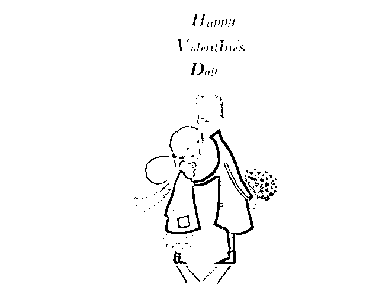****在这个特殊的日子里****若道君邀请你一起****通过爱情关系报告****更好地认识自己****了解彼此**适用群族

01

**有对象的**

**想知道怎样更好地相处**

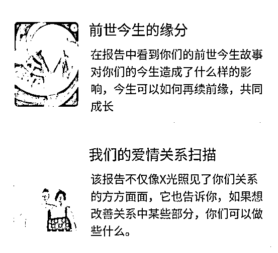

02

**还没对象的**

**想知道什么样的人适合自己**

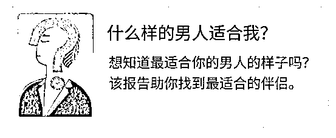

03

**有心仪之人的**

**可以提前了解 TA 想找什么样的伴侣**

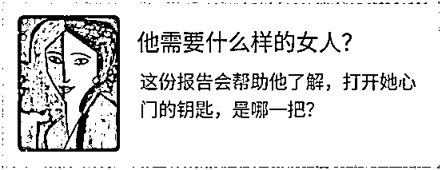

**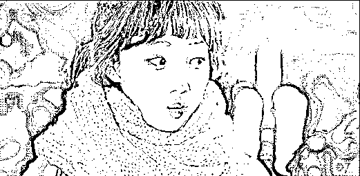**

开启模式♥ 微信扫描下图二维码

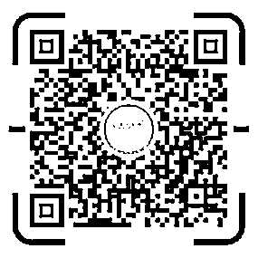

♥ 进入情人节活动首页

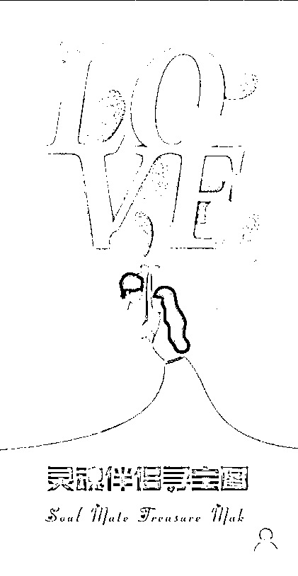

♥ 选择您的性别

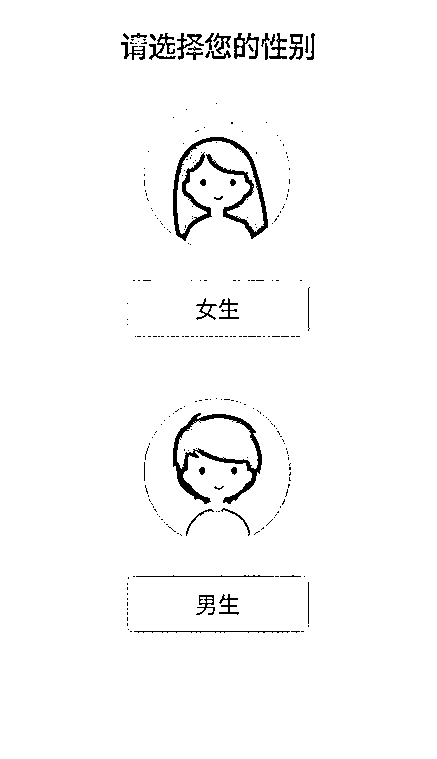

♥ 选择您想了解的伴侣信息

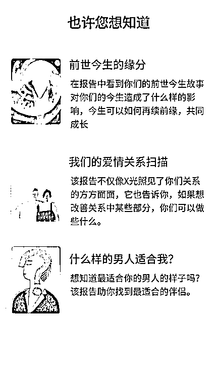

♥ 输入自己或伴侣的出生信息

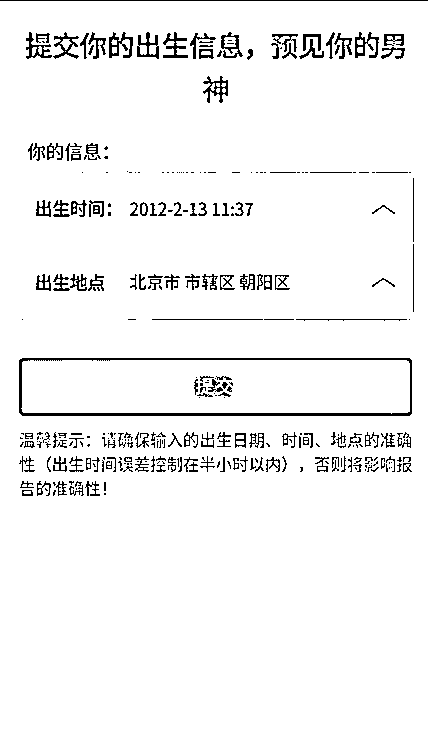

♥ 支付完成后，获取报告内容

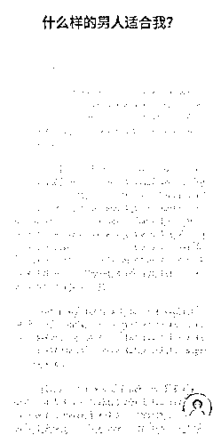

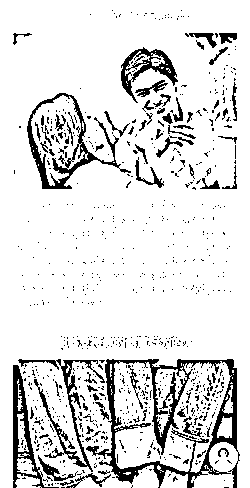

♥ 报告内容二次查看：进入活动首页，点击右下角进入报告查看页面

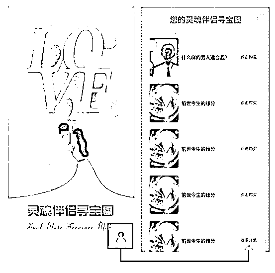

********报告购买直达入口********


# 资深顺势医师免费义诊新型冠状病毒肺炎，非常时期，我们与你同在

> 原文：[`mp.weixin.qq.com/s?__biz=MzA5NjA0NTAxNg==&mid=2651413455&idx=4&sn=710c68161ea3cc0256d64a2c001944fd&chksm=8b4be978bc3c606e55abc4af372b637eac618757953c6cce93e40a7b0b23c76836ec61d468c7&scene=126&sessionid=1692738212#rd`](http://mp.weixin.qq.com/s?__biz=MzA5NjA0NTAxNg==&mid=2651413455&idx=4&sn=710c68161ea3cc0256d64a2c001944fd&chksm=8b4be978bc3c606e55abc4af372b637eac618757953c6cce93e40a7b0b23c76836ec61d468c7&scene=126&sessionid=1692738212#rd)

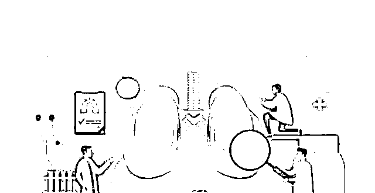

各位若道的读者们：自此次疫情开始以来，若道就开始与英国资深顺势医师苏·汤普金斯（Sue Tompkins）老师及澳大利亚的著名顺势治疗师 Fran Sheffield 老师联系，希望这些经验丰富的治疗师用顺势疗法帮助到病患。顺势作为世界第二大的治疗体系，自问世以来，在历次流行疫病中都有非常好的疗效，没有任何副作用，且可以与病患原有的中西医治疗结合（即病患可以继续原有治疗，原有治疗不需要任何改变）。

为了在抗疫中尽一份力，用自己多年的顺势治疗经验帮助中国民众，在一段时间内，**Sue Tompkins 老师和 Fran Sheffield 老师将对确诊的或者高度疑似的朋友们提供公益咨询**。

所以，如果你或家人或熟悉的人满足以下三个条件：

❶**被感染新型冠状病毒肺炎，已确诊，或诊断书说明高度疑似**，且； 

❷**目前有明显不适的身体症状**，并且； 

❸ **能够进行 1 个小时的语音问诊（我们将配免费翻译），愿意开放来尝试顺势疗法**，欢迎你和我们联系。

如果愿意接受咨询，请**添加工作人员微信，发送诊断证书，提供基本信息**，方便我们安排时间。

**长按二维码添加客服**

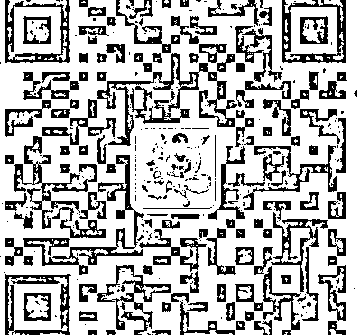

注：因为两位顺势医生有自己的诊所，平时都非常忙碌，所以我们需要提前和老师联系时间。请加油，我们与你同在。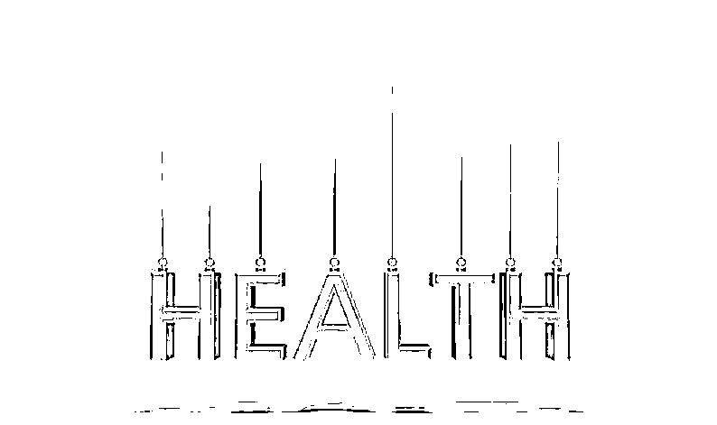

这里有一篇对顺势疗法及其对流行疫病的治疗的科普文章，完全不了解顺势疗法的朋友请先阅读这篇文章。

也可以在若道公众号后台输入**“顺势疗法”**，我们过去有一系列文章。

**什么是顺势疗法？**

要了解顺势疗法，首先你需要知道**当今世界上的主流治疗是对抗疗法**。对抗疗法使用制药公司生产的化学制剂药品，这些药品的目的在于**对抗和压制症状**。对抗疗法的药物如果健康人服用，就会因为相反的效果而产生问题，比如慢性腹泻的药品如果健康者服用就会导致便秘。对抗疗法的一个问题是，**给予相反的处方对某些疾病而言，只能短时的压制症状，并未真正的治愈**。当药力消退，症状又会复发，常常还会因为身体形成了**抗药性**而愈发严重。顺势疗法的治疗主张正好于对抗疗法相反，主要表现在以下三个方面：

❶ 顺势疗法的观念是**同类治疗**，**通过使用可以产生“症状”的“相似物”去刺激身体治愈自己的症状**。药品的选择是基于它们能够**模拟患者的症状而不是对抗患者的症状**，也即“同类”治疗“同类”。例如治疗慢性腹泻，顺势疗法就会选择一种会导致健康人腹泻的药品进行治疗。这种**刺激而不是压制**的方式**激发身体的自我生命力和自身疗愈系统的反弹效应**，恢复健康。

❷ 对抗疗法和顺势疗法之间的另一个区别是，顺势疗法是一种**整体论的医学**，和中医一样，当一个人病了，顺势医师的问诊会考虑此人的**身体、精神、情感**三个层面。**它的目标是治疗人，而不仅仅是治疗病症。**对抗疗法对待不同的症状就像对待不同的疾病，即使它们发生在同一个人身上。例如，复发性偏头痛和腹泻，会使用两种不同的对抗性疗法的药物。而顺势疗法会将这些问题视作一个整体疾病的部分，作为一种疾病同时治疗。❸ 顺势疗法的药物**更安全**。对抗疗法的药物以化学方法为基础，病人可能面临**药物互相作用和毒性副作用**。相反，顺势疗法的药物是经过高度稀释的物质，**并不产生化学副作用、毒性或与其他药品的相互作用**。药物主要是**药片**的形式，有时也使用**液体**。这种药物主要功能是**激活身体的自然疗愈系统。**当你了解顺势疗法的药物是如何制作时，你就更明白顺势疗法是一种**非常安全、没有副作用**的疗法，可以和对抗疗法、中医一起使用。根据世界卫生组织的调查，**顺势是世界上第二大的医疗系统。**世界上至少有 5 亿人使用顺势疗法。可能实际的数字还要更多。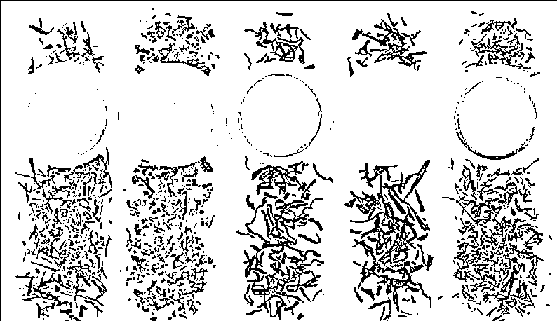

**顺势疗法的几大优势**

**顺势疗法治疗的是人，而不是疾病。**假设有 20 个患了感冒，或者头痛的人，去找一位顺势疗法医师。可能每个人都将得到不同的药方，因为每个人的头痛是不同的，每个人的感冒也是不同的（但当大的疫病流行时，常常是有一种药剂可以治疗很多病患，且此药剂也是易感人群的预防药剂）。
普通的医药学，正统的医学被顺势疗法医师称为**对抗疗法医学（Allopathy）**。“Allo”的意思是**“其他的，其他人的痛苦”**。对抗疗法医学使用对抗的法则，对抗性治疗。你可以从一些药物的用词方式看出这一点，抗生素、消炎药、抗惊厥药、降压药、抗抑郁药，抗精神病药等。所以，传统的西医用的是对抗法则，这和顺势疗法所做的正好相反。顺势疗法的另外一个哲学观点，是**生命力**的概念。顺势疗法在这里又和中医和许多武术，比如合气道，搭上线了。它们都有生命力的概念。不同的文化对它有不同的称呼。中国人称它为“气”，日本人称“気"，夏威夷称之为玛那。这就是生命力，一种不可见的动力，却像电流一般流通身体。中医关注的是你的气是否有阻塞，因为什么阻塞，如何解除阻塞，气是强是弱等等。人们对于生命力的概念有不同的观点，而顺势疗法处理的就是这一生命力。称它为“生命力”，因为哈内曼就是这么叫它的。你可以给它取任何名字都没有关系。它就是**为一切活物赋予生命的力量**。死人和活人不同的地方就是死人身上感觉缺了某种东西，缺的就是这一生命力。顺势疗法用顺势药物激发身体自然的生命力，以此来获得治愈。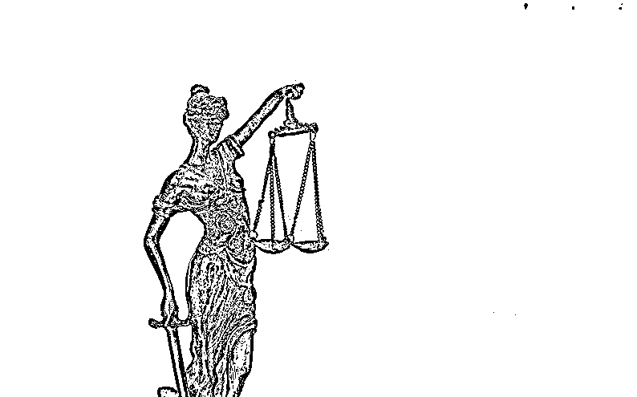

**顺势疗法的药物安全吗？**

 顺势疗法是一种有关天然药物的科学，利用剂量非常小的各种植物、矿物质或动物来刺激病人自身的抵抗力。药物根据个人情况而选择，这些药物如果过量服用能够导致病人所正在经历的相似的症状。

本质上说来，顺势疗法由两种高度系统化的方法所构成：**毒理学和病案记录**。首先，顺势疗法医师找出各种物质在过量时所导致的特定的身体、情绪和精神症状。与其他任何来源相比，顺势疗法教科书在毒理学方面有着更为详细的介绍。其次，**顺势疗法医师极为详细地问询其患者，以发现该人所经历的身体、情绪和精神的全部症状**。顺势疗法医师试图找到一种物质，该物质会导致此人身上的类似症状，然后以特别准备好的小剂量的方式给药。

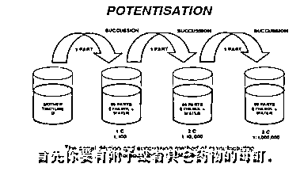

上面这张图描述了制药的过程。比如对于退烧药物颠茄，你先有它的母酊。然后往另一个容器装比如说 99 份的水或酒精。然后取出一份母酊，放进那个容器里，开始用力震动，之后就得到了 1C 的药品。从这份药品中，再取出 1%的分量，放进 99%的水或酒精里，然后做同样的事情，就得到了 2C；从 2C 里拿出一份再加入 99 份酒精和水震荡成为 3C。我们如果要制造 30C，这样一个过程会持续 30 次。不断重复这个过程。现在常见的稀释药方有 1m，就是千分之一的分量，10m，万分之一，甚至五万分之一。所以现在你明白稀释的程度有多深了。这就是顺势疗法的“最小剂量”的概念，意思是把用药量减到最低，因为不想伤害到病人。这是规则之一，**不能造成伤害。**

****所有药方都经过验证****

顺势疗法医师会**为药方寻求验证**。比如说他们不了解大蒜的效力，想要了解大蒜能否成为顺势疗法的药方，就会先用稀释和猛摇的方法制作出大蒜的药方，分给一些人，并要求这些人报告身体、精神、情绪方面的感觉，做了什么梦，说了什么话，各种各样的事。可能要分析好几十甚至上百人的报告。在验证中，通常你会发现有些人比其他人更加敏感。每个填写报告的人都不知道他们服的是什么药，也不知道别人说了什么话。从这些报告中，就可以大致了解药方的效果。

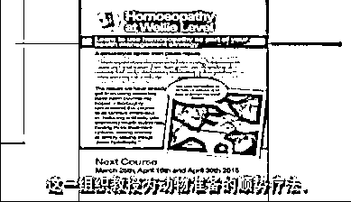

为了证明顺势疗法起作用不是因为安慰剂效应，我们可以为动物进行治疗。看一下上面那张图。事实上，在英国，这一组织教授为动物准备的顺势疗法。这门课程会教农民一些基础的顺势疗法，治疗自家的家畜。在英国已经大约有 400 位农民完成了课程，并且能将那些知识用在自家的动物身上。这里实践有机耕作的农民也通常会用到顺势疗法。此外，治疗某种植物的特定疾病，也经常要用到顺势疗法。

****顺势疗法一直为英国皇室所使用****

英国王室以极度保守，秉持传统家庭观念和公共服务著称，但众所周知，他们也特别欣赏，甚至是推崇某些非传统却行之有效的治疗方法，不论传统医学是否接纳这种方法。阿德莱德皇后患有严重的疾病，宫廷医生无法治愈。皇后召唤了哈恩曼最年长最值得信赖的同僚约翰·厄尼斯特·施塔普夫医生（1788-1860）为她诊治，她获得了治愈，在英国王室中赢得了第一批顺势疗法的拥趸。自阿德莱德皇后之后，英国王室的各位国王和王后（女王）以开放的心态在顺势疗法中探索医疗关护。维多利亚女王（1837-1901）的医师是弗雷德里克·奎恩医生，他也是比利时利奥伯德王子的私人医师-顺势疗法治疗师。

英王乔治五世的妻子玛丽皇后（1865-1953）曾带头为伦敦顺势疗法医院的创建和扩张筹集资金。英王乔治五世（1865-1936）也非常赏识顺势疗法，因为他非常喜欢航海，但晕船这个问题常常困扰着他。顺势疗法治好了他晕船的问题。

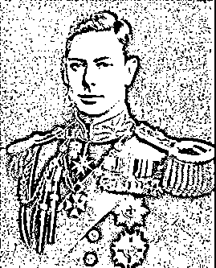

乔治六世也是使用顺势疗法药品的行家里手，在 1948 年，他为了表达自己对这一医疗体系的感谢将皇家头衔授予了伦敦顺势疗法医院（LondonHomeopathic Hospital）。皇家伦敦顺势疗法医院的头衔保留了数十年，一直到 2010 年，医院才改名为皇家伦敦整体医疗医院（Royal London Hospitalfor Integrative Medicine）。

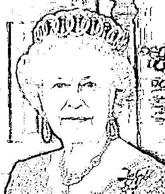

伊丽莎白二世在 1952 年即位，她长期以来都是皇家伦敦顺势疗法医院的赞助人，在 2005 年又投入了三千五百万美元。在 2000 年，伊丽莎白二世参观医院时，她望着约翰·韦尔爵士的画像，他是她的顺势疗法医师，说：“他给予我父亲很好的治疗。”为了适应时代需求，在 2010 年，这间医院将名字改为皇家伦敦整合医疗医院。查尔斯王子更是顺势疗法的热情支持者。他为家人、他庄园里的动物和植物都使用顺势疗法。当然这也为他带来麻烦，因为皇族不应该发表任何不中立的主张。

**顺势疗法治疗流行疫病的历史**

以下文章作者为 Julian Winston

顺势疗法从一早开始，就和**治疗流行性疾病**联系在一起。顺势疗法治疗流行性疫病的最早的经历之一是在**1813 年治疗斑疹伤寒**（由虱子传播）。当疫情在莱比锡蔓延，军队从东部撤退时，顺势疗法的创始人塞缪尔·哈内曼（SamuelHahnemann）治疗了 180 例斑疹伤寒，只有 2 个病人死亡。而当时的传统治疗的死亡率超过 30%。**1854 年，伦敦发生霍乱疫情**。这是医学界第一次能够将疫情追溯到源头（公共水泵），当水泵关闭时，疫情很快就停止了。
疫情停止后，下议院要求提交一份关于治疗这种流行病的各种方法的报告。报告发表时，顺势疗法的数字没有包括在内。上议院要求解释，报告的人承认，如果顺势疗法的数字要包括在报告中，它会“扭曲结果”。被压下来没有上报的报告显示，**在对抗疗法治疗下，死亡率为 59.2%，而在顺势疗法治疗下，死亡率仅为 9%。****在 19 世纪 50 年代，美国南方各州发生了几次黄热病流行**。这种疾病最终被发现是由蚊子传播的。奥斯勒说，黄热病的变态反应死亡率在 15-85%之间。1853 年，顺势医师霍尔康报告纳切兹市的死亡率为 6.43%，另一个顺势医师戴维斯博士报告纳切兹市的死亡率为 5.73%。**1878 年，在对抗疗法治疗下，新奥尔良的死亡率是 50%，在顺势疗法治疗下，死亡率是 5.6%（1945 个病例）。****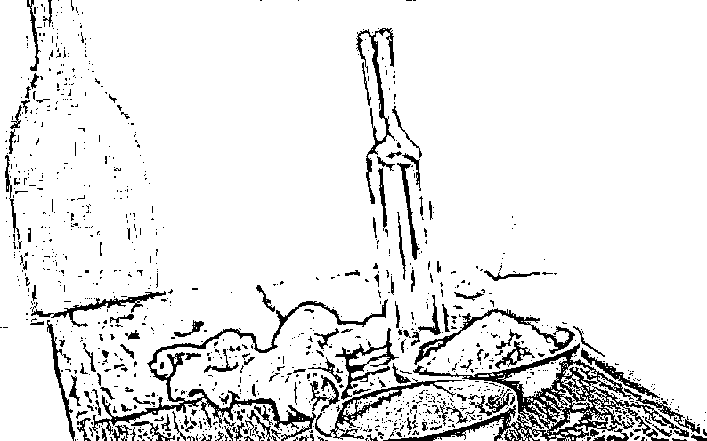**另一种用顺势疗法治疗的流行病是**白喉**。白喉的特点是它会周期性出现，很少有相同的表现。因此，对医生来说，针对每一个具体病例或在普遍流行的情况下进行个体化治疗是非常重要的。一种在一年内有效治疗它的药物可能不是下一年所需要的相同的药物。在 1862 年至 1864 年纽约州布鲁姆县白喉三年的记录中，有一份报告显示，**对抗疗法的死亡率为 83.6%，而顺势疗法的死亡率为 16.4%。**顺势疗法在近代历史重大流行病中的应用是在**1918 年西班牙流感**期间。在西班牙流感中，最常用的治疗药物是钩吻，偶尔也有需要泻根和紫茎泽兰的病例。来自 CT 德比的 HerbertA.Roberts 博士说，康涅狄格州的 30 名医生回应了他的数据请求。他们报告了 6602 例，55 例死亡，不到 1%。罗伯茨博士在一战期间在一艘军舰上当医生。在去欧洲的路上，有 81 人得了西班牙流感。他报告说：“一切都恢复了，所有人都安全上岸了。每个男人都接受顺势疗法治疗。而另一艘船在途中就死了 31 人。”阿根廷的弗朗西斯科埃扎亚加博士讲述了**1957 年在布宜诺斯艾利斯发生的脊髓灰质炎流行病**，在那里，这种流行病的症状类似于扁豆这个药物的症状。顺势疗法的医生和药店开了 30C 的扁豆作为预防剂，分发了“数千剂”，这些用药的人没有人被传染。埃扎亚加指出，在其他种类的脊髓灰质炎流行病中，钩吻是一种指定的治疗用药，当然，在这里个体化的必要性也被强调。

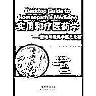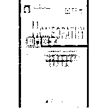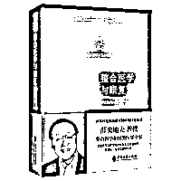

| 国内已经出版的顺势疗法（顺势疗法也翻译为和疗）部分书籍

# 奥斯卡最佳影片《寄生虫》中有这么多处女座元素，你发现了吗?

> 原文：[`mp.weixin.qq.com/s?__biz=MzA5NjA0NTAxNg==&mid=2651413407&idx=1&sn=e437fd49ebf882b71ce7d7a65f247b35&chksm=8b4be928bc3c603e5939ef238aff98549c3397bf959fb89d99866eb63057d10a71ceb5c20872&scene=126&sessionid=1692738212#rd`](http://mp.weixin.qq.com/s?__biz=MzA5NjA0NTAxNg==&mid=2651413407&idx=1&sn=e437fd49ebf882b71ce7d7a65f247b35&chksm=8b4be928bc3c603e5939ef238aff98549c3397bf959fb89d99866eb63057d10a71ceb5c20872&scene=126&sessionid=1692738212#rd)

******************************☆** 后台回复“今日”，给你一句生命态度****************************

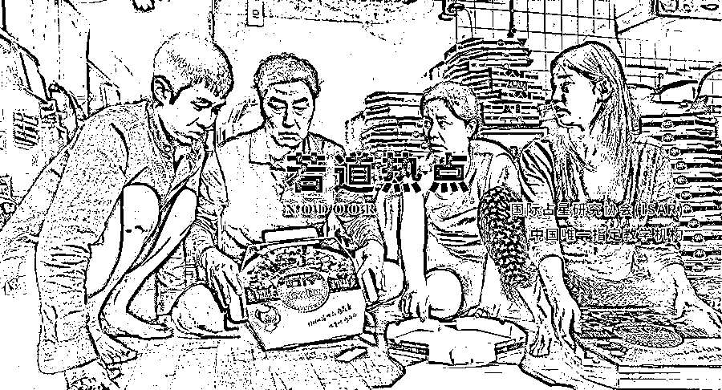

作者/翀子 ISAR 认证占星师

编辑/玫瑰 图片/网络

新闻提要

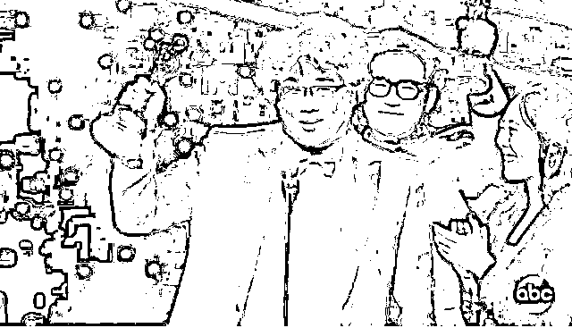| 韩国导演奉俊昊北京时间 2020 年 2 月 10 日，在第 92 届奥斯卡金像奖颁奖典礼上，韩国导演奉俊昊指导的电影《寄生虫》一鸣惊人，获得最佳影片、最佳导演、最近国际影片、最佳原创剧本四项大奖，成为本届奥斯卡金像奖最大赢家，实现了韩国电影不止是争战奥斯卡“零突破”的跨域，更成为奥斯卡历史上第一部非英语的最佳影片。韩国总统文在寅在社交网站发文，对在奥斯卡斩获四奖的《寄生虫》表示祝贺与感谢，并表示政府今后将进一步为广大电影人提供能够尽情发挥想象力并放心大胆制作电影的环境。**处女座的影像工匠**《寄生虫》去年在戛纳电影节上获得金棕榈大奖，也就是说，《寄生虫》同时拿下了世界艺术电影、商业电影的两座最高峰，这部兼顾了艺术水准、商业价值与社会关怀的作品，用极端贫富差距冲撞中的人间惨剧，揭露了人对生存的渴望、欲望刺激下的人性阴暗面，以及社会阶层的深层矛盾。将社会议题“电影化”，是奉俊昊突出的个人特色，从他的出生星图，我们得以看到他影像世界的一角。

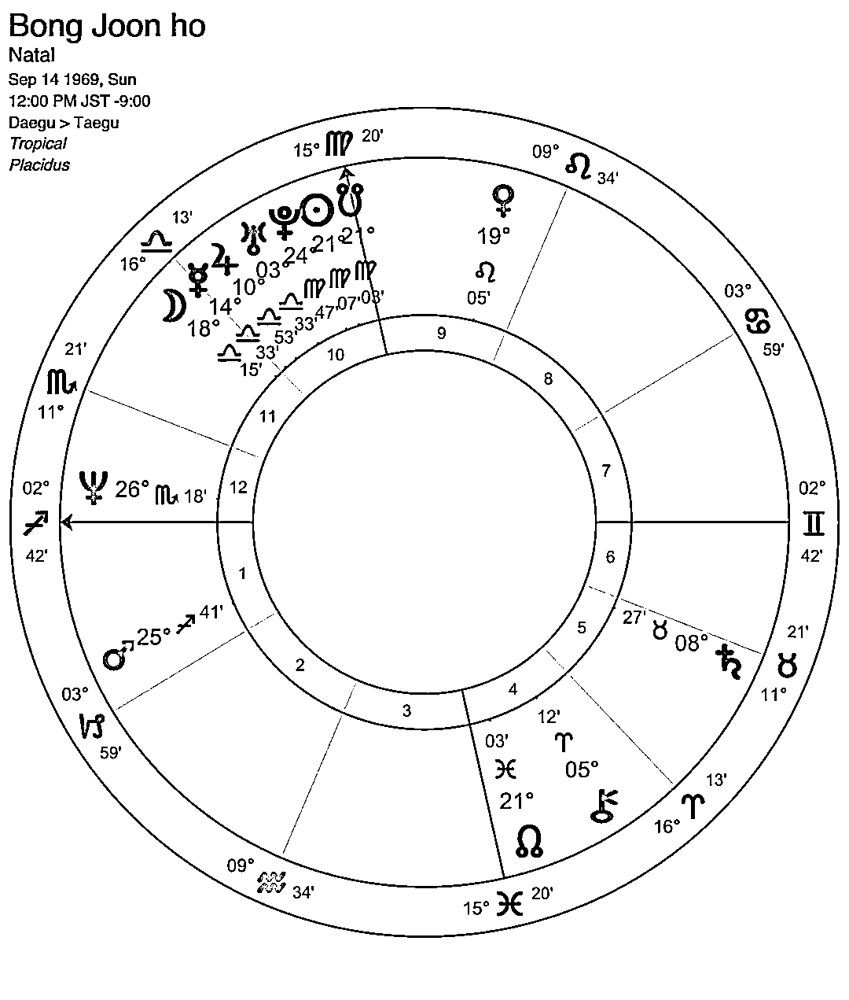

| 奉俊昊出生星图，具体时间取当地时间中午 12 点奉俊昊出生于 1969 年 9 月 14 日，他的**太阳与月亮南交点精准合相在处女座**。**专注细节、打磨技艺、以追求完美为驱动力、以服务他人为天职**，这些都是对处女座特质的描述。对大多数处女座来说，**逻辑、分析和归纳能力**是他们与生俱来的天赋，有出众的信息分类与组织规划能力。奉俊昊在大学主修社会学。社会学研究人类组织、社会群体、社会分工与互动等等，用不同的研究方法深入社会组织架构内部，如抽丝剥茧般，系统又细致，从而探讨人类社会的运行模式。奉俊昊说：“我其实不懂社会学，我的经历都在电影上”，然而，即便非热衷所在，社会学依然成为他的学业选择。也正因如此，奉俊昊常被称作“电影社会学家”。电影被人们冠以“影像的艺术”，呼应了奉俊昊星图上的**月亮北交点——双鱼座**。月亮南交点是我们与生俱来的优势所在，而北交点是让人感受人生灯塔的意义与方向，当我们结合二者并“双管齐下”，饱满的生命故事呼之欲出。在奉俊昊身上，不管是**“电影社会学家”**还是**“细节控的电影导演”**的形容，都栩栩如生的呼应他星图上的月亮交点。

**积累技艺的电影学徒**

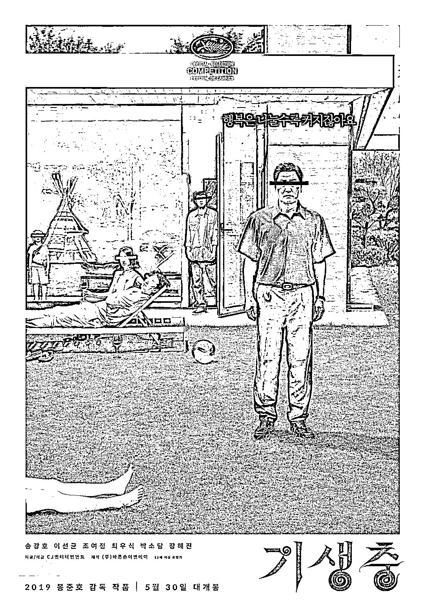

| 电影《寄生虫》剧照/图源：百度百科

还是让我们先回到处女座的表达上。处女座是天生的**“学徒”**，我们常常赞叹于他们**缜密的思维、对事物抽丝剥茧般细致的学习能力。**虽然电影是一门关于“时空”的艺术，但在表达意图和指导影片之前，要经历很长的学习过程，无论表现手法（镜头语言、摄影、声音和美术等等）还是影片风格（形式主义、纪实主义），都需经过系统的学习、大量看片与分析影片，并在实际操作中打磨技术。拍电影是件非常“处女座”的事，而导演一部优秀的电影更不是一蹴而就。

**“业精于勤”**大概是很多处女座人的座右铭，他们脚踏实地，注重实效，不会相信天上掉馅饼和中五百万彩票的神话，“量变带来质变”是信条。奉俊昊回想小时候的经历时曾说：“我会查电视节目表，看看每周会播什么电影。我每周大概能看十部电影，当我上中学的时候，我就知道我想成为电影导演了。”

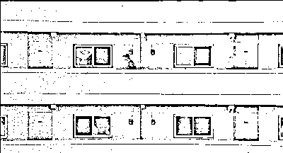

| 电影《绑架门口狗》中处女座元素明显的场景

奉俊昊进了大学，他开始实践自己的电影梦，和朋友发起电影社，一部片子看几十遍并分析每一个画面。奉俊昊喜欢的影片，也从类型片扩展到台湾新浪潮导演的作品，他承认这些都影响了他后来的创作。大学毕业后，他在剧组摸爬滚打多年，灯光和场记都做过，直到最后才当上导演。

电影拍摄是多工种密切合作的流水线式生产过程，详细了解并研究每个工种的工作内容，从小到大对电影的研究与实践，不停的学习、研究、实操，太阳处女座的奉俊昊发挥出南交处女座的优势，使自己的电影拍摄手法日趋成熟。

**打磨剧本细节的“控制狂”**

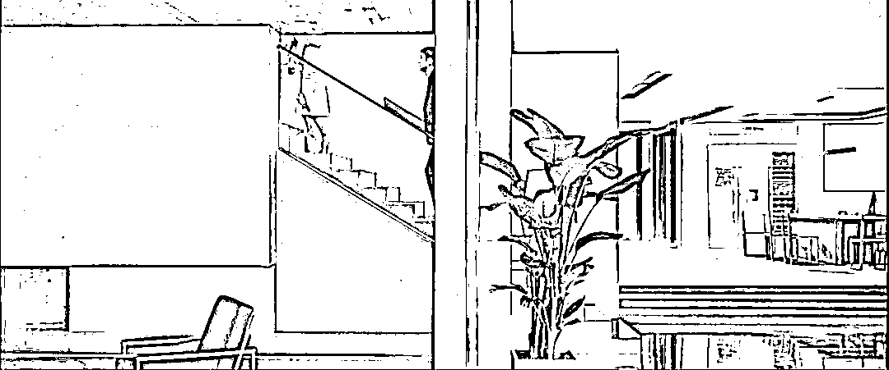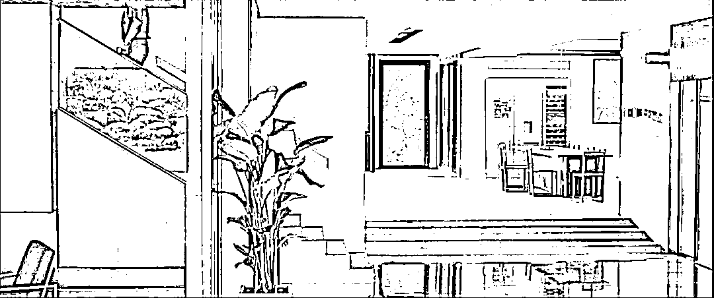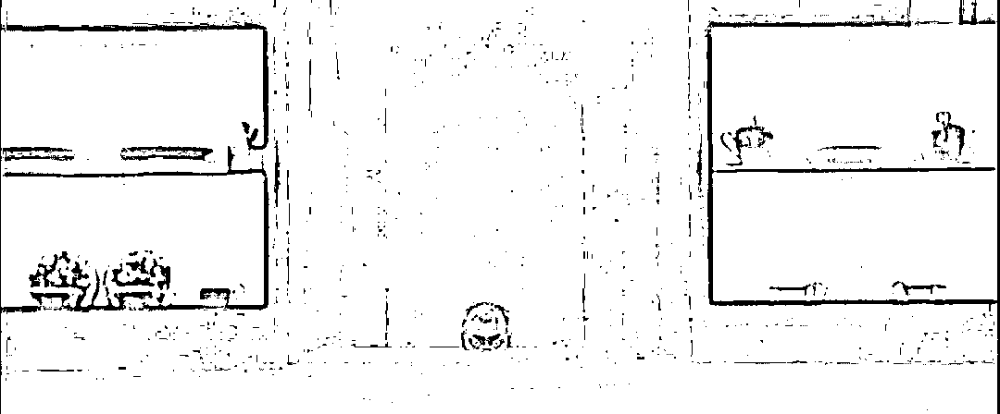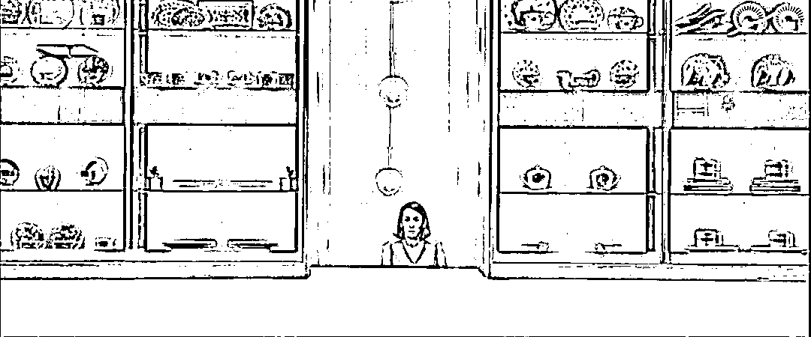

| 电影《寄生虫》中有明显处女座元素的构图

处女座对细节的**精益求精**让人惊叹不已，他们好像戴着放大镜，分析筛选有用的信息，不允许瑕疵出现。到目前为止，奉俊昊只指导了七部长篇电影，并且全部参与了剧本创作，他把大部分时间花在雕琢剧本上，每句台词都写完才能放松。

很多优秀的电影作品，它们的剧本往往要经过数十次的修改，从故事大纲、情节设定到人物台词，都经历反复斟酌。处女座对故事逻辑的高要求、对人物角色的清晰设置、对一词一句的推敲，体现了奉俊昊对打造精致作品的追求。

**细节决定成败**，是处女座奉行的金科玉律，没有哪个星座像他们这样专注于把事情“做对”。奉俊昊不仅看重剧本，他对拍摄电影的全过程都有“控制狂”的倾向。“必须要我来全权把控”，一旦走进剧组，奉俊昊就展现出一切都要为细节让路的姿态，《杀人回忆》的美术指导柳成熙曾公开调侃奉俊**“吹毛求疵”**。处女座对品质的高要求，被奉俊昊表达得淋漓尽致。

**完美主义者的自我苛求**

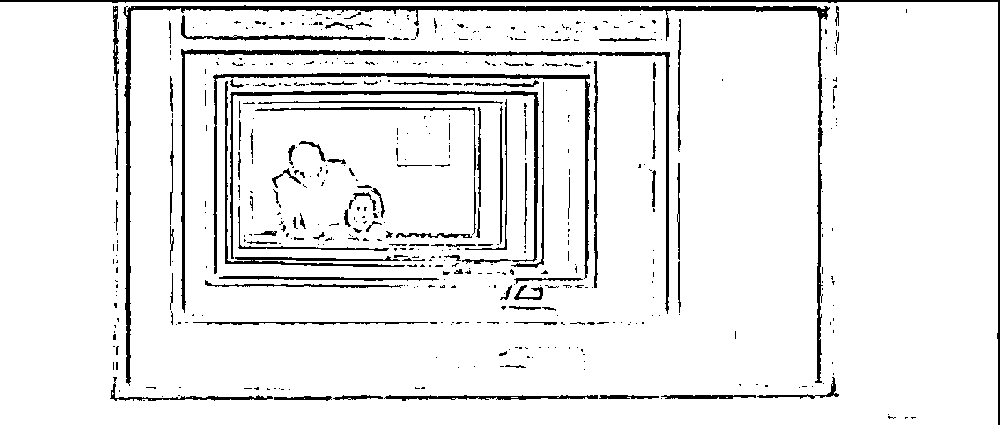

| 奉俊昊执导的电影《母亲》中的框式构图也有明显的处女座元素

处女座对外界的“吹毛求疵”往往来源于**对自己的苛刻要求**，他们的观察力是如此之强，对细节的强调容易让人把目光放到缺陷上去，从而陷入完美主义的旋涡。奉俊昊曾说，每次回看自己的作品都觉得有遗憾之处，比如处女作《绑架门口狗》首映的时候，他自己觉得不满意，走出影院平静了半天。被影迷称为“完美电影”的《杀人回忆》，在他眼中也需要改动——“剧本倒不用动，但有些镜头的灯光、走位、表情还可以调整。”从积累技艺的电影学徒，到打磨剧本的“控制狂”，再看这位成功的导演对自己过往作品的评价，处女座刻苦磨练技术、不断追求更好的工匠形象与奉俊昊完美贴合起来。

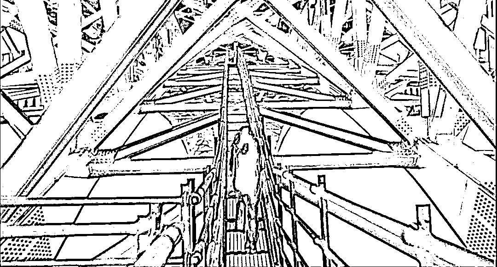

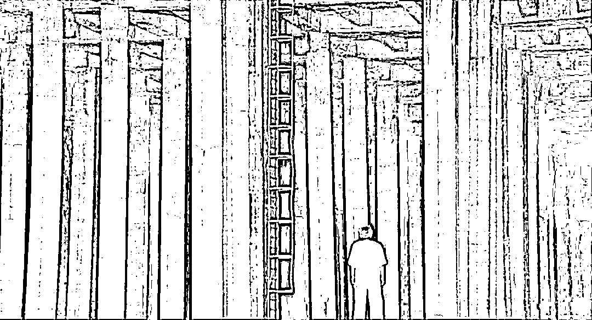

| 奉俊昊执导的电影中的三角向心构图和垂直构图

**打造双鱼座的意识梦境**

人们常把电影称为“造梦的艺术”，还把打造梦境的地方叫做梦工厂。运用各种机器把现实生活或脑中意图拍摄并制作出来，成为荧幕中的流动影像，那些画面触动着我们的情感并激发共鸣。

荧幕前，个体的边界被消融，人们沉浸在共同的情感体验中，电影反映着也同时激起集体意识。电影和双鱼座紧密相连，这也呼应了奉俊昊出生星图中月亮北交点的能量。在南交处女座与北交双鱼座的舞动之间，奉俊昊保持着优雅的平衡。

**剪辑造梦**

**“精确的剪刀手”**，是对优秀电影剪辑师的褒奖，是处女座的事业形象之一。对电影来说，剪辑是非常重要的，同样的素材用不同的拼贴方式会呈现出截然不同的故事，很多电影学者认为，正是剪辑的出现才让电影成为一门艺术。

人们对电影双鱼座式的梦境体验，绝不是导演随性随意为之，而是在处女座精益求精的环环相扣之下打磨出来的。奉俊昊从始至终牢牢掌握着自己电影的“最终剪辑权”，他用克制冷静、不拖泥带水的画面表达他的意识与情感，用极佳的节奏控制力和声画语言直击观众的心房，使群体心理产生共鸣，创造了让人回味无穷的双鱼座式精神世界。

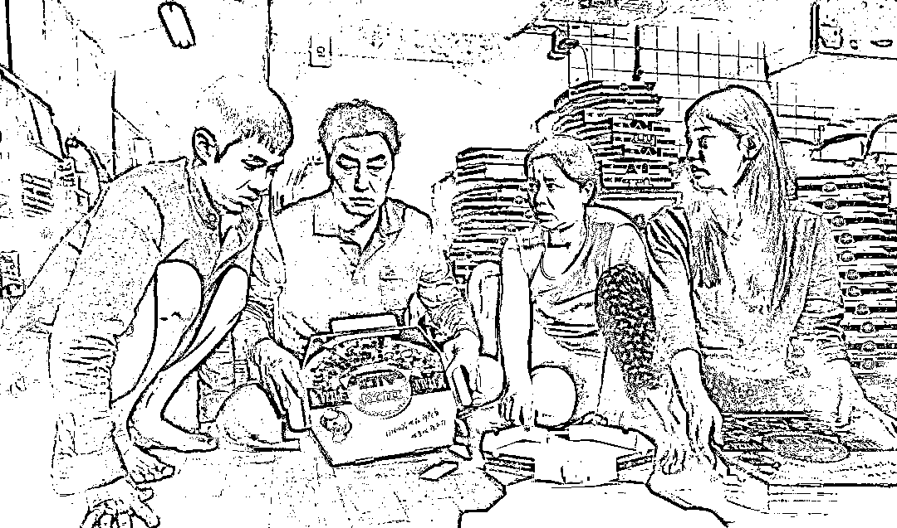

| 电影《寄生虫》剧照/图源：百度百科

**从处女座到双鱼座——源于现实，高于现实**

**处女座让人专注于眼前的现实世界，双鱼座则让我们进入想象力的乐园**，创造力的影像表达帮助人们减少生活的压力，从处女座到双鱼座的能量流动，就好比**“用入世的心，做出世的事”**，给予人们精神上的成长。电影发明之初，它的目的是记录客观世界的生活，并没有作为一种表达情感的手段和工具，即便发展到今天，电影艺术依然关切并反映现实生活。

奉俊昊关注社会底层人物，选择和现实生活贴近的故事题材，将社会事件和集体心理用节奏明快的电影语言表达出来，把娱乐、讽刺和反思相结合，呈现导演意图。在他的电影里，信息是非常丰富的，细节处有很多伏笔，我们不仅从中得到情感的高峰体验，也对电影折射出的社会现实有更多反思，反思之中，是双鱼座式的慈悲，在 120 分钟的影像世界里，触动着人们希望世界变得更好的心。电影是现实的镜子，源于生活而又不仅仅是生活。

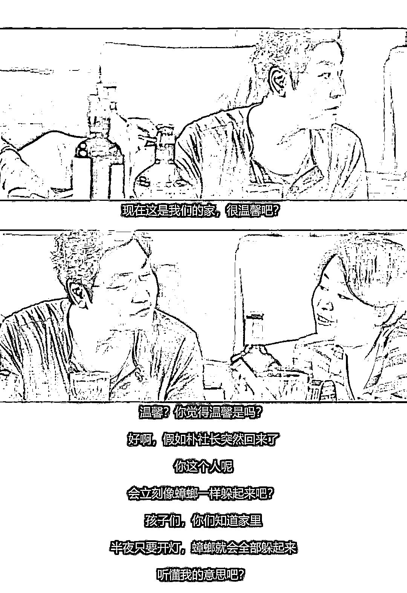

| 电影《寄生虫》剧照/图源：搜狐网

**打造双鱼座的意识梦境**

从奉俊昊的出生星图剖析他的个人风格和影片意涵，角度有很多，只从他的处女座太阳和月亮交点便可为我们打开一扇了解他及其作品的门，我之所以选择打开这扇门也是因为，奉俊昊的月亮交点和电影诞生时的月亮交点相同。

1895 年 12 月 28 日是电影的诞生日，卢米埃尔兄弟的“活动电影机”在巴黎卡普辛路 14 号大咖啡馆的地下室开始做第一次的公开售票公映，轰动巴黎从而传遍世界。这一天，月亮的南交点在处女座，北交点在双鱼座。

技术的发展诞生了电影这门艺术形式，人们尝试用许多方法将光影捕捉和记录下来，它的出现与人们对技术的运用密不可分。电影是创造运动幻觉的机器，它创造的是现实的幻觉，而不是现实本身。在电影中，人们满足了自己突破时空有限性的渴望，使人对自己的感知有了更深入的体验。那些电影创作者们，比如刚刚载誉而归的奉俊昊，都是现实世界的造梦人。“

**电影是一个引座员手中的手电筒，像一颗飘忽的彗星一样游走在我们黑暗却清醒的梦境里，游走在银幕周围无形的空间中。**

**——安德烈·巴赞**

”

**版权声明**：原创文章由作者授权首发于若道平台，欢迎转发，反对抄袭。友号转载请申请白名单。


翀子

ISAR 认证占星师（2019 年获得）

若道 2019 届核心课程 Level 5 学员

**咨询微信**：carolinemichong

**微信公众号**：LumosTrueSelf

长按打赏


********点击图片查看精品好课********


**微信又双叒叕改版啦，不想错过若道君的推送？**

**就把若道设为星标吧！**

**▼**


喜欢记得点一下“在看”哦☟

********报名直达入口********


# 2020 春季占星入门课程 | 繁星之中破译你的罗塞塔石碑

> 原文：[`mp.weixin.qq.com/s?__biz=MzA5NjA0NTAxNg==&mid=2651413407&idx=3&sn=ac8baedf6a975d48dedaa6a01b1eff43&chksm=8b4be928bc3c603eb664ca3c5375ee9c1711b969c758081b8897c6ce0c5dc9f40a28e9ec3745&scene=126&sessionid=1692738212#rd`](http://mp.weixin.qq.com/s?__biz=MzA5NjA0NTAxNg==&mid=2651413407&idx=3&sn=ac8baedf6a975d48dedaa6a01b1eff43&chksm=8b4be928bc3c603eb664ca3c5375ee9c1711b969c758081b8897c6ce0c5dc9f40a28e9ec3745&scene=126&sessionid=1692738212#rd)

## 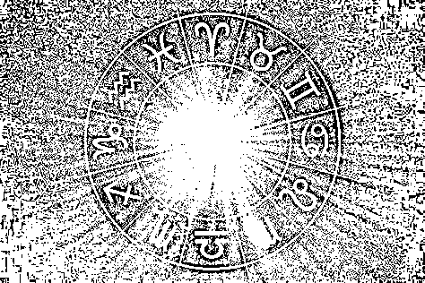

在我们的认证教师计划中，郑玮玲是 8 位若道认证老师之一。所有若道认证的教师都是 ISAR 认证占星师，曾担任助教或在若道有相关工作经验，他们熟悉若道的老师以及培训课程、课程标准和职业道德规范。他们的课程独立于若道的课程系统。

**为什么要学习占星学？**

占星学 Astrology 意为：**星星的逻辑**。占星学是人类古老的符号语言体系，当代最著名的占星学家，超个人心理学家们都将其视为人类生活、精神的“罗塞塔石牌”。占星学是我们**内在灵性启迪的导航系统**，能透视人类心智深处的语言、涵义和结构，也是时代变迁的天报预报系统。


| 罗塞塔石牌是一块写有古埃及象形文字

古埃及常规文字和希腊文字的石牌

历史学家由此打开了古老文明的大门

占星学，是一门古老文明的技艺：**“技术+艺术”**的融合。它的真正起源已无从考证，每当我们使用占星学的时候，就是在使用从远古美索不达米亚古老人类用智慧凝结的船只，其中蕴藏着恒古不变的爱和宇宙的艺术。人类总是在时间和空间里寻找存在的意义，而存在本身就有足够珍贵和丰富的意涵。命运的道路为我们的眼光和意识带来了种种局限，因为宇宙与人类心灵之间的联接是我们无法用头脑直接理解的奥秘。

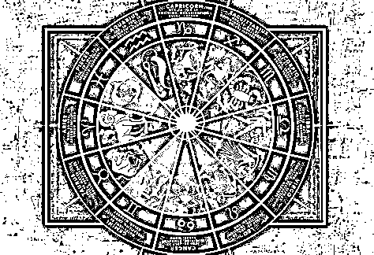

每个人都是宇宙的一部分，所有的一切都在共振的频率之中，每一个发生都是生命乐章里的音符。利用占星学深入探索最终必然超越心理性的探索。人类与宇宙原型能量碰撞的时间点，经由出生星图以及行进行星的碰撞演化在生活中，看似偶然却带有深刻含义的发生，也是荣格所定义的“共时性”。**占星学正是利用共时性的最佳可测量的语言符号体系。**一个人出生的时间地点，行星独特的排序方式，人生故事的展开不是以具体预测的方式，而是与原型的能量展现有关联。一个人早期童年的生活，胎儿期的经历对我们一生兴衰起伏的演变都非常重要，在出生星图中都有据可考。同时，对于探索灵魂本源，轮回路径来说，占星学也是可支持的有力工具。但我不使用宿命论，决定论的方式，而是开放式的探寻与确定性的归纳。神秘主义真实的来源是对生命更深的思考与领悟，是对生活更深的热爱与追寻。

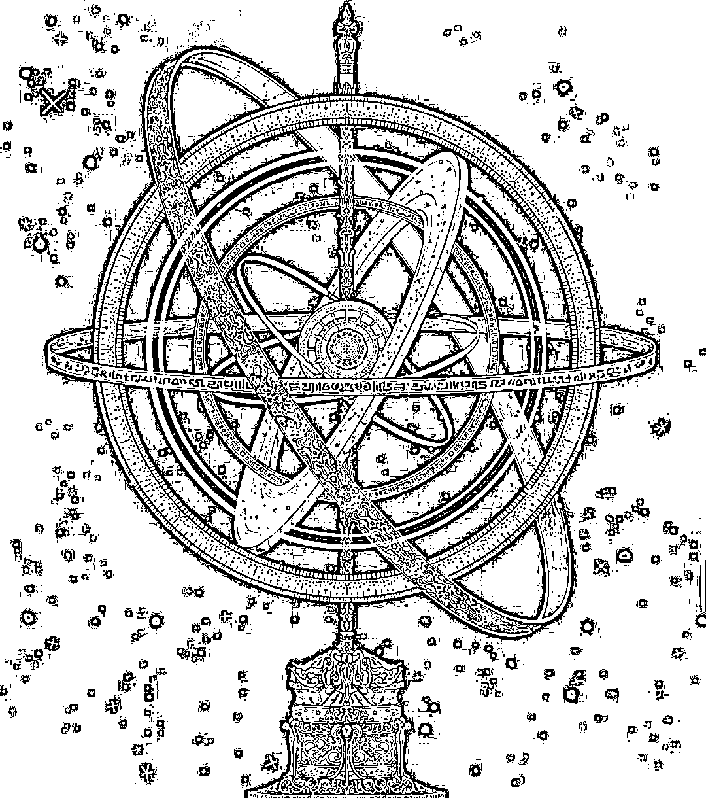

你为什么有这样一张出生星图？你为什么会在这个特定的时空出生？背后有什么力量在主宰？这对于灵魂来说带来了什么意义？你的一生将要学习什么课题？这些是占星学能够回答的问题，因为我们每个人的出生就是一个强大的宇宙共时性的事件。占星学真正为我们带来的正是**对生命的思考，意义的诠释和不断深入的自我整合的依据。**若去理解生命背后那个更宏大的背景、更广博的意义、更深远的动力，会对走过的道路有更清晰的认知，会对未来的生活有更确凿的信念，会对当下的环境有更敏锐的觉察和理解，会与他人有更深刻的连接，在现实生活中全然活出自己的天赋，懂得爱，奉献爱，创造美好。

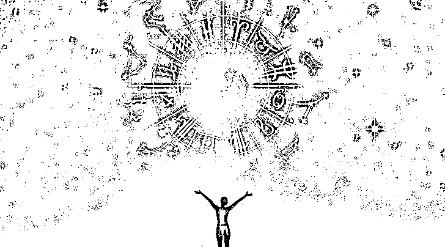

一直以来，我都带着占星学传播者的使命感，去迎接的更多对占星学感兴趣的朋友们。从自我研习的经验中提炼出占星学习的心法，运用诉诸感官的、生动的、生活化的方式带学员走入占星学的大门，最大程度避免在学习过程中的“烧脑”，化理性认知为实用的生活艺术。**课程特色**

*   培养、熟练观察生活中原型能量的能力；
*   频繁、精准使用占星学语言，为解读创建基础数据库；
*   超越心理性或心理学的全息占星视角，直抵个人意识与宇宙交汇之处：心灵的探索。
*   在每次课程结束后，学员们会发现自己身上不样的地方——关于灵感和创造力的展现，以及对自我更深更温柔的接纳，层层包裹的心像花朵循序展开，向那些温暖面孔呈现出自己最真实最深刻的样子。

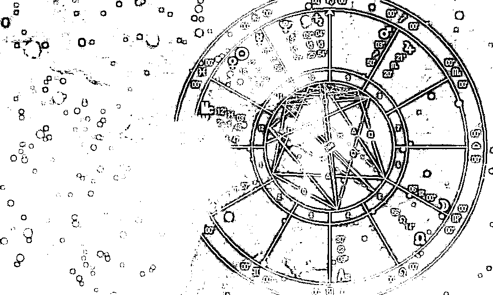

**适合人群**

*   占星小白，但是对占星学有兴趣，想要找到一个方法去深入了解。

*   看过一些占星学的书和网络文章，对占星学有个人的理解，希望更进一步系统、深入学习占星技法，化理论为实用。

*   上过一些占星课程，但所学知识感觉没有真正“习得”，希望能吃透这门学问。

*   你希望通过占星学深入了解自己，了解家人、孩子、伴侣。

*   你渴望用自己独道的方式发掘自己的创造力。

*   只要你有热情，并保持 28 天的精进学习，一定能轻松走入占星学的大门。 

**往期学员回顾**

玮玮

已经想不起什么时候和占星结缘了，我努力能想到的只有和玮玲相识的日子。占星学入门不难，走进大门才发现一个想学占星学的人不光要对人类学、心理学、神话、原型等有所了解，更需要培养一种宇宙观。我不是一个善于用大脑学习的学生，所以以往的占星学习即吃力又一知半解，直到遇见玮玲。一位用音乐用舞动用一切疗愈力的方式让学员感受占星学的老师。知识也许记不住，可感受不会忘。如果你和我一样，喜欢聆听身体的声音，这将是一场奇妙的学习之旅。最后我想说，占星不是算命，它只是让你认识自己（他人）所面对的内在障碍与挑战的良好工具。

丽璇

当我对亲子关系感到沮丧时，我找到了浅浅老师；当我对自我前程感到迷茫时，浅浅老师找到了我。浅浅老师告诉我，这是属于我们在宇宙的共振。感谢宇宙，派来浅浅老师这位温柔的战士，自带舞功。

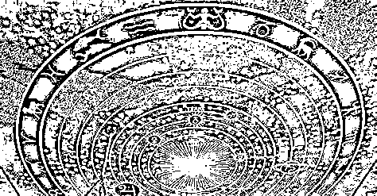

FiFi

有一天浅浅在公众号发了篇文章，写什么忘了，可贴图那张蝴蝶却震住了心，从那一刻，就暗想着她什么时候开课，是一定要参加，果然不久后机会来了。占星小雪～关于月亮周期的主题，想想都很美。课程里浅浅温暖指引着我们在 28 天周期里随着月亮去感受内心，带一点占星知识，又带着内心的声音去书写和记录，每每祝福，那 28 天现在想起来依然觉得温暖如月。课程结束后也学会了时不时查看一下月亮的行进，遇到特别的事情记录下来，感受当下的月亮，也走近了自己的心。

智瑾

每节课总会让我感到收获满满，而结合我们的出生星图讲解，不仅更好地传递了占星学知识，也让我自己重新认识了自我。玮玲老师的占星课也让我接受到了正统而系统课程，每一个知识点的讲解都很详细，老师的声音很温柔，声控的人都会很喜欢老师的声音。
除了课程，我也特别感谢月亮写作的课程，真正做到了打开自己的心，释放自己的情绪，很棒的写作体验！受益终生。

Mlle

遇见玮玲，很有缘份之妙。跟十几年不见的大学同学，在一次聚会上聊起我在自学占星，她提到了她在 Canon 上班时的同事就是占星师，那是第一次知道玮玲。后来参加了她的占星沙龙，以及系统占星课程，很喜欢她给人的温暖感觉。
我一直是个左脑执念颇深的人，而玮玲想象力丰富，精通音律和舞蹈，交流中宛若观镜，映出了我不曾窥见的自我盲点。本来教条冰冷的占星学知识，终于开始流动起来。这感觉像：我正挣扎于困难重重的深井里，突然有人抛下一根绳子，让我能朝着洞口的光亮攀爬，而这光亮恰似和谐敞亮的海王在召唤自我救赎，这是她太阳的双鱼座带给我的启发，受益匪浅。我想，多年后回望，这也会是整个人生重要的时间节点。授之以鱼，不如授之以渔，感谢玮玲引导踏上愉悦灵动的星之旅程。

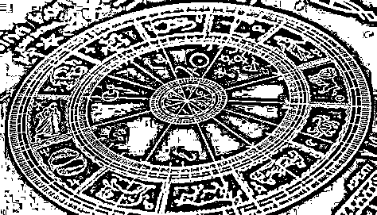

邱邱

老师总说：占星是一门艺术，而不是技术，所以我们不能用以前学习知识的技巧和方法来学习，而是要用心去感受和体验。我特别赞同和理解老师这样的说法，老师上课非常生动，总是结合生活的很多实际例子来帮助我去真正理解行星对我们生活的影响。写月亮日记，这让我特别的受益匪浅，让我越来越深入的看到和了解了自己，我每一天的月亮日记老师都认真的看了和回复了，很多话都深深的触动了我。特别是老师即使是到美国去学习，也提前跟我说下了飞机到酒店后再回复我的日记，老师的态度深深的打动了我，她让我看到什么是敬业，什么是态度。与其说是占星对我帮助很大，更要说的老师本人对我的影响很大。我不知道这种变化是什么时候开始的，但我的生活的确在潜移默化的发生了改变。我开始敞开心去接纳我周围的人和事了。脸上的笑容也越来越多，大家都说我变化好大，整个人状态都不一样了。我只是觉得，其实我只是做回了真实的自己而已，占星让我看到真实的自己是什么样的，让我理解了为什么自己是这样的。我所有的美好和不堪都是我可以理解和包容的了，我所有的恐惧和害怕都是有其原因的，我能做的就是接受和面对。


**课程安排及费用**

**2020 浅浅占星春分班开课时间：周三、周五上午 10:30-12:00**

**课程安排：**
2 月 26 日 占星学溯源，占星学法则，行星周期
2 月 28 日  行星符号与原型能量
3 月 04 日  星历表，顺行逆行，共时性
3 月 06 日  12 星座与 24 节气
3 月 11 日  人生的舞台：宫位 3 月 13 日  灵魂的诉说：月相与相位基础 3 月 18 日  占星解读的核心：相位穿起灵魂的珠子
3 月 20 日  灵魂进化的道路：南北交点的解读
3 月 25 日  出生星图解读
3 月 27 日  流年行进的运用**线下参课地点：成都 浅浅星空工作室**
**线上参课方式：CCTalk****学费：5500/人，小班制，5 人开班，10 人为限**

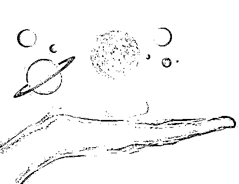

**课程亮点*****1. ***贴合入门级学员的大容量讲义，课程内容包含流年行进技法的运用，实用性强，实践性加循序渐进的课程内容，涵盖占星学、天文学、神话学、超个人心理学内容，并借助文学、音乐等表达性艺术手法，是老师多年个人习得与教学、咨询实践的综合经验传授。***2. ***现场课席＋线上课席同时行课，线上线下均可提问答疑，错过上课时间有录音可供复习。***3. ***学员微信群内交流，相互切磋，共同进步。***4. ***课程案例使用学员星图，帮助学员将占星学融入现实生活，课程结束后学员相当于获得了一次出生星图解析。***5. ***郑玮玲作为若道占星认证的占星老师，所教授占星课程受若道占星认可，学员进修若道高阶课程，无需再通过若道入学及占星能力测评考试。（注：若道认证的教师是 ISAR 认证的职业占星师中担任过若道助教，熟悉若道大占师的授课标准，秉持行业标准的执业道德规范。）**授课老师**

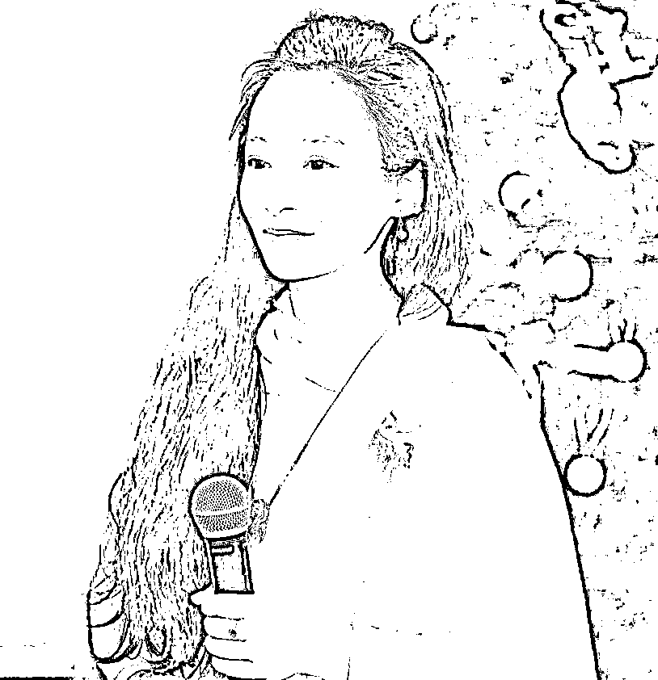

**授课老师：郑玮玲**
**国际占星研究协会认证职业占星师****若道占星认证占星老师****占星舞动创始人 ****占星学背景：**2013 年起持续跟随西方各大知名占星师研习、传承、吸纳了人本主义占星学，原型占星学、进化占星学、占星疗愈、家族动力、医疗占星、中世纪古典占星学、金融占星学、奥义占星学等诸多占星流派，开展占星咨询、教学与写作。2016 年赴美参加国际占星研究协会（ISAR）大会，2018 年获 ISAR 奖学金赴美参加国际占星联合（UAC）大会。将占星学与音乐、舞动结合为表达性艺术治疗及意识探索工具，独立研发并开设了国内唯一的占星与舞动的自我探索体系及课程。2019ISAR 中国大会受邀演讲者，演讲主题为《创造情感表达的艺术——音乐、即兴舞动中的行星原型》。**心理学、哲学与艺术背景：**秉承超个人心理学奠基人斯坦尼斯拉夫·格罗夫的未来心理学，并通过持续参与全息呼吸体验在不断整合中。aura-soma 色彩疗愈注册解读师，师从加州整合学院吴怡教授研修易经，将东西方神秘学体系兼容于生活实修中。

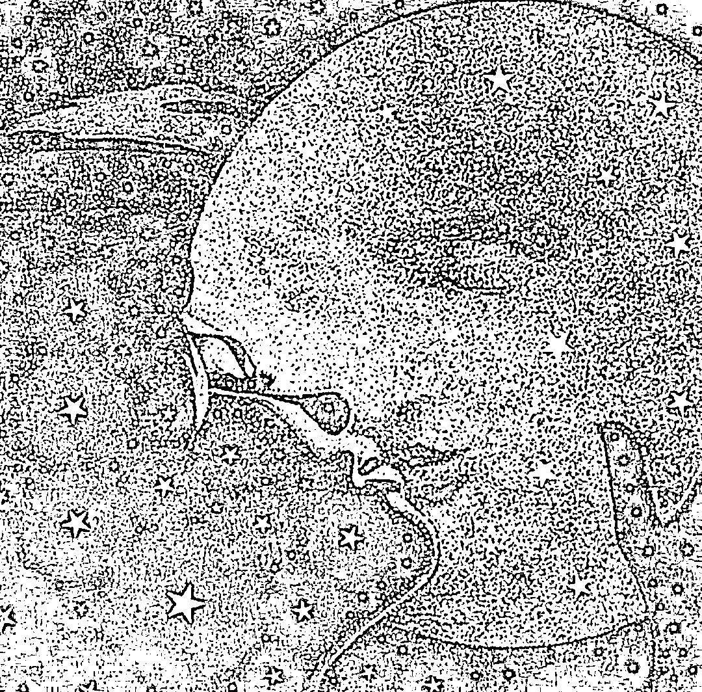

**占星课程福利**、**占星课程福利——月亮周期神圣书写**
此次月亮周期神圣书写从“惊蛰”到“春分”节气，从初春万物苏醒开启我们的灵性旅程，随着初春曼妙的韵律开始深入心灵宇宙的深处，深入生命的根系去了解、实践占星学。在每周占星课程之外我们会持续进行独具特色的“月亮周期神圣书写”，在学习基础占星知识同时运用占星行进基础技法去了解流年，从生活点滴中掌握行星行孔明解读的要领，也可从老师在 28 天中的占星行运解读中学习到老师的心法。这是一条独立内在的自主的直觉与自我觉察、自我疗愈的途径，你会在天地时韵中自然而然完成 28 天的蜕变。

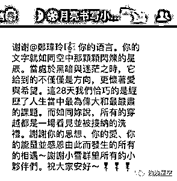


“月亮周期神圣书写”作为单独的线上课程向未学习本课程的朋友开放，欲了解详情请**添加微信**：**Zhengviolin（请备注：若道读者）****报名方式**

课程咨询及报名，联系人郑老师

**微信**：zhengviolin

**长按二维码添加负责人报名及咨询**

**报名备注“****若道读者咨询****”**


# 这门打开占星格局的课程，是时候了解一下了！

> 原文：[`mp.weixin.qq.com/s?__biz=MzA5NjA0NTAxNg==&mid=2651413322&idx=3&sn=70d91948116e439e7a42f3bc5a8c2e8c&chksm=8b4be9fdbc3c60eb00c09da94dc31a4a6401a7109e31eefa62dae44cbb44a7f633c16f05434c&scene=126&sessionid=1692738212#rd`](http://mp.weixin.qq.com/s?__biz=MzA5NjA0NTAxNg==&mid=2651413322&idx=3&sn=70d91948116e439e7a42f3bc5a8c2e8c&chksm=8b4be9fdbc3c60eb00c09da94dc31a4a6401a7109e31eefa62dae44cbb44a7f633c16f05434c&scene=126&sessionid=1692738212#rd)


有这样一则家喻户晓的故事：三个泥瓦匠在砌墙，一个人走过来，问他们在干什么。第一个泥瓦匠没好气地说：你没看见吗？我在辛苦地砌墙呢。第二个笑笑补充回答：我们正在建一座高楼。第三个则笑容灿烂哼着小曲儿说：我们正在为城市添砖加瓦、创造美好的生活。10 年过去了，第一个人仍然在做泥瓦匠，第二个人成为了一名工程师，而第三个人则成为建筑公司的老板。**工作技能本身没有区别，为什么三个人的人生走向却大相径庭？**

*   人的一生是见自己，见众生，见天地的过程。**不同的认知层次，形成了不同的人生格局。**它决定了你能看到的风景。我们常常抱怨命运不公，抱怨生活没有诗和远方，事实上，那是因为我们高度不够，格局太小。

*   同样，占星学习也是见自己，见众生，见天地的过程。**不同的认知层次，形成了不同的占星视野。**它决定了你可以运用这门语言看到怎样的风景。占星师常常困惑占星学习遭遇瓶颈，客户拓展资源不足，帮助来访者扩展格局能力不够。究其原因，是因为我们使用占星学的高度和格局不足。

晚清名臣曾国藩说：**谋大事者首重格局**。人和人不一样，拼的是格局。那又是什么决定着一个当代占星师的格局呢？大格局的本质是：**站得高，看得远，懂取舍**2020 春季开年 ISAR 选修课若道倾力打造不可不学的**经世占星学**一起来解锁全新大格局的占星版图吧！


占星之旅上半场拼的是知识技法占星之旅下半场拼的是眼界格局**为什么学习经世占星学？**

**经世占星学（mundane astrology）是研究世界政治经济发展趋势和世界各国发展周期的占星学研究分支。**

任何有一些人生阅历，对于国家历史、家族历史有所了解的人都会明白，我们的个人生活是时代和国家历史的缩影，我们个人经历的行进、推进是一条小溪，而更大的背景是世界和国家行进、推进的大河。大河的流向决定了小溪的流向。

学习经世占星学，**帮助我们及我们的客户这条小溪在这个世界的大江大河“顺势而为”**。具体而言：

*   在 21 世纪这个信息世纪，经世占星学可以帮助占星师开辟新的服务项目——**为高端企业家客户及大机构提供独特服务**，因为高端客户和大机构对于国际政治经济发展趋势，主要影响力国家、重要世界组织机构的现在和未来都更为敏感。对应国家的行进和推进，更好地预测这个国家或大型组织的未来发展、变化趋势；

*   在人口的国际间流动、交流更为频繁的时代，经世占星学通过了解各国的趋势，**可以在客户有国家选择需求时，帮助占星师为客户提供更多信息服务**。

*   如果你爱历史，经世占星学可以给你**看历史长河中世代兴衰起落的独特视角**；

*   如果你爱关注国际形势，经世占星学都能够让你更**了解每一个国家的国民个性、集体潜意识，社会议题和发展方向**；也能帮助你**对领导人及其国家的影响有更深刻的了解**。

**课程大纲**

**此课程可作为 ISAR 选修课。**

在这 10 节课的时间里，我们将学习**经世占星学的重要研究方向**，包括但不限于：

*   行星周期对于世界发展及格局变化的影响
*   研究国家星图及行星周期对于国家的影响
*   研究外国领导人星图及对其国家的影响
*   如何从政府成立、总统就职时间的星图研究时事发展
*   如何从重要组织机构诞生星图（如北约、欧盟、欧元区、第一个现代证券交易所的诞生星图）看组织未来
*   如何从重大事件发生时的星图（比如从曼德拉出狱日期看南非转折和开端）发现该事件对于国家的影响

**授课老师**


**卡伦·哈梅克**·**佐达格**

**（Karen Hamaker Zondag）**

卡伦·哈梅克·佐达格是**20 世纪最受尊重和赞誉的占星师之一**，她毕业于荷兰阿姆斯特丹大学，于 1975 年开始她的占星实践。她是荷兰**两所学校的创始人之一**：一所是 1980 年成立的阿切纳占星学学校，另一所是 1987 年成立的荣格心理学学院。她也被邀请作为英国著名占星教育机构心理占星中心（Centre for Psychological Astrology）的老师和美国第一所真正的、官方的占星学大学开普勒学院任教，并是**世界各大占星会议最受欢迎的演讲人之一**。由于其**对占星学的独特贡献**，卡伦·哈梅克·佐达格在 1992 年、1995 年、1998 年分别获得占星学界最著名的奖项轩辕十四奖项提名，并于 1998 年获得**轩辕十四奖**。

卡伦·哈梅克·佐达格一个非常鲜明的个人特色是她的**研究涉猎广泛而深入，她在心理占星、金融占星、经世占星方面都是该领域排名前列的老师，并且深受该领域知名占星师的赞誉**。因为其在占星学的知名声誉，她从 2012 年被隶属于荷兰著名投资集团 Rasile 的 Dasym Research （Dasym 是全球电视节目的创新的著名领导者，比如《中国好声音》就是引入 Dasym Media 的版权）聘请为**智库成员**，该智库调研当前世界显性和隐性的社会经济趋势，为发展和投资决策服务。她也是**TEDx 演讲**人。


她是**20 多本占星学、心理学、塔罗、易经书籍的作者**，包括《从占星学视角看金融危机的背景和未来》、《性的占星学和疗愈》、《日常生活中的占星学》、《心灵和占星象征》、《作为生活之道的塔罗牌》、《12 宫》、《宫位的本质和背景》、《相位研究》、《四轴手册》、《卜卦占星》、《关系占星学》、《占星学预测》、《从新的角度看外行星》、《易经、冥想和灵性》、《实践中的荣格心理类型》、《日常生活中的灵性和心理学》、《实践中的投射机制》、《自我的愉悦——愉悦心理学》、《神话和现实》等。她的书籍因为**广受欢迎**，**被翻译为 10 多种文字在多国出版**。


**授课时间&方式**

**授课时间（共 10 次课）**：

*   2020 年 4 月 6 日（周一）

*   2020 年 4 月 14 日（周二）

*   2020 年 4 月 21 日（周二）

*   2020 年 4 月 28 日（周二）

*   2020 年 5 月 5 日（周二）

*   2020 年 5 月 12 日（周二）

*   2020 年 5 月 19 日（周二）

*   2020 年 5 月 26 日（周二）

*   2020 年 6 月 2 日（周二）

*   2020 年 6 月 8 日（周一）

**授课方式**：

**线上网络直播课，英文授课，中文翻译**

**课程价格**

**正价：7500 元**

**早鸟价：6800 元**

**早鸟价截止日期：2020 年 3 月 6 日**

**退转课程**

**退款原则请详看《教学协议》，如有疑问请咨询课程顾问。**

****ISAR 选修·经世占星学****

**授课老师：卡伦·哈梅克**·**佐达格**

**时间：**2020 年 4 月 6 日-6 月 8 日（共 10 次课）

**授课方式：**网络直播课，英文授课，中文翻译

**费用：**7500 元；**早鸟价：6800 元（2020 年 3 月 6 日之前）**

**课程负责人：**王老师（微信：18510107057），请备注“经世占星”

长按二维码添加课程负责人咨询~


****报名请点击“阅读原文”****


# 2 月 19 日线上沙龙 | 6 个提高幸福感的占星建议，你值得拥有

> 原文：[`mp.weixin.qq.com/s?__biz=MzA5NjA0NTAxNg==&mid=2651413322&idx=2&sn=b6b0eb9c079bc72da9ed760be3f44f80&chksm=8b4be9fdbc3c60ebf7ea130909fc84e616a6eab574e09b1f9d1ecfe51c2a17e5da92a2c466f3&scene=126&sessionid=1692738212#rd`](http://mp.weixin.qq.com/s?__biz=MzA5NjA0NTAxNg==&mid=2651413322&idx=2&sn=b6b0eb9c079bc72da9ed760be3f44f80&chksm=8b4be9fdbc3c60ebf7ea130909fc84e616a6eab574e09b1f9d1ecfe51c2a17e5da92a2c466f3&scene=126&sessionid=1692738212#rd)

## 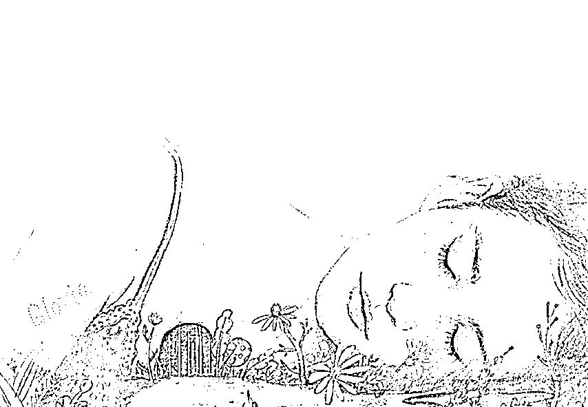

Hi，还好么？在家憋坏了吧~
有没有那么一种感觉：剧也刷腻了，也不想打游戏了想学习的心好像要占领高地了？那问题来了：**若道最近有没有适合****零基础占星爱好者的沙龙或者课程呢？**既然你诚心诚意发问了那么专业贴心的熊鹰老师这就来解决你的课慌


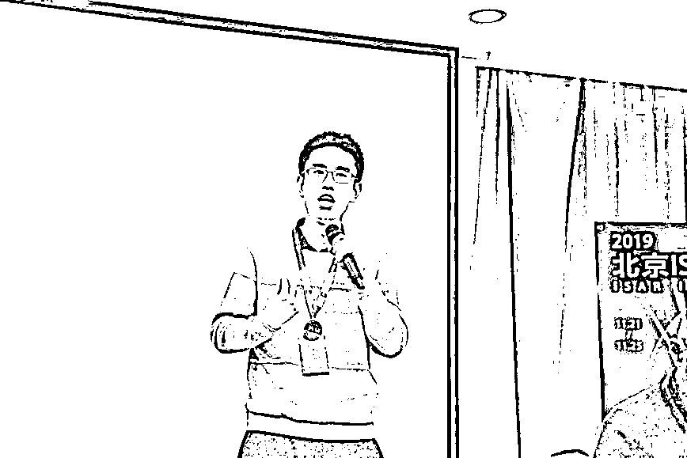

「 **为什么学占星？**

**占星学能如何优化我们的生活？**」

**沙龙会讲些啥**

除了搭讪、谈资，学习占星还可以做什么？

**1**

**幸福法则一****撕掉错误的星座标签**给大家解释一个**神秘的规律**：我们都特别不喜欢自己被人**贴****星座标签**但就喜欢**贴****别人**熊鹰老师会帮你用占星学透过现象看本质反怼技巧大公开，和星座标签说再见从认知的角度正视“标签”，以及它的利与弊

2

**幸福法则二**

**活出你的占星正能量**

大卫·瑞雷老师曾经提到过个人成长的三部曲：

**觉知－接纳－转化**

这也是熊鹰老师秉持的观念

“觉知”

占星学本身就是一个很好的觉知工具

它以相对客观的方式帮助我们省视自己

而在客观与理性下，觉知是最容易升起的

**知道建设性的发挥是什么**

**什么样的修行方式最适合自己**

**（可以通过解读个人星图来发现）**

3

**幸福法则三**

**浅谈近期宇宙天气**

2020 是什么样的一个开年？

联想到电影《流浪地球》这句台词：

“

最初，没有人在意这场灾难
这不过是一场山火，一次旱灾

一个物种的灭绝，一座城市的消失
直到这场灾难和每个人息息相关

——电影《流浪地球》

”

那么近期有哪些值得关注的宇宙天气？

熊鹰老师帮你梳理 2020 年接下来的日子

该如何在大环境下优化小生活

应对严峻挑战

4

**幸福法则四**

**把喜欢的事变成职业**

熊鹰老师会讲述他的占星学习生涯

如果确认了占星是自己喜欢的事

如何坚持到底，做到最好？

5

**幸福法则五**

**和志同道合的伙伴走在路上**

聊一聊熊鹰老师身边的若道毕业学员

成为兼职占星师或全职占星师后

生活是怎样的？

清新美好的自由职业
和理想很近，和现实很远
兴趣和工作到底能不能无缝对接？ 

6

**幸福法则六**

**有人懂你的困惑，走过你在走的路**

熊鹰老师会讲一讲他学习和执教多年

看到的占星学子的常见问题和困惑

还会给你讲一讲系统学习占星该如何入门

掌握了一定占星知识后如何实践？

**介绍 ISAR 国际占星研究协会**

世界上最前沿、最具启发意义的占星组织之一

如何获得 ISAR 认证

等等

**占星能给每个人带来的幸福感还有很多**

**来沙龙听熊鹰老师娓娓道来吧！**

**沙龙详情**

**沙龙时间**：**2020 年 2 月 19 日 星期三  20:00-21:30**

**主讲人**：熊鹰老师

**参课方式**：网络直播

**沙龙价格**：100 元（**想获得免费入场机会？往下看**）

**报名方式**：**务必添加文中客服小姐姐，进行报名**

**报名截止**：2020 年 2 月 18 日 18:00

**人数限制**：200 人

**特别提醒**

**❶ 不接收空降，请提前报名付款确认名额**

**❷ 报名成功后，会在 2 月 19 日下午统一发送参课方式，请耐心等候**

**❸ 由于个人原因无法出席沙龙，不提供开课后退款，敬请谅解**

**「**

**免费入场券**

**FOR FREE！**

**」**

** 转发本文至朋友圈**

**截图发给客服小姐姐获得免费名额**

**截止时间 2020 年 2 月 18 日 18:00**

**（分组无效）**

**长按二维码添加客服**

▼

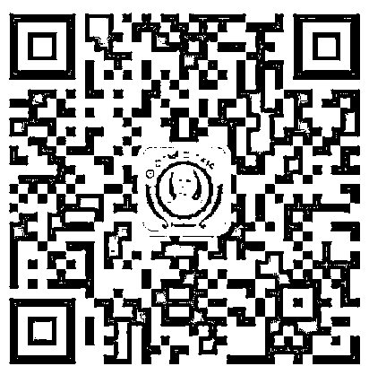

**沙龙主讲简介**


**熊鹰老师（天空的空）**

*   2008 年接触严肃占星学，至此爱不释手。
*   **2013 年师从大卫·瑞雷**，研习整套现代占星学核心课程，并于 2014 年起至今连续三年担任该课程的主助教。
*   期间也**跟随格伦·佩里、诺·泰尔、理查德·塔纳斯、罗伯特·汉德、苏·汤普金斯、斯蒂芬·弗里斯特等多位国际顶尖占星大师进行学习**，进行定向占星主题研究。
*   2015 年初，通过国际占星研究协会**（ISAR）资质认证并获得证书**。同年，进一步跟随大卫·瑞雷老师进修**“生时校正”**技术，通过最终考核并获得证书。
*   目前在若道星文化任职，将传播系统、严谨、真实的占星学作为职业使命。任专职助教期间，进行沙龙与答疑等辅助教学工作已累计超过 200 小时。
*   在业余期间也提供占星咨询与生时校正服务。目前正致力于占星学与个人成长的整合。

# 超详细“处女座使用说明书” | 其实你根本不了解处女座

> 原文：[`mp.weixin.qq.com/s?__biz=MzA5NjA0NTAxNg==&mid=2651413322&idx=1&sn=81fde954a6d86b7a94899aad14ad7f39&chksm=8b4be9fdbc3c60ebc1fd6c3b2ce7aa296beef8242a1391467e458e2217ba8d430843a12420e1&scene=126&sessionid=1692738212#rd`](http://mp.weixin.qq.com/s?__biz=MzA5NjA0NTAxNg==&mid=2651413322&idx=1&sn=81fde954a6d86b7a94899aad14ad7f39&chksm=8b4be9fdbc3c60ebc1fd6c3b2ce7aa296beef8242a1391467e458e2217ba8d430843a12420e1&scene=126&sessionid=1692738212#rd)

****************☆** 后台回复“今日”，给你一句生命态度**************

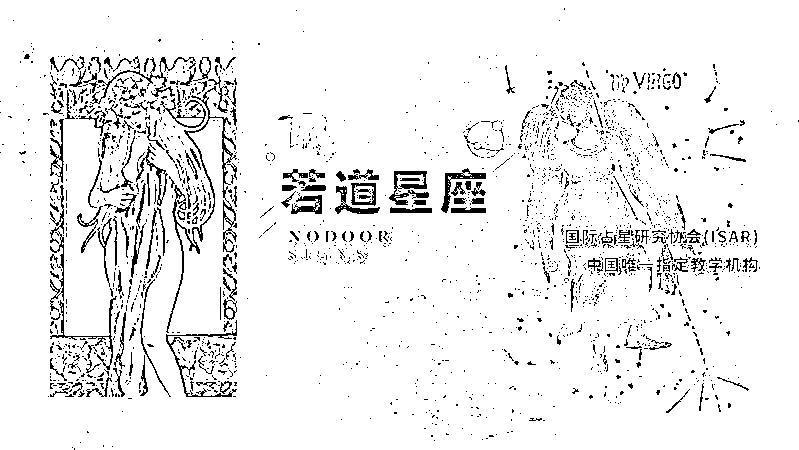

作者/黛博拉·霍尔丁 译者/李含 校对/江艺编辑/Tang 封面/书君 图片/unsplash 网络**一个总是被黑的星座**“

**谁会批评他所看到的一切，甚至分析一个喷嚏？谁会拥抱和喜爱自己的疾病？那就是处女座！**

”

在现代文献中，处女座经常得到非常糟糕的描述。上面的诗句暗示着处女座具有批判性和忧郁症的典型特征，同时伴随着处女座的其他影射: 迂腐、冷淡和尖锐。 

难道这一个星座已经被贴上了这些消极的联想标签么。而事实上，处女座的心智愿景拥有如此罕见的**理解力**和**辨识力**，以至于我们其余的人（缺乏这些处女座的特质）都无法看到处女座更精妙细微的天赋？

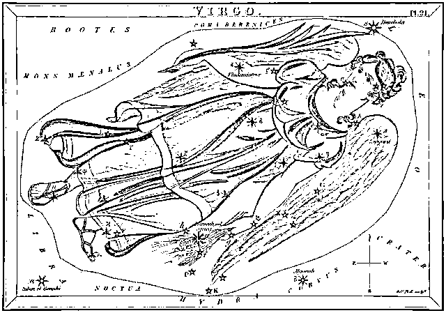

**处女座使用指南**

**典型特征**

处女座是中等身高的星座，但由于它由水星掌管，所以身材苗条挺拔，长相棱角分明。动作轻快，声音平静，提高音调时变得尖锐。**处女座的风格是整洁、谨慎、简约、保守和低调。**头发通常是黑色的，嘴唇很薄，眼睛很锐利，鼻子有点长，前额很高。比如，伊丽莎白一世女王利用了她处女座的智力特点，剃掉了她的发际线，增加了她前额的高度，并在相貌上显示出她的“高智商”。

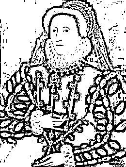

| 伊丽莎白一世女王

在古代和传统的资料中，处女座的优点是它带给人**纯洁、策略、掌握文字、辨别力、学习倾向、调查和分析的天赋、熟练的创造力，以及对自然奥秘的敏锐鉴赏**。处女座也被赠予了**谦虚的品德**（有些人可能认为他们背负着害羞的担子），处女座的人在捍卫自己的事业上犹豫不决。也许在此时，我们其他人应该更多地关注这个星座更全面和绝对令人钦佩的品质。

**处女座冷漠无情？****错！**

**从根本上说，处女座的大部分特征源自土元素的有效创造力和实用性，并受到其守护星水星的智慧和快速移动的刺激。****其元素和守护星都把这个星座描述为“冷和干的”**，就像它在日历上与秋天关联，这时候大自然已经献上了它的果实，开始后退、保存。

作为一种气质体液，**“干”会抑制情绪的接受能力**。因此，许多太阳星座描述都将处女座的冷漠反应和冷静回应的名声视为一种性格缺陷，没有意识到**控制情绪的能力是使这个星座拥有清晰头脑的必要条件**，正是这让处女座与众不同。**清晰的理性只有从情感依恋的矛盾纠葛中解脱出来才能出现。**

然而，尽管处女座以控制自己的热情而闻名，但它既不是冷漠无情的星座，也不是麻木不仁的星座。**它本质上是温柔体贴的，“为他人着想”是处女座的一个显著特点，这在他们有限的期望清单上占据了很重要的位置**。

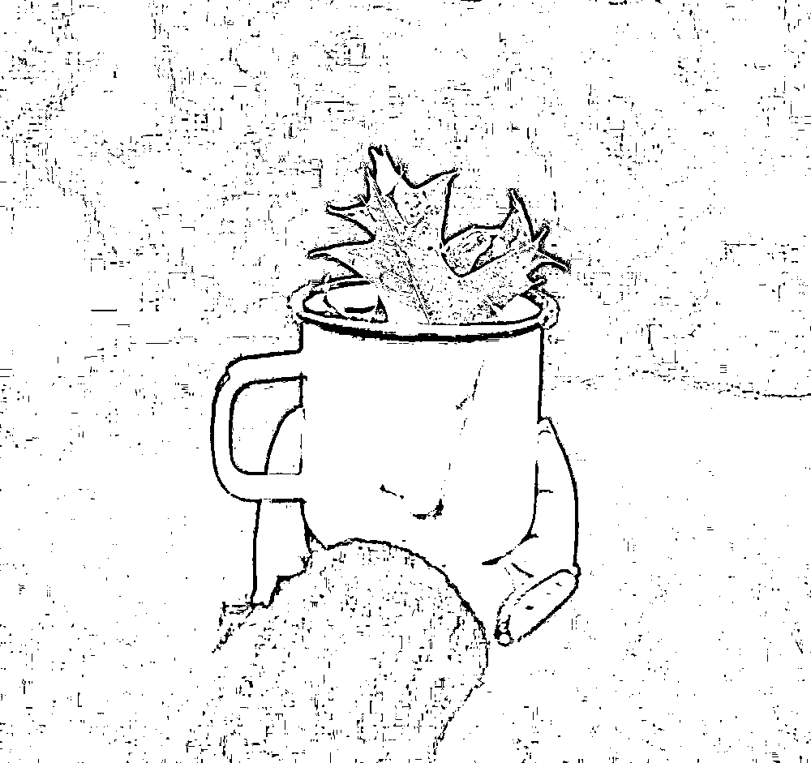

**处女座为什么特别****在意****细节****？**

**认为处女座缺乏直觉认知也是错误的。**水象星座很容易通过心灵印象获取信息，通常会吸收那些理性难以理解的情绪，与此不同的是，**处女座通过强大的直觉反应形成可靠的本能印象，这得益于它们分析复杂性和洞察假象的能力**。其结果是一种快速形成良好判断力并将其应用于实际事务的能力。

**处女座拥有一种简约和谐的意识，在他们的环境中毫不费力地重新安排、组织，并为混乱带来秩序。**从穿过房间收拾杂物的处女座家庭主妇，到善于识别哪里出现沟通症结的商业分析师，处女座的人**擅长整理“小事”**，这些“小事”如果不加理会将积聚成大问题。

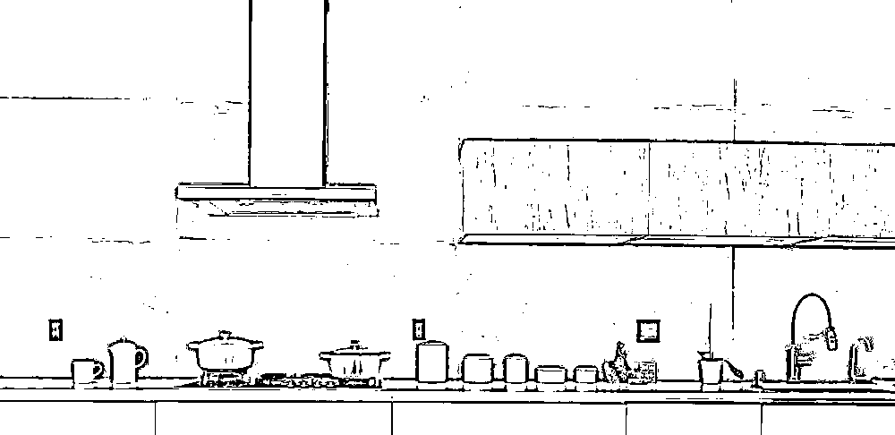

**处女座为什么总是****追求完美****？**

冷作为一种体液，会带来消极和固定不变。与其他土象星座相比，这对处女座来说不是什么大问题，因为活跃的水星会让行动变得轻松，增加了思维灵活性，使得智力反应比同一类别的金牛座和摩羯座更加敏锐。然而，由于具有实用性、勤奋和现实主义的土象星座品质，处女座对于无视应用的抽象理论几乎没有兴趣。出于同样的原因，他们并不倾向于努力达到不切实际的完美程度，这是许多人对处女座的指控。作为一个土象星座，**处女座归根到底还是一个现实主义者，而不是一个理想主义者**。

**如果说处女座的人以完美主义者而闻名，那只不过是因为他们勤勉的特质和持久的努力。**他们往往对宽松的标准感到不满，因为他们本身就倾向于长时间努力工作，所以可以想见他们会敦促其他人也这样做。然而，如果没有能力在理想与可用的时间和资源之间取得平衡，这个星座就不会获得这样一个拥有良好判断力的名声。在这方面，处女座特别有天赋，可以依靠他们在任何具体环境中确定最令人满意的期望，并通过有效地计划和适当地努力来实现这些期望。

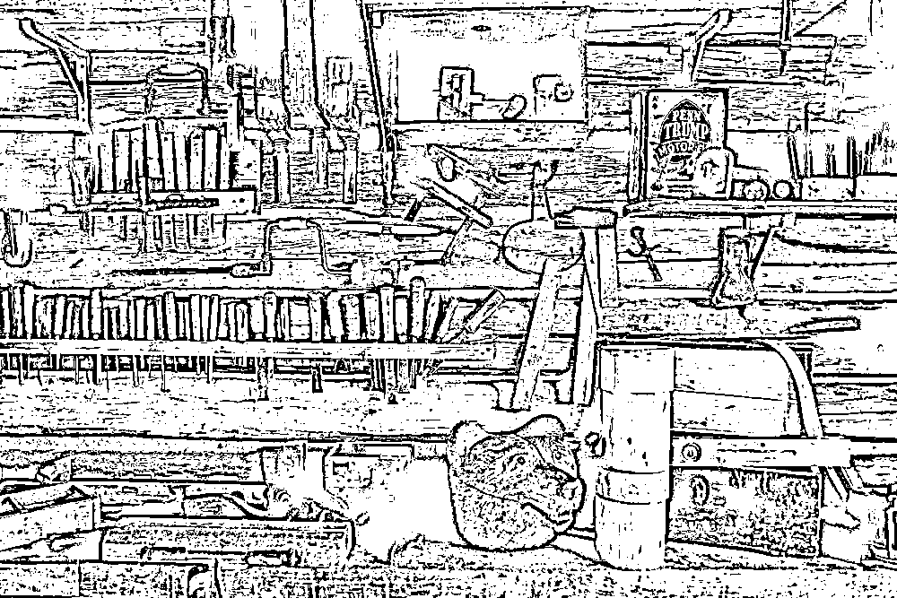

**处女座的****职业观**

凭借**敏锐的洞察力**、**令人羡慕的应用能力**和**灵活变通的表达能力**，这一星座的人可能被认为非常善于运用手腕取得权威职位，并获得丰硕的物质成功。然而，他们很少受到权力或财富积累的驱动，而且在很大程度上，他们完全**满足于为其他雄心勃勃的人提供助力**。

“干”的气质培养了他们的**分析天赋，排斥公众的关注，并不惜一切代价避免成为焦点**，尤其是因为他们意识到自己敏锐的神经反应，这强化了他们计划、准备和实践的本能，而不是依赖于自发的反应。**他们服从责任但不喜欢承担责任**。

他们**性格谦逊，容易低估自己的能力**。他们**过于谨慎**，不愿涉足创业精神所需要的孤注一掷和不顾一切的风险，更遵循惯例，喜欢在已建立的框架内运作，这让他们可以根据预先确定的标准对自己进行评估。处女座经常被视为**理想的“秘书人选”**，他们能够并且确实在管理职位上表现出色，但通常在一个大型企业环境中，这些环境中有既定的程序和更高的权力可以遵从。

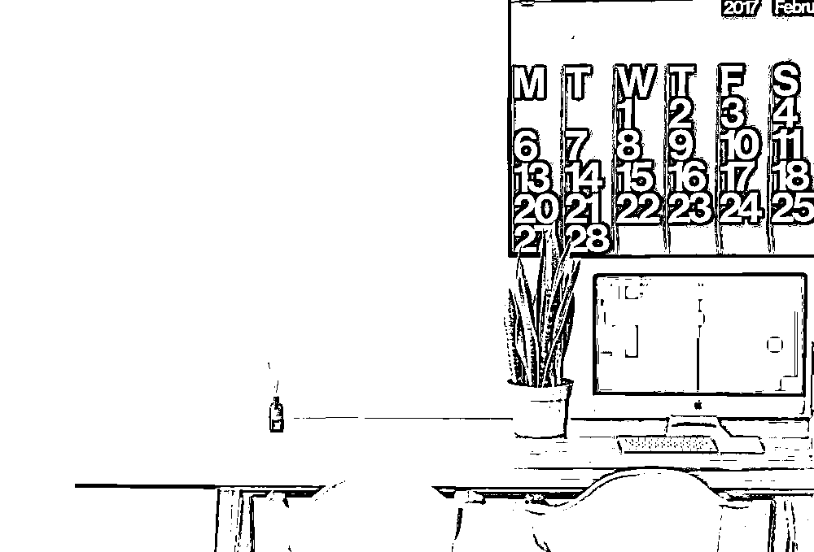

**处女座的人不一定会寻求支持性的职位，但他们会在其中找到满足感，他们可以通过奉献于似乎在社会中扮演重要角色的服务而获得极大的自豪感和自尊心。**对一些人来说，这可能是一个婚姻誓言；对另一些人来说，这可能是为人父母的原则；或者它可能是一个产业、机构、慈善、宗教、政治事业，或研究领域。**许多优秀的处女座人已经凭借自身的能力在为他人服务的过程中取得了成就，他们并不追求名利，而是经常是被自己成就的力量强加于身。**

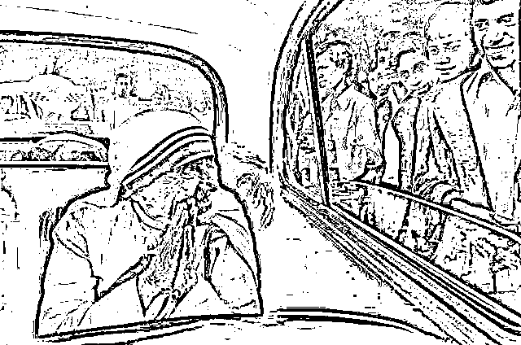

|  特蕾莎修女

著名的例子包括特蕾莎修女，她感受到了上帝的召唤，一生致力于帮助穷人；列夫·托尔斯泰，他是有史以来最伟大的小说家之一，也是和平主义的拥护者，因此他被人们视作为俄罗斯最伟大的道德权威；英国女王伊丽莎白一世，她获得了巨大的个人荣耀，是最高的统治者，但她的力量来自处女座对履行职责和满足国家需要的渴望。

**处女座的****爱情观**

爱情也是如此。我们都知道这个说法：**处女座冷静的热情是不可思议的浪漫理想的结果，以至于很少有恋人能够将这个星座的热情激发到极致。**当然，这不是一个“来者不拒”的星座，而且大多数处女座拥有**天生的辨别力**，让他们对膨胀的自负或在其他地方吸引了大量注意力的浮华形象不以为然。

然而，在适当的条件下，处女座人和黄道十二星座中其他星座的人一样充满激情和毫不掩饰的浪漫。问题在于处女座的人**通常在爱情问题上非常不自在，这挑战了他们日常生活的实用性和责任感**。诱惑可能是强烈而真诚的，也可能牵涉到痛苦的、破碎的心，但是在所有的黄道星座类型中，处女座最不可能因希望与他们的梦中情人实现情感上的满足而放弃一切决定他们生活结构的东西。就像经典浪漫爱情剧《相见恨晚》中的西莉亚·约翰逊一样，**处女座拒绝自我放纵**，因为这与他们良心上承担的责任相冲突。

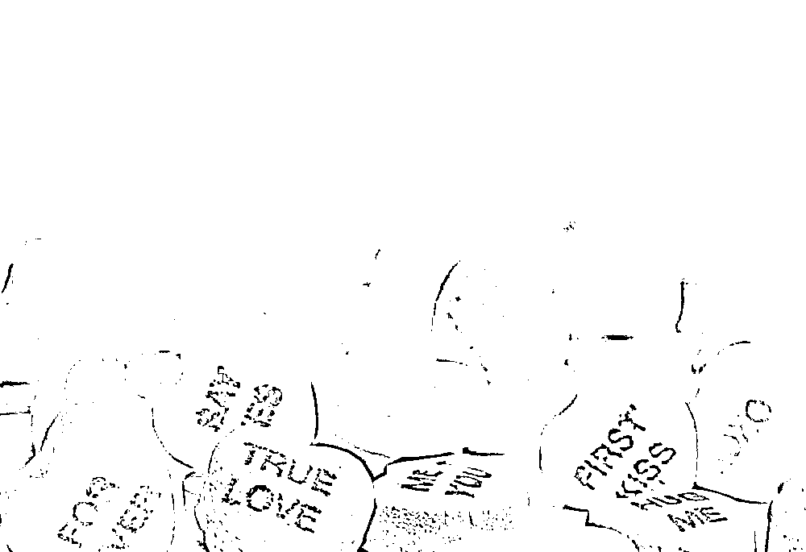

**处女座的人不愿意在别人遭受苦恼的时候得到不合时宜的快乐，所以他们会选择最能满足所有人需求的实际解决方案。**这通常意味着要接受自我约束的负担，而不是承受追求自我中心的利益所带来的痛苦。这又是一种“为他人着想”的特质，它来自于处女座对和谐的渴望和万物相连的理解。

其他星座的人可能会认为，我们只活一次，为了我们自己，我们应该把自己的欲望放在第一位，但处女座不是。**他们认识到自己与周围的一切紧密相连，这是他们赖以支撑的锚点，无论是好是坏，但通常是出于实用性，而不会不顾实用性。**

更浪漫的星座可能会把这看作是失败或者浪费，但是经过更深层次的反思，这可以被视作这个星座真正的美，也是它最强大力量的源泉。处女座的人享有天生的和谐感，如果没有共时性的内在动机，这种感觉很难表达出来。这种认识也使他们**倾向于追求心灵与身体的整合**，特别适合培养对占星学（在对天与地的研究中将创造性智慧与自然周期结合）、草药学、自然疗法和许多形式的替代医学的兴趣。

**为什么处女座钟情****整理&收纳****？**

处女座的人做事和制作的欲望就像他们思考和分析的欲望一样强烈，事实上他们**喜欢所有的工艺品**，在这些工艺品中，他们可以从原材料和巧妙的应用中创造出有用或美观的东西。处女座与大地的产物有着很深的联系，作为丰收的使者，处女座表达了收集和整理劳动果实的原则。

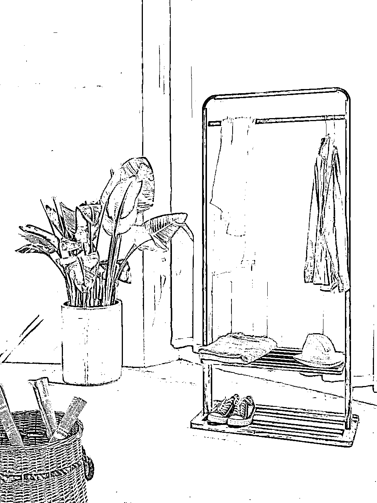

星座源自于记录季节性活动的方式，处女座所象征的是，基于对现有资源的了解，以及对未来不会再有新资源的预期，集中精力盘点资源，并为即将到来的季节做好计划。因此，尽管这个星座充满了创造力，但它的**基本目的是充分利用目前可获得的东西，而不是期望有所增长**。

**处女座是一种保守的能量，保守主义这个词可以应用于处女座自我表达的各个层面。**关注**有条不紊的分类**仅仅其显著面向，传统作者敏锐地观察到这一点，他们将物品和储存地点列为该星座的一个主要意义主题。

**处女座为什么特别****容易焦虑****？**

那么如果处女座是这样一个务实的星座，为什么会获得挑食的名声呢，为什么会因为某种脆弱敏感的特质让人联想到忧郁症患者？答案可以在传统占星学的解剖学关系中找到，**这套理论认为，作为一个土象星座，处女座代表忧郁：一种“存在于”脾脏里的体液**。

忧郁的体液（正如我们从它的冷和干特性中所期望的那样）负责在身体和头脑中凝结和保留任何可能有用的东西；因此，忧郁型的人被认为有良好的记忆力，控制情绪，对学习感兴趣，以及沉默寡言的性格，这使他们倾向于保存自己的想法和经历。古典和中世纪的医学认为脾脏是这种体液的所在，因为脾脏中的血液非常浓缩，以至于看起来浓稠，呈焦油状——这是因为脾脏具有过滤作用，可以使固体血细胞浓缩，使液体血浆通过。

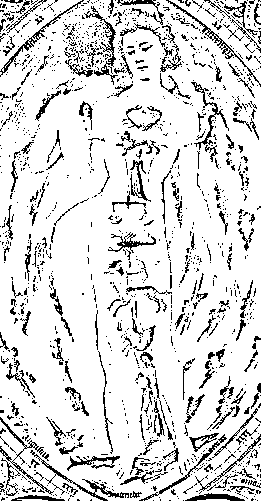

更具体地说，根据星座对身体区域的管辖范围，**处女座掌管着腹部，包括脾脏，以及横隔膜和横隔膜下的软组织，被称为季肋部**（这个术语来自希腊语 hupokhondros，意思是“软骨下”）。然后，巨蟹座是胃部的主要掌管者（尽管处女座在这里仍保留着一些重要的地位），而处女座主要掌管胃以下器官：**腹部、肠道和小肠**。季肋部被认为是一个**特别敏感的情感领域**，因为它支持肺部（黏液质体液所在），在它的下面一侧是脾脏，另一侧是肝脏（血液体液所在）和胆囊（胆汁体液所在）。

加上忧郁倾向导向消化迟缓，导致便秘等问题，**处女座明显容易有非常敏感的消化系统和强大的本能直觉和情绪**。现代对忧郁症的解释晦涩模糊，好像是难以确认和定义的疾病，应用于处女座，我们应该将其视为神经焦虑，情绪紧张和以腹部为中心的疾病，而不是毫无根据地将其判定为可能会毫无理由地患病。出于同样的原因，因为神经系统的过度刺激导向胃部，处女座强烈影响太阳神经丛区域也会引发模糊不清的症状，但这也是处女座人利用天生“知悉”感的一种方式；然后通过他们的理性分析过滤这种直觉知识，从而影响判断，处女座正是以其可靠的判断而著称。

**版权声明：**本文由若道翻译，欢迎转发，反对抄袭。友号转载请申请白名单。


**你可能还想知道**

[10 大行星落处女座](https://mp.weixin.qq.com/s?__biz=MzA5NjA0NTAxNg==&mid=2651409494&idx=1&sn=d2f7d831723d6f39d17f42ef39776048&chksm=8b4bfee1bc3c77f715f93a00db395d75c766be1af66bf7453992f79b21e5de9685df50f4cdbd&mpshare=1&scene=21&srcid=0210ks8VZUiPjQQqyrz7REvB&sharer_sharetime=1581307258437&sharer_shareid=79ff492e946a049c0745c8e806eec753&exportkey=AdAHpiOzwpMd0rZGBEfLX5w=&pass_ticket=TdOdJgvghUOiP9OikS/KyxFaB1e3uhs9X1NqfGk2iuY=#wechat_redirect)

[处女座在 12 个宫头](https://mp.weixin.qq.com/s?__biz=MzA5NjA0NTAxNg==&mid=2651400985&idx=1&sn=fe18329c8294d28c7a0313e019d1d7d1&chksm=8b4b99aebc3c10b87ffcb7ab59d3cec3c9217f7717ec5db75adb5b68491743d6436c18fa2797&mpshare=1&scene=21&srcid=021027opWkbfxjcC0VjMDkwB&sharer_sharetime=1581307294149&sharer_shareid=79ff492e946a049c0745c8e806eec753&exportkey=AY57vvJ76cv%201m0rZzd%20M2w=&pass_ticket=TdOdJgvghUOiP9OikS/KyxFaB1e3uhs9X1NqfGk2iuY=#wechat_redirect)

[这个星座在身边时有点讨厌，不在时简直是灾难](https://mp.weixin.qq.com/s?__biz=MzA5NjA0NTAxNg==&mid=2651412875&idx=1&sn=f895988b5c7ef86f5ff03dfdf8a56976&chksm=8b4beb3cbc3c622a8abb6068f3aac592b4db1111f33cca607c9154f318dad8ec586d11d4ec8b&mpshare=1&scene=21&srcid=0210o6urJD3EcjLsi4hQb6ZY&sharer_sharetime=1581307345129&sharer_shareid=79ff492e946a049c0745c8e806eec753&exportkey=Ac7u4Fh4jLGkhPOiL18LALY=&pass_ticket=TdOdJgvghUOiP9OikS/KyxFaB1e3uhs9X1NqfGk2iuY=#wechat_redirect)

黛博拉·霍尔丁

研究员，占星师，从业超过 25 年。曾是《传统占星师》（The Traditional Astrologer）杂志的编辑，著有《宫位：天空中的神庙（The Houses: Temples of the Sky）》一书。

********点击图片查看若道君推荐********


**微信又双叒叕改版啦，不想错过若道君的推送？**

**就把若道设为星标吧！**

**▼**


就是这个“在看”，戳戳戳 ☟

********报名直达入口********


# 雷蒙德·梅里曼年度金融预报讲座，特殊时期，为你的财富保驾护航

> 原文：[`mp.weixin.qq.com/s?__biz=MzA5NjA0NTAxNg==&mid=2651413307&idx=1&sn=0c57f63779d302432c0c98acc22087d2&chksm=8b4be98cbc3c609af9da1e14b94337deabc2d28117de05ba4bfd25e580f78402d70d09ed6b86&scene=126&sessionid=1692738212#rd`](http://mp.weixin.qq.com/s?__biz=MzA5NjA0NTAxNg==&mid=2651413307&idx=1&sn=0c57f63779d302432c0c98acc22087d2&chksm=8b4be98cbc3c609af9da1e14b94337deabc2d28117de05ba4bfd25e580f78402d70d09ed6b86&scene=126&sessionid=1692738212#rd)


**2020 年金融预报讲座**2020 年新型冠状病毒的突然袭击让武汉和湖北成为“战场”，也在今年第一季度的前 2 个月几乎给全中国按下了暂停键。在疫情中，很多公司的经营都受到极大的影响，疫情的不确定性又让未来变得无法预测。**企业、收入、就业**的问题，将很快变成更为危机性的问题，而这个问题会影响到很多人。这时，你需要一个**冷静而睿智**的声音。

1976 年以来，由雷蒙德·A·梅里曼撰写的梅里曼市场时机学院每年一次的年度预报沙龙和每年一本的《年度预报》一直在应用占星学原理为投资者们服务，提供卓越洞见，从未间断。

去年，3 小时的年度预报讲座和长达 200 页左右对金融市场的分析报告帮助许多若道的读者做出正确的投资决策，降低投资风险，并获得相当不菲的投资收益。

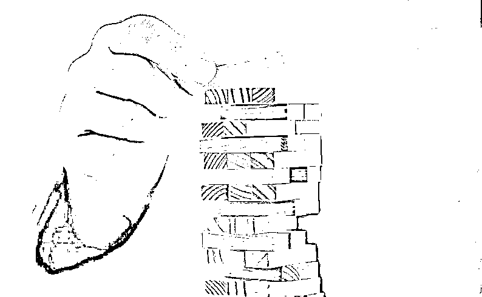

比如，在 2018 年 12 月底所做的 2019 年预报的讲座中，梅里曼老师指出：

*   整个世界在**2018-2020**处于一个大重启之中，木星、土星和冥王星组成的星群将从摩羯座末度行进到水瓶座 0°。这象征着**人类的巨大转变**； 

*   我们会为 2019 年经济和金融市场的繁荣而沾沾自喜，这是一种**“非理性繁荣”**的状态，然后接下来当我们可能没有看到我们已经站在悬崖边，当我们终于感受到土星和冥王星在摩羯座带来的严峻现实之后，对有些人来说可能为时已晚。 

*   2019 年美国领导人与世界其他国家之间可能发生重大冲突，加剧紧张局势，其中一个冲突与**贸易问题**相关。 

*   **上证指数**在 2019 年木星在射手座行进期间可能出现**强势反弹**，该指数将挑战或突破 3100（2018 年报告发布时上证指数为 2500 左右，2019 年最高点为 3288）。 

*   如果**黄金价格**一旦收盘在 1350-1377.5 价位之上，会直线上升测试 1500+/-50（2018 年报告发布时黄金价格为 1229 左右，2019 年最高点为 1566）；只要白银保持在 13.62 以上，如果白银收盘在 18 以上，就有机会向 26.16+/-1.48 爆发（2019 年报告发布时白银价格 15 元左右，最高价格为 19.75）。 

*   **天王星**在未来 7 年内完全进入金牛座的日子，预示着**转基因食品的新发现、肉类价格的上涨以及货币估值甚至交易形式的重大变化。**

**本周六上午 10 点（2 月 15 日）**，梅里曼老师将会照样带来一场精彩的讲座，会谈及**2020 年重要的宇宙天象及其对世界经济、贸易形势的整体影响，疫情对中国的影响，还将覆盖中国上证股票市场的分析、黄金白银市场、比特币市场等投资市场。**土冥合相，严重的危机已经到来，然而每个危机都蕴含着机遇，给那些准备好的人。

如何安然度过这场危机，如何明智地投资让自己安然度过这个充满挑战的一年，北京时间 2020 年 2 月 15 日早上 10 点，让梅里曼老师为你的一年投资指引方向。

**报告价格和讲座时间**

**报告和讲座价格**

2020 年金融预报沙龙和报告价格整体售价** 1280 元**

（沙龙和报告不单独出售）

**沙龙时间**

**2020 年 2 月 15 日  10:00-13:00**

**讲座形式**

**英文讲座，配有中文翻译**

**长按下图二维码购买**


**购买者重要须知****①** 梅里曼市场时机学院每年一次的年度预报沙龙和《年度金融预报》是梅里曼市场时机学院的研究“预报”，而不是市场“预测”，是梅里曼老师及其金融占星分析师对人类活动周期历史与行星周期之间相关性的研究，二者在大部分情况下具有 80%或更高的相关性，而不是因果关系。沙龙中和报告中的研究完全存在错误的可能性。即便是非常认真的研究和几十年的研究经验，我们无法总是正确地解读出各种征象在实际层面上会如何相互作用，并显化为事件结果。所以请将此沙龙和报告看作一个研究参考，务必结合其他市场研究和你个人对市场的理解，根据你的自由意志做决策。**② **此套餐一旦售出，即**不接受退款**。**③** 讲座提供视频回放。以上须知，请仔细阅读。一旦付款，即视为已了解并接受所有须知内容。**如果你想观看 2019 年讲座（注意，是去年讲座）****不分组转本文到朋友圈截图给客服，可在若道 APP 内免费观看。****APP 下载地址长按下方二维码**

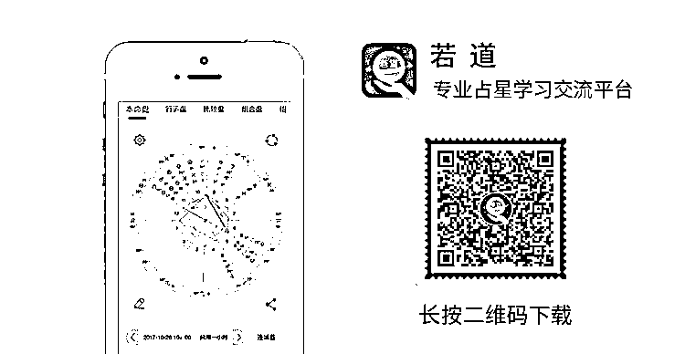

**长按下图二维码添加客服**

**（请一定要添加客服微信哦）**

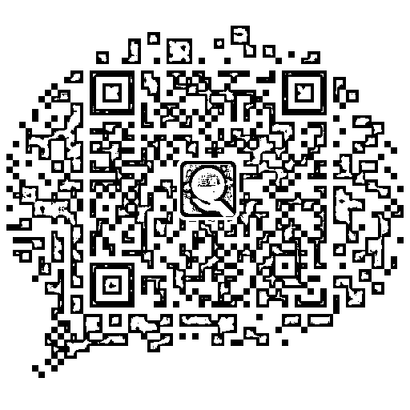


****购买报告请点击“阅读原文”****


# 雷蒙德·梅里曼金融占星周运 | 16 日或为反转的开端

> 原文：[`mp.weixin.qq.com/s?__biz=MzA5NjA0NTAxNg==&mid=2651413307&idx=2&sn=f9b486f5c5758988526314f970966343&chksm=8b4be98cbc3c609a48b81875af70f5cc955ac01388fe467d2e1aa8c9f895ac920e0ed5af42fb&scene=126&sessionid=1692738212#rd`](http://mp.weixin.qq.com/s?__biz=MzA5NjA0NTAxNg==&mid=2651413307&idx=2&sn=f9b486f5c5758988526314f970966343&chksm=8b4be98cbc3c609a48b81875af70f5cc955ac01388fe467d2e1aa8c9f895ac920e0ed5af42fb&scene=126&sessionid=1692738212#rd)

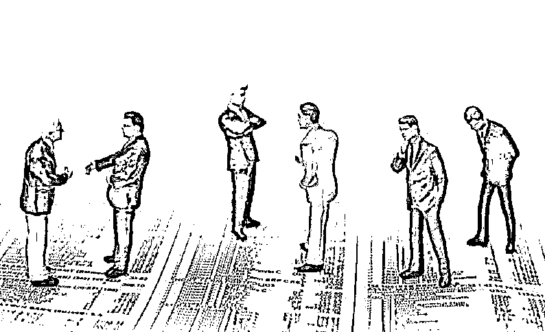

作者/雷蒙德·梅里曼
翻译/Luke 校对/李含编辑/玫瑰 图片/全景网

雷蒙德·梅里曼是在金融占星学界稳坐第一把交椅的占星师，同时他也是若道签约的金融占星课老师，我们引进了雷蒙德·梅里曼老师的《上证指数月度报告》《黄金周期月度报告》《2020 年金融预报》（感兴趣的同学可以扫码文末图片购买）。我们经老师的授权，将每周刊登梅里曼老师的周运，供大家参考和学习。于是，这是本周的周运（2.10-2.14）。

**展望与回顾**

**由于对新型冠状病毒会影响中国经济的担忧胜过了美国公布的强于预期的就业数据，股票市场于星期五下跌。在投资者仔细研读美国最新的就业报告的同时，冠状病毒的确诊案例和死亡人数激增。道琼斯问卷调查的经济学家预计新增就业岗位 158000 个。美国经济一月份实际增加了 225000 个就业岗位。工资年度同比增长 3.1%，也超过了预期。  **

**——弗雷德·因伯特**

**《道指下跌超过 250 点》**

**www.cnbc.com**

**2020 年 2 月 7 日**

** “都是胡扯，是地狱。”特朗普说：“是邪恶、腐败、黑警、泄密者和说谎者。”****——《这是地狱：特朗普庆祝弹劾无罪，****把民主党和罗姆尼撕成碎片》****克里斯蒂娜·威尔基****www.cnbc.com****2020 年 2 月 7 日**罗纳德·里根本人比他的政策更受欢迎。当他的改革重新提振经济时，他可以举办鼓舞人心的竞选活动，宣称美国又迎来春天。这部分原因是因为里根本人是个能够鼓舞人心的人。相比之下，特朗普本人远没有他的政策受欢迎。对特朗普来说举办鼓舞人心的竞选就难多了，因为说得好听一点，他不是一个能够鼓舞人心的人。尽管经历了悲喜交加的一周，美国经济依然强劲。这种致命的新型冠状病毒威胁持续升级，预计威胁将会扩大，对整个世界的经济造成负面影响。上周对美国民主党来说真是一场悲剧，不仅搞砸了民主党总统候选人的第一次党内选举，也在弹劾特朗普总统的活动中失败。在近乎完美的党派投票中，每个共和党参议员都投票选择不传唤弹劾案的证人，并宣布弹劾总统的两个条款不成立，每一位民主党人都投票传唤证人和定罪。在这个悲剧性的党派投票中只有一个例外：共和党人米特罗姆尼在一项弹劾条款中投票给总统定罪。因为他按着良心投票，遭到了党内和保守派媒体的诽谤。在这个摩羯座土星合冥王星的时代，这给每个人都上了一课：**如果你坚持原则，不对社团（或政党）表忠并要求他们的接纳，就会冒着被驱逐、回避和谴责的风险**。这就是为什么我们在 2020 年预报中说摩羯座土星合冥王星的表现之一是**英雄与恶人、个人道德和腐败之间的斗争**。讽刺的是，今天美国两党之间毫不团结，相互指责对方腐败。但至少有一点，特朗普总统看起来是对的。民主党人确实看起来像“恶警”。我也说不好他们更像“恶警”，还是滑稽无能的“基斯通警察”，想要将“鼻子超大的匹诺曹”绳之以法。这是既滑稽又悲剧的一幕。不过，总体来看对全球许多股票市场来说，这是不错的一周。在上周五下跌 600 点后，道琼斯指数截止周四持续反弹超过 1000 点。随后在 2 月 7 日星期五的日内交易下跌 300 点，尽管当天非农就业报告数字极好。这是新型冠状病毒的“黑天鹅”在恐吓市场吗？还是股市喘口气的时候到了，将要开始中期周期的调整？这是我们将在周日的年度网络研讨会上讨论的内容。其他市场中，比特币继续向 10000 点上涨，因为人们相信“比特币减半”的事件将发生在 2020 年 5 月。这意味着随着时间过去，出产的比特币越来越少，由于供应有限而变得越来越稀少。如果需求不变，供应减少，这就意味着价格走高。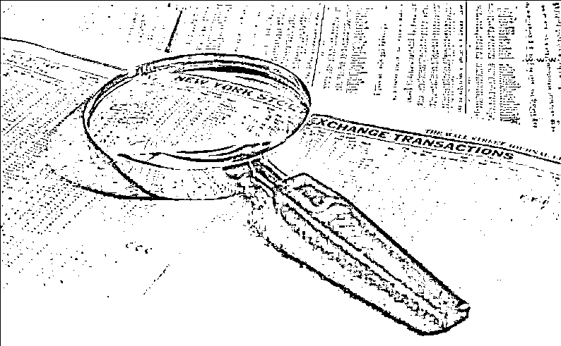**短期占星趋势和长期考量**由于周末将举办年度网络研讨会（编者注：是 2020 年年度金融预报的讲座，有兴趣的读者可以戳这里了解：[《2020 年金融预报》火热发售](http://mp.weixin.qq.com/s?__biz=MzA5NjA0NTAxNg==&mid=2651412793&idx=2&sn=60b1fe13a31db445e9afb2a1c55bdfa1&chksm=8b4beb8ebc3c62988492684d07cb723b69297c915cd90f43a13f9d9ca6af3d339416f66478b9&scene=21#wechat_redirect) ），加之当前除了行进火星与纽约证交所星图形成有利相位外，没什么重要的天象，可报告的东西不多。下周从**2 月 16 日**星期日开始，会有几个重要的天象，包括**火星进入摩羯座**，以及**水星在双鱼座开始为期三周的逆行**。基斯通警察大战鼻子超大的匹诺曹的剧情还会继续上演，可能直到 2020 大选为止，如果特朗普成功连任（甚至哪怕他没连任），可能还会继续下去。只要冥王星还在摩羯座，调查就不会停止。不过，作为交易者，在**2 月 16 日至 3 月 9 日**期间，我们会有许多事情可做，因为这段时间里将展开 8 个与市场反转有关的天象，包括**白羊座金星与摩羯座星群的木星、土星和冥王星形成四分相。**我期待周末时与你们交流！这将是令人兴奋的。**版权声明：**本文由若道翻译发布，欢迎转发，反对抄袭。友号转载请申请白名单。


**雷蒙德·梅里曼（Raymond Merriman）**

若道签约老师。著名金融占星师，ISAR（国际占星研究协会）前主席，梅里曼市场分析公司的总裁。他由于“提升了占星学的职业形象”，在 1995 年国际占星大会上被授予轩辕十四奖；在 2012 年国际占星大会上，被授予轩辕十四终身成就奖。

1“中国上证指数月度报告”发售

**若道推出了****中文版****的雷蒙德·梅里曼中国上证指数月度报告，并持续发行该报告！**

当把金融市场的周期和占星学的周期相结合时，雷蒙德·梅里曼老师的金融占星学研究**为投资者应对金融市场的周期波动，并随之调整投资策略提供了极大的价值参考**。

2“黄金价格周期月度报告”发售

**若道推出****中文版****的雷蒙德·梅里曼黄金价格周期月度报告！**不仅仅为广大读者在中国股市的投资出谋划策，更将视角放眼黄金市场。

**每当世界经济形式不明朗的时候，有一个地方是保值的港湾，那就是****黄金**。从 2018 年 8 月开始，黄金已经用自己的升值再次提醒众人它在经济不稳定时的位置。**截至目前，2019 年 8 月底，黄金已飙升至 6 年新高，高于 1565 美元。**

自 1982 年雷蒙德·梅里曼出版第一本研究《地球宇宙学征象与黄金价格的关联》的著作以来，**他一直作为最重要的黄金市场时机预测者之一享誉国际**。

过去 1 年，那些订阅并遵循建议的梅里曼市场时机学院日报和周报的订阅者，如果从 2018 年 8 月 16 日的低点或 8 月 23-24 日的次低点购买黄金，他们已经赚到了不少的 30%左右的利润。

**购买套餐**，买得越多越优惠

中国上证指数月度报告套餐价

*   **单月报告**：280 元

*   **3 个月套餐**：780 元（260 元/月）

*   **12 个月套餐价**：1999 元（166 元/月）

**长按下图识别二维码**

**购买金融报告****套餐**

**▼**


黄金周期月度报告超级优惠折扣

*   **同时购买上证指数 12 个月套餐**和**黄金周期报告 12 个月套餐**，即可享受黄金周期报告 12 个月套餐**立减 1199**元的**超级优惠折扣**。

*   **已经购买**了**上证指数 12 个月套餐**的朋友，**再购买**黄金周期报告 12 个月套餐，也可享受**立减 1199**元的**超级优惠折扣**。**购买黄金周期报告 12 个月套餐时，超级优惠折扣会自动生效**。

**长按下图识别二维码购买黄金报告套餐**

▼


32020 年金融预报 1976 年以来，由雷蒙德·梅里曼撰写的梅里曼市场时机学院每年一次的年度预报沙龙和每年一本的《年度预报》一直在应用占星学原理为投资者们服务，43 年来，这本 200 页左右对金融市场的分析报告和 3 小时的年度预报讲座在美国、日本、欧洲帮助许多投资者了解宇宙天气对于世界经济形势、政府政策及其对各个金融市场和金融产品的影响，帮助他们做出正确的投资决策，降低投资风险。2018 年，若道第一次将这份广受赞誉的一年一度的金融占星报告和沙龙引入中国，供中国投资者参考。**《2020 年金融预报》将会谈及 2020 年重要的宇宙天象及其对世界经济、贸易形势的整体影响，还将覆盖中国上证股票市场的分析、黄金白银市场、美国经济、美国总统、美联储、美国国债市场、美国股票市场、主要外汇货币市场（主要外汇美元、英镑、欧元、日元、瑞士法郎）、原油市场、谷物市场、活牛市场、比特币市场等投资市场。**梅里曼老师及梅里曼市场时机学院的金融占星分析师还会给出以上市场 2020 年的**市场价格目标区间及重要价格反转日**，为短期、中期和长期投资者进行市场操作的时机提供参考。如果你关注世界经济和金融投资市场的变化，会发现梅里曼《金融年度预报》中的研究对于你了解世界经济在发生什么，这些市场的走向会如何有非同寻常的指导价值。报告和讲座价格

2020 年金融预报讲座和报告价格整体售价** 1280 元**

（本讲座和报告不单独出售）

**长按下图识别二维码购买 2020 年金融预报**

▼

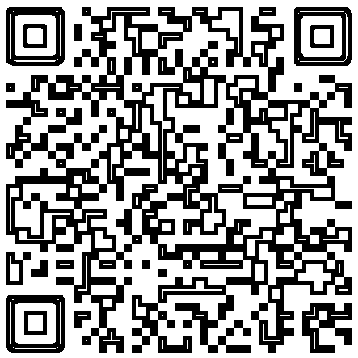

**微信又双叒叕改版啦，不想错过若道君的推送？**

**就把若道设为星标吧！**

**▼**


********点击阅读原文购买金融报告********


# 这篇超精彩的占星分析，你不仅该点开，还要收藏反复阅读！

> 原文：[`mp.weixin.qq.com/s?__biz=MzA5NjA0NTAxNg==&mid=2651413285&idx=1&sn=fef02b12558e526bec6687d132b66cdf&chksm=8b4be992bc3c608408abd7540a32f7f8c23d9fca132137286e2612102e7c19c96cc7a5f6a991&scene=126&sessionid=1692738212#rd`](http://mp.weixin.qq.com/s?__biz=MzA5NjA0NTAxNg==&mid=2651413285&idx=1&sn=fef02b12558e526bec6687d132b66cdf&chksm=8b4be992bc3c608408abd7540a32f7f8c23d9fca132137286e2612102e7c19c96cc7a5f6a991&scene=126&sessionid=1692738212#rd)

******************************☆ **************后台****************************回复“今日”，给你一句生命态度****************

作者/格伦·佩里 翻译/三三 校对/Jun
编辑/Tang 封面/书君 图片/网络

**作者的话**

在这篇文章中，我们将探索二十世纪中期法国负有盛名的小说家、剧作家、哲学家**阿尔贝·加缪的生活与出生星图**，他也是 1957 年诺贝尔文学奖的获得者。我们的目的是展示加缪的主要关注点，也就是在**他作品里反复出现的主题、斗争与信念，是如何通过他的关键行星配置展现出他内心冲突的**。首先，我们**将行星视为心理状态来考察**。鉴于**每个行星都象征着一系列的心理状态**，而行星之间的**相位表现了形成与持续一种特殊状态的核心理念**。我们主要的例子是**加缪的土星、太阳与木星形成的“上帝之指”格局**，这种配置贯穿加缪最著名的思想：**他对荒诞的洞见**。**注：本文很长，分为上下两篇，全文干货满满，宜收藏，反复阅读。****行星作为心理状态****每一个星座-行星系统都有一个目标状态，或者说是一种首选感觉，与之相背离的是一个变化的参考信号。当事件对目标状态造成干扰时，由此产生的负面情绪表明当事人需要采取矫正行为。**

> 例如，一场侮辱会被太阳狮子座的系统视为“自尊心受挫”。这反过来又激起一系列行为，这些精心计算的行为是为了恢复自尊所期望的太阳状态。一个人可能会通过反击来捍卫自己的荣耀，或者恭敬地面对冒犯者，或者干脆躲开那个人。

**行星不仅象征着特殊事件诱发的一系列反应，还代表一种持续的心理状态。**心理状态比瞬间起伏的感受（反应）更稳定；它可能是长期的，无论好坏。心理状态的特征反映在反复出现的情绪、态度、内在语言、面部表情、姿势、声调以及个人的言行模式上。换句话说，**心理状态本质上反映在一个人各方面的内在生活和可观察到的行为上。**

**心理状态是大多数人所共有的必需情感**，包括焦虑、愤怒、内疚、悲伤、羞耻、性兴奋、惊讶和快乐。然而，**心理状态比其情绪成分更复杂，它还包含一种潜在的动机、相关的信念和自我对话(内部言语)**，所有这些都可以用“**态度**”这个词来概括。态度是一种稳定的思考、感受和行动方式，它与特定的话题有关，如政治、战争或宗教。例如，一个人可能憎恶政客，崇尚战争，或者怀疑宗教。**一个人的主导态度，或多或少是状态的同义词，是人格结构的表现，并且反应在出生星图的行星配置中。**

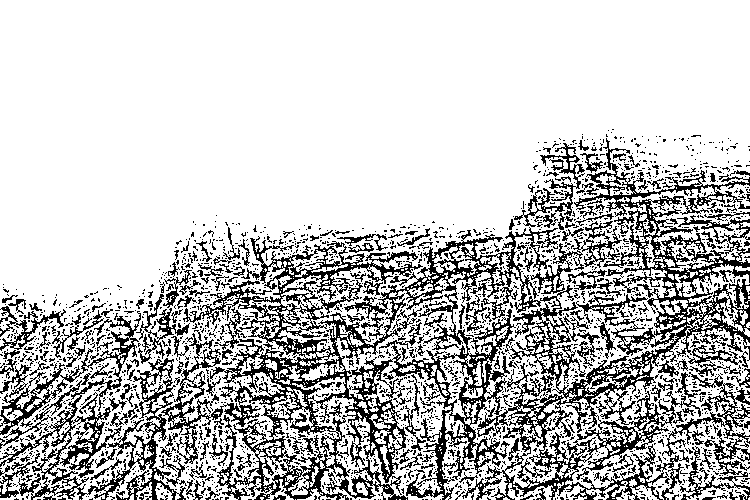

**土星，一种持久的状态****在占星心理学中，每个星座-行星系统都与一系列的状态相关。**记住，**状态是以反复出现的信念、情绪、内部对话和行为模式为特征的。其中，信念是首要，其他一切以它为基础而产生。****无论土星在星图的什么位置，我们都有一种达到高标准严要求的动力，也可以称之为尽善尽美——摩羯座的核心动机。**由此衍生出结构、秩序以及成功的摩羯座附属需求。根据土星的相位，以及它的整合程度，案主会有些相信自己有能力满足摩羯座的需求，而这样一种信念会产生相应的土星状态。

> 如果一位记者的土星落在第三宫，并受到困难相位的压力，他则会因为相信自己的写作技巧差劲而遭遇创作瓶颈。这反过来也会产生一种持续消极的抑郁情绪和自我对话，“我没有达到（合格）记者的标准”。这位记者会认为自己缺乏必要的能力，导致在做导致必须的工作时拖延。注意，他的沮丧情绪、消极的自我对话，以及随后的拖延行为都来自于这个根本信念。

**土星的完美主义可以表现为从自杀式抑郁到极度成功的一系列状态。**

*   从积极到消极，土**星的一系列状态包括**：成功的、有组织的、专注的、有抱负的、坚定的、严肃的、沉重的、有压力的、焦虑的、自卑的、渴望的、不充分的、悲观的、失败的、忧郁的、孤独的、内疚的、绝望的。

**因为完美代表了一种永远无法达到的纯粹，如果走极端，就会导致永久的负罪感**。然而，有土星的与海王星两种类型的负罪感。**土星式**的不同后果是由于一个人认为自己不能履行职责或尽义务，简而言之就是认为自己不足以胜任手头的任务。由此带来的土星式情绪是阴郁的、悲观的以及绝望的。

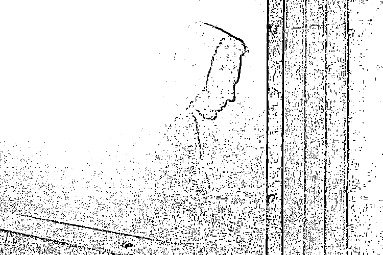

**当土星遇上太阳**

**消极的土星态度通常是由一种恐惧（信念）产生的，即一个人永远不会足够好。**我们会问，什么方面足够好呢？恰好土星涉及的任何领域。为了确定细节，我们不得不着眼于土星的星座、宫位与相位。**如果它与太阳有相位，那么个人同一性将会与土星有着密切的关系。因此土星的状态将会强烈影响一个人的意向性、自我表达、娱乐、创造力、表演。**浪漫和自尊的能力，而这些是太阳的主要功能。

当然，太阳也有着它自己的（狮子座）的需求要完成，包括认可、赞同与自尊。**只要太阳处于功能正常的程度，由此带来的状态就时积极的；如果太阳功能失调，随之的状态便是消极的。**

*   就像其他行星一样，**太阳的状态也是一系列的**：自豪的、自信的、自我肯定的、确定的、开心的、好玩的、有价值的、浪漫的、任性的、固执的、防御性的、轻蔑的、不确定的、没有价值的、羞愧的、羞耻的。

未整合的日土相位**当太阳与土星产生相位，它们的结合将反映出相位角度的本质以及整合程度**。一种可能是，**太阳与土星的困难相位**（四分相、对分相以及梅花相位）代表会有自卑情结、对不足的恐惧、对失败的预期、抑郁倾向，诸如此类都**与个人身份统一性和创造性自我表达的太阳核心议题有关**。

这让我想起了加缪的一句名言，他也拥有梅花相位：“**我应该自杀还是去喝一杯咖啡？**”加缪挣扎于一个问题——**如果人类注定要在一个毫无意义的世界中永远绝望，那么是否还值得活下去？**如果有困难相位，人们的内在对话往往会贬低自己，预言自己会失败。“我没有那种（成功的）能力。太难了，我要让自己难堪了。”诸如此类。

**★牺牲土星认同太阳**

当一个人**在土星面前捍卫自己的太阳身份时，就容易产生对权威的恐惧**，这种恐惧可能来源于父母（通常是父亲），其后延伸至对任何土星形象的恐惧——老板、上级、政府等等。这可能是一种轻蔑的、充满敌意的或者挫败的态度：“他们在拖我后腿。尝试又有什么意义呢？”这种消极态度加重了抑郁情绪。当然，不管怎样，这是太阳-土星表现它们自身常见的一种方式。

**★牺牲太阳认同土星**

**同样，案主会走向另一种极端，牺牲太阳来认同土星，从而大器晚成。**通过结合纪律、毅力和努力工作，土星主宰的人将自己推到所处领域的顶端。无论给予他多大的地位和荣誉，他都不会满足。因为人永远无法达到完美，所以他永远也不会停止追求卓越、超越自我、成为完美。土星的情绪是紧张的、有压力的、有动力的；它的态度是有雄心的且坚定的，“**我必须是最好的**”。自我对话的重点是设定下一个目标，制定计划，并迫使自己提升：“你本应该获得晋升的；你可以做得更好。”

★**两者都难以带来持久的满足感**

当一个人牺牲土星认同太阳时，或者反之亦然，这种矛盾往往共存且摇摆不定。先有一个行星占优势，然后是另一个。**在这两种情况下，土星都运转过度，无法整合。在第一个场景（牺牲土星来认同太阳）中，对失败的恐惧会产生一种失败主义的态度；在第二场景（牺牲太阳来认同土星）会产生一种补偿性奋发图强的态度**。虽然占星学家还不能确定一个相位将如何表达，但内在信念的本质将决定推论的态度主要是积极的还是消极的。在上面的两个例子中，内在信念是一样的：**一种个人不足感和即将失败的预感**。**虽然主观情绪和外在行为是不同的，但是无论是失败主义的状态还是奋发图强的状态都不会带来持久的满足感。**

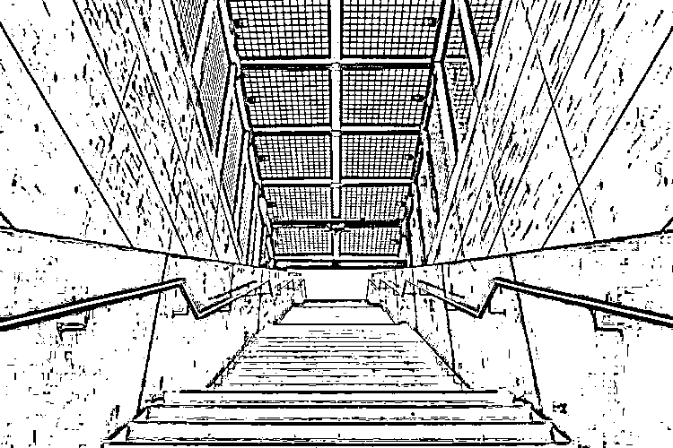

**如何整合我们的太阳与土星？****当太阳与土星以平衡、和谐的方式运行时，个人在追求目标时会更加放松、有耐心且灵活。**他或她尊重极限范围，尊崇权威，较少有紧迫感，更能获得和享受成功。每颗行星都加强了彼此的功能。工作和娱乐变得协调，责任和创造力融合。内在信念变得更加积极，并且**太阳和土星各自的行星功能被有效地利用，来实现两种目标状态，即土星的掌控和太阳的自尊**。所有这些都会反映在一个人的情绪（认真却不失风趣）、态度（有自信和有权威的）、内在对话（“我享受规划成功和追求成功”）、面部表情（满意/专注的）和声调上（沉着自信的）。外在行为的特点是凭借有纪律的创造力来实现长期目标。**当一个人已经整合了他或她的太阳与土星相位，这样的状态就是恒定的**。此外，尽管柔和相位暗示两者的行星能力之间有轻松和谐的流动，但整合不仅仅是通过观察星图就能确定的。当然**困难相位之间的整合需要持续的努力，但是所带来的回报往往也会超过和谐相位**。一个亿万富翁的例子

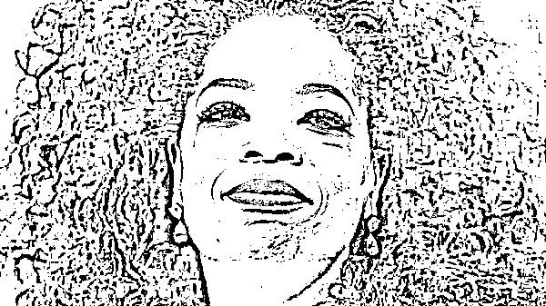

亿万富翁奥普拉·温弗瑞就是一个很好的例子，她的**太阳与土星成四分相**。奥普拉是演员、导演、制片人、艺人、媒体大亨、脱口秀主持人、慈善家，她成就清单太长了，可能需要几页纸才能全部列出。可以说，她是世界上极其成功、有影响力的女性之一。


|  奥普拉·温弗瑞：1954 年 1 月 29 日，上午 4:30，科修斯科，美国密西西比州

**正如太阳与土星精确的四分相位显示，无论如何，奥普拉的崛起离不开她的奋斗。**她出生在美国南方腹地的一个贫穷的未婚少女家庭，在 9 岁时遭受了强奸，在接下来的 5 年中，她不断遭受多名亲戚的性侵。奥普拉在 14 岁时怀孕了，被送去和分居的父亲一起生活。她的孩子在出生两周后死于早产并发症。

在奥普拉剩下的青少年时期，最明显的是不断的屈辱与反抗。奥普拉被她的祖母、母亲和父亲相互推脱，没人要她。尽管困难重重，奥普拉·温弗瑞还是取得了非凡的成就，并因克服逆境成为他人的榜样和慈善者而受到褒奖。**加缪的土星情结**


|  阿尔贝·加缪

另一个更典型的例子是之前提到的阿尔贝·加缪，他**既体现了土星的抑郁，也体现了土星的成功主题**。加缪生活在二十世纪四五十年代饱受战争摧残的法国，应运而生成为了国际公认的小说家、剧作家、政治记者、哲学评论家以及自由斗士。他大量的著作为土星作为持久的状态和心理综合体提供了一个独特的视角。


|  阿尔贝·加缪：1913 年 11 月 7 日，上午 2 点，蒙多维，阿尔及利亚

星图中，加缪的土星落入双子座第九宫，与落在第二宫的天蝎座太阳形成渐盈梅花相位。土星同样与落在第四宫的摩羯座木星形成渐亏梅花相位。而太阳与木星形成六分相，使得土星与太阳和木星形成一个土星为顶点的**上帝之指格局**。特别重要的一点是摩羯座的木星与其定位星土星形成困难的梅花相位，而土星也落入木星守护的第九宫。**因此木星和土星由于星座、宫位和相位被三倍力量捆绑着，这也强调了两者联系的重要性以及合作的困难。**可以说**加缪太阳-木星的六分相是对土星的双重攻击，土星是它们共同的对手**。他的太阳通过创造性的作品（虚构小说和戏剧）发起进攻，试图解决土星带来的问题，然而木星的攻击则是通过非虚构类作品、政治报道、哲学文章来揭露土星泛滥的黑暗面。我们将首先研究木星与土星的关系。**土木的困局**定位水星的摩羯座木星虽然加缪在存在主义传统中被视为哲学家，但他把自己仅仅描述为“**作家**”。由于水星守护了象征事业的第十宫，并掌管代表交流的第三宫，大卫·辛普森在哲学百科网中写加缪的内容值得注意：“用加缪自己的话来说，他首先把自己描述成一个作家——深思熟虑之后加上‘哲学的’一词修饰，使其更精确且明确。” 当然，这完全符合加缪的出生星图。**水星不仅意味着他的作家生涯，落在射手座的位置进一步证明了加缪的写作本质是哲学性的。**但是，我们可能会问，是什么样的哲学？**作为水星的定位星，木星流露出了加缪的哲学、政治和宗教信仰的本质**。加缪从不承认自己是哲学家，他并不倾向于抽象的理论化，也没有形成一个连贯的、严谨的学说。辛普森认为加缪的思想关注时事，“**始终立足于实际的道德与政治的现实**”。这当然**符合木星落在摩羯座的状态，说明了一种以实际问题出发而不是抽象的、形而上推测的道德**。此外，**落入加缪第四宫的水星使他想要为他所属的国家寻求一种政治与经济上的公正**——他的出生地阿尔及利亚以及第二故乡法国。

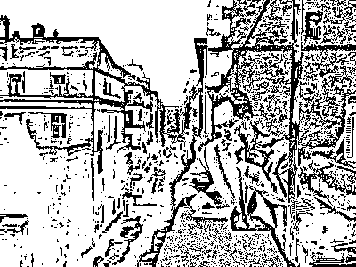

天蝎座式的渐亏梅花相位如前所述，**落在摩羯座的木星与它的定位星（土星）形成一个渐亏的梅花相位**。这说明**木星必须依赖土星来实现它的目标**。然而，**渐亏的梅花相位暗示着一种适得其反的依赖**。在占星心理学中，我们会说这样的木星是“不健康的”。因为土星非但没有支持木星的目标，反而积极抵抗它们，甚至构成危险。至少从木星的角度来看，这种危险的本质很容易来自土星的一种极端、具有破坏性的表达。客观地说，这种破坏性表达表现为加缪对极权主义政治意识形态的关注，他认为这些是对真理、正义和道德的威胁。从主观上和行为上来说，**土星悲观和绝望的状态冲击着木星希望和信仰的核心价值观**，这使得加缪的著作成为对主流观点——宗教、哲学和意识形态——的威胁。土星和木星之间持续的紧张关系在加缪的所有作品中体现得很明显。一个相位的含义来自于其依据的黄道星座，所以**渐亏的梅花相位是天蝎座式的**。**两个行星——木星与土星，即便两者处于相互影响的状态中，却怀着对彼此的不信任和敌意**。其中的一方或另一方很可能受到投射并被扔进阴影中，因此整个相位将以与天蝎座一致的方式爆发——**充满激情、极端和充满潜在的破坏性，直到危机被解决**。实际上，**渐亏的梅花相位是一种需要治愈的伤口**。因为这伤口是一种投射，所以它表现为一种令人惊恐的情况或困境。


落入第九宫的双子座土星另外，加缪的**土星落在第九宫**，也是木星天然守护的宫位。此外，尽管土星与木星处于不和谐的关系，它们也依旧牢牢捆在一起。土星不仅代表着加缪处理第九宫领域的方式，而且也显示了那个领域产出的有形成果——事物、人物和事件。第九宫与追寻真理（哲学、意识形态、宗教）和追求正义（法律、伦理、道德）有关。**双子座的土星落入第九宫也暗示了加缪想要达到完美，也暗示了他形而上学领域的事实知识**。然而，这个领域的本质是抽象的，与思辨和推论有关。因此，落入双子座的土星可能会沮丧地得出某种结论：确凿的真理是无处可寻的。辛普森写道，加缪成熟的哲学不仅仅是一种天真的无神论，而是一种深度反思和批判的无宗教信仰。这种哲学是自负的、绝望的悲观主义，并没有以一种驳论与傲慢的方式展现。它同样是坚定的、冷静的、坚决地怀疑的。加缪的哲学宽容并尊重世界的宗教信条，同时亦毫不近人情地对待它们。最终，加缪以一种接受和认可的积极哲学观，以他自己的方式祝福我们终有一死的命运以及我们与世界的根本孤立。没有一位占星学者可以写出比此更好的关于土星双子座落入第九宫的总结，至少写不出像加缪所经历的那样。**一个相位可以用多种方式表达**，这一点如何强调都不为过。**在更高层次的整合中，不管相位有多么困难，它都会以一种方式允许行星满足各自必须满足的需求**。然而，如上所述，加缪在他短暂的一生中并不能满足射手座和木星对信仰、希望以及意义的需求。事实上，他与之背道而驰。

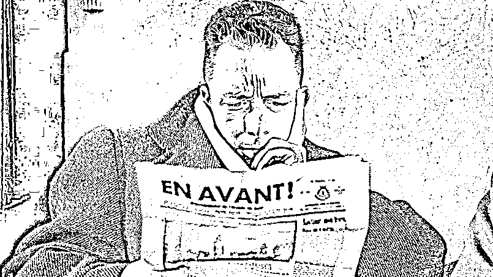

加缪关注的无疑是政治形态，这代替了任何真正的宗教信仰，而且土星守护的就是政府。此外，**加缪专注于苛政的统治（土星）对司法公正的阻碍（木星）**。在第二次世界大战纳粹战胜法国时，因为纳粹残酷的征收和严苛的司法系统加缪在道德上被激怒了。然而，同样的事实是，加缪自己的怀疑主义削弱了他的信仰能力，而且正如我将要讨论的，这也限制了他看到更广阔、更包容的真理。不久，我们将看到加缪悲观的无神论是如何导致这种影响真正产生的。

**当两颗行星因为困难相位冲突时，通常运行更慢的星体会占主导。**土星以其硬核的现实主义和持续的怀疑而闻名，这可能会挫败木星对于真理、意义和公正的追求，或者至少让木星仅因一点点的满足而勤奋工作。

这在加缪的政治信念中体现最为明显。加缪不信任土星的权威和对于权力的潜在滥用，他 30 多岁时参加法国无政府主义运动，为其出版物撰稿，并在一生中始终支持无政府主义的运动。无政府主义作为一种政治形态，是土星的对立面，它提倡自治、等级自由、无国籍社会，并且认为外部的、政府的等级形式是不可取的、多余且有害的。

**加缪对官僚机构愤世嫉俗的不信任与不良状态下的木星相一致**，因为他担心政府的集体冲动，无论多么崇高与充满善意，都可能产生事与愿违的后果，与人民为敌。这是加缪在纳粹占领法国时的直接经验。除了无政府主义的观点，他还积极投身于 1944 年至 1947 年的反抗运动，并担任《战斗报》（Combat）的主编。**加缪上帝之指与顶端土星的关系体现得最明显之处便是他写道**：“我们正遭遇恐怖统治，因为人类的价值观已经被对他人的蔑视、对效率的崇拜所取代，对自由的渴望被对统治的渴求所取代。使我们正义的不再是公正与慷慨，而是成功。”


1947 年，正值 34 岁的加缪出版了一本讽刺小说《鼠疫》（The Plague），书中描述了法西斯将原本自由、思想独立的人变成没有灵魂、压迫人民的官僚，如同老鼠一般用死亡和传染病折磨着人类。事实上，法西斯主义通过其罪恶的种族政策、死亡集中营、残忍的优生理论、强制绝育和强迫的安乐死，确实不仅与其自己的人民为敌，也与其征服国家的居民为敌。

此外，**与天蝎座式/渐亏梅花相位一致的是加缪的戏剧《戒严令》（State of Siege）**，该剧把一个爱管闲事、耀武扬威的法西斯独裁者的秘书，描绘为中世纪死神在现代官僚中的转世。这仿佛是**对土星落入双子座的致**敬，这部剧明显的关注点是将搬弄是非（双子座）用于极权主义的目的，用扭曲的、重新定义的语言为权力的阴谋服务，或是由于国家对媒体的控制，所有的言论集体沉默。

**（未完待续，下篇在今日二条，**

**加缪案例精彩分析继续）**

**版权声明：**本文由若道翻译发布，欢迎转发，反对抄袭。友号转载请申请白名单。


**格伦·佩里**

若道签约老师，著名占星师，前 ISAR 董事会成员，共出版 8 本占星著作；心理/意识研究专业博士；占星心理学学院（Academy of AstroPsychology）的创办人；康涅狄格州研究生院（the Graduate Institute of Connecticut）原型宇宙学与意识进化项目的负责人。

**双证书核心课程火热插班中**

**点击图片了解详情**


**微信又双叒叕改版啦，不想错过若道君的推送？**

**就把若道设为星标吧！**

**▼**


就是这个“在看”，戳戳戳 ☟

********报名直达入口********


# “上帝之指”的格局，可以达到怎样的境界？

> 原文：[`mp.weixin.qq.com/s?__biz=MzA5NjA0NTAxNg==&mid=2651413285&idx=2&sn=bedb641e5cafb50006ff1e8be3814cd7&chksm=8b4be992bc3c6084ac09e4cb1daae19863e1c9cfed6e70e45526f3cad3ff719e327d0adeae5e&scene=126&sessionid=1692738212#rd`](http://mp.weixin.qq.com/s?__biz=MzA5NjA0NTAxNg==&mid=2651413285&idx=2&sn=bedb641e5cafb50006ff1e8be3814cd7&chksm=8b4be992bc3c6084ac09e4cb1daae19863e1c9cfed6e70e45526f3cad3ff719e327d0adeae5e&scene=126&sessionid=1692738212#rd)


作者/格伦·佩里 翻译/三三 校对/Jun
编辑/Tang 封面/书君 图片/网络承接上篇，本文为下篇，格伦老师继续给大家带来超级精彩的加缪上帝之指格局的案例分析。

**注：本文很长，分为上下两篇，全文干货满满，宜收藏，反复阅读。上篇为今日头条。**

**日土的斗争**处女座式的渐盈梅花相位

加缪的**太阳落在第二宫的天蝎座，与土星形成了渐盈的梅花相位**，为与镰刀死神的终生战斗提供第二战场。**渐盈的梅花相位有着处女座式的暗示，产生相位的两个行星不得不解决各自行星彼此间存在的问题。**因为太阳与木星的六分相，加缪被看作是追求真理、正义和意义的人。这没问题，当然，太阳作为上帝之指中的一个支柱，注定要与该相位结构的顶点同时落入第九宫的土星进行永久的斗争。


|  阿尔贝·加缪：1913 年 11 月 7 日，上午 2 点，蒙多维，阿尔及利亚

应该注意的是，加缪的太阳和木星仅仅与土星（梅花相位），还有彼此间（六分相）存在相位。**木星与土星的梅花相位反映了加缪整体哲学思想，而太阳的梅花相位则更多地与他的身份认同和创造性作品有关，尤其是他的自由（自由意志），使他有所成就**。太阳与木星的六分相位证实了加缪视自己为一个有能力创造丰富人生的个体，但是两个梅花相位对第九宫土星的夹击，暗示他在理解更广阔的含义，哲学意义上会遇到极大的困难。

这种困难在加缪于 1942 年里程碑式的著作《西西弗斯神话》（The Myth of Sisyphus）中最为突出。**加缪恰好在他 29 岁，即土星回归的时，完成并出版了他的标志性作品，这凸显了加缪试图解决自己内在宿命般张力的重要性。**

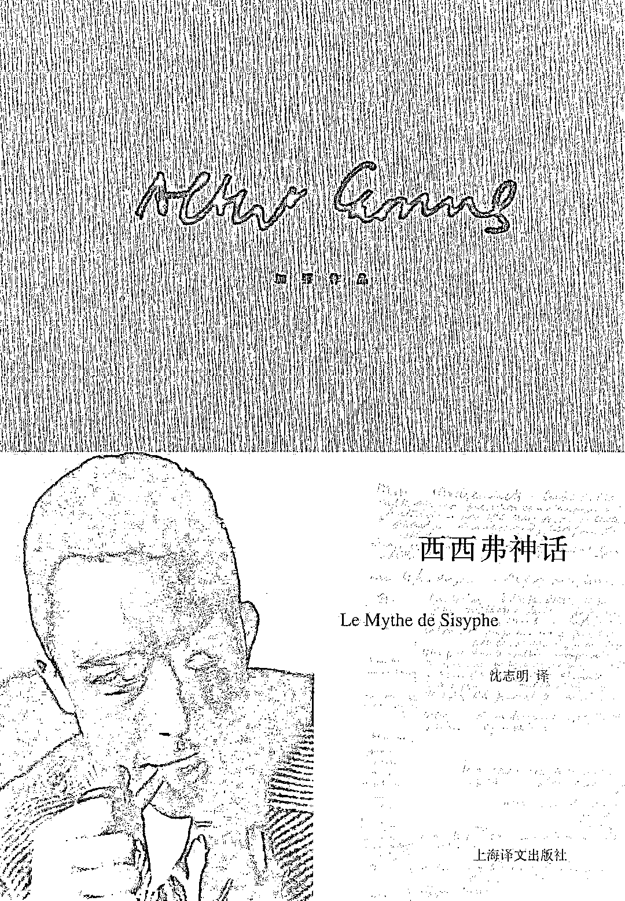

对应荒诞的 3 种方式

加缪用西西弗斯神话的形式，正式并充分地明确阐述了他最著名的思想——**荒诞的概念**。这种“加缪式荒诞哲学”是两种现实的致命碰撞所导致：**一方面是人类对意义和明晰的渴望，另一方面是静默、冰冷的宇宙**。换句话说，面对一个没有上帝或者说没有永恒真理与价值的，令人难以理解的世界，**荒诞意味着无法避免地同时又是徒劳地寻找意义**。恰恰因为人类的这种能力，使他们在虚空、冷漠的“宇宙的寂静静默”中感到疏离与孤独。

**加缪提出了三种应对荒诞的方式：自杀、宗教与接受。**他以一句具有挑衅意味的话开始了他的论述：“真正严肃地哲学问题只有一个，那就是自杀。”（《反抗者》）加缪如此重视自我毁灭的冲动，要么是在暗示饱受战争摧残的法国人民处于绝望的沮丧中，要么是加缪自己抑郁了。因为在加缪写这本书时正值他的土星回归，我猜是后者，或许两者都是。1 自杀

加缪理由充分地说道，如果我们认为生活没有内在的目的或意义，并不值得活下去，那么我们就会自杀。他冷漠地注意到，“我倒看到许多人自寻短见，因为他们觉得生命不值一活。”最后，他拒绝视自杀为解决问题的可行办法，称其为对生命懦弱的逃避，而自杀本身就是荒诞的。这点无疑对他的读者来说是一种解脱，事实上也保证了他们可以读完全部的四章。然而，**加缪奉劝读者不要自杀，表明了他自己对自杀持有审慎的态度，并有充分的理由反对它**。

2 宗教

加缪对荒诞的第二个回应是宗教，他称之为“信仰之跃”（a leap of faith）。信仰之跃意味着盲目相信无形的东西，比如上帝、超越、救赎和不朽。但是这也是加缪所拒绝的，因为信仰之跃超越了生命的证据，更喜欢抽象（木星）而不是具体的个人经验（双子座土星）。土星作为现实生活的原则，战胜了加缪去相信代表超自然的木星能力。**加缪视宗教为“哲学上的自杀”，这也是一个符合天蝎式/渐亏梅花相位的短语**，因为宗教信仰用幻想代替残酷的现实，以此来逃避荒诞的问题。拥有宗教信仰就等于毁灭理性，加缪认为，这就是哲学上的自杀。

加缪一次又一次告诫读者要远离希望，就好像希望只能引导我们远离冰冷、阴郁的生存真理。他对信仰的彻底否定，就像对无法给予他明确答案的空虚所发出的一声蔑视叫嚷，闯入拒绝给予他所需求的最终答案的虚空中。他认为其他哲学家之所以没有达到真理，是因为他们愿意相信——上帝的存在，超自然的真实——加缪个人对信仰的否定，是评判其他哲学家的终极标准。

**加缪的无神论反映了他的信念除了那些基于证据的合理理解之外，宇宙没意义与目的，对他来说，信仰就等同于自我毁灭。这也揭露了他的太阳与木星的六分相，极力反对任何土星规则在第九宫运用的有效性。**因此，加缪的这些构想仍然是极度负面、片面与不平衡的，就像集权主义的意识形态，如法西斯主义，甚至类似于基督教与伊斯兰教这样更加严格、教条且过度非理性的正统宗教。

3 接受

**产生梅花相位的行星所处的星座毫无共同之处——无论是极性、模式、元素还是视角。它们之间本质上的不协调恰恰是形成问题、危机的原因，而解决这些问题、危机的方法往往包含着矛盾的逻辑。**在一次著名的循环论证中证明了土星与太阳和木星产生的梅花相位，加缪断言了他的第三个对于荒诞的回应，并且他认为**这是解决荒诞问题唯一有效的方法：完全的、毫不畏缩的、勇敢的接受**。

矛盾的是，“如果没有意义，生活将会更好”，这样人类就真正自由了，得以从宗教审判以及它们严苛的道德准则的囚禁中解脱。“人享有遵守共同规范的自由”，没有希望的生活，使得人们不再去追求永生。接受没有目标的生活，人们就可以拥抱生活所提供的一切。因为生活没有意义，没有价值尺度，没有内在道德。“**重要的不是活得最好，而是活着本身**。”

简而言之，**加缪对生活无意义的解决方法是一种怀有激情的、无关道德的享乐主义（太阳落入天蝎座第二宫）**。自我可以自由地做任何想做的事情，可以激情地追求世俗的快乐，可以反抗传统信仰所构建的道德准则。加缪在这方面的推崇榜样是唐璜，一个通过性征服生活的连环引诱者，唐璜认为：“**没有高尚的爱，唯有认识到人生苦短，及时行乐**。”

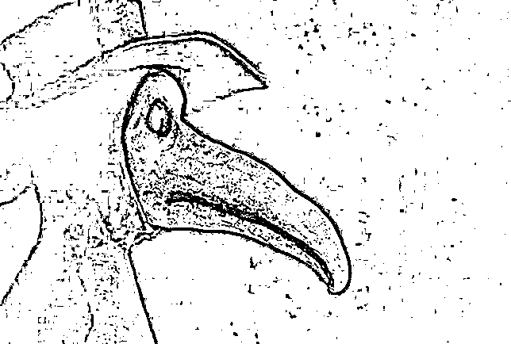

**此生此世，足矣**

实际上，**加缪对荒诞问题的最终解决方法是太阳与木星携手对抗土星的约束，这可能适合于还未整合的上帝之指格局**。加缪重视反抗的概念。他说，在毫无意义的世界中寻求意义的矛盾，需要人类永恒地对峙和反抗。即便已经接受生命没有内在的意义，个人也应该通过大胆地持续探索和对意义的追寻来拥抱人生的荒诞。加缪宣称他不相信上帝，而是相信人本身，人能创造自己的意义。如果这一切开始听起来令人困惑且逻辑上前后相悖，欢迎来到梅花相位的世界。

比起能找到一种拥抱第九宫土星的道路，这条道路最终可能会产生一种坚实的、明智的哲学，不排除希望和意义。加缪最终选择了反抗，选择了不抱有“虚假希望”的方式生活。他建议他人也如此。因为到那时，人类将可以自由地追寻尘世间的快乐，沉醉于一种狂欢的原始主义，只崇拜能带来即时真实感受的事物。第二宫代表着身体感官，有形的物质享受（财产、资源），以及地球本身的自然领域（农业、花园），因此加缪过度强调这个领域的内容来逃避土星的绝望也就不足为奇。你可以想象天蝎座的太阳在恐惧中推开土星，然后贪婪的强烈反弹到第二宫。

辛普森回应了这个观点，他写道，加缪是天生的异教徒，更是一个太阳崇拜者和自然爱好者，而不是以虔诚的宗教信仰而闻名的人。“没有救赎，加缪争辩道，没有超越；只有对意识和自然的享受。一生一世，此生此世，足矣。”天空与海洋、山川和荒漠，都有它们都有自己的美好与壮丽，构成了一个充分的天堂。

显然，**加缪的神（如果你可以这样称呼它的话）并不是住在第九宫，而是存在于第二宫和第四宫**，在那里太阳与木星快乐而热情的居住着，它们拒绝去相信更高级的土星力量。最佳生活可能是第九宫的土星，而真正的生活却是被木星影响放大的，落入第二宫的天蝎座太阳。

为了避免有人认为是第九宫的土星处于困难相位下，所导致加缪无神论的世界观，我们只需要查一查那些有相同立场的其他哲学家和宗教领袖。土星落入第九宫的困难相位可能暗示着信仰的挣扎，但不会直接导致对宗教的排斥。

哲学家路德维希·维特根斯坦（Ludwig Wittgenstein）就是一个很好的例子。尽管他在早期有过怀疑，但最终还是与基督教建立了真诚而忠诚的关系。美国的自然主义者、哲学家约翰·缪尔（John Muir）同样存在第九宫的土星与太阳形成梅花相位。但他与加缪不同，他在自然界中看到的是上帝的杰作。名单还在继续——基督教的杰里·福尔韦尔（Jerry Falwell），以及有道教倾向的马丁·海德格尔（Martin Heidegger）都有承受困难相位压力的第九宫土星，但他们也都声称对现实怀有圣神信仰。

因此，我们必须断定，加缪所宣称的解决荒诞的方法根本算不上是一种解决。相反，**它是心理学家所称的一种妥协作用——通过保持一种妥协让步的行为方式来回避令人惧怕的状态**。需求之间的竞争往往会导致冲突产生恐惧，恐惧当满足任何一种需求会对另一种需求产生负面影响。如果加缪追求摩羯座土星所需要的有关形而上真理（第九宫）的完美事实性知识（双子座），他的结论——生命是没有意义的——可以确保太阳处于绝望状态。

然而，如果加缪追求狮子座太阳所需的对短暂欢愉（第二宫） 的激情享受（天蝎座），他便放弃了实现清晰的更高意义和目的的生活，也就是他土星的责任。因此，加缪的妥协是虚构出一种哲学，声称生命没有内在的意义和目的，但人类可以自由地反抗自己所处的荒诞。他们可以构建属于自己的意义，在对荒诞的公开蔑视中热情地生活，并追求幸福。这是一个绝妙的合理化，但也让人怀疑，它能带来的快乐终究有限。

加缪自己也说过同样的话。“没有太阳就没有阴影，而且有必要去认识夜晚。”他不断强调，快乐必然与绝望交织在一起，死亡的必然性带来了强烈的体验，也带来了一生之中对快乐欣喜若狂的庆祝。

**“没有轻蔑战胜不了的命运”**


加缪最终塑造的荒诞英雄是科林斯国王西西弗斯（Sisyphus），一位希腊神话中的人物。他被诸神惩罚，要永远重复毫无意义的任务：将巨石推上山顶，却只见它在到达山顶之前又滚了下来。对西西福斯永恒的惩罚是因为他不尊重、甚至蔑视众神，特别是对死神桑纳托斯（Thanatos）。当死神来临时，作为国王的西西弗斯戏弄了他，给他戴上枷锁，这样国王便永远不死。当然，在西西弗斯的密室里，带着镣铐的死神正在日渐衰弱，这也意味着大家都不会死去。冥王普鲁托（Pluto）对此很生气，因为这使自然变得紊乱，因此他派遣战神把死神从西西弗斯的锁链下解放出来。

西西弗斯是一位将自己塑造成太阳（自我）形象的国王。这位国王的罪行深重，因为从一开始就定下基调，他否认有关死亡的任何目的、意义与价值，他将肉体的欲望凌驾于一切精神与道德。荷马告诉我们，西西弗斯担有骗子、说谎者和诡计者的恶名，甚至欺骗死神和背叛众神。他也是世界上最狡猾的无赖，过着放荡的生活，无休止地追求眼前的快乐。结果，这位国王堕落了。最终，西西弗斯的轻率使他受到惩罚，他被拉下地狱接受惩罚。

但加缪认为西西弗斯是终极的荒诞英雄。“他对众神的蔑视，对死亡的憎恨，以及对生命的热情，让他遭受这种无法言说的严厉惩罚，使他整个生命都付诸于无望的工作中。这是为这个世界的激情所必须付出的代价。”**正如人类为了生存注定要从事毫无意义的工作，因此加缪在西西弗斯身上看到了人类生存的本质。**但加缪更为深入，他视西西弗斯为英雄。

他认为西西弗斯是英雄，**因为西西弗斯充分意识到了自己永恒的折磨，同时仍旧履行自己的任务**，至少加缪是这么认为的。西西弗斯没有任何幻想。他是清醒的。但是！加缪说：“**正是清晰的认识造成了他的折磨，同时也为他的胜利加冕。没有轻蔑战胜不了的命运**。”如此提及“轻蔑”是有意义的，因为它揭示了一种内在的痛苦，并不是西西弗斯身上的，而是加缪身上的。对加缪来说，西西弗斯仅仅是一个方便投射的掩护。显然**，加缪对众神的蔑视反映了他对土星权威的太阳式（自我）恐惧，更确切地说，是对宗教权威（第九宫）的恐惧**。一位死去的国王，被众神宣判了永无止境的任务——将巨石推上山顶，却永远徒劳，还有什么比这样的国王形象更能表现天蝎座太阳与第九宫的土星形成梅花相位呢？

加缪想象西西弗斯不仅在悲伤中，更在喜悦中回到落下的巨石喜悦中边，，这喜悦来自他完全接受自己无意义的困境。对加缪来说，这是对众神的蔑视，因为“它把带着不满并且偏爱无谓的痛苦而来的神祗逐出了这个世界。”加缪说，遭受苦难并没有理由，也没有目的，至少没有所谓神圣的起源。因为我们所经历的一切完全是人类的起源，没有超越人类的意义。但是，如果我们英勇地忍受苦难，反抗生活的绝望，放弃无用的希望，即通过我们的努力，终有一日我们会得救赎。也只有到那时，我们才有一点点机会获得适度的幸福。加缪想象西西弗斯再次站在塔尔塔罗斯（地狱深渊）的山脚下，他给出了这样的总结：“**攀登高峰的奋斗本身足以填满一个人的心灵。我们必须想象西西弗斯是快乐的**。”

但这个结论听起来很空洞。加缪明确表示，对他来说，幸福是一种太阳式的行动，反抗无止境的绝望——讽刺的是，这种绝望却是他自己的土星未能整合的后果。换句话说，**这种幸福是一种补偿，是一种对抗焦虑状态的反应形式**，而这种焦虑的心理状态是加缪的世界观不可避免的衍生品。

回顾一下，不良状态的木星向落入第九宫的土星寻求意义，但是土星落入了一个反对意义的星座（双子座），与木星所在的星座（摩羯座）成梅花相位。**因此土星剥夺了木星所寻求的意义**。它说，“你对意义的所有努力导致了这样一个结论：人类的存在是毫无意义的。”知道了这一点，我们就能够对加缪的困境表示同情，但并不能改变这样的一个事实，即**加缪的哲学与其说是对人类状况的陈述，不如说是对他自身的陈述**。

当加缪描述西西弗斯从斜坡上无功而返时，他很欣赏他想象中的西西弗斯那种冷酷、阴郁的态度。西西弗斯冷酷无情，毫不自怨自艾，铁石心肠地对待这个无意义的残酷现实，周而复始地努力。“每当他离开高地，逐渐走向神的藏身之处，他都超越了自己的命运。他比他所推的巨石更强大。”**这就是加缪的幸福准则：一个英雄（太阳）反抗的选择。但在我看来，这是对合理痛苦的否认，就像一个为了避开难以忍受的痛苦而歇斯底里大笑的人。**如果想象西西弗斯除了沮丧外，悲惨地臣服于他绝望的困境中，同样也违反常识。这就是西西弗斯神话的全部内涵。

**违反自然规则，后果自负**

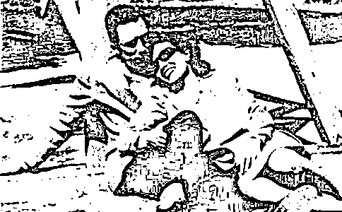

|  加缪与妻子弗兰辛妮·福莱

加缪文笔优美，但我们不应该将他这样优美的笔触与思想的崇高混为一谈。他对西西弗斯神话的解释，并不是一本“幸福手册”。相反，西西弗斯的故事是一个道德寓言，给我们上了简单的一课：**违反自然规则，后果自负**。有什么比这个更清楚？西西弗斯把死神锁在了密室；也就是说，逃避了死亡对我们不可避免的转化。这也是对冥王普鲁托本人极大的羞辱，因为死神是他的盟友和仆人。死神、镰刀收割者，代表了土星，它提醒我们，我们的时间有限，我们应该负责任地努力活在法则中，适当自我约束，并且我们应该认识到，等时候到了，我们将会被更高权力审判，适当的后果随之而来。

我们现代人的感性可能会嘲笑这种观念；它不是科学的，也不能被验证。加缪当然也会赞同这点。然而，世俗中的罪孽会由天道解决，这是一种原型，它以各种形式出现于几乎所有的信仰中。这也暗含在土星的意义里。由于加缪不相信上帝（或诸神），他认为西西弗斯的罪行除了反映他自己对宗教的蔑视以外没有任何意义。但是我把西西弗斯的巨石看作是土星本身的象征，象征着使身心趋于完美的有责任心和耐心的努力，这正是西西弗斯在生活中逃避的。因此他被捆绑在土星的巨石上直到死亡。

人们自然会产生疑问，加缪是否在西西弗斯放荡的罪行中看见自己的某些东西。有人会认为他有。**一方面，加缪格外有责任感，在道德上亦非常严肃，因此他荣获了诺贝尔文学奖，表彰他“阐明我们这个时代人类良知的问题”的不懈努力。在他个人与创造生活中皆体现了一种荣耀，“英勇的反抗或抵制一切压迫人类的态度”。虽然与土星的战斗肯定激发了加缪最伟大的成就，但也带来其他后果。**


|  加缪与玛丽亚·卡萨雷斯

> 例如，加缪以与女人的风流韵事而闻名。他的第一次婚姻由于双方不忠而结束，而第二次婚姻同样也因公共丑闻和外遇而破裂。虽然加缪坚持申称爱自己的妻子，但他也强烈反对婚姻制度，他认为婚姻是不近人情的，是一种“狭隘的、过时的制度”。再次出现了土星。甚至在加缪的妻子生下双胞胎后，他还继续与朋友玩笑说自己不适合结婚。他持续着许多风流韵事，其中包括与西班牙裔女演员玛丽亚·卡萨雷斯（Maria Casares）的公开恋情。
> 
> 考虑到法国人的风俗习惯，也许我们不应该过于侧重这些。加缪享受着与巴黎精英们一起的刺激生活，结果呢？1960 年，加缪的好友出版商米歇尔·伽利玛（Michel Gallimard）驾驶他那辆名贵的跑车失控，一头撞在树上，加缪因此丧命。那是一场可怕的车祸，从当时照片上看，这辆车直到后轴处都面目全非。加缪破窗飞出，折断了脖子，当场死亡。年仅 46 岁的加缪，口袋中有一张火车票。圣诞假期后，他本打算和妻儿一起坐火车回巴黎，但最后一刻他却决定和伽利玛一起旅行。没有人知道其中确切的原因。

这场意外死亡有什么意义吗？加缪可能会给出否定的答案，无论是生活还是死亡，都没有意义。但是身为占星学家，我们不能轻率地给予否定结果。我们知道加缪拒绝用自杀来解决生活中的绝望。他相信人必须活着，而反抗荒诞是最好的理由。尽情生活，憎恶死亡！然而，加缪的生命在他的巅峰时刻被偷走了，死神比预期来得早。

土星控制着一切，我们知道加缪反对土星的控制，认为这是压迫性的、限制性的。土星也掌管障碍。伽利玛失去了控制，他的车撞上了障碍物。当然，加缪并不是司机，所以说他对自己的死亡负有任何责任似乎有些不厚道。但在原型的世界中，责任的意义并不如此局限。我们所回避的部分可能会以极其意想不到的方式让我们自食其果。我们很容易猜测，正如西西弗斯遇到了他的巨石，加缪也遇到了他的树。**土星与加缪，最终致命地相拥在一起。**

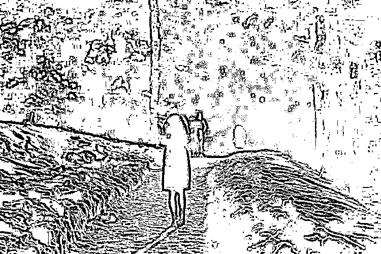

**占星学是照亮我们黑暗面的光**我们已经看到，**持久的心理状态是性格的表现，这是由出生星图和它的整合程度所象征。长期状态在主导行星的深度、核心信念中体现。**尚未解决的精神冲突往往产生有害的信念，并伴随焦虑的状态；相反，在行星相位整合的过程中，建设性的信念产生了。这些反过来又会产生积极的状态，这些状态将在人们生活中的几乎各方面得到证明：情绪、态度、自我对话、肢体语言、面部表情、外部行为和生活经历。加缪的上帝之指格局就是一个例子，即太阳与木星呈六分相，而这两颗行星都与土星形成梅花相位。虽然加缪的非凡成就表明了上帝之指格局的高度整合，但也有可能，至少在一定程度上，是他与土星未解决的斗争之产物。一种无意义和沮丧的感觉折磨着加缪。他的无神论等同于他的无政府主义，因为两者都引发了对第九宫的土星权威的反抗；两者都带有轻蔑的怀疑，一种针对对宗教，另一种针对政府——或者，至少是针对传统意义上的等级制政府。这都是对绝望的反应。也许，我们能从加缪的人生和出生星图中得到的最重要教训是是：**他对人类状况的深思、他的哲学及其对世界的影响，与其说教会我们生命的意义，不如说教会我们如何驱除心中的魔鬼**。加缪在《西西弗斯神话》中所阐述的无神论世界观是对他的心理结构及其整合程度的自画像。毫无疑问，这对我们所有努力描述这个世界的人来说都是正确的。**我们每个人都用一块个人的透镜来看待生活，这块透镜由出生星图所象征**，像我们看到的加缪一样，透过玻璃阴沉地看待生活。**如果说占星学有价值，那就是他能让我们意识到我们所构建的故事，并洞察它们潜在的心理网络。占星学是照亮我们黑暗面的光。**因此，如果加缪还活着，我想他也会怀有希望。

**版权声明：**本文由若道翻译发布，欢迎转发，反对抄袭。友号转载请申请白名单。


**格伦·佩里**

若道签约老师，著名占星师，前 ISAR 董事会成员，共出版 8 本占星著作；心理/意识研究专业博士；占星心理学学院（Academy of AstroPsychology）的创办人；康涅狄格州研究生院（the Graduate Institute of Connecticut）原型宇宙学与意识进化项目的负责人。

**双证书核心课程火热插班中**

**点击图片了解详情**


**微信又双叒叕改版啦，不想错过若道君的推送？**

**就把若道设为星标吧！**

**▼**


就是这个“在看”，戳戳戳 ☟

********报名直达入口********


# 我们采访了咔咔，看宅在家的占星师如何看待疫情？

> 原文：[`mp.weixin.qq.com/s?__biz=MzA5NjA0NTAxNg==&mid=2651413283&idx=1&sn=025534063922cbcdb3a0647b9c4522f5&chksm=8b4be994bc3c6082695e65cb8f0497cfa46aeed4dc0785c4c9b8a47ac60b7d6492c2bd4e4072&scene=126&sessionid=1692738217#rd`](http://mp.weixin.qq.com/s?__biz=MzA5NjA0NTAxNg==&mid=2651413283&idx=1&sn=025534063922cbcdb3a0647b9c4522f5&chksm=8b4be994bc3c6082695e65cb8f0497cfa46aeed4dc0785c4c9b8a47ac60b7d6492c2bd4e4072&scene=126&sessionid=1692738217#rd)

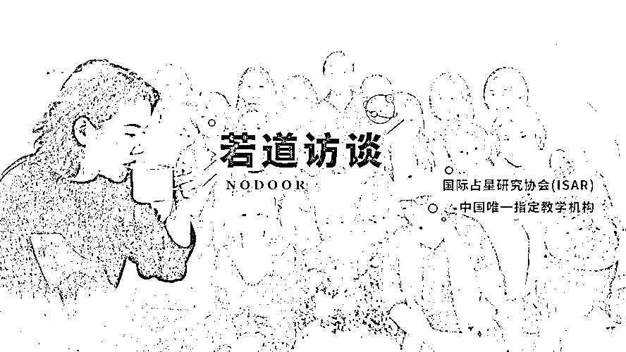

作者/编辑/蒋颖、狄狄采访/狄狄 图片/咔咔 封面/书君每个月第一天，十余万若道读者都会看到一篇新鲜出炉的宇宙天气月运，详细地分析本月的整体天象、需要注意的重要日期、以及各种提醒。咔咔是这个月运专栏连续五年的作者，赶上节假日也不曾间断。**咔咔**，是若道 2012 年的学员，那期学员也被称戏为**若道的黄埔一期，是国内最早跟随大卫老师最早学习严肃占星学的一批人**。她也是 ISAR 在中国第二批认证的职业占星师，目前全职从事占星咨询和教学。本次的采访也从我们共同经历的这个特别的春节开始。**宅在家里的占星师****最近疫情期间你是怎么过的?**做饭，睡觉，看书，陪爸妈看剧，戴口罩遛狗。**这样的日子感觉如何？**简单了，没有花哨的娱乐，也能沉下心来看看书，中文的、英文的、侦探的、心理学的，都还挺津津有味的。**在这种情况下写月运，和平时写月运有什么不同？**2 月月运真的写得蛮难，拖到截止期才交稿。毕竟这样突然的疫情，看到那么人遭受痛苦，一切都停止下来，也有很强的无力感，但我想在遭受这么重大的苦难的时候，如果有一个更大的视角，看到这个苦难背后的意义，就是一个能赋予人力量的角度。我们需要力量。非常沮丧的时候，我发信息给大卫老师说，“商场关了，连庙都关了……”到大卫老师回复说，**“虽然庙关了，但 God is still available.（神还在）”**那一瞬间给了我很多力量，内心也感觉非常的温暖。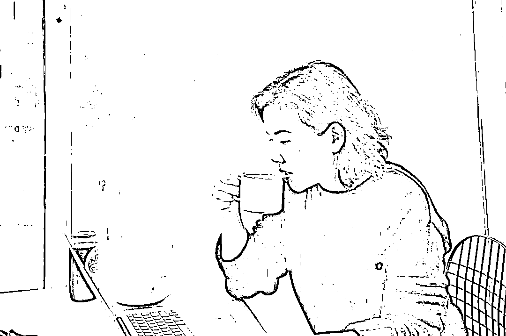**|** 占星师咔咔
**那你害怕吗？**当然有紧张。一开始也没意识到，但身体层面还是有反应。有时好像身体感觉僵硬，像是个冰箱，情绪堵在里面。也出现便秘的问题。这些都让我意识到：哦，我是紧张的，和全国人民无异吧。但我也会尽力不被大众情绪裹挟进去，希望自己能冷静客观地看待每天发生的事情，不通过转发信息来让自己更焦虑。花时间向自己内心看吧。把关注力放在自己身上，越是这个时候，越能看到自己内在的恐惧、愤怒、哀痛，去和自己这些情绪作伴。我把朋友圈关闭过一周，减少信息的摄入，区分出自己当下安全的世界和外部疯狂混乱的世界。

**这场灾难，让我们很多人不得不面对一些非常恐惧的问题，之所以我们要隔离自己，不敢出门，究其原因，可能还是怕生病，怕死。你过去怎么看待死亡，现在又怎么看待死亡？**

我是天蝎座的，从小特别怕死，不知道咽气后的世界会是怎样的，虽然我的北交点也在天蝎座（北交点是不熟悉的，需要发展的方向），但对于死亡是怎样，有没有更神秘的力量这些问题，我一直既隐隐好奇，又一无所知。而社会上很少能公开地自在地谈论死亡，从小也没有一所学校教过我们死亡是什么。只有在重大疫情来临的时候，我们才能在一个国家媒体上看到每天死亡的人数。

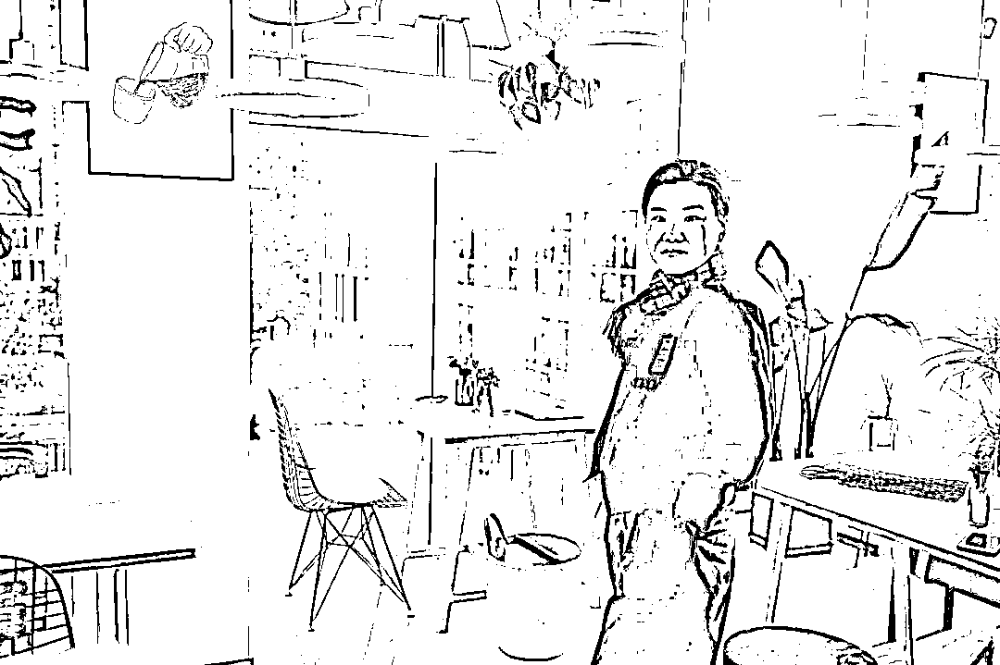

了解死亡，对我影响很大的一本书是《活出生命的意义》，作者是心理学家弗兰克尔。我在和苏·汤普金斯老师一起教授核心课程的时候[（点击了解，可以和苏·汤普金斯学预测哦）](http://mp.weixin.qq.com/s?__biz=MzA5NjA0NTAxNg==&mid=2651413184&idx=2&sn=45ee8046a0587aa0f483d5cf39b85b92&chksm=8b4be877bc3c61611c628f4eeb8f02c5f39addffcacb316e4910a749d333b55ec3c2cbcad07a&scene=21#wechat_redirect)，也讲了他的星图。那是我一口气读完的一本书。他的人生非常传奇，他是一个犹太人，二战前已经拿到了美国签证可以逃离维也纳，但是父母已经年老衰弱，于是他选择留下来陪伴父母。他后来辗转了四个集中营，几经生死，最后整个家庭只有他幸存下来。这是个太阳白羊座月亮射手座的有着强旺生命力的男人。弗兰克尔通过自己在集中营里不可思议的经历验证了自己的心理学理论：**人类最基本的能力，在于发现一个可给予让自己在任何情境中都可坚持下去的理由，并希望藉此使个人的生活更充实，且能提供个人的存在是有意义且有价值的一种认同。**这本书让我看到人性里有一部分很坚韧和很有希望的东西。也让我相信，当我们理解苦难背后更高的意义的时候，就会有力量有决心面对生命中的任何困境。在我在若道跟随大卫老师老师学习的时候，大卫老师说过一句话，给我很大触动：**“与其担心你哪天死，不如去想想你今天怎么活。”**

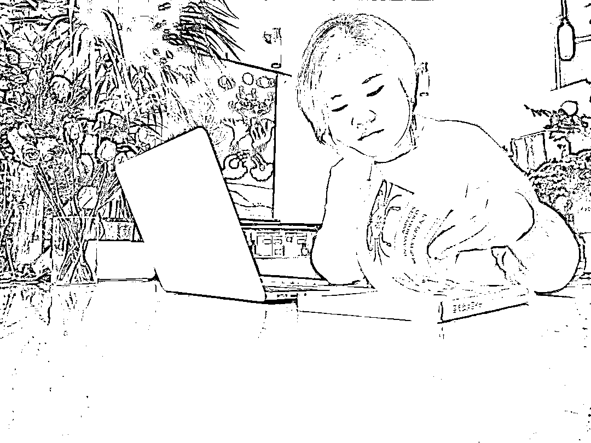

我最近这几年开始觉得，**人生就是一个死亡的过程**。人在出生之后就开始死去了。死亡绝对是特别重要的人生一课，学习死亡的功课，人们就不再觉得生命只是无意义的巧合，就学会珍惜时光珍惜生命。珍惜自己的，也珍惜别人的，别的物种的。还有是要学会臣服，学习去尊重世间运作的法则。所有现在过热的发展，人类过度膨胀的自我，跟整个地球的关系都是不好的，最后就会造成一些结果。有因必有果，土星冥王星合相，就是毫无怜惜、悲悯之心的把结果展现给我们看。**作为职业占星师的“前世今生”****在做职业占星师之前，你的工作、生活是什么样？**我在转做职业占星师之前，一直是在外资企业做管理者工作。这也是符合我父母的教育选择的人生吧。我爸爸从事振动力学研究，母亲是幼教工作者，在成长过程里父母不太告诉我世界是什么、人生是什么，怎么看待死亡。他们从小对我的要求就是在什么时间做什么事，有社会成就和好的物质收入。所以，我人生很长一段时间里，都保持很简单的状态，就想着怎么考好大学找好工作。大学毕业后，我也比较顺利很早就进入外企，做了大概 20 年的市场营销、媒体调研、广告工作。

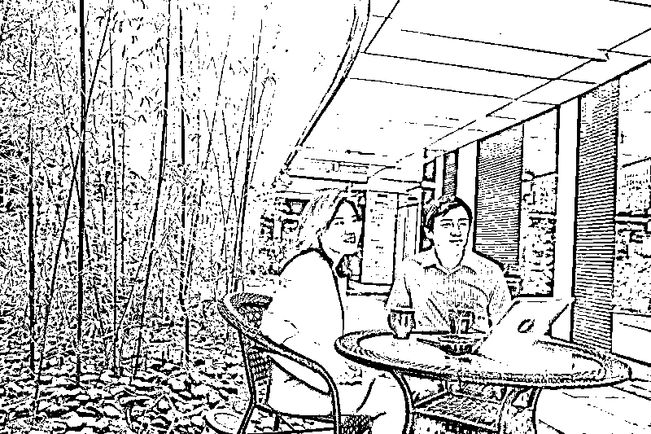

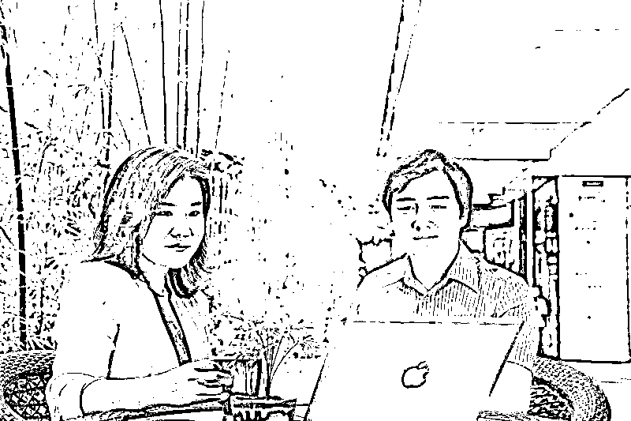

**|** 曾经职场中的咔咔按理说从小的教育和后来的工作，都是比较主流的。不过 28 岁土星回归那年，有一本书给了我很大影响。书名是《生生世世》，是一个哥伦比亚心理学教授写的，主要讲述催眠。他遇到了一个女病人，她有呼吸困难、怕水等问题。然而回溯到童年之后，症状都没有太大改变。忽然有一天，他们发现她在催眠过程中描述不是属于这一世的经历，而是发掘出了累世的记忆。她有时候是一个少女，有时候是一个海盗，有一次被人割喉。催眠醒来后，她的呼吸困难、不能吞咽的症状就消失了。这本书提供了我一个新的思路：**这个世界上可能还有其他一些自己不是很了解的东西。****是什么让你进入占星学，有是什么让你开始进入若道学习占星呢？**直接促使我学占星的还是因为恋爱的缘故。2010 年，我交往了一个水瓶座男生，他对我时常若即若离。所以我就特别想去了解水瓶座到底是怎样的性格。于是开始自学半年占星。但是因为是碎片化学习，很多知识比如“宫位”、“南北交点”，我没有办法把这些知识串起来理解。有一天在豆瓣上看到美国资深占星师大卫·瑞雷来到中国宣传书籍《灵魂的目标》的信息，并且要在中国开课了，巧合的是就在自己家边上小区。我就打电话预约了一下，想去看看若道什么样，当时快过年了，只有蒋颖（若道创始人）自己在，我就干脆跑去若道办公室喝茶。跟蒋颖一聊，聊得很开心，于是便付了学费，成为了若道“黄埔一期”的首届学员。学习了一年半核心课程，再后来又参加了 ISAR 认证考试。

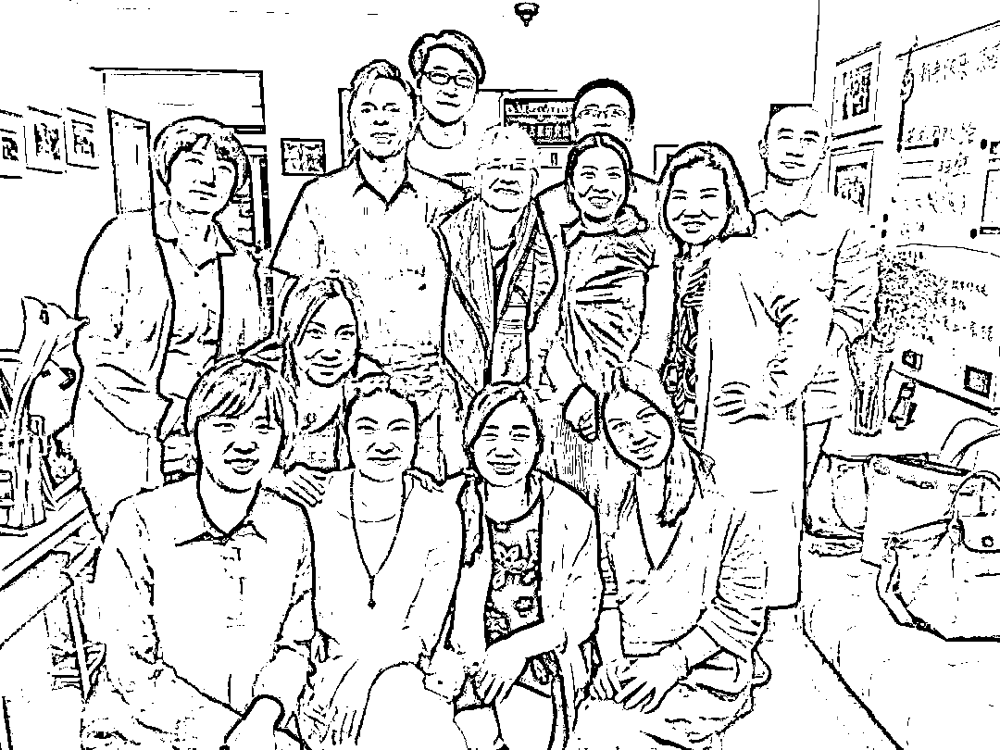

**|** 在若道学占星的咔咔（二排右一）**后来怎么就做了全职占星师呢？你现在一天的生活大概是怎样？**在外企工作 20 年下来，就渐渐觉得很沉闷，也没有自我满足感。就像我前面说的，想为生活找到更有意义的东西。一开始是兼职做，感觉占星咨询带来很多满足，后来 2015 年，下决心走出自己的舒适区，正式辞去了研究公司的高管职务，开始做全职。**占星师最大的好处是你可以按照自己的意愿来生活，非常自由。**我以前要是在公司拿着钱只干四个小时的活肯定不行。但是现在我就是多劳多得、少劳少得、不劳不得。虽然也是有得有失，比如，现在出行酒店不能找公司报销了（笑）。我现在一天基本工作四个小时，其余的时间用来好好生活。遛狗、锻炼、做饭……有时候晚上用来给学员上占星课，或是学点其他自己想学的东西，碎片时间再刷会儿微博，每天算是给自己排的满满的了。我之前在职场那么久，很少看见工作和生活能平衡的人。想要在职场晋升，这个“平衡”在中国职场基本是不存在的。而现在我可以去平衡自己的工作和生活了，不再有过去那种一直想要晋升的职场焦虑。

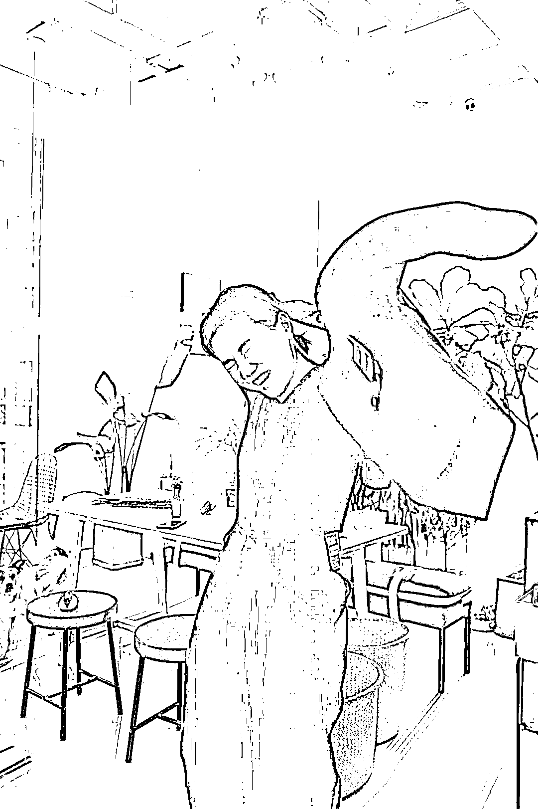

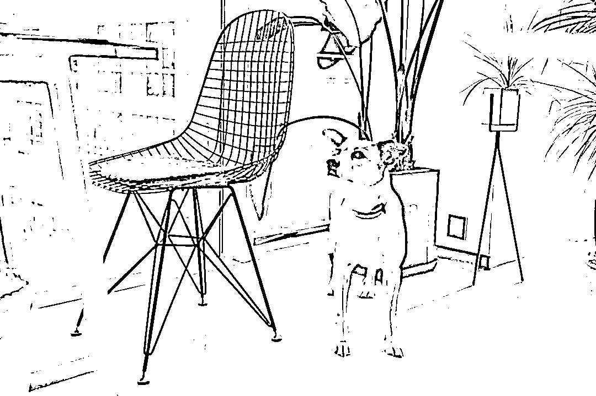

**|** 咔咔和她的狗 Color

能够用占星来帮助其他人，看到客户带着问题来，通过咨询对自己的人生和当下的困境有了新的角度，找到了面对问题的力量，这种满足感是其他的工作不能带来的。最近有个客户说，疫情和之前多起“伤医案件”让她很绝望，感觉这个世界不会好了，她没法想象自己孩子的未来。我能体会她的情绪，太多负面的信息把人要压垮了，失去了生活的信心。**当我们处理了情绪层面的问题后，就能清晰地看到当下的情况就是一个新旧世界交替的时代**，她一下就明白我在说什么了。**旧的模式行不通了，一个新的世界就要浮出水面**，这个世界是我们和我们的孩子可以共同塑造、共同享受的。客户非常自然地开始说起来她想要的新世界是什么样子的，她想要做环保公益志愿者，用自己的努力给孩子创造一个更美好的世界。**占星咨询的重要价值就是帮助客户重新看待自己的困境，认识到这个困境是改变的契机，客户是能主动迎接挑战和创造改变的。**客户看到这一点，就会有内在的力量，那我作为陪伴他、帮助他自我觉察和改变的工作者，就很有职业满足感。

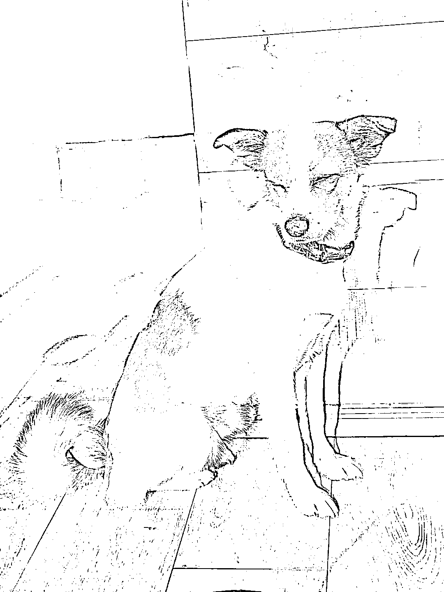

**|** Color**跟我们讲讲你和 Color（咔咔收养的狗）的故事吧，似乎和 Color 一起让你变化挺多。**我是 2017 年收养她的。领养她的那天，星图里双鱼座月亮四分射手座土星。这反应了我带有土星式的养育风格。我本身月亮在摩羯，我会看到对 color 的照顾僵化、重视规则的那一面，通过照顾她，也帮助我更好理解了占星学中的“四分相”。因为我是职业占星师，所以生活相对自由，我就有很多时间陪伴 Color，小动物对人类的情感是真实和真挚的，我感觉生命里有了她之后，多了很多温度和色彩。Color 也有让我感到崩溃的时候，因为它有喜欢吃屎滚屎的习惯。我是天蝎座，月摩羯，一开始就很想控制管理 Color，跟她斗智斗勇，不让她吃便便，她犯错了就会抓住她教育她。我发现自己的严厉管理模式和我从小被抚养长大的方式有相似之处，这给我很大触动。我后来知道狗是吃腐食的，这是他们的天性。Color 吃屎的过程，其实很锻炼换位思考的能力，也让我对很多事放松下来，更能接纳不评判。说的夸张一点，照顾 color 的过程让我学会臣服。每次做完占星咨询，我会带 color 散步来解压。“遛狗会帮我从咨询的情绪里走出来，欣赏当下的生活，回到生活的琐碎里。”**去年 11 月 ISAR 在中国的第一次占星峰会，你也是演讲人，感觉如何？**我非常喜欢。做职业占星师这几年跟人交谈比以前少了很多，讲话对象除了与客户就是若道学员，很多时间需要一个人待着，是很单打独斗的状态。ISAR 占星大会的很多占星师，是我十年前就认识的，都是**当年最早一批跟随大卫老师学习严肃占星的同学**。然后也有一些是新面孔，有我的学生，也有我同学的学生。这种感受非常奇妙。**你发现严肃占星界这些特立独行的灵魂，原来都是走在相同的道路上啊！**

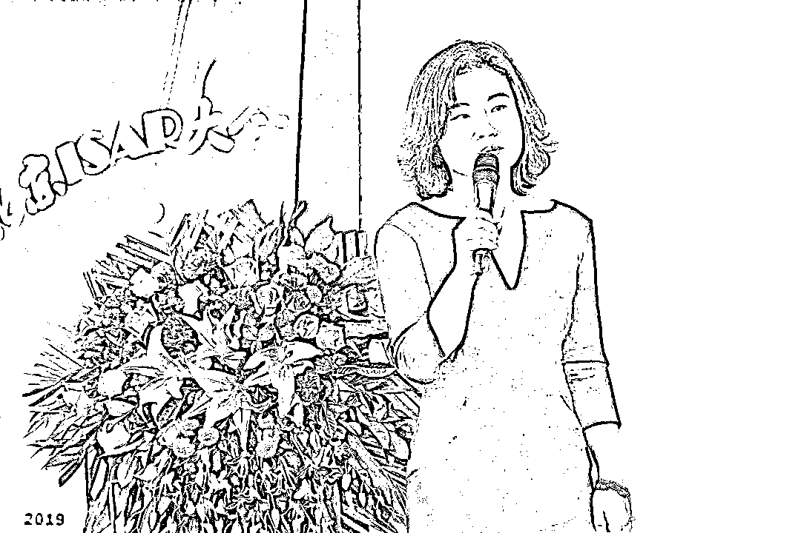

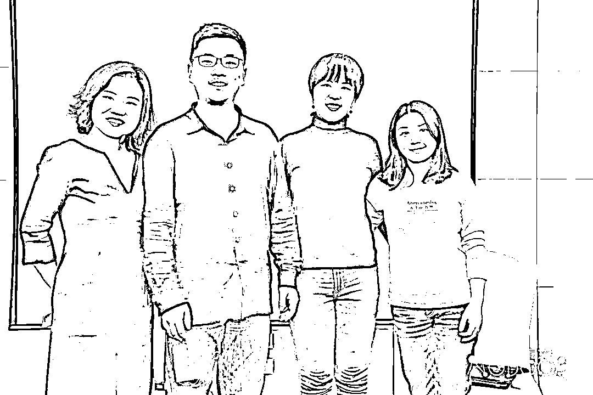

****|** **咔咔在 2019 中国 ISAR 大会
**站在疫情的当下，你怎么看未来？**说起这个，我想说我春节感觉到的一个共时性的事。过年的时候无法出门，我在家陪父母追剧孙红雷主演的《新世界》。电视剧里的年代，正是 1949 年北京城被包围的那年，没有人出的去，大家生活在一个对未来完全不确定的世界里。这和当下也非常相似，和“土冥”天象十分对应，人们现也是被“隔绝”了。现在电视里刚演到 40 集，等到 70 集大结局的时候，北京城门会打开，所有人会迎来一个新世界。”在电视剧《新世界》里，不管你是什么身份，哪个帮派，最大的主题都是去做个“了结”。一个旧的世界要结束，一个新的世界要开始。“如果一个新的世界开始，你希望它是什么样的？”我经常会这样问我的客户，同样也会这样问自己。也许过去的很多年里我们都是在想的怎么发展，怎么丰衣足食、怎么稳固物质的安全感，现在是时候该改变了。**咔咔****在发布了**2 月**月运之后，又在社交媒体上写下了这样一段话：******占星学提供了一个时间表，知道这个困境会大概什么时候结束。其实利用常识我们也知道，没什么事是永恒不变的，疫情也不是永恒不变的，在木星土星冥王星群聚摩羯座的高效率管理下，疫情正在被控制。反观我们自己要看看，我们内在的恐慌能不能被控制。迈入新的领域也是一种死亡，学习科学知识就是愚昧落后无知的死亡，爱护环境保护动物就是人类自大和傲慢态度的死亡。把过时的东西留在身后需要勇气、信念，也需要一个巨大的契机。

占星学也指出了新世界的方向，一个木星土星水瓶座开始的风元素强调的世界，理性、逻辑、诚实、客观、文明、平等的世界。这次疫情也让我们看到了一批这样的专家、管理层，看到了民众对这样的工作方式的欢呼。教育、民智、专业操守方面的改善，未来是非常可期的。春节让自己完全休息了两周，大年初十三的时候，咔咔也开工了，继续为需要占星学洞见的人服务。以上是若道“**大师姐”****占星师****咔咔**的故事想成为和她一样优秀的占星师过上工作和生活可以自主平衡的自由生活若道君隆重向你推荐**咔咔的占星启蒙老师****大卫·瑞雷**主讲的**2020****若道春季占星入门课****Level1-2**最懂中国学生的大卫老师将最深入浅出向零基础的你讲述**12 个****星座、****12 个****性格、****12 种****人生****10 大行星****和 12 个****黄道宫位****让你从爱好者一步飞升专业占星师的行列 **

**点击图片 **

**你也可以成为大卫老师的学生**

**👇**

**认识****大卫****快十年了，如今****咔咔****这样评价他：****完全****零基础****的人听大卫讲课真的很好。**他非常注重细节，并且能在知识点足够全面准确的基础上，又讲的挺有趣挺生动。**大卫是第一个在中国传授人本主义占星学的占星师，**他为了自己的信念做了很多纯公益事。比如他最近一两年其实是默默推动了 ISAR 考试的改革，我也在帮助他做这方面事情。一个行业要前进是需要革新和创新的，但占星行业又是比较松散，需要一些志愿者跳出来推动，大卫就是这样无私的志愿者。我们古人讲 **[ 亦师亦父亦友 ]**。你是什么样的人，你选择什么样的老师，要对了脾气。大卫是有他非常鲜明的做人的风格的。**如果你真心去选择他跟随他，你会得到很多教学以外的做人的东西，****他会打开你内在的一扇大门****。**我想大部分学占星的人，一开始还是希望通过这个东西可以预知祸福的。但是怎样从一味执着自身的祸福，转变为自我成长，是他们所不知道的。学武功，别学杂了也别学歪了，跟大卫学路子就很正。**大卫的确是一个能****带给你心灵成长的、知晓宇宙奥秘****的 70 岁老人。**

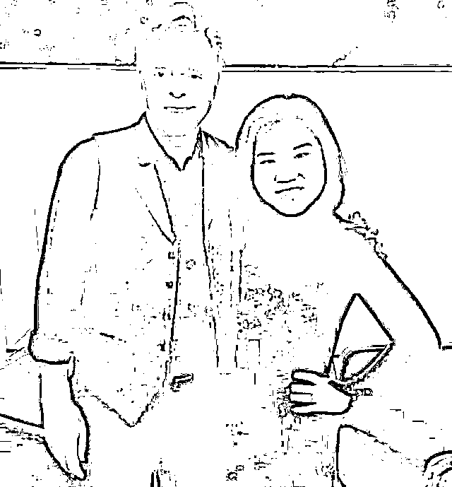

**|** 咔咔和占星启蒙老师大卫·瑞雷

**微信又双叒叕改版啦，不想错过若道君的推送？**

**就把若道设为星标吧！**

**▼**


就是这个“在看”，戳戳戳 ☟

********报名直达入口********


# 狮子座满月 | 从“隔离”开始，肩负使命，去创造前方的家园

> 原文：[`mp.weixin.qq.com/s?__biz=MzA5NjA0NTAxNg==&mid=2651413265&idx=1&sn=19d4da22b8361c2c455f9e42408f0e53&chksm=8b4be9a6bc3c60b0125bf337cf991fa70fe5688f1f106264a1479667561656b5a398b34f173e&scene=126&sessionid=1692738217#rd`](http://mp.weixin.qq.com/s?__biz=MzA5NjA0NTAxNg==&mid=2651413265&idx=1&sn=19d4da22b8361c2c455f9e42408f0e53&chksm=8b4be9a6bc3c60b0125bf337cf991fa70fe5688f1f106264a1479667561656b5a398b34f173e&scene=126&sessionid=1692738217#rd)

****☆ ****后台回复“今日”，给你一句生命态度****


作者/王芝桦 编辑/玫瑰 图片/全景网

**狮子座满月****北京时间 2020 年 2 月 9 日 15:33 迎来狮子座满月，水瓶座太阳与狮子座月亮于 20°精准对分。**以“土冥合相”开启的 2020 年一进入水瓶月（1 月 20 日太阳进入水瓶座）就将我们的关注视线拉到**“集体事件”**上，也再次让我们看到**个人与集体的一体性关联**。从 1 月 25 日水瓶座新月（详情点击：[水瓶座新月](http://mp.weixin.qq.com/s?__biz=MzA5NjA0NTAxNg==&mid=2651413062&idx=1&sn=44c7b80b1d5b93ab47abaee821c5dea4&chksm=8b4be8f1bc3c61e79e6a040ff23dc9c34d983fd5862f87d51615fc665a820416dba1d982212f&scene=21#wechat_redirect)）到此次狮子座满月的半个月时间，一切似乎在“又快又慢”地行进着：快的是病毒的蔓延和防控的速度，慢的是宅居的突来和焦虑的滋生，学工延期，行期多变，街道变得空旷，工作搬到家里......2020 年，我们度过了一个前所未有的春节假期。大家都在期待正月十五之后呈现一个“拐点”，那么此次发生在正月十六的狮子座满月究竟会为我们带来什么启示呢？

**狮子座满月重点影响人群** 

*   出生星图中，有**行星、四轴、南北交点落入固定星座（金牛座、狮子座、天蝎座、水瓶座）0-6,17-24 度**的人群。

*   出生星图中，有**行星、四轴、南北交点落入基本星座（白羊座、巨蟹座、天秤座、摩羯座）0-8,12-30 度**的人群。

*   出生星图中，有**行星、四轴、南北交点落入变动星座（双子座、射手座、处女座、双鱼座）0-12,14-30 度**的人群。

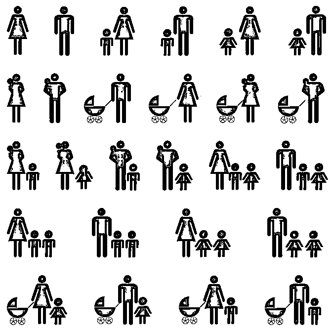**需要隔离的不只是病毒**

****

**最初，没有人在意这场灾难......直到这场灾难和每个人息息相关。**

**——电影 《流浪地球》**

此次狮子座满月，狮子座月亮与水瓶座太阳精准对分并两两相望。太阳作为狮子座的守护行星，接纳着来自于狮子座月亮的能量，预示着（狮子座）月亮最终要走进（水瓶座）太阳的光芒之中融为一体。每年的水瓶月，水瓶座新月的时候日月精准合相在水瓶座，狮子座满月的时候水瓶座太阳接纳狮子座月亮的能量，这两个标志性的月相引领我们的生活重心和关注焦点汇聚在集体事物上，中国春节大多发生在水瓶月之内，举国欢庆和亲朋欢聚的集体活动也自然必不可少。可 2020 年的这个春节却完全不同，我们的生活和意识被这场与每个人息息相关的疫情所牵动，我们先从水瓶座的两颗守护行星**“土星和天王星”**开始探讨。

**土星的“实话实说”**

在古典占星学中，**土星守护摩羯座和水瓶座**，但土星能量在这两个星座却是一种“递进”的层次和关系：

*   **土星与摩羯座**

*   土星先是在摩羯座的现实土壤里搭建“权威建筑”，因此，哪里该用什么材料和该做何道工序，哪里该有什么分寸和该定什么边界，就必须通过“现实磨练”才能构建规则框架和秩序结构，通过“现实考核”才能获得成熟原则和权威品质。

*   **土星与水瓶座**

*   土星再到水瓶座的时候，是要以“权威建筑”来吸引同频的能量和相关的资源，或者说“权威建筑”要去服务同频的能量和相关的资源。这是一个需要谨记初心并秉持原则才能完成的进程，否则会造成凝聚力的消散，建设性的尽失。

如果我们沿着土星在“摩羯座-水瓶座”的守护轨迹去观察，那么就会发现 2020 年水瓶月的考验与混乱正是土星“实话实说”的现实播报。或许，人类世界真该检视一下**“丢失了哪些原则和边界”**，反思一下**“偏离了哪些轨道与初衷”**了：难以防控的病毒和水火，漫天飞舞的蝗虫和蝙蝠，究竟只是互不相关的突发考验，还是整个地球生态链的危机预警呢？2020 年宇宙大背景“土冥合相”的“洗牌与重建”进程还会带来多少的考验与沧桑呢？这些问号，不是恐惧，而是悲凉。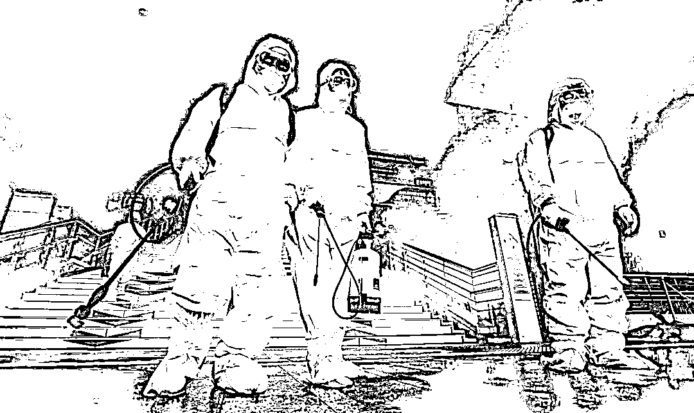

**天王星的“高阶路径”**

在占星学的十大行星中，**天王星排在土星后面，并与土星共同守护水瓶座**。在宇宙中，天王星的身影时隐时现，就像快速闪现的雷电，又似偶尔迸发的灵感，代表着**更高的宇宙智慧和集体意识，引领着人类文明的革新升级，科学技术的突破发展。** 天王星能量精微而难以觉察，不按常理出牌而难以琢磨，故而天王星能量具有两种呈现：一是**通往神性和大爱的高级意识**，二是**带来过度和怪异的疯狂行径**。而天王星能量究竟会导向哪一种可能性，则与排在其前面的土星有着重要的次第关系，因为**只有在规则和秩序的基础之上，以利他和服务的初心护航，才能真正引领人类世界的升级和发展。**试想哪一次人类文明的更进和科学技术的飞跃不在盛世？但是，我们不能忘记天王星的高阶路径是要**走向“通往神性和大爱的高级意识”**，如果丢失了这一原则和边界，偏离了这一轨道与初衷，那么就会转化为“过度和怪异的疯狂行径”。只是，很多时候我们难以觉察这两种能量的微妙转化。**2019 年 3 月 6 日-2026 年 4 月 26 日**，**天王星行进在金牛座**的 7 年时间，天王星与金牛座的磨合期震荡出不小的动静：金牛座的稳定结构和安全状态似乎被天王星颠覆和打破，但同时，天王星的科技革新和经济突破似乎也对金牛座的自然生态无能为力。于是，在人类世界仍沉迷于科技辉煌，仍兴奋地扩张经济的时候，世界各地却已悄悄遍布人与动物的哀伤。经济挽救不了生命，科技救赎不了灵魂，经济和科技是“人”的，但自然和生态却是“天”的，人类必须敬畏和臣服“天道”。

**隔离，既是公正，亦是尊重**

一场疫情让每个人“隔离”于集体生活之外，除了对防疫的准备和简单作息以外，生活节奏也随即缓慢下来，独处时间也随即增加许多。虽然大家都知道保护好自己和家人就是对集体最大的贡献，但随着时间一天天地累加，焦虑也难免一天天地滋生。此次狮子座满月，（狮子座）月亮要走进（水瓶座）太阳的光芒之中融为一体，而“狮子座-水瓶座”这一组对宫星座也对应着**“个体意志-集体文明”**之间的关系：个体汇聚集体，集体牵动个体，如果说“雪崩的时候，没有一片雪花是无辜的”，那么无论个人还是集体，更能互相扶持和更有建设性的选择是什么呢？

土星最终定位了此次狮子座满月的能量。当土星在摩羯座搭建好现实的“规则和秩序”，在水瓶座吸引同频能量并服务相关资源的时候，意味着要**与不同频和不相关的事物“隔离”**，**将违背原则和损害众益的事物排除**，如此才能更有效地集中能量，更有建设性地运用能量。

此次狮子座满月，**“尊重和公正”**两个词汇被凸显：**个人层面，坚守和自律是对其他生命的尊重；集体层面，真实和有序是对每个生命的公正**。众志成城，既是相信自己，亦是信任他人。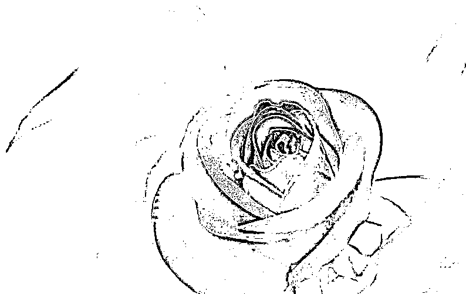**从哪里来，往哪里去，都要心怀希望**

****

**希望是像钻石一样珍贵的东西。**

**——电影《流浪地球》**


**天象**

*   **木海六分**：行进于摩羯座的木星与行进于双鱼座的海王星形成“木海六分”结构； 

*   **水星介入南北交点**：行进在双鱼座的水星三分巨蟹座北交点，六分摩羯座南交点； 

*   **天王星 30 度“金凯合相”**：金星与凯龙星合相于白羊座，并与行进于金牛座的天王星形成 30 度结构； 

*   **金星四分南北交点**：白羊座金星四分摩羯座南交点和巨蟹座北交点；

*   **火星 30 度“土冥合相”**：行进在摩羯座的土星和冥王星依然处于“土冥合相”结构，行进在射手座的火星与“土冥合相”形成 30 度结构。

2020 年的水瓶月真的不平静。从水瓶座新月到此次狮子座满月的半个月时间里，水星、金星和火星这 3 颗快速的触发器，犹如擦过墙壁的火石，不时地激起一串火星。而随着 2 月 3 日水星进入双鱼座，2 月 8 日金星进入白羊座，2 月 16 日火星进入摩羯座，更是激起一番能量的转换和震荡。

我们沿着水瓶座新月到狮子座满月的轨迹，去追寻这场牵动每个生命的疫情演化线索。

**新月时的爆发**

水瓶座新月的时候，代表“人际”的金星与代表“疫情”的海王星在“无界融合”的双鱼座海洋中形成“金海合相”结构，疫情通过“人传人”的方式悄然潜伏并莫名传染；具有煽动性的射手座火星四分“金海合相”更令“人传人”的疫情迅速蔓延且难以控制；而代表“公众新闻”的水瓶座水星与射手座火星的“水火六分”结构，与双鱼座金星的“水金 30 度”结构，则令真假信息的传播犹如病毒传染一般快速和难辨。

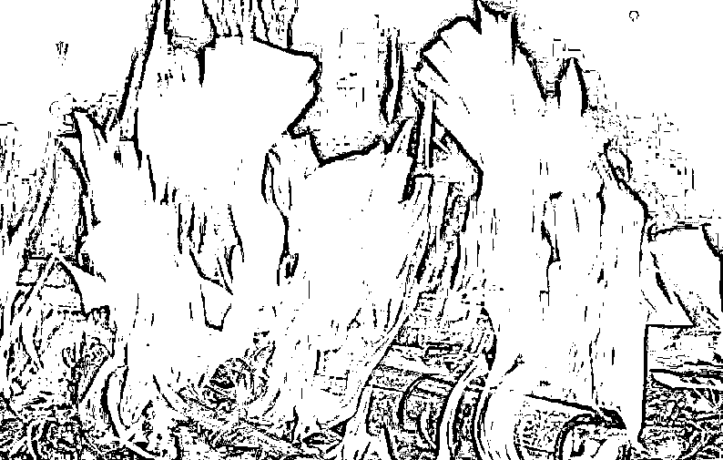

**2 月需要注意的**

进入 2 月，影响 2019 年全年的”木海四分“结构中的木星和海王星又形成**“木海六分”**结构，于是，**木星的“扩张”又为海王星的“疫情”带来一波渲染**。木星已经从 2019 年的射手座走到了 2020 年的摩羯座，土星定位着摩羯座木星的能量，故而“木海六分”结构带来两种可能性：一方面专业人士和权威组织将会积极投入并坚持不懈地寻找治理疫情的有效策略；另一方面由于 2020 年土星的脚步在“摩羯座-水瓶座”之间来回穿梭（3 月 22 日土星进入水瓶座，7 月 2 日逆回摩羯座，12 月 17 日正式进入摩羯座），能量也具有变来变去的特性，故而需要**警惕病毒的“变异”可能性**。“木海六分”结构是踩着 2020 年第一波水逆的脚印前行：**2 月 2 日水星进入逆行前影响期，2 月 3 日水星进入双鱼座**，“木海六分”结构开始形成；**2 月 17 日水星开始逆行，2 月 20 日“木海六分”结构达到能量顶峰。**水星逆行前影响期的**2 月上旬和中旬**，可以说是**计划充满变数，信息模糊混乱**的一段时间，“木海六分”结构行走在这段时间里就更要**警惕反复和变异的风险，加强有原则的管控和有秩序的安排**。因为，将于**2 月 17 日-3 月 10 日发生的水星逆行**会令 2 月上半月的一些事件再度触发，而**2 月 20 日达到能量顶峰的“木海六分”结构可能会令此次狮子座满月前后 3 天的事件进一步扩展和深化。**2 月，需要我们**慢下来和平静下来**。虽然这场疫情给个人和集体都会带来一定的损失，一些朋友面临着生存的压力，一些企业承担着发展的责任，但是急不来的时间真的急不来，我们只能面对现实的考验，而现实也在向我们提出反问：为什么不能暂时慢下来或停下来？为什么只差这几天？那些爆发的危机和即将压垮你的是什么，是本就存在，还是此次疫情所致？2 月绝对不是松懈和侥幸的时间，口罩和消毒依然必不可少，防护和独处继续坚持到底。

**满月时的第二个“十四天隔离**”

此次狮子座满月的前后 3 天**（2 月 6 日-2 月 12 日）**是敏感的影响期和触发点。**2 月 5 日**，双鱼座水星与白羊座凯龙星、金牛座天王星形成“水凯天小三角”结构，**2 月 6 日**，射手座火星与摩羯座冥王星形成“火冥 30 度”结构，一些事件在光与暗的交错之中变得扑簌迷离，一些信息在真与伪的拔河之间变得隐晦模糊，于是**揭开真相和恐惧真相**似乎变成了两股纠缠的绳线，编织出**“小人物”无力的命运感**，撕裂了**“弱势群体”不被认同的羞耻感。****2 月 8 日，**“水星介入南北交点”三分巨蟹座北交点，六分摩羯座南交点，令人们感受到**内心的悲凉与生命的脆弱**，允许自己像个孩子一样地哭泣吧，但过后你得向着目标继续前行，因为还有目标追寻是生命宝贵的福利。“水星介入南北交点”这组结构会随着水星逆行的脚步前后 3 次呈相，而每一次的能量和寓意并不相同，带来心灵疗愈和目标梳理的契机。**2 月 8 日**，金星进入白羊座并与凯龙星形成“金凯合相”，与金牛座天王星形成 30 度结构，宅于家且忧于心的人们，一见钟情也好，旧情复燃也罢，恐怕谁也不敢拿生命冒险，除了网联以外。故而，这几组结构更多地引领我们**从旧情旧伤之中沉淀经验并迸发智慧**，而**2 月 12 日**的“金星四分南北交点”结构则推动我们**确立能带来满足感的自我立场和全新目标。****2 月 9 日**狮子座满月当天，射手座火星与摩羯座土星形成“火土 30 度”结构，土星当仁不让地定位以上几组结构的能量。土星的能量依然指向“隔离”，而钟南山先生也忠告**2 月 7 日-2 月 20 日期间再坚持第二个 14 天**。人类真的要赞颂这位伟大的老师，因为第二个 14 天恰好始于狮子座满月影响周期，结于“木海六分”结构的能量顶峰，**我们要避免的就是“扩张”，当然还要警惕“变异”。**第二个 14 天的隔离更为重要，但是需要隔离的只是病毒吗？隔离的终极目标是什么？病毒清除后如何不再复来呢？这个世界无论是我们与病毒，还是资源与疆土，如何才能和平地相处呢？或许，我们每个人都会去思考这些问题，因为在这个大家都想重启的 2020 年初，我们的心不知道疼了多少次，而这些疼痛让我们深入了解到——**宇宙万物都需要被“尊重和公正”对待，如此才能无论任何情况下，宇宙万物都能成为彼此的希望，互相支撑，和谐平衡。****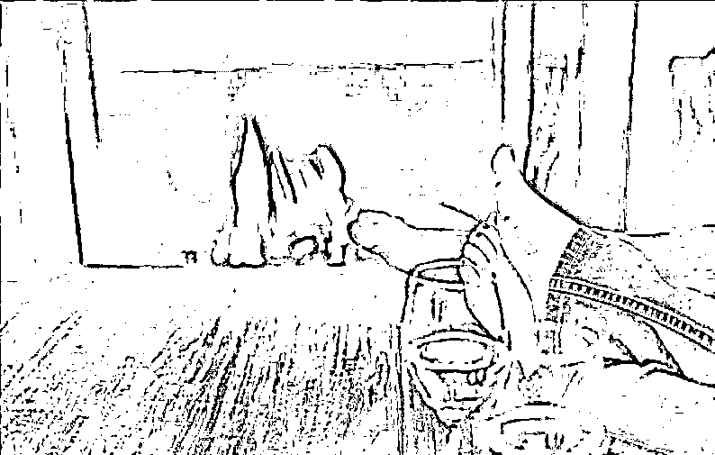****寄语**

****

**我原来以为家在身后，现在才知道家在前面。**

**——电影《流浪地球》**

我们总想走回去，走回熟悉感和安全感，但生命自妈妈的子宫走出来之后，就再也不可能走回去，只能向前走去创造全新的“具有熟悉感和安全感的家园”，然后再向前走......家，在前面。2020 年，最大的挑战是**“向前走”**，一些人事物就毫无征兆地留在原地不能再向前了，这无疑令我们感觉到痛苦与哀伤，但也正是这些痛苦和哀伤教会我们新的智慧——我们还肩负着自己和人类的使命，还要向前走去创造全新的“具有熟悉感和安全感的家园”，那么我们如何向前走呢？又如何为人类世界向前走奉献自己的一份能量呢？此时，从“隔离”开始。在此祝福所有朋友保重身体并做好防护，我们同在。祝福大家。

**版权声明**：原创文章由作者授权首发于若道平台，欢迎转发，反对抄袭。友号转载请申请白名单。

****

****想阅读更多作者的文章，****

****请在后台回复******王芝桦****** 即可。****

****王芝桦****

心理占星师，统合疗愈师，占星专栏作者

若道占星“新月和满月”专栏作者，腾讯视频特约占星师

全职于个案咨询与占星教学工作 15 年

**个案预约咨询微信号**：zhihua0621 

**微信公众号**：daoxi-life

**长按打赏**

****

**点击图片查看若道君推荐**


[](https://mp.weixin.qq.com/s?__biz=MjM5MjQwNjAyMQ==&mid=2649436779&idx=1&sn=3655c52d36cea8abc324520de83a7999&scene=21#wechat_redirect)

**微信又双叒叕改版啦，不想错过若道君的推送？**

**就把若道设为星标吧！**

**▼**


喜欢记得点一下在看哦☟

********报名直达入口********


# 金星进入白羊座 | 疫情结束时，请紧紧拥抱你爱的人

> 原文：[`mp.weixin.qq.com/s?__biz=MzA5NjA0NTAxNg==&mid=2651413255&idx=1&sn=5cf7873bde3909b7e1124ce78e443a51&chksm=8b4be9b0bc3c60a6bf14b2f8e34dbc36a490b86df2fe969edf24fde21bec9cec5374b1b1af9d&scene=126&sessionid=1692738217#rd`](http://mp.weixin.qq.com/s?__biz=MzA5NjA0NTAxNg==&mid=2651413255&idx=1&sn=5cf7873bde3909b7e1124ce78e443a51&chksm=8b4be9b0bc3c60a6bf14b2f8e34dbc36a490b86df2fe969edf24fde21bec9cec5374b1b1af9d&scene=126&sessionid=1692738217#rd)

****************☆******************************后台******************************回复“今日”，给你一句生命态度****************

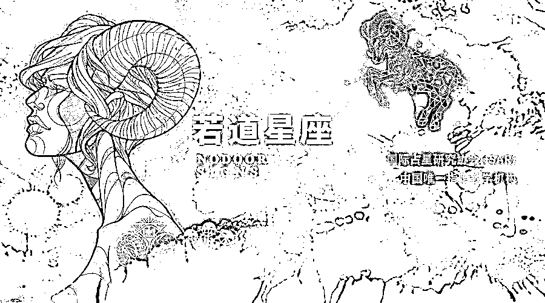

作者/郑玮玲 ISAR 认证占星师

编辑/玫瑰 图片/全景网

2 月 8 日 3:52，金星进入白羊座，在接下来 24 天内，金星会经过每个人星图中白羊座所在的宫位，点燃一波火红的激情。在这段闭门不出的日子里，爱情的热烈该如何彰显？我们邀请你一起来看看关于金星白羊座同冥王星碰撞后产生的火花。 这一刻，如果你有对疫情的恐惧，对未来的焦虑，宇宙将用白羊座勇往直前的能量帮助我们面对艰难。等疫情结束，你第一个想见的人，请紧紧拥抱他，告诉他你爱他，因为就算面对不确定的未来，我们还拥有赤诚的爱，谁都无法剥夺。

这将是宇宙给我们最珍贵的礼物——珍惜当下所爱，大胆说出爱。**金星进入白羊座**金星是一种**阴性能量**，是**情感、享乐**；是**爱与美、财富与价值**；是女性的象征。它迷人也令人愉悦。白羊座被**火星**守护，是**战士**原型、是**率真、热血、快速、直接、冲动、勇气和意志力。****金星守护的是金牛座与天秤座，金牛座的享乐主义与天秤座取悦、和谐都与金星的本质共振**。这两个星座对面的天蝎座与白羊座在传统意义上被认为是金星较难正常发挥的位置，天蝎座的深邃孤僻令金星难以愉悦，白羊座的冲劲与血气方刚则与金星的婉约柔美相背离。然而，正是这种刚柔相济、阴阳合一的碰撞带来了非凡的吸引力——**不拐弯抹角地表情达意、主动大胆、柔情之中自有决断力、穿透力，拥有令人无法抗拒的魅力。****金星在白羊座，如何打开爱情****“一见钟情”**正是金星白羊座人的恋爱打开方式，他们如孩童般简单、纯真，是恋爱中的傻白甜，唯有快速撞入心扉的人才迎合他们对爱热切的期盼，根本没有耐心微火慢炖。“女为悦已者容”说的是天秤座的金星。而白羊座的金星是：**为已而容。**不做作、不为他人粉饰、真挚无虚——爱，就请爱我真实的样子，勇敢热切，赤诚如火。金星白羊座的人在感情世界中与**竞争好斗**的伴侣相互吸引，也容易进入**三角关系或是参与金钱与价值的角逐**。他们会在关系中占据主动，也倾向于和伴侣互保鲜明的个性。由于白羊座的自我中心，即便在情感的争端中也**不为关系妥协**，有时是**盲目**，有时却**明知对方需求，也不原牺牲自我尊从对方的价值观。****极少犹豫，主动示爱，也意味着更多的冲动与挫败。**白羊座的战士原型给金星带来为爱无畏的勇气与果决，宁可受伤，战死沙场，也要赴汤蹈火。于是，白羊金星座总在伤痛中吸取营养，学习成长为更有力量的爱的战士。只有在**经历万水千山之后，依然拥有天真去爱的勇气**，才是金星在白羊座巨大的财富。金星在白羊座爱的方程式是：**我爱你，与你无关。**奉你一颗滚烫的心，若你承接，这炽热的爱火将照亮你心。只因无畏爱过的每一次，才令自己的生命更有价值。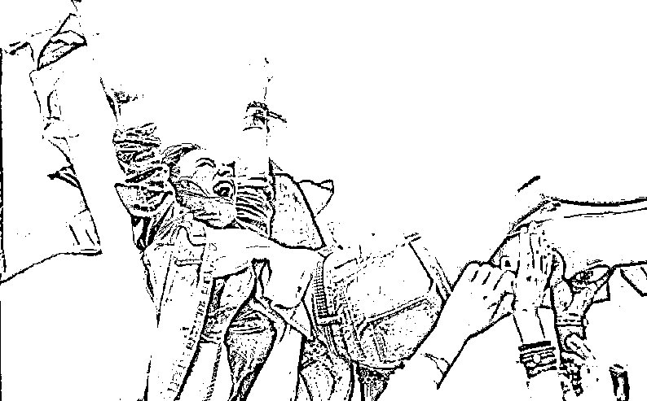**金星在白羊座的名人们**雷诺阿、加西亚·马尔克斯、奥黛丽·赫本、伊丽莎白·泰勒、玛丽莲·梦露、吕克·贝松、伊能静、徐若瑄、舒淇、范晓萱、蕾哈娜、Lady Gaga……他们的面孔、眼神、肢体语言、艺术作品，无不散发出鲜明、自我、真挚的吸引力，他们的情感世界亦然。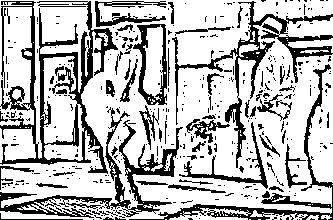

****▲ 玛丽莲·梦露****

玛丽莲·梦露用手按住被风掀起裙摆的经典照片，如此摄人心魂，没有一个男人不为之迷醉，所谓倾国倾城，不过如此。

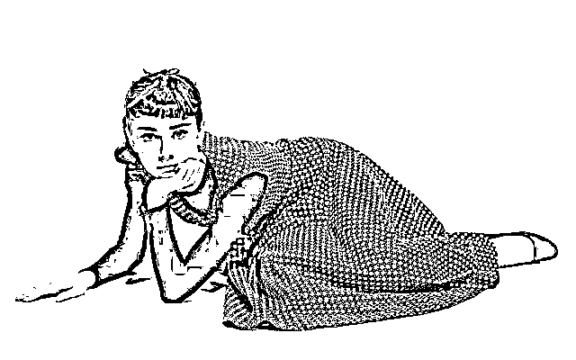

****▲ 奥黛丽·赫本****

奥黛丽·赫本的可爱、纯真深入人心，在很多人心中她是无人能替代的女神。她的一生都勇敢为爱追寻，最终将这份纯真的爱献给了孩子们，建立了自己的儿童基金会。


******▲ Lady Gaga******

蕾哈娜和 Lady Gaga 都是这个时代大胆时尚的标志性人物，以鲜明的个人风格著称。

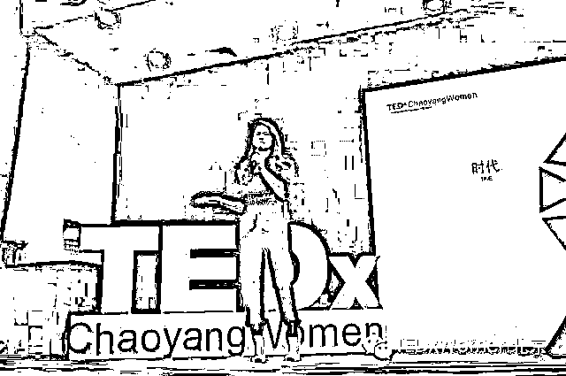

********▲ 伊能静********

伊能静曾站在 TEDx 演讲台上，铿锵道出金星在白羊座真实的宣言：
**“我就是要跳出这个时代，成为一个勇敢的人。虽然我的先生小我 10 岁，当我更年期的时候，他还非常年轻帅气，我相信他会爱我的内在，我只需要是我自己。”**

> **伊能静作词的《春泥》**
> 
> 迷雾散尽 一切终于变清晰
> 
> 爱与痛都成回忆……
> 
> 我会提起勇气  好好地呵护你
> 
> 不让你受委屈 苦也愿意
> 
> 那些痛的回忆  落在春的回忆里
> 
> 滋养了大地  开出下一个花季……

**金星白羊座+金冥相位**

出生星图中金星落在白羊座的人里有相当一部分人带有**金星-冥王星对分相**（如：出生于 1973 年到 1983 年期间，当时的冥王星在天秤座），当然，同时期出生，金星落于其它开创星座（巨蟹座、天秤座、摩羯座）的人也有相当一部分有金星-冥王星困难相位。**当下的冥王星正行进在摩羯座，这个时代出生的金星白羊座的孩子很多也会有金星冥王星四分相。**

冥王星是高八度的火星。它具有比火星更强烈的**战斗力、催毁力和颠覆力**，它是黑暗不可见的炼狱，也是转化重生的火炉，赋予人类蜕变的魔力。当白羊座的金星与冥王星碰撞，激起的火花带有致命吸引力。
不管冥王星终级表现如何，在体尝它的过程中总带着**黑暗的驱力**。**拥有金星-冥王星相位的人生命中难免吸引来激烈、隐密的地下恋情。纵然他们内心已汹涌澎拜，电闪雷鸣，外表依然风平浪静。**很多感情困惑的人会寻求占星师或是心理咨询师的帮助，但拥有金星冥王星相位的人甚至**不会向最信任的挚亲好友倾诉。**因为**冥王星强迫的隐密性令他们的情感生活无论炽热程度还是面对普世道德都是极端甚至越界的，尤其在他们内心深处会给自己贴上罪恶、羞耻、禁忌的标签。**所以，金星-冥王星相位的人很难打开内心最隐秘、复杂又瑰丽的城堡很多拥有金星-冥王星相位的人早年生活经历了**黑暗、冷酷、被控制、挣扎、受虐、生存的危机、彻底的丧失和激烈的对峙。**成年以后，依然会在关系里寻求同等的体验来符合内心对爱的感受。他们心底深蕴着对真爱的渴求，用冥王星无意识的强迫性不懈追寻，往往吸引来刻骨铭心的爱，一次次深入情爱险境，甚至陷入毁灭性的危机。然而，早年的经验驱使他们做出无悔而绝决的行动，即便瞬间燃烧，粉身碎骨，舍身为爱也在所不惜。再加上金星白羊座的冲动盲目倾向，在生命中总会**如飞蛾扑火般奋力投入爱的烈焰，以至欲火焚身**。仿佛只能待烈焰成灰时才觉伤痛难耐，而血泪交融的过程也许正是金冥相位的人最适宜的自我疗愈方式，深入炼狱，才能浴火重生。冥王星不会如此轻易放过勇敢的金星，在伤痛过后仍难以释怀，执著如渊，无法觉醒。于是任狂风巨浪拍打吞噬，然后，纵身跃入无底深渊，去找寻那些困住自己的童年情境，承认那些伤痛的源头有着从未改变的吸引力，在灵魂深处寻找终级答案：

*   为何要在爱的关系里寻求而不得？
*   为何总是被那些痛苦的感情所吸引？
*   为何总在黑暗中体尝激情？

**请直面恐惧**

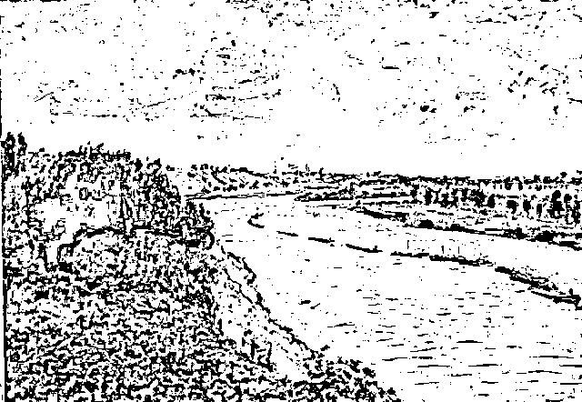

******▲ 雷诺阿的作品******

著名的印象派画家雷诺阿的金星和冥王星合相在白羊座。他一生贫困，却画出美伦美幻，充满生机的大自然，柔润、明丽、青春活力的女性，纯洁无邪的儿童。他说：**世界上丑恶的事已经够多的了。艺术为什么不能是美的呢？**


******▲ 加西亚·马尔克斯******

20 世纪拉丁美洲文学标杆加西亚·马尔克斯，他的白羊座金星与冥王星四分，具有白羊座的优越价值感与先驱精神。幼年的加西亚听外祖母讲很多神鬼故事，童年的记忆就是鬼怪幽灵的世界，这冥王星色彩的童年便成为了《百年孤独》的创作源泉，筑就了他魔幻现实主义文学先驱的地位。

从现实的黑暗中提取纯美的元素，从死亡的事物中升华出绝世之美，化腐朽为神奇，是金星和冥王星相位的人将才华用于艺术创造的最佳表达方式。


******▲ 伊丽莎白·泰勒******

伊丽莎白·泰勒有着金星和冥王星的四分相，一生有过六次婚姻，每一次彻底的丧失后再度以白羊勇士的面貌重燃爱火，演绎了比电影还具颠覆色彩的人生。

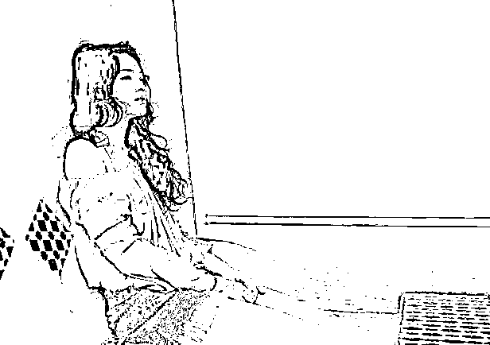

********▲ 舒淇********

舒淇的的金星在白羊座，与冥王星零度对分，早年的她因生活所迫以三级片出道，用禁忌、挑战大众审美底限的方式出卖自己的魅力。然而，金星白羊座令她无惧嘲讽、挑剔和责难，用自己不屈不挠的努力和鲜明的个性赢得荣耀，证明了自己独特的价值。她与张震戏剧般的恋情终以分手收场，两人共同出席活动时，她认真地质问张震：“你不是也娶了别人吗？”既是白羊座金星的率真，也带着冥王星的强迫与报复。你既离去，我心何甘。在爱中**直面最深的恐惧**是金星-冥王星相位的人的功课。最深的黑暗与他们生命中的源头之爱紧紧相连，若要逆转，寻求开解和疗愈，必入黑暗探寻、穿越、焚烧，从中提炼出如金子般纯然可贵的美好。金星-冥王星相位可能是所有相位中与炼金术最贴切的，所以，它何尝不是生命中难能可贵的礼物？
让灵魂无惧真实，接受所有的发生，并坚信自己的爱纯洁无邪，用真挚的心与黑暗伤痛拥抱，任情感通过黑暗的炼狱，无论黑白都是自己无畏的人生。

**版权声明：**原创文章由作者授权发布于若道平台，欢迎转发，反对抄袭。友号转载请申请白名单。


**郑玮玲**

ISAR（国际占星研究协会）认证占星师（2016 年获得）

若道占星专栏作者

将占星咨询、教学与音乐、舞蹈相结合的疗愈者

**微信号**：zhengviolin 

**微信公众号**：Sampriya-Astrology

长按打赏


**点击图片查看若道君推荐**


**微信又双叒叕改版啦，不想错过若道君的推送？**

**就把若道设为星标吧！**

**▼**


就是这个“在看”，戳戳戳 ☟

********报名直达入口********


# 2 月 19 日线上沙龙 | 6 个提高幸福感的占星建议，你值得拥有

> 原文：[`mp.weixin.qq.com/s?__biz=MzA5NjA0NTAxNg==&mid=2651413255&idx=2&sn=81b7ae7b8c3995bf32c2ae84f8bae9b8&chksm=8b4be9b0bc3c60a674872264f8cfebfedcd1d66ca956488fd71faa5fac409158b41f44b9a859&scene=126&sessionid=1692738217#rd`](http://mp.weixin.qq.com/s?__biz=MzA5NjA0NTAxNg==&mid=2651413255&idx=2&sn=81b7ae7b8c3995bf32c2ae84f8bae9b8&chksm=8b4be9b0bc3c60a674872264f8cfebfedcd1d66ca956488fd71faa5fac409158b41f44b9a859&scene=126&sessionid=1692738217#rd)

## 

Hi，还好么？在家憋坏了吧~
有没有那么一种感觉：剧也刷腻了，也不想打游戏了想学习的心好像要占领高地了？那问题来了：**若道最近有没有适合****零基础占星爱好者的沙龙或者课程呢？**既然你诚心诚意发问了那么专业贴心的熊鹰老师这就来解决你的课慌


「 **为什么学占星？**

**占星学能如何优化我们的生活？**」

**沙龙会讲些啥**

除了搭讪、谈资，学习占星还可以做什么？

**1**

**幸福法则一****撕掉错误的星座标签**给大家解释一个**神秘的规律**：我们都特别不喜欢自己被人**贴****星座标签**但就喜欢**贴****别人**熊鹰老师会帮你用占星学透过现象看本质反怼技巧大公开，和星座标签说再见从认知的角度正视“标签”，以及它的利与弊

2

**幸福法则二**

**活出你的占星正能量**

大卫·瑞雷老师曾经提到过个人成长的三部曲：

**觉知－接纳－转化**

这也是熊鹰老师秉持的观念

“觉知”

占星学本身就是一个很好的觉知工具

它以相对客观的方式帮助我们省视自己

而在客观与理性下，觉知是最容易升起的

**知道建设性的发挥是什么**

**什么样的修行方式最适合自己**

**（可以通过解读个人星图来发现）**

3

**幸福法则三**

**浅谈近期宇宙天气**

2020 是什么样的一个开年？

联想到电影《流浪地球》这句台词：

“

最初，没有人在意这场灾难
这不过是一场山火，一次旱灾

一个物种的灭绝，一座城市的消失
直到这场灾难和每个人息息相关

——电影《流浪地球》

”

那么近期有哪些值得关注的宇宙天气？

熊鹰老师帮你梳理 2020 年接下来的日子

该如何在大环境下优化小生活

应对严峻挑战

4

**幸福法则四**

**把喜欢的事变成职业**

熊鹰老师会讲述他的占星学习生涯

如果确认了占星是自己喜欢的事

如何坚持到底，做到最好？

5

**幸福法则五**

**和志同道合的伙伴走在路上**

聊一聊熊鹰老师身边的若道毕业学员

成为兼职占星师或全职占星师后

生活是怎样的？

清新美好的自由职业
和理想很近，和现实很远
兴趣和工作到底能不能无缝对接？ 

6

**幸福法则六**

**有人懂你的困惑，走过你在走的路**

熊鹰老师会讲一讲他学习和执教多年

看到的占星学子的常见问题和困惑

还会给你讲一讲系统学习占星该如何入门

掌握了一定占星知识后如何实践？

**介绍 ISAR 国际占星研究协会**

世界上最前沿、最具启发意义的占星组织之一

如何获得 ISAR 认证

等等

**占星能给每个人带来的幸福感还有很多**

**来沙龙听熊鹰老师娓娓道来吧！**

**沙龙详情**

**沙龙时间**：**2020 年 2 月 19 日 星期三  20:00-21:30**

**主讲人**：熊鹰老师

**参课方式**：网络直播

**沙龙价格**：100 元（**想获得免费入场机会？往下看**）

**报名方式**：**务必添加文中客服小姐姐，进行报名**

**报名截止**：2020 年 2 月 18 日 18:00

**人数限制**：200 人

**特别提醒**

**❶ 不接收空降，请提前报名付款确认名额**

**❷ 报名成功后，会在 2 月 19 日下午统一发送参课方式，请耐心等候**

**❸ 由于个人原因无法出席沙龙，不提供开课后退款，敬请谅解**

**「**

**免费入场券**

**FOR FREE！**

**」**

** 转发本文至朋友圈**

**截图发给客服小姐姐获得免费名额**

**截止时间 2020 年 2 月 18 日 18:00**

**（分组无效）**

**长按二维码添加客服**

▼


**沙龙主讲简介**


**熊鹰老师（天空的空）**

*   2008 年接触严肃占星学，至此爱不释手。
*   **2013 年师从大卫·瑞雷**，研习整套现代占星学核心课程，并于 2014 年起至今连续三年担任该课程的主助教。
*   期间也**跟随格伦·佩里、诺·泰尔、理查德·塔纳斯、罗伯特·汉德、苏·汤普金斯、斯蒂芬·弗里斯特等多位国际顶尖占星大师进行学习**，进行定向占星主题研究。
*   2015 年初，通过国际占星研究协会**（ISAR）资质认证并获得证书**。同年，进一步跟随大卫·瑞雷老师进修**“生时校正”**技术，通过最终考核并获得证书。
*   目前在若道星文化任职，将传播系统、严谨、真实的占星学作为职业使命。任专职助教期间，进行沙龙与答疑等辅助教学工作已累计超过 200 小时。
*   在业余期间也提供占星咨询与生时校正服务。目前正致力于占星学与个人成长的整合。

# 土海之恋 | 讲真，灵魂伴侣被柴米油盐一浇灌就枯萎了

> 原文：[`mp.weixin.qq.com/s?__biz=MzA5NjA0NTAxNg==&mid=2651413233&idx=1&sn=c1ceda3157e01b70ea55d72ec1d31906&chksm=8b4be846bc3c615069875fb74d9d0b53140b8cc6c34d72260e8414ba6eb4fb990d0e059f4064&scene=126&sessionid=1692738217#rd`](http://mp.weixin.qq.com/s?__biz=MzA5NjA0NTAxNg==&mid=2651413233&idx=1&sn=c1ceda3157e01b70ea55d72ec1d31906&chksm=8b4be846bc3c615069875fb74d9d0b53140b8cc6c34d72260e8414ba6eb4fb990d0e059f4064&scene=126&sessionid=1692738217#rd)

********************************☆ **************后台******************************回复“今日”，给你一句生命态度****************


作者/咔咔 ISAR 认证占星师 

编辑/玫瑰 图片/花瓣网

作者的话

罗大佑说，“爱情这东西我明白，但永远是什么。”

其实爱情是什么，我也不明白。我想，如果我明白了，老天爷可能也就不会把我撒向尘世，让我再来历劫了。

但是，爱情不是什么，我可以分享一些个人的感受，也从我过去的咨询案例里偷来一点点资料。

**若你遇到一个土星式的伴侣**有时候我们会在关系里遇到比我们成熟许多的伴侣，我们变成了这个关系里的小孩子。有时候这个伴侣确实年纪比我们大很多，有时候他们只是在关系里占据了有利的地形，更加的强势，所以留给我们的角色，就好像回到了小时候，我们和父母的关系里体验到的无助和彷徨。我们会觉得：**“啊，我们什么都做不好，对方比我实在强太多。亲爱的啊，你是我心中的明灯，你是我心中的神祇。为了你的肯定，我愿意付出我的所有。”**

于是我们做了什么呢？我们开始很努力地投入这个感情，觉得这个感情里，我做的永远都不够。我不够好，我配不上这神一样的伴侣。那让我来努力吧！我可以为了你离开我的家乡，丧失我的独立身份，抛弃我的事业，我只有在这个关系里才是存在着的，离开了你，离开了这个关系，我就消失了。

**于是我允许你对我提出各种要求，挑剔我的各种毛病，我把我卑微的爱奉献给你，好像努力给主人奉上丰厚的祭品。**我的感受和感情不重要，我只要去满足主人的要求，这卑微的爱啊，让我如此痛苦，却逃不开。

如果你觉得自己不值得被爱，那你就得不到爱。你自己的桶里没有水，用什么去浇灌爱的花朵？你遇到了严苛的土星大人，你经历的绝望和压抑的感情，是因为你告诉自己，我只配得到这些。

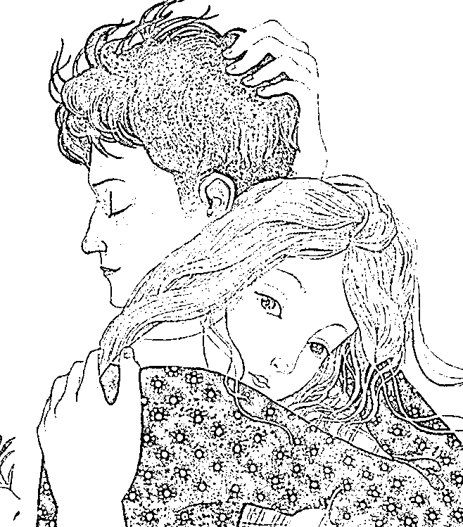

**海王星想要的完美爱情**

与其说爱不是完美的，不如说在爱里的两个人都不是完美的。爱是个概念，但感情关系是落地的，再浪漫的爱，也要面对激情的另外一面，日常的相处。两个人的感情关系不会永远地隐藏起来，这个感情关系是两个人的社会关系的一部分。

也许幼年时家庭环境多有艰辛，所以我们在头脑中创造了一个“完美的世界”，在这个世界里，我能逃开日常生活的问题。是啊，那时候那么小的我，面对这些世俗的难题还能怎样呢？就在心里制造一个小小的“伊甸园”咯……

无论幼年的我经历了什么，被抛弃、被忽略、被指责、被否定，我都还有心中的那个理想所在，在那里，一切都还是完美的，我是被爱的。

当我长大了，我希望在成年的世界里仍然找到那份完美的爱。找到那个**“不管怎样，我都爱你”**的伴侣。或者在伴侣身上投射了这种期待。

**当土星遇到海王星，爱情还能好么**

有多坚强的伴侣才能承担这个完美的形象啊？都是凡夫俗子，扛不住，扛不住……然后，这个粉红色的泡泡就破灭了。我发现自己从来没有真实地认识过对方，只是理所当然地希望他来扮演我“完美世界”里的 Mr. Right。

**通常这么痛的领悟是发生在海王星对第七宫或者金星的行进即将完结之后。而现在，因为土星这个碾压一切泡泡的“老恶魔”遭遇到了“完美的、梦幻的”海王星，这场梦结束的比往年要早一些。**

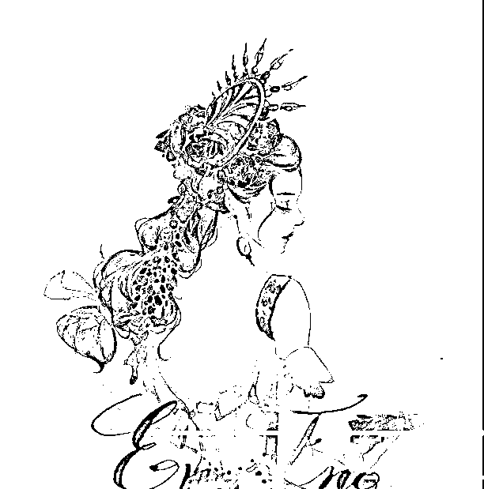

在痛苦的关系里挣扎的男女们啊，你遭遇了哪种关系呢？

*   你的“完美的恋情”没抗住土星现实的碾压？

*   你在克制的压抑的爱里感到窒息和绝望？

*   你沉浸在得不到的“完美恋情”的失望里？

换个角度想吧——

*   **你的“完美的恋情”没抗住土星现实的碾压？**

*   **新角度**：及时止损，继续做梦的话，要输掉更多的时间、精力、情感和机会。 

*   **你在克制的压抑的爱里感到窒息和绝望？**

*   **新角度**：我真的认为自己值得平等的关系么？是什么让我自觉在关系里屈居于卑微的地位？如果我一直是这种想法，离开了这个压抑的关系，我下一个关系会有实质性的变化么？ 

*   **你沉浸在得不到的“完美恋情”的失望里？**

*   **新角度**：真的有“完美的恋情”吗？我在逃避什么？我现在是否有能力面对真实的人生，照顾好自己，在不完美的感情关系里仍然得到滋养和爱护？

以上问题，皆没有正确答案。 

答案就在你心中。如果你愿意，就和占星师一起从自己的星图中寻找线索吧，开启一个忠于自己的觉知之路。 

祝福大家！

**版权声明：**原创文章由作者授权发布于若道平台，欢迎转发，反对抄袭。友号转载请申请白名单。


********想阅读更多作者的文章，请在后台回复**************** 咔咔 即可。********

**咔咔**

职业占星师，2017 年度若道兼职助教

ISAR 认证占星师（2014 年获得）

国际知名广告公司和市场研究公司工作十余年

**微信公众号**：咔星人

长按打赏


********长按下图二维码********

********测试你的恋爱关系********


********测试恋爱关系直达入口********


# 金牌课程·中英双导师 L1-2｜足不出户，占星智慧云掌握！

> 原文：[`mp.weixin.qq.com/s?__biz=MzA5NjA0NTAxNg==&mid=2651413233&idx=2&sn=aeaf7445e434b2c546c9b45916471e62&chksm=8b4be846bc3c6150ee11e712ede47c1143fdb77999fd1b5bdc4461b10d68d01bb353d0020063&scene=126&sessionid=1692738217#rd`](http://mp.weixin.qq.com/s?__biz=MzA5NjA0NTAxNg==&mid=2651413233&idx=2&sn=aeaf7445e434b2c546c9b45916471e62&chksm=8b4be846bc3c6150ee11e712ede47c1143fdb77999fd1b5bdc4461b10d68d01bb353d0020063&scene=126&sessionid=1692738217#rd)


非常时期，大家在家躺着什么都不干就是为社会做贡献了。很多小伙伴跟若道君表示在家宅着已经快长蘑菇了。与其在家刷朋友圈陷入对未来的无限焦虑，不如重启一直以来的占星爱好变成专业。一起来了解一下若道 2020 年春季隆重开学的**占星入门网络直播课**。

众所周知，若道办学 9 年来，最专业的坚持是，以直播的形式**让每位零基础小白学员，与国际顶级占星大师“零距离零时差”沉浸式学习**。下面是我们对于即将到来的本学年学习方式首次详解，敬请提问互动。

**足不出户，占星智慧云掌握**

**学占星，网络直播课的妙处在哪里？**

**1**

**若道占星 9 年磨一剑**

从未来趋势上看

从线下教育向线上教育发展蓬勃

若道作为国内乃至国际上权威的占星教育平台

早已在线上直播课的路上经历 9 年的上下求索

每一届核心课都在迭代与优化

线上直播课不断积累与改进

进而提升学员的体验和学习效果

让广大若道学员有更多的收获


2

**直播课是一次次美丽的宇宙共时性**不同于现在市面上的各种视频录播课线上直播课，需要投入的人员和资源会更多但若道之所以选择这样的坚持是因为直播课的学习效果确实最有保障占星学本身就是一门和宇宙相关的学科每一次老师和同学们同一时间上线各自分享着近期的事件和挑战传递和接收着占星学的知识和奥义何尝不是一次次的约定和美丽的共时性呢？


你还可以在互动区及时地提出你的问题与困惑
老师通常在下课前会留出时间进行答疑如果你的问题班里的同学知道也会帮你补充回答、及时互动甚至会因此碰撞出更有价值的思考

3

**主动学习比被动学习重要****系统学习比碎片学习珍贵**系统就是有章可循每周固定的时间和权威信赖的老师，熟悉同频的同学们一起主动学习、系统学习困惑及时被 ISAR 认证的占星助教解答今年，熊鹰老师还会亲自下场解读知识伴随着详尽的讲解生动的案例、互动的实践被吸收相信我，学习占星会变成特别珍贵的学习体验

4

那有的同学会说

道理我都懂，但我就是缺乏自觉性

老是三分钟热度怎么办？

我们的知心课程顾问就华丽登场啦！

课程顾问会变着花样

做各种好看的课程通知小海报提醒你上课

记录你的每一次出勤情况

帮你反馈和解决各种专业知识以外的问题

当你动力不足有几次缺课的时候

还会亲和地询问你最近的学习困难

给你及时的鼓励和支持

提醒和收集老师的课堂作业

5

学习不掉队，还能赢取**奖励课程券**是的若道直播课程是有机会获得课程券的可以直接当钱花，购买或抵扣之后在若道消费的其他课程帮助真正热爱占星的你减免学费压力比如土星奖&木星奖


教育是什么？德国哲学家雅思贝尔斯说：**教育是一棵树摇动另一棵树，****一朵云推动另一朵云，****一个灵魂唤醒另一个灵魂。**网络直播课与老师的联结是最强烈的**我们 2020 年占星直播课的老师是谁？****拥有 49 年占星实践经验的若道创始人****ISAR 全球副主席****ISAR 全球职业占星师资质认证主席****大卫·瑞雷**&**最懂学员的若道首位认证金牌中国老师****熊鹰****师徒二人****合力打造****L1-2 初阶网络直播课****2020 年 4 月 2 日（周四）开课**2020 年之前我们的 L1-2 一直是 8 节课 2020 年注定是不平凡的一年所以我们决定**8+2****把初阶课直播课升级为****10****节**给刚刚踏上占星之路的你更好的支持和陪伴**万事俱备 只等你来！****1-2 阶我们要学习什么？**

**第一阶  12 星座，12 种性格，12 种人生 **

❶ 学习占星学必须准备的“心法”

❷ 占星学中的火、土、风、水四元素，阴阳法则

❸ 面对面的星座有故事

❹ 12 星座：12 种性格详解，12 种行为模式，12 种价值观

❺ 太阳和月亮：了解你的太阳，生命的发动机，让你在世界闪光的方式，生命获得力量的方法；了解你的月亮，让你获得幸福的方法

❻ 了解太阳、月亮，了解你生命中已经出现的、将会出现的男性和女性

**第二阶  命运的线索和人生故事中的演员**

❶ 命运的线索：南北交点

❷ 星图三巨头：太阳、月亮、上升点的故事

❸ 了解心智：水星

❹ 了解金钱和关系：金星

❺ 了解行动模式：火星

❻ 了解信念：木星

❼ 了解努力：土星

❽ 了解天才和疯狂：天王星

❾ 了解梦想和幻灭：海王星

❿ 了解死亡和重生：冥王星

⓫ 12 个人生场景：黄道 12 宫位初解

**大卫老师和熊鹰老师如何分工呢？**


❶ 2020 年 4 月 2 日（周四）20:00-22:00 星座 1 主讲人：大卫·瑞雷老师

❷ 2020 年 4 月 9 日（周四）20:00-22:00 星座 2 主讲人：熊鹰老师

❸ 2020 年 4 月 16 日（周四）20:00-22:00 太阳、月亮 主讲人：大卫·瑞雷老师

❹ 2020 年 4 月 23 日（周四）20:00-22:00 水星、金星、火星 主讲人：熊鹰老师

❺ 2020 年 4 月 30 日（周四）20:00-22:00 木星、土星 主讲人：熊鹰老师

❻ 2020 年 5 月 7 日（周四）20:00-22:00 三王星 主讲人：大卫·瑞雷老师

❼ 2020 年 5 月 14 日（周四）20:00-22:00 宫位 1 主讲人：熊鹰老师

❽ 2020 年 5 月 21 日（周四）20:00-22:00 宫位 2 主讲人：大卫·瑞雷老师

❾ 2020 年 5 月 28 日（周四）20:00-22:00 月亮交点 1 主讲人：熊鹰老师

❿ 2020 年 6 月 4 日（周四）20:00-22:00 月亮交点 2 主讲人：大卫·瑞雷老师

**这两位优秀的占星学老师是谁？**


**大卫·瑞雷（David Railey）**

*   **ISAR 董事会成员，ISAR 全球副主席，ISAR 全球职业占星师资质认证主席，若道占星创始人。**
*   1976 年，通过亚特兰大职业占星师考试，成为全职占星师，随后通过**AFAN 和 ISAR 职业测试**。
*   1980 年，与**杰夫·焦耳**一起在亚特兰大创建**“每日星球”**占星学中心。此后在亚特兰大占星协会担任 4 年考官，并且两次担任**亚特兰大地区占星协会主席**。
*   1979-1992 年，作为占星师活跃于美国社会媒体，向不了解现代占星学变化的大众宣传专业占星学知识。在 1989-1992 年期间，他在 WRGG 电台 12 频道每周主持个人电视秀**“今日占星学”**，早先他还在 WRFG 的广播节目中播讲宇宙天气节目。 
*   2010-2014 年，任**全美占星师联盟监督委员会委员**。
*   2010 年，其著作**《灵魂的目标》**中国版出版，和蒋颖一起创办**若道占星**学校和其官网 www.nodoor.com。从该年开始，他工作并往返于亚特兰大和北京。目前他 80%的时间致力于在中国教授和推广西方占星学。
*   2017 年，被选为**ISAR 委员会成员**（2017）。ISAR 是世界最大的国际占星机构，会员遍布 45 个国家。


**熊鹰老师（天空的空）**

*   2008 年接触严肃占星学，至此爱不释手。
*   **2013 年师从大卫·瑞雷**，研习整套现代占星学核心课程，并于 2014 年起至今连续三年担任该课程的主助教。
*   期间也**跟随格伦·佩里、诺·泰尔、理查德·塔纳斯、罗伯特·汉德、苏·汤普金斯、斯蒂芬·弗里斯特等多位国际顶尖占星大师进行学习**，进行定向占星主题研究。
*   2015 年初，通过国际占星研究协会**（ISAR）资质认证并获得证书**。同年，进一步跟随大卫·瑞雷老师进修**“生时校正”**技术，通过最终考核并获得证书。
*   目前在若道星文化任职，将传播系统、严谨、真实的占星学作为职业使命。任专职助教期间，进行沙龙与答疑等辅助教学工作已累计超过 200 小时。
*   在业余期间也提供占星咨询与生时校正服务。目前正致力于占星学与个人成长的整合。

**除了网络直播课，**

**春暖花开，盛夏到来的时候，**

**还会迎来两场线下工作坊**

**L1-2 上海工作坊****（2020 年 6 月 12、13、14 日 熊鹰老师主讲）**

**L1-2 北京工作坊****（2020 年 6 月 25、26、27 日 大卫·瑞雷老师主讲）**

就看你是喜欢哪种形式

**文末有每种形式的价格，还有连报套餐价哦**


**若道核心课程教学支持体系**

我们有完善和系统的核心课程教学支持体系帮助你更好更全面地学习


**什么人适合这门课？**

*   对占星学有浓厚兴趣，想要系统学习占星学

*   对占星学有一定基础，但不知道该如何整合星图复杂的碎片

*   希望成为优秀的占星师，想要借鉴国际大师解读思路并融入自己的体系

*   想学习占星学，但不擅长英文，希望有中文老师授课

*   想结合占星学理论与咨询实践

*   大卫·瑞雷、熊鹰的忠粉，学过占星，但就是想跟着偶像再学一遍

*   走在自我探索和个人成长道路上的人

**课程费用**

**★ 1-5 阶**

**早鸟价：33000 元（2020 年 3 月 31 日之前）**

**课程费用：46500 元 **

**★ 1-2 阶直播课（4 月 2 日开课）**

**早鸟价：2800 元（2020 年 3 月 4 日之前）**

**课程费用：3500 元 **

**★1-2 阶工作坊（北京工作坊、上海工作坊任选一场）**

**早鸟价：2800 元（2020 年 5 月 6 日之前）**

**课程费用：3500 元 **

**★网络直播课+现场工作坊都想要的同学：有套餐价哦**

**购买网络直播课程+北京工作坊、上海工作坊任选一场**

**早鸟价：4200 元（2020 年 5 月 6 日之前）**

**课程费用：5200 元**

**退转课程**

**退款原则请详看《教学协议》，如有疑问请咨询课程顾问。**

****中英双导师核心课 Level1-2****

**授课老师：大卫·瑞雷 熊鹰**

**授课时间：****1-2 阶****网络直播课，**4 月 2 日开课**；****1-2 阶********工作坊，上海** 2020 年 6 月 12、13、14 日 **北京** 2020 年 6 月 25、26、27 日

**授课方式：**网络课程，中英文授课，中文翻译；现场工作坊，中英文授课，中文翻译

**费用：****1-2 阶网络直播课程：****3500 元**早鸟价：2800 元（2020 年 3 月 4 日之前）；**** **1-2 阶**（北京、上海工作坊任选一场）**：**3500 元**早鸟价：2800 元（2020 年 5 月 6 日之前）；******网络直播+现场套餐价：****5200 元** 早鸟价：4200 元（2020 年 5 月 6 日之前）；******1-5 阶：**46500 元******早鸟价：33000 元（2020 年 3 月 31 日之前）；****

**课程负责人：**王老师（微信：18510107057），请备注“核心课”

长按二维码添加课程负责人咨询~


****报名请点击“阅读原文”****


# 深度 | 这个星座的虐，是为了学会不再用复仇心掩饰伤口

> 原文：[`mp.weixin.qq.com/s?__biz=MzA5NjA0NTAxNg==&mid=2651413184&idx=1&sn=7367783df2ab33ccb2f3cd12bb2d8138&chksm=8b4be877bc3c6161f3d6a736a56d7a368a32531c98636274724f9ecee948a2dae934930f6026&scene=126&sessionid=1692738217#rd`](http://mp.weixin.qq.com/s?__biz=MzA5NjA0NTAxNg==&mid=2651413184&idx=1&sn=7367783df2ab33ccb2f3cd12bb2d8138&chksm=8b4be877bc3c6161f3d6a736a56d7a368a32531c98636274724f9ecee948a2dae934930f6026&scene=126&sessionid=1692738217#rd)

******************************☆ **************后台****************************回复“今日”，给你一句生命态度****************


作者/达娜·格哈特 
译者/鱼非 校对/Arrow
编辑/玫瑰 封面/书君 图片/unsplash

说起天蝎座，腹黑、阴暗、记仇……这些词总不会错。也有一部分人认为他们忠诚、深刻、值得信赖（通常是他们自己）……但毋庸置疑，天蝎座拥有 12 星座中最强大的“洪荒之力”，只是，想要驾驭，需要智慧。这智慧从何而来？只能是从地狱中来。

每一个智慧的天蝎座人，都值得尊敬，因为他们真的走进了黑暗，竟然还取得了光明的火种。而这一切，都要从处理内心深处的伤口开始…… 

**天蝎座没你想的那么坏**

天蝎座名声不佳。人们认为这个星座图谋不轨或行事乖张，但我认为是不公平的。即使如此，我也忍不住想要分享下面的故事。这件事发正在我的朋友温迪身上，那时冥王星——天蝎座的现代守护星——对分她落在第五宫的月亮。行进的行星遇到了出生星图上的行星时，这样的原型也许会突然有了生命并吸引真实的人闯入我们生活。

第五宫行进的行星可以发展出一段爱情故事，果不其然，当这个行进精准成相的那一天，温迪遇到了一个热切渴望和她发展浪漫关系的人。她正在一座商务高层里等电梯，那个男人递给她一张他的名片：他在验尸官办公室工作。他的眼神很犀利。“在白天，我会解剖尸体，”他说：“ 到晚上，我就会沉浸于黑魔法。” 他们站得很近，他低声地说他会搞到一个小巫毒娃娃，这个娃娃会让她疯狂地想和他做爱。他的太阳星座是？当然是天蝎座了！

但是我还从来没有遇到过这样的天蝎座。外面的世界可能有这种人。然而，我所认识的那些最多也只是像普通的外科医生、治疗师或税务顾问那样“扭曲”和“邪恶”罢了。因此，当一个天蝎座人带着某种防御进入我的办公室，喃喃地说：“我知道我和查尔斯·曼森（美国历史上最疯狂的超级杀人王）有相同的星座，但我读到的他的大部分事情听起来很可怕，一点都不像我。”此时我会很同情他。关于这个星座的陈词滥调令人毛骨悚然。拿起一本流行的占星学书，你就会发现拥有天蝎座的行星会让你变得有**神秘感、控制欲、复仇心、迷恋权力、偏执、强迫和纵欲**。它们还会赋予你**激情、决心、足智多谋和敏锐的直觉**——但是，这些积极的天蝎座特征并不常被人挂在嘴边。毕竟，这是一个代表着蝎子、蛇和吸血鬼的星座。它掌管着**暴政、沼泽和腐烂的垃圾**；还有**地下世界，死亡和身体中我们不太能公开谈论的器官（结肠、肛门和生殖器）**。当人们在聚会上谈论星座时，很少有天蝎座人会像别的星座那样开心和彼此击掌！然而，天蝎座是 12 星座中最强大的星座之一。**天蝎座专注于变革，也掌握着生命、死亡和重生的关键**。它**深入挖掘、解决秘密、治愈疾病、挽救生命、积累财富并沉浸在激烈的狂喜中**。它掌管着深度心理学、形而上学和魔法。没有天蝎座，当我们与无意识的恶魔斗争或与无形世界的力量较劲时，就会手足无措。对于一个如此在意控制的星座来说，这么不擅长推广自己的优势是一件很奇怪的事情；也许，这种疯狂是有逻辑可循的。就像擅于误导的魔术师一样，天蝎座可能会希望通过诡异的表达来使我们分心。

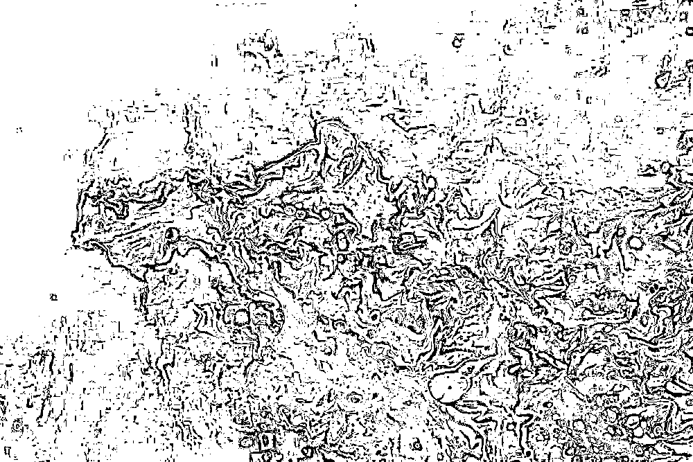

**然而，我们也要善用天蝎座能量**天蝎座需要进行深度工作的空间，不同于它之前美丽又迷人的天秤座——这位贵妇般的天秤座关注和谐与表面的顺利天蝎座对表象之下的内在更着迷。天秤座会拉开帘子，邀请别人进来，而天蝎座更喜欢阴影，对那些人们回避或隐藏的东西更得心应手。天蝎会翻开石头去研究隐藏在石头下面蠕动的生物。就像植物的根尖穿破土地，或者像虫子本能地接近腐烂的尸体，天蝎座会从地下世界中获取养分、茁壮成长。这就是为什么那些在天蝎座的行星造就了那么多优秀的**治疗师、研究人员、推理小说家**；还有**侦探、理赔人员、外科医生、讽刺作家、投资者和税务会计**，当然，偶尔还会出一些魔鬼的信徒或连环杀手。我们也许无法总是摸透天蝎座朋友的想法——而这也许就是他们希望的。每一个星座都会修正它之前那个星座的弱点。**天秤座可能是肤浅的、冷漠的，优柔寡断的；天蝎座绝不会犹豫不决。它的判断是坚定的**。它的风格是**坚韧**的。作为一个水象星座，天蝎座被情感驱动，同双鱼座、巨蟹座一样（即使每个星座表现方式各有不同）。如果我们说**富有想象力的双鱼座像梦幻般的薄雾，爱照顾别人的巨蟹座像温柔、滋润的涓涓细流，天蝎座就像是地下水一般，强劲有力，源源不断，隐而不见**。水元素是敏感的、直觉的，但是天蝎座也不乏坚韧。罗伯特·汉德说这是**唯一一个有意愿去抗争的水象星座**（虽然我知道有一部分的巨蟹座可能不同意这个说法）。**天蝎座的象征是蝎子——八条腿、尾巴带着毒针的捕食者**。当盖亚（大地之母）发现俄里翁（海神波塞冬和米诺斯之女欧律阿勒的儿子）想要杀掉她喜爱的野兽们时，她从所有的生物中选派了巨蝎去攻击俄里翁。这个强大的猎人一路逃向大海，最后被阿尔忒弥斯杀死（有的版本说是阿尔忒弥斯用弓箭射死了俄里翁，还有的版本说是那只盖亚派来的蝎子杀死了他）。最后这个女猎人后悔了，哭着给予了俄里翁永恒的生命，让他在群星间闪耀。但是天蝎座还是在星空中等着他，追杀还在继续。所以当猎户座落下时天蝎座会升起，而猎户座升起时天蝎座已经落下了，直到现在天蝎座还在天上奔跑，上演着无休止的追逐。天蝎的毒针让人害怕，但是这个星座强烈的特质却相当有优势。有了它，我们可以重新复苏原本由于不走心和恐惧而被损害的项目和伙伴关系。想想这些年来从我们手上溜走的机会吧，我们也许会同意这种坚韧的天蝎座作风是值得培养的。不管我们的星图中有没有落在天蝎座的行星，天蝎座总会在我们星图的某处出现，别忘了第 8 宫——天蝎座的家。当行星或推进的行星通过这些区域时，成为一个“天蝎座”是必须的。特别是，如果我们渴望变得完整，我们应当愿意去培养每个星座的特质——处事方式，感知风格，其他发现真理的角度。然而对天蝎座特质保持谨慎是明智的。

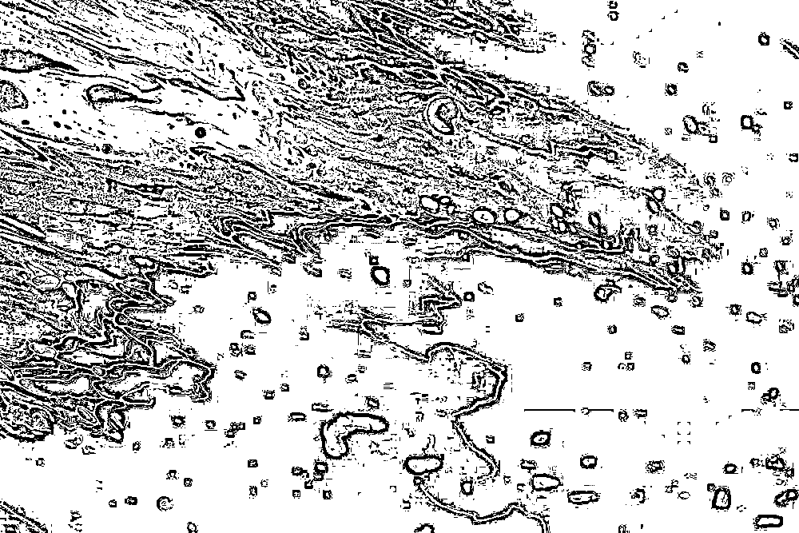

**海德拉的力量可以创造，也可以毁灭**希腊阿哥斯的南边，波提诺斯山与大海中间的一条狭长陆地上遍布深渊和泉水，有许多故事发生在那里。狄俄尼索斯曾利用深不见底的勒拿湖出入地下的世界。在那里达那俄斯的 50 个女儿们砍下并埋葬了各自丈夫的头颅。看守深渊的是一条巨蛇海德拉（或水蛇），还有许多人都称她为勒拿的无情女杀手。
海德拉有 9 个脑袋，其中一个是永生且无法毁灭的。她的呼吸和她的毒液一样非常致命。赫拉克勒斯十分渴望会一会她。在他的侄子伊俄拉俄斯的帮助下，赫拉克勒斯发现了海德拉的巢穴，并将燃烧的箭矢射向了深渊。海德拉暴怒地爬了出来，发出嘶嘶声，唾沫四溅。赫拉克勒斯冲上前去，海德拉扭动着脑袋攻击他。赫拉克勒斯顺势砍下了一个头，但在头还没落地前，在刀伤处竟然长出了两个头！与此同时海德拉用身体把赫拉克勒斯的腿盘住，并让她身边的螃蟹对赫拉克勒斯困住的脚展开攻击。赫拉克勒斯逃不了，他也不想逃走。他开始飞快地砍下海德拉不断再生的脑袋。这成了一个僵局。但海德拉似乎就要赢了。这些就是天蝎座如钢铁一般的神经。它们十分坚韧。它从火星（天蝎座的传统守护星）的好战特质中得到了勇气的支持。为什么这个故事里会有那么多的头呢？恐怕我们没有理解这故事更深刻的意义：众神想让我们知道这是一个关于意识的故事。这场奋战始于赫拉克勒斯**将象征着清醒认知的箭射向了黑暗，将潜意识的恶魔暴露出来**。海德拉象征着天蝎座的阴暗面。通过在黑暗中隐藏的许多的蛇头，她代表了**许多扭曲的记忆、欲望和那些我们不常见到或者不想承认的想法**。赫拉克勒斯展现了正确的应对方式：**不要从暴露的事情中退缩，我们应当去追逐它**。他第一反应是去杀掉海德拉，这也是一个理性的人对待不愉快、阴暗的东西时的正常反应。但故事的主人公很快就发现了：他越攻击海德拉，就会使她更强大。这是一条地下世界的铁律：**我们越想抵抗、越压抑什么，就越会使它们更强大**。随着海德拉的头成倍增长，我们得到一幅令人不寒而栗的天蝎座画像——**沉浸于自己的执迷之中。**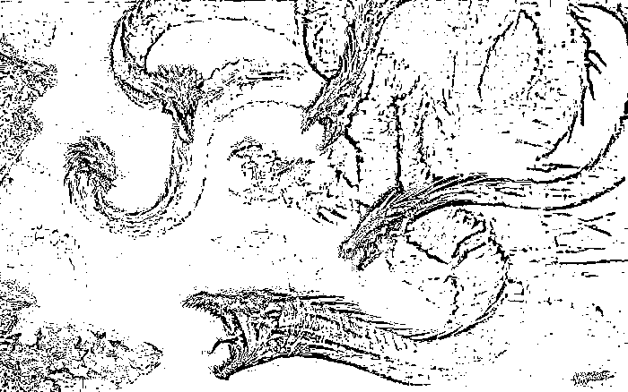| 希腊神话中的九头蛇海德拉不仅如此。蛇的形象还展现了天蝎座**机敏的更深层直觉**，它似乎可以眼观六路、耳听八方。当我们星图中落在天蝎座的行星展现坚定时，我们可以说有一个内在的海德拉赋予了它们力量。**她是天蝎座的偏执和动力背后的强劲能量，也导致其拥有不同寻常的准确预感**。什么是善妒的天蝎座恋人突然诉诸暴力的真正原因呢？是什么让天蝎座的侦探对那起 30 年前的谋杀案那么着迷？疯狂迷恋明星的跟踪狂可能与沉浸在自己小说里人物中的天蝎座小说家并无太大差异。善妒的恋人、穷追不舍的侦探、连续数天不眠不休写作的小说家，他们都得益于海德拉的力量。这种力量是把双刃剑，可以创造，也可以毁灭。讲故事的人通常把海德拉描述为邪恶和恶心的，但这是一个天蝎座的故事。说明这并不仅只是人们能看到的部分。天蝎座毕竟是一个**“神秘”**（occult）的星座—— occult 的拉丁词根是**隐瞒或隐藏**。我们应该问问在九头蛇肮脏和致命的呼吸背后隐藏着什么。她是蛇。对于神秘学的入门者，蛇是神圣力量的代号。在所有古代世界的文化中，蛇类都被尊为永生的守护者，它们长大后皮肤会脱落，从而重生。蛇是伟大的智慧女神的使者，掌握着生与死的秘密。蛇一直都与预言有联系，它们的毒液被用于制造迷幻。

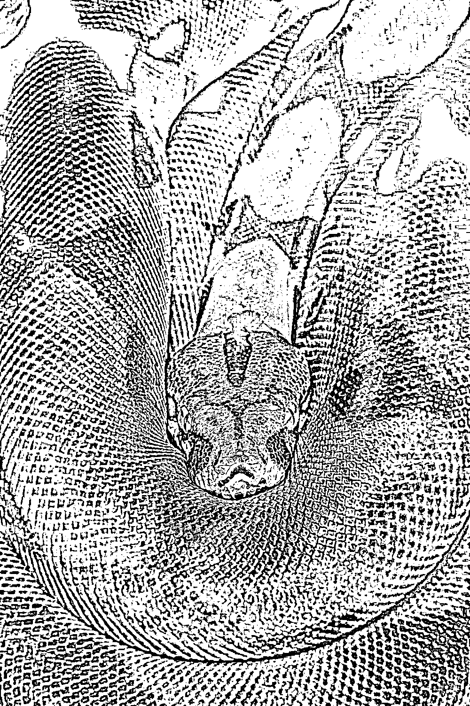

**揭开谜底需要勇气**

尽管天蝎座是由象征男性的火星守护，但它却是阴性的星座。天蝎座的职责的深度解释之一就是**结合阳性与阴性**。这项工作是为了让英雄与伟大的女神和解。的确，当九头蛇缠绕在他的腿上时，可以说我们的英雄与她融合了！但是他如何保持自己的力量，抵抗这种力量呢？每颗天蝎座行星将我们带入痛苦的爱情关系、奇怪的爱好、不愉快的过去以及其他人的秘密时，这是行星内在蕴含的问题。

专注而锐利的阳性如何与直觉丰富的神圣阴性共舞？天蝎座希望我们在不迷失自己的情况下，走进她的深层智慧，并吸收其精髓。如今，大多数人都可以独自面对我们的天蝎座行星能量。

我的水星和金星在天蝎座合相。我仍然记得在大学的某天下午，这两颗行星让我意识到了他们的存在。

那是我住在图书馆的时期之一。我会去我男朋友家中换换环境，以恢复我的注意力。当我的男朋友和室友出去之后，我可以沉浸在房子的寂静中。毫无缘由地（尽管现在我知道这是海德拉的提示），我径直走向了男朋友的衣橱。在他的登山靴和网球拍后面翻找，抽出了一叠他背着我写给他在约会的另一个女孩的信，而我此前并不知情。

最上面的信是那女孩寄来的。她说她之所以要归还他的诗和情书，是因为他缺乏将这些付诸实践的勇气。她如果知道我男朋友把她的信全都保存起来了并且从没给我写过这样的诗，可能会感到一丝安慰吧。

我的金星之蛇被唤醒了。它没有畏缩，帮我赢回了他。最终他和我结婚了。10 年后，水星和金星再次为我带来了秘密。我和丈夫讲起我梦到一个性感女人的时候，他震惊了。在我描述她的时候，我丈夫咽了口水。她看起来就和他偷偷相恋的秘书一样，而我并不知情。我花了几个月的时间才明白这个梦的信息。但是当它最终被解开时，我的金星之蛇放弃了，它让他离开了。天蝎座的行星就这样带来许多转化。

揭开谜底需要勇气。地下世界是一个不舒服的地方。它同样很广阔，包含了很多东西，出轨恋人藏起来的信、研究人员的实验室中复制病毒的秘密、下落不明的孩子发生的事情，还有尸体腐化、形成宝石、石油和矿石的地下。**那里藏有真相，还有财富**。地府之神的普路托也是诱惑之神不是没有道理的。

**天蝎座喜欢财富可以带来的力量，并且欣赏在压力下形成的东西。**因此，审讯者、心理治疗师和石油大亨有着相同的联结。然而，**无论天蝎座发掘出什么，都需要被精炼。****在要兑现财富之前，需要进行转化**。石头需要被劈开，宝石需要被定型和抛光，矿石也需要被冶炼和锻造。

尽管这项工作可能艰巨，但比起从我们大多人苦行的内心世界中提炼物质，这显然要简单得多。我们个人的地下世界保留记忆、压抑的欲望、家族的情结、集体无意识以及其天赋和神经症，所有这些都和能量和力量紧密相关。我们如何从中创造财富呢？也许赫拉克勒斯可以指明方向。请记住，他在天蝎座任务中带了帮手。这个星座本能地珍视隐私，也明白合伙强过单干，就像患者与治疗师在伴侣的帮助下达到更高层的领悟。

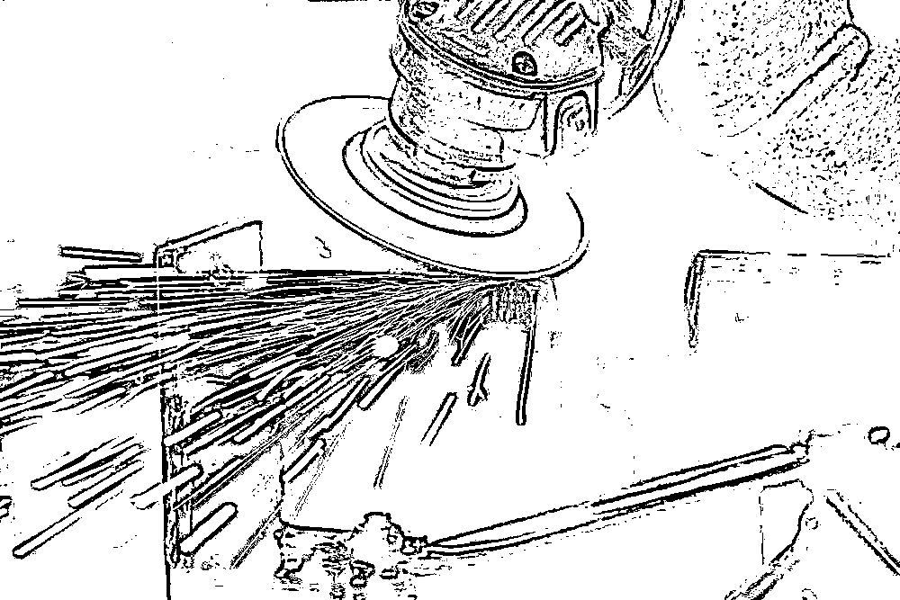

**如何真正保护我们的软弱** “ 伊俄拉俄斯！” 赫拉克勒斯大喊： “当我砍掉她的头时，拿棵燃烧的树放在怪物的脖子上。” 烧完一整片森林之后，海德拉的伤口被完全封住了，再也没有新的头长出来。然后，赫拉克勒斯将她不朽的头颅砍下，埋在地下——它回到了蛇类永恒智慧所属的地下世界。英雄将他的箭浸入她的血液中，获得了蛇毒的力量。他已经成功融合并接受了她关于生命、死亡和重生的教诲，直到需要进行下一次转变。**在我们的天蝎座行星和宫位里，我们都有伤口，就像伊俄拉俄斯用转化的火焰烧灼的伤口。从这些脆弱的地方，复仇的头会再生**。或者，我们也可以阻止它们的生长，只要我们**愿意忍受有意识地触碰它们时的痛苦**。有时，这个过程有视死如归的感觉，就像赫拉克勒斯、伊俄拉俄斯去挑战海德拉一样。安妮·迪拉德写道：“自然界的一般法制是，生物里面的东西是软的，外面的东西是硬的。” 在水象星座中，双鱼座是例外，它们就是在如此柔软的状态中生存。而巨蟹座的螃蟹和天蝎座的蝎子知道使用武器的智慧。对于我们柔软的内心来说生活是如此的犀利。它刺穿了我们。佛教徒称这种内在柔软的地方为“菩提心”——**我们的善心**。我们裸露的柔软和脆弱，还有内在原始物质，也许是我们最好的东西。地下世界的心灵之石在经过精制后，会成为菩萨或圣人的伟大的爱和无私的慈悲心。然而，在它的原始形态中，这种柔软通常会激发极大的防备。讽刺的是，**保护我们的软弱通常使我们变得冷漠，甚至对世界的仇恨**。在天蝎座的进程中，我们是有选择的。**我们可以通过有意识地揭开伤口，或者直接把我们的脆弱煅烧出坚硬的外壳。**我想到几个我认识的上升天蝎座的狠角色。他们故意表现出拒绝表露自己的样子，挑战人们去猜测他们的心思。但是和他们相处的时间足够长，有一刻面具会掉落，透过平时冷漠的眼睛，你会看到柔软而没有防御的东西。**很多的悲伤。在他们的心底深处，沉默地记录着早年的脆弱和折磨**。**星图的上升星座代表了人格的第一层伪装，即为了适应个人早年生活环境的心理外衣。上升天蝎座的孩子也许比大多数人更赤裸，他们的弱点写在面上，成为了别人的目标。这种脆弱可能使他们成为我们当中第一个学会防御性掩护技巧的人**。每年圣诞节玩具捐赠活动出现的机车党们都会让我想起这种天蝎座的敏感。它吸引了成百上千的机车党，他们有纹身、有刀疤、有穿孔，留着大胡须，满身油腻、目中无人——你不希望家人在荒无人烟的高速公路上遇到的那种人。然而在这一天，每个机车族都为“孩子们”带了甜蜜的礼物——毛绒兔子、鲜艳的青蛙玩偶或泰迪熊，那些人在当地新闻采访中含泪解释的时候，也向人们展示了他们皮衣和链条下的柔软。**就像我们内在拥有神的一部分心，这种神圣的温柔有着巨大能量，我们可能都无法控制**。当它受伤时，就好像人行道上的现场跳钢丝舞，或是九头蛇海德拉在山洞里嘶嘶作响。我们如何容纳这种能量？在我们完全理解天蝎座的奥秘之前，我们的舞蹈经常断断续续，带有嫉妒、报复、愤怒和悲伤。但是，我们必须**通过正确管理这种超凡的力量来稳定和壮大自己**。这是赫拉克勒斯故事最后两幕更深层次的指示：将不朽的头颅埋葬在地下，然后将箭浸入九头蛇的毒液。这些动作是什么意思？如果想得到天蝎座的尊重，你就必须思考这个谜题，并亲自发现答案。**死亡也许是灵魂前进的礼物** 当文章写了 300 个字时，我上升天蝎座的父亲去世了。离他 89 岁生日还差两个星期。凌晨三点，他的妹妹听到他喃喃自语着：“天啊！”。直到天亮，她才发现他在卧室的地板上起不来。那天下午他打开一罐金枪鱼时再次跌倒。“糟了！” 他呻吟着。鲜血从他的头部涌出。**死亡**是隐藏在可怕表相下的另一个天蝎座之谜。一个全世界都会伤感的话题。我们认为死亡是失败。但是当我父亲几乎没有意识地躺在医院里：上半身又虚弱又消瘦，腿肿了三倍，腹部还有一个比哈密瓜大的肿瘤的时候，死亡更像是朋友而不是敌人。父亲在医院的最后一周，我开始想象他是要前往新世界的克里斯托弗·哥伦布，我们的核心家庭里即将开始最伟大冒险的先锋。的确，他最终过世正是在木星合天王星的几个小时内，一个了不起的关于发现和发明的相位。这个合相也三分了他的天蝎座上升点。我曾经听过伟大的占星师和数据收集者路易斯·罗登谈论死亡。当她说到**代表好运的木星经常参与死亡**时，我感到很惊讶。可是为什么不呢？**从灵魂的角度思考，这是继续前进的礼物。**死神土星当然也参与了，在我父亲去世的那天，土星正朝着他的天秤座太阳行进。当父亲摔倒时，火星与我第三宫天蝎座的土星合相。水星与我的处女座上升点合相。他们一起督促我：“继续写作。天蝎座想让你把它的故事说出来。” 希望我不负使命。

**版权声明：**本文由若道翻译发布，欢迎转发，反对抄袭。


**也许你还想看下面的文章**
[白羊座](http://mp.weixin.qq.com/s?__biz=MzA5NjA0NTAxNg==&mid=2651412161&idx=1&sn=37ff27a685136be77b3d02086a4b8f0b&chksm=8b4be476bc3c6d6079b8592d14f1250d87401d0a8a28bc87f50a8f9fd253a52d9d5223c4ab12&scene=21#wechat_redirect) | [金牛座](http://mp.weixin.qq.com/s?__biz=MzA5NjA0NTAxNg==&mid=2651411945&idx=1&sn=6a74a4d7d15deb38d06a692ad4032ddd&chksm=8b4be75ebc3c6e4890b5034474c2894bd355bf26df5f0ad1c2fadae76f3de1d349a57de0471b&scene=21#wechat_redirect) | [双子座](http://mp.weixin.qq.com/s?__biz=MzA5NjA0NTAxNg==&mid=2651412684&idx=1&sn=f6887e194aa2a3680aae10a3b35e31b4&chksm=8b4bea7bbc3c636dbc19fec754256a621ab05a0aff123a56f8aaeccb22cbe1686de524fc0b05&scene=21#wechat_redirect)[巨蟹座](http://mp.weixin.qq.com/s?__biz=MzA5NjA0NTAxNg==&mid=2651412275&idx=1&sn=0c656c445089cb315649a1cc3af37001&chksm=8b4be584bc3c6c92e9bc689480a78b3e530fc125c6a3a1fdff0e60a587ffcd06723285712045&scene=21#wechat_redirect) | [狮子座](http://mp.weixin.qq.com/s?__biz=MzA5NjA0NTAxNg==&mid=2651412638&idx=1&sn=6459344d465d2d27485697dbea2f512f&chksm=8b4bea29bc3c633ffb401133040024eb261f07a3dde67f15e6ebb94ca4df49f8f7995ca6e707&scene=21#wechat_redirect) | [处女座](http://mp.weixin.qq.com/s?__biz=MzA5NjA0NTAxNg==&mid=2651412875&idx=1&sn=f895988b5c7ef86f5ff03dfdf8a56976&chksm=8b4beb3cbc3c622a8abb6068f3aac592b4db1111f33cca607c9154f318dad8ec586d11d4ec8b&scene=21#wechat_redirect)[天秤座](https://mp.weixin.qq.com/s?__biz=MzA5NjA0NTAxNg==&mid=2651410544&idx=1&sn=45b51d84210a84c8103c140df5a28229&chksm=8b4be2c7bc3c6bd1c86b8ffd8d8722efe3cfa1fc4b71e2cc8f71230218b8c73a7119d8a22745&token=428430174&lang=zh_CN&scene=21#wechat_redirect) | [射手座](http://mp.weixin.qq.com/s?__biz=MzA5NjA0NTAxNg==&mid=2651411022&idx=1&sn=adf59f6eb38f2fd19ca975b4287168ea&chksm=8b4be0f9bc3c69ef250cafb4d517694bb952529461017c53da4d7ca120ed4ec0004161eccdb0&scene=21#wechat_redirect)[ | ](https://mp.weixin.qq.com/s?__biz=MzA5NjA0NTAxNg==&mid=2651410544&idx=1&sn=45b51d84210a84c8103c140df5a28229&chksm=8b4be2c7bc3c6bd1c86b8ffd8d8722efe3cfa1fc4b71e2cc8f71230218b8c73a7119d8a22745&token=428430174&lang=zh_CN&scene=21#wechat_redirect)[水瓶座](http://mp.weixin.qq.com/s?__biz=MzA5NjA0NTAxNg==&mid=2651411498&idx=1&sn=25b8051c9c778065f9fffa37628c9950&chksm=8b4be69dbc3c6f8b94ee79ae682233634bcd0f32e8dce890672ea1bb4e5241a34cb59ebb3045&scene=21#wechat_redirect)[](http://mp.weixin.qq.com/s?__biz=MzA5NjA0NTAxNg==&mid=2651411498&idx=1&sn=25b8051c9c778065f9fffa37628c9950&chksm=8b4be69dbc3c6f8b94ee79ae682233634bcd0f32e8dce890672ea1bb4e5241a34cb59ebb3045&scene=21#wechat_redirect)[双鱼座](http://mp.weixin.qq.com/s?__biz=MzA5NjA0NTAxNg==&mid=2651412587&idx=1&sn=88617fdd2660473de5eb7a48dd9d8807&chksm=8b4beadcbc3c63ca04427ddfde1ff118fbd1151ff24fad40cb97abcd3d2029c6e1c2bcb6657f&scene=21#wechat_redirect)**达娜·格哈特**一位国际范围内受尊敬的占星师。她为众多占星学网站和出版物讲课、写稿。她在十二宫的月亮激励她对这颗发光体进行了深刻而持久的探索研究。

******点击图片查看若道君推荐******


**微信又双叒叕改版啦，不想错过若道君的推送？**

**就把若道设为星标吧！**

**▼**


就是这个“在看”，戳戳戳 ☟

********报名直达入口********


# 2020 年第一件大好事，跟苏·汤普金斯老师学习预测吧！

> 原文：[`mp.weixin.qq.com/s?__biz=MzA5NjA0NTAxNg==&mid=2651413184&idx=2&sn=45ee8046a0587aa0f483d5cf39b85b92&chksm=8b4be877bc3c61611c628f4eeb8f02c5f39addffcacb316e4910a749d333b55ec3c2cbcad07a&scene=126&sessionid=1692738217#rd`](http://mp.weixin.qq.com/s?__biz=MzA5NjA0NTAxNg==&mid=2651413184&idx=2&sn=45ee8046a0587aa0f483d5cf39b85b92&chksm=8b4be877bc3c61611c628f4eeb8f02c5f39addffcacb316e4910a749d333b55ec3c2cbcad07a&scene=126&sessionid=1692738217#rd)

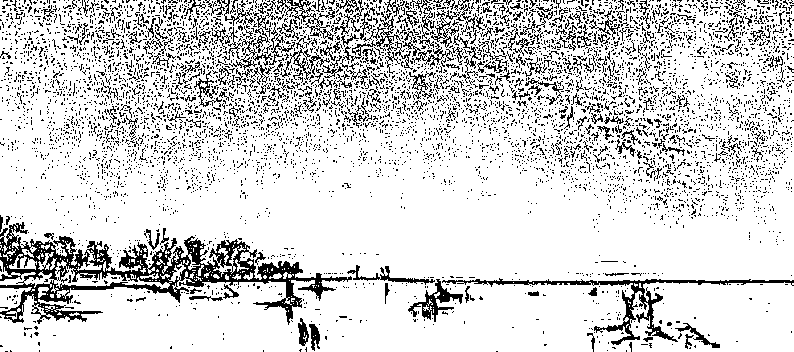

**船停泊在港湾里会感到安全，但是停在港湾不是船只今生的使命，平静的大海是不会培养出有能力的水手的，有一些人生宝贵的技能就是要在困难中获得。  **

**——苏·汤普金斯老师在课堂上****对正在经历行进土冥四分中天的学员说**

学习**“预测”**，是成为职业占星师的必经之路。

**“会预测解读”**是职业占星师必备的专业修养之一。

占星学与其他学科相比，一个非常重要的功能是**看到过去、现在和未来的周期性的变化**，既包括我们**每个个体生命内在的变化时钟**，也包括**外在宇宙气候对个人、团队、社会的影响。**

而我们的客户也是如此，他们常常会向你咨询生活中的困扰和期待：

“我今年的职业规划应该注意什么？我还能升职吗？”

“公司今年大裁员，我会被裁掉吗？”

“我什么时候可以遇到心仪之人？”

“我和新认识的男友，最近总是因为一点小事吵架，我们未来会怎样？”

“最近自己特倒霉，压力也很大，很难开心起来，这要持续多久啊？”

“我去年身体一直不好，想看看今年应该注意什么？”

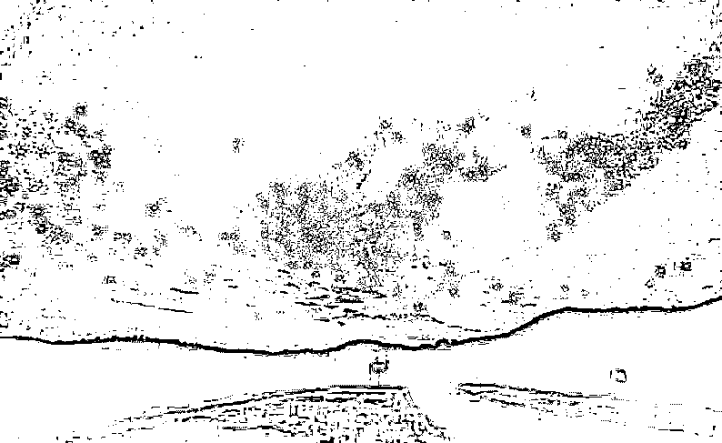

然而预测也是**最不容易做好**的事情。这里不仅涉及一些职业占星师要用到的预测技术——**行进、推进、太阳弧、返照**等，还有一些非常重要的问题都是职业占星师要面对的：

*   什么是占星学可以预测的？什么是占星学无法预测的？什么是占星学不能预测，也不应该预测的？

*   占星学预测怎样才能帮助人？什么样的预测有害无益？

*   那么多预测技术，我究竟应该用哪一个？

*   在不同的预测技术中看到不同的趋势，那么到底应该如何综合解读？

*   客户在生活中遇到的问题，如何在星图中找到切入点进行预测分析？

*   为什么看到星图正在案主正在经历某个行进（推进/太阳弧），但是和这个人对话，却没有这个行进（推进/太阳弧）的特征呢？

想知道苏·汤普金斯老师是如何面对客户，如何在占星咨询中运用预测技法吗？

**她 40 多年的经验，全都在这里！**

**导师介绍**

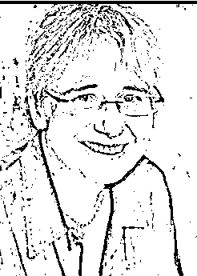

**苏·汤普金斯（Sue Tompkins） **

苏·汤普金斯（Sue Tompkins）是谁，大概不用多做介绍了！**她是英国目前最资深的占星学家和咨询师之一，拥有超过四十年的占星教学和咨询经验。**她的著作《当代占星研究》和《顺逆皆宜的人生》是占星爱好者和职业占星师入门的必读书目。**你将学习什么？**

**❖** **独家“预测观”，全面的咨询技法**

苏·汤普金斯老师倾囊相授 40 多年教学和咨询经验、见解，内容包括但不限于：

*   行进、沙罗周期
*   推进（次限推进）
*   太阳弧
*   太阳返照和月亮返照
*   关系议题，更多评估关系的技巧，组合图及关系星图
*   择时择地的基本要点，学习如何利用星图为事件（婚礼、商务等）择时。

以上都是苏·汤普金斯老师认为，在咨询中会常用的预测技法。**❖** **把“预测”这件事变得不那么神秘：占星学与生活实践紧密结合**

*   “预测解读”太难了……

*   难在将看到的星图信息转变成大众熟悉的“普通话”——共情；

*   难在准确地捕捉到案主提问背后的真正议题；

*   难在找到合适的切入点阐述……

苏·汤普金斯老师的课程的一个突出特点是**注重互动，学员案例丰富**。她在讲解新的理论知识时，除了会列举名人案例之外，还喜欢征集自愿报名的学员星图，在课上示范讲解。学员既能听到案例学员的亲身反馈，也能参与交流讨论。她注重互动，学员甚至可以**点播想要学习的知识点和占星技术**。极强的实践参与感，通过真实的案例演示和实时互动，熟悉和巩固星图解读思路和实际运用，启发你创造出自己的预测解读思维：说让别人听得懂的占星预测。授人以鱼不如授人以渔。**❖** **除了技术，还将从生命的哲学观点出发，认识“预测与解读”**

苏·汤普金斯老师结合自己的经验，将**心理学**融入咨询模式与技巧中。她将以**当代人本主义心理学思想**为核心，说明在咨询或解读过程中，预测的基本原则。

*   共情
*   和善
*   无条件的积极关注

**❖** **扩展延伸你对占星预测技法的新认知（不只局限于核心）**

*   “龙首图”特点及解读技巧
*   创造性相位（小相位）——72°和七分相
*   中点入门
*   部分阿拉伯点
*   映点与反映点
*   苏·汤普金斯老师也曾经在课上谈论到抑郁症在星图中的线索等等

**❖ ****如何以占星师为职业谋生，提升专业能力**

*   职业道德与咨询技巧同样重要，成为占星师，你将为执业做的准备；
*   了解必要的历史和天文学知识，为考试（若道毕业考或 ISAR 认证考试）而准备；
*   如何引导客户对自己的生命负责。即使是已经执业的占星师，学习来自苏·汤普金斯老师个人的经验分享和见解，也将对提升自己各个方面的专业水准大有助益。 

**若道教学团队**

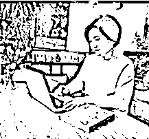

**助教：占星师咔咔（Caroline） **

*   若道首届学员，国内最早获得国际占星研究协会（ISAR）认证的职业占星师之一（2013 年认证），曾任若道 2017-2018 苏·汤普金斯老师主讲的核心课程助教。
*   对老师的教学风格十分了解，授课经验丰富。
*   在国际知名广告公司和市场研究公司从事的市场研究和推广工作十余年，曾任职于阳狮集团、尼尔森市场研究有限公司、MTV 和《Madame Figaro》杂志。

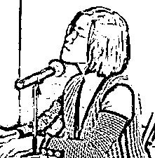

**助教：丁宏（Hong）**

*   国内最早获得 ISAR 认证的职业占星师之一（2013 年认证），若道核心课程兼职助教，资深占星课程口译。与苏·汤普金斯老师有多年的合作经验，配合默契。
*   复旦大学英文学士，伦敦大学国王学院文化创意产业硕士，国家三级心理咨询师。受教于伦敦占星学院及若道，跟随多位名师研习各流派技法，致力于现代占星与古典占星的积极融合。

**课时安排**

**网络直播课：共 27 讲 2020 年 3 月 2 日开课**

**每周一 20:00~22:00 上课**（具体每节课排期，以课程表为准）

**视频课：视频课程共 10 讲，8 次课程，两次助教答疑，购买支付后即可观看**

**适合人群**有扎实的出生星图基础想跟从苏·汤普金斯学习预测技法希望成为优秀的占星师，想借鉴国际大师解读思路并融入自己体系**课程费用******课程原价：****22400 元******早鸟价：19600 元**（**2 月 15 日**前支付，可享受课程早鸟价）

**复训价：11000 元**（在若道课程体系上过核心课程第五阶的学员可享受此价格）

**注意：**此课程为若道核心课程的一部分，前 8 讲为视频录像课程。具体可联系课程顾问询问。****苏·汤普金斯预测课程****

**授课老师：苏·汤普金斯**

**时间：**视频课 支付购买后即可观看；网络平台课 2020 年 3 月 2 日开课（共 27 次课）

**授课方式：**网络直播课，英文授课，中文翻译

**费用：**22400 元；早鸟价：19600 元（2020 年 2 月 15 日之前）；复训价：11000 元（在若道课程体系上过核心课程第五阶的学员享受此价格）

**课程负责人：**许老师（微信：nodoorC，手机：18513802118 请备注“苏·汤普金斯预测课”）

长按二维码添加课程负责人咨询~


****报名请点击“阅读原文”****


# 雷蒙德·梅里曼金融占星周运 | 本周是入市的好时机吗？

> 原文：[`mp.weixin.qq.com/s?__biz=MzA5NjA0NTAxNg==&mid=2651413142&idx=2&sn=a72f53163e871ee7df19b1bb221d5445&chksm=8b4be821bc3c61374cebd0cb45c87c96e517e3a13f907575301146b7d258e285d1b28d7f8259&scene=126&sessionid=1692738217#rd`](http://mp.weixin.qq.com/s?__biz=MzA5NjA0NTAxNg==&mid=2651413142&idx=2&sn=a72f53163e871ee7df19b1bb221d5445&chksm=8b4be821bc3c61374cebd0cb45c87c96e517e3a13f907575301146b7d258e285d1b28d7f8259&scene=126&sessionid=1692738217#rd)


作者/雷蒙德·梅里曼
翻译/Luke 校对/李含编辑/玫瑰 图片/全景网

雷蒙德·梅里曼是在金融占星学界稳坐第一把交椅的占星师，同时他也是若道签约的金融占星课老师，我们引进了雷蒙德·梅里曼老师的《上证指数月度报告》《黄金周期月度报告》《2020 年金融预报》（感兴趣的同学可以扫码文末图片购买）。我们经老师的授权，将每周刊登梅里曼老师的周运，供大家参考和学习。于是，这是本周的周运（2.3-2.7）。

**展望与回顾**

**2020 年 1 月 17 日由于投资者越来越担心中国冠状病毒的快速传播可能对经济造成的影响，周五股市大幅下跌，抵消了道琼斯工业指数 1 月份的涨幅。在达美航空和美国航空停飞所有中美之间航班后，道琼斯指数下跌了 650 点，跌幅 2.3%。美国联合航空当天晚些时候宣布了类似的措施。道琼斯也遭遇了 8 月以来最糟的下跌……华莱士贝思资本的高级策略师伊利亚·费金指出，“恐惧感持续到了周末。今年的主题本应是美联储和特朗普帮助我们摆脱问题，但是这种病毒是任何人都无能为力的。这就是为什么人们变得更加恐惧。”**

**——弗雷德·因伯特**

**《冠状病毒加速周五市场抛售，道琼斯指数暴跌 650 点》**

**www.cnbc.com**

**2020 年 1 月 31 日**


上周全球股市波动很大，对应了冠状病毒爆发后的失控和受控情况。星期一，市场情绪歇斯底里，道琼斯指数抛售 450 点。接下来两到三天，越来越多的迹象表明病毒的威胁并不大，道琼斯指数从周一的底部起回升 500 点。但是周五时，新报告显示病毒威胁是非常严重的，并实施了旅行限制和隔离措施，道琼斯指数下跌超过 600 点。

冠状病毒爆发后情况失控代表了一种经典的**两难情境**。上周末，**射手座火星四分双鱼座的金星合海王星（失控）所带来的影响力，胜过了摩羯座土星合冥王星的力量（对控制力的执迷）**。但**土星-冥王星也代表威胁人类生命的天灾或人祸**。现在，土星和冥王星沉重而持久的力量看起来超过了海王星相位对应的歇斯底里，从而对全球股票的短期价格走势具有更强势的影响力。然而，全球股市剧烈的价格波动也是**太阳穿过回归黄道星座水瓶座**的典型表现**（1 月 20 日-2 月 19 日）**。太阳行进在水瓶座时市场的表现最难以预测，因为其守护星是天王星，这时候支撑和阻力往往被冲破。你可能记得 2018 年 2 月水瓶座期间道琼斯指数两天内下跌了超过 1000 点。价格肆无忌惮地冲破支撑和阻力。**在两周后的水星逆行期，这一情况可能变得更加明显**，因为**水星逆行可能会在短时期内对应市场信号迅速从看涨或看跌的方向发生逆转。**在这样的时期，重要的是交易者应**关注大局**，或关注水星逆行或太阳通过水瓶座时市场的趋势。尽管上周市场遭到抛售，但全球大多数股指的趋势是看涨的，黄金也是如此。然而，对于股票市场，MMA 报告的订阅者们知道**50 周和 15.5 月周期低点即将在股票市场出现，届时的下跌可能比 2019 年的任何下跌都要严重**。毕竟，2020 年的木星在摩羯座。去年它在射手座，更有利于看涨。其他市场上，原油也遭到剧烈抛售。3 周以前，原油上涨到自 2019 年 4 月以来的最高点。现在它在测试 50 美元每桶，接近 2019 年的最低点。对于贵金属来说，是个奇怪而动荡的一周。白银在周三下跌到了 17.28，是一月份以来的最低位。但黄金表现得相当好，周五上涨到了自从 1 月 8 日 6 年高点以来的最高价位。比特币和国债市场上周也表现不错。对于国债来说这并不奇怪，在危机时刻人们会在这里寻求避风港。但比特币是另一码事，它上涨到自 11 月 4 日来的最高点可能和天象有关。木星位于摩羯座，而比特币成立的时候多个行星位于摩羯座（2009 年 1 月 3 日）。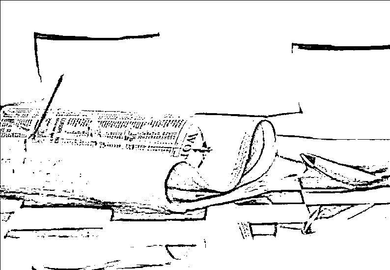**短期占星趋势和长期考量**

**特朗普总统承诺将经济增长率提升到奥巴马时期的 2%之上，一段时间以来，税收改革和放松监管做到了这点。但是他的贸易和关税壁垒削弱了商业投资和全球制造业发展，导致经济又回到了 2%增长的平台。这算不上是衰退，但错过机会是令人失望的。**

**——《关税的代价》**

**《华尔街日报》意见页**

**2020 年 1 月 31 日**

**2019 年最后三个月，美国经济以 2.1%的年增长率温和扩张，在这一年里，全球经济增长疲弱，而且唐纳德·特朗普总统的贸易战导致商业投资大幅减少……最令人担忧的是，由于持续的贸易战加剧了企业的不确定性，企业一直在大幅减少投资。**

**——马丁·克拉辛格**

**《美国 2019 年经济增长是过去三年中最弱的》**

**美联社**

**2020 年 1 月 31 日**

对金融占星家来说经济增长放缓是意料之中的，因为在 2019 年的最后一个季度，木星从充满机会的射手座进入到了更加保守和谨慎的星座摩羯座。从而影响到了美国股市的上涨步伐。正如之前报告中谈到过的，历史显示木星行进射手座 10 度到摩羯座 20 度与美国股票的长期周期波峰有高相关性。我们现在就处在这个区间，**木星在 2019 年 12 月 3 日刚从射手座进入摩羯座，它会在那里停留到 2020 年 12 月 19 日。**目前为止，道琼斯指数的历史最高点出现在**1 月 17 日**，在同一周内出现了**32-37 年摩羯座的土星-冥王星长期周期合相**。纳斯达克在一周后的**1 月 24 日**达到历史最高点，当时**新月四分天王星，金星-海王星合在双鱼座，与火星成四分相**。我们的研究发现，与这些天象同样重要的是**1 月 11 日的天王星顺行**的历史对应。正如上周所说的：“天王星顺行是最有力的天象之一，与美国股市的中期或者长期周期的终点有关，容许度是 12 个交易日。有没有可能 1 月 17 日的高点是基本周期甚至更长期周期的波峰？这是可能的，因为根据天象，1 月 17 日离天王星停驻只有 5 天之遥。”标准普尔指数（1 月 22 日）和纳斯达克指数（1 月 24 日）的高点也处在这个天王星时间区间中，此外，这也是一个出现在 MMA 天象关键反转日期（CRD）区间中相关市场之间看跌背离的完美例子。当前没有明显的与市场反转相关的行进行星征象，直到**2 月 17 日的水星逆行和 2 月 16 日火星进入摩羯座**。这两个征象很重要，尤其对于**与利率相关的市场**。同样重要的是**行进的金星，将会四分摩羯座星群中的木星、冥王星和土星（2 月 24 日-3 月 4 日）**，之后是**3 月 9 日金星-天王星和 3 月 8 日太阳-海王星的两个合相**。**3 月 10 日，水星在逆行回到变动不安的水瓶座之后，开始恢复顺行。**对这轮股票市场中新的下行趋势来说唯一可能的天象反转指标是行进火星在射手座尾端，于 2 月 4-13 日与纽约证交所星图（成立于 1792 年 5 月 17 日）的木星-海王星合相构成温和的六合相位。然而，那也会与 TMI（特朗普火星指标）的区间重合。也就是说，火星会在 1 月 28 日-2 月 10 日激活特朗普总统、美国，以及伊朗星图中形成的“大十字”结构。**当火星与这些星图形成困难相位，会有人突然怒气爆发，这对全球股票市场和贵金属市场都有影响。****版权声明：**本文由若道翻译发布，欢迎转发，反对抄袭。友号转载请申请白名单。


**雷蒙德·梅里曼（Raymond Merriman）**

若道签约老师。著名金融占星师，ISAR（国际占星研究协会）前主席，梅里曼市场分析公司的总裁。他由于“提升了占星学的职业形象”，在 1995 年国际占星大会上被授予轩辕十四奖；在 2012 年国际占星大会上，被授予轩辕十四终身成就奖。

1“中国上证指数月度报告”发售

**若道推出了****中文版****的雷蒙德·梅里曼中国上证指数月度报告，并持续发行该报告！**

当把金融市场的周期和占星学的周期相结合时，雷蒙德·梅里曼老师的金融占星学研究**为投资者应对金融市场的周期波动，并随之调整投资策略提供了极大的价值参考**。

2“黄金价格周期月度报告”发售

**若道推出****中文版****的雷蒙德·梅里曼黄金价格周期月度报告！**不仅仅为广大读者在中国股市的投资出谋划策，更将视角放眼黄金市场。

**每当世界经济形式不明朗的时候，有一个地方是保值的港湾，那就是****黄金**。从 2018 年 8 月开始，黄金已经用自己的升值再次提醒众人它在经济不稳定时的位置。**截至目前，2019 年 8 月底，黄金已飙升至 6 年新高，高于 1565 美元。**

自 1982 年雷蒙德·梅里曼出版第一本研究《地球宇宙学征象与黄金价格的关联》的著作以来，**他一直作为最重要的黄金市场时机预测者之一享誉国际**。

过去 1 年，那些订阅并遵循建议的梅里曼市场时机学院日报和周报的订阅者，如果从 2018 年 8 月 16 日的低点或 8 月 23-24 日的次低点购买黄金，他们已经赚到了不少的 30%左右的利润。

**购买套餐**，买得越多越优惠

中国上证指数月度报告套餐价

*   **单月报告**：280 元

*   **3 个月套餐**：780 元（260 元/月）

*   **12 个月套餐价**：1999 元（166 元/月）

**长按下图识别二维码**

**购买金融报告****套餐**

**▼**


黄金周期月度报告超级优惠折扣

*   **同时购买上证指数 12 个月套餐**和**黄金周期报告 12 个月套餐**，即可享受黄金周期报告 12 个月套餐**立减 1199**元的**超级优惠折扣**。

*   **已经购买**了**上证指数 12 个月套餐**的朋友，**再购买**黄金周期报告 12 个月套餐，也可享受**立减 1199**元的**超级优惠折扣**。**购买黄金周期报告 12 个月套餐时，超级优惠折扣会自动生效**。

**长按下图识别二维码购买黄金报告套餐**

▼


32020 年金融预报 1976 年以来，由雷蒙德·梅里曼撰写的梅里曼市场时机学院每年一次的年度预报沙龙和每年一本的《年度预报》一直在应用占星学原理为投资者们服务，43 年来，这本 200 页左右对金融市场的分析报告和 3 小时的年度预报讲座在美国、日本、欧洲帮助许多投资者了解宇宙天气对于世界经济形势、政府政策及其对各个金融市场和金融产品的影响，帮助他们做出正确的投资决策，降低投资风险。2018 年，若道第一次将这份广受赞誉的一年一度的金融占星报告和沙龙引入中国，供中国投资者参考。**《2020 年金融预报》将会谈及 2020 年重要的宇宙天象及其对世界经济、贸易形势的整体影响，还将覆盖中国上证股票市场的分析、黄金白银市场、美国经济、美国总统、美联储、美国国债市场、美国股票市场、主要外汇货币市场（主要外汇美元、英镑、欧元、日元、瑞士法郎）、原油市场、谷物市场、活牛市场、比特币市场等投资市场。**梅里曼老师及梅里曼市场时机学院的金融占星分析师还会给出以上市场 2020 年的**市场价格目标区间及重要价格反转日**，为短期、中期和长期投资者进行市场操作的时机提供参考。如果你关注世界经济和金融投资市场的变化，会发现梅里曼《金融年度预报》中的研究对于你了解世界经济在发生什么，这些市场的走向会如何有非同寻常的指导价值。报告和讲座价格

2020 年金融预报讲座和报告价格整体售价** 1280 元**

（本讲座和报告不单独出售）

**长按下图识别二维码购买 2020 年金融预报**

▼


**微信又双叒叕改版啦，不想错过若道君的推送？**

**就把若道设为星标吧！**

**▼**


********点击阅读原文购买金融报告********


# 学了这么久占星学，你可能还没发现行星停滞点的隐藏力量哦

> 原文：[`mp.weixin.qq.com/s?__biz=MzA5NjA0NTAxNg==&mid=2651413142&idx=1&sn=3085c1d990cb87b0bd00c9251549f5c0&chksm=8b4be821bc3c6137f5d100e874c6db73df74748b8bfb3aa49f6ff7c7086007fedf6dd65fe525&scene=126&sessionid=1692738217#rd`](http://mp.weixin.qq.com/s?__biz=MzA5NjA0NTAxNg==&mid=2651413142&idx=1&sn=3085c1d990cb87b0bd00c9251549f5c0&chksm=8b4be821bc3c6137f5d100e874c6db73df74748b8bfb3aa49f6ff7c7086007fedf6dd65fe525&scene=126&sessionid=1692738217#rd)

******☆ ****后台回复“今日”，给你一句生命态度******

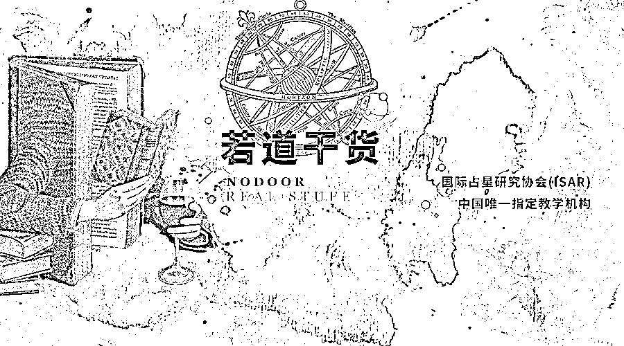

作者/雷·格拉斯 译者/鱼非 校对/王宏
编辑/玫瑰 图片/unsplash
**行星停滞点的“烙铁效应”**

当你观察某个人的星图时，有没有因为他们个性中所表达的行星能量和他们的星图中所暗示的不一致而感到迷惑？例如，一个人的星图中着重强调了土星，但是他表现出不同寻常的木星个性？或者一个人从星图来看应该是自信的人，但他本人表现得有些胆小羞怯？

造成这样差异的有许多可能的原因——**被忽视的赤纬度、不同的计量系统**（如吠陀占星或希腊占星），或者仅是因为**错误的理解**。但我有时发现，这与占星师们所说的**停滞点**有关。在任何基本的占星学资料中查找这一术语，通常都会如此描述——**停滞点指行星在改变方向之前减速并相对静止的时刻，之后可能开始倒退（“逆行”）或向前（“顺行”）**。换句话说，可以把“停滞”视作**静止**。

许多占星师关注停滞点，主要是因为它告诉我们行星何时何地改变方向，可停滞还有另一层通常被忽视的意义，这可能比它作为方向标志的作用更重要。因为在减速和近乎停顿的过程中，该行星的影响被戏剧性地放大了，这种情况被我早年的一位老师称为**“烙铁”效应**。想象一下你正快速走过新浇的水泥地面，无疑会在地上留下印记，但它们可能不会很深。但是如果你中途停下来，一动不动地站一两分钟，你的脚会陷得更深，留下更明显的印记。

停滞点就是如此。**行星在黄道上的一个位置停留时间越长，它越有机会在你的星图上留下比平时更深刻的印记**。**不仅该行星的能量将被放大，它与其他行星形成的所有相位也将被放大**。停滞点是我们实践中最重要却被忽视的工具之一。在这篇文章中，我将会审视停滞点在个人星图、世俗及社会文化星图中的含义，同时也会审视它在预测中的含义。

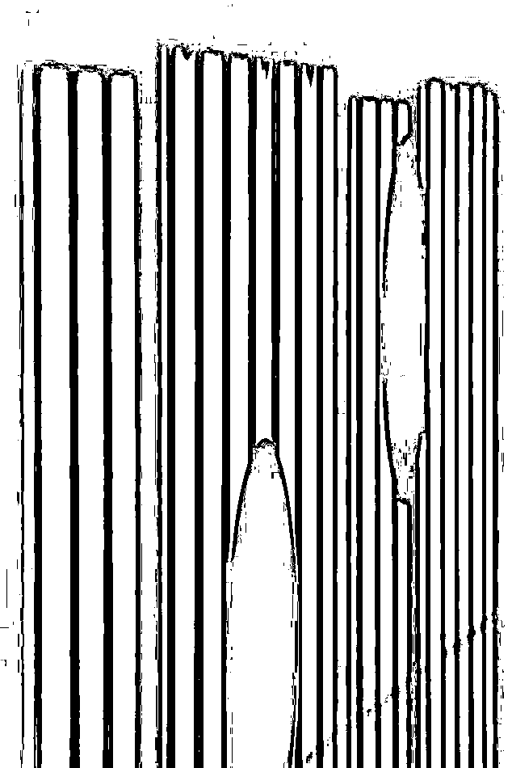

**出生星图中的停滞点**

在观察星图时，许多占星师会很自然地检查行星是逆行还是顺行，但很少有人停下来检查这颗行星是否落在更大范围的静止区间，或者称之为“停滞区”——在行星向任何一侧转变方向时相对静止的阶段。这种疏忽是因为现代计算机为我们执行了大部分计算，因此我们甚至不需要打开星历表——查星历表这一简单的步骤可以让我们迅速发现行星是否落在静止阶段。

作者说：如果你想研究星图中的行星停滞，但手头上没有合用的星历表，可以使用几个不错的免费星历表网站。我个人最喜欢的是那些带有色彩标记形式、让逆行期更加明显的网站。就像迈克尔·R·迈耶网站提供的服务：www.khaldea.com/ephemcenter.shtml 你研究的许多星图可能不包括任何直接处于静止阶段半影带内的行星。但如果出现了这样的行星，这可以帮助我们更清晰、更深入地洞察案主的生活。以发明家尼古拉·特斯拉（Nikola Tesla）为例，他对大自然的隐藏规律表现出了非凡的直觉。他对电和其他“看不见”的力量的理解是如此深刻，以至于一些人认为他似乎更像是一个神秘主义者，而不是科学家。他于 1856 年 7 月 10 日出生在克罗地亚的斯米利扬（格林威治时间 0 点），他的星图显示海王星位于双鱼座 20 度，与他的太阳成三分相，与水星成容许度较宽的四分相，并与他第一宫的天王星形成六分相。这些因素加在一起，描绘出一种富于直觉和想象力的个性——但并不一定格外非凡。

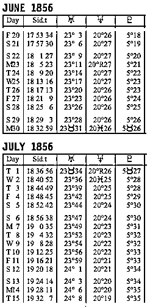

| 发明家尼古拉·特斯拉出生时的星历表

当我们打开 1856 年 7 月 10 日的星历表时，会看到他出生的时候，**海王星是停滞的**，从 5 月 13 日到 8 月 4 日，一直停留在相同的黄道度数（从 6 月 21 日到 25 日，停滞在相同的度和分）。简而言之，特斯拉是在海王星停滞的影响下出生的。这大大增强了他出生星图中**海王星及其相关相位的重要性**。这就难怪他能够凭借直觉的头脑探索大自然的能量（海王星与落在第一宫金牛座的天王星成的六分相），也难怪他在与托马斯·爱迪生这样的同僚做生意时，经历了痛苦的失望（特斯拉的海王星四分水星）！

作者说：当研究一个行星停滞在某人星图中时，注意它是否是上升星座、太阳星座或月亮星座的守护星也很重要，因为这会使它的影响更加明显。如果是这样，停滞行星掌管的宫位都将在一个人的生命中占有更重要的地位。当然，行星是逆行还是顺行也很重要，因为这会影响行星的表达方式。

**主要星体停滞的名人案例**让我们观察一些在行星停滞期间出生的名人星图，观察各个主要星体的停滞案例（请记住，**太阳和月亮永远不会逆行**）。一个重要的注意事项：**水星或金星**这样运转较快的天体，停滞期间行星会放慢速度，只会在相同的黄道位置**停滞几天；**而冥王星这样运转较慢的天体，转向逆行或顺行时，保持基本相同的度数长达**一两个月，**并且可以**连续七八天占据几乎完全相同的度数和分数**。因此，我会将**外行星停滞期的容许度设定得比快速运转行星更宽**。

**水星****停滞**

 在水星停滞时期出生的人显示出**对思想和交流的高度重视**，水星所落的星座为其表达提供了进一步的线索。威尔士诗人迪伦·托马斯出生于 1914 年 10 月 27 日，正好是水星停滞在天蝎座的时候，美国诗人约翰·贝里曼出生的时间早了两天，也在水星停滞的影响范围内。


| 希拉里·克林顿

*   希拉里·克林顿出生于 1947 年 10 月 26 日，当时水星停滞在天蝎座，一天前刚刚逆行； 
*   直言不讳的媒体评论员克里斯·马修斯出生于 1945 年 12 月 17 日，恰好是水星停滞在射手座的时候； 
*   原型心理学家詹姆斯·希尔曼出生于 1926 年 4 月 12 日，水星停滞在白羊座，第二天转为顺行； 
*   电影制片人兼商人乔治·卢卡斯 1944 年 5 月 14 日出生，恰逢水星停滞在金牛座，第二天转为顺行。

**金星****停滞**

出生在金星停滞期间的人，在生活中经常表现出**对艺术的显著兴趣、对世俗享乐的欣赏或对社交互动的热爱**。

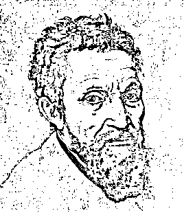

| 米开朗基罗

*   演员、制片人和银幕外的放荡公子沃伦·比蒂出生于 1937 年 3 月 30 日，逆行的金星正停滞在它自己守护的金牛座； 
*   演员罗伯特·德尼罗出生于 1943 年 8 月 17 日，也就是金星在处女座逆行的两天后； 
*   歌手夏卡·康出生于 1953 年 3 月 23 日，正值金星和天王星双双停滞；
*   歌手艾米·怀恩豪斯出生于 1983 年 9 月 14 日，正值金星和海王星双双停滞； 
*   文艺复兴时期的艺术家和雕塑家米开朗基罗生于 1475 年 3 月 6 日，恰好是在白羊座金星停滞期间，次日将转为逆行。土星也几乎静止，于 3 月 10 日转向顺行。

**火星****停滞**

在火星停滞期间出生的人可能会在表现出一种**权力感或坚定主张**，有时还会表现出具有**性吸引力**的特质。如果压力很大，他们的个人或职业生活中可能会出现**愤怒或权力斗争**。

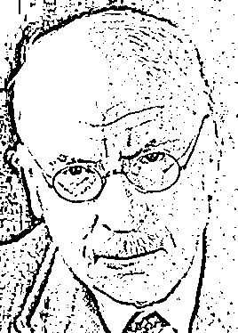 

| 卡尔·荣格

*   充满力量的灵魂歌手奥蒂斯·雷丁出生于 1941 年 9 月 9 日，正值火星、天王星和土星三星停滞；

*   战时总统富兰克林·德拉诺·罗斯福出生于 1882 年 1 月 30 日，正值火星停滞在双子座，落点突出，靠近他的中天；

*   作家詹姆斯·乔伊斯于 1882 年 2 月 2 日出生，就在三天之后，火星顺行进入善于沟通的双子座；

*   传媒大亨鲁珀特·默多克出生于 1931 年 3 月 11 日，当时火星和木星都停滞于贪婪的巨蟹座；

*   心理学家卡尔·荣格出生于 1875 年 7 月 26 日，正值火星停滞在射手座，火星在前一天转向顺行。 

**木星****停滞**

出生在木星停滞期间的人可能表现出**更多的宗教或意识形态倾向**，或者只是在**工作或个人生活中表现出更广阔的视野。**


| 汤姆·克鲁斯

*   唐纳德·特朗普（“越大越好！”是他的信条）1946 年 6 月 14 日出生于木星和海王星双双停滞的时候； 
*   演员汤姆·克鲁斯出生于 1962 年 7 月 3 日，恰逢停滞的木星与海王星和太阳形成一个大三角格局，放大了本来就已形成的扩张性； 
*   散文家兼诗人拉尔夫·瓦尔多·爱默生出生于 1803 年 5 月 25 日，也就是木星顺行进入处女座的第二天； 
*   歌手保罗·西蒙出生于 1941 年 10 月 13 日，正值木星和水星双双停滞期间； 
*   马龙·白兰度出生于 1924 年 4 月 3 日，正值木星停滞在射手座期间。

**土星****停滞**

在土星停滞期间出生的人通常以**坚韧和纪律**著称，在职业或情感生活中可能是**“大器晚成者”**。有时候他们的个性中潜藏着**沉重感**，就好像他们承受着沉重的负担，但是他们也能表露出**惊人的深度**。

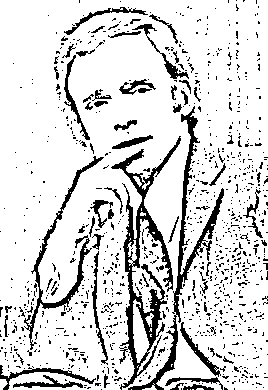

| 迪克·卡维特

*   迪克·卡维特出生于 1936 年 11 月 19 日，土星在双鱼座顺行的同一天，与在处女座的海王星成对分相。尽管他是一位广受好评的喜剧演员和脱口秀主持人，但他在后来的几年中承认自己一生都在与抑郁症斗争；
*   电视评论员、社会倡导者和前白宫顾问比尔·莫耶斯出生于 1934 年 6 月 5 日，正值土星和木星双双停滞； 
*   演员利亚姆·尼森的舞台形象被一位评论家形容为“忧郁的庄严”，他出生于 1952 年 6 月 7 日，正值土星和火星双双停滞。这似乎吻合尼森在花甲之年获得了他一生最大的票房成功，他在极其卖座的《飓风营救》系列电影中领衔主演一位高龄的动作英雄！！ 
*   女演员吉莉安·安德森（《X 档案》系列剧中饰演探员史卡利）出生于 1968 年 8 月 9 日，当时怀疑论的土星和神秘的海王星都在停滞期；

土星可以带来巨大的成功和成就，但有时又会让人跌落神坛。

*   喜剧演员比尔·科斯比出生于 1937 年 7 月 12 日，这时土星停滞在白羊座（这是与自信和动力有关的星座）； 
*   名声扫地的自行车选手兰斯·阿姆斯特朗出生于 1971 年 9 月 18 日，就是土星在双子座（与短途旅行有关的黄道星座）逆行的前一天。 

**天王星****停滞**

出生在天王星停滞影响下的人可能**十分独立，强烈关注个人自由和自我表达**。根据个人行星的相位和星图配置的不同，他们可能**对社会改革和进步性的社会变化感兴趣；**另一个极端是，他们会表现得像**“自由代言人”**，**自私地遵循自己的规则，不顾他人。**

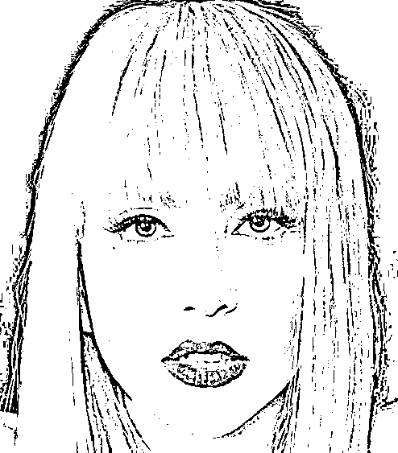

**| **Lady Gaga

*   亚伯拉罕·林肯总统于 1809 年 2 月 12 日出生，同一天，天王星改变了运行方向，并与水星和冥王星形成三分相； 
*   著名生物学家查尔斯·达尔文与林肯同日出生，他的进化论在科学界和宗教界引发了一场文化革命； 
*   约翰·肯尼迪总统于 1917 年 5 月 29 日出生，当时天王星停滞在水瓶座，水星停滞在金牛座（两颗行星形成一个四分相）； 
*   拿破仑·波拿巴出生于 1769 年 8 月 15 日，就在停滞的天王星转向在金牛座顺行的前一天——放大了这三颗外行星之间极其罕见的三分相； 
*   流行歌手 Lady Gaga 出生于 1986 年 3 月 28 日，这时天王星正停滞在射手座，与金星成三分相，与水星成四分相； 
*   多栖巨星猫王埃维斯·普雷斯利出生于 1935 年 1 月 8 日，这时天王星停滞在白羊座，与他星图中的冥王星、水星、金星和太阳形成了一个多行星的 T 三角格局，天王星是其中的焦点行星；

**海王星****停滞**

根据个人行星相位或星图配置的不同，出生在海王星停滞影响下的人可能**对艺术、灵性或人道主义关怀表现出特殊的敏感性**，更负面的表达是容易**选择逃避现实、自欺欺人或有救世主倾向**。


**| **J.K.罗琳 

*   电影导演（导演过电影《第六感》）米·奈特·希亚马兰生于 1970 年 8 月 6 日，正值海王星停滞在天蝎座，对分金牛座土星；

*   歌手洛德·斯蒂沃特出生于 1945 年 1 月 10 日，正值海王星和木星（木星与他的摩羯座太阳成三分相）双星停滞期间； 

*   作家 J·K·罗琳出生于 1965 年 7 月 31 日，正值天蝎座海王星停滞。

**冥王星****停滞**

根据个人行星相位或星图配置的不同，出生在冥王星停滞影响下的人带着**激情和意志**对待他们的生活，这些品质可能会**极大提升个人创造力和精神成就**，也可能让他们**陷入愤怒或绝望的深渊。**

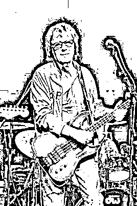

**| **比尔·怀曼

*   作曲家约翰·塞巴斯蒂安·巴赫出生于 1685 年 3 月 31 日，冥王星停滞，与金星和水星形成一个紧密的三分相，同时冥王星四分他的太阳、上升点和木星。J·S·巴赫创作的著名的 D 小调托卡塔与赋格曲可以说是古典音乐编年史上最富有冥王星色彩的作品之一。听一听这首经典作品的录音，你会注意到它低沉的低音是如何以一种近乎《歌剧魅》影的方式唤起灵魂深处的感觉，同时又自相矛盾地暗示着最高层次的精神冲动； 

*   另类的音乐家、滚石乐队的比尔·怀曼出生于 1936 年 10 月 24 日，停滞的冥王星四分他的天蝎座太阳，三分他的金星。比尔·怀曼是一个表现出冥王星多方面影响的迷人案例。除了为滚石乐队的许多热门歌曲提供强劲的低音之外，怀曼也有业余考古的爱好，甚至设计并销售一种拥有专利权的“比尔·怀曼牌金属探测器”，它曾被用于在英国乡野发现古代遗迹。怀曼也因幕后的桃色生活而声名狼藉，他承认在他的职业生涯中与近千名女性有染。

**预测中停滞点的作用**对于所有以预测为导向的占星师来说，不仅要准确指出新出现的模式的含义，还要准确预测它出现的时间。停滞点可以发挥关键作用。假设土星在某一年与一位客户生星图中的太阳成四分相，星历表或计算机给出的列表可能会显示这个四分相在一年中精确成相三次。但通常情况下，你会发现**相位最重要的表现不会发生在精确成相的时候，而是在此日期之前、期间或之后的其他时间点**。这是因为太阳-土星的四分相可能会**被其他次要因素触发**，比如**日食、其他行星的行进**——或者，我们现在看到的**停滞点**。例如，在客户这一年的过程中，土星会在不同的时间停滞，同时又跨过准确形成四分相的那个时间点，每次都会向前或向后移动一点。**每一个停滞的周期都会以一种强有力的方式激活土星-太阳四分相。**因此，**乍一看似乎是三个精确的触发点，实际上可能是五个甚至更多的触发点**（特别是**四分相区域两侧出现停滞点**的话)。**与其简单地记录准确行进的关键时刻，不如关注与整个行进时期相关的停滞点。**每一个停滞期都将提供进一步的线索，揭示那个行进所呈现的戏剧性演变。除此之外，停滞点还可以在我所说的“抢先看”中发挥作用，**早在趋势发生之前，就让我们对其有初步的了解。**让我们继续前面提到的一位客户案例，他正在经历行进的土星四分其太阳。早在精确成相之前，土星会缓慢地在黄道带上顺行和逆行，就像潮涨潮落一样，同时朝着那个相位度数前进。**每当它停下来改变方向时，这些停滞点将激活即将到来的四分相，从而作为早期的“窗口”，使后续发展更加充分**。在土星-太阳客户的案例中，他可能会开始发现工作中出现的问题，例如与老板相处困难或工作量增加。如果是这样的话，那就意味着到准确四分相时，进一步发酵的状况与工作有关，甚至可能意味着他有被解雇的危险。借助这些认知，客户可以**采取必要的预防措施**，比如在工作中更加小心，甚至其他就业机会制定应急计划。

**版权声明：**本文由若道翻译发布，欢迎转发，反对抄袭。友号转载请申请白名单。


**雷·格拉斯**

来自芝加哥的作家、音乐家、摄影师和占星师。他在《探索之书》和《探索》杂志做了十年编辑工作，并自 1998 年以来一直担任《大占星师》杂志的副编辑。他的讲座话题广泛，涵盖了占星学、共时性和神话学，同时他还保持着积极的占星实践，客户遍布美国国内外。

******点击图片查看若道君推荐******


[](http://mp.weixin.qq.com/s?__biz=MzA5NjA0NTAxNg==&mid=2651412358&idx=3&sn=9acab76ab2bdd317b432029d0b47b2a4&chksm=8b4be531bc3c6c274f40ea17a23bba503bdd732a0faaee91ec2502c4d4ae52ead0a2c7a5d3e5&scene=21#wechat_redirect)

**微信又双叒叕改版啦，不想错过若道君的推送？**

**就把若道设为星标吧！**

**▼**


喜欢记得点一下在看哦☟

********报名直达入口********


# 深度 | 当土星碰上个人行星，为你解开命运的隐喻

> 原文：[`mp.weixin.qq.com/s?__biz=MzA5NjA0NTAxNg==&mid=2651413130&idx=1&sn=92b0645f4f972a081fc13bf4198dc209&chksm=8b4be83dbc3c612b4fc9aea9083408edb7191029ffbf855f1fb3b1259abe662ab868d08cf2bf&scene=126&sessionid=1692738217#rd`](http://mp.weixin.qq.com/s?__biz=MzA5NjA0NTAxNg==&mid=2651413130&idx=1&sn=92b0645f4f972a081fc13bf4198dc209&chksm=8b4be83dbc3c612b4fc9aea9083408edb7191029ffbf855f1fb3b1259abe662ab868d08cf2bf&scene=126&sessionid=1692738217#rd)

**☆ 后台回复“今日”，给你一句生命态度**


作者/薇安 ISAR 认证占星师
编辑/Tang 图片/unsplash 在当下土木冥摩羯座的天象下，土星的能量得到了加倍的增强。今天，若道君就想和大家聊一聊土星。在我们的出生星图中，当土星与个人行星（太阳、月亮、水星、金星、火星）形成紧密的托勒密相位，有着什么意涵，需要经历哪些挑战，命运又想要告诉我们怎样的隐喻？这篇文章给你答案。**命运的隐喻**人们皆对“命运“心存好奇，向往有之，恐惧有之；正如看向黑暗深处时，令人心尤其不安的，是：**未知**。那么，如果命运即是当下所有的发生呢？我们是否有勇气去拥抱住这些发生，有力量安住其中，有智慧去明了，“我”对命运本身负责？！**人类最共性的命运，恐怕就是生存在这个由粗钝的物质实体构成的地球次元之中。**从悲剧式的视角看去，它根本上决定了生而为人的局限性。就像由骨骼血肉组成的身体，让我们经验到最基本的行动局限。比如，我们无法像鸟儿一样自由飞翔；当身体受到损害之时，受限制的体验将被数倍放大。我们在肉身之中经验到的局限与阻滞，在象征意义上，平行于我们在外部世界会遭遇的有形或无形的壁垒。小到路上需要绕开的一枚石块，大到仰止的高山，辽阔如国家之间的疆界。**无形的壁垒则见诸于**：习俗文化，国家体制，法律家规，及心理上内化认同的权威父母等（这些部分，构成弗洛伊德所定义的“超我”——在人格内部约束甚至惩戒着“自我”）。而终极局限之一，恐怕就是被我们经验为“时间”的法则，它完全在人类意志掌控之外，并决定了由出生去往死亡，这一不可逆的旅程。**以上种种，在占星学的符号体系中，皆由“土星”所象征**（我也偏爱“主宰”这一比喻，让人对这些存在自然升起敬畏心）。**如果个体的出生星图中，某颗个人行星（太阳、月亮、水星、金星、火星）与土星形成托勒密相位，有关你命运的一个隐喻，便是**：学习在秩序和结构中发展出精神上的自律与坚韧，消弭与局限性的对抗意图，转而在与其和解的过程中，逐步经验到自我的创造性潜能——无论外部剧情如何上演，戏剧性张力强度如何，内在心理过程都会居于这个结构逐步演化。**若心智能够悦纳这个隐喻，土星就成了灵魂的炼金石，而死亡将成为悲剧人生的喜剧结尾。**与土星具体形成相位的个人行星，则暗示出，**个体主要经由哪个面向来完成这种演化**。注：心理占星学的视角，和谐或挑战相位，不改变这一心理发展演化的本质；区别只是个体内在体验的轻松或痛苦程度，以及反映在外界的剧情艰难程度的差异，故以下描述不做区分。

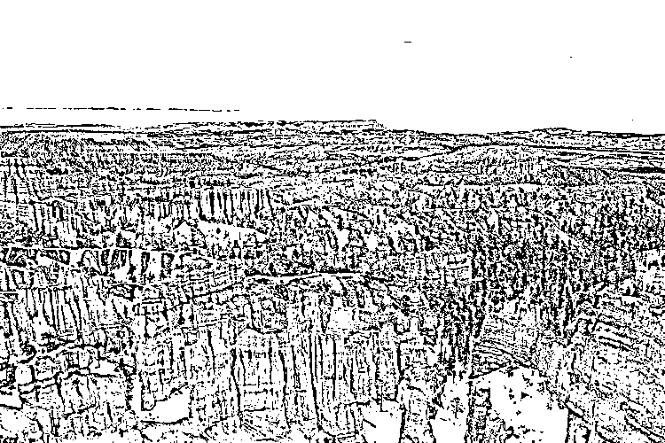

**出生星图中土星遇上个人行星**

**太阳****与土星成相位**

占星学中的太阳符号，象征精神或心理层面的：**自我意图**。这一意图最基本的旋律是：**我是独立存在的，我被看见，我能够主宰，我可以创造**。当太阳与土星相遇，个体对自我意图的领悟之路，可概述为：**经由与权威的较量，而成为权威**。**这个权威，在生命早期，极大可能显化为生命中的父亲（占星学传统上将太阳和土星同视为父亲的征象星）。**无论在现实生活中，个体与父亲真实的关系质量如何——或者以父亲为骄傲，视其为人生榜样；或者经历到父亲的严苛或漠视，感情疏远；个体都悄然**内化了一个标准**——我要怎样才能成为父亲哪样的人？我要成为什么样的人，才能让父亲以我为傲？才能被父亲看到？……**当个体进入成人世界，无有悬念，他们会****将这一内在权威投射到重要的社会关系人物身上**，比如职业中的上级或信赖的导师（这一人物可能是男性或女性，关键是其权威性的角色）。而与这些人物的关系，会继续承载个体与内在父亲的关系驱力，影响着个体的生活剧情。**从积极的一面看**，这在现实中推动了个体不断激发自我潜能的进程，在不断想要靠近那个难以企及的权威的过程中，我们也将自己打磨成了某个领域的权威。生命中也会悄然出现那些视我们为其“内在父亲”，渴望着得到我们认可的更年轻一代。**从消极的一面看**，因为一直自觉无法达到“父亲“这一完美标准，或持续得不到来自“父亲”的肯定——无论这是现实的情况，还是我们所认同的主观感受——长久的挫败体验，使得个体在心理体验上彻底地否定了自我意图，活成了“傀儡”（尽管实际中可能拥有一定的社会成就，也无法经验自我主宰的体验）。**要走出这一“魔咒”，个体需要**：

*   仔细倾听，辨识自己内在的冲动，特别是关于自己真正渴望成为什么样的人。
*   要仔细排除所有对这一意图的否定性干扰。
*   对自己的意图，由自己给予允许。
*   最后，接受土星在物质界昭示的客观条件，运用其成就这个自我意图。

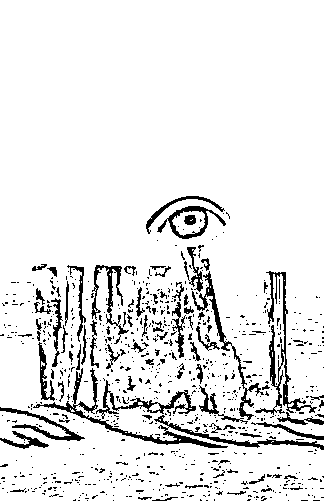

**月亮****与土星成相位**

占星学中月亮的符号，**象征内在心理的情感体验，以情感滋养他人的能力，人类特有的共情能力，以及个体涵容情感的能力**。倘若你问水流，它如何最是自在？它答你：流动，最自在。再完美的容器，一旦水被“固着”，腐化只是迟早的事。或是流经干涉的土地沙漠，被吸个干干净净。但，水又是需要结构的，如若不然，就是泛滥。同样，在人类心灵上，这就是月亮与土星的平衡性目标，任何一方的失衡的，都有破环性。**失衡的月土关系（常见于月土的挑战相位），个体在早年人生经验中，获得的情感滋养是有限或匮乏的**，或常见于“有条件”的滋养——即，达到某个标准时，才可获得积极的情感回应。或者这些时刻，也可能被物质化的奖励替代了，鲜有通过情感表达之爱，比如，对方喜悦的表情，爱意的眼神或温暖的拥抱。**消极的影响**显而易见。**一是**，使得个体的生命状态因少了情感滋养，而失去弹性和饱满度。**二是**，因为生命中缺少情感的榜样，令个体在成年后，也拙于滋养他人。情感的表达，往往成了提要求，讲条件，令被爱者尤感困惑。但还是要说，**情绪情感若是无序泛滥的，必然也造成问题**。对自我的情绪情感，务实地审视，恰当地表达与运用，才是增强自我功能的途径。然而，月亮的能量本身，是阴性的，被动的，习性的；无论个体自身的情感模式如何，最难的是升起改善的意愿。一旦这个意识升起，现已有各家的方法可以学习运用。记住，**无论出生星图中月亮的配置如何，每个人都天然拥有月亮的能量——爱的能力**。

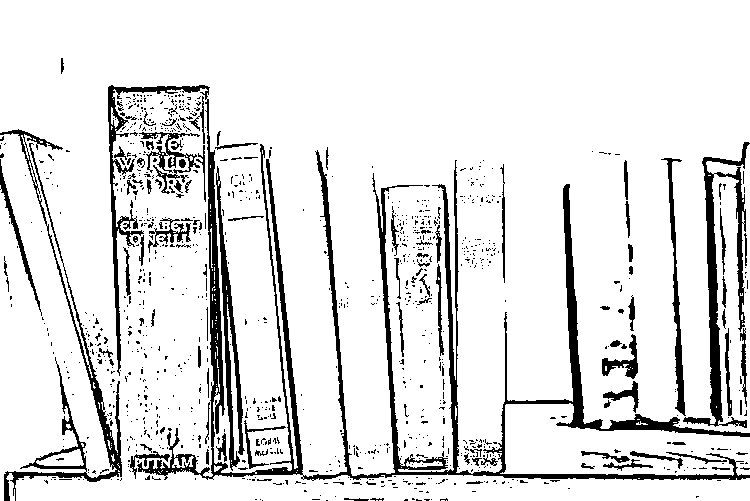

**土星****与水星成相位**

占星学中的水星符号，**对应个体心理的思维、学习及获取信息的功能，语言运用（表达）的能力**。

**当水星与土星相遇，便为上述心理功能增加了严谨性和高要求**，仿佛头脑中有一位严谨的导师，不断地追问：“你确定这个想法是正确的吗？”“你真的已获得正确答案？”“还有什么是没有考虑到的？”。

正所谓，“语言是思想的外衣”，有水土相位的人，往往是“**谨言慎行**”的，也就不足为奇了。

尽管**挑战性的水土相位**，会令个体**内在承载较大的压力**，可能过度思虑，倾向于悲观的解释方式；但不得不说，这也是一个**非常适合进行学术研究的配置**。

**拥有水土相位的个体，最要避免的，是因为认同某种社会标准，而对自己产生错误的内在评价。**比如，社会文化中有一种倾向，认为“能说会道”者，更有能力。相反，不善言辞的，在成长过程中也容易在整体能力上遭到的否定，或被忽视。

这些偏差的外界反馈，可能使我们对自己能力的评价持消极的态度。一但形成潜意识的信念，我们愈加会在需要争取机会时，习惯性后撤，一个消极的自我预言便实现了。

需要区分清楚的是，**水土相位，是对思维的严谨可靠有内置的高要求，而非思维能力本身有不足**。也是因为这个内在严厉的“导师”，令水土相位在开口表达时有延迟，因为他们需要确保，说出来的是正确而可靠的。

拥有水土相位的人，应珍视自己的这一天赋。就像与水星呼应的希腊神祗赫尔墨斯，他是天上人间信息的重要传递者；而土星，帮助我们约束赫尔墨斯顽劣不拘的面相，更有责任地为人们带去真实有效的信息。

**如果确实不喜欢运用口头语言，那么，写作对水土人会是非常好的表达途径**。

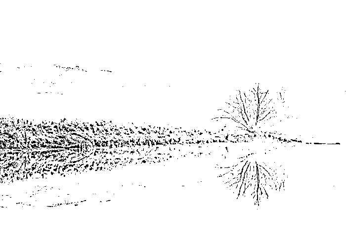

**金星****与土星成相位**

占星学中的金星符号，**对应的最重要的心理功能是——建立关系的需求与能力**。精神分析向客体关系方向的研究发展指出：人格的早期构建，并非只是源于力比多在不同阶段的驱力作用。同时，在生命之初，重要客体（母亲或重要的照料者）与之形成的关系，极大地影响着人格的塑造，以及对世界的心智认知。婴儿第一次看到“自己”，是在母亲（人物）的眼睛里：这个“我”被允许存在，并有资格被爱吗？因为“我”的存在，他人是更好了还是更糟了？**我们与自己的内在关系，通过与外部客体的关系镜映出来，又反射到自身而形成。而这种内在关系，又成了以后人生中，与他人的关系质量的基调。****出生星图中的金土相位，可能预示在个体在早年的重要客体关系中，所获得的反馈，更多带有某种否定性或是匮乏的。**换而言之，即便身体上得到了不错的照料，但婴儿看到的，可能是一张没有表情甚至阴郁的脸。如果在自我意识之初，自己就是一个“不受欢迎的人”，这种存在体验是非常令人困扰的。因此，**金土人可能一生都在追寻某种证据来证明自己存在的资格**。好的一面，这会驱动他们努力在人生的某个面向中获得成就（虽然他们自己可能很难享受这种成就）。但关系，特别是亲密关系，对他们仍是极大的挑战。常见的表现有：选择客观条件比自己低许多的伴侣；与吝啬付出感情的人建立关系；在关系中过度付出，而关系一旦出现问题，本能反应就是找自己的错，不停致歉以期望挽回，等。一些金土人，也因此可能选择了一种生活方式——独居。是的，**他们独处的能力会很好。在独处中寻找到意义和价值，也是金星与土星合作的某种意义的显化。**同时，还有其他一些**升华的渠道**。金土人可能在自己经历的痛苦关系中获得领悟，或驱动自己深入研究关系本质，而成为关系方面的专家（例如，关系咨询师，或者成功的婚介经营者）。至于金土人，最终是否会拥有成功的亲密关系，其实完全由他们内在的自我选择所决定。每个人都渴望在爱人眼中看见自己，这无疑是令生命喜悦的体验。但我们也需明了，这不是生命全部的意义；而对生命本质的了然，并非总是需要镜子的，也可以经由自身来完成。

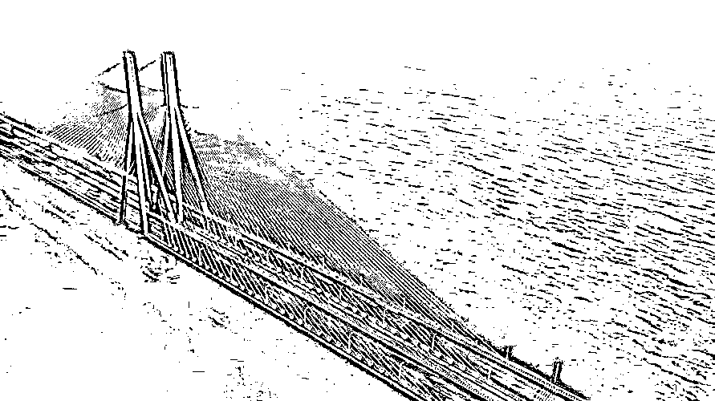

**火星****与土星成相位**

占星学上的火星符号，**最直接对应的个体心理内含的攻击性**。这里的“攻击性”，是一个完全中性的词汇。当精神分析学家梅莱尼.克莱茵刚开始提出婴儿有恨的情感，有攻击和摧毁的冲动时，社会大众拒绝将此与描述与纯洁无瑕的婴儿联系起来。然而，放下情感偏见，只是去把这种攻击性想象成一种纯粹的能量，便不难体会它的存在，对生命存活及发展的重要性。在心灵发展上，更为精微的是，正是因为婴儿感受到自己欲要攻击摧毁外在客体，才同时令到婴儿更想要去保护所爱客体，开始学习控制自己的原欲和冲动。因此，从能量的角度讲，不会“恨”，就不会“爱”。**当火星与土星形成相位时，****在土星的教导和管束之下，积极的作用是：火土人会成为最可靠的保护者**。他们异常坚定，长于坚持，善用力量，敢于追寻长远目标，不惧过程与时间的重重考验。成为带领人们成就艰难事务的领袖，是他们历练和显化权威身份的路径。**在火星没有能够通过土星的考验时，火土人可能由于过度压抑火星的攻击冲动，转向自我攻击。**一个直接的比喻：没有出口的能量在自身的潜意识世界四处乱窜，越是没有出口，越是焦虑愤怒。当被某种外界刺激激发时，失控发怒。在梦境中，有暴力的剧情，乃至身体经常有一些小炎症，都可能是在提示个体关注自己的攻击或愤怒议题。**对火星能量最好的升华，就是将其导向有价值的创造性目标上。**火星代表的原型能量，本质上是一种开创性的能量——允许新的生命生发出来，允许打破对生命的制约和阻挠，直至看到这种拓展性带来某种成果。在心理体验上，我们用一个最简单的词来描述，就是：“**我能**”。当火土成相位时，主动接受某种约束（无论是人还是环境条件），不将其投射为攻击我们的存在，而将其当成一位严厉的教练，**学习在局限性下开拓可能性**。随着在时间中的历练，我们会发现，边界或局限一直在，但可拓展的领域也会越来越广阔。

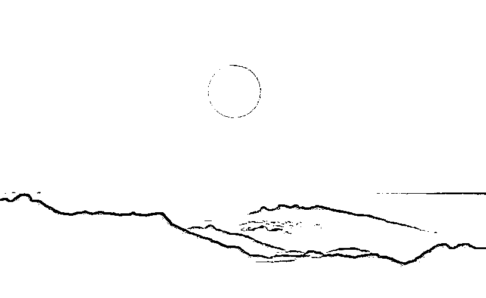

人类自古诸多祈福仪式，但并非臆想困难或灾难就此不会降临；正相反，祈福的过程是一个获取内心力量的过程，以准备好面对可能发生的种种挑战。“手指指月，指非月”，**星图中的每个符号，无论我们赋予它们美好或艰难的象征，它们都不是命运的肇因，而只是命运的写实**。**每张星图中，都有一颗土星，就如每个人都需去面对真实的人间一样；它是加害者，还是赐福者，我们只有抱持住内在追求进化的信仰，迎着命运安排的戏码而上，直至穿越，才能得其中滋味。**某种意义上，土星的赐福确实是**延迟的**；但当它给予你的时候，也是极为**丰厚的**——一种由内在生发出来的笃定的生命态度，我们可称之为：**智慧**。

**版权声明：**原创文章由作者授权发布于若道平台，欢迎转发，反对抄袭。友号转载请申请白名单。


**薇安**

全职心理占星师、ISAR 认证占星师（2016 年获得）、若道兼职助教

北大心理学硕士、MBTI 国际认证施测师

若道认证生时校正资质及 COAC 高阶资质毕业生

**微信 ID**：weianhuilai

**公众号 ID**：Radio-for-Alice

长按打赏


**双证书核心课程火热插班中**

**点击图片了解详情**

**

**微信又双叒叕改版啦，不想错过若道君的推送？**

**就把若道设为星标吧！**

**▼**


就是这个“在看”，戳戳戳 ☟

********报名直达入口********


# 沙龙 | 苏·汤老师带你了解顺势疗法能为流行性疫病做些什么？

> 原文：[`mp.weixin.qq.com/s?__biz=MzA5NjA0NTAxNg==&mid=2651413130&idx=2&sn=b20e4a49f3dfac9cd774a6992d99640a&chksm=8b4be83dbc3c612ba7ff4a1ca8b381694ef1aa748be9cc1c1c17c7b462da19ea052cc169badc&scene=126&sessionid=1692738217#rd`](http://mp.weixin.qq.com/s?__biz=MzA5NjA0NTAxNg==&mid=2651413130&idx=2&sn=b20e4a49f3dfac9cd774a6992d99640a&chksm=8b4be83dbc3c612ba7ff4a1ca8b381694ef1aa748be9cc1c1c17c7b462da19ea052cc169badc&scene=126&sessionid=1692738217#rd)

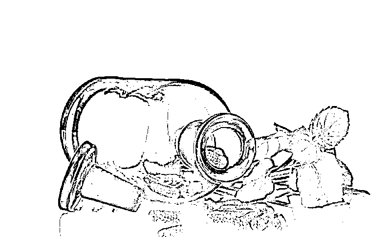

2020 年的春节，注定是令人难忘的。新型冠状病毒肺炎在这个春节肆虐了中国。我们一直在思考，可以做些什么来帮助被这场疫病影响的人们。若道除了做占星教育以外，两年前，我们也开始推广顺势疗法。在这场疫情开始不久，我们就联系了有 20 年多经验的**顺势疗法**医生**苏·汤普金斯**（Sue Tompkins）老师（很多若道的读者都知道她也是著名的占星师，其实她也是资深顺势医师），问她对于这样的疫病，顺势是否有办法有所帮助。苏老师的回答是非常肯定的。在顺势疗法出现以后，在历史的一些大的疫病流行中（其中非常有名是上世纪初期的西班牙流感)，顺势疗法都有非常有成效的治疗经验。

**顺势疗法讲座**

如果你对顺势疗法有好奇和开放的心态，想了解：

*   顺势医生如何看待病毒？
*   顺势在类似的疫情时候有多大作用？
*   顺势疗法可以为这样的疫情找到治疗方案？
*   顺势疗法可以如何帮助预防？
*   顺势医生为了找到合适顺势药物需要了解什么？

我们邀请你在**2 月 6 日晚 20:00**来听苏·汤普金斯老师的讲座。在沙龙中，苏也会谈一点**和这场疫病有关的占星学**。也欢迎你就顺势疗法向苏老师提问。

**沙龙时间：2 月 6 日晚 20:00-21:30**

**沙龙价格：50 元**

**沙龙形式：英文讲座，配有中文翻译**

为了让更多人开始知道顺势疗法，也欢迎你邀请你的朋友们来听这个讲座，以便开始了解和接触这种疗法，未来为自身和家庭的保健所用。**如果你将这篇文章转发朋友圈，并截图给工作人员，也可免费参加沙龙。**

长按二维码添加客服


这里有一篇对顺势疗法及其对流行疫病的治疗的科普文章，完全不了解顺势疗法的朋友请先阅读这篇文章。也可以在若道公众号后台输入**“顺势疗法”**，我们过去有一系列文章。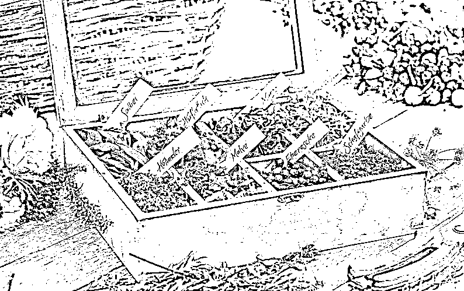

**什么是顺势疗法？**

要了解顺势疗法，首先你需要知道**当今世界上的主流治疗是对抗疗法**。对抗疗法使用制药公司生产的化学制剂药品，这些药品的目的在于**对抗和压制症状**。对抗疗法的药物如果健康人服用，就会因为相反的效果而产生问题，比如慢性腹泻的药品如果健康者服用就会导致便秘。对抗疗法的一个问题是，**给予相反的处方对某些疾病而言，只能短时的压制症状，并未真正的治愈**。当药力消退，症状又会复发，常常还会因为身体形成了**抗药性**而愈发严重。顺势疗法的治疗主张正好于对抗疗法相反，主要表现在以下三个方面：

❶ 顺势疗法的观念是**同类治疗**，**通过使用可以产生“症状”的“相似物”去刺激身体治愈自己的症状**。药品的选择是基于它们能够**模拟患者的症状而不是对抗患者的症状**，也即“同类”治疗“同类”。例如治疗慢性腹泻，顺势疗法就会选择一种会导致健康人腹泻的药品进行治疗。这种**刺激而不是压制**的方式**激发身体的自我生命力和自身疗愈系统的反弹效应**，恢复健康。

❷ 对抗疗法和顺势疗法之间的另一个区别是，顺势疗法是一种**整体论的医学**，和中医一样，当一个人病了，顺势医师的问诊会考虑此人的**身体、精神、情感**三个层面。**它的目标是治疗人，而不仅仅是治疗病症。**对抗疗法对待不同的症状就像对待不同的疾病，即使它们发生在同一个人身上。例如，复发性偏头痛和腹泻，会使用两种不同的对抗性疗法的药物。而顺势疗法会将这些问题视作一个整体疾病的部分，作为一种疾病同时治疗。❸ 顺势疗法的药物**更安全**。对抗疗法的药物以化学方法为基础，病人可能面临**药物互相作用和毒性副作用**。相反，顺势疗法的药物是经过高度稀释的物质，**并不产生化学副作用、毒性或与其他药品的相互作用**。药物主要是**药片**的形式，有时也使用**液体**。这种药物主要功能是**激活身体的自然疗愈系统。**当你了解顺势疗法的药物是如何制作时，你就更明白顺势疗法是一种**非常安全、没有副作用**的疗法，可以和对抗疗法、中医一起使用。根据世界卫生组织的调查，**顺势是世界上第二大的医疗系统。**世界上至少有 5 亿人使用顺势疗法。可能实际的数字还要更多。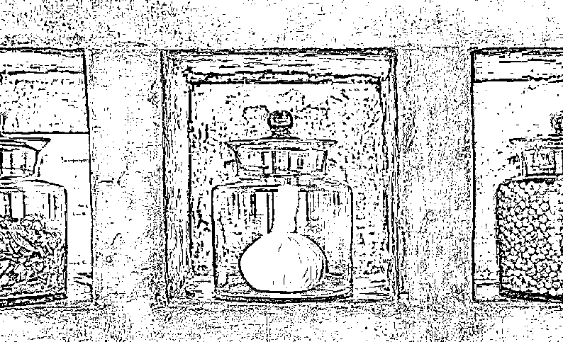

**顺势疗法的几大优势**

**顺势疗法治疗的是人，而不是疾病。**假设有 20 个患了感冒，或者头痛的人，去找一位顺势疗法医师。可能每个人都将得到不同的药方，因为每个人的头痛是不同的，每个人的感冒也是不同的（但当大的疫病流行时，常常是有一种药剂可以治疗很多病患，且此药剂也是易感人群的预防药剂）。
普通的医药学，正统的医学被顺势疗法医师称为**对抗疗法医学（Allopathy）**。“Allo”的意思是**“其他的，其他人的痛苦”**。对抗疗法医学使用对抗的法则，对抗性治疗。你可以从一些药物的用词方式看出这一点，抗生素、消炎药、抗惊厥药、降压药、抗抑郁药，抗精神病药等。所以，传统的西医用的是对抗法则，这和顺势疗法所做的正好相反。顺势疗法的另外一个哲学观点，是**生命力**的概念。顺势疗法在这里又和中医和许多武术，比如合气道，搭上线了。它们都有生命力的概念。不同的文化对它有不同的称呼。中国人称它为“气”，日本人称“気"，夏威夷称之为玛那。这就是生命力，一种不可见的动力，却像电流一般流通身体。中医关注的是你的气是否有阻塞，因为什么阻塞，如何解除阻塞，气是强是弱等等。人们对于生命力的概念有不同的观点，而顺势疗法处理的就是这一生命力。称它为“生命力”，因为哈内曼就是这么叫它的。你可以给它取任何名字都没有关系。它就是**为一切活物赋予生命的力量**。死人和活人不同的地方就是死人身上感觉缺了某种东西，缺的就是这一生命力。顺势疗法用顺势药物激发身体自然的生命力，以此来获得治愈。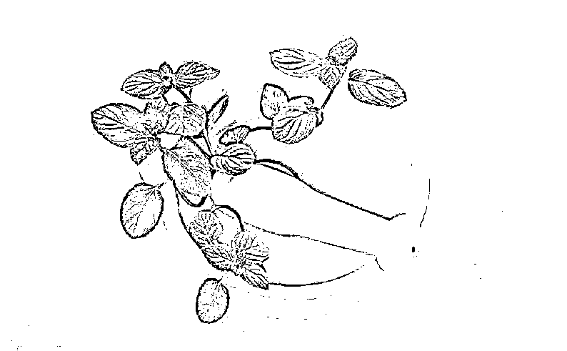

**顺势疗法的药物安全吗？**

 顺势疗法是一种有关天然药物的科学，利用剂量非常小的各种植物、矿物质或动物来刺激病人自身的抵抗力。药物根据个人情况而选择，这些药物如果过量服用能够导致病人所正在经历的相似的症状。

本质上说来，顺势疗法由两种高度系统化的方法所构成：**毒理学和病案记录**。首先，顺势疗法医师找出各种物质在过量时所导致的特定的身体、情绪和精神症状。与其他任何来源相比，顺势疗法教科书在毒理学方面有着更为详细的介绍。其次，**顺势疗法医师极为详细地问询其患者，以发现该人所经历的身体、情绪和精神的全部症状**。顺势疗法医师试图找到一种物质，该物质会导致此人身上的类似症状，然后以特别准备好的小剂量的方式给药。


上面这张图描述了制药的过程。比如对于退烧药物颠茄，你先有它的母酊。然后往另一个容器装比如说 99 份的水或酒精。然后取出一份母酊，放进那个容器里，开始用力震动，之后就得到了 1C 的药品。从这份药品中，再取出 1%的分量，放进 99%的水或酒精里，然后做同样的事情，就得到了 2C；从 2C 里拿出一份再加入 99 份酒精和水震荡成为 3C。我们如果要制造 30C，这样一个过程会持续 30 次。不断重复这个过程。现在常见的稀释药方有 1m，就是千分之一的分量，10m，万分之一，甚至五万分之一。所以现在你明白稀释的程度有多深了。这就是顺势疗法的“最小剂量”的概念，意思是把用药量减到最低，因为不想伤害到病人。这是规则之一，**不能造成伤害。**

****所有药方都经过验证****

顺势疗法医师会**为药方寻求验证**。比如说他们不了解大蒜的效力，想要了解大蒜能否成为顺势疗法的药方，就会先用稀释和猛摇的方法制作出大蒜的药方，分给一些人，并要求这些人报告身体、精神、情绪方面的感觉，做了什么梦，说了什么话，各种各样的事。可能要分析好几十甚至上百人的报告。在验证中，通常你会发现有些人比其他人更加敏感。每个填写报告的人都不知道他们服的是什么药，也不知道别人说了什么话。从这些报告中，就可以大致了解药方的效果。


为了证明顺势疗法起作用不是因为安慰剂效应，我们可以为动物进行治疗。看一下上面那张图。事实上，在英国，这一组织教授为动物准备的顺势疗法。这门课程会教农民一些基础的顺势疗法，治疗自家的家畜。在英国已经大约有 400 位农民完成了课程，并且能将那些知识用在自家的动物身上。这里实践有机耕作的农民也通常会用到顺势疗法。此外，治疗某种植物的特定疾病，也经常要用到顺势疗法。

****顺势疗法一直为英国皇室所使用****

英国王室以极度保守，秉持传统家庭观念和公共服务著称，但众所周知，他们也特别欣赏，甚至是推崇某些非传统却行之有效的治疗方法，不论传统医学是否接纳这种方法。阿德莱德皇后患有严重的疾病，宫廷医生无法治愈。皇后召唤了哈恩曼最年长最值得信赖的同僚约翰·厄尼斯特·施塔普夫医生（1788-1860）为她诊治，她获得了治愈，在英国王室中赢得了第一批顺势疗法的拥趸。自阿德莱德皇后之后，英国王室的各位国王和王后（女王）以开放的心态在顺势疗法中探索医疗关护。维多利亚女王（1837-1901）的医师是弗雷德里克·奎恩医生，他也是比利时利奥伯德王子的私人医师-顺势疗法治疗师。

英王乔治五世的妻子玛丽皇后（1865-1953）曾带头为伦敦顺势疗法医院的创建和扩张筹集资金。英王乔治五世（1865-1936）也非常赏识顺势疗法，因为他非常喜欢航海，但晕船这个问题常常困扰着他。顺势疗法治好了他晕船的问题。


乔治六世也是使用顺势疗法药品的行家里手，在 1948 年，他为了表达自己对这一医疗体系的感谢将皇家头衔授予了伦敦顺势疗法医院（LondonHomeopathic Hospital）。皇家伦敦顺势疗法医院的头衔保留了数十年，一直到 2010 年，医院才改名为皇家伦敦整体医疗医院（Royal London Hospitalfor Integrative Medicine）。


伊丽莎白二世在 1952 年即位，她长期以来都是皇家伦敦顺势疗法医院的赞助人，在 2005 年又投入了三千五百万美元。在 2000 年，伊丽莎白二世参观医院时，她望着约翰·韦尔爵士的画像，他是她的顺势疗法医师，说：“他给予我父亲很好的治疗。”为了适应时代需求，在 2010 年，这间医院将名字改为皇家伦敦整合医疗医院。查尔斯王子更是顺势疗法的热情支持者。他为家人、他庄园里的动物和植物都使用顺势疗法。当然这也为他带来麻烦，因为皇族不应该发表任何不中立的主张。

**顺势疗法治疗流行疫病的历史**

以下文章作者为 Julian Winston

顺势疗法从一早开始，就和**治疗流行性疾病**联系在一起。顺势疗法治疗流行性疫病的最早的经历之一是在**1813 年治疗斑疹伤寒**（由虱子传播）。当疫情在莱比锡蔓延，军队从东部撤退时，顺势疗法的创始人塞缪尔·哈内曼（SamuelHahnemann）治疗了 180 例斑疹伤寒，只有 2 个病人死亡。而当时的传统治疗的死亡率超过 30%。**1854 年，伦敦发生霍乱疫情**。这是医学界第一次能够将疫情追溯到源头（公共水泵），当水泵关闭时，疫情很快就停止了。
疫情停止后，下议院要求提交一份关于治疗这种流行病的各种方法的报告。报告发表时，顺势疗法的数字没有包括在内。上议院要求解释，报告的人承认，如果顺势疗法的数字要包括在报告中，它会“扭曲结果”。被压下来没有上报的报告显示，**在对抗疗法治疗下，死亡率为 59.2%，而在顺势疗法治疗下，死亡率仅为 9%。****在 19 世纪 50 年代，美国南方各州发生了几次黄热病流行**。这种疾病最终被发现是由蚊子传播的。奥斯勒说，黄热病的变态反应死亡率在 15-85%之间。1853 年，顺势医师霍尔康报告纳切兹市的死亡率为 6.43%，另一个顺势医师戴维斯博士报告纳切兹市的死亡率为 5.73%。**1878 年，在对抗疗法治疗下，新奥尔良的死亡率是 50%，在顺势疗法治疗下，死亡率是 5.6%（1945 个病例）。**另一种用顺势疗法治疗的流行病是**白喉**。白喉的特点是它会周期性出现，很少有相同的表现。因此，对医生来说，针对每一个具体病例或在普遍流行的情况下进行个体化治疗是非常重要的。一种在一年内有效治疗它的药物可能不是下一年所需要的相同的药物。在 1862 年至 1864 年纽约州布鲁姆县白喉三年的记录中，有一份报告显示，**对抗疗法的死亡率为 83.6%，而顺势疗法的死亡率为 16.4%。**顺势疗法在近代历史重大流行病中的应用是在**1918 年西班牙流感**期间。在西班牙流感中，最常用的治疗药物是钩吻，偶尔也有需要泻根和紫茎泽兰的病例。来自 CT 德比的 HerbertA.Roberts 博士说，康涅狄格州的 30 名医生回应了他的数据请求。他们报告了 6602 例，55 例死亡，不到 1%。罗伯茨博士在一战期间在一艘军舰上当医生。在去欧洲的路上，有 81 人得了西班牙流感。他报告说：“一切都恢复了，所有人都安全上岸了。每个男人都接受顺势疗法治疗。而另一艘船在途中就死了 31 人。”阿根廷的弗朗西斯科埃扎亚加博士讲述了**1957 年在布宜诺斯艾利斯发生的脊髓灰质炎流行病**，在那里，这种流行病的症状类似于扁豆这个药物的症状。顺势疗法的医生和药店开了 30C 的扁豆作为预防剂，分发了“数千剂”，这些用药的人没有人被传染。埃扎亚加指出，在其他种类的脊髓灰质炎流行病中，钩吻是一种指定的治疗用药，当然，在这里个体化的必要性也被强调。


| 国内已经出版的顺势疗法（顺势疗法也翻译为和疗）部分书籍

****报名请点击“阅读原文”****


# 2 月宇宙天气 | 面临极限，恰是向人性无条件的善迈进

> 原文：[`mp.weixin.qq.com/s?__biz=MzA5NjA0NTAxNg==&mid=2651413100&idx=1&sn=e8f2b2dd09b5e5d2e49c0017d270c722&chksm=8b4be8dbbc3c61cd1a51b907dd9b1360e0d3433d18b444a587429bcbc4eafe5d4573e241a2e2&scene=126&sessionid=1692738217#rd`](http://mp.weixin.qq.com/s?__biz=MzA5NjA0NTAxNg==&mid=2651413100&idx=1&sn=e8f2b2dd09b5e5d2e49c0017d270c722&chksm=8b4be8dbbc3c61cd1a51b907dd9b1360e0d3433d18b444a587429bcbc4eafe5d4573e241a2e2&scene=126&sessionid=1692738217#rd)

****************☆ 后台回复“今日”，给你一句生命态度****************


作者/咔咔 ISAR 认证占星师
编辑/玫瑰 图片/全景网 2020 年第一个月就在消毒水的气味中过去了。2 月，会有变化吗？你要相信，那些静悄悄在心中生长的信念和力量，它们没有被囚禁，只是被聚拢。让我们一起期待一个不一样的 2 月，天佑中华！
**2 月主要天象**

2020 年，新年伊始我们就收获了两份“礼物”：**恐惧与孤独**。在一个本应充满欢笑和希望的假期，绝大多数人可能都有一种“生命陷落”的感觉。我们有理由恐惧，疫病好像悬在每个人头上的剑，不知道什么时候会掉落下来。我们想知道，什么时候这一切才会过去，生活再次变得安全、舒适、充满希望。孤独，这次疫情带来的另外一个“礼物”。自我隔离拿掉了生活中精致花俏的内容，回归到简单朴素的状态。恐惧和孤独，令人动弹不得，学习接受眼前的实相。如果我们没有被恐惧和孤独打垮，把它们当做一个信息，它们在说：**“不要再挣扎了，停下来，向内看看。”**

西藏金刚乘比丘尼佩玛·丘卓讲过一个故事，有一次创巴仁波切和几个侍从一起去参观一座寺庙，接近大门时他们看到门口有一头大狗，赤眼森牙，对着他们咆哮，还想挣脱链子跑过来咬他们。他们保持距离绕过这条狗，赶紧走进大门。谁知道狗链断了，狗朝着他们冲了过来。几个侍从惊叫了起来，呆立在那里无法动弹。仁波切转过身去，以最快的速度对着狗冲过去，狗觉得非常意外，突然停下来，夹着尾巴跑了。她说，**精神之旅是超越期望和恐惧，跨进未知的领域，继续向前走。**通常我们逼近自己的极限时，就会像侍从一样，吓得呆在那里，我们的身体呆了，心也呆了。在感到生命陷落的时候，要如何超越恐惧，安住孤独并从中获益呢？佩玛·丘卓建议，**不去沉溺也不压抑自己，试着彻底了解自己的真相，无论内心升起怎样的能量，愤怒的能量、恐惧的能量、失望的能量，那些能量都会让我们心里僵硬的东西融化**。面临极限不是一种障碍或者惩罚，而是找到了门径，向人性无条件的善迈进。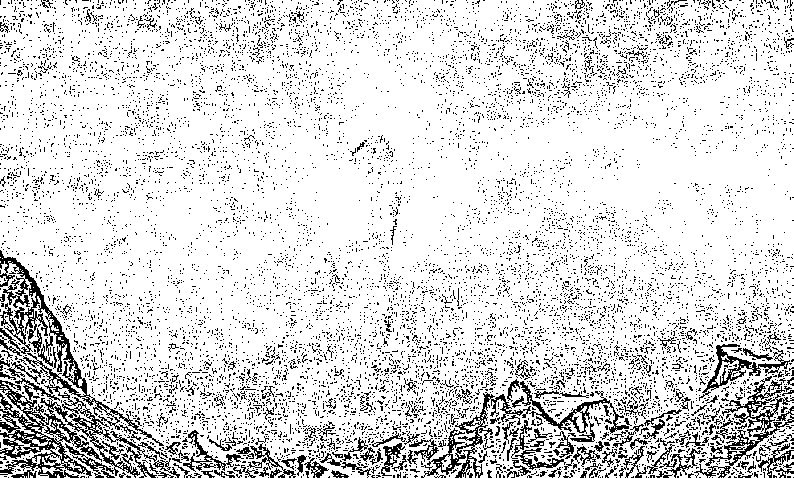**值得注意的日期**

**2 月 3-8 日**

2 月，外面的世界仍然甚嚣尘上。**3 日水星进入双鱼座，信息可能是模糊和含混不清的**。不过从另外一个角度看，**尖锐的批评会少很多**。在这个艰难的时刻，如果我们能**对自己保持温柔，带着勇气看到内心的愤怒、恐惧、失望、孤独，无助，接受这些情绪就是生而为人的一部分，与这些情绪友善地相处，就会在内在升出更开阔、宽容和自由的观点**。这是在水星进入双鱼座之后最好的可能：对内在和外在的声音、观点不评断，承认它们的存在，看着它们出现和消失，然后回到当下。当我们不评判自己的欲望和情绪，就是在用双鱼座式的温柔呵护自己，也就能更温柔地对待他人。
**2 月 5 日，水星在双鱼座与金牛座的天王星形成六分相**，我们会**对生活、对当下发生的一切有一些洞见**，有新的角度来帮助我们理解发生在生命里的事情。留出充足的时间，**向内观想**，**直觉、创造力与创新力**的组合就会带来惊喜。从世俗层面看，可能发现了新的医疗解决方案，有让人兴奋的消息。**2 月 2-4 日，金星在双鱼座六分土星和冥王星**，爱与被爱的需求可能非常强烈，好像鲸鱼在深海发出呼唤伴侣的声音，**渴望被懂得、陪伴和关爱。****2 月 8 日，金星进入白羊座**之后，**感情和关系层面就会热烈起来**。人们想在关系里获得活力，兴奋的感觉。双鱼座的委婉、心意相通的风格被白羊座的**直接、果断、主动追求、活在当下的快乐**所取代。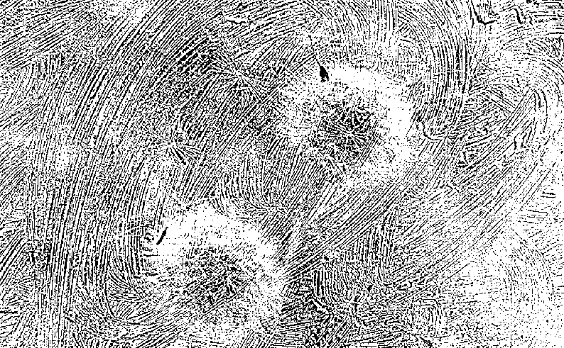

****2 月 8-17 日****

**2 月 9 日，狮子座满月**，届时月亮、金星、火星和太阳都在阳性星座运行，人们**对生活和未来的信心有所提升**。狮子座满月也可能有一批关于危机时刻挺身而出的英雄事迹的报道，让我们看到人性既渺小又伟大，既懦弱又勇敢，既自私又慈悲。**2 月 17 日，水星在双鱼座 12 度开始逆行；3 月 10 日，在水瓶座 28 度恢复顺行；3 月 16 日再次进入双鱼座；直到 4 月 11 日进入白羊座**。水星在双鱼座逆行两天之后，**太阳进入双鱼座，木星与海王星精准形成六分相**。这段期间非常适合**放松下来，进行一次身体和心灵的“大扫除”**。自疫情伊始，疫情新闻、科普知识、各类谣言就像创巴仁波切和侍从们遇到的大狗，我们的身体和心都“呆住了”。这种高度亢奋、紧张、焦虑、担忧的状态正在影响我们的免疫力，让人意志消沉，感觉无力。通过静坐、引导性冥想，把关注力放在身体的各个部位，配合呼吸的节奏来放松这些部位，松弛肌肉，让呆滞的身体再次灵活起来。**艺术、音乐、电影、诗歌、舞蹈**等方式可以帮助我们的头脑暂时离开强迫性的负面念头，给头脑减压。或者使用佩玛·丘卓的方法：“随时坐下来，腾出内心的空间，允许各种念头升起，不评判不压抑，无论升起什么东西，都用好奇心对待。如果感觉房间太热而升起厌恶感，就去感觉热的猛烈和沉重。如果因为房间太冷而产生嫌弃感，就去感觉冷冽冰冷的滋味。冷、热是无法医治的，它们会一再出现。”昼夜更替，潮涨潮落，这是自然的法则。疾病会出现，也会被治愈。在水星逆行期间，来一次意念的大扫除，看着那些把你的心带着四处狂奔的念头，不评判、不压抑。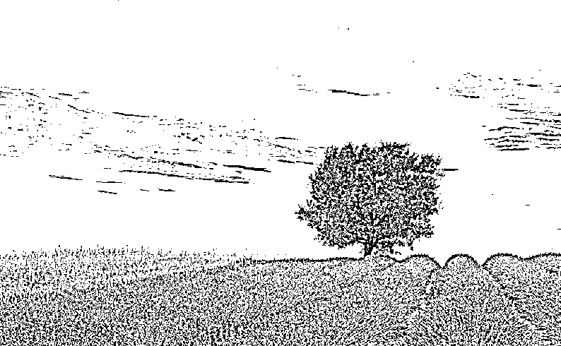**2 月 16 日，火星进入摩羯座，预示着更有效率和针对性的行动，并且可以得到积极的结果。**摩羯座是火星喜欢的位置，因为火星的冲劲加上摩羯座的坚韧不拔，通常会获得胜利。**2 月 21 日，火星与天王星形成三分相，太阳分别于火星和天王星形成六分相**，预示了**新科技与强大执行力结合可能产生积极效果**。**2 月 23 日，**双鱼座新月再一次激活了火星与天王星的相位，届时应该会听到**令人高兴的信息。**
**2 月 24 日，金星四分木星；2 月 29 日，金星四分冥王星。**金星的行进把 3 月木星-冥王星的合相做了一个小规模预演。这个预演有两个可能的方向，一是被疫情压抑已久的人们**消费层面的报复性反弹**，何以解忧，唯有“买买买”！另外，**危机中的企业展开自救**，可能也有**相应的政策出台挽救经济。**危机在 2 月未必就会过去，但是可以把它当做一次转化的机会，一次联结到内在神性的机会。因为疫情，寺庙暂时关门了，刚好把求神拜佛那种向外求索的心收回来，对自己修持慈悲心，在孤独中联通内在的智慧。疫情终会过去，但是人生还是会有污染、战争、疾病、痛苦……愿我们没有白白受苦，愿智慧与我们同在。祝每个人平安！

**附录：本月重要天象一览表**

| **日期** | **星象** |
| **2020.2.2** | **金星（双鱼座）六分冥王星（摩羯座）** |
| **2020.2.3** | **水星进入双鱼座** |
| **2020.2.4** | **金星（双鱼座）六分土星（摩羯座）** |
| **2020.2.5** | **水星（双鱼座）六分天王星（金牛座）** |
| **2020.2.8** | **金星进入白羊座** |
| **2020.2.16** | **火星进入摩羯座** |
| **2020.2.17** | **水星在双鱼座逆行** |
| **2020.2.19** | **太阳进入双鱼座** |
| **2020.2.20**  | **木星（摩羯座）六分海王星（双鱼座）** |
| **2020.2.21** | **火星（摩羯座）三分天王星（金牛座）** |
| **2020.2.22** | **太阳（双鱼座）六分天王星（金牛座）** |
| **2020.2.24** | **金星（白羊座）四分木星（摩羯座）** |
| **2020.2.25**  | **太阳（双鱼座）六分火星（摩羯座）** |
| **2020.2.26**  | **太阳合相水星（双鱼座） 水星（双鱼座）六分火星（摩羯座）**  |
| **2020.2.29**  | ****金星（白羊座）四分冥王星（摩羯座）** 水星（双鱼座）六分天王星（金牛座）**  |

**版权声明：**原创文章由作者授权首发于若道平台，欢迎转发，反对抄袭。友号转载请申请白名单。


********想阅读更多作者的文章********

********请在后台回复**************** 咔咔 即可********

**咔咔**

职业占星师，若道核心课程讲师

ISAR 认证占星师（2014 年获得）

国际知名广告公司和市场研究公司工作十余年

**微信公众号**：咔星人

长按打赏


**点击图片查看若道君推荐**


喜欢记得点一下在看哦☟

********报名直达入口********


# 在家里太憋久了？不如，跟随阿兰·欧肯 5 月去巴厘岛游学吧！

> 原文：[`mp.weixin.qq.com/s?__biz=MzA5NjA0NTAxNg==&mid=2651413100&idx=2&sn=54623bc6d9bf214c95df608a2a1ffc00&chksm=8b4be8dbbc3c61cda103189a2621ebb59c7f7d5685389d468fce0159538c7dbafe5201f8e4e3&scene=126&sessionid=1692738217#rd`](http://mp.weixin.qq.com/s?__biz=MzA5NjA0NTAxNg==&mid=2651413100&idx=2&sn=54623bc6d9bf214c95df608a2a1ffc00&chksm=8b4be8dbbc3c61cda103189a2621ebb59c7f7d5685389d468fce0159538c7dbafe5201f8e4e3&scene=126&sessionid=1692738217#rd)


出发这件事常常会令人想起电影《美食、祈祷与恋爱》中，巴厘岛的巫医 ketut 递给女主 Liz 一幅画，并赠予了解读：

要脚踏实地，你就会感觉有四条腿，你就能在这个世上安稳下来；还有，不要用脑子看待世界，要用心去看，那样你才会了解上帝。

世间有太多纷繁复杂的事情我们要分析整理，反而忘却如何遵从心灵的声音，比如为了爱其他人而让自己的生活失衡；比如收藏了所有国家地理杂志的旅行专栏，最后哪里也没有去。偶然听到心中真实的声音，嘈杂的人生又容易失去相信自己的勇气。

幸好这世界上还有**巴厘岛**。


|  电影《美食、祈祷与恋爱》巴厘岛剧照

巴厘岛人说：“我们就站在世界的中心，我们就是世界的中心。”巴厘岛是一个充满灵性色彩存在的岛屿，在这个 5620 平方公里的岛屿上，散布着大大小小千余座印度教神庙，印度教思想、大乘佛教、传统的湿婆崇拜与岛上淳朴的自然崇拜、祖先崇拜交织在一起。巴厘岛人相信万物有灵，他们的生活沉浸在浓厚的神秘氛围中，他们相信自己脚下的土地是世界上最美的国度，是“世界的中心”。这座岛屿在 21 世纪的现代生活中成为一个特别异类的存在。而阿兰·欧肯，这位 75 岁深耕占星学和神秘学领域的老师，在多年前离开美国，在世界各地旅行之后，为这个岛屿独特的人文和场域所深深吸引，最终选择在巴厘岛定居。虽然阿兰·欧肯老师以占星大师身份为广大占星学子所知，但其实他更有许多神秘的古老智慧、实用的宇宙法则愿意传承，这对于我们的意识进化之旅将带来绝对深刻的了解和体悟。
**5 月 3-13 日**，阿兰·欧肯老师邀请你来到他的定居地——巴厘岛，开启这次意义非凡的巴厘岛神秘之旅，内容包括**3 日半阿兰·欧肯老师的神秘学工作坊**和穿插于其中的阿兰·欧肯老师为大家精心挑选的**巴厘岛神庙之旅**，阿兰·欧肯老师将带领大家，在理论学习的基础上，接触、感受巴厘岛的神秘之处，深入接触、体验古老智慧。****


巴厘岛游学**1****位宇宙级导师****11 日 10 晚****游学，含**3 日半****工作坊****** “****心灵成长****+****文化探秘****+****生活美学****”****若道首团游学探秘之旅****一次性满足你的所有新年跨国愿望！**

📹 [`v.qq.com/iframe/preview.html?width=500&height=375&auto=0&vid=b3041y0qg4q`](https://v.qq.com/iframe/preview.html?width=500&height=375&auto=0&vid=b3041y0qg4q)

|  阿兰·欧肯老师的巴厘岛故事

1**工作坊主题****“觉醒的头脑和心灵的实际运用”——疗愈、合一和意识发展的****22****条法则和原理**本次工作坊，阿兰·欧肯老师将带领大家进入他数十年修行的智慧世界，探讨 22 条宇宙法则，并审视如何将这些原则应用在我们的日常生活中。**工作坊具体内容，请咨询课程顾问王老师（微信：18510107057）****注意****：本工作坊不是占星工作坊，对神秘学感兴趣，没有占星基础的朋友也可以参加。****游学全程领队导师是阿兰·欧肯，并配有最专业的中文翻译。**
2**具体日程安排****游学时间：2020 年 5 月 3 日-5 月 13 日****地点：印度尼西亚 巴厘岛**

*   ### 5 月 3 日 游学集合：入住巴厘岛乌布斯塔拉翠贡精选酒店 


*   ### 5 月 4 日 上午水神庙、Pacung 午餐、下午海神庙；**晚上在斯塔拉翠贡精选酒店集体晚餐**


| 水神庙

 


|  Pacung 午餐


|  海神庙

*   **5 月 5 日 上午半日工作坊学习，和阿兰·欧肯老师一起冥想；下午到圣泉——巴厘岛的神圣净化池**

 


*   **5 月 6 日  半日工作坊学习、自由活动**

*   **5 月 7 日  半日工作坊学习，游览象窟——巴厘岛唯一的石窟寺院遗址**


 

*   **5 月 8 日 巴图布兰寺、著名的荷花咖啡厅午餐、塔曼阿云寺**

 


*   **5 月 9 日  全天工作坊学习**

*   **5 月 10 日  前往努沙杜瓦酒店 **


*   **5 月 11 日  全天工作坊学习**

*   **5 月 12 日  海边自由活动，晚上巴厘舞蹈表演**

 


*   **5 月 13 日  前往机场回家 巴厘岛游学圆满结束**

3**适合人群**

*   占星老学员，是时候补给宇宙智慧的你

*   灵性爱好者，擅长获取各类宇宙能量的你

*   文化探迷人，有机会零距离体验异域神秘学文化的你

*   旅行达人，不错过任何一次伟大旅程的你

*   巴厘岛狂热迷，去过巴厘岛无数次的你

*   没有任何原因就是被吸引很想报名的你

**注****：****本次游学无需任何知识基础皆可报名**

4**游学费用****费用：25800 元****此游学价格为****整体报价，不拆分****。****注意**: **因为该游学需要安排酒店、交通事项较多，因此****一旦缴费后，不再退费**。


**费用说明**

**游学费用****包含**：

3 日半“觉醒的头脑和心灵的实际运用”工作坊学费

5 月 3-12 日的巴厘岛住宿费

游学中的大部分餐费

巴厘岛集体活动时的交通费

游学涉及的所有景点门票

5 月 12 日晚的舞蹈表演

境外旅行意外险

**游学费用****不包含**：

学员从国内往返巴厘岛的交通费

巴厘岛岛内自由活动的交通费

以下自由活动的餐费自理：5 月 3 日到达日午餐、5 月 6 日自由活动晚餐、5 月 8 日晚餐、5 月 10 日前往努沙杜瓦酒店的午餐、5 月 12 日海边自由活动的午餐

**住宿说明**：

乌布斯塔拉翠贡精选酒店豪华房 Deluxe room（5 月 3 日晚-5 月 9 日晚共 7 晚）和努沙杜瓦酒店豪华房 Deluxe room（5 月 10 日-12 日，共 3 晚），标准为 2 人一个房间


5**导师介绍**


**阿兰·欧肯（Alan Oken）**

 

世界顶尖占星师

智慧学院（Santa Fe, NM）主任

澳大利亚意识发展研究所的联合创始人

翻译、教师、全球旅行者和国际导游

阿兰·欧肯，1944 年出生于美国纽约，在纽约大学主修罗曼斯语言和语言学。出版过十几本著作，比如《灵魂占星学》《星图中的守护关系》《阿兰·欧肯完整占星学》。他用 5 种语言授课，用 7 种语言解读星图。

6**退转课程**

**因为该游学需要安排酒店、交通事项较多，因此****一旦缴费后，不再退费****。**

****巴厘岛游学****

**领队老师&工作坊授课老师：阿兰·欧肯**

**游学时间：**2020 年 5 月 3 日-13 日（共 11 日 10 晚）

**游学地点**：印度尼西亚 巴厘岛

**游学方式：**巴厘岛探秘之旅+3 日半工作坊，游学全程由阿兰·欧肯领队，并配有最专业的中文翻译。

**费用：****25800 元**

**课程负责人：**王老师（微信：18510107057），请备注“巴厘岛”

长按二维码添加课程负责人咨询~


****报名请点击“阅读原文”****


# 梅里曼报告系列更新啦丨 2 月 3 日开市后，市场将走向何方？

> 原文：[`mp.weixin.qq.com/s?__biz=MzA5NjA0NTAxNg==&mid=2651413099&idx=1&sn=3be98d72726abbbda1dcb0ff5466471f&chksm=8b4be8dcbc3c61ca74a5fae8d2e23e3420af5524464f94e5ef15ac4699d2363647a0eb497d4c&scene=126&sessionid=1692738217#rd`](http://mp.weixin.qq.com/s?__biz=MzA5NjA0NTAxNg==&mid=2651413099&idx=1&sn=3be98d72726abbbda1dcb0ff5466471f&chksm=8b4be8dcbc3c61ca74a5fae8d2e23e3420af5524464f94e5ef15ac4699d2363647a0eb497d4c&scene=126&sessionid=1692738217#rd)


今年春节是一个不好过的春节。在春节前还让人充满希望的投资气氛，被冠状病毒突然肆虐完全打破。可能除了政府和企业经营者之外，人们现在的注意力还在这场抗击病毒的战役上，而在春节过后，可能更多人会发现，这场战役的战场不仅仅在医院、在健康领域，还将延申至经济形势、企业经营、就业及与之相关的个人和家庭的收入之上。开市后股市会怎么走，我们在严峻的经济环境下如何保有我们的资产，寻找可能的投资机会以增加收入可能是每个投资者思考的问题。若道周围的许多学习占星的朋友都在去年购买了上证指数报告或者黄金报告后，在节前都纷纷跟若道君聊去年在黄金和股票市场投资上的斩获。而现在，又有很多人忧心忡忡，股市会有怎样的走向？黄金是否能带来保值？在这样的气氛中，应该怎么做，机会在哪里？**梅里曼老师的《上证指数 2 月研究报告》已经上架（****英文版已更新，中文版今天会更新，2 月 3 日开市****），如果您已经购买，请参照下图指引，查看报告内容。**


如果您还没有购买，您可以**点击文末阅读原文**，购买报告。在每个月度报告中，梅里曼学员的金融占星分析师给出上证指数价格目标区间及重要价格反转日，为短期、中期和长期投资者进行市场操作的时机提供参考。 

**优惠价别错过！**

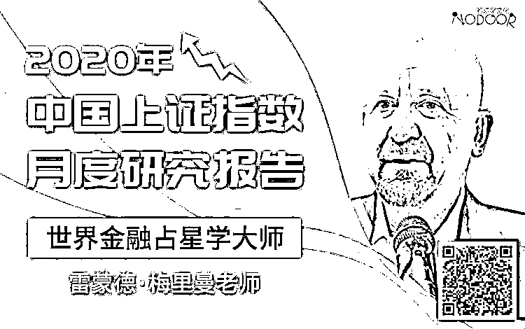

上证周期月度报告价格

**单月报告**：280 元

**3 个月套餐价**：780 元（相当于 260 元/月）

**12 个月套餐价**：1999 元（相当于 166 元/月） 

****2 月报告英文版已更新，中文版最迟 2 月 1 日更新，2 月 3 日开市****

**黄金报告更新！**

此外，**2 月黄金周期报告也已上架**（**中英文版均已更新**）。

点击阅读原文，雷蒙德·梅里曼黄金周期 2 月度报告带来有 39 年黄金市场研究经验的世界著名金融占星大师雷蒙德·梅里曼对当前黄金市场的研究。

投资有收益，投资有风险，希望这份金融占星学的研究帮助你更好地评估黄金投资。

**黄金购买 Tip：**国内各大银行均可用人民币购买黄金和白银或黄金 EFT 基金，也可以在诸如天天基金或者支付宝购买黄金及黄金相关产品。不明白的可以百度搜索。黄金周期月度报告价格

**单月报告**：280 元

**3 个月套餐价**：780 元

**12 个月套餐价**：2400 元**中英文报告内容均已更新！**

**双报告价格更优惠（直降 899 元）**

**12 个月黄金报告+12 个月上证指数报告：仅需 3500 元**

**长按下图识别二维码购买上证+黄金报告**

▼

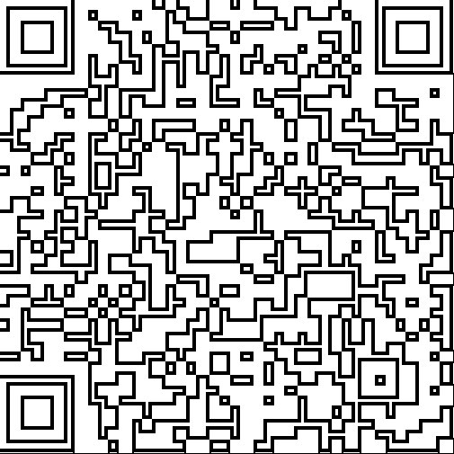

**购买者重要须知**

① 梅里曼市场时机学院《中国上证指数月度研究报告》是梅里曼市场时机学院（以下简称 MMA）的研究“预报”，而不是市场“预测”，是梅里曼老师及 MMA 金融占星分析师对人类活动周期历史与行星周期之间相关性的研究，二者在大部分情况下具有 80%或更高的相关性，而不是因果关系。报告中的研究完全存在错误的可能性。即便是非常认真的研究和几十年的研究经验，金融占星师无法总是正确地解读出各种征象在实际层面上会如何相互作用，并显化为事件结果。

所以请将报告看作一个研究参考，务必结合其他市场研究和你个人对市场的理解，根据你的自由意志做决策。

② 上证报告只是上证指数研究，没有个股研究。

③ 此报告一旦售出，**即不接受退款。**

④ 此报告每月 1 期，**并非都是在每月相同日期发布**。

⑤ 我们收到英文报告的当天，即发布该英文报告。3 天后，上线报告中文版。

⑥ **此报告仅支持手机网页阅读，不支持电脑阅读和下载。**

**以上须知，请仔细阅读。一旦付款，即视为已了解并接受所有须知内容。**

购买后有疑问怎么办？请联系客服
**微信：nodoor201705**

********购买上证指数+黄金月报直达入口********


# 金星相位超超超详解析，揭露你爱情里的功课，原来这些才是关键

> 原文：[`mp.weixin.qq.com/s?__biz=MzA5NjA0NTAxNg==&mid=2651413090&idx=1&sn=ffcdf4822a570eaf79f7af1a472c4809&chksm=8b4be8d5bc3c61c3d03171da093ce8605a7910812cdc315726a056b5ead307087f8c61847e22&scene=126&sessionid=1692738217#rd`](http://mp.weixin.qq.com/s?__biz=MzA5NjA0NTAxNg==&mid=2651413090&idx=1&sn=ffcdf4822a570eaf79f7af1a472c4809&chksm=8b4be8d5bc3c61c3d03171da093ce8605a7910812cdc315726a056b5ead307087f8c61847e22&scene=126&sessionid=1692738217#rd)

****************☆ 后****************************台****************************回复“今日”，给你一句生命态度****************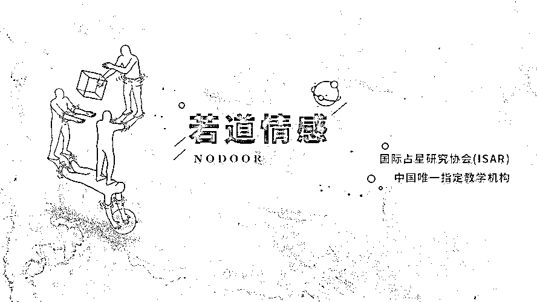作者/凯莉·瑟蒂斯 译者/三三 校对/Leisha 编辑/Tang 封面/书君 图片/unsplash

疫情实时更新的状况，让我们总是高度紧张。现在，若道君想请大家稍微放松下紧绷的神经，把注意力短暂地转移，就让我们聊一聊情情爱爱的那些事吧。在占星学中，金星向来被视为与浪漫、爱情有关。你知道么，不仅仅是金星所在的星座与宫位会极大地影响我们在感情里的追求；与金星所形成的相位也非常重要，让我们得以知晓我们爱情中的关键功课。

**爱情中的那些主题**

金星长期以来被看作是最亮的行星。将金星与爱联系起来的最古老的文献可以追溯到公元前 660 年的米索不达米亚，因此它与浪漫的关联性相传已久。

现代占星师会用你的金星来描述你的**恋爱风格**，以及可能的**恋爱经历**。基于金星在你出生星图中所落的星座，它对爱有 12 种不同的态度。然而，**比金星所落的星座更重要的是，任何与金星形成相位，并因此影响金星的行星。**

什么是相位？

行星间的相位反应了行星的**几何结构**，显示出不同的行星之间**相互连接**的独特方式。行星通过形成相位来**交换能量，调整彼此的喜好**，如同两个人在派对上聊天，在互动中相互学习。**相位每天随着行进改变，因此出生时的行星相位是造就你出生星图独特性的其中一个原因。**

五个原始的相位，或者又称**托勒密相位**，分别是**合相（0°）**、**六分相（60°）**、**四分相（90°）**、**三分相（120°）**和**对分相（180°）**。每个相位都有它们自己的特质。

> 例如，成**合相**的行星会融合在一起，就像两个人进行两人三足赛跑。它们融合在一起，作为一个整体运作。然而，成**四分相**的行星则会相互干扰，产生张力与摩擦。

**★托勒密相位★**

| 相位 | 角度 | 意义 |
| 合相 | 0° | 融合、协调、和睦 |
| 六分相 | 60° | 支持的、流动的、温和的 |
| 四分相 | 90° | 摩擦、紧张、调节 |
| 三分相 | 120° | 合作的、联系的；协力合作 |
| 对分相  | 180° | 波动、互相谦让，尊重差异 |

金星与行星成相**你的金星会呈现出任何与它形成相位的行星的特质，因此你在爱情中需求和渴望会受到这些额外主题的影响。**

> 例如：金星与水星形成相位，关系会具有好奇心与交流的特质；金星与木星形成相位，爱情与关系则会表现出冒险的风格；金星与冥王星形成相位，爱必须是深刻而激烈的。

**如果你还不是很了解你的行星，请通读所有描述，并且看看哪个或哪些描述最符合你的愿望和爱情经历。如果你对自己的星图很熟悉，可以直接阅读与你的金星形成相位的行星段落。**

**★行星关键词★**

| 行星 | 关系特质 |
| 太阳 | 崇拜的，具有创造性的，有表现力的，全力以赴的，领导者 |
| 月亮 | 保护性的，滋养的，敏感的，居家的 |
| 水星 | 好奇的，健谈的，轻松的，变化无常的 |
| 金星  | 亲昵的，浪漫的，触感，体贴的，愿意妥协的 |
| 火星  | 积极的，自信的，自知的，坦率的 |
| 木星  | 慷慨的，爱冒险的，思想开明的，异国联系，信仰 |
| 土星  | 严肃的，尽心尽力的，愿意工作；年龄差异，责任 |
| 天王星  | 非传统的，独立的，起伏不定的，紧张刺激的 |
| 海王星 | 梦幻的，浪漫的，灵性的，创造性的；与边界感斗争 |
| 冥王星  | 紧张的，有力的，有吸引力的；可能表示控制的主题 |

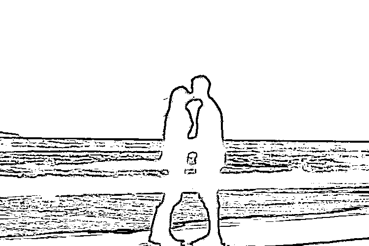

**金星相位全解析**

**金星与****太阳**

金星与太阳的之间的角度从不会超过 47°，因此，**太阳与金星之间唯一有可能形成的托勒密相位就是合相**。金星在顺行（向前移动）或者逆行（向后移动）时都能与太阳形成合相，但为了简单起见，我只讨论金星和太阳这个组合本身。如果你的金星合相太阳，**爱中便夹杂着对赞赏与认可的渴望**。太阳是太阳系的中心，它希望被关注，当它与金星合相时，表明你希望自己的爱和浪漫的行为被看见并获得认可。你可以是温暖的、有爱心的，以及慷慨的，但是你也期待得到被善待的回报。**由于太阳是关于自我身份感的重要行星，金星合相太阳，****你的自我感将与你在爱情中的经历相关，因此在亲密关系中建立健康的标准对你而言尤为重要**。在互相支持、公平的伴侣关系中，你会茁壮成长，但你对爱强烈的渴望有时可能会导致你宁愿留在一段无以为继的关系中，也不愿独身一人。**健康的自尊感或自爱感可以帮助你做出积极的亲密关系选择**。金星与太阳的合相使得你愿意并且有能力去妥协。你本能地将他人放在首位，因此**重点是要学会将你的需求与你所爱之人的需求分开**。

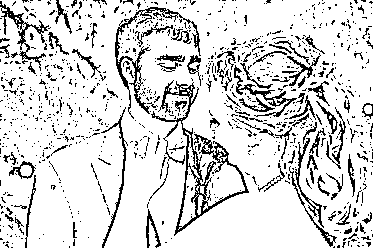

**金星与****月亮**

如果你的月亮和金星形成了相位，你**主要的爱情需求之一就是被关怀和保护**。**月亮与养育照料有关，所以对你来说，爱包含着滋养的特质。**你可能会在“母亲/情人”的困境中挣扎。**亲密关系需要你在“养育”或照顾伴侣（月亮），与享受爱情的浪漫和欢愉（金星）之间取得平衡。**金星与月亮形成相位，你可能会对你所爱的人产生**保护欲**，**在感觉被需要的时候也会享受其中**。这也许会把你推入危险的境地，导致你们的亲密关系沦为一方对另一方的滋养，没有什么发挥激情的能量与空间了。**把握好支持对方而不使对方感觉窒息的分寸是你们关键的爱情课题。**由于月亮也与家庭有关，你可能会**强烈认同生儿育女或共建家庭在亲密关系中的重要性**。特别是四分相或对分相，这样的金星与月亮的组合表明必须选择亲密关系的模式，是将其建立在生活中有趣、性感、吸引人的一面之上（金星），还是专注于家庭与家居生活（月亮）。

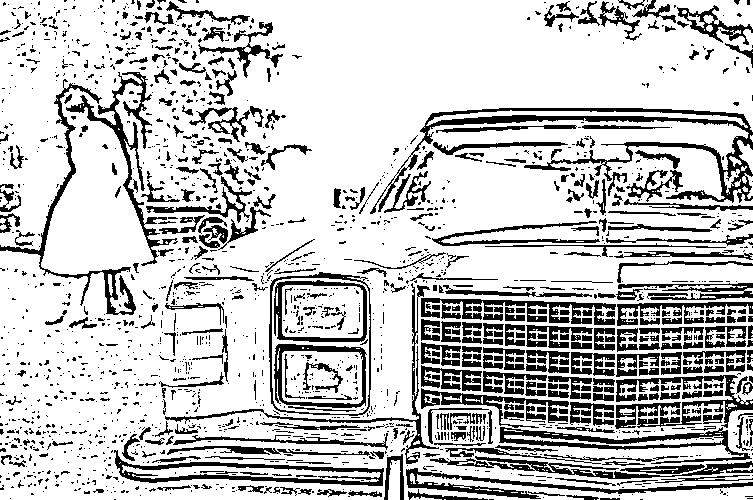

**金星与****水星**

金星和水星最多相距 65°左右，所以它们能形成的两个托勒密相位是**合相**和**六分相**。交流之星水星与你的金星形成相位，你**寻求的是基于彼此交流、分享想法的爱，以及与学习或者新经历有关的爱**。伴侣进入你内心的方式是通过你的头脑，因此拥有良好教育或众览群书的人会使你感兴趣。因为你会被好奇心所吸引，所以一个人心态开放并愿意交流是关键。幽默、知识问答、学习或其他心智上的追求可以成为你约会流程中的一部分。为了保持你的爱情火花，需要保持通畅的沟通渠道，只要你与伴侣能交流，你们就能携手一往无前。水星具有厚脸皮、爱嬉闹、轻松的特质，所以你宁愿找一个想要享受浪漫之乐的伴侣，也不愿陷入紧张或沉重的境地。当然，金星与水星的星座会缓和这一倾向，但无论它们落在什么星座，你**对爱的核心需求是心智联结、交谈和言语表达，这一点是不会变的**。

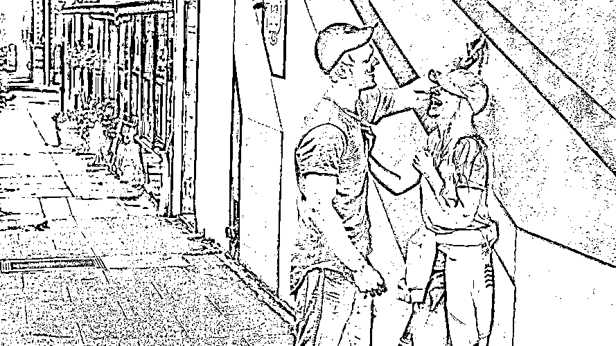

**金星与****火星**

金星与火星被看作是宇宙情人，当这两者产生相位时，你的爱情风格可能会有两种方式。如果**金星为主导，你会愿意妥协并准备合作；你会知道如何调整自己的欲望来维系亲密关系**。如果**火星为主导，你则会更清楚自己的需求，并决心确保需求得到满足**。

**要弄清楚哪颗行星占据主导，可以考虑金星与火星在哪些星座之间形成相位**，例如，如果它们合相在由金星掌管的金牛座，那么金星就会主导。如果它们合相在传统上由火星掌管的天蝎座，那么火星就会主导。如果说金星与火星成六分相，火星在摩羯座，而金星在双鱼座，这种情况下，两者都在各自擢升的星座，这可能是个更为平衡的金星与火星相位，并没有一个明确的主导行星。

无论是金星还是火星主导，当两者成相位时，你将会**寻求一种充满激情、火热并带有竞争优势的爱。火星会给予金星表达自身欲望与憎恶之情的信心。**你喜欢爱情中的小摩擦，以及一些能够增加刺激与激情的火花。你会寻求一个和你一样自信，善于表达的伴侣。注意不要太自私，这会导致你在爱情中付出过少。

**包括性在内的身体活动在表达和维持欲望方面起着很大的作用**。你可能会找一个在健身或极限运动方面和你有共同兴趣的伴侣，或者找一个和你有相似性欲的人。

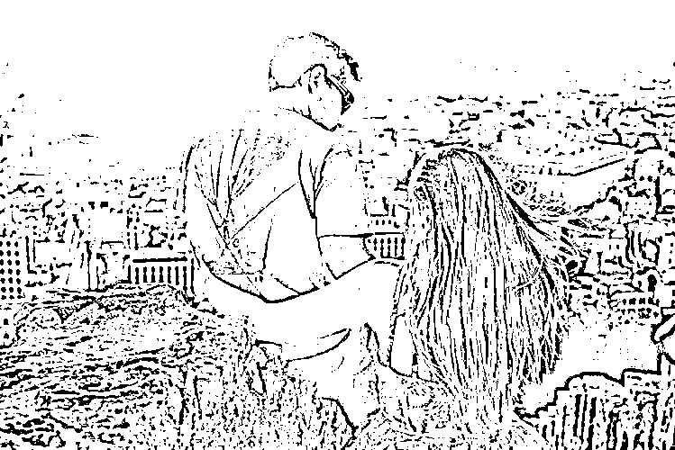

**金星与****木星**

如果你有金星和木星的相位，你的爱情一定是**令人兴奋和充满冒险的**。你会想要尽可能多的约会和浪漫经历。**木星喜欢旅行，在它的影响下，****爱情可能与异国情调或外国相关**。你可能会爱上一个来自不同国家、不同文化背景的人，或者在旅行中遇到自己的真爱，为爱而移居也是可能的。**木星也是幸运的行星，在****亲密关系中通常表现为慷慨**。你给你爱的人很多，想要以一种他们通常不会纵容自己的方式来对待他们。**你的慷慨精神必须与现实相调和**，避免陷入你一味给予、对方一味索取这种“没有回报的慷慨”境地（这更有可能是金星四分或对分木星的情况)。因为**木星象征着信仰和哲学，因此与和你有相同信仰的人立下山盟海誓是很重要的**。知道你们珍视相同的事物，并且怀有共同的大局愿景，是吸引力的一部分。木星也有乐观的一面，所以伴侣能欣赏你对生活和爱抱持知足常乐的观念也至关重要。你可能会**把亲密关系看作是一次历险，在你前进的旅途中不断学习和进化**。木星关于正直、信任和道德的基本概念意味着，为了让你付出承诺，爱对双方来说都必须是公正、公平和进展良好的。慷慨大方的天性意味着你意识的功课在于培养适度的给予，给予多少，频率如何，还有对方是什么样的人。


**金星与****土星**

**土星代表着成熟和时间的法则，所以如果你有金星与土星的相位，你会寻求持久的亲密关系，而十分愿意为此而努力。安全和承诺是关键的爱情观念，即使你可能羞于表达感情，尤其是在关系的最初。**在严肃的土星对你内心的影响下，你对爱的态度很**务实**。你是一个**浪漫的现实主义者**，知道共度时光是建立坚实基础的必要条件。爱情不需要着急；相反，你更喜欢享受亲密关系的每一个阶段。由于土星有脚踏实地的特质，你会仔细考虑如何平衡外部责任（如事业、家庭和财务）与亲密关系的需求。**土星给予你应对爱情中各种挑战的力量，也赋予你可靠性，让对的人感受到不可抗拒的吸引力**。一旦建立了一段亲密关系，你就可以克服困难，但是最初吸引力的脆弱本质意味着，如果你察觉到与对方之间有太多的差异或障碍时，你可能不会迈出关键的第一步来表达你的渴望。你的爱就像《呼啸山庄》里的凯瑟琳对希斯克利夫的爱一样，**你视爱为必不可少的生命基石，但不浮华，亦不张扬**。**金星和土星的相位，会使你很难相信自己值得被爱。你的害羞或犹豫可能会被误解为清高，所以别人可能会认为你冷漠无情。**土星与金星的相位会在你的心周围竖起一堵高高的石墙，这意味着表达爱和感情并非易事，允许自己去接受爱的表达也很难。你可能会过分设定界限，因为你可能会坚持社会或文化中的爱情仪式，当关系没有达到所有正确的重要阶段时，你会感到失望。**培养健康的自我价值感，学会相信，你可以享受爱情，是增进浪漫的关键。**你可能**偏爱更年轻或更年长的伴侣**，成熟的智慧和经验带来的安全感是彼此吸引力的一部分，你可能会发现土星为期七年的四分之一周期在记录你亲密关系经历的变化节奏时很重要。**土星尊重传统、崇尚仪式并追求服从，所以爱必须融入你用来创造生活的范式。**你更喜欢能被社会或文化接受的亲密关系。在这个相位中，金星倾向于谨慎行事，所以亲密关系必须提供**安全感**和**长期的稳定性**。

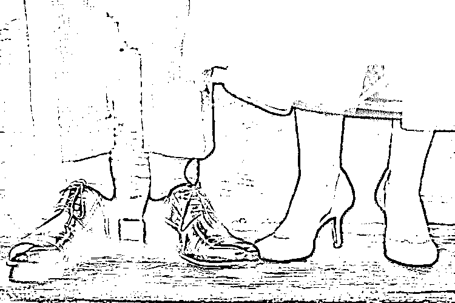

**金星与****天王星**

在叛逆的行星对你内心的影响下，**爱必须是非同寻常的**。天王星喜欢挑战现状并以与众不同的方式做事，因此你的爱情生活和伴侣可能会显得古怪或拥有一些非同寻常的特质。尽管其他人可能会对你的选择感到惊讶甚至有所批判，但真心实意地选择爱情对你而言永远是正确的做法。

天王星代表了“害群之马”的原型，因为他崇尚个性而不是服从。**对你来说更重要的是尊重你内心不寻常的渴望，而不是尝试让一个人或亲密关系去迎合社会上对可接受的爱的局限性定义。**你个人对爱的需求只能通过突破常规来满足。拉尔夫·沃尔多·爱默生的这句话描绘了一些你在爱情中表现出的开拓者能量：“别跟着现有的道路走；而要另辟蹊径，走出自己的一条路。”

对你而言，**理想的亲密关系不会以一种标准常规的形式存在**。要创建理想的亲密关系，完全取决于你是否能发展出一种个人品味和渴望的强烈意识。在爱的方式层面，你可能会颠覆常规或挑战社会和家庭准则，通过你的行为和选择向周围的人表明，爱的形式的确不拘泥于外表、体型和肤色。

你可能会遭受所谓的“**自由与亲密困境**”，因为**金星喜欢联结，而天王星偏好空间与独立**。因此，**理想的伴侣或恋爱情景是能定期分开一段时间让你去追寻自己的爱好**。在远距离的关系中，或者在双方的工作日程相互冲突的伴侣关系中，这点可以有助于维系关系。关于婚姻，卡里·纪伯伦写过这样一句影响深远的诗，总结了你对空间的需求：“但是，请于你们的耳鬓厮磨中留出些微罅隙，让天堂之风旋舞其中。”

对你而言，**新奇事物的刺激会增加爱的激情**，因此日常生活中的按部就班会有损浪漫。与其定期进行某种仪式（例如固定的约会之夜），不如不断改变日常生活惯例和尝试各种你喜欢的方式，这样会更让你受益。

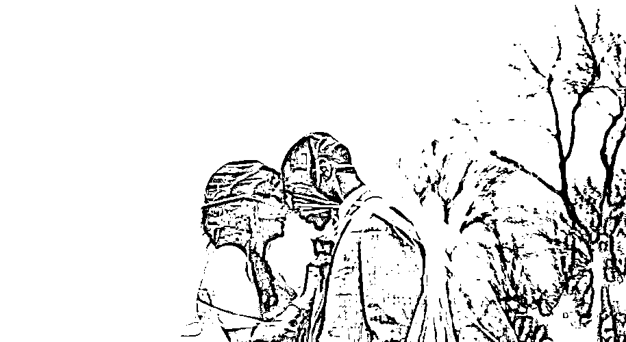

**金星与****海王星**

如果你有海王星与金星的相位，**爱会带有一种梦幻，直觉性的感觉**。当你寻找完美伴侣时，这种组合使你努力活在浪漫的童话中，但为了在爱中获得经久不息的满足感，你的幸福之旅必须涉及灵性层面。

海王星是如此虚无缥缈，并受到幻想的启发，追求完美的爱情一开始可能会使你偏离正轨。你的轻信本性会使你容易被利用，因此以下三点清单可以在你陷入感情前帮你识别不健康的伴侣或者亲密关系。**金海相位的人应当避免与以下三种类型的人交往**：

*   **不能养活自己的人；**

*   **有毒品、酒精或者其他药品滥用问题的人；**

*   **不是真正单身的人（例如，可能还处于其他感情关系中）**。

海王星激发了你对所爱之人高度的同情与关爱，你可能会**陷入一种试图用爱疗愈的模式之中**。**海王星使金星渴望与伴侣完全融为一体，因此在恋爱初期精挑细选是确保你只向那些真正值得的人敞开心扉的关键。**

**海王星为爱提供了一种直觉性的特质，可以帮助你能积极地了解他人的需求或渴望**。你的人生课题是要学习何时提供帮助，以及何时让你爱的人自己帮助自己。这可能涉及必须要学习如何让边界来帮助增进感情，而不是使爱情受限制。

**金星与海王星的相位可以实现灵性和创造性的联结**，因此一起发展冥想练习，培养静修仪式，或者简单地相互支持彼此的艺术表达，都可以既不在过程中迷失自我，又能以实用且具有启发性的方式来尊重金海的爱情经历。

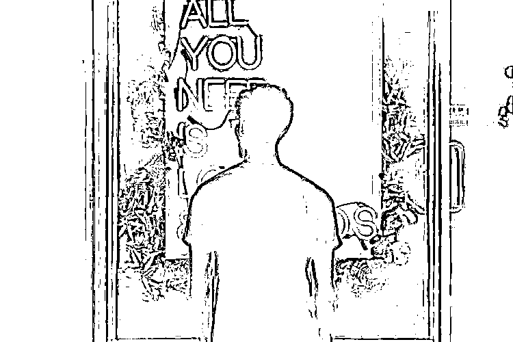

**金星与****冥王星**

**爱是激烈的**，并且在你的金冥之心得到满足之前，**爱必须是深刻的**。据说，金冥人要找的不是恋人，而是人质，这是一种极端的表达，暗指如果你是金冥人，你的爱情中**可能会出现控制和占有的成分**。

你要找的是一个几乎立即能与你产生吸引力联结的人。**激情是必不可少的，但除非有绝对的信任，否则你不会坦露心中的真相**。**诚实**和**忠贞**是非常重要的品质，而你是很难原谅背叛的。在金冥人的心中，**爱是非黑即白的**——你要么坠入爱河，愿意为你的伴侣挡子弹，要么一切都结束，你们在对方的生活中再无一席之地。

冥王星与冥界之神哈迪斯有关，就像珀尔塞福涅是在违背自身意愿的情况下被拉入冥界一样，爱有时可能会造成一些让你必须为了在权力和控制之下确保平衡而做出重大选择的情境。

在金冥人的心中，浪漫的感觉可能会变得强迫。这通常发生在你怀疑某件事不太对劲的时候。冥王星会想尽一切办法，这种极端的“求知欲”可能会驱使你更深入地探索，去发现自己和爱人心中的真相。对你来说，**爱是转化之路**。

你对人的直觉很少出错，所以要养成一种**倾听直觉**的习惯。尽管你会隐藏自己的想法，但你天生喜爱捕捉前后不一之处，而且最看重伴侣的诚实和坦率。秘密对你而言是性感的，但只有在真相不会伤人的时候才会如此。

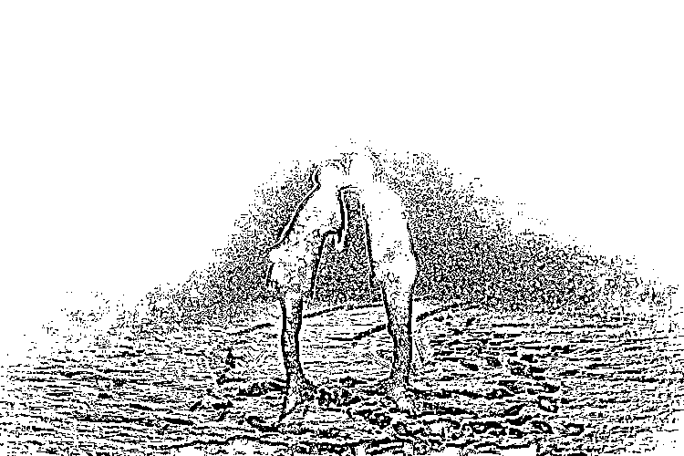

对一些人来说，金星相位所表达的内容是清晰易懂的。你可能会从上面的描述中识别出自己内心的动向，并洞察到如何营造出最能打动你的那种爱情。

对另一些人来说，金星的相位被星图中的各种因素所干扰。**不是每个人都有很强的金星相位，而有些人的金星甚至不止一个相位。无论你的金星故事以何种方式呈现，这些古老的原型可以帮助你更好了解自己的内心，使你更容易去给予和接受美好的爱情。**

**你有什么关于金星**

**关于爱情的故事想和我们分享**

**留言区等你**

”

**版权声明：**本文由若道翻译发布，欢迎转发，反对抄袭。友号转载请申请白名单。


**你可能还想知道**

[金冥相位 | 情爱中冥王星能量的极致体验](https://mp.weixin.qq.com/s?__biz=MzA5NjA0NTAxNg==&mid=2651412637&idx=1&sn=ca70c4f9718fea14c2b806bd763ae0f4&chksm=8b4bea2abc3c633c5d1734a767db3bbf7f3971d776c0590aa6d90bde7037140b73f44d2de8fb&token=1982235327&lang=zh_CN&scene=21#wechat_redirect)

[当金星碰上天王星 ](https://mp.weixin.qq.com/s?__biz=MzA5NjA0NTAxNg==&mid=2651411521&idx=1&sn=4577d3eab93fa1a2acb44caf4f3aabc2&chksm=8b4be6f6bc3c6fe0bcd90dd0405eafd19f31797c7ff3ba33d4a41161e01e14e9bb69bcf3b8eb&mpshare=1&scene=21&srcid=01172r13p5wDwBTdEIRUy8pF&sharer_sharetime=1579250825264&sharer_shareid=79ff492e946a049c0745c8e806eec753&exportkey=AUy0iSqLDtttpFyWLjuE%208k=&pass_ticket=JRzQLz1oBakxE6SkDn0v3CTW2O1DIj15y/SfjdXvESo=#wechat_redirect)

[关于金海的深邃思考](https://mp.weixin.qq.com/s?__biz=MzA5NjA0NTAxNg==&mid=2651405624&idx=1&sn=f75e93d5a8d05785b23c1d208661de12&chksm=8b4b8f8fbc3c0699cf5255635e7f035695f79596996c7dcd7e7cb384d789993fa16121bf587a&mpshare=1&scene=21&srcid=01179yctFelsbwbD3I7yVbWW&sharer_sharetime=1579250907105&sharer_shareid=79ff492e946a049c0745c8e806eec753&exportkey=AdThBw8OS7LYKdJ75kypbAo=&pass_ticket=JRzQLz1oBakxE6SkDn0v3CTW2O1DIj15y/SfjdXvESo=#wechat_redirect)

凯莉·瑟蒂斯

作家，执业占星师、老师和编辑，并定期在国际占星学会议上发表演讲，与世界各地的客户、学生和出版公司合作共事。凯莉对行星周期研究的热情具有感染力，她擅长的领域包括推进，以及对古典占星概念的融合。

******点击图片查看若道君推荐******


**微信又双叒叕改版啦，不想错过若道君的推送？**

**就把若道设为星标吧！**

**▼**


就是这个“在看”，戳戳戳 ☟

********报名直达入口********


# 你陷入过度“肺炎恐慌”了吗？｜5 个迹象快速判断

> 原文：[`mp.weixin.qq.com/s?__biz=MzA5NjA0NTAxNg==&mid=2651413090&idx=2&sn=6d138f90587a5d731257aeb6fb0be696&chksm=8b4be8d5bc3c61c39c8b0afc13a24d656dba87667392e965334d92cde6b772c4a126363f1b55&scene=126&sessionid=1692738217#rd`](http://mp.weixin.qq.com/s?__biz=MzA5NjA0NTAxNg==&mid=2651413090&idx=2&sn=6d138f90587a5d731257aeb6fb0be696&chksm=8b4be8d5bc3c61c39c8b0afc13a24d656dba87667392e965334d92cde6b772c4a126363f1b55&scene=126&sessionid=1692738217#rd)

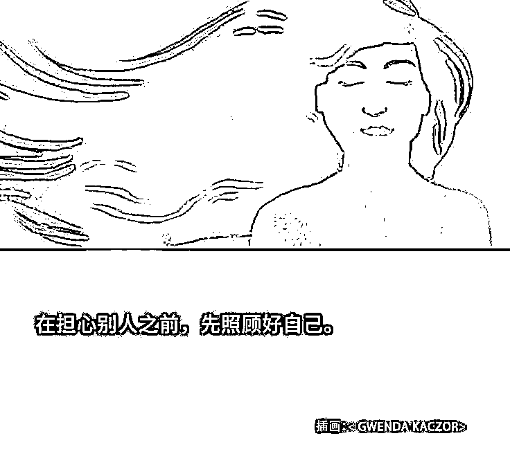

2020 年的年关，的确很难。

虽然，我们在新闻里看到各方都已在全力防控肺炎，但疫情仍在持续蔓延。不仅确诊病例数字持续上升，更让人难过是，我们还看到了一种“**情绪的瘟疫**”。

就在今早，微博上出现了“替代性创伤”的热搜词。许多人说，自己快要被淹没在各类负面信息中，情绪过度卷入，但又好像无能为力：

*   “焦虑地持续刷微博，从不恐慌刷到恐慌”

*   “看久了会呼吸不畅、胸闷、胃疼、想流泪”

*   “恨不得自己是呼吸科的大夫，可以冲去第一线”

*   “最近三四天几乎没合眼，一直在想，自己能做什么？”

……

其实，这很可能意味着我们正在经历心理学上所说的“**压力应激反应**”（stress response）。

这是一种荷尔蒙导致的情绪反应。当你身处于一个压力性环境——比如经历重大社会创伤（SARS 疫情、地震、新型肺炎疫情等），就会在我们的大脑中牵引出一系列的身体反应，比如：情绪或生理上出现失眠、作息异常、记忆力下降、头晕胸闷等。

它是一种下意识的生理和情绪反应，是相当正常的。因为我们都处在社会生活中，与组织和他人相连。不要说亲历其中，即便是目睹一起负面事件，人们都会出现类似的创伤反应。

所以，我们需要首先正视这种反应。

它与大家首次经历的、不寻常的特殊经历有关。

“封城”、“新型病毒”、“口罩断货”......看看这些词吧，这次负面事件对于许多人来说都太特殊了，尤其是年轻人，几乎没有经历过如此严重的大型灾害。

再加上生活医疗物资短期内紧缺，部分病患无法得到有效隔离、城内人面临遥遥等待的不确定性。在全国性的情绪高压下，大家变得“谈湖色变”，甚至只要是武汉人、从武汉来的车，就人肉其信息、达到公开辱骂的程度。

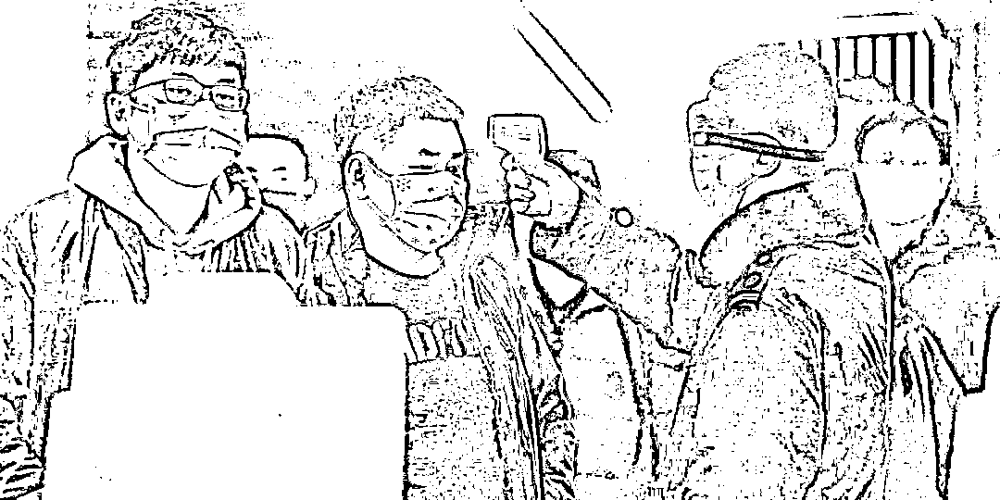

不仅如此，各类谣言、假消息这个节骨眼上的趁虚而入，进一步促发了应激反应。

比如：

有不法分子努力模仿武汉口音、自称汉口某医院的“医务人员”恶意编造死亡数字、恶意编造传染指数（后经微博官方辟谣）；

“有 100 多名来自武汉的旅客被拒绝进入新加坡”事件（随后被 ICA 在官网证实为假消息）等：

以及更多更多花式谣言：

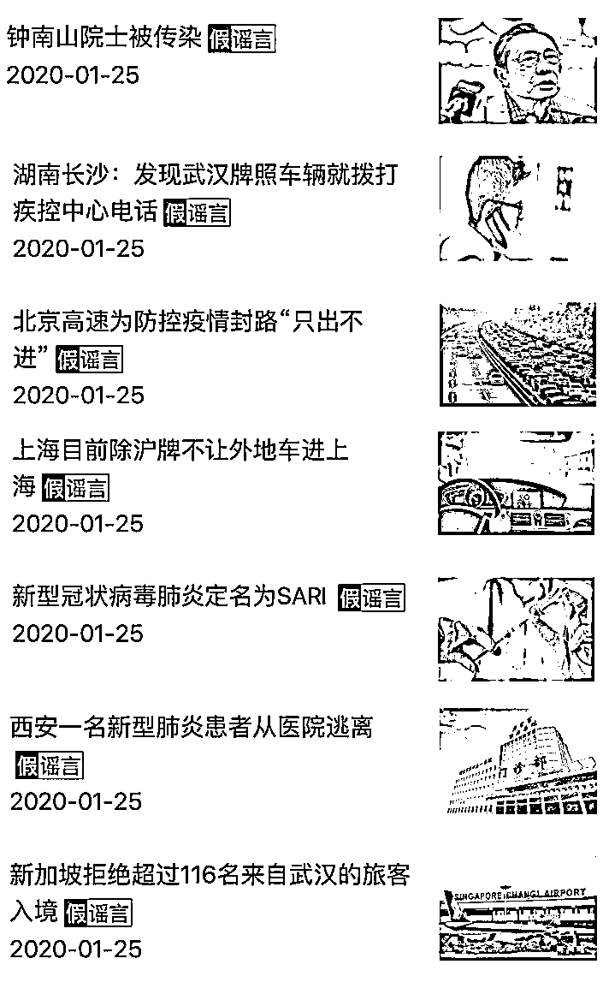

这些都是谣言（来自腾讯较真）

一个需要注意的事实是，**即便被“辟谣”，谣言所带来的阴影也不会完全消失**。 

数项认知心理学研究显示，即使流言在之后得到纠正，但它在人们心中所积聚的负面影响却很难在短时间内消除，无论你是否拥有被教育的经历，它都将被整合进人们对这件事的总体认知（Bransford 等人，1999 年；Winer 等人，2002 年）。

也就是说，即使告诉你”钟南山院士被传染“是假消息，但这份”连最可靠的院士都难以逃脱“的恐惧也已经对你的意识产生了影响。当恐慌被假消息一步步加重，应激反应也就更容易出现了。

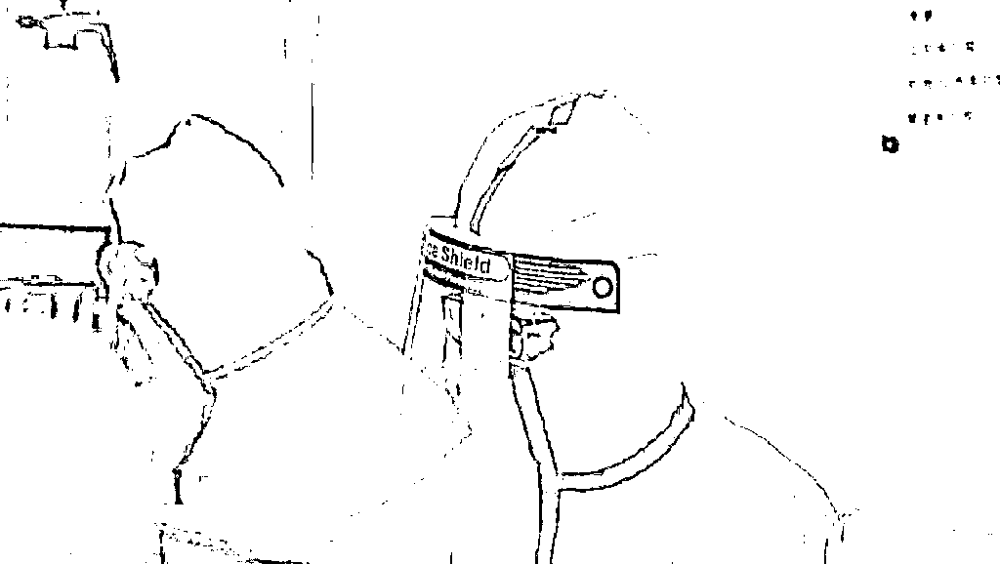

“应激反应”并不是一个容易”痊愈“的事情，并非所有人都可以从情绪的沼泽地里自行爬出。

许多人会在不自知的状态下，陷入“过度应激反应”困境，无法自拔。

我们在此列出一些有专业心理学支撑的实用 tips，告诉你应该如何判断、应对这类“应激反应”，希望能帮助你度过这段难捱的时光。

1

**快速自检：“应激反应”的几个常见表现**

以下这几种表现（改编自 CMHS，2004），可以帮助你进行自我判断：我是不是已经陷入过度的“应激反应”了？

**行为层面：**

*   活动力增加或减少

*   很难交流，无法听进疫情之外的话题

*   情绪激动，易怒，经常和人争吵

*   没办法休息或放松，持续关注疫情相关信息

*   无法正常工作，每过一会就得看看疫情进展

*   经常哭泣，与医患、无助者陷入“极度共情”状态

*   高度警惕、过度担忧，看到任何相关消息，都要转发给周围的人

*   回避引起（创伤性）回忆的地点

*   心思都在疫情上，做事的时候，容易发生事故

**身体层面：**

*   肠胃问题

*   头痛，其他酸痛

*   视觉障碍

*   体重减轻或增加

*   出汗或发冷

*   震颤或肌肉抽搐

*   容易被吓到

*   慢性疲劳或睡眠障碍

*   免疫系统疾病

**心理/情绪层面：**

*   感到英勇、欣快或无敌感

*   否认现实

*   焦虑或恐惧

*   抑郁

*   愧疚

*   冷漠

*   悲伤

**思维层面：**

*   记忆问题

*   失去方向感、时常困惑

*   思维过程缓慢； 注意力不集中

*   无法决定事件的优先级、无法做决定

*   失去客观性

**社交层面：**

*   自我隔离

*   责备自己，感觉自己尤其渺小，什么忙也帮不上

*   难以给予他人、或难以接受帮助

*   无法享受快乐或乐趣，无法忍受任何娱乐性活动

这些症状，都是我们面对创伤事件的正常反应，一般来说会随着时间推移逐渐缓解。

但请你注意，如果这些症状中有几项持续超一个月，并影响到日常生活和人际关系，你就有患创伤后应激障碍（PTSD）的可能，请及时寻求专业人士的帮助。

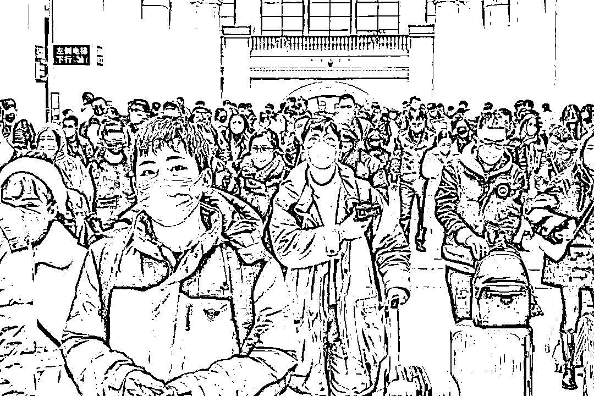

2

**面对“武汉肺炎”风暴，如何调适自己的“应激反应”？**

❶ **尽可能维持正常的生活作息，要有适当的休息，尽量保持生活的稳定性。**

记住，危机事件的发生会令人手忙脚乱，自乱阵脚，因此让生活作息维持规律，是处理危机的必要条件。

❷ **给自己列一个令自己感到愉悦的 To-do 清单，执行它。**

平日你一定知道做什么事情会令自己开心。列出来，执行它。例如，允许自己哭一哭，写出你的想法或感受，玩一些不费脑子的小游戏，运动，深呼吸，抱抱可以慰藉你的物体，泡泡热水澡或冲澡，找出令你愉悦的事，与人聊天等等。 

❸ **当负面情绪要淹没你时，你可以这样处理负向情绪：**

⑴减少因信息过载带来的心理负担

在危机时，尽量控制自己每天接收有关信息的时间不超过一个小时，在睡前不宜过份关注相关信息，不道听途说，关注必要的信息，减少杂音。

对于处理信息过载，我们推荐你做一个靠谱的信息获取工具包。每天仅在固定的时段内，看几个靠谱信息传播平台所发布的权威消息，比如：

**世界卫生组织；各级卫健委官方发布平台；新京报、财新、三联、澎湃等一线采写媒体**……尽量不要多度关注、轻信没有明确信息来源的截图、视频。

**重要的是，不要被动刷手机接受消息，要自己决定信息源。**

 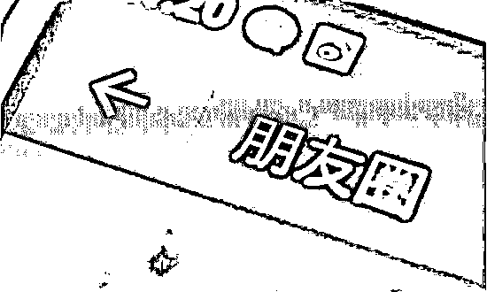

⑵ 与自我对话，自我鼓励

身为人类，我们都有一种自言自语的特殊能力，不论是大声地或无声地自言自语，你都能利用这种能力训练自己克服艰难的挑战。因此你可以这么告诉自己:“它可能不好玩，但我可以应付它”，“这会是一段很重要的经历”，“我不能让焦虑和生气占上风”。 

⑶ 运动

运动的好处在于帮你减少精神上的紧张， 增加心血管机能，增加自我效能，提高自信心，降低沮丧等。哪怕你被隔离，也可在隔离地方做做运动，可以很好地调整心态。

⑷ 正向思维

面对 “新型冠状病毒肺炎” 时，可以运用如下的思考方式：

*   不要只往坏处看，很多文章也许只是在贩卖焦虑。不要一味相信谣传，而要注意留意信息的来源、事实和数据，据此判定自己的担忧是否合理（例如：发病率、死亡率、治愈率、医疗方法的发展、新的药物等）。

*   多回忆在每一次遇到危机时你曾如何面对，重新肯定自己身为一个个体的能力。

*   以合理的态度看待事情，尝试以更广阔的角度了解问题的影响，问题会带来短暂的影响，但长远而言，事情最终能改善及成为过去。

*   保持对前景的盼望，即使在危急时期，也不要忽略在我们身边的美好事物。

你也可以多做一些力所能及的小事。比如：

做好自我防护和家庭隔离，劝说周围的朋友家人不要外出，做好消毒、洗手、戴口罩等措施；

组织一些当地互助群。帮助留在湖北的朋友、家人，做一点有用、但他们无暇顾及的事，比如：找到靠谱的、可以发货的生活必需品的网店链接。

同理，当你很担心自己和家人将会受到感染，感到很大的心理压力，也建议你继续正向思维：

*   不能肯定将来会怎样，但这一刻我仍然拥有健康，我可以继续努力生活。

*   我也可以提醒我的亲人，保持个人和家庭卫生，戴口罩，以及认真洗手和消毒。

*   我可以加倍留意自己和家人的身心健康，让自己有开心的时间。

*   即使我真的生病，也会有很多人陪伴我一起面对。

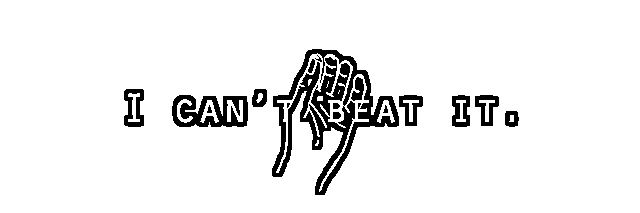

如果你或周遭的人有下列的感受或状况，并持续超过 2 周以上，请尽快就医或寻找专业心理咨询师求助。

*   恐惧，无法感觉安全

*   对自己或是其他任何人失去信心

*   自尊丧失、感觉羞耻、痛恨自己

*   感觉无助

*   感觉空虚

*   感受变得迟钝及麻木

*   变得退缩或孤立

*   睡眠状况恶化 

3

**先照顾好自己，再操心别人**

就像“感到被疫情引发的负面情绪淹没”一样，不管是“应激反应”，还是“情绪耗竭”，都有可能到达一种很严重的程度。

我们都同样会担心疫区的情况，对奋战在一线的医护工作者们感到深深的共情，另一方面，又时时害怕这种情况会走向失控。但是，当我们在理解他人的时候，也要注意：**“崩溃的情绪”是否变成了“摄魂怪”**。

“摄魂怪”常常出现在陪伴精神病患者的家属身上。当你长时间地照顾一个生病的人，我们去理解 Ta 的病情，理解 Ta 的局限，但并不意味着，你作为家人，就要做一个“牺牲品”，把自己奉献出去。

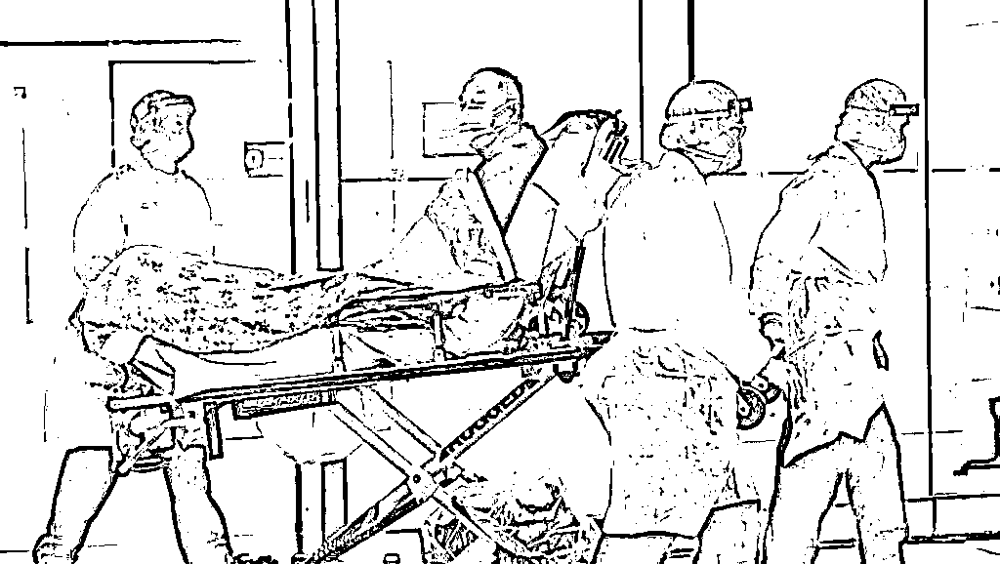

好在，在面对这类重大创伤事件时，许多人都有自行修复的能力。

Emmy Werner 是最早提出“修复力”（resilience）概念的心理学家之一。她在 1980 年代对夏威夷 Kauai 岛上的 698 个孩子进行的一项追踪研究中发现，即便生长于一个一无是处的家庭，1/3 孩子有能力摆脱糟糕环境影响，成长为自信、能干、关怀他人的优秀成年人。

**Werner 认为，拥有修复力的人，像有弹性的橡胶一样，能够承受外界带来的创伤，并修复这些创伤的糟糕影响**。

但是，**如果当你感到自己无法脱身，没有办法自行“修复”情绪的时候，不妨多向外界寻求帮助**。比如，找到靠谱的、值得信任的朋友谈一谈，或是联系专业的心理咨询专家。

**祝你知道如何原谅自己的“无能为力”，但同时也守护好自己的边界；保持理智、警惕情绪耗竭；不要过度恐慌，也不要过度放松。**

因为，你得先照顾好自己，才能够照顾好他人。

* * *

最后附上由华中科技大学同济医学院附属协和医院专家发布的“疫情防治解决方案”，在特殊时期，我们更应转发靠谱的防护知识，保护自己，也保护家人。

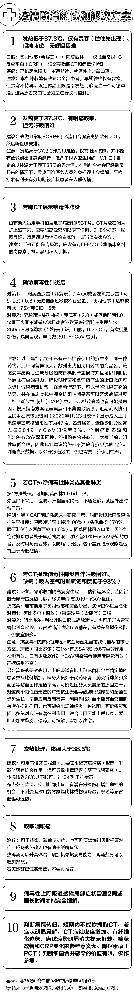

**版权声明：**本文转载自公众号“简单心理”（ID：janelee1231），一个有温度，有态度，守伦理的专业心理公众号。


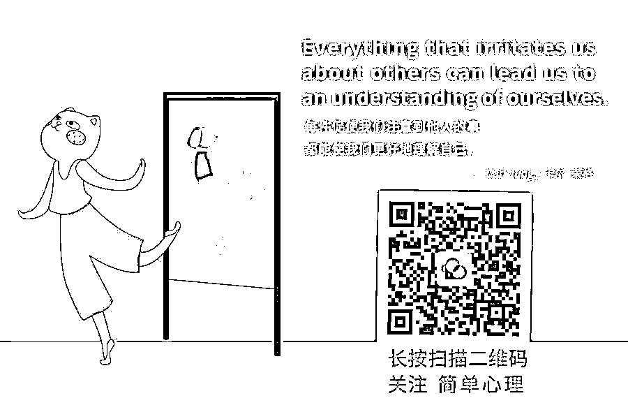

**微信又双叒叕改版啦，不想错过若道君的推送？**

**就把若道设为星标吧！**

**▼**


# 在土冥合相的余威下，我们该如何安然度过剩余假期？

> 原文：[`mp.weixin.qq.com/s?__biz=MzA5NjA0NTAxNg==&mid=2651413085&idx=1&sn=be7fb2b5b95b88b5950465950f418f40&chksm=8b4be8eabc3c61fc234eaf5d315117157d8257d21e823ef1bd40f728cf9a2716705a01bbf167&scene=126&sessionid=1692738222#rd`](http://mp.weixin.qq.com/s?__biz=MzA5NjA0NTAxNg==&mid=2651413085&idx=1&sn=be7fb2b5b95b88b5950465950f418f40&chksm=8b4be8eabc3c61fc234eaf5d315117157d8257d21e823ef1bd40f728cf9a2716705a01bbf167&scene=126&sessionid=1692738222#rd)

****************☆ 后****************************台****************************回复“今日”，给你一句生命态度****************

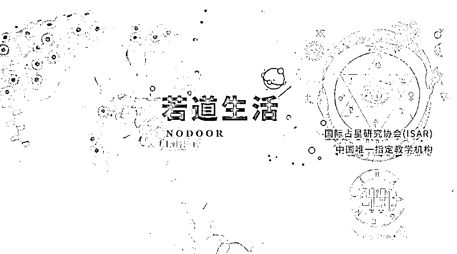作者/傅莎珈 ISAR 认证占星师 校对/定诗 编辑/Tang 封面/书君 图片/网络随着疫情的蔓延，为了更好的控制，春节假期也延长至 2 月 3 日。真真假假的消息遍布全国，恐慌与祈祷共通前行，丧中夹杂着希望。绝大多数的朋友也尽量避免外出，躺在家里为国家做贡献。在这突然增加的假期里，在这土冥合相摩羯座的余威下，我们可以做些什么？来看看这篇文章吧。
“

**好好忍耐，**

**不要沮丧，** 

**如果春天要来，**

**大地会使它一点一点地完成。**

**——里尔克**

”

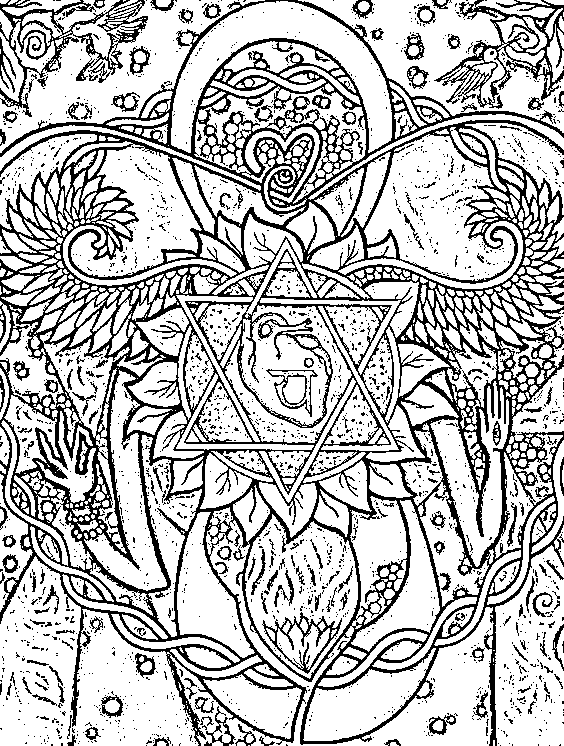

**当下的天象继续延续了土冥合相的余威**： 

*   巨星陨落：NBA 巨星科比不幸遭遇直升机坠机事故离世
*   地震：土耳其和伊朗分别发生 5 级以上地震；古巴发生 7.7 级地震
*   战争阴影：美驻伊朗大使馆遭火箭炮攻击；阿富汗塔利班击落客机
*   因为疫情关系，中国各城市统一推迟了上班时间到 2 月 3 日，对各行各业都是损失，一些创业人士和中小企业更会面临很大的损失
*   A 股股市将推迟到 2 月 3 日开市，损失未知

不断有人问：接下来会怎样？我们真的无法通过星图清晰地预测未来走向。但关于如何度过这个突然变成 10 天的假期，倒是有些想法仅供参考。 

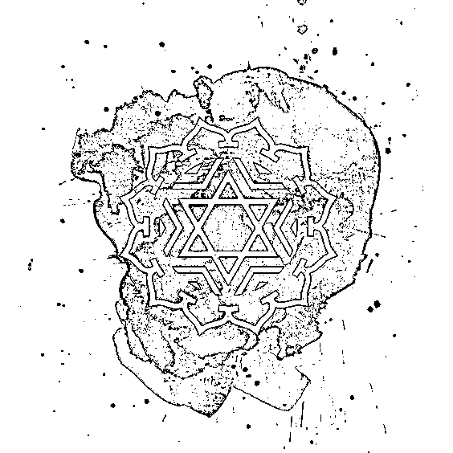

保持情绪稳定

*   **危机时候人通常会经历 5 个阶段的心理状态**：

1.  **否认**

2.  **讨价还价**

3.  **愤怒**

4.  **抑郁**

5.  **接纳**

目前看来，很多人处于**抑郁阶段**：不知道未来如何发展；还有一部分人在**经历愤怒**：对各种失误和处理方式感觉愤怒；处于**否认状态**的也不在少数；**讨价还价状态**的人则认为马上有好转的可能。

 **不管在哪个阶段，都需要承认自己确实处在疫情中。并且伴随疫情的深入，还会有情绪起伏。** 

*   **以官方发布为准，不去关注未经证实的消息**。突然发生的疫情导致很多人的年三十和大年初一都没有过好，各种消息满天飞。前几天的新闻发布会宣布 500 万人离开武汉的消息，也让人心头一紧。通常越是在这类紧急突发事件面前，各种未经证实的消息越容易流传，引发情绪恐慌。建议大家以国家正式发布的消息为准，不要轻信未经证实的信息。可能的情况下，减少关注跟疫情有关的信息。

*   **以音乐疏解情绪**。如果感到情绪不佳，听一些舒缓的音乐：比如颂钵、唱诵音乐、瑜伽音乐、莫扎特等，让眼泪跟随唱诵流淌，释放被压抑情绪。 

*   **做一些简单的室内运动**。瑜伽、太极、站桩、八段锦、无氧、跟着视频跳跳舞......

*   **轻拍身体**。会拍打的，拍拍身体感觉郁堵的部分，尤其是大肠经两侧和两肋。早晚揉揉腿肚子、腹部、胃、脸部和头部，轻轻的，不要太重，让自己感觉被抚摸的力度就可以。会捏脊的给家中小孩捏个脊。

*   **列心愿活动清单**。一旦突然在家很多人感觉无所事事，陷入无聊状态，建议列一张清单：你有什么因为时间关系来不及做的事情吗？现在可以了：学一门课程，整理家居，看书、学烹调、绘画、抄经、做手工、写作...... 往常没有时间做的事情，终于有充裕的时间做。这是意外的礼物，好好珍惜这段额外的时光。

*   **参与捐赠**。疫情是大家的事，照顾好自己的同时，参与社会支持，是我们每个人应该做的。 给医务人员点一份食物饮料（希望不会造成他们的负担，不是提倡只是建议）。

*   **表达感激**。环卫工人、快递人员、公交系统......那些必须在岗的人们，请给他们一个鼓励。我给来送快递的小哥们准备了一杯马上能喝的热茶和一口点心，估计他们最近不会有时间坐下来吃饭。

*   **和孩子玩耍**。没有时间陪伴孩子？现在有了，学校 2 月 17 日才开学，有足够的时间陪伴孩子了。可能很多人会不知道如何开启这个陪伴。我也不知道。但我会试着跟他们在家里玩绘画、乐高积木、牌卡游戏。

*   **以香味调节情绪**。试试每天早上起来点个线香，做个香薰，挑自己喜欢的香味。我个人偏爱甜橙、玫瑰、茉莉、薄荷、雪松、乳香......每隔三两天换个味道，相当自我愉悦。

**照顾好自己，同时支持社会，心怀深深的信任，爱。允许自己发泄情绪，是会很害怕的，尝试对恐惧和愤怒臣服。记得回来，回到平静之中，回到对爱的追随之中。** 

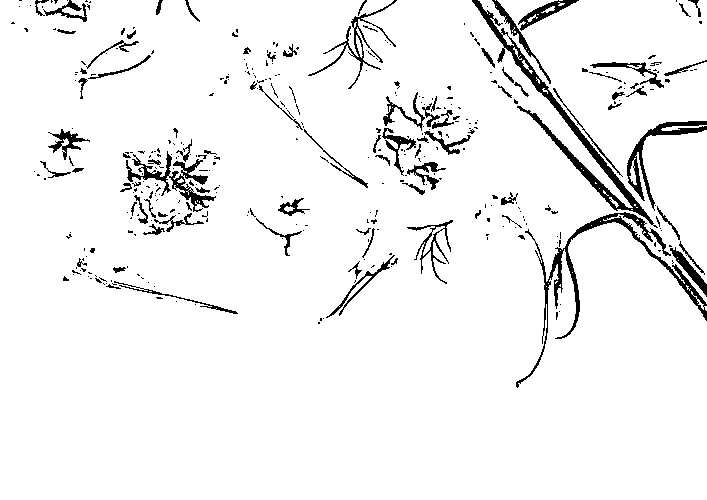

调节饮食起居

*   春节本身会大吃大喝大鱼大肉，如果再因为疫情无法出去溜达，很容易积食。建议大家在可能的情况下，稍微减少一些荤食。可以增加一些甜品，山楂饮料。甜品和山楂类型的饮料，帮助我们缓解紧张情绪，注意适量。

*   如果能在这个假期吃素或者半断食当然最好，但不是每个人都做得到。如果之前从未持续一周以上吃素、断食，尽量不要做，会引发身体的应激反应。简单的减少荤食多吃蔬菜就行。

*   早晚开门窗 20 分钟让空气流通，注意不要着凉。

*   可能情况下整天开着空调、暖气，让室内保持温暖干燥。

*   最近是节气转换时期，身体的湿气比较重，感觉头脑不清晰，思维迟钝；或者很容易上火发脾气。请做艾灸，泡脚，穿上袜子在室内散步，特别注意脚部保暖。

*   如果要外出，尽量带好帽子、围巾、口罩。

*   晚上 11:00 以前睡觉。睡得晚吃得油腻不运动，增加生病几率。

*   改动一下室内装饰，让家居变得更温馨舒适。

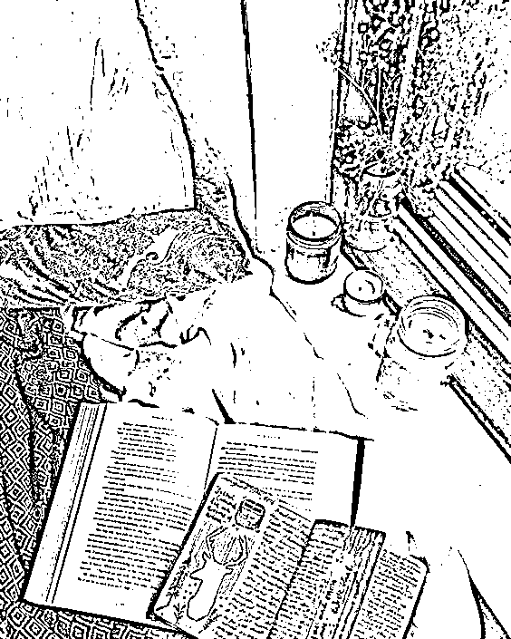

改善室内空气

*   完整专业的消毒清洁估计不太做得到，用消毒剂清理一下浴室厨房等容易滋生细菌的地方，聊胜于无。处女座/双鱼座类型的主妇，推荐买二氧化氯消毒（片剂或粉剂），自己去淘宝上找，使用方式百度有。

*   咨询芳疗师，哪些精油针对空气净化/消毒（茶树、尤加利、檀香、柠檬和罗纹莎叶）；我个人用罗纹莎叶精油比较多，特别针对呼吸道感染，室内空间的净化。请控制用量，1-2 滴就够。点香薰炉。晚上睡觉滴在枕头上。

读一本书

读一本书：**加缪的《鼠疫》 这本书写于 80 年前，然而描述的场景和现在几乎一样**。 

 

> 法国作家阿尔贝·加缪创作的长篇小说，也是其代表作。该书通过描写北非一个叫奥兰的城市在突发鼠疫后以主人公里厄医生为代表的一大批人面对瘟疫奋力抗争的故事，淋漓尽致地表现出那些敢于直面惨淡的人生，拥有“知其不可而为之”的大无畏精神的真正勇者不绝望不颓丧，在荒诞中奋起反抗，在绝望中坚持真理和正义的伟大的自由人道主义精神。小说描述了阿尔及利亚的奥兰发生瘟疫。突如其来的瘟疫让人不知所措。政客狂妄无知，掩饰诿过，甚至想利用灾难来获取利益；原来过着委靡不振生活的小人物，凭着黑市门路，为人民带来各种禁品，突然成为了城中的风云人物；小百姓恐慌无助、自私贪婪，每天都只是过着颓废生活。瘟疫城市被重重封锁，无人能够自由进出。被困在城中的人民，朝思暮想着住在城外的亲朋好友。一位到城公干的记者被迫过着无亲无友的生活，只有寄望参与自愿队消磨时间。主角里厄医师这时挺身而出救助病人，与一些同道成了莫逆之交。不过，他的妻子却远在疗养院，生死未卜。
> 最终鼠疫退却了，然而尽管喧天的锣鼓冲淡了人们对疾病的恐惧，可是奥兰人永远不会忘记鼠疫曾给他们带来的梦魇。——百度百科

看两部片看两部片：HBO 出品的美剧《切尔诺贝利》讲述的是人类如何应对核辐射，在剧中最大的敌人就是那看不到摸不着又无处不在的辐射，整部剧通篇都能让人感受到绝望和无能为力。与之相似，美国国家地理出品的《血疫》讲述的是另一个看不见摸不着的敌人——病毒。不止我们在面对灾难，曾经也同样有人在面对。

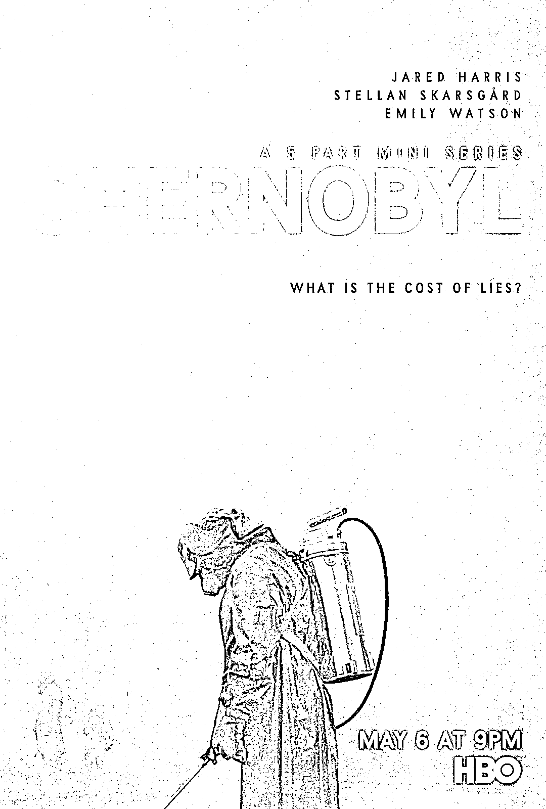

| 美剧《切尔诺贝利》

> 《切尔诺贝利》
> 
> 1986 年 4 月 26 日凌晨，位于乌克兰苏维埃社会主义共和国普里皮亚季的切尔诺贝利核电站发生了严重的爆炸事故。瓦列里·列加索夫，作为一个杰出的苏联核物理学家，成为了处理这场事故的应急小组的一员，同时也成为最先了解并着手组织处理这场事故的负责人之一。
> 
> 苏联部长会议副主席、苏联能源局领导鲍里斯·谢尔比纳在事故发生数小时后被指派领导事故调查委员会，但当时政府还没意识到反应堆已经爆炸。作为这史无前例人为灾难的高级应对官员，他发现自己身陷政治体系问题，以及得面对这场核灾难不停攀升的伤亡人数。苏联核物理学家乌拉娜·霍缪克致力于调查切尔诺贝利事故的真相，好让未来不会再发生同类事件。但在调查期间她与想埋葬可怕秘密的人产生了未曾预料的冲突，为了真相她得冒着失去自由，甚至生命的危险。——百度百科

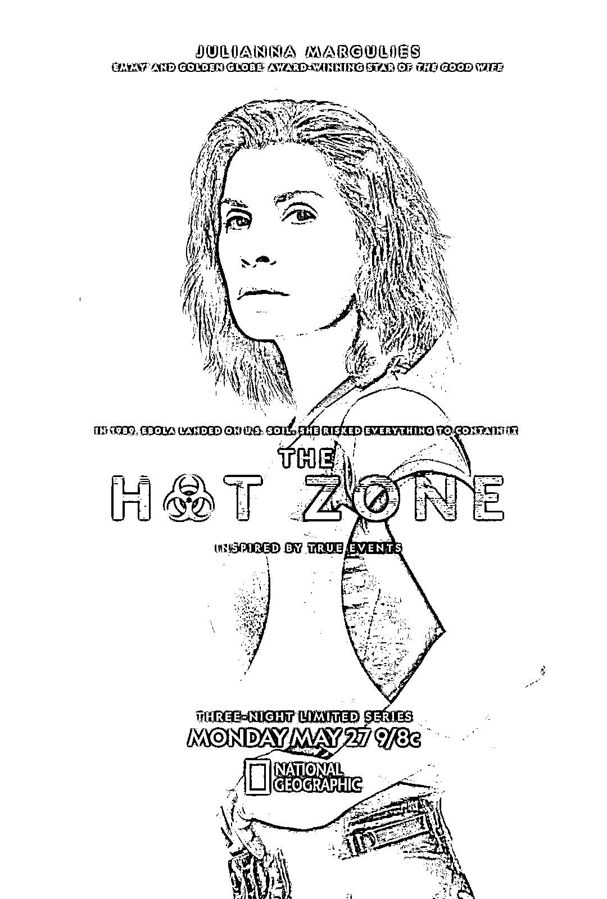

|  美剧《血疫》 

> 美剧《血疫》改编自理查德·普雷斯顿所著的有关埃博拉病毒及其对人类影响的畅销书。1989 年，埃博拉病毒突然出现在华盛顿郊区一个科学实验室的黑猩猩身上，且当时并没有已知的治疗方法。英勇的美军兽医与一支秘密军事特警队合作，在疫情蔓延到人类之前，她试图阻止，但这却让她陷入了致命危险。
> 
> 埃博拉又译作伊波拉病毒。是一种十分罕见的病毒，1976 年在苏丹南部和刚果（金）（旧称扎伊尔）的埃博拉河地区发现它的存在后，引起医学界的广泛关注和重视。它是人类有史以来所知道的最可怕的病毒之一，病人一旦感染这种病毒，没有疫苗注射，也没有其他治疗方法，实际上几近自己给自己判了死刑。
> 
> 感染埃博拉病毒死亡率在 50%至 90%之间，致死原因主要为中风、心肌梗塞、低血容量休克或多发性器官衰竭。用一位医生的话来说，感染上“埃博拉”的人会在你面前“融化”掉。唯一的阻止病毒蔓延的方法就是把已经感染的病人完全隔离开来。
> 
> ——百度百科

**遭遇疫情的春节假期，也要身心宁静地度过呀。**
**假期继续，祈祷也继续。** **来日方长。**

**版权声明**：文章由作者授权在若道平台发布，欢迎转发，反对抄袭。

****

****傅莎珈****

ISAR 认证占星师（2015 年获得）

心理占星师/内观书写带领者/冥想带领者

国际著名传播集团工作 20 年

**微信公众号**：Helloshajia

长按打赏


******点击图片查看若道君推荐******


**微信又双叒叕改版啦，不想错过若道君的推送？**

**就把若道设为星标吧！**

**▼**


就是这个“在看”，戳一下☟

****直达报名通道****


# 正月初五扫穷气，驱邪、避灾、祈福日 | 12 星座财富能量指南

> 原文：[`mp.weixin.qq.com/s?__biz=MzA5NjA0NTAxNg==&mid=2651413076&idx=1&sn=4de251cd6d0e9935104fd105f0da20fc&chksm=8b4be8e3bc3c61f5b5181871b089f4a84ddcb1b46ec09e5534b51a268239eda41d37388b4753&scene=126&sessionid=1692738222#rd`](http://mp.weixin.qq.com/s?__biz=MzA5NjA0NTAxNg==&mid=2651413076&idx=1&sn=4de251cd6d0e9935104fd105f0da20fc&chksm=8b4be8e3bc3c61f5b5181871b089f4a84ddcb1b46ec09e5534b51a268239eda41d37388b4753&scene=126&sessionid=1692738222#rd)

****************☆ 后****************************台****************************回复“今日”，给你一句生命态度****************


作者/大卫·瑞雷 若道占星创始人译者/李含 校对/Arrow  编辑/玫瑰 图片/全景网稿件来源/《风度》杂志正月初五，俗称破五。是把穷气扫地出门，驱邪、避灾、祈福的日子。今年，大家都宅在家里为抗击疫情做出自己的贡献。先说一句：“你们辛苦了！”在注意防护的同时也别忘了，众志成城的互相关爱十分重要。在这一天，让我们一起来换个新方式“迎财神”，驱邪、避灾、祈福，天佑中华！相信疫情结束的时候，每个人都会在这段日子里有所收获。那么，我们一起来看看，春暖花开的时候，该怎样提升财富值，发挥自我价值呢？**“我会有钱吗？”**人们常常问占星师：“我会有钱吗？”一位诚实的现代西方占星师会这样回答这个问题：“我不知道。”因为现代占星师知道，**无论通过一个人的太阳星座还是他们完整的出生星图，都无法预测财富**。我知道没有占星师可以按照收入排列 50 张出生星图，如果有占星师宣称他们可以，那么你不该把辛苦挣来的钱交给 TA！当代占星师会对他们的客户说：“让我们来探讨一下，**你的星图揭示你有望以哪些方式创造财富，同时也弄清楚是什么阻碍你如愿获得更富足的生活。**”换言之，在财富潜力方面，我们每个人的人格特质中都蕴藏着助力和阻力。**通过发展人格资产，而不是延续我们的亏损，每个人都可以更有效地创造财富**。即使是太阳星座这样基本的信息，也可以揭示那些能够帮助和阻碍你富足的行为。**12 星座如何更有效地创造财富？**

**请参考太阳星座及上升星座** 

***白羊座***

*   **积极主动**是你最大的资产。
*   **发展创业潜能**是创造财富的另外一个关键。
*   为什么要浪费时间和精力与老板对抗？或者，你明明可以做自己的事、按照自己的方式行事，还要受公司的约束？
*   如果你只有待在公司里才能获得安全感，没问题。不过，还是要**发展一份副业，选择早早退休，这让你可以自行创业**。
*   如果你已经具备出色的人际交往能力，那再好不过了。不过，你们中的许多人都需要去培养这种能力。

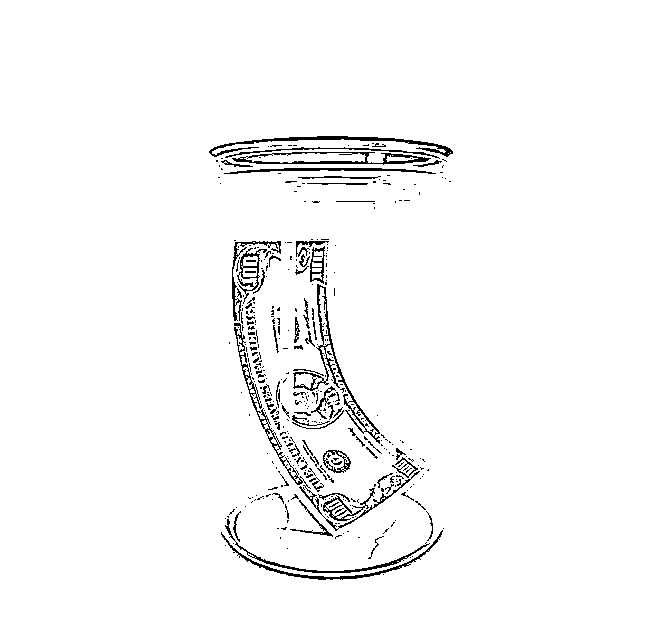

***金牛座***

*   **缓慢而稳定**为你赢得比赛，特别是**投资**。
*   另外，当人们知道他们可以**依靠**你的时候，他们会**投资**你。
*   你在**危机中的稳健**起初可能会被忽视，但你一直如此。最终，人们会认为你的参与是必可少的，这时候你就可以“不经意地”要求加薪了。
*   你通常凭借**良好的直觉**就能发现什么事情值得投入时间，什么事情不值得，于是你会**选择能够挣到钱的事情去努力**。

*   与其他星座的人相比，你更重视**舒适的生活**。需要留意的是，**懒惰和抗拒改变**会暗中破坏你获取财富的潜力。

***双子座***

*   你的**聪慧**物有所值，但也许你需要**涨涨价**？

*   有人说：“言谈是廉价的”，但是我们生活在一个信息时代，公司会为最新的信息付费。同样，互联网是由内容驱动的，你的优势是你能**看到信息的直接关联**。

*   **扮演沟通交流和指导性角色**能让你创造财富，尤其如果你可以多花些时间写你的畅销书，少花些时间发微信。

*   **网络和多任务**是你的强项，但是如果你想要将热闹的谈话转化为财务成功，就需要**有效地安排优先顺序**了。

***巨蟹座***

*   你的**直觉**指引着你，但你需要**倾听那些不是由恐惧驱动的感觉**。
*   不安全感会驱使你做出决策，这种决策的后果恰好朝着你害怕的方向发展。
*   要像对待食物那样明智地对待金钱。你对财务安全的渴望就像**饥饿**，迫使你吃得太快，吃垃圾食品，或者选择不熟悉的餐馆。
*   相反，你们适合**投资具有积极情感联结的熟悉领域**。有了**稳妥的收入**，你可能会把你的投资组合扩大到本地的**房地产市场**，或者是那些具有**怀旧情调的公司**，又或者是那些因**滋养型产品或服务**而享有盛誉的公司。

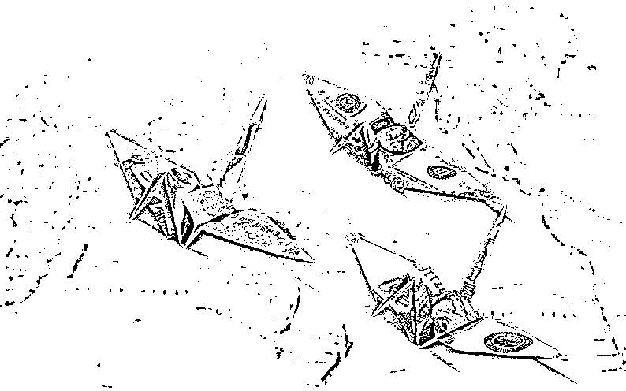

***狮子座***

*   你的才能，尤其是你的**领导能力**，可以让你赚得盆满钵满。
*   你要尽量**明智地投资**， 你的高收入让你更容易在削减成本的公司中被取代。
*   你们中有些人会大手大脚地花钱买奢侈品。不过，对**奢侈品相关业务的投资**可能会带来回报。高品质的商品也往往易于保值或增值。
*   你们中许多人只是需要未雨绸缪。你们的**自信**当然会鼓励他人对你们投资，但是失败的项目会暂时造成财务上的挫折，既损害你的投资组合，也伤害你的自尊。

***处女座***

*   靠**智慧**赚钱，你们中的许多人都非常适合一个**重视逻辑和专业知识**的世界。

*   另外，你倾向于通过**购买打折商品、使用优惠券**来增加自己的投资资产。

*   不过，**迷失在细节**中会让你失去宏观视角；当更大的趋势或议题表现出貌似完美实则错误的投资时，你可能会付出昂贵代价。

*   相反，在深入细节之前, 要先用更**宏观**的常识问题来处理投资。

*   不管怎样，你的**分析能力**让你比其他人更具有处理财务问题的优势。只是不要因为对财务的忧虑而干扰了你享受应得的财富。

***天秤座***

*   在创造财富方面，**关系**是你的助力，也可以成为你的阻力。

*   从积极的意义上说，你的收入和你积累的财富往往来自**商业伙伴关系、婚姻、充当顾问，或建立重要的商业关系**。

*   当然，这种作用是双向的。商业伙伴关系可能会失败，离婚可能会付出代价。同样，为别人花钱多过为自己花钱会减少投资资本。关键是学习**如何在与他人的协议中兼顾自身利益**。

*   一般来说，你的**社交技巧**能让你在人生的起起落落中获得财务机会。

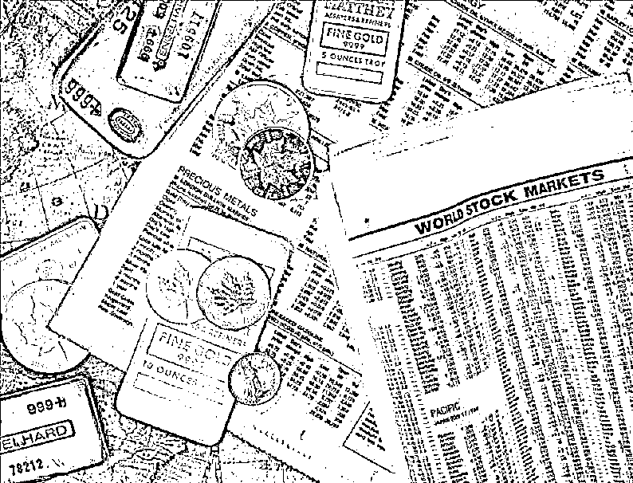

***天**蝎座***

*   和天秤座一样，你们也是通过关系创造财富，但是和天秤座不同的是，你们不关心公平，你们感兴趣的是**控制**。

*   51%对你们来说是一个魔法数字；少于这个数值，你们就不会交付信任。

*   当然，信任始于你们**对自己的信任**，当你学会**相信自己对人、对钱的深层直觉**时，你就会越来越少后悔。

*   有时候你的**激情**会成为代价昂贵的**偏执**，但是灾难过后，你的**坚韧**会让你成为黄道星座中起死回生的凤凰。

*   你可以从幸存走向繁荣，从一无所有中创造令人艳羡的财富遗产。

***射手座***

*   你总是在**推销**，再加上你一贯的**积极态度**，确保你衣食无忧，而且会带来**似乎无限的选择和赚钱机会**。
*   你们所面临的挑战是，知道**该利用哪些机会**，学习**耐心等待**你的投资结出硕果。
*   不管怎样，其他人通常会看重你们**全球化的视角和哲学性的观念**，随着你们褪去鲁莽变得成熟，你们的**智慧或洞见**会吸引丰厚的咨询收入。
*   你们并不是关注细节的人，所以可能会**因为细枝末节付出昂贵代价**。你也可以通过**教学或写作**获得报酬。

***摩羯座***

*   你可能在 7 岁时就制订了一个财务计划，虽然你的计划已经改变，但你的**雄心壮志和努力**可能并没有改变。

*   **胜利**是你所渴望的，金钱只是你**保持得分**的方式。**成功、地位和尊重**是你真正想要的回报，但你会**务实**地对待自己辛苦赚来的财富。

*   你是一个**保守的长期投资计划者**，没有快速致富的计划。你很容易将一切经济损失与失败联系起来，这有时会让你难以享受你如此努力创造的富足。

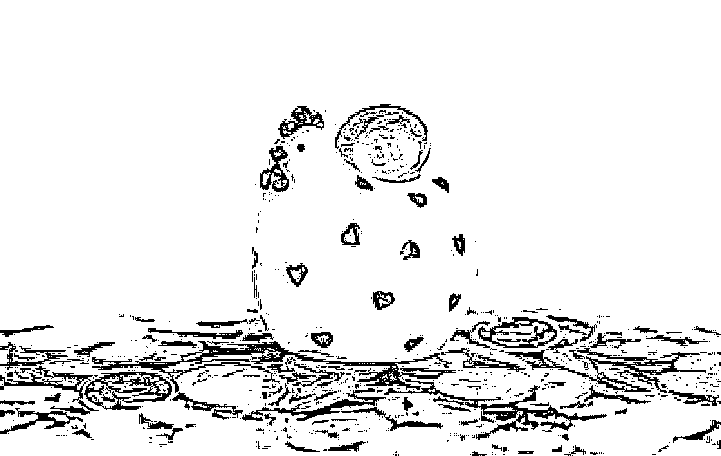

***水瓶座***

*   如果能够**惠及他人**，那么你会对创造财富这件事更感兴趣。
*   一个新的想法，就像一个灯泡，可以赚很多钱；但是，就像灯泡一样，如果它也照亮了方圆数里的社区，那么就会有很多人受益。
*   **发明和贡献**是你创造财富与回报的方式。缺钱常常是因为**你认为没有地方适合你，并且假定你的理念会被拒绝**。
*   你可能表现得好像你并不在乎，但仅仅为了支付账单而做一份令人心烦的工作也不是解决办法。

***双鱼座***

*   你花 1 周时间绘制一幅画，你可能会将之赠送给一位欣赏这幅画的友人，但一周后，你可能会以 3 万 5 千元卖掉一幅相似的画。
*   创造财富对你来说很**复杂**。金钱唯一重要的时候是当你需要它来**实现你的梦想**，为你未来的愿景提供资金的时候。
*   小数点左边的零和小数点右边的零似乎一样虚幻。因此，你对价值的判断取决于**是什么俘获了你的想象**。
*   当幻想破灭的时候，一切价值随之破灭，但有一个**更美好的梦想**伴随着富足在等待着你。

**我们都在时刻关注着武汉疫情，希望大家仍旧听取专家意见，保护好自己和家人。等到疫情结束时，我们再见面互相拥抱彼此！愿大家一切安好，我们一直在这里陪伴你。**

**版权声明：**本文由作者授权首发于若道平台，欢迎转发，反对抄袭。友号转载请申请白名单。


****想阅读更多作者的文章，请在后台回复******大卫****** 即可。****

**喜欢文章请长按下方二维码打赏**

**给大卫老师加杯咖啡呗~**

**▼**


******点击图片查看若道君推荐******


**微信又双叒叕改版啦，不想错过若道君的推送？**

**就把若道设为星标吧！**

**▼**


就是这个“在看”，戳戳戳 ☟

********报名直达入口********


# 只要处理好“摩羯式抑郁”，每个摩羯座都有问鼎成就的潜力

> 原文：[`mp.weixin.qq.com/s?__biz=MzA5NjA0NTAxNg==&mid=2651413069&idx=1&sn=2c72f945a0eabd406525c8b71ccb0c61&chksm=8b4be8fabc3c61ec5db1221ea1330f63f542d66dbc9b91fdbffd2a264ce205ca6c59d3e3f221&scene=126&sessionid=1692738222#rd`](http://mp.weixin.qq.com/s?__biz=MzA5NjA0NTAxNg==&mid=2651413069&idx=1&sn=2c72f945a0eabd406525c8b71ccb0c61&chksm=8b4be8fabc3c61ec5db1221ea1330f63f542d66dbc9b91fdbffd2a264ce205ca6c59d3e3f221&scene=126&sessionid=1692738222#rd)

******☆ ****后台回复“今日”，给你一句生命态度******


作者/大卫·瑞雷 若道占星创始人

译者/聆宇 cora
编辑/玫瑰 图片/全景网

本文节选自大卫·瑞雷著作《一生的旅程》 

今天已经是初三了，大家这个春节都在祈祷加油。虽然宅在家网络拜年，相信大家也把鼠年的福气传递给许多亲爱的家人和朋友。过年期间大家肯定聊了很多关于生肖鼠的话题，现在不如换种视角，来谈谈星座吧。

相信大家都看过很多关于摩羯座的文章，但是，如何形象地描述一个生活中的摩羯座？大卫老师用生动活泼的语言给大家全方位展现了摩羯座的各种特质，一定会让你更好地了解这个星座！

**当摩羯座们一起旅行**

现在你的黄道列车又回到正轨，你重新确定你的时间表。意识到你到达目的地的时间，只会比你原来计划的晚一两个小时，你松了口气。到了之后你还有足够的时间去酒店睡一晚好觉。你甚至可能还有时间在第二天的重要会议开始之前检查一下你的笔记。或许现在就是检查那些 PPT 和文件的好时候。在和你的旅伴交换了礼貌的微笑之后，你们不约而同地打开了各自的手提电脑。“我到站后的第二天就要去参加一个很重要的会议，”你解释道：“我必须提前做些准备。”“我也是，”他们说：“我们正在争取和电力公司的合约，重建在地震中被毁坏的水坝。”你不敢相信自己的耳朵，你要做的也是一模一样的事！你在旅途中的伙伴原来是你的竞争对手！“怎么了？有什么问题吗？”他们看出了你表情的变化。你不知道该怎么回答才合适。你决定表现得专业些。“看起来我们是竞争对手了。我的公司也在参与这次投标。”“明白了，”他们说：“那么，祝你好运了。”他们说着伸出手来与你握手。这是一次郑重的握手。毕竟，在一场竞赛里，有人输，有人赢。虽然你们都暗自下定决心要成为赢的那一方。你看了一会儿资料，很满意自己对会议的准备相当充分。你们都清楚不能跟对方谈这次竞标的事了，所以关上电脑后，你们开始聊一些生活上的目标。当你听着你的新朋友对你讲他们想要在人生中实现的成就，你感到自己对他们萌生出敬意。听起来他们的目标和你的非常相像。此外，你也能感觉到他们十分有决心。你意识到你遇上了强劲的对手，然而你也更加欣赏他们了，你在心里谨慎评估，如果跟他们一起生活会是什么样子。这就是列车奔向目的地时，你的心中所想。这就是**摩羯座**。这是一段严肃的旅程，考验着你对那些你认为重要的东西所做出的承诺。但如果你是摩羯座，**成功的体验值得你付出努力去追求**。你不仅是在向世界证明你的能力，你也要向自己证明。因此你必须**坚守你对成功的定义**。**失败会带来暂时的痛苦，但品尝失败的滋味，总好过因害怕失败，而让恐惧摧毁了奋斗的意志。**

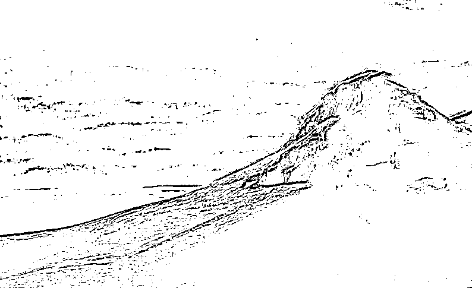

**G.O.A.T.**

莎士比亚为凯撒大帝写下了这样一句台词：“那个卡西乌斯看起来又瘦又饿。”那时他一定想到了摩羯座。卡西乌斯的原型是野心勃勃的罗马参议员，在剧情中他非常想要刺杀凯撒。很有趣的是，拳王阿里的原名是“卡西乌斯·克莱”，这不仅让人想到了那个古老的野心勃勃的姓氏卡西乌斯，他的姓氏“克莱”（译注：Clay，粘土）本身就是一种土，与摩羯座这个土相星座共振。拳王阿里正是从肯塔基州的路易斯维尔这个小地方平地而起征服了世界舞台。**摩羯座的符号是山羊和鱼尾的组合，象征了从海底攀登至山巅的进化之路。**有一个非常值得注意的有关摩羯座的文化同步现象，摩羯座人会对此非常感兴趣，那就是**G.O.A.T.**这个缩写——它代表 Greatest Of All Time，也就是**“史上最强”**（译注：goat 也是“山羊”的意思）。第一个使用这个缩写的是美国说唱歌手 LL Cool J（詹姆斯·托德·史密斯），他在 2000 年首次使用了这个缩写，作为他的专辑名，那张专辑后来成为排行榜冠军。


| LL Cool J

LL Cool J 就是摩羯座，生于 1968 年 1 月 14 日。拳王阿里，在年轻时夺得冠军时也曾喊出“我是最强的！”阿里是如此钟爱这个缩写，他开始把 GOAT 作为他的签名。GOAT 也成为 2003 年出版的有关阿里生平的畅销画册的名字。2016 年阿里去世时，和他有关的一切都和 GOAT 这个缩写关联在一起，有关他的媒体报道中也频繁使用这个词——大家并不知道，这是一个多么生动的摩羯座代号。

当然，摩羯座**强烈的成就野心**适用于任何领域，常常伴随着**为达到目的而做出牺牲的坚强意志**。民权运动领袖马丁·路德·金的一生，就是这种牺牲的体现。他是一位牧师的儿子，与父亲同名。他的父亲是浸信会的牧师，每周日向亚特兰大的教众布道。在种族隔离的美国南部，牧师在非洲裔美国人社区中十分受人尊敬。毫无疑问，年轻的马丁渴望这种尊重，也反映出一个**摩羯座的儿子与父亲竞争**的本能冲动——**去成就更多**，事实上他做到了。不过，马丁·路德·金将个人意志融合进了作为牧师的内在信仰中。“我只是想要履行上帝的意志。他允许我攀登高峰。我极目远眺，看到了应许之地。”马丁·路德·金引用了圣经中的典故来形容他心中的“高峰”，这再摩羯座不过了。这种象征的说法带有进化的意味，描绘了**经过时间锻造后所能达到的成就**。然而其中的**等级暗示**也十分清晰，也就是一个人穿越了各种环境“向上爬”的历程，始于海底，到海岸，到海边小镇，到种满橄榄树的山坡，一直到步伐坚定沉稳的山羊居住的峭壁和山顶。在摩羯座的符号中**保留鱼尾**是非常恰当的，那象征了**对大海的记忆**，**提醒着一个人的过去，以及他已经在来路上走了多远。**

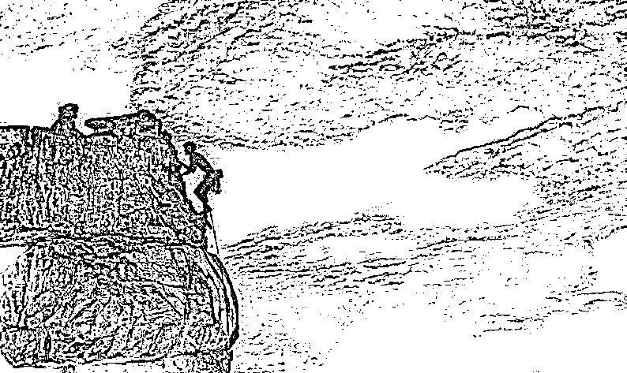

**摩羯座从何处来**

然而在黄道星座的生命之轮中，摩羯座自何处来？是什么样的经历催生了摩羯座对成就的需求？摩羯座之前当然是射手座。射手座的整个历程就是追求真理、智慧和领悟。但接下来呢？令人惊叹的冒险生涯带来了丰富的领悟，充满智慧的贤哲在教导他人中获得了满足感，但也很自然地开始思考所有的学习是为了什么。他们看到自己最聪慧的学生运用他们的所学做出了一番事业，在这个世界上有所成就。一个渴望浮现了，“我想知道如果我一早就知道我现在所懂得的一切，我能成就什么呢——如果我更年轻，如果我还有机会？”将射手座的经验推向极致，如果一个人无所不知，那么他应该无所不能！因此在受过教育之后，灵魂渴望去**成就事业**，在社会上**竞争，学以致用**。**概念与理论的世界属于射手座，摩羯座要将理论付诸实践**。许多摩羯座选择为工作而放弃度假时，仿佛在说：“已经去过了，玩够了”，就好像对于旅行的渴望已经在热爱自由的射手座那里被满足了。这并不意味着摩羯座不享受假期，特别是那些能带来“身份感”的旅游胜地！只不过，**度假通常出现在成功之后，而非之前**，并且你们**不会在假期上消耗太多时间，恢复能量之后你们便会奔赴下一个目标**。如果你是摩羯座，通常有两个议题需要面对。第一个议题是关于**“成功”**本身。你们中的很多人会问：**“这要取决于你怎样定义成功吧？****”**这是一个非常好的问题，因为成功有很多不同的衡量方式。比如，**达成个人目标**是一种成功；而如同获得外在的成功标志一样，**拥有内在的成就感**也是一种成功。摩羯座的内在动力源于它的星座极性是**阴性**。黄道 12 星座的极性依次交替，阴阳循环往复，就像电流的极性。其中**火相星座（白羊座、狮子座、射手座）和风相星座（双子座、天秤座、水瓶座）都是阳性星座，土相星座（金牛座、处女座、摩羯座）和水相星座（巨蟹座、天蝎座、双鱼座）都是阴性星座**。旧的占星书常将阳性说成男性，阴性说成女性，但现代占星师已经不再使用这种带有误导性的命名。比如，摩羯座是阴性星座，但恐怕没有多少人会觉得摩羯座是典型的女性化的星座。在中国，摩羯座女性可能还常常被看做是“女强人”，这暗示她们在工作的竞争力上像个男人。

**摩羯座无声的力量**

然而，摩羯座的“能力”，并不像狮子座的能力那样炫目和外露。拳王阿里会有非常戏剧化的行为举止是因为他的上升点在狮子座，并不是因为他的太阳在摩羯座。摩羯座的人身上会有种**从容坚定**的力量，常常伴随着一种**威严**。他们举手投足间都显示着一种**决心**，神情总是**严肃又坚决**。虽然**当经验不足或缺乏安全感时，摩羯座可能显得古板或笨拙**，但**有安全感的摩羯座总是有种无声的效率**。**无声代表了一种内在的过程，是内在的审慎权衡和计划。**我认识一位摩羯座的舞台剧演员，有一次在谢幕后，观众起立为他鼓掌，他却在退到后台后显得垂头丧气。有人问他怎么了，他说：“我今晚的表现糟透了。”“但是观众爱你，听听他们的掌声？”“是的，但是我知道我其实有多么差劲。”在这个例子里，这个摩羯座的演员没有达到自己所认可的成功的标准，尽管他赢得了观众的喝彩。不过，出于摩羯座的专业意识，他响应观众的呼声又进行了返场表演。这位演员非常敬业，在表演技艺上下足了功夫。摩羯座有种**强大的驱动力**，想要**在专业能力上达到大师级的水平**。当然，如果观众们和他一样，也觉得他的表演很糟，并不留情面地发出嘘声，那么他的挫败感无疑会更加强烈——即便他也承认他和观众的看法一致。失败是成功的另一面，失败的苦涩会在摩羯座心中留下长久的印痕。**内在的成就感，是外界认可的先导**。一个摩羯座的太极老师可能会在竞赛中证明自己的技艺，但是在他心中，他长期倚重的**内在的自律**，已经奖赏给他一种成就感。一位摩羯座警官的克己自制会赢得他人的尊重；一位摩羯座护士长不用提高嗓门或颐指气使也能将其他护士管理得服服帖帖；她按照规矩做好该做的，其他人也就知道自己也应该这么做。其他护士知道是因为她已经以身作则做出了表率，她一丝不苟，尽到了工作职责。这些简单的例子描绘出摩羯座如何在专业领域获得尊重。当然，有些摩羯座会将失败或失败的感觉隐藏在身份地位之后，这肯定有助于豪车的销量。不过，**货真价实的成功**才是对摩羯座的真正奖赏，虽然你们中的大部分人在接受因成功而来的赞誉时，已经开始为下一个目标努力了。成功显然不限于事业领域。一位摩羯座的父亲或母亲很可能拿出许多耐心来陪孩子一起攻克学业上的问题。看到孩子逐渐发展出之前没有的能力，会让为此付出的摩羯座父母体验到巨大的满足。事实上，几年前，我在北京电影学院演讲时曾被问到，为什么一个连同太阳在内，群星在摩羯座第 10 宫的女性，会选择当一名全职妈妈、家庭主妇，而没有去追求事业。我的回答是：“做全职妈妈和家庭主妇就是她的事业！”她的家庭对她来说非常重要；这就是她对成功的定义，她的摩羯座的“责任感”清晰地呈现在家庭事务当中。她的朋友形容她是，充满干劲地经营着她的家庭，就像经营一家成功的公司一样，所有一切都计划得井井有条，运作高效。


| 米歇尔·奥巴马米歇尔·奥巴马是另一个为丈夫和家庭奉献的摩羯座女性的例子，虽然在和奥巴马相识之初，她的事业成就是超过奥巴马的。同样， 她作为第一夫人的兢兢业业，也给人留下了深刻印象。事实上，很多人相信米歇尔拥有比她丈夫更多的管理能力和政治韬略。在 8 年的第一夫人生涯中，她的**强大和坚毅**成为她贯穿始终的标签。另一个令人着迷的摩羯座故事来自日本的传奇偶像、演员、歌手山口百惠。出道后的 8 年里，她在音乐和电影方面都获得了空前的成功，成为风靡日本和亚洲的巨星，但她为了婚姻和家庭宣布引退。对她来说，作为一个妻子和母亲的“成功”，比以一个演员的身份去收获赞誉更具意义，而那些她已经在相当年轻时就得到了。未完待续，下篇见今日二条。

**版权声明：**文章由作者授权在若道平台发布，欢迎转发，反对抄袭。友号转载请申请白名单。


****想阅读更多作者的文章，请在后台回复******大卫****** 即可。****

**喜欢文章请长按下方二维码打赏**

**给大卫老师加杯咖啡呗~**

**▼**


**想系统学习占星学？**

**点击图片了解详情**


**微信又双叒叕改版啦，不想错过若道君的推送？**

**就把若道设为星标吧！**

**▼**


喜欢记得点一下在看哦☟

********报名直达入口********


# “那个摩羯座看起来既坚定又稳重。”

> 原文：[`mp.weixin.qq.com/s?__biz=MzA5NjA0NTAxNg==&mid=2651413069&idx=2&sn=06a1fb72c19247d468c1c5fd8ebfe892&chksm=8b4be8fabc3c61ec080ac40cb6839fb230f8c2fd216b90b4f9c7e0f1463d40f728b47a5541a6&scene=126&sessionid=1692738222#rd`](http://mp.weixin.qq.com/s?__biz=MzA5NjA0NTAxNg==&mid=2651413069&idx=2&sn=06a1fb72c19247d468c1c5fd8ebfe892&chksm=8b4be8fabc3c61ec080ac40cb6839fb230f8c2fd216b90b4f9c7e0f1463d40f728b47a5541a6&scene=126&sessionid=1692738222#rd)

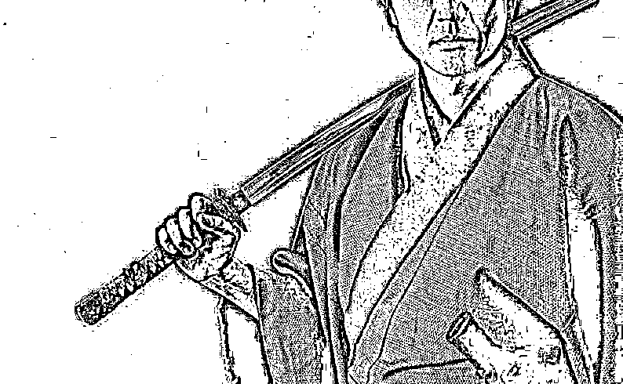

作者/大卫·瑞雷 若道占星创始人

译者/聆宇 Cora
编辑/玫瑰 图片/全景网

本文节选自大卫·瑞雷著作《一生的旅程》 

今日头条中，大卫老师为我们剖析了摩羯座的全方位特性。在这篇文章里，大卫老师将带我们深入摩羯座的内心世界。“每个月都有那么几天，抑郁、压抑、怀疑世界。”摩羯座的周期性抑郁如果处理得当，他们将会是最成功的领导和父母。具体该如何操作？大卫老师的详细指南一定要看一看！

**摩羯式抑郁**

在我的占星实践中，遇到过相当多的摩羯座客户，就是因为**人生早年的困难事件而导致他们的太阳能量被阉割或严重受阻。**通常这类客户的太阳都有很强的相位，比如**合相、四分相、对分相**（相位是指，在 360 度的黄道圆周上，不同的行星或关键点之间所成的几何角度关系）。在几乎所有案例中，**野心和抱负都受困于一些负面的信念而无法表达，这些负面信念来自童年和青春期时经历的痛苦。**这种信念系统不仅**瓦解了想要有所成就的动机**，还常常会**降低他们的责任感**，**削弱自律意识和做计划的能力**。**缺乏自尊，懒惰，总是闷闷不乐**的态度，成为这一类摩羯座人的特征。不过，在每一个此类案例中，我都会发现，这些“摩羯式抑郁”的症状是可以被治愈的。“摩羯式抑郁”的核心是一个**信念系统**，在这个系统之内，**成功被认为是不可能达到的**，所以“何必找麻烦呢？”这种情况下，这些摩羯座会将自己视为**“失败者”**，虽然有些人会试图掩盖这一点，故作姿态，假装对成功不屑一顾，就好像厌倦了这个世界——这个他们口中**堕落、可悲、无望**的世界。

许多年前，一位年轻的摩羯座女士来找我咨询，是她的一位朋友为她支付了咨询费用，敦促她来见我。我对她的前期了解仅限于知道她在一家相框商店工作，拿着最低工资，以及她之前曾从大学辍学。

她无精打采地坐在我对面的椅子上，看起来已经被生活击垮了，几乎不能跟我有目光接触。“我知道你是个艺术家，”我以这句话开始我们的谈话。“是我的星图告诉你的吗？”她问，我在她的声音中听到某种坚韧。“嗯，或许是？”我说：“不过这是你朋友告诉我的，她说你在大学时学的是艺术。”“是的。”她耸耸肩，看起来似乎已经后悔来见我了。“你当初为什么选择学艺术呢？”我问。“难道不应该是你告诉我为什么吗？还是你从我的星图里看出那是个糟糕的选择，或者我是个糟糕的艺术家？”我停顿了下，看看她的星图，“事实上，你的星图告诉我，这个人有潜力成为一个艺术家，或是艺术家的经纪人。”听我这么说她一下子笑了起来，她刺耳的笑声吓了我一跳。“真是丰富多彩呀！”她断言，“这大概是这世上我最不愿意去做的事了。”

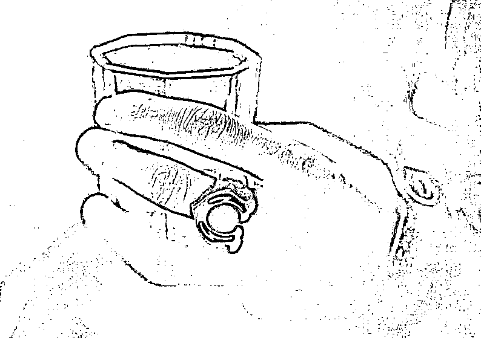

不用说，我依然清晰地记得当时我有多么气馁。那时我才开始占星实践三年多点的时间，之前有六年的学习，面对一位有点不情愿的新客户，确实是个挑战。不过我已经学会相信星图，相信这个过程，所以我决定把球踢回去。“你的父母是艺术家吗？”我问。她很怀疑地看着我，“谁告诉你的？”“没人告诉我，”我说：“但你的星图显示，你的父母很可能都是非常有创造力的人，或是能够以创造力影响他人。”“好吧，确实是，”她如实说：“还能看出什么呢？”“你的父亲可能挣扎于某些成瘾问题……”“这是比较委婉的说法了。”她证实道，现在我赢得了她的关注。那天渐渐展开的故事，令人难忘又悲伤。她的父亲酗酒，还有暴力和虐待倾向。在我的客户 15 岁时她的母亲选择跟他的父亲离婚，但是伤害已经永远地造成。她的父亲有很多次已经就要成为一个真正成功的画家，但他的酗酒问题总是会妨害他获得持久的成功。这位客户说，父亲醉酒后会变得非常暴力，会想要毁掉一切。他们当时住在纽约的一套带阁楼的房子里，她会在父亲酒后施暴时躲起来，等风浪平息后再出来收拾被砸碎的物品和撕碎扔得遍地都是的画作。父亲有时会追打她和她的母亲，对着她们大声尖叫，拿东西砸她们。我的客户说，她小时候会跟妈妈一起，在事后捡起那些被毁坏的画，将它们重新整理，并打扫画室。有一次大约在她 9 到 10 岁的时候，她在父亲发飙时带着父亲的几幅画躲进了壁橱，不幸的是，父亲发现了她和那些画。父亲当着她的面将那些画毁掉了，她尖叫、大哭，却阻止不了父亲。与这位年轻的摩羯座女士的第一次谈话，开启了我们后面持续多年的占星谘商。渐渐地，她开始更愿意去直面童年的阴影，并接受了我给她推荐的心理医生的治疗。我们的咨询变成了一种衡量她的疗愈程度的参考框架，这个过程中她也越来越能够意识到星图所显示的她的天性和潜力。后来她搬回了纽约，我们开始变为电话咨询。她最终成为一名非常成功的艺术家经纪人，管理着纽约艺术界一些最具天赋的艺术家。她和那位推荐她到我这里来咨询的女士结了婚。她还在业余时间画画，做雕塑，她开心地称之为“忙碌又疯狂的精彩生活”。她现在和多年前我们初次见面时的那个阴郁消沉的年轻姑娘判若两人。她拥有**毫无差错的、平静的自信，她知道自己在做什么，清楚计划的方向。**

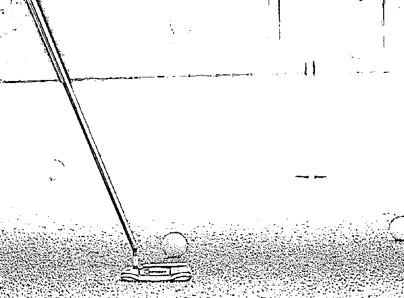

**每个摩羯座都有问鼎成就的潜能**

每一个摩羯座都有问鼎成就的潜能，在通往成功的路上也伴有很多失败。**成功和失败**就是摩羯座硬币的正反面。然而你们必须一次又一次地去使用和消费这枚硬币，才能充分体验到你们追求的东西。对于摩羯座的批评可能包括：**冷酷、严厉、刻板、野心家、攀附权势、利用他人、竞争狂人、为达目的不择手段**，等等。有时的确如此。但这些指责是针对那些**失衡的、极端的摩羯座**。

对任何星座来说，当某种动机走向极端，制造出失衡的情况，都是让人害怕的！对摩羯座来说，这种走极端不仅源于**对失败的恐惧**，更是**内心害怕“成为”一个失败者的深刻的恐惧**。任何让摩羯座贴上失败者标签的信念系统，都阻碍、延迟了他们成就的显现。这种**基于恐惧的信念系统**，必须**被面对和去除**，这样你们的成就潜力才会得到充分发掘。

我接触过的摩羯座人，永远都会超出你的预期，不管他们年纪有多大，或是经历过多少挫折。对摩羯座来说，**成为自己注定要成为的那个人，永远都不晚，事实上很多人随着年纪的增加，会更能够活出自己**。如果你是摩羯座，你需要认识到你对于成功的需求——无论你所定义的成功是什么，然后去成为那个你生而注定要成为的大师。

**摩羯座的事业线索**

你是“臭名昭著”的**事业至上**，所以下面的建议你可能非常熟悉。就像前面说过的，你的主要问题是**害怕失败**。在这一点上你需要**对自己诚实**。关键是要意识到，你害怕失败的唯一原因是，你**疯狂地想要获得成功！**所以，当再有失败的焦虑，或是在压力下感到窒息时，要记住你之所以有这些困扰，只是因为你真的**非常想要成功，**否则就不会有这样的感觉。如果你觉得这些不重要那你就是在骗自己，或者你根本就不是摩羯座。下面是一些要注意的要点：

　　•  明确你的长远目标；

　　•  做计划，并列出务实的时间安排表；

　　•  要对效率和能量进行管理；

　　•  评估你的对手，学习他们的长处；

　　•  认识到落后和失败是暂时的，并且重新安排你的日程表。

或许你看了这些建议后只是冷漠地耸耸肩，想着：“我是成不了什么事的啦，何必这么麻烦呢？”但你猜怎样？转身你就给自己的长远目标做好了计划。任何一个摩羯座都会有**暂时的沮丧或悲观**。事实上，**摩羯座中的一些人可能因严肃保守的举止而让人觉得你们好像不高兴，但其实你们并没有**。

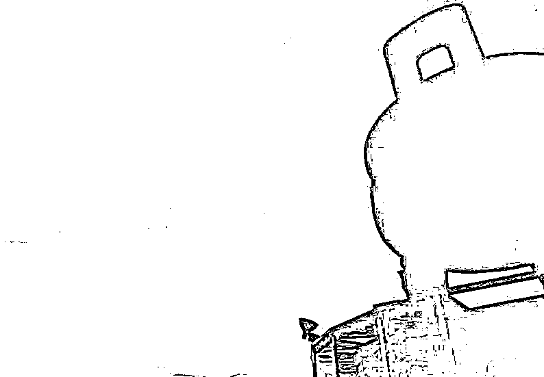

不过，如果有一些负面的模式让你始终在头脑里循环播放“失败录影带”的话，你就需要深入其中，改变故事的调子。谁说你永远不会成功呢？你为什么要相信呢？或者去做做心理咨询！我知道人们不想听到这个，特别是摩羯座！如果你害怕“心理治疗”听起来有些丢人，你可以跟人讲你是去做了“职业咨询”。重要的是去**破除消极的心理机制**，因为那些情绪会破坏你想要努力的意愿，负面的情况想得越多便越容易成真。

当然，没人喜欢活在公司金字塔的最底层，或者是在事业低谷中徘徊不进，这是有身份意识的摩羯座最不想要的！然而，摩羯座更有可能在长跑中胜出，成为**后来居上**的那一方。你们似乎不容易成为少年得志的那一类，有些才能昙花一现的人或者学历更高的人或许会赢在起跑线上。但**随着时间过去，你的效率和勤奋会打动那些既欣赏你的抱负又看到你的努力成果的人**。没有哪个星座比摩羯座更擅长赢得最终的胜利了。毕竟，这就是一场“看谁笑到最后”的比赛，不是吗？

**摩羯座的爱情线索**

虽然很多人会被你有事业心的一面吸引，但他们常常也会抱怨你太冷漠，一心都在事业上。然而，一旦你对某个人做出**承诺**，你那股子**要让关系有结果**的坚定劲儿，绝对会让人印象深刻。这很大程度上取决于你在自己的爱情生涯中所处的阶段。如果你还年轻，还在尝试，那么以下有些建议供你参考：

*   让对方知道可以期待你什么，实事求是，坦诚地去沟通这些问题。这并不浪漫，但是会赢得对方的尊重——这也是一种补偿！ 
*   对于有“征服欲”的摩羯座男男女女来说，注意不要只是因为想拥有同他们睡觉的“身份”而做出承诺！你会有罪恶感，即使你假装没有，而且你可能会在你的手机上屏蔽他们的号码——不止一次！ 
*   因为你有强烈的责任感，因此在做好准备之前，不要不小心让自己有了孩子。如果由于私生活而导致事业受到阻碍或拖延，那会带给你加倍的痛苦。 
*   了解她们的日程安排和生活方式，看看是不是真的适合你的忙碌节奏。 
*   让你们在一起的时间有意义，计划安排一些特殊的活动。比如一起参加电影首映式或去一些能带来身份感的地方游玩。 
*   将你的资金预算发挥最大价值。如果你一直忙于工作，却还没有达到你想要的经济条件，就在现有条件下去计划一次真正不同凡响的约会或出游，利用优惠券或会员折扣等。 
*   让自己看上去很成功！即使你现在还没有出人头地，也要逛逛名牌折扣商店，寻找让你看上去像个成功人士的行头。 
*   不要担心约会时遭遇尴尬或太拘谨。年轻的摩羯座在初次约会时，感到不自在是很正常的。你想要得到对方的尊重，所以害怕出丑！这只是另一种害怕失败的表现。给自己些时间，你会变得更成熟，更能成功驾驭这一切，最终你在社交场合的表现会稳重优雅得多。

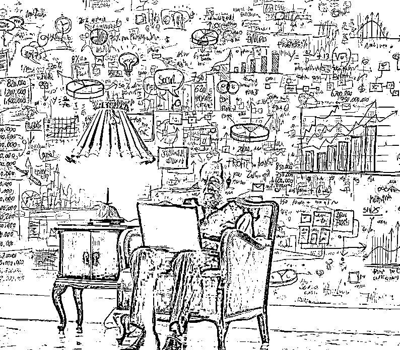

除了个别特例，成熟的摩羯座一般都有**根深蒂固的责任感，天生能够担当**。你想要成功的生活，这通常也意味着**成功的婚姻**——如果你想结婚的话。这取决于你对成功人生的定义。

如果摩羯座的男人觉得自己可以拥有婚外情，家里红旗不倒，外面彩旗飘飘，那你可要三思了。想想老虎伍兹！你会为此大破钱财，那真是摩羯座的灾难。你觉得老虎伍兹真的想失去他的婚姻和家庭吗？这是一个特殊的摩羯座的例子。此外，这个例子也说明，作为名人，**享受特权的同时也要承担后果**。

**如果你还是经常幻想同时拥有很多女朋友，那你还没有对婚姻做好准备**。而且，你会**将离婚等同于“失败”**，所以在选择婚姻伴侣时需要慎重，慢慢寻找。是的，你会被**地位**吸引。你常常会追求那些最美丽、优雅、事业成功的女性。不过，不要因为她们的身份地位就忽视她们的缺点。你真正需要的是一位**同样具有责任感、对婚姻和家庭忠贞不渝**的妻子。

最典型的摩羯式婚姻是**“强强联合”**，是**两个合力向阶层顶峰攀登的野心家**，同时也会确保自己的孩子进最好的学校，成为有上进心和竞争力的人。嗨，不过这些也都是老生常谈了。所有的家长都希望自己的孩子是这样的吧！但摩羯座的家长确实更希望！但不管怎样，就算你的孩子是一个“三倍双鱼座”，在学龄前总是喜欢跑来跑去追蝴蝶，或上课时总是开小差做白日梦，你依然有能力帮他们培养**上进心**。你会想：“爱因斯坦不就是双鱼座吗？他也会做很多白日梦呢！”比较成熟的摩羯座人，天生就知道怎么做父母。这里的关键是，当你们在心里认定了一件对你们重要的事，比如生儿育女，你们一般都会**坚持到底、恪守职责**，比如按时出席跟孩子有关的重要场合，随时关注他们的学业进展。不管你的孩子是什么星座，他们可能都会记住你是一个**不太容易取悦**的人，但你会让他们了解到**成功的意义**，并帮助他们**出谋划策、实现目标**。你的认可会对他们有很重要的意义，因为他们知道，如果连你都喜欢，那他们一定是做得非常不错了！你也确实会随着年龄的增长而变得更加**圆融**，或许会成为一个**很有包容心**的爷爷或奶奶，比你当父母的时候要宽容许多。但就算是在扮演父母的角色的过程中，你也会发现你在变得**更加敏感、感性**。**更多地表达情感，会让你们成为更好的父母**。摩羯座父母的孩子，常常会觉得爸妈太严厉了，有时甚至感受不到他们对自己的情感。摩羯座人会很自然地用**“做事”**来表达关心，会尽力为孩子提供他们需要的东西，但不要忽视孩子的感受，那也很重要。

**版权声明：**文章由作者授权在若道平台发布，欢迎转发，反对抄袭。友号转载请申请白名单。


****想阅读更多作者的文章，请在后台回复******大卫****** 即可。****

**喜欢文章请长按下方二维码打赏**

**给大卫老师加杯咖啡呗~**

**▼**


**想系统学习占星学？**

**点击图片了解详情**


**微信又双叒叕改版啦，不想错过若道君的推送？**

**就把若道设为星标吧！**

**▼**


喜欢记得点一下在看哦☟

********报名直达入口********


# 水瓶座新月 | 大年初一新年好！疫情期间，牢记保护自己与家人

> 原文：[`mp.weixin.qq.com/s?__biz=MzA5NjA0NTAxNg==&mid=2651413062&idx=1&sn=44c7b80b1d5b93ab47abaee821c5dea4&chksm=8b4be8f1bc3c61e79e6a040ff23dc9c34d983fd5862f87d51615fc665a820416dba1d982212f&scene=126&sessionid=1692738222#rd`](http://mp.weixin.qq.com/s?__biz=MzA5NjA0NTAxNg==&mid=2651413062&idx=1&sn=44c7b80b1d5b93ab47abaee821c5dea4&chksm=8b4be8f1bc3c61e79e6a040ff23dc9c34d983fd5862f87d51615fc665a820416dba1d982212f&scene=126&sessionid=1692738222#rd)

**********☆****************后台回复“今日”，给你一句生命态度**********


作者/王芝桦 编辑/玫瑰 图片/全景网

今年的春节与往常不一样，往年伴随着鞭炮声和祝贺声，我们享受着合家欢聚。而今年，2019 年 12 月 8 日，武汉官方通报首例不明原因肺炎患者入院医治，截至 2020 年 1 月 24 日，国家卫健委收到国内 25 个省（市、区）累计报告新型冠状病毒感染的肺炎确诊病例 883 例。1 月 23 日上午 10 时起，武汉市封城。在这样的背景下，此次水瓶座新月又在向我们传递什么信息呢？

**水瓶座新月**

**北京时间 2020 年 1 月 25 日 5:41 迎来水瓶座新月，太阳与月亮精准合相于水瓶座 4°21′。**

中国的农历春节大多发生在水瓶座新月，“辞旧迎新”的不只是时间，更是我们的意识，这与十二星座中“**摩羯座-水瓶座**”的次序相得益彰——**在摩羯座象征的“现实践行”之后，水瓶座提炼出“实践出真知”的智慧**。此次水瓶座新月，按下了“**反思生活模式和重建生态平衡**”的按钮——这个世界更有利于集体，更和谐的共存是什么？每个人更有建设性，更有智慧的生活模式是什么？

> **水瓶座新月重点影响人群**
> 
> *   出生星图中，有**行星、四轴、南北交点**落入**固定星座（金牛座、狮子座、天蝎座、水瓶座）0-21 度**的人群。
>     
> *   出生星图中，有**行星、四轴、南北交点**落入**变动星座（双子座、射手座、处女座、双鱼座）10-19 度**的人群。
> *   出生星图中，有**行星、四轴、南北交点**落入**基本星座（白羊座、巨蟹座、天秤座、摩羯座）0-15,20-27 度**的人群。

**该想想“更好的选择”是什么了**

**孤独是人生中一种自觉的独处，不是惩罚，不是受伤者和患病者的退隐，也不是怪癖，而是作为一个人生活里唯一和真正的存在状态。**

**——马洛伊.山多尔 《伪装成独白的爱情》**

1**天象**

*   **土冥合相**：土星与冥王星在摩羯座的“土冥合相”结构仍处于紧密状态；
*   **天王星四分新月**：行进在金牛座的天王星四分水瓶座太阳和水瓶座月亮。
*   **凯天 30 度**：金牛座天王星与行进在白羊座的凯龙星形成 30 度结构。

**土星定位的“土冥合相”结构“洗牌与重建”的进程，金牛座天王星“不破不立”的动作从 2019 年一路发威进入 2020 年**，现实世界的“淘汰赛”在逐渐抖落浮夸的泡沫，封住捷径的入口，我们开始明白“**精准定位和沉淀实力**”的时候到了——**向精专迈进，向质朴回归**。从 2019 年底到 2020 年春节的这段时间，“土冥合相”结构的影响威力达到巅峰：

*   **年底忙成一陀，职场撕成一片**

*   为钱、为权，甚至为考勤；求生存、求土壤，更为求发展。

*   **爆炸性新闻**

*   天上导弹轰飞机，地上大火射骆驼，全体辞职俄政府，华为出征英网络。

原本春节是亲朋欢聚和纾解疲惫的心情的时刻，但是两组与“金牛座天王星”相关的天象结构却让我们发现这个春节真的没有那么平静：1 月 17 日水星进入水瓶座，1 月 18 日水瓶座水星与金牛座天王星形成“水天四分”结构；1 月 20 日太阳进入水瓶座，1 月 23 日水瓶座太阳与金牛座天王星形成“日天四分”结构。

两组天象结构以“炸雷”的方式触发出“集体性新闻”，也将我们的关注重心转向“集体性事件”：

*   澳大利亚火灾又遇冰雹生灵遭殃。

*   美国爆发 40 年来最大规模的致命流感。

*   东非爆发 25 年来最严重的沙漠蝗虫灾害。

*   国内爆发“新型冠状病毒感染肺炎”疫情。

这个世界似乎正处于“太难”的时间段上，但是，“为什么这么难”呢？现实在提示我们什么呢？

此次水瓶座新月是一次非常“敏感”的新月，因为水瓶座的两颗守护行星也正是“土星和天王星”（土星守护摩羯座和水瓶座），故而“土冥合相”结构和金牛座天王星又一次带着宇宙的揭示向我们呐喊。

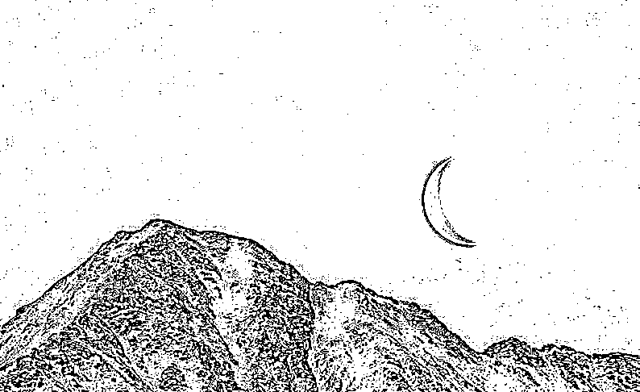

2**土星开始“试炼”的旅程**

土星在 2020 年的行进步伐带有一定的**预示性**：**3 月 22 日土星换座进入水瓶座；7 月 2 日土星再次逆行回到摩羯座；12 月 7 日土星正式进入水瓶座。**2020 年土星在“摩羯座-水瓶座”之间来来回回的脚步正是“洗牌与重建”进程的深入“试炼”——**更具建设性的出路在哪里？****更有利于人类集体的规则是什么？**此次水瓶座新月，“土冥合相”结构仍处于能量巅峰，**冥王星的“手术刀”帮助我们割开表象去探究真相，土星的“现实规则”要求我们面对现实为无序埋单**：这个世界不只有科技还有法则，这个地球不只有人类还有其他生物，我们同属自然界“各安其所”，资源有道，食物链亦有秩序，肆意地砍伐森林或破坏土地，傲慢地发动攻击或掠食生物，并不能证明强大，而只能揭示恐惧。2020 年，土星的“试炼”核心是重建更具建设性的现实规则，更为成熟的集体秩序，这就**需要我们超越个人主义的视角并带着利他主义的意识**——**对自己负责才能对集体负责，只有集体好了个人才能好**。此次水瓶座新月，正值中国的春节假期，也正值疫情的严峻考验，每个人都面临着“自觉独处和无畏欢聚”之间的选择，或许这正是 2020 年“试炼”旅程的开始——**未来我们用什么样的意识和作为来与这个世界互动**？没有人不恐惧死亡。我们无法体会那些被灾难吞噬的人如何在黑暗中挣扎，也无法感受那些坚守一线的医护人员如何战胜自己内心的恐惧，我们只能**尽量地不给他人造成负担，不给自己带来痛苦**。此次水瓶座新月，留些时间并自觉独处，放空疲惫并回归内心，为 2020 年多些思考和多些准备吧。

3**带着觉知做更好的选择**

此次水瓶座新月，“天王星四分新月”结构将天王星的能量点燃，一些习以为常的事物**意外变化**，一直以为没问题的部分**突发状况**，警示我们这些突变的背后其实潜藏着问题，现在是要重新做出选择的时刻，那么有没有**“更好的选择”**呢？**天王星正式行进在金牛座**是在**2019 年 3 月 6 日-2026 年 4 月 26 日**的 7 年时间。一颗慢速行星在一个星座内的行进时间相对较长，这个较长的影响过程也是一次**“成长”**的过程：一开始能量影响**纯粹而猛烈**，我们在还没有适应的情况下就难免**生硬地接招**，做出稚嫩的选择；随着我们逐渐读懂并接纳慢速星行带来的提示，就能在相关议题上做足功课，发展出**更有智慧的洞见**，做出**更为成熟的选择**。天王星**“不破不立”**的变革能量，先进行**“颠覆和割裂”**，才能**“突破和更新”**，但这整个进程也需要拿出较长的时间，经过**反复磨合并现实验证**后才能呈现出**成熟的成果**。2018 年和 2019 年，天王星在金牛座的现实结构和安全模式上大动干戈，颠覆了原有的经济结构和行业格局，割裂了老旧的市场模式和资源平衡，这一系列动作与“土冥合相”结构带来的“洗牌与重建”不谋而合；另外，天王星也在金牛座的自然资源和生存模式上倾入全新尝试，这一次全球灾疫的爆发也将带动更多的人关注地球生态的安全，倡导健康模式的生活。

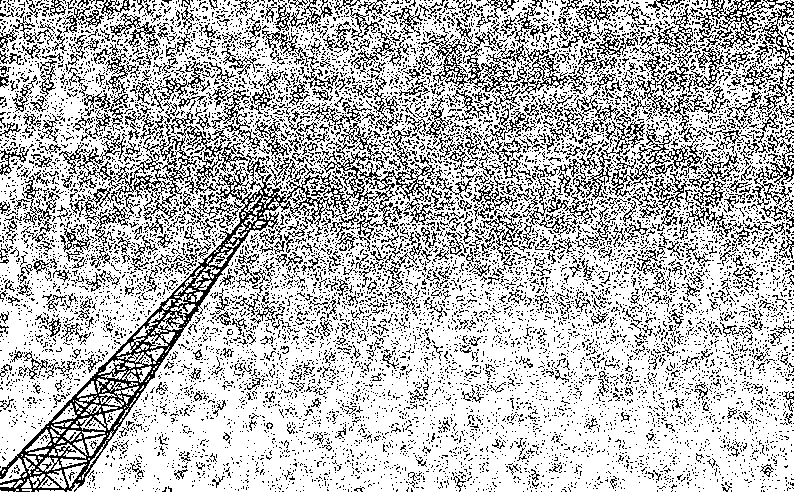

此次水瓶座新月，“天王星四分新月”对此次新月一周前“水天四分”和“日天四分”结构触发出的集体事件带来后续推进，“凯天 30 度”结构则令我们与集体业力的“生命伤痛与竞争创伤”真实面对并寻求疗愈。两组结构触发出两种可能性：

*   **个人层面**

*   一方面带来**超越性的视角和建议设的洞见**，**规划更为远大的人生目标，升起大爱的人道主义精神**；另一方面带来变来变去的风险和我行我素态度，自己将自己的目标推翻，或是做出不合时宜的言行举止

*   **集体层面**

*   一方面带来**集体进程的突破，更有利于集体进程的格局重建，更适用于资源平衡的规则出台**，科技获得全新进展，灾疫获得突破方案；另一方面也激化了集体潜意识中“个人与集体”的业力议题，人际中的冷酷和反叛触发激烈的对抗和尖锐的批判。

行星帮助我们带着觉知去做更好的选择。在这个重要和敏感的时间点，我们**站在未来 30 年全新周期的起点**，经历着人类历史的**演化与巨变**，经验着人类业力的考验与转化，只有更高的意识才能理清这一进程的伟大意义，只有更高的智慧才能缩短这场“试炼”的时间长度。如果我们**有意识地带着觉知去寻找更为成熟的模式和更有建设性方法**，那么这种意识与觉知就能引领我们走向全新的人类文明周期。此次水瓶座新月是**思考“更好的选择”的时候**了。**“无常”说：做这个世界的宝贝**


**假如一个人在生活中连一次都不曾被地震撼动过生命建筑的根基，连一次都未被龙卷风掀翻屋顶的瓦片瞬间卷走一切，卷走此前被理性和个性保持的秩序的话，那么他的生活也太可悲了。**

**——马洛伊.山多尔 《伪装成独白的爱情》**

1**天象**

*   **金海合相**：金星与海王星于双鱼座形成合相结构；
*   **金火四分和火海四分**：行进在射手座的火星四分双鱼座金星和双鱼座海王星；
*   **金木六分**：行进在摩羯座的木星六分双鱼座金星；
*   **水金 30 度**：行进在水瓶座的水星与双鱼座金星形成 30 度结构。

无常从不与我们商量，总在挑战我们的经验，总在撕毁我们“此前被理性和个性保持的秩序”，以此教导我们**“敬畏”和“自律”**。代表“变革”能量的天王星于 2019 年 3 月 6 日-2026 年 4 月 26 日行进在象征“**现实结构和生存安全**”的金牛座之内，在这 7 年之内金牛座的守护行星金星将作为“风向标”接纳并延展着金牛座天王星的能量。金星代表“基于某种价值审美之下的情感网络和人际态度”，既追求“接受与付出”的平衡性关系，也蕴含“嫉妒与竞争”的虚荣性欲望。行进快速的金星作为金牛座天王星的“风向标”，向我们阶段性地呈现出**“现实结构和生存安全的变革”所带来的具体指向和现实状况**，比如经济震荡之下的物价指标和消费态度；生态议题之下的生灵关系和资源竞争......**1 月 14 日金星进入既具有浪漫色彩又容易模糊边界的双鱼座**。双鱼座金星这一组合自然是浪漫时光的指向，但恰逢全球灾疫多发的特殊时期，故而这一组合**激发出人们对弱势群体的大爱之情**，同时也触发出某些商家坐地起价的无底线竞争，另外也令我们透过灾疫事件关注生态环境并反思口欲造业，保护资源平衡并倡导健康生活。

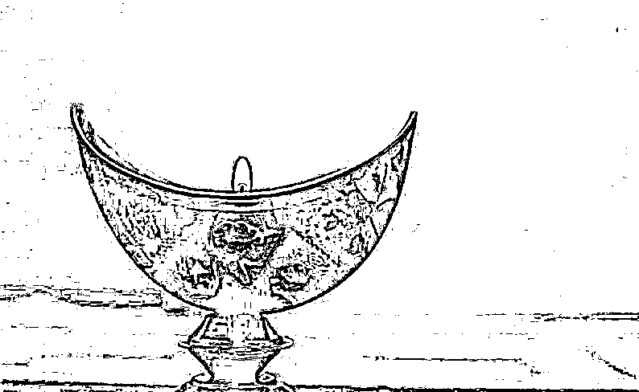

此次水瓶座新月周期，以双鱼座金星为核心的几组天象结构为我们带来宇宙讯息：

*   **“水金 30 度”结构锁定了集体性的新闻消息**，令我们的视野从个人生活转向集体生活；

*   **“金海合相”结构带来宇宙的疗愈能量**，令我们的春节假期从个人欢聚升华到全民大爱；

*   **“金火四分和火海四分”结构告诉我们虽然现实存在困境，但只要我们投入探索就能寻获希望**；

*   “金木六分”结构则告诉我们那些抛开个人安全并投身一线的专家权威和医护人员，他们正在用**最落地的方式和最冒险的行动与灾疫竞争**。

以上几组天象结构最终被双鱼座海王星和摩羯座土星定位，引发我们带着觉知进入新一轮的深思——**重要的不单是“发生了什么”，还有“为什么会如此发生”？**宇宙派遣摩羯座土星用现实手法向我们呈现“**因果不虚**”的法则，也派遣双鱼座海王星用意识之流向我们传递“**道法自然**”的智慧。我们在教这个世界如何看待我们。这个世界不单只有人类，还有万物生灵。**如果我们能将这个世界的万物生灵都当做宝贝，不被欲望左右，不被贪婪控制，不以高端自恋，不以低级分别，那么我们就会成为这个世界的宝贝，这个世界也会把我们当作宝贝**。

2**值得关注的两个时间点**

*   **1 月 27 日-28 日是值得关注的两天**。进展或反复都是过程中必然经历的冒险，但是没有冒险就没有突破的可能性。

*   **2020 年第一波水星逆行将于 2 月 2 日进入前影响期，2 月 17 日开始逆行**。此次水瓶座新月周期内的某些消息可能会出现反转，某些尝试可能会遇见考验，但是前行路上势必要走走停停和检视修整，原地不动或许是不冒险的，但一定是不能完善的。

**此次水瓶座新月，让我们为每个人发出祝愿，为这个世界许下愿景——只要将每个人的祝愿和努力汇聚一起，这股强大的能量一定会被宇宙听见。**

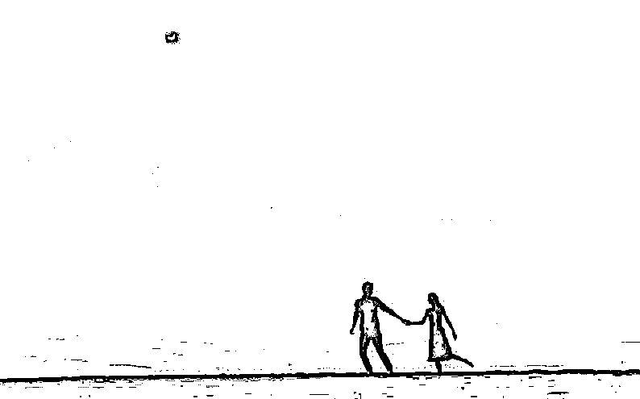

**寄语**

**你是个行者，每天都应前行。你无法预知何时会死去，也不知是否还有足够的时间抵达终点，接近神圣的心灵。所以天天向前，即便受伤，即便贫穷，因为你是行者。**

**————马洛伊.山多尔**我们都是行者，但我们如何能更有建设性且更成熟地天天向前呢？我们从 2019 年一路艰辛走到 2020 年，如果我们统观一下时间线，那么就不难发现宇宙的用意——**考虑自己的出路，关心集体的出路**，这个世界不能再这样“玩”下去了。**此次水瓶座新月，少折腾，多休息，少抱怨，多关怀，回收能量并疗愈心灵，留些时间并自觉独处，因为做好自己就是对这个世界最朴素的爱**。在此，感谢奋战一线的所有专业人士和医护人员，祝福所有朋友携手互助共度险情，乘风破浪驶向福祉。恭祝大家新春吉祥。**新月如何许愿？**

**许愿时间**：2020 年 1 月 25 日北京时间 5:41 后，48 小时内有效、8 小时内最佳。

**许愿人群**：所有人。**许愿数量**：每人最多 10 个。**许愿方式**：静心冥想，身心祈祷或记录收藏。**许愿格式**：请万能的宇宙赐予我能量，我将以我的能量吸引**（什么）来到生命中……**许愿原则**：发心诚善利人。最后，一些关于新型冠状肺炎的小知识分享给大家，疫情状况下，大家宜保持冷静，做好应做的防范措施，愿大家都平安。图片来自于武汉协和医院。

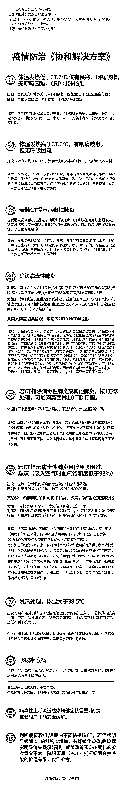

最后再次祝愿大家一切平安！

**版权声明**：原创文章由作者授权首发于若道平台，欢迎转发，反对抄袭。友号转载请申请白名单。

****

****想阅读更多作者的文章****

****请在后台回复******王芝桦****** 即可****

****王芝桦****

心理占星师，统合疗愈师，若道占星“新月和满月”专栏作者

腾讯视频特邀合作占星师

全职于个案咨询与占星教学工作 15 年

**个案预约咨询微信号**：zhihua0621 

**微信公众号**：daoxi-life

**长按打赏**

****

**微信又双叒叕改版啦，不想错过若道君的推送？**

**就把若道设为星标吧！**

**▼**


**点击**

**“阅读原文”**

**获取免费新月报告**

****获取免费新月报告，请点击文末“阅读原文”****


# 12 星座春节“求生指南”在此，助你过个吉祥如意的团圆年！

> 原文：[`mp.weixin.qq.com/s?__biz=MzA5NjA0NTAxNg==&mid=2651413059&idx=1&sn=43a96ef35348c867c27c98353a797b5c&chksm=8b4be8f4bc3c61e2209392bdd2bb14bc682788ffa3ff1f4c2923e2ef06ac5dd196005282e9ee&scene=126&sessionid=1692738222#rd`](http://mp.weixin.qq.com/s?__biz=MzA5NjA0NTAxNg==&mid=2651413059&idx=1&sn=43a96ef35348c867c27c98353a797b5c&chksm=8b4be8f4bc3c61e2209392bdd2bb14bc682788ffa3ff1f4c2923e2ef06ac5dd196005282e9ee&scene=126&sessionid=1692738222#rd)

****后台回复“今日”，给你一句生命态度****

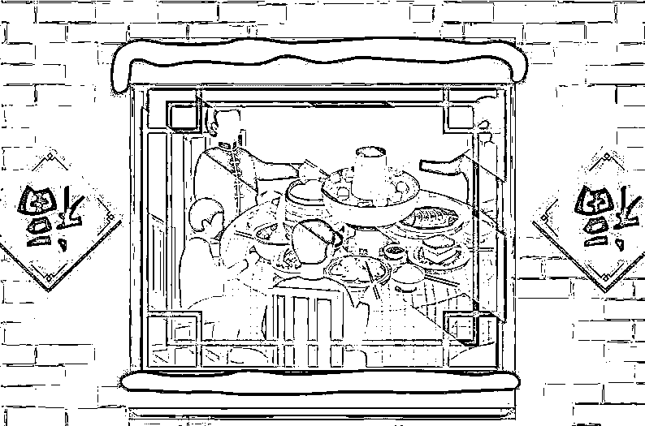

作者/编辑/玫瑰 图片/全景网

距离除夕夜还有 2 天恭贺新禧又到了农历新年，小伙伴们都已经打点好行囊，回到父母身边，合家团聚着准备度过新春佳节了吧！在这里，先预祝大家春节快乐，吉祥如意！说起过年，又期待，又忐忑。总有一些走亲戚、会朋友的场合容易产生“尬聊”。“别人家的孩子”这种阴影哪怕到了三四十岁都还一直跟着，更别提那些热衷于家长里短的三姑六婆，似乎特别关注别人年薪多少，嫁出去否？而随着和亲爹亲妈的相处日子一长，一开始的母慈子孝就成了相看两厌……在这里，为各位小伙伴送上 12 星座春节“求生指南”一份，愿大家都能有一个真正祥和、亲情满满的新春佳节！指南 1：评判少，快乐多很多人从小到大听得最多的就是：“别人家的孩子考试多少分，你……”“别人家的孩子找了年薪 80 万的工作，你……”“别人家的孩子生了龙凤胎，你……”久而久之，但凡听到“别人家的孩子”就特别容易炸毛。仔细想，我们心中也都默默存着**“别人家的父母”**。他们脾气不急躁，讲话不难听，永远支持、接纳、包容，智慧开明又与时俱进……现实中的父母不如所愿的时候，我们也会**失望、愤怒、委屈、抱怨**。于是，两代人甚至三代人凑在一起，互相看不顺眼，都希望对方改变。这种状态在春节无缝相处的过程中特别容易产生摩擦和碰撞。其实，**生活不如意，十有八九是因为你对“理想中的生活”有预设。当现实无法满足预设的时候，便会因为落差产生情绪。**希望父母不再执着于将你改造成“别人家的孩子”，就先停止将他们改造成“别人家的父母”吧。**减少评判，接受对方本来的样子，**是处理春节可能出现的负面情绪的第一步。小妙招

当你开始想：**“他怎么能这样！”**请**用手拍打大腿**。**心中默念：“当下我接受，不评判。”**这个方法很快就能让负面情绪流过。

**越少评判，心情越愉悦。**

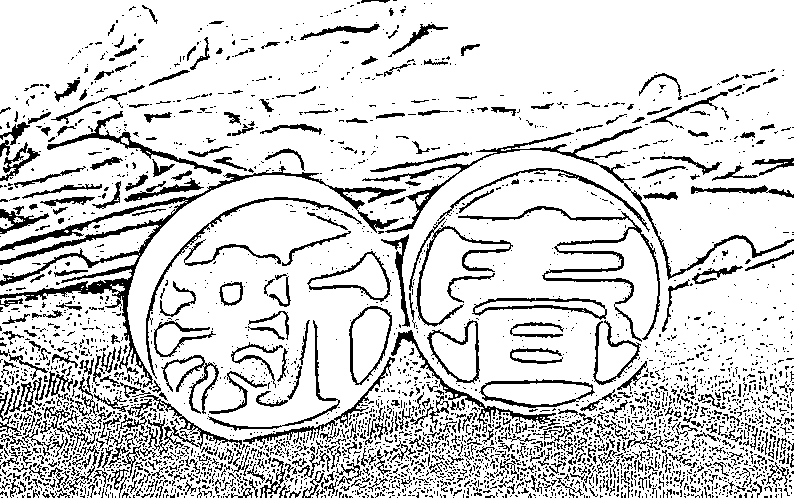

指南 2：先付出，先关爱

做了母亲后，我才明白，**父母永远无法对孩子做到淡定从容**。怀胎十月生下来的小肉团，多少个夜晚的哺育，多少个晨昏的照料，倾注了多少心血，就产生了多少担忧。怕你冷了，又怕你热了，怕你饿了，又怕你撑了……你的一个小闪失，都可能牵动父母心尖儿上的弦。

父母不懂得你的年代，只是按照自己所认为对的、好的、珍贵的，一股脑地，锲而不舍地灌输给你。这种爱过时而笨拙，甚至带有侵略性和压力，的确会令努力发展新生力量的孩子感到无所适从。可这就是亲人的爱。你是否能理解这种爱？源自于你是否能理解自己**内在冲突****的自我世界**。在亲友聚会中感到**陌生、孤独甚至排斥**时，问问自己：**“我真的愿意接纳和爱戴这些亲人么？”**你的困境，只是因为**不愿意同外界融合**。于是浑身带刺，不“顺耳”的关心都当做攻击。在网上流传着很多“如何回怼亲戚问话”的段子，如果大家都这样去做，只能让亲人离自己越发遥远。**缺乏亲人支撑的人生，就像地基不稳的空中楼阁，是很难真正稳固的。****春节是是家族议题集中爆发的时刻，也是唤醒深度家族融合的绝好时期**。这个春节，**先改变自己，付出爱和关心吧。**

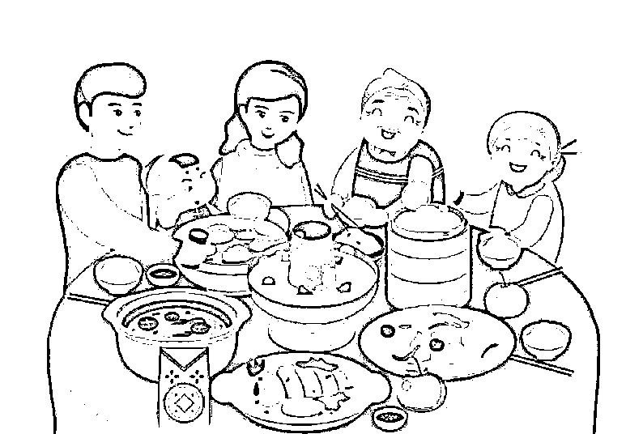

小妙招

**多倾听，多陪伴**

**爱打听、爱说教、爱管事儿**的人，内在非常**渴望被看见**。**遇到这样的父母或者亲戚，与其针锋相对地怼回去，不如沉默一笑，将话题引向她或他的生活。**

如果姨妈问你：“今年怎么还没带个男朋友回家过年啊 ？看我家闺女今年都二胎了。”你可以说：“那您有没有去给她带孩子啊？外孙有很多好玩的事儿您给我说说呗……”**发自内心地倾听，而不是嘴上“嗯”，心里翻白眼。**你会发现，姨妈挺高兴，也不再催促和打探你的事情，因为她的**内心被看见**了，你们的关系就会发生改变。而你也学会了**关照和爱护别人**——对令我们舒服的人表达爱是容易的，但，对令我们感到无奈或者反感的人表达关切才是真正的成长。**拥抱大法**很想对父母好，可说着说着就会吵起来？总是在头脑层面去表达，最后无疑演变成谁对谁错的争锋。这个时候，你们需要的，不是你来我往的言语，而是一个**拥抱**，一个能够把你包裹进去，支撑、安抚、温暖你的怀抱。**拥抱身边的人**。无论父母、亲戚，还是久未谋面的朋友。**两个人真正将身体贴紧，双手从背后环绕对方，将头靠在对方的肩膀上。**尝试去做，你会发现，无需语言，自身的能量就在提升。关系在改变，隔膜在消除，很多问题不需要处理就变得无影无踪。

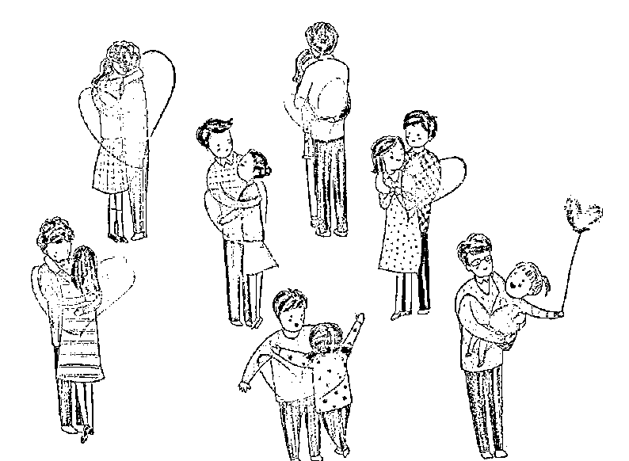

**让别人****比你“重要”**也许有小伙伴看到这里会说：**“凭什么要我先改？”“我心里也有很多苦闷，很多没有被看见的地方呀！”**不知道大家是否注意过，一群人在一起聊天的时候，有些人特别喜欢**插嘴、抢话**。人在抢夺话题的时候，内在的声音是：**“我的事情比较重要”**，也就是**“我比你重要”**。认为自己更为重要的人，会在行止中显得**固执**：**我不能先让步，让步就是认输、受气，就是被欺负。**观察到这一点，我们就能从意识深层去改变：“**我很重要，但你也很重要。我愿意真正倾听、包容、照顾你，把你的重要放在我前面**。”**让别人比自己重要，不是委屈，也不是牺牲，是真正的谦和、慈悲。**种下这颗种子吧，它会**吸引来真正愿意真正倾听、包容、照顾你的人**。否则，你只能生活在都很自我、无法看见对方的人中。指南 3：12 星座春节活动大家庭和睦的一个重要因素就是**各得其乐，各取所需**。在这里，占星学就能发挥它的作用，精准定位，投其所好，达到事半功倍的效果。**家族、家庭、在家里的状态，是月亮管辖范围**。我们可以参考**12 个月亮星座内在的需求**，来制定春节属于你自己家族量身定制的活动（还可以参考下中天所在的星座）。我们先来**查找自己以及父母的月亮星座**，尤其是**母亲**，据我观察，只要把母亲（月亮代表的女性能量）哄开心了，一家都会相当开心……（为爸爸们叹口气）针对下面的描述，看看哪一种方式更加适合你。**如果你的月亮星座同父母的月亮星座产生了紧张冲突（你想旅行，而父母就想待在家里），我的建议是，先行服从父母的需求。**因为我们能够陪伴他们的时间，真的不算多。**与其非要同他们作对、拧巴，不如先臣服、接纳**。家庭序列理顺了，关系真正融洽了，“家和万事兴”，我们的一切也都会跟着顺遂起来的。又及：最近新型冠状病毒肺炎流行，请大家合理安排出行，注意防范，保持轻松愉悦的心态！**月亮白羊座**这个月亮落座**勇敢、急躁而乐于挑战**。在保证安全的前提下，可以**外出游玩**，尤其是**平时没去过的地方**。月亮白羊座的人相对自我，容易和他人产生冲突。如果你的父母中有月亮白羊座，要注意**多让着他们；**如果你是月亮白羊座，则要学习**站在他人的角度考虑问题**。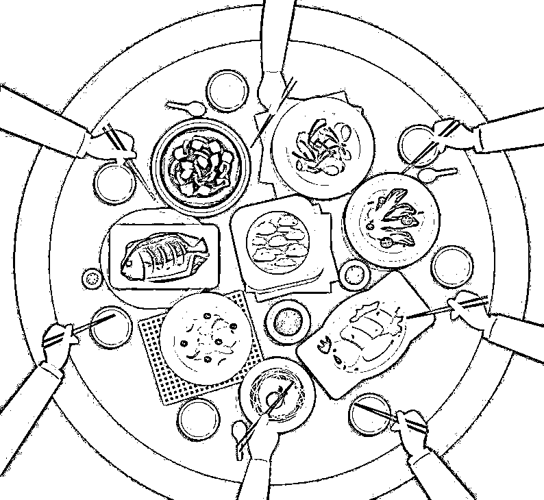**月亮金牛座**这个月亮落座**稳定、踏实，喜欢物质享受**。春节期间，不妨安排一些**安全稳妥**的节目，比如去**性价比高、服务好、环境优越的温泉、度假村**，**大餐享受**也非常重要。但**不要浪费**，否则可能吃力不讨好反而被念叨。**月亮双子座**这个月亮落座喜欢**新鲜事物、八卦**。春节期间，可以安排看**话剧、电影、演出**，或者**团团坐看综艺节目、晚会**等。如果你的父母中有月亮双子座，要**多听少说，满足他们的倾诉欲**；如果你是月亮双子座，则要注意自己**喜欢抬扛而引起争吵**的可能。**月亮巨蟹座**这个月亮落座是月亮回到老家的感觉。春节期间，**一家人整整齐齐吃团圆饭**是必不可少的，饭后**翻看老照片，回忆小时候**也是保留节目。月亮巨蟹座的人对**安全感**需求较高，如果你有这个月亮落座的父母，就**不要安排太多刺激惊险的环节**了，也**理解他们的唠叨和碎碎念以及太多的关怀**吧；如果你是月亮巨蟹座，**宅在家里**过完春节就很好，但其他人想要外出的时候，你也可以配合一下哦。**月亮狮子座**这个月亮落座所到之处必须**闪亮**。春节期间**，“一掷千金”到豪华会所享受或者豪华度假游**都是不错的选择。他们需要很多**夸赞**，这可能也是**最喜欢在亲戚面前“显摆”**的月亮落座了。如果你有月亮狮子座的父母，请记得要**在家族聚会中给他们争面子，也要夸奖他们，不要和他们对着干**。他们其实是**相当慷慨**的父母，一高兴很可能给你一个超大红包；如果你是月亮狮子座，则要注意**不要在聚会中抢尽风头**，留给别人一些表演的空间。

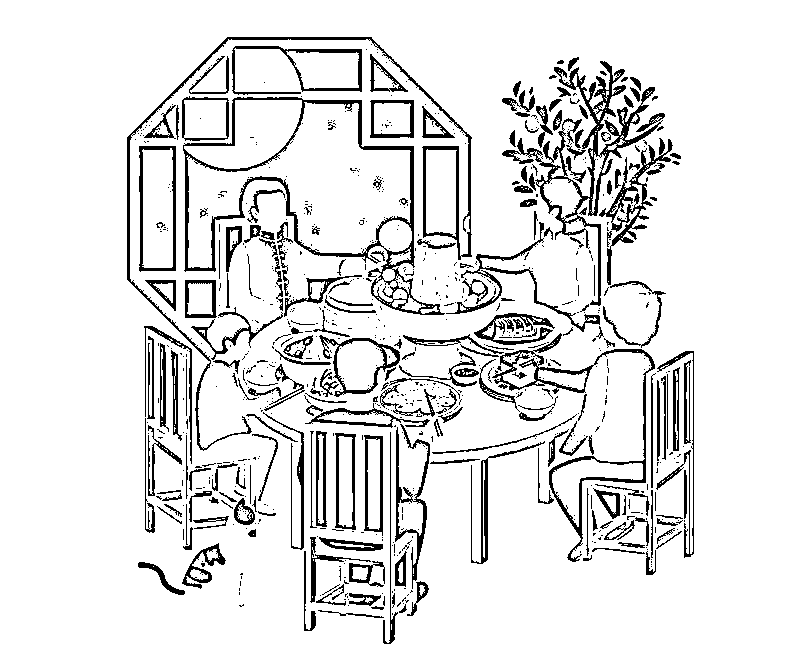

**月亮处女座**这个月亮落座最喜欢**制定计划并且严格执行**。春节期间，无论干啥都谨记要**周密策划好行程，不然很可能因为焦虑而互相指责**。如果你有月亮处女座的父母，要看到他们的**细致入微，服务意识，至于挑剔，就别计较了；**如果你是月亮处女座，要努力**疏导焦虑情绪**，尽量轻松地度过，前文中提到的**“拍大腿”**的方法会特别适合你。**月亮天秤座**这个月亮落座喜欢**轻松、美好的环境，人际的和谐，讨厌竞争和压力**。春节期间，可以到**美丽又不劳累的地方旅行，又或者去优雅的酒吧、餐厅，看场文艺电影**。如果你有月亮天秤座的父母，不妨**请他们为你的房间设计提供建议，又或者带他们去置办一套风度翩翩的行头**；如果你是月亮天秤座，相信你可以成为所有人眼中的“乖乖牌”，但你**是不是真的同其他人贴心，真心地交流？**也许你自己才知道是否有改进的地方。**月亮天蝎座**这个月亮落座的家族中可能**暗流涌动，不露声色但充满冲突和激情**。春节期间，处理**对抗、愤怒、彼此控制等负面情绪，达到家庭成员的深度融合**很重要。如果你有月亮天蝎座的父母，你需要理解他们对你的**爱之深，才生惊恐**。**看见和安抚他们的情绪，多做拥抱的功课**；尽量**顺从**他们对于春节行程的安排；如果你是月亮天蝎座，要在走亲访友的过程中注意自己是否让人看起来有些**“冷漠”**，你不是和谁都能“哈拉”的人，但如果能在亲人面前**袒露自己**，也许会有完全不一样的收获。**月亮射手座**这个月亮落座最爱**自由和冒险，大无畏和运气并存**。春节期间，不妨安排一些**自驾游**，去**郊外、乡野，甚至具有一定“危险系数”的地方，蹦极、滑雪**等活动也十分适合。如果你有月亮射手座的父母，也许他们会把你丢下俩人**出游**……那你就自己找朋友出去 hi 吧；如果你是月亮射手座，可能你也会安排**出国游**，要问问**父母是否愿意同行，或者需要你留在家中陪伴，请尽量服从他们**。毕竟，你的身体和心始终都在路上，并不差这一个星期。**月亮摩羯座**这个月亮落座**缓慢、长久，注重传统文化中的等级观念**，是**不太懂得表达感情但按部就班的孝顺**。家庭在他们心中和月亮巨蟹座一样重要。春节期间，不妨安排一些**正儿八经的走亲访友**，**传统的礼数能**够让摩羯座能量强的家族感觉到**被尊重和仪式感**。如果你有月亮摩羯座的父母，记得要在亲友面前表现得**谦恭，符合辈分礼仪**；如果你是月亮摩羯座，除了给父母买礼物，默默安排行程，忙里忙外之外，多练习**拥抱大法**没坏处。**月亮水瓶座**这个月亮落座的家庭很大可能**不按常理出牌**，家庭序列和成员之间的关系都比较**奇特**。春节期间，**各自在各自的房间，互不打扰**的状态反而很适合。如果你有月亮水瓶座的父母，他们很需要**距离和淡定的内心空间**，尊重这种距离感，让他们感觉你**成熟而情绪稳定，并给予适度陪伴**；如果你是月亮水瓶座，要反观自己的**疏离是否会令家人受伤**，并同他们**解释得当**。**月亮双鱼座**这个月亮落座**缠绵而渴望融合**，通常**同妈妈之间的关系亲密而不分彼此**。春节期间，可以**一家人散步、逛街、互相倾诉彼此的关怀，以及生活中的趣事，温和而浪漫的活动**相当适合。但**不要安排需要太多体能和刺激的运动**，因为双鱼座比较容易累。如果你有月亮双鱼座的父母，他们十分想要同你融为一体的心情，使得你需要**花更多时间陪伴，感受他们起伏的情绪**，但是同样，他们也会给你**无条件的关怀和包容**；如果你的月亮在双鱼座，要注意自己**容易走神，不在状态**，尤其是在重要的聚会中，这样会令人感觉你**心不在焉，而产生误会。**最后，祝所有小伙伴们都能在这个一年一度的节日里收获真正的亲情，在家中充电满满，热情洋溢面对未来的旅程！

**版权声明：**原创文章由作者授权发布于若道平台，欢迎转发，反对抄袭。友号转载请申请白名单。

****

****想阅读更多作者的文章****

****请在后台回复******玫瑰****** 即可****

**玫瑰**

英国 Cass Business School 管理学硕士

若道 2015 届核心课程毕业生，若道微信公众号兼职编辑

占星师，咨询时长超过 1000 小时

**个人微信号：**stillrosy

**公众号**：still__Queen 

长按二维码，给作者打赏


**想系统学习占星学？**

**点击图片了解详情**


**微信又双叒叕改版啦，不想错过若道君的推送？**

**就把若道设为星标吧！**

**▼**


喜欢记得点一下在看哦☟

********报名直达入口********


# 新春大礼 | 巴厘岛游学，跟随阿兰·欧肯开启神秘之旅！

> 原文：[`mp.weixin.qq.com/s?__biz=MzA5NjA0NTAxNg==&mid=2651413059&idx=2&sn=52028e5b75cdd27e762b866986a76d88&chksm=8b4be8f4bc3c61e28e43f849a4d529847e016a22226b9412d6a5f28b56a8e9cbdfde5539c51d&scene=126&sessionid=1692738222#rd`](http://mp.weixin.qq.com/s?__biz=MzA5NjA0NTAxNg==&mid=2651413059&idx=2&sn=52028e5b75cdd27e762b866986a76d88&chksm=8b4be8f4bc3c61e28e43f849a4d529847e016a22226b9412d6a5f28b56a8e9cbdfde5539c51d&scene=126&sessionid=1692738222#rd)


出发这件事常常会令人想起电影《美食、祈祷与恋爱》中，巴厘岛的巫医 ketut 递给女主 Liz 一幅画，并赠予了解读：

要脚踏实地，你就会感觉有四条腿，你就能在这个世上安稳下来；还有，不要用脑子看待世界，要用心去看，那样你才会了解上帝。

世间有太多纷繁复杂的事情我们要分析整理，反而忘却如何遵从心灵的声音，比如为了爱其他人而让自己的生活失衡；比如收藏了所有国家地理杂志的旅行专栏，最后哪里也没有去。偶然听到心中真实的声音，嘈杂的人生又容易失去相信自己的勇气。

幸好这世界上还有**巴厘岛**。


|  电影《美食、祈祷与恋爱》巴厘岛剧照

巴厘岛人说：“我们就站在世界的中心，我们就是世界的中心。”巴厘岛是一个充满灵性色彩存在的岛屿，在这个 5620 平方公里的岛屿上，散布着大大小小千余座印度教神庙，印度教思想、大乘佛教、传统的湿婆崇拜与岛上淳朴的自然崇拜、祖先崇拜交织在一起。巴厘岛人相信万物有灵，他们的生活沉浸在浓厚的神秘氛围中，他们相信自己脚下的土地是世界上最美的国度，是“世界的中心”。这座岛屿在 21 世纪的现代生活中成为一个特别异类的存在。而阿兰·欧肯，这位 75 岁深耕占星学和神秘学领域的老师，在多年前离开美国，在世界各地旅行之后，为这个岛屿独特的人文和场域所深深吸引，最终选择在巴厘岛定居。虽然阿兰·欧肯老师以占星大师身份为广大占星学子所知，但其实他更有许多神秘的古老智慧、实用的宇宙法则愿意传承，这对于我们的意识进化之旅将带来绝对深刻的了解和体悟。
**5 月 3-13 日**，阿兰·欧肯老师邀请你来到他的定居地——巴厘岛，开启这次意义非凡的巴厘岛神秘之旅，内容包括**3 日半阿兰·欧肯老师的神秘学工作坊**和穿插于其中的阿兰·欧肯老师为大家精心挑选的**巴厘岛神庙之旅**，阿兰·欧肯老师将带领大家，在理论学习的基础上，接触、感受巴厘岛的神秘之处，深入接触、体验古老智慧。****


巴厘岛游学**1****位宇宙级导师****11 日 10 晚****游学，含**3 日半****工作坊****** “****心灵成长****+****文化探秘****+****生活美学****”****若道首团游学探秘之旅****一次性满足你的所有新年跨国愿望！**

📹 [`v.qq.com/iframe/preview.html?width=500&height=375&auto=0&vid=b3041y0qg4q`](https://v.qq.com/iframe/preview.html?width=500&height=375&auto=0&vid=b3041y0qg4q)

|  阿兰·欧肯老师的巴厘岛故事

1**工作坊主题****“觉醒的头脑和心灵的实际运用”——疗愈、合一和意识发展的****22****条法则和原理**本次工作坊，阿兰·欧肯老师将带领大家进入他数十年修行的智慧世界，探讨 22 条宇宙法则，并审视如何将这些原则应用在我们的日常生活中。**工作坊具体内容，请咨询课程顾问王老师（微信：18510107057）****注意****：本工作坊不是占星工作坊，对神秘学感兴趣，没有占星基础的朋友也可以参加。****游学全程领队导师是阿兰·欧肯，并配有最专业的中文翻译。**
2**具体日程安排****游学时间：2020 年 5 月 3 日-5 月 13 日****地点：印度尼西亚 巴厘岛**

*   ### 5 月 3 日 游学集合：入住巴厘岛乌布斯塔拉翠贡精选酒店 


*   ### 5 月 4 日 上午水神庙、Pacung 午餐、下午海神庙；**晚上在斯塔拉翠贡精选酒店集体晚餐**


| 水神庙

 


|  Pacung 午餐


|  海神庙

*   **5 月 5 日 上午半日工作坊学习，和阿兰·欧肯老师一起冥想；下午到圣泉——巴厘岛的神圣净化池**

 


*   **5 月 6 日  半日工作坊学习、自由活动**

*   **5 月 7 日  半日工作坊学习，游览象窟——巴厘岛唯一的石窟寺院遗址**


 

*   **5 月 8 日 巴图布兰寺、著名的荷花咖啡厅午餐、塔曼阿云寺**

 


*   **5 月 9 日  全天工作坊学习**

*   **5 月 10 日  前往努沙杜瓦酒店 **


*   **5 月 11 日  全天工作坊学习**

*   **5 月 12 日  海边自由活动，晚上巴厘舞蹈表演**

 


*   **5 月 13 日  前往机场回家 巴厘岛游学圆满结束**

3**适合人群**

*   占星老学员，是时候补给宇宙智慧的你

*   灵性爱好者，擅长获取各类宇宙能量的你

*   文化探迷人，有机会零距离体验异域神秘学文化的你

*   旅行达人，不错过任何一次伟大旅程的你

*   巴厘岛狂热迷，去过巴厘岛无数次的你

*   没有任何原因就是被吸引很想报名的你

**注****：****本次游学无需任何知识基础皆可报名**

4**游学费用****费用：25800 元****此游学价格为****整体报价，不拆分****。****注意**: **因为该游学需要安排酒店、交通事项较多，因此****一旦缴费后，不再退费**。


**费用说明**

**游学费用****包含**：

3 日半“觉醒的头脑和心灵的实际运用”工作坊学费

5 月 3-12 日的巴厘岛住宿费

游学中的大部分餐费

巴厘岛集体活动时的交通费

游学涉及的所有景点门票

5 月 12 日晚的舞蹈表演

境外旅行意外险

**游学费用****不包含**：

学员从国内往返巴厘岛的交通费

巴厘岛岛内自由活动的交通费

以下自由活动的餐费自理：5 月 3 日到达日午餐、5 月 6 日自由活动晚餐、5 月 8 日晚餐、5 月 10 日前往努沙杜瓦酒店的午餐、5 月 12 日海边自由活动的午餐

**住宿说明**：

乌布斯塔拉翠贡精选酒店豪华房 Deluxe room（5 月 3 日晚-5 月 9 日晚共 7 晚）和努沙杜瓦酒店豪华房 Deluxe room（5 月 10 日-12 日，共 3 晚），标准为 2 人一个房间


5**导师介绍**


**阿兰·欧肯（Alan Oken）**

 

世界顶尖占星师

智慧学院（Santa Fe, NM）主任

澳大利亚意识发展研究所的联合创始人

翻译、教师、全球旅行者和国际导游

阿兰·欧肯，1944 年出生于美国纽约，在纽约大学主修罗曼斯语言和语言学。出版过十几本著作，比如《灵魂占星学》《星图中的守护关系》《阿兰·欧肯完整占星学》。他用 5 种语言授课，用 7 种语言解读星图。

6**退转课程**

**因为该游学需要安排酒店、交通事项较多，因此****一旦缴费后，不再退费****。**

****巴厘岛游学****

**领队老师&工作坊授课老师：阿兰·欧肯**

**游学时间：**2020 年 5 月 3 日-13 日（共 11 日 10 晚）

**游学地点**：印度尼西亚 巴厘岛

**游学方式：**巴厘岛探秘之旅+3 日半工作坊，游学全程由阿兰·欧肯领队，并配有最专业的中文翻译。

**费用：****25800 元**

**课程负责人：**王老师（微信：18510107057），请备注“巴厘岛”

长按二维码添加课程负责人咨询~


****报名请点击“阅读原文”****


# 这辈子还能找到灵魂伴侣吗？读懂这个宫位，你就知道了

> 原文：[`mp.weixin.qq.com/s?__biz=MzA5NjA0NTAxNg==&mid=2651413025&idx=1&sn=5b68010041e51afd79b93597205a1435&chksm=8b4be896bc3c6180e02f60a8e8feefea73d405837f8ecb4deec1de34d8931663bcbfd7b174f8&scene=126&sessionid=1692738222#rd`](http://mp.weixin.qq.com/s?__biz=MzA5NjA0NTAxNg==&mid=2651413025&idx=1&sn=5b68010041e51afd79b93597205a1435&chksm=8b4be896bc3c6180e02f60a8e8feefea73d405837f8ecb4deec1de34d8931663bcbfd7b174f8&scene=126&sessionid=1692738222#rd)

**☆ 后台回复“今日”，给你一句生命态度**


作者/达娜·格哈特 译者/葡萄园的女巫

编辑&校对/Tang 封面/书君 图/unsplash

我们总是对灵魂伴侣耿耿于怀，几乎每个人都迫不及待地想要找到那个对的人。而第七宫，代表了我们的伴侣、婚姻，是人生非常重要的部分，也是广大占星学子最感兴趣宫位之一。我们为什么要寻找灵魂伴侣？我们真的能找到灵魂伴侣么？看它就对了。

**我们为什么要寻找灵魂伴侣？**在写关于第七宫这一篇时，我有点不自信。第七宫暴露了我一个罪恶的秘密，我并不相信灵魂伴侣。找一个注定与我完美结合的人就像找一只麒麟或者是格里芬。 这是一个危险的观点。大多数人咨询占星师是希望听到关于他们灵魂伴侣的好的信息，例如，我是不是就要遇到我生命中的挚爱了？我担心我在这一点上观点是错误的，但是我能理解**为什么人们寻找灵魂伴侣**。**第七宫，这是我们渴望并接纳其他人的地方。**我们争取和谐，一对一的，不仅仅是和一个人，而是和很多重要的其他人，就像老师、辅导员、同事、爱人。我们可以和这些人共舞一会儿一季或者永远，但是**通过他们我们活出了自己，他们驱使我们成长**。**通过第七宫我们变得更加完整。**听起来是不错，但实践中往往伴随痛苦，因为**第七宫不仅仅是一个舞台，更是一个剃刀，磨平了我们性格边缘的棱角。**在占星学中，**伴侣宫第七宫正好与自我宫第一宫相对。这也就是为什么第七宫同时象征公开的敌人和我的“真爱”。**很不幸，很多真爱最后都变成了公开的敌人。如果那个所谓的像田园诗歌一般的伴侣恰好和我们一样，那个人恰好和我们一样喜欢鳀鱼三明治、讨厌《指环王》、欣赏意大利大理石，并且不畏惧我们的情绪，当别人都无法了解我们时，就他懂我们。如果因为这些原因我们以为他就是灵魂伴侣而想把他拿下，那这可是个冒险的行为。因为不幸的是，我们往往因为同样的原因憎恨我们的伴侣，而结束这段浪漫的爱情童话。

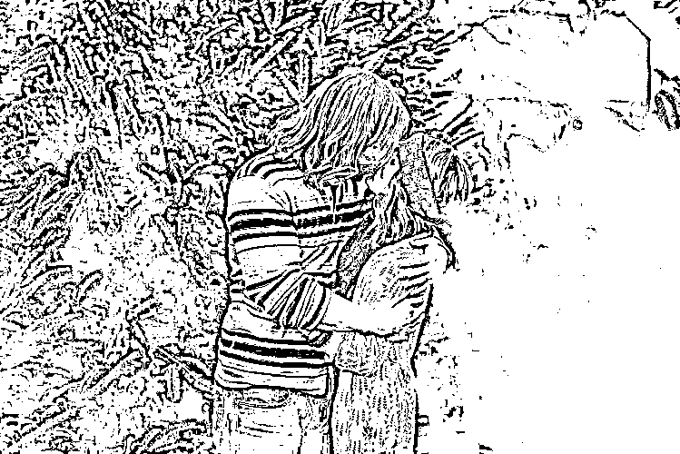

**但是为什么会这样呢？**这都要从**上升星座说起，我们最初的面具**。这是在初期的环境中，我们扮演的最好的角色。它代表了我们的一部分，但不是全部的潜能，它划出了一个有益的边界（我就是那种会做这件事，绝不做那件事的人）。当我们构建我们自己的故事时，**对于那些不符合我们上升神话的素质也需要做些什么，我们把这些放在了第七宫，以后再去满足这个需要。**这样的安排让我们深深地渴望重新找回那些曾经在不经意间失去的一切。**有些人具有我们被压抑部分的特质，当他们出现时，我们便感到了不可思议的强大吸引。但当我们更多地了解他们时，他们又不可思议的变得不那么有魅力了。**我们固有的阻力开始出现。

*   （上升）金牛座先生最初被天蝎座（金牛座的对宫）爱人的神秘和深沉吸引，现在却惧怕她们骇人的黑暗；
*   （上升）摩羯座小姐为她的巨蟹座（摩羯座对宫）王子深深心动，直到有天她发现，王子变成了一只贫困且幼稚的青蛙。哎呀，我怎么跟这么个穷光蛋在一起。

我的上升处女座不可救药地爱上了双鱼座，我吸引了诗人、精神追求者、音乐家，我们住在了一起，事情发生了巨大的改变。突然，完美先生变成了一个失败的空想家，混乱、不切实际、模糊不清。当你查看每一对伴侣的星图，你会发现每一个人都会有一些行星或者是符号与另一伴的第七宫有关。这就是吸引。**一个很好的经验法则就是，一旦某个人和我们之间有了强烈的感情吸引，对我们产生了影响，那么他就是在无意识的与自己的第七宫的影子共舞。**运用你的智慧，收起你的牢骚，学习解决这些问题，它们会激活你内心的特质。当然这样就没有了愤怒的乐趣，但值得努力。你可以**为你更深层的苦难——内心的平衡而做出努力**。

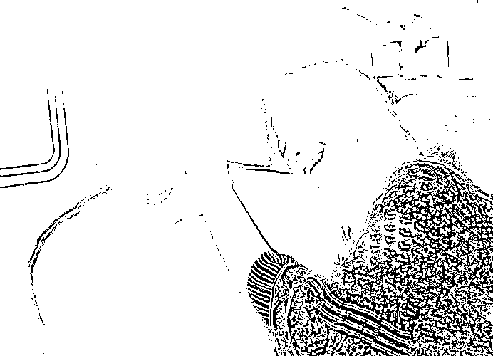

**究竟什么才是灵魂伴侣？**回到我自己的问题，我在双鱼座的身上看不到任何共同点，我是处女座，善于分析、有组织、有效率。但是**透过伴侣各式各样的缺点，我也看到了我隐藏的一面。**想象一下，我发现我也可以是健忘的、虚假的、逃避现实的。现在接受我的伴侣就变得容易了。而且接受我自己内在的双鱼座一面也一切变得更积极。我现在变得更轻松自在，更平和。或许，我的伴侣罗伯特就是我最终的灵魂伴侣。**如果有灵魂伴侣，或许是指一些驱使我们与自己遗忘了的那一部分灵魂结合的人。**第七宫还有很多信息，比如宫主星。**宫主星的落点往往显示了这个人感情生活的中心或者反复出现的主题。**如果一个人的第七宫宫主星落入掌管事业的第十宫，他也许通过他的婚姻获得工作的邀约，或者与伴侣合伙工作，或者一直单身嫁给了她的终身事业。我的第七宫宫主星——天枰座海王星落在了掌管金钱的第二宫，我倾向于将我的财务关系私人化，或者私人关系金融化。当我遇到浪漫的婚姻时，我喜欢说：“亲爱的，我们可以一起存钱买房子了！”在这个梦想中我的两段长期的感情关系飞速发展然后瓦解。**海王星像一个魔术师，它像变魔术一样增加了我的存款，但却瓦解了我合作伙伴的资金**，现在三个人都濒临破产。

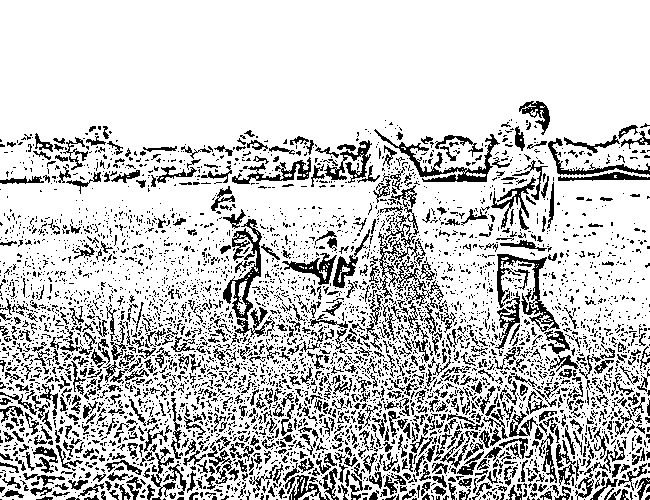

**原生家庭有怎样的影响？**金钱曾经是我父母婚姻的中心问题，他们经常为此争吵。我父亲花钱如流水，我母亲却能妙手生金。直到最近我才发现，我的第七宫头与我父母的星图有 6 颗行星是对分的。一直以来，我都像一只小鱼，被我父母这一对捕鱼者扔进了迷茫的海里。**这些早期的神（父母）在我们无意识的国度里的影响力就像宙斯夫妇。**我们可以从出生故事中窥探上升的密码，我们也可以从婚姻的神话中阐述下降点的秘密。这是我父母婚姻的故事。海王星声称他们已经知道爱情的快乐。他们结婚离婚又复婚，我父亲离开我母亲在我 8 岁时，我母亲离开我父亲在我 14 岁时。在那之后他们又在一起了，一起购房，时常住在一起，最近又一起进行奇怪的商业合作，在同一个城市里分居两屋。我绝对不愿意去重复他们的不快乐，但是我的感情关系也同样不稳定。关系终结事件不时的发生，与我父母的关系一样。第一次在 8 年以后，第二次在 14 年以后，和我母亲一样，第一次是我被抛弃，第二次是我离开。现在，我拥有一段“LAT”的感情关系，这是我的朋友给欧洲人的建议，“分开同居（living apart together）”——分开住的感情关系。她说这是欧洲的新时尚，事实上我更了解，这就是我父母在后来这些年的关系模式。

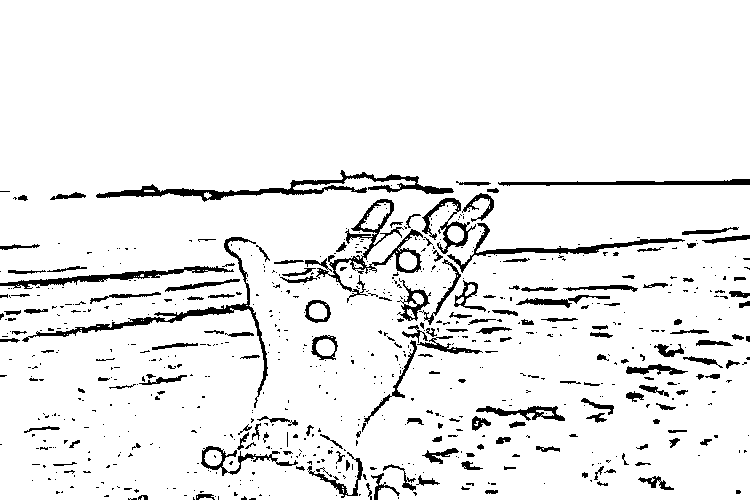

**除了情感关系，这里还有什么？****第七宫不仅仅只是告诉我们感情关系的问题**。有趣的是，它一样能描述任何我们有兴趣的、过往的其他关系人，这一点不论是现代还是古典的占星师都同意。比如对我来说，那些潜在的咨询客户就是很重要的“关系人”。很少有占星师把开发客户与第七宫联系起来，这更偏向于是关于第十宫的市场营销的挑战内容。但这不也是人与人之间关系的一种么？我从事占星的第一年是非常冷清的，如果 6 周内电话响了一次，那就算繁忙的一个月了。我刊登了广告，但是做的不是地方。现在想想，问题就出在我的第七宫**。我还没有准备好去面对这样的合作关系。表面上我希望有客户上门，内心里我却感到害怕，**我不知道他们会需要咨询一些什么内容。不管是什么，我都觉得我不能满足他们的需求。**我的抵抗心理大于我的渴望。**与此相同，占星师预言会有一段新的恋情出现，但是客户却抱怨根本不准。我知道这有点像给失败的预测找借口，但是我敢打赌，这位客户在他的第七宫上挂了一个牌子写着“禁止入内”。我决定只为那些我认为能像朋友一样相处的人做占星咨询，一旦做了这个关键的决定，我就开始吸引越来越多的客户了。这看起来只是减弱了我的恐惧，但是事实上，这精准地表明了谁的出现。这些年来，我发现了另一个很奇怪的现象，大部分我的客户们都具有很强的直觉。这正好符合了海王星的特质（我的第七宫宫主星）。**第七宫显示了我们吸引的人群的类型，还有我们会面的目的。**我逐渐调整了我的做法，以帮助这些具有很强直觉的客户们找出他们已经知道的。我们一起探究他们的感受、下意识的行为和他们丰富的想象力。总而言之，我们进行了一个海王星方式的茶会。我准备好杯子，他们带来了茶叶。

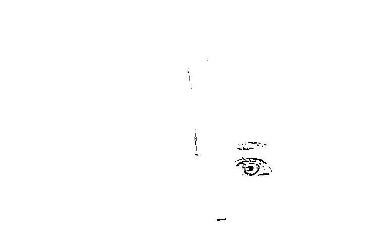

**透过他人的眼睛，寻找完整的自己**妲娜的上升在射手座，哲学家、小丑、假装无所不知的人，可她的第七宫并没有装满她喜欢的那些特质。记者、八卦消息、传媒工作者，这些与她第七宫双子座有关的特质，她都在她最亲近的人身上看到了。妲娜父亲在她很小的时候就去世了，对于父母共处的记忆只有一点点。但是她记得那些抚慰她入睡从楼下传来的声音，那是双子座最美妙的催眠曲——父母坐在楼下厨房的桌边，**轻松地交谈，**并时时传来笑声。有一个夏天，妈妈带着妲娜和兄弟姐妹去度假，爸爸留下了看庄稼！很多年以后，妲娜偶然发现了那个夏天**爸爸写给妈妈的信，美好的、充满感情的、有趣的信。**就是那种你写给你最好朋友的信。她落在**第七宫头（下降点）的双子座意味着她对婚姻的期望是：“伴侣要是我最好的朋友和知己。”**妲娜和丈夫的关系就是建立在长时间的喝咖啡聊天之上。**事实上，所有她生活中重要的关系都可以追溯到双子的特质——交谈。**但是最终神话还是终结于不幸（**妲娜第七宫的月亮被冥王星四分**），有一天，宙斯弄来了一堆乌云，他离开了他最好的朋友伴侣赫拉（或者死于车祸，就像妲娜父亲）。当你还年轻并且敏感，遇到这样的状况该怎样面对呢？妲娜选择将这些浪漫的关系设定一个内置的时限。“噢，他要去坐牢了。”“他比我老很多岁，所以会先我而去。”**你看，我可以掌握离开的计划。她感到一种控制**（这同样是月亮和冥王星的四分相位带来的影响）。她浪漫的计划很轻易就实现了，因为她父母就是这样的状况，这些人的离开都是你计划内的。当妲娜最终遇到她的挚友知己，马上就陷入困境，因为她不愿意他离开，但是另一方面，他却没有一个确定的离去的时限。妲娜被这失控的状态吓坏了。**为了幸福的婚姻，她必须学会战胜她对于分离的恐惧，学着相信并爱着没有确定离开时间的人。**

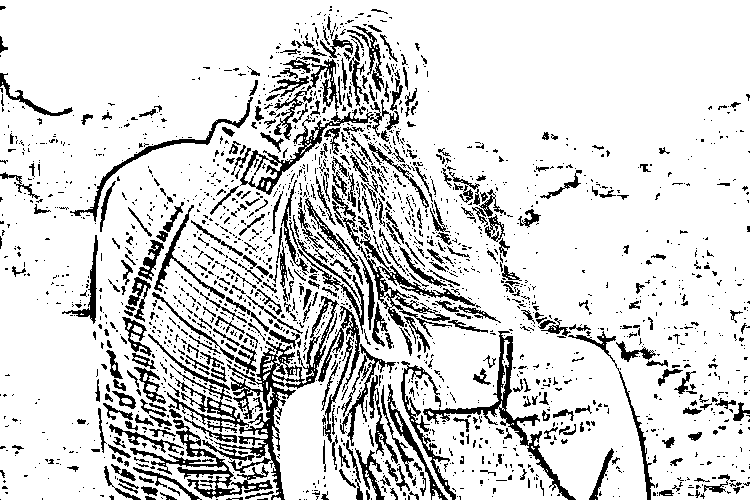

有理论称第七宫描述了我们的伴侣，但我并不完全赞同这一点。我认为**第七宫**还有另一层的含义就是**它描述了当其他人进入我们的生活，不论是亲密的关系还是敌人，我们提供给他人关系互动的环境。**

**一旦有人进入了我们的第七宫（不论是伴侣、生意伙伴、致命的敌人），他们就将体验到我们与平时十分不一样的特质，与我们上升星座表现出的不同的个人特质。**细细研究那些被我们丢弃的梦想、激情和人格特质，第七宫就像一面镜子告诉了我们这些。**然后将第七宫的特质和上升第一宫的自我相拼合，才是完整的我们。 **

**古典占星学里土星在第七宫是耀升的位置，这表示我们要为创造一个我们想要的第七宫环境负责任。**但是令我们沮丧的是我们总是一次又一次的撞向同一个设在我们建立满意关系道路上的阻碍。这是一种疯狂的感觉，无论你怎么努力去改变，注定要重复同样失败的关系模式。接受那些挑战，调和我们与第七宫影子的关系，我们坚信，其他人验证了我们的信念，宇宙正在赐予我们力量。

**第七宫并不是简单的解读为去寻找另一半，更恰当的说是，透过这个宫位让我们通过他人的眼睛找到我们自己。**

**关于第七宫，关于亲密关系**

**你有什么想说的？**

**留言区等你**

”

**版权声明：**本文由若道翻译发布，欢迎转发，反对抄袭。友号转载请申请白名单。


**达娜·格哈特**

一位国际范围内受尊敬的占星师。她为众多占星学网站和出版物讲课、写稿。她在十二宫的月亮激励她对这颗发光体进行了深刻而持久的探索研究。

******点击图片查看若道君推荐******


**微信又又又改版啦，不想错过若道的推送？**

**就把若道设为星标吧！**

**▼**


就是这个“在看”，戳戳戳 ☟

**报名直达入口**


# 雷蒙德·梅里曼金融占星周运 | 市场可能短暂出现高点

> 原文：[`mp.weixin.qq.com/s?__biz=MzA5NjA0NTAxNg==&mid=2651413025&idx=2&sn=65ee9dc2dc80b4b31ade2795a5d07f29&chksm=8b4be896bc3c6180e0668b1ca5e2b0063a89bdca81db7f6b1ec39c42a7c4327f7c0d4ebe9773&scene=126&sessionid=1692738222#rd`](http://mp.weixin.qq.com/s?__biz=MzA5NjA0NTAxNg==&mid=2651413025&idx=2&sn=65ee9dc2dc80b4b31ade2795a5d07f29&chksm=8b4be896bc3c6180e0668b1ca5e2b0063a89bdca81db7f6b1ec39c42a7c4327f7c0d4ebe9773&scene=126&sessionid=1692738222#rd)

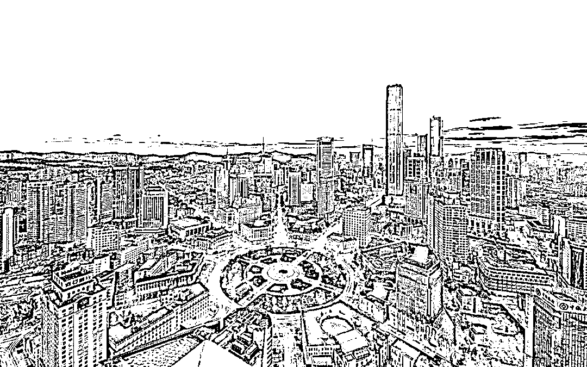

作者/雷蒙德·梅里曼
翻译/Luke 校对/李含编辑/Tang 图片/unsplash

雷蒙德·梅里曼是在金融占星学界稳坐第一把交椅的占星师，同时他也是若道签约的金融占星课老师，我们引进了雷蒙德·梅里曼老师的《上证指数月度报告》《黄金周期月度报告》《2020 年金融预报》（感兴趣的同学可以扫码文末图片购买）。我们经老师的授权，将每周刊登梅里曼老师的周运，供大家参考和学习。

这是本周的周运（1.20-1.23）。由于下周是春节假期，所以停更一周。我们春节后见~

**展望与回顾**

全球股票市场上周大幅上扬，多个市场创下历史新高或多年来的新高。这更偏向呼应天王星在 1 月 10 日顺行的影响力，而不是土星冥王星在 1 月 13 日的合相。

正如读者所知，**强大的天王星征象可以引发趋势的逆转，或使趋势加速突破**。在强有力的天王星征象下，没有哪个阻力或支撑线是安全的，因为**天王星就喜欢突破界限或限制**。

在目前的情况下，它使美国、澳大利亚、印度和瑞士的股市突破阻力，上涨到历史新高。荷兰 AEX 指数也突破到 18 年以来的新高，德国 DAX 和日本日经指数收盘分别创下历史新高和多年以来的最高点。

当然，这种强势的市场趋势通常是经济或政治新闻引发的结果。上周出现了两则乐观的经济新闻，美国与其邻居（美墨加）和中国分别签署了贸易协定。

然而，这些乐观的经济新闻却被土星和冥王星带来的两团乌云笼罩——刺杀和弹劾。虽然新年才过去仅仅两周，我们见证了两个重大的贸易协定的签署，但也沉浸在努力弹劾总统的气氛中，同时因为刺杀事件，也在国际范围敲响了警钟。

其他市场的一些消息，比特币上周晚些时候涨回 9000 以上，同时美元兑日元上涨到了 5 月以来的最高位。黄金在前一周的 1 月 8 日爆发性上涨至 6 年最高点 1613.30 后，于 1 月 14 日星期二的时候大幅下跌至 1536.40。白银和原油的走势与黄金接近。

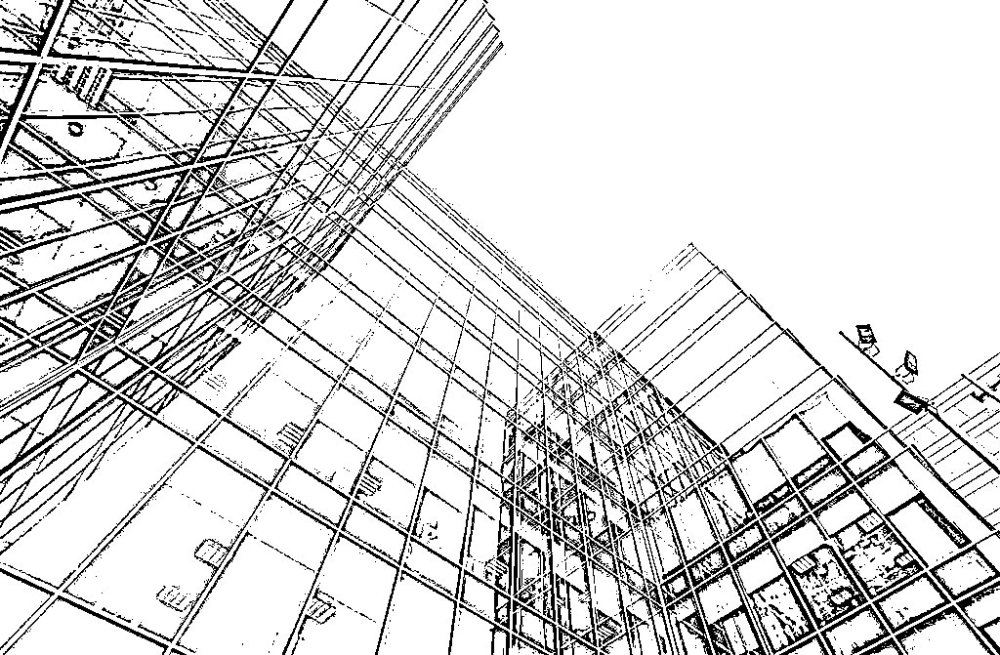

**短期占星趋势**

土星和冥王星于上周形成合相。然而，这个 32-37 年的宇宙事件的影响力“容许度”会持续好几个月，甚至可能在接下来两年依旧发挥作用。

为了摆脱敌人或巩固权力使用“政治暗杀”的手法在过去几年就已经存在了（想想北韩、俄罗斯、沙特，和几个南美国家）。这只是冥王星显化的几种形式之一。但我们关心的是冥王星对经济和金融市场会造成什么影响，因此我们**需要关注另一个冥王星的领域：债务和赤字**。

我已经撰文阐述了当前这个成熟的牛市面临的最大威胁来自政治领域，但我猜想我们可能很快将看到人们的注意力被转移到另一个威胁上，即**爆发性的全球债务**。当弹劾和美伊紧张关系的热点过去后，随着新闻展开，我们会逐渐深入探讨这个话题。

短期来看，即将出现一个有趣的宇宙事件。**在 1 月 23 日-24 日，新月将四分天王星**。这个征象显示某些突发和超出预期的事件可能会搅乱市场趋势。由于天王星参与进来，如果不是趋势逆转的话，那么这可能对应着全球股票指数又一次冲向历史新高或多年来的最高点。

然后，在**1 月 26 日-28 日**时，**金星和海王星合相在双鱼座**。啊！坠入爱河是多么甜蜜啊（金星、海王星和双鱼座都和伪装成真爱的迷恋状态有关）。问题是**火星将四分这两颗行星**，导致本以为是火热的爱情，迅速演变成一场**争端**。在经世占星学领域，这代表**协议可能失败**。一方可能违反已经签署的条款，另一方对此感到很不愉快。这会引发**市场下跌**，再次证明市场面临的最大风险是政治风险，虽然签署了许多新协议，最终却演变成一出闹剧。

但是让我们把展望的目光放更长远一些，就会发现**行进火星即将开始冲击射手座 17-25 度的关键区域。这会在 1 月 28 日-2 月 9 日期间发生**。

火星会引动特朗普总统出生星图里月食合相天王星的相位。这也会激活美国和伊朗建国星图里的火海四分相位（构成大十字）。火星的作风是直到分出胜负才算结束。由于土星-冥王星的参与，交战双方对于双赢的结果不感兴趣。某一方一定要赢，而另一方会输得很惨。火星如此好战，而金海合相双鱼座只想要和平。接下来三周将变得非常有趣，金融市场很可能反映出这些事态发展。

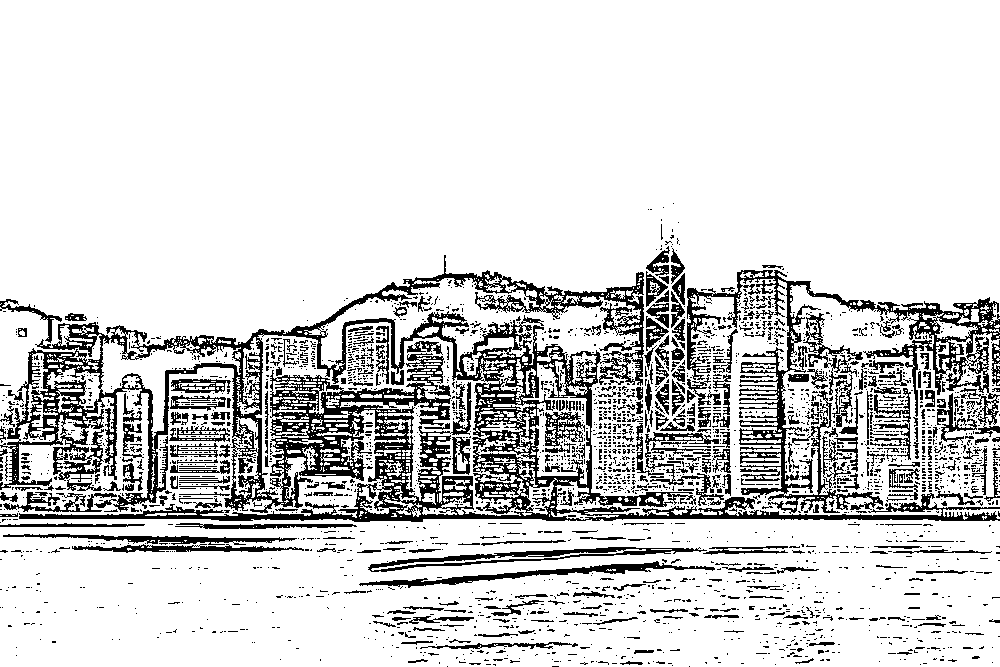

**长期考量**

**由于与中国和其他贸易伙伴之间紧张的贸易关系所带来的不确定性可能导致美国商业投资的下滑。与中国签订的协议和美墨加协议理应解决这种不确定性。但是考虑到特朗普政府的政策变化无常，可能由于总统一时突发奇想，导致贸易紧张局势再次升级，从而削弱了企业对投资和供应链做决策所需要的确定性。这反过来会对劳动生产率、就业和工资产生负面影响。**

**——埃斯瓦尔·普拉萨德，**

**《中国最终获得了巨大的胜利》**

**纽约时报**

**2020 年 1 月 17 日**

**贸易税（关税）是如何伤害世界经济的？美国关税产生了 4 个成本：**

**1、几乎所有的美国关税都由美国公司承担，这会挤压利润。**

**2、供应链的路线发生了。大约一半被征税的中国商品失去了美国的市场份额。这损害了中国出口商的利益，也增加了美国进口商的成本（他们可能会为选择备选供应商支付更多的费用）。**

**3、一些美国公司可能会重新部署生产。美国停止使用中国零部件进行生产。公司从加拿大进口中国零件，再把成品从加拿大出口到美国。这对美国就业有负面影响。但这种情况看起来不太常见。**

**4、最大的成本是贸易政策的不确定性导致的。在向全球供应链投资了 25 年之后，企业对贸易的信任受到了损害。投资放缓是美国和全球经济增长放缓的主要原因。美中贸易协议不太可能改变贸易的不确定性。**

**——保罗·多诺万**

**《贸易政策的成本》**

**瑞银周刊博客**

**2020 年 1 月 20 日**


近日，特朗普政府和美国大部分地区都在庆祝本月签署的两项贸易协议。这对美国乃至世界经济的未来确实是个好消息。然而，真是如此吗？问题是，关税仍然存在，不能保证总统在未来的任一时候不会加征关税。正如前文指出的，这种不确定性是导致投资受抑制的主要原因，需要这些投资，才能使美国经济实现所承诺的 3%增长。美国以外机构的最新估计显示，美国目前的经济增长率只有 1.8%。

木星现在离开射手座（守护希望、乐观和贸易的星座），并将在 2020 年大部分时间进驻摩羯座，这个宇宙征象表明**经济增速会低于预期和承诺**。

事实上，**从 2021 年中旬前的某个时刻市场可能出现严重抛售，直到 2021-2023 年期间才会结束**，支撑这种观点的征象是**土星-冥王星（2020 年）和土星-天王星（2021 年）所形成的困难相位**。

从 1900 年开始的 5 次最严重的市场抛售都发生在这一征象组合期间（分别是 2008-2009 年、2000-2002 年、1973-1974 年、1930-1931 年）。确定市场抛售开始的准确时间不是件容易的事，因为牛市结束的时候没人会敲锣通知大家。但是这是我们在 2 月 9 日（距今 3 个星期）的年度全球网络研讨会上将要探讨的主题之一。我们也会谈到根据这些相位的历史来看，在这种金融危机下如何保护自己。

祝愿你们享受下周金星-海王星在双鱼座的合相。找到爱情，或让爱找到你。但别让琐碎的争辩把你的爱情搞砸了。火星在射手座时容易放大争执，时间是**1 月 3 日到 2 月 16 日**。最好利用这个相位进行**体育运动、锻炼、户外活动**，并有意识地避免可能存在危险的区域（和人群）。人们不是变得很好战，就是变得很高兴。我们只要高兴就好了，和朋友共度美好的时光吧。

**版权声明：**本文由若道翻译发布，欢迎转发，反对抄袭。友号转载请申请白名单。


**雷蒙德·梅里曼（Raymond Merriman）**

若道签约老师。著名金融占星师，ISAR（国际占星研究协会）前主席，梅里曼市场分析公司的总裁。他由于“提升了占星学的职业形象”，在 1995 年国际占星大会上被授予轩辕十四奖；在 2012 年国际占星大会上，被授予轩辕十四终身成就奖。

1“中国上证指数月度报告”发售

**若道推出了****中文版****的雷蒙德·梅里曼中国上证指数月度报告，并持续发行该报告！**

当把金融市场的周期和占星学的周期相结合时，雷蒙德·梅里曼老师的金融占星学研究**为投资者应对金融市场的周期波动，并随之调整投资策略提供了极大的价值参考**。

2“黄金价格周期月度报告”发售

**若道推出****中文版****的雷蒙德·梅里曼黄金价格周期月度报告！**不仅仅为广大读者在中国股市的投资出谋划策，更将视角放眼黄金市场。

**每当世界经济形式不明朗的时候，有一个地方是保值的港湾，那就是****黄金**。从 2018 年 8 月开始，黄金已经用自己的升值再次提醒众人它在经济不稳定时的位置。**截至目前，2019 年 8 月底，黄金已飙升至 6 年新高，高于 1565 美元。**

自 1982 年雷蒙德·梅里曼出版第一本研究《地球宇宙学征象与黄金价格的关联》的著作以来，**他一直作为最重要的黄金市场时机预测者之一享誉国际**。

过去 1 年，那些订阅并遵循建议的梅里曼市场时机学院日报和周报的订阅者，如果从 2018 年 8 月 16 日的低点或 8 月 23-24 日的次低点购买黄金，他们已经赚到了不少的 30%左右的利润。

**购买套餐**，买得越多越优惠

中国上证指数月度报告套餐价

*   **单月报告**：280 元

*   **3 个月套餐**：780 元（260 元/月）

*   **12 个月套餐价**：1999 元（166 元/月）

**长按下图识别二维码**

**购买金融报告****套餐**

**▼**


黄金周期月度报告超级优惠折扣

*   **同时购买上证指数 12 个月套餐**和**黄金周期报告 12 个月套餐**，即可享受黄金周期报告 12 个月套餐**立减 1199**元的**超级优惠折扣**。

*   **已经购买**了**上证指数 12 个月套餐**的朋友，**再购买**黄金周期报告 12 个月套餐，也可享受**立减 1199**元的**超级优惠折扣**。**购买黄金周期报告 12 个月套餐时，超级优惠折扣会自动生效**。

**长按下图识别二维码购买黄金报告套餐**

▼


32020 年金融预报预售 1976 年以来，由雷蒙德·梅里曼撰写的梅里曼市场时机学院每年一次的年度预报沙龙和每年一本的《年度预报》一直在应用占星学原理为投资者们服务，43 年来，这本 200 页左右对金融市场的分析报告和 3 小时的年度预报讲座在美国、日本、欧洲帮助许多投资者了解宇宙天气对于世界经济形势、政府政策及其对各个金融市场和金融产品的影响，帮助他们做出正确的投资决策，降低投资风险。2018 年，若道第一次将这份广受赞誉的一年一度的金融占星报告和沙龙引入中国，供中国投资者参考。**《2020 年金融预报》将会谈及 2020 年重要的宇宙天象及其对世界经济、贸易形势的整体影响，还将覆盖中国上证股票市场的分析、黄金白银市场、美国经济、美国总统、美联储、美国国债市场、美国股票市场、主要外汇货币市场（主要外汇美元、英镑、欧元、日元、瑞士法郎）、原油市场、谷物市场、活牛市场、比特币市场等投资市场。**梅里曼老师及梅里曼市场时机学院的金融占星分析师还会给出以上市场 2020 年的**市场价格目标区间及重要价格反转日**，为短期、中期和长期投资者进行市场操作的时机提供参考。如果你关注世界经济和金融投资市场的变化，会发现梅里曼《金融年度预报》中的研究对于你了解世界经济在发生什么，这些市场的走向会如何有非同寻常的指导价值。报告和讲座价格

2020 年金融预报讲座和报告价格整体售价** 1280 元**

（本讲座和报告不单独出售）

**12 月 31 日前 100 名用户**预售价：**1080 元**

**12 月 31 日后**恢复原价：**1280 元**

**长按下图识别二维码购买 2020 年金融预报**

▼


**微信又双叒叕改版啦，不想错过若道君的推送？**

**就把若道设为星标吧！**

**▼**


********点击阅读原文购买金融报告********


# 金牌课程 | 中英双导师 L1-5，系统学习占星学的必修课

> 原文：[`mp.weixin.qq.com/s?__biz=MzA5NjA0NTAxNg==&mid=2651413025&idx=3&sn=cc9eb53ddf5a48e03e4ca8ca6c18fb84&chksm=8b4be896bc3c618077c694307b7f15499b4ff278be92b901162d89797fa8f373d2c183ad7ad0&scene=126&sessionid=1692738222#rd`](http://mp.weixin.qq.com/s?__biz=MzA5NjA0NTAxNg==&mid=2651413025&idx=3&sn=cc9eb53ddf5a48e03e4ca8ca6c18fb84&chksm=8b4be896bc3c618077c694307b7f15499b4ff278be92b901162d89797fa8f373d2c183ad7ad0&scene=126&sessionid=1692738222#rd)

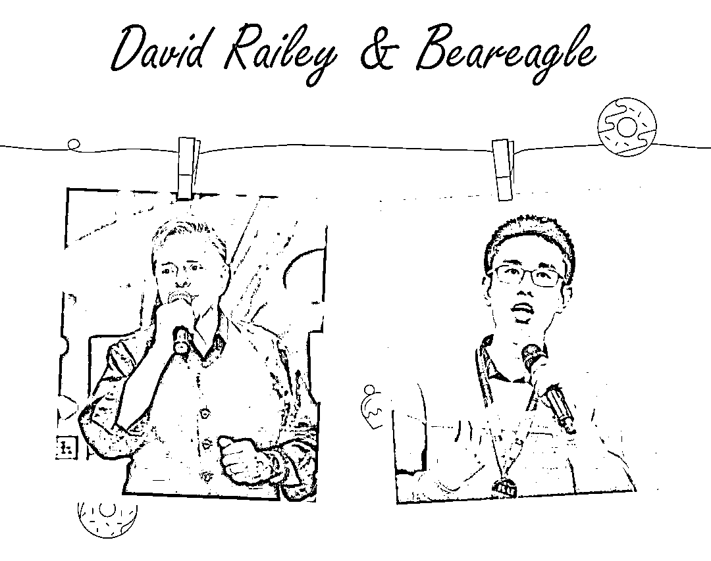

**拥有****49****年占星实践经验的若道创始人**
**大卫·瑞雷****&****最懂学员的若道首位认证****金牌中国****老师****熊鹰****师徒二人****横跨南北****联手打造****北京上海**** 若道****全新****核心占星课程****之**

**互动实战占星初阶工作坊**

**本次****Level 1-2 工作坊****会分别在**

**上海（2020 年 3 月 13、14、15 日 熊鹰老师主讲）**

**北京（2020 年 4 月 4、5、6 日 大卫·瑞雷老师主讲）**

**两个城市各举办一场**

**方便北方、南方同学自由选择，邀请小伙伴一起学习**

**核心课现场工作坊是一种什么样的？**

珍贵的**面授工作坊**，全面而详细地讲解占星学知识，一场五感盛宴！

# **代入感：**向往占星世界好久了，迟迟没有下决心系统学习？最专业的占星老师来喽！带你穿越 9¾站台，进入真正的占星魔法世界，来若道，你就是哈利波特本特！

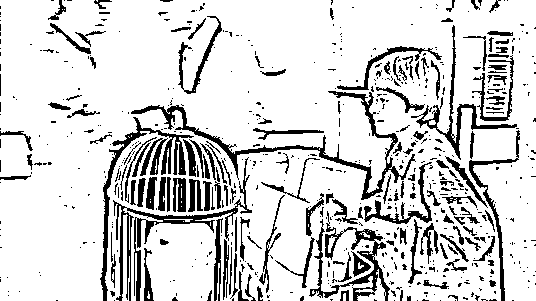

**沉浸感：**从虚拟的网络来到现实，舒适的学习环境，全新的占星同学，5D 的占星老师，专业的摄影团队，支持的工作人员~让你仿若重回校园梦，燃动青春学习占星！

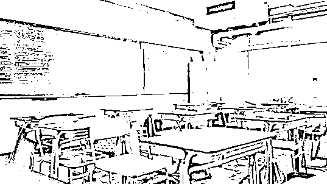

**参与感：**大卫老师和天空老师都有丰富的教学经验，占星知识严肃专业，但开起玩笑来也丝毫不马虎，欢笑间知识都记住了呢，如果你长得可爱聪明伶俐，课上还会随时**被 Q**哦~对，就是你~


**仪式感：**两位老师超爱自己的中国学生们，为了让大家透彻地学习好宫位，2018 年初阶工作坊，大卫老师和熊鹰老师趴在地上用胶带贴的~仪式感满满~有没有~就宠你就宠你！今年还有没有其他的惊喜？

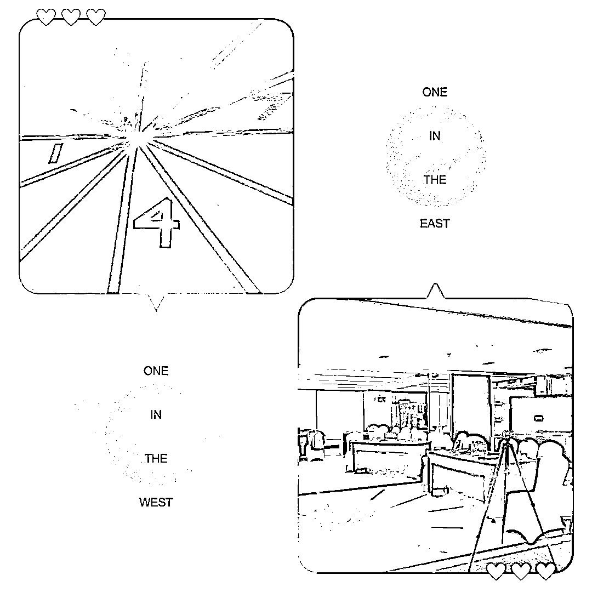

**亲近感：**周围全都是热爱占星的同学，那种亲近和被理解的感觉真的不要太美妙。志同道合的朋友就在身边，灵魂伴侣可能就在眼前，透露一下，在若道课堂里找到男女朋友的真的不要太多~比如~咳咳，总之带着八卦的心来上课吧~

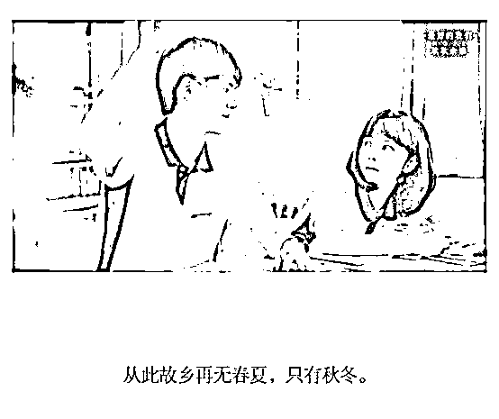

**连报 L1-5 全阶课程，可以享受到：**❶ 51 次线上直播互动网络课程+3 场工作坊（互动实战占星初阶工作坊、亲密关系+职业占星工作坊、知识回顾+综合解读工作坊），全面而详细地讲解占星学知识、技能、案例和重要领域实践运用。 ❷知识点+学员星图解读有机结合：熊鹰老师以知识点和学员案例讲解为主，大卫·瑞雷老师以参课学员案例及客户案例讲解为主，每个知识点覆盖班级内学员的亲身案例，参与感更强，每位学员都有机会听到自己的星图分析。 ❸微信群学员互动分享，从真实案例学习生命成长故事。 ❹ 论坛提问：论坛上每个学员的问题都将得到及时回复。 ❺ 提供咨询师实习平台，只要努力，都将有机会在毕业前进行咨询的实习演练，听取客户反馈，为成为职业占星师做准备。

**1-2 阶我们要学习什么？**

  **第一阶** ** 12 星座，12 种性格，12 种人生**❶ 学习占星学必须准备的“心法”**❷**占星学中的火、土、风、水四元素，阴阳法则**❸**面对面的星座有故事**❹ **12 星座：12 种性格详解，12 种行为模式，12 种价值观**❺ **太阳和月亮：了解你的太阳，生命的发动机，让你在世界闪光的方式，生命获得力量的方法；了解你的月亮，让你获得幸福的方法**❻ **了解太阳、月亮，了解你生命中已经出现的、将会出现的男性和女性

**第二阶  命运的线索和人生故事中的演员**

❶ 命运的线索：南北交点❷ 星图三巨头：太阳、月亮、上升点的故事❸ 了解心智：水星❹ 了解金钱和关系：金星❺ 了解行动模式：火星❻ 了解信念：木星❼ 了解努力：土星❽ 了解天才和疯狂：天王星❾ 了解梦想和幻灭：海王星❿ 了解死亡和重生：冥王星⓫ 12 个人生场景：黄道 12 宫位初解

**现场工作坊**

**上海（2020 年 3 月 13、14、15 日 熊鹰老师主讲）**

**北京（2020 年 4 月 4、5、6 日 大卫·瑞雷老师主讲）**

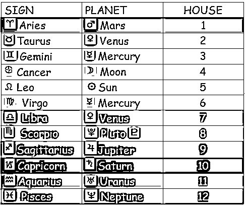

**如果你想马上开始学习 Level 1-2**现提供即买即学的**熊鹰老师网络视频课程**出售价格和工作坊一样如果想同时购买网络课程视频+任一场现场工作坊可以享受打包价哈具体购买方式看到最后~

**3 阶开始的网络直播课**

老师同学都认识的差不多了，从三阶开始就是更方便灵活的网路直播课喽

**第三阶 宫位、相位以及初步解读星图****（15 次课）**❶ 15 次线上直播网络课程，每次 2 小时，堂课中依旧会使用同学们的星图作示范❷  10 节课由熊鹰老师教授，重点通过名人星图阐释知识点❸  5 节课由大卫·瑞雷老师教授，重点通过学员星图阐释知识点❹  从第三阶开始，助教将会指导练习，答疑解惑，学练结合❺  重点在于如何根据星图去问问题，着重自我发现和自我探索的过程**课程安排**2020 年 6 月 4 日：宫位，行星和星座组合 2020 年 6 月 11 日：宫位，行星和星座组合 2020 年 6 月 18 日：月亮交点 2020 年 7 月 2 日：月亮交点和演示案例 2020 年 7 月 9 日：相位 2020 年 7 月 16 日：相位+星座，行星和宫位 2020 年 7 月 23 日：相位，星座，行星和宫位的同学案例 2020 年 7 月 30 日：渐盈相位&渐亏相位，示例 2020 年 8 月 6 日：更多的关于宫位和宫主星 2020 年 8 月 13 日：同学案例 2020 年 8 月 20 日：空相行星&定位星 2020 年 8 月 27 日：宫主星 2020 年 9 月 3 日：优先级和组织 2020 年 9 月 17 日：相位模式以及范例 2020 年 9 月 24 日：学员星图解读范例**第四阶 出生星图解读（进阶）以及关系与职业议题****（12 次课，1 场四日亲密关系+职业占星工作坊）**❶ 12 次线上直播网络课程，每次 2 小时，堂课中依旧会使用同学们的星图作案例❷ 8 节课由熊鹰老师教授，4 节课由大卫·瑞雷老师教授

❸ 1 场北京现场四日工作坊：亲密关系+职业占星，学生将被选中进行案例演示和互动。

**工作坊安排：****2020 年 10 月 29 日、30 日、31 日、11 月 1 日四日北京工作坊****亲密关系（两天）+职业（两天）占星工作坊**学员将被选中进行案例演示和互动（免费）。**课程安排**

2020 年 11 月 26 日：整合星图和星图优先级

2020 年 12 月 3 日：综合解读

2020 年 12 月 10 日：整体案例

2020 年 12 月 17 日：亲密关系/对比星图

2021 年 1 月 7 日：占星学和对比星图的例子

2021 年 1 月 14 日：对比星图同学案例

2021 年 1 月 21 日：对比星图同学案例

2021 年 1 月 28 日：占星学的职业介绍

2021 年 2 月 4 日：占星学的职业案例

2021 年 2 月 18 日：占星学的职业同学案例

2021 年 2 月 25 日：儿童职业发展

2021 年 3 月 4 日：亲密关系/职业同学案例

**五阶 预测、关系、咨询、为执业和考试做准备****（24 次课，1 四日工作坊）**❶ 24 次线上直播网络课程，每次 2 小时，堂课中依旧会使用同学们的星图作案例❷ 15 节课由熊鹰老师教授，12 节课由大卫·瑞雷老师教授

❸ 1 场综合解读工作坊（北京）：把一切串联起来，学生将被选中进行案例演示和互动。

**工作坊安排：****2021 年 9 月 2 日、3 日、4 日、5 日四日综合解读工作坊（**北京**）**把一切串联起来，L1-5 知识回顾，综合解读学员将被选中进行案例演示和互动（免费）。**课程安排：**2021 年 4 月 15 日：行进介绍 12021 年 4 月 22 日：行进介绍 22021 年 4 月 29 日：行进介绍 32021 年 5 月 6 日：当下的行进的同学案例 2021 年 5 月 13 日：周期，重置星图 2021 年 5 月 20 日：当下的行进和周期的同学案例 2021 年 5 月 27 日：次限 2021 年 6 月 3 日：次限同学案例 2021 年 6 月 10 日：太阳弧 2021 年 6 月 17 日：太阳弧同学案例 2021 年 6 月 24 日：亲密关系的关键节点+组合星图 2021 年 7 月 1 日：亲密关系的关键节点，组合星图同学案例 2021 年 7 月 8 日：职业周期 2021 年 7 月 15 日：职业周期同学案例 2021 年 7 月 22 日：太阳返照&月亮返照 2021 年 7 月 29 日：太阳返照&月亮返照同学案例 2021 年 8 月 5 日：高级预测技巧 2021 年 8 月 12 日：高级预测同学案例 2021 年 8 月 19 日：高级预测技巧 22021 年 8 月 26 日：高级预测同学案例 22021 年 9 月 2 日：简单的占星学历史 2021 年 9 月 9 日：占星学的不同流派 2021 年 9 月 16 日：ISAR 考试术语和复习 2021 年 9 月 23 日：ISAR 考试术语和复习**这两位优秀的占星学老师是谁？**


**大卫·瑞雷（David Railey）**

*   ISAR 董事会成员，若道占星创始人。
*   1976 年，通过亚特兰大职业占星师考试，成为全职占星师，随后通过**AFAN 和 ISAR 职业测试**。
*   1980 年，与**杰夫·焦耳**一起在亚特兰大创建**“每日星球”**占星学中心。此后在亚特兰大占星协会担任 4 年考官，并且两次担任**亚特兰大地区占星协会主席**。
*   1979-1992 年，作为占星师活跃于美国社会媒体，向不了解现代占星学变化的大众宣传专业占星学知识。在 1989-1992 年期间，他在 WRGG 电台 12 频道每周主持个人电视秀**“今日占星学”**，早先他还在 WRFG 的广播节目中播讲宇宙天气节目。 
*   2010-2014 年，任**全美占星师联盟监督委员会委员**。
*   2010 年，其著作**《灵魂的目标》**中国版出版，和蒋颖一起创办**若道占星**学校和其官网 www.nodoor.com。从该年开始，他工作并往返于亚特兰大和北京。目前他 80%的时间致力于在中国教授和推广西方占星学。
*   2017 年，被选为**ISAR 委员会成员**（2017）。ISAR 是世界最大的国际占星机构，会员遍布 45 个国家。


**熊鹰老师（天空的空）**

*   2008 年接触严肃占星学，至此爱不释手。
*   **2013 年师从大卫·瑞雷**，研习整套现代占星学核心课程，并于 2014 年起至今连续三年担任该课程的主助教。
*   期间也**跟随格伦·佩里、诺·泰尔、理查德·塔纳斯、罗伯特·汉德、苏·汤普金斯、斯蒂芬·弗里斯特等多位国际顶尖占星大师进行学习**，进行定向占星主题研究。
*   2015 年初，通过国际占星研究协会**（ISAR）资质认证并获得证书**。同年，进一步跟随大卫·瑞雷老师进修**“生时校正”**技术，通过最终考核并获得证书。
*   目前在若道星文化任职，将传播系统、严谨、真实的占星学作为职业使命。任专职助教期间，进行沙龙与答疑等辅助教学工作已累计超过 200 小时。
*   在业余期间也提供占星咨询与生时校正服务。目前正致力于占星学与个人成长的整合。

**往届学员这样说**

★ **熊鹰老师非常清晰各阶段学员的难点在哪里，在哪里容易走弯路，所以在课程中给了针对性很强的技术讲解。**同时，学识广博的他对占星学术背后的道有非常深刻的思考，对占星学所表达的事物不断去溯源，去探寻本质，并在其他学问中去看到道的呼应，让我觉得非常过瘾和鼓舞。感谢熊鹰老师的启迪！ ——2017 若道占星核心课程熊鹰主讲 1-2 阶学员杨灿

**★ 知识渊博、博古通今、亲切可人、nice ，将东方的佛教文化、古诗词完美地与西方占星学结合，让学员特别容易理解**。很喜欢熊鹰（天空）老师，在巩固好 1、2 阶课程后，会追随空妈进行下一阶学习。

 ——2017 若道占星核心课程熊鹰主讲 1-2 阶学员王舒

★ **融合中国传统文化，把占星学规整得非常理性和易懂，空妈非常擅于观察和总结，给我们非常宝贵的经验。**我觉得效果非常好，以前对于各个星座和行星的概念比较片面，这次学完后觉得收获颇多，也打破了传统的限制，感觉到了与时俱进。 ——2017 若道占星核心课程熊鹰主讲 1-2 阶学员王茜★ 通过大卫老师课堂的案例咨询，我不仅对自己本身的特质和发展方向更加清晰，更开心的是清楚了自己处在怎样的发展阶段，外部环境对我的影响是怎样的，让我更加清晰应该怎样抓住机遇，在现阶段怎样努力。这些都是对我现在来说最重要的。**能够得到在课堂上享受这么专业精准的个案咨询，真的非常幸运。**——2017 若道占星核心课程大卫·瑞雷主讲 5 阶学员萧立★ 在课堂上获得了大卫咨询的宝贵机会。在一个多小时的咨询中，大卫首先演示了对客户星图的分析思路和推演过程，对客户的诸多发展方向和人生主题做出推测，并记录下来，待与客户见面时结合客户实际深入探讨。而后，大卫示范了如何与客户提问互动，从出生星图入手深入剖析案主的心理模式和原生家庭，并对案主的疑问进行解答。**坦白说，大卫的分析中肯且直中要害，对我来说像一道闪电，不仅准确地描述出我的原生家庭和童年生活环境，更击中了我多年来心中的隐痛**。这次咨询帮助我梳理了很多年来积压在心底的情绪，也在一定程度上疗愈了我，大卫的建议是如此地温和有力，让我感觉无比温暖，整个人被照亮了！再次感谢大卫，你的智慧和引导对我意义非凡！——2017 若道占星核心课程大卫·瑞雷主讲 5 阶学员龙爪槐下**若道核心课程教学支持体系****我们有****完善和系统的****核心课程教学支持体系****帮助你更好更全面地学习**


**什么人适合这门课？**

*   对占星学有浓厚兴趣，想要系统学习占星学
*   对占星学有一定基础，但不知道该如何整合星图复杂的碎片
*   希望成为优秀的占星师，想要借鉴国际大师解读思路并融入自己的体系
*   想学习占星学，但不擅长英文，希望有中文老师授课
*   想结合占星学理论与咨询实践

*   大卫·瑞雷、熊鹰的忠粉，学过占星，但就是想跟着偶像再学一遍

*   走在自我探索和个人成长道路上的人 

**课程费用****★ 1-5 阶****早鸟价：33000 元（2020 年 2 月 19 日之前）****课程费用：46500 元****★ 1-2 阶工作坊（北京工作坊、上海工作坊任选一场）****早鸟价：2800 元（2020 年 2 月 19 日之前）****课程费用：3500 元****★ 对于不方便上线下课的同学：可购买熊鹰老师 L1-2 视频课程****早鸟价：2800 元（2020 年 2 月 19 日之前）****课程费用：3500 元****★ 视频+现场都想要的同学：有套餐价哦****北京工作坊、上海工作坊****任选一场****+熊鹰老师 L1-2 视频课程****早鸟价：4200 元（2020 年 2 月 19 日之前）****课程费用：5200 元****退转课程**

*   **退款原则请详看《教学协议》，如有疑问请咨询课程顾问。**

****中英双导师核心课 Level1-5****

**授课老师：大卫·瑞雷 熊鹰**

**授课时间：****1-2 阶工作坊，上海** 2020 年 3 月 13、14、15 日**北京** 2020 年 4 月 4、5、6 日 ；**3-5 阶，**2020 年 6 月 4 日

**授课方式：**网络课程，中英文授课，中文翻译；现场工作坊，中英文授课，中文翻译

**费用：1-5 阶：**46500 元**早鸟价：33000 元（2020 年 2 月 19 日之前）；** **1-2 阶**（北京、上海工作坊任选一场）**：**3500 元**早鸟价：2800 元（2020 年 2 月 19 日之前）；******1-2 阶视频课程：****3500 元**早鸟价：2800 元（2020 年 2 月 19 日之前）；**

****视频+现场套餐价：****5200 元** 早鸟价：4200 元（2020 年 2 月 19 日之前）**

**课程负责人：**王老师（微信：18510107057），请备注“核心课”

长按二维码添加课程负责人咨询~


**阅读原文报名链接为：中英双导师 Level1-5 北京工作坊**

**想报名上海工作坊或购买熊鹰网络视频课程的小伙伴**

**记得私信销售小姐姐咨询哦**

****报名请点击“阅读原文”****


# 深度 | 你知道吗？其实，有个星座比摩羯座更严格……

> 原文：[`mp.weixin.qq.com/s?__biz=MzA5NjA0NTAxNg==&mid=2651413015&idx=1&sn=db16a6584cba5afa957c4964a731769a&chksm=8b4be8a0bc3c61b6948668dc2e64b78567eeb159c4e2aef45dcb36354247fae0ddc36a2d8865&scene=126&sessionid=1692738222#rd`](http://mp.weixin.qq.com/s?__biz=MzA5NjA0NTAxNg==&mid=2651413015&idx=1&sn=db16a6584cba5afa957c4964a731769a&chksm=8b4be8a0bc3c61b6948668dc2e64b78567eeb159c4e2aef45dcb36354247fae0ddc36a2d8865&scene=126&sessionid=1692738222#rd)

**☆ 后台回复“今日”，给你一句生命态度**


作者/Brynhildr 编辑/Tang

封面/书君 图片/网络

北京时间 1 月 20 日 22:54，太阳离开摩羯座进入水瓶座。你可能没想到，其实水瓶座比摩羯座更严苛。这个总是让人难以捉摸的星座，究竟是怎样的？一起来阅读本文吧。“**倘若智慧能从盈满的人身上流到空虚的人身上，就像酒杯里的水通过一根羊毛流进一个空杯，那就太好咯！****——柏拉图《会饮》**”**水瓶座的象征：普罗米修斯**这个世界上，或许再没有哪个星座，如水瓶座一般，费尽一切努力也要把光明的火种带到世间，把智慧的灵启传于世人。

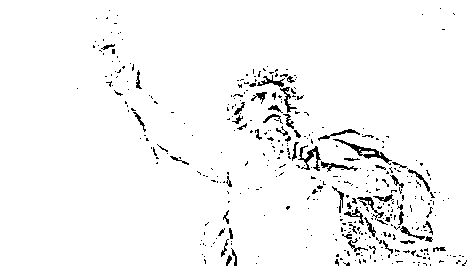

**| **普罗米修斯将光明的火带到人间

神话中，**普罗米修斯**被认为是水瓶座的象征。他是远古的泰坦神，神界的先知。不同于盲眼预言家忒瑞西阿斯（可预言人的未来），普罗米修斯可以预言神界以及众神的未来，也因此，他的名字意味着**“先知先觉”**。在他的帮助下，智慧女神雅典娜顺利地从宙斯的头脑中诞生。在更古老的传说中，普罗米修斯是人类之父，他用泥土和水塑造了人类的躯壳，由雅典娜给他们吹入生命之气。这和圣米迦勒大天使长在主耶和华的指示下，于尘土中创造亚当；盘古开天辟地后，女娲造人的神话是多么的相似。传说中，普罗米修斯将从雅典娜处学来的技艺毫无保留的传授给人类，如同水瓶座所象征的**新科技**，不断推动创新，渴望在更高层面造福全人类。

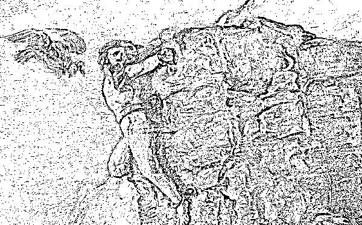

**| **普罗米修斯被神惩罚，独自受苦

**神界的叛徒，人类最好的朋友**然而这位人类最友好的朋友，却是不折不扣的神界叛徒。古希腊罗马神话中的神大多具有人类贪婪、自私、嫉妒等特性。他们不仅时常内部掐架，而且对人类分外苛刻残忍。神创造了人类，因此人类需常怀感恩，按时供奉，心存卑微，绝不可有半分觊觎，更不能对神权有任何逾越藐视。无论是神界的男性或是女性，对于人类的渎神行为都没有半点容情。唯有普罗米修斯是那个**藐视神威，敢于公然反叛神权的邪神**。当人类向众神之王宙斯献祭时，普罗米修斯淘气地把公牛皮剥下来，缝成两个开口的牛皮袋，一袋装入牛肉，藏在牛胃下面；另一袋则装入牛骨，并用一层厚厚的牛油覆盖，然后让宙斯自己选。宙斯受骗选了牛油的那袋，发现下面全是骨头后大发雷霆，惩罚人类不能使用火种，只能生吃牛肉。普罗米修斯得知后非但不反省，反而愈挫愈勇，想方设法偷取火种，引发了宙斯更疯狂的报复。他把普罗米修斯赤身束缚在高加索山的石柱上，日日受秃鹰啄食肝脏，到晚上又恢复原样，因其神灵不死，痛苦长存。除此之外，宙斯与众神设计，将潘多拉嫁给普罗米修斯的弟弟——后知后觉的厄毗米修斯。当潘多拉将魔盒打开，所有的灾难降临人世。

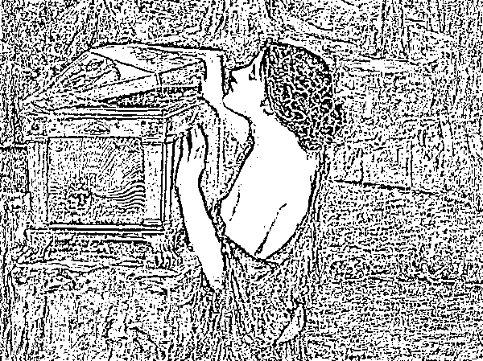

**| **潘多拉打开魔盒，灾祸降临人间

**创造力的守护者**自始至终，普罗米修斯都站在人类这一边，然而他发自内心帮助人类的行动，最终却使整个人类群体遭受到毁灭性的打击和灾难。而他自己，不仅被神界抛弃，也被他所辛勤照拂的人类所抛弃，独自受苦。**神话不仅具有原型力量，同样也是一种隐喻。**试想一下，神对于人的态度，和人类对于人工智能的态度，是多么的相似呀。而这本质上，又是一种**创造者和被创造者之间永恒的冲突**。与其说普罗米修斯是人类的朋友，不如说，**普罗米修斯所代表的水瓶座，是世间一切新创造物的守护者**。我们创造新的事物，希望这些被创造物可以为我们服务，但是又忌惮这些新事物终有一天超越我们并最终取代我们。为了防止这样一种悲剧现实的发生，我们制定规则和律法，以此来限制和管理这些原本具有无限可能性的活泼自由之智慧结晶，等级与秩序应运而生。倘若有一天，人类与人工智能终有一战，曾经的人类之友普罗米修斯还会继续站在人类这一边吗？这可很难说，**水瓶座所青睐的，必定是更具智慧和创造力的一方**。因为水瓶座所向往的，正是最终极的美——**智慧之美**。**水瓶座，比摩羯座更严苛**水瓶座的守护星天王星乌拉诺斯与大地之母盖亚孕育创造了许多泰坦神，可为什么这位父神竟残忍的将他的孩子们都送进了地狱？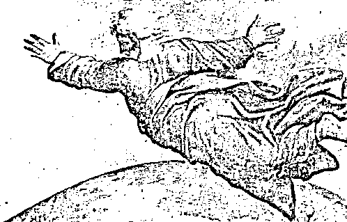**| **天空之神乌拉诺斯不同于土星出自嫉妒和恐惧而引发的吞噬，不同于宙斯的机敏奸猾，这位古老而原始的天空之神才是**完美主义**的绝对维护者。正是因为他觉得这些孩子都很丑，所以他一边毫不怜悯的把这些不完美的创造物集体塞进地狱，一边永不懈怠的与盖亚生育新的孩子。**在一个凝结着无数智慧心血的完美结晶出现前，水瓶座比他的前一任黄道星座摩羯座更严苛和精益求精**。因为古典占星中，土星同样是这位创新之父的守护星。然而，至臻至美之物又怎是这么容易被创造出的？直到土星克洛诺斯发动叛乱，挥刀将父亲乌拉诺斯去势，才于海面诞生了爱与美之神阿弗洛蒂特。

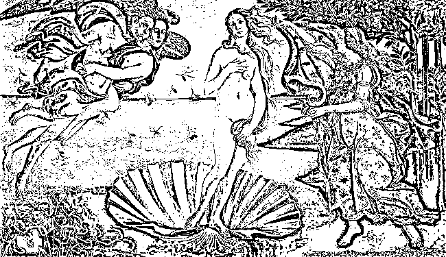

**| **爱与美之神阿弗洛蒂特（维纳斯）的诞生

而这位女神一方面继承了父亲的审美功能，另一方面也继承了众神纵欲的动物性本能。

这对于水瓶座而言，是一种难以言说的完美又悲剧的救赎。

**永远走在时代的最前端**在象征智慧的风象 3 星座中，水瓶座是最后一个，而其守护星天王星同样被喻为高八度的水星。这意味着，水瓶座的进化程度远远超过双子座与天秤座。不同于双子座在向上神性追求和向下动物性本能之间的痛苦挣扎，不同于天秤座试图平衡阴性法则与阳性法则的对立，水瓶座从来都是更古远也更深奥复杂的天空之神，它代表**全然的阳性法则和神性智慧**，从一开始就**将自己与愚昧丑陋的现世法则以及固化森严的等级秩序切断开来**。这也注定了**它永远走在时代的最前端，以超验式直觉锐意进取，而无法与后知后觉的大众保持一致，更无法忍受平凡乃至平庸的现实人生**。**它宁愿自己是另类的，孤立的，疏离的，不被人理解的，也不愿染上凡俗的丑陋习气**。这样一种“我本楚狂人，凤歌笑孔丘”的自由意志，势必讨来土星所代表世俗框架和守旧势力的迫害与拷打。更耐人寻味的是，这位弑父食子的土星，也同样是水瓶座的守护星。于是，我们发现，**很多看上去标新立异的水瓶座，往往非常会圆滑处事并深具客观理性分析的能力；又或者，我们发现这些看上去平凡普通又老实的水瓶座，内心往往藏龙卧虎，惊天动地**。哲学（Philosophy）的本意即是爱智慧，追求智慧。智慧最美，然而，智慧的获取从来就不是那么理所当然又方便的事。**崇高的爱，柏拉图之恋**

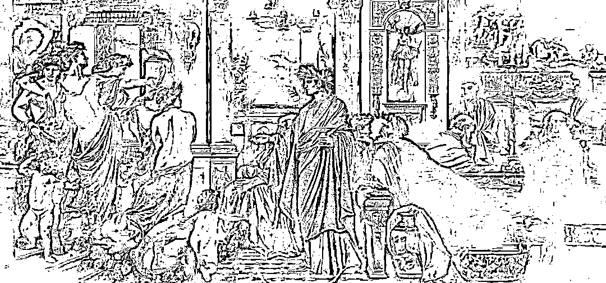| 德国画家 Anselm Feuerbach 的画作《柏拉图之会饮篇》

柏拉图在《会饮篇》开场讲到悲剧作家阿伽通作品获了奖，邀请一群好友来家里聚会庆贺。苏格拉底半路上思考问题停住了，当他来到阿伽通家里时，宴会已经吃到一半，只有主人阿伽通身旁还有空位。阿伽通当下招呼道：“苏格拉底，躺我这边，你刚才路上一定是发现了什么智慧，快让我沾一沾。苏格拉底坐下来说道：“要是能像你说的那样，阿伽通哟，咱俩挨着坐，智慧就从盈满的人身上流到空虚的人身上，就像酒杯里的水通过一根羊毛流进一个空杯，那就太好咯……”这场看似大家都喝大了的聚会，云集了当时许多高级知识分子，他们就爱情的本质进行了激烈的思辨，在这里我们可以看到后世所传颂的**柏拉图之恋**的原型。也正是从《会饮篇》中，我们窥见古希腊时期的同性之爱，这也正是水瓶座所涉及的另一个议题所在。水瓶座所代表的，是**纯然的阳性法则**，神性充满了上界的阳刚之气。 古希腊的审美从来都青睐竞技场上的美少年。男性之爱在当时被认为是崇高的，爱情发生在男人与男人之间，尤其是长者与少年之间，而男女之间也具有爱情，但主要以生育繁衍为目的进行结合。年长的男性通常具有丰富的智慧和社会经验，因此担任着保护和教育少年的角色。少年一般在 12-17 岁之间，他们跟随长者学习知识与技能，并以青春和忠诚来回报长者。当时的男性需要参加严格的军事训练，无论是竞技场还是战场，都是展现男性力量和气概的场所。而在敌我厮杀的过程中，战士的勇气和忠心是最不可或缺的要素。**水瓶座所象征的社群和友谊在这里也可以代表战友与同伴间的惺惺相惜。****之所以说水瓶座所象征的同性之爱是高尚的，是因为古希腊人认为这份感情以追求智慧与精神的共同成长为目标，带着全然的友爱和支持，可共生死存亡，却无长久独占的欲望，宽大深情而又无私**。与之相对应的，是宙斯与加尼米德的恋情。加尼米德是特洛伊国王的儿子，后来脱离凡胎，成为宙斯的侍酒官。赫拉可以迫害宙斯所宠幸的其他女人，但在加尼米德面前，她毫无竞争力。

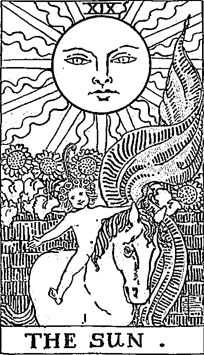

| 维特塔罗牌中的太阳

**水瓶座的世界是排斥阴性法则的**。塔罗牌中的太阳也可用来诠释水瓶座之爱。光明而又真挚，热烈而又纯洁，在太阳的庇佑下，智慧的光芒普遍人间。

**版权声明：**文章由作者授权在若道平台发布，欢迎转发，反对抄袭。友号转载请申请白名单。


**Brynhild**

中美联培博士

研究方向：心理学、精神病学、行为科学与健康传播

**个人微信号**：diurnal-nocturnal

**个人微信公众号**：yiqizuogongke

长按打赏


******点击图片查看若道君推荐******


**微信又双叒叕改版啦，不想错过若道君的推送？**

**就把若道设为星标吧！**

**▼**


就是这个“在看”，戳戳戳 ☟

********报名直达入口********


# 太阳水瓶座+3 种水星 | 为啥水瓶座看起来那么“冷血”？

> 原文：[`mp.weixin.qq.com/s?__biz=MzA5NjA0NTAxNg==&mid=2651413015&idx=2&sn=529870754395987a4a4e8e312e4d3168&chksm=8b4be8a0bc3c61b610247a2ca02e29fa2ad869303417eab2f8d6b0c2f994ef9cbfe6eac8cab1&scene=126&sessionid=1692749891#rd`](http://mp.weixin.qq.com/s?__biz=MzA5NjA0NTAxNg==&mid=2651413015&idx=2&sn=529870754395987a4a4e8e312e4d3168&chksm=8b4be8a0bc3c61b610247a2ca02e29fa2ad869303417eab2f8d6b0c2f994ef9cbfe6eac8cab1&scene=126&sessionid=1692749891#rd)

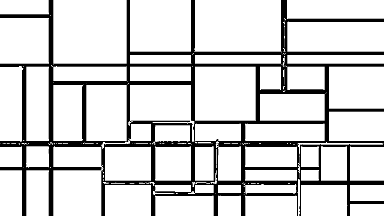作者/安德烈 ISAR 认证占星师
编辑/Tang 图片/蒙德里安

由于太阳与水星形成角度的限制，日水的组合只会出现 36 种。这 36 种组合，可以被视为最基本的“表达模式”的模板。当然，在实际解读星图的时候，肯定也要考虑落宫和相位等影响。今天就让我们来看看太阳水瓶座的 3 种水星组合吧！

**太阳水瓶座**

众所周知，**水瓶座的太阳会使人有着很强的叛逆心理**，他们不拘于摩羯座式的陈规，也不屑于狮子座式的浮华。在很多的文章里，都会把拥有水瓶座太阳的人说成是不入世的怪人，尤其是强调他们多么孤僻，但事实并非如此。

水瓶座是一个**风象星座**，这点与双子座、天秤座并无二致，只是水瓶座式的太阳不像双子座那般关注周遭环境的问题，或天秤座那般容易把注意力放在特定的人身上，他们**更关注概念性的东西**。

很多时候，他们都能感觉与人之间的话不投机半句多，正是因自认为双方不在一个智力层面，或道不同不相为谋。当你看到他们遇到自己乐意推崇的小圈子时，又会变成积极参与、踊跃发言的另一幅模样，根本和那冷冰冰的描述联系不到一块去。

水瓶座式的太阳就像议会里的议员一样，他们**永远保留自己持反对意见的权利，他们不会盲目地相信什么，或持续地妥协，不介意反对他人，甚至是过去的自己**，这就让很多人能感觉到这类人身上的抬杠天赋。

水瓶座的太阳很需要摆出一副“**智者**”的姿态，需要让其他人知道自己的智慧是多么难得，所以不会轻易附和那些陈芝麻烂谷子的旧事，而是**乐于提出自己全新的看法以及意见**，水瓶座的太阳未必能让人变聪明，但至少会让人显得聪明。

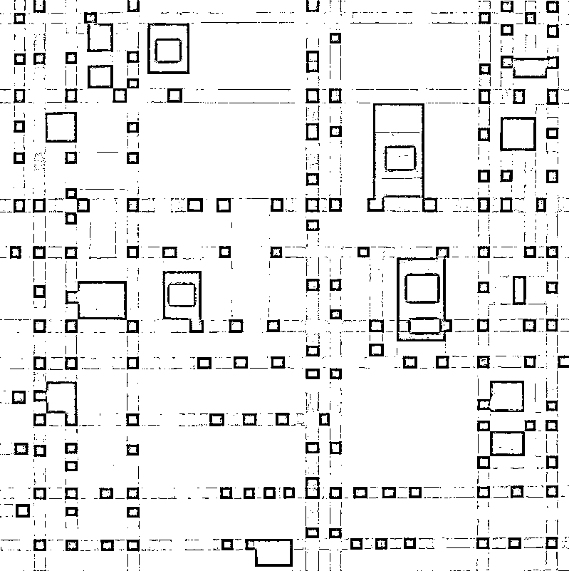

**太阳水瓶座+水星摩羯座**

相比起太阳水瓶座-水星水瓶座较为流利地表达自己的突发奇想，这种组合的人在**表达意见时略为深沉，他们的言语中透露出一股充满信服力的逻辑感**。在描述哪怕再小的问题时，这类人也会站在大的概念上进行论述，并且在表达时不带有太强的个人立场与情感，让他们的话语显得更加**客观**。

这些人也**非常善于检讨，用现状和实情来解释自己的想法为何如此**。与其说是像太阳天秤座-水星处女座的组合那样强于清晰的逻辑和换位思考，不如说他们**更擅长抓住事情的重点与规律**，且在任何时候都十分冷淡的情绪表现，让他们不会被恼人的细节所蒙蔽。

**在决策层面上，这类人会颇为“冷血”，会尽量把那些能干扰到自己的细枝末节的影响降到最低。**并非是他们对喜悦和悲伤视若无睹，而是不愿让暂时的情绪影响自己一时的判断，避免最终酿成大祸。他们可能会提醒自己，换一个时间再来做决定，那么就是不同的意见了，所以尽管这种组合中有着水瓶座的太阳，只要月亮或其他重要的内行星不落入白羊座，他们也仍然会有着较慢而稳的判断。

**太阳水瓶座+水星水瓶座**

**若是水星也在水瓶座，这类人通常会非常推崇理性，不情愿让自己的表达受到任何人的干扰，甚至是自己过去的意见，所以很容易“变卦”。**他们也会像太阳射手座-水星射手座的人一样，提出很多当下实现很困难的超前想法，但并不是出于射手座般的信念，而是水瓶座式的逻辑。而且在表述之中，喜欢用到很多的反对意见，来为自己补充说明。

这种组合的人**有着较清晰的头脑，但也容易忽略很多的细节**。若是太阳、水星合相很紧密，也容易一有什么就全然脱口而出，完全不考虑各种现实层面的限制。他们也通常对自己的智力有着较高的优越感，非常相信自己的判断。

在**表达层面上**，太阳水瓶座-水星水瓶座的人喜欢**把道理说全，并提出一些偏向独立视角的解读**，不一定会像是太阳处女座-水星处女座那样死抠细节，而是用更宏观的事态、常理的角度。出于对自身心智能力的自信，他们也大都喜欢表达自己的批驳意见，显露出自己的冷静、客观与优越。

在**决策层面上**，太阳水瓶座-水星水瓶座的人很**注重理论是否行得通，他们乐意去制定大胆的实验计划，也毫不介意推翻重来**。任何计划都带有很强的**预设性**，他们很愿意试着看看这么做是否成功，但他们也不会只停留在复制过去的成功。这对他们而言是无意义的重复，每次都需要来点新想法融入进去。

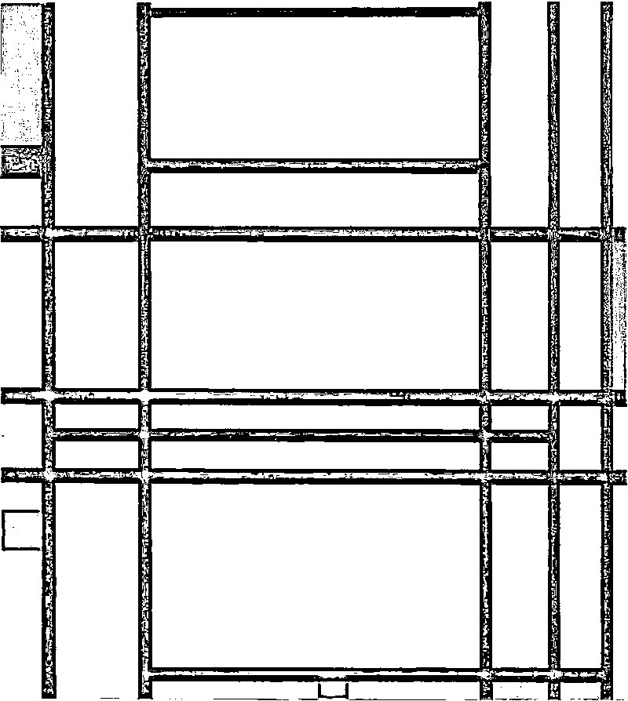

**太阳水瓶座+水星双鱼座**

当太阳水瓶座式的冷静、清晰和抽离，在经过双鱼座水星的滤网后，剩下的部分不会再那么冰凉、刻薄或冷酷。在各种太阳水瓶座与水星的结合中，属于表达上**较有人情味**的一种。

但与之相应的，是他们可能容易对别人产生一些**误导**。或许他们的初衷是想表达得绘声绘色一点，或是易于让人接受一些，但也容易把一些本就有些超前、抽象的概念描述地脱离了本质。变成说的人认为的是 A，听的人却以为是 B，然后双方还暂时达成了一致的共识，事后才发现根本不是这回事。

双鱼座的水星虽绘声绘色，但也**容易丢失言语的重点**，因为话中藏着点其他信息，可能需要更长时间才能让别人清楚自己的意思，有时候就显得很**耐人寻味**了。恐怕这也是非水元素、火元素组合中，最具前卫艺术气息的日水组合了。**这种组合的人不擅诉说现状和实际情况，而喜欢借理想中的状态，来隐晦地说明自己的意愿。**

在**决策层面上**，有着太阳水瓶座-水星双鱼座组合的人**比较相信一时之间的判断**。他们不会在一开始就把计划订满，也很难一条路坚持到底，而是喜欢做各种尝试，寻求一个当下合理，且又有足够退路的方向。相比起其他有着太阳水瓶座的组合，这些水星在双鱼座的人的想法明显更加**浪漫**，他们就像没有脚的鸟，一直不愿落地。

**版权声明：**本文由作者授权发布于若道，欢迎转发，反对抄袭。友号转载请申请白名单。


**太阳+水星星座系列，你可能还想知道**

[白羊座](https://mp.weixin.qq.com/s?__biz=MzA5NjA0NTAxNg==&mid=2651406342&idx=2&sn=ab8b3a91cce87e334d368555d9c53fbd&chksm=8b4bf2b1bc3c7ba704661802584f2b0ab0d0ad5e488e60ba8e314cee5376d69a9694b2ef01ff&token=2144587045&lang=zh_CN&scene=21#wechat_redirect) | [金牛座](https://mp.weixin.qq.com/s?__biz=MzA5NjA0NTAxNg==&mid=2651407011&idx=2&sn=37c8e419ab237ae90950e4eae30e2b57&chksm=8b4bf014bc3c7902eafb26fab854dfeee4b5c676a56a00618edd304d0833287b02fc2c812416&token=2144587045&lang=zh_CN&scene=21#wechat_redirect) | [双子座](https://mp.weixin.qq.com/s?__biz=MzA5NjA0NTAxNg==&mid=2651407271&idx=2&sn=3c16a4987525d98aae143b52f2ede818&chksm=8b4bf110bc3c78060a29a4492e434c2f2a66d334fcd20832696109b2552fb1187ed1d767711b&token=2144587045&lang=zh_CN&scene=21#wechat_redirect) | [巨蟹座](https://mp.weixin.qq.com/s?__biz=MzA5NjA0NTAxNg==&mid=2651408217&idx=2&sn=4cf2d4772cc1ed200444ef06391ffd36&chksm=8b4bf5eebc3c7cf8b6ff62a96cd8386cd8a3bbc60efa1e1667ce7b7ad6da764afc5727e8b4a5&mpshare=1&scene=21&srcid=07243vbLK4riTythzaSUeKdd&sharer_sharetime=1563938471114&sharer_shareid=79ff492e946a049c0745c8e806eec753&pass_ticket=gtqhMlmoskFIotTtja2BcL%20HZHbVqC045CkjC/l0SRg=#wechat_redirect)

[狮子座](https://mp.weixin.qq.com/s?__biz=MzA5NjA0NTAxNg==&mid=2651408958&idx=2&sn=ce114d7fb9b8954580657bd5bf094647&chksm=8b4bf889bc3c719fa9bd554a750354a589286ea8d16b7f5440bad89714722382940944598751&mpshare=1&scene=21&srcid=0830za0Hg85zADeNgQMJn4VJ&sharer_sharetime=1567152764120&sharer_shareid=79ff492e946a049c0745c8e806eec753&pass_ticket=YmYvKGKKpAB4aL%20iVRtr2xCm7ar1QNNOVTzAkMKv9M8=#wechat_redirect) | [处女座](http://mp.weixin.qq.com/s?__biz=MzA5NjA0NTAxNg==&mid=2651409737&idx=2&sn=b994cda1213485cf7e464bf0c5c6014e&chksm=8b4bfffebc3c76e8291561bc773e6cf80542492d7c290d0be3d18945e2744e7cf23f42b4b190&scene=21#wechat_redirect) | [天秤座](http://mp.weixin.qq.com/s?__biz=MzA5NjA0NTAxNg==&mid=2651410937&idx=2&sn=6decbfd3e3568160bd75166a00e86ada&chksm=8b4be34ebc3c6a5813739f94d33510700a0692d117df7cebacd28b5a0be68b4fb576d2fed354&scene=21#wechat_redirect) | [天蝎座](http://mp.weixin.qq.com/s?__biz=MzA5NjA0NTAxNg==&mid=2651411251&idx=2&sn=54c24418aee4cdc67ccb4ba7065743db&chksm=8b4be184bc3c6892d67a95371a1d5ee613c6ea40131f1f5fdbd1bbbeaf39514d3c084ea65821&scene=21#wechat_redirect)

[射手座](http://mp.weixin.qq.com/s?__biz=MzA5NjA0NTAxNg==&mid=2651412391&idx=2&sn=9bab034620ec34f1954bf88a0e6821b8&chksm=8b4be510bc3c6c068cb6b5f4352a407baf13910fff66a45042c84c70caebc6bc0427680aa914&scene=21#wechat_redirect) | [摩羯座](http://mp.weixin.qq.com/s?__biz=MzA5NjA0NTAxNg==&mid=2651412287&idx=2&sn=6cc3dc7f9795f555752e3a93feab0c6d&chksm=8b4be588bc3c6c9e5b684340cc6bc4cdf66d0753fdcc6d8cd6b9060ed7cc4785ac80ee3a624d&scene=21#wechat_redirect)

**想阅读更多作者的文章**

**请在后台回复 ****安德烈****即可**

**安德烈**

ISAR 认证占星师（2014 年获得）

全职心理占星师/若道金牌作者

**微信 ID**：Andres0819

**个人微博**：占星师安德烈

**微信公众号**：安德烈与心理占星（ID：xlzx-2016）

长按打赏


**双证书核心课程火热报名中**

**点击图片了解详情**

**

**微信又又又改版啦，不想错过若道的推送？**

**就把若道设为星标吧！**

**▼**


********报名直达入口********


# 金牌课程·中英双导师 Level1-2｜零基础线下工作坊，3 天入门

> 原文：[`mp.weixin.qq.com/s?__biz=MzA5NjA0NTAxNg==&mid=2651413015&idx=3&sn=c726221112571fcdbf25bfc9c253406b&chksm=8b4be8a0bc3c61b66699ee8d16629578040b9304de59092c460f6f2e192036cfe14d272feb54&scene=126&sessionid=1692738222#rd`](http://mp.weixin.qq.com/s?__biz=MzA5NjA0NTAxNg==&mid=2651413015&idx=3&sn=c726221112571fcdbf25bfc9c253406b&chksm=8b4be8a0bc3c61b66699ee8d16629578040b9304de59092c460f6f2e192036cfe14d272feb54&scene=126&sessionid=1692738222#rd)

****

**拥有 49 年占星实践经验的若道创始人**

**大卫·瑞雷**

**&**

**最懂学员的若道首位认证金牌中国老师**

**熊鹰**

**师徒二人****横跨南北****联手打造****北京上海**** 若道****全新****核心占星课程****之**

**互动实战占星初阶工作坊**

**本次****Level 1-2 工作坊****会分别在**

**上海（2020 年 3 月 13、14、15 日 熊鹰老师主讲）**

**北京（2020 年 4 月 4、5、6 日 大卫·瑞雷老师主讲）**

**两个城市各举办一场**

**方便北方、南方同学自由选择，邀请小伙伴一起学习**

**核心课现场工作坊是一种什么样的？**

珍贵的**面授工作坊**，全面而详细地讲解占星学知识，一场五感盛宴！

# **代入感：**向往占星世界好久了，迟迟没有下决心系统学习？最专业的占星老师来喽！带你穿越 9¾站台，进入真正的占星魔法世界，来若道，你就是哈利波特本特！


**沉浸感：**从虚拟的网络来到现实，舒适的学习环境，全新的占星同学，5D 的占星老师，专业的摄影团队，支持的工作人员~让你仿若重回校园梦，燃动青春学习占星！


**参与感：**大卫老师和天空老师都有丰富的教学经验，占星知识严肃专业，但开起玩笑来也丝毫不马虎，欢笑间知识都记住了呢，如果你长得可爱聪明伶俐，课上还会随时**被 Q**哦~对，就是你~


**仪式感：**两位老师超爱自己的中国学生们，为了让大家透彻地学习好宫位，2018 年初阶工作坊，大卫老师和熊鹰老师趴在地上用胶带贴的~仪式感满满~有没有~就宠你就宠你！今年还有没有其他的惊喜？


**亲近感：**周围全都是热爱占星的同学，那种亲近和被理解的感觉真的不要太美妙。志同道合的朋友就在身边，灵魂伴侣可能就在眼前，透露一下，在若道课堂里找到男女朋友的真的不要太多~比如~咳咳，总之带着八卦的心来上课吧~


**连报 L1-5 全阶课程，可以享受到：**❶51 次线上直播互动网络课程+3 场工作坊（互动实战占星初阶工作坊、亲密关系+职业占星工作坊、知识回顾+综合解读工作坊），全面而详细地讲解占星学知识、技能、案例和重要领域实践运用。 ❷知识点+学员星图解读有机结合：熊鹰老师以知识点和学员案例讲解为主，大卫·瑞雷老师以参课学员案例及客户案例讲解为主，每个知识点覆盖班级内学员的亲身案例，参与感更强，每位学员都有机会听到自己的星图分析。 ❸微信群学员互动分享，从真实案例学习生命成长故事。 ❹ 论坛提问：论坛上每个学员的问题都将得到及时回复。 ❺ 提供咨询师实习平台，只要努力，都将有机会在毕业前进行咨询的实习演练，听取客户反馈，为成为职业占星师做准备。

**1-2 阶我们要学习什么？**

**第一阶** ** 12 星座，12 种性格，12 种人生**❶ 学习占星学必须准备的“心法”**❷**占星学中的火、土、风、水四元素，阴阳法则**❸**面对面的星座有故事**❹ **12 星座：12 种性格详解，12 种行为模式，12 种价值观**❺ **太阳和月亮：了解你的太阳，生命的发动机，让你在世界闪光的方式，生命获得力量的方法；了解你的月亮，让你获得幸福的方法**❻ **了解太阳、月亮，了解你生命中已经出现的、将会出现的男性和女性

**第二阶  命运的线索和人生故事中的演员**

❶ 命运的线索：南北交点❷ 星图三巨头：太阳、月亮、上升点的故事❸ 了解心智：水星❹ 了解金钱和关系：金星❺ 了解行动模式：火星❻ 了解信念：木星❼ 了解努力：土星❽ 了解天才和疯狂：天王星❾ 了解梦想和幻灭：海王星❿ 了解死亡和重生：冥王星⓫ 12 个人生场景：黄道 12 宫位初解

**现场工作坊**

**上海（2020 年 3 月 13、14、15 日 熊鹰老师主讲）**

**北京（2020 年 4 月 4、5、6 日 大卫·瑞雷老师主讲）**


**如果你想马上开始学习 Level 1-2**现提供即买即学的**熊鹰老师网络视频课程**出售价格和工作坊一样

如果想同时购买网络课程视频+任一场现场工作坊可以享受**打包价**哈

```
购买视频课或购买视频+工作坊套餐的小伙伴
```

```
还能享受每月一次 2 小时的熊鹰老师直播答疑课，一共 4 次
```

具体购买方式看到最后~**这两位优秀的占星学老师是谁？**


**大卫·瑞雷（David Railey）**

*   ISAR 董事会成员，若道占星创始人。
*   1976 年，通过亚特兰大职业占星师考试，成为全职占星师，随后通过**AFAN 和 ISAR 职业测试**。
*   1980 年，与**杰夫·焦耳**一起在亚特兰大创建**“每日星球”**占星学中心。此后在亚特兰大占星协会担任 4 年考官，并且两次担任**亚特兰大地区占星协会主席**。
*   1979-1992 年，作为占星师活跃于美国社会媒体，向不了解现代占星学变化的大众宣传专业占星学知识。在 1989-1992 年期间，他在 WRGG 电台 12 频道每周主持个人电视秀**“今日占星学”**，早先他还在 WRFG 的广播节目中播讲宇宙天气节目。 
*   2010-2014 年，任**全美占星师联盟监督委员会委员**。
*   2010 年，其著作**《灵魂的目标》**中国版出版，和蒋颖一起创办**若道占星**学校和其官网 www.nodoor.com。从该年开始，他工作并往返于亚特兰大和北京。目前他 80%的时间致力于在中国教授和推广西方占星学。
*   2017 年，被选为**ISAR 委员会成员**（2017）。ISAR 是世界最大的国际占星机构，会员遍布 45 个国家。


**熊鹰老师（天空的空）**

*   2008 年接触严肃占星学，至此爱不释手。
*   **2013 年师从大卫·瑞雷**，研习整套现代占星学核心课程，并于 2014 年起至今连续三年担任该课程的主助教。
*   期间也**跟随格伦·佩里、诺·泰尔、理查德·塔纳斯、罗伯特·汉德、苏·汤普金斯、斯蒂芬·弗里斯特等多位国际顶尖占星大师进行学习**，进行定向占星主题研究。
*   2015 年初，通过国际占星研究协会**（ISAR）资质认证并获得证书**。同年，进一步跟随大卫·瑞雷老师进修**“生时校正”**技术，通过最终考核并获得证书。
*   目前在若道星文化任职，将传播系统、严谨、真实的占星学作为职业使命。任专职助教期间，进行沙龙与答疑等辅助教学工作已累计超过 200 小时。
*   在业余期间也提供占星咨询与生时校正服务。目前正致力于占星学与个人成长的整合。

**往届学员这样说**

★ **熊鹰老师非常清晰各阶段学员的难点在哪里，在哪里容易走弯路，所以在课程中给了针对性很强的技术讲解。**同时，学识广博的他对占星学术背后的道有非常深刻的思考，对占星学所表达的事物不断去溯源，去探寻本质，并在其他学问中去看到道的呼应，让我觉得非常过瘾和鼓舞。感谢熊鹰老师的启迪！ ——2017 若道占星核心课程熊鹰主讲 1-2 阶学员杨灿

**★ 知识渊博、博古通今、亲切可人、nice ，将东方的佛教文化、古诗词完美地与西方占星学结合，让学员特别容易理解**。很喜欢熊鹰（天空）老师，在巩固好 1、2 阶课程后，会追随空妈进行下一阶学习。

 ——2017 若道占星核心课程熊鹰主讲 1-2 阶学员王舒

★ **融合中国传统文化，把占星学规整得非常理性和易懂，空妈非常擅于观察和总结，给我们非常宝贵的经验。**我觉得效果非常好，以前对于各个星座和行星的概念比较片面，这次学完后觉得收获颇多，也打破了传统的限制，感觉到了与时俱进。 ——2017 若道占星核心课程熊鹰主讲 1-2 阶学员王茜★ 通过大卫老师课堂的案例咨询，我不仅对自己本身的特质和发展方向更加清晰，更开心的是清楚了自己处在怎样的发展阶段，外部环境对我的影响是怎样的，让我更加清晰应该怎样抓住机遇，在现阶段怎样努力。这些都是对我现在来说最重要的。**能够得到在课堂上享受这么专业精准的个案咨询，真的非常幸运。**——2017 若道占星核心课程大卫·瑞雷主讲 5 阶学员萧立★ 在课堂上获得了大卫咨询的宝贵机会。在一个多小时的咨询中，大卫首先演示了对客户星图的分析思路和推演过程，对客户的诸多发展方向和人生主题做出推测，并记录下来，待与客户见面时结合客户实际深入探讨。而后，大卫示范了如何与客户提问互动，从出生星图入手深入剖析案主的心理模式和原生家庭，并对案主的疑问进行解答。**坦白说，大卫的分析中肯且直中要害，对我来说像一道闪电，不仅准确地描述出我的原生家庭和童年生活环境，更击中了我多年来心中的隐痛**。这次咨询帮助我梳理了很多年来积压在心底的情绪，也在一定程度上疗愈了我，大卫的建议是如此地温和有力，让我感觉无比温暖，整个人被照亮了！再次感谢大卫，你的智慧和引导对我意义非凡！——2017 若道占星核心课程大卫·瑞雷主讲 5 阶学员龙爪槐下**若道核心课程教学支持体系****我们有****完善和系统的****核心课程教学支持体系****帮助你更好更全面地学习**


**什么人适合这门课？**

*   对占星学有浓厚兴趣，想要系统学习占星学
*   对占星学有一定基础，但不知道该如何整合星图复杂的碎片
*   希望成为优秀的占星师，想要借鉴国际大师解读思路并融入自己的体系
*   想学习占星学，但不擅长英文，希望有中文老师授课
*   想结合占星学理论与咨询实践

*   大卫·瑞雷、熊鹰的忠粉，学过占星，但就是想跟着偶像再学一遍

*   走在自我探索和个人成长道路上的人 

**课程费用****★ 1-5 阶****早鸟价：33000 元（2020 年 2 月 19 日之前）****课程费用：46500 元****★ 1-2 阶工作坊（北京工作坊、上海工作坊任选一场）****早鸟价：2800 元（2020 年 2 月 19 日之前）****课程费用：3500 元****★ 对于不方便上线下课的同学：可购买熊鹰老师 L1-2 视频课程****早鸟价：2800 元（2020 年 2 月 19 日之前）****课程费用：3500 元****★ 视频+现场都想要的同学：有套餐价哦**

```
购买熊鹰老师网络视频课程，每月有一次 2 小时的熊鹰老师直播答疑课，一共 4 次，工作坊不含，购买视频课或购买视频+工作坊套餐独享~
```

**北京工作坊、上海工作坊****任选一场****+熊鹰老师 L1-2 视频课程****早鸟价：4200 元（2020 年 2 月 19 日之前）****课程费用：5200 元****退转课程**

*   **退款原则请详看《教学协议》，如有疑问请咨询课程顾问。**

****中英双导师核心课 Level1-2****

**授课老师：大卫·瑞雷 熊鹰**

**授课时间：****上海**工作坊**** 2020 年 3 月 13、14、15 日 **北京**工作坊**** 2020 年 4 月 4、5、6 日

**授课方式：**中英文授课，中文翻译

**费用：******北京、上海工作坊任选一场**：**3500 元**早鸟价：2800 元（2020 年 2 月 19 日之前）；**

****1-2 阶视频课程：****3500 元**早鸟价：2800 元（2020 年 2 月 19 日之前）；**

****视频+现场套餐价：****5200 元** 早鸟价：4200 元（2020 年 2 月 19 日之前）**

**课程负责人：**王老师（微信：18510107057），请备注“核心课”

长按二维码添加课程负责人咨询~


****报名请点击“阅读原文”****


# 深度丨高阶摩羯座是如何养成的？这篇你得看看

> 原文：[`mp.weixin.qq.com/s?__biz=MzA5NjA0NTAxNg==&mid=2651412963&idx=1&sn=12ddb7e63180513acd3959a8474ac907&chksm=8b4beb54bc3c6242d014c72856ae44f23f56696738837e60a9955f5c903195bb14fcdaddec12&scene=126&sessionid=1692738227#rd`](http://mp.weixin.qq.com/s?__biz=MzA5NjA0NTAxNg==&mid=2651412963&idx=1&sn=12ddb7e63180513acd3959a8474ac907&chksm=8b4beb54bc3c6242d014c72856ae44f23f56696738837e60a9955f5c903195bb14fcdaddec12&scene=126&sessionid=1692738227#rd)

**☆ 后台回复“今日”，给你一句生命态度**

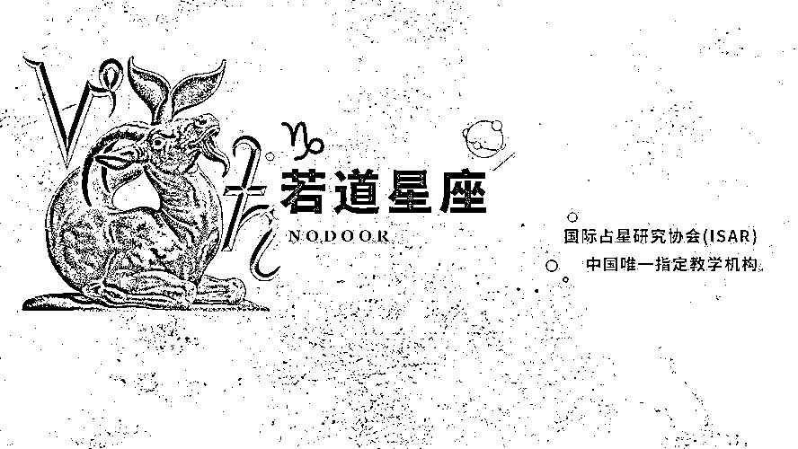

作者/佳黛 编辑/佳黛 Tang

封面/书君 图片/网络

**作者有话说**

当我接到这个选题的时候，映入我脑海里，首先跳出的关于摩羯座的关键词是：**不断更新的努力程度及持续攀爬的精神**。其实，只要是有过持续努力和“攀登”经验的人群就会了解，**持续的努力和“攀登”其实是件很消耗人的精神和耐力的事情**。

所以努力和攀登的过程、或者说本身看上去并不光鲜，只有**取得成果的样子才稍微看上去好些**。有一句曾经广为流传的话“你必须非常努力，才能看上去毫不费力”，对于这类人而言，也只能获得一个耸肩的反应。因为**表面是怎样单薄的一张纸，他们再了解不过了**。所以我想来与大家聊一聊这些在背后暗潮汹涌的东西。

**注意：本文不仅适用于各种摩羯座，还适用于土星与个人行星（太阳、月亮、水星、火星、木星）形成相位，以及各种被责任捆绑的人群。**

对于一个典型的摩羯座而言，最不缺的就是目标、努力和坚持。虽然可能在这个背后，还有一些“忍”和“憋”的成分，这个我们先按下不表，后面自然会有相关的讨论。让我们先从这些相对来说积极的面向入手。

**明****确的目标感**

对于摩羯座而言，**目标**是非常重要的。他们不似射手座般高举信念大旗，举起旗帜就仿佛无所不能；**摩羯座凭借的全是达到目标的那股韧劲儿**。当他们拥有明确目标的时候，这个目标就变成他们的**骨骼和脊柱**，支撑着他们的行动。即使疲惫不堪，仿佛下一秒就会倒下，只要是目标做骨，他们依旧可以“回光返照”地似地爬起。我这么说不是在嘲讽他们，而是摩羯座有时候目光只聚焦在努力这件事上，会很容易无视自己的状态和身体。废寝忘食这种事于他们而言，简直是非常“日常”了。于是，也只有每年一度的体检来临的时候，摩羯座盯着自己的体检报告，才会意识到“原来，我身体出了这么多毛病了啊……是不是该休息会了？”我们刚刚说了，明确的目标是摩羯座的脊背，**而一旦失去，他们会很容易变得茫然无助，力气不知道向何处使**。他们可能会在不太重要的地方特别努力和坚持，那是他们在消耗无处宣泄的能量。让我们联想一下摩羯座的原型，那个半人半羊的形象，它天生就擅长征服险峻的山峰。而你让一个高山征服者去走平地，甚至原地踏步走，保准不出多少步，它就开始怀疑人生，暴躁不安。因为**浪费了自己一身的才华和雄心壮志，而顿生无助感和无力感**。

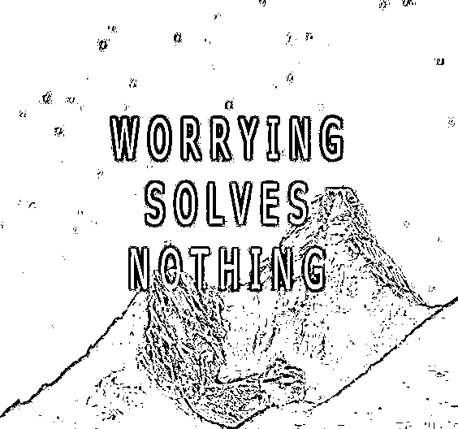

**丨**典型的摩羯座观念：“担忧不能解决任何事儿”。

**对****于标准和规则的坚持**

典型的摩羯座会非常**尊重规则**，**他们是那群没有规则都要创造出规则的人**。“没有规矩不成方圆”这句老话此时就显得非常适用。他们厌恶混沌不清，最不喜欢双鱼座式的一团浆糊作风。对于摩羯座来说，一个世界安全的标准则是充斥着各种明朗的规则，有暗线也没有关系，你别上来就坑我，先给我一点了解它的时间。

**真****实到有些悲凉的现实感**

摩羯座是个非常讲求实际的星座。他们达成目标是咽下现实生涩的部分，认下了命运中绝望的部分，从不仰仗所谓的幸运往前走的。据我一个非常典型的摩羯座朋友表述：“幸运？这种事情太偶然了，我都不敢指望。给我一次，我怎么知道下一次是什么时候？依靠它太虚妄了。”**他们实现一次，就希望实现第二次，希望摸索出其间坚实可信的脉络和规则**。我还有一个悲观的摩羯座朋友说：“我知道这世上有所谓的命运，但让我不尽我所能尽的努力，我这心里不安。”因为看见了太真实的现实，摩羯座心里总会产生一种**悲戚**，那是赤裸的现实感带来的。**当他们切实认下了这种悲戚，即使是再丑恶的现实，也不能将他们打倒**。

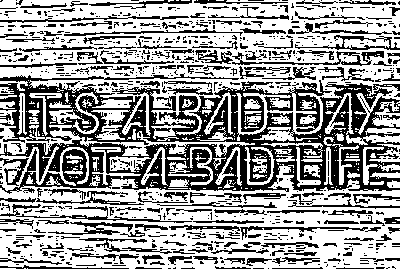

**丨**“今儿可真糟糕啊，但好在人生还没那么糟。”

然而，摩羯座往往不是天然如此，很多摩羯座并不是刚出生就变成如此功能良好的摩羯座，良性地运作着目标感、现实性和准则，他们也曾经历过“种种磨难”。这里的“磨难”我们指的是有些艰难的童年生活。

**早****期的摩羯座，严苛家庭的牺牲者**

**当我们拥有太阳摩羯座或者月亮摩羯座，或者土星与太阳、月亮形成硬相位的时候，可能代表着我们有一个严厉的父亲或母亲**。这样的父母可能会在我们人生早期**树立种种苛刻的规矩和要求**，而且对“达到要求”这一点几乎是必须百分百完成的。举一个小例子，我有一个摩羯座的朋友，在她很小的时候，母亲会禁止她做错事情时哭泣。每当她这么做的时候，母亲都会冷着脸站在一边：“哭有什么用？你知道你错哪了吗？”而当她讨好地向母亲撒娇，母亲都会避开，逼着她去说出“到底错在哪”。我们不难发现，在这类父母中，**他们设置的规矩大于一切**，不允许孩子破坏自己的规矩，并且会禁止他们在其中的感情流动。他们通过**回避、忽视**等方式，无视孩子当下的愧疚、无助等感受，一定会进行惩罚。据我这位朋友所说，在她高中之前，对于做错事情依旧很恐惧，并且这种恐惧伴随着一种“等待惩罚降临”的体验。所以在这里，**感受是被拒绝的**。**他们的早期世界里，充斥着各种必须要做到的规则，以及不断提高的要求**。**而且认可并不会伴随达成要求随之降临**。你考了班级第一，就要求你年级第一；还有全市第一全省第一……无止境的第一在等着你。而你做到之后，他们可能会奖励你物质，比如说，实质的金钱或者是其他东西，但如果你指望的是听见一句“做得真棒！”可能就一直不会如愿。

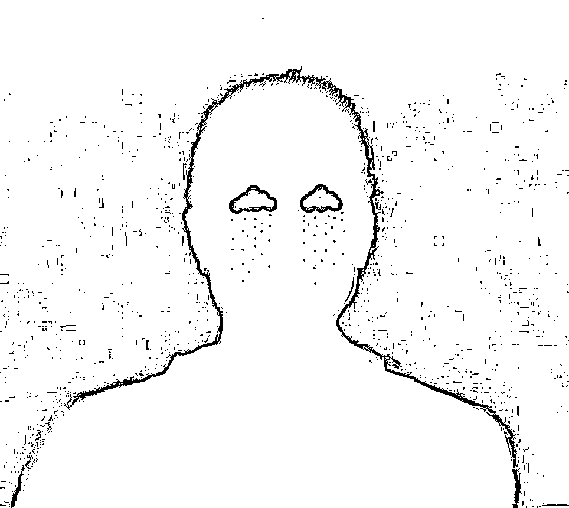**丨**嗯……可让人伤心了。

**这样的孩子成长了之后会如何呢？**✦**他们可能并不表达情感**当然，这个不是一定的，也会有愿意去表达情感的摩羯座。而表达情感的前提是认知和面对情感的能力。因为早期的压抑，给他们形成的固有思维方式就是“**情感是没用的**”（然而这点并不正确）。**父母过度忽视和拒绝承认情感的行为，并且没有教会他们认知足够的情感，有时候连他们自己都没法分辨当下的情感名称是什么**。比如你让他们具体描述惆怅的感觉是什么，他们可能一脸懵逼。**因为自我的缺乏，导致他们对于他人的情感也没有足够的同理心**。不过这也是自然的，就像你不能要求一个本身情感干涸的人给你提供足够的情感，除非他们能够先被滋养。所以对于摩羯座来说，**愿意被滋养也是需要越过的很重要的坎**（所以摩羯座的对宫是巨蟹座，摩羯座需要向巨蟹座学习情感的力量，学习滋养与被滋养）。✦**他们可能无法原谅犯错**如果他们对于父母的要求完成度很高，且每当犯错的时候就会受到惩罚，且之后没有被改写类似心理叙事的经历，他们会难以原谅自己犯错。虽然成年之后，可能已经没有父母再会在他们犯错之后进行惩罚，但是这种形象已经深深烙进了情感记忆里。所以他们可能自己会代替父母的这种角色，每当自己犯错的时候就进行自我惩罚，或者内心会有一个严苛的声音在指责着他们的错误，不给自己一点喘息和犯错的空间，因为犯错之后的愧疚感太庞大了，而**仿佛只有这样挤压着自己，心里的愧疚感才能有所减轻**。还有些人会在外部投射这类严苛的形象，比如有人总会面对严苛的伴侣或者严厉的上司，因为你投射了外界一个严苛的形象，而这些人就承接了这个角色，接替了父母曾经的形象，执行着发生错误时的惩罚。而对于接受惩罚的人，其实内心深处可能会产生一种“**愧疚感被安抚**”的心理。当他们自己作为伴侣的时候，因为没有接受过其他的方式，比如犯错时被原谅、被接纳。而实际上，“熟非圣贤，谁能无过”？他们可能就再次承接了父母的角色。当对方做错事情之后，如同父母一样严厉地指责或警告对方，而他们也意识不到这样的行为对伴侣的伤害。因为曾经犯过错的他们，也没有得到应有的谅解。他们可能也没有意识到自己正在重复父母的行为。

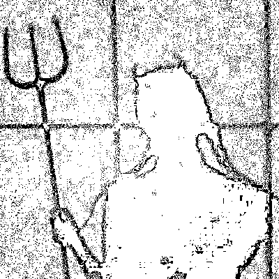

**丨**就如同心里有个严苛的“恶魔”。

✦**他人的肯定令你不适**因为自小从父母处获得的肯定实在是太少了，所以他们并不知道该如何面对肯定，我是该礼貌地说谢谢？还是象征性地开心一样？实际上，他们的身体里可能已经切断对于夸奖的期待，因为在童年艰难的处境中，这是一个无法被满足的需求，所以出于“实际”的考虑，以及一直期望无法被满足的东西实在是太痛苦了，所以他们往往会做出这个选择。所以在面对夸奖时，他们内心第一反应通常都是“**拒绝**”。比如你说“做得真棒啊”，他们可能就会说“没有没有没有，你搞错了”。他们的这种拒绝不一定是表面上说“啊不是不是”，然后内心沾沾自喜的那种；**而是从心底去拒绝承认“这件事我就是做得不错”的事实**。因为自小形成的模式就是：无止境的负面评价，然后努力去达成。只有不断地压榨自己，压抑自己，才是对的方式。这是他们形成的习气。于是**仿佛只有负面评价才能够督促他们前进，他们才有继续努力和向前的理由，而肯定则意味着努力的终结**。✦**心里有种急迫感**其实他们也知道这种方式并不好，当自我不断被压榨的时候，他们往往会觉得呼吸困难，或者身体里缺乏氧气，就像是连空气的吸入都应该被限制。他们也会意识到这一点，但意识到了之后，往往会体现出一种着急，“啊，我这么做不对，那我应该立马做到放松”。我们就想象一下，一个被不断挤压的弹簧，当这个弹簧已经被挤压到变形，它能够一下子回到最自然、最初的状态吗？并不能，当外界的力撤走，它会先大范围地反弹，接着呈现一种变形的状态，当你想要恢复最自然的状态，需要一点一点地矫正。而从紧绷到放松，也是这样一个循序渐进的过程。所以，不要着急呀，各位摩羯座。✦**永无止境的高要求及自我厌恶感**他们往往不止是对自己高要求，对其他人也是。如果你作为他们的伴侣，可能他们也会对你有这样那样的要求，并且你做到之后，可能也少会得到表扬。就如我们上面所说，他们对于肯定自己及他人这件事情，有着一定的障碍。**而规则清晰如他们，在“肯定”这件事情上的标准却是很少被建立的**。他们不擅长在情感上满足别人，给予对方当下需求的情感回应，因为他们的父母也没有给他们足够的回应。而浓厚的**自我厌恶感**，也往往与他们共生。因为没有充足的满足感、自豪感等正面的情绪，他们所拥有的大多是否定、回避、忽视等感受，他们无法给予自己足够的肯定，也会觉得自己不配拥有美好的东西。

**如****何才能进化成优秀的摩羯座？**

✦**首先，学会放松**我们前面提到了放松，这里再稍微具体说一下。当疲劳的时候，就停下来休息，累了就是累了，和放弃并没有什么关系。毕竟“养足精神才好继续战斗”嘛。而承认自己累了也并没有错。你可以放空、做瑜伽、健身……做任何你觉得有意义的事情，甚至什么都不做也很好。要接纳自己“什么都不做”的需求。每当你累了，需要放松，而此时，又升起了自我评判的话，就给自己一点暗示“我这么做是为了更好地努力，跟偷懒一点关系都没有。”✦**其次，肯定自己**也许摩羯座会经历很多的自我辩驳，所以每当有点沾沾自喜的时候，就立马打压下来。可以在打压来临之时，试着稍微停顿一下，去意识到，这就是你可以去肯定的自我的进步。 而当进步一点一点被肯定，成为“你”的基石也就在一步一步被建立，自我也就会越来越坚实。虽然也会面对再次被打破的局面，但是不断建构的意义，相信每个摩羯座都会懂得。✦**最后，接纳失败与成功**虽然作为摩羯座，失败这个词确实显得着实有点可怕，仿佛有种天塌了的感觉。但实际上，接纳失败是属于摩羯座的智慧功课，难啃，但啃下来之后受益无穷。老实说，作为一个群星摩羯座，但是这堆摩羯座又在 12 宫，所以可想而知，我的有一段人生如滑铁卢一般只有失败败败败败败，我甚至在那段人生里跟自己说“别想了，你这辈子就是个失败者了。”失败两字仿佛是落在我皮肤上的烙印，清晰可见。后来有一次我突然意识到，是我僵在了成败这两个字上，认为事情只有这两种情况，要么成，我就胜利；要么败，我就一塌糊涂。我钻进了成败的牛角尖里，让我的视野没法拓宽，没法看见事物背后更庞大的视角，没法接受成与败除了个人努力之外，更有其他的原因。我被绑在了成败的十字架上。而当我接受失败不过只是可能性的一种，我只要努力，不断发现事情的关隘、不断调整，等待时机来临，成功也只是可能性的一种。我放下了对成功和失败的执着。所以，走在进击路上的摩羯座们，愿你们进退无碍，未来风光无限。

**版权声明：**文章由作者授权在若道平台发布，欢迎转发，反对抄袭。友号转载请申请白名单。


**佳黛**

若道 2015 届核心课程学员，兼职占星师

现任若道微信部主编

长按打赏


******点击图片查看若道君推荐******


**微信又双叒叕改版啦，不想错过若道君的推送？**

**就把若道设为星标吧！**

**▼**


就是这个“在看”，戳戳戳 ☟

********报名直达入口********


# 目前市面上的占星学课让你觉得无聊了？这门新课你得看看

> 原文：[`mp.weixin.qq.com/s?__biz=MzA5NjA0NTAxNg==&mid=2651412963&idx=2&sn=044b400115327c126f40b5f0b9626a19&chksm=8b4beb54bc3c6242995e7597115a5870391ccf8f03ae7a1e9bfa63862fedd88aac878b2ae65e&scene=126&sessionid=1692738227#rd`](http://mp.weixin.qq.com/s?__biz=MzA5NjA0NTAxNg==&mid=2651412963&idx=2&sn=044b400115327c126f40b5f0b9626a19&chksm=8b4beb54bc3c6242995e7597115a5870391ccf8f03ae7a1e9bfa63862fedd88aac878b2ae65e&scene=126&sessionid=1692738227#rd)


有这样一则家喻户晓的故事：三个泥瓦匠在砌墙，一个人走过来，问他们在干什么。第一个泥瓦匠没好气地说：你没看见吗？我在辛苦地砌墙呢。第二个笑笑补充回答：我们正在建一座高楼。第三个则笑容灿烂哼着小曲儿说：我们正在为城市添砖加瓦、创造美好的生活。10 年过去了，第一个人仍然在做泥瓦匠，第二个人成为了一名工程师，而第三个人则成为建筑公司的老板。**工作技能本身没有区别，为什么三个人的人生走向却大相径庭？**

*   人的一生是见自己，见众生，见天地的过程。**不同的认知层次，形成了不同的人生格局。**它决定了你能看到的风景。我们常常抱怨命运不公，抱怨生活没有诗和远方，事实上，那是因为我们高度不够，格局太小。

*   同样，占星学习也是见自己，见众生，见天地的过程。**不同的认知层次，形成了不同的占星视野。**它决定了你可以运用这门语言看到怎样的风景。占星师常常困惑占星学习遭遇瓶颈，客户拓展资源不足，帮助来访者扩展格局能力不够。究其原因，是因为我们使用占星学的高度和格局不足。

晚清名臣曾国藩说：**谋大事者首重格局**。人和人不一样，拼的是格局。那又是什么决定着一个当代占星师的格局呢？大格局的本质是：**站得高，看得远，懂取舍**2020 春季开年 ISAR 选修课若道倾力打造不可不学的**经世占星学**一起来解锁全新大格局的占星版图吧！


占星之旅上半场拼的是知识技法占星之旅下半场拼的是眼界格局**为什么学习经世占星学？**

**经世占星学（mundane astrology）是研究世界政治经济发展趋势和世界各国发展周期的占星学研究分支。**

任何有一些人生阅历，对于国家历史、家族历史有所了解的人都会明白，我们的个人生活是时代和国家历史的缩影，我们个人经历的行进、推进是一条小溪，而更大的背景是世界和国家行进、推进的大河。大河的流向决定了小溪的流向。

学习经世占星学，**帮助我们及我们的客户这条小溪在这个世界的大江大河“顺势而为”**。具体而言：

*   在 21 世纪这个信息世纪，经世占星学可以帮助占星师开辟新的服务项目——**为高端企业家客户及大机构提供独特服务**，因为高端客户和大机构对于国际政治经济发展趋势，主要影响力国家、重要世界组织机构的现在和未来都更为敏感。对应国家的行进和推进，更好地预测这个国家或大型组织的未来发展、变化趋势；

*   在人口的国际间流动、交流更为频繁的时代，经世占星学通过了解各国的趋势，**可以在客户有国家选择需求时，帮助占星师为客户提供更多信息服务**。

*   如果你爱历史，经世占星学可以给你**看历史长河中世代兴衰起落的独特视角**；

*   如果你爱关注国际形势，经世占星学都能够让你更**了解每一个国家的国民个性、集体潜意识，社会议题和发展方向**；也能帮助你**对领导人及其国家的影响有更深刻的了解**。

**课程大纲****此课程可作为 ISAR 选修课。**在这 10 节课的时间里，我们将学习**经世占星学的重要研究方向**，包括但不限于：

*   行星周期对于世界发展及格局变化的影响
*   研究国家星图及行星周期对于国家的影响
*   研究外国领导人星图及对其国家的影响
*   如何从政府成立、总统就职时间的星图研究时事发展
*   如何从重要组织机构诞生星图（如北约、欧盟、欧元区、第一个现代证券交易所的诞生星图）看组织未来
*   如何从重大事件发生时的星图（比如从曼德拉出狱日期看南非转折和开端）发现该事件对于国家的影响

**授课老师**


**卡伦·哈梅克**·**佐达格**

**（Karen Hamaker Zondag）**

卡伦·哈梅克·佐达格是**20 世纪最受尊重和赞誉的占星师之一**，她毕业于荷兰阿姆斯特丹大学，于 1975 年开始她的占星实践。她是荷兰**两所学校的创始人之一**：一所是 1980 年成立的阿切纳占星学学校，另一所是 1987 年成立的荣格心理学学院。她也被邀请作为英国著名占星教育机构心理占星中心（Centre for Psychological Astrology）的老师和美国第一所真正的、官方的占星学大学开普勒学院任教，并是**世界各大占星会议最受欢迎的演讲人之一**。由于其**对占星学的独特贡献**，卡伦·哈梅克·佐达格在 1992 年、1995 年、1998 年分别获得占星学界最著名的奖项轩辕十四奖项提名，并于 1998 年获得**轩辕十四奖**。

卡伦·哈梅克·佐达格一个非常鲜明的个人特色是她的**研究涉猎广泛而深入，她在心理占星、金融占星、经世占星方面都是该领域排名前列的老师，并且深受该领域知名占星师的赞誉**。因为其在占星学的知名声誉，她从 2012 年被隶属于荷兰著名投资集团 Rasile 的 Dasym Research （Dasym 是全球电视节目的创新的著名领导者，比如《中国好声音》就是引入 Dasym Media 的版权）聘请为**智库成员**，该智库调研当前世界显性和隐性的社会经济趋势，为发展和投资决策服务。她也是**TEDx 演讲**人。


她是**20 多本占星学、心理学、塔罗、易经书籍的作者**，包括《从占星学视角看金融危机的背景和未来》、《性的占星学和疗愈》、《日常生活中的占星学》、《心灵和占星象征》、《作为生活之道的塔罗牌》、《12 宫》、《宫位的本质和背景》、《相位研究》、《四轴手册》、《卜卦占星》、《关系占星学》、《占星学预测》、《从新的角度看外行星》、《易经、冥想和灵性》、《实践中的荣格心理类型》、《日常生活中的灵性和心理学》、《实践中的投射机制》、《自我的愉悦——愉悦心理学》、《神话和现实》等。她的书籍因为**广受欢迎**，**被翻译为 10 多种文字在多国出版**。


**授课时间&方式**

**授课时间（共 10 次课）**：

*   2020 年 4 月 6 日（周一）

*   2020 年 4 月 14 日（周二）

*   2020 年 4 月 21 日（周二）

*   2020 年 4 月 28 日（周二）

*   2020 年 5 月 5 日（周二）

*   2020 年 5 月 12 日（周二）

*   2020 年 5 月 19 日（周二）

*   2020 年 5 月 26 日（周二）

*   2020 年 6 月 2 日（周二）

*   2020 年 6 月 8 日（周一）

**授课方式**：

**线上网络直播课，英文授课，中文翻译**

**课程价格**

**正价：7500 元**

**早鸟价：6800 元**

**早鸟价截止日期：2020 年 3 月 6 日**

**退转课程**

**退款原则请详看《教学协议》，如有疑问请咨询课程顾问。**

****ISAR 选修·经世占星学****

**授课老师：卡伦·哈梅克**·**佐达格**

**时间：**2020 年 4 月 6 日-6 月 8 日（共 10 次课）

**授课方式：**网络直播课，英文授课，中文翻译

**费用：**7500 元；**早鸟价：6800 元（2020 年 3 月 6 日之前）**

**课程负责人：**王老师（微信：18510107057），请备注“经世占星”

长按二维码添加课程负责人咨询~


****报名请点击“阅读原文”****


# 土星攻略 | 请你踏实耐劳、心无旁骛，巨大的礼物就在不远处

> 原文：[`mp.weixin.qq.com/s?__biz=MzA5NjA0NTAxNg==&mid=2651412918&idx=1&sn=f28c2a6341df3314d91eaaf04b5b5181&chksm=8b4beb01bc3c6217b385a088b11c4eeb5cc714fda38cac400273663b8afddbf498e7bbecf480&scene=126&sessionid=1692738227#rd`](http://mp.weixin.qq.com/s?__biz=MzA5NjA0NTAxNg==&mid=2651412918&idx=1&sn=f28c2a6341df3314d91eaaf04b5b5181&chksm=8b4beb01bc3c6217b385a088b11c4eeb5cc714fda38cac400273663b8afddbf498e7bbecf480&scene=126&sessionid=1692738227#rd)

********************☆ 后****************************台****************************回复“今日”，给你一句生命态度********************

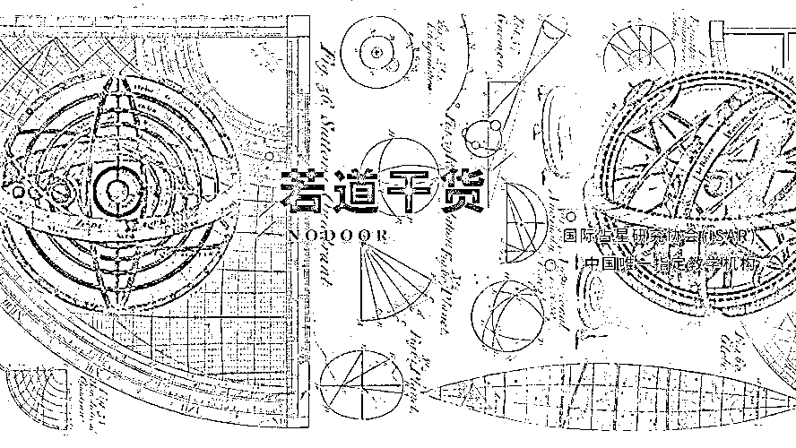

作者/阿兰·欧肯 译者/Arrow 校对/江艺

编辑/玫瑰 图片/unsplash

土星在摩羯座走了这么久，终于同冥王星合相了。这段时期对于所有人而言都不轻松。如果你的星图中有重要行星被行进土星触发，则更需要加倍小心谨慎地对待。在这里，若道君为你提供了土星行进的全攻略，愿我们都能够在土星行进期间收获巨大的成长。

**土星，守门的人****土星是经济规律的代表**。它**不喜欢任何层面的浪费**，**不允许我们欺诈、哄骗、回避，或逃避我们必须要做的事，以便正确处理与他人和自己的关系**。这是土星在象征平衡的星座天秤座曜升的原因之一。土星并非剥夺的代理人，事实上，它是一个试炼场，证明**一个人的成熟度和负责对待生活的能力，以及处理扩展意识的职责。****土星是业力之主，但很多是善业**。我们在生命中投入了什么，就会收获什么，如果我们的投入恰当，并且智慧地运用了我们的生命能量和资源，土星就会像“持镰收割者”（译注：圣经中耶稣把信徒比作麦子，等时候到了就要来收割——进入天堂）一样行动，而不是任何残忍之物。


**| **圣彼得的形象

土星站在入门的门口，准备测试任何**追寻高阶意识**之人。圣彼得是天堂的守门人，他是基督教征象系统中土星式的人物。当一个人走向天堂时，此人的行为和过失都会被置于终极的正义天平上衡量。这是土星在天秤座曜升的另一个原因。**怎样才能让土星不再“跟着你”**

土星是在地球上裸眼可见的最遥远的星球。它代表了**离太阳最近和最远的行星之间的边界**，因此，也划分了这些外行星的力量所带来的特定意识类型的恩典。换言之，如果没有首先实现个人性格早期发展的需求和个体自我的成熟，就无法期待将天王星、海王星和冥王星高八度的能量融入个人层面。因此，我们必须先**证明自己有能力应付日常生活的挑战，**才被允许**在更灵性的层面发挥功能**，并由此**处理这些层面的活动所带来的更重大的生命职责。**

某些占星流派中用**“守门人”**（Dweller on the Threshold）这个词来代替“大门守卫者”。在我们还未完成我们的义务和责任，还未偿还我们的业债，还未解放自我，从而带着更多觉知与爱服务人性之前，土星确保了我们无法通过“入门”的门槛。如此土星向我们提供了机会，**从生理业力加诸于我们的边界、限制和制约中释放自我**，这种业力源自我们的**原生家庭和低阶自我**的各个面向。星图中，这种业力由**月亮的位置和第 4 宫相关的事物**所象征。因此，这些因素与黄道对面的星座**（摩羯座）**、**宫位（中天和第 10 宫）以及行星（土星）**之间有一种非常特殊的关系。最终，通过我们出生星图（及行进）中土星所指向的成长和发展机会，我们逐渐平衡了过去业力带来的诸多挑战，达到了一种境界，使得我们真正可能**有觉知地对未来做出选择**。土星因此帮助我们**看清内在现实**，促使我们的进化发展成为可能。这个机会**代价高昂，常常伴有痛苦**。如果我们宣称自己可以真正帮助他人，在有生之年致力于服务世界，那么我们就该接受检验，看是否准备好了。这点毋庸置疑。**出生星图中土星的宫位**会揭示我们可能**在何处遭遇限制和自律的考验**。**一旦通过了必须的考验，跨过了门槛，进入高八度行星的领域，就可以说，“土星不能跟来了”**。在此之前，让我们欢迎土星来到我们的生命中，（此外，让我们面对现实——你没法把土星踢出去！）并且欣然接受这些机会，我们必须释放未成熟的业力，然后成长、成长、再成长。现在让我们看看土星的笑脸，审视这颗行星触及与你出生星图中行星的各种行进，从这些相位中汲取土星赐予的最好的礼物。

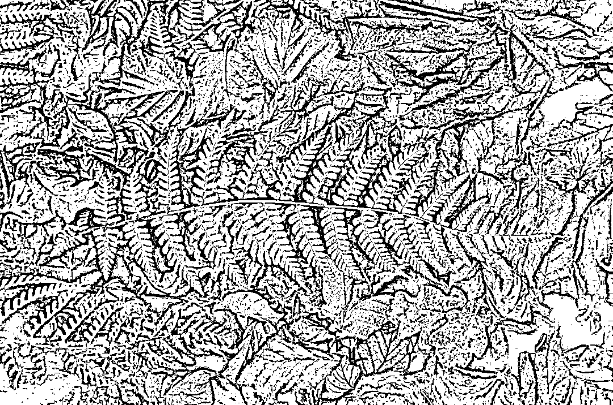

**土星和其他行星碰撞给我们带来的功课**

**土星和太阳**

这两颗行星之间的相位讲述的是**生命力**。**土星四分太阳容易削弱个人力量，对分太阳则意味着夺走你的活力（和个人权力）和（或）用这种外力（与外人，此人可能象征着对你的力量的挑战）的能量取而代之。**无论是何种相位，土星总是在敦促你**小心运用你的能量**。你现在有机会**确定创造性的项目，构建你在这个世界上的地位和专长**。你现在会被要求担任起**权威**的角色：**定义、架构、管理、指导、支持以及维系**。你能够**精简节约、分明主次**；**挑选你要做的事和做事的方式。****正面发挥时，土星和太阳会犒赏那些没有浪费生命力、尊重自身创造性潜能的人们**。你或许也会被要求**与长辈或权威打交道。**以**尊重和善意对待那些值得尊敬的人，**同时**从你的生活中清除那些滥用权力的人**。记住土星-太阳的动力非常类似**“父亲”**，因为他们讲的是**权力**的原型，其力量集中在**头脑和（或）身体内（包括社会地位）**。无论你性别为何，当土星行进进入你的生命，你会接受拷问：

*   我扮演了自己、他人和社会的好父亲吗？
*   或者，别人或社会是我的慈父吗？
*   我是受到支持还是遭遇了阻碍？我在支持还是阻碍自己和（或）他人？

**土星和月亮**

你有机会**定义你的情****绪、情感和对生活的直觉回应**。通过努力成为**有意识的观察者**，你会**更好地理解自己**。**观看你主观世界的电影，不要无意识地扮演电影的主角**。土星给你机会去**巩固你的情感本性，为其建立基础，为无形的情感塑形，为你感到无力的情感赋予力量**。无论你性别为何，当土星有力地触及月亮，你会担负起**“母亲式的行政管理角色”**。因此，你渴望培养完整的任务，在自己和他人的生活中**提供凝聚力**，这种渴望有了明确目标。

*   这些目标现在被卡住了吗（原因是你从过去带来的非再生的习惯性情感模式）？
*   或者你是否能依靠你的心理力量，促进人、计划和项目的成熟和发展？

有时**土星行进触及月亮会带来机会解决你与母亲之间的关系议题，引申开来还包括你与女性的普遍关系（也包括你内在的阴性能量，无论你是男是女）**。你现在有机会**呼吸、放松，释放你被拒绝、被遗弃的恐惧**。土星带来的礼物让你**远离破坏性的情绪和习惯的心理模式，转而去接纳**。如果你运用土星来维持原状，你会随着年龄的增长而愈发痛苦。

**土星和水星**

**你的生活中有何种思维模式和心理架构不再适用？**土星冲你微笑，给你机会**定义你内在的对话，将你从执念或难以实现的荒诞计划和项目中解脱出来**。你现在可以**少说多看**，由此获得力量。如果你**正确行事**，并**对自己的沟通方式深思熟虑**，**没有把时间和精力投入到不适当的地方**，那么你会**为自己免去不少悲伤**。土星父亲带来饱经风霜的智慧。土星母亲会鉴别形式。这一阶段适合去思索**过去怎样的心智表达形式和兴趣对你有效**，并仔细利用这些做出评估。

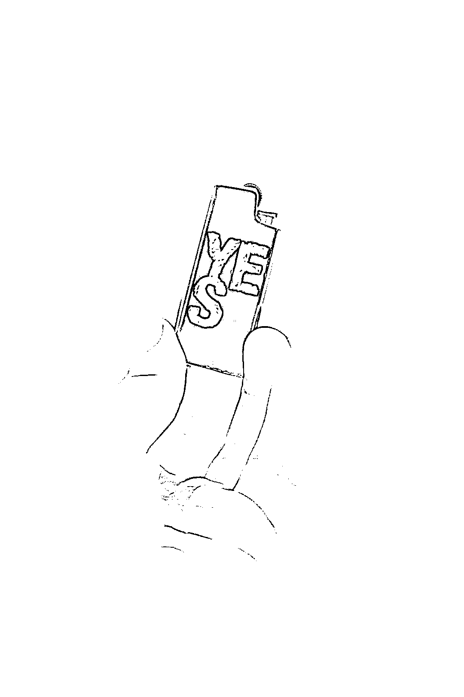

**土星和金星**

**你在生活中珍视哪些人？哪些关系以及何种关系真正支持着你？**检视你的过去，仔细观察**你具备的人际交往模式中，哪些对你有益，哪些对你无益**。相信你的心声**。**现在是时候**接受真爱的礼物，可以经受时间考验的爱**。对值得信任的老友说出善意的话语，行善意之举。联络那些可能好久不见的爱人。扪心自问你**真正重视自己身上哪些特质，享受你积极的生命特质所带来的力量与美好**。为自己、为你的成就、为你生活中确实有益的关系感到骄傲，你值得这一切。

**土星和火星**

我们都必须为那些对我们重要的事而斗争。现在这些斗争的焦点和方向一致了。生命中有许多场战役。我们不用场场必战，不是所有的仗都值得打。土星和火星让你有机会明白其间的不同，划分这些斗争和战役的优先顺序。你可以**为正义和你认同的正确之事挺身而出**。**如果现在有股比你强大的力量在与你对峙，最好撤退——但只是为了恢复体力，换个时间再继续战斗。**接受你所需要的训练，成为更强大的战士，但是首先要**确定这场仗是不是值得**。明智的撤退并非失败。

**土星和木星**

手风琴如果弹奏正确，可以是一件美物。反之，它就会成为所有乐器中最不协调的那个。让手风琴充满活力、赏心悦耳的方法是正确地平衡空气和压力。如果你能**将适度的自由和扩张与适度的巩固和限制结合**，土星和木星就会和谐一致。现在你有机会在**经济、哲学和专业**这些生活面向中推拉互动。此时，如果你能**明智地处理预算、现实地对待理想，理智地面对未来的目标**，土星就会给你送上丰厚的大礼。

**土星和土星**

土星现在给你大把机会，在你的生活中构架起**真正的结构和纪律**。离开了这些，你无法成就任何有价值的事。此时非常适合**在老师身边学习**。但是**如果你目前正与某个领域的所谓专家人物一起合作，而且对方展现出还不如你博学**，那么现在是时候**远离此人的影响**了。你可以通过**培养对生活负责的态度，撇开一切荒唐且浪费时间的活动，**从而**为自己的道路做准备。**此处的关键词是**“节食”**。这意味着瘦身——**减掉多余的体重、过度的情感负荷和无用的心理负担。**

**土星和天王星**

不要阻挡自己去**修正存在已久的计划和项目**的需求。你的世界观可能不再能帮助抓住眼前的机会。**开放接受他人的专业知识带来的馈赠，即使对方比你年长或年轻很多。**你必须**跨越同龄人特征的边界**。一群截然不同的人给你发出了讯息、建议和邀请。让自己敞开胸怀，去倾听他们，然后再决定是否要关门。一旦你谨慎地接纳了这些礼物，不带偏见，你就能决定是否需要参与。

**土星和海王星**

你现在有机会**将你的理想和抱负与你目前谨慎、务实的评估能力结合**。置身于自我和当前的环境之外，庆幸你可以知道自己的**边界**在哪里。如果你不确定，最好现在**不要做出承诺。**你能够在混乱的情形中看见清晰的出口吗？如果不能，土星会帮你**确定界限**——**不要继续向前，不要在不知深浅的情况下莽撞地闯入大海。**如果你现在感觉力不从心，**向你困扰的特定领域的专家寻求意见**。如果是财务负债，去见能帮你打理资源的顾问。如果是情绪负债，去见见心理咨询师，他们比你现在更了解人心和思维的运作方式。

**土星和冥王星**

如果明智地发挥这个相位，你已经**放开了那些不再为你所用的思维结构**。你也学会了**如何运用你的意志力，达成支持而非伤害你的目标**。你**与生活中掌权的人们聪明地相处，也没有不知后果地将自己的权力放给对方**。这个相位的礼物是**摧毁消极的习惯模式，**希望你会从中学习受益。

**版权声明：**本文由若道翻译发布，欢迎转发，反对抄袭。友号转载请申请白名单。


**点击图片查看若道君推荐**


[](http://mp.weixin.qq.com/s?__biz=MzA5NjA0NTAxNg==&mid=2651412358&idx=3&sn=9acab76ab2bdd317b432029d0b47b2a4&chksm=8b4be531bc3c6c274f40ea17a23bba503bdd732a0faaee91ec2502c4d4ae52ead0a2c7a5d3e5&scene=21#wechat_redirect)

**微信又双叒叕改版啦，不想错过若道君的推送？**

**就把若道设为星标吧！**

**▼**


就是这个“在看”，戳戳戳 ☟

********报名直达入口********


# 巴厘岛游学 | 追寻阿兰·欧肯的神秘之旅，现在报名省 1000 元！

> 原文：[`mp.weixin.qq.com/s?__biz=MzA5NjA0NTAxNg==&mid=2651412918&idx=2&sn=fa7eff96fdbe650dc212b83b2e78b921&chksm=8b4beb01bc3c62177658aea4a67633c10cbcddc4297c2ede8dd35937ff436471d2fe89e8e6c3&scene=126&sessionid=1692738227#rd`](http://mp.weixin.qq.com/s?__biz=MzA5NjA0NTAxNg==&mid=2651412918&idx=2&sn=fa7eff96fdbe650dc212b83b2e78b921&chksm=8b4beb01bc3c62177658aea4a67633c10cbcddc4297c2ede8dd35937ff436471d2fe89e8e6c3&scene=126&sessionid=1692738227#rd)


出发这件事常常会令人想起电影《美食、祈祷与恋爱》中，巴厘岛的巫医 ketut 递给女主 Liz 一幅画，并赠予了解读：

要脚踏实地，你就会感觉有四条腿，你就能在这个世上安稳下来；还有，不要用脑子看待世界，要用心去看，那样你才会了解上帝。

世间有太多纷繁复杂的事情我们要分析整理，反而忘却如何遵从心灵的声音，比如为了爱其他人而让自己的生活失衡；比如收藏了所有国家地理杂志的旅行专栏，最后哪里也没有去。偶然听到心中真实的声音，嘈杂的人生又容易失去相信自己的勇气。

幸好这世界上还有**巴厘岛**。


|  电影《美食、祈祷与恋爱》巴厘岛剧照

巴厘岛人说：“我们就站在世界的中心，我们就是世界的中心。”巴厘岛是一个充满灵性色彩存在的岛屿，在这个 5620 平方公里的岛屿上，散布着大大小小千余座印度教神庙，印度教思想、大乘佛教、传统的湿婆崇拜与岛上淳朴的自然崇拜、祖先崇拜交织在一起。巴厘岛人相信万物有灵，他们的生活沉浸在浓厚的神秘氛围中，他们相信自己脚下的土地是世界上最美的国度，是“世界的中心”。这座岛屿在 21 世纪的现代生活中成为一个特别异类的存在。而阿兰·欧肯，这位 75 岁深耕占星学和神秘学领域的老师，在多年前离开美国，在世界各地旅行之后，为这个岛屿独特的人文和场域所深深吸引，最终选择在巴厘岛定居。虽然阿兰·欧肯老师以占星大师身份为广大占星学子所知，但其实他更有许多神秘的古老智慧、实用的宇宙法则愿意传承，这对于我们的意识进化之旅将带来绝对深刻的了解和体悟。
**5 月 3-13 日**，阿兰·欧肯老师邀请你来到他的定居地——巴厘岛，开启这次意义非凡的巴厘岛神秘之旅，内容包括**3 日半阿兰·欧肯老师的神秘学工作坊**和穿插于其中的阿兰·欧肯老师为大家精心挑选的**巴厘岛神庙之旅**，阿兰·欧肯老师将带领大家，在理论学习的基础上，接触、感受巴厘岛的神秘之处，深入接触、体验古老智慧。****


巴厘岛游学**1****位宇宙级导师****11 日 10 晚****游学，含**3 日半****工作坊****** “****心灵成长****+****文化探秘****+****生活美学****”****若道首团游学探秘之旅****一次性满足你的所有新年跨国愿望！**

📹 [`v.qq.com/iframe/preview.html?width=500&height=375&auto=0&vid=b3041y0qg4q`](https://v.qq.com/iframe/preview.html?width=500&height=375&auto=0&vid=b3041y0qg4q)

|  阿兰·欧肯老师的巴厘岛故事

1**工作坊主题****“觉醒的头脑和心灵的实际运用”——疗愈、合一和意识发展的****22****条法则和原理**本次工作坊，阿兰·欧肯老师将带领大家进入他数十年修行的智慧世界，探讨 22 条宇宙法则，并审视如何将这些原则应用在我们的日常生活中。**工作坊具体内容，请咨询课程顾问王老师（微信：18510107057）****注意****：本工作坊不是占星工作坊，对神秘学感兴趣，没有占星基础的朋友也可以参加。****游学全程领队导师是阿兰·欧肯，并配有最专业的中文翻译。**
2**具体日程安排****游学时间：2020 年 5 月 3 日-5 月 13 日****地点：印度尼西亚 巴厘岛**

*   ### 5 月 3 日 游学集合：入住巴厘岛乌布斯塔拉翠贡精选酒店 


*   ### 5 月 4 日 上午水神庙、Pacung 午餐、下午海神庙；**晚上在斯塔拉翠贡精选酒店集体晚餐**


| 水神庙

 


|  Pacung 午餐


|  海神庙

*   **5 月 5 日 上午半日工作坊学习，和阿兰·欧肯老师一起冥想；下午到圣泉——巴厘岛的神圣净化池**

 


*   **5 月 6 日  半日工作坊学习、自由活动**

*   **5 月 7 日  半日工作坊学习，游览象窟——巴厘岛唯一的石窟寺院遗址**


 

*   **5 月 8 日 巴图布兰寺、著名的荷花咖啡厅午餐、塔曼阿云寺**

 


*   **5 月 9 日  全天工作坊学习**

*   **5 月 10 日  前往努沙杜瓦酒店 **


*   **5 月 11 日  全天工作坊学习**

*   **5 月 12 日  海边自由活动，晚上巴厘舞蹈表演**

 


*   **5 月 13 日  前往机场回家 巴厘岛游学圆满结束**

3**适合人群**

*   占星老学员，是时候补给宇宙智慧的你

*   灵性爱好者，擅长获取各类宇宙能量的你

*   文化探迷人，有机会零距离体验异域神秘学文化的你

*   旅行达人，不错过任何一次伟大旅程的你

*   巴厘岛狂热迷，去过巴厘岛无数次的你

*   没有任何原因就是被吸引很想报名的你

**注****：****本次游学无需任何知识基础皆可报名**

4**游学费用**

*   **2020 年 1 月 20 日前付款：24800 元**
*   **2020 年 2 月 15 日前付款：25800 元**

**此游学价格为****整体报价，不拆分****。****注意**: **因为该游学需要安排酒店、交通事项较多，因此****一旦缴费后，不再退费**。


**费用说明**

**游学费用****包含**：

3 日半“觉醒的头脑和心灵的实际运用”工作坊学费

5 月 3-12 日的巴厘岛住宿费

游学中的大部分餐费

巴厘岛集体活动时的交通费

游学涉及的所有景点门票

5 月 12 日晚的舞蹈表演

境外旅行意外险

**游学费用****不包含**：

学员从国内往返巴厘岛的交通费

巴厘岛岛内自由活动的交通费

以下自由活动的餐费自理：5 月 3 日到达日午餐、5 月 6 日自由活动晚餐、5 月 8 日晚餐、5 月 10 日前往努沙杜瓦酒店的午餐、5 月 12 日海边自由活动的午餐

**住宿说明**：

乌布斯塔拉翠贡精选酒店豪华房 Deluxe room（5 月 3 日晚-5 月 9 日晚共 7 晚）和努沙杜瓦酒店豪华房 Deluxe room（5 月 10 日-12 日，共 3 晚），标准为 2 人一个房间


5**导师介绍**


**阿兰·欧肯（Alan Oken）**

 

世界顶尖占星师

智慧学院（Santa Fe, NM）主任

澳大利亚意识发展研究所的联合创始人

翻译、教师、全球旅行者和国际导游

阿兰·欧肯，1944 年出生于美国纽约，在纽约大学主修罗曼斯语言和语言学。出版过十几本著作，比如《灵魂占星学》《星图中的守护关系》《阿兰·欧肯完整占星学》。他用 5 种语言授课，用 7 种语言解读星图。

6**退转课程**

**因为该游学需要安排酒店、交通事项较多，因此****一旦缴费后，不再退费****。**

****巴厘岛游学****

**领队老师&工作坊授课老师：阿兰·欧肯**

**游学时间：**2020 年 5 月 3 日-13 日（共 11 日 10 晚）

**游学地点**：印度尼西亚 巴厘岛

**游学方式：**巴厘岛探秘之旅+3 日半工作坊，游学全程由阿兰·欧肯领队，并配有最专业的中文翻译。

**费用：**

**2020 年 1 月 20 日前付款：24800 元**

**2020 年 2 月 15 日前付款：25800 元**

**课程负责人：**王老师（微信：18510107057），请备注“巴厘岛”

长按二维码添加课程负责人咨询~


****报名请点击“阅读原文”****


# 金牌课程 | 中英双导师 L1-5，系统学习占星学的必修课

> 原文：[`mp.weixin.qq.com/s?__biz=MzA5NjA0NTAxNg==&mid=2651412875&idx=3&sn=e110d79fd17c682fddb6536cbcedd720&chksm=8b4beb3cbc3c622a99e252619d30dcfaf3476a41c91d8a9bae619c8ae3e88c97cd15b5eb80e7&scene=126&sessionid=1692738227#rd`](http://mp.weixin.qq.com/s?__biz=MzA5NjA0NTAxNg==&mid=2651412875&idx=3&sn=e110d79fd17c682fddb6536cbcedd720&chksm=8b4beb3cbc3c622a99e252619d30dcfaf3476a41c91d8a9bae619c8ae3e88c97cd15b5eb80e7&scene=126&sessionid=1692738227#rd)


**拥有****49****年占星实践经验的若道创始人**
**大卫·瑞雷****&****最懂学员的若道首位认证****金牌中国****老师****熊鹰****师徒二人****横跨南北****联手打造****北京上海**** 若道****全新****核心占星课程****之**

**互动实战占星初阶工作坊**

**本次****Level 1-2 工作坊****会分别在**

**上海（2020 年 3 月 13、14、15 日 熊鹰老师主讲）**

**北京（2020 年 4 月 4、5、6 日 大卫·瑞雷老师主讲）**

**两个城市各举办一场**

**方便北方、南方同学自由选择，邀请小伙伴一起学习**

**核心课现场工作坊是一种什么样的？**

珍贵的**面授工作坊**，全面而详细地讲解占星学知识，一场五感盛宴！

# **代入感：**向往占星世界好久了，迟迟没有下决心系统学习？最专业的占星老师来喽！带你穿越 9¾站台，进入真正的占星魔法世界，来若道，你就是哈利波特本特！


**沉浸感：**从虚拟的网络来到现实，舒适的学习环境，全新的占星同学，5D 的占星老师，专业的摄影团队，支持的工作人员~让你仿若重回校园梦，燃动青春学习占星！


**参与感：**大卫老师和天空老师都有丰富的教学经验，占星知识严肃专业，但开起玩笑来也丝毫不马虎，欢笑间知识都记住了呢，如果你长得可爱聪明伶俐，课上还会随时**被 Q**哦~对，就是你~


**仪式感：**两位老师超爱自己的中国学生们，为了让大家透彻地学习好宫位，2018 年初阶工作坊，大卫老师和熊鹰老师趴在地上用胶带贴的~仪式感满满~有没有~就宠你就宠你！今年还有没有其他的惊喜？


**亲近感：**周围全都是热爱占星的同学，那种亲近和被理解的感觉真的不要太美妙。志同道合的朋友就在身边，灵魂伴侣可能就在眼前，透露一下，在若道课堂里找到男女朋友的真的不要太多~比如~咳咳，总之带着八卦的心来上课吧~


**连报 L1-5 全阶课程，可以享受到：**❶ 51 次线上直播互动网络课程+3 场工作坊（互动实战占星初阶工作坊、亲密关系+职业占星工作坊、知识回顾+综合解读工作坊），全面而详细地讲解占星学知识、技能、案例和重要领域实践运用。 ❷知识点+学员星图解读有机结合：熊鹰老师以知识点和学员案例讲解为主，大卫·瑞雷老师以参课学员案例及客户案例讲解为主，每个知识点覆盖班级内学员的亲身案例，参与感更强，每位学员都有机会听到自己的星图分析。 ❸微信群学员互动分享，从真实案例学习生命成长故事。 ❹ 论坛提问：论坛上每个学员的问题都将得到及时回复。 ❺ 提供咨询师实习平台，只要努力，都将有机会在毕业前进行咨询的实习演练，听取客户反馈，为成为职业占星师做准备。

**1-2 阶我们要学习什么？**

  **第一阶** ** 12 星座，12 种性格，12 种人生**❶ 学习占星学必须准备的“心法”**❷**占星学中的火、土、风、水四元素，阴阳法则**❸**面对面的星座有故事**❹ **12 星座：12 种性格详解，12 种行为模式，12 种价值观**❺ **太阳和月亮：了解你的太阳，生命的发动机，让你在世界闪光的方式，生命获得力量的方法；了解你的月亮，让你获得幸福的方法**❻ **了解太阳、月亮，了解你生命中已经出现的、将会出现的男性和女性

**第二阶  命运的线索和人生故事中的演员**

❶ 命运的线索：南北交点❷ 星图三巨头：太阳、月亮、上升点的故事❸ 了解心智：水星❹ 了解金钱和关系：金星❺ 了解行动模式：火星❻ 了解信念：木星❼ 了解努力：土星❽ 了解天才和疯狂：天王星❾ 了解梦想和幻灭：海王星❿ 了解死亡和重生：冥王星⓫ 12 个人生场景：黄道 12 宫位初解

**现场工作坊**

**上海（2020 年 3 月 13、14、15 日 熊鹰老师主讲）**

**北京（2020 年 4 月 4、5、6 日 大卫·瑞雷老师主讲）**


**如果你想马上开始学习 Level 1-2**现提供即买即学的**熊鹰老师网络视频课程**出售价格和工作坊一样如果想同时购买网络课程视频+任一场现场工作坊可以享受打包价哈具体购买方式看到最后~

**3 阶开始的网络直播课**

老师同学都认识的差不多了，从三阶开始就是更方便灵活的网路直播课喽

**第三阶 宫位、相位以及初步解读星图****（15 次课）**❶ 15 次线上直播网络课程，每次 2 小时，堂课中依旧会使用同学们的星图作示范❷  10 节课由熊鹰老师教授，重点通过名人星图阐释知识点❸  5 节课由大卫·瑞雷老师教授，重点通过学员星图阐释知识点❹  从第三阶开始，助教将会指导练习，答疑解惑，学练结合❺  重点在于如何根据星图去问问题，着重自我发现和自我探索的过程**课程安排**2020 年 6 月 4 日：宫位，行星和星座组合 2020 年 6 月 11 日：宫位，行星和星座组合 2020 年 6 月 18 日：月亮交点 2020 年 7 月 2 日：月亮交点和演示案例 2020 年 7 月 9 日：相位 2020 年 7 月 16 日：相位+星座，行星和宫位 2020 年 7 月 23 日：相位，星座，行星和宫位的同学案例 2020 年 7 月 30 日：渐盈相位&渐亏相位，示例 2020 年 8 月 6 日：更多的关于宫位和宫主星 2020 年 8 月 13 日：同学案例 2020 年 8 月 20 日：空相行星&定位星 2020 年 8 月 27 日：宫主星 2020 年 9 月 3 日：优先级和组织 2020 年 9 月 17 日：相位模式以及范例 2020 年 9 月 24 日：学员星图解读范例**第四阶 出生星图解读（进阶）以及关系与职业议题****（12 次课，1 场四日亲密关系+职业占星工作坊）**❶ 12 次线上直播网络课程，每次 2 小时，堂课中依旧会使用同学们的星图作案例❷ 8 节课由熊鹰老师教授，4 节课由大卫·瑞雷老师教授

❸ 1 场北京现场四日工作坊：亲密关系+职业占星，学生将被选中进行案例演示和互动。

**工作坊安排：****2020 年 10 月 29 日、30 日、31 日、11 月 1 日四日北京工作坊****亲密关系（两天）+职业（两天）占星工作坊**学员将被选中进行案例演示和互动（免费）。**课程安排**

2020 年 11 月 26 日：整合星图和星图优先级

2020 年 12 月 3 日：综合解读

2020 年 12 月 10 日：整体案例

2020 年 12 月 17 日：亲密关系/对比星图

2021 年 1 月 7 日：占星学和对比星图的例子

2021 年 1 月 14 日：对比星图同学案例

2021 年 1 月 21 日：对比星图同学案例

2021 年 1 月 28 日：占星学的职业介绍

2021 年 2 月 4 日：占星学的职业案例

2021 年 2 月 18 日：占星学的职业同学案例

2021 年 2 月 25 日：儿童职业发展

2021 年 3 月 4 日：亲密关系/职业同学案例

**五阶 预测、关系、咨询、为执业和考试做准备****（24 次课，1 四日工作坊）**❶ 24 次线上直播网络课程，每次 2 小时，堂课中依旧会使用同学们的星图作案例❷ 15 节课由熊鹰老师教授，12 节课由大卫·瑞雷老师教授

❸ 1 场综合解读工作坊（北京）：把一切串联起来，学生将被选中进行案例演示和互动。

**工作坊安排：****2021 年 9 月 2 日、3 日、4 日、5 日四日综合解读工作坊（**北京**）**把一切串联起来，L1-5 知识回顾，综合解读学员将被选中进行案例演示和互动（免费）。**课程安排：**2021 年 4 月 15 日：行进介绍 12021 年 4 月 22 日：行进介绍 22021 年 4 月 29 日：行进介绍 32021 年 5 月 6 日：当下的行进的同学案例 2021 年 5 月 13 日：周期，重置星图 2021 年 5 月 20 日：当下的行进和周期的同学案例 2021 年 5 月 27 日：次限 2021 年 6 月 3 日：次限同学案例 2021 年 6 月 10 日：太阳弧 2021 年 6 月 17 日：太阳弧同学案例 2021 年 6 月 24 日：亲密关系的关键节点+组合星图 2021 年 7 月 1 日：亲密关系的关键节点，组合星图同学案例 2021 年 7 月 8 日：职业周期 2021 年 7 月 15 日：职业周期同学案例 2021 年 7 月 22 日：太阳返照&月亮返照 2021 年 7 月 29 日：太阳返照&月亮返照同学案例 2021 年 8 月 5 日：高级预测技巧 2021 年 8 月 12 日：高级预测同学案例 2021 年 8 月 19 日：高级预测技巧 22021 年 8 月 26 日：高级预测同学案例 22021 年 9 月 2 日：简单的占星学历史 2021 年 9 月 9 日：占星学的不同流派 2021 年 9 月 16 日：ISAR 考试术语和复习 2021 年 9 月 23 日：ISAR 考试术语和复习**这两位优秀的占星学老师是谁？**


**大卫·瑞雷（David Railey）**

*   ISAR 董事会成员，若道占星创始人。
*   1976 年，通过亚特兰大职业占星师考试，成为全职占星师，随后通过**AFAN 和 ISAR 职业测试**。
*   1980 年，与**杰夫·焦耳**一起在亚特兰大创建**“每日星球”**占星学中心。此后在亚特兰大占星协会担任 4 年考官，并且两次担任**亚特兰大地区占星协会主席**。
*   1979-1992 年，作为占星师活跃于美国社会媒体，向不了解现代占星学变化的大众宣传专业占星学知识。在 1989-1992 年期间，他在 WRGG 电台 12 频道每周主持个人电视秀**“今日占星学”**，早先他还在 WRFG 的广播节目中播讲宇宙天气节目。 
*   2010-2014 年，任**全美占星师联盟监督委员会委员**。
*   2010 年，其著作**《灵魂的目标》**中国版出版，和蒋颖一起创办**若道占星**学校和其官网 www.nodoor.com。从该年开始，他工作并往返于亚特兰大和北京。目前他 80%的时间致力于在中国教授和推广西方占星学。
*   2017 年，被选为**ISAR 委员会成员**（2017）。ISAR 是世界最大的国际占星机构，会员遍布 45 个国家。


**熊鹰老师（天空的空）**

*   2008 年接触严肃占星学，至此爱不释手。
*   **2013 年师从大卫·瑞雷**，研习整套现代占星学核心课程，并于 2014 年起至今连续三年担任该课程的主助教。
*   期间也**跟随格伦·佩里、诺·泰尔、理查德·塔纳斯、罗伯特·汉德、苏·汤普金斯、斯蒂芬·弗里斯特等多位国际顶尖占星大师进行学习**，进行定向占星主题研究。
*   2015 年初，通过国际占星研究协会**（ISAR）资质认证并获得证书**。同年，进一步跟随大卫·瑞雷老师进修**“生时校正”**技术，通过最终考核并获得证书。
*   目前在若道星文化任职，将传播系统、严谨、真实的占星学作为职业使命。任专职助教期间，进行沙龙与答疑等辅助教学工作已累计超过 200 小时。
*   在业余期间也提供占星咨询与生时校正服务。目前正致力于占星学与个人成长的整合。

**往届学员这样说**

★ **熊鹰老师非常清晰各阶段学员的难点在哪里，在哪里容易走弯路，所以在课程中给了针对性很强的技术讲解。**同时，学识广博的他对占星学术背后的道有非常深刻的思考，对占星学所表达的事物不断去溯源，去探寻本质，并在其他学问中去看到道的呼应，让我觉得非常过瘾和鼓舞。感谢熊鹰老师的启迪！ ——2017 若道占星核心课程熊鹰主讲 1-2 阶学员杨灿

**★ 知识渊博、博古通今、亲切可人、nice ，将东方的佛教文化、古诗词完美地与西方占星学结合，让学员特别容易理解**。很喜欢熊鹰（天空）老师，在巩固好 1、2 阶课程后，会追随空妈进行下一阶学习。

 ——2017 若道占星核心课程熊鹰主讲 1-2 阶学员王舒

★ **融合中国传统文化，把占星学规整得非常理性和易懂，空妈非常擅于观察和总结，给我们非常宝贵的经验。**我觉得效果非常好，以前对于各个星座和行星的概念比较片面，这次学完后觉得收获颇多，也打破了传统的限制，感觉到了与时俱进。 ——2017 若道占星核心课程熊鹰主讲 1-2 阶学员王茜★ 通过大卫老师课堂的案例咨询，我不仅对自己本身的特质和发展方向更加清晰，更开心的是清楚了自己处在怎样的发展阶段，外部环境对我的影响是怎样的，让我更加清晰应该怎样抓住机遇，在现阶段怎样努力。这些都是对我现在来说最重要的。**能够得到在课堂上享受这么专业精准的个案咨询，真的非常幸运。**——2017 若道占星核心课程大卫·瑞雷主讲 5 阶学员萧立★ 在课堂上获得了大卫咨询的宝贵机会。在一个多小时的咨询中，大卫首先演示了对客户星图的分析思路和推演过程，对客户的诸多发展方向和人生主题做出推测，并记录下来，待与客户见面时结合客户实际深入探讨。而后，大卫示范了如何与客户提问互动，从出生星图入手深入剖析案主的心理模式和原生家庭，并对案主的疑问进行解答。**坦白说，大卫的分析中肯且直中要害，对我来说像一道闪电，不仅准确地描述出我的原生家庭和童年生活环境，更击中了我多年来心中的隐痛**。这次咨询帮助我梳理了很多年来积压在心底的情绪，也在一定程度上疗愈了我，大卫的建议是如此地温和有力，让我感觉无比温暖，整个人被照亮了！再次感谢大卫，你的智慧和引导对我意义非凡！——2017 若道占星核心课程大卫·瑞雷主讲 5 阶学员龙爪槐下**若道核心课程教学支持体系****我们有****完善和系统的****核心课程教学支持体系****帮助你更好更全面地学习**


**什么人适合这门课？**

*   对占星学有浓厚兴趣，想要系统学习占星学
*   对占星学有一定基础，但不知道该如何整合星图复杂的碎片
*   希望成为优秀的占星师，想要借鉴国际大师解读思路并融入自己的体系
*   想学习占星学，但不擅长英文，希望有中文老师授课
*   想结合占星学理论与咨询实践

*   大卫·瑞雷、熊鹰的忠粉，学过占星，但就是想跟着偶像再学一遍

*   走在自我探索和个人成长道路上的人 

**课程费用****★ 1-5 阶****早鸟价：33000 元（2020 年 2 月 19 日之前）****课程费用：46500 元****★ 1-2 阶工作坊（北京工作坊、上海工作坊任选一场）****早鸟价：2800 元（2020 年 2 月 19 日之前）****课程费用：3500 元****★ 对于不方便上线下课的同学：可购买熊鹰老师 L1-2 视频课程****早鸟价：2800 元（2020 年 2 月 19 日之前）****课程费用：3500 元****★ 视频+现场都想要的同学：有套餐价哦****北京工作坊、上海工作坊****任选一场****+熊鹰老师 L1-2 视频课程****早鸟价：4200 元（2020 年 2 月 19 日之前）****课程费用：5200 元****退转课程**

*   **退款原则请详看《教学协议》，如有疑问请咨询课程顾问。**

****中英双导师核心课 Level1-5****

**授课老师：大卫·瑞雷 熊鹰**

**授课时间：****1-2 阶工作坊，上海** 2020 年 3 月 13、14、15 日**北京** 2020 年 4 月 4、5、6 日 ；**3-5 阶，**2020 年 6 月 4 日

**授课方式：**网络课程，中英文授课，中文翻译；现场工作坊，中英文授课，中文翻译

**费用：1-5 阶：**46500 元**早鸟价：33000 元（2020 年 2 月 19 日之前）；** **1-2 阶**（北京、上海工作坊任选一场）**：**3500 元**早鸟价：2800 元（2020 年 2 月 19 日之前）；******1-2 阶视频课程：****3500 元**早鸟价：2800 元（2020 年 2 月 19 日之前）；**

****视频+现场套餐价：****5200 元** 早鸟价：4200 元（2020 年 2 月 19 日之前）**

**课程负责人：**王老师（微信：18510107057），请备注“核心课”

长按二维码添加课程负责人咨询~


**阅读原文报名链接为：中英双导师 Level1-5 北京工作坊**

**想报名上海工作坊或购买熊鹰网络视频课程的小伙伴**

**记得私信销售小姐姐咨询哦**

****报名请点击“阅读原文”****


# 这两个宫位可不止是“钱”的事，还能促使你 get 到“新技能”

> 原文：[`mp.weixin.qq.com/s?__biz=MzA5NjA0NTAxNg==&mid=2651412875&idx=2&sn=509063a30f05a8a90dd7ebcea96cf006&chksm=8b4beb3cbc3c622aaf0615b4c80a4a4db0cab15e9012cf4da4dbbaa3d8ee57c3680737109d12&scene=126&sessionid=1692738227#rd`](http://mp.weixin.qq.com/s?__biz=MzA5NjA0NTAxNg==&mid=2651412875&idx=2&sn=509063a30f05a8a90dd7ebcea96cf006&chksm=8b4beb3cbc3c622aaf0615b4c80a4a4db0cab15e9012cf4da4dbbaa3d8ee57c3680737109d12&scene=126&sessionid=1692738227#rd)

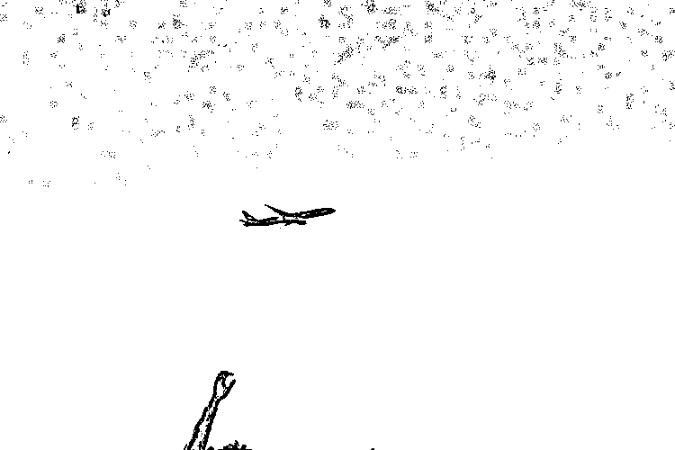作者/HIROKI NIIZATO（新里弘树）
翻译/李含 校对/王宏编辑/Tang 图片/pexels

星图中的第二宫总是让我们联想到资源、财富，第八宫则让人与性、死亡关联在一起。今天作者想要领我们从不一样的角度来聊聊这两个宫位，一起来看看吧。

01

**第二宫 vs 第八宫**

通常提到第二宫，我们很直接地会想到所有权、拥有、财产、自我价值，一个人在生命中所重视的事物，富足感、金钱以及金钱观、物质世界。关于这个宫位，我们会去问，“值不值得？”“我要什么？”“我想拥有什么？”

而在对面的第八宫，是命中最深沉的主题，如死亡、性、亲密关系，这里也代表着他人的钱财、共有物品、借款或贷款、税、保险、遗产等等。在这个宫位里，我们看到了权力投放、嫉妒和猜忌，也看到了转化、重生和锐变。

但是，这条对宫轴线不仅仅只是如此，还有更多的意涵。第二宫与第八宫之间形成了对分的紧张局势，造成了巨大张力，这里面还藏着些其他的东西，你可能没有想过“比较”与“批评”的习惯也会和这两个宫位有关。

02

**为什么你老想和别人比？**

在心理占星学中，**第八宫代表**“**他人的价值观和自我价值**”。考虑到第八宫总是和**第二宫（代表你的价值观和自我价值）**成对分之势，也许人们自然而然地倾向于在收入、长相、地位和财产方面相互比较。出生星图中第二宫和第八宫存在强大张力可能暗示，你对自己的价值或相对于他人的价值缺乏安全感。

**如果第二宫-第八宫轴线处于紧张状态，你可能会通过与那些在某领域强过你的人做比较，而养成自我批评的习惯。**这种习惯可能变成一种终身的游戏，让你试图超越他人，来获得自己的优越感。如果与他人比较是你衡量自己成功的唯一手段，那么这种成就带来的快乐就往往很短暂（与此相对的是拥有一个定义你自己成功的内部罗盘）。

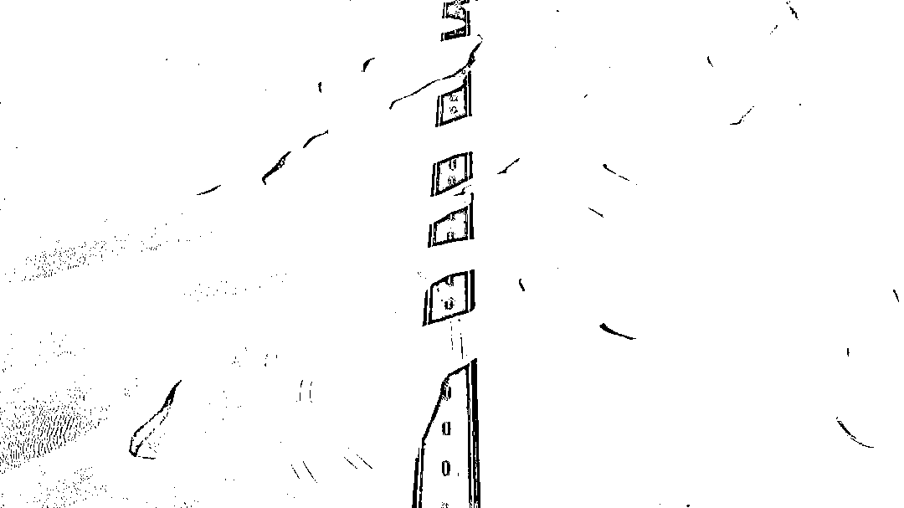

03

**为什么你总想批评他人？**

另一些人可能会把第八宫的强大张力发展成为时常批评他人的习惯，不管是无声的还是大声的。有人认为，批评基于的是渴望比别人优越（“我是对的，你是错的”），从而暂时解决第二宫-第八宫紧张局势的不安全感。著名占星师诺·泰尔认为，出生星图中第八宫紧张的人可能很难赞美别人，因为他们害怕这样做会贬低自己。

**上述两种动力都来自于一种无意识的信念，即获得安全感的唯一途径是贬低他人（批评），或者不把他人抬得太高（无法给予赞美）**。其不幸后果是，由于不断的批评或缺乏欣赏，人际关系变得难以维持。

04

**如何扭转这种破坏性的习惯？**

**第二宫与第八宫的对立预示着你的自我价值和他人的自我价值之间的重要联结——我们甚至可以说，我们在别人身上看到的价值反映了我们的自我价值。**

要扭转这种破坏性的批评模式，最好养成抬举他人的习惯，包括经常地、毫不吝啬地赞美他人的优点和成就。在给予别人赞赏的同时，我们自己的自尊和自我欣赏也会增长。

许多治疗师和健康专家（那些致力于恢复他人心理、身体健康的人）在他们的星图中都有第八宫的主题，通过治疗和抬举他人的行为，他们自己也常常感觉更加幸福。**第二宫和第八宫之间的互相映照表明，停止批评的习惯，并开始赞扬别人的习惯可能是你建立自信的最好方法**。

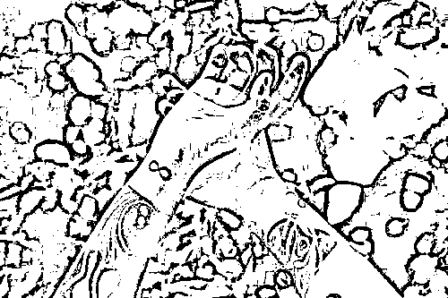

05

**他们说**

**@Ranie    北交第二宫、南交第八宫**

儿童时期，特别不喜欢被批评，而且那时候我不懂得如何去反驳，被批评会让我自己有羞愧的感受，很糟糕。等到长大一点之后，开始对自己这样的状态产生了思索，也试着做出一些内心上的调整，后来对于“批评”慢慢变得不再特别羞愧了。也有自信和勇气面去对他人的评判，去真实地表达自己。

开始工作后，价值和意义是我的“口头禅”。做事的权重，我会先衡量价值，南交处女座落第八宫，我对人和对事都会比较看重价值感，如果我能提供有价值的输出，我就会蛮开心的。

**@十三    第二宫的冥王星对分第八宫的月亮**

母亲和外祖母都是很优秀的人，一直以来，她们总是试图以她们的价值观来评定我，跟她们比起来，我似乎永远都不够优秀，总是做得不够好，始终有缺漏……我几乎在整个童年时代很少得到来自她们的夸奖，绝大多数的时候不论事情干得好坏与否，换回来的只有批评，抑或几句无关紧要的“知道了，好的……”

她们的优秀是我的目标，同时也成为了我不断比较心魔，我想要努力做得更好，去换取一个久违的肯定，或一次真心的赞叹。我也试图去超越她们，也许只有做得跟她们一样好，我才能够找到对自己的肯定。不，需要超越她们才可以。长久以来的负面评价，让我对自己缺乏正面认知，同时也很难开口对他人表达赞美，哪怕即使内心觉得对方是优秀的，也总是吞吞吐吐难以言说。

随着年龄见长，同样的问题也出现在了我的亲密关系当中，难以表达对恋人的赞美和欣赏，让我们之间的一些小矛盾层层累积。我开始试着去克服自己内心的困难，学着赞美她，去夸奖她为我做的种种事情。

**你的星图中也有这样第二宫-第八宫轴线的紧张状态吗？**

**在评论区，和大家一起分享一下你的经历吧～**


**版权声明：**本文由若道翻译发布，欢迎转发，反对抄袭。友号转载请申请白名单。


**HIROKI NIIZATO(新里弘树)**

诺·泰尔门下的高材生

从 2001 年开始从事职业占星咨询

******点击图片查看若道君推荐******


喜欢记得点一下在看哦☟

********报名直达入口******** 


# 深度 | 这个星座在身边时有点讨厌，不在时简直是灾难

> 原文：[`mp.weixin.qq.com/s?__biz=MzA5NjA0NTAxNg==&mid=2651412875&idx=1&sn=f895988b5c7ef86f5ff03dfdf8a56976&chksm=8b4beb3cbc3c622a8abb6068f3aac592b4db1111f33cca607c9154f318dad8ec586d11d4ec8b&scene=126&sessionid=1692738227#rd`](http://mp.weixin.qq.com/s?__biz=MzA5NjA0NTAxNg==&mid=2651412875&idx=1&sn=f895988b5c7ef86f5ff03dfdf8a56976&chksm=8b4beb3cbc3c622a8abb6068f3aac592b4db1111f33cca607c9154f318dad8ec586d11d4ec8b&scene=126&sessionid=1692738227#rd)

****************☆ 后****************************台****************************回复“今日”，给你一句生命态度****************


作者/达娜·格哈特译者/空气 校对/江艺编辑/玫瑰 图片/unsplash
有一个星座真的特别喜欢挑剔。和他们一起共事过的人都会由衷地说出一句：“我太南了！”这个星座，毫无悬念便是处女座。处女座为什么会这个亚子？有没有什么解救的方法？一起来看看达娜给我们的解读吧！**当土星遇上处女座**与前一个闪耀、自大的狮子座不同，**处女座谦虚、实用、有条不紊**，它并不会跳起舞来等着别人的欣赏，只是卷起袖子去工作，**无畏而高效**，就像我的 Roomba 吸尘器一样，每天在房子里嗡嗡作响，和新的能量一起唱歌。**土星在处女座就像这样，稳步地让事情变得更好。**它**服务别人、研究细节**。它向我们承诺，**如果我们能迈出一小步，然后再迈出另一小步，不断前行，最终会发现自己将走出绝望的深渊，扎根在一个更美好的现实中。**
并不是每个人的世界在土星行进期间都会分崩离析。它给许多人带来了可喜的进步，促使其向处女座的方向发生了或大或小的变化，变得更有**秩序**、更有**判断力**和更加**纯粹**。我的一个朋友进了修道院，另一个朋友开启了有关杂物整理的生意，我儿子开始主动吃更健康的食物。由于处女座落在我的第一宫(有关外表的宫位），土星把我推进到了最好的身体状态，让我享受了一段时间，这仅次于 29 年前土星上一次出现在处女座的时候。在我 20 多岁的时候，这个行进助长了新的**身体自律**。在土星进入我的第一宫之前，我对健康不感兴趣，行进发生时我突然很有动力地**节食、净化和锻炼**，这种勤奋接近于狂热。在我 50 多岁的时候，虽然很遗憾我再也无法集结同样的强度，但土星是不会不管我的。这一次，通过渐进的调整，我本已很健康的饮食变得更加健康，第一个月减少麸质，第二个月添加新鲜的绿色饮品。我一周去三到四次健身房，没有大肆向别人宣传，似乎也没有什么进步，直到后来，一个朋友喊道："我的天啊，你变了！"处女座是**异常勤奋**的，但更典型的是，它的奇迹是**一步步实现**的。这简直是**革命性**的，这个词很容易与天王星联系在一起，但很少人把它同处女座或土星联系在一起。在 70 年代末的肯尼亚，旺加里·马塔伊的绿带运动在土星位于处女座期间收获得了巨大的成功。这位诺贝尔和平奖得主，有一个简单的处女座的倡议：多年的森林砍伐以及国家河流和表层土壤的破坏，可以通过一个简单的行为得到改变，即一个女人在种树，一次播种一粒种子。**处女座的原型包括处女、仆人和完美主义者**。流行占星学经常将这些形象解构为**图书管理员、秘书和记账员**。这些职业并没什么问题，我自己也很高兴从事过其中两个。然而，通常这被认为是不怎么讨人喜欢的处女座刻板印象。与诱人的处女相差甚远，处女座被视为戴眼镜的保守老处女，扮演配角而不是主角。在一个迷恋狮子座的表演和名望的文化中，处女座的才华经常被忽视。然而处女座在黄道上排在狮子座后面是有原因的，不仅是为了清理它的混乱，也是为了以新的方式引领我们前进。**通过微小的行动，处女座成就了很多**。我记得我在公司工作的日子里，当一个优秀的处女座离职后，我们通常需要雇两个新员工来填补他们的位置空缺。

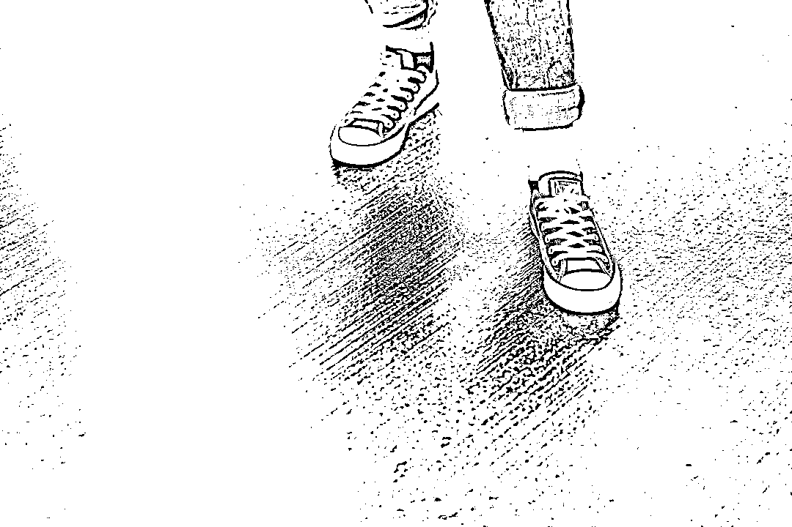

**处女座的成功法则**遗憾的是，得知自己有行星落入处女座，人们通常有些失望。其对宫双鱼座是那么超然和神秘，相形之下，处女座的特质显得相对乏味。**双鱼座富有直觉和想象力，处女座善于分析且实际。**然而，如果不相信一点魔法，处女座不可能处理得了杂乱无章的桌子、凌乱的房间或一个破碎的世界。**处女座对完美的梦想激发了它的奉献精神和自律。**  这个土相星座的实用主义似乎否认了它们的神秘性。但是土地，作为大自然，也是神圣意识的一种体现。以成就为导向的摩羯座攀登山峰，注重感官的金牛座让我们躺在花海中，而**勤劳的处女座带来了维持世界转动的精准性**，这些都是伟大神秘的反映。大自然中有很多事情可以让我们联想到处女座。有的花朵拥有非常**精准的习性**，以至于植物学家卡尔·林奈（Carl Linnaeus）提出，人们可以种植一种花朵时钟，一种由万寿菊、雏菊和睡莲组成的周期，通过花开花落，达到像时钟的指针一样完美的报时。月见草知道在飞蛾来传粉的时刻，精确释放花香。蜜蜂有着完美的日程安排，每天要去多达九种不同的植物间采蜜，它总是在花蜜释放的时候准时到达。每当我们看到处女座整理香料抽屉或纠正我们的语法错误时，就会想起这些画面。世界如此高效地运转，它们的魔力不亚于双鱼座的水晶球。《哈利·波特》魔法世界的创造者 JK·罗琳有着强大的群星处女座：代表作家的水星、语言迷人的金星、还有月亮、木星、天王星和冥王星。最初有传言说罗琳“通灵”搭建了她的情节和人物，但随着记者们对她的方法进行更深入的调查，我们了解到她用一个务实的处女座的**勤奋、构思，**勾画和精心制作了《哈利·波特》系列。在写每本书的时候，她知道每一个角色在后面的发展。罗琳的天才让数百万痴迷于科技的孩子们重拾读书的乐趣。“天才”是另一个很少与处女座联系在一起的词，但最近这种情况发生了变化。在土星经过处女座期间，出现了几本处女座主题的新书，这应该不足为奇。马尔科姆·格拉德威尔（Malcolm Gladwell）撰写的《异类》（*Outliers*）、丹尼尔·科伊尔（Daniel Coyle）撰写的《天才代码》(*The Talent Code）*和杰夫·科尔文（Geoff Colvin）撰写的《天才源自刻意练习》（*Talent isoverrated*），书中认为**将天才与其他人区分开来的，并不是良好的基因、特殊的天赋、一些灵感火花或高智商，而是练习**。研究表明，杰出的顶级钢琴演奏家与二流演奏家和高中音乐教师的区别仅仅在于他们练习了多少小时——确切地说至少有一万小时。像泰格·伍兹、比尔·盖茨和披头士这些成功人士的传记中，都有着一个共同点，在每一个人成名之前，这些偶像在他们的技艺上花费了超过一万个小时，逐步完善他们的技能，以至最终达到近乎神级别的表现水平。

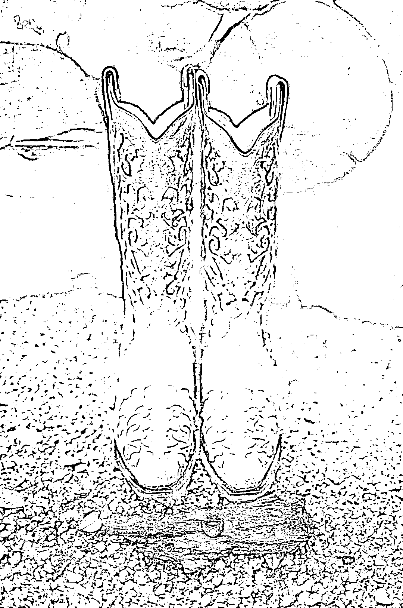

** “熟能生巧”**一直是处女座的成功法则，她们对完美的追求提升了我们所处世界的品质。我发现**金星在处女座**的人（通常被不公平地贬损）是**感性的品质鉴赏家**。他们喜欢完美完成的工作、丝滑的织物、美味有营养的食物、美丽的风景、优美的文学、音乐和艺术。当我想象处女座的处女时，我没有联想到一个刻板的图书管理员，我想象她是一个**充满活力的女神**，就像下面描述的那位金星在处女座的女人。我曾经在苏黎世老城的鹅卵石路上遇到过一位活生生的女神。她有着异域风情的相貌，深邃的眼睛同时闪烁着温暖和淘气，银色的头发垂到后背；她橘色的鞋子装饰着错综复杂的精致图案。  她成了我的导师，打开了我的眼界，看到了文化的印记和腔调；她很幽默，十分搞笑地模仿一家餐馆里坐在我们对面的一个瑞士女人；她不由自主地把牛奶桶扔到一个朋友的头上，并用神话和哲学来解释她的这种冲动；她要求我们为茶馆购买有机食品，如果我们想偷工减料，她就会严厉地责骂我们；她的聚会成了庆祝、内省和任何时候想要与活力共舞的固定场合。她的太阳是处女座，但没有任何书呆子气、克制或过度控制自己。处女座对我们有**很高的要求**，但**并不总是那么恰如其分、循规蹈矩**。她可以相当**有决心和俏皮**，如果需要的话，不怕往别人脸上丢饮料。处女座是一个**谦逊**的星座，也会让人感到**谦卑**，任何被处女座长篇大论攻击的人都可以证实这一点。处女座经常因为自己的**判断和批评**而受到污蔑，但**为了服务于神，有时候我们遭受处女座的羞辱是必要的**。**我们要格外关注土星在处女座行进时所忍受的那些羞辱。这些是具有重大意义和变革性的**——当三大汽车制造商的首席执行官们乘坐私人飞机前往华盛顿请求国会救助时就发现了这一点。土星的愤怒是如此的强烈，以至于他们下一次去国会山的旅途，驾驶着节能汽车，谦卑到了极点。土星行进在狮子座的时候，我的一个处女座朋友的职业生涯达到了一个新的高度。她的自信心增长得如此之大，以致在土星换座合相她的太阳的时候，与同事发生了冲突。她很快就受到排挤，孤独了好几个月，心里充满了对自己的怀疑。经过深层次的挖掘，她找到了**更深层的自信来源**，最终修复了同事关系，以一种**更优雅、更包容的方式展现自己的权威**。我的儿子在行进在处女座的土星四分他的上升点的时候，没有通过大学预修英语考试，离最低分数线只差一分，让他感到十分的害怕。他的上升点是射手座，他经常自己独自去滑冰。“这是一个改变人生的事件。”他发誓说。我对此持怀疑态度。但几个月后，他以一种我从未见过的勤奋准备他的大学预修历史考试。几年后，当行进土星初次合相我的处女座上升点，我遭遇了自己最感到羞愧的事情之一。在一次聚会上，借着酒精的作用和处女座的耿直，我说了一些不应该说的话，得罪了所有的朋友。第二年也十分的恼人，只有转向灵性的学习才让我从痛苦中解脱，当然那也改变了我之后的人生。无论土星带给了你什么，很可能既有教训也有胜利，都要感谢它的处女座礼物。

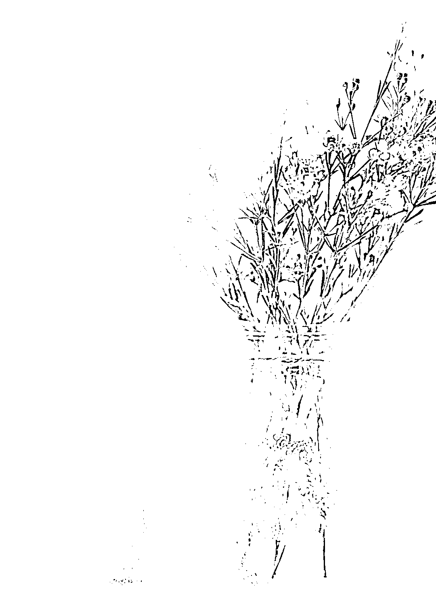

**赫拉克勒斯的处女座任务**赫拉克勒斯从处女座的任务中学到了什么？这个任务似乎很简单：他只要从亚马逊女王那里得到阿芙洛狄忒的腰带，把它带给弥诺斯国王的女儿就可以了。亚马逊部落的女战士个个骁勇善战，但生活中充满了战争和怪物的赫拉克勒斯却无所畏惧。他计划了一次完美的突袭，和他的手下一起扬帆起航。不幸的是，在帕罗斯岛短暂停留期间，他的两名手下被杀。这使得赫拉克勒斯自己也开始了一场暴怒的杀戮，直到帕罗斯的人们决定牺牲两个人来代替被杀的两个人，才把事情解决。当赫拉克勒斯和他的船员们到达亚马逊王国时，希波吕忒女王说众神建议她不要与赫拉克勒斯搏斗，把腰带给他，而女王也愿意这么做。我们的斗士对此毫无准备！当一个强大的女性屈从于一个强壮的男性时，或许我们会期待强烈而神奇的结合。事实上，这是阿芙洛狄忒腰带的魔力之一——**让男性和女性相互吸引和结合的能力。**可是赫拉得知了此事，她既不喜欢赫拉克勒斯，也不喜欢阿芙洛狄忒，她在大街上散布谣言说赫拉克勒斯计划绑架亚马逊女王。赫拉克勒斯已经进了宫殿，正朝台阶上走去，这时他听到外面喧闹的马声、喊叫声和长矛的声音。他开始陷入了怀疑，他的思绪沿着熟悉的思路飞奔：“这是个圈套！王后在撒谎！她从来没有打算要给我腰带。”赫拉克勒斯像一个难以理解的激愤少年，冲进房间，朝着女王就刺了过去，她都还没来得及开口说一句话。他如愿以偿地通过武力拿到了腰带。在返程的路上，一个晴朗的天气，赫拉克勒斯听到远处传来可怜的尖叫。他扫视了一周，发现一位少女被绑在岩石上，一只海怪正朝她这边游来。赫拉克勒斯不假思索地跳到怪物的面前，刺死了它，解救了那个少女。这个女孩名叫赫尔迈厄尼，是为平息神的愤怒的献祭品。她的父亲没有付工资给两个工人，他们实际上是阿波罗和波塞冬假扮。他们被激怒，阿波罗带来了一场瘟疫，而波塞冬唤醒了一个怪物。为了解决这个情况，先知命令必须要牺牲掉赫敏赫尔迈厄尼。现在，和身边的女孩一起，赫拉克勒斯便向宙斯求助，他用几匹马进行交换，解决了这个问题，而没有更多的流血事件发生。

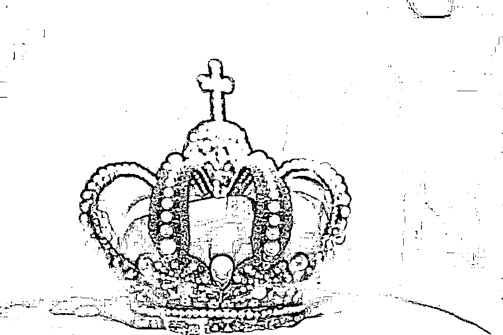

这是一个处女座的故事么？听起来可一点儿也不像。这里有太多混乱，有谋杀、有怪物、有腰带，还有一个死了的女王！对于处女座的任务，我们可能期望的是赫拉克勒斯来清理奥格阿斯的牛棚，或者砍掉九头怪兽许德拉所有的头，直到一个不剩，或是任何需要耐心、效率、组织和分析的任务。但得到阿芙洛狄忒的腰带是爱丽丝·贝莉分配给处女座的任务，在这个系列写作中我一直都遵循着她的传统。同样，我也知道故事越离奇，其中包含的智慧也就越多。那么这个任务中要教会我们关于处女座的什么呢?赫拉克勒斯在慌乱中杀死了女王而犯了错误，但当他救了赫尔迈厄尼时，他清理了自己的业债。**清理错误、恢复秩序**是这个任务反复出现的主旨。帕罗斯的人们必须向赫拉克勒斯的船员赎罪。赫尔迈厄尼的父亲必须纠正他对神的欺骗。  处女座是关于**解决问题、恢复秩序**的。生活是混乱的，如果没有某种力量来纠正错误，我们会处在哪里？**处女座的意图是有用且必要，但它的表现必须经过发展和完善，否则会制造更多的问题**。赫拉克勒斯**构思了他的计划，设定了他的路线，很快就遇到了他无法控制的情况**。那才是真正的处女座训练的开始。**当一丝不苟的处女座遇到意想不到的事情时，它会变得像赫拉克勒斯在帕罗斯岛上一样疯狂**。当他刺伤女王时，他同样也**惊慌失措**。他**失去了信心**，进入了处女座的黑暗面。**当生活偏离计划时，脆弱而缺乏安全感的处女座会做出判断，要么躲藏，要么愤怒地向世界发泄**。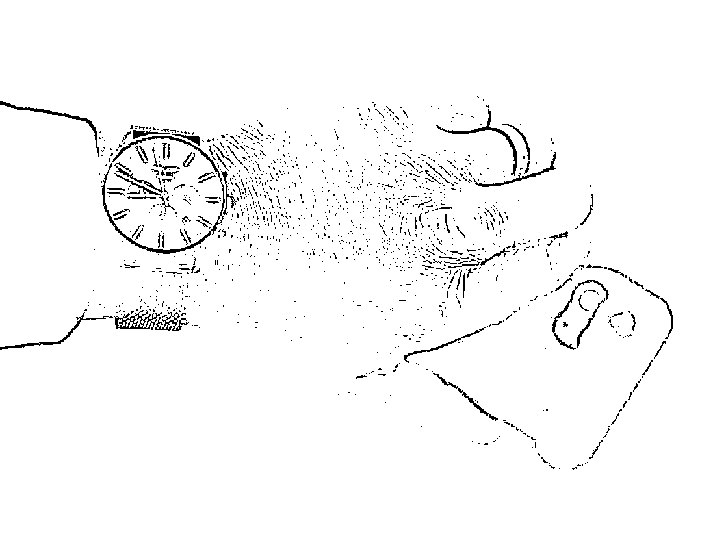我还记得在公司工作时的一位电脑技术人员。吉姆是上升处女座，他工作努力，经常加班到凌晨。他的办公室里从地板到天花板整整齐齐地摆放着各种工具、零件、手册和杂志。吉姆在**感到自己有用**时最高兴。他喜欢**解决员工的问题**，但如果之后你去问他帮忙的这些人，他们通常会气得抓狂。大家都在抱怨吉姆，他**挑剔又固执**，动不动就为鸡毛蒜皮的小事争论不休。在多次个人警告之后，为了公司的和平，这个努力工作的人最终被解雇了。处女座是个变动星座，意味着要去**适应这个世界**，但它缺少了它的变动星座伙伴双子座和射手座的轻松和幽默。处女座**小心、害怕**，关于这点罗伯特·汉德做了一个有趣的推测：**“处女座几乎就像是孩子气、极端自我为中心的狮子座第一次遭遇到严重失败后的产物。****”**处女座似乎**过于担心面临的危险**，它的**焦虑和自我怀疑**肯定会影响它的效能。那么，补救的措施是什么呢?占星师对处女座有句话：**“或服务，或受苦。****”**受苦是痛苦的，但服务呢？即使不查字典，我们也能感觉到这个词的拉丁词源的原本意思是**“做一个奴隶”**。服务意味着我们必须**放弃一些可贵的东西：我们的时间、我们的自由、我们对成功的梦想**。服务可能会让人觉得**有损人格或自我否定**，就像我们必须忘记要去赢得《美国偶像》(American Idol)，而是去做志愿者布施汤饭、或者去为穷人盖房子。在一个重视个人创造力的文化中，受苦可能比这样的服务更好。幸运的是，赫拉克勒斯的处女座任务让我们对服务有了更深刻的认识。他解救赫尔迈厄尼是件好事，但他的行动是完全没有计划的。这位英雄只是在被需要的时候伸出了手。这是处女座最好的一面，它**自然而然地自由发挥自己的技能，有效地满足当下的需求**。赫拉克勒斯在帕罗斯、在喧闹在女王宫殿外，没有这种能力，是什么让他有了改变?女王被杀后，赫拉克勒斯得到了阿芙洛狄忒的腰带。换句话说，他获得了**平衡的力量——女性的接纳性**。腰带是处女座的标记，在这个星座的核心位置，那部分的我们是**崭新的、不会算计的**，并有着满腔热血。通过更深层次的接纳性，我们容易**顺从手头的任务，把它当作一种命运来服从，而没有反抗的痛苦**。我们根据情形的需要，随时准备着。我们加入了这个彼此交织的世界，做着我们需要做的事情。这代表了这个土相星座最接地气的部分之一。它使我们形成**相互依赖**，认识到**我们是比自身更大的生命系统中的一部分。**当我们在狮子座通过创造性的游戏和自我表达，探索了自我的各种可能性之后，处女座把我们带入一个更**实际**的世界。我们发现**必须要进行服务**，不仅仅是作为非营利组织的志愿者，又或者作为服务员、美发师或者图书管理员。处女座服务的可能性和地球上的人一样多种多样。无论我们对服务的要求是什么，处女座都能用它的**谦逊、务实和奉献精神**来激励我们的工作。**谦逊给狮子座强化的自我带来了新的平衡，实用性要求我们只采取必要的行动，奉献精神使我们可以全身心地投入到工作中。**当我们完完全全沉浸在当下时，处女座的魔力就开始发挥作用了!

**版权声明：**本文由若道翻译发布，欢迎转发，反对抄袭。友号转载请申请白名单。


**也许你还想看下面的文章**
[白羊座](http://mp.weixin.qq.com/s?__biz=MzA5NjA0NTAxNg==&mid=2651412161&idx=1&sn=37ff27a685136be77b3d02086a4b8f0b&chksm=8b4be476bc3c6d6079b8592d14f1250d87401d0a8a28bc87f50a8f9fd253a52d9d5223c4ab12&scene=21#wechat_redirect) | [金牛座](http://mp.weixin.qq.com/s?__biz=MzA5NjA0NTAxNg==&mid=2651411945&idx=1&sn=6a74a4d7d15deb38d06a692ad4032ddd&chksm=8b4be75ebc3c6e4890b5034474c2894bd355bf26df5f0ad1c2fadae76f3de1d349a57de0471b&scene=21#wechat_redirect) | [双子座](http://mp.weixin.qq.com/s?__biz=MzA5NjA0NTAxNg==&mid=2651412684&idx=1&sn=f6887e194aa2a3680aae10a3b35e31b4&chksm=8b4bea7bbc3c636dbc19fec754256a621ab05a0aff123a56f8aaeccb22cbe1686de524fc0b05&scene=21#wechat_redirect) | [巨蟹座](http://mp.weixin.qq.com/s?__biz=MzA5NjA0NTAxNg==&mid=2651412275&idx=1&sn=0c656c445089cb315649a1cc3af37001&chksm=8b4be584bc3c6c92e9bc689480a78b3e530fc125c6a3a1fdff0e60a587ffcd06723285712045&scene=21#wechat_redirect)[狮子座](http://mp.weixin.qq.com/s?__biz=MzA5NjA0NTAxNg==&mid=2651412638&idx=1&sn=6459344d465d2d27485697dbea2f512f&chksm=8b4bea29bc3c633ffb401133040024eb261f07a3dde67f15e6ebb94ca4df49f8f7995ca6e707&scene=21#wechat_redirect) | [天秤座](https://mp.weixin.qq.com/s?__biz=MzA5NjA0NTAxNg==&mid=2651410544&idx=1&sn=45b51d84210a84c8103c140df5a28229&chksm=8b4be2c7bc3c6bd1c86b8ffd8d8722efe3cfa1fc4b71e2cc8f71230218b8c73a7119d8a22745&token=428430174&lang=zh_CN&scene=21#wechat_redirect) | [射手座](http://mp.weixin.qq.com/s?__biz=MzA5NjA0NTAxNg==&mid=2651411022&idx=1&sn=adf59f6eb38f2fd19ca975b4287168ea&chksm=8b4be0f9bc3c69ef250cafb4d517694bb952529461017c53da4d7ca120ed4ec0004161eccdb0&scene=21#wechat_redirect)[ | ](https://mp.weixin.qq.com/s?__biz=MzA5NjA0NTAxNg==&mid=2651410544&idx=1&sn=45b51d84210a84c8103c140df5a28229&chksm=8b4be2c7bc3c6bd1c86b8ffd8d8722efe3cfa1fc4b71e2cc8f71230218b8c73a7119d8a22745&token=428430174&lang=zh_CN&scene=21#wechat_redirect)[水瓶座](http://mp.weixin.qq.com/s?__biz=MzA5NjA0NTAxNg==&mid=2651411498&idx=1&sn=25b8051c9c778065f9fffa37628c9950&chksm=8b4be69dbc3c6f8b94ee79ae682233634bcd0f32e8dce890672ea1bb4e5241a34cb59ebb3045&scene=21#wechat_redirect)[双鱼座](http://mp.weixin.qq.com/s?__biz=MzA5NjA0NTAxNg==&mid=2651412587&idx=1&sn=88617fdd2660473de5eb7a48dd9d8807&chksm=8b4beadcbc3c63ca04427ddfde1ff118fbd1151ff24fad40cb97abcd3d2029c6e1c2bcb6657f&scene=21#wechat_redirect) **达娜·格哈特**一位国际范围内受尊敬的占星师。她为众多占星学网站和出版物讲课、写稿。她在十二宫的月亮激励她对这颗发光体进行了深刻而持久的探索研究。

******点击图片查看若道君推荐******


**微信又双叒叕改版啦，不想错过若道君的推送？**

**就把若道设为星标吧！**

**▼**


就是这个“在看”，戳戳戳 ☟

********报名直达入口********


# 你笑起来真好看，像春天的花儿一样 | 12 上升星座大揭秘

> 原文：[`mp.weixin.qq.com/s?__biz=MzA5NjA0NTAxNg==&mid=2651412819&idx=1&sn=eeb8d75bf92036247c7e6753aaf9305c&chksm=8b4bebe4bc3c62f2f25e8088fc9bb93962655bb1653465ff08c900d69a617f01f6e117d2055b&scene=126&sessionid=1692738227#rd`](http://mp.weixin.qq.com/s?__biz=MzA5NjA0NTAxNg==&mid=2651412819&idx=1&sn=eeb8d75bf92036247c7e6753aaf9305c&chksm=8b4bebe4bc3c62f2f25e8088fc9bb93962655bb1653465ff08c900d69a617f01f6e117d2055b&scene=126&sessionid=1692738227#rd)

******☆ ****后台回复“今日”，给你一句生命态度******

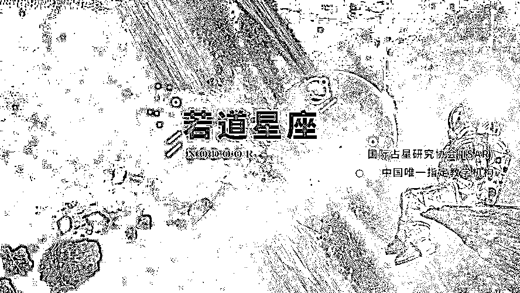

作者/大卫·瑞雷 若道占星创始人

译者/荆小花 文字整理/懿真
编辑/玫瑰 图片/全景网

本文据大卫 12 上升星座沙龙速记整理

上升点指的是在你出生的那一天太阳是从哪一个位置升起的。在占星学中上升星座有关于人的外在行为和性格。你的上升星座会有那些特点和小怪癖，又该如何发展呢？我们来仔细看一看这 12 个上升星座吧。

**上升白羊座**

上升白羊座的人行动会**更加直接**，更会**坚持自己的观点**，是个**自我驱动**类型的人，你会把该做的事情做到位，不喜欢等来等去。**在积极的面向上是个非常自我坚定、自我驱动的特质。但是负面的面向上就是不耐烦的人。**
白羊座的关键字是如何**自我捍卫**。所以如果你是上升白羊座的人，你要问自己一个问题，**在你的人生当中是如何有效的捍卫自己的利益呢？**如果你在捍卫自己利益时是有效的、满意的、理想的，你就会获得一种满足感。如果你是一个**经常会和别人发生争斗**的上升白羊座，也许说明你在跟他人坚持自己立场的时候并不是那么有效，所以在和他人抗争中你要学习**如何与他人抗争是有效的**，知道如何抗争是无效的。

**上升金牛座**

金牛座是**最接地气、最放松、最稳定**的星座。一个上升金牛座的人对待生活是很放松的态度，但是金牛座放松自在的状态去看上去是**被动**的，你会想去推他一把，这个时候你会感觉受到阻力，觉得推不动他！上升金牛也是**感性**的，他们的身体经常有**壮实很有依靠感**的感觉，即便是胖了几公斤，你依然会觉得他很具有吸引力和魅力。金牛座和金星相关联，金星和美丽舒适共振，上升金牛座会非常**享受人生的舒适感**，想去品尝美味的生活、享受慢节奏生活。

**上升双子座**

一个上升双子座的人一般会远远就被发现。他可以一边打电话一边发短信，或者一边和小伙伴说话，一边和出租车司机打电话。所以你如果看到一个可以**一心多用**的人说不定就是上升双子座。这个星座有关于**沟通**，双子座会很好奇你在想什么，而且他无时无刻不准备要和你交谈。不断地寻找各式各样的信息，他的不安定也是很突出的，他是**不安的、好奇的**。他可能是知识信息的宝库，他可以告诉你去一个地方有什么样的捷径或者是一个 APP 可以做什么样的事情，另外他也可以通过**倾听**来消化信息。

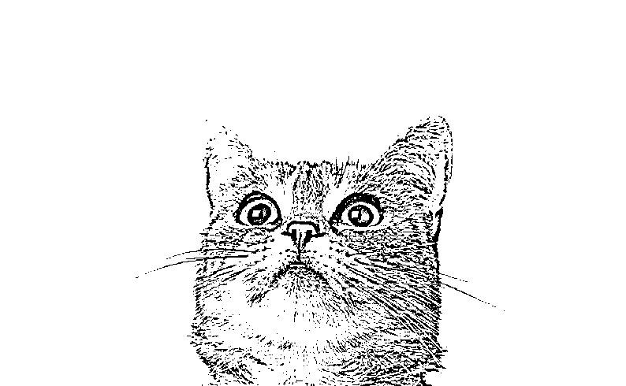

**上升巨蟹座**

对于上升巨蟹座而言**隐私**是很重要的，巨蟹座是一个水象星座、有关于人的**情绪和感受**。在占星学当中月亮守护巨蟹座，因此一个上升巨蟹座的人，他星图中的**月亮落位**非常重要。

诺·泰尔是一代占星宗师，他的上升就是巨蟹座，但是他一点也不害羞，原因是他的月亮落在 3 宫的狮子座，相对一般的上升巨蟹座而言，他体现更多的人格特质是狮子座的戏剧化和多姿多彩。

但实际上诺·泰尔老师非常的巨蟹座，几乎我们每一次一起吃饭聊天，他都能找到一个点触景生情，流下感伤的眼泪。比如我第一次和他吃饭时，突然提到一些让他伤感的事情，于是他就流泪了。当然我不是在说所有的巨蟹上升都是这样的多愁善感，但是他们是所有星座中**最善于通过情绪和感受体验生命**的。**情绪、直觉、感受**是真正指引他们的向导，在所有人格类型当中他们也是**最具有人性**的。

**上升狮子座**

狮子座一般都是**引人注目**的，他的长相可能是**令人印象深刻**的，或者他经常是**负责筹划派对**的人。上升星座在火象的人制造的声音一般都比较大。在所有火象上升星座中狮子座的**声音**是最大的。政坛上有个比较极端的上升狮子座的例子，就是当今的美国总统特朗普，他总是在谈论自己有多棒，多聪明，以及不管什么问题他都可以搞定。也许他自信的外观弥补了他内心不自信的地方，只有越过狮子座上升的部分来分析他整张星图方能看到那些不自信的地方。可以说在所有上升星座当中没有比上升狮子座更加**自信**的人了，论留给人印象最深刻的星座，也是上升狮子座上升的人。上升狮子座的女性非常**惊艳**，上升狮子座的男性看上去像**希腊的男神**一样，他们可能自己都觉得自己是男神。但是也会有例外，**也有会很谦逊的上升狮子座，他们会为自己的谦逊感到自豪。**

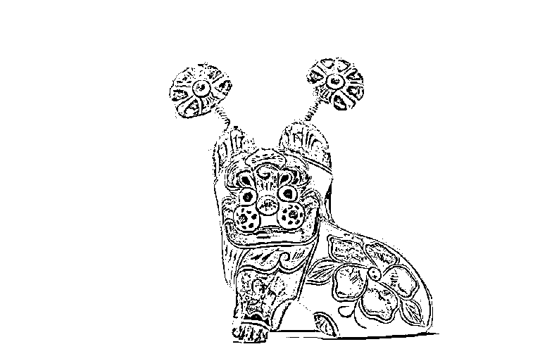

**上升处女座**

上升处女座非常**谦卑低调，不断地在完善自己的不完美，因为他们知道自己是不完美的。**他们的脸上往往会带有**批评和怀疑**的表情，尤其是当你涉及到他们专业领域的事情时，在他们专业领域之外的事情他们看上去可能很**天真无邪**，很安静倾听着，想要搞明白你在说什么，但是在他们的专业领域之内呢他们非常聚焦、能力很强。典型的上升处女座往往会觉得**自己什么事情都没有做好准备。**如果去参加派对，他们会觉得这个衣服还是没有选合适，如果你对他说：“你从来都没有选对过穿着”， 他们会说 ：“是的，我从来都没有选对过” 。在性格层面上，上升处女座是最**乐于助人**的性格，非常善于**解决问题**，帮助你把损坏的东西修好，给你的问题带来解决方案，在表象上处女座非常**低调**。

**上升天秤座**

天秤座虽然不像双子座那么爱说话，但他是非常**善于社交**的。这样的性格特质喜欢去**建立人际关系，**他们看上去会对于你这个人和你想要表达的事情很感兴趣。通常来说上升天秤座的人经常给周遭带来一抹**平静、和谐**的能量，但是他们**吸引来的人际关系和伴侣**往往是更加**好斗、好动**的，这就给他们带来很多要做的事情，他会劝他们要和平相处。他们往往吸引来的**恋人**也是比较**粗鲁无礼**的。天秤座和金牛座一样也是金星所守护的星座。天秤座更喜欢在**头脑思维层面欣赏美**，好像学过美学历史的专业一样。他们会认为美和艺术是会**在人和人之间带来和谐的美感**。上升天秤座的人会带有**很亲和很善解人意**的气质。但是还是要取决于整张星图其他的状态是怎样的。一个上升天秤座的人也可以是个披着羊皮的狼。**上升天秤座表面的魅力、和谐的气质可能会掩饰他内在的行为。**

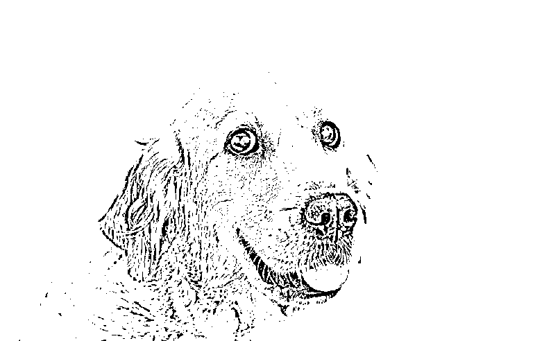

**上升天蝎座**

如果一个天蝎座上升的人想让你知道他的感受是怎样的话，你肯定会知道。如果他不想让你知道他的情绪的话，你唯一会感受到的就是**很恐怖**的存在。上升天蝎座可能喜欢在聚会上一言不发地在角落里盯着大家，这是一个消极的例子。但是一个积极面向的上升天蝎座会在朋友的危机关头帮助他，一直陪伴在他左右，就算你凌晨 2 点钟被抓进监狱了，他也会爬起来帮你假释出去的。然后他们也会帮你保密。**上升天蝎座的人非常关注于会信任什么样的人，会把什么样的东西交给什么样的人去信任。上升**天蝎座总是在不停打量每一个人，**看破每个人的表象去寻找他们的弱点**。在所有的人格特质当中天蝎座是**最激烈的人格特质**。他们往往更加容易被辨认，因为他们是如此的**安静和激烈**。也并非说天蝎座就不能够和你直截了当，但是只有在他们信任你的时候他们才会和你敞开心扉。当他们感觉还不能够信任你的时候，他们就是安静地看着你。

**上升射手座**

上升射手座是房间里笑得最大声的一个，他们讲的笑话都是他们自认为史上最好笑的笑话，**具有冒险精神，很外向很乐观**的性格特质。通常在销售推销行业里面，做的比较好的两个星座就是射手座和它对面的双子座。但他们的方式各有不同，双子座非常机智，会给你各种各样的信息；上升射手座则会和你说：“这可不仅仅是一辆车啊，这还是一种理念，一种概念，你知道这种车架的型号和宝马原装用的是一模一样的品种吗？正是因为有这种配置所以它会在长途旅行上更加牢靠，虽然没有折扣，但是这辆车还是很棒的，我自己买了 3 辆。”所以当上升射手座给你推销的时候，简直是上了一堂课，给你的知识量都是你没有想到的。像我的占星老师说过，射手座是一个**幸运**的星座。换句话说，谁会像射手座一样在急流的上方走过一条独木桥呢？这事我干过，你要么很幸运，要么摔死。所以你非幸运不可。

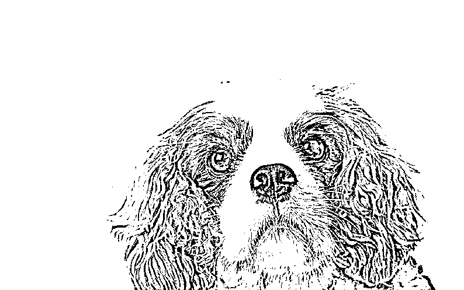

**上升摩羯座**

在所有的星座当中最具**野心**的就是摩羯座，他虽然是一种安静的野心，但的的确确是一种野心，之所以安静是因为他是一个土象星座。这个星座会很**低调，长期的加班就是为了达成他远期的目标。**当狮子座们都出去参加派对了，摩羯座还在加班，就是为了有一天可当狮子座的老板。之所以举这个例子是因为狮子座和摩羯座经常都是和领袖领导相关的。在领导方面可能狮子座更加明显一点，这种视觉上更加可见性强的领导会向你演示事情该怎么做。但是如果谈及要**追踪一个项目的长期实施**的话，摩羯座是更厉害的领导。摩羯座如果落在上升点可能看上去会非常**严肃**，上升摩羯座的人可能小时候长得比同龄人要成熟，有一种**老成**的感觉。而且等他们真的年纪大了时，他们的长相也**不会有很大的变化。**当上升摩羯座看到上升射手座迎着急流走过独木桥时，他会觉得这个人会掉下来的。摩羯座要过河的话，他宁可花时间架一座桥再过去，虽然这样会花很多时间，但这是**长期而稳定的计划**。摩羯座的人格特质实际上很有意思，尤其是在年轻的时候看起来也许会有点**笨拙和拘束感**，但是你给他一定的时间让他成长，你会发现当初很傻的孩子变成了**高富帅**。

**上升水瓶座**

水瓶座是人群中很**独特**的。这一类型的人，是最有可能做出自己**独一无二的贡献和创意**的，因为他是个风象星座，所以他的头脑更加**智力化**。如果上升水瓶座的人在你面前，你可能会感到他**很友好但是有点疏离感**。这样的人格往往**带着友好的面具在一旁观察**，但**不是怀疑**。如果你是上升水瓶座的话，通常会面临这样一个问题，就是**合群**的问题。甚至他会觉得自己哪里都和人合不来，我们通常会用**特殊和怪癖**来形容水瓶座。就是**奇怪、不同寻常、与众不同**。但也会有这样的评价：虽然水瓶座和人不一样，但是我觉得这人蛮**酷**的**。**他们打扮往往和他人不同，或者他外在的风格和他人有不同寻常的点，而且上升水瓶座可能是房间里**最聪明**的那一个。但是困扰上升水瓶座的是：“**我很聪明但那又如何呢？我不知道我在哪里才能够融入人群中。”**所以**找到一个合得来的群体**对水瓶座上升特别的重要。去寻找到一个**志同道合的组织**是非常重要的。不然很容易会觉得自己是周围团体的“局外人”。

**上升双鱼座**

双鱼座是 12 星座中**最敏感**的星座，也是**最复杂**的星座**。**双鱼座代表的是**人性当中最复杂的面象。**上升双鱼座的性格可能包含了 12 种不同分类的性格。有时候我们会管这种特色叫**变色龙特质**，就是**拥有随环境而改变自己去适应环境的能力**。意味着你可以在当下的时刻**感受到灵感的启迪。**上升双鱼座往往会经历那种对人生的**幻灭感**，觉得一切都是没有意义的，一切都是不能的，很无力、无法招架的感觉。但是即便如此他依然**有能力消化痛苦**，然后再次带着对人生的灵感和启发站在舞台上。它是水象星座中**最具直觉力**的的星座，水象星座往往都是有第六感的。能够听到他人感觉不到的东西，对于双鱼座来说**保持隐私**对他们的健康非常的重要。比如说带着很好的心情进入一家超市，随便买了一件东西出来时心情就变得不好了，可能因为在排队时站在你前面的人心情很抑郁，而你**吸收了别人的情绪自己却没察觉**。

**版权声明：**原创文章由作者授权首发于若道平台，欢迎转发，反对抄袭。友号转载请申请白名单。


****想阅读更多作者的文章，请在后台回复******大卫****** 即可。****

**喜欢文章请长按下方二维码打赏**

**给大卫老师加杯咖啡呗~**

**▼**


**想系统学习占星学？**

**点击图片了解详情**


**微信又双叒叕改版啦，不想错过若道君的推送？**

**就把若道设为星标吧！**

**▼**


喜欢记得点一下在看哦☟

********报名直达入口********


# 雷蒙德·梅里曼金融占星周运 | 容易“过火”的一段时期

> 原文：[`mp.weixin.qq.com/s?__biz=MzA5NjA0NTAxNg==&mid=2651412819&idx=2&sn=709bb8f63164a295311b3109b69b0f74&chksm=8b4bebe4bc3c62f25606ed0a978dc58736e88ecfbf88a1b98c3c00e836d0ea329547d9a8c8ee&scene=126&sessionid=1692738227#rd`](http://mp.weixin.qq.com/s?__biz=MzA5NjA0NTAxNg==&mid=2651412819&idx=2&sn=709bb8f63164a295311b3109b69b0f74&chksm=8b4bebe4bc3c62f25606ed0a978dc58736e88ecfbf88a1b98c3c00e836d0ea329547d9a8c8ee&scene=126&sessionid=1692738227#rd)

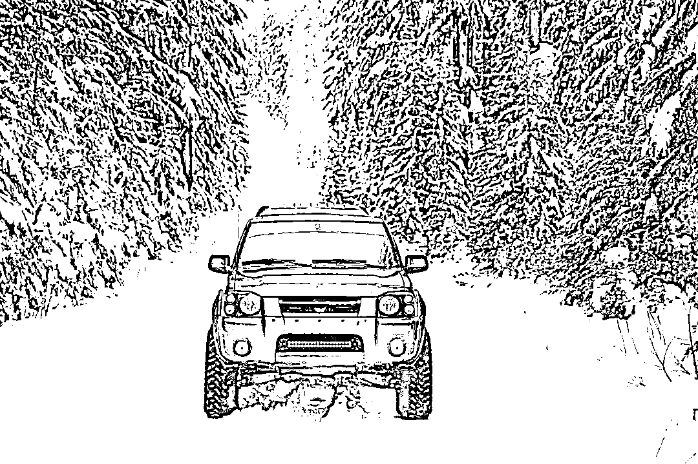

作者/雷蒙德·梅里曼
翻译/Luke 校对/李含编辑/玫瑰 图片/unsplash 雷蒙德·梅里曼是在金融占星学界稳坐第一把交椅的占星师，同时他也是若道签约的金融占星课老师，我们引进了雷蒙德·梅里曼老师的《上证指数月度报告》《黄金周期月度报告》《2020 年金融预报》（感兴趣的同学可以扫码文末图片购买）。我们经老师的授权，将每周刊登梅里曼老师的周运，供大家参考和学习。于是，这是这周的周运（1.13-1.17）。**展望与回顾**

**美国就业增长的势头在 12 月份有所降温，增加 14.5 万个就业岗位，为这个十年画上一个弱于预期的句号。2019 年最后一轮的就业数字没有达到路孚特经济学家预期的 164000 个。美国劳工部周五表示，失业率维持在 3.5 个百分点，是半个世纪以来的最低，因为越来越多的人在找工作。与此同时，平均每小时收入在过去一年增长了 2.9%，达到 28.32 美元.**

**——梅根·亨尼 **

**《美国 12 月就业增长放缓，2019 年年底增长率低于预期》**

**www.foxbusiness.com**

**2020 年 1 月 10 日**

**世界银行预测，发达国家经济体面临艰难的一年，美国经济增长率从 2019 年的 2.3%下滑至 2020 年的 1.8%，削弱了特朗普总统希望依靠超过每年 3%经济增长率连任的可能性。美国的经济前景已经“减速”，因为关税不断上升，“贸易成本不断上升”，对外经济关系的不确定性也对“投资和信心”施压。 **

**——克里斯·吉尔斯**

**《尽管美中有签约希望，世界银行仍持悲观态度》**

**金融时报 **

**2020 年 1 月 9 日**

终于到了这一天。现在是 32-37 年土冥合相的这个周末。在太阳准确合相土星和冥王星时发生了强有力的月食，天王星也在这一时期改变方向。上周随着摩羯座星群逼近，我们得以窥伺到这些强有力的天象背后的含义。这是**动荡不安**的一周，首先占据头版的事件是前一周晚些时候美国总统下令击毙伊朗将军卡西姆·苏莱曼尼，然后伊朗导弹袭击美国驻伊拉克的军事基地，但报告称没有人员伤亡，随后双方表现出克制，“紧张局势降级”。在这些瞬息万变的新闻报道中，全球股市先是**在 1 月 6 日至 8 日大幅抛售，随后又大幅上涨**。在下跌的过程中，全球有几个市场达到基本周期低点。在随后的上涨中，也有几个市场出现了历史新高，比如美国的市场。这周的情况就是这样。不过，这些可不是普通的天象，而是像《2020 年金融预报》中详细讨论的那样，是非常特别的征象。这些事件对黄金市场起到了相反的效果，首先**黄金 6 年来第一次上涨到 1600 美金以上，随后快速下跌**。黄金市场上的模式同样也出现在原油和白银市场上，它们在伊朗报复性攻击美国基地时爆炸性上涨到了数月以来的最高价，但第二天 1 月 9 日星期四时又迅速回落。

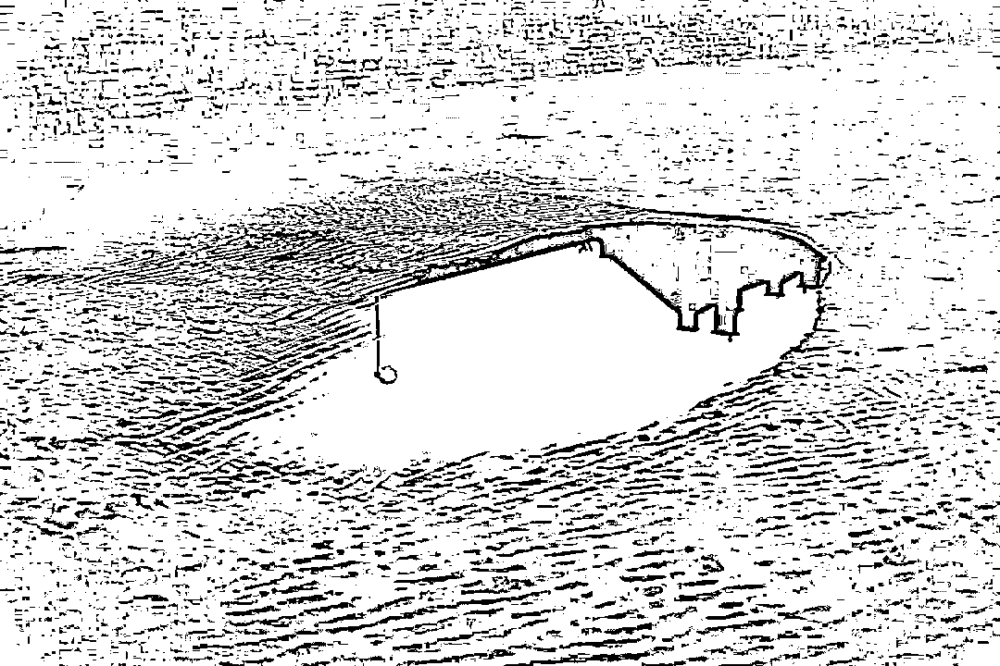

**长期考量**

**第一次世界大战始于 1914 年奥匈帝国大公费迪南德遇刺……可见，1914-1915 这段时期出现的起义和政治暗杀是为了改变政权。当时，这导致了一战的发生……纵观世界，美国也一样，一些团体的目标是发动起义以改换政权。这些活动将在 2020 年变得更加明显，或许更加活跃。他们会企图策划或执行政治暗杀吗？在土星和冥王星合相摩羯座时这是有可能的，因为冥王星可能表现为采取暴力行动以消灭敌人，而且土星和摩羯座都与政府和领导人有关。 **

**——摘自《2020 年金融预报》**

**这篇关于土星和冥王星在 2020 年 1 月 12 日的合相的内容写于 2019 年 11 月**

**政治（甚至黑社会）暗杀事件增多与土星和冥王星在摩羯座的合相有关**。这个 32-37 年的长期行星周期在周一精确成相，但它的容许度可以长达**前后两年**之久。因此，这种对付敌人的手段—暗杀—又在兴起。但谁能想到在外国领土（伊拉克）暗杀政治敌人的始作俑者是美国呢？这是土星和冥王星合相摩羯座的一个维度。就好像你可以实施暗杀，声称是为了国家安全（或否认暗杀，开始掩盖真相），就相信这一切很快会被遗忘，就像最近发生的其他暗杀事件一样（想想俄罗斯、沙特）。问题是其他的世界领导人也以类似理由为己方辩护。如果美国可以这样做，那么为什么其他的国家不能用同样的借口也这么做呢？然而，土星和冥王星的另一层意义也在这里发挥作用。土星和冥王星在一起代表着一种**探究的冲动，想要深度挖掘，揭露所犯罪行为背后的真相**。这一时期不仅暗杀变多了，孜孜不倦的探究也在进行中，透过层层的遮掩，揭露背后令人震惊的真相，这导致民众**要求相关人士承担责任和后果**。这也是土星和冥王星合相摩羯座的意义。在土星-冥王星合相摩羯座时，**如果有人觉得可以逃避责任，他们只会面对不愉快的失败**。当然，他们会尝试，因为这是冥王星本质的一面——**试图掩盖，使那些威胁你的人消失**。但冥王星的另一面（尤其当土星也加入进来）——是**探究到底，弄清真相**。摩羯座想要**正义**，但也要有**透明度和公正**。因此，我们生活的时期中，调查在继续进行，不仅调查总统（领导人），也调查总统（领导人的）的敌人。随着越来越多的谎言和虚伪被揭露，慢慢地真相将显露出来。但是这些现象对市场有什么影响？尽管土星摩羯座树起了**“担忧和焦虑”**的墙，但世界经济继续**扩张和增长**。正如本专栏多次谈到的，**全球股市和经济面临的最大风险是政治风险**。上周发生的事件再次强调了这一点。**当政治紧张局势加剧到临界点，领导人采取戏剧性和出乎意料的行动时，市场被抛售。但当紧张局势退却，股票市场又会上涨**。这种情况能持续多久？这很难预测，但是天象指示**这次破纪录的长期上涨趋势会在 2021 年第一季度土星四分天王星的某一时刻终结**，或在**2020 年 12 月木星-土星合相的 5 个月以内终结**。但**在这两个时期之前，甚至在下个月，上涨趋势就被逆转，也是有可能的**，依据是当前**木星行进在摩羯座的前 20 度，以及对股票市场自然周期的研究**。通常，当木星在射手座（2019）时市场上涨的变化率是很强的。但木星进入摩羯座后变化率通常就放缓了。**市场价格最终的高点出现在射手座后 20 度和摩羯座前 20 度的概率是一样的，而 2020 年 10 月就是后者的终点。**短期来看，接下来几个交易日的市场走势受到上周美伊冲突的影响。但要记住**1 月 3 日到 2 月 16 日期间火星依然在射手座**，这和**采取极端行为**有关。建议读者特别关注**1 月 27 日-2 月 11 日**，这段时间行进的火星会与特朗普总统出生星图的月食行星（太阳-天王星合相双子座，对分射手座月亮），也会激活美国和伊朗星图里的火-海四分相。如果说破纪录的经济增长和股票市场的历史新高的最大风险来自政治领域，那么我们需要密切关注这些时期。上周的紧张局势现在正渐渐冷却。希望这种趋势能继续下去。但也不要太天真，因为火星射手座冲动和“过火”的本性不会就此罢手。历史上来看，火星在射手座与股票市场的上涨有关，但却不一定与现在某些领导人所声称的安定和平的时期有关。**版权声明：**本文由若道翻译发布，欢迎转发，反对抄袭。友号转载请申请白名单。


**雷蒙德·梅里曼（Raymond Merriman）**

若道签约老师。著名金融占星师，ISAR（国际占星研究协会）前主席，梅里曼市场分析公司的总裁。他由于“提升了占星学的职业形象”，在 1995 年国际占星大会上被授予轩辕十四奖；在 2012 年国际占星大会上，被授予轩辕十四终身成就奖。

1“中国上证指数月度报告”发售

**从 2019 年****7****月开始，若道推出了****中文版****的雷蒙德·梅里曼中国上证指数月度报告，并持续发行该报告！**

当把金融市场的周期和占星学的周期相结合时，雷蒙德·梅里曼老师的金融占星学研究**为投资者应对金融市场的周期波动，并随之调整投资策略提供了极大的价值参考**。

2“黄金价格周期月度报告”发售

**现在，又有一个好消息要告诉你。从 2019 年****9****月开始，若道推出了****中文版****的雷蒙德·梅里曼黄金价格周期月度报告！**不仅仅为广大读者在中国股市的投资出谋划策，更将视角放眼黄金市场。

**每当世界经济形式不明朗的时候，有一个地方是保值的港湾，那就是****黄金**。从 2018 年 8 月开始，黄金已经用自己的升值再次提醒众人它在经济不稳定时的位置。**截至目前，2019 年 8 月底，黄金已飙升至 6 年新高，高于 1565 美元。**

自 1982 年雷蒙德·梅里曼出版第一本研究《地球宇宙学征象与黄金价格的关联》的著作以来，**他一直作为最重要的黄金市场时机预测者之一享誉国际**。

过去 1 年，那些订阅并遵循建议的梅里曼市场时机学院日报和周报的订阅者，如果从 2018 年 8 月 16 日的低点或 8 月 23-24 日的次低点购买黄金，他们已经赚到了不少的 30%左右的利润。

**购买套餐**，买得越多越优惠

**2020 年 1 月报告均已更新！**

中国上证指数月度报告套餐价

*   **单月报告**：280 元

*   **3 个月套餐**：780 元（260 元/月）

*   **12 个月套餐价**：1999 元（166 元/月）

**长按下图识别二维码**

**购买金融报告****套餐**

**▼**


黄金周期月度报告超级优惠折扣

*   **同时购买上证指数 12 个月套餐**和**黄金周期报告 12 个月套餐**，即可享受黄金周期报告 12 个月套餐**立减 1199**元的**超级优惠折扣**。

*   **已经购买**了**上证指数 12 个月套餐**的朋友，**再购买**黄金周期报告 12 个月套餐，也可享受**立减 1199**元的**超级优惠折扣**。**购买黄金周期报告 12 个月套餐时，超级优惠折扣会自动生效**。

**长按下图识别二维码购买黄金报告套餐**

▼


3“2020 年金融预报”发售 1976 年以来，由雷蒙德·梅里曼撰写的梅里曼市场时机学院每年一次的年度预报沙龙和每年一本的《年度预报》一直在应用占星学原理为投资者们服务，43 年来，这本 200 页左右对金融市场的分析报告和 3 小时的年度预报讲座在美国、日本、欧洲帮助许多投资者了解宇宙天气对于世界经济形势、政府政策及其对各个金融市场和金融产品的影响，帮助他们做出正确的投资决策，降低投资风险。2018 年，若道第一次将这份广受赞誉的一年一度的金融占星报告和沙龙引入中国，供中国投资者参考。**《2020 年金融预报》将会谈及 2020 年重要的宇宙天象及其对世界经济、贸易形势的整体影响，还将覆盖中国上证股票市场的分析、黄金白银市场、美国经济、美国总统、美联储、美国国债市场、美国股票市场、主要外汇货币市场（主要外汇美元、英镑、欧元、日元、瑞士法郎）、原油市场、谷物市场、活牛市场、比特币市场等投资市场。**梅里曼老师及梅里曼市场时机学院的金融占星分析师还会给出以上市场 2020 年的**市场价格目标区间及重要价格反转日**，为短期、中期和长期投资者进行市场操作的时机提供参考。如果你关注世界经济和金融投资市场的变化，会发现梅里曼《金融年度预报》中的研究对于你了解世界经济在发生什么，这些市场的走向会如何有非同寻常的指导价值。报告和讲座价格

**2020 年金融预报讲座和报告价格整体售价 1280 元**

（本讲座和报告不单独出售）

**长按下图识别二维码购买 2020 年金融预报**

▼


**微信又双叒叕改版啦，不想错过若道君的推送？**

**就把若道设为星标吧！**

**▼**


********点击阅读原文购买金融报告********


# 今天土冥精准合相摩羯座！这种极致配置，你需要了解一下

> 原文：[`mp.weixin.qq.com/s?__biz=MzA5NjA0NTAxNg==&mid=2651412808&idx=1&sn=57012d1806a6776cc8556b7c79f0e30b&chksm=8b4bebffbc3c62e9a33bfbdcd736cf91077048ac889936318ba4cf575de4a7d4409eeca1373f&scene=126&sessionid=1692738227#rd`](http://mp.weixin.qq.com/s?__biz=MzA5NjA0NTAxNg==&mid=2651412808&idx=1&sn=57012d1806a6776cc8556b7c79f0e30b&chksm=8b4bebffbc3c62e9a33bfbdcd736cf91077048ac889936318ba4cf575de4a7d4409eeca1373f&scene=126&sessionid=1692738227#rd)

**☆ 后台回复“今日”，给你一句生命态度**

作者/蓝女巫 ISAR 认证占星师
编辑/Tang 封面/书君 图片/网络

**写在前面的话**

北京时间 2020 年 1 月 13 日 00:58 土星、冥王星在摩羯座精准合相，在这个重大天象的背景下，若道君想将这篇关于冥王星第 10 宫的文章送给大家。**本文从象征意涵上，不仅适用于出生或行进冥王星第 10 宫的人，还适用于冥王星摩羯座一代，或土冥相位者，以及所有正被土冥天象影响着的人们。**最终，也揭示出了行进北交点驶向巨蟹座的人类乡愁之路，适宜所有人思考：恰如冥王星第 10 宫这般，将摩羯座式功利假我推向峰巅，物极必反，方能驶向巨蟹座情感本真的涅槃。他们的一生，我们的一年，跋涉途中越艰苦，人心才会越珍惜。**引言**

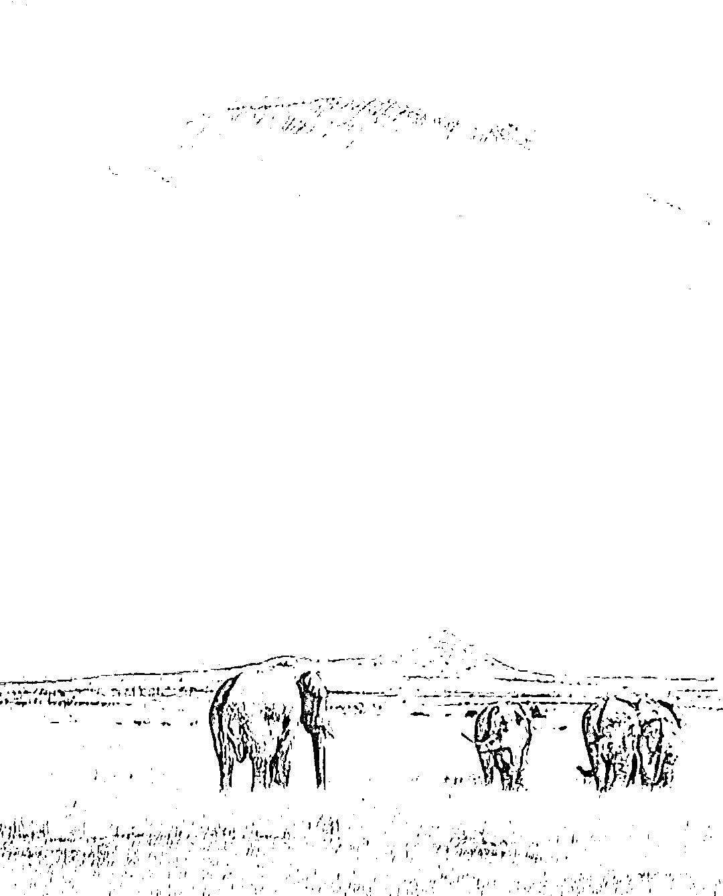

> 覆盖着积雪的乞力马扎罗山高 19710 英尺，据说是非洲境内最高的一座山峰。靠近西主峰的地方有一具风干冻僵了的雪豹尸体……雪豹在那么高的地方寻找什么？没有人做出过解释。
> 
> ——海明威《乞力马扎罗的雪》

**总述**

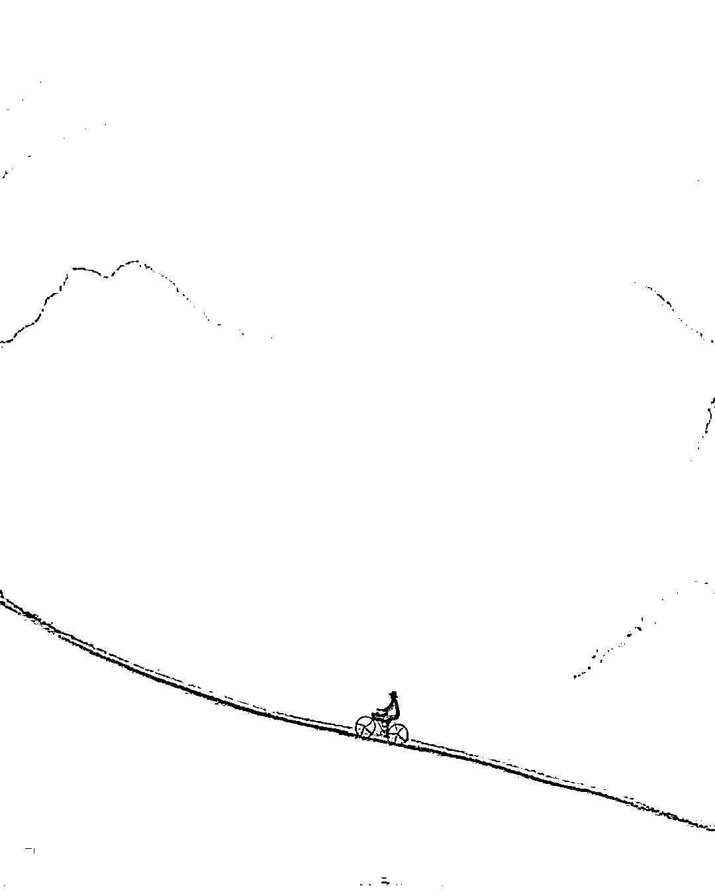

首先，来简洁地为冥王星第 10 宫的欲望画像。**落在第 10 宫的星，渴望成功，恐惧失败。而冥王星第 10 宫，是极度渴望成功，和极度恐惧失败。**从进化占星学的角度推演，每一个冥王星落点都有一种别致的创伤，它是穿越时空翰海游来的灵魂烙印。故第 10 宫正是你累世业力之根。你注定在此成功，也曾经在此跌落。于是，你敏感于阶级，或矛盾于规则，尤其会爱恨交织于一切权威的征象。难以名状的内在恐惧，相关前世的未竟之志，时常激起业力残渣，不断闪回迫害妄想，作为生命原动力的创伤。

被某种在世界中的存在感所压迫，又被一种莫名的匮乏感所驱赶，对成功欲壑难填，明知不堪重负，仍疯狂扩张，要征服世界。你始终无法在此松开拳头，这里有你放不下的执着，累世的。只因你不能彻底理解它，注定你永远无法填满它。而宿命的阴云总笼罩着你的成功之路？难道你是因怨恨而弃权吗？恶意失败的魔咒，藏在深邃的无意识底端，但见那情结强迫性地重复，令你不停做错，进退维谷。或是归于一种功成名就后的空虚，你开始对人生庄严地哀悼：**我这一切的努力，究竟意义为何？**

**你在恐惧什么？**

> 他想了一会儿，自己到底想要一个什么样的伴儿。不行了，他心想，如果你做什么都做得太久，开始得太晚，你就不能指望大家还留在那里。人都散了。晚会结束了，现在只剩下了你和女主人……
> 
> ——海明威

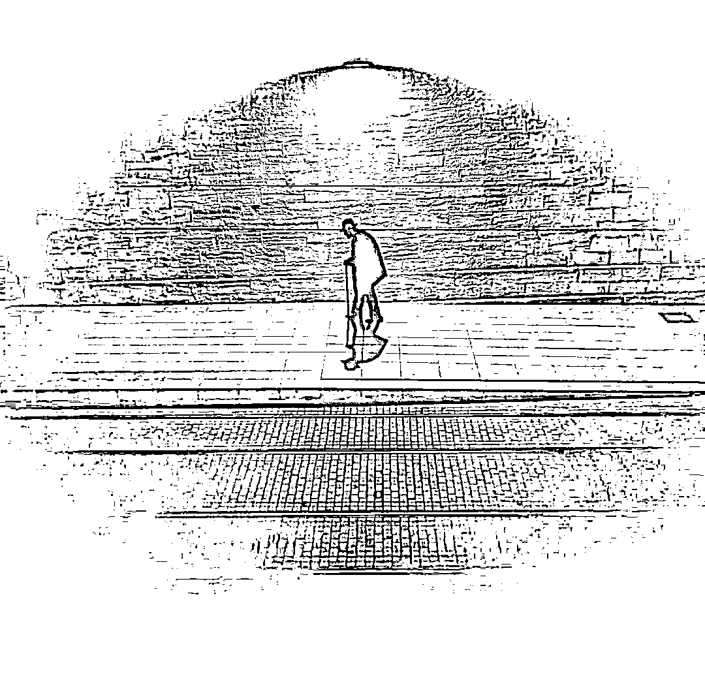

冥王星第 10 宫人的胸怀中，与生俱来，按捺着一份迫切的使命感：**“Muss Es Sein”？“非如此不可”！**所以，第 10 宫事业的真谛，并非那份你赖以谋生的工作，也不局限于财富的创造，而是让你真正能在心中引以为傲，实现出自我映照的使命，一种能为你人生带来深切意义的成就感。

而这些人，也天生懂得**“我们只拥有一段特定的时间来实现自己的使命”。**因为土星意识总能令人格外敏感于时效，即**时空的限制**。而冥王星第 10 宫人则尤其能感受到，代表物质世界的肉身与时空之间的紧张关系，即生命之紧迫。在时间与空间的双重压榨下，令有一种力量猛烈地向上生长，那正是灵魂面对虚无的反抗：雁过留声，人过留名。趁我们都还活着，必须要留下一点能铭记我们曾存在过的东西……**在物质世界里**！这片野心已锁定了明确的社会坐标系。

因此，为实现使命，他们最擅长把握时机。也明白规则之下，才有节约效能最近的路。不耽于情绪羁绊，懂得为自己负起责任。比他人更早熟于人情世故，社交成熟度格外练达。也兼备极高的挫折商，不断汲取失败而重生，在通往成功的路上。于是，他们显得极尽努力，且尤其会研究如何将努力最高效率化，密切地关注执行力所转化出的效益。克制是一种美德？**毕竟，他们太怕老去？**

然后，有一天，在功成名就，年逾花甲时，方能坦然放下戒备，大方地谈论自己年轻时曾有多么迷惘与穷困了，带着一丝甜蜜的追悔……人们端详着这位散发着独特魅力的老者，**闻见了芳醇如酒。**一条冥王星第 10 宫的鱼，梦中盯着手表，写下了时空观：Hold infinity in the palm of my hand and eternity in an hour. **将无限尽握于掌中，永恒收藏于刹那。****你在补偿什么？**

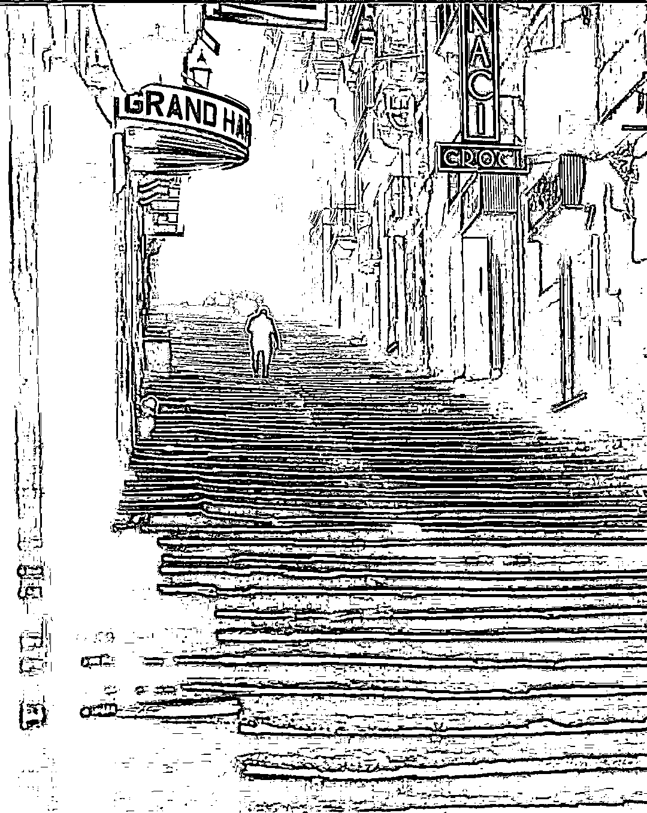

> 我们这一生做什么都是已经注定了的，你生存的方式就是你的才能所在。
> 
> 他在那些他待过的最好的地方和一些新的地方，与不同的人和更多的钱。但你在背地里对自己说，你要去把这些富得流油的人写出来，你其实不是他们中的一员，而是打入他们内部的一个间谍，你最终会离开他们并把这些都写出来，而且这次是由一个知道自己在写什么的人来写。但他永远也做不成，因为日复一日，那些舒适、什么都不用写的生活，那些他曾经痛恨的生活方式让他变得迟钝了，他工作的愿望也在减弱，以至于到头来他根本就不工作了。
> 
> 他之所以失去天赋是因为没有去使用它，是因为他背弃了自己和自己的追求，酗酒无度、懒惰、散漫、势利、傲慢偏见、不择手段……
> 
> ——海明威

第 10 宫，就像我们所置身其中的这个世界的布景，相关一切外在现实结构、阶层国界、政治制度、集权规范。冥王星在此，让你拥有足以影响世界的潜力，因为你在过去世早已学过这些，算是社会中的老灵魂了。

于是，你是天生领导者，挥舞着强悍自决力，常被委以重任，也心怀先天下之忧而忧的社会责任感。自我实现的激情，须经社会为载体，在其中建立个人权威，锚定名誉地位和世俗成功，来定位身份认同。**攀登上主流社会的珠峰，这一切对你极具象征意义。**尽管你在此处，注定会是爱恨交织……也不乏隐秘退缩的冥王星第 10 宫人，却并不代表没有野心，退缩可能源于失望与看透。总之，你会担当冥王星色彩的社会功能，它必然极具复杂性，或是极富疗愈感，甚至隐秘到不可言说。

很快，问题出现了：“**自从我想升往高处，我就不再信任自己了，也无人信任我了。**这到底是怎么回事啊？当我攀登时，我经常跨越台阶，没有一级台阶会原谅我的。如果我在上面，我就发觉得自己总是孑然一人。没有人跟我说话，寂寞的冰霜使我战栗不巳。**我到底想在高处做什么呢？我的蔑视与我的渴望共同生长。**我攀升越高，就越是蔑视那正在攀登的人。他到底想在高处做什么呢？我多么羞于自己的攀登和踉跄啊！我在髙处是多么疲惫啊！**我攀登又攀登，我梦想又梦想，但一切都压迫着我。**我就像一个病人，恶劣的折磨使他疲倦，而一种更为恶劣的梦想又把他从沉睡中唤醒……”尼采的查拉图斯特拉如是问。

**冥王星所在的宫位，注定你在这里充满业力。**欲望本能让你过度补偿，巧取豪夺也是双向的。既然第 10 宫极富政治色彩，尤其得冥王星在此……**政治的根本正是权力关系。**于是，职场沉浮，权谋斗争的戏码，必定成为主旋律。检视下你权欲的内在驱力，无论向前世创伤、家族动力，还是童年早期去溯源。过度认同权力地位，究竟源自于哪种深层恐惧？与权威对抗的怨恨，揭示出与双亲间哪些未竟的权力议题？被唤醒的婴儿情结如何被投射在了成人世界中？成就渴求背后隐藏的动力，难道源自早期想要讨好父母，证明价值，寻求认同，以获得爱吗？儿时可有曾被威胁压制，无情霸凌的安全感创伤？而今你又有权力滥用的问题吗？是否曾立志长大后能掌权操纵形势以获伸张和补偿？然而，这些掩埋极深的安全感功课，真的能依附于权力解决吗？当你终以自己的方式掌控了世界，灵魂深处真的感受到自由了吗？而我看到的只是，你累世的能量都曾在此处耗竭。

> 当它与过去之间的最后一丝联系也断了，她想去墓地走走以平息心情，他不明白为什么亡者会想让那些仿制的宫殿压在自己头上，这座公墓就是一个石化的名利场，众生根本没有在死后变得清醒，反倒比生前更痴癫，他们在墓碑上，夸耀着自己的显赫，这安息的不是父亲兄弟儿子或祖母，而是名流政要头衔及荣誉加身的人物，那怕只是一个小职员，也要在此摆出他的身份，级别社会地位，即他的尊严，供人瞻仰。
> 
> ——米兰·昆德拉

**你将在何处崩塌？**

> 这是从未有过的经历，他不想把它搞砸了。可能还是会的。你把什么都搞砸了。但这次也许不会了。(死亡)
> 
> ——海明威

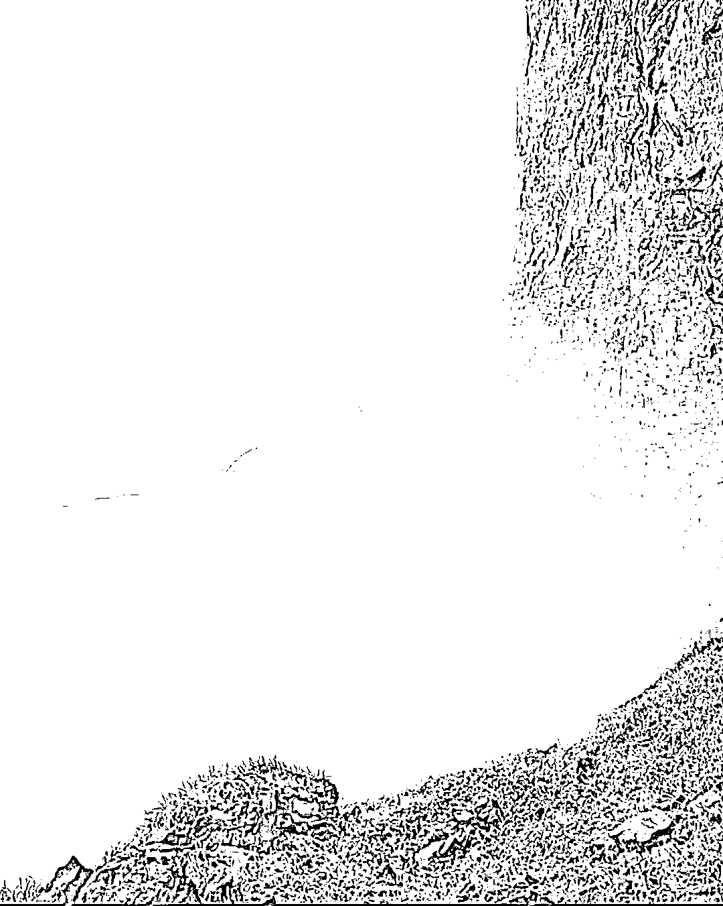

冥王星第 10 宫渴望成功，但成功与你的关系不太友好，此处的路并不平坦，现实似乎总呈现出艰难困境，甚至隔着万丈深渊。职业发展的道路上，你不断经历颠覆，会主动或被动地吸引来巨变的情境，导致目标方向的重新定义，从而也深刻地转变了人生。**每一个外在坍塌之处，都通往一条内在省思之路。**踏着磨难荆棘的你，正全然不知地，通往那遥远的真我之径……而当你过度目标导向，急功近利时，也常会被魔鬼拷问灵魂。挑战道德底线的捷径，必然导向众所周知的丑闻，或权力巅峰的陨落，即你被冥王星的无情能量所反噬。总之，你拥有巨大能量去操纵世界，同时也被其中的巨大能量所控制。

**对抗规则**

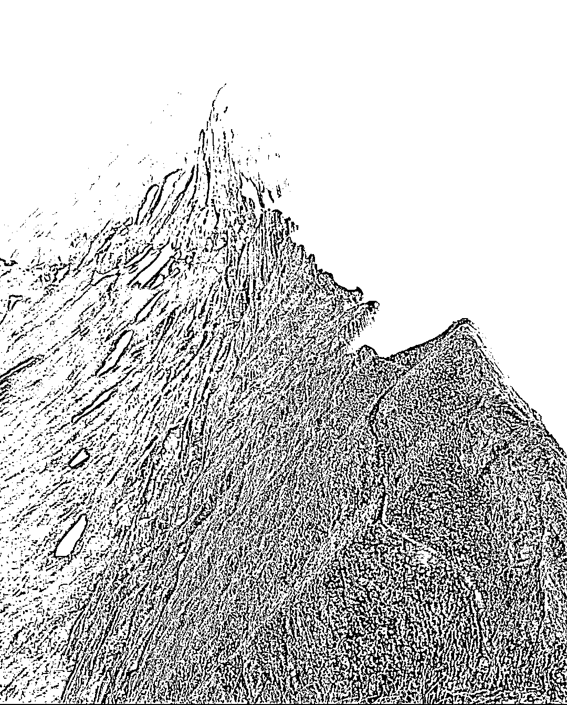

虽然你深谙社会体制的运作，能洞悉它的游戏规则，擅长操纵制度为己服务。但另一方面，此处的冥王星又总能看透其虚伪，或以情绪本能去对抗之。为何不参与游戏？只因为拒绝撒谎。比如，你会真实如冥王星第 10 宫人加缪笔下的默尔索。要么以沉默的方式来说真话，要么道出真相再跟上一句“**我也许不应该这样说**”。说明你能充分意识到规则的存在，及其潜在的影响与威力，却敢于嘲弄这些即定的秩序，对抗道德礼教的束缚，只是出于一种冥王星式的执拗，或者说，是出于一种冥王星式强大的存在感……“排斥我，把我化为乌有”？你常觉得厌烦，且感到孤独。于是，你与社会整体形成了对峙，令其立刻感到了威胁。结果很直接，**你受到了惩罚！**

> 他和其他所有人的相处就变成了一种对峙。他站在一面，所有人都站在另一面。这个时候的默尔索只是静静地看着人世间的表演。他远非麻木不仁，有一种深层的激情让他充满活力，因为这激情是一种长久的，基于绝对和真实之上的激情，是一种具有否定性的真实，存在和感受的真实。
> 
> 但是如果没有这样的真实，任何关于自我的征服都是不可能的。他怎么样就怎么说，他拒绝为自己的情感戴上种种的面具。这个时候社会立刻觉得自己受到了威胁。问他是否为自己的罪行感到遗憾，他回答说与其说感到遗憾，他更觉得厌烦，而这一点细微的差别就送了他的命。
> 
> ——《局外人》

**死亡觉醒**

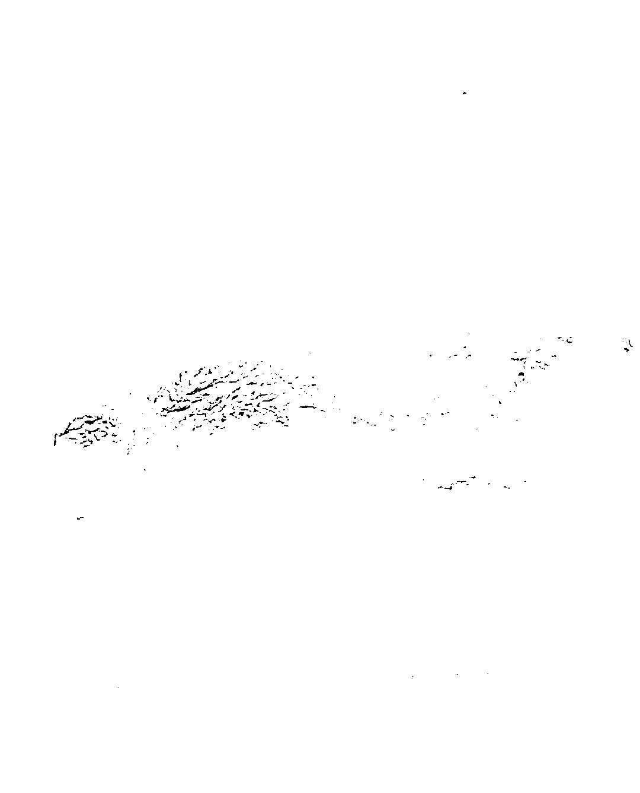

冥王星面对第 10 宫的高处不胜寒，可能会激起一种死亡觉醒。**“你到这么高来干什么呢？”**想想第 10 宫在星图的位置，是否可以象征一种“中年的焦虑”？如冥王星第 10 宫的海明威笔下，那些为了追求成功尽头的瞬间荣耀，而怀着坚强天真走在实践梦想途中的斗士们，终被命运的悲剧无情击碎，泯灭于尘的故事，处处渗透着冥王星第 10 宫专属的那份庄严的哀伤。

> 右腿染上坏疽后，他不但不感到疼痛，连恐惧也随着疼痛一起消失。他现在唯一感觉得到的就是疲乏，还有因为这结局而引发的愤怒。对即将来临的终结，他已经失去了好奇。
> 
> 我觉得死亡和其他事情一样无聊，他心想。我一直在写东西，但我累了。就在这一刻，他突然意识到自己即将死去。这个念头伴随着一股冲击而至，但这冲击既不像流水，也不像一阵风，那是一股带有恶臭的、突然的空虚感。他再次感到了死神的降临。这一次不是冲击，而是呼出的一口气，就像那使得烛光摇曳、火苗上蹿的一阵微风。把这些写出来是他的职责，可他再也写不了了。他再也没有机会去写那些特意积攒下来、想等自己能写得足够好了再去写的东西了。
> 
> ——《乞力马扎罗的雪》

**徒劳无功**

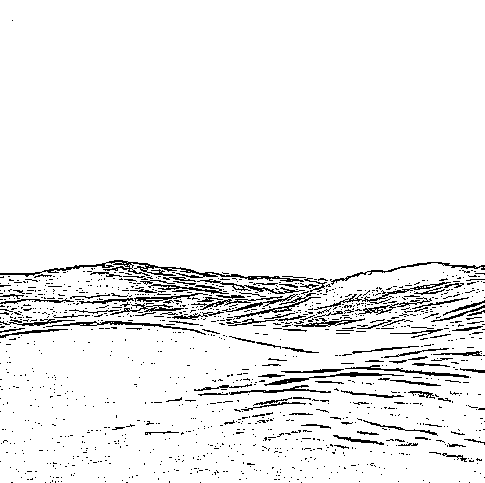

听我重述了老人与海和西西弗斯的故事，冥王星第 10 宫的客户一声惊呼：那人生岂不是一事无成……我愣了一下，然后指出了她对结果的敏感。她说绝对是这样的。我隔空触到了一片空虚。当然，我也会同时把解药给到她。但这个哀伤过程却是冥王星第 10 宫人必经的。老人极尽勇敢和坚持去克服对命运的恐惧，末了换来了什么？遍尝了失去的苦涩，所换来的仅仅是尊严。**作为人生赢家，胜者一无所获。**问世间“赢”为何物？这就是冥王星第 10 宫故事的复杂性。

> 老头圣地亚哥八十几天没有钓到鱼了，结果这天出海，钩到了一条大得要命的鱼，快有六米长，这个鱼能把船拖着走。老头就很就很被动，就只能跟他死撑死扛，然后老头跟鱼耗了两天两夜终于耗赢了，然后鱼浮上来了，老头把鱼杀掉了，把它拴在船边上。
> 
> 往回走的时候鲨鱼赶过来了，抢夺他的战利品，老头拼尽全力用一切可用的武器跟鲨鱼打。但是等到回去的时候，大鱼的鱼肉还是啃光了，最后老头把一副长达五米开外接近六米的鱼骨头带回了港口。而老头自己在梦里回到他年轻时去过的非洲，就梦见狮子什么的……
> 
> ——《老人与海》

**负重前行**

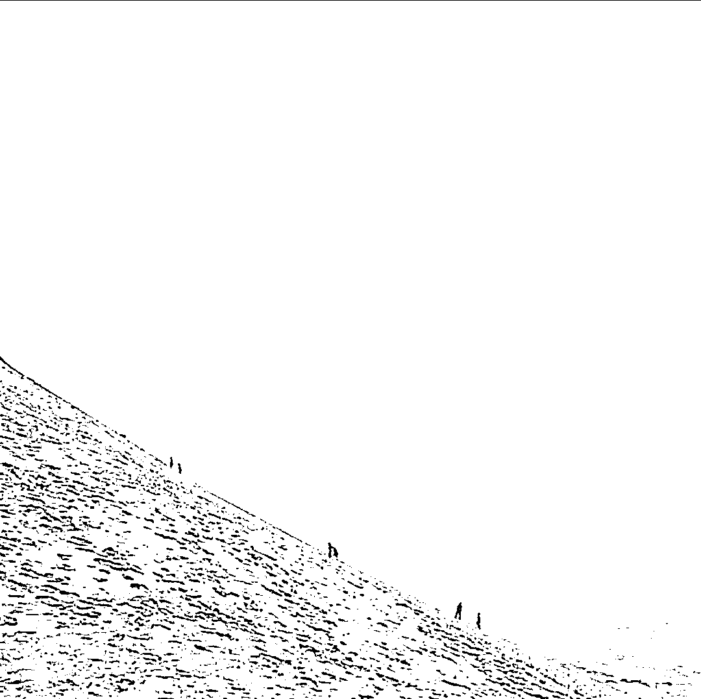

同为冥王星第 10 宫，西西弗斯也受到了惩罚。推石上山的画面多么悲壮！因为这一切注定徒劳无功。可尽管他明知那巨石将照例滚落，他选择的却仍是负重前行。所以，加缪眼里的英雄，恰恰是赢在他们接受了惩罚！**面对命运的荒谬，人类无能为力，但唯一的办法，就是去超越它。**“重要的不是治愈，而是带着病痛活下去。”这就是人生。

故冥王星第 10 宫的错误已显而易见，即是当其将生活当作了实现最终目的的途径，而非目的本身。**“一个人可以被杀死，但不能被击败。”**正所谓，通过大幅度的顺从，来压垮恶的要求，使恶因过量而变荒唐，从而将其伤害降到毫无价值，受害者反转为精神侵略者，以此，获得了生存上的胜利，获得了人之为人的尊严，获得了命运的超越。即把重心转向了那**“指月的手指”**！否则，除此还能怎样？

> 我把西西弗斯留在山脚下，我们总是看到他身上的重负，而西西弗斯告诉我们，最高的虔诚是否认诸神，并且搬掉石头，他也认为自己是幸福的。从此没有主宰的世界，对他来讲既不是荒漠也不是沃土。这块巨石上的每一颗颗粒，这黑油油高山上的每一颗矿砂，唯有对西西弗斯才形成一个世界。他爬上山顶所要进行的斗争本身就足以使一个人心里感到充实。应该认为西西弗斯是幸福的。
> 
> ——《西西弗斯神话》

**你该魂归何处？**

> 要去看看一个人抛弃了所有他一直以为是使命的东西时，生命中还能剩下些什么？当他报道去擦玻璃时，他几乎惊慌失措，惊恐中度过了打工的头几天。而一旦克服了新生活令人惊恐的陌生感，他猛然意识到，自己等于在放长假，做的是自己完全不在乎的事，真美。
> 
> 从事的不是内心的非如此不可，逼着去做的职业。一下班就可以把工作丢在脑后，终于体会到这些人的幸福，而从前总是对他们心存怜悯。他还从来没有感受过不在乎带来的快乐。他回答她说“你难道没有发现我在这里很幸福？使命，那是无关紧要的事，我没有使命，任何人都没有使命。当你发现自己是自由的，没有任何使命是便是一种极大的解脱。
> 
> ——米兰·昆德拉

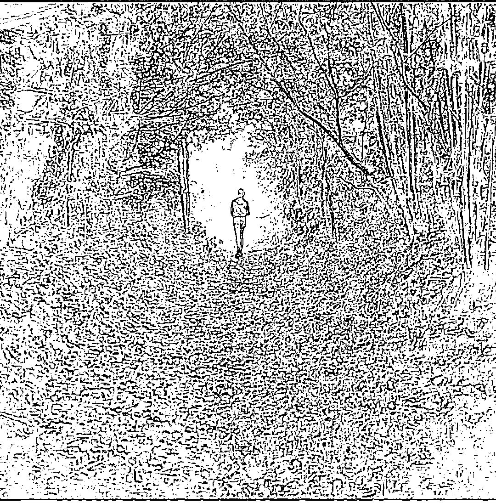

**灵魂病了，对宫有药。冥王星第 10 宫的对应点是第 4 宫，那里才是终极的解药。**联想此时，**正值土冥南交群星热闹地合相于摩羯座，而对岸北交巨蟹座的孤影中，却承载着人类一切的解药……蒲草韧如丝**。当我们把目光游移于这组对宫：第 10 宫政治激情的狂热和虚妄，是否恰是在掩饰第 4 宫心灵深处的荒芜与悲伤？第 10 宫阳性力量日新月异的时代进步，与第 4 宫阴性能量从前慢的旧时光，究竟谁才是故乡？成人世界走到了尽头，是否终要向童年之根回望？个体价值“卑微”的欢愉，是否真有义务被集体目标的“宏大”所碾压？ 

> 他能够战胜一切，他心想，只要不在乎，就不会受到任何伤害……

是的，当去情感化地隔离情绪，成为了一种安全，支撑你的只有空洞。你注定得不到源于自身根基处那片绿洲的滋养。而不亲历其中者，也无法了悟那份失衡，那种跟自己的眼泪都失联了的困惑......

冥王星第 10 宫人，想过吗？你所经历的高位陨落，成就厌倦，情感震撼，哪有一件是偶然。所到之处皆是警醒，提示你去整合对宫，它指向一片温柔的乡愁，精神依归的古井，那里是情绪的本质，你终极的家。尝试从外在职责逃回私人时空休憩，**去找寻与社会地位无关的个人成就感，与外部环境无关的情感基础，建基于内在安全感的身份认同。**究竟什么叫作内在安全感？就是无论当你失去什么，都仍可以安然无恙，宠辱不惊。 

**人生本无乡，心安是归处。**

> “别喝那个，”她说，“亲爱的，你别喝了。我们必须尽最大的努力。” 
> 
> “你努力吧，”他说，“我累了。” 
> 
> ——海明威

**结语**

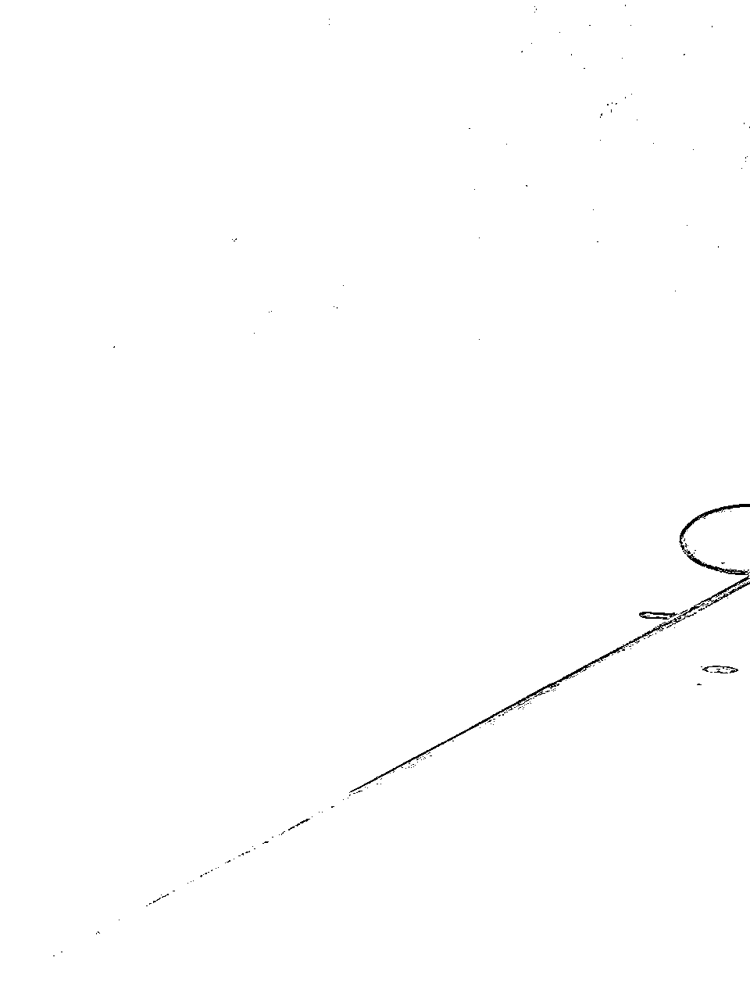

> 往下，他看见一片移动着的粉色云彩，正飘过大地，从空中望去，就像突如其来的暴风雪中的第一阵雪，他知道蝗虫正从南边飞来。他们开始爬升，好像在往东飞，接着天色暗了下来，他们遇到一场暴风雨，大雨如注，仿佛是在穿越一道瀑布，突然，他们就从暴风雨中钻出来了，康毕转过头来，对他咧嘴一笑，用手指了指，前方，他目所能及的像整个世界一样壮阔，雄伟高耸，在阳光下白得令人难以置信的，正是乞力马扎罗山方形的山顶。他于是明白了，那就是他要去的地方。
> 
> ——海明威《乞力马扎罗的雪》

**版权声明：**本文由作者授权在若道平台发布，欢迎转发，反对抄袭。


**你可能还想知道**

[2020 年度天象详解 | 土木冥极地之旅](https://mp.weixin.qq.com/s?__biz=MzA5NjA0NTAxNg==&mid=2651412566&idx=1&sn=ba71bd85e67a9742fe9a76b2626634a8&chksm=8b4beae1bc3c63f71b58c70327e32874483a79a0b5aff0e62a2f02541acf0c32ae1af76c66c5&token=2090496004&lang=zh_CN&scene=21#wechat_redirect)

[解密冥王星（上）](https://mp.weixin.qq.com/s?__biz=MzA5NjA0NTAxNg==&mid=2651411924&idx=1&sn=d9a10f7f763dbb80a857ca94e2a67830&chksm=8b4be763bc3c6e759456fd2dd4dc92e87ea3b3b2507a5be70072d2c6339b895af34e04c1f7d6&token=2090496004&lang=zh_CN&scene=21#wechat_redirect)

[解密冥王星（下）](https://mp.weixin.qq.com/s?__biz=MzA5NjA0NTAxNg==&mid=2651411924&idx=2&sn=2d0e1e9c0cca79e09826c1133cfb6a43&chksm=8b4be763bc3c6e759effc54dc35ae4d5fbd8dd9ffa0498764c132a1af5c3d0ab9387e23e97c9&token=2090496004&lang=zh_CN&scene=21#wechat_redirect)

**蓝女巫**

英国伯明翰大学 市场营销学硕士

职业占星师/专栏作者/芳疗师/珠宝设计师

中国首批 ISAR 英文认证占星师（2012 届）

**微信公众号**：cecilia_sui

长按打赏


**想系统学习占星学？**

**点击图片了解详情**


**微信又双叒叕改版啦，不想错过若道君的推送？**

**就把若道设为星标吧！**

**▼**


喜欢记得点一下在看哦☟

********报名直达入口********


# 当冥王星碰上月亮 | 你有能力，让所有的错误到此结束

> 原文：[`mp.weixin.qq.com/s?__biz=MzA5NjA0NTAxNg==&mid=2651412808&idx=2&sn=91a84e029550f80a12590626cb5e8060&chksm=8b4bebffbc3c62e954dc3af0d20443841b00591f50fc5d931e8f8d950d3495b17eb653cd9b69&scene=126&sessionid=1692738227#rd`](http://mp.weixin.qq.com/s?__biz=MzA5NjA0NTAxNg==&mid=2651412808&idx=2&sn=91a84e029550f80a12590626cb5e8060&chksm=8b4bebffbc3c62e954dc3af0d20443841b00591f50fc5d931e8f8d950d3495b17eb653cd9b69&scene=126&sessionid=1692738227#rd)

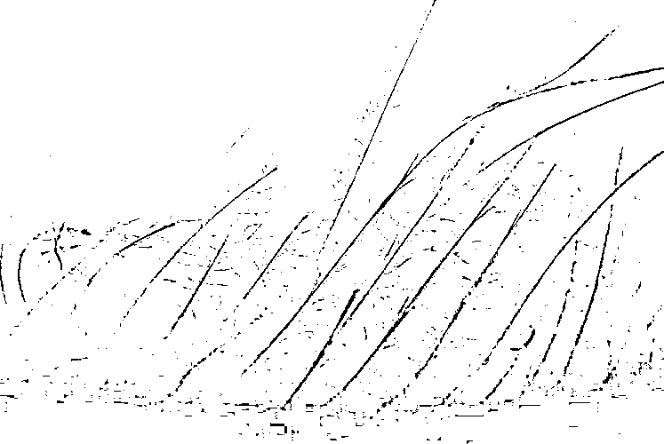
作者/沙沙 ISAR 认证占星师编辑/玫瑰 图片/unsplash**月冥人的阴影**说起来自母亲的阴影，乍一听有点奇怪。母爱深重且伟大，怎么能用阴影来形容呢？可是以下的话，你应该不陌生吧？“我是你妈，看看你日记不行吗？你对我还有秘密了？”“要不是你，我早和你爸离婚了。”如果以上的话，你非常熟悉，那你可能进入了一种具有**倾略性**的母亲与子女的关系。在这种关系里，母亲可以用情感牢牢控制住孩子，而对孩子来说，这种母子关系虽然紧密，却并不舒适，因为他们已经在无意识中被剥夺了个人的自主性。对于这一切，有些人深有感触，却往往缄默不言。母子之间的**共生关系和情感绑架**，仿佛是他们内心深处的一个秘密，一个潘多拉魔盒。一旦打开了，就会伴随着激烈的情绪爆发，这让他们**深怀恐惧**。他们想要逃避面对这一切，却直觉地知道无法避开。**从占星学的角度来解释，那些在令人窒息的亲子关系中长大的人，往往有着月亮和冥王星的紧张相位，他们的名字叫做月冥人。****受害者和控制者**月冥人的母亲往往是**强势**的，这种强势，体现在**隐秘而无所不在的情感控制**上。但在生活中，她却常常以**受害者**的面貌呈现在人前。她也许是婚姻的受害者，在丈夫身上里找不到幸福，于是紧抓着孩子不放，以免堕入更深的黑暗。“你是我唯一的指望”，“我这么辛苦都是为了你”，诸如此类的话，是月冥人的母亲常说的台词。而这会让孩子心生**愧疚**，他们会觉得**是自己拖累了母亲**，或者是自己的物质需求让她如此辛苦，因而对于母亲的“**情感绑架**”，他们难以说不。为什么母亲的控制总是让孩子难以反抗？在丽兹·格林和霍华德·萨司波塔斯合著的《发光体：星图中太阳、月亮的心理意涵》（*The Psychology of the Sun and Moon in the Horoscope*）一书中，曾有如此论述：**与其他动物相比，人类在出生的时候实在是太不成熟了。离开子宫这个伊甸园之后，我们需要有一个母亲或其他人来照顾我们，这种即时的、绝对的身体依赖性，导致我们对母亲产生了一种深刻而盲目的情感依赖。**这种依赖，是由星图中的月亮所象征的。**冥王星用它的控制力**，**把本该属于婴儿时期的母子共生关系硬生生延续到了孩子长大成人之后**。对此，孩子当然会有**愤怒和怨恨**，却迫于内心的**愧疚感**，很难表达出来——本身也与**被深埋的激烈情绪**有关。


**我渐渐变成了我的母亲**

武志红的新书《巨婴国》之所以引起如此强烈的反响，大概也说明了当代社会中“巨婴”的现象，尤其是男性“巨婴”的现象不在少数，母亲与儿子之间不留缝隙的共生关系尤为普遍。

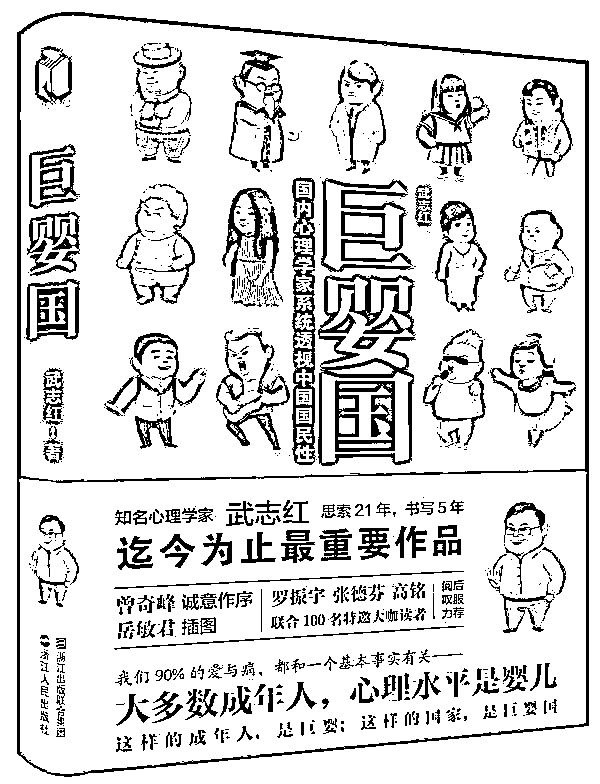

**|**武志红新书《巨婴国》

其实，要想知道一个母亲与儿子的关系究竟如何，不妨去看看他的婚礼现场：他的母亲会因为儿子终于成为一个有责任、有担当的男人而骄傲，还是想到儿子从此要被另一个女人抢走了，就掩饰不住心中的悲伤和失落呢？如果是后者，那么这个儿子的婚姻也难免潜藏着危机。而他的妻子也可能在对丈夫的失望之下，拼命地抓住孩子不放，让这样的亲子共生关系成为**循环的悲剧**。张爱玲在她的名篇《金锁记》里，曾经描绘过一个用“金锁”劈杀了自己儿女的母亲。这个名叫曹七巧的女人，对于儿女的生活总是抱持着入侵者的姿态。

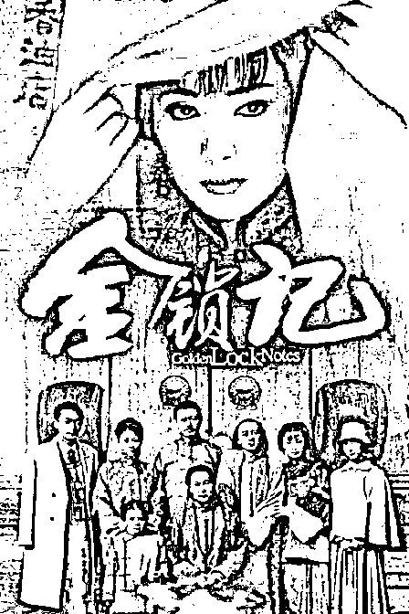

****|****根据张爱玲《金锁记》改编的同名电视剧

儿子新婚之夜，她站在门外，轻蔑地嘲笑儿媳的嘴唇太厚：“这两片嘴唇，切切倒有一大碟子”，“但愿咱们白哥儿这条命别送在她手里！”

她将儿子与儿媳的房帏之事说与外人取笑，令亲家和儿媳都无地自容，也逼得儿子又去逛窑子，或是与她一起抽一夜的鸦片。用她的话说：“你若还是我从前的白哥儿，你今儿替我烧一夜的烟！”她似乎也见不得女儿有好的归宿，女儿要订婚了，她却没有一句好话，反而冷言冷语，骂她：“就知道霸钱要男人”。女儿绝望地想着男友迟早要见到自己的母亲，迟早要出乱子，不如自己亲手扼杀了这段感情算了。借着女儿男友的眼睛，张爱玲让我们看到了这个母亲的形象：“门口背着光立着一个小身材的老太太，脸看不清楚……门外日色昏黄，楼梯上铺着湖绿花格子漆布地衣，一级一级上去，通入没有光的所在。”“他直觉地感到那是个疯人，无缘无故的，他只是毛骨悚然。”然而最大的悲剧在于，这个深恨母亲的女儿，却变得越来越像母亲的样子，她讲话的姿态和语气，在外人看来“活脱脱一个七巧”。这一幕着实令人心惊。星图是诚实的，它通过月冥相位记录下了这样的**代际传承**。月亮和冥王星的困难相位不但意味着**上一代人的伤痕**，也意味着**下一代人的挣扎**。冥王星从来都不会让人轻松过关，但不要忘了，它也许诺了**转化**的可能，以及随之而来的**巨大财富**——如果你有勇气打破这个循环的链条，走出原生家庭的阴影，大声宣布：**让所有的错误到此结束。**

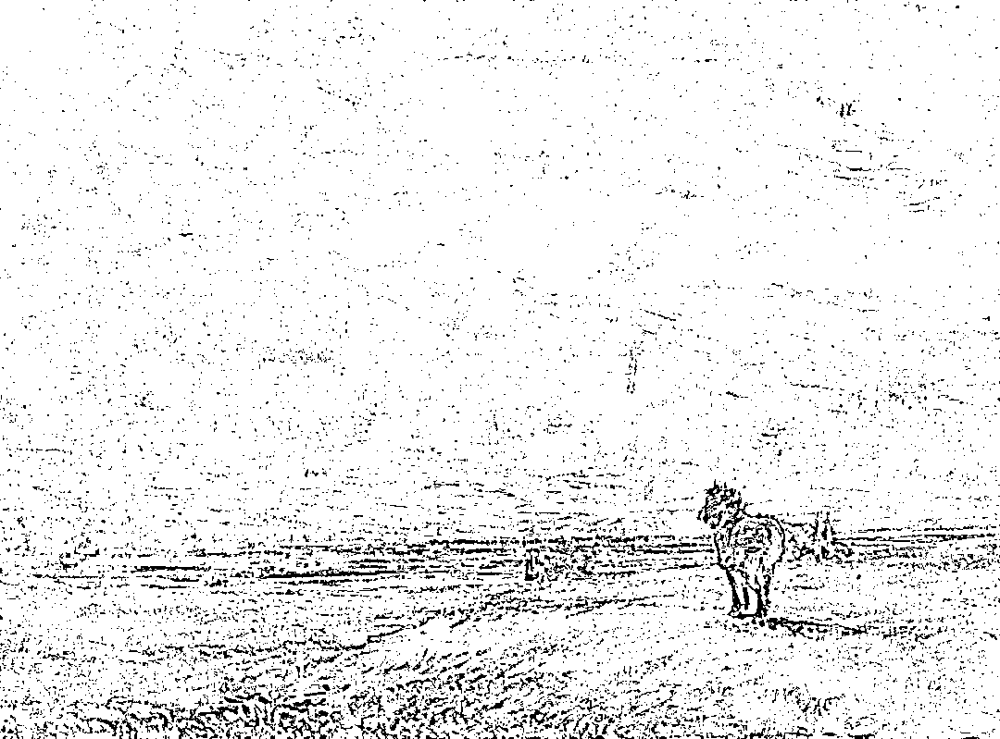

**走出月冥议题的 3 个途径**要转化月冥紧张相位，或许可以借助以下几个观察的角度：1 发现太阳的光芒如果说月亮让我们习惯于**依附**，那么太阳则教导我们**独立**。我们星图上的太阳，渴望着**确认自己是一个独立的个体**，与母亲相关但不相同，踏上自己的“**英雄之旅**”。在丽兹·格林和霍华德·萨司波塔斯合著的《发光体：星图中太阳、月亮的心理意涵》（*The Psychology of the Sun and Moon in the Horoscope*）一书中，曾有如此论述： 

**太阳承诺我们，“我”不仅具有生存的智慧，也能让生命充满意义、目的和欢乐。从依赖母亲到独立生存，这是一条英雄之路，太阳便是这个英雄的原型，它与恐惧和危险作斗争。**

星图里的太阳告诉我们，**你需要成为一个什么样的人，实现怎样的人生意义**。发现自我的使命，并且为之努力奋斗。**让太阳发光，你会发现，它将照亮月冥的阴影。**2 找到月亮所需要的滋养方式太阳是我们英雄之旅的方向，但月亮才是**快乐感和满足感的真正来源**。被冥王星“纠缠”住的月亮，也有自己得到滋养的方式。**月亮所落的星座以及月亮的其他相位**会告诉我们，**我们需要怎样的关怀和温暖**。比如，**水瓶座的月亮**需要**认清真理**，**诚实地面对世界的真相**；**天秤座的月亮**需要追求**内在的平静**，也需要通过**建立人际关系**来映照自我，同时滋养他人。而即使是当**月亮受到天蝎座、冥王星**极为强烈的影响，也可以找到这个星座和相位能量的正向表达。因为这样的月亮，不满足于让日子平淡地流过，而是需要**以极大的热情投入某件事或某种关系**。在其中，他们体验着**生活的激情**，也积聚着**生命的能量**。在关系中，他们体验着**极致的亲密和融合**。需要注意的是，月冥人往往有着**极强的直觉**，**能够轻易地探入别人的内心世界**。但是，他们必须**放下操控别人情绪的冲动**，而把这样的觉知力转化为**理解、接纳和疗愈的能力**。3 用土星划清界限土星是一堵墙。**当你用它封闭自己的心，它会伤害你**；当你用它**建立必要的规则和疆界**，它会帮助你。土星会帮助你**说“不”**，帮助你建立起一座属于自己的小房子，这是你的空间，你有权拒绝任何人的不恰当的打扰。土星也会教导你**对自己的生活负起责任来**。即使过去的错误不是你自己造成的，此时此刻，也**只有你自己，才是真正能对自己的生活负责任的人**。你需要做的不是责怪谁，而是让自己**成熟**起来，**看到问题的原因，也看到自己的力量**。特别是，**当你处于重要的土星行进期，或正在经历土星回归的话，就该学着运用土星的力量，重新规划你的生活了**。说到底，没有一颗星星是来伤害我们的，冥王星也一样。月冥人的成长之路，也许是一条坎坷的、充满危机的路，但是月冥人也天生就有**应对危机的能力、深入探索内心世界的能力，以及不可估量的成长潜力和疗愈能力**。这，才是月冥人最大的秘密。**版权声明**：文章由作者授权在若道平台发布，欢迎转发，反对抄袭。****

沙沙

ISAR 认证占星师（2016 年获得）

国家二级心理咨询师、报刊专栏作者

2010 年创办工作室“九月占星馆”，个案累积 600 小时以上。

**微信公众号**：九月占星馆（jiuyuezhanxing）

**咨询微信号**：zhouzhe7752（添加请注明“占星咨询”）

长按给作者打赏 


**点击图片查看若道君推荐**


**微信又双叒叕改版啦，不想错过若道君的推送？**

**就把若道设为星标吧！**

**▼**


喜欢记得点一下在看哦☟

**报名直达入口**


# 金牌课程·中英双导师 Level1-2｜零基础线下工作坊，3 天入门占星学

> 原文：[`mp.weixin.qq.com/s?__biz=MzA5NjA0NTAxNg==&mid=2651412808&idx=3&sn=f34e17c52c7795ef22ef99efb5638275&chksm=8b4bebffbc3c62e9694a8390d91cc189e1c3b3284180f79a4520d70766bf90a5dfed5c69837f&scene=126&sessionid=1692738227#rd`](http://mp.weixin.qq.com/s?__biz=MzA5NjA0NTAxNg==&mid=2651412808&idx=3&sn=f34e17c52c7795ef22ef99efb5638275&chksm=8b4bebffbc3c62e9694a8390d91cc189e1c3b3284180f79a4520d70766bf90a5dfed5c69837f&scene=126&sessionid=1692738227#rd)

****

**拥有 49 年占星实践经验的若道创始人**

**大卫·瑞雷**

**&**

**最懂学员的若道首位认证金牌中国老师**

**熊鹰**

**师徒二人****横跨南北****联手打造****北京上海**** 若道****全新****核心占星课程****之**

**互动实战占星初阶工作坊**

**本次****Level 1-2 工作坊****会分别在**

**上海（2020 年 3 月 13、14、15 日 熊鹰老师主讲）**

**北京（2020 年 4 月 4、5、6 日 大卫·瑞雷老师主讲）**

**两个城市各举办一场**

**方便北方、南方同学自由选择，邀请小伙伴一起学习**

**核心课现场工作坊是一种什么样的？**

珍贵的**面授工作坊**，全面而详细地讲解占星学知识，一场五感盛宴！

# **代入感：**向往占星世界好久了，迟迟没有下决心系统学习？最专业的占星老师来喽！带你穿越 9¾站台，进入真正的占星魔法世界，来若道，你就是哈利波特本特！


**沉浸感：**从虚拟的网络来到现实，舒适的学习环境，全新的占星同学，5D 的占星老师，专业的摄影团队，支持的工作人员~让你仿若重回校园梦，燃动青春学习占星！


**参与感：**大卫老师和天空老师都有丰富的教学经验，占星知识严肃专业，但开起玩笑来也丝毫不马虎，欢笑间知识都记住了呢，如果你长得可爱聪明伶俐，课上还会随时**被 Q**哦~对，就是你~


**仪式感：**两位老师超爱自己的中国学生们，为了让大家透彻地学习好宫位，2018 年初阶工作坊，大卫老师和熊鹰老师趴在地上用胶带贴的~仪式感满满~有没有~就宠你就宠你！今年还有没有其他的惊喜？


**亲近感：**周围全都是热爱占星的同学，那种亲近和被理解的感觉真的不要太美妙。志同道合的朋友就在身边，灵魂伴侣可能就在眼前，透露一下，在若道课堂里找到男女朋友的真的不要太多~比如~咳咳，总之带着八卦的心来上课吧~


**连报 L1-5 全阶课程，可以享受到：**❶51 次线上直播互动网络课程+3 场工作坊（互动实战占星初阶工作坊、亲密关系+职业占星工作坊、知识回顾+综合解读工作坊），全面而详细地讲解占星学知识、技能、案例和重要领域实践运用。 ❷知识点+学员星图解读有机结合：熊鹰老师以知识点和学员案例讲解为主，大卫·瑞雷老师以参课学员案例及客户案例讲解为主，每个知识点覆盖班级内学员的亲身案例，参与感更强，每位学员都有机会听到自己的星图分析。 ❸微信群学员互动分享，从真实案例学习生命成长故事。 ❹ 论坛提问：论坛上每个学员的问题都将得到及时回复。 ❺ 提供咨询师实习平台，只要努力，都将有机会在毕业前进行咨询的实习演练，听取客户反馈，为成为职业占星师做准备。

**1-2 阶我们要学习什么？**

**第一阶** ** 12 星座，12 种性格，12 种人生**❶ 学习占星学必须准备的“心法”**❷**占星学中的火、土、风、水四元素，阴阳法则**❸**面对面的星座有故事**❹ **12 星座：12 种性格详解，12 种行为模式，12 种价值观**❺ **太阳和月亮：了解你的太阳，生命的发动机，让你在世界闪光的方式，生命获得力量的方法；了解你的月亮，让你获得幸福的方法**❻ **了解太阳、月亮，了解你生命中已经出现的、将会出现的男性和女性

**第二阶  命运的线索和人生故事中的演员**

❶ 命运的线索：南北交点❷ 星图三巨头：太阳、月亮、上升点的故事❸ 了解心智：水星❹ 了解金钱和关系：金星❺ 了解行动模式：火星❻ 了解信念：木星❼ 了解努力：土星❽ 了解天才和疯狂：天王星❾ 了解梦想和幻灭：海王星❿ 了解死亡和重生：冥王星⓫ 12 个人生场景：黄道 12 宫位初解

**现场工作坊**

**上海（2020 年 3 月 13、14、15 日 熊鹰老师主讲）**

**北京（2020 年 4 月 4、5、6 日 大卫·瑞雷老师主讲）**


**如果你想马上开始学习 Level 1-2**现提供即买即学的**熊鹰老师网络视频课程**出售价格和工作坊一样

如果想同时购买网络课程视频+任一场现场工作坊可以享受**打包价**哈

```
购买视频课或购买视频+工作坊套餐的小伙伴
```

```
还能享受每月一次 2 小时的熊鹰老师直播答疑课，一共 4 次
```

具体购买方式看到最后~**这两位优秀的占星学老师是谁？**


**大卫·瑞雷（David Railey）**

*   ISAR 董事会成员，若道占星创始人。
*   1976 年，通过亚特兰大职业占星师考试，成为全职占星师，随后通过**AFAN 和 ISAR 职业测试**。
*   1980 年，与**杰夫·焦耳**一起在亚特兰大创建**“每日星球”**占星学中心。此后在亚特兰大占星协会担任 4 年考官，并且两次担任**亚特兰大地区占星协会主席**。
*   1979-1992 年，作为占星师活跃于美国社会媒体，向不了解现代占星学变化的大众宣传专业占星学知识。在 1989-1992 年期间，他在 WRGG 电台 12 频道每周主持个人电视秀**“今日占星学”**，早先他还在 WRFG 的广播节目中播讲宇宙天气节目。 
*   2010-2014 年，任**全美占星师联盟监督委员会委员**。
*   2010 年，其著作**《灵魂的目标》**中国版出版，和蒋颖一起创办**若道占星**学校和其官网 www.nodoor.com。从该年开始，他工作并往返于亚特兰大和北京。目前他 80%的时间致力于在中国教授和推广西方占星学。
*   2017 年，被选为**ISAR 委员会成员**（2017）。ISAR 是世界最大的国际占星机构，会员遍布 45 个国家。


**熊鹰老师（天空的空）**

*   2008 年接触严肃占星学，至此爱不释手。
*   **2013 年师从大卫·瑞雷**，研习整套现代占星学核心课程，并于 2014 年起至今连续三年担任该课程的主助教。
*   期间也**跟随格伦·佩里、诺·泰尔、理查德·塔纳斯、罗伯特·汉德、苏·汤普金斯、斯蒂芬·弗里斯特等多位国际顶尖占星大师进行学习**，进行定向占星主题研究。
*   2015 年初，通过国际占星研究协会**（ISAR）资质认证并获得证书**。同年，进一步跟随大卫·瑞雷老师进修**“生时校正”**技术，通过最终考核并获得证书。
*   目前在若道星文化任职，将传播系统、严谨、真实的占星学作为职业使命。任专职助教期间，进行沙龙与答疑等辅助教学工作已累计超过 200 小时。
*   在业余期间也提供占星咨询与生时校正服务。目前正致力于占星学与个人成长的整合。

**往届学员这样说**

★ **熊鹰老师非常清晰各阶段学员的难点在哪里，在哪里容易走弯路，所以在课程中给了针对性很强的技术讲解。**同时，学识广博的他对占星学术背后的道有非常深刻的思考，对占星学所表达的事物不断去溯源，去探寻本质，并在其他学问中去看到道的呼应，让我觉得非常过瘾和鼓舞。感谢熊鹰老师的启迪！ ——2017 若道占星核心课程熊鹰主讲 1-2 阶学员杨灿

**★ 知识渊博、博古通今、亲切可人、nice ，将东方的佛教文化、古诗词完美地与西方占星学结合，让学员特别容易理解**。很喜欢熊鹰（天空）老师，在巩固好 1、2 阶课程后，会追随空妈进行下一阶学习。

 ——2017 若道占星核心课程熊鹰主讲 1-2 阶学员王舒

★ **融合中国传统文化，把占星学规整得非常理性和易懂，空妈非常擅于观察和总结，给我们非常宝贵的经验。**我觉得效果非常好，以前对于各个星座和行星的概念比较片面，这次学完后觉得收获颇多，也打破了传统的限制，感觉到了与时俱进。 ——2017 若道占星核心课程熊鹰主讲 1-2 阶学员王茜★ 通过大卫老师课堂的案例咨询，我不仅对自己本身的特质和发展方向更加清晰，更开心的是清楚了自己处在怎样的发展阶段，外部环境对我的影响是怎样的，让我更加清晰应该怎样抓住机遇，在现阶段怎样努力。这些都是对我现在来说最重要的。**能够得到在课堂上享受这么专业精准的个案咨询，真的非常幸运。**——2017 若道占星核心课程大卫·瑞雷主讲 5 阶学员萧立★ 在课堂上获得了大卫咨询的宝贵机会。在一个多小时的咨询中，大卫首先演示了对客户星图的分析思路和推演过程，对客户的诸多发展方向和人生主题做出推测，并记录下来，待与客户见面时结合客户实际深入探讨。而后，大卫示范了如何与客户提问互动，从出生星图入手深入剖析案主的心理模式和原生家庭，并对案主的疑问进行解答。**坦白说，大卫的分析中肯且直中要害，对我来说像一道闪电，不仅准确地描述出我的原生家庭和童年生活环境，更击中了我多年来心中的隐痛**。这次咨询帮助我梳理了很多年来积压在心底的情绪，也在一定程度上疗愈了我，大卫的建议是如此地温和有力，让我感觉无比温暖，整个人被照亮了！再次感谢大卫，你的智慧和引导对我意义非凡！——2017 若道占星核心课程大卫·瑞雷主讲 5 阶学员龙爪槐下**若道核心课程教学支持体系****我们有****完善和系统的****核心课程教学支持体系****帮助你更好更全面地学习**


**什么人适合这门课？**

*   对占星学有浓厚兴趣，想要系统学习占星学
*   对占星学有一定基础，但不知道该如何整合星图复杂的碎片
*   希望成为优秀的占星师，想要借鉴国际大师解读思路并融入自己的体系
*   想学习占星学，但不擅长英文，希望有中文老师授课
*   想结合占星学理论与咨询实践

*   大卫·瑞雷、熊鹰的忠粉，学过占星，但就是想跟着偶像再学一遍

*   走在自我探索和个人成长道路上的人 

**课程费用****★ 1-5 阶****早鸟价：33000 元（2020 年 2 月 19 日之前）****课程费用：46500 元****★ 1-2 阶工作坊（北京工作坊、上海工作坊任选一场）****早鸟价：2800 元（2020 年 2 月 19 日之前）****课程费用：3500 元****★ 对于不方便上线下课的同学：可购买熊鹰老师 L1-2 视频课程****早鸟价：2800 元（2020 年 2 月 19 日之前）****课程费用：3500 元****★ 视频+现场都想要的同学：有套餐价哦**

```
购买熊鹰老师网络视频课程，每月有一次 2 小时的熊鹰老师直播答疑课，一共 4 次，工作坊不含，购买视频课或购买视频+工作坊套餐独享~
```

**北京工作坊、上海工作坊****任选一场****+熊鹰老师 L1-2 视频课程****早鸟价：4200 元（2020 年 2 月 19 日之前）****课程费用：5200 元****退转课程**

*   **退款原则请详看《教学协议》，如有疑问请咨询课程顾问。**

****中英双导师核心课 Level1-2****

**授课老师：大卫·瑞雷 熊鹰**

**授课时间：****上海**工作坊**** 2020 年 3 月 13、14、15 日 **北京**工作坊**** 2020 年 4 月 4、5、6 日

**授课方式：**中英文授课，中文翻译

**费用：******北京、上海工作坊任选一场**：**3500 元**早鸟价：2800 元（2020 年 2 月 19 日之前）；**

****1-2 阶视频课程：****3500 元**早鸟价：2800 元（2020 年 2 月 19 日之前）；**

****视频+现场套餐价：****5200 元** 早鸟价：4200 元（2020 年 2 月 19 日之前）**

**课程负责人：**王老师（微信：18510107057），请备注“核心课”

长按二维码添加课程负责人咨询~


****报名请点击“阅读原文”****


# 12 星座天王星顺行指南 | 魔法般的解锁与加速，全新生活即将开启

> 原文：[`mp.weixin.qq.com/s?__biz=MzA5NjA0NTAxNg==&mid=2651412793&idx=1&sn=56503aa98a95db2ddb7a6204613b7ba7&chksm=8b4beb8ebc3c629869d10b6f48e76b1e6e2950f1afad62308aeeddb8be978bef39b5385faf66&scene=126&sessionid=1692738227#rd`](http://mp.weixin.qq.com/s?__biz=MzA5NjA0NTAxNg==&mid=2651412793&idx=1&sn=56503aa98a95db2ddb7a6204613b7ba7&chksm=8b4beb8ebc3c629869d10b6f48e76b1e6e2950f1afad62308aeeddb8be978bef39b5385faf66&scene=126&sessionid=1692738227#rd)

**☆ 后台回复“今日”，给你一句生命态度**

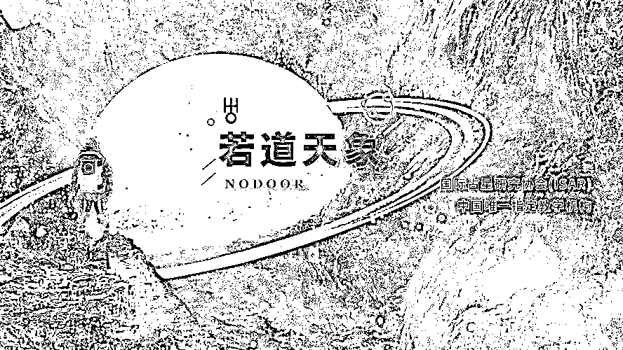作者/Justine ISAR 认证占星师编辑/Tang 封面/书君 图片/unsplash**天王星顺行啦！****2020 年 1 月 11 日，北京时间 9 点 47 分，天王星在金牛座 2 度 39 分顺行。**在过去的 5 个多月来，自 2019 年 8 月 12 日，天王星从金牛座 6 度 37 分一直在逆行。天王星的逆行的周期，每年持续 155 天左右，通过黄道带向后移动 4 度。**天王星是有关自由、客观真理和神圣洞察力的行星，****当它停滞即将改变运行方向时，是它的能量达到顶峰的时期，我们摆脱虚假和不真实的欲望比以往任何时候都强烈**。巨蟹座强烈的月食刚发生在几个小时之前，月食有关于释放，如果你一直对某些事情不清楚或不确定，那么天王星的顺行将有助于带来一些清晰度。历史性的土冥合相即将在 1 月 13 日发生，**顺行的天王星成为我们的神圣先行，指出必须做的突破与改变**。

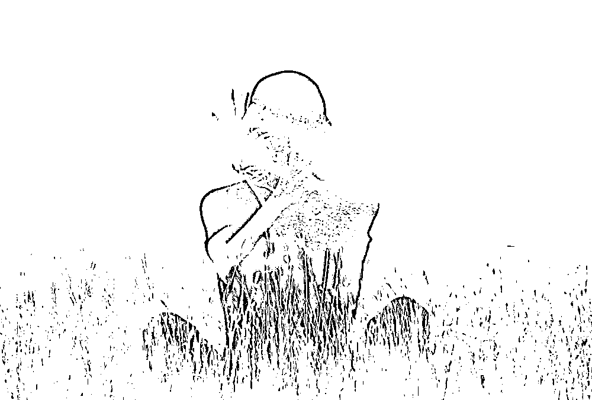

**出生星图天王星逆行**在天王星逆行时期出生的人，占整个人口的 40%，与海王星和冥王星逆行出生的比例相同。而金星逆行的人口仅占 7%左右。因此，**某种意义上说，外行星逆行没有内行星那么重要，但逆行的确会影响天王星。****运作健康的天王星可以表达直觉、独特、原创性**。在出生星图上天王星如果逆行，可能不会象顺行的天王星那样，即使个性古怪但自我表达依然很自在。**逆行的天王星在一段时间内，会让做自己变得困难，会因行为不稳定、不可靠带来困扰**。有时，会暗示了某种前世的业力，让个体感到与众不同、被驱逐或者与他人隔绝。但出生星图天王星逆行，**如果学会在挑战社会现状之前，先挑战自己的现状，就能学会拥抱自己的与众不同，就可以用非常强大的方式帮助社会其他人**。就像有一颗逆行的天王星的乔布斯，你也可以非常富有想象力和创新性。逆行的天王星会迫使你去搜索新颖的答案，然后与他人分享这些解决方案。

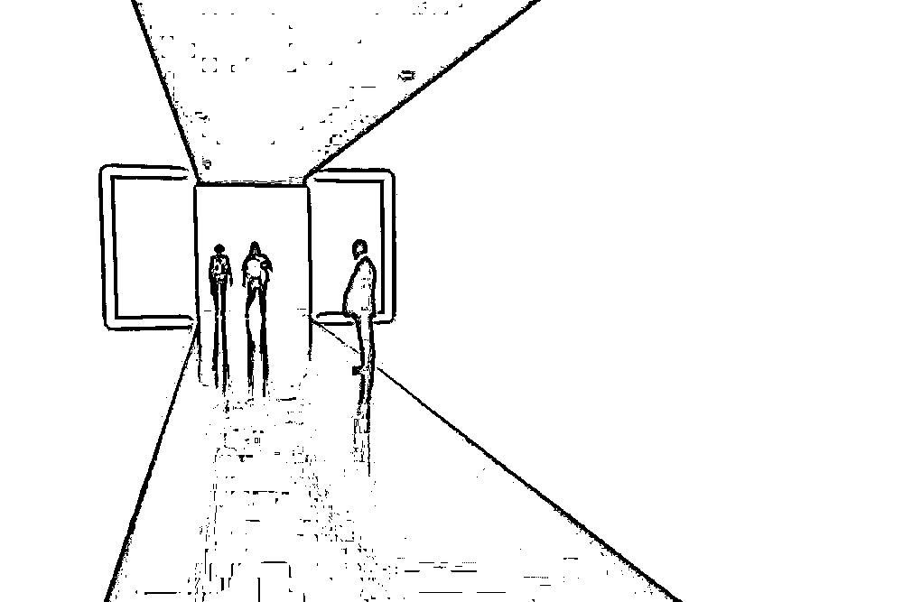

**行进的天王星逆行**当行进的天王星逆行，会跟其他行星逆行一样，带来**反思的黄金时间，会强调内在的改变**。作为“**觉醒者**”，天王星逆行会侧重从内在进行**变革与创新，去摆脱旧的束缚，获得自由**。那你也许会问，为什么需要逆行内化来促发变革，行星顺行时去推进改变不是更加顺理成章吗？让我们设想，某人可能已经预料到了他的职业方向会有重大的变化，试图去改变，但是发现惯性太强了。他已经 35 岁了，如果要重新投入一个全新的行业，意味着家庭经济收入的压力、自己加倍的努力与付出、周围同辈与亲戚家人的不理解等等。在这样的情况下，直接向外行动是没有用的。这时，天王星逆行了，让他有了关注内在的契机。

> 他会问自己：我自己有退缩和疑惑的情绪吗？我追求的方向真的是契合我的人生使命吗？如果是，我有哪些资源与软性技能可以转化到新的行业上来？我怎么用更少的财务与金钱满足家人与自己的物质需求？我下面每一步的计划和时间点该怎么安排？我如何找到一个可行的解决方案？我如何在为周围的人负责的同时，更加独立与自由思考？

这样的内化过程，对于实现外部的转变必不可少。5 个多月以后，当天王星转向顺行时，他就有内在的力量与勇气去实践变化。让我们举个其他可能性的例子。也许某人发现自己与谁谈恋爱都个性不合，或者谈几个月就会厌倦对方，能够挑出对方的一大堆毛病来。所以，她每半年左右换一个伴侣，一直在恋爱中颠覆和叛逆，试图对感情生活进行根本性的改变，但是不知道从何入手。

> 当天王星逆行时，会给予她机会去反思：真的是其他人的问题吗？还是我一直吸引了不合适自己的人？我头脑里一直有“我不能”“我会遇人不淑”的声音吗？我有一些原生家庭带来的旧模式吗？我在关系中过于妥协与退让吗？背后是自我价值感太低？还是因为我有控制欲，过于自我？

**这就是天王星的逆行带来的礼物，更高的自我意识。**可以帮助我们直面过去的烦恼，作出积极的内在改变。**当天王星顺行时，就能把这些意识导向外部世界，从而引导我们进入更好的未来。**当然，不是每个人都那么“幸运”，能接得住行星逆行的礼物。**有些人会在天王星逆行期间，出现混乱的内在情绪，或者有艰难、激烈的对外抵抗。**譬如你可能会跟反对你的家人吵架或冷战，也可能沉浸于再一次失恋的痛苦中——5 个月就这样过去了，当天王星顺行时，你没有积累改变束缚、获得新生的力量，错过了天王星逆行带来的契机。**真正的改变，都不是等待其发生的，而且我们主动发起一些大动作，用一种真正支持自己的方式来重组生活才带来的。**最糟糕的情况下，行进的天王星会带来一些突发的可怕的灾难，更多是因为忽略了宇宙让我们主动改变的信号，忽略了自己内在想突破束缚的声音，因此潜意识会主动去“吸引”一些外部灾难性的事件来驱使我们改变。当经历天王星的行进，你真的要等到那个吓人的时候吗？还是主动自发地去控制改变的节奏？

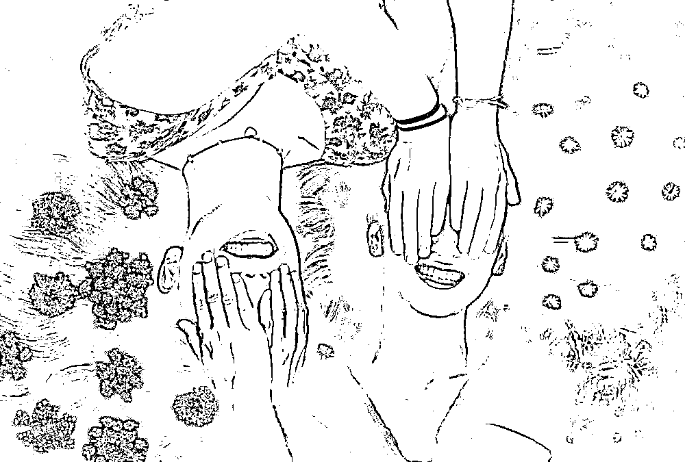

**本次天王星逆行的敏感人群**自从 2019 年 3 月，天王星完全进入了金牛座。期待在接下去的 7 年里，我们会在与女性、整体疗法、金融和地球生态相关的问题上有前所未有社会变革，同时每个人也渴望自身摆脱头脑，进入身体，与简单的事物联系在一起，放松下来，更加安全的感觉。去年天王星刚刚进入金牛座时，这些相关的议题就已经显现出来，但只是一个开始，需要长达 7 年的周期才能完成这个社会范式的转化。**过去 5 个多月，是天王星第一次在金牛座逆行**。因此，就社会层面和集体意识而言，这是一个契机让我们回顾：前面天王星进入金牛座所凸显出来的各种议题，我们的处理方式是不是恰当？有没有更加完善、成熟与明智的方式？当下的变革如何让更多的人接受？ **对于个人而言，因为天王星逆行在 6 度 37 分-2 度 39 分之间，如果你的出生星图上有重要的个人行星、敏感点、四轴在固定星座（金牛座、狮子座、天蝎座、水瓶座）1 度-8 度之间，会明显感受到在生命的某个领域，在 2019 年 3 月以来被促发转变。**这些转变一开始可能会引起无序与焦虑，但如果你以积极与开放的心态去面对，经过天王星逆行这 5 个月的缓和与内化的过程，现在你可以用更加自信的方式去面对变化，从而给自己的人生带来更多的可能性与自由。

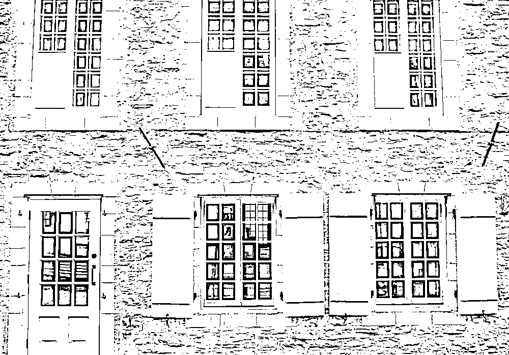

**12 星座天王星顺行指南**下面我们从天王星逆行的不同宫位，来看一下对个体造成的影响，以便了解天王星顺行后对我们有怎样的影响。阅读请参考自己的**上升星座**，建议直接参考**天王星逆行宫位**来阅读，如果不了解天王星逆行发生在自己的哪个宫位，可以根据下图查看，或咨询身边的专业占星朋友。**怎样知道天王星在出生星图的第几宫逆行？只要进行如下步骤。**打开若道公众号进入后台，选择**占星服务-在线星盘-行运盘**，输入**出生信息**以及**天王星逆行时间**，点击下一步生成行进星图，看看天王星 **♅** 所落的宫位就知道啦，见下图~

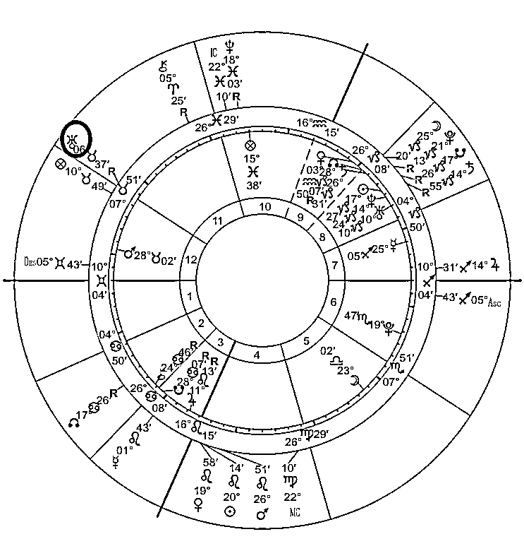

**上升****白羊座****，天王星逆行在****2****宫**

在过去的 5 个月里，你在反思如果吸引更多的金钱及物质财富。如果你对自己的谋生方式不太满意，你现在找到属于自己的答案了吗——譬如一种新的赚钱方式去获得你的所需？如果是的话，**现在开始调整你的金钱财富策略吧**。当然，金钱是物化的能量，只是我们价值观的一部分。从更大的层面，你意识到你重视的东西需要改变，你的价值观经历了内在的反思与更新。**现在，你不再那么害怕改变带会让你失去稳定感，可以去付诸于现实层面的行动**。

**上升****金牛座****，天王星逆行在****1****宫**

当天王星在 1 宫，你生命中的动荡可能已经持续一段时间了。也许你在天王星逆行前就经历了某种颠覆，让你不能不放手一些老旧的人或事。当天王星在金牛座逆行时，这种排山倒海的压力会暂时消退，使你可以收集自己的想法，重新定义自己的身份。**现在天王星顺行了，是时候向外界表达你的真实个性，以及开始实施你必须要做的事情。也许，从改变你的外貌和形象开始迈出第一小步。**

**上升****双子座****，天王星逆行在****12****宫**

在过去的 5 个月里，天王星要求你深入挖掘并开始面对长期存在的焦虑，探索激起你的潜意识或行为背后隐藏的情绪，释放负面及过时的习惯。这是心灵休息或重大突破的时期。你面对的都是看不见的问题，你会发现隐藏的自我，你的梦境会更加活跃。**如果你成功地利用了逆行的契机，更新了你的意识，现在就会对外显化出积极的精神成长。**

**上升****巨蟹座****，天王星逆行在****11****宫**

大概有 7 年左右的时间，天王星将创新带入你的愿景、志向、友谊和群体的宫位。好消息是，过去的 5 个月里，天王星逆行将为你提供暂时的缓和，以重新集结并确定合适的支持团队来帮助你在这些深水区域跋涉。**现在，是时候去行动和改变，去离开不合适你的群体，投身真正能引领你愿景的社群，甚至去唤醒与建立新形式的社区与群体。**对少部分人而言，天王星逆行的 5 个月还经历了人生志向的重新定义。**现在你将变得更具有社会意识，有动力改变周围的世界。**

**上升****狮子座****，天王星逆行在****10****宫**

天王星现在你声誉、社会地位和职业相关的宫位。过去的 5 个月，你可能重新审视在这个竞技场上所需要的任何更新，计划将新的能量带入你的职业领域，或在社会中扮演的角色。这种紧张的情绪在过去的 5 个月内释放，你会完成自我恢复、重新充电的过程，确认在世界上表达自己的新方式。**现在，狮子座已经做好了备受瞩目的准备（比平时还要多）。**整个舞台都是你的，你可以重塑你的职业生涯，把自己的生活带到一个新的方向。去带来创新的改变，象王者一样发光吧。

**上升****处女座****，天王星逆行在****9****宫**

自从天王星逆行以来，你开始思考或研究旅行或教育的新途径，回顾扩展和吸收知识的方式，发现自己正在以一种全新的方式看待这个世界。当你注视着可能性的地平线时，突然会想到非常有创意的新点子。

**现在意外和积极的事件开始敲响你的大门，你被邀请离开屋子，走向世界，无论是以长途旅行的方式，还是以创造性教育的途径，去重新定位你的个人理念，拓展你的视野。**

**上升****天秤座****，天王星逆行在****8****宫**

天王星自 2019 年 3 月以来处于你个人星图非常敏感的部分，促使你面对最深刻、最原始的情感与性欲，钻研深层的自我——这不那么令人愉悦。另外，你的共享资源可能也失去平衡。随着天王星 8 月逆行以来，事情将会放缓，让你有更多的空间去思考这些改变带来的启示。**现在天王星顺行了，是时候开始你实践内在的突破，去更好地整合共享资源，用金钱和财富重塑你的关系。**

**上升****天蝎座****，天王星逆行在****7****宫**

天王星逆行的 5 个月里，你的人际关系中的任何动荡似乎都突然安定下来。

在逆行前，你也许在刚经历了爱情或商业伙伴关系的不稳定或背叛，感觉自己被卷入波涛汹涌的情绪旋涡中，但逆行期让你有了喘息的机会。你会反思自己合适的亲密关系到底是怎么样的类型，或用什么样的方式去找到匹配的合作伙伴。

**现在天王星顺行，你可以进行大刀阔斧进行关系的调整了。你可能会与旧的亲密伴侣或商业伙伴分开，开始与以前完全不同的关系。**

**上升****射手座****，天王星逆行在****6****宫**

你也许在天王星逆行之前就对自己的日常生活、工作环境、日程安排、健康习惯进行了更改，因为你急切希望摆脱常规和束缚。在过去的 5 个月里，你感受到内在的缓和，可以平和地处理平凡的生活，不会象逆行之前如此紧张和渴求自由。**当天王星顺行，前面日常习惯的更新经历了审核。合适的，必然会成为你新生活的一部分；不合适的，你将作出进一步完善的调整。无论如何，你将重塑你的工作，将对如何照顾自己的身体有不同的认识，或将改变健康和饮食习惯。**

**上升****摩羯座****，天王星逆行在****5****宫**

前面 5 个月的天王星逆行，会让你重新考虑在浪漫、创造力、自我表达、孩子和性爱等领域上所做的任何近期转变。

**当天王星顺行，你会更有自信去深化或调整前面的转变，以便重新获得愉悦并释放束缚。**你将有一个新的身份表达，你会放弃老旧的自己。当用孩子般好奇的目光去看待世界，你会唤醒自己个性和创造力，打开自己的才华。

**上升****水瓶座****，天王星逆行在****4****宫**

很可能在天王星去年 8 月份逆行之前，你已经在考虑家庭生活的某种重大变化，但推翻自己的根基或强迫放下老旧的事物是很难的。在过去的 5 个月里，你得到了调整的机会，会更多回忆起祖先与过去，做了不少内在整合，以便做出任何最终决定。这个稍作喘息的机会是非常必要的，因为这些改变非常重大，不能在危机或动荡时刻来轻率决定。**当天王星顺行，你会有信心去调整家庭对你的意义，甚至去将打破过去，有力地唤醒自己的情感核心需求。**

**上升****双鱼座****，天王星逆行在****3****宫**

在过去 5 个月，你可能明显感到你的逻辑思维变迟钝了，写作、交流的项目暂时搁浅，但同时也许你发现你的直觉增强了。其实这是一个让你的理智的左脑休息，开发直觉的右脑的好时机。

**现在天王星顺行，当左右脑比以往更加平衡，你现在可以感觉到自己的思维触角能到达前所未有的高度。**在写作、演讲、短途旅行等方面，你先前积累的很多奇妙的好点子，现在是释放它们的时刻了。更重要的是，你将重塑你的沟通方式和学习方式，让他们更有效，说不定会有一些顿悟。

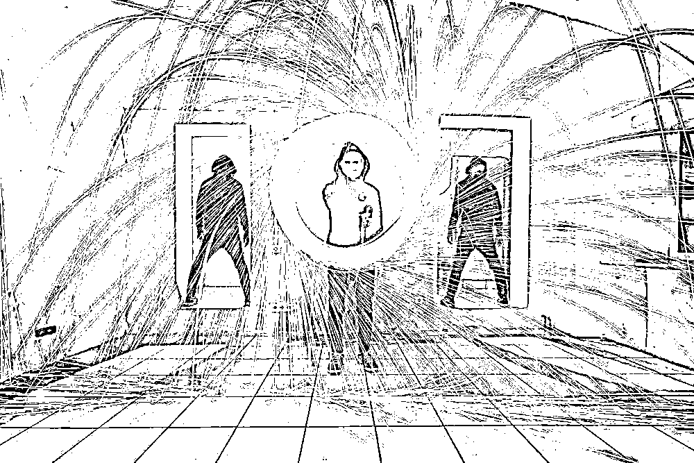

**天王星顺行，魔法般的解锁与加速**

**天王星过境带来的闪电般的突变，会打扰我们日常的假设，引入一个新颖、惊人或者疯狂的想法，可能会让我们感觉到被困、卡住或坐立不安。新鲜的点子可能会起作用，可能不会，但肯定会引起一系列的变化，去挑战过去生活中已经适应的框架。**

因此，在作出反应、反抗或最后决定之前，我们需要仔细考虑，否则会容易后悔。天王星逆行的 5 个多月，就是带来这样反思的契机。

过去的 5 个月，让我们在混乱中平静下来，从内在寻找出路，带来渐进的、革命性的、维度的改变。当逆行结束，过去的一切看起来跟以前不再一样，有些事情真正变得无关紧要，我们才会真的确信：**全新的生活即将开启**。

天王星逆行的轨迹，教会了我们一个基本的真理：**只有等待混乱平息，用冷静智慧之眼内观之后，去伪存真，经历内在的转化，才能构建新的、更大的、更包容的外在秩序**。

天王星的过境往往会伴随着粉碎、混乱与不安，但实际上我们不必销毁前面所构建的全部，也不必要为维护新的观点跟周围人投入激烈的对抗。**我们可以利用每年天王星逆行的 5 个多月，思索如何将老旧的资源放入新的框架，以及等待新的事物自然适应周围环境生根发芽。**

无论天王星在影响你的哪一颗个人行星或哪一个宫位，是有关核心身份、人际关系，还是关于职业、交际圈，**你的应对方式本身是最重要的——因为方式决定了你会脱轨还是进步**。

天王星的力量不是线性的，犹如顿悟、地震与闪电，只需要我们轻轻一按，就可以大幅度前进。**当天王星顺行，带来的加速度会帮助我们前行，如魔法般解锁与加速我们的成长。**紧接着我们会迎来历史性的土冥合相，这是 38 年来土冥这两个巨头的第一次会晤，会是一个暂新的开始。

**有了新的开始，一切皆有可能**。

**版权声明**：文章由作者授权在若道平台发布，欢迎转发，反对抄袭。

****

**Justine**

ISAR 国际认证占星师（2016 年获得）/塔罗师

毕业于浙江大学，十年跨国企业 HR 经验

咨询时长超过 800 个小时

**咨询微信**：Justine_JT

**公众号**：星光体

长按打赏


**点击图片查看若道君推荐**


**微信又双叒叕改版啦，不想错过若道君的推送？**

**就把若道设为星标吧！**

**▼**


喜欢记得点一下在看哦☟

**报名直达入口**


# 《2020 年金融预报》火热发售 | 今年什么值得投资？这份报告，了解一下

> 原文：[`mp.weixin.qq.com/s?__biz=MzA5NjA0NTAxNg==&mid=2651412793&idx=2&sn=60b1fe13a31db445e9afb2a1c55bdfa1&chksm=8b4beb8ebc3c62988492684d07cb723b69297c915cd90f43a13f9d9ca6af3d339416f66478b9&scene=126&sessionid=1692738227#rd`](http://mp.weixin.qq.com/s?__biz=MzA5NjA0NTAxNg==&mid=2651412793&idx=2&sn=60b1fe13a31db445e9afb2a1c55bdfa1&chksm=8b4beb8ebc3c62988492684d07cb723b69297c915cd90f43a13f9d9ca6af3d339416f66478b9&scene=126&sessionid=1692738227#rd)

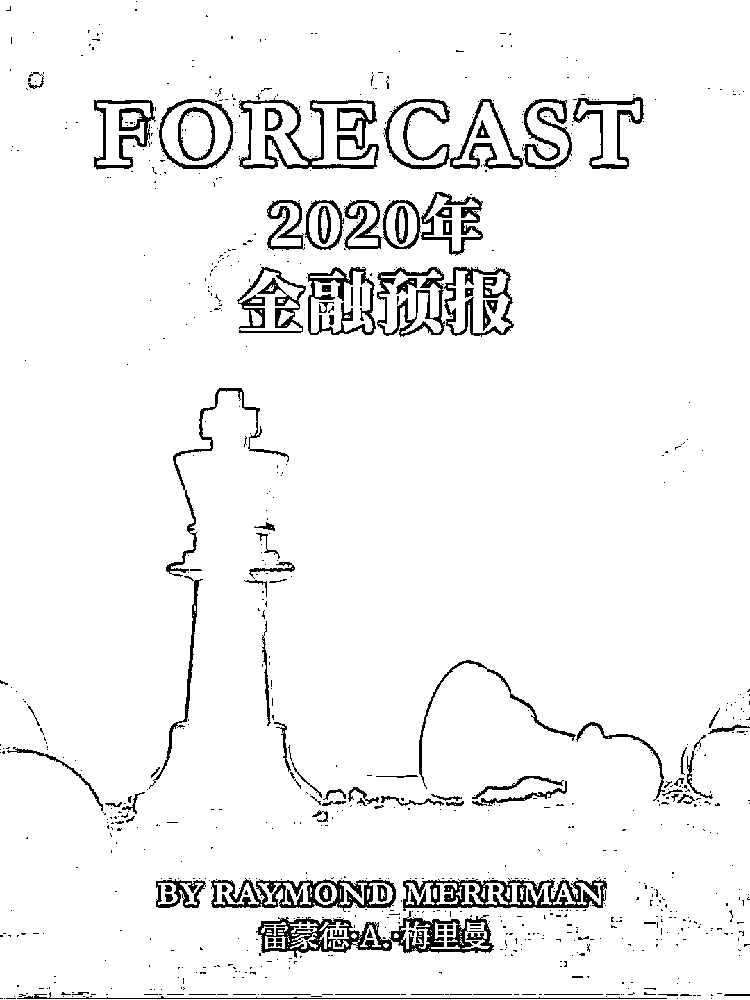

**2020 年金融预报和讲座**

1976 年以来，由雷蒙德·A·梅里曼撰写的梅里曼市场时机学院每年一次的年度预报沙龙和每年一本的《年度预报》一直在应用占星学原理为投资者们服务，提供卓越洞见，从未间断。

43 年来，这本 200 页左右对金融市场的分析报告和 3 小时的年度预报讲座在美国、日本、欧洲帮助许多投资者了解宇宙天气对于世界经济形势、政府政策及其对各个金融市场和金融产品的影响，帮助他们做出正确的投资决策，降低投资风险。2018 年，若道第一次将这份广受赞誉的一年一度的金融占星报告和沙龙引入中国，供中国投资者参考。**《2020 年金融预报》将会谈及 2020 年重要的宇宙天象及其对世界经济、贸易形势的整体影响，还将覆盖中国上证股票市场的分析、黄金白银市场、美国经济、美国总统、美联储、美国国债市场、美国股票市场、主要外汇货币市场（主要外汇美元、英镑、欧元、日元、瑞士法郎）、原油市场、谷物市场、活牛市场、比特币市场等投资市场。**另外，非常有价值的是，梅里曼老师及梅里曼市场时机学院的金融占星分析师还会给出以上市场 2020 年的**市场价格目标区间及重要价格反转日**，为短期、中期和长期投资者进行市场操作的时机提供参考。如果你关注世界经济和金融投资市场的变化，会发现梅里曼《金融年度预报》中的研究对于你了解世界经济在发生什么，这些市场的走向会如何有非同寻常的指导价值。

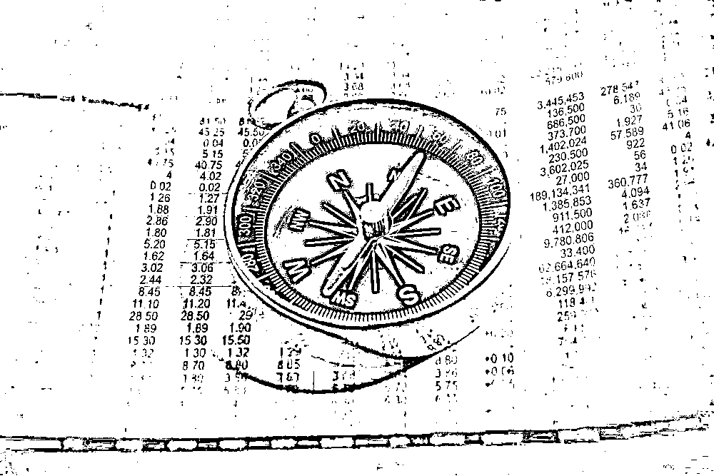

比如，在 2018 年 12 月发布的《2019 年金融预报》中，梅里曼老师指出：

*   2019 年美国领导人与世界其他国家之间可能发生重大冲突，加剧紧张局势，其中一个冲突可能与**贸易问题**相关，而与中国达成重要的贸易协议的期待可能只是幻想的泡沫。
*   2019 年美国经济和股票市场将会到达一个重要的高点，随后在 2020 到 2022 年间的某个时间点开始凶猛地下跌。
*   天王星在未来 7 年内完全进入金牛座的日子，预示着**转基因食品的新发现、肉类价格的上涨以及货币估值甚至交易形式的重大变化**（比如我国已宣布央行法定数字货币试点项目有望在深圳、苏州等地落地）
*   上证指数在 2019 年木星在射手座行进期间可能出现强势反弹，该指数将挑战或突破**3100**（2018 年报告发布时上证指数为 2500 左右，2019 年最高点为 3288）
*   **黄金价格**一旦收盘在**1350-1377.5**价位之上，会直线上升测试**1500+/-50**（2018 年报告发布时黄金价格为 1229 左右，2019 年最高点为 1566）；
*   只要**白银**保持在**13.62 以上**，就会形成看涨双底结构。如果白银收盘在**18 以上**，就有机会向**26.16+/-1.48**爆发（2019 年报告发布时白银价格 15 元左右，最高价格为 19.75）

随着木星离开射手座，木海四分相在 2019 年结束，木星进入魔羯座，土冥合相的到来，世界经济和金融又将发生什么变化？梅里曼老师将在《2020 年金融预报》报告和讲座告诉你他的研究和看法。结合报告，梅里曼老师将于**北京时间 2020 年 2 月 15 日上午 10 点**做一场历时 3 个小时的**关于明年世界金融市场的演讲**，为报告的读者们进一步答疑解惑。而对于不懂得占星学的朋友，也不必担心，在每个市场分析后，都会有一个总结性的结论，帮助你了解梅里曼老师及梅里曼市场时机学院的金融占星分析师对这个市场的整体投资看法。

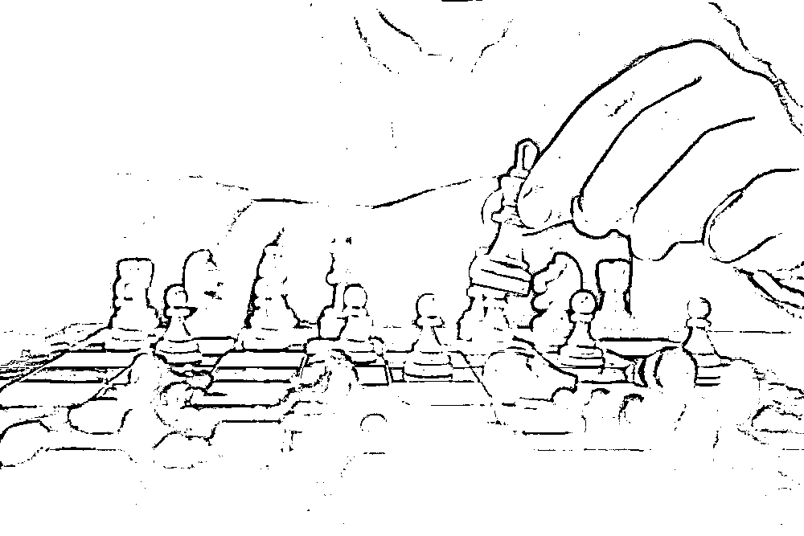

**报告价格和讲座时间**

**报告和讲座价格**

2020 年金融预报讲座和报告价格整体售价 **1280 元**

（本讲座和报告不单独出售）

**讲座时间**

**2020 年 2 月 15 日  10:00-13:00**

（暂定，如有变动，请以若道最终通知为准）

**购买者重要须知****①** 梅里曼市场时机学院每年一次的年度预报沙龙和《年度金融预报》是梅里曼市场时机学院的研究“预报”，而不是市场“预测”，是梅里曼老师及其金融占星分析师对人类活动周期历史与行星周期之间相关性的研究，二者在大部分情况下具有 80%或更高的相关性，而不是因果关系。沙龙中和报告中的研究完全存在错误的可能性。即便是非常认真的研究和几十年的研究经验，我们无法总是正确地解读出各种征象在实际层面上会如何相互作用，并显化为事件结果。所以请将此沙龙和报告看作一个研究参考，务必结合其他市场研究和你个人对市场的理解，根据你的自由意志做决策。**② **此套餐一旦售出，即**不接受退款**。**③** 此报告只支持**手机阅读**，不支持电脑阅读、下载和打印。**④**《2020 年金融预报》中文翻译版预计在**2019 年 12 月 31 日左右**上架发布，预售报告购买者，届时请参照下图《金融报告查看路径》查阅已购报告内容。**⑤ **讲座时间为初步确定时间，如临时有变动，请以最终通知为准；讲座届时会提供视频回放（仅支持在若道 APP 观看回放视频）以上须知，请仔细阅读。一旦付款，即视为已了解并接受所有须知内容。**已购报告查看路径**

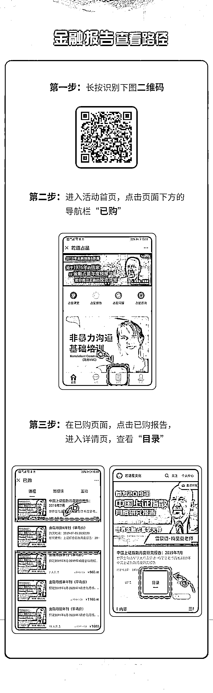


****购买报告请点击“阅读原文”****


# 巨蟹座月食 | 凝视黑暗，告别是为了更好地前行

> 原文：[`mp.weixin.qq.com/s?__biz=MzA5NjA0NTAxNg==&mid=2651412768&idx=1&sn=1602f3cd75fa22d17509b6de3a9329c1&chksm=8b4beb97bc3c6281ce44bf3680e3a2911830d8a9aa0e4a2b9e4d3649861988bbf55967a41e2e&scene=126&sessionid=1692738227#rd`](http://mp.weixin.qq.com/s?__biz=MzA5NjA0NTAxNg==&mid=2651412768&idx=1&sn=1602f3cd75fa22d17509b6de3a9329c1&chksm=8b4beb97bc3c6281ce44bf3680e3a2911830d8a9aa0e4a2b9e4d3649861988bbf55967a41e2e&scene=126&sessionid=1692738227#rd)

****☆ ****后台回复“今日”，给你一句生命态度****


作者/王芝桦 编辑/玫瑰 图片/全景网

**巨蟹座月食****北京时间 2020 年 1 月 11 日 3:21 迎来巨蟹座满月，摩羯座太阳与巨蟹座月亮于 20°精准对分。**此次巨蟹座满月，“摩羯座太阳-巨蟹座月亮”的对分轴线靠近“南交摩羯座-北交巨蟹座”南北交点轴线，形成**巨蟹座满月半影月食**。2020 年第一场重要月相就从此次巨蟹座满月月食开始。月食将满月的“完结”能量强力催化并成倍放大，故而 2020 年一开篇就布置下**“完成前面的工作才能开启未来的旅途”**的重磅任务。如果说半个月前的摩羯座日食（详情点击：[摩羯座新月日食 | 打响自己的战役，你会遇到合适的战友](http://mp.weixin.qq.com/s?__biz=MzA5NjA0NTAxNg==&mid=2651412544&idx=1&sn=326062c0280056227c54dea90e41559a&chksm=8b4beaf7bc3c63e117ad5a8a79cb60b0636a370d7f1fbf65cbfd2deb0b090bf3c6978162977a&scene=21#wechat_redirect)）铺陈出 2020 年**“向过去告别，向未来迈进”**的年度基调，那么此次巨蟹座月食就已经展开了“向过去告别，向未来迈进”的具体进程——**无论外在事件，亦或内在情绪，我们都要挥手告别，因为这个世界又处于一个全新的开始，而我们也必须要进行新一轮的“破壳”。**

**巨蟹座月食重点影响人群** 

*   出生星图中，有**行星、四轴、南北交点落入固定星座（金牛座、狮子座、天蝎座、水瓶座）0-5,23-30 度**的人群。

*   出生星图中，有**行星、四轴、南北交点落入基本星座（白羊座、巨蟹座、天秤座、摩羯座）0-12,19-26 度**的人群。

*   出生星图中，有**行星、四轴、南北交点落入变动星座（双子座、射手座、处女座、双鱼座）0-8,13-19 度**的人群。

**2019 年留下的资源意识**

****

**我不如就这样看我自己的生活：一半是奇迹，一半是疯狂。**

**——詹尼斯.温特森 《守望灯塔》**2019 年，“土冥合相”在现实层面的“洗牌”，金牛座天王星对现实结构的“颠覆”，两股能量双剑合璧般地击碎了现实世界的表层，无论集体层面的经济格局或行业分布，还是个人层面的价值定位或关系模式，以往那些看上去还可以的事物暴露出真相，以往那些还能维系的事物被淘汰出局。现实好像迅速地将人们划分出胜利者和淘汰者两个队列，但谁又愿意被淘汰呢？于是，在恐慌与不安被迅速放大的同时，人们也开始意识到**只有脚踏实地确立定位并沉淀实力，才能在震荡之中拥有“资源”，在竞争之中成为“资源”。**但这也产生利弊相伴的**“资源意识”**：**利端是撇去浮夸的泡沫和放下侥幸心理，**比如在职业规划方面拿出落地态度并制定长期计划，在生活理念方面关注自我成长并培养自律品格；**弊端是可能会采取执着而生硬的方式，对事物进行控制和管理。**现实是最好的老师，我们在自我生活和世界百态之中，看到奇迹也看到疯狂，然后思考并学习如何对未来做出选择。

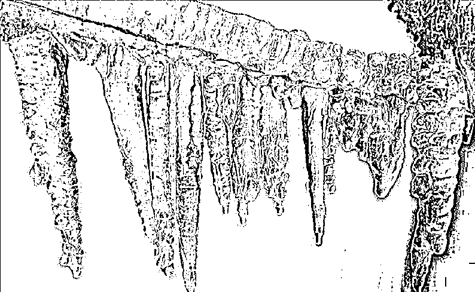

**世界不断开始，我们不断进化**

****

**宇宙自身是一个广大无边的记忆系统。如果你回头看，就会发现这个世界在不断地开始。**

**——詹尼斯.温特森 《守望灯塔》**

**天象**

*   **群星齐聚摩羯座**：太阳、水星、土星和冥王星合相摩羯座；木星和南交点合相摩羯座；

*   **天王星顺行**：1 月 11 日巨蟹座月食当天，逆行长达 5 个月的天王星于金牛座恢复顺行；

*   **土冥合相**：1 月 12 日-13 日，“土冥合相”结构精准呈相并影响登顶；

*   **火凯三分**：行进于射手座的火星三分行进于白羊座的凯龙星。

如果我们将 2020 年比喻为一枚**“发往未来和未知的火箭”**，那么**1 月-3 月就是爆发问题并善后处理的阶段**，**3 月底-6 月就是推进实验并尝试突破的阶段**，**7 月-12 月就是检视瓶颈并完善系统的阶段**，然后 12 月底......未来依然是未来，未知依然是未知，但这枚发射出去的火箭标志着人类历史进程的一大步。

此次巨蟹座月食具有**“里程碑”**的重大意义，不只对 2020 年，更是对未来几十年，甚至更远。但是，此次巨蟹座月食也只是按下了 2020 年 1 月-3 月的进程按钮，我们拥有**将近 3 个月**的时间对 2019 年遗留下来的“一锅粥”进行处理，而后才能正式迈进 2020 年开启的“全新时代”的旅程。


***1*****.****“三昧真火”爆燃，全新时代还远吗？**

****

**我不如就接受这样一个现实：我无法控制任何一个重要事件。**

**——詹尼斯.温特森  《守望灯塔》**月亮守护巨蟹座，巨蟹座满月是一年所有满月中能量最为纯粹的满月，既是**释放情绪和净化心灵**的时机，也是**内心敏感且情绪起伏**的时期。巨蟹座月食打造出**“加倍和加速”**的巨蟹座满月能量通道，一方面**提升了释放恐惧和转化业力的可能性**，另一方面也**加大了陷入黑暗和情绪失控的风险性**。

此次巨蟹座月食，摩羯座上众星闪耀：“日水合相”与“土冥合相”两组结构紧密呈相并牵手造势，营造出**整体环境的紧张氛围和集体格局的临界状态**；木星与南交点紧密合相，勾勒出**“对结果控制，对权力执着”**的集体业力。每一个时代进程的重大推进都会伴随着集体业力的重要转化，时代进程和集体业力就好像是弓和箭的关系，弦上之箭，箭下之弦，触发已是不可逆转，进化更是迫在眉睫。

宇宙的安排透露着决绝的气势，三股天象势力为此次巨蟹座月食添加“三昧真火”：一是巨蟹座月食令我们对“洗牌”之后的一地鸡毛更加**敏感**，而“土冥合相”的清算力度却是一再倍增，**压力爆棚，情势紧绷**；二是整体环境的严峻激发了“火凯三分”结构，过去的巨大创伤再次掀起愤怒的情绪，人类的心理原罪再次本能地疯狂投射，甚至不惜**用创伤的方式试图抚慰过去的创伤**；三是月食当天天王星恢复顺行，带来**剧烈的突变和意外的转折**，控制的结果可能是失控的代价。

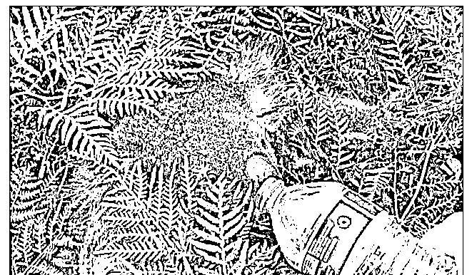

| 澳洲大火中，人们救助考拉
此次巨蟹座月食的前后 5 天（1 月 6-16 日），“三昧真火”爆燃着人类世界的极端情绪，也爆燃着这个地球的极端事件：近期美国和伊朗的事件；肆虐 4 个月之久的澳大利亚大火令 5 亿动物丧生；近日澳大利亚北部地区宣布对“喝水太多”的骆驼实施 5 日射杀行动。这几则新闻透露出在现实考验之下的“资源意识”的弊端：**人和人抢占资源，人和动物抢占资源**，权力和金钱可以不择手段，生存和安全难逃弱肉强食，更高的权力似乎在“控制”着游戏法则，但其行经却透露出**化不掉的恐惧和填不满的欲望**。人类真的可以控制这些重要事件吗？地球会不会失控呢？难道没有更高的宇宙能量进行清算吗？**此次巨蟹座月食只是按下了 2020 年 1 月-3 月进程的按钮，我们将会在未来 3 个月的时间经历人类集体业力的演化大戏**。这将是一段非常艰难的时期，但极致的寒冷和触底的黑暗也将会激发**集体意识的觉醒**，人类渴望**共赢和共建**的全新时代，一场深具历史意义的全球性变革即将到来。

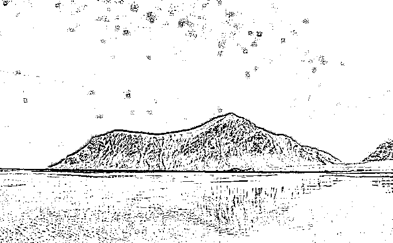

***2*****.凝视黑暗，告别是为了更好地前行**

****

**我学着在黑暗中看，学着透过黑暗看，学着看自己的黑暗。**

**——詹尼斯.温特森  《守望灯塔》**

作为心理占星师，我想从个案咨询的角度说说 2019 年-2020 年跨年这段时间的工作感受：这是过去一年中**咨询深度最为深厚，议题转化最为透彻，进化渴望最为强烈**的一段时间，人们对生命核心议题深度关注，一些回避很久的问题开始面对，一些根植早年的创伤渴望疗愈，而另一个非常可喜的共性是**每个人都在学习以接纳的态度面对生命功课，用落地的方式构建自我实力。****这是生命意识“破壳”的过程。**

2019 年-2020 年的进程确实布满艰辛，未来瞬息万变，未知神秘莫测，这是需要我们与黑暗共处的两年时光。如果我们能够**学着在黑暗中看，学着透过黑暗看，学着看自己的黑暗**，那么黑暗就不再是吞噬我们的“可怕怪物”，而是**帮助我们沉淀自信和体悟智慧的“亲密伙伴”。**此次巨蟹座月食，正是**透过现实事件望向生命内在**的最佳时机。

**可能经历的**

*   **情感**

*   一些遇冷的关系跨越艰难阶段，一些暧昧的关系获得明确认同，某个以为放下的人突然浮现心头，某段原本稳固的关系意外遭遇挫折。留下的或离开的因果早已写清脉络，自己不愿看清的，现实只能帮你看清；

*   **职场**

*   一些企业面临清算和重组，一些架构面临调整和变革，权力斗争意味着有进有退，领导更换意味着人员去留，职场的跳槽大军已在火速赶来，创业的艰辛路上仍在前赴后继。这个时间，不单要看眼前的路，更要去看 10 年后的路，10 年后你可能在哪里？

*   **金钱**

*   做个金钱方面的投资管理吧，身体健康投资或专业学习投资都是极佳的选择，因为这两项选择将引领你从身心两个层面进入生命的深层联结和全然绽放。

*   **集体**

*   全球格局重组，领导体系重建，未来世界的主导国家和时代人物将会在全新时代应运而生；整体经济形势起伏震荡中进一步深入探底，行业体系重新界定，市场资源重新分配，引发金融指数的 N 次震荡；各类火情需要大家共同关注。

金牛座天王星与水瓶座金星的“互容”能量，毫不吝啬地飞起“临门一脚”，快速推进着这些事件的发展，也同时积极制造着转化的时机——**如果我们能透过现实生活觉察内在的恐惧，释放内心的情绪，就可能会收获内在意识的飞跃，进行生命功课的突破。**回顾自**2019 年 8 月**以来的旅程：我们在黑暗之中已经徘徊了 5 个月之久，那个一直没有突破，实则一直逃避的议题到底是什么？不敢面对或不愿解决的原因又是什么？经过前面 5 个月的历练，你是否已经准备好全新的视角和思路，充足的勇气和意志去迎接未来的考验和全新的冒险呢？

此次巨蟹座月食，我们正处于新老周期的临界点之上，**先望向过去已经习惯或形成依赖的模式，再分辨这些模式是否适合未来，是否仍然具有建设性**。当然，我们要**对那些老旧而没有营养的事物“告别”**，就难免会令情感细腻且触角敏感的巨蟹座月亮感到伤痛，但是**告别也意味着腾出空间让更有建设性的事物进来，集中能量重建更有意义的事物**，如此才能迈入巨蟹座北交点揭示出的进化进程——**回归内在家园，感受心灵渴望的爱和安全，确定生命真正想要到达的地方，然后允许并满足自己的需求，开启并走向全新的征程。**

此次巨蟹座月食，注定是人类历史进程中被标记的时刻。无论我们经历什么，但在未来的任何一个时间回头看，都会深深了解这个世界在不断地开始，而生命也在不断地进化。

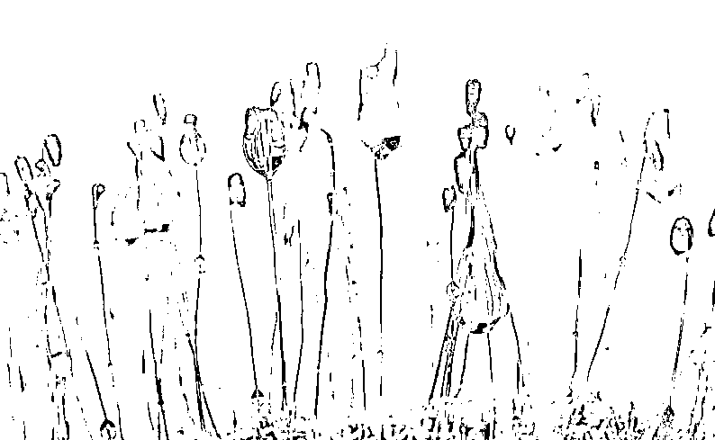

**寄语**

****

**我们小心翼翼地选择“正确的道路”，可它却不带你到达任何地方。****——詹尼斯.温特森  《守望灯塔》**写这篇文章的过程中，我感受到了自己的无知与文字的苍白。我给不出“正确的道路”，我只希望你将这篇文章当做我的分享来看。如果你在阅读我的所感与所想的同时，也行走在你自己的内在空间所感与所想，那么我将非常感谢这样的联结与共振。我想，**相对于“正确的道路”而言，内心深处至少是“真实的地方”。**借此文章祈祷所有生灵远离灾祸，平安喜乐。祝福大家。

**版权声明**：原创文章由作者授权首发于若道平台，欢迎转发，反对抄袭。友号转载请申请白名单。

****

****想阅读更多作者的文章，请在后台回复******王芝桦****** 即可。****

****王芝桦****

心理占星师，统合疗愈师，占星专栏作者

全职于个案咨询与占星教学工作 14 年

**个案预约咨询微信号**：zhihua0621 

**微信公众号**：daoxi-life

**长按打赏**

****

**想系统学习占星学？**

**点击图片了解详情**


**微信又双叒叕改版啦，不想错过若道君的推送？**

**就把若道设为星标吧！**

**▼**


喜欢记得点一下在看哦☟

********报名直达入口********


# 目前市面上的占星学课让你觉得无聊了？这门新课你得看看

> 原文：[`mp.weixin.qq.com/s?__biz=MzA5NjA0NTAxNg==&mid=2651412768&idx=2&sn=56ceaa73b3b054f5a95c93134d3961c8&chksm=8b4beb97bc3c6281afca20894b134352144471e55dd4ff5fbb3d5569692a4c35ebbf7fb1ec90&scene=126&sessionid=1692738227#rd`](http://mp.weixin.qq.com/s?__biz=MzA5NjA0NTAxNg==&mid=2651412768&idx=2&sn=56ceaa73b3b054f5a95c93134d3961c8&chksm=8b4beb97bc3c6281afca20894b134352144471e55dd4ff5fbb3d5569692a4c35ebbf7fb1ec90&scene=126&sessionid=1692738227#rd)


有这样一则家喻户晓的故事：三个泥瓦匠在砌墙，一个人走过来，问他们在干什么。第一个泥瓦匠没好气地说：你没看见吗？我在辛苦地砌墙呢。第二个笑笑补充回答：我们正在建一座高楼。第三个则笑容灿烂哼着小曲儿说：我们正在为城市添砖加瓦、创造美好的生活。10 年过去了，第一个人仍然在做泥瓦匠，第二个人成为了一名工程师，而第三个人则成为建筑公司的老板。**工作技能本身没有区别，为什么三个人的人生走向却大相径庭？**

*   人的一生是见自己，见众生，见天地的过程。**不同的认知层次，形成了不同的人生格局。**它决定了你能看到的风景。我们常常抱怨命运不公，抱怨生活没有诗和远方，事实上，那是因为我们高度不够，格局太小。

*   同样，占星学习也是见自己，见众生，见天地的过程。**不同的认知层次，形成了不同的占星视野。**它决定了你可以运用这门语言看到怎样的风景。占星师常常困惑占星学习遭遇瓶颈，客户拓展资源不足，帮助来访者扩展格局能力不够。究其原因，是因为我们使用占星学的高度和格局不足。

晚清名臣曾国藩说：**谋大事者首重格局**。人和人不一样，拼的是格局。那又是什么决定着一个当代占星师的格局呢？大格局的本质是：**站得高，看得远，懂取舍**2020 春季开年 ISAR 选修课若道倾力打造不可不学的**经世占星学**一起来解锁全新大格局的占星版图吧！


占星之旅上半场拼的是知识技法占星之旅下半场拼的是眼界格局**为什么学习经世占星学？**

**经世占星学（mundane astrology）是研究世界政治经济发展趋势和世界各国发展周期的占星学研究分支。**

任何有一些人生阅历，对于国家历史、家族历史有所了解的人都会明白，我们的个人生活是时代和国家历史的缩影，我们个人经历的行进、推进是一条小溪，而更大的背景是世界和国家行进、推进的大河。大河的流向决定了小溪的流向。

学习经世占星学，**帮助我们及我们的客户这条小溪在这个世界的大江大河“顺势而为”**。具体而言：

*   在 21 世纪这个信息世纪，经世占星学可以帮助占星师开辟新的服务项目——**为高端企业家客户及大机构提供独特服务**，因为高端客户和大机构对于国际政治经济发展趋势，主要影响力国家、重要世界组织机构的现在和未来都更为敏感。对应国家的行进和推进，更好地预测这个国家或大型组织的未来发展、变化趋势；

*   在人口的国际间流动、交流更为频繁的时代，经世占星学通过了解各国的趋势，**可以在客户有国家选择需求时，帮助占星师为客户提供更多信息服务**。

*   如果你爱历史，经世占星学可以给你**看历史长河中世代兴衰起落的独特视角**；

*   如果你爱关注国际形势，经世占星学都能够让你更**了解每一个国家的国民个性、集体潜意识，社会议题和发展方向**；也能帮助你**对领导人及其国家的影响有更深刻的了解**。

**课程大纲****此课程可作为 ISAR 选修课。**在这 10 节课的时间里，我们将学习**经世占星学的重要研究方向**，包括但不限于：

*   行星周期对于世界发展及格局变化的影响
*   研究国家星图及行星周期对于国家的影响
*   研究外国领导人星图及对其国家的影响
*   如何从政府成立、总统就职时间的星图研究时事发展
*   如何从重要组织机构诞生星图（如北约、欧盟、欧元区、第一个现代证券交易所的诞生星图）看组织未来
*   如何从重大事件发生时的星图（比如从曼德拉出狱日期看南非转折和开端）发现该事件对于国家的影响

**授课老师**


**卡伦·哈梅克**·**佐达格**

**（Karen Hamaker Zondag）**

卡伦·哈梅克·佐达格是**20 世纪最受尊重和赞誉的占星师之一**，她毕业于荷兰阿姆斯特丹大学，于 1975 年开始她的占星实践。她是荷兰**两所学校的创始人之一**：一所是 1980 年成立的阿切纳占星学学校，另一所是 1987 年成立的荣格心理学学院。她也被邀请作为英国著名占星教育机构心理占星中心（Centre for Psychological Astrology）的老师和美国第一所真正的、官方的占星学大学开普勒学院任教，并是**世界各大占星会议最受欢迎的演讲人之一**。由于其**对占星学的独特贡献**，卡伦·哈梅克·佐达格在 1992 年、1995 年、1998 年分别获得占星学界最著名的奖项轩辕十四奖项提名，并于 1998 年获得**轩辕十四奖**。

卡伦·哈梅克·佐达格一个非常鲜明的个人特色是她的**研究涉猎广泛而深入，她在心理占星、金融占星、经世占星方面都是该领域排名前列的老师，并且深受该领域知名占星师的赞誉**。因为其在占星学的知名声誉，她从 2012 年被隶属于荷兰著名投资集团 Rasile 的 Dasym Research （Dasym 是全球电视节目的创新的著名领导者，比如《中国好声音》就是引入 Dasym Media 的版权）聘请为**智库成员**，该智库调研当前世界显性和隐性的社会经济趋势，为发展和投资决策服务。她也是**TEDx 演讲**人。


她是**20 多本占星学、心理学、塔罗、易经书籍的作者**，包括《从占星学视角看金融危机的背景和未来》、《性的占星学和疗愈》、《日常生活中的占星学》、《心灵和占星象征》、《作为生活之道的塔罗牌》、《12 宫》、《宫位的本质和背景》、《相位研究》、《四轴手册》、《卜卦占星》、《关系占星学》、《占星学预测》、《从新的角度看外行星》、《易经、冥想和灵性》、《实践中的荣格心理类型》、《日常生活中的灵性和心理学》、《实践中的投射机制》、《自我的愉悦——愉悦心理学》、《神话和现实》等。她的书籍因为**广受欢迎**，**被翻译为 10 多种文字在多国出版**。


**授课时间&方式**

**授课时间（共 10 次课）**：

*   2020 年 4 月 6 日（周一）

*   2020 年 4 月 14 日（周二）

*   2020 年 4 月 21 日（周二）

*   2020 年 5 月 5 日（周二）

*   2020 年 5 月 12 日（周二）

*   2020 年 5 月 19 日（周二）

*   2020 年 5 月 26 日（周二）

*   2020 年 6 月 2 日（周二）

*   2020 年 6 月 8 日（周一）

**授课方式**：

**线上网络直播课，英文授课，中文翻译**

**课程价格**

**正价：7500 元**

**早鸟价：6800 元**

**早鸟价截止日期：2020 年 3 月 6 日**

**退转课程**

**退款原则请详看《教学协议》，如有疑问请咨询课程顾问。**

****ISAR 选修·经世占星学****

**授课老师：卡伦·哈梅克**·**佐达格**

**时间：**2020 年 4 月 6 日-6 月 8 日（共 10 次课）

**授课方式：**网络直播课，英文授课，中文翻译

**费用：**7500 元；**早鸟价：6800 元（2020 年 3 月 6 日之前）**

**课程负责人：**王老师（微信：18510107057），请备注“经世占星”

长按二维码添加课程负责人咨询~


****报名请点击“阅读原文”****


# 深度好文丨这个宫位，让你体验灵魂的幻灭与重生

> 原文：[`mp.weixin.qq.com/s?__biz=MzA5NjA0NTAxNg==&mid=2651412737&idx=1&sn=325599a5e6fff0b72bf57a9dcb5a99ed&chksm=8b4bebb6bc3c62a02b4333b1f8823e320ae8d24238942875cc314f8ebdd9f4825412951f23e5&scene=126&sessionid=1692738227#rd`](http://mp.weixin.qq.com/s?__biz=MzA5NjA0NTAxNg==&mid=2651412737&idx=1&sn=325599a5e6fff0b72bf57a9dcb5a99ed&chksm=8b4bebb6bc3c62a02b4333b1f8823e320ae8d24238942875cc314f8ebdd9f4825412951f23e5&scene=126&sessionid=1692738227#rd)

**☆ 后台回复“今日”，给你一句生命态度**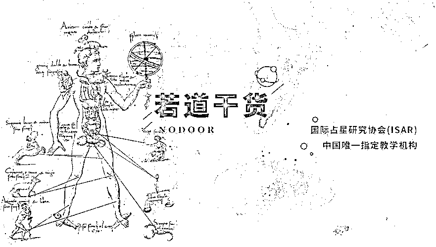作者/安妮·惠特克 译者/李含 校对/Leisha 编辑/Tang 封面/书君 图片/unsplash 文章来源/《大占星师》这是一篇关于第十二宫的深度文章。人生难免有一些难以穿越的灵魂暗夜，而对于第十二宫人尤为如此。作者作为一个群星第十二宫人，以她精神崩溃，不得不踏入长达 7 年的第十二宫“夜海之旅”，在漫漫人生路上漂泊，在黑暗中迷失方向，最终找寻到与第十二宫和平相处独特的经历，帮助我们大家更好地理解这个让万物消融的混沌之地。**让万物消融的混沌之地**

> 当我轻轻地将一只不足半英寸长的小青蛙放进厨房水池的下水槽时，它倒在茶匙上，死了。很快，我将打开水龙头。它那正在液化的弱小躯体被冲进下水道。
> 
> 昨天，它还在一个塑料保鲜盒里跳来跳去，活力十足，我在里面用水、苔藓和石头打造了一个小鱼缸。几周前我带回家的蝌蚪都存活了下来。然而，当我逐渐意识到，过不了多久，我必须把它们送回原来的栖息地时，养蝌蚪的满足感和愉悦感就被冲淡了。
> 
> 但这一只小家伙再也无法回家了。

这件发生在 40 多年前的小事，让我深刻地感受到生命转瞬即逝的脆弱和哀伤，并一直无法忘怀。**生命中总有这样一些以小见大的时刻。有形与无形、存在与非存在、秩序与混乱长期在所有时代和所有层面中共舞。**

从古代神话到现代宇宙学，人类创造了一系列范式和隐喻，并在其中探索这种辩证法。古巴比伦祖先把世界的起源想象成大海蟒提亚玛特和她的儿子冥界之神马尔杜克之间的一场生死之战。马尔杜克击败了提亚玛特，用她的尸骸创造了天与地。同时，斗争仍在继续。

**通过土星和海王星的对立性，占星学用自己的语言描述了这场斗争。土星的核心代表着创建形式的驱动力，而海王星的目的在于消融形式。**

例如，我们都时不时地会为了有效应对严重惰性的发作而进行一场乏味的自我角力，这就是这种对立性的小型体现。有些时候，放弃似乎更容易一些，躺在沙发上读一本好书，小睡一会儿。

> 但是，睡觉时，我们去了何处？放弃战斗时，我们去了何处？当我们随波逐流，任由幻想掌舵时，我们去了何处？死亡后，我们去了何处？当我们放弃在土星领域内的挣扎，任由海王星的水流控制我们时，我们去了何处？

**在占星学中，这个让万物消融于原始水域的混沌之地有一个名字。**

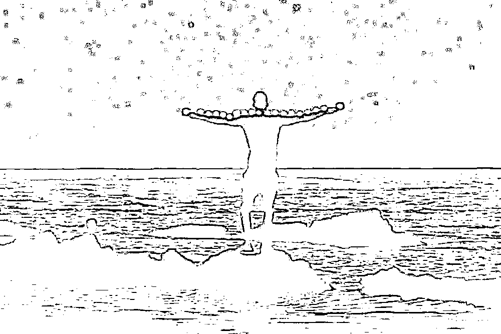

**它叫做第十二宫**

**精神崩溃那 7 年，我踏入了“夜海之旅”**

我的星图中六颗行星落在狮子座，其中五颗星落在第十二宫，上升落在处女座。

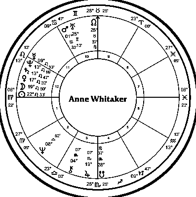

|  安妮·惠特克出生星图

**我一生都在与占星学描述中包含的深刻矛盾进行斗争**。从 2001 年开始，一连串长期的海王星行进与狮子座群星形成了对分相位，同时还有一段历时更短但破坏性更大的天王星行进在我的第六宫对分狮子座群星的时期，2001 年 8 月，次限月亮还穿过了出生星图第十二宫的土星-冥王星合相，与此同时，2001-2002 年的土星-冥王星对分相还分别与狮子座群星形成了六分相和三分相。所有这些都象征着一种精神的崩溃，以及在很长一段时间内几乎完全要避世的需求。

2001 年底，在经历了一场旷日持久的严重家庭危机和一段繁忙的职业生涯后，我崩溃了，以至于在 2002 年的前六个月我几乎无法下床。在 2002 年至 2008 年的大部分时间中，由于我的精力极差，我进行的几乎都是不需要太多体力输出或与更广阔世界接触的必要活动。我现在回头看，觉得那是一段写作、阅读、沉思和休息成效显著的时期。

**我可以用很多方式来描写那次意义深远、有时甚至令人恐惧的“夜海之旅”。** 整整七年都被详细地记录在日记、笔记和一本影像日记中，但是这些内容也许永远都不会被公之于众。保持记录，加上我有幸得到爱的支持，是让我保持理智的重要因素。这篇文章必然只是织网中的一条线。

无论我生活中遇到什么样的困难，我的主要应对方式总是设定一个目标，希望这个目标能让我达到一个更平衡的状态，让我更好地理解自己在大局中的位置。然而，这种理解一直都是需要回溯的，有时在几十年后才会顿悟！

不出所料，当我意识到自己被抛在海上漂泊无依，看不到任何地标时，我必须找到并实施一项计划，以帮我度过当时如我所知的大部分生命丧失之痛。我必须设法弄清楚发生了什么，以及原因。

这个计划是什么，以及它带领我获得了哪些成果，这个过程与我的占星学自我有着深刻的关联。**沉浸在第十二宫秘密海洋中的漫长时光，让我有机会更深入地了解第十二宫是什么，作为第十二宫人意味着什么，以及如何在这个宫位的挑战和极端矛盾中以更具创造性的平衡方式生活。**

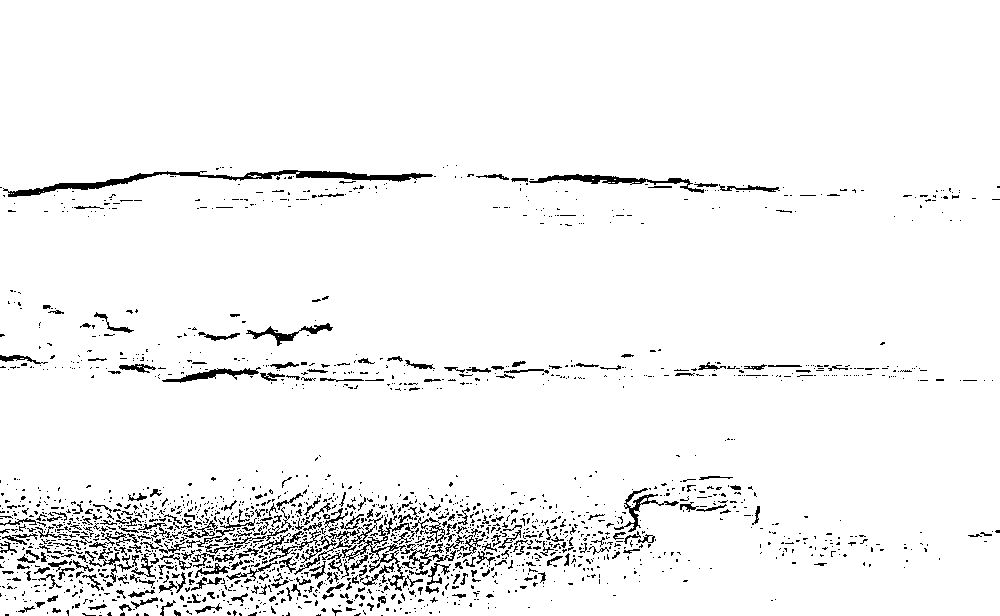

**更深入的理解第十二宫**

特别是在 2002-2006 年期间，我强烈地感到有一种动力，要利用这段强制性无拘无束的时期，来释放我长久以来对宗教、神秘主义、神话、象征主义、科学和超自然现象之间共通部分的兴趣。从本质上说，我一直觉得所有这些学科都聚焦于由同一基础所产生的现象。我还为自己设定了一个写作计划，以配合这一内心之旅。从 1970 年的夏天到 1999 年的秋天，我断断续续地经历了一系列超自然事件，从先知梦到心灵感应等等。所有这些都是不请自来的，而表面上我过着一种相当合理、负责、脚踏实地的生活。我不需要，也不想要这样的经历。我基本都没有告诉任何人。这些事居然发生在我这样一个思想开放的怀疑论者和理性主义者身上，让我恼怒不已！因此，在 2002 年，我决定将所有这些经历汇总到一起，因为其中许多经历都在发生的当下被记录在了笔记本或日记中，而另外一些经历可以从我丈夫 1980 年以来的日记中确认地点和日期。我还决定尽我所能地借鉴当代思想开明的科学家的见解，在理性分析的语境中讲述这些经历。这样做的目的是为了与我的“另一面”和平相处，这是从我的曾祖母那可疑的天赋中继承下来的：“预知能力”。在这样做的过程中，我也意外地对第十二宫产生了更深层次的理解。
为了设定这个写作计划的背景，我回顾了源自伟大宗教的核心文稿和评论，不止一次地重读了心理学家威廉·詹姆斯的杰作《宗教经验之种种》。詹姆斯对发生在“正常”范围之外的经历提出了如下看法：

> 我所接受的教育的全部意义在于使我相信，我们当前这个意识世界只是存在的许多意识世界中的一个，其他那些世界一定也包含着对我们这个世界的人生有意义的经历；虽然其他世界的经历和这个世界的经历基本上是分离的，但两者在某些时刻是连续的，而且更高的能量会渗透进来……客观地看，人类经历的整体表达都在不屈不挠地敦促我超越狭隘的“科学”界限。

这种观点深刻地支持了我以往无法解释的个人经历。我还回顾了科学家们对此有何见解，找到了一些很棒的作品，例如大卫·艾布拉姆斯的《感官咒语》，罗素·塔格和简·卡特拉的《心灵的奇迹》，以及布莱恩·斯威姆的《宇宙的秘密之心》，我发现他们对宇宙一体的诗意愿景具有令人惊叹的启发性、教育性，并支持了我对我们所生活的这个世界做出的许多结论。

特别是在斯威姆的帮助下，我不仅在头脑中，而且在心里领会了构成整个存在的浩瀚能量之海的概念，领会了物理学的量子真空，我们无法看到的粒子在其中不断闪烁，时而存在，时而消失。在我的想象中，它们以钻石光芒的形式出现，消失，再出现，就像萤火虫在“耀眼的黑暗”中忽明忽灭。斯威姆说：

> 宇宙的基础是一个空的充实，一个丰富的虚无……宇宙的本底充满了大量的创造力，以至于物理学家把宇宙的基态称为“时空泡沫”。

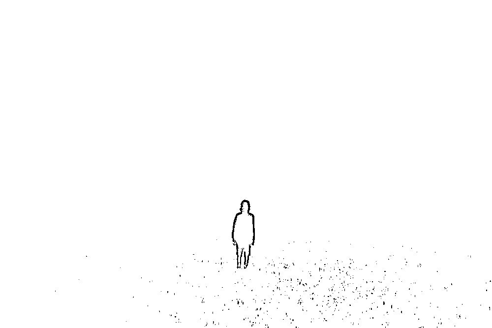

**消融的引力**

经过很长一段时间的各类阅读和反思，我逐渐更清楚地理解了物质是如何从宇宙能量的海洋中产生，又是如何从形式回归为能量的。在时间内外，在每一个层面上，从地球上所有生命的无形深处到星系、宇宙和多重宇宙的诞生和消亡，这个过程总是在进行中。**我们是宇宙进程的一部分；我们所有人类都参与其中，无论我们是否知道这件事。**

我也花了一些时间来理解，我们通过五种感官感知的，看似坚实的物质世界并不是量子物理学所揭示的世界。我们有限的感知器官从能量和少量星尘碎屑中创造了物质“现实”。

思考量子物理学提供的洞见也为我提供了一种形式的证据，证明“真实”和“想象”之间的界限是人为随意创建的——反正在很长一段时间里断断续续地亲身经历过的那些令人不适和不请自来的超自然事件后，我相信这个说法。

我还发现另一个非常有力的做法是，思考宇宙中物质与能量的表观比例——4%的物质，23%的暗物质，73%的暗能量，并且认为促使物质分解并再次成为能量的引力在各个层面上都是恒定的，从微小（我们）到无垠（超新星）都是如此。

总而言之，我得出的结论是，占星师们所说的**第十二宫是消融之地**……

“**在这里，所有的形式都会消散，并会再次闪现回归生命的形式****这是无法划定界限的地方****在这里，我们的经历会融入集体、族群、家庭和个人的历史中，埋下未来的种子****这是“现实”和“想象”重叠的地方****这是超自然经历发生的地方****在这里，存在宗教和神话提出的“神圣时间”****这是神话描述的地方****在这里，集体无意识被唤起，它可以被看作是神、女神、虚空、梵天、零点能量场**”

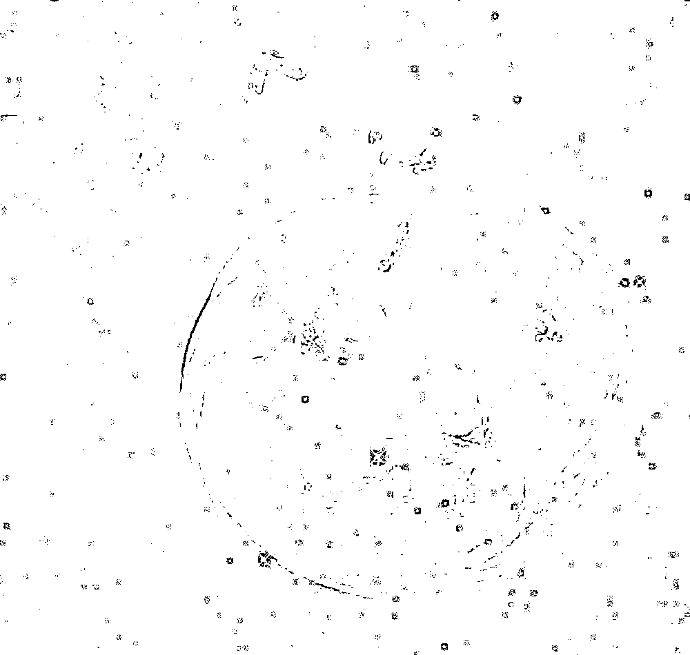

**第十二宫人的本质**

> 感觉我的回归之火与永远存在的根本脆弱性共存……粒子准备变回波……作为这个地球上的生物，我们都是脆弱的。大多数情况下，我们会尽最大努力保护自己不受这种意识的影响。我个人认为这是一种解放。我感到比以往任何时候都更接近于了解自己的真实本性。作为第十二宫人，我的真实本性也是人类真实本性的一个微小指针......我们都是随时准备变回波的粒子……
> 
> ——引自安妮·惠特克的日记
> 
> 2007 年 6 月 20 日

在我们的细胞记忆深处，可能蕴藏着量子物理学在 20 世纪发现的知识，伴随人类试图理解我们为什么在这里的进程，我们的宇宙学、宗教和神话从远古时期就开始对这些知识予以直觉性的探索和表达：我们不停地进出于量子真空、虚空、众神、梵天、宇宙蛋和集体无意识。

物质在各个层面上都受到消融的强烈吸引，然后在其他地方重新形成其他物质，如多重宇宙、宇宙、恒星、太阳系、行星、个体生命形式。我们人类是宇宙进程的一部分，因此我们的命运是在平均寿命范围内定期消融——被毁灭。当然，任何一个生命的终极消融形式都是死亡。**因此，我开始认为那个古老的（而且不是很流行！）对第十二宫的描述——“自我毁灭的宫位”——是一个准确的描述，而且这个描述本身并不负面。**

因此，在深层细胞层面上，我认为**第十二宫人比其他人更清楚形式和结构的根本脆弱性，也更了解形式终将回归的浩瀚无垠之处**。这种意识最初是无意识的，随着他们生命的展开而逐渐发展（如果有的话）：历时几十年而不是仅仅几年。即使在成功最显著的公众生活领域之下，仍然可能总是存在第十二宫的暗流，存在将人拉向虚空的引力。落在第十二宫的行星越多，引力就越大。

有了这种意识，第十二宫人可能会比其他人更加恐惧。如果形式如此脆弱，那它很容易就会消融。因此，生活中所有确切的现实——爱和友谊的纽带、社群、物质财富、世俗地位、正常的神志（由普遍共识所定义），对于更理性的人来说是理所当然的，但对于第十二宫的族群来说可能更加脆弱易逝。

**在第十二宫人能够与这种恐惧和平共处之前，他们都可能会以过度强迫执着于上述某些或全部事务的方式，来应对这种恐惧。或者，走向相反的极端，他们可能会尽最大努力避免卷入上述的任何、部分或全部事务之中，具体将取决于哪种情感带有最强大的正能量或负能量。**

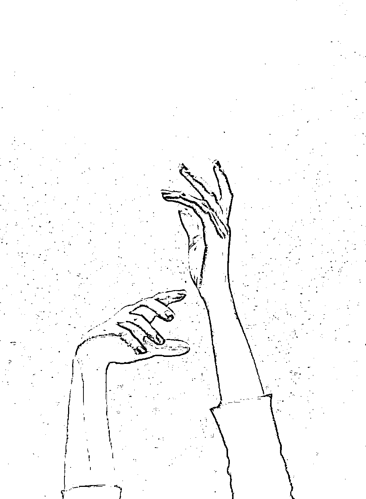

**第十二宫的挑战**能够把我们渺小的生命看作与永恒“耀眼的黑暗”相关、并且是其中一部分的钻石光芒，找到我们自己的方式来构建和实践这种关系，无论是通过传统的宗教信仰，还是任何适合我们特定时代、文化和心理构成的框架，这对每个人而言都是一项艰巨的任务。但是在我看来，我们**第十二宫人尤其比其他人更需要承担这项任务**。这一挑战有时是非常痛苦的，会对生活的普通层面造成破坏，似乎需要定期牺牲，放弃，以及退出“真实”世界，回到以永恒为导向的世界。这些都是过渡仪式，第十二宫的人们必须通过这些仪式，才能与归属于第十二宫的意义建立起越来越深的联结以及更富有创造性的积极关系。**星图的伟大礼物是向我们每个人展示我们在人类戏剧中的独特“镜头”：我们都与一幅更大的图景联系在一起。**原型模式塑造并构建了我们从出生到死亡的整个生命。成熟的视角所带来的大礼，也许会经由中年危机/行进而加深，最终使我们认识到这些特殊的挑战必然会降临。最好的情况是，随着时间的推移，他们会泰然处之、欣然接纳，而不是抵抗和恐惧，从而带来内心平静的回报。套用荣格富于智慧的格言：**自由意志是有能力愉快地做我们无论如何都必须做的事情**。

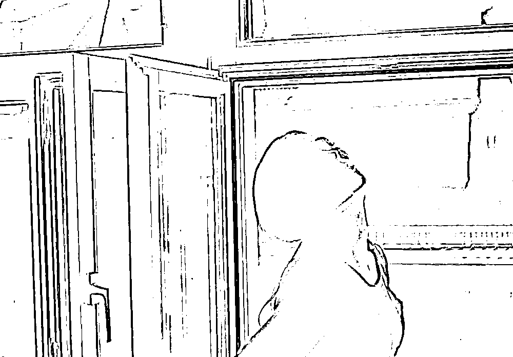

**允许自己“无所事事”**然而，对于第十二宫人来说，要达到一种平衡的状态，并接受这样一个深刻的悖论，就像存在与虚无的关系（可以用多种方式表达）一样，并不是一个容易的过程。荣格提出的“夜海之旅”的概念生动地描绘了第十二宫。**有时，身为第十二宫的人意味着在黑暗中迷失方向，在起源不明、或许是不可知的神秘风暴中翻腾颠簸，无法站直足够长的时间来用指南针确定方位，不知道旅程的方向、不知道旅程什么时候会结束，也不知道自己是否会幸存下来**。正如安德烈·纪德极富表现力地写道：“一个人如果不能接受在很长一段时间内看不到海岸，就不会发现新的陆地。”**在这样的考验中，一个人最大的力量在于允许这种经历的发生，不管它有多残酷，并且相信，不管结果如何，自己这个微小物体都与永恒有着意义深远的关系。**尽管在科学革命之前，人们的生活通常相当艰难，寿命也更短，但第十二宫人在那时很可能更容易找到平衡。在那个时代，生活节奏完全遵循昼夜周期和季节周期的交替。人们一般不会去很远的地方旅行。节奏要慢得多。大多数人的生活都是在宗教和习俗的背景下展开的。因此，冥想和静修这两种修行方式更多地被人们接纳为正常生活的一部分。如今普遍性的文化背景推动人们越来越狂热地全天候忙碌于物质生活，行动比存在更受重视。那些希望或需要定期退出日常世界的人往往被视为古怪或有某种缺陷。我一直记得在上世纪 90 年代，一次心理占星学中心举办的研讨会上，著名占星师丽兹·格林在谈到行星行进对我们的要求时，说了一句大意如此的话：“你给上帝的东西必须是他想要的。如果他要的是火星，就不要献一束花！”**不管世界是否认为我们是奇怪的人，我认为自愿进入第十二宫，而不觉得害怕和勉强的一个主要关键是，第十二宫人终究要认识到，他们需要有意识地尊重和崇敬第十二宫，并在他们一生中定期安排时间优先满足第十二宫的需求。****第十二宫的时间与寻常时间有很大的不同。**例如，冥想和艺术创作；创作、演奏和听音乐；独自行走，沉浸在大自然中；在教堂、清真寺、寺庙或露天教堂中参与集体仪式：所有这些活动都会将人带入瞬间与永恒为一体的神圣时间中，停留在神圣的状态中。我觉得**第十二宫人比其他人更需要待在神圣时间里的经历**。**他们还需要允许自己隐遁，允许自己做梦，允许自己离开日常世界。**可以采取任何适合自己生活模式、生活需求和性情的形式——从定期的正式静修，到每天留出大量时间独自呆在房间里看书、听音乐、冥想或练习瑜伽。**如果第十二宫人想要保持平衡和良好的身心健康，那么在我看来，他们所必备的品质是漫无目的和“无所事事”，以及在空间/时间中漫游。**第十二宫人需要学习一种**“身在这个世界，心不在这个世界”**的方式，这样才能给自己天性中的无形维度提供它们所需要的空间。

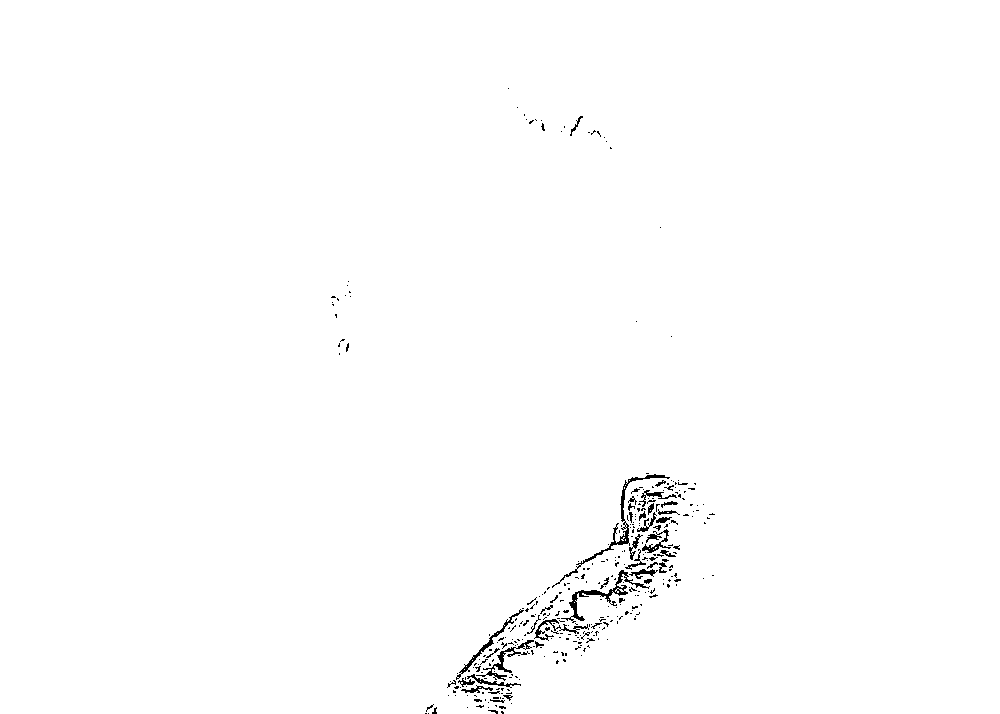

**存在和行动同等重要**在精神崩溃迫使我多休息之前，我一直认为在不忙碌的状态中，哪怕一个小时也是浪费（假期或必要的睡眠时间除外）。然而，我慢慢地意识到，坐在公园里晒太阳，盯着一只蜜蜂看一个小时，和花一个小时处理文书工作一样有价值。我也意识到，**这个世界没有我也照样能良好地运转**——这是一个相当谦卑的认识，尤其是对于像我这样拥有如此多狮子座行星的人来说！**如果我们死了或消失了，生活仍会继续。我们既特别，也不特别。**由于意识到这一点，我的“**暂停休息**”带来的众多礼物之一是，**我过去急于完成所有事情的那种紧迫感一去不复返了**。这可能有时会激怒我最亲近和最亲爱的人，但我喜欢比以前更放松和悠闲的状态。经过多年非常闲适的生活——读书、写作、思考，在宁静的一个小时里躺着喝茶，无所事事，在附近的公园里漫步，观察季节变化，我意识到这一切对促进进化是多么有帮助。我感到充满灵性能量和想象力，也很高兴能重新开始工作，尽管是兼职。然而，我不想把失去个人力量的可怕程度降到最低。至少可以说，从坚强和自力更生到不得不严重依赖家人和朋友提供各种帮助，这本身就是一种谦逊的练习。因为不知道自己是否能康复，我在很长一段时间内都处于极大的焦虑中。为了让我的头脑不被恐惧的深海淹没，我需要使用几十年来获得的每一种工具，既要投入到我自己的进化过程中，又要作为教师、治疗师和占星师来支持他人。正念练习给予了我最大的帮助，佛学智慧让我受益匪浅。最后，亲友的爱，连同我自己的允许和信念，帮助我度过了难关。在经历了惨痛的教训后，我认识到**存在和行动同等重要**，现在的我会尊重并按照自己的需求定期进入“**第十二宫的时间**”。终于，我感觉自己既能与第十二宫的礼物，也能与第十二宫的限制和平共处了。

**你也有关于第十二宫的经历吗？**

**关于第十二宫，你有什么话想说？**

**留言区等你**

”

**版权声明：**本文由若道翻译发布，欢迎转发，反对抄袭。友号转载请申请白名单。


安妮·惠特克

自 1983 年以来，一直从事占星师、教师和作家的工作。现居苏格兰格拉斯哥，从事普通和精神病社会工作，担任私人执业的咨询师、咨询督导和导师。

******点击图片查看若道君推荐******


**微信又双叒叕改版啦，不想错过若道君的推送？**

**就把若道设为星标吧！**

**▼**


就是这个“在看”，戳戳戳 ☟

********报名直达入口********


# 中英双导师 Level1-2｜零基础入门占星学的必修课

> 原文：[`mp.weixin.qq.com/s?__biz=MzA5NjA0NTAxNg==&mid=2651412737&idx=2&sn=e65e0222602772845e433896955e0643&chksm=8b4bebb6bc3c62a085df6808f0e1ee758c523a9ab00d9d1fe56b38f5a7256d5593373e59084b&scene=126&sessionid=1692738227#rd`](http://mp.weixin.qq.com/s?__biz=MzA5NjA0NTAxNg==&mid=2651412737&idx=2&sn=e65e0222602772845e433896955e0643&chksm=8b4bebb6bc3c62a085df6808f0e1ee758c523a9ab00d9d1fe56b38f5a7256d5593373e59084b&scene=126&sessionid=1692738227#rd)

****

**拥有 49 年占星实践经验的若道创始人**

**大卫·瑞雷**

**&**

**最懂学员的若道首位认证金牌中国老师**

**熊鹰**

**师徒二人****横跨南北****联手打造****北京上海**** 若道****全新****核心占星课程****之**

**互动实战占星初阶工作坊**

**本次****Level 1-2 工作坊****会分别在**

**上海（2020 年 3 月 13、14、15 日 熊鹰老师主讲）**

**北京（2020 年 4 月 4、5、6 日 大卫·瑞雷老师主讲）**

**两个城市各举办一场**

**方便北方、南方同学自由选择，邀请小伙伴一起学习**

**核心课现场工作坊是一种什么样的？**

珍贵的**面授工作坊**，全面而详细地讲解占星学知识，一场五感盛宴！

# **代入感：**向往占星世界好久了，迟迟没有下决心系统学习？最专业的占星老师来喽！带你穿越 9¾站台，进入真正的占星魔法世界，来若道，你就是哈利波特本特！


**沉浸感：**从虚拟的网络来到现实，舒适的学习环境，全新的占星同学，5D 的占星老师，专业的摄影团队，支持的工作人员~让你仿若重回校园梦，燃动青春学习占星！


**参与感：**大卫老师和天空老师都有丰富的教学经验，占星知识严肃专业，但开起玩笑来也丝毫不马虎，欢笑间知识都记住了呢，如果你长得可爱聪明伶俐，课上还会随时**被 Q**哦~对，就是你~


**仪式感：**两位老师超爱自己的中国学生们，为了让大家透彻地学习好宫位，2018 年初阶工作坊，大卫老师和熊鹰老师趴在地上用胶带贴的~仪式感满满~有没有~就宠你就宠你！今年还有没有其他的惊喜？


**亲近感：**周围全都是热爱占星的同学，那种亲近和被理解的感觉真的不要太美妙。志同道合的朋友就在身边，灵魂伴侣可能就在眼前，透露一下，在若道课堂里找到男女朋友的真的不要太多~比如~咳咳，总之带着八卦的心来上课吧~


**连报 L1-5 全阶课程，可以享受到：**❶51 次线上直播互动网络课程+3 场工作坊（互动实战占星初阶工作坊、亲密关系+职业占星工作坊、知识回顾+综合解读工作坊），全面而详细地讲解占星学知识、技能、案例和重要领域实践运用。 ❷知识点+学员星图解读有机结合：熊鹰老师以知识点和学员案例讲解为主，大卫·瑞雷老师以参课学员案例及客户案例讲解为主，每个知识点覆盖班级内学员的亲身案例，参与感更强，每位学员都有机会听到自己的星图分析。 ❸微信群学员互动分享，从真实案例学习生命成长故事。 ❹ 论坛提问：论坛上每个学员的问题都将得到及时回复。 ❺ 提供咨询师实习平台，只要努力，都将有机会在毕业前进行咨询的实习演练，听取客户反馈，为成为职业占星师做准备。

**1-2 阶我们要学习什么？**

**第一阶** ** 12 星座，12 种性格，12 种人生**❶ 学习占星学必须准备的“心法”**❷**占星学中的火、土、风、水四元素，阴阳法则**❸**面对面的星座有故事**❹ **12 星座：12 种性格详解，12 种行为模式，12 种价值观**❺ **太阳和月亮：了解你的太阳，生命的发动机，让你在世界闪光的方式，生命获得力量的方法；了解你的月亮，让你获得幸福的方法**❻ **了解太阳、月亮，了解你生命中已经出现的、将会出现的男性和女性

**第二阶  命运的线索和人生故事中的演员**

❶ 命运的线索：南北交点❷ 星图三巨头：太阳、月亮、上升点的故事❸ 了解心智：水星❹ 了解金钱和关系：金星❺ 了解行动模式：火星❻ 了解信念：木星❼ 了解努力：土星❽ 了解天才和疯狂：天王星❾ 了解梦想和幻灭：海王星❿ 了解死亡和重生：冥王星⓫ 12 个人生场景：黄道 12 宫位初解

**现场工作坊**

**上海（2020 年 3 月 13、14、15 日 熊鹰老师主讲）**

**北京（2020 年 4 月 4、5、6 日 大卫·瑞雷老师主讲）**


**如果你想马上开始学习 Level 1-2**现提供即买即学的**熊鹰老师网络视频课程**出售价格和工作坊一样

如果想同时购买网络课程视频+任一场现场工作坊可以享受**打包价**哈

```
购买视频课或购买视频+工作坊套餐的小伙伴
```

```
还能享受每月一次 2 小时的熊鹰老师直播答疑课，一共 4 次
```

具体购买方式看到最后~**这两位优秀的占星学老师是谁？**


**大卫·瑞雷（David Railey）**

*   ISAR 董事会成员，若道占星创始人。
*   1976 年，通过亚特兰大职业占星师考试，成为全职占星师，随后通过**AFAN 和 ISAR 职业测试**。
*   1980 年，与**杰夫·焦耳**一起在亚特兰大创建**“每日星球”**占星学中心。此后在亚特兰大占星协会担任 4 年考官，并且两次担任**亚特兰大地区占星协会主席**。
*   1979-1992 年，作为占星师活跃于美国社会媒体，向不了解现代占星学变化的大众宣传专业占星学知识。在 1989-1992 年期间，他在 WRGG 电台 12 频道每周主持个人电视秀**“今日占星学”**，早先他还在 WRFG 的广播节目中播讲宇宙天气节目。 
*   2010-2014 年，任**全美占星师联盟监督委员会委员**。
*   2010 年，其著作**《灵魂的目标》**中国版出版，和蒋颖一起创办**若道占星**学校和其官网 www.nodoor.com。从该年开始，他工作并往返于亚特兰大和北京。目前他 80%的时间致力于在中国教授和推广西方占星学。
*   2017 年，被选为**ISAR 委员会成员**（2017）。ISAR 是世界最大的国际占星机构，会员遍布 45 个国家。


**熊鹰老师（天空的空）**

*   2008 年接触严肃占星学，至此爱不释手。
*   **2013 年师从大卫·瑞雷**，研习整套现代占星学核心课程，并于 2014 年起至今连续三年担任该课程的主助教。
*   期间也**跟随格伦·佩里、诺·泰尔、理查德·塔纳斯、罗伯特·汉德、苏·汤普金斯、斯蒂芬·弗里斯特等多位国际顶尖占星大师进行学习**，进行定向占星主题研究。
*   2015 年初，通过国际占星研究协会**（ISAR）资质认证并获得证书**。同年，进一步跟随大卫·瑞雷老师进修**“生时校正”**技术，通过最终考核并获得证书。
*   目前在若道星文化任职，将传播系统、严谨、真实的占星学作为职业使命。任专职助教期间，进行沙龙与答疑等辅助教学工作已累计超过 200 小时。
*   在业余期间也提供占星咨询与生时校正服务。目前正致力于占星学与个人成长的整合。

**往届学员这样说**

★ **熊鹰老师非常清晰各阶段学员的难点在哪里，在哪里容易走弯路，所以在课程中给了针对性很强的技术讲解。**同时，学识广博的他对占星学术背后的道有非常深刻的思考，对占星学所表达的事物不断去溯源，去探寻本质，并在其他学问中去看到道的呼应，让我觉得非常过瘾和鼓舞。感谢熊鹰老师的启迪！ ——2017 若道占星核心课程熊鹰主讲 1-2 阶学员杨灿

**★ 知识渊博、博古通今、亲切可人、nice ，将东方的佛教文化、古诗词完美地与西方占星学结合，让学员特别容易理解**。很喜欢熊鹰（天空）老师，在巩固好 1、2 阶课程后，会追随空妈进行下一阶学习。

 ——2017 若道占星核心课程熊鹰主讲 1-2 阶学员王舒

★ **融合中国传统文化，把占星学规整得非常理性和易懂，空妈非常擅于观察和总结，给我们非常宝贵的经验。**我觉得效果非常好，以前对于各个星座和行星的概念比较片面，这次学完后觉得收获颇多，也打破了传统的限制，感觉到了与时俱进。 ——2017 若道占星核心课程熊鹰主讲 1-2 阶学员王茜★ 通过大卫老师课堂的案例咨询，我不仅对自己本身的特质和发展方向更加清晰，更开心的是清楚了自己处在怎样的发展阶段，外部环境对我的影响是怎样的，让我更加清晰应该怎样抓住机遇，在现阶段怎样努力。这些都是对我现在来说最重要的。**能够得到在课堂上享受这么专业精准的个案咨询，真的非常幸运。**——2017 若道占星核心课程大卫·瑞雷主讲 5 阶学员萧立★ 在课堂上获得了大卫咨询的宝贵机会。在一个多小时的咨询中，大卫首先演示了对客户星图的分析思路和推演过程，对客户的诸多发展方向和人生主题做出推测，并记录下来，待与客户见面时结合客户实际深入探讨。而后，大卫示范了如何与客户提问互动，从出生星图入手深入剖析案主的心理模式和原生家庭，并对案主的疑问进行解答。**坦白说，大卫的分析中肯且直中要害，对我来说像一道闪电，不仅准确地描述出我的原生家庭和童年生活环境，更击中了我多年来心中的隐痛**。这次咨询帮助我梳理了很多年来积压在心底的情绪，也在一定程度上疗愈了我，大卫的建议是如此地温和有力，让我感觉无比温暖，整个人被照亮了！再次感谢大卫，你的智慧和引导对我意义非凡！——2017 若道占星核心课程大卫·瑞雷主讲 5 阶学员龙爪槐下**若道核心课程教学支持体系****我们有****完善和系统的****核心课程教学支持体系****帮助你更好更全面地学习**


**什么人适合这门课？**

*   对占星学有浓厚兴趣，想要系统学习占星学
*   对占星学有一定基础，但不知道该如何整合星图复杂的碎片
*   希望成为优秀的占星师，想要借鉴国际大师解读思路并融入自己的体系
*   想学习占星学，但不擅长英文，希望有中文老师授课
*   想结合占星学理论与咨询实践

*   大卫·瑞雷、熊鹰的忠粉，学过占星，但就是想跟着偶像再学一遍

*   走在自我探索和个人成长道路上的人 

**课程费用****★ 1-5 阶****早鸟价：33000 元（2020 年 2 月 19 日之前）****课程费用：46500 元****★ 1-2 阶工作坊（北京工作坊、上海工作坊任选一场）****早鸟价：2800 元（2020 年 2 月 19 日之前）****课程费用：3500 元****★ 对于不方便上线下课的同学：可购买熊鹰老师 L1-2 视频课程****早鸟价：2800 元（2020 年 2 月 19 日之前）****课程费用：3500 元****★ 视频+现场都想要的同学：有套餐价哦**

```
购买熊鹰老师网络视频课程，每月有一次 2 小时的熊鹰老师直播答疑课，一共 4 次，工作坊不含，购买视频课或购买视频+工作坊套餐独享~
```

**北京工作坊、上海工作坊****任选一场****+熊鹰老师 L1-2 视频课程****早鸟价：4200 元（2020 年 2 月 19 日之前）****课程费用：5200 元****退转课程**

*   **退款原则请详看《教学协议》，如有疑问请咨询课程顾问。**

****中英双导师核心课 Level1-2****

**授课老师：大卫·瑞雷 熊鹰**

**授课时间：****上海**工作坊**** 2020 年 3 月 13、14、15 日 **北京**工作坊**** 2020 年 4 月 4、5、6 日

**授课方式：**中英文授课，中文翻译

**费用：******北京、上海工作坊任选一场**：**3500 元**早鸟价：2800 元（2020 年 2 月 19 日之前）；**

****1-2 阶视频课程：****3500 元**早鸟价：2800 元（2020 年 2 月 19 日之前）；**

****视频+现场套餐价：****5200 元** 早鸟价：4200 元（2020 年 2 月 19 日之前）**

**课程负责人：**王老师（微信：18510107057），请备注“核心课”

长按二维码添加课程负责人咨询~


****报名请点击“阅读原文”****


# 如何应对土冥摩羯座的大时代？这几个宫位，了解一下

> 原文：[`mp.weixin.qq.com/s?__biz=MzA5NjA0NTAxNg==&mid=2651412712&idx=2&sn=b834ee19992d081a2b62f96e2e49f4fd&chksm=8b4bea5fbc3c6349bd21096104faac05ad42f69065c4209a624aaa4400cf9f12ec480f8726eb&scene=126&sessionid=1692738227#rd`](http://mp.weixin.qq.com/s?__biz=MzA5NjA0NTAxNg==&mid=2651412712&idx=2&sn=b834ee19992d081a2b62f96e2e49f4fd&chksm=8b4bea5fbc3c6349bd21096104faac05ad42f69065c4209a624aaa4400cf9f12ec480f8726eb&scene=126&sessionid=1692738227#rd)

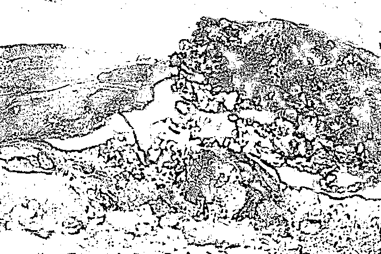

作者/斯蒂芬·弗里斯特 翻译/聆宇 Cora

编辑/Tang 图片来源/unsplash

本文摘自《变幻的天空》

我们现在生活在土星、冥王星落在摩羯座的大时代，社会主流的价值观都和物质层面的成就息息相关。对应这大时代，我们来了解一下土象宫位的意涵吧！

**第二宫：向自己证明自己****第二宫**  **阶段**：巩固；保持；势头。**过程**：贯彻到底；构筑内在和外在的资源；获得信心。 **盟友**：确信。**未顺利通过**：失去勇气，随之而来的是退回原地。还记得第一宫的经历吗？那时，你像是在坐过山车，所有的一切发生得如此之快，没有任何时间深思熟虑。忙得连轴转，还要随时即兴发挥，这是一段无比充实的时光。到我们进入第二宫时，便已是尘埃落定的时节。我们在新的模式中已经越来越如鱼得水。
适应新身份后，恐惧与焦虑同时袭来一切好像开始变成一件再自然不过的事。然而突然间，有一种我们已经很久不曾享受的感觉——惧怕从我们的天空中划过。焦虑与恐惧感铺天盖地向我们压来。“我的天啊，我对自己做了什么！”面对我们的新身份，我们感到自己像个闯入者。我们开始质疑自己，感觉糟糕，对未来不确定。这时我们常常会怀念起过去生活中的安全感，即使是安全地过着悲惨的生活。“每天凌晨 5 点起床挤地铁的生活是有多好，我把它弄哪去了！”有时我们的自我质疑会让我们对名和利这样能够带来安全感的外在保障产生一种无法摆脱的执迷。无论发生了什么，我们必须继续走下去。箭已离弦，覆水难收。我们对过去再依依不舍，那扇门也已经在我们的身后关上。我们必须将已经开了头的事情贯彻到底。用“金钱”来构筑安全感怎么做到呢？**去建造自己的资源库，无论是内在的还是外在的——与我们的新环境相适应**。有时称第二宫为“金钱宫”的传统观念在这里是适用的，我们通过整顿自己的财务状况来适应新的生活方向。其他时候，那些能够巩固我们身份的资源会以顾问或资助人的形式出现。或者也可能是内在的资源，比如通过掌握新的技术或工具而带来的心态上的转变。**在第二宫，确信和信心是关键，我们必须以令人信服的方式，战胜怀疑的阴影，向自己证明自己。**

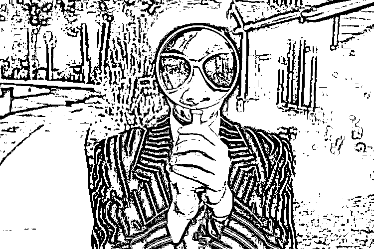

**第六宫：令自己有用****第六宫**  **阶段**：掌握技能；服务于更大的目的。**过程**：令自己有用。**盟友**：能够胜任。**未顺利通过**：匮乏感，随之而来的是深陷苦役的感觉和对此的愤恨。第六宫的旅程，与本质上是自私导向的第五宫的经验相背离。再一次，我们感到不安，试图在更大的框架内搭建生命的意义。经过前五个阶段的学习，**我们现在迫切需要从中提取我们在生命中的有意义的职责。我们对于展示自己有能力在一个更高的水平上胜任充满渴盼**。
纯粹的利己太过狭隘，我们需要与他人的依存关系第六宫反映的深层危机是：**纯粹的自利已经不能继续为我们的生命提供支持**。**那是一个太过狭隘的世界。我们开始意识到，要维持自我的身份和尊严，离不开与他人的依存关系**。我们从第五宫醉心于“独乐乐”的状态中醒来，通过让自己变得对他人有用，来寻求长久关系的建立。我们也可能失败，令自己陷入苦役，怀着想要学习爱的心，收获的却是愤恨和耻辱。这种建立关系的策略，从很多方面来讲都是原始、粗糙的，但它为我们在下一个阶段的通行打下了基础。我们获得了谦卑和责任感为什么这样说？因为在这个过程中我们得到了两样礼物，而正是它们令成年人之间爱情关系的维系成为可能：**谦卑和责任感**。在这里我们感到某种变数，有些什么是不确定的，就像大幕揭开，我们却不知道即将上演的是哪一出戏。通常第六宫和第二宫之间存在着某种呼应：再一次地，我们对于自身的终极价值感到不确定，充满疑问。一般来讲，**进入这个阶段时要准备好付出辛劳的工作和自我牺牲，因为我们开始学着将我们在前半个宫位周期中所学到的东西与这个世界分享——拿到通向后半个宫位周期的门票。**

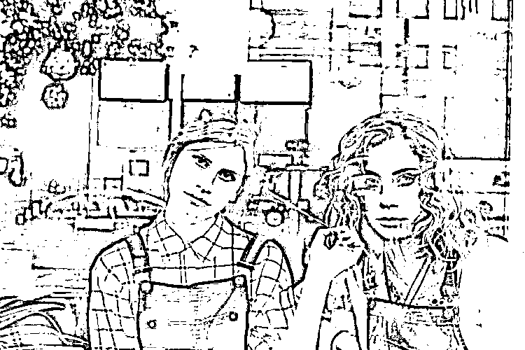

**第十宫：被公众看见才有意义****第十宫**  **阶段**：获得权力；宣示身份；走向公众。**过程**：联结自我和社会。**盟友**：正直。**未顺利通过**：变得虚伪，随之而来的是被身份绑架。接受了第九宫的教育之后，现在的我们准备更直接地参与社会。我们拥有技能。我们也有能为我们提供支持的人际关系网络。我们有价值。现在我们应该“得到一份工作”，或是为我们的身份添加一些社会化的、面向公众的注解。**通常这一阶段强调事业的发展，但第十宫的内容并不仅限于职业，它涵盖了社会这个词的全部含义。**关于你是谁，我们需要公众的答案你是谁？这就是第十宫提出的问题，但我们要明白这个问题是基于什么视角提出的。对于这个问题，我们的好朋友可能有一个答案。但是现在提出这个问题的是作为一个整体的社会。虽然通常来讲事业问题是第十宫的焦点，但我经常见到有人在经历第十宫的行运时结婚。他们建立关系时或许正受第七宫的影响，但他们的婚礼是一个对社会的公开声明，这是第十宫的内容。
被公众看见才具有意义**面对任何需要社会关注才能成全其意义的行为，我们都应将注意力放到第十宫**。不管在这个过程中当事人获得了社会的赞誉、认同，还是挑战了社会规范成为叛逆分子，这都没有关系，**被公众看到才是关键**。现在是繁花盛放的时节。那些在第一宫萌芽的、私人的、内在的梦想的花骨朵儿，现在必须绽放在所有人面前，摆出姿态，接受品评。

**版权声明：**本文由若道翻译发布，欢迎转发，反对抄袭。友号转载请申请白名单。


斯蒂芬·弗里斯特

若道签约老师。进化占星学的创始人之一，当今世界最有影响力的占星大师之一；1985 年，他凭借《内在的天空》一书获得职业占星师协会奖（Professional Astrologers Incorporated Award）。他四次获得占星界最高的占星学联合协会奖（United Astrology Congress Regulus Award）提名，2018 年获得轩辕十四教育奖。

**双证书核心课程火热报名中**

**点击图片了解详情**

**

**微信又双叒叕改版啦，不想错过若道君的推送？**

**就把若道设为星标吧！**

**▼**


就是这个“在看”，戳戳戳 ☟

****************报名直达入口****************


# 中英双导师 L1-5 | 系统学习占星学的必修课

> 原文：[`mp.weixin.qq.com/s?__biz=MzA5NjA0NTAxNg==&mid=2651412712&idx=3&sn=293fe422753668b9c9a7fdc3d2ddd4d3&chksm=8b4bea5fbc3c63499c8eac04f3f81131fbcacd935547d9be133d0c6961a4ed40322bd8d7555e&scene=126&sessionid=1692738227#rd`](http://mp.weixin.qq.com/s?__biz=MzA5NjA0NTAxNg==&mid=2651412712&idx=3&sn=293fe422753668b9c9a7fdc3d2ddd4d3&chksm=8b4bea5fbc3c63499c8eac04f3f81131fbcacd935547d9be133d0c6961a4ed40322bd8d7555e&scene=126&sessionid=1692738227#rd)


**拥有****49****年占星实践经验的若道创始人**
**大卫·瑞雷****&****最懂学员的若道首位认证****金牌中国****老师****熊鹰****师徒二人****横跨南北****联手打造****北京上海**** 若道****全新****核心占星课程****之**

**互动实战占星初阶工作坊**

**本次****Level 1-2 工作坊****会分别在**

**上海（2020 年 3 月 13、14、15 日 熊鹰老师主讲）**

**北京（2020 年 4 月 4、5、6 日 大卫·瑞雷老师主讲）**

**两个城市各举办一场**

**方便北方、南方同学自由选择，邀请小伙伴一起学习**

**核心课现场工作坊是一种什么样的？**

珍贵的**面授工作坊**，全面而详细地讲解占星学知识，一场五感盛宴！

# **代入感：**向往占星世界好久了，迟迟没有下决心系统学习？最专业的占星老师来喽！带你穿越 9¾站台，进入真正的占星魔法世界，来若道，你就是哈利波特本特！


**沉浸感：**从虚拟的网络来到现实，舒适的学习环境，全新的占星同学，5D 的占星老师，专业的摄影团队，支持的工作人员~让你仿若重回校园梦，燃动青春学习占星！


**参与感：**大卫老师和天空老师都有丰富的教学经验，占星知识严肃专业，但开起玩笑来也丝毫不马虎，欢笑间知识都记住了呢，如果你长得可爱聪明伶俐，课上还会随时**被 Q**哦~对，就是你~


**仪式感：**两位老师超爱自己的中国学生们，为了让大家透彻地学习好宫位，2018 年初阶工作坊，大卫老师和熊鹰老师趴在地上用胶带贴的~仪式感满满~有没有~就宠你就宠你！今年还有没有其他的惊喜？


**亲近感：**周围全都是热爱占星的同学，那种亲近和被理解的感觉真的不要太美妙。志同道合的朋友就在身边，灵魂伴侣可能就在眼前，透露一下，在若道课堂里找到男女朋友的真的不要太多~比如~咳咳，总之带着八卦的心来上课吧~


**连报 L1-5 全阶课程，可以享受到：**❶ 51 次线上直播互动网络课程+3 场工作坊（互动实战占星初阶工作坊、亲密关系+职业占星工作坊、知识回顾+综合解读工作坊），全面而详细地讲解占星学知识、技能、案例和重要领域实践运用。 ❷知识点+学员星图解读有机结合：熊鹰老师以知识点和学员案例讲解为主，大卫·瑞雷老师以参课学员案例及客户案例讲解为主，每个知识点覆盖班级内学员的亲身案例，参与感更强，每位学员都有机会听到自己的星图分析。 ❸微信群学员互动分享，从真实案例学习生命成长故事。 ❹ 论坛提问：论坛上每个学员的问题都将得到及时回复。 ❺ 提供咨询师实习平台，只要努力，都将有机会在毕业前进行咨询的实习演练，听取客户反馈，为成为职业占星师做准备。

**1-2 阶我们要学习什么？**

  **第一阶** ** 12 星座，12 种性格，12 种人生**❶ 学习占星学必须准备的“心法”**❷**占星学中的火、土、风、水四元素，阴阳法则**❸**面对面的星座有故事**❹ **12 星座：12 种性格详解，12 种行为模式，12 种价值观**❺ **太阳和月亮：了解你的太阳，生命的发动机，让你在世界闪光的方式，生命获得力量的方法；了解你的月亮，让你获得幸福的方法**❻ **了解太阳、月亮，了解你生命中已经出现的、将会出现的男性和女性

**第二阶  命运的线索和人生故事中的演员**

❶ 命运的线索：南北交点❷ 星图三巨头：太阳、月亮、上升点的故事❸ 了解心智：水星❹ 了解金钱和关系：金星❺ 了解行动模式：火星❻ 了解信念：木星❼ 了解努力：土星❽ 了解天才和疯狂：天王星❾ 了解梦想和幻灭：海王星❿ 了解死亡和重生：冥王星⓫ 12 个人生场景：黄道 12 宫位初解

**现场工作坊**

**上海（2020 年 3 月 13、14、15 日 熊鹰老师主讲）**

**北京（2020 年 4 月 4、5、6 日 大卫·瑞雷老师主讲）**


**如果你想马上开始学习 Level 1-2**现提供即买即学的**熊鹰老师网络视频课程**出售价格和工作坊一样如果想同时购买网络课程视频+任一场现场工作坊可以享受打包价哈具体购买方式看到最后~

**3 阶开始的网络直播课**

老师同学都认识的差不多了，从三阶开始就是更方便灵活的网路直播课喽

**第三阶 宫位、相位以及初步解读星图****（15 次课）**❶ 15 次线上直播网络课程，每次 2 小时，堂课中依旧会使用同学们的星图作示范❷  10 节课由熊鹰老师教授，重点通过名人星图阐释知识点❸  5 节课由大卫·瑞雷老师教授，重点通过学员星图阐释知识点❹  从第三阶开始，助教将会指导练习，答疑解惑，学练结合❺  重点在于如何根据星图去问问题，着重自我发现和自我探索的过程**课程安排**2020 年 6 月 4 日：宫位，行星和星座组合 2020 年 6 月 11 日：宫位，行星和星座组合 2020 年 6 月 18 日：月亮交点 2020 年 7 月 2 日：月亮交点和演示案例 2020 年 7 月 9 日：相位 2020 年 7 月 16 日：相位+星座，行星和宫位 2020 年 7 月 23 日：相位，星座，行星和宫位的同学案例 2020 年 7 月 30 日：渐盈相位&渐亏相位，示例 2020 年 8 月 6 日：更多的关于宫位和宫主星 2020 年 8 月 13 日：同学案例 2020 年 8 月 20 日：空相行星&定位星 2020 年 8 月 27 日：宫主星 2020 年 9 月 3 日：优先级和组织 2020 年 9 月 17 日：相位模式以及范例 2020 年 9 月 24 日：学员星图解读范例**第四阶 出生星图解读（进阶）以及关系与职业议题****（12 次课，1 场四日亲密关系+职业占星工作坊）**❶ 12 次线上直播网络课程，每次 2 小时，堂课中依旧会使用同学们的星图作案例❷ 8 节课由熊鹰老师教授，4 节课由大卫·瑞雷老师教授

❸ 1 场北京现场四日工作坊：亲密关系+职业占星，学生将被选中进行案例演示和互动。

**工作坊安排：****2020 年 10 月 29 日、30 日、31 日、11 月 1 日四日北京工作坊****亲密关系（两天）+职业（两天）占星工作坊**学员将被选中进行案例演示和互动（免费）。**课程安排**

2020 年 11 月 26 日：整合星图和星图优先级

2020 年 12 月 3 日：综合解读

2020 年 12 月 10 日：整体案例

2020 年 12 月 17 日：亲密关系/对比星图

2021 年 1 月 7 日：占星学和对比星图的例子

2021 年 1 月 14 日：对比星图同学案例

2021 年 1 月 21 日：对比星图同学案例

2021 年 1 月 28 日：占星学的职业介绍

2021 年 2 月 4 日：占星学的职业案例

2021 年 2 月 18 日：占星学的职业同学案例

2021 年 2 月 25 日：儿童职业发展

2021 年 3 月 4 日：亲密关系/职业同学案例

**五阶 预测、关系、咨询、为执业和考试做准备****（24 次课，1 四日工作坊）**❶ 24 次线上直播网络课程，每次 2 小时，堂课中依旧会使用同学们的星图作案例❷ 15 节课由熊鹰老师教授，12 节课由大卫·瑞雷老师教授

❸ 1 场综合解读工作坊（北京）：把一切串联起来，学生将被选中进行案例演示和互动。

**工作坊安排：****2021 年 9 月 2 日、3 日、4 日、5 日四日综合解读工作坊（**北京**）**把一切串联起来，L1-5 知识回顾，综合解读学员将被选中进行案例演示和互动（免费）。**课程安排：**2021 年 4 月 15 日：行进介绍 12021 年 4 月 22 日：行进介绍 22021 年 4 月 29 日：行进介绍 32021 年 5 月 6 日：当下的行进的同学案例 2021 年 5 月 13 日：周期，重置星图 2021 年 5 月 20 日：当下的行进和周期的同学案例 2021 年 5 月 27 日：次限 2021 年 6 月 3 日：次限同学案例 2021 年 6 月 10 日：太阳弧 2021 年 6 月 17 日：太阳弧同学案例 2021 年 6 月 24 日：亲密关系的关键节点+组合星图 2021 年 7 月 1 日：亲密关系的关键节点，组合星图同学案例 2021 年 7 月 8 日：职业周期 2021 年 7 月 15 日：职业周期同学案例 2021 年 7 月 22 日：太阳返照&月亮返照 2021 年 7 月 29 日：太阳返照&月亮返照同学案例 2021 年 8 月 5 日：高级预测技巧 2021 年 8 月 12 日：高级预测同学案例 2021 年 8 月 19 日：高级预测技巧 22021 年 8 月 26 日：高级预测同学案例 22021 年 9 月 2 日：简单的占星学历史 2021 年 9 月 9 日：占星学的不同流派 2021 年 9 月 16 日：ISAR 考试术语和复习 2021 年 9 月 23 日：ISAR 考试术语和复习**这两位优秀的占星学老师是谁？**


**大卫·瑞雷（David Railey）**

*   ISAR 董事会成员，若道占星创始人。
*   1976 年，通过亚特兰大职业占星师考试，成为全职占星师，随后通过**AFAN 和 ISAR 职业测试**。
*   1980 年，与**杰夫·焦耳**一起在亚特兰大创建**“每日星球”**占星学中心。此后在亚特兰大占星协会担任 4 年考官，并且两次担任**亚特兰大地区占星协会主席**。
*   1979-1992 年，作为占星师活跃于美国社会媒体，向不了解现代占星学变化的大众宣传专业占星学知识。在 1989-1992 年期间，他在 WRGG 电台 12 频道每周主持个人电视秀**“今日占星学”**，早先他还在 WRFG 的广播节目中播讲宇宙天气节目。 
*   2010-2014 年，任**全美占星师联盟监督委员会委员**。
*   2010 年，其著作**《灵魂的目标》**中国版出版，和蒋颖一起创办**若道占星**学校和其官网 www.nodoor.com。从该年开始，他工作并往返于亚特兰大和北京。目前他 80%的时间致力于在中国教授和推广西方占星学。
*   2017 年，被选为**ISAR 委员会成员**（2017）。ISAR 是世界最大的国际占星机构，会员遍布 45 个国家。


**熊鹰老师（天空的空）**

*   2008 年接触严肃占星学，至此爱不释手。
*   **2013 年师从大卫·瑞雷**，研习整套现代占星学核心课程，并于 2014 年起至今连续三年担任该课程的主助教。
*   期间也**跟随格伦·佩里、诺·泰尔、理查德·塔纳斯、罗伯特·汉德、苏·汤普金斯、斯蒂芬·弗里斯特等多位国际顶尖占星大师进行学习**，进行定向占星主题研究。
*   2015 年初，通过国际占星研究协会**（ISAR）资质认证并获得证书**。同年，进一步跟随大卫·瑞雷老师进修**“生时校正”**技术，通过最终考核并获得证书。
*   目前在若道星文化任职，将传播系统、严谨、真实的占星学作为职业使命。任专职助教期间，进行沙龙与答疑等辅助教学工作已累计超过 200 小时。
*   在业余期间也提供占星咨询与生时校正服务。目前正致力于占星学与个人成长的整合。

**往届学员这样说**

★ **熊鹰老师非常清晰各阶段学员的难点在哪里，在哪里容易走弯路，所以在课程中给了针对性很强的技术讲解。**同时，学识广博的他对占星学术背后的道有非常深刻的思考，对占星学所表达的事物不断去溯源，去探寻本质，并在其他学问中去看到道的呼应，让我觉得非常过瘾和鼓舞。感谢熊鹰老师的启迪！ ——2017 若道占星核心课程熊鹰主讲 1-2 阶学员杨灿

**★ 知识渊博、博古通今、亲切可人、nice ，将东方的佛教文化、古诗词完美地与西方占星学结合，让学员特别容易理解**。很喜欢熊鹰（天空）老师，在巩固好 1、2 阶课程后，会追随空妈进行下一阶学习。

 ——2017 若道占星核心课程熊鹰主讲 1-2 阶学员王舒

★ **融合中国传统文化，把占星学规整得非常理性和易懂，空妈非常擅于观察和总结，给我们非常宝贵的经验。**我觉得效果非常好，以前对于各个星座和行星的概念比较片面，这次学完后觉得收获颇多，也打破了传统的限制，感觉到了与时俱进。 ——2017 若道占星核心课程熊鹰主讲 1-2 阶学员王茜★ 通过大卫老师课堂的案例咨询，我不仅对自己本身的特质和发展方向更加清晰，更开心的是清楚了自己处在怎样的发展阶段，外部环境对我的影响是怎样的，让我更加清晰应该怎样抓住机遇，在现阶段怎样努力。这些都是对我现在来说最重要的。**能够得到在课堂上享受这么专业精准的个案咨询，真的非常幸运。**——2017 若道占星核心课程大卫·瑞雷主讲 5 阶学员萧立★ 在课堂上获得了大卫咨询的宝贵机会。在一个多小时的咨询中，大卫首先演示了对客户星图的分析思路和推演过程，对客户的诸多发展方向和人生主题做出推测，并记录下来，待与客户见面时结合客户实际深入探讨。而后，大卫示范了如何与客户提问互动，从出生星图入手深入剖析案主的心理模式和原生家庭，并对案主的疑问进行解答。**坦白说，大卫的分析中肯且直中要害，对我来说像一道闪电，不仅准确地描述出我的原生家庭和童年生活环境，更击中了我多年来心中的隐痛**。这次咨询帮助我梳理了很多年来积压在心底的情绪，也在一定程度上疗愈了我，大卫的建议是如此地温和有力，让我感觉无比温暖，整个人被照亮了！再次感谢大卫，你的智慧和引导对我意义非凡！——2017 若道占星核心课程大卫·瑞雷主讲 5 阶学员龙爪槐下**若道核心课程教学支持体系****我们有****完善和系统的****核心课程教学支持体系****帮助你更好更全面地学习**


**什么人适合这门课？**

*   对占星学有浓厚兴趣，想要系统学习占星学
*   对占星学有一定基础，但不知道该如何整合星图复杂的碎片
*   希望成为优秀的占星师，想要借鉴国际大师解读思路并融入自己的体系
*   想学习占星学，但不擅长英文，希望有中文老师授课
*   想结合占星学理论与咨询实践

*   大卫·瑞雷、熊鹰的忠粉，学过占星，但就是想跟着偶像再学一遍

*   走在自我探索和个人成长道路上的人 

**课程费用****★ 1-5 阶****早鸟价：33000 元（2020 年 2 月 19 日之前）****课程费用：46500 元****★ 1-2 阶工作坊（北京工作坊、上海工作坊任选一场）****早鸟价：2800 元（2020 年 2 月 19 日之前）****课程费用：3500 元****★ 对于不方便上线下课的同学：可购买熊鹰老师 L1-2 视频课程****早鸟价：2800 元（2020 年 2 月 19 日之前）****课程费用：3500 元****★ 视频+现场都想要的同学：有套餐价哦****北京工作坊、上海工作坊****任选一场****+熊鹰老师 L1-2 视频课程****早鸟价：4200 元（2020 年 2 月 19 日之前）****课程费用：5200 元****退转课程**

*   **退款原则请详看《教学协议》，如有疑问请咨询课程顾问。**

****中英双导师核心课 Level1-5****

**授课老师：大卫·瑞雷 熊鹰**

**授课时间：****1-2 阶工作坊，上海** 2020 年 3 月 13、14、15 日**北京** 2020 年 4 月 4、5、6 日 ；**3-5 阶，**2020 年 6 月 4 日

**授课方式：**网络课程，中英文授课，中文翻译；现场工作坊，中英文授课，中文翻译

**费用：1-5 阶：**46500 元**早鸟价：33000 元（2020 年 2 月 19 日之前）；** **1-2 阶**（北京、上海工作坊任选一场）**：**3500 元**早鸟价：2800 元（2020 年 2 月 19 日之前）；******1-2 阶视频课程：****3500 元**早鸟价：2800 元（2020 年 2 月 19 日之前）；**

****视频+现场套餐价：****5200 元** 早鸟价：4200 元（2020 年 2 月 19 日之前）**

**课程负责人：**王老师（微信：18510107057），请备注“核心课”

长按二维码添加课程负责人咨询~


**阅读原文报名链接为：中英双导师 Level1-5 北京工作坊**

**想报名上海工作坊或购买熊鹰网络视频课程的小伙伴**

**记得私信销售小姐姐咨询哦**

****报名请点击“阅读原文”****


# 那些“压力行进期”，真的太太太难了…… | 绝境求生攻略，请收好

> 原文：[`mp.weixin.qq.com/s?__biz=MzA5NjA0NTAxNg==&mid=2651412712&idx=1&sn=aa4accd6a96d8fb3ec29195d4b29312f&chksm=8b4bea5fbc3c63493192a3e02741e0e3e25e0e0675618161fa2422cbbc8ed76b8616f7909596&scene=126&sessionid=1692738227#rd`](http://mp.weixin.qq.com/s?__biz=MzA5NjA0NTAxNg==&mid=2651412712&idx=1&sn=aa4accd6a96d8fb3ec29195d4b29312f&chksm=8b4bea5fbc3c63493192a3e02741e0e3e25e0e0675618161fa2422cbbc8ed76b8616f7909596&scene=126&sessionid=1692738227#rd)

******************************☆ **************后台回复“今日”，给你一句生命态度****************

作者/温德尔·C·佩里 译者/Elle 校对/轩轩 编辑/佳黛 Tang 封面/书君 图片/unsplash

或大或小，生活中总是存在着压力。人生中那些艰难时刻，那些不堪一击的日子，很可能是和行进中我们遇到的各种困难相位有关。进行中不同的压力相位会带给我们怎样的影响？我们又该如何去面对呢？也许，你一直逃避的压力，其实是个好东西……

本文超多实用的行进干货，建议逐字食用并收藏~

**压力，真的只会把人击垮吗？**压力常被人们所诟病。诚然，压力会缩短人的寿命，并引发多种严重的疾病。例如心脏病、高血压和癌症等，但这些都只是事实的一部分。**压力是我们生存重要的组成部分。压力激励着我们，使我们不断向前；压力启发了我们的创造力和创新性**。没有压力，人类可能永远也不会把石头磨成尖锐的工具，也无法造出第一个车轮，或设计出第一个内存板。我们当然都追求着舒适的生活，但如果没有舒适的对立面——压力，舒适又如何单独存在呢？舒适和压力是密不可分的，把任何一个去掉，另外一个就变得毫无意义。你是否注意到一些出生在压力很小的环境中，例如出生在有钱有势背景家庭的孩子，会想方设法使他们舒适的生活变得压力重重？同样地，生活在高压下的人，例如生活在战争和贫穷中的人，也常常能在他们最不舒适的时刻找到最甜蜜的欢愉。

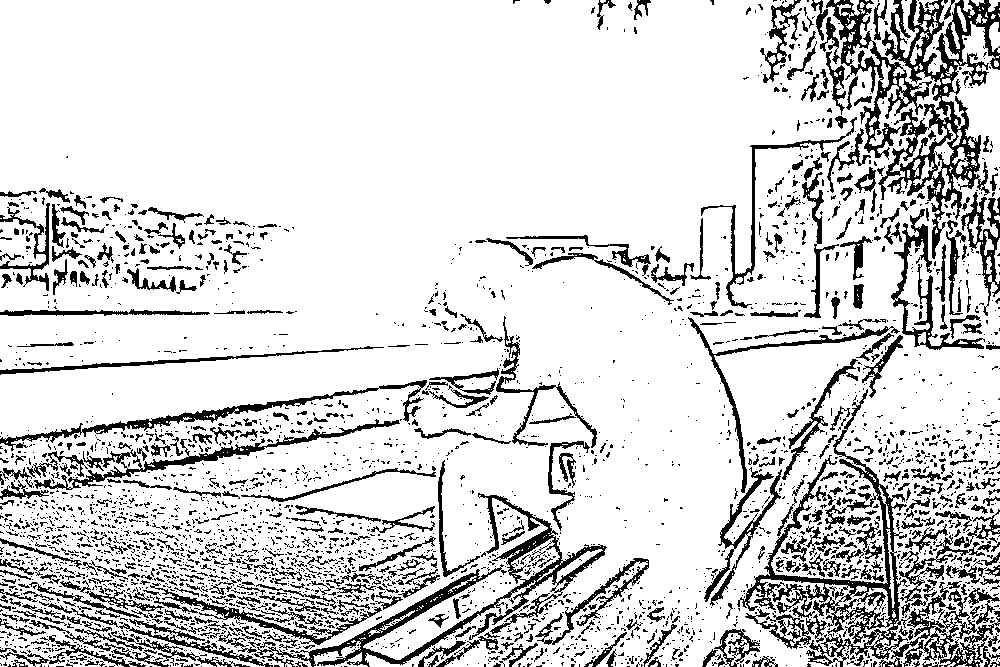

**那些艰难时刻，可能和这些相位有关**压力以各种方式影响我们。在外在世界中，我们会遇到困难、敌人和竞争；而在我们的内在世界中，我们要面对自己心理和生理上的弱点和失败。**然而，如果没有面临困难时的压力，就不会有成功和成就感。同样地，只有当我们自己的不足造成了生活中的压力时，我们才会去工作，去努力克服它。**对压力怀着健康的尊重是很必要的，这一点对于占星师来说尤为重要。在合相、四分相、对分相、三分相、六分相这些主要相位中，只有最后两个相位被认为是积极的，但即使是它们也可能适得其反。（我在冥王星三分我的出生星图太阳的时候做了开胸的手术；虽然这个手术使我今后免受心脏病的困扰，但在当时是一个压力很大的经历）。如果我们再加入梅花相位、八分相、十二分相，我们必须承认大部分相位都与压力相关。如果我们占星师坚持认为压力是负面的，我们能说的积极的东西就太少了。**在本文中，我将描述一些通常被认定为会带来压力的行进，并解释如何正向运用这些压力。**并不是说这些相位没有潜在的危险性，或者它们不会以困难和麻烦的方式展现。但是，我相信每次**当我们把一个“困难”相位的能量用积极的方式表达出来，我们都会减轻其潜在的负面影响**。我怀着这样积极的视角来写以下的内容。

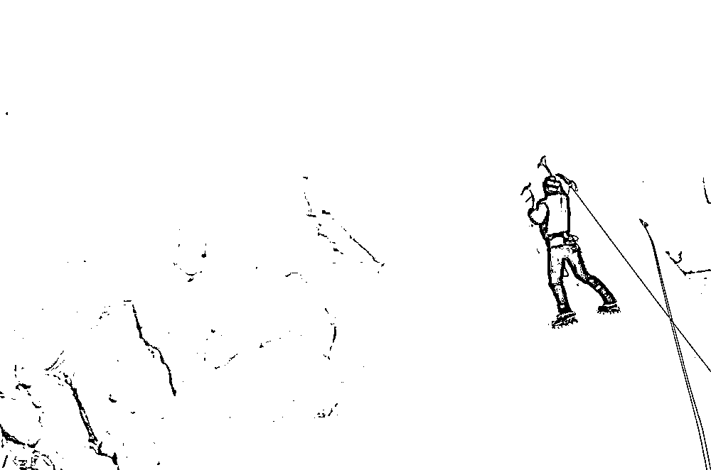

**压力山大，何以解压？**

**出生星图****太阳****与行进****火星****形成压力相位**

这是一个关于**大胆行动、不计后果**的相位。我们对于大胆行动没有问题，但处理这些行动的后果常常令人非常沮丧。如何在经历这个行进以后，保持你发肤完好，并且友谊丝毫无损，这是一个很大的挑战。**这个相位的乐趣在于大声、骄傲地说出你是谁**。如果汽车坏了我们有汽车保险，如果友谊受到了伤害我们可以真诚地道歉。然而，找到机会让世界知道你是可以很大胆的，你是可以很勇敢的、无畏的、甚至有点英雄主义的，这是无价的。

**出生星图****太阳****与行进****土星****形成压力相位**

阴影笼罩着你的自我，你怀疑着自己是否可以重见光明。这可能是一段令人沮丧的时期，你对自己充满怀疑，并对自己的目标进行严肃的重新评估。你身体的活力可能也会受损，变得昏昏沉沉，并很容易生病。在黑暗中找到欢乐看上去很难，但一旦你接受了这个相位的规则，其实也没有那么难。土星的功能是让我们知道自己的**局限**。**一旦我们清晰理解了自己所不能做到的，剩下的所有事情都是我们可以做的**。如此就可以找到快乐。

**出生星图****太阳****与行进****天王星****形成压力相位**

你能感受到血管中闪电般的震颤吗？在这个行进中，你感觉如电击般的兴奋，并可能伴随着一点神经质。可能会出现意想之外的事情，但最出人意料的是你对这些事件的反应。你所做的任何事情都与你过去的行为方式截然不同——这可能很有趣，也可能很令人苦恼。你可以从探索**新的个性**、进入你生命的所有**新元素**（即使是那些让人忐忑的新事物）中找到乐趣。关键在于认识到：所有这些都是**暂时**的，就像一道闪电。当暴风雨过去，你开始重建你旧时的生活。**那些恐惧和痛苦会很快过去，只留下探索的乐趣。**

**出生星图****太阳****与行进****海王星****形成压力相位**

这个时间段是很奇怪的——**你每天醒过来，却不知道自己是谁**。你的身份感在改变着。其中一部分身份感与你当下的生活状态不太匹配，或许它们对你而言已经不适用了。这一切让你感到困惑，并且觉得自己不再属于那个你曾经觉得很舒适的世界。在这个行进中，我们常常由于伤感而**停滞不前**。我们感受到跟自我身份中那些曾经为我们服务得很好的部分有情感的联结。事实上，在这个阶段，我们可以获得快乐的一种方式是：重新回顾那些老旧的依恋。另一个方式是：**对这些依恋放手**。

**出生星图****太阳****与行进****冥王星****形成压力相位**

在这个行进中，你会感到自己被不可抗拒的力量所**压抑和阻挡**着。你的直觉想去与这些阻碍你的力量抗争，维护自己的自主权、创造力和身体活力。但是，你越抗争，你的敌人越强大。你可能会感觉自己不得不采取孤注一掷的办法。这一种行进的乐趣来自于**力量**。仔细观察那些想要压制你的力量，感受他们的强大能量。**如果要制止你、把你推入角落的力量是如此之大，想必你也一定是很强大的**。让他们得意一时，嘲笑他们的胜利。迟早这个行进会结束，**这些力量会消失，而你的力量会一直存在。**

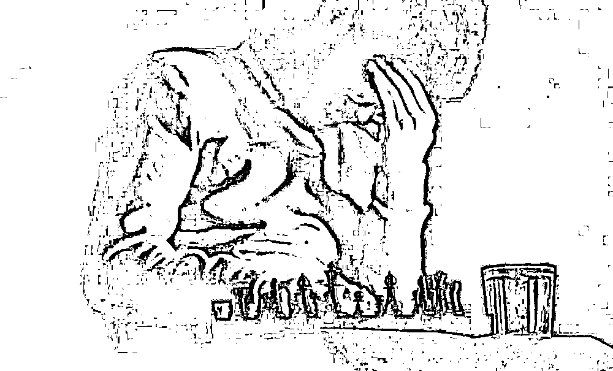

**出生星图****月亮****与行进****火星****形成压力相位**

在这段时间，你也许会感觉自己受到攻击，好像有什么人或事将靶心瞄准了你，只是还没有开始射击。这个相位的天然倾向是想要**逃跑**，或转过身去张牙舞爪地**攻击**你的对手。但这两者都不会让你快乐。**快乐来自于克服你的恐惧和愤怒，发现你可以成为一个很勇敢的人**，你可以用发牢骚和争斗以外的方式捍卫自己。发现你灵魂中的这种勇气不仅是欢乐的，也会使下一次月亮和火星的行进变得更容易。

**出生星图****月亮****与行进****土星****形成压力相位**

在这样的行进下，我们会感受到沉重的负担。无论这些负担以什么样的具体形式呈现，他们真正的影响在于让我们有**悔恨、恐惧和内疚**的情绪。
这可能是一段充满了**强烈自我批评**的时期。你细数并指责自己所有的**失败和缺点**，而外部世界也会不断提醒你关注自己遗漏的失败和缺点。然而，当你停止了自我鞭打，你也许应该记得，**压倒你的所有这一切都是情绪，而非事实**。看一看事实本身，你也许会发现，它们并不像你想象得那样可怕。而且，如果你深入去思考，你甚至可能发现，有一丝欢乐隐藏在他们的背后。

**出生星图****月亮****与行进****天王星****形成压力相位**

这个相位会搅乱你的生活，尤其会撼动你的**情感世界**。听上去很有意思，但其实并非如此。我们的情感生活在有安全感、可预测的情况下可以很好地发展，但这个相位既不想要安全感也不想要可预测。
这时，让我们遭受痛苦的并非发生在我们的身上的事件，而是这些事件**如何把我们之前在情感方面形成的观念连根拔起**。改变非常艰难，然而，对改变的恐惧会使我们窒息。战胜恐惧并不容易，尤其是情感上的恐惧。但是，一旦我们做到了，一旦我们接受了这样的事实：我们情绪上的锚心已被拔起，我们在变化的大海之上漂浮，我们就能享受这样的旅程，即使旅程中会有一些颠簸。

**出生星图****月亮****与行进****海王星****形成压力相位**

在这个行进中，你常常会觉得有人让你失望；或者你进入了一段关系，但另一方并不可靠，甚至对你幸福感造成了威胁。这样的怀疑通常并没有可靠的证据支持，但你并不在意事实本身。你就是想有人告诉你，**一切都很好**。在这个行进中，你可能感觉自己**多愁善感**，生活一团糟，而这其实不一定是一件坏事。这个相位使你有机会用之前你可能觉得很傻或者“一点也不酷”的方法去探索自己的情绪。一旦你克服了自己的脆弱和迷茫，这样的探索会变成快乐的源泉。

**出生星图****月亮****与行进****冥王星****形成压力相位**

这个相位会带领你深入到**自我的深处**，并迫使你面对你**最顽固的心魔**。没有那么容易下定决心。你踏上这个旅程并非为了解决问题，这是一个**发现事实的使命**，而在你所要去的地方，**事实是被感受所定义的，而非文字**。这使得它们看上去很可怕，也使这个使命变得非常必要。此时，**快乐来源于发现自我中自己从未知晓的层面**。你可能会看到一些丑陋的事情。它们可能会挑战你“世间的”感情和是非判断。但是，当你了解并拥抱这些坏东西，同时找到方法把这些坏东西转化为真实的、有用的东西，你就会找到快乐。

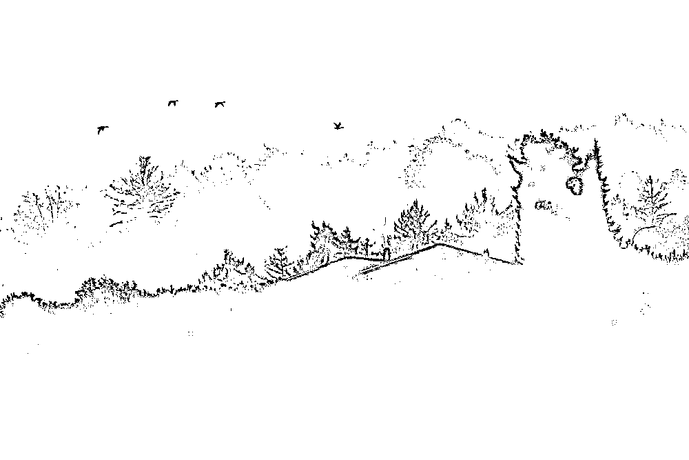

**出生星图****水星****与行进****火星****形成压力相位**

这个时期适合处理你生活中的一些**愤怒**。为了说明自己的观点，你应该直截了当，也许还要有一点咄咄逼人。记住，你不是来抱怨的，你是来寻找解决方案的。当然，在这类行进下，寻找解决方案的过程很可能会有争论。然而，即使是一场争论，如果处理得当，也可以是一次富有成效的信息交换。除非每个人都强调说明了自己的处境，否则很难找到中间立场。也只有这样才能清晰明了地表达，而通过这样的表达，你可以找到这个相位带来的快乐。

**出生星图****水星****与行进****土星****形成压力相位**

做出艰难的决定让人感觉很糟。唯一能比这更糟的是，你发现某一个艰难的决定是错误的。但你不应该因此郁闷——你应该因此**扩大视野、多多学习**。**每一个错误都包含了很多的人生教训，而务实的人不会让这些教训白白浪费。**这个相位的乐趣在于，知道你的想法和优先级都是合适的。困境会迫使你做出调整，但更重要的是：**困境会理清你的思路，精简你的想法**。无论如何，当你离开这个相位时，你会带走一些很重要的信息。如果你做对了，离开这个行进时，你会是一个更有智慧的人。

**出生星图****水星****与行进****天王星****形成压力相位**

不要再烦躁不安了，**请开始用开阔且非常规的方式来思考**。
一些崭新的人或事向你开启了光明的大门。是的，那光耀眼得令人睁不开眼。新的信息会把你仔细预设的计划打乱。你会因为之前的计划而不去探索新世界吗？这个相位的乐趣在于，不知道有什么样异想天开的想法会进入你的脑海，或者自己会冷不丁说出什么稀奇古怪的话。你可能会需要请求朋友的谅解，并且需要在对你母亲说话时特别小心。不管怎样，你已经**进入了一个崭新的、无拘无束的智力领域**，这很有趣。

**出生星图****水星****与行进****海王星****形成压力相位**

谁说人生必须有意义？你是否被现实所困而没有一点点时间来做梦？在这个行进中，肯定有人会好笑地看着你问你在干嘛。但没什么好道歉的，你唯一在想的事情是希望这个世界变得更好。
在此，**快乐来源于创造力**。一个沉迷于梦境的人可以自由想象和创造。你在这个行进中的创造可能无法进入画廊，但是，那种**随心所欲**的感受，那种指尖流淌着无数可能性的感觉会一直都在。珍惜这种感觉。

**出生星图****水星****与行进****冥王星****形成压力相位**

在这段时期，你无法满足于表象。你必须**深入挖掘**，你必须提出尖锐的问题。有人可能不喜欢你如此，但在这样的行进中，你并不那么关心自己受欢迎的程度。你必须要找到答案，即使要上天入地，你也心甘情愿。如果你不让自己去探索这个世界和其他人，你将会找不到快乐。**快乐来源于在探索世界和他人的过程中，你对于自我的发现。**因此，当你一只眼睛搜索那些黑暗的角落时，记得用另一只眼睛看看自己的内心，看看自己内心的黑暗角落，并观察光线如何渗入进来。

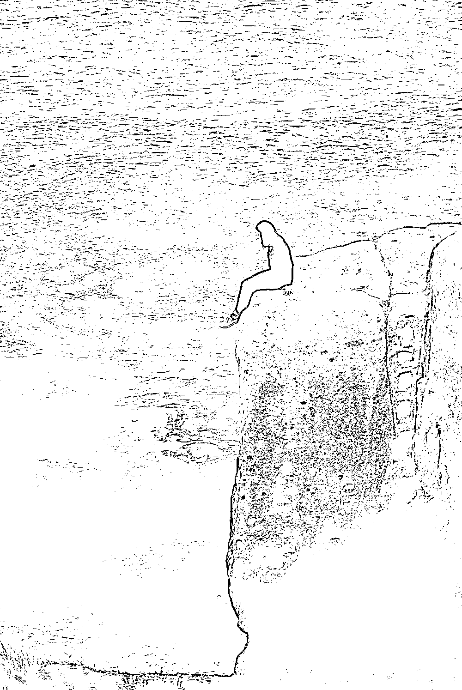

**出生星图****金星****与行进****火星****形成压力相位**

这是要**坚持自己主张**的时期。你要让关系亲近的人知道你的**需求和愿望**。可能会有矛盾发生，尤其是当你的需求和你所爱的人的需求有冲突时。但是放弃主张只会让你垂头丧气，并怀恨在心。
有人可能会说，在这个相位之下，快乐来源于争吵过后的做爱。但在这里，重要的是学习到**你的哪些关系是可以经得起这样的交换意见的**。这些历经考验的关系带给你的崭新的喜悦，而即使是争吵过后的做爱也无法挽回那些经不起考验的关系。

**出生星图****金星****与行进****土星****形成压力相位**

有的时候，爱不是答案。你必须回到现实，在关系中甚至要有一点点自私。你在做判断，而判断的目的是在关系中创造出平衡。这个过程并不简单，但真正的爱经得起现实的考验。经不起现实考验的爱，不要也罢。这个相位的乐趣在于与你所爱的人进行**成熟的、理智的、富有成效的**互动。我知道这听上去并不令人兴奋，但是这个过程是建立牢固的关系必经的过程。清晰地阐明你的需求和期望、真诚地听取爱人的回应，就像把快乐存入个人退休账户。以后，当你最需要的时候，它会在那里等你。

**出生星图****金星****与行进****天王星****形成压力相位**

新的开始总是有一些令人生畏，哪怕只是对过去的一点改变。然而，一点害怕并不总是坏事，**害怕可以使感官变得敏锐，并使头脑充满能量**。如果你更聚焦于这股能量，而不要那么在意行进中可能出现的一些突然的、有时让人伤心的改变，这个行进可以变成让人兴奋的旅程。在这个过程中，你会有很多机会**接触到很多以前不认识的人**，同时你可能会受到诱惑去**冒点险**。这些可能是让人兴奋和快乐的，但你可能要付出情感上昂贵的代价。然而，快乐也可以来自于对于可能性深思熟虑，怀有“崭新”的想法离开——这样，快乐就不会使你（和你所爱的人）付出任何代价。

**出生星图****金星****与行进****海王星****形成压力相位**

在这个行进中，你会感受到**伤感和情绪脆弱**。但是，不要总是想着你自己！这个时期你应该更多关注其他人。让自己的同情心流动起来。让想要帮助他人的渴望来指引你。你不一定要陷入爱河。（陷入爱河又是关于你自己的事，不是吗？）你只是必须感受到对于那些正在处理自己脆弱的人们的爱。在这个相位中，我们常常被迫在失望中找到快乐。即使当你爱你的人辜负了你，甚至你的爱被证明用错了方向，感受到爱，懂得你曾经爱过依然是有价值的。而这些价值是无论多少失望都无法从你身边带走的。

**出生星图****金星****与行进****冥王星****形成压力相位**

我们在此生中得到的每一样东西，都是注定会失去的。这是一个基本的真相。另一个基本的真相是：**每失去一样东西，我们就有空间来容纳新的人和事物**。对于冥王星，我们必须从长计议。是的，有的时候我们细数那些悲伤与哀愁，但现在，**我们必须突破这些细节的局限，看到更大周期的开始和结束。**这里的快乐来源于，**失去所带来的痛苦代表着转化之门**。无论因为什么原因，当我们所爱的变得遥不可及，我们必须转化自己爱的方式。我们必须到达更深、更远的地方。通过这个过程，于爱、尤其是关于自我，我们都可以学会很多。

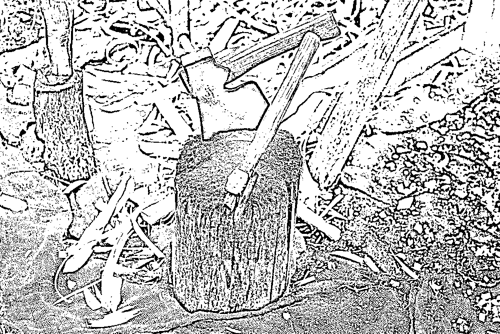

**出生星图****火星****与行进****火星****形成压力相位**

这是战斗的相位。对我们大部分人来说，这并不意味着要找人打架。我们的战斗会更安静些，起码看上去比较文明。然而，在这个行进过程中你必须进入角色。在这个相位下，我们感受到**积极主动**的乐趣，**身心都忙到极致**的乐趣。**重点并非输赢**。这段时期，你应该忘掉你的身份，不要在意别人的观点，而全力感受你与世界的战斗、尖叫、挣扎对你五脏六腑的影响。

**出生星图****火星****与行进****土星****形成压力相位**

有的时候我们会感觉自己走在沙地上，或者鞋子灌了铅一样沉重。这就是这个相位带给我们的感受。我们遇到的困难可能是身体上的，或是情绪上的。可能与你的工作相关，也可能只是心态的问题。然而，处理好这样的问题并不容易。
这个行进的快乐来自于**在困境中保持自律**。把去年你放弃的节食计划重新找出来。拓展你的运动计划。接下那个每个人都避之不及的项目。当然，这些都不容易，但是“**不容易**”就像是家常便饭。向世界展示你的**力量、耐力和自律**。

**出生星图****火星****与行进****天王星****形成压力相位**

这个相位与事故、疏忽和普遍的混乱相关联。然而，正是这种潜在的危险给了我们在这个相位中找到乐趣的机会。 在这个行进中的每一天，你都**活在不确定的边缘**。即使是最镇定的人也要去处理极端的情况。在这种高度警觉的状态中，**每一个感官都被强化了**。你要确保自己感受快乐的感官也同时被强化。

**出生星图****火星****与行进****海王星****形成压力相位**

你觉得有的地方出了问题，但搞不清到底是哪里。虽然问题难以捉摸，但还是造成了破坏。你既没有能预见到问题的发生，也找不到确切的原因，这些都让你更加沮丧。你心想：最好能回避整个议题。但这不可能，因此你最终对着影子乱打一气。
这里的快乐来源于**臣服**。与问题抗争不能帮你太多。在和海王星的战斗中，输家和赢家常常都是同一个人，那个你对着打的影子很可能就是你自己。放下你的拳击手套，转向光明，影子就随它去吧。

**出生星图****火星****与行进****冥王星****形成压力相位**

有人刚把一卡车的垃圾倒在你的正门口，看上去你对此什么都干不了。这可能是很艰难的行进。你感到被困、无助，觉得自己被无法控制的力量所压倒。在这个过程中，有时候一丝绝望会渗透进来，但这无济于事。在此行进中，你通过认识到自己在打一场无关胜负的战斗来找到快乐。唯一重要的是你在战斗中有多努力。**这是对你勇气、决心和意志的测试**。快乐来自于了解，通过每场战斗，你都能增加一些力量。

**版权声明**：本文由若道翻译发布，欢迎转发，反对抄袭。友号转载请申请白名单。


**温德尔·C·佩里**占星师，作家，艺术家著有《土星周期：人生变化地图》和《太阳母亲、月亮母亲：占星学的活力二人组》

******点击图片查看若道君推荐******


**微信又又又改版啦，不想错过若道的推送？**

**就把若道设为星标吧！**

**▼**


就是这个“在看”，戳戳戳 ☟

********报名直达入口********


# 雷蒙德·梅里曼金融占星周运 | 股票市场是否还会再创新高？

> 原文：[`mp.weixin.qq.com/s?__biz=MzA5NjA0NTAxNg==&mid=2651412684&idx=2&sn=415838942c44ea03ff10294ff23236fe&chksm=8b4bea7bbc3c636d42d4db2d72e5ec288cc81cb7d5ae51ee5380cf44416e3b4465b2a8a6ffac&scene=126&sessionid=1692738232#rd`](http://mp.weixin.qq.com/s?__biz=MzA5NjA0NTAxNg==&mid=2651412684&idx=2&sn=415838942c44ea03ff10294ff23236fe&chksm=8b4bea7bbc3c636d42d4db2d72e5ec288cc81cb7d5ae51ee5380cf44416e3b4465b2a8a6ffac&scene=126&sessionid=1692738232#rd)

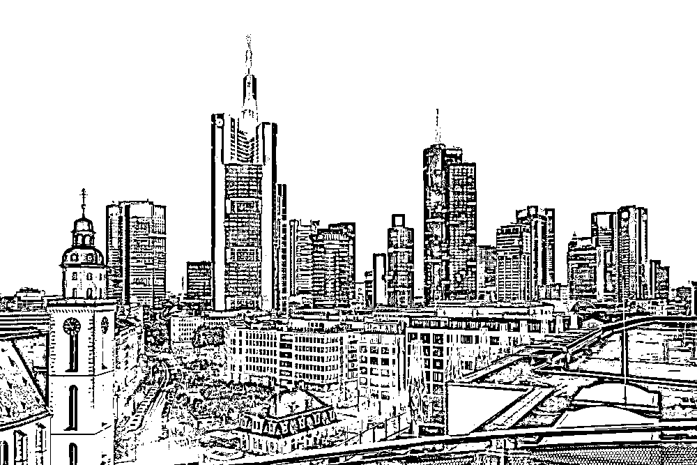作者/雷蒙德·梅里曼
翻译/Luke 校对/李含编辑/Tang 图片/unsplash 雷蒙德·梅里曼是在金融占星学界稳坐第一把交椅的占星师，同时他也是若道签约的金融占星课老师，我们引进了雷蒙德·梅里曼老师的《上证指数月度报告》《黄金周期月度报告》《2020 年金融预报》（感兴趣的同学可以扫码文末图片购买）。我们经老师的授权，将每周刊登梅里曼老师的周运，供大家参考和学习。于是，这是这周的周运（1.6-1.10）。**展望与回顾**欢迎来到新的一年，这是未来十年的起点，火星刚刚进入射手座。正如本栏目过去多期报告中谈到的，**火星在射手座-摩羯座的行进与中东地区的重大危机有显著的关联**，对以色列来说，这通常意味着来自邻国或内部的危险和威胁。**火星在 1 月 3 日进入射手座**，这也是袭击发起的时间，并会在 3 月 31 日离开摩羯座。由于土星和冥王星将在下周 2020 年 1 月 13 日合相，这段时期将变得更加动荡不安。这个 32-37 年的合相周期有 18 个月的容许度，曾出现在一战开始和二战结束时。上次合相在 1982 年 11 月。在军事袭击之前股票市场表现良好。在 1 月 2 日，新年的第一个交易日，美国股票指数上涨到了历史新高。道琼斯工业指数期货在隔夜市场被抛售了超过 300 点，但在周五开盘一小时后开始反弹。上周巴西、瑞士和印度的股市也录得历史新高。德国 DAX 指数接近创历史新高，在 1 月 2 日的时候飙升至 13425 点，只比 2018 年 1 月 23 日的历史最高记录 13596 点略低。荷兰 AEX 指数上涨到了 607 点，是 2001 年 5 月以来的最高价位。中国上证指数也上涨到了 2019 年 4 月 29 日以来的最高点。总之，尽管周五有所回落，上周这个假期里全球股市的走势依然亮眼。美国和伊朗之间的军事升级对黄金和瑞士法郎来说是利好消息。黄金在 1 月 3 日星期五上涨到了 1554，重新测试 9 月初的 6 年高点。白银上涨到了 18.32，是 11 月 4 日以来的最高价位。瑞士法郎继续扮演货币市场在动荡时期的避风港角色，在星期五上涨到 1.0420，是 2018 年 9 月以来的最高。其他商品期货也表现良好，原油上涨到 4 月 30 日以来的最高价 64.09，大豆上涨到 9.49 美元/蒲式耳，是 2018 年 6 月以来的最高价。如果不是军事敌对的升级，金融市场本来一切都好。但现在火星进入射手座了，所以地缘政治方面的紧张局势的加剧仅是刚刚开始。**火星好战，当射手座的火星决定采取攻势，它是没有底线的，可能变得无情、鲁莽、势不可挡、片甲不留的。一旦开始，它可能很难停下来。这可能导致许多市场上价格的大幅度波动，包括股票市场。**

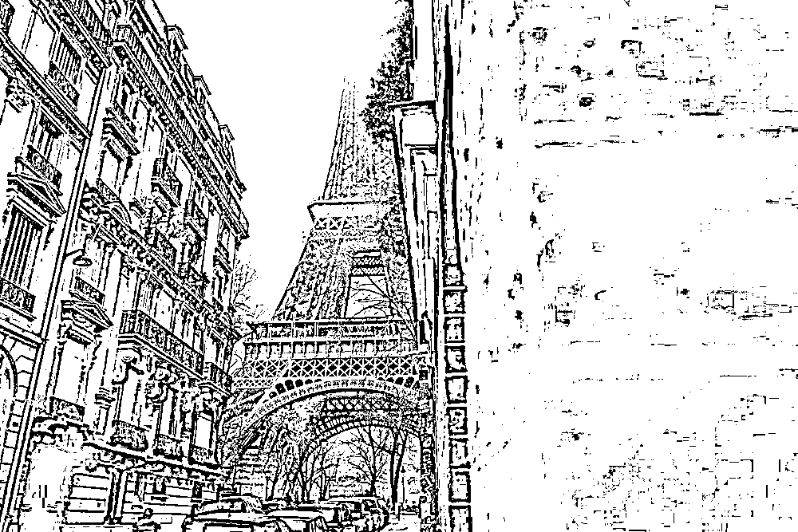

**短期占星趋势**

然而，随着在 2019 年 12 月-2020 年 3 月期间，推进月亮与美国诞生图的火星/海王星四分相位形成 T 三角，这种不采取军事手段的姿态可能在 2020 年遭到挑战。如果我们采用的美国国家星图（1776 年 7 月 2 日上午 11:45 宾夕法尼亚州费城）是正确的，这意味着这段时期军事对抗增多，可能会给美国的盟国发出不确定或混乱的信息。

不仅**火星行进进入射手座/摩羯座**代表中东地区可能军事冲突，**推进到射手座的月亮与 1776 年 7 月 2 日美国国家星图里的火星/海王星相位形成 T 三角**也预示了这点。这又是另外一个占星学证据，证明美国国家星图实际建国时间是在国会通过独立投票的 7 月 2 日中午前，而不是 7 月 4 日乔治·华盛顿将军发表独立演讲时。此外，7 月 2 日星图里的月亮射手座也会激活伊朗星图里的火星/海王星四分相，以及特朗普总统出生星图里的太阳/天王星合相对分月亮。

这场刚刚白热化的冲突可能不会像有些分析家所想的那样迅速终结。因为火星行进射手座，会在 1 月 28 日到 2 月 13 日期间强烈激活美国和伊朗星图里的火海四分相，以及特朗普总统出生图的太阳/天王星合相对分月亮。这意味着什么？这意味着领导人们可能变得冲动，先行动后思考，变得反应过度甚至想要先发制人。这会导致力量、作用和反作用的强烈表现。由于火星在射手座，事情很容易就会变得“**过火**”。

甚至这周就能见证到这股能量的活跃了，因为**天王星——这是关于意外和爆发的行星——将在 1 月 11 日顺行**。当前已经位于这个征象的容许度内了。对金融市场而言，这通常对应着非常剧烈的价格波动，无论是上涨还是下跌，而且通常会突破以往的阻力和支撑。**它在两周的容许度内可能对应着趋势的惊人反转，或突然之间上涨到多年来的新高或下跌到新低。**全球好几个股票市场都已经创了历史新高。除非这次这个征象引发市场反转，否则可能将涌现出更多创新高的市场。

我们还要指出，现在火星已经离开天蝎座了，它在 11 月 19 日到 1 月 3 日之间在这个星座行进。这一时期是我们的“**黄金时期**”，如果梅里曼的每月、每周和每日报告的订阅者们在火星进入天蝎座以前的低点买入（1446），并在火星于 1 月 3 日离开天蝎座时卖出，他们已经赚得盆满钵满。从技术层面来看，没有迹象表明黄金已经到达顶部，但你应该遵守计划，这计划就是在火星进入天蝎座的两周内择孤立低点买入（我们就是这么做的），然后持有直到行进结束（我们做到了）。和过去许多次一样，这次的获利也是非常丰厚的。

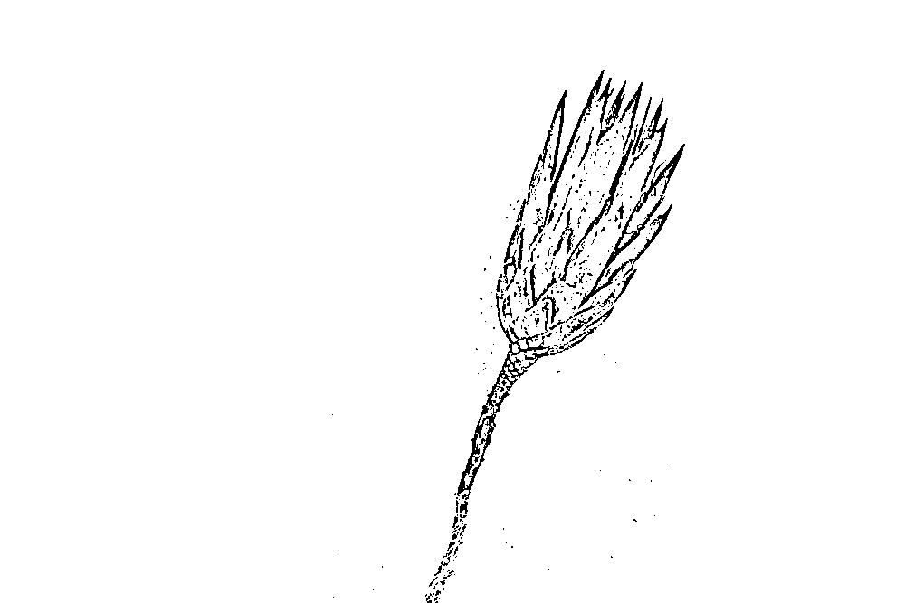

**长期考量**

**现在谁都能当总统了，只要他是大人物，性格有趣，受公众喜欢就行了。我们正在进入后英雄式总统的时代。某些低级的行为被原谅，某些粗鲁的行为成为常态。美国人曾经对总统的要求很高……但总统应成为英雄的想法已经结束了。比尔·克林顿和他的丑闻毁掉了这一点。两次失败的战争和大衰退毁掉了这一点。“如果你喜欢你的医生，就可以留下他”的想法埋葬了它。当你故意撒谎时，你在宣告你不尊重人民。人民注意到了这点……时机到了会让你付出代价。有趣的性格会使大众更加分裂，而不是更团结，会产生娱乐效果，而不能赢得尊重。世界会看低我们，美国变得像小丑一样，成为一个不严肃的国家，这是因为领导人像个小丑，一点也不严肃，这会降低我们对事件的影响力。**

**——佩姬·努南**

**《后英雄式总统的时代》**

**《华尔街日报》**

**2019 年 12 月 28 日至 29 日**

**美国广播公司新闻/华盛顿邮报（ABC News/Washington Post）最新民调显示，美国总统特朗普应允许他的高级助手在参议院就针对他的弹劾指控进行作证。**

**——加里·兰格**

**《大多数人期待对特朗普进行公平审判；70%的人支持让助手作证》**

**abcnews.go.com**

**2019 年 12 月 17 日**

去年年底，我在思考弹劾特朗普总统的事情。众议院发言人南希·佩罗西的策略是推迟将弹劾条款提交参议院，直到她（众议院）确信会有公正的审判。许多分析家认为她疯了，但是根据占星学，我有不同的意见。有 35 个参议员席位等待改选，23 个席位属于共和党人，民主党人只需要守住 12 个席位。民主党人只要再得到四个席位就能获得多数。换句话说，如果民主党人只赢得 16 个席位，共和党人赢得 19 个，民主党将获得对参议院的控制。如果在大选后审判，米奇·麦康奈尔可能就无法主持审判了。有些人认为这是一种报应，因为麦康奈尔曾将奥巴马总统的最高法院提名推迟到 2016 年大选之后。通过不将弹劾条款提交到现在共和党人掌控的参议院，佩罗西使总统大选的主题偏重在唐纳德·特朗普“滥用权力”和“阻碍司法”，而不是他策划的经济腾飞。当然，共和党人仍然会鼓吹选举是关于经济的。但更重要的是，选举也关乎公众对于公平审判的愿望。目前来看，10 个美国人中有 7 个希望总统的高级助理作证，但根据参议院领袖米奇麦康奈尔的说法，这不太可能（也不受欢迎）。所以从占星学来看，从今年年底开始到 2021 年，特朗普总统**行进的摩羯座冥王星正在与他出生星图的巨蟹座金星/土星形成对分相**。如果想在选举中顺利取胜，轻松度过选举后的日子，这不是个好的征象。冥王星会在某种深刻的层面上带来拒绝或转化的经验。这并不意味着他会输掉选举，但也不意味着他被选上后能毫发无损地完成任期。他在选举中获胜，但民主党人控制了参议院的可能性是存在的。即使民主党人在 35 个改选席位中只赢得 16 个，他们也能占据多数。这不是不可想象的。如果这件事发生，审判被推迟到大选后进行，那将是一场非常不一样的审判。助理们可能被传唤出庭作证。实际发生的事情将变得众所周知。（冥王星只是在做他的工作，它正在接近美国国家星图在摩羯座末尾的月亮-冥王星合相）另一件事。在选举日当天，特朗普总统看起来非常强大。如果所有的选票都在选举日投出，由于那天月亮和北交点合相他的出生太阳，我认为他可能赢得选举。但是并不是所有的选票都在选举日投出。很多美国人会通过缺席投票的方式在选举日前投票。巴拉克·奥巴马在 2008 年通过当地良好的组织活动，展示了驾驭缺席投票选民的力量。如果民主党人想要在 2020 年赢得白宫或参议院，他们需要依照奥巴马在 2008 年所做的那样组织大量选民缺席投票。如果共和党人想要阻止这种情况发生，他们需要做同样的事情，而且需要做得更好。最后决定胜负的可能是谁在当地组织活动中赢得了更多缺席选民投票。**版权声明：**本文由若道翻译发布，欢迎转发，反对抄袭。友号转载请申请白名单。


**雷蒙德·梅里曼（Raymond Merriman）**

若道签约老师。著名金融占星师，ISAR（国际占星研究协会）前主席，梅里曼市场分析公司的总裁。他由于“提升了占星学的职业形象”，在 1995 年国际占星大会上被授予轩辕十四奖；在 2012 年国际占星大会上，被授予轩辕十四终身成就奖。

1“中国上证指数月度报告”发售

**从 2019 年****7****月开始，若道推出了****中文版****的雷蒙德·梅里曼中国上证指数月度报告，并持续发行该报告！**

当把金融市场的周期和占星学的周期相结合时，雷蒙德·梅里曼老师的金融占星学研究**为投资者应对金融市场的周期波动，并随之调整投资策略提供了极大的价值参考**。

2“黄金价格周期月度报告”发售

**现在，又有一个好消息要告诉你。从 2019 年****9****月开始，若道推出了****中文版****的雷蒙德·梅里曼黄金价格周期月度报告！**不仅仅为广大读者在中国股市的投资出谋划策，更将视角放眼黄金市场。

**每当世界经济形式不明朗的时候，有一个地方是保值的港湾，那就是****黄金**。从 2018 年 8 月开始，黄金已经用自己的升值再次提醒众人它在经济不稳定时的位置。**截至目前，2019 年 8 月底，黄金已飙升至 6 年新高，高于 1565 美元。**

自 1982 年雷蒙德·梅里曼出版第一本研究《地球宇宙学征象与黄金价格的关联》的著作以来，**他一直作为最重要的黄金市场时机预测者之一享誉国际**。

过去 1 年，那些订阅并遵循建议的梅里曼市场时机学院日报和周报的订阅者，如果从 2018 年 8 月 16 日的低点或 8 月 23-24 日的次低点购买黄金，他们已经赚到了不少的 30%左右的利润。

**购买套餐**，买得越多越优惠

**2020 年 1 月报告均已更新！**

中国上证指数月度报告套餐价

*   **单月报告**：280 元

*   **3 个月套餐**：780 元（260 元/月）

*   **12 个月套餐价**：1999 元（166 元/月）

**长按下图识别二维码**

**购买金融报告****套餐**

**▼**


黄金周期月度报告超级优惠折扣

*   **同时购买上证指数 12 个月套餐**和**黄金周期报告 12 个月套餐**，即可享受黄金周期报告 12 个月套餐**立减 1199**元的**超级优惠折扣**。

*   **已经购买**了**上证指数 12 个月套餐**的朋友，**再购买**黄金周期报告 12 个月套餐，也可享受**立减 1199**元的**超级优惠折扣**。**购买黄金周期报告 12 个月套餐时，超级优惠折扣会自动生效**。

**长按下图识别二维码购买黄金报告套餐**

▼


3“2020 年金融预报”发售 1976 年以来，由雷蒙德·梅里曼撰写的梅里曼市场时机学院每年一次的年度预报沙龙和每年一本的《年度预报》一直在应用占星学原理为投资者们服务，43 年来，这本 200 页左右对金融市场的分析报告和 3 小时的年度预报讲座在美国、日本、欧洲帮助许多投资者了解宇宙天气对于世界经济形势、政府政策及其对各个金融市场和金融产品的影响，帮助他们做出正确的投资决策，降低投资风险。2018 年，若道第一次将这份广受赞誉的一年一度的金融占星报告和沙龙引入中国，供中国投资者参考。**《2020 年金融预报》将会谈及 2020 年重要的宇宙天象及其对世界经济、贸易形势的整体影响，还将覆盖中国上证股票市场的分析、黄金白银市场、美国经济、美国总统、美联储、美国国债市场、美国股票市场、主要外汇货币市场（主要外汇美元、英镑、欧元、日元、瑞士法郎）、原油市场、谷物市场、活牛市场、比特币市场等投资市场。**梅里曼老师及梅里曼市场时机学院的金融占星分析师还会给出以上市场 2020 年的**市场价格目标区间及重要价格反转日**，为短期、中期和长期投资者进行市场操作的时机提供参考。如果你关注世界经济和金融投资市场的变化，会发现梅里曼《金融年度预报》中的研究对于你了解世界经济在发生什么，这些市场的走向会如何有非同寻常的指导价值。报告和讲座价格

**2020 年金融预报讲座和报告价格整体售价 1280 元**

（本讲座和报告不单独出售）

**长按下图识别二维码购买 2020 年金融预报**

▼


**微信又双叒叕改版啦，不想错过若道君的推送？**

**就把若道设为星标吧！**

**▼**


********点击阅读原文购买金融报告********


# 深度 | 这个星座可能同时有两个家，爱上两个人……

> 原文：[`mp.weixin.qq.com/s?__biz=MzA5NjA0NTAxNg==&mid=2651412684&idx=1&sn=f6887e194aa2a3680aae10a3b35e31b4&chksm=8b4bea7bbc3c636dbc19fec754256a621ab05a0aff123a56f8aaeccb22cbe1686de524fc0b05&scene=126&sessionid=1692738232#rd`](http://mp.weixin.qq.com/s?__biz=MzA5NjA0NTAxNg==&mid=2651412684&idx=1&sn=f6887e194aa2a3680aae10a3b35e31b4&chksm=8b4bea7bbc3c636dbc19fec754256a621ab05a0aff123a56f8aaeccb22cbe1686de524fc0b05&scene=126&sessionid=1692738232#rd)

******************************☆ **************后台****************************回复“今日”，给你一句生命态度****************

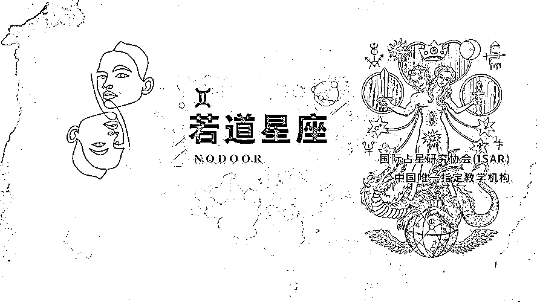

作者/达娜·格哈特译者/雲非 校对/Jun 编辑/玫瑰 图片/unsplash
提到双子座，你会想起啥？这个水星守护的风象星座，聪明机敏又喋喋不休，富有魅力又惹人生厌。如果你的星图里有双子座、3 宫能量，那么在那个领域，你可能需要同时拥有“两份”（工作、物品、人……）比如，如果你的金星在双子座，也许你会同时爱上两个人。这太疯狂了不是吗？那么，双子座要如何处理自己“双生子”的部分呢？一篇诙谐的文章里给到你极深的启发。**风一样的双子座**许多年前，我生平第一次参加了为期一周的闭关冥想，地点在高地沙漠。我早已忘记了同修们的姓名和脸庞，导师的机智和训诫也在我的记忆中模糊了。记忆中只剩下一样东西：风。沙漠之风，是鲜活的。风，在禅堂之外呼啸着，拨动着百叶窗，它会突然打开一扇门，然后忽然静止。清晨，当我给宿舍周围的植物浇水时，风会把一部分水洒到人行道上。有一次，当我准备敲钟通知下午冥想开始时，风赶在我前面，把钟声吹散在空中。我每天都会打扫禅堂外的走廊，如果有风暴，这似乎将是一个完全无望完成（或者是充满禅意）的任务，然而风从来不会弄脏我的走道。令人更想不到的是，风让走道全然洁净。然而沙地里就不是这样了，那里残留着风喧哗过后的各种残骸，糖果包装纸、塑料袋还有绳子到处都是，缠在有茬子的植物上，随风摇摆……对那些风吹不动的事物，它就像演奏家一样，把老旧的铁皮屋顶吹得叮当响，敲打废弃犬舍的松动地板，或同时拨动上千根帕洛弗迪（paloverde，美国地名）树枝。**风是一个捣蛋鬼，它迅捷、聪明又好玩，同时也躁动、吵闹，无法预测又令人恼火**。如果沙漠之风是黄道中的一个星座，那么只有一个可能：它是**多才多艺、难以捉摸、独出心栽又头脑发散的双子座**。我在一次冥想中产生了这个想法，当时我的头脑应该是安静的。如果你有过冥想练习，就会明白，冥想为什么需要静止不动地坐在垫子上，伴有老师和同修们的加持。我曾是自己飞速运转的头脑的囚徒。它不断地运转、跳跃，喋喋不休，自我打转，就如同禅堂外呼啸的风一般。在第一次闭关结束 6 小时之后，我好不容易获得的内在平静就消失了。我只记得那里的风。

透过风，我们遇见自然界中的双子座之灵；透过头脑，我们发现内在的双子座。佛教比丘尼，艾雅·珂玛对头脑的活动有如下观察，非常符合占星学对双子座的描述，我们的**好奇又敏捷的头脑，就像双子座一样渴望刺激。**

**头脑是聪明的，爱操控的...它可以告诉我们任何事，它可以谈论任何话题，并看见事物的任何一面...我们称之为魔术师，对它是一种褒奖。它可以从帽子里拿出一只兔子。它可以合理化一切，让我们觉得自己总是对的，其他任何人都是错的。它喜欢看书、看电视、拜访邻居、做一些工作，或任何可以让自己忙碌又娱乐的事情。只是它本身无法对自己感到快乐和满足。**我们都有这样的头脑——这也是为什么与双子座相遇，不仅仅意味着碰到那些时而令人愉快、时而令人恼怒的双子座朋友。**如果你的出生星图有水星（双子座的守护行星）、3 宫（双子座的自然宫位），或者在星图处有双子座（每个人都有），你也会表达出它的能量，只是程度的不同而已**。通常我们会用 12 星座把人划分和归类，以为某些星座只和别人相关。然而**所有的星座都以某种程度在我们内在舞动着，而也正是双子座原型使这成为可能。****双子座是那伟大的联结者。**

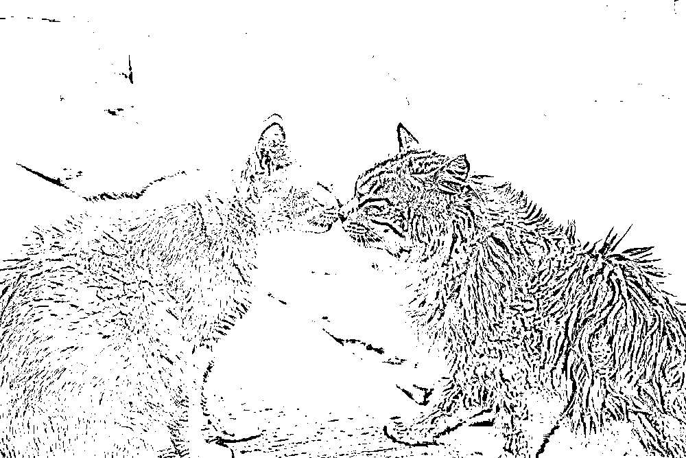

**伟大的联结者**

白羊座开创，金牛座稳固，双子座联结。通过这个星座的运行，信息得以在我们身体里流动，细胞之间得以对话。通过双子座，我们**在周围环境记录下线索，并从中学习**。我们**接触他人，通过语言交流，并理解各种不同的观点**。通过双子座，我们既在星图上的各种次人格间轮番切换，又成为一体……。并不是只有双子座的人会**言行不一，无中生有而后又拒不承认，变身尖酸的邪恶双生子**。就和那些迷人的双子座朋友一样，我们也会**足智多谋**。

一天下午，我在禅堂外面扫地，我抬头发现一幕令人惊奇的景象。一个塑料购物袋在空中划过美丽的弧线。万里无云的蔚蓝天际映衬着这一抹珍珠白，这个廉价的小东西被风变成了一道奇景，如同梦幻航行的星体。

**无中生有**是双子座至高技艺。通过那灵巧的双手，双子座可以成为一名引人瞩目的技师或工匠。然而它最喜欢把玩的还是风元素，**摆弄和钻研各种想法**。**“我觉得”**是双子座的关键语。**通过这个星座和它的守护星水星，我们思考，我们阅读，我们交谈，我们写作。**

现在，通过脸书（Facebook）和推特（Twitter），我们可以活在永恒的巴别塔里面（校注：即古巴比伦未建成的通天塔，人类因建造巴别塔触怒上帝，上帝用不同的语言将人类隔离开来，使得不同地方的人无法理解对方的语言。此处用永恒的巴别塔，即是双子座使人得以沟通之意），我们坐在网吧，也许杯子里装着三份拿铁，但我们其实都沉醉于双子座了。

但是头脑的玩具可以变得多么**令人疲累，充满矛盾，又虚幻不实**啊。星期二你还对玛西亚感觉良好，到了星期四，你就开始关注她明显的缺点。你赞同今天反对金融改革的社论，读到下面相反的观点，你又觉得那也有道理。也许你觉得自己应该买人寿保险，不，还是为了孩子的学费存钱吧，不，你其实需要买一辆新车。你不是应该等到燃料技术提升之后再说吗？噢！你忘记更新博客了。最后，也许很容易认同佛教徒的观点，万物皆空，就如同风中的小泡沫一样。

你过去一小时有过多少念头？你能记得的有多少？思绪不断变化，**你星图里的双子座越强，你就跟着思绪跑得越快。**许多双子座的客户因为无法专注和投入而感到困扰。史蒂夫接连换工作，一旦工作不再新鲜，通常 6 个月之后，他就会换一份新的事情来做。他害怕自己一生都重复这个模式。我告诉他一位优秀的占星师曾经对我说的话：**不管双子座出现在哪里，同时做两份。**

**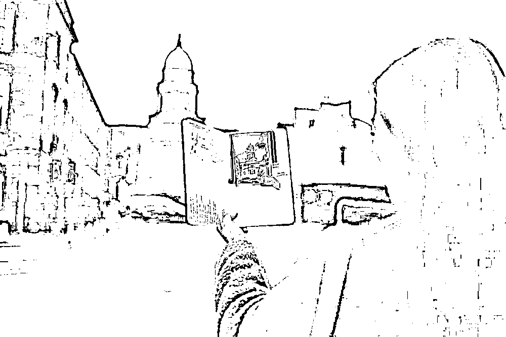**

这是双子座符号中隐藏的信息，是来自它星座符号的忠告，即**双生子**。不管这个星座出现在你出生星图的哪个位置，**至少找到两件让你开心的事**。 

*   如果双子座在你的**中天**，同时做两份工作（当我这样做的时候是最开心的）；
*   如果双子座在你的**上升点**，准备两个衣柜，两个人格面具；
*   **11 宫**的双子座呢？两组朋友吧。

*   如果是**3 宫或 9 宫**呢？同时读两本书，主修两个专业。 

双子座是一个**神经质而高能量**的星座，落在这里的行星需要有门柱来回冲刺。**当一个方向的运转变得令人生厌，双子座可以通过改变方向来打起精神**。我们有时听说有些人在东岸有一个家，在西岸也悄悄藏了另一个家很多年，他们也许有双子座的月亮或者 4 宫落在双子座。当然，同时“做两个”不总是那么容易的。我曾听到那些金星落在双子座的人哀怨万分，他们同时不可救药地爱上两个人，无法做出选择。我们的文化更倾向于一夫一妻制，但是当今出轨和离婚普遍发生，似乎在说明双子座在起着某种作用。**双子座成功的关键**

我在一家市场调研公司里工作了数年。我们是信息经纪人，测验民众对新产品的意见，并负责广告宣传。我们以迅速反应在竞争者中脱颖而出来胜过竞争者。不管客户的问题是什么，我们会以最快的速度拿到答案。办公大楼一直热火朝天。经过任何一张桌子，你都会看到有人一边盯着数据，一边在电话谈着另一个项目，并同时为站在桌前的人写另一个工作的便笺。什么样的人在这种环境里会如鱼得水呢？当然是双子座！我们公司的创始董事长就是一名双子座，而那些在公司里面最成功的人也多数是双子座的。

我是在这里工作的时候开始学习占星学的。有件事就变得很有趣，就是看那些没有双子座行星的新人（或没有较强的 3 宫和水星配置的人），更糟的是那些完全没有风元素（双子座、天秤座、水瓶座）的人，最后尖叫着从办公大楼跑出去。

也许赫拉克勒斯（Hercules）在面对他双子座考验时正是这种感觉。他的任务是从赫斯珀里得斯（Hesperides）的花园中找回三个金苹果。苹果树是赫拉结婚那天盖亚女神送给她的礼物，由不死的百头龙拉冬守卫，每个头都用不同的声音嘶吼和呼喊着。在龙的上方，盘旋着赫斯珀里得斯，她们是阿特拉斯（Atlas）的快乐女儿们，在她们的幸福花园里，由三位姐妹构成，她们意识死亡女神，让树去吞噬她们的猎物。不朽的敌人无法杀死，只能智取。赫拉克勒斯用剑刺穿拉冬的龙头，但是最终发现这样做是无效的。他还扔石头和火球，拳打脚踢，但是根本伤不了那些刺耳的龙头。他最后没力气了，坐下来，仔细观察。几天后，他发现了一个有意思的现象：每天清晨，在鸡鸣之前，龙的两百只眼睛都会闭上整整一秒钟。赫拉克勒斯练习跑步上山加速，当他准备好的时候，他就乘着那一秒钟从沉睡的巨龙身边跑过。然后他来到死亡女神的面前，她们停止舞动，嘲笑他。他礼貌地向她们要三个金苹果，但是她们对他嗤之以鼻。然后他仔细观察她们，发现其中一位女神的脚踝很美，一位女神的手指很美，另一位的声音很美。他将这些细节巧妙地编成一首韵诗，并在一天下午朗诵出来。女神们听到了觉得欢喜，就让他再颂一遍，他说：“除非你们给我苹果”，于是每一位女神都扔给他一个苹果。

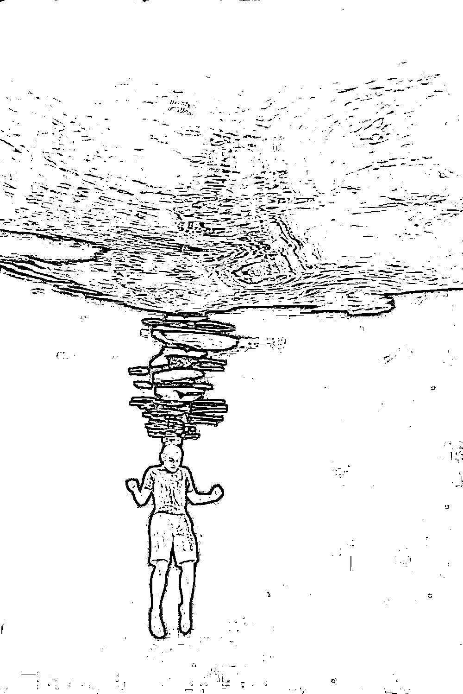

**倾听，对于双子座来说是特别重要的功课，也是这个能言善辩星座成功的关键**。赫拉克勒斯必须**更像学生，而不是英雄**。要战胜敌人，他需要学会如何成为双子座，学会**观察，灵活、聪明又迷人**。而他的敌人正是双子座负面特质的夸大表现。拉冬那无数扭动的头代表着双子座**左右奉承、颠三倒四、喋喋不休**的部分。赫斯珀里得斯三女神则提醒我们双子座的**两极对立**，它可以**迅速从欢乐的热忱转变成冷冷的挖苦。**
金苹果代表着**令双子座无法抗拒的无尽知识**。巨龙和赫斯珀里得斯实际上扮演了**守卫知识**的角色，就像那些跟我们争吵的双子座人。他们的**怀疑和善变**也许会让我们生气，但同时也是一种**检验**。

**双子座引起的争议会让我们停下来，重新思考我们的策略**，就像巨龙和女神让赫拉克勒斯被迫停下脚步那样。**双子座的怀疑迫使我们头脑敏锐**。广告代理人都知道，当公众怀疑主义高涨时，最保险的做法就是讲出诚实的故事。**双子座的怀疑主义也可以将我们从自我幻想的泥沼中拉出来**。双子座是一个有弹性的星座，但有时也会因为过度拉伸而耗竭。然后它也许会转而**敌对自己**，或者陷在**自我的谬误**中。这也是金苹果的另一意义：它们象征着双子座需要**定期滋养自己。**

这堂功课是我从自己的双子座行星上学到的，我的木星落在双子座 10 宫。通常我都觉得这个配置是一种恩赐，但是时不时也会被它的热情耗尽精力。落在我双子座 10 宫的木星想要什么？理解任何落在 10 宫行星的一种简单方法，就是把**“专业”**这个词加在它象征的任何事物上。双子座 10 宫的木星，意味着我可以成为一名专业的老师、作家，或象征解读者（这些我都做过）。二十几岁的时候，我在哥伦比亚大学读硕士项目，在成为专业“文学学者”的道路上，这也是木星的领域。但是项目中途，我放弃了木星。我抱怨了吗？有了这颗行星，我给任何事物赋予意义。通过双子座的木星，我可以从黄页、Hallmark 贺卡和人行道上的树叶图案中读出原型的深意。我可以从任何事物中看到莎士比亚的神来之笔。我解读象征符号的天赋似乎无穷无尽、毫无拣择而不得要领。我从研究生院退学了。在接下来的 10 年中，我抽大麻，养植物，看肥皂剧。我想写故事，但是从未完成一篇。就像神话里的巨龙拉冬，我只是喋喋不休。后来，当地社区大学的一个**写作班**拯救了我。我猜老师就是一名双子座吧，虽然我不敢肯定。不管他的太阳星座是什么，赫兹博士（Dr.Hertz）帮我找回了金苹果并且唤醒了我对双子座木星的热爱。他解读文学的方式与众不同，他不像一名学者那样诠释象征，判断主题。他以一种更激进和个人的方式去理解作者，通过每一本书去寻找自己生命困惑的答案，并且坚信可以从中找到他想要的真相。几周之后，我明白了，不管我读的是糖纸、弥尔顿，还是之后的占星符号，重要的是**我问的问题是否真诚**。如果你问的是愚蠢的问题，你当然只会得到愚蠢的答案。但是**当你对生活和工作充满真诚的好奇，你会在任何地方找到意义**。这不是诅咒，而是一种恩赐。

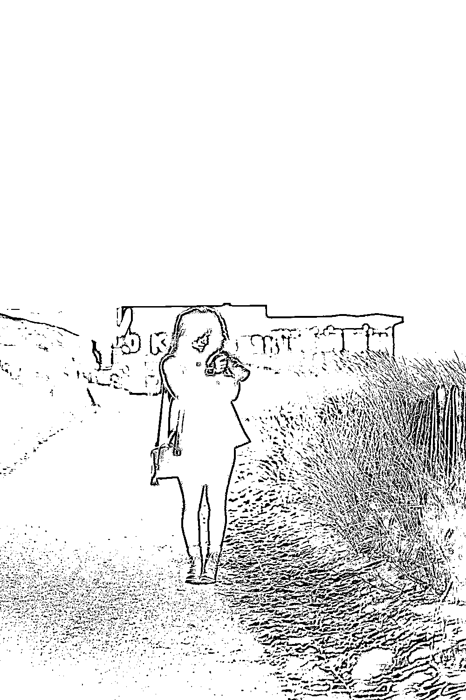

**正确表达双子座**我之前写的是赫拉克勒斯双子座考验的浓缩版。当然，如果它没有两个以上的版本也就不能称为双子座的故事了。更为完整、更常被讲述的版本，充满了行动、搏斗、荣耀和诡计。

正如大多数双子座的历险，故事是从**无知**开始的。赫拉克勒斯起先并不知道金苹果树在哪里，他必须**周游世界去收集信息**。开始，在爱撤克拉提德（Echedorus）河畔，基克洛斯（Cycnus）向赫拉克勒斯发起挑战；他们的搏斗持续了一整天，直到一道雷电将他们分开。到了下一条河，他诱使两个仙女告知了他海神涅柔斯（Nereus）住在哪里。涅柔斯善于变化形态，为了逃脱赫拉克勒斯，他变成了兔子、雌鹿、仙女、石头或是蛤蟆，但是赫拉克勒斯最终抓到了他，并紧紧捏住他，直到他说出守护金苹果的仙女在哪里。

赫拉克勒斯随后来到了利比亚，当时那儿由安泰（Antaeus）统治，他乐于强迫陌生人摔跤并杀死他们。赫拉克勒斯再次必须战斗，但他很快就打败了安泰。他发现对手的力量来自跟大地的接触，赫拉克勒斯抱住他，把他举起来，然后扭断了他的背。到了埃及，我们的英雄又遭遇了布西里斯（Busiris）的阻拦。曾有先知告诉过布西里斯，如果他每年献祭一名陌生人给神，他的庄稼就会丰收。布西里斯以献祭这名先知为开始，之后继续屠杀所有来到这里的陌生人。赫拉克勒斯被抓住带到了祭坛，但是他成功逃跑并且杀死了布西里斯。

赫拉克勒斯后来穿过高加索山脉，他发现了被绑在岩石上的普罗米修斯，有一只鹰不停啄食他的肝脏。赫拉克勒斯对这位给人类带来火种的泰坦巨人深表同情。他拿出弓，射死了鹰，然后达成了凯龙提出（代替普罗米修斯受罚）的协议。普罗米修斯出于感激将赫拉克勒斯带到了阿特拉斯（Atlas）身边，这个神被宙斯降罪用双肩支撑世界。普罗米修斯告诉赫拉克勒斯：“从他那里接过地球的重担，他就会帮你找来金苹果”。

阿特拉斯照做了，却不想再负起之前的重担了。他说：“我会把金苹果带回给国王的”。赫拉克勒斯假装说好，然后请求阿特拉斯再把世界举起一分钟好让他在肩膀上垫一个枕头。当阿特拉斯这样接过来之后，赫拉克勒斯夺过金苹果，逃走了。

多么累人的故事啊！在这里我们同样看到了双子座最好和最坏的部分。这个故事的曲折情节意味着**双子座必须经历和追求的多样体验**。这简直就是一本如何正确表达双子座的说明书。如果我们从故事的结尾往回看，我们看到最后赫拉克勒斯学会了遵守承诺，他可以站在一个地方将世界托在自己的肩膀上。这与前面脆弱的安泰大力士形成了鲜明对比，他一被举起来就失去力量，就像那**东奔西跑的双子座，无法安顿自己**。赫拉克勒斯射死老鹰的时候，他不仅证明了自己专注的能力，还证明了他能够在别人的剧本里扮演有用的角色。**双子座寻找的是知识的苹果，但它也是一个社交型星座，必须以有意义的方式融入世界**。我们的英雄也必须学会**避免分散精力**，比如他和基克洛斯无意义的战斗。当赫拉克勒斯抓住海神涅柔斯时，他展出了**毅力**，**从不断变化的形态中洞悉出了真相**。英雄**对抗诱骗和谎言**，终结了布西里斯的把戏。在漫长的旅途中，赫拉克勒斯学会了如何**清晰、灵活又机智地思考**，这让他面临最后的考验：**从一个不属于他的负担中挣脱出来。**赫拉克勒斯必须把托在肩上的世界还给阿特拉斯，正如一个双子座，他还有更多的历险和功课要去追寻。愿你这样对待你的双子座行星！

**版权声明：**本文由若道翻译发布，欢迎转发，反对抄袭。友号转载请申请白名单。


**也许你还想看下面的文章**

[白羊座](http://mp.weixin.qq.com/s?__biz=MzA5NjA0NTAxNg==&mid=2651412161&idx=1&sn=37ff27a685136be77b3d02086a4b8f0b&chksm=8b4be476bc3c6d6079b8592d14f1250d87401d0a8a28bc87f50a8f9fd253a52d9d5223c4ab12&scene=21#wechat_redirect) | [金牛座](http://mp.weixin.qq.com/s?__biz=MzA5NjA0NTAxNg==&mid=2651411945&idx=1&sn=6a74a4d7d15deb38d06a692ad4032ddd&chksm=8b4be75ebc3c6e4890b5034474c2894bd355bf26df5f0ad1c2fadae76f3de1d349a57de0471b&scene=21#wechat_redirect) | [巨蟹座](http://mp.weixin.qq.com/s?__biz=MzA5NjA0NTAxNg==&mid=2651412275&idx=1&sn=0c656c445089cb315649a1cc3af37001&chksm=8b4be584bc3c6c92e9bc689480a78b3e530fc125c6a3a1fdff0e60a587ffcd06723285712045&scene=21#wechat_redirect)

[狮子座](http://mp.weixin.qq.com/s?__biz=MzA5NjA0NTAxNg==&mid=2651412638&idx=1&sn=6459344d465d2d27485697dbea2f512f&chksm=8b4bea29bc3c633ffb401133040024eb261f07a3dde67f15e6ebb94ca4df49f8f7995ca6e707&scene=21#wechat_redirect) | [天秤座 | ](https://mp.weixin.qq.com/s?__biz=MzA5NjA0NTAxNg==&mid=2651410544&idx=1&sn=45b51d84210a84c8103c140df5a28229&chksm=8b4be2c7bc3c6bd1c86b8ffd8d8722efe3cfa1fc4b71e2cc8f71230218b8c73a7119d8a22745&token=428430174&lang=zh_CN&scene=21#wechat_redirect)[射手座](http://mp.weixin.qq.com/s?__biz=MzA5NjA0NTAxNg==&mid=2651411022&idx=1&sn=adf59f6eb38f2fd19ca975b4287168ea&chksm=8b4be0f9bc3c69ef250cafb4d517694bb952529461017c53da4d7ca120ed4ec0004161eccdb0&scene=21#wechat_redirect)

[水瓶座](http://mp.weixin.qq.com/s?__biz=MzA5NjA0NTAxNg==&mid=2651411498&idx=1&sn=25b8051c9c778065f9fffa37628c9950&chksm=8b4be69dbc3c6f8b94ee79ae682233634bcd0f32e8dce890672ea1bb4e5241a34cb59ebb3045&scene=21#wechat_redirect) | [双鱼座](http://mp.weixin.qq.com/s?__biz=MzA5NjA0NTAxNg==&mid=2651412587&idx=1&sn=88617fdd2660473de5eb7a48dd9d8807&chksm=8b4beadcbc3c63ca04427ddfde1ff118fbd1151ff24fad40cb97abcd3d2029c6e1c2bcb6657f&scene=21#wechat_redirect)

**达娜·格哈特**一位国际范围内受尊敬的占星师。她为众多占星学网站和出版物讲课、写稿。她在十二宫的月亮激励她对这颗发光体进行了深刻而持久的探索研究。

**点击图片查看若道君推荐**


**微信又双叒叕改版啦，不想错过若道君的推送？**

**就把若道设为星标吧！**

**▼**


就是这个“在看”，戳戳戳 ☟

********报名直达入口********


# 若道首次游学招募 | 2020 年，追寻阿兰·欧肯的巴厘岛神秘之旅

> 原文：[`mp.weixin.qq.com/s?__biz=MzA5NjA0NTAxNg==&mid=2651412684&idx=3&sn=95d7c82852d768248589ca6a45db7c4d&chksm=8b4bea7bbc3c636df21c385160683180d4f8915f0c17fff724205b4b14335de85eadc0edd5d2&scene=126&sessionid=1692738232#rd`](http://mp.weixin.qq.com/s?__biz=MzA5NjA0NTAxNg==&mid=2651412684&idx=3&sn=95d7c82852d768248589ca6a45db7c4d&chksm=8b4bea7bbc3c636df21c385160683180d4f8915f0c17fff724205b4b14335de85eadc0edd5d2&scene=126&sessionid=1692738232#rd)


出发这件事常常会令人想起电影《美食、祈祷与恋爱》中，巴厘岛的巫医 ketut 递给女主 Liz 一幅画，并赠予了解读：

要脚踏实地，你就会感觉有四条腿，你就能在这个世上安稳下来；还有，不要用脑子看待世界，要用心去看，那样你才会了解上帝。

世间有太多纷繁复杂的事情我们要分析整理，反而忘却如何遵从心灵的声音，比如为了爱其他人而让自己的生活失衡；比如收藏了所有国家地理杂志的旅行专栏，最后哪里也没有去。偶然听到心中真实的声音，嘈杂的人生又容易失去相信自己的勇气。

幸好这世界上还有**巴厘岛**。


|  电影《美食、祈祷与恋爱》巴厘岛剧照

巴厘岛人说：“我们就站在世界的中心，我们就是世界的中心。”巴厘岛是一个充满灵性色彩存在的岛屿，在这个 5620 平方公里的岛屿上，散布着大大小小千余座印度教神庙，印度教思想、大乘佛教、传统的湿婆崇拜与岛上淳朴的自然崇拜、祖先崇拜交织在一起。巴厘岛人相信万物有灵，他们的生活沉浸在浓厚的神秘氛围中，他们相信自己脚下的土地是世界上最美的国度，是“世界的中心”。这座岛屿在 21 世纪的现代生活中成为一个特别异类的存在。而阿兰·欧肯，这位 75 岁深耕占星学和神秘学领域的老师，在多年前离开美国，在世界各地旅行之后，为这个岛屿独特的人文和场域所深深吸引，最终选择在巴厘岛定居。虽然阿兰·欧肯老师以占星大师身份为广大占星学子所知，但其实他更有许多神秘的古老智慧、实用的宇宙法则愿意传承，这对于我们的意识进化之旅将带来绝对深刻的了解和体悟。
**5 月 3-13 日**，阿兰·欧肯老师邀请你来到他的定居地——巴厘岛，开启这次意义非凡的巴厘岛神秘之旅，内容包括**3 日半阿兰·欧肯老师的神秘学工作坊**和穿插于其中的阿兰·欧肯老师为大家精心挑选的**巴厘岛神庙之旅**，阿兰·欧肯老师将带领大家，在理论学习的基础上，接触、感受巴厘岛的神秘之处，深入接触、体验古老智慧。****


巴厘岛游学**1****位宇宙级导师****11 日 10 晚****游学，含**3 日半****工作坊****** “****心灵成长****+****文化探秘****+****生活美学****”****若道首团游学探秘之旅****一次性满足你的所有新年跨国愿望！**

📹 [`v.qq.com/iframe/preview.html?width=500&height=375&auto=0&vid=b3041y0qg4q`](https://v.qq.com/iframe/preview.html?width=500&height=375&auto=0&vid=b3041y0qg4q)

|  阿兰·欧肯老师的巴厘岛故事

1**工作坊主题****“觉醒的头脑和心灵的实际运用”——疗愈、合一和意识发展的****22****条法则和原理**本次工作坊，阿兰·欧肯老师将带领大家进入他数十年修行的智慧世界，探讨 22 条宇宙法则，并审视如何将这些原则应用在我们的日常生活中。**工作坊具体内容，请咨询课程顾问王老师（微信：18510107057）****注意****：本工作坊不是占星工作坊，对神秘学感兴趣，没有占星基础的朋友也可以参加。****游学全程领队导师是阿兰·欧肯，并配有最专业的中文翻译。**
2**具体日程安排****游学时间：2020 年 5 月 3 日-5 月 13 日****地点：印度尼西亚 巴厘岛**

*   ### 5 月 3 日 游学集合：入住巴厘岛乌布斯塔拉翠贡精选酒店 


*   ### 5 月 4 日 上午水神庙、Pacung 午餐、下午海神庙；**晚上在斯塔拉翠贡精选酒店集体晚餐**


| 水神庙

 


|  Pacung 午餐


|  海神庙

*   **5 月 5 日 上午半日工作坊学习，和阿兰·欧肯老师一起冥想；下午到圣泉——巴厘岛的神圣净化池**

 


*   **5 月 6 日  半日工作坊学习、自由活动**

*   **5 月 7 日  半日工作坊学习，游览象窟——巴厘岛唯一的石窟寺院遗址**


 

*   **5 月 8 日 巴图布兰寺、著名的荷花咖啡厅午餐、塔曼阿云寺**

 


*   **5 月 9 日  全天工作坊学习**

*   **5 月 10 日  前往努沙杜瓦酒店 **


*   **5 月 11 日  全天工作坊学习**

*   **5 月 12 日  海边自由活动，晚上巴厘舞蹈表演**

 


*   **5 月 13 日  前往机场回家 巴厘岛游学圆满结束**

3**适合人群**

*   占星老学员，是时候补给宇宙智慧的你

*   灵性爱好者，擅长获取各类宇宙能量的你

*   文化探迷人，有机会零距离体验异域神秘学文化的你

*   旅行达人，不错过任何一次伟大旅程的你

*   巴厘岛狂热迷，去过巴厘岛无数次的你

*   没有任何原因就是被吸引很想报名的你

**注****：****本次游学无需任何知识基础皆可报名**

4**游学费用**

*   **2020 年 1 月 20 日前付款：24800 元**
*   **2020 年 2 月 15 日前付款：25800 元**

**此游学价格为****整体报价，不拆分****。****注意**: **因为该游学需要安排酒店、交通事项较多，因此****一旦缴费后，不再退费**。


**费用说明**

**游学费用****包含**：

3 日半“觉醒的头脑和心灵的实际运用”工作坊学费

5 月 3-12 日的巴厘岛住宿费

游学中的大部分餐费

巴厘岛集体活动时的交通费

游学涉及的所有景点门票

5 月 12 日晚的舞蹈表演

境外旅行意外险

**游学费用****不包含**：

学员从国内往返巴厘岛的交通费

巴厘岛岛内自由活动的交通费

以下自由活动的餐费自理：5 月 3 日到达日午餐、5 月 6 日自由活动晚餐、5 月 8 日晚餐、5 月 10 日前往努沙杜瓦酒店的午餐、5 月 12 日海边自由活动的午餐

**住宿说明**：

乌布斯塔拉翠贡精选酒店豪华房 Deluxe room（5 月 3 日晚-5 月 9 日晚共 7 晚）和努沙杜瓦酒店豪华房 Deluxe room（5 月 10 日-12 日，共 3 晚），标准为 2 人一个房间


5**导师介绍**


**阿兰·欧肯（Alan Oken）**

 

世界顶尖占星师

智慧学院（Santa Fe, NM）主任

澳大利亚意识发展研究所的联合创始人

翻译、教师、全球旅行者和国际导游

阿兰·欧肯，1944 年出生于美国纽约，在纽约大学主修罗曼斯语言和语言学。出版过十几本著作，比如《灵魂占星学》《星图中的守护关系》《阿兰·欧肯完整占星学》。他用 5 种语言授课，用 7 种语言解读星图。

6**退转课程**

**因为该游学需要安排酒店、交通事项较多，因此****一旦缴费后，不再退费****。**

****巴厘岛游学****

**领队老师&工作坊授课老师：阿兰·欧肯**

**游学时间：**2020 年 5 月 3 日-13 日（共 11 日 10 晚）

**游学地点**：印度尼西亚 巴厘岛

**游学方式：**巴厘岛探秘之旅+3 日半工作坊，游学全程由阿兰·欧肯领队，并配有最专业的中文翻译。

**费用：**

**2020 年 1 月 20 日前付款：24800 元**

**2020 年 2 月 15 日前付款：25800 元**

**课程负责人：**王老师（微信：18510107057），请备注“巴厘岛”

长按二维码添加课程负责人咨询~


****报名请点击“阅读原文”****


# 2020 每月天象指南（上）| 为你详细解读，未来一年的重要天象

> 原文：[`mp.weixin.qq.com/s?__biz=MzA5NjA0NTAxNg==&mid=2651412676&idx=1&sn=8f4e1f193ff310fd272a0a01195b812e&chksm=8b4bea73bc3c63654fde9b34ef60e93da00fb5fd63ef37f62253933c787902593de3179a5853&scene=126&sessionid=1692738232#rd`](http://mp.weixin.qq.com/s?__biz=MzA5NjA0NTAxNg==&mid=2651412676&idx=1&sn=8f4e1f193ff310fd272a0a01195b812e&chksm=8b4bea73bc3c63654fde9b34ef60e93da00fb5fd63ef37f62253933c787902593de3179a5853&scene=126&sessionid=1692738232#rd)

**☆ 后台回复“今日”，给你一句生命态度**


作者/王珊珊 编辑/Tang  

封面/书君 图片/unsplash

2019 年过去了，我们将迎来了全新的一年。新一年的宇宙天气，会为我们预示着一个怎样的 2020 年呢？作者以“星座月”的历程纵观整个 2020 年，让我们更能感到“宇宙的逻辑性”，或者人类逻辑对“宇宙规律”的接近。本文分为上下两篇，先让我们来读读上篇吧。**回首 2019**

回首 2019 年，你是否有很多感慨？相信很多人都有些“难忘的经历”，是过往几年不曾发生的。而经历的难忘并不一定是指发生了多么“大不了”的命运事件，而是表现在心态的转折波动上，这种波动可能让有些人怀疑人生，可能让有些人感觉“看清真相”，也可能让有些人感觉到自己“人格/角色”的整合变化。

因为**2019 年天象最大的“特色”在于一些重要的外行星同时发生换座变化**，我们是从木星天蝎座&天王星白羊座之水火元素当道的“任性派”，直接来到了木星射手座&天王星金牛座之火土元素做主的“务实派”，配合土冥摩羯座的大背景，这着实会带给我们一阵“**降落沉底、重置方向**”的感觉，挣扎于事无补。好在，一番上半年的“波澜洗礼”之后，在下半年很多人都有了“**淡定迎**合”的状态回归，并看到了在心态、姿态与方向转变后的个人成长和现实成就。在年底我们“提前感受”了木星进入摩羯座的换座，已经“坦然”很多。所以**天象的变化本身的影响是客观的、没有好坏之分的，但是对于“来不及正视”这种转变趋势而没有做任何心理准备的人来说，才会变成一种“意外惊吓”。**

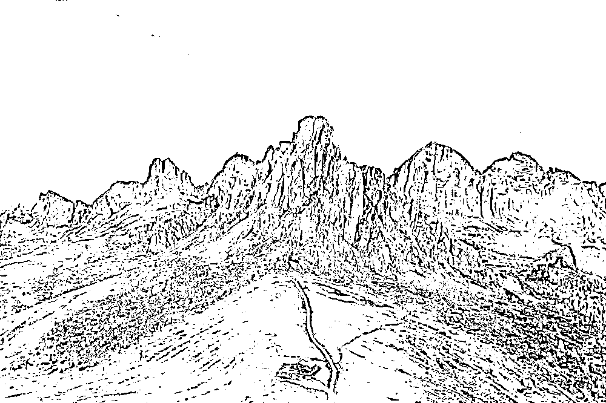

**2020 年整体运势概况**

那么 2020 年，需要我们提前了解、做准备的天象又是怎样的呢？如何看待和利用，才能让它成为对我们更远未来的“加持”和“铺垫”？

首先整体而言，从 2019 年的 12 月初木星进入摩羯座（此时木土天冥都在土元素），配合太阳水星在射手座为这个木星的“变调”加油助威，已为我们步下 2020 年的“基调”：**对于希望与机运的现实确定感，对于成长和成就的主动向往心，对于务实精神的乐观与行动力**，等等。土元素被如此加强，看似有着沉重氛围和现实压力，但这却是一份“**自愿承担**”的责任与梦想，反而带给我们笃定、踏实与勤恳的意愿和行动力。这一年还会在**3-7 月份经历短期的土星进入水瓶座**，就好像我们这边正埋头务实推进着生活和工作任务，那边忽然“开启天窗”给我们看到“外面的世界真精彩”，或者“新的规则模式该如何适应？”——这个重要的短期换座，等于是给我们一个机会**提前感受“未来远景”**：那里到底有什么可能性？我现在的忙碌是为了未来的哪样自由？我遵循社会规则、并积累了这样那样的经验实力，那么将可能带来什么样的社会和群体的影响力？我辛苦而努力，最终为自己创造了怎样的生活方式？这是否符合社会主流、是否可以获得资源支持？或者我们所“受制于”的种种规则限制，最终只是为了让世界井然有序、让我们规规矩矩，还是汇集一个矩阵之力的“量变”来达到某种不可思议的“质变”？……所以，很可能有些人已经提前感觉到那个“新颖而绽放”的存在形式了。这让我们可以提前了解到：**我们当前要沉住气继续务实努力的“原因”可能不只是成为社会权威、项目权威、生存强者、证明自我，未来我们还将对这个社会的结构调整产生影响，对社会道义的实行产生推动，以及看到我们自身在社会生活中“主人翁”的价值和身份**。而那个“未来”就在 2020 年的 12 月份，木土双双进入水瓶座并合相的时期，正式开启……

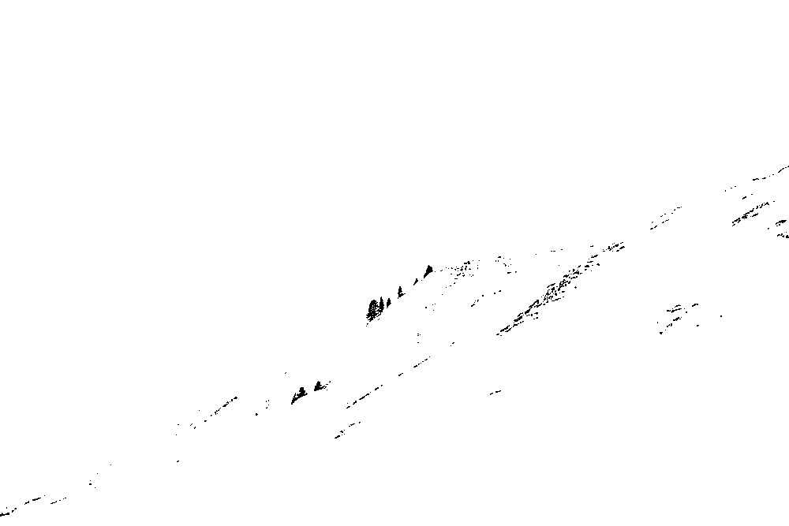

**2020 年每月天象攻略**

那么具体到每个月，又会分别是什么样的节奏和频率呢？让我们来一一参考吧。

注意：由于行星运作，一个星座月的开始，可能与上一个星座月的结束发生在同一天。因此如果上一个星座月为 a 星座月，然后当太阳在 x 日 xx:xx 进入 b 星座时，x 日当天 xx:xx 之前仍为 a 星座月，该时间开始后则为 b 星座月。

**摩羯月 ****2019.12.22～2020.1.20**

**2019 年 12 月 22 日 12:19 太阳进入摩羯座**

我们的阳历新年对应着摩羯座的月份，多少会意味着某种“年终总结”式的严肃感与大局感。这个时期我们在回顾过去与展望未来中，将更深地意识到摩羯座主题带给我们的**“当前客观处境到底是什么”？我们背负的责任与压力、以及对成就感的热情动力都有哪些？**

摩羯月的重心，会让我们想要去梳理一下自己的生存空间有多大，包括优势劣势在哪里；我们在单位同事中的生活比对，以及与家人朋友们聚会时不能不注意到的成就感、人生阶段和重心的变化在哪里等等，也是一个“几人欢喜几人愁”的时期。

而这一年的“新旧过渡”，是**以太阳合木星在摩羯座，并三分金牛座的天王星为特别征象的，带上土星合冥王星的大背景**——可能本月我们更看重**“生活空间”和“生活理念”的实现**：我们是否在自己选择的生活里过得很好？或我们放弃了的那些部分是否带给我们遗憾、失落和挫败？

**1 月 11 日的巨蟹座满月，伴随着与金星互容的天王星恢复顺行，以及火星进入射手座**——意味着一个新的**“旧阶段落定/新阶段起航”**的时期到来。我们可能变得更热衷于参与社会事务、与朋友同事们相聚、与家人们相伴等等，并在其中获取到与个人发展规划相关的重要讯息。某些“关系牵连”的复杂集体性事务也开始被推进发生。同时，这时期可能有很多戏剧化的变化，包括计划不断被打乱重改等，可能会需要我们有更大的心胸远见，去包容和处理它。1 月中旬以后**金星进入双鱼座**，这将给我们带来一段和谐欢乐的人情氛围。

总之，这是一个**需要我们像个主人翁一样去照顾社会责任的方方面面的时期**。

**水瓶月 ****2020.1.20～2.19**

**2020 年 1 月 20 日 22:54 太阳进入水瓶座**

当太阳在 1 月下旬来到自己的“落陷”位置水瓶座，这可被比喻为某种“心灵的寒冬”，即太阳所代表的对生命原初的热情和接受性，在此可能转变为对某些事**“不由分说的抗拒”**和**“叛逆感”**，以及“不顾一切的追求”和“手段性”等，但我们也乐于表现出这一面，因为这是**“存在自由”**的一部分。

这时期**在水瓶座的太阳、水星，同时被金牛座的天王星四分相接纳，并被金星双鱼座定位**——我们可能会对自身生活环境或感官舒适方面发生不满，或被人际关系中的小失衡而变得敏感受委屈或轻易“炸毛”，或我们无理性地进行一些花费和支出而不顾收入限制，或者我们即时性地参与某些兴趣社团——这些都只为了达到我们想要的“心满意足/心灵充实”，换句话说，这也是**通过一些外在形式来寻求发声，继而来到内在疗愈的时期**。

表现在社会事务上，则可能有些利益纷争、经济与人情的分割问题等。也会有一些科技创新带来的“新鲜”生活方式浮出水面，在争议中等待被大众接受等事件。

1 月底到 2 月初，**金海双鱼座与火星的四分相**，可能多少带给我们迷茫与妥协兼有的“搁置摸索”状态。**此时太阳与木星、水星皆为空相**，意味着更少的外在限制和更多的个人自由去选择，但也意味着某种推动力的缺失使得我们又不易快速决断。尤其对于已经投入已久的项目、公司机构，可能部分人会对自己所进入的轨道发生怀疑。

直到接近 2 月中旬**金星进入白羊座**，则一下子带来心态的振奋与励志感，人际关系也变得积极活跃。此时期可以平衡和振作一下之前的“放任”状态，但也要注意避免“气焰”过高，或对任务和计划的过高估计，而导致失算落空。

总之，这是需要**我们更换视角、活化自己的立场、多方观察和调整自己的处理方式和方向的时期**。

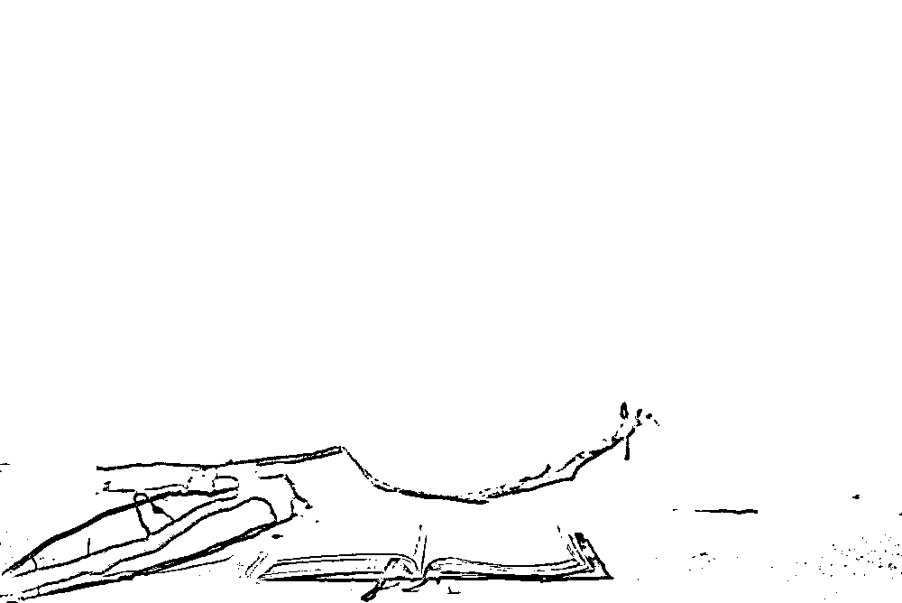

**双鱼月 ****2020.2.19～3.20**

**2020 年 2 月 19 日 12:56 太阳进入双鱼座**

双鱼月将我们从“失控”与“波动”中带出来，**回归宁静平和，感受整体“大象”之和谐，以及关注到世俗事务背后的内在精神意义**。

**2 月 23 日的双鱼座新月，太阳与月亮、水星、海王星联合，并与摩羯座的火星、金牛座的天王星成精准小三角。同时，水星也会从水瓶座逆行到双鱼座。**这给我们带来对于社会公众事务、个人生存安定或事业发展历程的一个观察和整顿，同时也会直接感受到，这些外在事务带给我们对内在意义的“认知偏差”：到底什么在决定我们的价值，我们是谁？以及我们的外在成就，或物质收入，真的会影响我们的内在宁静和丰盛吗？

此时期社会上也可能会出现一波与心理、宗教等有关的组织或学习风潮，以及或有一些小企业之间的组织联合。基本局面上来说，是人们会看到感性的精神生活与理性的物质建设之间不可忽视的关系。尤其到 3 月上旬后金星来到入庙的金牛座与天王星合相，让我们对于理想生活实现中的更具体的“物质创造/感官保养”会更有明确追求与行动。

总之，这是一个**可以适当安心地回馈、润泽和照顾我们身心健康的时期**。

**白羊月 ****2020.3.20～4.19**

**2020 年 3 月 20 日 11:49 太阳进入白羊座**

白羊月是**关于我们的力量与斗志彰显之月份，此时期火星是主角**。

**而随着太阳进入白羊座，火星也分别与木星、冥王星准确合相在摩羯座，并三分金星金牛座，同时土星也终于走完摩羯座的尾声来到了水瓶座**——这是一个变化非常显著的时期，可能没有哪个时期比现在更让我们“愿意”积极地完成工作、以及关心集体事务发展（这个集体可能是家庭、公司、社区、国家、民族）并参与其中事务决策的。

土星作为定位星，好比我们的斗志刚刚冲出“重围”、身心积累了足够的火力，土星这个“首领”带着这份支持，率先到水瓶座这个新世界“考察和观望”去了！

为机构服务的人们可能会感受到一种“集体凝聚力量，然后集体分享成果、承担结果”的团结、捆绑的氛围，其他人则可能在某些项目里找到了更大的市场以及更复杂的连带运作任务，或者在独立运作的小圈子里忽然开启扩展人脉模式并需要对更多人负责，等等。以及社会上可能有大小企业的解构重组、强强联手等变动，引起一些风波反应，并牵连到部分小众群体的生存利益。

这样的征象持续到 4 月上旬，**木冥精准合相，火星进入水瓶座与土星合相，金星进入双子座与水星发生互容**。可能表现为某种自由联合的“新商业模式”，或社区化的生活方式和理念被接受和认可。这时期对于“科技/智能化生活方式”的推进也带来“百花齐放”的局面，并给到人们畅所欲言地交流和表态的积极性。

总之，这是一个**积极推进社会规则的改变，并在集体中表现存在感的时期**。

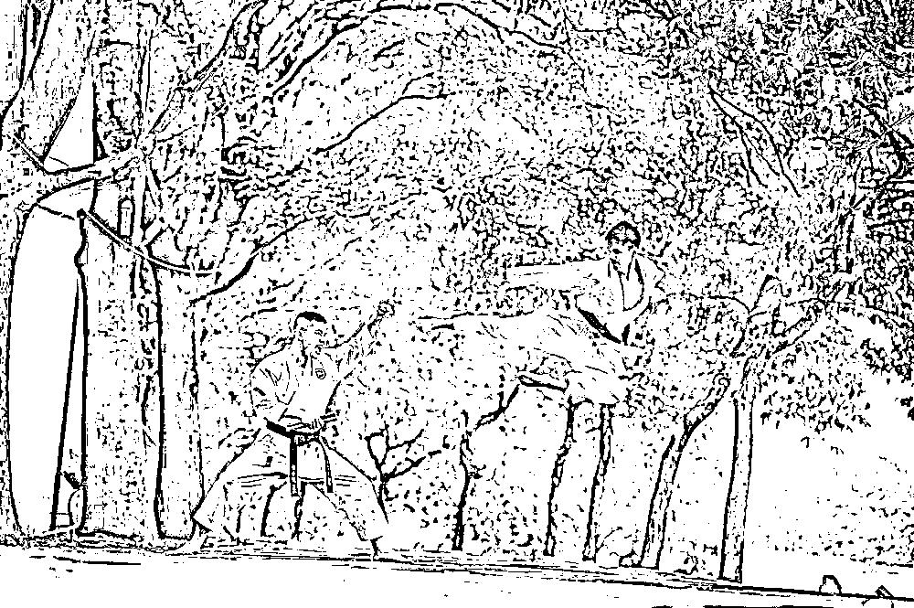

**金牛月 ****2020.4.19～5.20**

**2020 年 4 月 19 日 22:45 太阳进入金牛座**

当太阳来到金牛座，我们将**更多关注到与自己亲身感受相关的生活满足感问题、健康问题、是否得到相应资本匹配的价值问题等**。

而此时**金星在双子座**，我们会关心自己的声音是否被听到、理念是否得到重视，自己的某些计划是否有效可行等。**同时太阳联合天王星，与土星发生四分相。**意味着社会上某些规则制度的变化，会被我们重新检视和筛选。人们可能依然保持参与对生活方式和商业模式改变的热情，只是用一种“受用/不受用”的方式，在这时期对某些产品服务进行“推崇”与“淘汰”的动作。而作为商业主体者本身则经历着一轮“投入或牺牲成本来试水”的过程。这时期也带给我们对整体氛围可能既有积极任性和直言不讳，又有无奈和不爽的固执感。

至 5 月中旬，**土星在水瓶座逆行，同时金星在双子座逆行**，社会上某些领域刚刚“兴起”的一番热潮可能遭遇否定和创伤，而我们对某些价值理念的推崇也可能发生态度立场的回转。在未来两个月里，对于某个领域的“新风潮/新模式”的变化可能需要照顾到新旧模式的过渡和适应，而不得不进行调整与反思，并可能夹带着众多的交流与商议。

总之，这是一个**尊重自己的真实价值选择和感官体验，并敢于直言表达的时期**。

**双子月 ****2020.5.20～6.21**

**2020 年 5 月 20 日 21:49 太阳进入双子座**

太阳进入双子座，迎合着同在风元素的土星与金星、水星，可能带给我们一段**“心智活跃、放松娱乐”的时期**。

此时期我们的“行动力”更多地表现在人际关系的交流互动、奔波访问中。我们会更有表达欲望、与身边人互通消息或互相学习的冲动、对获得新知识的渴望，以及对新的关系模式的勇于尝试等等。总之，随着**水星进入巨蟹座**，资讯、语言与陪伴式的关系，都会带给我们想要的心理与生理双重的满足感。这是一个很容易“激活”人们到处走动的时期，人际的往来联络将帮助补充我们需要的能量。尤其在 5 月 23 日的双子座新月，6 月 6 日的射手座满月，都帮助我们意识到交流与倾听、在摩擦中释放观点与调整战略的重要性。

同时 6 月 5 日，**北交点从巨蟹座退回到双子座（并持续一年半）**，也会带来社会上一个整体氛围的变化：从之前的保守担忧与渴望人情拥护，变为开放探索和勇于尝试。

至 6 月 18 日**水星在巨蟹座发生逆行**，如果我们曾受到各种声音的影响而开始质疑自己是要追求独立开放还是追求保守稳定，那么这时期也可以说是让我们发生方向转变的过渡阶段。

总之，这是一个**需要灵活倾听并及时调整自己的观点、计划和决策的时期**。

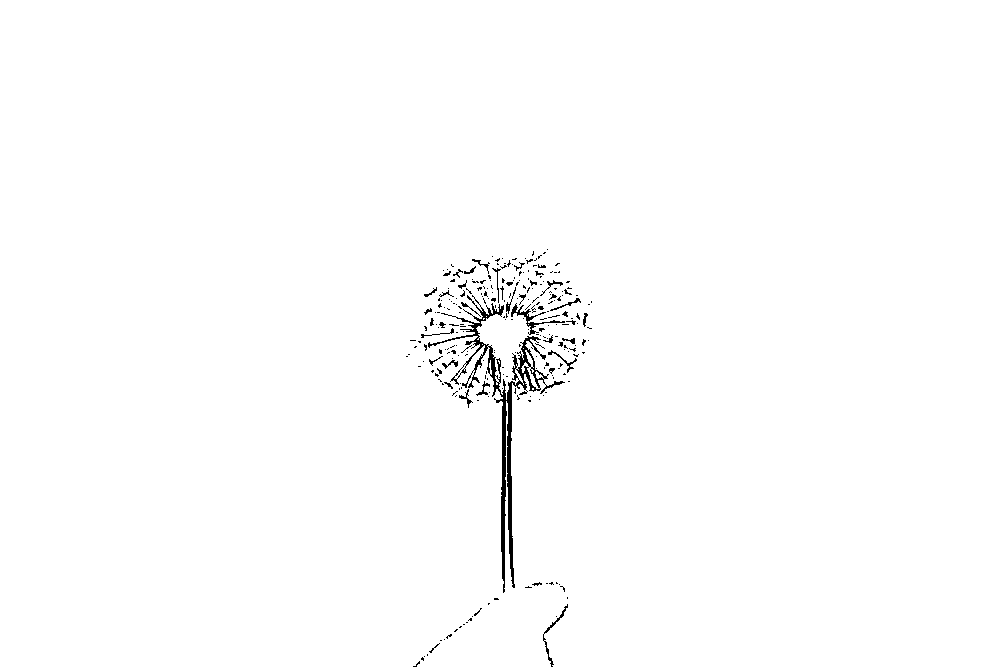

**巨蟹月 ****2020.6.21～7.22**

**2020 年 6 月 21 日 14:41 太阳进入巨蟹座**

当太阳来到巨蟹座，**意味着我们要关心自己的“根系”是否足够健康茁壮**。

这个**巨蟹月以 6 月 21 日的巨蟹座日食为开启，同时四分海王星**，让我们看到情绪情感的凸显、以及内在踏实、居家环境的舒适和安全感等的重要性如何被着重考量。火星也来到白羊座，“刺激”着巨蟹座的群星。6 月 25 日金星在双子座恢复顺行，我们终于不被“眼花缭乱”的信息和诱惑所干扰，而放开心去“爱我所爱”。

换句话说，这个节奏让我们从“求滋养/求安稳”的本能出发，而不惜创造更多的奔波与变动。那些之前没有让你妥帖安心的事情和方法，这时期可能会在折腾中被修正。

7 月 2 日**土星再次退回到摩羯座，同时太阳、水星六分天王星，并接着对分摩羯座的木星、冥王、土星，水星也于 7 月 12 日在巨蟹座恢复顺行**。之前的一段“小绽放之心”可能被快速收回。如同瞥见了更大律则，那么回来带着清醒与明晰来重新校正我们的道路方向、节奏方法。这时的摩羯座力量，像是变成了“擦亮眼睛、打开心胸”。而我们也再次“被提醒”工作的意义是什么？远方是什么？求生存的能力发展最后要收获到什么？物质如何真正给我们带来安全感、幸福感？还是我们需要把这份安全感、幸福感的心意品质去“赋予/赐予”到物质的呈现上？……

7 月 21 日的巨蟹座新月，**日月紧密对分摩羯座的木星、冥王、土星，同时火星四分水星，六分金星……**这是一段既艰难又充实的时光，社会上可能又会出现一波家庭、家国之分离与守护问题的新闻剧。而我们将在情感与责任的“夹缝”中看到自己的“能量/心量”有多大，可以走多远，走到哪里可以感到满足并适当鼓励奖赏一下自己。

总之，这是一个**关注幸福感的重要性，因此不惜去探索尝试各种努力方法的时期**。

**（未完待续，下篇请看今日二条）**

**版权声明：**原创文章由作者授权在若道平台首发，欢迎转发，反对抄袭。友号转载请申请白名单。

**关于 2020 年年度运势，你可能还想知道**

[图解 2020 年重大天象及趋势](http://mp.weixin.qq.com/s?__biz=MzA5NjA0NTAxNg==&mid=2651412428&idx=1&sn=32bf652b3853c9aeae69ee9fed1a9bb4&chksm=8b4be57bbc3c6c6d197123ecaaa6290eaa3a6450bd386df76c8ec3bb924ee61cc7ee98233313&scene=21#wechat_redirect)

[2020 年天象意向](http://mp.weixin.qq.com/s?__biz=MzA5NjA0NTAxNg==&mid=2651412566&idx=1&sn=ba71bd85e67a9742fe9a76b2626634a8&chksm=8b4beae1bc3c63f71b58c70327e32874483a79a0b5aff0e62a2f02541acf0c32ae1af76c66c5&scene=21#wechat_redirect)[](http://mp.weixin.qq.com/s?__biz=MzA5NjA0NTAxNg==&mid=2651412566&idx=1&sn=ba71bd85e67a9742fe9a76b2626634a8&chksm=8b4beae1bc3c63f71b58c70327e32874483a79a0b5aff0e62a2f02541acf0c32ae1af76c66c5&scene=21#wechat_redirect)

[12 星座 2020 年度功课大揭秘](http://mp.weixin.qq.com/s?__biz=MzA5NjA0NTAxNg==&mid=2651412604&idx=1&sn=387a944dad92bec0a0c006b206dbc6b3&chksm=8b4beacbbc3c63ddae153bc2f147baf2d6a8a50b4bf052835f2742f72ef635922d5be6bf232b&scene=21#wechat_redirect)


**王珊珊**

全职占星/塔罗咨询师

《星途》《心探索》专栏作者

2013 年至今咨询个案已累计超过 2000 小时

**咨询微信号**：622005740（添加注明“咨询”）

**微信公众号**：xiaoshu_astro

长按打赏

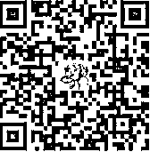

**2020 到来之际，为自己和重要的人**

****送上一份暖心的新年****大礼吧****

******由**大卫·瑞雷****亲自主笔的**《**2020 年度运势报告》****

****将是一份尤为特别的****

☞[**新年礼物**](http://mp.weixin.qq.com/s?__biz=MzA5NjA0NTAxNg==&mid=2651412428&idx=2&sn=c7ac1a6bdc53a8bbf62ff4511308629a&chksm=8b4be57bbc3c6c6d69a1beb7f84b72f1e2607071c069efa13310c7983475522ea3a31de4458e&scene=21#wechat_redirect)☜

**点击下图了解详情**

**☟**


******点击图片查看若道君推荐******


**微信又双叒叕改版啦，不想错过若道君的推送？**

**就把若道设为星标吧！**

**▼**


就是这个“在看”，戳戳戳 ☟

**年运报告购买入口**


# 2020 每月天象指南（下）| 有一个月，教会我们“爱拼才会赢”

> 原文：[`mp.weixin.qq.com/s?__biz=MzA5NjA0NTAxNg==&mid=2651412676&idx=2&sn=849a5507522633173b61e5401540190d&chksm=8b4bea73bc3c636570f143040d44b4819282c5fd4bfc3407fb5a7a85da5f311033748d29af59&scene=126&sessionid=1692738232#rd`](http://mp.weixin.qq.com/s?__biz=MzA5NjA0NTAxNg==&mid=2651412676&idx=2&sn=849a5507522633173b61e5401540190d&chksm=8b4bea73bc3c636570f143040d44b4819282c5fd4bfc3407fb5a7a85da5f311033748d29af59&scene=126&sessionid=1692738232#rd)

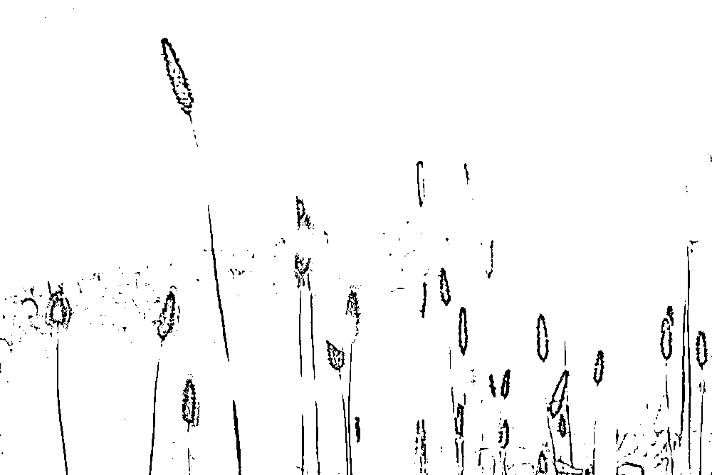
作者/王珊珊 编辑/Tang 图片/unsplash**2020 年月度天象指南**

**狮子月 ****2020.7.22～8.22**

**2020 年 7 月 22 日 16:36 太阳进入狮子座**

**狮子月是关于游戏和热情的主题，仿佛一下子世间所有的事都变成了我们的游戏场，我们除了无条件去接纳、去爱与享受，没有其他的情绪想法。**

刚刚进入狮子座的太阳会“孤零零”地运行一周，然后在 7 月 31 日**与天王星形成四分相**。一个冷静而独立的主题：做自己，表达已有的光彩，看到有待开发的价值。此时期**入庙的太阳、火星、土星、海王星**是我们的“主角”，自信与谦卑、豁达与谨慎将同时并存——为我们“对生命热情的有效疏导”而服务。所以，这时期在工作岗位上，你可以将那些平时繁琐无趣的事情，改变方式、更富有创意地来做。你也可以在业余找到一些兴趣和技能来培养。如果你向往出国、远行，或者某个学术资历，那么尽管在这个月里去行动、去出发。

8 月 15 日，天王星再次在金牛座逆行（至 2021 年的 1 月 14 日）。8 月 19 日，狮子座新月合相水星并三分火星，与双子座的北交点形成准确的小三角格局，天王星被巨蟹座的金星接纳。这提醒着我们对于玩乐和分享的重要性。也许你可以组织一些饭局，或者朋友之间简单的小沙龙，你也可以把工作上的事情拿出来“组局”探讨，等等。

总之，**这时期我们会感受到让自己拥有简单而活跃的社交生活，给自己放松娱乐的表现舞台的重要性**。

**处女月 ****2020.8.22～9.22**

**2020 年 8 月 22 日 23:44 太阳进入处女座**

处女月是**关于如何将我们充满热情的整个生命，投入到更大的“天道秩序/任务”中去的主题**。

**水星和太阳陆续进入处女座，并三分金牛座的天王星**。会帮我们意识到这一点：我可以是谁，我应该是谁？我目前最适合站在什么位置，提供什么功能/服务，做好什么样的事？以及我可以争取和获得的资源是什么？……

虽然处女座特质总是让人联想到操劳、忙碌，但其实它也是“最省心省力”的一个位置，因为在这里你感觉“一切被安排好了”，所有投入的意义功德，因果分明，在天然的秩序中一切健康运作。你只需要聆听这个“秩序本身”是什么，然后按部就班去做。被天王星影响，这个“秩序”可能需要我们灵活地“开采/重置”生活中的资源分配、包括心力和精力的分配。那些不适用的工作方式、多余或过期的资源，可以舍弃和更新一下。同时那些超出你能力范围的、与你工作节奏不配合的、不符合价值取向的事，也都可以提出需求、抗议，做出调整。

8 月底至 9 月初，**会有水星三分摩羯座的群星，并对分双鱼座的海王星，三者与金星形成“信封”格局**。在四平八稳中，会让我们非常清晰于“当前被架构（捆绑）在一个什么位置”，以及“为了什么样的功劳和意义”。也意味着这段时期的某些事是必须身在其中，保持忙碌而有序地运作，你既辛苦却又安心和甘心于这样的任务使命。社会上也或有一些符合民意、众望所归的机构重组改革、基础建设等的项目报告发出。

9 月 10 日，**火星在白羊座的尾度发生逆行，持续到 11 月 14 日。同时太阳对分海王星**。前段时间我们如果有一些激进的思想和行为，这时期可能会经历一个“急刹车”。某些感觉还顺利的事忽然缺乏动力进行下去，或者本来作为关键人物、关键角色参与其中的，忽然发挥失常或者缺席了。在劳动、运动方面，也可能发生“过劳/过动”的健康意外的问题。社会上或有一些个人转型、公司转型类的事件频出。

9 月 17 日至下旬，**水星分别四分木星、冥王、土星，并与火星对分，形成基本宫的 T 三角**。某些“个人与集体的关系”、“牺牲与奉献的意义”类的话题思考可能被提上台面。

总之，这个时期让我们注意到：**如何“量力而为”地使用自己的心力体力？如何重新合理地安排规划事情进行的节奏、步骤？**

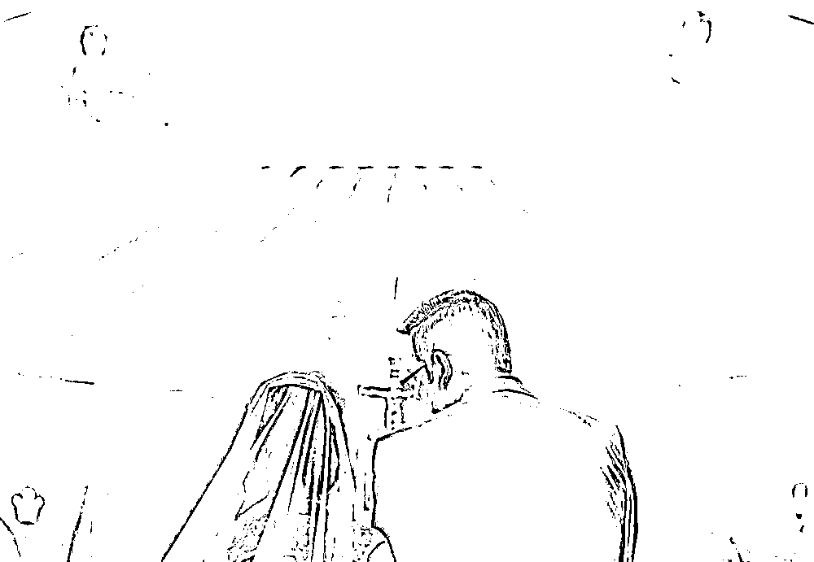

**天秤月 ****2020.9.22～10.23**

**2020 年 9 月 22 日 21:30 太阳进入天秤座**

天秤月是**关于“进入一个均衡自在的立场、角色、位置”的主题**。

太阳在天秤座是失势的位置，意味着我们开始更看重合适的“立场、位置、关系”的寻求，而非对个人主义的坚持。以及经历了对“天道秩序”的安排，开始参与对外界环境的主动反应。

9 月 29 日**土星在摩羯座恢复顺行**，大环境的改进、大项目的推进，再次被加快。而**太阳在天秤座“孤零零”的运行前几度之后，于 10 月 2 日的白羊座满月**，引起我们对人际关系和环境干扰方面的注意，可谓：心中有丘壑，平地起惊雷。此时期“提醒着”我们可以调动我们的热情和行动去“随时”争取或者抗争，而不带一丝刻意和犹豫。也可以在“万事缠身”中，享受一份“四平八稳/被架空”的宁静和平衡。当然，在现实人际关系上也可能会有“抓不着线索/缺乏吸引力”的情况。

直至 10 月 7 日往后，**太阳与火星分别四分摩羯座的木土冥并形成 T 三角，水星天蝎对分金牛座的天王星**——某种隐藏的意见和不公终于忍耐不住，可能以不寻常的方式提出来，或者于暗中幕后去悄悄表达需求。而受到摩羯座群星的影响，“要表达出来”的决心却是一定的。

而 10 月 14 日，**金星、水星即将形成六分相之际，水星开始在天蝎座发生逆行（至 11 月 4 日），然后 10 月 17 日的天秤座新月与逆行的火星成精准对分相，同时金星对分海王星**——忽然的各种矛盾与对峙出现，可能带给我们强大“刺激”。这时在“如何表达问题、如何处理问题、如何对待我们提供的价值、如何提出需求”方面，我们可能再次受到挑战。会质疑这份“勇于说出需求/道出真相”的勇气是会不会过于冒头了呢？或者我们勇于去发现的“幕后真相”，是否使我们安全受影响？过程中是否会发生一些伤害？是否有对自己或者其他人的一些不公正？……而此时“大局”与“重心”又是什么，需要我们怎么做？

但此种境况，却正是我们发挥“天秤座本性”的时候：**时刻秉持内外在的客观，伺机而动，不畏强权，亦不妥协于自身弱点**。

总之，这是一个**通过敏锐的观察与行动，来帮我们分解一部分“压力重任”的时期**。

**天蝎月 ****2020.10.23～11.22**

**2020 年 10 月 23 日 06:59 太阳进入天蝎座**

天蝎月是**关于“对核心生命能量的调动、对个人存在意志的深入”的主题，其过程充满了探索和冒险、转化与突破、极限与重生等**。

**太阳与逆行的水星进入天蝎座，并与天王星对分**，这时期的我们似乎在拿出全部注意力来看到自己生命中“关键环节”的失衡残缺或不足，对自己带来的威慑影响。可能社会上某些人会经历被淘汰、被排挤，或者爆发极端手段来挽回艰难局面的问题。随着 10 月底**水星、金星来到天秤座**，某种我们可以理解的“身份/处境”的平衡与合理性，多少缓解了我们对成就不足之处的焦虑。对于当前或坏或好的境况，我们只能忍耐或珍惜。

10 月 31 日的**金牛座满月，太阳对面的月亮与天王星准确合相，逐渐恢复顺行的水星也在天秤座与摩羯座群星形成四分相**——这似乎是一个“特定的宇宙时间”来让我们看到自己“为了生活资源/关系的维持，所有可用的赌注”，换句话也可以说“我们在有限的资本下，尽最大力可以争取到什么”或者“那个触及危机或诱惑的底线在哪里，要不要去突破？”

而到 11 月中旬，**金星与火星对分，太阳与海王星三分，并与木星、冥王星、土星六分相**，**以及火星在 11 月 14 日恢复顺行**——某种“公正而和谐”的现实征象使得我们看到，一份当前尚拥有的成就、可期待的梦想、能发出的行动力，或可“安抚”过往的一些激烈变动，让我们再次拥有平和与淡定的同时也保有着“从未缺失的内在激情”。**11 月 15 日的天蝎座新月，日月与海王星依然保持三分相，并与摩羯座群星六分相**，这意味着我们可以保持清醒和“自愿”地去追随我们的目标、意愿，并估算可投入的精力、资本，或可承担的代价。

总之，这是一个在**环境的压力中意识到“爱拼才会赢、爱拼不怕输”的时期**。

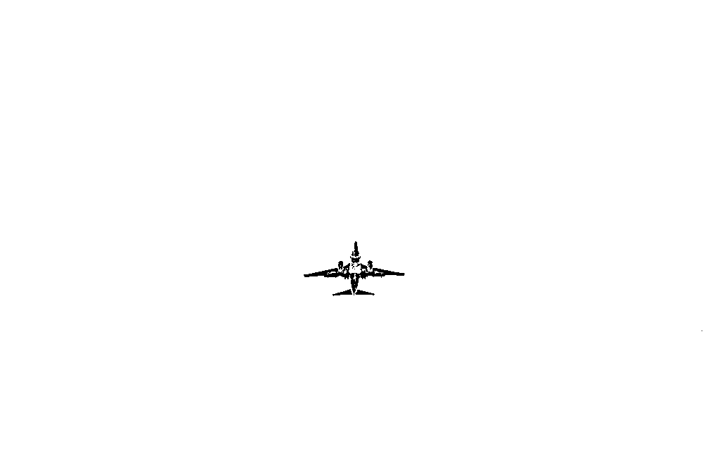

**射手月 ****2020.11.22～12.21**

**2020 年 11 月 22 日 04:39 太阳进入射手座**

射手月是**关于我们将自己的一腔热血和愿心，投入到怎样的“远方”，并以此来升级我们的视野和经验的主题**。

11 月下旬，**伴随着水星在天蝎座三分双鱼座的海王星，金星在天蝎座与天王星对分**，我们的太阳射手座更会为我们带来“对残酷现实”的积极乐观的态度。所谓的残酷并不是真的残酷，而是一种由我们的生存意志强度，与冷酷现实之间所对峙出来的一股强大的“张力”，考验着我们的理想信念之品质。

11 月 30 日的双子座月食，则让我们用更实际有效的“方式方法”去支持这份理想和信念。**受水星天蝎座的影响**，此时期我们可能发现某些“路数”是不被承认的，或者是顶着压力的，或者是受制于人的。总之，一种“虽在不自由的受限中，但这里依然有我需要的理想和远方”。也可能有人会在这个时期，于盲目乐观中“顶风作案”而付出过高的代价。

随着 12 月份**水星进入射手座，接近太阳并与火星发生三分相、与海王星四分相，金星在天蝎座与冥王星、木星、土星形成六分相**：我们的志向更为明朗，梦想与现实之落差给我们带来的“刺激”也更为“不讲道理”，可能既有振奋人心，又有扼腕叹息，可能一下子想要环游世界，又有各种对环境和文明的忧心…… 好像总有哪些环节是我们还可以再拼一把，再尝试闯一闯，或去亲自改善的。当然，这个时期我们会看到自己的“力量”本身，它的积累会需要那么多外在鼓舞和个人的主动创造。不但要发出有效行动，更要意识的提升。

**直到 12 月 17 日土星再次（并正式）进入水瓶座，并在 12 月 22 日与木星合相，此时期土星、天王星、金星、木星之间循环定位。土星、天王星是关于物质世界的规则法则，而金星、木星是关于对和谐美善与自由的向往。**于是一扇新世界的大门徐徐打开，可能带来这些讯息：我们确实关心自己，同时也关心人类，关心集体生活，关心科技的进步，并愈发体验到自我与集体之间的互为一体性……

**我们之前围绕自身的物质成就和生活安稳所做的许多努力，在年终的此时也更加豁然开朗**：怎样的方式是“共生共赢”的？水瓶座代表的关于人道主义、民主、自由、科技、创新等熟悉的口号，可以如何来实现？我们换来的自由，有多少弹性空间？可以继而去自由发挥、实现什么样的“凡人梦想”？……

总之，这是一个**因为坚持梦想而真的看到“前方大道”的时期**。

**摩羯月 ****2020.12.21～2021.1.20**

**2020 年 12 月 21 日 18:02 太阳进入摩羯座**

再次来到摩羯月，一份凝重的**“年终考核总结”**又被摆在面前：面对旧事务、旧规则和理念的被更替，我们应该学到的教训和避免的误区是什么？面对木土水瓶座时代的新课题，我们眼前的任务又是什么？我们如何认识并运用可发挥才干的空间，又如何让自己的影响力显得更为正面、更被大众所接受？如何能够获得某个群体的响应，继而得到可用的资源？……

**此时太阳、水星正与天王星形成友好三分相，火星还在精准四分冥王星，木星土星则在水瓶座“并肩作战”。**我们在一个行星之间循环定位的能量场里，可能感受到“事情”的复杂性，以及少量的焦虑：此时期或有一些人事还处于“绝对掌控”状态，而我们自己的才华难以发挥；或者我们自己还有某些资源、特权在紧抓着，但外面的“共享规则”眼看已经不再有我们的“专属地位”，而是更多周边的“花样竞争力”。总之，某种“固着”和某种“开放”同时形成了剧变的可能性，我们只能“时刻准备着”迎接机会和挑战。

**2020 年 12 月 30 日的巨蟹座满月，日月与天王星形成准确的“长三角”格局**，让我们更有弹性也更有技巧地规划我们的“安稳且自由、开放且可控”的理想生活方式。至 2021 年 1 月中旬后，**火星进入金牛座与天王星合相，同时四分在水瓶座的土星、木星、水星，此时金星、土星、天王星之间形成循环定位关系**。意味着我们可能会在生活设施、生存资源、生活满足感方面的需求，寄托于我们的城市规划以及社区负责人来帮助实现的方面，或者对于我们自身对于某个现实项目的主导权的争取等等。

总之，这是一个**站在为整个大局负责的高处视角，来看待和迎接那可变与不变的一切，并为自己找到“力量发挥空间”的时期**。

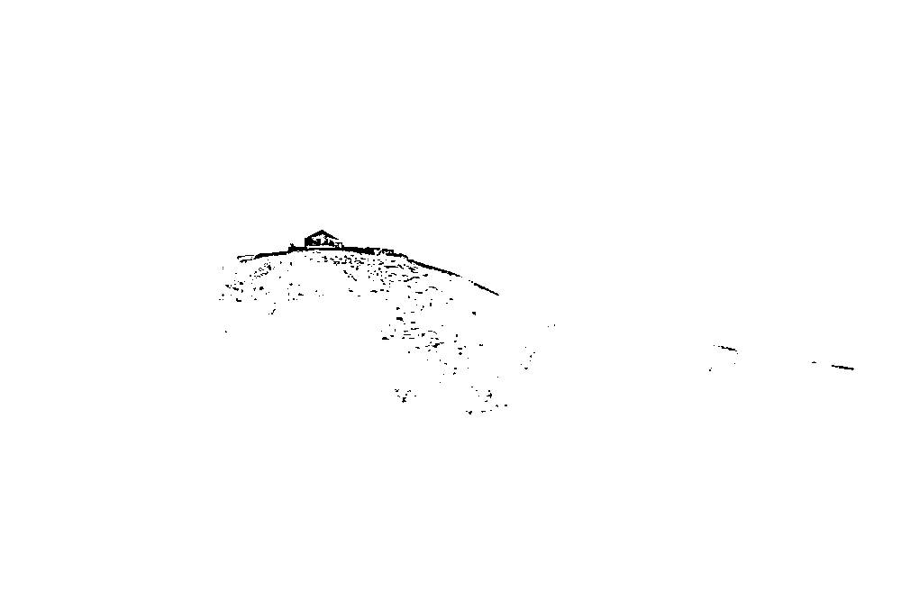

**如何“正确参考”天象预报？**

以“星座月”的历程来纵观整个 2020 年，让我们更能感到“宇宙的逻辑性”，或者人类逻辑对“宇宙规律”的接近。**每个重要天象变换的节点，变的是那些大的“历史背景”之主题，而不变的是我们每月、每天都在灵活转换的视角。**我们仅仅是将自己的“感知”被分配成了一年、一月、一天、一小时、一分钟……但是无论感知速度的快还是慢，宇宙天象的运转永远从这个星座到那个星座，从走完这一圈到重启下一圈……这样无尽的“大小轮回”。所以，每一个改变无论是什么，这个占星分析都旨在帮你**“看清、读懂、领会”其中与我们个人发展相应的意义和启示**。

另外，**任何占星师对天象的所有预测，都会有一定“语境范围”的局限性。希望读者们可以理解文中“抽象的比喻”所指引的“能量特质”，并对“具象的预言”善用延伸性的思考来换位理解**。所有的运势，**宏观去看**可指向整个人类的集体意识的波动、集体大事件的进展状况；**微观去看**可代表你的个人身心健康的调频、每日生活小乐趣与小烦恼的体验。

总之，**请选择与你的真实生活相应的视角去理解**，并在运势时间未到时，仅保持参考和观望，避免提前代入。

**附注：重要天象时间节点参考**

| 天象 | 时间&具体天象 |
| 日月食 | 01 月 11 日，巨蟹座月食 06 月 06 日，射手座月食 06 月 21 日，巨蟹座日食 07 月 05 日，摩羯座月食 11 月 30 日，双子座月食 12 月 14 日，射手座日食 |
| 水星逆行 | 2 月 17 日-3 月 10 日，逆行在双鱼座-水瓶座 6 月 18 日-7 月 12 日，逆行在巨蟹座-巨蟹座 10 月 14 日-11 月 4 日 ，逆行在天蝎座-天秤座 |
| 金星逆行‍ | ‍05 月 13 日-06 月 25 日，逆行在双子座  |
| 火星逆行 | 09 月 10 日-11 月 14 日，逆行在白羊座 |
| 木星逆行  | 5 月 14 日-9 月 13 日，逆行在摩羯座  |
| 土星逆行  | 5 月 11 日-9 月 29 日，土星逆行在水瓶座-摩羯座  |
| 天王星逆行 | 2020 年 1 月 11 日，金牛座恢复顺行 2020 年 8 月 15 日-2021 年 1 月 14 日，逆行在金牛座 |
| 海王星逆行  | 6 月 23 日-11 月 29 日，逆行在双鱼座 |
| 冥王星逆行  | 4 月 26 日-10 月 4 日，逆行在摩羯座 |

**版权声明：**原创文章由作者授权在若道平台首发，欢迎转发，反对抄袭。友号转载请申请白名单。

**关于 2020 年年度运势，你可能还想知道**

[图解 2020 年重大天象及趋势](http://mp.weixin.qq.com/s?__biz=MzA5NjA0NTAxNg==&mid=2651412428&idx=1&sn=32bf652b3853c9aeae69ee9fed1a9bb4&chksm=8b4be57bbc3c6c6d197123ecaaa6290eaa3a6450bd386df76c8ec3bb924ee61cc7ee98233313&scene=21#wechat_redirect)

[2020 年天象意向](http://mp.weixin.qq.com/s?__biz=MzA5NjA0NTAxNg==&mid=2651412566&idx=1&sn=ba71bd85e67a9742fe9a76b2626634a8&chksm=8b4beae1bc3c63f71b58c70327e32874483a79a0b5aff0e62a2f02541acf0c32ae1af76c66c5&scene=21#wechat_redirect)

[12 星座 2020 年度功课大揭秘](http://mp.weixin.qq.com/s?__biz=MzA5NjA0NTAxNg==&mid=2651412604&idx=1&sn=387a944dad92bec0a0c006b206dbc6b3&chksm=8b4beacbbc3c63ddae153bc2f147baf2d6a8a50b4bf052835f2742f72ef635922d5be6bf232b&scene=21#wechat_redirect)


**王珊珊**

全职占星/塔罗咨询师

《星途》《心探索》专栏作者

2013 年至今咨询个案已累计超过 2000 小时

**咨询微信号**：622005740（添加注明“咨询”）

**微信公众号**：xiaoshu_astro

长按打赏


**2020 到来之际，为自己和重要的人**

****送上一份暖心的新年****大礼吧****

******由**大卫·瑞雷****亲自主笔的**《**2020 年度运势报告》****

****将是一份尤为特别的****

☞[**新年礼物**](http://mp.weixin.qq.com/s?__biz=MzA5NjA0NTAxNg==&mid=2651412428&idx=2&sn=c7ac1a6bdc53a8bbf62ff4511308629a&chksm=8b4be57bbc3c6c6d69a1beb7f84b72f1e2607071c069efa13310c7983475522ea3a31de4458e&scene=21#wechat_redirect)☜

**点击下图了解详情**

**☟**


******点击图片查看若道君推荐******


**微信又双叒叕改版啦，不想错过若道君的推送？**

**就把若道设为星标吧！**

**▼**


就是这个“在看”，戳戳戳 ☟

**********年运报告购买入口**********


# 《2020 年金融预报》火热发售 | 今年什么值得投资？这份报告，了解一下

> 原文：[`mp.weixin.qq.com/s?__biz=MzA5NjA0NTAxNg==&mid=2651412651&idx=1&sn=62464f79b9b438308a5a6aad400a6c58&chksm=8b4bea1cbc3c630a74c0e7a7ffc09d86eddec35326f58c0aeb2bde266a223dd12d1fcba43f1b&scene=126&sessionid=1692738232#rd`](http://mp.weixin.qq.com/s?__biz=MzA5NjA0NTAxNg==&mid=2651412651&idx=1&sn=62464f79b9b438308a5a6aad400a6c58&chksm=8b4bea1cbc3c630a74c0e7a7ffc09d86eddec35326f58c0aeb2bde266a223dd12d1fcba43f1b&scene=126&sessionid=1692738232#rd)


**2020 年金融预报和讲座**

1976 年以来，由雷蒙德·A·梅里曼撰写的梅里曼市场时机学院每年一次的年度预报沙龙和每年一本的《年度预报》一直在应用占星学原理为投资者们服务，提供卓越洞见，从未间断。

43 年来，这本 200 页左右对金融市场的分析报告和 3 小时的年度预报讲座在美国、日本、欧洲帮助许多投资者了解宇宙天气对于世界经济形势、政府政策及其对各个金融市场和金融产品的影响，帮助他们做出正确的投资决策，降低投资风险。2018 年，若道第一次将这份广受赞誉的一年一度的金融占星报告和沙龙引入中国，供中国投资者参考。**《2020 年金融预报》将会谈及 2020 年重要的宇宙天象及其对世界经济、贸易形势的整体影响，还将覆盖中国上证股票市场的分析、黄金白银市场、美国经济、美国总统、美联储、美国国债市场、美国股票市场、主要外汇货币市场（主要外汇美元、英镑、欧元、日元、瑞士法郎）、原油市场、谷物市场、活牛市场、比特币市场等投资市场。**另外，非常有价值的是，梅里曼老师及梅里曼市场时机学院的金融占星分析师还会给出以上市场 2020 年的**市场价格目标区间及重要价格反转日**，为短期、中期和长期投资者进行市场操作的时机提供参考。如果你关注世界经济和金融投资市场的变化，会发现梅里曼《金融年度预报》中的研究对于你了解世界经济在发生什么，这些市场的走向会如何有非同寻常的指导价值。


比如，在 2018 年 12 月发布的《2019 年金融预报》中，梅里曼老师指出：

*   2019 年美国领导人与世界其他国家之间可能发生重大冲突，加剧紧张局势，其中一个冲突可能与**贸易问题**相关，而与中国达成重要的贸易协议的期待可能只是幻想的泡沫。
*   2019 年美国经济和股票市场将会到达一个重要的高点，随后在 2020 到 2022 年间的某个时间点开始凶猛地下跌。
*   天王星在未来 7 年内完全进入金牛座的日子，预示着**转基因食品的新发现、肉类价格的上涨以及货币估值甚至交易形式的重大变化**（比如我国已宣布央行法定数字货币试点项目有望在深圳、苏州等地落地）
*   上证指数在 2019 年木星在射手座行进期间可能出现强势反弹，该指数将挑战或突破**3100**（2018 年报告发布时上证指数为 2500 左右，2019 年最高点为 3288）
*   **黄金价格**一旦收盘在**1350-1377.5**价位之上，会直线上升测试**1500+/-50**（2018 年报告发布时黄金价格为 1229 左右，2019 年最高点为 1566）；
*   只要**白银**保持在**13.62 以上**，就会形成看涨双底结构。如果白银收盘在**18 以上**，就有机会向**26.16+/-1.48**爆发（2019 年报告发布时白银价格 15 元左右，最高价格为 19.75）

随着木星离开射手座，木海四分相在 2019 年结束，木星进入魔羯座，土冥合相的到来，世界经济和金融又将发生什么变化？梅里曼老师将在《2020 年金融预报》报告和讲座告诉你他的研究和看法。结合报告，梅里曼老师将于**北京时间 2020 年 2 月 15 日上午 10 点**做一场历时 3 个小时的**关于明年世界金融市场的演讲**，为报告的读者们进一步答疑解惑。而对于不懂得占星学的朋友，也不必担心，在每个市场分析后，都会有一个总结性的结论，帮助你了解梅里曼老师及梅里曼市场时机学院的金融占星分析师对这个市场的整体投资看法。


**报告价格和讲座时间**

**报告和讲座价格**

2020 年金融预报讲座和报告价格整体售价 **1280 元**

（本讲座和报告不单独出售）

**讲座时间**

**2020 年 2 月 15 日  10:00-13:00**

（暂定，如有变动，请以若道最终通知为准）

**购买者重要须知****①** 梅里曼市场时机学院每年一次的年度预报沙龙和《年度金融预报》是梅里曼市场时机学院的研究“预报”，而不是市场“预测”，是梅里曼老师及其金融占星分析师对人类活动周期历史与行星周期之间相关性的研究，二者在大部分情况下具有 80%或更高的相关性，而不是因果关系。沙龙中和报告中的研究完全存在错误的可能性。即便是非常认真的研究和几十年的研究经验，我们无法总是正确地解读出各种征象在实际层面上会如何相互作用，并显化为事件结果。所以请将此沙龙和报告看作一个研究参考，务必结合其他市场研究和你个人对市场的理解，根据你的自由意志做决策。**② **此套餐一旦售出，即**不接受退款**。**③** 此报告只支持**手机阅读**，不支持电脑阅读、下载和打印。**④**《2020 年金融预报》中文翻译版预计在**2019 年 12 月 31 日左右**上架发布，预售报告购买者，届时请参照下图《金融报告查看路径》查阅已购报告内容。**⑤ **讲座时间为初步确定时间，如临时有变动，请以最终通知为准；讲座届时会提供视频回放（仅支持在若道 APP 观看回放视频）以上须知，请仔细阅读。一旦付款，即视为已了解并接受所有须知内容。**已购报告查看路径**


****购买报告请点击“阅读原文”****


# 使命的召唤：一个星座告诉你，有的事只有你才能做

> 原文：[`mp.weixin.qq.com/s?__biz=MzA5NjA0NTAxNg==&mid=2651412638&idx=1&sn=6459344d465d2d27485697dbea2f512f&chksm=8b4bea29bc3c633ffb401133040024eb261f07a3dde67f15e6ebb94ca4df49f8f7995ca6e707&scene=126&sessionid=1692738232#rd`](http://mp.weixin.qq.com/s?__biz=MzA5NjA0NTAxNg==&mid=2651412638&idx=1&sn=6459344d465d2d27485697dbea2f512f&chksm=8b4bea29bc3c633ffb401133040024eb261f07a3dde67f15e6ebb94ca4df49f8f7995ca6e707&scene=126&sessionid=1692738232#rd)

**☆ 后台回复“今日”，给你一句生命态度**

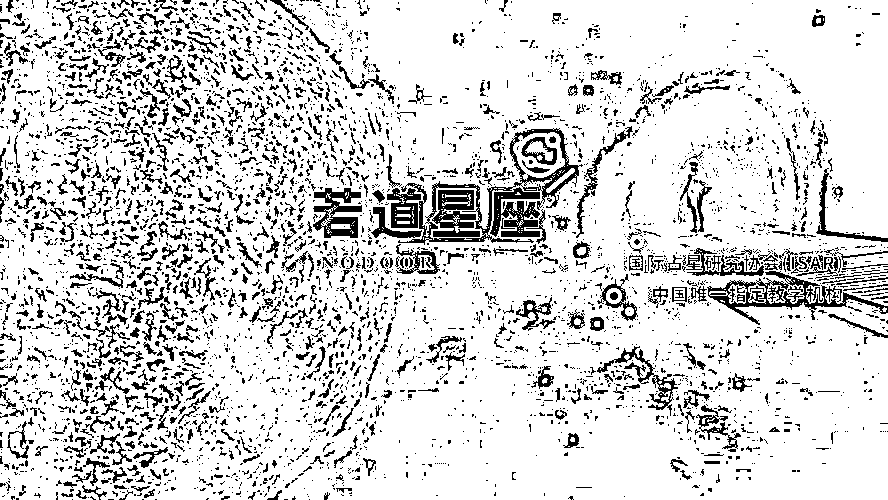作者/达娜·格哈特 译者/空气 校对/Arrow 编辑/Tang 封面/书君 图片/网络

提到狮子座，你会想到什么？勇敢，创造力，自信，骄傲是狮子座最典型的关键词。但是，你知道吗？狮子座也是我们内心的英雄，是我们下定决心去做某事的部分。通过狮子座的宫位，落入狮子座的行星，以及狮子座的守护星太阳的光辉，我们受到特殊使命的召唤，某件事只有我们才能做。狮子座，究竟是一个怎样的星座？不妨读一读这篇关于大狮子的深度文章吧。

**你是那个人吗？**

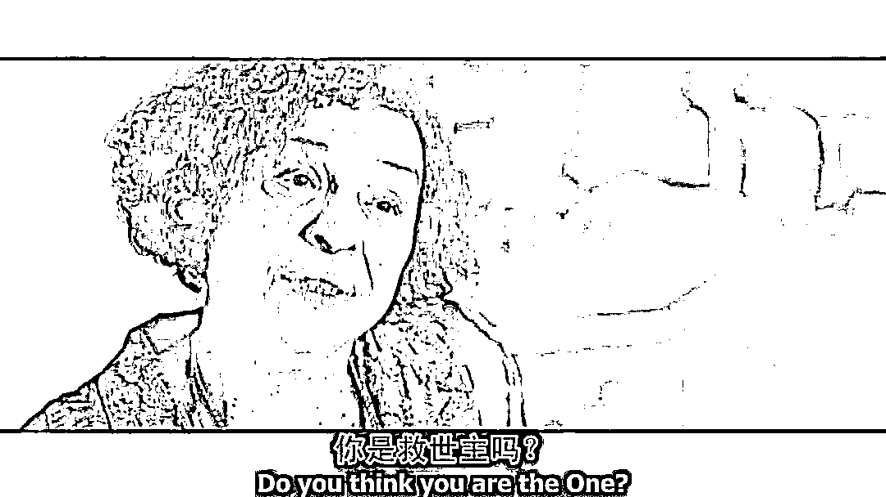

“你是那个人（救世主）吗？”这是 1999 年科幻动作片《黑客帝国》中的核心质疑，是所有人对基努·里维斯所扮演的那个郁郁寡欢的独行客的疑问。白天，他是托马斯·安德森，一个在大公司混日子的不起眼的程序员；到了晚上，他是尼奥，一名天才电脑黑客。影片中人工智能已经控制了地球，它劫持人类进入另一个现实并消耗他们沉睡时身体里的能量。少数人成功地逃离了这个集体的梦境。当尼奥加入反抗者时，他们怀疑尼奥是否就是先知预言会出现的那个英雄，他是不是人类一直在等待的那个人？尼奥是否注定要去拯救全人类？这些严肃的问题，只有电影中的英雄们才会被问及。

幸运的是，世界的命运并非如此沉重地系于我们。我们有时间在微博上分享刚刚品尝到的美味熏牛肉。晚上，溜进我们梦乡的思绪是未回复的电子邮件、拼车去踢足球、日渐减少的退休金账户、以及谁拿走了我们的 iPod……但偶尔，当月光从卧室窗户照进来，也许我们内心的英雄也会随之苏醒。他大步流星走过我们的梦境，像吉尔伽美什史诗一样古老，像赫拉克勒斯一样勇敢。他是我们心灵中下定决心杀死怪兽、找寻魔法树或者不惜一切复国的那个部分。白天，我们可以在我们的星图中找到他，只要看看狮子座在哪。**通过狮子座的宫位，落入狮子座的行星，以及狮子座的守护星太阳的光辉，我们受到特殊使命的召唤，某件事只有我们才能做。**狮子座让我们期待而好奇：我们是这个世界在等待的那个人（救世主）么？

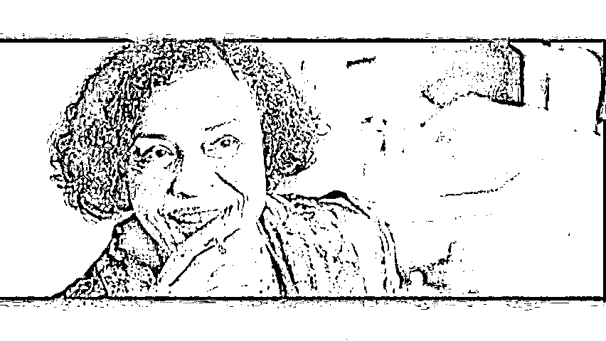

在《黑客帝国》中，尼奥有一个相信他的导师莫菲斯，他几乎让尼奥也相信了自己，直到先知向我们的英雄摊牌。在先知公寓的厨房里，这位抽着烟、烤着饼干的智者上下打量着尼欧，然后握住他的手说：“但是你已经知道我要告诉你什么了……”“我不是那个人，”尼奥回答。她点点头。“对不起，孩子。你有天赋。但你似乎在等待什么。也许是你的下辈子，谁知道呢。”

勇敢，创造力，自信，骄傲是狮子座最典型的关键词，怀疑永远不会上榜。但是，**怀疑自己的天赋也许就像骄傲一样，是狮子座之旅不可或缺的一部分**。我们更愿意想象阳光灿烂的狮子座日子，坐在微微发光的树叉上摆动着双脚，梦想着并相信着自己的伟大。但时间一长，狮子座的黄金之路会溅上砂砾和泥土。有些目标我们无法实现，有些工作从我们手中溜走，有些爱人我们无法博得欢心，再加上一大堆任何普通人人都能干的无聊杂务，也许我们也没什么特别的。我们咨询人生导师和占星师对人生重获希望，这让我们暂时感到振奋，然后又逐渐褪去，我们又感觉平平，一点不像个英雄。这些人又有什么用呢？

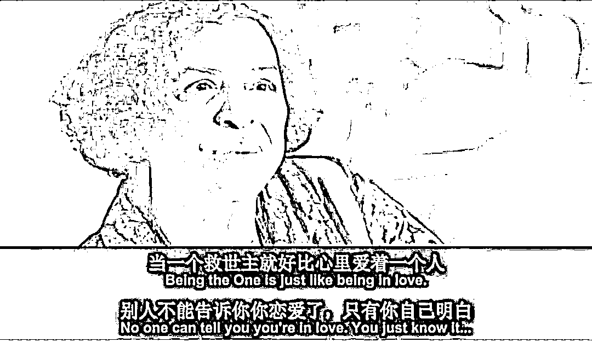

《黑客帝国》中的先知将命理的艺术提高到了一个全新的高度。她否认尼奥是救世主，真是别出心裁。他正是要找的那个人，但是她知道，从她那里得到这个消息并不能激活他的天赋。先知说：“当一个救世主就好比心里爱着一个人。别人不能告诉你你恋爱了；只有你自己明白，全身上下，从头到脚都明白。”占星学也有类似的关联，即**狮子座代表着爱和英雄主义**。事实上，浪漫主义与英雄行为的能量是如此相似，以至于人们经常将它们混淆。当人们真想知道自己在这个世界上的重要性时，他们会去单身酒吧，或在交友网站上写下机灵的自我介绍。人生捉弄我们，正如智者捉弄尼奥一样。长久以来，它隐瞒了对我们的认可，它挑战我们能否在没有成功保证的情况下展开英雄之旅。**狮子座的礼物并不在于它让我们无所畏惧，而是尽管我们心存疑虑和恐惧，却能让我们勇往前进。**在另一部电影《夺金三王》中的盖茨少校说：“首先，做让你害怕的事情，然后获得勇气，而非相反的顺序。”这是绿野仙踪里胆小的狮子的法则，它用颤巍巍的声音和瑟瑟发抖的双膝，证明了自己的勇气。**我们永远不能肯定自己是不是那个人。但正是这种怀疑，迫使我们向内心深处去寻找到狮子座最重要的财富之一：自我意志的力量。这会释放出巨大的创造力。**

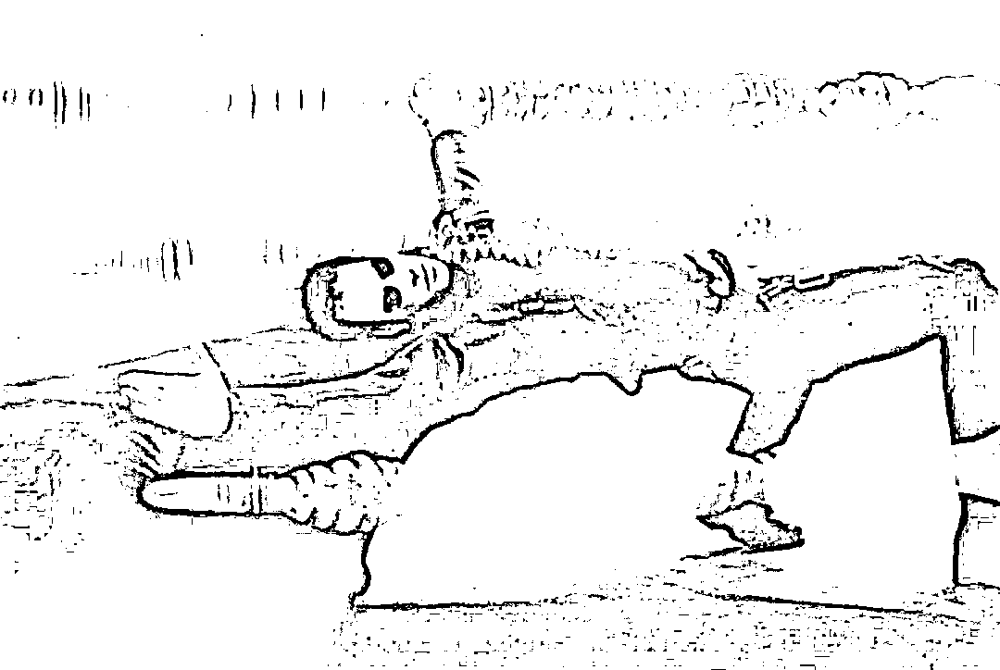

**赫拉克勒斯的英雄心**让我们来看看赫拉克勒斯的狮子座任务，他的任务是杀死住在尼米亚山谷里的狮子。这是一只可怕的野兽，两倍于人的体型，三倍于人的杀伤力。这是赫拉克勒斯十二项任务中的第一项，如果说这对我们的英雄来说是一种惩罚的话，那的确是，因为这真的就是惩罚。我们也许知道这种感觉，这就像是我们参加了多少次大型会议、开幕式，或者是去往其他任何我们认为自己会发光的地方，感觉像跟要去刑场一样急迫。我们喜欢认为狮子座的创造力是充满了乐趣和游戏的，但狮子座的热情和童趣往往在他表现英雄主义的时刻之前或之后到来。期待和胜利带来了激情，但中间是个挑战。这就是与尼米亚猛狮搏斗的意义，是创造过程的象征，是直面一个人创造性的挑战。

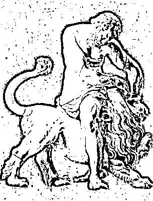

| 赫拉克勒斯与尼米亚猛狮

赫拉克勒斯的光芒已经陨落。他刚出生时就勒死了一条蛇，在他整个童年时代这个世界都为他的力量和魅力所倾倒。然后，黑暗的日子降临了，他疯了，杀了自己的妻儿，他又怎么能再相信自己呢？现在他在为自己的罪行付出代价，不得不屈从于欧律斯托斯国王。欧律斯托斯身材矮小，嗓音洪亮，对卑躬屈膝的仆人们咆哮着发号施令。国王一拍手，整个城堡都上蹿下跳。赫拉克勒斯所不知道的是，欧律斯托斯实际上很害怕我们的英雄，夜不能寐地算计着要除掉他。国王决定交给赫拉克勒斯一项巨大的挑战，他会失败并丧命：多么完美的计划！

当赫拉克勒斯来到狮子的领地时，他住在一个穷工匠莫洛克斯的家里，后者提议举行祭祀以确保猎狮行动的安全。赫拉克勒斯叫他等上三十天，如果赫拉克勒斯成功把狮子的皮带回来，他们将一起向宙斯献祭。如果他没有回来，莫洛克斯就应该以英雄的名字献祭。狮子座的胜利自然应该属于宙斯。在最好的情况下，狮子座的胜利就像如有神助；我们超越自己，仿佛被神附体。有多少演员抱着他们的奥斯卡金像奖，并把它献给上帝？但当我们与狮子座一起铩羽时，耻辱与失败只属于我们自己。考虑到我们的自尊心，这些赌注太大了。

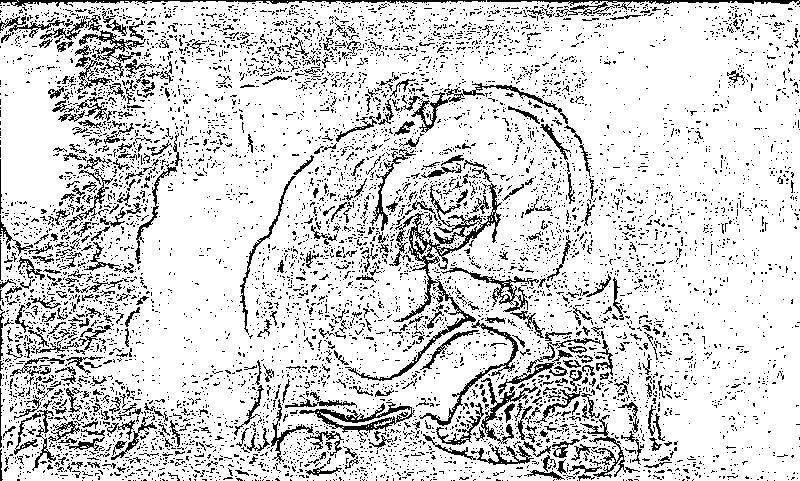

| 赫拉克勒斯与尼米亚猛狮搏斗

赫拉克勒斯曾数次与狮子交战，用毒箭射它，但却射不穿它的狮皮，用棍子打它却被弹了回来了，他向狮子扔了一块巨石，石头碎了。赫拉克勒斯学习到了狮子的皮是任何武器都刺不穿的！因此，现在他必须富有创造性。赫拉克勒斯发现了狮子的巢穴，在它离巢时一探究竟。他花了数个星期研究狮子、追踪它、观察它，开始熟悉它的行动和性情，可以说他已经和狮子融为一体，就像一个演员在角色中丢掉自己一样，所有被惩罚的感觉都已经消失不见了。

**要想与狮子座如此合作，我们必须要深入自己的内心，那是狮子座的能量源泉和目的地。当我们全神贯注地工作时，会进入一种专注、喜悦、忘我的状态，所以活在当下让我们自然而然地用创造性的方式采取行动，甚至这样的天赋让自己都感到惊喜。**赫拉克勒斯从未想过要勒死一只比他大一倍的猛兽，但他看着自己冲向猛兽，突然用手掐了它的脖子。他能感到狮子屈服于自己的力量，那是个美妙的时刻，更像是爱情而不是死亡。因此，当他看到那失去生命的动物尸体时，赫拉克勒斯不得不向它表示敬意。他用狮爪割开狮子的皮，然后穿着兽皮回到欧律斯托斯那里。

赫拉克勒斯赤手空拳地进入了狮子洞，除了他自己，什么都没有拿，这强调**我们在狮子座的所为都是自我表达**。但我们必须做好准备，我们必须磨练技艺，无论是什么技艺。直到有一天，我们在自然而真实的状态下，一个考验来了，引发了英雄的能量升起并引导我们。那一刻，我们成为了《黑客帝国》里的救世主，感觉像是爱情，像是恐惧，那是庞大的、自发的、纯真的、丰富的、脆弱的感觉。这像极了狮子座的感觉，全身上下，从头到脚。

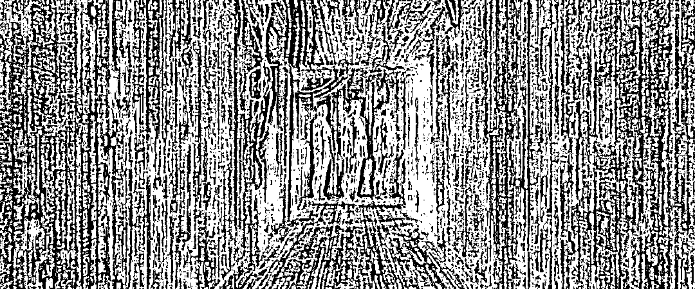

**狮子座的阴影**我以前不太喜欢狮子座。实际在我了解占星学之前，我知道我一点都不喜欢狮子座。我前夫的太阳星座是狮子座，我们和舞者、音乐家和表演艺术家等许多有创造性的人一起出去玩，他们总是在舞台中央炫耀自己。我断定狮子座的人只不过是一群伪装成成年人的跳踢踏舞的小孩，他们永远在跺脚、唱歌、哭泣，“看看我！看着我！”

多年以后，我发现了自己的月亮星座是狮子座，可以想象一下我的吃惊。它隐藏在我第十二宫的密室里，第十二宫存放着心理拒绝的部分。**我投射出对狮子座朋友的憎恨，是因为我不能忍受我自己。**当我还是个孩子的时候，每当我在学校赢得竞选或获奖时，我的母亲（月亮狮子座夸张表现的代表）会喊我“大奶酪”，那时我就想爬到一块石头下藏起来。我需要别人的注意，但当我得到时却感到局促不安。因此，在后来的几年里，当我看到其他人在聚光灯下的表现时，我认为他们的表现尴尬又自我。

**每个星座都有它的阴影面，狮子座可能是幼稚、自恋、傲慢、专横甚至残忍的。**欧律斯托斯国王是一个狮子座黑暗面的典型代表。他是狮子座的暴君，用贬低别人的方式来提升自己。你也许会说，欧律斯托斯国王太傲慢了，但事实上，他并没有足够的自尊心。**这过于夸张的外表暗示了相应的内在精神的缺失**。一个外在巨大的自我，外在的自我，必然感到内在的贫乏。在这个故事中，欧律斯托斯国王听说赫拉克勒斯战胜尼米亚怪狮的成功而大为震惊。我们的英雄一进城，国王就跳进一个大陶罐里藏了起来。他不敢与英雄面对面，接下来的 11 个任务欧律斯托斯只能通过信使来下达命令。

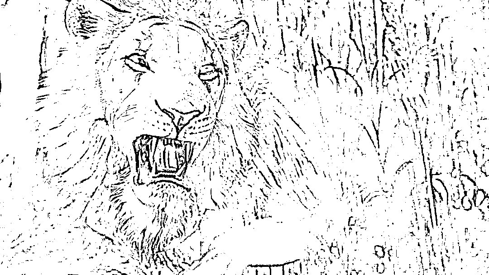

尼米亚猛狮也是狮子座阴影的一种表现形式，它代表着**原始的自我冲动**。**狮子座需要这种巨大的能量，因为只有这种原始热情的能量才会激发狮子座的雄心。**高贵的狮子座希望自己无论做什么都是最棒的。如此高的期望值需要刀枪不入的兽皮。从尼米亚狮子身上弹回的箭描绘出自我可以多么强大的保护自己而不受他人伤害。然而，自我也可能是残酷的，这就是为什么人们常常为自己担忧。

当我鼓励我的咨询客户去赞颂自己，对自己的成就表示出一些狮子座的骄傲时，大多数人都表示异议，他们不想显得过于自负。但是我们应该从赫拉克勒斯那里得到启示，他通过与狮子的搏斗学会了控制自我。**他狮子座的任务象征着创造的过程，也代表着狮子座必须学会控制自己的幼稚、自私和恐惧的冲动。**

当我们内心的野兽得到控制时，我们可以把自我当作是暂时的外衣，而并不需要完全认同自我。我们可以承担必要的风险，而不必担心别人对我们的看法。我们可以是温和的，温暖的，迷人的，慷慨的。同样的信息也出现在狮子座的塔罗牌——**“力量”牌**上，一位冷静的女神握住狮子张开的下颌。

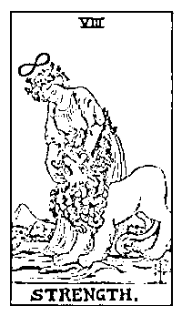

|  维特塔罗中的力量牌

**掌声响起来**

**狮子座需要不断的得到肯定，这既是福也是祸。**从某种程度上说，这是一种进化上的优势，会哭的孩子有奶喝。但是那些孩子长大后，进入工作岗位了呢？需要来自老板和同事的关注和赏识么？当我在企业工作时，雇员们常常像一群情绪不稳的孩子们，对他们来说，仅靠薪水是远远不够的，他们也需要得到来自公司的关爱、关怀和掌声。我每次部门巡视时，都能看到有人闷闷不乐地坐在电脑前。他们的显然对工作不怎么满意，但我听到的最使他们恼火的是没有人注意到他们所做的事情。

这不仅仅是存在于公司的问题。非洲的智者玛里多玛·撒门观察到：“不管是在土著文化或现代文明中长大，人们都渴望可以充分施展他们的天赋，并让他们的天赋得到赞许、认可和肯定。”让我们把这种洞察力带入到《黑夜帝国》里面先知对尼奥的教导中。**首先，必须要了解和相信我们自己的才能；然后，需要通过外界确认我们的才能**。这就是约瑟夫·坎贝尔的**英雄之旅理论**的核心内容。我们受到召唤、教导、考验、神的帮助以及再次经受考验；我们通过严峻的考验证明了自己，贡献我们的力量，获得来自群体的荣耀。

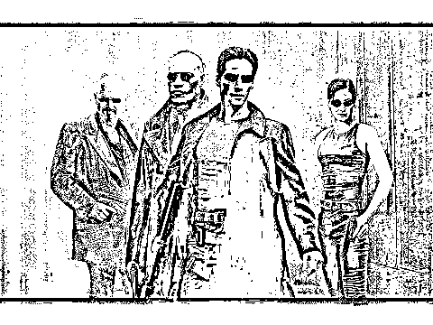

这就是为什么**水瓶座，这个群体的星座，是狮子座的补充，两者相辅相成。****群体需要英雄，而英雄也需要群体**。否则在经过了英雄式的考验和试验后，我们带着收获的财富将无处可去。玛里多玛·撒门还说道：“自我确认和肯定是不够的，我们对被社会认可的需求是如此的原始，以至于如果在村庄、城镇或身旁找不到这种认可，人们就会走出去去寻找他的需求。为了防止其人民离群，土著文化通常通过入门仪式或赋予圣名，来见证一个人的天赋，正式地表示感谢与认可。然而，现代文化缺乏具有仪式感的认同，难以满足人们的渴求。我们可能会获得学位或证书，赚取金钱，或者荣获某个头衔，但是这些并不能确认我们现在出生在这里的原因。这也许是我们的文化为什么如此推崇名人和名望的原因，未被认可的灵魂的空虚已经变得如此巨大，只有那些超级明星才可以承载我们集体的阴影。如果在群体中多一些培训来平衡英雄主义的幻想，也许我们对名望的狂热会消退一些。贴着“今天你赞扬邻居的天赋了吗？”的汽车保险杠在哪里？在我的公司生涯中，有一年夏天，员工对公司缺乏激励的抱怨不绝于耳，于是我们成立了一个事实调查委员会，以找寻提高员工士气的策略。我们阅读了一些书，如《欣赏员工的 1000 条方法》，每个人对此问题都有不同的看法，最终这个委员会解散了，并没有发现任何确定的结果。一些经理决定保留一个“奖励”名单，确保他们会经常表扬那些脾气最坏的组员。我记得一位沮丧的经理告诉我，有位脾气很坏的员工当面跟她说：“你从来没有积极的反馈”，可就在谈话的前一天，她对他说了五次“干得不错！”。最终，消沉的士气得以提升的方法让我们都感到吃惊。我们完全忘记了发牢骚的人，开始提拔取得成绩的人。我们的公司销售蒸蒸日上，使得各部门的工作负担都变得过重，我们不能期望所有人能平均地承担这些任务。因此，挑选出那些表现最好的人，建立了责任层级。提拔一些员工，使他们比其他同事高一级，这让经理们担心可能会带来新的摩擦和怨恨。相反的是，这让所有人都松了一口气，总体士气得到了提高。回想起来，原因我觉得是我们**给了英雄们一个属于他们的旅程**。对那些缺乏富有意义的挑战的人表达欣赏，就像吃了一顿中餐，一小时后就又饿了。但是现在我们把一个有意义的花环戴在了特殊的人们身上。不同的部门现在有了职业发展路径，感召、指导、考验和表彰那些愿意响应号召的人，为他们指出未来英雄的旅途之路。而那些缺乏动力的人，甚至是害怕英雄之旅的人，则可以享受新部门英雄们的保护，整个群体都从中受益。

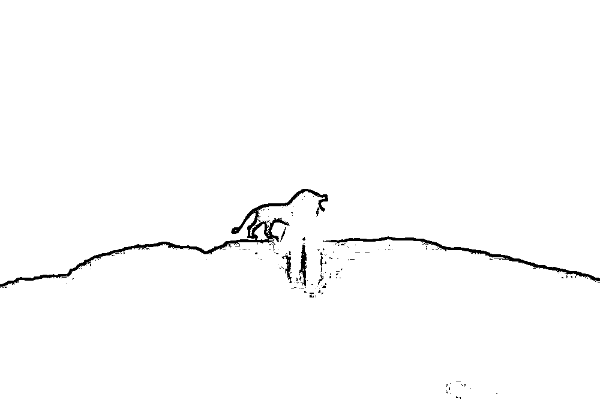

**平凡的生活中也有英雄**我儿子 6 岁时的一天晚上，他说：“妈妈，别动，也不要尖叫。厨房里有个老鼠的脑袋，你别看，我来打扫干净。”布兰登知道我很害怕猫叼进来的吃了一半的、甚至快要死掉的田鼠。他通常和我一样害怕，可这次他自己从车库里拿来了扫帚，找到一个塑料袋，把老鼠的脑袋扫了进去。虽然有点奇怪，我一个小时都在厨房里做晚饭，你可能会以为我可能已经看见老鼠了？我家猫被锁在门外，她是没法把它叼进来的。我问布兰登，老鼠的脑袋长什么样。他描述说到小小的眼睛，小耳朵，从脖子里面露出来的骨头。“你确定这是只老鼠吗？”我问道。“是的，嗯也有可能是莴苣吧，天那时候很黑。不，绝对是只老鼠。”其实，很可能是晚餐沙拉中的一片莴苣叶子掉到了地上。

无论是老鼠还是莴苣叶子，布兰登都是我心中的英雄，这是在现实生活中，我们大部分人和狮子搏斗的时刻。电影、神话和故事常常把英雄的一生压缩成一次恢宏的行动，就好像我们只需要一个伟大的时刻来救赎自己或表达我们一生天赋的恩赐。这位战士只有一次胜利么？是否一次无论多大的有创造力的行动就会耗尽狮子座对自我表达的渴望？现实生活中的英雄时刻比比皆是。**和虚构的英雄比起来，现实里的英雄看起来很平凡，但是在现实生活中会让我们心跳加速。**

有时候，尽管我们尽了最大努力，还是得不到认可。我的猫给我叼来了老鼠，以表示它的爱和英勇。它期待我会被感动，而我却尖叫着把它赶出了门。英雄十分努力以获得认可，但不能控制发生的时间和原因。**有时候，我们没有获得荣誉，是因为我们缺乏技巧，有时候只是时间的问题**。好书可以成为畅销书，榜单上的坏书也不在少数，而许多优秀的书都未出版。有多少伟大的艺术家一生中不被重视，一文不名？赞美和掌声是难以捉摸的事情，尽管狮子座渴望得到这些，但这并不是他们真正创造力的最好的动机。让我们来听听下面来自中国的一棵不寻常的树的故事。

在商朝的一座山上，有一个人发现了一棵巨大的树，这棵树大到能为一千匹马遮阴。这个人想：“这是一颗什么树？它肯定有特别的用处。”他抬起头，发现树枝扭扭歪歪又都特别小，都不适合做家具或造房子。往下看，发现树干坑坑洼洼有点腐烂，做棺材都做不了。他舔了一片叶子，这使他的嘴起了水泡。他闻了闻，气味难闻。他告别了这颗树，继续赶路。当然，正是这棵树的无用让它得以长大，没有被砍伐利用，长成了参天巨擘。但是也许这棵树还有其他的秘密，有天会揭开更好的用途。也许有朝一日它将成为 “救世主”。但同时，它只能是它自己。我们也是这样，**每个人都有自己独特且珍贵的心灵，这是我们唯一能献出的天赋**，这是我们唯一成为“救世主”的机会，不管目前其他人是否认可。

**版权声明：**本文由若道翻译发布，欢迎转发，反对抄袭。友号转载请申请白名单。

**也许你还想看下面的文章**

[白羊座](http://mp.weixin.qq.com/s?__biz=MzA5NjA0NTAxNg==&mid=2651412161&idx=1&sn=37ff27a685136be77b3d02086a4b8f0b&chksm=8b4be476bc3c6d6079b8592d14f1250d87401d0a8a28bc87f50a8f9fd253a52d9d5223c4ab12&scene=21#wechat_redirect) | [金牛座](http://mp.weixin.qq.com/s?__biz=MzA5NjA0NTAxNg==&mid=2651411945&idx=1&sn=6a74a4d7d15deb38d06a692ad4032ddd&chksm=8b4be75ebc3c6e4890b5034474c2894bd355bf26df5f0ad1c2fadae76f3de1d349a57de0471b&scene=21#wechat_redirect) | [巨蟹座](http://mp.weixin.qq.com/s?__biz=MzA5NjA0NTAxNg==&mid=2651412275&idx=1&sn=0c656c445089cb315649a1cc3af37001&chksm=8b4be584bc3c6c92e9bc689480a78b3e530fc125c6a3a1fdff0e60a587ffcd06723285712045&scene=21#wechat_redirect)

[天秤座 | ](https://mp.weixin.qq.com/s?__biz=MzA5NjA0NTAxNg==&mid=2651410544&idx=1&sn=45b51d84210a84c8103c140df5a28229&chksm=8b4be2c7bc3c6bd1c86b8ffd8d8722efe3cfa1fc4b71e2cc8f71230218b8c73a7119d8a22745&token=428430174&lang=zh_CN&scene=21#wechat_redirect)[射手座](http://mp.weixin.qq.com/s?__biz=MzA5NjA0NTAxNg==&mid=2651411022&idx=1&sn=adf59f6eb38f2fd19ca975b4287168ea&chksm=8b4be0f9bc3c69ef250cafb4d517694bb952529461017c53da4d7ca120ed4ec0004161eccdb0&scene=21#wechat_redirect) | [水瓶座](http://mp.weixin.qq.com/s?__biz=MzA5NjA0NTAxNg==&mid=2651411498&idx=1&sn=25b8051c9c778065f9fffa37628c9950&chksm=8b4be69dbc3c6f8b94ee79ae682233634bcd0f32e8dce890672ea1bb4e5241a34cb59ebb3045&scene=21#wechat_redirect)

[双鱼座](http://mp.weixin.qq.com/s?__biz=MzA5NjA0NTAxNg==&mid=2651412587&idx=1&sn=88617fdd2660473de5eb7a48dd9d8807&chksm=8b4beadcbc3c63ca04427ddfde1ff118fbd1151ff24fad40cb97abcd3d2029c6e1c2bcb6657f&scene=21#wechat_redirect)


**达娜·格哈特**一位国际范围内受尊敬的占星师。她为众多占星学网站和出版物讲课、写稿。她在十二宫的月亮激励她对这颗发光体进行了深刻而持久的探索研究。

******点击图片查看若道君推荐******


**微信又双叒叕改版啦，不想错过若道君的推送？**

**就把若道设为星标吧！**

**▼**


就是这个“在看”，戳戳戳 ☟

********报名直达入口********


# 中英双导师 L1-5 | 全新互动实战课，领你从 0 开始学占星

> 原文：[`mp.weixin.qq.com/s?__biz=MzA5NjA0NTAxNg==&mid=2651412638&idx=2&sn=7c90383866d122d880c7f310492bc5ef&chksm=8b4bea29bc3c633fa0b449163774d21b268d9a5f4a0f5f13edfea29dde58563cb3668b153d2d&scene=126&sessionid=1692738232#rd`](http://mp.weixin.qq.com/s?__biz=MzA5NjA0NTAxNg==&mid=2651412638&idx=2&sn=7c90383866d122d880c7f310492bc5ef&chksm=8b4bea29bc3c633fa0b449163774d21b268d9a5f4a0f5f13edfea29dde58563cb3668b153d2d&scene=126&sessionid=1692738232#rd)


**拥有****49****年占星实践经验的若道创始人**
**大卫·瑞雷****&****最懂学员的若道首位认证****金牌中国****老师****熊鹰****师徒二人****横跨南北****联手打造****北京上海**** 若道****全新****核心占星课程****之**

**互动实战占星初阶工作坊**

**本次****Level 1-2 工作坊****会分别在**

**上海（2020 年 3 月 13、14、15 日 熊鹰老师主讲）**

**北京（2020 年 4 月 4、5、6 日 大卫·瑞雷老师主讲）**

**两个城市各举办一场**

**方便北方、南方同学自由选择，邀请小伙伴一起学习**

**核心课现场工作坊是一种什么样的？**

珍贵的**面授工作坊**，全面而详细地讲解占星学知识，一场五感盛宴！

# **代入感：**向往占星世界好久了，迟迟没有下决心系统学习？最专业的占星老师来喽！带你穿越 9¾站台，进入真正的占星魔法世界，来若道，你就是哈利波特本特！


**沉浸感：**从虚拟的网络来到现实，舒适的学习环境，全新的占星同学，5D 的占星老师，专业的摄影团队，支持的工作人员~让你仿若重回校园梦，燃动青春学习占星！


**参与感：**大卫老师和天空老师都有丰富的教学经验，占星知识严肃专业，但开起玩笑来也丝毫不马虎，欢笑间知识都记住了呢，如果你长得可爱聪明伶俐，课上还会随时**被 Q**哦~对，就是你~


**仪式感：**两位老师超爱自己的中国学生们，为了让大家透彻地学习好宫位，2018 年初阶工作坊，大卫老师和熊鹰老师趴在地上用胶带贴的~仪式感满满~有没有~就宠你就宠你！今年还有没有其他的惊喜？


**亲近感：**周围全都是热爱占星的同学，那种亲近和被理解的感觉真的不要太美妙。志同道合的朋友就在身边，灵魂伴侣可能就在眼前，透露一下，在若道课堂里找到男女朋友的真的不要太多~比如~咳咳，总之带着八卦的心来上课吧~


**连报 L1-5 全阶课程，可以享受到：**❶ 51 次线上直播互动网络课程+3 场工作坊（互动实战占星初阶工作坊、亲密关系+职业占星工作坊、知识回顾+综合解读工作坊），全面而详细地讲解占星学知识、技能、案例和重要领域实践运用。 ❷知识点+学员星图解读有机结合：熊鹰老师以知识点和学员案例讲解为主，大卫·瑞雷老师以参课学员案例及客户案例讲解为主，每个知识点覆盖班级内学员的亲身案例，参与感更强，每位学员都有机会听到自己的星图分析。 ❸微信群学员互动分享，从真实案例学习生命成长故事。 ❹ 论坛提问：论坛上每个学员的问题都将得到及时回复。 ❺ 提供咨询师实习平台，只要努力，都将有机会在毕业前进行咨询的实习演练，听取客户反馈，为成为职业占星师做准备。

**1-2 阶我们要学习什么？**

  **第一阶** ** 12 星座，12 种性格，12 种人生**❶ 学习占星学必须准备的“心法”**❷**占星学中的火、土、风、水四元素，阴阳法则**❸**面对面的星座有故事**❹ **12 星座：12 种性格详解，12 种行为模式，12 种价值观**❺ **太阳和月亮：了解你的太阳，生命的发动机，让你在世界闪光的方式，生命获得力量的方法；了解你的月亮，让你获得幸福的方法**❻ **了解太阳、月亮，了解你生命中已经出现的、将会出现的男性和女性

**第二阶  命运的线索和人生故事中的演员**

❶ 命运的线索：南北交点❷ 星图三巨头：太阳、月亮、上升点的故事❸ 了解心智：水星❹ 了解金钱和关系：金星❺ 了解行动模式：火星❻ 了解信念：木星❼ 了解努力：土星❽ 了解天才和疯狂：天王星❾ 了解梦想和幻灭：海王星❿ 了解死亡和重生：冥王星⓫ 12 个人生场景：黄道 12 宫位初解

**现场工作坊**

**上海（2020 年 3 月 13、14、15 日 熊鹰老师主讲）**

**北京（2020 年 4 月 4、5、6 日 大卫·瑞雷老师主讲）**


**如果你想马上开始学习 Level 1-2**现提供即买即学的**熊鹰老师网络视频课程**出售价格和工作坊一样如果想同时购买网络课程视频+任一场现场工作坊可以享受打包价哈具体购买方式看到最后~

**3 阶开始的网络直播课**

老师同学都认识的差不多了，从三阶开始就是更方便灵活的网路直播课喽

**第三阶 宫位、相位以及初步解读星图****（15 次课）**❶ 15 次线上直播网络课程，每次 2 小时，堂课中依旧会使用同学们的星图作示范❷  10 节课由熊鹰老师教授，重点通过名人星图阐释知识点❸  5 节课由大卫·瑞雷老师教授，重点通过学员星图阐释知识点❹  从第三阶开始，助教将会指导练习，答疑解惑，学练结合❺  重点在于如何根据星图去问问题，着重自我发现和自我探索的过程**课程安排**2020 年 6 月 4 日：宫位，行星和星座组合 2020 年 6 月 11 日：宫位，行星和星座组合 2020 年 6 月 18 日：月亮交点 2020 年 7 月 2 日：月亮交点和演示案例 2020 年 7 月 9 日：相位 2020 年 7 月 16 日：相位+星座，行星和宫位 2020 年 7 月 23 日：相位，星座，行星和宫位的同学案例 2020 年 7 月 30 日：渐盈相位&渐亏相位，示例 2020 年 8 月 6 日：更多的关于宫位和宫主星 2020 年 8 月 13 日：同学案例 2020 年 8 月 20 日：空相行星&定位星 2020 年 8 月 27 日：宫主星 2020 年 9 月 3 日：优先级和组织 2020 年 9 月 17 日：相位模式以及范例 2020 年 9 月 24 日：学员星图解读范例**第四阶 出生星图解读（进阶）以及关系与职业议题****（12 次课，1 场四日亲密关系+职业占星工作坊）**❶ 12 次线上直播网络课程，每次 2 小时，堂课中依旧会使用同学们的星图作案例❷ 8 节课由熊鹰老师教授，4 节课由大卫·瑞雷老师教授

❸ 1 场北京现场四日工作坊：亲密关系+职业占星，学生将被选中进行案例演示和互动。

**工作坊安排：****2020 年 10 月 29 日、30 日、31 日、11 月 1 日四日北京工作坊****亲密关系（两天）+职业（两天）占星工作坊**学员将被选中进行案例演示和互动（免费）。**课程安排**

2020 年 11 月 26 日：整合星图和星图优先级

2020 年 12 月 3 日：综合解读

2020 年 12 月 10 日：整体案例

2020 年 12 月 17 日：亲密关系/对比星图

2021 年 1 月 7 日：占星学和对比星图的例子

2021 年 1 月 14 日：对比星图同学案例

2021 年 1 月 21 日：对比星图同学案例

2021 年 1 月 28 日：占星学的职业介绍

2021 年 2 月 4 日：占星学的职业案例

2021 年 2 月 18 日：占星学的职业同学案例

2021 年 2 月 25 日：儿童职业发展

2021 年 3 月 4 日：亲密关系/职业同学案例

**五阶 预测、关系、咨询、为执业和考试做准备****（24 次课，1 四日工作坊）**❶ 24 次线上直播网络课程，每次 2 小时，堂课中依旧会使用同学们的星图作案例❷ 15 节课由熊鹰老师教授，12 节课由大卫·瑞雷老师教授

❸ 1 场综合解读工作坊（北京）：把一切串联起来，学生将被选中进行案例演示和互动。

**工作坊安排：****2021 年 9 月 2 日、3 日、4 日、5 日四日综合解读工作坊（**北京**）**把一切串联起来，L1-5 知识回顾，综合解读学员将被选中进行案例演示和互动（免费）。**课程安排：**2021 年 4 月 15 日：行进介绍 12021 年 4 月 22 日：行进介绍 22021 年 4 月 29 日：行进介绍 32021 年 5 月 6 日：当下的行进的同学案例 2021 年 5 月 13 日：周期，重置星图 2021 年 5 月 20 日：当下的行进和周期的同学案例 2021 年 5 月 27 日：次限 2021 年 6 月 3 日：次限同学案例 2021 年 6 月 10 日：太阳弧 2021 年 6 月 17 日：太阳弧同学案例 2021 年 6 月 24 日：亲密关系的关键节点+组合星图 2021 年 7 月 1 日：亲密关系的关键节点，组合星图同学案例 2021 年 7 月 8 日：职业周期 2021 年 7 月 15 日：职业周期同学案例 2021 年 7 月 22 日：太阳返照&月亮返照 2021 年 7 月 29 日：太阳返照&月亮返照同学案例 2021 年 8 月 5 日：高级预测技巧 2021 年 8 月 12 日：高级预测同学案例 2021 年 8 月 19 日：高级预测技巧 22021 年 8 月 26 日：高级预测同学案例 22021 年 9 月 2 日：简单的占星学历史 2021 年 9 月 9 日：占星学的不同流派 2021 年 9 月 16 日：ISAR 考试术语和复习 2021 年 9 月 23 日：ISAR 考试术语和复习**这两位优秀的占星学老师是谁？**


**大卫·瑞雷（David Railey）**

*   ISAR 董事会成员，若道占星创始人。
*   1976 年，通过亚特兰大职业占星师考试，成为全职占星师，随后通过**AFAN 和 ISAR 职业测试**。
*   1980 年，与**杰夫·焦耳**一起在亚特兰大创建**“每日星球”**占星学中心。此后在亚特兰大占星协会担任 4 年考官，并且两次担任**亚特兰大地区占星协会主席**。
*   1979-1992 年，作为占星师活跃于美国社会媒体，向不了解现代占星学变化的大众宣传专业占星学知识。在 1989-1992 年期间，他在 WRGG 电台 12 频道每周主持个人电视秀**“今日占星学”**，早先他还在 WRFG 的广播节目中播讲宇宙天气节目。 
*   2010-2014 年，任**全美占星师联盟监督委员会委员**。
*   2010 年，其著作**《灵魂的目标》**中国版出版，和蒋颖一起创办**若道占星**学校和其官网 www.nodoor.com。从该年开始，他工作并往返于亚特兰大和北京。目前他 80%的时间致力于在中国教授和推广西方占星学。
*   2017 年，被选为**ISAR 委员会成员**（2017）。ISAR 是世界最大的国际占星机构，会员遍布 45 个国家。


**熊鹰老师（天空的空）**

*   2008 年接触严肃占星学，至此爱不释手。
*   **2013 年师从大卫·瑞雷**，研习整套现代占星学核心课程，并于 2014 年起至今连续三年担任该课程的主助教。
*   期间也**跟随格伦·佩里、诺·泰尔、理查德·塔纳斯、罗伯特·汉德、苏·汤普金斯、斯蒂芬·弗里斯特等多位国际顶尖占星大师进行学习**，进行定向占星主题研究。
*   2015 年初，通过国际占星研究协会**（ISAR）资质认证并获得证书**。同年，进一步跟随大卫·瑞雷老师进修**“生时校正”**技术，通过最终考核并获得证书。
*   目前在若道星文化任职，将传播系统、严谨、真实的占星学作为职业使命。任专职助教期间，进行沙龙与答疑等辅助教学工作已累计超过 200 小时。
*   在业余期间也提供占星咨询与生时校正服务。目前正致力于占星学与个人成长的整合。

**往届学员这样说**

★ **熊鹰老师非常清晰各阶段学员的难点在哪里，在哪里容易走弯路，所以在课程中给了针对性很强的技术讲解。**同时，学识广博的他对占星学术背后的道有非常深刻的思考，对占星学所表达的事物不断去溯源，去探寻本质，并在其他学问中去看到道的呼应，让我觉得非常过瘾和鼓舞。感谢熊鹰老师的启迪！ ——2017 若道占星核心课程熊鹰主讲 1-2 阶学员杨灿

**★ 知识渊博、博古通今、亲切可人、nice ，将东方的佛教文化、古诗词完美地与西方占星学结合，让学员特别容易理解**。很喜欢熊鹰（天空）老师，在巩固好 1、2 阶课程后，会追随空妈进行下一阶学习。

 ——2017 若道占星核心课程熊鹰主讲 1-2 阶学员王舒

★ **融合中国传统文化，把占星学规整得非常理性和易懂，空妈非常擅于观察和总结，给我们非常宝贵的经验。**我觉得效果非常好，以前对于各个星座和行星的概念比较片面，这次学完后觉得收获颇多，也打破了传统的限制，感觉到了与时俱进。 ——2017 若道占星核心课程熊鹰主讲 1-2 阶学员王茜★ 通过大卫老师课堂的案例咨询，我不仅对自己本身的特质和发展方向更加清晰，更开心的是清楚了自己处在怎样的发展阶段，外部环境对我的影响是怎样的，让我更加清晰应该怎样抓住机遇，在现阶段怎样努力。这些都是对我现在来说最重要的。**能够得到在课堂上享受这么专业精准的个案咨询，真的非常幸运。**——2017 若道占星核心课程大卫·瑞雷主讲 5 阶学员萧立★ 在课堂上获得了大卫咨询的宝贵机会。在一个多小时的咨询中，大卫首先演示了对客户星图的分析思路和推演过程，对客户的诸多发展方向和人生主题做出推测，并记录下来，待与客户见面时结合客户实际深入探讨。而后，大卫示范了如何与客户提问互动，从出生星图入手深入剖析案主的心理模式和原生家庭，并对案主的疑问进行解答。**坦白说，大卫的分析中肯且直中要害，对我来说像一道闪电，不仅准确地描述出我的原生家庭和童年生活环境，更击中了我多年来心中的隐痛**。这次咨询帮助我梳理了很多年来积压在心底的情绪，也在一定程度上疗愈了我，大卫的建议是如此地温和有力，让我感觉无比温暖，整个人被照亮了！再次感谢大卫，你的智慧和引导对我意义非凡！——2017 若道占星核心课程大卫·瑞雷主讲 5 阶学员龙爪槐下**若道核心课程教学支持体系****我们有****完善和系统的****核心课程教学支持体系****帮助你更好更全面地学习**


**什么人适合这门课？**

*   对占星学有浓厚兴趣，想要系统学习占星学
*   对占星学有一定基础，但不知道该如何整合星图复杂的碎片
*   希望成为优秀的占星师，想要借鉴国际大师解读思路并融入自己的体系
*   想学习占星学，但不擅长英文，希望有中文老师授课
*   想结合占星学理论与咨询实践

*   大卫·瑞雷、熊鹰的忠粉，学过占星，但就是想跟着偶像再学一遍

*   走在自我探索和个人成长道路上的人 

**课程费用****★ 1-5 阶****早鸟价：33000 元（2020 年 2 月 19 日之前）****课程费用：46500 元****★ 1-2 阶工作坊（北京工作坊、上海工作坊任选一场）****早鸟价：2800 元（2020 年 2 月 19 日之前）****课程费用：3500 元****★ 对于不方便上线下课的同学：可购买熊鹰老师 L1-2 视频课程****早鸟价：2800 元（2020 年 2 月 19 日之前）****课程费用：3500 元****★ 视频+现场都想要的同学：有套餐价哦****北京工作坊、上海工作坊****任选一场****+熊鹰老师 L1-2 视频课程****早鸟价：4200 元（2020 年 2 月 19 日之前）****课程费用：5200 元****退转课程**

*   **退款原则请详看《教学协议》，如有疑问请咨询课程顾问。**

****中英双导师核心课 Level1-5****

**授课老师：大卫·瑞雷 熊鹰**

**授课时间：****1-2 阶工作坊，上海** 2020 年 3 月 13、14、15 日**北京** 2020 年 4 月 4、5、6 日 ；**3-5 阶，**2020 年 6 月 4 日

**授课方式：**网络课程，中英文授课，中文翻译；现场工作坊，中英文授课，中文翻译

**费用：1-5 阶：**46500 元**早鸟价：33000 元（2020 年 2 月 19 日之前）；** **1-2 阶**（北京、上海工作坊任选一场）**：**3500 元**早鸟价：2800 元（2020 年 2 月 19 日之前）；******1-2 阶视频课程：****3500 元**早鸟价：2800 元（2020 年 2 月 19 日之前）；**

****视频+现场套餐价：****5200 元** 早鸟价：4200 元（2020 年 2 月 19 日之前）**

**课程负责人：**王老师（微信：18510107057），请备注“核心课”

长按二维码添加课程负责人咨询~


**阅读原文报名链接为：中英双导师 Level1-5 北京工作坊**

**想报名上海工作坊或购买熊鹰网络视频课程的小伙伴**

**记得私信销售小姐姐咨询哦**

****报名请点击“阅读原文”****


# 想要追求灵魂伴侣，先要破解情爱中冥王星能量的极致体验

> 原文：[`mp.weixin.qq.com/s?__biz=MzA5NjA0NTAxNg==&mid=2651412637&idx=1&sn=ca70c4f9718fea14c2b806bd763ae0f4&chksm=8b4bea2abc3c633c5d1734a767db3bbf7f3971d776c0590aa6d90bde7037140b73f44d2de8fb&scene=126&sessionid=1692738232#rd`](http://mp.weixin.qq.com/s?__biz=MzA5NjA0NTAxNg==&mid=2651412637&idx=1&sn=ca70c4f9718fea14c2b806bd763ae0f4&chksm=8b4bea2abc3c633c5d1734a767db3bbf7f3971d776c0590aa6d90bde7037140b73f44d2de8fb&scene=126&sessionid=1692738232#rd)

**********☆****************后台**********************回复“今日”，给你一句生命态度************************


作者/Justine ISAR 认证占星师

编辑/玫瑰 封面/书君 图片/unsplash

**作者的话**你曾在情感伤口的痛楚中做困兽之斗吗？如果是，你很可能是“金冥人”。如果出生星图中有金冥的议题（广义上包括：金冥相位、金星在天蝎座、金星在 8 宫、冥王星在 7 宫、冥王星在天秤座的人等），会是一种什么样的体验？金星和冥王星，一个是爱与美的女神，一个是冥界之神。他们之间如何相处？**金冥人，你是不是爱自己？****金星的光明面是爱、美丽、性感、和谐；阴暗面是懒散、贪婪、引诱、虚伪。**冥王星不是你惹得起的，他的专长是**摧毁、夺取权利，和转化**。这两颗行星不相融时，将是一场艰苦持久的战斗，彼此的阴暗面可以互相助长，拉你进入**黑暗的情感地下世界**。但他们在一起也可以创造一种**深邃而迷人**的关系，基于**诚实、赤裸、强烈**的关系。在这种关系中，情感是真挚的，形式是根植的。一如既往，选择权在你。这个配置在表达上的差异，很大程度在于：**你是不是爱自己？你如何爱自己？**如果你**缺乏自爱**，可能会是低阶的冥王星的受害者——**被背叛、被虐待、被抛弃**，或者爱情故事充满了**嫉妒、占有、操纵与自我伤害。**很多金冥人在年轻的时候，会经历激烈的情感，甚至会投入血淋淋的感情战场厮杀。他们愿意一头扎入爱情中，去体验**残酷与失控**的可能。

譬如一个**冥王星落在 8 宫**的人，可能**对性有着迷的态度**。他能轻易洞悉他人的欲望、心智与情感，又有吸引他人的磁力，所以在情场里辗转游刃有余。他不断更换性伴侣，可以轻而易举地俘虏与控制身边的女人，让她们依附于自己。

他觉得自己并没有强迫任何人，因为每个人都是自愿的。他着迷于**“通过将伴侣的力量吸入自己的体内，让自己具备更多的力量”**。从某个层面来看，他也是想**透过性来体验自我的转化与死亡。**但是，当两个人通过性结合来分享自己时，他们的肉体、情绪体和以太体都融合了，**业力的交换**就发生了。当他踩着一个个女性情感的“尸体”，向前寻找新的关系时，那些觉得自己被玩弄和利用的人，可能会直接来讨回公道。一些报复的非理性行为会发生，即使这些女性沉默了，但至少会维持某种业力。如果任何一个人在婚姻当中，演绎背叛与偷情的情节，情况就更加复杂了。即使故事没有这么极端，金冥人很可能也比周围的同龄人经历了更多的**伤心欲绝**。他们总是冥冥中不断进入**悲剧的关系**。

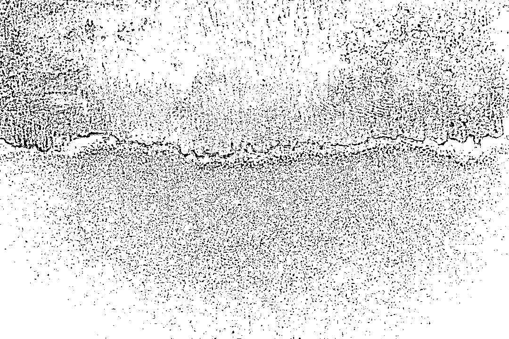

譬如冥王星落在 7 宫的人，可能很容易会对另外一个人有**依赖感**，过度地投入一段关系，而忘记了自己的独特性。她会无意识地吸引一些**“冥王星”式**的人，非常有影响力，强势而稳定，可以控制与引导自己。当他们开始过度依赖另一半，这段关系会**极度失衡**，因为她把自己的需求放在一边，先去满足对方的需求。对方自然会**操纵**这段关系。最后，冥王星落在 7 宫的人就变成了对方身份的延伸，变成了**“另外一个人”**。当对方有一天觉得自己的需求已经满足，或因为建立更有意义的关系而离开时，冥王星落在 7 宫的人如五雷轰顶——她会觉得自己的生命被抽走了，觉得这段关系不应该结束，无论是对方有了新欢还是彼此不再合适，这些理由都无法接受，**死缠烂打**就开始上演，人性黑暗的一面被迫呈现。即使，退一万步讲，双方都继续存续在这样依赖的关系中，但极端的依赖会造成**双方的灵魂都停止进化**。宇宙会来平衡这个问题，可能有一些外在的压力和事故把他们突然分开，有时是一方被迫离开，有时甚至是死亡。这对任何一方都是非常悲伤的结局，需要大量的时间来疗愈。**关于金冥议题**

关于金冥议题，有三点是我们通常会提及的：

**业力关系**

**所谓的业力关系，是指过去世两个人之间就有未解决的议题**。灵魂之间达成协议：**今生再次相遇，解决这些问题。**如果在今生无法清理两个人之间的能量纠结，来生很可能还是会再相遇——通过**爱情、婚姻、血缘**的纽带，或通过**友情及事业关系**的纽带。当冥王星触碰到金星时，在过去世，你的灵魂最大的伤痛同**爱与关系**有关。譬如，你被迫跟某个不喜欢的人结婚，被迫跟不喜欢的人发生关系，或者曾经被背叛和抛弃，或遭受过最爱的人突然的死亡......这些让你**深度信任的能力受到了创伤**。

如何疗愈呢？**通过爱（金星）带来转变（冥王星）。**

所以，金冥人在这一世会遇到很多业力关系。关键是：**你还会重复一样的错误吗？还是可以冲破业力的模式与自己的恐惧呢？**

在很多业力关系里，尽管灵魂本着化解累世恩怨的目的相遇，但每个人都有**小我的恐惧**，都有**自我保护的防御机制**，以及自己的**局限**。因此，有些人**从不断受伤的感情模式中退出来回到一个人的孤独中**，有些人会认定“这是你的错”而**责怪对方**，有些人会**活在幻想中期待对方有一天会改变**，**不甘心离开一段情感或身体上有虐待的关系 ......**业力的亲密关系可以成为最残酷的战场。显然，这些对于修复灵魂的创伤、平衡彼此业力，并没有用。在极端的压力下，如何能优雅、平和、镇定地走出来，是一场生命的终极考验。

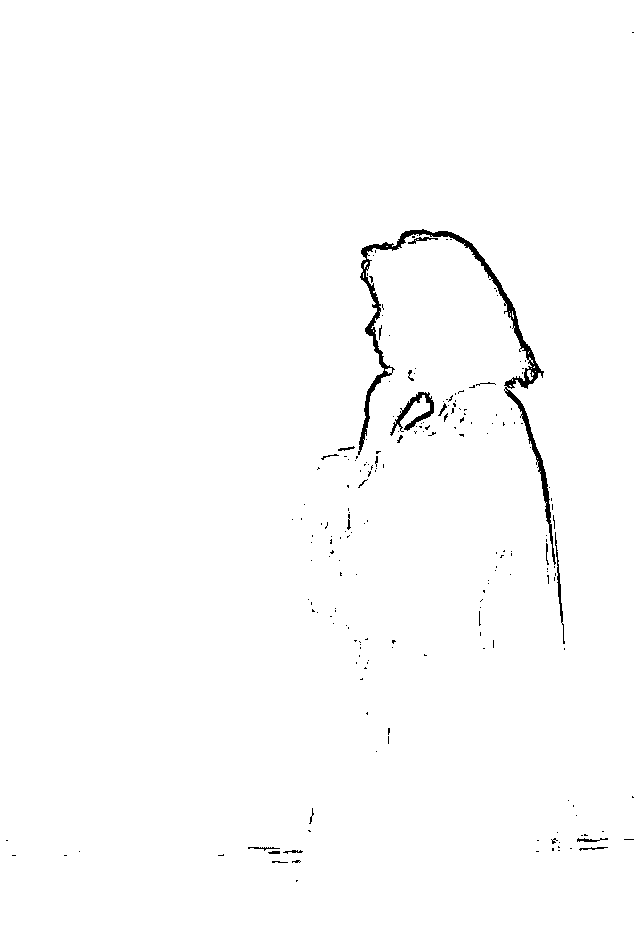

**性的结合**

性能量是人类生命力的源泉。金冥人非常渴望通过身体接触探索性的感觉。当两个人性结合时，两个不同的频率结合成合一的频率，会有短暂的狂喜，以及炼金术般的灵魂合二为一的感觉。这不仅仅是体验所谓的**“小死”（冥王星）**，也是走向**灵性**的通道——这里蕴藏着**冥王星转化的契机**。然而，低阶层面的性，可以变成**控制与操纵**，或者性本身能量太强大不好控制，会出现很多破坏性的行动——**出轨、性虐待、性暴力、自残、性犯罪**等。

越是强大的能量越不容易使用它，所以我们更倾向于**否认它、回避它**，或者被其所**控制。**

但每个人都不可避免地在性的影响下。如果你是金冥人，**你是在恐惧或滥用性能量，还是尊重，驯服甚至升华它？**

**死亡议题**

从神秘主义的角度来看，死亡是一种**超越个人能力所及的“权力”**。冥王星想要一种**“全有或全无”的爱**。金星担心冥王星带来的“死亡”，它感觉受到了威胁。因此，可以想象一个有金冥相位人在经历爱情时，会敏感地**对“与所爱的人生死离别”充满恐惧**，以你，一开始他们可能就会**训练自己的情绪**，以便接受关系中各种**毁灭或惨烈**的可能性。但是，如果他们感到对方值得他们去爱，又会像飞蛾扑火一般，不管不顾任何因素，**坚定地选择对方走到一起。**所以，金冥人的感情往往带有**黑暗与“死亡”的浓烈。**冥王星本身就是地下世界的统治者，它的最高阶表现是浴火重生的凤凰。所以，某种意思上说，**经历关系“死亡”的挣扎，反而能让金冥人感觉自己活着。**

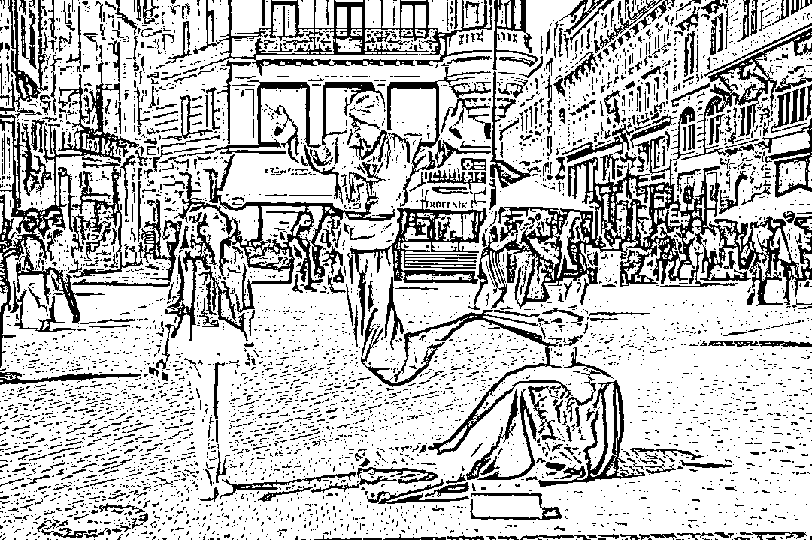

**如何处理金冥议题**

既然金冥人的亲密关系如此剧烈而复杂，要如何面对与处理呢？

对于金冥人而言，关系没有速成而简洁的解决方法：譬如如何从一段伤心欲绝的关系中转身离开；如何每天花 5 分钟，让你拥有美妙的性爱；如何快速识别对方是不是你的“真命天子”或“真命天女”，等等。

让金冥人真正神往的关系，都触及到灵魂的需求，每一段关系都有其背后的业力目的。但我们的现实中，关系似乎更关乎共同利益、财富、外表、地位、身份。所以我们要用一些**突破“常规”**的方式来面对自己的情感：

**首先，要在关系中看清自己的局限，去面对关系的局限。**

学占星学的人都知道，每一张出生星图或比对星图、组合星图里，都会体现个体的局限，也能看到某段关系的局限。譬如，关系中一方的土星如果与另一方的水星形成了冲突相位，意味着这两个人可能得花上十年的时间，才能真正克服沟通上的重重障碍——面子议题、权威倾向、难以控制的批判性，聆听与表达的节奏不符合等相处上的困难。即使你没有学过占星学，每个尝试过亲密关系的人都有同感：关系从不是件简单的事。但关系是重要的，我们不能因为受伤、失望而回避、放弃它。关系的存在就是一种互补，因为每个人只有透过别人才能让自己更加完整。我们需要透过身外之物来发现自己，同时也需要别人的协助，就像月亮需要太阳的光芒一样。**在这个四维世界里，我们遇到的大部分深刻的关系都是业力关系，来帮助彼此更好地灵魂进化，这是关系本身的局限**。所以，不要浪漫地以为，我遇到了灵魂伴侣，对方是我的双生灵魂，我们就象双胞胎一样彼此契合，这在四维次元是几乎不可能发生的，只是你自己的**梦幻、臆想与一厢情愿**。**其次，真实地去面对自己，真实地面对关系。**对关系或欲望保有一丝的不诚实或粉饰，冥王星的能量就不可能走到高阶，只会以**“操纵、不信任、憎恨、恐惧“**的方式展示出来。对于金冥人激烈的情绪，我们要做的不是逃离它，而是要**走进它**。很多时候我们自身打不破这个模式，是因为**恐惧太强大**，**害怕展露出自己的不好或激烈，或者觉得羞耻。**在咨询室里，我遇到过的冥王星议题，都涉及不被社会规范接纳的**禁忌**：**虐待、暴力、性交易、迫害、出轨**等，这些阴暗的话题的确会增加我们面对自己、面对关系的难度。但我们必须直面、必须非常真实地去**认可自己的情绪**。只有先认可它，才能去处理它——压抑不可能带来承认，更不可能转化。如果让内在积压的能量、无法消化的情绪，一直卡在我们的身体里，就会产生**破坏性**。对于金冥人而言尤其如此。心智是无法战胜情绪的，当情绪过于强大，我们会失去辨识力。当这些情绪的能量左冲右突，不断升级，会让你变得**扭曲**。带着这样的能量场去面对、现在或将来的关系时，就加重**扭曲与错位。**

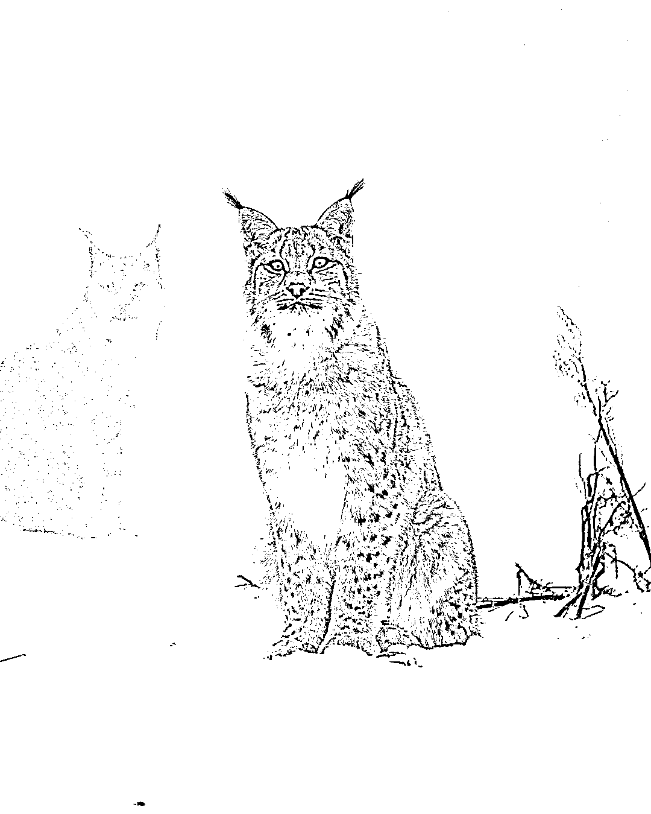

**第三，疗愈需要时间。**当情感出现了创伤，或关系出现了冲突时，就代表我们内部的**身心生态循环系统**也出现了问题。你不仅仅要看到当下的亲密关系问题，还要看到背后隐藏的东西：**原生家庭、自我价值、情感模式**等等。无论表面上的情形怎么样，都只是冰山一角。如果你熟视无睹自己内在的伤口，这些问题在以后的关系中还会持续发生，甚至会不断升级。不要误以为有一根魔法棒，可以让自己轻易从一段破败不堪的关系中转身就遇到最对的人。**接受感情议题的复杂性，承认背后的关联性，学着对自己慈悲，花时间疗愈，这会是一个转折。****最后，在最黑暗的时刻，仍然记得自己保有力量。**冥王星是一种**再生、更新及复原**的能力。作为金冥人，你天生就有这个资源，在光明与黑暗之间摸索前面，最后存活下来。作为金星天蝎座，我曾经在一段感情的漩涡里整整摸索了 10 年。在这之前的很多情感，都在演绎我星图中挑战相位的负面表达，而这段感情算是最有质量、最有联结感、也是最有业力的一段。可是，有些业力就是要学习**放手**。但要让一个金冥人放手是很难很难的。在这样至暗的时刻，如何保有希望？我在那 10 年中遇到了占星学，找到了这辈子真正应该做的事，那 10 年起起伏伏的螺旋式修炼，才让我变得强大。每一段疗愈，都是光明与黑暗不断交替的时光。但是你要相信，有一天你一定会看到隧道的光芒，只要你坚持下去。因为金冥人会是爱情中**最强大的生还者**。只要能做到这一点，金冥人肯定还能走得更远：你会有能力去面对目前这段关系到底有何意义，然后挖掘新的方法去面对熟悉的一切。

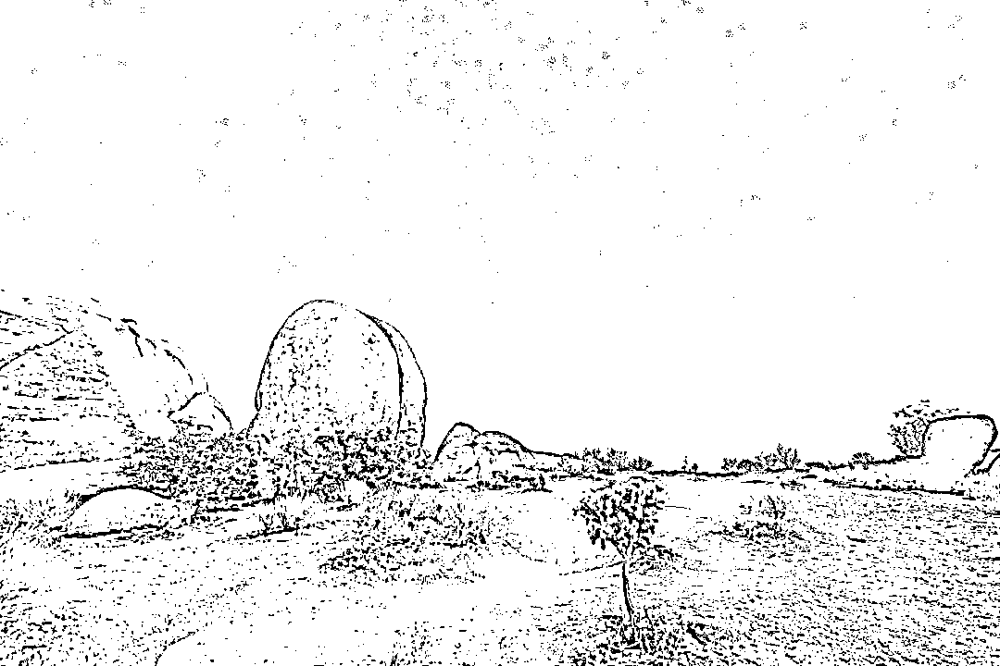

**每个人都需要亲密关系**亲密关系不是金冥人的专属。爱是生命中最突出的谜团之一，关系不仅是制造业力的主要因素，也是我们意识进化的最大促因。生命不只是重复老旧的模式，业力关系背后有其珍贵的宝藏。如果你曾经目光扫过一屋子的人，突然感到强烈的爱意；或是在某个阳光明媚的冬日午后，在停车场与某人短暂邂逅，因而改变了一生。你就会懂得，**爱是生命的必需品，爱在灵魂长河中能够超越时间。**每个人都有潜力，利用冥王星强大的能量来超越痛苦，破茧重生，打破“求不得、放不下、处不来”亲密关系的循环。亲爱的，你准备好直面自己的关系议题了吗？

**版权声明**：文章由作者授权在若道平台发布，欢迎转发，反对抄袭。

**你可能还想知道**

[金冥之恋 | 想要问问你敢不敢，像我这样为爱痴狂](https://mp.weixin.qq.com/s?__biz=MzA5NjA0NTAxNg==&mid=2651409023&idx=1&sn=706e5b1894980d6f0a867d49a0bcea4a&chksm=8b4bf8c8bc3c71dee5b8d7068549324f3c7710011bb014274eab48921dd2885693739274c127&mpshare=1&scene=21&srcid=12313BnlkSlFvI4ufFShPijw&sharer_sharetime=1577781274697&sharer_shareid=79ff492e946a049c0745c8e806eec753&exportkey=AaRppn4sSSb21VdkPQ2dPnA=&pass_ticket=m3WcIA0xbkWS4fQkg7jXR6dCSPMaekzwN6I7lAXl4Wk=#wechat_redirect)

[金冥相位｜仿佛只有用尽全力，才能证明真的爱过](https://mp.weixin.qq.com/s?__biz=MzA5NjA0NTAxNg==&mid=2651398836&idx=1&sn=8a856e2dbf7754c6c19ffd8395c30541&chksm=8b4b9003bc3c191593e2f54175f8e190efb629f4636b13c93c273e127938bbb216767419a60b&mpshare=1&scene=21&srcid=12317PFnE71WywWbfp2ToFlW&sharer_sharetime=1577781310434&sharer_shareid=79ff492e946a049c0745c8e806eec753&exportkey=AVf%20EDPnmHX2nHdKTJoULLI=&pass_ticket=m3WcIA0xbkWS4fQkg7jXR6dCSPMaekzwN6I7lAXl4Wk=#wechat_redirect)

[金星碰上冥王星 | 如果痛苦没有了，快乐也就没有了](https://mp.weixin.qq.com/s?__biz=MzA5NjA0NTAxNg==&mid=2651397328&idx=1&sn=bb180186c8990364714fc49f5730ad70&chksm=8b4bae67bc3c2771f942d51723b96ed6cc9c364097005e8e5fb6e74920f33566f31af38b5d81&mpshare=1&scene=21&srcid=12316eLY0EyHSHkmKwlOw84D&sharer_sharetime=1577781347128&sharer_shareid=79ff492e946a049c0745c8e806eec753&exportkey=Aa%20/eVgXXJyGEd%200cmuMD3I=&pass_ticket=m3WcIA0xbkWS4fQkg7jXR6dCSPMaekzwN6I7lAXl4Wk=#wechat_redirect)

****

**Justine**

ISAR 国际认证占星师（2016 年获得）/塔罗师

毕业于浙江大学，十年跨国企业 HR 经验

咨询时长超过 800 个小时

**咨询微信**：Justine_JT

**公众号**：星光体

长按打赏


******长按下图二维码咨询客服******

******详细课宣见今日二条****** 

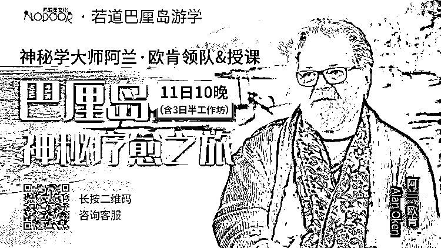

**微信又双叒叕改版啦，不想错过若道君的推送？**

**就把若道设为星标吧！**

**▼**


喜欢记得点一下在看哦☟

**报名直达入口**


# 若道首次游学招募 | 2020 年，追寻阿兰·欧肯的巴厘岛神秘之旅

> 原文：[`mp.weixin.qq.com/s?__biz=MzA5NjA0NTAxNg==&mid=2651412637&idx=2&sn=1aa6b173ab2a5e51518ac457d158bf23&chksm=8b4bea2abc3c633c3675419945e3ad1095ad545125c833b4d7d4423f506dd1684da449d95b90&scene=126&sessionid=1692738232#rd`](http://mp.weixin.qq.com/s?__biz=MzA5NjA0NTAxNg==&mid=2651412637&idx=2&sn=1aa6b173ab2a5e51518ac457d158bf23&chksm=8b4bea2abc3c633c3675419945e3ad1095ad545125c833b4d7d4423f506dd1684da449d95b90&scene=126&sessionid=1692738232#rd)


出发这件事常常会令人想起电影《美食、祈祷与恋爱》中，巴厘岛的巫医 ketut 递给女主 Liz 一幅画，并赠予了解读：

要脚踏实地，你就会感觉有四条腿，你就能在这个世上安稳下来；还有，不要用脑子看待世界，要用心去看，那样你才会了解上帝。

世间有太多纷繁复杂的事情我们要分析整理，反而忘却如何遵从心灵的声音，比如为了爱其他人而让自己的生活失衡；比如收藏了所有国家地理杂志的旅行专栏，最后哪里也没有去。偶然听到心中真实的声音，嘈杂的人生又容易失去相信自己的勇气。

幸好这世界上还有**巴厘岛**。


|  电影《美食、祈祷与恋爱》巴厘岛剧照

巴厘岛人说：“我们就站在世界的中心，我们就是世界的中心。”巴厘岛是一个充满灵性色彩存在的岛屿，在这个 5620 平方公里的岛屿上，散布着大大小小千余座印度教神庙，印度教思想、大乘佛教、传统的湿婆崇拜与岛上淳朴的自然崇拜、祖先崇拜交织在一起。巴厘岛人相信万物有灵，他们的生活沉浸在浓厚的神秘氛围中，他们相信自己脚下的土地是世界上最美的国度，是“世界的中心”。这座岛屿在 21 世纪的现代生活中成为一个特别异类的存在。而阿兰·欧肯，这位 75 岁深耕占星学和神秘学领域的老师，在多年前离开美国，在世界各地旅行之后，为这个岛屿独特的人文和场域所深深吸引，最终选择在巴厘岛定居。虽然阿兰·欧肯老师以占星大师身份为广大占星学子所知，但其实他更有许多神秘的古老智慧、实用的宇宙法则愿意传承，这对于我们的意识进化之旅将带来绝对深刻的了解和体悟。
**5 月 3-13 日**，阿兰·欧肯老师邀请你来到他的定居地——巴厘岛，开启这次意义非凡的巴厘岛神秘之旅，内容包括**3 日半阿兰·欧肯老师的神秘学工作坊**和穿插于其中的阿兰·欧肯老师为大家精心挑选的**巴厘岛神庙之旅**，阿兰·欧肯老师将带领大家，在理论学习的基础上，接触、感受巴厘岛的神秘之处，深入接触、体验古老智慧。****


巴厘岛游学**1****位宇宙级导师****11 日 10 晚****游学，含**3 日半****工作坊****** “****心灵成长****+****文化探秘****+****生活美学****”****若道首团游学探秘之旅****一次性满足你的所有新年跨国愿望！**

📹 [`v.qq.com/iframe/preview.html?width=500&height=375&auto=0&vid=b3041y0qg4q`](https://v.qq.com/iframe/preview.html?width=500&height=375&auto=0&vid=b3041y0qg4q)

|  阿兰·欧肯老师的巴厘岛故事

1**工作坊主题****“觉醒的头脑和心灵的实际运用”——疗愈、合一和意识发展的****22****条法则和原理**本次工作坊，阿兰·欧肯老师将带领大家进入他数十年修行的智慧世界，探讨 22 条宇宙法则，并审视如何将这些原则应用在我们的日常生活中。**工作坊具体内容，请咨询课程顾问王老师（微信：18510107057）****注意****：本工作坊不是占星工作坊，对神秘学感兴趣，没有占星基础的朋友也可以参加。****游学全程领队导师是阿兰·欧肯，并配有最专业的中文翻译。**
2**具体日程安排****游学时间：2020 年 5 月 3 日-5 月 13 日****地点：印度尼西亚 巴厘岛**

*   ### 5 月 3 日 游学集合：入住巴厘岛乌布斯塔拉翠贡精选酒店 


*   ### 5 月 4 日 上午水神庙、Pacung 午餐、下午海神庙；**晚上在斯塔拉翠贡精选酒店集体晚餐**


| 水神庙

 


|  Pacung 午餐


|  海神庙

*   **5 月 5 日 上午半日工作坊学习，和阿兰·欧肯老师一起冥想；下午到圣泉——巴厘岛的神圣净化池**

 


*   **5 月 6 日  半日工作坊学习、自由活动**

*   **5 月 7 日  半日工作坊学习，游览象窟——巴厘岛唯一的石窟寺院遗址**


 

*   **5 月 8 日 巴图布兰寺、著名的荷花咖啡厅午餐、塔曼阿云寺**

 


*   **5 月 9 日  全天工作坊学习**

*   **5 月 10 日  前往努沙杜瓦酒店 **


*   **5 月 11 日  全天工作坊学习**

*   **5 月 12 日  海边自由活动，晚上巴厘舞蹈表演**

 


*   **5 月 13 日  前往机场回家 巴厘岛游学圆满结束**

3**适合人群**

*   占星老学员，是时候补给宇宙智慧的你

*   灵性爱好者，擅长获取各类宇宙能量的你

*   文化探迷人，有机会零距离体验异域神秘学文化的你

*   旅行达人，不错过任何一次伟大旅程的你

*   巴厘岛狂热迷，去过巴厘岛无数次的你

*   没有任何原因就是被吸引很想报名的你

**注****：****本次游学无需任何知识基础皆可报名**

4**游学费用**

*   **2020 年 1 月 20 日前付款：24800 元**
*   **2020 年 2 月 15 日前付款：25800 元**

**此游学价格为****整体报价，不拆分****。****注意**: **因为该游学需要安排酒店、交通事项较多，因此****一旦缴费后，不再退费**。


**费用说明**

**游学费用****包含**：

3 日半“觉醒的头脑和心灵的实际运用”工作坊学费

5 月 3-12 日的巴厘岛住宿费

游学中的大部分餐费

巴厘岛集体活动时的交通费

游学涉及的所有景点门票

5 月 12 日晚的舞蹈表演

境外旅行意外险

**游学费用****不包含**：

学员从国内往返巴厘岛的交通费

巴厘岛岛内自由活动的交通费

以下自由活动的餐费自理：5 月 3 日到达日午餐、5 月 6 日自由活动晚餐、5 月 8 日晚餐、5 月 10 日前往努沙杜瓦酒店的午餐、5 月 12 日海边自由活动的午餐

**住宿说明**：

乌布斯塔拉翠贡精选酒店豪华房 Deluxe room（5 月 3 日晚-5 月 9 日晚共 7 晚）和努沙杜瓦酒店豪华房 Deluxe room（5 月 10 日-12 日，共 3 晚），标准为 2 人一个房间


5**导师介绍**


**阿兰·欧肯（Alan Oken）**

 

世界顶尖占星师

智慧学院（Santa Fe, NM）主任

澳大利亚意识发展研究所的联合创始人

翻译、教师、全球旅行者和国际导游

阿兰·欧肯，1944 年出生于美国纽约，在纽约大学主修罗曼斯语言和语言学。出版过十几本著作，比如《灵魂占星学》《星图中的守护关系》《阿兰·欧肯完整占星学》。他用 5 种语言授课，用 7 种语言解读星图。

6**退转课程**

**因为该游学需要安排酒店、交通事项较多，因此****一旦缴费后，不再退费****。**

****巴厘岛游学****

**领队老师&工作坊授课老师：阿兰·欧肯**

**游学时间：**2020 年 5 月 3 日-13 日（共 11 日 10 晚）

**游学地点**：印度尼西亚 巴厘岛

**游学方式：**巴厘岛探秘之旅+3 日半工作坊，游学全程由阿兰·欧肯领队，并配有最专业的中文翻译。

**费用：**

**2020 年 1 月 20 日前付款：24800 元**

**2020 年 2 月 15 日前付款：25800 元**

**课程负责人：**王老师（微信：18510107057），请备注“巴厘岛”

长按二维码添加课程负责人咨询~


****报名请点击“阅读原文”****


# 新年快乐！本月，两大“BOSS”终于聚首，之后就“柳暗花明又一村”了！

> 原文：[`mp.weixin.qq.com/s?__biz=MzA5NjA0NTAxNg==&mid=2651412636&idx=1&sn=e8cb82b441025461ba9c9a7da81a1c01&chksm=8b4bea2bbc3c633d7ba05e1444463d607579faa0724133bf46ae02ce74d133af469e6fe6612f&scene=126&sessionid=1692738232#rd`](http://mp.weixin.qq.com/s?__biz=MzA5NjA0NTAxNg==&mid=2651412636&idx=1&sn=e8cb82b441025461ba9c9a7da81a1c01&chksm=8b4bea2bbc3c633d7ba05e1444463d607579faa0724133bf46ae02ce74d133af469e6fe6612f&scene=126&sessionid=1692738232#rd)

****************☆ 后台回复“今日”，给你一句生命态度****************

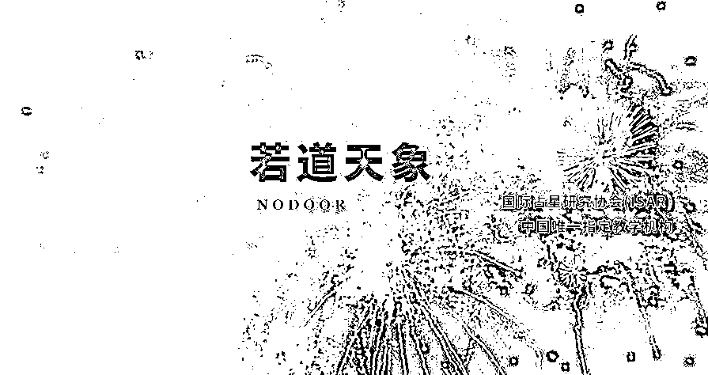

作者/咔咔 ISAR 认证占星师
编辑/玫瑰 图片/unsplash 今天是 2020 年第一天，挥别 2019，喜迎 2020。今年要立下什么样的 flag，准备好了么？若道君在这里祝大家新年快乐，新年新气象。一起来看看 2020 年第一个月有哪些重要天象吧！
**1 月主要天象**

期盼许久的土星和冥王星终于将在本月精准合相了。**1 月 13 日，土星与冥王星在摩羯座 22 度相遇，太阳与水星也加入进来，与土冥形成合相**。加上在摩羯座的木星，**1 月初到 1 月中旬，天空中五星齐聚摩羯座**，展开了 2020 年的宏大画卷。

回看 2019 年，土冥联手掀翻了很多东西，冥王星负责摧毁，土星负责建造，他们是一股无情的力量，要进入生活的新篇章，就要**先放弃已拥有的**，要**离开感到安全的地方**。

2019 年，很多人用极大的意志力专注在他们的工作和生活上，有一种**“如果不这么做，就会死”**的劲头。人们用近乎偏执的努力来赢取土星的奖赏，也可能对有些人而言，这个努力是用来**对抗对失败的恐惧和羞耻感**。经过 2019 年土冥摧枯拉朽式的行进，我们对这个能量多少开始熟悉，也有一些与之合作的心得了。

新年伊始，我们可以利用五星齐聚摩羯座的时机，**制定切实可行的目标**，为 20 年后的土冥周期做规划，**努力自律，拥抱我们的责任**。在实现目标的路上可能面临一些障碍，幸运的是，**2019 年 12 月 26 日的日食与木星合相，给我们带来了乐观和希望**。

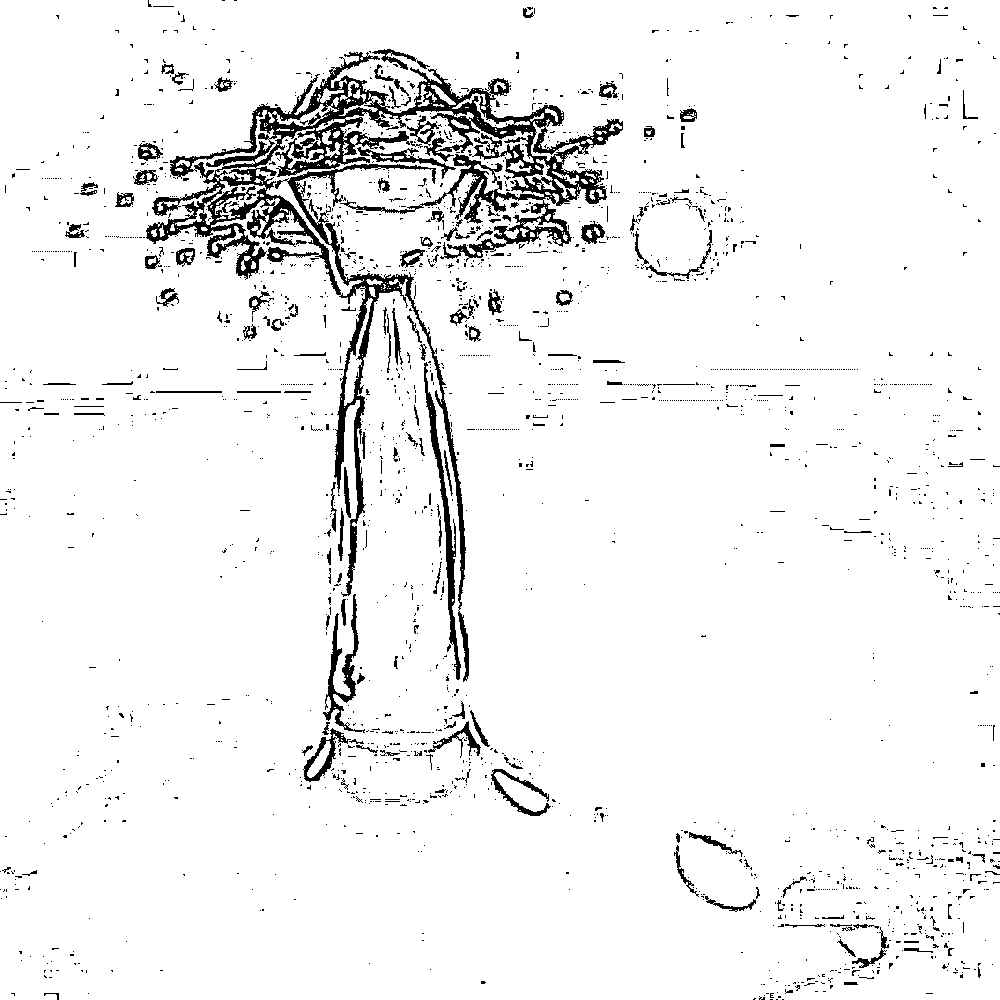

**值得注意的几个日期**

**1 月 3-8 日****风物长宜放眼量**

**1 月 3 日，水星与木星在摩羯座合相**，我们可以**打开认知局限，用宽广长远的目光去看待世间万物**。开阔视野，着眼大局，不要拘泥在当下的困境里。火星同日进入射手座，被木星摩羯座定位。火星在射手座呼应了水木合相的能量，**与其谨小慎微地衡量每个步骤的厉害，不如带着热情和天真向着心之所往努力拼搏**。**2020 年，木星与海王星会形成三次六分相**，提醒我们，**能力越大，责任越大，要去帮助还在受苦的生命**；也提醒我们，**灵感和直觉会帮助我们做出明智的决定，实现我们的目标**。**1 月 7-8 日**，太阳和水星好像信使，从木星摩羯座走向双鱼座的海王星，我们会听到这样的提醒。太阳和水星与海王星的六分相，也为接下来的月食提供了一层**“保护垫”**。

****1 月 10-23 日******柳暗花明又一村**

**1 月 11 日**，太阳、水星、土星、冥王星合相摩羯座，对分巨蟹座的月亮，形成**半影月食**。这是一次对 2019 年**压抑和焦虑情绪的重要释放**，天空中的其他行星都不参与进来，这必然使我们的**情感与理智位于巨大的张力之中**。月食发生的星座：**巨蟹座-摩羯座轴线**与我们的**日常生活、社会生活、情绪安全、阶层等级、家庭和事业**相关。太阳和水星与土冥的合相有着**强迫性**的倾向，我们会**认可所有能带给我们秩序的东西，条款、法规、结构……**就好像房子必须要被有力的柱子支撑起来，我们的生活也需要感到**安全、稳固**。月食涉及到南交点，说明在**安全感、社会为个人提供的稳定框架**方面有一些**长久的隐患**被暴露出来了。人们要去谈论这些问题、**呼吁权力机构的重视、投入时间和精力，用立法和其他行政手段改变当下的问题**。而月亮在巨蟹座合相北交点，人们可能会清晰地感受到要**与“心”建立联系，感到被关爱与情感联结的强烈需求**。土冥合相南交点的时候，北交点巨蟹座一直在提供解药。作为土冥“重灾区”的一员，2019 年我与朋友聚会的时候，会尽可能多地**彼此拥抱，感受臂弯间的温度**。更重要的是，**在一个安全的被接纳的环境下，自我揭露，和朋友说说心里话，分享内心的感受**。当我说出一些负面感受，对自己的评判，朋友说其实我也会这样。我觉得，**啊，我不再是孤单一个人**。这个月食，也许我们都想“不再是一个人”，这就意味着要**打开我们的心，尊重自己的情绪，尤其是心之阴影**。满月是最好的提升觉知的时期，情感与理智的巨大张力给了我们两个视角，让我们看到个人生活中那些我们一直忽视或者敷衍了事的地方。

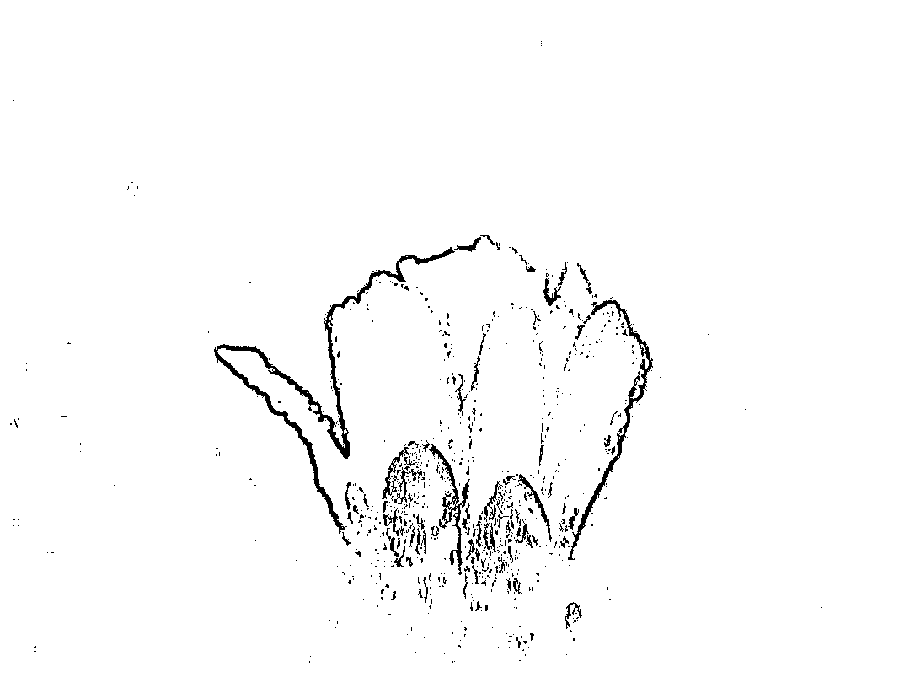

****1 月 17-25 日******我劝天公重抖擞**

**月食当天，天王星历经 5 个月的逆行，恢复顺行**。我们重新联结到**做出改变的渴望和动力**。在土冥的碾压之下，很容易感觉自己是**更大力量的受害者**。**1 月 17-18 日，水星进入水瓶座，四分天王星**，我们有冲动**用独特的方式表达自己，不甘平庸，跳出窠臼。**获得力量感的方式，是**从被改变走向我想要改变！****1 月 20 日，太阳进入水瓶座。23 日，太阳四分天王星。25 日，水瓶座新月四分天王星。**改革者不能单枪匹马，我们要**找到自己的伙伴，一起分享奇思妙想**。时值春节假期，**金星与海王星合相，六分木星**，也预示着一段**社交联谊的活跃期**。寒冬虽至，我们还是可以在生活里寻找一些**“小确幸”**，和爱人朋友去海边，彼此陪伴，相约探索你长久向往的地方；**丰富的想象力**也会是这个时期的礼物，让这些想象力通过**冥想、绘画、音乐、舞蹈**和其他的方法表达。一滴水也能折射大海的影子，纵使外在大环境再严酷，我们每个人微小的善意，一点点的慷慨、对弱小和受苦的生命伸出的手，都能让这个世界变得更温暖一些。春天就在不远处！

**附录：本月重要天象一览表**

| **日期** | **星象** |
| **2020.1.3** | **水星合相木星（摩羯座） 火星进入射手座** |
| **2020.1.7** | **太阳（摩羯座）六分海王星（双鱼座）** |
| **2020.1.8** | **水星（摩羯座）六分海王星（双鱼座）**  |
| **2020.1.10** | **太阳合相水星（摩羯座）** |
| **2020.1.11** | **巨蟹座月食 天王星恢复顺行** |
| **2020.1.12** | **水星合相土星、冥王星（摩羯座）** |
| **2020.1.13** | **土星合相冥王星（摩羯座） 太阳合相土星、冥王星（摩羯座）** |
| **2020.1.14** | **金星进入双鱼座** |
| **2020.1.16**  | **金星（双鱼座）六分天王星（金牛座）** |
| **2020.1.17** | **水星进入水瓶座** |
| **2020.1.18‍** | **水星（水瓶座）四分天王星（金牛座）‍** |
| **2020.1.20** | **太阳进入水瓶座** |
| **2020.1.23**  | **太阳（水瓶座）四分天王星（金牛座）** **金星（双鱼座）六分木星（摩羯座）** |
| **2020.1.25**  | **水星（水瓶座）六分火星（射手座）**  |
| **2020.1.27**  | **金星（双鱼座）四分火星（射手座）**  |
| **2020.1.28**  | **火星（射手座）四分海王星（双鱼座）** |
| **2020.1.29**  | **金星合相海王星（双鱼座） ‍‍‍** |

**版权声明：**原创文章由作者授权首发于若道平台，欢迎转发，反对抄袭。友号转载请申请白名单。


********想阅读更多作者的文章********

********请在后台回复**************** 咔咔 即可********

**咔咔**

职业占星师，若道核心课程讲师

ISAR 认证占星师（2014 年获得）

国际知名广告公司和市场研究公司工作十余年

**微信公众号**：咔星人

长按打赏


**新年到啦，为自己和重要的人**

****送上一份暖心的新年****大礼吧****

******由**大卫·瑞雷****亲自主笔的**《**2020 年度运势报告》****

****将是一份尤为特别的****

☞[**新年礼物**](http://mp.weixin.qq.com/s?__biz=MzA5NjA0NTAxNg==&mid=2651412428&idx=2&sn=c7ac1a6bdc53a8bbf62ff4511308629a&chksm=8b4be57bbc3c6c6d69a1beb7f84b72f1e2607071c069efa13310c7983475522ea3a31de4458e&scene=21#wechat_redirect)☜

**点击下图了解详情**

**☟**


******点击图片查看若道君推荐******


**微信又又又改版啦，不想错过若道的推送？**

**就把若道设为星标吧！**

**▼**


喜欢记得点一下在看哦☟

********年运报告购买入口********


# 2020 年第一波好运来啦 | 年运报告大礼包等你签收！

> 原文：[`mp.weixin.qq.com/s?__biz=MzA5NjA0NTAxNg==&mid=2651412636&idx=2&sn=bb215312795a3ea07e2bb5e18c86783b&chksm=8b4bea2bbc3c633dcd68c53b7a10c1dc4a58241d3f64a84d32307b050c20a3923f7698e2c7a9&scene=126&sessionid=1692738232#rd`](http://mp.weixin.qq.com/s?__biz=MzA5NjA0NTAxNg==&mid=2651412636&idx=2&sn=bb215312795a3ea07e2bb5e18c86783b&chksm=8b4bea2bbc3c633dcd68c53b7a10c1dc4a58241d3f64a84d32307b050c20a3923f7698e2c7a9&scene=126&sessionid=1692738232#rd)

**今天是 2020 年第一天，****若道君祝大家新年快乐！****按照惯例****若道君将为****默默关注****着若道的粉丝们****送上暖心的新年****大礼****由****大卫·瑞雷****亲自主笔的**《**2020 年度运势报告》****元旦优惠****大礼包**

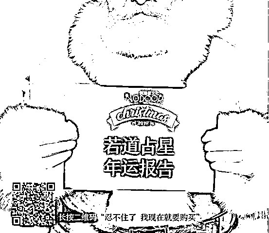

**看点抢鲜了解**

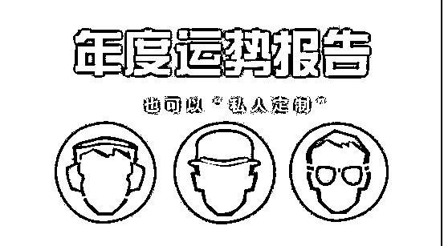

*   **私人定制**，根据每人不同的出生年、月、日匹生成独一无二的个人年度报告；
*   浓缩了大卫·瑞雷**47 年的占星咨询实践之精华**，以人为本，字字诚恳；
*   2020 木星进入摩羯座，土冥合相、木星合相的到来，将会有什么样的**机遇和挑战？**
*   **价格惊喜**，远远低于一次占星咨询的费用；
*   **形式私密**，避免了与占星师面对面的焦虑。

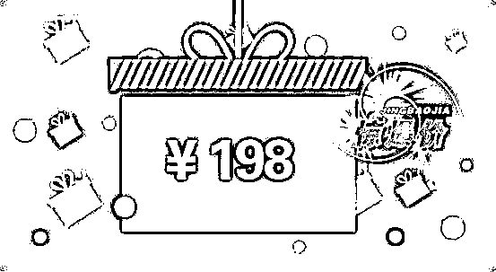

**适合人群**

*   相信命运存在的人，崇尚自由意志的人；

*   对 2020 年满怀希望的人，对 2020 年不抱希望的人；

*   非常懂占星的人，还不懂占星的人；

*   需要关爱自己的人，懂得分享友谊的人。

**使用步骤**

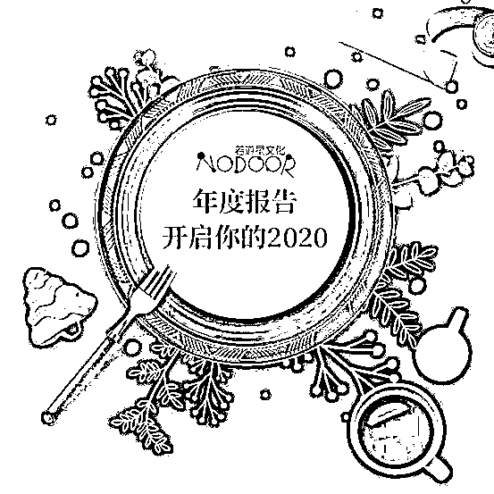

**✦第一步**从你日常生活衣、食、住、行任何一项中拿出 198 元，购买若道年度报告；**✦第二步**在“**个人中心**”找到你的 2020 年度报告，翻阅它，从中找到力量；
**✦第三步**后悔没有早点遇到它，想马上给自己的亲人和好友，一人来上一份；**✦第四步**不用阅后即焚。幸福地阅读过后，关闭它，然后放在记忆深处；**✦第五步**在 2020 年感到迷茫的时候，重新打开它，它是探路的明灯；在 2020 年压力山大的时候，重新打开它，它是暖心的火把。**现在购买，****即可获得****30 元年运红包**

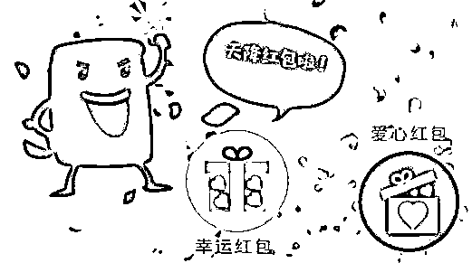

原价**198 元**的若道年度报告现在购买幸运价仅需**168 元**如果这份诚意都还没让你下手，你还可以邀请你的朋友一起**拼团，****买得多，省得多，成长多！**年度报告**“友福同享”新年团购价****3 份**年运报告 399 元，每份只要**133 元****5 份**年运报告 599 元，每份只要**120 元****9 份**年运报告 888 元，每份只要**99 元****15 份**年运报告 1200 元，每份只要**80 元****圣诞、元旦过节不送礼****送礼只送一份年度报告的启示和安心**

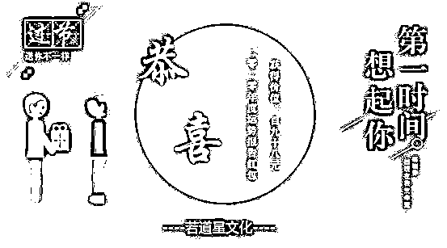

**友情提醒**

**❶** 现在购买若道年运报告 1 份，立刻获得**30 元红包，**使用期限到**2020 年 1 月 31 日；** **❷** 买几份送亲友，买得多送得多。**一次购买多份报告，可享受****年运红包套餐价****，心意送出越多越实惠哦**！（套餐价内报告可以自己使用，也可以赠送亲友，套餐价已包含红包，已直接抵扣）优惠期限到**2020 年 02 月 28 日；** **❸ ****年运红包任何使用问题，咨询微信 nodoor201705；** **❹ **转发此文并在评论区留言，**点赞数最高的前三名将每人免费获赠年度报告一份**（点赞统计截至**2019.12.31**）。

**购买&查阅指南**

（建议收藏此图，以便日后查看报告内容）

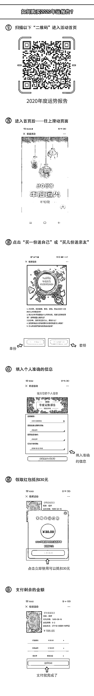

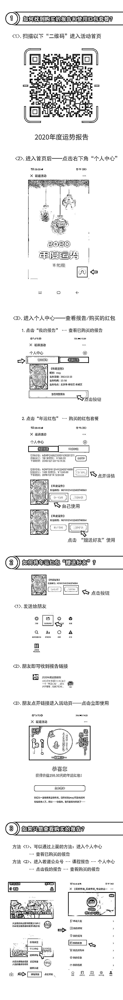

长按二维码添加客服小姐姐微信咨询更多哦

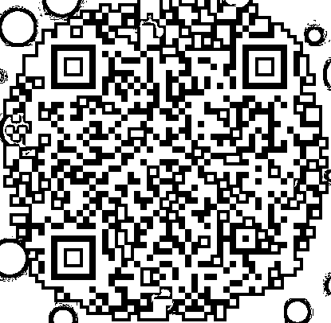


********年运报告购买入口********


# 目前市面上的占星学课让你觉得无聊了？这门新课你得看看

> 原文：[`mp.weixin.qq.com/s?__biz=MzA5NjA0NTAxNg==&mid=2651412604&idx=2&sn=460102494c57b7fb22a2bc4643dd1b92&chksm=8b4beacbbc3c63ddd8bc09a6164355b30962ce476cb6cbd249856a215ec4ce1b914cf9918b20&scene=126&sessionid=1692738232#rd`](http://mp.weixin.qq.com/s?__biz=MzA5NjA0NTAxNg==&mid=2651412604&idx=2&sn=460102494c57b7fb22a2bc4643dd1b92&chksm=8b4beacbbc3c63ddd8bc09a6164355b30962ce476cb6cbd249856a215ec4ce1b914cf9918b20&scene=126&sessionid=1692738232#rd)


有这样一则家喻户晓的故事：三个泥瓦匠在砌墙，一个人走过来，问他们在干什么。第一个泥瓦匠没好气地说：你没看见吗？我在辛苦地砌墙呢。第二个笑笑补充回答：我们正在建一座高楼。第三个则笑容灿烂哼着小曲儿说：我们正在为城市添砖加瓦、创造美好的生活。10 年过去了，第一个人仍然在做泥瓦匠，第二个人成为了一名工程师，而第三个人则成为建筑公司的老板。**工作技能本身没有区别，为什么三个人的人生走向却大相径庭？**

*   人的一生是见自己，见众生，见天地的过程。**不同的认知层次，形成了不同的人生格局。**它决定了你能看到的风景。我们常常抱怨命运不公，抱怨生活没有诗和远方，事实上，那是因为我们高度不够，格局太小。

*   同样，占星学习也是见自己，见众生，见天地的过程。**不同的认知层次，形成了不同的占星视野。**它决定了你可以运用这门语言看到怎样的风景。占星师常常困惑占星学习遭遇瓶颈，客户拓展资源不足，帮助来访者扩展格局能力不够。究其原因，是因为我们使用占星学的高度和格局不足。

晚清名臣曾国藩说：**谋大事者首重格局**。人和人不一样，拼的是格局。那又是什么决定着一个当代占星师的格局呢？大格局的本质是：**站得高，看得远，懂取舍**2020 春季开年 ISAR 选修课若道倾力打造不可不学的**经世占星学**一起来解锁全新大格局的占星版图吧！


占星之旅上半场拼的是知识技法占星之旅下半场拼的是眼界格局**为什么学习经世占星学？**

**经世占星学（mundane astrology）是研究世界政治经济发展趋势和世界各国发展周期的占星学研究分支。**

任何有一些人生阅历，对于国家历史、家族历史有所了解的人都会明白，我们的个人生活是时代和国家历史的缩影，我们个人经历的行进、推进是一条小溪，而更大的背景是世界和国家行进、推进的大河。大河的流向决定了小溪的流向。

学习经世占星学，**帮助我们及我们的客户这条小溪在这个世界的大江大河“顺势而为”**。具体而言：

*   在 21 世纪这个信息世纪，经世占星学可以帮助占星师开辟新的服务项目——**为高端企业家客户及大机构提供独特服务**，因为高端客户和大机构对于国际政治经济发展趋势，主要影响力国家、重要世界组织机构的现在和未来都更为敏感。对应国家的行进和推进，更好地预测这个国家或大型组织的未来发展、变化趋势；

*   在人口的国际间流动、交流更为频繁的时代，经世占星学通过了解各国的趋势，**可以在客户有国家选择需求时，帮助占星师为客户提供更多信息服务**。

*   如果你爱历史，经世占星学可以给你**看历史长河中世代兴衰起落的独特视角**；

*   如果你爱关注国际形势，经世占星学都能够让你更**了解每一个国家的国民个性、集体潜意识，社会议题和发展方向**；也能帮助你**对领导人及其国家的影响有更深刻的了解**。

**课程大纲****此课程可作为 ISAR 选修课。**在这 10 节课的时间里，我们将学习**经世占星学的重要研究方向**，包括但不限于：

*   行星周期对于世界发展及格局变化的影响
*   研究国家星图及行星周期对于国家的影响
*   研究外国领导人星图及对其国家的影响
*   如何从政府成立、总统就职时间的星图研究时事发展
*   如何从重要组织机构诞生星图（如北约、欧盟、欧元区、第一个现代证券交易所的诞生星图）看组织未来
*   如何从重大事件发生时的星图（比如从曼德拉出狱日期看南非转折和开端）发现该事件对于国家的影响

**授课老师**


**卡伦·哈梅克**·**佐达格**

**（Karen Hamaker Zondag）**

卡伦·哈梅克·佐达格是**20 世纪最受尊重和赞誉的占星师之一**，她毕业于荷兰阿姆斯特丹大学，于 1975 年开始她的占星实践。她是荷兰**两所学校的创始人之一**：一所是 1980 年成立的阿切纳占星学学校，另一所是 1987 年成立的荣格心理学学院。她也被邀请作为英国著名占星教育机构心理占星中心（Centre for Psychological Astrology）的老师和美国第一所真正的、官方的占星学大学开普勒学院任教，并是**世界各大占星会议最受欢迎的演讲人之一**。由于其**对占星学的独特贡献**，卡伦·哈梅克·佐达格在 1992 年、1995 年、1998 年分别获得占星学界最著名的奖项轩辕十四奖项提名，并于 1998 年获得**轩辕十四奖**。

卡伦·哈梅克·佐达格一个非常鲜明的个人特色是她的**研究涉猎广泛而深入，她在心理占星、金融占星、经世占星方面都是该领域排名前列的老师，并且深受该领域知名占星师的赞誉**。因为其在占星学的知名声誉，她从 2012 年被隶属于荷兰著名投资集团 Rasile 的 Dasym Research （Dasym 是全球电视节目的创新的著名领导者，比如《中国好声音》就是引入 Dasym Media 的版权）聘请为**智库成员**，该智库调研当前世界显性和隐性的社会经济趋势，为发展和投资决策服务。她也是**TEDx 演讲**人。


她是**20 多本占星学、心理学、塔罗、易经书籍的作者**，包括《从占星学视角看金融危机的背景和未来》、《性的占星学和疗愈》、《日常生活中的占星学》、《心灵和占星象征》、《作为生活之道的塔罗牌》、《12 宫》、《宫位的本质和背景》、《相位研究》、《四轴手册》、《卜卦占星》、《关系占星学》、《占星学预测》、《从新的角度看外行星》、《易经、冥想和灵性》、《实践中的荣格心理类型》、《日常生活中的灵性和心理学》、《实践中的投射机制》、《自我的愉悦——愉悦心理学》、《神话和现实》等。她的书籍因为**广受欢迎**，**被翻译为 10 多种文字在多国出版**。


**授课时间&方式**

**授课时间（共 10 次课）**：

*   2020 年 4 月 6 日（周一）

*   2020 年 4 月 14 日（周二）

*   2020 年 4 月 21 日（周二）

*   2020 年 5 月 5 日（周二）

*   2020 年 5 月 12 日（周二）

*   2020 年 5 月 19 日（周二）

*   2020 年 5 月 26 日（周二）

*   2020 年 6 月 2 日（周二）

*   2020 年 6 月 8 日（周一）

**授课方式**：

**线上网络直播课，英文授课，中文翻译**

**课程价格**

**正价：7500 元**

**早鸟价：6800 元**

**早鸟价截止日期：2020 年 3 月 6 日**

**退转课程**

**退款原则请详看《教学协议》，如有疑问请咨询课程顾问。**

****ISAR 选修·经世占星学****

**授课老师：卡伦·哈梅克**·**佐达格**

**时间：**2020 年 4 月 6 日-6 月 8 日（共 10 次课）

**授课方式：**网络直播课，英文授课，中文翻译

**费用：**7500 元；**早鸟价：6800 元（2020 年 3 月 6 日之前）**

**课程负责人：**王老师（微信：18510107057），请备注“经世占星”

长按二维码添加课程负责人咨询~


****报名请点击“阅读原文”****


# 最“炫酷”的年运 | 12 星座 2020 年度功课大揭秘

> 原文：[`mp.weixin.qq.com/s?__biz=MzA5NjA0NTAxNg==&mid=2651412604&idx=1&sn=387a944dad92bec0a0c006b206dbc6b3&chksm=8b4beacbbc3c63ddae153bc2f147baf2d6a8a50b4bf052835f2742f72ef635922d5be6bf232b&scene=126&sessionid=1692738232#rd`](http://mp.weixin.qq.com/s?__biz=MzA5NjA0NTAxNg==&mid=2651412604&idx=1&sn=387a944dad92bec0a0c006b206dbc6b3&chksm=8b4beacbbc3c63ddae153bc2f147baf2d6a8a50b4bf052835f2742f72ef635922d5be6bf232b&scene=126&sessionid=1692738232#rd)

**☆ 后台回复“今日”，给你一句生命态度**


作者/查理 ISAR 认证占星师编辑/玫瑰 封面/书君 图片/unsplash

**作者的话**  

同学们，2019 年就快过去了，不知道大家今年的功课完成得怎么样呢？很多同学反映今年的作业特别难，题都读不懂，只写了一个“解”字，后面就不知道怎么做了。2019 年出题的几位老师下手确实狠了点，但时间不等人啊，眼瞅着年关将至，2020 年又到了，老师们又吩咐要安排新的课表和功课了。大家没做完的赶紧做完，查缺补漏，实在不行同学们互相帮助一下，报团取暖。**2020 年的几位“任课老师”**在发布今年的课表以前，我们再重新认识一下几位“任课老师”。第一位主课老师人高马大，刚带着一波学生游学归来，2019 年跟着 TA 出去嗨的同学们都玩儿疯了，TA 带大家去北欧赏极光，去非洲跟随动物迁徙，深入亚马逊探险，还去墨西哥大蓝洞玩自由潜，在拉斯维加斯豪赌，上天入地下海。跟着 TA 的很多同学不但经历了身体的冒险，还有精神的享受。从人类文明的变迁到江南一个小村落的兴衰，从古希腊的四元素到 20 世纪的存在主义，从宏观世界的弦理论到微观世界的量子纠缠加密信息传输，这位老师似乎无所不知无所不晓。这位老师，是最受大家欢迎的**“木星老师”。**当然，也有被木星老师带坑里去的同学，比如中了大奖裸辞结果山穷水尽的，或者过于激进冒险玩脱线的，也有交了一堆学费结果竹篮打水一场空的。2020 年开始，木星老师要开新课了，给大家收心了，TA 会帮助大家**关心一些现实的问题**，比如如何才能让大家能够持久地感到**富足和精神成长**，如何才能为子孙后代造福，**“前人栽树后人乘凉”。**第二位主课老师年纪有点大，头发花白、不苟言笑，还有点驼背，大家印象最深刻的可能是 TA 深深的法令纹和拇指上的那枚锈迹斑斑的指环。今年这位老师下手有点狠，被 TA 教训过的同学要承受超强的压力，原来在事业上根基不稳的同学可能就失业了，婚姻里不牢靠的可能就要离婚了，健康方面原来有问题的可能还会大病一场，等等。这位老师，也就是让大家谈虎色变的**“土星老师”。**TA 常说：**“根基不劳，地动山摇”**。不少同学因为 TA 的严格管教而变得更加**稳重和成熟**了，他们明白了**如何区分大是大非，如何正确地建立自己的边界，如何为自己的生活负担责任**。有一些关于**严于律己**的朋友，今年在这位老师的带领下已经开始**执掌权位**。2020 年大部分时间，TA 将继续过去 2 年的**严厉和高压**方式教学，但在**2020 年 3-6 月**期间会带给大家全新的教学方式，可能会开启有关**太空领域、人工智能、未来学**的系统性课程，有兴趣的同学们一定要关注一下。对了，“土星老师”曾在**2019 年 4-6 月**和另一位老师联合教学过。当时安排的课业量很大，听说一些同学被折磨受不了都“哇哇乱叫”，甚至还有些同学们被逼得留级重修。这第三位老师个子不高，也不喜欢上讲台，据说 TA 养过蛇和蝎子，还熬过几头鹰。它因为长得太矮而得不到某些校委委员的承认，还差点被从教师名单里除名。这位老师很社会范儿，有些阴暗，有点像『哈利波特』里的伏地魔。上 TA 课的同学们经常被吓得半死，瞧瞧 TA 都带大家去哪些地方？贫民窟、洗浴中心、重症监护病房、火葬场、华尔街等这种。TA 总说那里就像一片黑暗森林，所有人都赤裸裸地站在别人面前，于是所有的**弱点、欲望和痛苦**都无处藏身，那里有人类最真实的模样。TA 就是令很多同学闻风丧胆的**“冥王星老师”**。那些经过冥王星老师调教的同学们，他们不必在别人的期待中辛苦伪装，不必在执念里作茧自缚，他们和自己**最真实的灵魂**相遇，也明白了自己最需要什么，可以抛弃什么。他们因此而获得的礼物，叫做**“重生”**。

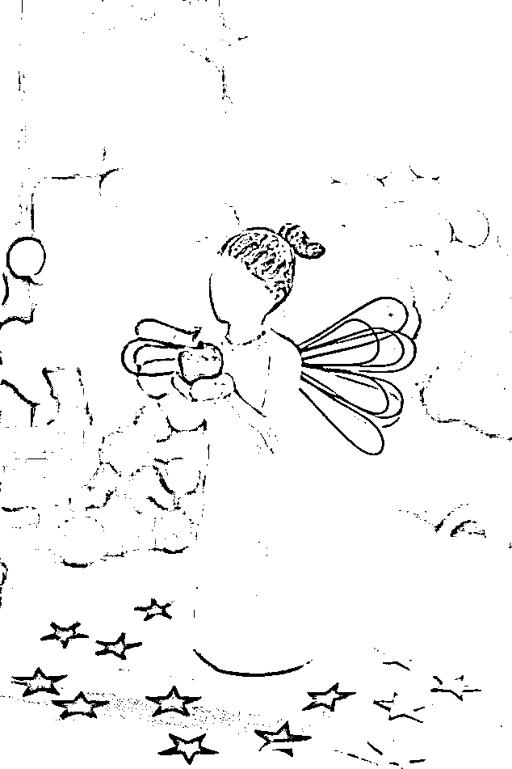

**2020 年 1 月-2 月份和 9 月-10 月份，“土星老师”和“冥王星”老师会再次联合办学**，估计有一波同学可以结业了，要重修这门课的同学也要抓紧。这两位老师每 40 年才联合办一次学。同时，**“木星老师”和“冥王星老师”会在 3 月底-4 月份、6 月份和 11 月份联合办课三次**，这三堂课价值连城，他们可能会给一些人的生命带来**“巨大的重生”**，也可能带来**意想不到的宝藏，**这些宝藏可能是现实层面的，比如**权力和地位**。宝藏属于那些已经全身心准备好的同学，他们已经经过**重生的洗礼**，**重建了自己的人生，清楚地明白自己想要的是什么，也深入了解过人性的贪婪和欲望**。而对于还不明就里的同学，需要特别当心这门课，上了这门课你可能会**获得各种套路，并被巨大的利益和机会冲昏头脑，进而夜郎自大，后果不堪设想。****“木星老师”在 2019 年 1 月、6 月和 9 月还和另一位大名鼎鼎的主课老师“海王星老师”抢过课表**，木星老师想带大家睁眼看世界，海王星老师则想带同学闭眼观自在，这给很多同学造成很多错乱的感觉。海王星老师琴棋书画烟酒茶样样在行，但这几年一直很佛系，深居简出，常常闭关修行，有时在各色的寺庙里，有时在教堂里，还有时在山洞里。跟随 Ta 的同学很多都体会到了神奇的体验，有些人**疗愈了童年创伤**，有人能够**掌握自己的梦境**，有同学的**艺术直觉被开启**，还有同学甚至像开了天眼一样可以**看到前世今生**。不过，也有同学走火入魔开始沉迷于虚幻的世界，比如**对药物和酒精上瘾**，或者对自我认知、金钱财富、伴侣关系等议题产生严重的**幻觉**，产生**逃学和厌学**的倾向。**2020 年 2 月、7 月、10 月**，海王星老师会再度和木星老师一起开课，这回他们商量好了，这次海王星老师主讲，木星老师来配合，会帮助同学们获得更多的持续的**内在灵感体验**，希望获得**更强疗愈能力、艺术能力**的同学们，这几个月要抓紧机会好好上课。最后一位老师，大家可能都看不见 TA 的眼睛，因为 TA 最爱翻白眼。这位老师最看不惯老套的东西，见一个就要白眼翻到天上去，TA 一翻白眼，整个行业都可能会带来变革。可能做**金融和农业**等行业的同学们这两年已经领教过老师的威力了。这位老师最近来的核心课程是**物联网、金融改革、农业改革**等课程，2020 年是课程的第二学年，有兴趣的同学们别错过了。

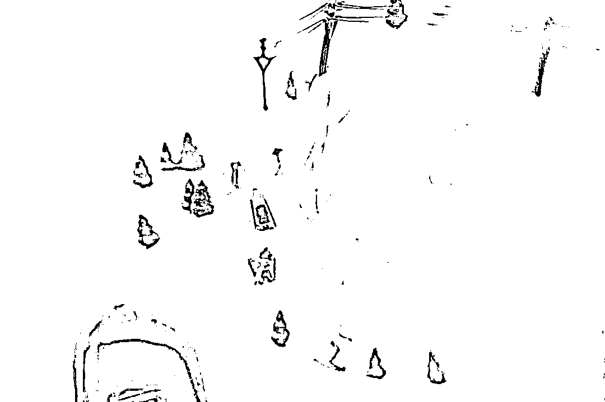

**2020 年的几位“助教”** 以上介绍了几位核心课程老师，还有三位助教：

**水星老师**，这位助教会帮助大家**搜集各类学习资料**。不过每年有三段时间，TA 要帮大家回顾学习情况，看看有没有消化……对于囫囵吞枣的内容，同学们可以在这位助教的帮助下重新学习一遍，在此期间就先别学新内容了。这段时期的另一个大家熟悉的名字叫：**“水星逆行”**。2020 年，这三次回顾的时间和主题大概是： 

*   **2 月 17 日-3 月 10 日 **回顾主题：业力和缘分
*   **6 月 18 日-7 月 12 日 **回顾主题：情绪和感受
*   **10 月 14 日-11 月 4 日 **回顾主题：恐惧和欲望（还记得 2019 年 11 月出现的鼠疫吗？）

**金星老师**，这位助教会撮合那些关系不错的同学成为“同桌的你”，互帮互助有爱学习。但每过 18 个月，TA 要松手一个多月，那些关系不牢靠的同桌，就需要去寻找新伙伴，以免耽误双方学习。这段时间我们称之为**“金星逆行”**。**2020 年 5 月 13 日-6 月 25 日**，恰逢 18 个月的检查期来临，那些合不来同桌，特别是和伙伴完全聊不来的同学，可以请求金星老师的帮助，老师会帮助你们好聚好散，重新寻找同桌。**火星老师**，这位助教会带领大家做课间操，教授**体能训练**，帮助大家**提高战斗能力**。但每过 2 年左右，TA 要帮助大家回顾一下训练经历。对于错误的训练姿势，需要及时纠正，以免在歪门邪道上越走越远。这段时间，我们称之为**“火星逆行”**。**2020 年 9 月 10 日-11 月 14 日**，恰逢新一轮的回顾期到来，两年来一直用错误方法训练的同学们可能会感到肌肉特别酸痛，你们可以暂定训练，求助火星老师帮你们回炉锻造，找到更适合你的训练场所和战斗方法。

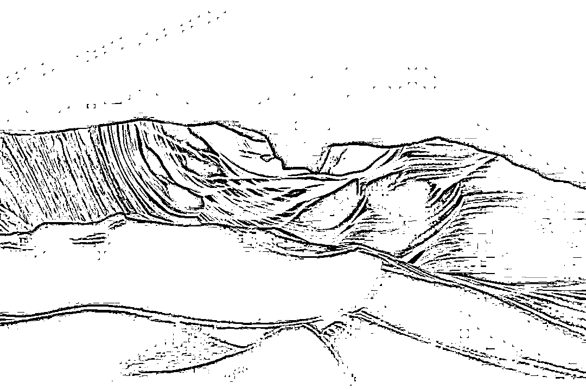

**12 上升星座课程表**

下面，我们按照**上升星座**来排班，公布 2020 年 12 个班级的**年度核心拓展课程概览**，具体到月份的课程表参见**附录**。

**一班**

上升白羊座班级——探索职业拓展之道

2020 年，木星老师会带领你们在**“职业课堂”**探索，这是有关于“**天职和使命”**的课堂。过去一两年，也许你们体会了职业生涯中最为挑战、艰苦甚至黑暗的岁月。

 而在 2020 年，翻身和逆袭的机遇来了，只要你**勇于探索自己的使命，抓住合适的机遇**，木星老师会引领你走向**更广阔的职业发展道路**，体验到更大的可能性，并为你们未来的长久职业打下基础。

**二班**

上升金牛座班级——拓展更宽广的视野

2020 年，木星老师会带领你们在**“信仰课堂”**探索，这是有关于“**理解世界”**的课堂。过去一两年，也许你们对于**“自己是谁，自己从哪儿来，要到哪儿去？”**这样的终极哲学问题有深入思考，甚至可能饱受折磨。 

木星老师最擅长帮助大家回答这样的问题，在 2020 年 TA 将会以有效的方法论去回答这一问题，你们有更多机会体会到**不同文化的差异**，观看到**不同背景下的人群理解世界的不同角度**，这样的体验会有助于你们**找到自己的精神道路，并建立长久的世界观和哲学观。**

**三班**上升双子座班级——深入洞察阴影面向 2020 年，木星老师会带领你在**“蜕变课堂”**探索，这是有**“如何面对恐惧和死亡”**的课堂。过去一两年，也许你人生经历中的**创伤和恐惧**不断地涌现出来，可能会需要**面对最深的痛苦**，或者需要思考**“人为什么要经历失去和痛苦？”“死亡对于一个人到底意味着什么？”**这样的问题。 在 2020 年，如果你有勇气去面对**“结束”**，木星老师会帮助你寻找到全新的含义，这会成为你未来**化解恐惧**的长效药方。

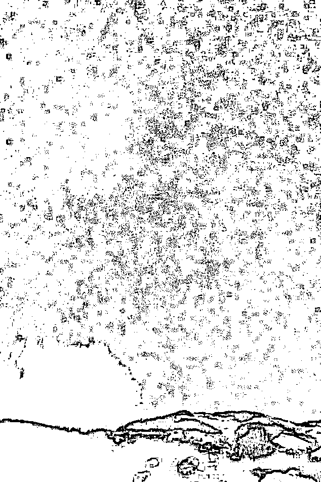

**四班**上升巨蟹座班级——尝试新的合作关系 2020 年，木星老师会带领你在**“关系课堂”**探索，帮助一个人**从“我”成为“我们”**。过去一两年，也许你**遇人不淑、遭伴侣误解或者被伙伴甩锅**。可能你会感觉非常难受，而这种情绪又很难被常人接纳。 在 2020 年，如果你不气馁，木星老师会引领你**认识一些青睐你的伙伴**，如果你采用**全新的规则和方法与人打交道**，也许你能和伙伴**建立相当长期的合作以及婚姻关系。****五班**上升狮子座班级——打造专精技能之道 2020 年，木星老师会带领你在**“实践课堂”**探索，这是**“如何打造核心技能”**的课堂。过去一两年，也许你为各种各样的琐事操碎了心，可能还**积劳成疾**小毛小病不断，这让表现欲强，追求快乐的你压抑许久。 在 2020 年，如果你愿意**尝试一些新技术**，**学习新工具的使用**，木星老师或许会帮助你找到**长效解决各类繁琐事务、“一招吃遍天下”的核心技能**。在这一年**学习谦卑，寻找到适合自己的师傅**成为学徒，会为你带来长久的收益，也会让你更快乐。**六班**上升处女座班级——感受丰富创作方法 2020 年，木星老师会带领你在**“创作课堂”**探索，这是**“如何创造快乐”**的课堂。过去一两年，也许你在创造时感受到了巨大的压力和挣扎，因为要对创造的结果负责。你可能会发现很难让自己玩起来，即使做自己最擅长的事都很难开心。这里的创造有丰富的含义，可以是**唱歌、跳舞、绘画、表演**，也可以是**恋爱、生娃**。2020 年，如果你**愿意保持童心继续创造**，木星老师会引导你体验到**更为丰富的玩乐方式**，并且可能会帮助你找到**可持续的创造力原动力**。**七班：**上升天秤座班级——体会内在丰盛感悟 2020 年，木星老师会带领你在**“内在课堂”**探索，这是“**如何定位自己与家族关系”**的课堂。过去一两年，也许你的内心承受着现实和精神的双重压力，外在表现也许是你的家族正在经历重大的关口，使你每晚都难以入睡。 2020 年，如果你重整旗鼓收拾心情，**搬去更适宜的住所**，木星老师会帮助你寻找希望并使你获得鼓励，也许这会是一个**重建根基**的开端。

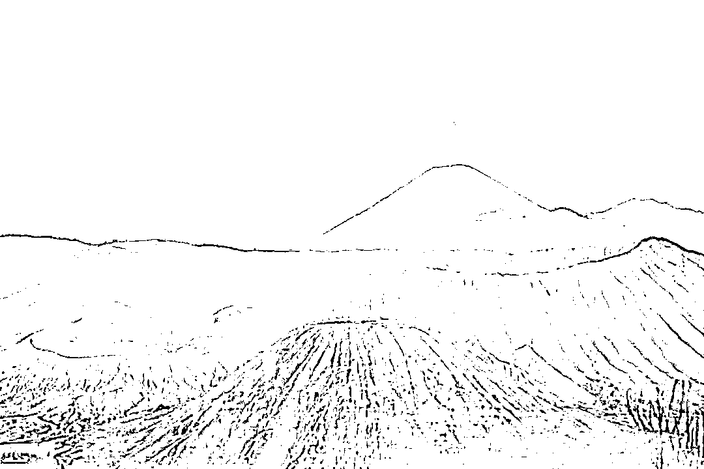

**八班**上升天蝎座班级——享受自我表达快感 2020 年，木星老师会带领你在**“表达课堂”**探索，这是**“如何学习自我表达”**的课堂。过去一两年，也许你正在承受**沉默之苦**，很多话不能直截了当地表达。 2020 年，如果你依然有话想说，木星会**引导你探索更多的表达方式和规则**，也许你有机会开始一段**新的学习和培训**，遇到**新的同学和朋友**，和他们说话会很愉快。**九班**上升射手座班级——体现自我价值时刻 2020 年，木星老师会带领你在**“财富课堂”**探索，这是**“如何建立自我价值”**的课堂。过去一两年，也许你正饱受**财务困境**，有很沉重的财务支出，但自己投入的事情似乎短期内很难获得足够的回报。 2020 年，木星老师会引导你去发现**自我价值的更多可能性**，并引导你**确认自己的价值**，帮助你获得**颇为可观的经济回报**，真正的价值点会为你带来今后人生中带来持续的收益和财富。**十班**上升摩羯座班级——全新生命周期到来 2020 年，木星老师会带领你在**“自我课堂”**探索，这是**“如何确立自我和自我定位”**的课堂。过去一两年，也许你正在经历**人生重建、百废待兴**的艰难时刻。2020 年，木星老师会引导你**“如何正确地做自己”**，并帮助你找到**正确的“人生设定”**，奠定**未来的发展基础**，属于你的新一轮人生周期正在开启。**十一班**上升水瓶座班级——结善缘和泯恩仇 2020 年，木星老师会带领你在**“缘分课堂”**探索，这是**"何臣服于宇宙意识”**的课堂。过去这一两年，也许有很多“有意栽花花不发，无心插柳柳成荫"的经历，这其中的各种巧合绝非由某个人在操控，而是由更大的缘分在驱动。 2020 年，木星老师会引导你去向背后的宇宙能量学习，**广结善缘、自我疗愈、消除业障**才能为将来的发展保驾护航。**十二班**上升双鱼座班级——拓展圈层影响力 2020 年，木星老师会带领你在**“集体课堂”**探索，这是**“如何寻找自己所归属圈子”**的课堂。过去这一两年，也许你有点**孤立无援，一直在艰难寻找自己的圈子**，正在饱受**孤独**的煎熬。 2020 年，木星老师会引导你**确立自己的理念**，并为你**带来更多志同道合的朋友**。最后，预祝各位同学在每一门人生课程中都能收获满满，新学年一切顺利！附录 **12 上升星座 2020 年课程表（请将手机横屏观看哦）**

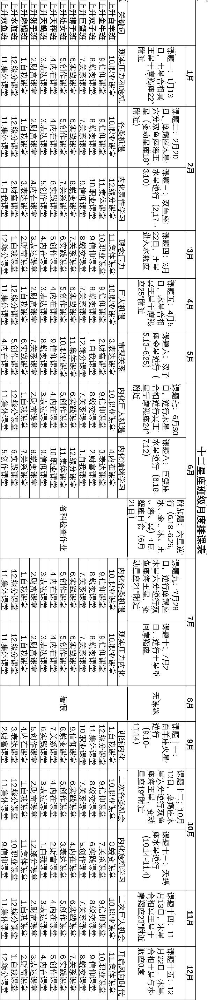

**版权声明：**原创文章由作者授权首发于若道平台，欢迎转发，反对抄袭。友号转载请申请白名单。

**2020 年年度运势还有这些文章**[最通俗易懂又面面俱到的 2020 年度运势](http://mp.weixin.qq.com/s?__biz=MzA5NjA0NTAxNg==&mid=2651412428&idx=1&sn=32bf652b3853c9aeae69ee9fed1a9bb4&chksm=8b4be57bbc3c6c6d197123ecaaa6290eaa3a6450bd386df76c8ec3bb924ee61cc7ee98233313&scene=21#wechat_redirect)[土木冥极地之旅，始于极夜，终于极光](http://mp.weixin.qq.com/s?__biz=MzA5NjA0NTAxNg==&mid=2651412566&idx=1&sn=ba71bd85e67a9742fe9a76b2626634a8&chksm=8b4beae1bc3c63f71b58c70327e32874483a79a0b5aff0e62a2f02541acf0c32ae1af76c66c5&scene=21#wechat_redirect)


**查理**

ISAR 认证占星师（2017 年获得），全职占星师

企业占星顾问（有丰富的企业占星咨询和教学经验）

若道 2016 届核心课程学员，10 年跨国管理咨询工作经验

**咨询微信：**qinglee821

**微信公众号**：suoyingmk

长按打赏


******点击图片查看若道君推荐******

[](http://mp.weixin.qq.com/s?__biz=MzA5NjA0NTAxNg==&mid=2651412287&idx=3&sn=7cc80afcbcdd660c9f94692def9edb53&chksm=8b4be588bc3c6c9e8c99bb44591c6ee34ec77a4c93c5ee8a03fec0e1ed8a76ad916d447265cc&scene=21#wechat_redirect)

**微信又双叒叕改版啦，不想错过若道君的推送？**

**就把若道设为星标吧！**

**▼**


就是这个“在看”，戳一下☟

********报名直达入口********


# 深度 | 双鱼座，用神秘的鳍游在现实的路径上

> 原文：[`mp.weixin.qq.com/s?__biz=MzA5NjA0NTAxNg==&mid=2651412587&idx=1&sn=88617fdd2660473de5eb7a48dd9d8807&chksm=8b4beadcbc3c63ca04427ddfde1ff118fbd1151ff24fad40cb97abcd3d2029c6e1c2bcb6657f&scene=126&sessionid=1692738232#rd`](http://mp.weixin.qq.com/s?__biz=MzA5NjA0NTAxNg==&mid=2651412587&idx=1&sn=88617fdd2660473de5eb7a48dd9d8807&chksm=8b4beadcbc3c63ca04427ddfde1ff118fbd1151ff24fad40cb97abcd3d2029c6e1c2bcb6657f&scene=126&sessionid=1692738232#rd)

**☆ 后台回复“今日”，给你一句生命态度**

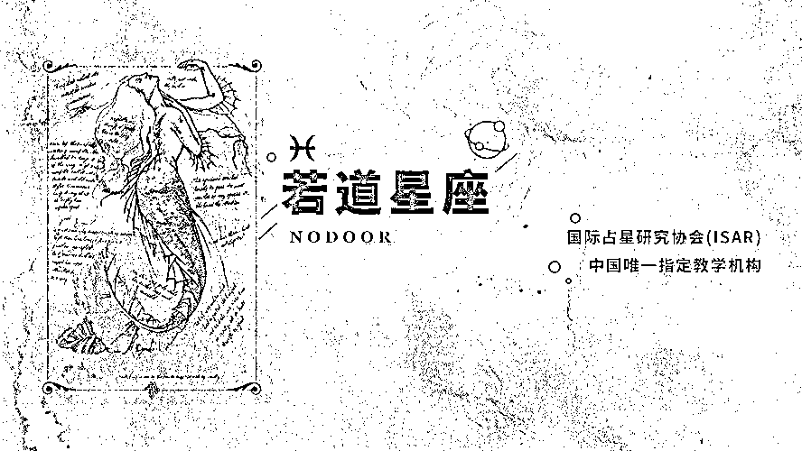作者/达娜·格哈特
译者/李含 校对/Jun
编辑/玫瑰 图片/unsplash

双鱼座很容易让人感到迷糊、梦幻、不切实际。因为大部分来到陆地上的鱼就像是池塘里的青蛙，没办法真正回归大海。那么，是什么阻塞了双鱼座的脚步？或许，不该叫做脚步，因为双鱼座始终有看不见的鳍，帮助他们在现实的路径上行走。他们需要做的，是从日常生活中超脱出来，发现自己的神性。但最困难的部分，是如何克服容易幻灭、虚弱、无力的状态，将这些神性实打实地带入生活中。真正的修行在人间，在你身边的一切。如果你也有与生活脱节飘在半空的不落地感，这篇文章也会非常适合你。

**对于青蛙来说，海洋就像赌博**对于一只从未离开过池塘的青蛙来说，海洋就像是一场赌博。看看他要放弃什么：安全，对自己世界的掌控，还有认可！大海里的青蛙只是摇摇头。“我真的无法解释我住的地方是什么样子，但有一天我会带你去那里。”
解释双鱼座的世界时，我感觉就像要求一只池塘里的青蛙描述海洋：我怎么才能说出它真正的样子呢？我又不是专家。我的星图中上升点落在处女座，这意味着我尤其会通过我的第 7 宫伙伴遇到双鱼座的人。我坚持处女座的美德，多年来一直在证明我无法理解我的双鱼座伙伴——诗人、音乐家、酗酒者、说谎者和梦想家。有多少次，我注视着他们朦胧的世界，然后举起手问：“你说好来见我，但你却忘了，这是什么意思？！这星期你第三次丢钥匙了？！说吧。给我一个好的理由，让我现在就相信你的承诺！”随着时间的推移，我变得不那么尖锐了。生命在于等待我们这些崇拜秩序和完美的人。它折磨着我们，使我们沮丧、恼怒，最终投降，我们开始把充满迷雾的双鱼座看作是一个吸引人的新地方。我钦佩栖息于此的艺术家和神秘主义者。像海蛙一样，他们往往无法解释他们的世界，但从他们狂喜的眼睛和梦幻的微笑中，我可以大胆地做出一些粗略的翻译：**双鱼座随遇而安，随波逐流。它会原谅和遗忘。它是一种温柔的超然一体的状态。它可以软化心灵，扩展想象力，召唤我们到达更高的力量，让我们进入集体无意识，并在无形中编织我们的梦**。通过双鱼座，我们可以穿透自我和物质主义的面纱。我们可以将自己融入无限的爱和可能性的广阔维度中。

双鱼座是**灵魂空间**。无论我们在天上还是在海中体验到它，像“上下”或“前后”这样的区分显然跟这里不那么相关。这些是来自池塘王国的术语。双鱼座喜欢在**恍惚**中运作。它通过图片、颜色、声音、情感和直觉振动，从右脑进入我们的身体。它的推理模式与左脑思维有很大不同。

**处女座分析局部，双鱼座放眼整体**。**处女座分析，而双鱼座整合（因此它具有同情心）**。双鱼座喜欢注意到事物的相似之处。它用隐喻说话，在神秘领域中安之若素。一个未回答的问题是邂逅奇迹和梦想的机会。敏感且具有渗透性的双鱼座像云朵或雾堤一样在世间游走，包容和吸收它所发现的东西。它几乎不关心事实和实际效率。双鱼座有更好的东西：**信仰**。如果要求双鱼座去探究这个世界，它就只是观察。

面对生活的混乱和失望，谁能否认双鱼座的吸引力？它对神性的向往，善解人意的心，对梦想成真的浪漫信念为破碎的世界提供了希望和疗愈。大众对双鱼座的兴趣不会很快消失。所以如果你也渴望双鱼座的魔力，即使像我一样是处女座，占星学也会带来好消息，无论你的星图中细节如何，你已经有了进入这个艺术和神秘领域的个人入口：那就是**你的双鱼座宫位，它承诺“灵魂生命的旅程从这里开始！****”**至少这是我的理论。在实践中，我注意到一些完全不同的东西。天空中的双鱼星座只有几颗明亮的恒星，这意味着没有强大的望远镜很难看到。同样在星图中，双鱼座可能是难以捉摸的。多年来，我看到许多人接近了他们的双鱼座入口而后退缩，转身和池蛙为伍，无法或不愿去海洋冒险。不仅仅是那些双鱼座空宫的人，还有太阳、月亮，或者上升双鱼座的人。

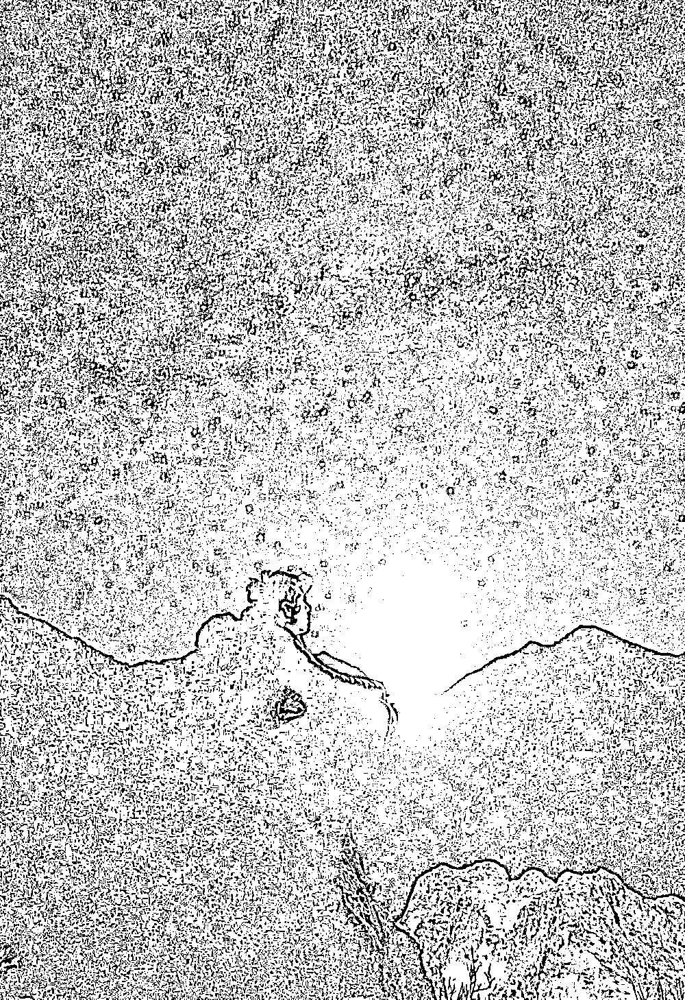

**沃伦的故事**想想沃伦。他的双鱼座太阳落在第 12 宫（双鱼座的自然宫位），上升点也在双鱼座。这真是有很多“双鱼座”了。我只和沃伦只通了简短的电话，我很想见见即将来参加咨商的他。他是诗人吗？电影制作人？瘾君子？骗子？灵性探索者？门铃响了。我打开门，一个穿着朴素熨烫衬衫和卡其布裤子的安静男人站在门口。
我们聊了聊。他说，他是一名工程师。他整天坐在电脑前，看着数字。“有时，数字可能是非常神秘的，”我大胆地说。他看上去很困惑，“不完全是。”我问他是否对音乐、冥想、诗歌或幻想感兴趣。“不。”他回答。他没有爱好。他的生活就是工作和回家。晚上，他坐在电视机前，喝一两杯苏格兰威士忌。他的妻子就此对他唠叨不休。她希望他们能一起做更多事情，但他总是很累。我一直在观察沃伦的星图。太阳在第 12 宫会带来一种**温和或内向**的性格。双鱼座上升的人也可能戴着面具，和稀泥并隐藏他们的真实感受。但对沃伦来说，双鱼座的创造力和（或）神秘主义的表达会完全消失吗？每当现实与期望相混淆时，占星师们就会在星图中努力寻找，希望找到真正主持大局的行星（们）。沃伦可能已经从他的晚间电视节目和苏格兰威士忌获得了一点双鱼座式的超越性。但是他所说的大部分都来自他的第 6 宫处女座月亮——一种谨慎、勤奋、善于分析的情感取向。他的妻子（也可能表达一个男人星图中的月亮）似乎扮演着唠叨的处女座角色。我请沃伦给我讲述一段他感到非常幸福的时间，也许从童年开始算起。过了一会儿，他的眼睛亮了起来。他回忆起一个夏天，他和一个朋友计划自己制作一套奇幻漫画书。他说:“在学校正式放假之前，我们已经画出了所有的角色，并绘制出了十几个故事情节。”。然后他的声音变小了。“那个夏天我父亲让我找工作。”他耸耸肩。“我转而去叔叔的杂货店当了一名装箱工。”他曾站在双鱼座的入口，但被猛拉回到他第 6 宫的处女座月亮。这可能不是沃伦的想象力唯一一次被职责和实用主义粉碎。也许每当他内心的艺术家挣扎着要把自己表现出来时，就会被处女座的评判镇压：**“荒谬！真是浪费时间！这种愚昧是行不通的！”**他没有变成一只海蛙，沉浸在一个令人着迷的、引人入胜的、但不太现实的世界里，而是成为了一名工程师，让自己的精神沉浸在乏味的日常活动中。

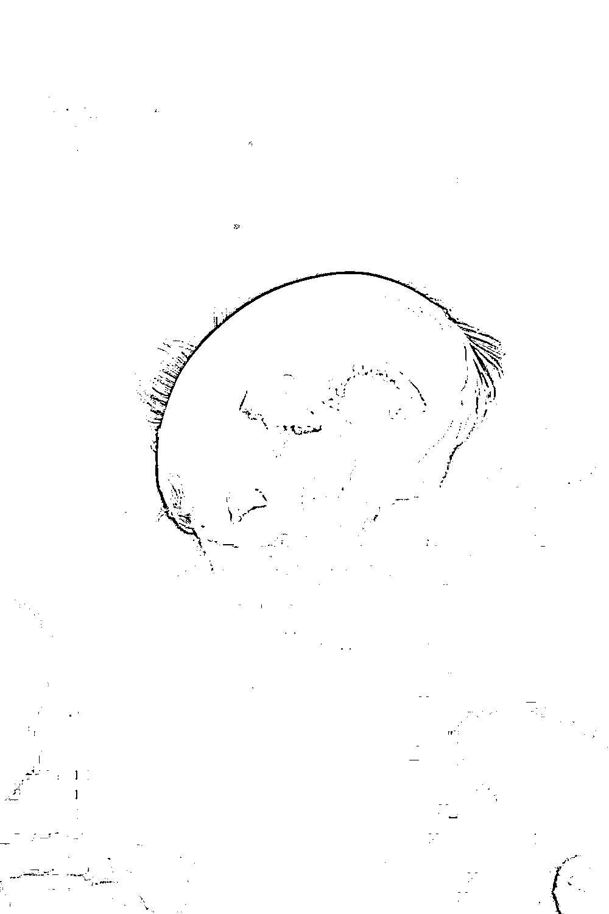

我想，真是可怜的沃伦。我不知道如果他的父母更开明一些会发生什么。如果他们在他还是孩子的时候咨询过占星师会怎么样？占星师会解释说，沃伦是一个敏感、有直觉的孩子，有着丰富的想象力和同情心。应该**鼓励他去追随他的灵感，给他发展自己内心世界的空间**。也许他的处女座月亮不会压抑表现，反而可以有条理地让他的双鱼座敏感神经落地。那是 80 年代，冥王星在天蝎座，占星学和深度心理学的结合是当时的主流。我仔细研究星图，就好像它们是精神世界的黑暗地图，希望能为一切童年时期的伤害或创伤提供新的洞见，启发我的客户获得新的理解。不幸的是，我们经常在一个叫做“不良养育的受害者”的抱怨死胡同里受尽折磨。此外，那时我自己也已为人母。我很快意识到养育孩子是不可能达到治疗师的标准的。冥王星在射手座需要新的占星策略。我的客户希望我帮助他们创造更好的未来，而不是挖掘他们的过去。随着我将客户视作我的老师，通过他们的选择和行为来扩展我对黄道 12 星座的理解时，我变得更少的教条主义并拥有更丰富的好奇心。我倾听那些创造了他们现实的信念，这意味着我开始认为他们的行为在占星学上是“正确的”，而不评判其为错误的。我从沃伦这样的人身上学到的是，他们和音乐家、诗人、梦想家一样认真地在做双鱼座。他们无孔不入的敏感性不那么明显，但并没有消失。他们只是**觉知到了周围的环境，并相应地调整自己，在自己发现的海洋中游泳**。在一个放逐灵魂、崇拜金钱的世界里，双鱼座可能变形并随波逐流。

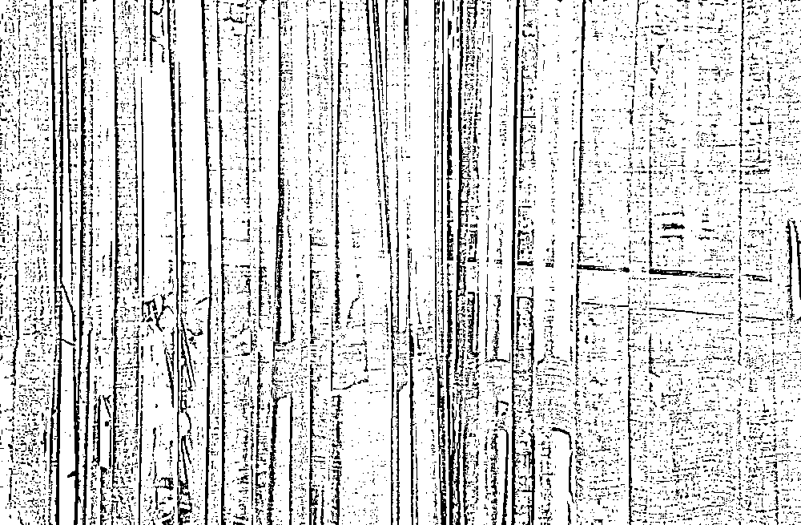

**爱是双鱼座的核心活动**这种变形实际上是双鱼座的核心神话。它的符号♓ 和天文学星座看起来像是两条向反方向游的鱼；它们真是**伪装之中的神**。当怪兽提丰冲向奥林匹斯山时，阿芙罗狄蒂和厄洛斯变成鱼逃走了。他们仍然在我们的夜空中隐隐闪烁，就像双鱼座的 V 形星座，两条鱼的尾巴上绑着一根松散的绳子。东面的鱼游向天空，西面的鱼游向黄道。他们前进的方向就和把他们绑在一起的绳子一样具有象征意义。游向天空的鱼指向灵性超越，而它的伙伴沿着黄道的物质层面开辟了一条更世俗的道路。伪装的神是相连的，这样就不会失去彼此。同样，**在我们的双鱼座宫位，我们可以通过将自己与两个方向相连来维持自己的神性——用神秘的鳍游在现实的路径上。**双鱼座的符号显示鱼背对背地紧紧绑在一起。但在天空中，星座尾部松散的联结更准确地描述了我们在保持两个方向上的挑战和纬度。我们可以把头埋在云里，但会失去大地的支撑。我们可以选择安全，但放弃灵魂，或两者之间的任何变体。创造力和自由将带给我们无限的可能性。我想到艾玛，她的太阳和金星都落在双鱼座。在本地的工艺品交易会上，她戴着头饰和仙女翅膀讨孩子们开心，但与好几位软弱且不诚实的伴侣遭遇了灾难性的爱情。还有威尔逊，一位迷人的双鱼座，他白天经营一家成功的广告公司，晚上在女人、葡萄酒和大麻中找到了天堂。还有温柔的蒂莫西，他的太阳、月亮和水星都在双鱼座，他总是消失，出去做一年或两年的文员工作，当他不能再遵守时间表时，就会瘫倒回到他父母的家里。我们大多数人都没有那么戏剧化的双鱼座故事。但也许他们仍然缺乏可能的神性。我们如何实现这个星座承诺的的超越性？爱神阿芙罗狄蒂和她那鼓励爱情的儿子厄洛斯，就是双鱼座符号的鱼，暗示了另一个线索：**爱可能是这个星座的核心活动**。

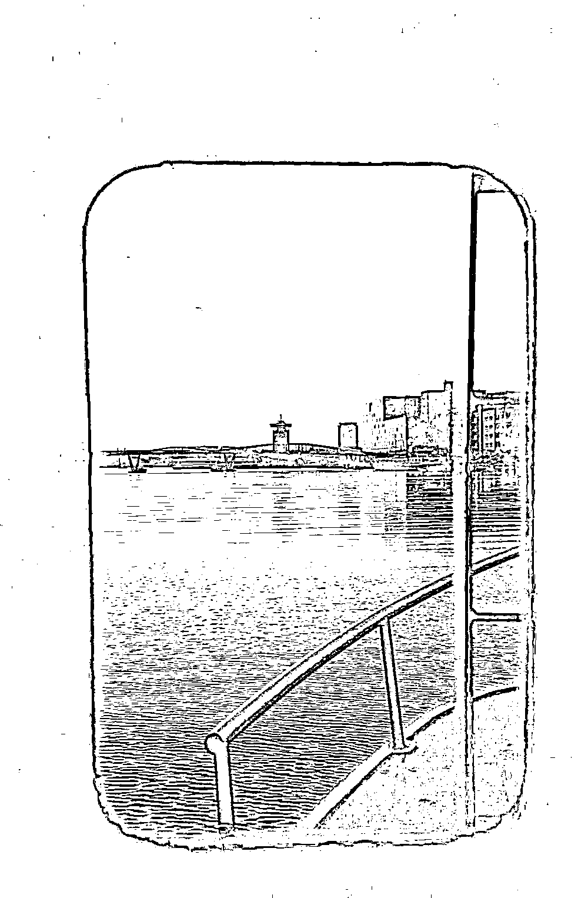

我们的整个星图都可以召唤我们去爱，但是**在我们的双鱼座宫位里，我们遇到的朦胧、动荡和令人困惑的环境漩涡可能会从最深处唤起爱的需求**。**双鱼座需要一个爱的学徒，这就是为什么服务、同情、牺牲，甚至殉道，是双鱼座普遍的表达方式**。灵性的爱是强大的，但大多数人类的爱是脆弱的。内在和外在的提丰（希腊神话中象征风暴的妖魔或巨人）足以横扫我们的世界，就像受到威胁的阿芙罗狄蒂和厄洛斯，我们可能干脆变形并隐藏起来。这是一个合情合理的双鱼座问题：考虑到有时巨大的不满、沮丧和渴望会影响我们体验这个星座，我们要如何加强我们爱的能力？我不是第一个借赫拉克勒斯之力来理解 12 星座的人。将他的 12 项劳作与每一个星座联系起来是一个悠久的传统。我只是想知道赫拉克勒斯能否在双鱼座宫位给予我们一些新的行动指引。故事是这样的。赫拉克勒斯奉命牵回巨人革律翁的红牛，这是他的双鱼座功课。革律翁是长着翅膀和至少有 3 个身躯的巨人，住在大地尽头的一个岛上。赫拉克勒斯徒步前进，与野兽和强盗战斗，直到他走到了人类到过的最远的地方。他被一座可怕的山挡住了去路，他就横穿过去来到另一边，创造了强大的赫拉克勒斯之柱。那里很热。有人说他一气之下向燃烧的太阳射了一箭。另一种说法是他只是休息和祈祷。但是对于接下来发生的事情倒是众口一词。太阳神阿波罗扔下一个神话般的金杯作为奖励。我们的英雄爬了进去，一路漂向埃尔西亚岛和革律翁的牛。他一到达，他的任务就简单了：砰！他棒打双头恶犬。砰。砰。他杀了狡猾的牧羊人。革律翁跑了过来。赫拉克勒斯射出一支箭，一箭射穿了这种可怕怪物的 3 个身体。砰！砰！砰！赫拉克勒斯把红牛赶进他的金杯里，驶回高山，归还了阿波罗的礼物，然后赶牛回家。你可能以为他的工作快完成了，但是他在返程的路上遭遇了小偷。他最好的一只公牛逃跑了，一路跑到了意大利；赫拉克勒斯为了夺回它，不得与一个国王搏斗并杀死了他。接着，赫拉派出一只可怕的牛虻，把遍地的红母牛都驱散了。为了最终送它们回家，英雄不得不排干一条河的水。这比我们对双鱼座宫位的典型想象要丰富得多！但是红牛的承诺很诱人。奶牛提供食物；红色是欲望、活力和力量的颜色。**红色的奶牛象征着爱的滋养力量和无限的可能性——双鱼座的财富**。

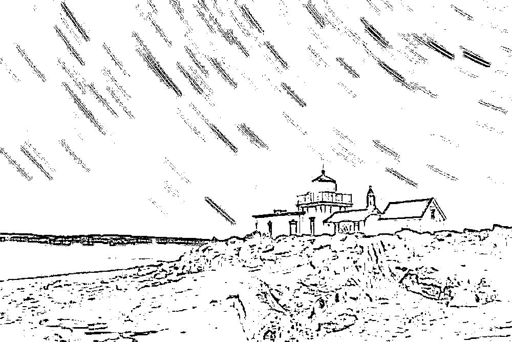

**从生活中出来，再回到生活中去**看看你的双鱼座宫位或行星。**你有梦想要实现吗？你愿意为此走多远？你会超越时空去实现它吗？**赫拉克勒斯已经准备好去大地的尽头了——在你的双鱼宫里，这意味着**超越你平常心灵的极限，进入一个更高的意识。**第一步很简单：只要**愿意创造一个新的现实**。之后，你需要**意愿和意识的力量**，就像赫拉克勒斯穿越大地，一路上击败野兽和强盗。这些敌人可能看起来很奇怪，但他们实际上是熟悉的角色。他们是**不断限制你最佳潜能的低级欲望和消极想法**。他们是**让你上瘾的物质和习惯**，或者那些**经常让你封闭自己的想法**。如果你能保持警觉并前进，你将建立一个有强大决心和意图的结构，就像赫拉克勒斯之柱一样。然而，你必须超越你的石柱，这意味着**放下你的意图**。以这种方式释放你的梦想就像把一块神奇的鹅卵石扔进水中，这样它就能激起涟漪，改变世界，可能激发更好的反馈。这就是承认你的梦想可能不够大！你当然需要相信魔法，它会吸引下一个：**神的介入或恩典**。当他走到人类曾踏足的尽头时，赫拉克勒斯得到了一个神器。金杯的象征暗示了双鱼座许多超凡脱俗的恩赐：**共时性、想象力、直觉、灵性指导**。和金杯一样，**双鱼座的资源既是容器又是交通工具**。它们带你去你的双鱼座宝藏。例如，保罗·科埃略写道：**“直觉……可以让灵魂突然浸到生命的洪流中，所有人的过去都联系在一起，（你）能够知道一切，因为一切都写在那里。****”**

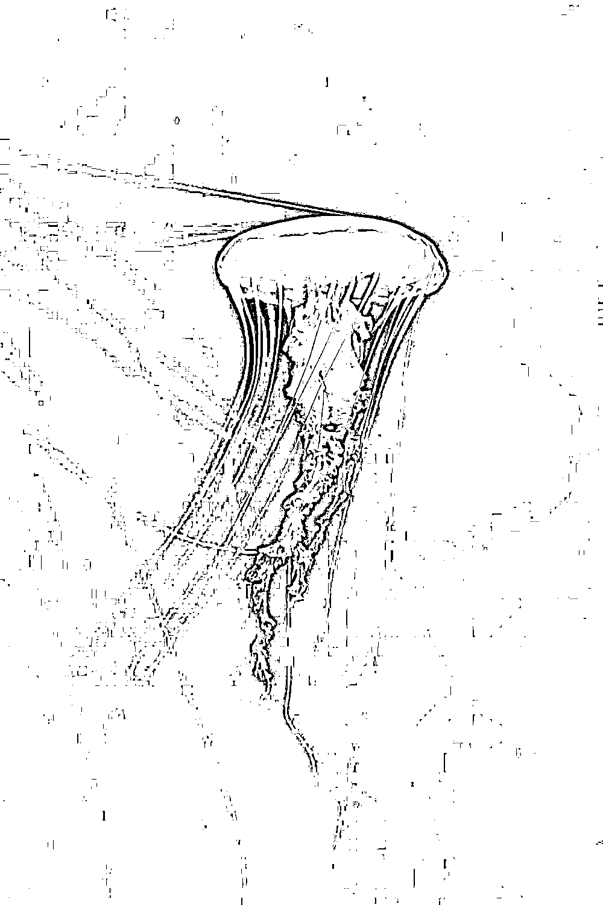

金杯是太阳神的礼物，是自我的象征。在故事的某一个版本中，赫拉克勒斯攻击了太阳；另一种说法是，他只是沉浸其中祈祷。哪种策略对你更好，取决于你在天地之间的平衡。**如果你的取向过于世俗，你可能需要通过吟诵或冥想等自我消解的练习来减弱你的自我光芒**。**如果你不脚踏实地，过于神秘，你的自我边界可能会十分薄弱**。尤其是如果你的阳性行星如**太阳、火星或土星落在双鱼座**，你可能需要**强化自我**。对你来说，通往你的石柱的旅程可能带来最大的成长；在那之后，你可以在你的虔诚中休息，等待恩典。不管是哪一种，一旦你放下你的意图，你就必须进入一个特殊的双鱼座状态。当赫拉克勒斯爬进金杯时，他停止了有意识地前进。他平静下来，坐着。这就像是**在梦境、冥想或恍惚中航行**。外科医生罗伯特·贝克尔是非传统治疗领域的先驱，他观察到：“许多‘原始’民族……相信几乎每个正常的成年人都有能力进入忘我之境并接受神的眷顾；不能做到这一点的成年人就是心理上的跛子。”换句话说，他的红牛留在了革律翁的身边。最近我遇见了丽贝卡。她的月亮南交点、太阳、金星和水星在处女座，而双鱼座只有一个孤独的北交点。尽管有医嘱和她疼痛身体的极限，她承认她还是坐不住。她每天工作八个小时，在家总是忙个不停，一件家务接着一件。当她不工作的时候，她的脑子里充满了担忧和义务。“我的家人需要我，”她说，“他们正在分崩离析，”她抱怨道，“但从来没有人听我的建议。”我问她有没有试着静静坐着过，也许喝茶，享受她所有工作带给她的幸福。她摇摇头说，“没有……我就是不能！”**如果不停下来，远离日常生活，双鱼座的高峰体验就很难实现**。金杯停下后，赫拉克勒斯来到充满无限可能性的岛屿，并迅速战胜了 3 敌人。在一种更高阶的警觉状态中，他超越了时间和空间，在几分钟内完成了可能需要数年或一支军队才能完成的任务。我想起了我的冥想老师经常说的话——冥想不仅仅是走神，而是醒来。**为了借助忘我之境带来高峰体验，我们必须保持清醒和开放，警觉地接受不寻常的现实**。让·休斯顿博士是一位哲学家和人类能力的研究者，她经常推测，我们大脑是一个巨大但未得到充分利用的仪器，旨在将我们带入一个更广阔的宇宙——也许具有平行维度、多重现实，以及做梦都想不到的潜能。毫不意外，休斯顿的木星落在了双鱼座。她一生的使命就是拓展我们对一切皆有可能的信念。**在一次高峰体验之后，我们总是要重新回到这个世界。这可能是旅程中最困难的一段——把我们的双鱼座宝藏送到当下**。我们的红牛可能是一种狂喜的领悟，一种来自灵性导师的愿景或信息，或者是一种转变，带来对世界无法抗拒的爱，或者仅仅是新的喜悦。这份礼物带来了新的潜能，但是就像赫拉克勒斯一样，我们会遇到挑战。小偷、逃跑的公牛和牛虻象征着**如果我们不保持警惕，我们获得的礼物会转瞬即逝**。但是成功太美好了，所以不能不去尝试。这样我们才能认识到自己的神性。我喜欢用让·休斯顿的一句话重写双鱼座阿芙罗狄蒂和厄洛斯的故事: **“我们不只是隐藏的神，我们是创造的神。****”**

版权声明：本文由若道翻译发布，欢迎转发，反对抄袭。


**也许你还想看下面的文章**

[白羊座](http://mp.weixin.qq.com/s?__biz=MzA5NjA0NTAxNg==&mid=2651412161&idx=1&sn=37ff27a685136be77b3d02086a4b8f0b&chksm=8b4be476bc3c6d6079b8592d14f1250d87401d0a8a28bc87f50a8f9fd253a52d9d5223c4ab12&scene=21#wechat_redirect) | [金牛座](http://mp.weixin.qq.com/s?__biz=MzA5NjA0NTAxNg==&mid=2651411945&idx=1&sn=6a74a4d7d15deb38d06a692ad4032ddd&chksm=8b4be75ebc3c6e4890b5034474c2894bd355bf26df5f0ad1c2fadae76f3de1d349a57de0471b&scene=21#wechat_redirect) | [巨蟹座](https://mp.weixin.qq.com/s?__biz=MzA5NjA0NTAxNg==&mid=2651412275&idx=1&sn=0c656c445089cb315649a1cc3af37001&chksm=8b4be584bc3c6c92e9bc689480a78b3e530fc125c6a3a1fdff0e60a587ffcd06723285712045&token=1413902531&lang=zh_CN&scene=21#wechat_redirect)

[天秤座 ](https://mp.weixin.qq.com/s?__biz=MzA5NjA0NTAxNg==&mid=2651410544&idx=1&sn=45b51d84210a84c8103c140df5a28229&chksm=8b4be2c7bc3c6bd1c86b8ffd8d8722efe3cfa1fc4b71e2cc8f71230218b8c73a7119d8a22745&token=428430174&lang=zh_CN&scene=21#wechat_redirect)| [射手座](http://mp.weixin.qq.com/s?__biz=MzA5NjA0NTAxNg==&mid=2651411022&idx=1&sn=adf59f6eb38f2fd19ca975b4287168ea&chksm=8b4be0f9bc3c69ef250cafb4d517694bb952529461017c53da4d7ca120ed4ec0004161eccdb0&scene=21#wechat_redirect) | [水瓶座](http://mp.weixin.qq.com/s?__biz=MzA5NjA0NTAxNg==&mid=2651411498&idx=1&sn=25b8051c9c778065f9fffa37628c9950&chksm=8b4be69dbc3c6f8b94ee79ae682233634bcd0f32e8dce890672ea1bb4e5241a34cb59ebb3045&scene=21#wechat_redirect)

**达纳·格哈特**一位国际范围内受尊敬的占星师。她为众多占星学网站和出版物讲课、写稿。她在十二宫的月亮激励她对这颗发光体进行了深刻而持久的探索研究。

******点击图片查看若道君推荐******


**微信又双叒叕改版啦，不想错过若道君的推送？**

**就把若道设为星标吧！**

**▼**


就是这个“在看”，戳戳戳 ☟

********报名直达入口********


# 干货 | 那些火象宫位教会我们的事

> 原文：[`mp.weixin.qq.com/s?__biz=MzA5NjA0NTAxNg==&mid=2651412587&idx=2&sn=c6b4869e71e605180ef45662209dc1c0&chksm=8b4beadcbc3c63ca7599d1686e514edeebff04b3be39e20fdba3bd75fd550812860158ed0d7a&scene=126&sessionid=1692738232#rd`](http://mp.weixin.qq.com/s?__biz=MzA5NjA0NTAxNg==&mid=2651412587&idx=2&sn=c6b4869e71e605180ef45662209dc1c0&chksm=8b4beadcbc3c63ca7599d1686e514edeebff04b3be39e20fdba3bd75fd550812860158ed0d7a&scene=126&sessionid=1692738232#rd)

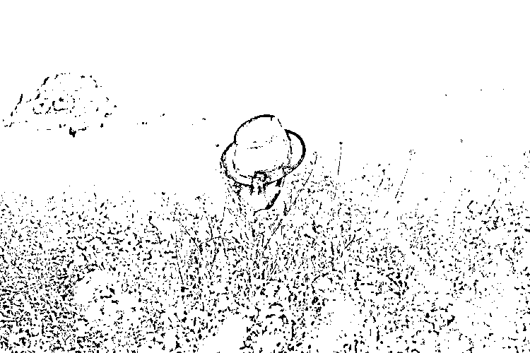作者/斯蒂芬·弗里斯特 翻译/聆宇 Cora 编辑/Tang 图片来源/unsplash 本文摘自《变幻的天空》学习占星学，我们一定会接触到宫位。作为占星学基础知识的宫位，代表着我们人生的不同领域，12 个不同的宫位是我们生命中 12 个不同的舞台。今天就让我们先了解一下火象宫位，第一宫、第五宫和第九宫吧。
**第一宫：你需要“自私”一点****第一宫**  **阶段**：开始；出现；新生。**过程**：发明；即兴发挥；创造。**盟友**：勇气。**未顺利通过**：被压力击倒，随之而来的是无法从惊吓中走出来，自暴自弃。此刻意识是一面空白的墙壁，上面什么都没有，只有将新的环境或现实创造出来的热切渴望——它们要是独立的、空前的，不是对过去任何事物的延续。**处于第一宫时我们有必要“自私”一点，以自我和意志的力量为导向。**在第一宫，自由和冲动并存**第一宫象征着一段自由被极度强化的时期，而自由的另一个名字叫“不确定”**。我们并不是特别清楚自己在做什么，但是我们感到强烈的冲动，时不我待，必须行动。在生命的这个阶段，我们意识到自己的力量，但通常我们也不太清楚该如何使用自己的力量。一个新的开始正在我们的生命中逐渐成型。我们已经抓住了老虎的尾巴，接下来我们能做的就是死不放手，相信直觉，遵循它的指引自发地行动。建立新身份永远记住，在第一宫，**行动就是一切**。我们正在为新一轮生命经历的循环播下种子——建立一个新的身份。有关这个新身份的一切，只有在我们依次走过接下来各个宫位的过程中，才会逐渐显现。 

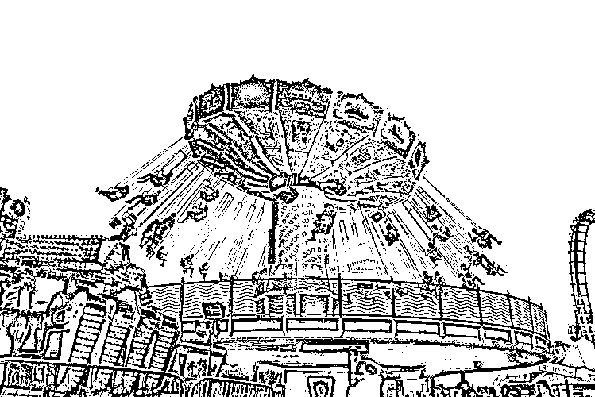

**第五宫：生命的欢乐场****第五宫**  **阶段**：自我展现；自我揭示；补给心灵燃料。**过程**：快乐，庆祝生命。**盟友**：自发性。**未顺利通过**：纵情声色，自我的陷阱，随之而来的是迷失在幼稚的个人戏剧的迷宫中。**在第五宫，我们开始创造，不仅是指艺术创作，还包括对于生命的华丽和快乐的单纯展示。**这是为自己庆祝的时刻。怎么庆祝？**通过某种创造，将我们在第四宫探索到的心灵的内部构造以可见的、外显的方式呈现出来**。突然我们出现在跑车上、聚会上，或是手里多了一本醒目的美食攻略。全副武装你累不累？这个时候，经常会有新朋友或新恋人走进我们的生活——我们的“**玩伴**”，来帮助我们打破对于过去的痴恋。不要幼稚地以为“玩伴”这个词意味着我们与这些人的关系缺乏深度。**乐趣是我们理解第五宫的关键**，我们必须对它的意义重新理解。
**只有充满乐趣的自发性行为，能够松懈我们全副武装的自我，打破由习惯和常规所构筑的坚硬外壳，把新鲜的血液输入我们的生命。**通过玩耍，为心理上的“成年”做准备虽然我们与这些玩伴的关系常常是短暂的，但他们却在我们的生命中起到了重要的作用——**在他们的激发下，我们能够自发地、不自觉地展示自我**。
他们帮助我们去做那些儿童凭本能就会去做的事——通过玩耍，为“成年”做心理上的准备。**如果我们接受他们的帮助，他们将为我们的生命力助产，拉我们离开第四宫的子宫，送我们到“童年”的阶梯上翩翩起舞。**

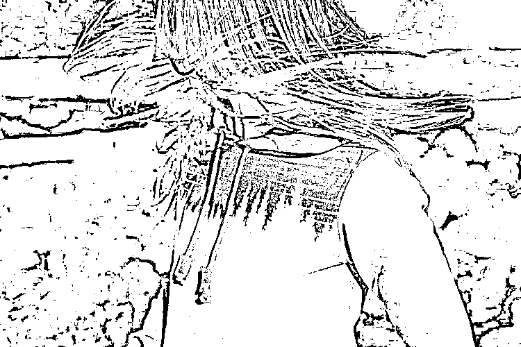

**第九宫：感受未知****第九宫**  **阶段**：扩张；探索；教育；拥有长远目光。**过程**：打破常规的限制。**盟友**：感受未知。**未顺利通过**：教条刻板，随之而来的是乏味和无聊。当我们踏入了第九宫宽阔的场域，视野被打开。再一次，我们在一个“有深度的”宫位接受了洗礼，从中吸足了养分。在第五宫，我们迎来创造力和自我表达的大爆发。现在，在经历了更加激烈的、更让人执迷的第八宫的试炼后，从我们体内生长出了一种**对于开阔视界的渴求**。**我们也许会思考：**

*   **生命的意义是什么？**
*   **我存在于这个世界上的终极目的是什么？**
*   **什么是对，什么是错？**

我们或许不知道答案，但我们想对无知说再见。
如果我们的行程顺利，**这将是我们充分探索这个世界、生命得到扩展的一段时间**。我们很可能去旅行。我们也常常在此时进行自我教育。我们几乎总是能在这一阶段邂逅一些令人着迷的人，他们是我们的正常圈子之外的人，跟我们“不同国”，将新奇的、富于挑战性的事物带到我们面前。准备好打破陈旧的模式了吗？进入第九宫，我们**准备将那些残渣创造的老旧行为和思维模式打破。令一切焕然一新是这个宫位的精髓**。我们需要更加广阔的视野。现在是我们重新领略未知的时候。我们的任务，简单说就是，**欢迎生活让我们感受未知**。

**版权声明：**本文获立品图书授权在若道平台发布，欢迎转发，反对抄袭。


斯蒂芬·弗里斯特

若道签约老师。进化占星学的创始人之一，当今世界最有影响力的占星大师之一；1985 年，他凭借《内在的天空》一书获得职业占星师协会奖（Professional Astrologers Incorporated Award）。他四次获得占星界最高的占星学联合协会奖（United Astrology Congress Regulus Award）提名，2018 年获得轩辕十四教育奖。

**想系统学习占星学？**

**点击图片了解详情**


**微信又双叒叕改版啦，不想错过若道君的推送？**

**就把若道设为星标吧！**

**▼**


就是这个“在看”，戳戳戳 ☟

****************报名直达入口****************


# 中英双导师 Level1-2｜零基础入门占星学的必修课

> 原文：[`mp.weixin.qq.com/s?__biz=MzA5NjA0NTAxNg==&mid=2651412587&idx=3&sn=4b77e9f3956df8f3b1e15c1c0e0a63cd&chksm=8b4beadcbc3c63cad28b7fe2780ec3f88abc6c2aa690fe24ddd468b25604c7c00a7465db52b5&scene=126&sessionid=1692738232#rd`](http://mp.weixin.qq.com/s?__biz=MzA5NjA0NTAxNg==&mid=2651412587&idx=3&sn=4b77e9f3956df8f3b1e15c1c0e0a63cd&chksm=8b4beadcbc3c63cad28b7fe2780ec3f88abc6c2aa690fe24ddd468b25604c7c00a7465db52b5&scene=126&sessionid=1692738232#rd)

****

**拥有 49 年占星实践经验的若道创始人**

**大卫·瑞雷**

**&**

**最懂学员的若道首位认证金牌中国老师**

**熊鹰**

**师徒二人****横跨南北****联手打造****北京上海**** 若道****全新****核心占星课程****之**

**互动实战占星初阶工作坊**

**本次****Level 1-2 工作坊****会分别在**

**上海（2020 年 3 月 13、14、15 日 熊鹰老师主讲）**

**北京（2020 年 4 月 4、5、6 日 大卫·瑞雷老师主讲）**

**两个城市各举办一场**

**方便北方、南方同学自由选择，邀请小伙伴一起学习**

**核心课现场工作坊是一种什么样的？**

珍贵的**面授工作坊**，全面而详细地讲解占星学知识，一场五感盛宴！

# **代入感：**向往占星世界好久了，迟迟没有下决心系统学习？最专业的占星老师来喽！带你穿越 9¾站台，进入真正的占星魔法世界，来若道，你就是哈利波特本特！


**沉浸感：**从虚拟的网络来到现实，舒适的学习环境，全新的占星同学，5D 的占星老师，专业的摄影团队，支持的工作人员~让你仿若重回校园梦，燃动青春学习占星！


**参与感：**大卫老师和天空老师都有丰富的教学经验，占星知识严肃专业，但开起玩笑来也丝毫不马虎，欢笑间知识都记住了呢，如果你长得可爱聪明伶俐，课上还会随时**被 Q**哦~对，就是你~


**仪式感：**两位老师超爱自己的中国学生们，为了让大家透彻地学习好宫位，2018 年初阶工作坊，大卫老师和熊鹰老师趴在地上用胶带贴的~仪式感满满~有没有~就宠你就宠你！今年还有没有其他的惊喜？


**亲近感：**周围全都是热爱占星的同学，那种亲近和被理解的感觉真的不要太美妙。志同道合的朋友就在身边，灵魂伴侣可能就在眼前，透露一下，在若道课堂里找到男女朋友的真的不要太多~比如~咳咳，总之带着八卦的心来上课吧~


**连报 L1-5 全阶课程，可以享受到：**❶51 次线上直播互动网络课程+3 场工作坊（互动实战占星初阶工作坊、亲密关系+职业占星工作坊、知识回顾+综合解读工作坊），全面而详细地讲解占星学知识、技能、案例和重要领域实践运用。 ❷知识点+学员星图解读有机结合：熊鹰老师以知识点和学员案例讲解为主，大卫·瑞雷老师以参课学员案例及客户案例讲解为主，每个知识点覆盖班级内学员的亲身案例，参与感更强，每位学员都有机会听到自己的星图分析。 ❸微信群学员互动分享，从真实案例学习生命成长故事。 ❹ 论坛提问：论坛上每个学员的问题都将得到及时回复。 ❺ 提供咨询师实习平台，只要努力，都将有机会在毕业前进行咨询的实习演练，听取客户反馈，为成为职业占星师做准备。

**1-2 阶我们要学习什么？**

**第一阶** ** 12 星座，12 种性格，12 种人生**❶ 学习占星学必须准备的“心法”**❷**占星学中的火、土、风、水四元素，阴阳法则**❸**面对面的星座有故事**❹ **12 星座：12 种性格详解，12 种行为模式，12 种价值观**❺ **太阳和月亮：了解你的太阳，生命的发动机，让你在世界闪光的方式，生命获得力量的方法；了解你的月亮，让你获得幸福的方法**❻ **了解太阳、月亮，了解你生命中已经出现的、将会出现的男性和女性

**第二阶  命运的线索和人生故事中的演员**

❶ 命运的线索：南北交点❷ 星图三巨头：太阳、月亮、上升点的故事❸ 了解心智：水星❹ 了解金钱和关系：金星❺ 了解行动模式：火星❻ 了解信念：木星❼ 了解努力：土星❽ 了解天才和疯狂：天王星❾ 了解梦想和幻灭：海王星❿ 了解死亡和重生：冥王星⓫ 12 个人生场景：黄道 12 宫位初解

**现场工作坊**

**上海（2020 年 3 月 13、14、15 日 熊鹰老师主讲）**

**北京（2020 年 4 月 4、5、6 日 大卫·瑞雷老师主讲）**


**如果你想马上开始学习 Level 1-2**现提供即买即学的**熊鹰老师网络视频课程**出售价格和工作坊一样

如果想同时购买网络课程视频+任一场现场工作坊可以享受**打包价**哈

```
购买视频课或购买视频+工作坊套餐的小伙伴
```

```
还能享受每月一次 2 小时的熊鹰老师直播答疑课，一共 4 次
```

具体购买方式看到最后~**这两位优秀的占星学老师是谁？**


**大卫·瑞雷（David Railey）**

*   ISAR 董事会成员，若道占星创始人。
*   1976 年，通过亚特兰大职业占星师考试，成为全职占星师，随后通过**AFAN 和 ISAR 职业测试**。
*   1980 年，与**杰夫·焦耳**一起在亚特兰大创建**“每日星球”**占星学中心。此后在亚特兰大占星协会担任 4 年考官，并且两次担任**亚特兰大地区占星协会主席**。
*   1979-1992 年，作为占星师活跃于美国社会媒体，向不了解现代占星学变化的大众宣传专业占星学知识。在 1989-1992 年期间，他在 WRGG 电台 12 频道每周主持个人电视秀**“今日占星学”**，早先他还在 WRFG 的广播节目中播讲宇宙天气节目。 
*   2010-2014 年，任**全美占星师联盟监督委员会委员**。
*   2010 年，其著作**《灵魂的目标》**中国版出版，和蒋颖一起创办**若道占星**学校和其官网 www.nodoor.com。从该年开始，他工作并往返于亚特兰大和北京。目前他 80%的时间致力于在中国教授和推广西方占星学。
*   2017 年，被选为**ISAR 委员会成员**（2017）。ISAR 是世界最大的国际占星机构，会员遍布 45 个国家。


**熊鹰老师（天空的空）**

*   2008 年接触严肃占星学，至此爱不释手。
*   **2013 年师从大卫·瑞雷**，研习整套现代占星学核心课程，并于 2014 年起至今连续三年担任该课程的主助教。
*   期间也**跟随格伦·佩里、诺·泰尔、理查德·塔纳斯、罗伯特·汉德、苏·汤普金斯、斯蒂芬·弗里斯特等多位国际顶尖占星大师进行学习**，进行定向占星主题研究。
*   2015 年初，通过国际占星研究协会**（ISAR）资质认证并获得证书**。同年，进一步跟随大卫·瑞雷老师进修**“生时校正”**技术，通过最终考核并获得证书。
*   目前在若道星文化任职，将传播系统、严谨、真实的占星学作为职业使命。任专职助教期间，进行沙龙与答疑等辅助教学工作已累计超过 200 小时。
*   在业余期间也提供占星咨询与生时校正服务。目前正致力于占星学与个人成长的整合。

**往届学员这样说**

★ **熊鹰老师非常清晰各阶段学员的难点在哪里，在哪里容易走弯路，所以在课程中给了针对性很强的技术讲解。**同时，学识广博的他对占星学术背后的道有非常深刻的思考，对占星学所表达的事物不断去溯源，去探寻本质，并在其他学问中去看到道的呼应，让我觉得非常过瘾和鼓舞。感谢熊鹰老师的启迪！ ——2017 若道占星核心课程熊鹰主讲 1-2 阶学员杨灿

**★ 知识渊博、博古通今、亲切可人、nice ，将东方的佛教文化、古诗词完美地与西方占星学结合，让学员特别容易理解**。很喜欢熊鹰（天空）老师，在巩固好 1、2 阶课程后，会追随空妈进行下一阶学习。

 ——2017 若道占星核心课程熊鹰主讲 1-2 阶学员王舒

★ **融合中国传统文化，把占星学规整得非常理性和易懂，空妈非常擅于观察和总结，给我们非常宝贵的经验。**我觉得效果非常好，以前对于各个星座和行星的概念比较片面，这次学完后觉得收获颇多，也打破了传统的限制，感觉到了与时俱进。 ——2017 若道占星核心课程熊鹰主讲 1-2 阶学员王茜★ 通过大卫老师课堂的案例咨询，我不仅对自己本身的特质和发展方向更加清晰，更开心的是清楚了自己处在怎样的发展阶段，外部环境对我的影响是怎样的，让我更加清晰应该怎样抓住机遇，在现阶段怎样努力。这些都是对我现在来说最重要的。**能够得到在课堂上享受这么专业精准的个案咨询，真的非常幸运。**——2017 若道占星核心课程大卫·瑞雷主讲 5 阶学员萧立★ 在课堂上获得了大卫咨询的宝贵机会。在一个多小时的咨询中，大卫首先演示了对客户星图的分析思路和推演过程，对客户的诸多发展方向和人生主题做出推测，并记录下来，待与客户见面时结合客户实际深入探讨。而后，大卫示范了如何与客户提问互动，从出生星图入手深入剖析案主的心理模式和原生家庭，并对案主的疑问进行解答。**坦白说，大卫的分析中肯且直中要害，对我来说像一道闪电，不仅准确地描述出我的原生家庭和童年生活环境，更击中了我多年来心中的隐痛**。这次咨询帮助我梳理了很多年来积压在心底的情绪，也在一定程度上疗愈了我，大卫的建议是如此地温和有力，让我感觉无比温暖，整个人被照亮了！再次感谢大卫，你的智慧和引导对我意义非凡！——2017 若道占星核心课程大卫·瑞雷主讲 5 阶学员龙爪槐下**若道核心课程教学支持体系****我们有****完善和系统的****核心课程教学支持体系****帮助你更好更全面地学习**


**什么人适合这门课？**

*   对占星学有浓厚兴趣，想要系统学习占星学
*   对占星学有一定基础，但不知道该如何整合星图复杂的碎片
*   希望成为优秀的占星师，想要借鉴国际大师解读思路并融入自己的体系
*   想学习占星学，但不擅长英文，希望有中文老师授课
*   想结合占星学理论与咨询实践

*   大卫·瑞雷、熊鹰的忠粉，学过占星，但就是想跟着偶像再学一遍

*   走在自我探索和个人成长道路上的人 

**课程费用****★ 1-5 阶****早鸟价：33000 元（2020 年 2 月 19 日之前）****课程费用：46500 元****★ 1-2 阶工作坊（北京工作坊、上海工作坊任选一场）****早鸟价：2800 元（2020 年 2 月 19 日之前）****课程费用：3500 元****★ 对于不方便上线下课的同学：可购买熊鹰老师 L1-2 视频课程****早鸟价：2800 元（2020 年 2 月 19 日之前）****课程费用：3500 元****★ 视频+现场都想要的同学：有套餐价哦**

```
购买熊鹰老师网络视频课程，每月有一次 2 小时的熊鹰老师直播答疑课，一共 4 次，工作坊不含，购买视频课或购买视频+工作坊套餐独享~
```

**北京工作坊、上海工作坊****任选一场****+熊鹰老师 L1-2 视频课程****早鸟价：4200 元（2020 年 2 月 19 日之前）****课程费用：5200 元****退转课程**

*   **退款原则请详看《教学协议》，如有疑问请咨询课程顾问。**

****中英双导师核心课 Level1-2****

**授课老师：大卫·瑞雷 熊鹰**

**授课时间：****上海**工作坊**** 2020 年 3 月 13、14、15 日 **北京**工作坊**** 2020 年 4 月 4、5、6 日

**授课方式：**中英文授课，中文翻译

**费用：******北京、上海工作坊任选一场**：**3500 元**早鸟价：2800 元（2020 年 2 月 19 日之前）；**

****1-2 阶视频课程：****3500 元**早鸟价：2800 元（2020 年 2 月 19 日之前）；**

****视频+现场套餐价：****5200 元** 早鸟价：4200 元（2020 年 2 月 19 日之前）**

**课程负责人：**王老师（微信：18510107057），请备注“核心课”

长按二维码添加课程负责人咨询~


****报名请点击“阅读原文”****


# 占星扒拉扒拉·重磅跨年特集 | 2019 年终盘点

> 原文：[`mp.weixin.qq.com/s?__biz=MzA5NjA0NTAxNg==&mid=2651412586&idx=1&sn=ce15d82cb97eba0cfdb7a5fa220d1090&chksm=8b4beaddbc3c63cbb1a4a6caaf74d56c8650a77756a7135de8a71285c67cd997c73d9e9e12aa&scene=126&sessionid=1692738232#rd`](http://mp.weixin.qq.com/s?__biz=MzA5NjA0NTAxNg==&mid=2651412586&idx=1&sn=ce15d82cb97eba0cfdb7a5fa220d1090&chksm=8b4beaddbc3c63cbb1a4a6caaf74d56c8650a77756a7135de8a71285c67cd997c73d9e9e12aa&scene=126&sessionid=1692738232#rd)

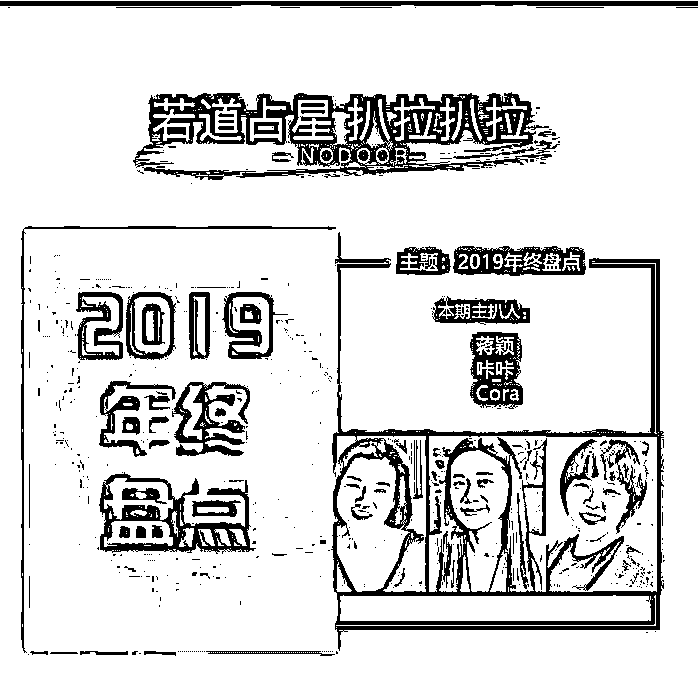

2019 岁末，大家最喜爱的三位主扒主蒋颖、咔咔、Cora 又来啦！这次为大家带来的是重磅跨年集锦——盘点 2019 年的重大天象和重要社会事件。此前，相信很多朋友已经阅读了许多 2019 年分析和 2020 年预测，这期若道电台节目不用眼不费神，助你轻松了解今明两年天下大势。

**2019 年****，**有哪些让占星小伙伴津津乐道的天象呢？谈之色变的“**土冥合相摩羯座**”集体狂欢的“**木海四分**”还是撼动万物的“**天王星金牛座**”……**2019 年****，**又有哪些不可忽视的社会热点值得回顾呢？韩国自杀女明星大公司的裁员风波 PUA 事件与反 PUA 韩国电影《82 年生的金智英》性别平权：关注女性的力量李佳琦火到国外的李子柒褚时健的去世，与他太太马静芬的故事瑞典 16 岁环保女英雄领域间的“破圈”热潮特朗普与希拉里以及社会层面上不好谈论的极端事件……土冥合相会带来很多的恐惧，但 2020 年 1 月以后，土冥合相就不再是重点了。**2020 年**的重点是**木星将会和冥王星发生三次合相，**而三位扒拉扒拉扒主对于明年的趋势各持不同的看法。

*   **月亮摩羯座的****咔咔****：木星究竟会站在哪头，会不会把今年的荒谬推向极致？我并不乐观。**

*   **月亮射手座的****Cora****：我比较乐观。我相信木星在摩羯会消解 2019 年的恐惧，并且带来新机遇的把握。**

*   **月亮水瓶座的****蒋颖****：我跟你们不一样，我最近的恐惧其实是怕被人工智能抛弃。**

分歧从何而来？快去节目里解锁吧～

**长按二维码收听**

▼

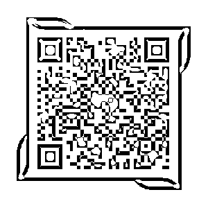

不知道听完节目后，

你对明年会怎么看呢？

**提前祝大家新年快乐啦~**


**想扒啥？大声说！**

如果大家有关心的热点时事，猛料趣闻想要从占星的角度更深入地了解，欢迎大家提供扒拉线索，占星扒拉扒拉，等你的好消息哦～ 

**你可能还想知道**

[最通俗易懂又面面俱到的 2020 年度运势，一定要点开！](http://mp.weixin.qq.com/s?__biz=MzA5NjA0NTAxNg==&mid=2651412428&idx=1&sn=32bf652b3853c9aeae69ee9fed1a9bb4&chksm=8b4be57bbc3c6c6d197123ecaaa6290eaa3a6450bd386df76c8ec3bb924ee61cc7ee98233313&scene=21#wechat_redirect)[！](http://mp.weixin.qq.com/s?__biz=MzA5NjA0NTAxNg==&mid=2651412428&idx=1&sn=32bf652b3853c9aeae69ee9fed1a9bb4&chksm=8b4be57bbc3c6c6d197123ecaaa6290eaa3a6450bd386df76c8ec3bb924ee61cc7ee98233313&scene=21#wechat_redirect)[！](http://mp.weixin.qq.com/s?__biz=MzA5NjA0NTAxNg==&mid=2651412428&idx=1&sn=32bf652b3853c9aeae69ee9fed1a9bb4&chksm=8b4be57bbc3c6c6d197123ecaaa6290eaa3a6450bd386df76c8ec3bb924ee61cc7ee98233313&scene=21#wechat_redirect)

[2020 年度天象详解 | 土木冥极地之旅，始于极夜，终于极光](http://mp.weixin.qq.com/s?__biz=MzA5NjA0NTAxNg==&mid=2651412566&idx=1&sn=ba71bd85e67a9742fe9a76b2626634a8&chksm=8b4beae1bc3c63f71b58c70327e32874483a79a0b5aff0e62a2f02541acf0c32ae1af76c66c5&scene=21#wechat_redirect)

******想听更多占星扒拉扒拉，******

******请在“喜马拉雅 FM”搜索************ 若道占星 ************即可。******


**2020 马上就要来了，为自己和重要的人**

****送上一份暖心的新年****大礼吧****

******由**大卫·瑞雷****亲自主笔的**《**2020 年度运势报告》****

****将是一份尤为特别的****

☞[**新年礼物**](http://mp.weixin.qq.com/s?__biz=MzA5NjA0NTAxNg==&mid=2651412428&idx=2&sn=c7ac1a6bdc53a8bbf62ff4511308629a&chksm=8b4be57bbc3c6c6d69a1beb7f84b72f1e2607071c069efa13310c7983475522ea3a31de4458e&scene=21#wechat_redirect)☜

**点击下图了解详情**

**☟**


就是这个“在看”，戳戳戳 ☟

**年运报告购买入口**


# 一张星图为你解读，82 年生的金智英 | 身为女人，我很抱歉？

> 原文：[`mp.weixin.qq.com/s?__biz=MzA5NjA0NTAxNg==&mid=2651412585&idx=1&sn=e4e12769c8f92e60cbb48dc51c5c8a47&chksm=8b4beadebc3c63c85eb6b68cd57bd0d201084002cabd0f63a909a028c3a12207064d6be0bc42&scene=126&sessionid=1692738237#rd`](http://mp.weixin.qq.com/s?__biz=MzA5NjA0NTAxNg==&mid=2651412585&idx=1&sn=e4e12769c8f92e60cbb48dc51c5c8a47&chksm=8b4beadebc3c63c85eb6b68cd57bd0d201084002cabd0f63a909a028c3a12207064d6be0bc42&scene=126&sessionid=1692738237#rd)

**☆ 后台回复“今日”，给你一句生命态度**

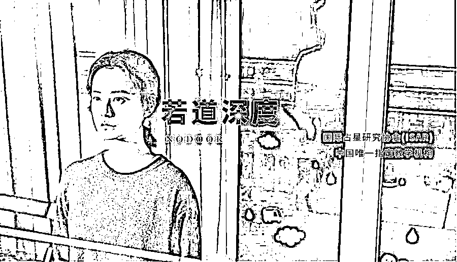作者/Anastasia ISAR 认证占星师编辑/Tang 图片/网络最近，一部讲述女性题材的电影《82 年生的金智英》火了。这部由韩国作家赵南柱同名小说改编而成的电影，不仅向我们讲述了金智英面临的种种难题，也透过她的一生浓缩了女性可能面临的多种困境。本文将从占星学的角度，引领我们走进“金智英”，了解普世下的女性议题。
**82 年生的金智英**

《82 年生的金智英》是一个很简单的故事，讲一位女性从少年到中年的经历。是还算幸运的女性，没有什么波澜起伏的故事。受过高等教育，虽然有过一些清贫的日子，但在父母的护佑下，也并没有吃过太多的苦。结婚生子后，老公也很努力和体贴。只不过，她从小就意识到，因为她是女性，生活中暗流涌动，到处都有一些或明或暗的不公正。

都是些很普普通通的经历，正如同女主人公的名字金智英，也是韩国最常见的女性名字。读书、工作、结婚、辞职、生子、育儿，她的人生经历普通到大部分人都司空见惯，习以为常。如果你偏离轨迹，有了自己的想法，或者明确表示出反感，倒显得大逆不道了。似乎女性天生就能吃苦一些，忍耐一些，包容一些。就像一直以来，我们说的，大地母亲。被需要的时候，她的胸怀可以包容海川；被贬损的时候，她的身体都是藏污纳垢。

于是，看起来一切顺顺利利的金智英最后生病了。

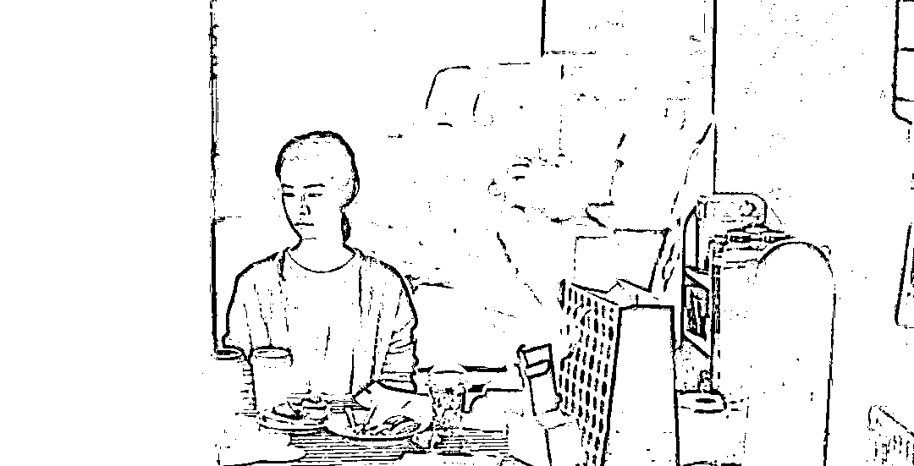

**她是一个人，也是所有人****一说到女性能量或者阴性能量，我们就会想到星图上的月亮和金星**。书中明确写出了金智英的生日，**1982 年 4 月 1 日，出生于韩国首尔**。我们不妨研究一下，她身上有着怎样的能量，这些能量到底在哪儿出了问题，以至于不声不响地，她的世界就崩塌了。

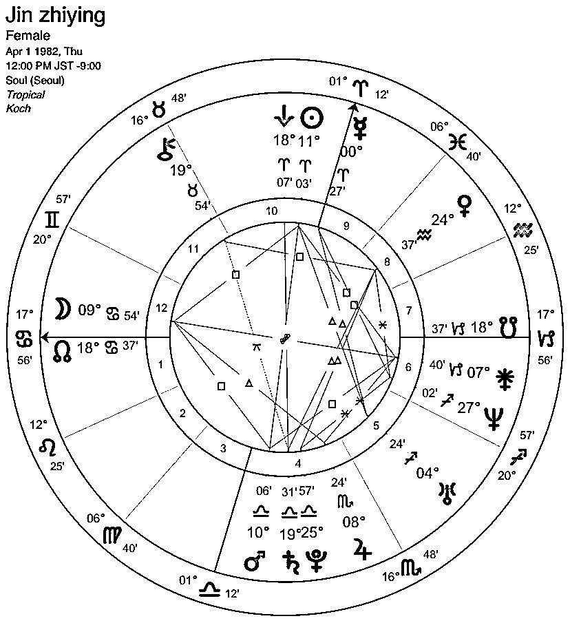

| 金智英出生星图，1982 年 4 月 1 日，出生于韩国首尔

**因为没有准确的出生时间，我们将星图设定在中午十二点。这个时间点可以保证月亮的位置在一天中的中位，方便我们分析。**从星图上，我们看到金智英的**月亮在巨蟹座**，不论出生在一天当中的哪一时刻。月亮在巨蟹座入庙，对于月亮来说，这是一个熟悉并且舒适的位置，她认同她的女性身份，她也从中得到了情感上的滋养。我们再来看看月亮的相位，**巨蟹座的月亮四分了白羊座的太阳和天秤座的火星，这三颗个人行星形成了一个 T 三角的相位图形结构，月亮是其中的顶点星。**代表阴性能量的月亮，四分了代表阳性能量的太阳和火星。同时，月亮和白羊座的水星之间也有一个允许度比较大的四分相。太阳和水星都落在白羊座，这是一个很有力量的位置，和同样有力量的月亮之间，就爆发了不可避免的冲突。作为一个女儿，金智英从小就有很多困惑。奶奶重男轻女，家里最好的东西总是优先给弟弟；上小学时，被同桌男生欺负，她去找老师哭诉，老师却笑了出来，“男孩子都是这样的，愈是喜欢的女生就愈会欺负她，老师会再好好劝劝他的。”

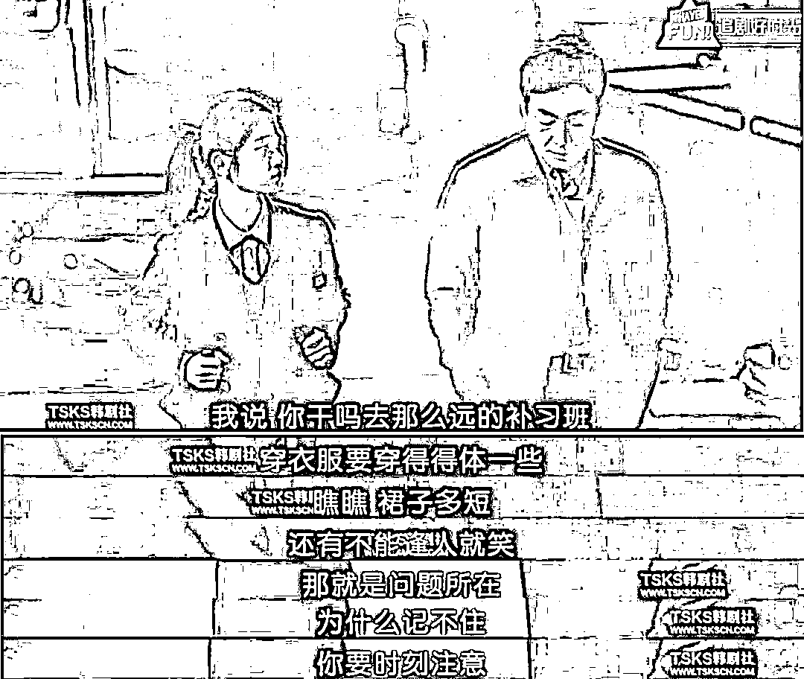

| 金智英小时候放学回家，被男同学尾随时，父亲对她说的话

上了中学，情况更加复杂，要面对公共场所的咸猪手还有男老师的动手动脚，她选择了忍气吞声；总算大学毕业，好不容易进入公司。她又发现高管几乎都是男性。下班应酬又要忍受客户的黄色笑话和劝酒。直至结婚生子，成了以为全职母亲，却又遭到了路人的指指点点，说她是享清福的妈虫。

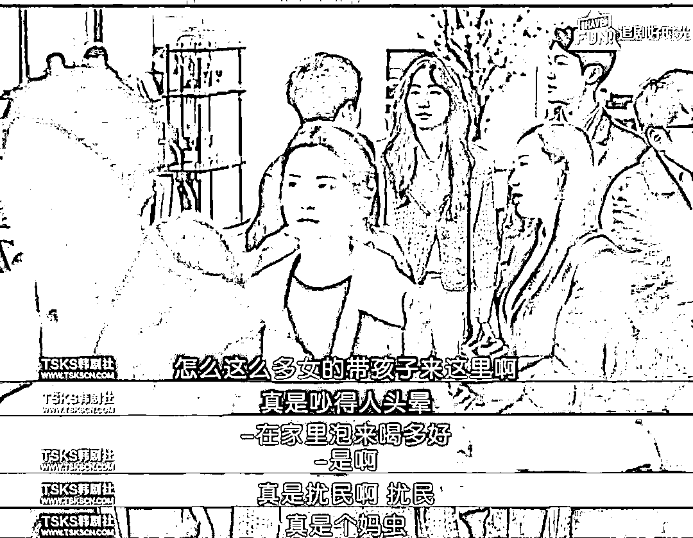

| 成为全职母亲的金智英受到了路人的指指点点

学得好，未必能找到好工作；有能力，未必能有恰当的报偿；哺育儿女，在大家眼里主妇没有价值是依附于老公的存在。在阴性能量和阳性能量的冲击撕扯下，金智英感觉自己站在迷宫中央，明明一直在脚踏实地努力，却怎么看不到前路的方向。也许，**我们需要问自己，向来如此的，就一定是正确的吗？或者说，恰当的吗？**

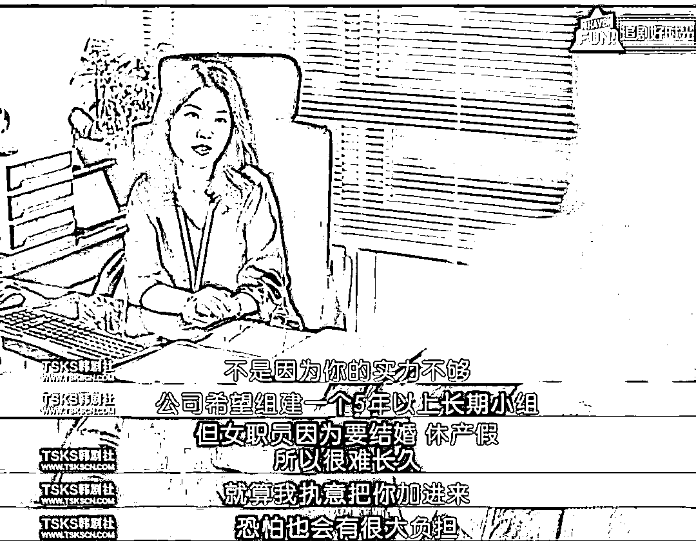

| 进入职场后，哪怕表现出色，女职员的职场之路也充满艰辛

月亮在巨蟹座第十二宫（宫位仅做参考），和巨蟹座的北交点有一个比较宽泛的合相，这显然不是她一个人的困惑，而是**从家族、世代绵延下来的议题**。

*   **从什么时候起，众人口角一致地认为，男生骚扰女生就是喜欢？**

*   **从什么时候起，女性职员在工作上的角色变成了花瓶和陪酒女？**

*   **从什么时候起，养育子女做家务成了女性和没有价值的代名词？**

庆幸的是，丈夫很体贴，**月亮三分木星**，在为人母的身份上，她能够得到一些支持。但他所做的也仅仅是：放心，我可以帮你的。金智英爆发了，“可以不要再说‘帮’我了吗？帮我做家事、帮我带小孩、帮我找工作，这难道不是你的家、你的事、你的孩子吗？”转变发生在她三十四岁的秋天。丈夫发现金智英犹如附身一般，不顾场合，以别人的身份发表大胆的见解，而在事后又放佛梦醒一般，彻底忘却这些行为。在生病之前，金智英从来没有为自己大声地表达过什么，她所遭遇到的对于女性的偏见隐藏在生活中的每一个细节中，以至于大家都理所应当地接受了下来。

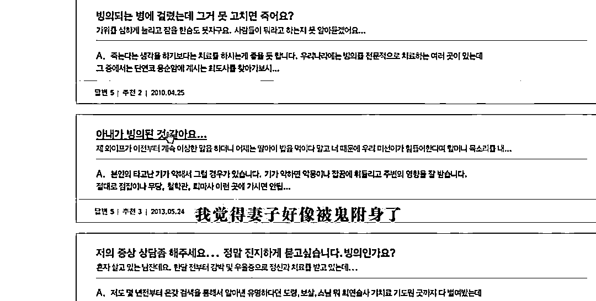

**做自己（太阳白羊座），为自己发声（水星白羊座），身为女儿、妻子和母亲（月亮巨蟹座），维持和谐的关系（火星天秤座），所有因素牵扯在一个 T 三角里面。**于是，她不可控地分裂了。和自我价值相关的太阳，从小就不曾为家庭和成长环境所认可，这不可避免地导致了她对于自我的困惑，让她看不清自己内在那个小孩的真实需求。金智英在丈夫的帮助下去看了心理医生，但她到底会何去何从，病会不会痊愈？故事结尾并没有给出一个确切答案和一劳永逸的解决办法。但我们身为占星师，或许可以从星图能量的角度给出一些分析和帮助。任何疾病，不管是身体上的，还是心理上的，只要善加利用，都可以成为我们疗愈自我，解决生命议题的机会。在她的星图中，火星天秤座，定位星是另一颗代表阴性能量的行星金星。金星落在了水瓶座，三分天秤座的土星和冥王星合相。**在关系中，她要有为自己挺身而出的勇气和力量，去阻止他人踩在自己头上，这将给了她的 T 三角一个情绪上的出口。**

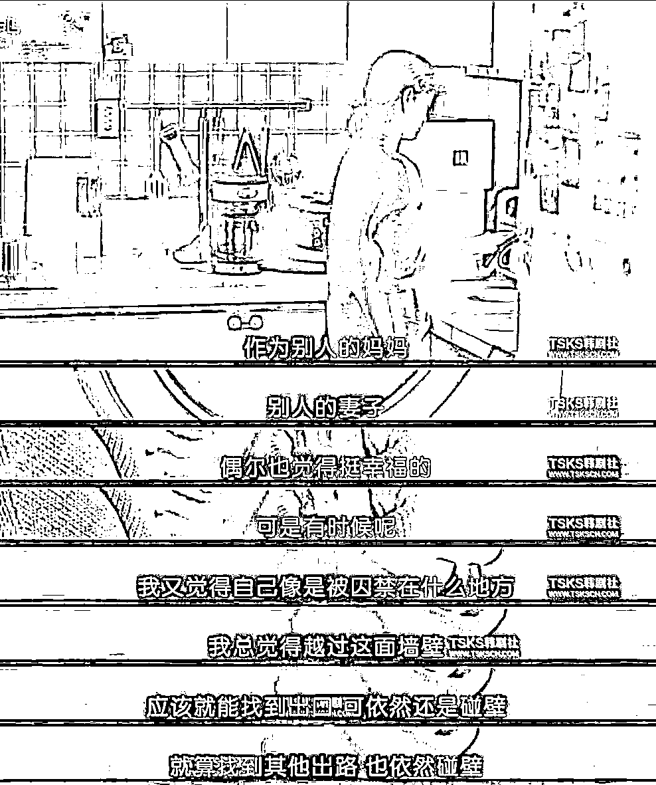

从小到大，她都没有真正为自己活过，看似幸运又循规蹈矩的人生，却成了禁锢她自身发展的牢笼。但真实的内心是什么呢？她心里一直有个心愿，想要重回职场，和欣赏她的女主管一起努力工作，实现自己在社会上的价值。对于 T 三角结构，顶点星对面的那个虚点，可能是这个封闭结构的出口。在她的星图上，就是**摩羯座的能量**，同时，她的南交点也在摩羯座。她需要在职场上确立自己的身份感，她的月亮需要实实在在的结构来支撑。当然，这只是阶段性的出路。放弃家庭，重回职场，从长远看，仍然是对女性身份的一个矫枉过正。认为女性平等，就是要和男性同样打拼，才能证实自我的价值。不过，这些都是后话，她必须先有一个稳定的自我，才能谈得上持续的成长。我们从她星图上可以看出，她的**北交点巨蟹座，南交点摩羯座**，对她来讲，身为女儿、妻子和母亲，是完全有能力给自己的家、自己父母的家一个有力的支撑。也许，解决之道，并不在于手忙脚乱地回归职场，而是如何真正地确立女性的价值感，如何不被社会主流思潮绑架，如何能认识到，为人妻女，提供家庭滋养也是善莫大焉的价值。如果金智英可以在回归职场后，获得踏实的自我认同，之后再重新权衡家庭和事业，重新审视自己的内心，她可以选择再次回归家庭。

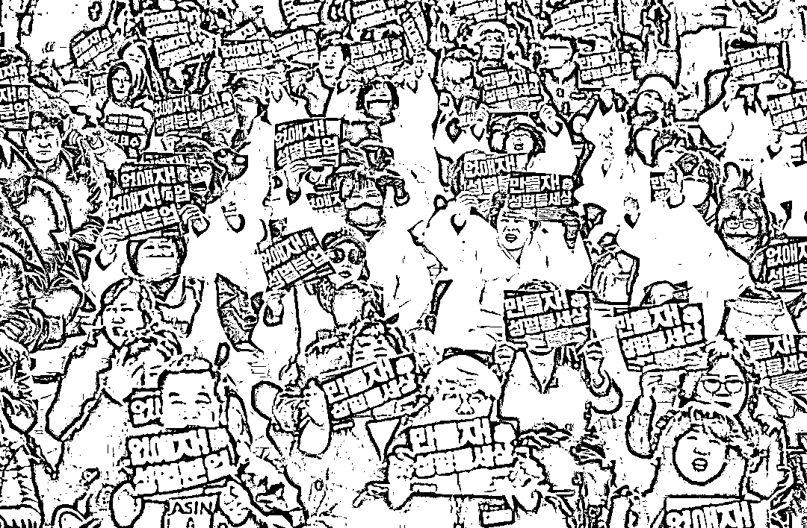

**|  **2019 年 3 月 8 日，韩国首尔工会举行静坐集会，抗议职场性别歧视，呼吁男女平等

**拿回自己的力量**

**天王星已经进入金牛座，我们的价值观和经济模式都在面临突如其来的改变和突破，女性意识的觉醒是其中不可忽视的潮流。**意识觉醒才能令我们看见问题，看见问题才有机会去选择，是选择逃避，还是选择解决和疗愈？

重要的不是女性一定要去工作，一定要不婚不孕才能平权，而是身为女性，我要**拿回自己的力量**。我**可以自己做决定**，决定自己像男性一样选择婚后工作，我也可以遵从自己的女性身份生儿育女，在家庭中贡献自己的力量。这二者并没有高下之分，也不是彼此歧视的理由。这是女性自己的选择，而不是让家庭、社会来替我们、或者强迫我们来做决定。同样，身为大时代下的男性，也有机会选择去打拼事业，还是回归家庭当一个奶爸。

在这个天王星金牛座的周期里面，女性可能会有更大的作为。摩羯座的土星正在逐渐靠近冥王星，明年一月，土星将精准合相冥王星，我们处在土象能量的包围之下，**朝后看，我们会感受到巨大的现实压力；朝前看，我们也能从中体会到能够解决问题的巨大力量**。

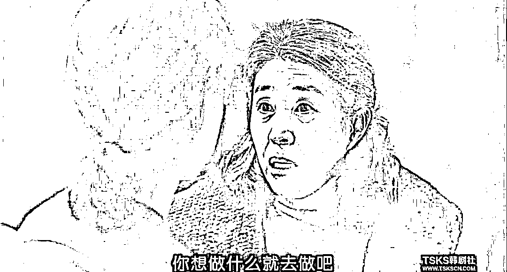

82 年出生的金智英星图上有**土冥合相在天秤座**，而现在行运的土冥合相摩羯座正好四分她出生星图上的土冥天秤座。这是一个世代的相位，对于八零后来说，人际关系和寻求合作（天秤座），以及在这个世界上取得成就和社会认可（摩羯座）之间有着巨大的压力。

**土冥合相在摩羯座，让我们有机会接触到内心的恐惧，用更强的自我意识和积极的行动来取代它们，正面现实，最终放弃那些不再适合我们当下的旧模式和旧习惯，整装再次出发。这是时代意识改变的重大时机。**

也许我们能够意识到，男性女性的身份不再是认知的障碍。真正的男女平等，不是我在你的地盘上取代你，或者你在我的地盘上取代我，而是我们**在各自擅长的领域里活出自己，彼此尊重，彼此扶植，彼此包容**，共同创造美好的人间。

**版权声明：**文章由作者授权在若道平台发布，欢迎转发，反对抄袭。友号转载请申请白名单。


**想阅读更多作者的文章**

**请在后台回复 ****Anastasia****即可**

**Anastasia**

职业占星师/专栏作者/策展人

ISAR 认证占星师（2016 年获得）

若道认证生时校正资质（2015 年获得）

**微信公众号**：KairosMoment

长按打赏


**点击图片查看若道君推荐**


**微信又又又改版啦，不想错过若道的推送？**

**就把若道设为星标吧！**

**▼**


就是这个“在看”，戳戳戳 ☟

********报名直达入口********


# 2020 年，萧条局面如何投资？金融占星学大师雷蒙德·梅里曼来指路

> 原文：[`mp.weixin.qq.com/s?__biz=MzA5NjA0NTAxNg==&mid=2651412585&idx=2&sn=419048d19ea91d30ae65a996d0af7791&chksm=8b4beadebc3c63c8060414dd70f41515dde8dbe83765895c6be48c3fceaba1958e676d867e8c&scene=126&sessionid=1692738237#rd`](http://mp.weixin.qq.com/s?__biz=MzA5NjA0NTAxNg==&mid=2651412585&idx=2&sn=419048d19ea91d30ae65a996d0af7791&chksm=8b4beadebc3c63c8060414dd70f41515dde8dbe83765895c6be48c3fceaba1958e676d867e8c&scene=126&sessionid=1692738237#rd)


**2020 年金融预报和讲座**

1976 年以来，由雷蒙德·A.·梅里曼撰写的梅里曼市场时机学院每年一次的年度预报沙龙和每年一本的《年度预报》一直在应用占星学原理为投资者们服务，提供卓越洞见，从未间断。

43 年来，这本 200 页左右对金融市场的分析报告和 3 小时的年度预报讲座在美国、日本、欧洲帮助许多投资者了解宇宙天气对于世界经济形势、政府政策及其对各个金融市场和金融产品的影响，帮助他们做出正确的投资决策，降低投资风险。2018 年，若道第一次将这份广受赞誉的一年一度的金融占星报告和沙龙引入中国，供中国投资者参考。**《2020 年金融预报》将会谈及 2020 年重要的宇宙天象及其对世界经济、贸易形势的整体影响，还将覆盖中国上证股票市场的分析、黄金白银市场、美国经济、美国总统、美联储、美国国债市场、美国股票市场、主要外汇货币市场（主要外汇美元、英镑、欧元、日元、瑞士法郎）、原油市场、谷物市场、活牛市场、比特币市场等投资市场。**另外，非常有价值的是，梅里曼老师及梅里曼市场时机学院的金融占星分析师还会给出以上市场 2020 年的**市场价格目标区间及重要价格反转日**，为短期、中期和长期投资者进行市场操作的时机提供参考。如果你关注世界经济和金融投资市场的变化，会发现梅里曼《金融年度预报》中的研究对于你了解世界经济在发生什么，这些市场的走向会如何有非同寻常的指导价值。


比如，在 2018 年 12 月发布的《2019 年金融预报》中，梅里曼老师指出：

*   2019 年美国领导人与世界其他国家之间可能发生重大冲突，加剧紧张局势，其中一个冲突可能与**贸易问题**相关。
*   2019 年美国经济和股票市场将会到达一个重要的高点，随后在 2020 到 2022 年间的某个时间点开始凶猛地下跌。
*   天王星在未来 7 年内完全进入金牛座的日子，预示着**转基因食品的新发现、肉类价格的上涨以及货币估值甚至交易形式的重大变化**（比如我国已宣布央行法定数字货币试点项目有望在深圳、苏州等地落地）；
*   上证指数在 2019 年木星在射手座行进期间可能出现强势反弹，该指数将挑战或突破**3100**（2018 年报告发布时上证指数为 2500 左右，2019 年最高点为 3288）；
*   **黄金价格**一旦收盘在**1350-1377.5**价位之上，会直线上升测试**1500+/-50**（2018 年报告发布时黄金价格为 1229 左右，2019 年最高点为 1566）；
*   只要**白银**保持在**13.62 以上**，就会形成看涨双底结构。如果白银收盘在**18 以上**，就有机会向**26.16+/-1.48**爆发（2019 年报告发布时白银价格 15 元左右，最高价格为 19.75）。

随着木星离开射手座，木海四分相在 2019 年结束，木星进入魔羯座，土冥合相的到来，世界经济和金融又将发生什么变化？梅里曼老师将在《2020 年金融预报》报告和讲座告诉你他的研究和看法。结合报告，梅里曼老师将于**北京时间 2020 年 2 月 15 日上午 10 点**做一场历时 3 个小时的**关于明年世界金融市场的演讲**，为报告的读者们进一步答疑解惑。而对于不懂得占星学的朋友，也不必担心，在每个市场分析后，都会有一个总结性的结论，帮助你了解梅里曼老师及梅里曼市场时机学院的金融占星分析师对这个市场的整体投资看法。


**报告价格和讲座时间**

**报告和讲座价格**

2020 年金融预报讲座和报告价格整体售价 **1280 元**

（本讲座和报告不单独出售）

**12 月 31 日前 100 名用户**预售价：**1080 元**

**12 月 31 日后**恢复原价：**1280 元**

**讲座时间**

**2020 年 2 月 15 日  10：00-13：00**

（暂定，如有变动，请以若道最终通知为准）

**购买者重要须知****①** 梅里曼市场时机学院每年一次的年度预报沙龙和《年度金融预报》是梅里曼市场时机学院的研究“预报”，而不是市场“预测”，是梅里曼老师及其金融占星分析师对人类活动周期历史与行星周期之间相关性的研究，二者在大部分情况下具有 80%或更高的相关性，而不是因果关系。沙龙中和报告中的研究完全存在错误的可能性。即便是非常认真的研究和几十年的研究经验，我们无法总是正确地解读出各种征象在实际层面上会如何相互作用，并显化为事件结果。所以请将此沙龙和报告看作一个研究参考，务必结合其他市场研究和你个人对市场的理解，根据你的自由意志做决策。**② **此套餐一旦售出，即**不接受退款**。**③** 此报告只支持**手机阅读**，不支持电脑阅读、下载和打印。**④**《2020 年金融预报》中文翻译版预计在**2019 年 12 月 31 日左右**上架发布，预售报告购买者，届时请参照下图《金融报告查看路径》查阅已购报告内容。**⑤ **讲座时间为初步确定时间，如临时有变动，请以最终通知为准；讲座届时会提供视频回放（仅支持在若道 APP 观看回放视频）以上须知，请仔细阅读。一旦付款，即视为已了解并接受所有须知内容。**已购报告查看路径**


****购买报告请点击“阅读原文”****


# 2020 年度天象详解 | 土木冥极地之旅，始于极夜，终于极光

> 原文：[`mp.weixin.qq.com/s?__biz=MzA5NjA0NTAxNg==&mid=2651412566&idx=1&sn=ba71bd85e67a9742fe9a76b2626634a8&chksm=8b4beae1bc3c63f71b58c70327e32874483a79a0b5aff0e62a2f02541acf0c32ae1af76c66c5&scene=126&sessionid=1692738237#rd`](http://mp.weixin.qq.com/s?__biz=MzA5NjA0NTAxNg==&mid=2651412566&idx=1&sn=ba71bd85e67a9742fe9a76b2626634a8&chksm=8b4beae1bc3c63f71b58c70327e32874483a79a0b5aff0e62a2f02541acf0c32ae1af76c66c5&scene=126&sessionid=1692738237#rd)

**☆ 后台回复“今日”，给你一句生命态度**


作者/蓝女巫 ISAR 认证占星师

编辑/Tang 封面/书君 图片/网络

读完超干货的[2020 年图文运势（阅读文章请点击）](http://mp.weixin.qq.com/s?__biz=MzA5NjA0NTAxNg==&mid=2651412428&idx=1&sn=32bf652b3853c9aeae69ee9fed1a9bb4&chksm=8b4be57bbc3c6c6d197123ecaaa6290eaa3a6450bd386df76c8ec3bb924ee61cc7ee98233313&scene=21#wechat_redirect)，再来看看围绕着土星、木星、冥王星 3 星合相展开的 2020 年核心大戏。“大戏”以土冥的极夜开始，由三次木冥的极地之旅贯穿，终结于土木大合相的极光中。现在，就让我们提前了解一下这场极地之旅吧。

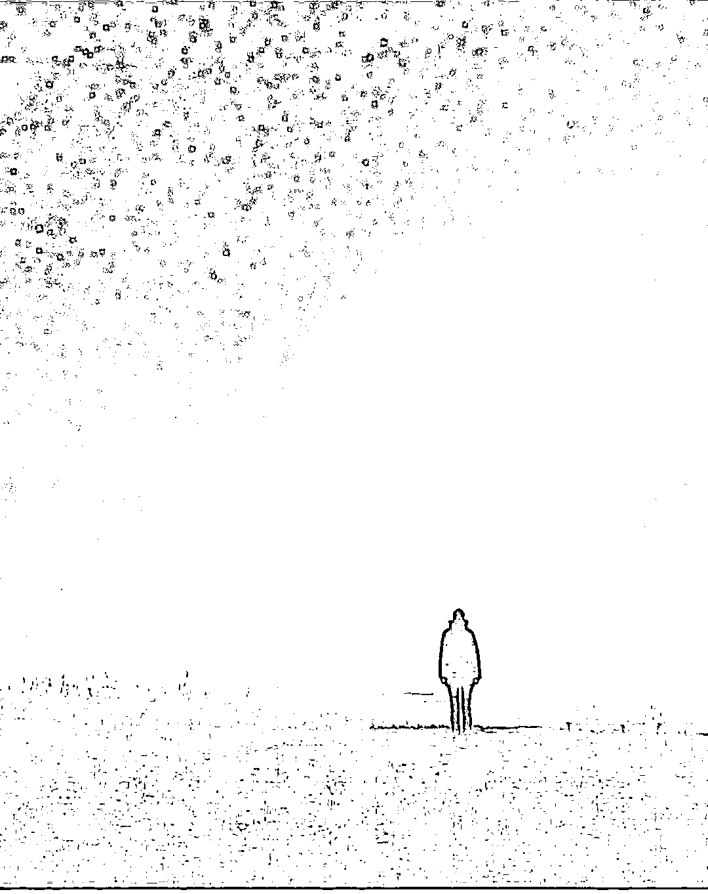

**2020 年重要天象概览**1 土木冥合相

*   2020 年 01 月 13 日：土冥合相摩羯座

*   2020 年 04 月 05 日、06 月 30 日、11 月 13 日：木冥三次合相摩羯座

*   2020 年 12 月 22 日：土木大合相于水瓶座

*   2020 年 03 月 22 日：土星换座水瓶座；2020 年 07 月 02 日：土星回到摩羯座；2020 年 12 月 17 日：土星换座水瓶座 

2 六次日月食

*   2020 年 01 月 11 日，巨蟹座月食

*   2020 年 06 月 06 日，射手座月食

*   2020 年 06 月 21 日，巨蟹座日食

*   2020 年 07 月 05 日，摩羯座月食

*   2020 年 11 月 30 日，双子座月食

*   2020 年 12 月 14 日，射手座日食 

3 水金火逆行

*   2020 年 02 月 17 日-03 月 10 日，水星逆行在双鱼座-水瓶座

*   2020 年 06 月 18 日-07 月 12 日，水星逆行在巨蟹座

*   2020 年 10 月 14 日-11 月 04 日，水星逆行在天蝎座-天秤座 

*   2020 年 05 月 13 日-06 月 25 日，金星逆行在双子座

*   2020 年 09 月 10 日-11 月 14 日，火星逆行在白羊座 

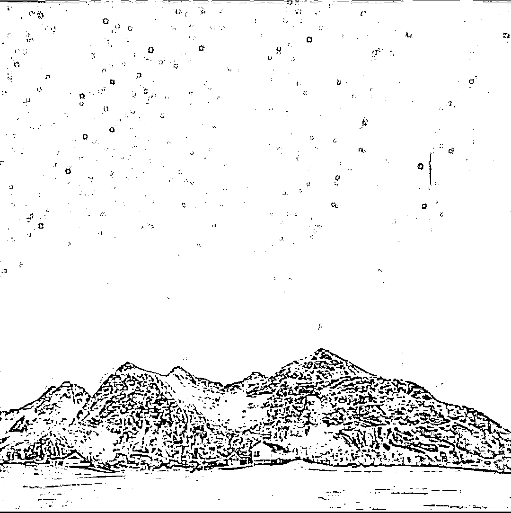 
2020 年，绝对是浓墨重彩的一年！核心大戏围绕着土木冥三星合相展开。作为三年寒冬的收官之作，一切注定将在此处升华……**2020 年，是土星当道的一年！**被摩羯座堵塞的冥王星，被摩羯座规训的木星，都遇上了土星摩羯座本尊。所以，一年的大戏中，土星老人，才是定音鼓，但见它稳健从容地将一切魔性和野性收伏为座骑。这是先苦后甜的一年。是保证你三年耕耘收获回报的一年，只要你没有死于绿洲之前。**它以土冥的极夜开始，由三次木冥的极地之旅贯穿，终结于土木大合相的极光中！之后，水瓶座新时代的未来，都将始于这一片绿光的启示…… ** **土冥合相**

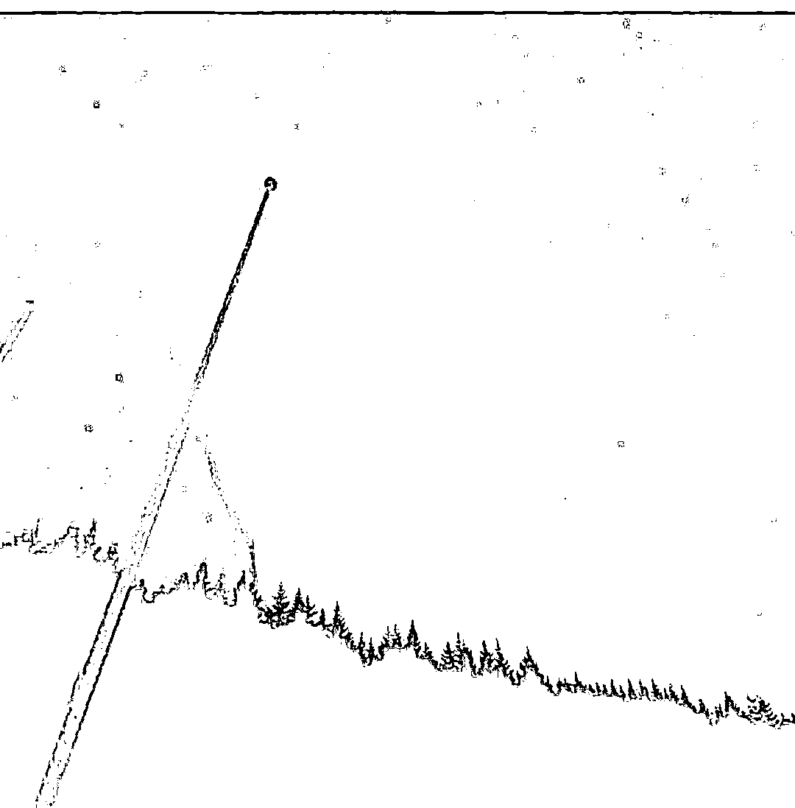

当每一个疲惫的身影捱到了这年关的门口时，却被告知，2019 年还不是最坏，2020 年或许才是。2020 年 1 月 11 日-13 日，是触目惊心的至暗之夜，我们尚不知前方那门通往哪里......但见它集齐了星空中最悲怆的色彩，巨蟹座月食将引动日水土冥在摩羯座 22 度附近的精准合相。始于 2019 年的土冥行进，至此已抵达了能量的峰巅。土冥合相，三十几年一次，从占星学的周期角度，但凡合相之处，既是结束，亦是开启。未来新篇章华丽转身前，人类必先负重前行。**这就是 2020 年一开年的色彩：极夜的黑。**有点残酷？但只有黑夜才能更让你专注于呼吸，所谓一切生存之根本。 2019 年，我们已见识到了土冥的低气压，但那时我们还有木海的烟视与癫狂，还能望梅止渴。而一切幻影已在 2019 年出尽，海王星戏份已被削减，尽管仍有木海六分相，但早已收敛疯癫，更具建设性。我们都不再敢去装睡，我们都不得不学着醒来。尤在一开年，**人类就步入了沙漠，来到了连海市蜃楼都没有了的时期。**在内心至深处，陪伴我们的，甚至已没有了队友（因为每个人都在忙于挑战自身的极限）……而唯有意志力，和自己的沉重呼吸。土冥行进，是对身内身外一切基础格局的重大洗礼，且是彻底革除，以腾出空间，重新建构。土星的施工队在冥王星的爆破现场时刻待命。每个人心中也正背水一战，被考验着面对极限的反应。**忽喇喇似大厦倾......**集体意识中正满载焦虑紧崩不确定的张力。而越是慌张，越是巧取豪夺，越是过度补偿，这即是我们面前身心过劳的时代盛景。商业的车轮，已忙到快失控，感觉那车就要翻了。放眼望去，全是沙漠……土冥寒冬中的世界，泡沫崩塌，经济衰落，繁华退场，忧郁盛行，许多舞台越发安静了，吵吵闹闹的似乎只剩下网红了……而网红也有生命周期的，且越来越短。那么假想，网红之后，世界还将剩下什么？难道是“海的呼唤”与“真的喟叹”吗......**土冥的深意，不也正是去芜存菁。 **

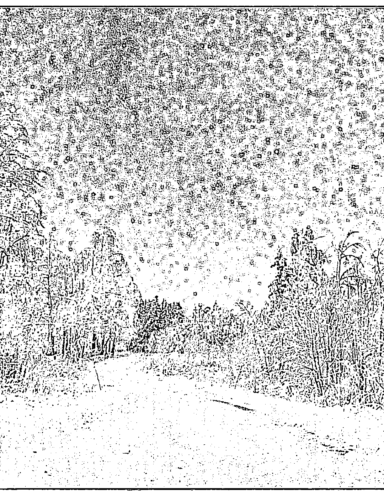

此时，你遇见的每个人，气场中都渗透出土星的沉重，冥王星的迫切。疲惫的男人，被责任和危机占据了所有带宽；绝望的女人，很久不再被深深地看到，情感已干涸；写着作业的孩子，在年少的时候就已经很老了……路人们，清一色在埋头看手机。哲学？只能让被快餐塞满的胃消化不良。每个人都被浮华的外境压榨着精力，以致与内在对望时，情绪干枯。土冥共业下，有一片惊人的平等，每个人都必有一版悲伤，没有人真正快乐。更可怕的是，土冥的铁蹄，让你连抱怨都没了时间，任何情愫都将顷刻被洪荒覆没，在这个已没有什么是无可替代的时代里。**繁星黯淡，在这个极夜的尾声**。2019 年三次水象星座的水逆，你遇到了哪些故人？他们是否行色匆匆？你的心情又是怎样？你是否感到这世界突然变得荒谬，曾经温暖的面孔都已陌生，让你怀疑美好的昨天难道只是一场误会？2020 年还有三次水象水逆，将再次照见你心湖中的倒影，问问那疲惫的人，是对方，还是你自己？土冥功利的尺子下，你的创作你的爱，都不再被认真对待了？不觉间，你的目光也不再清澈如前。每个人，都是这样渐渐失去了爱的能力。嗯，**雪崩时，没有一片雪花是无辜的……**回望若干年前……那时，当人类曾作为人类，而非疲惫的机器，而真诚存在时。**那时每个人眼里还有星光，心间还有爱**，还敢奋不顾身地共赴梦乡。连茫然都充满诗意，而非麻痹。对视中，尚有人性的辉光，而非绝望……而若那一切放到今天，瞬间都变成了刻舟求剑的笑话？**雪越下越大**。 **木星摩羯座**

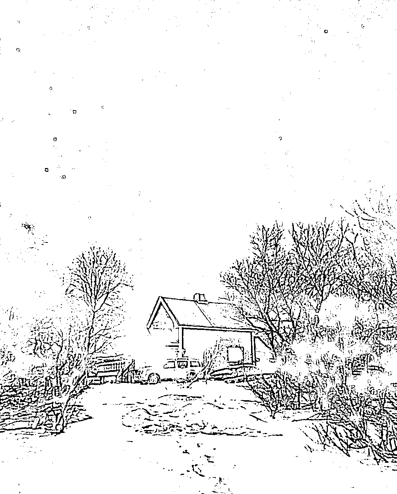

2020 年的天空，木星仍是主角之一，但它早已不是昔日里的木星，而是被摩羯座修饰的木星，更具土星色彩。像被训诫的浪子，剪掉长发，穿上衬衫，极力在办公室里展现庄重的仪态，却尽显落陷的违和感。敏感人群都该捕捉到了那个能量切换的微妙瞬间，12 月 3 日，木星刚一进摩羯座，射手座的能量突然就偃旗息鼓，一切空玄被迫沉降，喜乐的惯性无处安放。**顿时，全宇宙都是摩羯座式的低气压，结结实实**。冬的灰度越发深沉，堕入低长调的影像，投射出每个人类心底那片秘而不宣的忧心忡忡…… 木星扫过的宫位，揭示了你正有望挑战极限运动的成长空间，且**宇宙总会送来礼物支持你的冒险**。之前，我们在此处，还跟随射手座教练乘坐木海号热气球玩高空跳伞呢。而最近这个领域却画风急转，刚刚换了位年迈的摩羯座老师，他给木星的野马套上了最沉重的缰绳，原本扩张无阻的能量，突然倍受制约磕磕绊绊。**感觉连幸运之神也要命运多舛了。是的，这一年，一切幸运都将迟到。**他悲观地认为木星送来的每一个机会都存在陷阱，应全部严格安检，要通过现实规则的障碍。他最痛恨不切实际，习惯给每一个希望先浇盆冷水，宁可沮丧也不得意淫。他教你更加结果导向，冷冷地说：没意义的事，从一开始，就算了吧。当下每一锤都要与结果的绩效挂钩。**摩羯座长辈用的是挫折教育，侧重对木星信念的试炼。**逼你学会那些真正有用的，支撑你信念的技能。他缺乏情绪感应，也没有鸡血的激励，只管用严肃的训斥来剥夺你的全部心理拐杖，当你的哭泣没人理睬，你才只好悄悄地为自己负责，从泥泞中委屈地爬起来，而他马上又会用更冷酷的棒喝，来继续检验你存活于苦难的能力。于是，很多信念都没能通过考试。那些承受不了压力的，心怀有侥幸的信念，都纷纷败下阵来。 无论如何褒奖土星的用心良苦，毕竟波西米亚的木海人仍不喜欢“戴手表”。从射手座教练咧着马嘴带你飞，到摩羯座老师扑克脸上的法令纹。被招安的**木星的心理落差有多大？**骄纵如木海人，近来每天都在对着土星的戒律怀疑人生：“清晨醒来，请先吞食青蛙！”“？？？”“据说那青蛙能变成王子。”“NO WAY”“土星有能力去做你不愿做的事。”“啊，那是怎样一种存在？”“甚至可以去爱你不爱的人。因感情是可以培养的。”“一秒都不能！”“压腿！” **“我宁可去拥抱野兽，也不愿意亲吻青蛙！”****“不，你没有选择。”**当下，每个人都不得不向这二位跪下。美女与野兽，**一个冥王星的转化**；公主与青蛙，**一个土星的蜕变**。原来，摩羯座老师对木星的高能集训，就是为了去追上未来这两个剧本：木冥合相与土木大合相。**木冥合相**

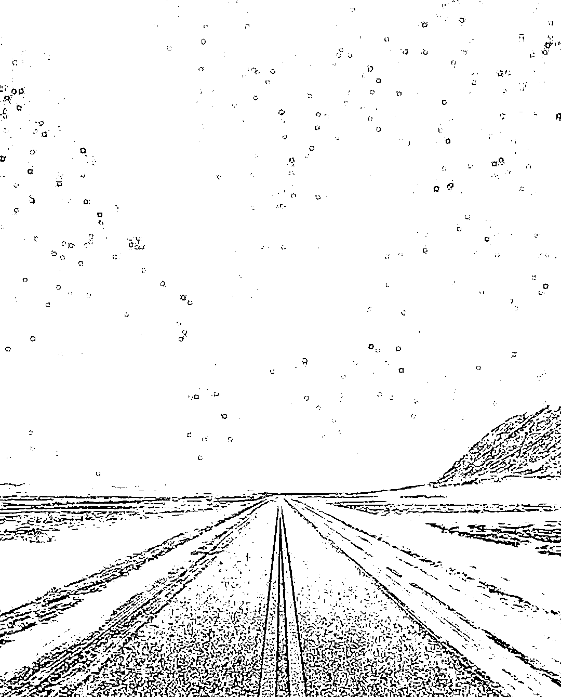

其实，三年来，木冥已多次共舞，从木星天蝎座，木冥四分与木冥六分，至今木冥合，“长征”终于快要结束了。木冥合相，是个十三年的周期，象征一种核能的炸裂。是年初土冥崩坏的苍凉下，响起的战地之歌，在凛冬中，对生存的呐喊。我仿佛又听到了木星天蝎座那年，死亡金属中的嘶吼，最野性的呼唤，于此处回响。北欧的静湖下，灵魂的极夜中，又打开了潘多拉的盒子，邪恶的滋长，权欲的渴望，贪婪的膨胀......相比，**此时木冥合的绝唱，却更低沉，更接近史诗，因由一种摩羯座式痛苦的抑制而更加性感**。**而信念危机，也等候在那里**。在我们艰难跋涉的旅途中，每当土星老人悲观地告诉你，一切都不可能了。这时，**你敢不敢说：不，一切仍有希望！**于是，找到心中那个义无反顾的信念，成了这暗夜中唯一重要的事。**然后一定要沉住气，去通过土星的每一步试金石。**化腐朽为神奇的木冥精神，终将保证你绝处逢生。顺行时，其能量表现为，忘情地享受战斗的酣畅；而逆行时，是清理战场的尸骸与缴械的过程。当你能无情地挪开那些腐朽尸骸的时刻，也就象征你已割舍掉那些经检验无法通关的执念；然后迎向再次顺行的决战，奔向那无论如何，都愿为之全力以赴的终极渴望。在这场以智慧和勇气去决胜死亡焦虑的战役中，我们将收获蜕变，收获真相，收获爱。 **土木大合相**

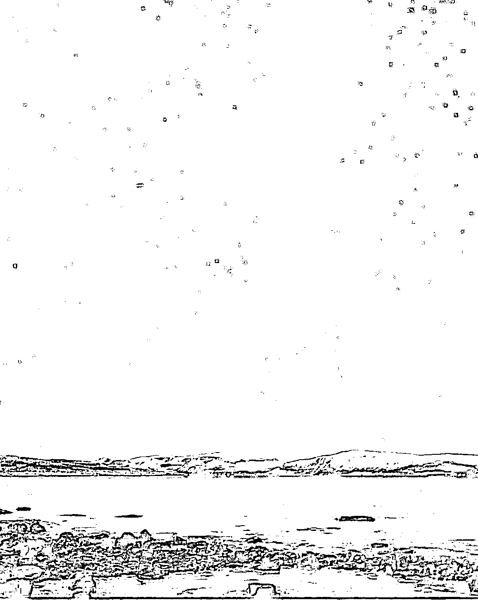

2020 年 12 月 22 日，最终，木星追上了土星。历经了一年的磨合后，波西米亚人已被彻底驯服，木星真正成熟了，准备接受土星的嘉奖。为了在恶劣的境况中存活，为了完成胸怀中的渴望，2020 年的木星学会了向现实规则妥协，学会了将贪婪妄念沉降，学会了自律和坚强，以有序的扩张去将梦想照入现实，终以完整的生命结构来承接正确的信念。**土木能量终于兼容，是卧薪尝胆过后的皆大欢喜，尽展能屈能伸的平衡之美。摩羯座象征着时机的成熟。至此，一切都可以正式步入水瓶座了。**土木周期，每 20 年合相，被称作“伟大的合相”，这一次还是从土元素走向风元素的 200 多年的转折点，意义深远。将开启新思想、新秩序、新科技，以及全新的时代精神，迈入新周期。**漆黑的长夜，已孕育出了智慧的闪电，它能戳破一切虚伪的眼睛。给迷路的人们送上光明！待到土木大合相的第一道水瓶座之光击穿长空时，人类的意识将从前方天王星春雷滚滚的次声中再次觉醒......****土星本尊**

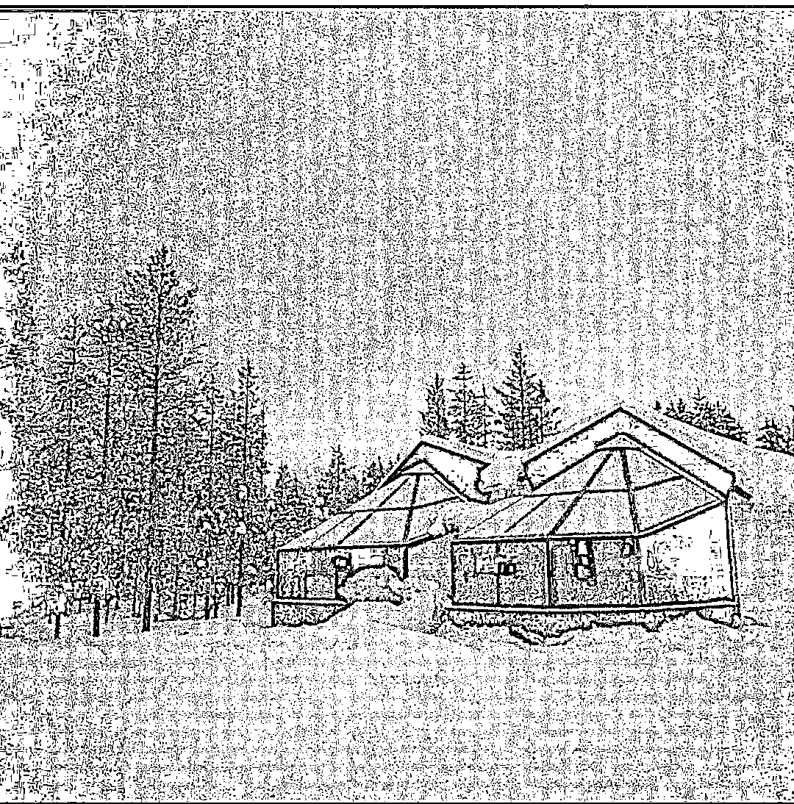

春天时，劳累过度的土星，会进入风象水瓶座开会儿小差，感受一下电流，截取一些未来的洞见。极夜中，开始有光......然后下半年再回来摩羯座，**继续统领众星磨砺，一直熬到冬至的决战面前**。下面让我们来进一步认识土星老爷爷本尊，这一座 2020 年暗夜中横亘的山。**就从硬币的两面，为土星来一个最简洁的速写吧。 **

**硬币正面-渴望成功**

土星以老著称，代表世故的成熟。因其内置一块钟表，尤能感受到时空的限制与生命的短促，这导向了**冷静的认知**，无情地节约一切效能，奔向成功。主张一种更有远虑的安全感，这导向了**情绪的成熟**，以担当责任来赢得自我尊重，不寄托期待于他人的庇护。**他们首先接受限制，然后承诺在此限制中做到最好。**一方面，遵守规则，就是一种向现实的妥协，以此作为追求效益的根本策略。故他们成了最善用游戏规则的族群，也成了规则本身。另一方面，实事求是地自我评估，**通过发现你不能是谁，来具体地定义你是谁。**在路标的层层界定中，步步修剪出身份边界与能力范围。从不在自身局限之外浪费时间，以此表达一种成人的态度。这也就是土星人对时间的雕刻吧。然后，就可以向属于自己的目标彻底承诺，在一个有结构的计划上，付诸长程的努力。**他们笃信时间，尊重慢。**延迟享用的品格，是其独有的天赋。奖励的到来，总因被假以时日而倍添香醇，故速成之事令其毫无成就感。 

**硬币背面-恐惧失败**

土星对成功高企的热望，也会带来同等强度的自卑与防御。深藏着自我怀疑的不安，才会在面容上绽放出这末日般的凝重。那惨淡的愁容，与绝望的悲苦，让我联想到 AI 马文的忧郁，没完没了的丧。**自我否定，又给人添堵。不可能！没希望……**凡事先往坏处想。所以，土星过境之处，你能明显地感受到相关能量场域**振频的迟缓**，一种源自于压抑和制约的慢性疲劳。那个领域突然迎来了雾霾天，灰头土脸不透气，意志消沉，沉默窒息。堵住了你所有的快乐，受困于这僵化的牢笼。**在土星超我的时刻监督下，人们被“应该”与“必须”所碾压**。忙于企及外部期待，建立世俗功勋的同时，也必然付出了巨大的代价，那就是，你已遗忘了内在的平和，障蔽了人性的欢脱，牺牲了心灵的滋养，缺乏震动，麻痹瘫痪，双眼浑浊，老气横秋。且当你显意识中的价值判断，与潜意识的相左时，便会为自己制造痛苦，恶意失败。终以自苦偿还罪疚。 综合上述的描画，**去观察你星图中摩羯座所覆盖的宫位**，2020 年，土木冥共同穿越摩羯座时，这些领域必须进入空袭戒备，所有的生存大戏都将冰封这里。你也将在此学会，什么才算是真正的成功。**摩羯座的高阶是一条孤独之路（solitude）。土星的天命叫作：非如此不可。**待你真正找到那份专属的灵魂蓝图，必然会心无旁骛地去专注，体会到其本身即是意义，而非仰仗外在认同。让你拥有一份坚定的平和，而非在患得患失中郁郁寡欢。所以，今年统帅三星的摩羯座老师认为一切的先决条件，是**去辨识你爬的那是不是个正确的山峰？**可别爬到梯子顶端，才发现搭错了墙。这是相当致命的风险，因为爬错了山，你就可能变成一具尸体。而**见杆就爬，那是猴子**……如此找到目标，然后忠于目标。升级打怪，不懈达标，绝不半途而废。

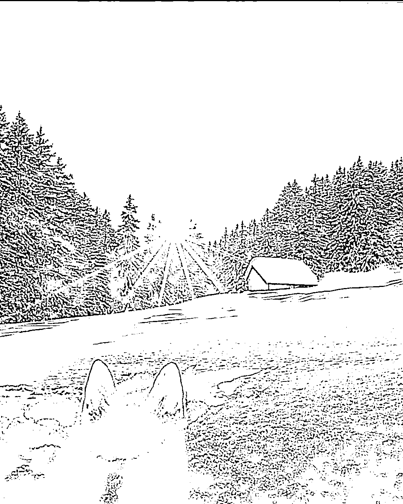

**2020 年，只有一件事是绝对的，那就是，没有什么能轻易成功！**慢，是一种境界。并非闲逸的慢，而是苦涩的慢，是稳健均匀地发力于纤毫之间。**2020 年，通知你前方将有两件事即将发生：被延迟的回报，以及回报。**一切幸存者，年底都将在此处毕业，收获难以言说的喜悦与满足。那么，你希望这个奖励是什么？去瞄准土木冥行经的地带，以及被其成相的星。**在这些领域，设定一个有意义的目标。选择你最想要做的事，以最难的方式去完成它，以最耐心的态度去守候它，尤其要去承诺于它最现实的部分。**深信自己，埋头苦干。土星之美，在于那份无可替代的坚实，一种最具长程眼光的优秀。所谓做最好的，就是让人别无选择的。 **2020 年的土木冥，是挑战身心极限的旅程。**天将降大任，要测试我们在严寒中的体能。多年的长跑，已到了决胜的时刻，你该怎么做？这一年，只属于强者，听上去很无情，但前方会有更无情的。娇弱是本年度最大的笑话，每个人都需要为自己负责，去看清脚下何以立足。放心，你会得到休息的，因为物极必反，**2021 年指向的将是一片云霄！**未来主义的嘹亮号角会划破天际，随着某种新元年盛开，自由之风将劲吹，一切信念的种子，在风媒中缠绕交互，野蛮生长，去通往无限的可能……其实，有时候，我们只须知道最后面会是好的就行了。现在，回到眼前，找到一个值得你倾尽全力的事，或是你最想爱的人，为之出发吧。它们就是**那根最尖最长的刺**，为你决斗的勇气赋能，让你站在命运的荆棘上绝唱。也唯有燃烧了这种力量，才能让你以**马革裹尸还**的决心，置之于死地而后生。末了，我们还活着。且不只是活着。**铁马冰河入梦来，出发吧！** **结语**

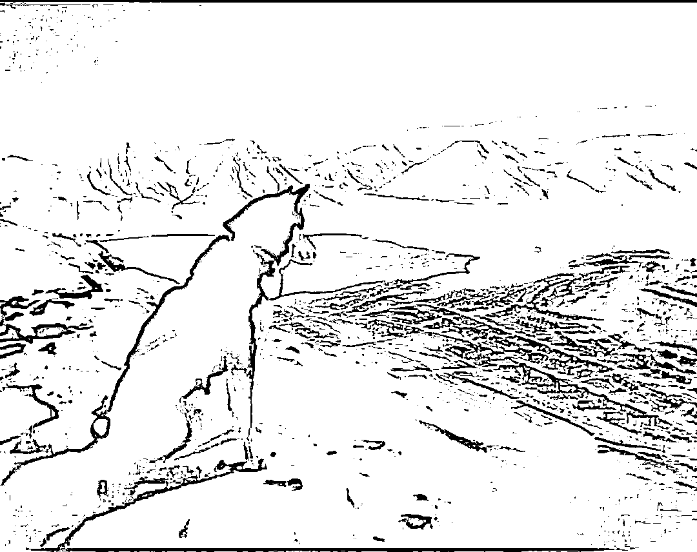

我们都在漆黑的寒夜里行走着，远方有光，越来越亮，那片璀璨的光明让你本能地想要扑向它，融进它的母体。你兴奋地加快了脚步，目光如炬……突然砰地一声巨响，眼前漆黑。你撞到了一堵墙。你揉着头，坐在地上仰望，那墙很高很高，叫作现实。天边的光，尽被遮挡。该要如何通过它？**你看到了土星老人坐在门槛上，把守着物质次元与灵性次元的分野。**门外是三王星代表的高维宇宙能量，瑰丽如织似极光；门内是现实生活的惨淡，和自我成熟的义务。老人说，你先回去吧，准备好了再来。先去照顾好你的生理精力和物质肉身，才能成功超越这扇门去获得灵魂解放的真正自由。站在成熟的意识峰值之处，或许更易摘取神圣维度的果实。这正是所谓身心灵统一的境界吧。 自八年前，我就在博客主页的星空里，高高挂起王尔德的这一句：We are all in the gutter, but some of us are looking at the stars. 而我也一直在仰望星空，蔑视大地，并引以为荣。任灵性世界的空中楼阁，踩在虚弱的海底轮上，随风摇曳……而 2020 年将很不同，我明白，这必须是面对沟壑 gutter 的一年，土星将在第 6 宫四分相碾压我第 3 宫星群，该将七年前土星周期的学习成果付诸实践了。土星爷爷已板着脸朝北交第 2 宫的我走来了，他说：你终将不能缺少物质世界中你所需的一切。只要不执着于此就好了……回去吧。我已选好了山峰，还有赖于这一年土星的检验。然后希望在此功课的末尾，2020 年那个最浪漫的冬至，当水瓶座土木大合相触动我月金木星群时，可以去极地，看极夜里的光......你们也找到自己的山峰了吗？不用怕，只要当我们瞄准月亮，至少还能击中星辰。**而信念，就是那颗北极星**，夜空中最亮的心。**2021 水瓶年，等待极光如烟花绽放。**最后，还是那句，**“黄沙百战穿金甲，不破楼兰终不还”！**GOOD LUCK！

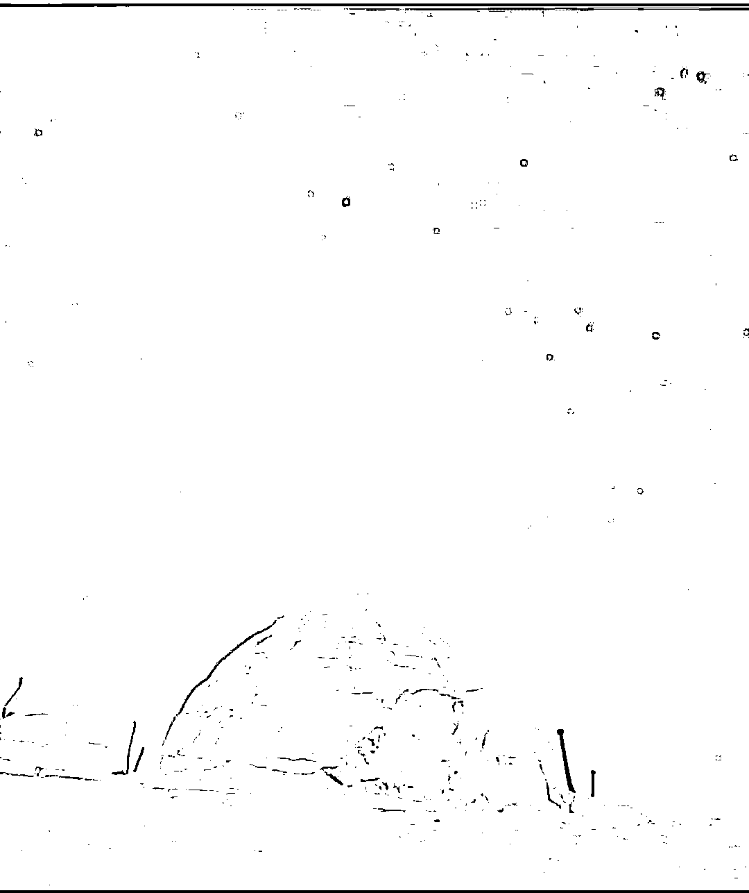

**版权声明：**本文由作者授权在若道平台发布，欢迎转发，反对抄袭。

**精彩预告**

**若道之后还将发布**

**2020 年详细的每月运势****&****12 星座指南**

**敬请期待！**


**蓝女巫**

英国伯明翰大学 市场营销学硕士

职业占星师/专栏作者/芳疗师/珠宝设计师

中国首批 ISAR 英文认证占星师（2012 届）

**微信公众号**：cecilia_sui

长按打赏


**2020 马上就要来了，为自己和重要的人**

****送上一份暖心的新年****大礼吧****

******由**大卫·瑞雷****亲自主笔的**《**2020 年度运势报告》****

****将是一份尤为特别的****

☞[**新年礼物**](http://mp.weixin.qq.com/s?__biz=MzA5NjA0NTAxNg==&mid=2651412428&idx=2&sn=c7ac1a6bdc53a8bbf62ff4511308629a&chksm=8b4be57bbc3c6c6d69a1beb7f84b72f1e2607071c069efa13310c7983475522ea3a31de4458e&scene=21#wechat_redirect)☜

**点击下图了解详情**

**☟**


**想系统学习占星学？**

**点击图片了解详情**


**微信又双叒叕改版啦，不想错过若道君的推送？**

**就把若道设为星标吧！**

**▼**


就是这个“在看”，戳戳戳 ☟

**年运报告购买入口**


# 新课首发·ISAR 选修 | 经世占星学：格局越大，人生越开阔

> 原文：[`mp.weixin.qq.com/s?__biz=MzA5NjA0NTAxNg==&mid=2651412566&idx=2&sn=43b6eb781bcfb620a615ceecea5bf757&chksm=8b4beae1bc3c63f7a29a8009d45be877d8a6eb312c1d07492d5eeb8575e260c799ff52c50668&scene=126&sessionid=1692738237#rd`](http://mp.weixin.qq.com/s?__biz=MzA5NjA0NTAxNg==&mid=2651412566&idx=2&sn=43b6eb781bcfb620a615ceecea5bf757&chksm=8b4beae1bc3c63f7a29a8009d45be877d8a6eb312c1d07492d5eeb8575e260c799ff52c50668&scene=126&sessionid=1692738237#rd)


有这样一则家喻户晓的故事：三个泥瓦匠在砌墙，一个人走过来，问他们在干什么。第一个泥瓦匠没好气地说：你没看见吗？我在辛苦地砌墙呢。第二个笑笑补充回答：我们正在建一座高楼。第三个则笑容灿烂哼着小曲儿说：我们正在为城市添砖加瓦、创造美好的生活。10 年过去了，第一个人仍然在做泥瓦匠，第二个人成为了一名工程师，而第三个人则成为建筑公司的老板。**工作技能本身没有区别，为什么三个人的人生走向却大相径庭？**

*   人的一生是见自己，见众生，见天地的过程。**不同的认知层次，形成了不同的人生格局。**它决定了你能看到的风景。我们常常抱怨命运不公，抱怨生活没有诗和远方，事实上，那是因为我们高度不够，格局太小。

*   同样，占星学习也是见自己，见众生，见天地的过程。**不同的认知层次，形成了不同的占星视野。**它决定了你可以运用这门语言看到怎样的风景。占星师常常困惑占星学习遭遇瓶颈，客户拓展资源不足，帮助来访者扩展格局能力不够。究其原因，是因为我们使用占星学的高度和格局不足。

晚清名臣曾国藩说：**谋大事者首重格局**。人和人不一样，拼的是格局。那又是什么决定着一个当代占星师的格局呢？大格局的本质是：**站得高，看得远，懂取舍**2020 春季开年 ISAR 选修课若道倾力打造不可不学的**经世占星学**一起来解锁全新大格局的占星版图吧！


占星之旅上半场拼的是知识技法占星之旅下半场拼的是眼界格局**为什么学习经世占星学？**

**经世占星学（mundane astrology）是研究世界政治经济发展趋势和世界各国发展周期的占星学研究分支。**

任何有一些人生阅历，对于国家历史、家族历史有所了解的人都会明白，我们的个人生活是时代和国家历史的缩影，我们个人经历的行进、推进是一条小溪，而更大的背景是世界和国家行进、推进的大河。大河的流向决定了小溪的流向。

学习经世占星学，**帮助我们及我们的客户这条小溪在这个世界的大江大河“顺势而为”**。具体而言：

*   在 21 世纪这个信息世纪，经世占星学可以帮助占星师开辟新的服务项目——**为高端企业家客户及大机构提供独特服务**，因为高端客户和大机构对于国际政治经济发展趋势，主要影响力国家、重要世界组织机构的现在和未来都更为敏感。对应国家的行进和推进，更好地预测这个国家或大型组织的未来发展、变化趋势；

*   在人口的国际间流动、交流更为频繁的时代，经世占星学通过了解各国的趋势，**可以在客户有国家选择需求时，帮助占星师为客户提供更多信息服务**。

*   如果你爱历史，经世占星学可以给你**看历史长河中世代兴衰起落的独特视角**；

*   如果你爱关注国际形势，经世占星学都能够让你更**了解每一个国家的国民个性、集体潜意识，社会议题和发展方向**；也能帮助你**对领导人及其国家的影响有更深刻的了解**。

**课程大纲****此课程可作为 ISAR 选修课。**在这 10 节课的时间里，我们将学习**经世占星学的重要研究方向**，包括但不限于：

*   行星周期对于世界发展及格局变化的影响
*   研究国家星图及行星周期对于国家的影响
*   研究外国领导人星图及对其国家的影响
*   如何从政府成立、总统就职时间的星图研究时事发展
*   如何从重要组织机构诞生星图（如北约、欧盟、欧元区、第一个现代证券交易所的诞生星图）看组织未来
*   如何从重大事件发生时的星图（比如从曼德拉出狱日期看南非转折和开端）发现该事件对于国家的影响

**授课老师**


**卡伦·哈梅克**·**佐达格**

**（Karen Hamaker Zondag）**

卡伦·哈梅克·佐达格是**20 世纪最受尊重和赞誉的占星师之一**，她毕业于荷兰阿姆斯特丹大学，于 1975 年开始她的占星实践。她是荷兰**两所学校的创始人之一**：一所是 1980 年成立的阿切纳占星学学校，另一所是 1987 年成立的荣格心理学学院。她也被邀请作为英国著名占星教育机构心理占星中心（Centre for Psychological Astrology）的老师和美国第一所真正的、官方的占星学大学开普勒学院任教，并是**世界各大占星会议最受欢迎的演讲人之一**。由于其**对占星学的独特贡献**，卡伦·哈梅克·佐达格在 1992 年、1995 年、1998 年分别获得占星学界最著名的奖项轩辕十四奖项提名，并于 1998 年获得**轩辕十四奖**。

卡伦·哈梅克·佐达格一个非常鲜明的个人特色是她的**研究涉猎广泛而深入，她在心理占星、金融占星、经世占星方面都是该领域排名前列的老师，并且深受该领域知名占星师的赞誉**。因为其在占星学的知名声誉，她从 2012 年被隶属于荷兰著名投资集团 Rasile 的 Dasym Research （Dasym 是全球电视节目的创新的著名领导者，比如《中国好声音》就是引入 Dasym Media 的版权）聘请为**智库成员**，该智库调研当前世界显性和隐性的社会经济趋势，为发展和投资决策服务。她也是**TEDx 演讲**人。


她是**20 多本占星学、心理学、塔罗、易经书籍的作者**，包括《从占星学视角看金融危机的背景和未来》、《性的占星学和疗愈》、《日常生活中的占星学》、《心灵和占星象征》、《作为生活之道的塔罗牌》、《12 宫》、《宫位的本质和背景》、《相位研究》、《四轴手册》、《卜卦占星》、《关系占星学》、《占星学预测》、《从新的角度看外行星》、《易经、冥想和灵性》、《实践中的荣格心理类型》、《日常生活中的灵性和心理学》、《实践中的投射机制》、《自我的愉悦——愉悦心理学》、《神话和现实》等。她的书籍因为**广受欢迎**，**被翻译为 10 多种文字在多国出版**。


**授课时间&方式**

**授课时间（共 10 次课）**：

*   2020 年 4 月 6 日（周一）

*   2020 年 4 月 14 日（周二）

*   2020 年 4 月 21 日（周二）

*   2020 年 5 月 5 日（周二）

*   2020 年 5 月 12 日（周二）

*   2020 年 5 月 19 日（周二）

*   2020 年 5 月 26 日（周二）

*   2020 年 6 月 2 日（周二）

*   2020 年 6 月 8 日（周一）

**授课方式**：

**线上网络直播课，英文授课，中文翻译**

**课程价格**

**正价：7500 元**

**早鸟价：6800 元**

**早鸟价截止日期：2020 年 3 月 6 日**

**退转课程**

**退款原则请详看《教学协议》，如有疑问请咨询课程顾问。**

****ISAR 选修·经世占星学****

**授课老师：卡伦·哈梅克**·**佐达格**

**时间：**2020 年 4 月 6 日-6 月 8 日（共 10 次课）

**授课方式：**网络直播课，英文授课，中文翻译

**费用：**7500 元；**早鸟价：6800 元（2020 年 3 月 6 日之前）**

**课程负责人：**王老师（微信：18510107057），请备注“经世占星”

长按二维码添加课程负责人咨询~


****报名请点击“阅读原文”****


# 摩羯座新月日食 | 打响自己的战役，你会遇到合适的战友

> 原文：[`mp.weixin.qq.com/s?__biz=MzA5NjA0NTAxNg==&mid=2651412544&idx=1&sn=326062c0280056227c54dea90e41559a&chksm=8b4beaf7bc3c63e117ad5a8a79cb60b0636a370d7f1fbf65cbfd2deb0b090bf3c6978162977a&scene=126&sessionid=1692738237#rd`](http://mp.weixin.qq.com/s?__biz=MzA5NjA0NTAxNg==&mid=2651412544&idx=1&sn=326062c0280056227c54dea90e41559a&chksm=8b4beaf7bc3c63e117ad5a8a79cb60b0636a370d7f1fbf65cbfd2deb0b090bf3c6978162977a&scene=126&sessionid=1692738237#rd)

************************☆ **************后台回复“今日”，给你一句生命态度**********


作者/王芝桦 编辑/玫瑰 图片/花瓣网

**摩羯座新月日食****北京时间 2019 年 12 月 26 日 13:13 迎来摩羯座新月，太阳与月亮精准合相于摩羯座 4°07′。此次摩羯座新月仅以 4 度之差靠近摩羯座南交点，形成摩羯座日环食。** **......****悄悄的我走了，****正如我悄悄的来；****我挥一挥衣袖，****不带走一片云彩。****——徐志摩 《再别康桥》**2019 年末，突然感受到徐志摩先生《再别康桥》的情怀，对流逝的眷恋，对现实的惆怅，文字如歌，道别似愁。2019 年注定是历史年轮上奇特的一年，宇宙在 2019 年一首一尾安排了两场摩羯座日食，1 月 6 日的摩羯座日食（详情点击：[2019 年，土星定乾坤](http://mp.weixin.qq.com/s?__biz=MzA5NjA0NTAxNg==&mid=2651404497&idx=1&sn=1731c93ab01eae6c16d8e09cf968b3a9&chksm=8b4b8a66bc3c03704e5b6bb21bbd67c2f30550c09831053a4d4196e9a427a21016dd282d666f&scene=21#wechat_redirect)）和 12 月 26 日的摩羯座日食，而 2019 年，代表着“现实考验”的土星全年行进在自己守护的摩羯座之内，也在两场摩羯座日食之间界定出 2019 年“土星定乾坤”的全年基调。2019 年一路走来，“现实乾坤”考验不断且变化巨大，我们的心境从年初到年末也是一再地变换。2019 年可能是过去十几年最为艰难的一年，但也是未来十几年最为重要的一年。此次摩羯座日食站在年度的转换路口，铺陈出 2020 年的年度基调——向过去的“现实”告别，向未来的“现实”迈进，因为更长远的目标和更重要的旅程正在前方等待我们。

> **摩羯座日食重点影响人群**
> 
> *   出生星图中，有**行星、四轴、南北交点落入基本星座（白羊座、巨蟹座、天秤座、摩羯座）0-11,17-25 度**的人群。
>     
>     
> *   出生星图中，有**行星、四轴、南北交点落入变动星座（双子座、射手座、处女座、双鱼座）13-19,22-30 度**的人群。
>     
>     
> *   出生星图中，有**行星、四轴、南北交点落入固定星座（金牛座、狮子座、天蝎座、水瓶座）0-12,21-27 度**的人群。

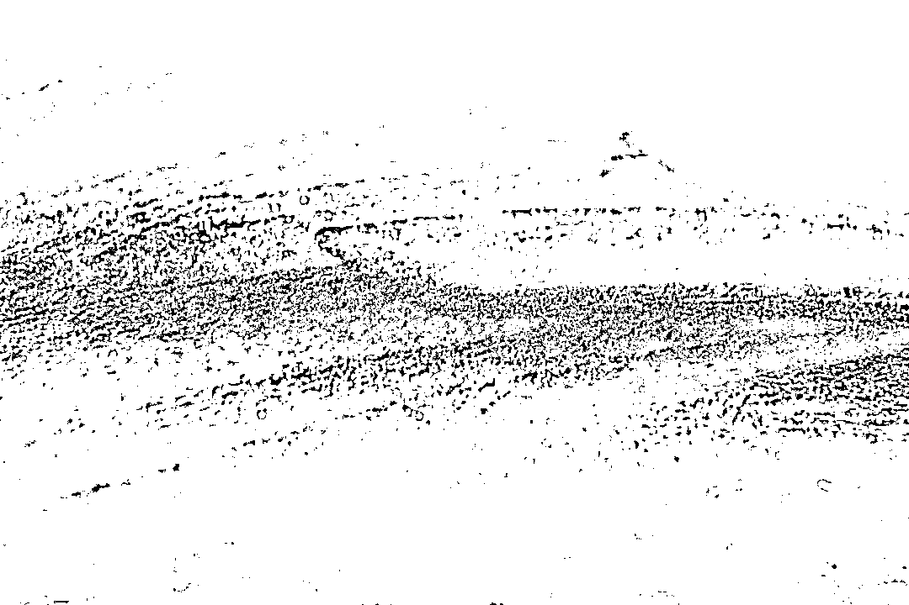

**许愿之前必做的功课**

**当你获胜的意愿超出对失败的恐惧时，你就有机会了。害怕的人是不会赢的。**

**——弗雷德里克.巴克曼 《熊镇》**

**天象：**

*   **新月日食**：摩羯座新月 4 度之差靠近摩羯座南交点形成摩羯座日食；
*   **凯龙星四分新月**：行进于白羊座的凯龙星四分摩羯座新月。

此次摩羯座日食，太阳、月亮、木星、土星和冥王星齐聚摩羯座，12 月 29 日水星也加入摩羯座的队列，让我们再次聚焦诞生于一年中“最寒冷的冬至”的摩羯座，想象一下：在物质贫乏的年代，最为寒冷的冬天意味着将会面临温饱和生死的严峻考验，如何才能“存活”下来而不会死亡，如何才能“生活”得好些而不太悲惨？**摩羯座锁定目标并承担责任，带着坚韧的意志迎接挑战，发挥自律的品格持续历练，一路心无旁骛地奔向成功的目的地。**新月适合开启愿景，摩羯座擅长制定目标，日食更是新月能量的“催化剂”，这是一个多么适合许愿的时刻啊。但是，不要急，由于摩羯座南交点与摩羯座新月近在隔壁，白羊座凯龙星与摩羯座新月四分相峙，而南交点与凯龙星又都与“业力功课”有关，故而此次摩羯座日食在如此沉重的业力影响之下，**面对业力的创伤，释放业力的恐惧**就成为许愿之前必做的功课。

1**摩羯座南交点的业力议题**

南北交点轴线大约将近 19 年行经黄道一周天并回归原点，此次南北交点行进**“南交点摩羯座-北交点巨蟹座”**轴线的时间是**2018 年 11 月 7 日-2020 年 5 月 5 日**，上一次是在 2000 年左右。**南交点描述出业力的议题，北交点描述出进化的方向**。摩羯座南交点的业力议题围绕摩羯座的阴影展开：**过度的目标导向，过度的自我控制，令其压抑内心真实的情绪与感受，忘记目标的初衷，只剩机械的行动。**在过去 19 年的历史进程中，经济蓬勃发展，科技不断突破，人类社会进入高速运转的惯性之中，人们渴望最大化地自我实现，并对“成功学”追逐不休：金钱的标志、权威的光环、膨胀的欲望、破坏的生态，地球离繁荣越来越近，但人们的内心却离平静越来越远，一边渴望成功一边恐惧失败，一边顽强奋斗一边掩藏脆弱。

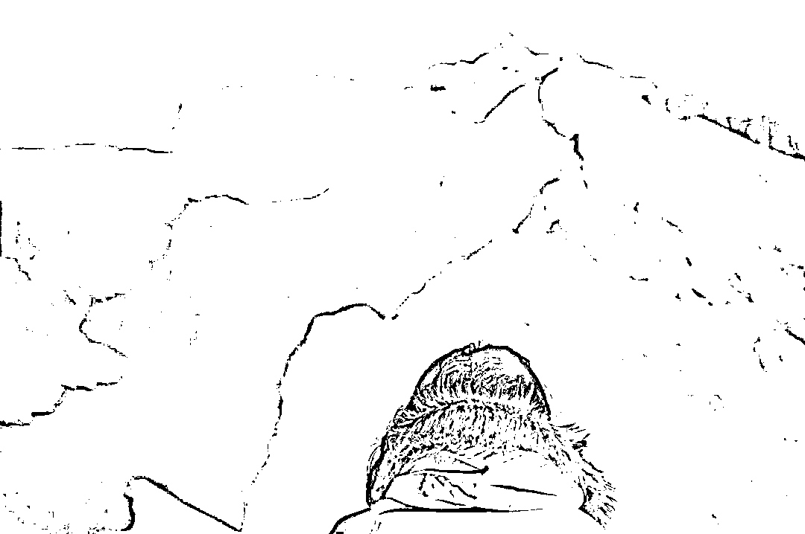

2**白羊座凯龙星的“心理情结”**

古希腊神话中，凯龙星是一位半人半马形象的“半神”。这位传奇的“医者和导师”因天生丑陋被母亲遗弃，留下“不被接纳的羞愧”，因半神身份伤痛无法痊愈却又无法死去而深陷“无穷无尽的创伤”。凯龙星代表着**生命年幼时期留下的“业力阴影和心理情结”**；但同时，凯龙星也因此激发出**强大的力量和超越性的觉知**，收获**疗愈的能量和先知的智慧**，成为**“指引出路的导师”**。**凯龙星的运行轨迹位于土星和天王星之间，教导我们运用天王星的“变革”能量突破土星的“限制”，创造全新的可能性超越现实的围墙**。凯龙星行进在白羊座，教导我们只有**接纳“自我”的羞愧和创伤**，才能**解锁“自我”的束缚**，**突破“自我”的限制**，**创造全新的“自我”。**

3**宇宙大戏之中回归自心**

宇宙安排了一场宏大而神秘的剧目：凯龙星 2019 年-2026 年行进在白羊座，天王星 2019 年-2026 年行进在金牛座，土星与冥王星 2019 年-2020 年合相于摩羯座，南北交点 2019 年-2020 年 5 月行进在“摩羯座-巨蟹座”轴线。于是，2019 年-2020 年的现实世界发生着**“不破不立”**的快速演变：“土冥合相”进行着没得商量的**“洗牌与重建”**，金牛座天王星进行着大刀阔斧的**“颠覆与变革”**，而破立过程之中不可避免的**破坏与挫败**，令摩羯座南交点**压抑的恐惧与脆弱**无处可藏，令白羊座凯龙星**遗留的羞愧与创伤**渴望释放。故而，与其说 2019 年-2020 年是一场现实世界的周期转换，不如说是一场**内在心灵的升级重组。**我们站在 2019 年和 2020 年的交接之处，不可否认，这是一个“艰难”的时期，但是艰难的并不在于未知的考验，而在于**是否愿意面对内在的恐惧，是否敢于凝视过去的创伤**。当胜利的意愿超出对失败的恐惧时，当突破的意愿激发出生命的潜力时，成功者会绝地重生，前行者会创造未来。此次摩羯座日食，巨蟹座北交点提供出进化的策略——**卸下伪装的坚强，拥抱真实的脆弱，释放压抑的情绪，关爱身心的疲惫。**回归内心深处寻找自己真正想要达到的地方，因为我们的“成就”就在“成就自我”的旅程之中。

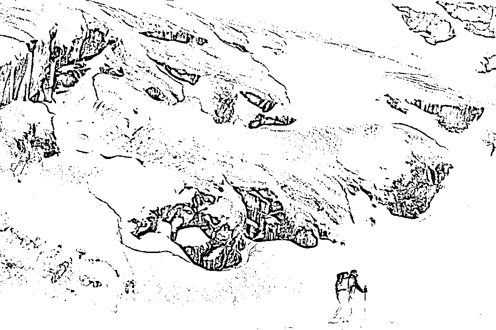

**该战斗的时刻，如何战斗**


**战斗并不困难，真正困难的是知道何时该战斗。**
**——弗雷德里克.巴克曼 《熊镇》**

**天象：**

*   **木星合相新月**：行进在摩羯座的木星合相摩羯座新月；

*   **天王星三分新月**：金牛座天王星三分摩羯座新月；

*   **金天互容**：金星行进于天王星守护的水瓶座，天王星行进于金星守护的金牛座，形成“互容”结构；

*   **土冥合相**：行进于摩羯座的土星与冥王星进入紧密合相影响。

1**加速中更不能着急**

**11 月 26 日-12 月 20 日，金星行进在摩羯座**，为**金融市场和人际关系**带来**“梳理边界”**的过程；**12 月 20 日，金星进入水瓶座**，“金天互容”结构形成，并在**2019 年 12 月 20 日-2020 年 1 月 14 日**期间为**金融市场和人际关系**带来**“颠覆与变革”**的加速推进；此次摩羯座日食，金牛座天王星与摩羯座新月的三分结构，标志着“颠覆与变革”的快刀已经开始工作。

另外，由于木星合相摩羯座新月，我们会发现一些理想和志向仍然蠢蠢欲动，一些机会和选择也出现眼前。但是......

*   2020 年 1 月 11 日，巨蟹座月食，天王星顺行，“金天互容”结构仍在；
*   2020 年 1 月 12 日-13 日，“土冥合相”结构影响力度达到顶峰；
*   2019 年 12 月 29 日水星进入摩羯座，并在摩羯座行进到 2020 年 1 月 16 日。

此次摩羯座日食至 2020 年 1 月中旬，我们正处于一个相当重要且相当激烈的关口，故而需要**小心谨慎地处理“理想与机会”的相关问题**，因为当一切都在加速的时候，恰恰是**更不能着急**的时候，太快的速度容易令人看不清晰，看不清晰容易令人盲中出错。关键是，**加速的时刻，往往错误的代价也是加倍的。**

2**可能经历的**

*   **情感**

*   要来的得能抓住，才有可能是你的；要走的得让他（她）过去，才能过得下去。有些时候，爱只是因为那个人身上的某些模式恰好呼应了你的需求，照见你的渴望，以及你对目前生活状态的不满。扰乱人心的从来不是诱惑，而是渴望，指向内心想去的地方。 

*   **职场**

*   2019 年的职场有些不由个人。一些企业的破产和赤字导致一些朋友遭遇失业困境或薪资拖欠，所以 2019 年底有太多的人萌生了转行或创业，换岗或跳槽的想法；还有一些朋友可能感觉到束手束脚或不被重用，渴望挣脱束缚和更换环境。此次摩羯座日食，触发出很多的现实问题和内在情绪。**不要急于做决定，更不要急于发脾气，现在是谨言慎行的时间！****冷静下来！**借由这些事件反思“为什么会有现在的处境”的内因和外因，然后重新评估自己的实力，重新确立自己的位置。 

*   **集体**

*   金融方面的新政策和新趋势出现，但是目前仍然处于变革的过程之中，我们所能做的就是相信这一切的变化正朝着更有利于集体社会的方向前进；公众人物或权威人士可能出现负面新闻，国际社会可能出现集体性事件；全新的科研成果可能公布亮相。

3**土星教我去战斗**

**土星作为摩羯座的守护行星，仍然接纳并定位着 2020 年的航向。**摩羯座土星引领我们**重建更具长远意义，更具建设性的目标**，这就需要我们**对无法走远的诱惑说“不”，与毫无营养的事物告别，跟随内心的直觉选择正确的道路**。真正困难的是**知道何时该战斗，在哪里战斗，如何战斗，**否则便会造成资源的浪费和能量的消耗。此次摩羯座日食，已经到了**为 2020 年许下“战斗”愿景**的时候了，摩羯座土星更是送上**“战斗”策略**——越是在充满考验的时候，越是要调动积极和主动的能量，去做那些你感觉艰难的工作，去攻克那些你认为不可能的事；或许你会恐惧挫败或感到疲惫，但只要你能坚持自律并脚踏实地，就一定会收获“以前并不具备的能力，现在谁也抢不走的实力”。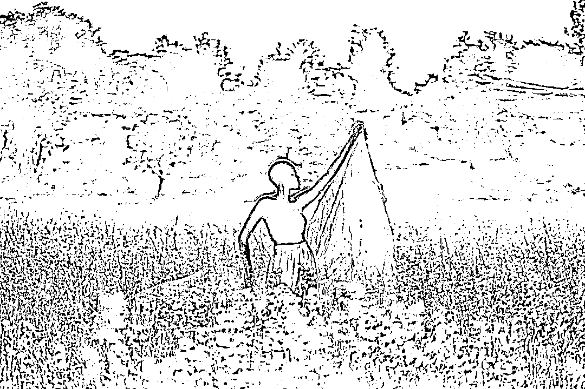**寄语**

**有时候，人生不允许你选择自己的战役，你只能选择自己的队友。**

**——弗雷德里克.巴克曼 《熊镇》**2019 年-2020 年似乎真的不太允许我们选择自己的战役，因为每个人都处于整体环境的影响之下。但如果我们有智慧选择队友，那么至少说明我们有实力吸引队友，决定我们能够站在哪个轨道，拥有哪些资源，吸引哪些机会的根本还是在自己身上。此次摩羯座日食，想想 2020 年你将进行的战斗：**你获胜的意愿是否已经超出了对失败的恐惧？你是否已经确定了在哪里战斗？你是否正在学习“何时应开战”的智慧？你是否会努力沉淀实力吸引并选择你的战友？**如果这几个问题已有自己的答案，那么，即使 2020 年现实的挑战不断或变化难测，你一定是**不可或缺**的那个人，你会发现**自己所在的领域或环境需要你**，而你也将**在 2021 年初遇见一起开创未来的队友**。祝福大家。**新月如何许愿？****许愿时间**：2019 年 12 月 26 日北京时间 13:13 后，48 小时内有效、8 小时内最佳。
**许愿人群**：所有人。**许愿数量**：每人最多 10 个。**许愿方式**：静心冥想，身心祈祷或记录收藏。**许愿格式**：请万能的宇宙赐予我能量，我将以我的能量吸引**（什么）来到生命中……**许愿原则**：发心诚善利人。

**版权声明**：原创文章由作者授权首发于若道平台，欢迎转发，反对抄袭。友号转载请申请白名单。

****

****想阅读更多作者的文章****

****请在后台回复******王芝桦****** 即可****

****王芝桦****

心理占星师，身心灵统合疗愈师，艾瑞克森催眠治疗师

天津道玺身心灵中心创始人，身心灵疗愈执业 15 年

占星咨询执业 11 年，全职于个案咨询与占星教学工作

**个案预约咨询微信号**：zhihua0621 

**微信公众号**：daoxi-life

**长按打赏**

****

**微信又双叒叕改版啦，不想错过若道君的推送？**

**就把若道设为星标吧！**

**▼**


**福利来啦**

**点击**

**“阅读原文”**

**获取最好用的免费**

**新月报告**

****获取免费新月报告，请点击文末“阅读原文”****


# 若道首次游学招募 | 2020 年，追寻阿兰·欧肯的巴厘岛神秘之旅

> 原文：[`mp.weixin.qq.com/s?__biz=MzA5NjA0NTAxNg==&mid=2651412544&idx=2&sn=a876cb9f200b3f1dc91d40c15169bc39&chksm=8b4beaf7bc3c63e1f6710e1d3603b194c07c93188e96f55db839de4620a71cc5927e776a1863&scene=126&sessionid=1692738237#rd`](http://mp.weixin.qq.com/s?__biz=MzA5NjA0NTAxNg==&mid=2651412544&idx=2&sn=a876cb9f200b3f1dc91d40c15169bc39&chksm=8b4beaf7bc3c63e1f6710e1d3603b194c07c93188e96f55db839de4620a71cc5927e776a1863&scene=126&sessionid=1692738237#rd)


出发这件事常常会令人想起电影《美食、祈祷与恋爱》中，巴厘岛的巫医 ketut 递给女主 Liz 一幅画，并赠予了解读：

要脚踏实地，你就会感觉有四条腿，你就能在这个世上安稳下来；还有，不要用脑子看待世界，要用心去看，那样你才会了解上帝。

世间有太多纷繁复杂的事情我们要分析整理，反而忘却如何遵从心灵的声音，比如为了爱其他人而让自己的生活失衡；比如收藏了所有国家地理杂志的旅行专栏，最后哪里也没有去。偶然听到心中真实的声音，嘈杂的人生又容易失去相信自己的勇气。

幸好这世界上还有**巴厘岛**。


|  电影《美食、祈祷与恋爱》巴厘岛剧照

巴厘岛人说：“我们就站在世界的中心，我们就是世界的中心。”巴厘岛是一个充满灵性色彩存在的岛屿，在这个 5620 平方公里的岛屿上，散布着大大小小千余座印度教神庙，印度教思想、大乘佛教、传统的湿婆崇拜与岛上淳朴的自然崇拜、祖先崇拜交织在一起。巴厘岛人相信万物有灵，他们的生活沉浸在浓厚的神秘氛围中，他们相信自己脚下的土地是世界上最美的国度，是“世界的中心”。这座岛屿在 21 世纪的现代生活中成为一个特别异类的存在。而阿兰·欧肯，这位 75 岁深耕占星学和神秘学领域的老师，在多年前离开美国，在世界各地旅行之后，为这个岛屿独特的人文和场域所深深吸引，最终选择在巴厘岛定居。虽然阿兰·欧肯老师以占星大师身份为广大占星学子所知，但其实他更有许多神秘的古老智慧、实用的宇宙法则愿意传承，这对于我们的意识进化之旅将带来绝对深刻的了解和体悟。
**5 月 3-13 日**，阿兰·欧肯老师邀请你来到他的定居地——巴厘岛，开启这次意义非凡的巴厘岛神秘之旅，内容包括**3 日半阿兰·欧肯老师的神秘学工作坊**和穿插于其中的阿兰·欧肯老师为大家精心挑选的**巴厘岛神庙之旅**，阿兰·欧肯老师将带领大家，在理论学习的基础上，接触、感受巴厘岛的神秘之处，深入接触、体验古老智慧。****


巴厘岛游学**1****位宇宙级导师****11 日 10 晚****游学，含**3 日半****工作坊****** “****心灵成长****+****文化探秘****+****生活美学****”****若道首团游学探秘之旅****一次性满足你的所有新年跨国愿望！**

📹 [`v.qq.com/iframe/preview.html?width=500&height=375&auto=0&vid=b3041y0qg4q`](https://v.qq.com/iframe/preview.html?width=500&height=375&auto=0&vid=b3041y0qg4q)

|  阿兰·欧肯老师的巴厘岛故事

1**工作坊主题****“觉醒的头脑和心灵的实际运用”——疗愈、合一和意识发展的****22****条法则和原理**本次工作坊，阿兰·欧肯老师将带领大家进入他数十年修行的智慧世界，探讨 22 条宇宙法则，并审视如何将这些原则应用在我们的日常生活中。**工作坊具体内容，请咨询课程顾问王老师（微信：18510107057）****注意****：本工作坊不是占星工作坊，对神秘学感兴趣，没有占星基础的朋友也可以参加。****游学全程领队导师是阿兰·欧肯，并配有最专业的中文翻译。**
2**具体日程安排****游学时间：2020 年 5 月 3 日-5 月 13 日****地点：印度尼西亚 巴厘岛**

*   ### 5 月 3 日 游学集合：入住巴厘岛乌布斯塔拉翠贡精选酒店 


*   ### 5 月 4 日 上午水神庙、Pacung 午餐、下午海神庙；**晚上在斯塔拉翠贡精选酒店集体晚餐**


| 水神庙

 


|  Pacung 午餐


|  海神庙

*   **5 月 5 日 上午半日工作坊学习，和阿兰·欧肯老师一起冥想；下午到圣泉——巴厘岛的神圣净化池**

 


*   **5 月 6 日  半日工作坊学习、自由活动**

*   **5 月 7 日  半日工作坊学习，游览象窟——巴厘岛唯一的石窟寺院遗址**


 

*   **5 月 8 日 巴图布兰寺、著名的荷花咖啡厅午餐、塔曼阿云寺**

 


*   **5 月 9 日  全天工作坊学习**

*   **5 月 10 日  前往努沙杜瓦酒店 **


*   **5 月 11 日  全天工作坊学习**

*   **5 月 12 日  海边自由活动，晚上巴厘舞蹈表演**

 


*   **5 月 13 日  前往机场回家 巴厘岛游学圆满结束**

3**适合人群**

*   占星老学员，是时候补给宇宙智慧的你

*   灵性爱好者，擅长获取各类宇宙能量的你

*   文化探迷人，有机会零距离体验异域神秘学文化的你

*   旅行达人，不错过任何一次伟大旅程的你

*   巴厘岛狂热迷，去过巴厘岛无数次的你

*   没有任何原因就是被吸引很想报名的你

**注****：****本次游学无需任何知识基础皆可报名**

4**游学费用**

*   **2019 年 12 月 31 日前付款：22800 元**
*   **2020 年 1 月 20 日前付款：24800 元**
*   **2020 年 2 月 15 日前付款：25800 元**

**此游学价格为****整体报价，不拆分****。****注意**: **因为该游学需要安排酒店、交通事项较多，因此****一旦缴费后，不再退费**。


**费用说明**

**游学费用****包含**：

3 日半“觉醒的头脑和心灵的实际运用”工作坊学费

5 月 3-12 日的巴厘岛住宿费

游学中的大部分餐费

巴厘岛集体活动时的交通费

游学涉及的所有景点门票

5 月 12 日晚的舞蹈表演

境外旅行意外险

**游学费用****不包含**：

学员从国内往返巴厘岛的交通费

巴厘岛岛内自由活动的交通费

以下自由活动的餐费自理：5 月 3 日到达日午餐、5 月 6 日自由活动晚餐、5 月 8 日晚餐、5 月 10 日前往努沙杜瓦酒店的午餐、5 月 12 日海边自由活动的午餐

**住宿说明**：

乌布斯塔拉翠贡精选酒店豪华房 Deluxe room（5 月 3 日晚-5 月 9 日晚共 7 晚）和努沙杜瓦酒店豪华房 Deluxe room（5 月 10 日-12 日，共 3 晚），标准为 2 人一个房间


5**导师介绍**


**阿兰·欧肯（Alan Oken）**

 

世界顶尖占星师

智慧学院（Santa Fe, NM）主任

澳大利亚意识发展研究所的联合创始人

翻译、教师、全球旅行者和国际导游

阿兰·欧肯，1944 年出生于美国纽约，在纽约大学主修罗曼斯语言和语言学。出版过十几本著作，比如《灵魂占星学》《星图中的守护关系》《阿兰·欧肯完整占星学》。他用 5 种语言授课，用 7 种语言解读星图。

6**退转课程**

**因为该游学需要安排酒店、交通事项较多，因此****一旦缴费后，不再退费****。**

****巴厘岛游学****

**领队老师&工作坊授课老师：阿兰·欧肯**

**游学时间：**2020 年 5 月 3 日-13 日（共 11 日 10 晚）

**游学地点**：印度尼西亚 巴厘岛

**游学方式：**巴厘岛探秘之旅+3 日半工作坊，游学全程由阿兰·欧肯领队，并配有最专业的中文翻译。

**费用：**

**2019 年 12 月 31 日前付款：22800 元** 

**2020 年 1 月 20 日前付款：24800 元**

**2020 年 2 月 15 日前付款：25800 元**

**课程负责人：**王老师（微信：18510107057），请备注“巴厘岛”

长按二维码添加课程负责人咨询~


****报名请点击“阅读原文”****


# 至关重要的摩羯座新月日食，快来领取你的福利吧！

> 原文：[`mp.weixin.qq.com/s?__biz=MzA5NjA0NTAxNg==&mid=2651412544&idx=3&sn=9a257096eba324ccebba2590e99889a6&chksm=8b4beaf7bc3c63e111c57fbdc3aa6692cc2c7b03c072eba0cd49e0e04dd4343003fd58d2d4f2&scene=126&sessionid=1692738237#rd`](http://mp.weixin.qq.com/s?__biz=MzA5NjA0NTAxNg==&mid=2651412544&idx=3&sn=9a257096eba324ccebba2590e99889a6&chksm=8b4beaf7bc3c63e111c57fbdc3aa6692cc2c7b03c072eba0cd49e0e04dd4343003fd58d2d4f2&scene=126&sessionid=1692738237#rd)

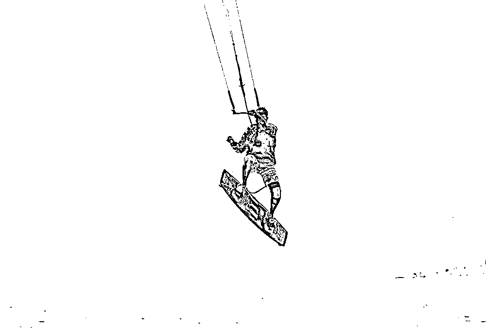编辑/玫瑰 图片/网络

北京时间 2019 年 12 月 26 日 13:13，新月日食发生在摩羯座 4°7′。每到新月时分，若道君都会为你奉上根据你出生星图量身打造的免费新月报告。可是新月为什么要许愿？新月报告该如何领取？让若道君来教你。

　**什么是日食？**　

从占星学看，新月是月亮周期的一种相位。新月是开始，又称为朔，对应中国农历初一，太阳、月亮在此时合相。此时月亮运行到太阳与地球之间时，月亮以黑暗的一面对着地球，并且与太阳同升同落，地球上看不见月亮。如果新月发生的位置靠近月亮交点，则称之为日食。

**本次日食时间**

**2019 年 12 月 26 日 13:13，日食发生在摩羯座 4°7′。**


**为什么新月要许愿？**

新月是一个周期的开始，新月发生的时候，太阳与月亮合相，能量很强。当新月出现时，你也许会发现灵感忽现，非常适宜开启新领域、项目与行动，缔结一段新的关系或合作。许愿会加强新月的能量，也有助于你了解自己现阶段适合开启的方向。 

**本次新月最佳许愿时间**

从新月开始到其后的 48 小时内，许愿的力量最强。

**最佳许愿时间：2019 年 12 月 26 日 13:13～12 月 28 日 13:13**


**这有一份属于你的免费新月报告，等待认领**

每到新月时刻，看着占星文章里写着：看看你新月的宫位，如果新月在第 X 宫，你可以许愿的方向是……

是不是常常一头雾水？新月的宫位？我到底该看哪里啊？

而有时，那些标注上升星座的文章也会让你忍不住想：虽然我的上升星座是这个，可是我的新月好像并不落在你说的宫位啊？你是不是写错了？


虽然这些文章都没有写错，可是好像对你而言都太不友好了。

**Don't Worry！**别着急，让博学又体贴的若道君来帮你！

我们推出了一份**免费**又**好用**的新月报告！

而且是专门为你设计的哦，**根据你出生星图为你量身打造的，只****属于你的独家新月报告**。

**报告有哪些内容？**

**新月时间****最佳许愿时间**

**如何许愿 **属于你的**许愿关键词**

本次新月给你的**建议**

你会有怎样的**感受 **

****机会****

********

**如何许愿？**

许愿方式也很简单。

你可以把愿望写下来，或者双手合十后交叉，闭上眼睛来祈祷。

报告中会为你提供**祈祷词示例**，可以多多参考哦～

你还可以适当添加自己的语言，创造属于你自己的祈祷文！

如果报告拿到手了，快对照着许愿吧！

**这份好用又暖心的报告，点击阅读原文即可领取！**

****

****点击“阅读原文”即可获取新月报告****


# 这个圣诞要怎么浪？送你一份贴心的“12 星座过节指南”

> 原文：[`mp.weixin.qq.com/s?__biz=MzA5NjA0NTAxNg==&mid=2651412498&idx=1&sn=8c091bca2f0c3a0c9e0291195461b34a&chksm=8b4beaa5bc3c63b344abb1ea35fdbfaacf8ce5b4bdb996208fca855a30d216d67d72fe217261&scene=126&sessionid=1692738237#rd`](http://mp.weixin.qq.com/s?__biz=MzA5NjA0NTAxNg==&mid=2651412498&idx=1&sn=8c091bca2f0c3a0c9e0291195461b34a&chksm=8b4beaa5bc3c63b344abb1ea35fdbfaacf8ce5b4bdb996208fca855a30d216d67d72fe217261&scene=126&sessionid=1692738237#rd)

******************☆ **************后台回复“今日”，给你一句生命态度****

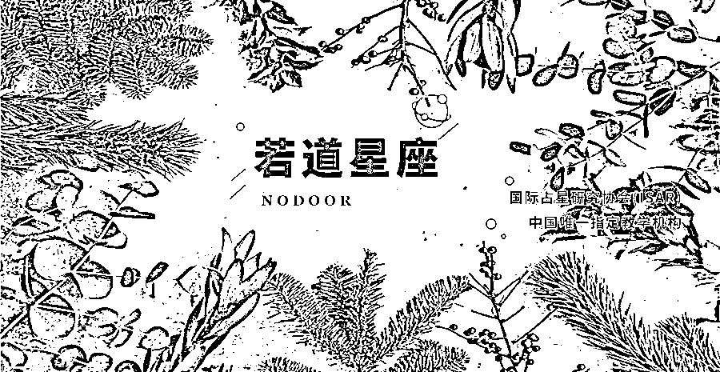作者/尼古拉·伍德 译者/Jun 校对/王宏编辑/Tang 图片/giphy

写在前面的话

圣诞节（Christmas），是纪念耶稣诞生的日子。从 12 月 24 日于翌年 1 月 6 日为圣诞节节期。圣诞节本来是基督教徒的节日，由于基督教在西方国家的广泛传播，它成为一个西方国家全民性的，一年中最盛大的节日。

圣诞节对很多人意味着亲朋好友吃喝团聚，购物，布置圣诞树，等待圣诞老人的礼物。在天主教盛行的南美洲，圣诞节的庆祝活动充满着宗教主题；在瑞典，传统上公司会在圣诞节前一星期邀请员工参加一个圣诞午餐……然而，每个星座都有独一无二的过节方式，那要怎样才能让每年的这个时候对你来说格外特别呢？现在，就让我们一起来看看吧。

**白羊座：活跃的圣诞节**

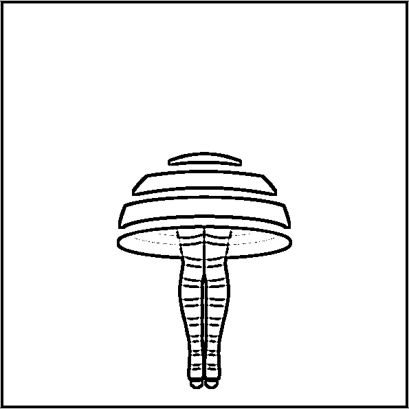

**白羊座不太能忍受无聊乏味**，只是坐在家里看电视上放的老电影可能不太适合你。你充满自信和活力，只要有足够令人兴奋的、性格活跃的人吸引你的注意，你就不介意在**派对上跳一整夜的舞**。羞怯之人可不适合这里！因为你喜欢动个不停，享受些许竞争，那就把你活跃的精力投入到一些**冬季运动**中去吧，比如室内或室外滑雪、滑雪橇，或是滑冰。

**金牛座：享受的圣诞节**

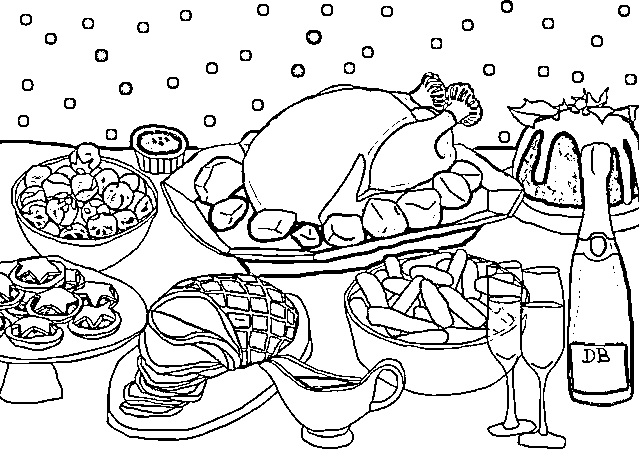

**美食、美酒、舒适的环境就是你理想中的佳节**。作为现实的土象星座人士，你可能喜欢布置家里，装饰圣诞树，也喜欢烹饪及品尝所有美味佳肴。任何音乐天赋，尤其是演唱天赋，都可能在唱诗班或挨家挨户的颂歌中富有创造力地被表达出来。考虑到身体上的愉悦，你可能也会喜欢偶尔进行按摩，特别是精油按摩，或者任何能帮你放松和充电的疗愈方法。

**双子座：社交的圣诞节**

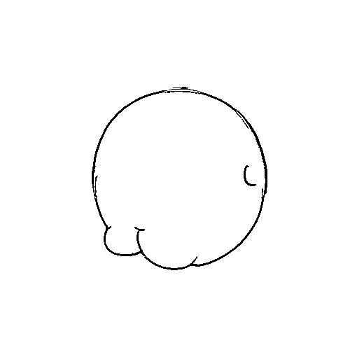

如果没有很多人可以聊天，无论是打电话、发邮件还是面对面交谈，每年的这个时候对你来说就不是完整的。你喜欢跑到别人家里**谈天说地**，了解能促进聚会气氛的最新八卦和计划。无论什么时候，**多样性绝对是你的生活乐趣**，所以你不会在一个地方待太久。**交换新想法，出去走走**，为新的一年选定一门新课程或者其他学习活动。很多聚会也会让你兴奋不已。

**巨蟹座：家庭的圣诞节**

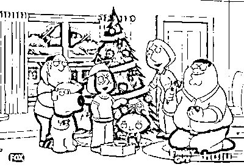

如果没能跟最亲近的人聚在一起，那圣诞节对你来说就是不完整的。你喜欢让别人感到宾至如归，**被熟悉的面孔包围所带来的舒适感远比喧闹和嘈杂的环境更适合你**。你内心有点柔软，有着敏感而多愁善感的一面，你可能享受和大家一起做一顿丰盛的节日大餐。有时候，你会翻出照片，蜷缩在火炉或电视机前了解大家的最新近况。

**狮子座：戏剧性的圣诞节**

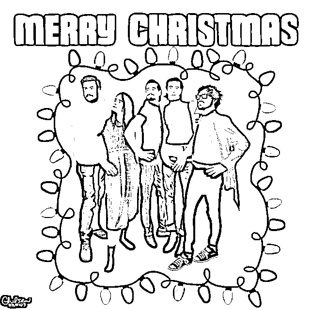

让我们面对现实吧，在那些漫长、黑暗、沉闷的日子里，这个火象星座需要注入光亮和色彩。**去剧院、歌剧院或外出就餐会让你精神振奋，去任何你可以盛装打扮并给人留下深刻印象的地方**。把自己关在家里或者厨房里会让你痛苦不堪。去灯火通明的地方购物，买些香槟，沉浸在业余戏剧或舞台剧中。不行的话，就去威尼斯人酒店或苏格兰城堡度假吧，也许这正是你需要的奇幻之旅。

**处女座：实用的圣诞节**

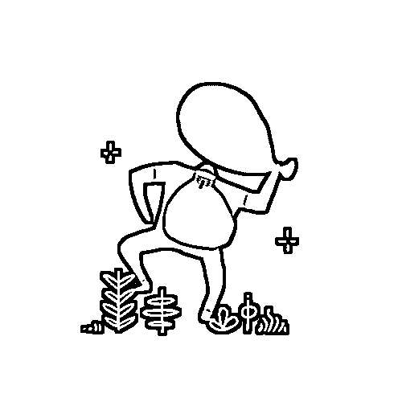

你可能从三月份就开始为圣诞节做准备了！你极为关注细节，每年这个时候，你都会**仔细过一遍节日清单上的所有项目，检查所有的安排，确保每个人的礼物都恰好符合他们需求**。在某些方面服务于别人对你来说很重要，所以去做志愿者或者慈善工作、幕后工作，为那些不幸的人准备圣诞大餐，可能比仅仅享乐和放纵自己更能吸引你。

**天秤座：和谐的圣诞节**


**这是一年中你喜欢将人们聚在一起的时候，建立正确的联系，也许花时间和你的另一半在一起，这位特别的伴侣可以让这个季节对你而言真正充满浪漫**。由于你在搭配设计和颜色上有极高的品味，**每样东西都需要看起来很好，所以装饰品总是格外特别**。任何圣诞节的紧张气氛都会打破你的平衡感，所以在较大型的社交场合或者私密的晚宴上，身为魅力十足的主人或女主人可能更符合你的风格。

**天蝎座：神秘的圣诞节**

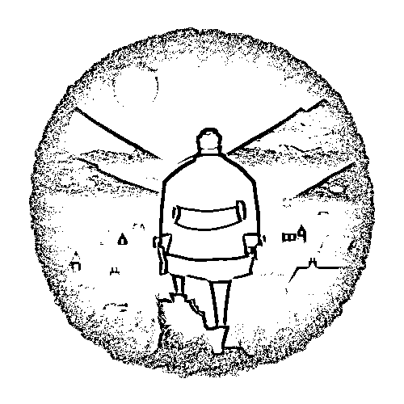

**你可能享受漫长而黑暗的冬夜，但是过多的庆典会让你想要隐藏进去的私人内心世界感到不适**。凭借敏锐的洞察力，你看人很准，因此，在你参加的任何社交聚会上，人们都会觉得你有趣又有吸引力。你可能更适合在平安夜去神秘老宅里度过一个周末，或者去巨石阵庆祝冬至，这些活动能让你吸收所有那些强烈的能量，并在超自然场所运用你的心灵感应。

**射手座：远方的圣诞节**

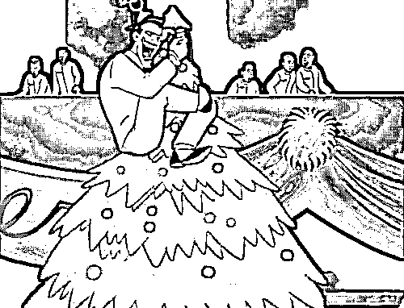

**你心目中的完美圣诞节可能是在另一个地方或国家**，在澳大利亚的海滩上消磨时光，或者在极地追踪北极熊。只要能有余地探索你周围的世界，而不是被束缚在购物、吃饭和看电影节目上，你就会喜欢圣诞节的兴奋和乐趣。你理想中的天堂，就是受邀参加不止一个派对，拜访不同的朋友。对无处安住的灵魂来说，有一扇紧急逃离的大门敞开是非常重要的。

**摩羯座：多产的圣诞节**

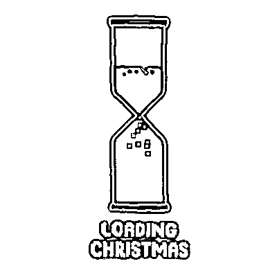

你总是觉得很难放松和放手。**假期让你感到担忧：你总是喜欢开着手机或电脑来做些额外的工作**。圣诞节肤浅有趣的一面并不太吸引人。尽量保持休闲、工作的平衡，放纵你内心的孩子气，娱乐时放松下来。**办公室聚会**是你最喜欢的类型，把工作和娱乐结合在一起，边喝一两杯酒边社交。一个**团建的周末**也可能是你节日放松的选择。

**水瓶座：难以预料的圣诞节**

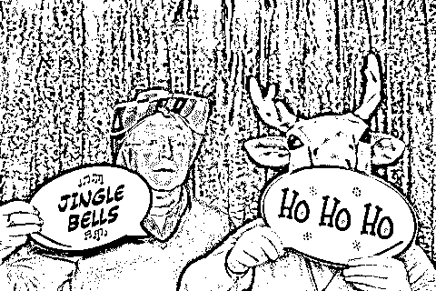

没完没了的计划和传统的走亲访友或家庭聚会可能不是你的菜。另一种圣诞节可能更适合你，也就是**吃素食**并且**参加保护活动**，**和一群与你志同道合的人在一起**。你肯定会欢迎随性的或最后一刻才决定的出走，事实上你可能更喜欢这种方式。你们的聚会可能是“反聚会”的聚会，到处都是喜欢用非常规的方式让人震惊的叛逆者，给任何节日聚会都带上触电般的感觉。

**双鱼座：神奇的圣诞节**

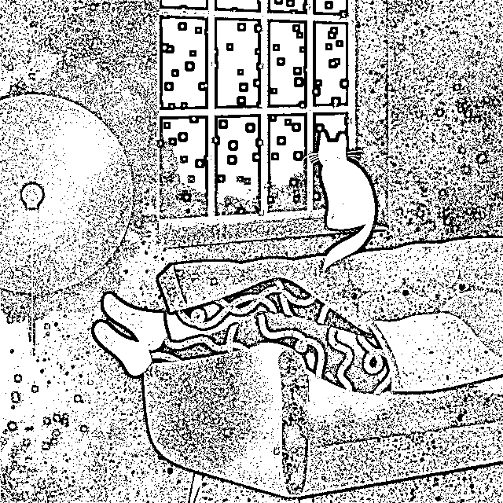

**你喜欢这个季节童话般梦幻的一面**。你是一个浪漫的梦想家，总是渴望逃到其他世界，所以，离开无聊日常生活的任何机会都很吸引人。伴着最爱的音乐（最好是在星空下）彻夜跳舞是你理想的派对，你不是一个爱喧闹和人群的人。在这个繁忙的时节，**唱歌**，尤其是在教堂里唱歌，可能也会抚慰心灵。**装扮圣诞树和买礼物将帮助你脚踏实地**。一个华丽的**化装舞会**很完美，因为你有点像变色龙，喜欢把自己假装成其别人。

**12 星座的你们，**

**打算怎样过圣诞？**

**留言区等你～**

”

**版权声明：**本文由若道翻译发布，欢迎转发，反对抄袭。


尼古拉·伍德

作家，占星师。从 1987 年起研习占星学，并将占星学与文学创作的融合作为探索方向。出版过一本受占星学启发的诗集《奇异之声》。

**圣诞节来了，为自己和重要的人**

****送上一份暖心的圣诞****大礼吧****

******由**大卫·瑞雷****亲自主笔的**《**2020 年度运势报告》****

****将是一份尤为特别的****

☞[**圣诞礼物**](http://mp.weixin.qq.com/s?__biz=MzA5NjA0NTAxNg==&mid=2651412428&idx=2&sn=c7ac1a6bdc53a8bbf62ff4511308629a&chksm=8b4be57bbc3c6c6d69a1beb7f84b72f1e2607071c069efa13310c7983475522ea3a31de4458e&scene=21#wechat_redirect)☜

**点击下图了解详情**

**☟**


**想系统学习占星学？**

**点击图片了解详情**


**微信又双叒叕改版啦，不想错过若道君的推送？**

**就把若道设为星标吧！**

**▼**


就是这个“在看”，戳戳戳 ☟

********年运报告购买入口********


# 2020 年开年第一课！中英双导师联手打造 Level1-5 核心占星课

> 原文：[`mp.weixin.qq.com/s?__biz=MzA5NjA0NTAxNg==&mid=2651412498&idx=2&sn=62eb43b45aca83463f6d91d1eb22dbba&chksm=8b4beaa5bc3c63b38b7774aa992ada7280961037acb8b1eef8f519cc133aaf8ef273bda3f7e2&scene=126&sessionid=1692738237#rd`](http://mp.weixin.qq.com/s?__biz=MzA5NjA0NTAxNg==&mid=2651412498&idx=2&sn=62eb43b45aca83463f6d91d1eb22dbba&chksm=8b4beaa5bc3c63b38b7774aa992ada7280961037acb8b1eef8f519cc133aaf8ef273bda3f7e2&scene=126&sessionid=1692738237#rd)


**拥有****49****年占星实践经验的若道创始人**
**大卫·瑞雷****&****最懂学员的若道首位认证****金牌中国****老师****熊鹰****师徒二人****横跨南北****联手打造****北京上海**** 若道****全新****核心占星课程****之**

**互动实战占星初阶工作坊**

**本次****Level 1-2 工作坊****会分别在**

**上海（2020 年 3 月 13、14、15 日 熊鹰老师主讲）**

**北京（2020 年 4 月 4、5、6 日 大卫·瑞雷老师主讲）**

**两个城市各举办一场**

**方便北方、南方同学自由选择，邀请小伙伴一起学习**

**核心课现场工作坊是一种什么样的？**

珍贵的**面授工作坊**，全面而详细地讲解占星学知识，一场五感盛宴！

# **代入感：**向往占星世界好久了，迟迟没有下决心系统学习？最专业的占星老师来喽！带你穿越 9¾站台，进入真正的占星魔法世界，来若道，你就是哈利波特本特！


**沉浸感：**从虚拟的网络来到现实，舒适的学习环境，全新的占星同学，5D 的占星老师，专业的摄影团队，支持的工作人员~让你仿若重回校园梦，燃动青春学习占星！


**参与感：**大卫老师和天空老师都有丰富的教学经验，占星知识严肃专业，但开起玩笑来也丝毫不马虎，欢笑间知识都记住了呢，如果你长得可爱聪明伶俐，课上还会随时**被 Q**哦~对，就是你~


**仪式感：**两位老师超爱自己的中国学生们，为了让大家透彻地学习好宫位，2018 年初阶工作坊，大卫老师和熊鹰老师趴在地上用胶带贴的~仪式感满满~有没有~就宠你就宠你！今年还有没有其他的惊喜？


**亲近感：**周围全都是热爱占星的同学，那种亲近和被理解的感觉真的不要太美妙。志同道合的朋友就在身边，灵魂伴侣可能就在眼前，透露一下，在若道课堂里找到男女朋友的真的不要太多~比如~咳咳，总之带着八卦的心来上课吧~


**连报 L1-5 全阶课程，可以享受到：**❶ 51 次线上直播互动网络课程+3 场工作坊（互动实战占星初阶工作坊、亲密关系+职业占星工作坊、知识回顾+综合解读工作坊），全面而详细地讲解占星学知识、技能、案例和重要领域实践运用。 ❷知识点+学员星图解读有机结合：熊鹰老师以知识点和学员案例讲解为主，大卫·瑞雷老师以参课学员案例及客户案例讲解为主，每个知识点覆盖班级内学员的亲身案例，参与感更强，每位学员都有机会听到自己的星图分析。 ❸微信群学员互动分享，从真实案例学习生命成长故事。 ❹ 论坛提问：论坛上每个学员的问题都将得到及时回复。 ❺ 提供咨询师实习平台，只要努力，都将有机会在毕业前进行咨询的实习演练，听取客户反馈，为成为职业占星师做准备。

**1-2 阶我们要学习什么？**

  **第一阶** ** 12 星座，12 种性格，12 种人生**❶ 学习占星学必须准备的“心法”**❷**占星学中的火、土、风、水四元素，阴阳法则**❸**面对面的星座有故事**❹ **12 星座：12 种性格详解，12 种行为模式，12 种价值观**❺ **太阳和月亮：了解你的太阳，生命的发动机，让你在世界闪光的方式，生命获得力量的方法；了解你的月亮，让你获得幸福的方法**❻ **了解太阳、月亮，了解你生命中已经出现的、将会出现的男性和女性

**第二阶  命运的线索和人生故事中的演员**

❶ 命运的线索：南北交点❷ 星图三巨头：太阳、月亮、上升点的故事❸ 了解心智：水星❹ 了解金钱和关系：金星❺ 了解行动模式：火星❻ 了解信念：木星❼ 了解努力：土星❽ 了解天才和疯狂：天王星❾ 了解梦想和幻灭：海王星❿ 了解死亡和重生：冥王星⓫ 12 个人生场景：黄道 12 宫位初解

**现场工作坊**

**上海（2020 年 3 月 13、14、15 日 熊鹰老师主讲）**

**北京（2020 年 4 月 4、5、6 日 大卫·瑞雷老师主讲）**


**如果你想马上开始学习 Level 1-2**现提供即买即学的**熊鹰老师网络视频课程**出售价格和工作坊一样如果想同时购买网络课程视频+任一场现场工作坊可以享受打包价哈具体购买方式看到最后~

**3 阶开始的网络直播课**

老师同学都认识的差不多了，从三阶开始就是更方便灵活的网路直播课喽

**第三阶 宫位、相位以及初步解读星图****（15 次课）**❶ 15 次线上直播网络课程，每次 2 小时，堂课中依旧会使用同学们的星图作示范❷  10 节课由熊鹰老师教授，重点通过名人星图阐释知识点❸  5 节课由大卫·瑞雷老师教授，重点通过学员星图阐释知识点❹  从第三阶开始，助教将会指导练习，答疑解惑，学练结合❺  重点在于如何根据星图去问问题，着重自我发现和自我探索的过程**课程安排**2020 年 6 月 4 日：宫位，行星和星座组合 2020 年 6 月 11 日：宫位，行星和星座组合 2020 年 6 月 18 日：月亮交点 2020 年 7 月 2 日：月亮交点和演示案例 2020 年 7 月 9 日：相位 2020 年 7 月 16 日：相位+星座，行星和宫位 2020 年 7 月 23 日：相位，星座，行星和宫位的同学案例 2020 年 7 月 30 日：渐盈相位&渐亏相位，示例 2020 年 8 月 6 日：更多的关于宫位和宫主星 2020 年 8 月 13 日：同学案例 2020 年 8 月 20 日：空相行星&定位星 2020 年 8 月 27 日：宫主星 2020 年 9 月 3 日：优先级和组织 2020 年 9 月 17 日：相位模式以及范例 2020 年 9 月 24 日：学员星图解读范例**第四阶 出生星图解读（进阶）以及关系与职业议题****（12 次课，1 场四日亲密关系+职业占星工作坊）**❶ 12 次线上直播网络课程，每次 2 小时，堂课中依旧会使用同学们的星图作案例❷ 8 节课由熊鹰老师教授，4 节课由大卫·瑞雷老师教授

❸ 1 场北京现场四日工作坊：亲密关系+职业占星，学生将被选中进行案例演示和互动。

**工作坊安排：****2020 年 10 月 29 日、30 日、31 日、11 月 1 日四日北京工作坊****亲密关系（两天）+职业（两天）占星工作坊**学员将被选中进行案例演示和互动（免费）。**课程安排**

2020 年 11 月 26 日：整合星图和星图优先级

2020 年 12 月 3 日：综合解读

2020 年 12 月 10 日：整体案例

2020 年 12 月 17 日：亲密关系/对比星图

2021 年 1 月 7 日：占星学和对比星图的例子

2021 年 1 月 14 日：对比星图同学案例

2021 年 1 月 21 日：对比星图同学案例

2021 年 1 月 28 日：占星学的职业介绍

2021 年 2 月 4 日：占星学的职业案例

2021 年 2 月 18 日：占星学的职业同学案例

2021 年 2 月 25 日：儿童职业发展

2021 年 3 月 4 日：亲密关系/职业同学案例

**五阶 预测、关系、咨询、为执业和考试做准备****（24 次课，1 四日工作坊）**❶ 24 次线上直播网络课程，每次 2 小时，堂课中依旧会使用同学们的星图作案例❷ 15 节课由熊鹰老师教授，12 节课由大卫·瑞雷老师教授

❸ 1 场综合解读工作坊（北京）：把一切串联起来，学生将被选中进行案例演示和互动。

**工作坊安排：****2021 年 9 月 2 日、3 日、4 日、5 日四日综合解读工作坊（**北京**）**把一切串联起来，L1-5 知识回顾，综合解读学员将被选中进行案例演示和互动（免费）。**课程安排：**2021 年 4 月 15 日：行进介绍 12021 年 4 月 22 日：行进介绍 22021 年 4 月 29 日：行进介绍 32021 年 5 月 6 日：当下的行进的同学案例 2021 年 5 月 13 日：周期，重置星图 2021 年 5 月 20 日：当下的行进和周期的同学案例 2021 年 5 月 27 日：次限 2021 年 6 月 3 日：次限同学案例 2021 年 6 月 10 日：太阳弧 2021 年 6 月 17 日：太阳弧同学案例 2021 年 6 月 24 日：亲密关系的关键节点+组合星图 2021 年 7 月 1 日：亲密关系的关键节点，组合星图同学案例 2021 年 7 月 8 日：职业周期 2021 年 7 月 15 日：职业周期同学案例 2021 年 7 月 22 日：太阳返照&月亮返照 2021 年 7 月 29 日：太阳返照&月亮返照同学案例 2021 年 8 月 5 日：高级预测技巧 2021 年 8 月 12 日：高级预测同学案例 2021 年 8 月 19 日：高级预测技巧 22021 年 8 月 26 日：高级预测同学案例 22021 年 9 月 2 日：简单的占星学历史 2021 年 9 月 9 日：占星学的不同流派 2021 年 9 月 16 日：ISAR 考试术语和复习 2021 年 9 月 23 日：ISAR 考试术语和复习**这两位优秀的占星学老师是谁？**


**大卫·瑞雷（David Railey）**

*   ISAR 董事会成员，若道占星创始人。
*   1976 年，通过亚特兰大职业占星师考试，成为全职占星师，随后通过**AFAN 和 ISAR 职业测试**。
*   1980 年，与**杰夫·焦耳**一起在亚特兰大创建**“每日星球”**占星学中心。此后在亚特兰大占星协会担任 4 年考官，并且两次担任**亚特兰大地区占星协会主席**。
*   1979-1992 年，作为占星师活跃于美国社会媒体，向不了解现代占星学变化的大众宣传专业占星学知识。在 1989-1992 年期间，他在 WRGG 电台 12 频道每周主持个人电视秀**“今日占星学”**，早先他还在 WRFG 的广播节目中播讲宇宙天气节目。 
*   2010-2014 年，任**全美占星师联盟监督委员会委员**。
*   2010 年，其著作**《灵魂的目标》**中国版出版，和蒋颖一起创办**若道占星**学校和其官网 www.nodoor.com。从该年开始，他工作并往返于亚特兰大和北京。目前他 80%的时间致力于在中国教授和推广西方占星学。
*   2017 年，被选为**ISAR 委员会成员**（2017）。ISAR 是世界最大的国际占星机构，会员遍布 45 个国家。


**熊鹰老师（天空的空）**

*   2008 年接触严肃占星学，至此爱不释手。
*   **2013 年师从大卫·瑞雷**，研习整套现代占星学核心课程，并于 2014 年起至今连续三年担任该课程的主助教。
*   期间也**跟随格伦·佩里、诺·泰尔、理查德·塔纳斯、罗伯特·汉德、苏·汤普金斯、斯蒂芬·弗里斯特等多位国际顶尖占星大师进行学习**，进行定向占星主题研究。
*   2015 年初，通过国际占星研究协会**（ISAR）资质认证并获得证书**。同年，进一步跟随大卫·瑞雷老师进修**“生时校正”**技术，通过最终考核并获得证书。
*   目前在若道星文化任职，将传播系统、严谨、真实的占星学作为职业使命。任专职助教期间，进行沙龙与答疑等辅助教学工作已累计超过 200 小时。
*   在业余期间也提供占星咨询与生时校正服务。目前正致力于占星学与个人成长的整合。

**往届学员这样说**

★ **熊鹰老师非常清晰各阶段学员的难点在哪里，在哪里容易走弯路，所以在课程中给了针对性很强的技术讲解。**同时，学识广博的他对占星学术背后的道有非常深刻的思考，对占星学所表达的事物不断去溯源，去探寻本质，并在其他学问中去看到道的呼应，让我觉得非常过瘾和鼓舞。感谢熊鹰老师的启迪！ ——2017 若道占星核心课程熊鹰主讲 1-2 阶学员杨灿

**★ 知识渊博、博古通今、亲切可人、nice ，将东方的佛教文化、古诗词完美地与西方占星学结合，让学员特别容易理解**。很喜欢熊鹰（天空）老师，在巩固好 1、2 阶课程后，会追随空妈进行下一阶学习。

 ——2017 若道占星核心课程熊鹰主讲 1-2 阶学员王舒

★ **融合中国传统文化，把占星学规整得非常理性和易懂，空妈非常擅于观察和总结，给我们非常宝贵的经验。**我觉得效果非常好，以前对于各个星座和行星的概念比较片面，这次学完后觉得收获颇多，也打破了传统的限制，感觉到了与时俱进。 ——2017 若道占星核心课程熊鹰主讲 1-2 阶学员王茜★ 通过大卫老师课堂的案例咨询，我不仅对自己本身的特质和发展方向更加清晰，更开心的是清楚了自己处在怎样的发展阶段，外部环境对我的影响是怎样的，让我更加清晰应该怎样抓住机遇，在现阶段怎样努力。这些都是对我现在来说最重要的。**能够得到在课堂上享受这么专业精准的个案咨询，真的非常幸运。**——2017 若道占星核心课程大卫·瑞雷主讲 5 阶学员萧立★ 在课堂上获得了大卫咨询的宝贵机会。在一个多小时的咨询中，大卫首先演示了对客户星图的分析思路和推演过程，对客户的诸多发展方向和人生主题做出推测，并记录下来，待与客户见面时结合客户实际深入探讨。而后，大卫示范了如何与客户提问互动，从出生星图入手深入剖析案主的心理模式和原生家庭，并对案主的疑问进行解答。**坦白说，大卫的分析中肯且直中要害，对我来说像一道闪电，不仅准确地描述出我的原生家庭和童年生活环境，更击中了我多年来心中的隐痛**。这次咨询帮助我梳理了很多年来积压在心底的情绪，也在一定程度上疗愈了我，大卫的建议是如此地温和有力，让我感觉无比温暖，整个人被照亮了！再次感谢大卫，你的智慧和引导对我意义非凡！——2017 若道占星核心课程大卫·瑞雷主讲 5 阶学员龙爪槐下**若道核心课程教学支持体系****我们有****完善和系统的****核心课程教学支持体系****帮助你更好更全面地学习**


**什么人适合这门课？**

*   对占星学有浓厚兴趣，想要系统学习占星学
*   对占星学有一定基础，但不知道该如何整合星图复杂的碎片
*   希望成为优秀的占星师，想要借鉴国际大师解读思路并融入自己的体系
*   想学习占星学，但不擅长英文，希望有中文老师授课
*   想结合占星学理论与咨询实践

*   大卫·瑞雷、熊鹰的忠粉，学过占星，但就是想跟着偶像再学一遍

*   走在自我探索和个人成长道路上的人 

**课程费用****★ 1-5 阶****早鸟价：33000 元（2020 年 2 月 19 日之前）****课程费用：46500 元****★ 1-2 阶工作坊（北京工作坊、上海工作坊任选一场）****早鸟价：2800 元（2020 年 2 月 19 日之前）****课程费用：3500 元****★ 对于不方便上线下课的同学：可购买熊鹰老师 L1-2 视频课程****早鸟价：2800 元（2020 年 2 月 19 日之前）****课程费用：3500 元****★ 视频+现场都想要的同学：有套餐价哦****北京工作坊、上海工作坊****任选一场****+熊鹰老师 L1-2 视频课程****早鸟价：4200 元（2020 年 2 月 19 日之前）****课程费用：5200 元****退转课程**

*   **退款原则请详看《教学协议》，如有疑问请咨询课程顾问。**

****中英双导师核心课 Level1-5****

**授课老师：大卫·瑞雷 熊鹰**

**授课时间：****1-2 阶工作坊，上海** 2020 年 3 月 13、14、15 日**北京** 2020 年 4 月 4、5、6 日 ；**3-5 阶，**2020 年 6 月 4 日

**授课方式：**网络课程，中英文授课，中文翻译；现场工作坊，中英文授课，中文翻译

**费用：1-5 阶：**46500 元**早鸟价：33000 元（2020 年 2 月 19 日之前）；** **1-2 阶**（北京、上海工作坊任选一场）**：**3500 元**早鸟价：2800 元（2020 年 2 月 19 日之前）；******1-2 阶视频课程：****3500 元**早鸟价：2800 元（2020 年 2 月 19 日之前）；**

****视频+现场套餐价：****5200 元** 早鸟价：4200 元（2020 年 2 月 19 日之前）**

**课程负责人：**王老师（微信：18510107057），请备注“核心课”

长按二维码添加课程负责人咨询~


**阅读原文报名链接为：中英双导师 Level1-5 北京工作坊**

**想报名上海工作坊或购买熊鹰网络视频课程的小伙伴**

**记得私信销售小姐姐咨询哦**

****报名请点击“阅读原文”****


# 雷蒙德·梅里曼金融占星周运 | 2020 年金融局势展望

> 原文：[`mp.weixin.qq.com/s?__biz=MzA5NjA0NTAxNg==&mid=2651412489&idx=2&sn=e9a0cf7493f4f551c01edf48651dbc03&chksm=8b4beabebc3c63a89e4fe5f08d999f7d2c98f92fb86f67bc4f9d53031ab7fca50977ef9f154c&scene=126&sessionid=1692738237#rd`](http://mp.weixin.qq.com/s?__biz=MzA5NjA0NTAxNg==&mid=2651412489&idx=2&sn=e9a0cf7493f4f551c01edf48651dbc03&chksm=8b4beabebc3c63a89e4fe5f08d999f7d2c98f92fb86f67bc4f9d53031ab7fca50977ef9f154c&scene=126&sessionid=1692738237#rd)

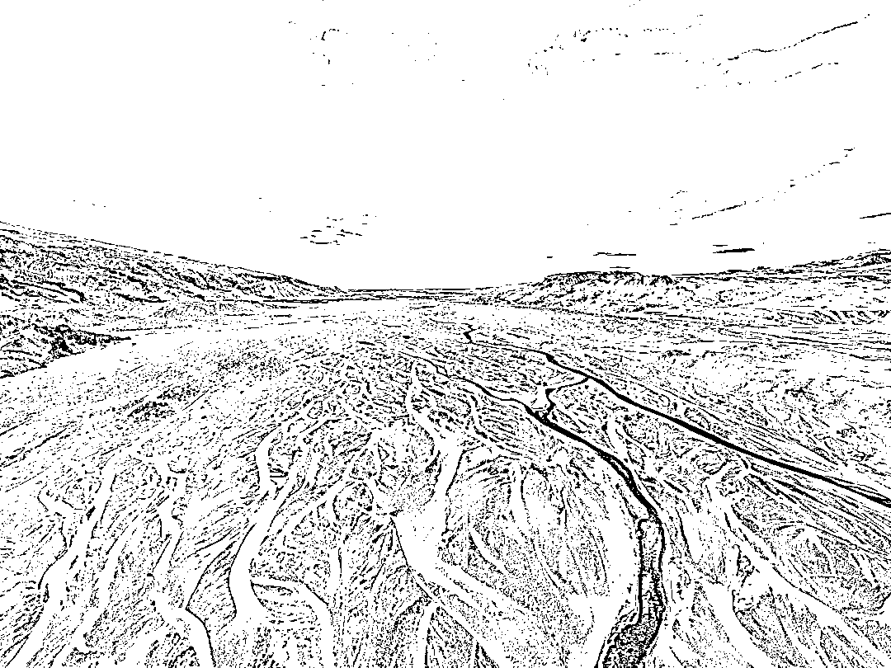

作者/雷蒙德·梅里曼
翻译/Luke 校对/李含编辑/玫瑰 图片/unsplash

雷蒙德·梅里曼是在金融占星学界稳坐第一把交椅的占星师，同时他也是若道签约的金融占星课老师，我们引进了雷蒙德·梅里曼老师的《上证指数月度报告》《黄金周期月度报告》《2020 年金融预报》（感兴趣的同学可以扫码文末图片购买）。我们经老师的授权，将每周刊登梅里曼老师的周运，供大家参考和学习。于是，这是这周的周运（12.23-12.27）。

**展望与回顾**注意：下周没有周报。我们会在 1 月 3 日回来。祝你们假日愉快，新年快乐！从宇宙模式角度来看 2020 年是一个重要的年份。因为有三个外行星合相在摩羯座！正如 2020 年预报中阐释的，这一年是**英雄和恶人辈出**的一年。**要像英雄那样，勇敢和诚实，也要在知悉后果的情况下做出自己的行动选择。**

**市场正在摆脱弹劾特朗普总统带来的余波，因为预计弹劾不会成功，因此对财政或货币政策也没有什么负面影响。投资者反而更关注近期的积极进展，比如特朗普政府和中国之间正在运作的贸易协定，这份贸易协定可以减少一些对经济和收入的压力。“特朗普需要胜利。他有北美自由贸易协议****（NAFTA）****，也有中国协议，也制定了预算。他在被弹劾的时候取得了这些胜利。”Strategas 智库的政策研究主管丹尼尔·克利夫顿说。**

**——帕蒂·多姆**

**《这就是股市无视特朗普被众议院弹劾的原因》**

**www.cnbc.com**

**2019 年 12 月 19 日**

**美国《华尔街日报》、美国全国广播公司最新民调发现，为期 3 个月的众议院调查未能在美国人中建立起是否弹劾特朗普总统的共识，使得国家陷入分歧，支持和反对的比例是相等的，48%对 48%。在独立的被调查人中，50%的人支持弹劾的免职，44%的人反对。**

**——阿伦·泽特那**

**《华尔街日报和美国全国广播公司民调发现，美国民众在特朗普下台问题上意见分歧旗鼓相当。》**


上周发生的事情是个完美的例子，展示了**持续到 12 月 28 日积极的木星行进和 1 月 13 日土冥合相的严厉声音**是如何交互作用的，这个相位每隔**32-37 年**出现一次。只不过土冥合相发挥影响力的时间长得多，**容许度是前后 11 个月**。

本周初，美中达成贸易协议闪闪发光，随后众议院通过了美墨加三国协议。这周中期见证了众议院对唐纳德·特朗普总统历史性的弹劾，这是美国历史上第三次在党派政治斗争中弹劾总统。但是股票市场对政治动荡没什么反应，反而关注的是**历史性贸易协议的达成**，通过贸易（木星）为经济增长开辟了一个新世界。基于这个原因，美国股市继续向上突破达到历史新高，也带动全球其他许多股票市场一起上涨。

在这一点上，很难否认特朗普总统为经济带来的成功。他结束了很多使市场和企业烦恼的贸易紧张关系，这符合**12 月 16 日木星三分天王星**和**12 月 24-28 日**太阳为这个有利的三分相加持的征象。传统智慧建议人们根据他们经济意义上的福利投票。这并不全对，因为新民调显示他的支持度并没有大幅增加，依然低于 50%。看起来一半的美国人根据钱袋子的大小投票。另一半的人是根据候选人的性格投票的，这是总统的民调仍然落后的原因。这也解释了为什么一半的美国人想要他继续留在白宫，而另一半的人想要他被革职。 有趣的是，更多独立党派的人想要他免职。他会被免职吗？可能不会，因为这需要参议院 2/3 的票数。参议员的席位分布是 53-47，共和党人占据多数，他们不太可能在大选前自乱阵脚，而且很明显这一次是党派斗争。然而，特朗普总统接下来两年会经历强有力的冥王星和海王星的行进。冥王星同“**对个人权势带来的威胁”**有关，将会对分他出生星图中的金星和土星。金星与爱和支持度有关，而土星和个人地位及权威有关。看来两者均不会有所改善，尤其是在 6 月以后到大选前，而且这段时间里面火星行进在白羊座，与这个对分相构成了一个基本星座的 T 三角。

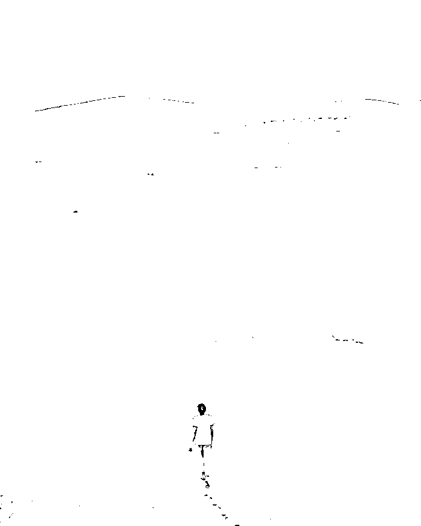

与此同时，行进海王星会和总统的出生太阳-天王星合相，对分月亮，形成一个 T 三角。他的出生星图中天王星遇上了月食，和所有天王星强势的星图一样，他是“与众不同的”。如果人们觉得他行为怪异和“不合时宜”（因此有不利于支持度的“性格”问题），他们看见的远远不是全部。他不会因为受到弹劾而“变得正常”。可能正好相反。对某些人来说，他将变得更“有趣”，甚至更失控。但是这种行为可能实际上让他更接近被弹劾，因为冥王星这颗行星负责**“解除权力”**。大多数分析家认为弹劾持续得越长，对民主党的伤害就越大，对特朗普越有利。根据我对占星学的理解，得出的是相反的观点，因为接近大选，冥王星摩羯座（审判）在他的星图里变得越来越有力。也不要忘了民主党在 2018 年选举中众议院赢得了如此多的席位，这是因为这些新任的民主党人反对总统，其中许多人表示他们会推动对他的弹劾。他们上任后实现了自己所承诺的。如果共和党人认为，这些选民会因为民主党议员履行了选举时的承诺而予以惩罚，那就太“天真”（海王星）了。当冥王星像打击总统那样打击你的时候，你通常会陷入一个你从未预想过的处境，而且你从前有效的手段都不再奏效了。需要完成某种在**价值观，信念和（或）行为上的个人转化**才能摆脱这种处境。如果不是自愿这么做的，那么变化通常会强加在你身上，你的生命在非自愿的情况下被转化。冥王星行进，尤其是与土星成相，通常无论何种方式，都是一个人生命中沉重的时光。一切都不像从前那样了。**短期占星趋势与长期考量**我们的读者最为关心的是金融市场未来的走势。因此，让我给读者们一个节日礼物——快速总结一下我对美国和世界股市在 2020 年的看法。更详细的细节，请参考 2020 年预报，书中涵盖了从现在开始到未来 1-3 年有效的天象和周期模式（感兴趣的同学可以扫描文末二维码购买）。
我觉得非常有趣的是**2018 年 10 月 3 日的历史最高点后，市场随后的下跌持续到 2018 年 12 月 26-27 日，跌去 19%幅度**。今年，**2019 年 10 月 3 日，是一个基本周期的低点，随着我们接近 2019 年 12 月 27-28 日，市场正在创历史新高**。这个模式和去年的正好**相反**——迄今为止是如此。全球大多数股票市场呈现出**15-18 月**的周期，**容许度是 3 个月**。**在美国，是 15.5 月周期（长度 13-18 月）**。它是更大 4 年周期的 1/3 阶段，在一年前的**2018 年 12 月 26-27 日**触底。世界其他股指，比如**欧洲，呈现 3 年周期**，可以细分为**两个 18 月的阶段**。这个 3 年周期也在**2018 年 12 月 26-27 日触底**了（日本也一样，中国是在一个星期后）。简单计算显示**美股的下一个 15.5 月周期预计出现在 2020 年 4 月+/-3 月**，**在欧洲是 2020 年 6 月+/-3 月**。在那时，**金星会转向逆行（5 月 13 日-6 月 25 日）**。**如果这期间股票下跌的话，是一个买入的好时机**。**跌幅可能超过 2019 年的任何一次跌幅，但不像 2018 年 12 月 26-27 日的那次跌幅那么大**。在美国，2019 年最大的跌幅是 7.5%。跌向 2018 年 12 月 26 日低点的跌幅超过了 19%。因此，预计**美国股市的跌幅是 8-19%，低点估计在 2020 年 4 月+/-3 月期间出现**。在那个低点后，研究表明**2020 年 12 月 22 日的木星/土星合相在+/- 5 个月期间与波峰有关**。目前，还不能确定那时的高点跟 2020 年前半年的高点相比谁更高。然而，一旦达成了这第二个高点，**2021 年的土星-天王星渐亏四分相预示市场会迅速跌向 6.5 年周期**的低点，这个地点理想情况下在 2021-2023 年出现。这是我们为明年画出的路标。我们希望这对你的投资计划有所帮助。毕竟，在 2020 年摩羯座合相下成功的秘密是**“计划”**。这是造物赋予人类最大的礼物之一，占星学是帮助人们做计划最好的工具之一。当然，根据这些周期展开的模式，这些预报会在我们每日、每周和每月的报告中有所微调和细化。就这么多了，希望你们每个人度过愉快的假期。明年再见！**版权声明：**本文由若道翻译发布，欢迎转发，反对抄袭。友号转载请申请白名单。


**雷蒙德·梅里曼（Raymond Merriman）**

若道签约老师。著名金融占星师，ISAR（国际占星研究协会）前主席，梅里曼市场分析公司的总裁。他由于“提升了占星学的职业形象”，在 1995 年国际占星大会上被授予轩辕十四奖；在 2012 年国际占星大会上，被授予轩辕十四终身成就奖。

1“中国上证指数月度报告”发售

**从****7****月开始，若道推出了****中文版****的雷蒙德·梅里曼中国上证指数月度报告，并持续发行该报告！**

当把金融市场的周期和占星学的周期相结合时，雷蒙德·梅里曼老师的金融占星学研究**为投资者应对金融市场的周期波动，并随之调整投资策略提供了极大的价值参考**。

2“黄金价格周期月度报告”发售

**现在，又有一个好消息要告诉你。从****9****月开始，若道将推出****中文版****的雷蒙德·梅里曼黄金价格周期月度报告！**不仅仅为广大读者在中国股市的投资出谋划策，更将视角放眼黄金市场。

**每当世界经济形式不明朗的时候，有一个地方是保值的港湾，那就是****黄金**。从 2018 年 8 月开始，黄金已经用自己的升值再次提醒众人它在经济不稳定时的位置。**截至目前，2019 年 8 月底，黄金已飙升至 6 年新高，高于 1565 美元。**

自 1982 年雷蒙德·梅里曼出版第一本研究《地球宇宙学征象与黄金价格的关联》的著作以来，**他一直作为最重要的黄金市场时机预测者之一享誉国际**。

过去 1 年，那些订阅并遵循建议的梅里曼市场时机学院日报和周报的订阅者，如果从 2018 年 8 月 16 日的低点或 8 月 23-24 日的次低点购买黄金，他们已经赚到了不少的 30%左右的利润。

**购买套餐**，买得越多越优惠

**2020 年 1 月报告均已更新！**

中国上证指数月度报告套餐价

*   **单月报告**：280 元

*   **3 个月套餐**：780 元（260 元/月）

*   **12 个月套餐价**：1999 元（166 元/月）

**长按下图识别二维码**

**购买金融报告****套餐**

**▼**


黄金周期月度报告超级优惠折扣

*   **同时购买上证指数 12 个月套餐**和**黄金周期报告 12 个月套餐**，即可享受黄金周期报告 12 个月套餐**立减 1199**元的**超级优惠折扣**。

*   **已经购买**了**上证指数 12 个月套餐**的朋友，**再购买**黄金周期报告 12 个月套餐，也可享受**立减 1199**元的**超级优惠折扣**。**购买黄金周期报告 12 个月套餐时，超级优惠折扣会自动生效**。

**长按下图识别二维码购买黄金报告套餐**

▼


32020 年金融预报预售 1976 年以来，由雷蒙德·梅里曼撰写的梅里曼市场时机学院每年一次的年度预报沙龙和每年一本的《年度预报》一直在应用占星学原理为投资者们服务，43 年来，这本 200 页左右对金融市场的分析报告和 3 小时的年度预报讲座在美国、日本、欧洲帮助许多投资者了解宇宙天气对于世界经济形势、政府政策及其对各个金融市场和金融产品的影响，帮助他们做出正确的投资决策，降低投资风险。2018 年，若道第一次将这份广受赞誉的一年一度的金融占星报告和沙龙引入中国，供中国投资者参考。**《2020 年金融预报》将会谈及 2020 年重要的宇宙天象及其对世界经济、贸易形势的整体影响，还将覆盖中国上证股票市场的分析、黄金白银市场、美国经济、美国总统、美联储、美国国债市场、美国股票市场、主要外汇货币市场（主要外汇美元、英镑、欧元、日元、瑞士法郎）、原油市场、谷物市场、活牛市场、比特币市场等投资市场。**梅里曼老师及梅里曼市场时机学院的金融占星分析师还会给出以上市场 2020 年的**市场价格目标区间及重要价格反转日**，为短期、中期和长期投资者进行市场操作的时机提供参考。如果你关注世界经济和金融投资市场的变化，会发现梅里曼《金融年度预报》中的研究对于你了解世界经济在发生什么，这些市场的走向会如何有非同寻常的指导价值。报告和讲座价格

2020 年金融预报讲座和报告价格整体售价** 1280 元**

（本讲座和报告不单独出售）

**12 月 31 日前 100 名用户**预售价：**1080 元**

**12 月 31 日后**恢复原价：**1280 元**

**长按下图识别二维码购买 2020 年金融预报**

▼


**微信又双叒叕改版啦，不想错过若道君的推送？**

**就把若道设为星标吧！**

**▼**


********点击阅读原文购买金融报告********


# 圣诞节是摩羯座的？ | 2019 年末，我们与 10 位摩羯座聊聊人生的“礼物”

> 原文：[`mp.weixin.qq.com/s?__biz=MzA5NjA0NTAxNg==&mid=2651412489&idx=1&sn=6e1d12815c8cecd79ce96520818a2cd0&chksm=8b4beabebc3c63a8f57a757fb03bec3f7e31422e05838e1e4e38a83732e0694f38f18376d5dd&scene=126&sessionid=1692738237#rd`](http://mp.weixin.qq.com/s?__biz=MzA5NjA0NTAxNg==&mid=2651412489&idx=1&sn=6e1d12815c8cecd79ce96520818a2cd0&chksm=8b4beabebc3c63a8f57a757fb03bec3f7e31422e05838e1e4e38a83732e0694f38f18376d5dd&scene=126&sessionid=1692738237#rd)

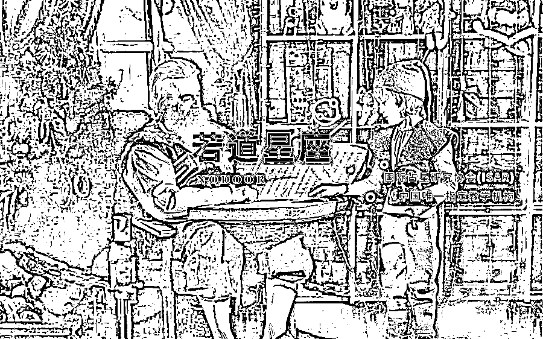

采访&作者/狄狄 

编辑/狄狄 图片/网络

本文共 8449 字，用魔羯座的毅力读到文末会收获礼物。

2019 年 12 月 22 日中午 12 时 19 分，太阳正式进入摩羯座。时间进入摩羯月提醒着我们圣诞节来了，而圣诞老人的故事也具有典型摩羯座的气质。西方神话传说中，每年 12 月 24 日，神秘的圣诞老人会乘驾由 9 只驯鹿拉的雪橇在天上飞翔，挨家挨户地从烟囱进入屋里，然后偷偷把礼物放在孩子床头的袜子里，或者堆在壁炉旁的圣诞树下。而一年中的其他时间里，圣诞老人在忙于制作礼物，以及观察和监督孩子们的行为。等待了一年的小朋友们，只要“表现好”，就可以在圣诞节一早收到他们最想要的礼物。而“坏孩子”不仅不会得到任何圣诞礼物，可能还会挨一鞭子或被驯鹿带走。这当然是机智的家长们用来骗孩子们听话的故事，但圣诞老人的规则也在童话外延续。每个成年的大人，也会在历经了责任、规则、使命和时间的考验之后，收到来自“土星老爷爷”的礼物。没有经过考验的大人，不仅不会得到生活的礼物，还会挨现实一鞭子，或者被时间“带走”。

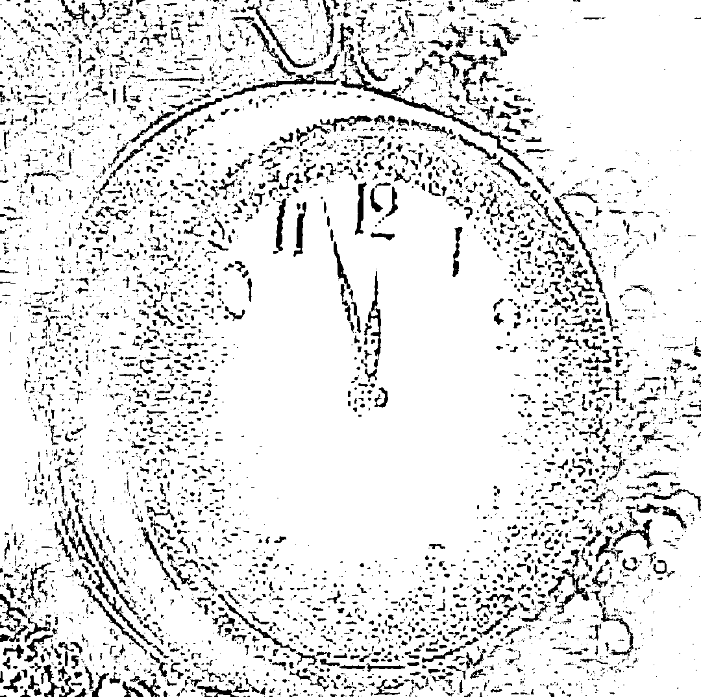

尽管代表着压力和限制，**土星仍然是一颗关乎于“礼物”的行星**，这也是为什么圣诞节与摩羯座神似的原因。占星学中，似乎只有土星以及土星守护的摩羯座，最有能力和毅力让每个人生命中期盼已久的梦想，在梦醒时分落地变为现实。与圣诞老人的古怪行为同样神似的，是一群被称为“摩羯座”的人，他们也是在占星语境里最容易被别人、甚至被自己误解的一群人。他们是早早就知道“没有礼物也要不哭不闹按时睡觉”的小朋友。2019 年圣诞节，我们和 10 位不同领域、25-45 岁的摩羯座大朋友，聊了聊令他们印象深刻的“礼物”，以及他们眼中真实的自己。**通过他们的故事，也许你可以有机会原谅那个曾经因为人生的礼物迟到、不合意而失望，或是因害怕自己可能不会收到礼物，而心怀恐惧的你自己。**“圣诞老人”真实存在吗？至少土星老爷爷是一直存在的，它说做好你该做的，然后礼物会自己找到你。一起来走进一下摩羯座的内心世界。（温馨提示：此次被采访者均为太阳摩羯座，出生星图中的“摩羯座含量”集体偏高，其中 3 星至 6 星摩羯座占总采访人数的 90%。）

**40+的摩羯座**

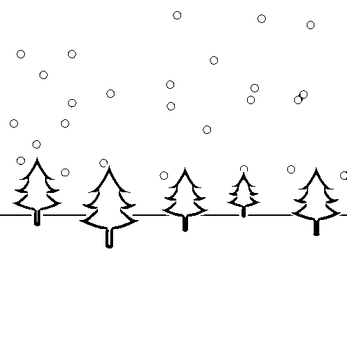

**Iris****介绍一下你自己。**Iris：占星师、意识演化的探索者和实践者、戏剧与占星结合工作的开创人。**怎么看待摩羯座？**Iris：不容易。摩羯座年轻的时候都不容易，越年长越轻松越好玩，反正我小时候很少有轻松的时候。虽然现在也不轻松，但是小时候是事情也不轻松心里也不轻松，现在事情不轻松心里好多了。摩羯座小时候都很容易自卑，总觉得自己不够好。**你在意别人怎么评价你吗？**Iris：40 岁前在意。以前顾忌的比较多，在意社会上和周围人的认可，觉得很累。现在越来越知道自己要什么了，忙碌都是开心的。我可能是成长比较慢的，十宫里一堆行星，我觉得其他摩羯座可能比我跨越这一关快一点。**你怀疑过自己吗？**Iris：永远在怀疑。一些重大的你觉得非常有价值的事情，在真正做成之前，你都会怀疑“我能做成它么？我能做到我自己满意吗？”。我觉得摩羯座基本上属于对自己非常严格。**人生低谷，压力特别大的时候，你是如何重建的？**Iris：我觉得摩羯座倒是不太容易被一下打到崩塌。压抑、抑郁、低落的时候，我觉得就干事儿就好了。瘫着不动的时候非常少，最多半天一天的吧。

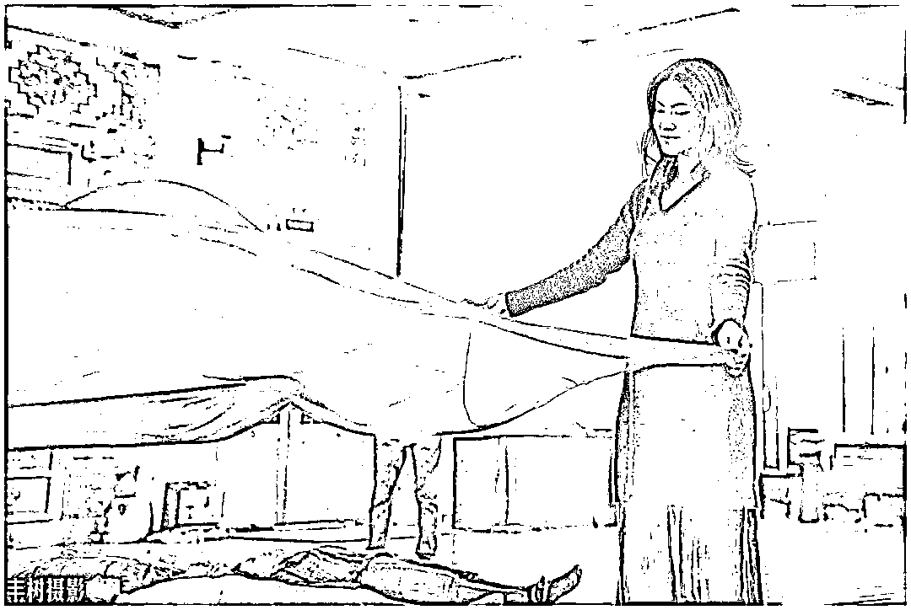

**|** Iris
**你是个容易逃避的人吗？**Iris：真的不会逃避。摩羯座基本属于迎难而上的。比如我用塔罗的时候，我明明看到两个结果，一个是艰难的，另一个结果是挺高兴的，**我就偏要试试看真走那个艰难的结果是怎样的，特别作**。当然确实也如塔罗所示有一些不愉快的体验，但过后觉得这个也是经验啊。又比如日返图，去年我如果不在大理过生日，我这一年应该会更好过，如果在大理过我就会有一些难题。后来我是这样想，如果就因为这一张日返图，我就要折腾自己去外地过一个生日，我就是懦夫。我不能容忍自己这种逃跑行为，我就要在大理过这张日返图试试。**如何看待人与世界的关系？**Iris：我感觉个人对世界的印象是自己的意识投射出去，收回的印象的综合。所以每个人眼中的世界是不同的。当自己的意识变了的时候，世界也就变了；当有一些旧意识消除了，或是新意识建立起来的时候，世界就会配合你的意识切换成一个新的世界。**所以我觉得人和世界的关系，其实还是人和自己意识的关系。****你人生中收到过的印象最深的礼物是什么？**Iris：2017 年带妈妈去美国上课之后回来，有天她对我说：“我们是母女，也是各自独立的灵魂，以后我们之间没有互相担心，只有互相支持。”**你怎么总结自己的 2019？**Iris：土星来到摩羯座虽然是挺累的，但是对于摩羯座能量强的人来说它还真是一股成就的力量。2019 就是感觉事儿做不完，事推着往前走，特别充实。办了四期占星戏剧工作坊，也进行了第一次戏剧公演，属于一种摩羯座的满足，想干的事都干了，结果自己也很满意。

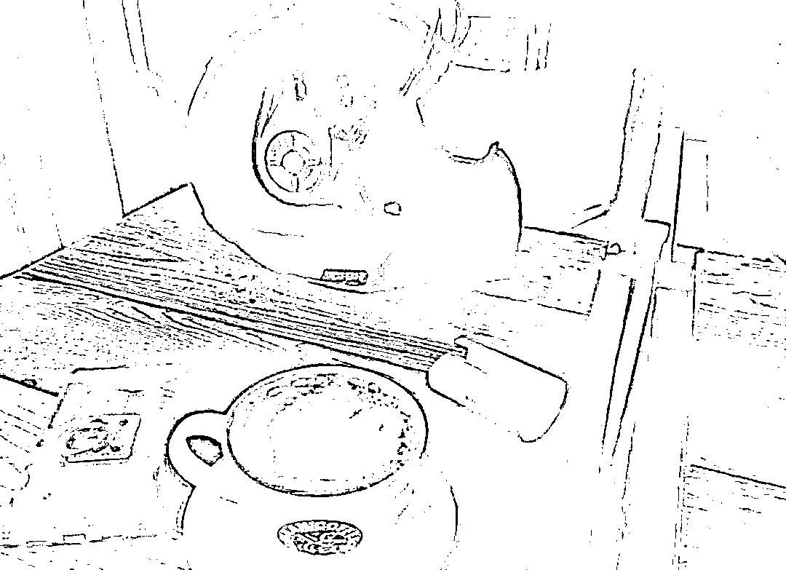

**| **龚先生拍摄
**龚先生****介绍一下你自己。**龚：社会工作者**你在意别人怎么评价你吗？**龚：我想人的特性，大部分人都希望别人对自己有好的评价吧。对于我而言，当然是关系越近的人的评价越重要。**你怀疑过自己吗？**龚：我会经常怀疑。越重要的事情，我会越怀疑自己的选择和判断。**人生低谷，是否有信念崩塌的时候，是如何重建的？**龚：现在正在经历很不顺心的事情。其实也没有什么方法重建自己，只不过是坚持而已。**没有办法的时候，坚持就是忍耐，坚持下去事情才有可能有转变。**要找种种借口来说服自己给自己希望。**你是个容易逃避的人？**龚：不太会。大部分人都是社会性的动物，不可能连社会都逃避了。而且选择了逃避也没有用，还不如直接面对，越重要的事情越要绞尽脑汁去解决。**工作对你而言的意义是什么？****你工作中的状态是怎样的？**龚：曾经把兴趣当过事业，现在而言工作只是一种谋生手段。当然与此同时，与工作相关的知识，包括社会经验、人生阅历、人际交往方面都会得到提升。对于不同类型的工作，我会选择不同的状态去面对。**你如何看待人与命运的关系？**龚：发生在我们每个人身上的事都有它的道理，只不过大部分时候我们没有明白这些道理。**你人生中收到过的印象最深的礼物是什么？**龚：一个重要的人送的打火机。**你怎么总结自己的 2019？**龚：2019 年是糟糕的一年，很多的问题目前的我没有办法把它解决好，但我是真的想好好解决。但还没办法的时候就得忍着。

**30+的摩羯座**

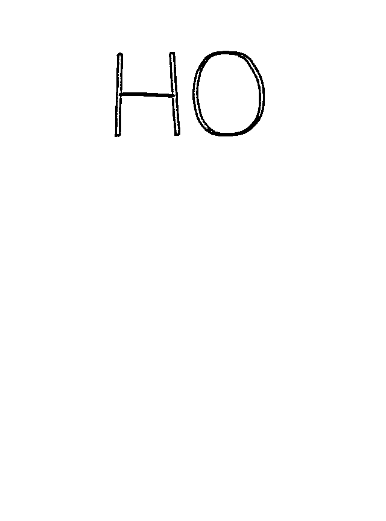

**李昂****介绍一下你自己。**李：文物保护工作者**怎么看待摩羯座？**李：有病的居多吧，比较纠结，有韧性，比较硬，整体像块石头。大部分时候都是偏理性的思维模式。朋友们对我的评价是像个机器人，可能因为我上升也是摩羯座。**你在意别人怎么评价你吗？**李：不是特别在意。相对比较在意我在意的人的评价，亲人、好友、另一半……没办法让所有人都满意，做到问心无愧就好了。**你有怀疑过自己吗？**李：一定有啊。更多是在一些不顺利的情况下，比如说恋爱关系的不顺利会怀疑是不是自己哪里不对；又比如换工作或者工作中的决策，如果最后发现结果跟预期差很多，也会对自己有所质疑。**人生低谷，是否有信念崩塌的时候，是如何重建的？**李：睡觉吧。如果这件事我想不明白我可能就会睡一觉，明天接着想。严格来说重建的方式肯定会分析，分析是不是自己的问题，如果是的话是自己哪方面的问题。这个问题是可以改正的还是无法改正的，**如果可以改正就会尽量去改，如果无法改正的就引以为鉴，在以后去避免再次发生**。这是我遇到事情的大致流程。**你如何面对逃避？****是个容易逃避的人吗？**李：我不太喜欢逃避事情，因为我觉得于事无补，没有任何用处。当你面对它的时候，也许这个难题对你当前的状态是让你无法掌控的，那这个难题就会让你找到一些方法措施让自己尽快的调整过来。我会强迫自己去面对问题，只要我想明白了我就会尽快去做决定，承担后果就好了。

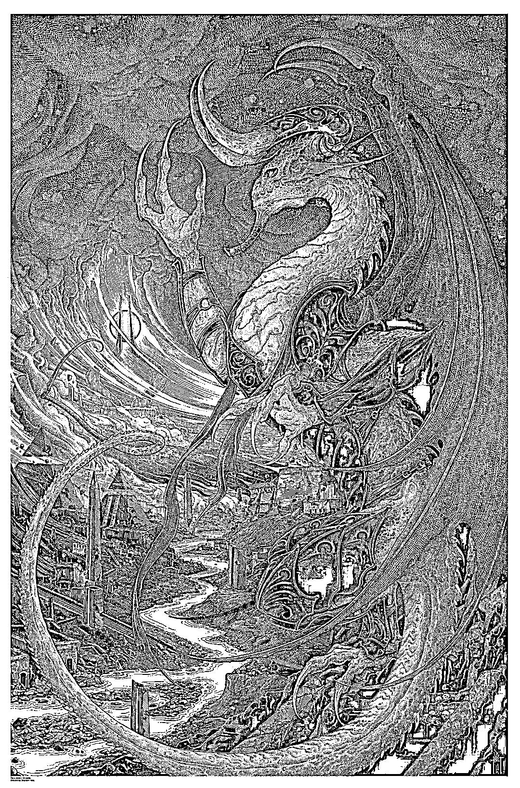

**工作对你而言的意义是什么？****你工作中的状态是怎样的？**李：很多人说摩羯座是工作狂，我觉得这只是表象。第一，工作是实现我目标和理想的途径；第二，工作给人的回馈往往是与努力成正比的，我个人认为摩羯座还是比较喜欢自己能够掌控的了的东西的。我对于感情就非常搞不明白，我觉得它不是完全能按着付出给予反馈。**你相信命运吗？****如何看待人与命运的关系？**李：原来一点也不信，随着年纪的增长越来越信。客观讲我们每个人都要在世界的运行规则下生存，如果我没办法制定它的话我就只能适应它。**因为规则是逃不开的，你觉得某个地方的规则实在不舒服，你可以给自己换一个环境。******你人生中收到过的印象最深的礼物是什么？****李：一次工作上的尝试。我老师无意间给我的工作机会，彻底改变了我从事的行业，我从城市规划转到文物保护。我的生活比较平淡，跟人生变化机缘巧合的事情都是工作相关。****怎么规划自己的 2020？****李：肯定是希望明年更上一层，事业上更稳定的发展。在情感方面就比较随缘，有合适的也很好。**腻虫****介绍一下你自己。**腻虫：一个很开心宅在家里的人。**怎么看待摩羯座？**腻虫：挺好的啊。摩羯座的自律我还挺喜欢的。**你在意别人怎么评价你吗？**腻虫：不在意。我只在意我自己对自己的评价，因为当你自己知道自己要什么的时候别人说什么不重要。****你怀疑过自己吗？****腻虫：没有。毕竟我是一个上升白羊座。我觉得如果你踏踏实实做好当下的事情，你不会在意别人怎么说，也不会想去怀疑自己。****人生低谷，是否有信念崩塌的时候，是如何重建的？****腻虫：人生你遇见的每件事情，都是在教会你一些东西的，它不是来打击你的，而是要给你一个提醒让你往更好的地方走。**你该吃饭吃饭，该睡觉睡觉，做好眼前的每一件事情就可以走出来。**

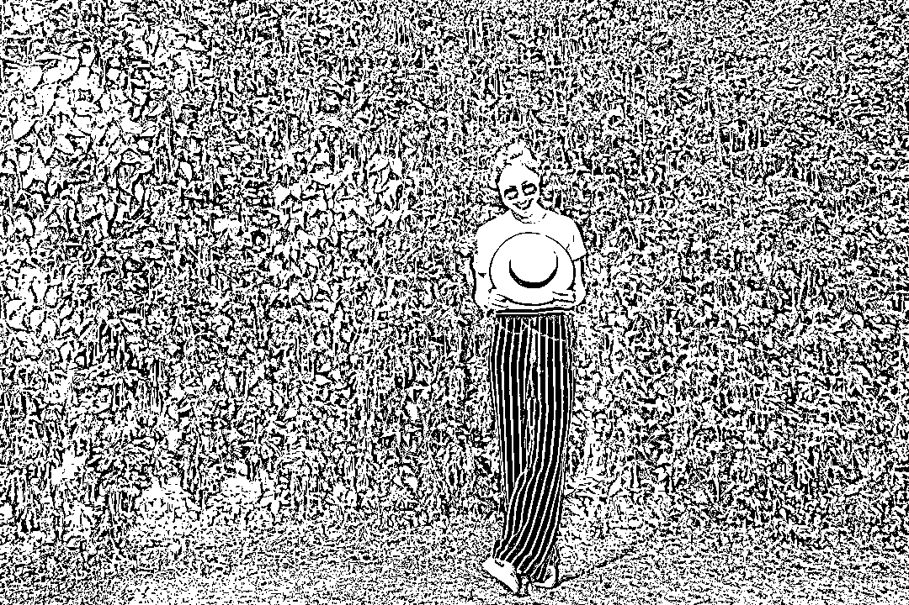

**| **腻虫****你是个容易逃避的人吗？****腻虫：我有时会想晚一点起床。有时候别人都说你已经 ready 好了，但我真的觉得时候还没到，这个算逃避吗？****工作对你而言的意义是什么？****腻虫：看自己怎么样比自己的昨天更好。****你相信命运吗？********如何看待人与世界的关系？****腻虫：信啊。我觉得所谓命运，就是你要追寻着让你兴奋快乐幸福的方向走。就像咱们看星图，你要去发现那些让你兴奋的部分，沿着那个方向走，它必然会带你去到你该去的地方。******你人生中收到过的印象最深的礼物是什么？******腻虫：小学的时候，有一年圣诞节，有十几个男生给我写贺卡对我表白，这个就很开心呐。******你怎么规划自己的 2020？******腻虫：2020 我要考博士，我一定要考上，我一定能考上。**雪莲****介绍一下你自己。**雪：一个信奉藏传佛教的、开护肤养生店的平面设计师。**怎么看待摩羯座？**雪：严谨、固执、没意思的星座。优点是执着有韧性。**你在意别人怎么评价你吗？**雪：在意。**你怀疑过自己吗？**雪：没达到自己预期的目标就会怀疑。但不经常。**人生低谷，是否有信念崩塌的时候，是如何重建的？**雪：跟佛教师兄聊天。

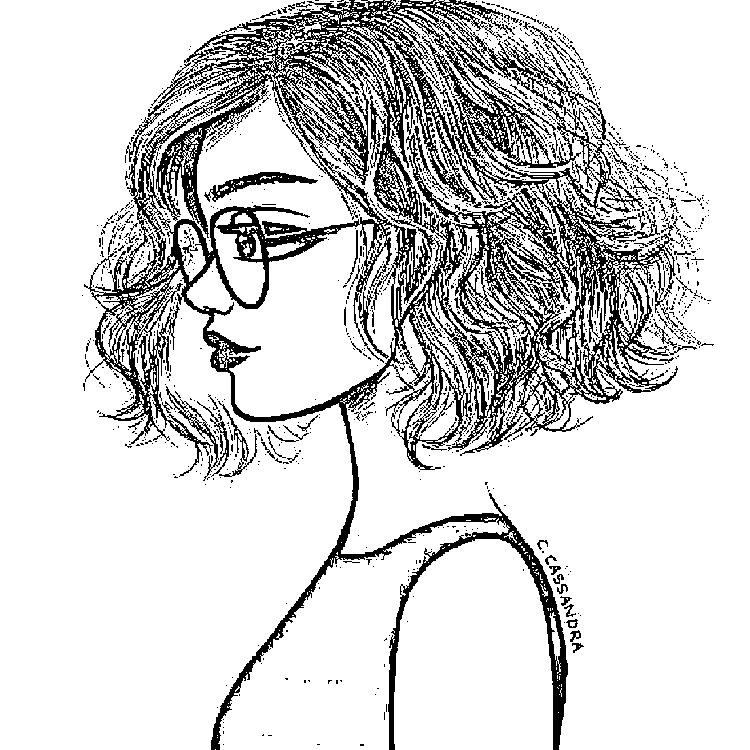

**你是个容易逃避的人吗？**雪：**所有能解决的问题我都不会逃避。**真的没法解决的问题才会逃避，比如生死。**工作对你而言的意义是什么？****你工作中的状态是怎样的？**雪：工作就对了。为挣钱，为自己和家人更好的生活品质。我自己而言，生活和工作是分不开的，它们彼此包含，所以也很享受工作的部分。**如何看待人与世界的关系？**雪：过客的关系。****你人生中收到过的印象最深的礼物是什么？****雪：我在一个师兄家看到一幅很名贵的坦城，很珍贵。我当时说“哇这个好漂亮啊”，然后师兄就说，你喜欢那它就送给你了。现在它被挂在我家供桌上。我觉得我做不到他那样，把这样一个珍贵的东西舍得送给别人，对世界特别不执著。所以从那以后，我遇到事情我都会想，如果是他的话，他会怎么做。****你怎么规划自己的 2020？****雪：我希望 2020 年会有比较明显的成就，无论是佛法修行还是现实的角度都更加精进。**DALI****介绍一下你自己。**D：服装品牌的 marketing。**怎么看待摩羯座？**D：我 20 岁之前是非常不喜欢摩羯座的，觉得自己非常的压抑不开心，觉得以后有小孩千万不能是摩羯座这样。差不多快 30 岁的时候，觉得摩羯座还是挺好的，很有神性。**你在意别人怎么评价你吗？**D：会啊，比如说业界评价，或者自己喜欢的人的评价。**你怀疑过自己吗？**D：怀疑啊。我觉得是不是很多摩羯座在年轻的时候都不太顺，我年轻的时候一直不太自信，现在会好一点。**人生低谷，是否有信念崩塌的时候，你是如何重建的？**D：上半年就经历过，在事业上遇到了非常大的断层和坎坷，年纪也不小了，压力就非常大。**遭遇低谷一个方式就是向内关注吧；另一个就是我会很主动的寻找机会，但是最后真正的出口都是自然而然出现的**，且是我长久以来一直回避或者视而不见的机会。

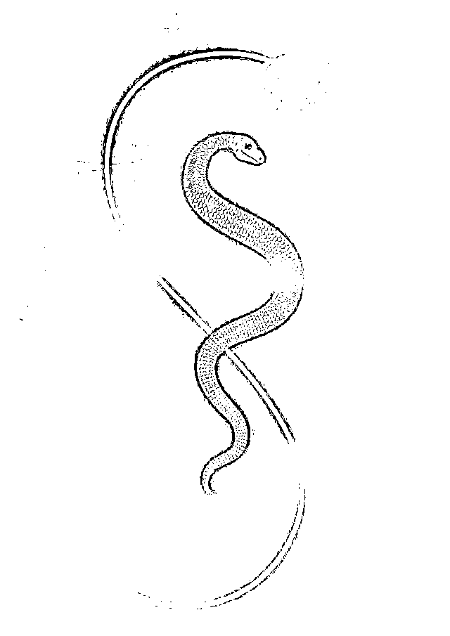

**| **DALI 属蛇
**你是个容易逃避的人吗？**D：工作上不会，哪怕我做不到的事情我也会说做不到。感情上有一部分会逃避，会有很多恐惧。**工作对你而言的意义是什么？**D：我觉得工作对我很重要。一是因为我在自己喜欢的行业里做喜欢的事情，二是我觉得工作是一个能让我变成更好的自己的方式吧。**你工作中的状态是怎样的？**D：我现在会比较成熟的和合作方和团队做沟通，会比以前自信和有力量很多。想成为一个能作决策和比较能独挡一面的人。**你相信命运吗？****如何看待人与世界的关系？**D：我相信命运是存在的。看你自己想不想去改变，如果想改变是可以找到方法的，只不过会很难。****你人生中收到过的印象最深的礼物是什么？****D：一个好朋友，让我自信且成长。****你怎么总结自己的 2019？********你怎么规划自己的 2020？****D：2019 非常非常的跌宕起伏，经历过很多黑暗和光明的一年。2020 的话，希望有一个更稳定更成熟的心态去面对。

**20+的摩羯座**


**楚仪****介绍一下你自己。**楚仪：一个好吃的摩羯座。餐饮媒体人。**怎么看待摩羯座这个星座？**楚仪：我在想如果我有小孩我可能不希望 Ta 是摩羯座吧，感觉摩羯座很苦。**你在意别人怎么评价你吗？**楚仪：会在意那个评价对自己有没有帮助，如果有帮助可能会在意一下。如果只是别人主观的评价“好”或“不好”，我就会比较自我不太会在意。**你怀疑过自己吗？**楚仪：蛮经常的，低落时侯会怀疑。**有时候高兴时候也会怀疑，高兴时候怀疑是希望自己可以保持清醒一点。**

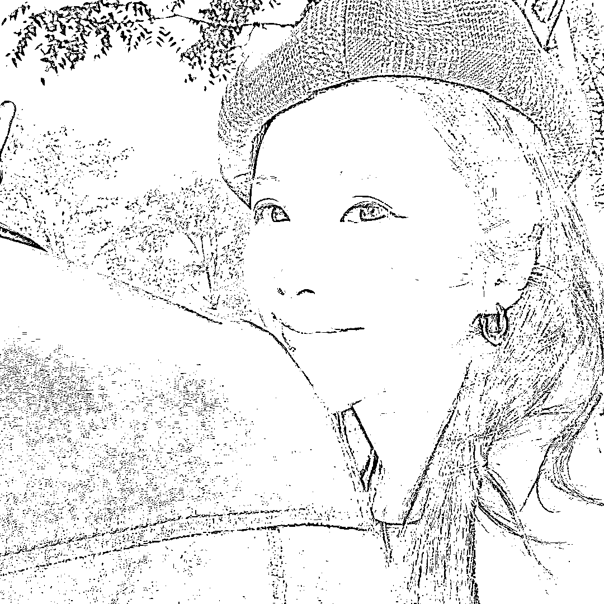

**| **楚仪
**是否有过人生低谷，或是信念崩塌的时候，是如何重建的？**楚仪：学佛之后觉得一切发生都很正常，不会有信念崩塌的时候。青春期的时候会有，现在回想也都是经历而已，蛮正常的。当时让自己走出来的方法就是跑步。**你是个容易逃避的人？**楚仪：基本不会逃避。**工作对你而言的意义是什么？**楚仪：一个是可以去实现自己的一些想法吧。再一个是去挣钱。我好好奇那些浪漫的星座会怎么回答。**你工作中的状态是怎样的？**楚仪：投入。忘记时间在走。**你相信命运吗？****如何看待人与命运的关系？**楚仪：蛮信的。我觉得人的命运大部分程度上是既定的，但我也觉得命运和个人的意志也是相互呼应的，大方向是这样发生，你自己的意志和能量也会对它有反作用的影响。有点像佛教里的境随心转。****你人生中收到过的印象最深的礼物是什么？****楚仪：男朋友今年送的每一件礼物吧。他可能不在某一个特定的日子会送礼物，但是他看到或者感觉到我缺什么的时候他就会买给我，结果导致他的淘宝现在一打开感觉就像是女生的淘宝首页……**你怎么总结自己的 2019？****or 你怎么规划自己的 2020？**楚仪：2019 变化蛮大，工作上我从合伙人的店里出来，开始正常的上班。然后很久没谈恋爱今年我也谈恋爱了。感觉转折蛮大的，自己也会更成熟一点吧。2020 年的期待就是身体健康。**Lydia****介绍一下你自己。**L：一个微信公众号的主编，群星摩羯座。**你是怎么看待摩羯座的呢？**L：怎么讲，很有结构感，很有目标性，能够做到眼里只有目标，这一点很值得赞扬。但是总是很容易忽视自己的情绪，忽视自己的健康。放了太多的责任，放了太少的自己。**你在意别人怎么评价你吗？**L：说实话，还挺在意的。可能因为我个人行星合相了海王的原因，有时候还挺容易被别人的评价影响的。**你怀疑过自己吗？**L：从很深层的角度来讲，从来没有怀疑过自己。但是表层上，自我是经常被怀疑、被推翻的。


**是否有过人生低谷，或是信念崩塌的时候，是如何重建的？**L：哈哈哈，其实目前就是，算是信念低谷以及崩塌的时候吧。重建，其实这个东西很难吧，只有不断忍受着崩塌和难过，才有可能生出点新的东西吧。这个新，大概就是所谓重建的起点。**你是个容易逃避的人吗？****你如何面对逃避？**L：我是个很想逃避的人，但事实是我不会逃避。一是我没法逃避，二是我逃避了我就很难受，必须要把事情做完我才能心里舒服点。**工作对你而言的意义是什么？**L：工作给了我一些生活的重心感。在工作上被需要、被认可还是挺让人高兴的。**你工作中的状态是怎样的？**L：稍微有一点点容易不近人情，我也在尽量调整。**你相信命运吗？****如何看待人与命运的关系？**L：这个问题太大了，如果放在以前，我大概会毫无障碍地说，相信又不信。现在，我只能诚实地说，我不知道。命运到底是什么？又凭何作用在人身上？这里面的到底有什么，我都不知道。****你人生中收到过的印象最深的礼物是什么？****L：是爱。**第一次被别人无条件地接纳和爱护的时候，那时候觉得获得了人生最珍贵的礼物。******你怎么总结自己的 2019？********你怎么规划自己的 2020？****L：2019 啊，收获大于损失的一年吧。我就不规划 2020 年了，做好自己该做的事就好，但行好事，莫问前程吧。（作为一个年轻人，我可真是太丧了）**许骁****介绍一下你自己。**许骁：摄影师。**怎么看待摩羯座？**许骁：工作狂吧。或者说，工作优先。**你在意别人怎么评价你吗？**许骁：嗯，还是比较在意的。比如每次拍摄后，我都会和朋友根据拍摄成果和状态进行互相总结。**你怀疑过自己吗？**许骁：经常性的。

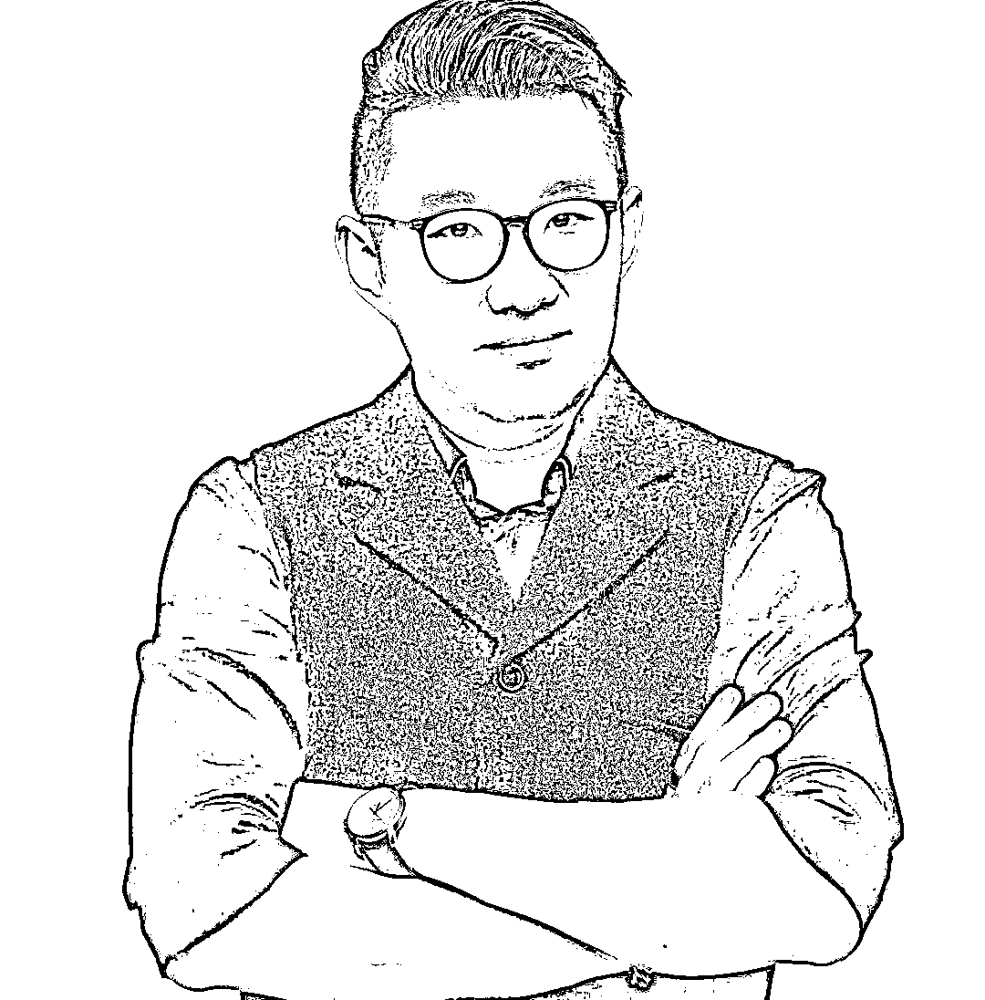

**| **许骁**人生低谷，是否有信念崩塌的时候，是如何重建的？**许骁：越挫越勇吧。比如工作遇到问题我会休息一下，像是看个电影什么，我其实会很快调整好状态进入到下一个工作里。**你是个容易逃避的人？**许骁：基本上不是。我觉得工作中有问题必须要解决，我会跟比我拍摄经验多的人去聊，把自己的问题先找到，然后去学习，把自己的问题都解决掉。情感中遇到问题可能会冷战，我会先要求彼此冷静一下整理思路。****你人生中收到过的印象最深的礼物是什么？****许骁：出国留学学摄影这件事对我而言是一个很大的礼物。如果在国内我可能会是一个学渣，入学的时候，我给自己改成了摄影专业，找到了自己喜欢的领域。****你是否相信命运？********你如何看待人与命运的关系？****许骁：相信。我觉得是会有命运大方向的安排，但是其中具体的结果是可以自己努力，我不相信命运会给我全都左右了。****你怎么总结自己的 2019？********你怎么规划自己的 2020？****许骁：我希望明年不要像今年这么背了。**Mia 小牙****介绍一下你自己。**牙：自媒体视频博主，创业者。**怎么看待摩羯座？**牙：我觉得摩羯座太懂事了。甚至懂得你说这句话的目的是什么，太过于了解导致他们做这些事情会让别人觉得太有目的性。所以他们挺累，因为他们太知道别人要什么。

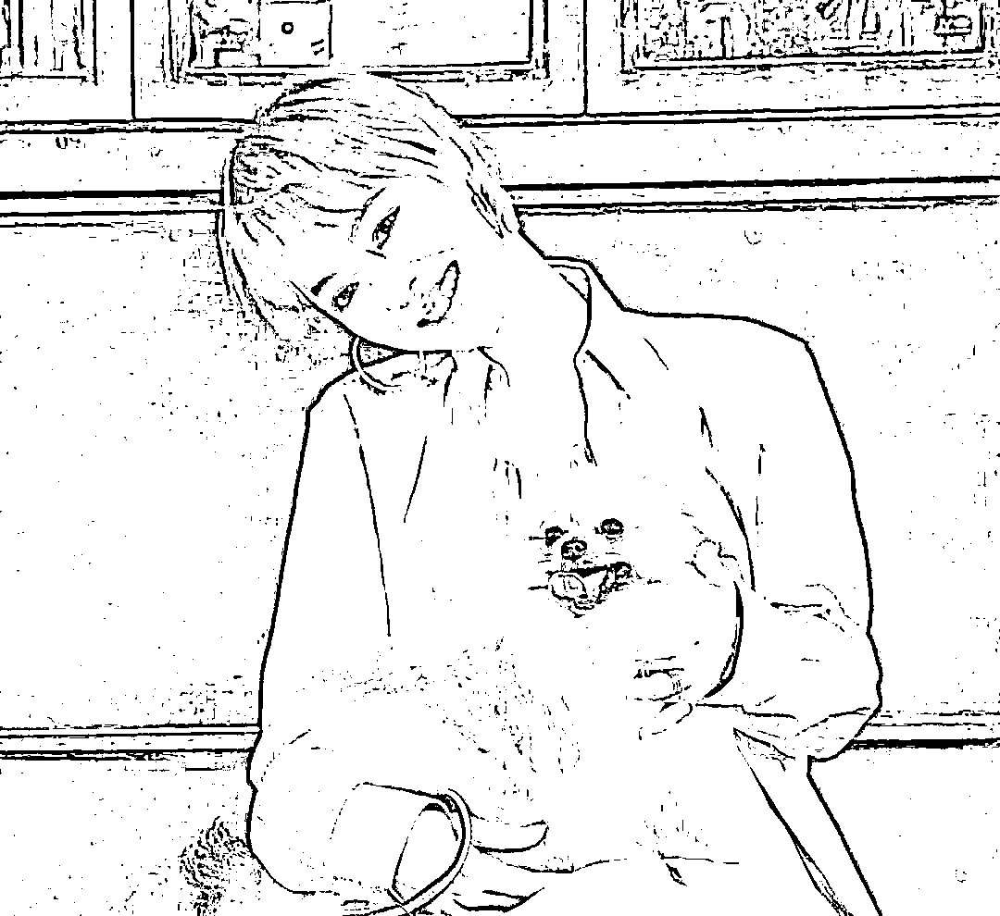

**| **小牙**你在意别人怎么评价你吗？**牙：在意重视的人怎么看我，比如工作上的人、我很喜欢的人、家人，我就会很在意。****你怀疑过自己吗？****牙：经常怀疑啊。最近就在怀疑自己，因为感觉自己累了、情绪调动不起来了、目标感不强了……就突然很想自闭，想完全屏蔽外界的声音，想只听到自己脑子里的想法。****人生低谷，是否有信念崩塌的时候，是如何重建的？****牙：有，大学的时候。特别抑郁的时候甚至走极端，就硬扛呗，会去庙里坐着，也会去了解占星，我会觉得这种宇宙的能量应该会给我一些答案。****是个容易逃避的人吗？****牙：如果我逃避的话一定是我觉得不自在。在我可选择的情况下，我不会去我不喜欢的环境里呆着。我群星十一宫嘛，如果这个群体让我很不喜欢，我就想逃开。****你工作中的状态是怎样的？****牙：我刚开始创业是做节目，我一个人要带一个 team，那时真的被他们逼到墙角了，我一个二十岁出头的女生，跟一些三四十岁的男人一起创业。现在回想起来我是真的挺像摩羯座的，就是可以硬抗下来。有那么一个阶段，我是为了我喜欢的事业，放弃了我所有的生活，我觉得 nb。如果再有那样的机会，我愿意回到那样的状态，但我现在觉得我能力不够。****你如何看待人与世界的关系？****牙：我会觉得这个世界太大了，世界之外还有宇宙。我们现在找到的规律可能都只是凤毛麟角。我觉得我很渺小，所以我愿意服从这个世界，顺从这个规律。**你人生中收到过的印象最深的礼物是什么？**牙：**应该是我的脑子吧。****你怎么总结自己的 2019？你怎么规划自己的 2020？**牙：2019 我从一个小孩变成一个大人，我开始独立的去对我个人负责任了。2020 我希望自己非常主动并且乐观地为一些事情负责任，再踏实一点，还是希望找到一些更摩羯座的状态。

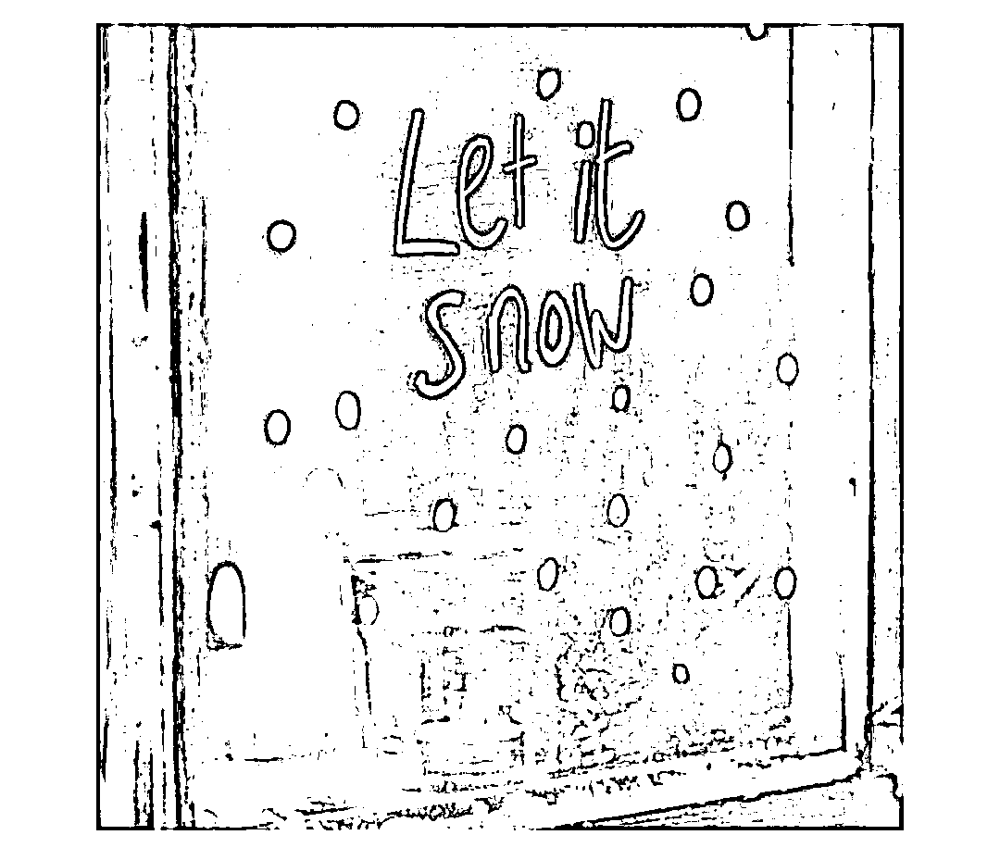

在采访这些摩羯座大朋友的时候，年轻一些的受访人会问我：自己的答案是不是太无聊或者太悲观了？好想知道其他人是怎么回答的？那些天马行空的星座回答会不会很有趣？而年长一些的受访人则会对于自己的遭遇的“拖延、枯燥、匮乏、以及痛苦”，有更多坦然的接纳和理性的诠释。从 20 岁到 40 岁，**他们对于自己的严苛没有减少，但是对于自己的喜欢都有变多。**在我看来，他们就是传说中那群会先吃“酸葡萄”，以及选择倒吃甘蔗的人。“每个人都会经验到不断出现的拖延、失望、痛苦和恐惧，而这些都跟土星的影响有关；很少有人能回答这些经验的意义是什么，如何才能善用它们作为一种成长机会，而不仅仅将其视为培养自制力和耐性的手段。…………也许土星或我们的灵魂要我们真正做到的，就是像帕西发尔在迷人的古堡里重新认识他自己，并看见圣杯时所提出的问题——我们可以尝试去问为什么。每一次的延迟、失望和恐惧，都可以让我们进一步洞察到神秘的心理机制，借由这些经验我们会逐渐认清人生的意义是什么。”**——丽兹·格林《灵魂的功课》**2020 年是重磅“摩羯年”，重量级的木星、土星、冥王星齐聚于摩羯座，对于很多人来讲会是压力多于机遇并存、重构与蜕变同在的一年，每个人都要接受“土星老爷爷”不同层面的现实考验。圣诞节给了我们一个契机，从别人的热闹里重新认识自己，认出自己人生中的“礼物”，为即将到来的 2020 摩羯年打下一个良好的信念基础。**若道《**2020 年度运势报告》********开启个人摩羯年的年度专属运势****

******由**大卫·瑞雷****亲自主笔****

**为重磅天象打好基础**

********也是圣诞节可以送给自己最好的********

☞[**圣诞礼物**](http://mp.weixin.qq.com/s?__biz=MzA5NjA0NTAxNg==&mid=2651412428&idx=2&sn=c7ac1a6bdc53a8bbf62ff4511308629a&chksm=8b4be57bbc3c6c6d69a1beb7f84b72f1e2607071c069efa13310c7983475522ea3a31de4458e&scene=21#wechat_redirect)☜

**点击下图了解详情**

**👇**


**版权声明：**原创文章由作者授权首发于若道平台，欢迎转发，反对抄袭。友号转载请申请白名单。

**微信又双叒叕改版啦，不想错过若道君的推送？**

**就把若道设为星标吧！**

**▼**


就是这个“在看”，戳戳戳 ☟

********年运报告购买入口********


# 最通俗易懂又面面俱到的 2020 年度运势，一定要点开！！！

> 原文：[`mp.weixin.qq.com/s?__biz=MzA5NjA0NTAxNg==&mid=2651412428&idx=1&sn=32bf652b3853c9aeae69ee9fed1a9bb4&chksm=8b4be57bbc3c6c6d197123ecaaa6290eaa3a6450bd386df76c8ec3bb924ee61cc7ee98233313&scene=126&sessionid=1692738237#rd`](http://mp.weixin.qq.com/s?__biz=MzA5NjA0NTAxNg==&mid=2651412428&idx=1&sn=32bf652b3853c9aeae69ee9fed1a9bb4&chksm=8b4be57bbc3c6c6d197123ecaaa6290eaa3a6450bd386df76c8ec3bb924ee61cc7ee98233313&scene=126&sessionid=1692738237#rd)

****************************☆ **************后台回复“今日”，给你一句生命态度**************


作者/海星程 Hastro ISAR 认证占星师 

编辑/玫瑰 图片/作者提供 网络


**我对“运势”的理解永远是：去了解宇宙行星交互能量的启发，结合自己的需求和目标，去做符合当下行星能量的事情。掌握这股能量的意义，就要将几个天象连贯着去解读。“命运”总是会眷顾那些懂的而且准备着的人。**

**——海星程 Hastro**

**预览 2020 年行星运行情况**

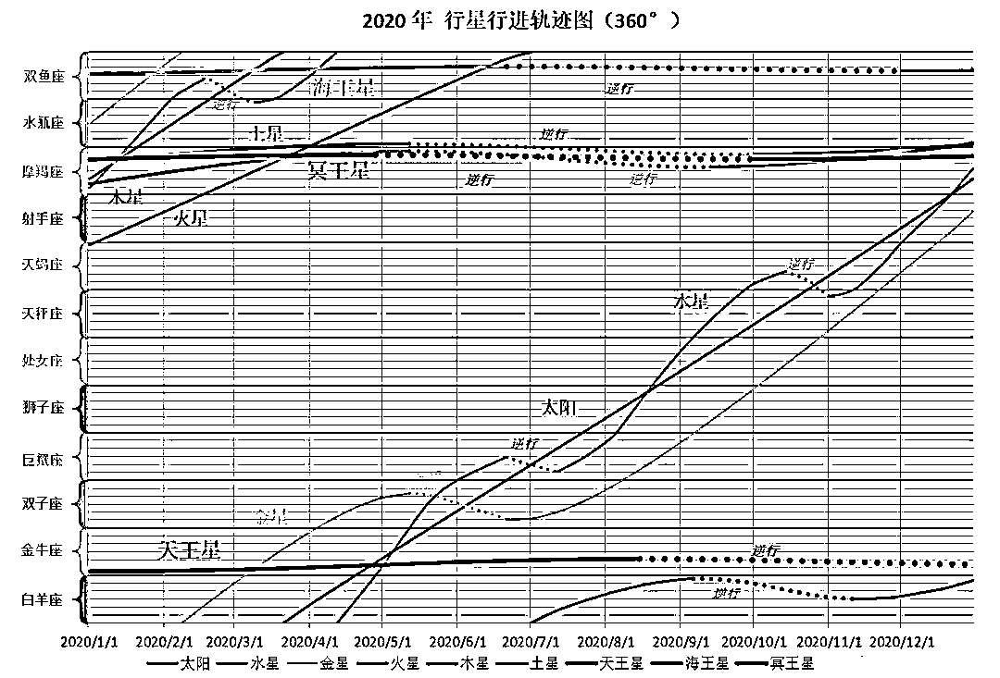

此图为 2020 年九大行星（除了月亮）全年在黄道 12 星座上面的行进轨迹显示，这是一个预览图，也是一个总览图，可以帮助我们**迅速了解全年行星的状态**，这里面我们可以比较直观看到的信息有：

**①** 水星、金星和火星全年逆行情况和区间；

**② **三王星（天王星、海王星、冥王星）的运行星座，以及和其他行星的相位；

**③ **土星和木星运行星座，以及和其他行星的相位；

对于非专业人士用这个图看相位比较困难，我会在下面通过更简单的详细图解为大家分析上述信息和其中的行星能量和天象中隐藏的启示。

**外行星行进对出生星图的影响**

第 1 步行进三王星的属性星座轨迹图

**方法**

行进三王星每年运行不过几度的范围，关注自己星图中是否有四轴或个人行星在这几度之内，即可得知对自己有影响的三王星；

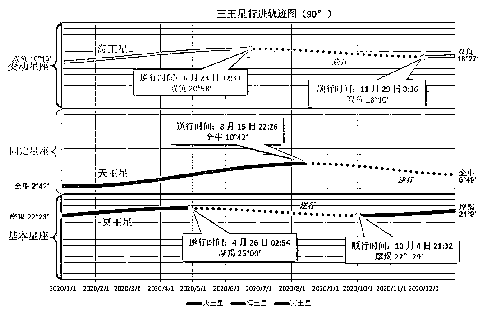

> **冥王星****全年运行区间在摩羯座 22°23′-25°00′**

**年初位置点**：摩羯座 22°23′       

**年末位置点**：摩羯座 24°09′

**逆行停滞点**：摩羯座 25°00′       

**顺行停滞点**：摩羯座 22°29′

**受影响人群**

出生星图中个人行星或四轴落在度数范围在**22°-25°**之间：

土象元素星座（金牛座、处女座）即为三分相、（摩羯座）即为合相；

基本属性星座（白羊座、天秤座）即为四分相；（巨蟹座）即为对分相。

> **海王星****全年运行区间在双鱼座 16°16′-20°58′**

**年初位置点**：双鱼座 16°16′       

**年末位置点**：双鱼座 18°27′

**逆行停滞点**：双鱼座 20°58′      

**顺行停滞点**：双鱼座 18°10′

**受影响人群**

出生星图中个人行星或四轴落在度数范围在**16°-21°**之间：

水象元素星座（巨蟹座、天蝎座）即为三分相、（双鱼座）即为合相；

变动属性星座（双子座、射手座）即为四分相；（处女座）即为对分相。

> **天王星****全年运行区间在金牛座 02°42****′-06°49′**

**年初位置点**：金牛座 02°42′       

**年末位置点**：金牛座 06°49′

**逆行停滞点**：金牛座 10°42′       

**受影响人群**

出生星图中个人行星或四轴落在度数范围在**2°-7°**之间：

土象元素星座（处女座、摩羯座）即为三分相、（金牛座）即为合相；

固定属性星座（狮子座、水瓶座）即为四分相；（天蝎座）即为对分相。

第 2 步行进土星、木星的属性星座轨迹图

第一步看完三王星行进后，接下来辅助看行进土星和木星，行进土星大约 2.5 年更换一个星座、行进木星大约 1 年更换一个星座，所以我们要关注行进土木所经过的自己宫位。

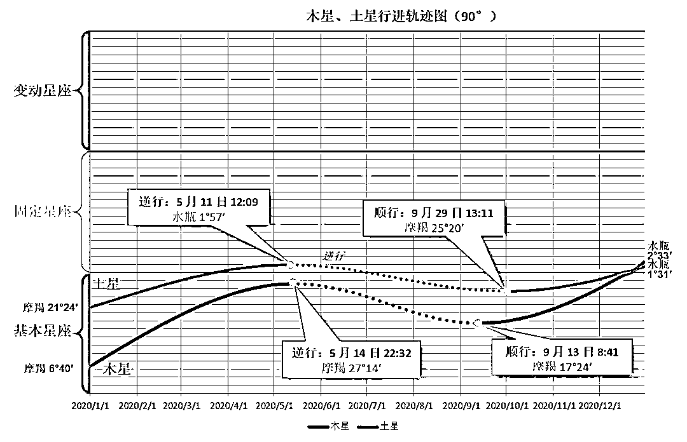

> **土星****全年运行区间在摩羯座 21°24′-水瓶座 01°57′**

**年初位置点**：摩羯座 21°24′       

**年末位置点**：水瓶座 01°31′

**逆行停滞点**：水瓶座 01°57′       

**顺行停滞点**：摩羯座 25°20′

**受影响人群**

出生星图中个人行星或四轴落在度数范围在**摩羯座 21°-水瓶座 2°**之间：

土象元素星座（金牛座、处女座）即为三分相、（摩羯座）即为合相；

基本属性星座（白羊座、天秤座）即为四分相；（巨蟹座）即为对分相。

注：位于风象元素（双子座、天秤座、水瓶座）和固定属性星座（金牛座、狮子座、天蝎座、水瓶座）初度 0°-5°之间的影响只是在 3-7 月。

> **木星****全年运行区间在摩羯座 06°40′-水瓶座 02°33′**

**年初位置点**：摩羯座 06°40′       

**年末位置点**：水瓶座 02°33′

**逆行停滞点**：摩羯座 27°14′       

**顺行停滞点**：摩羯座 17°24′

**受影响人群**

出生星图中个人行星或四轴落在度数范围在**摩羯座 6°-水瓶座 3°**之间：

土象元素星座（金牛座、处女座）即为三分相；（摩羯座）即为合相；

基本属性星座（白羊座、天秤座）即为四分相；（巨蟹座）即为对分相。

注：位于风象元素（双子座、天秤座、水瓶座）和固定属性星座（金牛座、狮子座、天蝎座、水瓶座）0°-6°之间的影响只是在 12 月。

**2020 年重大宇宙天象**

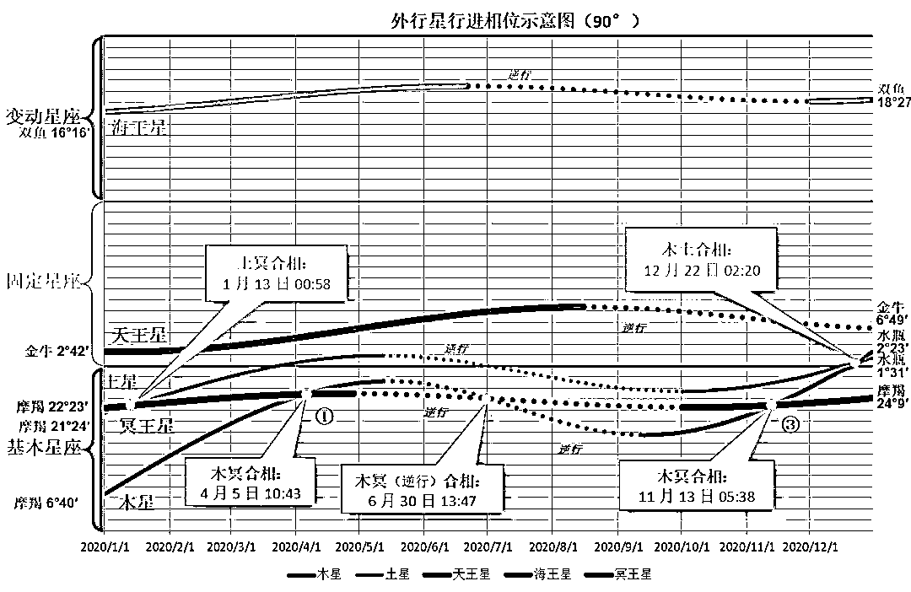

***1.*****重要行星****换座**

木星进入摩羯座和水瓶座
土星在摩羯座和水瓶座

**宇宙天象**

木星 2019 年 12 月 03 日进入摩羯座，2020 年 12 月 19 日进入水瓶座；土星 2017 年 12 月 20 日进入摩羯座，2020 年 12 月 17 日进入水瓶座。

**天象启示**

虽然木星是在 2019 年进入摩羯座，但它会在摩羯座运行 1 年，所以还是有必要先了解**木星进入摩羯都有哪些影响**：

**木星代表的是乐观、幸运、慷慨、扩张**，但是木星在摩羯座是个落陷的位置，就会呈现出**贪婪、不满足的欲望。**除去这些外在的表面的词汇，我们应该理解**在限制和压力的摩羯座这个氛围里面木星带来的渴望成长的内在能量**。财富都是源于积累，成功都是源于努力，智慧都是源于探索。现实到真知的过程就是在这种能量场中形成的。摩羯座的守护星土星也在摩羯座，土星的庙旺暗示了**木星具有的积极和正面的可能**：匮乏的环境造就了我们的不满足，内在的渴望促进了我们进一步的探索，木星在摩羯座这一年是艰难的，忙碌的，但也会是卓有成效的。正是在这种**责任感和约束力与自由和空间的平衡**中带来的新的机会——如果说木星落摩羯座代表**理想的“落地”**，那么土星定位木星就代表**“厚积薄发”**，这是这两股力量合在一起的最佳表现。

***2.*** **重要行星****相位**

如果将行星在一个星座的运行看做这个行星能量的模式，那么行星之间的相位将这种模式更趋于复杂化，尤其是与三王星这种世代行星的相位，更能凸显集体潜意识的影响，这种象征的意义更多的在于意识层面的催化和衍生。

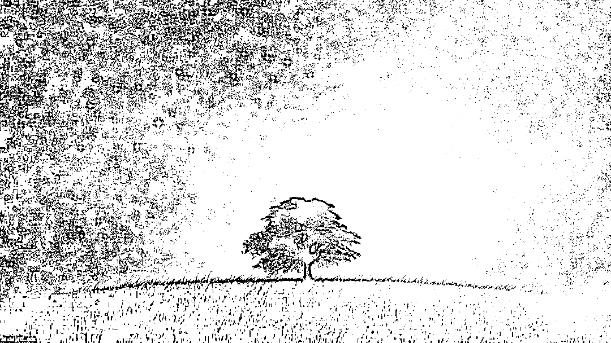

土冥合相

**宇宙天象**

土星在 2019 年底接近冥王星产生影响，真正的合相是在 2020 年发生：**土冥合相时间**：2020 年 01 月 13 日 00:58**天象启示**

土星在摩羯座、冥王在摩羯座，土冥合相，怎么感觉都是那种**“苦逼”、“世态炎凉”、“雪上加霜”**，让人不寒而栗，看淡人生的感觉。大家对于冥王星的认知都是“死亡之神”，但是在神话学中，除了木星，冥王星也被称为**“富饶之星”**，之所以我们不知道，是因为**埋藏在地底下**。

**土星**代表我们能看到的**现实层面的规则和限制**，**冥王星**代表我们只能感受到的**大自然生死转化律法**，土冥的能量就是**生存本能、重构和蜕变**。如果遇到**生存议题**，是需要**经验和阅历**，如果遇到**发展议题**，是需要**割舍老旧模式实现自我转化**。其实无论说再多负面和恐惧的词汇描述**现实政治矛盾、社会不景气、经济萧条、企业紧缩、就业困难……**这些凄凉的背后都是**理想的幻觉会被无情打破**，面对现实社会的阴暗和残酷，我们无能为力。但是我们可以从中**磨练精明的生存本领**，经历最糟糕情况的时候，也是**触底反弹**的开始。**土星代表个人心理阴影，冥王星代表集体意识的阴影**，个人议题和社会问题的调和也会呈现出来。我们所看到的社会阴暗面未尝不是我们自己**内在议题的投射**，如果你能看到压抑下的恐惧，可不要忘了，它的另外一面就是**蜕变的力量。**木冥合相**宇宙天象**木星在 2019 年底进入摩羯座后，在 2020 年会和冥王星发生三次合相：**第一次**：2020 年 04 月 05 日 10:43**第二次**：2020 年 06 月 30 日 13:47

**第三次**：2020 年 11 月 13 日 05:38

**天象启示**

如果土冥是前奏、是序曲，那么**木冥合相是 2020 年的主旋律**，是因为它占据了全年几乎 2/3 的时间，记得之前有占星师把**土冥形容成凌冽的寒冬**，那么**木冥就是春暖花开**，就像唐代黄蘖禅师在《上堂开示颂》写到：**“尘劳迥脱事非常，紧把绳头做一场。不经一番寒彻骨，怎得梅花扑鼻香。”**

土星是冰冻三尺的现实，木星是生机盎然的活力，冥王星是大自然转化的力量，这就是《周易》中的**“否极泰来”**，当然我们不要忘了摩羯座是 2020 年的背景音乐，木星在这个阶段只是象征着**蓄势待发**，我们需要**去等待、去尝试、去反思、去探索**，但**不需要去冒险**。我们只是在我们内在恐惧的深渊中找到尘封的**“目标”和“意义”**。

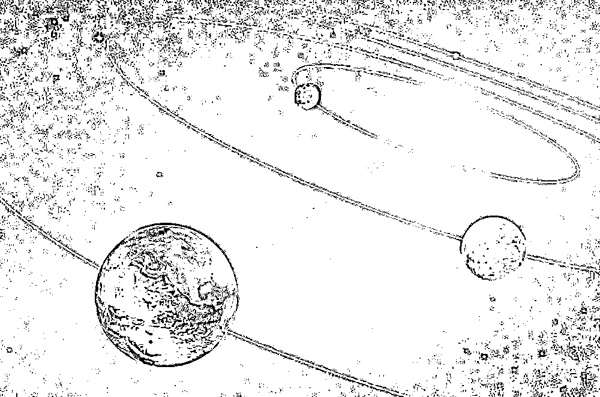

木土合相**宇宙天象**木星和土星在 2020 年摩羯座运行后，年底双双进入水瓶座并产生合相：
**木土合相**：2020 年 12 月 22 日 02:20**天象启示**经常会听到这个说法，木土合相是一个**新周期的开始**，木星是 12 年走完黄道 1 圈，土星是约 30 年，每隔**20**年发生一次合相，木土周期就像树的年轮一样，是跟成长和发展有关的周期。
成长是一个有序的行为，我们通常认为木星代表成长的力量，忽略了土星在这个过程中的作用，应该说成长的过程是：**巩固和发展两股力量的有序组合**，这也正是在 20 年周期中木土从**“渐盈四分相—对分相—渐亏四分相—再次合相”**中提醒我们的有序性。经历了摩羯座的洗礼后，由水瓶座作为开端赋予了这个周期更深的意义——**新旧转化。**伴随着冥王星的力量，更加凸显了蜕变的重要性。**舍弃是为了更新的需求和发展**，正如斯蒂芬老师木土工作坊中说到：**“接下来我们要经历的土星和木星的合相，要发现这是非常强有力、重大的行进。它会暗示这在我们每个人的人生中都是巨大转折，也可能是世界上、历史上重大的转折。”**

我们会发现一个有意思的现象，2019 年末木星进入摩羯座，2020 年末木土合相，土星和摩羯座不是代表同一种能量吗？之前说过行星在一个星座运行只是呈现行星的能量模式，行星的相位阐述的是两种能量的“搅和”，**土星**是那颗让你能够**“去做你不愿意去做的事情”**的行星，**木星**是那颗**“让你能够去做感兴趣的事情”**的行星，两个行星需要平衡，这种周期初始阶段的合相，更利于我们**找到发展方向和目标**，在周期过程中的四分相和对分相才是我们要面临整合的考验。

在踏上这个新的周期的时候，我们需要在 2020 年准备好木星的精神和动力以及土星的资源和实力，我们需要**木星的智慧**，也需要**土星的耐力**。这个周期的开始伴随着摩羯座和冥王星，我们也会有恐惧。**土星可以通过积累解决资源匮乏的恐惧，木星可以通过更高的意识层面解决心理危机的恐惧**，他们在 2020 年的意义问我们：**“新的周期即将开始，你准备好了吗？”**

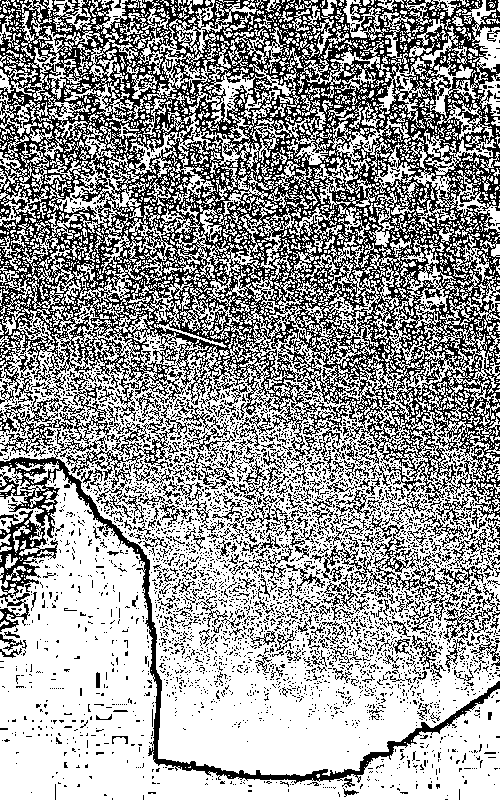

2020 年天象能量连贯分析看年度运势一定要抓住**主轴**，从行进行星轨迹图中可以看到一个现象：**土星和木星围绕着冥王星逐步靠近并趋于合相。**抓住这个脉络，我们就可以清晰地将 2020 年的天象分为**3 个阶段**展开：**第一阶段****：土冥在摩羯座合相**如果说 2019 年重点看土星的话，那么 2020 年我们就要留意**木星**了，2019 年土星一直在逐渐接近冥王星，我们已经感到了土冥合相的力量，直到 2020 年 1 月 13 日才产生合相，延续土冥这种能量为我们敲开了 2020 年的序曲；**第二阶段：****木冥在摩羯座合相**木星也在 2019 年 12 月 3 日进入摩羯座，在 2020 年陆续和冥王星的三次合相开始了 2020 年的主旋律；**第三阶段：****木土在水瓶座合相**2020 年 12 月 22 日的土木合相将我们带入了高潮，并伴随着土星、木星进入水瓶座，为我们开启了一个新的篇章。而在整个运势过程中摩羯座更像是一种背景音乐展开。我们不难发现这三个阶段有很多共同的元素：**摩羯座、冥王星**。我知道很多朋友都不喜欢这两个元素，如果我们只是简单地将摩羯座和冥王星看成是**摧毁、死亡、恐惧、危机、痛苦……**那么我们可能并没有真正理解占星学的意义。冥王星是**深深埋在底层的资源和洞见，**需要我们去**挖掘和探索**，是我们**灵魂深层的呼唤和呐喊**，要我们去**回应**。只有当我们理解了、面对了、探索了，才会在我们的人生中发生蜕变，蜕变是什么？蜕变是成长，成长总是要伴随着**痛苦的折磨和艰辛的考验**的。如果摩羯座和冥王星元素是一种基调和背景环境，那么土星和木星就在发出低音和高音的旋律。如果我们翻开经典占星学入门书籍，都会查阅到**土冥的生存危机、木冥的深层宝藏，**正如斯蒂芬老师在 2019 年成都工作坊说过，土星经常对我们说“No”，加上冥王星，意思就是**“绝对不行”**，木星经常会说“Yes”，加上冥王星就是**“一切皆有可能”。**如果我们把这三个阶段比喻成弹簧效应：**蓄势——待发——反弹**。第一阶段开始是**被压迫、紧缩的无奈（土冥）**，第二阶段稍微适应了，感觉好些，逐渐感觉到**放松和机会了（木冥）**，第三阶段发现了**更高的洞见和力量**，有种**焕然一新**的感觉（木土），这就是 2020 年行星能量连贯作用的积极面向。

***3.*****行星****逆行**

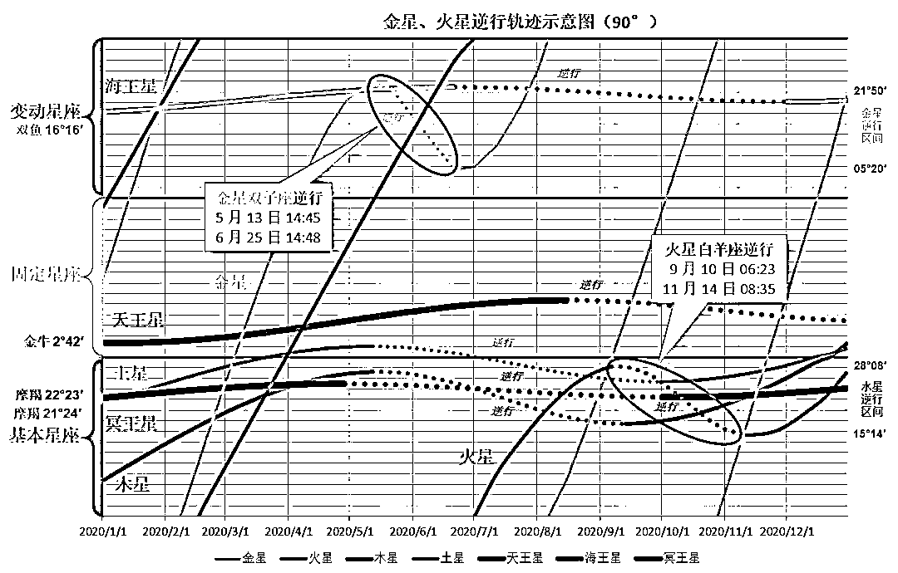

金星逆行

**宇宙天象**

2020 年金星逆行主要发生在**双子座**，受影响的为**风象星座（双子座、天秤座、水瓶座）05°-22°区间**

*   **2020 年 05 月 13 日-6 月 25 日** **双子座逆行在**21°50-**05°20′**

火星逆行

**宇宙天象**

2020 年火星逆行主要发生在**白羊座**，受影响的为**火象星座（白羊座、狮子座、射手座）15°-29°区间**

*   ****2020 年 09 月 10 日-11 月 14 日** ******白羊座逆行在****28°08-****15°14****′****

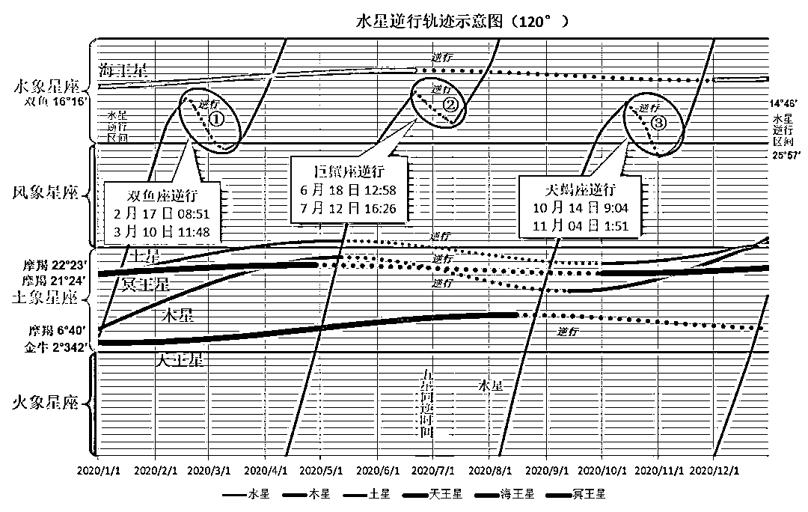

水星逆行

**宇宙天象**

2020 年水逆主要发生在**水象星座（巨蟹座、天蝎座、双鱼座）**

*   **第一次**：2 月 17 日-3 月 10 日 双鱼座 12°53′-水瓶座 28°12′

*   **第二次**：6 月 18 日-7 月 12 日 巨蟹座 14°45′-巨蟹座 05°29′

*   **第三次：**10 月 14 日-11 月 04 日 天蝎座 11°40′-天秤座 25°57′

**天象启示**

今年**水逆**主要受影响的区间在：**有重要个人行星、四轴、南北交点落在 25°-30**°和 0**°-13**°的人群。********虽然没有和其他行星发生什么重大相位，但是我们注意到：

*   第一次双鱼座水逆在土冥合相后，会有**迷茫和无力**的感觉；

*   第二次巨蟹座水逆在木冥逆行合相期间，这个期间还有土星和海王星的逆行，加入了**安全感和灵性、疗愈**的成份；

*   第三次天蝎座水逆在第三次木冥合相前，需要我们开启**对于现状不满和发展恐惧的深入洞见**。

理解了上面全年运势中第一阶段和第二阶段运势的发展，就明白了三次逆行是围绕**摩羯座的匮乏和压抑以及冥王星的恐惧和转化**展开的，在意识层面上，利用好每年 3 次的水星逆行，会有意想不到的收获。

五星同逆**宇宙天象：****水星、木星、土星、海王星、冥王星**同时逆行 2020 年 06 月 18 日-7 月 12 日   

**2020 年职场发展锦囊**

由于摩羯座和冥王星元素的影响，2020 年**外环境不是很好**，如何面对土冥、抓住木冥、发展木土能量，给 12 星座一些寄语：**★ 请参考上升星座**

**白羊座    **

直觉和专业能力实现事业发展

**金牛座   **

从朋友资源中获得专业的建议

**双子座 **  

自己和他人以及集体之间平衡

**巨蟹座**       

工作和学习中结交朋友和导师

**狮子座**       

创造力和资源整合带来的效率

**处女座   **   

情亲和友情才是创造力的源泉

**天秤座 **        

安全需求与工作机遇结合考虑

**天蝎座  **    

关注投资和理财的学习和机会

**射手座 **    

加大对自我和家庭的价值投资

**摩羯座   **   

自我实现依赖于心灵学习成长

**水瓶座**             

提高自我价值认同破除消极感

**双鱼座    **       

个人事业发展要注意理念提升

**参考文献**

《THE AMERICAN EPHEMERS 1950-2050》

**版权声明：**原创文章由作者授权首发于若道平台，欢迎转发，反对抄袭。友号转载请申请白名单。


海星程 Hastro

ISAR 认证占星师（2014 年获得）/若道高阶课程助教

2015 年以第一名的成绩获得若道首届生时校正认证

若道认证授课老师/2019 年若道生时矫正主讲老师

**微信**：Hastro321   

**QQ**：2085274311

长按打赏

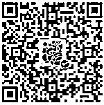

******点击图片查看若道君推荐******


**微信又双叒叕改版啦，不想错过若道君的推送？**

**就把若道设为星标吧！**

**▼**


就是这个“在看”，戳戳戳 ☟

********报名直达入口********


# 2020 年第一波好运来啦 | 年运报告大礼包等你签收！

> 原文：[`mp.weixin.qq.com/s?__biz=MzA5NjA0NTAxNg==&mid=2651412428&idx=2&sn=c7ac1a6bdc53a8bbf62ff4511308629a&chksm=8b4be57bbc3c6c6d69a1beb7f84b72f1e2607071c069efa13310c7983475522ea3a31de4458e&scene=126&sessionid=1692738237#rd`](http://mp.weixin.qq.com/s?__biz=MzA5NjA0NTAxNg==&mid=2651412428&idx=2&sn=c7ac1a6bdc53a8bbf62ff4511308629a&chksm=8b4be57bbc3c6c6d69a1beb7f84b72f1e2607071c069efa13310c7983475522ea3a31de4458e&scene=126&sessionid=1692738237#rd)

**又到****年底****了****按照惯例****若道君将为****默默关注****着若道的粉丝们****送上暖心的圣诞和新年****大礼****由****大卫·瑞雷****亲自主笔的**《**2020 年度运势报告》****圣诞、元旦优惠****大礼包**


**看点抢鲜了解**


*   **私人定制**，根据每人不同的出生年、月、日匹生成独一无二的个人年度报告；
*   浓缩了大卫·瑞雷**47 年的占星咨询实践之精华**，以人为本，字字诚恳；
*   2020 木星进入摩羯座，土冥合相、木星合相的到来，将会有什么样的**机遇和挑战？**
*   **价格惊喜**，远远低于一次占星咨询的费用；
*   **形式私密**，避免了与占星师面对面的焦虑。


**适合人群**

*   相信命运存在的人，崇尚自由意志的人；

*   对 2020 年满怀希望的人，对 2020 年不抱希望的人；

*   非常懂占星的人，还不懂占星的人；

*   需要关爱自己的人，懂得分享友谊的人。

**使用步骤**


**✦第一步**从你日常生活衣、食、住、行任何一项中拿出 198 元，购买若道年度报告；**✦第二步**在“**个人中心**”找到你的 2020 年度报告，翻阅它，从中找到力量；
**✦第三步**后悔没有早点遇到它，想马上给自己的亲人和好友，一人来上一份；**✦第四步**不用阅后即焚。幸福地阅读过后，关闭它，然后放在记忆深处；**✦第五步**在 2020 年感到迷茫的时候，重新打开它，它是探路的明灯；在 2020 年压力山大的时候，重新打开它，它是暖心的火把。**现在购买，****即可获得****30 元年运红包**


原价**198 元**的若道年度报告现在购买幸运价仅需**168 元**如果这份诚意都还没让你下手，你还可以邀请你的朋友一起**拼团，****买得多，省得多，成长多！**年度报告**“友福同享”新年团购价****3 份**年运报告 399 元，每份只要**133 元****5 份**年运报告 599 元，每份只要**120 元****9 份**年运报告 888 元，每份只要**99 元****15 份**年运报告 1200 元，每份只要**80 元****圣诞、元旦过节不送礼****送礼只送一份年度报告的启示和安心**


**友情提醒**

**❶** 现在购买若道年运报告 1 份，立刻获得**30 元红包，**使用期限到**2020 年 1 月 31 日；** **❷** 买几份送亲友，买得多送得多。**一次购买多份报告，可享受****年运红包套餐价****，心意送出越多越实惠哦**！（套餐价内报告可以自己使用，也可以赠送亲友，套餐价已包含红包，已直接抵扣）优惠期限到**2020 年 02 月 28 日；** **❸ ****年运红包任何使用问题，咨询微信 nodoor201705；** **❹ **转发此文并在评论区留言，**点赞数最高的前三名将每人免费获赠年度报告一份**（点赞统计截至**2019.12.31**）。

**购买&查阅指南**

（建议收藏此图，以便日后查看报告内容）


长按二维码添加客服小姐姐微信咨询更多哦


********年运报告购买入口********


# 1 月梅里曼金融系列报告更新 | “土冥合相”时，你最需要的理财指南

> 原文：[`mp.weixin.qq.com/s?__biz=MzA5NjA0NTAxNg==&mid=2651412427&idx=1&sn=68876e0e2d9a77c899166a46474ae1b7&chksm=8b4be57cbc3c6c6a44ccf599c94d4c7d2909249781dda6d4d18028fef02f29cfe2f2a3865e09&scene=126&sessionid=1692738237#rd`](http://mp.weixin.qq.com/s?__biz=MzA5NjA0NTAxNg==&mid=2651412427&idx=1&sn=68876e0e2d9a77c899166a46474ae1b7&chksm=8b4be57cbc3c6c6a44ccf599c94d4c7d2909249781dda6d4d18028fef02f29cfe2f2a3865e09&scene=126&sessionid=1692738237#rd)


前几天，一位朋友在聊天时说，一觉醒来，没成想，上证指数涨到了 3000 点以上。是啊，今年从 4 月份上证指数到达 3288 高点，就开始一路下跌，在 9 月初的一个小反弹到 3042 后，又经历了 3 个月的下跌，所以再次摸到 3000 点以上，怎么不让人惊喜呢？但是，如果你是中国上证指数报告的订阅者，你可能就没有这么惊讶。因为就在在 11 月的绵绵跌势中，梅里曼老师在**11 月 19 日**发布的《上证指数报告》中提到：**“我个人的观点更倾向于做多，因为我认为市场能够突破 3025-3050 的阻力。****”**在上个月他对投资策略的建议是：**“现在可以找机会做多上证指数，如果上证指数正在跌向基本周期低点，而且我们即将进入 11 月 24 日或 12 月 11-12 日的关键反转区间。止损点可以先设置在 2733，一旦确认了低点，可以抬高止损点。如果做多后，价格上涨到 3020-3050，而且接下来 2-5 周波动疲软，可以考虑平掉 1/3 的头寸。”**

在报告发布后，在 12 月 2 日，上证发生了反转，指数达到 3039。

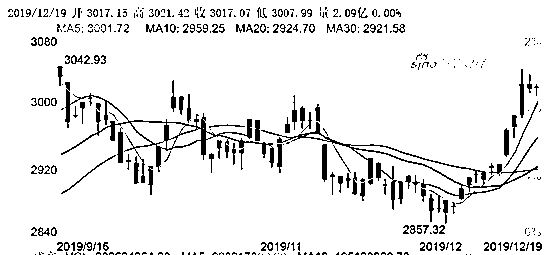

**丨**图：12 月份上证指数

在这种情况下，上证指数的走势又将如何？

梅里曼老师的《上证指数 2020 年 1 月研究报告》已经发布，如果您已经购买，请**参照下图指引，查看报告内容。** 


如果您还没有购买，您可以**点击文末阅读原文**，购买报告。

**优惠价别错过！**


上证周期月度报告价格

**单月报告**：280 元

**3 个月套餐价**：780 元（相当于 260 元/月）

**12 个月套餐价**：1999 元（相当于 166 元/月） 

**年度预测报告**

此外，由梅里曼老师及梅里曼市场时机学院的专业分析师所撰写有 43 年历史的**《年度预报》和讲座**也开始**预售**，报告中将会谈及**2020 年重要的宇宙天象及其对世界经济、贸易形势的整体影响**，还将覆盖**中国上证股票市场的分析、黄金白银市场、美国经济、美国总统、美联储、美国国债市场、美国股票市场、主要外汇货币市场（主要外汇美元、英镑、欧元、日元、瑞士法郎）、原油市场、谷物市场、比特币市场**等投资市场。

**长按下图识别二维码购买 2020 年金融预报**

▼


**黄金报告更新！**

此外，2020 年 1 月黄金周期报告也已上线。黄金周期月度报告价格

**单月报告**：280 元

**3 个月套餐价**：860 元

**12 个月套餐价**：2400 元**双报告年度套餐更优惠（直降 1199 元）****12 个月黄金报告+12 个月上证指数报告：仅需 3200 元****本价格只到 2019 年年底有效。**

**长按下图识别二维码购买上证+黄金报告**

▼


**购买者重要须知**

① 梅里曼市场时机学院《中国上证指数月度研究报告》是梅里曼市场时机学院（以下简称 MMA）的研究“预报”，而不是市场“预测”，是梅里曼老师及 MMA 金融占星分析师对人类活动周期历史与行星周期之间相关性的研究，二者在大部分情况下具有 80%或更高的相关性，而不是因果关系。报告中的研究完全存在错误的可能性。即便是非常认真的研究和几十年的研究经验，金融占星师无法总是正确地解读出各种征象在实际层面上会如何相互作用，并显化为事件结果。

所以请将报告看作一个研究参考，务必结合其他市场研究和你个人对市场的理解，根据你的自由意志做决策。

② 上证报告只是上证指数研究，没有个股研究。

③ 此报告一旦售出，**即不接受退款。**

④ 此报告每月 1 期，**并非都是在每月相同日期发布**。⑤** 此报告仅支持手机网页阅读，不支持电脑阅读和下载。**

**以上须知，请仔细阅读。一旦付款，即视为已了解并接受所有须知内容。**

购买后有疑问怎么办？请联系客服
**微信：nodoor201705**

********购买上证指数+黄金月报直达入口********


# 一部电影为你解密，2020 年木土冥 3 星合相的宇宙功课

> 原文：[`mp.weixin.qq.com/s?__biz=MzA5NjA0NTAxNg==&mid=2651412391&idx=1&sn=f964a8a60891d42039c8235f957d30d9&chksm=8b4be510bc3c6c067ed49e6c1130e2d1df4567cd4a888764d8caab010c029282d40c369312de&scene=126&sessionid=1692738237#rd`](http://mp.weixin.qq.com/s?__biz=MzA5NjA0NTAxNg==&mid=2651412391&idx=1&sn=f964a8a60891d42039c8235f957d30d9&chksm=8b4be510bc3c6c067ed49e6c1130e2d1df4567cd4a888764d8caab010c029282d40c369312de&scene=126&sessionid=1692738237#rd)

******************☆ **************后台回复“今日”，给你一句生命态度****

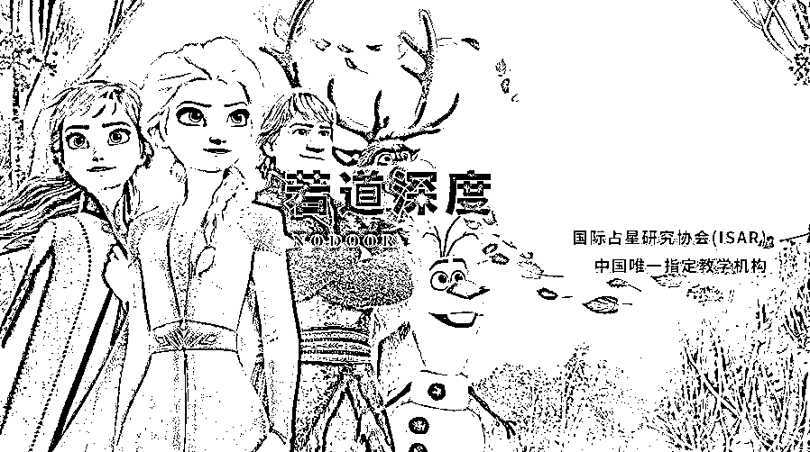作者/Serina Sun ISAR 认证占星师编辑/Tang 图片/冰雪奇缘

时隔六年，曾让无数小女孩幻想自己是冰雪女王、让无数大人感动不已的迪士尼动画电影《冰雪奇缘》有了续集。续集上映的时间，同步对应了当下行星运转的重要天象——木星、土星、冥王星三星合相在摩羯座的大周期，电影剧情如同宇宙星辰运行规律的缩影。现在，就让我们通过《冰雪奇缘 2》，来更好地了解 2020 年将要面对的宇宙功课吧。

**为了清晰阐释，将不可避免剧透，提醒慎入。**

走向未知

Elsa 双手将长发绑起，赤着双脚奔向惊涛骇浪， 伴随着这场英雄之旅的是《Into the Unknown》的励志旋律——2019 年年末，《冰雪奇缘 2》再现了冰雪魔法的不可思议。

续集中的 Elsa 经常听到耳边萦绕一句吟唱，这个只有她自己听得到的讯息，与她拥有魔法的原因、父母小时候讲给她们的魔法森林故事之间有着某种联结，这让她既恐惧又好奇。几经挣扎，Elsa 终究还是无法抑制那股想要探究真相的渴望，当这股巨大的能量在身体里被唤醒，她的外部世界——与她连根同气的小镇也同步发生变化，危机再次袭来。

这部电影上映的时间——2019 年年末，同步对应了**当下行星运转的重要天象——木星、土星、冥王星三星合相在摩羯座的大周期**，而宇宙的共时性规律往往会让影视作品折射出社会、集体意识的变化。

整部影片围绕着 Elsa 寻根的冒险之旅展开，通过这样的镜像效应，我们也可以窥见自我的内心世界，跟 Elsa 一样，我们也无时无刻不在渴望解答那三个最终极问题：我是谁，我从哪里来，我将往哪里去。**随着 2020 年木土冥合相的步子越来越临近，想要往心灵更深处走的召唤越来越无法被自己忽略。**电影的剧情，如同宇宙星辰运行规律的缩影，木星、土星、冥王星所特指的人生面向、主题，在 Elsa 走入未知的英雄之旅中尽显无遗。

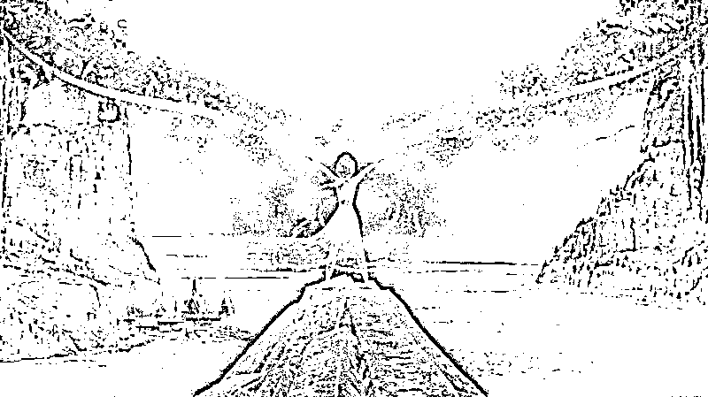

2020 年冥王星的功课

**我是谁，寻找源头，合一**

**冥王星是太阳系中离我们最遥远的一颗星体，在占星学中也被认为是象征着灵魂、潜意识，是生命中那些不能被轻易探知的部分。**冥王星的功课并不是那么容易被我们的意识所理解，正如我们很难与遥远的冥王星产生最直接的观测、联结，除非借着某些不可抗事件的发生（往往也伴随着某种痛苦），促使我们有意识地去探究到底问题的根源在哪里。Elsa 生来就带有魔法，尽管她在电影第一部里去除了恐惧，让自我能够和谐地接纳这股力量，并且将它收放自如，但是在续集里她的内心还有更深一层的问题渴望被解答——她耳边经常响起的那个声音，为何，她为何会拥有这样的魔法，她究竟是谁，她从哪里来。而我们的内心，不也经常闪现类似的声音吗？**冥王星落在摩羯座的时期，我们会渴望达到世俗成功，站上无人之巅**，而当我们真的拥有了这份巨大无比的力量以后，内在又生出更大的不满足，一切貌似都挺好，该有的都有了，但是为何内心某个角落总有一个召唤，告诉自己，**生命中还有更大的意义等待被发现**——拥有着某些天赋、力量的我，究竟为何会携带这样的能力，我与这个浩瀚的天地之间，是否还有某些更特殊的联结？这也正是冥王星带来的功课，**尽管每一个生命都是一颗灵魂，各自独立，却又在某个最本源的地方，彼此相连**。灵魂既有分离，成为个体的欲望，同时也有回归母体，与源头合一的进化驱力。面对这种召唤，我们最初都会有着本能的恐惧，甚至想逃避、忽视，正如 Elsa 一开始是排斥面对耳边的声音的，她想要拼命维持当下生活的岁月静好——与妹妹、妹妹男友、雪宝团圆和睦，小镇人民安居乐业。**而那个召唤她的声音，正是冥王星所象征的寻找本源的驱力，它并非来自于外部，它来自于 Elsa 自己的潜意识**，此处是潜意识不断地被意识之光照见，她看到了自己的魔法背后还有一个更大的真相，因此**追寻本源并与其合一的渴望**，推动着她冲破一道道因恐惧设下的枷锁，当她推开大门，向着旷野大声的喊出“走向未知（Into the unknow）”，这是她向潜意识的大声宣告，我要去寻找本源，尽管我尚未知道那是什么。

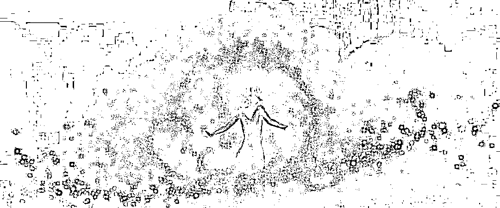

**2020 年的我们，也会有着同样的勇气，想打破现有生活中的某些稳定的结构**，甚至不惜“牺牲”掉某些和平、安全，或许是辞去一份不能令自己内在深刻满足的工作，或许是放手一段不能深入联结的亲密关系——即使觉得还没有做好心理准备去摧毁旧世界，有很多现实条件还没具备，想要拖延做出抉择——对不起，**冥王星所擅长的激烈风格，从不会让事情发生的太平易近人**，若还想紧抓不放，很可能要以痛苦的分离、丧失的方式来启动一场蜕变。想要追溯本源的过程并不轻松，**当潜意识被搅动，外在世界的秩序，将不再能够维持以往**。正如当 Elsa 下定决心要去探险时，小镇的生活也随着遭遇风波。如在其内，如在其外，当我们想潜入秘密，寻找更大的宝藏，上天定会扔来很多的试炼，看看我们能否经得住考验。所以如果你为自己的新一年设定了一个很宏伟很有野心的目标，而紧接着就遇到了麻烦，请不要被眼前的障碍遮蔽了意识之光。当一个逃兵扭头就跑，貌似是更容易的路，再回到那个很好“掌控”的工作里，或是再回到那个让自己“舒服”的关系里，就可以当一切还是像以前一样安全，那 2020 年里，这样的你会觉得辛苦无比，**因为冥王星的行运会让你没有退路，当你身后的旧世界在一路坍塌，你只能不断的向未知奔跑。**正如切断了退路，奔向黑海的 Elsa，她一次次的冲向巨浪，也一次次的被巨大的外力击打，她坠入深海，同时也绝处逢生，她遇到了象征水元素的水晶马，与之 PK 并最终将其驯服，坐上水晶马，奔跑于大海并通往了那座叫阿托哈兰的孤岛，在那里，她终于找到了魔法的本源，她是谁，她从哪里来，为何要拥有魔法。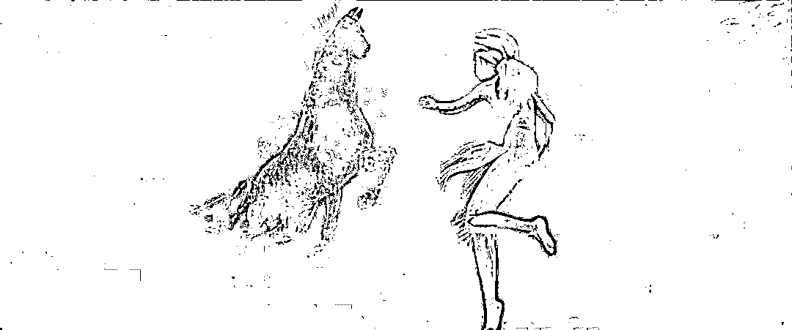Elsa 在阿托哈兰孤岛上，与自己的过去相遇。片中介绍了一个很有深意的知识点：**水是有记忆的**。这个与占星学中水象元素的功能是相应的——巨蟹座、天蝎座、双鱼座三个**水象星座都被认为是代表记忆、情绪与业力的**。Elsa 在这座由水凝结成冰雕的记忆宫殿（自己的潜意识）中，与逝去的母亲相遇，重温了幼年与父母在一起的温暖记忆。她不仅理解了自己的身份，**做为联结四大元素（风火水土）的第五种元素**，拥有与生俱来的法力，她也明白了自己的使命是维护人与自然之间的和谐。**与本源合一的过程，她拥有了更大的力量。**我们看到了冥王星所象征的潜意识是以何种方式影响我们个人能量的，当真正面对面看到潜意识时，**我们的情绪将在那些深层记忆里得到疗愈，同时会拿回本属于自己的力量**。因此未知并不可怕，只是我们自己想象中的阴影，限制住了自己的能力。

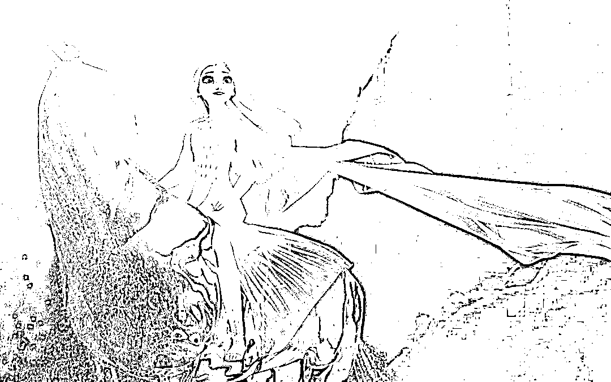

2020 年土星的功课

**看见原罪，揭开封印，重获自由**

Elsa 后来在自己潜意识的宫殿里，越走越深，也看到了更令人吃惊的真相——祖父当年屠杀了北方乌卓人土著居民，**家族残酷的秘密**让她痛不欲生，被逐渐冰封。在这个片段中，我们看到了由土星所象征的业力。土星掌管着世俗事务的秩序，生活在这个地球上的我们，都需要服从土星定下的重要法则：**因果法则**（或业力法则）。所谓因果法则，相信其实每个人都有一定的领悟，就算是再怎么强调自己不相信因果的人，也不能否认他其实每时每刻都处在因果中，因果法则也不仅仅只作用于研究身体、心理、灵魂的人，生活在世俗中的人，都知道要做好人，做善事，这其实已经在履行因果法则；再比如，家长也都会想要孩子考上名牌大学，找个好工作，因此就需要从娃娃抓起，努力学习，这其实也是在默认履行因果法则，因为努力学习与考上好大学，再到找到好工作，三者之间是有因果关系的。如果不相信有因果，就会抱着中彩票的心态，随便碰上个什么学校、工作即可，还用得上努力吗？Elsa 的**家族业力（原罪）**在于屠杀土著，祖父做下的业，做为家族血脉的继承者，某种程度上延续到了 Elsa 的身上，即使这并不是她直接犯下的错，并且让一个后代去承担先祖的过错，听上去是非常不公平的，但是千百年来，人类就是以这样的方式进化的，将性格、喜好、甚至业力等统统以血液、DNA 链条的形式流向下一代。我们每个人也跟 Elsa 一样，我们的身上流着祖先的血液，继承着家族里那些既荣光又不荣光的记忆，**如果说 Elsa 的诅咒就来自家族的原罪，那么我们是否可以深入思考，自己是否也有某些“诅咒”、来自家族的传统、习惯性认知、三观在限制着我们的人生？**倘若你胸怀大志，而你的父母却不认为你有实现的才华、能力，此时你该突破他们对你的轻视，奋力突破，还是无意识地认可了他们对你的评价呢？**影片中 Elsa 在自己的潜意识世界里，一层层的下坠，向更深的潜意识深渊挖掘自我**，而到了一定的程度，她的身体开始变得僵硬，直到被完全冰封。**这个隐喻，恰好就是在对应因果、业力法则的公正**。Elsa 在自己的潜意识中自我惩罚，人性走到最深处，我们依然看到的是那个**最根本的善良、无污染的自性**，也正是这种最纯的自性，驱动着我们对自我的奖惩，因此从来就不存在某个神灵、仙佛扮演着权威的角色，对我们进行奖惩，**我们的现实中一切”宿命“，都只是潜意识在自动的找能量平衡**。所以我们也该自省，一直以来让自己感受到压抑和罪恶感的事物，究竟是源自什么样的业力？**2020 年将是土星运行在摩羯座的最后一年，我们是否可以好好把握这最后的机会，转换自己的思维，更勇敢的面对所谓的“宿命”、“业力”？**我们改变不了自己的出身，改变不了父母，更无法让时光倒流，回到祖先的时代，去告诉他们什么不要做（因为这会给未来的下一代造下什么坏的因果）。我们能改变的是什么呢？——恐怕只有面对各种命运安排的心态，并且**从“因”上践行，用更加善良的念头来指导当下、未来的每一天。**

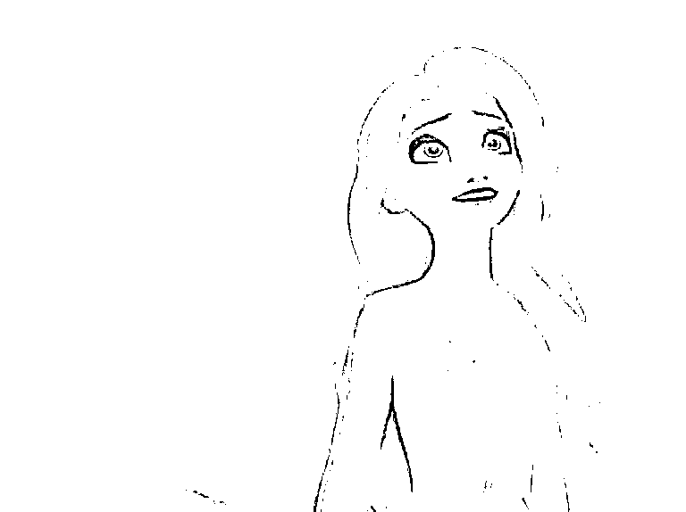

**再者，我们需要被好好的疗愈。而其实疗愈的机会无处不在。**Elsa 解开封印，重获新生的原因，在于 Anna 帮助拆除了水坝，尽力的去弥补祖父当年犯下的过失。这样的一种剧情安排，**也隐喻着想要让自己重生、突破业力的方法，就是发起忏悔心**，做出积极的补偿、改变——仅仅陷入到过去业力造成的失败、痛苦，是不能改变任何结果的，Elsa 的痛苦把自己冰冻了起来，而正是 Anna 用实际行动去“赎罪”，最终令诅咒消失。因此，如果我们意识到**某些限制性的思考模式、行为模式**，阻止了自己向更自由的生活迈进，我们是否能做些改变？假如你的家族中有着某些业力、秘密，令后来的家庭成员生活的很压抑、沮丧，你是否可以首先**接纳**这个不完美的自我、家庭甚至祖先？然后**积极主动的寻求疗愈**，让所有被压抑到潜意识深处的悔恨、愤怒、自责等情绪逐渐得到稀释？**最好的一种疗愈来自于爱。**如同 Anna 对 Elsa 的姐妹深情，无条件的爱，唤醒了被冰冻的 Elsa，我们也需要对自己足够爱，去融化心里的坚冰。因此土星所象征的因果业力法则，既有它一丝不苟绝不通融的一面，奖惩必定严明，凡任何作用力的发出，都会得到另一种反作用力的回馈，**同时这个法则也包含被治愈的可能性，需要我们有足够的爱心、诚心、善心去体会到这一层。**

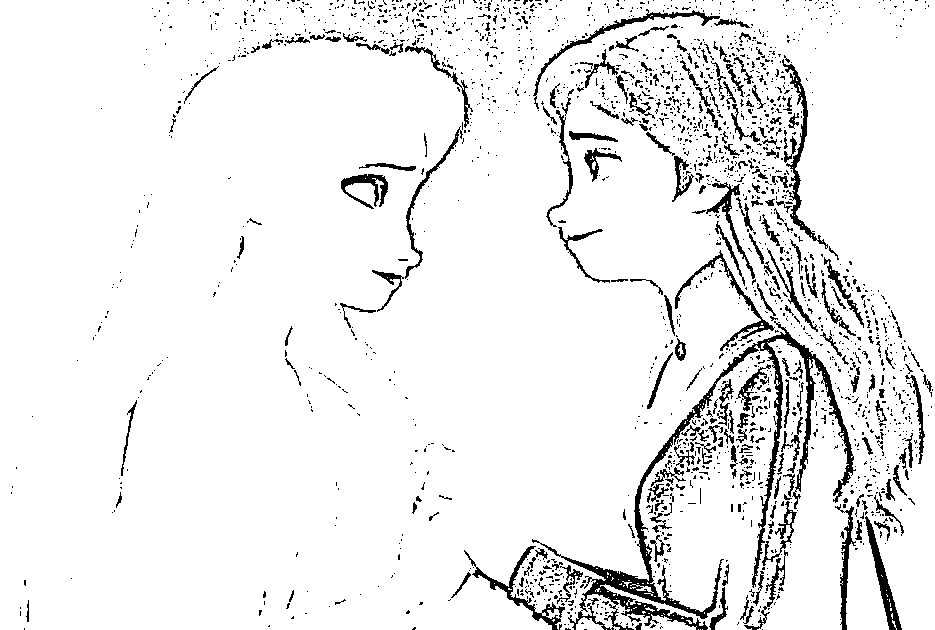

2020 年木星的功课

**信仰之跃 Leap of Faith，活出生命的意义**

**影片中有两处跳跃，成为推动剧情变化的转折点。****第一次的跳跃**，当 Elsa 准备向黑海发出挑战时，她咬紧牙关，鼓足了全身的力量，一次次的向海浪中冲过去，从未有过丝毫的犹豫和退缩。她知道自己没有退路，所以她必须让自己充满勇气，一次次的跳跃出去。正是那最后一跳，助她突破困难的洗礼，在水中遇到了后来帮她渡海的水晶马。**第二次的跳跃**，当 Anna 要以自己仅存的那丝希望去拯救姐姐时，她奔跑在悬崖上，当她已经无路可走时，前面等待她的只有另一个悬崖，她也是在无路可退的情形之下，勇敢的迈开了大步，向跳了过去，这才有了后来的逆转。

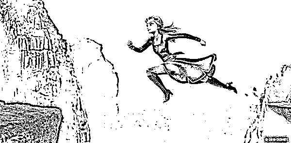

类似的绝境逢生剧情，也出现在另一部电影《刺客信条》里，当刺客身负保护人类自由意志苹果的使命，勇敢的跳下悬崖，这一跳被称为“**信仰之跃（Leap of Faith）**”。也是这一跳之后，仿佛天空中伸出了一只拯救之手，将英雄带回到生的希望。**支撑他们实现这突破性的一跃的，正是木星所象征的信念**。2020 年，木星将运行于摩羯座，并且木星将在土星、冥王星两颗星体之间来回的穿梭。土星与冥王星的功课是极其挑战的，它们的合相，让我们一方面要潜入自己的潜意识里，直面那些最深刻的话题，寻找自己是谁；一方面要为曾经的业力进行偿还，马不停蹄的做补赎。如此密集的任务，**需要我们具备强大的精神力量**，才不至于在中途撑不下去而放弃。**木星正是支撑我们走下去的信念。**Elsa 的信念是自己的国家、妹妹、父母的遗愿，以及寻找自己使命的动力；Anna 的信念是拯救姐姐，在危机中让自己一夜长大，靠自己的力量克服眼前的险阻。**我们有没有想过自己的信念是什么呢？**如果不知道该如何回答这个问题，也许你还不曾经历卧薪尝胆的日子；也或许，你只知道屈服于命运对你的掌控，而忘了自己还有做梦的权力。

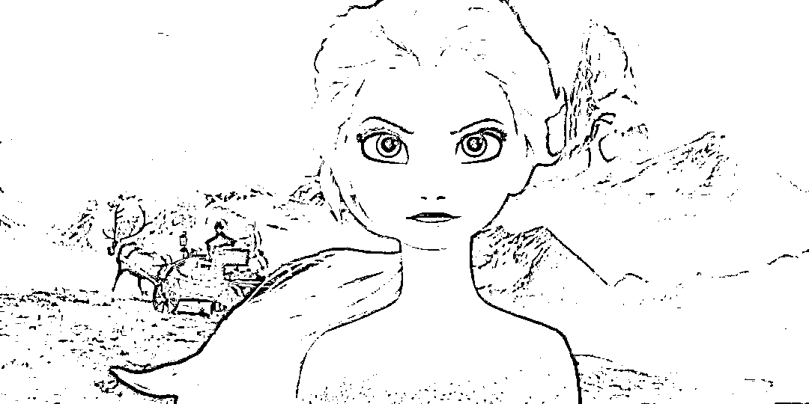

**木星运行在摩羯座的 2020 年，我们有机会在压力之下寻找信念**，且心中最真实的那个答案，必定是经历了一次次危机、挑战之后，仍然屹立不倒的选择。我们对摩羯座所代表的成功、权力、地位会有更多的思考，我究竟为了实现什么而想要成功？我追逐权力地位的根本动机是为了谁？金钱和地位，最终又该服务于怎样的一种需求？**一个人的信念与拥有多大的权力、世俗成就是没有必然关系的。它是对我们内心根本最在意的自我实现有关的**，也可以说，它是我们的初心，那个最单纯的念头。世道艰难，我们很多时候为了获得基本的生存需求，或是满足更大的欲望，而忘记了这个初心，比如说为了现实利益牺牲掉了自己的爱情，放弃了最爱的人，比如说在自己的职责范围里权力错用，满足个人的利益而伤害了无辜的人，等等。**2020 年的天象下，似乎对灵魂深处的自我拷问，会变得越来越频繁，我究竟有没有信念？我的信念是为了个人利益还是为了大众福祉？****信念必定是与利他之心有关的**。也就是说，心中的格局越大的人，信念越容易坚定，而不受眼前环境的牵制。找得到强烈信念的人，在面对任何变化的形势时，都能泰然处之。记得电影《妖猫传》中倭国法师来大唐想要找寻让人超越生死、获得解脱的无上密，在遇到海难时，有多年修行禅定功夫的和尚竟然不如身边一个怀抱婴儿的妇人那般平静。我想，那个妇人之所以很平静，正因为她当时的心中，唯一的**信念**是看到自己的孩儿正在香甜的睡梦中，此刻的她内心是**没有自我**的，一切都是**利他的发心**，因此她的**信念使得她获得了无上密**，能解脱到达彼岸。**因而在 2020 年木、土、冥都运行于摩羯座的日子，我们适合无为清净的面对功利、世俗成就，往内在潜意识深处去找寻解脱之道**，或许在这场 Into the unknown 的探险之旅，我们得以跟内在最真实最无限的自我相遇，像 Elsa 那样，明白了自己是谁，到底为何要经历生命中的某些阶段的迷茫、痛苦，拥有这样的力量，为的是哪些更加宏大的目标。剧终时，成为艾伦戴尔女王的 Anna，向远在森林里履行自己使命的 Elsa 送信表达思念及祝福，两个曾经的小女孩，历经了各自的成长磨炼，都更加懂得了如何活出更高的人生意义。看电影的我们，走出影院的时候，也有着各自的理解、收获。2020 年，我们心中不灭的坚强信念，将带我们跃向人生更深一层，into the unknown。

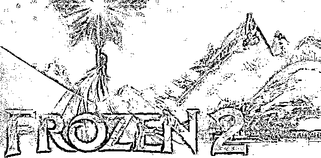


Where the north wind meets the sea

There's a river full of memory

Sleep, my darling, safe and sound

For in this river all is found

All is found

When all is lost, all is found

In her waters, deep and true

Lay the answers and a path for you

Dive down deep into her sound

But not too far or you'll be drowned

Yes, she will sing to those who'll hear

And in her song, all magic flows

But can you brave what you most fear?

Can you face what the river knows?

Until the rivers' finally crossed

You'll never feel the solid ground

You have to get a little lost

On your way to being found

Where the north wind meets the sea

There's a mother full of memory

Come, my darling, homeward bound

Where all is lost, then all is found

——All is found

《Frozen2》

祝福大家。

**版权声明：**本文由作者授权发布于若道，欢迎转发，反对抄袭。


**Serina Sun**

ISAR 认证占星师（2016 年获得）

曾任跨国企业品牌公关职业经理人

现居纽约，专注占星个案咨询与教学

**微信公众号**：宸时星语

**个人微信号**：yanniesun2010

长按打赏

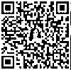

******点击图片查看若道君推荐******


**微信又双叒叕改版啦，不想错过若道君的推送？**

**就把若道设为星标吧！**

**▼**


就是这个“在看”，戳戳戳 ☟

********报名直达入口********


# 太阳射手座+3 种水星 | 他们也不都是夸夸其谈的

> 原文：[`mp.weixin.qq.com/s?__biz=MzA5NjA0NTAxNg==&mid=2651412391&idx=2&sn=9bab034620ec34f1954bf88a0e6821b8&chksm=8b4be510bc3c6c068cb6b5f4352a407baf13910fff66a45042c84c70caebc6bc0427680aa914&scene=126&sessionid=1692738237#rd`](http://mp.weixin.qq.com/s?__biz=MzA5NjA0NTAxNg==&mid=2651412391&idx=2&sn=9bab034620ec34f1954bf88a0e6821b8&chksm=8b4be510bc3c6c068cb6b5f4352a407baf13910fff66a45042c84c70caebc6bc0427680aa914&scene=126&sessionid=1692738237#rd)

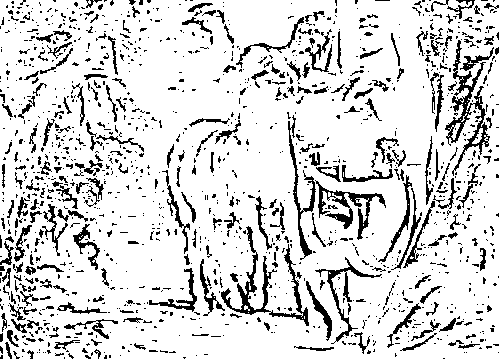

作者/安德烈 ISAR 认证占星师  

编辑/玫瑰 图片/网络 

由于太阳与水星形成角度的限制，日水的组合只会出现 36 种。这 36 种组合，可以被视为最基本的“表达模式”的模板。当然，在实际解读星图的时候，肯定也要考虑落宫和相位等影响。今天就让我们来看看太阳射手座的 3 种水星组合吧！

**太阳射手座**

作为最后一个，也是唯一一个在集体阶段的火象星座，射手座同样关注那些**超验的、宏观的、发光发亮的东西**。但射手座的太阳把满足放到了自身之外，他们并不怎么需要像太阳白羊座或太阳狮子座那样彰显自己的重要，而是**极力表现自己所坚持的目标与理念。**

射手座的太阳不擅长精细处理问题，但他们自有热忱和信仰，对他们来说当下并不是评判一切的标准，而是该把目光放到未来——**“最终的状态”才最该优先考虑**。这让太阳射手座**多把热情放到那些遥远的事情上，因此对细节与过往经验并非那么在意**。

另一方面，太阳射手座对自己关注的客体有着极强的排他性，他们同一时间，在同一层面只会强烈认同一种想法，并不像太阳天秤座那般左右平衡，或太阳水瓶座那样兼听则明。**太阳射手座一旦认定了什么，就很难轻易放弃，甚至忽略掉现实的重重阻碍。**

在表达的姿态上，太阳射手座拥有**“追随者”和“散播者”**两种身份。

*   前一种“追随者”的身份，意味着他们在支持自己的信念时，急需寻求一个导师的形象，并以此为傲。这时，他们对“信念或理想的化身”较为尊崇和谦逊，会想办法去证明自己所想的合理性，并理据力争。 

*   第二种身份“散播者”则让太阳射手座的人们化身安利好手，需要让别人的注意力也放在自己所想的共同目标上，带别人一起实践自己所选的道路。 

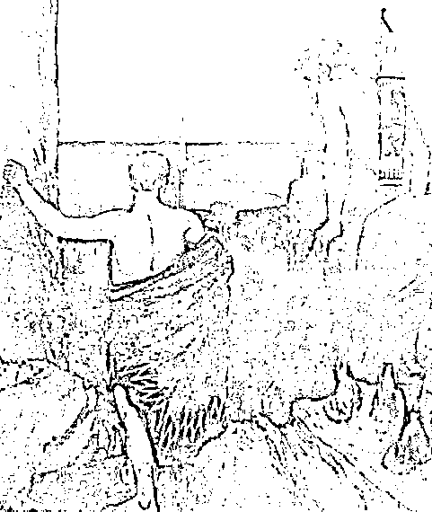

**太阳射手座+水星天蝎座**

**这些人在言语上会显得更笃定一些，不只是空谈一些大话和描绘愿景，对自己的想法多了些自我怀疑**。但**对那些他们不肯相信的事情，也依然会保持强烈的拒绝态度，并指出其中的威胁与风险在哪**。天蝎座的水星让他们的言语透露着极强的洞察力，经常会出现一些一语成谶的“神预言”。另一方面，他们同样会对自己的判断保持笃定的态度，只不过会有更多的怀疑，担心各种情况坏了自己的好事。

在决策层面上，他们更加**坚决**，有些**非黑即白**的意思，他们有着较强的决断心，缺少一些包容性，但也非常坚持自己的看法的同时，懂得怎么避免给自己造成麻烦。

**太阳射手座+水星射手座**

这是个很擅长**种草（画饼）**的组合。喜欢谈论未来未发生的情境胜过当下，他们偏好于抽象的语言去描述一个未发生的场景，把事情的发展一一道出，抓的是生米，想的是熟饭。他们会**大胆地做出预判，且很难改变自己的想法，也很难被说服，强大的信心和感染力，使得他们几乎永远不会在辩论中败下阵来**。拥有这种日水组合的人，会**比较缺乏灵活性，但都是极好的传播者和雄辩家。**在决策层面上，同时拥有射手座的太阳和水星的人，会**一直贯彻自己的想法，坚定而难以动摇，但他们并不是那么追求落实自己的思想**。只要还有一线希望，就能让他们的信心不被动摇，所以他们也有着极强的耐心，等到船到桥头的那一天。

**太阳射手座+水星摩羯座**

相比起太阳射手座-水星天蝎座那么激进，这种组合的人就显得**保守**多了，不会把话给说得那么大、那么满，也懂得如何暂时妥协于现状的共识，甚至在很多情况下，这种组合的人会是比较**缄默**的。太阳和水星给予的耐心，让他们知道**小不忍则乱大谋**，通常不会像很多人眼中的射手座那样“满嘴跑火车”。摩羯座的水星会让他们太阳的表达更切合实际一些，**把遥远的理想带到现实的情境中来，用冷静的言语去描述那些看似不可能的事情，他们是很好的规划者**。在决策层面上，这种组合的人一样会想得比较远，但他们是**渐进主义者**，排斥一口气吃成个胖子，需要**朝着自己的目标制定阶段性的可行方案，而非凭着热情大刀阔斧**。他们很喜欢给自己的大目标去打下基础，正所谓“磨刀不误砍柴工”是也。

**版权声明：**本文由作者授权发布于若道，欢迎转发，反对抄袭。友号转载请申请白名单。


**太阳+水星星座系列，你可能还想知道**

[白羊座](https://mp.weixin.qq.com/s?__biz=MzA5NjA0NTAxNg==&mid=2651406342&idx=2&sn=ab8b3a91cce87e334d368555d9c53fbd&chksm=8b4bf2b1bc3c7ba704661802584f2b0ab0d0ad5e488e60ba8e314cee5376d69a9694b2ef01ff&token=2144587045&lang=zh_CN&scene=21#wechat_redirect) | [金牛座](https://mp.weixin.qq.com/s?__biz=MzA5NjA0NTAxNg==&mid=2651407011&idx=2&sn=37c8e419ab237ae90950e4eae30e2b57&chksm=8b4bf014bc3c7902eafb26fab854dfeee4b5c676a56a00618edd304d0833287b02fc2c812416&token=2144587045&lang=zh_CN&scene=21#wechat_redirect) | [双子座](https://mp.weixin.qq.com/s?__biz=MzA5NjA0NTAxNg==&mid=2651407271&idx=2&sn=3c16a4987525d98aae143b52f2ede818&chksm=8b4bf110bc3c78060a29a4492e434c2f2a66d334fcd20832696109b2552fb1187ed1d767711b&token=2144587045&lang=zh_CN&scene=21#wechat_redirect)

[巨蟹座](https://mp.weixin.qq.com/s?__biz=MzA5NjA0NTAxNg==&mid=2651408217&idx=2&sn=4cf2d4772cc1ed200444ef06391ffd36&chksm=8b4bf5eebc3c7cf8b6ff62a96cd8386cd8a3bbc60efa1e1667ce7b7ad6da764afc5727e8b4a5&mpshare=1&scene=21&srcid=07243vbLK4riTythzaSUeKdd&sharer_sharetime=1563938471114&sharer_shareid=79ff492e946a049c0745c8e806eec753&pass_ticket=gtqhMlmoskFIotTtja2BcL%20HZHbVqC045CkjC/l0SRg=#wechat_redirect) | [狮子座](https://mp.weixin.qq.com/s?__biz=MzA5NjA0NTAxNg==&mid=2651408958&idx=2&sn=ce114d7fb9b8954580657bd5bf094647&chksm=8b4bf889bc3c719fa9bd554a750354a589286ea8d16b7f5440bad89714722382940944598751&mpshare=1&scene=21&srcid=0830za0Hg85zADeNgQMJn4VJ&sharer_sharetime=1567152764120&sharer_shareid=79ff492e946a049c0745c8e806eec753&pass_ticket=YmYvKGKKpAB4aL%20iVRtr2xCm7ar1QNNOVTzAkMKv9M8=#wechat_redirect) | [处女座](http://mp.weixin.qq.com/s?__biz=MzA5NjA0NTAxNg==&mid=2651409737&idx=2&sn=b994cda1213485cf7e464bf0c5c6014e&chksm=8b4bfffebc3c76e8291561bc773e6cf80542492d7c290d0be3d18945e2744e7cf23f42b4b190&scene=21#wechat_redirect)

[天秤座](http://mp.weixin.qq.com/s?__biz=MzA5NjA0NTAxNg==&mid=2651410937&idx=2&sn=6decbfd3e3568160bd75166a00e86ada&chksm=8b4be34ebc3c6a5813739f94d33510700a0692d117df7cebacd28b5a0be68b4fb576d2fed354&scene=21#wechat_redirect) | [天蝎座](http://mp.weixin.qq.com/s?__biz=MzA5NjA0NTAxNg==&mid=2651411251&idx=2&sn=54c24418aee4cdc67ccb4ba7065743db&chksm=8b4be184bc3c6892d67a95371a1d5ee613c6ea40131f1f5fdbd1bbbeaf39514d3c084ea65821&scene=21#wechat_redirect) | [摩羯座](http://mp.weixin.qq.com/s?__biz=MzA5NjA0NTAxNg==&mid=2651412287&idx=2&sn=6cc3dc7f9795f555752e3a93feab0c6d&chksm=8b4be588bc3c6c9e5b684340cc6bc4cdf66d0753fdcc6d8cd6b9060ed7cc4785ac80ee3a624d&scene=21#wechat_redirect)

**想阅读更多作者的文章**

**请在后台回复 ****安德烈****即可**

**安德烈**

ISAR 认证占星师（2014 年获得）

全职心理占星师/若道金牌作者

**微信 ID**：Andres0819

**个人微博**：占星师安德烈

**微信公众号**：安德烈与心理占星（ID：xlzx-2016）

长按打赏


**双证书核心课程火热报名中**

**点击图片了解详情**

**

**微信又又又改版啦，不想错过若道的推送？**

**就把若道设为星标吧！**

**▼**


********报名直达入口********


# 走出群星摩羯座的困顿，重新认识当下射手座的力量

> 原文：[`mp.weixin.qq.com/s?__biz=MzA5NjA0NTAxNg==&mid=2651412387&idx=1&sn=4ce2810302bd3c229b686924fa8d86d5&chksm=8b4be514bc3c6c0273c41ac212626777f8133b1f440610d84837e92adefd80669b01f2e677cd&scene=126&sessionid=1692738237#rd`](http://mp.weixin.qq.com/s?__biz=MzA5NjA0NTAxNg==&mid=2651412387&idx=1&sn=4ce2810302bd3c229b686924fa8d86d5&chksm=8b4be514bc3c6c0273c41ac212626777f8133b1f440610d84837e92adefd80669b01f2e677cd&scene=126&sessionid=1692738237#rd)

******************************☆ **************后台****************************回复“今日”，给你一句生命态度****************

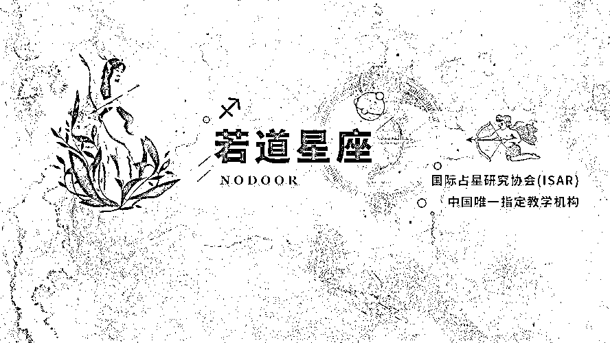

作者/丹恩·鲁伊尔 
译者/空气 校对/江艺编辑/玫瑰 图片/unsplash

刚刚从金星、土星、冥王星合相在摩羯座的压抑、痛苦中走出来的我们，方有机会好好品尝一下当下太阳行进在射手座的能量。众所周知，射手座的符号象征着半人马，那么，为什么会有如此的关联呢？一起来看看作者怎么说。

**从天秤座、天蝎座走向射手座**从夏至开始不断增强的黑夜力量，在射手座即将达到顶点。这股力量经过了在**天秤座和天蝎座**的大力奋进，力求**扩展人类的视野和情感**，现在几乎牢不可破，而其对立趋势白日的力量现已跌入了谷底。**集体主义战胜个人主义，社会性支配着人的个性，远方（未来）比眼前更重要。**这是伟大冒险的时代，向着**归纳、宗教、哲学、抽象和形而上学**的广阔未知领域进发。这是十字军东征和朝圣的时代，人们心中燃烧着对上帝的强烈追求，充满了对**不受时间、地域限制的永恒价值**的追求，对**绝对**的追求。这是一个充满了社会运动、狂热、不容异议的时代。人们失去了对土地的感知，失去了自我保护和安全的狭隘感情，失去了个人幸福的意愿，他们站在自我否定的翅膀上展翅高飞，飞向遥远的社会或神秘理想，为了这些理想他们宁愿去死。

社会意识发展过程的逻辑是通过天秤座的行为和天蝎座的情感而建立起来的，它使人们在**射手座达到新的精神境界**。与之相对的黄道星座**双子座**，热切地想与周遭建立**紧密的关系网络**——**神经系统、理性的逻辑系统、满足他对周围现象好奇心的实验方法**。而在射手座，**个体完全被社会或神秘元素吸引**，他在寻找**遥远的关联**。这些关联将作为社会有机体的“神经系统”，以实现他现在致力于做的事情。举例来讲，它们可能是一个电话、电报网络；更抽象地情况中，可能是一套**法律、条例、规章系统，**能够让社会复杂有机体（城市或国家的生命）圆满运作。

无论关联是近还是远，都意味着这是**智力和头脑**的活动。因此，**双子座和射手座是有关“心智”的星座**。前者代表在**较小范围的个体之中的心智运作**；后者是在**更大的社会范围内的思维活动**。在这两种情况中，心智活动都是直接和富有建设性意义的。与之不同的是，在**处女座**（我们将在后面提到双鱼座），**思维是以一种破坏性的、批判性的方式运作，**如果一切顺利，它还以一种**再生**的方式运作。作为黑夜力量或白日力量逐渐增强的最后阶段，心智是一个建造者。它合成、延伸，并将白日和夜晚能量在黄道上消长带到顶峰，将其能量的辐射最大化。这是在至日点之前的心智阶段。但在春分和秋分之前的黄道星座中，则是完全不同类型的心智力量。这种力量会为一种崭新的活动清理舞台，它否定、净化，不断地说：“不是这样！不是这样！”这样的心智告诉你应该去遗忘什么，放下什么，克服什么，以及超越什么。狮子座的个人情感主义和其显著的自我放纵，到了处女座就会被其自律、保健、自我牺牲所约束。水瓶座对社会的兴奋、夸张的理想主义、神秘的幻想和妄想，到了双鱼座不得不被分解掉。上帝“光芒”的幻觉必须被超越，这样才有可能在个人和现实中体验到上帝存在的寂静和真实，这是真正的神秘主义者所称的上帝的“缺失”。

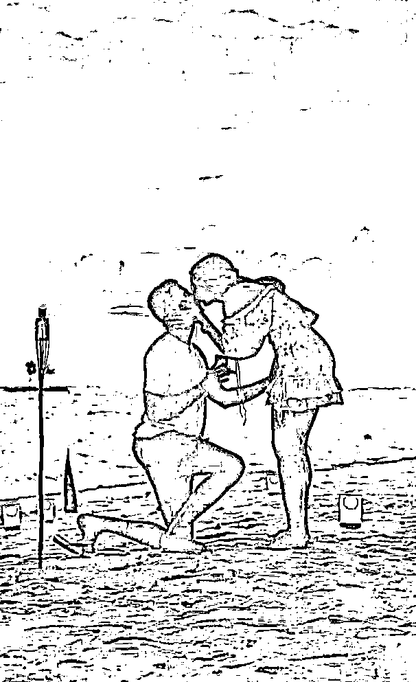

**半人马的象征意义**在射手座，人们试图整理好在天蝎座体会到的深刻情感。在黄道之旅的后期阶段中，**个体寻求与他人在亲密、深刻的真正结合中融为一体，**这样才可能**超越自己**，使自己的生命与一个更大有机体的脉动相一致。更大的有机体最初可能没有任何繁衍下一代和自我繁殖的想法，仅是要实现性满足狂喜带来的“合二为一”。但典型的“更大的有机体”是**社会群体（或神秘组织）**，在这种生活中，天蝎座会在情感上认同自己，并常常成为一个无意识的代言人——**其具有破坏性还是建设性取决于该群体所赋能量和目的的性质。****天蝎座是权力的星座，权力总是寻求得到来自比它更高层次的滋养，这样它才可以流向下一层，作为孕育者和统治者**。在射手座，权力已经建立，人们已经把自己与群体、社会或是其他比自己更广阔的有机生命联系在一起。他可以使用权力，可以用权力来建造。**通过驾驭他的权力，可以走向远方，越走路越广。**

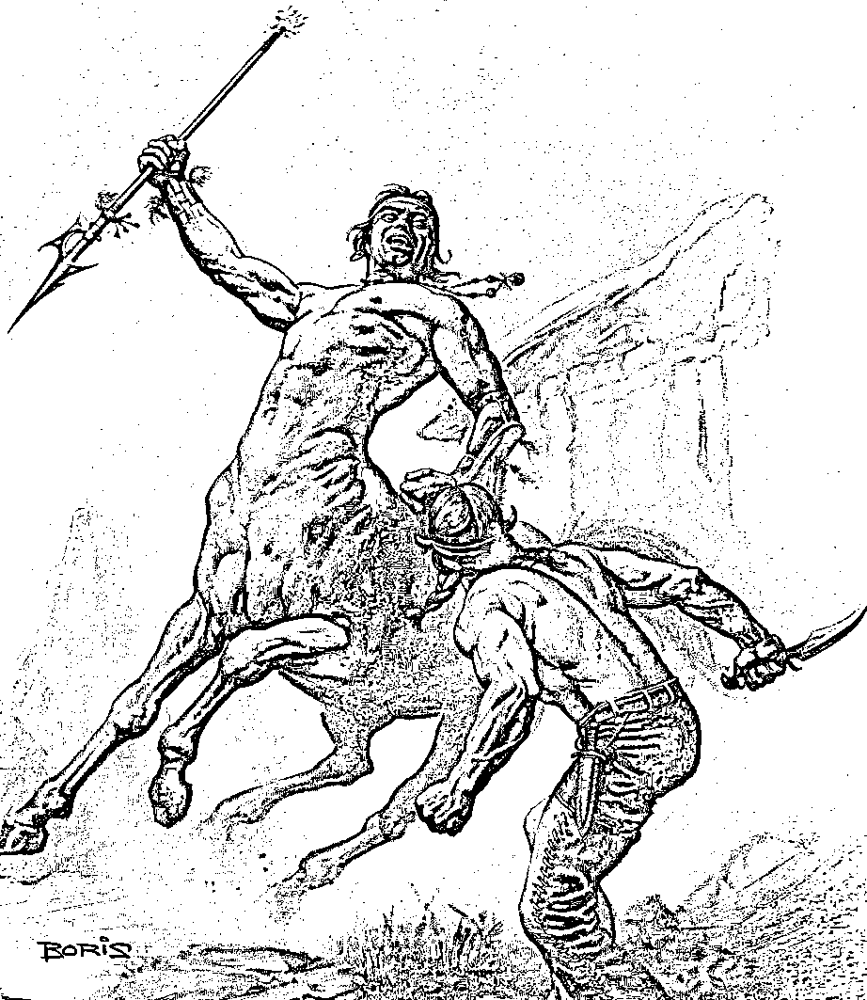

| 半人马
在古代的象征主义中，**半人马**代表着射手座，这是神话中的生物，下半身是马、上半身是人，射箭指向天。如果说这个符号描述了人性与动物性之间的斗争，那没什么意义——因为对立能量之间的斗争一直存在于整个黄道。这个符号的真正意义更加深刻和具体。

在任何土地上，马都代表着阳刚的力量，但这是一种特殊的力量，有了它可以使人认同自己，人可以登上马匹，在它的帮助下扩展自己的活动疆域。这是公牛的力量无法做到的，因为公牛是无意识的、不可驯服、纯本能的，这是宇宙中欲望的力量。人们可以用剑杀死斗牛，但永远不会有意识地去运用它来发展自己。因此，金牛座是宇宙的性力量。人是它的工具，直到他通过禁欲主义（能量压制的佛教符号）将它杀死。

而射手座有不同的性特征，这种力量是可以被驯服和运用的。它以马作为其象征。喝马奶可以带来强大的活力，在俄罗斯和亚洲，马奶都被用作这种目的——无论其发挥了破坏性的作用（成吉思汗的“黄金家族”就骑着凶猛的蒙古马），还是建设性的作用。因此射手座成了**力量**的象征——在**“大腿根部”**燃烧的力量、在瑜伽中，这种力量聚集在**腹腔神经丛区域**。精神分析学家在解析关于不同颜色的马的梦时，也认识到了这个事实。**射手座一半是“力量”，另一半是“使用力量的人”，也就是人的意识心理**。**第三个属性（弓箭）指代方向和目的**。人马以 45 度角向上射击，是**最大限度调动能量**的象征。**射手座的精神与力量**半人马族是大地女神盖亚之子，换句话说，他们是认同于更伟大的有机体（地球）的能量的产物。**在射手座，人们将自己认同为社会产生的力量，通过人与人之间的复杂交流（性、生意、商业、艺术、宣传等）所产生的力量，从而变得“强大”**。他的功课是**如何在正确的渠道中引导这种力量**。射手座的问题本质上并不是两种天性之间的斗争，他所面对的是，从他的“腹股沟”之中建立的力量应选择什么方向。在半人马的象征符号中，通过射箭的角度指示了正确的方向在哪里。

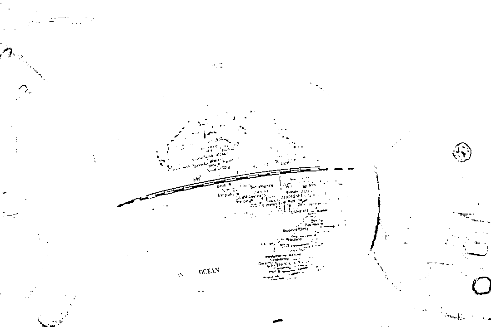

射手座主要被**“工作效率”和方向**所占据。他是典型的**权力管理者，权力的“代理人”**。因为**管理者指导和组织权力的释放，以达到最大效率和最小浪费，以及最快的速度和最大的收获**。另一方面，典型的“执行者”本质上是在摩羯座发展起来的，因为执行者在其与整体社会的关系中是工作的象征，是整个组织的象征。是国家的中心和象征。**射手座是总理，摩羯座是国王或皇帝，而水瓶座是改革者。**射手座的精神是非常连贯和统一的，因此具有**顽强和不屈**的品质。从**“运营计划”或法律**的角度来看待一切。在另一个层面上，也完全痴迷于**伦理道德**，但这是**作为人际关系运作系统的伦理**，而不是理想主义者的梦想。射手座根本不是理想主义者，他想要**扩展**，通过**寻找整体各部分之间所有可能的联系**，并观察它们的正确运作来**组织**其**有效运作**。他更像是一个**解读者**，而**不是新目标的创造者**。射手座**总结编纂，寻找发现新的意义，新的思考维度；**穿透层层面纱，**把模糊的观点变得清晰**。但射手座并不像天蝎座，甚至水瓶座那样迷失于对没有边界的能量或神秘认识的狂野认同中。**他从不放弃界限感、形式或明确的操作节奏**。射手座是马，不是鹰。他的力量源于**已知现实和经验**。他可以向天上的星星射箭，但双腿踏在热爱的土地上，因为这是射手座力量的源泉。但并不受其束缚。射手座运用它，管理它的力量。射手座精于此道，正如蒙古战士和游牧民善待他们的马一样，因为他知道他要依靠它来获得最大的功效，事实上，射手座的生命也依赖于它。因此，射手座热衷于**锻炼身体和肌肉**，**感受脚下的土地，与他人一起工作，感受社会**。如果射手座**孤独**，或（不属于精神类型的人）**被狭窄的环境所限**，就会感到**沮丧和烦躁**。他需要一个开放的空间，大房间。他喜欢**安排别人的生活**，尽管结果常常令人不快！他喜欢**操控力量，加速前进**。在现代社会，汽车和坦克已经取代了马匹。汽车和坦克的力量来自何方？是“地下深处”的石油。因此，第一个认识到坦克在现代战争中的价值的人，就像丘吉尔和戴高乐将军这样的领袖是射手座。

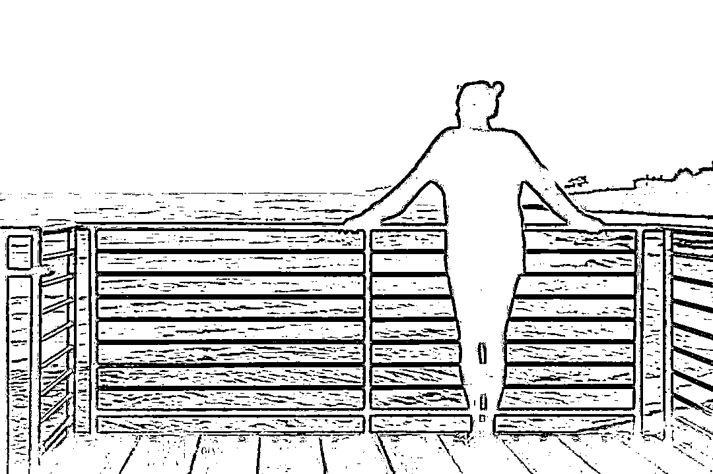

**射手座的负面特质**我们发现射手座在更高的层次上与**宗教**有关，但只与**有组织的宗教和仪式**有关。宗教作为一种有组织的社会力量，源于个人对社会生活整体性的精神认同愿望。这是一个公共的事业，由人们对集体联结感的渴望所推动。**哲学家、形而上学家**同样是射手座活动的产物——**在错综复杂的社会和自然现象中建构有效的秩序**。通过识别事件之间隐藏的各种联系和关联，解释和构建一般法则来做到这一点。射手座游历于**“思想领域”，**但在旅途中，他能够运用那股将自己与集体需求联系起来而释放出来的能量。对于高阶射手座来说，没有什么比**“时代需求”**和**他所属社会的需求**更重要的东西了。发现这种需求并认同于它，是射手座作为**思想家、预言者和规划者**的力量源泉。他是**解读者、占卜师、“时代的标记”、策划者、先知和预言家**。但是**射手座“看到”的是社会需要他看到的东西，他是社会的公仆。**
在消极的一面，我们发现射手座是**狂热分子、清教徒**。因为在射手座，代表个体化能量的白日力量正处于它的最低谷，所以这个星座的人**很少关注个人**。他心甘情愿地牺牲掉一切自我的、个人主义的东西，而走上“社会利益”的圣坛。**天蝎座的挫折也可能导致射手座的狂热，然后通过虐待而变得更加暴力和残忍**。这样的社会使用通过个体的痛苦和死亡为代价产生的权利来拯救自己，声称有权管理这种宗教社会力量的人，也在折磨他人中体验到了邪恶的刺激。因此，**刻意或被迫的个人禁欲主义也会导致残酷。****射手座对个人主义缺乏客观、积极的认知**，另一方面，他又具备势不可挡的社会意识，以至于他有时不得不**求助于潜意识的伎俩和暴力的刺激来找回自身对个性的体会**。事实上，他经常这样做，尤其当中世纪和现代社会的混乱让他充满破坏性的能量时。因此，射手座的人表面上看，似乎是一个**喧闹和傲慢**的人，这也是由于他**对非个人力量的臣服**。在白日力量的最低点，必须**限制自己来给予自己力量的幻觉**。射手座需要**被“难以理解的事情”激发，**而当他被激发时，有时会以一种**过时的、强迫性的方式行动**，就像天蝎座的负面特质一样令人讨厌，而且可能更危险，因为射手座的理性机能更加敏捷。**木星式的同情几乎变成了无意识的虐待。**射手座是圣诞节的序幕。就像雪一样，它将所有的微粒吸收进巨大的寂静子宫里，在那里重新诞生白日力量。将所有生命联结成宇宙关系模式，成为“活着的上帝之母”。射手座有着**英雄主义、自我克制和霸道**的母爱。他终结了一个时代，开启了另一个时代，他孕育着**神性**。

**版权声明：**本文由若道翻译发布，欢迎转发，反对抄袭。友号转载请申请白名单。


**丹恩·鲁伊尔**原名 Daniel Chenneviere，法国裔美国现代作家、现代主义作曲家和人本主义占星师。现代超个人主义占星学的先驱。

******点击图片查看若道君推荐******


**微信又双叒叕改版啦，不想错过若道君的推送？**

**就把若道设为星标吧！**

**▼**


就是这个“在看”，戳戳戳 ☟

********报名直达入口********


# 核心课程 L5 | 多种预测技法，助你成为职业占星师（插班中）

> 原文：[`mp.weixin.qq.com/s?__biz=MzA5NjA0NTAxNg==&mid=2651412387&idx=2&sn=0058f79b1b6d7cd5e22aa92c1d34fcd9&chksm=8b4be514bc3c6c02f633e15b81f111bccbeb39c8ae939b89a5b9e08374ef59e21c2efed9c1c1&scene=126&sessionid=1692738237#rd`](http://mp.weixin.qq.com/s?__biz=MzA5NjA0NTAxNg==&mid=2651412387&idx=2&sn=0058f79b1b6d7cd5e22aa92c1d34fcd9&chksm=8b4be514bc3c6c02f633e15b81f111bccbeb39c8ae939b89a5b9e08374ef59e21c2efed9c1c1&scene=126&sessionid=1692738237#rd)

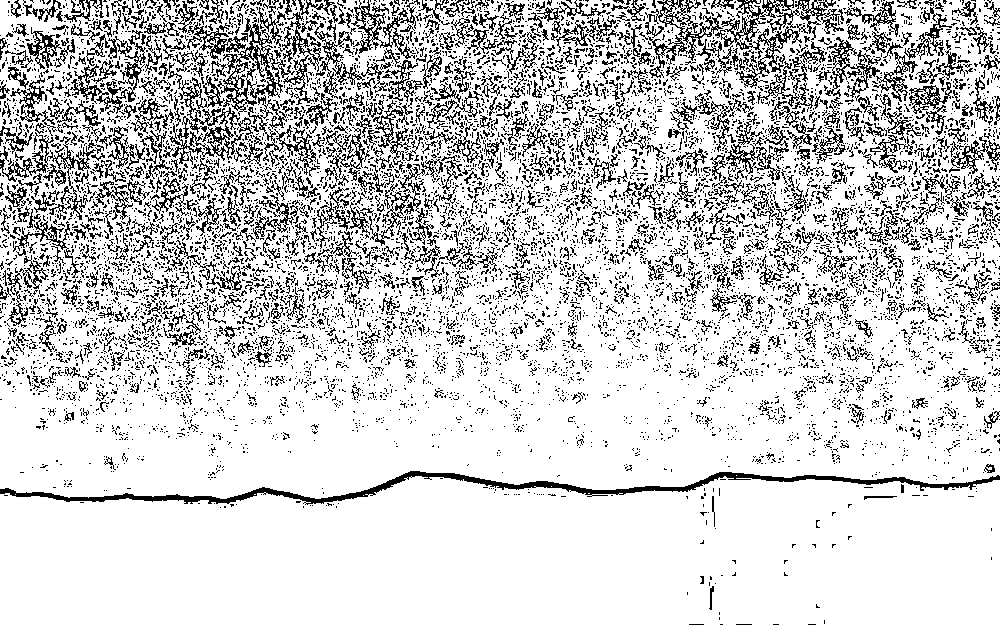

占星学不只是一门技术。占星学不只是一门知识。 占星学是**有****觉察****地活着，活在对过去、现在、未来的觉知、了悟和行动之中**。 我们强调学员的自我觉察，和如何活出占星学智慧，而非仅仅告知他人自己所知道的占星学。 占星学最终是**为了个人的人生服务**。 只有经过了深入的自我探索和个人疗愈旅途的占星学学生，才可能进一步成为好的占星师。 只有被活出的占星学技术，才对你和他人有意义。 你最终要去活你所学的占星学。你选择什么样的占星学意味着你怎么活着。 **寻找那些“实践其所知占星学”（Live their astrology)的占星师带领你走这条道路，而非谈其所知的占星师。**


**课程内容****第五阶 历史、预测和咨询技巧** 15 次线上直播网络课程，每次 2 小时，课堂中依旧会使用同学们的星图作案例**两场北京现场工作坊：2 天职业占星工作坊和 3 天咨询技巧工作坊**

**课程安排** 

占星学的进化历史

预测的历史和原理：预测的原理——有哪些可能和不可能，以及原因

预测的核心：出生图

预测技术：行进 
太阳的行进、月亮的行进、水星的行进、金星的行进、火星的行进、木星的行进、土星的行进、天王星的行进、海王星的行进、冥王星的行进

预测技术：行星逆行、日月食

预测技术：月相、行星周期

预测技术：二次限

预测技术：太阳弧

预测技术：返照

咨询技巧：常见咨询问题初探

咨询技巧：聆听、述意、提问的技巧

咨询技巧：确定咨询范围和厘清问题

咨询技巧：模式识别和洞察过往经历意义

咨询技巧：情绪识别

咨询技巧：核心信念识别咨询技巧：客户周期识别咨询技巧：寻找星图资源，提供希望和方向 ISAR 能力考试词汇表和大纲

**工作坊：（北京现场）**

**2 天北京占星学与职业工作坊** **2020 年 4 月**

**3 天咨询技巧工作坊 2020 年 5 月**

**导师介绍**


**蒋颖（Felicia）**

*   ISAR 中国副主席（ISAR 为国际占星研究协会缩写，在各国只设副主席），若道创始人。 

*   厦门大学化学系硕士，经济学学士，人民大学中美经济学培训项目福特班学员，长江商学院 MBA。 

*   曾为国内最早从事金融并购业务的机构合伙人。 

*   国内第一位被邀请在国际占星学会议上正式就西方占星学发表演讲的演讲人。第一批通过 ISAR 认证的职业占星师。ISAR 职业占星师资质认证培训师和中国考区考试负责人。 

*   跟随大卫·瑞雷、杰夫·焦耳、斯蒂芬·弗里斯特、苏·汤普金斯、格伦·佩里、诺·泰尔、罗伯特·汉德、雷蒙德·梅里曼、琳恩·贝尔等国际占星大师系统学习占星学，广泛涉猎人本主义心理占星、进化占星、原型占星、医疗占星、金融占星、卜卦占星、企业占星等多个占星学流派分支。 

*   曾接受萨提亚家庭治疗、本性治疗、Hakomi 治疗等心理学培训。接受进化教练培训。

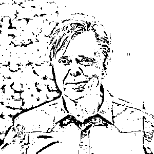

**大卫·瑞雷（David Railey）**

*   ISAR 全球副主席，ISAR 考试委员会主席，若道创始人。 

*   被称为占星界的“马可·波罗”，第一位将西方严肃占星学系统教学和多位西方占星学大师引入中国的西方占星师。 

*   第一位在美国用电视和广播媒体推广严肃占星学的职业占星师。 

*   培养最多中国职业占星师的老师。 

*   《灵魂的目标》、《一生的旅程》作者。 

*   研究占星四十余年，拥有三十多年的占星咨询的执业经验，其服务客户包括学生、工人、市长、州长、议会议员、企业家、心理咨询师、工程师、艺术家、演员、知名企业家等，客户年龄跨度从襁褓婴儿到耄耋老人（大卫老师的老客户常常是一家三代人）。2010 年 6 月，大卫的书《灵魂的目标》中文版出版。在 2011 年春季的北京之行期间，大卫接受了《南方周末》记者的采访，同时参与了 CCTV9 的纪录片的拍摄。

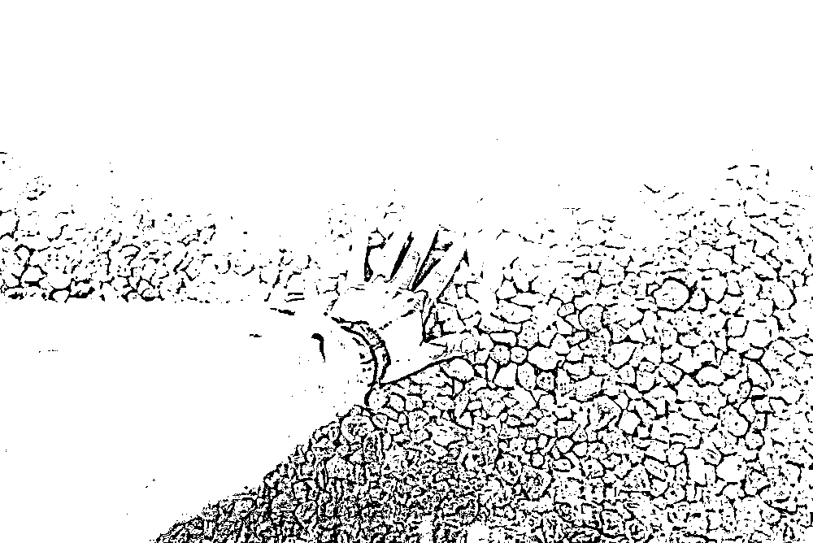

**为什么选择若道学习占星学？****如果你相信自由意志的重要，愿意与命运共舞** 若道是人本主义占星学的旗手。因为我们相信，人通过了解模式、觉察习性、积极疗愈、终将释放其潜能，与命运共舞。**如果你想要充分国际化的眼光和见多识广** 占星界的“联合国”ISAR（国际占星研究协会），是具有全世界影响力的占星教学和研究组织和职业占星师全球认证机构，认证占星师遍布 45 个国家。在 ISAR 的 13 所附属学校中，大中华地区的附属学校只有若道一家。在国际化的教学理念大纲标准下，若道毕业生在 ISAR 国际认证占星师的考试通过率多次全球第一。**如果你相信教学需要经验和支持服务** 在中国确立西方占星学的标准，引入世界顶级的占星大师进行教学，传播人本主义的占星学智慧，若道已经做了七年。学好占星学不仅仅需要延请一、两个老师，而是需要对教学难点有充分了解，且有持续的教学跟进服务。若道在 7 年的多次核心课程教学中，有多年国外老师和中国老师、助教的配合、课程顾问配合教学的经验，对于教学知识点和中国学生的疑问有很多积累。仅在若道论坛，就有近千个学生问题的答疑解惑和作业的批改。


**如果你相信“联结和部落”**

若道为中国职业占星师的“黄埔军校”。职业占星师的培养从若道开始，进入若道，你就走近了中国最顶尖职业占星师群体，和一群志同道合的师兄师姐联谊，获得经验，共同成长。**如果你需要职业规划和支持** 若道为占星学生配备实习平台和咨询平台，并有着严肃占星学影响力最大的媒体平台，全力为其毕业生提供宣传渠道。若道还为学员准备学习 APP 供学员使用。在 7 年的占星教学耕耘后，本次两位创始人人大卫和蒋颖首次“联手”开设占星核心课程。一个是身在中国本土最有影响力的西方占星师，一个是在西方占星学界最有影响力的中国人。从若道开始，你全新的职业占星之路。

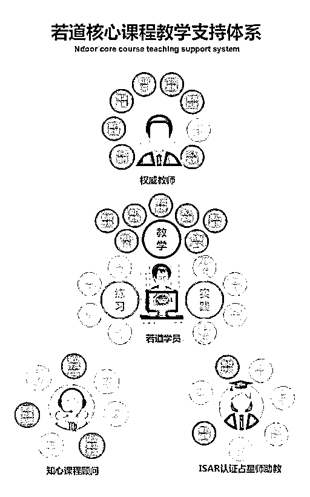

**学过的人怎么说？**

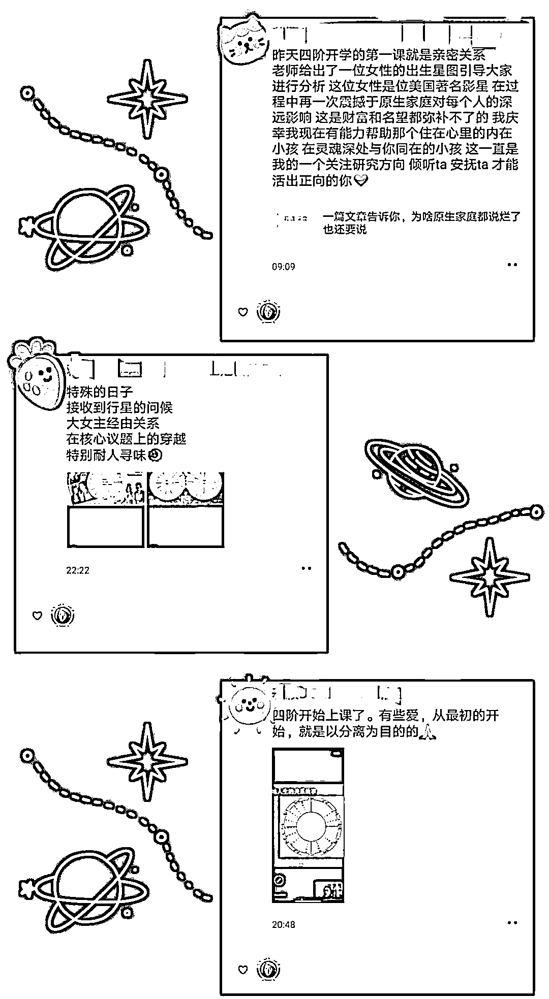

**课程费用****原价**：21000 元
**优惠价：20000 元**转发课宣，截图给客服即可享受优惠价。具体请长按下方二维码添加课程顾问小姐姐咨询哦。


**授课时间****上课时间：****2019 年 11 月 12 日开课，每周二晚上 20:00-22:00****插班中****授课方式****如何听课？**我们使用先进的网络教学平台，支持手机、电脑、iPad 上网，可以随时随地学习。教室平台登陆方式课前请留意查看客服推送的登陆提示。英语授课部分，实时翻译。**错过直播课程怎么办？**直播课程结束后 24 小时内课程回放将发布至个人中心；学员可登录网站收看课程回放，在线复习课程，每次课可完整重看 3 次，课程回放在每阶课程结束后的 3 个月内有效。**退转课程**

*   **退款原则请详看《教学协议》，如有疑问请咨询课程顾问。**


****若道核心课程 Level 5****

**授课老师：蒋颖、大卫·瑞雷**

**授课时间：**2019 年 11 月 12 日开课

**授课方式：**线上直播网络课程及两场北京现场工作坊，中英文授课，英文部分配备中文翻译

**费用：**21000 元；**优惠价：20000 元。转发课宣，截图给客服即可享受优惠价。具体请长按下方二维码添加课程顾问咨询。**

**课程负责人：施老师**（微信：nodoor233，手机：18515059056，请备注“核心课咨询”）

长按二维码添加课程负责人咨询~


****报名请点击“阅读原文”****


# 12 宫深度解析 | 在这看不见的世界里，藏着你灵魂最深的宝藏

> 原文：[`mp.weixin.qq.com/s?__biz=MzA5NjA0NTAxNg==&mid=2651412358&idx=1&sn=e91ed62a9ed6f11a14844c49b22747e3&chksm=8b4be531bc3c6c27f6efb60abec65abd606e36196e4b2b4559c4543fbb5b59d0ec86e533ddc6&scene=126&sessionid=1692738242#rd`](http://mp.weixin.qq.com/s?__biz=MzA5NjA0NTAxNg==&mid=2651412358&idx=1&sn=e91ed62a9ed6f11a14844c49b22747e3&chksm=8b4be531bc3c6c27f6efb60abec65abd606e36196e4b2b4559c4543fbb5b59d0ec86e533ddc6&scene=126&sessionid=1692738242#rd)

**☆ 后台回复“今日”，给你一句生命态度**


作者/达娜·格哈特 译者/葡萄园的女巫

编辑&校对/Tang 封面/书君 图/unsplash

神秘的第十二宫一直以来让人们充满好奇，这个在古典占星学中被视为“困境之门”的地方，在现代占星学中有了不同的意涵——强大的第十二宫可能蕴藏着看不见的巨大能量，或者是我们埋藏在深处的潜能与天赋。第十二宫究竟意味什么？让本文为你细细道来。**看不见的世界**

这些年来，我收到关于第十二宫的咨询要求远多于其他宫位。据说这里充满了悲痛。古典占星学中把这里称作“苦难的山谷”、“悲伤和恐惧的黑洞”、“困境之门”，还有“罪恶灵魂”的宫位。

这里是命运折磨所在，这意味着恶有恶报。即使善良的人们也会因为前世的罪恶或冤孽在这里遭受不幸。这个宫位会带来失望、焦虑、禁闭和损失，还有奴役、疾病和监禁。这里掌管了医院、监狱、精神病院和修道院（家人为了让你远离公众视线而把你送去的地方）。第十二宫还代表了隐藏着的敌人。这里隐藏了一些你不知道的邪恶事情，像是一个满脸笑容的美容师兼职做巫师，甚至用一个巫毒娃娃缠住你的一缕头发。

谢天谢地，现代占星学权威丹恩·鲁伊尔宣称：“**根本没有不好的宫位这种说法。**”

所以，现代占星学家们就像一群快乐的革命者将充满苦难的第十二宫改头换面。他们掏空了这里所有肮脏的元素，把**第十二宫改造成了一个暗藏巨大潜力的子宫。**现在，这里变成了具有神圣完整性的母体，在这里孕育我们的雏形，最终也将回归此处。第十二宫披上了双鱼座和海王星的神秘面纱，这里便成了我们内心的梦工厂，汇集了无意识的行为和思考，是原始意向和形象思维的源泉，想象力最喜欢出没的地方。第十二宫还包含了直觉、同情心和超现实的灵性。

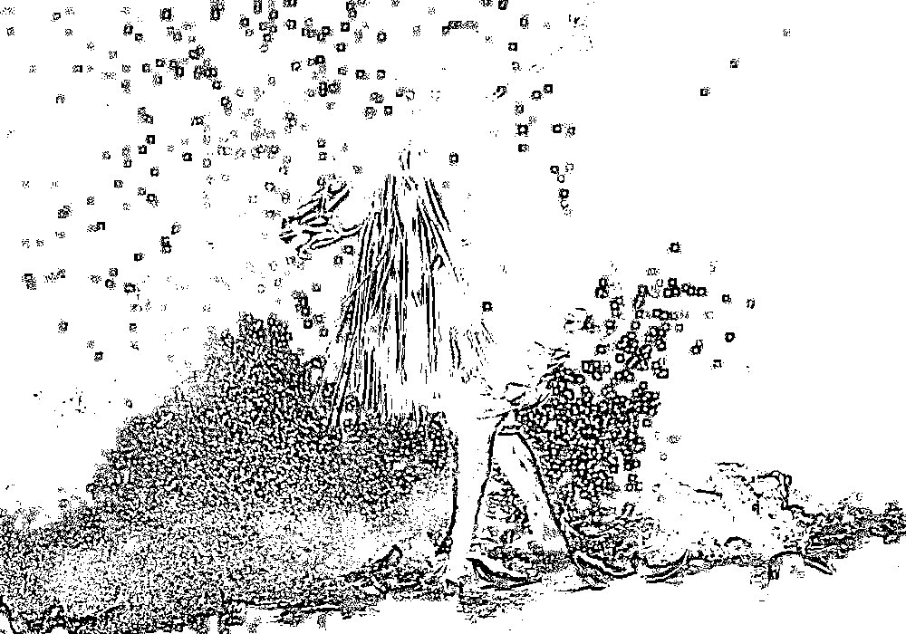

但是现代占星学家也没有办法完全抹去这个宫位困难的特质。他们警告，在这样一个蕴藏强大力量的无限空间里，你很容易**迷失自我**。行星落入这里很容易无法利用它的功能和天赋。你可能对于人生的方向感到迷茫，或者并不能清晰地认识自我。**你可能很害羞，或者是否定自我——也可能不切实际的自我膨胀。**救世主和受难者都住在这里。你的心灵边界满是漏洞，你很容易成为一个捕食者的目标，也有可能变成狡猾的捕食者。**“你看不见的事物”就是这个宫位管辖的范畴。**不论你是赞同古典占星学还是现代占星学的观点，分析第十二宫都要解决一个相似的问题：**如何清楚地看见它的版图？**它带来的所有危险都是无形的，不论是由宿命的折磨造成的，还是来自于隐藏的敌人，或者是你自己潜意识里不正常的逻辑。埃及人认为，在这里的行星将会迷失，因为太阳马上就要升起，它的光会让行星变得衰弱。不论是古典占星学还是现代占星学，都把第十二宫描绘成了一个巨大的盲点。因此，我们该从感知能力的问题开始着手。**一个关于盲点的故事** 秦始皇是一个暴君，他雄心勃勃而且十分强大，他四处征战，拥有广大的领土，是中国历史上第一个统一全国的皇帝。他向往长生不老，他的目标是战胜死亡。他得到了一本天书，上面记载了永生的秘密。但是这本书使用秘传的文字记录，他唯一能看懂的只有一句简单的话：**“灭秦者胡”**。他认为这个“胡”是指中国北方的一个游牧民族，于是他动用举国之力修建了万里长城抵抗胡人入侵。这万里长城如今依旧屹立，而在秦始皇死后没多久，秦朝就覆灭了。是谁造成的呢？并不是北方的敌人——胡人，而是秦始皇那个不负责任外加白痴的儿子，他的名字叫“胡”。说到盲点，在秦朝的这个故事描述得非常贴切，敌人的种子是他亲手种下的。大部分人在第十二宫犯下的错误都与此类似，我们也都得到了类似的神秘天书。上面写的模棱两可的句子，**来自于直觉、愤怒和恐惧，也许会误导我们与外在世界的敌人“胡”发生斗争。**就像秦始皇一样，我们也许用尽全力对付想象中的敌人而忽略了真正的破坏者。**到了现代，对第十二宫最贴切的关键词应该是“自我毁灭”**，这让我们像其他人一样生病、被囚禁和奴役。当你打开第十二宫隐密的大门走进这里时，最好对自己的盲点有良好的警觉意识。关注一下“外在世界”有什么让你烦恼或恐惧，因为很有可能这个敌人正是隐藏在你第十二宫所落星座和行星描绘的天性阴影中。

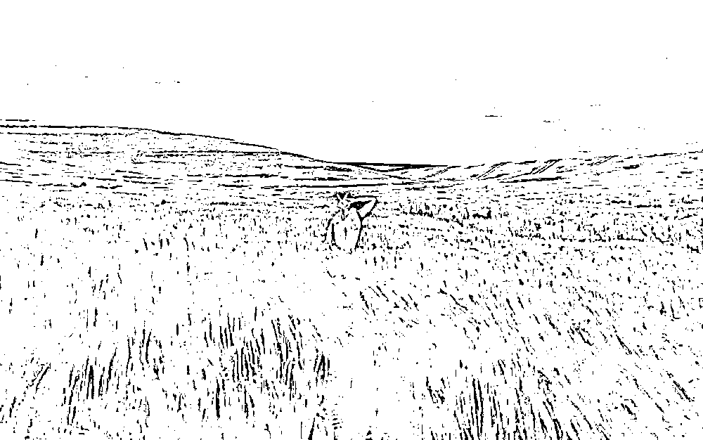

**第十二宫的行星与星座**凯蒂的月亮落在第十二宫，英格丽德的第十二宫头是巨蟹座，守护星是月亮。两个女人在“外在世界”的敌人很类似。凯蒂的敌人是她社区戏剧社的一个女演员。我听凯蒂抱怨她很多次了：“她让我气得发疯！她总是为自己感到不值。她只是一个高中教师，但是却老是抱怨工作多辛苦，压力多大。她总是把家庭作业带到戏剧社，这样她就能枕着一堆纸睡着。难道她觉得我们应该给她颁发一个年度最辛苦奖章？”英格丽德的死敌是凯蒂，她已经抱怨了好多次。她抱怨的点也十分相似：“我真是受不了凯蒂了，听她说话真是要把我弄疯。她总是扮演受害者的样子。她就不能停止抱怨，为自己这样的行为感到愧疚吗？”我有一次问英格丽德，为什么她觉得凯蒂给了她这样的印象。“我猜是因为我活的很艰难。我妈妈是一个酒鬼，你知道，我必须自己照顾自己。但是我从未像她那样满腹牢骚……没人关心我是不是在哭泣！”我的第十二宫里也落入了月亮，这就是我用凯蒂和英格丽德举例的原因。她们的抱怨也触动了我敏感的神经。英格丽德因为有个酒鬼妈妈，所以缺乏由月亮提供的感情呵护。但是我和凯蒂的情况也没有比她强多少。月亮落入第十二宫往往会有一个生病的、只顾自己或者因其他原因没有履行养育责任的母亲，母子（女）之间的正常的逻辑关系会颠倒，孩子需要像母亲一样照顾自己的母亲。**第十二宫的月亮会让人学着隐藏他们脆弱的一面，假装这些弱点并不存在。**他们通常有很强的自给自足能力，也会在照顾他人方面很有天赋。但是**压制并不能使需求消失**，它们正转向第十二宫的盲点，那里就像住着一个极度需要感情慰藉的小孩。可怜的孤儿追寻着称职的养育者，下意识地哭喊着：“我好可怜啊”。每个人都能听到，除了月亮统治第十二宫的人。


秦始皇有两个儿子扶苏、胡亥，他将所有的注意力都集中在第一个儿子皇嗣扶苏身上，而忽略了次子胡亥的无知、愚蠢和易怒，根本与孩童无异。秦始皇死后，宫廷政变，胡亥被扶持为傀儡皇帝。一个本该延续数百年的王朝，一夜之间倾覆。如果把落入第十二宫的行星比作小孩子，那么它们会被培育成为胡亥那样被忽略的孩子。缺少了我们悉心照顾，它们既没有受到培养也没有经历测试。它们没有得到公平的机会成长成熟。最终在无意间它们接管了一切，造成了严重破坏。**落入我们第十二宫的行星或者是宫头星就像是有特殊需求的孩子。它们某种关键性需求被剥夺了。**某种程度上，我们早年的环境并没有鼓励和支持它们表达自己的需求。我们的监管者或许篡夺、拒绝、羞辱过它们。可能通过某种方式，我们得到这样的信息——**它们无法安全的表达自我**。**举个例子**

*   如果**火星**落在第十二宫或者宫头星座在**白羊座**，会害怕去表达竞争的欲望，或者拒绝承认自己自私。

*   如果**冥王星**落在第十二宫或者宫头星座是**天蝎座**，会局促不安无法表达激情、性欲和权利。

*   如果**水星**在第十二宫或者宫头星座是**双子座**，也许会保持沉默。

*   如果**天王星**在第十二宫或宫头星座是**水瓶座**，也许会把与众不同的地方都隐藏起来，包括创造的天赋。

*   如果**金星**在第十二宫或者**金牛座和天秤座**是第十二宫的宫头星座，也许会缺乏对美和艺术的鉴赏力，同时也缺乏爱的能力。

不论行星或星座表明你丢失的是什么，下意识地察觉这个缺失会导致某种受害者意识。事实上，为自己感到难过没什么不对。

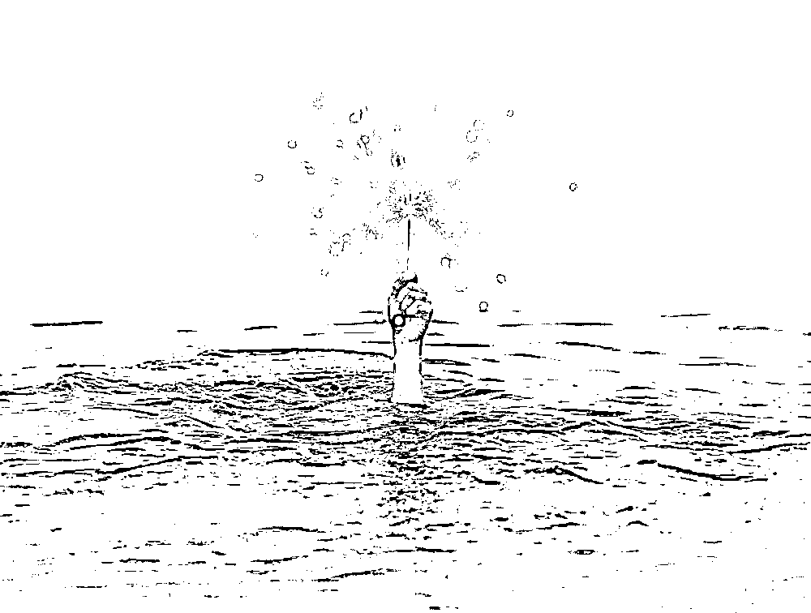

**如何找到第十二宫的宝藏？**我比较喜欢现代占星学关于第十二宫的见解，是因为我觉得比较实用和真实。现代占星学的观点认为：**想要解救落入第十二宫的行星，首先要意识到它们的存在。**这个看不见的世界并不像现实世界那样运作，所以我们也必须换个方式处理。如果我接受我的精神天性，如果转变我们的视角，超越今生的界定，我们将看到一个全新的第十二宫。我们将担负新的责任。行星和宫头星座不再仅仅代表我们被剥夺了什么，或是受到的伤害。**那些在现实中看起来失去的，会变成精神领域的神圣开端或者宗教祭祀。****海王星第十二宫的保罗**保罗是一个作家和摄影师，他的海王星落在第十二宫。我对他讲述过海王星的问题，描述它如何通过音乐、艺术和诗歌表达。占星师把第十二宫比喻成怀孕，我认为海王星的印记就是他在子宫里获得的知识。他的眼睛被点亮了。他说，母亲在怀着他的时候总是拉小提琴，这让他印象深刻，他的思考往往带有音乐的模式。

保罗是一个十分自私的人，他太阳在天蝎座，而且被带有强烈控制欲的冥王星、土星的合相四分，所以并不意外，他十分刻薄且固执。从他的星图还可以推测出他有一个严苛的父亲。在他还是个孩子时，父亲就不允许他沉浸在海王星的海洋里做白日梦，这就是这颗行星最早被剥离的情景。成年以后，他先是在军中服役，然后就进入学校学习经商。

但是在过去的十年里，我看到他周期性地离开现实生活，沉浸在海王星世界里从事他的艺术事业。过去的两年，他有一次消失了好几个月更深地沉浸在海王星的世界里。**所以，我每一次见到他，都感觉到一股热情的生命力。**他比我认识的任何人都活得像个艺术家，过着彻头彻尾的艺术人生。他可以为了一张照片守候数小时，也可以好几天不睡觉沉浸在自己写的小说里。**他第十二宫的海王星变成了生活的中心。他用尽一切生命重新找回了这深藏海底的巨大宝藏。**有时候，就是这么神奇。

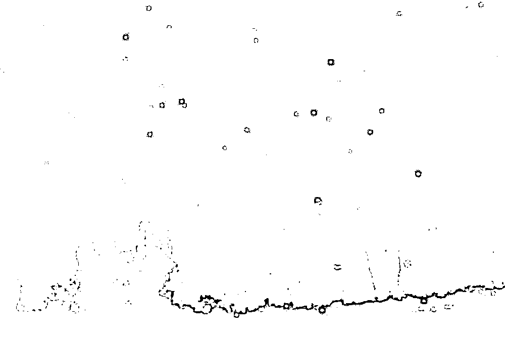

**当我看一张出生星图中有行星落入第十二宫时，脑海中首先浮现的并不是“厄运”、“不幸”。我更觉得这是一份礼物，**事实上，这的确是星图中蕴藏的珍贵财富。但是这笔财富就像是信托基金。第十二宫必须成长到法定年龄。自我意识贪婪地占用星图中其他宫位来满足自己的欲望，但是第十二宫不会这么轻易就放弃它所占有的。这里会有牺牲，会不成熟，会哭诉，会脆弱，要取得自我意识、谦逊和精神责任，**这绝对是条漫长的旅途。**但不管多久，第十二宫的财宝都不会消失。也许需要耗费一生中大量的精力来找到这笔宝藏，它们深深植根于本性之中。它获得广泛赞赏的天赋蕴藏着巨大潜力。我并不是唯一持这种观点的人，米歇尔·高奎林（法国统计学家、心理学家、占星学研究者兼作家）将统计学运用到占星学中，分析了大量星图后发现，**很多有行星落入第十二宫的人，他们在事业上取得了很大成功。**火星在第十二宫也许会是知名运动员，演员、政治家、记者往往有木星在第十二宫，科学家和医生会有土星或火星在这里，画家和音乐家有金星，作家则落入了月亮。这项调查研究让那些把职业与第十宫联系在一起的占星师们十分惊讶。当代占星学家毛里斯·费尔南德兹更加强烈地要为第十二宫的行星讨回公道，他认为，**具有广泛影响力或者名望的人往往具有强大的第十二宫，这比第十宫的征兆更明显。**因为第十二宫同时掌管了集体潜意识和群众，行星在这里代表了这个人有潜力去引领流行趋势、左右大众的认知。他们也许会承担一个大众的计划，牺牲个人的生活去完成一项成就或者成为偶像。以下这些人都有太阳落入第十二宫的征象，他们以不同的方式被人们铭记：甘地、麦当娜、乔治·布什和罗德尼·金。**不管出生星图中有什么占星元素（星座、宫位、相位），最重要的都是你怎么对待它们。**我知道，那些给我发邮件担心自己第十二宫的人，其实都有着巨大的成功潜力。从此我开始欣赏落在第十二宫的这些行星的特殊品质，星图中的其他因素似乎都变得苍白。毫无疑问，这个掌管着自我毁灭、禁闭和损失的宫位是整张星图中我的最爱。

**关于第十二宫，你怎么想？**

**留言区等你**

”

**版权声明：**本文由若道翻译发布，欢迎转发，反对抄袭。友号转载请申请白名单。


**达娜·格哈特**

一位国际范围内受尊敬的占星师。她为众多占星学网站和出版物讲课、写稿。她在十二宫的月亮激励她对这颗发光体进行了深刻而持久的探索研究。

**点击图片了解详情**


**微信又又又改版啦，不想错过若道的推送？**

**就把若道设为星标吧！**

**▼**


就是这个“在看”，戳戳戳 ☟

**报名直达入口**


# 初学占星学“必读书目”，了解一下呗

> 原文：[`mp.weixin.qq.com/s?__biz=MzA5NjA0NTAxNg==&mid=2651412358&idx=2&sn=5d6fe3f186798fa6a9b8a146316a8ecf&chksm=8b4be531bc3c6c27affed3f075f1501c3c2f01123358d66ad8a54eeb4f1a69546058917d5f23&scene=126&sessionid=1692738242#rd`](http://mp.weixin.qq.com/s?__biz=MzA5NjA0NTAxNg==&mid=2651412358&idx=2&sn=5d6fe3f186798fa6a9b8a146316a8ecf&chksm=8b4be531bc3c6c27affed3f075f1501c3c2f01123358d66ad8a54eeb4f1a69546058917d5f23&scene=126&sessionid=1692738242#rd)

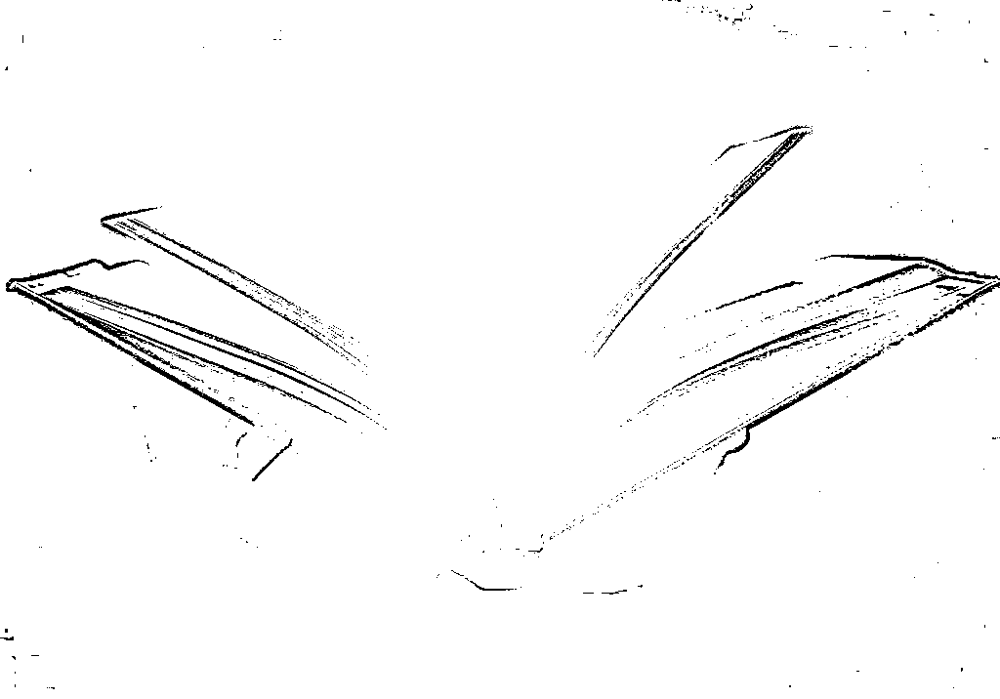

**2020 年要到了，**

**新一年的课程非常丰富哦！**

**在学习占星学之前，**

**一起来重温一下必备“宝典”吧。**

**新的一年，**

**以 10 分的精神**

**投入学习中，**

**一起加油！**

《灵魂的目标》

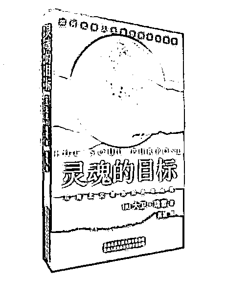

**推荐理由** 

人有两种基本需求，即对安全感的需求以及对成就感的需求，并不断在两者之间切换。实际上我们完全可以通过平衡这两种需求而打造出理想的人生，其中的关键是要清晰地知晓我们的渴望与惯性各是什么。

大卫·瑞雷老师撰写的这本书主要研究的是占星学中的月亮交点与人生阶段、生命道路之间意味深长的联系。通过几十年来大量积累的个案，作者发掘了十二组月亮交点与人的安全感需求、天赋才华、内在渴望，以及成就感召唤之间的深层联结，并对有关职业发展、亲密关系、亲子关系、生命周期等重要议题进行了精要分析与概括总结。作者以大量名人故事及咨询个案作具体讲解，立论建立在严谨的逻辑分析和科学实证的基础上；同时，行文又充满意趣，展现出广博的人文视野和丰富的哲学蕴涵。

《当代占星研究》

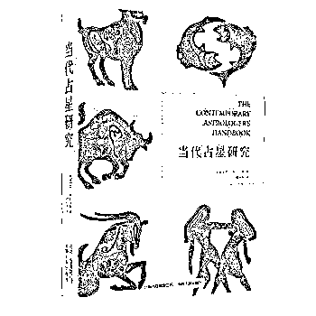

**推荐理由** 

本书为伦敦占星学院的指定教材，由伦敦占星学院创办人、当代占星权威苏·汤普金斯女士集 30 年研究成果撰述而成。全书观点独到犀利，展现出作者对占星这门学问极富洞察力和启发性的理解。胡因梦老师笔优美流畅，将重量级的专业论述演绎为精彩绝伦的札记，让人着迷而不忍释卷。本书架构严谨清晰，语言易于理解，诠释深入精微，其内容涵盖占星学的历史背景、理论基础、星座意义、宫位象征、相位图形、星图解读，可用以检视人格模式、心理需求、情绪处理、人际互动、生涯发展等各个人生面向。入门和初学者的必备占星工具书。
《内在的天空》

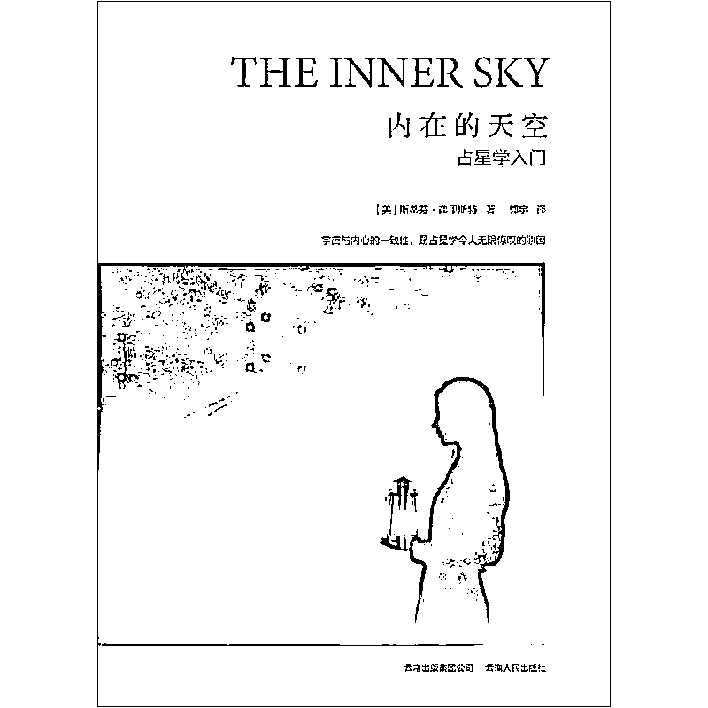

**推荐理由** 

本书是占星爱好者、初学者的必备入门工具书。作者斯蒂芬·弗里斯特在占星界享有盛誉，是进化占星学创始人，所著书籍被译成多国语言，伴随占星师们一路成长。阅读《内在的天空》时，你会感受到，这位慈爱的老者在通过传递自己几十年的占星智慧让我们明白"成长才是占星学的关键"。占星学是通往自我内在的途径之一，了解、学习占星学的过程是我们认知自己、觉知自己、接纳自己的过程。也许，你已经向外寻了很久，即便获得却依旧内心不平静，那么何不与本书一起，从内出发，再一次认识自己？！《生命四元素》

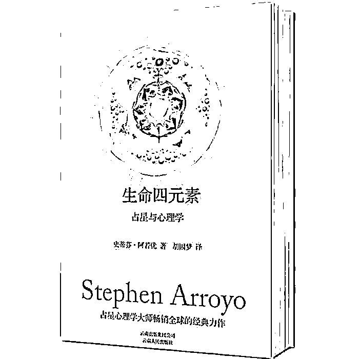

**推荐理由**
作者史蒂芬·阿若优，大师，名著。曾获得 1973 年英国占星学会的大奖。所谓生命四元素，大家都耳熟能详。没错，就是目前玄学中几乎通用的基础：地、水、火、风。不论中西文化如何差异都一致认为，基本元素构成了我们所知的一切事物，甚至牵动我们的意志与内心。因此，通过阅读本书，能够彻底了解四元素的内涵、意义。也阐明占星学为何能成为“人本主义心理学”的有力工具。 占星学方面，众所周知的黄道 12 星座，也是由这四元素所组成的。占星学体系中，也有四大基本功：行星、星座、宫位、相位。在职业占星师的解读中，是星图中明暗相间的两条主线。 所以在占星学习中，如果将四大基本功比喻为“武功招式”。那么这本书所讲的生命四元素，就是不折不扣的“内功心法”。《灵魂的功课》

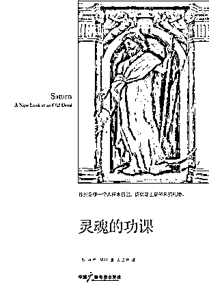

**推荐理由** 
丽兹·格林的著作《灵魂的功课》这本书籍类似一本占星手册，专项讨论了土星在星座和宫位上的影响，以及其他行星形成的相位。土星表面上看来是受到限制和宿命的，但是丽兹·格林在本书中提供说明，我们拥有拓展和控制自己人生的能力，让我们了解星图中的所有象征都可以转化，土星不仅仅是出生图的限制，也是潜能的所在。《灵魂的功课》曾经在一系列的推荐书单中名列前茅，如此受欢迎的原因，大概是书中不仅有洞察、有文采、同时也有深刻的学术研究，专攻神话学和荣格派精神分析的丽兹·格林，以太阳落处女座的精密分析和建言，为我们解析了人性里的黑暗野兽（土星），摇身转化后的另一面是光明界的王子。《生命的轨迹》

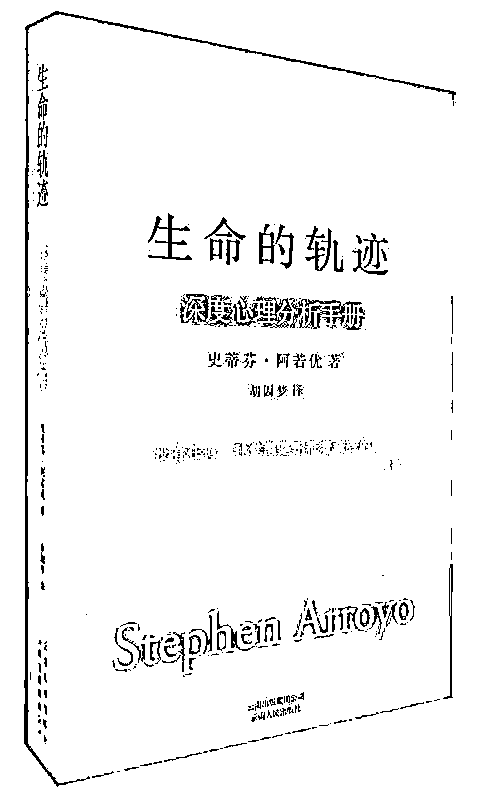

**推荐理由** 

本书由著名占星师史蒂芬·阿若优撰写，提供了一整套奠基于荣格心理学和东方哲学的深度占星方法，与传统占星学书籍不同，这本书是奠基于业力法则与自我转化驱力之上的。作者对占星学、心理学与东方哲学的整合，反映出一种深层的包容力与统和力。此书深刻、清晰与简朴的风格既能使初学者认识到占星学诠释的心理学背景也能满足有一定自我认识与成长经验的学者，阅读此书，能够对繁杂的思绪起到重新梳理的作用。适合所有对自我认识和灵性成长有兴趣的读者。


**点击图片了解详情**


**微信又又又改版啦，不想错过若道的推送？**

**就把若道设为星标吧！**

**▼**


就是这个“在看”，戳戳戳 ☟

**报名直达入口**


# 2020 年开年第一课！中英双导师联手打造 Level1-5 核心占星课

> 原文：[`mp.weixin.qq.com/s?__biz=MzA5NjA0NTAxNg==&mid=2651412358&idx=3&sn=9acab76ab2bdd317b432029d0b47b2a4&chksm=8b4be531bc3c6c274f40ea17a23bba503bdd732a0faaee91ec2502c4d4ae52ead0a2c7a5d3e5&scene=126&sessionid=1692738242#rd`](http://mp.weixin.qq.com/s?__biz=MzA5NjA0NTAxNg==&mid=2651412358&idx=3&sn=9acab76ab2bdd317b432029d0b47b2a4&chksm=8b4be531bc3c6c274f40ea17a23bba503bdd732a0faaee91ec2502c4d4ae52ead0a2c7a5d3e5&scene=126&sessionid=1692738242#rd)


**拥有****49****年占星实践经验的若道创始人**
**大卫·瑞雷****&****最懂学员的若道首位认证****金牌中国****老师****熊鹰****师徒二人****横跨南北****联手打造****北京上海**** 若道****全新****核心占星课程****之**

**互动实战占星初阶工作坊**

**本次****Level 1-2 工作坊****会分别在**

**上海（2020 年 3 月 13、14、15 日 熊鹰老师主讲）**

**北京（2020 年 4 月 4、5、6 日 大卫·瑞雷老师主讲）**

**两个城市各举办一场**

**方便北方、南方同学自由选择，邀请小伙伴一起学习**

**核心课现场工作坊是一种什么样的？**

珍贵的**面授工作坊**，全面而详细地讲解占星学知识，一场五感盛宴！

# **代入感：**向往占星世界好久了，迟迟没有下决心系统学习？最专业的占星老师来喽！带你穿越 9¾站台，进入真正的占星魔法世界，来若道，你就是哈利波特本特！


**沉浸感：**从虚拟的网络来到现实，舒适的学习环境，全新的占星同学，5D 的占星老师，专业的摄影团队，支持的工作人员~让你仿若重回校园梦，燃动青春学习占星！


**参与感：**大卫老师和天空老师都有丰富的教学经验，占星知识严肃专业，但开起玩笑来也丝毫不马虎，欢笑间知识都记住了呢，如果你长得可爱聪明伶俐，课上还会随时**被 Q**哦~对，就是你~


**仪式感：**两位老师超爱自己的中国学生们，为了让大家透彻地学习好宫位，2018 年初阶工作坊，大卫老师和熊鹰老师趴在地上用胶带贴的~仪式感满满~有没有~就宠你就宠你！今年还有没有其他的惊喜？


**亲近感：**周围全都是热爱占星的同学，那种亲近和被理解的感觉真的不要太美妙。志同道合的朋友就在身边，灵魂伴侣可能就在眼前，透露一下，在若道课堂里找到男女朋友的真的不要太多~比如~咳咳，总之带着八卦的心来上课吧~


**连报 L1-5 全阶课程，可以享受到：**❶ 51 次线上直播互动网络课程+3 场工作坊（互动实战占星初阶工作坊、亲密关系+职业占星工作坊、知识回顾+综合解读工作坊），全面而详细地讲解占星学知识、技能、案例和重要领域实践运用。 ❷知识点+学员星图解读有机结合：熊鹰老师以知识点和学员案例讲解为主，大卫·瑞雷老师以参课学员案例及客户案例讲解为主，每个知识点覆盖班级内学员的亲身案例，参与感更强，每位学员都有机会听到自己的星图分析。 ❸微信群学员互动分享，从真实案例学习生命成长故事。 ❹ 论坛提问：论坛上每个学员的问题都将得到及时回复。 ❺ 提供咨询师实习平台，只要努力，都将有机会在毕业前进行咨询的实习演练，听取客户反馈，为成为职业占星师做准备。

**1-2 阶我们要学习什么？**

  **第一阶** ** 12 星座，12 种性格，12 种人生**❶ 学习占星学必须准备的“心法”**❷**占星学中的火、土、风、水四元素，阴阳法则**❸**面对面的星座有故事**❹ **12 星座：12 种性格详解，12 种行为模式，12 种价值观**❺ **太阳和月亮：了解你的太阳，生命的发动机，让你在世界闪光的方式，生命获得力量的方法；了解你的月亮，让你获得幸福的方法**❻ **了解太阳、月亮，了解你生命中已经出现的、将会出现的男性和女性

**第二阶  命运的线索和人生故事中的演员**

❶ 命运的线索：南北交点❷ 星图三巨头：太阳、月亮、上升点的故事❸ 了解心智：水星❹ 了解金钱和关系：金星❺ 了解行动模式：火星❻ 了解信念：木星❼ 了解努力：土星❽ 了解天才和疯狂：天王星❾ 了解梦想和幻灭：海王星❿ 了解死亡和重生：冥王星⓫ 12 个人生场景：黄道 12 宫位初解

**现场工作坊**

**上海（2020 年 3 月 13、14、15 日 熊鹰老师主讲）**

**北京（2020 年 4 月 4、5、6 日 大卫·瑞雷老师主讲）**


**如果你想马上开始学习 Level 1-2**现提供即买即学的**熊鹰老师网络视频课程**出售价格和工作坊一样如果想同时购买网络课程视频+任一场现场工作坊可以享受打包价哈具体购买方式看到最后~

**3 阶开始的网络直播课**

老师同学都认识的差不多了，从三阶开始就是更方便灵活的网路直播课喽

**第三阶 宫位、相位以及初步解读星图****（15 次课）**❶ 15 次线上直播网络课程，每次 2 小时，堂课中依旧会使用同学们的星图作示范❷  10 节课由熊鹰老师教授，重点通过名人星图阐释知识点❸  5 节课由大卫·瑞雷老师教授，重点通过学员星图阐释知识点❹  从第三阶开始，助教将会指导练习，答疑解惑，学练结合❺  重点在于如何根据星图去问问题，着重自我发现和自我探索的过程**课程安排**2020 年 6 月 4 日：宫位，行星和星座组合 2020 年 6 月 11 日：宫位，行星和星座组合 2020 年 6 月 18 日：月亮交点 2020 年 7 月 2 日：月亮交点和演示案例 2020 年 7 月 9 日：相位 2020 年 7 月 16 日：相位+星座，行星和宫位 2020 年 7 月 23 日：相位，星座，行星和宫位的同学案例 2020 年 7 月 30 日：渐盈相位&渐亏相位，示例 2020 年 8 月 6 日：更多的关于宫位和宫主星 2020 年 8 月 13 日：同学案例 2020 年 8 月 20 日：空相行星&定位星 2020 年 8 月 27 日：宫主星 2020 年 9 月 3 日：优先级和组织 2020 年 9 月 17 日：相位模式以及范例 2020 年 9 月 24 日：学员星图解读范例**第四阶 出生星图解读（进阶）以及关系与职业议题****（12 次课，1 场四日亲密关系+职业占星工作坊）**❶ 12 次线上直播网络课程，每次 2 小时，堂课中依旧会使用同学们的星图作案例❷ 8 节课由熊鹰老师教授，4 节课由大卫·瑞雷老师教授

❸ 1 场北京现场四日工作坊：亲密关系+职业占星，学生将被选中进行案例演示和互动。

**工作坊安排：****2020 年 10 月 29 日、30 日、31 日、11 月 1 日四日北京工作坊****亲密关系（两天）+职业（两天）占星工作坊**学员将被选中进行案例演示和互动（免费）。**课程安排**

2020 年 11 月 26 日：整合星图和星图优先级

2020 年 12 月 3 日：综合解读

2020 年 12 月 10 日：整体案例

2020 年 12 月 17 日：亲密关系/对比星图

2021 年 1 月 7 日：占星学和对比星图的例子

2021 年 1 月 14 日：对比星图同学案例

2021 年 1 月 21 日：对比星图同学案例

2021 年 1 月 28 日：占星学的职业介绍

2021 年 2 月 4 日：占星学的职业案例

2021 年 2 月 18 日：占星学的职业同学案例

2021 年 2 月 25 日：儿童职业发展

2021 年 3 月 4 日：亲密关系/职业同学案例

**五阶 预测、关系、咨询、为执业和考试做准备****（24 次课，1 四日工作坊）**❶ 24 次线上直播网络课程，每次 2 小时，堂课中依旧会使用同学们的星图作案例❷ 15 节课由熊鹰老师教授，12 节课由大卫·瑞雷老师教授

❸ 1 场综合解读工作坊（北京）：把一切串联起来，学生将被选中进行案例演示和互动。

**工作坊安排：****2021 年 9 月 2 日、3 日、4 日、5 日四日综合解读工作坊（**北京**）**把一切串联起来，L1-5 知识回顾，综合解读学员将被选中进行案例演示和互动（免费）。**课程安排：**2021 年 4 月 15 日：行进介绍 12021 年 4 月 22 日：行进介绍 22021 年 4 月 29 日：行进介绍 32021 年 5 月 6 日：当下的行进的同学案例 2021 年 5 月 13 日：周期，重置星图 2021 年 5 月 20 日：当下的行进和周期的同学案例 2021 年 5 月 27 日：次限 2021 年 6 月 3 日：次限同学案例 2021 年 6 月 10 日：太阳弧 2021 年 6 月 17 日：太阳弧同学案例 2021 年 6 月 24 日：亲密关系的关键节点+组合星图 2021 年 7 月 1 日：亲密关系的关键节点，组合星图同学案例 2021 年 7 月 8 日：职业周期 2021 年 7 月 15 日：职业周期同学案例 2021 年 7 月 22 日：太阳返照&月亮返照 2021 年 7 月 29 日：太阳返照&月亮返照同学案例 2021 年 8 月 5 日：高级预测技巧 2021 年 8 月 12 日：高级预测同学案例 2021 年 8 月 19 日：高级预测技巧 22021 年 8 月 26 日：高级预测同学案例 22021 年 9 月 2 日：简单的占星学历史 2021 年 9 月 9 日：占星学的不同流派 2021 年 9 月 16 日：ISAR 考试术语和复习 2021 年 9 月 23 日：ISAR 考试术语和复习**这两位优秀的占星学老师是谁？**


**大卫·瑞雷（David Railey）**

*   ISAR 董事会成员，若道占星创始人。
*   1976 年，通过亚特兰大职业占星师考试，成为全职占星师，随后通过**AFAN 和 ISAR 职业测试**。
*   1980 年，与**杰夫·焦耳**一起在亚特兰大创建**“每日星球”**占星学中心。此后在亚特兰大占星协会担任 4 年考官，并且两次担任**亚特兰大地区占星协会主席**。
*   1979-1992 年，作为占星师活跃于美国社会媒体，向不了解现代占星学变化的大众宣传专业占星学知识。在 1989-1992 年期间，他在 WRGG 电台 12 频道每周主持个人电视秀**“今日占星学”**，早先他还在 WRFG 的广播节目中播讲宇宙天气节目。 
*   2010-2014 年，任**全美占星师联盟监督委员会委员**。
*   2010 年，其著作**《灵魂的目标》**中国版出版，和蒋颖一起创办**若道占星**学校和其官网 www.nodoor.com。从该年开始，他工作并往返于亚特兰大和北京。目前他 80%的时间致力于在中国教授和推广西方占星学。
*   2017 年，被选为**ISAR 委员会成员**（2017）。ISAR 是世界最大的国际占星机构，会员遍布 45 个国家。


**熊鹰老师（天空的空）**

*   2008 年接触严肃占星学，至此爱不释手。
*   **2013 年师从大卫·瑞雷**，研习整套现代占星学核心课程，并于 2014 年起至今连续三年担任该课程的主助教。
*   期间也**跟随格伦·佩里、诺·泰尔、理查德·塔纳斯、罗伯特·汉德、苏·汤普金斯、斯蒂芬·弗里斯特等多位国际顶尖占星大师进行学习**，进行定向占星主题研究。
*   2015 年初，通过国际占星研究协会**（ISAR）资质认证并获得证书**。同年，进一步跟随大卫·瑞雷老师进修**“生时校正”**技术，通过最终考核并获得证书。
*   目前在若道星文化任职，将传播系统、严谨、真实的占星学作为职业使命。任专职助教期间，进行沙龙与答疑等辅助教学工作已累计超过 200 小时。
*   在业余期间也提供占星咨询与生时校正服务。目前正致力于占星学与个人成长的整合。

**往届学员这样说**

★ **熊鹰老师非常清晰各阶段学员的难点在哪里，在哪里容易走弯路，所以在课程中给了针对性很强的技术讲解。**同时，学识广博的他对占星学术背后的道有非常深刻的思考，对占星学所表达的事物不断去溯源，去探寻本质，并在其他学问中去看到道的呼应，让我觉得非常过瘾和鼓舞。感谢熊鹰老师的启迪！ ——2017 若道占星核心课程熊鹰主讲 1-2 阶学员杨灿

**★ 知识渊博、博古通今、亲切可人、nice ，将东方的佛教文化、古诗词完美地与西方占星学结合，让学员特别容易理解**。很喜欢熊鹰（天空）老师，在巩固好 1、2 阶课程后，会追随空妈进行下一阶学习。

 ——2017 若道占星核心课程熊鹰主讲 1-2 阶学员王舒

★ **融合中国传统文化，把占星学规整得非常理性和易懂，空妈非常擅于观察和总结，给我们非常宝贵的经验。**我觉得效果非常好，以前对于各个星座和行星的概念比较片面，这次学完后觉得收获颇多，也打破了传统的限制，感觉到了与时俱进。 ——2017 若道占星核心课程熊鹰主讲 1-2 阶学员王茜★ 通过大卫老师课堂的案例咨询，我不仅对自己本身的特质和发展方向更加清晰，更开心的是清楚了自己处在怎样的发展阶段，外部环境对我的影响是怎样的，让我更加清晰应该怎样抓住机遇，在现阶段怎样努力。这些都是对我现在来说最重要的。**能够得到在课堂上享受这么专业精准的个案咨询，真的非常幸运。**——2017 若道占星核心课程大卫·瑞雷主讲 5 阶学员萧立★ 在课堂上获得了大卫咨询的宝贵机会。在一个多小时的咨询中，大卫首先演示了对客户星图的分析思路和推演过程，对客户的诸多发展方向和人生主题做出推测，并记录下来，待与客户见面时结合客户实际深入探讨。而后，大卫示范了如何与客户提问互动，从出生星图入手深入剖析案主的心理模式和原生家庭，并对案主的疑问进行解答。**坦白说，大卫的分析中肯且直中要害，对我来说像一道闪电，不仅准确地描述出我的原生家庭和童年生活环境，更击中了我多年来心中的隐痛**。这次咨询帮助我梳理了很多年来积压在心底的情绪，也在一定程度上疗愈了我，大卫的建议是如此地温和有力，让我感觉无比温暖，整个人被照亮了！再次感谢大卫，你的智慧和引导对我意义非凡！——2017 若道占星核心课程大卫·瑞雷主讲 5 阶学员龙爪槐下**若道核心课程教学支持体系****我们有****完善和系统的****核心课程教学支持体系****帮助你更好更全面地学习**


**什么人适合这门课？**

*   对占星学有浓厚兴趣，想要系统学习占星学
*   对占星学有一定基础，但不知道该如何整合星图复杂的碎片
*   希望成为优秀的占星师，想要借鉴国际大师解读思路并融入自己的体系
*   想学习占星学，但不擅长英文，希望有中文老师授课
*   想结合占星学理论与咨询实践

*   大卫·瑞雷、熊鹰的忠粉，学过占星，但就是想跟着偶像再学一遍

*   走在自我探索和个人成长道路上的人 

**课程费用****★ 1-5 阶****早鸟价：33000 元（2020 年 2 月 19 日之前）****课程费用：46500 元****★ 1-2 阶工作坊（北京工作坊、上海工作坊任选一场）****早鸟价：2800 元（2020 年 2 月 19 日之前）****课程费用：3500 元****★ 对于不方便上线下课的同学：可购买熊鹰老师 L1-2 视频课程****早鸟价：2800 元（2020 年 2 月 19 日之前）****课程费用：3500 元****★ 视频+现场都想要的同学：有套餐价哦****北京工作坊、上海工作坊****任选一场****+熊鹰老师 L1-2 视频课程****早鸟价：4200 元（2020 年 2 月 19 日之前）****课程费用：5200 元****退转课程**

*   **退款原则请详看《教学协议》，如有疑问请咨询课程顾问。**

****中英双导师核心课 Level1-5****

**授课老师：大卫·瑞雷 熊鹰**

**授课时间：****1-2 阶工作坊，上海** 2020 年 3 月 13、14、15 日**北京** 2020 年 4 月 4、5、6 日 ；**3-5 阶，**2020 年 6 月 4 日

**授课方式：**网络课程，中英文授课，中文翻译；现场工作坊，中英文授课，中文翻译

**费用：1-5 阶：**46500 元**早鸟价：33000 元（2020 年 2 月 19 日之前）；** **1-2 阶**（北京、上海工作坊任选一场）**：**3500 元**早鸟价：2800 元（2020 年 2 月 19 日之前）；******1-2 阶视频课程：****3500 元**早鸟价：2800 元（2020 年 2 月 19 日之前）；**

****视频+现场套餐价：****5200 元** 早鸟价：4200 元（2020 年 2 月 19 日之前）**

**课程负责人：**王老师（微信：18510107057），请备注“核心课”

长按二维码添加课程负责人咨询~


**阅读原文报名链接为：中英双导师 Level1-5 北京工作坊**

**想报名上海工作坊或购买熊鹰网络视频课程的小伙伴**

**记得私信销售小姐姐咨询哦**

****报名请点击“阅读原文”****


# 金星落在 12 个宫位，告诉你到哪里去寻找爱人

> 原文：[`mp.weixin.qq.com/s?__biz=MzA5NjA0NTAxNg==&mid=2651412308&idx=1&sn=c3d0211054048ccc1fe657704aeae3cc&chksm=8b4be5e3bc3c6cf5825d48dc2c0d02874080c879938c2bf5eee1d9cc875ffc6ae9623a059f3d&scene=126&sessionid=1692738242#rd`](http://mp.weixin.qq.com/s?__biz=MzA5NjA0NTAxNg==&mid=2651412308&idx=1&sn=c3d0211054048ccc1fe657704aeae3cc&chksm=8b4be5e3bc3c6cf5825d48dc2c0d02874080c879938c2bf5eee1d9cc875ffc6ae9623a059f3d&scene=126&sessionid=1692738242#rd)

**☆ 后台回复“今日”，给你一句生命态度**


作者/唐娜·坎宁安 

译者/江艺 校对/王宏

编辑/玫瑰 图片/unsplash

**金星与爱相关**

爱情有着世间最丰富的形式，哪一种让你感到真正的幸福？你是否曾经陷入让你不满意的伴侣模式？还在困惑烦恼？还在寻找真爱？那么认真思考一下你**金星的配置**，或许能够对你有所帮助。

在占星学中，**金星是吸引力之星，是爱与美之星**。金星与我们**喜欢什么**相关，它是**感官愉悦和社交满足的源泉，给人带来快乐和满足。**

**金星的特质**

*   **建设性的特质**：好交际、迷人、魅力十足、温暖、适应力强、和谐、调和、充满感情、和蔼可亲、拥有待人接物的技巧、擅长团队协作、可爱、能够妥协让步。
*   **破坏性的特质**：讨好他人、爱慕虚荣、过度在意外表、依赖于魅力而非努力、懒惰、享乐、贪婪、浅薄、犹豫不决。

**你在哪里寻找真爱？**在金星所处的宫位之中，你寻找着各式各样的爱情，但在内心深处，你可能最希望找到的是人生的真爱——一段恒久不变、忠贞不渝的情感。如果金星在第 7 宫这个关于婚姻和其他伴侣关系的宫位，那么你就非常有可能找到自己所寻找的事物。如果金星在其他宫位，而你又足够幸运，那么在从事与那一宫相关的事务时你就会找到人生的真爱。**但是正如我们将要看到的，星图中也可能存在着特定的复杂情况和局限性。**我们来走马观花地看看这 12 个宫位。**每一宫都象征一个人生的特定领域，我们会在那里邂逅从事该宫位所代表的活动的人。**

**举个例子**

*   第 10 宫代表我们的事业
*   第 4 宫代表我们的家庭生活
*   第 11 宫代表友情

如果我们在那几个宫位里发现了金星，说明我们将拥有怎样的浪漫故事呢？下面我们将逐一分析**金星在 12 个宫位分别反映出的你的爱情天性**。当然，你星图中金星的星座和相位会影响你的浪漫故事，它们能极大地改变仅仅基于宫位的任何阐释。因此，回到金星在第 7 宫——它已不能再好了，对吧？但是如果金星在摩羯座并且合相天王星、海王星和土星，那又当如何理解呢？爱情，以及生活对他们来说可能会非常复杂。

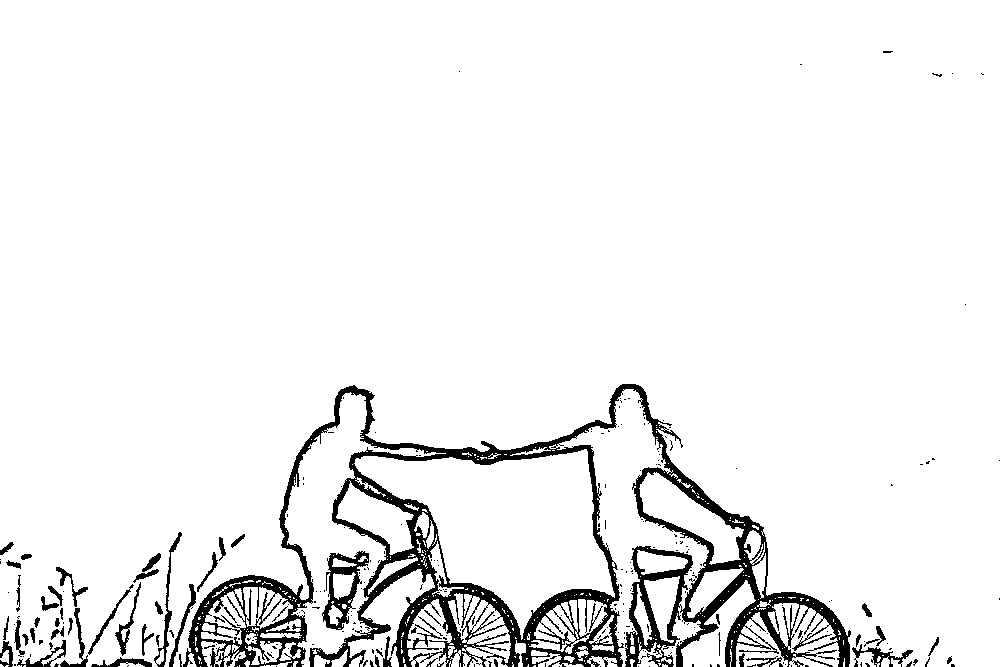

**哪些星座或相位对金星来说被视作困难？**

**传统占星学认为**

*   金星在**自己主宰的星座**（**天秤座**和**金牛座**）和其**擢升的双鱼座**中如鱼得水，这些是它**最好**的星座配置；
*   但是金星在**天蝎座**、**白羊座**和**处女座**则处于**劣势**。

**普遍认为**

*   **金星在摩羯座**过于无趣，在**天蝎座**过于迟钝。
*   当然，如果你是一个过于挑剔的人，你就可以挑剔处于几乎每个星座和宫位中的金星，但是这会更多地展示有关你自己金星的内涵，而非其他人的金星。

**相位方面**

*   **土星**和**外行星**在与金星呈**合相**、**四分相**或**对分相**时可能会很困难。

**金星落在 12 宫位**

1

**金星在第 1 宫**

**当金星位于对它有利的星座并相位良好的时候，这个配置会让人嫉妒，因为你很可能拥有引人注目的个人风格、好相貌，并且魅力十足——所有能吸引人的特征**。主要的瑕疵可能是你得抵挡那些你不喜欢的求爱者。如果**金星的配置不太有利，你就可能在那儿饥渴地寻求爱情，却找不到许多接受者。****行进冥王星或天王星与金星或上升点成三分相**时会是一个大好时机，你可以好好打扮一番，并有意识地改变接近喜欢的人的方式。

2

**金星在第 2 宫**

**在这里，爱情和金钱似乎不可避免地纠缠在一起**，好消息是**你在经济问题上很可能比较幸运，这要大大归功于你的外表和社交技巧**。不幸的是，**那些用礼物或钞票讨你欢心的人很少是在表达真爱和不朽的爱情。**同样，你自己对爱情的迫切需求可能导致你**送大量礼物给那些你想要接近的人，或在资金上支持他们的毒瘾或癖好**。不管是哪种方式，从长久来看，**用金钱购买爱情永远不会成为令人满意的情感策略。**

3

**金星在第 3 宫**

**除非有不利相位或欠佳的配置，你或许拥有热情而迷人的自我表达方式，让你的兄弟姐妹、亲戚和邻居都觉得你十分可爱**。你甚至可能**和你的“青梅竹马”或隔壁的男孩或女孩最终结为伴侣。**或者是你所托付的那个人可能更像一位**哥哥或姐姐**。而当你没有身处一段感情之中，又觉得需要一心一意的爱情的时候，你的兄弟姐妹、阿姨、表兄妹或邻居可能会给予你深深的爱，但是这始终无法完全满足你的需求。


4

**金星在第 4 宫**

**你会拥有漂亮的家和温馨的家人**，一个人还能有什么可再祈求的吗？但是，在你的人生中，你可能**最爱的是母亲或父亲**，你或许将其理想化，超出所有现实。**和与自己父母相像的人结婚**，这样的人并不罕见，而你可能指望着**精确地复制那些珍贵的品质**。一些非常好的求婚者可能出现，但是当你将他们与你深爱的父母比较时，他们不太可能符合标准，因此你的一部分可能对做出承诺犹豫不决。

5

**金星在第 5 宫**

这里的金星肯定能带来一些**风流韵事，**但是普通的浪漫一般都只有**短暂的保质期，**因此你可能**永远都在一段接一段的情事中追寻真心幸福的体验。**金星在第 5 宫也可以表现为**和自己孩子间温暖的、充满爱意的关系**，而这是弥足珍贵的。而如果**金星的星座和相位不良的话，你可能想要寻求与孩子之间无微不至的长达一辈子的感情，这会让你很难区分从孩子和伴侣身上寻求的爱**。当孩子长大时，他们也会期望世界用你的方式来纵容和宠爱他们。

6

**金星在第 6 宫**

在这里，金星显示出你在**待人接物方面的技巧**，这可以帮助你创造温暖、和谐的工作环境。在那里你很可能会**受到上司、同事和客户的喜爱**。你甚至可能在**工作中遇见自己的伴侣。**然而，如果存在**困难的星座和相位**，你可能容易陷入**办公室恋情**，从而在工作中分心，而且在恋情结束后也可能出现事与愿违的结果。不加选择地在工作场所搞浪漫关系可能有损你的名誉，而且要继续和前任爱人在一起工作，这会使情况变得非常尴尬或困难。这就是许多公司都禁止员工内部恋爱的原因。

7

**金星在第 7 宫**

拥有这种金星配置，你已经中了爱情的头彩，但是如果你没有从此过上幸福的生活又该如何呢？这就需要对你的第 7 宫进行详细的分析。你的**金星是否位于困难的星座，或者它是否与土星或外行星形成困难相位呢？**如果你的第 7 宫里还有其他的行星，那么你就能在爱情中获得不止一次机会——或者通过召唤其他行星的力量，让你的情感关系运转起来或许也不算太迟。

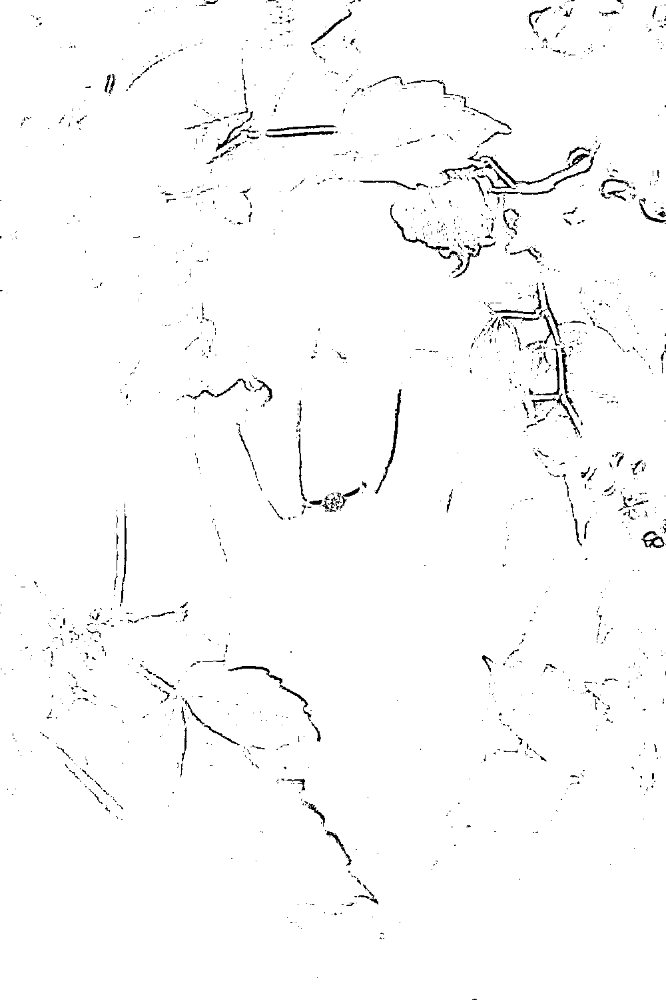

8

**金星在第 8 宫**

除非有不利相位或欠佳的配置，金星在这里的人可能**颇为好色，**如果和合适的伴侣在一起，可能很好地**保持兴奋和愉悦的源泉一直到老。**你和你的情人（们）可能都很吸引人，但不利的一面可能是一种**强制性的驱动，**如果情感关系中渐渐没有了性，这种驱动就不太可能预示着忠诚。同样，由于第 2 宫和第 8 宫是一对，分别代表**你的金钱（第 2 宫）和你伴侣的金钱（第 8 宫）**，因此要注意，在涉及**困难的相位或配置**时，**共享钱财可能给情感关系带来一些麻烦问题。**总之，导致婚姻冲突的两个主要原因是**性和金钱**，因此你需要运用金星的魅力来维持和平。

9

**金星在第 9 宫**

由于你的金星在第 9 宫，你很可能在**旅行时找到一位情人**。想要了解遥远地域和异域文化，没有比让一位殷勤的新情人为你介绍更好的方式了！金星的这一配置有可能出现什么问题呢？那就是**文化差异**，它一开始非常吸引人，但如果你们的精神信仰和习惯从长远来看会发生冲突的话，文化差异就可能让你们两个人之间产生巨大的鸿沟。由于你喜欢活到老学到老，因此**成人教育课程**是找到聪明的伴侣和爱人的另一个场所。你甚至可能引起你的**教授**的注意。

10

**金星在第 10 宫**

你父母中的一位可能充满魅力、风度翩翩，在社区或其职场中备受追捧。**你可能与他们相像，或许利用自己的外貌和吸引人的气质来升职。**该配置的缺点比起伴侣关系，你会**更加重视职业、形象或公众责任**。要想维持情感关系，你需要**有意识地致力于给予爱情所需要的关注。**

11

**金星在第 11 宫**

除非有不利相位或欠佳的配置，金星在这儿被看做是十分有利的：**你和朋友之间很可能拥有温暖、充满爱意的关系，而且你的伴侣可能就是你最好的朋友**。然而，如果有**第 5 宫的行星对分这颗金星或是第 8 宫行星四分金星**，那么你可能会**分不清这是友情还是爱情**。你可能也会有相当大的**性压力**，特别是在接近一位你重视的并想要同其约会的朋友时。你可能总是想要更进一步，但又害怕失去友情。

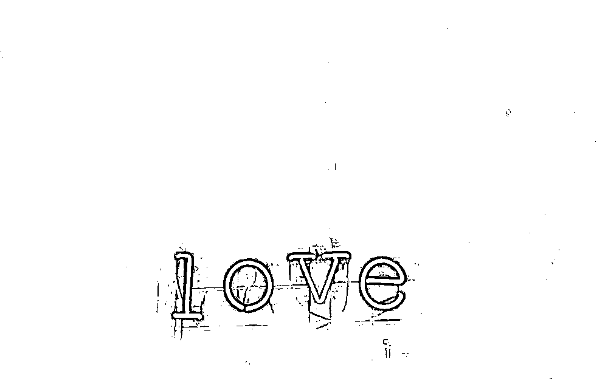

12

**金星在第 12 宫**

金星在这个位置被看成是**困难**的**，因为它可能显示出你以怎样的方式成为自己最大的敌人。**由于金星在这里，所以对爱情强迫性的需要可能驱使你到**隐秘的场所去寻找爱，或者在那些颓废、靠不住的、不安的人中去寻找爱。**然而，如果你能避免这些诱惑，这一配置会显示出一种**强烈的同理心和美妙的精神奉献**。此处，你需要做的是关注于**巩固和维护第 7 宫所描述的情感关系。****金星宫位不理想怎么办？**如果你的金星宫位不太理想，也不要对拥有美好的情感关系失去希望。金星显示了吸引你的人的类型以及你追求他们的方式，但是星图中还有其他特征与伴侣关系相关：**第 7 宫的行星和星座、第 8 宫和第 5 宫，还有这些宫位的主宰行星。**

**你还可以快速修复“受损”的金星**

*   做一个新发型或大变身；
*   买一套漂亮的新衣服，或与品味相当的人交换饰品或珠宝首饰；
*   买鲜花或是种花；
*   打电话给你很久没联系的爱慕你的人；
*   和你的伴侣安排一次约会之夜；
*   和你最好的朋友做一些特别的事情。

爱情，正如一首老歌告诉我们的，确实是一件华丽多彩的事情！**版权声明：**本文由若道翻译发布，欢迎转发，反对抄袭。友号转载请申请白名单。


**唐娜·坎宁安**一位在国际上都广受尊敬的占星师，她已有超过 45 年的从业经验。她已撰有数十本占星著作以及上百篇占星学和其他形而上学类的文章。于 2017 年 7 月 5 日离世，享年 75 岁。

******点击图片查看若道君推荐******


**微信又双叒叕改版啦，不想错过若道君的推送？**

**就把若道设为星标吧！**

**▼**


就是这个“在看”，戳戳戳 ☟

**报名直达入口**


# 雷蒙德·梅里曼金融占星周运 | 25-28 日有望冲上新高

> 原文：[`mp.weixin.qq.com/s?__biz=MzA5NjA0NTAxNg==&mid=2651412308&idx=2&sn=89a9e0e121cdc72a85f641733c4dd98f&chksm=8b4be5e3bc3c6cf5457d4ce2a585d5291d5f508e32777e38048794f300152aa3a732ec1aca11&scene=126&sessionid=1692738242#rd`](http://mp.weixin.qq.com/s?__biz=MzA5NjA0NTAxNg==&mid=2651412308&idx=2&sn=89a9e0e121cdc72a85f641733c4dd98f&chksm=8b4be5e3bc3c6cf5457d4ce2a585d5291d5f508e32777e38048794f300152aa3a732ec1aca11&scene=126&sessionid=1692738242#rd)

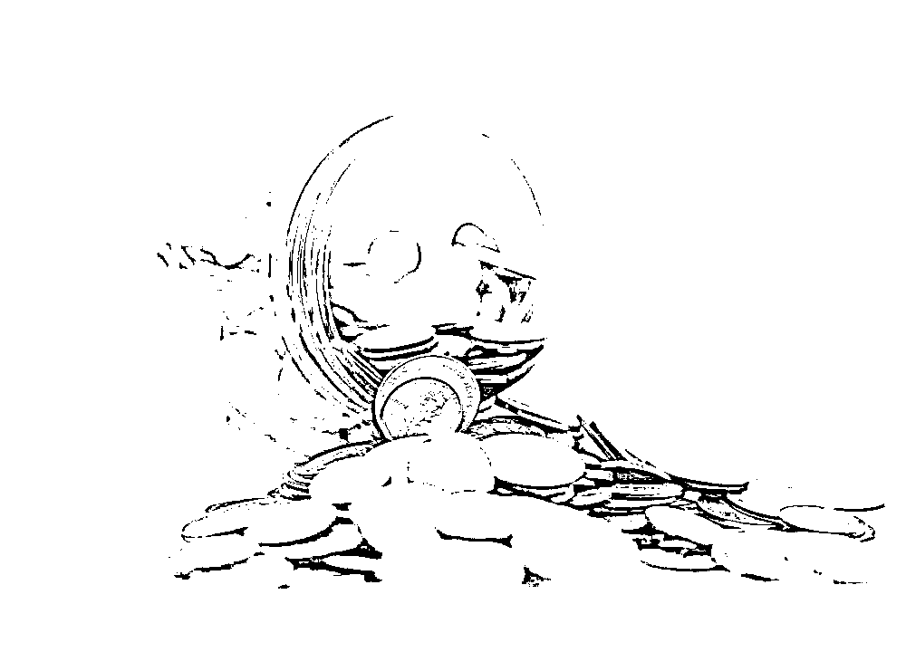

作者/雷蒙德·梅里曼
翻译/Luke 校对/李含编辑/玫瑰 图片/unsplash

雷蒙德·梅里曼是在金融占星学界稳坐第一把交椅的占星师，同时他也是若道签约的金融占星课老师，我们引进了雷蒙德·梅里曼老师的《上证指数月度报告》《黄金周期月度报告》《2020 年金融预报》（感兴趣的同学可以扫码文末图片购买）。我们经老师的授权，将每周刊登梅里曼老师的周运，供大家参考和学习。于是，这是这周的周运（12.16-12.20）。

**展望与回顾**这个 13 日星期五还算不错。上周的“感恩”节真是名副其实，因为金融市场上发生了许多好事情。其中之一是，美联储宣布在未来一段时间内保持利率稳定，直到通货膨胀失控。不言自明的一点是，美联储可能不会在即将来临的大选年里调整利率了。然而，他们可能不知道的是，**2020 年 5 月 14 日到 6 月 25 日时金星逆行**，这段时间**美联储（或其他央行）往往会突然宣布改变政策。**第二件好事是英国大选终于为脱欧扫清了障碍。脱欧意味着英国离开欧盟，是三年前一次投票决定的。市场担忧的不确定性又少了一件，尽管又会由此产生新的忧虑。股市上周的表现足以使人相信**天象与股市活动的关联依然良好**。美国（和其他地方）市场在 11 月 27 日（道琼斯指数和纳斯达克指数）和 12 月 2 日（标准普尔指数）达到历史新高后表现平平。**上周的低点出现在周二-周三，即 12 月 10 日-11 日，恰逢金星合相土星（12 月 11 日）。**我们的规则之一是**金星-土星成困难相位时，任何正在下跌的市场都有可能反弹。**我们认为，**在金星-土星的压制后，木星（夸大和跃进）与天王星（突破阻力或支撑）在 12 月 15 日形成有利的三分相会使股市大幅上涨**。看来我们上周描绘的前景是正确的，上周的描述是：“木星三分天王星出现在这一合相以后，可能届时会出现美中贸易协议相关的迹象，这样就说得通了，因为预定会在 12 月 15 日新加征一笔关税……但这也可能意味着有限协议最后的细节部分起草完毕。这可能会触发**股市在年底以前再次冲上破纪录的高点，因为 12 月 25-28 日太阳合相木星三分天王星。**”的确，美中同意签署一份“有限贸易协议”（土星），随后世界股市大涨（木星）。这不是先前承诺的又大又美的协议，但做出承诺的时候木星处于扩张的射手座。现在它进入摩羯座，又大又美的协议降级成了可以接受的有限协议。对原油来说，这又是势头极好的一周，木星是原油的守护星之一。原油九月以来首次上涨到了 60 美元/每桶以上。黄金和白银也守住了防线。黄金甚至创了新的周期高点，12 月 12 日星期四的时候短暂上升到了 1490 美元以上，这是 11 月 7 日崩盘以来的第一次。**只要火星还在天蝎座，而且黄金不跌破 1450 美元，就有机会上涨**。另一方面，比特币卡在了 7000 和 7500 的盘整区间。然而，它应在这周中期以前出现一个月亮周期低点。

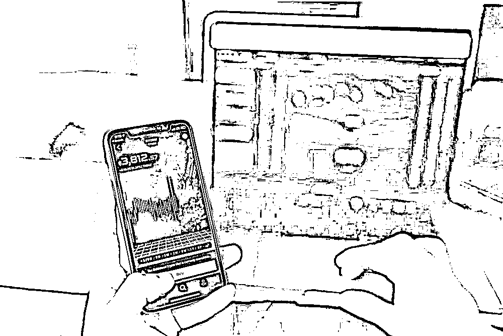

**短期占星趋势与长期考量**

**美国国会预算办公室的数据显示，在 2020 财年的前两个月，美国政府赤字飙升 12%，至 3420 亿美元。国会预算办公室说，从 2020 年到 2029 年，美国的预算赤字将达到平均每年 1.2 万亿美元，相当于国内生产总值的 4.4%到 4.8%。特朗普总统 2017 年 1 月上任时，联邦赤字为 5870 亿美元，2019 年已膨胀至 9840 亿美元。** 

**——乔纳森·加伯**

**《美国赤字在两个月内飙升至 3420 亿美元》**

**www.foxbusiness.com**

**2019 年 12 月 10 日**

木星行进带来的欢乐会持续到**12 月 28 日的太阳合相木星，三分天王星**。因此，纵使摩羯座汇聚了众多行星，仍然创造了一种对未来保持乐观的气氛。起码目前为止是这样。但在**明年年初的 1 月 10 日-13 日**，太阳离开木星，与土星、冥王星在摩羯座合相时，**一切可能都会改变**。在那时，**天王星会改变方向**，这意味着**市场的很多趋势可能也会这段时间改变方向。**但是现在，让我们享受这段时光，把难题抛诸脑后。把对明年的担忧留给……明年。你可以在[2020 年金融预报](http://mp.weixin.qq.com/s?__biz=MzA5NjA0NTAxNg==&mid=2651412283&idx=1&sn=709a7831f692f7bfda0cc18f9fbfceb9&chksm=8b4be58cbc3c6c9a56697593adc3a4925fa326e040f214268c58ca4d633d79add16e65f4b97b&scene=21#wechat_redirect)里读到这些事情。从宇宙的角度来看，这一年是举足轻重的。

尽情享乐吧！**12 月 28 日之前木星能量高涨，没理由不过得高兴一点**。然而，要小心**不要享乐过度**。木星有时候搞不清边界，也不知道别人的边界在哪里。但只要具备一点常识，**保持对他人的尊重**，无论是企业还是个人，都能度过一个美好的假期。这期间可以感觉到人与人之间的和谐，认识到我们每个人是联结在一起，而不是分开的。享受生活吧！

**版权声明：**本文由若道翻译发布，欢迎转发，反对抄袭。友号转载请申请白名单。


**雷蒙德·梅里曼（Raymond Merriman）**

若道签约老师。著名金融占星师，ISAR（国际占星研究协会）前主席，梅里曼市场分析公司的总裁。他由于“提升了占星学的职业形象”，在 1995 年国际占星大会上被授予轩辕十四奖；在 2012 年国际占星大会上，被授予轩辕十四终身成就奖。

1“中国上证指数月度报告”发售

**从****7****月开始，若道推出了****中文版****的雷蒙德·梅里曼中国上证指数月度报告，并持续发行该报告！**

当把金融市场的周期和占星学的周期相结合时，雷蒙德·梅里曼老师的金融占星学研究**为投资者应对金融市场的周期波动，并随之调整投资策略提供了极大的价值参考**。

2“黄金价格周期月度报告”发售

**现在，又有一个好消息要告诉你。从****9****月开始，若道将推出****中文版****的雷蒙德·梅里曼黄金价格周期月度报告！**不仅仅为广大读者在中国股市的投资出谋划策，更将视角放眼黄金市场。

**每当世界经济形式不明朗的时候，有一个地方是保值的港湾，那就是****黄金**。从 2018 年 8 月开始，黄金已经用自己的升值再次提醒众人它在经济不稳定时的位置。**截至目前，2019 年 8 月底，黄金已飙升至 6 年新高，高于 1565 美元。**

自 1982 年雷蒙德·梅里曼出版第一本研究《地球宇宙学征象与黄金价格的关联》的著作以来，**他一直作为最重要的黄金市场时机预测者之一享誉国际**。

过去 1 年，那些订阅并遵循建议的梅里曼市场时机学院日报和周报的订阅者，如果从 2018 年 8 月 16 日的低点或 8 月 23-24 日的次低点购买黄金，他们已经赚到了不少的 30%左右的利润。

**购买套餐**，买得越多越优惠

**12 月报告均已更新！**

中国上证指数月度报告套餐价

*   **单月报告**：280 元

*   **3 个月套餐**：780 元（260 元/月）

*   **12 个月套餐价**：1999 元（166 元/月）

**长按下图识别二维码**

**购买金融报告****套餐**

**▼**


黄金周期月度报告超级优惠折扣

*   **同时购买上证指数 12 个月套餐**和**黄金周期报告 12 个月套餐**，即可享受黄金周期报告 12 个月套餐**立减 1199**元的**超级优惠折扣**。

*   **已经购买**了**上证指数 12 个月套餐**的朋友，**再购买**黄金周期报告 12 个月套餐，也可享受**立减 1199**元的**超级优惠折扣**。**购买黄金周期报告 12 个月套餐时，超级优惠折扣会自动生效**。

**长按下图识别二维码购买黄金报告套餐**

▼


32020 年金融预报预售 1976 年以来，由雷蒙德·梅里曼撰写的梅里曼市场时机学院每年一次的年度预报沙龙和每年一本的《年度预报》一直在应用占星学原理为投资者们服务，43 年来，这本 200 页左右对金融市场的分析报告和 3 小时的年度预报讲座在美国、日本、欧洲帮助许多投资者了解宇宙天气对于世界经济形势、政府政策及其对各个金融市场和金融产品的影响，帮助他们做出正确的投资决策，降低投资风险。2018 年，若道第一次将这份广受赞誉的一年一度的金融占星报告和沙龙引入中国，供中国投资者参考。**《2020 年金融预报》将会谈及 2020 年重要的宇宙天象及其对世界经济、贸易形势的整体影响，还将覆盖中国上证股票市场的分析、黄金白银市场、美国经济、美国总统、美联储、美国国债市场、美国股票市场、主要外汇货币市场（主要外汇美元、英镑、欧元、日元、瑞士法郎）、原油市场、谷物市场、活牛市场、比特币市场等投资市场。**梅里曼老师及梅里曼市场时机学院的金融占星分析师还会给出以上市场 2020 年的**市场价格目标区间及重要价格反转日**，为短期、中期和长期投资者进行市场操作的时机提供参考。如果你关注世界经济和金融投资市场的变化，会发现梅里曼《金融年度预报》中的研究对于你了解世界经济在发生什么，这些市场的走向会如何有非同寻常的指导价值。报告和讲座价格

2020 年金融预报讲座和报告价格整体售价** 1280 元**

（本讲座和报告不单独出售）

**12 月 31 日前 100 名用户**预售价：**1080 元**

**12 月 31 日后**恢复原价：**1280 元**

**长按下图识别二维码购买 2020 年金融预报**

▼


**微信又双叒叕改版啦，不想错过若道君的推送？**

**就把若道设为星标吧！**

**▼**


********点击阅读原文购买金融报告********


# 中英双导师 Level1-2｜用占星学帮助心灵成长，收获幸福

> 原文：[`mp.weixin.qq.com/s?__biz=MzA5NjA0NTAxNg==&mid=2651412287&idx=3&sn=7cc80afcbcdd660c9f94692def9edb53&chksm=8b4be588bc3c6c9e8c99bb44591c6ee34ec77a4c93c5ee8a03fec0e1ed8a76ad916d447265cc&scene=126&sessionid=1692738242#rd`](http://mp.weixin.qq.com/s?__biz=MzA5NjA0NTAxNg==&mid=2651412287&idx=3&sn=7cc80afcbcdd660c9f94692def9edb53&chksm=8b4be588bc3c6c9e8c99bb44591c6ee34ec77a4c93c5ee8a03fec0e1ed8a76ad916d447265cc&scene=126&sessionid=1692738242#rd)

****

**拥有 49 年占星实践经验的若道创始人**

**大卫·瑞雷**

**&**

**最懂学员的若道首位认证金牌中国老师**

**熊鹰**

**师徒二人****横跨南北****联手打造****北京上海**** 若道****全新****核心占星课程****之**

**互动实战占星初阶工作坊**

**本次****Level 1-2 工作坊****会分别在**

**上海（2020 年 3 月 13、14、15 日 熊鹰老师主讲）**

**北京（2020 年 4 月 4、5、6 日 大卫·瑞雷老师主讲）**

**两个城市各举办一场**

**方便北方、南方同学自由选择，邀请小伙伴一起学习**

**核心课现场工作坊是一种什么样的？**

珍贵的**面授工作坊**，全面而详细地讲解占星学知识，一场五感盛宴！

# **代入感：**向往占星世界好久了，迟迟没有下决心系统学习？最专业的占星老师来喽！带你穿越 9¾站台，进入真正的占星魔法世界，来若道，你就是哈利波特本特！


**沉浸感：**从虚拟的网络来到现实，舒适的学习环境，全新的占星同学，5D 的占星老师，专业的摄影团队，支持的工作人员~让你仿若重回校园梦，燃动青春学习占星！


**参与感：**大卫老师和天空老师都有丰富的教学经验，占星知识严肃专业，但开起玩笑来也丝毫不马虎，欢笑间知识都记住了呢，如果你长得可爱聪明伶俐，课上还会随时**被 Q**哦~对，就是你~


**仪式感：**两位老师超爱自己的中国学生们，为了让大家透彻地学习好宫位，2018 年初阶工作坊，大卫老师和熊鹰老师趴在地上用胶带贴的~仪式感满满~有没有~就宠你就宠你！今年还有没有其他的惊喜？


**亲近感：**周围全都是热爱占星的同学，那种亲近和被理解的感觉真的不要太美妙。志同道合的朋友就在身边，灵魂伴侣可能就在眼前，透露一下，在若道课堂里找到男女朋友的真的不要太多~比如~咳咳，总之带着八卦的心来上课吧~


**连报 L1-5 全阶课程，可以享受到：**❶51 次线上直播互动网络课程+3 场工作坊（互动实战占星初阶工作坊、亲密关系+职业占星工作坊、知识回顾+综合解读工作坊），全面而详细地讲解占星学知识、技能、案例和重要领域实践运用。 ❷知识点+学员星图解读有机结合：熊鹰老师以知识点和学员案例讲解为主，大卫·瑞雷老师以参课学员案例及客户案例讲解为主，每个知识点覆盖班级内学员的亲身案例，参与感更强，每位学员都有机会听到自己的星图分析。 ❸微信群学员互动分享，从真实案例学习生命成长故事。 ❹ 论坛提问：论坛上每个学员的问题都将得到及时回复。 ❺ 提供咨询师实习平台，只要努力，都将有机会在毕业前进行咨询的实习演练，听取客户反馈，为成为职业占星师做准备。

**1-2 阶我们要学习什么？**

**第一阶** ** 12 星座，12 种性格，12 种人生**❶ 学习占星学必须准备的“心法”**❷**占星学中的火、土、风、水四元素，阴阳法则**❸**面对面的星座有故事**❹ **12 星座：12 种性格详解，12 种行为模式，12 种价值观**❺ **太阳和月亮：了解你的太阳，生命的发动机，让你在世界闪光的方式，生命获得力量的方法；了解你的月亮，让你获得幸福的方法**❻ **了解太阳、月亮，了解你生命中已经出现的、将会出现的男性和女性

**第二阶  命运的线索和人生故事中的演员**

❶ 命运的线索：南北交点❷ 星图三巨头：太阳、月亮、上升点的故事❸ 了解心智：水星❹ 了解金钱和关系：金星❺ 了解行动模式：火星❻ 了解信念：木星❼ 了解努力：土星❽ 了解天才和疯狂：天王星❾ 了解梦想和幻灭：海王星❿ 了解死亡和重生：冥王星⓫ 12 个人生场景：黄道 12 宫位初解

**现场工作坊**

**上海（2020 年 3 月 13、14、15 日 熊鹰老师主讲）**

**北京（2020 年 4 月 4、5、6 日 大卫·瑞雷老师主讲）**


**如果你想马上开始学习 Level 1-2**现提供即买即学的**熊鹰老师网络视频课程**出售价格和工作坊一样

如果想同时购买网络课程视频+任一场现场工作坊可以享受**打包价**哈

```
购买视频课或购买视频+工作坊套餐的小伙伴
```

```
还能享受每月一次 2 小时的熊鹰老师直播答疑课，一共 4 次
```

具体购买方式看到最后~**这两位优秀的占星学老师是谁？**


**大卫·瑞雷（David Railey）**

*   ISAR 董事会成员，若道占星创始人。
*   1976 年，通过亚特兰大职业占星师考试，成为全职占星师，随后通过**AFAN 和 ISAR 职业测试**。
*   1980 年，与**杰夫·焦耳**一起在亚特兰大创建**“每日星球”**占星学中心。此后在亚特兰大占星协会担任 4 年考官，并且两次担任**亚特兰大地区占星协会主席**。
*   1979-1992 年，作为占星师活跃于美国社会媒体，向不了解现代占星学变化的大众宣传专业占星学知识。在 1989-1992 年期间，他在 WRGG 电台 12 频道每周主持个人电视秀**“今日占星学”**，早先他还在 WRFG 的广播节目中播讲宇宙天气节目。 
*   2010-2014 年，任**全美占星师联盟监督委员会委员**。
*   2010 年，其著作**《灵魂的目标》**中国版出版，和蒋颖一起创办**若道占星**学校和其官网 www.nodoor.com。从该年开始，他工作并往返于亚特兰大和北京。目前他 80%的时间致力于在中国教授和推广西方占星学。
*   2017 年，被选为**ISAR 委员会成员**（2017）。ISAR 是世界最大的国际占星机构，会员遍布 45 个国家。


**熊鹰老师（天空的空）**

*   2008 年接触严肃占星学，至此爱不释手。
*   **2013 年师从大卫·瑞雷**，研习整套现代占星学核心课程，并于 2014 年起至今连续三年担任该课程的主助教。
*   期间也**跟随格伦·佩里、诺·泰尔、理查德·塔纳斯、罗伯特·汉德、苏·汤普金斯、斯蒂芬·弗里斯特等多位国际顶尖占星大师进行学习**，进行定向占星主题研究。
*   2015 年初，通过国际占星研究协会**（ISAR）资质认证并获得证书**。同年，进一步跟随大卫·瑞雷老师进修**“生时校正”**技术，通过最终考核并获得证书。
*   目前在若道星文化任职，将传播系统、严谨、真实的占星学作为职业使命。任专职助教期间，进行沙龙与答疑等辅助教学工作已累计超过 200 小时。
*   在业余期间也提供占星咨询与生时校正服务。目前正致力于占星学与个人成长的整合。

**往届学员这样说**

★ **熊鹰老师非常清晰各阶段学员的难点在哪里，在哪里容易走弯路，所以在课程中给了针对性很强的技术讲解。**同时，学识广博的他对占星学术背后的道有非常深刻的思考，对占星学所表达的事物不断去溯源，去探寻本质，并在其他学问中去看到道的呼应，让我觉得非常过瘾和鼓舞。感谢熊鹰老师的启迪！ ——2017 若道占星核心课程熊鹰主讲 1-2 阶学员杨灿

**★ 知识渊博、博古通今、亲切可人、nice ，将东方的佛教文化、古诗词完美地与西方占星学结合，让学员特别容易理解**。很喜欢熊鹰（天空）老师，在巩固好 1、2 阶课程后，会追随空妈进行下一阶学习。

 ——2017 若道占星核心课程熊鹰主讲 1-2 阶学员王舒

★ **融合中国传统文化，把占星学规整得非常理性和易懂，空妈非常擅于观察和总结，给我们非常宝贵的经验。**我觉得效果非常好，以前对于各个星座和行星的概念比较片面，这次学完后觉得收获颇多，也打破了传统的限制，感觉到了与时俱进。 ——2017 若道占星核心课程熊鹰主讲 1-2 阶学员王茜★ 通过大卫老师课堂的案例咨询，我不仅对自己本身的特质和发展方向更加清晰，更开心的是清楚了自己处在怎样的发展阶段，外部环境对我的影响是怎样的，让我更加清晰应该怎样抓住机遇，在现阶段怎样努力。这些都是对我现在来说最重要的。**能够得到在课堂上享受这么专业精准的个案咨询，真的非常幸运。**——2017 若道占星核心课程大卫·瑞雷主讲 5 阶学员萧立★ 在课堂上获得了大卫咨询的宝贵机会。在一个多小时的咨询中，大卫首先演示了对客户星图的分析思路和推演过程，对客户的诸多发展方向和人生主题做出推测，并记录下来，待与客户见面时结合客户实际深入探讨。而后，大卫示范了如何与客户提问互动，从出生星图入手深入剖析案主的心理模式和原生家庭，并对案主的疑问进行解答。**坦白说，大卫的分析中肯且直中要害，对我来说像一道闪电，不仅准确地描述出我的原生家庭和童年生活环境，更击中了我多年来心中的隐痛**。这次咨询帮助我梳理了很多年来积压在心底的情绪，也在一定程度上疗愈了我，大卫的建议是如此地温和有力，让我感觉无比温暖，整个人被照亮了！再次感谢大卫，你的智慧和引导对我意义非凡！——2017 若道占星核心课程大卫·瑞雷主讲 5 阶学员龙爪槐下**若道核心课程教学支持体系****我们有****完善和系统的****核心课程教学支持体系****帮助你更好更全面地学习**


**什么人适合这门课？**

*   对占星学有浓厚兴趣，想要系统学习占星学
*   对占星学有一定基础，但不知道该如何整合星图复杂的碎片
*   希望成为优秀的占星师，想要借鉴国际大师解读思路并融入自己的体系
*   想学习占星学，但不擅长英文，希望有中文老师授课
*   想结合占星学理论与咨询实践

*   大卫·瑞雷、熊鹰的忠粉，学过占星，但就是想跟着偶像再学一遍

*   走在自我探索和个人成长道路上的人 

**课程费用****★ 1-5 阶****早鸟价：33000 元（2020 年 2 月 19 日之前）****课程费用：46500 元****★ 1-2 阶工作坊（北京工作坊、上海工作坊任选一场）****早鸟价：2800 元（2020 年 2 月 19 日之前）****课程费用：3500 元****★ 对于不方便上线下课的同学：可购买熊鹰老师 L1-2 视频课程****早鸟价：2800 元（2020 年 2 月 19 日之前）****课程费用：3500 元****★ 视频+现场都想要的同学：有套餐价哦**

```
购买熊鹰老师网络视频课程，每月有一次 2 小时的熊鹰老师直播答疑课，一共 4 次，工作坊不含，购买视频课或购买视频+工作坊套餐独享~
```

**北京工作坊、上海工作坊****任选一场****+熊鹰老师 L1-2 视频课程****早鸟价：4200 元（2020 年 2 月 19 日之前）****课程费用：5200 元****退转课程**

*   **退款原则请详看《教学协议》，如有疑问请咨询课程顾问。**

****中英双导师核心课 Level1-2****

**授课老师：大卫·瑞雷 熊鹰**

**授课时间：****上海**工作坊**** 2020 年 3 月 13、14、15 日 **北京**工作坊**** 2020 年 4 月 4、5、6 日

**授课方式：**中英文授课，中文翻译

**费用：******北京、上海工作坊任选一场**：**3500 元**早鸟价：2800 元（2020 年 2 月 19 日之前）；**

****1-2 阶视频课程：****3500 元**早鸟价：2800 元（2020 年 2 月 19 日之前）；**

****视频+现场套餐价：****5200 元** 早鸟价：4200 元（2020 年 2 月 19 日之前）**

**课程负责人：**王老师（微信：18510107057），请备注“核心课”

长按二维码添加课程负责人咨询~


****报名请点击“阅读原文”****


# 太阳摩羯座+3 种水星 | 有一种摩羯座，稳中带甩

> 原文：[`mp.weixin.qq.com/s?__biz=MzA5NjA0NTAxNg==&mid=2651412287&idx=2&sn=6cc3dc7f9795f555752e3a93feab0c6d&chksm=8b4be588bc3c6c9e5b684340cc6bc4cdf66d0753fdcc6d8cd6b9060ed7cc4785ac80ee3a624d&scene=126&sessionid=1692738242#rd`](http://mp.weixin.qq.com/s?__biz=MzA5NjA0NTAxNg==&mid=2651412287&idx=2&sn=6cc3dc7f9795f555752e3a93feab0c6d&chksm=8b4be588bc3c6c9e5b684340cc6bc4cdf66d0753fdcc6d8cd6b9060ed7cc4785ac80ee3a624d&scene=126&sessionid=1692738242#rd)

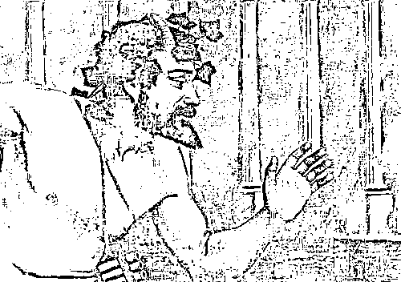

作者/安德烈 ISAR 认证占星师

编辑/玫瑰 图片/网络 

由于太阳与水星形成角度的限制，日水的组合只会出现 36 种。这 36 种组合，可以被视为最基本的“表达模式”的模板。当然，在实际解读星图的时候，肯定也要考虑落宫和相位等影响。今天就让我们来看看太阳摩羯座的 3 种水星组合吧！

**太阳摩羯座**

众所周知，**太阳摩羯座比较克制，喜欢保留很多的传统**。他们对于新事物总是持有较多的保留意见，且在判断是非对错的时候，并不会太积极地选边站，所以说话时总会喜欢留几分，并不会说得太满，也就自然不容易被“打脸”了。

对太阳摩羯座来说，对和错并不是绝对的，也并不是必须要去考虑的，他更在意的是**哪种想法是当下最适合的、最不会惹麻烦的**。所以相比较太阳天蝎座，**摩羯座的决断性并没有那么强**，不会先前声色平静，随后突然做出什么冒险性的举动，而是遵循自己一直以来的计划，他们的决策和想法都很需要保障。所以在给人一种很靠谱的感觉的同时，也会对自己所做的事情，背后所支持的基础反复强调。

在说话时也是一样，没有过往经验、案例的支持，就算很满足处女座式的精细，能用证据一环扣一环地推导，他们也不会妄下断言。他们的保守不同于处女的谦卑，处女的态度是要明确地想清楚自己的不足之处，而摩羯座则更**实用主义**一些，他们更不拘小节，主要的关注点在于避免最坏的结果。

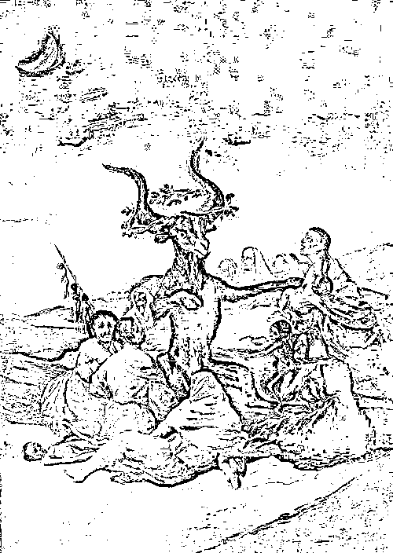

**太阳摩羯座+水星射手座**

太阳摩羯座-水星射手座的组合，会在表述上具有**很强的预判性**，他们都不算沉默的人，**喜欢向别人传递自己一直贯彻的想法**，显得非常固执，甚至带点教条，甚至有点像《杀死比尔》里的白眉老师傅。太阳摩羯座的严肃沉稳，配上水星射手座的表露自如，他们**喜欢不断重复自己的道理，说服自己也说服别人**。若是出生星图里的火土元素很重，他们还真会朝着这方面大胆去做，但他们的道理不是拍脑袋想的，更不是凭空来的，这取决于他们的经历，以及那些“长者”的智慧。**这些人多是喜欢诵读经典的，引经论据，他们也很喜欢权威感，时刻在想，唯一的正道是什么。**他们喜欢引述的那些人，多半在土里埋着。因为那些东西“经过了时间的考验”，但这不妨碍用古人的经验去探索未来。在决策层面上，他们很**坚持自己的道理**。他们并不像太阳-水星摩羯座的组合那样保守、克制，而是随着延续自己一如既往的计划。他们喜欢计划，他们需要计划，制定一张在什么时候该干什么事的日程表，然后坚持下去。虽然不像太阳-水星处女座那般事无巨细，也不像太阳-水星金牛座那么一如既往，但他们确实很讨厌没有准备就去做，很多决策都需要花些时间酝酿下，在心中多停留会儿。

**太阳摩羯座+水星摩羯座**

他们在表达意见时，会是比较**四平八稳**的。除非这枚水星也被强化，或精准合相了太阳，否则**不太喜欢表露自己的个人意志，或者在不同意见中提前站队**。他们的言语会比较朴素，用最实际的话语去说明自己想表达的，附带一些过去的经验与公认的案例。除非他们的金星落入了射手座或水瓶座，否则言语中的价值观，也会显得比实际年龄更老成。**他们会说世事的常态是如何的；也会去说做什么事情需要什么基础。**摩羯座的太阳和水星组合在一起，算不上言辞激烈的辩驳者，他们只是**一五一十地去说自己所看到的、所经历的，给人一种有过时间沉淀的稳重感。**因为他们知道，多数的意见、想法都会随着时间的逝去而随风飘逝，唯有那些常态的、传统的、不变的东西能经历时间的考验。正是因为在说每句话时都在潜意识里想得更远、更多，才会**没有灵活的话术，甚至显得刻板、笨拙**。在决策层面上，他们也是如此，避免湿鞋的方法就是少去河边走，富贵险中求，倾家荡产也是险中来，避免去赌，而是不断积累。去看他们的一生，未免看着有些枯燥，少了些大起大落，但他们很难成为输家，始终站在了时间的规律这边。

**太阳摩羯座+水星水瓶座**

要说水星水瓶座没点智力上的优越感，那是不可能的，他们比起前两种涉及太阳摩羯座的组合而言，会显得**更“清高”、“寡淡”**，极不喜欢自己的意见被别人绑架，也不喜欢人云亦云地说些什么。他们喜欢**站在比较高的角度去讨论问题背后的原理和机制，对错并不重要，重要的是合乎规则和理性，若是星图里没啥水元素，甚至会显得说话不怎么有人情味**。**他们的表达总是带点事不关己般的冰冷，且略带点批驳性**。就像那些被大话筒指着，在摄像机前反馈民意的采访对象，你很难通过他们的话语去猜背后是种怎样的情绪。对这些人来说，清晰的表达很重要，若是掺了太多的个人情绪在里面，那就难免显得主观，不够有说服力。在决策层面上，同时拥有太阳摩羯座和水星水瓶座的人偏好于**清晰的准则**，做什么事情之前一定会想清楚，而不是完全照着经验来，甚至那枚水星经常会批驳自己的经验思维。但这不代表他们喜欢大刀阔斧地革新，他们会试图比过去多点长进，总结过去不够好的地方，不能再重蹈之前的覆辙。

**版权声明：**本文由作者授权发布于若道，欢迎转发，反对抄袭。友号转载请申请白名单。


**太阳+水星星座系列，你可能还想知道**

[白羊座](https://mp.weixin.qq.com/s?__biz=MzA5NjA0NTAxNg==&mid=2651406342&idx=2&sn=ab8b3a91cce87e334d368555d9c53fbd&chksm=8b4bf2b1bc3c7ba704661802584f2b0ab0d0ad5e488e60ba8e314cee5376d69a9694b2ef01ff&token=2144587045&lang=zh_CN&scene=21#wechat_redirect) | [金牛座](https://mp.weixin.qq.com/s?__biz=MzA5NjA0NTAxNg==&mid=2651407011&idx=2&sn=37c8e419ab237ae90950e4eae30e2b57&chksm=8b4bf014bc3c7902eafb26fab854dfeee4b5c676a56a00618edd304d0833287b02fc2c812416&token=2144587045&lang=zh_CN&scene=21#wechat_redirect) | [双子座](https://mp.weixin.qq.com/s?__biz=MzA5NjA0NTAxNg==&mid=2651407271&idx=2&sn=3c16a4987525d98aae143b52f2ede818&chksm=8b4bf110bc3c78060a29a4492e434c2f2a66d334fcd20832696109b2552fb1187ed1d767711b&token=2144587045&lang=zh_CN&scene=21#wechat_redirect) | [巨蟹座](https://mp.weixin.qq.com/s?__biz=MzA5NjA0NTAxNg==&mid=2651408217&idx=2&sn=4cf2d4772cc1ed200444ef06391ffd36&chksm=8b4bf5eebc3c7cf8b6ff62a96cd8386cd8a3bbc60efa1e1667ce7b7ad6da764afc5727e8b4a5&mpshare=1&scene=21&srcid=07243vbLK4riTythzaSUeKdd&sharer_sharetime=1563938471114&sharer_shareid=79ff492e946a049c0745c8e806eec753&pass_ticket=gtqhMlmoskFIotTtja2BcL%20HZHbVqC045CkjC/l0SRg=#wechat_redirect) 

[狮子座](https://mp.weixin.qq.com/s?__biz=MzA5NjA0NTAxNg==&mid=2651408958&idx=2&sn=ce114d7fb9b8954580657bd5bf094647&chksm=8b4bf889bc3c719fa9bd554a750354a589286ea8d16b7f5440bad89714722382940944598751&mpshare=1&scene=21&srcid=0830za0Hg85zADeNgQMJn4VJ&sharer_sharetime=1567152764120&sharer_shareid=79ff492e946a049c0745c8e806eec753&pass_ticket=YmYvKGKKpAB4aL%20iVRtr2xCm7ar1QNNOVTzAkMKv9M8=#wechat_redirect) | [处女座](http://mp.weixin.qq.com/s?__biz=MzA5NjA0NTAxNg==&mid=2651409737&idx=2&sn=b994cda1213485cf7e464bf0c5c6014e&chksm=8b4bfffebc3c76e8291561bc773e6cf80542492d7c290d0be3d18945e2744e7cf23f42b4b190&scene=21#wechat_redirect) | [天秤座](http://mp.weixin.qq.com/s?__biz=MzA5NjA0NTAxNg==&mid=2651410937&idx=2&sn=6decbfd3e3568160bd75166a00e86ada&chksm=8b4be34ebc3c6a5813739f94d33510700a0692d117df7cebacd28b5a0be68b4fb576d2fed354&scene=21#wechat_redirect)  | [天蝎座](http://mp.weixin.qq.com/s?__biz=MzA5NjA0NTAxNg==&mid=2651411251&idx=2&sn=54c24418aee4cdc67ccb4ba7065743db&chksm=8b4be184bc3c6892d67a95371a1d5ee613c6ea40131f1f5fdbd1bbbeaf39514d3c084ea65821&scene=21#wechat_redirect) 

**想阅读更多作者的文章**

**请在后台回复 ****安德烈****即可**

**安德烈**

ISAR 认证占星师（2014 年获得）

全职心理占星师/若道金牌作者

**微信 ID**：Andres0819

**个人微博**：占星师安德烈

**微信公众号**：安德烈与心理占星（ID：xlzx-2016）

长按打赏


**双证书核心课程火热报名中**

**点击图片了解详情**

**

**微信又又又改版啦，不想错过若道的推送？**

**就把若道设为星标吧！**

**▼**


********报名直达入口********


# 摩羯座落在 12 个宫头 | 你获得成功的关键之处在哪？

> 原文：[`mp.weixin.qq.com/s?__biz=MzA5NjA0NTAxNg==&mid=2651412287&idx=1&sn=9120b9d2a2c1dd9ad2dce8f60d2e4cf6&chksm=8b4be588bc3c6c9e45cf2124d7339bba6e67c5dd7c3daca8e6170ccfdb305434be78285a010f&scene=126&sessionid=1692738242#rd`](http://mp.weixin.qq.com/s?__biz=MzA5NjA0NTAxNg==&mid=2651412287&idx=1&sn=9120b9d2a2c1dd9ad2dce8f60d2e4cf6&chksm=8b4be588bc3c6c9e45cf2124d7339bba6e67c5dd7c3daca8e6170ccfdb305434be78285a010f&scene=126&sessionid=1692738242#rd)

****************************☆ **************后台回复“今日”，给你一句生命态度**************


作者/阿兰·欧肯 译者/和猫一起晒太阳啊

本文授权转载自新浪星座

编辑/Tang 封面/书君 图片/unsplash

我们每个人的星图中都有摩羯座，它是中天的守护者，无论它是在你的第几宫，这个宫位都将显示你获取成功的关键。现在，我们就一起来看看吧。**摩羯座，中天的守护者**是时候反复检索个人生活目标了，并且可以多注意一下中天以及第 10 宫的情况。在一个人的土星回归之前，大概是一个人的 29 岁之前，上升点最可以体现一个人的性格并且强调一个人对于生命的表达。传统意义上的占星中，在一个人成年并且有了固定的生活目标以及固定生活模式之前，是其上升星座的明显映射。在这个阶段，无论好坏，性格就是一个人与世界互动的体现，“**我在这里，这就是我**”。然而，**社会则要求的比上升点自然给予的更多**。等到第一次土星回归的时候，你的人格外将多加了一层职业化的面具。这个面具将体现你的某些特质以及你的社会地位。**第 10 宫表现出你的工作特质以及对集体的贡献，并且暗示了你在物质世界能取得多大成功（查看中天的守护星，及第十宫的行星）**。如果说你的上升点和第 1 宫表现了你是个怎样的人，那么第 10 宫则显现了你个人成就的可能性。因此，**上升点显示了你的潜力，而中天则使得你的潜力瓜熟蒂落**。第 10 宫的情况表现了一个人对自己以及整个世界负责任的方式。除此之外，中天和其守护星也能够告诉占星家关于一个人可能做出的贡献，以及最有可能从事的职业的特性。第 10 宫也常常被称作是“中天的家”，因为它汇集了我们的潜力和物质资源（第 2 宫），并且结合我们从不同工作（第 6 宫）中所学习到的做事方式，然后把这些方面都完美融合，使我们可以面对世界展现自己。这是一项艰巨的任务，当然土星也常常被我们称为占星上的监工，是第 10 宫的守护星。在这篇文章里，会主要讨论土星守护的摩羯座以及摩羯座在你星图中的位置。**摩羯座是中天的守护者，因此无论摩羯座是在你的第几宫，这个宫都将显示你获取成功的关键**。**摩羯座以其坚定的态度和固定的行为模式来成就自己的社会地位以及社会成就。**摩羯座不仅仅知道权力结构的体现和作用，作为基本星座之一，摩羯座也积极主动的想要在自己的生活中创造出类似的结构。摩羯座占据黄道十二宫的顶点并不是偶然，这个星座**喜欢指挥、组织以及掌控权利**。星图中，无论摩羯座位于哪个位置，他都将寻求占据主导地位，并会对其他试图掌控主导权的人十分敏感。摩羯座毕竟是土星在掌管的，土星在希腊神话中被称作是“克罗诺斯”，也就是我们说的时间。

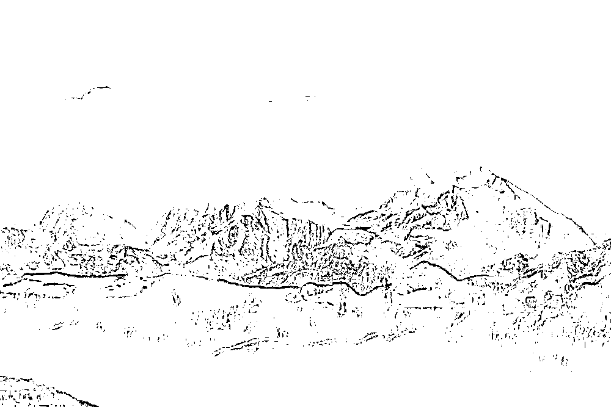

**摩羯座落在 12 个宫头**接下来我们将讨论摩羯座在每个宫位的意义。如果摩羯座被截夺，那么它应该被看作所属宫位的共同守护者。因此如果你将这种影响与中天以及土星的位置相结合，你将获得更加深入的视角来看待你的星图。现在，我们来聊聊**出生星图中各宫宫头落在摩羯座时，大部分人的所表现出来的特质**：

**摩羯座落在****第 1 宫****宫头（上升点）**

摩羯座落第 1 宫宫头的人会有明确的需求，将自我控制和自律的形象投射到世界中。对于这个人来讲，**建立并且保持这种自律的固定形象很重要**，而不是考虑如何去改变。如果能够明智的使用这种能量，摩羯座的这种特质可以给人坚定的态度去克服困难，获得成功。**摩羯座在上升点可以带来前瞻性、耐心，以及洞察力。责任、传统以及个人责任感也是这个人的特性。**

**摩羯座落在****第 2 宫****宫头**

摩羯座对于个人资源的利用保持着非常谨慎的态度。在第 2 宫宫头这个位置时，**一般代表着个人获得身份和地位的主要途径之一是通过正确认知如何统筹规划自己的钱**。从长远来看，负责任的人认真地对待自己的天赋和资源都将得到相应地回报的。因此，**在储蓄以及消费上培养正确的态度和习惯，是其获得物质成功的关键**。

**摩羯座落在****第 3 宫****宫头**

这个组合代表着**教育和知识是摩羯座在第 3 宫宫头人事业成功的关键**。第 3 宫和摩羯座的结合也代表着现实主义、实用主义是这个人对待生活的态度。此人早期的生存环境可能比较有挑战性（尤其是土星在星图中受到影响）。对于有兄弟姐妹的人来说，这个组合意味着早期的义务和责任，也就是早早就需要分担父母的责任。

**摩羯座落在****第 4 宫****宫头（下中天）**

有这个组合的人可能会有**明显的从家庭里继承下来的传统生活习惯**。这可能会导致一个人在原生家庭的习俗上建立自己的生活，或者是因为过去的影响而导致自己的选择自由受到限制。**因此摆脱这种心理上的限制是一项重要考验，能否通过这种考验则是塑造一个人成功的关键。**如果各个方面都是积极的，那么摩羯座在这个位置则可能代表一个人的生活和成功有坚实的基础，包括来自家庭的帮助，以及其他各种实际意义上的帮助。

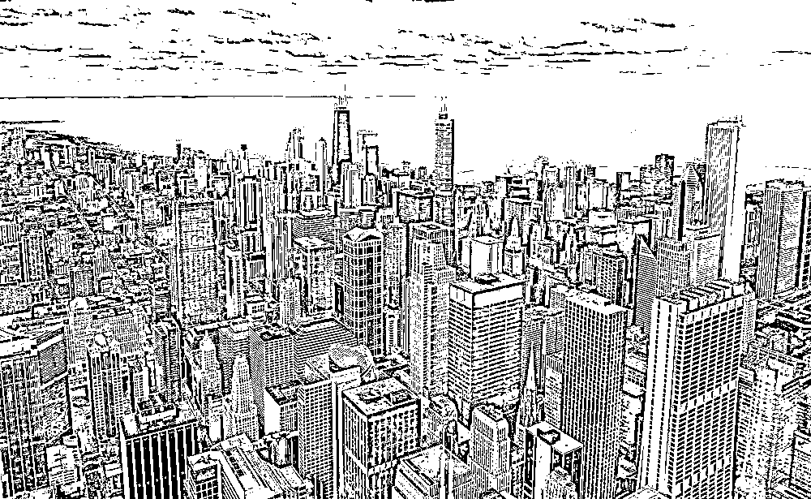

**摩羯座落在****第 5 宫****宫头**

摩羯座是天性不爱冒险的星座，第 5 宫则是“乐趣之家”。因此这个组合可能代表着**保守的投资，以及取乐仅限于安全与可控的范围内**。另一个方面来讲，摩羯座也被贴上了“固定习惯的星座”的标签，因此这类人也会受其影响（例如土星困难相位或者是和海王星对分），他可能会有赌博或者是其他坏的习惯。

儿童也是属于第 5 宫的，而摩羯座作为宫主可能会后代比较少，或者是认为自己对于孩子有着长期的并且艰难的责任。这个组合的人可能会比较慢的进入父母的角色，或者考虑领养都是有可能的。摩羯座的保守态度也适用于浪漫，但当他们有这样亲密的关系时，通常会受到尊重和责任的对待。

**摩羯座落在****第 6 宫****宫头**

**摩羯座在这个位置将使人努力工作，而这个人在工作上取得一定成就的愿望也将十分强烈，并且非常想要变得更加条理分明以及高效。**这个人将认真的对待工作，以至于有时候这种过度认真也带来了很大的负担。如果一个人太过于掌控自己的工作，可能会给自己的同事关系上增加压力。如果土星受到影响，健康问题尤其是慢性病可能会成为问题（尤其是土星和太阳或是月亮有困难相位）。这个组合也代表宠物对个人的重要性，这个人也会用同样认真的态度对待其动植物。

**摩羯座落在****第 7 宫****宫头（下降点）**

这个位置代表着巨蟹座在上升点，这表示**对于情绪上稳定的需求**。而摩羯座在第 7 宫宫头代表着**他们倾向于年纪大一点，已经生活稳定或是家长类型的恋人**。这也表明了他们有与权威人士接触的强烈需求，但要小心——摩羯座第 7 宫人经常喜欢在他们的关系中成为权威。因此也存在一定的权力冲突，因为个人也容易被同样特质的人吸引（渴求权力、权威方面），都会都想要通过关系来展示自己。无论如何，**这类人都会找寻那些能在生活上帮到自己的亲密关系**。如果土星受到影响，尤其是和金星有困难相位，这种关系可能产生相反的效果。

**摩羯座落在****第 8 宫****宫头**

第 8 宫代表着其他人的资源。**当受到非建设性影响的时候，摩羯座在这个位置可能代表想要掌控别人的钱和资源，但是当影响积极的时候，这个组合则会利用控制、安排的特性去帮助别人增加财富**。第 8 宫也代表了性，摩羯座在这里可能代表着保守以及充满尊敬的亲密关系，或者也代表一个人在性方面的禁锢与不开放。极端情况下，这个组合可能代表通过性来掌控一段关系。在死亡方面，如果土星落在土象星座，摩羯座在这个位置可能代表着长寿。

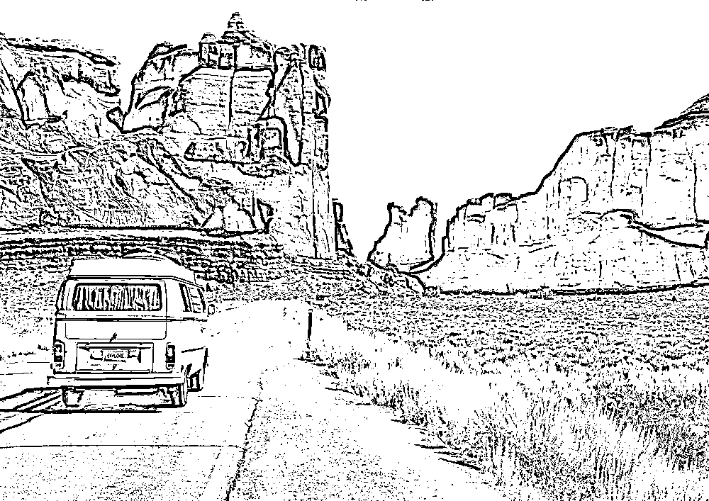

**摩羯座落在****第 9 宫****宫头**

这个组合代表**接受高等教育是为了符合个人对人生目标的总体规划，这代表一个人不会为了热爱知识而学习，而是为了自己的人生规划**。这类人还可能会对传统、有组织的宗教带有强烈的爱恨情绪，这通常是因为父母和家庭条件以及早期童年而带来的影响。宗教到底是父母以及社会表现自己权力的方式，还是体现了爱与关怀呢？这个答案将影响成年人对此的态度。对于有这种组合的人来说，历史、考古学或是建筑学都有强大的吸引力。

**摩羯座落在****第 10 宫****宫头（中天）**

正如人们所想，这个组合代表了**强烈的野心与对于世俗成功的巨大需求**。在社会上获得尊重是个人生活重要的一部分。而这些野心会被完成吗？这和占星中的其他事情一样，需要检索整个星图，如果土星能量强并且位置得当，那么野心被实现的可能性会被大大加强。通常，这是一个为了实现目标而长期努力的人。尽管一路上将有很多挫折，说“不”也是稀松平常的事情，但摩羯座第 10 宫人是一个永不言弃的人，永不说“不”的人。

**摩羯座落在****第 11 宫****宫头**

这个组合的人**认为“希望”和“愿望”必须有一个实际的方向**。从本质上讲，这是一个在团体中或者是工作里很有条理的很负责任的管理者。然而，如果个人抱负过度崇高，以及自我为中心，那么这种态度将阻碍自己和朋友同事们的关系，使整个团体无法实现其集体目标。从积极意义上讲，摩羯座在第 11 宫也表明一种个人应该贡献集体，而集体也应反馈个人利益的想法，也就是集体个人相互帮助的平等思想。

**摩羯座落在****第 12 宫****宫头**

当这个以灵魂为中心的人的星图是积极向上的时候，这个组合代表了**个人对事物的内在结构的理解需求**。这对于有形而上学趋势的人是好事，而更脚踏实地的讲，这个位置能够导致幕后能量与个人目标对立而瓦解个人力量。积极的时候，这是个一个充当“**王位背后的力量**”的人，向他人提供能量和支持的方式往往过于微妙而无法被人看到。如果这个人的意图很好，那么摩羯座第 12 宫人会对仁慈的领袖做出了巨大贡献。

**版权声明：**本文由作者及新浪星座授权转载于若道，欢迎转发，反对抄袭。


**你可能还想知道**

[白羊座落在 12 个宫头](http://mp.weixin.qq.com/s?__biz=MzA5NjA0NTAxNg==&mid=2651397741&idx=1&sn=64632167a59797e9f1081d31672a1f91&chksm=8b4bacdabc3c25cc19169f3b8a982b038f60201b62a034c61ca53c54e3f94eca1de6627faa6c&scene=21#wechat_redirect) | [金牛座落在 12 个宫头](http://mp.weixin.qq.com/s?__biz=MzA5NjA0NTAxNg==&mid=2651398220&idx=1&sn=9ecb5ec6f9c1aba4357cd5229d12f21e&chksm=8b4b92fbbc3c1bed5e246a52491a24cc41fd86f27f73d0a3ca6095431e21085abbd8cd7b3693&scene=21#wechat_redirect)

[双子座落在 12 个宫头](http://mp.weixin.qq.com/s?__biz=MzA5NjA0NTAxNg==&mid=2651398705&idx=1&sn=5763aa3338d2411d45192b3af8ca7ce0&chksm=8b4b9086bc3c19906fbab75cf922c829e6805175b918702f911b25a5249a177968e6f0b4ef8c&scene=21#wechat_redirect) | [巨蟹座落在 12 个宫头](http://mp.weixin.qq.com/s?__biz=MzA5NjA0NTAxNg==&mid=2651399464&idx=1&sn=fce501eaae8164ddf5f12b1546b2fa27&chksm=8b4b979fbc3c1e893fba44267589423e646b4705c99c24b81a45d37aa3fa1cdbfba17d7f10de&scene=21#wechat_redirect)

[狮子座落在 12 个宫头](http://mp.weixin.qq.com/s?__biz=MzA5NjA0NTAxNg==&mid=2651400166&idx=1&sn=fb05ee18af3d50942d3b46db59e8ded9&chksm=8b4b9551bc3c1c475c32b33a38a9e9e423584af43749fb54a12761283b66013126a29887b0b0&scene=21#wechat_redirect) | [处女座落在 12 个宫头](http://mp.weixin.qq.com/s?__biz=MzA5NjA0NTAxNg==&mid=2651400985&idx=1&sn=fe18329c8294d28c7a0313e019d1d7d1&chksm=8b4b99aebc3c10b87ffcb7ab59d3cec3c9217f7717ec5db75adb5b68491743d6436c18fa2797&scene=21#wechat_redirect)

[天秤座落在 12 个宫头](http://mp.weixin.qq.com/s?__biz=MzA5NjA0NTAxNg==&mid=2651401737&idx=1&sn=b91202c841b6af9122d4fccd2f9c50f5&chksm=8b4b9cbebc3c15a80c293643914ec74c984c90447816e42c4c97a608d626c25bf29b3548f479&scene=21#wechat_redirect) | [天蝎座落在 12 个宫头](http://mp.weixin.qq.com/s?__biz=MzA5NjA0NTAxNg==&mid=2651402892&idx=1&sn=ac456bfdacf7094f4a4b2c60cbe9b7df&chksm=8b4b803bbc3c092d867d732089b8db08faad604c70cf7f64ca1082e904600c1800984cbf3e2d&scene=21#wechat_redirect)

[射手座落在 12 个宫头](http://mp.weixin.qq.com/s?__biz=MzA5NjA0NTAxNg==&mid=2651411719&idx=1&sn=1bfed57d51d1f6b922b6c3cb20ed6edd&chksm=8b4be7b0bc3c6ea6f73f440805db65430519d64bb9d9c86c2ca60e700cfef5a16ff459a1611d&scene=21#wechat_redirect) |[双鱼座落在 12 个宫头](http://mp.weixin.qq.com/s?__biz=MzA5NjA0NTAxNg==&mid=2651405542&idx=1&sn=8dd7f497190589387b7be9a37679f12d&chksm=8b4b8e51bc3c07471f23a766f3253eecd0e44d5901d233b90d7b13a46d71ad9bd260f91b86ca&scene=21#wechat_redirect)

**阿兰·欧肯**

若道签约老师，1944 年出生于纽约，毕业于纽约大学罗曼语言及语言学专业。著有包括《灵魂占星》、《星图中的守护关系》、《阿兰·欧肯完全占星》等数十部著作。他还为《戴尔星运杂志》以及其他许多国内外评论与期刊撰写过数百篇文章。他是译者、老师、环球旅行家和国际导游。

******点击图片查看若道君推荐******


**微信又双叒叕改版啦，不想错过若道君的推送？**

**就把若道设为星标吧！**

**▼**


就是这个“在看”，戳戳戳 ☟

********报名直达入口********


# 2020 年，萧条局面如何投资？金融占星学大师雷蒙德·梅里曼来指路

> 原文：[`mp.weixin.qq.com/s?__biz=MzA5NjA0NTAxNg==&mid=2651412283&idx=1&sn=709a7831f692f7bfda0cc18f9fbfceb9&chksm=8b4be58cbc3c6c9a56697593adc3a4925fa326e040f214268c58ca4d633d79add16e65f4b97b&scene=126&sessionid=1692738242#rd`](http://mp.weixin.qq.com/s?__biz=MzA5NjA0NTAxNg==&mid=2651412283&idx=1&sn=709a7831f692f7bfda0cc18f9fbfceb9&chksm=8b4be58cbc3c6c9a56697593adc3a4925fa326e040f214268c58ca4d633d79add16e65f4b97b&scene=126&sessionid=1692738242#rd)


**2020 年金融预报和讲座**

1976 年以来，由雷蒙德·A.·梅里曼撰写的梅里曼市场时机学院每年一次的年度预报沙龙和每年一本的《年度预报》一直在应用占星学原理为投资者们服务，提供卓越洞见，从未间断。

43 年来，这本 200 页左右对金融市场的分析报告和 3 小时的年度预报讲座在美国、日本、欧洲帮助许多投资者了解宇宙天气对于世界经济形势、政府政策及其对各个金融市场和金融产品的影响，帮助他们做出正确的投资决策，降低投资风险。2018 年，若道第一次将这份广受赞誉的一年一度的金融占星报告和沙龙引入中国，供中国投资者参考。**《2020 年金融预报》将会谈及 2020 年重要的宇宙天象及其对世界经济、贸易形势的整体影响，还将覆盖中国上证股票市场的分析、黄金白银市场、美国经济、美国总统、美联储、美国国债市场、美国股票市场、主要外汇货币市场（主要外汇美元、英镑、欧元、日元、瑞士法郎）、原油市场、谷物市场、活牛市场、比特币市场等投资市场。**另外，非常有价值的是，梅里曼老师及梅里曼市场时机学院的金融占星分析师还会给出以上市场 2020 年的**市场价格目标区间及重要价格反转日**，为短期、中期和长期投资者进行市场操作的时机提供参考。如果你关注世界经济和金融投资市场的变化，会发现梅里曼《金融年度预报》中的研究对于你了解世界经济在发生什么，这些市场的走向会如何有非同寻常的指导价值。


比如，在 2018 年 12 月发布的《2019 年金融预报》中，梅里曼老师指出：

*   2019 年美国领导人与世界其他国家之间可能发生重大冲突，加剧紧张局势，其中一个冲突可能与**贸易问题**相关，而与中国达成重要的贸易协议的期待可能只是幻想的泡沫。
*   2019 年美国经济和股票市场将会到达一个重要的高点，随后在 2020 到 2022 年间的某个时间点开始凶猛地下跌。
*   天王星在未来 7 年内完全进入金牛座的日子，预示着**转基因食品的新发现、肉类价格的上涨以及货币估值甚至交易形式的重大变化**（比如我国已宣布央行法定数字货币试点项目有望在深圳、苏州等地落地）
*   上证指数在 2019 年木星在射手座行进期间可能出现强势反弹，该指数将挑战或突破**3100**（2018 年报告发布时上证指数为 2500 左右，2019 年最高点为 3288）
*   **黄金价格**一旦收盘在**1350-1377.5**价位之上，会直线上升测试**1500+/-50**（2018 年报告发布时黄金价格为 1229 左右，2019 年最高点为 1566）；
*   只要**白银**保持在**13.62 以上**，就会形成看涨双底结构。如果白银收盘在**18 以上**，就有机会向**26.16+/-1.48**爆发（2019 年报告发布时白银价格 15 元左右，最高价格为 19.75）

随着木星离开射手座，木海四分相在 2019 年结束，木星进入魔羯座，土冥合相的到来，世界经济和金融又将发生什么变化？梅里曼老师将在《2020 年金融预报》报告和讲座告诉你他的研究和看法。结合报告，梅里曼老师将于**北京时间 2020 年 2 月 15 日上午 10 点**做一场历时 3 个小时的**关于明年世界金融市场的演讲**，为报告的读者们进一步答疑解惑。而对于不懂得占星学的朋友，也不必担心，在每个市场分析后，都会有一个总结性的结论，帮助你了解梅里曼老师及梅里曼市场时机学院的金融占星分析师对这个市场的整体投资看法。


**报告价格和讲座时间**

**报告和讲座价格**

2020 年金融预报讲座和报告价格整体售价 **1280 元**

（本讲座和报告不单独出售）

**12 月 31 日前 100 名用户**预售价：**1080 元**

**12 月 31 日后**恢复原价：**1280 元**

**讲座时间**

**2020 年 2 月 15 日  10：00-13：00**

（暂定，如有变动，请以若道最终通知为准）

**购买者重要须知****①** 梅里曼市场时机学院每年一次的年度预报沙龙和《年度金融预报》是梅里曼市场时机学院的研究“预报”，而不是市场“预测”，是梅里曼老师及其金融占星分析师对人类活动周期历史与行星周期之间相关性的研究，二者在大部分情况下具有 80%或更高的相关性，而不是因果关系。沙龙中和报告中的研究完全存在错误的可能性。即便是非常认真的研究和几十年的研究经验，我们无法总是正确地解读出各种征象在实际层面上会如何相互作用，并显化为事件结果。所以请将此沙龙和报告看作一个研究参考，务必结合其他市场研究和你个人对市场的理解，根据你的自由意志做决策。**② **此套餐一旦售出，即**不接受退款**。**③** 此报告只支持**手机阅读**，不支持电脑阅读、下载和打印。**④**《2020 年金融预报》中文翻译版预计在**2019 年 12 月 31 日左右**上架发布，预售报告购买者，届时请参照下图《金融报告查看路径》查阅已购报告内容。**⑤ **讲座时间为初步确定时间，如临时有变动，请以最终通知为准；讲座届时会提供视频回放（仅支持在若道 APP 观看回放视频）以上须知，请仔细阅读。一旦付款，即视为已了解并接受所有须知内容。**已购报告查看路径**


****购买报告请点击“阅读原文”****


# 深度 | 忘掉“情绪管理”吧，这个星座告诉你联结情绪多重要

> 原文：[`mp.weixin.qq.com/s?__biz=MzA5NjA0NTAxNg==&mid=2651412275&idx=1&sn=0c656c445089cb315649a1cc3af37001&chksm=8b4be584bc3c6c92e9bc689480a78b3e530fc125c6a3a1fdff0e60a587ffcd06723285712045&scene=126&sessionid=1692738242#rd`](http://mp.weixin.qq.com/s?__biz=MzA5NjA0NTAxNg==&mid=2651412275&idx=1&sn=0c656c445089cb315649a1cc3af37001&chksm=8b4be584bc3c6c92e9bc689480a78b3e530fc125c6a3a1fdff0e60a587ffcd06723285712045&scene=126&sessionid=1692738242#rd)

******************************☆ **************后台****************************回复“今日”，给你一句生命态度****************

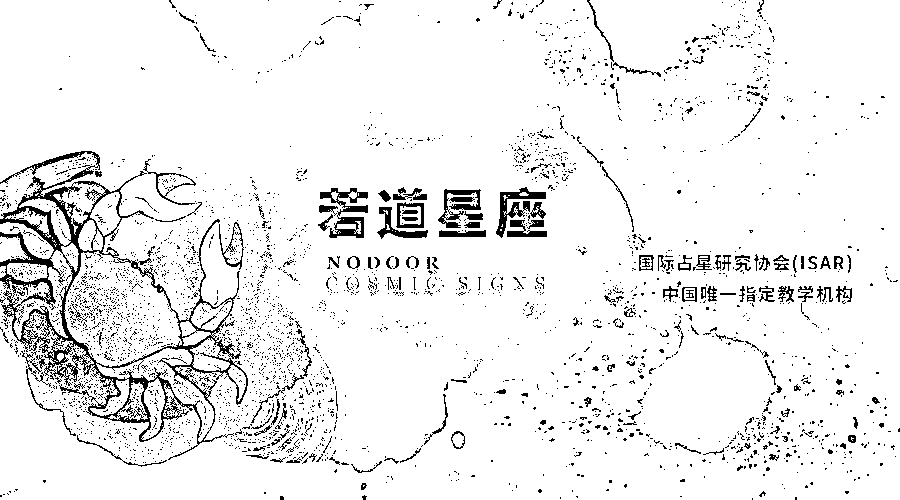

作者/达娜·格哈特 校对/王宏编辑/玫瑰 图片/unsplash
巨蟹座是一个非常敏感而脆弱的星座，却也是一个最直截了当和坚强的星座。这取决于它的情绪处在怎样的状态。是的，在现代社会里，情绪似乎成了最无用的东西，到处都在教我们如何控制情绪，管理情绪，似乎没有了情绪就能成功似的。然而，这篇文章会告诉我们，和自己的情绪潮汐脱离是多么危险的事，即使看似最坚强的人也需要情绪，它像母亲，给我们爱与安全感。这才是人生最基本的养料和能源。**巨蟹座的力量****“你可以绕开我，”**

**女神说，**

**像一只鸟一样脚跟着地旋转着，**

**飞快走开，**

**但只走远了一点，**

**“或者你可以跟着我。**

**这也是我的森林，**

**你不能假装我不在这儿。”**

你不能假装女神不在这儿。这在你的巨蟹座宫位中尤其如此。这也是赫拉克勒斯在他的巨蟹座征程中所学到的东西。在这位英雄的第 3 个任务中，国王欧律斯透斯派他去活捉（但不能伤害）神鹿 Ceryneian，并将这头红色的母鹿献祭给月亮女神阿尔忒弥斯。这头鹿有青铜做的鹿蹄，跑起来比箭还要快。她非常难以捉摸，就像我们通常想和我们落在巨蟹座的行星一起寻找的**安全感**一样；她非常灵活而且不可预知，就像我们的**情绪**一样。神鹿 Ceryneian 是雌鹿，却有着雄鹿的鹿角。鹿角是黄金的，象征着神权和接受能力。鹿角就像宇宙的天线，月亮女神将自己巨蟹座**直觉和灵感**的礼物注入这根天线之中。（不足为奇，月亮守护的巨蟹座通常在一些很成功的创意人士，如艺术家和商人的星图中很强大，他们就像母亲和园丁一样，有着丰富的想象力，并享受让事物生长的过程。）这头雌鹿是一个难对付的猎物，但同时她也**敏感而脆弱**（就像我们在自己的巨蟹座宫位中一样）。一位评论家曾暗示说，这头雌鹿让人联想到女预言家和古代的女祭司，她们只能在非常和谐的环境中才能发表预言。**她们脆弱的敏感性要求与世隔绝，保护她们免受任何不愉快、残酷和令人不安的事物的伤害。****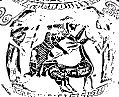**| 赫拉克勒斯追逐雌鹿赫拉克勒斯的全部使命就是**展现巨蟹座敏感的力量**。这并不容易。如果这头雌鹿是一个恶魔，他可以抓起他的棍子杀死她，但要在不伤害她的情况下捕获这头鹿则更具挑战性。在女性化的领域里，目标明确的男子气概是处于劣势的。赫拉克勒斯看到雌鹿的鹿角在太阳下闪闪发光，他便兴高采烈地开始了追逐。一年之后，他依然在追逐中，横跨希腊、色雷斯、伊斯特拉和北方极寒之地。这头雌鹿一直躲着他。当最终他在附近的一条溪流边看到她的时候，他既高兴又恼怒。

赫拉克勒斯拉弓射向她。“就一个小伤口，”他对自己说。他把受伤的雌鹿背在自己的肩膀上，因胜利而松了口气。但他的快乐很短暂。就在他走过下一片小树林时，他遇到了女神。阿尔忒弥斯非常愤怒。这位英雄在女神的凝视下枯萎了。

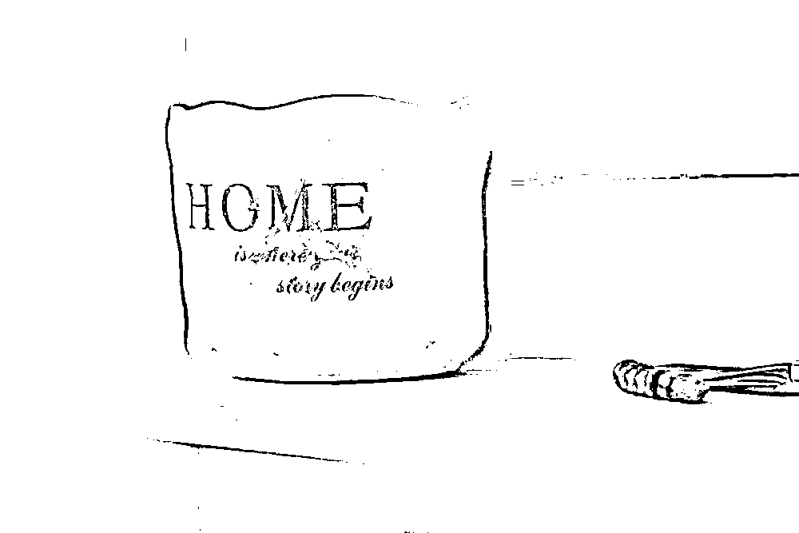

**对月亮女神视而不见的后果**

我们不能假装月亮女神没有在看——尤其是当我们在寻找她的巨蟹座祝福时。无论我们渴望的是更多的爱意、一个安全的避难所，还是创造性的灵感，我们都必须遵守她的规则。对她视而不见必然会导致她的暴怒。

例证就是一个现代赫拉克勒斯想要捕获女神宝物的故事。杰依‧恰特是近 25 年来顶尖的广告业高管之一。当他的公司口碑开始下滑时，他希望通过完全重新设计办公室（巨蟹座的领域）来恢复其在创造性方面的优势。这远远早于冥王星进入摩羯座的精简裁员和实用主义的年代。那是在上个世纪 90 年代，当时冥王星正在靠近射手座。恰特梦想有一间带有射手座自由的狂放的办公室。

在这间办公室里，没有小隔间，没有墙壁，甚至连一张办公桌都没有。他的吉普赛员工只会有一台笔记本电脑、一部手机，和他们便携的想象力。一旦有了灵感，他们就可以即兴创造自己的工作空间，和同事们一起在灵感中富有成效地沉浮。这些被解放出来的员工的储物柜极为简约，他们还有了新的晨间流程：在设备间排队领取每日所需的笔记本电脑和手机。 在那之后，他们可以自由地漫步在未来主义的艺术作品和一堆沙发中间，或者和同事们在从游乐园搞来的滑稽的“旋转椅”上进行头脑风暴。如果他们心血来潮，他们可以把工作带到外面，在公园或海滩上办公。恰特激动地说，身体如此自由，他们无拘无束的大脑就可能创造出富有创造力的奇迹！

恰特声称，他确实听取了员工的意见。但根据一位内部人员的说法，恰特只听他自己的。当员工们抱怨说他们需要更多的隐私时，恰特回复说：“你们将会有私人的空间，只不过不会是个人的空间。”这是一个重大的失误。私人空间无法像个人空间一样很好地满足情感需求。人们需要**筑巢**。他们需要办公桌，需要有地方放家人的照片。**他们渴望熟悉的物品所带来的舒适感，他们对于过多的曝光有天生的恐惧**。在生活的海洋中，每个人都想要一个安全的外壳，一个我们可以说是自己的受保护的地方。由于这种被占星师称为“巨蟹座”的普遍需求，恰特的大胆实验注定会失败。

然而，恰特努力抗争。他在他的办公楼里边逛边寻找“筑巢者”。如果他发现有人待在同一个地方两天，他会告诉他们换个地方。他希望办公室里面没有纸张。但员工们慢慢地开始把他们的打印稿偷偷拿到停车场，把自己汽车的后备箱当成文件柜。至少有一位员工把她自己的东西都放到了一辆红色的小货车里来回带着走。很快，大家在一天结束时都不再归还他们的笔记本电脑和手机，把它们藏在角落里或植物的后面。令人不快的情景开始出现在会客室里：“出去！这是我的地盘！”深陷于争吵和抱怨中，恰特的开放空间最终被和古希腊时一样激烈的地盘战瓜分了。

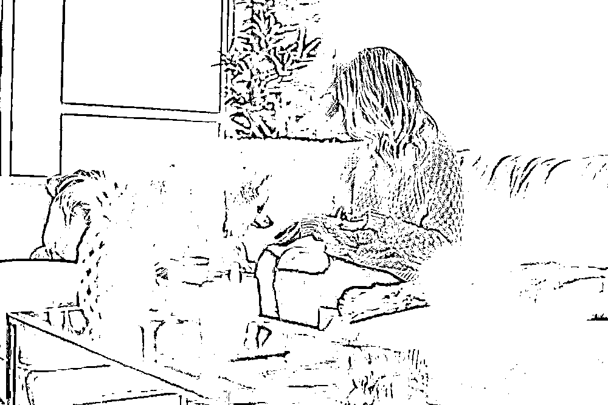

**办公室是巨蟹座主宰的**。同样受巨蟹座主宰的还有**巢穴、养兔场和小隔间，摇篮、子宫、井和船；****以及停车场，还有摩天大楼和城市**。我们通过它们带给我们的感受来辨识这些巨蟹座的场所。人类是领地性的，因为我们喜欢依偎在母亲臂弯中的感觉，受到滋养、舒适且安全。正如赫拉克勒斯与阿尔忒弥斯发生了冲突，恰特也冒犯了月亮女神。女神回应以愤怒，招募了一群以自我为中心的发牢骚的人。她让员工们变得刻薄，并把他们变成有报复心的、操纵他人的乌合之众。创造力遭到重创。恰特投降了。他卖掉了自己的公司，并像埃尔维斯一样离开了那幢大楼。大楼的新主人把开放的空间分隔成一个个工作区域（称为“巢穴”）。洞穴一般的办公室沿着墙壁而设（“悬崖屋”）。大家吸取了教训。女神回到了她的天堂。每个人都获得了某种程度上的个人空间。在天空中，巨蟹座这一星座包括被称为“鬼星团”（意为“食槽”）的昏暗的星群；古希腊人想象着巨蟹座中有一个食槽，有两颗相近的（驴子）恒星用它进食。“蜂窝”是这个星群另一个传统的名字，因为它圆形的、毛茸茸的外表看上去也很像一大群蜜蜂。这两种形象都是巨蟹座式的。它们既没有英雄气概，也不炫目，只是描述了蜜蜂居住和喂养牲口的简单场所，其中包含女神的物品，蜂蜜和谷物。现在我们把这个星座视为一只螃蟹。巴比伦人将其看成一只乌龟，埃及人把它看成一只金龟子。这些生物何其相似！每一个都背着带有硬壳的家，还随身带着女神的价值观，天文学家很快指出，巨蟹座是一个不引人注意的星座。他们说这条新闻的时候通常带着一种胜利者的姿态，好像巨蟹座昏暗的恒星证明了占星学的无知，同时确认占星从业人员并不太了解真实的天空。巨蟹座也许不是一个看上去很壮观的星座。但是这个小小的星群应该会持续唤起我们内心相似的观点，这本身或许就很壮观——这片天空如何一次又一次地提醒我们想起女神和她的价值观。

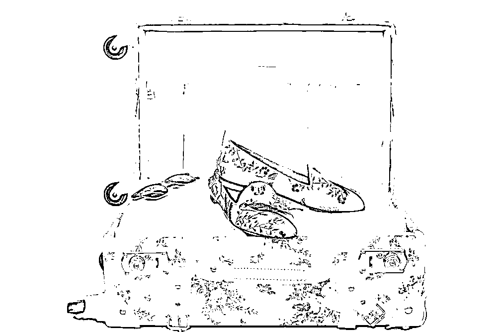

**巨蟹座的策略**我知道我想要在我的巨蟹座宫位中体验些什么——如同周一我在本地温泉边那种像在子宫里梦游的感觉。当时正值“女士之夜”，室外游泳池里满是赤裸的胸部和婴儿、笑声、低声软语和鼓励，所有这一切都在月亮了然的注视下。如果医生们可以给这种感觉开处方，他们会给我们开催产素，即**“拥抱荷尔蒙”**。哺乳期的母亲会自然分泌出这种荷尔蒙，这种荷尔蒙也是两性的性行为中的活性成分。催产素把性行为转化成爱。**情感上的支持——关怀、同情、舒缓的抚摸、欣赏，**这些都能提高催产素的水平。这反过来会**减轻压力、抑郁和疾病**。**敞开心扉**是将这种好的品质带入你的巨蟹座宫位和落入巨蟹座的行星的最好方式。那么，为什么巨蟹座的象征符号是一只硬壳的、带着鳌的螃蟹呢？
首先，显而易见的是：**它的防御性外壳表明了落在巨蟹座的行星会以怎样的方式变得内向、不外露和自我保护**。

*   **水星在巨蟹座**的人是出色的倾听者，有着良好的直觉，但此人也可能羞于表达自己所知道的事情；
*   温柔的**金星落在巨蟹座**的人可能用热情来交换安全感，然后以沉默对待的方式来吸引她所渴望的爱；
*   愤怒的**火星落入巨蟹座**的人在自己内心忧虑且愤怒时，可能假装没什么不对劲。

螃蟹还有什么别的暗示呢？它分岔的蟹脚给了它在岩石上和潮汐池里超群的移动能力。但在一般的沙滩上，它急匆匆的横向行走就显得很奇怪。类似地，落在巨蟹座的行星可能会**急匆匆地到处走，迂回地靠近目的地**，而不是径直走过去。我曾经跟两位火星都在巨蟹座的女士一起工作。她们常常挤在一起，一起小声说话，我推测她们是在密谋什么事。而她们总是会调转到新的方向上，然而却从不会在一个特定的路线上停留很久，这永远都让我感到吃惊。

**木星在巨蟹座**的人也很容易走到岔道上，这增强了其**多愁善感和自我放纵**的特质，而不是放大这个擢升的配置所能带来的好运。然而，**如果被激怒，落在巨蟹座的行星就能变得非常专注**。当螃蟹举起它的鳌攻击时，它是直截了当的且不屈不挠的。类似地，**如果月亮在巨蟹座的人感到自己或所爱的人受到威胁，她就会拼命去复仇。**

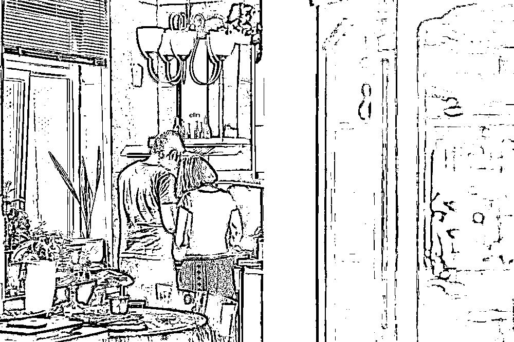

螃蟹是食腐动物。它们从海草和被冲到岸边的其他所有东西里面，寻找鱼和贝类的尸体，用强壮的蟹钳将其撕开。它们的工作为更小型的生物提供了食物，这与母亲**养护**的工作相符。我一般不把巨蟹座的行星视为食腐动物。但它们的确**咀嚼过去**。（我们可能想知道，我们其余这些带有它们被蚕食的记忆的人，会分到什么样的食物？）巨蟹座的螃蟹当然是天后赫拉的最爱。她是一位具有破坏性的艺术家。想想她是如何打败宙斯的。追逐众神之神是多么大胆！然而，她并没有像英雄在公平的战斗中那样与他面对面。她从侧面撕扯他，直到他觉得尴尬、畏缩并隐藏起来。落在巨蟹座的行星同样可能对付更大的敌人，通过唠叨或操纵来行使权力。**被动的进攻和抵抗**是巨蟹座其他常见的策略。甘地由于他的和平抵抗而备受尊崇，他的中天落在巨蟹座。他的人格和全球声誉使得他成为巨蟹座的象征，是母亲的同情心和保护的化身。他的事业传播了巨蟹座伟大而耐心的力量：**坚持自己的立场，直到周围的世界屈服让步。**但或许关于螃蟹最说明问题的事实是它们**选择在何处居住**。螃蟹居住在海滨，这是位于澎湃的大海和坚固的土地之间的过渡空间。这里动荡而多变，在岩石和沙土之间，潮汐来来去去。螃蟹为什么不像章鱼或鱼类一样，进化到永远在无边、无形的水里游泳呢？为什么不像狮子一样在坚实的土地上奔跑呢？

螃蟹一定是**对于有形和无形都抱有爱——或需求**。它们身后有无边无际的海洋，它们依然与造物者伟大子宫的韵律保持着联系，同时它们的身体适合在着陆于坚实的地面时紧紧抓住地面并灵活运动。它们在大海和陆地之间穿梭，设法在这喧杂的交汇之处茁壮成长。它们的栖息地在最大程度上解释了保护壳、横行和善于抓取的鳌。巨蟹座的螃蟹**追求安全感**，因为从根本上说**它们所知的世界是不断变化的。**

这是对你的巨蟹座宫位而言有用的信息。无论巨蟹座是守护你有关合作的第 7 宫，还是关于金钱和资源的第 2 宫，或是关于朋友和未来梦想的第 11 宫，你都可以把该领域视为有象征含义的海滨，那是两种接纳性的元素——土和水的过渡空间。水是母亲养育的媒介，是每个人的第一个家。水把心灵和无形的力量结合到一起，无形的力量就是我们感受得到但却看不到的事物：**直觉、记忆、情绪**。

你将**特殊的敏感性**带到你生活里由巨蟹座守护的一切领域之中，你意识到的不仅仅是呈现在眼前的事物。也存在着**周期性的活动**，那是在你意识控制之外的节奏。你必须和这种节奏保持一致并随之流动，否则你就要跟潮水相抗争。在这个宫位中，你还需要**坚实的土壤，感觉到你是稳固的且安全的**。

**你落在巨蟹座的行星渴望安全感、有形的感官享受、庇护所带来的愉悦，以及多样地形的纷繁美丽**。巨蟹座带来**熟悉物品的舒适感**，以及**和所有坚硬的、顽固的事物之间的冲突。**考虑到水和土不断变换的拉力，很容易理解这个宫位所能包含的**深深的焦虑**。你的巨蟹座宫位有时可能是一个**不安宁的、不稳定的**世界。

你在这个宫位表现得多好可能取决于你星图的其他部分。**如果你的月亮备受折磨，同时有很多水相的配置，那你内在的和周围的混乱的情绪漩涡可能让你感觉很迷惑，无法让自己脚踏实地地努力，徒劳地抓住安全感和形式**。如果你的星图中水象元素（巨蟹座、天蝎座、双鱼座）过少，你可能会**否认自己的敏感性，向自己隐瞒情绪上的秘密**。

否认是把可见的变成不可见的、把现实变成无形的一种方法。不知情把女神的礼物——直觉翻转过来。**当你和周期性的活动失去联系时，你可能无意识地将它们表达为喜怒无常。你对自身所处的不断变化的情境感到无助。**（驱动这些潮汐的通常是你的月亮。）

在最好的情况下，你的巨蟹座宫位可以是一个**极具创造力**的领域。因为**耐心和技巧**的存在，你能够以无数种方式将无形的调拨为有形的。你也许会感受到精神上的震颤和波动，并将其捕捉下来，写成一首传世的诗作。你可能只是感受到另一个人对于安慰的需求，并提供了安慰。你可能直觉地意识到一个社会理想，并像甘地一样坚守它，而世界会渐渐适应它。**无论你的愿景或使命是什么，你都有能力来培养和养育生命的过程**。你是那只知道有生命要降临并因此为其筑巢的鸟，你是那个在自己的子宫里腾出空间的母亲。

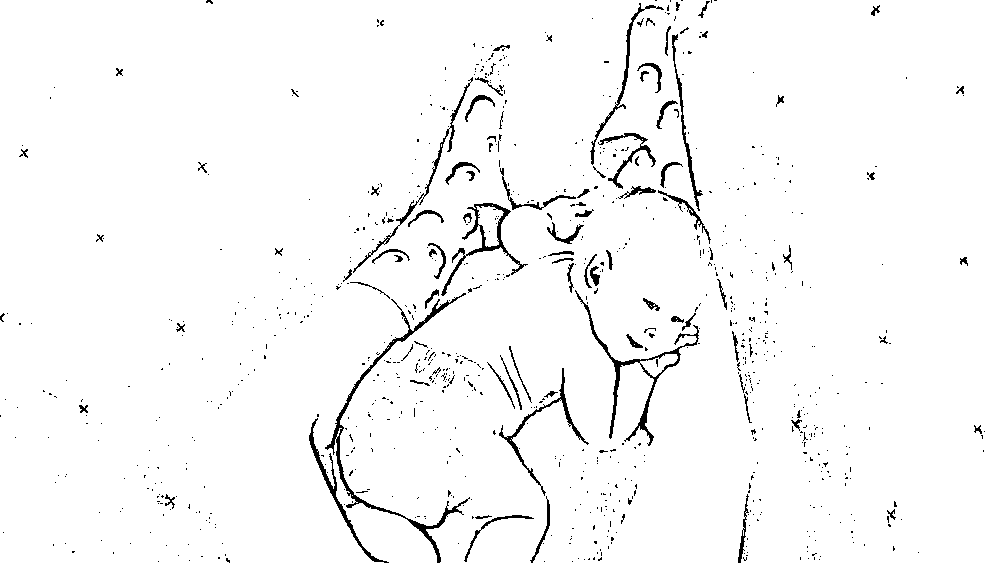

**巨蟹座真正的财富**一位朋友最近发给我一封电子邮件，邮件的内容让我非常难过，以至于我一个小时都无法工作。起因是关于一只金腰燕的照片，照片中显示，这只金腰燕在飞过一条马路时被一辆车撞到了。它的伴侣试图唤醒它，然后营救它；最终它的伴侣意识到，它死了。它的伴侣非常悲恸。随着在摩羯座的冥王星对分巨蟹座的行星（编者注：2008-2024 年），我们不仅会看到有关八胞胎妈妈和年仅 13 岁的父亲这类离奇的巨蟹座故事，我们还会看到很多关于**失去、无家可归、虐童和饥饿**的更为让人心碎的故事。我们将有很多伤心的机会。**要研究巨蟹座，却不考虑我们用敏感性所体验到的不可避免的痛苦发生了什么情况，那就是否认。**并不是我们所有的构想都会变成光鲜的现实。无论我们的爱有多么伟大，我们都无法保护我们珍视的所有东西。即使是在我们的照料下蓬勃生长的事物也会在某一时刻长得高过我们。我们自己也许有着关于年幼无助的痛苦回忆，当时我们在家长的照料下，他们本该更巧妙地爱我们（或者至少治疗师是这么说的）。不好的事情会发生，而有时是我们自己做了坏事。巢穴可能充满噩梦。**梦魇是巨蟹座的依赖性、被养育和养育的不可阻挡的另一面**。诗人安德烈·沃兹涅先斯基将这种痛苦总结为**“黑暗母亲尖叫”**。

**黑暗母亲尖叫是……**

**狱中的呼叫或求救的呐喊**

**黑暗母亲尖叫是……**

**语言最初的母亲……**

**不要忘记——罗马沦陷**

**没有理解黑暗母亲尖叫这个词组。**

巨蟹座的敏感是令人心碎的。或者更准确地说，**这种敏感将我们的内心打开**。我们黑暗尖叫的这份礼物是一种**可以改变世界的同情心**。这是巨蟹座最终的目的地和任务。这要求**在男子气概和女性化，或理智和感受之间建立新的伙伴关系**。赫拉克勒斯追逐神鹿 Ceryneian 的任务为这个过程提供了路线图。（赫拉克勒斯必须完成任务是他自身黑暗母亲尖叫的结果。赫拉把他逼疯，使他杀害了自己的妻子和孩子；这 12 个任务是他对自己所犯下罪行的赎罪。）赫拉克勒斯作为理智的代表，必须学会**倾听**。他追逐雌鹿所花费的时间是对**接受能力**的训练。我们也必须训练我们的头脑去**遵循内心的情感生活**，不受干扰地**跟随我们内心的各种活动**，无论将我们带到哪里，我们都要跟随着它。但头脑追随感受是不够的。在某一个特定的点上，理智被劫持了。它围绕着同样的故事转圈儿，**陷在旧有的恐惧和怨恨中。**要破除这个魔咒，雌鹿必须让自己被抓住。她必须**脆弱地站在那里，被刺中**。**我们经常用愤怒和自恋这类次要的情感来避免我们自己受到伤害。打开我们源头上的痛苦是掌控情绪的关键步骤**。正如心理学家约翰·威尔伍德所写的：**当我们首次打开我们的痛苦时，常常会觉得自己像是在流血。但这种情绪上的流血有助于唤醒内心，让我们内部已经变得凝固的生命力再次流动起来。****以这种疗愈的方式让我们的痛苦流动需要觉知、勇气和温柔——与痛苦同在，而不是相信我们头脑中关于痛苦可能将我们带向何方的恐怖。****我们必须怀着自己的武士精神投入我们的痛苦之中，**这体现在赫拉克勒斯把受伤的雌鹿扛在他肩上的画面中。当然，他很快就撞见了阿尔忒弥斯。神圣的事情即将发生。他结结巴巴地解释。他把自己的发疯、他的妻子和孩子、国王欧律斯透斯交给他的任务都告诉了愤怒的女神。阿尔忒弥斯被感动了。她带着怜悯和同情敞开了心扉。她治愈了雌鹿并让这位英雄完成他的任务。她示范了**共情**，而共情是**我们在醒悟到自己的痛苦时所释放出来的神圣力量**。共情是我们巨蟹座宫位真正的宝藏。在未来艰难且具有变革性的岁月中，我想我们会需要很多共情。

**版权声明：**本文由若道翻译发布，欢迎转发，反对抄袭。友号转载请申请白名单。

**也许你还想看下面的文章**

[白羊座](http://mp.weixin.qq.com/s?__biz=MzA5NjA0NTAxNg==&mid=2651412161&idx=1&sn=37ff27a685136be77b3d02086a4b8f0b&chksm=8b4be476bc3c6d6079b8592d14f1250d87401d0a8a28bc87f50a8f9fd253a52d9d5223c4ab12&scene=21#wechat_redirect) | [金牛座](http://mp.weixin.qq.com/s?__biz=MzA5NjA0NTAxNg==&mid=2651411945&idx=1&sn=6a74a4d7d15deb38d06a692ad4032ddd&chksm=8b4be75ebc3c6e4890b5034474c2894bd355bf26df5f0ad1c2fadae76f3de1d349a57de0471b&scene=21#wechat_redirect) | [天秤座 ](https://mp.weixin.qq.com/s?__biz=MzA5NjA0NTAxNg==&mid=2651410544&idx=1&sn=45b51d84210a84c8103c140df5a28229&chksm=8b4be2c7bc3c6bd1c86b8ffd8d8722efe3cfa1fc4b71e2cc8f71230218b8c73a7119d8a22745&token=428430174&lang=zh_CN&scene=21#wechat_redirect)

[射手座](http://mp.weixin.qq.com/s?__biz=MzA5NjA0NTAxNg==&mid=2651411022&idx=1&sn=adf59f6eb38f2fd19ca975b4287168ea&chksm=8b4be0f9bc3c69ef250cafb4d517694bb952529461017c53da4d7ca120ed4ec0004161eccdb0&scene=21#wechat_redirect) | [水瓶座](http://mp.weixin.qq.com/s?__biz=MzA5NjA0NTAxNg==&mid=2651411498&idx=1&sn=25b8051c9c778065f9fffa37628c9950&chksm=8b4be69dbc3c6f8b94ee79ae682233634bcd0f32e8dce890672ea1bb4e5241a34cb59ebb3045&scene=21#wechat_redirect)


**达纳·格哈特**一位国际范围内受尊敬的占星师。她为众多占星学网站和出版物讲课、写稿。她在十二宫的月亮激励她对这颗发光体进行了深刻而持久的探索研究。

******点击图片查看若道君推荐******


**微信又双叒叕改版啦，不想错过若道君的推送？**

**就把若道设为星标吧！**

**▼**


就是这个“在看”，戳戳戳 ☟

********报名直达入口********


# 核心课程 L5 | 多种预测技法，助你成为职业占星师（插班中）

> 原文：[`mp.weixin.qq.com/s?__biz=MzA5NjA0NTAxNg==&mid=2651412275&idx=2&sn=fda0203fcfdb50ddd383074251631f5b&chksm=8b4be584bc3c6c9234f4aad1174d5586b243d60566b8197a3defed84300bc71250f88c55884e&scene=126&sessionid=1692738242#rd`](http://mp.weixin.qq.com/s?__biz=MzA5NjA0NTAxNg==&mid=2651412275&idx=2&sn=fda0203fcfdb50ddd383074251631f5b&chksm=8b4be584bc3c6c9234f4aad1174d5586b243d60566b8197a3defed84300bc71250f88c55884e&scene=126&sessionid=1692738242#rd)


占星学不只是一门技术。占星学不只是一门知识。 占星学是**有****觉察****地活着，活在对过去、现在、未来的觉知、了悟和行动之中**。 我们强调学员的自我觉察，和如何活出占星学智慧，而非仅仅告知他人自己所知道的占星学。 占星学最终是**为了个人的人生服务**。 只有经过了深入的自我探索和个人疗愈旅途的占星学学生，才可能进一步成为好的占星师。 只有被活出的占星学技术，才对你和他人有意义。 你最终要去活你所学的占星学。你选择什么样的占星学意味着你怎么活着。 **寻找那些“实践其所知占星学”（Live their astrology)的占星师带领你走这条道路，而非谈其所知的占星师。**


**课程内容****第五阶 历史、预测和咨询技巧** 15 次线上直播网络课程，每次 2 小时，课堂中依旧会使用同学们的星图作案例**两场北京现场工作坊：2 天职业占星工作坊和 3 天咨询技巧工作坊**

**课程安排** 

占星学的进化历史

预测的历史和原理：预测的原理——有哪些可能和不可能，以及原因

预测的核心：出生图

预测技术：行进 
太阳的行进、月亮的行进、水星的行进、金星的行进、火星的行进、木星的行进、土星的行进、天王星的行进、海王星的行进、冥王星的行进

预测技术：行星逆行、日月食

预测技术：月相、行星周期

预测技术：二次限

预测技术：太阳弧

预测技术：返照

咨询技巧：常见咨询问题初探

咨询技巧：聆听、述意、提问的技巧

咨询技巧：确定咨询范围和厘清问题

咨询技巧：模式识别和洞察过往经历意义

咨询技巧：情绪识别

咨询技巧：核心信念识别咨询技巧：客户周期识别咨询技巧：寻找星图资源，提供希望和方向 ISAR 能力考试词汇表和大纲

**工作坊：（北京现场）**

**2 天北京占星学与职业工作坊** **2020 年 4 月**

**3 天咨询技巧工作坊 2020 年 5 月**

**导师介绍**


**蒋颖（Felicia）**

*   ISAR 中国副主席（ISAR 为国际占星研究协会缩写，在各国只设副主席），若道创始人。 

*   厦门大学化学系硕士，经济学学士，人民大学中美经济学培训项目福特班学员，长江商学院 MBA。 

*   曾为国内最早从事金融并购业务的机构合伙人。 

*   国内第一位被邀请在国际占星学会议上正式就西方占星学发表演讲的演讲人。第一批通过 ISAR 认证的职业占星师。ISAR 职业占星师资质认证培训师和中国考区考试负责人。 

*   跟随大卫·瑞雷、杰夫·焦耳、斯蒂芬·弗里斯特、苏·汤普金斯、格伦·佩里、诺·泰尔、罗伯特·汉德、雷蒙德·梅里曼、琳恩·贝尔等国际占星大师系统学习占星学，广泛涉猎人本主义心理占星、进化占星、原型占星、医疗占星、金融占星、卜卦占星、企业占星等多个占星学流派分支。 

*   曾接受萨提亚家庭治疗、本性治疗、Hakomi 治疗等心理学培训。接受进化教练培训。


**大卫·瑞雷（David Railey）**

*   ISAR 全球副主席，ISAR 考试委员会主席，若道创始人。 

*   被称为占星界的“马可·波罗”，第一位将西方严肃占星学系统教学和多位西方占星学大师引入中国的西方占星师。 

*   第一位在美国用电视和广播媒体推广严肃占星学的职业占星师。 

*   培养最多中国职业占星师的老师。 

*   《灵魂的目标》、《一生的旅程》作者。 

*   研究占星四十余年，拥有三十多年的占星咨询的执业经验，其服务客户包括学生、工人、市长、州长、议会议员、企业家、心理咨询师、工程师、艺术家、演员、知名企业家等，客户年龄跨度从襁褓婴儿到耄耋老人（大卫老师的老客户常常是一家三代人）。2010 年 6 月，大卫的书《灵魂的目标》中文版出版。在 2011 年春季的北京之行期间，大卫接受了《南方周末》记者的采访，同时参与了 CCTV9 的纪录片的拍摄。


**为什么选择若道学习占星学？****如果你相信自由意志的重要，愿意与命运共舞** 若道是人本主义占星学的旗手。因为我们相信，人通过了解模式、觉察习性、积极疗愈、终将释放其潜能，与命运共舞。**如果你想要充分国际化的眼光和见多识广** 占星界的“联合国”ISAR（国际占星研究协会），是具有全世界影响力的占星教学和研究组织和职业占星师全球认证机构，认证占星师遍布 45 个国家。在 ISAR 的 13 所附属学校中，大中华地区的附属学校只有若道一家。在国际化的教学理念大纲标准下，若道毕业生在 ISAR 国际认证占星师的考试通过率多次全球第一。**如果你相信教学需要经验和支持服务** 在中国确立西方占星学的标准，引入世界顶级的占星大师进行教学，传播人本主义的占星学智慧，若道已经做了七年。学好占星学不仅仅需要延请一、两个老师，而是需要对教学难点有充分了解，且有持续的教学跟进服务。若道在 7 年的多次核心课程教学中，有多年国外老师和中国老师、助教的配合、课程顾问配合教学的经验，对于教学知识点和中国学生的疑问有很多积累。仅在若道论坛，就有近千个学生问题的答疑解惑和作业的批改。


**如果你相信“联结和部落”**

若道为中国职业占星师的“黄埔军校”。职业占星师的培养从若道开始，进入若道，你就走近了中国最顶尖职业占星师群体，和一群志同道合的师兄师姐联谊，获得经验，共同成长。**如果你需要职业规划和支持** 若道为占星学生配备实习平台和咨询平台，并有着严肃占星学影响力最大的媒体平台，全力为其毕业生提供宣传渠道。若道还为学员准备学习 APP 供学员使用。在 7 年的占星教学耕耘后，本次两位创始人人大卫和蒋颖首次“联手”开设占星核心课程。一个是身在中国本土最有影响力的西方占星师，一个是在西方占星学界最有影响力的中国人。从若道开始，你全新的职业占星之路。


**学过的人怎么说？**


**课程费用****原价**：21000 元
**优惠价：20000 元**转发课宣，截图给客服即可享受优惠价。具体请长按下方二维码添加课程顾问小姐姐咨询哦。


**授课时间****上课时间：****2019 年 11 月 12 日开课，每周二晚上 20:00-22:00****插班中****授课方式****如何听课？**我们使用先进的网络教学平台，支持手机、电脑、iPad 上网，可以随时随地学习。教室平台登陆方式课前请留意查看客服推送的登陆提示。英语授课部分，实时翻译。**错过直播课程怎么办？**直播课程结束后 24 小时内课程回放将发布至个人中心；学员可登录网站收看课程回放，在线复习课程，每次课可完整重看 3 次，课程回放在每阶课程结束后的 3 个月内有效。**退转课程**

*   **退款原则请详看《教学协议》，如有疑问请咨询课程顾问。**


****若道核心课程 Level 5****

**授课老师：蒋颖、大卫·瑞雷**

**授课时间：**2019 年 11 月 12 日开课

**授课方式：**线上直播网络课程及两场北京现场工作坊，中英文授课，英文部分配备中文翻译

**费用：**21000 元；**优惠价：20000 元。转发课宣，截图给客服即可享受优惠价。具体请长按下方二维码添加课程顾问咨询。**

**课程负责人：施老师**（微信：nodoor233，手机：18515059056，请备注“核心课咨询”）

长按二维码添加课程负责人咨询~


****报名请点击“阅读原文”****


# 双子座满月 | 记住，你喜欢的是这件事，而不是它的结果

> 原文：[`mp.weixin.qq.com/s?__biz=MzA5NjA0NTAxNg==&mid=2651412259&idx=1&sn=1fc8eeed56510be52ada356b28b9ec70&chksm=8b4be594bc3c6c8204d1199ce54546009ad49be1e99cb173cccc490f9dca716d9a3169f23d4f&scene=126&sessionid=1692738242#rd`](http://mp.weixin.qq.com/s?__biz=MzA5NjA0NTAxNg==&mid=2651412259&idx=1&sn=1fc8eeed56510be52ada356b28b9ec70&chksm=8b4be594bc3c6c8204d1199ce54546009ad49be1e99cb173cccc490f9dca716d9a3169f23d4f&scene=126&sessionid=1692738242#rd)

******************☆ **************后台回复“今日”，给你一句生命态度****


作者/王芝桦 编辑/玫瑰 图片/Unsplash
**双子座满月**

**北京时间 2019 年 12 月 12 日 13:12 迎来双子座满月，射手座太阳与双子座月亮于 19°51′精准对分。**

人类规划了时间刻度，标记生命的故事，记录人间的旅途。如果人类没有发明“时间”，就不会有 2019 走到年末，就不会猜测 2020 的来年，生活就慢慢过着呗，交什么年终考卷？如果人类没有发明“时间”，就没有行星运行的速度，就没有观测天象的占星师，行星们随便走着呗，管它有什么寓意......究竟是时间伟大一些，还是人类更伟大一点？

之所以写了这么多废话，是因为在这个全年狂呼“我太难了”的 2019 年末，不禁想说：2019 年，你经历了哪些故事，又生出了哪些感慨？有没有一种既快又慢的感觉呢？这一年让人感觉跋涉了那么久，但是又有那么多事没有完结。

此次双子座满月是 2019 年的最后一次满月，满月的完结能量似乎要为那些沸沸扬扬的事态画上句号，将“我太难了”的感慨留在过去，因为 2020 年需要我们腾出更多的时间去做“正事”。

**双子座满月重点影响人群**

**·** 出生星图中，有**行星、四轴、南北交点落入固定星座（金牛座、狮子座、天蝎座、水瓶座）0-6,12-18 度**的人群。

**· **出生星图中，有**行星、四轴、南北交点落入基本星座（白羊座、巨蟹座、天秤座、摩羯座）0-12,16-24 度**的人群。

**·** 出生星图中，有**行星、四轴、南北交点落入变动星座（双子座、射手座、处女座、双鱼座）0-9,12-23 度**的人群。

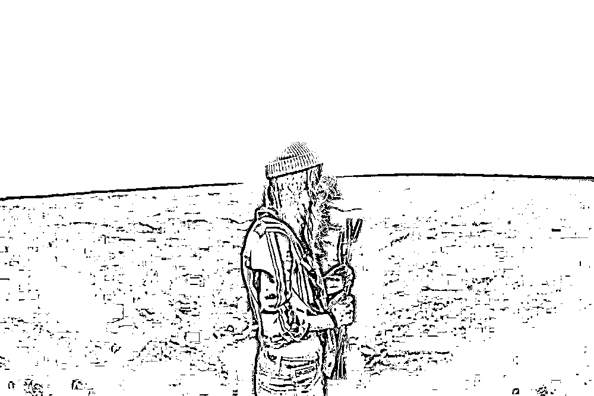

**“木海四分”之后我们面临的选择**


**我喜欢和从不幻想得到别人恩惠的人做生意。**

**——安.兰德《阿特拉斯耸耸肩》**天象

*   **日月海 T 三角**：宽泛容许度下，行进在双鱼座的海王星四分射手座太阳，四分双子座月亮。
*   **火海三分**：行进于天蝎座的火星三分双鱼座海王星。

2019 年的整体天象大背景呈现出“三股宇宙势力”：**金牛座天王星、“木海四分”结构和“土冥合相”结构。**

2019 年是**“理想与现实”不断撕扯且充满张力**的一年。金牛座天王星打破现实结构的变革与“土冥合相”洗牌现实规则的整顿，犹如双剑合璧般发挥着**“不破不立”**的威力，对“木海四分”**一腔热血的造梦工程**也是毫不客气。

我们不妨回顾一下 2019 年：

*   集体层面，一些原来的**领军企业呈现败落**，一些**原本盈利的经济模式难以维系**，牵连着个人在职场上遭遇**架构调整或企业裁员**，**薪金拖欠或发展困境**，于是一些朋友萌生**跳槽或创业**的想法，一些朋友升起**扩展新项目和学习新模式**的激情。但是，这些想法和激情，要不就是没有现实推进或只是说说而已，要不就是还没下水就已经晒干在沙滩上。
*   同样的年份背景下，也有**健康医学和 AI**等新概念产业的破冰而出，**沉淀多年且实力稳健的专业人士的屹立不倒。**

不同的际遇，背后究竟是为什么呢？2019 年新月和满月的文章，上半年反复强调**“比想做什么更重要的是能做什么”**，下半年反复强调**“踩稳你的安全根基”**，是的，就是那些**“定位精准且实力稳健”**的机构或个人，没有被盲目扩张的欲望拉下水，没有被理想主义的膨胀捧上天，如黑马一般在 2019 的乱象之中保持实力并杀出重围。随着 2019 年末推进，“木海四分”的造梦工程逐渐放缓，12 月 3 日，渴望**“扩张理想”**的木星进入主张**“落实到位”**的摩羯座，浮躁似乎开始回归冷静。但是海王星并不甘于平庸：宇宙太浩瀚，生命太无奇，即使生命是宇宙中的一粒微尘，也要绽放“一粒一世界”的绚丽。

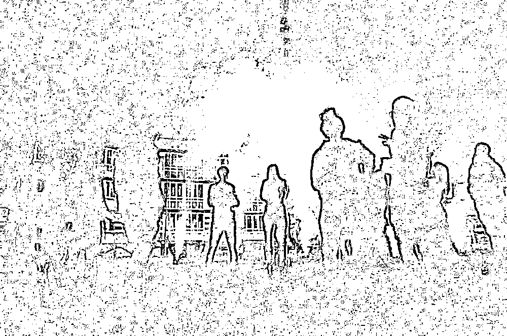

**12 月 8 日**，射手座太阳与双鱼座海王星形成“日海四分”结构，摩羯座金星与双鱼座海王星形成“金海六分”结构，促动着“木海四分”的后遗症开始发作：**那些没有实现的理想再次涌上心头，跳槽或创业的想法再度升起；那些情感的失意激起爱的渴望，激情与浪漫热烈点燃。**此次双子座满月，一方面满月介入“日海四分”结构形成“日月海 T 三角”能量组合，泛化着“木海四分”后遗症的迷茫感，另一方面满月的完结能量要对“木海四分”后遗症做个了断。而“火海三分”结构则帮助我们**直面内在的动机与深刻的真相**：那些为了摆脱压力的理想，为了填满空虚的消费，为了逃避独处的浪漫，只不过是慌乱之中随手抓取的安慰品，却根本平复不了内心的空洞与焦虑。

我们总在要求这个世界平等，但又总在不平等地向外界索取：模仿他人成功的模式将路径变得最短，喜欢有钱有闲的工作将损失降到最低，期盼“懂我”的爱人满足内在小孩的期待，希望幸运的眷顾获得梦寐以求的资源。**这一切的“要”，都在透露着内在的脆弱与恐惧。**

宇宙喜欢和**从不幻想得到别人恩惠**的人做生意，因为**宇宙能量不能被创造或被毁灭，但能流动或转化。**只有那些**将“索取模式”转换为“付出模式”的人**才是宇宙喜欢的得力助手，才能令宇宙能量向着**“更有建设性地服务世界和利益众人”**的高阶频次转化。

此次双子座满月，我们要**在“索取模式与付出模式”之间做出选择**，**在“真正理想与短暂欲望”之间确立自我**，那么如何将索取性的欲望从内心深处剥离，又如何将付出性的理想在现实世界扎根呢？来看看热闹的摩羯座阵营给出的策略。**沉淀实力，转化盲点，走向“水瓶座时代”**”

 

**矛盾其实并不存在，你无论在什么时候遇到矛盾，检查一下你都有哪些前提，就会发现其中一个是错的。**
**——安.兰德《阿特拉斯耸耸肩》**1 天象

*   **土星介入满月轴线**：摩羯座土星与射手座太阳形成 30 度结构，与双子座月亮形成 150 度梅花结构。
*   **土冥挟持金星**：摩羯座上，“土冥合相”结构将金星挟持其中。
*   **木天三分**：摩羯座木星三分金牛座天王星。

*   **木凯四分**：摩羯座木星四分白羊座凯龙星，12 月 13 日凯龙星于白羊座恢复顺行。

*   **水天梅花**：射手座水星与金牛座天王星组成 150 度梅花结构。

2020 年将会是人类历史上被铭刻的一年。**2020 年 1 月 12-13 日**，土冥合相摩羯座将开启人类世界对上一周期的**“洗牌与重建”**的程序，**2020 年 12 月 21 日，**“木土合相水瓶座”将开启人类世界进入下一周期**“水瓶座时代”**的进程。我们在 2020 年中更新与蜕变，与这个正处于新旧周期交替路口的世界重新建立认识，重新做出回应。

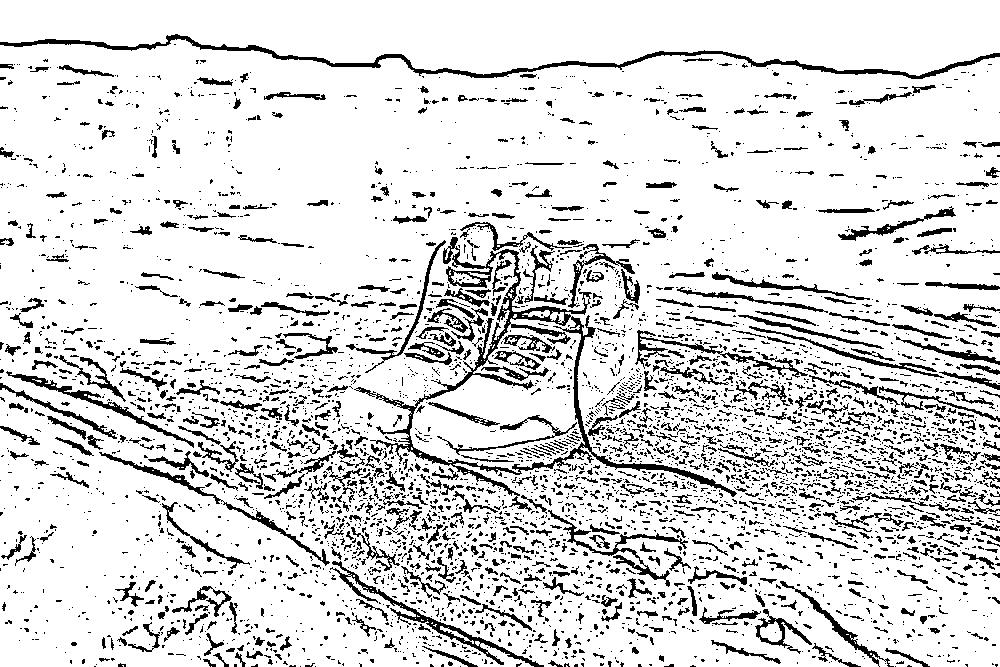

2019 年 12 月，当“土冥合相”结构已进入紧密状态的时候，**12 月 3 日**，庞大的木星又进入摩羯座阵营，无疑为“洗牌与重建”工作加上一个**“扩大器”**，于是重磅性新闻立即纷涌：多位知名人士陷入风暴中心，或是面临经济追讨，或是面临破产考验；多个知名企业动态扑朔迷离，阿里巴巴香港上市，顺丰旗下公司董事变更，多家金融机构 APP 下架等等；俄罗斯遭国际禁赛 4 年，特朗普成为史上第四位面临弹劾的美国总统......

庞大的木星几乎 2020 年全年行进在摩羯座上，加大了世界格局的震荡范畴，加剧了**“新老周期”**的转换进程；而摩羯座守护行星土星接纳着摩羯座上所有行星能量，2020 年牵手木星和冥王星为此次双子座满月的迷茫感提供策略——**想要探索更大的空间或追求更高的境界，首先要诚实面对自己的真相。**

成功的模式根本不能复制，漫天的信息根本不代表机会，你必须**经由自己的践行沉淀实力，经由自己的经验获得智慧**，才能**从“走捷径的索取者”转化为“有能力的付出者”**，才能在 2021 年进入“水瓶座时代”的时候**为人类世界提供服务并做出贡献**，做到这一切的时候，**福德与回报也自然会回到你的生命之中。**

此次双子座满月，土星介入满月轴线并与冥王星一起将金星挟持在中间，而金星作为金牛座的守护行星也携带着金牛座天王星的变革风向，故而会带来**国际局势和经济环境的动荡，推动金钱财务和亲密关系的处理**；“木凯四分”结构令我们**发现过去意识观念造成的伤痛和盲点**，“木天三分”结构则将**突破过去意识观念**的全新光束照亮我们未来的道路，“水天梅花”结构意外地送来**宇宙的智慧与洞见**。

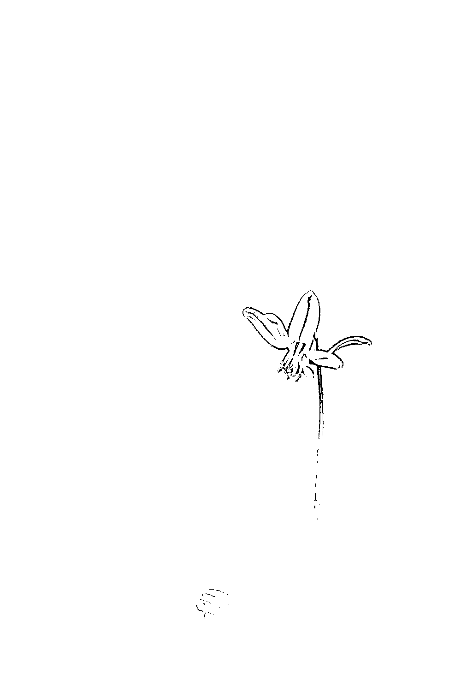

2 你可能经历的

*   **情感**

*   浪漫关系开始**降温或出现冷战**，一方想要确立承诺，而另一方却还未确定。其实 12 月还是有很多脱单或承诺的可能，但是要建立在**双方对这段关系定位相符**的基础上。那些可能发生结束或出现问题的关系，正是说明紧紧攥在手里的只是业力的投射、索取的需求、自我的感动，而对方的需求和感受未必知晓。

*   **职场**

*   无论你是因为受到行业和企业的波及，还是因为精准定位了未来目标，都可以跳槽或创业，但一定要拿出**积累经验和沉淀实力**的态度，准备好**克服苦难和坚持到底**的决心。看水的永远不知道下水的艰辛与风险，准备好再尝试，没准备好就等等。

*   **金钱**

*   我们只能赚取自己价值观念看得见的财富，了解这一点就**收敛一下对金钱的贪欲**吧，那些**把握不住的诱惑和透支身心的消费**，只不过是为了填满**不自信和无价值的空洞内心**，但是这种方法无疑毫无用处。马上进入**2020 年的经济收缩期**，踏实赚自己的钱，看紧自己的钱包，酷爱买买买的朋友双十二保重。 

*   **集体**

*   最近看了一个“淘金时代结束，炼金时代开启”的讲演，非常符合当下的整体局势。一些经济环境整顿，一些商业机构解体，其实都是**将淘金者淘汰，让炼金者胜出**的过程，所以能够“活下来”的都是好样的。我们要**对人类世界保持信心和信任。**

如果说 12 月 3 日木星进入摩羯座标志着未来一年的“命运”，那么，此次双子座满月就是我们**与过去的“命运”告别**的仪式。一切似乎都准备好了，一切也将无可避免地发生。

**12 月 16 日**，月亮介入“火海三分”结构形成疗愈能量充足的**“月火海水象大三角”**，即使只有短暂的片刻，但已足够呈现宇宙对此次双子座满月的**疗愈**光芒——转化意识观念并超越理想局限，整合现实资源并攻克现实难题，去做最困难的事，去走最踏实的路，未来的奇迹就在前方等待我们。你准备好了吗？

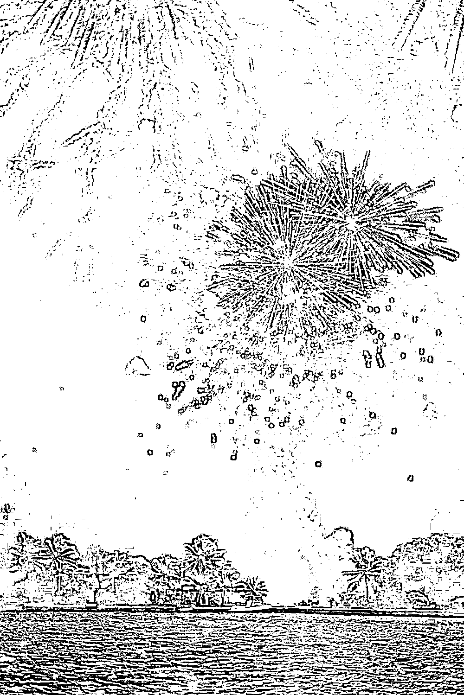

**寄语**

**为了将事情做好，首先你得喜欢做这件事，而不是喜欢这件事情的结果。**

**——安.兰德《阿特拉斯耸耸肩》**我们常常本末倒置：为了一个结果去做一件事，最后结果还没出来就已困在半路；做着一件事却抱怨着这件事，结果就是人和事两败俱伤。

“做”是一个雕琢艺术品的过程，需要 4 个条件：

*   心灵的直觉与创意
*   专业的经验与打磨
*   意志的专注与坚定
*   危机的预见与决策 

**前三点能够成就一件艺术品，但是最后一点才能令这件艺术品长久留存。**如果人生是一件艺术品，我们欠缺哪个条件，常常跌倒在哪个点上？如果 2020 年是一件艺术品，我们欠缺哪个条件，还需要在哪个点上努力？此次双子座满月，在你开始艺术品的创作之前，先在**“真正的理想与短暂的欲望”**之间**确立“喜欢做的事”，抛弃“为了结果的事”**，然后将 4 个条件一一地梳理，一一地评估，如此就会知道 2020 年的旅途需要学习什么和沉淀什么。祝福大家。

**版权声明**：原创文章由作者授权首发于若道平台，欢迎转发，反对抄袭。友号转载请申请白名单。

****

****想阅读更多作者的文章，****

****请在后台回复******王芝桦****** 即可。****

****王芝桦****

心理占星师，统合疗愈师，占星专栏作者

全职于个案咨询与占星教学工作 14 年

**个案预约咨询微信号**：zhihua0621 

**微信公众号**：daoxi-life

**长按打赏**

****

**长按下方图片**

**两位大占星师领你学习占星学的多种高级技法**

************点击图片查看详情************


**微信又双叒叕改版啦，不想错过若道君的推送？**

**就把若道设为星标吧！**

**▼**


就是这个“在看”，戳戳戳 ☟

********报名直达入口********


# 2020 年开年第一课！中英双导师联手打造 Level1-5 核心占星课

> 原文：[`mp.weixin.qq.com/s?__biz=MzA5NjA0NTAxNg==&mid=2651412259&idx=2&sn=8d4981dbcc84845d39ec1102b4494810&chksm=8b4be594bc3c6c82801e9d4012b4496db5d8dd33fe777965d1f98e4d6e8fc2da3f1ae2d2f645&scene=126&sessionid=1692738242#rd`](http://mp.weixin.qq.com/s?__biz=MzA5NjA0NTAxNg==&mid=2651412259&idx=2&sn=8d4981dbcc84845d39ec1102b4494810&chksm=8b4be594bc3c6c82801e9d4012b4496db5d8dd33fe777965d1f98e4d6e8fc2da3f1ae2d2f645&scene=126&sessionid=1692738242#rd)


**拥有****49****年占星实践经验的若道创始人**
**大卫·瑞雷****&****最懂学员的若道首位认证****金牌中国****老师****熊鹰****师徒二人****横跨南北****联手打造****北京上海**** 若道****全新****核心占星课程****之**

**互动实战占星初阶工作坊**

**本次****Level 1-2 工作坊****会分别在**

**上海（2020 年 3 月 13、14、15 日 熊鹰老师主讲）**

**北京（2020 年 4 月 4、5、6 日 大卫·瑞雷老师主讲）**

**两个城市各举办一场**

**方便北方、南方同学自由选择，邀请小伙伴一起学习**

**核心课现场工作坊是一种什么样的？**

珍贵的**面授工作坊**，全面而详细地讲解占星学知识，一场五感盛宴！

# **代入感：**向往占星世界好久了，迟迟没有下决心系统学习？最专业的占星老师来喽！带你穿越 9¾站台，进入真正的占星魔法世界，来若道，你就是哈利波特本特！


**沉浸感：**从虚拟的网络来到现实，舒适的学习环境，全新的占星同学，5D 的占星老师，专业的摄影团队，支持的工作人员~让你仿若重回校园梦，燃动青春学习占星！


**参与感：**大卫老师和天空老师都有丰富的教学经验，占星知识严肃专业，但开起玩笑来也丝毫不马虎，欢笑间知识都记住了呢，如果你长得可爱聪明伶俐，课上还会随时**被 Q**哦~对，就是你~


**仪式感：**两位老师超爱自己的中国学生们，为了让大家透彻地学习好宫位，2018 年初阶工作坊，大卫老师和熊鹰老师趴在地上用胶带贴的~仪式感满满~有没有~就宠你就宠你！今年还有没有其他的惊喜？


**亲近感：**周围全都是热爱占星的同学，那种亲近和被理解的感觉真的不要太美妙。志同道合的朋友就在身边，灵魂伴侣可能就在眼前，透露一下，在若道课堂里找到男女朋友的真的不要太多~比如~咳咳，总之带着八卦的心来上课吧~


**连报 L1-5 全阶课程，可以享受到：**❶ 51 次线上直播互动网络课程+3 场工作坊（互动实战占星初阶工作坊、亲密关系+职业占星工作坊、知识回顾+综合解读工作坊），全面而详细地讲解占星学知识、技能、案例和重要领域实践运用。 ❷知识点+学员星图解读有机结合：熊鹰老师以知识点和学员案例讲解为主，大卫·瑞雷老师以参课学员案例及客户案例讲解为主，每个知识点覆盖班级内学员的亲身案例，参与感更强，每位学员都有机会听到自己的星图分析。 ❸微信群学员互动分享，从真实案例学习生命成长故事。 ❹ 论坛提问：论坛上每个学员的问题都将得到及时回复。 ❺ 提供咨询师实习平台，只要努力，都将有机会在毕业前进行咨询的实习演练，听取客户反馈，为成为职业占星师做准备。

**1-2 阶我们要学习什么？**

  **第一阶** ** 12 星座，12 种性格，12 种人生**❶ 学习占星学必须准备的“心法”**❷**占星学中的火、土、风、水四元素，阴阳法则**❸**面对面的星座有故事**❹ **12 星座：12 种性格详解，12 种行为模式，12 种价值观**❺ **太阳和月亮：了解你的太阳，生命的发动机，让你在世界闪光的方式，生命获得力量的方法；了解你的月亮，让你获得幸福的方法**❻ **了解太阳、月亮，了解你生命中已经出现的、将会出现的男性和女性

**第二阶  命运的线索和人生故事中的演员**

❶ 命运的线索：南北交点❷ 星图三巨头：太阳、月亮、上升点的故事❸ 了解心智：水星❹ 了解金钱和关系：金星❺ 了解行动模式：火星❻ 了解信念：木星❼ 了解努力：土星❽ 了解天才和疯狂：天王星❾ 了解梦想和幻灭：海王星❿ 了解死亡和重生：冥王星⓫ 12 个人生场景：黄道 12 宫位初解

**现场工作坊**

**上海（2020 年 3 月 13、14、15 日 熊鹰老师主讲）**

**北京（2020 年 4 月 4、5、6 日 大卫·瑞雷老师主讲）**


**如果你想马上开始学习 Level 1-2**现提供即买即学的**熊鹰老师网络视频课程**出售价格和工作坊一样如果想同时购买网络课程视频+任一场现场工作坊可以享受打包价哈具体购买方式看到最后~

**3 阶开始的网络直播课**

老师同学都认识的差不多了，从三阶开始就是更方便灵活的网路直播课喽

**第三阶 宫位、相位以及初步解读星图****（15 次课）**❶ 15 次线上直播网络课程，每次 2 小时，堂课中依旧会使用同学们的星图作示范❷  10 节课由熊鹰老师教授，重点通过名人星图阐释知识点❸  5 节课由大卫·瑞雷老师教授，重点通过学员星图阐释知识点❹  从第三阶开始，助教将会指导练习，答疑解惑，学练结合❺  重点在于如何根据星图去问问题，着重自我发现和自我探索的过程**课程安排**2020 年 6 月 4 日：宫位，行星和星座组合 2020 年 6 月 11 日：宫位，行星和星座组合 2020 年 6 月 18 日：月亮交点 2020 年 7 月 2 日：月亮交点和演示案例 2020 年 7 月 9 日：相位 2020 年 7 月 16 日：相位+星座，行星和宫位 2020 年 7 月 23 日：相位，星座，行星和宫位的同学案例 2020 年 7 月 30 日：渐盈相位&渐亏相位，示例 2020 年 8 月 6 日：更多的关于宫位和宫主星 2020 年 8 月 13 日：同学案例 2020 年 8 月 20 日：空相行星&定位星 2020 年 8 月 27 日：宫主星 2020 年 9 月 3 日：优先级和组织 2020 年 9 月 17 日：相位模式以及范例 2020 年 9 月 24 日：学员星图解读范例**第四阶 出生星图解读（进阶）以及关系与职业议题****（12 次课，1 场四日亲密关系+职业占星工作坊）**❶ 12 次线上直播网络课程，每次 2 小时，堂课中依旧会使用同学们的星图作案例❷ 8 节课由熊鹰老师教授，4 节课由大卫·瑞雷老师教授

❸ 1 场北京现场四日工作坊：亲密关系+职业占星，学生将被选中进行案例演示和互动。

**工作坊安排：****2020 年 10 月 29 日、30 日、31 日、11 月 1 日四日北京工作坊****亲密关系（两天）+职业（两天）占星工作坊**学员将被选中进行案例演示和互动（免费）。**课程安排**

2020 年 11 月 26 日：整合星图和星图优先级

2020 年 12 月 3 日：综合解读

2020 年 12 月 10 日：整体案例

2020 年 12 月 17 日：亲密关系/对比星图

2021 年 1 月 7 日：占星学和对比星图的例子

2021 年 1 月 14 日：对比星图同学案例

2021 年 1 月 21 日：对比星图同学案例

2021 年 1 月 28 日：占星学的职业介绍

2021 年 2 月 4 日：占星学的职业案例

2021 年 2 月 18 日：占星学的职业同学案例

2021 年 2 月 25 日：儿童职业发展

2021 年 3 月 4 日：亲密关系/职业同学案例

**五阶 预测、关系、咨询、为执业和考试做准备****（24 次课，1 四日工作坊）**❶ 24 次线上直播网络课程，每次 2 小时，堂课中依旧会使用同学们的星图作案例❷ 15 节课由熊鹰老师教授，12 节课由大卫·瑞雷老师教授

❸ 1 场综合解读工作坊（北京）：把一切串联起来，学生将被选中进行案例演示和互动。

**工作坊安排：****2021 年 9 月 2 日、3 日、4 日、5 日四日综合解读工作坊（**北京**）**把一切串联起来，L1-5 知识回顾，综合解读学员将被选中进行案例演示和互动（免费）。**课程安排：**2021 年 4 月 15 日：行进介绍 12021 年 4 月 22 日：行进介绍 22021 年 4 月 29 日：行进介绍 32021 年 5 月 6 日：当下的行进的同学案例 2021 年 5 月 13 日：周期，重置星图 2021 年 5 月 20 日：当下的行进和周期的同学案例 2021 年 5 月 27 日：次限 2021 年 6 月 3 日：次限同学案例 2021 年 6 月 10 日：太阳弧 2021 年 6 月 17 日：太阳弧同学案例 2021 年 6 月 24 日：亲密关系的关键节点+组合星图 2021 年 7 月 1 日：亲密关系的关键节点，组合星图同学案例 2021 年 7 月 8 日：职业周期 2021 年 7 月 15 日：职业周期同学案例 2021 年 7 月 22 日：太阳返照&月亮返照 2021 年 7 月 29 日：太阳返照&月亮返照同学案例 2021 年 8 月 5 日：高级预测技巧 2021 年 8 月 12 日：高级预测同学案例 2021 年 8 月 19 日：高级预测技巧 22021 年 8 月 26 日：高级预测同学案例 22021 年 9 月 2 日：简单的占星学历史 2021 年 9 月 9 日：占星学的不同流派 2021 年 9 月 16 日：ISAR 考试术语和复习 2021 年 9 月 23 日：ISAR 考试术语和复习**这两位优秀的占星学老师是谁？**


**大卫·瑞雷（David Railey）**

*   ISAR 董事会成员，若道占星创始人。
*   1976 年，通过亚特兰大职业占星师考试，成为全职占星师，随后通过**AFAN 和 ISAR 职业测试**。
*   1980 年，与**杰夫·焦耳**一起在亚特兰大创建**“每日星球”**占星学中心。此后在亚特兰大占星协会担任 4 年考官，并且两次担任**亚特兰大地区占星协会主席**。
*   1979-1992 年，作为占星师活跃于美国社会媒体，向不了解现代占星学变化的大众宣传专业占星学知识。在 1989-1992 年期间，他在 WRGG 电台 12 频道每周主持个人电视秀**“今日占星学”**，早先他还在 WRFG 的广播节目中播讲宇宙天气节目。 
*   2010-2014 年，任**全美占星师联盟监督委员会委员**。
*   2010 年，其著作**《灵魂的目标》**中国版出版，和蒋颖一起创办**若道占星**学校和其官网 www.nodoor.com。从该年开始，他工作并往返于亚特兰大和北京。目前他 80%的时间致力于在中国教授和推广西方占星学。
*   2017 年，被选为**ISAR 委员会成员**（2017）。ISAR 是世界最大的国际占星机构，会员遍布 45 个国家。


**熊鹰老师（天空的空）**

*   2008 年接触严肃占星学，至此爱不释手。
*   **2013 年师从大卫·瑞雷**，研习整套现代占星学核心课程，并于 2014 年起至今连续三年担任该课程的主助教。
*   期间也**跟随格伦·佩里、诺·泰尔、理查德·塔纳斯、罗伯特·汉德、苏·汤普金斯、斯蒂芬·弗里斯特等多位国际顶尖占星大师进行学习**，进行定向占星主题研究。
*   2015 年初，通过国际占星研究协会**（ISAR）资质认证并获得证书**。同年，进一步跟随大卫·瑞雷老师进修**“生时校正”**技术，通过最终考核并获得证书。
*   目前在若道星文化任职，将传播系统、严谨、真实的占星学作为职业使命。任专职助教期间，进行沙龙与答疑等辅助教学工作已累计超过 200 小时。
*   在业余期间也提供占星咨询与生时校正服务。目前正致力于占星学与个人成长的整合。

**往届学员这样说**

★ **熊鹰老师非常清晰各阶段学员的难点在哪里，在哪里容易走弯路，所以在课程中给了针对性很强的技术讲解。**同时，学识广博的他对占星学术背后的道有非常深刻的思考，对占星学所表达的事物不断去溯源，去探寻本质，并在其他学问中去看到道的呼应，让我觉得非常过瘾和鼓舞。感谢熊鹰老师的启迪！ ——2017 若道占星核心课程熊鹰主讲 1-2 阶学员杨灿

**★ 知识渊博、博古通今、亲切可人、nice ，将东方的佛教文化、古诗词完美地与西方占星学结合，让学员特别容易理解**。很喜欢熊鹰（天空）老师，在巩固好 1、2 阶课程后，会追随空妈进行下一阶学习。

 ——2017 若道占星核心课程熊鹰主讲 1-2 阶学员王舒

★ **融合中国传统文化，把占星学规整得非常理性和易懂，空妈非常擅于观察和总结，给我们非常宝贵的经验。**我觉得效果非常好，以前对于各个星座和行星的概念比较片面，这次学完后觉得收获颇多，也打破了传统的限制，感觉到了与时俱进。 ——2017 若道占星核心课程熊鹰主讲 1-2 阶学员王茜★ 通过大卫老师课堂的案例咨询，我不仅对自己本身的特质和发展方向更加清晰，更开心的是清楚了自己处在怎样的发展阶段，外部环境对我的影响是怎样的，让我更加清晰应该怎样抓住机遇，在现阶段怎样努力。这些都是对我现在来说最重要的。**能够得到在课堂上享受这么专业精准的个案咨询，真的非常幸运。**——2017 若道占星核心课程大卫·瑞雷主讲 5 阶学员萧立★ 在课堂上获得了大卫咨询的宝贵机会。在一个多小时的咨询中，大卫首先演示了对客户星图的分析思路和推演过程，对客户的诸多发展方向和人生主题做出推测，并记录下来，待与客户见面时结合客户实际深入探讨。而后，大卫示范了如何与客户提问互动，从出生星图入手深入剖析案主的心理模式和原生家庭，并对案主的疑问进行解答。**坦白说，大卫的分析中肯且直中要害，对我来说像一道闪电，不仅准确地描述出我的原生家庭和童年生活环境，更击中了我多年来心中的隐痛**。这次咨询帮助我梳理了很多年来积压在心底的情绪，也在一定程度上疗愈了我，大卫的建议是如此地温和有力，让我感觉无比温暖，整个人被照亮了！再次感谢大卫，你的智慧和引导对我意义非凡！——2017 若道占星核心课程大卫·瑞雷主讲 5 阶学员龙爪槐下**若道核心课程教学支持体系****我们有****完善和系统的****核心课程教学支持体系****帮助你更好更全面地学习**


**什么人适合这门课？**

*   对占星学有浓厚兴趣，想要系统学习占星学
*   对占星学有一定基础，但不知道该如何整合星图复杂的碎片
*   希望成为优秀的占星师，想要借鉴国际大师解读思路并融入自己的体系
*   想学习占星学，但不擅长英文，希望有中文老师授课
*   想结合占星学理论与咨询实践

*   大卫·瑞雷、熊鹰的忠粉，学过占星，但就是想跟着偶像再学一遍

*   走在自我探索和个人成长道路上的人 

**课程费用****★ 1-5 阶****早鸟价：33000 元（2020 年 2 月 19 日之前）****课程费用：46500 元****★ 1-2 阶工作坊（北京工作坊、上海工作坊任选一场）****早鸟价：2800 元（2020 年 2 月 19 日之前）****课程费用：3500 元****★ 对于不方便上线下课的同学：可购买熊鹰老师 L1-2 视频课程****早鸟价：2800 元（2020 年 2 月 19 日之前）****课程费用：3500 元****★ 视频+现场都想要的同学：有套餐价哦****北京工作坊、上海工作坊****任选一场****+熊鹰老师 L1-2 视频课程****早鸟价：4200 元（2020 年 2 月 19 日之前）****课程费用：5200 元****退转课程**

*   **退款原则请详看《教学协议》，如有疑问请咨询课程顾问。**

****中英双导师核心课 Level1-5****

**授课老师：大卫·瑞雷 熊鹰**

**授课时间：****1-2 阶工作坊，上海** 2020 年 3 月 13、14、15 日**北京** 2020 年 4 月 4、5、6 日 ；**3-5 阶，**2020 年 6 月 4 日

**授课方式：**网络课程，中英文授课，中文翻译；现场工作坊，中英文授课，中文翻译

**费用：1-5 阶：**46500 元**早鸟价：33000 元（2020 年 2 月 19 日之前）；** **1-2 阶**（北京、上海工作坊任选一场）**：**3500 元**早鸟价：2800 元（2020 年 2 月 19 日之前）；******1-2 阶视频课程：****3500 元**早鸟价：2800 元（2020 年 2 月 19 日之前）；**

****视频+现场套餐价：****5200 元** 早鸟价：4200 元（2020 年 2 月 19 日之前）**

**课程负责人：**王老师（微信：18510107057），请备注“核心课”

长按二维码添加课程负责人咨询~


**阅读原文报名链接为：中英双导师 Level1-5 北京工作坊**

**想报名上海工作坊或购买熊鹰网络视频课程的小伙伴**

**记得私信销售小姐姐咨询哦**

****报名请点击“阅读原文”****


# 12 星座放飞自我指南 | 男人压抑指数爆表后，会发生什么？！

> 原文：[`mp.weixin.qq.com/s?__biz=MzA5NjA0NTAxNg==&mid=2651412222&idx=1&sn=383a4e73fe0cf782dc0b899a29adf799&chksm=8b4be449bc3c6d5f696976bc9ba4fd383ef3a7044626447b13487b3ce2ad22d096582fdaca7b&scene=126&sessionid=1692738242#rd`](http://mp.weixin.qq.com/s?__biz=MzA5NjA0NTAxNg==&mid=2651412222&idx=1&sn=383a4e73fe0cf782dc0b899a29adf799&chksm=8b4be449bc3c6d5f696976bc9ba4fd383ef3a7044626447b13487b3ce2ad22d096582fdaca7b&scene=126&sessionid=1692738242#rd)

******************☆ **************后台回复“今日”，给你一句生命态度****

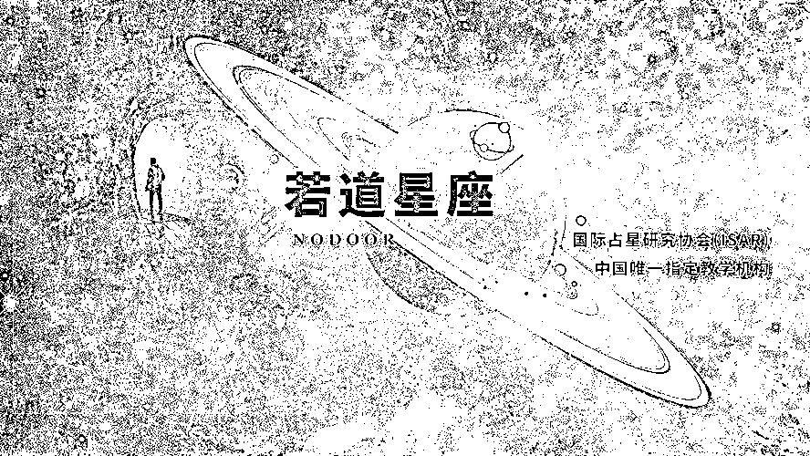

作者/大卫·瑞雷 若道占星创始人

翻译/李含 校对/江艺 编辑/Tang 

封面/书君 图片/unsplash

文章来源/《风度》杂志 2019 年 9 月刊

**再强的人也有权利去疲惫**

全世界的父母按照传统都会告诫他们的儿子不要哭。尽管现代世界对男孩的养育态度正在改变，但这种改变可能需要几代人的时间。**哭泣被视为软弱的表现，男孩们希望成为坚强而受人尊敬的男人，他们不希望被视为软弱的人。**与女孩相比，男孩被鼓励不要说太多话。男人被塑造成为坚强、自信、沉默的英雄，只有在必要时才说话，讲述事实和基本信息，或厉声发号施令。

**这种性别偏见的根源很容易追溯**。男人传统上是猎人和战士，猎人在追踪猎物时必须保持沉默；战士在偷袭敌人时也必须保持安静，与敌人面对面时也不能表现出软弱。自旧石器时代以来，这种行为在男性身上得到了强化，女性大概更喜欢这种坚强、沉默的英雄式伴侣。

然而，**压抑情绪（尤其是哭泣）的负面影响，被认为是现代社会中男性的一个主要健康问题。哭被认为是释放体内压力的一种方式**。压力如果不能以某种方式释放出来，就会导致身体疾病，包括心脏、胃、肝脏和肾脏疾病，以及像抑郁症这样明显的情感障碍，甚至是极端的自杀。

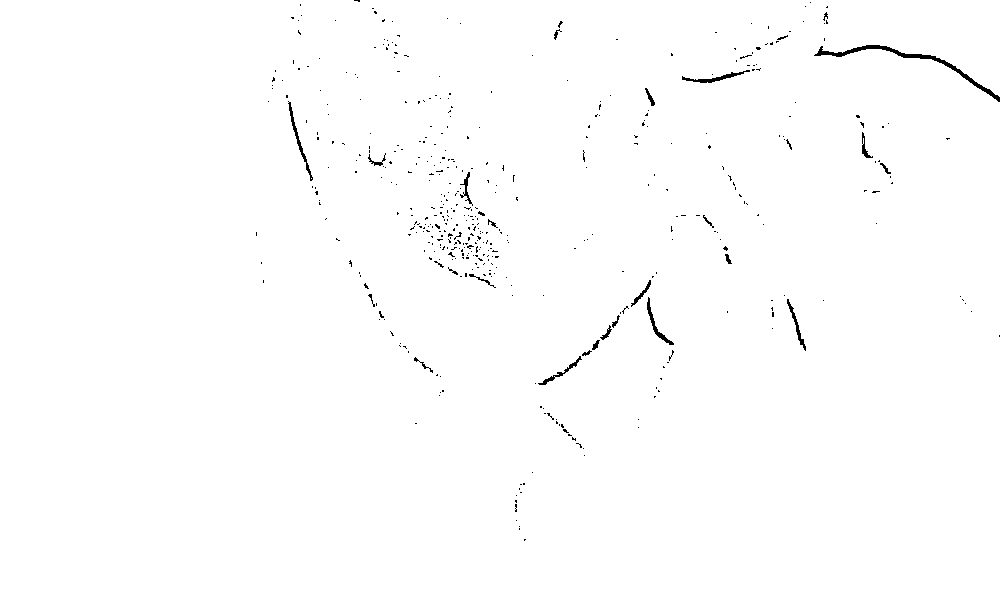

**12 星座男压力爆表后会怎样？**

抑制情绪是一种先天和后天的冲突，从占星学的角度来看，这是一个值得探索的问题。占星学是关于“自然”，即人性的一门学科。每个星座代表人性的一种变化，**当你压抑你自己的星座会发生什么？**虽然我在这篇文章中主要针对男性，但占星学**适用于每个人**。不论怎样，我希望男性读者们会思考一下这些关于你们**情绪健康的占星线索**。

★**白羊座**

动作片明星身上男子气概的刻板形象很适合你们中的很多人，但你们是什么样的动作片英雄呢？当你的行动不能足够快速地产生结果时会发生什么？就像钢铁侠，你是否害怕自己的电池电量不足！你的挫败很快就变成了愤怒。你可能会成为一个肾上腺素迷，依靠你的愤怒来达到目的。可能会出现一种盲目的愤怒，随之而来的是令人眩晕的头痛。是时候给自己充电了！但你没有离开去充电，而是狂饮另一罐红牛。但是**如果没有休息时间来充电，没有面对你的感受，你很快就会精疲力竭**。

★**金牛座**

你是强壮稳重的类型，但却是一个勉强顽抗的英雄，如果其他人认为你太慢、太过于放纵，你就会恼火。你尽力收腹，直到它变得太大而无法隐藏。你会吞掉自己的情绪，直到它们太过沉重。当你身边的每个人都惊慌失措时，你会为自己保持冷静感到自豪，但口中的雪茄只是一个安抚奶嘴。你的顽固可能使其他人筋疲力尽，但是你僵硬的粗脖子和嘶哑的嗓音是紧张的证据。放松你的肩膀，享受按摩， **哭泣并不会降低你的价值。**

★**双子座**

你希望自己聪明而不是健谈，你想成为见闻广博的聪明人。也许当你还是个孩子的时候，经常有人叫你闭嘴？也许有人说，“你比女孩话还多! ” 你们中的许多人都向我承认，你们说得太多，这让你们感到不安和焦虑。同样，你天生的好奇心可能已经转入地下。也许你嫉妒沉默寡言的硬汉，在他们面前表现得紧张不安。如果你是一个沉默的双子座男人，你可能会抑郁。**抑制交流的冲动会耗尽你的精力，让你感到疲惫、孤立和被误解。**

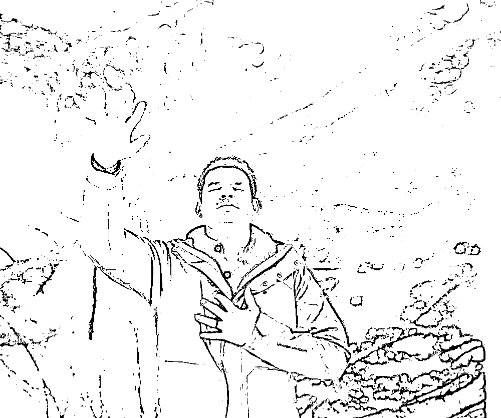

★**巨蟹座**

作为一个男人，你比其他任何星座都更有可能**对情感敏感做出过度补偿**。因此，你们中的许多人会不遗余力地证明自己是一个有男子气概的人。无论是你穿着皮夹克骑摩托车，还是你穿着的运动服，还是你所冒的风险，或是你拥有枪支，参加大型狩猎之旅以及深海钓鱼游戏！我在你们身上都看到了这一点。**在这种外表之下，你是最多愁善感的人，你越早接受这一点，你的生活就会越好**，你的胃也会越健康！

★**狮子座**

当你还是个男孩的时候，表现出的自信或领导潜力可能会让你赢得成年人和同龄人的钦佩，让他们对你有更高的期望。然而，你和其他人一样有情绪和不安全感，而且有一种被孤立和被施压的感觉，这种感觉**来自于被期望每次都有同样出色或更好的表现**。你们中的许多人会压抑那些可能被认为是软弱的情绪，努力用你的“狮子吼”来给人留下深刻印象和恐吓。你担心，如果你表现出任何不安全感，别人会认为你是“戏精”，久而久之，这种紧张会影响你的心脏。

★**处女座**

你为自己的逻辑性感到骄傲吗？也许你拥有出色的分析和推理能力。然而，在认定自己是一个“理性”的人时，**你们中的许多人把感情和情绪贴上了“非理性”的标签，认为这些不值得信任**。事实和逻辑显然是有用的，但是否认感觉是漠视其他的事实，这会危及你的情绪健康。事实上，**觉察自己的情绪可以帮助你做出更好的决定**，因为事实证明，大多数决定都是出于情感原因，而不是逻辑原因。练习倾听你自己的感受，你会更好地吸收生活经验，减少肠道压力。

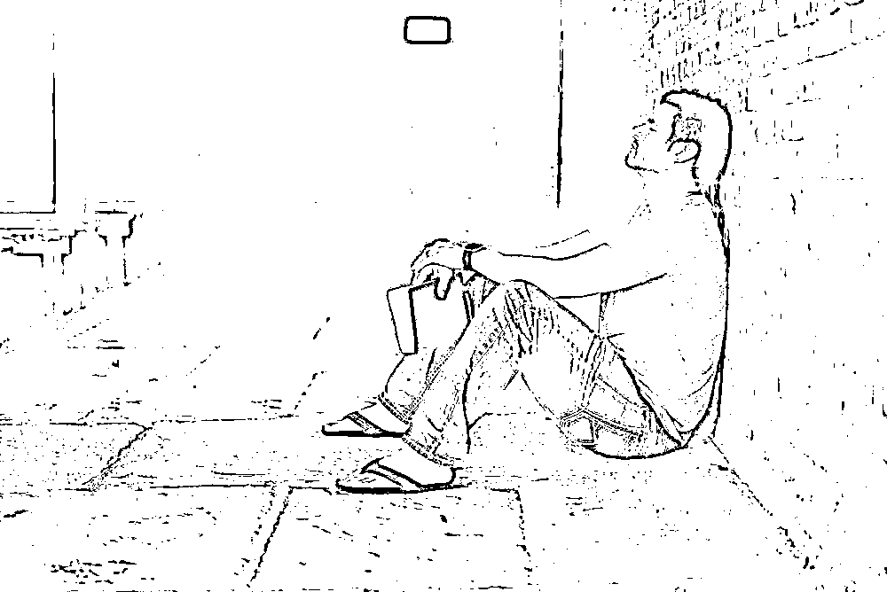

★**天秤座**

在你还是个小男孩的时候，可能有人说你不够坚定自信，但是作为天秤座，你的优势在于建立关系。因为女孩往往更专注于人际关系，所以你可能看起来更女性化而不是男性化。作为补偿，你最好的男性朋友可能是一个硬汉，巩固了你的声誉。许多天秤座男人为自己的魅力感到自豪。然而，作为一个风象星座，你经常超然于自己的感觉，同时对他人进行心理分析。**精彩的解释不同于情感上的坦诚**，抑制情绪会严重伤害你的肾脏和下背部。

★**天蝎座**

作为一个天蝎座男孩，也许你学会了用你强烈的情绪去恐吓、诱惑或控制他人。因此，**你的男性自我可能建立在操纵自己的情绪来得到你想要的东西上**。你听从自己的直觉，主要是对别人的直觉——就像一个侦探，但是你的其他感觉可能被压抑了。这种压抑可能使你很难信任他人，因为你没有学会信任自己的感觉。随着不断成熟，你可能已经**学会面对你的恐惧，学会放手，这会带来更值得信赖的亲密关系**。否则，压抑可能导致性功能障碍。

★**射手座**

在你追求自由的过程中，你可能需要一段时间才能意识到无论你走到哪里，你的情绪都如影随形。在还是男孩的时候，你可能已经通过花尽可能多的时间远离你的家和家人来应对压力，希望有一天你可以自由地过自己选择的生活。然而，你没有意识到，你选择的生活最终会在许多方面“感觉”像你成长的环境。老话常说“真相会让你自由”，也意指你的情绪真相。**面对情绪，无论你在哪里都是自由的。**

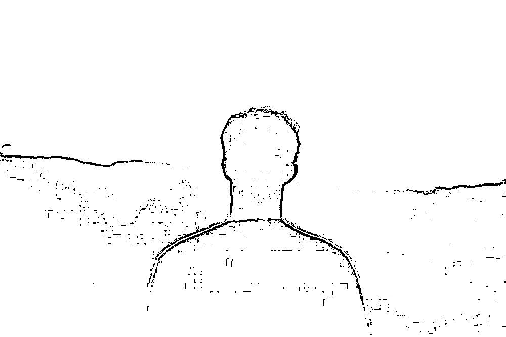

★**摩羯座**

**你很自豪自己能够比任何其他星座更好地“管理”自己的情绪。但是，你追求目标的自律能力往往会导致情绪受到抑制。**在还是男孩的时候，你想要赢得尊敬，作为一个男人，你仍然如此。赢得尊敬意味着获胜，获胜意味着坚强。最终你们中的许多人都意识到抑制情绪的副作用。正如一位摩羯座的人对我说的，“如果你感觉不到，成功又有什么好？” 同样，你对成功的渴望深深扎根于情绪之中，就像深不见底的海洋，就像你的象征符号山羊与鱼尾。

★**水瓶座**

你以超然著称，你看起来太酷了，似乎没有情绪。然而，只要是人就会有感受，不管你看起来有多超然物外。在你还是小男孩的时候，也许你被那些不太了解你的人取笑。你引以为傲的可能是自己多么聪明，多么能注意到别人没看到的事情。你想知道如何融入其中，又说服自己你不在乎——不适应也没关系。作为一个男人，**面对这些被排斥在外的情绪，可以引导你加入你害怕的、曾拒绝过你的世界，让你能够做出独创性的贡献。**

★**双鱼座**

你很敏感，也很复杂，还是小男孩的你可能会迷惑很多人，就像你被施了魔法一样。为了应对压力，你可能会沉迷于幻想、电影、电视、音乐——任何东西。你对感情和情绪并不陌生，相反，你是善于回避的魔术师。你会想办法避开一切痛苦的事情，直到它最终抓住你。就像一个塞满了所有东西的壁橱，你的情绪会突然爆发，让你一时间无法抵抗。对你来说，创造力是处理情绪的绝佳方式。**与逃避和回避相比，创造性行为可以成为一种疗愈仪式。**

**版权声明：**本文由若道翻译发布，欢迎转发，反对抄袭。友号转载请申请白名单。


****想阅读更多作者的文章，请在后台回复******大卫****** 即可。****

**喜欢文章请长按下方二维码打赏**

**给大卫老师加杯咖啡呗~**

**▼**


**长按下方图片**

**两位大占星师领你系统学习占星学**

************点击图片查看详情************


**微信又又又改版啦，不想错过若道的推送？**

**就把若道设为星标吧！**

**▼**


就是这个“在看”，戳戳戳 ☟

********报名直达入口********


# 苏珊·米勒对话蒋颖 | “爱的能量”北京亲密关系工作坊

> 原文：[`mp.weixin.qq.com/s?__biz=MzA5NjA0NTAxNg==&mid=2651412222&idx=2&sn=dcad07f15aef801b68f1b03f3ee5bab2&chksm=8b4be449bc3c6d5fc134e7f4ac70a87dd3e82bf46f5c2341043804e1e4231c007a442d6c9b90&scene=126&sessionid=1692738242#rd`](http://mp.weixin.qq.com/s?__biz=MzA5NjA0NTAxNg==&mid=2651412222&idx=2&sn=dcad07f15aef801b68f1b03f3ee5bab2&chksm=8b4be449bc3c6d5fc134e7f4ac70a87dd3e82bf46f5c2341043804e1e4231c007a442d6c9b90&scene=126&sessionid=1692738242#rd)

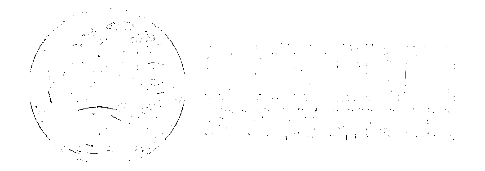

**苏珊·米勒**是谁？但凡对星座略有了解的人，都不可能没听说过苏珊·米勒的大名。网上的官方介绍是，『著名占星家，畅销书作家，专栏作家和实业家』。每个月，全美国有 2000 万人等着看她的星座运程。知名博主“乌云装扮者”飞了两次纽约，就是为了要和她吃 2 次饭，听她解析人生。CNN、FOX、ABC、CBS、《华尔街日报》、《纽约时报》都曾经报道过苏珊·米勒和她为之骄傲的占星事例；她的星运和封面故事也出现在《Vogue》、《ELLE》、《W》、《Grazia》等一众时尚杂志上（以特约编辑的身份）。

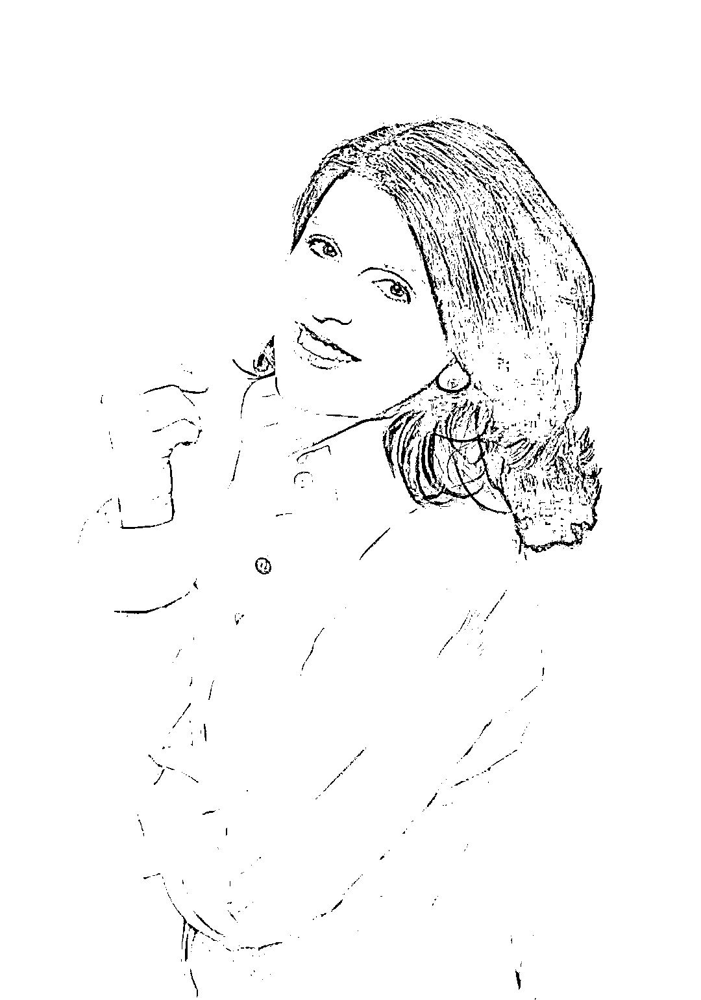

**| **苏珊·米勒

在 2019 年的岁末，云图美术馆希望用星座与艺术的跨界为大家带来更多的生活灵感和勇气，特别邀请被中国粉丝亲切称为 “三妈”的全球星座女王苏珊·米勒来到北京，共同发起一场星座文化和艺术跨界的主题体验展——**“爱的能量：****苏珊·米勒星座艺术体验展”**。以星座知识中的四元素为基础策展灵感，打造“苏珊·米勒之家”，在星星的指引下，充分沉浸于“风”“土”“水”“火”的空间中，感受自己作为个体和浩渺宇宙、自然母亲之间的能量联结。

在“爱的能量：苏珊·米勒星座艺术体验展”中，云图和苏珊·米勒，一起携手七位艺术家，通过艺术家不同的创作体系，按照“水元素·起居室”、“火元素·娱乐室”、“土元素·主人室”、“风元素·收藏室”、“苏珊·米勒会客厅”的空间规划，发起对不同能量和主题的探索，帮助人们理解占星学给每个人的人生所能带来的帮助。

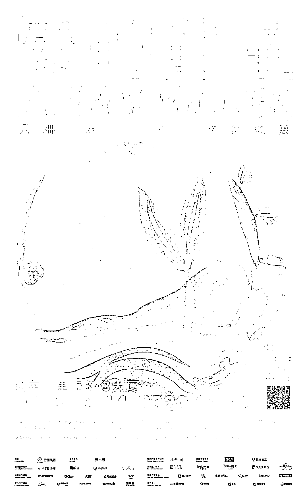

展览中
苏珊·米勒与若道占星创始人蒋颖首次在中国进行公开对话
两位老师将置身星座四元素展览现场开展一场**亲密关系主题“爱的能量”**占星工作坊对**“爱与占星学”**感兴趣的小伙伴快快抓住与大师零距离面对面的机会**我们如何通过星图找到“灵魂伴侣”？****星图能否看出，我们能否“在一起”？是否“会分开”？**一次给你来自东西方和而不同的答案
💗 此前，云图美术馆“爱的能量”展览分别邀请若道占星创始人蒋颖，和“三妈”一起，和大家聊聊水象星座。蒋颖老师本身就是水象星座，曾也在金融界“叱咤风云”过，后又发挥自己的“天王星”变革能量，选择了向中国大众传播严肃占星学的道路。让我们一起提前进入她们的“水象时间”。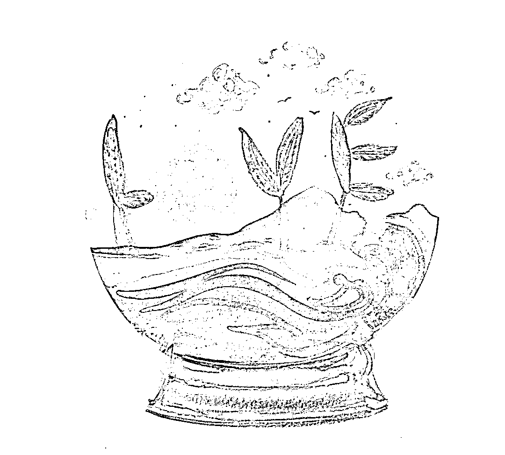**蒋颖×苏珊·米勒×YT“爱的能量”****YT：能说说“爱”和“水”的关系吗？****蒋颖：**爱似乎是为水象星座而存在的。因为爱是一种感觉。风象星座可以用语言尽力描述这种感觉，土象星座可以用感官和有形之物去触碰和显化这种感觉，火象星座可以用行动去表达这种感觉。而水象星座是感觉本身。**YT：水象星座为什么如此感性？****蒋颖：**水没有形状，就像爱一样，但它渗透一切，浸润一切，融合一切，联结一切，淹没一切。它又是流动变化的，容器不同，就变成不同的形状。它如此敏感，有无数探测周围情绪的情感探头，接收着环境和人传来的情绪信号，并因此发生变化，有时如春江水暖，有时冷硬如冰，有时又像冲破壶嘴的蒸汽灼热伤人。水象星座是主观的，就像对一幅画，一个艺术作品，每个人感觉不同，对这种感觉的诠释不同。无法计量，无法理论。**YT：你会用哪件艺术作品描述水象星座？****蒋颖：**行为艺术家阿布拉莫维奇有一个作品《凝视》。在四目相对凝视彼此时，没有声音、语言、动作、触碰，然而有某种无影无形又让人百转千回的东西产生、回响、激荡在那凝视中，那就是水象星座的情感。**YT：请说说关于水象星座的特质吧~****苏珊·米勒：**水象星座比其他星座更感性、更直观。能够敏锐捕捉情感仿佛是水元素赋予水象星座天生的超能力，使水象星座富有同情心，能够感受深层次的感情。水的本质是清洁与净化，同时它又具有神秘感。水象星座通过超强的感知力感受着周围发生的事情；并运用特有的阅读身体语言的能力，设身处地地理解他人的真实情绪。他们付出的本质和敏感会消耗着他们的储备，所以在重新进入这个世界之前，他们偶尔需要独处进行深层次的反思来重新充电并进行恢复。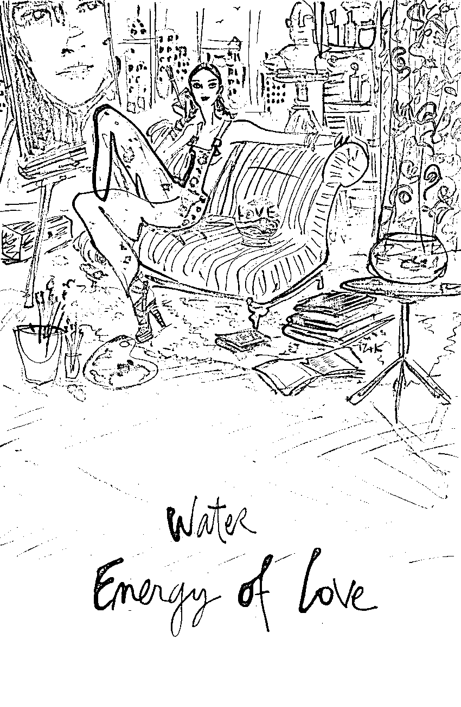💗因此我们展出 AES+F 的作品《轮回》，基于乔瓦尼·贝利尼（GiovanniBellini）的《神圣的寓言》（AllegoriaSacra）所描绘的炼狱场景，艺术家将人物放置在一个超现实的未来场景中，让他们与现代世界产生冲突。看似平静的水面，实则暗流涌动。伴随巴洛克式合唱声，让我们一起理解、感受“水元素”内心世界故事和秘密的诞生，暗涌情绪的碰撞。最后用蒋颖老师在一篇文章中分享过的鲁道夫斯塔纳的一首诗结束分享，这首诗是这样的：**说着世界的命运****然而现在它们沉默了****意识到这个沉寂****可能是一种痛苦****然而在最深的静默中****人类渐渐对星星说话****话语渐渐生长****并在星空下成熟****意识到那个声音****将成为人类的力量**祝愿每个人，不只是敏感的水象星座，都可以在星星的指引下，获得更多的力量。如想聆听更多苏珊和蒋颖老师的对话，**请点击下方小程序**购买**2019 年 12 月 18 日 14:30-17:30**的若道专场活动，我们将透过水象的眼睛，为大家解读“亲密关系”。

<mp-miniprogram class="miniprogram_element" data-miniprogram-appid="wx473a7fb4b4604fdc" data-miniprogram-path="packages/goods/detail/index?alias=2g424e5ts74ql&amp;banner_id=f.80103020~goods.11~3~g79fROYK&amp;components_style_size=1" data-miniprogram-nickname="云图美术馆" data-miniprogram-avatar="http://mmbiz.qpic.cn/mmbiz_png/NXUicvOlNVPlZxlrgVEib81J2E8mhIhPkxYDQuSlNmZkHricExg1sEV2JuKYOcvOCcatla30tZksh5G0wPqwBWwpA/640?wx_fmt=png&amp;wxfrom=200" data-miniprogram-title="点击了解若道创始人蒋颖对话 Susan Miller 活动详情" data-miniprogram-imageurl="http://mmbiz.qpic.cn/mmbiz_jpg/LbTrOaJIicVIicUib4hYkkY8aM1fd3ErNzuIpeKgv91xUicqcB9icPpT9luafr3LEibao1oiaKMutE5tcE73vzgF46Mpw/0?wx_fmt=jpeg" data-miniprogram-type="card" data-miniprogram-servicetype="0"></mp-miniprogram>

## **关于蒋颖**

ISAR 中国副主席（ISAR 为国际占星研究协会缩写，在各国只设副主席），若道创始人。

厦门大学化学系硕士、经济学学士、人民大学中美经济学培训项目福特班学员、长江商学院 MBA。曾为国内最早从事金融并购业务的机构合伙人。

国内第一位被邀请在国际占星学会议上正式就西方占星学发表演讲的演讲人。第一批通过 ISAR 认证的职业占星师。ISAR 职业占星师资质认证培训师和中国考区考试负责人。

**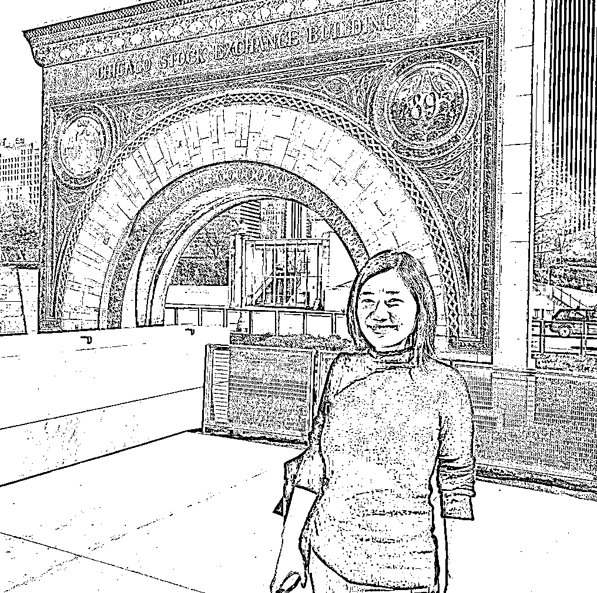**

跟随大卫·瑞雷、杰夫·焦耳、斯蒂芬·弗里斯特、苏·汤普金斯、格伦·佩里、诺·泰尔、罗伯特·汉德、雷蒙德·梅里曼、琳恩·贝尔等国际占星大师系统学习占星学，广泛涉猎人本主义心理占星、进化占星、原型占星、医疗占星、金融占星、卜卦占星、企业占星等多个占星学流派分支。

曾接受萨提亚家庭治疗、本性治疗、Hakomi 治疗等心理学培训，并接受进化教练培训。

**关于苏珊·米勒**

苏珊·米勒，美国著名的占星家、《纽约日报》专栏作家、畅销书作家、实业家。1995 年，推出了占星区网站(Astrology Zone)。由于该网站每月发布的星座综合运势预测非常准确，使苏珊·米勒受到了来自全世界范围的赞誉。唯一经由苹果公司邀请在手表上发布星座运势预测的占星师、拥有 650 万独立读者以及 2000 万的页面浏览量。


苏珊·米勒

作品被众多重要媒体争相转载，并且还被翻译成中文、土耳其语、西班牙语、日语等多种语言，坐拥全球数百万读者。根据自己对星象的研究，准确地预测到了路易斯王子的出生周、碧昂斯的婚礼年、“小甜甜”布兰妮的复出以及奥巴马总统的连任。

## **关于云图映画**

“云图映画”是创新的艺术内容品牌，也是顶尖艺术 IP 运营机构。我们的创始团队融合了艺术、时尚、科技、传媒基因，通过艺术内容，连接大众与世界。云图映画成功打造了“大艺术家”、“爱的艺术”的原创 IP 产品，并通过展览、视频、出版等形式，影响年轻一代用户。云图映画的使命是探索人类最杰出的人文艺术，为每一个人创造一座“美的殿堂”。

## **关于“爱的能量：苏珊·米勒星座艺术体验展”**

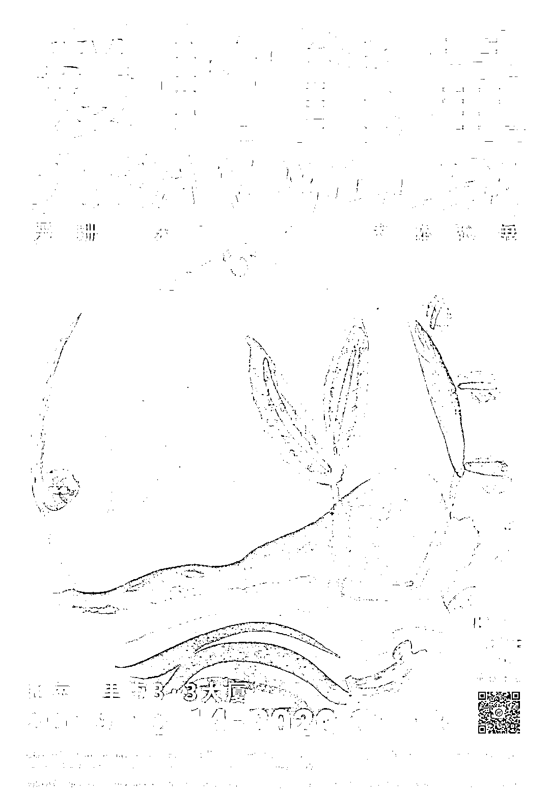

**展览开放时间**2019 年 12 月 14 日-2020 年 1 月 13 日平日（周一至周五）：11:00-20:00（19:30 停止检票）
周末及法定节假日    ：11:00-21:00（20:30 停止检票）**展览地点**北京三里屯 3·3 大厦 6 层

**▼****点击阅读原文**

**购买若道专属****9 折****展览早鸟门票**

**仅限****开展前****购买哦！**

# 重磅 | 2020 核心指南：开启通往真相与宝藏的生命之门！

> 原文：[`mp.weixin.qq.com/s?__biz=MzA5NjA0NTAxNg==&mid=2651412196&idx=1&sn=3d080eb3a7c090e39811ec084cbc6fa7&chksm=8b4be453bc3c6d45d9924327c3f61fd76c423637918f8999cbf19b6fe03622d9230c078e2a9f&scene=126&sessionid=1692738242#rd`](http://mp.weixin.qq.com/s?__biz=MzA5NjA0NTAxNg==&mid=2651412196&idx=1&sn=3d080eb3a7c090e39811ec084cbc6fa7&chksm=8b4be453bc3c6d45d9924327c3f61fd76c423637918f8999cbf19b6fe03622d9230c078e2a9f&scene=126&sessionid=1692738242#rd)

********************☆ **************后台**********************回复“今日”，给你一句生命态度********************


作者/李妍（理想国的女巫） 编辑/玫瑰封面/书君 图片/网络 作者提供“**经历者：“我感觉自己最近生活在炼狱里，你知道那有多么痛苦吗？！”****过来人：“我知道，我去过那”****经历者：“你感觉那里怎么样？”****过来人：“刚开始的时候和你现在的感受一样，后来发生了一些变化。****觉得那挺好的，我管它叫：生命之门。”****——李妍（理想国的女巫）**”

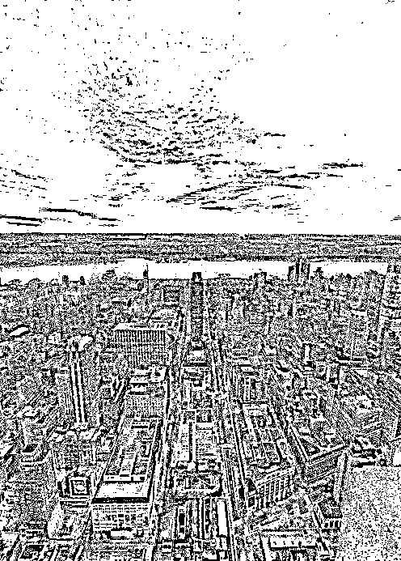

**找到你的生命之门**

如果我们感到自己**越活越空洞，越活越无生机，越活越困顿和恐惧**的时候，或许就是**生命的触角要往更深的地方去展开触探**的时间到了。

那更深的地方叫做**生命之门**。那里**有真相，有宝藏**。关于困顿和恐惧的真相，关于潜能和财富的宝藏。但是，去到那里，徒手无门。我们需要带上**勇气和强大的意志力，还有耐心和智慧**。这样，生命之门才能开启！

 

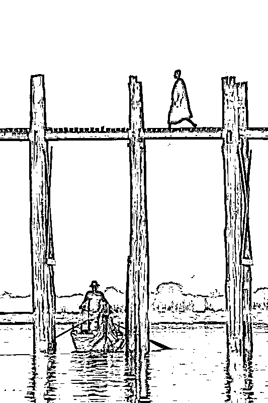

**生命之门将在 2020 年深深开启**

横跨 2019 年和 2020 年的重大宇宙天象-**土冥合相在摩羯座，就联结着那扇生命之门。**而自**12 月 3 日，木星换座进入到摩羯座，就意味着那扇生命之门已经为我们重重开启。**

而你，是否愿意跟随着生命的洪流，在自由意志的引领下，走进那道门，去寻获真相，去获得宝藏呢？

宇宙给了我们每个人同样的机会，我们都可以通过这扇生命之门，进入到生命更加源头的地方，以深邃的视角看向自己，以更加强盛的力量展开人生。

想了解群星齐聚在摩羯座在 2020 年给我们带来的核心影响，可以看此篇文章：

[重磅 | 2020 年主宰天象：如果我们能绝处逢生，就能崛地而起！](http://mp.weixin.qq.com/s?__biz=MzA5NjA0NTAxNg==&mid=2651412032&idx=1&sn=d0a173cb2fb9e4cc9277debb8fd67cb2&chksm=8b4be4f7bc3c6de1e54100ccaa61958dd054a841b07bd39b7e03211a4008a0853b1fd0e54d1f&scene=21#wechat_redirect) 

本篇文章是在此篇上的延续。重点在于展开讲解**群星摩羯座的天象发生在出生星图中的 12 个宫位，分别给不同的人带来的核心影响力和需要注意的事项**。帮助大家更好地总结 2019，迎向 2020。

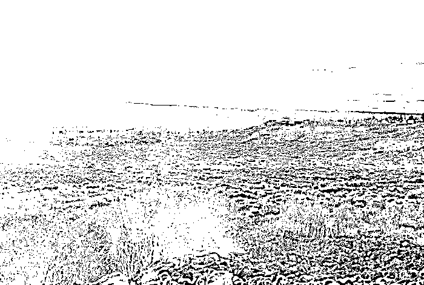

 

**群星摩羯座在 12 个宫位带来的影响****通向生命之门的 12 条路径**

现在，可以打开行进星图，看看**群星摩羯座正在和即将行进在自己出生星图中的哪个宫位，或哪两个宫位。**那宫位所代表的人生领域就是你通往生命之门的入口。

**洗礼、进化、提升和蜕变**是那个领域的重要关键词。

更深更真的真相会在那浮出水面，强大的生命潜能会在那深深苏醒。那将是你 2020 年需要重点关照，无法忽略的生命觉醒之地。

**群星摩羯座行进在出生星图第*****1*****宫**

那意味着**你的自我在发生着重大蜕变**。这是你要用更加深邃的视角看向自己人生的时间。在这过程中，你很可能会**改变对自己的旧有认知和对人生的理解，新的生命秩序和法则正在建立。**

如果这时你还在用旧有的方式看待自己和处理外在事情，可能就会有一股被卡住的感觉，很多事情无法顺利推进，你会感到**强烈的不顺遂，严峻的挑战感朝你步步紧逼**。

而实则，这是你更强更深的自我要被深深唤醒的时间，你需要撕掉旧有的“皮囊”，推翻固有的意识认知，让那更加新鲜和赋有生命力的新自己得以诞生。在刷新的意识领域之上给自己制定一套全新的生命计划，并展开稳健踏实的落地实行是非常重要的关键。

****群星摩羯座行进在出生星图第*****2*****宫****

**你对自我的价值和事物的价值定义正在发生着重要的改变**。你很可能会感到**金钱物质上的一种强烈的不满足感和紧迫感，觉得不够**。而这可能是真的不够，也有可能是**深埋的恐惧被深深唤醒，让你骤然感到对现实生存的紧迫。**而实则，这是你非常好的**刷新和重新建构自己与金钱之间关系**的时间，也是你需要很认真地去思考自己的**“生存”之道**的时间。赚取金钱和花费金钱的理念需要得到更新。如果想要不被物质的寒冬给“干掉”，那就主动去开辟疆土，创造价值，以此建立谁也拿不走，谁也无法撼动的**内在价值**。去**激活深埋在土壤里那强盛的赚钱能力**。当对金钱的危机意识浮现的时候，或许就是与它的关系进行重新建立的最佳时间。建立一套更加完备谨慎的财务计划对你而言是重要的。而**开源节流**是这个时期的你最需要发展的生命理念。

******群星摩羯座行进在出生星图第*****3*****宫******

**这是你的思维体系和语言体系得到刷新和提升的有力时期**。你的**思想会变得比以往更加深邃**，**与人交谈的方式与内容会变得更加落地和踏实，喜欢干货。**对信息的搜集和传递都将变得更加严谨，关心事物的宏观走势，喜欢看时政要闻。展开的兴趣爱好和学习科目的选择会更加强调**功能性和实用性**。也有可能这是你思考问题会变得比以往要**消极许多**的时期，会更容易选择看到事物负向的那面。或者表现为话比以前少，但每句扔出去都是一个强而有力的观点。学习以更加客观的思维和宏观的视角去传递自己的思想是非常重要的，这是你锻造成为**意见领袖**的非常适合的时期。

********群星摩羯座行进在出生星图第*****4*****宫********

**你的生命基底层的土壤被深深的翻动了，你感到自己的生命根基正在发生着翻腾的变化。**你和**家族之间**，和**家人之间**的关系或将迎来重要的变化和突破。**你内心深处的一些强烈情绪要奔涌出来，但你或许会想要将其压抑，不去回应**。因为那感受实战是太过强烈，让你感到害怕，不知如何面对和处理。这其实是你给自己的生命从基底之处进行翻新的大好时机。如果能以正向的方式去回应，你将能给自己的心灵世界进行一次**“大排毒”，释放长久以往的内在沉重**。你也有可能想要**改变居住环境**，来顺应内在能量的变化。

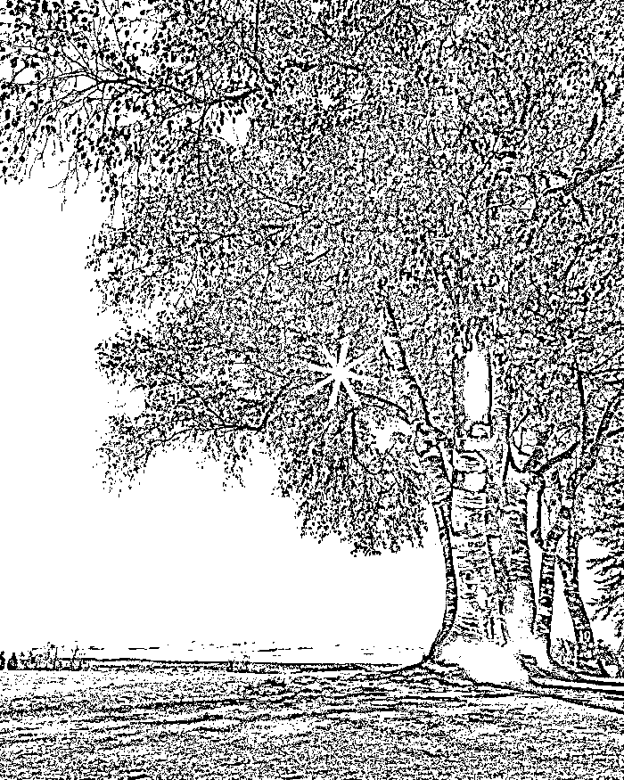

**********群星摩羯座行进在出生星图第*****5*****宫**********

这是你需要**深度挖掘和提炼自己强烈的表现欲和创造力**的时期。你可能会感到一股强大的推背感，迫切渴望将对生命的理解以自己的方式生产出来，传递出去。这也有可能是**非常质疑自己创造力**的时期，你会否定自己的“创造物”，哪哪都觉得不够好。如果你是孩子的家长，或许这段时间你**在培养孩子的理念上，和孩子的关系上会迎来严峻的考验**。比如，不想让孩子输在起跑线上的急迫感让你变得异常严厉，严重影响到和孩子之间的交流。而这时，或许是你重新思考**和孩子之间关系**的最佳时间。或者这个时段，你的自我会表现出一股强烈的**不容外界质疑，异常强硬**的时期。他人的不同意见很容易让你感到深深的挫败感。**建立稳定自持，张弛有度的自我表达力**是这个时期你需要学习的关键。

************群星摩羯座行进在出生星图第*6*****宫************

你的**日常生活和工作的秩序正在得到强力的刷新**。**工作可能给你带来了强烈的压力和焦虑**，你感到**被生活和工作中的各种繁琐事情所缠绕**，很想要不管，但又觉得需要**负起责任，丢不下**。这说明你到了需要**重新建立日常生活和工作秩序**的时间了。**合理地规划和分配日常作息时间和工作安排**，在众多的繁杂事务中**划分主次，**将核心关键点依次进行优先处理。同时，这是你需要**与自己的身体更加亲密联结**的时期。在你被工作压垮之前，需要把对身体的呵护放上心头，建构可持续发展的生命观，做一个**对工作、对身体、对生活三不误**的专家。

************群星摩羯座行进在出生星图第*7*****宫************

这意味着**你的人际关系将会发生强有力的蜕变和发展**。可能一些人会离你而去，也会有一些人因你而来。你**对待关系的态度会变得更加认真、严肃**。**注重对每一份关系的承诺**是这个时期的你展开关系的最佳态度。**建构长久稳定的关系，实现双赢**是展开关系的最佳策略。**果决、不拖沓、重原则**是这段时期你展开关系的核心脉搏。关键的是，把所有遇见的人，无论是“好”的，还是“坏”的，都视为生命之境，通过和他们的互动更好地照见自己。这段时期你可能会容易**吸引实力雄厚的权威人物**来到身边。如，与大公司展开合作。或者**你自己会成为他人眼里的权威。**

************群星摩羯座行进在出生星图第*8*****宫************

这可能是你生命中一段非常重要的**“至暗”时期**。深埋在内在的许多**恐惧**浮现，**不明的烦扰**深深袭来。若你没有**主动发展出一份高水平的觉知**去回应这些，很可能会感到自己在**被某个外界事物或人拖拽进深渊中，无助被动**。当然，也有可能你是拽他人进深渊的那个人。如果你对这个行进有**正向的觉知、解读和回应**，那将是你**生命中深埋的巨大潜能，和隐匿的巨大财富**被大力激活的时刻。你的**“巨型宝藏”**正在深深醒来。**整合资源，强强联手，结交赋有诚信的盟友**，是你在这段时间里可以核心关注的事务。同时**解除某个深度关系的合约**，**关系发生质的变化，或关系中隐匿已久的某个危机被引动**也是这个期间容易出现的状态。

************群星摩羯座行进在出生星图第*9*****宫************

你的**上层建筑正在发生着重要的革新**，**对人生的理解，对生命的理念在发生着强有力的变化**。**新的人生观和世界观正在逐步建立**，你看待很多事物的视角正在发生着重要的变化。**你可能变得更加保守，也可能变得比之前开放**。但无论是哪种，你对待人生的态度都在原有的基础上变得**更加沉稳、严肃和高远**。你不想活得像蝼蚁，想把有限的人生活出更加深远的意义。在这过程中，你可能会**建立某个新的生命信念**，也有可能**某个根深蒂固的信念正在得到瓦解和受到挑战**。无论如何，站在山峰的脊背上去看向人生的风景，是你在 2020 年要常常做的事情。

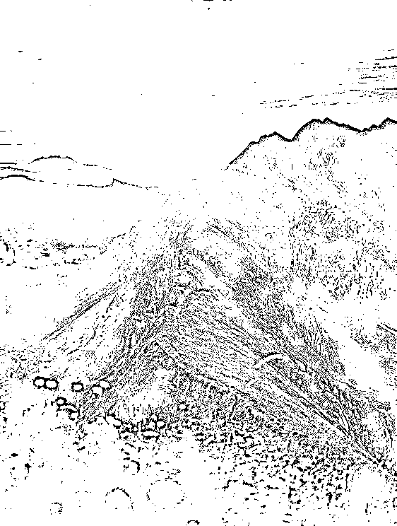

************群星摩羯座行进在出生星图第*10*****宫************

**你的工作与事业很可能正迎来强势的挑战，感到寒风来袭**。或者事业正在发生**重要的转型**，你需要站在山巅上，看向远方，从长计议。而事业在迎来挑战和强大瓶颈的同时，或许也正在迎来一次**深远的发展机会**。关键是，你能否看到**表象之下所蕴含的强大意义**，那是生命给予你的深远提醒。此外，你很可能对于自己的事业会产生**由衷而浓烈的使命感**。积极主动地响应国家政策，推动所处行业的规范发展，竖立中正的职业风貌，坚守职业操守，而这将能让你走得更远。**你的“江湖”地位也将迎来一波强盛的建立和巩固。**

************群星摩羯座行进在出生星图第*11*****宫************

**你的人际关系网正在得到深度梳理、建立和刷新**。你可能会**离开原有的圈子，进入到新的集体**。但在这离开或进入的背后的真相是：**原有的圈子不再能回应你当下的人生愿景，也无法再继续支撑你对人生未来长久的理念。**带着**使命感和责任心**走进人群中，进入团体里，**将自己之前所积攒的生命经验分享给众人，让他人从中获益**。让自己的生命在集体中得到延展，让自己的智慧得到绵延，这是你的人生得以长久获益的不二法则。站在时代脉搏的前沿，承接传统，但不受限于其中，打开新时代之门，**和志同道合的友人一起共创生命恢弘愿景，是你当下的关键。**

************群星摩羯座行进在出生星图第*12*****宫************

这对于你而言，是一段**生命的奇幻旅程**。许多的已知在这里得到消融，许多的未知将从中醒来。你很可能感到一股**强烈的无力感**在生命中蔓延，就连意识都变得不能自已。一种强烈的被动感让你不知道自己将去向何方。或者，你会感到**被外界和众人包围，受困于其中，无法动弹**。为此你想要封锁意识的城墙，不想让已经疲惫不堪、脆弱已久的自我再次受到侵袭。

但也有可能你会感到自己**进入到一个硕大无边的无意识海洋里**行走，里面所有的内容任由你提取。这是一段**灵性大觉醒**的时光，你感到自己像是接通了集体意识的管道，要为众人发言，把大众想要表达的以你的方式萃取和提炼出来，传递出去。

无论是以上哪种情况，你的人生正在经历着重要的蜕变，正迎来一次集中的深度进化，原始的生命法则和模式将一一失效，新的秩序将从中建立。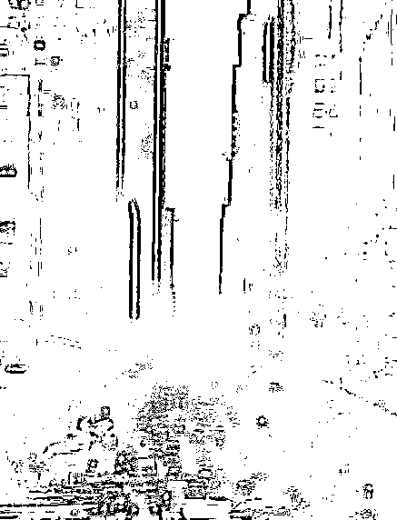以上，是 2020 年主宰天象-群星摩羯座，落在出生星图 12 个宫位里，给不同的人显化出来的通往生命之门的 12 条路径。路径虽不同，但法门却一样。每一个走进生命之门的人，将都会张大惊讶的嘴巴，说：“哇！原来，生命长这样！”每一个在生命之门里走了几圈的人，都会比以往变得更加坚定、睿智、从容和喜悦。而每一个穿越生命之门的人，都将会领略到生命更深更真的真相，将会激活强盛的生命潜能，将会通往更有朝气和赋有实力的明天！**祝愿你我，在 2020 年都能打开专属于自己的那扇生命之门！****相关阅读**[2020 年主宰天象：如果我们能绝处逢生，就能崛地而起！](http://mp.weixin.qq.com/s?__biz=MzA5NjA0NTAxNg==&mid=2651412032&idx=1&sn=d0a173cb2fb9e4cc9277debb8fd67cb2&chksm=8b4be4f7bc3c6de1e54100ccaa61958dd054a841b07bd39b7e03211a4008a0853b1fd0e54d1f&scene=21#wechat_redirect)[土冥合相进入尾声，木星助你通关](http://mp.weixin.qq.com/s?__biz=MzA5NjA0NTAxNg==&mid=2651412090&idx=1&sn=342a68665492802574f06f9a78618602&chksm=8b4be4cdbc3c6ddbf8300d6a86b7b61b4ecb64fd74372547a6bfba830f05b074c9bc1204e3b6&scene=21#wechat_redirect)**[](http://mp.weixin.qq.com/s?__biz=MzA5NjA0NTAxNg==&mid=2651412090&idx=1&sn=342a68665492802574f06f9a78618602&chksm=8b4be4cdbc3c6ddbf8300d6a86b7b61b4ecb64fd74372547a6bfba830f05b074c9bc1204e3b6&scene=21#wechat_redirect)** 

**版权声明：**文章由作者授权首发于若道平台，欢迎转发，反对抄袭。友号转载请申请白名单。

****

****李妍**（**理想国的女巫**）**

资深人本主义占星师，塔罗咨询师，心理咨询师

十二宫理想国工作室创始人，全职于咨询和教学工作

占星与音乐结合教学开创者，理想国占星音乐电台创始人

**咨询预约号**：vivian-yanyan(请注明咨询) 

**微信公众号**：house12ta

长按打赏


**长按下方图片**

**两位大占星师领你系统学习占星学**

************点击图片查看详情************


**微信又双叒叕改版啦，不想错过若道君的推送？**

**就把若道设为星标吧！**

**▼**


就是这个“在看”，戳一下☟

********报名直达入口********


# 雷蒙德·梅里曼金融占星周运 | 注意周三到周五的行情

> 原文：[`mp.weixin.qq.com/s?__biz=MzA5NjA0NTAxNg==&mid=2651412196&idx=2&sn=14d4915018dd755c4c80416bd8007bc5&chksm=8b4be453bc3c6d45f42bb6b331b253474d45dacd4ddf08d208daad8d8569086e3e28fc4c2e3d&scene=126&sessionid=1692738242#rd`](http://mp.weixin.qq.com/s?__biz=MzA5NjA0NTAxNg==&mid=2651412196&idx=2&sn=14d4915018dd755c4c80416bd8007bc5&chksm=8b4be453bc3c6d45f42bb6b331b253474d45dacd4ddf08d208daad8d8569086e3e28fc4c2e3d&scene=126&sessionid=1692738242#rd)

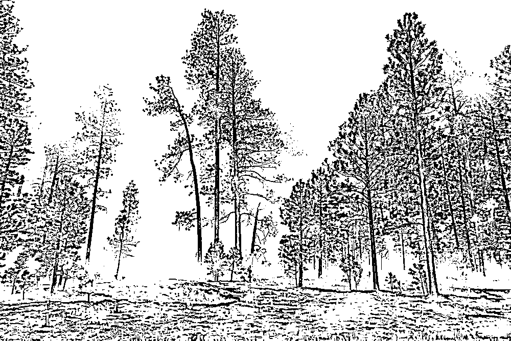

作者/雷蒙德·梅里曼
翻译/Luke 校对/李含编辑/玫瑰 图片/unsplash

雷蒙德·梅里曼是在金融占星学界稳坐第一把交椅的占星师，同时他也是若道签约的金融占星课老师，我们引进了雷蒙德·梅里曼老师的《上证指数月度报告》《黄金周期月度报告》（感兴趣的同学可以扫码文末图片购买）。我们经老师的授权，将每周刊登梅里曼老师的周运，供大家参考和学习。于是，这是这周的周运（12.9-12.13）。

**展望与回顾**

**美国劳工部周五公布的数据显示，11 月份就业市场表现抢眼，非农就业人数激增 26.6 万人，失业率降至 3.5%，平均时薪比一年前增长了 3.1%。这些数字轻松击败了华尔街的预期。道琼斯对经济学家的问卷调查显示他们认为就业将维持 18.7 万人的稳定增长，失业率持平 10 月份的 3.6%。“总的来说，美国正在复苏”，美国国家经济委员会主任拉里·库德罗在 CNBC《华尔街直播室》节目上说：“这些是非常强劲的数字”。**

**——杰夫·考克斯**

**《11 月份就业激增》**

**www.cnbc.com**

** 2019 年 12 月 6 日**

**美国总统特朗普发推特公布对法国香槟和奶酪（以及其他商品）向美国消费者征税的计划。用卡夫奶酪片代替卡蒙贝尔奶酪片可能是个沉重的负担。然而，早先在推特宣布对巴西和阿根廷的钢铁向美国用户征税的消息似乎更加沉重。企业多年来相信他们有能力运营全球供应链。但当特朗普的贸易协议看起来维持不了几个月的时候，对全球供应链的信任就会受到威胁。如果对全球供应链的信任减弱，对全球供应链的投资也将减少，2020 年经济复苏的力度也会削弱。一旦信任受损就很难恢复。一旦面包被烤熟，就变不回去了。昨天已经烤熟了很多面包。****——保罗·多诺万****瑞银早间评论****2019 年 12 月 3 日**确实，美国正在复苏。不仅社会的上层如此，随着失业率降低到了几十年来的最低，中层的经济状况也在改善。人们有了工作，收入在提高。正如电视上市场相关频道的一位评论员所说，当政府不再试图对商业进行微观管理时，经济的出色表现变得令人惊讶。但这是真的吗？如果是真的，有什么能改变它？全球贸易放缓可以改变这一趋势。现在，随着喜欢扩张的木星在 2019 年 12 月 3 日-2020 年 12 月 19 日行进进入收缩的摩羯座，政府不断升级的关税政策很容易变成国家和世界经济下滑的罪魁祸首。上周刚开始时对世界经济放缓的恐惧占了上风。随着木星进入摩羯座，在周初的两三天全球股市快速下跌。比如，道琼斯工业指数从周一开盘到周二，盘中最大幅下跌接近 800 点。在周三和周四的时候下跌暂停了，因为在等待周五的就业报告。非农就业人数大增的消息出来后，道琼斯飞涨了 327 点，非常接近上一周 11 月 27 日出现的历史最高点。**有可能本周一全球其他股市开盘出现跳涨，尤其是亚洲和环太平洋地区的股市。**黄金和白银的行情轨迹和股票相反。也就是说，它们的上涨持续到周三，周四涨势停滞，然后周五剧烈下跌。国债与贵金属的行情路线大致相同，但是原油和股票一起上涨。事实上，原油自 9 月中旬以来第一次测试 60 美元/桶的价位。比特币在 11 月 25 日跌至一个重要的低点，仍然在尽力回到 8000 美元以上。

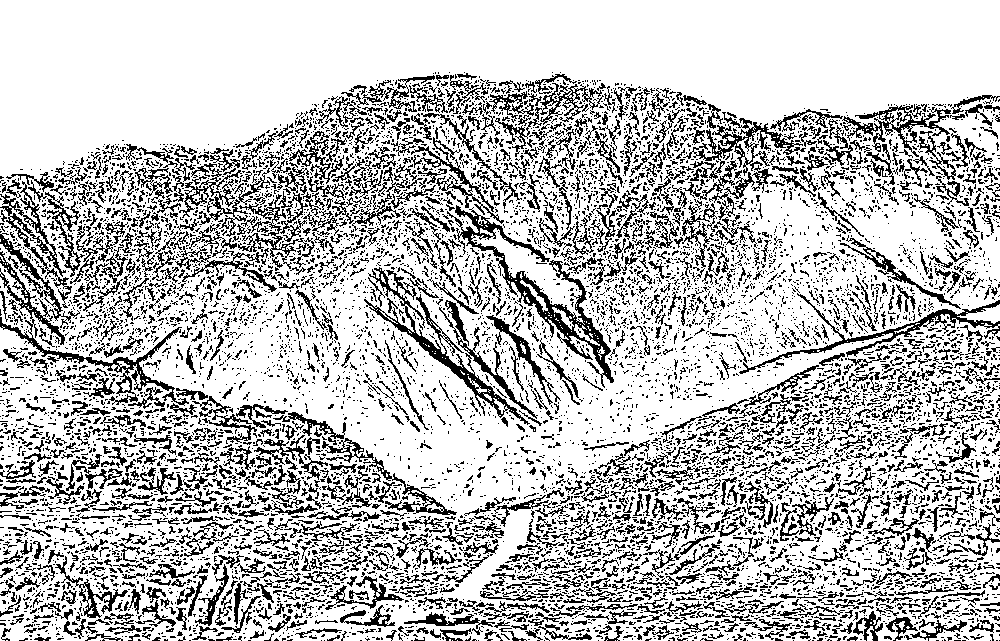

**短期占星趋势与长期考量**

**美国人总是有能力应对紧缩甚至逆境。繁荣是我们的内在状态。 **

**——詹姆斯·雷森 美国记者**

**引自亚利桑那共和报 2019 年 12 月 6 日发行**


原油和股票的上涨与木星有关，不是因为它正在离开射手座，而是因为**它将在 12 月 16 日与天王星形成有利的三分相**。木星是射手座的守护星之一，天王星是能够突破横盘区间的行星，有时这种突破的势头令人惊叹。这个相位和市场走势的相关性可以持续到**相位前后各 10 天左右**。

然而，**木星-天王星三分相的力度可能因金星和土星、冥王星在 12 月 11-13 日的合相而有所减弱**。突然之间，债务和税收的问题被摆到了面前。然而，木星三分天王星出现在这些合相之后，可能到时会出现美中贸易协议相关的迹象，这样就说得通了，因为预定会在 12 月 15 日新加征一笔关税。 

看上去，在这个拥有完美秩序的宇宙中，当**金星（协议）合相土星（延迟）和冥王星（关税）**时，贸易谈判又破裂了。但这也可能意味着有限协议最后的细节部分起草完毕。这可能会触发**股市在年底以前再次冲上破纪录的高点**，因为**12 月 25-28 日太阳合相木星三分天王星**。如果年底前不能签署贸易协议，那么以后再签署希望就渺茫了，因为**太阳、水星、土星和冥王星会在 2020 年 1 月 11-14 日期间相互合相在严肃的摩羯座**。那时候还会出现**满月和天王星改变方向**。**股市以及所有金融市场可能突然之间改变趋势。**如果贸易协议再次以失败告终，那走势就变得不好看了。

你会听到很多关于**2020 年 1 月 13 日土冥合相**的话题。这是时间最长的 6 个（行星合相）周期之一，每 32-37 年发生一次。上次出现是在 1982 年 11 月 8 日。这是自 1993 年天王星-海王星合相以来时间最长的行星周期，在那以前的 1988-1989 年出现了 45 年的土星-天王星以及 36 年的土星-海王星合相周期。天王星-海王星的周期超级长，达到 171 年，仅次于海王星和冥王星 492 年的周期。

土星-冥王星合相与**政治以及世俗事务还有经济趋势**有着重要关联。它的影响力和主题在即将出版的 2020 年预报中有详细介绍。事实上，我不认为除了这本书以外还有有其他人将这个行星周期分解、分析、研究和解释到了如此深刻的程度。为什么？因为它描绘的是现状和目前笼罩世界的集体心理。

**这个周期的容许度是 11 个月**，随着两颗行星在摩羯座最后几度越来越接近，现在已经充分发挥影响力，并在 2020 年的大部分时间都是如此。按照赤纬计算它们已经在 2019 年 7 月进入合相了。

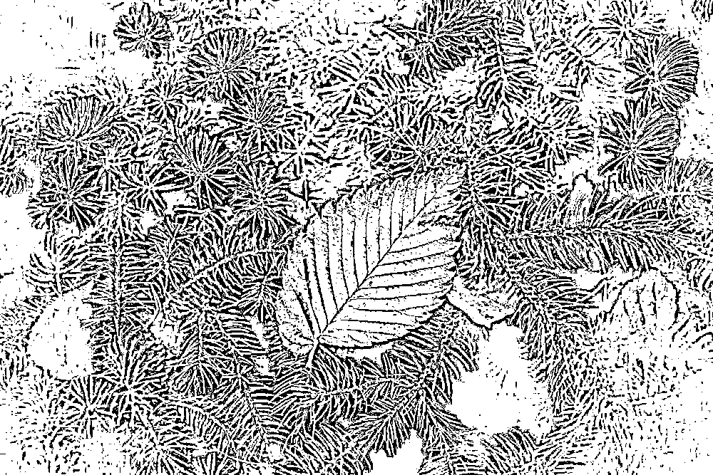

大体上来说对于这个重大的合相周期，2020 年预报中详细介绍了三个主题：❶ **决胜负**：有人赢，有人输，从而打破僵局。不太可能有双赢的结果，除非对立的双方致力于这样一个有利的解决方案；❷ **道德对决腐败，英雄对决恶人**；❸ **破坏的力量对决改革和重建的力量**——巨大的压力，集体感觉到压力和焦虑不断增长，想要做某事，或回避做某事。

也需要认识到土星-冥王星合相在摩羯座是**为 2020 年以前的行为和政策承担后果**的时期。比如说，美联储在 2008-2016 期间采用了非传统的货币政策，如零利率政策和量化宽松政策，当时没人知道会有什么后果，但人们担心在某个时候总要得到清算。同样的道理也适用于 2016 年的脱欧公投，以及近期美国（2018-2019）对几个其他国家加征的关税，尤其是中国。土星和冥王星的力量使这些行为和决定的后果将要在 2020 年达到高峰。有人会赢，有人会输。不太可能出现双赢的结果，因为**冥王星代表力量和审判**——某些问题获得定论，不太可能妥协。

好消息是：在这些问题上对立双方的争斗也会在 2020-2021 年达到高峰。自**2008 年**基本星座（白羊座、巨蟹座、天秤座、摩羯座）高峰以来，集体面临的压力越来越大，就好像不断夹紧的老虎钳。这种压力会在**2020 年 1 月 13 日**以后开始得到慢慢释放，但**直到 2021 年土星四分天王星以前不会有明显的表现**。到那时我们才能知道谁赢谁输，以及将开始何种形式的重建。

这种能量对经济和金融市场有什么影响？这是 2020 年预报的一个主题。现在来看，要认识到的是，在这个相位下，**没有多少犯错的空间**。**制定计划并坚持下去**是很有价值的，但要意识到**一旦纪律松懈就会承担后果，比如会亏损金钱**。与此同时，在这期间**保持强大的纪律性，坚守妥善制定的计划，可能会获得巨大的回报**。

土星和冥王星的合相本身不一定和长期趋势的终点有关。然而，当它与土星和天王星的困难相位在一年之内一起出现时，就和**长期趋势的反转**有关了，往往这种反转还**很剧烈**。我们将要在 2020-2021 年进入这种宇宙趋势。经济和股市目前为止表现得非常好（破纪录的上升）。但是有上升就会有下降，由于土冥合相和紧随其后的土天四分相，这**可能不是软着陆**。**版权声明：**本文由若道翻译发布，欢迎转发，反对抄袭。友号转载请申请白名单。


**雷蒙德·梅里曼（Raymond Merriman）**

若道签约老师。著名金融占星师，ISAR（国际占星研究协会）前主席，梅里曼市场分析公司的总裁。他由于“提升了占星学的职业形象”，在 1995 年国际占星大会上被授予轩辕十四奖；在 2012 年国际占星大会上，被授予轩辕十四终身成就奖。

1“中国上证指数月度报告”发售

**从****7****月开始，若道推出了****中文版****的雷蒙德·梅里曼中国上证指数月度报告，并持续发行该报告！**

当把金融市场的周期和占星学的周期相结合时，雷蒙德·梅里曼老师的金融占星学研究**为投资者应对金融市场的周期波动，并随之调整投资策略提供了极大的价值参考**。

2“黄金价格周期月度报告”发售

**现在，又有一个好消息要告诉你。从****9****月开始，若道将推出****中文版****的雷蒙德·梅里曼黄金价格周期月度报告！**不仅仅为广大读者在中国股市的投资出谋划策，更将视角放眼黄金市场。

**每当世界经济形式不明朗的时候，有一个地方是保值的港湾，那就是****黄金**。从 2018 年 8 月开始，黄金已经用自己的升值再次提醒众人它在经济不稳定时的位置。**截至目前，2019 年 8 月底，黄金已飙升至 6 年新高，高于 1565 美元。**

自 1982 年雷蒙德·梅里曼出版第一本研究《地球宇宙学征象与黄金价格的关联》的著作以来，**他一直作为最重要的黄金市场时机预测者之一享誉国际**。

过去 1 年，那些订阅并遵循建议的梅里曼市场时机学院日报和周报的订阅者，如果从 2018 年 8 月 16 日的低点或 8 月 23-24 日的次低点购买黄金，他们已经赚到了不少的 30%左右的利润。

**购买套餐**，买得越多越优惠

**12 月报告均已更新！**

中国上证指数月度报告套餐价

*   **单月报告**：280 元

*   **3 个月套餐**：780 元（260 元/月）

*   **12 个月套餐价**：1999 元（166 元/月）

**长按下图识别二维码**

**购买金融报告****套餐**

**▼**


黄金周期月度报告超级优惠折扣

*   **同时购买上证指数 12 个月套餐**和**黄金周期报告 12 个月套餐**，即可享受黄金周期报告 12 个月套餐**立减 1199**元的**超级优惠折扣**。

*   **已经购买**了**上证指数 12 个月套餐**的朋友，**再购买**黄金周期报告 12 个月套餐，也可享受**立减 1199**元的**超级优惠折扣**。**购买黄金周期报告 12 个月套餐时，超级优惠折扣会自动生效**。

**长按下图识别二维码购买黄金报告套餐**

▼


**微信又双叒叕改版啦，不想错过若道君的推送？**

**就把若道设为星标吧！**

**▼**


********点击阅读原文购买金融报告********


# 在一起很痛苦，却又很难分开？你可能遇到了“业力”关系

> 原文：[`mp.weixin.qq.com/s?__biz=MzA5NjA0NTAxNg==&mid=2651412177&idx=1&sn=7632995c4e1176ff5ebffd2790bd3587&chksm=8b4be466bc3c6d70bd6bff996f4700900a4fc03cc848a657bc4632776e5131b7574e047d3a7e&scene=126&sessionid=1692738242#rd`](http://mp.weixin.qq.com/s?__biz=MzA5NjA0NTAxNg==&mid=2651412177&idx=1&sn=7632995c4e1176ff5ebffd2790bd3587&chksm=8b4be466bc3c6d70bd6bff996f4700900a4fc03cc848a657bc4632776e5131b7574e047d3a7e&scene=126&sessionid=1692738242#rd)

******************************☆ **************后台****************************回复“今日”，给你一句生命态度****************

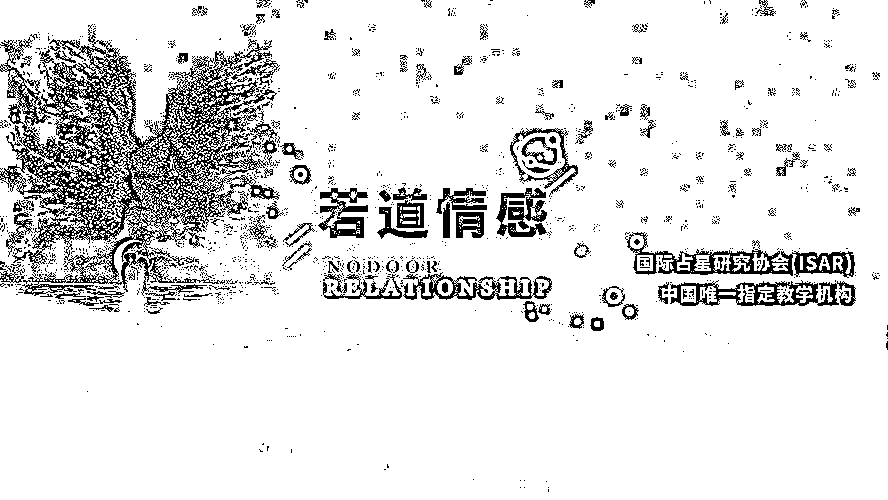

作者/乔琪亚 
译者/Arrow  校对/Leisha 编辑/玫瑰 图片/unsplash**什么是“业力”关系？**

人们经常让我分析他们的出生星图和所爱的某个人，以了解他们的缘分。我不可能给出答案，因为每个灵魂在投生之前就选择了自己的道路，但另一方面，每个个体都有自由意志。那又如何？两个人之间发生的事情是不可预见的，但业力法则也解释了**没有偶然的相逢**，这也是事实。当你与某人之间有一种强烈的联结感，特别是如果**遭遇阻止关系发展的痛苦或困难**时，业力占星学可能是一种有效的工具，来理解**关系动力和当事人需要通过关系来学习的功课。**

通常，**一段关系造成至少一方受苦，并注定在一定时间内结束，就叫作“业力”关系**。每当我们开始一段关系时，都是在履行一份我们之前在灵魂之间签署的契约，用来学习功课。这意味着与灵魂伴侣相遇是一种已经解决的业力关系：爱战胜了愤怒和恐惧。这并不意味着不再需要努力改善某些动力，确实如此：我们知道，甚至在潜意识层面也知道，**另一个人可以帮助我们活出自己最好的部分，而且在对方面前流露脆弱和软弱也不会失去爱和尊重，这是有可能的。**

我们每一次转世遇到的灵魂都或多或少是相同的：**我们与其中一些灵魂有债，与另一些灵魂有恩。**我们如何理解前世取决于我们在此生所建立的纽带和经历的类型。事实上，关于这点有不同的理论，我不能提出终极真理，但我可以提供关于这个复杂主题的一些想法，包括占星学的参照。

几乎我们所有人都经历过让自己深陷其中的特别重大的经历。这些情境迫使我们在某种程度上质疑我们自己和我们到目前为止所经历的生活，而且这些情境与我们所爱的人们有关：**伴侣、爱人和家人。**事实上，**家人之间总是业缘**：我们选择父母和兄弟姐妹是为了有机会处理前世遗留下来的问题。由此，我们可以解开业力节点，并沿着灵性进化的道路前进。有时，成功需要几十次转世，而我们可以一次又一次地遇见同样的灵魂。如果你分析一位家庭成员的出生星图，你会经常注意到**他们的行星和你出生星图的敏感点之间存在强烈的关联**。例如，经常发生的情况是，女儿的月亮与父亲或母亲的太阳合相（或落在同一星座），而孩子出生时的太阳与父母之一的上升点落在同一星座也并不罕见，有时甚至与月亮交点的轴线重合。回到爱情，谁不向往遇见宿命的“双生灵魂”？我们都希望身边有这样一个人，无条件地爱着我们，一切都自然而然地进行着，和他一起分享生活。但是其中有多少人和他们所谓的灵魂伴侣在一起了呢？并不多。有时，人们可能会厌倦等待，在社会和文化习俗的驱使下放弃，做出与某人安定下来的理性选择。也有时，这只是一种依赖或需求，是人们努力生存下去的方式（译注：单身就活不下去），或多或少有意识地陷入**功能失调和不愉快的关系**中。**这是他们的业力。**除此之外，毫无疑问，**人们在每一世中都会遇到一个灵魂伴侣，而且这比与那些不具备选择性亲和（elective affinity）的人建立关系更容易**。无论如何，我们在生活中所努力争取的一切关系都是我们在转世之前所作选择的结果，对我们的进化是不可或缺的。

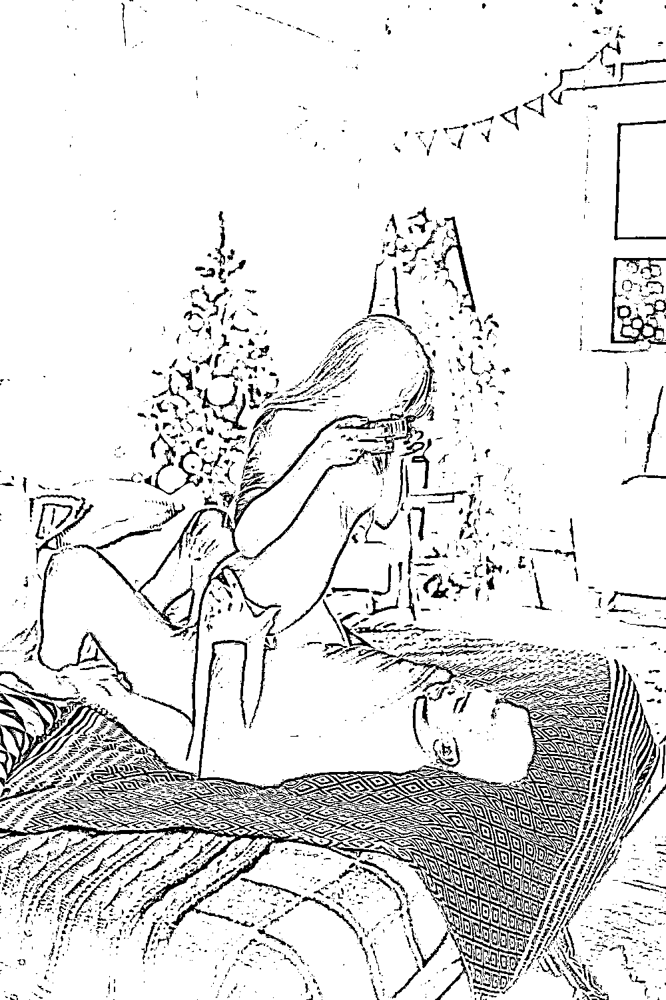

**“业力”与爱**问题是，人们很容易把**绑在一个人身上的“业力”**与**爱**的概念混淆。我们很多人可能都有过这样的经历：第一次见到一个人，就产生了一种**强烈的似曾相识**的感觉，而且不知不觉中感受到一种**不可言喻、无法控制的吸引力**。无论相遇的客观背景如何，两人都无法真正摆脱绑住他们的业力。然而，我们有必要区分**基于相互的爱意、支持、尊重和激情之上的健康关系**与**一方支配、压抑和控制另一方的关系**。**只有当你的本质得以自由表达，不用忍受任何制约时，灵魂的相遇才会真正发生**。如果在一段关系中，**两人之一阻止了另一方成为他自己，想要改变对方，用情感或物质的折磨包裹关系，以致对方不快乐，那就不能被视作爱**。问题是，我们常常被一种我们不知道如何支配的力量拖着走，我们想要相信某个人是对的人，即便这让我们痛苦。但是，**如果有人用他的行为伤害了我们，那很可能是一种狭义的业力联结**。我们的任务是**摆脱这种不正常和不愉快的联结，或者让它朝着健康的关系发展。****一段业力关系总是会再现源自深度无意识的过往的感受和情绪**。只有当暴风雨过去，痛苦消失时，你才会明白相遇的原因。我们会一直受到**思想、感受和恐惧的束缚**，直到吸取教训为止。没有期限，甚至没有出路：直到我们明白，这条路不会终结。**如果我们还没学到功课，就强迫事情发生，试图避开对方，那么迟早还会和同一个人或另一个有着相似业力动力的人陷入类似的情境，甚至产生更加强烈和无法控制的感受**。那个特定的人往往要**教会我们认清自我**。问题在于我们自身，而对方只是让我们意识到问题所在的媒介。通常，**业力关系的双方都需要理解关于自己的某部分。**有些人认为，只有当两个双生灵魂都准备好毫无保留地全然自由生活时，他们才会相遇。还有人认为，即使已经处于另一段明确是业力的关系中，你也可以遇见你的灵魂伴侣。**双生灵魂的出现，是因为解除业力束缚和继续走上进化之路的时间已经到来**。而且我们甚至不能认定，两个双生灵魂一旦相遇，就会永远在一起；因为存在自由意志，其中之一或双方可能有勇气打破既存的联结或改变生活方式。**命运可以让我们相遇，但我们仍然有机会选择是学习功课，还是接受馈赠。**

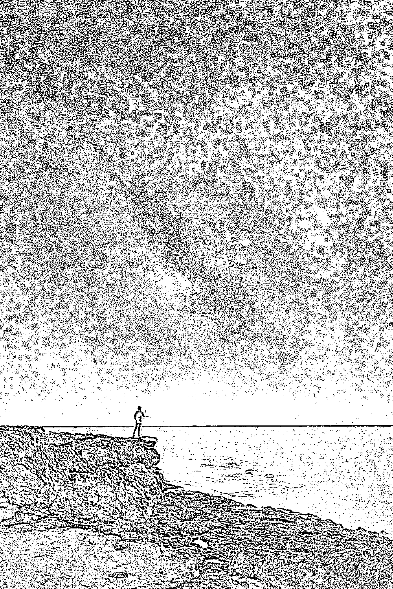

**比较星图中藏着的“业力”关系**业力占星学能够如何帮助我们理解两人之间存在的联结类型？比较他们出生的星图可以说明很多问题，但必须强调的是，**它无论如何都无法回答这个问题：****“关系是否会天长地久？”因为是否“天长地久”总是取决于关系双方的自由意志。**你必须先看个人的出生星图，必须了解个人是如何体验他们的出生星图的，才能真正了解他们满足个人关系需求的情况。要了解两人之间的匹配度，可以通过分析**个人行星之间的相位**（日月相位，和金星的相位等等），但**业力关系是由一方的个人行星（太阳、月亮、水星、金星、火星）和另一方的业力行星或外行星（土星、冥王星、天王星、海王星和凯龙星）之间的相位所象征的**。**木星**有其自己的作用，**用于调节负面的业力影响。****土星**首先要观察的行星是**土星**：**土星和个人行星之间的相位（尤其是合相、四分相和对分相）非常重要，因为它表明一种非常难以打破的张力，并且在动态的相位中表明某种功能失调的关系**。**土星方是关系中最弱的，但他会表现出主导的行为，在某种程度上限制对方，并影响这对伴侣的命运**。另一方面，**另一方有可能（根据所涉及的行星以不同方式表达）“促使”伴侣进行不可避免的必要内在成长**。因此，在比较星图中，土星的相位非常重要，并且当我们分析重要的关系时，总是会出现。**莉莉丝****莉莉丝和个人行星之间的相位**也可以大大说明前世中关系的类型，以及此生中一起解决问题的路径。
**月亮交点****月亮南交点和个人行星之间的联系可以体现出两个灵魂是否曾经相遇，涉及的行星和行星状态将更好地阐明现有的联结和遗留的阻碍议题。**

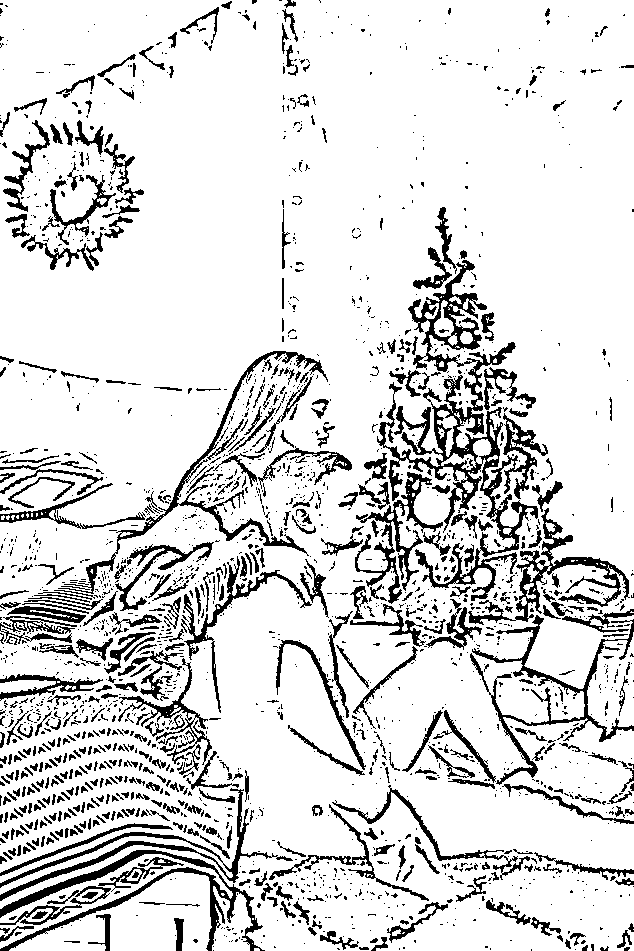

**外行星**同样重要的是，考虑**一方的外行星与另一方的个人行星和星图四轴之间的联系，特别是上升-下降轴线**。例如，冥王星与火星的合相表示衍生自业力依恋。**凯龙星****凯龙星是一颗运行在土星和天王星之间的小行星，经常与身体和灵性的疗愈有关**。凯龙星的伤口往往很深，探索伤口可能非常令人恐惧。**凯龙星与个人的行星或四轴之间的紧密联系有时可能表明关系的一个重要主题是疗愈——而且通常可能会涉及度过危机**。这些只是在用业力占星解读比对星图时，要考虑的一些相关主题。似乎有必要指出的是，每一次相遇的发生都是一面镜子，让我们看到自己内在功能失调的动力，从而有机会解决和克服这些动力。虽然这个主题本身相当复杂，有争议性，但就个人而言，它帮助我理解了痛苦和困难背后的原因。比较图可以帮助识别两个人可能的互动方式：哪里会能量顺畅，哪里会遭遇挑战。然而，你必须记住，占星学上不存在完美的关系，两张星图之间的轻松相位并不意味着这段关系一定是轻松或愉快的！开始探索你的出生星图，看看你可能需要什么样的挑战。祝你此生好运！

**版权声明：**本文由若道翻译发布，欢迎转发，反对抄袭。


**乔琪亚**意大利语跨文化学习和教育硕士学位，过去 8 年间，一直从事教学和写作。曾在冥王星进化占星学院和伦敦心理占星中心深造。目前，师从弗朗哥·桑托罗，长期研究萨满占星学。

******点击图片查看若道君推荐******

[](http://mp.weixin.qq.com/s?__biz=MzA5NjA0NTAxNg==&mid=2651406374&idx=2&sn=09f4f7f3a05d7d190d4addfca98c7c53&chksm=8b4bf291bc3c7b87bd73d79e428470c209551ade9552cb181c4d204ec17934dbbca4754e28f0&scene=21#wechat_redirect)****

**微信又双叒叕改版啦，不想错过若道君的推送？**

**就把若道设为星标吧！**

**▼**


就是这个“在看”，戳戳戳 ☟

********报名直达入口********


# 苏·汤普金斯核心课 L4-5 | 领你研习爱情、职业、预测&咨询

> 原文：[`mp.weixin.qq.com/s?__biz=MzA5NjA0NTAxNg==&mid=2651412177&idx=2&sn=5f443084821e096084ece3e0cd708617&chksm=8b4be466bc3c6d708deecd1a681f05e60f15dee2da51724bb17b31cebf87f8039f4704ebdae3&scene=126&sessionid=1692738242#rd`](http://mp.weixin.qq.com/s?__biz=MzA5NjA0NTAxNg==&mid=2651412177&idx=2&sn=5f443084821e096084ece3e0cd708617&chksm=8b4be466bc3c6d708deecd1a681f05e60f15dee2da51724bb17b31cebf87f8039f4704ebdae3&scene=126&sessionid=1692738242#rd)

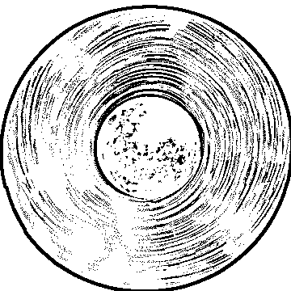

**苏·汤普金斯，英国目前****最资深****的占星学家和咨询师之一，她拥有****超过 40 年****的占星经验，是占星学习者****必备****之两本圣经《顺逆皆宜的人生》与《当代占星研究》作者。**

**她以自己的冷幽默、****抽丝剥茧的研究天分****和****占星直觉****而闻名。她是一名执业占星师，也是一名顺势疗法医师，是心灵和身体的****敏锐诊断专家。**

**2003 年，为表彰其卓越贡献，英国占星协会为苏·汤普金斯授予查尔斯·哈维****终身成就奖。**

**第一届苏·汤普金斯核心课****金牌助教：ISAR 认证占星师咔咔****会在第二届核心课中和苏·汤普金斯老师联合授课。咔咔是最熟悉苏·汤普金斯老师教学风格的中文占星老师，可以帮助学员更好地****梳理知识架构****，了解学员的****学习进度和疑问。**

**两本占星学必备圣经出自她！**


**《当代占星研究》**

01

本书由当代占星权威苏·汤普金斯女士集 30 年研究成果撰述而成。全书观点独到犀利，展现出作者对占星学这门学问**极富洞察力和启发性的理解**。

本书架构严谨清晰，语言易于理解，阐释深入精微，其内容涵盖占星学的历史背景、理论基础、星座意义、宫位象征、相位图形、星图解读，可用以检视人格模式、心理需求、情绪处理、人际互动、生涯发展等各个人生面向。**这本书是理解占星学精髓的入门指南，是广大占星爱好者进入严肃占星学领域一窥堂奥的必备经典。**


**《顺逆皆宜的人生》**

02

★《当代占星研究》作者的另一部经典力作 

★ 西方占星学界最权威的著作之一

★ 全面解读各种占星相位的含义

★ 即台版书《占星相位研究》

苏·汤普金斯倾注多年从事占星研究和实践的心血完成此书，以幽默而精准的语言，详解各种相位所代表的能量运作方式，有助我们理解心理模式的复杂面向。又举诸多名人为例，使相位含义变得更为生动和容易理解。

**名人推荐**“**苏·汤普金斯的《顺逆皆宜的人生》令人赞叹！苏是一名倍受爱戴的老师，并且任教多年。苏以自己的冷幽默、抽丝剥茧的研究天分和占星直觉而闻名。她是一名执业占星师，也是一名顺势疗法医师，是心灵和身体的敏锐诊断专家。**
** ——法国心理占星学协会会长琳恩·贝尔**
”**苏老师的智慧语录**“

**相位是星图的能量所在，这些能量能够把星图从毫无生气的一张纸，变成能够象征人类生命力与活力、冲突与喜悦的符号。占星学的解读技巧，就在于把各种象征符号，整合成一个综合性的结论。**

**占星学的的确确是我日常生中必不可少的部分，除去英语，它甚至是我思考的主要语言。或者换种说法表达，占星学的征象在很大程度上代表了我独特的信仰体系，占星学的世界观因此成为我的人生观。**

”**课程内容**

**第*****4*****阶：出生星图解读（进阶），以及关系与职业议题**

*   相位模式

*   含相位模式的星图解读

*   元素失衡的解读方法

*   最终定位星

*   星图中的人物

*   星图中的人物（续）：双亲、手足、爱人

*   爱情关系：星图比较，包括学生作业、示例、3 或 4 个学生案例演示！

*   职业解读

**第*****5*****阶：预测、关系、咨询、为执业和考试做准备**

*   预测观与行进
*   推进（尤其是次限推进），它们是什么以及如何应用？
*   太阳弧
*   三种技巧结合使用
*   时机、月相与解读
*   示例与案例
*   太阳返照图、月亮返照图及其他
*   学员案例
*   星图解读结合预测的案例
*   如何利用星图为事件（婚礼、商务等）择时？
*   关系议题，复习第四阶所学
*   更多评估关系的技巧，组合图及关系星图
*   其他不为人所知但有效的评估关系的技巧
*   中点入门
*   关系示例，各种关系技巧与预测相结合，学员案例
*   创造性相位——72°和七分相
*   心理学与咨询模式与技巧，以当代心理学思想为核心，倾向于“以人为本”的占星师
*   倾听技巧，咨询方法，道德议题
*   为执业做准备
*   如何以占星师为职业谋生
*   必要的历史和天文学知识，为考试做准备

**强大的导师及助教团队**


**苏·汤普金斯（Sue Tompkins）**

**英国目前最资深的占星学家和咨询师之一，她拥有超过四十年的占星经验。**占星学习者必备之两本圣经**《当代占星研究》**和**《顺逆皆宜的人生》**作者。

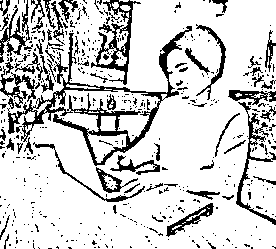

**占星师咔咔（Caroline）**

若道首届学员，国内最早获得 ISAR（CAP）职业占星师资质的职业占星师(2013 年获得认证)，现兼任若道占星核心课程助教。

在国际知名广告公司和市场研究公司从事的市场研究和推广工作十余年，曾任职于阳狮集团、尼尔森市场研究有限公司、MTV 和《Madame Figaro》杂志。


**助教 丁宏（Esme）**

ISAR（CAP）认证占星师(2012 年获得认证)，首批获得若道认证讲师（2018 年度），若道核心课程兼职助教，资深占星课程口译。复旦大学英文学士，伦敦大学国王学院文化创意产业硕士，国家三级心理咨询师。受教于伦敦占星学院及若道，跟随多位名师研习各流派技法，致力于现代占星与古典占星的积极融合。


**适合人群**

*   想要系统学习占星学，有志成为职业占星师的人

*   有一定占星学基础，但不知道该如何整合星图复杂碎片的人

*   希望成为优秀的占星师，想要借鉴国际大师解读思路并融入自己的体系的人

*   苏·汤普金斯的粉丝，学过占星学，但就是想跟着偶像再学一遍的人

*   走在自我探索和个人成长道路上的人

**学过的人怎么说？**


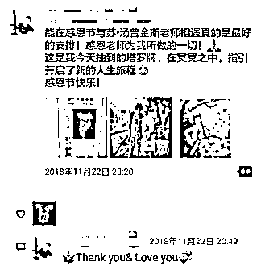


| **苏老师主讲的核心课程体系，最吸引你的地方是什么？** |
| **学员回答** |
| 老师用她的亲身经历，讲解占星学在现实中的运用，深入浅出，容易理解 |
| 详细的分析，丰富的知识，重视基础，实用、谦逊、专业、朴实、真诚   |
| 是案例分析部分，会从中学到职业占星在咨询过程中对案主的引领，以及思考问题的视角 |
| 老师讲的干货很多，分享的真实案例很受用，很喜欢理论性强的内容 |
| 老师丰富的学识、经验，以及她身为占星师所具备的专业品质，例如谦逊 |
| 知识体系清晰全面，老师经验丰富，有独特的个人魅力 |
| 适合系统的占星入门，可以打下扎实的基础，尤其是纠正了坊间的很多误区 |
| 很有体系，案例多，幽默，知识点丰富 |
| 案例分析，星图解读特别有趣，很多让人意想不到的相位解读和小知识点 |
| 课堂上的案例讲解以及苏老师的客观、诚实，最重要的是谦卑，一点都没有大师的架子 |
| 核心课程，基本上把所有常见的、基础的知识技法都系统地讲到了 |
| 干货满满，理智客观 |
| 是老师的不评判的态度，没有预设的对错 |
| 老师的解盘思路，让我从不同的角度去理解星图 |
| 苏老师多年沉淀出的态度对我的影响深远 |

**课程费用**

**课程费用**：32200 元

**优惠价：27600 元**

**优惠价获取方式请咨询课程顾问许老师（微信：nodoorC，手机：18513802118）**

**授课时间****第四阶，2019 年 10 月 14 日开课**每周一晚上 20:00-22:00（网络课程，共 13 次课）

**插班中**

**第五阶，2020 年 3 月开课**每周一晚上 20:00-22:00 上课（网络课程，共 27 次课）**退转课程**

*   **退款原则请详看《教学协议》，如有疑问请咨询课程顾问。**

****若道核心课程 Level 4-5****

**授课老师：苏·汤普金斯、咔咔**

**授课时间：第四阶**，2019 年 10 月 14 日开课（共 13 次课）；**第五阶**，2020 年 3 月开课（共 27 次课）

**授课方式：**网络课程**，**英文授课，中文翻译

**费用：**32200 元；**优惠价：27600 元（添加课程负责人获取优惠方式）**

**课程负责人：许老师**（微信：nodoorC，手机：18513802118，请备注“苏·汤普金斯核心课”）

长按二维码添加课程负责人咨询~


****报名请点击“阅读原文”****


# 深度 | 这个星座比双鱼座更容易牺牲自己，他们专注而孤绝

> 原文：[`mp.weixin.qq.com/s?__biz=MzA5NjA0NTAxNg==&mid=2651412161&idx=1&sn=37ff27a685136be77b3d02086a4b8f0b&chksm=8b4be476bc3c6d6079b8592d14f1250d87401d0a8a28bc87f50a8f9fd253a52d9d5223c4ab12&scene=126&sessionid=1692738247#rd`](http://mp.weixin.qq.com/s?__biz=MzA5NjA0NTAxNg==&mid=2651412161&idx=1&sn=37ff27a685136be77b3d02086a4b8f0b&chksm=8b4be476bc3c6d6079b8592d14f1250d87401d0a8a28bc87f50a8f9fd253a52d9d5223c4ab12&scene=126&sessionid=1692738247#rd)

******************************☆ **************后台****************************回复“今日”，给你一句生命态度****************


作者/达娜·格哈特
译者/鱼非 校对/Arrow
编辑/玫瑰 图片/unsplash 提到黄道 12 星座中的第一个，大部分人都会想起充满着活力的白羊座形象。它们像公羊，随时准备冲锋陷阵，在平淡生活中寻找各种冲突和开创。然而，白羊座们并非一直勇敢，相反，因为他们勇敢到来不及深思熟虑，反而最容易受伤。如果你身边有这样的白羊座，可能你需要学习换个角度看待他们：冲突是你们在一起最有意思的部分，虽然你时常会感叹：“我太难了！”**野马——白羊座原始生命力****想象那些马儿****飞驰而来的步伐****起伏跳跃、溅起飞尘****像在进行一场永不停歇的比赛一样****还有那滚烫的铁蹄如何踏平了色雷斯的山丘****在闻所未闻的饥渴驱使之下**赫拉克勒斯为了完成白羊座的任务，必须抓住并驯服四匹野性难驯的马，这是玛尔斯送给他半神半人的儿子——野蛮的国王狄俄米德斯的礼物。他桀骜不驯的野马像地震和雷声般穿过色雷斯城，劈开城镇，吞噬河流，夷平山峰。在惶恐的色雷斯人之中，还流传着母马吃人肉的故事。星座原型的经验告诉我，**野马们象征着白羊座的原始生命力**，但是它们形象中阴暗的狂怒让我迟疑。尽管我认识几个头脑发热的白羊座人（他们特别可怕），但我通常会联想到这个星座更阳光的意象。白羊座是欢乐的跳跃，是上山的冲锋，是充满活力和欢笑的脸颊。它的冲动是去**夺得第一**，去大喊“耶!”，去抱紧爱人在床上较劲。它是一位全明星球员全垒打的击球声。它是一个蹒跚学步的小孩在完成一个新里程碑时大声告知人们：“我做到了！”。它是一名探险家连地图都不带就踏上奇妙的冒险。白羊座 0 度是向北攀升的太阳穿过赤道时的交点，标志着回归黄道的开始，也代表着北半球进入春天。它带来了更温暖的日子，新的活力，新的成长和新的乐观态度。**白羊座出现在你出生星图的位置，就是你有天分去开启、去创新、去追寻命运将要带你去的地方。**白羊座是纯粹的生命力。这是它符号♈的意义之一：**一条直线分开成为公羊的两个角。**仔细思考这个形象你会发现它象征的实质在你身边无处不在。比如坐在一盆简单的室内盆栽旁边。当你足够放松，感知到那里有什么，你会注意到一股勃勃的生命力让它的茎秆保持笔直，这股生命力顺着植物的分枝劈开空间，延伸、探索、追逐着阳光。在你自己的体内，经过练习后，你能发现**如喷泉般的电流顺着你的脊椎向上，而后在你头顶像羊角一般分岔出去**。这就是在你身体里的白羊座的符号，蕴藏着**告知世界我是谁**的强大能量。**白羊座 0 度也是世界星图里的轴点之一**。因为这个世界没有确切的出生时间，所以这个世界没有自己的出生星图。但是基本星座的 0 度已经被证实是敏感点；**行进星图在这些位置表明了重大的文明变更，加速了全球大事的发展**。当白羊座 0 度在一个人的星图中非常活跃，比如**是中点或有行星相位**，它能带来**个体与世界非常明显的联结**，也许是使某人更加出众或者把个人命运与历史进程联结起来。

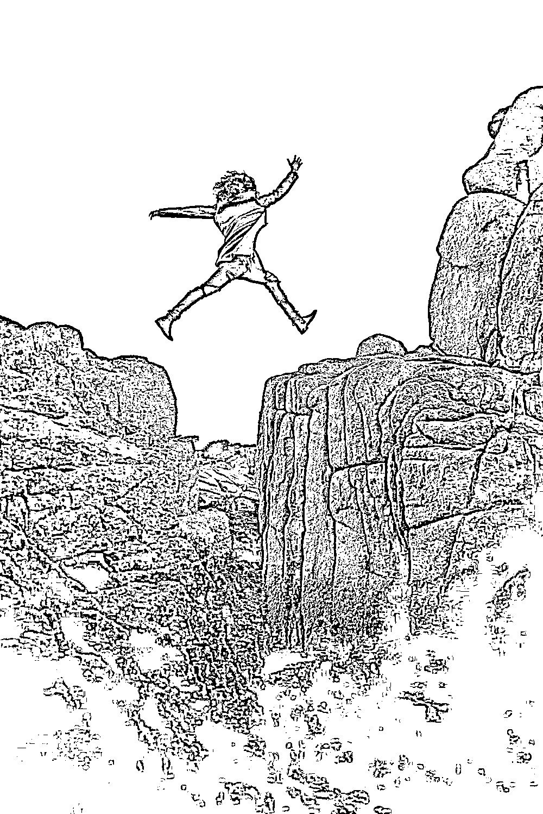

**白羊座的阴影**行进冥王星将激光聚焦指向**最需要清除和转化的部分**。这种情况就是**白羊座的阴暗面**——**以自我为中心的残酷、粗鲁、贪婪，**这些是白羊座并不喜欢暴露的阴暗特质。星图中有行星落在白羊座的人中，很少会带有如此残忍或暴力的阴暗面，但是大多数确实有**隐藏一些黑暗特质**。外行星的行进有一个让人难堪的习惯，它们会把**在潜意识里的东西带到表面**。这是来自星星的善意——这是一个认识旧伤口并且治疗它们，一个解放枷锁并且让我们更有灵性的机会。但是治疗旧伤的路途往往是崎岖的。所以它值得被警示：**白羊座阳光的生命能量怎么会转变为恶意的呢？是什么把内心的狄俄米德斯带到生活中的呢？**

我的一个白羊座朋友尼克曾告诉我**：****“关于人有件事你一定要知道，在所有人的心里，都想把某些人打得满地找牙。”**我震惊了。尼克是一个佛教徒。虽然我们很快得到了一致的结论，那就是所有人都需要我们用慈悲心去看待，我还是瞥见了尼克有时从白羊座视角里看到的那个**充满矛争议的真实世界。**

尼克每天都会冥想。但是当瑜伽课上或停车场里——这种我看起来很平静的场所，突然爆发出对他而言**威胁性、竞争性还有高度危险**的需求时，他的灵性修炼会很快瓦解了。**白羊座的守护星是战神。火星靠战场而生**，所以，它常常似乎就是如此，我的白羊座朋友也一样。如果行星们不仅仅是纸上的符号或是宇宙中的岩质-气态行星，如果它们象征着那些向我们低语的神，那么也许尼克的这种行为模式是因为火星一直他耳边低语，指引他的心灵，并在他的梦里为他磨剑。

**火星是一个战士，他勇敢、强大且斗志昂扬**。在战火中，他依靠直觉，客观地行动，就像一团穿过森林的野火。他的热情来得也快去得也快。他**残忍、鲁莽、没有耐心，且全由欲望驱动。打败敌人和追求爱人是他的需求，这让他的世界同时充满激情和危险**。他的剑和盾从来不离手。

赫拉克勒斯必须进入这个由火星统治的世界，以完成他的白羊座的任务。尤利西斯国王希望狄俄米德斯那几匹极具破坏性的母马能阻止赫拉克勒斯一行人的步伐。这可能需要一支军队，但赫拉克勒斯聚集了一帮像他一样热血沸腾，做好一切准备的人。他们冲上了船，然后启程去色雷斯。他们大胆地冲向海滩，在那里获得了令人惊喜的初步胜利，他们压倒并抓住了马匹。这简直太容易了，直到国王狄俄米德斯得知了消息。玛尔斯的儿子真不愧是他父亲的儿子，有着暴躁的脾气和傲人的军队。赫拉克勒斯准备好亲自去迎接挑战。他把母马的缰绳扔给年轻侍从阿德梅托斯，然后驾车冲入了战斗中。战斗残酷、血腥而艰难；双方轮流占据着上风。最后，赫拉克勒斯取得了胜利。野蛮的国王死了。返回到上，赫拉克勒斯发现母马消失了，而阿德梅托斯死了，被凶残的野兽撕裂和践踏。赫拉克勒斯追赶着它们，并且暴打、征服了全部四匹马。回到船上，他给马喂了它们前主人的肉。使它们驯服的最后一步就是吃狄俄米德斯。

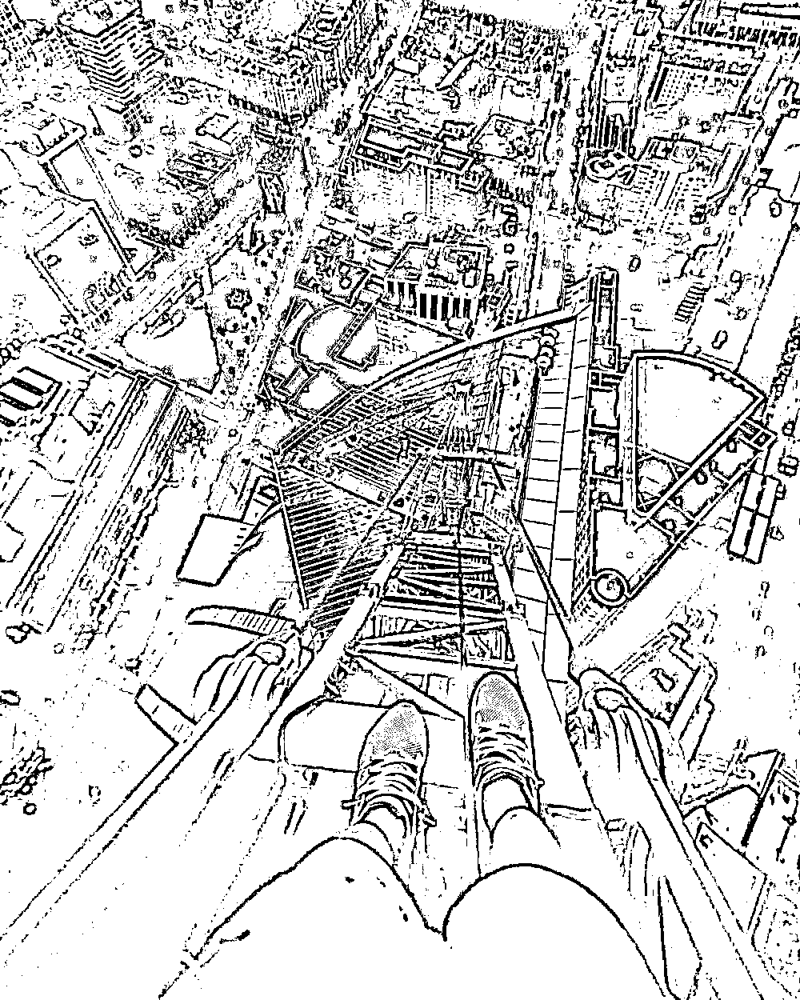

**火星的礼物和诅咒**人们常说白羊座特别渴望战斗。也许更真实的说法是白羊座只是在履行其使命，学会掌握其**战斗精神**——来自火星的礼物和诅咒。这些年来，我与几个白羊座人进行了斗争，其中包括我上班时的部门经理乔吉特。我被聘为顾问, 负责改善她团队的表现。她刚刚上任，高层管理人员希望能加快学习进度。为白羊座人提供任何建议都不容易，但是我很热切地支持着她带领团队走向成功。一夜之间，该部门变成了一个战斗区域，到处都是虎视眈眈、窃窃私语和私人会面。员工们害怕与我见面。乔吉特在排挤我。她的这种活动持续了 6 个星期。每天我都回去，就坐在她隔壁的小隔间里，在按小时收费的时间里涂涂写写，直到有一天，她宣布离开企业界成为一名老师。在她辞职的一个小时内，我得到了她的工作，工资是我当顾问时的两倍。我几乎什么没做就赢了，白羊座人可能很难理解。**白羊座是行动导向的**。这是干事的人，而且常常，把自己干死了……尽管乔吉特让我的生活变得艰难，但我仍然怀着敬佩的心情怀念她。我仍然可以看到她红润的脸颊，在欢笑和愤怒间交替。她又高又壮，像个运动员。如果地震撼动了办公楼，我很乐意有她在我身边。即便如此，她的眼神还是有些**脆弱**。她看起来像个在扮演大人的孩子，并且表现得很勇敢。她走入了自己一无所知的工作，而为了另一个新挑战而辞职了。乔吉特不怕一次又一次地重新开始。但是她外露的情感让她**害怕根本不存在的危险**。她快速地冲入、招架、攻击和防御。是她的**纯真**做到了这些。关于白羊座的秘密真相是，**它很容易受到深深的伤害。**这使白羊座既可爱又疯狂。激发他们冒险的灿烂生命力也可以使世界陷入混乱，就像在色雷斯上破坏的野蛮母马。和白羊座的狭路相逢总是值得人们谈论一番。“宝拉很有趣，但你知道，每当和她在一起时，全是在说有关她的事。” “鲍勃完全无视我，没有听我说一句话。”“你赢不了凯茜；你要么投降，要么就努力伪装。”与白羊座争执时，重要的是要意识到**她最想斗争的人实际上可能是她自己**。

赫拉克勒斯和狄俄米德斯之间的斗争代表着一种**内在的斗争**——一边是勇敢的大英雄，存在于想要拯救和照耀世界；一边是被宠坏了的孩子，由于自己的痛苦而想惩罚世界。母马们吃着前主人的肉描述了白羊座得到了掌控自我的权力，以及他们有时笨拙的激情——**原始的能量、躁动和因为受伤的纯真而引发的憎恨。**

并非所有白羊座的攻击都是故意的。苏珊在一家投资公司工作，她的老板是白羊座。她告诉我他总是闯入她的私人谈话。他站得太近了，并无视她让他远离的温和而坚定的信号。她会关上办公室的门，但他会不会敲门就进去，探进头来，只是为了看看发生了什么。她和我说，他足够友善，也总是微笑或表达关心，但她感到被骚扰和侵犯。起初，她担心他看上她了，直到她意识到他对每个人都是这样。尽管如此，她觉得自己在沮丧中煎熬。他是她的老板，她不知道该怎么办。占星学在这种情况下就很有帮助。就像自然学者的实地指南一样，它可以告诉我们将会在人群中遇到什么样的人以及如何回应他们。尽管我们知道并非每个人都和我们一样，但是我们通常会因为一次又一次地发现这一真相感到震惊。黄道 12 个星座可以帮助我们识别特定的风格，并学习如何更有效地使用它们。最终，我们可能会发现我们彼此并没有太大的不同。我们每个人都拥有火星和一个或多个白羊座的宫位。**白羊座活力个性是一个特别闪亮的表面；它常常反射出那些我们看不到的自身的特质。**

我用苏珊的例子讨论了白羊座的风格，它的符号——**公羊**。公羊的角使它**勇敢地进入到其他人害怕踩到的地方，也根本不应该踩到的地方**。白羊座**活力四射、动力十足、精力充沛，**就像一辆坦克一样，同时它是**封闭的、自我投入的、并且在社交上很迟钝**。很少有人在成长过程中，观察过附近山丘上真正的公羊，但是与不同的人相遇教会了我们正面冲撞白羊座是不明智的。**与白羊座争辩需要更有创意的策略。**

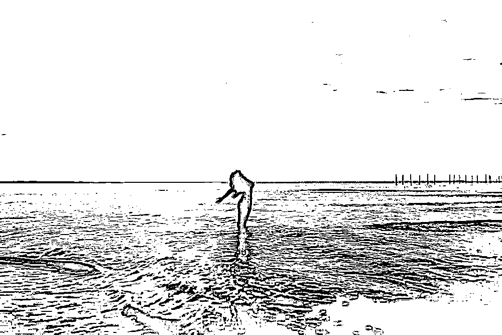

我最好的两个朋友是水星白羊座。我们的谈话可以**既生动、广泛，又戳心、扎人**。**水星在白羊座的人思维敏捷，说多于听**。有一个朋友永远跑在我前面，结束话题并开始新的主题。另一个几乎从不同意我先提出的所有建议，直到她自己有机会得出相同的结论。我当时没有思考他们的星图。我只是变得**急躁和好辩**。有时我会和我的水星白羊朋友起冲突，这使他们震惊、受伤，然后沉默和发火。你能看到我自己是如何演绎白羊座的阴暗面吗？——**愤怒和自我沉浸。**

我需要改变我的观点。当我真正接受白羊座的脑子需要如何思考和说话时，我可以松一口气了，甚至在他们的喋喋不休时感到愉快。反而，这给我们俩的对话打开了更多的空间。当苏珊想起自己对老板的互动时，她意识到自己在与他接触时一直怀有敌意。**一旦她接受了他想交流时笨拙的方式，她就可以放轻松并与这只公羊一起巧妙地共舞。**

埃及人将白羊座的公羊命名为“Amen-Ra”。一个强大的太阳神阿门拉（Amen-Ra）负责重启神圣的一年。他被称为“公羊，强壮的雄性，神圣的生殖器，激起了爱的激情，公羊中的公羊”。亚述人将同一群星星命名为“ Lu-Hun-Ga”，指的是授粉季节雇用为树丛授粉的工人。风曾经为棕榈树授粉，但人类不记得了，因此，每当花开时，从树丛的一棵雄树上取花粉并为每株雌树授粉就成为了早期种树人最重要的工作。

这一授粉的使命必然是白羊座的召唤。我认识几个可以像风一样移动的白羊座！他们都精力充沛，他们推动事情发生。我记得几年前的一次商务会议，是一个太阳、月亮和金星都在白羊座的人主持的。他斜靠着桌子说：“我会全力以赴完成进度，但有时你们必须也一起推动！”

白羊座是大自然的复苏力量。无论我们遇到的是自己还是他人身上白羊座的原始力量，都会赋予我们**积极的动力**，与这股力量一起创造。**如果我们允许白羊座有时自由不羁的侵略性，而不是阻止它，我们可能会发现它引导着我们去往新的方向，去往更加硕果累累的地方**。然而，我们中许多人未能在我们的白羊座宫位或行星中实现这种强劲的潜力。这暗示着白羊座阴影区的另一个角落——在那里我们冒险的开拓者穿上了混凝土的靴子。**我们为什么不让自己身上的公羊行动？****白羊座的牺牲**在希腊神话中，天文星座白羊座象征的公羊是金黄色且有翅膀的，它的羊毛是杰森追寻的猎物。在此之前，这只公羊自己经历了著名的冒险，涉及波奥尼亚国王的孩子们。他们的继母正计划杀死他们。在一次大胆而英勇的营救中，这只公羊帮助孩子们脱离了危险，但在穿越达达尼尔海峡时，女孩海勒失去了平衡。她从公羊的背上摔下来淹死了。公羊一直前进，直到他把男孩弗里克索斯安全地带到了黑海岸边。

有翅膀的公羊不是电视里的超级英雄，能够既安全又成功地完成那些勇敢的营救。公羊的前行是艰难和崎岖的，他的英勇气概伴随着鲁莽。我想起了赫拉克勒斯的白羊座任务中不幸去世的阿德墨托斯。**牺牲是白羊座冒险中的一个常见主题**。当弗里克索斯安全到达时，他用公羊献祭以示感恩。他杀死了这只野兽，并将它金色的羊毛挂在由一条龙守卫的橡树林中，献给战神玛尔斯。多么会感恩！

公羊也许是宗教历史上用得最多的牺牲品。正是一只公羊代替了以撒（亚伯拉罕的儿子），被宣判死亡。这就是获得白羊座力量的代价。公羊本就注定了要**勇往直前并且被牺牲——不受庇护、抚摸或疼爱**。面对命运这样的回报，我们许多人本能地约束公羊的力量就不足为奇了。我们可能会为新的冒险而踌躇满志，但很快会由于**恐惧或自我怀疑**而停下脚步。我们想知道如果失败了，别人会怎么看我们。我们已经看到了那些奋勇向前冲的人通常会得到什么结局：**孤独而又不被欣赏**。

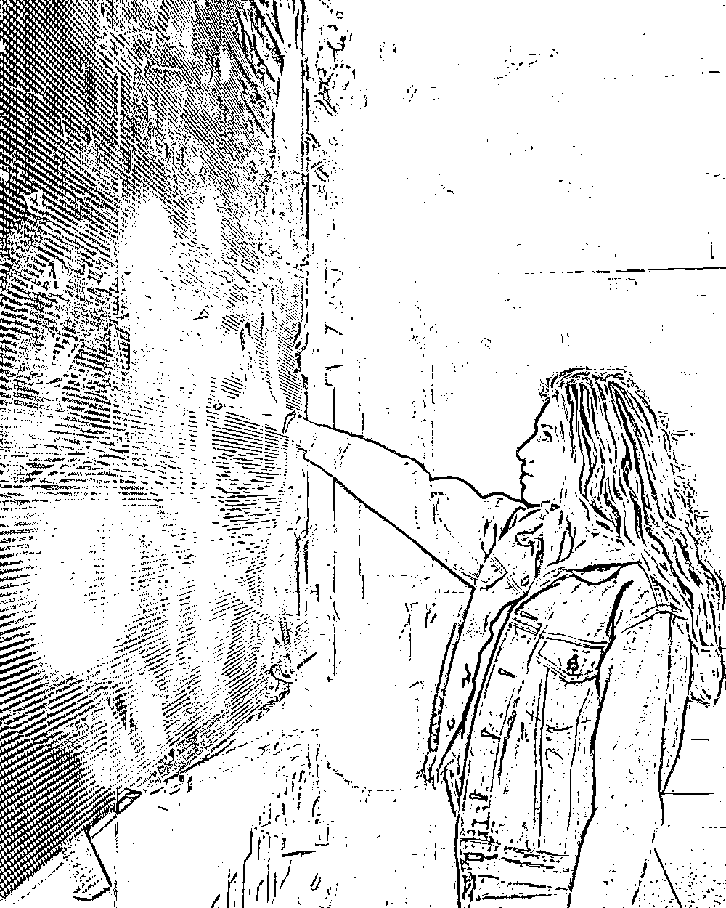

实际上，我们对白羊座勇气的钦佩只是停留在概念，而不是事实。我们将白羊座的人们送去披荆斩棘，但即使我们跟随他们的带领，也不会总是珍惜与他们的同伴关系。但是世界需要公羊们。为了铭记第二次世界大战的创伤和英雄事迹，诗人路易斯·辛普森对象征白羊座能量的人们表示敬意：**“为人类最重要的美德、勇气，没有它们，其余的人们将不复存在，我赞美你，那个走在同伴前方的领路人，他将步枪举在胸前。”**

赫拉克勒斯在白羊座的任务中取得了成功。但是阿德墨托斯已经死了。这是故事中的重要元素。我们可以将阿德墨托斯理解为白羊座的弱点——**无辜的孩子扮演的角色太大，于是一次又一次地被牺牲**。我们还可以将阿德墨托斯视为**白羊座领导地位不稳定**的证据。白羊座可能无法充分扩大其同伴的人数，它自以为得到的支持并不存在。白羊座容易向外投射自己：“如果我能做到，你也可以！”**在天秤座和白羊座“你-我”的两极性中，天秤座的人了解其他人却常常迷失自己，而白羊座的人了解自己但是却失去他人**。在充斥着复杂和微妙的情境中，白羊座有时会在一个挂满镜子的房子里迷失自己。阿德墨托斯之死本来可以被预见和避免，但白羊座往往会**不看远处的状况就跳过去**。芭芭拉·沃特斯在她那本令人愉快的旧作《你的太阳星座发生了什么问题？》中指出**“缺乏远见”是白羊座的致命缺陷**。作为证明，她列举了支票帐户始终透支的白羊人，在沙漠中汽油用完的白羊人，以及不顾海岸上竖起的暴风警告依然起航的白羊人。沃特斯写道：“白羊座很适合去参与那些会丧命的试验，就像在壁炉里倒入一罐汽油让火苗旺盛，或者灌下满满一杯詹姆森 12 年威士忌混伏特加。”白羊座**不拘细节**。像其他火象星座一样，它对资产和资产负债表的理解通常是粗略的。沃特斯写道：“白羊座会为了价值 2 万美元的房子贷款 3 万美元，然后用这额外的 1 万美元一次性买下一条船、两辆汽车、给妻子的貂皮大衣以及环游世界。”我们可以尝试提醒白羊座的亲友，让他们听到我们的声音。但是最终我们必须尊重他们在人生旅途中的孤胆。死去的阿德墨托斯是一个警示的画面：赫拉克勒斯应该亲手拽着母马的缰绳。**白羊座战士必须独自工作，战士的生活需要勇气和孤绝。**我的一位客户讨厌她的白羊座丈夫，她抱怨说：“在他公司的年度销售会议召开的前几周，他的举止就像小孩子，我甚至不存在。我们之间像隔了一堵墙，他变得非常自私。我知道他正在准备，我也想提供些帮助。他不必这么冷漠。” 我指出，他的行为不是拒绝，而是白羊座战士的逻辑方式。他的准备工作需要**专注的隐退**。**他牺牲了自己，所以他可以更有效地投入战斗**。她承认：“好吧，战斗结束后，他也总是会回来。” 然后她的嘴角露出了微笑。我的理解是，如果她没有时常对白羊座恼火，她的世界就不会那么有趣了。

**版权声明：**本文由若道翻译发布，欢迎转发，反对抄袭。友号转载请申请白名单。

**也许你还想看下面的文章**

[金牛座](http://mp.weixin.qq.com/s?__biz=MzA5NjA0NTAxNg==&mid=2651411945&idx=1&sn=6a74a4d7d15deb38d06a692ad4032ddd&chksm=8b4be75ebc3c6e4890b5034474c2894bd355bf26df5f0ad1c2fadae76f3de1d349a57de0471b&scene=21#wechat_redirect) | [天秤座](https://mp.weixin.qq.com/s?__biz=MzA5NjA0NTAxNg==&mid=2651410544&idx=1&sn=45b51d84210a84c8103c140df5a28229&chksm=8b4be2c7bc3c6bd1c86b8ffd8d8722efe3cfa1fc4b71e2cc8f71230218b8c73a7119d8a22745&token=428430174&lang=zh_CN&scene=21#wechat_redirect) | [射手座](http://mp.weixin.qq.com/s?__biz=MzA5NjA0NTAxNg==&mid=2651411022&idx=1&sn=adf59f6eb38f2fd19ca975b4287168ea&chksm=8b4be0f9bc3c69ef250cafb4d517694bb952529461017c53da4d7ca120ed4ec0004161eccdb0&scene=21#wechat_redirect)

[水瓶座](http://mp.weixin.qq.com/s?__biz=MzA5NjA0NTAxNg==&mid=2651411498&idx=1&sn=25b8051c9c778065f9fffa37628c9950&chksm=8b4be69dbc3c6f8b94ee79ae682233634bcd0f32e8dce890672ea1bb4e5241a34cb59ebb3045&scene=21#wechat_redirect)


**达纳·格哈特**一位国际范围内受尊敬的占星师。她为众多占星学网站和出版物讲课、写稿。她在十二宫的月亮激励她对这颗发光体进行了深刻而持久的探索研究。

**双证书核心课程火热报名中**

**点击图片了解详情**

**

**微信又双叒叕改版啦，不想错过若道君的推送？**

**就把若道设为星标吧！**

**▼**


就是这个“在看”，戳戳戳 ☟

********报名直达入口********


# 厦门星空分享会第四期 | 告别“巨婴”，向摩羯座学习生命管理

> 原文：[`mp.weixin.qq.com/s?__biz=MzA5NjA0NTAxNg==&mid=2651412161&idx=2&sn=ce51395351ffd323200cad6b19500a23&chksm=8b4be476bc3c6d606fd6d0a1afdeea866970a29b2f55207dab47558b9557dd8766b2c4329d47&scene=126&sessionid=1692738247#rd`](http://mp.weixin.qq.com/s?__biz=MzA5NjA0NTAxNg==&mid=2651412161&idx=2&sn=ce51395351ffd323200cad6b19500a23&chksm=8b4be476bc3c6d606fd6d0a1afdeea866970a29b2f55207dab47558b9557dd8766b2c4329d47&scene=126&sessionid=1692738247#rd)

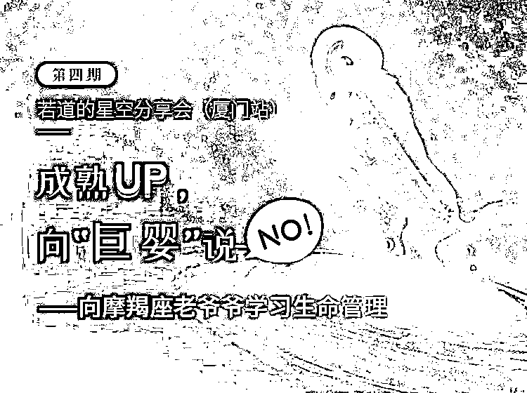

“

**被铺天盖地的 2020 大摩羯年的报道“惊吓”了吗？****不会的，你已經是大人了！hold 住！我想木星摩羯座爷爷也会站在你背后这么鼓励你。****去厦门参加若道沙龙分享会吧。2020 年，**宇宙呼唤真正成熟的引领者，**业果成熟、代际更迭、优胜劣汰的自然法则被强化。****成为一个肩能扛手能提的自我担当者吧。触底反弹的是你，传承重责的是你，顶梁柱是你！该逝去的终将逝去，新生再起，巨婴会倒下的。你若是害怕，让你害怕的那一面会迅速膨胀，如泰山压顶于你，反之，你稳若泰山。****2020 年，愿你沉着从容，安如山！****去现场体验，将手把手教一些实用方法。****——ISAR 认证占星师.滴答**

**”**

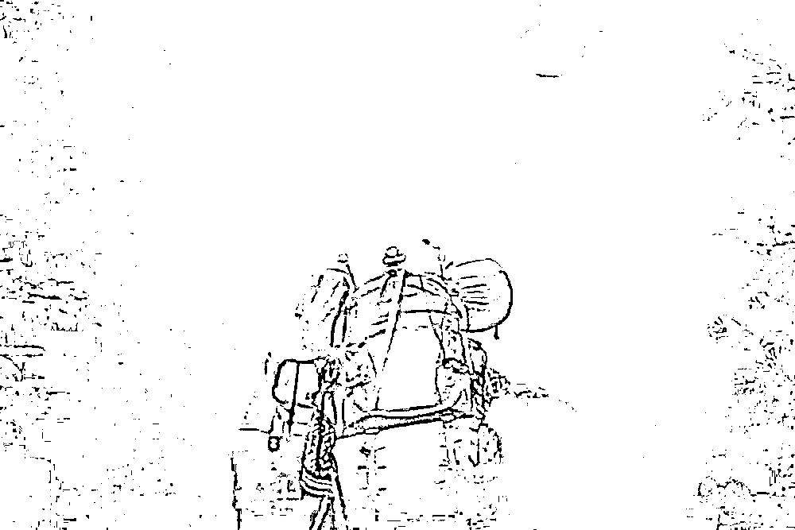

**活动内容和形式**

**PART 1**

**从深度认识摩羯座开始****简单易感的身体语言、清晰简明的图画、摩羯座新月、冬至、圣诞与土星节的相关故事、短小的动画影片、“找摩羯”游戏、知识要点汇整**，从五感体验全方位认知摩羯座的各种特质。认识 2020 年的大摩羯们，学习与大佬们的相处之道：**①** 推荐**两部剧集**，节选剧中对白，看主角与主演的星图如何演绎土、冥、木摩羯座的情节，以此认清土星冥王星和木星在摩羯座的呈现模式；**② **学会观察行星能量的行进与“触发”个人星图的实用技巧；回顾总结冥王星在摩羯座和土星在摩羯座的过往轨迹；简明描绘从摩羯座新月开始，摩羯座星群的行动路径及其作用力。**③ 针对现场学员，举例说明**——摩羯座大佬们坐落个人星图所处宫位的现实环境；个人星图中土星和木星所落星座与土星、木星落摩羯座的呼应法则；关于月亮的安全底线、金星的财富与关系的底线，坚守和增长的加减法则。**PART ****2**

**本次活动能有哪些收获？**

将**“摩羯之道”**融入生活：**① **教导推荐让身心感受摩羯座的日常行为练习；**② **习惯与目标塑成法、摩羯座的有限分配与末位淘汰法则。**③ **推荐阅读的书籍、推荐观赏的影视，和一些相关摩羯座的文化涵养。**活动信息****活动时间：2019 年 12 月 15 日 14:15-16:30****举办地点：厦门市思明区南岳山庄**

**活动人数：场地限制，仅限 20 人**

**报名费用：50 元/每人**🎁**活动福利 1：前 10 个报名**的参与者将有机会在现场参与幸运抽奖，免费获得滴答老师 30 分钟的个案咨询，**仅限 1 个名额**。

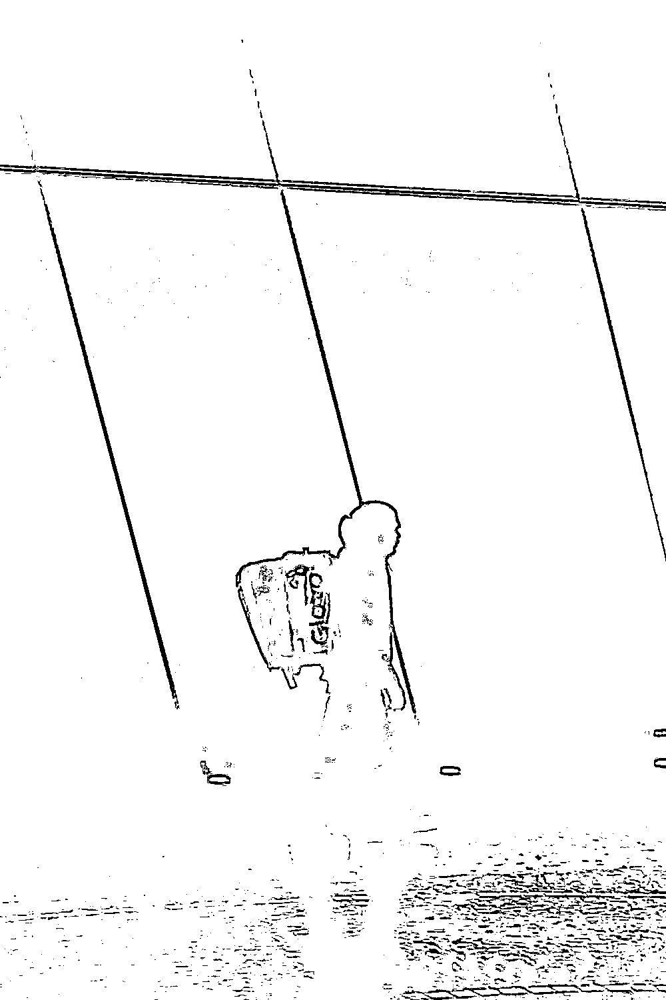

**关于滴答老师**“滴答老师是 ISAR 认证占星师，也是我在人生道路上的好友，她丰富的人生经历和对于内在诚挚，坚定的探索，对于中国道家，佛家修行的深入实践，面对无常而发展的智慧和勇气让她对占星学发展出深入而独特的理解。我很有幸在人生道路上有她相伴，也很有幸请她把对占星和人生的领悟分享给更多人。**——若道创始人，蒋颖****”****活动咨询**

**Q：****此次活动是仅限摩羯座的人参加吗？** 

**A：**不是的，我们每次活动都会确定一个星座有关的主题，因为每个人的星图里都会有各个星座的主题，所以，只要对占星感兴趣的人都是可以参加的，可以让你对自己星图里该星座元素有更深入的了解，顺便也可以结识一些对占星感兴趣的朋友，一起探索占星学习的乐趣。

**Q：****我没有任何占星基础，适合参加此次活动吗？**

**A：**可以的。此次活动是以一种**沉浸式体验**的方式开展，通过现场互动交流、图文讲解、音视频观看相结合的方式让你摩羯座有一种更具象的了解。即使没有任何占星基础，也可以通过具象的互动体验，感受最真实的摩羯座能量。如果有占星基础，此次活动会让你对摩羯座的认知更深刻，用另一种视角去感触摩羯座。

**Q：****我如果报名参加此次活动，还有什么注意事项吗？**

**A：**为了达到一种更好的互动体验效果，请报名参加活动的同学，尽量可以做到：

**（1）准时到场**。务必开场前 15 分钟到场，给自己 15 分钟静心的时间，有个良好的活动参与的状态； 

**（2）摒弃干扰的决心。**活动期间请保持手机静音，给自己一个完整、放空、属于自己的时间和空间；

**（3）****尽量绿色出行**。活动场地周边停车位有限，建议活动参加者尽量绿色出行，选择乘坐公共交通。

点击文末“阅读原文”，提交报名信息。报名成功后，请在活动当天 14：00 准时到场签到。

**更多活动信息，可添加客服人员微信咨询****May****手机号码：**13650952990**微 信 号：**Nodoor201705

长按下方二维码，添加微信

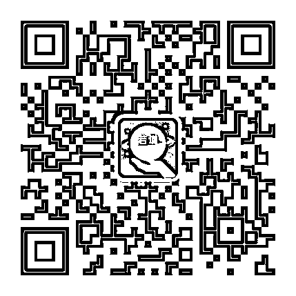

********购票通道直达入口********


# 核心课程 L5 | 多种预测技法，助你成为职业占星师（插班中）

> 原文：[`mp.weixin.qq.com/s?__biz=MzA5NjA0NTAxNg==&mid=2651412130&idx=2&sn=97c5eea6b6462ee093269dae67dbdd08&chksm=8b4be415bc3c6d035e34b1c58ebee199ca4b673d679f0db8987f7286f6cbe73edcdf07bc92af&scene=126&sessionid=1692738247#rd`](http://mp.weixin.qq.com/s?__biz=MzA5NjA0NTAxNg==&mid=2651412130&idx=2&sn=97c5eea6b6462ee093269dae67dbdd08&chksm=8b4be415bc3c6d035e34b1c58ebee199ca4b673d679f0db8987f7286f6cbe73edcdf07bc92af&scene=126&sessionid=1692738247#rd)


占星学不只是一门技术。占星学不只是一门知识。 占星学是**有****觉察****地活着，活在对过去、现在、未来的觉知、了悟和行动之中**。 我们强调学员的自我觉察，和如何活出占星学智慧，而非仅仅告知他人自己所知道的占星学。 占星学最终是**为了个人的人生服务**。 只有经过了深入的自我探索和个人疗愈旅途的占星学学生，才可能进一步成为好的占星师。 只有被活出的占星学技术，才对你和他人有意义。 你最终要去活你所学的占星学。你选择什么样的占星学意味着你怎么活着。 **寻找那些“实践其所知占星学”（Live their astrology)的占星师带领你走这条道路，而非谈其所知的占星师。**


**课程内容****第五阶 历史、预测和咨询技巧** 15 次线上直播网络课程，每次 2 小时，课堂中依旧会使用同学们的星图作案例**两场北京现场工作坊：2 天职业占星工作坊和 3 天咨询技巧工作坊**

**课程安排** 

占星学的进化历史

预测的历史和原理：预测的原理——有哪些可能和不可能，以及原因

预测的核心：出生图

预测技术：行进 
太阳的行进、月亮的行进、水星的行进、金星的行进、火星的行进、木星的行进、土星的行进、天王星的行进、海王星的行进、冥王星的行进

预测技术：行星逆行、日月食

预测技术：月相、行星周期

预测技术：二次限

预测技术：太阳弧

预测技术：返照

咨询技巧：常见咨询问题初探

咨询技巧：聆听、述意、提问的技巧

咨询技巧：确定咨询范围和厘清问题

咨询技巧：模式识别和洞察过往经历意义

咨询技巧：情绪识别

咨询技巧：核心信念识别咨询技巧：客户周期识别咨询技巧：寻找星图资源，提供希望和方向 ISAR 能力考试词汇表和大纲

**工作坊：（北京现场）**

**2 天北京占星学与职业工作坊** **2020 年 4 月**

**3 天咨询技巧工作坊 2020 年 5 月**

**导师介绍**


**蒋颖（Felicia）**

*   ISAR 中国副主席（ISAR 为国际占星研究协会缩写，在各国只设副主席），若道创始人。 

*   厦门大学化学系硕士，经济学学士，人民大学中美经济学培训项目福特班学员，长江商学院 MBA。 

*   曾为国内最早从事金融并购业务的机构合伙人。 

*   国内第一位被邀请在国际占星学会议上正式就西方占星学发表演讲的演讲人。第一批通过 ISAR 认证的职业占星师。ISAR 职业占星师资质认证培训师和中国考区考试负责人。 

*   跟随大卫·瑞雷、杰夫·焦耳、斯蒂芬·弗里斯特、苏·汤普金斯、格伦·佩里、诺·泰尔、罗伯特·汉德、雷蒙德·梅里曼、琳恩·贝尔等国际占星大师系统学习占星学，广泛涉猎人本主义心理占星、进化占星、原型占星、医疗占星、金融占星、卜卦占星、企业占星等多个占星学流派分支。 

*   曾接受萨提亚家庭治疗、本性治疗、Hakomi 治疗等心理学培训。接受进化教练培训。


**大卫·瑞雷（David Railey）**

*   ISAR 全球副主席，ISAR 考试委员会主席，若道创始人。 

*   被称为占星界的“马可·波罗”，第一位将西方严肃占星学系统教学和多位西方占星学大师引入中国的西方占星师。 

*   第一位在美国用电视和广播媒体推广严肃占星学的职业占星师。 

*   培养最多中国职业占星师的老师。 

*   《灵魂的目标》、《一生的旅程》作者。 

*   研究占星四十余年，拥有三十多年的占星咨询的执业经验，其服务客户包括学生、工人、市长、州长、议会议员、企业家、心理咨询师、工程师、艺术家、演员、知名企业家等，客户年龄跨度从襁褓婴儿到耄耋老人（大卫老师的老客户常常是一家三代人）。2010 年 6 月，大卫的书《灵魂的目标》中文版出版。在 2011 年春季的北京之行期间，大卫接受了《南方周末》记者的采访，同时参与了 CCTV9 的纪录片的拍摄。


**为什么选择若道学习占星学？****如果你相信自由意志的重要，愿意与命运共舞** 若道是人本主义占星学的旗手。因为我们相信，人通过了解模式、觉察习性、积极疗愈、终将释放其潜能，与命运共舞。**如果你想要充分国际化的眼光和见多识广** 占星界的“联合国”ISAR（国际占星研究协会），是具有全世界影响力的占星教学和研究组织和职业占星师全球认证机构，认证占星师遍布 45 个国家。在 ISAR 的 13 所附属学校中，大中华地区的附属学校只有若道一家。在国际化的教学理念大纲标准下，若道毕业生在 ISAR 国际认证占星师的考试通过率多次全球第一。**如果你相信教学需要经验和支持服务** 在中国确立西方占星学的标准，引入世界顶级的占星大师进行教学，传播人本主义的占星学智慧，若道已经做了七年。学好占星学不仅仅需要延请一、两个老师，而是需要对教学难点有充分了解，且有持续的教学跟进服务。若道在 7 年的多次核心课程教学中，有多年国外老师和中国老师、助教的配合、课程顾问配合教学的经验，对于教学知识点和中国学生的疑问有很多积累。仅在若道论坛，就有近千个学生问题的答疑解惑和作业的批改。


**如果你相信“联结和部落”**

若道为中国职业占星师的“黄埔军校”。职业占星师的培养从若道开始，进入若道，你就走近了中国最顶尖职业占星师群体，和一群志同道合的师兄师姐联谊，获得经验，共同成长。**如果你需要职业规划和支持** 若道为占星学生配备实习平台和咨询平台，并有着严肃占星学影响力最大的媒体平台，全力为其毕业生提供宣传渠道。若道还为学员准备学习 APP 供学员使用。在 7 年的占星教学耕耘后，本次两位创始人人大卫和蒋颖首次“联手”开设占星核心课程。一个是身在中国本土最有影响力的西方占星师，一个是在西方占星学界最有影响力的中国人。从若道开始，你全新的职业占星之路。


**学过的人怎么说？**


**课程费用****原价**：21000 元
**优惠价：20000 元**转发课宣，截图给客服即可享受优惠价。具体请长按下方二维码添加课程顾问小姐姐咨询哦。


**授课时间****上课时间：****2019 年 11 月 12 日开课，每周二晚上 20:00-22:00****插班中****授课方式****如何听课？**我们使用先进的网络教学平台，支持手机、电脑、iPad 上网，可以随时随地学习。教室平台登陆方式课前请留意查看客服推送的登陆提示。英语授课部分，实时翻译。**错过直播课程怎么办？**直播课程结束后 24 小时内课程回放将发布至个人中心；学员可登录网站收看课程回放，在线复习课程，每次课可完整重看 3 次，课程回放在每阶课程结束后的 3 个月内有效。**退转课程**

*   **退款原则请详看《教学协议》，如有疑问请咨询课程顾问。**


****若道核心课程 Level 5****

**授课老师：蒋颖、大卫·瑞雷**

**授课时间：**2019 年 11 月 12 日开课

**授课方式：**线上直播网络课程及两场北京现场工作坊，中英文授课，英文部分配备中文翻译

**费用：**21000 元；**优惠价：20000 元。转发课宣，截图给客服即可享受优惠价。具体请长按下方二维码添加课程顾问咨询。**

**课程负责人：施老师**（微信：nodoor233，手机：18515059056，请备注“核心课咨询”）

长按二维码添加课程负责人咨询~


****报名请点击“阅读原文”****


# 这种“宇宙独行侠”配置，你的星图中有吗？

> 原文：[`mp.weixin.qq.com/s?__biz=MzA5NjA0NTAxNg==&mid=2651412130&idx=1&sn=7a64c602ffbbea2b339b5a6a9f93f8e5&chksm=8b4be415bc3c6d03877c8a6e7288a5948a4d2fa464d759299bf6687bce74f3687c1c55f552e6&scene=126&sessionid=1692738247#rd`](http://mp.weixin.qq.com/s?__biz=MzA5NjA0NTAxNg==&mid=2651412130&idx=1&sn=7a64c602ffbbea2b339b5a6a9f93f8e5&chksm=8b4be415bc3c6d03877c8a6e7288a5948a4d2fa464d759299bf6687bce74f3687c1c55f552e6&scene=126&sessionid=1692738247#rd)

******************☆ **************后台回复“今日”，给你一句生命态度****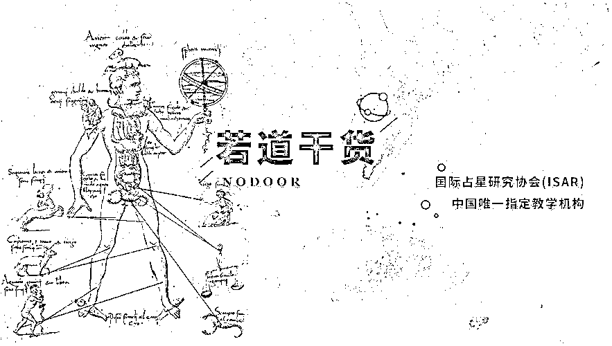作者/凯西·萝丝 译者/李含 校对/Arrow 编辑/Tang 封面/书君 图片/unsplash 文章来源/《大占星师》杂志

已经不止一次听到有读者问关于“空相”的问题：究竟什么是空相？行星如果有空相会出现什么样的状态？假若自己有空相行星该怎么办？容许度怎么选择比较好？所以若道君为你们奉献了这篇干货满满的空相攻略，一起来看看作者是如何详细阐述的吧。

**宇宙的独行侠：空相行星**

**什么是空相行星？**

你有没有一位朋友或家庭成员是公认的自由自在？也许这个人有一种大胆的古怪或不羁的特质，一种强烈的独立性，不容易融入或配合团体的动力。我指的是那种**特立独行的个性，一个不易适应、融入集体范式，也不易被集体范式规范和塑形的个体，一个真正忠于自己本性的个体**。这些独行侠与众不同，不是吗？他们无拘无束的独立理所应当引起了人们的关注。

正如我们生活中有特立独行的人一样，星图中也有行星具有这种特殊的独立能量频率。**在占星学中，指的就是****那些没有与另一颗行星形成托勒密相位的行星**。

我对星图中这种特立独行的能量尤为感兴趣——我把它们称为“**空相行星**”。它们的**表达更强烈，更被强调，并且因为它们与其他行星没有联系，它们倾向于充当背叛者的角色**。

**空相行星没有通过角度关系关联星图的其余部分，因此象征意义上，它在星图中的行为就像野马一样。这颗行星的频率成为个人发展和人生目标表达的重要****核心主题****。它的象征意义将会使其在个人的实际生活中脱颖而出。**关注空相行星为我们提供了另一种分析工具，可让你更容易、更快捷地抓住出生图中的核心表达。

托勒密的五个基本相位——合相、六分相、四分相、三分相、对分相是行星间最强大的连接，在影响力等级评估中是最高的。这些标志性相位提供了行星之间的动态能量联系，将一个频率连接到另一个频率，并根据角度的性质修饰它们。

当行星之间形成相位时，有一种力量将它们钩住，同时推动两个行星能量之间的合作。因此，**如果我们给予了托勒密相位应有的认可、关注和尊重，那么当出生的行星与星图中其他行星没有形成托勒密相位时，我们可能也想要特别留意**。

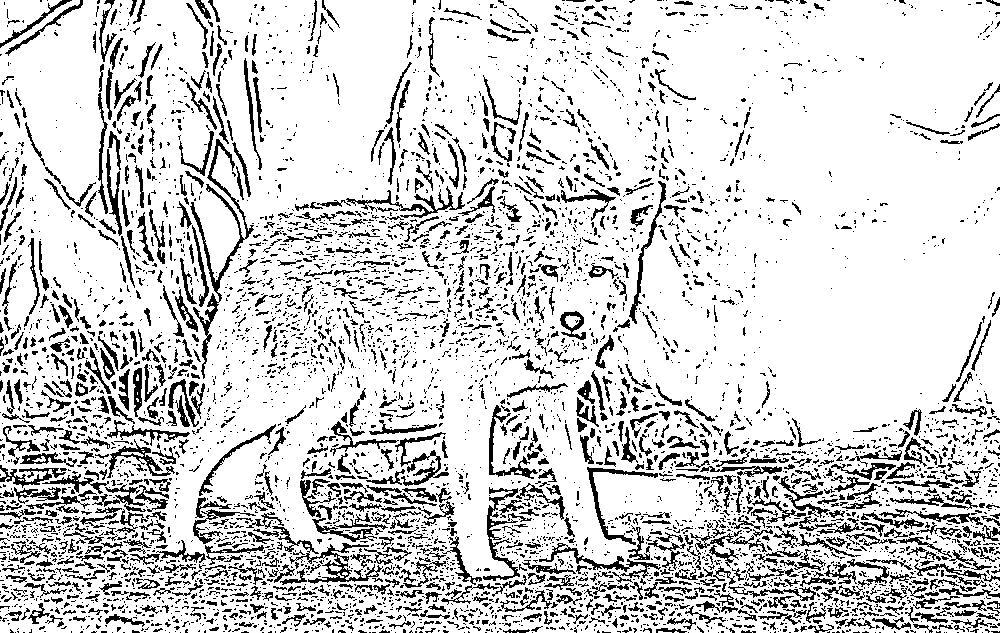

**空相行星的特质：不受束缚，野性，未驯服**

**空相对人格的影响更大，在星图中也会表现出更强大、更显著的影响力。该行星的心理动力需求成为****人生发展的焦点****，行星掌管宫位的事务变得重要。这就像是“空相行星”的声音音量被调高了，要求我们给予更多的关注。**

这些空相行星通常有一种**不受控制的特性**。简而言之，那颗行星有着**狂野的行为**或**野性**，通过星图有力地投射出它的能量。因为空相行星并没有与其他行星通过形成主要相位建立有意义的连接，所以，它不受约束的特质会**过度表现**，具有**强烈的辐射性**。

在这里我必须提到，**即使一颗行星形成了十二分相、梅花相、八分相、补八分相或其他非托勒密的相位，我仍然认为它是空相行星**。这些次要相位确实值得注意，我在分析中也提到了它们；然而，五个主要托勒密的相位是最重要和影响最大的。

当然，**那些没有任何相位的出生行星，没有次要相位或主要相位的连接，总是制造出最大的噪音，而且被最有力地投射出来，因为它们是纯粹的、不受控制的独行侠**。然而，那些与其他行星形成次要相位，但没有形成托勒密相位的行星，也值得特别注意，因为**它们对人生目标的主题更具影响**。

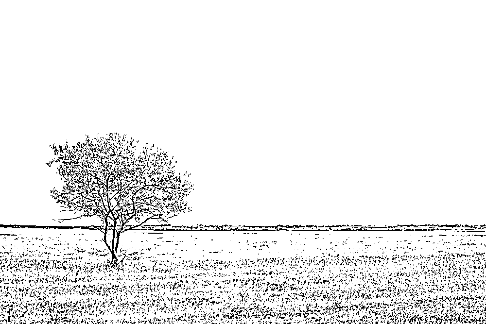

**容许度的重要性**

要讨论哪些行星是空相，我们就必须探讨容许度的问题。当然，**相位容许度的使用因人而异**。我认为找到一个合理的、适中的容许度很重要：容许度太大，相位失去力度；太紧，会感到束缚，不自然。

经过 36 年的实践，我已经找到了一套清晰且舒服的容许度范围，**合相、四分相、三分相、对分相均为 7°，六分相是 4°**。我个人并没有针对日月使用更大的容许度。然而，**容许度是意识的跨度，而不是僵化的规则**。当然我有时候也会明显感觉需要将容许度扩大一点。我**保留灵活性**，这都取决于星图的情况。

在你将这个特殊的“一笔”，即空相行星加入到你的分析中之前，**要确定好合理的容许度**。当代的大部分占星师非常喜欢详尽的参数，常常想要尽可能多的信息来分析。收集大量甚至是超量数据的趋势，在很大程度上是由于我们的占星软件几乎完成了所有的工作。我们容易落入和身陷繁多的参数，这正成为新手占星师面临的真正问题。

我们冒着风险扩大相位的容许度，让我们能够获得更多分析数据。但这样做的后果是削弱或者完全失去了空相行星表达的力度。

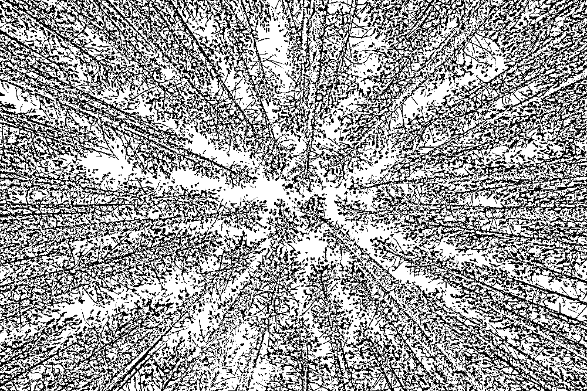

**标记方式**

一旦你采用了“空相行星”的意义并将其整合到你的出生图分析中，我强烈建议你发展一种惯用且**简单的标记方式**，让你一眼能看到。我喜欢在没有托勒密相位的行星相位表的横栏数列中画波浪线。我还会在星图中圈出“空相”，这使我能够迅速认识到独行侠能量的强大和重要性。

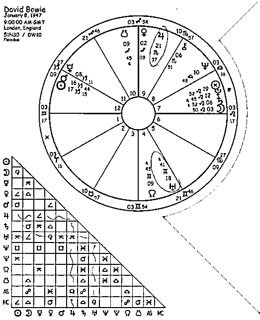

| 作者的标记示例图

我分享的标记示例是我在为咨询做星图准备过程中自觉完成的，只要快速瞥一眼，我就纳入了空相行星的信号，它的声音非常响亮。我强烈建议你用自己的方式标记这些空相行星，让它们可以突显出来。

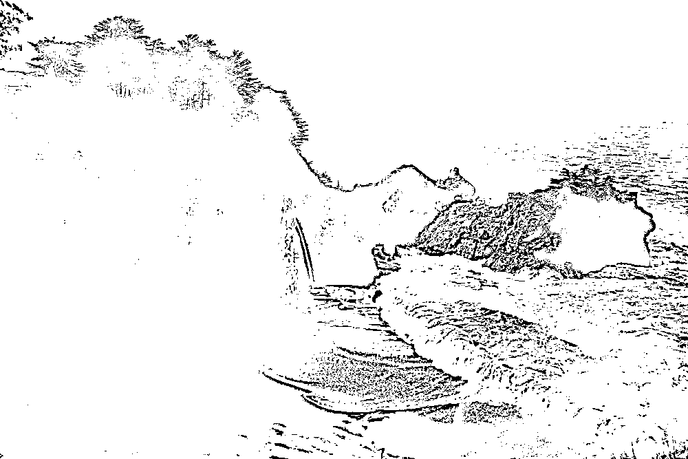

**空相行星的力量**

要理解这颗独行侠行星的力量，理解它对人格和人生目标的影响，最简单的方法是认识到**这个星球的能量频率得到了增强，并会被有力地投射出去**。**如果有积极的方向和有意义的表达出口，空相行星可以成为一项强大的资本，甚至可能表现为一种非凡的天赋**。

当你在分析中加上“**需求**”这个词时，这个解释就变得更有意义了。

举个例子

例如，当一个人**火星空相**时，你可以预测到采取果断行动的需求，根据你观察到的火星星座，将被增强，主导行为。火星的能量会很突出！

我有一位女性客户，她落在**第 7 宫的巨蟹座火星没有形成相位**。这个女人在她的个性中表现出一种**夸张的关爱和养育的能量**。有趣的是，她需要照顾他人，但她的家人却常常认为她急于求成。这位拥有不被认可的火星的客户非常需要通过关心他人来表达自己，这主导了她的个性和她的人际互动。

再举个例子


| 大卫·鲍伊

另一个例子是摇滚明星大卫·鲍伊，他拥有**空相的天王星和木星**。这位标志性的音乐家因其非常古怪和别具一格的迷人摇滚风格而名声大噪。他用自己的个性挑战极限，并因其原创性、创造性和挑战传统的创作而广受赞誉。

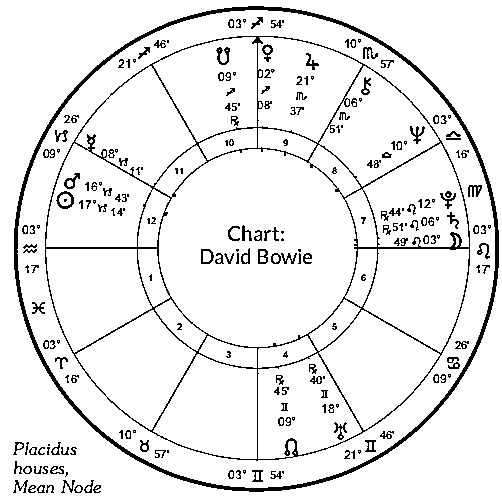

| 大卫·鲍伊出生星图

天王星是大卫·鲍伊水瓶座上升的守护星，这是不是很有趣？他需要与众不同，而不是把“规范”作为他生活目标的一部分。他需要成为潮流的引领者。

鲍伊的“空相木星”掌管着他的中天，这帮助他通过放大他的事业和公众能量来为他赢得名声。他的空相木星落在第 9 宫，在他获得国际认可方面起到了重要作用。

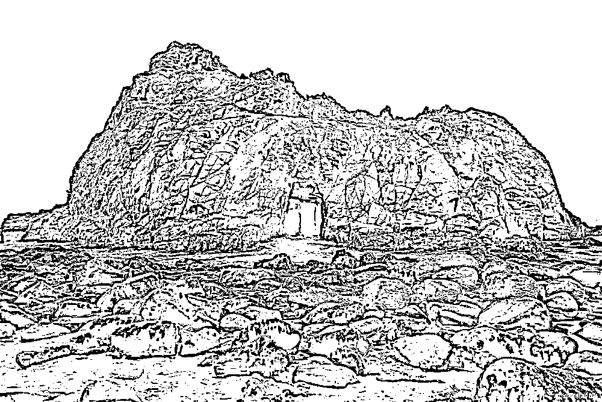

**空相行星的基本概念**

**对于每个空相状态的行星，以下是需要牢记的一些基本概念**：

**太阳空相**

按照自己的节奏前进，在**生活中有一种独特的个人节奏感**。他们常常会有一种不太适应群体的感觉——归属于一个人的部落。**太阳星座的属性将被放大**，它的光芒将照耀并渗透到整张星图的各个角落。有更强动力发展和表达太阳星座能量象征的自我需求。结合太阳星座的风格，也可能有一种强烈的独立工作、负责或处于领导地位的愿望。

**月亮空相**

**与月亮星座相关的需求可以成为人生焦点，并不惜一切代价满足需求**。养育或照顾（月亮星座的风格）的需要可能无处不在，以至于压倒一切。兴趣方向可能涉及烘焙、烹饪、酒店业，或成为“美食家”，或与儿童或家庭一起工作，护理、治疗、照料、养育，并表达对他人的关心。

**水星空相**

**这增加了沟通的需要，收集信息和分析数据的能力，并可能表现为紧张的精神能量，急躁、过度话痨的倾向，以及非常忙碌的心智**。困难可能表现在不知道何时该停止思考、做出决定和采取行动，可能会分析过度或因此导致“分析瘫痪”。有时会有咬指甲或无休止的质疑，太多的水星能量会增加焦虑。这也可能表现为信息上瘾症，收集琐事或层层的事实。

**金星空相**

这表明**取悦和维护和平的需求无处不在**。通常预知他人需求的意识被强化，一种保持领先两步的习惯，清除道路上的障碍，以防止出现问题。不惜一切代价避免冲突，这会使一个人走向“赞成”上瘾。为了确保和谐，可能会有强烈的和解与适应需求。这样的人被认为是善于交际的，经常表现出吸引力和魅力。这也暗示了对美的强烈需求，并且经常在职业选择中伴随着艺术或创造性的表达。

**火星空相**

**强烈需要在火星星座的风格中表现出自信力**。卓越的销售、广告、营销或促销能力，有时与一项“值得为之奋斗的事业”有关。领导力被强化，持续的行动需求带来的掌管的欲望。可能拥有强大的体能，快速的反应，和强大的执行动力；有时候他们具有强大竞争力，并伴有强烈的“反击”反应。

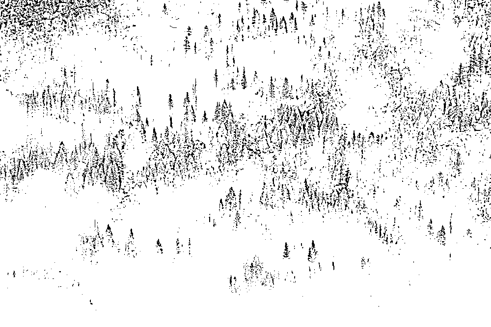

**木星空相**

**人生目标通常由精神、哲学、道德、利他主义或理想所主导**。可能拥有高度的热情、天生的乐观精神——有影响力的拉拉队长的人格，通过运用积极向上、富有感染力的能量来鼓舞人心。

**土星空相**

**土星空相意味着对系统化和战略性的生活方式有耐心。**这也强调了父性原则、拥抱传统、热爱历史、遵守规则、尊重秩序和等级制度。也可能怀有**强烈的自律和野心**；可能有承担太多责任的倾向，以及容易内疚。

**天王星空相**

**鲜明的个性**，自然而然地抨击了权威和权势集团。他们往往**强烈渴望自由和冒险，具有狂野和不可预知的天性**。叛逆的需求挑战了权威，挑战了规则。一种神经电流可能流经身体，可以表现为焦虑或多动症，这也可以加快身体的反应，提高运动能力。他们与众不同，强调独特的自我意识，以及生活在“边缘”的强烈需求可以带来巨大的快乐。也可能具有强烈的创新动力和对人道主义以及被视为社会进步的事物的渴望。

**海王星空相**

理想主义，通过人格投射出来的梦想或理想。**预示着强烈的敏感性和同理心**。可以增强创造力、直觉，也象征着灵性、音乐或艺术能力。感知很容易超负荷，对冲突产生恐惧反应。他们可能会体验到对和平与和谐的普遍需求，与大自然建立特殊的联系。可能容易有上瘾症，渴望做梦并通过自己用药逃避现实。这种能量可以导向谦卑、牺牲、服务与慈善。他们有远见卓识，通过设计、艺术、电影或音乐表现出来。这也可能表现为隐蔽或秘密活动的特殊技能。

**冥王星空相**

他们有着驱动力，出类拔萃的动力，极强的自主；是力量和权威的本能投射。个人力量需要导向强烈的、激情的和专注的管道和方向。可能与大型组织、政府或政治有着特殊的联系，具有足智多谋、研究、深入调查和解决谜团的才能。经常有与名人、权势或影响力人物接触。

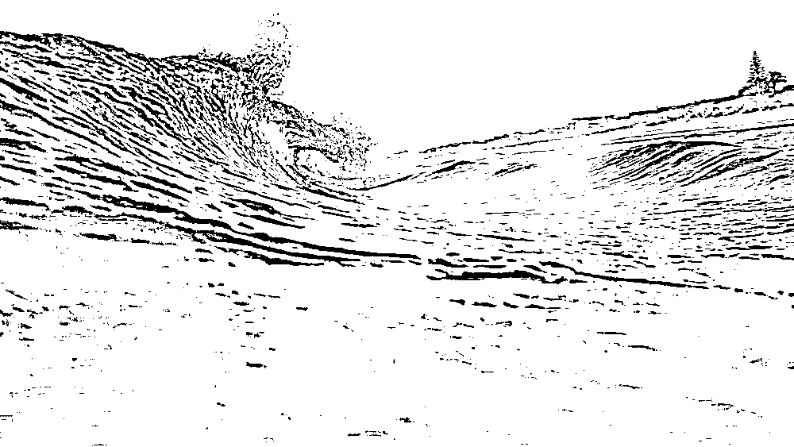

总而言之，当我们将空相行星浓墨重彩的一笔加入到星图分析中后，事情会变得更加简单。**与其试图驾驭和控制这样特立独行的行星，也许我们应该将不受约束、未被驯服的能量引导到积极的活动中**。在人生中很多时候，这样做会打开一扇通往才华和天赋的希望之门。空相行星，拥有独立的频率，想要用响亮而清晰的声音歌唱。我建议**我们只是倾听、欣赏并与之合作**。

**你有空相行星吗？**

**你有什么样的感受？**

**留言区等你～**

”

**版权声明：**本文由若道翻译发布，欢迎转发，反对抄袭。友号转载请申请白名单。


**凯西·萝丝**

自 1984 年起就作为职业占星师为全世界的客户提供直觉式、富有洞见的占星咨询。

**两位大占星师领你系统学习占星学**

************点击图片查看详情************


**微信又又又改版啦，不想错过若道的推送？**

**就把若道设为星标吧！**

**▼**


就是这个“在看”，戳戳戳 ☟

********报名直达入口********


# 琳恩·贝尔亲密工作坊现场回顾丨感受知识与爱的流动

> 原文：[`mp.weixin.qq.com/s?__biz=MzA5NjA0NTAxNg==&mid=2651412090&idx=2&sn=29445bb0a52b09b86ab3657318445da1&chksm=8b4be4cdbc3c6ddb4a0c5f997084edd343307390ea2ede41facca41de9a12a2b0d53048af95c&scene=126&sessionid=1692738247#rd`](http://mp.weixin.qq.com/s?__biz=MzA5NjA0NTAxNg==&mid=2651412090&idx=2&sn=29445bb0a52b09b86ab3657318445da1&chksm=8b4be4cdbc3c6ddb4a0c5f997084edd343307390ea2ede41facca41de9a12a2b0d53048af95c&scene=126&sessionid=1692738247#rd)

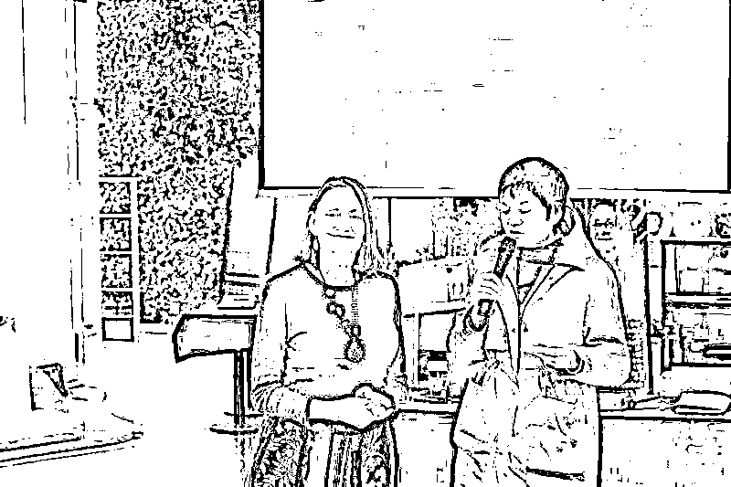

11 月 30 日，在万众期待下，世界上最受欢迎的占星学演讲者、作家和老师之一——琳恩·贝尔(Lynn Bell)的亲密关系工作坊拉开了帷幕。

这位睿智又幽默，独具法国风情魅力的老师，通过场上十个精彩的案例，向我们全方位地展示了亲密关系的光芒与阴影、危机与转化。

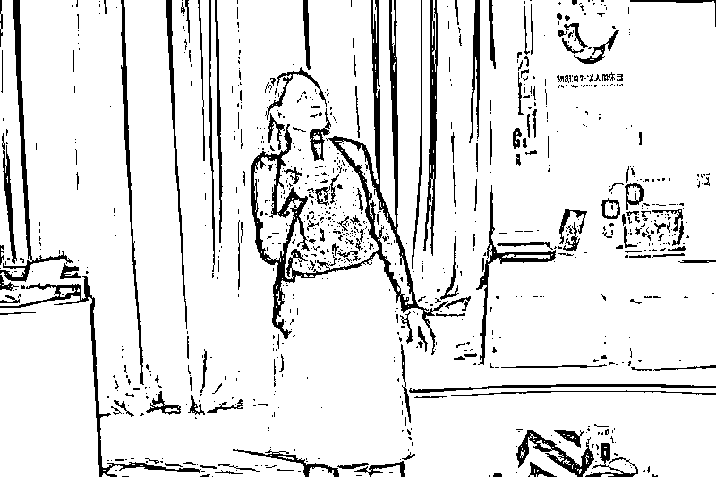

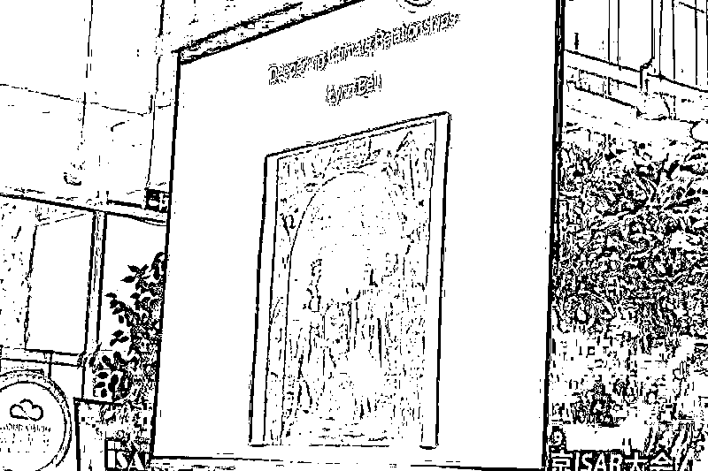

**“一次次的跃入火焰，如果能够爬出灰烬，就能激活太阳和月亮的对话。”**

**“欲望是让人能够起死回生的事。”**

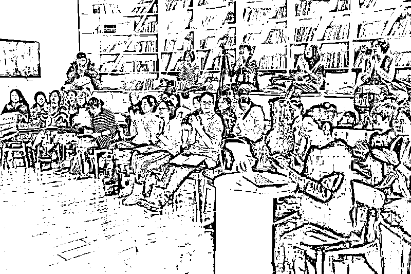

**“占星学对于关系有个理想化的观点，就是同元素的星座会比较相配，比如天蝎座和双鱼座。但是，我是双子座，我年轻的时候，我遇到其他的风象星座，我觉得一点都不吸引我。我和他们会相处很好，但是那个不是我真正想要的东西。对于完美关系有一些理论，有些人会爱上青梅竹马，并且持续一生，这是一种幸运。但并不适用于所有人。你要看你的星图中有什么配置。”**

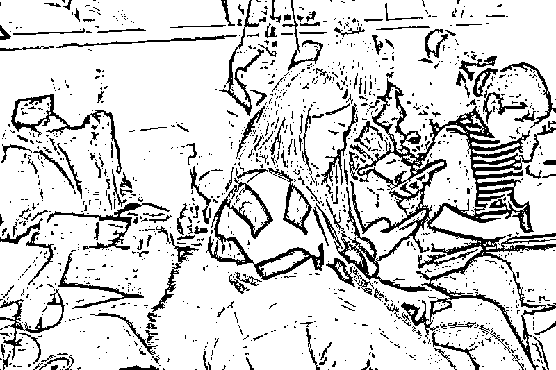

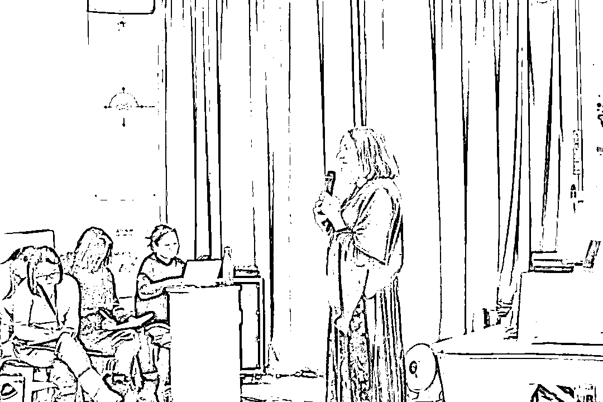

**“关系意味着什么？****不是所有人都会在关系中烧成灰，有些人落地，有些人溺水。****如果我们够幸运，两个人会在火焰里待一段时间，然后我们就会产生太阳和月亮之间的对话。****我们必须经历内在的转化，也可能是业力。****对于所有关系都是一样。****我们要唤起的东西，仅仅属于我们和这个人之间独有的东西。”**

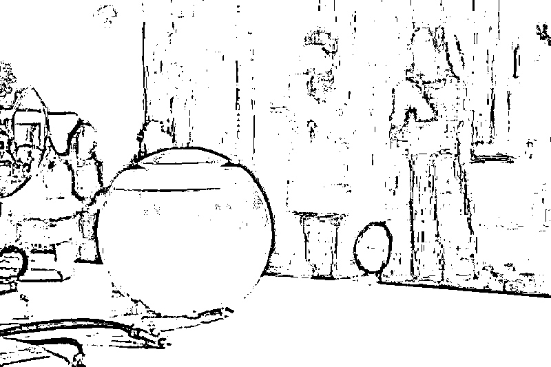

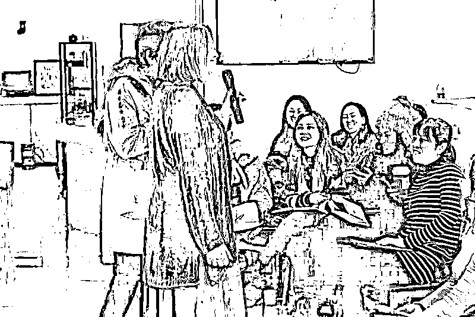

**“当金星合相南交点的时候，会给你一种感觉，就像是上辈子认识一样。”** 

**“太阳落在 12 宫，你小时候的体验可能是没人看到我。你知道少了什么，但是当你真的去体验之前，你不会知道到底缺少了什么。”**

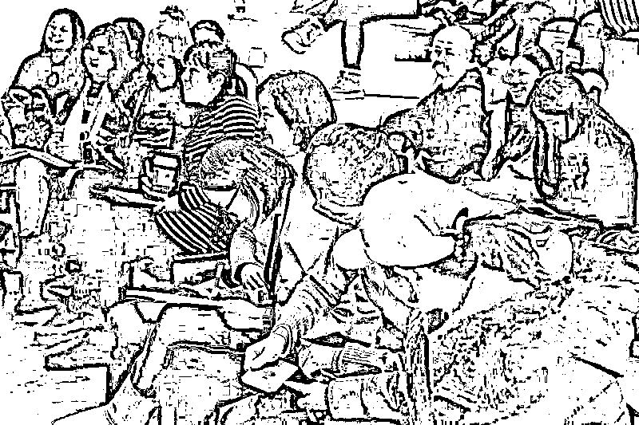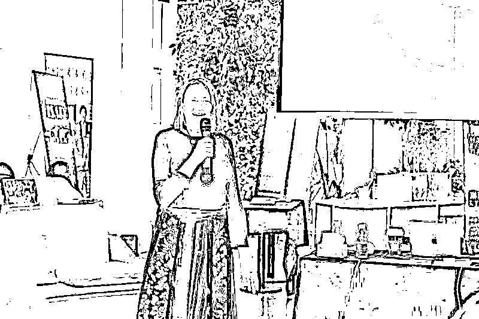

**“土星代表我们对人生精疲力尽的地方，当对方的太阳进来了，我们的土星终于感觉到能够轻松一些，太阳能够带走土星的一些疑虑。****土星的解药就是太阳。****”**

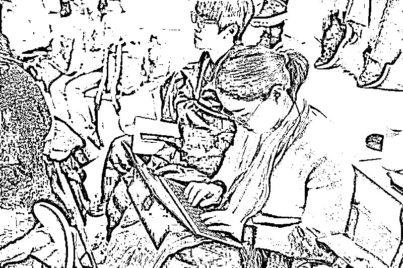

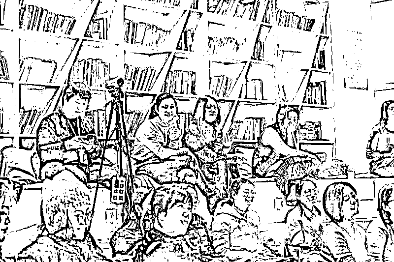

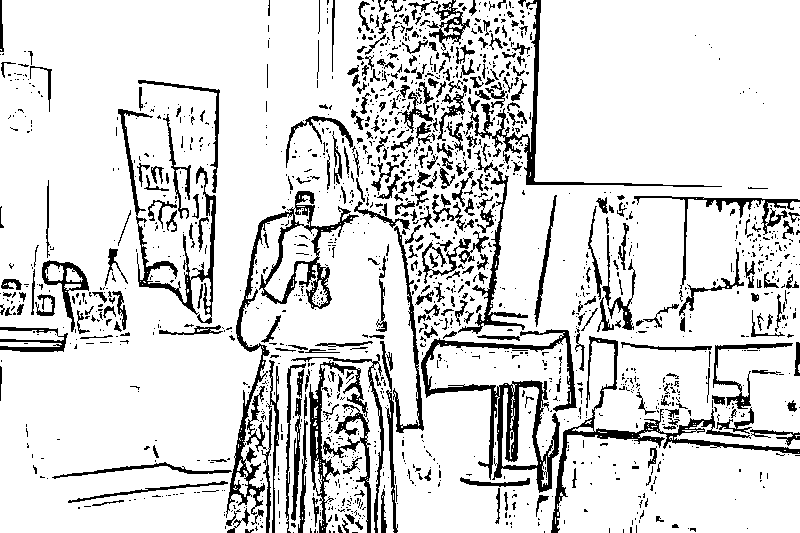

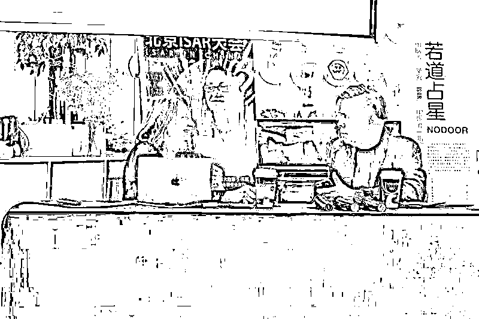

工作坊间隙，大家纷纷与琳恩·贝尔老师签书、合影，与这位国际大师的亲和和包容近距离接触。都能从中感受到来自于她的力量，从而得到抚慰和照拂。

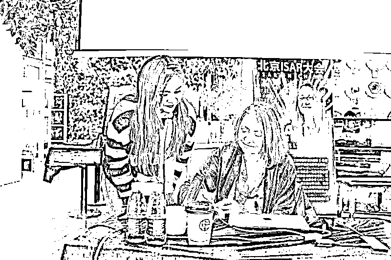

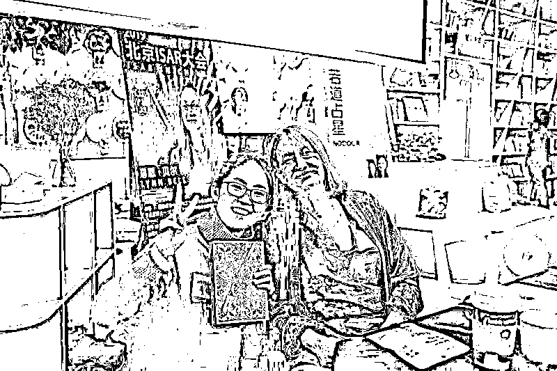

美好的时光匆匆过去，但是记忆都留在我们的心底。再次翻出来的时候，依旧能温暖和照拂着我们。

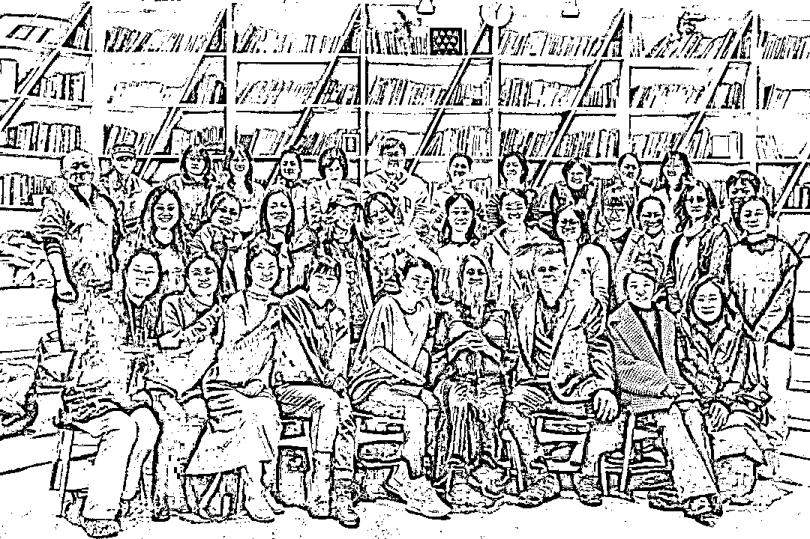

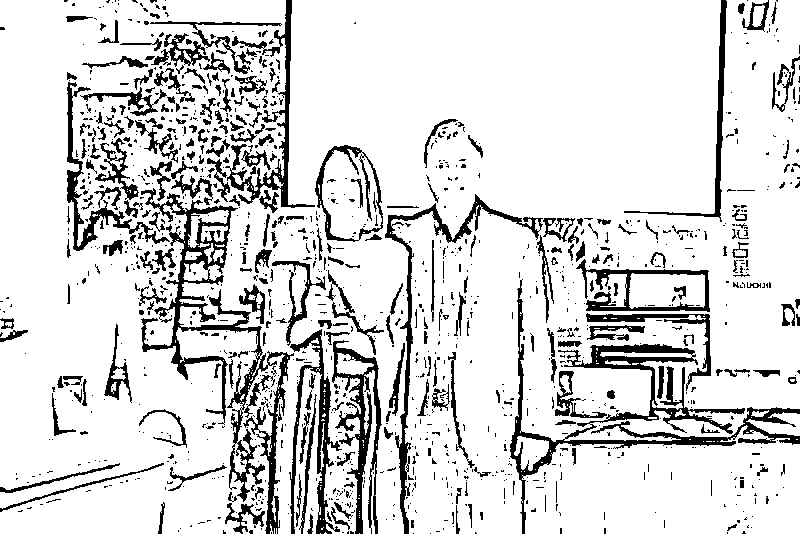

期待再相遇。

# 木星进摩羯座丨土冥合相进入尾声，木星助你通关

> 原文：[`mp.weixin.qq.com/s?__biz=MzA5NjA0NTAxNg==&mid=2651412090&idx=1&sn=342a68665492802574f06f9a78618602&chksm=8b4be4cdbc3c6ddbf8300d6a86b7b61b4ecb64fd74372547a6bfba830f05b074c9bc1204e3b6&scene=126&sessionid=1692738247#rd`](http://mp.weixin.qq.com/s?__biz=MzA5NjA0NTAxNg==&mid=2651412090&idx=1&sn=342a68665492802574f06f9a78618602&chksm=8b4be4cdbc3c6ddbf8300d6a86b7b61b4ecb64fd74372547a6bfba830f05b074c9bc1204e3b6&scene=126&sessionid=1692738247#rd)

******************☆ **************后台回复“今日”，给你一句生命态度****


作者/Serina Sun ISAR 认证占星师编辑/玫瑰 图片/unsplash**木星进入摩羯座**2019 年年末，**木星于 2019 年 12 月 3 日凌晨告别射手座，正式进入下一个星座：****摩羯座。**
总感觉木星在射手座的位子上还没坐热，就迎来了告别的时刻。今年这个冬天，相比往年，似乎来得提前了，温度降幅也更大，真是应景了木星换座到摩羯座的基调——像是从盛宴的觥筹交错一下子转到了严肃低调的务实主义。
2017 年年底土星进入摩羯座，开启了土星与冥王星行进于摩羯座的周期，土冥合相效应持续 3 年，于 2020 年年底结束。它带来了**优胜劣汰，破旧立新**的环境变革，我们感受到的是压力，喘息困难，情绪内缩；而能够帮助我们撑下去的，便是木星带来的**乐观、慷慨的鼓励**。3 年里，**木星依次行进在天蝎座、射手座、摩羯座**——在这场土冥合相马拉松里程中，位于不同星座的木星，像极了一根根接力棒，在我们觉得太辛苦，想要放弃认输的时候，给我们激励。**木星在天蝎座的功课**

**2017 年 10 月 10 日到 2018 年 11 月 9 日，木星行进在天蝎座。**

天蝎座擅长**对真相的深挖、揭露、摧毁和重建**，木星落到了这颗不喜欢掩饰和虚荣假象的星座中，会更加鼓励这种深入和激烈的风格。

在心灵层面，我们对生命的实相产生探究的欲望。

**如果今天是生命的最后一天，你想怎样来活？**当开始思考这个终极问题，自欺欺人的念头都会被理性照见。很多人像是突然被某种真相戳醒，宁可撕开血淋淋的伤口图个痛快对得起自己的内心，也不愿再维持着不疼不痒的“和谐”关系，或者浑浑噩噩按照别人喜欢的方式过着自己的生活。我们从天蝎座的原型中，学习**潜入黑暗**，尽管这个过程伴随着**剧烈的恐惧感**，但就是有一股驱力，不断地推着自己，再深点，再深点——这正是来自**木星**的推动力量。木星自信、乐观，即使在最充满疑虑、缺乏安全感的天蝎座，我们在做某些选择的时候，仍然感受到一股莫名的直觉牵引——**勇敢地去选那条最黑暗、最复杂的路吧，或许事情没有想象中那么糟糕，又或者，拐角处，就会看到希望的曙光。**

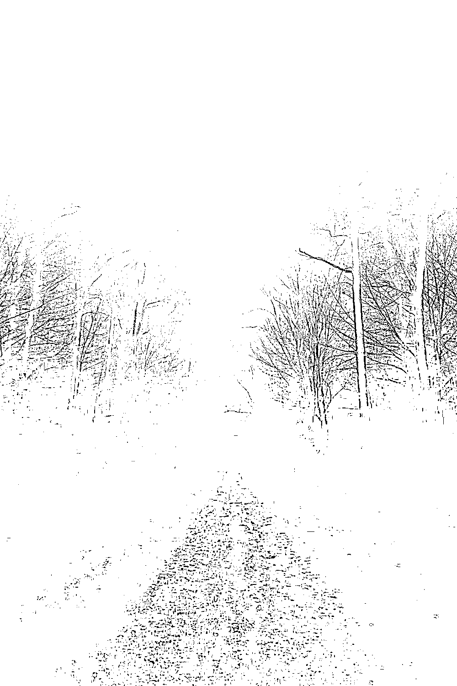

这就是木星在天蝎座时，我们内心所经历的转变，如同看一部精彩的恐怖片，明明害怕，却忍不住想要去钻入悬疑的剧情。有的人，在 2018 年尝到的是**关系中的苦果**，比如遭遇背叛，或者发现了不堪的秘密等；也有的人遭遇的是**金钱、投资方面的考验**——在有关**灵魂业力、亲密关系、资源共有**的领域，如果存在**虚假、欺骗、漏洞**，都会被木星的效应**放大**。

在土星与冥王星做主角的这几年里，通往成功的法则，是**把有限的精力专注到让自己可以全情投入的领域上，精耕细作。**

土冥天象下的危机，逼迫我们**做减法，把多余的诱惑都砍去，使我们得以保存能量，高效做事**。木星在天蝎座行进的 2018 年，我们学会了时刻**与危机、无常共舞**，并且在极度的恐惧中，学习**求助于一股超越于我们个人能力之上的更大力量**，无论称之为信仰、信念还是别的什么。我们从木星精神中学习到了筛选出可行的目标，继续充满信心地前行。

**木星在射手座的功课****2018 年 11 月 9 日，木星进入射手座**。木星在射手座的 2019 年，共三次与行进在双鱼座的海王星形成四分相。

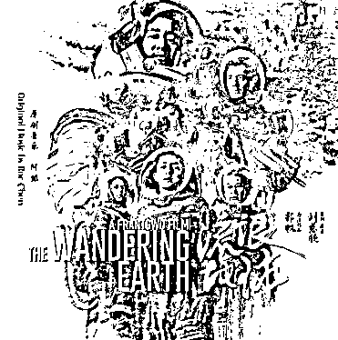

| 《流浪地球》2019 年一开年，《流浪地球》就显化了人类的集体潜意识，我们向心灵发问，渴望寻找人与宇宙关系的真知、智慧，也对未来何去何从产生思考。海王星与木星的相位，帮我们打开了更大的脑洞。在海王星的世界里，没有什么是不可能的，只要敢想，除了尊重现实世界中土星所掌管的物质法则，我们还要有**做梦、追梦**的精神。

著名哲学家叔本华曾说过：**“我们的生活样式，就像一幅油画，从近看，看不出所以然来，要欣赏它的美，就非站远一点不可。”**

木星射手座需要的正是不断往远方走，再回头看看现在所处的环境。读万卷书，行万里路，木星射手座心中的远方，或许是一个**伟大的目标、人生愿景**，或许是**远在异国他乡的某个情怀**，或许是**在知识的浩瀚海洋里闪烁着的某个信念**。

然而，木海四分发生的大背景是土冥合相，海王星的梦是缥缈的，一不小心就镜花水月一场。土星的统治是严苛的，他总要拿现实的残酷，去检验梦想是否靠谱。相信我们都有过这样的感受，时而觉得自己这一生总该去成就些什么伟大的事情，时而又对眼前现实俯首称臣，前一秒觉得使命感、格局很高大上，后一秒就要为现实中柴油米醋而苦恼，这种对立的矛盾，于 2019 年更加明显。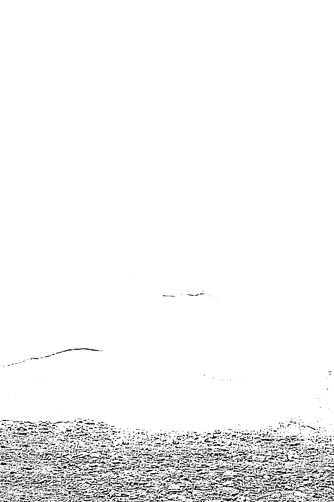

就像脱口秀演员张博洋在 2019 年的《脱口秀大会》第一期节目里的吐槽：


**宇宙那么大，银河系算啥。银河系那么大，地球算啥。**

**地球都已经 45 亿年了，我这辈子算啥。**

**不行，从今往后，我一定要自由快乐地活着。**

**这个时候一看手机，我去，两点了，睡觉睡觉。明天还要上班呢，想啥呢我。**

**你们能理解那种矛盾吗？**

**我对宇宙是如此的渺小，我对公司却如此重要，有多重要，不去上班，就扣我钱。**

**脑子里永远同时存在两个问题：一，宇宙为什么那么大？二，今天中午吃点啥？**

**我对彻底解决第二个问题，仍然抱有一丝幻想。**

**人生短暂，我还是想把我有限的时间，再多留一些，在思考第一个问题上。**

**当然了，谁，又不想？**

我们无力改变大环境，却可以**改变自己的心态**。经济萧条时，口红反而被追捧，这说明追求美好的心，无论世道多么艰难，都无法被囚禁。海王星鼓励着木星，梦可以再做得大点，因为梦永远是一种最好的精神疗愈。

所以 2019 年的我们，似乎都学会了**苦中作乐**。在有限的空间里，即使不能大展拳脚，内心却仍然会对诗与远方怀有梦想。

**沉下心来修炼心性，学习读书，以及适当增添一些生活的小情趣、小奢侈**，木星射手座给了我们很重要的启发。

孔子曰：**“学而时习之，不亦说乎？有朋自远方来，不亦乐乎？人不知而不愠，不亦君子乎？” **

经常温习所学的知识，依靠终身学习来正心，形成正念，用智慧指导行为。有志同道合的人从远方来，我们相互学习，在交流中形成网络，搭建社交资源，更重要的是，允许多元文化的共存，取长补短。别人不了解我但我不生气，不也是道德上有修养的人吗？**去除强烈的我执，成为一个真正谦逊的人**，才可能对真正的知识产生洞见，成为一个有品格的人，才有可能成为一个对社会有价值的人，带动集体的身心灵发展，提升维度。

木星射手座原型中的**知识、道德、境界与修养**，在这段话里被提的通透。

**我们不仅要遵守土星制定的现实法则，也要怀揣木星精神，保持开放的态度，学以致用。以如此的理念去学习，成长，在一条传统的道路上低调、勤劳前行，最终会得到土星的嘉奖。**

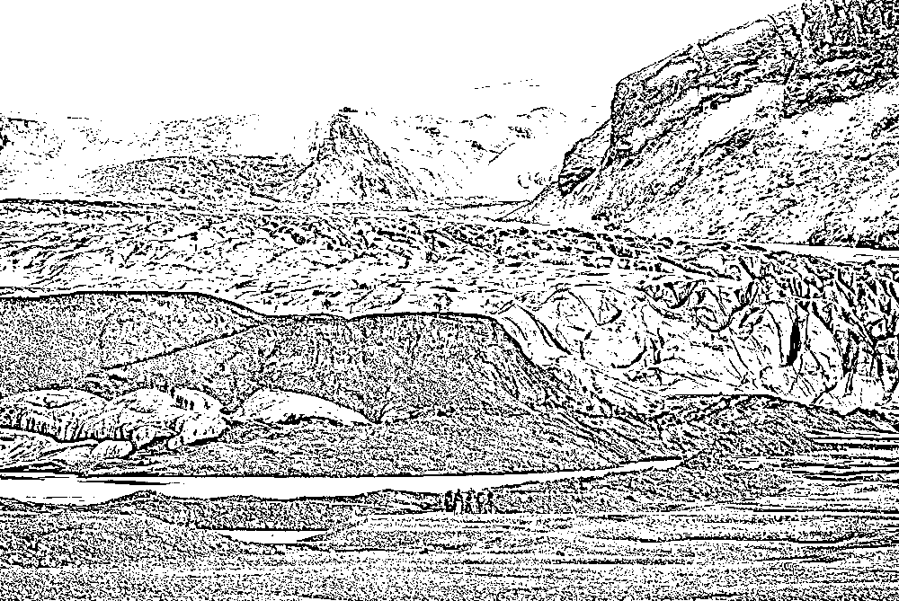

**木星在摩羯座的功课****2019 年 12 月 3 日 2:20，木星会正式离开射手座，进入摩羯座。**

自此，木星从**天蝎座的深度挖掘**，到**射手座的观念升华**，将接力棒传递到摩羯座手上。我们要在 2020 年，学习**在传统、纪律与规则当中，开拓辽阔的思想领地**。

古典占星学中，木星在摩羯座落陷（无法充分发挥星体的能量）。想一想摩羯座的特质，也不难感受到木星落在这个星座的**无力感**。

摩羯座由土星守护。土星擅长的是**制造边界，树立权威，严格遵守结构秩序。**由土星守护的摩羯座，**内敛、稳重、保守和严肃**。乐观慷慨、喜欢扩张的木星落在如此“不解风情”的摩羯座，像是被打入了冷宫，满腔热情无处安放。木星在摩羯座受到很多限制，它在发挥其功能时，也面临诸多挑战。在摩羯座眼中，现实世界一切皆因**世俗利益、价值、权力**所驱使，因此在讨论生命的意义、诗与远方这些宏大又抽象的概念之前，摩羯座会提出它最关心的问题：**“我们是否具备足够的能力，脚踏实地地经营好一段关系，建设好一个家庭，并且在事业上实现成功？”只有在世俗中证明自己的价值，满足金字塔底层需求后，才能探讨自我实现及灵性成长的**——保守派的摩羯座会时刻提醒木星这个规则。在木星行进于摩羯座的日子里，我们需要做到**因地制宜**，学会**向内整合**。一个较为有效的方法是：**取摩羯座之长（建设性影响），避摩羯座之短（消极性影响），将土星精神的高阶能量吸纳进木星的世界。**

木星此时开始学习**在逆境中成长**——行进在射手座的木星夸下的海口、铺张浪费掉的资源、设立的过高期待等，需要进行能量平衡调整了——俯下身子，**学习摩羯座的低调、谦卑、务实。**

如果整合工作完成的好，在摩羯座精神中不断校准的木星将变得更加**理性、均衡，既怀揣先天下之忧而忧的情怀与志向，又能够如是地接纳入世生活，不带有自欺的夸大与理想化**。遇到了现实挑战时，木星将脚踏实地地寻求解决具体问题的方法，而不是只会好高骛远的讲理论。

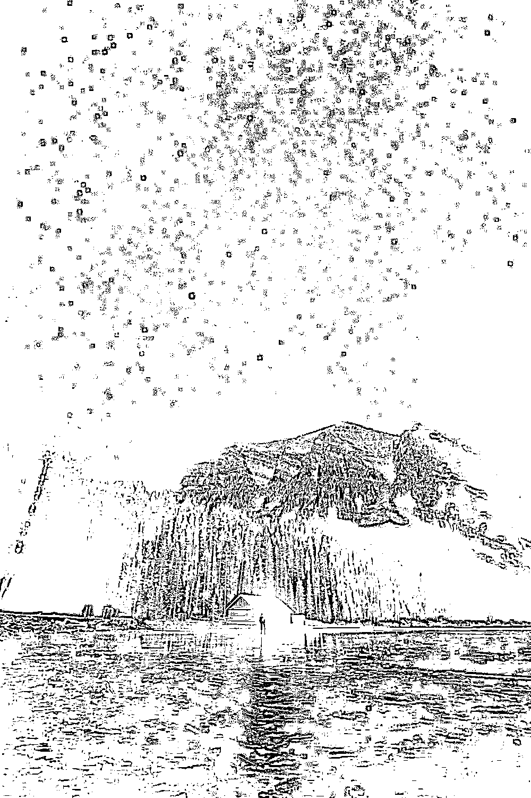

这里谈论的是最理想化的整合结果。现实来看，土冥合相天象之下，功课非常有挑战性，从木星行进于摩羯座的轨迹便可见一斑。

*   **2020 年 4 月 5 日**，木星与冥王星合相于摩羯座 24 度 53 分；

*   **2020 年 5 月 14 日**，木星于摩羯座 27 度 14 分开始逆行；

*   **2020 年 6 月 30 日**，逆行中的木星与冥王星合相于摩羯座 24 度 06 分；

*   **2020 年 9 月 13 日**，木星于摩羯座 17 度 24 分恢复顺行；

*   **2020 年 11 月 13 日**，木星与冥王星合相于摩羯座 22 度 51 分，之后，木星继续追赶位于摩羯座尾度的土星；

*   **2020 年 12 月 15 日**，木星与冥王星以微小的容许度合相于摩羯座 29 度，这个合相会持续到 18 日土星离开摩羯座进入到水瓶座。

2020 年，木星会在冥王星与土星之间数次辗转，与冥王星形成三次合相后（关键度数为 24 度、22 度），最终与土星形成合相。本来就内部功课重重的木星，在土冥两颗行星的洗礼之下，会经历怎样深刻的向死而生，可想而知。如在其上，如在其下——2018 年-2020 年，地上的人也同步体验着木星三种不同风格的转换——**从激烈到乐观，再到务实**。我们与木星之间的联结比以往更加强烈，因为越是困难的日子里，越是需要木星这个精神领袖带领我们穿越黑暗。这不禁让我联想起电影《一代宗师》中的类似场景，宫二转述了宫羽田的一句话，练武人的三个境界为：**“见自己，见天地，见众生！” **

这三个境界，像极了木星从天蝎座到摩羯座的三种经历：木星在天蝎座，我们“见自己”，**深入潜意识，联结真实的自己**；木星在射手座，我们“见天地”，**思考自我与宇宙之间的关系，拓宽心灵境界**；而木星在摩羯座，我们“见众生”，开始觉醒，无论离开多远，最终决定灵魂是否进步的标准，在于能否**接纳俗世生活中本来如是的样子**。

木星在射手座的阶段，我们畅游在信仰、境界的洪流中，如果以为这样是“得道”，就落入了木星布下的陷阱。反而在木星落陷的摩羯座阶段，我们得以**抛开诱惑，将灵感、知识转化成实实在在的成果，并保持下来，**这正是土星的积极意义。能够在起起伏伏的红尘中保持正念，**大隐隐于市**，是应对土冥合相的无上法宝。


**上天给人一份困难时，同时也给人一份智慧。**

**——雨果**

2020 年是土冥合相周期的最后一年，全新的秩序、权力平衡正在逐渐显露。木星在摩羯座将教会我们**回归质朴、明心见性**，在即将到来的 2020 年里，期待这一切的发生！

**版权声明：**本文由作者授权发布于若道，欢迎转发，反对抄袭。友号转载请申请白名单。


**Serina Sun**

ISAR 认证占星师（2016 年获得）

曾任跨国企业品牌公关职业经理人

现居纽约，专注占星个案咨询与教学

**微信公众号**：宸时星语

**个人微信号**：yanniesun2010

长按打赏


******点击图片查看若道君推荐******


**微信又双叒叕改版啦，不想错过若道君的推送？**

**就把若道设为星标吧！**

**▼**


就是这个“在看”，戳戳戳 ☟

********报名直达入口********


# 重磅 | 2020 年主宰天象：如果我们能绝处逢生，就能崛地而起！

> 原文：[`mp.weixin.qq.com/s?__biz=MzA5NjA0NTAxNg==&mid=2651412032&idx=1&sn=d0a173cb2fb9e4cc9277debb8fd67cb2&chksm=8b4be4f7bc3c6de1e54100ccaa61958dd054a841b07bd39b7e03211a4008a0853b1fd0e54d1f&scene=126&sessionid=1692738247#rd`](http://mp.weixin.qq.com/s?__biz=MzA5NjA0NTAxNg==&mid=2651412032&idx=1&sn=d0a173cb2fb9e4cc9277debb8fd67cb2&chksm=8b4be4f7bc3c6de1e54100ccaa61958dd054a841b07bd39b7e03211a4008a0853b1fd0e54d1f&scene=126&sessionid=1692738247#rd)

********************☆ **************后台**********************回复“今日”，给你一句生命态度********************

文/李妍（理想国的女巫） 编辑/Tang
封面/书君 图片/网络 作者提供“

**每一个在心灵和灵性世界获得大成功者，**

**从不会让双脚和意识离开物质实相界，**

**因为那是生命展开修行的最佳圣地。**

**——李妍（理想国的女巫）**

”

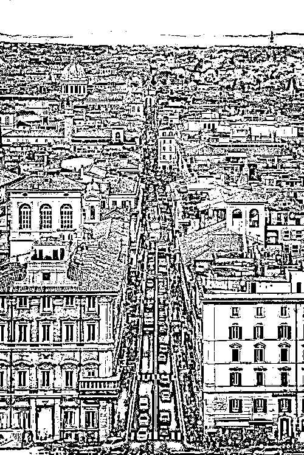

**最深最真的真相**

当一个事物或人的能量要整体上一个大台阶之前，通常会伴随着**强大的不易**，甚至是**艰难**。同时还会混着某种**激烈**和**动荡**。

这是因为不易和艰难会让我们开始**主动寻求变化**，以此带我们远离早就毫无生机，只是依靠着惯性展开的人生。

激烈和动荡能让我们变得**警觉和清醒**，得以调动身体和意识里沉睡的细胞，强大的内在潜能会从中醒来。

在这过程中，我们的头脑会感到焦虑，身体会感到不适，内心会涌起恐惧，**但****灵魂却在起舞**。

这是为什么？

**因为灵魂总是知道最深最真的真相。**

 

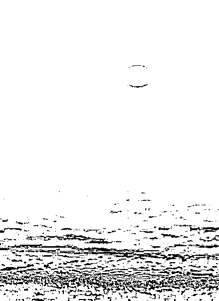

**2020 将如何续航不那么容易的 2019？**

**每一个从凌冽的寒冬中挨过来的人，都将会领略更加盎然的春色。**

**每一个从暗夜的深渊中爬出来的人，都将更能体会到生命的壮丽。**

2019 年则是那个看起来不那么容易，但却拥有着强大的蜕变之力的年份。从年初开始，我们就在经受着土星与冥王星和南交点合相在摩羯座给我们带来的**现实挑战和考验**。

我们一边面对着经济整体发展放缓收缩带来的现实挑战，一边冉升起强大的斗志和意志力来面对人生的不易。

**我们深深地感知到一股重大而深远的蜕变之气正在我们的周围和生命中发生着。**

**而****这份深远的蜕变，将在 2020 年迎来一个更为极致的高潮****。每一个渴望看到生命极彩之光的人，都将会为之惊叹。**

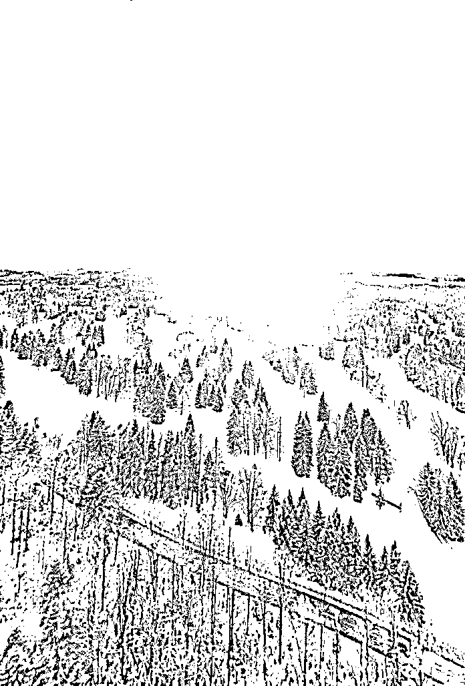

 

**群星齐聚摩羯座是 2020 年天象的主宰**

**2019 年 12 月 3 日，木星将换座进入到摩羯座。它将会与土星、冥王星和南交点，以及火星一起，共谱一场关于摩羯座的大戏。****这场大戏也主宰着整个 2020 年的趋势****。**

**关于传统，关于法规，关于权利，关于界限，关于责任，关于职业，关于信念，关于使命。**

木星的本质是成长，是发展，是扩张，是得到提升和飞跃。它所触及之处，会将事物本身的原有质地扩大化的呈现出来。**无论原有质地是积极正向，还是消极负面。**

所以待木星进入摩羯座，**会将聚集在人类无意识低端的****矛盾和恐惧****、****力量与光辉****（土星、冥王星合相摩羯座）全面激起。**

**要么迎向如凤凰涅槃一般的重生，要么毫不忌惮地走向毁灭！**

所以在此我不仅仅只想单独论述木星进入摩羯座带来的单一影响力，我们需要**将它放进一个更大的宇宙天象对于人间景象的作用力中**，才能真正的带来有力的预见（遇见）。

**给 2020 年的我们带来的影响**

**现在我们分别从以下几点来展开了解木星与土星、冥王星、南交点，以及火星在摩羯座共同带来的影响**：

**整体经济形势或将进一步探底**

2019 年土冥合相在摩羯座带来的最为直观的影响是：**整体经济发展放缓**；有的行业甚至带来大萧条，如重工制造业的汽车行业，或房地产行业。

而随着木星进入摩羯座对于土冥本有的问题带来更大的刺激，整体经济的发展**或将进一步探底**。更多行业和企业的发展感到举步维艰，生存困难，或引动更大的发展危机。

**但是！**

**木星与土冥的合相，也可以代表经济在极冷之地迎来一次绝地反击，触底反弹的机会**。

如国家出台的新政策对于某个行业的发展带来整体利好，或企业内部重组和转型带来的新机遇，将企业从危机中突破出来，曙光显现。

**法律制度得到完善，行业规范得到提升**

木星和土冥都在摩羯座，会**大力推动法律法规的完善**。

各行各业的制度也将变得规范，相关部门会加大力度进行**行业风貌的整治**。

在人类的集体意识还没有发展到可自我约束的阶段，完善的法律和严厉的制度或许是文明社会得以持续和深化的基石。

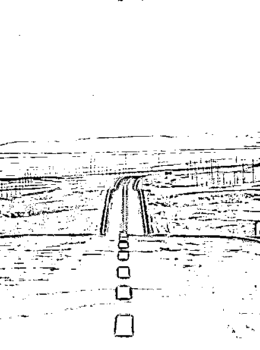

 

**全民走向更有规划和节制的生活理念**

在天王星金牛座和木土冥合相在摩羯座的综合影响下，人们会越发的发展出**更有节制的消费观念**。

**理性消费，环保节能**，为自己**制定更加长远的职业发展规划和财务规划**会是人们接下来逐渐发展出来的一大意识。

同时，木星与土冥合相在摩羯座的时候，大家也可能会更愿意**为“面子”买单，购买大众公认的主流商品**。奢侈品行业或将迎来一波上升的发展趋势。

**社会责任感加强，意识开始破圈**

在木星和土星都在摩羯座的周期下，会让人们更加意识到**自己与集体、自己与社会、自己与国家之间的关联**。

**更多人的意识会从自我和家庭的小圈里延展到更大的集体社会意识圈中。人们的意识开始破圈。**

会将自己的个体生命更加紧密的与身处的集体、社会、国家和岗位相连。意识到在发展独立的自我之外，我们也**对共同所生长，所存在的这片土地拥有一份责任和使命**。

**本就高亢的进化火把被再次点燃**

**2020 年 3 月，火星会和木星、土星、冥王星合相在摩羯座。这是一股非常凶猛强盛的能量。**

**火星会再次高亢地燃起木土冥在摩羯座的深度进化和觉醒的决心**。

这会激起人们内在主观意愿和外在客观事物的震动频率。以激昂专注，势不可挡的态势推动事物实际层面的发展。要知道，**摩羯座是土象星座，从不会把事物的发展停留在悬而未决地臆想层面上，它要的是一个落地的结果和答案。**

然而，这个天象也容易引发我们不想看到的暴力和流血事件。

**当能量被正向运用的时候，就会带来正向的结果。如果被错误的使用，就会带来破坏性的呈现。**天象从不会和人们说“我是好或坏的”，它说：“我就在这，看你们如何解读我，如何运用我。”

**是恐惧的放大，还是潜能的释放？**

在木星摩羯座对土冥摩羯座的强力催发之下，会将掩埋在集体潜意识中的**生存恐惧**和**历史伤痛（**土冥摩羯座）更放大化地（木星摩羯座）带出水面，**得以机会释放和获得疗愈**。

同时也会让一些人感到面对的困境比之前变得更大，像一堵无法翻越的现实高墙挡住了自己的去路。

而也有一些人会凭着自己顽强的斗志，发展出一种更**加积极的人生观**（木星摩羯座），去回应看起来不那么乐观的现实境地（土冥摩羯座）。在这过程中，**自身的意志变得更加坚定，信念变得更加笃定，人生变得更加从容，生命能量得到进一步升级**。

此外，木星还能将土冥摩羯座代表的深埋在我们生命底端的**强大潜能、财富和内驱力**开采出来，让许多人领略到“**那不曾意识到的自己**”。是那般的恢弘，是那么的赋有张力。

面对以上几种截然不同的解读，我们就能明白同样的天象会带来多维度的作用力。有消极，有积极。而这完全在于我们是怀揣着怎样的信念去回应。

**木星可以释放土冥摩羯座的恐惧，也可以释放它所代表的强大潜能****。**

**同样的天象下，可以呈现不同的人生。**

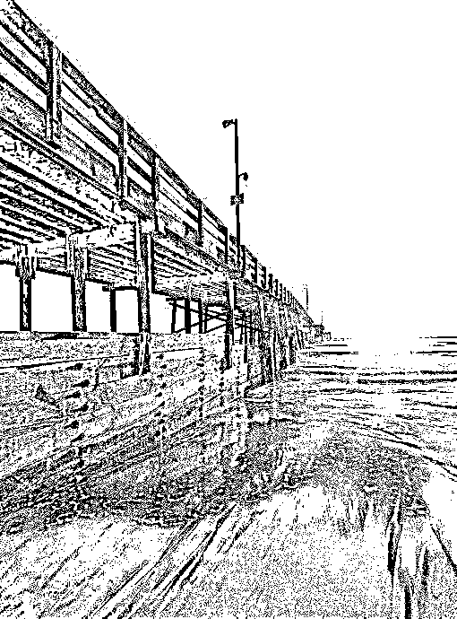

**重点影响人群**

毫无疑问，社会行星和外行星带来的宇宙天象的影响是深远的，作用力的辐射范围是广泛的。身处在天幕之下的我们每个人，都会受到其影响。

而不同的人，基于星图结构不同，生命实相不同，自由意志不同……带来的影响或强或弱，或建设性或破坏性。**全凭我们每个人的把握。**

**而群星齐聚在摩羯座的综合宇宙天象重点影响人群是**：

*   **出生星图中个人行星、四轴、南北交点在摩羯座、白羊座、巨蟹座、天秤座的人。**

*   **其次是出生星图中个人行星、四轴、南北交点在金牛座、处女座、天蝎座、双鱼座的人。**

**对个人 2020 年的影响**

**群星摩羯座行进的宫位是重点影响的生命领域**

另外，可以**通过查看群星摩羯座集中行进在自己出生星图中的哪个宫位，来了解生命的什么领域将会迎来一波强势的洗礼和提升，那是你在 2020 年需要重点关照的生命之地**。

**它将迎来蜕变，它将走向成熟，它旧有的模式将得以转化，它深埋的潜能将被大力激活。**

**举 2 个例子**

**如果群星摩羯座将主要行进在你出生星图中的第 1 宫**：那则意味着你的自我将会发生重大的改变。很可能它会完全改变你对自己，对人生的理念，你的人生方向会得到显著的转变，你会有一种坐不住的感觉。给自己制定长远的人生计划并展开实施是非常的重要。 **如果群星摩羯座将主要行进在你出生星图中的第 7 宫**：那则意味着你的人际关系将会发生强而有力的蜕变和发展。可能一些人会离你而去，也会有一些人因你而来。你对待关系的态度会变得更加认真、严肃。注重对每一份关系的承诺是这个时期的你展开关系的最佳态度。

**当群星摩羯座与四轴、个人行星、南北交点产生关键相位**

你也可以查看群星摩羯座是否会和自己出生星图中的个人行星、四轴、南北交点产生关键相位，那将会给你带来强而有力的影响。

**举个例子**

如，你**出生星图中的太阳在摩羯座**，那则意味着群星摩羯座曾经或即将合相你出生星图中的太阳。那则意味着你的自我会受到显著的挑战，也会带来强盛的发展。你内在的核心，你对人生的核心目标都会深深的醒来，变得明确。你可能感知到一股既压抑又强烈的情绪在你的心中燃烧。无论如何，这是一次强大的自我意识醒来的时间，你需要以一种成熟的视角来去看向自己和外界，以一种张弛有度的方式去创建人生，以一种落地、干练、果敢的姿态去发展生命。

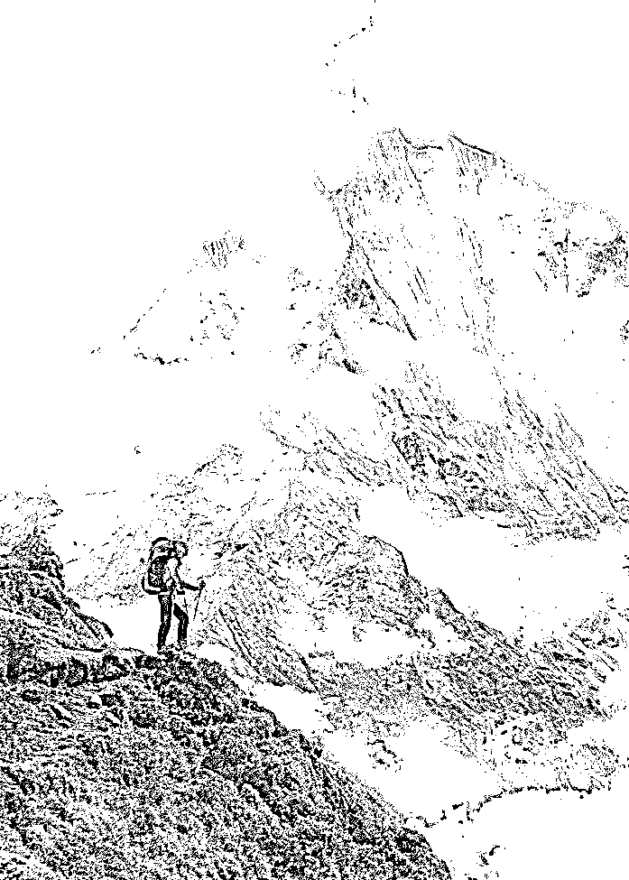

**木星、土星、冥王星、南交点，以及火星齐聚摩羯座的综合星象毫无疑问是 2020 年的****主宰天象****。**

它带给我们的影响力，有的人或许在 2020 年的初始之际就会感知到，有的人可能在 2020 的尾声才能获悉。

木土冥在摩羯座的路，或许走起来有些费劲，但每一步都会掷地有声。但无论从哪个切面去了解，它带给我们的影响力都是深远有力的。

**如果凌冽的寒冬没有将我们摧毁，那我们将会看到更加盎然的春色。如果我们能从暗夜的深渊中走出来，那我们将更能体会到人生的壮丽。**

**如果我们能绝处逢生，就能崛地而起！**

**版权声明：**文章由作者授权首发于若道平台，欢迎转发，反对抄袭。友号转载请申请白名单。

****

****李妍**（**理想国的女巫**）**

资深人本主义占星师，塔罗咨询师，心理咨询师

十二宫理想国工作室创始人，全职于咨询和教学工作

占星与音乐结合教学开创者，理想国占星音乐电台创始人

**咨询预约号**：vivian-yanyan(请注明咨询) 

**微信公众号**：house12ta

长按打赏


**长按下方图片**

**两位大占星师领你系统学习占星学**

************点击图片查看详情************


**微信又双叒叕改版啦，不想错过若道君的推送？**

**就把若道设为星标吧！**

**▼**


就是这个“在看”，戳一下☟

********报名直达入口********


# 12 月梅里曼金融系列报告更新 | 形势复杂的 12 月就靠它

> 原文：[`mp.weixin.qq.com/s?__biz=MzA5NjA0NTAxNg==&mid=2651412032&idx=2&sn=4dd78c5fee36e7c191210eb63196766d&chksm=8b4be4f7bc3c6de1ba232dbbf435047272beba0001695b34c32c902a04a5b1f15d3484d713e6&scene=126&sessionid=1692738247#rd`](http://mp.weixin.qq.com/s?__biz=MzA5NjA0NTAxNg==&mid=2651412032&idx=2&sn=4dd78c5fee36e7c191210eb63196766d&chksm=8b4be4f7bc3c6de1ba232dbbf435047272beba0001695b34c32c902a04a5b1f15d3484d713e6&scene=126&sessionid=1692738247#rd)


在上一月的上证指数报告中，梅里曼老师提到：**“到目前为止，当前的基本周期高点是 9 月 16 日的 3042，这个高点跟上一个基本周期中 7 月 2 日的 3048 一起被标记为双顶结构……上证指数将在接下来 3-11 周，理想情况下 5-9 周内下跌至基本周期的低点……下方的支撑位于 2875+/-20、2825+/-15, 甚至低至 2780+/-31。虽然市场如果跌至这些位置，看起来是看跌，但未必如此，除非上证综指跌破 8 月 6 日的低点 2734。”**

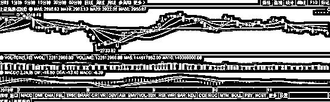

**丨**图：11 月份上证指数上证指数从 3042 后就逐步缓慢下行，在 11 月 29 日交易结束的时候，跌倒了最低点 2858。木星四分海四分已经结束，土星冥王星在魔羯座合相即将到来，木星也要进入魔羯座。在这种情况下，上证指数的走势又将如何？梅里曼老师的《上证指数 12 月研究报告》已经发布，如果您已经购买，请参照下图指引，查看报告内容。


如果您还没有购买，您可以**点击文末阅读原文**，购买报告。

在每个月度报告中，梅里曼学员的金融占星分析师给出**上证指数价格目标区间及重要价格反转日**，为短期、中期和长期投资者进行市场操作的时机提供参考。

**优惠价不要错过！**


上证指数月度报告价格

**单月报告**：280 元

**3 个月套餐价**：780 元（相当于 260 元/月）

**12 个月套餐价**：1999 元（相当于 166 元/月） 

**黄金报告更新！**


**黄金是金钱。其他的只是信贷。**

**——约翰·皮尔庞特·摩根**

过去一个月里，美国股指创下历史新高，但黄金、白银跌至数月新低。

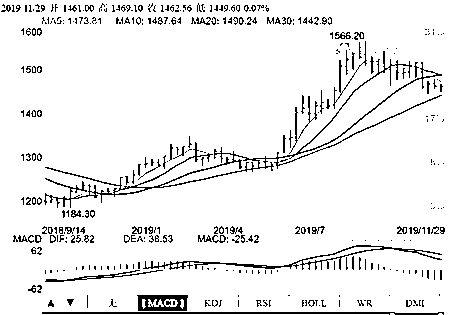

**丨**图：黄金价格走势

距离 9 月 1566 美元/盎司的水平，黄金市场已经跌去了近 100 美元，下跌了 6.64%。在雷蒙德·梅里曼黄金周期 9 月报告中，梅里曼老师建议投资者当月应该获利了结，等待黄金下行的机会再度买入。问题是，黄金在已经跌了 100 美元的情况下，会继续下跌吗？在美股本轮牛市结束前，黄金是不是会一直平缓下行？正如我们在过去的文章里所说，天王星进入金牛座的 7 年，国际货币体系会出现无法预测的动荡。国际货币基金组织(IMF)的数据显示，尽管美元相对于其他主要货币的收益率较高，但各国央行持有的美元储备略有下降。荷兰央行(DNB)最近在一篇文章中称，**如果进行一场重大的货币重启，“黄金储备可作为（重建全球货币体系的）基础”。“黄金可增强人们对央行资产负债表稳定性的信心，可创造一种安全感。”**比如，中国在过去 10 个月里就新增了近 100 吨黄金储备。不过，目前美股高涨，而美股高涨时刻，往往是黄金下行的时刻。此时，黄金市场究竟应该怎么做？点击阅读原文，雷蒙德·梅里曼黄金周期 12 月度报告带来有 39 年黄金市场研究经验的世界著名金融占星大师雷蒙德·梅里曼对当前黄金市场的研究。投资有收益，投资有风险，希望这份金融占星学的研究帮助你更好地评估黄金投资。黄金周期月度报告价格

**单月报告**：280 元

**3 个月套餐价**：860 元

**12 个月套餐价**：2400 元**双报告年度套餐更优惠（直降 1199 元）****12 个月黄金报告+12 个月上证指数报告：仅需 3200 元****本价格只到 2019 年年底有效。**

**长按下图识别二维码购买上证+黄金报告**

▼


**购买者重要须知**

① 梅里曼市场时机学院《中国上证指数月度研究报告》是梅里曼市场时机学院（以下简称 MMA）的研究“预报”，而不是市场“预测”，是梅里曼老师及 MMA 金融占星分析师对人类活动周期历史与行星周期之间相关性的研究，二者在大部分情况下具有 80%或更高的相关性，而不是因果关系。报告中的研究完全存在错误的可能性。即便是非常认真的研究和几十年的研究经验，金融占星师无法总是正确地解读出各种征象在实际层面上会如何相互作用，并显化为事件结果。

所以请将报告看作一个研究参考，务必结合其他市场研究和你个人对市场的理解，根据你的自由意志做决策。

② 本报告只是上证指数研究，没有个股研究。

③ 此报告一旦售出，**即不接受退款。**

④ 此报告每月 1 期，**并非都是在每月相同日期发布**。⑤** 此报告仅支持手机网页阅读，不支持电脑阅读和下载。**

**以上须知，请仔细阅读。一旦付款，即视为已了解并接受所有须知内容。**

购买后有疑问怎么办？请联系技术客服
**微信：nodoor201705**

********购买上证指数+黄金月报直达入口********


# 雷蒙德·梅里曼金融占星周运 | 熊市来了吗？

> 原文：[`mp.weixin.qq.com/s?__biz=MzA5NjA0NTAxNg==&mid=2651412032&idx=3&sn=4532488f6d6f73ea5037300355b5bcb6&chksm=8b4be4f7bc3c6de1a9110f74c533b72e62f3399e9121247793aba70c0214b2632d0f3e485235&scene=126&sessionid=1692738247#rd`](http://mp.weixin.qq.com/s?__biz=MzA5NjA0NTAxNg==&mid=2651412032&idx=3&sn=4532488f6d6f73ea5037300355b5bcb6&chksm=8b4be4f7bc3c6de1a9110f74c533b72e62f3399e9121247793aba70c0214b2632d0f3e485235&scene=126&sessionid=1692738247#rd)

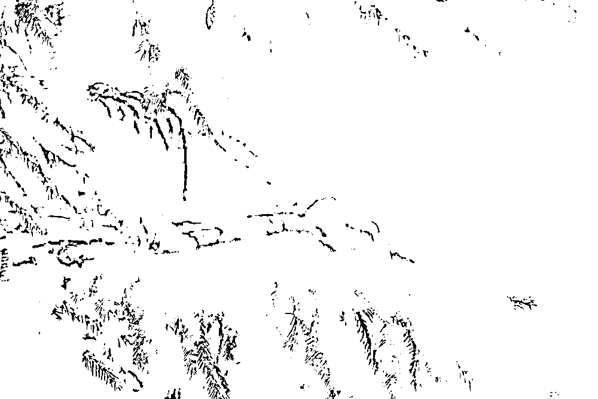

作者/雷蒙德·梅里曼翻译/Luke 校对/李含编辑/玫瑰 图片/unsplash

雷蒙德·梅里曼是在金融占星学界稳坐第一把交椅的占星师，同时他也是若道签约的金融占星课老师，我们引进了雷蒙德·梅里曼老师的《上证指数月度报告》《黄金周期月度报告》（感兴趣的同学可以扫码文末图片购买）。我们经老师的授权，将每周刊登梅里曼老师的周运，供大家参考和学习。于是，这是这周的周运（12.2-12.6）。

**展望与回顾**

木星在射手座所剩的时间不多了。木星和它的守护星座射手座都掌管着世界贸易。过去 13 个月木星射手座行进期间许多人希望美国和中国能签署一项重大贸易协议。这个贸易协议规模巨大，有望成为有史以来最伟大的贸易协议，这将符合木星射手座的主题。木星和射手座都喜欢大场面。每件事都被夸大和膨胀，导致期望过高，没有空间去思考细节。但是**当木星于今年 12 月 3 日星期二进入更严苛的摩羯座时，一切都将改变。**

欢迎来到“摩羯座星群”，在这个为期一年的宇宙周期中世人将体验到过去 13 月中一切配置-计划，决策和行为所带来的后果。之所以被称为摩羯座星群，是因为太阳系中 5 个外行星中的 3 个（木星、土星，和冥王星）将在 2020 年 12 月 19 日以前行进在摩羯座。摩羯座是要求**负责任**的星座。这个星座注意细节，只对那些**实际而且有机会成功**的计划有兴趣，不会只说不做。

由于过去的 13 月中木星在射手座，每件事都显得宏伟壮观，以最盛大最伟大的方式呈现。但是今年大多数时候木星四分双鱼座的海王星，海王星和双鱼座都和幻想或错觉有关联，仿佛只要宣称某件事是伟大的，就真的使它变得伟大了。到了最后，土星和摩羯座会拆穿它的真面目——承诺的事只做到表面文章。但是哪怕表面文章也能起到作用。

本专栏追踪的所有美国股指都在 11 月 27 日周三的时候创了历史新高。这天海王星刚恢复顺行，而且处于 11 月 22 日-25 日天象关键反转日的容许度之内。但是木星正在离开乐观和充满希望的射手座，从 12 月 3 日星期二起在谨慎小心的摩羯座停留一年，**熊市可能会在这期间开始。**

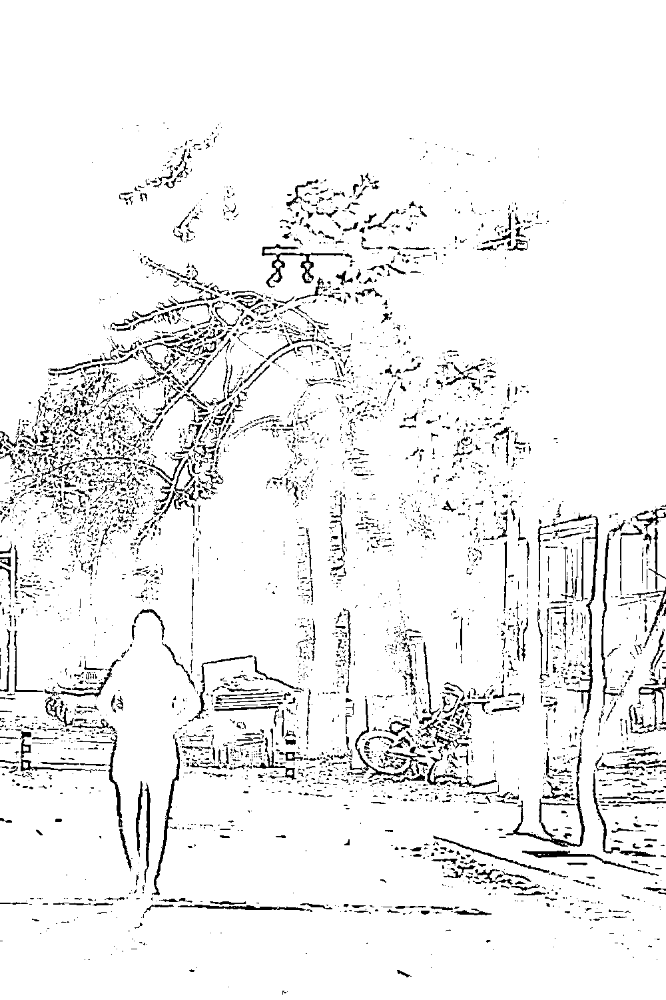

**短期占星趋势与长期考量**

**有才华的聪明人都懂得回顾历史。没有谁学了历史不变聪明的。**

**——麦克·尼可拉斯**

**电影导演（1933-2014）**

上周股市的高点是否代表美国股市持续最长的牛市的终点，还有待观察。现在下结论为时尚早，但**依照牛市的历史周期来看，当前已经处于最末期的阶段**。这轮牛市的顶点应当已经出现，甚至早就该出现了。它可能在**木星行进射手座的最后几天**里出现，或在**接近木星三分天王星（12 月 16 日）**的时候出现，或**土星合冥王星**的时候出现（1 月 13 日），甚至更晚。熊市出现的时候不会敲锣打鼓宣称它们已经来了。但大多数时候，它们会在**土星、天王星、海王星和（或）冥王星之间构成长期相位**的时候出现。有一个这样的相位正在形成。事实上，它已经在容许度内发挥影响力了。这就是 32-37 年的土星、冥王星相合周期，将于**2020 年 1 月 13 日**准确成相一次。长期周期的终点可能会在这个相位的前后 11 个月中出现，但是大多数时候市场在成相的 5 个月之内就反转了。

另外一个非常重要的相合周期出现于**2020 年 12 月 22 日**，是木星与土星 20 年的合相周期。它也常常与股票指数的 4 年周期或更大周期产生关联。上次出现这个相位是 2000 年 5 月 28 日，与当时全球许多股市非常接近于历史新高，但当互联网泡沫破裂后（2000 年 1 月-3 月）股市迅速崩溃。可能要等到这两个周期相互重合的时候熊市才会开始。这些周期，以及其他的周期，都在 2020 年预报中有详细的描述。我现在正在写这本书，将在两周后发行。

说到这里……这本预报是我写的所有预报中最具挑战性的一本了。这也是我写的最长的一本预报，共有 250 页。之所以这么难，是因为**木星-土星-冥王星将一同合相在摩羯座**。也就是说有 3 个外行星的合相周期在一年之内发生，这是非常罕见的情况，也没有太多的历史样本可供借鉴。但是我对于 2020 年 1 月 13 日的土星-冥王星行星周期还是有一些了解的，因为我出生时就有这样的相位。今年的预报将会证明，土星-冥王星合相期间是一个英雄和恶人辈出的年代。我也相信土星和冥王星与超人的成就有关。是的，我相信我是超人——一个土星-冥王星的超人，因为我在不到 4 个月的时间写了一本 250 页的书，同时还找了 5 个人帮我完成编辑工作。正常情况下是做不到这点的。这些编辑也是超人和女超人。唯一我不确定的是，我是英雄还是恶人。

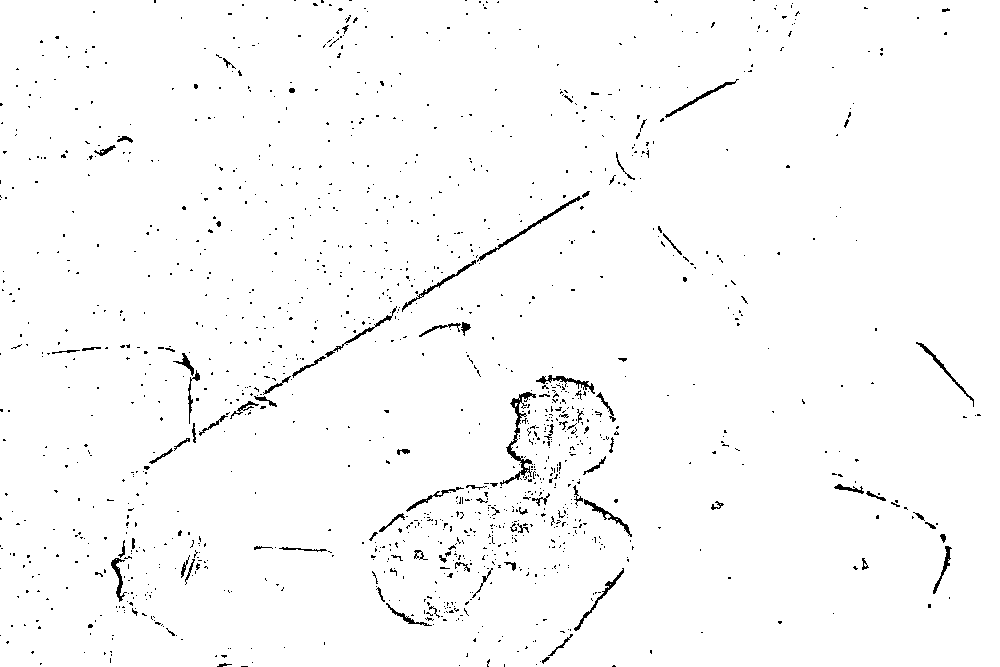

现在，我只是精疲力竭。成为一个超人需要付出很大努力。我有点惊讶，我居然能在不到 4 个月的时间里写出一本 250 页的书。这让我觉得，**如果我下定决心，我可以取得任何成就**。也许这就是 2020 年摩羯座土星和冥王星传递的正面信息。如果你愿意集中精力，努力工作，而不是低声抱怨或崩溃，那么你可以完成任何事情。我年纪大了，许多事情无能为力，但幸好我的出生水星在射手座，有着乐观的天性。现在任务已经完成，是时候照顾好自己，重新充电了。因为沉重的土星相位的负面影响是耗尽了精力。如果想让我的土星继续有所成就，我需要在工作、休息和社交活动之间保持平衡。这是我接下来 4 个月的目标。**版权声明：**本文由若道翻译发布，欢迎转发，反对抄袭。友号转载请申请白名单。


**雷蒙德·梅里曼（Raymond Merriman）**

若道签约老师。著名金融占星师，ISAR（国际占星研究协会）前主席，梅里曼市场分析公司的总裁。他由于“提升了占星学的职业形象”，在 1995 年国际占星大会上被授予轩辕十四奖；在 2012 年国际占星大会上，被授予轩辕十四终身成就奖。

1“中国上证指数月度报告”发售

**从****7****月开始，若道推出了****中文版****的雷蒙德·梅里曼中国上证指数月度报告，并持续发行该报告！**

当把金融市场的周期和占星学的周期相结合时，雷蒙德·梅里曼老师的金融占星学研究**为投资者应对金融市场的周期波动，并随之调整投资策略提供了极大的价值参考**。

2“黄金价格周期月度报告”发售

**现在，又有一个好消息要告诉你。从****9****月开始，若道将推出****中文版****的雷蒙德·梅里曼黄金价格周期月度报告！**不仅仅为广大读者在中国股市的投资出谋划策，更将视角放眼黄金市场。

**每当世界经济形式不明朗的时候，有一个地方是保值的港湾，那就是****黄金**。从 2018 年 8 月开始，黄金已经用自己的升值再次提醒众人它在经济不稳定时的位置。**截至目前，2019 年 8 月底，黄金已飙升至 6 年新高，高于 1565 美元。**

自 1982 年雷蒙德·梅里曼出版第一本研究《地球宇宙学征象与黄金价格的关联》的著作以来，**他一直作为最重要的黄金市场时机预测者之一享誉国际**。

过去 1 年，那些订阅并遵循建议的梅里曼市场时机学院日报和周报的订阅者，如果从 2018 年 8 月 16 日的低点或 8 月 23-24 日的次低点购买黄金，他们已经赚到了不少的 30%左右的利润。

**购买套餐**，买得越多越优惠

**12 月报告均已更新！**

中国上证指数月度报告套餐价

*   **单月报告**：280 元

*   **3 个月套餐**：780 元（260 元/月）

*   **12 个月套餐价**：1999 元（166 元/月）

**长按下图识别二维码**

**购买金融报告****套餐**

**▼**


黄金周期月度报告超级优惠折扣

*   **同时购买上证指数 12 个月套餐**和**黄金周期报告 12 个月套餐**，即可享受黄金周期报告 12 个月套餐**立减 1199**元的**超级优惠折扣**。

*   **已经购买**了**上证指数 12 个月套餐**的朋友，**再购买**黄金周期报告 12 个月套餐，也可享受**立减 1199**元的**超级优惠折扣**。**购买黄金周期报告 12 个月套餐时，超级优惠折扣会自动生效**。

**长按下图识别二维码购买黄金报告套餐**

▼


**微信又双叒叕改版啦，不想错过若道君的推送？**

**就把若道设为星标吧！**

**▼**


********点击阅读原文购买金融报告********


# 金星进入摩羯座 | 他们成就了关系，也成就了彼此的人生

> 原文：[`mp.weixin.qq.com/s?__biz=MzA5NjA0NTAxNg==&mid=2651412005&idx=1&sn=179ca297fe7732bb4aecf6f69d628861&chksm=8b4be492bc3c6d844f9f53acd8824e2b8ac5b341aaf49c2df494d5c7b4118b2e7fafa157e5fd&scene=126&sessionid=1692738247#rd`](http://mp.weixin.qq.com/s?__biz=MzA5NjA0NTAxNg==&mid=2651412005&idx=1&sn=179ca297fe7732bb4aecf6f69d628861&chksm=8b4be492bc3c6d844f9f53acd8824e2b8ac5b341aaf49c2df494d5c7b4118b2e7fafa157e5fd&scene=126&sessionid=1692738247#rd)

******************************☆ **************后台****************************回复“今日”，给你一句生命态度****************作者/聆宇 Cora ISAR 认证占星师编辑/Tang 图片/unsplash**金星进入摩羯座****北京时间 2019 年 11 月 26 日 8:28，金星由射手座进入摩羯座，直至 12 月 20 日 14:41，离开摩羯座进入水瓶座。**金星在摩羯座期间，太阳一直在射手座。金星就好像是一个“**先导**”，率先让我们在**价值观、爱情观**方面经验摩羯座式的变化。金星在摩羯座行进的这段时间，将依次合相摩羯座的土星、冥王星，**在涉及到金钱、人际、亲密关系的领域，我们将去学习“摩羯座的规则”，更加尊重现实法则，更加结果导向**。木星在 12 月初进入摩羯座，将进一步推动这个进程的发生，也可能放大我们的野心和对目标的执着。退回到现在，我们来看看金星进入摩羯座的大背景。随着土星越来越接近冥王星，我们生活中的很多方面都在经历冷酷的清洗，有些事情无法再逃避，欠下的债必须去偿还。而天蝎座的火星刚刚走过对分天王星的度数，解放了我们的勇气和独立意志；伴随着关系中的冲突和内在的激烈搅动，有些我们置于自己身上的枷锁将被打破，有些老旧的模式在加速瓦解。而和金星进入摩羯座同一天出现的射手座新月（点击链接阅读：[在“银河中心”穿越黑洞，重建信心与希望](http://mp.weixin.qq.com/s?__biz=MzA5NjA0NTAxNg==&mid=2651411808&idx=1&sn=2a38e3e94aa0469492965ca9ab2fbf78&chksm=8b4be7d7bc3c6ec14756efb4a410bfa92032643953d76ee7fcf52373a18e0ccf175b51671084&scene=21#wechat_redirect)），则会成为火星/天王星带来的自我蜕变的助燃剂，也像是在压力与动荡之中，带来一丝希望的曙光，让我们可以对那个崭新的未来有所憧憬。**外有现实压力的催逼，内有新自我野蛮生长的冲动，同时射手座新月唤醒对未来的憧憬。金星摩羯就是在这样的一个背景下到来。**

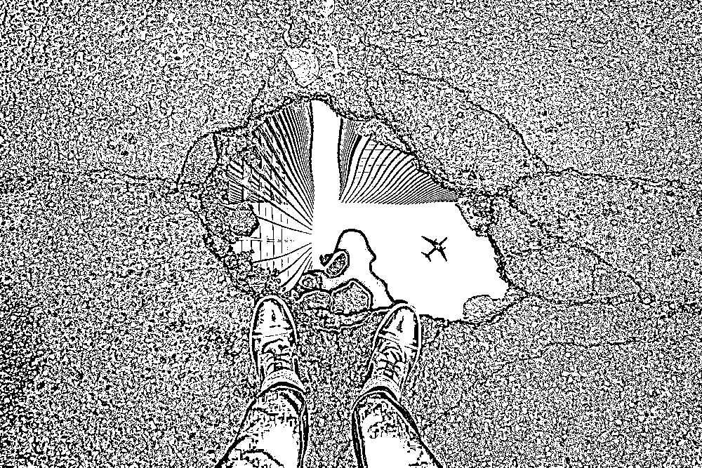

未来二十多天的时间里，我们将以更加**冷静、审慎的态度去衡量生活中哪些事情是更重要的，更值得我们投入时间、精力和金钱去认真对待**。我们面对金钱和关系的态度可能变得更加**理性、务实**，**更加重视结果**——为了取得自己想要的结果，愿意去承受过程中的沟沟坎坎。尤其要注意**12 月 9 日到 12 月 14 日**的这几天，摩羯座的金星依次合相土星、冥王星，**这是一个将土星的现实法则和冥王星的危机意识，纳入我们金星的价值评判系统的过程**。这段时间，在**金钱、财务方面**的操作，以及涉及到交易、投资或债务的关系，明确规则与底线，看清现实，尊重规则，不要心存侥幸，不要玩火。在**爱情中**，我们或许必须要面对一些非常现实的问题，并做出抉择；有些决定可能显得不近人情，但让关系中最艰难的那些问题暴露出来，去设立自己的规则和边界，也是让关系有效运作的必须。至少经历了这个过程我们会知道，我们想要的结果，在多大程度上可以实现。而无论是面对金钱还是面对关系的态度，都是我们的自我价值的反映。在一个更深层的意义上，金星在摩羯座期间，**我们需要为我们的价值“塑形”**：**一方面要去定义我们身上最重要的价值到底在哪里；另一方面要找到有效的方式，让我们的自我价值可以有效地通过外在的行为与成果体现出来**。**重视结果与对结果的控制力，是金星在摩羯座期间的整体基调**。而随着 12 月木星进入摩羯座，我们也会对摩羯座所象征的**严肃、理性、自律、务实的品质**有更多认同与向往，这会帮助我们完成金星在摩羯座的功课。

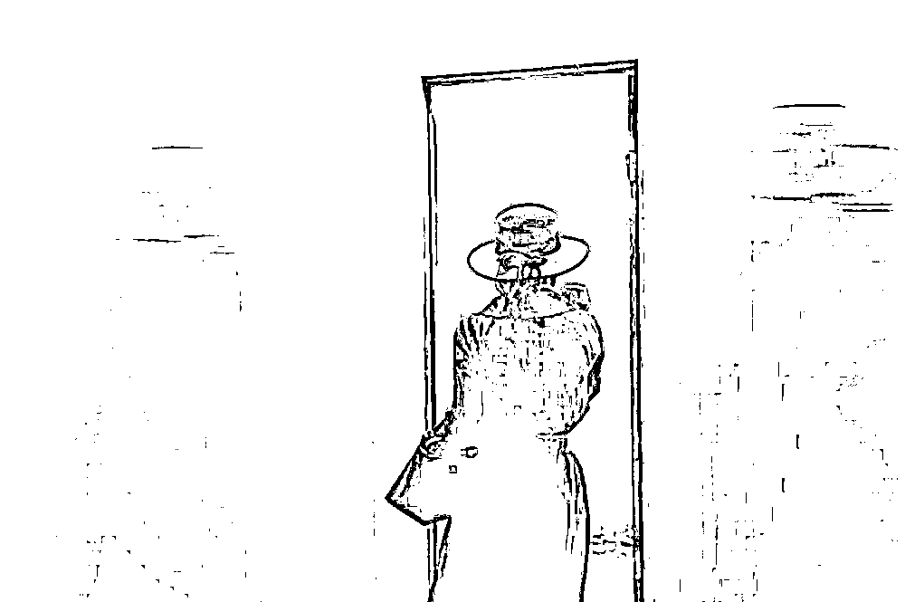

**金星摩羯座的人是怎样的？**很多金星摩羯座的**面部轮廓是比较分明的，看上去有种坚毅的神情**。他们的面部表情通常不是很丰富，容易给人一种**非常冷静或严肃的感觉**。金星在摩羯座的人，外在的形象风格通常可以分为两类，一类是低调质朴型，一类是职场精英型。但不管怎样，**他们都希望自己看起来是可靠、稳妥的**。他们通常不习惯太过高调或花俏的装扮，除非这样的装扮本身，是一种职业需要——他们想要让自己足够专业，希望在该做什么的时候就做好什么，很重视本分和规则。跟金星处女座类似，金星摩羯座也会有一种**希望自己无可挑剔、不想“出错”的态度**，但跟金星处女座对自身细节的关注不同，金星摩羯座更需要维持一种**身份感**，需要被尊重，他们对于所在环境中，自己是不是处于一个有身份、有权威的位置，更加敏感。他们在社交中的表现**通常非常庄重、得体，不苟言笑**，有时会让人觉得过于认真严肃。**他们本质上不是很好开玩笑的人，对待生活、对待他人的态度都比较谨慎。**金星摩羯座在私下面对熟人时，或在一些非正式的场合，可能会有一些很随性的展露，但一旦进入他们的专业领域，在需要展示专业性或跟他们的职业形象相关的场合，他们便会更多地展现出成熟、精干、有威严的一面，那样的时刻他们身上常常有种令人肃然起敬的气质。因为**事业成就和职业声誉，对金星摩羯座特别重要**。他们希望自己可以被尊重，被严肃对待，他们也希望用自己的认真、努力、尽职的态度以及专业上的能力和成果，来赢得他人的尊重和认可。金星摩羯座在工作中通常是更加**能吃苦的，非常努力，愿意承担**。虽然行为表现上或许比不上太阳摩羯座或火星摩羯座，但努力、自律、上进、负责，始终是他们所看重的品质。拥有这样的品质会让他们感到自豪、有尊严。金星摩羯座常常也是对工作有使命感的人，或者说，他们更加需要一份能够激发起自己的使命感的工作——**他们渴望去“建造”一些东西**。

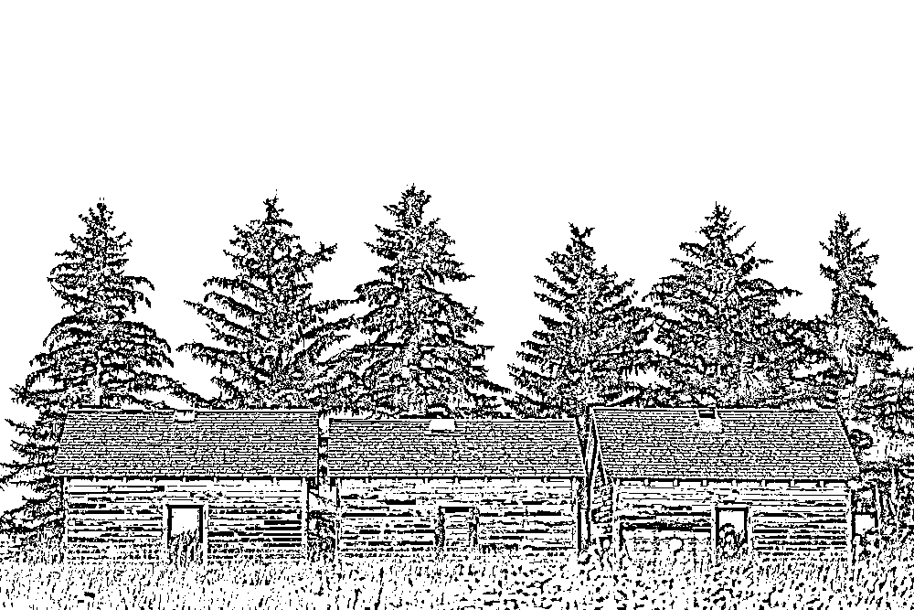

**金星摩羯座重视成功，也非常重视物质安全**。他们对待物质、金钱的态度非常理性务实，他们可能在很年轻的时候就有意识地进行财务上的规划，对于自己要在什么时间实现怎样的成就，要有多少存款，有明确的目标。他们在面对涉及到金钱的问题时，通常也非常守规矩、有原则，是能够信守承诺的人。无论是友谊还是工作中的合作，他们都很**重视长期关系的建立**。本质上，他们是更相信“**时间的价值**”的人。在跟我有长期、稳定的咨询关系的客户中，金星摩羯座占了很大比例。

如果去观察那些金星落在摩羯座的人就会发现，**他们面对人际关系时的信心，他们多大程度能够从容自若地展现自己的魅力，多大程度能够享受关系，跟他们对自身成就的判断有很大关系**。当他们处在一个没有成就感的工作中，或者对自己的工作成绩不满意时，他们也很难在与人的互动中去绽放自己的魅力，去获得真正的快乐，因为在他们衡量自我价值的那把尺子上，他们可能把自己定义为“**不够格**”。

某种意义上，**摩羯座的金星，是一颗需要付出更多努力才能确立自我价值的金星**。因为在金星摩羯座这里，金星的对自己的价值和魅力的认知，与摩羯座的成功意识、对物质世界的关注和控制，紧密结合在一起。而摩羯座的功课，总是以“困难”著称。成功，无论是外在的、现实层面上的成果，还是心理上的对自己的能力的确认，都不是一个容易的过程，都需要时间，需要锻炼，也需要无数由失败积累而来的经验。所以金星摩羯座往往要花更长的时间，要付出更多的努力，才会对自己的价值有足够的确信。那些没有经历过时间考验的金星摩羯座，和经历过这样的努力和磨炼的金星摩羯座，他们的状态会非常不一样。换种说法也可以是，年轻的金星摩羯座和年长的金星摩羯座，会非常不一样。虽然每个人都会从时间中学到东西，时间是所有人的老师，但**摩羯座的金星，尤其需要时间的打磨，才能淬炼出光彩。时间，是成就金星摩羯座的秘密**。这就是属于金星摩羯座的功课，他们所选择的，是一条要比别人付出更多努力才能通关的道路。虽然他们可能在很小的时候，就已经意识到了自己的野心，就已经在学着承担责任，并对未来的目标、想达到的成就有所规划了。

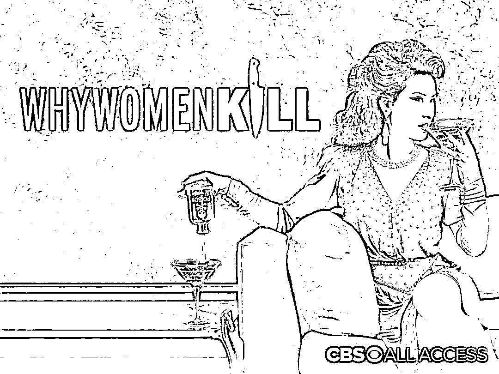

| 在美剧《致命女人》中饰演贵妇的刘玉玲

近期大火的美剧《致命女人》，令华裔女星**刘玉玲**进入大众视野，她就是**太阳在射手座的金星摩羯座**。

刘玉玲在影视作品中的角色，以“大女人”为主，从昆汀·塔伦蒂诺电影中的铁血杀手，到《致命女人》中的面对婚姻、情感中的诸多困难与荒唐事还要迎难而上的华丽贵妇，她饰演的角色或多或少都带有金星摩羯座的影子。

作为华裔，能在好莱坞站稳脚跟，并从演员起步，渐渐参与制片与导演的工作，难度可想而知。毫无疑问，她是一开始就野心勃勃并投入了足够努力去实现目标的人。


她曾在一次采访中提出了她著名的“fuck you money”理论：“**我从我爸爸那儿学到了一件事，什么事都可以可算作一门生意。所以我工作后一直很努力的攒钱，这笔钱叫做“fuck you money”。这样，当你老板要解雇你，或是让你去做不愿意的事情时，你就可以很有底气的甩他一脸“fuck you!”（姐有钱，去你妈的！）**”

这就是活脱脱的金星摩羯座的态度。他们**非常明白钱的重要性，因为钱能带来底气；****必要时，钱是捍卫尊严的武器**。

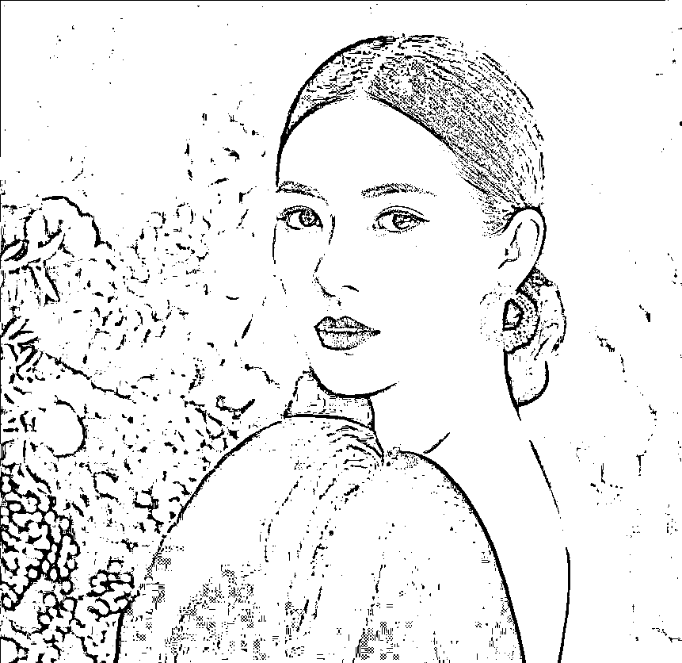

|  章子怡

还有一位重量级的中国女星也是金星摩羯座，她的成名史也极富摩羯座色彩。这个人就是**太阳在水瓶座、金星在摩羯座的章子怡**。

章子怡在年轻时被认为是眼里写着野心的女人。她与张艺谋合作的电影处女作《我的父亲母亲》在柏林电影节亮相时，她身穿红肚兜礼服，自作主张与张艺谋一起登台。这件事令初出茅庐的她，被贴上“野心”的标签。

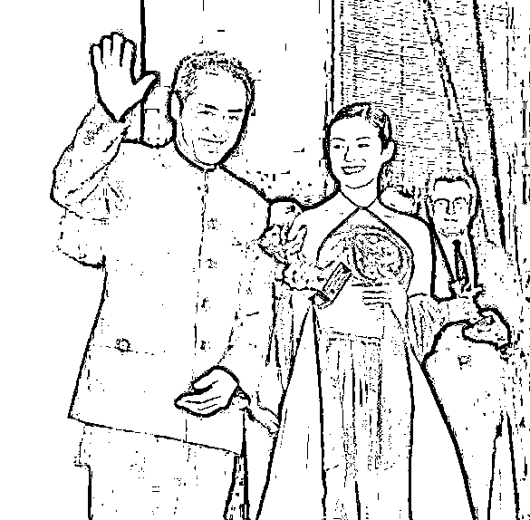

|  章子怡与张艺谋在柏林电影节的合影
那些年她处于媒体的风口浪尖。频繁与国际级导演合作、一炮冲天的发展势头的另一面，是人们复杂的眼光与评判。她不加掩饰的野心与进取搅动起人们心中的不安，那是传统上中国女性不被鼓励的一面。而**她用十多年的努力，最终向世人证明了，她的努力、能力和成绩，配得上她的野心**。

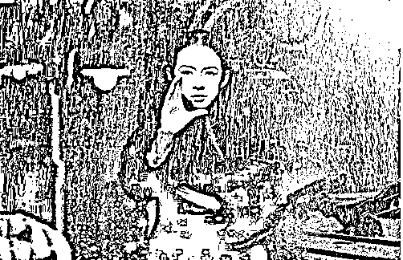

|  章子怡在《一代宗师》中饰演宫二

她凭电影《一代宗师》中的“宫二”一角，拿下了中国电影界的 12 个奖项的“影后”，创造了历史。而宫二这个人物的生平，何尝不是金星摩羯座的极致表达——**隐忍、克制，为了事业使命苦练专业能力，最终成就攀顶但牺牲掉了婚姻与爱情的女人**。

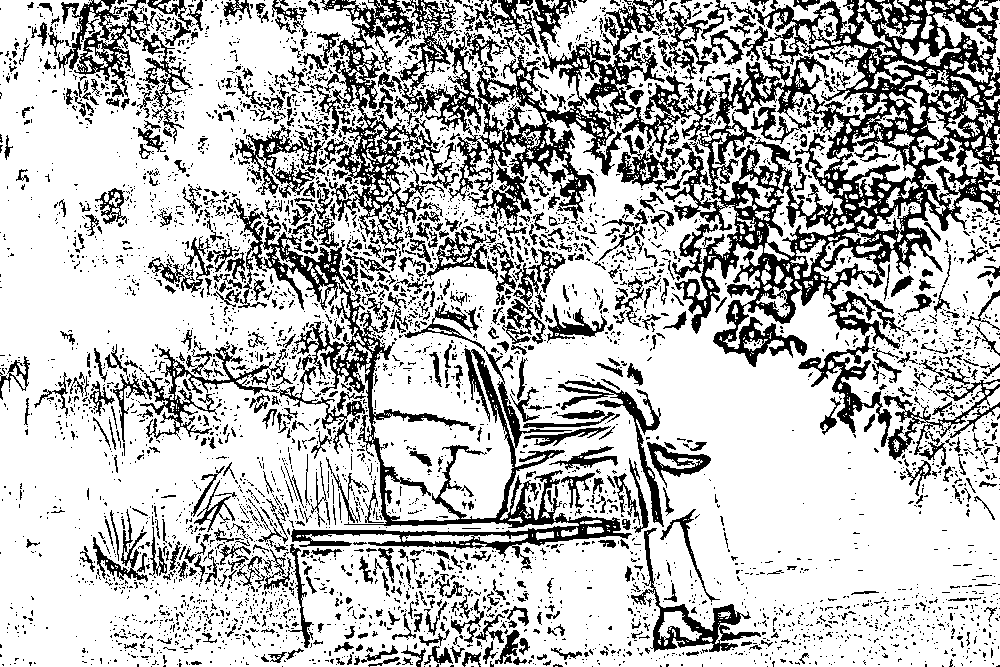

**金星摩羯座的爱情****金星摩羯座，会是非常稳定、可靠的伴侣。他们有强大的耐心和自控力去守护一段关系。但摩羯座对于现实的考量，可能令金星在关系中对于快乐和价值的感知，蒙上一层艰难或冷酷的底色。****当金星摩羯座的冷静、自律、严格、现实走入极端，可能带来两种典型的负面表现**：**一个是功利现实**，对伴侣的“硬件条件”有很高的要求，希望借助对方提升自己的社会身份，以此为关系的目标；**另一个极端则是隐忍尽职**，承担很多不该自己承担的责任，努力维系一段并不能够真正滋养自己的关系。这两个极端看起来有点吓人，它们实质上是一体两面，**都是对“结果”过度关注的体现**。一个是对“**关系要给自己带来现实利益**”这个结果的执着，一个是对“**关系要有结果（能持续）**”的执着。这两种执着，是金星摩羯座在面对爱情时的两个最需要警惕的陷阱，也都是将个人价值依附于一个外部的确认而有的表现。**金星摩羯座重视承诺和责任，希望关系可以通过现实和时间的考验而结出成熟的果实**。而要让关系有稳定、长远的发展，物质保障必不可少。重视物质本身并不是问题，尽职尽责当然更是好事情。但当金星摩羯座被外部的框架和规则限制住，便很容易忽视了自己的心的需要，忽视自己的快乐。一个看到自己的心、也愿意去了解自己的内在价值的金星摩羯座，会更重视伴侣是否有能力跟自己结成一段成熟的关系。**成熟的关系需要有物质保障，但并不以此为最重要的衡量标准，他们会更重视伴侣是否可以跟自己平等对话、互相尊重，是否能够彼此有担当、能共同维护关系的长足发展**。成熟的金星摩羯座，会重视关系的成长性，他们更看重对方是否是一个成熟、自重、对人生负责的人，而对方身上的这些品质，也会激发出金星摩羯座身上最好的那一面——**这样的关系，会成为两个强者的对话和共同成长，而不是利益的捆绑或责任的枷锁**。**最终，他们成就了关系，也在关系中成就了彼此的人生。**

**版权声明：**原创文章由作者授权首发于若道平台，欢迎转发，反对抄袭。友号转载请申请白名单。


**你可能还想知道金星在**

[白羊座](https://mp.weixin.qq.com/s?__biz=MzA5NjA0NTAxNg==&mid=2651406466&idx=1&sn=85f216f9981e4dd4fe8a6aa8ea22ec12&chksm=8b4bf235bc3c7b23ea58f356e9b7f5cf395ef7ccc243cceced390c429d1336038208e5543426&token=1106547272&lang=zh_CN&scene=21#wechat_redirect) | [金牛座](https://mp.weixin.qq.com/s?__biz=MzA5NjA0NTAxNg==&mid=2651407011&idx=1&sn=33e9156cac239ef582222edd40798165&chksm=8b4bf014bc3c7902a0a39a38a9f908ca96b2656f281940a86b3223a0131531d2db05f71a371e&token=1106547272&lang=zh_CN&scene=21#wechat_redirect) | [双子座](https://mp.weixin.qq.com/s?__biz=MzA5NjA0NTAxNg==&mid=2651407560&idx=1&sn=9c27b831fba8c1df5e3063d344e82ffa&chksm=8b4bf67fbc3c7f69e4e760c09eedb23eca769b0b54b6a07fc54de03dc59a2ca7e94d1aadcdaa&token=1106547272&lang=zh_CN&scene=21#wechat_redirect)

[巨蟹座](https://mp.weixin.qq.com/s?__biz=MzA5NjA0NTAxNg==&mid=2651408217&idx=1&sn=db1f9eb7c86ea956ccc3d491fed7145f&chksm=8b4bf5eebc3c7cf85c53c53654fd963bd0fef773caea47a2abed021df444267038838fa35297&token=1106547272&lang=zh_CN&scene=21#wechat_redirect) | [狮子座](https://mp.weixin.qq.com/s?__biz=MzA5NjA0NTAxNg==&mid=2651408817&idx=1&sn=6dfbe0f334c87e68e36f3fba2a7d8b18&chksm=8b4bfb06bc3c721094157bd756a789529c29ba8d3c62fa5d84f9ce99a7223d690b2eea182cec&token=1106547272&lang=zh_CN&scene=21#wechat_redirect) | [处女座](https://mp.weixin.qq.com/s?__biz=MzA5NjA0NTAxNg==&mid=2651409443&idx=1&sn=848fbc14158de192b52af4a4c4464ae5&chksm=8b4bfe94bc3c7782c23101082fb341561433671acd3101bfe2f8d9273f8b83c281333e0fe711&token=1106547272&lang=zh_CN&scene=21#wechat_redirect)

[天秤座](https://mp.weixin.qq.com/s?__biz=MzA5NjA0NTAxNg==&mid=2651410016&idx=1&sn=b32358cc261f5bb51c083e8a51b1a403&chksm=8b4bfcd7bc3c75c13d86066f13e5030805fd1e1b7a046befebcf550d6f39054dd097123efafb&token=1106547272&lang=zh_CN&scene=21#wechat_redirect) | [天蝎座](http://mp.weixin.qq.com/s?__biz=MzA5NjA0NTAxNg==&mid=2651410465&idx=1&sn=3d3015c873e9e4f271e3562d01d65160&chksm=8b4be296bc3c6b8053efd35a957390bae4804cc3fdddca5e5fa6ecaf6d4c2a0e88f263594549&scene=21#wechat_redirect) | [射手座](https://mp.weixin.qq.com/s?__biz=MzA5NjA0NTAxNg==&mid=2651411251&idx=1&sn=a69bbad4b1841215daef7274b38b1fc7&chksm=8b4be184bc3c6892c41bb6e8c7734910dc8e744623eeb194c1f60631d1d93bd2348e56535271&token=2140460599&lang=zh_CN&scene=21#wechat_redirect)

[水瓶座](https://mp.weixin.qq.com/s?__biz=MzA5NjA0NTAxNg==&mid=2651405455&idx=1&sn=a01152b0d400028a8e404f8312fbe971&chksm=8b4b8e38bc3c072e04e693dfa2aadc064c74506b7d542eb17048b91fb785cc6418a6b64006f4&token=1106547272&lang=zh_CN&scene=21#wechat_redirect) | [双鱼座](https://mp.weixin.qq.com/s?__biz=MzA5NjA0NTAxNg==&mid=2651405813&idx=1&sn=1db89fe7063d0f4c55aa405f044c6dd0&chksm=8b4b8f42bc3c0654f4a2b30ecf24a556491bc42fae9abc513d11b862aae42d15b7258f9cf163&token=1106547272&lang=zh_CN&scene=21#wechat_redirect) 

**聆宇 Cora**

ISAR 认证占星师（2014 年获得）

斯蒂芬·弗里斯特《变幻的天空》译者，大卫·瑞雷《一生的旅程》译者

全职占星师，从事占星个案咨询及教学工作

**个人微信号**：CoraAstro

**微信公众号**：聆宇 FM

长按二维码，给作者打赏


******点击图片查看若道君推荐******


**微信又双叒叕改版啦，不想错过若道君的推送？**

**就把若道设为星标吧！**

**▼**


就是这个“在看”，戳戳戳 ☟

********报名直达入口********


# 把握好 2019 年最后一个月！宇宙会带给我们哪些启示？

> 原文：[`mp.weixin.qq.com/s?__biz=MzA5NjA0NTAxNg==&mid=2651411975&idx=1&sn=a1d974197e6ea6c55ad7960a7a5fdca3&chksm=8b4be4b0bc3c6da65a63491be79f8f1e83a58c38f814bbf8c1981cb4f573c7ac9411aebc97c3&scene=126&sessionid=1692738247#rd`](http://mp.weixin.qq.com/s?__biz=MzA5NjA0NTAxNg==&mid=2651411975&idx=1&sn=a1d974197e6ea6c55ad7960a7a5fdca3&chksm=8b4be4b0bc3c6da65a63491be79f8f1e83a58c38f814bbf8c1981cb4f573c7ac9411aebc97c3&scene=126&sessionid=1692738247#rd)

****************☆ 后台回复“今日”，给你一句生命态度****************


作者/咔咔 ISAR 认证占星师
编辑/玫瑰 图片/unsplash**12 月主要天象**2019 年 11 月在北京举办的国际占星研究协会中国大会有一场关于 2020 年宇宙天象的圆桌论坛。各个占星师不约而同地关注今年 12 月 3 日木星离开射手座，与在摩羯座的土星和冥王星组团这个天象。提到木星在摩羯座，大家都会说到木星有多么不“喜欢”这个星座，一个代表扩张、探索和理念的行星在一个代表边界、收缩和现实法则的星座。这个组合会让 2020 年的严寒更加凛冽么？占星师 Cora 在论坛讨论中说：

**在土冥压力之下，大家会关注如何以更加务实的方式使自己能够“生存”下来，什么方式是更加可靠、落地的，能够帮助生存的。压力之中也有一些木星方面的希望，我们看天象看的是行星之间的整合影响趋势，不能抛开 2019 年单独看 2020 年。**

**2019 年我们也面临土星摩羯座的时候，木星在射手座，四分海王星，而明年木星进入摩羯座，会和海王星和天王星都形成和谐相位。2019 年，木星和海王星形成的四分相，与土冥的含义有一些冲突，似乎我们还没有准备好面对土冥的挑战，还带着理想主义的狂热，对一些事情有不实际的认知，天真的想法（木海），所以很多人是被动的看到现实，看到土冥的压力。**

**从今年 12 月，木星进入摩羯座，木星成了土冥的伙伴角色。2019 年木星还没有这个身份，2020 年开始转变态度，我要离开海王星的梦幻泡影和狂热，加入土冥的摩羯队伍，这个换座对大家来说是积极的，我们会更加将摩羯的行事方式和价值观内化为我们自己的认知，从新调整我们的判断选择和目标。**

 如果说木星是智慧的老师，那么在未来 12 个月，木星将会教授一门与**“责任”**有关的功课。过去许多年里，太多人看到了破坏规矩和撕毁协议带来的即得利益，有样学样，土冥合相时似乎到了还债的时候，品尝之前小机灵与钻空子带来的后果。木星意味着我们需要学习，需要内化一些信念——**学习把责任、时间、规则当做朋友**。土冥式的老师是严厉的、冷眼看着你，随时会指出你的问题，给你扣分甚至让你留级。而木星是鼓励式的老师，他说：

**“不要怕挫折和失败，你能从失败里学到的，比从成功中学到的多得多！”****“每天进步一点点就好。你可以持久地学习，稳定地进步。”****“在一个更长的时间范围里，你可能会走的比别人更远。”****“要告别一些东西，腾出空间，才有新的东西进来。”**

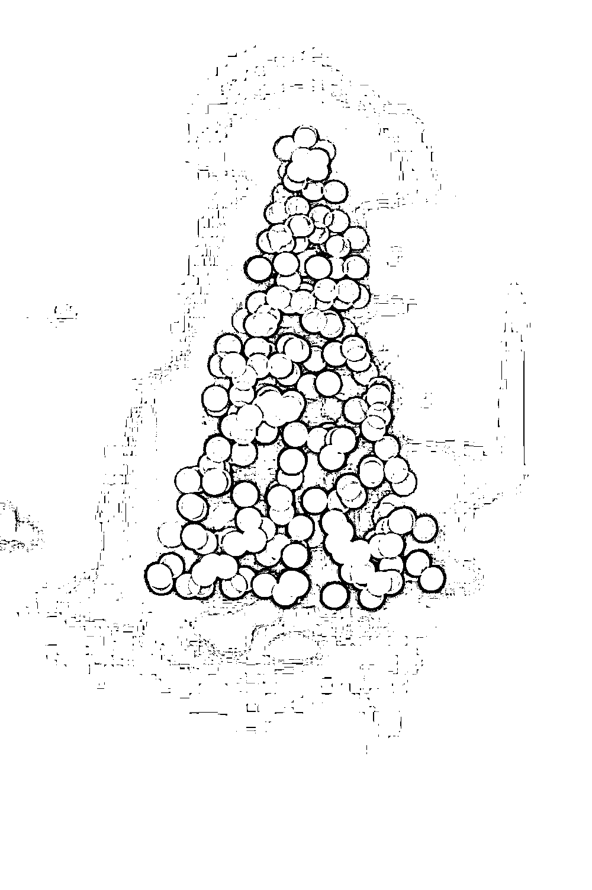

即使在摩羯座的木星带有保守的气息，在此期间我们也不是停滞不前、原地不动的。

**12 月 16 日，木星在摩羯座与在金牛座的天王星形成精准的三分相，这个三分相的影响范围会从 12 月初到圣诞节前后**。**12 月 25 日和 28 日**，太阳在摩羯座又会重新将两颗已经分开的行星联结起来，所以说，整个 12 月，宇宙天气最重要的就是刚刚换座的木星与金牛座的天王星形成三分相。

木星与天王星都在土象星座，我们自然会想到，这个组合会带来**物质生活、安全感、教育和社会经济的创新和成长**。土冥会修剪掉那些不能带来养分的枝干，但是节省下的营养会留给那些更能带来回报的领域。我们不会停滞不前，但是也不能再依赖小聪明和钻空子获取利益。要去探索能带来实际收益的发明和创造，帮助人们更好更健康地生活。这个阶段也可能会出现**外交、国际贸易和教育领域的积极信号。**在个人层面，木星与天王星的组合意味着我们要**走出舒适圈去冒险**。也许有的人已经被土冥打出舒适圈了，那你是不是正好可以做自己想做而一直无法去做的事了呢？木星在摩羯座的时候，我们在前期可以像婴儿学步一样，慢慢尝试，给予自己耐心和鼓励，把那些曾经就来自权威的贬低，对自尊的伤害，在土冥阶段进行告别，用内在更加稳定的内在权威鼓励和安慰自己，让自己向前推进。

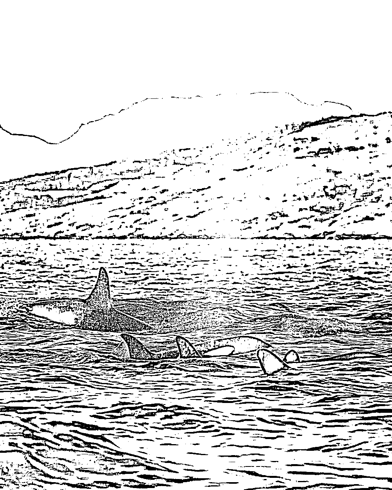

**值得注意的几个日期**本月值得注意的几个日期还有：

**12 月 9 日-13 日**

**金星在摩羯座与海王星形成六分相，合相土星，合相冥王星，火星三分海王星**

这段期间的主题与**人际关系、感情关系、经济关系的责任与承诺有关**，金星加入土星和冥王星的合相，让我们思考**什么才是经得住考验的关系**。在现实的压力下面，每个人都可能是脆弱的孤岛，对脆弱保持真实，意识到自己真正的需求，也可能邀请到一个**接纳性强、稳定、踏实、严肃的关系**。火星在自己强有力的位置三分了海王星，感到脆弱的时候也可以用**冥想、舞蹈**等方式帮助自己放松。

**12 月 19 日-22 日**

**火星在天蝎座六分土星、冥王星，金星进入水瓶座四分天王星**

金星在水瓶座的时候，人们参加团体活动可能会**认识新的朋友、潜在的恋人**哦~除了和我们有紧密互动的强关系，和我们较少联系的弱关系，比如**同学、兴趣团体、邻居**反而是不同社会集群之间传递信息的有效桥梁。**新的事业机会和约会对象更多来自弱关系的介绍。**可以在这期间去参加一个具有天王星意义的聚会，比如**占星活动、科技活动，或者研究外星人的讲座**。当然这个阶段我们也可能会感觉**在关系里更需要自由和刺激。**

火星与土星冥王星形成六分相期间，我们可以**专注在某个工作，打磨意志力和耐力**。**运动**也会帮助我们面对自己的无力感和失控感。

本月还需要注意的是，水星与其他行星的相位非常少。12 月 3 日，水星在天蝎座与冥王星成六分相，9 日进入射手座之后基本处于空相状态，直到 20 日才与海王星四分相。水星下一次的相位是 31 日在摩羯座与天王星形成三分相。这个期间，我们的**思考有可能较少受到外在世界的影响**，虽然这意味着**更专注和深入思考**的可能，但是也容易**缺少沟通，造成误解**，每个人自说自话，看似在沟通实际并没有真正地聆听和接收对方的信息。不知不觉又与大家共同度过了 2019 年，我们明年再见。

**附录：本月重要天象一览表**

| **日期** | **星象** |
| **2019.12.3** | **木星进入摩羯座 水星（天蝎座）六分冥王星（摩羯座）
金星（摩羯座）六分火星（天蝎座）** |
| **2019.12.8** | **太阳（射手座）四分海王星（双鱼座）** |
| **2019.12.9** | **金星（摩羯座）六分海王星（双鱼座） 水星进入射手座** |
| **2019.12.11** | **金星合相土星（摩羯座）** |
| **2019.12.13** | **火星（天蝎座）三分海王星（双鱼座） 金星合相冥王星（摩羯座）** |
| **2019.12.16** | **木星（摩羯座）三分天王星（金牛座）** |
| **2019.12.19** | **火星（天蝎座）六分土星（摩羯座）** |
| **2019.12.20**  | **水星（射手座）四分海王星（双鱼座） 金星进入水瓶座** |
| **2019.12.22** | **太阳进入摩羯座 金星（水瓶座）四分天王星（金牛座）
火星（天蝎座）六分冥王星（摩羯座）** |
| **2019.12.25**  | **太阳（摩羯座）三分天王星（金牛座）** |
| **2019.12.28** | **太阳（摩羯座）合相木星（摩羯座）**  |
| **2019.12.29** | **水星进入摩羯座** |
| **2019.12.31** | **水星（摩羯座）三分天王星（金牛座）** |

**版权声明：**原创文章由作者授权首发于若道平台，欢迎转发，反对抄袭。友号转载请申请白名单。


********想阅读更多作者的文章********

********请在后台回复**************** 咔咔 即可********

**咔咔**

职业占星师，若道核心课程讲师

ISAR 认证占星师（2014 年获得）

国际知名广告公司和市场研究公司工作十余年

**微信公众号**：咔星人

长按打赏


**长按下方图片**

**两位大占星师领你系统学习占星学**

************点击图片查看详情************


**微信又又又改版啦，不想错过若道的推送？**

**就把若道设为星标吧！**

**▼**


喜欢记得点一下在看哦☟

****************报名直达入口****************

