# 若道 202007-202104 PT2

# 深度射手座丨在平凡中寻找意义，终使快乐与智慧相伴

> 原文：[`mp.weixin.qq.com/s?__biz=MzA5NjA0NTAxNg==&mid=2651432973&idx=1&sn=4440eb9de83bc654452eccdfa6d5ef1e&chksm=8b4b1ababc3c93acdf2ad2f18fd5764b865cd5efc20ca97d55268b14398c797fc88325dee405&scene=126&sessionid=1692738070#rd`](http://mp.weixin.qq.com/s?__biz=MzA5NjA0NTAxNg==&mid=2651432973&idx=1&sn=4440eb9de83bc654452eccdfa6d5ef1e&chksm=8b4b1ababc3c93acdf2ad2f18fd5764b865cd5efc20ca97d55268b14398c797fc88325dee405&scene=126&sessionid=1692738070#rd)

******☆ ****后台回复“今日”，给你一句生命态度******

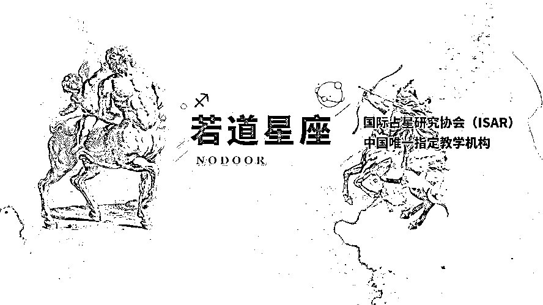

作者/编辑/翀子 ISAR 认证占星师

封面/书君 图片/网络

2020 年 11 月 22 日凌晨 4 点 39 分，太阳进入射手座。在历经死亡折磨与重生蜕变的天蝎座后，射手座为我们带来乐观、自由、信心与希望。这些特质源自射手座对超越日常琐碎的生命意义的追寻，它带来的智慧也帮助每个人在人生路上获得满足与快乐。

**2020 年 11 月 22 日凌晨 4 点 39 分，太阳进入射手座。**提到射手座，我的脑海中立刻浮现出一幅图景：辽阔的大地上，一群正当年的青年男女脸上散发着热情自信的光芒，他们乘着骏马，嘴里唱着：让我们红尘作伴，活得潇潇洒洒，策马奔腾共享人世繁华，对酒当歌唱出心中喜悦，轰轰烈烈把握青春年华……

在历经死亡折磨与重生蜕变的天蝎座之后，射手座的**乐观**与**潇洒**为我们带来了**希望**与**信心，**就像文章音乐——太阳射手座的贝多芬创作的《热情奏鸣曲》带给听者的感受一样。这个下半身是马，上半身是人的星座形象，象征生命的**自由**与**辽阔**，它给我们什么启发？如果星图上的射手座占据了重要位置，它又意味着什么？

**不被日常琐碎消磨，不为远大理想盲目，在平凡中找到生命的意义，体验智慧带来的快乐。**在时空限制中的我们，因为有了射手座，生命有了奔向前方的动力。

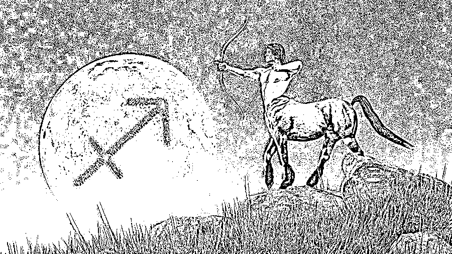

**生命是有意义的吗？**

我们自认为，人类在这个星球上是很特别的生物，我们有思想、有感情、可以做逻辑推理，远不只停留在动物的本能反应，是“神之子”。但随着日子一天天过去，我们在重复的日常生活中渐渐感觉乏味和无聊，自以为会永恒的事物永远在变化，我们在人生的高潮低谷里起起伏伏，随波流动。

在经历生老病死、爱别离、怨憎会、求不得之后，我们不仅心生疑问：**生命的意义是什么？**难道就是为了在日复一日中过日子，然后死去吗？如果是这样，人类被赋予的超越其他地球生物的能力，又有什么用呢？

射手座的形象是半人半马，接触大地的一半是动物，接近天空的一半是人类。人马超越了动物的生存本能，看向银河中心，**追寻终极真理**。我们在时空的限制中，跟随宇宙的韵律生灭往复，但我们不满足于此种浑浑噩噩的状态，**要从中获得对生命更加深刻的理解**。由此，**射手座为我们提供了一条通往生命智慧的道路。**

**“意义”，是射手座那支箭指向的靶心。**什么是意义？在哲学中，**“意义”的意思是“可以被理解”。**比如，如果我没有办法理解你的话，那么你的话对我来说就没有意义。换句话说，如果生命无法被理解，那么它就是没有意义的。

人生短短几十年，几十年前没有我，几十年后也没有我，**这样的生命是可以被理解的吗？**柴米油盐酱醋茶的背后，还有别的目的吗？ **“意义”，是射手座在乎的事。**

人们被时间、被自己的文化与社会环境限制，在看似一切已被“框定”的限制背后，**射手座会引领我们无论从空间还是心智的距离上，走得更远。**

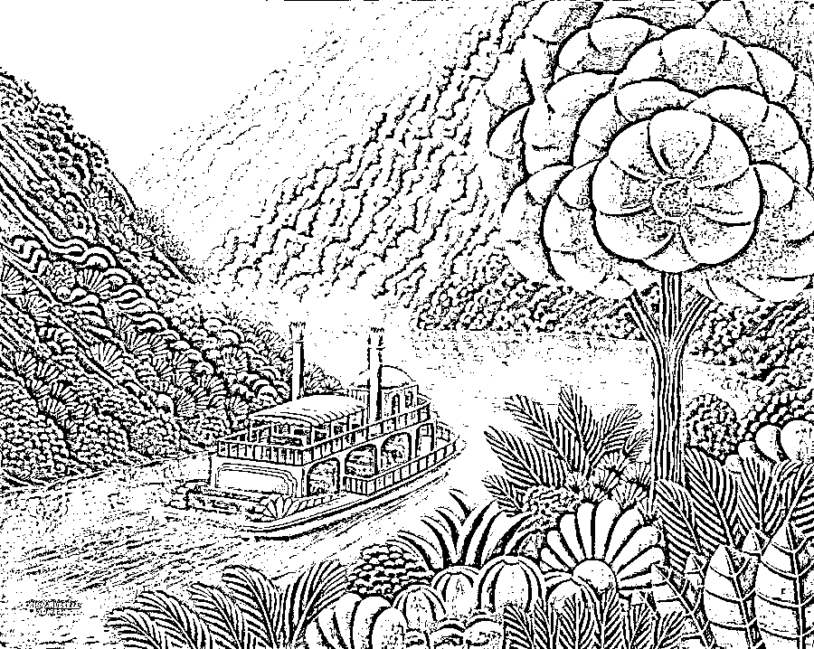

**不畏时间，在限制中找寻意义**

**对一个懂得赋予生命意义的人，每一刹那就像一支射向靶的箭；不懂得赋予生命意义会感到挫败，会有无力感，甚至会令人走向最终的失败——自杀。**

**——《僧侣与哲学家》**

还是让我们回到希腊神话，虽然它们被无数次讲述，但每每重新琢磨，又有新的体会。第一代神王乌拉诺斯（天王星）被儿子克罗诺斯（土星）阉割后，天与地分开，从此克罗诺斯成为了第二代神王。

克罗诺斯战胜父亲乌拉诺斯的故事，似乎是宇宙大爆炸的象征。“时间之神”土星，同时也象征着物质世界，**当时间诞生，天地从此不再混沌，宇宙秩序形成。**

为了避免重复父亲的命运，**克罗诺斯吃掉自己每一个刚出生的孩子。**在这里，我们看到一个惊人的隐喻，即：**时间吞噬一切。**想想地球上的每个生命，不正是如此吗？在有形世界中诞生，在时间中死去，我们对时间有焦虑和恐惧，我们的物质身体无法摆脱时间那张“吞噬的大嘴”。

机会终于来了，克罗诺斯的小儿子宙斯（木星）在出生时被幸运救下，一块石头代替他被吞进克罗诺斯的腹中。宙斯长大后运用谋略与智慧推翻了他的父亲，成为第三代神王，他也成为希腊神话中最伟大的神。

**在“吞噬一切”的克罗诺斯面前，唯有宙斯存有胜利的机会。**宙斯是如何取胜的呢？用智慧。从出生时的“石头换儿子”，到宙斯长大后设计让克罗诺斯吐出其他兄弟姐妹，再到联合其他众神、与克罗诺斯展开长达十年的“泰坦之战”，宙斯不是仅凭运气取胜。

因此在谈到射手座时，**用“幸运”来形容他们是远远不够的。**被木星守护的射手座，拥有一种能量，它可以让我们在有限的生命中，不被时间吞噬，而**战胜时间的方法，是对生命有所理解，**对万物的恒常变化有所理解。

**为了获得这种智慧**，有人在**远行**中寻找，有人在高深的**现代科学知识体系**中寻找，有人在**文化的伦理道德**中寻找，也有人在**哲学与宗教**的教导中寻找。当然也有射手座认为，“生命本没有意义”就是他们的定论，那就是另外一类我们可以探讨的射手座人了。

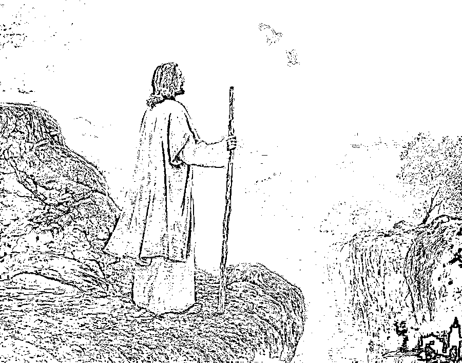

**真理，是个人的经验哲学**

**在古代，哲学并不是许多种学问之中的一种，甚至也不能算主宰所有学问的最高学问，它是一个人生活方式的内在蜕变。**

**——《僧侣与哲学家》**

**哲学**，是射手座的另一个关键词，它总让人肃然起敬，认为是高不可攀的学问。哲学（Philosophy）源于希腊文 Philia 和 Sophia 的组合，意思是“爱智慧”，它的目的不是知识本身，而是知识背后那用来**理解世界、理解生命**的方式。不同的世界观、人生观、价值观，构成了**个性化的人生哲学，成为每个人身上射手座能量的展现。**

如何理解世界和生命，这和我们的成长环境、受教育程度等因素息息相关，是每个人生活经验的总结，**它可能具有大众化的普遍意义，但也可能是某个个体的独特体会。**

从射手座本身的含义与符号来看，射手座的英文 Sagittarius，**来自表示箭的拉丁词根 sagitt**。箭穿过长空，在天上飞翔，但它有自己的材质、被射出的力度、方向和靶心，它有千千万万个方向可以选择，而一旦拉弓射出，这支箭便开始了**奔向远方的旅程**。

划过天际时，它可能被地上的人们仰望并追随，也可能不被人们理解、成为独树一帜的箭。射箭的人们，他们的靶心或许方向一致，形成 “箭雨”；又或者方向相异，箭头互相冲撞伤害。不管怎样，**利箭一旦飞出，就近乎于放弃了其他方向的可能性。**

在这里，我们隐隐涉及到了**射手座的阴影——对异己的评判和固守己见的教条主义。**不过我们先将它放一放，回到射手座的个人哲学。

我们在地球上能看到明亮的木星，再望远一点，土星成为肉眼可见的边界行星。被木星守护的射手座，虽然可以追寻自己的自由与方向，但依然有限制——**被特定的生长土壤和生命经验所限。**所以人们也会说，没有绝对的自由，只有“有条件”的自由。

就像我们相信某个学说或观点，并不意味着它们可以被证明是真理（尤其是很多科学界的论点），而是它们恰好符合我们的生活经验、被教育的情况以及我们自己对世界的理解。

**每个射手座都是哲学家。**这不是说他们一定拥有比别人更高的学历、更多的知识、走过更多的地方（虽然这种情况常常出现！），而是**他们会从自己的经历中总结一套超出日常琐碎的道理**，形成鲜明的个人生活哲学，这套观念能**帮助他们应对生活的琐碎、无聊、厌倦和无常，让他们在这个世界得以心安。**

这套个人哲学是否适用于别人？不一定。但若有机缘，他们对世界和生命的理解，也会对其他人产生帮助，成为理念与知识的**教导者**与**传授者**。就像希腊神话中，天神们的老师——人马凯龙一样。

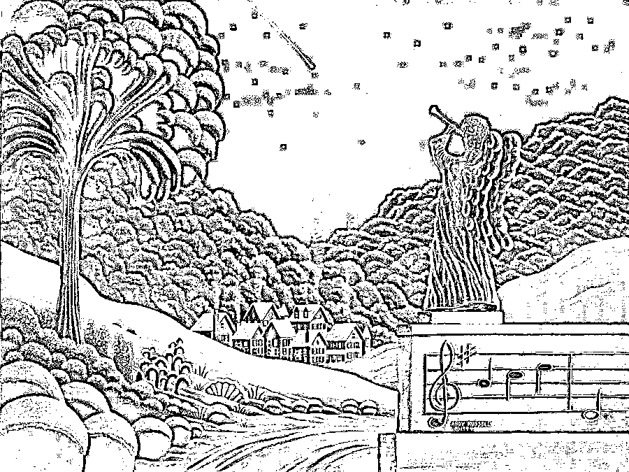

**狂热的信徒，无节制的贪心人**

****所有的宗教和哲学都是在特定的文化环境中兴起，文化环境会把某些信仰当作永恒的真理，但事实上却只是一个特定社会中被公认的习俗。****

**——《僧侣与哲学家》**

宗教、文化中的伦理道德、哲学思想、16 世纪以来的科学观……它们是人们**寻找意义的不同途径，都被射手座能量所代表。**当出于自身情况、相信某个系统观念后，它不但会指引我们的生活，也让我们看到在日复一日的时间消磨中，生活下去的动力是什么。我们从中得到**快乐**与满足，充满**热情**与希望，不再彷徨迷惑，相信**生命自有深意**（无论那个被认定的意义是什么）。

因此**在典型的射手座人身上**，你会看到占星学书中常提到的**乐观、热情与奔放**。他们身处现实却不被现实所累，岁月这把“杀猪刀”并不会让他们胆怯，反而会让他们对自己的人生哲学越来越有心得，用它解释各种难题。

他们在自己的“理想国”中探索，**用脚步或心智探寻生命的高度。**当被人问起为什么总是一副逍遥快活的样子时，他们就开始**“传道”、“授业”**与**“解惑”**。就像我那位群星射手座、热爱远途自由行的妈妈，她最傲人的“战绩”是在不会英文的情况下，在欧洲自由行 2 个月。她会在游记里附上详细的攻略，当有人向她询问出行细节时，她会热情高涨、倾囊相授，恨不得替对方制定好所有计划。

“真理”在特定条件中产生，而所谓**“意义”也只能因人而异。**就像南方人和北方人永远在“豆花应该是甜的还是咸的”这件事上争论不休，对某个人来说再合理不过的事情，别人可能完全无法接受。对自己认定的真理，射手座可以比金牛座更固执、比摩羯座更坚持、比白羊座更有战斗力——**他们是狂热的信徒（或传教者），他们不允许自己的信仰是错误的。**

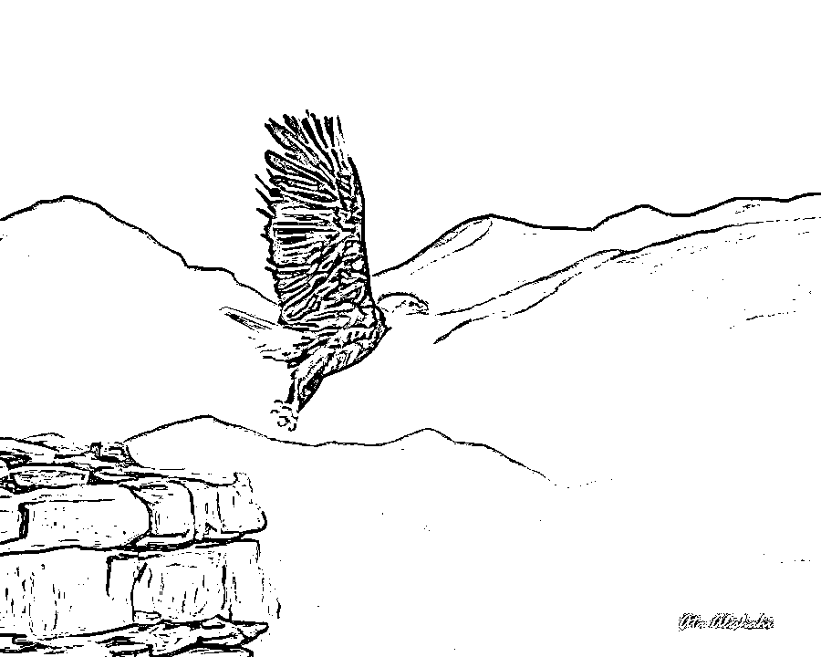

宗教在世界各地历史中的很长一段时间里，充当了人们了解世界、了解生命的教育者的角色。每种宗教里的教义就承担了解释宇宙来源和生命意义的任务，它直接阐述宇宙运作的原理、人类如何诞生、活着是为了什么、死后又会去哪里等等。当跨进那道“相信”的门槛， 人的生命仿佛就有了寄托与意义，继而看开很多事情，变得越来越快乐。

有的宗教坚称 “信我者才能进天堂”， 认为自己拥有“神的旨意”，有权以武力方式扩张、强迫人们变成信徒。而如果要成为信徒，就意味着同意相信教义中的“真理”——即便它们无法被证明是事实，或者与你的生命经验相异。

**当不同的“真理”相遇，就像空中飞向不同方向的利箭，互相碰撞且杀伤力极强。**而那些坚持用“科学观”看待世界的人，无疑也把科学当作了一种宗教，即便其中很多理论随着时代发展被推翻，他们依然坚定不移的“科学至上”而摒弃其他观念。

******知识是一把双刃剑。它可以创造那么多的善，也可以创造那么多的恶，它可以用来建设，也可以用来毁灭。******

**——《僧侣与哲学家》**

**射手座是要“燎原”的生命之火，它要燃烧，要远播，要践行自己奉行的真理。**与其说不允许自己的“真理”是错的，不如说他们**害怕那个相信已久的“意义”是错的。**

**“可以被理解”**是射手座生命的核心，如果核心被动摇，就像好不容易爬到梯子高处，梯子忽然倒了，生命便会惊慌失措。所以射手座对待自己的“教义”是狂热的，而那**与狂热相伴的固守己见，成为我们口中的教条主义。**

作为火力十足的火象星座，狂热的射手座很容易让自己**膨胀**成“气球”，从这个角度，我们也可以说射手座是**贪心**的，他们对自己喜欢的事物**很难节制**。还是拿我妈做例子，在无法远行的 2020 年，她每天都要跟着视频直播课至少上三节瑜伽课，直到某天因为过度疲劳肌肉拉伤，这才作罢。

有句西藏谚语这样说——**“不要只顾着梯子，要记得你要爬向哪里。”**射手座想爬得高，看得远（这和摩羯座步步攀登的目的当然是不同的），高处的景致他们越看越兴奋，想着更美的还在后头，以至于停不下脚步，忽略（或看不上）了地上的春夏秋冬。

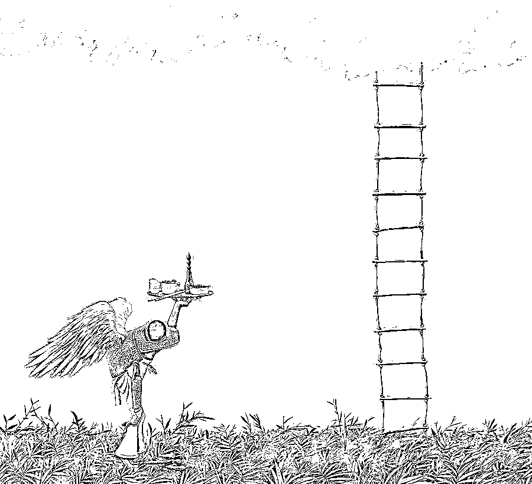

**敞开心胸，在智慧中快乐**

**对射手座来说，让生活过得真正有品质的根源，就是要让生命有内在的意义，**这份意义是他们在地球上生活的真理。但我们不能忽略，地球是个“二元论”的世界，既然有一个拥有明确物质身体的“我”，就会有“非我”，会有“他者”。

**没有绝对的真理，只有相对的正确，**我们不能随意否定别人的生命经验。射手座的目的不是简单的“国际化”、“跨文化”、“做老师”、“旅行”、“学习”、“读书”……这些只是他们在追寻意义的过程中，产生的“附加品”，体悟生而为人和在无常中轮回的意义，才是射手座为我们带来的最大礼物。

每个意义都有它的高度与深度，但不必彼此相同。从这个层面，**射手座可以向与它相距 180°的双子座学习。**我们现在正处于“南交射手座/北交双子座”的月亮交点轴线中，人类集体都需要修正射手座的负面表达，学习双子座的积极表现。今年，我们看到全球各种不同的意识形态在新冠疫情的刺激下产生了激烈碰撞， 让人们忽然发现，“地球村”村民们的想法竟然如此不同、到了无法互相理解的程度。

双子座的灵活机动、较强的适应性与快速学习能力、不带评判的优秀沟通能力是与射手座互补的特质。**敞开接受度，并不意味着放弃自己的真理，**我们的思想反而会从中获得借鉴，拥有修正、提升和扩展的可能性。在百家争鸣的春秋战国时代，“诸子百家”著书立说、游说争辩，使得我国当时的思想与学术达到了空前的高度，大家彼此成就，各有光芒。

如果你相信自己的经验，相信自己对生命的理解，就不会对你的“真理”的可靠性有任何担忧。而当你能站在别人的角度看待他们的经验，“习惯性的评判”便能收到一旁，也就放掉了对“意义”的过度狂热，成为可以向别人提供独特视角的“智慧提供者”。佛陀曾这样说——**“不要因为对我的尊敬而相信我的教导。检查它，让你自己重新发掘出真理。”**

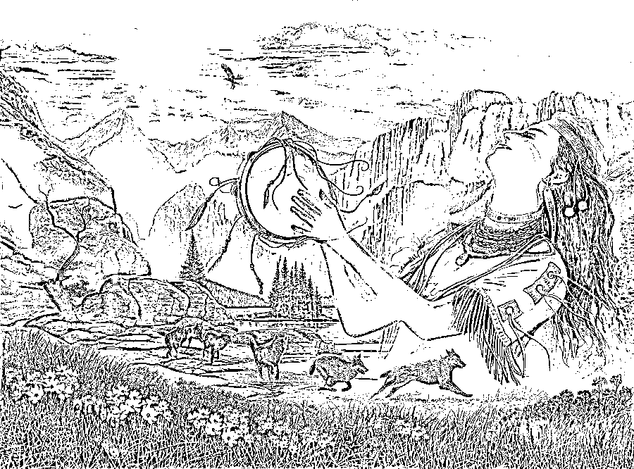

有人形容，人生只有两种状态——痛苦和无聊，即欲望没有得到满足时的痛苦，和欲望被满足后的无聊，无聊之后又产生新的欲望（即痛苦）。**找到星图上射手座和木星所在的位置，那里是我们探寻生命意义并获得快乐的地方。**在寻找意义的过程中，我们会获得超越生命欲望和限制的智慧，它会让我们从更高的视角看待内心的不满足感，从而产生快乐。

守护射手座的木星将在 2020 年 12 月 22 日，和土星合相在水瓶座 0°29′，届时将开启风元素的 200 年周期。从木星角度，如果说之前的 200 年，我们一直在探索物质(土元素)对人类的意义，从而催生了工业革命、经济发展带来的物质神话，那么到了风元素周期，我们便要开始探寻心智能力、互联互通对人类的意义。这是一次重要的转变，也是新机遇与新征程，是新的生命意义在向人类招手。

在此，**愿每个人都拥有射手座的“心向远方”，不被琐碎所困，不被时光所限，在乐观与智慧中走进未来。**

******心对于满足与不满足、快乐与痛苦、成功与失败，扮演着最重要的角色。心隐藏在生命的每一个经验背后，靠它来决定我们观看世界的方式。心就是我们看‘我们的’世界之窗。只要我们心中看待人与物的方式起了一点点的变化，世界就可以被完全颠倒过来。********——《僧侣与哲学家》**

**版权声明**：原创文章由作者授权首发于若道平台，欢迎转发，反对抄袭。友号转载请申请白名单。

翀子

ISAR 认证占星师（2019 年获得）

若道 2019 届核心课程毕业生，若道微信公众号兼职编辑

**咨询微信**：carolinemichong

**微信公众号**：LumosTrueSelf

长按打赏

**系统学习占星学**

**点击图片了解详情**

**微信又双叒叕改版啦，不想错过若道君的推送？**

**就把若道设为星标吧！**

**▼**

就是这个“在看”，戳戳戳 ☟

********报名直达入口********

# 金星进入天蝎座｜接受一切的丧失与落空，新的机会和真心就在前方

> 原文：[`mp.weixin.qq.com/s?__biz=MzA5NjA0NTAxNg==&mid=2651432906&idx=1&sn=bc3eeaa21a578d002496481aa38da542&chksm=8b4b157dbc3c9c6bcf2f8cefed1d65afcd6a6964c1069c31fcc4ea271247de975faed9d3f5f0&scene=126&sessionid=1692738075#rd`](http://mp.weixin.qq.com/s?__biz=MzA5NjA0NTAxNg==&mid=2651432906&idx=1&sn=bc3eeaa21a578d002496481aa38da542&chksm=8b4b157dbc3c9c6bcf2f8cefed1d65afcd6a6964c1069c31fcc4ea271247de975faed9d3f5f0&scene=126&sessionid=1692738075#rd)

********************☆ 后**********************台**********************回复“今日”，给你一句生命态度********************

作者/郑玮玲 ISAR 认证占星师编辑/玫瑰 图片/全景网

11 月 21 日 21:21，金星进入天蝎座，金星将在天蝎座行进 25 天，直至 12 月 16 日凌晨进入射手座。这段时间，你需要重点处理怎样的议题，又能得到怎样的收获？一起来看看。

**金星进入天蝎座**金星在天蝎座向来被认为是金星落陷、难以顺畅表达其原型能量的位置，然而，天蝎座的金星依然不失金星的曼妙与柔美，就看我们如何去倾听和回应它与天蝎座交织的宇宙之声。天蝎座是水象固定星座，在黄道十二星座中，所有的水象星座都具有疗愈的潜质。但属于天蝎座的疗愈力是“刮骨疗伤”级的，也是以痛愈痛的，更是置之死地而后生的颠覆力。在每个人的生命中都有一个确定的境遇会将我们此生拥有的一切都带走，那就是：死亡。而对于灵魂来说，死亡也无法带走习性与情绪体的印记，于是，我们通过天蝎座的指引认识到：**轮回。**

**在天蝎座的水域，我们被现实无情地推向物质、生理、意识和情感的极限，而后坠入黑洞，彻底失控，丧尽一切。**在竭尽全力，在危机时刻，在黑暗绝境，在生死关卡，我们最终迎向转化。由此，深重的业力灰飞烟灭，沉重的心灵换得轻盈飘浮，恐惧被光明驱散。轮回更新生命力，新的希望与动力让需要改变的习性、业力与情绪体重生，并走向新一轮的在成长与进化。

这就是天蝎座终极的排毒、进化力，超越人类极限的能量和超越意识与想像的资源和宝藏。命运转化的智慧无法在平顺富足安适中获得，而天蝎座蕴藏着生命最深的宝藏，除非我们向下看，向内看，走向内在的撕裂与毁灭，否则无法获取天蝎座的宝藏。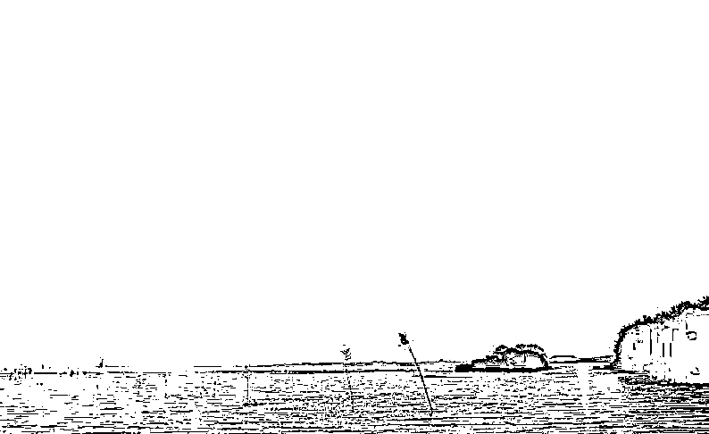**金星天蝎座的情感模式**金星在天蝎座，会让情感表现激烈而执著。**金星天蝎座追求纯粹的爱，极致真诚的心，亲密无间的信任与联结，而在这个变幻世间终究会是一种挑战，甚至妄念。**对于一个金星天蝎座的人来说，忠于自己的欲望如同忠于自己的灵魂，完全臣服在欲望与情感之下，任由激浪汹涌翻滚，完成尽可能的失去、毁灭才能重归平静，重沐爱的恩典。天蝎座的传统守护星是火星，火星的骑士，勇猛之气透过金星展现出爱的勇士的作风——**充满力量，善于自我激励，在爱的道路上为了欲望搜寻、捕捉猎物，也为了真爱赴汤蹈火，身体发肤全然奉给赤诚火热的灵魂，去寻求共舞的舞伴。**这般的热爱浴火则焚，浴水则化，显然需要同样赤诚的心来共进退。金星天蝎座的情感世界没有灰色地带，非黑既白，要么深爱，要么此生不相往来。因此他们既可能是致命的敌人，也可能是你最紧密的爱人、密友。而冥王星与天蝎座的共振带来令人窒息的吸引力。也许很多人会将金星天蝎座等同于电影中蛇蝎美人的样子，但那只是其中一面。**更真实的金星天蝎座对爱的付出是全然无保留的，作为金星——平衡与对等的回应，得到的也需要真诚全然。**在冥王星的牵引下，天蝎座的金星具有了两种极致的特质，**或者强力突破，或是化骨柔情**。前者刚劲，但刀枪可抵，后者却是柔情难挡。**在全然的信任中，金星天蝎座会呈现如婴儿般脆弱、赤诚而无惧，任世间风霜雪雨也足以被这至柔至真所打动而退让、成全。****金星天蝎座所具有致命吸引力是让人无法抗拒的容颜、肉体、金钱或是利益，总归都是让人欲罢不能之物。**通过这种强效、热烈的吸引力法则能将物质、身体层面的欢愉快速燃烧，升化为生命精神的养份，比如信仰和梦想。**当两个个体完成了水乳交融的情感炼金术之后，便能实现坚实的信任与共生。**资源与共享**金星天蝎座在资源、财富的世界里也是如鱼得水，能吸引各种深藏的资源。**这样的优势会支持他们完成属于小我的占有与控制的欲望，在个体化的进程中，金星天蝎座势必要**通过金钱的功课去达成自我的进化与蜕变。**如果善于良性的危机管理，就会带来超高的应急处理能力。但如果不曾敲开自己内在的门，因为恐惧而裹足不前，金星会真的陷入在天蝎座的阴影里，**深入自我陷害的情境中，将渴望真诚的心与世界隔绝起来，将我的与外面的世界分隔开来。**历史不断告诉我们，**拒绝建立信任与共享的资源总是面临战争与抢夺，于是天蝎座的抗争与仇敌其实是因利而为。**如果充满正义地去走入内心城池，那么金星天蝎座会蜕变心中的寒宵为暧昼，让光芒照进同盟关系中。**金星天蝎座会有些有价值和秘密，保守你的秘密，或是试探关系中的秘密，需要清楚底限与禁忌。占有欲会破坏关系，但共享会带来联接与信任。****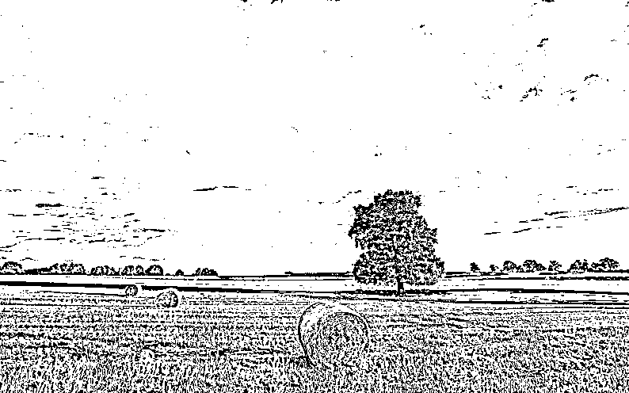**痛楚的价值**金星天蝎座让我们能够体会到痛楚的价值。**天蝎座的敏锐感知能让我们**经由创伤体验感知生命的完整与平常的可贵**。当我们身体健康时候是感受不到局部对于整体的重要性的，但如果身体有任何创口、痛点我们就能感受牵一发而动全身，一个部位不舒适会让我们在日常行动受到影响，身体组织、肌肉、关节、脏器，连同呼吸、意识和情绪都被那个局部所影响。而那种不舒适感会将我们带往疗愈与探究，也更加懂得珍惜每个平常。这是真正爱的法则，在金星天蝎座的氛围里，我们可以**通过失去和痛楚品尝到平凡与整体的珍惜，体会到珍惜我们曾经忽略的幸福。**当我们对痛苦有了更深更真的体验，我们就更深地接纳了人生。因为人生的本色并不是苦乐参半，人生的本色确实就是单调无味，孤独，平凡，痛苦，再加上小小的短暂的快乐，但痛苦是恒常的。不是每个人有面对真实的勇气，而天蝎座让我们无法不直视真实。在痛苦水域里我们往往能触碰真实。当我们和创伤一起工作时，面对阴影时，内在无垠的智慧才升起。天蝎座所需要的激烈不过是无法看向真实的人没有能力去看到的部分。天蝎座用它的方式教会我们明白真理，并能安然与自己相处，并获得内心深刻的宁静，这就是金星的目的，它在用天蝎座的方式告诉我们宁静。极致的艺术金星天蝎座会带来具有魔法的艺术。金星天蝎座的周深，他的声音是世间难得的天籁，同时他对音乐细节的处理是花了极致功力。在这个小鲜肉霸屏，人工颜值横行的时代，周深既无彪悍高挑的身材，更无如花的面容，单薄矮小的身形，从来没见他在舞台上被衬托出华丽的的殿堂级歌手的样子，在综艺节目中他更像是别人身旁的孩子。
周深可能不是属于舞台的人，但他是属于音乐的。在音乐中他不断向内深挖，我们能听到周深对细节的处理精致到每一个音节的发音，无论在微弱气息下的精准音色，还是行云流水的旋律中精湛层次的演绎，可以说如同中国的水墨画般，看似浮云悠然，其背后功底深蕴。他将歌词与旋律完美结合，并不激越、高昂的轻唱浅吟，足以让人们通过他独特的嗓音感受到疗愈的奇幻魔力。不要忘了，天蝎座的原型中包含了**“魔术师”**，周深具有这样的魔力，看似不费力气，却已精彩纷呈。在音乐中深潜，用清澈、真实的音质疗愈了世界残缺的美好。

**“让自己虚空，好能偈芦笛一样吹奏出妙韵。**

**让自己虚空，好能偈芦笔一样书写出奥秘。”**

**——鲁米（金星天蝎座）**

**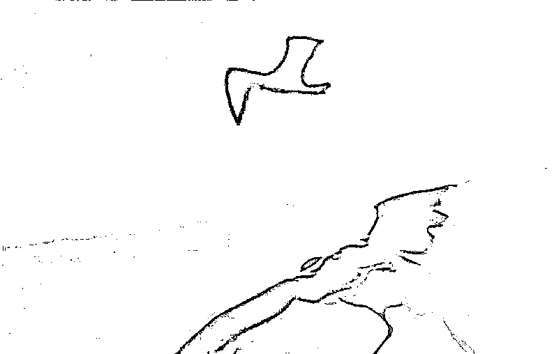**

**金星在天蝎座期间的重要行进****金星对分天王星****持续时间：11 月 21 日-12 月 4 日****重点影响人群：有个人行星、四轴、交点位于天蝎座、金牛座、狮子座、水瓶座 0°-15°的人群。**天王星对于金星向来都是不速之客，猝不及防之势我们的情感世界就崩塌了，变天变得毫无征兆。没有多少人能承受得起情感中的晴天霹雳，因为这种伤是片刻凛冽，却以让人用一生去寻求打开创口的可能性，因为刹时的惊恐会包裹住本应疗愈的核心创口，以致于很多人会带着看似无损的伤，看似完整的自己继续走下去。**金天对分，被切割的伤痛可能出现在情感、金钱关系中，突如其来的断裂感会将我们享受快乐的能力封闭住。**另一方面，天王星也有如突如其来的闪电击起我们喷涌的创造力。**渴望实现自我价值的人们可以好好利用这段时期去深挖内在潜能，因为天蝎座的金星只能是向下深入，在你最具实力，拥有最丰沛感知力的地方掘开封藏的力量。**

**金星三分海王星**

**持续时间：11 月 30 日-12 月 13 日**

**重点影响人群：有个人行星、四轴、交点位于天蝎座、金牛座、双鱼座**、**处女座**、**巨蟹座、摩羯座 10°-26°的人群。**

也许有的人看到金海三分会进入罗曼蒂克的幻想之中，但海王星的危险性往往是被我们忽略的，尤其在感情中。一切的**逃避、麻醉、无力、欺骗、消融边界**都与海王星这个“罪魁祸首”有关。

海王星会在**11 月 29 日**在双鱼座 18°09 分恢复顺行，当金星与海王星形成三分时，海王星就处在最紧要的停滞期，由此带来的海王星的影响力可以说是无边无际的。在这段金海开始形成相位的时期里，**无论在感情还是金钱关系中，务必擦亮你的眼睛，保持头脑清醒，搞清楚你的境况与局势，按照既定的必需的规则来行事，或是参照世事常理**。

在这个时期，**保持高度警惕和敏锐洞察力**是绝对有必要的。而金海三分确实也能将我们往温柔的怀抱中推去，让我们无力抵抗，**如果你感受到疗愈与无限的接纳，那请走向这敞开的真诚。**金海三分的时节，我们也值得去**遇见深刻的艺术印象，无论诗歌、音乐、电影、戏剧，那些深入心灵的共鸣可能带来超越轮回的回响，疗愈我们久远的创伤。**

**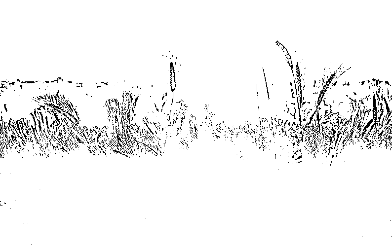**

**金星六分木星****持续时间：12 月 8 日-12 月 16 日****重点影响人群：有个人行星、四轴、交点位于天蝎座、水瓶座、摩羯座**、**巨蟹座 20°-29°的人群。**时代既能造就人才，也不断在淘汰陈旧。木土的合相已经开始，尽管现在还在摩羯座尾度，还有一些小小的容许度，但我们知道一个伟大的时代已经拉开序幕，每个人都值得在此时**张开双臂迎接新的机遇，同时埋头完成你当下的功课。**我们每个人都有闪闪发光的一面，现在就是那个时刻，让自己发光的那一面转过来，去遇见你的时代契机，这个契机可能就是你生命的奇迹。不要忘记你已经拥有的和值得开发的，不管是追求金钱、名利、爱情、事业、理想、艺术，木土合相的力量会给我们一轮幸运抽奖。**如果你对自己够真实，那你尽可能去念诵心中的魔法。****金星六分冥王星****持续时间：12 月 4 日-12 月 16 日****重点影响人群：有个人行星、四轴、交点位于天蝎座、水瓶座、摩羯座**、**巨蟹座 15°-29°的人群。****这个时期我们很可能因为长期稳健的投资理财态度而大获一笔，也可能因为恒定的付出而收获巨大，无论怎样，你的努力值得被嘉奖。****如果你正期待一份真挚的爱情，现在有机会遇见了，尤其你如果是重点影响人群的话。**在天蝎座的金星会鼓励我们去相信，也提醒我们保持真诚，冥王星同样容不得半点虚情假意，因此你只需要问你的心是否怦然悸动。或者你已历经岁月的沉淀，准备好一颗平常心去接受眼前的一切丧失与落空，那你同样会遇见爱，遇见真心。在你的内心深处，总有一处柔软与温暖是留给久违的自己的，在洗尽铅华后你依然走在光耀的内在旅程中，带着光，继续笃行求索。

**版权声明：**原创文章由作者授权首发于若道平台，欢迎转发，反对抄袭。友号转载请申请白名单。

**郑玮玲**

ISAR（国际占星研究协会）认证占星师（2016 年获得）

若道占星专栏作者

将占星咨询、教学与音乐、舞蹈相结合的疗愈者

**微信号**：zhengviolin

**新浪微博**：@郑玮玲

**微信公众号**：Sampriya-Astrology

长按打赏

**学习顺势疗法**

**请点击下图了解详情**

**微信又双叒叕改版啦，不想错过若道君的推送？**

**就把若道设为星标吧！**

**▼**

就是这个“在看”，戳戳戳 ☟

********报名直达入口********

# 顺势疗法丨生命力的一面镜子，照出自愈的秘密

> 原文：[`mp.weixin.qq.com/s?__biz=MzA5NjA0NTAxNg==&mid=2651432906&idx=2&sn=98c85d733b859332f903d2cc10cc7109&chksm=8b4b157dbc3c9c6b717c4be91a6f9b9fbd0fc40dbb56c7b66651b2f1479f8789492efc12caa1&scene=126&sessionid=1692738075#rd`](http://mp.weixin.qq.com/s?__biz=MzA5NjA0NTAxNg==&mid=2651432906&idx=2&sn=98c85d733b859332f903d2cc10cc7109&chksm=8b4b157dbc3c9c6b717c4be91a6f9b9fbd0fc40dbb56c7b66651b2f1479f8789492efc12caa1&scene=126&sessionid=1692738075#rd)

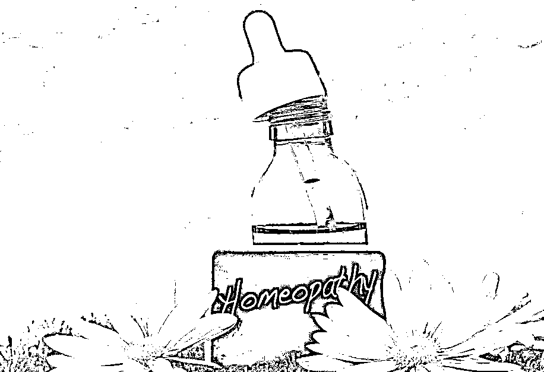

作者/homeopathyplus

翻译/李含 校对/王宏

编辑/翀子 图片/网络

顺势疗法认为，不健康的症状是由体内生物能量的失衡与生命力努力纠正失衡之间的互相作用所导致的。而顺势疗法的药物就像是生命力的一面镜子，映照出它的样子，然后激励生命力恢复健康平衡的状态。**什么是势能化？**

**顺势疗法的创始人塞缪尔·哈内曼发明了一种稀释的制剂法**。首先，把某种物质在酒精中浸泡几个星期，过滤浸泡液得到该物质的“母酊剂"。然后，使用一些母酊剂通过用水反复的稀释和强烈的摇动（震荡），得到最终的药剂。顺势疗法医师声称使用这种方法对药剂进行稀释和震荡实际上能够使它更加有效，似乎**剧烈的摇动可以把能量传输到水中并且留下了对原始物质的记忆。**

**根据稀释的次数，药剂能够得到不同的势能。**常见的势能级别（以稀释次数增加的顺序）为 6c、12c、30c 和 200c。**药剂的稀释次数越少**（称为低势能），**功效越小，作用持续时间越短。**

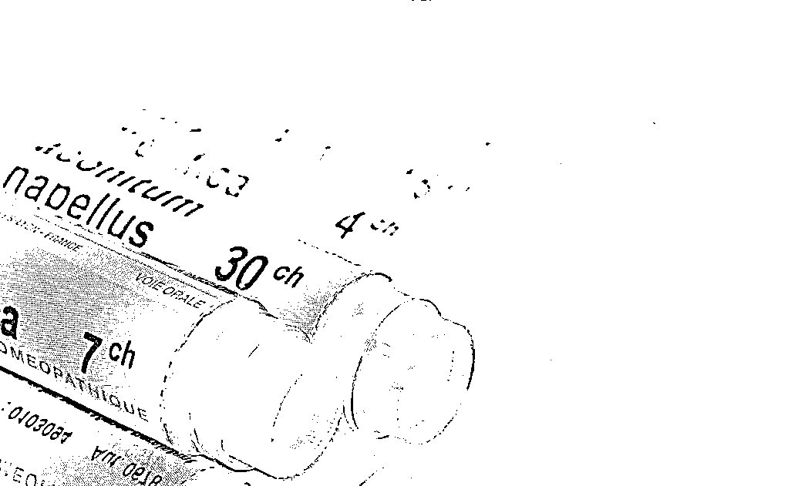

**自愈的产生在于纠正失衡**

生命力的自愈是如何发生的呢？**身体的症状源自身体生物能量的失衡**，顺势疗法的治疗方式就是**纠正那种失衡**。顺势疗法的创始人塞缪尔·哈内曼勾勒这样以最简单的形式描述：

**不健康的症状是由体内生物能量的失衡与生命力努力纠正失衡之间的互相作用所导致的。**

**用药物纠正失衡**

因为这种失衡是能量型的，所以它只能用能量药物来纠正。化学药品可以很好地抑制症状，但是却无法达到足够深的层面去纠正引发症状的能量失衡。**要想真正解决问题，药物能够在健康人体中引发的症状必须与这些失衡类似。**如果失衡的症状只是被压制，那么能量的问题会日渐恶化，导致更严重的健康问题。

**势能化使药力更强**

药物如果要发挥效力也**得在能量上强于失衡**。势能化使得药力更强。当开出与症状相符且具有足够强大的势能的药物时，药物会消除失衡带来的较轻微的症状，以自身更强却短暂的症状取而代之。病人常常并未注意到这些情况。

**症状消失生命力随之增强**

药物产生的相应新症状会替代之前失衡时的症状，但生命力并不能分辨二者的差异，结果就是它会平静地接纳因药物产生的新症状。随着药物效力的消失，它所叠加的症状也随之消失，只留下无病的状态。**生命力发觉自己现在摆脱了最初的失衡症状，随着治疗症状消失，生命力恢复过来，就像是松开的弹簧一样。如此一来，人便恢复了健康。**

患者生命力强时只需一剂药。所以，为了恢复健康和平衡，其实发生了两件事：

*   失衡的症状由于正确用药，症状消除、被取代。

*   生命力的反弹效应随着药物所带来的暂时症状的消失而恢复了健康与平衡。

当这一过程发生在急性疾病，比如食物中毒或流感中时，患者康复只需要很短的时间。如果他们有着很强的生命力，而且失衡是近期的或轻微的，那么完全恢复只需一剂药就能达成。下面案例中凯德的故事就可为例。

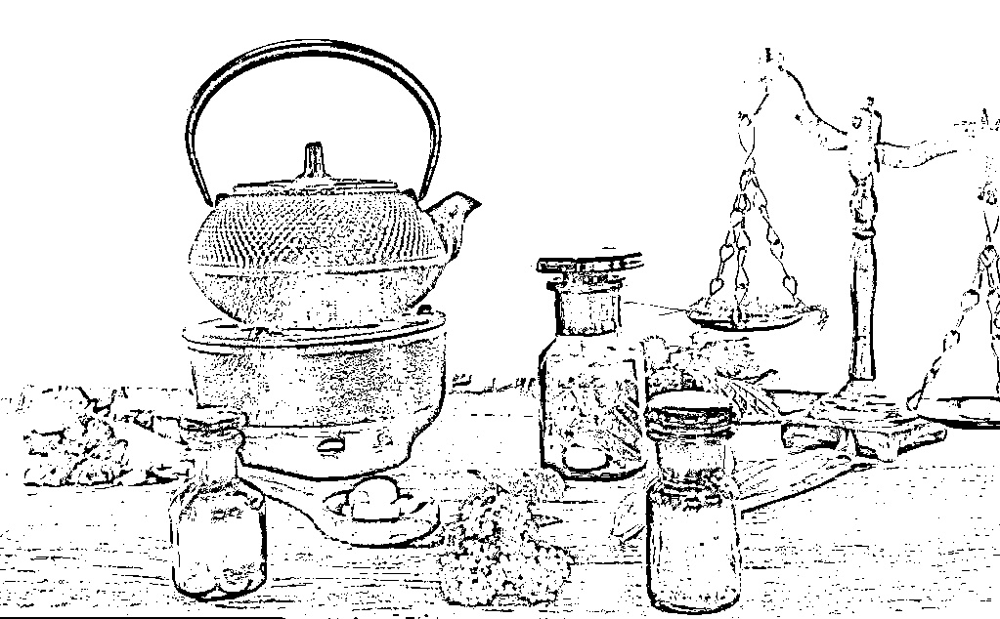

**凯德的案例**

三岁的凯德午夜刚过便醒来哭泣。他焦虑、害怕、不安。他的母亲看了看他，知道他状况不妙。他一边脸颊发红，扁桃腺红肿，他的皮肤发热、发干。温度计测量他的体温是 39.6°C。她按照家用药箱中的指导给他服用了一剂顺势疗法药物，乌头。不到 10 分钟，凯德退烧了，出了一身汗。他的母亲把他擦干，用毯子裹着他，然后坐在他身边。20 分钟后，他睡熟了。第二天，他起来玩耍，就好似从未生过病。

**医师点评：**

凯德的妈妈选择了正确的处方。乌头对于迅速出现不安和焦虑这类强烈症状的疾病初发阶段很有效。凯德的所有症状与对乌头进行药物试验时所产生的症状类似。他在服用一剂药物之后快速恢复，这表明他的生命力很强，而且处方对症。

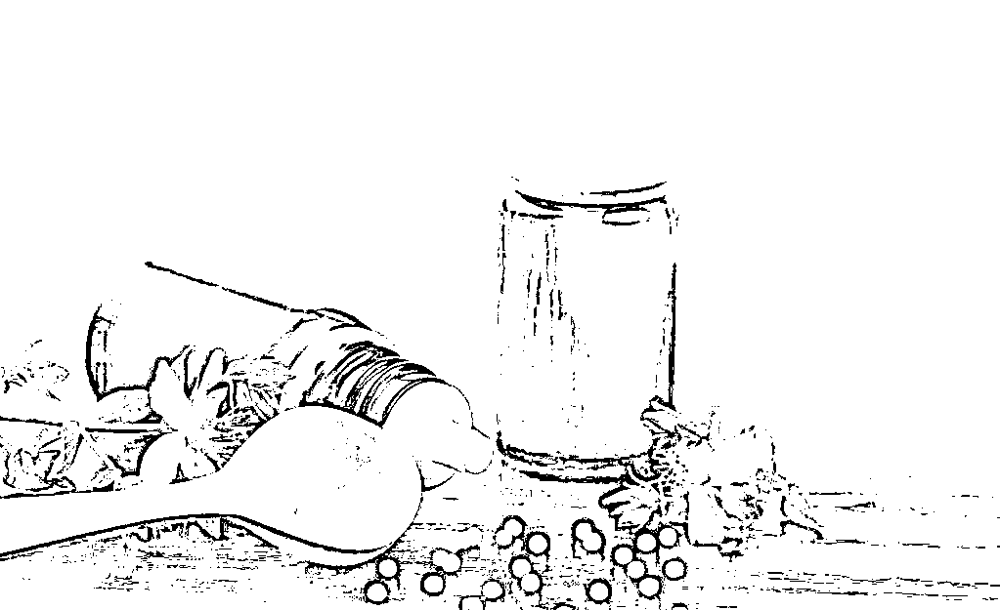

**患者生命力弱时需要更多剂量药物**然而，**随着我们年龄的增长，我们的生命力会变弱，任何失衡都会加强**，在我们短暂急性疾病的基础上又有了持续的慢性疾病。在这一阶段，一剂药就可完全恢复的情况很少见。它可能会暂时在一定程度上消除失衡的症状，并激活生命力的惰性反应，但也仅仅如此而已。一旦体内的药效消失，失衡就会全面归来。在这种常见的情况下，需要**多剂量的药物温和地促使患者恢复健康，**正如以下案例中亚利克斯的情况。

**案例：热、痒和胀气**

36 岁的亚历克斯症状混杂。他受到失眠的困扰，并饱受口臭、胃灼热、肠胃胀气和痔疮的折磨。他经常鼻窦发炎，在春夏他频发的花粉热会发展成哮喘。他的皮肤干燥瘙痒，他的嘴角开裂。亚历克斯从来不觉得冷，他在夜里把脚伸出毯子让脚凉下来，甚至在冬天也是如此。他也喜欢咖喱和甜食。精神、情绪方面的症状包括令人瘫软的恐高症和死亡恐惧。这些症状大部分自童年起伴随他至今。

亚历克斯在接下来的三个月里服用了具有一系列势能的顺势疗法药物硫磺，在此期间他的症状完全消失了。

**医师点评：**

亚历克斯很幸运，他的症状与对硫磺进行药物试验时试验者所体验到的症状相似。这是很容易开出的药。亚历克斯很快就对治疗有所反应，在第一剂药物服下后他的许多症状都有所改善。每一次他旧病复发，或改善停滞时，他就服下另一剂药。在那三个月期间需要用到四种不同势能的硫磺。没有添加其他药物，因为在他的治疗过程中没有发展出新的症状。如今，他的症状已经消失，他也停用硫磺了。

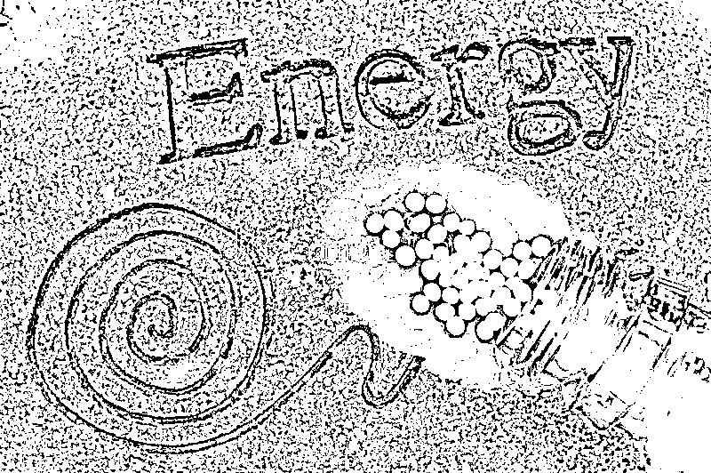

**反复锤炼，低迷的生命力能被增强**

**顺势疗法的药物温和促使患者恢复健康**，在这点上，将生命力视作肌肉会很有用。无力的肌肉经过锻炼可增强其力量。同样地，低迷的生命力经过药剂的反复锤炼可以被增强。每次生命力在药物的刺激下反弹时，它都会变得更强一些。每次生命力变得更强一些，它就能更为持续地改善健康。最终，它变得足够强大，可以去维持完全、持久的改善。

并不需要继续服用药剂，患者将来对该疾病会有更强的抵抗力。这种情况会多快发生取决于三个因素：**生命力的强度、失衡的程度以及药物与症状之间的匹配程度**。正如之前所谈论过的，如果药物与症状相匹配，生命力很强，而失衡是最近的或轻微的，那偶尔只需一剂药物就可完全恢复健康。**更常见的情况是，将需要一系列的药剂。**

有时，能量失衡所引发的症状可能在治疗过程中随着药物消除部分失衡而发生改变。随着这种药物处理的症状和这些失衡症状之间不再匹配，康复就会停止。如果患者要继续恢复健康，就必须开出与症状更为匹配的新药物。**在治疗过程中可能得使用多种药物。**以下案例中蕾娜的故事阐明了这一过程。

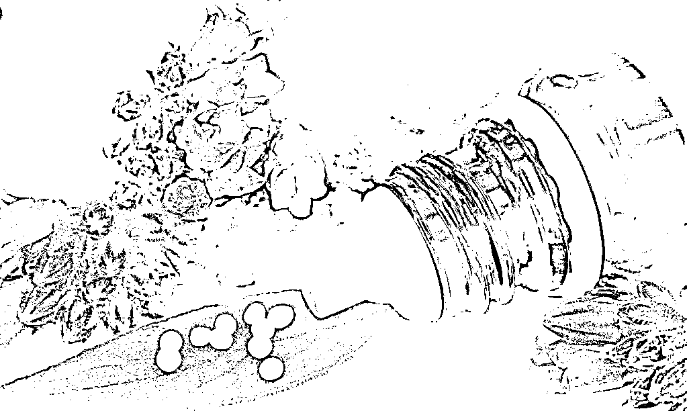

**案例：我的皮屑痊愈了！**

蕾娜因为自己慢性疲劳综合征和恐慌的问题来进行顺势疗法的咨询。她的疲劳症开始于 10 年前，在她患上巨细胞病毒感染之后。她有如下症状：肝痛、腹胀、视力模糊、鼻出血、发抖、化学物质过敏以及常常干咳。经常性的口干让她难以吞咽或说话。虽然已经有了很大的改善，但有些症状依然困扰着她，她有时精疲力竭，发觉自己早晨很难起床。焦虑和压抑同样困扰着蕾娜。

最近，她的焦虑恶化成了恐慌。虽然蕾娜很疲惫，但是她很不安，充满了“紧张的能量”。她说，充满活力的工作会改善她的疲倦。她也长期饱受鲍恩病的折磨，这是一种癌前期角化皮肤增长的疾病。这些皮疹通过定期涂抹一种乳霜而被去除掉。

在蕾娜咨询结束时，给她开出的处方是顺势疗法药物乌贼墨汁，这与她的症状最为匹配。6 周后，在服用几剂药之后，蕾娜说她好多了。她的能量水平提升了，她的焦虑尽管依然存在，但强度有所降低。腹胀几乎不复存在，发抖和口干的问题已经没有了。

消极的一面是，现在她的肠道功能迟缓，她对医院和飞行产生了恐惧，尤其是在做出海外旅行的计划和获悉一位友人做手术的消息之后。乌贼墨汁与这些新的症状并不匹配，而顺势疗法药物碳酸钙是与之匹配的。由于它也同样与她的许多遗留的症状相匹配，所以就开出了碳酸钙的处方。

九周之后，蕾娜的焦虑进一步得以改善。她告诉我，她“脑子里的毛病”没有了。海外假期“棒极了”，乘坐飞机也不再是问题。医院不再让她感到焦虑，她轻松地探访了因术后并发症而再次入院的朋友。蕾娜的肠道功能规律了，她手脚冰冷的状况也有了改善。她依旧感到不安，在夜里难以入睡。她的皮屑疹也恶化了，现在新起了几片疹子。上一周里，清鼻涕让她的鼻子和上嘴唇都被擦破了皮。

基于这一信息，我给蕾娜开了碘化砷，一种与她新出现的症状极为匹配的顺势疗法药物。不到一周，她就兴奋地给我打电话，告诉我说她的许多皮屑都没有了！这是以前从未发生过的。在这之后服用这种药物让她的状况继续得以改善，在改善停滞或症状复发时根据需要服用一剂药物。在我上次与她交谈时，她说，与她第一次来咨询时相比，她的症状已经好转了 95%。她的治疗还在继续。

**医师点评：**

蕾娜从一种药物换到另一种药物的这一过程表明了**处方总是应该做出改变以符合症状，**不这样做就难以治愈。在蕾娜的案例中，一种药，即便是多次剂量或多种效能，也不能纠正引发她症状的深层失衡。因此，我给她用了一系列对症的药物，她现在期待更快乐、更富有成效的生活。

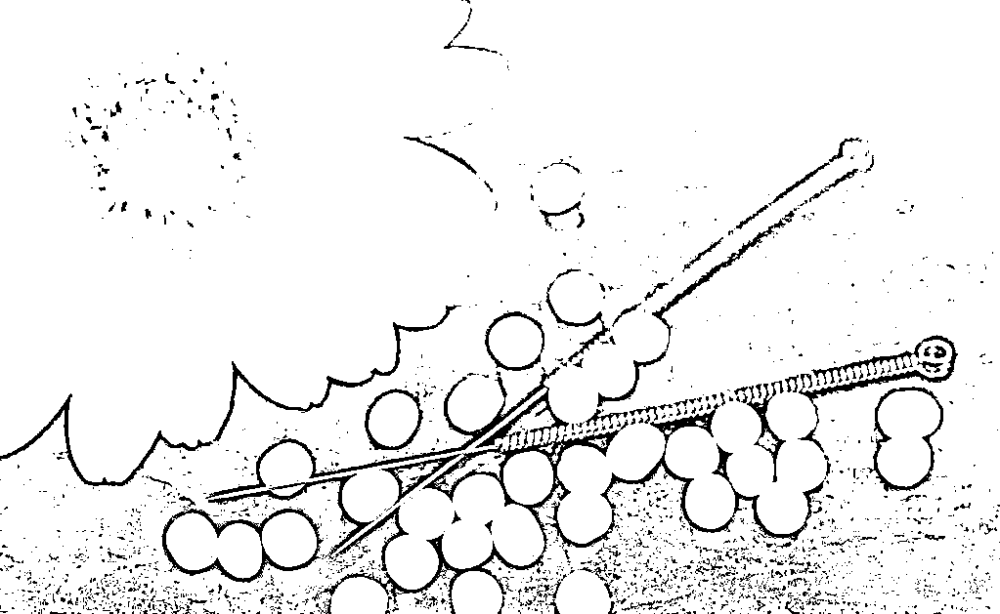

**这一切是如何发生的？**

生命力增强是如何发生的呢？简短的回答是没人知道。尽管上述理论可以在实践中被观察到，但实际的机制依旧未知。科学正对此进行研究，但还没有足够敏锐的仪器去测量顺势疗法的势能和疗愈在能量的层面发生了什么。

已知的是，**“信息”常常可以从一种物质转移到另一种物质。**就像是一根电线里的电流可以产生电流通过另一根完全不同的电线，就像是磁铁在和纸夹接触一段时间后可以将磁力转移到纸夹之上，**势能化将一种物质引发症状的能力转移到一种液体或糖丸药物中。**

然后顺势疗法医师根据同类法则开出药物，安全地将这种信息转移到生命有机体中，去**触发疗愈效应。**这就是过去两百年他们所做的事，这也是他们在未来将继续好好做的事。

就像是给一队正在鏖战中的骑兵派去增援，生命力可以通过一种模拟其当前症状的药物得以增强，以纠正其失衡的状况。换一种解释，**顺势疗法药物就像是生命力的一面镜子，映照出它可怜的样子。被所见之样貌惊骇到，生命力便加倍努力去解决病症。**

**版权声明：**本文由若道翻译发布，欢迎转发，反对抄袭。友号转载请申请白名单。

请在后台回复 顺势 获得更多**关于顺势疗法内容**

**学习顺势疗法**

**请点击下图了解详情**

**微信又双叒叕改版啦，不想错过若道君的推送？**

**就把若道设为星标吧！**

**▼**

就是这个“在看”，戳戳戳 ☟

********报名直达入口********

# 行星格局丨“上帝的手指”，在九九八十一难后顿悟

> 原文：[`mp.weixin.qq.com/s?__biz=MzA5NjA0NTAxNg==&mid=2651432735&idx=1&sn=b328432255daa8e0e9087b3122af96e5&chksm=8b4b15a8bc3c9cbe5e4a3a099ec563d11d9a8d032f71c5964d79c6e9d2a1b43e51eeec721d94&scene=126&sessionid=1692738075#rd`](http://mp.weixin.qq.com/s?__biz=MzA5NjA0NTAxNg==&mid=2651432735&idx=1&sn=b328432255daa8e0e9087b3122af96e5&chksm=8b4b15a8bc3c9cbe5e4a3a099ec563d11d9a8d032f71c5964d79c6e9d2a1b43e51eeec721d94&scene=126&sessionid=1692738075#rd)

**☆ 后台回复“今日”，给你一句生命态度**

作者/Ara 爱拉（王珊珊）编辑/翀子 封面/书君 图片/王珊珊 网络在占星学中，“上帝的手指”格局是指星图上的一颗行星与另外两颗呈六分相的行星形成梅花相位，它常常象征在生活中遇到“无解”的处境。我们如何面对它的挑战并进行生命的转化，可以读读本文作者的见解。

**什么是“上帝的手指”？**

**“上帝的手指”，也叫 Yod 格局**。在占星学中，**落在一个星座的行星同时与另外两个成六分相的行星形成梅花相位**，则组成一个等腰三角形的“上帝的手指”格局。

梅花相位指两颗行星相隔 150 度，这个相位中的两颗行星处于不合意的位置，既非“三方”的同元素星座，也非“四正”的同属性星座，所以彼此难以连结，而带来“别扭/不配合/无视/阻碍”等的效果。而当两组这样的梅花相位与同一颗行星形成封闭的“上帝手指”格局，可以想见这等于一种**双重的困境**，而顶点那颗星也自然成了类似“千夫所指”的压力点。

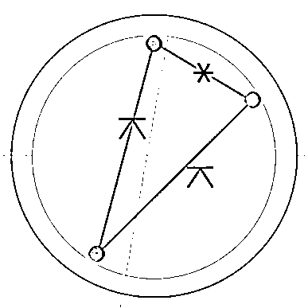

**|** “上帝的手指”格局

在星图中，任何一种“三角形”格局都有着“封闭合作/流动分担”的效果，而上帝的手指（下文统称“Yod”）三角形格局也有同样的影响力——只不过是“流动能力最艰难”的一种。我们去分析一张星图的 Yod 格局，最重要的也就是去分析它“在封闭/孤立中的连结方式”，或者“如何让顶点的行星（手指）发挥作用，让能量流动起来”。

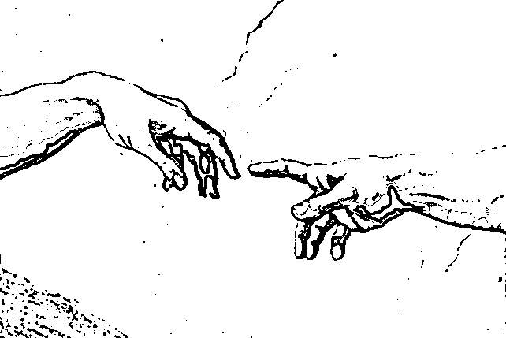

**两难的问题**

总结来说，Yod 格局带来的“无解”的处境会有这些表现：

*   总也没有准备好，找不到合适的动机去出发；

*   决定了出发去行动，却从外界看不到真正的机会和舞台；

*   没有人告诉你“对”或“错”，甚至没有人去“看你”；

*   何时需要临门一脚？取决于你的准备工作是否充足。而何时准备充足？取决于你的“临门跨越”的天然动力是否到来——而这两者很难同时发生；

*   永远无法完成的工作，和时时迫在眉睫的危机感；

*   天时、地利、人和总也“缺一环”的待定状，在时机未到时不得不蛰伏忍耐的宿命感，不被周围人所理解……

其实，无论我们的星图中有没有这个格局，类同于这个格局的“负面影响力”都在日常中影响着我们。比如我们近年流行的“尬”式处境：明明有着机会环境和心理动机，但是却左右凑不成一出戏，总有某个元素（行动）是孤零零地在那不知所以。

又比如我们提起交流场景中“说了矫情、不说憋屈”的话，就为什么无论说还是不说，最后都是煞风景的懊悔下场，所以到底应该怎么办？

再比如我们在人情关系上做选择时，若顾及实际利益吧，太现实，显得没情趣；讲究下情怀吧，又显得太天真，怕被人耍。你想跟他灶边炉台，又怕他只想跟你宽衣解带……所以到底应该采取个什么态度？为什么就不能一拍即合、一次到位？

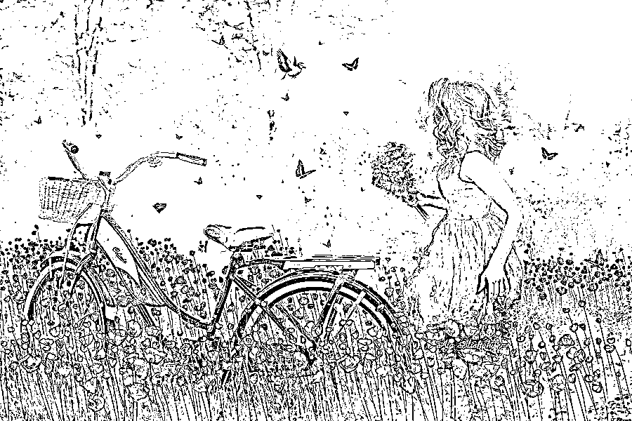

**从原型理解**

要理解一组 Yod 行星，**最简便的方式可以从进入出生星图、理解“星座位置关系的原型”开始。**我们让星图的“开端”第一个宫位=白羊座，那么与它对面的 7 宫天秤座是“180 度/对分”的位置，与天秤座相邻的 6 宫处女座和 8 宫天蝎座，就是对于白羊座来说不合意的“150 度区间的梅花位置”，同时也是“Yod 三角形的顶点压力位”。

以此类推，金牛座与对宫星座相邻的天秤座和射手座为“Yod 格局关系”；双子座与对宫星座相邻的天蝎座和摩羯座为“Yod 格局关系”。即星图中任意一个星座都有它的 Yod 格局关系，也都可以成为另两个星座的“压力顶点”。——只是当回到具体的某张出生星图中时，必须同时有行星落入这些位置，并且三者容许度在 2 度（也有占星资料划为 3 度和 5 度）内的度数，才构成典型的“Yod 格局配置”。

从我们的日常经验来说，白羊座代表我们最直观本能的热情、动力和勇气，就像一个初生牛犊，“理想情况下”可以凭着一腔热血到处撒野奔跑、风雨无阻。

但是呢？如果说给予我们这份“安全小范围奔跑的资格”的首先是来自 4 宫/巨蟹座与 10 宫/摩羯座的家庭社会环境的保护和滋养（与白羊座成 T 三角关系），那么接下来去看能让我们安全有效地“行驶到离目标多精确/多强韧”的，就是取决于 6 宫/处女座对“行驶技能的掌握度”，和 8 宫/天蝎座的对于“处境安危/诱导能源”方面的辨识与可控度——而它们常常导致我们“经验不足、被困难阻碍”和“莽撞冒险、搞砸局面”的结局。

从这个层面来说，6 宫/处女座就像一个不停在耳边叨叨着“这里不好走/那样太吃力/要带好道具/别走冤枉路…”等的周边算计，而 8 宫/天蝎座则是让你内心不断小鹿乱撞的“下一步会到哪儿？会不会得不偿失？有没有危险？冷了饿了被抛弃了怎么办？”等未知盲点的担忧——都是对于我们 1 宫/白羊座的热情本能的“阻力”，虽然同时也是一个善意提醒。

在这样的提醒下，我们不至于莽撞前行，更不会奇迹般变成“热情无限的永动机”。我们需要照顾身体的限度、要调整作息的节奏，还要确保对风险代价的捕捉和“欲求之热度”的控制才能时时获得力量。久而久之，这个过程让我们每个人“内在白羊座能量”的部分好像每一天要么是在限制中步履蹒跚，要么是在惯性的经验里、在安全但老旧的环境里“称王称霸/作威作福”，看似安全活跃，实则困兽犹斗。

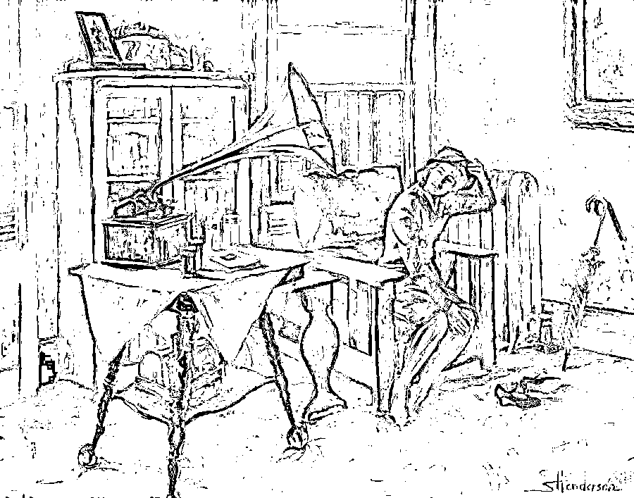

**发挥正面效果**

那么这个组合的真正重点的、也是最容易让人忽略的“魔力效果”在哪里呢？则是：

**6 宫/处女座**对外在物质规律有着技术性的掌握、对自身肉体能量规律的运作予以善巧的尊重、并在劳作中找到“天然的秩序”；同时 8 宫/天蝎座对外在的机遇和风险可以在关键环节精确把握、对内在核心能量的显化/转化方式予以精准调动、并看顾好那股“天然的激情”；

此时**1 宫/白羊座**所代表的“直观的热情本能/冒险性/自我立场与使命等”也及时发出——那么我们的行动简直可以称得上“神来之笔”，风驰电掣却又清醒理性，超越了世俗逻辑的路数，同时看到那义无反顾的“唯一大道”，会有一种被推着自动行走的力量感，亦不再需要被谁理解或对谁解释，你只是“莫名地被允许、被指明、被鼓励”，而让那一刻的野性神性尽其释放！

且问，你生命中是否有过明明在平时唯唯诺诺、保守自律的自己，却在某天身边人发生危险（或某事到关键临头）时不假思索、清醒利落地奋勇救险事迹？或者在某个天时地利人和的时机，你曾以直观的热情和天然的自律带动着发出“完美行动”，事后却慨叹这样的时机“难能可贵不寻常”？那时的行动过程是信任与忘我、没有犹豫和负担，同时又有着敬畏与尊重，简直可谓“神性表现”！

同理：**2 宫/金牛座与 7 宫天秤座+9 宫/射手座**的组合，其受阻的日常表现可以是生活安稳的标准不断被比较和打破、无法满足，而“神性表现”可以是三元素有意识配合后的“活在对一切因果平衡的知足与恩赐中”的合道生活——其中的“解题线索”在于是否看到阴阳平衡之道与万物“宏观微观之映照”的意义指引。

**3 宫/双子座与 8 宫/天蝎座+10 宫摩羯座**的组合，其受阻的表现可以是“人微言轻/忍辱负重/思前想后无底洞”的寡言失策，而“神性表现”可以是三元素有意识配合后的“明察秋毫/见微知著/当下明白/以精言巧语引领潮流”等等的明晰而笃定的轻快状态。

——其中的“解题线索”在于是否既能把捉潮流的涌动，又有耐心做足够的资源积累。

4 宫/巨蟹座、5 宫/狮子座……可以自行推导，不再举例。

这，才是“上帝手指”背后的内涵和魅力，它以某种精巧的安排，**为了带给你“如有神助”的必要指引而一直“待时而发”。**

它的原型在每个人的星图上都有，它的正面和负面的影响力就在我们日常生活方方面面的表现中，任何人都可以有意识去尝试“意会”它、捕捉它、使用它。——只是对于那些星图中真正具有此类行星组合的典型 Yod 格局的人，会呈现为整个生命和命运被安排在这样环环相扣的“题目”下，并因为组合中行星的独特分配，而显得各有“神秘难解”之处。

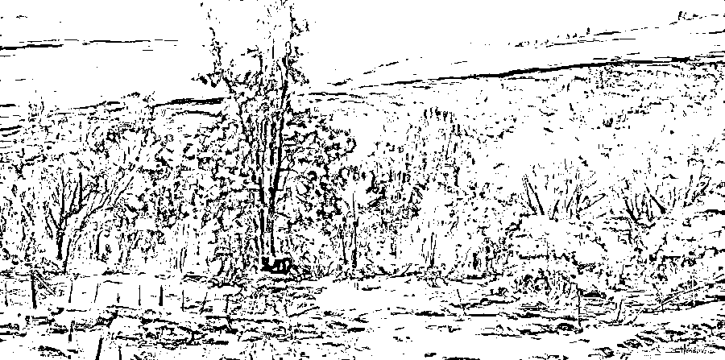

**突破阻力**

要突破阻力获得“神助”，除了要分析三个位置的配合关系，还要照顾每颗行星的“身份任务/角色需求”以及延伸相位、定位星的去处等等。之后你才知道到底在哪种情境下、需要怎样的耐心等待和仔细聆听、需要怎样的信念和技能……才能获得这个“神宠”。

很复杂？那就对了。毕竟，唐僧取经还要九九八十一难呢，哪个“顿悟”不是在千辛万苦的劳作和追问中长久铺垫出来的？真正的“神旨”也并不是那么容易寻觅到。

所以这个格局除了从外在给人带来“不可见但可感知”的困境与束缚、需要吃力地兼顾的复杂环境因素、随时可逃避但又必须支撑下去的某种“生存原动力”之外，在这些“隐形的危机/折磨”下还通常会促使一个人进入对某种事物规律的捕捉、对内在意识的探索，去做一些研究类的工作，甚至走向某种类似炼金术的“转化技能”的追求。

炼金术士相信， “炼金术”的精馏和提纯贱金属，是一道经由死亡、复活而完善的过程，象征了从事炼金的人的灵魂由死亡、复活而完善，炼金术能使他获得享福的生活、高超的智慧、高尚的道德，改变他的精神面貌，最终达到与造物主沟通。不用说，这样的目标是无法达到的。

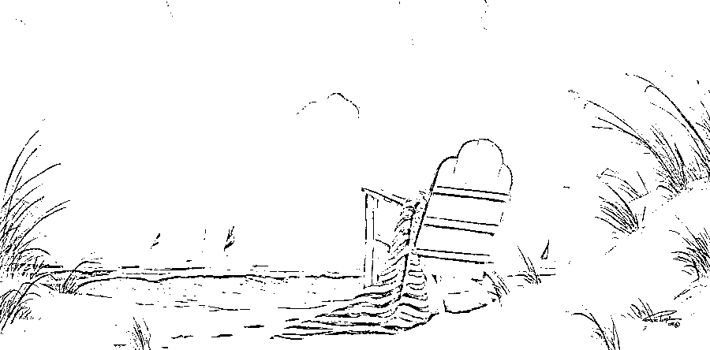

**荣格星图上的“上帝的手指”**

在著名心理学家卡尔荣格的星图中，就有一个典型的 Yod 格局：位于金牛座 23 度 30 分的冥王星，分别与射手座 21 度 22 分的火星，和天秤座 23 度 47 分的木星，同时形成 150 度的梅花相位。在 3 宫作为顶点的冥王星，就成了这个“上帝的手指”格局的压力顶点。

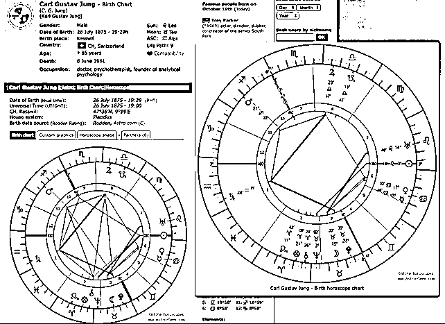

**| **荣格出生星图

**元素带来的动力**

我们知道荣格在做精神分析和个人内在意识的深入探索方面可谓“穷其究竟”，试图从宗教神话与坊间学术资料上的借鉴（火星射手座）、到与病人客户/同行志友们的观察和沟通（木星天秤座），到从自身意识上的深入感知和辨析……这与他星图中的一些关键配置带来的牵引动力不无关系。

除了日海四分、月天四分为他带来的个人敏感性和直觉力之外，我们可以简单认为在金牛座 3 宫的冥王星是“感官世界的探究/渴望获得结果结论/看到学术传播的价值潜力所在”等；另一方面，对面 11 宫射手座火星的“集体/普世的真理与信念的动力”与 8 宫天秤座木星的“对客体关系的亲密探索”，都在同时“鞭策/激励/监督”着他在学术研究中的客观性，或者就像他说的“厘清了我自己和我的思考对象之间的区别”。

**格局兼顾的困难**

在荣格的自传中多次提到，他与个案之间的“命运关联”。作为自己学术研究的立场，他既要保持客观的距离以研究观察，又要发生足够的连结互动以让自己的疗愈角色发生作用。同时他对自己大量的意象化的梦境，也不断去记录、分析，试图显化出它的实体与象征性含义。这份冥王星式的探索可真算得上“艰巨而烧脑”了。

在 1912 年荣格出版了《无意识心理学研究》后，与学术上的“知音”弗洛伊德正式的决裂。之后的他犹如走入一条死胡同，朋友和同事们背弃了他，他的个人精神方面也出现问题。在这样的“绝境”中，他开始专心继续他的“自我幻觉实验”，并于 1913 年出版了被他称为“我最艰难实验的作品”的《黑书》——从 1912-1913 的这一年间，土星在金牛座两次经过他的冥王星。

普通人很难想象一个学术研究者，在黑暗的孤立的危险的“幻觉世界”，去清醒地做一场惠及人类对潜意识研究的实验，那个过程有多艰难。但也正是这个过程，让荣格深入探索到意识、个人无意识、集体无意识等三层关系，并创立荣格人格分析心理学理论。这些研究在他之后的年代到当今世界，都依然是心理学界的重要分析方法和理论的依据。

至于在每个“黑暗的历程”中，是艰苦多，还是收获多？值得吗？答案是：无法比较。无论是否值得，你都必须耐心“解题”。也许聆听过“上帝的声音”的人，会更了解其中的意义。

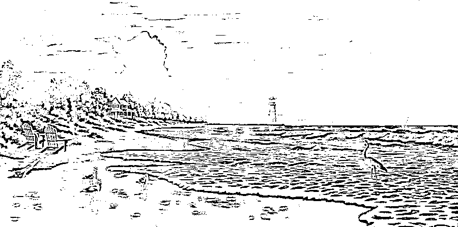

**天象中的“上帝的手指”**

荣格这样的“天才”或许不可多得，但是这样特殊的配置离我们并不遥远。在天象行运上，可能时不时就会出现短期或长期的 Yod 格局。有时个人星图中的行星与天象行星刚好组成 Yod 格局，也同样会感应到这样的影响力。

近期天象上，木星和海王分别位于摩羯座的 17 度和双鱼座的 19 度。而对面狮子座 18 度的位置就位于 Yod 顶点处，任何行星（包括行走最快的月亮）只要落在这个位置，就会给我们带来一波类似的压力感受：每当我们想要努力营造欢乐气氛、展现自我才华和生活富足面，却又不得不顾及现实大环境的压力和“精神世界的心理满足”……

这让人联想到前段时间“上海名媛朋友圈展示面”这类事件（正发生在行运金星在狮子座这个位置的时候），那些年纪轻轻、物质资源薄弱但又想要吸引优质伴侣，又无法有充足时间彼此了解的男生女生，便用小成本的拼团方式购买奢侈品、分享奢侈生活的照片，来在朋友圈里展示自己与实际不符的另一个生活面。

这种看起来的负面表现，其背后“受困于现实大环境下，渴望在关系中凸显生命热情和活力”的驱动力，才是内涵所在。

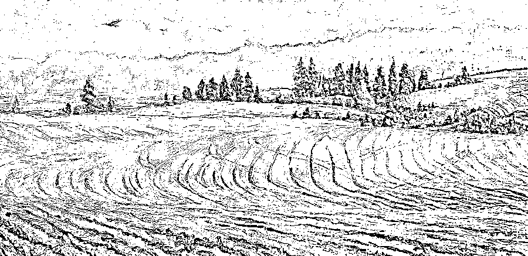

而今天写这篇文章，一个是因为本人在狮子座的太阳就“刚好”处于这个 Yod 顶点上。除了感受到深刻的“停滞/阻塞/无解”，这个时机也给我带来“被压力激发而干脆试着写一篇 Yod 格局深度分析”的机缘。另外我的本命盘也自带一个“非典型式”的 Yod 格局：位于 6 宫处女座尾度的月亮，和位于 8 宫射手座初度的木星，同时与位于金牛座初度的上升点形成 3 度容许度内的 Yod 格局。

简单来说，上升点作为一个人的“存在出发点/生存展示面”，如果命主星的配置再“不给力”，那么就会被形成梅花相位的 6 宫月亮+8 宫木星的繁琐事务给埋没甚至“消失掉”。

但是也同样“拜 Yod 格局所赐”，它总能从 6 宫月亮和 8 宫木星的日常积累中，不定时输入进来那些关于存在的“天然价值”和直观信念，让我能够“间歇性地”得到召唤和动力，行动起来表达自己有价值的存在经验：除非我就是我所想所做和所信，否则我只能“蛰伏”起来，在黑暗中默默积累、运作和等待……

总之，**Yod 格局的原型里既有处女座代表的“平凡低贱的日常基本元素的组织运作”，又有天蝎座代表的“转化与重生之最深奥也最危险的生命功能的支配”。**而这里更重要的是顶点在白羊座那个“解题的主人”：我们自己的意志的选择和带领，如何让那不可知的潜能以最大最正面的效果呈现在我们身上。

最后，送上荣格的一句话来总结对待 Yod 格局的方式：

人的任务，就是意识到，从潜意识中努力向上涌出的内容。

——荣格

**版权声明**：文章由作者授权首发于若道平台发布，欢迎转发，反对抄袭。

****

**Ara 爱拉（王珊珊）**

全职占星/塔罗咨询师

《星途》《心探索》专栏作者

2013 年至今咨询个案已累计超过 2000 小时

**咨询微信号**：622005740（添加注明“咨询”）

**微信公众号**：xiaoshu_astro

长按打赏

**系统学习占星学**

**点击图片了解详情**

**微信又双叒叕改版啦，不想错过若道君的推送？**

**就把若道设为星标吧！**

**▼**

就是这个“在看”，戳戳戳 ☟

********报名直达入口********

# 这个宫位很无聊？NO！除了日常琐事，你更需要成为引导者和传承者

> 原文：[`mp.weixin.qq.com/s?__biz=MzA5NjA0NTAxNg==&mid=2651432733&idx=1&sn=eaccf5981e150d95fb1d99e9f71e4809&chksm=8b4b15aabc3c9cbcd8493efe9f41d5013867dd1daeb86f10116d09089f07d4835215c867bbaa&scene=126&sessionid=1692738075#rd`](http://mp.weixin.qq.com/s?__biz=MzA5NjA0NTAxNg==&mid=2651432733&idx=1&sn=eaccf5981e150d95fb1d99e9f71e4809&chksm=8b4b15aabc3c9cbcd8493efe9f41d5013867dd1daeb86f10116d09089f07d4835215c867bbaa&scene=126&sessionid=1692738075#rd)

******☆ ****后台回复“今日”，给你一句生命态度******

作者/斯蒂芬·弗里斯特译者/昕心 整理/LuLu

编辑/翀子 封面/书君 图片/网络

很多人提到第六宫都觉得无聊，认为它无非是和责任、义务、日常琐事相关联的宫位。但从斯蒂芬老爷子的角度，第六宫的意涵远远不止这些。如果你的第六宫被强调，你需要在被引导的同时成为引导别人的人，而传承是其中的核心。
**责任与义务**很多人觉得第六宫很无聊，是关于责任、义务、日常琐事的宫位。你是想谈论刷牙，还是性、钱、权、冒险呢？然而生命充满了**无聊、常规、必须的事情**，这些实际上都与第六宫相关。一个生活总是充满混乱的人，会忘记约会，忘记付账单，每天都迟到，他在经历的就是第六宫的失调。

每个人都有自己的**责任和义务**，因为一些道德伦理的原因，我们需要做一些事情，因为一些**实际的原因**，我们需要做一些事情，这些都是第六宫的领域。第六宫和第十宫是很有趣的，它们有很多很类似的东西。职业生涯可能与这两宫都相关。**第六宫和第十宫不一样，但有重叠的部分。**

你可以这样来思在第十宫，你在社交场合遇到一个人，那个人问，“你是做什么的？”，你说了你的职业，他就此判断了你的社会地位，要么很高，要么很低，这是第十宫的现实。

第六宫的现实则不太一样，就好像星期一早上，你在做你要做的工作。第六宫更多的是去做这个**手工**，做这个**技艺**；而第十宫更多的是你在世界上戴个什么样的帽子。这个两者是有区别的，但在实践中也有很多重叠的部分。

上述提到的所有对第六宫的描述，都是**严肃的、真实的、根本的，日常事务、责任、义务**，它们基本上构成了现代占星学中对第六宫的解释。第六宫也和**健康和疾病**联系在一起，这也是准确的，但是不令人兴奋，而且我也相信这不是第六宫的核心关键。

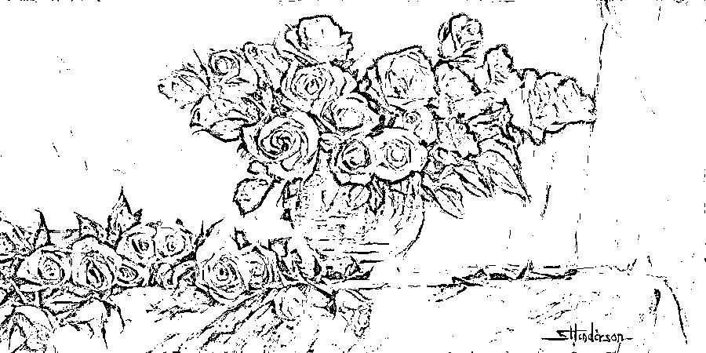

**开启和引导**

传统占星学的一些意涵，随着时代发展，逐渐在现代占星学中遗失了，但对人类现实来说，那些部分仍然是很根本的方面。50~100 年前的占星学还有这样的线索。

在讲第四宫时，我讲到家庭是如何改变的，在历史上存在的庞大的血亲家族团体在现代社会中已经不再和我们紧密相连了。如果回到那些时代，占星师对第六宫解读与某种血亲关系相联，指涉叔叔、阿姨与侄子、侄女之间的关系。在现代占星学书籍中，偶尔还是会看到这样的解读。而同样在现代社会，叔叔、阿姨与侄子、侄女之间的关系也不那么重要，不那么紧密相连了。

让我们想想，过去姨妈和侄女的关系。姨妈不是母亲，她们扮演着不同角色。对侄女来说，姨妈有权威，因为她是成年人，姨妈与侄女之间的关系有友谊的品质。

例如，有个 14 岁的女孩儿，喜欢自己的姨妈，有一天她们一起逛街，姨妈在试口红，14 的小姑娘对此很着迷，她对此了解不多，但是很感兴趣。阿姨在照镜子看口红怎么样，她问姑娘，“这个颜色不适合我，你觉得呢？”

这个 14 岁的小女孩在此之前从来没想过这件事情。你会看到姨妈如何引导女孩儿想这个问题。“也许这个颜色会非常适合你？”小姑娘摇摇头说，“不行，妈妈不让我在 16 岁之前擦口红”。姨妈是这样说的，“啊，你到 16 岁之前都不能擦口红？我们不告诉你妈妈。”于是小女孩儿试了口红，这是姨妈和侄女之间的秘密。

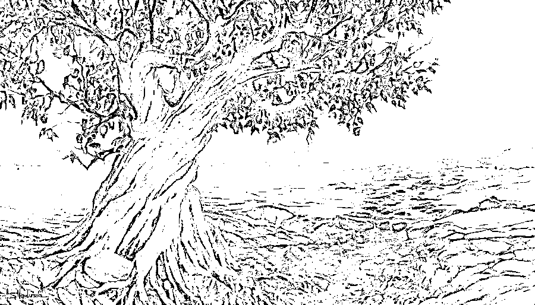

注意那个内在的东西，你们会觉得姨妈和女孩儿的关系让人舒服，那里是健康的东西，是对小女孩儿发展必要的东西，让我们来分析一下：小女孩妈妈说，16 岁之前不能擦口红，阿姨鼓励女孩儿不服从妈妈，向妈妈撒谎，我们要一起为“罪行”保密。

当我这么说的时候，看上去姨妈对女孩有负面影响，但是在心理层面不是这样的，这个姨妈做了非常棒的工作，她侄女被神秘开启了女性友谊的世界，当然女性世界更为复杂。

其实在姨妈和侄女之间发生的，要比口红复杂得多。口红让女性意识到性特点，口红和性吸引力有关。妈妈的规定试图保护女儿避开因性吸引而带来的麻烦，没有任何母亲不保护女儿免受性的影响，但是有个成年人影响她，这不是很棒吗？母亲的本能就是保护，阿姨也会保护，但是阿姨对于现实更有觉知。

我们往后看 3 年，小女孩长大了，可以擦口红了，她打电话说想和姨妈谈谈，姨妈说好。在关系之中，姨妈是有义务的，小姑娘用经典的仪式性的开场白说：“你要保证绝对不会告诉我妈妈！”姨妈点头达成一致，她们合谋要欺骗母亲了。我们知道很健康的事情正在发生。“我和我的男朋友做了！”侄女说。

所以这个女孩儿把自己投入了人类性关系的海洋中，这是自然的发展，她能有这么亲爱的成年人给她提供意见和引导，难道不好吗？妈妈会太过保护，阿姨理解，没法完全保护，但是可以分享她已经获得的智慧。这种类型的关系在世界上还存在，那就是**导师关系**！我们也会做别人的导师，**这也是第六宫！开启和引导的工作！**

世界上有很多令人迷惑的问题，做人好难，有人经历过，能帮助我们，不是很棒的事情吗？我会想一个做面具的人与学徒的关系，我会想到有个教授特别关心某个学生，我会想到灵性导师与信徒，有些东西被传递着。有些事可以让我们看出，你是否会成为一个好阿姨或者好叔叔，那就是你是否有过一个好阿姨和好叔叔。**当我们被引导的时候，同时也在学习如何引导别人。**

毛毛虫变成了蝴蝶，我们理解毛毛虫和蝴蝶是同一生物的不同阶段。但如果我们第一次来到地球，我们可能不知道，蝴蝶和毛毛虫是同一种生物。上师和学徒之间也是如此，**我们希望成为上师，就必须从学徒开始，这就是第六宫的机制。**

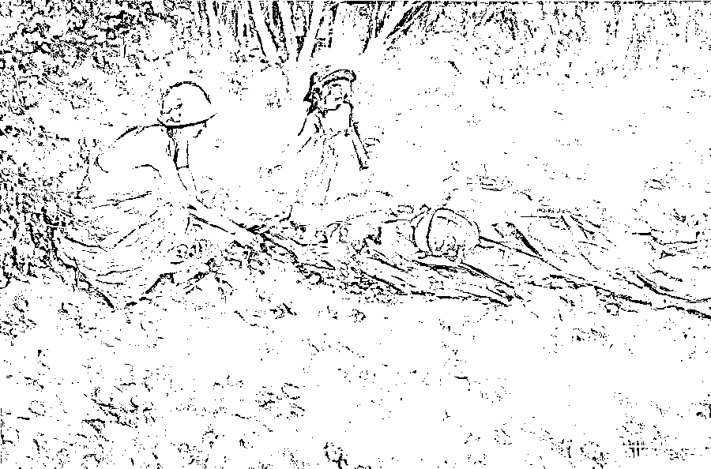

**面对面的传递**

如果你第六宫很强，你人生中的一部分，就是**成为老师**。如果你成功做到了这点，你追随老师，将来也有人追随你，这是个人性的追随。

也许你读到一本书，你太惊讶了，书的作者要做一场讲座，你参加了这场讲座，你被讲座鼓舞和提升，你感觉到你对于书中观点有了更好的理解。你对别人说，讲座太棒了，别人问你，“你从讲座中学到什么是书本没有的呢？”你知道你确实学到了某些东西，因为你和作者面对面了，你获得了某些东西。有些微妙的东西会在面对面的时候发生，**这就是传递的特质，这就是第六宫！**

人类经验非常重要和根本的部分，就是**面对面**。有些人会邀请我做网络课程，但我觉得自己上网络课程会有压力。网络是个很好的媒介，但我对面对面的教学有更本质的热爱，因为面对面的时候会发生一些事情，那是在网络上无法发生的。这是人类社会很重要的东西，这是现代文化中没有包含的东西。

现在我们把太多的事情放到我们的头脑里，学术界的人会嘲笑我，科学无法证明你会用身体和心来学习。但我们确实可以通过身体和心来学习，我相信在座的朋友们都能感受到这一点。

还有比头脑更深刻的学习方式，你们很多人正在体验这点。我肯定你们都有自己擅长的东西，我也可以向你们学习，这会比我从书本中学到的东西多得多。

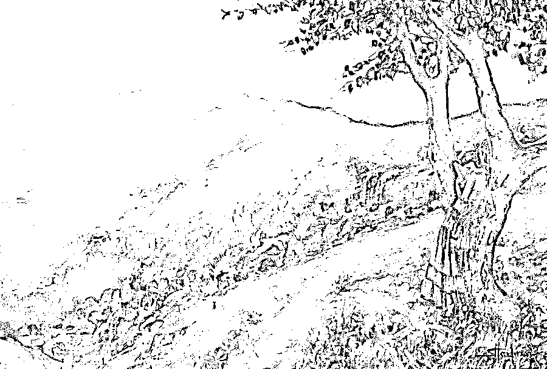

**谦卑、接纳与传承**第六宫是非常让人激动的，它与第十二宫相对立。**对立的事物之间有种对话**。我用神秘预言来描述第十二宫，我看到第六宫的核心，这是两个对话的一部分。有些人沾沾自喜因为走在灵性的道路上，如果你过度自我关注，第六宫是治愈它的天然良药。**对别人的服务就是治愈过度的自我关注的良药。**在服务之中都有这些特质，和日常工作、责任相关，这也是你灵性道路的一部分。它教会你谦卑。

**谦卑真的是第六宫关键词。**如果我们被骄傲蒙蔽，我们永远不能接收到别人交给我们的东西。要成为上师，你要先成为信徒，这是心智最根本的定律在第六宫的体现。

 “谦卑”这个词有时候和“侮辱”是相近的。**第六宫的黑暗面是侮辱，**它会让我们陷入被奴役的境地，我们允许别人把我们当工具使用，无穷无尽地服务他人。谦卑可能会带来这种负担，**你要学会爱你自己和尊重你自己。**

尊重自己有两个方法，**一个是找到你自己的老师，一个是找到你在世界上应该做的服务工作。**有好老师和好服务，自尊就能够产生，那才是**健康的第六宫。**

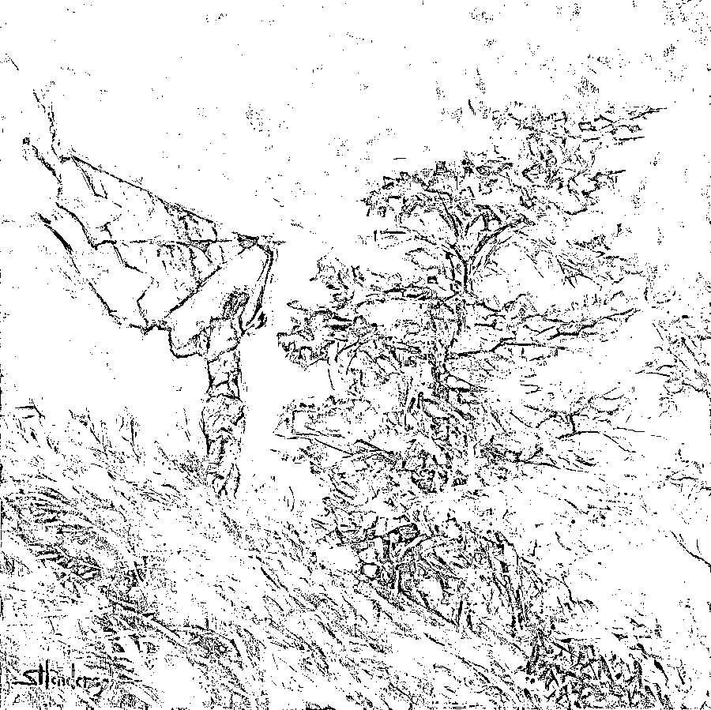

为什么第六宫是第七宫的基础呢？**谦卑是关系与亲密的基础。**影星浪漫故事的命运，当一个有钱的明星结婚的时候，可能 3 年就会离婚，所以明星的生活是复杂的。你要很长时间在镜子面前，人们为你所有的事情着迷，你误以为自己很重要。

当我们和人陷入爱河，对那个人来说，我们就是世界上最重要的人。坠入爱河很像好莱坞故事，过一阵子就不那么好莱坞了，我们无所遁形，我们的问题困难、麻烦全部展现在那个人面前，伴侣认为我们是多么无聊、疯狂、可以预期。其实我们都是又疯狂，又无聊，又可以预期的。

如果我们想让自己和别人的爱可以成功，那我们就必须要接受这些疯狂、无聊、可以预期的部分。但是如果要接受这些特质，我们要接受自己身上的这些部分。如果我相信自己是完美的，我有一个爱人，但我会觉得他不可接受，不完美，我就想要抛弃他，找一个完美的人。**我们要接纳自己卑下的一面，这样我们才能接纳别人。谦卑是长久的亲密关系的基础。**

我们往前走，第六宫和引导相关。如果我们想让爱持续几十年是很困难的，但是人们在努力这样做。两个 20 岁的年轻人结婚了，他们彼此相爱，还不知道自己进入了什么情况。

他们才 20 岁，把浪漫等同于亲密，这并非完全错误，但是还有太多是需要学习的，他们肯定让彼此失望、难过的，我们该怎么处理这些状况呢？如果能有些人比我们年长、在这条路走得更远的人来引导我们，那就再好不过了。我们必须要接受训练，甚至开启才能了解这些，我们需要被开启成为人。

如果小孩被熊猫养大，他就不会有成人的技能。在混乱的时代，年轻人没有指导，他们在同伴间接受开启，比如帮派文化，充满恐惧和暴力，这就是孩子的文化。我们需要那些曾经走过这些道路的人，他们曾经犯过的错误，现在他们谦卑地把它们作为礼物送给我们。

**如何彼此相处，如何作为不完美的人在不完美的世界相处，彼此相爱，这才是第六宫的精神。**也许你海王星在第六宫，我们把你看成一个灵性的传承，这是很好的第六宫词语。从老师传递给学生，学生变成老师，好像毛毛虫变成蝴蝶……序列不断重复。

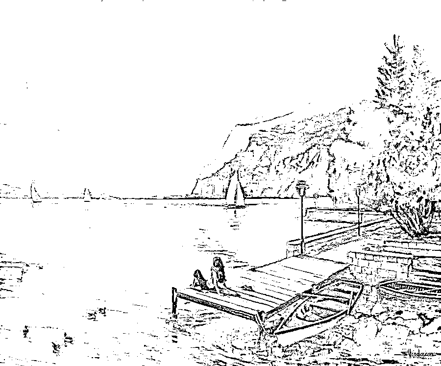

当我想到第六宫时，我头脑里有一幅这样的图画：长长的一列人，他们都穿着白色的袍子，就像天使一样，每个人手上都拿着没有点燃的蜡烛。我们看到有一个人点燃了他的蜡烛，他转过身，看着那个人的眼睛，点燃了他手里的蜡烛，然后他熄灭了自己的蜡烛，死去了；然后第二个人把他的光传给第三个人……这个过程，不断地重复。只有一个火苗，在这个长长的队列中传递。

也许这个序列花了好几万个世代。我们有时候会看到这一点的外在表达，就好像佛教的上师，会追溯他的上师的上师的上师，直到最前端，找到释迦摩尼；在罗马天主教的传统里，我们就能看到一长串教皇链，直至圣彼得，而他是圣基督的门徒。

有些联结也许比另一些联结更闪闪发光，其间也可能会有一些失败，但这也还是一种传承。我们想象，在北京有一个男孩弹钢琴，他弹奏爵士乐，他有位老师，他可能听美国爵士乐的音乐自学成才的，只是通过听 CD 来学习，就像中间有个沟壑，但还是有些东西传到了这里。而这样的传承是可以一直往前追溯的。这个男孩后来成了很好的爵士钢琴师，他也会有学生，有这些学生也会有学生，这个火苗被传递着。

对我来说这不无聊，这才是第六宫的核心。**传承才是第六宫的核心。**

**版权声明：**本文由若道翻译发布，欢迎转发，反对抄袭。友号转载请申请白名单。

斯蒂芬·弗里斯特

若道签约老师。进化占星学的创始人之一，当今世界最有影响力的占星大师之一；1985 年，他凭借《内在的天空》一书获得职业占星师协会奖（Professional Astrologers Incorporated Award）。他四次获得占星界最高的占星学联合协会奖（United Astrology Congress Regulus Award）提名，2018 年获得轩辕十四教育奖。

**想要了解视频课程，长按二维码咨询**

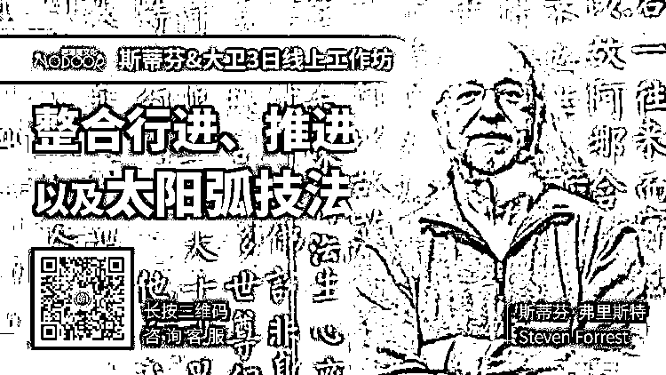

**想听听大师斯蒂芬老爷子的精彩讲座？**

**长按下图了解详情！**

**微信又双叒叕改版啦，不想错过若道君的推送？**

**就把若道设为星标吧！**

**▼**

就是这个“在看”，戳戳戳 ☟

****************报名直达入口****************

# ISAR 选修课程丨新技法！心理占星学视角下的预测方法

> 原文：[`mp.weixin.qq.com/s?__biz=MzA5NjA0NTAxNg==&mid=2651432733&idx=2&sn=65c4450ab2ffeb81dc272a7ad413d81d&chksm=8b4b15aabc3c9cbcc127de5973b23e0512fe4b18059775dc99476809b6b77209769143a81798&scene=126&sessionid=1692738075#rd`](http://mp.weixin.qq.com/s?__biz=MzA5NjA0NTAxNg==&mid=2651432733&idx=2&sn=65c4450ab2ffeb81dc272a7ad413d81d&chksm=8b4b15aabc3c9cbcc127de5973b23e0512fe4b18059775dc99476809b6b77209769143a81798&scene=126&sessionid=1692738075#rd)

作为一门艺术，预测占星学运用行星的运行来预测特定时期的性质、意义和持续时间。在这个阶段的课程中，我们会**考察意识进化的概念、其基本原理及其与占星学预测部分的关系。****意识进化可以被定义为有意识地与星图中固有的进化过程合作。**学员们将探索如何用行进和推进来为意识进化服务。我们不是简单描述事件的结果，而是将行星运行描述为实现先天潜能的机遇之窗。**在这个阶段的课程中，会探索占星心理学视角下如何将对行进、推进和其他预测方法的分析运用于个人成长。**具体事件反映并促进了意识的改变；因此，行星运行可以帮助我们洞察成长过程的精确时机，让我们领会内在和外在现实如何同时发生、彼此反映、互相转化。我们还将探索宏观的世界行进，考察占星格局如何在社会、政治、经济、艺术和生态层面上表现出不同的形式，却又在多样化的现象中反映单一的原型。这里的挑战是去思考，我们对宇宙的这种参与式关系如何能为共同创造一个积极的、更充满希望的未来做出贡献。

**1**

**课程安排**

**第一课：开始预测****第二课：发展年龄方法****第三课：太阳的行进****第四课：月亮的行进与推进****第五课：水星的行进****第六课：金星的行进****第七课：火星的行进****第八课：木星的行进****第九课：土星的行进****第十课：天王星的行进****第十一课：海王星的行进****第十二课：冥王星的行进**

**2**

**课程费用**

**课程费用：9800 元****若道核心课程 L5 学员优惠价：6800 元**

**3**

**授课时间**

**上课时间：**12 月 2 日（周三）20:00-22:00

**授课方式：**英文授课，中文翻译

**4**

**授课老师**

**格伦·佩里(Glenn Perry)**

*   这位传奇的占星师，也是一名拳击和摩托车爱好者； 

*   他毕业于赛布鲁克学院(Saybrook Institute)，是心理/意识研究专业博士，也是拥有 30 余年经验的加州注册婚姻和家庭治疗师 （CAMFT）； 

*   美国占星心理学学院（Academy of AstroPsychology）的创办人，他曾任国际占星研究协会 （ISAR） 以及联合占星大会董事会（UAC）副主席，也是 ISAR 突破性道德标准的设定者； 

*   康涅狄格州研究生院（the Graduate Institute of Connecticut）原型宇宙学与意识进化项目的负责人，共出版八本占星学著作：《心理占星学入门》、《心理占星论文集》、《盗取天火》、《从忠诚到革命》、《星图中的阴影》、《占星职业议题与伦理》、《出生星图深度分析》、《从古代到后现代占星学》。

**5**

**往期学员分享**

不得不说，格伦老师的心理占星课真的很强大，跟着老师上完了两年半的课程，仿佛做了一个长程的心理疗愈。这段时期我正好在经历冥王星的困难行进，感觉就像在地狱中行走，在这个过程中我懂得了，只有疗愈了自己，懂得自己的伤痛，才能理解他人，帮助他人。在学习占星学技法的同时，深深感受到老师的慈悲心，也感受到老师对待占星学的严肃认真。能够跟随格伦老师学习真是太幸福了，同时也特别感谢若道，感谢大卫老师。——2017 心理占星学格伦核心班学员 宋轶绚跟随美国心理占星学院两年课程，最受用的是格伦老师以扎实的心理学理论基础和咨询经验，所教授的心理占星学的系统架构。没有哪个心理占星学的课程比格伦的更系统、深入、有理论且有技巧了。还有格伦特色的发展年龄法，黄道带病理学理论在个案中很有实操性，2 年的学习，除课程外的几百万字经典的补充阅读资料，70 多场测试，以及格伦言传身教的从业道德标准，让我成长为一位合格的心理占星师。——2017 心理占星学格伦核心班学员 植语瞳

**6**

**退转课程**

**退款原则请详看《教学协议》，如有疑问请咨询课程顾问。******占星心理学之预测视角****

**授课老师：格伦·佩里**

**授课时间：****12 月 2 日（周三）20:00-22:00**

**授课方式：**网络课程：英文授课，中文翻译

**费用：9800 元** **若道核心课程 L5 学员优惠价：6800 元**

**课程负责人：Margaret（微信号：nodoor233）**请备注“预测视角”

长按二维码添加课程负责人咨询~  

****报名请点击“阅读原文”****

# 12 星座的爱情魔力 | 这 6 个星座最让人心动的瞬间，你知道吗？

> 原文：[`mp.weixin.qq.com/s?__biz=MzA5NjA0NTAxNg==&mid=2651432615&idx=1&sn=c8e4225b864a75ebcef17c584f42ccba&chksm=8b4b1410bc3c9d06369237d8fc5543f9ac778db9c65c2394c4713e6136385388fb371f5e9794&scene=126&sessionid=1692738075#rd`](http://mp.weixin.qq.com/s?__biz=MzA5NjA0NTAxNg==&mid=2651432615&idx=1&sn=c8e4225b864a75ebcef17c584f42ccba&chksm=8b4b1410bc3c9d06369237d8fc5543f9ac778db9c65c2394c4713e6136385388fb371f5e9794&scene=126&sessionid=1692738075#rd)

******☆** 后台回复“今日”，给你一句生命态度****

作者/奥利维亚·马图斯翻译/江艺 校对/Arrow 编辑/玫瑰 图片/全景网**你拥有哪种爱的元素？**

将两个人吸引到一起的神奇而又无限神秘的化学作用，似乎更应属于炼金术的世界，而不是科学。

我们可能永远不会知道是什么让心跳加速、激情澎湃，但我们知道需要什么元素将激情转化为爱，将炙热转化为深度，这包括：**信任、同情心、耐心、愿意妥协**，还有我们常常最难给予伴侣的元素——**自由**。我们已经拥有了这些爱的元素，还有许多其他的，它们都反映在我们的星图中。我们将 12 星座划分为火、风、水、土四元素。由于**我们每个人的星图中都拥有 12 个星座，所以我们都或多或少地拥有将爱情魔力转化为一段持久关系所需的元素。**要想知道你拥有什么元素的力量，只要在你的星图中数一数属于这四种元素中每一种的行星数量。

*   **火元素**（白羊座、狮子座、射手座）创造了**独立自主和对生活与爱的热忱**。
*   **风元素**（双子座、天秤座、水瓶座）创造了**超然的视角和对沟通的渴望**。
*   **水元素**（巨蟹座、天蝎座、双鱼座）创造了**敏感和对爱与被爱的需要**。
*   **土元素**（金牛座、处女座、摩羯座）创造了**坚定和构建永恒的耐心**。

你可能发现你的大部分行星都在火元素中，这是与能量和热情关联的元素，会将爱的表达提升到一种艺术的形式。然而，如果你有更多行星落在感官的土元素，几乎没有或只有很少的行星落在火元素中，会发生什么呢？这样的话，浪漫的举动可能会让位于更实际的表达爱的方式。例如，编辑爱人的第一部小说到深夜，这与准备烛光晚餐一样，是对爱的真实表达。**一种元素太多也需要平衡**。你是否有过多的行星落在水象星座？然后，当你沉溺在情绪中满足自己的情感时，实际的想法可能会被淹没。如果是这样的话，你就需要在寻求超然的视角和三思而后反应。太多的行星落在风元素中？那么通过你的智力过滤经验可能会使你过于情感抽离，你必须记得经常问自己：“我的内心怎么说？”重要的是要意识到，无论你所拥有的某种元素有多么少，成长的种子都在那里，只有通过培育和滋养才能找到表达。如果一种元素太多，其他元素太少，那么你可以有意识地开始强化那些较弱的元素。**我们的目标是在你自己内部创造平衡，这样每种元素的力量都会给你的生活带来更多的均衡，并帮助滋养和维持你的关系。**

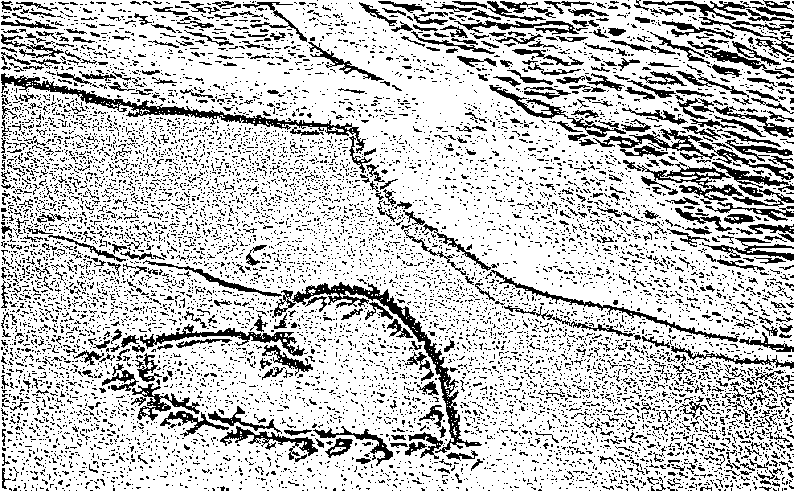

**12 星座的爱情魔力****现在让我们来深入了解 12 星座的每一个，以及它们在天生的宇宙元素中表现出的积极品质。**
**火元素**1 白羊座

**当火元素通过火星守护的白羊座来表达，就有了激情、自发性和兴奋。**

白羊座对挫折的忍耐力较低，容易发怒。事实上，火象星座表达强烈的愤怒就像表达激情的性欲那样轻而易举，瞬间爆发！幸运的是，**白羊座不会心存怨怼，而且很容易原谅别人。这种品质是爱的第一要素：宽恕的能力。**

没有什么比无言的伤害和埋藏在心底的怨恨更能迅速地侵蚀爱的甜蜜。因为大多数关系的发展都会遭遇伤心、愤慨和彻底的愤怒，记住这句话是有好处的：“生气时说开口，这会是你最精彩的演说，让你追悔莫及。”

伴侣之间也必须有一个共识，那就是在激烈的争吵中，他们要公平地交锋，而没有任何身体或情感上的虐待。情侣们能快速了解彼此的敏感之处，这通常被视为一种神圣的信任。因此，潜规则就是必须始终尊重这些弱点。情人可能造成的最糟糕的背叛之一就是利用和滥用这种信任，口头攻击伴侣敏感的“死穴”。

当伴侣们明白没有什么是非黑即白的，对现实不同的内在认知之间可能同时存在多重的灰色地带，宽恕就更容易了。所以，在交流不同想法时，重要的是你要调到一个频道，真正倾听爱人的现实。这可能与你自己的现实有惊人的不同。理解一种思维方式是如何产生的，它的产生并不一定只是为了惹恼你，而很可能是对方小时候习得的一部分，这会激发更大的耐心来帮助你的伴侣理解你的观点。它也激发了宽恕。

**那么，最明智的做法可能来自白羊座对面的天秤座：寻求妥协。如果无法达成妥协，那么暂时满足于“留同存异”。**

2 狮子座

**当火元素通过太阳守护的狮子座来表达时，会是浪漫和慷慨的。**

**无论是在爱情还是性欲方面，没有任何星座能像狮子座一样在时间、金钱和想象力上如此慷慨大方。**作为一个完美的浪漫主义者，这个火象星座比任何人都知道如何用爱的表达来点燃浪漫的火焰。所以，**爱的第二个必要因素是：表达感激的能力**。

**狮子座表达爱和感激的方式是他们全身心投入和计划的产物。**无论是塞在枕头下的手写诗歌、香槟野餐，还是在周末到他们选择的梦幻之地来一场说走就走的旅行，这都会是戏剧性的，极为浪漫的，而且只要时间和财力允许，也会充满想象力。狮子座知道浪漫是恋人的礼物，是庆祝彼此共度时光，也是保持关系活跃的重要营养。

很多时候，情侣们在他们的关系中变得舒适，他们以为伴侣知道他们的感受。当他们终于听到对方抱怨自己很理所当然时，典型的回答可能是：“但你知道我有多爱你！”这就成为了他们不经常表达自己感受的理由，如果这还有理由的话。然而，忽视用语言和行动来表达你对另一半的关心，肯定会是浪漫走向结束的起点。

当爱人的全部注意力都倾注在用正确的方式表达“谢谢你来到我的生命中”时，伴侣会意识到你投入这种感激的表达的时间和心思，因而会被感动，感激不已。因此，当一颗心灵碰撞另一颗时，花时间计划和取悦对方的那个人同样会感激对方的欣赏，并同样会感到被爱。

真诚的感激对于平衡每段关系所遭遇的艰难现实很重要。**狮子座的戏剧性和浪漫的想象力，以及他们敢于吐露心声，创意地表达感激来表达，为所有的恋人树立了榜样。**

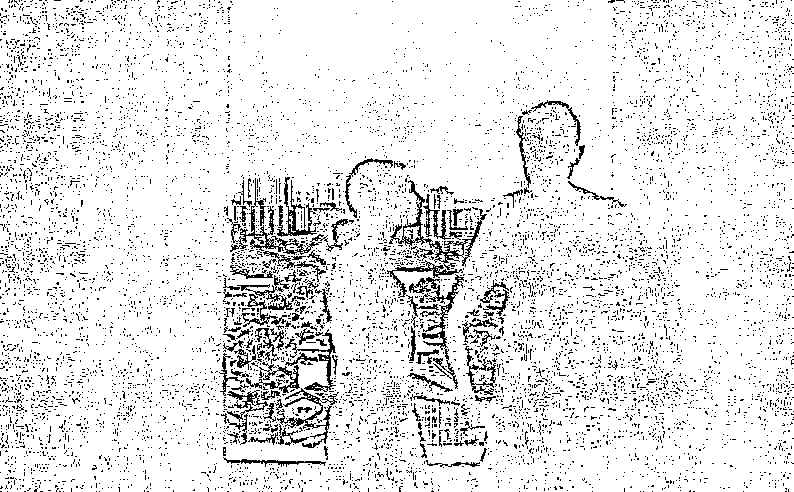

3 射手座

**当火元素通过木星守护的射手座来表达时，就产生了智慧和对独立的欣赏。**

射手座生活在一个不断膨胀的宇宙中，在那里**独立等同于自由地探索所有物质、情感和精神领域**。对射手座来说，恋爱可能意味着调整这段旅程，但肯定不会结束它。因此，**爱情的第三个要素是：尊重个人自由的能力。**

当恋人有了安全感，他们就会明白，伴侣需要在一起的时间，也需要分开的时间，容他们反思、做梦，并成长为独立的个体。给对方“空间”有时意味着分离，但当这种自由没有被滥用，当伴侣的舒适度得到优先考虑时，双方都不会感到威胁。事实上，**分开的时间可以让你们的关系耳目一新，重新焕发活力**。

缺乏安全感的情侣可能会在伴侣表达追求独立兴趣的愿望或需要独处时感到恐慌，他们可能会变得粘人，需要情感支持。对于像射手座这样重视自己物理和情感空间的人来说，这种反应会立即产生幽闭恐惧症和深深的挫败感，通常随之而来的是负罪感，然后是不可避免的怨恨，接着往往是悄悄走人。

然而，比尊重伴侣和自己空间更好的爱人还会带来鼓励和动力。帮助你的伴侣发挥自己的潜力意味着在不同的时间扮演不同的角色，有时你是老师，有时你是学生。如果你们中的一个在任何时候都扮演着同样的角色，天平就会倾斜。

这意味着，激情洋溢的谈话不仅存在于电视上，还可以“现场”进行，频繁进行——情侣们都享受必要的意见交流。即使是充满激情的辩论也会成为无穷乐趣的源泉，因为它们会带来知识的增长，让你自由地反对，学习，成为更好的你!

因此，**当情侣们尊重伴侣的独立，并且充满爱意地向彼此保证在合理和无愧的范围内享有个人自由的权利时，这种关系就会在更大的空间中发展，被激发和滋养。**

风元素 1 双子座

**当风元素通过水星守护的双子座来表达时，会产生沟通的需求和幽默。**

双子座善变的头脑是永恒的吉卜赛人，联系这儿、那儿，到处接触，总是不安并急于去发掘下一座山那边是什么。**他们所发现的都想要与他们的爱人交流和分享，他们的交流通常充满迷人的机智和幽默。**

长期以来，幽默感一直被认为是智慧的标志，也是许多女性寻找伴侣的先决条件。研究表明，在约会网站上，女性比男性更希望对方“很有幽默感”。然而，当女人在寻找能让她们开怀大笑的人时，男人更喜欢那些能被他们的笑话逗乐的女人。所以，无论爱人是喜欢做一个表演者还是一个欣赏的观众，**我们爱的第四个要素是：分享笑声的能力。**

每个人都知道，在家里的每个房间，幽默都是一位受欢迎的客人，尤其是在卧室里，它能让情侣们摆脱理智，鼓励更多的性冲动。然而，要确保你使用的幽默是令人享受的，而不仅仅是可以接受的。例如，取笑和幽默很容易混淆。很少有情侣喜欢这种消极攻击的风格，而对方取笑的通常是一些可以更好地用温和、诚实的交流方式来表达的东西。

同样，不要让幽默变成刻薄。幽默被用来掩盖残忍，或者是侮辱性的、深深伤害他人的弱点，然后被合理化——“这只是个玩笑!”——一点也不好笑。

当情侣们分享一个微笑，转而变成了捧腹大笑，如释重负，随意放松，幽默提供了一个摆脱烦恼的好方法。

因此，由于冲突是任何关系中不可避免的一部分，**双子座对幽默的热爱告诉我们，重要的是要放松，让幽默缓解沉重的时刻，化解潜在的危险的分歧，并正确看待问题**。

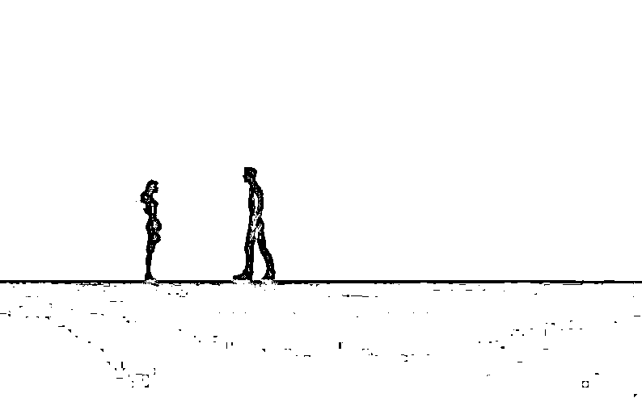

2 天秤座

**当风元素通过金星守护的天秤座来传达时，就有了合作、妥协和沟通。**

**天秤座被渴望和谐的需求激发，他们知道如何通过缓和矛盾、沟通和妥协来平衡关系，他们在这些方面树立了完美的典范。**这需要有意识的觉知，它带来了我们**爱的第五个要素：沟通的能力**。

通过有意识地朝着健康的沟通方向努力，情侣们建立了一个足够稳固的基础，来保护他们的关系不受情感地震的影响。这需要很多的爱来完成，因为强大和诚实的沟通需要很多的工作。

当一方付出一切，而另一方偶尔付出时，和谐永远不会持久。所以，在一段平衡的关系中，不可能有牺牲的羔羊，只有相爱的人为了沟通而一起努力，他们有勇气，带着善意，诚实而不残酷。

事实上，坦诚地交换想法和感受是平衡不同意见、品味和需求的唯一方法。它始于认同这句老话：每个故事都有两面。**天秤座能够公正、尽可能客观地倾听对方的想法，这就是他们的才能所在，怀着礼貌、机智和妥协去沟通。**这些品质代表着崇高的抱负，在受挫或生气的时候，即使是天秤座人也很难召唤这些品质。所以，虽然爱可以在一瞬间发生，但是找到维持爱的平衡与和谐需要有意识的努力，一次又一次……很多的爱。

在争吵之后，一定要有时间冷静下来，但是不要恢复能量后回到对话中去争论，而是要用新的能量去触碰对方，重新渴望交流。

通过自信倾听、推迟评判、质疑、渴望理解对方，伴侣们实际上是在说，“我们的关系值得我花时间和精力思考！”这是任何人都能给予爱人的最高赞美。 

3 水瓶座

**当风元素通过天王星守护的水瓶座来传达时，有了变化、突破和觉醒。**

水瓶座一直被称为神圣的不满足的星座，但这种不满足可以成为在爱情关系中**制造兴奋的催化剂**。正是水瓶座的不满，渴望脱离传统，打破现状，敢于标新立异，滋养了一段不同寻常的关系。这是一种天赋，包括性实验，它能将无趣驱除出卧室，因此它成为我们**爱的第六个要素：制造兴奋的能力**。

无聊常常是一段关系的丧钟。遵从不变的常规，毫无新发现的快乐，就像日复一日地点同样的菜单。无论我们多么喜欢菜单上的菜，也无论我们多么热爱这位厨师，我们的味蕾都无法忍受一成不变。

因此，为避免成为彼此的一种习惯，情侣们要变动他们的舒适水平，温柔地打破界限，帮助对方在身体、情感、智力和性方面觉醒，如果做得对，这些方面可以同时完成。

情侣们应该知道他们的伴侣幻想什么样的新体验。他们从来不敢或梦想做什么？他们想尝什么不同的食物，他们一直想看什么风景，他们想尝试什么新的性体验，他们的五官感觉中哪一种最需要满足？如果情侣们不知道大部分的答案，或者他们没有一个有根据的猜测，那么是时候开始提问了。

是的，**水瓶座的想象力和自发性是兴奋的必要组成部分**，但即使缺乏想象力的情侣也不得不准备变得自发（你知道你是谁！），最终结果应该是从未尝试过的玩意，带来肾上腺素飙升的刺激，产生激情，让关系焕发活力。这是快乐的渗透经济学。

**（未完待续，下篇见今日二条）**

**版权声明：**本文由若道翻译发布，欢迎转发，反对抄袭。友号转载请申请白名单。

奥利维亚·马图斯

作家、占星师，专攻占星心理学，帮助个体和夫妻寻求更深层次的理解和沟通。著有《性爱占星学》(巴兰坦出版社)和《性爱之后的爱情》(卢埃林出版社)。

**ISAR 选修课，心理占星学视角下的预测方法**

**点击图片了解详情，或****长按图片二维码咨询客服**

**微信又双叒叕改版啦，不想错过若道君的推送？**

**就把若道设为星标吧！**

**▼**

喜欢记得点一下在看哦☟

********报名直达入口********

# 这 6 个星座最让人难以割舍的地方在哪里？

> 原文：[`mp.weixin.qq.com/s?__biz=MzA5NjA0NTAxNg==&mid=2651432615&idx=2&sn=97d7d08de5b2010c1f99912fa7cb0021&chksm=8b4b1410bc3c9d0690048ff96656789412a4b4be621702485bff9176144e737b70b58e9eae59&scene=126&sessionid=1692738075#rd`](http://mp.weixin.qq.com/s?__biz=MzA5NjA0NTAxNg==&mid=2651432615&idx=2&sn=97d7d08de5b2010c1f99912fa7cb0021&chksm=8b4b1410bc3c9d0690048ff96656789412a4b4be621702485bff9176144e737b70b58e9eae59&scene=126&sessionid=1692738075#rd)

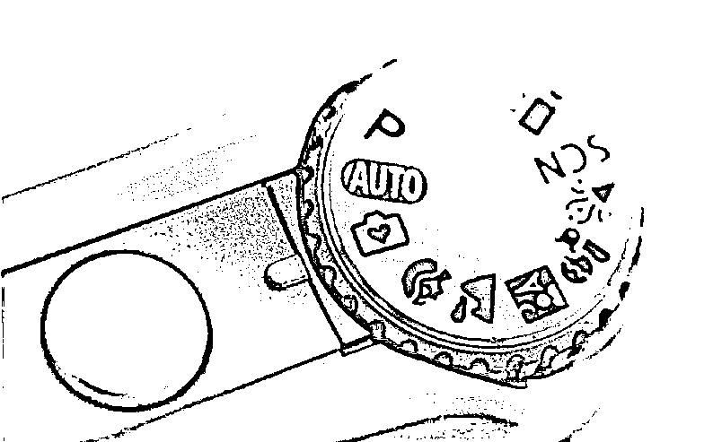

作者/奥利维亚·马图斯翻译/江艺 校对/Arrow 编辑/玫瑰 图片/全景网在今日头条文章里，我们从爱的角度详细分析了火元素与风元素的 6 个星座。现在，我们接着往下看土元素与水元素的 6 个星座吧！**土元素**1 金牛座

**当土元素通过金星守护的金牛座来表达时，就产生了承诺、坚韧和忠诚。**

**金牛座能对爱人提供完全的承诺和忠诚，历经兴衰沉浮、艰难险阻，他们对关系的坚韧意志始终不变，这在 12 星座中是最独特的。**他们保持忠诚的意图从不动摇，这让他们的伴侣放松下来，产生温暖舒适的安全感。因此，我们**爱的第七要素是：忠诚的能力**。

我们都知道嫉妒是关系的最大破坏者。嫉妒的孵化者包括缺乏安全感的恋人，他们需要不断从调情中得到小我的满足；或者和伴侣玩心理战的恋人，让对方永远处于焦虑状态；或者是那些不断寻求关系“升级”的恋人，就像他们换掉旧车一样；或者是那些劈腿的恋人，千方百计想要隐藏；或者是那些劈腿了还根本不加掩饰的恋人，等等，这些都播下了嫉妒的种子。

年轻的情侣很难对伴侣保持忠诚，这是很自然的。俗话说，刺激的性经验太多，人生太短！的确，在过去几十年里，一夫一妻制的概念已经彻底改变。我们已经从一对一的关系，开始走向交换配偶，尝试开放式婚姻。但是，尽管已经出现了多重的性/恋爱关系，**研究表明，在任何关系中，忠诚仍然以某种面目存在**。

金牛座的坚韧和对忠诚的承诺带来的回报，首要的是你实现对情感和性的承诺后的快乐。这意味着，不要在很多风流韵事中稀释你的性欲和情感，而是把它们运用于构建你的幸福关系。这意味着一段没有闹剧的爱情生活，没有关系破裂的沉重代价。它意味着内心的平静。

最后，一对一的忠诚关系意味着对你的爱人完全的、坚定的奉献，其意义重大!

2 处女座

**当土元素通过水星守护的处女座来表达时，会有支持、帮助和不断的自我完善。**

处女座的人总是有一大堆事情要做，以改善他们的健康、工作和人际关系方。**一旦恋爱，处女座就会简单地把他们的伴侣加到清单上**：他在工作上真的快乐吗？如果他减点儿肥会不会更健康？为什么他对性的欲望越来越少？处女座把所有的时间、金钱和精力都花在了“改善家庭”上，这就构成了**爱情的第八要素：无私的能力**。

现在，任何人都可以向爱人建议，他们需要更多锻炼，但只有真爱才能让你在黎明时分起床慢跑，分享痛苦和收获。任何人都可以指出，房子需要认真打扫，但只有真正的关心才能让你拿起拖把开始劳作。这种无私的爱是真正的疗愈，因为它来自内心，这是处女座的爱。

像处女座这样言之必行的人之所以这样做，是因为没有什么比指出爱人的问题、参与解决问题、鼓励伴侣在身体、情感和精神上成长更能给他们带来快乐了。**他们需要被人需要，通过非常真实、有益的方式表达爱，在爱人的生活中变得重要。**

然而，尽管有一些方法可以指出恋人的敏感问题，从而鼓励对话和解决问题，但也有一些方法非常生硬，不够圆滑，因而会在伴侣的心灵上留下踩踏的痕迹。所以，必须要记住，对更敏感的爱人需要策略和机智。事实上，每一个爱人都需要策略和机智，即使是那些嘲笑言语不会伤人的恋人。永远不要信以为真。

**以具体而有用的方式无私地提供帮助**，比如做家务、跑腿、训练功课、排练商业演示文稿，甚至是穿着运动服迎接黎明，将会给伴侣带来回报，这位爱人亦师亦友。

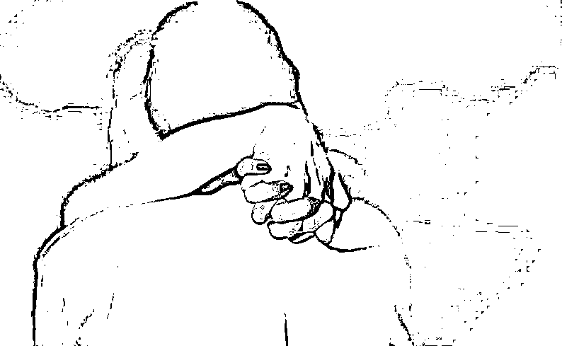

3 摩羯座

**当土元素通过土星守护的摩羯座来表达时，有了责任、稳定和安全。**

如果有一家公司提供实现追求梦想的策略和架构，那么它很可能属于一位摩羯座人。土象星座野心勃勃、梦想远大，但他们也很现实，并且坚持不懈。**一旦选择了一种成功的策略，摩羯座就会采取控制，并坚持不懈，直到成功。**这种对成功的耐心奉献带来了**爱的第九个要素：坚持不懈的能力**。

很少有刚坠入爱河的恋人对他们的未来有诚实的视角。他们总是会达成一致吗？他们当然会的。尊重、同情心和宽恕是否一直会立即出现？怎么会不一样呢？因此，当不可避免地出现争吵、幻灭和失望时，如果没有摩羯座的坚持不懈和为这段感情奋斗的意志，这段感情可能就不会长久。

只有承诺依靠彼此的情感资源，才能让相爱的人度过艰难的时刻、疾病、债务、死亡，或任何把现实强加于梦想的千难万险。如果背叛了信任，必须重建，那么这一承诺就至关重要。背叛带来的情感创伤是刻骨铭心，如果它们不是致命的，就必须用通过慷慨地给予爱、理解和牺牲来治愈。恋人们可能背离爱情，失去彼此，只有坚持不懈的意志才能使他们重新走到一起。然而，为了让这段关系再次向前发展，伴侣双方都必须摆脱阻碍他们前进的怨恨的路障：只有当他们原谅对方时，才能继续前进。

是的，**一段爱情关系的最终成功取决于坚持不懈的承诺，一次又一次地重新开始，要知道每一次加深理解，亲密感也在加深，经受过考验的爱情比以前更强大**。女演员鲁比·迪伊对此表达得最好：“真正结婚需要很长时间。在这段婚姻中，一个人在不同层次上结了很多次婚。如果在这段婚姻中，你结婚的次数比离婚的次数多，那么很幸运，你坚持下来了。”

**水元素**1 巨蟹座

**当水元素通过月亮守护的巨蟹座来表达时，就有了关怀、支持和无条件的爱。**

情侣们在一段关系中扮演着许多角色，包括朋友、建议者、老师和顾问。也许最需要的角色是巨蟹座所象征的：一位慈爱的母亲，给予孩子奉献、保护和无条件的爱。这些重要的品质构成了**爱的第十个要素：滋养的能力**。

男性和女性伴侣都应该好好培养月亮宝宝的能力来滋养他们的爱人，变得温柔和富有同情心。与此同时，更独立的恋人们必须明白，**接受滋养是完全可以的，这并不表示他们软弱**。

大多数情侣都会经历情感脆弱的时期。在这些日子里，你会失去信心，觉得自己没有得到足够的重视，甚至可能没有人爱你。爱上有这种心态的人意味着要有温柔的耐心去激发他的感情，灌输更多乐观主义，鼓励他们的才能，简而言之，滋养这个暂时迷失的爱人。

然而，就像星图中四元素的健康分布带来了必要的平衡，在爱情关系中，滋养这种必不可少的特定元素也需要平衡，因为太多的好东西可能是致命的。当过多的滋养侵占了伴侣的情感空间，他开始要求在关系中获得更多的喘息空间时，危险就出现了。这就是滋养变得令人窒息的时候，它的长期影响非常危险，远超过任何暂时的抑郁。 

母亲想要保护她受伤的孩子的愿望是迫切的。她的关心和滋养给她一种被需要，不可或缺的感觉。安慰伴侣也不例外，但其中存在危险。聪明的巨蟹座母亲会让孩子成长，变得独立。他们不会为了维持被需要的温暖感觉而让孩子在情感上依赖。明智的恋人也必须这样做。**他们必须确保他们的滋养给他们的伴侣足够的呼吸空间，这样他们才能成长，这段关系也是。**

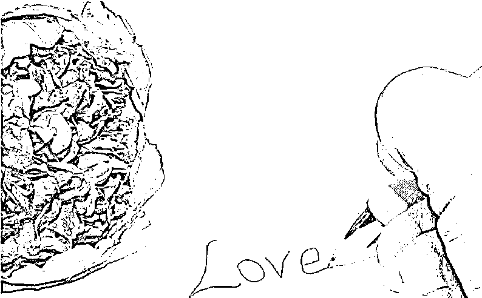

2 天蝎座

**当水元素通过冥王星守护的天蝎座来表达时，就有了激烈、激情和性。**

**天蝎座在黄道上掌管性，天蝎座渴望与爱人体验强烈而亲密的联结。**这种激情将关系推向更深层的亲密和性兴奋的新高度。天蝎座的特质展示了**爱的第十一个要素：激发激情的能力**。

**天蝎座由冥王星掌管，它将激情的深度和广度带入所有能唤醒伴侣激情的经历中。**当情侣之间有性欲的时候，它就会渗透到他们关系的方方面面。在眼神的交流中有了更多的感动，更多的亲密。

在一段关系中，当一方对性表现出不感兴趣时，就会出现一个非常创伤性的时刻。无论是什么借口，受伤的爱人都可以把这当成一种个人的拒绝，并且可能会遭受信心的骤降。很少有话题比为什么他们对性生活不满意更让情侣们难以讨论，但是就像一个恋人的激情是会传染的一样，缺乏激情也是会传染的。

激情激发性欲，想象力激发激情。当想象力和快感之间几乎没有障碍，并且存在实验性和意想不到的因素时，一段关系会保持性兴奋。仅仅在做爱时出现是远远不够的。

在性生活中缺乏想象力的恋人，安于一种完全可预测的例行公事的性爱，失去了激情的某些好处：逃入那些让心理和身体释放日常生活压力的幻想和感觉中，同时以新鲜的方式探索他们的伴侣，在性、情感和精神上融合。

即使当夫妻俩渐渐老去，在一起很多年了，性生活可能变得不那么频繁，但时间会用更多的温柔来弥补。性吸引力和欲望仍然存在，仍然充满活力，可以被看到和感觉到。

**天蝎座告诉我们，只有当我们全身心投入到正在经历的事情中时，激情才会产生。**

3 双鱼座

**当水元素通过海王星守护的双鱼座来表达时，有了牺牲、敏感和慈悲。**

**海王星掌管的双鱼座渴望臣服于无私的的爱情关系，同时渴望为此牺牲**。理想主义的双鱼座标志着**爱的第十二要素：牺牲的能力**。

爱情关系需要牺牲，研究表明，如果伴侣像双鱼座一样愿意为彼此和关系做出牺牲，他们更有可能保持亲密和快乐。

有时候，牺牲是微不足道的，比如去看一部浪漫的电影，而不是你更喜欢的动作片。这通常被认为是“让步”，而不是真正的牺牲。然而，为了让伴侣能够接受一生一次的工作机会而搬到另一个城市，这符合牺牲的标准。

但这是一种牺牲，还是只是一种期待?

**为爱人做出牺牲是有一些潜规则的**。首先，爱人应该带着仁善和爱意做出牺牲，否则就完全不要牺牲。如果牺牲是咬紧牙关做出的，而且不断在口头上提醒你那是多么痛苦和艰难，那只会导致内疚，随之而来的是不可避免的怨恨。

另一方面，从伴侣的牺牲中获益的爱人必须承认它。这就是爱的第二个要素，有狮子座表达的：表达感激的能力。

通过表达感激和认可牺牲，伴侣是在说，“我并非理所当然地享受你的牺牲。”此外，一方不应该总是牺牲的一方，所以表达感激意味着愿意在必要时用未来的牺牲回报对方。

牺牲不仅能让爱人们自我感觉良好，而且还能在他们的内心和思想中加强这段关系的重要性。事实上，与其从伴侣利益的角度来考虑牺牲，情侣们更积极的方式是将他们的牺牲看作一份保险单……为了保护这段关系的长期健康。

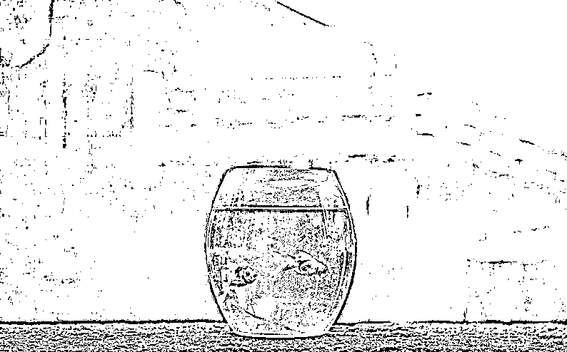

记住，**从火、风、土、水四元素中产生的这些品质的种子，都表现在你的占星星图中**。正是通过落在同一元素中的行星，和谐与平衡才在你的星图中创造出来，也正是通过两个人有属于同一元素的星座，关系中才创造出和谐。所以，你可能想要了解你伴侣和你自己的星图。

毕竟，如果你仔细想想就会发现：**当情侣们对彼此有了内在的了解时，他们会感到如鱼得水，因为他们真正在他们的元素中**。

**版权声明：**本文由若道翻译发布，欢迎转发，反对抄袭。友号转载请申请白名单。

奥利维亚·马图斯

作家、占星师，专攻占星心理学，帮助个体和夫妻寻求更深层次的理解和沟通。著有《性爱占星学》(巴兰坦出版社)和《性爱之后的爱情》(卢埃林出版社)。

**系统学习占星学**

**点击图片了解详情**

**微信又双叒叕改版啦，不想错过若道君的推送？**

**就把若道设为星标吧！**

**▼**

喜欢记得点一下在看哦☟

********报名直达入口********

# 超级干货 | 落在这个位置的行星，藏着你今生的“使命”！

> 原文：[`mp.weixin.qq.com/s?__biz=MzA5NjA0NTAxNg==&mid=2651432560&idx=1&sn=1346bb873d82e6a330ab15b944f972cf&chksm=8b4b14c7bc3c9dd115b635f30728884b3aeb06733abbf18ca5699ff593325ebdf962fd422ce6&scene=126&sessionid=1692738075#rd`](http://mp.weixin.qq.com/s?__biz=MzA5NjA0NTAxNg==&mid=2651432560&idx=1&sn=1346bb873d82e6a330ab15b944f972cf&chksm=8b4b14c7bc3c9dd115b635f30728884b3aeb06733abbf18ca5699ff593325ebdf962fd422ce6&scene=126&sessionid=1692738075#rd)

****☆ ****后台回复“今日”，给你一句生命态度****

作者/雷·格拉斯 译者/王宏 校对/Arrow

编辑/玫瑰 图片/全景网

文章来源/《大占星师》

你知道吗，星图中的“最高行星”是我们理解星图的重要指标，它“统领”星图中其他所有行星，代表了你人生方向的顶峰，并且会对你产生重大影响。本文将为我们解析十大行星作为星图中“最高行星”的十种不同情况，值得收藏哦！**什么是星图中的“最高行星”？****星图中最高的行星，是我们理解星图的一个要素，而在某些情况下，可能是最重要的指标。**任何位于此处的星体，都会由于其尊贵的位置而“**统领**”星图中的其他所有行星，并可能对此人的整个人生产生**重大影响**。 尽管在某种程度上，任何占据地平线之上最高点的行星都是如此，但如果**该星体接近中天（MC）**——**星图的最高点**，那它就变得更加重要了。有人声称，**任何有此相位的行星都属于“偶尔尊贵”，因为其固有特质以具有潜在建设性的方式被放大了。**

★**如何确定星图中的“最高行星”？**

**简单来说，最接近中天的那颗行星，就是我们星图中的“最高行星”。**由于分宫制的不同，有时候，第十宫宫头并不等同于中天（MC）。因此，**我们需要将注意力集中在最接近中天的那颗行星上，而不是通过查看星图视觉上所体现的“顶部”。**注：上述为“简单”的答案。更为复杂的回答是考虑赤纬影响，赤纬可以改变天空中实际上“最高的”东西。例如，可以有两颗接近中天的行星，但距离中天较远的那颗行星可能实际上是两颗行星中“较高的”，因为赤纬更偏北。例如，南赤纬 10°高于南赤纬 15°，北赤纬 15°高于北赤纬 10°，等等。**名望与“使命”**

**在某种层面上，任何在星图中位于地平线之上的行星都代表在你的生活中对你周围的人而言更加明显的能量，这些能量相对也更容易暴露在公众视野中。**至于宫位，这通常与**第十宫**尤为相关，第十宫在传统上被认为掌管名望、事业和声誉等事务。 

然而，**中天与第十宫有微妙的差异**，中天不只是关于名望或声誉，尽管它结合了这些方面。**中天作为星图象征性的顶点，也被认为代表了你人生方向的顶峰，是你所追求的志向**。你可以这样想：第一宫关乎你的日常性格，展现你是谁，而中天则展现你想成为什么，即你带雄心勃勃渴望实现的那些特质。水星接近你的中天？那么，你要努力达成的是沟通或心理素质。还是金星？那么你人生的最高目标多少围绕着美或爱。不过，无论是哪颗行星，中天绝不仅仅是你想接受的“另一份工作”，也不只是你碰巧从事的某项维持生计的职业。简而言之，**任何在中天上的行星都有一种成就感，有时甚至是使命之感**。有时，这可能让一个人在人生进程中弯弯绕绕，需要时间才能意识到其真正的意义。

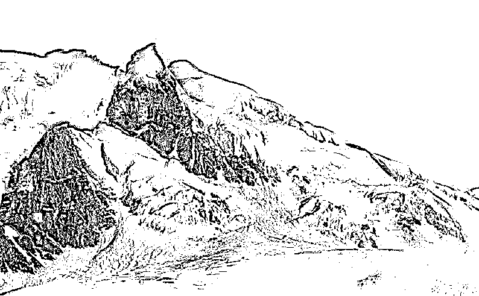

**公共身份 vs 日常人格**
**尽管任何位于星图顶部附近的能量都在帮助塑造一个人的声誉和人生方向，但就你的一般人格而言，这些能量并不总是与你的日常形象相一致。**例如，我曾经认识一位才华横溢的艺术家，其星图显示了靠近中天的是落于狮子座的扩张的木星。在公共场合，他表现出一种近乎达利式的个性——华丽且富有戏剧性，甚至炫耀其与达利类似的上翘大胡子。然而，狮子座中突出的木星与下方第一宫中远为激烈的天蝎座土星形成四分相。很难想象还会有比这更加鲜明的对比！普通大众只看到了那个阳光明媚的公众形象，并没有意识到他私下里在舔舐源自童年的深刻的情感创伤，这些创伤在他成年后的关系中反复出现。当然，如果采取更具建设性和整体性的方法，我们可以说他的人生功课是——通过带给他的木星更多的土星，以及带给他的土星更多的木星，来学习调和那些对立的能量。但是在日常生活中，对那些熟悉他的人来说，最显而易见的正是这些决斗双方力量之间的冲突。以这些基本信息为出发点，现在让我们来看看**太阳系中的不同星体在靠近星图顶点时的影响**。要记住，**尽管我们特别强调了接近中天的行星，但我此处描述的大部分内容都适用于任何在地平线之上最高的行星，即便它远离实际的中天**。此外，**如果不只一颗行星在那个高高的位置上紧密排列在一起，那重要的就是留意两者的混合影响**，而非每一颗单独的星体。好了，我们开始吧。
**解析星图中的“最高行星”**

1**太阳**

**当太阳位于星图顶点附近时，存在着动力，在世人面前表达自己的创造性本质和核心自我价值观，并以相对公开的方式“闪耀”。它所落入的黄道星座揭露出了进一步的线索。**双子座，那很可能就是智力天赋、沟通技巧或是一个人渴望的多才多艺。金牛座，那就可能是美感或财务稳定。那白羊座呢？战士精神、竞争力和动力，如此等等。**落于此处的太阳是表明领导特质、名望或在同龄人圈子中突出地位的主要征象之一**，无论是当地家长委员会的负责人还是整个国家的领导人。这也是教师和公众演讲者常见的星图位置。**但正是因为星图的该部分对太阳而言是极为公众化的落点，个人性格中的任何错误或缺陷也会以更为公开的方式被放大**。值得注意的是，**由于太阳离水星或金星都不远，通常会发现这些星体紧密聚集在一起，无论是在中天附近还是在其他地方。**

2**月亮**

尽管出生时太阳在星图中最高的人可能感觉到担任领袖的强烈欲望，或以公开的方式表达小我和创造力的冲动，但那些**出生时月亮最高的人通常更容易将他们的人格或情感投射到公众视野中**。歌手琼尼·米歇尔出生时双鱼座的月亮接近中天，她的歌词很独特，因为歌词向她全世界的听众展现了她最深层的和最脆弱的情感。**由于月亮也掌管“滋养”，一个人选择在公众面前展示的情感可能涉及某种形式的照料**。**同样的月亮冲动也可以以极为不同的方式引导人们进入与表演或戏剧相关的生涯。**演员罗伯特·德尼罗、梅丽尔·斯特里普和彼得·塞勒斯出生时月亮都是位置最高的星体，适合在公共场景中表达情感的人生。

**|** 罗伯特·德尼罗（左）、梅丽尔·斯特里普（中）、彼得·塞勒斯（右）

3**水星**

**如果水星是星图中最高的行星，就有冲动将个人的想法或语言技能投射到世人面前**。因此，对于教师、作家、公关和职业涉及沟通和心智才能的人而言，有此配置很自然。亨利·米勒、歌德、巴尔扎克等作家作家，以及文艺复兴学者马尔西利奥·费奇诺的星图中都有这一配置。**人们渴望靠近顶点的行星所象征的所有特质，而这提供了有关人们在生活中所模仿的榜样或导师的线索。**以水星为例，那些英雄往往在本质上更具知性。我有一位年轻的客户，出生时水瓶座的水星与他的中天成合相，在他成长过程中，他卧室墙上挂着卡尔·萨根和托马斯·爱迪生的海报，而非摇滚明星、体育英雄或迷人女演员的肖像！但是要注意：**如果高升的水星恰好形成了挑战相位，尤其是与海王星、火星、木星或土星形成相位，就必须特别小心任何公开声明，因为它们可能让人遇到麻烦。**

4**金星**

**|** 玛丽莲·梦露**该位置表明希望在公众面前以某种方式展现美和（或）和谐**。玛丽莲·梦露出生时金星是最高的行星，而她几乎成为了主流理想的美丽形象的代名词。当然，该位置通常引向**直接或间接涉及时尚和设计的职业**。大卫·鲍威也有着高升的金星，他除了是一位成功的音乐家和艺术家之外，还因其时尚感而闻名，被誉为时尚引领者。**当形成良好相位时，该位置可以赋予案主一定的魅力。在某些情况下，金星的能量可以呈现出更具精神性的形态，强调向世界投射爱或善意。**

5**火星**

**当火星在星图中最高时，有动力将能量和力量展现给全世界。**美国前总统富兰克林·D.·罗斯福出生时火星接近中天。他带领美国参加第二次世界大战，呼吁民众鼓起勇气——“我们唯一应该害怕的是恐惧本身”，重振人民和士兵的信心。我多年来为许多火星位置最高的客户制作过星图，他们都与**体育或武术**有关。火星的强大力量也可以用更艺术的方式引导，被视为“朋克教父”的歌手伊基·波普，以他充满活力的（有时甚至是自残的）舞台表演而闻名，他出生时白羊座的火星和水星是其星图中最高的行星。

**|** 伊基·波普，他开创了很多舞台风格，在台上从不穿上衣并狂抓胸膛直至流血，满场乱跑，唱到一半便一头扎进观众群中（由此成为了舞台跳水的发明者）

6**木星**

**如果木星在星图中最高，对于职业生涯议题或与公众打交道，常常有种机遇感和信心**。因此，这是**扬名和成功**的主要星图指征之一，也包括**在与权威和帮助自己施展抱负的人打交道时的大体“好运”。**在最好的情况下，该位置可以表明一种愿望，**去表达一种看待世界的丰盛和乐观的精神进入世界，无论是通过慈善活动、教学，还是人道主义项目**。由于任何靠近星图顶部的行星都可以揭示与地位在你之上的人交往的属性和质量，木星作为最高行星不仅表明**会与显赫或富有的人相遇，还会与宗教或哲学方面的人相遇**。**但是如果有困难相位，位于此处的木星可能显示与这些人物的问题，以及粗心和鲁莽冒险的总体倾向。**

7**土星**

和木星一样，**靠近某人星图顶部的土星可以显示出此人人生中巨大成功和显赫声名。但是与木星不同的是，这通常在过程中涉及更多的工作和困难。**这些案主的生活总是有“**大器晚成**”的特质。另一方面，他们在建立自己的事业和声誉方面一般会经历巨大的抗争。土星所表明的实质性成就通常伴随着**痛苦的逆转或堕落**，一种“向前三步，后退一步（也可能是两步）”的场景。土星位置最高可能会表现出**对个人声誉的深切不安**，可能源自童年时期的困难，这可能引发**对地位和尊重的强烈冲动，以此来弥补那些内心的自我怀疑**。但是这也有好处，因为它可能充当后来人生中**成就和成功的燃料**。**根据其所处黄道星座的不同，靠近星图顶部的土星可能显示出一个人可能在何处被视为权威**。金牛座的土星为其最高行星的人，可能更多地因其在银行业或房地产方面的专业知识而闻名，而白羊座的土星位置最高的人，可能在体育、武术或军事工作中受到尊重。土星在星图中位置最高，往往表明**案主需要学习有关权力的使用和滥用的业力课程，无论是案主使用的权力，还是比人向案主施加的权力**。对大部分个人来说，这仅仅通过与**父母、老师、老板、房东或政府**的互动而体现出来。但是在特殊情况下，该动态可以在更广阔的舞台上发挥作用。

8**天王星**

与土星形成鲜明对比的是，**出生时天王星在星图中位置高的人拥有极度的独立性，而且渴望追求独特的个人或非传统的人生道路**。毋庸置疑，这通常使这些人**难以适应僵化的日常生活和井井有条的环境，而在职业方面，他们喜欢尽可能多的自由度。**该位置所体现的**特立独行的创新精神常常表现为与技术或媒体相关。**类似地，天王星一般指的是**喜欢“跳出框框思考”的人**，包括心理学家詹姆斯·希尔曼在内，他喜欢用他关于治疗和人类行为的非正统观点搅乱主流心理学。有时，该位置促使案主**参与社会活动并改变社会，这是由他们自己的“未来主义”敏感性所推动的。** 但是，尽管天王星最常与自由或进步事业联系在一起，在某些情况下，它只表明一种**更独立的**或“**独来独往的**”特质，这种特质可以在政治领域的任何地方表现出来。可惜，**当案主的特立独行在社会规范面前表现得太过火时，天王星更为叛逆和古怪的倾向可能给他们制造麻烦。**

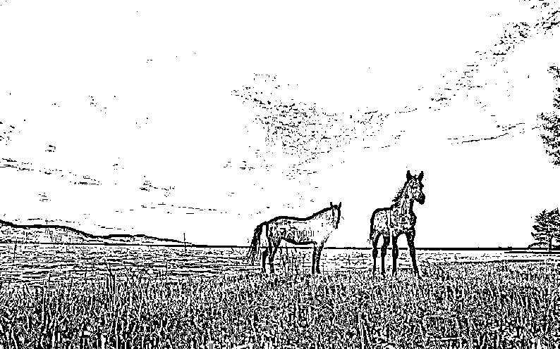

9**海王星**

在最好的情况下，星图中位置最高的海王星可以表示一种**“摘星追梦”的精神，将其目光投向崇高的目标和各种各样的梦想上。**对有些人来说，这会产生**强大的精神或创造性冲动。**

问题方面，**有该配置的案主可能对其职业或人生使命感到困惑，或是他们可能被迫在其公共角色周围编织出一层魅力或幻想的光环**，例如某人采用化名或躲在“面具”之后。出于类似的原因，该位置是**演员**星图中的另一个常见指征，他们通过假装成其他人，而非他们自己，来获得明面上的报酬。

**如果有困难相位，这个海王星的位置可以造成一个人声誉方面的问题和被误解的感觉**。它甚至可能导致一种**“殉道者”**情结，一个人在其中感觉受到了自己无法控制的力量的摆布。但是通常与海王星相关的**误解和欺骗**要素，也可以用其他方式来引导，就像脱口秀主持人约翰尼·卡森一样：他年轻时的人生抱负是成为一名舞台魔术师——又被称为欺骗和误导的艺术！

10**冥王星**

**冥王星代表一种强烈的原始能量，涉及生与死、性、权力和转化的问题。因此，当它占据星图中的最高位置时，它可以表明一个人的职业或“使命”感将涉及这些领域中的任何一个或全部。**在纯粹的身体层面，看看其公共身份已经与性密切相连的名人的星图，例如已故歌手普林斯。普林斯出生时冥王星是其最高的行星，他对性非常公开，他在 2007 年的超级碗表演中展示了生殖器的意象，全球近 10 亿观众观看了这场表演。同样地，冥王星着力**探索生活中“更黑暗”的一面，也涉及令更习惯活在事物表面的人不适的生存面向**。我们在已故歌手莱昂纳德·科恩和作家杰克·凯鲁亚克的作品中看到了这种探索的特质，凯鲁亚克在自己的经典作品《在路上》中歌颂了放荡不羁的“下层社会”。**你还需要考量这 3 点**
还有几点值得一提。**首先，当任何一颗行星靠近某人星图的顶部时，无论该行星守护哪个宫位，该宫位的关注点往往也会出现在公众面前**。例如，如果某人的火星落于中天附近，白羊座位于第二宫宫头，那此人在金钱方面的自信或冲突就将以相对开放的方式展现出来。或者，考虑一下这种情况：案主出生时狮子座位于第四宫宫头，太阳（第四宫守护星）与中天合相。他们为人所知的生活面向更有可能多少与家庭、家或房地产事务相关。但需要特别指出的是，**如果靠近中天的行星恰好是此人太阳所在星座或上升点的守护星，那此人对于职业或公众的个人关注将成倍放大**。相比而言，如果太阳在金牛座中，木星靠近中天，那么木星的位置可能很重要，但并不像此人太阳落入射手座时那么重要——射手座的守护星是木星。**最后，无论某人是否有行星靠近星图顶部，都需要仔细研究中天的黄道星座，因为这也会揭示此人渴望表达和获得的品质，还会揭示公众将如何看待此人。**如果是双子座，那就会涉及沟通和信息。水瓶座？团队参与、媒体，或进步/创新的理想。天秤座？有关美、法律或公共关系的事宜。如此等等。反过来，**要密切关注该星座的守护星，以进一步洞察这项使命的意义和方向**。

**版权声明：**本文由若道翻译发布，欢迎转发，反对抄袭。友号转载请申请白名单。

**雷·格拉斯**

来自芝加哥的作家、音乐家、摄影师和占星师。他在《探索之书》和《探索》杂志做了十年编辑工作，并自 1998 年以来一直担任《大占星师》杂志的副编辑。他的讲座话题广泛，涵盖了占星学、共时性和神话学，同时他还保持着积极的占星实践，客户遍布美国国内外。

**系统学习占星学**

**点击图片了解详情**

**微信又又又改版啦，不想错过若道的推送？**

**就把若道设为星标吧！**

**▼**

就是这个“在看”，戳戳戳 ☟

********报名直达入口********

# 雷蒙德·梅里曼金融占星周运 | 本周仍是需要密切关注的一周

> 原文：[`mp.weixin.qq.com/s?__biz=MzA5NjA0NTAxNg==&mid=2651432560&idx=2&sn=e6d0a02b8fb797253cb02c1e5feba77c&chksm=8b4b14c7bc3c9dd12a238bd9dc0725a97c7bee3694a9eba6bd6e9b1b3774018c7a79513a1d3a&scene=126&sessionid=1692738075#rd`](http://mp.weixin.qq.com/s?__biz=MzA5NjA0NTAxNg==&mid=2651432560&idx=2&sn=e6d0a02b8fb797253cb02c1e5feba77c&chksm=8b4b14c7bc3c9dd12a238bd9dc0725a97c7bee3694a9eba6bd6e9b1b3774018c7a79513a1d3a&scene=126&sessionid=1692738075#rd)

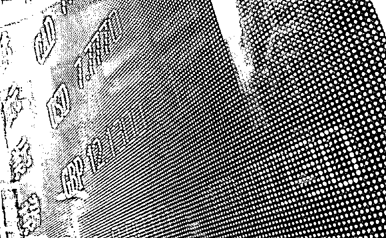

作者/雷蒙德·梅里曼
译者/Leisha 编辑/玫瑰 图片/全景网雷蒙德·梅里曼是在金融占星学界稳坐第一把交椅的占星师，同时他也是若道签约的金融占星课老师，我们引进了雷蒙德·梅里曼老师的《[上证指数月度报告](http://mp.weixin.qq.com/s?__biz=MzA5NjA0NTAxNg==&mid=2651430487&idx=2&sn=6b032833078f13e0caf33e548da15942&chksm=8b4b2ce0bc3ca5f6d2b4406eb8ffd38cd864c96b48133bd14364a778c2eaa4743479992b2c4a&scene=21#wechat_redirect)》[《黄金报告》](http://mp.weixin.qq.com/s?__biz=MzA5NjA0NTAxNg==&mid=2651432029&idx=2&sn=eaca6d75a185e6ef6b9123eebe180f8f&chksm=8b4b16eabc3c9ffc8d5dbad92fb697c01c785ab62f79a0ab5bdef0db3362c65d712c9084aba1&scene=21#wechat_redirect)《[2021 年金融预报](http://mp.weixin.qq.com/s?__biz=MzA5NjA0NTAxNg==&mid=2651425978&idx=1&sn=067bd68ece37e1e820d6f84f7a3cc960&chksm=8b4b3e0dbc3cb71b866f65d51f7993d3c35dee77cebd77eda3f63a4d5864dadaea2e9d14c101&scene=21#wechat_redirect)》。我们经老师的授权，将每周刊登梅里曼老师的周运，供大家参考和学习。于是，这是本周的周运（11.16-11.20）。**说明：以下时间采用纽约证券交易所所在地美国东部标准时间。**
**展望与回顾**

**因投资者再次对明年可能受益于有效疫苗和经济复苏的股票下注，美股周五上涨。摩根大通宏观量化和衍生品策略主管马科·克拉诺维奇写道：“我们认为本周有关疫苗的积极新闻扭转了局面，因为它使市场可以透过最近新冠病毒感染病例的激增，看到疫情即将结束以及更广泛的经济复苏。”Vital Knowledge 创始人亚当·克里萨弗里表示，生物制药新技术公司（BioNTech）和辉瑞公司（Pfizer）周一发布的疫苗公告“持续回响”，因而投资者不太介意新冠病毒感染人数的增加。**

**——弗雷德·英伯特**

**《标普 500 指数涨至创纪录的收盘价》**

**www.cnbc.com 2020 年 11 月 13 日**

11 月 9-19 日是今年最有力的三个地球宇宙学时间段之一，全球股市上周暴涨，许多市场创下了历史新高或数年新高。比特币和原油也急剧上涨，但黄金和白银在上周初急剧下跌，随后温和回升。11 月 12 日，木星、冥王星形成第三次也是最后一次合相，9 月 9 日开始的火星在白羊座逆行周期也于 11 月 13 日结束。这是与美国股市基本周期相关性最强、最一致的两个地球宇宙学征象，容许范围为 11 个交易日。我们可以确认**基本周期的波谷结束于 10 月 30 日，也就是这两个星体影响力巅峰期的 8-9 个交易日之前**。然而，随后的急剧反弹至少在 11 月 9 日周一暂时达到了顶峰，更接近这两个宇宙征象的顶点，11 月 9 日还恰好是梅里曼市场时机研究地球宇宙学三星关键反转日期。道琼斯工业平均指数和标准普尔指数创下的历史新高，也许就是基本周期的波峰？道琼斯工业平均指数从 11 月 9 日周一创下历史新高——29933，到周四创下周度低点 28902，跌逾 1000 点。标普近期期货合约 11 月 9 日创下历史新高 3668，一天后跌至周度低点 3506.5。纳斯达克现金市场上周一创下历史新高。不过，值得注意的是，纳斯达克近期期货合约并没有创下历史新高，在三星关键反转日期当天形成了市场间看跌背离的情况。因此，看涨突破图表模式与技术和地球宇宙学触发因素相互矛盾，表明**在重要的地球宇宙学反转日期当天发生了看跌背离的情况。**另一个要提及的重点是，印度 NIFTY 指数 11 月 11 日创下了历史新高，一天后，日本的日经指数也飙升至 29 年来的最高水平。欧洲股指也出现反弹，但都没有创下年度新高，只有苏黎世 SMI 指数居然在 11 月 9 日创下了暴跌后的低点。与上周高点形成看跌背离情况的市场在全球比比皆是，但到目前为止，全球股市的这些反转本质上只是修正性的，还不是新熊市的迹象。尽管如此，**本周仍需密切关注这些触发因素。**梅里曼市场时机研究关键反转日期 11 月 9 日当天，金价的表现也值得注意，黄金上周一回升至 1966，为 9 月 18 日以来的最高水平。但随后，黄金在同一天暴跌超过 100 美元，自 7 月 22 日以来首次跌破 1850。这是看跌图表模式。然而，白银并没有跌至数月新低，梅里曼市场时机研究地球宇宙学三星关键反转日期当天，再次出现市场间看涨背离的情况。这又是一个市场分析方法互相矛盾的例子，在行星（例如火星）逆行和停滞期间更为常见。其他市场，比特币继续飙升至 2017 年 12 月创下历史高位以来的最高水平。大豆继续上涨至 1150，为 2016 年 7 月以来的最高价格。玉米的走势也很强劲，自 2019 年 7 月以来首次飙升超过 425。过去这一周，价格活动与木星合相冥王星、火星顺行动态的一致性表现得非常明显。

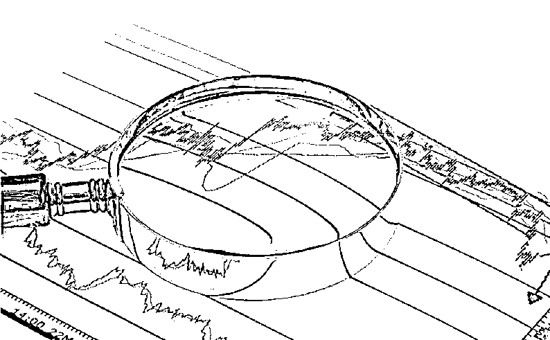

**短期占星趋势和长期考量**

**美军参谋长联席会议主席马克·米利上将说：“我们在军队中是独树一帜的，我们不向国王或王后、暴君或独裁者宣誓效忠。我们不向某个个体宣誓效忠……”突然的变化使人们担心特朗普在其任期的最后两个月可能试图做什么，以及美军长期以来的非政治性质是否可能被颠覆。**

**——洛丽塔·巴尔多**

**《美联社》，2020 年 11 月 12 日**

**克里斯汀·菲利普斯引述大卫·贝克尔所言：“这是阴谋论的诉讼。这场投票战不会像 2000 年那样。”**

**——《今日美国》，2020 年 11 月 11 日**

本周，强有力的行星相位继续对我们狂轰滥炸。**金星四分摩羯座星群的木星、冥王星、土星，并与停滞在白羊座的火星形成 T 三角，一直持续到 11 月 19 日。**就其性质而言，这不是亲切和善的组合。一方（金星在天秤座）想达成协议并停战，另一方（火星在白羊座）想为自己认为正确的事而战。
金星和火星之间的行星（人）基本上处于僵持的混乱状态中，如果双方都不让步（或者也许只是当其中一方不肯让步时），金火之间的行星（人）就会以可怕的后果发出威胁。冥王星和火星参与进来，金星就不太容易得到她想要的优雅。好消息是，本周过后，我们将在 11 月 21 日进入为期 30 天的射手月，恰逢美国的年终假日。这是人们花钱（增加个人债务），零售商赚取一年最高销售额的季节。大家都是愉快乐观的（唔，不是所有人，但许多人是这样），这是射手座的主题，射手座像是带着礼物的圣诞老人。这是股市普遍上涨的季节，但两年前的射手月，股市发生了暴跌。射手座不夸大乐观和振奋时，可能会夸大恐慌。我认为这取决于射手座圣诞老人判断世界人民是“顽皮或可爱”。到 12 月 14 日左右，日食四分海王星时，我们可能就会知道结果。转念一想，也许我们不会知道结果。海王星不会“知道”什么，它只会想象，而且通常会想象虚妄和不现实的东西。海王星宁愿跳舞、奏乐、表演，也许是不管不顾地开个派对，这在病毒之患（也由海王星掌管）仍未消除之时不是一个好主意。除此之外，日食还合相唐纳德·特朗普的月亮和卡玛拉·哈里斯的下降点。日食这天将召开选举人团代表会议，正式确定大选结果。不禁使人思索，圣诞老人会决定谁顽皮、谁可爱，他送的是礼物还是恐慌，还是说他会送出真正的士兵，而不是玩具士兵。

**说明：以上日期基于纽约证券交易所所在的美国东部标准时间，由于存在时差，中国地区可能需要加一天。**

**版权声明：**本文由若道翻译发布，欢迎转发，反对抄袭。友号转载请申请白名单。

**雷蒙德·梅里曼（Raymond Merriman）**

若道签约老师。著名金融占星师，ISAR（国际占星研究协会）前主席，梅里曼市场分析公司的总裁。他由于“提升了占星学的职业形象”，在 1995 年国际占星大会上被授予轩辕十四奖；在 2012 年国际占星大会上，被授予轩辕十四终身成就奖。

1“中国上证指数月度报告”发售

**若道推出了****中文版****的雷蒙德·梅里曼中国上证指数月度报告，并持续发行该报告！**

当把金融市场的周期和占星学的周期相结合时，雷蒙德·梅里曼老师的金融占星学研究**为投资者应对金融市场的周期波动，并随之调整投资策略提供了极大的价值参考**。

**12 月中英文报告将于近期上线！**

2“黄金价格周期月度报告”发售

**若道推出****中文版****的雷蒙德·梅里曼黄金价格周期月度报告！**不仅仅为广大读者在中国股市的投资出谋划策，更将视角放眼黄金市场。

**每当世界经济形式不明朗的时候，有一个地方是保值的港湾，那就是****黄金**。自 1982 年雷蒙德·梅里曼出版第一本研究《地球宇宙学征象与黄金价格的关联》的著作以来，**他一直作为最重要的黄金市场时机预测者之一享誉国际**。8 月的黄金终于从高位开始下跌，有些分析人士认为，黄金在过去连涨 9 周是非常极端的，因此走势未来不会太强了；也有人认为，在目前各国大放水、国际局势不稳的情况下，黄金可以继续看高。那么，你该如何面对目前的调整呢？是等待回调继续进行，还是在什么位置买入？11 月黄金周期报告等着你。火星逆行，很多国家都纷纷再次爆发新冠肺炎病毒疫情，未来的几个月注定不安宁。黄金的走势会安宁吗？

11 月黄金报告已经上线。欢迎了解。也可以按照季度和一年期订阅，有更多优惠。季度和年度的好处是，你可以持续了解梅里曼老师对于不断在变化的市场的看法。即便他某一次看法和市场不一致，你也看到在下一期他如何调整自己的看法，并看到金融占星在一个长期时间段内对你把控风险的帮助。而能够长期控制风险、尽量找到安全的投资时机才是投资的长久之计。

**12 月中英文报告已上线！**

**购买套餐**，买得越多越优惠

中国上证指数月度报告套餐价

*   **单月报告**：280 元

*   **3 个月套餐**：780 元（260 元/月）

*   **12 个月套餐价**：1999 元（166 元/月）

**长按下图识别二维码**

**购买金融报告****套餐**

**▼**

黄金周期月度报告优惠

*   **双报告年度套餐更优惠（直降 899 元）**
*   **12 个月黄金报告+12 个月上证指数报告：仅需 3500**

**长按下图识别二维码购买黄金报告套餐**

▼

1976 年以来，由雷蒙德·梅里曼撰写的梅里曼市场时机学院每年一次的年度预报沙龙和每年一本的《年度预报》一直在应用占星学原理为投资者们服务，提供卓越洞见，从未间断。过去两年，3 小时的年度预报讲座和长达 200 页左右对金融市场的分析报告，帮助许多若道读者做出正确的投资决策，降低了投资风险，并获得相当不菲的投资收益。在群星摩羯座的时候，我们和你一起提早规划自己来年的投资安排。

**2021 年金融年报预售**

**1976 年以来，由雷蒙德·梅里曼撰写的梅里曼市场时机学院每年一次的年度预报沙龙和每年一本的《年度预报》一直在应用占星学原理为投资者们服务，提供卓越洞见，从未间断。**过去两年，3 小时的年度预报讲座和长达 200 页左右对金融市场的分析报告，帮助许多若道读者做出正确的投资决策，降低了投资风险，并获得相当不菲的投资收益。在群星摩羯座的时候，我们和你一起提早规划自己来年的投资安排。2021 年年度预报开始预售**前 50 名预售价格**：1080 元（已售罄）**前 50-100 名预售价格**：1180 元**100-150 名预售价格**：1280 元**150 名之后价格**：1380 元**2021 年年度预报中文版预计发布时间**：2020 年 12 月底**沙龙时间**：2021 年春节前后**沙龙形式**：英文讲座，配有中文翻译**点击下图了解详情**

▼

******点击阅读原文购买金融报告******

# 11 月 15 日天蝎座新月 | 放下生命中正在走向“死亡”的东西

> 原文：[`mp.weixin.qq.com/s?__biz=MzA5NjA0NTAxNg==&mid=2651432541&idx=1&sn=27f7817aba0a8a1e1ce075b4ac86be75&chksm=8b4b14eabc3c9dfca7f568f52ccef3d0552163ca8c475e3c2dcce9ef79f5df13fc2220da79f1&scene=126&sessionid=1692738075#rd`](http://mp.weixin.qq.com/s?__biz=MzA5NjA0NTAxNg==&mid=2651432541&idx=1&sn=27f7817aba0a8a1e1ce075b4ac86be75&chksm=8b4b14eabc3c9dfca7f568f52ccef3d0552163ca8c475e3c2dcce9ef79f5df13fc2220da79f1&scene=126&sessionid=1692738075#rd)

**********☆****************后台回复“今日”，给你一句生命态度**********

作者/王芝桦 编辑/玫瑰 图片/全景网**天蝎座新月****北京时间 2020 年 11 月 15 日 13:07 迎来天蝎座新月，太阳与月亮精准合相于天蝎座 23°17′。**天蝎座新月的前几天，我的理疗师、朋友们和学生们等一系列大队人马，前赴后继地来劝我“不要加班，保证睡眠”。说起来颇有些惭愧，让这么多人操心自己的身体，但这也确实是我在 2020 年最大的挑战：拼时间，拼体力，做不完的工作，熬不完的夜晚，虽然我的精神享有极大的乐趣和满足，但我的身体却在逐渐发出不满和危险的信号……这就是“宇宙共时性”的显现！在 2020 年终最激荡的天象里，我已站在“悬崖”边缘，必须要做出一个选择：如何做出全新的安排，以保证工作和身体的和谐与共生。每个人都有自己的内在议题，那些习以为常的“守旧派”，自以为是的“老顽固”，消耗着生命中某些珍贵的东西，宇宙正以各种“因缘际遇”推动我们必须去面对、不能再忽视这些议题的存在。此次天蝎座新月就是我们做出重要选择的时刻——**放下生命中那些正在走向“死亡”的东西。**无论是对成功的误解，对安全的担忧，还是对关系的执着，对健康的偏颇，我们需要突破原有的意识框架和行为模式，重塑生命必要的全新基因，重组生活所需的鲜活序列、减负、重生，然后迈向 2021 年全新周期的大门。

> **天蝎座新月重点影响人群**
> 
> **参考新月峰值影响期间各个行星的行进度数，以及逆行行星的轨迹影响；常规容许度，个人行星入相位 3°，出相位 1°；非个人行星入相位和出相位均为 3°。**
> 
> *   出生星图中，有**行星、四轴、南北交点**落入**固定星座（金牛座、狮子座、天蝎座、水瓶座）0°-13°，20°-27°**的人群。
>     
>     
> *   出生星图中，有**行星、四轴、南北交点**落入**变动星座（双子座、射手座、处女座、双鱼座）15°-24°**的人群。 
>     
>     
> *   出生星图中，有**行星、四轴、南北交点**落入**基本星座（白羊座、巨蟹座、天秤座、摩羯座）2°-30°**的人群。

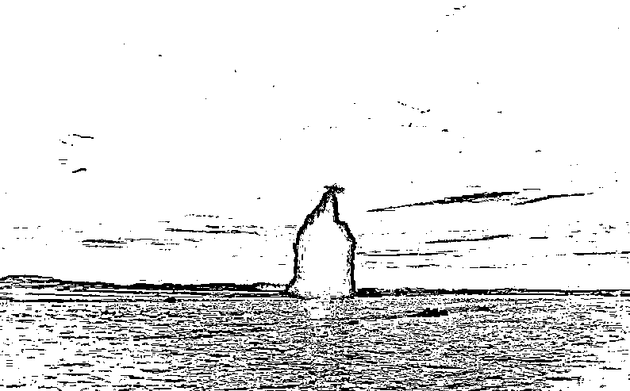

**年底的功课，宇宙早都安排好了**

**不管什么事情，我们都会选择知情。在这个过程中，我们不免伤害自己；如果需要，我们会把双手伸进火中。**

**——玛格丽特·阿特伍德《盲刺客》**

**天象**

**· 海王星四分南北交点**：双鱼座海王星四分“射手座南交点-双子座北交点”轴线。我们先来看看此次天蝎座新月的行星能量传导图：

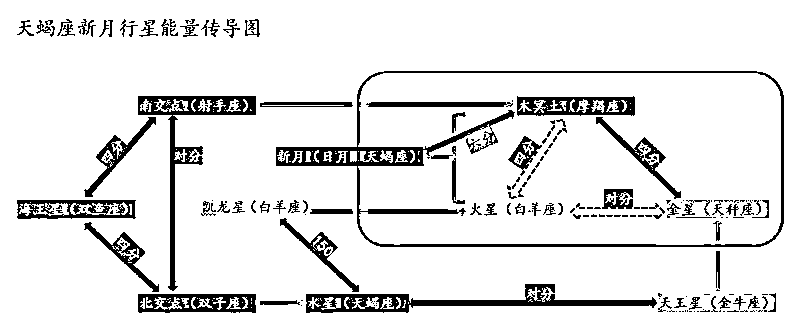

走到 2020 年末尾，不得不惊叹宇宙的宏大安排。从 11 月中旬开始，与今年这一场既带来幻灭，也带来魔幻的新冠病毒肺炎疫情有着对应关系的双鱼座海王星，便与“射手座南交点-双子座北交点”轴线形成四分结构，但这一组结构精准呈相、能量达到峰值的时间却是要等到 2021 年 1 月 6 日。逆行了 5 个月（6 月 23 日-11 月 29 日）之久、即将于 11 月 29 日恢复顺行、目前处于顺行前停滞期的双鱼座海王星，犹如睡美人一般正在逐渐苏醒，并开始为我们布置出 2020 年最后一个多月的功课，要求我们做出“二选一”的选择——**是继续走在射手座南交点所揭示的“习以为常的守旧派，自以为是的老顽固”的道路，还是走向双子座北交点所提示的“带着全新的意识和更多的尝试，去迎接全新周期的巨大变革”的道路。**2020 年将近年末，无论集体社会，还是个人生活，都已经走到必须做出选择的**“悬崖的边缘”**，那些“守旧派的陈旧观念，老顽固的腐朽模式”依然影响着我们的生活，制造出现实的障碍。此次天蝎座新月前夕——11 月 13 日，接纳射手座南交点能量的木星和冥王星于摩羯座 22 度，第三次形成年度重磅天象“木冥合相”结构。这一次，“木冥合相”联动射手座南交点，撞到了两个非常重要的敏感点：一个是摩羯座 22°又一次惊现；另一个是接纳此次天蝎座新月能量的行星之一的“宇宙超级大 BOSS 冥王星”（冥王星守护天蝎座）。故而，此次天蝎座新月将会引领我们走上**“回溯原点并探究真相，直面问题并取舍轻重”**的进化路径，或许这就是我们为即将到来的“风元素周期”献上的一份必要的大礼。

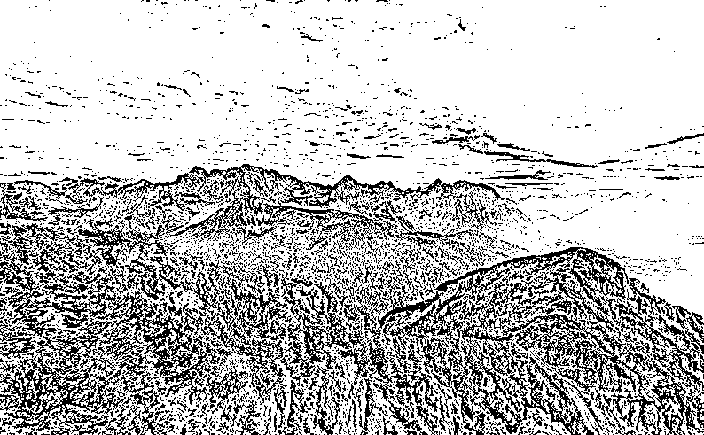

1**穿越时空，寻找答案**

**“应该”是一个没用的词。它指的是没有发生的事情。****——玛格丽特·阿特伍德《盲刺客》**

**天象**

****天象****

**· 木冥合相**：木星与冥王星合相于摩羯座 22°。2020 年三次出现了“摩羯座 22°”这个敏感的度数：**· 1 月 12 日**：年度重磅天象“土冥合相”发生在摩羯座 22°。**· 10 月 4 日**：4 月 5 日，年度重磅天象“木冥合相”摩羯座第一次形成，4 月 26 日，冥王星于摩羯座开始逆行，6 月 30 日，年度重磅天象“木冥合相”摩羯座第二次形成，10 月 4 日，冥王星于摩羯座 22 度恢复顺行。**· 11 月 13 日**：年度重磅天象“木冥合相”摩羯座第三次发生在摩羯座 22°。年初的“土冥合相”宣告了 2020 年“现实世界的彻底洗牌”这一整体旋律。洗什么，怎么洗——“宇宙超级大 BOSS 冥王星”望向“土星老人的现实高墙”之下撞得鼻青脸肿的世相，说：“这就是现实世界的实相，但更要揭开实相之下的真相啊！”冥王星逆行的 5 个月，涵盖了前两次“木冥合相”摩羯座的影响期：全球疫情的现实考验（土星、摩羯座），激活和放大（木星）了人们心底隐藏的恐惧和欲望（冥王星），国际社会一片混乱和动荡，个人生活也一再地颠簸和冒险，人们恐惧辉煌跌落，人们极欲掌控命运，一些人在挑战和碾压之下丧失斗志，一些人在慌乱与求生之中饥不择食。冥王星在逆行期假装闭上眼睛，其实是在考验我们的诚实与力量；10 月 4 日，冥王星于摩羯座 22°恢复顺行，就是睁开眼睛、逼视我们并提出问题的时刻：· 为什么只能前进不能后退？为什么没有最好只有更好？“应该如此”的期待与预设，令我们脆弱得不敢跌倒再爬起来，令我们执着得难以安住当下的生活。· 所有“现实”，其实都是“人心”；我们能够走到的地方，其实就是 “心”能够到达的地方。此次天蝎座新月，天蝎座的另一颗守护行星火星，于 11 月 14 日在白羊座（火星守护白羊座和天蝎座）恢复顺行。人类只想看到自己愿意看到的， 9 月 10 日-11 月 13 日，白羊座火星逆行期间，这颗战无不胜的勇猛战神就像是熄火的战车和逃跑的将领一般，对那些本就不愿看到的问题一再地视而不见，在压力之下恐慌低迷，在困难面前歇斯底里，威风尽散，勇气不见。但是，“宇宙超级大 BOSS 冥王星”却绝对不会允许我们视而不见。此次天蝎座新月，宇宙借由天蝎座与火星和冥王星的共振关系开启了神秘的“月光宝盒”，引领我们穿越时空隧道，回溯 2020 年的现实旅途，看向生命的内在深处：**从年初到年末的岁月与时光之中，我们选择了什么？我们收获了哪些成长，又失去了哪些初心？**而此次天蝎座的前夕，宇宙早已安排了一系列的铺垫，帮助我们寻获真相并重获新生：11 月 13 日，第三次“木冥合相”摩羯座，再次碰响 1 月 12 日“土冥合相”摩羯座 22°的钟声，引领我们再次回溯年初“彻底洗牌”的原点，木星的“放大”了冥王星的“转化”能量；11 月 14 日白羊座火星恢复顺行并重拾力量，给予我们直面问题的勇气。此次天蝎座新月，回溯 2020 年的旅途，我们将会深刻洞悉到：那些在“恐惧辉煌跌落，极欲掌控命运”驱动之下做出的选择正在呈现出相应的后果和代价，令我们如处“悬崖的边缘”，要么向上攀升，要么坠落山谷，我们必须直面那些阻碍“心”勇敢前行的内在阴影，放下那些束缚“心”自由飞翔的陈旧意识，突破原有框架，转化惯性思维，重新拿回自我的独特力量。

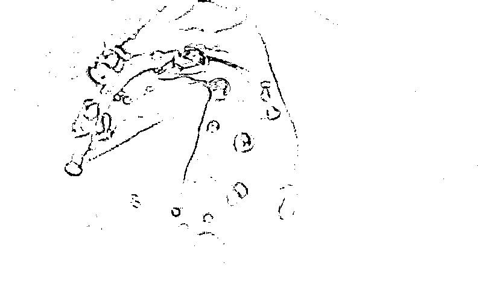

2**解铃还须系铃人，问题之中蕴藏进化路径**

**旧时光，旧创痛，就像池塘中的淤泥，一层一层地沉淀在塘底。**

**——玛格丽特·阿特伍德《盲刺客》**

**天象**

**· 新月六分摩羯座群组**：天蝎座新月六分摩羯座上的木星、冥王星和土星； **· 金星四分摩羯座群组**：天秤座金星四分摩羯座上的木星、冥王星和土星；**· 水天对分**：天蝎座水星对分金牛座天王星；**· 水凯梅花**：天蝎座水星与白羊座凯龙星形成 150 度梅花结构。此次天蝎座新月，摩羯座上的“木土冥”群组再次被激活和凸显，一方面与新月形成和谐的六分相互动，另一方面与天秤座金星形成激烈的四分相挑战。故而，新月期间，“关系与金钱”的内幕隐情相当的“有料可挖”。这里的“关系与金钱”并不仅限于亲密关系和金钱往来，也包括**我们与身体、与环境的关系，以及对生计、对职业的选择**。另外，此次天蝎座新月前，11 月 11 日，水星再次进入天蝎座，并在新月当天与白羊座凯龙星形成 150 度梅花结构，将当下恼人的“关系与金钱”的烂摊子指向过去 2 个月的旧时光和旧伤痛。必要的觉察：**· 金钱：**台面之下的交易，投机取巧的侥幸，即使曾经带来短暂的惊喜，但在暴露真相的时刻却要付出加倍的惊慌； **·工作：**随手可抓的机会，短视收益的贪图，要不就把时间都占据了，要不就把前途给模糊了。还记得自己的初衷是要去往哪里吗？还是那个初衷和现在的盲目一样，都没有想清楚？ **· 关系**：以爱之名的控制，心有不甘的竞争，“爱”里增添了太多的调料，也就多出了难言的味道。在关系中投射议题的人，往往以为爱着；而真正爱着的人，又怎会如此恐慌与猜忌？**· 身体**：恐惧后退的劳作，证明价值的逞强，要么累坏了身体，要么累坏了心，而两者怎么算都是“必然亏本儿”的事情。此次天蝎座新月中，“关系和金钱”的相关议题离不开金牛座天王星卷起的变革之风，因为接纳金牛座天王星能量的正是与摩羯座上“木土冥”群组形成四分结构、代表“关系与金钱”的天秤座金星。或许是在震荡之下的恐慌与不适应，或许是还没有突破原有的价值观念和行为模式，令我们在与金钱、与工作、与人、与身体的关系中投射了太多的恐惧阴影和掌控欲望。解铃还须系铃人。此次天蝎座新月周期内的 11 月 17 日，接纳双子座北交点的天蝎座水星（水星守护双子座）与金牛座天王星形成“水天对分”结构，为我们揭示出“变革之中的进化路径”：

**·** 从 2020 年迈入 2021 年，全新周期是一个需要几年时间进行“磨合和转化”的过程，我们需要做出突破与改变，但更需要拿出“搭结构”的耐性和“立根本”的智慧，因为真正的变革，既要尝试，更要长久；

**·** 越是震荡多变的时期，越是要踩稳生命的根基，那些意外上演的剧情和突然逆转的事件，不过是在提醒我们回溯以往的旧时光和旧创痛，梳理原有的观念和决定，只有将沉淀在塘底的淤泥一层一层地挖出来，才能恢复池塘的有氧环境，种养更多的可能性。一切都是最好的安排。此次天蝎座新月，就是我们**进行轻重取舍，做出长远规划**的时刻。即使这个过程中，我们不免伤害自己；但如果需要，我们会把双手伸进火中。因为不管什么事情，我们都会选择知情。

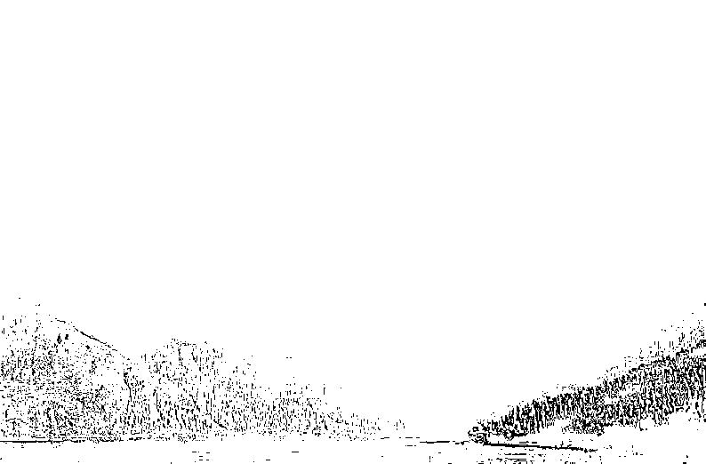

**寄语**

**猎取纪念物是一件奇特的事：现在就变成了过去，尽管现在还没有过去。**

**——玛格丽特.阿特伍德《盲刺客》**

我们总是希望美好的瞬间能够永恒，就像被影在相片中的定格一样，每次再看的时候，似乎那个瞬间还在。但是，相片是一种纪念，相片内的一切已然变成了过去。猎取当下者，往往并未活在当下，而是提前进入到“对过去纪念”的时空之中。于是，生命就很容易滋生出“踏空的恐惧”：害怕自己喜欢的东西不见了，担忧自己期待的会落空，于是死死抓住自己喜欢的事物，强迫外界符合自己的期待，却完全忽略了时光正从指缝流逝，而自己正与当下时光失之交臂——就因为那份猎取的执着，我们失去了生命中太多的乐趣与灵动。此次天蝎座新月打开了内在心灵的能量通路，引领我们洞悉生命之中那些无比珍贵的渴望，不可动摇的信念，进而将那些束缚我们的执着放下，与那些压抑心灵的沉重告别，如此生命才能体验每一当下“飞起来玩耍”的自由，“跌倒再爬起来重玩”的乐趣，而这也是我们迎接即将到来的 2021 年全新周期所能做的最好准备。祝福大家，愿每个灵魂安好。**新月如何许愿？**

**许愿时间**：2020 年 11 月 15 日 13:07 后，48 小时内有效、8 小时内最佳。

**许愿人群**：所有人。**许愿数量**：每人最多 10 个。**许愿方式**：静心冥想，身心祈祷或记录收藏。**许愿格式**：请万能的宇宙赐予我能量，我将以我的能量吸引**（什么）来到生命中……**许愿原则**：发心诚善利人。

**版权声明**：原创文章由作者授权首发于若道平台，欢迎转发，反对抄袭。友号转载请申请白名单。

****

****想阅读更多作者的文章****

****请在后台回复******王芝桦****** 即可****

****王芝桦****

心理占星师，统合疗愈师，若道占星“新月和满月”专栏作者

腾讯视频特邀合作占星师

全职于个案咨询与占星教学工作 16 年

**个案预约咨询微信号**：zhihua0621 

**微信公众号**：daoxi-life

**长按打赏**

****

**微信又双叒叕改版啦，不想错过若道君的推送？**

**就把若道设为星标吧！**

**▼**

**点击**

**“阅读原文”**

**获取免费新月报告**

**获取免费新月报告，请点击文末“阅读原文”**

# 免费新月报告 | 生命中的哪些东西需要“断舍离”？

> 原文：[`mp.weixin.qq.com/s?__biz=MzA5NjA0NTAxNg==&mid=2651432541&idx=2&sn=7f712e5cd72bf2ea466f3464d1cd008b&chksm=8b4b14eabc3c9dfc26d5fdba19143725090003f3c845862f5fd600ef922c1eab93d8aee3d682&scene=126&sessionid=1692738075#rd`](http://mp.weixin.qq.com/s?__biz=MzA5NjA0NTAxNg==&mid=2651432541&idx=2&sn=7f712e5cd72bf2ea466f3464d1cd008b&chksm=8b4b14eabc3c9dfc26d5fdba19143725090003f3c845862f5fd600ef922c1eab93d8aee3d682&scene=126&sessionid=1692738075#rd)

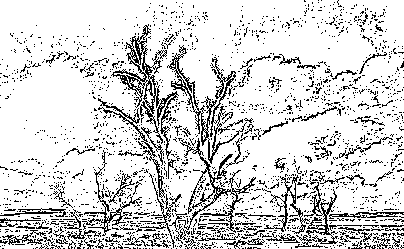

编辑/玫瑰 图片/网络

北京时间 2020 年 11 月 15 日 13:07，新月发生在天蝎座 23°17′。每到新月时分，若道君都会为你奉上根据你出生星图量身打造的免费新月报告。可是新月为什么要许愿？新月报告该如何领取？让若道君来教你。

　**什么是新月？**　

从占星学看，新月是月亮周期的一种相位。新月是开始，又称为朔，对应中国农历初一，太阳、月亮在此时合相。此时月亮运行到太阳与地球之间时，月亮以黑暗的一面对着地球，并且与太阳同升同落，地球上看不见月亮。

本次新月时间

**2020 年 11 月 15 日 13:07，新月发生在天蝎座 23°17′。**

为什么新月要许愿？新月是一个周期的开始，新月发生的时候，太阳与月亮合相，能量很强。当新月出现时，你也许会发现灵感忽现，非常适宜开启新领域、项目与行动，缔结一段新的关系或合作。许愿会加强新月的能量，也有助于你了解自己现阶段适合开启的方向。 本次新月最佳许愿时间

从新月开始到其后的 48 小时内，许愿的力量最强。

**最佳许愿时间：2020 年 11 月 15 日 13:07-11 月 17 日 13:07**

属于你的免费新月报告

每到新月时刻，看着占星文章里写着：看看你新月的宫位，如果新月在第 X 宫，你可以许愿的方向是……

是不是常常一头雾水？新月的宫位？我到底该看哪里啊？

而有时，那些标注上升星座的文章也会让你忍不住想：虽然我的上升星座是这个，可是我的新月好像并不落在你说的宫位啊？你是不是写错了？

虽然这些文章都没有写错，可是好像对你而言都太不友好了。

**Don't Worry！**别着急，让博学又体贴的若道君来帮你！

我们推出了一份**免费**又**好用**的新月报告！

而且是专门为你设计的哦，**根据你出生星图为你量身打造的，只****属于你的独家新月报告**。

报告有哪些内容？

**新月时间****最佳许愿时间**

**如何许愿 **属于你的**许愿关键词**

本次新月给你的**建议**

你会有怎样的**感受 **

****机会****

********

如何许愿？

许愿方式也很简单。

你可以把愿望写下来，或者双手合十后交叉，闭上眼睛来祈祷。

报告中会为你提供**祈祷词示例**，可以多多参考哦～

你还可以适当添加自己的语言，创造属于你自己的祈祷文！

如果报告拿到手了，快对照着许愿吧！

**这份好用又暖心的报告，点击阅读原文即可领取！**

****

****点击“阅读原文”即可获取新月报告****

# 木冥第三次精准合相 | 2020 年，飞翔和坠落的最后较量

> 原文：[`mp.weixin.qq.com/s?__biz=MzA5NjA0NTAxNg==&mid=2651432464&idx=1&sn=ca9c17504eba72bb739b7ab94ed5d2e1&chksm=8b4b14a7bc3c9db15c068abe5ff445abd765b6d2d54a5b84b35ca0b00859b6617b1c6a3d7f3e&scene=126&sessionid=1692738075#rd`](http://mp.weixin.qq.com/s?__biz=MzA5NjA0NTAxNg==&mid=2651432464&idx=1&sn=ca9c17504eba72bb739b7ab94ed5d2e1&chksm=8b4b14a7bc3c9db15c068abe5ff445abd765b6d2d54a5b84b35ca0b00859b6617b1c6a3d7f3e&scene=126&sessionid=1692738075#rd)

****************☆ ****************************后台****************************回复“今日”，给你一句生命态度****************

作者/布莱恩•克拉克 译者/Chang 校对/江艺编辑/玫瑰 图片/全景网 2020 年 11 月 13 日，木星和冥王星第三次精准合相，这也是这两颗行星在今年的最后一次合相。这一次，我们又会面临怎样的议题呢？一起来看看这篇文章吧。**木冥合相**木星与冥王星的上一次合相发生在 2007 年 12 月 11 日，射手座 28°34′，靠近银河系中心的地方；因此射手座 29°就标志着这个周期的开端，而这个周期现在正让位于今年 2020 年萌芽的一个新周期。在木星和冥王星的射手座峰会之前 13 年，它们正好会合在 30°之前，即天蝎座 29°。今年，两者会在摩羯座的最后 10 度（22°52′和 24°53′之间）合相。**从 2007 年开始的这个木星-冥王星周期，正在迎来尾声，正在回顾和修订它的政策，尤其是那些关系到跨文化议题、性别问题和宗教问题的更真实、真切的兴趣，同时对那些败坏我们社会环境的狂热偏见和狭隘进行检视。** 尽管这个合相给人们带来了充满希望的愿景：**更深刻、更真切、真实地关心政府规程、有远见的领导力量、气候变化、经济、财政政策以及财富创造等**。但此合相未整合的阴影一面，则暗示着**狂热的偏见和对异己者的极度不宽容**。这一点与滥用权力和影响力结合起来，可能导致**文化仇恨、不明智的行动、权力争执，以及固化的认知和生存方式。**这是一个需要小心的合相。为了理解这一合相的可能意味，想象两个举足轻重的领导人之间的高级峰会。这里，董事会派出了木星和冥王星。**木星——是一位首席执行官，负责伦理和道德议题、确定性、信念、宗教、教育、法律、信息的出版及传播。**冥王星——是一位极少参加会议的董事，但他如果参加，那一定是至关重要的会议。

当冥王星出现在这次高层会议的主席位子上时，他的议程就是将隐藏的东西带到表面，将脓包挤破释放毒素。他的出席标志着一个关键节点，试图**将过去的创伤、被打破的诺言以及破裂的关系带到明处**。尽管在人道的层面上，冥王星的目的是**疗愈**，但他的目标是**消除根深蒂固的问题，将被压抑的议题和禁忌带到表面，这通常令人深感痛苦。**

然而，冥王星也和**权力、无权**有关，**他与木星的相遇将一些被赋予世俗权力的人的丑闻与欺骗曝光出来，尤其是在政治与经济上的掌权者。**在上一个周期中，由于起点位于射手座，所以木星处在一个强有力的位置。但当合相来到摩羯座，则是木星失势或落陷的星座位置。未来被过去所劫持；冥王星想要改革和净化的议程具有优先权。处在摩羯座最后 10°的两颗行星，将**经济和伦理**两个领域联系到一起，带来政府政策、组织和系统方面的任务。失败的公司和负责人必须被追究责任，否则就没有办法前进，仍被过去挟持。因此，这一周期预示着，**深入探究那些支持辛迪加垄断控制（比如政府、经济和企业等）的基本结构、教义和价值观。**

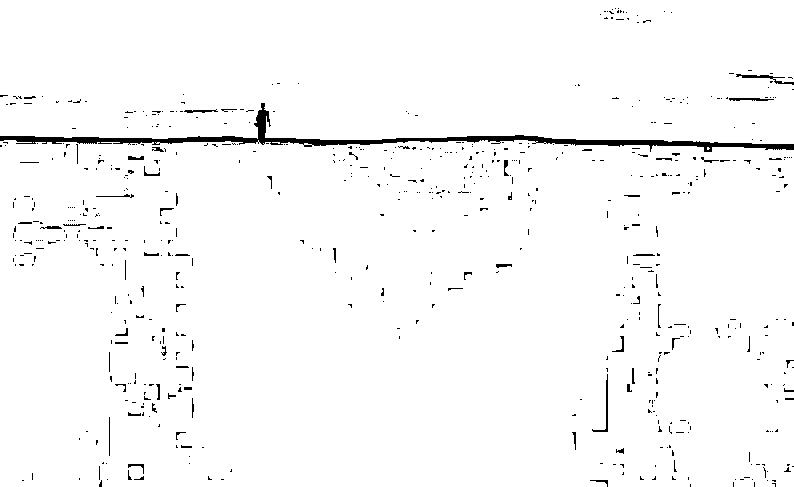

**木星、冥王星 12-13 年的会和周期****冥王星沿着黄道的运动是不规则的，但相邻的两次合相基本上发生在下一个星座里。**比如上一次是 2007 年合相在射手座 28°，再上一次是 1994 年在天蝎座 28°。下面是一个合相列表，从上一次发生在摩羯座的合相——1771 年开始。注意，**当冥王星经过金牛座的时候运动速度最慢，两次合相之间差 10°-12°，但来到天蝎座的时候冥王星运动最快，合相距离上一次 33°。**

| **木冥合相日期** | **次数** | **合相的黄道度数** | **合相之间的时间长度** | **合相之间的度数差** |
| 2020 年 11 月 13 日 2020 年 6 月 30 日 2020 年 4 月 5 日 | 3 | 摩羯座 22°52’摩羯座 24°06’摩羯座 24°53’ | 12 年零 11 个月 | 24°28’ |
| 2007 年 12 月 11 日 | 1 | 射手座 28°24’ | 13 年 | 29°58’ |
| 1994 年 12 月 2 日 | 1 | 天蝎座 28°26’ | 13 年零 1 个月 | 33°33’ |
| 1981 年 11 月 2 日 | 1 | 天秤座 23°40’ | 13 年零 1 个月 | 30°13’ |
| 1968 年 10 月 13 日 | 1 | 处女座 23°40’ | 12 年零 4 个月 | 27°12’ |
| 1956 年 6 月 16 日 1956 年 2 月 8 日 1955 年 11 月 2 日 | 3 | 狮子座 26°28’狮子座 27°36’狮子座 28°25’ | 12 年零 10.5 个月 | 19°35’ |
| 1943 年 8 月 1 日 | 1 | 狮子座 6°53’ | 12 年零 2 个月 | 17°37’ |
| 1931 年 5 月 27 日 | 1 | 巨蟹座 19°16’ | 12 年零 9.5 个月 | 13°13’ |
| 1918 年 8 月 10 日 | 1 | 巨蟹座 06°03’ | 12 年零 1.5 个月 | 13°32’ |
| 1906 年 6 月 26 日 | 1 | 双子座 22°31’ | 12 年零 1 个月 | 12°32’ |
| 1894 年 5 月 18 日 | 1 | 双子座 09°59’ | 12 年零 1 个月 | 12°00’ |
| 1882 年 4 月 12 日 | 1 | 金牛座 27°59’ | 12 年零 1 个月 | 11°45’ |
| 1870 年 3 月 4 日 1869 年 10 月 29 日 1869 年 7 月 27 日 | 3 | 金牛座 16°14’金牛座 17°12’金牛座 17°55’ | 12 年零 9 个月 | 10°08’ |
| 1857 年 6 月 12 日 | 1 | 金牛座 06°08’ | 12 年零 1 个月 | 12°11’ |
| 1845 年 5 月 6 日 | 1 | 白羊座 23°57’ | 12 年零 1 个月 | 12°47’ |
| 1833 年 3 月 30 日 | 1 | 白羊座 11°10’ | 12 年零 1.5 个月 | 13°39’ |
| 1821 年 2 月 18 日 | 1 | 双鱼座 27°31’ | 12 年零 2 个月 | 14°50’ |
| 1808 年 12 月 27 日 1808 年 8 月 31 日 1808 年 5 月 20 日 | 3 | 双鱼座 12°41’双鱼座 13°41’双鱼座 14°33’ | 12 年零 9.5 个月 | 14°38’ |
| 1796 年 3 月 14 日 | 1 | 水瓶座 28°03’ | 12 年零 2 个月 | 12°32’ |
| 1784 年 1 月 10 日 | 1 | 水瓶座 09°02’ | 12 年零 11.5 个月 | 20°14’ |
| 1771 年 2 月 25 日 | 1 | 摩羯座 18°48’ | 12 年零 3.5 个月 | 27°10’ |

**神话中的会和**

大约三千年前，诗人荷马讲述了朱庇特（Jupiter，木星）如何在他的兄弟涅普顿（Neptune，海王星）与普鲁托（Pluto，冥王星）的帮助下，推翻了父亲萨图恩（Saturn，土星）。于是有了一个新秩序，兄弟们瓜分世界，用抽签决定由谁来继承巨人父亲曾统治的各个领域。冥王普鲁托抽到了冥界，朱庇特抽到天界。 

普鲁托（冥王）被分配到黑暗国度，统治大地之下居住的阴影。作为地下王国的统治者、死亡与重生之神，他是那个沉默不可见的兄弟，将自己排除在世俗事务以外。但具有讽刺意味的是，他却统治着集体生活最深的层次。

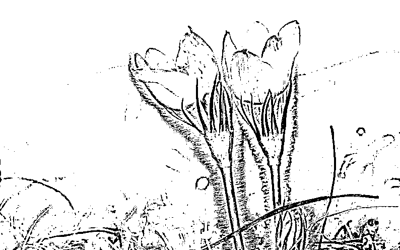

作为阴暗面的守护者，冥王星的角色是**管理地下事务——包括秘密、羞耻、深埋的激情、可怕的情感、未表达的悲伤和失落、负面反应、濒临爆发的对抗和愤怒、报复、背叛，以及同盟之间和敌人之间尚未结束和完成的关键议题。**他掌管着**集体大家庭中被活埋的东西；没有被好好埋葬的综合症和模式。**尽管普鲁托共同分管着这个世界，但他极少来到地上探索，总选择留在他的地下世界。他性情激烈、意图明显。在普鲁托占领地下世界后，他放弃了自己在奥林匹斯山众神庙中的位置。神话告诉我们他有三次来到地上：第一次是为了请求珀尔塞福涅的父亲朱庇特，允许他把这位年轻姑娘带进他的王国；第二次是把珀尔塞福涅从家里抓出来，拖到了地下。他最后一次冒险进入日光之中，是当他在地狱之门被赫拉克勒斯所伤后，到奥林匹斯山接受神医派埃昂(Paean)的治疗。普鲁托公开露面通常只有两个原因：**一个是支配弱者和宣称对他们的权力，另一个就是治愈和转化当前的危机。**不管哪种方式，他的出现都会动摇现状，在 2020 年，他出席与木星的峰会预示着**权力的改变。**朱庇特（木星）被宣布为新的天空之神，不像那更喜欢黑暗的哥哥普鲁托，朱庇特的领域是天国和光明。作为年龄较小的弟弟，他却变成了长者，获得了至高神祇的角色，并且建立了一个新秩序，确保天空众神的统治。朱庇特作为律法的化身，成为了奥林匹斯山的统治者，使他兄弟们的权威黯然失色。他是文化传统的公开载体，维护着国家的秩序和教会的神圣，给他两个兄弟（尼普顿和普鲁托）留下人类的混乱和戏剧性来承接。**朱庇特是社会中的远见者，是文化进步和未来理想的监督者，而他的兄弟们则紧紧抓住过去及其遗产。**海王星（尼普顿）和冥王星（普鲁托）的命名源于他们是运动最慢的行星，记录着每一代人的精神气质，并且共同统治潜意识的深处。这些神话神灵的化身让古老的天空圣殿充满生机，2020 年，这里再一次见证了同胞兄弟的重聚。在希腊神话中，宙斯是朱庇特的原型。但宙斯的一个绰号让他和普鲁托连结。**宙斯•冥府（Zeus Chthonian），意思是“地下宙斯”或者“冥界宙斯”，指低等世界的宙斯，表示承认天空之神的黑暗一面。**Chthon 指的是“大地”的神，和天国的神区别开。在这个绰号里，天国与冥界的两个神成为了一体，暗示着更整体和包罗万象的神圣态度。这种结合意味着**对差异的宽容，对未知的尊重，对不可见事物的认可。**在他们的结合中，光明和黑暗的交融成为可能，而不存在一方遮蔽或消灭另一方。在神话中，当宙斯成为奥林匹斯山的光明之神时，他的影子投在了哈迪斯的身上。作为兄弟，他们的关系代表了黑暗与光明的两极以及天堂与地狱间的对抗。宙斯胜利了，成为了天空之神，而普鲁托则被忽视了，来到地下。当两神两极分化时，信仰与远见的薄弱环节就会通过教条主义与正确性暴露出来。正直和诚实被遮掩，膨胀和偏见滋生。然而，这个绰号提醒我们木星和冥王星的家族关系和兄弟本质，以及类似的人类家系的光明和黑暗面向。**神性包含英雄和怪物、神和恶魔。**这个绰号恰当地比喻了即将到来的合相拥有的理想和潜能。在这一面，我们想起了天堂之神和地狱之神的古老联系，以及光与影可能的整合，以及对可见与不可见事物的同时接纳。**分离时，狂热、不宽容和不诚实会滋生，但当允许共存时，正直、集体愿景和信仰则会繁荣。**在希腊神话中，普鲁托（冥王星）被他的父亲萨图恩（土星）吞噬，而朱庇特（木星）则没有。每个人都在宇宙大家庭中经历了不同的认知和存在方式。朱庇特继续了这一遗风，吞下梅蒂斯——雅典娜的母亲和女性智慧的化身，暗示着朱庇特认识事物的方式是**征服和胜利**。朱庇特是通过信念和智力优势去认识的原型方式；也就是说，女神的智慧深藏腹中。确定性不会给怀疑或本能认知留下任何空间。木星的知识可以征服，并且需要是正确的；有权威的保证和正确性在其中。木星存在在理想或可能性中，是未来导向的，而不看向现在的现实。朱庇特被赋予远视，但常常对当下需要被治愈的东西是无知的。冥王星式的认识更加本能和原始。**冥王星熟悉不知道的感觉，也习惯于被不确定性的黑暗所吞噬，他居住在过去，执著于已经不再适当的宿怨。冥王星感觉到过去并没完结，守着过去未处理的创伤，对现在的可能性视而不见。**当这两个神在分开并且无意识的情况下，会不自觉地串通一气，从而爆发出**偏见、仇外、无法无天、恐怖主义和文化分裂主义**。然而木星和冥王星有意识地结合时，则会唤起**对社会、种族、宗教和文化差异的宽容接受。**任何滋生偏见的分类法，在这两种原型有意识地结合时，都可能以一种积极向上的方式被重建。木星和冥王星在神话中的次次相遇，呈现出他们之间的复杂关系。虽然木星和冥王星可以联合起来推翻旧秩序来形成疗愈，但我们必须认识到，在这个过程中要**严禁无辜的人被绑架或被侵犯。** 

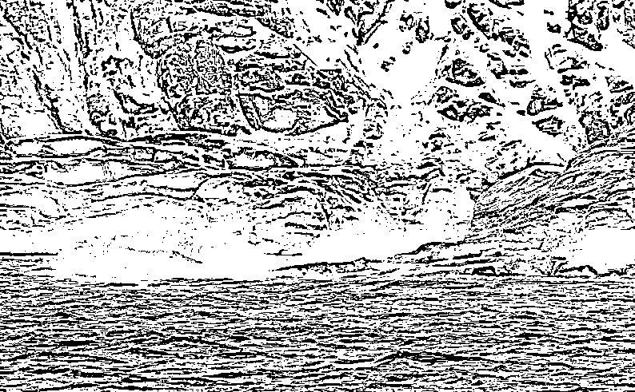

**天文学中的合相**冥王星穿过黄道十二宫的轨道是相对椭圆的，在它 248 年的周期轨道中，会在某个时候穿过海王星轨道将近 20 年。因此，它在每个星座停留的时间从 12 年到 32 年不等，令每一代人对它的周期都有独特的体验。每一个冥王星世代，因为被对应的星座掌管，与冥王星式的启蒙有着自己独特的关系。

| **星座** | **在星座的时间****（本周期）** | **星座** | **在星座的时间****（本周期）** | **星座** | **在星座的时间****（本周期）** |
| 白羊座  | 29 年零 3 个月 | 狮子座  | 19 年 | 射手座  | 13 年零 11 个月 |
| 金牛座  | 31 年零 6 个月 | 处女座  | 14 年零 5 个月 | 摩羯座  | 16 年零 7 个月 |
| 双子座  | 30 年零 1 个月 | 天秤座  | 12 年零 1 个月 | 水瓶座  | 19 年零 5 个月 |
| 巨蟹座  | 25 年 | 天蝎座  | 12 年零 4 个月 | 双鱼座  | 24 年零 1 个月 |

1979 年 1 月，冥王星在天秤座时，进入了海王星的轨道；1999 年 3 月，在射手座时，又回到了海王星的轨道之外。并且，当它行进在自己的星座天蝎座时，离地球和太阳最近。当冥王星在海王星轨道内时，它的移动速度比海王星快，因此在每个星座的运行时间不到 14 年，不再是最外侧的行星。另一方面，木星通过黄道十二宫的周期更规律，在略小于 12 年的时间里完成一圈，平均在每个星座停留一年时间。根据它们的速率，**当冥王星移动缓慢时，木星在黄道带上大约 12 年会追赶上冥王星，而当冥王星速度加快时，则是 13 年**。木星为古人所知，但冥王星是行星众神殿中的新成员。1930 年，它在巨蟹座时被证实存在。因此，木星-冥王星周期是一个新的现象，经世占星学家只在过去 90 年中进行了研究。在冥王星以最慢速度穿过的星座中，冥王星和木星会有两次，有时是三次合相。但在冥王星快速移动经过的星座中，则只有一次合相。因此，由于冥王星现在正超过平均速度移动，合相在黄道带上的间隔距离会更大。同样有趣的是，木星和冥王星的南赤纬也非常接近；也就是两者在天赤道以南的距离相同。因此，这两颗行星合相的同时也是平行的，加强了它们的结合。在许多方面，冥王星也一直在重申其与天国弟兄木星之间古老的关系。他们的合相是天堂和地狱之间炼金术般的结合，预示着光明和阴影相混合的新反应和新呈现。

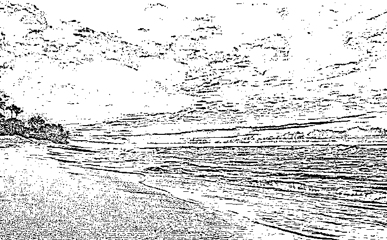

**占星学中的合相**在占星学上，这两颗行星掌管着特定的世俗领域。我们来看向这些舞台，预见更可能呈现出哪些发展。合相预示着在这两个原型力量之间可能产生一个新的关系模式。**由于冥王星是两者中运动较慢的一颗，所以它被视为孕育的力量，而木星则是传播的载体。**如前所述，合相发生在摩羯座的领域，木星的热情在那里被调和、收敛：**深切地需要弥补过去的不公正，否定对权力的滥用，消除贪婪和权利，以恢复人类价值观的正直**，这些令这一周期沉重起来。这是一个宏愿，在隐喻层面（对木星来说就是字面意思），这些是大行星，代表着自然和精神的巨大力量。

| **木星：****概念和法则** | **冥王星：****正直与阴影** |
| 精神与愿景•相同的信仰、文化传统、道德、伦理•人类价值观、理想和宽容•人们的宗教本能和种族宽容、神职人员、宗教教派、宗教信仰•人们的信念和信仰•外交政策•法律和正义、法庭、司法调查、人权•教育、学院、大学，教育系统的变化•出版和思想的传播•营销和媒体•繁荣和增长•哲学、古典学以及与崇高理想相关的所有职业 | 鬼魂和秘密•在群体表面之下的东西，本质上是集体的阴影，系统的自我毁灭的冲动•变革集体制度的权力与能力；不可逆转的变化，死亡和结局•生态意识，回收，再生长，再种植，有毒废物处理，对核污染的意识•政治阴谋、间谍、秘密警察和特工、黑市、密探、恐怖主义、卖淫、萨满、文化治疗师。•研究：癌症研究等；对死亡和濒死的集体态度，临终安养院，肿瘤学研究，临终关怀•考古学、精神疗法以及与地下世界有关的所有职业 |
| 当远见者和深度治疗师会面，共同开辟一条道路时，我们可以想象会有更多关于死亡和濒死问题的洞见，同时还有对这一领域的更多研究，以及对难以处理或维持的问题的更多教育。对文化中被压抑、隐藏和秘密的事物有所觉知，带来了对犯罪活动的调查和报道。由于冥王星象征净化教育、宗教和媒体等文化体系的残渣和糟粕，因此会出现对宗教和政治文化中的滥用、权威、秘密和犯罪的揭露。 |

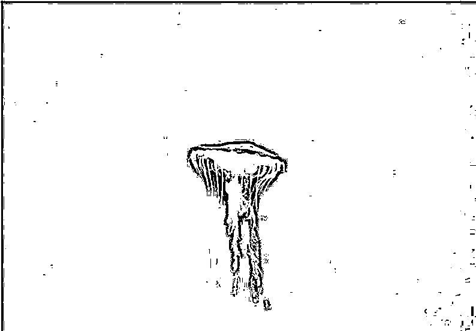

**木星-冥王星：天空之神遇到阴间之主**

过去的经世占星师曾认为这一周期代表国际恐怖主义的崛起、政治重组以及经济变革。当然接下来的 13 年里，这些问题确实会在议事日程上名列前茅。在这个周期里，也会发生很多其他重要的占星学现象，比如 2020 年冬至，木星与土星合相水瓶座；2023 年，冥王星进入水瓶座；2025 年，天王星进入双子座，2026 年土星、海王星合相在黄道第一度内 0°45’。

2025 年，海王星在双鱼座和白羊座的分界处摇摆；当它在 2026 年终于进入白羊座之后，将会位于天王星和冥王星的中点——全部三颗外行星都位于阳性星座。但愿时代的重建景象，与木星-冥王星合相所建立的诚实和正义一起，可以为集体带来创新性的想法。这是一个气候变化的时期，不只是生态上，同时也在社会上和精神上。

**这个行星融合唤起了对生与死过程的理解。**到什么程度则取决于带给这一结合的意识水平。当然，我们可以期待医学上的重大突破，来提高大众的生活质量。在想要对死亡有更多选择自由和尊严的老龄化人口中，对于安乐死的争论可能会再次出现。对死亡和濒死态度的讨论会提上日程，也许由某个名人的去世引发，例如一位政治家、一位受人尊敬的领袖或有权威的学者。**由于在摩羯座，有关老年人的道德权利，关于老龄化的伦理、判断和法律，如养老金、老年护理设施等，都是新闻报道和审视的对象。****冥王星和木星都与财富有关——冥王星指的是冥界的“财富”，而木星表示富足。**尽管从理论上讲，这对财富创造是个好兆头，但合相的另一面，揭示出**特权阶层和弱势阶层之间的鸿沟，随着企业财富达到庞大的比例，将比以往任何时候都更加明显。**两颗行星都在摩羯座，企业财富的缩水是一个现实。可能出现关于积累资源和财富的新指令和法律。在集体中唤起了关于财富、资源及其分配的人类价值观问题。**财富的阴暗面——贪婪、囤积、滥用权力——被揭露和处理。**然而，像所有的系统和政府一样，总有可能只有无休止的委员会和调查，却没有真正的改变。这取决于领导人和整个社会的愿景。**这一行星组合要求司法公正，因此，通过道德和伦理丑闻对掌权者进行曝光，也可能是这个周期的一个特征。**政府、金融和企业业务部门的秘密和耻辱也很可能被曝光。这一组合表明，消毒剂和清洗刷将被用于金融体系和政府权力机构。这两种行星能量的结合意味着国家层面上新的权力组合。任何在上一个周期内形成的联盟将被重新检查和测试。当然，这两者预示着**政治权力和财政联盟的重新组合**——新的商业和贸易政策。**恐怖主义的全球威胁**仍然是冥王星和木星的主要议程项目之一。当然，威胁的背后是逐渐走向一体化的运动，威胁到一神论和单一文化的体系和机构。**当木星和冥王星结合，对人类法律和体系多样性的容忍度可能达到新的水平。**然而，像所有种子一样，这取决于我们如何充分培养下一个周期的潜力，以及给到它的意识水平(阳光)。对于将要来临的时代，占星学给我们提供了一个形象的洞察。但是结果掌握在我们自己、以及被我们当做领导者、导师与向导的人手中。希望我们会明智选择。**版权声明：**本文由若道翻译发布，欢迎转发，反对抄袭。友号转载请申请白名单。

**布莱恩·克拉克**

Astro*Synthesis 远程学习项目创始人，此项目脱胎于他在过去 35 年作为占星教育者的经验（www.astrosynthesis.com.au）。在墨尔本大学获得了古典文学和考古学的硕士学位，并荣获了澳大利亚的州级、国家级和专业占星组织的终身会员资格。他的书和文章被翻译成多种语言。他的最新著作《灵魂、符号和想象：占星的艺术》（ *Soul, Symbol and Imagination: the Artistryof Astrology*）是对于自己占星职业道路的反思。

**系统学习占星学**

**点击图片了解详情**

**微信又双叒叕改版啦，不想错过若道君的推送？**

**就把若道设为星标吧！**

**▼**

就是这个“在看”，戳戳戳 ☟

********报名直达入口********

# ISAR 选修课程丨新技法！心理占星学视角下的预测方法

> 原文：[`mp.weixin.qq.com/s?__biz=MzA5NjA0NTAxNg==&mid=2651432464&idx=2&sn=50f1a8380023241487cf01958e76b2dc&chksm=8b4b14a7bc3c9db17cecfec73978e0d124cf281f1c7641b989e1db7a847088703aec3a74b1fb&scene=126&sessionid=1692738075#rd`](http://mp.weixin.qq.com/s?__biz=MzA5NjA0NTAxNg==&mid=2651432464&idx=2&sn=50f1a8380023241487cf01958e76b2dc&chksm=8b4b14a7bc3c9db17cecfec73978e0d124cf281f1c7641b989e1db7a847088703aec3a74b1fb&scene=126&sessionid=1692738075#rd)

作为一门艺术，预测占星学运用行星的运行来预测特定时期的性质、意义和持续时间。在这个阶段的课程中，我们会**考察意识进化的概念、其基本原理及其与占星学预测部分的关系。****意识进化可以被定义为有意识地与星图中固有的进化过程合作。**学员们将探索如何用行进和推进来为意识进化服务。我们不是简单描述事件的结果，而是将行星运行描述为实现先天潜能的机遇之窗。**在这个阶段的课程中，会探索占星心理学视角下如何将对行进、推进和其他预测方法的分析运用于个人成长。**具体事件反映并促进了意识的改变；因此，行星运行可以帮助我们洞察成长过程的精确时机，让我们领会内在和外在现实如何同时发生、彼此反映、互相转化。我们还将探索宏观的世界行进，考察占星格局如何在社会、政治、经济、艺术和生态层面上表现出不同的形式，却又在多样化的现象中反映单一的原型。这里的挑战是去思考，我们对宇宙的这种参与式关系如何能为共同创造一个积极的、更充满希望的未来做出贡献。

**1**

**课程安排**

**第一课：开始预测****第二课：发展年龄方法****第三课：太阳的行进****第四课：月亮的行进与推进****第五课：水星的行进****第六课：金星的行进****第七课：火星的行进****第八课：木星的行进****第九课：土星的行进****第十课：天王星的行进****第十一课：海王星的行进****第十二课：冥王星的行进**

**2**

**课程费用**

**课程费用：9800 元****若道核心课程 L5 学员优惠价：6800 元**

**3**

**授课时间**

**上课时间：**12 月 2 日（周三）20:00-22:00

**授课方式：**英文授课，中文翻译

**4**

**授课老师**

**格伦·佩里(Glenn Perry)**

*   这位传奇的占星师，也是一名拳击和摩托车爱好者； 

*   他毕业于赛布鲁克学院(Saybrook Institute)，是心理/意识研究专业博士，也是拥有 30 余年经验的加州注册婚姻和家庭治疗师 （CAMFT）； 

*   美国占星心理学学院（Academy of AstroPsychology）的创办人，他曾任国际占星研究协会 （ISAR） 以及联合占星大会董事会（UAC）副主席，也是 ISAR 突破性道德标准的设定者； 

*   康涅狄格州研究生院（the Graduate Institute of Connecticut）原型宇宙学与意识进化项目的负责人，共出版八本占星学著作：《心理占星学入门》、《心理占星论文集》、《盗取天火》、《从忠诚到革命》、《星图中的阴影》、《占星职业议题与伦理》、《出生星图深度分析》、《从古代到后现代占星学》。

**5**

**往期学员分享**

不得不说，格伦老师的心理占星课真的很强大，跟着老师上完了两年半的课程，仿佛做了一个长程的心理疗愈。这段时期我正好在经历冥王星的困难行进，感觉就像在地狱中行走，在这个过程中我懂得了，只有疗愈了自己，懂得自己的伤痛，才能理解他人，帮助他人。在学习占星学技法的同时，深深感受到老师的慈悲心，也感受到老师对待占星学的严肃认真。能够跟随格伦老师学习真是太幸福了，同时也特别感谢若道，感谢大卫老师。——2017 心理占星学格伦核心班学员 宋轶绚跟随美国心理占星学院两年课程，最受用的是格伦老师以扎实的心理学理论基础和咨询经验，所教授的心理占星学的系统架构。没有哪个心理占星学的课程比格伦的更系统、深入、有理论且有技巧了。还有格伦特色的发展年龄法，黄道带病理学理论在个案中很有实操性，2 年的学习，除课程外的几百万字经典的补充阅读资料，70 多场测试，以及格伦言传身教的从业道德标准，让我成长为一位合格的心理占星师。——2017 心理占星学格伦核心班学员 植语瞳

**6**

**退转课程**

**退款原则请详看《教学协议》，如有疑问请咨询课程顾问。******占星心理学之预测视角****

**授课老师：格伦·佩里**

**授课时间：****12 月 2 日（周三）20:00-22:00**

**授课方式：**网络课程：英文授课，中文翻译

**费用：9800 元** **若道核心课程 L5 学员优惠价：6800 元**

**课程负责人：Margaret（微信号：nodoor233）**请备注“预测视角”

长按二维码添加课程负责人咨询~  

****报名请点击“阅读原文”****

# 拜登宣布当选下一届美国总统丨从美国总统就职宣誓日分析

> 原文：[`mp.weixin.qq.com/s?__biz=MzA5NjA0NTAxNg==&mid=2651432354&idx=1&sn=ba6e6440aea33b9dd7cfae50959b7a6d&chksm=8b4b1715bc3c9e03e9ec88630645f0d8881549e2bff13ef1fbfeb67237e8304330060e679379&scene=126&sessionid=1692738075#rd`](http://mp.weixin.qq.com/s?__biz=MzA5NjA0NTAxNg==&mid=2651432354&idx=1&sn=ba6e6440aea33b9dd7cfae50959b7a6d&chksm=8b4b1715bc3c9e03e9ec88630645f0d8881549e2bff13ef1fbfeb67237e8304330060e679379&scene=126&sessionid=1692738075#rd)

******************☆ **************后台回复“今日”，给你一句生命态度****

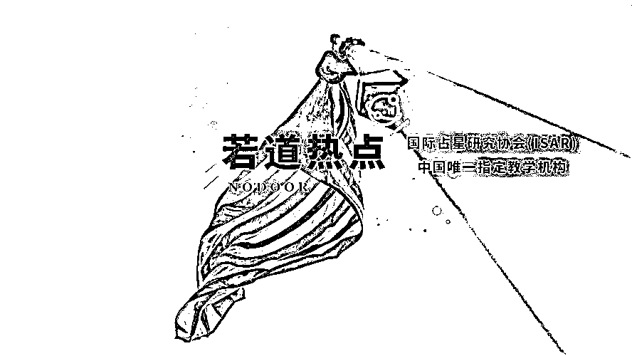

作者/ Serina Sun ISAR 认证占星师编辑/翀子 封面/书君 图片/ Serina Sun、网络在 ISAR 大会上，圆桌会议嘉宾之一、生活在纽约的 Serina 对美国大选前的种种情况进行了分享（点击[【回顾】](http://mp.weixin.qq.com/s?__biz=MzA5NjA0NTAxNg==&mid=2651429580&idx=1&sn=41a68055f451aa5008db6de5d9360634&chksm=8b4b287bbc3ca16d8f0f3e7fc9e494ec6bbadfe12c31122b886e1c7bdb0253facc99c03393d1&scene=21#wechat_redirect)），而在大选之后，面对之前占星学界的预测、2017 年和 2021 年总统就职宣誓的星图，以及星图上面的占星学指针，作者再次做出自己的理解并把它们分享给读者。本文仅代表作者观点。**前言**

每 4 年一次的美国总统大选，消息铺天盖地占据了全世界新闻媒体、社交媒体的头条。今年的大选，情形尤其特殊，民主党候选人拜登，已经在日前在美国主流媒体一致的官宣之下，宣布自己赢得了选举，成为了美国第 46 位总统。而现任总统，败下阵来的特朗普，依然不认输，坚持要上诉到最高法院，原因是民主党在选举中有投票舞弊行为。

这个现象也引发了占星圈、玄学圈，甚至神秘学派的热烈讨论，在大选进行之前，打开各种网站，总能看到某未来人，某通灵人，某大师的预言，特朗普会成功连任。

以至于拜登宣布选举获胜以来的几天里，又出现一窝蜂的文章说这是命理学圈子里的一次集体大翻车，有如 4 年前的重演，当时几乎所有占星师都预测希拉里会获胜，事实却打了脸。

**新旧交替的特殊时期**

**2020 年是一个旧时代结束，一个新时代开启的过渡期，新旧交替的特殊时期，动荡、冲突是不可避免的。**是因为时代有着这样的需要，因此集体会投射出一个像特朗普这样的人，他的个性、执政政策，会配合趋势。回想在 ISAR 年会上，我也给出过这样的观点。

依据对整体趋势的判断而做出的判断，认为他会继续激化美国社会的各种矛盾，点燃对立和冲突。因此当时觉得他更符合时代的选择。

不过，在趋势上的预测，却并没有出错，只是特朗普也许不再作为总统来引动社会运动，角色标签也许是输了还不甘心想要继续纠缠的前任总统——不管什么世俗身份，他的的确确做到了他的使命，在任的 4 年中，将美国社会的遮羞布给彻底撕下来了。

从选举创下历史记录的民众参与程度，不难看出，整个国家，都因为这一个具有争议的人，而被动员起来了。无论你是喜欢他，还是讨厌他，你没办法坐在那里看热闹，而是会参与到运动中，不管你是挺川，还是反川。

所以有人开车 27 个小时，为了回到家乡投票，年纪近百的老人，要在自己有生之年履行自己最后一次公民的义务，还有无以计数的人们，站在飘摇的风雨里，排队几个小时——作为集体中的一员，每一票，都具有不可被替代的重要性。

所以，对于美国社会未来的走向，我们仍然可以从星图中找到线索。当然，再声明一次，这仅是我个人的经验与观点。

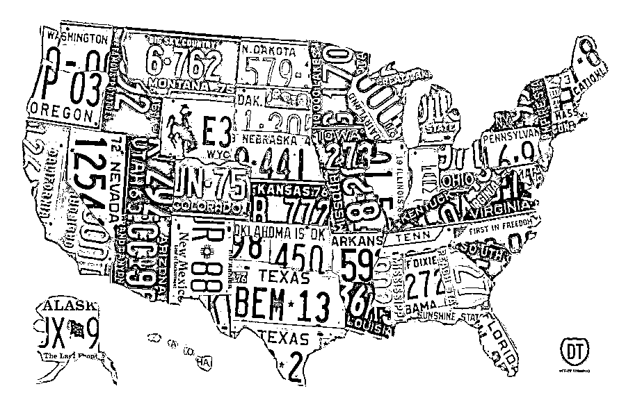

**2017、2021 宣誓就职星图**

这次我使用的参考工具，是**美国总统就职日宣誓时生成的星图**，这个星图的参考价值非常高，**因为宣誓日，意味着一个新的政权、领导班子、执政策略的正式启动，**如同一个新生儿获得第一口呼吸，这个政权，将在随后的岁月里，逐渐展现出它特定的剧情。

**我们或许可以从政权表现的风格，看出究竟是哪位总统入主白宫。**

依据美国雷打不动的惯例，新总统宣誓日是 1 月 20 日，仪式一般来说是临近中午启动，总统发表讲话并手按圣经宣誓的时间，会在中午 12 点左右。根据这个时间制作出的星图，就是我们进行参考的基本盘。

**由于总统宣誓日是固定的 1 月 20 日中午，不同届总统宣誓，不变的星象是，上升点位于金牛座，太阳在水瓶座，落在 10 宫。**

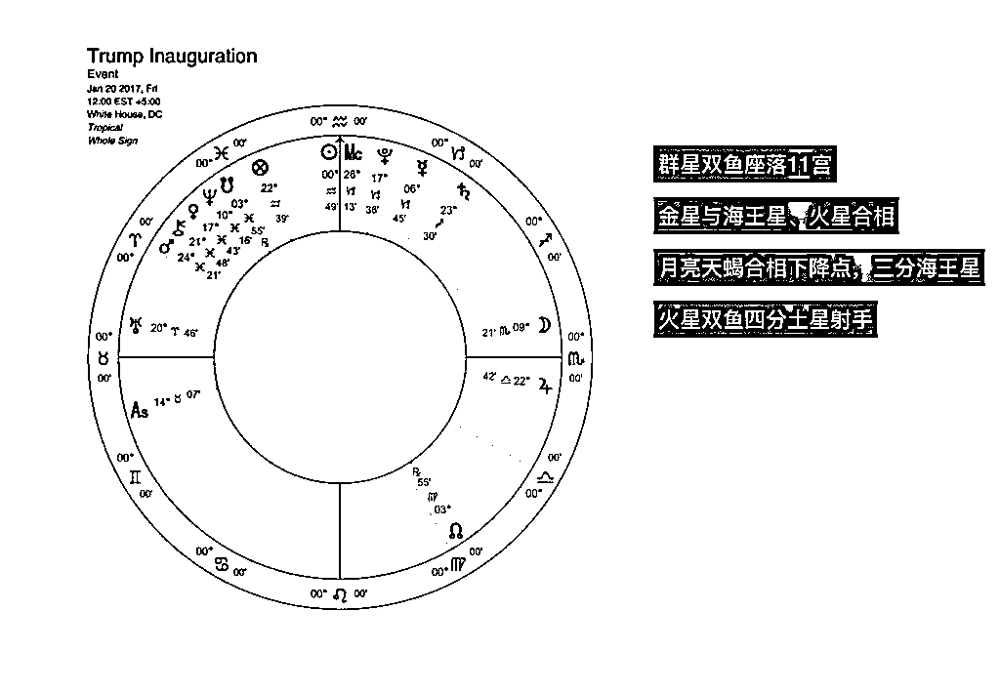

**| **图一：美国总统特朗普 2017 年 1 月 20 日宣誓的星图

对比 2017 年 1 月 20 日特朗普宣誓日星图（图一），与未来 2021 年 1 月 20 日新总统宣誓日星图（图二），在格局上一个非常明显的变化，是从 4 年前**群星双鱼座 11 宫**（金星、海王星、凯龙星、火星、南交点合相在双鱼座），转向**群星水瓶座落 10 宫**，在中天附近。

**今年的 ISAR 年会上，占星师 Skinner 老师曾提到，4 年前，美国民众集体做梦，对新上任的总统特朗普抱有不切实际的幻想。**

非常同意老师的观点，我想延续这个思路继续分析。

一个政权核心领导者，以及围绕着他而形成的政党执政风格、路线，会首先透过命主星的状态表现出来。

**命主星金星（上升金牛座的守护星）落在双鱼座 11 宫，金星入旺，**意味着从外表看起来，一切是那么美好，金星拥有入旺的尊贵，意思是外界对他的评价会超出他真实的水平，因为他会“显得”很好，会带领美国走向美好。

**金星的相位非常丰富，合相了海王星、凯龙星和火星，**这颗金星被赋予了大众的期待（11 宫），却也埋下了隐患，有海王星参与的相位，会让事情的发展变化莫测，民众对于政权内部真实的样子，是看不清的；特朗普自己传达出的信息也是具有强烈的海王星特质的，真假难辨，盲目自大、乐观，擅长掀起支持者的热情，不知不觉的导向危险，却难以被揭穿。

**海王星也与传染病有关，**这再次强调了在这一届政权上发生的双鱼座能量，集体潜意识里的美梦，幸好**被射手座的土星四分，土星在 8 宫，四分群星双鱼，可见带有宿命色彩的疫情、灾难，因此而引发的道德审判，成为刺破彩色泡泡的关键力量。**

假如没有这场疫情，那些还在做梦的民众，不会看穿特朗普的本色：学历造假、吹嘘、开野鸡大学、参与性丑闻，4 年前民众以为他会重振国家经济，因为他是一个成功的商人，而这个人设本身就是一个泡泡，作为商业帝国传奇人物的他，交过的联邦税，却只有 750 美金；而他商业上的成绩，更多的来自于社交、投机取巧的能力（几次从破产中获得更大的利益）而非真正专业的管理技能。

这张星图中的**月亮在天蝎座 7 宫，三分海王星，**说明他与人合作的关系中，喜欢掌控，不轻易交付信任，必要时，他会选择毁坏关系，而且是毫不手软的。这从他对华政策，以及与各个世界组织、协会撕破脸可见一斑。这颗月亮是时刻感觉到不安与危机四伏的，当我搞不定你们的时候，我选择的是与你决裂，这是天蝎的阴影面。而当我对你的资源动心，有所图的时候，我又可以使用三分海王星的力量迷惑对方。

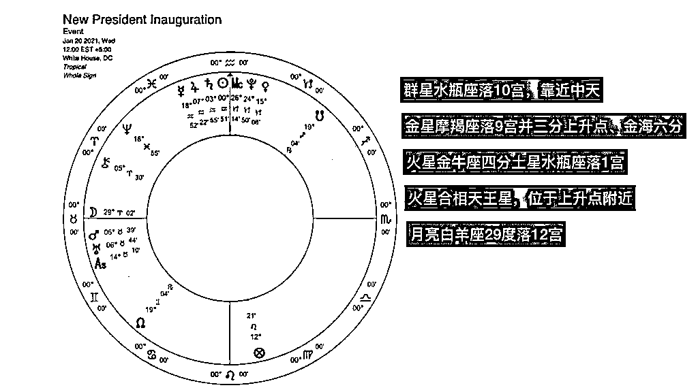

**| **图二：美国下一任总统 2021 年 1 月 20 日宣誓的星图

**转而分析代表未来政权的星图，4 年后的今天，群星双鱼座的格局转变成群星水瓶座 10 宫，靠近中天。**

**水瓶座的原型与自由、觉醒有关。**水星、木星、土星、太阳齐聚在这个星座（木星、土星都位于水瓶座初始度数），这是一个强有力的星群，并且无法被忽视，**因为群星所落的宫位位于 10 宫，这是一个公开、被外界看到的位置，古典占星中这是拥有后天尊贵的强宫。**

政权的政治观点偏向于**提倡自由、平等，木星、土星与政权执政理念、策略、制度有关，合相于水瓶座，**意味着打破守旧腐朽的制度，重视社会各阶层的联通，旨在让各个圈层既保持各自的独立，又能够相互沟通、合作，形成一个更大的集体，英文当中有一个词，很好的形容这种人际关系，**Interdependent**，既不是 independent，也不是 dependent，而是，mutually dependent, depending on each other。

**这应该就是高阶的水瓶座精神，**一个充满了真正的自由、民主的集体中，人们高效的沟通与合作，破除阶级、权贵自上而下的统治，法律与制度，实际上是为了保护而非为了统治，**水瓶座是土星入庙的位置，土星在此有机会去实现它的积极意义，与时俱进的树立边界，保护弱者，推动平等与协作，让集体充满大爱。**

实际上当下社会的经济模式中，互联网、信息技术的发展，已经让每个人平等的拥有机会，获得资源，成为了可能，只要真的有才华，有能力，能吃苦奋斗，就有观众，就有流量，人们可以打破原有的社会圈层，获得知识资源，并且实现成功。

**木土合相水瓶座的大幕即将在 12 月底拉开，这股自由与解放的大趋势是不可抵挡的。**

**星图中水星也参与到了日木土合相水瓶座的格局中，**猜想这届政府会非常愿意去宣讲民主、自由，善于调动社会大众的积极性。**群星落在 10 宫，这似乎意味着这个政府希望带领社会力量，向成功攀登，**10 宫虽然是代表着成功、最高地位的领域，但是却同时需要付出艰辛，这里没有任何事是容易的，因此，Skinner 老师也表达过，**不论是哪位总统候选人最终上台，要面对的，都是一场非常艰难的战斗。**

**这个星图中透露着浓重的讯息，集体意识在呼唤改变，政权立法、治理需要符合真正的民意，每个人、每个观点都渴望被听到，并被采纳到国家治理的意识中。**

**金星落在摩羯座 9 宫，并且三分了上升点，**这是一个稳扎稳打、走务实路线的政权，或许显得很苦逼，但是是在一步步寻找解决方案的，**而 9 宫的环境是有关海外事务以及人文智慧的，**猜想这意味着政府将很多的精力放在如何与他国合作，让美国在全球的地位稳固的，外交政策或许会偏传统、稳定、务实的风格。

这也同时象征着，当权者能够站在更开阔的视角上，不断的提升国家形象，做一些符合道德、标准的事情。

**而金星与海王星同样有相位，形成的是六分相——同样有美化自己的可能。金星同时也与冥王星有宽泛的合相。这两个指针，也同时呼应了美国国家星图的行运中，最重要的两个行进：行运海王星对分本命星图海王星、冥王星回归。**

**美国集体面对的功课，**正是需要从梦境中醒来，去看一看自己最真实的样子，哪怕是丑陋不堪，哪怕充满恐惧，但是，尊重冥王星象征的议题，积极去**颠覆、转化、重建，**是唯一的解决之道。

然而，事情果真会如此理想化吗？

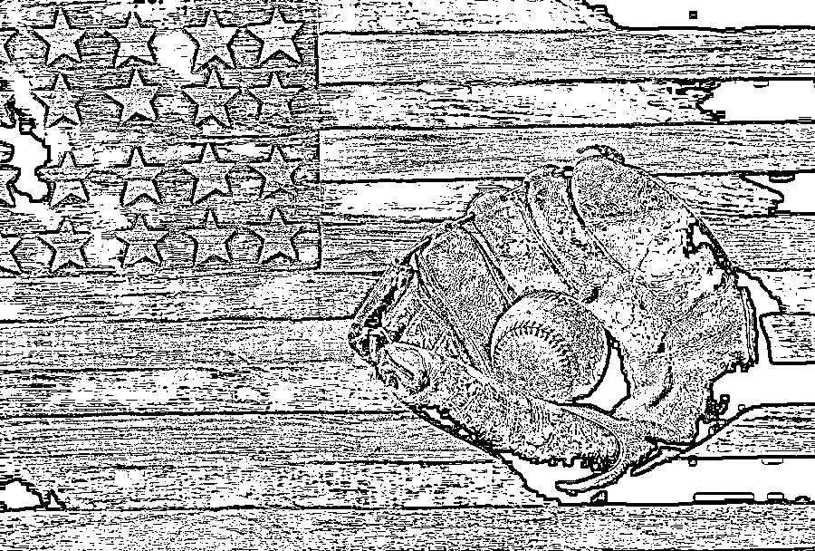

**实现水瓶座社会道路曲折**

正如我们从两张星图中看到的共同之处，**火星与土星的四分相**，依然存在。4 年前的星图中，火星双鱼，被土星射手四分，未来的星图中，火星换到了金牛座，同样被土星水瓶四分。

**火星不管落在什么星座，其主管的事物是不变的，都是 7 宫、12 宫的守护星；这两个宫位，一个代表着合作方、公开的敌人，一个代表着隐秘幕后的敌人。**

两届政府似乎都面对同一个挣扎，如何与他人合作，与看不见的力量合作。

**上一届的策略是，逃避（火星落在双鱼座，合相海王星）并迷惑大众，没有做出什么实质性的成果来。**

**而新届的策略呢？很可能是企图保本并硬刚（火星落在金牛座，落在第 1 宫，金牛座是固定星座，象征着稳定、不易改变的结构），相对更加务实的尝试解决问题。**

对于执政党而言，象征对手、隐秘敌对势力的星体，落陷并落在自己的第 1 宫，这似乎带来了一个巨大的挑战，有种内忧外患的感觉。对手既可以是国际环境中的对手，也可以被认为是本国的对立党派、团体，也就是持反对政治观点的集体，火星金牛象征着保守主义的攻击、反扑，而木星、土星水瓶座则象征着自由主义的领导力、权威地位。

**该如何理解保守主义与自由主义呢？**

美国的党派虽然分为民主党与共和党，但是从党派意识形态上分，却又有**自由派和保守派两个派系。**

无论是民主党还是共和党，党内都有拥护自由主义或保守主义的不同分支。所以，在政策法规推出之前，即使在党内，也会需要达成两种观点之间的协商、合作。保守主义者是那些拥护美国最初立国时的集体精神的，比如说宗教信仰至上，区别对待移民，在种族问题上不可以对少数族裔特殊照顾，反对堕胎和同性恋等等，特朗普所在的共和党，就是主张这种意识形态。

自由主义价值观提倡同性恋婚姻自由、堕胎自由、安乐死自由，认为这是尊重人权，包括对移民、少数族裔也应公正平等，这些立场，与拜登所在的民主党立场接近。

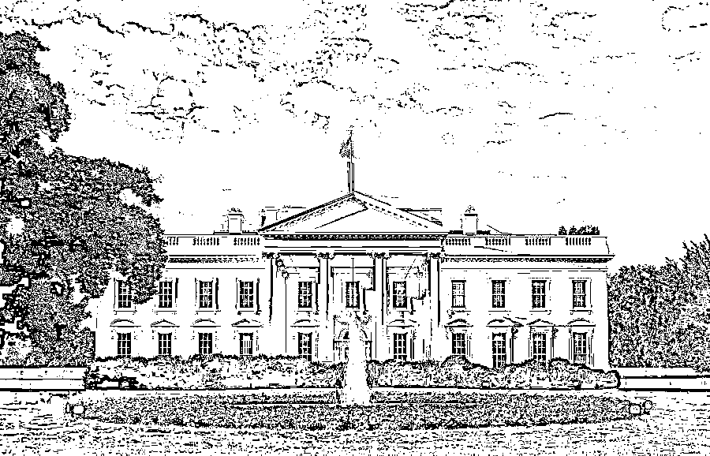

我们可以看到，火星与木土之间的四分相，恰恰折射出美国国内两股意识形态上的分裂、相互冲突。可以说，**新届政府上台时，要接过来的，是一个由上一个政府遗留下来的未解决的烫手山芋。**只不过，撕开了以往的面纱，这个分裂、冲突的局面，随着疫情、大选的进行，被越来越公开的看到，直到新一届政府，是不得不去主动面对并解决的，因为火星落在了 1 宫，这是一个不能被忽视、逃避的位置，因为处理不好，就会影响到自身的根本。

更加不利的一个征象是，**火星在金牛座 6 度，合相了同在 6 度的天王星，**这是一个具有非凡意义的指针。**天王星的加入，让暴力、冲突变得不可预测，或许它会以非常突然、超出常理经验的方式发生。**

火星在金牛座是落陷的，这表明制造冲突的一方，并不是很理性，或者说，这场攻击是没有太多规划、不符合人道主义精神的。**金牛座也与金钱、所属物有关，**试想这股力量中，是否有可能夹杂着经济利益集团的参与呢？也或许说，挑战政府权威的理由，背后真正的推动力，不是意识形态，而是**物质基础、社会资源、经济利益。**

**木土代表的力量与主权、司法系统有关，或许这场纷争会波及到最高法院、白宫内部的结构。**假如说需要判断一个结果，**我认为，土星在水瓶座入庙并落强宫，星体拥有必然尊贵以及后天尊贵，最终还是会站得住脚的。**

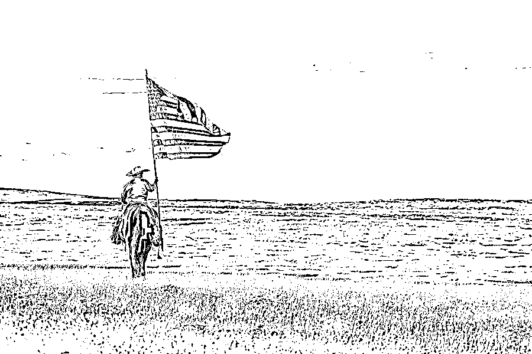

作为我们吃瓜群众，也或许，我们能从媒体上看到的，就只有事情一小部分面貌，但可能肉眼直接可见的现象，在于股市指数、金融制度、法律法规的急剧改变。

**此外不能忽略的另一个重要指针，则是月亮在白羊座 29 度的位置，并且落在了 12 宫。**

**星体位于星座的末尾度数 29 度，有这样的一层含义：这颗星体的学习、成长，以及接近了尾声，**它总结了前面所有的经验，在这个承上启下的转折点上，它想要显化出自己的力量来——也许是更倾向于破坏的方式表达自己。

占星师 Frank Clifford 曾提到，**白羊座 29 度需要冒险，让人上战场。**这可能意味着在窗台上跳踢踏舞，或者在没有安全网的情况下走钢丝。白羊座 29 度的人可能到达危机的顶点，没有太多考虑就做出决定。白羊座 29 度为能够继续保持童心而感到快乐，不管有多危险、失败，或被别人指控自己的自私。它也可以使用武力，不惧怕（或阻止）暴力，有做事业的技能，让人们充满热情的参与冒险与战斗。

**这是一个篇章的结尾，我们准备好了要改变，但在进入到一个新的经验领域之前，我们必须处理掉这个危机。**

**月亮在 29 度已经进入到空亡的位置，**暗含着一切政策、努力，都有可能最终落空，不能被实现，而且**月亮的定位星火星，**位于落陷的金牛座，合相了天王星，再次强调了变数。

**月亮白羊座——火星金牛座——金星摩羯座——土星水瓶座，这一条定位星链条上，揭示了所有变革，最终都要由入庙强大的土星掌控、拍板。**

因此，作为这一届将要上任的长官，暂且我们不要局限于某个人（特朗普或是拜登还是另有他人），他或她身上背负的使命是巨大的。**但是，星图也给出了务实的解决方案，在危机、冲突、动荡面前，尊重土星精神，尊重土星在水瓶座的精神**——走向群众，拥抱人民，真心实意的为人民服务，为了一份大爱而履行自己的使命，是这个时代的呼唤。

历史之轮永远在前进着，有意思的是，某些时刻，事情会回到某个起点。在 157 年前的相同月份（1863 年 11 月 19 日），**美国第 16 任总统林肯，发表了著名的葛底斯堡演说，将“人皆生而平等”的原则，带给了全体公民。**并非巧合，林肯正是一个太阳落在水瓶座的人，他的一生，都奉献给了自己的愿景，将平等、自由的种子，撒向每一片寸土。

—that this nation, under God, shall have a new birth of freedom—and that government of the people, by the people, for the people, shall not perish from the earth.

**Of the people, By the people, For the people（民有、民治、民享，即由人民所拥有的、获人民所选出的、为人民而服务的）**，每每听到、读到此处，都会被感动的哽咽。

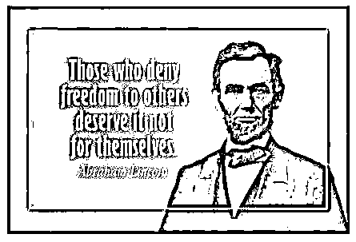

而中国传统文化中意识到这一点的年代，要久远的多了，《孟子》有云，“得天下有道，得其民，斯得天下矣。得其民有道，得其心，斯得民矣。得其心有道，所欲与之聚之，所恶勿施尔也。”

目前被讨论最激烈，也是最可能动摇大选结果的，莫过于特朗普最后的努力——希望通过最高法院，来评判大选结果。大家一致认为，特朗普曾在任期中，扶持了 3 位保守派大法官入主美国最高法院。大选之前的一天，也就是 11 月 2 日，他最新任命的保守派女性大法官 Amy Barrett，正式开启了她的工作。

很多观点认为，目前的法院是由保守派控制，9 个法官中，6 个都是共和党总统任命的保守派。但事情并不会完全按照这种设想进行——美国历史上，也曾出现过多次大法官“背叛”提名他的总统的案例，最著名的一次就是 1960 年代首席大法官 Earl Warren，上任之后领导了一场自由主义司法革命，推动了种族平等、刑事程序改革等一系列变革。以至于当时提名他的总统，共和党的艾森豪威尔总统说，这是他最后悔的一次决定。

（参考来源：“谁将会成为美国最高法院的摇摆票？“ 邵衡头条《得到 app》第 314 期内容）

法制力量究竟是服务于政治团体，还是服务于人民，对于这个问题的理解，将左右美国最高法院大法官的判决，独立于政治，这是最高法院成立的初衷，也是美国这个国家三权分立的根基，中立、独立，是它本应遵循的原则。最高法院如果不顾自己的立场，明显的偏袒、站队，那它的人设就真的倒塌了。

**我个人的理解是，2020 年 12 月 21 日的木土合相水瓶座，这个大趋势并非是为了刻意制造分裂、混乱，真实的功课，是希望把人民的力量唤醒**，从更积极的角度理解，我们即将进入到一个充满了自由、博爱的平等社会制度和结构，大时代的趋势之下，逆天而行的意识、行为，必然不会符合民意，也不会长久。

这也是我，一个上升水瓶座，骨子里的正念和愿景。

未来可期，人间值得。

祝福大家！

**版权声明：**本文由作者授权发布于若道平台，欢迎转发，反对抄袭。友号转载请申请白名单。

**Serina Sun**

ISAR 认证占星师（2016 年获得）

曾任跨国企业品牌公关职业经理人

现居纽约，专注占星个案咨询与教学

**微信公众号**：宸时星语

**个人微信号**：yanniesun2010

长按打赏

**想完整观看大会内容？请扫描下图二维码了解详情**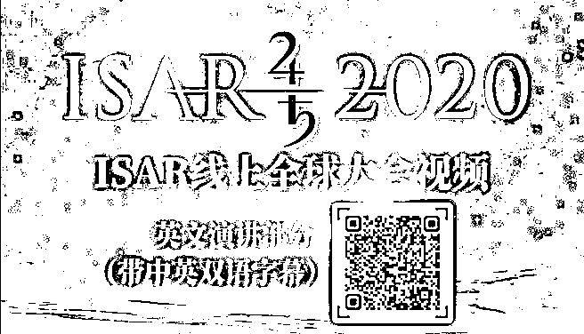**微信又双叒叕改版啦，不想错过若道君的推送？****就把若道设为星标吧！****▼**就是这个“在看”，戳戳戳 ☟********回看大会直达入口********

# 沙龙丨占星预测的最高含义：从人生挑战到实现命运

> 原文：[`mp.weixin.qq.com/s?__biz=MzA5NjA0NTAxNg==&mid=2651432354&idx=2&sn=dd124e0f94ed05fc4e6feb2da1b4d633&chksm=8b4b1715bc3c9e03b825543f22abdb99e139b8e192d9b3aaf8b5ee3e7277764a7edd4b87d871&scene=126&sessionid=1692738075#rd`](http://mp.weixin.qq.com/s?__biz=MzA5NjA0NTAxNg==&mid=2651432354&idx=2&sn=dd124e0f94ed05fc4e6feb2da1b4d633&chksm=8b4b1715bc3c9e03b825543f22abdb99e139b8e192d9b3aaf8b5ee3e7277764a7edd4b87d871&scene=126&sessionid=1692738075#rd)

编辑/玫瑰 图片/ISAR

占星预测一直是占星学中一个重要而独特的部分。

很多初学者，甚至一些实践了多年的占星师，对于预测的认知都停留在企图去准确预测未来会发生什么上；然而，占星学大师们的占星预测则远远超过了这个层面。因为他们非常清楚，每个人诞生下来，个人的出生星图上就揭示出此人最深刻的人生模式，而这个出生模式会在未来，因为行进的行星和出生图的行星格局发生碰触，而一次次被触发。沙龙主题**沙龙主题**：**成功案例的结局——从人生挑战到实现命运****主讲人**：**格伦·佩里**

**沙龙时间**：**2020 年 11 月 14 日 周六 **

**                  北京时间 10:00-11:30**

**沙龙方式**：****英文授课，中文翻译****

沙龙内容星图中艰难的行星配置通常象征着童年的创伤经历。这些经历会在之后的生活中被重复，这个就是我们在占星中预测的核心，而很多人，甚至占星师们都没有意识到它们与过去事件的相似之处，也没有意识到本人在促成这些事件中所扮演的角色。一个好的占星预测的意义在于——让客户看到我们有一个内在和外在的更高的意识可能正在编排这些事件，来提供机会，让我们通过重新体验来疗愈和成长。在这个沙龙上，有着 40 年占星及心理咨询经验的格伦·佩里老师将带来我们探索一些星图案例，这些例子是关于那些在行进中克服了老旧恐惧，实现个人潜在技能，并发挥了他们的潜力的人们。而这正是占星预测能够给人们带来的最有价值和意义的部分。主讲嘉宾

**格伦·佩里****·** ISAR 前董事会成员；**·** 心理/意识研究专业博士； **·** 加州注册婚姻和家庭治疗师（CAMFT)；**·** 占星心理学学员（Academy of AstroPsychology）创办人； **·** 康涅狄格州研究生院（The Graduate Institute of Connetcticut）原型宇宙学与意识进化项目的负责人。
如何参加本次沙龙？

本讲座也是本月的国际占星研究协会（ISAR）星空俱乐部讲座。**ISAR 会员可以免费收看。**请注意邮件通知，具体参与方式见邮件。

❶ 如果你**已经是 ISAR 会员**，请注意邮件通知，告知如何参加。

❷ 如果你**不是 ISAR 会员**，非 ISAR 会员价格：98 元。如有任何问题请咨询工作人员 Margaret（ 微信：nodoor233）

**非 ISAR 会员报名请长按下图**

**▼**

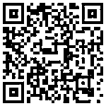

**咨询工作人员请长按下图**

****▼****

**沙龙报名还可以获得相关课程优惠****（优惠详情咨询文内客服）****

**ISAR 星空俱乐部**

2019 年，ISAR 在主席亚历山大·因舍阿吉克的带领下，成立了 ISAR 明星俱乐部，每月为全球 ISAR 会员提供在线直播讲座，邀请全球著名占星师开讲，学习和分享新的理念。讲座时长一小时，涉及占星学的不同领域、不同观点，每个会员都可以参与其中，每次讲座之后还有 20-30 分钟问答时间向老师们提问。

每一场在线讲座都会记录下来，ISAR 除了提供视频，还会提供相关的讲座资料，以及单独的问答录音，自动发送到专门的 ISAR 明星俱乐部页面存档，每位 ISAR 会员可以在 ISAR 网站上自己的会员主页俱乐部页面找到。在 2018 年最初几个月，ISAR 明星俱乐部会每月举办一场在线演讲。之后，两周举办一场演讲，最终每周举办一场演讲。

但是，过去明星俱乐部讲座只有英文沙龙，因此，中国会员只有懂英文才能受益。为了使得更多不懂英文的中国会员能够受益，我们特别和 ISAR 总部协商，今后会安排有中文翻译的明星俱乐部占星沙龙，作为给中国 ISAR 会员的福利！

如何成为 ISAR 会员？

**如果你也想成为 ISAR 会员，请复制链接在浏览器打开**

http://www.nodoor.com/isarcert.do?contentId=3588（仅支持网站支付）

**或直接长按下方二维码，微信购买会员：**

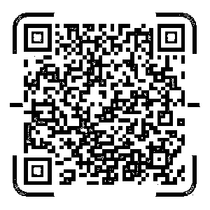

ISAR 会员有什么福利？

一年期会员仅需支付**人民币****420****元**，即可享受：

**☆ 星空俱乐部免费沙龙**

**☆每年出版 3 次的《国际占星师》（目前只有英文）；**

**☆每周电子邮件交流汇总杂志（目前只有英文）；**

**☆专项研究基金和奖学金资格；**

**☆ISAR 主办的会议和论坛的会员折扣，包括国际占星大会（UAC）、ISAR 的会议和研讨会等会员权益。** 

有疑问怎么办？

关于 ISAR 星空会员俱乐部以及我们的讲座，如果你还有任何疑问，**请联系处女座工作人员**：

**仲老师  **

**电话：18513802156**

**微信：YY18513802156**

**若道 Conrad**

**微信：nodoor2016**

****非 ISAR 会员报名请点击“阅读原文”****

# 双十一若道占星大促 | 充值大礼包，多充多送就在 2020！

> 原文：[`mp.weixin.qq.com/s?__biz=MzA5NjA0NTAxNg==&mid=2651432029&idx=1&sn=a354b75dff34d6dacd2fab9cd4b1fcab&chksm=8b4b16eabc3c9ffc41c589e9d45a2e1e68fb9010f0027ecc20f0ad7d66ac88e3a735bac0092a&scene=126&sessionid=1692749749#rd`](http://mp.weixin.qq.com/s?__biz=MzA5NjA0NTAxNg==&mid=2651432029&idx=1&sn=a354b75dff34d6dacd2fab9cd4b1fcab&chksm=8b4b16eabc3c9ffc41c589e9d45a2e1e68fb9010f0027ecc20f0ad7d66ac88e3a735bac0092a&scene=126&sessionid=1692749749#rd)

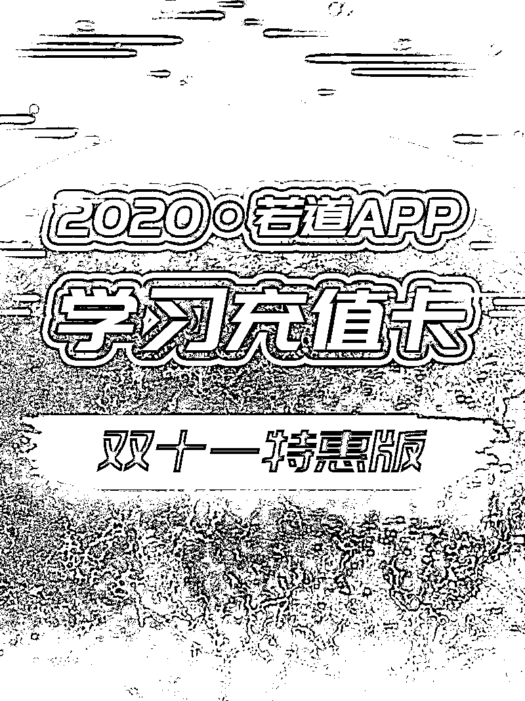

明人不说暗话

**若道占星 年末巨制**

**双十一套餐**

**限时优惠 手慢无**

**2020 年 10 月 29 日-11 月 11 日**

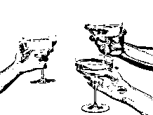

***22*****门课程任你选**

**价格直降*****500-14000*****不等**

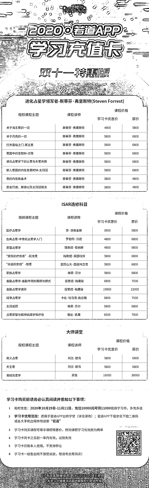

**重要！重要！重要！**

**购买学习卡之前请先****仔细阅读****下图****须知**

**或者扫描二维码咨询客服小姐姐**

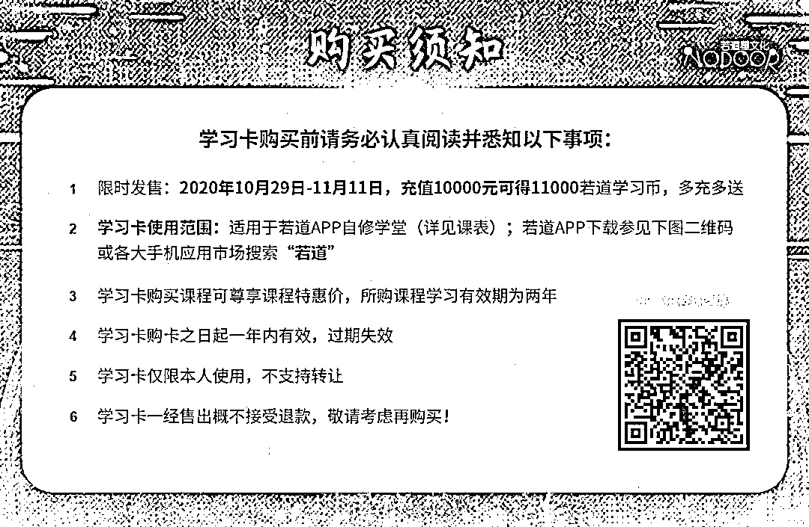

**购充值卡，听课**

**请先下载若道 APP**

**若道君：****你可以在 app store 或者应用商店搜索“若道”下载 app 或扫描下图二维码**

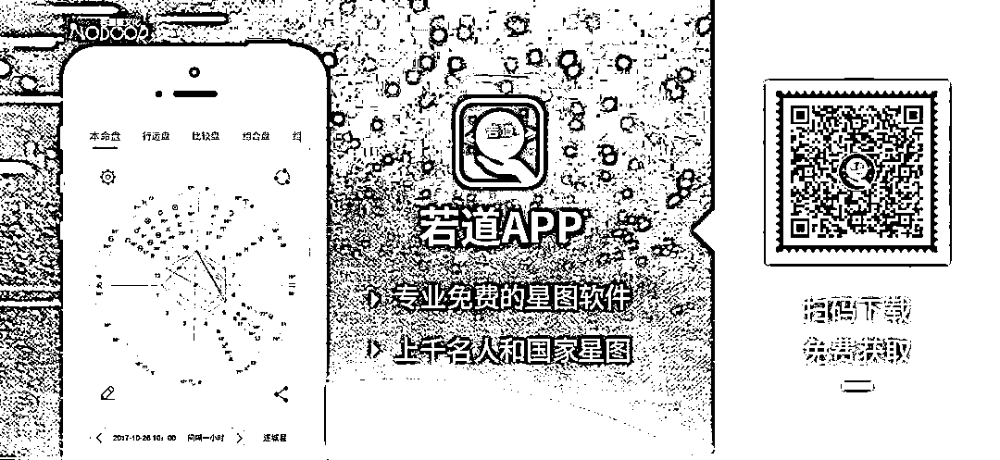

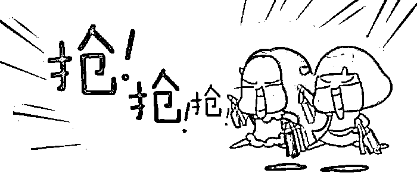

**还有别的问题？**

**别害羞，扫描二维码，咨询客服小姐姐吧~**

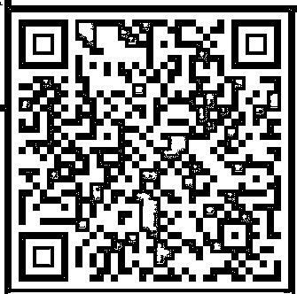

注：优惠活动不累加，详情请咨询客服

# 黄金大跌，买入机会还是牛市波段结束信号？ | 12 月黄金报告上线

> 原文：[`mp.weixin.qq.com/s?__biz=MzA5NjA0NTAxNg==&mid=2651432029&idx=2&sn=eaca6d75a185e6ef6b9123eebe180f8f&chksm=8b4b16eabc3c9ffc8d5dbad92fb697c01c785ab62f79a0ab5bdef0db3362c65d712c9084aba1&scene=126&sessionid=1692738075#rd`](http://mp.weixin.qq.com/s?__biz=MzA5NjA0NTAxNg==&mid=2651432029&idx=2&sn=eaca6d75a185e6ef6b9123eebe180f8f&chksm=8b4b16eabc3c9ffc8d5dbad92fb697c01c785ab62f79a0ab5bdef0db3362c65d712c9084aba1&scene=126&sessionid=1692738075#rd)

“

**黄金是金钱。其他的只是信贷。**

**——约翰·皮尔庞特·摩根**

”11 月 9 日，辉瑞公司宣布，辉瑞与德国生物科技公司 BioNTech 共同开发新冠 mRNA 疫苗能有效阻止 90%的感染。随后，美国道琼斯工业指数创下新高，油价涨 8%.而这个消息对于黄金的影响却是，黄金在 9 日大跌 86 美元，这是 7 年以来金价最大单日跌幅。而就在上周四，黄金还出现一天涨 50 美元的惊人涨势。

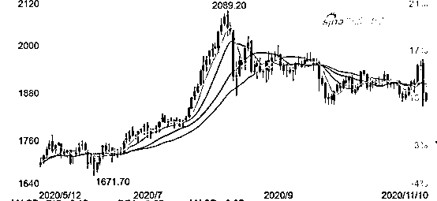

| 黄金走势 K 线图如果疫苗的出现，真的有望令疫情在今冬明春结束，如果不再需要避险，资金是否会离开黄金市场？从 2018 年 8 月 16 日以来黄金的牛市是否已经结束？从那时到现在，黄金已经从 1167 美元最高涨到 2020 年 8 月 7 日的 2089 美元，2 年涨幅达 79%。另一方面，因为疫情，各国央行释放的前所未有的流动性，特别是美联储，疫情结束后，世界金融货币市场还会回到疫情前的秩序中吗？11 月中下旬， 马上要发生的重要天象是：**· 11 月 12 日 木星、冥王星合相  ****· 11 月 14 日 火星顺行      **  这两个天象前后常常对应市场的反转。
而 12 月到明年 2 月，则会迎来更为重要的周期为 20 年的土星、木星合相，周期为 45 年的土星、天王星四分相，这两个相位将对于金融市场有非常重要的影响！12 月黄金报告已上线，梅里曼老师将会告诉你他对这个关键时期如何操作的想法。
在我们每次的黄金报告中，梅里曼老师也都会谈到白银市场。白银和黄金都是贵金属，白银和黄金的总体趋势常常一致，但白银的波动性更大。这也是一个非常有趣的市场，如果你喜欢做波动性高的产品。对于不是炒短线的投资者，请特别注意梅里曼老师在每次报告中提到的长期周期、中期周期和基本周期。这样会让你对整个市场的走势既有大的远景画面，也有细致的近镜头。

**12 月黄金报告上线**

黄金月度报告价格

**单月报告**：280 元 

**3 个月套餐价**：860 元

**12 个月套餐价**：2400 元

**双报告年度套餐更优惠（直降 899 元）**

**12 个月黄金报告+12 个月上证指数报告：仅需 3500 元**

**长按下图识别二维码购买黄金报告**

▼

**购买者需知**

**①**梅里曼市场时机学院《中国上证指数月度研究报告》是梅里曼市场时机学院（以下简称 MMA）的研究“预报”，而不是市场“预测”，是梅里曼老师及 MMA 金融占星分析师对人类活动周期历史与行星周期之间相关性的研究，二者在大部分情况下具有 80%或更高的相关性，而不是因果关系。报告中的研究完全存在错误的可能性。即便是非常认真的研究和几十年的研究经验，金融占星师无法总是正确地解读出各种征象在实际层面上会如何相互作用，并显化为事件结果。所以请将报告看作一个研究参考，务必结合其他市场研究和你个人对市场的理解，根据你的自由意志做决策。**②** 本报告只是上证指数研究，没有个股研究。**③** 此报告一旦售出，**即不接受退款。****④** 此报告每月 1 期，**并非都是在每月相同日期发布**。我们收到英文报告的当天，即发布该英文报告。3 天后，上线报告中文版。**⑤ 此报告仅支持手机网页阅读，不支持电脑阅读和下载。****以上须知，请仔细阅读。一旦付款，即视为已了解并接受所有须知内容。**在过去的 39 年中，唯有梅里曼逐渐完善，并在梅里曼市场时机学院月度周期报告中阐释了将地球宇宙学与周期相结合的研究方法，以惊人的精确性预报了黄金价格发生重大变化的时间。黄金购买 Tip 各大银行均可购买黄金或黄金 EFT 基金，也可以在诸如天天基金或者支付宝购买黄金及黄金相关产品。不明白的可以百度搜索。购买后如何查看报告？

购买后有疑问怎么办？

请联系技术客服

**微信：nodoor201705**

购买黄金报告直达入口

# 深度冥王星丨面对它的强权与挑战，我们必须“以毒攻毒”

> 原文：[`mp.weixin.qq.com/s?__biz=MzA5NjA0NTAxNg==&mid=2651431906&idx=1&sn=33adc7a0793fad211710207878beccb8&chksm=8b4b1155bc3c98437a3bf2aaaafd09a375ccf6231ce55a8b2d20edc7f86e7b27f3ca031b3530&scene=126&sessionid=1692738080#rd`](http://mp.weixin.qq.com/s?__biz=MzA5NjA0NTAxNg==&mid=2651431906&idx=1&sn=33adc7a0793fad211710207878beccb8&chksm=8b4b1155bc3c98437a3bf2aaaafd09a375ccf6231ce55a8b2d20edc7f86e7b27f3ca031b3530&scene=126&sessionid=1692738080#rd)

****************☆ ****************************后台****************************回复“今日”，给你一句生命态度****************

作者/诺·泰尔
译者/李含、周恩编辑/翀子 封面/书君 图片/网络

在现代占星学鼻祖诺·泰尔的眼中，冥王星让我们看到“深度视角”和“面临的挑战”。如果在星图上，太阳、月亮、土星与天王星，和冥王星形成困难相位，意味着我们会面临怎样的挑战呢？让我们进入冥王星的世界吧。

当冥王星被发现，并纳入占星学范畴之时（1930 年），它被赋予了**强大的力量和权力的原型意义**。大约三十年后，我进入占星学领域，在一些灵感启发下，对这个问题有了不同的看法：凭我的观察，以及我对心理动力学中的发展张力的深刻认知，**我认为冥王星的功能主要是提供“深度视角”以及构成“即将面临的挑战”。 **

很久以前，我在占星实践中就是这样理解它的：在冥王星这个象征符号之下，**探索我们是谁，我们能开发出多少潜能，这一类能带来成长的挑战性命题。**付出之后能得到什么？这的确跟“我们赋予自身多少权力”有关。

冥王星为人所知之时心理学正处于其发展史的“青春期”。如果你感受到了冥王星的影响，我想，如果你愿意的话，就可以将所有的努力、所有的付出和抗争都磨炼成成长的收获。真实的我们就是我们后来变成的那个人。 

在这一理论框架下，我们该如何帮助客户面对冥王星的挑战呢？

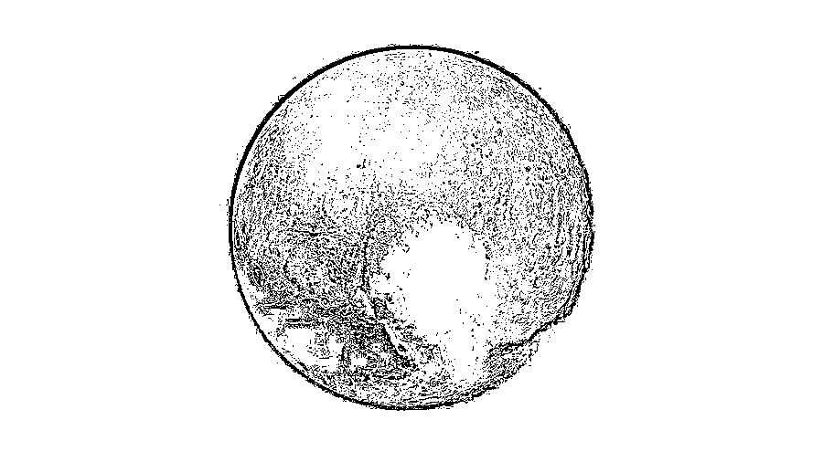

**冥王星与太阳的困难相位**

（**困难相位**：主要指合相、四分相、165 度相位、对分相；主要相位用 6 度容许度， 165 度相位推荐用 3 度容许度；根据经验，45 度相位、135 度相位也建议用较小的容许度。） 

最初占星师们认为，拥有这些相位的个体拥有巨大的能量。但事实并非如此。这里或许潜藏着能量，但如同上文所提到的那样：**面对挑战，开发潜能**之后，才能从冥府浴火重生（想想凤凰），最终获得巨大的能量。 

在社会架构中，这些相位则代表着对“同质”和“平等”的迫切需求，社会的发展可并不欢迎“（社会）等级破坏者”和出风头的人。各方面的压力都迫使人们“安守本分”。这和本文的议题如出一辙，象征压力的冥王星与象征生命力和自我意识的太阳成困难相位。 

对此，我的解读通常是，“在你年轻的时候，这种情况特别明显，感觉就像是一颗被毯子盖着的手榴弹。”**压力重重**，我相信 99.99%有此类相位的人对这个比喻都能心领神会，对西方社会的人来说更是如此。这就带来了挑战。勇敢抗争吧，**在抗争中获得力量**。有时候真的是生命不息，抗争不止。

查尔斯王子、美国前总统尼克松、葛丽泰·嘉宝、杜鲁门·卡波特、马龙·白兰度、英格兰安妮公主、罗伯特·舒曼和阿诺德·施瓦辛格等人都了解这种抗争和力量。

疗愈这类客户的方法是，**帮助他们意识到这种压抑**，找出它的**根源**以及它**引发的防御行为**，还有这种惯性又是如何延续至成年以后的；并意识到他们也许已经不需要这种习惯性的防御行为了。**卸下防备之时就能拥抱焕然一新的能量（和习性）**。

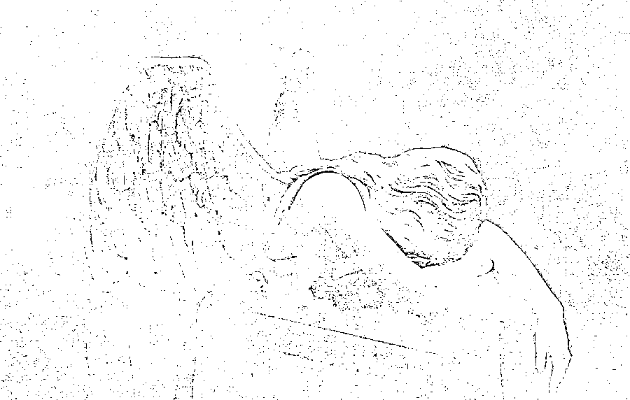

**冥王星与月亮的困难相位**

这是一个新的层面：**受到母亲方面的重要影响**，个人观念会发生改变。母爱可能是带有干涉性质的；也可能是一种令人窒息的溺爱。关键是人们很难面对**母亲方面的掌控和影响**带来的成长挑战。 

与父母的关系可能会不平衡，只与一方较亲密。 

解决这一相位的问题，第一步当然是要**认识到这种压力**，审视一下这种**压力与自己的习惯性行为之间的关联**，找到清除负面影响（防御行为及偏见）、**重获自由**的方法。 

亨利·福特、埃德加·胡佛（译注：历经 8 任总统的 FBI 前局长，知晓众多秘密，极富争议）、凯瑟琳·赫本等人都有这一困难相位。 

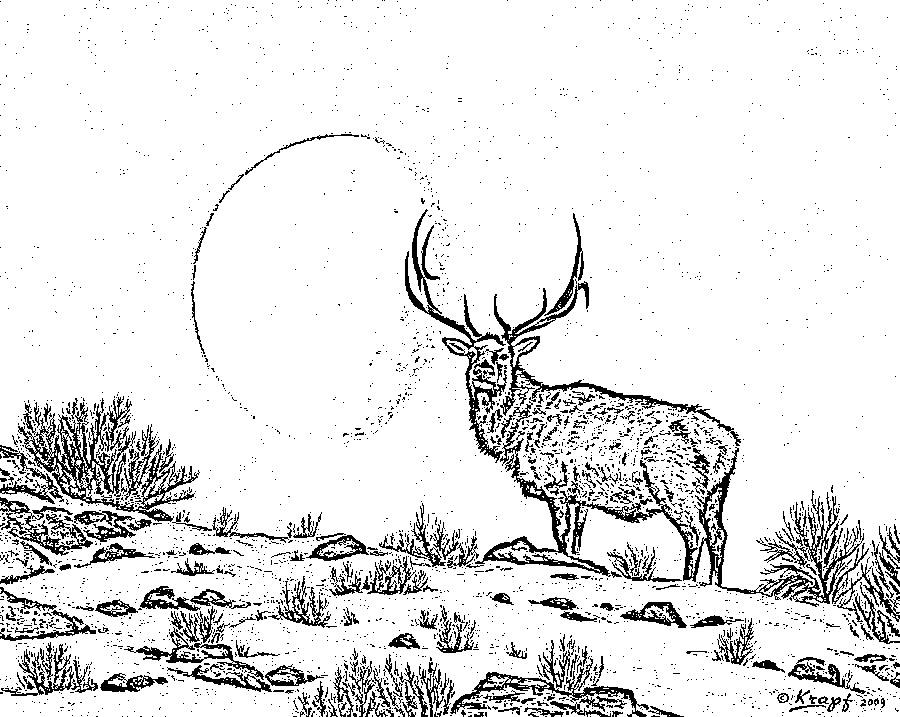

**冥王星与土星的困难相位**

辛苦的工作。这个说法最能体现这一特质：**个人认知聚焦于无休无尽的自我要求及抱负的实现上**；这是一个**埋头苦干**的相位。事实上，因为**特别惧怕失败和失去**，就会建造特别坚固的城堡取得战斗的胜利。 

这样的客户在成长方面可以做些什么呢？是全力以赴还是三心二意？你制定的发展计划背后的动力是什么？它反映的是：远景与雄心壮志，深度与勤奋程度。绝大部分情况下，占星师必须与客户时时处处存在的悲观情绪作斗争。 

琼·贝兹（译注：美国著名民歌手）、尤里·盖勒（译注：以色列魔术师）、克里斯敦·伯纳德（译注：南非心脏科医生，成功进行全球首例心脏移植手术）、肖邦、摩西·达扬（译注：“独眼将军”，以色列军事家）、希区柯克、苏格兰玛丽女王、沃尔特·惠特曼（译注：创造自由体诗歌的美国诗人）、李·哈维·奥斯瓦尔德（译注：暗杀肯尼迪的凶手或替罪羊）、乌比·戈德堡（译注：好莱坞为数不多的著名黑人女星）、卡夫卡、基辛格等人都有这一挑战相位。

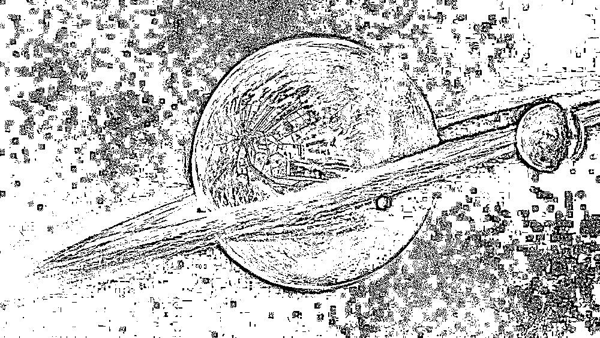

**冥王星与天王星的困难相位**

这个相位给让我想到的是“耶稣在神殿里掀翻了桌子！”这一点在太阳弧推运和行运中绝对正确。如果这个相位出现在出生星图中呢，这股潜能将会促使我们**在成长的道路上经历叛逆、破坏，打破现状以建立于更有利的个人地位**。我们吸取经验教训做出改变。

（注意出生于冥王星与天王星合相在处女座时期的一代人，他们中有不少人的新陈代谢、营养吸收功能面临挑战，比如营养的吸收转化发生了改变，出了问题。） 

我们必须注意到，这些慢行星的相位要比太阳或者月亮的相位少见得多。有这样相位的人会在社会中成为一个小的族群，他们的特点就是**推进社会的改变**。作为个体，在个人层面上，你的客户多多少少都会表现出他们**对改变的需求**。 

有效的疗愈方法是，**意识到这种需求，并审视和评估它会带来什么后果**。改变带来的是破坏还是有益的成长？你的客户该如何摆脱急躁，发挥创造力，从而强有力地推动积极转变？寻求正确的、有建设性的转变经验。 

查理曼大帝（译注：罗马帝国奠基人）、埃德加·凯西（译注：20 世纪著名灵性解读大师）、奥利弗·克伦威尔（译注：英国资产阶级革命领袖、军事家）、玛丽·贝克·艾迪（译注：基督教科学派创始人）、罗斯·佩罗（译注：80 年代 IT 业超级富人、92 年参选总统获佳绩）、查尔顿赫·斯顿（译注：著名影星）等人都有这一困难相位。

**版权声明：**本文由若道翻译发布，欢迎转发，反对抄袭。友号转载请申请白名单。

**诺·泰尔**现代占星学鼻祖，世界众多著名西方占星师的占星老师。当今世界上最重要的占星师之一，占星联盟协会（AFAN）的创始人及原主席。著有三十三本占星教科书，引领了整整两代占星师的占星学习与教育，1998 年国际占星大会（UAC）授予其占星界最高奖项 “轩辕奖”。诺·泰尔对于占星界的最大贡献在于发现和整理了太阳弧推运的方法。

**系统学习占星学**

**点击图片了解详情**

**微信又双叒叕改版啦，不想错过若道君的推送？**

**就把若道设为星标吧！**

**▼**

就是这个“在看”，戳戳戳 ☟

********报名直达入口********

# 顺势案例丨什么？水瓶座与天蝎座的冲突，可以用它化解？！

> 原文：[`mp.weixin.qq.com/s?__biz=MzA5NjA0NTAxNg==&mid=2651431906&idx=2&sn=9ca3ada69981b2d8cebac027895fa99d&chksm=8b4b1155bc3c9843ba2856c6ab92bc52c00d9e6a7bdea5cd8a1b696478ce400e9c6393636f5e&scene=126&sessionid=1692738080#rd`](http://mp.weixin.qq.com/s?__biz=MzA5NjA0NTAxNg==&mid=2651431906&idx=2&sn=9ca3ada69981b2d8cebac027895fa99d&chksm=8b4b1155bc3c9843ba2856c6ab92bc52c00d9e6a7bdea5cd8a1b696478ce400e9c6393636f5e&scene=126&sessionid=1692738080#rd)

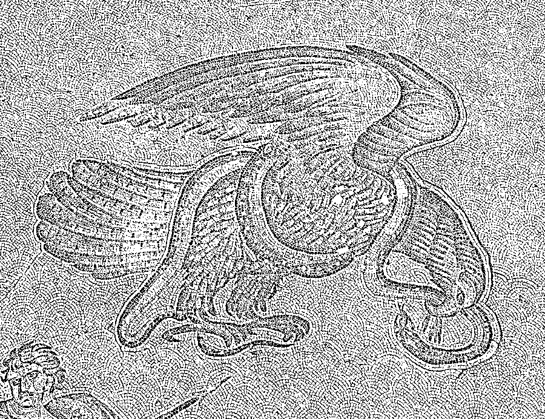

作者/苏·汤普金斯 图/网络 编辑/翀子

本文节选自《当代占星研究》 由立品图书授权

占星学能提供带有整合性的个人解读，而同类疗法和占星学有相似之处，都表明在大宇宙表现出来的现象，全部会反映在小宇宙身上。让我们从一个真实案例入手，看同类疗法如何与占星学共同工作、疗愈病人吧。**占星学与同类疗法**我举这个案例有三重目的。首先我要证明的是，即便是非常简易的占星学，也能提供令人兴奋和带有整合性的解说；接着我想说明**同类疗法和占星学的相似之处**，而且想把同类疗法介绍给读者。第三，我要阐明第一章里略为提及的一些哲学观点，其中最主要的观点就是：**在大宇宙示现出来的现象，全部会反映在小宇宙身上。**这意味着从占星学可以看出所有的植物、动物、地质和各式各样的地理情况。
卡特（1887-1968，英国占星学家）告诉我们：**“每一种生命都可以藉由占星学来分类。**”我很赞同他的说法。以**鸟类**为例，我们会发现它们的管辖星座是**水瓶座**，但如果想了解其中每一个物种的管辖星座是什么，就必须进一步地细分：譬如知更鸟是由白羊座管辖；家禽是由巨蟹座管辖；天鹅是由狮子座管辖；麻雀是由处女座管辖；掠食的鸟类则是由天蝎座管辖。这种进一步细分的概念和吠陀系统的占星师采用的技法很类似。在前面几个章节里，我介绍了国家、动物学等的分类方式，接下来的案例解析是以我个人的观察为基础，其中有一部分和传统的观点相同，其他部分则有明显的差异。**同类疗法的原理是**：呈现出某些病症的疾病，可用某些同类疗法的药物治愈，但若把这些药物给健康的人服用，却会制造出和那种疾病相似的症状。例如切开的洋葱会使我们流泪，但若把它制成药丸给有花粉过敏症的患者服用，却能治愈他们的过敏现象。希波拉底（公元前 460~370）是他那个时代伟大的医者和占星家，他被誉为西方现代医学之父。他最著名的观点是**“以引发同样症状的药物来治疗那个疾病。”**但同样的话语，数个世纪前在希腊和印度都有人说过。身为占星师的人往往会说，天上如是，地上亦然。我们可以说**星图是一张地图，反映出了我们的外在情况和心态**。占星师的角色就是拿起这面镜子，让眼前的个案更能看清楚自己，做出最后的抉择；至少它能帮助个案更了解眼前的情境。从这个角度来看，**占星师就像同类疗法的医师一样，把潜伏的症状带到表面，以治疗个案的心病。**

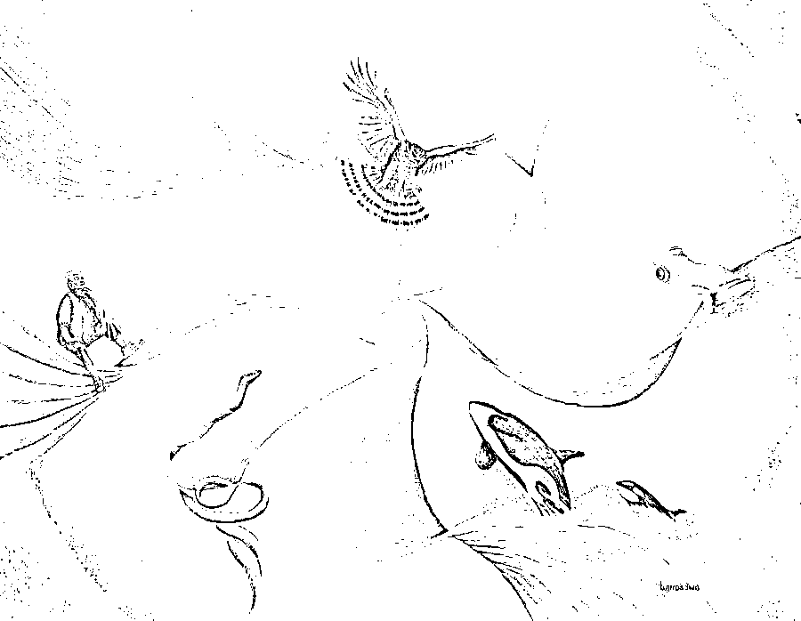

**彼得的案例**

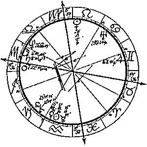

**| **彼得出生星图 1988 年的一次例行健康检查，让 40 岁的彼得获知自己有先天性心脏瓣膜不全症。他小时候就罹患过支气管肺炎，十年之后他肺部的功能几乎瓦解，这两种疾病都和他的先天性心脏病有关，但没有被及早诊断出来。彼得半生以来最危险的症状就是呼吸非常费力；早年他这个症状还算轻微，1998 年开始变得比较明显，我和他见面时是公元 2000 年，这时他的症状已经相当明显了。彼得一向不是运动型的人，因为他小时候根本无法参与这类活动，但是他很喜欢观赏比赛。虽然彼得的体力不及其他男孩，但这一直不是个严重的问题，别人也似乎没太注意到这一点。到了 2000 年的春天，彼得开始出现高血压和动脉回流的问题。由于他完全无法深呼吸，所以人变得相当阴沉。医生告诉他必须做心导管绕道手术，而且愈快愈好；他在机场雷达站的工作资格也被取消，因为身心都处在极度的压力之下。彼得的婚姻一直很稳定，有一个小女儿，而且他很喜欢自己的航管工作。健康出问题之后，他开始担忧失业和缺欠的问题；他被告知可以换别的工作，譬如变成地勤人员，但这意味着地位降低，薪水也减少了。彼得对同类疗法没什么认识，也不怎么相信，但由于他的情况很紧迫，最重要的还是他想安抚姐姐的情绪（他的姐姐是我的朋友），所以才答应和我见面的。我们见面的地点是在彼得的起居室里，因为我出门前并没有做任何准备，所以对他一无所知。后来我才发现彼得是一个有恐高症的航管人员，他最常做的梦就是飞翔，很显然这是一个重要的线索。他说他另外一个健康问题，就是脸上不断地冒出东西来。彼得的星图里有好几个**水瓶座和天蝎座的四分相**。火星和上升点合相落在天蝎座上面，意味着这个男人到社会上与人竞争时，容易有一种被攻击的感觉，所以必须护卫自己。由于火星是落在天蝎座上面，所以他特别善于保护自己的私生活。火星和上升点分别与冥王星呈紧密的四分相，因而更强化了他的生存危机感。**冥王星是落在与心脏有关的狮子座上面**，很显然他真的有存亡议题（他的心脏问题多年以来都没有被发现，这非常符合冥王星的隐秘作风），所有的生物都必须面对适者生存议题，但这个议题在动物王国里格外明显。彼得的火星与上升点合相，又跟冥王星成四分相，代表他需要的同类疗法药剂可能是来自动物王国；也许是一种很容易觉得被威胁的动物，而它也会威胁到别的动物。**太阳一向和心脏有关**，**狮子座/水瓶座的对分相也和心脏及循环系统相关。**同时我们又发现彼得的太阳与金星合相，与土星成四分相，这意味着他在爱上面的功课有些困难，包括情感的表达在内。他这三颗行星都落在水瓶座，因此土星是它们的主宰行星之一，更精确一点地说，他的太阳与土星、月亮与土星以及金星与土星，都有紧密相位，这代表彼得非常克己自制，而且有强烈的责任意识。他很可能觉得自己必须为一切事情负责，但又缺乏必要的自信心和体力，来承担这些责任。他的土星是落在天蝎座，这意味着彼得必须为死亡和危机负责，而且由于土星触及到太阳和月亮，所以彼得也可能觉得必须为父母的健康负责。责任意识显然是他最大的心理议题，难怪他这么需要克己。但是**落在水瓶座的行星却十分渴望空间和自由**，而**责任意识显然无法和个人的自由并存**。身为一名航管人员，彼得每天都得面对生死攸关的巨大责任；他的工作就是要避开危机。

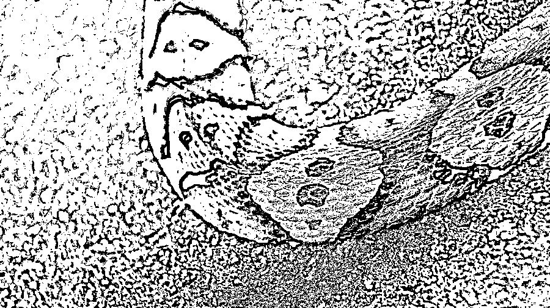

我为彼得选出的药剂是 naja；这是从印度眼镜蛇身上萃取的毒液制成的药物。这并不是常用的一味药，但确实会用来治疗心脏瓣膜闭锁不全的问题。

我所谓的治疗，不代表他的瓣膜可以因此而变成正常的，也不代表他的健康可以恢复到和常人一样。但是他的病况在用了这味药之后的几星期内，的确有了明显的改善，他必须开刀这件事也不再是必要的。到现在已经五年了，除了不再需要开刀之外，他的病情一直在控制中。医生们对他的逐渐恢复健康感到相当狼狈，他们彼此暗指对方夸大了彼得的病情，此外，他的呼吸困难、失眠问题及焦虑感，也都有了明显的改善。**服用 naja 之后，他很快就觉得舒服多了，不久便回到原先的工作岗位继续服务。**最后他决定不再从事航管工作，换到了压力比较小的单位服务，因此觉得更快乐一些。再回到彼得呼吸困难这件事上面。他有**三颗行星落在水瓶座**，显然代表**他很渴望有呼吸的空间**；这三颗行星和落在天蝎座的土星成**四分相**，则意味着一种**窒息感**。我们可以将其想象出彼得觉得女人（月亮及金星）令他感到窒息。他强烈的责任感和恐惧则会阻止他做自己想做的事，因而产生了呼吸困难的感觉。

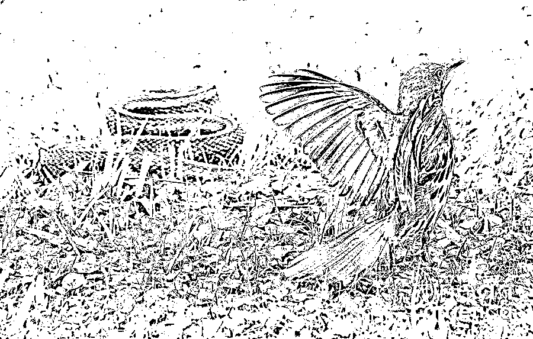

**以蛇做成的药剂，在同类疗法上大多运用在心脏问题上面**；呼吸困难通常会显现在有冠状动脉问题的人身上，况且蛇杀掉它猎物的方式也多半是让对方窒息。印度备受尊崇的同类疗法大师拉姜·商卡拉说过，naja 这味药和其他的蛇类制剂，对治的都是**与责任意识有关的病症**。他说 naja 类型的人与眼镜蛇的行为模式很像，他们只有在遭到**巨大威胁时才会反击**。这也和有火冥相位的人十分类似，因为他们总认为暴力是一种禁忌；彼得的火星与冥王星分别落在天蝎座和狮子座，这代表他认为施暴是有失尊严的事。当他被问到最害怕的情况是什么的时候，他的回答是：“我最不喜欢涉入与人争执的情况。”彼得看起来很瘦，但是他告诉我以前他有体重超重的问题。他 7 岁的时候体重一度高达 238 磅（108 公斤）。他姐姐告诉我说，他后来可能患了轻微的厌食症；他说自己必须在饮食上十分小心，因为很容易暴饮暴食。我问他如何把体重减轻的，他说他偶尔会做一星期的断食，而且每隔一段时间就做一次长期断食。这听起来是否很像蛇类的行为模式？蛇不需要经常吃东西，当它们进食时，整个身体会膨胀到和猎物一样大。彼得说他有恐高症，但是他最容易做的梦却是飞翔。和许多蛇类一样，眼镜蛇最大的敌人也是鸟类。让我再从动物王国的角度来看黄道十二星座，我们会发现蛇与天蝎座有关，而鸟和水瓶座有关。彼得的星图可以看成是水瓶座与天蝎座的矛盾冲突，也可以看成是鸟与蛇的对立。

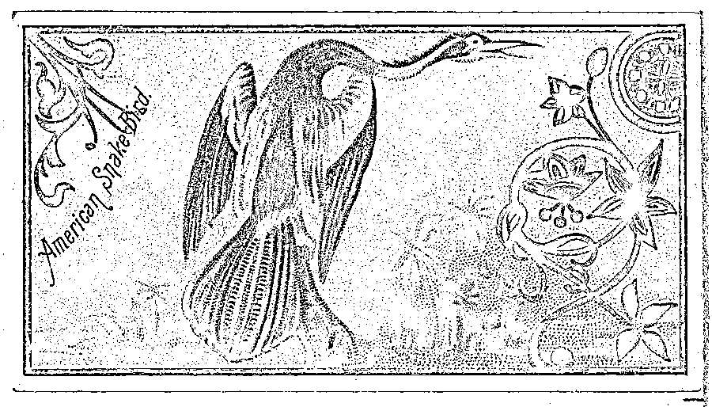

鸟能够飞，这使得它可以不受蛇的威胁；身为一名航管人员，彼得管辖的是天空里的大鸟——飞机。很巧合的是，与 naja 有关的症状之一，就是时常做飞翔的梦——这是让我选择这味药的理由之一。彼得经常做飞翔的梦，可能意味着他很想受人尊崇，而且想攀升到一个没有敌人的位置。彼得喜欢永远很热的气候，是不足为怪的事，他喜欢摇滚乐也很正常。比较有趣的是蛇这种冷血动物经常在岩石上被发现，因为它喜欢晒太阳，而且我们会发现**人格面具特别冷漠的人，经常有天蝎座与水瓶座的组合**。此外，心脏病患者也容易感觉身体发冷。拉姜·商卡拉说，需要用到 naja 的患者，脸部看起来很像是眼镜蛇的头部，如果此人戴眼镜的话，就更符合这种形象。以彼得的例子来看，他脸部的皮肤非常干燥，而且会沿着发际、眉毛、鼻子的两侧脱皮，看起来就像是眼镜蛇的样子。他说有时还会红肿发痒。彼得星图里与皮肤（土星）相关的行星是落在天蝎座（蛇），而且和金星有相位，这意味着彼得觉得自己缺乏魅力。naja 这味药完全治愈了他的湿疹问题，他觉得许多方面都比以往有信心多了。小时候彼得喜欢养蛇，有时也会把受伤的小鸟带回家，有趣的是他的姐姐很怕鸟（彼得落在水瓶座的行星，是在第三宫这个代表手足的宫位里），而且他的中国生肖就是蛇！

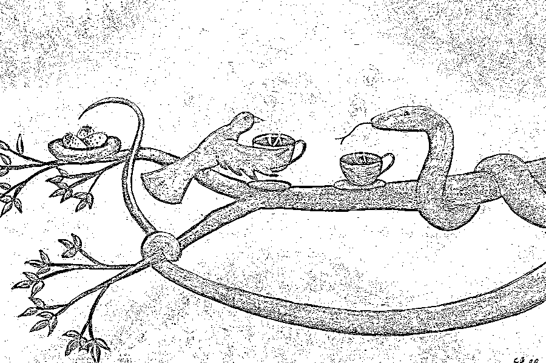

**注：**

同类疗法药剂可以从许多东西萃取出来：动物、植物、矿物，甚至是致病的物质本身，都是常见的药剂来源。由于这类药物的成分微小到连科学仪器都无法侦测出来，所以即使里面含有毒素，经过稀释之后仍可安心使用。譬如一只自然死亡的蜜蜂，竟然可以制成供应给全世界的 Apis 药丸，而且可以持续供应好几个时代。但制造这种药丸却是很复杂的事。

简而言之，**所有的物质都必须经过稀释震荡之后，才能变成带有疗效的药物**。但究竟该稀释震荡到什么程度，就得按照这个药物的威力来决定了；威力越高，越需要稀释。换句话说，药的物质成分越少疗效越高。即使药剂本身已经没有任何物质成分，仍然有明显的疗效，不过重点是必须对症下药。

同类疗法医师遵循现代物理学的发现，主张**同类疗法药物最后留下来的是一种模式、精华或原来那个物质的记忆；是它的精华引发了治疗的效应。**

**版权声明：**本文由立品图书授权发布，欢迎转发，反对抄袭。

请在后台回复 顺势 获得更多**关于顺势疗法内容**

**苏·汤普金斯**若道签约老师。英国目前最资深的占星学家和咨询师之一，她拥有超过四十年的占星经验。占星学习者必备之两本圣经《占星相位研究》(即国内版顺逆皆宜的人生）与《当代占星研究》作者。她是伦敦占星学院这所享有盛名的专业学府的创办人。2003 年，为表彰其卓越贡献，英国占星协会为苏·汤普金斯授予查尔斯·哈维终身成就奖。

**学习顺势疗法**

**请点击下图了解详情**

**微信又双叒叕改版啦，不想错过若道君的推送？**

**就把若道设为星标吧！**

**▼**

就是这个“在看”，戳戳戳 ☟

********报名直达入口********

# “你看过了许多美景，你看过了许多美女” | 12 星座旅行的意义

> 原文：[`mp.weixin.qq.com/s?__biz=MzA5NjA0NTAxNg==&mid=2651431806&idx=1&sn=dabf80a26dc91d0fc8cd540f7d5cd496&chksm=8b4b11c9bc3c98dfbdd2076d0fd63fc633b43c8a6669fd42263ea2d165b5c703b899d78ded66&scene=126&sessionid=1692738080#rd`](http://mp.weixin.qq.com/s?__biz=MzA5NjA0NTAxNg==&mid=2651431806&idx=1&sn=dabf80a26dc91d0fc8cd540f7d5cd496&chksm=8b4b11c9bc3c98dfbdd2076d0fd63fc633b43c8a6669fd42263ea2d165b5c703b899d78ded66&scene=126&sessionid=1692738080#rd)

******☆ ****后台回复“今日”，给你一句生命态度******

作者/大卫·瑞雷  若道占星创始人译者/李含 校对/江艺 编辑/玫瑰 封面/书君 图片/全景网文章来源/《风度》杂志前阵子，若道君的一个朋友感叹：“忽然发现，原来可以自由地旅行是如此幸福！”是的，2020 年让“说走就走”的旅行变得遥不可及。此刻，你是否有一颗渴望着远走高飞的心呢？为什么我们如此渴望自由？大卫老师会在这篇文章里给到 12 星座不同的答案。
**12 太阳星座旅行的意义**1 白羊座**轻装上阵让你能够行动迅捷，旅行计划也尽量简单易行。**如果目的地合适的话，简便的手提箱、运动包或背包会是你的第一选择，你也会优先选择运动着装。如果是商务活动，你会选择一件日常的运动衫加上圆领 T 恤。去火车站或机场的时候，你最好提前到达，否则你匆匆挤到人群中，慌慌忙忙过安检，反而会引来他人的关注，进一步延误你的旅途。对了，你还应该选择靠走廊的位置，这样你可以快速起身，从头顶的架子上取物。2 金牛座**你喜欢舒舒服服的旅行，所以你会选择飞机上的“经济舒适”座位或头等舱（如果你负担得起的话），火车旅行也是如此。**随身带上零食小吃，尤其是你不确定飞机上或火车上有什么食物的时候。穿着舒适，为自己的长途旅行准备一个颈枕。结实的手提箱适合你，最好还有许多隔层，装上你想要带的东西，比如有个地方让你藏下备用金！如果出国旅行，准备一些外汇逛逛机场的免税商店。3 双子座

出门前记得给你的电话和电脑充满电！别忘了你的充电器和线！仔细检查你行李中的重要商务文件，还有你钱包中的重要证件，比如身份证或护照等。出国旅行时，在你的手机上装好翻译软件。带上一些随身读物，利用你的旅行时间处理通信。如果是出去玩儿，请确保你的手机相机运作正常。反复检查你的随身物品，确保你携带的小玩意们能够顺利通过安检。

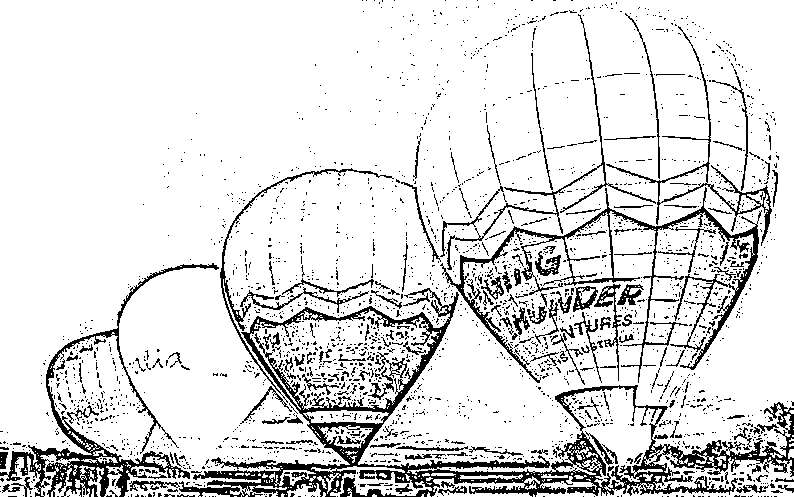

4 巨蟹座

觉得什么舒服就带上什么吧，但出国旅行就不要新鲜食物了！同样，如果家里做好的食物带多了，也会让火车和你的衣服熏染上一股异味。多带些手纸，尤其是擦手纸巾。反复检查你的洗浴用品，比如牙刷等。是的，你还可以带上那件母亲给你的衬衣，系上领带看起来很漂亮。带上一条柔软的毯子。如果飞机或火车上冷，它可以帮你温暖舒适地入睡。

5 狮子座

**走出你的风格。**去吧，穿得让人眼前一亮。为什么不呢？其他人会猜测你在哪儿买的皮箱，如此漂亮，但你喜欢它是因为它正好适合平整地装下你的衣服。当然你也会用干洗袋。早点到，这样你可以有时间购物。机场消费挺贵的，但也可以找到特色商店和免税商店。将你日常的商务行头放在一边吧，想想你要表现什么样的自己。

6 处女座

**整整齐齐出门。**因为你的手提箱整理得一丝不苟，所以你携带的行李都能通过安检。你“非常讨厌”打开整齐的行李，来向安检人员证明你不是个危险分子！你善于利用空间，所以你可以在小小的手提箱里，能比别的星座放入更多的东西。反复检查你的票，提前询问是否有变化或延误。这样你可以调整自己的行程，而不会过分担忧和焦虑。

7 天秤座

**哈！有机会结识有趣的新朋友了。**但是，如果你累了，想要小憩一会儿，就别勉强在火车或飞机上扮演优秀听众了，他们真的不会闭嘴！如果是单独旅行，这会帮你正确认识事物。一些天秤座人会在旅途中对关系有了新的看法。商务谈判也是如此；旅行让你的头脑可以享受片刻宁静，想出更好的策略。与伴侣或友人一同来一次休闲娱乐之旅是最棒了。

8 天蝎座

许多天蝎座人努力精简行李，结果还是恨不得带上全世界！也许这就是为何你一个小小的手提包重量，却好似一枚致命武器了。是的，你也想到了这点！你总是要**做好万全的准备**。迷你手电筒、备用电池，如果你飞越重洋，说不定还会带上定位装置。你的颈枕是不是实际上可以充气当作小的救生筏？你的眼中透着猜疑，人们都远远躲着你。

9 射手座

**飞机场或火车站就像是你的第二个家，或是你更喜欢的家！**你不需要旅行提示了，旅行中没有什么能够难倒你。也许是在蒙古草原上策马奔腾？你的笑容让其他人忍不住猜测，你是不是知道什么他们不知道的呢。同时你也见识广博，以防别人不小心向你提问。但是，如果有人害怕飞行，那么坐在你身边是最棒的了——你那些拙劣的玩笑，能让他们在飞机起飞时分心一会儿。

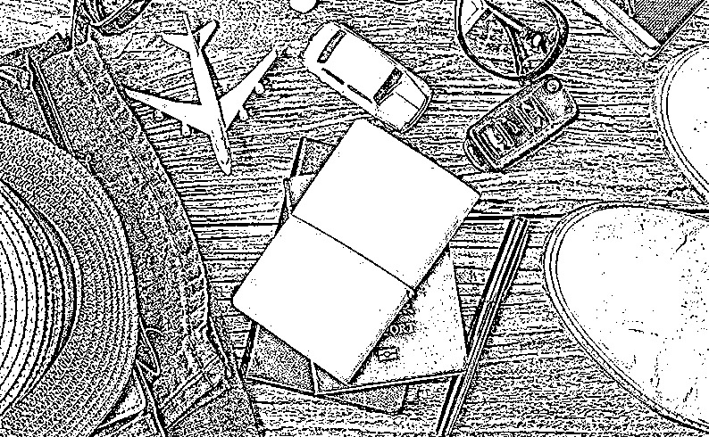

10 摩羯座**你善于计划，尤其是旅行时。**你喜欢早到，非常早到达。你会反复检查飞机或火车明细表。紧要关头的耽搁会让你沮丧，但延迟意味着更多工作的时间。iPad、电脑，不论什么，你会利用一切时间完成工作。效率，对你而言至关重要。时间就是金钱。你最不喜欢为了玩而旅行，但是你一旦决定如此，那么这里可能也是最佳的商务目的地。11 水瓶座

**你一身酷爽休闲装扮。**摩羯座看着你的旅行箱会想，你在哪个星球淘到这个玩意的？你的手提箱和着装，有时候似乎都是最新的科技轻便材料所制。你们中有些人的打扮就像是宇航员，另一些则穿着牛仔裤和 T 恤，露着纹身。你会帮助其他旅行者，注意到他们落了东西或需要帮助。你常常选择靠窗的位置，你喜欢看着火车或飞机的窗外。

12 双鱼座

检查你手提箱的拉链。你的拉链总是容易坏，因为你塞入的东西超乎想象的多。另外，这鼓鼓囊囊的行李塞不进头顶的行李架，尤其是因为你还是最后一个上飞机或火车的人。我猜，因为双鱼座而延误的飞机或火车可能超出了其他任何星座。在抵达前，请检查你的身份证或护照，确保你的吉他或双簧管有购买货物防损险。

**版权声明：**原创文章由作者授权发布于若道平台，欢迎转发，反对抄袭。友号转载请申请白名单。

****想阅读更多作者的文章，请在后台回复******大卫****** 即可。****

**喜欢文章请长按下方二维码打赏**

**给大卫老师加杯咖啡呗~**

**▼**

**系统学习占星学**

**点击图片了解详情**

**微信又双叒叕改版啦，不想错过若道君的推送？**

**就把若道设为星标吧！**

**▼**

喜欢记得点一下在看哦☟

********报名直达入口********

# 雷蒙德·梅里曼金融占星周运 | 密切关注下半周的行情

> 原文：[`mp.weixin.qq.com/s?__biz=MzA5NjA0NTAxNg==&mid=2651431806&idx=2&sn=7e4a1e8f5f8ae2be8752319d142244bf&chksm=8b4b11c9bc3c98dfa01422d5101cdd4b0764cc12ba1f1710143fb6e56b88c455c34509a9819c&scene=126&sessionid=1692738080#rd`](http://mp.weixin.qq.com/s?__biz=MzA5NjA0NTAxNg==&mid=2651431806&idx=2&sn=7e4a1e8f5f8ae2be8752319d142244bf&chksm=8b4b11c9bc3c98dfa01422d5101cdd4b0764cc12ba1f1710143fb6e56b88c455c34509a9819c&scene=126&sessionid=1692738080#rd)

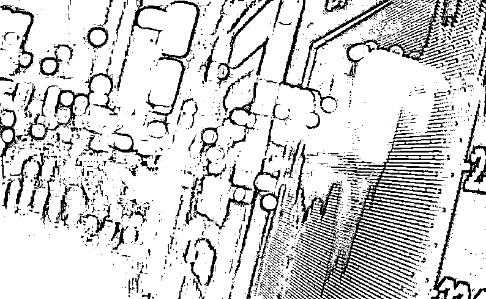

作者/雷蒙德·梅里曼
译者/Leisha 编辑/玫瑰 图片/全景网雷蒙德·梅里曼是在金融占星学界稳坐第一把交椅的占星师，同时他也是若道签约的金融占星课老师，我们引进了雷蒙德·梅里曼老师的《[上证指数+黄金周期月度报告](http://mp.weixin.qq.com/s?__biz=MzA5NjA0NTAxNg==&mid=2651430487&idx=2&sn=6b032833078f13e0caf33e548da15942&chksm=8b4b2ce0bc3ca5f6d2b4406eb8ffd38cd864c96b48133bd14364a778c2eaa4743479992b2c4a&scene=21#wechat_redirect)》《[2021 年金融预报](http://mp.weixin.qq.com/s?__biz=MzA5NjA0NTAxNg==&mid=2651425978&idx=1&sn=067bd68ece37e1e820d6f84f7a3cc960&chksm=8b4b3e0dbc3cb71b866f65d51f7993d3c35dee77cebd77eda3f63a4d5864dadaea2e9d14c101&scene=21#wechat_redirect)》。我们经老师的授权，将每周刊登梅里曼老师的周运，供大家参考和学习。于是，这是本周的周运（11.9-11.13）。**说明：以下时间采用纽约证券交易所所在地美国东部标准时间。**
**展望与回顾**

**尽管总统大选投票问题存在不确定性，华尔街仍创下自 4 月以来的最佳周度表现。标普 500 指数和纳斯达克指数本周分别上涨 7.3％和 9％。道琼斯指数本周上涨 6.9％。标普 500 指数也创下了自 1932 年以来的大选周最大涨幅……共和党赢得数场重要的参议院选举，因而降低了“蓝潮”的可能性，降低了增高税收和加强监管的可能性，华尔街的策略师将其视为股票上涨的原因。**

**——弗雷德·英伯特和杰西·庞德****《即使大选悬而未决，标普指数仍创下自 4 月以来表现最佳的一周》****www.cnbc.com****2020 年 11 月 6 日****美国劳工部在周五的报告中称，上个月雇主增加了 638000 个工作岗位，使失业率连续第六个月下降至 6.9％，超出华尔街的预期。****——梅根·亨尼****《工作都在哪呢？》****www.foxbusiness.com****2020 年 11 月 6 日****闭上眼睛生活很轻松****错误理解你所见的一切****功成名就越来越难****但总会如愿以偿****这对我不太重要****一切皆是虚妄****无需对任何事执著****草莓地万岁****——约翰·列侬、保罗·麦卡特尼****披头士乐队****百代唱片****伦敦****1967 年**上周紧跟在 10 月 31 日万圣节的满月合天王星之后。满月和天王星同时被强调，人们可能会期待发生意料之外的突然反转。还有一个表示投资者心理突然发生变化的征象是，水星在 11 月 3 日改变运行方向，当天月亮换座进入由水星掌管的双子座，及时赶上美国总统大选。民意调查再次失准（但地球宇宙学研究没有失准），因为没有出现“蓝潮”，民主党总统候选人乔·拜登也没有以两位数的大比分获胜。实际上，截至本文撰写之时，大选的获胜者尚未正式确定，这与我们的预测一致，也就是在 11 月 6 日之前，甚至在 11 月 14 日火星转向顺行之前，获胜者是谁都不得而知。随着明年 2 月 17 日土星四分天王星的临近，可能到那之前都一直会有人质疑大选结果的诚实性或准确性。再过几周，美国及其领导层和公民可能仍然难以找到稳定感、安全感和民族自豪感。在未来 1-2 周内可能还会有更多意外之事发生。全球股指继 10 月 30 日跌至数周低点后，上周都在飙升。尤其值得注意日本、印度、美国市场的反弹。日本日经指数创下 2 年新高，目前正上探自 1991 年以来的最高水平。印度 Nifty 指数周五飙升至 12280，明显接近其 2020 年 1 月 20 日创下的历史最高记录 12430。美国市场，纳斯达克综合指数上涨至 11974，仅比 9 月 2 日创下的历史高点 12074 低 100 点。

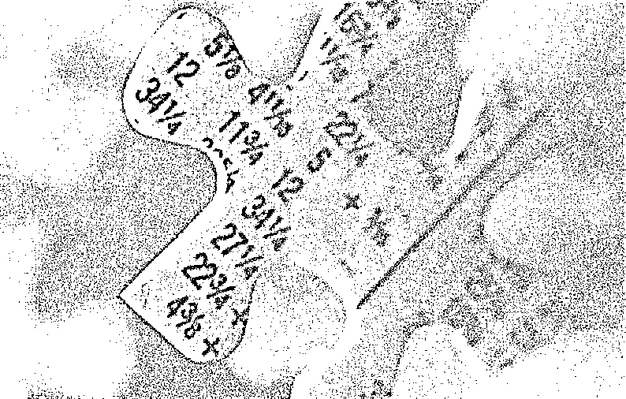

比特币上周的表现也很出色，周五上探 16000 美元，这是比特币自 2017 年 12 月-2018 年 1 月创下历史高点以来的最高水平。黄金和白银也呈现出强劲的涨势。周五，日内金价超过 1960，较 10 月 29 日的低点涨逾 100 美元。白银周五上探 26 美元，为 9 月 21 日以来的最高价。
事后回想，上周反映了满月合天王星以及水星顺行的象征意涵。然而，本周的行星布局可能同样值得关注。疯狂之旅还没有结束。超现实主义继续支配着我们曾经所知的现实主义。我们无法想象超现实主义现在在特朗普总统的头脑中达到了何种程度，因为行进的海王星（现实感遭受挑战）正与他的太阳-月亮对分相（对自我的核心信念、自我认同）形成 T 三角。这可能是个超脱的时期，或者是他的信念与现实彻底脱节的时期。因此，对许多人而言，这可能都是个超现实的时期，但如果投票趋势继续对拜登有利，那么对总统及其最狂热的支持者而言，这将是一个格外超现实的时期。这对乔·拜登而言可能也是个超现实的时期，原因有所不同。**（编者按：北京时间 11 月 8 日，美国官方宣布拜登是 2020 年大选的获胜者，敬请期待梅里曼之后的分析。）****美国总统大选**

**在这里（亚利桑那州），道德很重要，忠诚也很重要。特朗普总统对已故参议员约翰·麦凯恩的攻击激怒了许多共和党人。麦凯恩的遗孀辛迪以及 100 多名之前为参议员工作的职员在一封公开信中表态支持乔·拜登……2016 年，特朗普在这个州领先 3.5％，这个州上一次支持民主党已经是 1996 年的事。**

**——马萨达·西格尔**

**《特朗普把亚利桑那州变蓝了？》**

**《华尔街日报》**

**2020 年 11 月 6 日**

**2018 年，民主党在郊区和中心地区赢得了一些支持，但今年许多地区都没有投票给民主党。一个建议：也许可以尝试更温和的口号，别一来就要求撤销警队资金。**

**——《美国民主党的惨败》**

**《华尔街日报》言论版**

**2020 年 11 月 6 日**

如果为期 20 年的木星-土星周期代表“风元素新时代”（这个“大转变”周期，这次因为木土合相从土元素变换到风元素，元素变换每 200 年发生一次），那么我们可以设想一下未来 200 年，尤其是未来 20 年会发生什么？在新的风元素系列合相开启后，美国乃至全世界是否会比土元素系列合相的时期更统一？

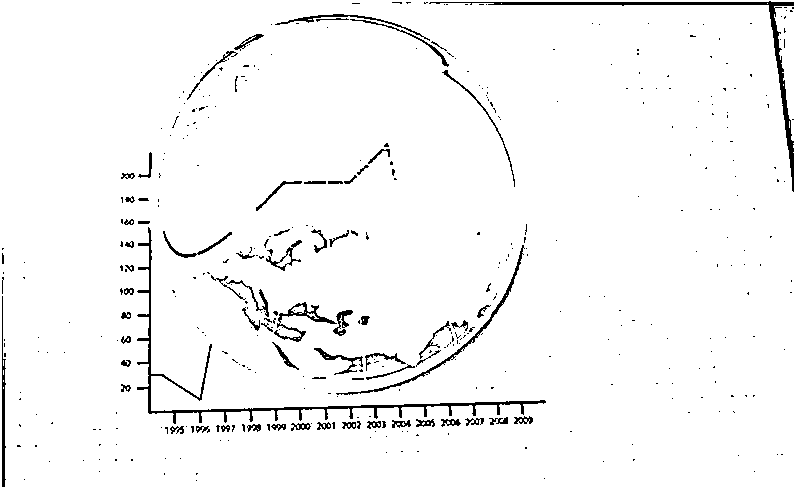

这种巨大的宇宙变动表达的就是这种观点，或至少是其部分的可能性。但这种转变在一开始时并不总是显而易见的，可能需要 5-10 年才会显现出来。我们将在一个多月后发布的[《2021 年金融预报》](http://mp.weixin.qq.com/s?__biz=MzA5NjA0NTAxNg==&mid=2651425978&idx=1&sn=067bd68ece37e1e820d6f84f7a3cc960&chksm=8b4b3e0dbc3cb71b866f65d51f7993d3c35dee77cebd77eda3f63a4d5864dadaea2e9d14c101&scene=21#wechat_redirect)（点击链接可阅读）中更详细地讨论这一主题。
同时，还有一场宇宙聚会将在未来几天酝酿发展。**11 月 9-19 日期间，金星将对分火星，并与摩羯座星群的冥王星、木星、土星形成基本星座 T 三角。**在这个基本星座 T 三角之中，**木星也将在 11 月 12 日与冥王星形成第三次也是最后一次合相，火星将在 11 月 13-14 日结束其为期 2 个月的逆行周期。**后两个征象非常强大。11 月 12 日的木星-冥王星合相在 11 个交易日内与基本周期的历史相关性为 88％。11 月 13-14 日的火星顺行在 11 个交易日内与基本周期的历史相关性为 75％。因此，两者都是强大的地球宇宙学一级反转征象。全球股指在 10 月 29-30 日创下的低点落在这 11 个交易日的容许范围内，可能对应了基本周期的波谷。但是，由于本周是这段地球宇宙学征象密集时期的中段，并且股指（以及比特币、货币和金属）都在急剧上涨，所以我们不能排除再次急剧反转的可能性。目前，我们集体关注的是 2020 年美国总统大选的最后几天，以及这对“风元素新时代”（New Aira）的宇宙演绎意味着什么。感谢梅里曼市场时机学院市场分析师凯特·鲍威尔创造了这个短语。

**说明：以上日期基于纽约证券交易所所在的美国东部标准时间，由于存在时差，中国地区可能需要加一天。**

**版权声明：**本文由若道翻译发布，欢迎转发，反对抄袭。友号转载请申请白名单。

**雷蒙德·梅里曼（Raymond Merriman）**

若道签约老师。著名金融占星师，ISAR（国际占星研究协会）前主席，梅里曼市场分析公司的总裁。他由于“提升了占星学的职业形象”，在 1995 年国际占星大会上被授予轩辕十四奖；在 2012 年国际占星大会上，被授予轩辕十四终身成就奖。

1“中国上证指数月度报告”发售

**若道推出了****中文版****的雷蒙德·梅里曼中国上证指数月度报告，并持续发行该报告！**

当把金融市场的周期和占星学的周期相结合时，雷蒙德·梅里曼老师的金融占星学研究**为投资者应对金融市场的周期波动，并随之调整投资策略提供了极大的价值参考**。

**11 月中英文报告均已上线！**

2“黄金价格周期月度报告”发售

**若道推出****中文版****的雷蒙德·梅里曼黄金价格周期月度报告！**不仅仅为广大读者在中国股市的投资出谋划策，更将视角放眼黄金市场。

**每当世界经济形式不明朗的时候，有一个地方是保值的港湾，那就是****黄金**。自 1982 年雷蒙德·梅里曼出版第一本研究《地球宇宙学征象与黄金价格的关联》的著作以来，**他一直作为最重要的黄金市场时机预测者之一享誉国际**。8 月的黄金终于从高位开始下跌，有些分析人士认为，黄金在过去连涨 9 周是非常极端的，因此走势未来不会太强了；也有人认为，在目前各国大放水、国际局势不稳的情况下，黄金可以继续看高。那么，你该如何面对目前的调整呢？是等待回调继续进行，还是在什么位置买入？11 月黄金周期报告等着你。火星逆行，很多国家都纷纷再次爆发新冠肺炎病毒疫情，未来的几个月注定不安宁。黄金的走势会安宁吗？

11 月黄金报告已经上线。欢迎了解。也可以按照季度和一年期订阅，有更多优惠。季度和年度的好处是，你可以持续了解梅里曼老师对于不断在变化的市场的看法。即便他某一次看法和市场不一致，你也看到在下一期他如何调整自己的看法，并看到金融占星在一个长期时间段内对你把控风险的帮助。而能够长期控制风险、尽量找到安全的投资时机才是投资的长久之计。

**11 月中英文报告均已上线！**

**购买套餐**，买得越多越优惠

中国上证指数月度报告套餐价

*   **单月报告**：280 元

*   **3 个月套餐**：780 元（260 元/月）

*   **12 个月套餐价**：1999 元（166 元/月）

**长按下图识别二维码**

**购买金融报告****套餐**

**▼**

黄金周期月度报告优惠

*   **双报告年度套餐更优惠（直降 899 元）**
*   **12 个月黄金报告+12 个月上证指数报告：仅需 3500**

**长按下图识别二维码购买黄金报告套餐**

▼

1976 年以来，由雷蒙德·梅里曼撰写的梅里曼市场时机学院每年一次的年度预报沙龙和每年一本的《年度预报》一直在应用占星学原理为投资者们服务，提供卓越洞见，从未间断。过去两年，3 小时的年度预报讲座和长达 200 页左右对金融市场的分析报告，帮助许多若道读者做出正确的投资决策，降低了投资风险，并获得相当不菲的投资收益。在群星摩羯座的时候，我们和你一起提早规划自己来年的投资安排。

**2021 年金融年报预售**

**1976 年以来，由雷蒙德·梅里曼撰写的梅里曼市场时机学院每年一次的年度预报沙龙和每年一本的《年度预报》一直在应用占星学原理为投资者们服务，提供卓越洞见，从未间断。**过去两年，3 小时的年度预报讲座和长达 200 页左右对金融市场的分析报告，帮助许多若道读者做出正确的投资决策，降低了投资风险，并获得相当不菲的投资收益。在群星摩羯座的时候，我们和你一起提早规划自己来年的投资安排。2021 年年度预报开始预售**前 50 名预售价格**：1080 元（已售罄）**前 50-100 名预售价格**：1180 元**100-150 名预售价格**：1280 元**150 名之后价格**：1380 元**2021 年年度预报中文版预计发布时间**：2020 年 12 月底**沙龙时间**：2021 年春节前后**沙龙形式**：英文讲座，配有中文翻译**点击下图了解详情**

▼

******点击阅读原文购买金融报告******

# 看全球顶尖占星师如何预测美国大选

> 原文：[`mp.weixin.qq.com/s?__biz=MzA5NjA0NTAxNg==&mid=2651431783&idx=1&sn=8b7a53892759ff1fb3f86a14c002e60c&chksm=8b4b11d0bc3c98c65d32fb97c5e4cd8d249b9edf6bf46be332b4b227487d23efa6c6c7b50655&scene=126&sessionid=1692738080#rd`](http://mp.weixin.qq.com/s?__biz=MzA5NjA0NTAxNg==&mid=2651431783&idx=1&sn=8b7a53892759ff1fb3f86a14c002e60c&chksm=8b4b11d0bc3c98c65d32fb97c5e4cd8d249b9edf6bf46be332b4b227487d23efa6c6c7b50655&scene=126&sessionid=1692738080#rd)

11 月 3 日，美国大选开始。

至今，大选结果仍然没有完全确定。你是否好奇，最后这场选举会闹到最高法院吗？谁将取得最后的胜利？大选结果什么时候才可能揭晓？

要知道这种情况其实在美国历史上并不多见， 有且仅有 5 次总统选举票数如此接近的情况：布什 vs 戈尔（2000 年）, 肯尼迪 vs 尼克松（1960 年）, 加菲尔德 vs 汉考克（1880 年），海斯 vs 蒂尔登 (1876)，亚当斯 vs 杰克逊 (1824)。而最近一次诉诸法庭的是 2000 年著名的布什和戈尔对决。

**| **小布什与戈尔

早在今年 9 月 6 日，在今年的 ISAR（国际占星研究协会）在线会议上，ISAR 就邀请了５位世界知名的占星师——雷蒙德·梅里曼（Ray Merriman），琳恩·贝尔（Lynn Bell），J·李·雷曼（J·Lee Lehman），卡洛琳·凯西（Caroline Cassy），克里斯汀·斯金纳（Christeen Skinner）对于这场大选做了题为《2020 美国总统大选》的一场精彩的预测。而 ISAR 中国也请了３位 ISAR 认证占星师——咔咔（点击[【回顾】](http://mp.weixin.qq.com/s?__biz=MzA5NjA0NTAxNg==&mid=2651428683&idx=1&sn=9ceba7e6f0f483eee70fd1095b770447&chksm=8b4b25fcbc3cacea51c2a13596546055cb9145451c3863d30b1915437a4783e8206f2cd9a404&scene=21#wechat_redirect)）、Selina Sun（点击[【回顾】](http://mp.weixin.qq.com/s?__biz=MzA5NjA0NTAxNg==&mid=2651429580&idx=1&sn=41a68055f451aa5008db6de5d9360634&chksm=8b4b287bbc3ca16d8f0f3e7fc9e494ec6bbadfe12c31122b886e1c7bdb0253facc99c03393d1&scene=21#wechat_redirect)）、爱卡对于总统大选做出了各自的解读。

如果你看了这个视频，对目前的状况你就丝毫不会惊讶，因为占星师们准确预测了目前所发生的状况，并且还对于事件会如何发展、总统上任后会发生什么贡献了独特的分析。

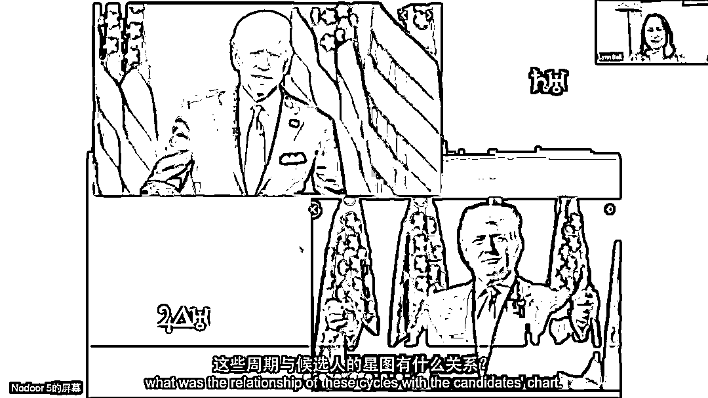

**| **琳恩·贝尔演讲

**这长达 7 小时左右的探讨，知识点密度极高，其内容包括而不限于：**

*   美国有史以来总统选举的占星学量化研究（比如月亮、火星、土星在 12 个星座的共和党与民主党的大选获胜统计分析）

*   特朗普和拜登出生星图的分析

*   特朗普和拜登在大选日前后的行进、二次限、太阳弧、太阳返照的分析

*   彭斯和卡玛拉出生星图分析

*   彭斯和卡玛拉（以有一个少见六芒星配置的卡玛拉·哈里斯为主）在大选日前后的行进、二次限、太阳弧、太阳返照的分析

*   美国国家星图的研究

*   美国国家星图行进、二次限的研究

*   如何解读选举日星图（包括日心图的解读），从选举日星图如何看两位候选人会遇到什么问题，总统大选的事件的发展

*   如何解读就职日星图（包括地心图的解读），从美国总统就职日星图如何看事件的发展

*   如何看在选举日及就职日前后的特殊天象（比如水星逆行、火星逆行、土木合相、土天四分、木冥合相

*   2021 年，不论谁当选，他面对的是什么样的世界

虽然这个研讨是关于美国总统大选的预测，其实，研讨中用到的很多预测方法都可以用到事件预测上来。**如果你致力于增进自己的占星技术，这次美国总统大选的研讨会就是对于最有价值的学习资料。很多分析可以一看再看。**

★**2020 年美国大选：一个占星学的视角**

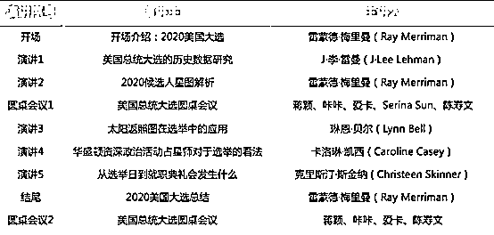

小组讨论主持人：雷蒙德·梅里曼（RayMerriman）——ISAR 大会主任

个人网站：https://mmacycles.com

个人简介：金融占星师，著有一些金融市场择时书籍，包括五卷系列，股票市场择时的终极著作(1997-2011)。他还著有《进化占星学:通过占星的灵魂之旅》和《太阳返照预测之书》。他因“提升占星学的专业形象”(1995)获得**轩辕十四大奖**，并在 2012 年荣获**“轩辕十四终身成就奖”**。在 1994 年-2000 年、2002 年-2008 年以及 2015-2017 年期间，他担任 ISAR 主席。

小编 tip：若道一直秉承“把西方最好的占星师带到中国”这一传统，而梅里曼是这个传统最好的范例之一，参与过若道梅里曼老师金融占星课的同学大概对此深有同感，如果你还没有参与过，但对各类股票市场感兴趣的同学依然可以参与每年元旦若道梅里曼开年的年度沙龙，帮助你了解新一年的天象能量，以及可能的经济政治局势、股票、黄金、白银、比特币等市场的局势走向，来进行新一年的财富规划。详情请点击：[雷蒙德·梅里曼 2021 年金融年报及沙龙](http://mp.weixin.qq.com/s?__biz=MzA5NjA0NTAxNg==&mid=2651425978&idx=1&sn=067bd68ece37e1e820d6f84f7a3cc960&chksm=8b4b3e0dbc3cb71b866f65d51f7993d3c35dee77cebd77eda3f63a4d5864dadaea2e9d14c101&scene=21#wechat_redirect)

演讲人：琳恩·贝尔（Lynn Bell）

个人网站：lynnbellastrology.com

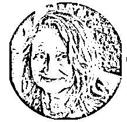个人简介：琳恩·贝尔是一位在巴黎工作的占星咨询师、作家、老师，她用心理学以及原型的方法应用在研究占星学角度的人生。林恩经常做一些国际讲座，并长期担任**伦敦认证占星师的导师**。她现在在线上为 MISPA 和占星大学教授课程。2016 年，琳恩因对占星学的杰出贡献获得了**查尔斯·哈维奖**。她的主要著作有《行星线路》、《光的周期》等等。小编 tip：作为若道的忠实课程粉的同学，一定对这位富有灵性和洞见的老师不陌生，她善于用生动，富有戏剧性的案例为同学们讲解占星的奥秘。这位在国际占星圈久负盛名的占星师，以她多年的咨询经验和观察研究，每每在演讲和课程中给听众带来深刻的启示。她也是一位不容错过不可多得的老师。她在若道开设的课程有《家族占星》、《太阳返照》，以及一些精彩的主题工作坊。

演讲人：卡洛琳·凯西（Caroline Casey）

个人网站：CoyoteNetworkNews.com

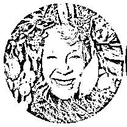

**个人简介：**卡洛琳在无数场合展示了她的占星学、神话、政客、引导、变幻故事叙述的艺术——23 年有远见活动家的电台节目经验。她的特邀嘉宾是虔诚的创新性复兴的主要贡献者; 她著有《让神为你工作:心灵的占星语言》。1970 年，她在伦敦学习占星学，之后在波士顿跟随伊莎贝尔·希基(Isabel Hickey)学习，并获得了布朗大学(Brown University)学士学位，学习了所有对占星学有用的知识，尤其是圣杯传说。

演讲人：J·李·雷曼（J·Lee Lehman）个人网站：leelehman.com

**个人简介：**实际应用是李•雷曼恒久不变的特点之一。她著有十一本书。她定期在中西部占星学院和开普勒学院任教。她是传统占星学院的导师，同时一手设计卜卦占星学以及医疗占星学课程。李还是**1995 年度马克·埃德蒙·琼斯奖以及 2008 年度轩辕十四教育奖**的获得者。

演讲人：克里斯汀·斯金纳（Christeen Skinner）

个人网站：https://financialuniverse.co.uk

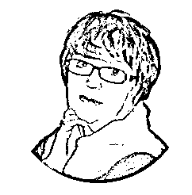个人简介：克里斯汀·斯金纳是伦敦市域有限公司的董事。克里斯汀与基金经理、企业家和投资者打交道。她著有几本关于金融占星书籍，并在占星研究学院任教。她是 NCGR 顾问委员会的主席，Urania Trust 的理事以及亚历山大伊伯斯项目(Alexandria iBase Project)主任。2019 年，占星协会授予她**查尔斯·哈维占星奖**。

**听课方式**

**录播视频课**

**支持若道 APP 和若道 PC 官网同步观看**

（英文演讲有中英双语字幕）

视频原价：680 元

**双 11 优惠价：580 元**

**重要购买须知**

*   本视频是 2020ISAR 在线会议的一部分，如果已经购买了完整大会的视频，不必购买。

*   支持若道 APP 和若道 PC 官网同步观看，视频购买后，有效期为 365 天。

*   本视频内容为虚拟商品，购买后不支持退款，购买前请认真斟酌。

*   本视频内容版权为若道所有，请勿外传，如发现侵权和盗版行为将追究法律责任。本视频一旦出售，不接受退款。

**课程负责人：童老师**

（微信：196267205）

请备注“美国大选”

**想完整观看大会内容？请扫描下图二维码了解详情****微信又双叒叕改版啦，不想错过若道君的推送？****就把若道设为星标吧！****▼**就是这个“在看”，戳戳戳 ☟********回看大会直达入口********

# 宫位全解析 | 这个令人“闻风丧胆”的宫位，真那么“可怕”吗？

> 原文：[`mp.weixin.qq.com/s?__biz=MzA5NjA0NTAxNg==&mid=2651431695&idx=1&sn=b3ace7977a632f9de61faff3f2fc8510&chksm=8b4b11b8bc3c98ae2a62436581348e985e5b752267a58c8d885948776c761a6ceaa234b0681d&scene=126&sessionid=1692738080#rd`](http://mp.weixin.qq.com/s?__biz=MzA5NjA0NTAxNg==&mid=2651431695&idx=1&sn=b3ace7977a632f9de61faff3f2fc8510&chksm=8b4b11b8bc3c98ae2a62436581348e985e5b752267a58c8d885948776c761a6ceaa234b0681d&scene=126&sessionid=1692738080#rd)

****************☆ ****************************后台****************************回复“今日”，给你一句生命态度****************

作者/达娜·格哈特
译者/葡萄园的女巫编辑/玫瑰 图片/全景网
**神秘的第 8 宫**完成这篇关于第 8 宫的文章真不是什么轻松的工作。我的朋友 Geraldine 说：“毕竟，谁会觉得公开谈论自己关于爱情、死亡和性的经历会是舒服的事情呢？”在我处理的大部分占星咨询中，都遇到了与第 8 宫相关的问题，但是在咨询过程中，我总是不声不响地进入这部分话题，然后又不着痕迹地结束。毕竟这是一个**收藏秘密**的宫位。**第 8 宫掌管着性、他人的钱财、税收、债务、损失还有死亡。**作为占星初学者，很容易被这个宫位吓到。在太阳返照图中，行星落在第 8 宫会让你战栗；在行进星图中，第 8 宫的行星会给你带来数年的“灾难和“厄运”。然而，随着时间的推移，这种下意识的恐惧会被深深的敬意取代。在行进第八宫后存活下来会让你感受到一次新生，你将学会很多宝贵的经验。最终你将意识到，第 8 宫就像一个精神大师，帮助你拓展视野。你的自我意识在这一宫位没有统治权，这里有更强大的力量。虽然理解第 8 宫很困难，但是我们都了解它的版图。从童年时起，我们就在这片丛林里玩耍。每当你的阿姨来访，空气中就会弥漫着神秘的气息；或者因为一句话，你的祖母就把你父亲变回了孩子；当你的叔叔抱你坐在他膝上时，你有一种奇怪的感觉。**第 8 宫承载着你心理遗产——无人谈论的、巨大的、不被察觉的影响力。**父母在谈论钱或者性的话题时，会用通电的栅栏把房间围起来，妈妈的钱包充满了神秘的图腾和金钱的味道。也许你也会想要念几声咒语期盼天上掉金子。但大部分情况下，你都活在别人的咒语里，在你并不理解的情况下，用宗教或者防御机制将你塑造成型——父亲的自我厌恶，母亲的坏脾气，一代一代传承着。许多年后，也许在一次 8 宫的行进影响下，这些遗产都将在痛苦中远离你。第 8 宫的秘密将被掩埋，你会走向明媚的春光。正因为有了第 8 宫，心理医生的生意才特别好。改变对于 8 宫不一定就是坏事。**第 8 宫描述了性的觉醒，保险或者遗产的收入，还有你的银行联名账户，你购房的贷款。**如果你想做占卜：“我是不是能得到梅兰妮姨妈的百万遗产？”第 8 宫会告诉你答案。但是，如果你是占星咨询师，第八 8 宫对你而言会更加重要，**你会从第 8 宫得到更多难以言喻的信息和暗示性的协议，就像下意识的恐惧，沉溺于回忆，这里还充满了压抑和成见。****和第 7 宫一样，第 8 宫也是关于“他人”的宫位。在第 8 宫，伴侣关系将带给我们震撼的影响，欲望、愤怒、沉醉、危险和贪婪。**如果第 7 宫将你的伴侣合作关系建立在公平的基础上，那么在第 8 宫，你将遇到**不公平的关系**。**当有人进入第 8 宫的亲密水域时，他们比我们强大。**不管是银行，或是我们的父母、国家税务局、性伴侣，甚至是一个恰好闯入的陌生人。我们必须记住，**第 8 宫主宰着死亡——它让我们对于自己控制以外的强势力变得敏感。**我们该如何下手对付这里发生的斗争呢？这需要指导。**除了坚定勇敢，学着领悟和妥协也同样重要。****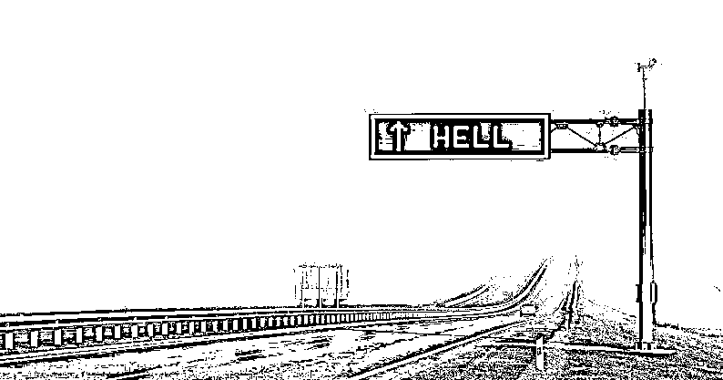****壁橱里的怪物**

我有一个客户，每两个月就来咨询一次，问同样的问题：“结束了么？”。她的月亮推进来到第 8 宫，她想知道什么时候月亮能推进到第 9 宫，她真是受不了了。其实我早就告诉，答案，她来找我事实上是需要倾诉。其实她并没有遇到任何实际上的麻烦，但是从月亮进入第 8 宫开始，她就感觉到**焦虑和抑郁**。

John Frawley 认为，**第 8 宫可以表现出我们恐惧和痛苦的心态**。**月亮推进来到第 8 宫时这一情况将加剧，如果不及时求助他人或者寻找感情依托，情绪会成为你最大的敌人。**Rebecca 一个人独居，她丈夫多年前已经去世。女儿希望她能住到老年公寓过群体生活，好忘记过去，包括去世的丈夫。她需要跟她的花园和植物告别，她需要面对那些可能不喜欢她的人。但是她并没有做好准备。她拒绝任何改变，所以她每隔一段时间就来找我，倾诉她的痛苦。第 8 宫就是藏在我们衣橱里的怪物。这让我想起了 Mercer Mayer 的同名小说，一个小男孩听到衣橱里传来可怕的声音，好几个夜里，小男孩都吓得睡不着觉。他把玩具兵排成一列堵住衣橱门，但是恐惧却与日俱增。没有别的选择了，他必须打开衣橱，面对怪兽。但让人意外的是，怪物虽然巨大，却十分胆小，它祈求小男孩能让它一起躲进被窝里。我们第 8 宫的怪物也是这样。**如果我们的恐惧得到抚慰，他们即会消失。但如果我们拒绝面对，那么恐惧将会日渐强大。**我们需要一个冥河的摆渡人，来帮助我们处理第 8 宫的麻烦。这个摆渡人可以是心理医生，可以是占星师，也可以是一个曾有过类似经历的好朋友。但是**如果我们像 Rebecca 那样拒绝改变，便将一直活在恐惧中，无法获得愈合的力量。**直到月亮推进到了第 9 宫，Rebecca 的情绪都没有丝毫的好转，她还在考虑是否卖掉房子，进入新的生活。所以直到月亮来到宽广的第九 9 宫，她还是不能获得自由与新生。她不能打开衣橱面对怪物。在两年的月亮推进周期中，她都顽固地拒绝放弃旧的生活方式，当然她也得不到新的。在最后一次与 Rebecca 的联络中，她告诉我，房子已经交给了房产经纪代售，从此就没有再来咨询。我猜想，她终于打开了衣橱，开始了一段新的第 9 宫的冒险之旅。占星师一般会说：“这是行进带来的影响，它会过去的。”但是，**如果拒绝做出相应的改变，特别是对于第 8 宫这样的问题，即使行星已经转宫，我们也无法从它带来的影响中走出来。**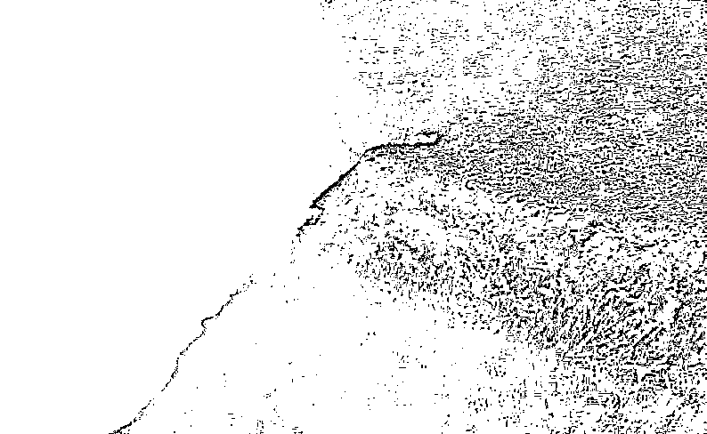**过去就像危险的流沙**我们可以与第 8 宫对抗，也有可能在这里陷入困境，这个危险的宫位也许会像流沙一样把我们吞没。我的一个占星师朋友 Lucy Pond 给我讲述了她的客户琳达因为木星行进到第 8 宫而陷入麻烦的故事。直到土星行进到第 8 宫，琳达才醒悟。**古典占星学中，土星是第 8 宫的原始宫主星，土星在他的领土上表现得像一个命运的警察。如果我们逃避责任，不管是现实责任还是抽象的责任，他都会给我们惩罚。**Lucy 是这样描述得：**“土星简直就是到第 8 宫来收账的。不论有什么藏在这里，都将被掀上台面，甚至是你丢失的自我。”**几年前，琳达刚开始和我一起工作时，就接受我的建议，找了一个很好的心理医生来帮助她治疗压抑的记忆综合症。琳达曾经有一段非常悲惨的遭遇，这段回忆让她陷入混乱。**行进木星进入第 8 宫，非常适合探究过去的秘密，特别是那些被深埋在记忆里的秘密。**她的第 8 宫宫头是双鱼座，压抑的回忆正好适合她强烈的情感风格。我告诉她占星学的建议，然后鼓励她去向心理专家寻求帮助。 几年后，木星已经来到了她的第 10 宫，心理治疗简直成了她的身份证。她清楚地回忆起过去的每个细节，完全从现实生活中脱离。她对于治疗简直上瘾，看起来她走出了第 8 宫的阴影，实际上，她的感情已经被摧毁在那里。作为琳达的占星咨询师，她对于过去的沉迷让我感到很挫败。不论我如何鼓励她活在当下，她都把所有占星学的讯息解读为更深层地沉迷过去。我提醒她，她就像活在倒后镜的世界里，看不到将来，看不到现在，眼光只停留在过去。因为我觉得占星咨询的作用就是让我们更充实地享受当下的生活，所以琳达的案例让我觉得自己很无用。 几个月后，土星开始进入她的第 8 宫。她来找我寻求一些占星的建议，她想伪造一些联邦政府援助文件，以保证她能够继续长期进行治疗，而不去工作。她必须承诺没有任何经济来源，但是事实上，她父亲这些年一直都有给她经济支持。在第 8 宫掌管的领域中，有一项就是税务。经常可以看到一个人在土星行进到第 8 宫时被税务机构质询，金融的秘密被揭发。所以我给琳达的建议就是：“不，不要存有侥幸，你很有可能被控告。”之后琳达再来咨询时，完全变了一个人。她完全接受了现实，而不再沉溺于回忆。和她从前那种受伤躲藏的样子不同，这次她充满了活力。还不等她坐下，我就急不可耐地问：“发生什么事了，你看起来好极了！” 琳达告诉我，她被税务机构调查了。他们不相信她只是靠政府补贴在生活，他们问询了邻居、同事和她的父母。她伪造文件的事情被揭发，她面临指控——这可不是开玩笑的。她感到非常害怕，但也终于觉悟了，她决定结束所有的治疗，重新回到工作中，赚钱偿还联邦政府的补贴。多好啊，她终于开始面对现实生活，重新点燃她的生命。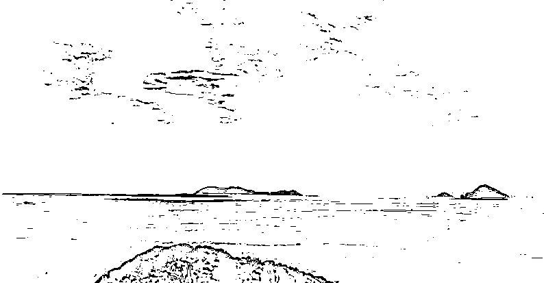**面对死亡和性****第 8 宫掌管死亡，听起来很矛盾，这里也是赐予我们重生的地方，这里联结了生死。**佛教徒认为，没有什么比死亡更能让我们的心灵变得坦诚。把死亡放在左手边，面对死亡，可以让我们更加从容地面对当下的生活。很多人在经历了生死浩劫之后，往往对生命有了更深刻的体验。 古典占星学和现代占星学在死亡与第 8 宫重要关系这一问题上存在意见分歧。丹恩·鲁伊尔认为，这个重要性被高估了。作为古典占星学的代表，John Frawley 则认为：“任何占星学流派都需要精确、实际地预测正确的事件，第 8 宫就是死亡宫位。这里的死亡不是某些现代占星师所说的抽象的、精神上的感觉。这里的死亡是实实在在的事件，有人的生命终止了。”一个人会死亡是我们可以准确预测的事件，问题是什么时候发生。最近听到一件事，一个女人造访占星师时，听闻预测自己的死期临近。她真是吓坏了，但是预期的时间过去，她还活着，我想她大概会对那位占星师感到很愤怒。上礼拜，一个很要好的朋友对我说，她最近去尼泊尔旅行，一个看掌纹的占卜者预测她五年内就会去世。她哽咽着问我是否也在星图上看到了这一点。我重新查看了她的星图，什么都没看出来，她才比较放心。不过我还是在想，如果到了五年的时候，验证我的话错了，她会不会在去天堂的路上还生我的气。 Frawley 认为，现代占星学的占星师们对于给客户预测事件过于谨慎，喜欢报喜不报忧。古典占星学家更加注重现实事件：如果一个人星期二就要死了，预测他星期三结婚有什么意思呢！Frawley 建议，如果要准确预测死亡的时间，八宫头和宫主星是非常重要的信息，太阳返照和月亮返照图中，第 8 宫也非常重要。许多现代占星学家的确没有发展这方面的技巧，很少有占星论坛会议的内容有安排讨论“死亡时间”这一条。当我和占星师的朋友们谈起死亡时间这个话题时，他们和我一样没有什么明确的概念。一个占星师朋友的母亲患了末期癌症，于是我们开始预测她不可避免的死亡时间。我们都猜测当冥王星同这位朋友的月亮呈紧张相位时可能发生，但是她母亲躲过了这一次行进，现在还好好地活着。**在太阳返照图中，落入第 8 宫的行星显示了你这一年的变化与危机。**从第 8 宫或许可以看到**你的生活方式将发生显著的改变，**却很难分辨是离婚、迁居或者是一份新工作。**不论是返照图还是行进或者推进中，第 8 宫都显示了死亡，或者一段亲密关系的危险期。**通常在这期间，我们的**自我意识也将受到极大打击，固有的概念和想法受到冲击，需要做出改变。**我的占星师朋友 April Elliott Kent 在她的博客上说，土星来到了她的第 8 宫——“那感觉就像怪兽哥斯拉洗劫了东京，它还像一面镜子，照向了我出生星图中 2 宫的土星，本来就摇摇欲坠，现在更加危险。”**第 8 宫还掌管了伴侣的经济状况，**April 的丈夫现在没有任何收入，虽然股票投资还未完全失败，但是他们已经欠税务机构不少钱了。他们还受到信用卡诈骗的拖累，April 说：“虽然第 8 宫的行进并没有完全毁了整个生活，也够让你想好好休息一下，或者喝得烂醉如泥。” 几天后，April 给我写了一封邮件，她写道：“我最近收到了一封读者来信，真是让人难以理解。他指责我在文章中都是写我的生活、我的宫位、我的丈夫，希望我能多谈一些普遍的情况。你应该可以猜到我的反应和回复。我开始考虑再写一个续篇，关于土星与工作的冲突。在第 2 宫的土星总是让我觉得自己不够好，怀疑自身价值，我的建议不会被接受。而当土星行进到第 8 宫则告诉我，我是对的。”这件事与占星学有什么关系呢？April 可以选择死亡，也会认识到很多事都会死亡和终结。April 接下来又给我发来邮件，说：“总是这样，我的创造性工作总是被人质疑，‘你当自己是谁啊？’好像我只是站在一旁说风凉话，知道什么啊！这真是鬼扯。”并不是所有第 8 宫的死亡都是坏事，全靠 April 幡然醒悟的勇气，她的不安感死在了阎王爷的斧头下。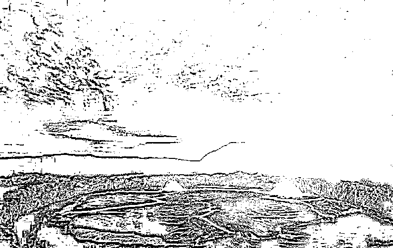John Frawley 认为，把性爱作为第 8 宫的行为是非常恐怖的。在古典占星学中，性爱被归在了第 5 宫的管辖之内。我比较倾向于这种观点。但是我也注意到，每一次太阳行进到第 8 宫时，我的客户们都说他做了很美妙的春梦，或者荷尔蒙分泌让他们更具性魅力。**第 5 宫的性是快乐、充满趣味的，这是古典占星学中金星的领域。**这个宫位掌管娱乐，而性是成年人的游戏之一。但是第 8 宫的性是不同的，更加复杂和神秘。这种关系就像冥王星与他妻子（冥王星在现代占星学中是第 8 宫的原始宫主）。**当第 8 宫被激活，你也许会看上什么人，然后会像冥王星那样悄悄地寻觅机会，或者怀有强烈的占有欲。**你也有可能像冥王星的妻子那样，只是单纯地摘一束花，或者来点小惊喜。不管哪一种情况，我们都会像躺在了地狱的床上。 **第 8 宫的性，是丈夫会向妻子隐藏的那种。**或者是伴侣争吵的那种类型：“我喜欢这种方式，我希望一周好多次。”这种**权利的斗争**蔓延到生活的方方面面：“我讨厌你妈妈，我不喜欢你花钱的方式。”但是在神话中，我们没办法了解冥王星和他妻子是如何相处的。当神话剧拉开了帷幕，我们会看到各种各样的情节，我们自己必须控制这一切。

**版权声明：**本文由若道翻译发布，欢迎转发，反对抄袭。友号转载请申请白名单。

**其他宫位文章** 

[第 1 宫](http://mp.weixin.qq.com/s?__biz=MzA5NjA0NTAxNg==&mid=2651423092&idx=1&sn=53169f1901b50ce5d406aa45df1a830f&chksm=8b4b33c3bc3cbad5e64428fb653d1478ecdb1068a812985486b0299e1648061aee1a5eab07d1&scene=21#wechat_redirect)丨[第 2 宫](http://mp.weixin.qq.com/s?__biz=MzA5NjA0NTAxNg==&mid=2651424378&idx=1&sn=e0e512b4945987e1c9db4a849a6b4ba0&chksm=8b4b34cdbc3cbddb9a862751c15173684a2eb9a98deb37bacdbc003dfa6010c7e28df5ed0f14&scene=21#wechat_redirect) | [第 3 宫](http://mp.weixin.qq.com/s?__biz=MzA5NjA0NTAxNg==&mid=2651425739&idx=1&sn=b89185e88d277fbcded71a78b15db8c9&chksm=8b4b397cbc3cb06a5d052ca8701e95e2c8bd24ccf7f25712625a9b88ffadbda5d1c4791d7304&scene=21#wechat_redirect)

[第 4 宫](http://mp.weixin.qq.com/s?__biz=MzA5NjA0NTAxNg==&mid=2651426869&idx=1&sn=5c806962caab237741b9af30123c3c9e&chksm=8b4b2282bc3cab94daf6de6788f429ad15cce4f8c61d379f3e6212d5f12f436732eaec19d6c7&scene=21#wechat_redirect)丨[第 5 宫](http://mp.weixin.qq.com/s?__biz=MzA5NjA0NTAxNg==&mid=2651427087&idx=1&sn=fc978e7fe2f6f4b57102e8a75b4c6dcf&chksm=8b4b23b8bc3caaae65c40d82a7a4ff7436e0b26ca37be6b84bde46f8c93230517c0529a5934e&scene=21#wechat_redirect)丨[第 6 宫](http://mp.weixin.qq.com/s?__biz=MzA5NjA0NTAxNg==&mid=2651429367&idx=1&sn=f208aa060f6c8db617cc9c9097ba2dbf&chksm=8b4b2b40bc3ca25641caa49037815f4e8da9761f09e7537c1bca38903a97a22a85ac471d4a27&scene=21#wechat_redirect)

[第 7 宫](http://mp.weixin.qq.com/s?__biz=MzA5NjA0NTAxNg==&mid=2651430274&idx=1&sn=80c87bfced87c1ef17844c1240f2e454&chksm=8b4b2f35bc3ca6232ccbd68ebeb9ff30a18014a8bcd7a1a828990482e1a41b6e70a01569e47c&scene=21#wechat_redirect)

**达娜·格哈特**一位国际范围内受尊敬的占星师。她为众多占星学网站和出版物讲课、写稿。她在十二宫的月亮激励她对这颗发光体进行了深刻而持久的探索研究。

**ISAR 选修课，心理占星学视角下的预测方法**

**点击图片了解详情，或****长按图片二维码咨询客服**

**微信又双叒叕改版啦，不想错过若道君的推送？**

**就把若道设为星标吧！**

**▼**

就是这个“在看”，戳戳戳 ☟

********报名直达入口********

# 三种疗法面面观丨为什么顺势疗法可以激活身体的自愈力？

> 原文：[`mp.weixin.qq.com/s?__biz=MzA5NjA0NTAxNg==&mid=2651431634&idx=2&sn=aeeb5406efb41276f20a786e30b88386&chksm=8b4b1065bc3c99731b6fe78acf66cb025ddfb95024c290f7ed92fd4eed7bc105ee2abc1398be&scene=126&sessionid=1692738080#rd`](http://mp.weixin.qq.com/s?__biz=MzA5NjA0NTAxNg==&mid=2651431634&idx=2&sn=aeeb5406efb41276f20a786e30b88386&chksm=8b4b1065bc3c99731b6fe78acf66cb025ddfb95024c290f7ed92fd4eed7bc105ee2abc1398be&scene=126&sessionid=1692738080#rd)

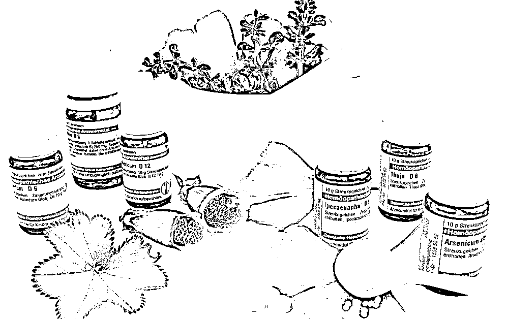

作者/Homeopathyplus 翻译/Luke 编辑/翀子 图片/网络顺势疗法认为，人体有自愈能力。通过对姑息疗法和抑制疗法的原理剖析，我们得出，病症症状是身体能量失衡的副产品，我们应该协助它而不是对抗它。在“相似原理”和“以毒攻毒”的观点下，顺势疗法可以帮助激活身体的自愈力，从而把身体调整到较为健康的状态。

文中插图并非真实的顺势药剂。

**人体有自愈能力。**只要有良好的营养，干净的水和健康的环境，自愈就会发生。人们经常接受治疗或服用药物，以加快治疗进程。**治疗病症时，我们可以选择姑息、抑制或者用相似的症状治愈疾病。**

**姑息疗法的弊端****姑息疗法可以迅速减弱病症，不过它无法根除疾病。**“姑息”（palliation）这个词的希腊原文意思是“隐藏或伪装”。姑息疗法**“隐藏”了病症**，暂时减轻了疾病的痛苦。药物和治疗都可以达到姑息的效果。比如说，扭伤脚腕的疼痛可以用止痛剂减弱。香蕉和番泻叶可以刺激肠道，缓解便秘。湿疹可用可的松减轻。一碗热水可让冰凉的手脚变暖。**姑息疗法有速成的疗效，但是一旦治疗停止或药物的效果消失，症状就回来了。****许多急性症状，即使没有得到治疗或药物，身体一般也能自愈。**扭伤脚腕，比如说，随着时间过去也会好转，但是止痛剂或消炎药，如阿司匹林，会**减轻在这一过程中的痛苦**。对于**慢性疾病**，姑息疗法**可以短期缓解症状，但无法根除病灶**。便秘、湿疹、手脚冰凉的症状，比如说，虽然暂时得到缓解，但一旦治疗停止，症状就会回归。

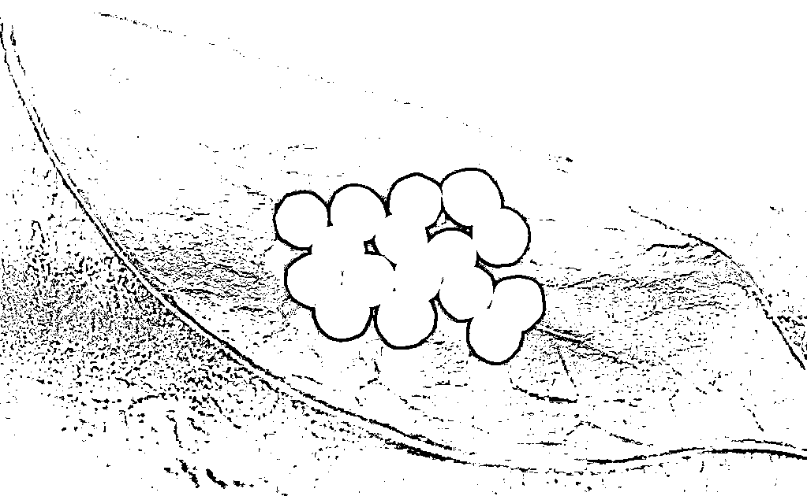

**抑制疗法的后遗症**

抑制疗法与姑息疗法的相似之处在于，它暂时缓解了症状，但无法根除病灶，**抑制和姑息的不同之处是，它完全阻止症状回归。**然而**疾病没有被根除。它们只是被驱赶到身体内部更深的层面，**并在那里产生一系列新的症状。让我仔细解释。

听起来有点奇怪，但当我们生病的时候，是我们的**症状使我们活着**。它们就像通风口或安全阀，**排解体内的能量失衡造成的压力**，而这才是疾病的真正源头。没有这种释放压力的过程，能量失衡会加剧，并且危及生命。

强行或频繁地姑息症状就好似给通风口加上了塞子，阻碍不平衡能量的释放。当这种情况发生时症状就得到了抑制。当下的症状减轻了，但长期来看却会损害健康。

当身体处于不平衡状态，**身体中的智能总是以伤害最小的方式排解症状**，比如透过较不重要的器官系统，如皮肤。如果这一过程被阻止，则会转而采用深层的器官，比如关节或肺部，充当安全阀。如果一直姑息或抑制症状，就连皮肤上的湿疹也会经年类月地发展成为哮喘或关节炎。

如果哮喘或者关节炎的症状再度被抑制，症状将会波及更加重要的器官，比如心脏或大脑。因为身体智能总要排解体内的不和谐状态。到头来，**真正的病灶会以更严重的形式重新出现**。

患者通常在疾病得到抑制的早期认为症状已经好转了。毕竟，原先的病症，比如湿疹，已经消失。此时，除非患者或开药的医师完全理解身体应对疾病的方式，否则他们不会发现情况实际上变得更糟了。随着时候过去，受抑制的症状会被更加严重的症状取代。当新的健康问题出现时，没人想到把它和之前的问题联系起来。**抑制新的症状只会导致健康进一步恶化。**

抑制疾病也会伤害和削弱我们的活力，因为它与身体中的智能所要做的背道而驰。身体活力会随着年龄逐渐下降，但抑制疗法会进一步减弱它。当它无法再维持健康时，身体会患上一个又一个慢性疾病，最后一次尝试维持生命。因此，**我们中的许多人随着年龄增长，吃的药越来越多，但健康却越来越差。**是时候“觉醒”了——人生本来不必如此！

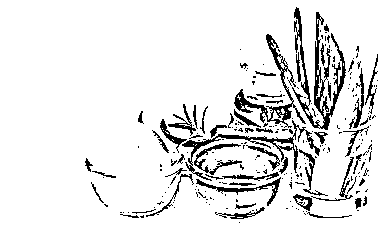

**用顺势疗法彻底治愈身体**停止这一过程最简单的方法是变得有智慧，**协助身体而不是对抗它**。**疗愈只能来自于身体**。化学药品、各种疗程疗法应该帮助身体移除障碍，或是协助、刺激身体自身的自愈力。**应把症状看作是身体能量失衡的副产品，而不是疾病**。它们**是走向治愈的路标**，为我们提供重要的信息，告诉我们如何帮助身体治愈自身。姑息或抑制症状只会和身体本身产生对抗。

处理健康问题更加聪明的方法是采用能模仿我们想要解决的症状的药物或疗法。这是哈内曼（Hahnemann）早就发现的事，也是为什么**“相似法则”**，或**“以毒攻毒”**依然**是顺势疗法的基石**的原因。**以“以毒攻毒”的方式协助身体纠正体内能量失衡依然是恢复健康和活力的最佳方法。**

所以，你是怎么应对你的症状的呢？你是把它们看作身体自疗的积极征兆，并协助身体，还是决定姑息或抑制它们？对于这个问题你做的选择会在很大程度上决定你未来的生命质量。

**版权声明：**本文由若道翻译发布，欢迎转发，反对抄袭。友号转载请申请白名单。

请在后台回复 顺势 获得更多**关于顺势疗法内容**

**学习顺势疗法**

**请点击下图了解详情**

**微信又双叒叕改版啦，不想错过若道君的推送？**

**就把若道设为星标吧！**

**▼**

就是这个“在看”，戳戳戳 ☟

********报名直达入口********

# 对比星图丨“我们在一起合适吗？”从太阳星座看关系中的密码

> 原文：[`mp.weixin.qq.com/s?__biz=MzA5NjA0NTAxNg==&mid=2651431634&idx=1&sn=21b268572cfbd50cec25d612cae7f082&chksm=8b4b1065bc3c9973c30cb7fdcfa347d15c645c58671b1bc29697623e0b44c555816549ebeb5e&scene=126&sessionid=1692738080#rd`](http://mp.weixin.qq.com/s?__biz=MzA5NjA0NTAxNg==&mid=2651431634&idx=1&sn=21b268572cfbd50cec25d612cae7f082&chksm=8b4b1065bc3c9973c30cb7fdcfa347d15c645c58671b1bc29697623e0b44c555816549ebeb5e&scene=126&sessionid=1692738080#rd)

****************☆ ****************************后台****************************回复“今日”，给你一句生命态度****************

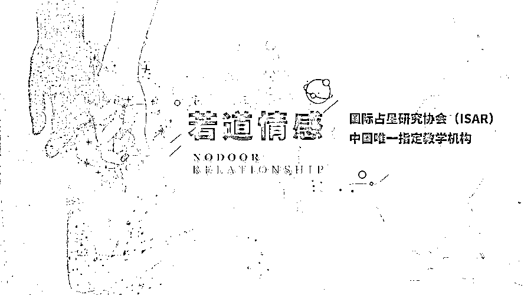

作者/曼迪·洛克利
译者/李含 校对/Jun

编辑/翀子 封面/书君 图片/网络

占星学不仅帮我们了解自己，还可以帮助我们了解自己和他人的互动，对比图便是这样一个研究关系的有力工具。我们可以从最基本的起点——二人太阳星座间的互动，观察自己和他人的联系。而当有外行星加入太阳间互动，又会给关系带来哪些挑战呢？一起来看文章吧~

你有没有想过，为什么你很容易与一些人相处，却很难与另一些人建立融洽的关系？

**在占星学中，关于关系相容性的研究被称为 synastry，即比对图。**

我们星图中的**太阳代表我们的能量来源和我们如何利用它**。通过太阳的星座、宫位和相位信息，它建议我们最好应该把精力投入到哪里，以便成长，**实现我们的人生目标**。它还暗示了我们在前进的道路上可能会遇到的**挑战和功课**。

因此，它代表了我们个人的**英雄之旅**——我们的活力、意志力、自我认同和创造性冲动。表达出我们的太阳是一项使命，是我们需要学习去做、渴望去做的事情。

每当我们**遇到另一个人**，如果他的目的、目标、使命和生命力的表达**与我们自己的相似或相容**，我们就会**“理解他们”**。我们往往会感觉到与他们的关系融洽，或者至少我们可以理解他们来自哪里。另一方面，当我们遇到一个与我们自己的表达**大相径庭的人**时，我们**很难理解**他们是从何而来。虽然我们可能会对不同的能量感到好奇和吸引，但在一起相处给我们双方都带来了挑战。

当判断太阳在不同星图之间的兼容性时，我们的确需要**纵观全局——太阳的星座、相位和宫位**——但仅仅孤立地观察太阳与太阳之间的基本相位是最好的起点，我们可以从那里开始解读。

当然，在比对图中两个太阳可能并未形成相位。如果是这样的话，请查看星座和元素的一般兼容性。下面的内容仍然适用，但联系将不那么强烈。

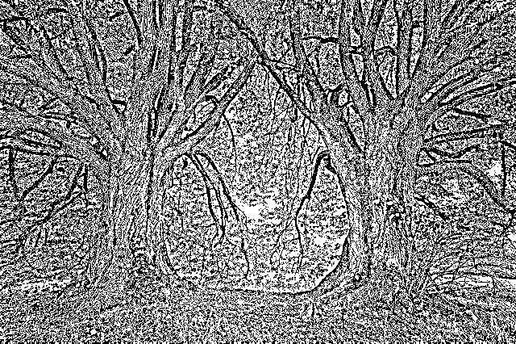

**对比星图中的太阳**★太阳合相太阳

如果你们的太阳合相，想想所有你们可以一起度过的生日聚会吧！对于两个处女座或摩羯座来说，这可能是一件很棒的事情（想想你们共享一个聚会可以节省多少钱），但如果你们是两个狮子座的人，你真的想和另一个聚光灯下的霸主分享这一时刻吗？这听起来有点轻率，但重点是，**这种联系在很大程度上取决于太阳所在的星座。**

然而，一般说来，你们**有相似的方式**来表达自己的能量和自我，**你们的人生功课、使命和目标是相容的**。虽然你们在旅途中可能处于非常不同的阶段，但你们正朝着同一个方向前进。你们真的可以与你太阳星座相同的人产生共鸣，这可以是一种简单的、相互支持的关系。

两人如此相似的危险在于，你们**太容易意识到彼此的弱点**。如果发生这种情况，请注意，这会给你们俩上一课。与其主动地讨厌对方，不如记住，他们很可能是在强调你不喜欢自己的地方，或者是你否认的地方，需要改进的地方。

★太阳对分太阳

**对立面的吸引！**这一相位在朋友和恋人之间很常见。对立面很可能充满吸引力，但它们也可以相互排斥，而且通常可以**同时产生吸引和排斥**，使得这一相位非常有趣。

最棒的情况是，你们之间良好互补，并发现这种关系充满刺激，相互支持，自我平衡得很好。这是因为尽管对宫星座有差异，但他们也有共同的关注点。

最坏的情况是，你们无法建立起真正的关系，因为你们不断地互相拉开，朝着完全相反的方向前进。甚至可能兼而有之……是的，**经典的爱恨交织在这里是有可能的。**

**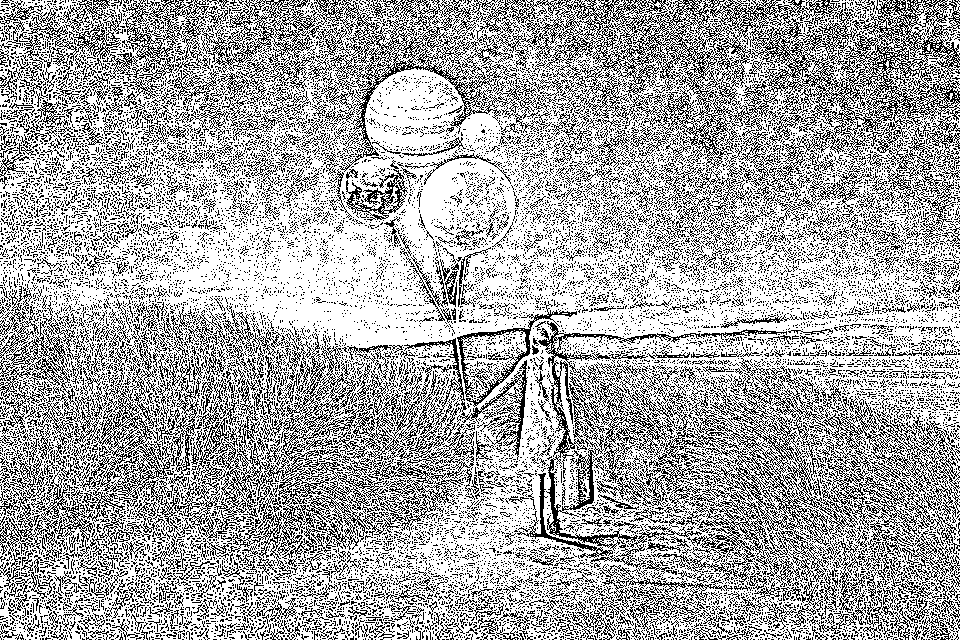**

★太阳四分太阳

**四分相具有挑战和动力**。它们呼吁采取行动，往往是为了应对冲突，但成功处理冲突可以为涉事双方带来宝贵的成长。

行星会四分落在与其形态相同星座的行星，所以基本星座的行星会四分另一个基本星座的行星，依此类推。在两个太阳彼此成四分相的关系中，你们**倾向于以相似的风格解决人生旅途中遇到的障碍和问题，**但因为你们的整体气质和生活目标不同，这有时会导致一段令人沮丧的关系动力。你们之间可能会**感觉到强烈的吸引力，但同样容易产生厌恶！**

**基本星座**之间的关系可能会因为**过度竞争**而受损，**固定星座**之间的关系会让人感受到**占有欲和束缚**，**变动星座**之间的关系可能会有**放任自流**的趋势。

归根结底，比对图中太阳四分太阳的情况下，如果能**健康地并有意识地**表达太阳，那么这种联系就可以使双方成长，获得个人发展。如果你们能解决你们的差异，那么就可以一起取得很多成就。

**基本星座：白羊座、巨蟹座、天秤座、摩羯座**

*   创始，精力充沛，以行动为导向

*   直接解决障碍，直面冲突

*   善于危机管理，但是难于跟进到底

**固定星座：金牛座、狮子座、天蝎座、水瓶座**

*   顽固，井井有条，执着

*   不紧不慢地处理问题，常常会陷入其中

*   启动慢，但善于跟进，完成任务，坚守阵地

**变动星座：双子座、处女座、射手座、双鱼座**

*   适应性强，多才多艺

*   善变，沟通力强，容易分心

*   会采取迂回的方式应对问题，通过协商去处理，或者回避议题

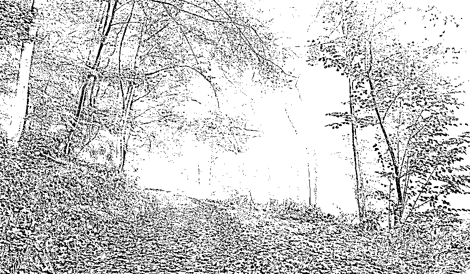

★太阳三分太阳当你的太阳与对方的太阳成三分相时，它暗示着一种**轻松、支持、和谐**的关系。你们会相互“理解”，携手一起在人生旅途中，感觉很舒服，而且彼此的陪伴让你们感觉精力充沛。然而，如果你想在你们的关系中保持活力、成长和一些令人兴奋的张力，你可能需要在你们星图之间的其他相位中去寻找。

**行星落在相同的元素成三分相：**

*   **火象星座**：白羊座，狮子座，射手座

*   **水象星座**：巨蟹座，天蝎座，双鱼座

*   **风象星座**：双子座，天秤座，水瓶座

*   **土象星座**：金牛座，处女座，摩羯座

★太阳六分太阳六分相，就和三分相位一样，暗示着一种**轻松、和谐**的关系。这通常是一种**对双方都有利的支持性关系，**因为你们彼此的太阳所在的元素是相容的。然而，六分相的确要比三分相更努力才能最大限度地发挥它的作用。最好的情况是，你们太阳之间的六分相为彼此提供了一个**互相帮助、鼓励的机会**，以实现你们的人生目标。

**火象和风象星座六分相：**

*   白羊座-双子座

*   白羊座-水瓶座

*   双子座-狮子座

*   狮子座-天秤座

*   天秤座-射手座

*   射手座-水瓶座

**土象和水象星座六分相：**

*   金牛座-巨蟹座

*   金牛座-双鱼座

*   巨蟹座-处女座

*   处女座-天蝎座

*   天蝎座-摩羯座

*   摩羯座-双鱼座

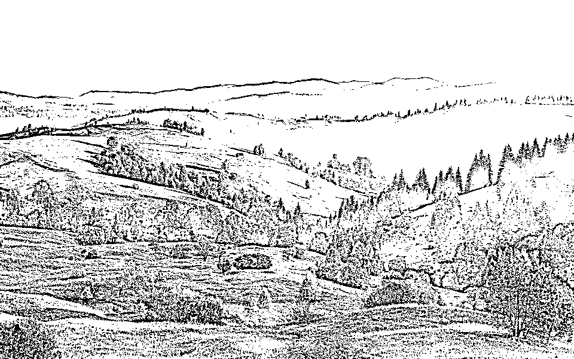

★太阳与太阳形成梅花相

**形成梅花相位的行星完全无法互相理解。**和四分相不同，它们并未落在相同的形态（拥有相同的运作风格），也没有落在相互兼容的元素。如果我们的太阳形成梅花相位，或仅仅是所落的星座成梅花相位，我们的能量、活力、人生道路和目标——以及我们如何实现我们的目标——会是如此不同，**很难看到一个共同的交汇点。**

梅花相位的关键词是**“别扭”**，在比对图中有梅花相位的**最好处理方法是双方都接受在关系中需要不断地调整和让步。**然而，令人惊讶的是，太阳成梅花相位的人之间有亲密关系和婚姻是相当普遍的。也许太阳之间的这个相位让事情保持新鲜和活力，持续不断地有趣？

最好的情况是，如果你们的太阳形成梅花相位，生活在一起会使你们**学会非常宽容**。虽然你可能**永远也不会完全了解对方的想法**，但**学会充满爱地尊重**和尊敬你们之间的差异是一件很棒的事情。

如果你们的太阳形成梅花相，你会希望你们比对图中的其他行星之间有一些更兼容的相位。比如我的摩羯座太阳和我丈夫的狮子座太阳形成一个天然的梅花相位。然而，他的摩羯座月亮与我的太阳互补，我的水瓶座月亮与他的太阳互补，反之亦然。和谐的金星和火星关系也有助于保持浪漫爱情的美好！

**成梅花相位的星座：**

*   白羊座-处女座

*   金牛座-天秤座

*   双子座-天蝎座

*   巨蟹座-射手座

*   狮子座-摩羯座

*   处女座-水瓶座

*   天秤座-双鱼座

*   天蝎座-白羊座

*   射手座-金牛座

*   摩羯座-双子座

*   水瓶座-巨蟹座

*   双鱼座-狮子座

★太阳与太阳成十二分相（落在相邻星座）

十二分相的行星彼此之间相隔 30 度，也就是**相邻的星座**。虽然我们的邻居可能不是我们最天然的伙伴，但只要双方努力，我们就可以找到一种与他们和睦相处的方法。幸运的是，在比对图中，太阳之间的十二分相位往往比土星和火星等天然不那么和谐的行星之间的十二分相位更轻松。

如果你们的太阳成十二分相位，这为你们提供了一个很棒的学习经历。例如，水瓶座的太阳可以帮助摩羯座的太阳摆脱乏味的旧习惯去尝试新的东西，而摩羯座的太阳可以为水瓶座的目标和理想增加一些稳定性和结构。天蝎座的太阳可以帮助射手座的太阳变得更有控制力和耐心，射手座的太阳可以帮助天蝎座少一些怀疑，对生活对馈赠多一些乐观。诸如此类……

当你思考所有的太阳星座时，你就会很容易地看到，在它之前或之后的星座是如何作为一种**健康的解毒剂**，来消除它更负面的品质。尽管十二分相并不一定马上就有阳光和玫瑰，但比对图的这一相位可能**需要努力和觉察才能有所收获**。

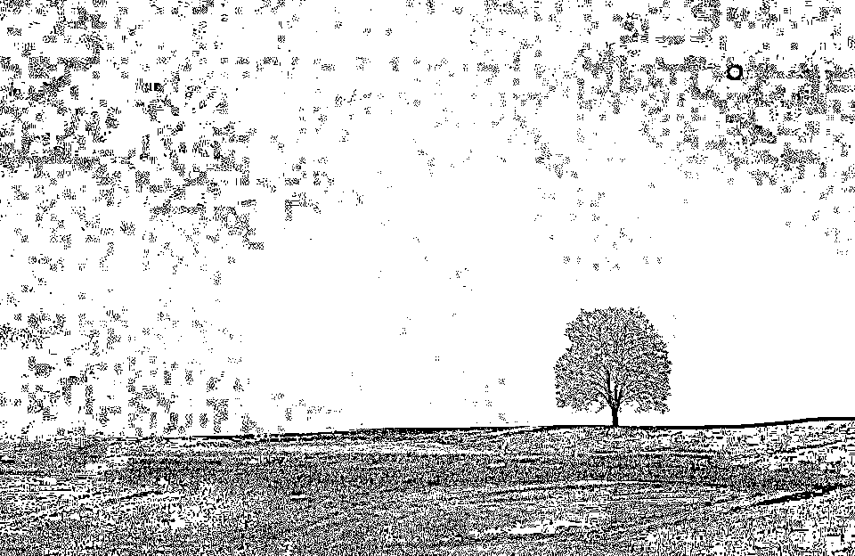

**外行星的加入**

这里有一个真实的例子来说明这些相位是如何运作的，它还引入了外行星维度，来展示这些相位是如何渲染比对图中太阳与太阳的相位:

★土星的加入

如果土星参与到比对图中的太阳间相位之中，这段关系会呈现出一个**严肃的维度**。比对图中土星的紧密联接经常出现在**互相承诺的、长期的关系中**。是的，土星有持久性！

然而，土星并不总是意味着婚礼对钟声和 25 周年纪念日，因为这颗**严酷的现实行星**很可能暗示着，一段很难在一开始就走上正轨的关系。也许一方或另一方对进入一段关系持谨慎态度，或者怀疑对方是否适合自己？

有时候，这种联系可能意味着会**延迟**在一起，或在一起有**障碍**，无论是情感上的还是环境上的。一旦这段关系开始，至少有一方将需要一种**更传统的**关系风格所带来的安全和稳定。这个问题能否解决，在很大程度上取决于这种关系风格是否适合对方的性格和人生道路。

此外，这种相位关系可能意味着在这种关系中，一方或另一方**感觉受到限制**，或感到他们的自信正在被另一方的苛责或悲观的生活态度所侵蚀。

最好的情况下，处于太阳——土星比对图关系中的伴侣可以在相互尊重、相互爱护和尊重中共同成长。这是一起优雅变老的完美结合。

★天王星的加入一般说来，比对图太阳和太阳的相位如果涉及了天王星，会带来非常**令人兴奋的互动**。如果双方都准备好了探索**非传统**的互动方式，那就会有非常好的结果，但这往往会导致一段**不稳定**的关系，其中一方比另一方要求更多的自由，而另一方却不愿意给予。这可能就是为什么这些关系经常以周期性（或永久性的）分手为标志，或者至少一方时不时需要在情感上与另一方保持疏离。这并不是说它最终不会带来承诺，通常是会有承诺的，只是可能不是大多数人所认为的传统承诺。

要发挥作用，这些关系需要每一方都给对方**足够的空间**，让他们忠于自己，真诚地遵循自己的人生道路，即使这意味着他们最终会走向完全不同的方向。

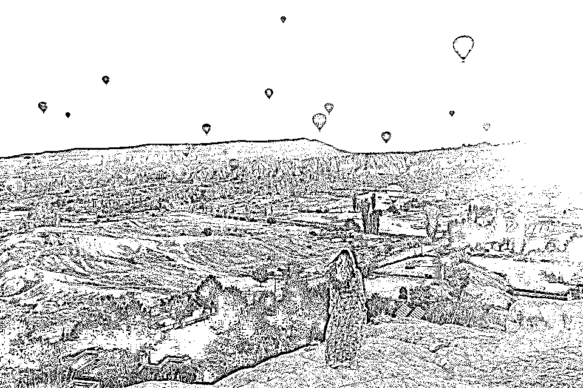

★海王星的加入

当海王星加入到比对图太阳与太阳的互动中时，这种关系会呈现出一种超凡脱俗的感觉。这样的关联**可能会让人感觉“命中注定”**，是某个“神圣计划”的一部分。危险在于，这段关系**太容易变得过于理想化**，而忽视或根本看不到其中的缺陷和弱点。逃避主义的可能性很明显，关系中任何一方或双方都希望这段关系能让他们远离严酷的现实生活。

 虽然这种关系可能是舒适的，在某种程度上也是积极的，但拥有这种关系的伴侣需要小心，不要一起陷入不健康的逃避现实的习惯，比如酗酒、吸毒或者情感上的相互依赖。

这样的关系**常常需要一方或双方做出牺牲**，这很容易使他们偏离自己的人生道路，削弱他们的活力和自由意志。简单来说，这里融合的冲动**很容易失去你的个人身份**。这些关系通常以**某种方式的欺骗**为标志，一旦现实最终到来，这可能会让一方或双方失望、幻灭甚至放弃。

最好的情况下，这样的情侣关系确实可以是“天造地设”的，如果双方能够在人生旅途中相互支持，他们可以在爱情上、精神上和创造力上达到新的高度。

★冥王星的加入

当冥王星参与到比对图太阳与太阳的互动中时，会产生一种**强大的吸引力**。不幸的是，这些关系很容易变成**意志力之战**，因为其中**一方或双方试图控制这段关系**，期望对方屈服于自己的意愿，甚至可能是强行的。毫无疑问，这些关系非常深刻、牢固、强大和充满激情，但双方都需要能够正确看待事情，培养对方的自由意志和自尊，并不断问自己，这段关系对双方来说是否都是健康的。

在最好的情况下，如果双方都能允许自己和对方有健康的空间，来一起清理和探索他们最深层、最黑暗的欲望，这是一种可以**深刻转化**的关系。这种关系往往蕴藏着一些秘密。当双方都被这种关系积极地赋予力量时，这可能是一个值得考虑的伴侣关系！

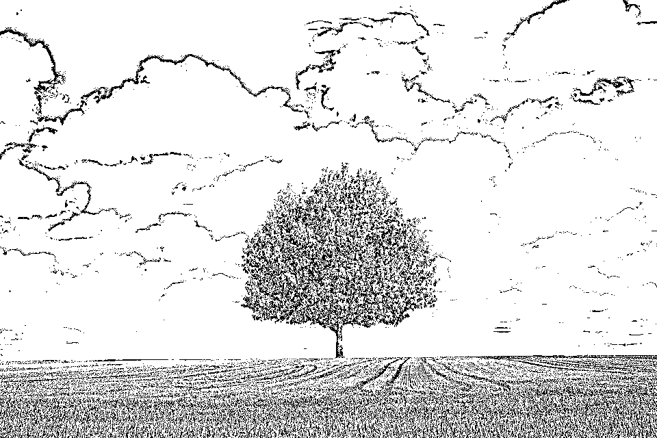

**注意事项**

需要注意的是：使用比对图的最佳方式是**将它应用到现有的关系中**，将它作为理解关系中的问题、契合点、张力和功课的指南。

如果你把比对图用在一个你不是很了解但又有点喜欢的人身上，我不相信你会得到非常有用的图景。这是因为人类是奇怪的生物，有着奇怪的品味和一种被称为自由意志的奇怪东西。所以，如果某天晚上你在公交车上遇到一个可爱的男孩，你成功用甜言蜜语问出他的出生日期，然后比较你与他的星图，这真的无法告诉你，他是否也喜欢你！

哦，还有，在将你自己的星图与其他人的星图进行比对时，请先征得对方的许可，才是良好的道德表现。

**版权声明：**本文由若道翻译发布，欢迎转发，反对抄袭。友号转载请申请白名单。

**曼迪·洛克利**

是伦敦的一名占星师。除了接待客户咨询，她还在英国占星学院任教。她的文章发表在 AA 杂志（ AA Journal）、无限占星杂志（Infinity Astrological Magazine）、Astro Dienst 网站以及她的 Astroair 博客上。

**系统学习占星学**

**点击图片了解详情**

**微信又双叒叕改版啦，不想错过若道君的推送？**

**就把若道设为星标吧！**

**▼**

就是这个“在看”，戳戳戳 ☟

********报名直达入口********

# 双十一若道占星大促 | 充值大礼包，多充多送就在 2020！

> 原文：[`mp.weixin.qq.com/s?__biz=MzA5NjA0NTAxNg==&mid=2651431516&idx=2&sn=73edefe09d95576fa2bd33bcfa60da5a&chksm=8b4b10ebbc3c99fdf440528ea3ab771dd1146a02e94b020ec800824c4843582caca4719ae28b&scene=126&sessionid=1692738080#rd`](http://mp.weixin.qq.com/s?__biz=MzA5NjA0NTAxNg==&mid=2651431516&idx=2&sn=73edefe09d95576fa2bd33bcfa60da5a&chksm=8b4b10ebbc3c99fdf440528ea3ab771dd1146a02e94b020ec800824c4843582caca4719ae28b&scene=126&sessionid=1692738080#rd)

明人不说暗话

**若道占星 年末巨制**

**双十一套餐**

**限时优惠 手慢无**

**2020 年 10 月 29 日-11 月 11 日**

***22*****门课程任你选**

**价格直降*****500-14000*****不等**

**重要！重要！重要！**

**购买学习卡之前请先****仔细阅读****下图****须知**

**或者扫描二维码咨询客服小姐姐**

**购充值卡，听课**

**请先下载若道 APP**

**若道君：****你可以在 app store 或者应用商店搜索“若道”下载 app 或扫描下图二维码**

**还有别的问题？**

**别害羞，扫描二维码，咨询客服小姐姐吧~**

注：优惠活动不累加，详情请咨询客服

# 水星顺行啦！！！

> 原文：[`mp.weixin.qq.com/s?__biz=MzA5NjA0NTAxNg==&mid=2651431516&idx=1&sn=c1f5f82efc358cfee4505432d4e5826a&chksm=8b4b10ebbc3c99fde5994a4fbac48905029256d4233f7d2a27f362f0c46a431bb5a2427a90e5&scene=126&sessionid=1692738080#rd`](http://mp.weixin.qq.com/s?__biz=MzA5NjA0NTAxNg==&mid=2651431516&idx=1&sn=c1f5f82efc358cfee4505432d4e5826a&chksm=8b4b10ebbc3c99fde5994a4fbac48905029256d4233f7d2a27f362f0c46a431bb5a2427a90e5&scene=126&sessionid=1692738080#rd)

****************☆ 后台回复“今日”，给你一句生命态度****************

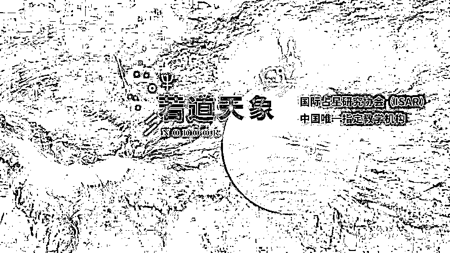

作者/咔咔 ISAR 认证占星师

编辑/玫瑰 图片/全景网**水星恢复顺行****2020 年 10 月 14 日，水星在天蝎座 11°40’逆行，10 月 28 日，水星回到天秤座。2020 年 11 月 4 日，水星在天秤座 25°53’恢复顺行。11 月 11 日，水星重新进入天蝎座。**2020 年最后一次的水星逆行终于过去了！大家可以松口气，再熬过最后的五十几天，就能把 2020 年抛在脑后，迎接新年了。即将过去的这一年里，在木星、土星和冥王星合相摩羯座的联手作用下，社会结构、经济局势、政治局势、国际关系、人民生活等方面发生了根本性的改变。让人震惊、不安、感到荒谬的事件不停地爆出来，挑战人们的观念和认知。这种魔幻的感觉，好像一整年都在经历“水逆”。今年的三次水星逆行，都开始于水象星座：**·** 2 月 17 日 水星在双鱼座 12°53′逆行**·** 6 月 18 日 水星在巨蟹座 14°54’逆行**· **10 月 14 日 水星在天蝎座 11°40’逆行**这把我们的认知、观念和沟通的领域与直觉、感受、情绪、家庭、深度亲密关系和深层心理蜕变联系在一起。**当外在世界发生巨大变化的时候，我们的内在情感世界也在发生着转变；物质世界秩序的被打乱，给了我们机会重新思考和定义：**· 在情绪层面，什么让我们感到安全，拥有归属感？****· 谁是我们最在意、最珍惜的人？****· 什么是对自己和对世界的慈悲？****· 危机的背后隐藏了怎样的情绪？**

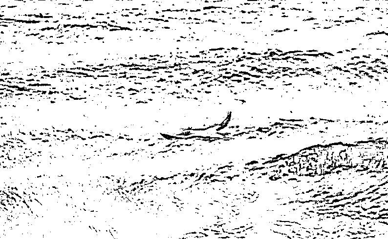

**水星在天蝎座逆行的功课**水星的顺行、逆行，意味着头脑里的念头、看法、认知在发生变化。念头像荷塘里的鱼儿，一会儿东，一会儿西……奇妙的是，我们的心境和情绪与对事物的看法有关。举个例子，有人和我们说：“你瘦了”。假如我最近花了很多时间锻炼，严格饮食控制热量，听到这句话，就会感觉很开心，觉得受到了赞美，有满足感和成就感。如果我最近忙于工作，压力山大，顾不上吃饭睡觉，听到这句话，就会感觉不安，担心自己的身体，为自己现在面临的困境感到无助和痛苦。
我们对事物的看法决定心境的变化，左右我们对事物的感受，影响我们的分析、决策和行为。每年三次的水星顺行逆行都会改变一些长久以来左右我们生活的观念。当我们转换了看事情的角度，改变了对事物的认知，这件事就再也不一样了。在“曾奇峰心理工作室”公众号中，有位咨询师分享了自己和母亲的故事。三年前，母亲忙于照顾病危的爷爷，家里另外一位长辈也住院，希望母亲去探望并帮些忙。母亲抽不开身，就和长辈解释，但是长辈却责怪了母亲一通。这几年提起这件事，母亲就一肚子怨气。咨询师虽然一直宽慰母亲，也没有成效。直到有一天，咨询师的眼前浮现了一幅画面，在医院阴冷的长廊上，没日没夜照料爷爷的母亲身心俱疲，还要忍受着长辈电话里的苛责。当咨询师把自己放在母亲的角度，感受她的精疲力尽、无助、愤怒、不被理解的无力感，才真正地理解了她。对母亲的理解也成为修复她们母女关系的基石，并为她们带来真实的抚慰。这个故事非常对应这次水星从天蝎座逆行回到天秤座，再顺行回到天蝎座的旅程。**天蝎座象征着生命里不能轻易放在台面上说的事物。这些事物背后隐藏着激烈的情绪，执着、恐惧、贪恋、控制、信任、羞耻，以及对危机的敏锐直觉和对痛苦的深刻感受力。**水星在天秤座是一个**“换位思考”**的组合，当咨询师把自己放在了母亲的角度，理解她的感受，产生同理心的时候，才真的说出了安慰到母亲的话。当水星在天蝎座运行的时候，我们很想挖掘自己和别人内心最深层的想法，那个想法被我们认为是“真相”。我记得一个水星在天蝎三宫的占星师做咨询技巧练习后，因为一连串环环相扣的问题，把扮演案主的小伙伴搞得泪眼婆的，督导老师在旁边轻声地叹息，这好像是在审问犯人呀~**既然水星想要通过沟通、提问、写作的方式锁定“真相”，在此期间可能有不少秘密浮现。**10 月 12 日，水星即将在天蝎座开始逆行时，一篇名为《我潜伏上海“名媛”群，做了半个月的“名媛”观察者》的文章火爆网络，作者原以为会和富婆们畅聊奢侈品，却发现群内的成员经常发起奢侈品拼租信息，高档酒店和下午茶拼团信息。占星学给我们理解这个现象提供了以下视角：水星在天秤座行进的时候，作者加入了“名媛”群，微信群由水星象征，天秤座象征了社交生活、优雅和精致的品位。水星在天蝎座停滞的时候，微信群的另外一个天蝎座属性被曝光了：精致女孩们共享资源，40 人拼一晚高档酒店，人均只要 125 元就能维持“有品位、有格调”的人设。人们不必嘲讽这些女孩子，在木星合相冥王星的时候，每个人都被欲望裹挟着，财富和跨越圈层具有极大的诱惑。在追逐利益的路上，个人与公司都会被贪婪和浮夸驱动，矫饰数据，打造虚假但光鲜的形象。泡沫无力支撑真实的生活，不管是商业造假还是人设造假都会垮塌——今年 4 月，成功在美国上市的瑞幸咖啡因为被发现财务作假，短短 3 日股价大跌近 84%，市值蒸发了 15 亿美元。水星在天蝎座逆行意味着要深度挖掘，看到“真相”。水星在天秤座提供了机会，让我们练习“换位思考”。英文里有句俗语——“put oneselfin someone's shoes”，把自己的脚放在他人的鞋子里，就能知道他走路是什么感觉了。**当我们真的拥抱了自己的秘密，对他人的秘密抱有更多的同情，就完成了本次水星在天蝎座逆行的功课。**

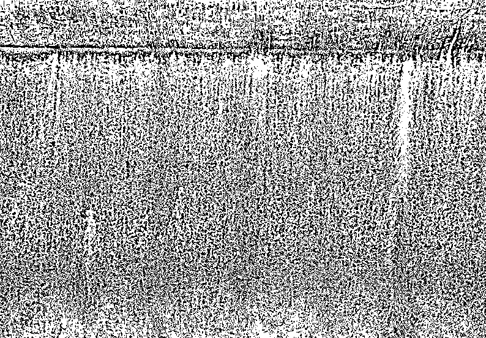

**水星逆行后的旅程****11 月 2 日 水星（天秤座）四分土星（摩羯座）** **11 月 4 日 水星在天秤座 25°53′恢复顺行****11 月 6 日 水星（天秤座）四分土星（摩羯座）** **11 月 11 日 水星进入天蝎座****11 月 17 日 水星（天蝎座）对分天王星**水星恢复顺行前后，会与土星在一周的时间内形成四分相。宇宙天气在水星顺行后扔下一个**“评判他人”**的诱饵。土星的标准总是高的，在摩羯座执行的又是以效果为导向的标准，它可能会说：“如果事情没有做好，光说理解是没有用的，我要的是结果。”这要求我们**既要从自己和他人的角度考虑问题，也要尊重现实的法则。**在此基础上，我们可以**多一些耐心，多一些体谅，在压力之下保持理智、客观和温和的沟通。**水星与土星成四分相的这周里，我们**把时间和精力放在重要的工作上，借助这个能量完成“文本精炼”的工作，完善方案，签订合同，细化时间表。****当 11 月 11 日，水星再次进入天蝎座的时候，我们要带着“直面真相”的勇气，深入地谈论我们的欲望，进入到资源和利益共享层面的讨论。**

**重点影响群体**

**个人行星和四轴在创始星座（白羊座，巨蟹座，天秤座和摩羯座）23°-27°的人群。****11 月 16 日 金星（天秤座）四分冥王星（摩羯座）****11 月 16 日 金星（天秤座）四分木星（摩羯座）****11 月 17 日 水星（天蝎座）对分天王星（金牛座）****11 月 19 日 金星（天秤座）四分土星（摩羯座）****水星在天蝎座和天秤座的穿梭会帮助我们加深关系的强韧度和亲密度。**我们需要**在关系里暴露自己，面对冲突，达成谅解，与伴侣和伙伴一起解决困难。**完成这个功课会帮助我们更好地应对 11 月中旬亲密关系的挑战。**11 月 16 日-19 日，金星在天秤座 22°-27°四分木星、冥王星和土星，人们把欲望投射到了亲密关系和金钱上面。**11 月 16 日前后，我们会**乐观地看待关系和金钱，花时间社交，对他人慷慨热情，渴望被同等对待，被关心和珍惜**。人们把金钱与爱划上等号——“要有好多好多爱，或者好多好多钱”。金星与木星、冥王星的四分相也提出了一个可能性，人们会被欲望、贪婪驱使着，像展现品味生活的“名媛”一样，表现出自己并不具有但是渴望得到的那面：**缺爱的渴望给予别人爱，轻视自己的给了他人很多赞美和关注，缺钱的过度消费……**水星在天蝎座同时对分了天王星，一个月前，这个天象发生时，“名媛拼团”文章爆了出来，秘密（水星天蝎座）经由网络（天王星）爆发了，我们可能在 11 月中也会遇到“秘密被揭穿”的事件。泡沫过去，金星与土星的四分相意味着人们要**收拾心情，切实地面对关系里的鸡毛蒜皮。在前期过度消费和投机的人要偿付他们的账单了。**水星恢复顺行后，如果我们对人性和欲望有了新的理解角度，不被欲望裹挟，发展出一种包容和体谅的态度，就能更自如地面对诱惑，也能更好地处理关系和金钱里的议题。火星将于 14 日恢复顺行，11 月 15 日的天蝎座新月精准六分木星与冥王星的合相，意味着告别 2020 年之前，我们要在人生的不同领域带着更深刻的理解和更接纳的态度，“在危机中育新机、于变局中开新局”。

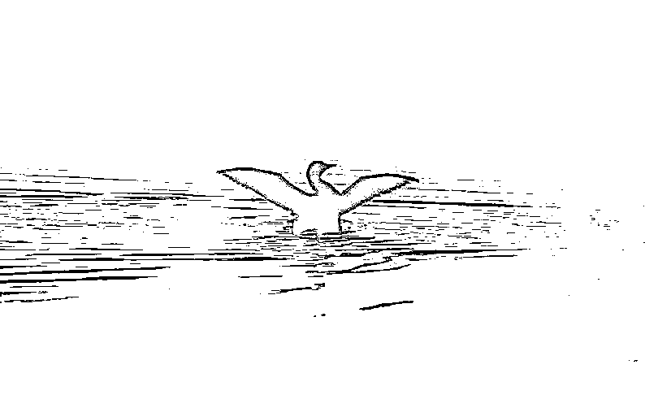

**水星顺行后 12 星座的准备**水星顺行后，12 星座要在以下领域做好准备：
以下内容以水星行进的宫位为基础撰写，请各位按照自己的上升星座查看。有读者曾经反应：按照自己的上升星座，文章列出的行进宫位与自己的实际行进宫位不符；因此下文一并列出上升星座和宫位，方便大家按需查询。**若道君：****你可以在 app store 或者应用商店搜索“若道”下载 app，输入个人档案，查看行运盘（也可以使用其他星图软件），找到行进水星（符号：☿）落在出生星图的第几宫，然后对照下文查看水星顺行的影响。**

**例如下图中，行进水星在美国总统特朗普个人星图的第 2 宫顺行。**

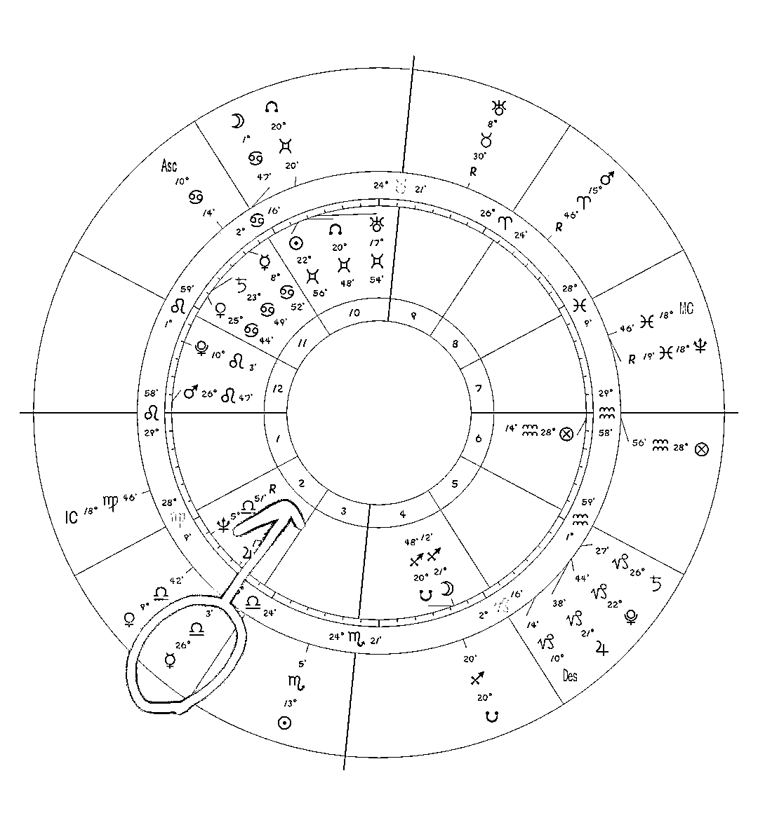

**上升****天秤座****，水星在第*****1*****宫顺行：****水逆期间，你经历了财务方面的复杂沟通，让你感觉消耗精力、缺少进展。**财务问题的背后隐藏着你**对于自我价值不能被认可的愤怒和不满**。拥抱这样的感受会帮你重新梳理对于公平合作、理性沟通的需求。**新月会带来新的合作机会，请坦然地提出自己对收入的期待。****上升****处女****座，水星在第*****2*****宫顺行：****水逆期间，你经历了人际沟通方面的挑战，让你对自己的理解和表达能力产生了怀疑。**这背后隐藏着习惯性的反应模式，对某些事情的恐惧让你竖起了沟通的防御之墙。拥抱这样的感受，会把你从高墙后面解放出来，对危机的深刻洞察是你的天赋，水星顺行后，你对自己的价值有了更客观的理解。**新月会带来表达对生命深刻理解的机会，让才华尽情地闪耀吧！****上升****狮子****座，水星在第*****3*****宫顺行：****水逆期间，你的内在世界感受到不安焦虑，感觉得不到家人的支持，还要花很多精力安抚他们**。你退回到了安静的地方，处理自己的情绪，对内在翻滚和沸腾的念头有了更多的接纳，这帮助你用新的角度理解家庭深埋的创伤，理性的沟通会帮助达成谅解。**新月会带来有益身心的机会，让你在忙于复杂的日常事务之余得到深刻的滋养。****上升****巨蟹****座，水星在第*****4*****宫顺行：****水逆期间，你的冒险计划可能遇到了困难，你被欲望裹挟着无法自拔，投机计划反应了你用独特的方式深度地体验生活的渴望。**这些困难让你重新思考对安全的需求，只有获得了稳定的滋养我们才能去外界历险和创造。**新月会带来表达创造力的机会，要通关这个游戏，我们需要一个可靠的伙伴。**

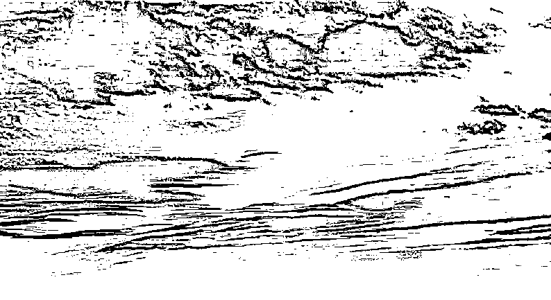

**上升****双子****座，水星在第*****5*****宫顺行：****水逆期间，你可能忙于处理日常生活里的各种麻烦，感觉自己是个救火队员。**担忧和紧张影响了身体健康。要缓解焦虑，你重新拾起生活里的某些爱好，哪怕是刷剧都能帮你从对困难和危机的担忧里跳开，这帮你重新理解玩耍在生活里的意义。**新月会带来危机干预的项目，帮助你在复杂的商业事务里理顺关系，打通关卡。****上升****金牛****座，水星在第*****6*****宫顺行：****水逆期间，你可能被人际关系里的复杂面向搞的心力交瘁，某些遗留下来的问题重新浮现，唤起了你一直压抑着的痛楚。**再次面对挑战之前，你需要让自己的生活取得平衡，从日常的规律作息、锻炼、调息静坐里获得能量。**新月会带来新的合作关系，要想取得彼此的信赖，双方需要达成对生命意义的共识。****上升****白羊****座，水星在第*****7*****宫顺行：****水逆期间，你可能处理一些复杂的财务问题，由此看到了人性里的贪婪和狡诈。**财务问题的背后隐藏着你对被欺骗和被操纵的恐惧。拥抱这样的感受会帮你重新梳理在关系里被尊重、被理解的需求。**新月帮助我们建立与他人深度的联结，潜入更幽暗的水域。**要想获得水底的宝藏，需要用更严肃的态度出现在世界面前，获得尊重和自主权。**上升****双鱼****座，水星在第*****8*****宫顺行：****水逆期间，你对生命的意义有了反思，面对生命的无常与叵测有种无力感。**你要退后一步，面对生活给你的挑战，以此建构对生命意义的理解。行过至暗时刻，你会从心底生发对人性的悲悯和关怀，也就能用更广博的心胸继续追求生命的真相。**新月会帮助你找到扩展心智的路径，通过阅读、学习、旅行和志同道合的伙伴携手探索宇宙的法则。**

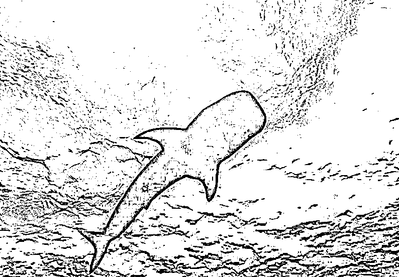

**上升****水瓶****座，水星在第*****9*****宫顺行：****水逆期间，你的事业上可能感觉困扰，工作遇到阻碍激发了你对未来发展的担忧。**你选择了一座更加陡峭的山峰，攀爬它需要顽强的意志力。工作的挫折让你重新理解自己的愿景，攀登这样一座山峰对你意味着什么？获得个人成就之外，你对社会能奉献什么？你要从不同的哲学和文化里吸取营养，扩展视野。**新月会带来对公众发表你的深刻见解的机会，对人性的悲悯会赋予你的职业更高的意义。****上升****摩羯****座，水星在第*****10*****宫顺行：****水逆期间，你可能与他人沟通时产生不快，当你们讨论到一些社会现象、信仰、观点和理念的时候，发生了对抗。**你感觉不被尊重，影响了与团体的友谊。这反映出你对自我信念和目标的怀疑。在理解和接纳这种焦虑的基础上，你要发展出自我尊重的态度，用能力和才华去影响社会。**新月会帮助你找到新的团体，在其中承担责任，发展出面对生命的顽强和坚韧的品质。****上升****射手****座，水星在第*****11*****宫顺行：****水****逆期间，你可能感受到头脑被纷扰的念头占据，愧疚、焦虑和不安的情绪困扰着你。**生活被强迫性的负面思考影响了，你的常识性判断出了问题，误解由此产生。想要摆脱虚弱的状态，你所属的团体和朋友向你伸出了援手。感受到与他人的联结会帮助你重返生命的源头，完成自我圆满的旅程。**新月会带来灵感与启发，也可能帮助你用现实的载体表达接受到的神秘信息。****上升****天蝎****座，水星在第*****12*****宫顺行：****水逆期间，你可能想重新定义你接触到的世界，心态的改变会带来生活的改变。**压抑着的念头此起彼伏，你在积极面对生活和消极躲藏起来之间摇摆。你重新理解了心灵深处的东西，探查了被你忽略和隐藏起来的信息。发现这些真相帮助你拥抱自己的天性，更轻松地进入人间游乐场。**新月帮助你意识到自我的重要性，带着活力和热情面对生命，扩充和加深自己的知识储备。**

版权声明：原创文章由作者授权首发于若道平台，欢迎转发，反对抄袭。友号转载请申请白名单。

********想阅读更多作者的文章********

********请在后台回复**************** 咔咔 即可********

**咔咔**

职业占星师，若道核心课程讲师

ISAR 认证占星师（2014 年获得）

国际知名广告公司和市场研究公司工作十余年

**微信公众号**：咔星人

长按打赏

******你还可以预约作者咔咔的占星咨询****** 

******长按下图二维码预约吧******

**系统学习占星学**

**点击图片了解详情**

喜欢记得点一下在看哦☟

******报名直达入口******

# 人的命运到底能不能改变？ | 心理占星学给你答案

> 原文：[`mp.weixin.qq.com/s?__biz=MzA5NjA0NTAxNg==&mid=2651431331&idx=1&sn=5c94fff220ccdd00d688200f7d199cc3&chksm=8b4b1314bc3c9a0267a50662cb615e75a8ea73d2285437793abb1acfa031def537f942a9d515&scene=126&sessionid=1692738080#rd`](http://mp.weixin.qq.com/s?__biz=MzA5NjA0NTAxNg==&mid=2651431331&idx=1&sn=5c94fff220ccdd00d688200f7d199cc3&chksm=8b4b1314bc3c9a0267a50662cb615e75a8ea73d2285437793abb1acfa031def537f942a9d515&scene=126&sessionid=1692738080#rd)

**☆ 后台回复“今日”，给你一句生命态度 **

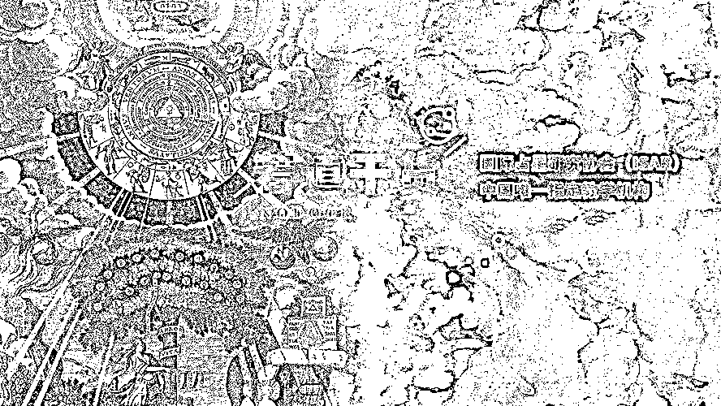

作者/格伦·佩里译者/王宏 校对/徐珊珊 esme
  编辑/玫瑰 封面/书君 图片/全景网以下文章节选自格伦·佩里《心理占星学论文集》中“占星治疗：理论与实践概述”一章**心理占星学的诞生**很难理解占星学是如何在过去 30 年间如此迅猛发展的。直到 20 世纪 60 年代人本心理学出现，占星师才开始认真从成长和转变的角度来考虑星图。对于那些最近刚开始学习占星学的人来说，占星似乎历来如此，其实过去并非这样。尽管荣格曾经说过：“占星学集古代心理知识之大成”，事实上在 20 世纪 60 年代之前，占星学很少关联到我们现在通常所说的“心理”层面。古代人最初把行星看成是主宰自然界不同进程的各种神灵，就像是统治国民的国王一样。他们把天宫国度与凡世人间想象成线性的、二元的、等级分明的关系：**权利至高者统领地位卑屈者**。随后更深层次形式的占星心理学认识到，宏观和微观实际上是相互贯通的，因此其关系并非线性或二元，之前的观点便随着 3 世纪希腊文化的瓦解而衰败。在中世纪时期，一种更为简单的模型极为盛行，并以这样或那样的形式一直持续到该世纪下半叶。人类被看作是宇宙力量注定的承受者，我们可以安抚宇宙力量，却不可悖行。如此阴暗的决定论会因为一个有价值负载意义的术语而变本加厉。这种术语常常是描述出生图的不详词汇，例如：恶毒的、邪恶相位、衰弱、痛苦、损伤、堕落、死神、十二宫地狱等等。当然，占星也有“好的”部分，例如益处和得意，但这只能用来强调系统的命定性。行星被看成是在出生时影响个人的神秘射线或电磁力的各种传输者。得到感应的这些个体会自然而然地专注于外界，以观察众神为他们准备了怎样的怨恨或慈爱。**传统占星学苛刻的决定性不允许意识有改变或成长的可能性。人们反而更希望依据行星，将其当作避免厄运或为自身利用环境寻求机会的途径。****传统占星学以事件为基础，其内涵意在于个体是冷漠宇宙潜在的受害者；对于宇宙，个人无力掌控。**于是，占星师就会急不可待，反而无法给予人们想要的东西、预测、建议、警告，以及可以解决我们现在看来是复杂心理问题的简单方案。从好处想，传统的占星师充其量也只是一些喜欢预测事件、描述个性的好心人，没有害人之心。从坏处想，他们是散播恐惧的寄生虫，让为其服务埋单的人滋生出了不安和焦虑，造成了很大伤害。

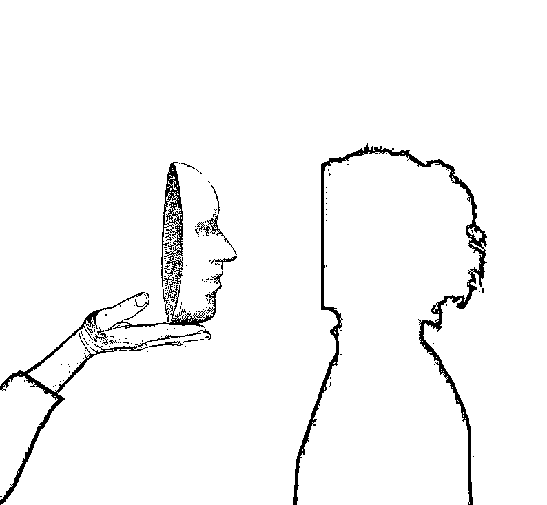

大多数关于疾病、事故、离婚、海难、地震、丑闻、遗产、婚姻、升迁及类似世俗问题的预测，除了能增加占星师的筹码，让其言论听起来对所述问题有些许控制性，真是毫无意义。但是没有哪个占星师能够确切预测未来事件的内容，具体在什么情况下会发生，或对该人有何影响。在这种预测中尤其缺乏的，是事件于当下影响之外可能还存在的意义和目的。这与经历者的意识有什么关系？这为自我洞察和认知成长提供了什么机会？此外，**传统占星师对于性格的描述通常局限于对表面特征的描述，其中满是道德判断和圆滑意见。**从好处想的话，占星师只是确认了个人已经意识到的东西。从坏处来看，占星师肤浅、迟钝、审判性、极度负面的，或根本就是错误的解说，让当事人感到迷惑与不安。其实星图中有暗示出支撑外在行为的各种潜意识信念和根本动力，但对此深层面都没有给予任何探讨。**性格被看作是稳定、不变的，或是遵循占星师丰富的宇宙咨询意见就很容易被修正的**。这样的假设从现代深层心理学的角度来看，显得很天真。我们现在意识到，尽管改变一个人与生俱来的性格格外困难，但仍然可以通过**意气、坚持和辛勤**来达成。

| 卡尔·荣格
瑞士心理分析学家卡尔·荣格第一个认识到了占星学的巨大潜力，认识到占星学可以成为挖掘人类深层心灵的工具。荣格在其一生中的各种著作里，都提及了他对占星学的极度尊敬。他认为，占星学对心理学贡献极大，并承认他在与客户做分析时常会用到占星学。在遇到难以做出心理诊断的案例时，荣格会画出一个星图，以便从完全不同的角度得到进一步的见解。“我必须说，” 荣格说道：“我总是发现占星数据会说明一些我通过其他手段无法理解的特定问题。”荣格将占星学的星座和行星看成是源于集体无意识的原型过程的标志。集体无意识的原型是潜藏于所有个人和集体心理生活之中，并对其进行激励的宇宙组织原则。神学将关注点放在对历史上不同时期和地域的原型文化的再现上，而占星学则将原型作为理解人类基本心理动机的一种语言。正如荣格所说：“占星学就像心理学所关心的集体无意识一样，包含象征形态：行星是众神，代表无意识的力量。”神学里的众神代表那个仿效万事万物的宇宙国度中的存在力。和柏拉图的“理念”一样，原型既是主观的，也是客观的，在人类意识的先天观念和自然的基本过程中都很明显。它不仅告知了人类体验，也展现了行星运动。正是原型的这种双重本质使得星图在内在性格和反映性格的外在事件之间架起一座桥梁。荣格曾写道：**“占星格局和心理事件之间，或者说星图和性格特质之间，存在许多惊人的相似之处。”**他总结道，**原型是心理活动，即它们除了塑造性情外，还构成事件本身。**

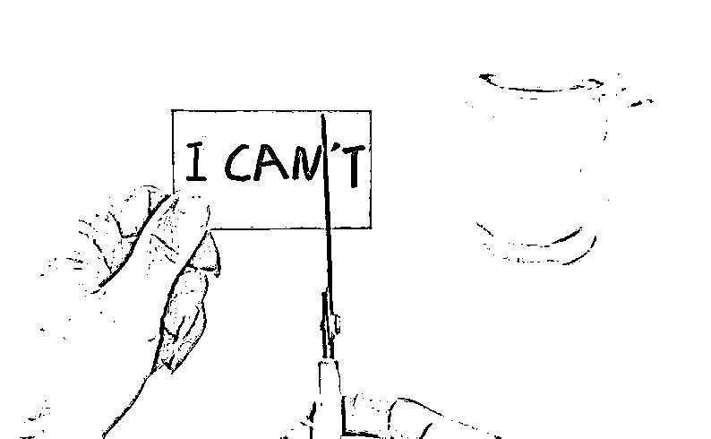

占星学布局既阐明个人的天性，又诠释个人可能体验的外在环境的特别类型。在 1954 年的一次访谈中，荣格说道：“一种成型的、明确的心理状态会伴随出现一种相似的占星格局，可以保证每个人都是如此。”荣格认识到，占星学有着可以揭示行星运动和人类经历之间关联的能力，这种独一无二、无与伦比的特点使占星成为可以确定生活中危机时刻的一种精确方式：**“我观察了许多案例，其中明确的心理阶段或类似的事件与行进相伴，特别是土星和天王星的困难行进。”**荣格对于心理现象和占星数据之间关联的观察，促成了他共时性理论的形成。他将共时性定义为“特定心理状态与一个或多个外在事件的同时发生，这些外在事件与暂时的主观状态表现为有意义得平行。”所以，荣格对待隐匿于占星学中的共时性现象也是毫不犹豫、严肃认真。他认为，占星学因共时性而得以精确运作，即将要出生之人的心理结构和当时行星的位置是“有意义得平行”。在寻找检测共时性假设的方法时，荣格进行了一个占星学试验，将配偶双方星图的行星分布，或两张星图之间形成的相位关联起来。他假设，配偶双方的星图中出现特定相位的频率，要高于没有关系的两个人。“我们正在寻找的这种有意义的巧合在占星学中直接显现出来。”荣格说道：“因为占星数据……与个人的性格特征相符。在远古时期，各种行星、宫位、黄道十二星座和相位对于性格研究的基础都很有意义。”尽管荣格从未开发任何占星学的系统理论，但显然他自己关于分析心理学的理论很大程度上受到了占星学的影响。相似之处如此之多，以至于几乎可以得出这样的结论：至少他的主要概念是从占星学那里直接借用来的。他除了明确认可行星为原型，并将共时性理论作为解释占星学巧合的方法之外，荣格对于外向和内向两种态度类型的观点，早就被占星师看成是十二宫图的两极划分，两极即为积极的/阳性的（外向）和消极的/阴性的（内向）星座。此外，他的四个功能类型，即**直觉、知觉、想法和感受**，基本与占星学中的**火、土、空气和水**这四大元素相一致。除了这些相对明显的相似之处外，占星师还发现了其他的关联。这包括**自我/太阳、人格面具/上升、阴影/冥王星、阿尼玛/金星、阿尼姆斯/火星，和集体无意识/海王星**。困难的占星学布局，特别是那些涉及外行星与水星、金星、火星、月亮或太阳的困难相位，都已经过占星师的观察，展现出个性中的苦恼之处。这与荣格所描述的心理情结相似，如围绕一个核心展开的无意识、情绪化的记忆、形象和想法。20 世纪 30 年代，丹恩·鲁伊尔开始依照荣格的分析心理学重塑现代占星学。荣格认为，**心灵是处于平衡状态的对立力量的动态复合物，心灵被内在地激发，以朝着心灵圆满的方向演变**——该过程被荣格称为个性化。丹恩·鲁伊尔对荣格的这种想法极为关注。荣格认为，个性转变的过程是固有的，或受目的驱动的。个性不只是外界力量的产物，还朝着自我实现的最终目标而有目的地奋斗。随着个人从自我创造的经历中学习，心灵的原型结构逐渐有所差别、整合起来，变为整体。鲁伊尔认识到，这些想法极为适应占星学。星图也是处于平衡状态的对立力量（星座）的动态复合物。占星学的各部分，及其无数相位和相互关系象征着那些极力将自己转变为整合整体的原型力量。鲁伊尔认为，个性化的过程潜藏于每张星图中。

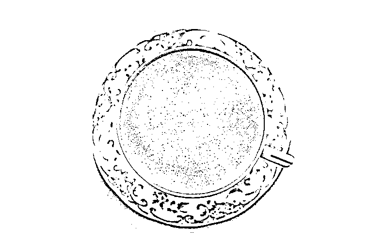

**心理占星学的核心意涵**

到了 20 世纪 60 年代，鲁伊尔重整占星学的项目从心理学的人本主义运动中获得了新的推动力。正如亚伯拉罕·马斯洛、卡尔·罗杰斯、罗洛·梅和其他心理学家的著作中所展示的，人本主义心理学的出现，是为了回应弗洛伊德心理分析观点中固有的、阴郁的悲观主义，以及行为主义所体现的自动概念。心理分析和行为主义的命定性在于，它们将个性看成是基因、父母、环境状况等外部原因对人自身的影响。

人本主义心理学家则创造出了可以解释人类明显目的性和寻求成长这种行为的模型，以此逆转了这一趋势。人本主义没有将个体刻画为受困于本能驱动和社会抑制影响之间无止境的斗争之中（心理分析学），也没有将人分裂为从外部优势观点可见的多种条件性行为（行为主义）。**人本主义将个体看成是由自主驱动和功能组成的统一的有机体，这些驱动和功能可以将人与人区分开来，并整合为一个比各部分相加更大的可运转的整体。**

人本主义心理学家假定说，**本能驱动并非是从原始自我中爆发而出的危险动力，而是可以被看重和信任的健康的驱动，**他们借此来挑战弗洛伊德的理论。个体被看成是有创造性的、可自我实现和自我决断的有机体，可以做出负责任的决定，并朝着理想状态不断成长。

行为主义学家忽视意识的内部世界，与此不同的是，人本主义学家重视主观元素的首要地位。行为主义学家认为，行为只受外部原因的影响，而人本主义学家则关注意向的相关性，将其看成是行为的内在原因。行为主义学家关心行为如何被实施和控制，而人本主义学家则强调个人自由和选择的能力。总之，**对于人本主义心理学家来说，最重要的不是外部环境，而是包含观点、价值、想法、信念、态度、期望、需求、情感和感觉在内的人的内心。**

鲁伊尔是认识到占星学和人本主义心理学相辅相成的第一人。实际上，星图可以被用来勾画人本主义学家开始探索的那个复杂内心世界的工具。人本主义心理学是对心理分析和行为主义命定性的回应，与此相似，人本占星学是对传统的、以事件为基础的占星学中命定性的回应。鲁伊尔从卡尔·罗杰斯的《求助者中心疗法》中借鉴观点，写出了《个人中心占星学》一书。比起关心占星学是否有效，鲁伊尔更关心占星学如何能被用来辅助自我实现的过程。真正的问题在于，即使占星学有效，又如何合理利用呢？

1969 年，鲁伊尔创立了国际人本占星学会，并宣称占星学主要是，也应该是了解人类本性的工具。他批判了预测占星学暗含的命定性，转而关注占星学作为象征性语言的可能。鲁伊尔没有将行星看成是物理影响的传播者，他将其看成是人类功能的象征。

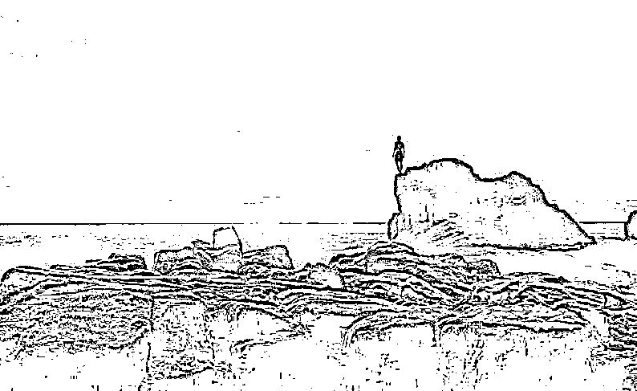

占星学作为心理语言和诊断工具，可以用于指引个性的整合和转变。鲁伊尔认为每个出生图都是独特的，因此他采用“个人中心”的方法。星座可以展示个人的全部潜能，其中并无“吉”、“凶”行星，每个元素都是有机整体的一部分。**事件不会被解释为带有幸运或不幸影响的孤立事件，而是发展周期中某个目的及特定阶段的显现。事件的意义源自其在特定行星周期中所处的阶段，同时还会推进必然指向自我实现的持续成长过程。**

20 世纪 70 年代，赛普拉·道宾斯、理查德·埃德蒙、史蒂芬·阿若优、罗伯特·汉德等占星师接过了人本主义的旗帜。人本占星师认为，人与神之间并无绝对的划分，人和行星相互交织成一张无缝的存在大网。**每个人都是焦点，都是遍及整个宇宙的神秘能量的通道。**

**宇宙的基本现实是意识，而非物质。**因为人类心灵既反映了宇宙心灵，又扎根于宇宙心灵，所以它也拥有了母本意识的创造力。心灵通过“绝对惟一”的法则和造型因素得以结合并受到激励，而所有较小的生命体都是这“绝对惟一”的组成部分。尽管“绝对存在”的宇宙法则是不容践踏的，个人在这些法则的界限之内依然自由，并可自行做出决定。

鲁伊尔认为，每个人的出生都是对宇宙在特定时间和地点中需求的回应。实际上，出生星图展示了这种需求的解决方案，即出生星图体现了应对这种需求的方法，以及一个人命运的关键。换句话说，星图就像是“播种计划”，展示了一个人独特的发展路径。种子包上画出了包装好的种子最终可能长成的植物的图案，与此相似，星图代表着一个人可能会长成何种人。

**依照这种观点，人一生中就为了一个目的，这个目的贯穿一个人的所有行为**。这个整体行为通常被称为**核心自我**，一个扎根于有生命、有目的宇宙中、存在于内心的神。这样一来，问题就不再是会发生什么，而是其意义何在？鲁伊尔说道，占星学可以被用作一种业瑜伽，在业瑜伽中，发生的所有事都与这个人是谁以及会成为什么相关。因此，人本占星师不应该关心事件本身，只应该关心客户对事件做出的反应或给予的意义。**“重要的不是可预测的事件，而是个人对于自身成长和自我实现的态度。”**

出生星图的优势在于，它将个人描绘为整体，因此提供了一种理解内在冲突如何导致个性分裂以及理解冲突形象化的方式。当暗藏在这些表达之下的需求遭遇痛苦和挫折时，个人便会剥离并排斥自身的某些部分。**各种功能受到压制和投射，因此个人只能发挥出自身原本潜力的一小部分**。

未经整合的功能通常在外部世界中得以体验，所谓的外部世界就是个人所吸引的人与处境。个人体验的疑难处境或关系在星图中可以被看成是个人心理的一个方面。通过这种方式，星图指明了哪些功能会被排斥并折射，以及它们可能经历怎样的境遇（宫位）。

尽管出生星图可以洞察客户的内在冲突，其实是行星的行进和推进告诉了我们这些冲突何时得以平息。**这些行星运动显示了各种发展阶段的本性、意义以及持续时间。每个发展阶段都展现出自身的挑战和机遇**。尽管运行星可能与看似会影响个人的外在事件相关联，但占星学则指出，这些事件是内在变化的同步外在体现。换言之，环境和心理相互反映。外在事件是推动内在心理成长的推动或刺激因素。如此看来，行进揭示了已经准备好有意识地整合、探寻或转变的那部分人性。

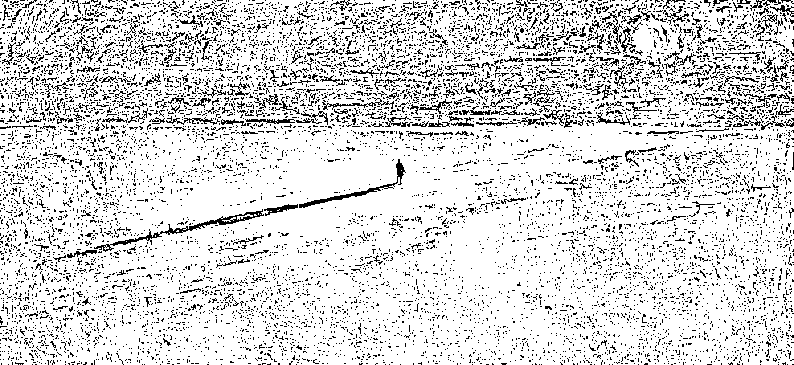

想要重新整合被剥离的部分通常会导致危机，因为那意味着旧秩序的消亡，包罗万象的新秩序的出现。鲁伊尔说道，人本占星师欢迎危机的出现，将其看成是成长的标志。他试图帮助客户或病人重新定位危机的起因，再次评估自己的目标，并以新的整体的方式接受事实……其实那些是最终会带你走向和谐、内心平静、智慧和同情的因素。

**占星学的价值，不在于有能力预测神会对人类做些什么，而在于有能力揭示每个人内心深处都存在的类似于神的能力。**因此，人本占星学的焦点是向内的而非向外的，所做出的解释也是关于个人成长和实现的。简单说来，目的是帮助客户认识星图中所象征的潜能。

例如，个人星图中的金星对分土星不仅仅代表“爱情不顺”，还说明了爱得深、爱得持久、爱得有责任的潜质，以及克服障碍的耐心和决心。**尽管意识到这样的潜能可能需要经历一定程度的艰辛和痛苦，但仅仅预测艰辛和痛苦，而不理解可能有的潜在收获，往好了说是缺乏远见，往坏了说还会造成伤害。**

道宾斯这样说道：“告诉人们他们注定要经历特定的消极事件，可能是极具破坏性的。此处的观点是，性格决定命运，我们可以通过改变性格（习惯的态度、信念和行动）来改变命运。我们可以凭借自知之明整合冲突、克服弱点、进一步发展才能，并努力达到平衡。正如人本主义心理学所说，我们可以达成自我实现和自我超越。”

人本占星学在许多方面都体现了人本主义心理学理论的真正进步。荣格心理学和人本主义心理学都一直因在描述人类内心时不够精确而饱受批判。提及的原型、官能、功能、冲动等一般是模糊的和具有推测性的，不会具体谈到以有条理的方式勾勒心理结构的内容。人本心理学更像是对人态度的集合，而非有关个性和人类发展的精确而有用的理论。另一方面，占星学提供了与心理结构和动态相关的客观的、可预测的内容，同时还指明了成长的可能方向。举例说来，金星对分土星之人，随着时间的推移可能从消极的、畏惧的态度转变为感情，例如从“我不想被专横的伴侣控制”转变为负责任的、忠诚的誓约。这样的转变体现出一种针对感情更为成熟和现实的态度，例如“好的婚姻需要耐心、谦逊以及努力”，这同时仍然与金星对分土星的占星学含义相符。占星治疗将占星学概念用于临床实践。占星学既是关于个性的理论，也是诊断工具。它代表了复杂的、多元化的人类行为模式，而人类的行为模式将心理刻画为分级结构，该结构包含原型需求、认知结构、出现的想法和行为，以及相应的事件。它还是有力而又灵活的评测工具，使得占星师可以识别出童年经历中对成长有影响的线索，洞察当前事件的意义，并确定未来成长的时期。占星治疗不同于传统的、以事件为基础的占星学，占星治疗不关心表面的特质描述，或是对未来事件的预测。占星被用来为客户的内心培养同感，并借此增强治疗师有效治疗心理问题、修正或消除现有症状，以及推进个性积极成长和实现的能力。 **参考文献**  **·** 道宾斯·Z 《占星师手册》 洛杉矶：ITA 出版社 1973 年**·** 荣格·C.写给 B.V.拉曼教授的信《美国占星学》 1948-6**·** 荣格·C.与安德鲁·巴博特的访谈“现代占星学” 1954-5-26**·** 荣格·C.同步性：非因果性联系原则.C·荣格、W·鮑立 《自然与灵活的诠释》 纽约：万神殿出版社 1955.1-146**·** 荣格·C.评论.R·威廉（Trans. & Ed.） 《金花的秘密》 纽约：哈考特、布雷斯与世界出版社，1962 年**·** 荣格·C.G·埃德尔、A·捷菲（R.F.C. Hull, trans.） 《C·G·荣格：信件（第二卷）》伦敦：罗德里奇与基肯·保罗出版社 1976 年**·** 鲁伊尔·D 《个性占星学》 纽约花园城 双日与公司出版社 1936 年**·** 鲁伊尔·D 《个人中心占星学》. 乔治亚州雷克蒙特：CSA 出版社 1972 年**·** 鲁伊尔·D《从人本占星学到超个人占星学》.加利福尼亚州帕罗奥图：种子中心出版社 1975 年

**版权声明：**本文由若道翻译发布，欢迎转发，反对抄袭。友号转载请申请白名单。

**格伦·佩里**

若道签约老师，著名占星师，前 ISAR 董事会成员，共出版 8 本占星著作；心理/意识研究专业博士；占星心理学学院（Academy of AstroPsychology）的创办人；康涅狄格州研究生院（the Graduate Institute of Connecticut）原型宇宙学与意识进化项目的负责人。

**ISAR 选修课，心理占星学视角下的预测方法**

**长按二维码咨询客服**

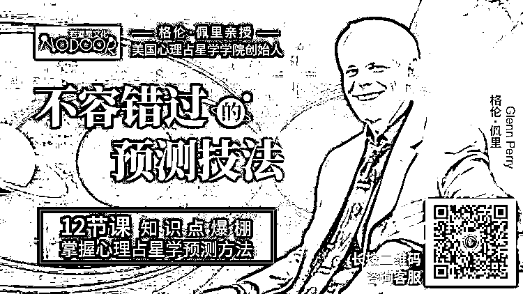

‍‍‍‍‍‍‍‍‍

**微信又双叒叕改版啦，不想错过若道君的推送？**

**就把若道设为星标吧！**

**▼**

就是这个“在看”，戳戳戳 ☟

********报名直达入口********

# ISAR 选修课程丨新技法！心理占星学视角下的预测方法

> 原文：[`mp.weixin.qq.com/s?__biz=MzA5NjA0NTAxNg==&mid=2651431331&idx=2&sn=f96f911befd01e3b016d330b6a8a0435&chksm=8b4b1314bc3c9a0231ffdffe06c66b078f7a5d20ca36e10addcd09b2e0e100339ac235659459&scene=126&sessionid=1692738080#rd`](http://mp.weixin.qq.com/s?__biz=MzA5NjA0NTAxNg==&mid=2651431331&idx=2&sn=f96f911befd01e3b016d330b6a8a0435&chksm=8b4b1314bc3c9a0231ffdffe06c66b078f7a5d20ca36e10addcd09b2e0e100339ac235659459&scene=126&sessionid=1692738080#rd)

作为一门艺术，预测占星学运用行星的运行来预测特定时期的性质、意义和持续时间。在这个阶段的课程中，我们会**考察意识进化的概念、其基本原理及其与占星学预测部分的关系。****意识进化可以被定义为有意识地与星图中固有的进化过程合作。**学员们将探索如何用行进和推进来为意识进化服务。我们不是简单描述事件的结果，而是将行星运行描述为实现先天潜能的机遇之窗。**在这个阶段的课程中，会探索占星心理学视角下如何将对行进、推进和其他预测方法的分析运用于个人成长。**具体事件反映并促进了意识的改变；因此，行星运行可以帮助我们洞察成长过程的精确时机，让我们领会内在和外在现实如何同时发生、彼此反映、互相转化。我们还将探索宏观的世界行进，考察占星格局如何在社会、政治、经济、艺术和生态层面上表现出不同的形式，却又在多样化的现象中反映单一的原型。这里的挑战是去思考，我们对宇宙的这种参与式关系如何能为共同创造一个积极的、更充满希望的未来做出贡献。

**1**

**课程安排**

**第一课：开始预测****第二课：发展年龄方法****第三课：太阳的行进****第四课：月亮的行进与推进****第五课：水星的行进****第六课：金星的行进****第七课：火星的行进****第八课：木星的行进****第九课：土星的行进****第十课：天王星的行进****第十一课：海王星的行进****第十二课：冥王星的行进**

**2**

**课程费用**

**课程费用：9800 元****若道核心课程 L5 学员优惠价：6800 元**

**3**

**授课时间**

**上课时间：**12 月 2 日（周三）20:00-22:00

**授课方式：**英文授课，中文翻译

**4**

**授课老师**

**格伦·佩里(Glenn Perry)**

*   这位传奇的占星师，也是一名拳击和摩托车爱好者； 

*   他毕业于赛布鲁克学院(Saybrook Institute)，是心理/意识研究专业博士，也是拥有 30 余年经验的加州注册婚姻和家庭治疗师 （CAMFT）； 

*   美国占星心理学学院（Academy of AstroPsychology）的创办人，他曾任国际占星研究协会 （ISAR） 以及联合占星大会董事会（UAC）副主席，也是 ISAR 突破性道德标准的设定者； 

*   康涅狄格州研究生院（the Graduate Institute of Connecticut）原型宇宙学与意识进化项目的负责人，共出版八本占星学著作：《心理占星学入门》、《心理占星论文集》、《盗取天火》、《从忠诚到革命》、《星图中的阴影》、《占星职业议题与伦理》、《出生星图深度分析》、《从古代到后现代占星学》。

**5**

**往期学员分享**

不得不说，格伦老师的心理占星课真的很强大，跟着老师上完了两年半的课程，仿佛做了一个长程的心理疗愈。这段时期我正好在经历冥王星的困难行进，感觉就像在地狱中行走，在这个过程中我懂得了，只有疗愈了自己，懂得自己的伤痛，才能理解他人，帮助他人。在学习占星学技法的同时，深深感受到老师的慈悲心，也感受到老师对待占星学的严肃认真。能够跟随格伦老师学习真是太幸福了，同时也特别感谢若道，感谢大卫老师。——2017 心理占星学格伦核心班学员 宋轶绚跟随美国心理占星学院两年课程，最受用的是格伦老师以扎实的心理学理论基础和咨询经验，所教授的心理占星学的系统架构。没有哪个心理占星学的课程比格伦的更系统、深入、有理论且有技巧了。还有格伦特色的发展年龄法，黄道带病理学理论在个案中很有实操性，2 年的学习，除课程外的几百万字经典的补充阅读资料，70 多场测试，以及格伦言传身教的从业道德标准，让我成长为一位合格的心理占星师。——2017 心理占星学格伦核心班学员 植语瞳

**6**

**退转课程**

**退款原则请详看《教学协议》，如有疑问请咨询课程顾问。******占星心理学之预测视角****

**授课老师：格伦·佩里**

**授课时间：****12 月 2 日（周三）20:00-22:00**

**授课方式：**网络课程：英文授课，中文翻译

**费用：9800 元** **若道核心课程 L5 学员优惠价：6800 元**

**课程负责人：Margaret（微信号：nodoor233）**请备注“预测视角”

长按二维码添加课程负责人咨询~  

****报名请点击“阅读原文”****

# “大吉星”遇见月亮：被这颗行星加持的人生，会比较幸运吗？

> 原文：[`mp.weixin.qq.com/s?__biz=MzA5NjA0NTAxNg==&mid=2651431265&idx=1&sn=1edaf1f7c076fbddbe997a1dfe5776f1&chksm=8b4b13d6bc3c9ac0c9b0aa02aa273cabfdce9086aab4891d8834f0c675db477473bbf0e37f33&scene=126&sessionid=1692738080#rd`](http://mp.weixin.qq.com/s?__biz=MzA5NjA0NTAxNg==&mid=2651431265&idx=1&sn=1edaf1f7c076fbddbe997a1dfe5776f1&chksm=8b4b13d6bc3c9ac0c9b0aa02aa273cabfdce9086aab4891d8834f0c675db477473bbf0e37f33&scene=126&sessionid=1692738080#rd)

**☆ 后台回复“今日”，给你一句生命态度**

作者/薇安 ISAR 认证占星师编辑/翀子 封面/书君 图片/网络当代表生命根源的月亮，和被称为“大吉星”的木星相遇，意味着什么？当一个人的出生星图上，月亮和木星形成压力相位，他/她的乐观背后藏着什么秘密？让我们一起来读文章吧~

传统占星学，将木星称为**“大吉星”**，它带来宇宙的**赐福、慷慨和希望**。

任时空流转，无论人类的理性现实思维发展得如何强大，当我们身处某种困境或逆境之中时，仍然会不由得祷告神迹的出现。只要不堕入贪婪一端，能够抱持某种信念，总归会给我们带来力量。毕竟，在一个很深的层面，我们都渴望相信生命是被赐福的存在，以便能对抗住真实世界的局限性和压迫感。

所以，不妨让我们保留住木星的这一象征吧；也请我们记住，**每一张出生星图中，都有一颗木星。**

现在，让我们回到个体的内在宇宙，去探索木星更为丰富和立体的象征意涵。

一个最能描述“木星式”的能量运作方式的动词是：**扩张。**这也是现代占星学不再将木星视为必然“好”的原因。在任何层面，**扩张过度，就会带来失衡，**造成问题，这是木星的阴影面。

在心灵结构的层面，木星能量的显化方式，便是“扩张了”它所触及的个人行星所征象的心理能量。无论木星和月亮以何种相位相联结，我们都可以从**月木**人身上观察到这样一些温暖特质：**善良，同情心强、情绪丰沛、待人慷慨。**

**更具体地说：**

月亮是滋养和照顾的能量。月木人往往会成为在家庭或社群中，更多**照顾他人的角色**，有的月木人甚至可能成为**“超级母亲”**式的人物。

大多数时候，他们的这一特质总是受人欢迎的，若有过度，人们也会善意地忽略这一瑕疵。

反而是月木人自己，**需要觉察是否会因此过度耗竭自己；**或是在给予照顾的同时，**不经意地把自己摆在了一个高人一等的位置。**

月亮也掌管个体的饮食习惯。所以月木人在习性的状态下，**容易出现饮食问题。**比如，和谐的三分相、六分相，会使我们对令自己喜悦的食物少有节制，造成健康失衡。合相和四分、对分相，则常表现为，在时而过度饮食与时而过度节食之间摆荡。

颇为有趣的是，占星学中的月亮同时掌管情绪领域。我们会在生活中观察到，当人们有情绪波动的时候，常常选择食物来安抚自己；这两者的联结在象征系统中变得明显。因此，月木人要尤为关注暴饮暴食、或饮食失调等行为背后的情绪议题，他们比一般人更容易过度使用食物作为应对不良情绪的“武器”。

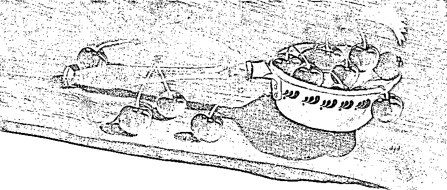

**扩张生命体验**

同样地，我们也会在月木人身上观察到木星代表的一些典型品质。

木星促使个体有扩张生命体验的渴望，或者在物质性的层面——旅行、旅居甚至移居国外；或者在心智层面——广泛涉猎各类知识领域，对概念化和理论性强的内容感兴趣，当然也包括人们熟知的哲学或宗教类的知识体系。

**“灵魂或身体，总要有一个在路上”，**恐怕是最深得月木人认同的了。

生活要求我们负起的责任，难免有时会与月木人内在的”不安分“和想要展翅高飞的愿望相冲突。**如何在接受现实约束的同时，也能恰当地为自己开辟出空间，**是月木人需要不断打磨的平衡艺术。

木星强调信仰、信念和意义。一旦月木人认同了某种宗教、政治、哲学或文化道德主张，便倾向于依此来指导自己的生活行为，这会带给他们**内在的安全感。**

同时，他们也热衷于像布道者一样，不断向人们解说自己的信念，以期影响他人。

一般来说，月木人会认同那些带有**慷慨态度**和**自由思想**的信念体系，他们也**乐于助人成长。**

但月木人也要警惕，将自己所信仰和认同的视为“最好的”，无法尊重他人更多元的思想意识，一不小心就将自己处于“上帝视角”，给出过多的评判。

象征符号是浓缩的，若展开来，月木相位组合呈现出的行为表现几乎是无穷尽的，我们邀请每个有月木配置相位的你，通过观察自己，继续填充这个列表。

**月木相位的防御**

从更深入的、更具个人性的角度分析，即使一些看上去相似的行为，对每个个体来说，却可能有着不同的意义。

接下来，就让我们聚焦在某些带有月木色彩的特定行为模式上，更深一层地探索其背后的心理动力，拓展出生星图对帮助个体成长的更多作用和方式。

在这里，请牢记一点，**整张出生星图是一个完整的联动系统，**各个配置象征的心理动力会交互地、叠加地彼此作用，直至达成某种平衡，并反映在我们的行为结果中。以月木相位为例，它指征出的心理模式并非会单独运作，更是在为一个系统服务。

结合个案真实的人生经历，我们会发现，**出生星图中有月木相位**——特别是**合相、四分相或对分相位**——的个体，虽然也会展现出乐观豁达、幽默风趣、情绪高亢等特质，但我们不能简单将之视为“必然如此”；因为个体可能是在习惯性地运用一种“月木式”的防御方式，让自己免于去体验到内心深处的更为复杂的情绪感受，特别是一些负向的情感，例如哀伤或恐惧。

**一个案例**

让我举一个案例来阐释这一点。

我的一位来访，第一次进行占星心理咨询时，主诉的目标是想借助出生星图更好地自我探索。她的星图中，落在双鱼座的月亮，精准对分了落于处女座的木星。

她拥有良好的社会功能：建立了家庭、有稳定的人际资源，变换过几次工作，都是主动寻求的变化。

在我们的交谈中，她表现的热情大方，不拘小节；能很流畅地谈论自己，喜欢用自嘲的方式谈论生活、工作中的一些尴尬经历。

当然，我们也很容易倾听到她月亮双鱼座的呈现：富有同情心，易感，谈及自己的孩子非常动情；会强调人们应该对令自己不如意的人和事抱持原谅或慈悲的态度。

随着咨询面谈的展开，我觉察到自己内在产生了一种具有冲突感的体验。当时她正在用一种很正面的态度谈论她的童年经历：作为农村家庭的头胎女儿，她的出生并没有受到欢迎。母亲因为需要下地劳作维持生计，早早停止了母乳喂养。“母亲告诉我，她下地劳动时，没有人帮忙照顾我，只能把几个月大的我包裹住，独自放在家里床上好几个小时……”

记事以后，她多次目睹到父亲狂怒的家暴，和母亲激烈地争吵打斗，也包括对她的打骂。“不过我母亲很爱我，她常常为了保护我直接和父亲冲突起来……”她强调说。

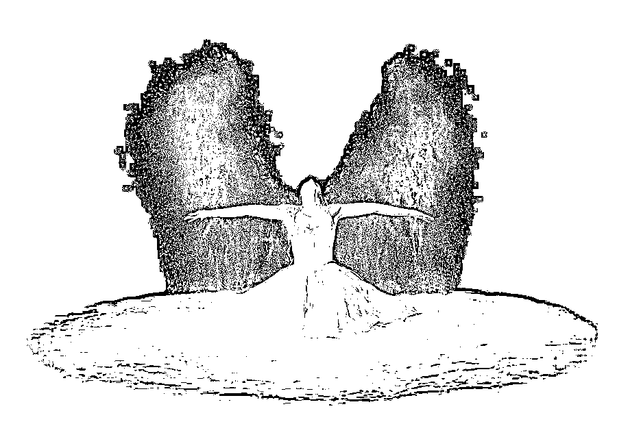

**用积极防御痛楚**

我意识到自己的冲突感源于：在倾听她的经历时，我体会到的是，那个被独自遗弃在家的婴儿，因感到饥饿、排泄物造成身体不舒适，大声地哭泣却无法吸引来期待的照料；由此伴生强烈情绪：难过、悲伤、感到痛苦，再到愤怒、无助和恐惧，都无法得到安抚。

我们也不难想象，目睹情绪失控的父亲对家人付诸身体暴力，带给幼小儿童的心理冲击。

然而，我的来访在讲述这些情景时，并没有与之一致的情绪流露，甚至不是隔离的冷静状态。相反地，她用略带高亢的嗓音进行讲述，用词造句会伴随着令人有些不适的幽默，好像在讲述一件有趣好玩的事情。而且，看起来她并非故意要掩饰什么，仿佛这就是她对待这些往事的真实态度。

这种与一般经验的强烈反差，让我对她星图中精准的月木对分相形成了一个假设：她其实是**用一种夸大了的积极态度来防御心灵中深埋的痛楚**，这也对应到一个经典的心理防御机制——否认：忽略或以幽默来对待令人感到压力或恐慌的事件。她的兴高采烈和亢奋更像是在抵御内心的焦虑，而非真正的欢畅和平静。

其后，她提及小自己四岁的妹妹。妹妹有明显的抑郁倾向，严重的时候有过自杀的想法。

“我想她会这样一定是和我们的童年经历有关吧。不过我也觉得很奇怪，她出生后妈妈和我给她很多保护，父亲的暴力也主要是针对我的，她怎么反而比我更受伤？”——她在这段讲述中透露出来对负向情感的态度，愈加让我肯定了此前的假设。

个体在成长过程中建立的任何心理机制，一定是为了在彼时帮助我们面对危险仍能生存下来；换言之，它并不是“错误的”。并且，基于这些防御发展出来的行为，在我们成年后的社会生活中，一些特定情景中仍会起到积极作用。

但防御机制如果过度僵化，也必定会对整体自我的发展造成阻滞。以我的来访为例，**强迫性地保持持续的“积极乐观”**，会大量耗损她的心理能量，令其周期性地精力耗竭，不可避免地陷入她竭力抵制的抑郁状态。

无法面对和处理哀伤和负面情感，这些在真实生活中并不可避免的部分，也会在人生的某些时刻给她带来极大的困扰。

这个案例中涉及的心理议题，无法在一次咨询中解决；幸运的是，基于在这次占星咨询中建立起的信任关系，她接受了进行更长程的心理分析的建议。我们经过很长时间的工作之后，她的一些问题才得以真正浮出水面，逐步被处理。

**月木相位的阴影**

再一次，这些真实的人生故事向我们揭示出：**星图中的符号本身是中立的**，它们中立地指征出能量运作的特性。而对于个体而言，如何运用这些能量、以及为什么这样地运用，都是综合了我们每个人独有的人生剧情，在普遍性之上，又独具意义的。

同样地，如果我们为**木星的阴影面——扩张过度**，也加入心理视角的理解，会对月木相位获得更多洞见。

事实上，当我们观察到**任何被视为“过度”的行为**——过度追寻，过度索求或过度付出——时，都要同时意识到，这**很可能是内在匮乏、饥渴状态的一种外显形式。**

由于匮乏而驱动过度追寻或索求，容易理解；我们或许要问，对他人过度的照顾或付出，也会因由内在对被滋养被照顾的渴求吗？答案是肯定的。人们会将内在自我匮乏的部分投射在他人身上，进而对他人施予其实是自己潜意识中所渴望得到的行为。辨识此种现象的一个典型信号是：**月木人在给出照顾时，往往是无法看到对象的真实需求的**，包括所需内容和量的尺度。

理解到这一点，我们就不会奇怪，很多有月木相位的案主，或者**有被过早地断奶的经历**——这意味婴儿期在生理和情绪心理上，都有未能得到足够满足的体验；或者是另一种常见情形：母亲确实给出了丰沛的照顾，但更多是以物质的形式，而非情感的滋养。

月木相位的另一种夸张或过度，则是表现为：**“夸张的情绪表达”**：个体情绪状态外显，甚至给人一种颇为戏剧化的感受。

心理学家对婴儿的依恋策略研究指出，成年人的这种情绪展现模式，可能源于在幼年早期形成的一种自我保护策略。

当幼儿感到自己无法吸引照料者给到自己这足够的关注和照料时，一部分幼儿会采取的策略，便是通过放大情绪，甚至带有表演性的表达情绪，特别是哀伤、脆弱，也可能是愤怒等，来获取必要的关注。这种策略若未得到干预，缺乏变化，就会固化下来，带到成年。

再一次，我们在夸张或过度的背后，看到了对缺失、无法获得满足的担忧和恐惧。

这些情形，和我们之前讨论的案例的共同之处在于，月木人是基于某种偏差性的信念在运用月木能量。或者说，**他们的行为带来的结果，未必与真实的意图相一致。**

比如，过度照料他人，可能吸引来那些理所当然享受被照顾的人，我们仍然无法从对方那里获得足够的滋养和照料。而对于惯用夸张的情绪表达来吸引关注的个体，在当下真实的人际情景中，可能令关系中的对方感到不堪重负而远离。

如此，月木人会重新跌入到早期缺乏关注和照料的体验中。长此以往，最后在月木人心灵中持续发酵的，可能就是愤怒，和愤怒之下深埋着的无尽哀伤。

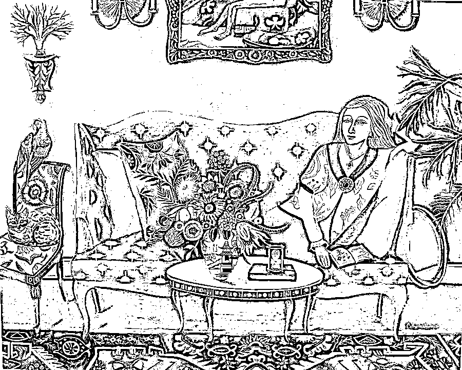

**与木星共舞**

所以，当我们与木星的能量共舞时，总是要对自己保持诚实。木星也有追求真理的意涵，其中也包含了关于自己的真相。月木人要有勇气，追溯源头，即便那里有我们直觉害怕或恐惧的东西；但不要忘了，我们**天然带有冒险的勇气**，一样适用这条路径，而这本身也是一个**拓展意识**的过程。

如果月木人能够信任自己的月亮的承载力，真正去经验内在感受的丰富性：快乐的、明亮的，亦或痛苦的、黑暗的；就能体会到生命的富饶和丰沛。

当获得了对生命更广阔的体认，能更好地激发出追寻意义的灵感。喜欢分享、带有教导特质的月木人，此时谈论的，就不再只是抽象的哲学观，而是能够带着对人性真切的理解，引导人们在黑暗中看到希望和光亮。

如果月木人能够**信任自己的月亮的滋养力**，懂得倾听自己的需求，尊重自己的需求，就有机会习得平衡自我滋养与付出的艺术。

带有真实的满足感的月木人，能够**更健康地释放自己仁慈友善的天性，**将我们超出常人的滋养能力投注给所关怀的群体，为他们创建一个能获得真实有效的关爱和支持的“大家庭”。

无论我们以何种方式祈祷赐福，我们也同时在与自己的心灵对话。木星的存在，不为保佑我们免于生活的考验和试炼，而是教导我们在生命中**培养勇气、智慧、慷慨和爱的品质**，以让我们能够经验生活，又超越生活；不停留在空洞虚妄的快乐中，而是懂得整合痛苦与快乐的两极，叩问超越这些定义之上的意义。——这之于月木人而言，才是他们真正在找寻的，滋养生命的神圣乳汁。

**版权声明**：文章由作者授权首发于若道平台发布，欢迎转发，反对抄袭。

****

**薇安**

全职心理占星师、ISAR 认证占星师（2016 年获得）、若道兼职助教

北大心理学硕士、MBTI 国际认证施测师

若道认证生时校正资质及 COAC 高阶资质毕业生

**微信 ID**：weianhuilai

**公众号 ID**：Radio-for-Alice

长按打赏

**学习顺势疗法**

**请点击下图了解详情**

**微信又双叒叕改版啦，不想错过若道君的推送？**

**就把若道设为星标吧！**

**▼**

就是这个“在看”，戳戳戳 ☟

********报名直达入口********

# 雷蒙德·梅里曼金融占星周运 | 水逆就要结束了，市场行情如何变？

> 原文：[`mp.weixin.qq.com/s?__biz=MzA5NjA0NTAxNg==&mid=2651431265&idx=2&sn=a0942f3dc76f7c36fce791f9d4d78a03&chksm=8b4b13d6bc3c9ac077c0c82473511cc6d841fbbf201a2e8450d01c9389f022217c350c57d85f&scene=126&sessionid=1692738080#rd`](http://mp.weixin.qq.com/s?__biz=MzA5NjA0NTAxNg==&mid=2651431265&idx=2&sn=a0942f3dc76f7c36fce791f9d4d78a03&chksm=8b4b13d6bc3c9ac077c0c82473511cc6d841fbbf201a2e8450d01c9389f022217c350c57d85f&scene=126&sessionid=1692738080#rd)

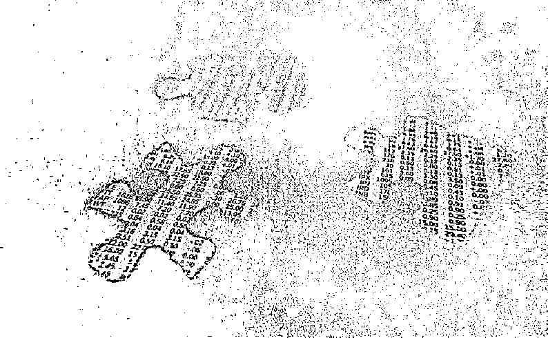

作者/雷蒙德·梅里曼
译者/Leisha 编辑/玫瑰 图片/全景网雷蒙德·梅里曼是在金融占星学界稳坐第一把交椅的占星师，同时他也是若道签约的金融占星课老师，我们引进了雷蒙德·梅里曼老师的《[上证指数+黄金周期月度报告](http://mp.weixin.qq.com/s?__biz=MzA5NjA0NTAxNg==&mid=2651430487&idx=2&sn=6b032833078f13e0caf33e548da15942&chksm=8b4b2ce0bc3ca5f6d2b4406eb8ffd38cd864c96b48133bd14364a778c2eaa4743479992b2c4a&scene=21#wechat_redirect)》《[2021 年金融预报](http://mp.weixin.qq.com/s?__biz=MzA5NjA0NTAxNg==&mid=2651425978&idx=1&sn=067bd68ece37e1e820d6f84f7a3cc960&chksm=8b4b3e0dbc3cb71b866f65d51f7993d3c35dee77cebd77eda3f63a4d5864dadaea2e9d14c101&scene=21#wechat_redirect)》。我们经老师的授权，将每周刊登梅里曼老师的周运，供大家参考和学习。于是，这是本周的周运（11.2-11.6）。**说明：以下时间采用纽约证券交易所所在地美国东部标准时间。**
**展望与回顾**

**美国经济在第三季度以创纪录的速度（33.1％的年增长率）增长，早前新型冠状病毒肺炎疫情期间造成的经济损失现已恢复约 2/3。**

**——哈丽特·托里****《美国经济增长，下滑减缓》****《华尔街日报》****2020 年 10 月 30 日**

尽管国内生产总值数据好于预期，但全球股指上周继续下跌，主要是由于美国和全球报告了创纪录的新冠病毒肺炎每日新增感染病例。随着新增感染病例数量的惊人增长，许多社区开始采取新的封锁措施。这将损害商业活动，也是市场下跌的原因。但是，我们希望这些措施能够挽救人命，并在这第二波（还是说这已经是第三波？）疫情结束后再次带来强劲的经济反弹。

11 月 3 日，水星逆行的周期也将结束，而且值得庆幸的是，2020 年美国总统大选活动也将结束，不过可能几天或几周后，我们都还不知道获胜的是谁。在本专栏的最后，我们将探讨今年大选与当前地球宇宙学周期的历史相关性。但是就市场活动而言，股票市场在上周突破了水星逆行周期上半段的狭窄交易区间。全球一些股市的跌幅非常大，这也符合我们对地球宇宙学征象的解读。**我们从 9 月初就开始提醒读者（和订阅用户）注意：自 3 月下旬疫情造成市场恐慌低点以来最急剧、最长时间的下跌将开始。**3 月 20-31 日，火星合相木星、冥王星、土星，这可以说是今年最强有力的地球宇宙学设置。全球大多数主要股指的年度低点都出现在 3 月 16-26 日之间，美国市场在 3 月 23 日触底，位于梅里曼市场研究三星关键反转日期的容许范围之内。9 月 4 日还有一个梅里曼市场研究三星关键反转日期，当时全球许多股指创下暴跌后的高点。例如，道琼斯工业平均指数在 9 月 3 日触顶，标普指数和纳斯达克指数在 9 月 2 日创下历史新高。在那之后，许多市场开始了今年第二急剧的下跌。但在下一个梅里曼市场研究三星关键反转日期，即 10 月 9-12 日出现了次高点，我们强调这可能是今年第二个最重要的地球宇宙学时间段。一些股指在那时创下了暴跌后的高点，比如日本日经指数、澳大利亚 ASX 指数和印度 NIFTY 指数。

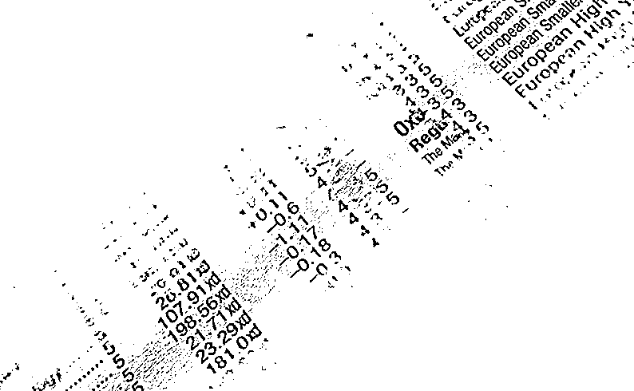

还有一些股指在那时创下了双顶，比如美国的股指。股市在 10 月 9-12 日创下次高点（双顶）之后，从 9 月的第一周重新开启更急剧的下跌，不久后火星就在自己守护的白羊座转向逆行。火星在 3 月下旬合相摩羯座星群，此时火星与这个摩羯座星群形成了上弦月周期（渐盈四分相），因此，我们预测这个时期将出现自 3 月以来最急剧、最长时间的下跌。现在，许多股指已跌至至少三个月以来的最低水平，包括道琼斯工业平均指数和欧洲所有的主要市场。人们对经济和全球股市的担忧又回来了，创纪录的新冠病毒肺炎感染新增病例数也回来了。这两者之间有联系，而且这两者也都与当前的地球宇宙学周期密切相关。黄金和白银上周也受到冲击，出现了与 3 月中旬一样的暴跌。上周最大的输家的是原油，跌至 6 月 15 日以来的最低价。上周最大的赢家是比特币，飙升至 13863，差不多与 2019 年 6 月 26 日的高点 13895（2019 年最高）形成双顶。**恶作剧者水星将在 11 月 3 日结束逆行周期，但火星还将继续逆行至 11 月 13-14 日。**如果当前的市场跌势在这其中一个时期结束，将会很有趣。火星在 11 月 13-14 日转向顺行也很有趣，因为仅 1-2 天前，木星-冥王星将形成第三次也是最后一次精准合相，这也落在 11 月 9-19 日金星与火星和摩羯座星群的木星、冥王星、土星形成基本星座 T 三角的时期之中。随着木星-冥王星最后一次精准合相临近，新冠病毒肺炎感染病例创纪录地增加并不出奇（但令人沮丧）。回顾木星-冥王星合相的历史，我们发现在许多实例中，世界上很多人在这个时期去世了。木星掌管“多”（大量、夸张），而冥王星是掌管死亡或生命威胁的行星之一。好消息是，这个始于 3 月下旬，4 月初的相位已接近尾声，我们据此预计，与新冠病毒肺炎相关的生命威胁也将在 12 月至明年 3 月之间结束。也许是因为终于研制出了疫苗，或者某种医疗手段的进一步推广。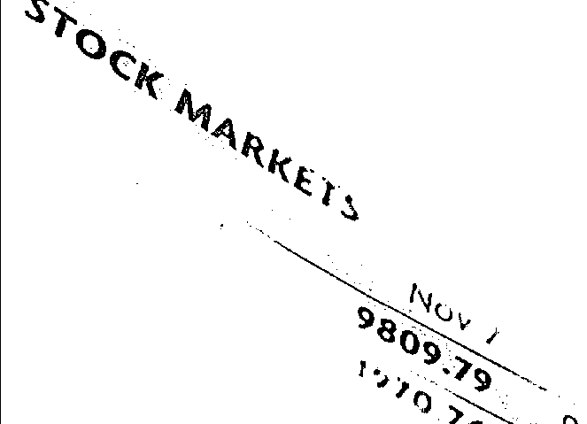**美国总统大选**

**对特朗普先生而言，还有更多坏消息。贸易赤字（总统偏好的有争议的成功衡量标准）比以往任何时候都要高。美国制造业的工作没有增加。美国与中国的贸易逆差与总统上任时一样高。**

**——威廉·高尔斯顿**

**《没有政纲的话，特朗普会下台》**

**《华尔街日报》**

**2020 年 10 月 28 日**

**如果他（特朗普）获胜，一个巨大的因素会是，只有特朗普能让他的选民对文化左派说：“不行，不好意思，你走得太远了”。说直接点，对许多人而言，只有选他，才能对那些自以为控制美国文化的人竖中指。**

**——里奇·劳里**

**《对许多人而言，投票支持特朗普是竖中指的唯一方式》**

**《亚利桑那共和报》**

**2020 年 10 月 28 日**

真清晰政治网站最新的民意调查显示，拜登仍领先特朗普 7.8％，低于上周的 7.9％。但是，我最密切关注的拉斯穆森民意调查结果正在剧烈摆动。拉斯穆森报告显示，上周三支持特朗普的民调数据其实比拜登高了 2％，前两周拜登还领先 2-3％。但 10 月 27-29 日，拜登又再次领先特朗普 3％。这符合上周末满月合相天王星的主题，而且水星在大选日改变方向，大选日当天月亮还在双子座（水星掌管的星座）。现在到周二期间，大选情况容易变得非常不稳定。水星一整周都停滞，并在 10 月 31 日-11 月 6 日四分土星，土星代表延迟，所以我们可能不会在这周得知大选结果。周二、周三的预测结果到 11 月 7 日可能甚至会出现反转。此外，可能甚至要到 11 月 14 日火星转向顺行后，大选的最终结果才能确定。有一个征象表明大选结果可能要到 2021 年 2 月才被接受，这将造成巨大的问题，因为就职典礼定于 2021 年 1 月 20 日正午举行。明年 1 月 20 日，火星合相天王星，这可能表示公民通过大规模的抗议活动，甚至骚乱来表达对大选结果的不满。在投票期间及之后，大选不太可能顺利进行。然而，到明年春天，华盛顿特区的季节入座星图表明情况有所好转。整个夏天，美国乃至全世界都将继续努力保持更好的生活态度。我们在[《2021 年金融预报》](http://mp.weixin.qq.com/s?__biz=MzA5NjA0NTAxNg==&mid=2651425978&idx=1&sn=067bd68ece37e1e820d6f84f7a3cc960&chksm=8b4b3e0dbc3cb71b866f65d51f7993d3c35dee77cebd77eda3f63a4d5864dadaea2e9d14c101&scene=21#wechat_redirect)（点击可阅读）中对此进行了详尽的探讨。以下是一些适用于今年大选周期的因素（数据）。

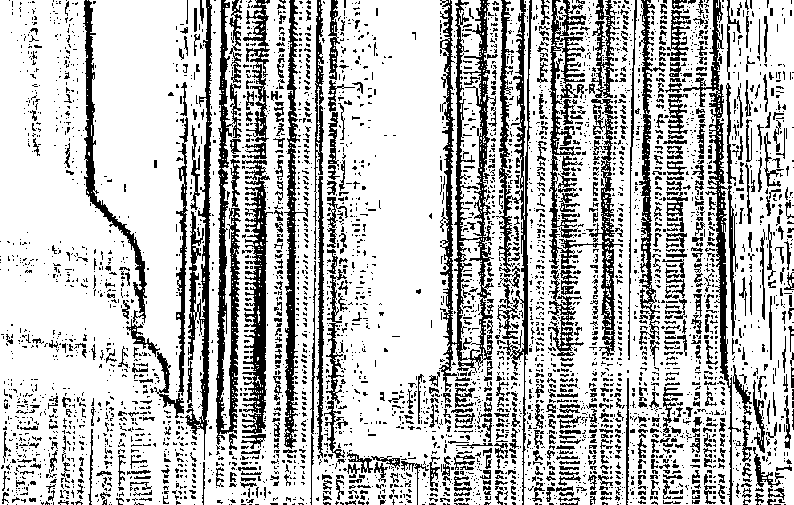

首先，我们来回顾一下美国总统大选与周期的相关性，存在共和党当选和民主党当选的 16 年周期。自 1904 年以来，共和党人每 16 年必获胜，有一次例外。共和党上一次获胜是 2016 年。同样从 1912 年开始，民主党也每 16 年必获胜，也有一次例外。民主党上一次获胜是 2008 年贝拉克·奥巴马当选总统。15 个实例中有 13 个遵循此周期，或者说概率为 85.7％。根据这个周期，2024 年将轮到民主党获胜。但在政党各自当选的 16 年周期之后的大选中会发生什么？如果现任总统再次参选，他会获胜吗？如果现任总统不参选，他的政党会获胜吗？结果都一样。在 15 个实例中，时任执政党获胜 13 次。执政党唯一一次没有获胜是 1932 年，当时赫伯特·胡佛（共和党）被富兰克林·罗斯福击败，而在 1980 年，时任总统吉米·卡特被共和党对手罗纳德·里根击败。在这两个实例中，时任执政党落败都是因为经济表现不佳。根据这项研究，唐纳德·特朗普更有可能获胜（85.7％的概率），尤其如果选民觉得经济在他的领导下表现良好，则更是如此。我们现在来看看美国总统大选结果与地球宇宙学的关联。木星和土星每 20 年合相一次，通常临近大选。木星和土星将于 2020 年 12 月 21 日再次合相，正好在选举和就职典礼中间。木土合相与美国大选第一次关联是 1800 年，自那时以来，木土合相对美国大选而言是什么样的指征？自 1800 年以来，木星-土星合相周期中举行了 11 次总统大选。在这 11 个实例中，时任总统或其政党有 8 次没能连任（72.7％）。在其余 3 个实例中，都发生了一些奇怪的事。1820 年，反对党没人参选（总统候选人只有一位）。在另一个实例中，富兰克林·罗斯福被允许第三次参选（1940 年），这是空前绝后的情况。在之前 9 个实例中，有 7 位当选的总统没活到任期结束。木星-土星合相的大选周期预示，一些不寻常的事也会发生在这次大选的获胜者身上，出于这个原因，2020 年的副总统候选人极其重要。木星-土星合相周期还会改变元素。也就是说，木星-土星合相所在的星座将在 2020 年从土元素变为风元素。木土合相改变元素的年份有如 2000 年、1980 年，以及之前的 1800 年、1820 年和 1840 年。在这些年份的大选中，时任总统或其政党只有一次连任成功，但那次是 1820 年，当时反对党没人出来竞选总统。因此，木星-土星周期，特别是在改变元素时，更倾向于乔·拜登获胜，而现任总统唐纳德·特朗普则会落选下台。大选与土星-天王星周期也相关。土星与天王星每 45 年合相一次，大约每 11 年（实际上是 10-12 年）会彼此形成困难相位。在 13 个实例中，土星与天王星的困难相位发生在大选附近的“影响力容许范围”内，这次大选也是这种情况（土星和天王星从 2021 年 2 月开始形成渐亏的四分相）。在这 13 个实例中，时任执政党败选了 11 次（84.6％）。在三次渐亏四分相（与这次相同）的实例中，时任执政党都落败。这个征象倾向于民主党获胜。

我认为，这些是本次大选与过往地球宇宙学和节律周期最有意义的定量研究或相关性研究。不幸的是，它们互相矛盾。周期研究倾向于共和党（现任）获胜，而地球宇宙学因素倾向于反对。

那么，本次大选哪个研究结果会是正确的？周期研究还是地球宇宙学研究？我们要是有水晶球就好了，因为我们并不能清楚地确定，我们的预测是基于客观的定量研究，而不是基于主观想法或对征象和符号的解读。大约一半的人会对结果感到高兴，另一半的人会对结果感到失望，甚至愤怒。

但无论哪种情况，我认为大多数人最终（到明天春天）还是会感到高兴，因为大选结束了。在那之前，现在是大合相之年——2020 年的末尾，这是前所未有惊心动魄的奇异之年。那么，如果这个结束 2020 年开启 2021 年的大选呈现出惊心动魄的奇异状况，也应该不足为奇。

**说明：以上日期基于纽约证券交易所所在的美国东部标准时间，由于存在时差，中国地区可能需要加一天。**

**版权声明：**本文由若道翻译发布，欢迎转发，反对抄袭。友号转载请申请白名单。

**雷蒙德·梅里曼（Raymond Merriman）**

若道签约老师。著名金融占星师，ISAR（国际占星研究协会）前主席，梅里曼市场分析公司的总裁。他由于“提升了占星学的职业形象”，在 1995 年国际占星大会上被授予轩辕十四奖；在 2012 年国际占星大会上，被授予轩辕十四终身成就奖。

1“中国上证指数月度报告”发售

**若道推出了****中文版****的雷蒙德·梅里曼中国上证指数月度报告，并持续发行该报告！**

当把金融市场的周期和占星学的周期相结合时，雷蒙德·梅里曼老师的金融占星学研究**为投资者应对金融市场的周期波动，并随之调整投资策略提供了极大的价值参考**。

**11 月中英文报告均已上线！**

2“黄金价格周期月度报告”发售

**若道推出****中文版****的雷蒙德·梅里曼黄金价格周期月度报告！**不仅仅为广大读者在中国股市的投资出谋划策，更将视角放眼黄金市场。

**每当世界经济形式不明朗的时候，有一个地方是保值的港湾，那就是****黄金**。自 1982 年雷蒙德·梅里曼出版第一本研究《地球宇宙学征象与黄金价格的关联》的著作以来，**他一直作为最重要的黄金市场时机预测者之一享誉国际**。8 月的黄金终于从高位开始下跌，有些分析人士认为，黄金在过去连涨 9 周是非常极端的，因此走势未来不会太强了；也有人认为，在目前各国大放水、国际局势不稳的情况下，黄金可以继续看高。那么，你该如何面对目前的调整呢？是等待回调继续进行，还是在什么位置买入？11 月黄金周期报告等着你。火星逆行，很多国家都纷纷再次爆发新冠肺炎病毒疫情，未来的几个月注定不安宁。黄金的走势会安宁吗？

11 月黄金报告已经上线，上证报告也会在本周上线。欢迎了解。也可以按照季度和一年期订阅，有更多优惠。季度和年度的好处是，你可以持续了解梅里曼老师对于不断在变化的市场的看法。即便他某一次看法和市场不一致，你也看到在下一期他如何调整自己的看法，并看到金融占星在一个长期时间段内对你把控风险的帮助。而能够长期控制风险、尽量找到安全的投资时机才是投资的长久之计。

**11 月中英文报告均已上线！**

**购买套餐**，买得越多越优惠

中国上证指数月度报告套餐价

*   **单月报告**：280 元

*   **3 个月套餐**：780 元（260 元/月）

*   **12 个月套餐价**：1999 元（166 元/月）

**长按下图识别二维码**

**购买金融报告****套餐**

**▼**

黄金周期月度报告优惠

*   **双报告年度套餐更优惠（直降 899 元）**
*   **12 个月黄金报告+12 个月上证指数报告：仅需 3500**

**长按下图识别二维码购买黄金报告套餐**

▼

1976 年以来，由雷蒙德·梅里曼撰写的梅里曼市场时机学院每年一次的年度预报沙龙和每年一本的《年度预报》一直在应用占星学原理为投资者们服务，提供卓越洞见，从未间断。过去两年，3 小时的年度预报讲座和长达 200 页左右对金融市场的分析报告，帮助许多若道读者做出正确的投资决策，降低了投资风险，并获得相当不菲的投资收益。在群星摩羯座的时候，我们和你一起提早规划自己来年的投资安排。

**2021 年金融年报预售**

**1976 年以来，由雷蒙德·梅里曼撰写的梅里曼市场时机学院每年一次的年度预报沙龙和每年一本的《年度预报》一直在应用占星学原理为投资者们服务，提供卓越洞见，从未间断。**过去两年，3 小时的年度预报讲座和长达 200 页左右对金融市场的分析报告，帮助许多若道读者做出正确的投资决策，降低了投资风险，并获得相当不菲的投资收益。在群星摩羯座的时候，我们和你一起提早规划自己来年的投资安排。2021 年年度预报开始预售**前 50 名预售价格**：1080 元（已售罄）**前 50-100 名预售价格**：1180 元**100-150 名预售价格**：1280 元**150 名之后价格**：1380 元**2021 年年度预报中文版预计发布时间**：2020 年 12 月底**沙龙时间**：2021 年春节前后**沙龙形式**：英文讲座，配有中文翻译**点击下图了解详情**

▼

******点击阅读原文购买金融报告******

# 金牛座超级满月 | 若你勇敢说“再见”，生命就会给你个“开始”

> 原文：[`mp.weixin.qq.com/s?__biz=MzA5NjA0NTAxNg==&mid=2651431237&idx=1&sn=e56e7ddd4ffb4d47a37c78a313a02dcb&chksm=8b4b13f2bc3c9ae49588303f25d7c2c6953a150323b224123f6b239917328c6bbf1efa531930&scene=126&sessionid=1692738085#rd`](http://mp.weixin.qq.com/s?__biz=MzA5NjA0NTAxNg==&mid=2651431237&idx=1&sn=e56e7ddd4ffb4d47a37c78a313a02dcb&chksm=8b4b13f2bc3c9ae49588303f25d7c2c6953a150323b224123f6b239917328c6bbf1efa531930&scene=126&sessionid=1692738085#rd)

****☆ ****后台回复“今日”，给你一句生命态度****

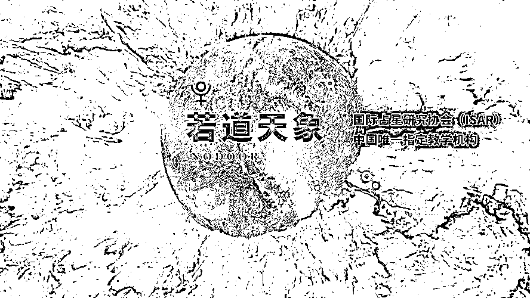

作者/王芝桦 编辑/玫瑰 图片/全景网

**金牛座满月****北京时间 2020 年 10 月 31 日 22:49 迎来金牛座满月，天蝎座太阳与金牛座月亮于 8°38′精准对分。此次金牛座满月是 10 月中的第二个满月，故而也是“蓝月亮”超级满月。**金牛座是黄道 12 星座中的第二个星座，象征**来自物质世界的感官愉悦和内心满足，一方面呈现对安全感和舒适度的心理需求，另一方面也伴随依赖稳定和排斥变化的阴影风险**。金牛座的典型特质**往往通过获取金钱和安全**，积累财富和资源两方面体现出来，故而**此次金牛座满月，“金钱与价值”的主题将被凸显，“安全与满足”的需求也将被强化。**古希腊神话中，有一则“克里特岛牛”的故事颇能揭示金牛座的象征：身为王子时期的弥诺斯（众神之神宙斯和腓尼基公主欧罗巴的儿子）向海神波塞冬（海王原型）求借一头公牛，助其在众兄弟的竞争中登上王位，并许下登上王位便即刻祭献归还的誓言，但他当上国王后却对公牛心生贪欲并据为己有，于是便用另一头牛替换公牛并祭献海神。海神波塞冬看透弥诺斯的伎俩和欺骗，将惩罚降罪于弥诺斯的妻子身上，激化她的恋兽癖，并与那头被弥诺斯据为己有的公牛生下人身牛头、饮血为生、吃人无数的弥诺斯洛斯（象征“弥诺斯之罪”）这个怪物……这个神话讲到这里并没有结束，但这一部分内容已经揭示出**金牛座“获取财富的天赋”和“被资源掌控的阴影”**：弥诺斯犯下“渎神罪”，他被一己私欲（财富、资源和权势）掌控，却没有履行国王的公共职责向海神兑现诺言、祭祀神牛并服务神谕。我们的人生，似乎也总要在某一时刻做出选择——**是被欲望掌控，还是驯服欲望向更高阶的自我进化，为更神圣的福祉服务？**金牛座和天蝎座是一组对宫星座：**如果说金牛座的特质指向现实性的资源获取与权力运用，那么天蝎座的特质就指向心理性的欲念生灭和顿悟取舍。**这一组对宫星座揭示出现实世界与内在世界的一体两面。此次金牛座满月，“金钱财富和安全需求”的相关主题被凸显，而天蝎月（10 月 23 日-11 月 21 日）那扇“神秘莫测”的旋转门也施展魔法，令“金钱财富和安全需求”所涉及的各种关系呈现出真相。

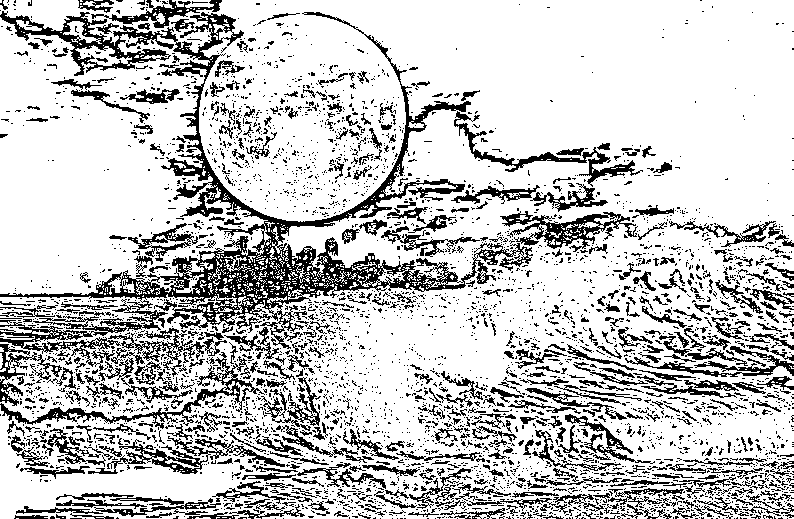

**金牛座满月重点影响人群**

参考满月峰值影响期间各个行星的行进度数，以及逆行行星的轨迹影响；常规容许度，个人行星入相位 3°，出相位 1°；非个人行星入相位和出相位均为 3°。

**·** 出生星图中，有**行星、四轴、南北交点落入固定星座（金牛座、狮子座、天蝎座、水瓶座）3°-13°**的人群； 

**·** 出生星图中，有**行星、四轴、南北交点落入基本星座（白羊座、巨蟹座、天秤座、摩羯座）1°-****30°**的人群；

**·** 出生星图中，有**行星、四轴、南北交点落入变动星座（双子座、射手座、处女座、双鱼座）15°-25°**的人群。

**别对自己说谎，别对生活敷衍**

**在生命的重要时刻，我们却对发生在自己身上的事物无能为力，只能听天由命——这就是世界上最大的谎言。**

**——保罗·柯艾略 《牧羊少年奇幻之旅》**

  在写这篇文章的当天，看到两则新闻：一是蚂蚁总部落户杭州，周围区片房价迅速上涨，令人不禁脑补睡着觉就被钱砸到脑袋上的画面；二是易网购平台倒塌，创始人跑路，令人不禁脑补财务数字一眨眼就蒸发了的情境。

这两则新闻令我提前闻到了此次金牛座满月的气息：资本可能在皎洁的月光下狂欢，也可能在黑暗的悬崖下粉碎。但什么事物又不是如此呢？此次金牛座满月的整体天象，随着“天蝎座太阳-金牛座月亮”的精准对分结构，规划出如下图所示的两大阵营：绿色框的“阵营一”和橙色框的“阵营二”。

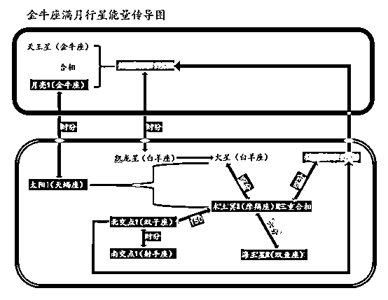

满月不单携带着清理净化的“完结”能量，也借助丰盈的月光照见出丰硕的“成果”，但此次金牛座满月可千万不要匆忙下结论，因为天蝎月那扇“神秘莫测”的旋转门可能会左转、右转地反转出惊人的魔法。

**1.** **阵营一：半年时光，做了哪些准备？**

**我们担心失去的，只是那些我们现在拥有的东西：我们的生命，或我们的作物。但是，当我们明白了生命的历程与世界的历程都是由同一只手写就的时候，这种担心就会消失。****——保罗·柯艾略 《牧羊少年奇幻之旅》****天象****· 天王星合相满月**：逆行的金牛座天王星合相金牛座月亮，对分天蝎座太阳；**· 金凯对分**：天秤座金星对分逆行的白羊座凯龙星。半年前 4 月 23 日金牛座新月（详情点击：[金牛座新月](http://mp.weixin.qq.com/s?__biz=MzA5NjA0NTAxNg==&mid=2651415354&idx=1&sn=f221eae193b32708c0ae91274e40f62f&chksm=8b4bd18dbc3c589bf3230e16154548b7602adf8c4d1a40c06a7177e6f4c24d917799a56fa186&scene=21#wechat_redirect)）的时候，掀起“经济结构和生存安全”变革之风的金牛座天王星合相了金牛座新月，为半年后的此次金牛座满月预留了伏笔。摘取 4 月 23 日新月文中的一段文字，献给此次金牛座满月：**“回到原点，重启旅程，重要的不是“转型”的急切动作，而是在“转型”过程中“调试”方向，去选择能够带来长期建设性的策略，去寻获能够满足内心需求的事物。****当下的巨大震荡和艰难考验，无论破灭了多少希望，制造了多少废墟，我们都要重建全新的世界并迈入全新的周期。无论集体层面的格局重建和规则升级，还是个人层面的根基加固和实力沉淀，都是宇宙宏大进程中的一部分，需要我们抱以臣服的态度和顺势的智慧，慢慢调试，逐步验证，才能在全新周期到来的时候，既没跟丢时代，也没走丢自己地迈入全新的未来。”**半年之久，这个世界和个人生活发生了什么？4 月 23 日的时候，国内的疫情数字已经控制到 1000 以内，电商数量剧增，直播拉动经济，企业开始复工，生活逐步正轨；4 月 23 日的时候，美国的疫情数字还在 84 万，特朗普“注射消毒剂”的言论语惊四座，经过 3 月期间美股连续熔断、美联储无限 QE 后的美股开始拉锯式上涨……半年的时光我们似乎走了好久，这个世界不断呈现着怪诞的混乱和闹剧，个人际遇也在一路颠簸之中乘风破浪，而今只有回头才能看清，我们从哪里走到了哪里。

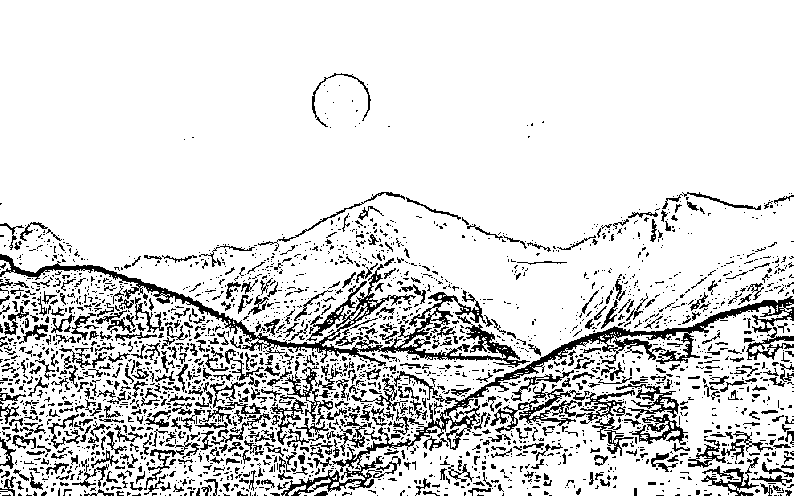

此次金牛座满月，金牛座天王星介入“天蝎座太阳-金牛座月亮”对分轴线，与半年前的金牛座新月遥相呼应，并在这个渴望收获、需求安稳的金牛座满月，布置考题并发出提问，检验我们这半年时光的成长与成绩：**·** 是否已经确立了自我定位，踩稳了安全根基？**·** 是被恐惧驱动着只顾眼前温饱，被欲望怂恿着什么都想抓住，还是分别做出了长期规划和近期计划呢？**·** 与外界的人、事物和环境的关系，发生了什么变化？是学会了和解与共生，还是制造了更大的矛盾与冲突？**·** 是否已经准备好足够的力量，可以随时迎接新一轮的震荡与变化？如果你在前面半年时间里已经做好了准备并笃定了信念，就不会因为现实的疯狂而动摇半分，反之则会因为现实的震荡而陷入不安。此次金牛座满月，金牛座的守护行星金星接纳着金牛座月亮和金牛座天王星的能量。此时的金星正行进在自己守护的另一个星座，即“建立关系纽带、渴望公平对等”的天秤座之内，故而**此次金牛座满月触发出的“经济与安全”的震荡之波便延展到各种“关系”之中，而天秤座金星与白羊座凯龙星的“金凯对分”结构则令那些维持着表面和谐、掩盖着“旧伤和隐痛”的关系真相浮出水面。****需要注意的：**

*   **身体**

*   以往遗留且没有处理的旧疾，无序作息或不良习性的隐患，满月期间需要引起重视或及时就医。

*   **情感**

*   内心的不安全感和依赖感容易被触发，衡量关系对等、需求对方陪伴的心理也被放大，而某些“老问题”再次像道坎儿一样横在心中，出不来，过不去，执着地想要一探究竟。 

*   一些朋友突然发现彼此的价值差异，一些关系可能名存实亡并只剩损耗，一些不忠行为被发现，一些多角关系被戳破……这些情况可能会碰触一些朋友的内心底线，将一段关系彻底推向决裂或速战速决结束；但如果你想了解因由并解决问题，那么一场相互坦诚的深度沟通是必要的。 

*   另外，还有一些朋友可能会突然陷入爱河或邂逅一见钟情。

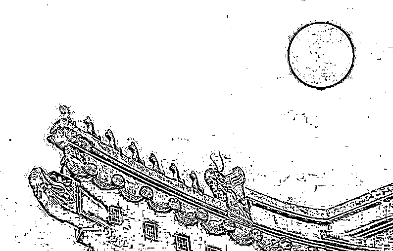

*   **金钱**

*   投资方面需要谨慎和避免冒险，今年的投资需要专业和经验的支撑，为了赚钱而投资、对不熟悉的项目投资都具有相当大的风险；合作协议或债权纠纷需要注意，利益规划清晰，避免借贷关系，带眼识人，及时止损；消费方面，突然性的支出和计划外的成本可能增加，理性对待，避免破财。 

*   **集体**

*   金融方面，波动和反转的可能性增高；市场方面，粮油供给和产品物价可能出现调整；商贸方面，翻老账、节外生枝和协定推翻的情况再次发生；公众人物的怪癖隐私和多角关系引发关注。

我们可以通过这几方面的现实事件，反思与自己、与他人、与金钱、与工作、与环境的关系状态。我们担心失去已经拥有的东西，无论是健康和情感，还是金钱和成绩，于是本能而盲目地抓住现有的一切不放，却忘记询问自己的内心“这些东西是否真的重要”。这些东西其实正是我们自己的手写就的作品，而当我们抓着以往作品不肯放手的时候，便再也腾不出手来创作新的作品。此次金牛座满月，金牛座天王星对分天蝎座太阳，那扇“神秘莫测”的旋转门在“变革之风”的煽动下，似乎旋转得更加眼花缭乱，演化出更多意想不到的现实剧情。但请相信，这一切的演化都是为了让我们看到“重要”的真相并走上“高阶”的道路，因为金牛座天王星的“变革之风”只是触发的外因，而天蝎座“神秘莫测”的旋转门才是真正的内因，我们过去半年的成绩单也蕴藏其中——**变革之风吹不散那些具有实力和意义、真正重要和必要的事物，因为宇宙要颠覆和突破的是那些“陈旧与腐朽”的事物。**

**2.** **“再见”是为了更好的“开始”**

**如果你能勇敢地说“再见”，那么生命一定会回报你一个新的“开始”。**

**——保罗·柯艾略 《牧羊少年奇幻之旅》**
**天象****· 火木四分：**逆行的白羊座火星四分摩羯座木星；**· 水土四分：**逆行的天秤座水星四分摩羯座土星；**· 北交点与冥王星 150 度梅花相位：**双子座北交点与摩羯座冥王星形成 150 度梅花结构。此次金牛座满月，摩羯座上的木星、土星和冥王星被不同的天象结构激化，而接纳天蝎座太阳能量的白羊座火星和摩羯座冥王星也参与其中，揭示出“神秘莫测”的旋转门内的魔法——**现实的事件蕴藏着选择的秘密。**从 10 月开始，摩羯座上的“木土冥三重合相”结构开始呈现影响，而 10 月也正是白羊座火星与“木土冥三颗行星”形成第二轮四分结构的时间，此次金牛座满月“火木四分”结构仍在发挥余温。

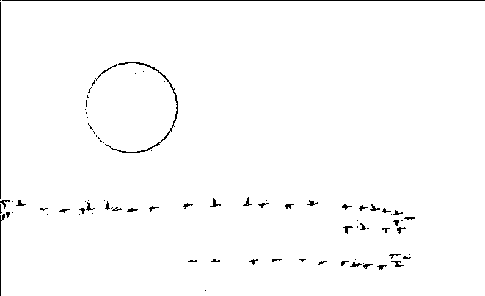

“木土冥三重合相”结构不单是年底的重磅大戏，更是具有时代标记性的重磅天象，督促我们在 2020 年 12 月中旬“木土双双换座进入水瓶座”之前，检视“宇宙超级大 BOSS”冥王星行进摩羯座周期的功课是否已经完成——**是否已经确立了自我定位，沉淀了自我实力，而不再依靠所在环境赐予的背书和赋予的价值？是否已经坚定了内在信念，积聚了内在力量，即使现实变化无常亦能保持前行的步伐？**此次金牛座满月，白羊座火星驱动我们每一个人呈现自己的答案：精力投放到哪里，哪里就有精彩，无论是投身创造奇迹，还是拼命制造麻烦。另外，10 月 14 日于天蝎座开始逆行，刚于 10 月 28 日逆行回到天秤座，并即将在 11 月 4 日恢复顺行，最后于 11 月 11 日再次进入天蝎座的水星，也与摩羯座土星形成“水土四分”结构。**10 月 28 日-11 月 11 日水星行进在天秤座期间，那些表面维持着和谐，实则掩盖着问题的“虚伪和病态的关系”，将会被摩羯座土星的“现实高墙”撞得七零八落，将关系真相和本质问题抖落一地。**此次金牛座满月，双子座北交点提供出一条高阶的进化路径：双子座北交点→天秤座水星→天秤座金星。**· 理清关系的脉络，反思关系的边界，重建关系的模式。****·** 这也是此次金牛座满月，金牛座月亮和金牛座天王星将能量传导给天秤座金星的本意——**完结亦是突破，突破亦是完结，过去的完结带来全新的开始，全新的开始也意味着过去的完结。**此次金牛座满月，宇宙指引我们**考量哪些是“重要的人和重要的关系”，然后决定与哪些人说“再见”，与哪些关系重新“开始”**。人和关系的取舍，自然会带来相应的无常和震荡，但这也是自我定位和自我实力的另一番确信，内在信念和内在力量的另一种笃定的过程。2020 年，几乎每一步都是生命的重要时刻，那些发生在自己身上的事物，我们可以自己决定和选择。故而，别对自己说谎，别对生活敷衍，因为当你对生活蒙混过关的时候，生活也一定会让你委曲求全。

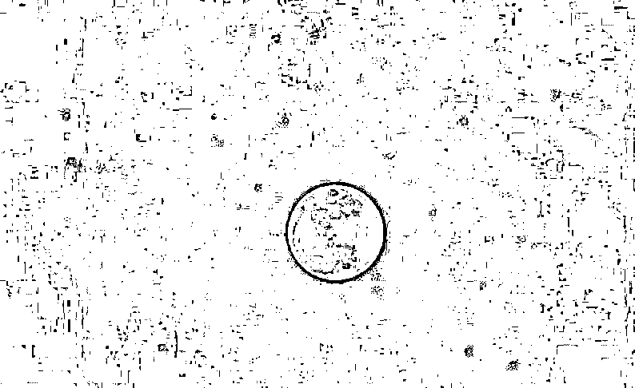

**寄语****所有发生过一次的事，可能永远不会再发生；但所有发生过两次的事，肯定还会发生第三次。****——保罗·柯艾略 《牧羊少年奇幻之旅》**
不要在同一块石头上跌倒两次，然而“业力功课”总会绊倒我们很多次，直到我们开始疑虑其中的蹊跷，反思原有的模式，并持之以恒地将之转化。2020 年，我们每个人的生活中都发生着一些变故。时至年底，总结一下这些变故的次数和内容，想想关系问题的类似情节，看看每次离职的相同原因，体悟发生一次、两次和 N 次的不同：来过一次不再来的，不是因为幸运，而是因为做完了功课；来过两次还会再来的，不是因为不幸，而是因为业力功课的吸引与投射，人和事才会配合地出现和发生。2020 年，真正考验我们的是：敢不敢素颜面对自己。愿每一个灵魂安好。祝福大家。

**版权声明**：原创文章由作者授权首发于若道平台，欢迎转发，反对抄袭。友号转载请申请白名单。

****

****想阅读更多作者的文章，****

****请在后台回复******王芝桦****** 即可。****

****王芝桦****

心理占星师，统合疗愈师，占星专栏作者

若道占星“新月和满月”专栏作者，腾讯视频特约占星师

全职于个案咨询与占星教学工作 16 年

**个案预约咨询微信号**：zhihua0621 

**微信公众号**：daoxi-life

**长按打赏**

****

**ISAR 选修课，心理占星学视角下的预测方法**

**点击下图了解更多详情**

喜欢记得点一下在看哦☟

********报名直达入口********

# 双十一若道占星大促 | 充值大礼包，多充多送就在 2020！

> 原文：[`mp.weixin.qq.com/s?__biz=MzA5NjA0NTAxNg==&mid=2651431237&idx=2&sn=ceb2049c6bf1c22bca66a7a4a6d90808&chksm=8b4b13f2bc3c9ae4a8544f69c56efd503461679f7eb3cde6f953cc4e8052abed9dae32efcc1b&scene=126&sessionid=1692738085#rd`](http://mp.weixin.qq.com/s?__biz=MzA5NjA0NTAxNg==&mid=2651431237&idx=2&sn=ceb2049c6bf1c22bca66a7a4a6d90808&chksm=8b4b13f2bc3c9ae4a8544f69c56efd503461679f7eb3cde6f953cc4e8052abed9dae32efcc1b&scene=126&sessionid=1692738085#rd)

明人不说暗话

**若道占星 年末巨制**

**双十一套餐**

**限时优惠 手慢无**

**2020 年 10 月 29 日-11 月 11 日**

***22*****门课程任你选**

**价格直降*****500-14000*****不等**

**重要！重要！重要！**

**购买学习卡之前请先****仔细阅读****下图****须知**

**或者扫描二维码咨询客服小姐姐**

**购充值卡，听课**

**请先下载若道 APP**

**若道君：****你可以在 app store 或者应用商店搜索“若道”下载 app 或扫描下图二维码**

**还有别的问题？**

**别害羞，扫描二维码，咨询客服小姐姐吧~**

注：优惠活动不累加，详情请咨询客服

# 11 月宇宙天气 | 三星顺行，开启宝藏大门的时间到了

> 原文：[`mp.weixin.qq.com/s?__biz=MzA5NjA0NTAxNg==&mid=2651431151&idx=1&sn=8360c9972ca2f00e3cda85c10ea1b64d&chksm=8b4b1258bc3c9b4e6ff0a9933d08873403764782b4dd6d243adbc7393e6f752af79edd844192&scene=126&sessionid=1692738085#rd`](http://mp.weixin.qq.com/s?__biz=MzA5NjA0NTAxNg==&mid=2651431151&idx=1&sn=8360c9972ca2f00e3cda85c10ea1b64d&chksm=8b4b1258bc3c9b4e6ff0a9933d08873403764782b4dd6d243adbc7393e6f752af79edd844192&scene=126&sessionid=1692738085#rd)

****************☆ 后台回复“今日”，给你一句生命态度****************

作者/咔咔 ISAR 认证占星师

编辑/玫瑰 图片/全景网**11 月主要天象**2020 年 11 月的重大天象包括：**·** 水星在天秤座恢复顺行**·** 火星在白羊座恢复顺行**·** 海王星在双鱼座恢复顺行**·** 木星和冥王星最后一次在摩羯座合相阿里巴巴是个穷困的年轻人，他没有钱做生意，每天赶着三头毛驴去山里砍柴谋生。有一天，他躲在石头后，看到 40 个强盗带着他们打劫来的钱财走到一块大石头前面，对着它喊道：“芝麻，芝麻，请开门。”山洞霍然开启。接下来的故事大家想必很熟悉了，阿里巴巴念了芝麻开门的咒语，从山洞里取出了强盗的财宝。他的哥哥知道了这件事之后，也进入山洞，看到满坑满谷的金银财宝，兴奋之下忘掉了开门的咒语，被强盗们抓住一刀结果了性命。在这个故事里，我们看到了**木星与冥王星**组合的隐喻，**财富具有动人心魄的巨大力量，它勾起人性的贪婪。**看似幸运的木星事件反而带来了冥王星式的后果，阿里巴巴的哥哥丢掉了性命。今年最重要的一个天象，就是木星与冥王星在摩羯座的相遇。这两个行星的组合象征着：**·** 巨大的权力和财富，比尔·盖茨的星图中就有木冥合相；**·** 强大的意志力，不畏艰险，顽强奋斗。圣雄甘地的木星与冥王星合相。2020 年木冥第二次合相的时候，珠峰测量登山队成功登顶；**·** 贪婪和浮夸会带来垮塌性的后果。今年 4 月的时候，成功在美国上市的瑞幸咖啡因为被发现财务作假，短短 3 日股价大跌近 84%，市值蒸发了 15 亿美元。**在这个 11 月，木星与冥王星最后一次在摩羯座合相。**土冥合相摧毁了很多看起来坚固的东西，给新的机会腾出了生长的空间。木冥合相展现了巨大的诱惑——**“你想要什么？”或者说“你愿意为得到它付出什么？”**像阿里巴巴和他的哥哥一样，我们要做出自己的选择。这个选择基于我们的信念——**“什么是我们珍视的，不惜付出努力、忍受艰辛也要实现的？”**这个月，金星也加入到了木冥的组合里，意味着**人际关系和财务方面的存在着巨大的诱惑。**

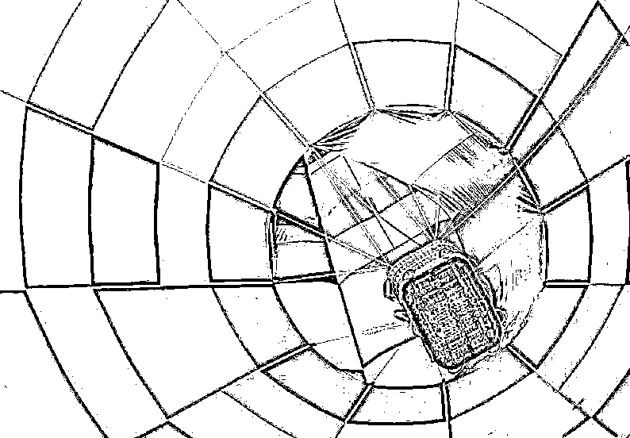

**11 月上旬天象**

**11 月 2 日 水星（天秤座）四分土星（摩羯座）****11 月 4 日 水星在天秤座恢复顺行****11 月 6 日 水星（天秤座）四分土星（摩羯座）****11 月 10 日 金星（天秤座）对分火星（白羊座）****11 月 11 日 水星进入天蝎座****11 月的第一周，水星都在天秤座四分土星，带来了严肃和沉重的感觉。**水星于 4 日在天秤座 25°53′恢复顺行。经历了从天蝎座逆行回到天秤座，人们可能**对事情背后的根本性原因有所觉悟**。这也代表了**从对峙走向妥协合作**的一段道路，**如果不去暴露内在真切的感受，带有一些强迫性质地向伴侣或者合作伙伴表达自己的需求，就无法真正地进入一个互相信任、共享利益的深度关系。**水星在天蝎座逆行，意味着**我们要把藏在心底的话说出来，这些让我们害怕和担心的事情终须被拥抱和接纳**。如果我们自己、我们的伴侣、合作伙伴对人性有着足够的了解，能坦然地谈论这些，做出重新的协调和安排，我们就能**在 11 月的第一周——水土四分的时期，为未来的合作签订一份长期严肃的契约**。**当 11 月 11 日，水星再次进入天蝎座的时候，我们就能深入和专注在某个项目上，分享资源，共享利益。**水土四分的天象下，人们也会**担心被批评，很怕说错话**。也可能我们会成为**给他人挑毛病，提出改进意见**的人。这里的挑战在于，**在压力下要如何理智、温和地表达意见。**金星与火星在各自的星座，要求我们**在自我主张与协同合作之间找到平衡。**

**11 月中旬天象**

**11 月 13 日 木星合相冥王星（摩羯座）**

**11 月 14 日 火星在白羊座恢复顺行**

**11 月 15 日 天蝎座新月**

15 日的新月积极地参与到木星与冥王星的合相里。新月在天蝎座 23°，与行进在摩羯座 22°-23°的木星和冥王星形成了六分相。六分相具有**“稍加努力就能顺利完成”**的意义，天蝎座与摩羯座的组合，我们要如何努力，又要达成什么呢？新月与冥王星形成六分相的同时，也被冥王星定位，加强了天蝎座的意涵。这意味着要想获得木冥合相的礼物，打开成功和财富的大门，需要**穿越地狱的勇气，强大的生存意愿，深刻的承诺，激情和不屈不挠的斗志**。我们与病毒的战争还没有完成，危机之中，危险与机遇始终并存。今年的 4 月、6 月和 11 月，木冥三次合相发生在**摩羯座 22°-24°**，对于星图上有关键行星和轴点在这个度数的人来说，生命的方向可能已经改变。从第一次面对危机时的困惑、震惊、害怕，到第二次合相时检索资源，调整心态，第三次合相会更清晰地看到自己的志向，理解危机的最终目的是帮助我们找到那个“为何而活”的信念，从而指导接下来的人生。之前两次合相中暴露出来的**国际关系、航空旅游、海外贸易、法律设定、税务、债务**等问题，在第三次合相的时候也会得到解决。

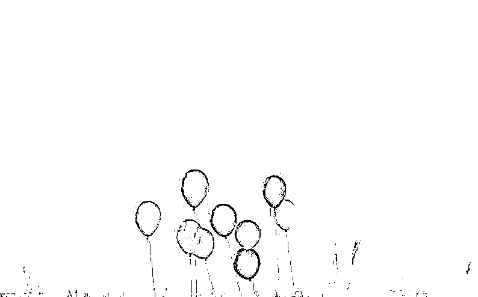

火星在 14 日恢复顺行，为这样一场强者的游戏增加了力量。9 月 10 日，火星在白羊座 28°逆行以来，战神阿瑞斯处于非常状态，他的表现如何？我刚刚听到了一个火星逆行的故事。我朋友的员工最近离职了，他满心怨怼，没有完成交接就离开，还在公司散布谣言。由于他的离职和谣言的发酵，让公司陷入困境。人员短缺让这个朋友不得不撑着病体忙业务。在这个故事里我看到了火星逆行的两个表现，离职的员工被阴暗的情绪占据，自私偏执，用阴招报复雇主。我的朋友精力匮乏体力下降还要咬着牙撑住公司。我们可能也和这两位一样，在火星逆行期间，感到**无力、失控，精疲力尽**。如果无法将火星的能量向外引导，无意识地压抑愤怒，就会向内攻击自己，或者采用极端的手段，把一切都搞到无可挽回的地步。**火逆期间我们学会慢了下来，将有限的精力体力专注于生命最重要的领域，其他的时间用来休息和调养身体。**如果我们在火星逆行期间积攒了精力体力，那么，**11 月 14 日到 12 月 23 日**期间，它将开足马力向前冲，路途之中不会遭到外行星的阻碍。这可能是我们**在年底最有效率的一段时间。**

**11 月中下旬天象**

**11 月 16 日 金星（天秤座）四分冥王星（摩羯座）**

**11 月 16 日 金星（天秤座）四分木星（摩羯座）**

**11 月 17 日 水星（天蝎座）对分天王星（金牛座）**

**11 月 19 日 金星（天秤座）四分土星（摩羯座）**

**11 月 21 日 金星进入天蝎座**

**11 月 22 日 太阳进入射手座**

**11 月 16 日这一周可能是本月人际交往最为活跃的时间。**新月联结了金星、木星和冥王星，我们想开始一个**强烈的、深度联结的、高度理想化的关系**。金星与冥王星的四分相和金星进入天蝎座都在宣告：**“如果我爱你，就甘愿为你死。”**金木冥的组合远离了天秤座互惠、妥协、平等、冷静的特质，**信任、责任、激情、承诺**成为这段期间人们最关切的东西。我们也要清醒地看到**关系背后的贪婪和控制**。诗经上说：“死生契阔，与子成说。执子之手，与子偕老。”外在世界的动荡提醒我们：**什么是我们珍视的人，关系中我们最不能舍弃什么。**感情关系是人类经久不息的游戏，金钱也是。**11 月中旬，我们可能看到金融市场的大起大落，金星代表的黄金和货币（包括数字货币）可望出现巨幅的涨跌。**

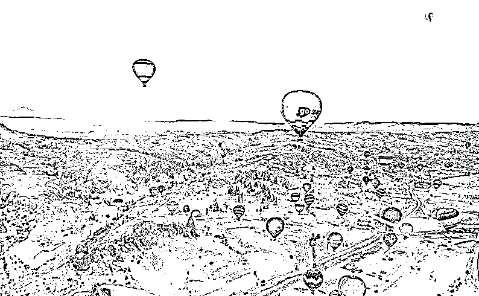

**11 月下旬天象**

**11 月 24 日 水星（天蝎座）三分海王星（双鱼座）**

**11 月 27 日 水星（天蝎座）六分冥王星（摩羯座）**

**11 月 28 日 金星（天蝎座）对分天王星（金牛座）**

**11 月 29 日 海王星在双鱼座恢复顺行，水星（天蝎座）六分木星（摩羯座）**

**11 月 30 日 双子座月食**

**本月的最后一周，我们要相信自己的直觉和内在感受。**水星经历了天蝎座的逆行后，人们对人性多了一层理解。如果我们没有被一些人类共有，却隐藏起来的阴影面吓到的话，可能**在月底和某个亲密的朋友有一场深刻的、疗愈性的沟通**。**海王星在 28 日顺行，人们将在虚弱混乱的内在世界醒来，更加信任自己的创造力和直觉，带着海王星逆行时生成的温柔和慈悲去帮助他人。**新月许下的愿望，需要在月底水星与海王星、冥王星和木星形成六分相的时候进一步地向前推动，无论是一个学习计划还是工作任务，水星需要我们**承诺资源、时间和精力。****11 月 30 日的双子座月食发生在 8°38’，月食前后可能暴露出来教育、交通、旅游、文艺等领域的痼疾。**双子座的定位星水星与射手座的定位星木星形成了六分相，意味着个体认知和群体态度之间虽然复杂、具有张力，但是经过努力和保持开放的沟通，是可以彼此尊重共同成长的。其中的诀窍就是，**具有宏观视角，保持好奇心，问对问题，不轻易评判，换位思考。**即将进入寒冬，彼此温暖将成为我们抵御寒冷的良方。顺祝，秋安！

**附录：本月重要天象一览表**

| **日期** | **星象** |
| **2020.11.2** | **水星（天秤座）四分土星（摩羯座）** |
| **2020.11.4** | **水星在天秤座恢复顺行** |
| **2020.11.6** | **水星（天秤座）四分土星（摩羯座）** |
| **2020.11.10** | **金星（天秤座）对分火星（白羊座）** |
| **2020.11.11** | **水星进入天蝎座** |
| **2020.11.13** | **木星合相冥王星（摩羯座）** |
| **2020.11.14** | **火星在白羊座恢复顺行** |
| **2020.11.15** | **天蝎座新月** |
| **2020.11.16**  | **金星（天秤座）四分冥王星（摩羯座） 金星（天秤座）四分木星（摩羯座）**  |
| **2020.11.17** | **水星（天蝎座）对分天王星（金牛座）** |
| **2020.11.19**  | **金星（天秤座）四分土星（摩羯座）**  |
| **2020.11.21** | **金星进入天蝎座** |
| **2020.11.22** | **太阳进入射手座** |
| **2020.11.24**  | **水星（天蝎座）三分海王星（双鱼座）**  |
| **2020.11.27**  | **水星（天蝎座）六分冥王星（摩羯座）**  |
| 2020.11.28 | **金星（天蝎座）对分天王星（金牛座）**  |
| 2020.11.29 | 海王星在双鱼座恢复顺行水星（天蝎座）六分木星（摩羯座）  |
| 2020.11.30 | **双子座月食**  |

**版权声明**：原创文章由作者授权首发于若道平台，欢迎转发，反对抄袭。友号转载请申请白名单。

********想阅读更多作者的文章********

********请在后台回复**************** 咔咔 即可********

**咔咔**

职业占星师，若道核心课程讲师

ISAR 认证占星师（2014 年获得）

国际知名广告公司和市场研究公司工作十余年

**微信公众号**：咔星人

长按打赏

******你还可以预约作者咔咔的占星咨询****** 

******长按下图二维码预约吧******

**系统学习占星学**

**点击图片了解详情**

喜欢记得点一下在看哦☟

********报名直达入口********

# 为什么它是强有力的小药丸？揭开顺势药剂的秘密

> 原文：[`mp.weixin.qq.com/s?__biz=MzA5NjA0NTAxNg==&mid=2651431151&idx=2&sn=5ddd92f4a75c811de74a41f9b48aceef&chksm=8b4b1258bc3c9b4e0ab21374dae79d29eb1737169ee00575c92851b08277e9a1335355dd1f6f&scene=126&sessionid=1692738085#rd`](http://mp.weixin.qq.com/s?__biz=MzA5NjA0NTAxNg==&mid=2651431151&idx=2&sn=5ddd92f4a75c811de74a41f9b48aceef&chksm=8b4b1258bc3c9b4e0ab21374dae79d29eb1737169ee00575c92851b08277e9a1335355dd1f6f&scene=126&sessionid=1692738085#rd)

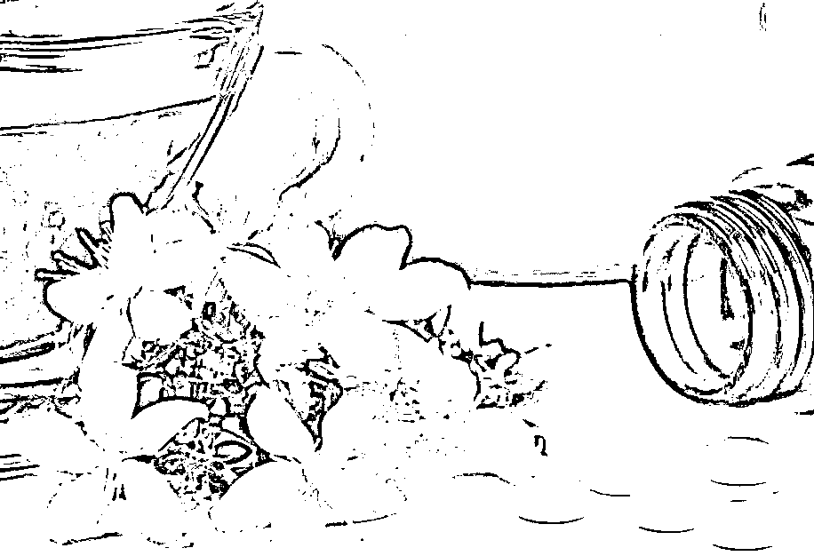

作者/Homeopathyplus 翻译/王宏编辑/翀子 图片/网络制作顺势疗法药物的“秘诀”是“势能化”。什么是势能化？顺势药物为什么没有副作用？它还有什么其他效用？在苏·汤普金斯老师的[【2 年制顺势疗法专业课程】](https://mp.weixin.qq.com/s?__biz=MjM5MjQwNjAyMQ==&mid=2649437857&idx=2&sn=52e8e106128bc1850adf395cb3351316&scene=21#wechat_redirect)（报名请点击链接）的课程中，都会对这些问题进行解答。不过，你也可以先阅读这篇文章，了解顺势疗法的“小秘密”。

文中插图并非真实的顺势药剂。

创造出安全并有效的顺势疗法药物，关键在于**“势能化”**这一做法。尽管过程极其简单，但其好处却非常大：

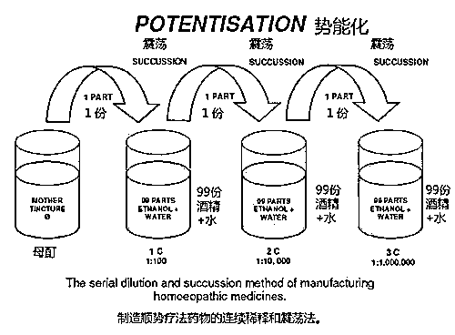

**消除有害的副作用**

势能化的奥秘，即在势能化过程中**药物的反复震荡**，似乎将原始物质的治疗特性转移并增强到了水和酒精的混合物中；该过程的稀释阶段**去除了原始物质的化学残留物**。到药物被势能化至 12C 或 26X 的势能及其以上的势能之时，一个原始物质的分子都不可能存留下来。药物变成了“亚分子”药品，**不会使人中毒或产生毒副作用，无论剂量有多大。 **

**将毒药转变为安全的药物**

制备顺势疗法药物所需的有些动物、植物或矿物来源在其基态下毒性很大。例如，重金属、蛇和蜘蛛毒液、砷以及士的宁这类毒药在原始形态下绝不可被用作药物，**但当被置入势能中时，却成为了安全、有效的药剂。**比如南美蛇毒，势能化的蛇毒被用于治疗高血压，而且是安全的。 

**将不活跃的物质转化为有力的药剂**

如果稀释去除了一种物质的毒性，**震荡就释放并增强了其治疗效力。**出于这一原因，某些在原始形态下没有任何药用价值的东西可以在震荡和被置入势能中时**变得极为活跃**。例如，氯化钠（普通食盐）和沙子几乎没有医疗用途，但势能后，两者都能够治疗范围很广的健康问题。 

**消除对麻醉剂的上瘾**

因为势能化去除了能够导致身体依赖性或成瘾的化学物质，所以**顺势疗法药物不会令患者上瘾。**本来**鸦片**在其原始形态下极易导致上瘾，但在势能中，它能安全地治疗各类神思恍惚、不省人事或昏迷、惊骇、头部受伤和便秘。同样地，**印度大麻**通常被称为大麻或印度大麻麻醉剂，而势能化的印度大麻作为一种药物不会造成依赖，却会缓解困惑、朦胧、焦虑、狂喜以及排尿灼烧感的症状。 

**可与传统药物一起使用**

顺势疗法不仅与传统医学对于症状的重要性有着不同的理解，它还会通过不同层面上的变化而纠正症状。传统药物利用化学物质来控制身体层面上的症状。**顺势疗法药物在深层的动态层面触发愈合反应。**这种更深层的行为正是顺势疗法药物和传统药物可以共同使用的原因，它们不会相互作用，不会产生不希望得到的结果。 

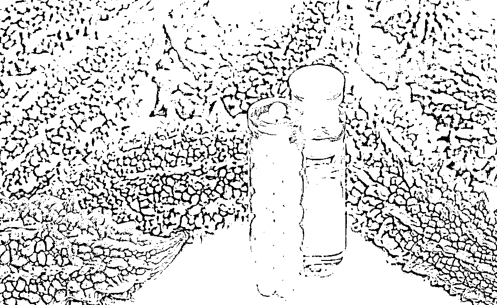

**注意**

不过，尽管顺势疗法药物可以与传统药物一起安全使用，但需注意两件重要的事： 　　

*   传统药物的应用会令顺势疗法处方的开出变得更加困难。因为这些药物会改变或压制症状，但症状正是顺势疗法根据**“同类法则”**开出成功处方的关键。传统药物的使用甚至会通过副作用的方式引发出新的症状。如果发生了这种情况，那顺势疗法的处方就得**依据剩余的和并未改变的症状**开出，或是依据在药物**给出之前存在的症状**开出。 　　

*   在开始顺势疗法治疗时，**患者应该自我监测哪些症状被传统药物控制住了。**因为顺势疗法药物带来的改善会减少对传统药物的需求。在应对高血压或血糖水平升高的问题时尤为如此。如果在不再需要传统药物却还继续服药，血压和血糖水平都会被降低到危险的水平。 

**结论**

化学物质的势能化提供了极为安全并在深层起作用的药物。当根据同类法则开出处方时，它们也会**触发体内重要的治愈效应**，这比仅仅掩盖或抑制症状要吸引人得多。200 年来，顺势疗法药物一直被安全地用于缓解身体不适者、孕妇、年轻人、老年人，以及动物身上的痛苦。顺势疗法将继续在未来做好这件事。

**版权声明：**本文由若道翻译发布，欢迎转发，反对抄袭。友号转载请申请白名单。

请在后台回复 顺势 获得更多**关于顺势疗法内容**

**学习顺势疗法**

**请点击下图了解详情**

**微信又双叒叕改版啦，不想错过若道君的推送？**

**就把若道设为星标吧！**

**▼**

就是这个“在看”，戳戳戳 ☟

********报名直达入口********

# 当水逆遇上天蝎座 | 是时候把“黑名单”里的人放出来聊聊了

> 原文：[`mp.weixin.qq.com/s?__biz=MzA5NjA0NTAxNg==&mid=2651430988&idx=1&sn=b1985d69518fc971e35afa66ac44fc38&chksm=8b4b12fbbc3c9bed1c9e1c3b2f93f384b68eeb46bf78fa0ec4a65a104b8e2022e98f0348b6fb&scene=126&sessionid=1692738085#rd`](http://mp.weixin.qq.com/s?__biz=MzA5NjA0NTAxNg==&mid=2651430988&idx=1&sn=b1985d69518fc971e35afa66ac44fc38&chksm=8b4b12fbbc3c9bed1c9e1c3b2f93f384b68eeb46bf78fa0ec4a65a104b8e2022e98f0348b6fb&scene=126&sessionid=1692738085#rd)

** 后台回复“今日”，给你一句生命态度 **

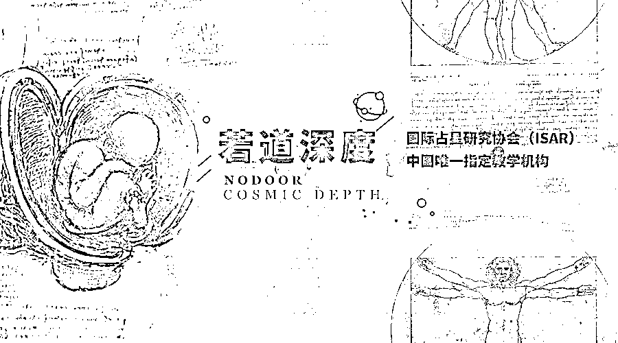

**作者/编辑/玫瑰 图片/全景网**

**”黑名单“里的那个人**10 月 14 日，水星在天蝎座逆行。包括我自己在内，已经有很多人经历了过去、现在深度秘密的挖掘过程。水逆的第三天，一次咨询中，我的客户在处理恐惧议题的时候，回溯到了 10 年前那场离婚。他已经在她的黑名单里躺了 10 年。 

**我拿起笔来给前夫写信息的时候，充满着愤怒和悲伤，实在写不下去，我就直接约他见面了……他也同意下周约时间见面。我要和他说，你欠我一个“对不起”，同样的，我也会和他说：“对不起。”**

相信每一个天蝎座、金冥人、8 宫人，都有一个心理意向中“黑名单”里的人。回想自己当初是怀着怎样决绝的心情将她（他）诛之，似乎有一丝复仇的快感。然而，岁月绵长，再想起曾经的一切，便又将心痛彻一次。指望时间能够抚平？真未必。而且这个人似乎阴魂不散，总变换着不同的样貌又一次来到你的生命。**·** 你曾被背叛，之后发觉自己又一次被背叛，又或者莫名变成了当初最恨的背叛别人的人；**·** 你曾被插足，却不由自主又插足了别人的关系；**·** 你曾被骗财，下次无论怎么谨慎，还是屡有凶险；**·** 更有甚者，你变成了一个多疑的人，靠近你的人和事都令你惶恐，如临大敌；**·** ……
如果你也有如上的情况，这一次水逆，倒是一个绝好的机会，将“黑名单”里的人请出来，拉着他坐下，细数从前。

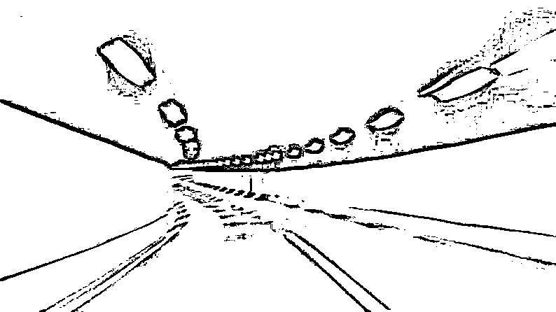

相信大多数人听到这句话，第一反应都是愤怒和抗拒：“绝不可能，这辈子和他再无瓜葛，他死了才好！”是的，只有这个人，能够激起你心中最深的情绪，因此，也只有这个人，才能够真正让你发生深度的疗愈。还记得他是如何欺骗和背叛你的么？还记得那种五雷轰顶的感受么？还记得曾如何假装高傲地试图将他从你生命中切除，却血流成河的样子么？还记得多么卑微地求他回来，他却把你的心一次次丢在地上，狠狠碾压么？还记得他如何满口誓言承诺，却一次次将你的真心毫不经意地玩弄么？那一刻，有多少恨，多少不甘，你的内心就有多痛。再去直面那件事，那个人，就有多困难。我无法承诺你，这一次火星在白羊座逆行，水星在天蝎座逆行的当下，直面就会变得更为简单。我只是想问你：你还打算带着这个伤痛走多久呢？**在我的个案中，时常会遇到恐婚、恐育的情况，说到底，都是恐惧进入亲密关系，恐惧同他人深度联结。**每一个个案都有一次甚至多次被欺骗、劈腿、虐待、辜负的创伤经历。这些经历如同一层层纸糊在脸上，久了似乎和皮肤融为一体，却令人越来越无法顺畅地呼吸。只有勇敢的人才敢去一层层剥下这些纸，去看曾经那个满目疮痍的自己。在这里，需要特别点名**出生星图中冥王星落在天秤座 15°-28°的人群，行进的火星将顺行-逆行-顺行三次对分你们的冥王星，不妨回头看看这三次精准成相的时间点，你也许会发现一些事情在数月之前就埋下了伏笔**。本次水星逆行在天蝎座，其定位星正是火星、冥王星。这是一个非常好的，利用白羊座火星勇敢、热情的能量去处理关系议题的时间点。不要害怕挖掘出一些你无法面对的真相，因为这时候我们还有一颗坚定而勇敢的白羊座火星，运用你的智慧和勇气，去直面它，处理它，你会发现，也许伤痛源自更早以前，议题尚在不断重复。然而这一次，你一定能够穿越黑暗，走向火炬一般的光明。

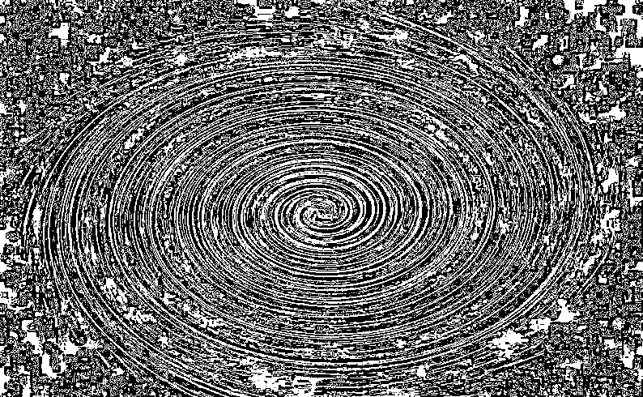

**每个人的冥王星**随着水星在天蝎座逆行，不妨回溯从木星在天蝎座的 2017 年一直到今年，我们所经历的极具冥王星色彩的社会新闻：**·** 2017 年 11 月 红黄蓝虐童事件**·** 2017 年 12 月 江歌案**·** 2018 年 5 月 空姐被滴滴顺风车四季杀害案**·** 2018 年 6 月 上海小学生两死两伤案**·** 2019 年 7 月 杭州女孩子欣遇害案**·** 2019 年 10 月 大连 11 岁女孩被 14 岁男孩杀害案**·** 2019 年 12 月 跳楼者砸死艺考生**·** 2019 年 12 月 两起伤医案**·** 2020 年 3 月 韩国 N 号房案**·** 2020 年 4 月 鲍毓明性侵养女案**·** ……我们习惯了听到“渣男”、“海王”、“PUA”、“性侵”、“家暴”、“杀猪盘”、“套路贷”这些词汇，似乎已经默认了它们在生活中无处不在。提到这些词，人本能的第一反应是害怕、愤怒、抗拒。冥王星如同恶魔之火，迅速将恐惧蔓延。

**人人都有冥王星，随着落座不同，也代表着每个人最容易被激发恐惧的领域。面对如此强烈的黑暗真相****，人们会被激发起相应的保护机制：**

**·** 例如，**冥王星在 3 宫**的人，也许会非常恐惧他人言语的攻击。每当这时，他们可能采用说谎的方式试图粉饰言行来躲避可能的攻击；

**·** **冥王星在 7 宫**的人，会恐惧同他人建立关系，于是在一对一关系中可能采用先下手为强的方式，虐待对方，有意识无意识地试图遗弃对方，来避免自己先被抛弃；

**· 冥王星在 5 宫**的人，也许会感到承认热烈地爱一个人是一种耻辱，从而无法真正进入快乐的恋爱关系；

**· 冥王星在 8 宫**的人，可能会不断进入婚外情、三角关系、乱性中，以此来挑战人性最深入的禁忌……

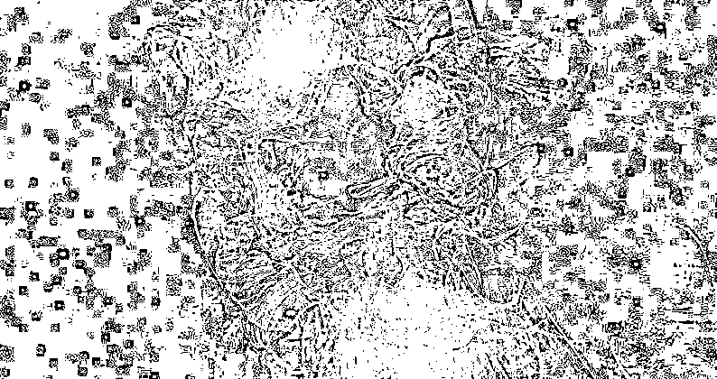

**冥王星所在之处，会给人带来强烈的抛弃感、逼迫感、虐待感、羞耻感。**如果你的冥王星在这次水星逆行期间被激发了而产生上述感觉，也许你发觉自己遇到了“渣男”、“骗子”，请保持清明的觉知：**先别急着把攻击朝向激发起你这些情绪的人，他们只是宇宙派来帮助你深度疗愈的触发器。你需要看到的，是自己在哪个领域被激发起了这种感受，这些感受的背后又是什么。**在这里，想来说说美索不达米亚女神伊南娜（伊什塔尔）的冥府之旅（数种神话版本中的一个）：**“**伊南娜的妹妹厄里斯科革是冥界的女王，她的丈夫刚刚去世。伊南娜下到冥界看望厄里斯科革，她却不领情。她让伊南娜经过七重关卡，每过一重关卡，都必须脱掉一些衣服或珠宝。伊南娜来到厄里斯科革面前时，已一丝不挂。她被迫向厄里斯科革鞠躬，向剥夺她尊严的力量屈服。而厄里斯科革并未满足，她杀死了伊南娜，把她的尸体挂在钩子上，任其腐烂。她如此残暴地对待伊南娜，自己却未得到快感。在她心中始终深藏着童年被强暴而放逐到冥界的痛苦，肚子里的遗腹子也即将临盆，她正饱受生产的痛苦煎熬。伊南娜早已预料到自己可能经历的遭遇，出发去冥界之前，就已经叮嘱身边人，如果几天后她还不回来，就要去救她。最后，两个不起眼的“送葬人”躲过冥界的重重关卡，来到厄里斯科革身边。他们对着正在遭遇生产之痛的她吟诵并接纳她的痛苦，厄里斯科革从未感受过如此温暖的待遇，作为回报，她让伊南娜复活了。——摘自网络**”**听到这个故事的时候，每个人都会将自己代入伊南娜的角色，却很少有人愿意承认自己或多或少都有着厄里斯科革的阴影面。自我觉知是一件相当困难的事，除非有一面镜子，将你真实的样貌投射其上。然而，我们还有各种美颜方法，试图粉饰内心的贪婪和私欲。就算真的观其所是，又有几个人有能力从内部彻底改头换面？**在占星学中，7 宫代表一对一关系、伴侣、公开的敌人。关系是面镜子。你在别人身上看到的，就是你自己所拥有的。**你看到他的冷酷、残忍、谎言，除了愤怒和恨意，或许还可以退一步回到自己身上，去想想是否自己也曾有很多时刻的行为模式，充满了拒绝、控制、厌弃、仇视，亦或是暗黑的欲望潜流。

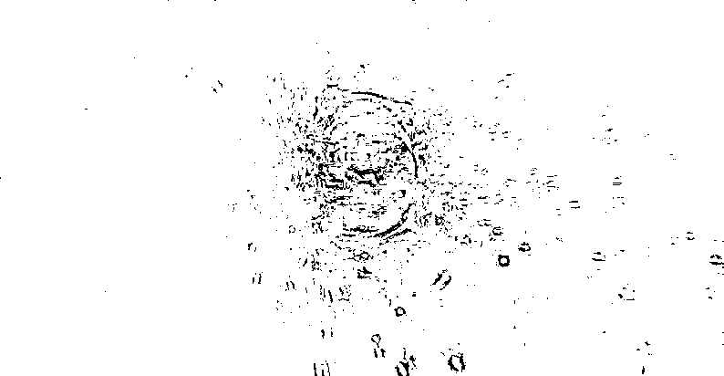

心理学中有一个名词叫做**：投射性认同**。举个简单的例子，如果你曾遭遇背叛，这个议题尚未被处理，下一段关系，无论对方开始是怎样爱你，怎样忠贞，都有可能被你“强迫”着朝向背叛这条路。因为你无法相信自己还能拥有一段健康的关系，除非先去直面和处理前一段关系中关于背叛的创伤。无论换多少个对象，只不过是换了一幅皮囊，那种能量始终跟随着你，“黑名单”里那个人一直都在，昼夜随行。于是剧情重复，悲剧重演，纠缠在这样的境况中，就如同冥府中呼号的厄里斯科革。厄里斯科革无法离开冥界，暗喻着**她被极致的痛苦纠缠，无法得到真正的解脱**。然而，**真的有地狱么？或许这个地狱恰恰是我们自己臆造出来的。**因为我们有太多愤怒、仇恨、阴暗面无处安放，他们等待着被处理。一日不直面暗流，灵魂一日得不到救赎。**谁是救赎？**

深入冥府的伊南娜被剥夺了一切——在冥王星的黑暗中，一切的装饰和粉饰都需要被剥离，我们最终需要呈现出最为真实和脆弱的自己。然而这还不够，你还需要对这股黑暗臣服，跪下，可是它恐怕还是会吞噬和毁灭了你。

**同一个人建立深度联结需要莫大的勇气和力量。**就像对所爱之人袒露一切，换来致命一刀，又像鼓起勇气坦诚自己的软肋，却被无情嘲笑；更像我们最珍视的被狠狠践踏……冥王星这颗终极“大 boss”的残忍之处就在于此。**·** 你如此爱他，他却不以为意；分手后，你痛彻心扉，他却立刻同新欢晒恩爱；**·** 你以为他是真命天子，而他只把你当鱼塘里一条鱼；**·** 你毫无芥蒂同他共享账户，他联合别人将你的钱诈骗个精光……**·** ……人世间有千百种痛苦，冥王星就藏匿其中。冥府里呼号着的灵魂，有哪一个不是经过油煎火烹的疼痛？

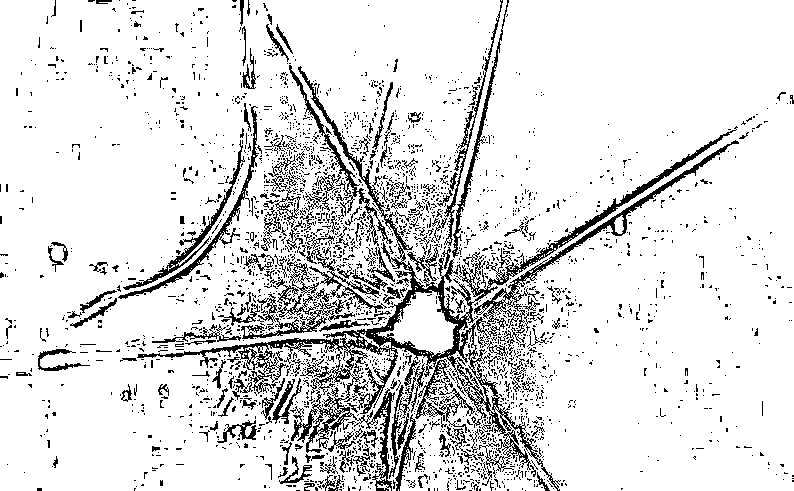

伊南娜的复活，源于两个仆人去到冥府，吟诵并接纳厄里斯科革的痛苦，同她一起咒骂，哭泣……他们没有恨她杀害了自己的主人，没有评判她是否应该如此恶毒，只是温柔地，陪伴她，看见她和她的伤痛……**能够疗愈冥王星之殇的，唯有这种全然无条件的接纳与宽容。****没有道德，没有评判，没有理性，没有规则，只是在那一刻，我看见了你的痛苦。**每一个人都渴望这样一份接纳，因为我们实在太痛苦了。那么，我们是否真的能够期待有一个人，就这样安静地站在黑暗里，陪着我们，接纳这样一个丑恶、狠毒又深藏痛苦的自己呢？当这个人真正出现的时候，你需要确保认出他，而不是将他的爱残忍地拒绝、践踏、熄灭，将他变成和自己一样的丧魂，之后继续在自己所创造的地狱中呼号。

也许曾有很多伊南娜来到我们身边，却被我们无情地卸掉所有力量，杀死——就像那个**始终不能接纳和宽恕内在创伤的自己**。一直重复这种模式的人会变成黑洞，任何靠近的光明都会被吞噬。

水星在天蝎座逆行，便是让我们**透过外在世界的一切残忍来看到自己内在的残忍——“黑名单”里的人，真的罪无可赦么？又或者他只是映照出你内在那个残酷、冰冷、根本无法感受到爱，惧怕被爱，充满了控制欲和毁灭感的自己呢？当你对对方“赶尽杀绝”的时候，早已被浸染成了一样黑墨底色的人——****你失去的是温暖的，对世界的信任。**

总是盯着自己的伤痛，就将始终盘桓在地狱之中。向外责怪总是容易的，然而一直在自己的地狱里呼叫，久了，就没有人再来敲你的门。真正能够疗愈自己的，是自己内在的神性：**带着智慧，通过“残害”你的人和事看到自己内在的真实的脆弱，陪伴并接纳它。**属于冥王星的转化方能开始。我们都希望有一个伊南娜来拯救自己，然而，**我们必须先成为那个伊南娜，才有可能自救和救人**。很多时候，地狱都是自己创造的，当厄里斯科革获得了自我疗愈的能力，她也许便可以从冥府走上地面，同姐姐一样过上充满丰饶和光明的生活。在这个特别的时期，拿出勇气去面对那场冥府之旅吧，将黑名单里的人放出来，看是否能够一丝不挂地同他坦诚自己所有真实的脆弱。**冥王星的世界如同短兵相接，先伸出手拥抱的那个人才具有如同伊南娜仆人那般宽容和慈悲的力量。****深入他人的黑暗面，安静地陪伴着，陪伴他，便是对自己的解救和解脱。**当你接纳了对方的全部，关系会发生悄然变化——那个曾经的“恶魔”会放下面具，袒露出内在温柔而脆弱的灵魂。**值得一提的是，这次水逆，是宇宙为我们安排的最后一次深入冥王星深度创伤的清理时机。**因为 12 月 22 日，土星和木星将合相在水瓶座。如果我们无法真正看到并拥抱他人的痛苦，就更不能指望别人会对自己做同样的事，那么，水瓶座将会把我们变成一座座孤岛上的坟冢。而只有真正的智慧才能带领我们抽离出地狱，带着博大的胸怀理性地接纳一切众生，真正的属于水瓶座的升华才可能发生在整个时代中。我们是这个时代的见证者，若想改变世界，唯有从自己做起。地狱和天堂，一念之间。这世间真正的变态、渣男、欺骗者是非常少的，多的是和我们一样孤独而有着自己的阴暗面，渴望被接纳的灵魂。**接纳别人，就是接纳自己，宽恕别人，就是宽恕自己。**希望我们都做出智慧而慈悲的选择。你会在宽恕中找到和解的力量，真正的爱会将你带回地面，重新复活。又及：文章开头那位案主，之后约见了她的前夫，如她所愿，他对她说了“对不起”。后来，她和我说，好像压了很多年的无形的担子被卸下去了，感觉到无比轻松。

**版权声明：**原创文章由作者授权首发于若道平台，欢迎转发，反对抄袭。友号转载请申请白名单。

****

****想阅读更多作者的文章****

****请在后台回复******玫瑰****** 即可****

**玫瑰**

英国 Cass Business School 管理学硕士

若道 2015 届核心课程毕业生，若道微信公众号兼职编辑

占星师，咨询时长超过 600 小时

**个人微信号：**Still_Queen_Astro

**公众号**：一个娘娘 

长按二维码，给作者打赏

**ISAR 选修课，心理占星学视角下的预测方法**

**点击图片链接或扫二维码咨询客服**

**微信又双叒叕改版啦，不想错过若道君的推送？**

**就把若道设为星标吧！**

**▼**

就是这个“在看”，戳戳戳 ☟

********报名直达入口********

# 金星进入天秤座｜你只是需要再多一点勇气，去冲出爱的暗夜

> 原文：[`mp.weixin.qq.com/s?__biz=MzA5NjA0NTAxNg==&mid=2651430896&idx=1&sn=a00dba05e2d87a891ccaee3ef83cb25e&chksm=8b4b2d47bc3ca45165ed68955575a6b4bcf58e9921798fa8415948dbb02bc6f4890a29c84d2b&scene=126&sessionid=1692738085#rd`](http://mp.weixin.qq.com/s?__biz=MzA5NjA0NTAxNg==&mid=2651430896&idx=1&sn=a00dba05e2d87a891ccaee3ef83cb25e&chksm=8b4b2d47bc3ca45165ed68955575a6b4bcf58e9921798fa8415948dbb02bc6f4890a29c84d2b&scene=126&sessionid=1692738085#rd)

********************☆ 后**********************台**********************回复“今日”，给你一句生命态度********************

作者/郑玮玲 ISAR 认证占星师编辑/玫瑰 图片/全景网

北京时间 10 月 28 日上午 9:41，金星离开处女座进入天秤座，并将在它自己守护的天秤座行进 24 天，直至 11 月 21 日进入天蝎座。这段时间，你需要重点处理怎样的议题，又能得到怎样的收获？一起来看看。

**天秤座的神话**

**“痛苦不像欢愉，它不戴面具。欢愉偷藏了爱，而痛苦却在本质中掀示了爱的面目。**

**——奥斯卡·王尔德（金星落在天秤座）”**

天秤座的符号是天平，在希腊神话里，它来自正义女神阿斯特蕾亚 Astraea。阿斯特蕾亚手持天平称量人间的善恶，评辩是非，主持正义。后来，人类世界出现不止息的冲突与战乱，手足相残。终于有一天，正义女神不堪忍受人类的堕落，决意回到天上，她的形象化为了处女座（是处女座的传说之一），她手中用来称量善良公正的天平化为了夜空中的天秤座。**天秤座是风象创始星座，它的关键词是平衡、艺术、恋爱、社交。风元素所代表的理性、客观、思维、想法、交流在天秤座的领域是通过一对一的关系来实现的。**天秤座是让个体的想法、思维通达另一个体的桥梁，而这座桥梁本身具有美化的功能，**礼貌、高雅、谦逊、中正**乃是天秤座的高阶呈现。没有任何星座比天秤座更善于建立人际的“桥梁”，那些太阳、月亮、上升点、水星、金星落在天秤座的人即便不是社交高手，也总能给人留下美好的第一印象甚至长久的美好印象。好的印象是建立亲密关系的显著优势和基础，这就让天秤座的人拥有了创建关系的天然主导力。一个天秤座的人想要一段关系，就会自己去建设一座桥梁。反之，如果你面对的天秤座的人不想要这段关系，任何曲直周折都无法使关系顺理成章。天秤座的原型里包含的“恋人”，在更深广的灵性意涵中，一方面意味着**面对人生选择题时，清晰权衡的选择能力，学习深谙取舍之道**。另一方面，**“恋人”是每个人内在的阴阳面，内在男人和女人的关系，具有相对性、互补性的整体**。我们都是从内在两面一体的原型中升起自我认知、自我冲突、自我辩解，从而开始柔化内在冲突，平衡对立与差异。换作古老智慧的词，那就是：**中庸，不偏不倚的中道。**

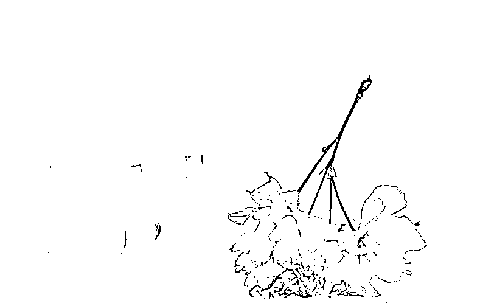

**离别**

**博尔赫斯（阿根廷）**

**破坏我们离别气氛的黄昏。**

**像黑暗天使那么尖刻、迷人而可怕的黄昏。**

**我们的嘴唇在赤裸的亲吻中度过的黄昏。**

**不可避免的时间超越了**

**无谓的拥抱。**

**我们一起挥霍激情，不为我们自己，**

**而为已经来近的孤独。**

**光亮拒绝了我们；黑夜迫不及待地来临。**

**长庚星缓解了浓重的黑暗，我们来到铁栅栏前。**

**我像从迷乱的草地归来的人那样**

**从你的怀抱里脱身。**

**我像从刀光剑影的地方归来的人那样**

**从你的眼泪里脱身。**

**如同往昔黄昏的梦境一般生动鲜明的黄昏。**

**那之后，我便一直追赶和超越**

**夜晚和航行日。**

**金星在天秤座**

在占星学里，这是金星天然顺畅、舒适的位置，金星在此会用它本色的方式去表达。在原型的世界中，我们可感知到的金星所代表的爱与美，通过天秤座对完美平衡的追求，实现独立个体之间心智、思维的交流，让情感与理性流动、共鸣，于是我们来到了金星深层的核心——**心灵的满足与宁静。**

亲密的关系并不能释义爱的全部，但人类总是透过亲密关系去体验对自身完美之爱的追寻，以及发现曾经对爱的错误认知。在爱的道路上，总是一次次试错，再一次次修正。金星在天秤座，爱的完美是在不断调试不断平衡的过程中。

美赫巴巴曾说：“爱一个灵魂，就像将他的生命添加到你自身。你的生命可以说倍增，你生活在在两个中心。你如果爱整个世界，便通过他人生活在整个世界。你如果爱人如己，一切都会是你的。爱被不幸所考验的人是幸运者。爱要求爱者为至爱献出自身。”

宇宙无垠的智慧里，我们始终趋向那个本质，即是，生命与爱本为一体。生命就是爱，爱即是生命。悲欢离合是爱，聚散无常也是爱，生命总是经由这两极的平衡将我们带进爱的本质。最终，若在情感与理性中达成完美的协调，则是在充满痛苦的人生中依然用喜悦的姿态去生活。

这便是每个人内在为自己称量善恶的天平，在命运的风沙侵袭中，你选择善待自己吗？当夜幕降临时，你选择在黑暗面前竖起火光吗？当人生失衡的时候，是时候调整重心，我们可以选择用更舒服的方式取悦自己。

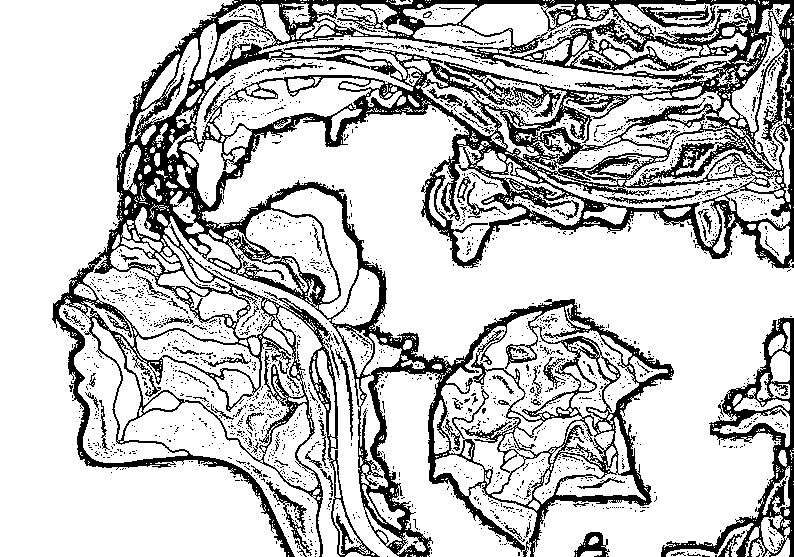

**金星在天秤座值得做的事**享受恋爱

金星在天秤座的行进划分了一个强化于关系的集体时空。天秤座邀请我们进入属于人类的**带着理性的亲密关系**，如同选择称心如意的镜面人生，取悦对方也是取悦镜中的自己。带着理性的选择不是执著盲目的，不是单纯肉体欲望或情感冲动的。

天秤座的金星给予了曼妙的启示：**清晰地选择去进入关系，享受一段生命的愉悦。**两情相悦虽不易，人间冷暖须自知，有了明镜，一切更清晰。明白地去投入爱，试炼爱就好，平衡的关系是没有伤害的。恋爱不需要后顾之忧，高涨的激情最终也会化为宁静心湖中的明月，照见我们热切爱着的自己。

平衡价值有时人们身陷迷境，不知自己身价几何，不知自己有何可用，不知如何权衡现实。金星在天秤座期间给予我们机会去重新调试这平衡。也许是你对面的人的提示，也许是你失去了某种惯常的平衡。对于那些感受到失衡的人来说，相信自己手中握有自由的权力，把对他人的良善与公正也分给自己一些，可能你会更容易做正确的选择。**放弃一些对自己的要求、评判、标准，你也会发现更容易找寻到自身的价值，把有利的天平摆向自己。**流行风尚**金星在天秤座大大鼓励了时尚潮流。**天秤座是属于大流的，金星在天秤座即意味着大多数人眼里的美，它不会过度夸张，也不怪诞前卫，它符合当下时代，具有开启美学价值的意义，它是适合大多数人的。金星在天秤座能协助我们**呈现并发掘出更符合大众审美的形式之美。**流行的就是更被人接受的，也是为我们赢得更广泛人缘的好时机。如果你想要给自己换一个造型，此时期极可能遇到好的造型师或是好的服饰建议。艺术鉴赏

**落于天秤座的金星也是爱的艺术家。**艺术作品能产生心灵、情感的共鸣，当我们欣赏一幅震撼人心的画作，观赏一幕精良的戏剧，沉浸在一段美妙的音乐舞蹈中，我们的心灵也处在那个至深的宁静之中，没有烦恼，没有重负。这段时期若能更多觅见艺术，品味艺术作品，你的心灵便能吸取更多美妙的灵感与乐趣。我们在享受音乐、诗歌、绘画中已经超越艺术的语言本身，走向心灵深处的和平，在至深的宁静中拥抱生命此刻独特的价值。

对话交流也许当下的你并不需要，或是并没有机缘进入一段关系，那当下时期的对话、交流与合作却是适合每一个人的。**去投入你热衷的社交生活，去遇见那些值得对话的人；或是与你的好相约谈，或是预约你的占星师进行一场深度疗愈的咨询对话。**天秤座带来一双善于倾听的耳朵，而金星在此时带来了美好的声音。如果你带着客观与明镜般的心智，便能在这段时期真正聆听到对等的声音，可能是给你的建议、支持、启示，可能是回应你内心声音的话语，也可能是帮助你打开新思维的动力，让你重新感受到满足、愉悦。

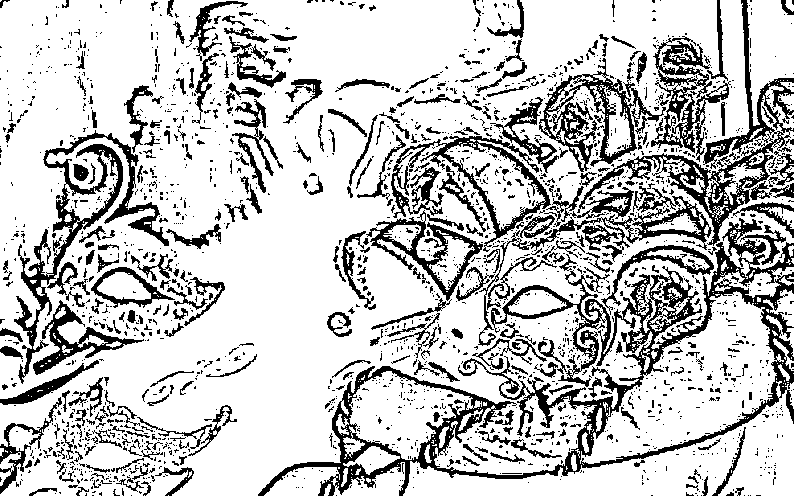

**金星在天秤座期间的重要行进****金星四分木星、土星、冥王星****持续时间：11 月 9 日-11 月 27 日****重点影响人群：有个人行星、四轴、交点位于白羊座、巨蟹座、天秤座、摩羯座 15°-29°的人群。**11 月中旬，木星与冥王星处于持续紧密的合相之中，因此，金星行经天秤座后半段期间都与木冥形成激烈四分相，土星的影响力也掺杂其中。我们时刻不停在爱的美好追寻中，却总是体验和经历着爱中的失望与痛苦挣扎。**只有带着信任去爱，才能穿越黑暗与荆棘。**在这条光明与黑暗交错的时空隧道里，我们需要一些错误来指引正确的道路，更需要放弃对于正确与错误的评判与标准，因很可能错误就在于：拥有“标准”，想要极致完美。但是摩羯座不同意天秤座的标准，因为它代表的是更高的宇宙法则。冥王星在暗处冷笑着：看你能错多少次才能真正悔过！没有外面的人或老师能真正引领我们走出黑暗，如果你还在等那个人，那才是无尽的黑暗。而木星正是我们内在无数至高的导师，是我们在荆棘路上，在暗夜里升起的，是我们孜孜求索中不断被开启的智慧。当天秤座金星的能量与摩羯座的外行星整合的时候，更高的宇宙法则来到我们的生命之中，被我们接纳。于是，**认识和接受选择的错误，放弃陈旧的价值取向，舍弃不再适用的情感模式**。即使经历重重失望，甚至绝望的境地，也为着对自我的完美之爱活下去。每个人心中都有一片宁静之地在呼唤着自己的名字，在这个当下，我们还是要面对阻碍困境，可能被无情的现实掩藏，被芒刺所扎，被痛苦、挣扎拖延。当我们闭上眼睛，会看到有些东西在闪闪发光，有些事实在温柔心灵，那便是我们的爱之路，是一生都值得的追寻。**金星对分火星****持续时间 11 月 4 日-11 月 16 日****重点影响人群：有个人行星、四轴、交点位于白羊座、巨蟹座、天秤座、摩羯座 8°-23°的人群。**此时各自在庙位的金星与火星，如同阿芙洛狄忒与阿瑞斯面面相视。只是，逆行的火星，战神阿瑞斯并不能直视美丽的爱神的眼睛，他有些无助、失落，他在找寻自己的力量。**他就是我们内在的力量，是我们当下的行动力**。也许你正和他一样感受到**无力、被困、牵绊、无助、想要放弃一切，不再挣扎**。但火星并不是害羞的，只是现在藏起了那种向外迸发的力量，甚至也不敢面对真实的情感。这便是这个相位对我们提出的议题。也许你是需要疗伤，但也是蓄势待发的。因为在这个相位结束前两天，火星也恢复顺行了，现在他已经进入了停滞期，犹如踌躇满志的勇士在暗暗给自己鼓起爱的勇气。**曾有些阻碍，也曾有些前嫌，也许还有些争吵、怒气、莽撞留下的伤害，现在都需要一一解除了。勇气就是当下唯一的准备，准备好去面对你的爱人，准备好为爱冲锋陷阵，准备好冲出爱的暗夜。因为接下来，金星进入天蝎座，将是在爱中换来新生的壮烈。**

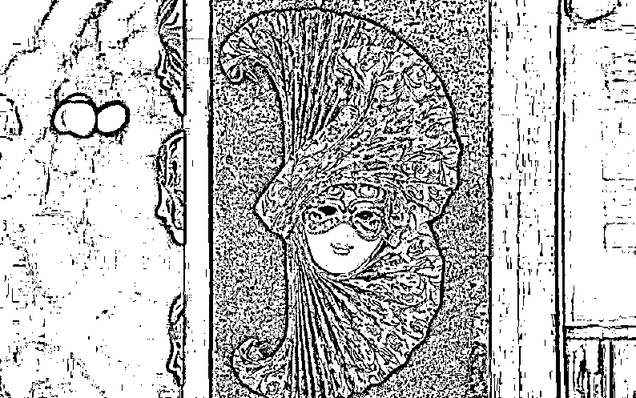

**金星三分月亮北交点****11 月 7 日-11 月 20 日****重点影响人群：有个人行星、四轴、交点位于白羊座、巨蟹座、天秤座、摩羯座、双子座、处女座、射手座、双鱼座 12°-28°的人。**虽然寒冬脚步渐至，这可能是当下最令我们感受到温暖的一丝明亮了。金星的柔美与月亮北交点相辉映，北交双子座指向快乐的学习，灵活变通。心智交流在这两个星座之间达成了天然的默契，支持我们**向外学习和表达**。当情感有了出口，自然如释重负。无论我们与谁交谈，无论我们去学习什么，都能帮助我们有效地去除头脑中关于“意义、体系、指导”的羁绊，也能让我们享受到哪怕是片刻的美好与宁静。当我们不再执著于意义之中，意义就会自然涵盖我们的生命。当我们积极地敞开好奇去学习，让头脑参与充满乐趣的游戏中，生命会为我们编织出故事，让我们从中找到爱。

**版权声明：**原创文章由作者授权首发于若道平台，欢迎转发，反对抄袭。友号转载请申请白名单。

**郑玮玲**

ISAR（国际占星研究协会）认证占星师（2016 年获得）

若道占星专栏作者

将占星咨询、教学与音乐、舞蹈相结合的疗愈者

**微信号**：zhengviolin

**新浪微博**：@郑玮玲

**微信公众号**：Sampriya-Astrology

长按打赏

**ISAR 选修课，心理占星学视角下的预测方法**

**点击图片链接或扫二维码咨询客服**

**微信又双叒叕改版啦，不想错过若道君的推送？**

**就把若道设为星标吧！**

**▼**

就是这个“在看”，戳戳戳 ☟

********报名直达入口********

# 11 月黄金报告及上证指数报告上线！｜经济寒冬如何平稳度过？

> 原文：[`mp.weixin.qq.com/s?__biz=MzA5NjA0NTAxNg==&mid=2651430896&idx=2&sn=9957978ab8e85cc6decaf0e2b9c55280&chksm=8b4b2d47bc3ca451cb3b2b3336394719d56cdf608a3d524d163927cfed1533f37c74b230b855&scene=126&sessionid=1692738085#rd`](http://mp.weixin.qq.com/s?__biz=MzA5NjA0NTAxNg==&mid=2651430896&idx=2&sn=9957978ab8e85cc6decaf0e2b9c55280&chksm=8b4b2d47bc3ca451cb3b2b3336394719d56cdf608a3d524d163927cfed1533f37c74b230b855&scene=126&sessionid=1692738085#rd)

10 月下旬到 11 月，有一些重要的天象和大事件。从大事件而言，美国总统选举将在 11 月 3 日举行。本次总统选举可能对许多美国人来说是他们一生中最重要的一次选举。其结果是一个全球关注的事件，而此间美国发生的一切闹剧也让人感到无比慨叹和唏嘘。
而随着北半球进入秋冬，欧洲新冠疫情的大幅反弹为明年全球经济恢复带来巨大的阴影。美国和欧洲因为疫情控制不利带来的经济衰退让全球经济的恢复的幻想变得更加遥不可及。在这种情况下，疫情控制得很好的中国，似乎是全球重大经济体中唯一还保持了正增长的国家。中国在这样的经济大衰退中是否能够成为避风港，中国的资产是否能够在这样的态势中获得更多青睐？一个值得关注的信号是人民币对美元的升值，人民币美元汇率 2020 年 5 月达到 7.17 元以后，已经经历了连续 5 个月的上升，目前至 6.65 元/美元。

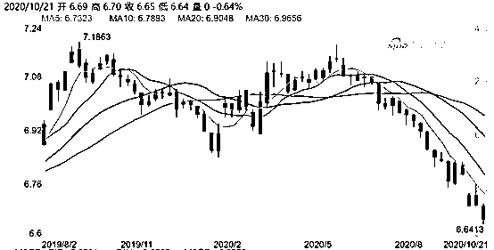

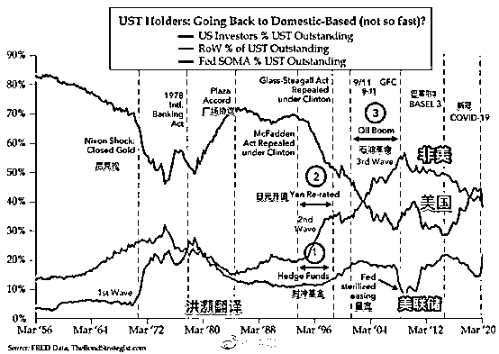另一个值得关注的是美国国债，非美投资者历时 60 年不断增持美债后，从 2011 年左右开始，开始减持美债，新冠疫情后减持在加速。这样的事件都是什么信号？从天象而言，**在 10 月下旬，火星和水星都在逆行**。其后，在**11 月 3 日，水星恢复顺行**，**11 月 14 日，火星恢复顺行**。在**水星和火星逆行期间**，似乎有一个对于所有交易者和投资者而言，不断重复的教训：“买谣言，卖事实”。

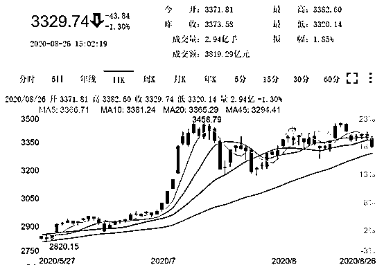

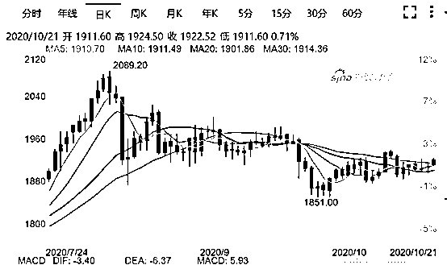

世界经济和金融在未来 2 年都会经历巨大的调整，在这个调整中，应该持有什么样的资产，可以让你度过这个寒冬？秋天已经来了。《上证指数 11 月研究报告》和《11 月黄金报告》都已经发布，让经历了 40 年金融市场起伏的梅里曼老师为您的金融投资提供他宝贵的洞见。如果您已经购买， 请参照下图指引，查看报告内容。

**11 月上证报告上线**

上证指数月度报告价格

**单月报告**：280 元 

**3 个月套餐价**：780 元（260 元/月）

**12 个月套餐价**：1999 元（166 元/月） 

**长按下图识别二维码购买上证指数报告**
▼

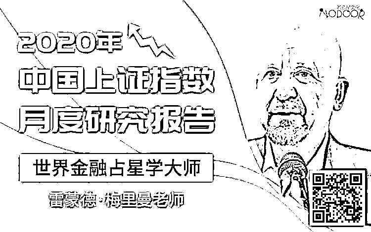

**11 月黄金报告上线**

黄金月度报告价格

**单月报告**：280 元 

**3 个月套餐价**：860 元

**12 个月套餐价**：2400 元

**双报告年度套餐更优惠（直降 899 元）**

**12 个月黄金报告+12 个月上证指数报告：仅需 3500 元**

**长按下图识别二维码购买黄金报告**

▼

**购买者需知**

**①**梅里曼市场时机学院《中国上证指数月度研究报告》是梅里曼市场时机学院（以下简称 MMA）的研究“预报”，而不是市场“预测”，是梅里曼老师及 MMA 金融占星分析师对人类活动周期历史与行星周期之间相关性的研究，二者在大部分情况下具有 80%或更高的相关性，而不是因果关系。报告中的研究完全存在错误的可能性。即便是非常认真的研究和几十年的研究经验，金融占星师无法总是正确地解读出各种征象在实际层面上会如何相互作用，并显化为事件结果。所以请将报告看作一个研究参考，务必结合其他市场研究和你个人对市场的理解，根据你的自由意志做决策。**②** 本报告只是上证指数研究，没有个股研究。**③** 此报告一旦售出，**即不接受退款。****④** 此报告每月 1 期，**并非都是在每月相同日期发布**。我们收到英文报告的当天，即发布该英文报告。3 天后，上线报告中文版。**⑤ 此报告仅支持手机网页阅读，不支持电脑阅读和下载。****以上须知，请仔细阅读。一旦付款，即视为已了解并接受所有须知内容。**在过去的 39 年中，唯有梅里曼逐渐完善，并在梅里曼市场时机学院月度周期报告中阐释了将地球宇宙学与周期相结合的研究方法，以惊人的精确性预报了黄金价格发生重大变化的时间。黄金购买 Tip 各大银行均可购买黄金或黄金 EFT 基金，也可以在诸如天天基金或者支付宝购买黄金及黄金相关产品。不明白的可以百度搜索。购买后如何查看报告？

购买后有疑问怎么办？

请联系技术客服

**微信：nodoor201705**

购买上证指数+黄金报告直达入口

# ISAR 选修课程 | 新技法！心理占星学视角下的预测方法

> 原文：[`mp.weixin.qq.com/s?__biz=MzA5NjA0NTAxNg==&mid=2651430723&idx=2&sn=b83b0ea7b8db3eae89b78759a2b6b4b0&chksm=8b4b2df4bc3ca4e2aaed574bd83e20f75d6e0da637982a0d13cb9dd046f53d5e5aab7bfdcdfd&scene=126&sessionid=1692738085#rd`](http://mp.weixin.qq.com/s?__biz=MzA5NjA0NTAxNg==&mid=2651430723&idx=2&sn=b83b0ea7b8db3eae89b78759a2b6b4b0&chksm=8b4b2df4bc3ca4e2aaed574bd83e20f75d6e0da637982a0d13cb9dd046f53d5e5aab7bfdcdfd&scene=126&sessionid=1692738085#rd)

作为一门艺术，预测占星学运用行星的运行来预测特定时期的性质、意义和持续时间。在这个阶段的课程中，我们会**考察意识进化的概念、其基本原理及其与占星学预测部分的关系。****意识进化可以被定义为有意识地与星图中固有的进化过程合作。**学员们将探索如何用行进和推进来为意识进化服务。我们不是简单描述事件的结果，而是将行星运行描述为实现先天潜能的机遇之窗。**在这个阶段的课程中，会探索占星心理学视角下如何将对行进、推进和其他预测方法的分析运用于个人成长。**具体事件反映并促进了意识的改变；因此，行星运行可以帮助我们洞察成长过程的精确时机，让我们领会内在和外在现实如何同时发生、彼此反映、互相转化。我们还将探索宏观的世界行进，考察占星格局如何在社会、政治、经济、艺术和生态层面上表现出不同的形式，却又在多样化的现象中反映单一的原型。这里的挑战是去思考，我们对宇宙的这种参与式关系如何能为共同创造一个积极的、更充满希望的未来做出贡献。

**1**

**课程安排**

**第一课：开始预测****第二课：发展年龄方法****第三课：太阳的行进****第四课：月亮的行进与推进****第五课：水星的行进****第六课：金星的行进****第七课：火星的行进****第八课：木星的行进****第九课：土星的行进****第十课：天王星的行进****第十一课：海王星的行进****第十二课：冥王星的行进**

**2**

**课程费用**

**课程费用：9800 元****转发分享优惠价：8800 元（11 月 1 日之前有效）****若道核心课程 L5 学员优惠价：6800 元**

**3**

**授课时间**

**上课时间：**12 月 2 日（周三）20:00-22:00

**授课方式：**英文授课，中文翻译

**4**

**授课老师**

**格伦·佩里(Glenn Perry)**

*   这位传奇的占星师，也是一名拳击和摩托车爱好者； 

*   他毕业于赛布鲁克学院(Saybrook Institute)，是心理/意识研究专业博士，也是拥有 30 余年经验的加州注册婚姻和家庭治疗师 （CAMFT）； 

*   美国占星心理学学院（Academy of AstroPsychology）的创办人，他曾任国际占星研究协会 （ISAR） 以及联合占星大会董事会（UAC）副主席，也是 ISAR 突破性道德标准的设定者； 

*   康涅狄格州研究生院（the Graduate Institute of Connecticut）原型宇宙学与意识进化项目的负责人，共出版八本占星学著作：《心理占星学入门》、《心理占星论文集》、《盗取天火》、《从忠诚到革命》、《星图中的阴影》、《占星职业议题与伦理》、《出生星图深度分析》、《从古代到后现代占星学》。

**5**

**往期学员分享**

不得不说，格伦老师的心理占星课真的很强大，跟着老师上完了两年半的课程，仿佛做了一个长程的心理疗愈。这段时期我正好在经历冥王星的困难行进，感觉就像在地狱中行走，在这个过程中我懂得了，只有疗愈了自己，懂得自己的伤痛，才能理解他人，帮助他人。在学习占星学技法的同时，深深感受到老师的慈悲心，也感受到老师对待占星学的严肃认真。能够跟随格伦老师学习真是太幸福了，同时也特别感谢若道，感谢大卫老师。——2017 心理占星学格伦核心班学员 宋轶绚跟随美国心理占星学院两年课程，最受用的是格伦老师以扎实的心理学理论基础和咨询经验，所教授的心理占星学的系统架构。没有哪个心理占星学的课程比格伦的更系统、深入、有理论且有技巧了。还有格伦特色的发展年龄法，黄道带病理学理论在个案中很有实操性，2 年的学习，除课程外的几百万字经典的补充阅读资料，70 多场测试，以及格伦言传身教的从业道德标准，让我成长为一位合格的心理占星师。——2017 心理占星学格伦核心班学员 植语瞳

**6**

**退转课程**

**退款原则请详看《教学协议》，如有疑问请咨询课程顾问。******占星心理学之预测视角****

**授课老师：格伦·佩里**

**授课时间：****12 月 2 日（周三）20:00-22:00**

**授课方式：**网络课程：英文授课，中文翻译

**费用：9800 元** **转发分享优惠价：8800 元（11 月 1 日之前有效）若道核心课程 L5 学员优惠价：6800 元**

**课程负责人：Margaret（微信号：nodoor233）**请备注“预测视角”

长按二维码添加课程负责人咨询~  

****报名请点击“阅读原文”****

# “她在期待拥抱，却无法伸出双手” | 如何激活星图中的金星？

> 原文：[`mp.weixin.qq.com/s?__biz=MzA5NjA0NTAxNg==&mid=2651430723&idx=1&sn=221c877d4bd2c6548b89de515291eac4&chksm=8b4b2df4bc3ca4e2cf18de6c308ca6d0dff78619a819a1c953c8b2ac382c90cab7f8b593b3b7&scene=126&sessionid=1692738085#rd`](http://mp.weixin.qq.com/s?__biz=MzA5NjA0NTAxNg==&mid=2651430723&idx=1&sn=221c877d4bd2c6548b89de515291eac4&chksm=8b4b2df4bc3ca4e2cf18de6c308ca6d0dff78619a819a1c953c8b2ac382c90cab7f8b593b3b7&scene=126&sessionid=1692738085#rd)

****************☆ ****************************后台****************************回复“今日”，给你一句生命态度****************

作者/达娜·格哈特
译者/葡萄园的女巫编辑/玫瑰 图片/全景网

我们的星图都有一颗金星，但你的金星健康吗？它给你带来快乐了吗？我们一起来听听占星师达娜的金星故事。

**金星是我的小秘密**金星一直是我心虚的小秘密。我的金星落在了天蝎座。刚开始学习占星学时，我知道金星天蝎座带着强烈性感的闷骚阴性特质。对此我并不讳言，我甚至很满足顶着这样的名声做一个复仇女巫。通常对于金星天蝎座的描述，我一条都对不上。金星对于我是一个无意识的行星。多年以后，丈夫离开了我，因为另一个或许金星在天蝎座的女人。她神秘、热情、性感，我丈夫说：你一点都没有。”我的星图解释了行星是如何失去了颜色，我的金星落在掌管兄弟姐妹的第 3 宫：妹妹就是我家的金星。她是父亲的心肝宝贝，黑色的长发，杏色的眼睛，她会骑自行车，溜滚轴，还可以轻松的骑马驰骋。而我则笨拙，戴着眼镜，老鼠一样的灰色头发，毫不起眼。在与金星有关的事情上，我总是受到无形的阻力。我的冥王星在 12 宫同金星形成紧张相位。如果冥王星是在别的宫位，也许我会有更强烈的激情，更加迷人，就像通常对于冥王星紧张相位的描述。但是我在这方面，大部分情况都感到非常不足，甚至会害怕被男性围绕。我的金星同月亮形成紧张相位，通常这个会被描述为在与女性的相处中有冲突。典型的就是母女之间的竞争关系，母亲巧妙地削弱了她的对手——女儿的女性气质。母亲通过模糊性别的信息削弱了我的女性气质，她喜欢我往往因为我的聪慧和坚强的性格，而不是因为我的美貌。很小的时候，大概也就四、五岁吧，我就放弃了做一个女孩儿。我的金星与智慧之星水星相合，所以我往往带有中性气质，看起来十分书卷气。无论天蝎座赋予了我怎样的激情，我都把这一切投入到了第 3 宫的追求中，热爱优美的文字魅力，热衷学习，渴望探索与沉思。怀孕时，当我知道是儿子，感到松了一口气。害怕如果会有一个女儿，如果被粉红色的蕾丝边围绕我会感到无助。我该如何打扮她呢？该给她梳理什么发型？我怎么样教育她？

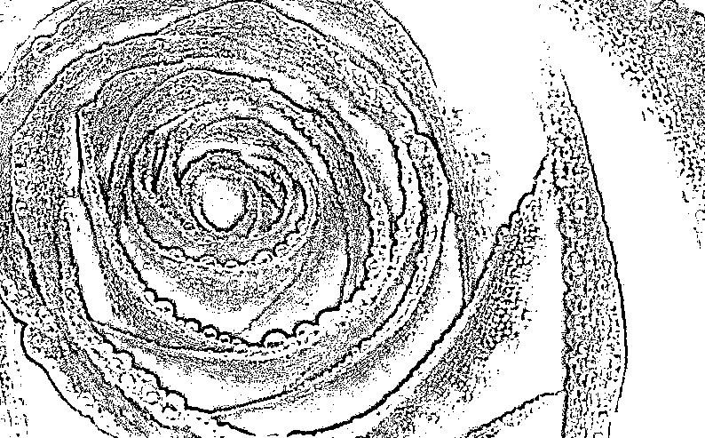

**金星到底是谁？**金星让我觉得不舒服，但是我也发现，绝大部分人都有金星带来的麻烦，不同的故事显示了不同的缺陷。如果以占星咨询者提的有关问题来判断金星的成长健康状况，那么很容易就得出这样的结论，她只是勉强在支撑。一般，在询问完了基本的目标问题后（我到底是谁？我该选择怎样的职业？）大部分人都会继续询问如何获取金星有关的东西。他们希望获得更多爱，更多钱，更多快乐。他们希望能变得更加迷人，并且从他们爱的人那里获得更多赞美。自信心不足、没有激情的婚姻、缺乏满足感的工作，这些文化流行病更进一步的显示了我们对于金星力量的缺乏和渴求。那么金星到底是谁呢？她并不全是阴性气质，她也掌握了生命中许多美好的事情。毫无疑问，金星是啤酒广告里快乐、完美的女孩儿，但是她也是美味的巧克力豆，活泼开朗的笑声，一串钻石项链，一个享受美食的慵懒下午。如果你想激活内在的金星力量，让你的指尖在丝绸表面起舞吧，或者享受一下豪华皮革轿车的味道。**金星也有邪恶的一面，热衷感官享乐，沉迷娱乐。**她还具有优雅的艺术气质。她是玛丽莲·梦露和杰奎琳·肯尼迪。现实世界里，**金星通过金牛特质表现为好色和丰饶多产，通过天秤座特质表现为轻快的自然天性，金星在审美情趣上同样也表现出了温柔的和谐性和明智的协调能力。**你可以用一个简单数学公式描述她，也可以在风磬或者清晨的鸟鸣中听到她的歌唱。朝你背后扔冰块她也会乐的尖叫。她既安静也兴奋，既有天性的狂野也有优雅的品味。作为守护爱与富饶的女神，她希望能让这片土地充满了快乐。那为什么我们会因为她而有如此多的麻烦呢？如今的金星总是陷入绝望和沮丧。最持久流行的金星代表人物——玛丽·莲梦露，众所周知的特点就是她的魅力与不快乐。她并不孤独，看看其他二十世纪著名的维纳斯代表，伊丽莎白·泰勒、杰奎琳·肯尼迪，她们每一个都拥有很多，却仍然强烈的感到不满足。为什么她们在拥有了财富、地位和美貌之后似乎缺乏真爱和个人幸福呢？或许关于她们的神话已经破灭。她们的故事验证了我们的现代期望——希望破灭和美丽诱发悲剧。**我们对于浪漫的幻想往往美化了忧伤——渴求痛与甜蜜悲伤的离别**。事实的确如此——**如果一无所有，就无法让最佳品质涌上表面**。但是我们多久才能做到呢，当我们的欲望得到满足，我们是不是变得自满或者挑剔，完全忽略了我们的快乐？我们也许会怀念过去的恋人，将他们神话，这就限制了我们以后的生活。当神话里的王子坠入人间，双脚沾满泥土，我们就会开始寻找下一个幻想。这种方法的弱点是**持续的空虚**。当我们期望某些人或者某些事情来弥合我们缺失的那部分时，就把我们可爱的小金星扔到街上当乞丐，面前放了个乞讨的碗。

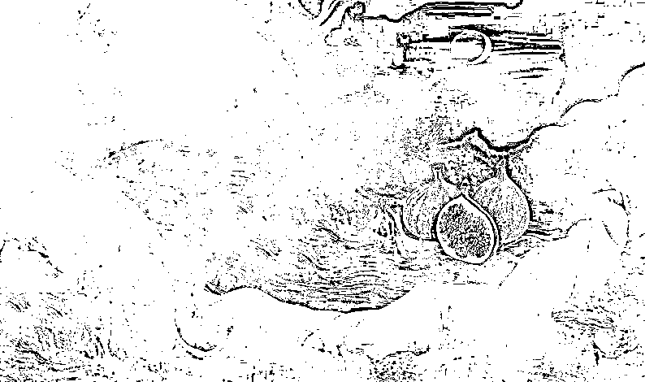

**关于****金星的神话**这就难怪那么多人都来找占星师求助希望听到关于金星的好消息。占星学家在研究星图时把金星作为观察爱情和财务状况的线索。而爱情和金钱正好反应了我们对于快乐的想法。但这是金星所愿么？事实上，金星的位置告诉我们如何满足她的利益，而不是用其他方法。在古代，如果一个人的日子过的不爽了，那么圣人先贤的工作就是帮助他们找出哪一个神明被冒犯了，供奉什么祭品能弥补这个错误。很多占星学书籍上都说我的天蝎座金星让我善妒并且充满了欲望。如果他们能告诉我金星天蝎座需要的是什么就更有趣了，不仅仅告诉我会是什么样子，告诉我需要做些什么。在此之前，我快乐的潜能就像睡美人一样被留在了荆棘丛林里。占星学家们能给我一个神奇之吻唤醒我的金星么？维纳斯到底是谁？她到底出了什么问题？

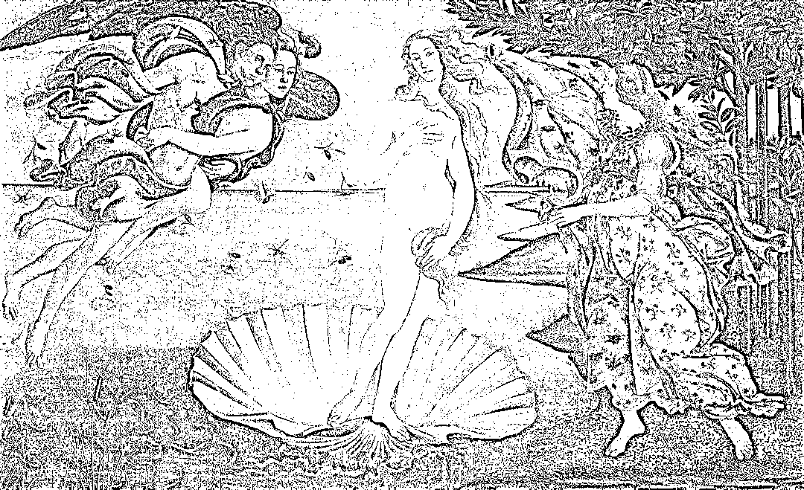

| 阿弗洛狄特希腊人把金星称作阿弗洛狄特。他们的这位女神既不是智慧的战略家雅典娜，也不是能干的女猎手阿耳忒弥斯。**她伴随男人旅行却不是竞争者。她艳光四射、精致优雅，她是一个充满诱惑力的女人，富于艺术才华和吸引力。她知道如何取悦他人，也知道如何取悦自己。**阿佛洛狄忒被许配与跛足的铁匠之神赫菲斯托斯，但是她还拥有众多情人，包括希腊战神阿瑞斯、酒神迪奥尼索司、宙斯的儿子丰产神赫耳墨斯，还有美少年阿多尼斯和安希塞斯。甚至还有关于她与父亲宙斯乱伦的传闻。她的儿子包括勇士特洛伊战争中的勇士艾尼阿斯，男性生殖之神普里阿普斯，同时具有男性和女性生殖器的赫马洛狄忒斯。她沉迷于毫不掩饰的性欲中。当然她最著名的儿子就是爱神厄洛斯，带着惊人的欲望之箭的小天使。关于她的出生有很多种说法，最著名的一个故事是说当克洛诺斯阉割了父亲，把他的生殖器抛出，生殖器落入海面，阿弗洛蒂忒在在海上一片泡沫中诞生，随后在为她而建的神殿里，接受女祭司的祝福，并被赐予性的天赋。通常她的形象都是一丝不挂地站在一个巨大的贝壳上（象征女性生殖器）。很明显，阿佛洛狄特联结了女性和男性的生殖器，我们必须从这个关键点切入去了解她的价值。但是我们怎样才能把这一点融入到出生星图中呢？我们如何将她毫不掩饰的性欲与二十一世纪男女平等的价值调和在一起呢？我们很努力证明女性不仅仅是情欲对象。我们必须进一步地了解两千年来基督教对于阿佛洛狄忒情欲混战的批判。**大部分人会在年轻的时候发现自己的性欲，秘密的，无法告知他人，带着不安和羞愧。我们会不断被教授如何工作的技巧和道德，但是没人教我们快乐的技巧和重要性。**中世纪宫廷爱情也没有带给我们舒适的感觉。尽管作为有特权的贵族，他们依然痛苦，纯真的爱情理想被定型——还有扭曲，这是我们当代的浪漫概念。把阿佛洛狄特置入这些过滤器中，她变得紧张矫饰——这就是为何我们并不像希腊人那样为她建造神殿供奉。当然这样的忽视怠慢让我们的女神非常生气。事实上，心理学家詹姆士·霍尔曼认为阿佛洛狄特非常生气。这位性感女神希望我们认识到性是一种神圣而热情的力量。她希望我们点燃她神圣的火光，作为获得快乐的工具。她希望我们放下疲劳和厌倦，享受天堂般的快乐，去尝试，去触摸，去感受这个充满美好的世界。**她希望我们能明白，通过性与情欲享受我们体会到生命力的魔力，它让我们健康完整。**之后我们的生活和其他所有际遇都将受到阿佛洛狄特祝福加持。但是如果我们拒绝她的馈赠，我们认为它庸俗、见不得人，我们逃避它，甚至有罪恶感，那么我们就蔑视了她的力量。霍尔曼在“粉红色的疯狂”一文中写道，对于女神的不敬招致了她的报复，金星就是报复的工具。谈到金星，我就要入侵现代世界的每一个角落，每一个长久以来拒绝这个粉红色的疯狂的角落。我要把你的车变得色情，还有你的食物，你的广告和假期，还有书籍和电影，学校和家庭。我要强迫你看这些东西，直到你满脑子都是粉红色的欲望，想到要逃——幽会、筑巢、情人。整个文明世界都因为进入我的禁区、我的秘密花园而疯狂。我将要刺激你们的文化修养体系，甚至那些需要治疗的患有神经官能症的人，和他们冷静的心理治疗师，还有什么比谈论欲望、享乐、诱惑更好。

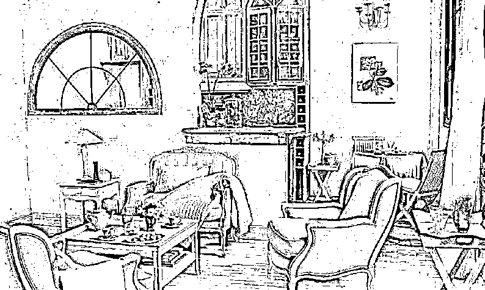

**你的金星发展得怎么样？**金星带着她丰富的性能量，赐予了我们搞乱自己人生的能力，享受它还是放弃它，与它周旋并从中获得创造力。如果太阳创造了什么，他会有展现的欲望，他渴望得到公认。然而**金星需要受到刺激才会展现她的创造力。如果金星被占用，那么我们的创造力会变得低俗。****因此，金星影响力的缺乏造成了许多需要创造力的计划失败，负担了太多的“企图”和期望。**金星提醒我们享受快乐是一种高雅艺术，它是和谐社会体系的深层价值。如果没有太阳，将会没有生命的诞生，但是如果没有阿佛洛狄特的欲望，就像失去了地心引力，土地将不再肥沃，地球也不能容纳我们的身体，不会再有花园，也没有创造力和美。地球伊甸园将失去光彩。它们都不是必需品，看起来就像衣服上的蕾丝边，但是多漂亮的蕾丝边啊，如果我们不能享受这日常生活中的小小快乐，就真的会错失金星的精髓。因此，**金星在星图中的位置意味着某些义务。**不论是在象征家庭的第 4 宫，还是朋友宫 11 宫，或者是关于哲学的第 9 宫，她出现的位置你都需要回答她的问题。你是否通过这个领域为生活增添色彩？你是否投入了时间去体验这一领域？你是否敞开心胸沉溺于此？你是否开怀大笑，你赞赏这一切，你的生活是否充满乐趣，你的快乐是否感染了身边的每一个人？金星星座告诉我们如何装饰她的神殿，用上那些能让你感到快乐舒适和荣耀的事。金星与其他行星的相位就像她那些出轨的风流轶事，可以看到她在哪里最愉快，或者受到挑战战胜困难。了解你的金星，把她当作一门快乐的艺术，而不是一件琐事。不论你从金星所在星座或者是宫位找到或者建立了怎样的快乐，就从这里开始着手。每个人都拥有快乐，不论他的遭遇多么惨。我想起了一个教授告诉我的故事。他在吃自助餐时与一个有自杀倾向的人站在一起排队，他中断了喋喋不休的诉苦，要求服务员给他一份烤土豆。他精挑细选了自己喜欢吃的堆了一盘，在那一刻，金星被激活了，也许并不是那么具有活力，但是欲望战胜了死亡。

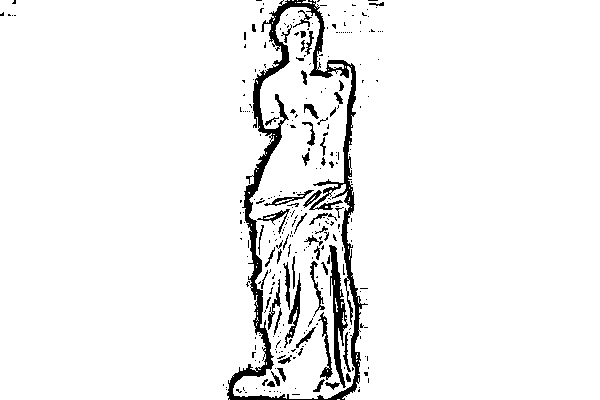

|断臂维纳斯**金星要求我们放开心胸拥抱快乐。**但是因为文化上的压抑，这点往往很难做到。卢浮宫里著名的断臂维纳斯雕像巧妙的描述了我们的心理状态。维纳斯断了手臂缺乏与世界感性接触的能力。她在期待拥抱，却无法伸出双手。画家桑德罗·波提切利的作品《关于春天的寓意画》更加具有教育意义。在画中，维纳斯抬起一只手对她周遭的事物表示赞赏。她是维纳斯，具有艺术鉴赏眼光的欣赏者。她的另一只手轻轻提着礼服，泰然自若。那些无法自然的表达自己的人需要有一个优秀金星榜样。我很幸运有三个好朋友的金星落在了星盘中的 Gauquelin Sectors 高魁林盘（上升和中天区域）。其中一个人的金星合了上升点，她的状况与阿佛洛狄特的故事真是相互辉映。她的丈夫为她制作手工饰品，她还与另一个男人有着激情外遇。Jill 总是习惯性的卖弄风情。每一次她赢过一个对手，她都会做出非常有力的金星式的胜利姿态，自豪而且满足，就像猫咪舔它的爪子。我曾经嘲弄过她的风骚，这件事总是让我很困扰。她认为秘诀就是她的笑。她说：“每当男人看到她的笑容，就知道她的意思。”在希腊神话中，阿佛洛狄特也是一个爱笑的女神，她的笑声是要告诉我们快乐的享受生活。它散发出一个讯息——我们知道有那么一两件事能取悦自己。我的第二个朋友有金星合中天。Carol 热衷于事业上的成就，做一名有地位高收入的专业人士，尽管她只有高中学历，屁股后面还有一群年轻同事在追赶。办公室里，她总是焦点人物。她非常漂亮，也知道如何装扮自己，性感彩妆，紧身牛仔裤，极具诱惑的女性曲线。她可以优雅高贵，也可以风情万种。在正式场合她总是举止得当。在她的婚前派对上，我见识了她卓越的风度和技巧将一个简单的客厅聚会变成了最盛大雅致的聚会。从 Carol 身上我看到了阿佛洛狄特的信心和决心，运用美的力量让其他人也乐在其中。我第三个朋友的金星落在了下降点，这是金星的地盘，一个荣耀的地方。Andrea 身材高挑，外表端庄，她甚至到自助洗衣店都戴着珍珠项链。小时候她的理想是做一个艺术家，长大后，她把这个理想移情到了婚姻，希望嫁给了一名艺术家。有一次，我问她，如何面对那些她并不喜欢的男人的关爱，这些事总会让我觉得歉疚。我怀疑这样的事在她身上经常发生。她想了一会，然后出于第 7 宫的本能回答道：“我试着换位思考，然后用一种我认为可接受的方式去告诉他们。”“但是如果他们的感觉不是这样呢？”我问她，她回答：“那就温柔但是坦白的直说。”这真是像阿佛洛狄特的声音，甜美但是冷静。我觉得在某些时候，这些女人都超越了简单人类的女性魅力。然而，如果让我指出她们三人的共性，那就是，当我看到她们的男人时都觉得非常失望。这些男人并没有什么不好，问题出在几个女人谈论他们的方式让我期望过高。尽管她们已经相爱一段时间，但谈起这些男人，她们的眼中流露出痴迷和崇拜，那种样子对于我们只有在恋爱的头三个月才会出现。但是她们的崇拜并不是浪漫的幻想，也不是女性的卑屈姿态。三个女人都十分强势，并且对于爱人的人性有着清晰认识。但是她们依旧与这些能让她们快乐的人相处。这就是阿佛洛狄特最深的秘密，**她知道如何在爱情中取悦自己。**

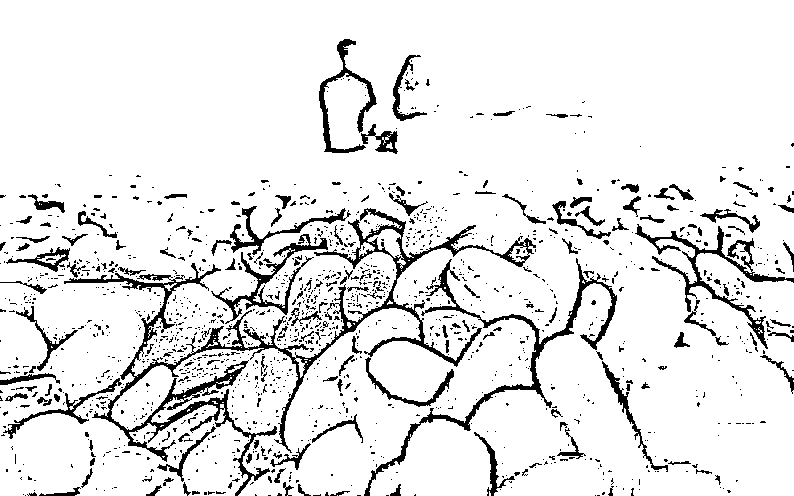

我们也许会想，阿佛洛狄特混乱的风流韵事到底暗示了什么呢？那些男女关系混乱的人从来不会满足于一段感情中，因为，每一次的私情都是那么新鲜刺激。在某些时候，对于我们的伴侣，大多数人选择了月亮的陪伴而不是金星。我们渴望安全感，我们有需要，我们有对于过去的感知。失去了自发性，我们开始分析每一个行为的深层含义。如果月亮的伴侣忘记了一个请求，月亮会认为是他（她）根本不重视。但是沉着冷静的金星会用另一种方式表达她的失望，她不会反省认为自己无足轻重，她会将这作为一个机会更了解她的另一半。她甚至会很顽皮——捉弄她爱人的心不在焉，喜欢他走到哪里都带着记事本，写满了备忘，因为她亲爱的阿娜塔像个孩子一样狂热，总是记不住任何事除非用笔写下来。这大概会让她的爱人更加疼爱她。**金星很享受交际花的角色带来的快乐，她热爱她看到的一切。**这样的性滥交总是带来惊心动魄的刺激。这是一种对于意外惊喜的渴望。这是对于不安全状态和未知将来的渴望。这样的爱神 Eros 在我们的生活中随处可见——婚姻生活、职业生涯、甚至是与朋友和子女的相处。佛教徒 Pema Chodron 对这种情欲的契约关系的见解十分独到，她建议我们应该**多多期待未知的惊喜**。想象一下，如果你并不知道晚饭吃什么，却端上来美味的意大利面。想象一下，你的孩子们在未告知的时间来探望你。敞开你的心胸，用眼睛探寻新鲜气息，每一件事物都是那么美轮美奂，每一件事物都会激发你爱的灵感。并不是每一个关于金星的故事都充满快乐。毕竟她引起了特洛伊战争，而且她的丈夫 Hephaestos 怀疑她的忠诚。她带给我们的教训非常清楚：**如果你遵循金星本性的模式，就很有可能暴露自己。**金星见证了你的价值，但是也可能泄露了你的秘密，让你陷入麻烦。这个女神给了我们选择的权利，而我们的选择带了不同的结果。我们需要为这个女神付出代价，如果你冷酷的对待她，那么你的热情将消失不见。金星如果说：“热情一些吧！”你将会陷入麻烦，比如引发一场战争。生活变得不再平静。但是如果失去了金星的力量，生命还有什么意义呢？

**版权声明：**本文由若道翻译发布，欢迎转发，反对抄袭。友号转载请申请白名单。

**达纳·格哈特**一位国际范围内受尊敬的占星师。她为众多占星学网站和出版物讲课、写稿。她在十二宫的月亮激励她对这颗发光体进行了深刻而持久的探索研究。

**系统学习占星学**

**点击图片了解详情**

**微信又双叒叕改版啦，不想错过若道君的推送？**

**就把若道设为星标吧！**

**▼**

就是这个“在看”，戳戳戳 ☟

********报名直达入口********

# 十二宫人间生存指南丨你是哪里降落的小精灵，来人间渡劫了？

> 原文：[`mp.weixin.qq.com/s?__biz=MzA5NjA0NTAxNg==&mid=2651430662&idx=1&sn=61b3bfa32f2b22900eddea474b8f3464&chksm=8b4b2db1bc3ca4a77c953c951fdf975a23366b4d12892d61950f0c50d700ad630fe200ea098d&scene=126&sessionid=1692738085#rd`](http://mp.weixin.qq.com/s?__biz=MzA5NjA0NTAxNg==&mid=2651430662&idx=1&sn=61b3bfa32f2b22900eddea474b8f3464&chksm=8b4b2db1bc3ca4a77c953c951fdf975a23366b4d12892d61950f0c50d700ad630fe200ea098d&scene=126&sessionid=1692738085#rd)

******☆ ****后台回复“今日”，给你一句生命态度******

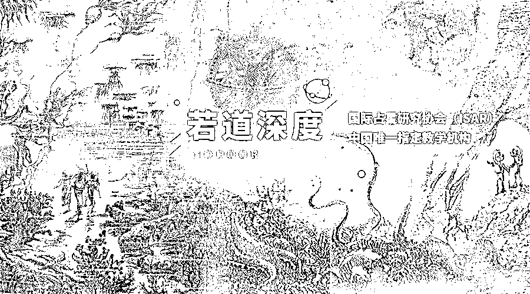

作者/编辑/佳黛 封面/书君 图片/网络

**作者的话：**

我知道，写起十二宫来，会不可避免地描述其“神秘性”，甚至很有可能带到它更高维度的那一面。然而可能因为我是群摩羯在十二宫的原因，所以这一篇我不想把重点放在十二宫有多“厉害”上。我想提供一个帮助，给那些因为十二宫强而无法落地的人们。我想给你们一个阶梯，能够从十二宫的悬空之中走在土地上，感受脚落大地。

如果想看更多关于十二宫的描述，可以查看这些文章：[十二宫](http://mp.weixin.qq.com/s?__biz=MzA5NjA0NTAxNg==&mid=2651393140&idx=1&sn=fa34e1181e9bbfe954295dc4fa6a8b71&chksm=8b4bbec3bc3c37d5009f8e656cc31a5fc057d2e25481402f1a661b86418286e7a541c29c5e8b&scene=21#wechat_redirect)。建议的阅读顺序是，先去阅读这些关于十二宫的文章，再回来看这篇。本文也适用于海王星人群。

说起十二宫，这一直是一个神秘的宫位。它的神秘之处在于，**像是一个有去无回的传说之地。**从外面看过去的时候，只能看见一团迷雾。人们会听说很多，据说那里有吃人的怪物；据说那个宫位非常危险；据说有的人会失去心智。去的人有时候回不来，回来的人有时候像是失去了一段记忆，迷迷糊糊就走出来了。

你问他们：“你们是如何出来的？”“撑着呗，到了时间就出来了。”他们似乎省略了很多内容。而有些内容用直白的语言说起来，听上去太过荒谬，你需要换一套思维体系，才能够听明白。甚至有时候你觉得自己永远也无法理解那套思维。往往更多的人，并不知道自己经历了什么。

这个宫位的事物，似乎都很难用语言表述，它的一切都是似是而非，不属于物质世界，甚至你换个角度辩证，就可以否定它的存在。“精神世界是真的存在的吗？”、“你那些过度的感官是错觉吧？”、“你凭何确认它存在？”每一个问题论证起来都如此严峻。

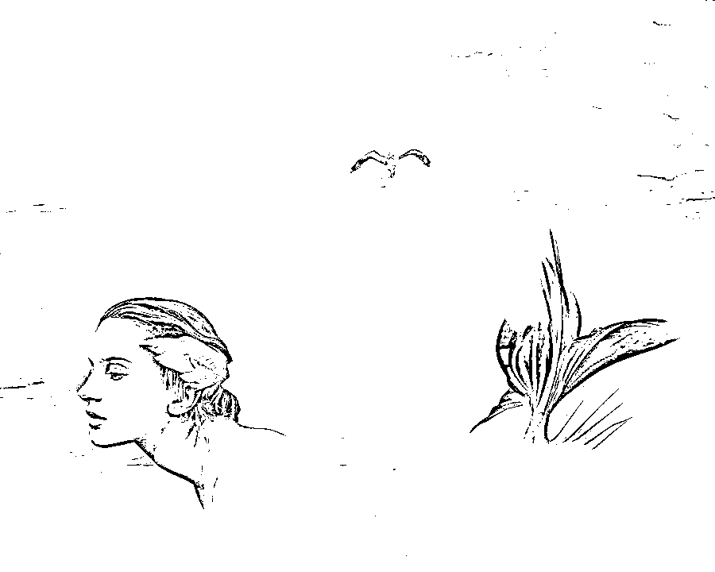

思维的迷宫是很难走的，现实世界的迷宫你或许还有迹可循，听一听他人的经验，吸取前人智慧，可以接触得到科学结论。但是思维的迷宫，它似是而非，你首先需要确认它是否存在。

并且，这种似是而非也会带来一个问题，因为它并不是一直存在，所以你可以当成短暂的错觉。虽说你并没有办法确认它何时会离开，你何时能够回到所谓“正常”生活中。但你依旧可以这么骗自己。

更多的时候，它像是一个隐藏的炸弹，突然之间爆发出来，打得你措手不及。从海王星行进的体验中，我们也可以窥其一二。**当海王星行进到来时，我们感受到一种庞大的清洗，你在现实世界所搭建的经验、可以立足的信念、你的自信来源等通通被洗掉了**，你像一个赤条条的人，以一种令人恐惧的方式面对这个需要搏斗的世界。你原来的武器不管用了，该怎么办呢？十二宫人就常常面临这种体验。

**说是常常，是因为这种时刻会时不时跳出来**。它不似海王星行进，是一整段的经验。它像是随机跳出来的惊喜，你不知道哪天的盒子里会蹦出它来。

所以有的十二宫人可能会经验，突然醒过来的早晨，怎么都没有办法爬下床，原本日常的生活突然像山一样压过来，喘不上来气。而调动平时的激励方式就如同用钥匙打开一个坏掉的锁，继而连锁都消失了，毫不留情地向你提示“这种方法没用了。”

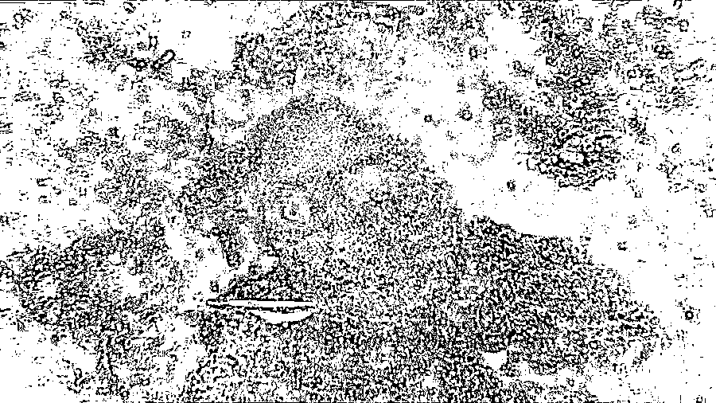

那该怎么办呢？

书中经常写道：“当海王星行进到来时，人们需要学会放下。你要放弃曾经建构的自以为是的真理和结构，接受它们没用了。”“也许你可以躺下，任凭它冲刷。”

然而，躺下就可以了吗？

在此，我们想先从十二宫人都会经历的过程入手。第一个问题：“你所感受到的一切是真实的吗？”

（要如何论证感受到的东西是真实还是虚幻的？抑或是，感受本身都是虚幻的。但如果从虚幻本身入手，这个逻辑就复杂了。因为人们会默认感受到的是真实，因为需要人类思维需要依赖一些东西，比如现实检验，比如感受。如果把感受本身归于虚幻，那么人们所仰仗会瞬间变空，像是原本靠着一堵墙，但是这堵墙消失了。而这本身就是十二宫的体验。那么其次的逻辑就是，这样的体验本身到底意味着什么？或者说，其目的是什么呢？）

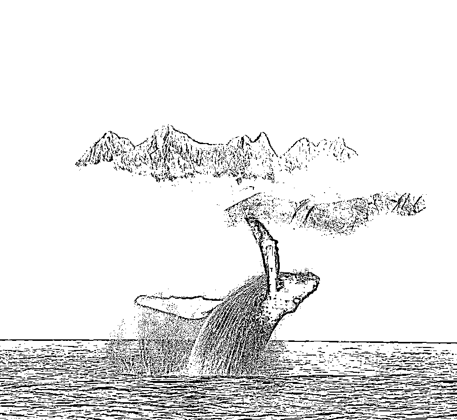

**你所感受到的一切是真实的吗？**

这些十二宫人大多与生俱来一些**过于敏锐的感官**，能够感受到他人没有察觉到的细枝末节；有一些人还能感受到他人无法感知到的事物。比如，有的人容易感受到他人的思维；有人容易感知环境，更甚者会直接因为环境而感受到实质的身体变化，比如有人会呕吐、头晕……

这种强大的感受力在最初的时候，像是拥有一件无法使用的宝物，**“心怀宝藏，茫然四顾”是这些人常见的状态**。**因为你无处可用**。既然无处可用，那就是一种“拖累”，宝物也成了废物。

而生活中大多数人并不如此敏锐，因此他们造就了一个对敏锐的人来说相对粗犷的环境，它是一个潜意识的集合。不仅吸收了文化中的潜规则，也吸收了大多数人无法发泄以及忽视的潜意识。

而十二宫人身在其中，不仅无法在这样的环境中找到一个舒服的位置，并且还会无限制地吸收那些无法发泄以及被忽视的情绪垃圾。因为十二宫是出了名的**没有界限**，所以很多十二宫人会在这里发展出一个品质，即**屏蔽**。

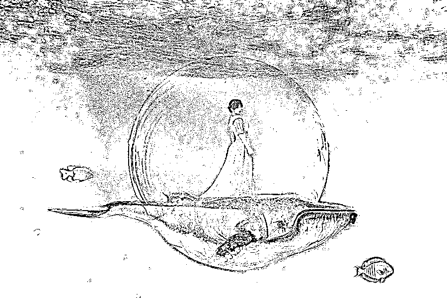

不知道你们注意到没有，有时候当你在一个人多的场所，看见十二宫人的时候，好像他们不在那。**他们会出神，呈现出游离的状态**，有时候需要你喊几声才会“回魂”。那是他们的一种自我保护机制，环境的杂乱使他们不舒服，吸收太多又不能控制自己，那怎么办呢？于是他们需要进入一种“**虚空**”的状态，以虚空和杂乱做交换，好使自己的内在得到平衡。

这也就是十二宫人容易出现**成瘾状况**的成因之一，他们需要一定程度的“虚无”，过多的真实处境会让他们变成一条在地面扑腾的鱼，会迅速感觉到自己“快死了”。就像是人体的构成 70%是水，而他们需要 70%的虚无（请大概理解这个数据，它并不会准确）。

这样的感受并不是一种在社会潜规则下被认为良好的机制，社会将其定义成“懒散、逃避、游离”，因为自我需求和社会需求的两极矛盾，会使这些人出现内在攻击：“我怎么这么没用？”“我真是讨厌死（我）这种人了。”

而虚无是庞大的，跟虚无做交换无异于与魔鬼跳舞，控制不好就变成了上瘾。所以在古典占星中，十二宫也有魔鬼宫的意味。

我到现在的描述，其实都是假定当我们处于那种混沌的困境之中，并且沉溺、无法自拔。还记得我之前所说的第一个问题吗？**“你如何假定这一切存在。”**

**这其实是第一把钥匙。**

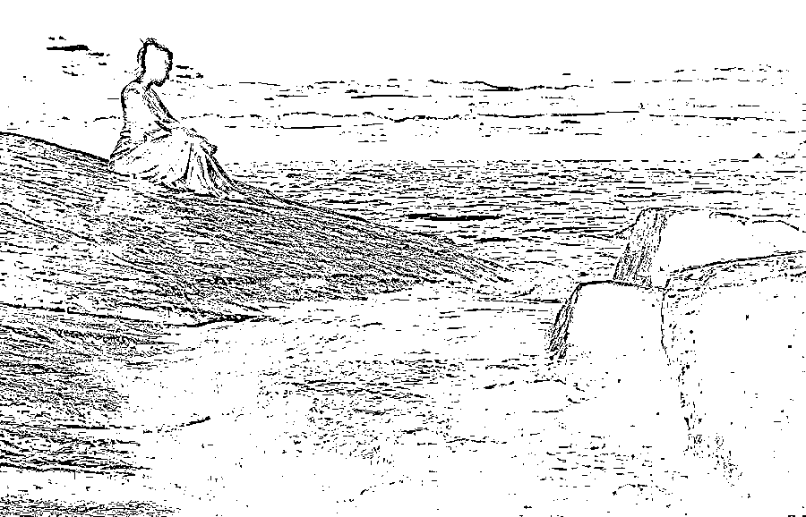

**当你开始思考这一切是否存在的时候，你与虚空之间的关系就转变了，由淹没和沉溺变为你在俯瞰它**。而我之前所描述的对自我出现攻击的情况，其实也是与虚空的搏斗，你的内在自我开始攻击外在自我，**为了让内在自我活出来**，从海面中浮出水面透口气。

因为被淹没的感受，其实并不舒服。当我们对现实生活，或者说社会环境没有需求的时候，不舒服的感觉不会出现（我们浸泡地很舒服，仿佛身在子宫中）。

但是人类说到底是一种社会化的生物，心理学家阿弗雷德·阿德勒提出，“**人真正会产生自我满足感是来源于对社会做出了贡献**”，也就是说，**与社会环境之间产生了能量的积极交换，才会使我们真正产生满足感**。

而**被淹没**的时候，这种满足感的来源会被相当程度地减弱；一旦这种需求觉醒，我们就会意识到，**原来自己一直在被淹没**。而当这种社会需求被唤醒的时候，我们就会得到暂时的喘息（我们也就由十二宫来到了六宫）。

在我们人生发展的早期，通常都是需要来到对面宫位去转化原始宫位的“劣势”，**所处宫位的能量越多，盲点也就越大**。因为原始意味着它不被控制。过于自发地发展，就像是一个婴儿，它需要经历与周围客体之间的互动，接受到反馈之后，才会真实察觉到自己和他人均是独立的个体。

而宫位的能量越充沛，其间的 ego（小我）也就越大，我们过于自信自己拥有的庞大的能量，任由它侵蚀掉其他的部分。**而去往对宫的道路，正是发现盲点的存在，以丰富整体视野的过程**。

当我们开始与外界互动，虚无的部分逐渐开始染上现实的色彩，就像美人鱼褪去了鱼尾开始适应双腿站立。那双腿一定会很疼，因为它是新生的。但是这种新生也是十二宫走向真实人生的第一步。

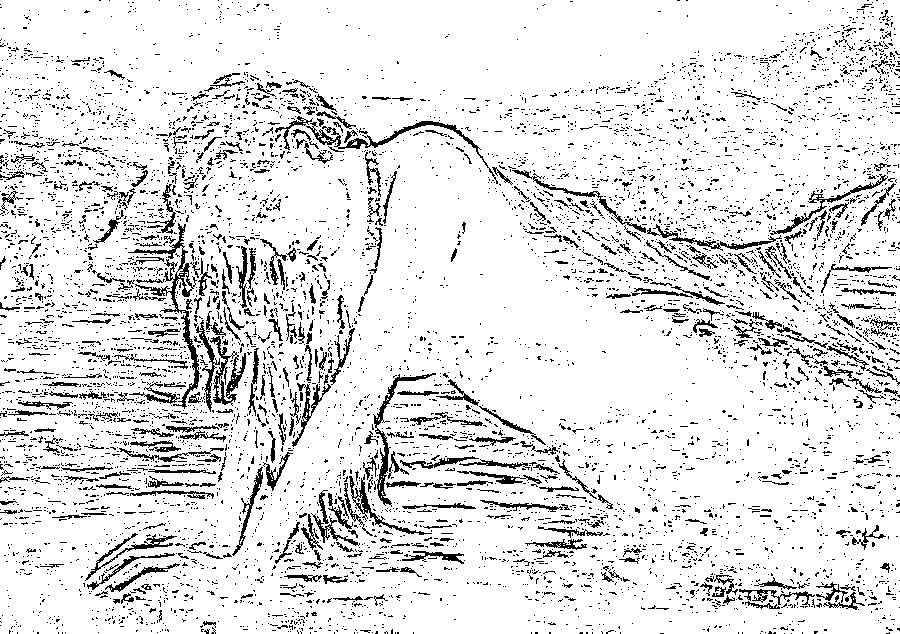

**现实与虚无的拉扯**

在这里，我们进入第二个问题，**现实化就够了吗**？

如果前面的道理成立，人类与社会环境做了积极的能量交换，我们就会产生满足感，那么十二宫理解了六宫的领域，这个过程就完成了不是吗？

当然，这条道路并不是那么简单的。就像一条长在水里的鱼，不能因为长出双腿就会自然地适应陆地生活，完全不需要水的滋养，这是不现实的。

我们假设**现实与虚无**是一杆秤的两端，当你从现实的一端跳到虚无那端时，由于重力的原因，整个天秤会开始剧烈的摇晃，你会感受到现实的重量，但是为了让这杆秤平衡，你不得不再回到虚无的那端。

而回去之后，你就像婴儿回到了**子宫**，感受到莫大的安全。那种安全感越来越浓烈，使你开始蜷缩自己，甘愿被其包裹，等到你的视野完全被封闭，你又回到一片混沌。某一刻，你可能会忽然脑中一闪而过的念头：“**好像不对啊，我得醒过来**。”

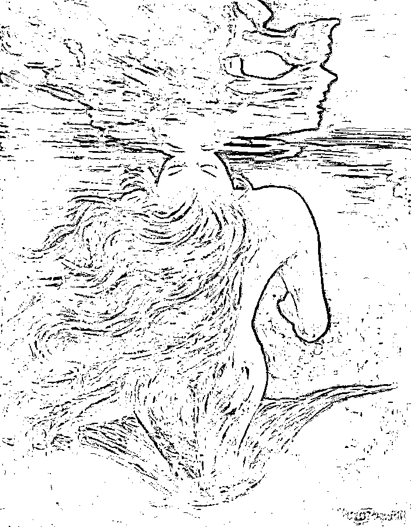

这样的过程会再次重复，一遍又一遍。它是一个**循环**。在这个时候，我们出于求生的本能，会不自觉地试图寻找出路。我们可能最开始不断地滑向某一个点，到了后期，可能试图开始**寻找平衡**。

我们前面提到，**过度的现实化会使十二宫人感受到剧烈的痛苦**。我的朋友圈里也有一些十二宫人，他们是最常会在庸常工作中提出“使自己感觉痛苦”的人，也是经常会因为在现实生活中表现良好而忍不住夸奖自己的人。就像是本不属于这个世界的人，穿上人类日常的衣服，学习人类生活，因为演得像而自我褒奖起来。

这个部分我不会说得太多，因为它会很快过去。十二宫人即使找到了这个平衡，心里也会很快地沉下去，因为**灵魂的目的地不在这里，十二宫人会需要找到心里的家**。他们渴望回到**灵魂的据点**，正因为这个家并不在现实层面，所以如果只在现实层面寻找，他们会很快感觉到枯竭。

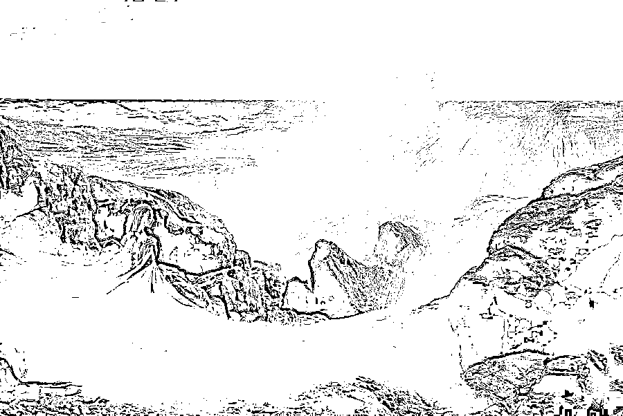

**一个快渴死的旅人，试图找到心灵绿洲**

**从距离上来说，这个寻找并不是物理意义上的**。禅宗里有“一念即佛”，于十二宫来说，寻找“家”也是一样的。它并不似一个真实的旅途，你要背上行囊，准备好补给，带上多少装备，要以防止什么样的天气和自然灾害……它不是这么具体的东西。

十二宫人往往有一些“**灵感**”，这个灵感很微妙，它没有办法用语言表达。就像你走进一个满是新朋友的聚会，你第一眼就觉得有的人让你不喜欢，有的人让你愿意亲近，而有的人让你产生一种巨大的信任，甚至让你想要依偎在身边。虽然从现实层面来说，你并不认识这个人。

这就是十二宫的灵感，寻找“家”也是一样的。**你的一念认出了家，你就回家了**。你就跟自己的“家”待在一起。

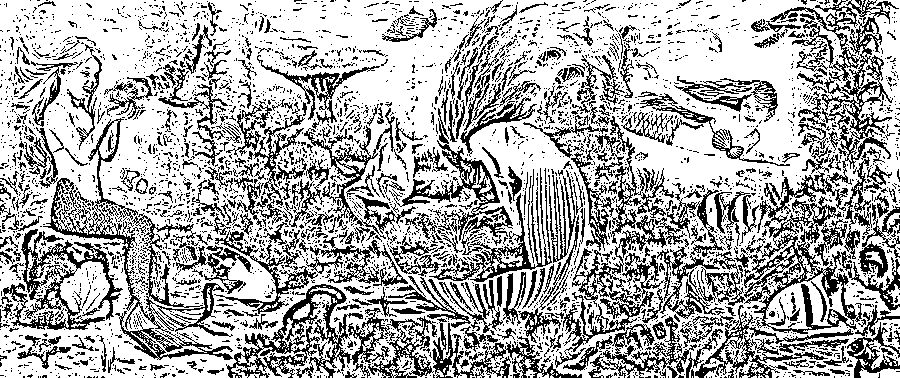

有的十二宫人在哲学上有天赋，对于复杂的思维逻辑仿佛像拥有一条温顺的河流；有的则对宗教感兴趣，看见神像、经文，走进庙里就觉得亲切；有的感兴趣一些自然的疗法，觉得学习是一件顺理成章的事情，学起来也格外容易；人们也喜欢他们，觉得他们身上自带一种疗愈的气息……

这些仿佛是一种与生俱来的能力。在最开始的阶段里，十二宫人只能感受到混沌、痛苦、无力……但是随着不断地挖掘与梳理，**它们洗去混沌之后，逐渐开始展现出真实的样子**。就像是有待发掘的古迹，表面上看上去平平无奇，被层层尘土和泥石所掩盖，你必须小心挖掘，否则。容易弄伤它们，但当你将其完整地挖出，才能看见真实的样子，你会发现，那是一份无价之宝。

真正珍贵的东西，世间的价值是无法用以评判的。它们真正的价值，你心里自有衡量。

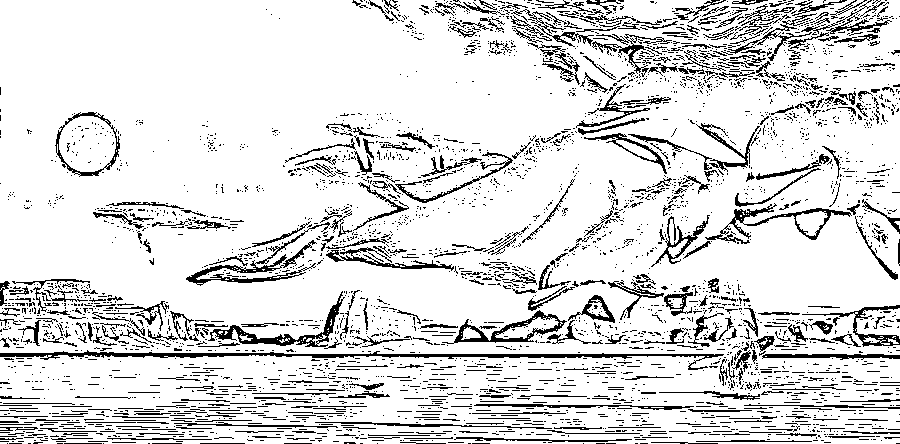

**混沌-拉扯-回归**

我不会用那些告诉你什么是灵魂使命的话语，因为我觉得这是十二宫人们自己寻找的**真谛**。就像佛法八万四千法门，每个人眼中折射出来的世界也是一样，也许真理总归是一个东西，但是表述出来，每个都不一样。虽说最后殊途同归，但各有各人入的门。

我只是把这个轨迹拉出来，就像提出的小标题一样“**混沌-拉扯-回归**”，整个轨迹就像是一个重新经历出生的历程，我们即使已经存活在了世界上，最开始仍然像是在宇宙的子宫里孕育着。佛经里说“一切如梦幻泡影，如露亦如电”，混沌在提醒我们，**一切就是梦境，我们都是装睡的人**。问题的关隘不过在于，**你如何面对“装睡”这个事情**。

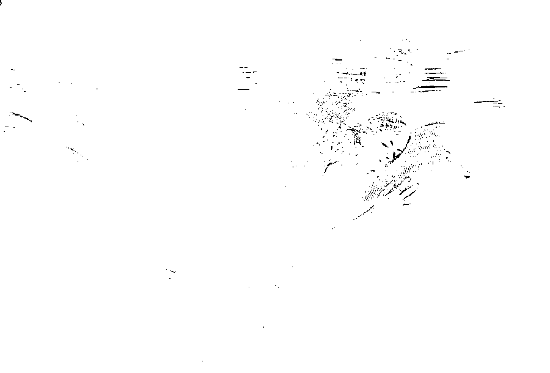

既然是我一个群星十二宫，那么可以举一下我自己的例子。

我的人生最开始顺利得超乎寻常，拿现在的话来说，是个老天追在后面喂饭吃的人。然而好景不长，我开始经历一整段非常奇怪的滑铁卢。之所以我说它很奇怪，是因为我对于所谓人生的轨迹是一个有感知的人，怎样的人大概会经历怎样的事情，一个人现在的状态是如何由曾经的事件和经历塑造的，你大概都会联想到。

可对我来说，被老天追着喂饭吃的经历很奇怪，那段滑铁卢的经历也很奇妙，特别像是一场戏，我只不过穿着一身戏服，中间的尴尬在于脱不下来。

我有一种感知倒是变得坚定，“这一切不是我。”那“我”是什么呢？关于这类的哲学思辨，我从心理学理解到哲学，再从哲学到宗教……一路顺着找，到现在我可能感知到了一点边，又可能不是。于是有了这篇文章。

我想说的也就是这些，我们都是在路上的人。这条道路回首看，你总能挖到很多自己经历时所看不见的东西。我们以为路上仅仅满是痛苦和不甘、沉溺与无奈，可正是这些纠缠在痛苦中的心情被洗去之后，内在珍宝才得以展现出真实的样子。

怎么说呢，愿所有在混沌道路上的人，都能找到心灵的归处。当然，找到了之后，想要出来玩，就出来玩吧，世间大游乐场欢迎你们。

祝福大家~

**版权声明：**原创文章由作者授权首发于若道平台，欢迎转发，反对抄袭。友号转载请申请白名单。

**佳黛**

若道 2015 届核心课程学员，兼职占星师

现任若道微信部主编

长按打赏

**系统学习占星学**

**点击图片了解详情**

**微信又双叒叕改版啦，不想错过若道君的推送？**

**就把若道设为星标吧！**

**▼**

就是这个“在看”，戳戳戳 ☟

********报名直达入口********

# 雷蒙德·梅里曼金融占星周运 | 接下来的日子也不太平

> 原文：[`mp.weixin.qq.com/s?__biz=MzA5NjA0NTAxNg==&mid=2651430662&idx=2&sn=dbd29d387fbc1f7b68569d626587df2a&chksm=8b4b2db1bc3ca4a7a36e1792c1e8819cd0d8c7967b986164581bb001f4d2d273c40149b0417c&scene=126&sessionid=1692738085#rd`](http://mp.weixin.qq.com/s?__biz=MzA5NjA0NTAxNg==&mid=2651430662&idx=2&sn=dbd29d387fbc1f7b68569d626587df2a&chksm=8b4b2db1bc3ca4a7a36e1792c1e8819cd0d8c7967b986164581bb001f4d2d273c40149b0417c&scene=126&sessionid=1692738085#rd)

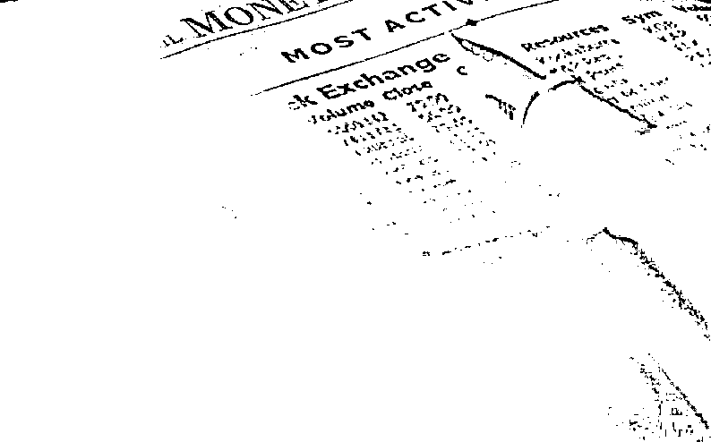

作者/雷蒙德·梅里曼
译者/Leisha 编辑/玫瑰 图片/全景网雷蒙德·梅里曼是在金融占星学界稳坐第一把交椅的占星师，同时他也是若道签约的金融占星课老师，我们引进了雷蒙德·梅里曼老师的《[上证指数+黄金周期月度报告](http://mp.weixin.qq.com/s?__biz=MzA5NjA0NTAxNg==&mid=2651430487&idx=2&sn=6b032833078f13e0caf33e548da15942&chksm=8b4b2ce0bc3ca5f6d2b4406eb8ffd38cd864c96b48133bd14364a778c2eaa4743479992b2c4a&scene=21#wechat_redirect)》《[2021 年金融预报](http://mp.weixin.qq.com/s?__biz=MzA5NjA0NTAxNg==&mid=2651425978&idx=1&sn=067bd68ece37e1e820d6f84f7a3cc960&chksm=8b4b3e0dbc3cb71b866f65d51f7993d3c35dee77cebd77eda3f63a4d5864dadaea2e9d14c101&scene=21#wechat_redirect)》。我们经老师的授权，将每周刊登梅里曼老师的周运，供大家参考和学习。于是，这是本周的周运（10.26-10.30）。**说明：以下时间采用纽约证券交易所所在地美国东部标准时间。**
**展望与回顾**

**唐纳德·特朗普总统周五表示，他不希望经济援助协议纾困支持民主党的州。此言一出，主要平均股指随即跌至盘中低点……包括美联储主席杰罗姆·鲍威尔在内的几位市场专家和经济学家认为，国会议员必须就新一轮的经济刺激方案达成协议。**

**——弗雷德·英伯特**

**《出于对经济刺激方案的担忧，道指下跌，华尔街开始每周下跌》**

**www.cnbc.com**

**2020 年 10 月 23 日**

**最新的好消息来自周四的报告，报告称，10 月 10 日当周继续申请失业救济的人数减少了近 100 万，在过去三周减少了 360 万。雇主也在提高工资。第三季度的每周收入中值同比增长 8.2％，25％底层工人收入增长 9.2％。**

**——《红州和蓝州的经济复苏》**

**《华尔街日报》言论版**

**2020 年 10 月 23 日**

现在是水星逆行的中期。这一次，水星有同伴，因为在同一时期，火星也在逆行（9 月 9 日-11 月 14 日）。我们对水星和火星同时逆行了解多少？答案是不多。这两颗行星逆行与市场趋势的相关性不高，除了火星逆行结束之时（11 月 13-14 日），那时市场会反转。**但在这两颗行星逆行的开始和结束之间，金融市场更容易原地踏步，每 1-4 天来回摆动一次。**的确，这个规则出现过例外情况，但在美国股指研究超半数的历史案例中，这个规则……是有效的。你可能会问为什么。可能是因为水星掌管决策，火星掌管行动，当它们逆行时，做出清醒的决定是件苦差事，而深思熟虑后采取果断的行动是更艰巨的苦差事。这是上周的情况。新的经济刺激方案是否会出台？年底前是否会有疫苗？新冠病毒肺炎疫情是否快要出现转机？谷歌是否是垄断企业？问题太多了，明确的答案却很少。上周，大多数世界股指均下跌，但跌幅尚不足以确认新的看跌趋势的开始，截至目前欧洲除外。引人注目的是，大多数股指在 10 月 9-13 日创下了周期新高或次高，当时水星转向逆行，火星到达逆行周期的中点，并与天秤座的太阳和摩羯座星群（土星、冥王星、木星）形成 T 三角。我们预计会出现反转，但那时的反转程度远不如火星在 3 月下旬加入摩羯座星群时那么剧烈。然而，在股市突破过去两周的高点之前，跌势可能都不会结束。与此同时，预计政治和经济领域会出现相互矛盾的表述。一方说我们的状况很好，另一方说我们正遭受严重的伤害。现实仍然有可商量的余地，真相仍然难以捉摸。骗术大师水星就是这样玩的。欧洲股指上周进展不佳。荷兰 AEX 指数跌至 3 周新低，德国 DAX 指数跌至 4 周低点。但瑞士和英国的情况更糟，SMI 指数跌至 5 个月以来的最低水平，伦敦富时指数跌至 6 个月以来的最低水平。

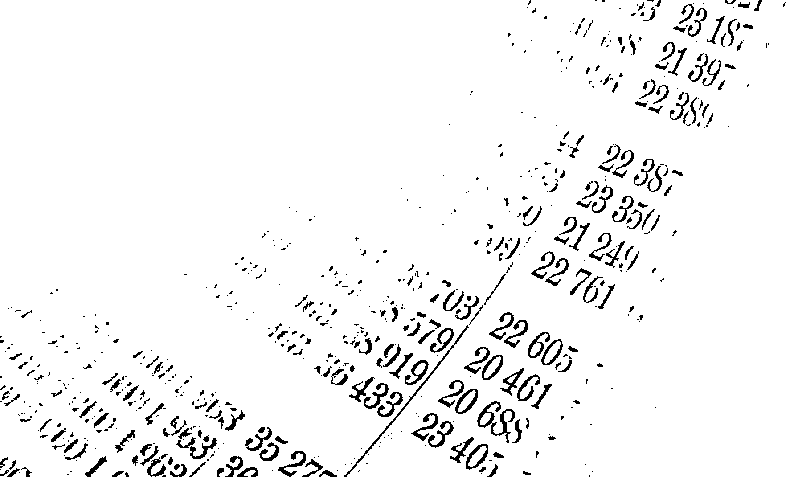

亚太地区情况各异，但总体比欧洲的情况更积极。澳大利亚 ASX 指数飙升至今年 3 月份疫情危机以来的最高水平。日本日经指数和印度 NIFTY 指数上探自疫情暴跌以来的最高水平。香港恒生指数涨至月度新高。上证综指于上周一创下次高点，但到周五跌至 2 周低点。上周，美国的道琼斯工业平均指数和纳斯达克指数大多下跌，10 月 22 日创下 2 周低点。上周真正抢眼的是比特币和谷物市场，股票和贵金属市场在水星逆行期间出现停滞不前的情况，比特币和谷物市场反其道而行。比特币自 2019 年 6 月以来首次飙升超过 13000。玉米 1 年多以来首次暴涨至 420。但大豆和小麦的表现更惊人。大豆飙升至 4 年多以来的最高价，而小麦则飙升至自 2014 年 12 月以来的最高价。看起来快要出现通货膨胀，美国中期国债市场下跌也表明是这种情况（长期利率正在上升，如《2020 年金融预报》中土星-冥王星周期章节所述。关于 2021 年金融预报，可以[点击](http://mp.weixin.qq.com/s?__biz=MzA5NjA0NTAxNg==&mid=2651425978&idx=1&sn=067bd68ece37e1e820d6f84f7a3cc960&chksm=8b4b3e0dbc3cb71b866f65d51f7993d3c35dee77cebd77eda3f63a4d5864dadaea2e9d14c101&scene=21#wechat_redirect)了解）。我们此生可能再也不会看到像去年夏天那么低的利率，但不要惊慌，利率也不可能在未来几年快速攀升至金融无法承受的程度。**短期占星趋势和长期考量**

**如果你带着跟前副总统拜登一样多的包袱进入总统大选的最后冲刺，你也不会多说什么。民主党向左走得太远了，还有亨特·拜登的黑历史……临近尾声的总统大选与 2020 年其他所有事件都是一回事，人们希望一些东西消失。那希望什么消失呢？唐纳德·特朗普，还是民主党？**

**——丹尼尔·亨宁格****《特朗普、拜登、亨特、混乱》****《华尔街日报》****2020 年 10 月 22 日****这与他的家人和我的家人无关。这关乎你们的家人，你们的家人正在遭受严重的伤害。****——乔·拜登****2020 年 10 月 22 日****在与唐纳德·特朗普总统的竞选辩论中提及**
真清晰政治网站的最新民意调查显示，上周，拜登领先特朗普的支持率从 8.9％下降至 7.9％，上上周拜登领先超过 10％。我最关注的拉斯穆森民意调查显示，拜登的领先率从两周前的 12％下降至 10 月 21 日的 3％。在下周的专栏中，我将回顾长期行星征象的历史，分析 2020 年总统大选的结果。同时，很快就会出现几个重要的地球宇宙学时期，这些时期在历史上与市场活动和集体心理相关。**10 月 27 日，水星将逆行回天秤座，并停留至 12 月 1 日，这有利于尝试解决冲突。**然而，**水星转向顺行之时，将在 11 月 1 日和 6 日两次同土星成四分相。**这个相位对达成协议和解决冲突不太有利。水星四分土星可能表明做决定和计数中发生延迟的情况，而这恰恰是在美国总统大选期间。金星也将在 10 月 27 日这天与水星一同进入天秤座，并停留至 11 月 21 日。这个组合也有利于达成协议，但它有时也可能因为想做到八面玲珑而优柔寡断。对我们而言更重要的是，它还与白银市场的重大反转相关。

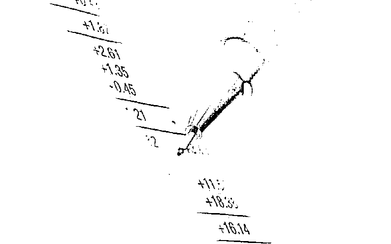

**10 月结束于 10 月 31 日一个合相天王星的强大满月，事态发生突如其来的变化。**人们改变主意，造成意想不到的混乱。这可能对应一段**短暂而剧烈的集体歇斯底里时期，有点像地震（象征意义或现实层面的地震）。**但是，我们要准备迎接的下一个重大时间段是**11 月 9 日-19 日**，两个强大的地球宇宙学影响届时将展开。第一个是**行进金星对分火星，四分摩羯座星群（冥王星、木星、土星）。**这被称为“基本星座 T 三角”，会**影响所有与金融相关的事物，尤其是货币，但也影响谷物市场**。第二个是**木星将在 11 月 12 日与冥王星形成第三次也是最后一次合相**，**火星将在 11 月 13-14 日转向顺行**。如《股票市场时机终极手册第 3 卷：地球宇宙学与交易周期的关联》中的研究所述：这是与美国股市基本周期相关的最强有力的两个地球宇宙学一级征象。最后，请记住现在是天蝎座月份，在此期间，**事态容易激化，金融市场容易发生动荡。**但这也是秘密和探索发现的时期，特别是对于热爱研究的人而言。如果你想知道什么，现在适合深挖探寻。但要小心，你也可能会挖出一些你不想知道或不应该知道的事。可以把天蝎座月份想作“女巫的季节”，打开潘多拉魔盒的时期，亨特·拜登硬盘内容曝光的时期，或者“唐纳德·特朗普几年前在纽约一家商店的更衣室里与一位知名女作家寻刺激”事件曝光的时期。如果不赶紧盖上潘多拉魔盒的盖子，那么在下周的满月之前，这些指控可能会变得更不堪。从现在到大选结束之间，可能还有更多埋在表面之下的东西被揭露出来。天蝎座月份才刚刚开始。

**说明：以上日期基于纽约证券交易所所在的美国东部标准时间，由于存在时差，中国地区可能需要加一天。**

**版权声明：**本文由若道翻译发布，欢迎转发，反对抄袭。友号转载请申请白名单。

**雷蒙德·梅里曼（Raymond Merriman）**

若道签约老师。著名金融占星师，ISAR（国际占星研究协会）前主席，梅里曼市场分析公司的总裁。他由于“提升了占星学的职业形象”，在 1995 年国际占星大会上被授予轩辕十四奖；在 2012 年国际占星大会上，被授予轩辕十四终身成就奖。

1“中国上证指数月度报告”发售

**若道推出了****中文版****的雷蒙德·梅里曼中国上证指数月度报告，并持续发行该报告！**

当把金融市场的周期和占星学的周期相结合时，雷蒙德·梅里曼老师的金融占星学研究**为投资者应对金融市场的周期波动，并随之调整投资策略提供了极大的价值参考**。

**11 月中英文报告均已上线！**

2“黄金价格周期月度报告”发售

**若道推出****中文版****的雷蒙德·梅里曼黄金价格周期月度报告！**不仅仅为广大读者在中国股市的投资出谋划策，更将视角放眼黄金市场。

**每当世界经济形式不明朗的时候，有一个地方是保值的港湾，那就是****黄金**。自 1982 年雷蒙德·梅里曼出版第一本研究《地球宇宙学征象与黄金价格的关联》的著作以来，**他一直作为最重要的黄金市场时机预测者之一享誉国际**。8 月的黄金终于从高位开始下跌，有些分析人士认为，黄金在过去连涨 9 周是非常极端的，因此走势未来不会太强了；也有人认为，在目前各国大放水、国际局势不稳的情况下，黄金可以继续看高。那么，你该如何面对目前的调整呢？是等待回调继续进行，还是在什么位置买入？11 月黄金周期报告等着你。火星逆行，很多国家都纷纷再次爆发新冠肺炎病毒疫情，未来的几个月注定不安宁。黄金的走势会安宁吗？

11 月黄金报告已经上线，上证报告也会在本周上线。欢迎了解。也可以按照季度和一年期订阅，有更多优惠。季度和年度的好处是，你可以持续了解梅里曼老师对于不断在变化的市场的看法。即便他某一次看法和市场不一致，你也看到在下一期他如何调整自己的看法，并看到金融占星在一个长期时间段内对你把控风险的帮助。而能够长期控制风险、尽量找到安全的投资时机才是投资的长久之计。

**11 月中英文报告均已上线！**

**购买套餐**，买得越多越优惠

中国上证指数月度报告套餐价

*   **单月报告**：280 元

*   **3 个月套餐**：780 元（260 元/月）

*   **12 个月套餐价**：1999 元（166 元/月）

**长按下图识别二维码**

**购买金融报告****套餐**

**▼**

黄金周期月度报告优惠

*   **双报告年度套餐更优惠（直降 899 元）**
*   **12 个月黄金报告+12 个月上证指数报告：仅需 3500**

**长按下图识别二维码购买黄金报告套餐**

▼

1976 年以来，由雷蒙德·梅里曼撰写的梅里曼市场时机学院每年一次的年度预报沙龙和每年一本的《年度预报》一直在应用占星学原理为投资者们服务，提供卓越洞见，从未间断。过去两年，3 小时的年度预报讲座和长达 200 页左右对金融市场的分析报告，帮助许多若道读者做出正确的投资决策，降低了投资风险，并获得相当不菲的投资收益。在群星摩羯座的时候，我们和你一起提早规划自己来年的投资安排。

**2021 年金融年报预售**

**1976 年以来，由雷蒙德·梅里曼撰写的梅里曼市场时机学院每年一次的年度预报沙龙和每年一本的《年度预报》一直在应用占星学原理为投资者们服务，提供卓越洞见，从未间断。**过去两年，3 小时的年度预报讲座和长达 200 页左右对金融市场的分析报告，帮助许多若道读者做出正确的投资决策，降低了投资风险，并获得相当不菲的投资收益。在群星摩羯座的时候，我们和你一起提早规划自己来年的投资安排。2021 年年度预报开始预售**前 50 名预售价格**：1080 元（已售罄）**前 50-100 名预售价格**：1180 元**100-150 名预售价格**：1280 元**150 名之后价格**：1380 元**2021 年年度预报中文版预计发布时间**：2020 年 12 月底**沙龙时间**：2021 年春节前后**沙龙形式**：英文讲座，配有中文翻译**点击下图了解详情**

▼

******点击阅读原文购买金融报告******

# 超全视角解析丨 2020 年底的重磅天象，会对我们产生哪些影响？！

> 原文：[`mp.weixin.qq.com/s?__biz=MzA5NjA0NTAxNg==&mid=2651430631&idx=1&sn=a1d4c230249756126b24d47b71c72ee0&chksm=8b4b2c50bc3ca546b104797db02d9095530f0395f5fe8e36320a62d94a49bfe251f0c5637f2b&scene=126&sessionid=1692738085#rd`](http://mp.weixin.qq.com/s?__biz=MzA5NjA0NTAxNg==&mid=2651430631&idx=1&sn=a1d4c230249756126b24d47b71c72ee0&chksm=8b4b2c50bc3ca546b104797db02d9095530f0395f5fe8e36320a62d94a49bfe251f0c5637f2b&scene=126&sessionid=1692738085#rd)

****☆ ****后台回复“今日”，给你一句生命态度****

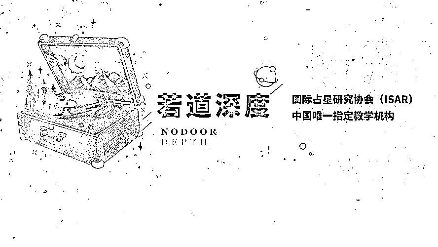

作者/熊鹰（天空的空） ISAR 认证占星师编辑/玫瑰 封面/书君 图片/全景网

**作者的话**

作为嘉宾之一，参与了 2020 年 ISAR 线上大会的视频录播，将第一天关于木土合相的 8 个演讲翻来覆去看了几遍，提炼了信息，思考了问题，也聆听了其他嘉宾的分享。演讲者都很厉害，不一一赞美了，收获颇丰也不赘述了，来说说大会结束之后的一些思考与感悟。

**编者按：本文为 ISAR 圆桌大会讨论后嘉宾的思考总结，仅代表个人观点。**

**“不太一样”的想法**

**背景**

当下（2020 年 9 月）可谓是美国国内名副其实的多事之秋，尤其对于占星师这样一个中等程度（差不多对应到中产阶级）的群体，可以说是最惨淡、最低落的时期。因此我们看到的演讲，大多数都围绕着一个主题：眼前很黑暗，但黎明很快会到来。总的来说，以鼓励与展望为主。在中国则不然，我们在对新冠病毒肺炎疫情的战役中大获全胜，早早就复工并恢复社会秩序，尽管需要面对来自于美国以及世界其他国家的疫情传播、政治压迫、经济衰退、战争威胁等等影响，带来了疫情复发恐慌、消费降级、对国际局势的担忧等等问题，但毕竟风暴核心尚处于国门之外，也有军人、医护以及一些隐藏力量在时刻守护着，因此，对于绝大多数中国老百姓（注意：这是水瓶座的象征主力！）来说，眼前并不算非常黑暗，光时不时都在闪耀。人们也需要鼓励与展望，但绝不限于此。美国乃至疫情复发的欧洲国家，其社会环境如同大灾刚过，人们最需要的是满足温饱，当然还有希望。这也是那 8 位占星师演说的核心：稳住情绪，未来会好的。相较之下，中国的情况更像是灾后重建，温饱不是问题，情绪总体稳定，未来也可期，当下更应该关心的是如何防微杜渐与积极行动。换句话说，我们需要也应该主动去看到全国乃至全球潜在的问题乃至威胁。毕竟，真正的强者不是征服，而是保护。基于这两种非常不同的背景，我们在讨论未来的趋势时，有必要做一些调整，不应盲目跟从国外占星师的演讲。**他们看见黑暗，期待光明。我们身处光明，却不可忘记黑暗。**

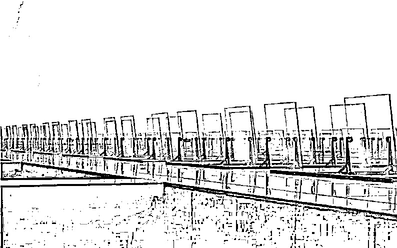

**时效**

关于木土合相的时效，其实是两个问题：**此次木土合相的影响何时开始？其影响将持续多久？**对于持续时间，我想大家的想法比较统一：持续**20 年左右**，到下一次木土合相开始之前。对于开始时间，一些演讲者和嘉宾都认为真正的影响力不是立即就开始，而是会在木土上弦月的时候开始，大约在 3-5 年之后。就此，我不敢苟同。不仅如此，我甚至认为：**在木土精准合相（今年 12 月 22 日）之前，其影响已经开始了**。理由如下：**①** **周期**。复合行星的周期常被划分为四个阶段，借用月相的概念来描述就是：**新月、上弦月、满月与下弦月。**划分的目的是为了描述两颗行星在不同阶段时的互动，就像两个人一样：新月是初次接触，有好奇也有不习惯，想了解对方但也可能会掐架；上弦月是两个人熟悉一些了，要么继续掐架，要么握手言和开始了解对方；满月是非常熟悉了，要么掐架更猛烈，要么如胶似漆；下弦月是熟透了，要么你死我活、两败俱伤，准备下一个轮回，要么准备同居结婚，同样也将进入下一个轮回。

然而，在这样的划分中，不论哪一个阶段，与“影响力是否开始、何时开始”都不甚相关。

**②** **行星**。木星给人的感觉是快、大、广，土星则相反。从这里**看不到明显的“影响力会滞后发生”的证据**。退一步讲，即便是土星与海王星，这两颗都“比较慢”的行星的复合周期，其影响力也是实时到来的，比如我在嘉宾演讲时所举的香港收留越南难民的例子。

**③ 所在星座。**水瓶座是一个慢热型的星座，这里指的是我们做事时要多思考、多观察、多实验，这样才呼应了风元素固定形态的水瓶座。不是说在这个星座，一切都会变得缓慢。不可混淆。

**④ 风元素。**大家需要注意：今年不是这一轮木土于风象星座的第一次合相，不是！第一次合相发生在 1980 年，木土在天秤座。只不过中间隔了一次（2000 年，土木合相在金牛座）。不能因为中间间隔了一次就不承认 1980 年是第一次，这是耍无赖……

如果把风元素视作“信息、科技与关系”的象征，那么我们不难发现，在 1980 年之后，全世界在这些领域的进步已然开始质的飞跃，一日千里。

信息领域有 BP 机、大哥大、手机、智能手机的迭代，往回退 15 年，我们都不敢想象世界上会有智能手机（iPhone 第一代是 2007 年发布的）。科技乃至高科技领域不用多说了。关系领域，宏观上我们看到对外开放，微观上看到同性恋、双性恋走入公众视野被逐渐认可与接纳，虚拟性爱正在逐渐成熟，人际关系依托互联网从家门口、小圈子发展到全世界、大圈子。

**⑤** **以上这些实在太明显，也实在让我无法认同木土合相风元素的影响力“还没到来”**。这也说明了为什么我认为其影响力在精准合相之前就已经开始——因为这不是第一次木土合相于风元素！而关于“此次合相于水瓶座的能量也已经开始”的证明，在后文也将会给出很多例子。**⑥ 不论意识的提升，还是大事件的发生，都不一定在某个“固定的时间点”**。事实上：①往往是人类意识先开始提升，但这部分是不可见的；② 随后，意识的提升推动现实层面的缓慢改变；③ 改变累积到一定程度就显化为大事件的发生；④ 大事件的发生又会返过来推动更多的改变。比如改革开放，提出想法是在 1977-1978 年，这已经是意识形成，甚至开始有现实改变发生了，等到木土合相天秤座的 1980 年，已经开始落实政策，深圳经济特区的成立，可以说“改革开放”是这件大事的标志。而之后一直到现在，这个大事件还在进行中，并持续地推动更多的改变。

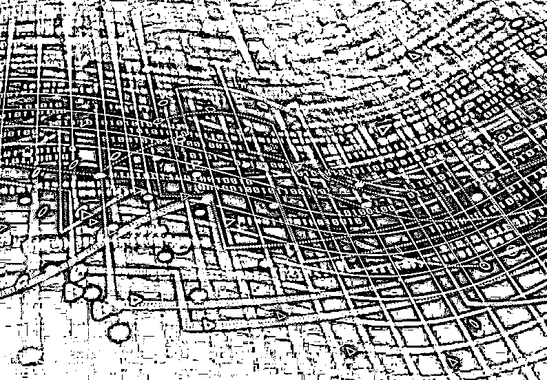

**不必把“土木合相”太当回事儿**

这话说出来可能你不信，事实上它刚从我的脑回路里蹦出来的时候我也不敢面对它。但事实确实如此，20 年发生一次，不算间隔长，也不算稀奇。你说上一次土木和相在水瓶座是 800 年前？没问题，1980 年那次在天秤座，其上一次也是 800 年前。下一次 2040 年在双子座，其上一次还是 800 年前。我们一方面需要承认，间隔 800 年的盛景难得一遇，但我保证你过完这日子之后，还是该吃吃该喝喝凡事别往心里搁……（大多数人可能还做不到这样，因为他们会焦虑会吃不香睡不着，后文再说。）你说我们是幸运的一代人，1980 年那次已经来到这个世界（没错过），2020 年我们正值盛年大可施为（也没错过），2040 年我们正要开始享受退休人生（还是没错过）。我想说：这只是你以自己为本位的主观想法，你已经故去的祖先不会这样想，他们可能很庆幸自己终于离开了这个娑婆世界而往生更美好的星球；你尚未到来的后代也不会这样想，他们可能还是天上的一朵无忧无虑自由自在的小白云，飘到西来飘到东，对你所谓的风元素时代毫无兴趣。你说这是占星界乃至身心灵界的划时代标志，代表着水瓶座时代的到来、人类意识的觉醒？不好意思，身心灵界自己对于水瓶座时代的划分都没理清，几个不同的时点争来争去，没空掺和你占星学界的盛事……至于人类意识的觉醒，从轴心时代就开始说这个了，大几千年没完没了；另外，既然你说觉醒，古人也说觉醒，如果你俩都是对的，那岂不是醒了又醒？醒本就是相对睡而来的，既然有醒就有睡，何来醒了又醒？只有醒了睡睡了醒……还是没完没了。再说回占星学界，尽管我也是其中的一员，这样说可能不太好，但事实上我们会发现：每逢一个重要周期出现，占星学界必然是要吹一波的，近的有今年年初的土冥合相、接下来的木土合相，稍远的有几年前的天王星换座、土海四分、天冥四分，再远的就不提了，横竖每一次都没落下、每一次都很严重、每一次都恨不能开启一个新时代……乃至美国大选、英国脱欧之类的重大事件也是次次都要讨论、点评、预测。这样做的目的很明确：重大天象、重大事件，都是很好的学术研究的主题，同时也是让占星学重回时代主流的方法之一，历代占星师都为此而贡献了一份积极力量。但从另一个角度看，我们是不是用力过猛了？占星学沦为支流真的只是因为我们不够努力吗？用占星学解释每一次重大事件，其意义何在？基于占星学给出的预测，能给世界带来什么？这些问题都值得反思。接下来大家可能要问我：你虽然这样说，还不是写了这一篇木土合相的文章蹭热点？没错，我还真有蹭热点的意思，毕竟一口饭不好混啊。但是话说回来，我一向的风格是：文章要引发读者的思考，读者从文中能切实学到一些什么，读者在看完之后愿意点个赞（反正打死不承认我纯粹为了蹭热点就对了，手动滑稽）。**接下来我们来看看木土合相的积极意义、潜在的黑暗面、以及已经开始的影响。**主要以“占星符号解读”与“个人思考”两个部分呈现。有两点提前说明：1. 我不会在文中反复指出“这个是阴影”“那个是积极面”“那那那个是已经开始的影响”，读者需要自行思考并整理。欢迎交流。2. 这不是一篇给出“答案”的文章，仅仅只是个人想法，供读者参考。

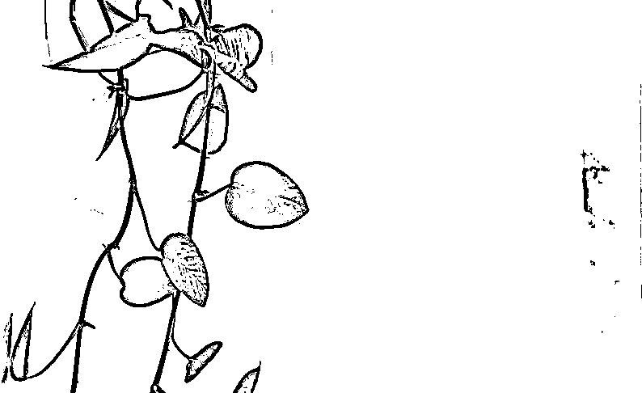

**详细聊聊土木合相**其实我真的很懒，解星图总想找最简洁的办法，教学总用白板背景的劈劈踢，写文章总想找个巨人肩膀站一站。毕竟我们已经有 8 位占星师的演讲珠玉在前，而另一方面，南怀瑾先生曾经对 21 世纪的社会大环境做出许多预测，这些预测不是来自于术数，而是来自于他的智慧与洞察。从已经过去的 20 年来看，可信度相当高。那么，他就是我在这篇文章中的巨人肩膀。接下来我不会在文中堆砌太多的“事件论据或者数据论据”，因为在 Wendy Stacey 和 Georgia Stathis 的演讲中有大量的趋势预测，涉及各行各业；而且只要你有心、打开百度就能找到许多中外事件。我会更多侧重于一些看起来不太重要或是可能被忽视的点。

**占星符号解读**

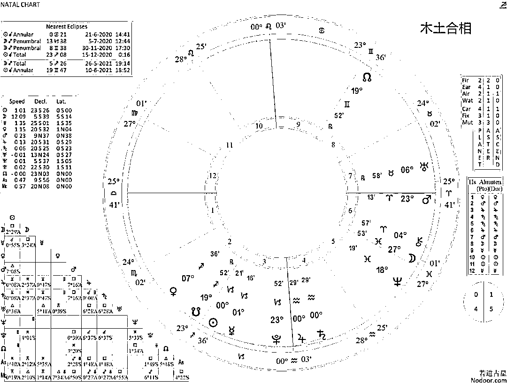

**木星与土星**木星扩张，土星收缩，这是每一位占星学生都知道的基础知识。但两者组合在一起呢？是扩张还是收缩？这可能就要难倒一波人。我们可以从结果导向来解读：**木星与土星“酸碱中和”，时常波涛汹涌、偶尔风平浪静就是写照**；也可以从过程导向来解读：**木星放大了土星的压力、责任、结构，而土星收缩了木星的愿景、理想、教条。**放到具体的星图里，我们还能以宫主星的视角来解读他俩。所对应的事件虽然千千万万，但其核心运作方式大抵如此。比如：最典型的可能要属“川建国”同志上任后的中美关系，正是扩张与收缩的精彩诠释，而且是随着时间进程，双方不断互换扩张与收缩的位置。此外，我们向往“200 年风元素时代”的宏大主题，却不能忘记接下来的 20 年是“木土时代”。你的信念变成了物质至上吗？你是否紧抓住某种物质结构（比如资本）不放并主观地认为它就是真理？若你不是如此，恭喜！但整个社会呢？**水瓶座**土星与天王星之间是那么的不同甚至矛盾。这种矛盾集于一身，就是水瓶座。这是一个睿智的星座，也是一个癫狂的星座。他说：“我不是前面 10 个星座。”他是什么呢？不知道，他自己可能也不知道。就像禅宗祖师的教育法那样：告诉你不是什么，至于是什么，自己悟。在这个星座，我们需要特别留心分清建设性与破坏性的表现，因为**有时候我们在思维层面认为百利而无一害的东西，放到现实生活中却未必如此**。比如：脑机接口。此外，水瓶座能量有一个极其重要的显化：**百姓**。当然我们也可以换一些词：**人民、群众、民本、民主**（很可惜，这个好词已经被玩坏了）。**风元素与土元素**木土即将结束 800 年的土元素旅程，迈入在风象星座的 800 年探索。从土到风，从物质到思维，多么浅显易懂！其实不然。如果你被“200 年风元素时代”所炫目，那么请收下我的这盆冷水：**土元素并未离去！**首先，水瓶座是风土并见的星座，前面已经提到。其土元素风格的显现并不像土星守护的另一个星座（摩羯座）那样重视物质结构，水瓶座关注的是**“思维结构”**，我的想法、我的创见、我的灵光一闪，不是你能轻易触碰的，更别提改变了。其次，**木土在水瓶座，被土星与天王星定位**。土星不赘述，再次强化了土元素风格。天王星在金牛座——**土象**！大多数占星师着重于解读“天王星会如何影响金牛座”，事实上，金牛座也在影响天王星。比如：科技被物化、被资本化的情况越来越严重。延伸说几句：科技当然可以用来赚钱物质，但物质不能绑架科技。两者不可混淆。当前科技更多用于雪中送炭（弱势与贫困人群）还是锦上添花（富有或中等人群）？科学的诞生是为了解释宗教与哲学无法说明白的东西，即探索形而上的存在以及人的生命的奥秘。但如今，**科技似乎只关注物质层面，精神与灵性层面则鲜少。**第三，**木土与其定位星（天王星）呈四分相，这叫“不良定位”**。核心在于水瓶座与金牛座之间的四分关系，再次出现了**土元素**。第四，**月亮交点的定位星水星与木星，前者被土星定位且呈 30 度相位，后者合相土星。**还是**土元素能量**。

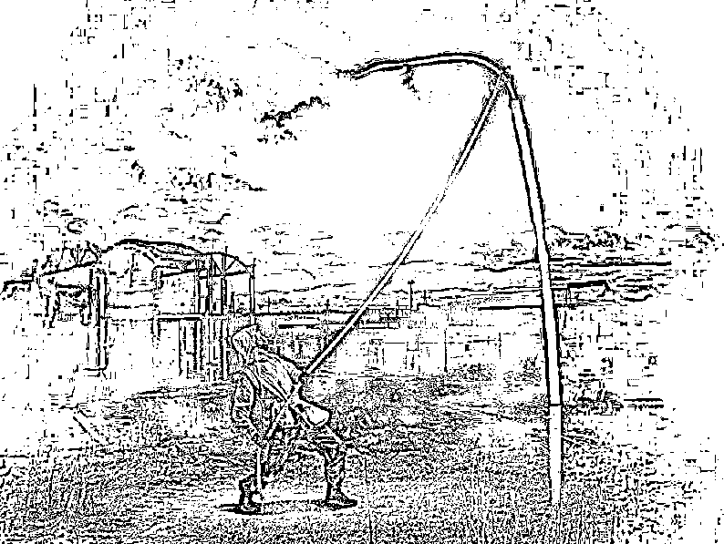

**星座 0°**0°是一个星座的开始，占星师们普遍认为这对应了事物的初始状态，正是主动出击、大干一场的时候。这是讲世间常态。然而，另一个角度却截然不同。借助《周易》的卦与爻，**星座的 0°-5°区间就好像一个卦的第一爻（初爻）**。我们看最典型的乾坤二卦：乾卦初爻“潜龙勿用”，坤卦初爻“履霜坚冰至”，两者都在说：**事物初始的时候，要小心谨慎，不要盲目行动，应韬光养晦、积聚力量。这是讲心性修行。**星座 0°，常态是，在这个位置人们往往会积极主动做些事，老祖先们正是观察到了这种“事物初始时的过度行动”，才说**要沉下来积蓄，等到合适的时机再出动。**比如：人们醉心于科技的蓬勃发展，却忽略了巨大的问题：过度聚焦于思维逻辑，而忽视了情绪感受，甚至思维逻辑本身也会被物质化所绑架。星图中还有另一处 0°——太阳、水星在摩羯座 0°。读者可以结合上述方法自行思考其意义。不过有一点很明显：摩羯座 0°与水瓶座 0°，再一次强调了**土元素与风元素的纠缠关系，两者会陪我们一起迈入“新时代”。****其他要点**水星越界、火冥四分且触动四轴、命主星金星空相、海王星四分月亮交点，都是很重要的占星学象征，篇幅有效，难以详述，读者可自行深思之。**天象图与中国的出生星图对照**

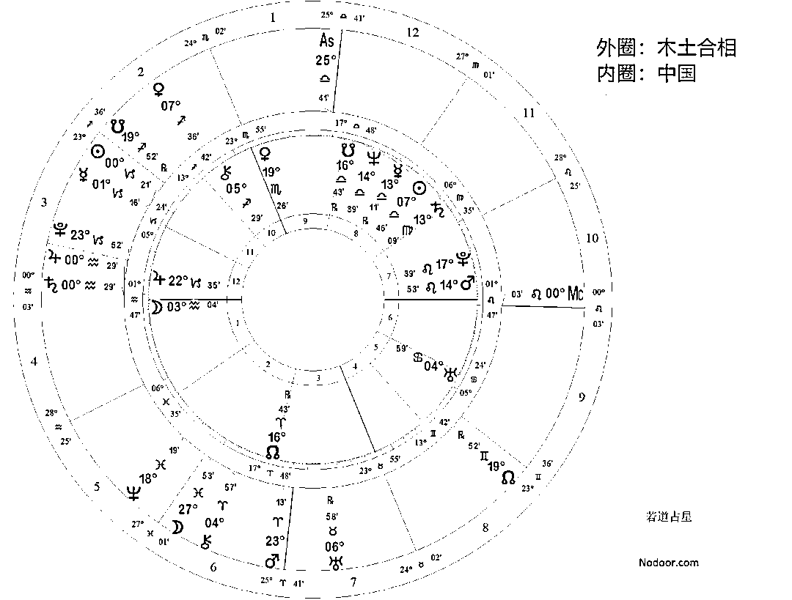

天象图中的木土合相在新中国星图的位置：12 宫尾，距离上升点 1°，距离月亮 2.5°。在经世占星学中，不论 1 宫还是月亮，都与“人民”有很紧密的关联。木土合相在这个位置，似乎在接下来的岁月中，**人民的利益会变得越来越重要，越来越被重视**。此外，月亮也与**住房、饮食**息息相关，在下文会谈到这两个领域。另一个角度来说，**广大老百姓也真正需要为国家的利益负起责任**，在下文同样会涉及这一点。在 12 宫尾，即将进入 1 宫。这样的状态如同“拨云见日”，阳光就在轻纱薄雾之后的既视感。但需要注意，即便阳光已经近在咫尺，但目前仍处在 12 宫所象征的阴云之下。放眼木土合相所覆盖的长时间线，这或许正暗示着我们**需要警惕前进路上的每一处阴影**。而天象图中的火冥四分触动新中国的木星，即是与之相应的共振。

**中国的其他趋势**

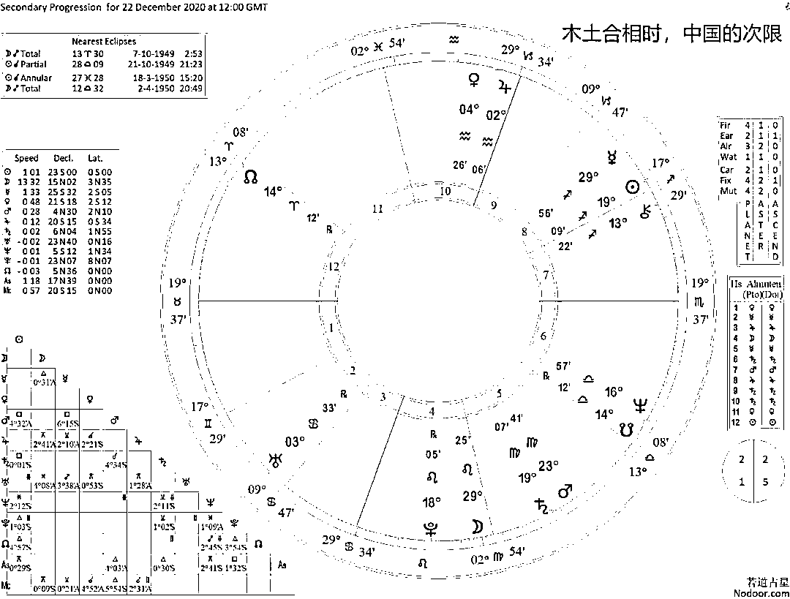

| 次限星图

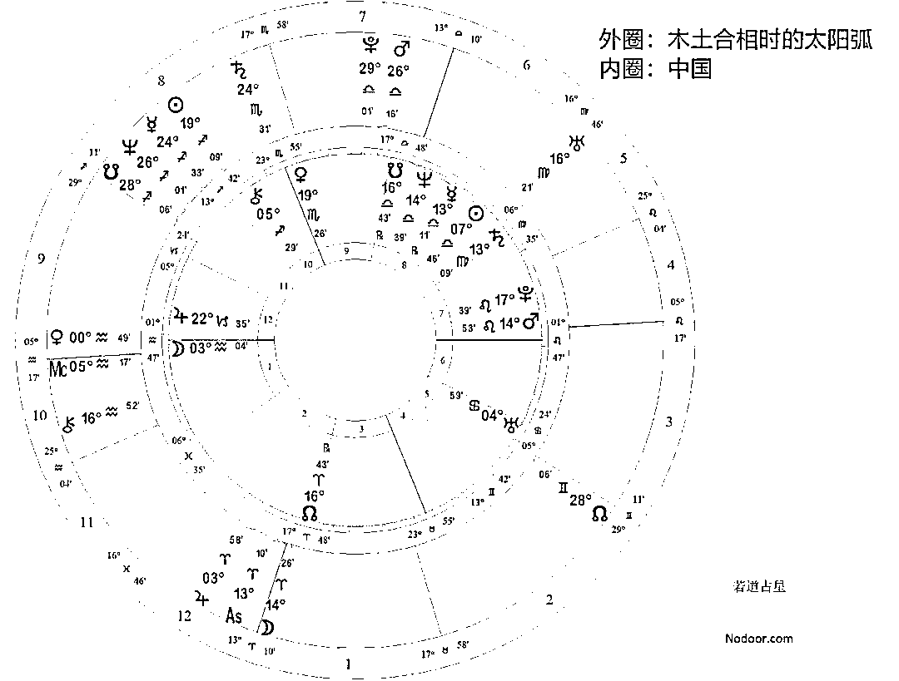

| 太阳弧星图

在木土精准合相的时刻，新中国的次限与太阳弧中都有非常多的重要指征。有些是正在经历的趋势，如太阳弧的土星合相新中国的中天；有些是未来几年的趋势，如太阳弧冥王星趋近新中国上升点与月亮；还有些则是未来十几年乃至几十年的趋势，如次限水星在射手座 29°，即将进入摩羯座，次限中天在摩羯座 29°，即将进入水瓶座。这些趋势千人千面，但其共振却十分明显：**反复强调了土风并见的时代特征；阴影始终相随**。

**未完待续，请见今日二条。**

**版权声明：**原创文章由作者授权首发于若道平台，欢迎转发，反对抄袭。友号转载请申请白名单。

**想观看大会内容？请扫描下图二维码了解详情**

**微信又双叒叕改版啦，不想错过若道君的推送？**

**就把若道设为星标吧！**

**▼**

就是这个“在看”，戳戳戳 ☟

********回看大会直达入口********

# 土木合相带来的重大变化 | 我们从未如此紧密的疏离

> 原文：[`mp.weixin.qq.com/s?__biz=MzA5NjA0NTAxNg==&mid=2651430631&idx=2&sn=23480940c716415c0fe74f16d3cbc1bc&chksm=8b4b2c50bc3ca5465d55c8eeb99dee3b9e9aac929b57c4f928fe1b2f2671c22d3c4e2a3d21ed&scene=126&sessionid=1692738085#rd`](http://mp.weixin.qq.com/s?__biz=MzA5NjA0NTAxNg==&mid=2651430631&idx=2&sn=23480940c716415c0fe74f16d3cbc1bc&chksm=8b4b2c50bc3ca5465d55c8eeb99dee3b9e9aac929b57c4f928fe1b2f2671c22d3c4e2a3d21ed&scene=126&sessionid=1692738085#rd)

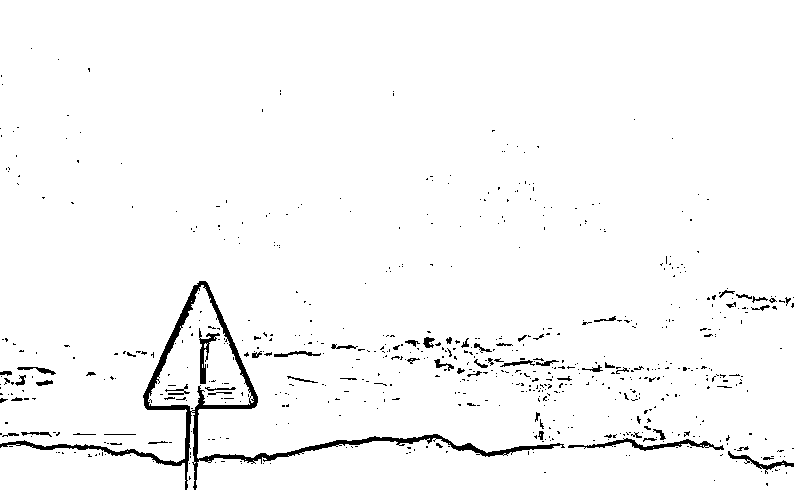

作者/熊鹰（天空的空） ISAR 认证占星师编辑/玫瑰 图片/全景网

在今日头条中，作者为我们阐释了大环境角度下的土木合相。在本文中，他讲为我们详述关于土木合相的一些个人思考——这个重大天象将对我们的未来带来怎样的机遇和挑战呢？一起来看看会不会有不一样的视角。

**土木合相对未来可能的影响**

**国际**

**政治制度****自法国路易十四以后直到现在，君主固然不好，民主法治也未见得是完美的政体。将来的天下，正因为人类社会高估民主的可贵而终于毁灭在民主的变相。且看今日域中的英、美，其未来的祸根，早已埋伏在现在所谓假相幸福的社会福利和重量不重质、哗众取宠的民主自由的制度之中了！****……一个融合了共产主义的理想，社会主义的福利，资本主义的方法，中华文化的精神的新世界。****……这个新的精神时代和过去的精神时代不同，因为它会是一种融合，是过去的传统精神与科学的融合。****——南怀瑾先生**南怀瑾老师曾经就人类历史上的政治制度做过一系列评价，仅截取如上三小段，便足以找到与占星学象征非常紧密的呼应。西方民主制度的流弊，在此次疫情的冲击下完全暴露出来。**水瓶座的能量也恰恰暗示了变革，尤其是与“人民（民主）”相关的变革。**

而基于占星学较难甚至无法得出的结论，南怀瑾老师也给出了：“过去的传统精神与科学的融合。”这意味着中国文化与顶尖科技之间的相辅相成，尽管在此刻我们还很难预见其融合的方式，但这确实暗示了一条路，一条能够调和物质便利与精神修行的大道。那么，这是否对应了土元素与风元素并见的时代特征？

**国际关系**

**未来人类的战争是为水的战争，很快就要来了。****——南怀瑾先生**

这一条很简短，也没有上下文。我们无从知道南怀瑾老师所说的“水”究竟是现实层面的水，还是象征意义上的水。如果是现实层面的“水”。虽然目前有部分国家或地区面临淡水资源缺少的问题，但整个世界环境来看，暂时还不缺水喝。但如果把眼界扩大一些来看，科技的不断发展，必然带来两个问题：**温室效应加剧，冰川融化加速，淡水资源也必然减少；将水直接转化为能源的科技诞生，那么水将成为一种战略乃至战争资源。**

如果是象征意义上的“水”，水在占星学里对应**情绪感受**，这的确成为日趋严重的问题。但是在中国文化的背景里，水往往对应**“财”（术数）和“君子的品行”**（水善利万物而不争），不管是资本还是人才，似乎都已经成为炙手可热的焦点。从南怀瑾老师平时的言行来看，他老人家一般不会在说话时使用太过玄奥的象征意义，因此这里很大可能上指的是**现实层面的水。**此外，2026 年 2 月，土海将合相于春分点（白羊座 0°），这是否某种呼应？

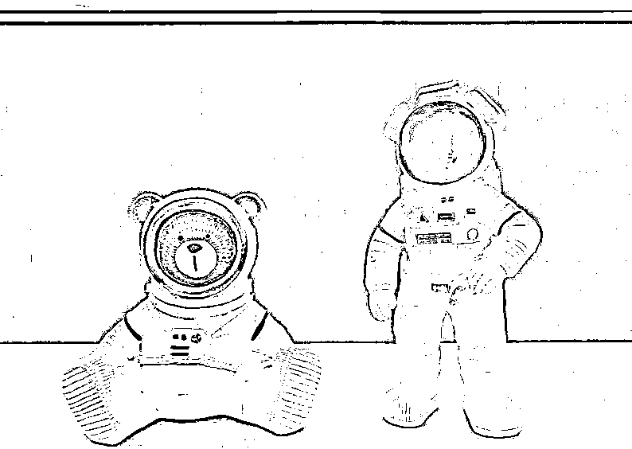

**国家**

**社会**以我生活的城市上海为例：在 2020 年 6 月 23 日，中国共产党上海市第十一届委员会第九次全体会议审议通过《中共上海市委关于深入贯彻落实“人民城市人民建，人民城市为人民”重要理念，谱写新时代人民城市新篇章的意见》，明确提出努力方向：“打造人人都有人生出彩机会的城市、人人都能有序参与治理的城市、人人都能享有品质生活的城市、人人都能切实感受温度的城市、人人都能拥有归属认同的城市。”当我第一次在电视里看到这五个“人人”的时候，脑海里首先冒出了“水瓶座”三个大字！上海一向是国家政策改革的先锋地，但凡国家准备实施的积极政策，往往都会在上海先行试点。我们完全有理由相信**这五个“人人”是未来中国每一座城市的基调！****法律**我对法律知之甚少，不敢妄评，这里仅仅说一件“小事”。2020 年 9 月 3 日，最高人民法院召开新闻发布会，发布《最高人民法院、最高人民检察院、公安部关于依法适用正当防卫制度的指导意见》及典型案例。被媒体和网友称为“正当防卫新规”，它矫正了“谁能闹谁有理”“谁死伤谁有理”的错误倾向。而促成这部《新规》产生的一大部分功劳应该归属于广大（正直正义的……）网民。因为，数年来发生的多起存在争议的正当防卫事件，如“于欢案”、“昆山龙哥案”，都在社交媒体上引发热议。“微博治国”，听起来像是一个贬义词，毕竟有“川建国”的“推特治国”在前。但细细品味，两者天差地别。前者是民意推进法治的修订与进步，后者更像是独裁统治换了一套马甲。

**行业/企业**

**科技**

**今后的菩萨大都将出现于科学界，不如此不能转变这个世界。我们现在的世界不是靠敲敲木鱼、打打坐所能改变，这是时代趋势，各位拭目以待吧！****——南怀瑾先生**没有最好只有更好，拭目以待就行。比如阿里最近发布了犀牛智造、小蛮驴物流机器人、云电脑。不论哪一个，都是水瓶座的典型诠释。**互联网**没有最快只有更快。但有一件“唱反调的事”不得不提。9 月，苹果发布了 iOS14，原本只是一年一度的果粉狂欢，这一次却附上了无数互联网行业大佬们的哀嚎。原因是：**苹果给每个用户设备分配了一个随机的设备标识符，又称为——“广告客户标识符”（IDFA），通常，广告商通过 IDFA 来跟踪用户数据以投放个性化广告。但现在，苹果修改了操作系统，iOS14 将要求开发人员必须通过提示询问用户：你希望分享你的 IDFA 吗？****——摘自网络**意思就是以后想根据你的浏览记录打广告，需要先问你同不同意。苹果称：“这是用户隐私的胜利，而隐私，是一项基本人权。”得嘞，水瓶座来了。尽管这个问题到了中国，可能会被中国互联网企业轻松攻破，攻略我都想好了：不停地弹框问你：“亲，愿不愿分享你的 IDFA 呀？”直到你不得不同意。尽管背后的原因很深，这类冥王星摩羯座的话题，就不赘述了，有兴趣的读者自己去找吧。但是，这样一件“唱反调”甚至“挥刀自伤”的行为，的确维护了广大用户的利益，也是苹果作为互联网领军者的一次积极表态（其实他自己也不怎么干净，但愿意洗洗总是好的）。当然也呼应了水瓶座的能量。还有很多行业的展望，在演讲者视频中都有详细提及，印象很深刻的有 3D 打印人体器官（这或许是人类战胜癌症的关键）、环太阳系旅行等等，此处就不一一列举了。下面说一些没提到的行业。**地产租赁新模式，尤其是住房**这是一个土+风的组合，事实上 Airbnb 已经开了个好头，你看人家名字里都带着风元素（Air）。中国目前还处于“买房是刚需”的状态，这一千百年来的习惯不是土元素 200 年可以概括的，但它是否会在土+风的时代迎来彻底的改变呢？

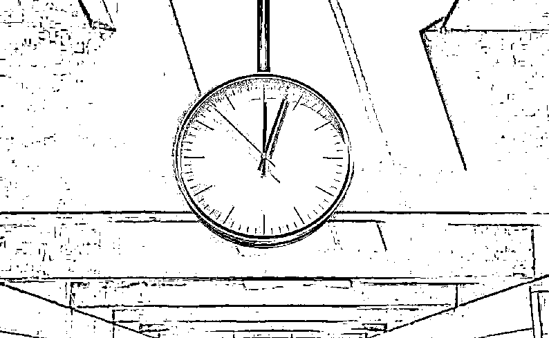

**餐饮****定位木星、土星的天王星即将走到金牛座中段，中段是星座能量蓬勃发展的位置。**“民以食为天”的中国人，是否会迎来餐饮方面的重大变革？说实话，我不敢想象，用公筷已经要了我的老命。**性**这是另一个金牛座相关的领域。“食色性也”，全人类都好这两口。作为世界上最古老的行业之一，嫖娼也依托于科技的发展而从线下延伸到线上。VR 视频的诞生让宅男最爱的 AV 从电脑荧屏搬到如同眼镜一般的设备上，彻底解放了双手。此外，根据 Wendy Stacey 的调查研究，年轻人之间的性生活数量正在持续减少。这一点令人费解，因为不论科技如何发展，身体需求始终摆在那里。或许深层次原因是**土元素象征的工作压力不断摧残着年轻人的身体，以及风元素象征的思维强化分散了一部分对肉体需要的渴求。**但既然餐饮方面都可能出现巨变，性方面又有何不可呢？至少我还能想象：人工智能的持续发展，与机器人发生性关系，可能会取代与另一个人类发生性关系。这就是另一个话题了。从性的变革再回到餐饮的变革，目前科技在**“色”（眼）和“声”（耳）**的传播上已经日趋完善，我们很容易看到和听到很远，这是科技版的千里眼、顺风耳。但**“香”、“味”、“触”**等传播方面却几乎没有起色，而这三个领域恰恰又是金牛座所对应的。会不会有一天我们打开淘宝，吸吸鼻子就能闻到香水的气味，舔舔舌头就能尝到串串的滋味，动动手指就能摸到绸缎的丝滑？拭目以待吧。尽管这些变化看起来是更加便利了，但我们会不会因此而变得更加懒惰？会不会因此而更加沉醉于物质享受？这些年的互联网+物流的发展，似乎已经给出了答案。

**健康**

**身体健康**首先，当然是**“懒病”**。这是一个不论中西医都没有总结的疾病，但我们都能看到“它”生猛的发展势头。正如上文所述，科技的发展必然带来更大的便利，也就意味着人类可以更懒。懒病是笼统的，它可以是生理的，也可以是心理的。其次是水瓶座相关的**循环系统、小腿**方面的疾病。以及，金牛座相关的**甲状腺、咽喉、食道、皮肤**方面的疾病。我的“医疗占星”水平很差，尚在学习之中，以后有机会再补上吧。**心理健康**这里其实要特别讨论的是**“精神病”**。

**十九世纪威胁人类的是肺病，二十世纪最可怕的是癌症，而二十一世纪比癌症更厉害的是精神病。**

**二十一世纪的最大威胁是精神病，尤其是计算机网络的发展，非常快，也非常可怕。这个发展下去不到十年，把人类都导引到幻想，精神病的世界；可是你阻止不了，什么教育、什么医疗都阻止不了。**

**——南怀瑾先生**水瓶座关联“大脑”，但“脑”这个词其实更多描述的仅仅是人类心灵中与逻辑思维相关的部分，而情绪感受相关的，不论中西方，都认为在“心”，此“心”不仅仅是心脏。我们可以预见，水瓶座时代的到来，必然带动整个人类社会的逻辑思维能力蓬勃发展，科技就是最好的辅助，脑机接口的诞生让人类可以跳过学习与记忆阶段，直接进入大师级的思维领域。可是情绪呢？感受呢？我们要如何安放？我们将何去何从？

3D 打印人体器官，或许可以帮助我们战胜癌症；思维转移，或许可以让我们拥有无限生命。如果情绪可以复制，你的负面情绪也将形影不离，要如何面对？别人的情绪被复制过来，你要如何处理？如果情绪不能复制，那么获得新肉体的你，究竟是谁？这都是问题。

因此，从一开始我就不对所谓的“永生”持乐观态度，因为整个科学界都在回避情绪的问题，以及情绪问题背后的“生命如何而来”的大问题，这些问题一直回避下去，我们很有可能看到大量“永生人”自杀，肉体战胜了时光，情绪却熬不过岁月，那将是多么的讽刺。

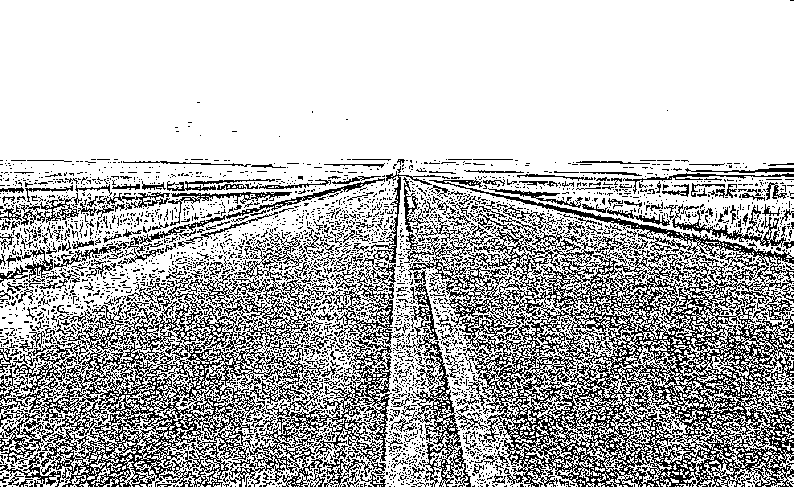

回到精神病问题：据统计，2018 年中国的精神病患者数量，重症患者 1800 万，轻度患者 1.2 亿左右。也就是说，每 12 个人里面就有 1 个轻度患者。什么是轻度患者？我个人的理解是**“抑郁情绪比较严重，但尚未发展到抑郁症等病理状态”**，这算是比较保守的诠释了。另一则 9 月发布的新闻：中国的高中生及大学生将逐渐开始在体检中筛查抑郁症。南怀瑾老师曾经的预言，已经逐渐显现，这将会是全人类共同的大问题。事实上，仅仅是心理学并不足以描述与治疗“精神病”。但现在主流的治疗方式仍旧是心理学主导的，故列入“心理健康”类别。也正如南怀瑾老师所倡导的传统精神与科技相结合的政治制度那样，未来能够应对精神病的治疗手段，也一定是传统文化与现代科技相结合，包含了**祖国医学、现代医学、现代心理学以及宗教、哲学、科学与灵性治疗**相结合的综合学科。这就要说到教育的问题了。

**教育**

**人才**

**现代的“博士”，实际上并不博，只是专家的代号。现在所谓的专家，是独门深入到牛角尖中的学问，除了他所专的以外，对于别的知识就完全茫然。这种只求专门的求学方式，在目前这个时代，也许觉得是好的；但可以预见的是，五十年后将成为人类的大害，到时可能后悔，才要改变目前的教育方式。****——南怀瑾先生**博士这个词不是西方教育的专利，事实上在中国古代就有，一个意思与现在相似，指“有专长的人才”；另一个意思则是指“博学而智慧的人”，有所谓“大哲学家就是大文学家、大史学家、大政治家”的说法，南怀瑾老师认为真正的文人士大夫，就应该是这样的博学者。西方高等教育目前仍旧领先于中国高等教育，这是不争的事实。但这种不断细分学科的教育方式，真的足以应对未来的种种问题吗？因为多元化的时代，必然有多元化的复杂问题，而这些问题未必会单一显现，很可能是以复杂集合的方式呈现。如何应对？以医学为例，不同科室的医生进行“会诊”是一种常见的方式，也是水瓶座的形式之一，但会诊有会诊的弊端，意见不统合就能让治疗效果大打折扣。另一个例子是我国古代的医生，他们是全科医生，尽管这样的挑战极高，而顶尖的医生极少，这是一个重要的弊端，优质医生的稀缺必然不足以应对人口的剧烈膨胀，程式化的西医才有此诞生并蓬勃发展；但是全科医生的优势之处却不容忽视：一人博学而多才，熟谙各种疾病的病理因素，擅长种种治疗手段。若是这样的人才聚在一起，岂不更美？从另一个角度来说，人类的存在本就是一个多重因缘聚合而成的生命现象，比如阳光、空气、水分、受精卵，我们不能把其中任何一个拿出来说：“这就是人类”。同样，我们的生命也不能被描述为多个单一零件的简单加减组合，它一定是整体协调的，在简单的表象之下有其复杂的运作机制。分科而学、分科而治，必然有其盲点。**不管是政治制度，还是精神病的防治，都需要复合型全能人才。**而**现行的主流教育制度，却并未培养这样的人才，反而把人不断局限化，甚至可能被人工智能轻易代替**。我想，这或许是南老师所说的“大害”的一种可能表现。**天王星将在 2025 年进入双子座，这或许是一个重要的转变契机。**双子座的“广”正是我们所需要的。而木土合相的星图中，越界的水星在 3 宫，整张星图的 3 宫也被强调，这些都再次共振与重复凸显了双子座能量。但这毕竟只是象征**“基础教育”**的双子座、3 宫，真正关乎高等教育的变革，恐怕还需要更多的时间。（或许要等到大约 50 年之后天王星进入射手座的时候。）不论如何，至少我们可以预见：**未来的教育是中西结合的教育，是培养“广而深”的人才的教育。科技的发展当然会起到极大的辅助作用，但教育理念的转变才是至关重要的。****孩子**说到教育，就不可不提孩子。亲子关系是人生中很重要的一个领域，其重要性不亚于亲密关系。但毕竟不是本文的重点，在这里我只想提出两个问题：**首先，科技对孩子的影响**。就在当下，儿童触网率正在不断攀升，首次触网年龄在不断降低。互联网的蓬勃发展，必然渗透到早教领域。作为一个父亲，我特别注重观察孩子的日常习惯。我看见太多年轻的父母，为了减少孩子的哭闹，把手机或是平板丢给他们，让他们专注于玩耍而不再吵闹。这是一个当下极为常见的生活习惯，毕竟在这个时代，孩子很容易就能接触到这些东西，我家娃的幼儿园还用抖音上的小视频作为教学素材。但是，作为父母，需要思考：我们真的是让孩子去接触这些新兴事物？还是仅仅找了一个借口让他们自己玩？如果是后者，那么**科技带来的不再是便利，而是疏离，这也是水瓶座的特质之一。****第二，丁克的增加**。关于生孩子，这似乎逐渐两极分化，大城市更是如此。一部分年轻人选择生二胎，这一般是经济条件比较稳定，且有父母帮忙的情况；另一部分年轻人，选择不育，甚至不婚。其中有经济因素、父母难以帮助的因素，但更多的是个体因素。个体因素包括**生理因素、心理因素和社会因素**，三者互相影响，互为因果。生理因素是身体素质下降，难以做到优生优育，这大概率源自大城市的生活压力，各种疾病的年轻化趋势明显。心理因素很广，有因为童年议题而恐婚、恐育的，有因为生活压力导致心理问题的。也有社会因素造成婚恋不能的。不论哪一种，都与土+风的时代特征息息相关。可以预见的是，**未来出生率会持续下降，老龄化社会的种种问题都将暴露出来。**接下来就是两性问题了。

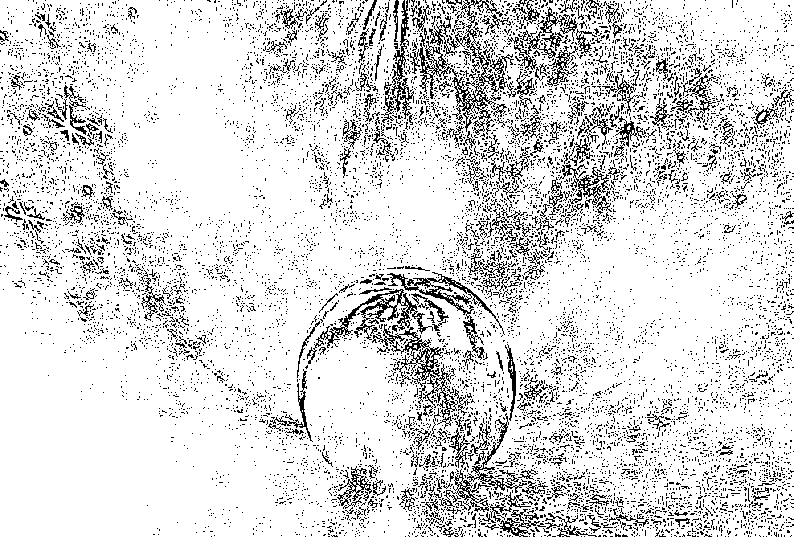

**两性/婚恋****我预言过，二十一世纪起，不止中国，整个世界都没有婚姻制度了，将来都是拍拖一下就好了，没有家庭了。未来没有家，也没有夫妻制度，生活都乱了。所以讲女性的教育，与带孩子的关系问题，实在太严重了。现代人几乎没有家庭制度，连小家庭制度都快没有了，男女关系也是需要讨论的问题。****——南怀瑾先生**教育-家庭-婚恋-亲子是一个圈，首尾衔接，环环相扣，缺了哪一个都不行。南怀瑾老师所讲的，也正是现代社会逐渐显露、必将面临严重结果的大问题：**家庭制度的瓦解，教育体系的走偏，婚姻制度的解体，生育问题的困扰，四者必然互相影响，直至失衡。****土元素反映日趋沉重的生活负担（尤其物质发达地区）、责任感的逐渐缺失。风元素代表个体意识增强，对独立空间的渴望越高，对关系中另一方的容忍度就越低。**不论哪一种，此时此刻就在我们眼前、身边发生着。当有一天婚姻制度瓦解，一纸文书再也不是阻碍的时候，你真的会与“相看两厌”的他继续生活下去吗？问题不在于是或否。若两个人真的感情结束，那么分开自然是上佳之选。但若两个人仅仅只是小吵小闹呢？仅仅是因为来自外面的诱惑呢？难道真的有一天会变成歌词里所写的那样——“把一个人的温暖转移到另一个的胸膛”，并且随心所欲地发生？这个社会问题最终还会指向心理与精神层面的问题。此外，随着虚拟性爱、人工智能性爱的发展，甚至思维移植代替了繁衍后代，我们都可能在未来发现两性互动的大幅度减少。不是性欲变少了，而是与另一方社交的需求被代替了，不再需要“顾及”、“迁就”、“取悦”另一个人了。真到了这个时候，同性恋与双性恋或许早就不是问题，因为那至少还是人与人之间的互动，还有阴阳能量的交互。而人与机器人？一言难尽……毕竟，男女是宇宙中阴阳能量的一个重要显化，很难想象男女关系的严重失衡，折射了怎样的天地阴阳能量失衡。而这对蝴蝶翅膀，又将掀起怎样的飓风？**人际（社会）关系**先说几句题外话：水瓶座能量自古有之，天王星能量也不是在 1781 年天王星被人类观测到之后才突然诞生的。看看孙大圣，再看看普罗米修斯；看看阮籍、嵇康，再看看哥白尼、布鲁诺；看看唐朝的民风，再看看文艺复兴的浪潮……这些无不弥漫着浓浓的水瓶座/天王星气息。因此，千万不要以为木土合相水瓶是某种“新时代”乃至“超越时代”的时间节点，水瓶座能量在这一天才会真正显现。要这样想，你就“着相”了，水瓶座大神也不会喜欢你的。**客观上，大家比以前更加相互依赖、互为影响，在地球的这一边，一小群人的活动所产生的后果，会比以前更快、更明显地影响到地球另一边的人；而主观上，大家以为自己很独立，可以不需要别人，也不必替别人着想。****——《次第花开》 希阿荣博堪布**这是眼前已经发生的一幕，我们通过 app 可以轻松买到全球的货物，一些人际交流却变成了键盘侠式的无束、无礼、无耻。我们与这个世界的联结无比紧密，却又无比疏离。关上房门，你可以隔绝一切，但打开手机，你却联结全球。人与人的交流变得非常容易，却也变得异常困难。最后说说水瓶座式的“社群”。我理解的“水瓶时代”，并不是水瓶座能量的诞生，也不是有多少古灵精怪的人或者想法横空出世，更不是有多少惊世骇俗的奇迹出现，这些自古以来就不缺少，翻翻《山海经》你就知道了。我理解的“水瓶时代”，是水瓶座特质的人不再被社会边缘化、不再被主流排斥（但也不是成为主流）、不再被冠以低等阶级或是低等身份、不再被当做小丑或是装神弄鬼之徒，而是**被理解、被接纳、被尊重、被允许自由发声**，**这就意味着“和而不同”的君子时代的到来，也正是水瓶座人一直向往的“精英社群”。**

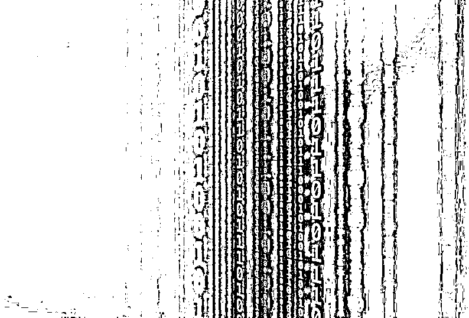

**这是我们每一个人的时代**不知不觉写了上万字，无非是说这几件事：第一，我们正处于土元素能量与风元素能量交替的时代，这个交替不是一瞬间完成的，必然有一个较长的过渡时期，甚至可以说接下来的 20 年都将是土风并行的时期；第二，在这样一个时期里，我们可能会遇见很多历史上从未发生过的事，2020 年的种种事件就是一个证明，我们好像每天都在见证历史；第三，所有这些事，尽管此前从未发生，但仍有其轨迹可寻，这也是占星学的意义所在；第四，不论哪件事，总有其光明的一面，也有其黑暗的一面。比如本文谈论最多的就是科技，**科技必然会带来物质形式的极度繁荣，同样也将导致精神层面的严重问题**。万物有阴必有阳，诚哉斯言；第五，我们需要光明面，那是希望、是未来。我们也应该正视阴影面，那里有绝望，但同样与未来息息相关。写作这篇文章的初衷，本是想在 ISAR 大会之后，把自己没能说清楚的梳理一下，用文字表达出来。写着写着却发现，有些东西本来没想到的，却随着键盘的起伏而逐渐显现。但即便如此，本文也只能算是一篇占星视角的小短文，不论深度还是广度，都远远不够。但话说回来，要把人类社会研究得深而广，谈何容易？或许在教育变革的未来，会有真正的博学者来完成这一壮举。在这里也想提醒占星爱好者：积极关注身边发生的每一件事，在占星学里都能找到与它们相对应的象征符号，这本身也是一种学习占星学的方法。同时也提醒各位警惕土风并见时代的破坏性表现。尽管国际、国家以及社会层面的问题不是我们能够轻易介入与改变的，但我始终相信哪怕再庞大的集体，也是由一个又一个单一的、微小的个体所组成的，每一个人心念的变化，必将带来集体层面的巨大变化。至于个人问题，诸如懒病、精神病、教育、婚恋、亲子等等，则更是我们每一位都义不容辞、需要重视、并付诸积极思考与行动的。就在每一天的新闻、热搜、头条里，我们切实目睹着国与国之间的勾心斗角、纵横捭阖，同样也清晰看见每一位人类个体的看似微不足道的思考、行动与贡献。我们确实已经开始了水瓶座能量的时代，我们也确实还处于摩羯座能量的时代。我不知道这是最好的时代，亦或是最坏的时代，但我知道这是属于我们每一个人的时代。

**版权声明：**原创文章由作者授权首发于若道平台，欢迎转发，反对抄袭。友号转载请申请白名单。

**想观看大会内容？请扫描下图二维码了解详情**

********报名直达入口********

# 太阳进天蝎座丨愿你不怕死也不怕活，在欲望中证得不朽

> 原文：[`mp.weixin.qq.com/s?__biz=MzA5NjA0NTAxNg==&mid=2651430584&idx=1&sn=61217d9371b36bcb039a8cf13742290d&chksm=8b4b2c0fbc3ca5194eea342eb1dbddd98d5909fab29c081d4ab1bcd57e0284e0f883873e9a58&scene=126&sessionid=1692738085#rd`](http://mp.weixin.qq.com/s?__biz=MzA5NjA0NTAxNg==&mid=2651430584&idx=1&sn=61217d9371b36bcb039a8cf13742290d&chksm=8b4b2c0fbc3ca5194eea342eb1dbddd98d5909fab29c081d4ab1bcd57e0284e0f883873e9a58&scene=126&sessionid=1692738085#rd)

******☆ ****后台回复“今日”，给你一句生命态度******

作者/编辑/翀子 ISAR 认证占星师

封面/书君 图片/网络

2020 年 10 月 23 日早上 6 点 59 分，太阳进入天蝎座。在这个寒冷的季节，我们穿过天蝎座的欲望表象，探寻这个星座与恐惧、死亡与生命轮回的关联。宇宙为什么要让它不断经历危机？这背后有何深意？这个星座会为我们带来怎样的启迪？让我们一起进入天蝎座的世界。

**2020 年 10 月 23 日早上 6 点 59 分，太阳进入天蝎座**，对应了二十四节气中的**霜降**。我国古代对这个节气的描述是，豺狼开始捕获猎物，树叶枯黄掉落，蜇虫在洞中不动不食，进入冬眠状态。“天上如是，地上亦然”，反之也是如此。天地万物的变化为我们理解天蝎座提供了生动参照。**杀戮、死亡、黑暗的洞穴……都是天蝎座的象征意象。**

人们常常“谈蝎色变”，这个被描述为“激烈”、“暗黑”、“恐怖”、“神秘”的星座，勾起我们内在的复杂情绪，但它又拥有无比吸引力（比如在若道，与天蝎座、冥王星、第八宫有关的文章常是热度最高的），**欲望、性、死亡与重生的议题与这个星座紧密相连。**

当水星在天蝎座逆行，重新思考这个星座给我们的启示，是非常有趣的。天蝎座为什么需要不断经历“危机”与“死亡”？这背后的宇宙意图是什么？

我想——**不怕死、也不怕活，穿越欲望，证得生命无常又不朽。这是天蝎座给自己、也给世人带来的礼物。**

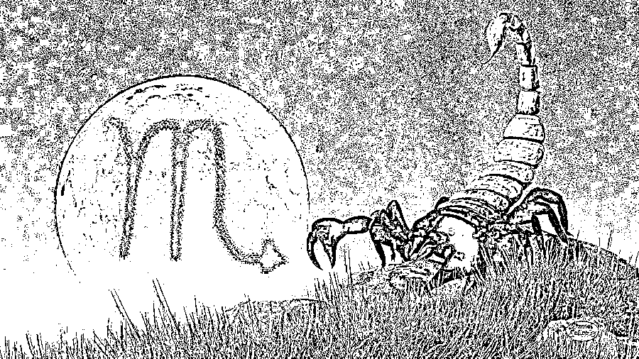

**通过欲望经验生命**

我们可以把 12 星座看作从不同角度经验生命的方式，而**天蝎座，通过欲望经验生命。**欲望是深深存在于身体里的**本能**，我们要生存，要获得爱，要自我成长与超越，这些都是欲望，它不是不好的词汇，而是**强大的心理能量**，更是生命力的来源。我们只能感受到欲望的一小部分，它更多的则埋在意识深层，那里是暗潮涌动的冥界，也是丰盛富有的宝藏。

面对星图上天蝎座能量凸显的人时，占星师常会问：“**你的激情是什么？**它在哪里？”**找到你的激情所在，那是启动生命力量的地方，**也是你经验生命、和其他 11 个星座一起让世界完整的宝贵途径。

**看到自己的欲望，**对天蝎座来说是如此珍贵，通过它，天蝎座见爱憎，见生死，见到轮回与穿越轮回的秘密，并将这个秘密揭开、带向天地。

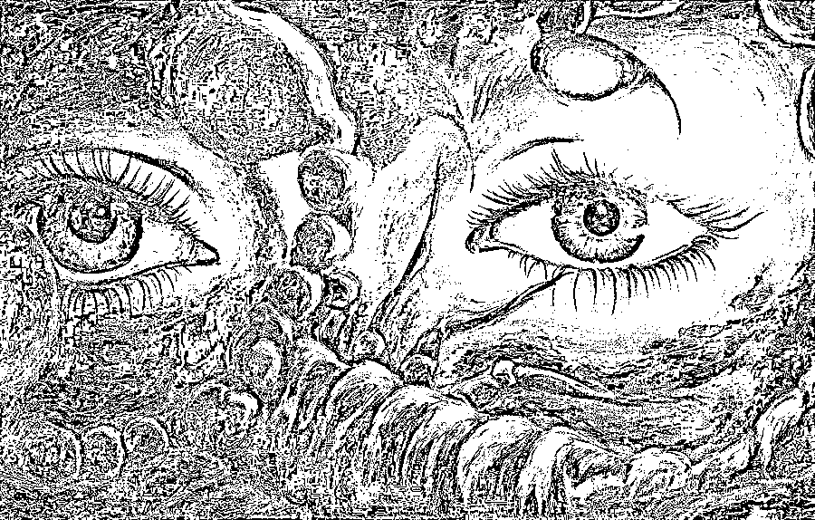

**死亡的迷雾**

**为什么我们会生活在死亡的恐怖中呢？因为我们的本能欲望是要活着，而且继续活下去，死亡却无情地结束了我们熟悉的一切。**

**——《西藏生死书》**

**生存是本能中最强烈的欲望**，然而可能没有哪个星座比天蝎座更早明白，生命终将逝去，死亡无法避免。他们通常在年纪很小的时候，就开始想到死亡，他们会常常有危险的感受，身边所有的**“离开”和“逝去”**（失去家人、朋友、爱人以及自己拥有的每一样东西，都是一种死亡），都刺激着天蝎座敏感的心灵。

我们中的大多数人被教育为，死亡没有任何意义，只不过是**毁灭**和**失去一切**，这让人们**对死亡产生恐惧**。我们不了解死亡，但却明确知道：**自己总有一天会死，以及不知自己何时或如何死。**这对于通过强烈的生存欲望经验生命的天蝎座来说，精神上的剧烈地震，可想而知。

“死亡”在这里是象征性的词汇，不仅指物质身体的消亡。如果你比别人更早、更敏锐的感知到前面有个避不开的黑色深洞，知道万物都有终结的一天，也比任何人更了解它可能造成的危险，你会怎么办？这是对天蝎座的考验 。

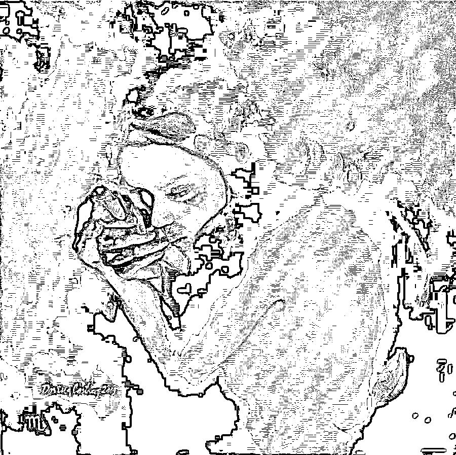

**怀疑**

天蝎座对危险的气味十分敏感。他们可能筑起藩篱，可能伪装自己，也可能躲在暗处主动屏蔽任何可能威胁到他们的人、事、物，他们不自觉的怀疑一切，时刻提防前面的黑洞。

**但这里出现了相伴而生的议题**：由于不愿接受事物的死亡、但又深知它的必然性，**害怕“死”的天蝎座也会害怕“生”。**这里的“生”，同样也是象征性词汇，涵盖了把自己、以及与自己有关的一切暴露给外界的动作。

比如我的一位朋友，她不发朋友圈，说不想暴露自己的信息，她也常做和死亡有关的梦，惊醒后一身冷汗回不过神；另外一位朋友，他在餐厅订位从来都不用自己的姓氏；我还想起来一位不曾谋面的作者，她在最后一刻，把联系方式从微信改成了不方便读者沟通的邮箱地址，虽然我不知道她的星图长什么样子，但她写的文章是关于天蝎座的。

**对周围充满戒备，提防可能存在的危险，对死亡充满恐惧**——天蝎座的**信任**议题，就这样出现了。

**控制**

我一个女性朋友的老公，太阳落在天蝎座，他在正式展开对我朋友的追求前，在网上搜索了他能找到的跟她有关的所有个人信息，他用“侦探之眼”对“猎物”织好了密不透风的网。

想生，怕死。他们不轻易敞开自己，而一旦将激情投入进某个东西（情感、事业、或生活中的任何一件事），他们便**要成为那个牢牢掌握大局的人**，只能“我负他人”，不能“他人负我”。他们自带“雷达侦查系统”，在自己的拥有物外层布置“防线”（就像神话故事里看守财宝的恶龙），战斗力爆表。提前布局、未雨绸缪、为最坏的结果提前准备预案，这是天蝎座的生存**天赋**，但也可能表现成**固执己见**和**极强的控制欲**。

**贪婪**

生的欲望如此强烈，所以人们常常把经历投入到对权力、性和金钱的追逐中，认为它们会增加自己对生命的控制力，显得更有力量，更不容易被死亡打败，这些对天蝎座来说非常具有吸引力。**权、钱、色，**当然是旺盛生命力的表达，但如果是出于对死亡的恐惧与否定，对它们的追求便成为**贪婪的深渊**，**阴暗的天蝎座会为了满足私欲而不断掠夺、吸噬他人，甚至制造毁灭。**

就好比恐惧和否定死亡的大部分现代人，在欲望的驱使下，着迷于拥有更长的生命、更多的财富、把快感建立在追求享受和积累物质财富上，甚至不惜破坏环境，乃至断送地球的未来。

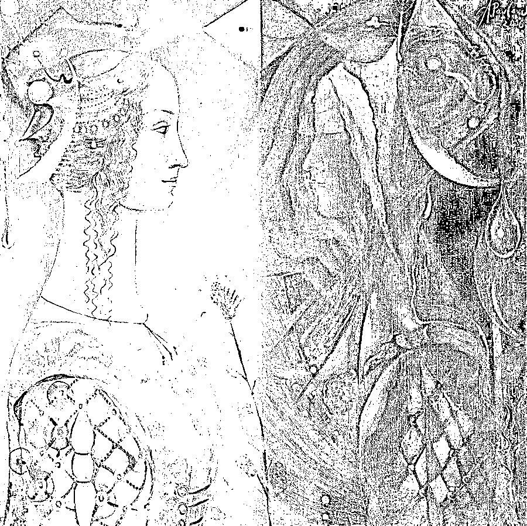

**与生死共舞：破我执**

**如果死亡只出现一次，我们就没有机会认识它。但幸运的是，生命就是持续的生死共舞、无常律动。这些改变，这些小死亡，都是我们活生生地在和死亡接触。它们都是死亡的脉搏、死亡的心跳，催促我们放下一切的执着。**

**——《西藏生死书》**

一千个人心中，有一千个哈姆雷特，而一千个天蝎座身上，可能有上万个令人心碎的故事，那些过往让他们痛彻心扉，是无法愈合的伤。有的天蝎座就此封闭自己，待在冬天的黑暗洞穴中，任凭心中火焰孤独燃烧，而有的天蝎座一次次飞蛾补火，赌上全部身家。

**越知道死亡终会来临，就越容易执着手上拥有的东西。**执着的是什么？名利？财富？爱人？是所有那些贴在身上的标签吗？还是孤注一掷投注的心血？当“死亡”一次次痛苦的降临到身上，将那些“拥有物”一次次的剥离生命，作为天蝎座，你是否明白宇宙的意图？它是否在提醒你，**要对死亡做一番反省。**

每次逆境（危机、背叛、痛苦、折磨……）都在告诉天蝎座**“无常”**的真理：**执着是一切问题的根源。**执着不仅不可能抓住什么，反而会带给人最想要避免的痛苦，**它背后的动机也许并不坏**，希望好好活着、有人爱、有钱花……但**我们执着的这些东西其实在本质上无法执着。**就像手中沙，抓的越紧，流失的越快。

生命的无常让天蝎座痛苦，但他们此生就是要在欲望里学习放下，而如果死亡只有一次，他们就根本没机会学习，也就看不到表象背后更加宽广深邃的事物。

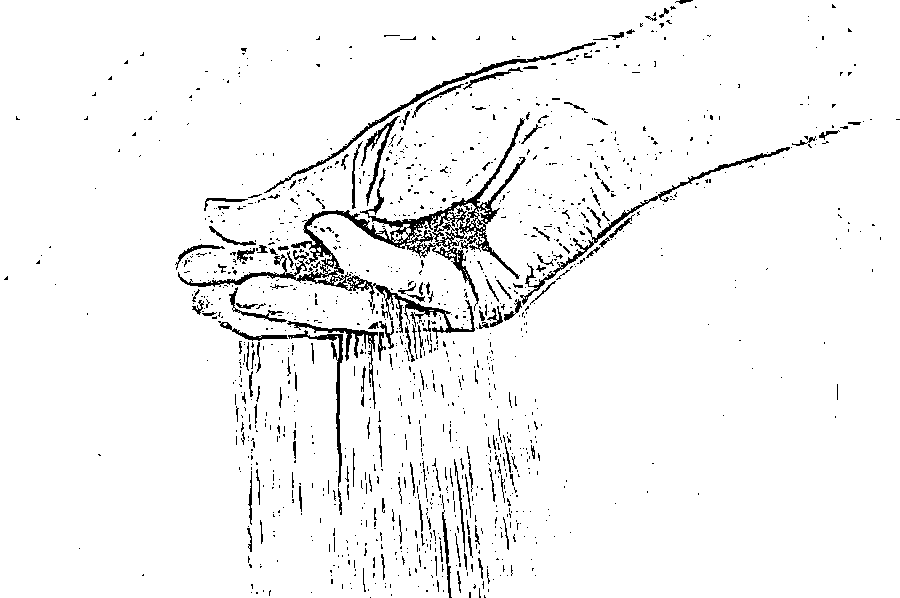

**穿透表象**

**我们最深的恐惧，就好像是龙护卫着我们内心最深处的珍宝。**

**——克里尔**

当死亡一次次粉碎幻想、把天蝎座逐出他们隐藏的洞穴，他们发现一切皆不真实、不持久。无常唤醒天蝎座的恐惧，**但恐惧也会成为他们最好的朋友，**因为它驱使他们去问：如果一切皆会死亡和改变，那**什么才是确切真实的？表象的背后**还隐藏着什么宽广的事物，来包容这些无常的发生呢？

此时的天蝎座，正试着洞悉死亡背后的秘密。他们**把怀疑转向恐惧本身**，揭开它的面具，看看到底是什么样的状况引发了这些欲望与执着。这样做时，**怀疑就不再是天蝎座的进化障碍，而是证得真相的大门。**通过这扇门，天蝎座深入表象背后的真理，走上生命进化的道路。

从有过临床濒死体验的人的亲身经历中，人们发现，**身患重大疾病或接近死亡可以带来真正的觉醒和生命观的改变，**身患绝症然后自愈的案例也并不少见。当人们走进内心，开始接受死亡，常常产生令人惊讶的治疗效果。

每当天蝎座度过一场危机，他们便对恐惧、死亡与重生之间的关联有了更深的体会。他们会发现无论恐惧与否，执着的东西无法执着，生命的无常才是常态。**每一次的痛苦都有它的目的：唤醒天蝎座去冲破欲望的轮回，释放自己的光芒。**

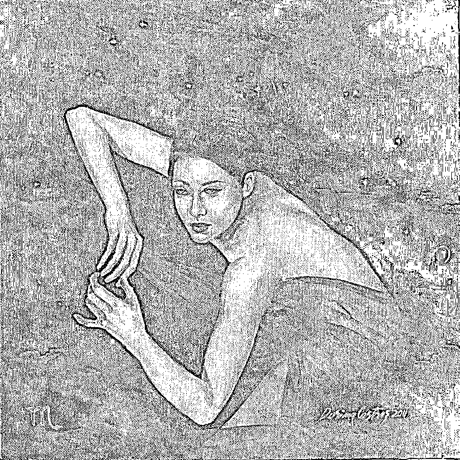

**精神的战士**

在古典占星里，**白羊座和天蝎座都被火星守护。**火星是战士的象征，但白羊座和天蝎座是截然不同的战士形象。二者都有**强悍的战斗力和旺盛的生命力**，白羊座是开疆拓土、初生牛犊不怕虎的勇猛先锋；而天蝎座，是久经沙场几经生死的老将，见过血腥杀戮和敌人的残暴，也经历过尔虞我诈的隐秘较量和惨烈战场的洗礼。

白羊座的勇气是“不知者无畏”，而天蝎座的勇气则是**“向死而生”的无所畏惧**。

对天蝎座来说，**困难与障碍常常可以变成出乎意料的力量源泉，**他们从中找到超越的力量。就像每个英雄故事里，都有一个不停给主人公制造危机的反面人物，主人公在一次次的死亡经历中变得越来越强大，成为被歌颂的英雄。

如果没有伏地魔一次次的设计死亡陷阱，哈利波特不会成为伟大的魔法师；再像藏族史诗《格萨尔王传》里，格萨尔如果没有叔父一次次想尽办法的杀害他，他也不会越来越坚强，对藏族人而言，格萨尔不只是一位武术战士，还是一位精神战士。

精神战士当然有恐惧的时候，但他们**有勇气去品尝痛苦，并且从恐惧与从困难中学到开放和无畏。**天蝎座在一次次穿越“死亡”的过程中获得自在，与生的欲望相伴，同时也让无常成为自己的朋友。

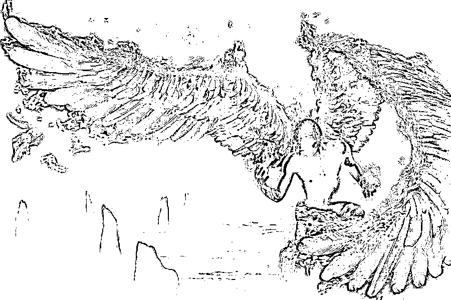

**不朽：重生的秘密**

**如果有任何执着，它们就会变成陷阱。你必须超越它们，进入更为深层而稳定的根基。**

**——《西藏生死书》**

天蝎座拥有强烈的“生”的欲望，因此我们很容易理解为什么它与性是紧密关联在一起的。性行为的本质是繁衍后代，而当精子和卵子结合在一起时，原初的它们就已经“死亡”，携带着它们基因密码的新生命诞生，人类的生命得以代代延续。这个简单的例子，已经清晰阐明了天蝎座“向死而生”的星座特质。

**死亡与重生，**是我们学习占星学时，天蝎座的核心关键词，“打不死的小强”是对坚韧天蝎座的生动比喻。但在玩笑之余，**为什么是不断经历危机的天蝎座证得穿越生死的秘密？**我们不妨换个视角思考这个问题。

我想到藏传佛教，它在我心里是天蝎座的“最佳代言”。在藏传佛教的佛像造像里，你常能看到用人的断体残肢或骷髅骨架做成的器物，而那些佛像也常常双眼暴突，面带凶气。很多人觉得，走进藏传佛教的寺院，身上会汗毛立起，浑身不自在，里面弥漫的恐怖氛围让人窒息。

**升起恐怖，看破幻象**

肉山象征无知、血海象征欲念，白骨象征嗔恨……眼前的怒相神，身挂骷髅项链，一手捧着用头骨做成的嘎巴拉碗，一手握着卷成套索的肠子……肠子能消化各种美味佳肴，然后将其转为排泄物；而嘎巴拉碗（骷髅在梵语中被称为“嘎巴拉”，是大悲和空性的象征）代表一种克服有形或无形障碍、超越死亡的觉悟力量。

藏传佛教**通过这些恐怖的、令人战栗的喻示，意在让人升起恐怖、愤怒等内在情绪，然后再去克服与超越，最终觉悟万物的空性。**

它完美呈现了在欲望驱使下的天蝎座，不断被冥府的黑暗吸引、被“死亡”的恐惧撞击之后，**明了世事无常、一切皆在改变中的真理**。在深入地府的过程中，他们脱掉一层层“身外之物”，越来越接近自己的本性，在阴冷潮湿幽深恐怖的洞穴里，只听到自己的心跳，其他，别无二物。

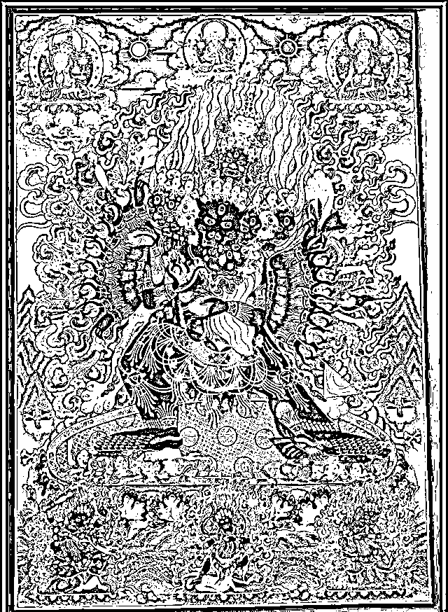

**| **唐卡《大威德金刚》 雍和宫藏

**重生之光**

动物们冬眠就像经历死亡，当它们醒来，又见春暖花开；我们每天晚上睡觉，也像进入一次死亡，第二天早上醒来又是新的一天；而体内的细胞，时刻都更替……漫漫黑夜过去，太阳升起，**生命的轮回在我们身边频频示现。**

有过濒死体验的人，大多会在叙述中提到：在那个时刻，身处光芒中，然后他们忽然意识到**死亡不是生命的终点，而只是一个过程。**

藏传佛教中的大威德金刚，作为文殊菩萨的忿怒相出现，它因为曾经降服了死神阎魔天，也被称为“死亡的征服者”。**征服了死亡，也就意味着脱离了生死的迷雾。**文殊菩萨是智慧的象征，而**征服死亡是需要智慧的**。 

天蝎座作为 12 星座中的“死亡征服者”，可以在敏锐的觉察、深刻的洞见、向死而生的勇气中，证悟生命的神性与不朽，而他们**经历的所有痛苦与折磨，会激励他们从精神上进行转化。**

**不朽的神性**

**证明神性的方式是什么？——让他经历死亡。**

耶稣被钉上十字架，然后死去，当他复活，众生赋予他神性。在很多宗教故事和民俗神话中，不明真相的普通百姓会要求神明用“不死之身”来证明神性；而在另外一些故事里，主人公们在没经历死亡时，只是“伟大的人”，而“死后重生”的戏码让他们晋升“神位”，被后世子孙膜拜。

这又很像是当我们提到双鱼座，会想到神性，而提到天蝎座，会更容易想到魔性。欲望与执念是心魔，当心魔被淬炼、经历“无常”的碾压和精神的净化，便得到转化，成为精神的战士，从而证得神性。

我丝毫不怀疑，**从地狱到天堂，是天蝎座的超越之路，**因为他们一定会在某个时刻领悟，诸法空相，不生不灭，不垢不净，不增不减，无常与恒常相伴。

**从此心无恐怖，与本心相伴，终达彼岸。**

**版权声明**：原创文章由作者授权首发于若道平台，欢迎转发，反对抄袭。友号转载请申请白名单。

翀子

ISAR 认证占星师（2019 年获得）

若道 2019 届核心课程毕业生，若道微信公众号兼职编辑

**咨询微信**：carolinemichong

**微信公众号**：LumosTrueSelf

长按打赏

**系统学习占星学**

**点击图片了解详情**

**微信又双叒叕改版啦，不想错过若道君的推送？**

**就把若道设为星标吧！**

**▼**

就是这个“在看”，戳戳戳 ☟

********报名直达入口********

# 干干干干干货 | 12 个火星星座不同的表达方式之最详细说明书

> 原文：[`mp.weixin.qq.com/s?__biz=MzA5NjA0NTAxNg==&mid=2651430487&idx=1&sn=ee75d83c34cd64b92ee98b8aff7ae356&chksm=8b4b2ce0bc3ca5f6a46ecf9394d5e0324c89e5ca4c25eff26e56f76b8dfda8197adea5799dce&scene=126&sessionid=1692738085#rd`](http://mp.weixin.qq.com/s?__biz=MzA5NjA0NTAxNg==&mid=2651430487&idx=1&sn=ee75d83c34cd64b92ee98b8aff7ae356&chksm=8b4b2ce0bc3ca5f6a46ecf9394d5e0324c89e5ca4c25eff26e56f76b8dfda8197adea5799dce&scene=126&sessionid=1692738085#rd)

******☆ ****后台回复“今日”，给你一句生命态度******

作者/斯蒂芬·弗里斯特译者/李含 校对/江艺 编辑/玫瑰 封面/书君 图片/全景网本文摘自《天空的伴侣 I：爱、性和进化占星学》2020 年的下半年，火星都行进在白羊座，这也让我们得以重新审视这颗充满了战斗力的行星。你的火星都有怎样的功用和需求，又发展得如何呢？来看看这篇满是干货的文章吧。
**穿越 12 个火星星座**1 火星白羊座**进化的意图是学会勇敢而直接地运用自己的性意志**。**有一种灵魂渴望去恢复毫不掩饰的性爱，并解决与自然性欲的压抑或性屈辱有关的业力愤怒。**以战士为原型的火星人热情奔放，可能会欣赏一场赢得你芳心的战斗。**激情和直率**是这个落点的策略，除非出生图的其他部分非常温和。这个火星星座极具保护性。竞争使火星在白羊座充满活力。它喜欢**冒险、挑战、追逐的刺激，以及几乎任何考验其意志的相关情境。**感到强大和胜利让火星在白羊座能量旺盛。**持续的失败，或者缺乏令人兴奋的自我选择的挑战，将会耗尽这个火星星座。**摇滚歌手皮特·汤森的火星落在白羊座，他的歌名显示了这一点：“会得到你”，“粗野的男孩”和“我是一个动物。”克林特·伊斯特伍德的火星也落在白羊座，他在所出演的西部片角色中运用了他的火星。（“来吧，让我也高兴高兴。”）伊丽莎白‧库伯勒-罗丝，濒死研究的先驱者，火星在白羊座。大河之舞的麦可·佛莱利与摇滚歌手约翰·福格蒂和诗人尼基·乔瓦尼都拥有白羊座的火星。2 火星金牛座**进化的意图是将一个人的性意志应用于发展与自然界和他的本能面向的联系。**灵魂的欲望是**恢复对肉体性欲的天生自由的自我表达，暗示着前世经历中，性变得生硬，或者被视为对我们动物本性的羞耻表达。**这个火星星座可以把自己塑造成一个优秀的供应者，这不仅仅是在经济上。它包括**感官**——所有的五种感官，加上你的脚趾和鼻子。火星在金牛座会**照顾到你的身体舒适和健康**，无论是把美味的食物放在桌上，帮你平衡支票簿，按摩你的肩膀，还是喷你最喜欢的古龙水。**他们想要安抚你，让你放松**。他们会争取大自然的支持，在春天带你去动物园，或者在夏天的傍晚带你穿过金银花丛。对于火星来说，这是一个非常**肉体的、享乐主义**的位置，也是一个**坚定**的位置。**与身体和自然界接触的感觉给金牛座火星补充能量，而忽视一个人本能的一面，花太多的时间在室内会耗尽它**。舞蹈搭档鲁道夫·纽里耶夫和玛戈特·方廷都有火星在金牛座，米克·贾格尔、宝拉·阿德布尔和杰米·李·柯蒂斯也是如此。

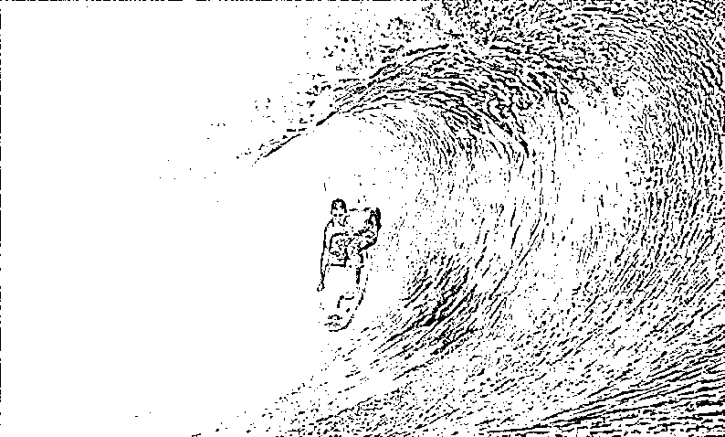

3 火星双子座**进化的意图是将性意志应用于发展激进的警觉性、纯粹的知觉，最重要的是思想的自由交流。**在性爱方面，人们往往**渴望多样性**，以回应前世“尽义务”的性功能动力，它会**因早年遭受（和压制）的与性损伤有关的前生创伤而变得复杂**。如果不加以解决，这可能会表现为**幼稚的性态度和行为**。这个火星星座会用**智慧、才华和早慧**让你眼花缭乱。火星在双子座会想要拜读你的诗作，并带你去镇上每一家极好的书店。他们读你最喜欢的小说，然后把自己的小说借给你，这样你们就可以一起讨论这些书了。火星在双子座想要**扩大和加深你们之间的交流**。由于渴望分享新的经验，他们可能会建议去参观州立博览会、马戏团或去第三世界旅行。他们给你讲故事；他们在你的电话答录机或电子邮件收件箱里安营扎寨。所有这些活动都是为了与你**开启一场引人入胜的亲密对话，并说服你继续下去**。这个火星星座充满了**想法、辩论、精心设计的语言、未回答的问题、新的体验和奇迹**。**无聊、确定性和偏见会耗尽它的能量。**作家 F·斯科特·菲茨杰拉德、罗伯逊·戴维斯和埃里卡·容都有火星在双子座；尼尔·阿姆斯特朗、大卫·杜乔夫尼、艾瑞莎·富兰克林和史蒂夫·马丁也是如此。4 巨蟹座进化的意图是**创造一个安全的环境，以安慰和治愈人类最深层的性表达，这是真正与伴侣建立联系的能力**。前世的动力导致了恐惧和不信任：感觉到性行为将失控，痛苦将会产生。有一种灵魂渴望是**找到重建信任的勇气。**从表面上看，这个火星星座证明了**这段关系能让你得到多么丰富的滋养，你的每一种情感需求都能得到满足。**巨蟹座火星的人提供保护、安全和一个抚慰和治愈你所有疲惫神经的巢穴，他们的气场仿佛在说，他们会与老虎搏斗，以确保这个巢穴的安全。他们**提供情感上的支持和理解，是你内心生活中一个积极、敏感的参与者**。在内心深处确实希望你回报这些恩惠！**花时间做内心工作，用健康的方式滋养某人或某物，运用想象力，**这些都会让这个火星星座充满活力。**侵略性，对其敏感性缺乏尊重，不断被人利用其滋养的品质，以及没有地方或时间退隐静修，则会让它耗尽精力**。汉弗莱·鲍嘉擅长扮演硬朗、脾气暴躁、内心柔软的男人，他和演员兼导演肯尼思·布拉纳一样拥有巨蟹座火星。威廉·莎士比亚和浪漫主义诗人拜伦勋爵与歌手雷·查尔斯和食品作家 M·F·K·费希尔都是火星落于巨蟹座。

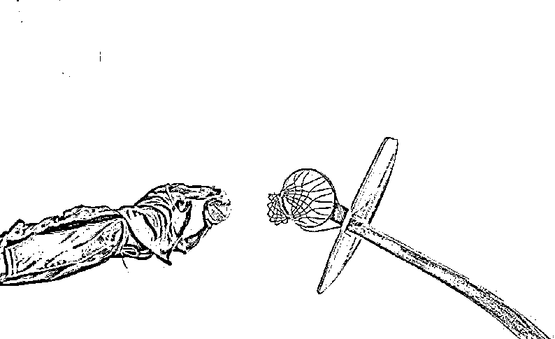

5 火星狮子座**进化的意图是学会用创造力、毫不掩饰的自信和活力来表达性爱，以回应涉及抑制、压抑和公开羞辱境遇的前世经历**——这是一个微妙的过程，涉及到**恢复性的本质，包括健康自私和天生的骄傲。****狮子座的火星擅长“宫廷爱情”，比其他火星星座更能理解爱情的戏剧性。**这些人注重舞台设置和道具：正确的餐厅，正确的手势，正确的礼物。他们可以表现出**真正的高贵，热情，诚实，忠诚，令人鼓舞，并毫不吝啬自己的时间和爱慕**。创造力、趣味性、幽默感、赞美，以及在狮子座火星有关的领域中成为领导者，这些都会带给火星狮子座人以活力，而**缺乏乐趣和持续的消极性会使他们精疲力竭。**一些非常受欢迎的艺人有火星在狮子座：罗伯特·雷德福、布鲁斯·斯普林斯汀和弗兰克·西纳特拉。罗伯特·格雷夫斯以他的爱情诗和对伟大女神原型的研究而闻名，他的火星在狮子座。诗人威廉·布莱克、歌手雪儿和女演员朱迪·福斯特也拥有狮子座火星。6 火星处女座**进化的目的是为了发展有意义的个人能力，并将其应用于对伙伴的服务中。**驱使这一行为的是一种灵魂欲望，想要解**决来自过去业力中关系或性的罪恶感**。这种负罪感可能来自于**真实的错误行为**，或者来自**父权制压抑文化下对性的普遍羞辱。**这个火星星座似乎在说：“看看我能帮你多少。和我建立关系，就像是成为动物学家生长培养皿中的变形虫；你肯定会经历一些变化。你不想成为你所能成为的一切吗？”处女座火星挑战你完善你的人际交往技巧，就像你完善艺术才能一样，注重技巧和细节。它可以在你生活的各个方面为你提供帮助，从你灵魂的进化到在交通高峰期把你的车送到修理工那里。为了建立一段完美的关系，这些人可以仔细观察你的生活，并提出改善建议。他们通过帮助你而充满活力，即使你不希望他们这样做，或者他们的帮助给人以威吓和批评的印象。海明威的火星在处女座。敬业的舞蹈家米哈伊尔·巴雷什尼科夫和演员本·阿弗莱克、布鲁斯·博克莱特纳以及马特·达蒙的火星都在处女座。露丝·金斯伯格和英迪拉·甘地有同样的火星星座。7 火星天秤座进化的意图是**将意志应用于有效地弥合那些由压抑的愤怒造成的自我和他人之间的鸿沟**。简而言之，灵魂的渴望是去**学习良性的亲密关系冲突的艺术**，这是基于在前世的动力中，这种冲突要么被“适当性”压抑，要么因为伴侣的暴力反应而太危险而不能冒险。**天秤座的火星会坚持认为它非常了解你（咨询师)），如果你屈服于这种关系（情人），你的生活会是多么平静与和谐（调解人）。**这位艺术家想给你拍照，或者给你买合身的衣服。这位情人运用了浪漫主义，温柔和敏感。这位咨询师和外交官听取你的意见并给你建议。问题是，一旦你上钩了，更深层次的现实就会暴露出来——**冲突**实际上会赋予这一火星星座能量。在最好的情况下，这可以**诚实、健康地探索两个不同个性构造磨合的地方**。即使它走上黑暗的道路，天秤座的火星最终也会**被孤立、不必要的争吵、敌意、不公正和丑陋所耗尽。**浪漫主义诗人珀西·比什·雪莱和前披头士乐队成员约翰·列侬火星都落在天秤座。作家豪尔赫·路易斯·博尔赫斯和导演英格玛·伯格曼都有火星在天秤座，音乐家彼得·加布里埃尔、歌手菲比·斯诺和惠特尼·休斯顿以及女演员艾丽西亚·西尔弗斯通也有天秤座火星。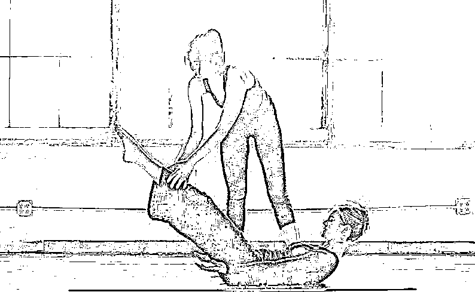8 火星天蝎座进化的意图是**将意志应用到一个不懈努力的、极其诚实的、共享的自我审视、揭示和转变的过程中**。这里有一种**对前世性欺骗动力的回应**，以及一种**在真相、全部真相和只有真相的基础上重新建立信任的灵魂愿望。**这个火星星座会让你**被激情的潮水淹没，或者用敏锐的目光盯着你**。这些人几乎可以用他们的激烈强度催眠你。**他们在性、情感和超个人层面上提供满足感。**他说：“这段关系将深刻地改变我们双方。我已经准备好了，你呢？让我告诉你为什么我认为你害怕。”**火星在天蝎座强调它的诚实，它处理敏感问题的能力，以及与你分享它的深度的渴望。**这些人会告诉你他们所从事的临终关怀工作，带你去听心理学讲座或降神会，或者只是去他们家吃晚饭，和他们聊一些启示灵魂、令人着迷的话题，直到凌晨三点。**激情、强烈、深刻的亲密和对禁忌的探索会让天蝎座火星能量十足**。它被**浅陋和那些让它感觉只能表现出其本质中最肤浅的 2%或 3%**的情况所耗尽。作家亨利·米勒所写下的每一个词都充满激情，他的火星星座落于天蝎座。神秘学家卡洛斯·卡斯塔内达，作家雷·布拉德伯里和 J·A·詹斯，以及音乐家凯蒂莲和库尔特·科本也是如此。9 火星射手座对于射手座来说，进化的意图总是**涉及到以道德的方式和符合自然规律的方式应用自己的意志**。同时，也有一种灵魂**渴望去自由地体验性爱的刺激，可能还有一定程度的性爱多样性。**这些对立的驱动力之间的紧张关系反映了一种尚未解决的前世动力，为此，灵魂现在想要一个解决方案，**在崇高的、深刻的性爱和自由选择的承诺中达到顶峰。**火星在射手座的追求风格反映了这个星座的原型。这位学者要求你在诗歌朗诵或纪录片中拓展你的思维。这位哲学家或人类学家邀请你超越已知和熟悉，就像吉普赛人和探险家一样。这一切都指向了**冒险：在经历、浪漫爱情或性爱中**。火星射手座用它的**好奇心、理想主义、道德和有远见的品质**给你留下深刻的印象。**旅行、追求的事业、幽默、有趣的新想法和经历会激发这个火星星座的能量。禁闭，太多例行公事，不道德的情况，以及与世隔绝的生活都会消耗掉它的能量。**

直言不讳的摇滚明星詹妮丝·乔普林的火星在射手座。法国诗人阿瑟·兰波声称诗人必须用经验压倒一切感官，使自己成为一个预言家，他的火星落在射手座。星图中拥有这个火星星座的还包括民族植物学家泰伦斯·麦肯纳、女演员梅格·瑞安、费伊·杜纳威和特雷西·乌尔曼，以及设计师皮埃尔·卡丹。

10 火星摩羯座

进化的意图是**将意志应用到自我控制、正直和有意义的成就上，从而在生活中获得地位，借此可以为所爱的人提供有效的保护、维持生计和防御。**这一意图是对前世在这一领域所感知到的失败感的回应，这种失败感在他们的意识中留下了羞耻的味道。

**这个星座是一位大师级的战略家，利用首相或高管原型的精明和冷静的效率，让你“加入公司”。**在花了巨大的努力在世界上站稳脚跟之后，他们会给你实际的、可证明的、切实的理由，说服你最大的利益在于他们。这些人可能没有丰沛的情绪，但这在很大程度上取决于星图的其余部分。**从长远来看，他们认为他们对你负责任的行动比表明态度更重要。**这个火星星座的活力来自于**有意义的成就，通常是以长期项目的形式，以及一定程度的孤独。从来没有独处的时间，以及选择了错误的山脉去攀登，让这个火星的能量被耗尽。**通过改变风格成为音乐界常青树的大卫·鲍伊有火星落于摩羯座，冰岛摇滚歌手比约克也有火星在此。马龙·白兰度以他的摩羯座火星为原型，塑造了教父的形象。作家简·奥斯汀和雪莉·杰克逊也有落于摩羯座的火星。

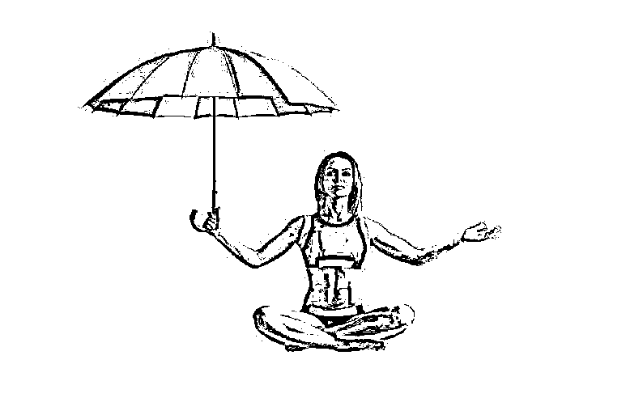

11 火星水瓶座**进化的意图是应用意志来诉求一个人表达自发性的权利，甚至是叛逆的自己，性或者其他方面。**这里回应了涉及性“规则”的前世动力，通常包括禁欲的修道院规则。这也可能与**前生性胁迫**有关，即社会压力导致了一种不满意的、最终不诚实的性结合。就像双子座的火星一样，这个火星星座给人留下**知性**的影响，但在水瓶座有不同的基调，仿佛在说：“我是一个天才，每个人最终都会认识到这一点。和我在一起，你会得到真相，以及做你自己的无限自由。现在，你打算如何对待它？”**这位独特的个体和说真话的人以其独创性和独特的世界观让你兴致盎然**。这位反叛者和流放者提议打破你的枷锁，为你提供一种不受限制、强化个性的生活方式。这位改革者加入你最喜欢的事业，或者让你对他或她的事业感兴趣。水瓶座火星也可能以**（疯狂）科学家**的身份出现，并提议参加科幻大会或航空航天博物馆之旅。这个火星星座被**心灵、思想、精神和言论的自由**所激励，**通过打破规则，质疑权威，或者探索一些尖端的兴趣来充电。约束、成为习俗和狭隘暴君的奴隶会耗尽它的精力**。民权活动家威廉·爱德华·伯格哈特·杜波依斯，植物学家路德·伯班克和作家杰罗姆·大卫·塞林格有火星落在水瓶座。作家安妮·麦卡弗里和加布里埃尔·加西亚·马尔克斯与音乐家戴夫·布鲁贝克、宇航员弗兰克·博尔曼和演员布里奇特·方达都有火星落于水瓶座。12 火星双鱼座这里的进化意图涉及一个深刻的悖论：**找到臣服的力量、意志和勇气**。这里的灵魂渴望是去体验性爱和精神激情的融合，以回应它们在前世的裂变，前世在独身致力于精神之路和屈服于强迫性性欲之间，存在着令人精疲力尽的摇摆。这个火星星座以精神勇士之名追求你。这是一场十字军东征，你的心是圣杯。他们想轻轻地赤手触摸你的灵魂。他们会编织魔咒和幻术。既然他们不能为你屠龙，他们就会给你写诗，带你去看奇幻电影，而且通常会尽一切可能帮助和怂恿你探索其他现实和意识状态，无论这些现实是精神的还是艺术的。**这个火星星座通过冥想或其他建设性的改变状态的经验，以及对精神理想的奉献而激活能量。**双鱼座火星如果**从不花时间冥想、缺乏做白日梦的状态，严酷和缺乏同情心**，则会被耗尽能量。鲍勃·迪伦的双鱼座火星落于第十宫，从很多方面来说，他已经成为这种配置的公共象征。读读他的歌词或他的一些歌名，非常形象地反映出了双鱼座的幻想：“在风中飘扬”，“手鼓先生”，“你就是天使”。魔术师和幻觉大师大卫·科波菲尔有火星在双鱼座，还有音乐家迈尔斯·戴维斯和艾米洛·哈里斯，网球明星玛蒂娜·纳夫拉蒂洛娃，作家简·布罗迪和设计师奥列格·卡西尼。

**版权声明：**本文由若道翻译发布，欢迎转发，反对抄袭。友号转载请申请白名单。

斯蒂芬·弗里斯特

若道签约老师。进化占星学的创始人之一，当今世界最有影响力的占星大师之一；1985 年，他凭借《内在的天空》一书获得职业占星师协会奖（Professional Astrologers Incorporated Award）。他四次获得占星界最高的占星学联合协会奖（United Astrology Congress Regulus Award）提名，2018 年获得轩辕十四教育奖。

**想要了解视频课程，长按二维码咨询**

**想听听大师斯蒂芬老爷子的精彩讲座？**

**长按下图了解详情！**

**微信又双叒叕改版啦，不想错过若道君的推送？**

**就把若道设为星标吧！**

**▼**

就是这个“在看”，戳戳戳 ☟

****************报名直达入口****************

# 11 月黄金报告及上证指数报告上线！｜经济寒冬如何平稳度过？

> 原文：[`mp.weixin.qq.com/s?__biz=MzA5NjA0NTAxNg==&mid=2651430487&idx=2&sn=6b032833078f13e0caf33e548da15942&chksm=8b4b2ce0bc3ca5f6d2b4406eb8ffd38cd864c96b48133bd14364a778c2eaa4743479992b2c4a&scene=126&sessionid=1692738085#rd`](http://mp.weixin.qq.com/s?__biz=MzA5NjA0NTAxNg==&mid=2651430487&idx=2&sn=6b032833078f13e0caf33e548da15942&chksm=8b4b2ce0bc3ca5f6d2b4406eb8ffd38cd864c96b48133bd14364a778c2eaa4743479992b2c4a&scene=126&sessionid=1692738085#rd)

10 月下旬到 11 月，有一些重要的天象和大事件。从大事件而言，美国总统选举将在 11 月 3 日举行。本次总统选举可能对许多美国人来说是他们一生中最重要的一次选举。其结果是一个全球关注的事件，而此间美国发生的一切闹剧也让人感到无比慨叹和唏嘘。
而随着北半球进入秋冬，欧洲新冠疫情的大幅反弹为明年全球经济恢复带来巨大的阴影。美国和欧洲因为疫情控制不利带来的经济衰退让全球经济的恢复的幻想变得更加遥不可及。在这种情况下，疫情控制得很好的中国，似乎是全球重大经济体中唯一还保持了正增长的国家。中国在这样的经济大衰退中是否能够成为避风港，中国的资产是否能够在这样的态势中获得更多青睐？一个值得关注的信号是人民币对美元的升值，人民币美元汇率 2020 年 5 月达到 7.17 元以后，已经经历了连续 5 个月的上升，目前至 6.65 元/美元。

另一个值得关注的是美国国债，非美投资者历时 60 年不断增持美债后，从 2011 年左右开始，开始减持美债，新冠疫情后减持在加速。这样的事件都是什么信号？从天象而言，**在 10 月下旬，火星和水星都在逆行**。其后，在**11 月 3 日，水星恢复顺行**，**11 月 14 日，火星恢复顺行**。在**水星和火星逆行期间**，似乎有一个对于所有交易者和投资者而言，不断重复的教训：“买谣言，卖事实”。

世界经济和金融在未来 2 年都会经历巨大的调整，在这个调整中，应该持有什么样的资产，可以让你度过这个寒冬？秋天已经来了。《上证指数 11 月研究报告》和《11 月黄金报告》都已经发布，让经历了 40 年金融市场起伏的梅里曼老师为您的金融投资提供他宝贵的洞见。如果您已经购买， 请参照下图指引，查看报告内容。

**11 月上证报告上线**

上证指数月度报告价格

**单月报告**：280 元 

**3 个月套餐价**：780 元（260 元/月）

**12 个月套餐价**：1999 元（166 元/月） 

**长按下图识别二维码购买上证指数报告**
▼

**11 月黄金报告上线**

黄金月度报告价格

**单月报告**：280 元 

**3 个月套餐价**：860 元

**12 个月套餐价**：2400 元

**双报告年度套餐更优惠（直降 899 元）**

**12 个月黄金报告+12 个月上证指数报告：仅需 3500 元**

**长按下图识别二维码购买黄金报告**

▼

**购买者需知**

**①**梅里曼市场时机学院《中国上证指数月度研究报告》是梅里曼市场时机学院（以下简称 MMA）的研究“预报”，而不是市场“预测”，是梅里曼老师及 MMA 金融占星分析师对人类活动周期历史与行星周期之间相关性的研究，二者在大部分情况下具有 80%或更高的相关性，而不是因果关系。报告中的研究完全存在错误的可能性。即便是非常认真的研究和几十年的研究经验，金融占星师无法总是正确地解读出各种征象在实际层面上会如何相互作用，并显化为事件结果。所以请将报告看作一个研究参考，务必结合其他市场研究和你个人对市场的理解，根据你的自由意志做决策。**②** 本报告只是上证指数研究，没有个股研究。**③** 此报告一旦售出，**即不接受退款。****④** 此报告每月 1 期，**并非都是在每月相同日期发布**。我们收到英文报告的当天，即发布该英文报告。3 天后，上线报告中文版。**⑤ 此报告仅支持手机网页阅读，不支持电脑阅读和下载。****以上须知，请仔细阅读。一旦付款，即视为已了解并接受所有须知内容。**在过去的 39 年中，唯有梅里曼逐渐完善，并在梅里曼市场时机学院月度周期报告中阐释了将地球宇宙学与周期相结合的研究方法，以惊人的精确性预报了黄金价格发生重大变化的时间。黄金购买 Tip 各大银行均可购买黄金或黄金 EFT 基金，也可以在诸如天天基金或者支付宝购买黄金及黄金相关产品。不明白的可以百度搜索。购买后如何查看报告？

购买后有疑问怎么办？

请联系技术客服

**微信：nodoor201705**

购买上证指数+黄金报告直达入口

# 冥王星在四宫，血浓于水的深情也是被吞没的创伤（上）

> 原文：[`mp.weixin.qq.com/s?__biz=MzA5NjA0NTAxNg==&mid=2651430468&idx=1&sn=1c785ed2023d1b0f50e66364bbf29e13&chksm=8b4b2cf3bc3ca5e526e87f041575af18bf825df47e0cb60bbdbfc537b9ac536cfa54a134e74f&scene=126&sessionid=1692738090#rd`](http://mp.weixin.qq.com/s?__biz=MzA5NjA0NTAxNg==&mid=2651430468&idx=1&sn=1c785ed2023d1b0f50e66364bbf29e13&chksm=8b4b2cf3bc3ca5e526e87f041575af18bf825df47e0cb60bbdbfc537b9ac536cfa54a134e74f&scene=126&sessionid=1692738090#rd)

**☆ 后台回复“今日”，给你一句生命态度**

作者/蓝女巫 ISAR 认证占星师
编辑/翀子 封面/书君 图片/音乐/蓝女巫

本文写给冥王星四宫，以及所有想要回顾童年创伤的人。四宫是星图上血浓于水的地方，当冥王星落在这里，你的生命早期有什么样的伤痛和秘密？又会在成年生活里呈现怎样的情感模式？让我们一起来读文章吧~

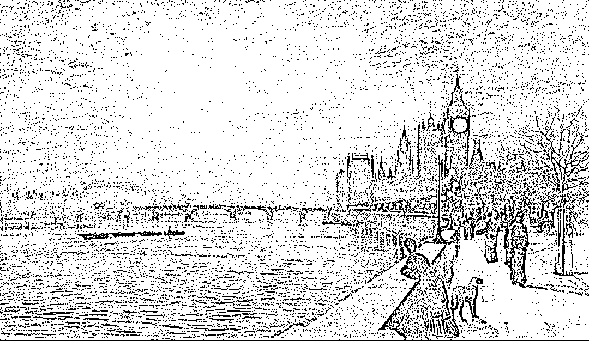

注：**本文适合冥王星四宫人，四宫天蝎座，月冥，月亮天蝎座，月亮在 8 宫，月金人，巨蟹座摩羯座对宫，以及所有想要回顾童年创伤的人。**如果你有巨蟹座摩羯座及土星与天王星配置的男友，也一定不要错过这里......天蝎座水逆时，让我们一同返乡！
**你在恐惧什么？**

**四宫是什么**

**“一宫的东西是升起的，四宫的是隐藏的。”**比如，我升起了狮子座，隐藏了天蝎座。 

四宫，那是每个人心底深处的喃喃自语，是午夜梦回时分，你与黑夜的裸裎相对。这里是一片月华，是生命之初的依恋，母亲的脸。是每个人本该最柔软的地方，最深切的渴望，所谓情绪安全感。是你生命之树的根！而冥王星 4 宫，在这里看到的却是：寒塘渡鹤影，冷月葬诗魂……有种情深不寿的荒凉。宁静安详？究竟要怎么做到……我总觉得最可怕的，不是 8 宫的湖，或是 12 宫的海。**而是星图中，这个关于血浓于水的地方。**因为它是，牵一发而动全身的痛。4 宫是一口井。冥王星在此，那井，还是无底的…… 

虽然我并非冥王星 4 宫，但四宫头是天蝎座，又月亮天蝎座。也算是异曲同工。且四宫还有天王星坠入其中，划破夜空……而它，可能正是冥王星 4 宫的解脱之道？

**家的记忆**

一个月亮摩羯座说，“姑苏城外寒山寺”。入睡时听见一句诗，醒来前梦见一艘船……

“英国画家 Atkinson 的画，精准概括了我童年的底色。”

“那你小时候，还挺忧郁的。” 

作为上升狮子座，童年是我人生最快乐的日子。但或许也有些别的，我不愿意记得。外语学院的家属大院里，我家住一楼，门前有个小园子，我常常拎着小筐采花籽。夜凉如水，蛐蛐叫，万家灯火，满眼星光。一个儿童的孤单，与远古相连……多愁善感的年轮，随灵魂的记忆飘远，前世将一种氛围，默默寄托于诗文。所以，月蝎联觉人三岁时背的诗是这样的。比如：“独上江楼思渺然，**月光如水水如天**。”“歌管楼台声细细，秋千院落夜沉沉。”“未觉池塘春草梦，阶前梧叶已秋声。”“有约不来过夜半，闲敲棋子落灯花”…… 

**我也不明白，为什么记忆中最美的诗句，都是湿漉漉的？**像“一片冰心在玉壶”还包裹着雨水的新绿和瓷器的细语，叮叮当当地。在不识字的情境下背诵的诗，却因此凸显了最微妙的联觉，令我铭刻至今，每个词句中，那立体的色香味和质感……化成一个个 complex，凝聚着难以名状，精微复杂的情绪，嵌入灵魂，混成了盘根错节的，家的味道。4 宫主星冥王星落 3 宫，所以，我注定从文字中返乡。 

**雨纷纷，旧故里草木深……**

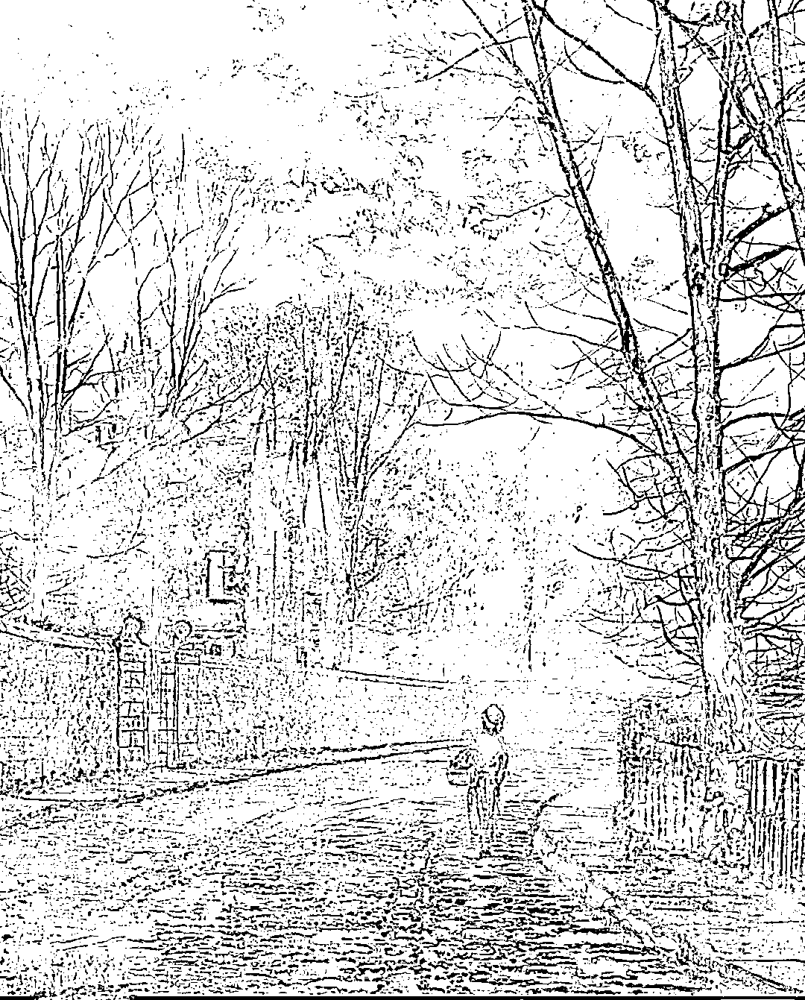

**早期的伤**

悲伤就是沉默。父亲和母亲之间有太多欲言又止的东西，他们彼此了解，知道自己仍然无所归处，日常生活的困窘进一步加重了这一沉默的色调。悲伤既是他们的同谋，又是他们之间的阻隔。但是，在那些年，在我的童年时代，我们从来没有交谈过。一次也没有。一个字也没有。没有谈论过你们的过去，也没有谈论过你们单恋欧洲而永远得不到回报的屈辱；没有谈论过你们对新国家的幻灭之情，没有谈论过你们的梦想和梦想如何破灭；没有谈论过你们的感情和我的感情、我对世界的感情，没有谈论过性、记忆和痛苦。我们在家里只谈论怎样看待巴尔干战争，或当前耶路撒冷的形势，或莎士比亚和荷马，或马克思和叔本华，或坏了的门把手、洗衣机和毛巾。

乍看这段话，我还以为关于月亮摩羯座，一查作家竟是月亮天蝎座。相通的是一种压抑的氛围。情感缘何如此难以表达？是防守着什么？又因何而绝望？当我们严控着种种深层的原始情感，这也宣称了一种**内部的失败**。正所谓月亮的落陷。内在的力量正从源头被阻断。早年家庭中的痛苦情绪经验，都会被压抑到内心深处。童年的黑暗，在成年世界里，很难再次叙说，因它已经凝结成一个暗处的疤。然而，**一切被压抑的终将反噬。 **

斯蒂芬·弗里斯特称冥王星在 4 宫为家庭的逆境，他们常来自于功能失调的家庭。**灵魂往世一定经历过真正的黑暗，而那也发生在家的情境下。于是，心理记忆的银行，有着悲剧般的沉重色彩。**冥王星 4 宫的家，常是权力斗争的舞台。他们也常是被选中担当家族创伤转化任务的那个。家庭创伤可以有很多版本。除了心照不宣的压抑，还可能更糟，可能有暴力，抛弃，情绪虐待，或是种种不能言说的秘密。 

凡此种种，危机的暗流，瓦解的破碎声，都曾指向不幸的孩子心中，那片深深的冻结，令我联想到了寒露时湿冷的温度。知道吗，**你曾在这创伤处停止了生长。**不再安全。信任感与安全感，本应发源于幼年获得的爱与尊重。若依恋需求曾经未得到即时回应与充分滋养，就会发展出对外部世界深深的不信任。或以否认情感需求来防御，或因此而变得欲壑难填。冥王星 4 宫，从此长出了玻璃心，情绪安全感极度匮乏，而情感状态也时刻影响着自我形象。向内深埋的情绪，造成向外裸露的神经。**敏感，一触即发...... **

我们都在潜意识中效忠父母，内化的原生家庭关系模式，会延续代际传承的伤害。其实童年早期境遇，都有灵魂层面更深远的往世溯源。过度归咎于原生家庭，也没更多的意义，还不如接纳并为自己负责。毕竟父母们来自更艰苦和缺乏关爱的成长环境……回溯只是为了觉察庐山真面目，最终是为了跳出魔咒，突破强迫性的重复，中止家族创伤无意识地循环。家人的阴影也并没你想的那么可怕。要知道曾经缺失的防御力已随你长大。你已经可以**像个成人那样，去主动改写命运。**与家和解，最终还是为了与自己和解。 

其实，冥王星 4 宫的画面，很容易联想。从年初的极夜开始时，我们每个人都经历了一番冥王星 4 宫的情境。那时，北交点巨蟹座，土星、冥王星合相摩羯座。2020 除夕，被困城中的土冥在 4 宫的闺蜜在朋友圈发了一句：“国殇，家殇。我是武汉人。”那一刻，我被共情之痛刺穿。正因我懂得什么叫冥王星 4 宫，所以格外能感受到她那时所承受的重量。然而同时，我也懂得这种矗立于瓦砾中的情绪力量，其实会有多坚强。**蒲草韧如丝。****“韧”，就是这个冥王星位置所代表的生存力量。**冥王星 4 宫人，会在危机中，发现自己内在最强大的再生力，并能汲取这种生命资源去彻底地重建自我。**4 宫就是你脚下的大地，而冥王星是意志。深植于大地的意志，就是根！ **

**斑驳的城门 盘踞着老树根……**

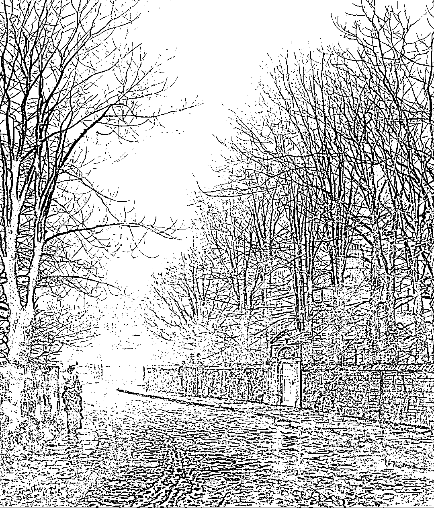

**秘密的自己**

**“为什么她会在他旁边？是谁把她放在篮子里，让她顺流而下的？” **

四宫，**是午夜梦回的宫位，它那么温柔，却又那么黑暗。它唤醒童年，关于回忆，又关于等待。它储存着你所有的诗化记忆，汇流着你语义之河的低声密语，和发源着你生命乐章的一切动机。**我们都把儿时的秘密，深埋在了这里。而一切情绪记忆所储存的创伤，也美人般熟睡在此处，等待着被唤醒…… 

**除了亲人，谁会有幸看到你这里？那必须是一个你真正信任的人。**他需要与你相处多久，才有幸抵达你 4 宫这片情绪的亲昵？斯蒂芬说，若他人与你共眠了十年并以一种相互喜爱的方式，他可能才刚开始了解你的 4 宫，内在秘密的自己。所以，4 宫在亲密关系中的功能，我认为是共枕同眠，要比 8 宫多一层亲情的脉动。 

而敏感脆弱的冥王星 4 宫，**却把一颗定时炸弹埋在了这里**，这很残忍。**并需要竭尽全力保证它不被触及。**为防止外力威胁的潜入，你宁可紧闭门窗。会压抑情感需求，会怀疑他人动机，对生活空间强迫控制，对环境变化焦虑敏感。而退缩式的情感防卫，最终也并不能阻止真正想要破门而入的谁……我们迟早会在这里遇见那个最值得等待的人，并在关系中投射早期创伤的咒语。为的是重返童年的案发现场，重历悲怆，暴露以求化解。

坐在床上，他看着睡在他身旁的这个女人，她在睡梦中还紧握着他的手。他感到对她怀有一种难以表达的爱。这时候，她可能睡得很浅，因为她睁开眼睛，目光落到了他身上，一脸惊恐。“你在看什么？”她问。他知道不应该把她惊醒，而应该引她继续睡。他试图跟她说些中听的话，以使她脑子里闪现出新的梦境。“我在看星星。”他说。“别骗人，你没在看星星，你在看地下。”“因为我们在飞机上，星星在我们下面。”“哦，对。”特蕾莎说。她把托马斯的手抓得更紧了，又睡着了。托马斯知道，此时，特蕾莎正在一架飞得高高的、飞在星星上面的飞机里，透过舷窗往外看。

**缘份落地生根 是我们……**

**你在补偿什么？**

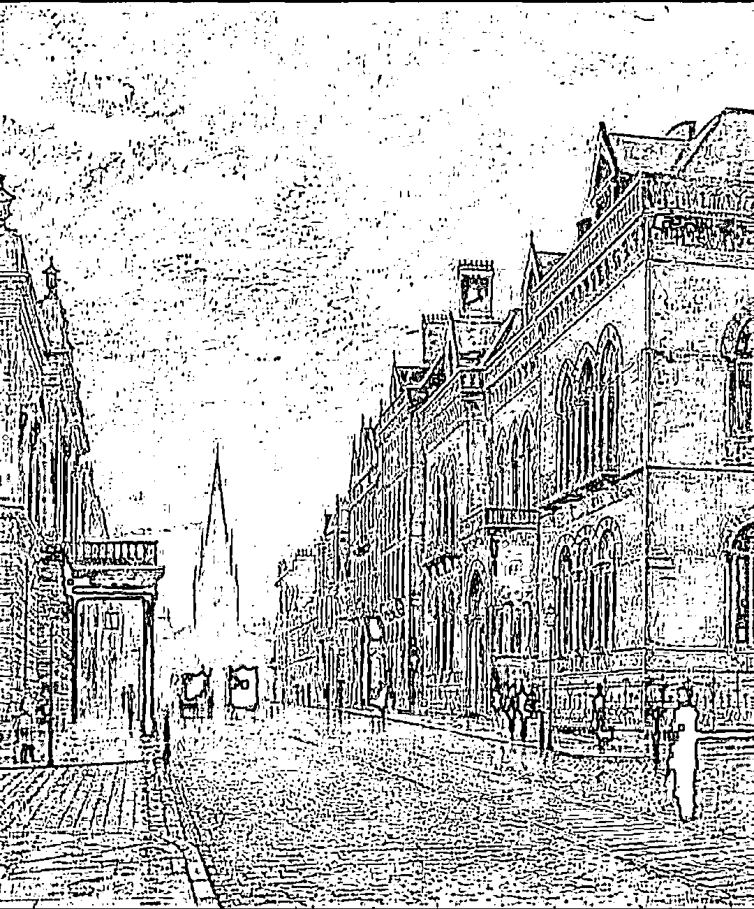

**情绪周期**

**“有时候，月亮也会将自己掩藏起来，地球上便完全陷入黑暗，但不久之后，它又散发出光芒。” **

情绪是一个暴徒，尤其在冥王星 4 宫这里。所有生存与毁灭的力量，都汇成流经情绪的血液。强迫式的情感表达，歇斯底里如孩童。那是恐惧凝成的激烈。本能放不下的伤。将最忠贞与最沉重的爱，激光般聚焦于一点。显得偏狭而麻痹，注定如梦魇般绝望。过度执着的情感本能，**令情绪的祥和，简直成为一种奢望。**时常受焦虑驱使，下意识地想要去破坏关系，无情弃绝。**却从没去想过你真正怕的到底是什么？ **

如此极度专注地活跃于外不久，必然会耗竭。故你需要定期闭关，沉默独处，清理充电。这时，你变得极度退缩，无情而孤独，恨不得吞下世界。“**我走进内在的死亡，发现外在的死亡比内在的死亡好。因此，我选择在外部死亡，在内部生活下去。**由于这个原因，我转变方向，去寻找内在生活的所在地。”回归内心的深海，不断沉潜，去认清情绪风暴的基础。体验每一个起心动念后，情感驱力的本质。**然后，你带着发现的新大陆，重返世界，**满血复活，去重建更加和谐的关系。**情绪风暴，周而复始。**在外人看来，你的情绪起伏有如过山车？去让他们理解并支持你。

如果你向外看，你看到的是远处的森林和群山，在它们之上是星空。如果你向内看，你又会把近看成遥远和无边无际，因为内在世界像外在世界一样无边无际。内在世界无边无际，一点都不比外在世界贫瘠。人类生活在两个世界中，愚蠢的人才生活在其中一个世界中，但永远不伦不类。所以，迷惘是起点，内倾是途径，但内与外的平衡才是最终的目的。

——荣格

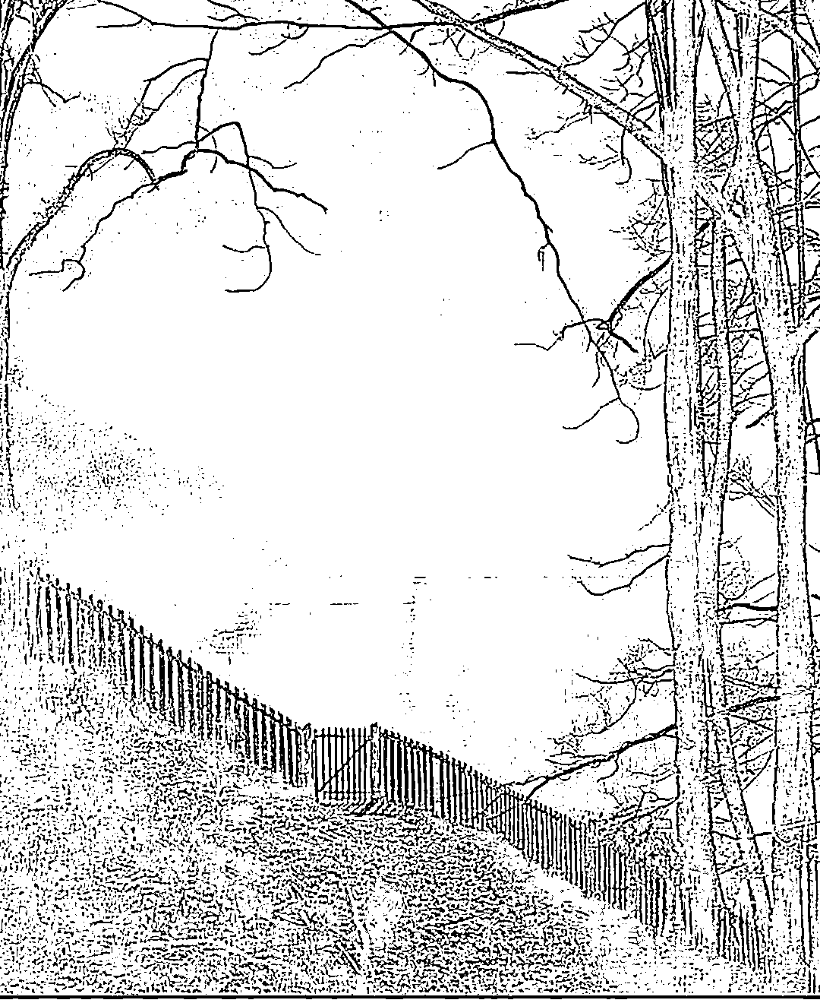

**依赖共生**

给一个冥王星 4 宫和她妈妈一起解盘，目睹了一场情绪风暴，之后，我内在莫名地翻江倒海，大哭了一场。可能我觉得，所有的爱情，与亲情比起来，真是比鸿毛还轻。正所谓**血浓于水。**妈妈将恐惧焦虑投射在她生活的每一处细节。妈妈的侵略让她抓狂，而她真正的需求从未被正视。强烈的渴望与错位的爱，无法对接。“关于你进我房间不敲门的事……”“我敲了啊。”“对，你敲完直接就进来了。”我在想，**她们，究竟该如何放开彼此？ **

我也有一位超级母亲，集真善美于一身，是公认的最可爱的人！在我心中，她像 Snoopy 一般最美好，没有之一。可是，她却造成了我至今没有断奶。她对我时刻追踪的注视，强迫式的关爱，生活方式的限制扰乱，隐私的侵略，甚至情绪的勒索。而**这时常会酝酿一种恨，被吞没的创伤。**我想，男人们对我也是一样感受吧……谢谢原生家庭。爸爸一向的言语贬低和责难，让我在男人面前永远低入尘埃。深埋的羞耻感，像皮肤一样脱不下来；妈妈无比窒息的爱，让我潜意识学着试图去吞没男人。然后惊奇地发现，各种男人都被我处理成渣男收场。惯的，就像妈妈惯着我一样。美国时一位天蝎座男友，初识就深深地凝望着我说：你那么好，可你不自信？ 

依赖共生关系，指与家庭成员之间不分彼此，相互依赖，缺乏边界感，浑然一体。距离越近，就没有了尊重。亲子关系强迫式互动，用密不透风的爱囚禁孩子。剥夺了其对人生的自主选择权，**始终不被允许长大，是以为保护。**也不要抱怨，其实，真正的断奶，应该发生在你停止索取，不再将自己的需求置于父母的生命重心之后，你才能换来他们对你独立性的真正尊重。然后相互成全，各自放飞。 

后来，你**又会在情感关系中想要延续母婴共生的感觉。**寻求极致的心理依赖，紧密融合，模仿子宫中的痴缠，出于无法独立存活的分离焦虑。将幼年情感挫折都转移到了伴侣身上，期待对方满足你需求。双方轮流扮演对方父母，如此共谋一种不想让伤口真正痊愈的依赖，直到都失去了自我完整性。它要求双向的关注，且是全神贯注。区别于尊重式的凝视，却是吞没式病态的寄托。这让我想到了什么。**作为月亮天蝎座，我一直说，我最喜欢的是凝视...... **

**一件最紧迫的事：你需要重新诞生！**

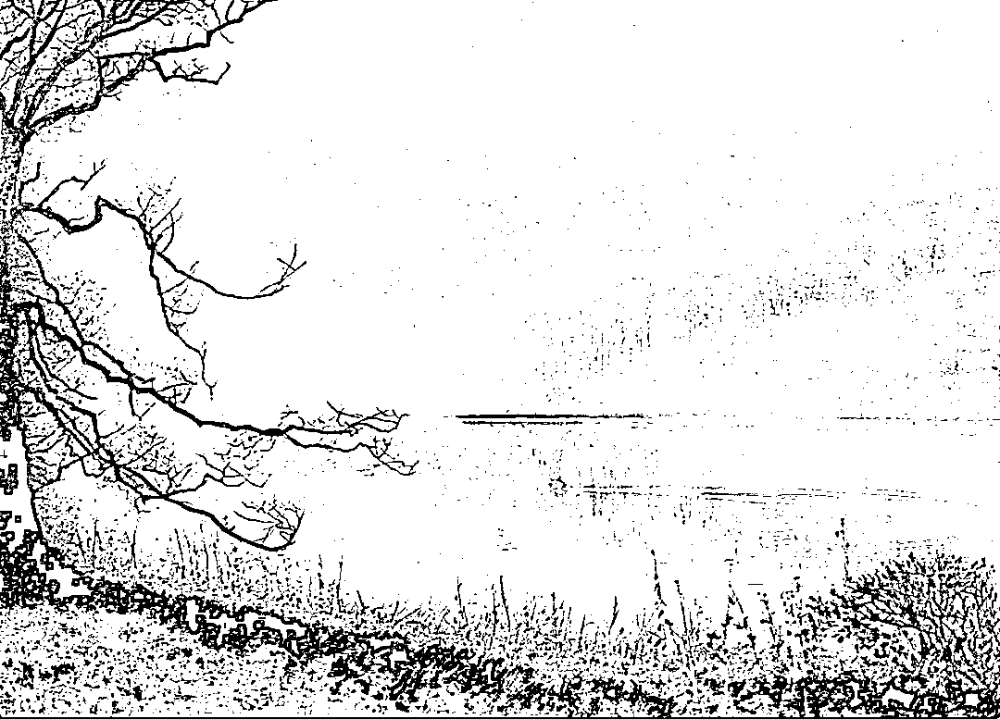

**欲求不满**

冥王星 4 宫，她们口述的父母，与实际的父母现实，总存有很大的落差。怨恨给得不够，而父母却觉得已竭尽所能？**问题出在哪里？你的洞是无底的。月亮天蝎座的我从小就对无底洞的意象，深深地共鸣。**冥王星 4 宫的安全感黑洞，就是这样的，难以餍足。井底干枯，不能自足，想当然地等待他人来喂养。
似乎总有一种说不清的怨恨，纠缠着你。希望别人迅速自动了解你的需求。期待不被满足，就会很生气。却又不以直接沟通去要求，而以情感躲避来迂回表达你的愤慨。如此任性专制，只因灵魂创伤被勾起，链接着早期滋养匮乏的强烈情绪记忆。这时你或许该问问自己，**你真的能说清楚自己要什么吗？那么又怎能指望别人给到你全然的满足呢？且它根本就是无底的。**没有人能帮你填满，无论父母还是伴侣。其实永远没人能完全接住你。那是一种巨婴的呐喊，合一的渴望，怀念着与母亲在子宫中的那般契合，将注定失望。 **欲望需求难以被满足或被充分理解时，其目的就是为了把你逼回自己的内心，**不再向外渴求。学会为自己找到安全感，将外界依赖降到最低。一切情感震撼，也都是为了帮你抽地毯，当过度依赖已令你无法成长。记住，你的井永远无法依靠他人和仰仗外物来填满，你只能背水一战，学会为自己负责，找到各种情绪自足的方法，从内部建立安全感的基础。 **总遇见完全忽略你的人？对，那确是宇宙故意的。**

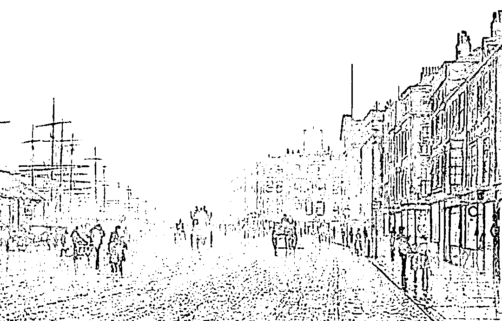

**情感操控**

观察本命星图或合盘冥王星 4 宫的情感剧本，总是充斥着依赖共生的影子，他们总能完美吸引来角色契合的另一半，实现爱的捆绑。无意识中上演权力的游戏。**轮流扮演，依赖方与控制方。相爱相杀，珠联璧合。**而双重欲望需求的矛盾撕扯，必然导致定期的冲突，波动于情感压抑与情绪失控，游走于孤独与亲密之间。 

**依赖方：****痴迷型**

极度渴望情感融合，依附贴近，制造吞噬。长期深埋未解决的情感需要，投射为对他人的期望。用锐利的眼睛追逐着，不断测试确认，爱还在？这耗费了你所有的注意力。妄图借助他人全神贯注的目光，来证明自我的身份感，价值感，安全感。可惜你的逼近，只能令人步步倒退，对方感到个人发展被限制。直到分离，如你所愿，潜意识地。情感勒索也是依赖方的武器，比如无助绝望或利用他人内疚感。恰如你自身所遭受的亲情勒索那般。**我发现，其实，你爱的是需求的满足。但是，你怎么不自己去满足？ **

**控制方：****回避型**

于是吸引来情感掌控的强势伴侣，多疑嫉妒，凌驾打压，占尽上风。控制方的暗器，有时也会使用压抑和情感退缩的被动控制，将负面情绪投入环境。用冷暴力，来制造心理恐慌，操纵对方安全感。正因不敢向内正视自己，才会忙着向外疯狂掠夺，试图用爱的绑架，来制造缺你不可的依恋，满足一种非你莫属的价值。控制的爱，是一种假爱。**我看见，你的防御之墙滴水不漏，所以说，这权力背后，你掩盖的是脆弱吗？ **

**揭开灵魂创伤的底片**

双方内在都充斥着深层的不安全感，都曾无法在原生家庭获得理解滋养。安全感来自于被需要，故能抓住对方情感弱点，创造紧密结合的现实。其实都不愿离开对方，也都不想从共生中走出，宁可在早年未竟创伤记忆中携手缠绵。**缘何要相互绑架？因为被抛弃就是死！心中的一个婴儿说。**可见，无意识的投射，仍活在过去。那些童年发生过的，或往世未了的心愿。曾因过度依赖而被抛弃，灵魂心有余悸，脑海中一直播放着分离的暗示：我不相信永远，我根本不敢相信我并不会失去！果然，关系终以震惊收场。无明于一切痴缠都是为了内在创伤的揭露，以获疗愈和放手，为了最终与情绪记忆的和解。诸事皆是无常，又何必苦于占有？不如学着放开彼此。 

当我们能做到，**不以控制的手段，爱他人；而以自足的方式，爱自己。**这就是我理解的**“安全型依恋”。**

**（未完，见今日二条）**

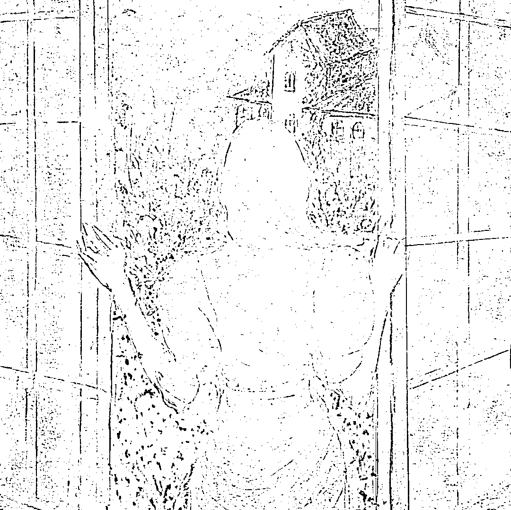

**| **蓝女巫画作 2020.4.4

**版权声明：**本文由作者授权在若道平台发布，欢迎转发，反对抄袭。

**蓝女巫**

英国伯明翰大学 市场营销学硕士

职业占星师/专栏作者/芳疗师/珠宝设计师

中国首批 ISAR 英文认证占星师（2012 届）

**微信公众号**：cecilia_sui

长按打赏

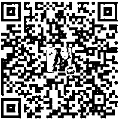

**系统学习占星学**

**点击图片了解详情**

**微信又双叒叕改版啦，不想错过若道君的推送？**

**就把若道设为星标吧！**

**▼**

就是这个“在看”，戳一下☟

********报名直达入口********

# 你将回归何处？冥王星在这个宫位的解脱之道（下）

> 原文：[`mp.weixin.qq.com/s?__biz=MzA5NjA0NTAxNg==&mid=2651430468&idx=2&sn=a902f973afba98106792f92c3f503285&chksm=8b4b2cf3bc3ca5e51ef8b2e9ac2647916e7a859721d06b398016e5f00ff02046931d543d354d&scene=126&sessionid=1692738090#rd`](http://mp.weixin.qq.com/s?__biz=MzA5NjA0NTAxNg==&mid=2651430468&idx=2&sn=a902f973afba98106792f92c3f503285&chksm=8b4b2cf3bc3ca5e51ef8b2e9ac2647916e7a859721d06b398016e5f00ff02046931d543d354d&scene=126&sessionid=1692738090#rd)

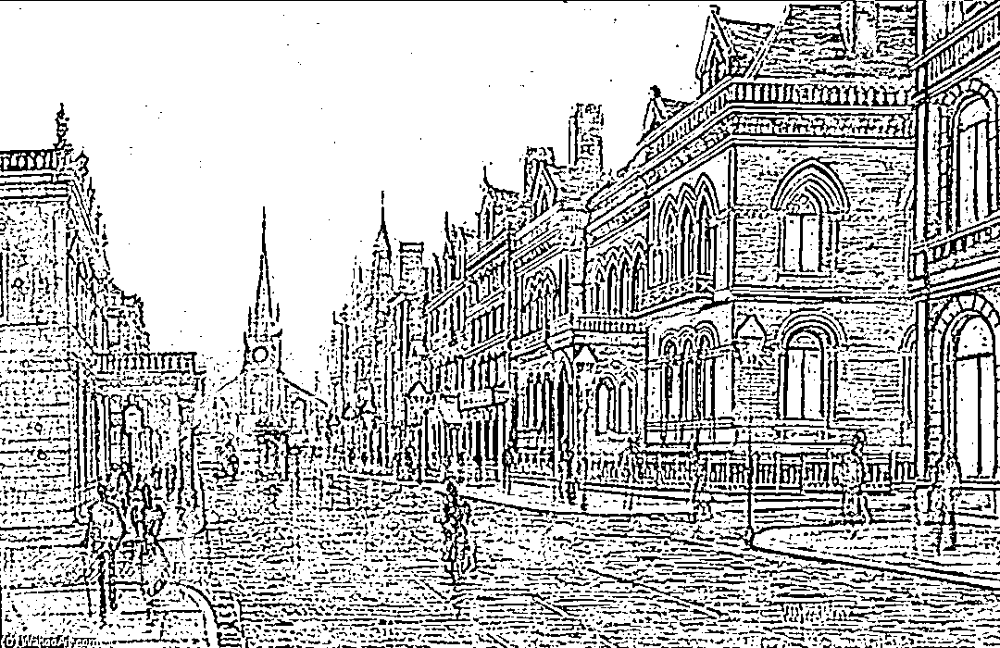

作者/蓝女巫 ISAR 认证占星师
编辑/翀子 图片/蓝女巫

在今天的头条文章里，作者深入剖析了当星图中的冥王星在四宫时，我们会拥有怎样的早年经历，以及会在成人生活里展现怎样的情感模式，而在下面的阅读中，我们将看到转化创伤的解脱之道。

**你将在何处崩塌？**

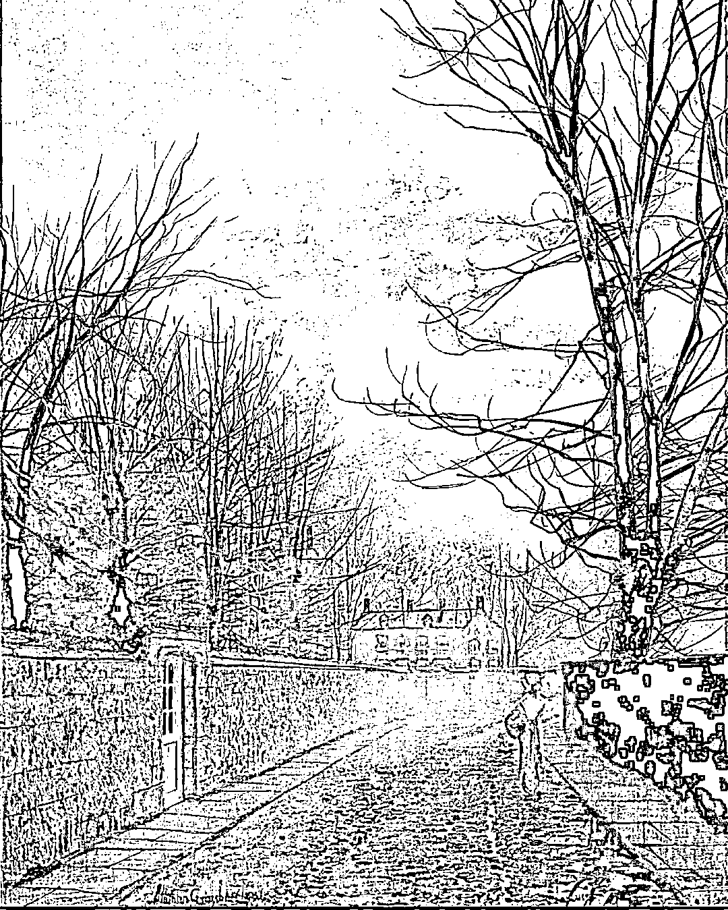

写到冥王星 4 宫的依恋，我必然会秒想起米兰·昆德拉在《生命不能承受之轻》中，虐心值爆表的两个画面。这让一只月亮天蝎座，情何以堪：

她和他们一起唱歌，但她并不开心，她歌唱是因为害怕如果不唱会被那些女人杀死。但是，托马斯朝她们开枪，她们一个一个跌落在游泳池里死了，这意味着什么？那些女人为大家的身体一模一样，没有丝毫区别，而兴高采烈，她们其实是在庆贺面临的死亡，因为死亡终将使她们变得绝对相似。枪击声于她们仅仅是死亡之舞的圆满完成，每一声枪响，伴随她们开心的狂笑，随尸体沉入水下，歌声越发嘹亮。为什么开枪的人是托马斯，他是怎么也会向她开枪，因为是他把她带到这个这些女人中。她来和他生活在一起，就是为了逃离母亲的世界，那个所有肉体都是一模一样的世界。是为了表明她的是独一无二的不可替代的。而他，却在她和所有女人之间划了一个等号。他用同样的方式拥抱她们，对待她的身体和对其他女人的身体没有差别，丝毫没有，他重又把它扔回她原以为已经逃离的世界。她对他说：“我被活埋了，理了很长时间了。你每个星期来看我一次。你敲一敲墓穴，我就出来。我满眼都是土。“你说：“你什么也看不见”，然后你就帮我擦掉眼里的土。“我回答你说：不管怎么样，我都看不见了。我的眼睛变成了两个洞。“然后你就离开了，很久。我一点都睡不着，因为我害怕错过你回来的时候。一天，你终于回来了，你敲了敲墓穴，可是我等了整整一个月，都没有睡觉，筋疲力尽，连爬出来的力气都快没有了。当我终于爬出地面。你一副很失望的样子。你说我的脸色很不好。我知道我让你扫兴。你走了，我又掉进坟墓的底层。我知道为了不要错过你我还是会一个月不睡，一个月后你回来的时候我会变得更丑，你会更加地失望。他再没有听过比这更令人心碎的话了。他把特蕾莎紧紧地拥在怀里，感到她的身体在颤抖，他觉得自己再没有力量来承担对她的爱了。他回到了她刚才向他讲述的梦境里去。他看到自己在她的面前：他抚摸着她的面颊，小心翼翼的，她几乎都没有觉察到，他为她拂去眼眶里的泥土。然后他听到她说出这句最让人心碎的话：“不管怎么样，我都看不见了。我的眼睛变成了两个洞。”他的心一阵紧缩；特蕾莎又睡着了，可他却难以入眠。他想象着她已经死了。死了，在做着可怕的梦，可因为她死了，他不能把她叫醒。是的这就是死亡：特蕾莎睡着了，她做着残酷的梦，他却不能叫醒她。

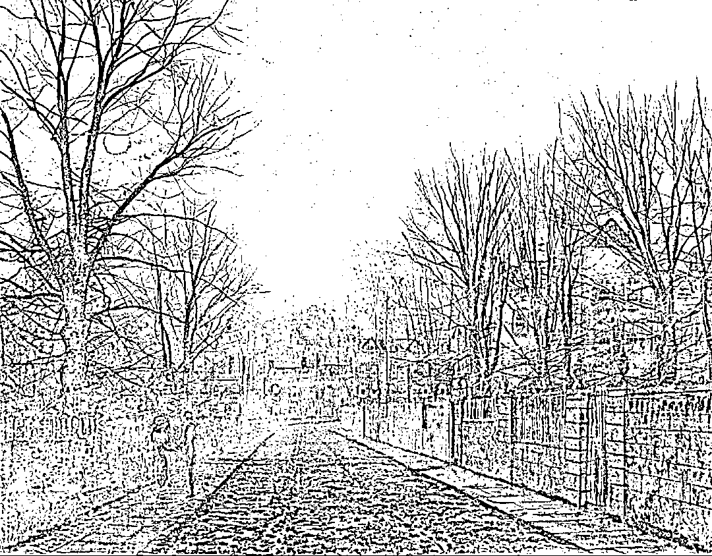

**依恋类型**

注：根据回避亲密与焦虑被弃两个维度，划分有成人的四种依恋类型：

*   **高焦虑低回避的痴迷型：**渴望亲密，对依赖和承诺有强烈需求。却总怀疑恐惧伴侣并不想达到同样的亲密。想紧抓伴侣以获拯救与完整，却总因无视边界而事与愿违。

*   **高焦虑高回避的恐惧回避型：**期待亲密但又恐惧亲密，拒绝与他人亲近。因害怕被拒绝和欺骗，而假装不在乎。

*   **低焦虑高回避的疏离回避型：**难以信任和依赖他人，感到与人亲密是不舒服的，完全不愿意亲密。

*   **低焦虑低回避的安全型：**能安心地依赖和被依赖，不担心会被抛弃。寻求“两个成年人”的成熟关系模式，双方平等地分享需求，没有凌驾。既彼此依恋，又向外探索。

**星图中的月亮与金星，讲述着依恋关系的剧本。**联想一下 4 宫家庭与 7 宫关系的原型。依恋是人类生存的本能需求，婴儿亲近母亲，以获得生长资源和情绪呵护。童年能发展出健康的内在安全感，是成年后应对外界压力的前提。当月亮和金星被挑战时，无论本命还是行运中，依恋关系就会面临威胁。而月亮金星作为阴性原型，又总被女性无意识地过度强化。却将阳性原型太阳火星，以期待投给伴侣。所以，**痴迷型的女性，整合你的阿尼姆斯**后，你的月亮和金星也可以得救...... 

**为爱上瘾的“痴迷型”的人，很容易被逃避爱的“回避型”的人所吸引。**同为不安全型依恋，他们最易陷入依赖共生的关系。因回避型总是游戏与贬低爱情，表现出若即若离的态度，而让痴迷型能生动地忆起本能中所焦虑不安的似曾相识感。我觉得痴迷型也是最容易感受到冷暴力的人吧，只因太关注，是故敏感。

 “知道自己成了他的负担，她把事情看得太认真，**她真想学会轻松！**她真希望有人教她，别这么不合时宜了！”——特蕾莎

“背叛的时刻都令她激动不已，使她一想到眼前铺展一条崭新的道路，**又是一次叛逆的冒险，便满心欢喜。**”——萨宾娜 

特蕾莎，是我能想到的痴迷型依恋之最好典范。她太重了，像对方脚踝上挂着的铁球。**她的悲剧就是冥王星 4 宫最绝望版的归途。**原初的月亮金星人如我，也曾经是这样。但我的七宫水瓶，治愈了我。若总是遇见冷漠的回避型伴侣，自会让你变得愈发轻盈。只有当发现对方期待的却是背叛，才能把你的忠贞彰显成笑柄。**尽管我也明白，萨宾娜就是没有被接住的特蕾莎……** 至此，我更加明确了我七宫水瓶座，天王星四宫的用意......为了解放。月亮天蝎座找到了解药？如今，我宁可对自己说：

**灵魂最初是一只鸟。**

**你将回归于何处？**

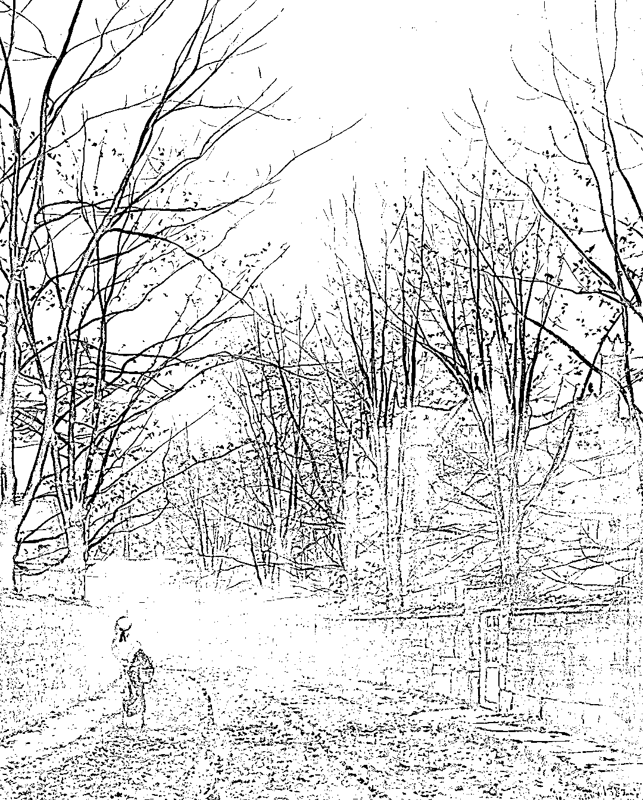

**为自己负责**

星图中，天底这里，与中天相对。**让我们从冥王星 4 宫的古井，向对应点 10 宫仰望，**那视角真令你感到孤独，但见一架天梯插入云霄，你自觉与上面的世界格格不入。**但小孩要长大成人了。**所以，**拾阶而上吧！**借鉴摩羯座式的攀登，去学习自我稳固。去社会文化中整合与建立自己的权威性。通过工作环境去映照情绪的本源，在认清人生目标的过程中认识自己，并自力更生去达成所愿。去平衡自身阴阳特质，蜕变出正面的自我形象，进化安全感。 

停止抱怨和向外归因。方向错了，问题在你自身，没有人负得了你的责。**若你不知怎么彻底满足你自己，别人更不知道。**情感自足的失败，才导致对外无度索取。去置之于死地而后生。可以设想你已失去了最恐惧失去的根基，被抽掉了所有情感依托的地毯，然后要靠自己为那里铺垫砖石，重建内在情感结构的基础。收回一切向外投射的虚妄期待，你不需要依赖，说到底，就是要**自我照顾！**为自己做主，为生命负责。

**内在安全感，何去何从？**

冥王星 4 宫，究竟该如何与自己及与他人，简单而安然地相处？什么叫作轻松自在？什么叫作温柔以对？可借鉴安全型依恋，作为榜样。

**情绪如何安放？**

 练习让情感更成熟。培养情感控制力，不被情绪淹没。认清情感驱力，找到恐惧来源。自在地浇灌与被浇灌。关爱，而不带有企图。须消除关注和时刻留意，在爱的一呼一吸间留白。记住，爱不是孤注一掷，警惕偏执于一点而造成的麻痹。学会视线的转移，去望向很多人，很多事。你的幸福感应该由众多事情组成，而不是仅仅来源于一处。练习将感情摊成很多份，投向亲情友情爱情以及人道主义大爱，投向一猫一狗一花一草一杯茶。更重要是自爱。先学会爱自己，才能获得别人的爱。爱，对于自他，都是深深的理解和接纳。 **岁月如何静好？**

 若要情感自给自足，你需要借助怎样的生活氛围？可尝试与自然原始奥秘去链接，或在审美活动中转化出建设性的创造行为。将难以殆尽的情绪能量显化在具体的工作中，去浇灌良田。或在兴趣中获得情绪的滋养。比如冥想，心理学，潜水，考古，园艺烹调，琴棋书画。深入了解自己的内在需求，定义真正属于你自己的生活方式。用坦诚的方法满足它，要全然地对自己接纳，而不只是形式主义而已。真正靠自己，从内在创造并找到安全感。

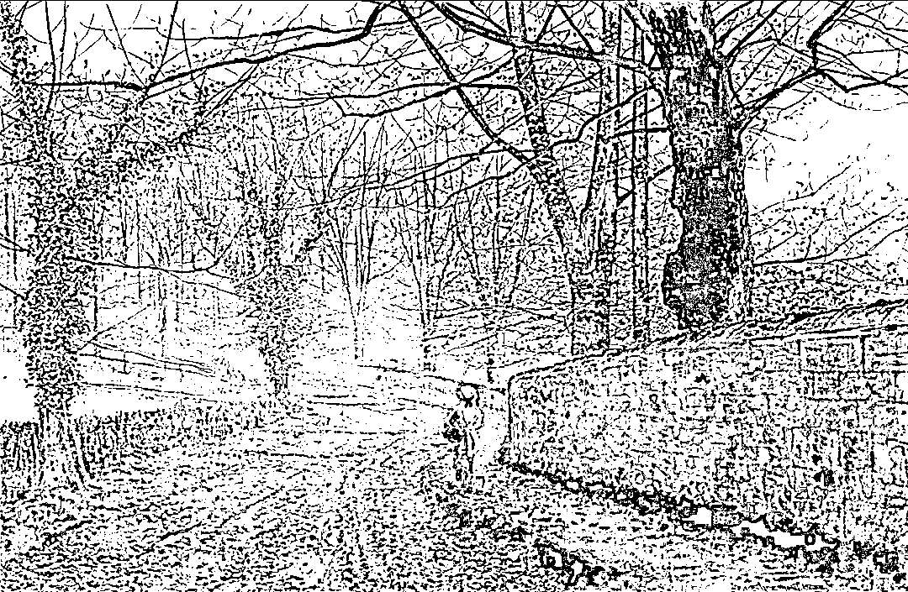

**疗愈**

一切冥王星的能量，都是潜能，不释放就成了威胁。早年淤堵心间的能量，也封锁了你内在的天赋。如何建设性地去排遣你深层的情绪能量，而不是任由她去哭倒长城。意识化是第一步，敞开心胸，觉知你所压抑的真实感受和需求，**学会坦诚沟通你的深度恐惧。**释放情绪，在能抱持住你的人面前，相信心底的冻土终将融化。**能用语言表达情绪，这本身就是疗愈的开始。**然后，让负面共生转化为疗愈联结。以此升华你的力量，实现内力外引。 **能深入看见自己的人，才能深入地看见别人。**因为，**疗愈他人与疗愈自己，用的是同一种力量。**冥王星 4 宫，象征一个萨满式的母亲，情绪磁场自带神秘深沉的疗愈力。正如**为何月亮天蝎座的眼睛，总能反射出灵魂的力量？**因它背后连着一口井。能从最深邃的核心，打上来一汪涓流。**冷浸寒空月一轮。**去接通真正属于你的，发自内心的力量。抽取灵魂最深处的生命力资源。然后你发现，那井底连通着集体无意识的一切原始情绪。快去将你强大的同理心用作疗愈吧，为他人提供滋养与转化。**相信从此，月亮不会再亏待你！**

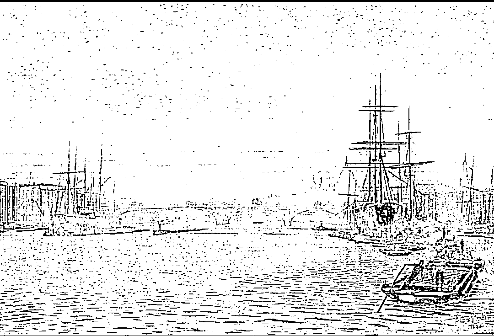

**结语**

末了，再还给冥王星 4 宫们，一片月色的孤光：

你的高度就像天空中孤独彷徨的月亮，照得夜空永远清晰明亮。月亮静止在那里，清晰明亮，远远地看着地球上的生命，没有覆盖着它的烟雾，没有波涛汹涌的大海，它的样子亘古不变。它是夜里孤独明亮的光，是个体的存在，是永恒散落在近处的碎片。你从这里向外望去，看到的是冰冷、静止和发射出的光。借着彼世的银光和绿色的微光，你沉浸在遥远的恐惧中。你看着它，但你的目光清晰又冰冷。你的目光落在银色的大海上，落在雪山顶，落在蓝色的山谷中，你听不到人类这种动物的呻吟和嗥叫。月亮没有生机，你的灵魂来到月亮之上，这里是灵魂的栖息地。因此，灵魂走向的是死亡。

——荣格《红书》

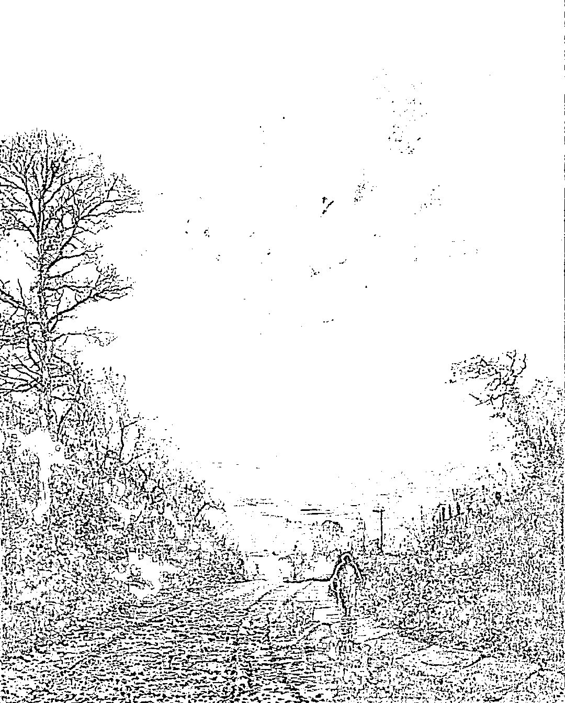

**版权声明：**本文由作者授权在若道平台发布，欢迎转发，反对抄袭。

**也许你还想看，冥王星 5 宫文章**

[一](http://mp.weixin.qq.com/s?__biz=MzA5NjA0NTAxNg==&mid=2651423829&idx=1&sn=1af9917d10025895ecb310ac4f4298d5&chksm=8b4b36e2bc3cbff4beeb3047e4aee6b3244ef96fe8a8255797d5e43e79c0d4f2c60c99b8987c&scene=21#wechat_redirect) 丨 [二](http://mp.weixin.qq.com/s?__biz=MzA5NjA0NTAxNg==&mid=2651423829&idx=2&sn=ec0b8c8eed4135bad17755c7cdb6b07b&chksm=8b4b36e2bc3cbff4f7d44886303bb64a4ec75e401e6ec889953b7c0851a6ba639835b526aa1f&scene=21#wechat_redirect) 丨 [三](http://mp.weixin.qq.com/s?__biz=MzA5NjA0NTAxNg==&mid=2651424933&idx=1&sn=067ba9cd1699137296d7b8d1a4482d4f&chksm=8b4b3a12bc3cb30445b6be0ae7bbcd8801c8584f0f5bd97bc5222407cf1be33ee994b21115d4&scene=21#wechat_redirect) 丨 [四  ](http://mp.weixin.qq.com/s?__biz=MzA5NjA0NTAxNg==&mid=2651424933&idx=2&sn=2e60c0253f46f1f995c923abb14eec45&chksm=8b4b3a12bc3cb304ec3cd3757251af7e62c4b0b92cd119c24c067af1548bb1aa01da071d66a9&scene=21#wechat_redirect)

**以及冥王星 10 宫文章**

[【这种极致配置，你需要了解一下】](http://mp.weixin.qq.com/s?__biz=MzA5NjA0NTAxNg==&mid=2651412808&idx=1&sn=57012d1806a6776cc8556b7c79f0e30b&chksm=8b4bebffbc3c62e9a33bfbdcd736cf91077048ac889936318ba4cf575de4a7d4409eeca1373f&scene=21#wechat_redirect)

**蓝女巫**

英国伯明翰大学 市场营销学硕士

职业占星师/专栏作者/芳疗师/珠宝设计师

中国首批 ISAR 英文认证占星师（2012 届）

**微信公众号**：cecilia_sui

长按打赏

**系统学习占星学**

**点击图片了解详情**

**微信又双叒叕改版啦，不想错过若道君的推送？**

**就把若道设为星标吧！**

**▼**

就是这个“在看”，戳一下☟

********报名直达入口********

# 宫位全解析 | 这个古占中土星守护的宫位，可不仅是为了“找对象”

> 原文：[`mp.weixin.qq.com/s?__biz=MzA5NjA0NTAxNg==&mid=2651430274&idx=1&sn=80c87bfced87c1ef17844c1240f2e454&chksm=8b4b2f35bc3ca6232ccbd68ebeb9ff30a18014a8bcd7a1a828990482e1a41b6e70a01569e47c&scene=126&sessionid=1692738090#rd`](http://mp.weixin.qq.com/s?__biz=MzA5NjA0NTAxNg==&mid=2651430274&idx=1&sn=80c87bfced87c1ef17844c1240f2e454&chksm=8b4b2f35bc3ca6232ccbd68ebeb9ff30a18014a8bcd7a1a828990482e1a41b6e70a01569e47c&scene=126&sessionid=1692738090#rd)

****************☆ ****************************后台****************************回复“今日”，给你一句生命态度****************

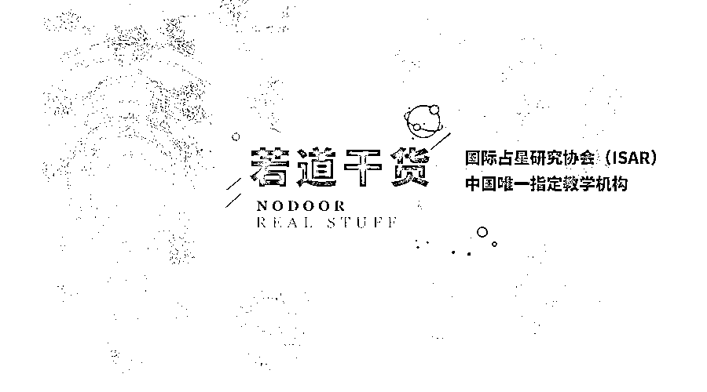

作者/达娜·格哈特
译者/葡萄园的女巫编辑/玫瑰 图片/全景网

说到第 7 宫，你会联想到什么关键词？这个古典占星学中被土星守护的宫位，还有很多你不知道的意涵呢，一起来看看作者的一封信吧。

**写给 April 的信**亲爱的 April：在写关于第 7 宫这一篇时，我有点不自信。亲爱的朋友，这就是为什么我请你阅读我的专栏。不仅仅是因为你有幸福的婚姻，而且你还有一个在第 7 宫的月亮。如果有人能平衡我的方式，那就是你。要知道，咨询者问我关系指数时我是多么不安，我试图将他们从比对图的迷局中拉出来，如果他们坚持，我就推荐他们向你求助。第 7 宫暴露了我一个罪恶的秘密，我并不相信灵魂伴侣。找一个注定与我完美结合的人就像找一只麒麟或者是格里芬。 你现在知道我为什么不自信了。这是一个危险的观点。大多数人咨询占星师是希望听到关于他们灵魂伴侣的好的信息，（例如，我是不是就要遇到我生命中的挚爱了？）我担心我在一点上观点是错误的。但是我能理解为什么人们寻找灵魂伴侣。这归咎于第 7 宫。这是我们**渴望并接纳其他人**的地方。这促使我们进行二重奏，我们争取和谐，一对一的，不仅仅是和一个人，而是和很多的重要的其他人，就像老师、辅导员、同事、爱人。我们可以和这些人共舞一会儿、一季，或者永远。但是通过他们，我们活出我们自己。他们驱使我们成长。通过第 7 宫我们变得更加完整。听起来是不错，但是实践中往往伴随痛苦，因为 7 宫不仅仅是一个舞台，更是一个剃刀，磨平了我们性格边缘的棱角。在占星学中，“伴侣宫”7 宫正好与自我宫 1 宫相对。这也就是为什么 7 宫同时象征**公开的敌人和我的“真爱’**”。（很不幸，很多真爱最后都变成了公开的敌人。）如果那个所谓的像田园诗歌一般的伴侣恰好和我们一样，喜欢鳀鱼三明治，讨厌《指环王》，赞赏意大利大理石，不畏惧我的情绪，了解我，没有别的人能做到。这样的追求对立和统一变成了一个危险的命题。不幸的是，我们结束这浪漫的童话爱情，开始憎恨我们的伴侣时，往往也是因为这同样的原因。 为什么会这样呢？这都要从上升星座说起，我们的最初的面具。这是在初期的环境中，我们扮演的最好的角色。他代表了我们的一部分，但不是全部的潜能，他划出了一个有益的边界。（我就是那种做这件事，绝不做那件事的人。）当我们构建自己的故事时，对于那些不符合我们上升神话的素质也需要做些什么。我们把这些放在了第 7 宫，在人生的稍后时间满足这个需要。这样的安排让我们深深渴望**重新找回那些曾经在不经意间失去的一切**。当具有我们被压抑的这部分特质的人出现时，我们便感到了不可思议的强大吸引。但当我们更多地了解他们时，他们又不可思议地变得不那么有魅力了。我们固有的阻力开始出现。在任何一间商场里闲逛，你可以听到无休止的关于 7 宫和上升之间的争吵。 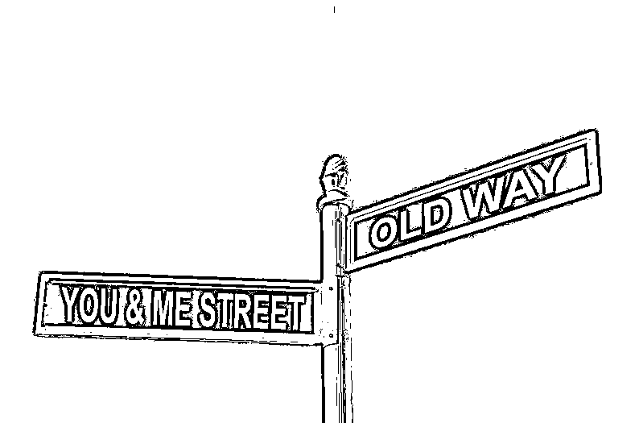金牛座先生最初被天蝎座爱人的神秘和深沉吸引，现在却惧怕她们骇人的黑暗；摩羯座小姐为他的巨蟹座王子深深心动，直到有天她发现，王子变成了一只贫困而幼稚的青蛙。哎呀，我怎么跟这么个穷光蛋在一起！我的处女座不可救药地爱上了双鱼座，我变成了诗人、精神追求者、音乐家，我们住在了一起，巨大的改变。突然，完美先生变成了一个失败的空想家，混乱、不切实际、模糊不清。**当你查看每一对伴侣的星图，你会发现每一个人都会有一些行星或者是符号与另一个的 7 宫有关。这就是吸引。**我承认，这才是我对于比对图的关注焦点。我比较不在乎杰克的金星拱了苏的火星。**出生星图上通常就已经预示了感情关系的问题以及破裂。**拿掉那玫瑰色的眼镜，杰克也许是一个很可爱的男人，但是如果苏不能放弃她固有的预设条件，他们的爱情将是注定的悲剧。一个很好的经验法则就是，一旦某个人和我们之间有了强烈的感情吸引，对我们产生了影响，那么他就是在无意识地与自己的第 7 宫的影子共舞。**运用你的智慧，收起你的牢骚，学习解决这些问题，他们会激活你内心的特质。**当然这样就没有了愤怒的乐趣，但值得努力。你可以为你更深层的苦难——**内心的平衡**而做出努力。回到我自己的问题，我在双鱼座的身上看不到任何共同点，我是处女座，善于分析、有组织、有效率。但是透过伴侣各式各样的缺点，我也看到了我隐藏的一面。想象一下，我发现我也可以是健忘的、虚假的、逃避现实的。现在接受我的伴侣就变得容易了。而且接受我自己内在的双鱼座一面也一切变得更积极。我现在变得更轻松自在，更平和。或许，我的伴侣罗伯特就是我最终的灵魂伴侣。如果有灵魂伴侣，或许是指一些驱使我们与自己遗忘了的那一部分灵魂结合的人。 第 7 宫还有很多信息，比如宫主星。**宫主星的落点往往显示了这个人的感情生活的中心或者反复出现的主题。**如果一个人的 7 宫主落入掌管事业的 10 宫，他也许通过婚姻获得工作的邀约，或者与伴侣合伙工作，或者一直单身，嫁给了她的终身事业。我的 7 宫主海王天秤座落在了掌管金钱的 2 宫，我倾向于将我的财务关系私人化，或者私人关系金融化。当我遇到浪漫的婚姻时，我喜欢说：“亲爱的，我们可以一起存钱买房子了！”这个梦想中，我的两段长期的感情关系飞速发展然后瓦解。海王星像一个魔术师，他像变魔术一样增加了我的存款，却瓦解了我合作伙伴的资金，现在三个人都濒临破产。金钱曾经是我父母婚姻的中心问题，他们经常为此争吵。我父亲花钱如流水，我母亲却能妙手生金。直到最近我才发现，我的 7 宫头与我父母的星图有 6 颗行星是对分的。一直以来，我都像一只小鱼，被我父母这一对捕鱼者扔进了迷茫的海里。难道我们不是都从婚姻的神话中获益么？我这里指的婚姻的神话是我父母的配对。这些早期的神（父母）在我们无意识的国度里的影响力就像宙斯夫妇。我们可以从出生故事中窥探上升的密码，或许我们可以从婚姻的神话中阐述下降点的秘密。 这是我父母婚姻的故事。海王星声称他们已经知道爱情的快乐。他们结婚、离婚，又复婚，在我 8 岁时，父亲离开母亲，在我 14 岁时，母亲离开父亲。在那之后，他们又在一起了，一起购房，时常住在一起，最近又一起进行奇怪的商业合作，在同一个城市里分居两屋。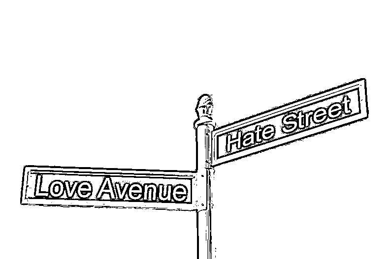我绝对不愿意去重复他们的不快乐，但是我的感情关系也同样不稳定。关系终结事件不时发生，与我父母的关系一样。第一次在 8 年以后，第二次在 14 年以后，和我母亲一样，第一次是我被抛弃，第二次是我离开。现在，我拥有一段“LAT”的感情关系，这是我的朋友给欧洲人的建议，“living apart together”，分开住的感情关系。她说这是欧洲的新时尚，事实上我更了解，这就是我父母在后来这些年的关系模式。谢天谢地，7 宫不仅仅只是告诉我们感情关系的问题。有趣的是，它一样能描述**任何我们有兴趣的旧的其他关系人**。这一点，不论是现代还是古典的占星师都同意。比如对我来说，那些潜在的咨询客户就是很重要的“关系人”。很少有占星师把开发客户与 7 宫联系起来。这更偏向于是关于 10 宫的市场营销的挑战内容。但这不也是人与人之间关系的一种么？这些年，我听到很多不成功的占星师说，他们的潜在客户都抱怨这城里都没有像样的占星师。April，这 3 年多你在 3 个城市开始了你全新的占星实践。你怎么觉得呢？ 我从事占星的第一年是非常冷清的，如果 6 周内电话响了一次，那就算繁忙的一个月了。我一个月就收到一个咨询请求。我做了广告，但是做的不是地方。现在想想，问题就出在我的第 7 宫。我还没有准备好去面对这样的合作关系。表面上，我希望有客户上门，内心里我却感到害怕，我不知道他们会需要咨询一些什么内容。不管是什么，我都觉得我不能满足他们的需求。我的抵抗心理大于我的渴望。与此相同，占星师预言会有一段新的恋情出现，但是客户却抱怨根本不准。我知道这有点像给失败的预测找借口，但是我敢打赌，这位客户在他的 7 宫上挂了一个牌子写着“禁止入内”。我决定只为那些我认为能像朋友一样相处的人做占星咨询，一旦做了这个关键的决定，我就开始吸引越来越多的客户了。这看起来只是减弱了我的恐惧，但是事实上，这表明了**谁的出现是正确的**。这些年来，我发现了另一个很奇怪的现象，大部分我的委托人们都具有很强的直觉。这正好符合了海王星的特质（我的 7 宫主星）。**7 宫显示了我们吸引的人群的类型，还有我们会面的目的。**我逐渐调整了做法，以帮助这些具有很强直觉的客户们找出他们已经知道的。我们一起探究他们的感受、下意识的行为和他们丰富的想象力。总而言之，我们进行了一个海王星方式的茶会。我准备好杯子，他们带来了茶叶。 关于我的 7 宫就说到这里，期待你的回复！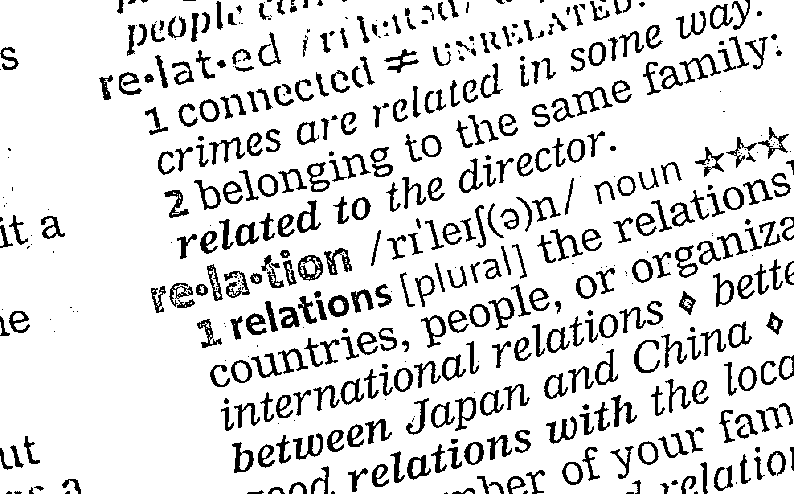**写给达娜的回信**亲爱的达娜：OK，我承认我爱死 7 宫了！我非常赞同你精彩的假设（虽然目前还只是假设）——我的 7 宫并没有装满我喜欢的那些特质。哲学家、小丑、假装无所不知的人，诚然，我的上升在射手座。记者、八卦消息、传媒工作者，我要求的这些与我 7 宫双子座有关的特质，都在我身边的亲爱的人身上看到了。 然而，我曾经对你关于“婚姻神话”的理论很好奇，而且它也影响到了我们对婚姻的期望。在我查看自己的星图时，它提供了很多的见解。水星是我 7 宫的宫主星，所以第 3 宫、水星、双子座描述了我婚姻的主要情况。因为父亲在我很小的时候就去世了，我对于父母共处的记忆只有一点点。但是我记得那些抚慰我入睡的从楼下传来的声音，那是双子座最美妙的催眠曲。他们坐在楼下厨房的桌边，轻松地交谈，并时时传来笑声。有一个夏天，妈妈带着我和兄弟姐妹去度假，爸爸留下了看庄稼！很多年以后，我偶然发现了那个夏天爸爸写给妈妈的信，美好的、充满感情、有趣的信。就是那种你写给你最好朋友的信。我落在 7 宫头下降点的双子座意味着我对婚姻的期望是，我的伴侣要是我最好的朋友和知己。我和我丈夫的关系就是建立在长时间的喝咖啡聊天之上。事实上，所有我生活中重要的关系都可以追溯到双子座的特质——**交谈**。但是最终神话还是终结于不幸（我 7 宫的月亮同冥王星成紧张相位），有一天，宙斯弄来了一堆乌云，他离开了他最好的朋友、伴侣赫拉（或者死于车祸，就像我父亲）。当你还年轻并且敏感，遇到这样的状况该怎样面对呢？我选择将这些浪漫的关系设定一个内置的时限。“Oh，他要去坐牢了。”“他比我老很多岁，所以会先我而去。”你看，我可以掌握离开的计划。我感到一种控制（这同样是月亮和冥王星的紧张相位带来的影响）。我浪漫的计划很轻易就实现了——因为我父母就是这样的状况，这些人的离开都是你计划内的。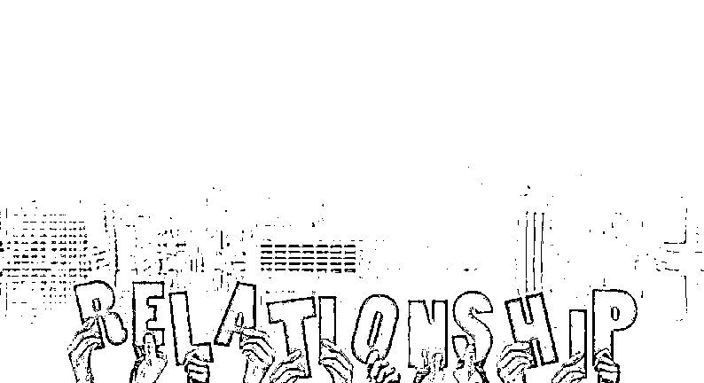当我最终遇到挚友知己，我马上就陷入困境，因为我不愿意他离开，但是另一方面，他却没有一个确定的离去的时限。我被这失控的状态吓坏了。**为了幸福的婚姻，我必须学会战胜我对于分离的恐惧，学着相信并爱着没有确定离开时间的人**。然而你的方式——只选择那些能和你像朋友一样相处的人作为客户，听起来很英明，也完全适合你。下降点在双鱼座最显著的优势就是能让你全心投入。这很好，但是也很疲惫，我确信。所以你明智地辨识你的客户（得益于你在处女座的上升），因为你尊重事实，每一次咨询都巧妙地以深刻的方式改变了你的宇宙 DNA。你的每一个客户都是出色的、充满热情的、像艺术家一样的精美宝石——听起来很像双鱼座人吧？然而，我的下降点在双子座，每一次咨询都可以扮演 Barbara Walters（美国知名主播主持人）——“让我们来谈谈你的故事吧！”我发现这些人不可置信的有趣。我倾听他们的故事，然后换个更有希望方式将故事再回述一遍，站在他们角度帮助他们获得更深刻透彻的观点。但我没必要成为其中一员。 说实话，我与客户的交流就是有预计结束时间的关系（在 90 分钟的咨询完成后，他们会离开，当然再出现是 OK 的）。将“婚姻神话”的 7 宫理论应用在客户合作关系问题上，我可以清楚知道为什么我时常会和客户发生权利争斗，而且经常还超过了议事的时间。我没办法忍受客户迟到、不出现、不按时付款。我觉得有点失控，以至于接下来的权利斗争提醒我，为了能让别人不再影响我，我必须超越用截止日期来保护自己安全感的行为。这是一个历史悠久的占星学的难题，有理论称 7 宫描述了我们的伴侣，但我并不完全赞同这一点。我认为 7 宫还有另一层的含义，它描述了**当其他人进入我们的生活，不论是亲密的关系还是敌人——我们提供给他人的关系互动的环境。 **例如，尽管你专注于处女座上升强烈的感情实用主义，但我并没有经历你的这些感觉。我可以看到你的这些行为，如果仔细观察你的个性，我会看到一丝不苟、朴实无华，但这不是你在人际关系里的那一面。我感觉到，走近你的海王星 7 宫是永恒的。说到你，我亲爱的朋友，我进入了一个有趣的花园，充满想象，自由的想象，而且十分、非常浪费时间。和你长时间的聊天或者读你的信就像一次迷你假期。这就是剧本。这就是总是被忽略的海王星部分的特质——**沉醉其中，享受这过程。****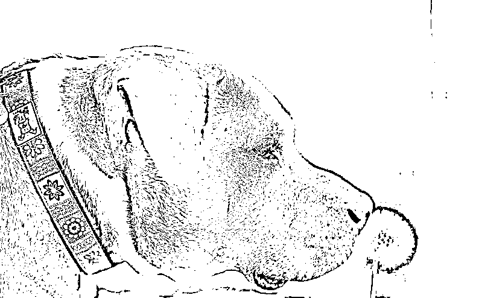****一旦有人进入了我们的第 7 宫（不论是伴侣、生意伙伴、致命的敌人），他们就将体验到我们与平时十分不一样的特质，与我们上升星座表现出的不同的个人特质。**细细研究那些**被我们丢弃的梦想、激情和人格特质**，7 宫就像一面镜子告诉了我们这些。我们的伴侣就像彼得潘的温迪，将彼得的影子拼凑起来（就是 7 宫），然后将这和我们自己（就是上升点、1 宫）拼合，才是完整的我们。 我把下降点看做一个银屏，通过这个屏幕，可以看到人际交往关系中需要超越的、所有被我们带入的问题。**寻找潜在的伴侣，我们以下降点指出的特质“面试”他们，选择少数的进入我们的第 7 宫。**也许我们甚至收取了门票，期望我们的伴侣在 7 宫扮演一个或更多的行星以值回票价。最后，难道这就意味着我们会选择一个合适的伴侣，然后跟他扮演同样的关系模式一遍又一遍么？也许，又或者我们学着去和平地与下降点共处！古典占星里，土星在 7 宫是擢升的位置，这表示**我们要为创造一个想要的 7 宫环境负责任。**沮丧的是，我们总是一次又一次撞向同一个设在制定满足关系的道路上的阻碍。如果你觉得不论多么努力改变，你将会注定重复那些以往的不成功的关系模式，那你真是疯了。当感到沮丧和愤怒的时候，我们想听到的关于过去的事是——我们仅仅是负责改变令人不满意的现状。取代那些已经认可的看法，接受那些挑战，调和我们与 7 宫影子的关系，我们坚信，其他人验证了我们的信念，宇宙正在赐予我们力量。 我星图中处在 7 宫的月亮让我的一生都在致力于学习如何处理人际关系，然后把我放在了占星界“Dear Abby”的位置比我想象的要多得多。即便如此，我对于 7 宫一点也没有明确的收获。但是我觉得你会赞同，7 宫并不是简单解读为去寻找另一半，更合理的是，透过这个宫位让我们**通过他人的眼睛找到我们自己**。我期待你的专栏看到关于 8 宫的解说！ 你的 pril 

**版权声明：**本文由若道翻译发布，欢迎转发，反对抄袭。友号转载请申请白名单。

**其他宫位文章** 

[第 1 宫](http://mp.weixin.qq.com/s?__biz=MzA5NjA0NTAxNg==&mid=2651423092&idx=1&sn=53169f1901b50ce5d406aa45df1a830f&chksm=8b4b33c3bc3cbad5e64428fb653d1478ecdb1068a812985486b0299e1648061aee1a5eab07d1&scene=21#wechat_redirect)丨[第 2 宫](http://mp.weixin.qq.com/s?__biz=MzA5NjA0NTAxNg==&mid=2651424378&idx=1&sn=e0e512b4945987e1c9db4a849a6b4ba0&chksm=8b4b34cdbc3cbddb9a862751c15173684a2eb9a98deb37bacdbc003dfa6010c7e28df5ed0f14&scene=21#wechat_redirect) | [第 3 宫](http://mp.weixin.qq.com/s?__biz=MzA5NjA0NTAxNg==&mid=2651425739&idx=1&sn=b89185e88d277fbcded71a78b15db8c9&chksm=8b4b397cbc3cb06a5d052ca8701e95e2c8bd24ccf7f25712625a9b88ffadbda5d1c4791d7304&scene=21#wechat_redirect)

[第 4 宫](http://mp.weixin.qq.com/s?__biz=MzA5NjA0NTAxNg==&mid=2651426869&idx=1&sn=5c806962caab237741b9af30123c3c9e&chksm=8b4b2282bc3cab94daf6de6788f429ad15cce4f8c61d379f3e6212d5f12f436732eaec19d6c7&scene=21#wechat_redirect)丨[第 5 宫](http://mp.weixin.qq.com/s?__biz=MzA5NjA0NTAxNg==&mid=2651427087&idx=1&sn=fc978e7fe2f6f4b57102e8a75b4c6dcf&chksm=8b4b23b8bc3caaae65c40d82a7a4ff7436e0b26ca37be6b84bde46f8c93230517c0529a5934e&scene=21#wechat_redirect)丨[第 6 宫](http://mp.weixin.qq.com/s?__biz=MzA5NjA0NTAxNg==&mid=2651429367&idx=1&sn=f208aa060f6c8db617cc9c9097ba2dbf&chksm=8b4b2b40bc3ca25641caa49037815f4e8da9761f09e7537c1bca38903a97a22a85ac471d4a27&scene=21#wechat_redirect)

**达娜·格哈特**一位国际范围内受尊敬的占星师。她为众多占星学网站和出版物讲课、写稿。她在十二宫的月亮激励她对这颗发光体进行了深刻而持久的探索研究。

**系统学习占星学**

**点击下图了解详情**

**微信又双叒叕改版啦，不想错过若道君的推送？**

**就把若道设为星标吧！**

**▼**

就是这个“在看”，戳戳戳 ☟

********报名直达入口********

# ISAR 选修课程 | 新技法！心理占星学视角下的预测方法

> 原文：[`mp.weixin.qq.com/s?__biz=MzA5NjA0NTAxNg==&mid=2651430274&idx=2&sn=10118331dc81ef76da3745611b64dc96&chksm=8b4b2f35bc3ca6230c2dec8086e611efc90aba248ab305455a1078e87d71c98bab1c30ba7b06&scene=126&sessionid=1692738090#rd`](http://mp.weixin.qq.com/s?__biz=MzA5NjA0NTAxNg==&mid=2651430274&idx=2&sn=10118331dc81ef76da3745611b64dc96&chksm=8b4b2f35bc3ca6230c2dec8086e611efc90aba248ab305455a1078e87d71c98bab1c30ba7b06&scene=126&sessionid=1692738090#rd)

作为一门艺术，预测占星学运用行星的运行来预测特定时期的性质、意义和持续时间。在这个阶段的课程中，我们会**考察意识进化的概念、其基本原理及其与占星学预测部分的关系。****意识进化可以被定义为有意识地与星图中固有的进化过程合作。**学员们将探索如何用行进和推进来为意识进化服务。我们不是简单描述事件的结果，而是将行星运行描述为实现先天潜能的机遇之窗。**在这个阶段的课程中，会探索占星心理学视角下如何将对行进、推进和其他预测方法的分析运用于个人成长。**具体事件反映并促进了意识的改变；因此，行星运行可以帮助我们洞察成长过程的精确时机，让我们领会内在和外在现实如何同时发生、彼此反映、互相转化。我们还将探索宏观的世界行进，考察占星格局如何在社会、政治、经济、艺术和生态层面上表现出不同的形式，却又在多样化的现象中反映单一的原型。这里的挑战是去思考，我们对宇宙的这种参与式关系如何能为共同创造一个积极的、更充满希望的未来做出贡献。

**1**

**课程安排**

**第一课：开始预测****第二课：发展年龄方法****第三课：太阳的行进****第四课：月亮的行进与推进****第五课：水星的行进****第六课：金星的行进****第七课：火星的行进****第八课：木星的行进****第九课：土星的行进****第十课：天王星的行进****第十一课：海王星的行进****第十二课：冥王星的行进**

**2**

**课程费用**

**课程费用：9800 元****转发分享优惠价：8800 元（11 月 1 日之前有效）****若道核心课程 L5 学员优惠价：6800 元**

**3**

**授课时间**

**上课时间：**12 月 2 日（周三）20:00-22:00

**授课方式：**英文授课，中文翻译

**4**

**授课老师**

**格伦·佩里(Glenn Perry)**

*   这位传奇的占星师，也是一名拳击和摩托车爱好者； 

*   他毕业于赛布鲁克学院(Saybrook Institute)，是心理/意识研究专业博士，也是拥有 30 余年经验的加州注册婚姻和家庭治疗师 （CAMFT）； 

*   美国占星心理学学院（Academy of AstroPsychology）的创办人，他曾任国际占星研究协会 （ISAR） 以及联合占星大会董事会（UAC）副主席，也是 ISAR 突破性道德标准的设定者； 

*   康涅狄格州研究生院（the Graduate Institute of Connecticut）原型宇宙学与意识进化项目的负责人，共出版八本占星学著作：《心理占星学入门》、《心理占星论文集》、《盗取天火》、《从忠诚到革命》、《星图中的阴影》、《占星职业议题与伦理》、《出生星图深度分析》、《从古代到后现代占星学》。

**5**

**往期学员分享**

不得不说，格伦老师的心理占星课真的很强大，跟着老师上完了两年半的课程，仿佛做了一个长程的心理疗愈。这段时期我正好在经历冥王星的困难行进，感觉就像在地狱中行走，在这个过程中我懂得了，只有疗愈了自己，懂得自己的伤痛，才能理解他人，帮助他人。在学习占星学技法的同时，深深感受到老师的慈悲心，也感受到老师对待占星学的严肃认真。能够跟随格伦老师学习真是太幸福了，同时也特别感谢若道，感谢大卫老师。——2017 心理占星学格伦核心班学员 宋轶绚跟随美国心理占星学院两年课程，最受用的是格伦老师以扎实的心理学理论基础和咨询经验，所教授的心理占星学的系统架构。没有哪个心理占星学的课程比格伦的更系统、深入、有理论且有技巧了。还有格伦特色的发展年龄法，黄道带病理学理论在个案中很有实操性，2 年的学习，除课程外的几百万字经典的补充阅读资料，70 多场测试，以及格伦言传身教的从业道德标准，让我成长为一位合格的心理占星师。——2017 心理占星学格伦核心班学员 植语瞳

**6**

**退转课程**

**退款原则请详看《教学协议》，如有疑问请咨询课程顾问。******占星心理学之预测视角****

**授课老师：格伦·佩里**

**授课时间：****12 月 2 日（周三）20:00-22:00**

**授课方式：**网络课程：英文授课，中文翻译

**费用：9800 元** **转发分享优惠价：8800 元（11 月 1 日之前有效）若道核心课程 L5 学员优惠价：6800 元**

**课程负责人：Margaret（微信号：nodoor233）**请备注“预测视角”

长按二维码添加课程负责人咨询~  

****报名请点击“阅读原文”****

# 雷蒙德·梅里曼金融占星周运 | 水逆期间，交易需谨慎

> 原文：[`mp.weixin.qq.com/s?__biz=MzA5NjA0NTAxNg==&mid=2651430158&idx=2&sn=34cd5b0acb338387700549a64ed0c4d3&chksm=8b4b2fb9bc3ca6af33e54d71b781ed6d239a7f221e0e43af24bed61407309dc7fcf29bba449a&scene=126&sessionid=1692738090#rd`](http://mp.weixin.qq.com/s?__biz=MzA5NjA0NTAxNg==&mid=2651430158&idx=2&sn=34cd5b0acb338387700549a64ed0c4d3&chksm=8b4b2fb9bc3ca6af33e54d71b781ed6d239a7f221e0e43af24bed61407309dc7fcf29bba449a&scene=126&sessionid=1692738090#rd)

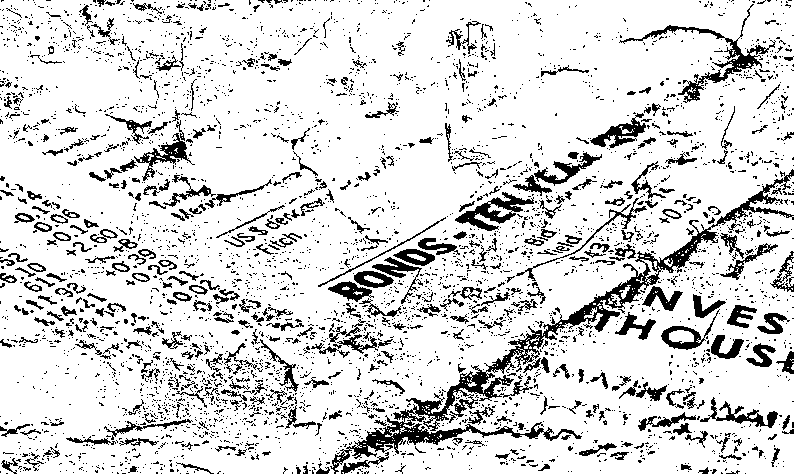

作者/雷蒙德·梅里曼
译者/李含编辑/玫瑰 图片/全景网雷蒙德·梅里曼是在金融占星学界稳坐第一把交椅的占星师，同时他也是若道签约的金融占星课老师，我们引进了雷蒙德·梅里曼老师的《[上证指数+黄金周期月度报告](http://mp.weixin.qq.com/s?__biz=MzA5NjA0NTAxNg==&mid=2651429179&idx=2&sn=f8de355cad74fae187ee1233c56b04d1&chksm=8b4b2b8cbc3ca29a9b34ea2a9ee64acc2f4d9d82db54663207ac5a2722ced9126f0610f45172&scene=21#wechat_redirect)》《[2021 年金融预报](http://mp.weixin.qq.com/s?__biz=MzA5NjA0NTAxNg==&mid=2651425978&idx=1&sn=067bd68ece37e1e820d6f84f7a3cc960&chksm=8b4b3e0dbc3cb71b866f65d51f7993d3c35dee77cebd77eda3f63a4d5864dadaea2e9d14c101&scene=21#wechat_redirect)》。我们经老师的授权，将每周刊登梅里曼老师的周运，供大家参考和学习。于是，这是本周的周运（10.19-10.23）。**说明：以下时间采用纽约证券交易所所在地美国东部标准时间。**
**展望与回顾**

**世界银行首席经济学家卡门·莱因哈特对彭博社表示：“这最初并不是一场金融危机，但正在演变成一场重大的经济危机，带来非常严重的金融后果。前面还有很长的路要走。”**

**——布里·史汀生**

**《世界银行首席经济学家称新型冠状病毒肺炎疫情演变为“重大经济危机”》**

**www.foxbusiness.com**

**2020 年 10 月 16 日**

**世界卫生组织周五表示，欧洲新型冠状病毒肺炎疫情的爆发令人“担忧”，因为一些地区可用的重症监护病床数量继续减少，接近容量。根据人口进行调整核算后，欧洲新增新冠病毒感染人数现已超过美国。**

**——小柏克莱·洛夫莱斯**

**《世卫组织对欧洲新冠病毒爆发的关注，因为重症监护室床位接近某些地区的容量》**

**www.cnbc.com**

**2020 年 10 月 16 日**

水星这个恶作剧者重返舞台。水星 10 月 13 日开始逆行。由于它的逆行周期与火星逆行（9 月 9 日至 11 月 13 日）重叠，这次它在金融市场或政治信息方面的行动可能会比往常更加狡猾和难以预测。火星逆行一周内，全球多个股市在 9 月 2 日创下多年或历史新高，包括标准普尔指数和纳斯达克指数，上周水星逆行一天之内，这些市场中也有不少都创下了次高点。9 月初和 10 月 12 日的高点还对应其他地球宇宙学征象。9 月初，木星也转向逆行，与太阳成三分相。10 月 12 日，道琼斯工业平均指数、标准普尔指数、纳斯达克指数和世界上其他许多市场都创下了次高点，木星六分海王星。木星和海王星是欢快的行星。海王星象征着非理性。这些因素组合在一起，对应**股市出现非理性乐观情绪的时期。**

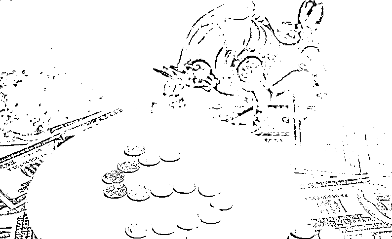

最有趣的是——也许还有一点不合理，那就是全球股市正与新冠病毒肺炎感染病例的增长同步上升。极有可能出现且令人担忧的“第二波”新冠疫情正在卷土重来。从地球宇宙学的角度来看，时间十分吻合，因为**火星不仅逆行，而且从 9 月 28 日至 10 月 19 日，它正在与土星、冥王星和木星形成渐盈四分相。**3 月 20 日至 31 日，也是第一波新型冠状病毒肺炎疫情和全球股市恐慌的高峰期，火星与这三颗行星（也就是摩羯座星群，或大合相）合相，现在即是同一会合周期的上弦月阶段。

疫情已经卷土重来，但股市恐慌并没有，至少现在还没有。但请注意，上周早些时候，当水星逆行时，全球股市创下了次高点，这也是当前火星逆行周期的中点。这一高点现在是重要的阻力位，并标志着一个潜在的重要关键反转日期，这一天恰好也是梅里曼市场时机学院三星关键反转日期。股市在接下来的三天下跌，周四跌至低点，然后在天秤座新月的时候再次反弹。因此，美国股市在上周一的高点和上周四的低点之间划出了战线。

全球其他股指从 10 月 9 日到 10 月 14 日都创下新高。没关系。这一切都发生在水星逆行和火星逆行中点的两个交易日内。这也是逆行的火星与摩羯座星群形成渐盈四分相时期的中点。对于世界上大多数人来说，这是紧张和压力的中心时段。这也是一个需要控制自己原始冲动的时期，因为在火星逆行的情况下，侵略者通常是失败者。

在水星逆行的情况下，决策往往过早做出，之后需要修改。由于政治声明和经济报告之间的矛盾，金融市场往往举棋不定。曾经“开放”的现在“关闭”（辩论）。“关闭”的东西又“开放”了（关于新冠病毒肺炎治疗和/或疫苗开发的激烈言论和新闻）。恶作剧者水星逆行，注意力的焦点迅速改变。

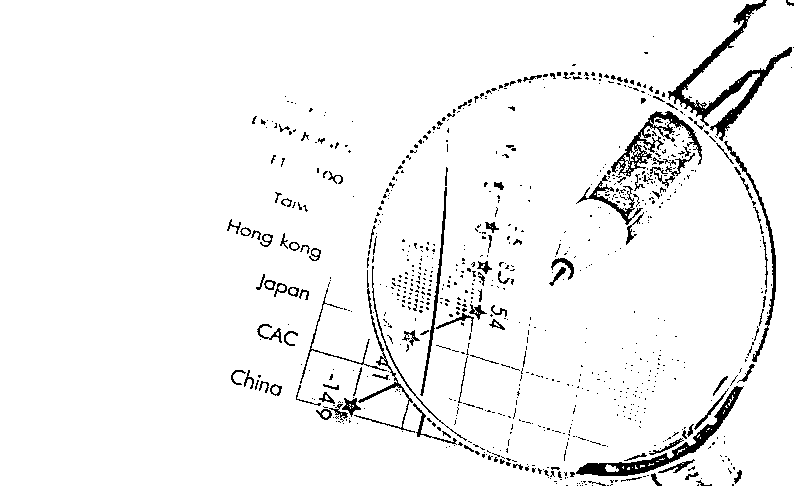

**短期占星趋势和长期考量**

**如果特朗普总统在 11 月 3 日输掉大选，一个原因是他无法理解与他意见不同的人是按照原则采取行动。他认为政治上的一切都是个人的：总是与他有关。**

**——《特朗普对比尔·巴尔的误导性抨击》**

**《华尔街日报·回顾与展望》**

**2020 年 10 月 12 日**

**当被问及如果他选举失利会怎么说时，他（拜登）转而自省。“可以说我是一个糟糕的候选人，我没有做好工作。但我认为，我希望，这并不意味着我们在种族、民族和宗教上的分歧，就像总统希望的那样。”**

**——乔纳森·莱米尔、威尔·韦瑟特和达琳·苏维尔**

**《特朗普与拜登在市政厅远距离交锋》**

**美联社**

**2020 年 10 月 16 日**

**当我回头看的时候**

**你觉得我看到了什么****另一只猫在看着****越过他的肩膀看着我****他很奇怪****非常，非常，非常奇怪****你得把每一针都捡起来****那个混蛋想发财****哦不，一定是女巫的季节****——多诺万的歌词****哥伦比亚工作室****1966 年**
很难相信这次选举将在两周后结束。很难相信，因为似乎它已经持续了多年。很难相信，因为水星和火星在 11 月 3 日选举日都处于逆行（水星在这一天停滞转向顺行）。**由于水星和火星的逆行，或者涉及海王星的困难相位，使你无法相信自己所读到的、看到或听到的一切。**由于逆行，也很难相信选举结果会在选举日宣布。可能需要一些时间才能得到接近准确和完整的数据。水星逆行下的邮寄投票可能比特朗普预计的更具挑战性。真清晰政治（Real Clear Politics）的最新民调显示，截至上周，拜登领先特朗普 8.9%，低于前一周的 10%以上。我最密切关注的拉斯穆森民调（Rasmussen）显示，拜登的领先优势从一周前的 12%下降到 10 月 14 日星期三的 5%。

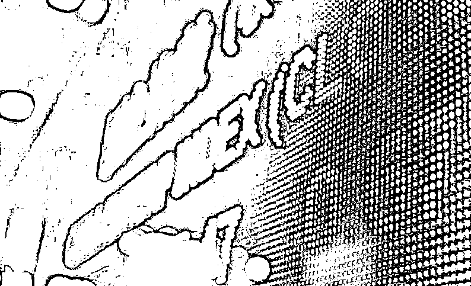

水星这个恶作剧者在天蝎座逆行。太阳将于本周的 10 月 22 日从天秤座进入天蝎座。水星掌管着信息、新闻和交流。天蝎座的天性是去探索，深入挖掘，找到一些能够让人震惊，并改变讨论路线的东西。**如果在接下来的两周内有一些非常令人不安的消息传出，不要感到惊讶**。火星逆行和水星逆行的重点，加上天蝎座的凸显，可能会使一些卑鄙的政客有机会为了获得权力而揭露对手“最肮脏”的伎俩、最负面的信息（天蝎座与权力相关）。

这将如何影响金融市场也将是一个棘手的问题，因为水星这个恶作剧者有一种提供相互矛盾信息的方式。从现在到大选，金融市场要么像跷跷板一样来回反弹。或者他们可能出现大的突破，与 10 月 19 日白羊座火星四分摩羯座木星相对应。这里有两个关键。

首先，10 月 12 日的高点现在是关键阻力位。收盘价高于该水平会消除其作为关键反转日期的期限。第二，我们现在正接近今年第三个最强大的地球宇宙学时间段，即**11 月 3 日至 19 日，其中包含木星-冥王星第三次精准合相（11 月 12 日）和火星转向顺行（11 月 13 日至 14 日）**。

这两个都是一级征象，正如我们在《股票市场时机选择的终极手册第 3 卷：地球宇宙学与交易周期的关联》一书中所阐述的那样。木星-冥王星在 11 个交易日内与基本周期有 88%的相关性，这一数字相当可观。火星顺行与基本周期（波峰或波谷）在 11 个交易日内有 75%的相关性。这些都呈现了高相关性。

如果股票市场能克服恶作剧者水星每隔 1-4 天就反转的趋势，开始以某种方式爆发，那么在接下来的 3-4 周里，我们可能会看到一些令人瞠目结舌的场面。这可能需要一个惊天动地的天蝎座启示才能实现，但这是“女巫的季节”，还有，“那个混蛋想发财”，只是不要让它以你为代价。

**说明：以上日期基于纽约证券交易所所在的美国东部标准时间，由于存在时差，中国地区可能需要加一天。**

**版权声明：**本文由若道翻译发布，欢迎转发，反对抄袭。友号转载请申请白名单。

**雷蒙德·梅里曼（Raymond Merriman）**

若道签约老师。著名金融占星师，ISAR（国际占星研究协会）前主席，梅里曼市场分析公司的总裁。他由于“提升了占星学的职业形象”，在 1995 年国际占星大会上被授予轩辕十四奖；在 2012 年国际占星大会上，被授予轩辕十四终身成就奖。

1“中国上证指数月度报告”发售

**若道推出了****中文版****的雷蒙德·梅里曼中国上证指数月度报告，并持续发行该报告！**

当把金融市场的周期和占星学的周期相结合时，雷蒙德·梅里曼老师的金融占星学研究**为投资者应对金融市场的周期波动，并随之调整投资策略提供了极大的价值参考**。

**11 月中英文报告本周上线！**

2“黄金价格周期月度报告”发售

**若道推出****中文版****的雷蒙德·梅里曼黄金价格周期月度报告！**不仅仅为广大读者在中国股市的投资出谋划策，更将视角放眼黄金市场。

**每当世界经济形式不明朗的时候，有一个地方是保值的港湾，那就是****黄金**。自 1982 年雷蒙德·梅里曼出版第一本研究《地球宇宙学征象与黄金价格的关联》的著作以来，**他一直作为最重要的黄金市场时机预测者之一享誉国际**。

8 月的黄金终于从高位开始下跌，有些分析人士认为，黄金在过去连涨 9 周是非常极端的，因此走势未来不会太强了；也有人认为，在目前各国大放水、国际局势不稳的情况下，黄金可以继续看高。

那么，你该如何面对目前的调整呢？是等待回调继续进行，还是在什么位置买入？11 月黄金周期报告等着你。火星逆行，很多国家都纷纷再次爆发新冠肺炎病毒疫情，未来的几个月注定不安宁。黄金的走势会安宁吗？

11 月黄金报告已经上线，上证报告也会在本周上线。欢迎了解。也可以按照季度和一年期订阅，有更多优惠。季度和年度的好处是，你可以持续了解梅里曼老师对于不断在变化的市场的看法。即便他某一次看法和市场不一致，你也看到在下一期他如何调整自己的看法，并看到金融占星在一个长期时间段内对你把控风险的帮助。而能够长期控制风险、尽量找到安全的投资时机才是投资的长久之计。

**11 月中英文报告均已上线！**

**购买套餐**，买得越多越优惠

中国上证指数月度报告套餐价

*   **单月报告**：280 元

*   **3 个月套餐**：780 元（260 元/月）

*   **12 个月套餐价**：1999 元（166 元/月）

**长按下图识别二维码**

**购买金融报告****套餐**

**▼**

黄金周期月度报告优惠

*   **双报告年度套餐更优惠（直降 899 元）**
*   **12 个月黄金报告+12 个月上证指数报告：仅需 3500**

**长按下图识别二维码购买黄金报告套餐**

▼

1976 年以来，由雷蒙德·梅里曼撰写的梅里曼市场时机学院每年一次的年度预报沙龙和每年一本的《年度预报》一直在应用占星学原理为投资者们服务，提供卓越洞见，从未间断。

过去两年，3 小时的年度预报讲座和长达 200 页左右对金融市场的分析报告，帮助许多若道读者做出正确的投资决策，降低了投资风险，并获得相当不菲的投资收益。在群星摩羯座的时候，我们和你一起提早规划自己来年的投资安排。

**2021 年金融年报预售**

**1976 年以来，由雷蒙德·梅里曼撰写的梅里曼市场时机学院每年一次的年度预报沙龙和每年一本的《年度预报》一直在应用占星学原理为投资者们服务，提供卓越洞见，从未间断。**

过去两年，3 小时的年度预报讲座和长达 200 页左右对金融市场的分析报告，帮助许多若道读者做出正确的投资决策，降低了投资风险，并获得相当不菲的投资收益。在群星摩羯座的时候，我们和你一起提早规划自己来年的投资安排。2021 年年度预报开始预售**前 50 名预售价格**：1080 元（已售罄）**前 50-100 名预售价格**：1180 元**100-150 名预售价格**：1280 元**150 名之后价格**：1380 元**2021 年年度预报中文版预计发布时间**：2020 年 12 月底**沙龙时间**：2021 年春节前后**沙龙形式**：英文讲座，配有中文翻译**点击下图了解详情**

▼

******点击阅读原文购买金融报告******

# 12 星座火逆“赛程指南” | 真的勇士，敢于直面惨淡的人生！

> 原文：[`mp.weixin.qq.com/s?__biz=MzA5NjA0NTAxNg==&mid=2651430158&idx=1&sn=b8087c9c7f3e2e57b7a10df6eea19287&chksm=8b4b2fb9bc3ca6af8e62b47c38baa314e1743f2b32e43a45ccc63f83efa7c7c9f0f456e1a462&scene=126&sessionid=1692738090#rd`](http://mp.weixin.qq.com/s?__biz=MzA5NjA0NTAxNg==&mid=2651430158&idx=1&sn=b8087c9c7f3e2e57b7a10df6eea19287&chksm=8b4b2fb9bc3ca6af8e62b47c38baa314e1743f2b32e43a45ccc63f83efa7c7c9f0f456e1a462&scene=126&sessionid=1692738090#rd)

** 后台回复“今日”，给你一句生命态度 **

**作者/编辑/玫瑰 图片/全景网**

**火逆期间的深度清理**著名金融占星学家雷蒙德·梅里曼说：**“我们正在进入宇宙风暴的中心。”**他所指的是 2020 年下半年火星在白羊座行进的旅程——**火星自 6 月 28 日进入白羊座，引发大众更为积极、自信的行动**。很多新项目会在这个时刻启动，很多人会振奋起来，一鼓作气把积压许久的事情推进。同时，争端也会变多。**9 月 10 日开始逆行的火星，令正面能量转向，多使事情凝滞甚至倒退，争端加剧。**当行进火星第一次经过二宫头时，我做了一笔自我感觉稳赚不赔的投资。火星逆行回二宫头的时候，却事与愿违。最初，出生星图中火星在天蝎座的我产生了一种“不服输”的冲动，追加投资，一意孤行坚持自己的判断，结果越套越牢。接踵而来的是对自己和外界的愤怒，继而不自信，怀疑自己。该接受亏损，抽身而出，还是继续坚持，等待转机？那几天，我又愤怒又沮丧。也许这时候你会问：为什么你没有避开这个时间段，而去做了这笔投资？在这里，我想说，宇宙的安排从来都有其深意，每一年，它都会抛出很多重磅天象，用来帮助我们成长。一些人利用占星学试图绕开课题，但课题并未消失，只会向后堆积得更大。而对于那时的我，除了勇敢地面对功课，也别无选择。而正如鲁迅先生所言：**“真的勇士，敢于直面惨淡的人生。”**这就是火星在白羊座顺行-逆行-顺行这半年时间带给我们的功课。**占星学的作用不是让你避免经历课题，而是如明灯一般，让人在其中保持观察和觉醒。**经历短暂混乱和孩子般赌气（火星白羊座）之后，我选择了暂离市场，不做任何操作。可是那时的我，对于自己和市场的信心已经遭遇重挫。

火星触碰二宫头的时候，也对分了对面的八宫头。这时，我的理财经理、做保险的朋友也开始同我兜售保险、理财产品。他们都是合作、相交足够长时间的人，我却因为刚发生的金钱损失而对他们产生了怀疑和质疑：别是“骗钱来的”吧。

至此，真相才浮出水面：行进火星制造的事端只是为了揭露出生星图中火星的深度议题——**信任感**。反观自己，在有金钱往来的合作（二宫、八宫）领域一直存在着不信任，使得我很难真正走入八宫的深度联结，而落在八宫天蝎座的火星能够顺畅发挥，正需要这种“项背之交”的信任。

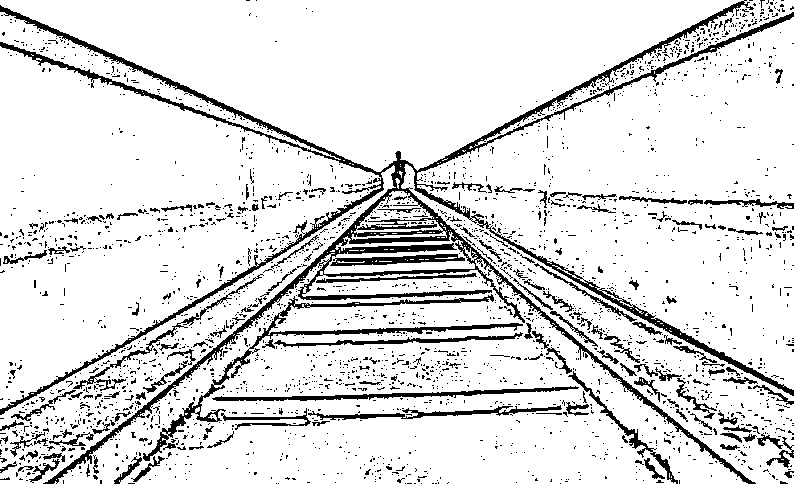

于是，我开始处理自己的信任议题。我发现，这种信任的破坏可以追溯到更早，因为曾经毫无防备地相信对方而被骗取金钱的经历。“一朝被蛇咬，十年怕井绳。”经验使得我在遇到类似事件时采用的都是**过度警惕的自我防范**模式。继续追溯，我发现，那一次被骗的经历，第一，是因为我自己在其中也产生了“占便宜”的贪欲（火星）；第二，是因为同对方的金钱合作方面，并没有建立良好的规则（土星）。也是这两点，使得对方有了可乘之机。而这本身同我对他人的信任并没有直接关联。也就是：**并不是因为我相信别人，就一定会遭遇欺骗。是我自己在缺乏自省和深度内观的情况下，粗暴地将二者关联起来**。而这种简单的归因也经常发生在我们身边。例如，当你遇到过一个壮硕的，有暴力倾向的男人，也许你会产生“长得壮的人都会打人”的简单归因。意识到这一点之后，我开始借助彼时**火星在白羊座逆行四分摩羯座土星**的天象，修复火星功能，重塑对于他人的信任。**第一、每次合作都仔细商讨细则和规则，划清彼此的边界。**白羊座对面的天秤座很容易出现一种情况：**因为不好意思而无法直白地捍卫自己，哪怕感到事情有些不对了也很难直说，指出别人破绽的时候，自己更加尴尬。**土星的介入可以很好地竖起屏障，使得你和世界、他人之间都有自己的领地，彼此才不至于过度侵入对方而导致火星式的争端，造成本可避免的伤害。**第二、在合作之初便坦诚自己的不信任和担忧。**作为一个火星落在天蝎座八宫的人，涉及金钱领域的合作通常都是隐秘、防备的。而这会导致很多不必要的误会，其实，**最好的防御便是毫不设防（火星白羊座），当你对世界完全敞开，反而令暗藏龌龊的人止步。**而天蝎座最需要做到的恰恰也是对自己、对世界的真实。**第三、当感觉到对方的确含混模糊时，直接表达自己的质疑。**信任不代表无脑，当发觉对方确实存在一些嫌疑之时，勇敢清晰地捍卫自己也是火星白羊座正面的能量发挥。有多少人，尤其是女孩子，在捍卫自己的时候反而被别人说成“个性刚、脾气大”？在这里也想对这些女性说：**划清自己的边界，不被人侵犯，你很勇敢，别因为社会对女性的标签化要求，男权对于女性的打压而让自己始终处在弱势地位。当你生出发自内心的自信，你会成为并不需要靠讨好和委屈自己活着的人！****第四、也是最重要的，不断清理内在的，属于火星的负面能量，其中包括贪欲，猜忌，和鬼祟的恶意。**只有自身坦荡光亮纯净，才能吸引来同频的人和事。

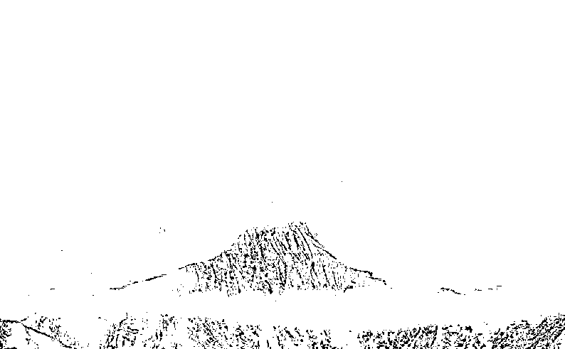

**火星教给我们的深层课题**

我们刚刚经历过逆行的火星白羊座四分摩羯座土星的历程。如同士兵遭遇现实高墙，推不动再继续拼命猛推，一鼓作气，再而衰，三而竭的同时，也真正令我们看到出生星图中火星的模式——**一些人不撞南墙不回头；另一些人开始怨天尤人，将愤怒投射到身边的一切；还有一些人回想起自己曾经受挫的经历而激发出深埋的恐慌。**

然而，记住，赛程才刚刚过半。**如果你在过去这段火星逆行的时间里感受到了热火被兜头冷水的“挫败感”，请停止愤怒和躁动，也无需对自己和世界产生怀疑。**你需要做的，是从这种境况中暂时抽离出来，接受当下已经损失的，放慢角度，别急着推进和需要立刻看到结果——**逆行，通常意味着无论你如何努力，这件事都进入了停滞甚至倒退的时期**。

作为一颗捍卫自我，争夺领地的火星，我们的攻击性恐怕早已被隐藏在现代文明社会的“教养”中。然而，该夺的，该气的，该撕逼的，该不信任的，都还在那里。我们需要做的，就是去看见它，处理它。火星在白羊座的最终目的，并不是争斗、发飙、一意孤行，而是似一把利剑劈开每个人内在动力的阻滞，又像晴日朗朗，照亮心底深藏的角落。通过这股纯然的，婴儿般的真火，我们不但了解了自己，也了解了他人。

**火星在白羊座这半年，会在顺行-逆行-顺行的路径中三次同木星、土星、冥王星形成四分相。**大家不妨结合这三颗行星的能量，将这些四分相想象成十字路口的红绿灯。**它们不是来阻挡你的，而是帮助你完成自身火星的功课**。想要一路顺畅，靠的不是蛮力、任性、盲目自大、孩子一般的耍赖和斗气，而是真正的勇敢、信心，和智慧。**给 12 星座的火逆指南****无论火星当下行进在你星图的哪个位置，其真意都是帮助你觉察自身火星能量的发展。**在这里附上一些简单的指南，当然，最好的办法是寻求信任的咨询师。**出生星图中火星在*****白羊座***你是否总感到焦躁、愤怒，无法安静？你是否容易感觉这个世界充满争斗，如果不发火甚至无法生存下来？你是否容易上火、发炎、因为运动发生外伤？你需要透过这些现象看到内在对于活下来的动力，这会令你**过度强调“我”，而同他人和世界产生争斗。****让自己安静下来，放松，在瞬间要发脾气之间，默念 10 个数字，要知道，比正面干架更智慧的方式是双赢的和解。**也许你曾经因为自己的退让而换来了攻击，但善意本身并没有错。**出生星图中火星在*****金牛座*****金钱始终是你的课题，私有物不愿意同他人分享，也许别人觉得你小气，抠门，并以此攻击你。**令你怀疑：为了洗脱这个标签，是否真的应该做出违背行为准则的事情？尽管大多数时候，你只是沉默固执地令对方更加抓狂！**觉察自己在不愿意分享，在意金钱的背后，是怎样的动力？**答案也许每个人不同。但深入探索，诚实面对它，并将你的想法同身边在意的人分享，也许你会收获更多理解和关爱，而财富也会向你涌来。

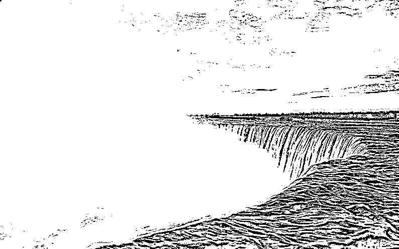

**出生星图中火星在*****双子座***

你是否不自觉就同别人争辩起来？其实你并不是真的想要“赢”，你只是习惯性地一定要**“辩论”**。这也是你拓展和触碰这个世界的一种方法——**你充满好奇心，但这很容易让人感到被质疑，而认为你非常狡黠，且缺乏定性。**

观察自己在舌战群儒的背后，是怎样的动力？是否从小到大，你都因多话而被家人不耐烦、敷衍，没有人真正愿意听你想要表达的，导致现在的你也毫无耐性聆听，甚至通过反驳来发泄自己的愤怒？**出生星图中火星在*****巨蟹座*****你似乎更容易因为自己在乎的家人而宣战，却并非为了自己。而你的攻击力其实并不强，也很可能吵架的时候你难发一言，却背地里嚎啕大哭。**观察自己通常因为怎样的情绪而想要攻击，或因为怎样的事件引发他人对你的攻击？巨蟹座内在有很多委屈和感受，却难以表达。过度的情绪除了让自己陷入泥潭，并不能带来真正的保护和动力。**请学习使用更为理性和简单的话语描述当下的感受和需求。****出生星图中火星在*****狮子座***面子始终是你们最为在意的。观察自己发怒的时候，是否通常都是感到面子被“剥掉”的时刻？**你们也会因为生活无趣、无聊、缺乏创造力、感觉不到被关爱追捧而愤怒。**因此，你们需要深入了解，**在面子和缺爱的背后，是怎样的创伤？**你是否让自己处在了一个充满乐趣，彼此热烈关照对方的环境中？如果不是，你或许需要让自己换个环境，而不是变成一只愤怒的“咆哮帝”，那样只能让别人更加对你敬而远之。

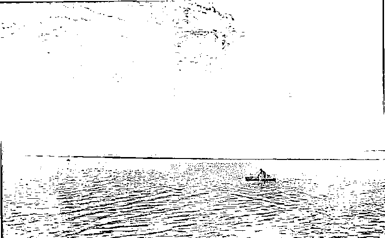

**出生星图中火星在*****处女座***你也许觉得十分委屈：**你倾尽心力对待他人，事无巨细。然而很可能在这段时间里，你也遭遇了不少“莫名其妙”的攻击。**然而攻击从来都不是莫名其妙的。**试着放下自己的逻辑，反观对待他人的态度和模式，是否有哪怕不经意的那么一丝“嫌弃”？很少有人能够符合你的做事方式，而这种“完美”也反应出你对于自己的不放过。**如果你越发紧张，也会吸引来更为紧张的环境。这种紧张最终会通过他人和外界投射回到你自己身上——其实，你也很想放松些，不是吗？**出生星图中火星在*****天秤座***这恐怕是这段日子里最“憋屈”的火星落座了。当火星行进在白羊座，意味着火星天秤座们处在大形势的对面。而平日里尽管也挺憋屈，尚能装作云淡风轻的天秤座们，现在怕是好像坐上了火药桶，难以维持自己“平衡冷静”的形象。**别担心，这正是最好的时段，让你发现，其实你只是个“礼貌”的白羊座。**观察自己为何大部分时间宁可用“和为贵”来说服自己妥协，无法捍卫本应属于你的利益？你在担忧、害怕什么？如果和一个火星白羊座一样第一时间蹿起来，会令你感受到什么？千万别浪费这么好的时间，这是你**终于可以好好善待自己，行动起来**的时间段——干就是了！**出生星图中火星在*****天蝎座*****这段时间，内在深层的恐惧和愤怒可能会被争执和突发事件激发，继而想要“干掉“别人。**但请记得，事件的背后是你需要**诚实面对自己欲望、贪婪**的功课。在“杀心”升起之时，请保持觉知，在决裂和报复升起时，是否也将自己拖向更深的“地府“之门？**放下，宽恕，是火星天蝎座最需要学习的功课。**你们通常也是最敢给自己下狠手的火星落座，所以，我对你们持有乐观态度。在白羊座的能量中，从黑暗里走出来，指日可待。

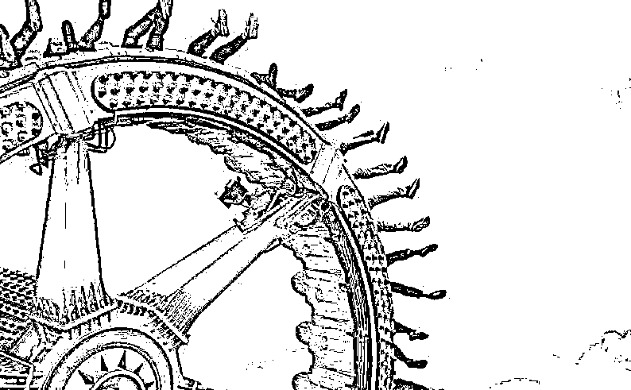

**出生星图中火星在*****射手座***在 2019 年，木星射手座四分海王星双鱼座的时候，也许你们中很多人做出了一些大胆激进的举措。而 2020 年对于你们而言应该是不太舒适的。经历了压抑的上半年后，下半年也许你们又开始感觉到一些“蠢蠢欲动”。可是现实的冷水又时不时泼来。其实你们有很多途径来舒缓自己的焦躁和愤怒：运动、旅行、学习、恋爱……但是亲爱的火星射手座，在这些表面的行为背后，是否你还在逃避着一些什么？看似狂放的你们其实非常认真地对待生命，只是这种热情需要经历射手座的下一个星座：摩羯座，在那里你们会碰壁，会有严重的压抑感，然而，那是你必须要去的地方。**让自己更加“靠谱”吧，这是顺利度过这段躁动期的法宝。****出生星图中火星在*****摩羯座***2020 年的下半年里，你们可能也会感到很憋屈——尽管你们本身就要求自己“喜怒不形于色”。这种憋屈可能更多体现在**正常推进的项目搁置，计划被打乱，总有不成熟的人挑衅你，生活好像忽然需要你快速行动起来，而这是惯于筹谋的你很不愿意去面对的。**观察自己对于计划、架构的执著背后是怎样的担忧？为什么你很难接受突发状况？如果事情无法按照你的期望按部就班稳妥推进，是否能够唤起你的怒火？你又将如何发泄？需要注意的是，火星摩羯座的定位星土星当下行进在摩羯座，需要你们**带有更不一样的视角去看待自己的行动模式**。不妨通过身边的人去了解他们对你的感受和看法——当别人都需要更加坚固持久的时候，你们也许是时候让自己松动一点了。**出生星图中火星在*****水瓶座***你们的淡然正在不断被身边的一切挑战！就像一群叽叽喳喳的熊孩子，让你们又生气又无奈：“这个世界怎么了？”观察自己一副“超然物外”的行为模式背后，是真的不为所动的智慧，还是别的什么？你们也需要看到自己的欲望和贪婪，你们真的不需要那些金钱、世俗、爱欲么？另外，**观察自己是否有强烈的“逆反”心态，也许你需要注意，会否因为这种态度而激怒对方，制造许多不必要的事端。****出生星图中火星在*****双鱼座***你们也许感觉到非常不舒服，原因是：**大家都在“打鸡血”，你们也被推动着没办法再瘫倒**。**身边可能有许多突发事情等着你去处理，有很多人和你倾诉自己的愤怒，你不能再拥有自己放空的时间，却又无法做到狠心不理这个疯狂的世界**。这种感觉太糟糕了！观察自己内在真正需要怎样的行为模式：如果你只想躺着，就坦白地告诉别人：“我现在没有能力处理你们的事情，让我静静。”如果你也想要为自己争取点什么，那就忘了自己有一双人鱼的鳍，用自己的双脚在这个土星的世界上站起来！开始也许你会觉得每走一步都在刀尖上，但来自海洋的爱和祝福会给你源源不断的滋养和动力。记住，时刻同宇宙更大的所在联结。包括但不限于**音乐、艺术、冥想、瑜伽、晶石、各种清理、占星学、spa、游泳、睡觉……**甚至就是简单地“望呆”。**先接受自己的“懒”，才能拥有动力。**最后，祝福大家都能顺利通过这场考验，装备升级！**你在火星逆行期间都有怎样的成长？评论区分享给大家吧！**

**版权声明：**原创文章由作者授权首发于若道平台，欢迎转发，反对抄袭。友号转载请申请白名单。

****

****想阅读更多作者的文章****

****请在后台回复******玫瑰****** 即可****

**玫瑰**

英国 Cass Business School 管理学硕士

若道 2015 届核心课程毕业生，若道微信公众号兼职编辑

占星师，咨询时长超过 600 小时

**个人微信号：**Still_Queen_Astro

**公众号**：一个娘娘 

长按二维码，给作者打赏

**ISAR 选修课，心理占星学视角下的预测方法**

**点击图片链接或扫二维码咨询客服**

**微信又双叒叕改版啦，不想错过若道君的推送？**

**就把若道设为星标吧！**

**▼**

就是这个“在看”，戳戳戳 ☟

********报名直达入口********

# ISAR 大会回顾丨圆桌讨论：2020 年底的土木大合相究竟有多重要？！

> 原文：[`mp.weixin.qq.com/s?__biz=MzA5NjA0NTAxNg==&mid=2651430136&idx=1&sn=3d58c289e2a2960be3b2a5d183403889&chksm=8b4b2e4fbc3ca759dcfa7b2d04156a480f661e2c6cf2592d82dc98f8f5f1b520569958f7cab2&scene=126&sessionid=1692738090#rd`](http://mp.weixin.qq.com/s?__biz=MzA5NjA0NTAxNg==&mid=2651430136&idx=1&sn=3d58c289e2a2960be3b2a5d183403889&chksm=8b4b2e4fbc3ca759dcfa7b2d04156a480f661e2c6cf2592d82dc98f8f5f1b520569958f7cab2&scene=126&sessionid=1692738090#rd)

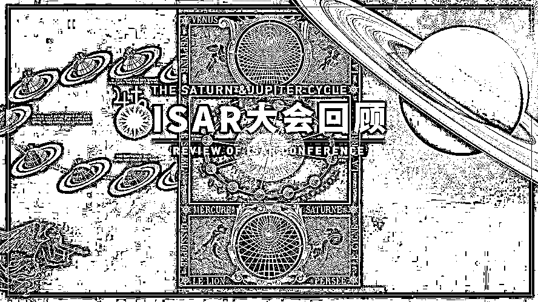

讲述人/海星程、查理、莱莱

文字整理/编辑/翀子 封面/书君 图片/网络

2020 线上 ISAR 大会，参加圆桌讨论的中国占星师们发言很精彩，文章节选了海星程、查理和莱莱在大会第一天时的部分发言，对行星周期的历史梳理是谈论重点。如果你对大会内容感兴趣，可以直接拉到文章末尾，了解回看方式哦~

**嘉宾：**

**海星程**

ISAR 认证占星师，若道认证授课老师

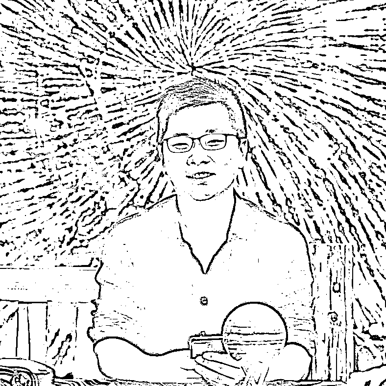

查理

ISAR 认证占星师，企业占星师

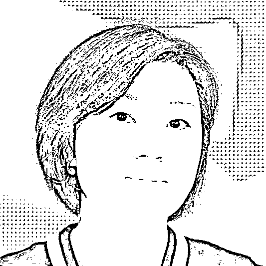

****莱莱****

若道占星平台咨询师，资深电视节目导演、制片人

**（本文为线上 ISAR 大会圆桌讨论的发言节选，仅代表讲述人个人观点）**

**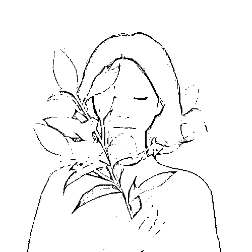**

**海星程**

我们学习占星学的时候，都知道它会研究行星周期，周期的定义是说一颗行星绕一圈、回到自己的初始位置的时间。木星 12 年绕完一圈，土星的周期是 30 年。在我们的出生星图的解读中，我们把它叫做行星回归。

两颗行星合相的周期是两颗行星、从第一次合相到第二次合相的时间。木星和土星 20 年发生一次合相。另外我们还有一个关于所谓的木土在风向星座，这就是说在同一星座元素的周期，就是两颗行星的合相连续发生在同一元素的时间。由于木星和土星的各自速度原因，所以说要持续两百年。

2020 年 12 月 22 号，土星和木星在水瓶座 0°度 29′发生合相，然后 2040 年、2060 年分别合相在天秤座和双子座，都是风元素。从 2020 年到 2219 年，这 199 年里，土木合相都在风元素。而我们往前推能发现，从 1842 年到 2020 年，木星与土星合相在土元素，也是将近两百年。从 1663 年到 1842 年的近 180 年里，土星与木星合相在火元素，再往前就是水元素。

这就是一个规律。木土在同一元素的时间将近两百年，而上一次木土合相在水瓶座是在 1405 年。

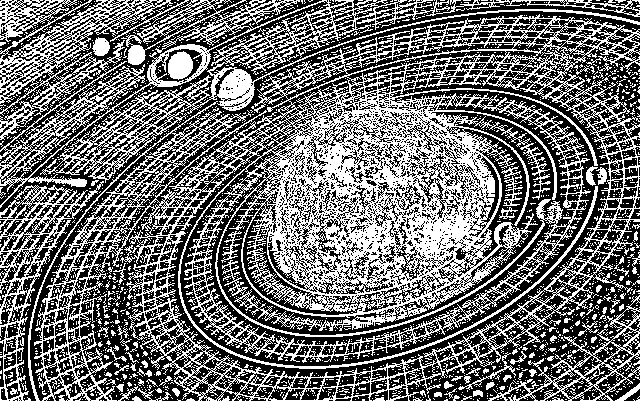

****

**查理**

像刚才海星程老师说，上一次木土合相在水瓶座是 1405 年那个时候，那年郑和下西洋，整个世界的信息开始交换。现在马上木土要进水瓶座了，我们很可能会再次看到像当年郑和下西洋那种全球交流的壮观场面。

我们可以回顾一下，过去两百年木土合相在土象星座发生的事情，它们一共合相九次，工业革命其实就是从那个时候开始的。整个工业革命给世界带来了巨大的变化，无论经济还是技术层面。楼盖得越来越高，工厂生产力越来越强，工艺越来越精细，然后整个欧洲的艺术也开始往写实主义发展。这些就是过去两百年土木合相在土象星座的影响。

再往前两百年，木星和土星在火象星座合相了十次。那是全球的殖民时代，也是君主制国家全盛的时期。当然里面有很多战争。那么从 17 世纪开始，启蒙运动开始就开始了。15 到 16 世纪，木土在水象星座合相了九次，那是文艺复兴的核心时期，同时整个欧洲的船队出现在世界海洋各处。

上一次人类在经历土木在风向星座的 220 年里，成吉思汗从蒙古一路打到布拉格，贯通了海上的陆上的丝绸之路。

那时候有很残酷的战争，那当然，我们在未来两百年期间不一定需要再经历这样过程。但这样全球的文化交融，信息沟通，让大家能够彼此理解，可能到时候国与国的区别可能没有那么强，会用社团、理念等来区别人，而不再是国家。

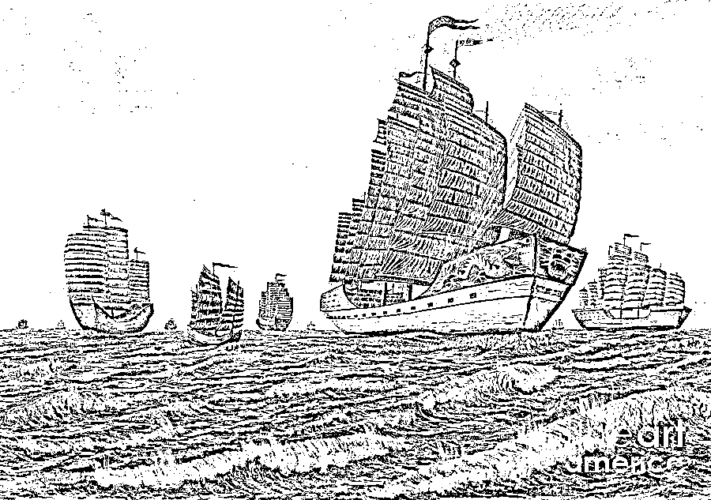

****

**莱莱**

上世纪 30 年代，当经济大萧条爆发的时候，很多普通人找不到工作，生活开始受到影响，当时在这个进程中，世界也爆发了一次大流感，当时那种环境和状况跟我们今天所感受的一些状态很相似。因为有这个经济大萧条，导致了第二次世界大战的爆发。

大家其实能看到第二次世界大战爆发的时候冥王星进入到了狮子座，它也是在一个周期的爆发点上。二战和一战给我的最大感受是，一战时冥王星在巨蟹座，大量的人流离失所，感受到家园被冲击。而到二战爆发的时候，冥王星在狮子座，战士数量急剧扩张，然后感觉到了战争的升级，此外也看到了一些暴君的出现。

我们借由这些对历史上行星周期的研究，也可以用来参考当下的时代。我们现在正处于一个周期的末期，后面还要开启新的征程。

从感情上来说，我其实很希望和大家一起做一些，除了占星技术以外的历史研究，因为这会很有意思。就好像我说到，冥王星带来的一种压迫感和对未来的不安。但通过历史你会发现，所有的发展都是通过这样一个个循环往复的推进中进行的，这也是我们学习占星学、并把它纳入到对于生活的认知的过程。

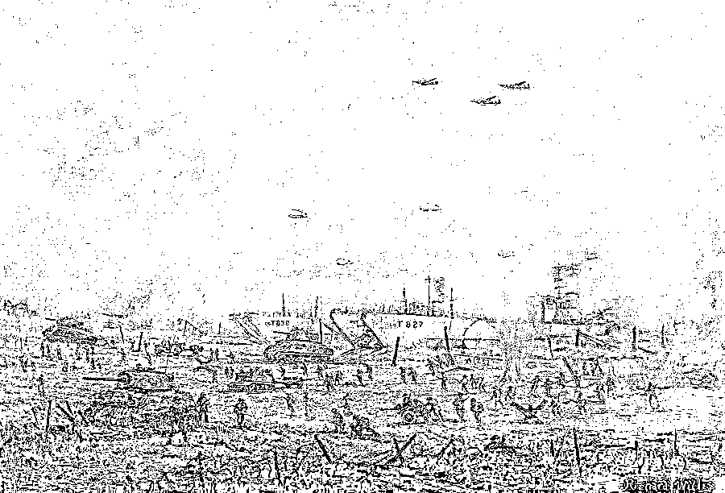

****

**查理**

在经世占星学的课堂上，我们研究了宋朝三百多年和近现代中国的三百多年，大概一共七百年的历史。得出的重要结论是，土冥合相时，无论在政治经济层面还是科学，都有全新的的开始。

1980 年到 1989 年期间就是这样一个时期。那时全球范围内也是有金融危机的，中国当时已经在经历改革开放了，但后来也出现了一些经济问题，很多合资项目被暂停了，那么这和天秤座也比较对应。再上一次是 1947，那时新中国还没成立，但国共双方的军事力量开始有第一次反转。全球范围内的话，就是美苏冷战，也是一种权力斗争。

再上一次，刚才莱莱也说到了，恰巧就是那年一战爆发，冥王星那个时候在巨蟹座，很多民族遭殃。那么在摩羯座的话，就和旧政权有关。再之前，土冥合相在摩羯座，是 1883 年，那时有洋务运动。那再上一次土冥合相是太平天国运动爆发。再往前查，是蒙古的崛起。

土冥合相时开始新的权力和秩序；从新的合相诞生到渐盈四分相，权利斗争中的双方越斗越强；到了土冥形成对分相的时候，是新旧势力的对抗；到了渐亏四分相的时候，双方为生存而斗，就是一方被消灭掉，另一方获胜。那等到新的合相产生，就又有新的秩序。基本上是有这么一个三十几年的周期，不停的循环。

****

**海星程**

听完查理讲的土星和冥王星，我说说木星。木星在外行星中运行比较快，所以它跟一个行星发生周期的话，基本就是木星自身的周期范围。

一般来说，木冥的影响会因为它的周期比较短，影响会相对小一些。但仔细看一下今年，有些特殊。今年的木冥夹带上了土冥，木星又跟冥王星发生了三次合相。所以这会加重木冥的影响力。年初的时候土冥发生了合相，紧接着木冥又在摩羯座发生了合相。那在摩羯座之后呢？木星跟土星就同时进入水瓶座，又开始发生木土合相，整个过程很有意思。

土冥是现实层面的恐惧或是危机。比如像澳洲大火或是疫情，都面临这种资源匮乏和生存危机的感受，强烈体现在现实层面上。那么到了木冥，就从现实层面开始转入到了一种意识层面。这种感觉跟财富、经济都有些关联，所以也造成了现阶段的经济下滑，包括失业、破产等等，经济结构出现问题。

同时由于木冥的原因，今年也发生一些意识形态的冲突，尤其是极端的意识形态。到了年底之后，木土进入水瓶座，那我们是不是一定能有所改变？我倒觉得不一定，它只会激发问题，在危机面前我们有可能把水瓶座的能量表现得更极端或更激进。

木土是 20 年的周期，所以说在激发之后，由于天王星跟水瓶座的能量，它最终会打破我们之前固有的意识形态。木土在 20 年的周期里，必定会带来一种社会的发展和进化，因为是在水瓶座，所以一定是在某种科技实现了突破，或意识形态突破后，才发生转化。所以在刚从土元素过渡到风元素的时候，情况不会那么快得到改善，有可能会有一个惯性恶化的过程。

关于木土中期影响的讨论，我认为要等到木土都离开水瓶座，冥王星进入水瓶座、天王星在双子座、然后海王星又进入白羊座后可能才慢慢开始显现。从长远来看，这 20 年的周期是非常好的开端。

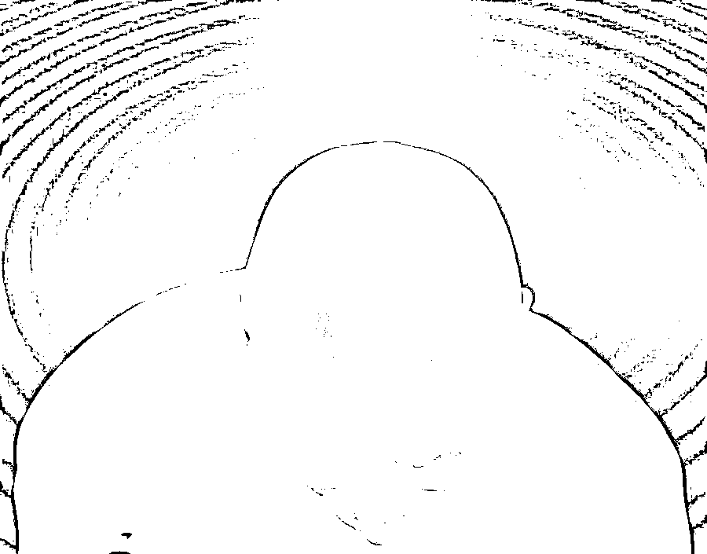

****

**莱莱**

我来聊聊木星和海王星的周期。木海周期也是因为木星的运行速度，周期会比较快。我们当下处在这次木海周期中的“下弦月”阶段，木海就好像都在双鱼座（注：木星传统守护射手座和双鱼座），这是很有意思的。双鱼座本身关联木星和海王星，大家能感受到在这一次的合相中，双鱼座代表的原型是被强化。海王星在双鱼座的时代，对于痛苦、信仰、意识形态有放大的效果。

除了在身心灵层面的感知外，也包括我们对艺术的感受。我本身是做艺术工作的，所以我看到海王星在双鱼座的时代，人们有大量的艺术创作和表达，只是形态不再是以往传统的音乐啊，美术啊等等，它可能会进入到一种新的形态。就好像电影艺术是在上世纪才应运而生的艺术形态，未来也可能再有一种新模式。

在 20 世纪，木海合相经历了八次，最早是 1907 年，当时木海好像在巨蟹座，然后合相在狮子座、处女座、天蝎座等等。多次的木海合相中，就中国来说，它带来了新思想或新的艺术形态，包括对文明的推进。

在当下的行星换座中，土星和木星即将进入水瓶座，冥王星来到摩羯座末度，也快进入水瓶座了。当海王星进白羊座，天王星进双子座，外行星会进入风元素和火元素的时代，那时很可能会有一些新思想和认知。它会以一个高速的方式，来到我们的生活中，带给我们很大的冲击感。

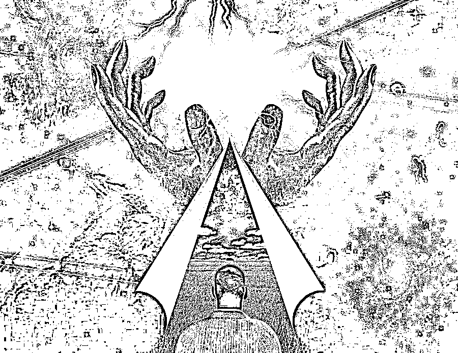

****

**查理**

莱莱说了木星和海王星的周期，现在我来聊聊木星和天王星的周期。木天周期是 14 年左右，它代表巨大的变革。我给大家列出来近一百多年的木天合相时间。

在这些时间对应的旧世界里，有一条非常清晰的线，就是计算机和人类文明的关系。我参考了一些大卫老师 2014 年在阿里巴巴内部进行的一场演讲，他提到计算机的发展，还包括怎么看待 1990 年、2000 年以后出生的这拨人，很精彩，大家可以看一下。

人类第一台计算机产生的年份就是 1886 年、木天合相的时候。几乎每次计算机的更迭换代都和木天合相有关。

那到了 1983 年，木天又一次合相，摩托罗拉发布了第一代移动电话，也就是我们所说的大哥大。那年在国内呢，有了 BP 机。1997 年木天合相在水瓶座，那时候就是互联网元年，搜狐、新浪、网易都是在那年成立的。东西方都是互联网爆发的一年。

那在下一个 14 年，也就是 2010 年到 2011 年的时候，iPad 和 iPhone 面世，国内就是阿里巴巴、腾讯、百度取代了前一个周期的搜狐、新浪和网易。我们现在还处在这个木天周期里，直到 2024 年。到那时，新的木天周期又开始了。如果大家要对外行星周期有更深入的研究，我推荐大家去读塔纳斯的书。

**版权声明：**本文由演讲者授权整理发布于若道平台，欢迎转发，反对抄袭。友号转载请申请白名单。

**想完整观看大会内容？请扫描下图二维码了解详情****微信又双叒叕改版啦，不想错过若道君的推送？****就把若道设为星标吧！****▼**就是这个“在看”，戳戳戳 ☟********回看大会直达入口********

# 10 月 17 日天秤座新月丨这一次，“宇宙超级大 BOSS”拼了！

> 原文：[`mp.weixin.qq.com/s?__biz=MzA5NjA0NTAxNg==&mid=2651430045&idx=1&sn=0fc2d63b9b3f48e971e16d32b4f3d786&chksm=8b4b2e2abc3ca73c86cd2fa08ae9e77663d0a6bab3ff497cc1f630d14e9fd23ade8943c150ec&scene=126&sessionid=1692738090#rd`](http://mp.weixin.qq.com/s?__biz=MzA5NjA0NTAxNg==&mid=2651430045&idx=1&sn=0fc2d63b9b3f48e971e16d32b4f3d786&chksm=8b4b2e2abc3ca73c86cd2fa08ae9e77663d0a6bab3ff497cc1f630d14e9fd23ade8943c150ec&scene=126&sessionid=1692738090#rd)

**********☆****************后台回复“今日”，给你一句生命态度**********

作者/王芝桦 编辑/玫瑰 图片/全景网**天秤座新月**

北京时间 2020 年 10 月 17 日 3:30 迎来天秤座新月，太阳与月亮精准合相于天秤座 23°53′。

**你，**

**一会看我，****一会看云。****我觉得，****你看我时很远，****你看云时很近。****——顾城 《你和我》**
  这是我青年时期非常喜欢的一首诗歌。青年阶段，我以为自己因诗句间的唯美画面迷恋；走过青年阶段，我发现自己被诗句内的关系空间吸引。当下大家已经很少看云或看彼此，很多时候都在看手机。偶尔，我会对来做亲密关系个案的咨询者说：“这些话为什么不和你的伴侣说”，也时常听到他们对我讲：“很久没有互相凝视了，我们各看各的（手机）”。或许，“你和我”之间的空间感在任何年代都是一样的，因为独立的个体、独立的秩序和独立的标准，就像生命“孤独的本质”一样从来不会改变，而“你和我”还要在各自独立之中彼此相爱，谁说不难？天秤座是象征爱与关系，主导美与平衡的星座，故而**9 月 22 日-10 月 22 日的天秤月生活，关系主题自然凸显，而关系背后的议题也在不断浮现。**此次天秤座新月，开启了国际社会和个人生活中激烈的关系局面，引领我们去深思**如何才能构建一段“健康发展”的关系，经营一份“和谐共舞”的联结，而这一切都要从接纳自己开始，才能允许他人并达成共振。**

> **天秤座新月重点影响人群**
> 
> **参考新月峰值影响期间各个行星的行进度数，以及逆行行星的轨迹影响；常规容许度，个人行星入相位 3°，出相位 1°；非个人行星入相位和出相位均为 3°。**
> 
> *   出生星图中，有**行星、四轴、南北交点**落入**固定星座（金牛座、狮子座、天蝎座、水瓶座）0°-13°**的人群。
>     
>     
> *   出生星图中，有**行星、四轴、南北交点**落入**变动星座（双子座、射手座、处女座、双鱼座）13°-25°**的人群。 
>     
>     
> *   出生星图中，有**行星、四轴、南北交点**落入**基本星座（白羊座、巨蟹座、天秤座、摩羯座）2°-30°**的人群。

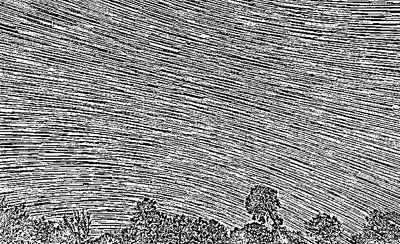

**回归自我中心，面对内在阴影**

**即使你有两只眼睛，也不一定看到全部事物。**

**——克里斯·海姆斯沃斯《雷神 3》**

**天象**

**· 基本星座 T 三角**：摩羯座上的木星、冥王星和土星的合相星群分别四分逆行的白羊座火星和天秤座新月，逆行的白羊座火星对分天秤座新月，组成“基本星座 T 三角”结构；**· 金海对分**：处女座金星对分逆行的双鱼座海王星；**· 金星三分摩羯座群组**：处女座金星三分摩羯座上的木星、冥王星和土星；**· 水天对分**：逆行的天蝎座水星对分逆行的金牛座天王星；**· 新月联动南北交点**：天秤座新月六分射手座南交点，三分双子座北交点。我们先来看看此次天秤座满月的行星能量传导图：

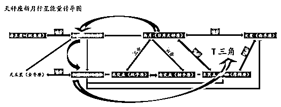

我们可以从上面这张图中看到一个循环的锁链，此次天秤座新月正处于这条循环锁链的“中枢”：“基本星座 T 三角”正是最近一段时间大家在“关系”中的困扰所在，于是人们期待在天秤座新月寻获解困之道，处女座金星和天蝎座水星联手给出策略——**解铃还须系铃人，我们还是得面对“关系问题”背后透露出来的“自我真相”。**

1**宇宙超级大 BOSS，安排自我回归之路**

**任何人都想在这个世界上找到自己的路，但首先得承认不知道自己在哪。**

**——克里斯·海姆斯沃斯《雷神 1》**

10 月 4 日，逆行了 5 个月之久的冥王星于摩羯座 22°恢复顺行。这是一个非常敏感的位置，因为 2020 年 1 月 12 日年度重磅天象“土冥合相”就发生在摩羯座 22°，另外，11 月 12 日即将到来的年度重磅天象“木冥合相”第三次能量峰值也发生在摩羯座 22°。摩羯座 22°，犹如 2020 年绕不过去的梦魇，需要我们凝视的一个地方。2020 年初，当冥王星行进在摩羯座 22°的时候，我们带着期待之心跨越了“我太难了”的 2019 年，热烈讨论着 1 月 12 日的“土冥合相”可能上演的“现实洗牌”戏码，我们已经做足准备要重新启程并大干一番，但一场突如其来的全球疫情令我们陷入“我更难了”的境地，毫无商量地改变了所有人的计划。2020 年走进第四季度，这个世界已经发生了太多的变化，人们又开始热烈讨论着 2020 年底的木土双双换座，以及“木土合相”开启的“200 年风元素周期”，我们充满期待之心盼望着快点结束这惨烈的 2020 年，快点迈入 2021 年的全新时代。这就是人类的本能，以为走过去就好了，但宇宙可不那么想。

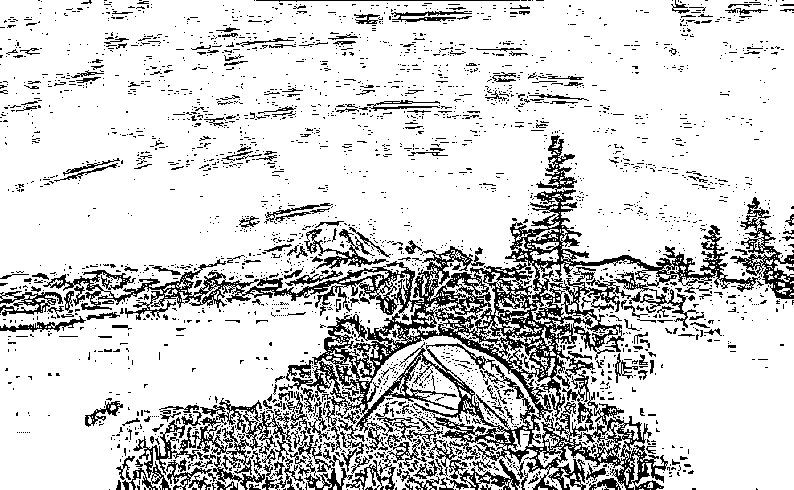

“宇宙超级大 BOSS 冥王星”年初忙完了“土冥合相”，又忙完了 4 月 5 日的第一次“木冥合相”和 6 月 30 日的第二次“木冥合相”，然后从 8 月 17 日逆行回到摩羯座 22°开始，直到 10 月 4 日恢复顺行都没有离开过摩羯座 22°的位置，并且还会待到 11 月 12 日的第三次“木冥合相”，直至 11 月 20 日才向前移步走出摩羯座 22°。而 11 月 20 日开始，不是年度重磅，而是世纪重磅的“伟大的三重合相——木土冥合相”开始进入紧密呈现并达到能量峰值的时间。那么，“宇宙超级大 BOSS 冥王星”在世纪重磅天象来临之前，究竟要向我们传递什么呢？我们先来回顾一下“宇宙超级大 BOSS 冥王星”在**8 月 17 日-11 月 20 日**第二次走过摩羯座 22°的轨迹。这段时间正是英勇无比但有时虎头虎脑的白羊座火星，与摩羯座上三个硬核巨头（木星、冥王星和火星）展开前两轮“死磕”的时间：**· 8 月的第一轮**：8 月 3 日“火木四分”，8 月 13 日“火冥四分”，8 月 24 日“火土四分”，这一轮“死磕”的议题是**：“你得认同我，我已经忍无可忍，要么打倒你，要么我走人”**，所以**8 月是离职、拆伙、分手等事件折腾得非常激烈的月份**。但还是那个问题，以为走过去就好了吗？

**· 9 月的过度：9 月 10 日，**白羊座火星开始逆行，战无不胜的勇士感到有些无力和压抑，不过在“以现实生存为基准”的 2020 年，谁又不累呢？疲惫往往盛产更多的情绪和投射。随着天秤月生活（9 月 22 日-10 月 22）的到来，“关系”议题逐渐凸显。

**· 10 月的第二轮：**9 月 29 日“火土四分”，10 月 9 日“火冥四分”，10 月 19 日“火木四分”，这一轮的“死磕”从 9 月底便开始显现，关系的冷战或热战，工作的压力或无进展，令那些试图躲避的旧伤，没有处理的问题显露出来——**我们似乎陷入了与他人、与环境的关系困境之中，但其实我们陷入的是自我认同和自我观念的围墙之中。**

“宇宙超级大 BOSS 冥王星”意在鞭策我们**透过各种关系的问题，看向自我的真实，重新自我接纳，学会爱的功课，建立健康的关系，而此次天秤座新月就是寻获策略和解决问题的时间。**但重要的是，想在这个世界上找到自己的路，首先得**承认不知道自己在哪，接纳自我的瑕疵，面对自己的盲点。**

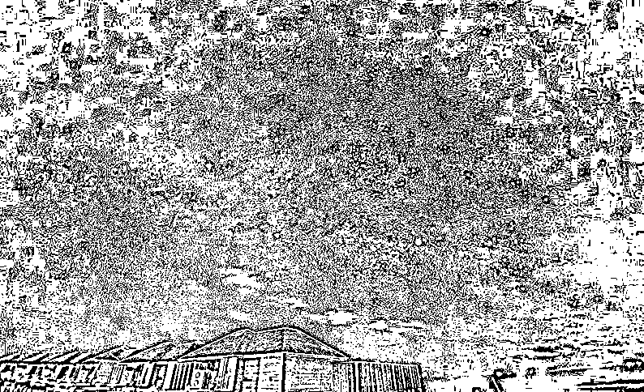

2**解铃还须系铃人，面对内在的阴影**

**我选择直面我的问题，而不是选择逃避，因为那才是英雄之举。**

**——克里斯·海姆斯沃斯《雷神 3》**

此次天秤座新月，天秤座新月、白羊座火星和摩羯座群组（木星、冥王星和土星）组成的“基本星座 T 三角”结构，激发了最近一段时期国际社会的冲突和纷乱，甚至引发武力骚乱。没有被平等对待的人们，没有得到公正评价的群体，愤怒的情绪将被点燃。于是，接纳天秤座新月“寻找公正”诉求，同时接纳金牛座天王星“现实突变”指令的处女座金星，在现实突变的一触即发之下，更加死扛“必须遵循的公正与秩序”的衡量标准。然而，每个人和每个集体的衡量标准并不相同，因为每个人和每个集体的价值文化本不相同。其实，现实的各种人际关系亦是如此，**那些自我的标准与预设，常常令一段关系变得疲惫和紧张，因为我们不单常常感到自我预设的失落，还要常常承受来自对方的预设失落后的抱怨。**建议去扫描一下个人生活中出现的关系矛盾，可能都与**自我理想化的预设和评判**有关，无论是我们强势地要求对方，还是对方强势地控制我们。此次天秤座新月周期，处女座金星与双鱼座海王星的“金海对分”结构，**一方面让我们经验预期失落并饱尝痛苦，另一方面也容易让我们深陷自我催眠之中逃避真相**；而处女座金星与摩羯座群组的三分结构，与“射手座南交点-双子座北交点”轴线的四分结构，则提示我们**必须面对关系战火导致的情感流逝，必须承担武力骚乱造成的经济损失，我们需要换个视角去寻求解决当下困境的方法，而不是卡在“我对你错”的执着中陷入较量的僵局。**此次天秤座新月周期，接纳处女座金星能量的天蝎座水星，与金牛座天王星第二次形成带有“意外转折”意味的“水天对分”结构（第一次在 10 月 8 日）：一方面触发**集体层面金融股市的转向震荡，伤害事件的披露曝光，私密信息的安全泄露等事件**；另一方面，因为水星的逆行，也容易导致**沟通表达的意外失误，突发事件的处理不当等状况的发生。**10 月 14 日，水星从主导“深刻联结和深度关系”的天蝎座开始逆行，而后于 10 月 28 日逆行回到主导“关系的建立和关系的平衡”的天秤座，最后于 11 月 4 日天秤座 25°恢复顺行，故而这一波的水星逆行将会引领我们回顾过去的旅途并进入深刻的反思——**透过关系的信任议题，深思自我的价值真相。**这里的重点是：此次天秤座新月，逆行的天蝎座水星的能量被“基本星座 T 三角“中的白羊座火星和摩羯座土星定位，故而此次天秤座新月整体能量就像是绕了一圈又被传导回去（参考行星能量传导图）；而天秤座新月联动南北交点，则为我们提供进化的路径和全新的策略——“解铃还须系铃人”，那么就回到问题的中心不再逃避，真正的战斗是去直面自我的问题并接纳内在的阴影，**真正的自我英雄会将力量用于灵魂进化和生命成长这些有意义的事情上，而非向外要求认同和投射情绪。****·** 在这段关系中投射了哪些价值期待？能够为你带来什么好处和满足？**·** 在这段关系中需要付出哪些代价？是你能够承受的吗？**·** 如果能够独立满足自己的价值需求，你还会继续留在这段关系里吗？此次天秤座新月，给自己一个真实而勇敢的答案。

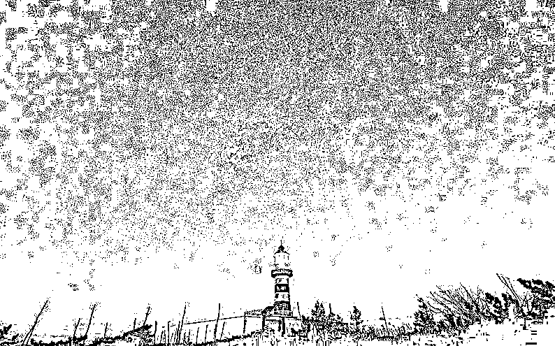

**寄语**

**那些你一笑就跟着笑的人，如果不傻，那就是爱你的人了。**

**——克里斯·海姆斯沃斯《雷神 3》**
这个世界往往要求我们跟着它笑，却并不理会有些时候我们根本笑不出来，所以最后我们要么活成了假笑的行为艺术，要么活成了真笑的高阶智慧。无论活成哪一种结果，都呈现着我们与这个世界的关系，只不过，前者以外界为主导，后者以自我为核心。故而，能够让我们真笑的只有自己，而那些跟着我们笑的人，只能是有些傻或带着爱的人了。此次天秤座新月，如果要许下“关系”的愿景，那么希望我们都是后者，回归自我中心，做回自我英雄，那样才能吸引爱我们的人，为我们的智慧而绽放笑容。祝福大家，愿每个灵魂安好。**新月如何许愿？**

**许愿时间**：2020 年 10 月 17 日 3:00 后，48 小时内有效、8 小时内最佳。

**许愿人群**：所有人。**许愿数量**：每人最多 10 个。**许愿方式**：静心冥想，身心祈祷或记录收藏。**许愿格式**：请万能的宇宙赐予我能量，我将以我的能量吸引**（什么）来到生命中……**许愿原则**：发心诚善利人。

**版权声明**：原创文章由作者授权首发于若道平台，欢迎转发，反对抄袭。友号转载请申请白名单。

****

****想阅读更多作者的文章****

****请在后台回复******王芝桦****** 即可****

****王芝桦****

心理占星师，统合疗愈师，若道占星“新月和满月”专栏作者

腾讯视频特邀合作占星师

全职于个案咨询与占星教学工作 16 年

**个案预约咨询微信号**：zhihua0621 

**微信公众号**：daoxi-life

**长按打赏**

****

**微信又双叒叕改版啦，不想错过若道君的推送？**

**就把若道设为星标吧！**

**▼**

**点击**

**“阅读原文”**

**获取免费新月报告**

****获取免费新月报告，请点击文末“阅读原文”****

# 感受宇宙的超级能量，快来领取这份免费的新月报告！

> 原文：[`mp.weixin.qq.com/s?__biz=MzA5NjA0NTAxNg==&mid=2651430045&idx=2&sn=ed1642c2c014dc5974a4e99c35597d24&chksm=8b4b2e2abc3ca73cdfab7d576b85187579d14b2ae23b4f5b4dff9751472ef907c39b80e02ca4&scene=126&sessionid=1692738090#rd`](http://mp.weixin.qq.com/s?__biz=MzA5NjA0NTAxNg==&mid=2651430045&idx=2&sn=ed1642c2c014dc5974a4e99c35597d24&chksm=8b4b2e2abc3ca73cdfab7d576b85187579d14b2ae23b4f5b4dff9751472ef907c39b80e02ca4&scene=126&sessionid=1692738090#rd)

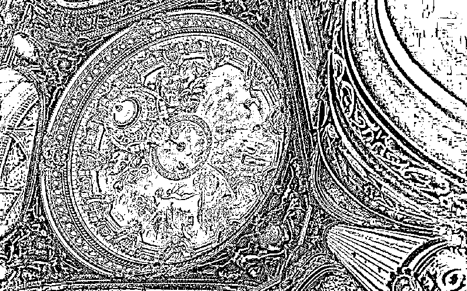

编辑/玫瑰 图片/网络

北京时间 2020 年 10 月 17 日 3:30，新月发生在天秤座 23°53′。每到新月时分，若道君都会为你奉上根据你出生星图量身打造的免费新月报告。可是新月为什么要许愿？新月报告该如何领取？让若道君来教你。

　**什么是新月？**　

从占星学看，新月是月亮周期的一种相位。新月是开始，又称为朔，对应中国农历初一，太阳、月亮在此时合相。此时月亮运行到太阳与地球之间时，月亮以黑暗的一面对着地球，并且与太阳同升同落，地球上看不见月亮。

本次新月时间

**2020 年 10 月 17 日 3:30，新月发生在天秤座 23°53′。**

为什么新月要许愿？新月是一个周期的开始，新月发生的时候，太阳与月亮合相，能量很强。当新月出现时，你也许会发现灵感忽现，非常适宜开启新领域、项目与行动，缔结一段新的关系或合作。许愿会加强新月的能量，也有助于你了解自己现阶段适合开启的方向。 本次新月最佳许愿时间

从新月开始到其后的 48 小时内，许愿的力量最强。

**最佳许愿时间：2020 年 10 月 17 日 3:30～10 月 19 日 3:30**

属于你的免费新月报告

每到新月时刻，看着占星文章里写着：看看你新月的宫位，如果新月在第 X 宫，你可以许愿的方向是……

是不是常常一头雾水？新月的宫位？我到底该看哪里啊？

而有时，那些标注上升星座的文章也会让你忍不住想：虽然我的上升星座是这个，可是我的新月好像并不落在你说的宫位啊？你是不是写错了？

虽然这些文章都没有写错，可是好像对你而言都太不友好了。

**Don't Worry！**别着急，让博学又体贴的若道君来帮你！

我们推出了一份**免费**又**好用**的新月报告！

而且是专门为你设计的哦，**根据你出生星图为你量身打造的，只****属于你的独家新月报告**。

报告有哪些内容？

**新月时间****最佳许愿时间**

**如何许愿 **属于你的**许愿关键词**

本次新月给你的**建议**

你会有怎样的**感受 **

****机会****

********

如何许愿？

许愿方式也很简单。

你可以把愿望写下来，或者双手合十后交叉，闭上眼睛来祈祷。

报告中会为你提供**祈祷词示例**，可以多多参考哦～

你还可以适当添加自己的语言，创造属于你自己的祈祷文！

如果报告拿到手了，快对照着许愿吧！

**这份好用又暖心的报告，点击阅读原文即可领取！**

****

****点击“阅读原文”即可获取新月报告****

# 12 金星星座的进化之路丨你的生命爱情故事是什么？

> 原文：[`mp.weixin.qq.com/s?__biz=MzA5NjA0NTAxNg==&mid=2651429928&idx=1&sn=22e778671a64350ce626e8e3c7a35bb9&chksm=8b4b2e9fbc3ca7899a91d36d6a665d8e72659f512b5e7827434813b1f06802b840a87e34f0d1&scene=126&sessionid=1692738090#rd`](http://mp.weixin.qq.com/s?__biz=MzA5NjA0NTAxNg==&mid=2651429928&idx=1&sn=22e778671a64350ce626e8e3c7a35bb9&chksm=8b4b2e9fbc3ca7899a91d36d6a665d8e72659f512b5e7827434813b1f06802b840a87e34f0d1&scene=126&sessionid=1692738090#rd)

**********☆****************后台回复“今日”，给你一句生命态度**********

作者/斯蒂芬·弗里斯特
译者/Jun 校对/江艺编辑/玫瑰 图片来源/全景网本文摘自《天空的伴侣 I：爱、性和进化占星学》研习过心理占星学的小伙伴都知道，在我们的人生故事中总有一些“强迫性重复”的剧情。比如，总是喜欢上不那么爱自己的人，每一段恋爱都以第三者出现告终，更有甚者，每次恋爱，对方都莫名其妙消失了……幸福的爱情千篇一律，不幸的爱情各有各的不幸啊。不过，也别急着怨天尤人，这一切都源自于你需要通过这些桥段来完成今生的进化之旅。找到你的金星星座，看看有哪些创伤需要去处理吧！**12 金星星座的进化之旅**金星在白羊座

**进化的意图是建立关系以帮助此人学习勇气，发展意志。**灵魂渴望学习**如何在爱的背景下表达强烈的情感，无论是积极的还是消极的。**这是对麻木的前世动力的灵魂记忆作出的回应，那时，**亲密关系被未解决、未表达的愤怒所掩盖。**

这个金星星座可以宣布自己是战士或者亚马逊人，怀着一种开拓精神在生活中冲锋，看起来能经受住所有的打击，甚至在打击中茁壮成长。“看我多有勇气。我不只是个约会对象；我是个冒险家。”金星在白羊座可能会抛出浪漫的挑战，看你敢不敢牵起他或她的手。“尽你所能打动我。”这个金星星座欣赏**独立、冲劲、直接和勇气**。**他们都是冒险者，喜欢有力的感觉，对良性的竞争有兴趣，享受胜利**。

| 玛丽莲·梦露

两位史上最受追捧、被追求的女性玛丽莲·梦露和伊丽莎白·泰勒，她们的金星在白羊座，小罗伯特·唐尼和哈兰·艾里森也是。杰克·尼科尔森也是如此，他的长期伴侣安吉莉卡·休斯顿说：“他让我热血沸腾。”

金星在金牛座**进化的意图是发展长久的纽带，帮助此人保持平静和简单，更容易与自己本能的一面建立联结。**灵魂渴望**在性爱中体验自然的状态，以此对僵硬的、拘谨的或不受欢迎的前世性关系作出回应。****金星在金牛座通过强调以物质、身体为中心的土元素性质来吸引他人。**他们吸引你的感官。他们散发着美好的触感；可爱得让人想抱抱。“看看跟我在一起多舒适，”他们的气场似乎在说，“看看我的陪伴多让你舒心啊。”金星在金牛座会被某人的大地母亲（大地父亲）特质所吸引。**他们往往喜欢户外活动，也喜欢在户外舒服的人，还有与身体相处很舒服的人**。他们最喜欢的是简单和自然，不喜欢不必要的花架子。

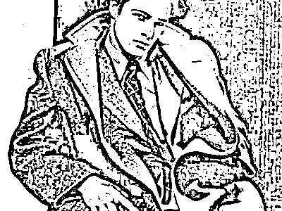

|马龙·白兰度诸多“回归土地”系列西部片的英雄约翰·韦恩，拥有在金牛座的金星。马龙·白兰度展现了金星在金牛座的土象吸引力。音乐家阿兰妮丝·莫里塞特、大卫·伯恩和比利·乔尔都有金星在金牛座。金星在双子座

**进化的意图是建立关系以帮助此人发展开阔的心胸，培养不加评判的感知能力。**基于**禁欲主义或性单调**的前世经验，此刻会有一种“孩子身处糖果店”的特质。

**金星在双子座似乎相信，通往你内心的方式是刺激大脑、兴奋感官**。这个金星星座可以是有创意的优秀交谈者，这个故事高手能让你沉醉在各种故事中，包括参加过的讲座、读过的作者、经历的事件。“我很聪明，但我不是书呆子。”金星在双子座的人这么说。“我永远不会无聊；我们总有可以做的事情——然后我们还可以讨论它！”他们喜欢玩文字游戏，很会调侃。

十八世纪的沙龙团体（那个时代的伟大思想者在聪明的女主人家里聚会）可能是由某个金星在双子座的人创建的吧。这些人善于观察又待人友好，几乎对所有事物都感兴趣，而且乐意与每个人交谈，除非出生星图的其他部分表明他们喜欢独处。**他们喜欢那些兴趣广泛、好奇心旺盛的人。**

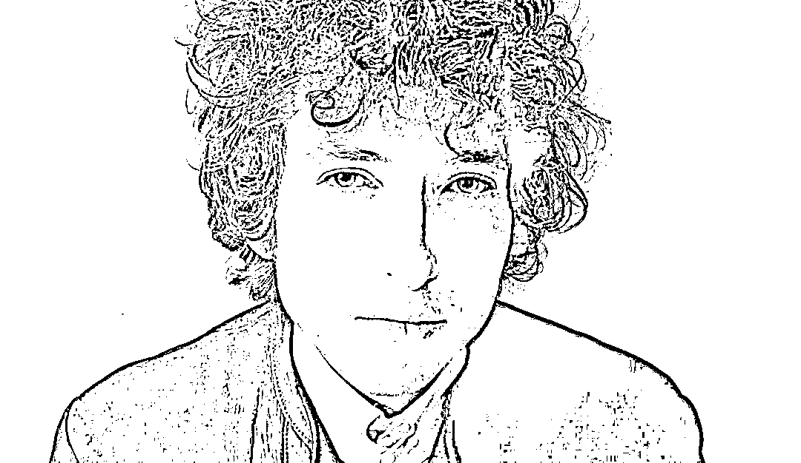

|鲍勃·迪伦

鲍勃·迪伦、威廉·莎士比亚、乔治·阿玛尼、纳奥米·坎贝尔、哈里森·福特、乌玛·瑟曼的金星都在双子座。

金星在巨蟹座

**进化的意图是建立关系以帮助此人发展和疗愈内在的感情世界。**这些关系必须是尽可能安全的，在其中，**温柔又滋养人的伴侣作出深刻又持久的承诺**——与前世动力形成鲜明对比，**前世中，灵魂被迫躲进心灵之壳。**

**金星在巨蟹座通过展示自己多么爱保护人、多么温柔、多么治愈来吸引他人。**金星在这个星座的人看上去发出这样的信号：“来我这，你们这些疲惫不堪重负的人，我会给你们休憩的港湾。”他们发出承诺，要帮助你找到和滋养你家庭、心理或原型的根基。他们提供让你感觉安全的家庭基石。

**金星在巨蟹座的人喜欢那些温柔、滋养人的人，只有在这些人证明了自己之后，他们才会有安全感，才会敞开心扉。**满足这种基本需求后——只有这样之后，我们才可能补充说，金星在巨蟹座也**被那些充满幻想、驾驶自己想象之翼的好手所吸引**。

|朱迪·加兰

朱迪·加兰（Judy Garland）的金星在巨蟹座，这点体现在了她对爱家的多萝西（Dorothy）的刻画中——“小巧而温顺”。卡尔·荣格的金星在巨蟹座，帮助他探索客户的个人神话。加里森·凯勒（Garrison Keillo）的金星在巨蟹座；难怪他会讲乌尔冈湖（LakeWoebegone）小镇的故事！《星际迷航》的创作者吉恩·罗登贝瑞（Gene Roddenberry）的金星在巨蟹座；维诺娜·贾德（Wynonna Judd）和史蒂薇·尼克丝（Stevie Nicks）也是如此。

金星在狮子座

**进化的意图是建立关系以帮助此人学习快乐和自发性，学习将庆祝自我作为成长之路。**这意味着，灵魂强烈渴望**用爱来治愈由于拒绝、背叛、迫害或审判带来的古老伤痛。**

外表上，这些人可以**用装傻的方式进入你的内心，或者用他们高尚的品质和挥舞的姿态打动你**。金星在狮子座的人证明了他（她）是多么有戏剧性又丰富多彩，多么慷慨、具有创意、令人愉快并值得尊重。狮子座由太阳守护：**金星在狮子座的人被那些具有强大存在感和魅力（如同太阳！）的人所吸引**。他们会竭尽所能为你闪耀，也希望你能闪耀。

**狮子座的一个原型是国王或者王后。**一位好君主希望英明地统治好一个幸福、富饶的国家，想想他的求爱风格是什么样的，也想想什么样的人会成为一位优秀的王妃，这对你了解这个金星星座的表象有很大帮助。藏在一切之下的是**渴望创造一个完全自发并保证互相认可的氛围——这是唯一可以治愈灵魂的温床。**

|可可·香奈儿

P.T.巴纳姆（P. T. Barnum）有金星在狮子座；可可·香奈儿也是。杰出音乐家、表演者伊恩·安德森（Ian Anderson）有金星在狮子座，大卫·科波菲尔、麦当娜和惠特尼·休斯顿也是如此。

金星在处女座**进化的意图是建立极为关注成长和积极互助的关系，以应对前世的动力所包含的，在停滞、静止、无望的婚姻中被奴役的感觉。**

**这个金星星座告诉你如果你们在一起，生活将会有多美好，以此来吸引你。**金星在处女座显示出他（她）对细节有多关注，多愿意做出改善。“看看我多诚实啊，有多渴望让这段关系变得更美好。”他们希望让自己成为你不可或缺的人。水星守护处女座，这些人一般都**拥有并欣赏水星的智慧、批判能力和辨别能力。**他们会被那些**对工作尽心尽力、有精工细作天赋的人、对个人成长非常认真的人**吸引。

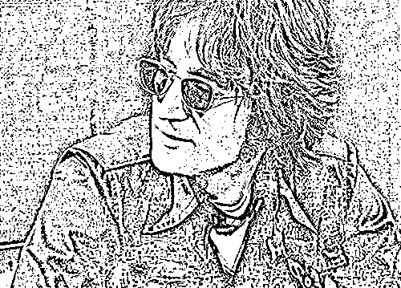

|约翰·列侬

爵士乐大师约翰·柯川（John Coltrane）的金星在处女座；导演佩德罗·阿尔莫多瓦（Pedro Almodovar）也是如此。诗人和神话历史学家罗伯特·格雷夫斯（Robert Graves）、抒情诗人和歌手约翰·列侬（John Lennon）、喜剧演员莉莉·汤姆林（Lily Tomlin）和简·库丁（Jane Curtin）都有金星在处女座，显示出这个位置在语言创造力上的潜能。

金星在天秤座进化的意图在于**建立一种关系，这种关系能帮助此人发展以成熟、浪漫、礼貌的方式与人交往的能力，并不断关注彼此敏感的移情作用**。存在对前世经历中**伴侣的性粗鲁或粗暴**的强烈反应。**这些人企图用他们的社交优雅、对和平、和谐与美的爱以及他们的审美品味来迷住你。**这个金星星座显示了它多么有道德，多么公平，多么热爱公平，讨厌争斗与偏执，因此，你们在一起生活会多么甜蜜。吸引金星天秤座的是那些**有创意、敏感、温暖、有同情心、圆通、对自己公平**的人。风象星座的精神品质在天秤座倾向于理想主义，有时会**不惜一切代价附和于和谐的表象**（如果星图的其他部分没有显示出好斗的倾向的话）。

| 克劳迪娅·希弗

剧作家奥斯卡·王尔德（Oscar Wilde）写出了精致而优雅的上流社会喜剧，他的金星在天秤座，超模克劳迪娅·希弗（Claudia Schiffer）、女演员凯特·卡普肖（Kate Capshaw）和歌手兼作曲家肯尼·罗杰斯（Kenny Rogers）也有金星在天秤座。

金星在天蝎座**进化的意图是建立一种关系，这种关系能帮助此人发展与人深度交往坦诚相见的能力，并为自己和伴侣宣泄情感创造一个不带评判的空间。**灵魂渴望体验**彻底的诚实**，从而重新建立起前世**被亲密关系中的谎言和欺骗所破坏的信任**。**这个位置的金星散发着神秘、权力、性的气息。**通过巫师的原型，他们邀你探索亲密关系的心理层面。金星在天蝎座提供了**原始又具有转化性的激烈感：在性、情感或心理上**。他们可能会表现得非常诱人，因为他们身上的某些东西，似乎充满火山般猛烈的情感承诺——并邀请你做出你的承诺。这个金星星座喜欢**能彻底真实、激烈和狂热的人，那些人不会逃避情感上的宣泄体验**。他们还喜欢有着**未知、隐蔽、神秘光环**的人。

| 蒂娜·特纳
蒂娜·特纳（Tina Turner）的金星在天蝎座，米克·贾格尔曾这样评价她："站在她身边（舞台上）是世界上最热的地方！" 另一位电音表演者布鲁斯·斯普林斯汀（Bruce Springsteen）的金星在天蝎座，巨蟒剧团的毕业生约翰·克莱斯（John Cleese）也是如此。悬疑作家阿加莎·克里斯蒂也有这个金星星座；超现实主义艺术家萨尔瓦多·达利也是如此。金星在射手座**进化的意图是建立有助于拓宽世界视野的关系，这种关系还有助于重建已破碎的信仰以及对爱的异教徒式喜悦。**以此回应前世的动力，包括**压抑的性约束、对亲密关系的厌倦以及那种安稳多过珍惜的关系**。对于这个金星星座复杂的吸引之术，可以通过思考它的原型来把握：**吉普赛人、学者、哲学家、探险家和人类学家**。吉卜赛人和探险家可能会说："看我多大胆，多无忧无虑。挣脱你的牵绊，跟我去欧洲吧。“学者或哲学家通过让你对他积累的各代智慧的惊鸿一瞥来吸引你。人类学家邀你跳一曲华尔兹，穿越引人入胜的人类集体类型，以及朋友或熟人的迷人嫁妆。**金星在射手座的人欣赏随和、宽容、幽默的人，对经历、冒险和多样性有着旺盛胃口，他们还欣赏坚持自己原则的人。**他们希望有一段能让他们真正享受的关系，为他们的生活增添色彩和多样性。

| 简·方达
特级吉他大师吉米·亨德里克斯（Jimi Hendrix）和吉米·佩奇（Jimmy Page）的金星在射手座，政治活动家简·方达（Jane Fonda）和琼·贝兹（Joan Baez）也是如此，还有演员德里克·雅各比（Derek Jacobi）、露丝·戈登（RuthGordon）和罗伯特·杜瓦尔（Robert Duvall）的金星也在射手座。金星在摩羯座

**进化的意图是建立基于诚信、承诺和成熟的成人关系，以此回应前世动力中本质上由于一方或双方的不成熟而导致的失败和抛弃。**

**这些人以摩羯式的策略和效率引起你的兴趣。他们投射出一种克制的光环，以静水流深的方式让你着迷。**他们**喜欢独处，对过度依赖的人反应不大**。金星在摩羯座欣赏**责任感、务实、成熟、自控力和正直的品质**，倾心于那些让他觉得多年后会成为智慧老人的人。

土星守护摩羯座，也是在物质世界中形式表现的守护者。这个金星星座会被那些**对物质世界、地位或名誉有一定掌握**的人所吸引。除非星图的其他部分有强烈的其他暗示，否则这个金星星座通常**不会对承诺感到恐惧，无论当前的文化习俗如何。**

| 詹姆斯·迪恩

演员詹姆斯·迪恩（James Dean）和安东尼·霍普金斯（Anthony Hopkins）的金星在摩羯座，作家路易莎·梅·阿尔科特（Louisa May Alcott）、罗伯特·布莱（Robert Bly）和托尼·莫里森（Toni Morrison）也是如此。

金星在水瓶座**进化的意图是形成支持个性化并保障个人自由的关系。**存在对前世中**感觉被性利用，而未被真正“看见”**的回应，可能**与非自愿选择的性联结**有关联。通常，与这种业力相关的创伤是非常严重的，以至于**在现世的性场景中可能会有解离的状态**。**这个金星星座为了吸引他人，会广而告之它的原创性、独立性和开放性。**“我有变革的想法和见解，可以解放你。”他们的气场似乎说着：“在我身边，你可以完全做自己。”金星在水瓶座的人想方设法展示自己**清晰的思想、对说真话的执着以及他们天才的品质**。他们也被别人身上**自由自在**的特质所吸引。这些人让自己与众不同、不合群、质疑周围的世界，有时特别是质疑世界中的习俗，以此来让自己惹人注目。**这个金星星座的人既需要很多的空间，也会给予很多，有时甚至显得过于疏离了。**除非出生星图的其他部分另有指示，否则水瓶座的金星更喜欢那些**自由自在、思想开放、占有欲不强、极具个性**的人，还有那些**打破规则、挑战传统**的人。

| 西蒙·德·波伏瓦女权主义者西蒙·德·波伏瓦（Simone deBeauvoir）、格洛丽亚·斯泰纳姆（Gloria Steinem）和埃丽卡·容（Erica Jong）的金星都在水瓶座，还有存在主义剧作家爱德华·阿尔比（Edward Albee）、作家翁贝托·艾柯（Umberto Eco）和卡洛斯·卡斯塔尼达（Carlos Castaneda），以及女演员艾伦·德杰尼勒斯（Ellen DeGeneres）也是如此。金星在双鱼座

**进化的意图是形成一种关系，这种关系首先最重要的是作为意识之间的纽带，将性与精神融合在一起。**以此回应有害的前世动力，包含三种伤人现实的混合体：**伴侣以狭隘的功利主义和生物学观点看待性爱；前世出家的独身誓言；以及悲痛的丧亲之痛。**

**这个金星星座通过海王星守护的原型吸引别人：神秘主义者、诗人、梦想家和先知。**他们希望你通过他们血肉之躯的眼睛注意到纯粹的、无拘无束的灵性。他们似乎提供了一个浪漫的逃离，从沉闷的“真实世界”进入另一个王国。那个理想化的、金星在双鱼座的地方，是一个充满觉察、梦幻和幻象的世界，至高无上的是意识——而不是那个带着社会保险号码和消费清单的人格。

**金星在双鱼座欣赏有相似愿景或超凡脱俗特质的人，无论那些人是否身处教堂、寺庙、清真寺或静修所。**“与我一起更新你的精神。听我的音乐，和我一起玩《龙与地下城》游戏，或者我们一起看水上的月亮吧。你最内在的自我可以在我面前呼吸，我不会用灿烂灯火和诘问赶走它。”

| 埃德加·爱伦坡

神话学家约瑟夫·坎贝尔（Joseph Campbell）的金星在双鱼座，米哈伊尔·巴里什尼科夫（Mikhail Baryshnikov）也是如此。埃德加·爱伦坡（Edgar Allan Poe）和伊丽莎白·巴雷特·布朗宁（Elizabeth Barrett Browning）的金星在双鱼座，还有弗朗西斯·福特·科波拉（Francis Ford Coppola）、迈克尔·凯恩（Michael Caine）和德鲁·巴里摩尔（Drew Barrymore）。

**版权声明：**本文由若道翻译发布，欢迎转发，反对抄袭。友号转载请申请白名单。

**12 星座爱情宝典**

[白羊座](http://mp.weixin.qq.com/s?__biz=MzA5NjA0NTAxNg==&mid=2651419096&idx=1&sn=30c86f7f9f489d61c1b0f80b8944b46b&chksm=8b4bc36fbc3c4a79c49f5b4aa43daad19a145e2bf762fe4a8e5bc1319228e633a65ae869df2c&scene=21#wechat_redirect) | [金牛座](http://mp.weixin.qq.com/s?__biz=MzA5NjA0NTAxNg==&mid=2651419469&idx=1&sn=e44679a33194bf652fe9f515565c8da5&chksm=8b4bc1fabc3c48ecfa11b12fdab2043d246c58d47176dfa105a11ee05a22b4bc65947c7ad02e&scene=21#wechat_redirect)丨[双子座](http://mp.weixin.qq.com/s?__biz=MzA5NjA0NTAxNg==&mid=2651420649&idx=1&sn=0179035270f9508988c70e85c969869c&chksm=8b4bc55ebc3c4c48c928471267184c6360676c387dc9527ef0e112d6671bba3e8893324b5621&scene=21#wechat_redirect) | [巨蟹座](http://mp.weixin.qq.com/s?__biz=MzA5NjA0NTAxNg==&mid=2651421302&idx=1&sn=23f3f771a6bb8eed2903620cc0344755&chksm=8b4bc8c1bc3c41d7b10a8b2c2a826edf4d7700e0db201cabe956be9128038e9dd3beb6b14afb&scene=21#wechat_redirect)

[狮子座](http://mp.weixin.qq.com/s?__biz=MzA5NjA0NTAxNg==&mid=2651422486&idx=1&sn=ee393d64fc0638b589212d81c2ecbd35&chksm=8b4bcda1bc3c44b737b01fcfcc85a0a9096d4f7a567d76c6079e9760105e5259d775715f6429&scene=21#wechat_redirect)丨[处女座](http://mp.weixin.qq.com/s?__biz=MzA5NjA0NTAxNg==&mid=2651422885&idx=1&sn=3d4e368f263ed2016388d3cec178b6b1&chksm=8b4b3212bc3cbb049ad7a6c403a4eab1664d38bb465ede4b82aeaeef64deb34b13e8319c642d&scene=21#wechat_redirect) | [天秤座](http://mp.weixin.qq.com/s?__biz=MzA5NjA0NTAxNg==&mid=2651423207&idx=1&sn=d3f8a94b54e7667c0876707de89e7a9f&chksm=8b4b3350bc3cba4672ecb735a445998dc008428e5bdc388c269c237ee361c0bb0b7404dbff0c&scene=21#wechat_redirect)丨[天蝎座](http://mp.weixin.qq.com/s?__biz=MzA5NjA0NTAxNg==&mid=2651423754&idx=1&sn=a98eabdbacb8702c235c367565a17ce3&chksm=8b4b36bdbc3cbfabc468d6015d7755528b6ffc28759c54f6f67d5e82b4354e6304c1787935f2&scene=21#wechat_redirect)

[射手座](http://mp.weixin.qq.com/s?__biz=MzA5NjA0NTAxNg==&mid=2651424047&idx=1&sn=26d45c630151b2e226c9a7157b3a1d40&chksm=8b4b3798bc3cbe8e296b075c8eeaaf9ba0f18152fac8f7a6afe356e32b8f75e40b12fd2983e7&scene=21#wechat_redirect) | [摩羯座](http://mp.weixin.qq.com/s?__biz=MzA5NjA0NTAxNg==&mid=2651425190&idx=1&sn=4bf77c3cb4cdf7eef017f516e814373c&chksm=8b4b3b11bc3cb20768ae89cad4c14bec3499f8c5679d3dfc12dcd5f9e5e6ba842185974a81b1&scene=21#wechat_redirect) | [水瓶座](http://mp.weixin.qq.com/s?__biz=MzA5NjA0NTAxNg==&mid=2651426017&idx=1&sn=50baff5c1193e6ad12ef833e6113e466&chksm=8b4b3e56bc3cb740af159c5a81c84f63fb4cb2c25c9f7491e9d5df33beb87eecaafa821c2aad&scene=21#wechat_redirect) | [双鱼座](http://mp.weixin.qq.com/s?__biz=MzA5NjA0NTAxNg==&mid=2651427171&idx=1&sn=cbe4dd659fa39fcbfcec208290e8e4d2&chksm=8b4b23d4bc3caac25248186f048d1518dafdbb6fbcb48c0c084024e6db9ade3bf263d05eaf74&scene=21#wechat_redirect)

斯蒂芬·弗里斯特

若道签约老师。进化占星学的创始人之一，当今世界最有影响力的占星大师之一；1985 年，他凭借《内在的天空》一书获得职业占星师协会奖（Professional Astrologers Incorporated Award）。他四次获得占星界最高的占星学联合协会奖（United Astrology Congress Regulus Award）提名，2018 年获得轩辕十四教育奖。

**斯蒂芬线上工作坊最后一班车！**

**请长按下图添加客服微信咨询**

**想听听大师斯蒂芬老爷子的精彩讲座？**

**长按下图了解详情！**

**微信又双叒叕改版啦，不想错过若道君的推送？**

**就把若道设为星标吧！**

**▼**

就是这个“在看”，戳戳戳 ☟

****************报名直达入口****************

# 本年度最后一次水逆来了！！！转化意识，准备进入新世界

> 原文：[`mp.weixin.qq.com/s?__biz=MzA5NjA0NTAxNg==&mid=2651429897&idx=1&sn=aad5b3dc120590684e58b75b2cfb27f4&chksm=8b4b2ebebc3ca7a85ddc396f9a73329844e7c42c3ce2fc0f600dcb64d938b1e39082c206b77d&scene=126&sessionid=1692738090#rd`](http://mp.weixin.qq.com/s?__biz=MzA5NjA0NTAxNg==&mid=2651429897&idx=1&sn=aad5b3dc120590684e58b75b2cfb27f4&chksm=8b4b2ebebc3ca7a85ddc396f9a73329844e7c42c3ce2fc0f600dcb64d938b1e39082c206b77d&scene=126&sessionid=1692738090#rd)

****************☆ 后台回复“今日”，给你一句生命态度****************

作者/傅莎珈 ISAR 认证占星师编辑/翀子 封面/书君 图片/全景网

10 月 14 日上午 9 点 4 分，水星开始今年的最后一次逆行。此次水星在天蝎座逆行，连接了年底土星、木星进水瓶座，是一次意识飞跃前的大清理。它对 12 星座有什么影响？让我们来读文章吧~

“

**创造新生之人必然在全然的寂静中忍受旧事物的消亡。**

**——鲁道夫·斯坦纳**

”**水星在天蝎座逆行**

**10 月 14 日 9:04， 水星在天蝎座 11º40‘ 逆行。11 月 04 日在天秤座 25º53’顺行。**

这次水逆的产出，连接了土木换座水瓶座。可以说**是意识上的重大飞跃前的清理。**

**本次水逆关键节点：**

| **9.23** | 水星在天秤座 25º 53' 进入水逆阴影期 |
| **9.29** | 土星在摩羯座 25º 顺行，金星-火星-月亮南交点成火相大三角，太阳对分凯龙星 |
| **10.4** | 冥王星在摩羯座 22º顺行 |
| **10.9** | 火星四分冥王星（本年度第二次） |
| **10.14** | 水星在天蝎座 11º40’逆行 |
| **10.19** | 火星四分木星 |
| **10.26** | 太阳合相逆行的水星（内合），天蝎座 2º, 木星-海王星-月亮北交点形成上帝手指 |
| **10.28** | 水星逆行回到天秤座 |
| **11.1** | 水星对分冥王星 |
| **11.4** | 水星在天秤座 25º53’顺行 |
| **11.10** | 木星合相冥王星（本年度第三次） |
| **11.14** | 火星顺行 |
| **11.17** | 水星对分天王星 |
| **11.20** | 水星回到天蝎座 11º40’ ，本次水逆结束 |
| **12.2** | 水星离开天蝎座进入射手座，水逆后阴影期结束 |
| **12.17** | 土星换座水瓶座 |
| **12.19** | 木星换座水瓶座 |
| **12.20** | 太阳合相水星（外合），射手座 28º43’ |
| **12.22** | 土木合相水瓶座 0º28’ |

水星逆行会产生创造新思维的结果。**新思维的激发，在太阳合相逆行的水星时候产生**，又称内合，**新思维的落地外显，在水星顺行后合相太阳时候发生**，叫做外合。

这次天蝎座水星的逆行产出，意义非同寻常。因为顺行后，水星与太阳合相在射手座 28º 的位置，太水合相了射手座 27º ——占星学上的“银河中心” 。（银河中心点正在射手座最后 5º 行进，每 72 年约走 1º, 目前在 27º3′）

这意味着，**某种程度上，人类已经逐渐走在土冥合相黑暗的尾声，新世界的门即将打开。**

宇宙能量的转换引发了意识的改变，进一步触发世界格局的变动。

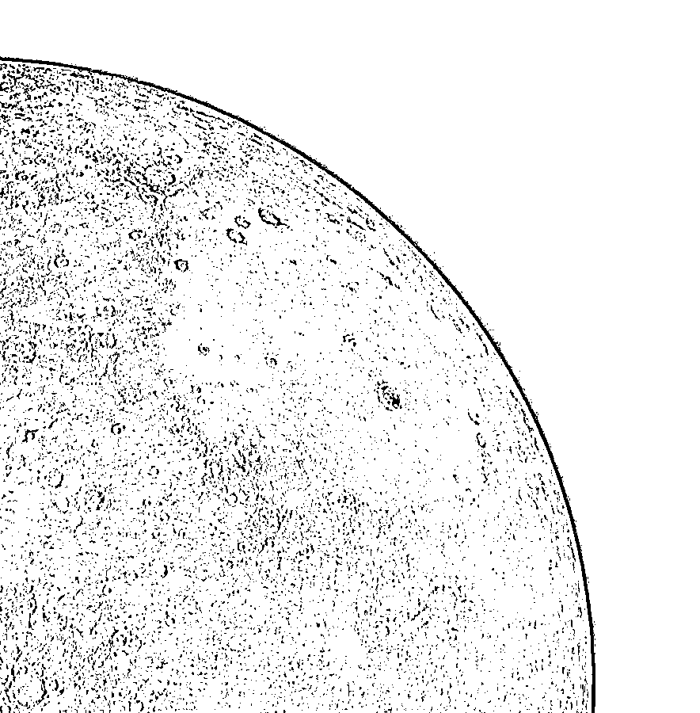

占星学上银河中心是死亡之门。对面的双子座 27º 是复生之门。古希腊甚至更早的文明认为这个死亡之门内是一个巨大的让所有生命消失的黑洞，一个未知的星际世界的力量。

巧合的是，2020 年的诺贝尔物理学奖，颁发给了三位论证银河中心确实存在的科学家。

雷因哈德·根泽尔和安德里亚·格兹各自领导一个天文学小组，从 1990 年代开始，用世界上最大的望远镜，集中研究我们的银河系中心区域人马座（Sgittarius）A*。他们的结果一致表明，在银河系中心存在看不见的天体，质量高达 400 万太阳质量，将附近的星吸引过去。他们的工作是银河系中心超大质量黑洞的最强证据。

**如果穿越到未来看到这个天蝎座水逆后，土星-木星-太阳-水星共同将焦点聚集在水瓶座上：**

*   12 月 17 日  土星换座水瓶座

*   12 月 19 日  木星换座水瓶座

*   12 月 20 日  太阳合相水星（外合），射手座 28º43’

*   12 月 22 日  土木合相水瓶座 0º28’

那么我们就会发现，**一个全新的水瓶座纪元，正通过社会（土星、木星合相水瓶座）秩序和价值的更替、个人意识（太阳、水星合相射手座）的提升，正在前方徐徐拉开大幕。**

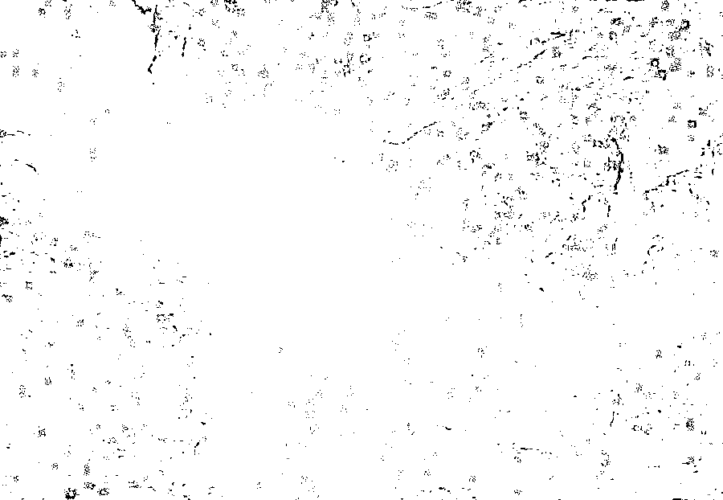

那 2020 年最后一次天蝎座水逆，有什么深远意义呢？为完成心智从摩羯座到水瓶座的进化做调整。**能量跟随思维进入显化，如何思考就会如何创造。**

天王星象征高等意识和直觉，土星象征思维结构，水星是智力和表达能力。高等意识和直觉，需要通过结构性的思维表达出来，被传播，被看见，才能真正成为社会的法律、文化、道德…...

这个直觉和意识的调整和改变从哪里开始？从个人、国家、族群、集体意识中最深的伤口开始。从我们最依赖的安全感来源被土冥逐渐轰塌，探索新的集体价值观开始。

土星和天王星的轨道之间，运行着凯龙星。凯龙星是时间（土星）和空间（天王星）的桥梁，象征着灵魂伤痛，同时也是一个自伤口里成长起来的智师、疗愈者。

凯龙星目前在白羊座运行，凯龙星在白羊座象征着在这个世纪交接的尾声，集体意识中渴望展现自我的意识越来越强，想要成为真实的自己。这种真实的渴望包含了性别、种族、文化上的被看见、被平等对待等渴望，回应了水瓶座的原型：平等友好的族群关系、尊重每个人的独特性、为自由和真理而战。**火星当下在白羊座的逆行四分了摩羯座群星，正在显化这种渴望和社会秩序之间的对抗。**

因此，**2020 年最后一次天蝎座水逆，邀请我们去看见、理解、释放和转化在成为“who I am ” 的过程中**，灵魂一次次入世体验的永不愈合的伤口。作为人类，我们需要从过往既吸引又蒙蔽我们觉知的心理、家族、集体、历史、宗教、政治层面的思维方式中解脱出来，解放自己，以迎接水瓶座的全新纪元。

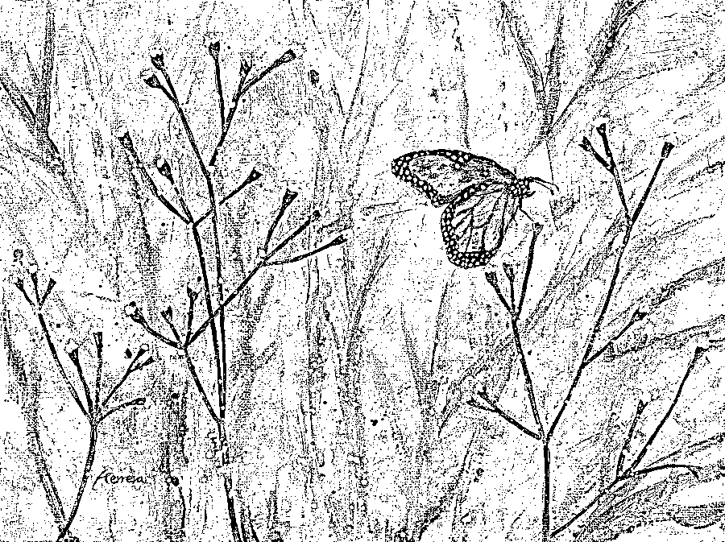

**此次水星逆行的特征**

水逆前的天象是火冥四分。火星和冥王星正好是天蝎座的古典和现代守护星。因此**外部世界的各种冲突，伤害，是内在心智意识之殇的外显。**

天蝎座在古典占星中被火星守护，火星白羊座和凯龙星白羊座共同描述的伤痛念头，来自于“我永远得不到我想要的“：父母之爱、亲密情感、丰盛财富、身体之美、食物的满足感……

同时还在问一个更深的问题：**你是不是在这样的渴望之下，“过度” 索取？**

天蝎座和它的守护星冥王星的共同功能是转化。它要求我们每个人为了生命、灵魂的进化，放下现有的一切：欲望、依恋、情感幻觉，甚至是表达愿望。

土木合相水瓶座被金牛座天王星定位，天王星在金牛座象征着我们必须有勇气舍弃现有的物质积累和欲念，迎接物质上的一次重要毁灭升级。然后进入一个新世界。

**这个死亡过程中积累的智慧，是射手座的象征：一个更高等智慧体系的产生。**

很多人会问：怎么可能！怎么可能舍弃最基础的物质、情感寄托？

如果，创造世界的光是高频振动的物质；物质是最慢幅度振动的光。那么，毁灭也好，重生也好，你的依赖与寄托，真的存在吗？每次物质的毁灭，只是意识之光改换了一个振动频率，让旧有频率上的产生消亡，新的产生将以另一个频率另一种形态重新归来，连同你个人在内。如果是这样，你是失去还是得到？

光的另一个名字，叫做爱。如果这个毁灭的源头通往爱，在此刻，爱在表达的是打破旧有个人—家庭—社群—社会—民族等秩序等级，这些旧有秩序已经越来越束缚很多人的生活和成长。

这个叫做爱的源头，引导每个人更清晰的了知自己的能力和使命，不再受限于家族、企业、国家、民族的壁垒，走向横向的跨越、联合与创造。一切都将在爱的光芒的指引下归来，以新的族群创造的方式，呈现现在完全无法想象的文化、生活方式、职业、工作、国家……

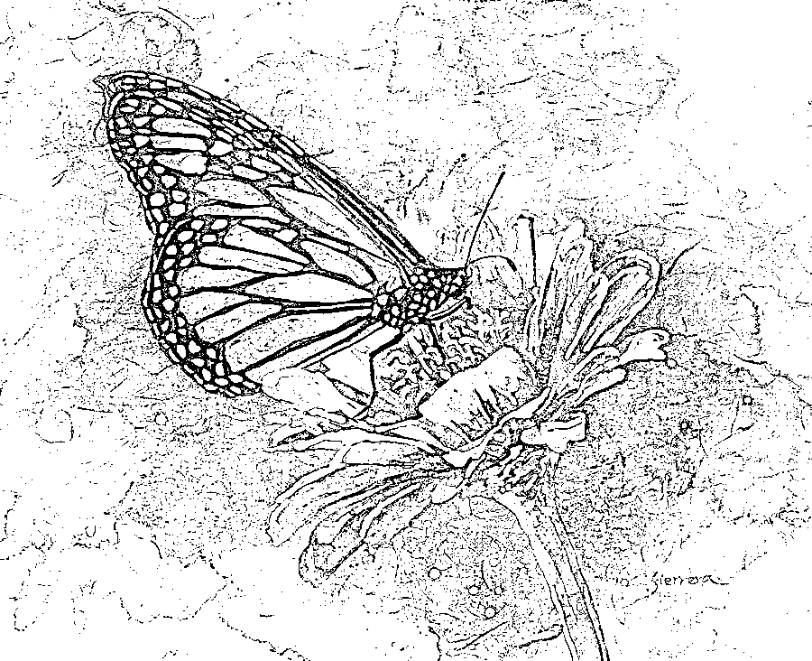

水逆途中，太阳内合逆行的水星的时候，木星、海王星和北交点双子座产生了一个上帝的手指；指出了**这个能量在现实世界将引领各种事件走向更慈悲开放彼此支持，产生无穷创造的场景；**

火星在本次水逆中的位置，一方面继续揭露和斗争，一方面正在不断冲突之中**对自己要争取的权利承担的责任，有更新的认识。**

火星的相位指出政府、企业、职场上可能出现的各种挑战压力，激发起你的恐惧、愤怒、对抗，以及更想要坚持自己的信念。

金星在本次水逆中从处女座换座天秤座，提醒我们**在火星行进中制造的恐惧面前，保持自律、严谨、发展的姿态。**

这次水逆中金星的相位会带来亲密关系上的遇见、升华或者幻灭。无论哪种状况，都唤醒了你内在久远的伤痛。迫使你站在现实角度看见局限，思考长远发展的目标，在此基础上有所取舍。

如果想要疗愈你的阴性能量，请去连接自己的火星；如果想要疗愈你的阳性力量，请去连接自己的金星。

我们的欲望（火星）吸引来相应的关系/合作（金星）。不断更清晰的看见自己的欲望，以及在追逐欲望过程产生的执念对自己的伤害，深深的沉浸在这个伤口里。然后跳出来。木星—海王星—月亮北交点的力量在问我们每个人：**有什么不同以往的角度看待这个伤口么？**

如果你找不到这个角度，请去找能给你这个角度的朋友、咨询师、师长寻求帮助。

这次水星逆行和冥王星、天王星分别成对分相，**会出现各种思维混乱导致的沟通表达不顺利，做事情过程中发生意外的可能性比平时更高。**

天蝎座水逆**提醒我们开放头脑，去认识一些挑战旧有思维的人士，开拓见识。**

这次水逆还会收获全新的灵感、开启了一个新的项目，在水逆结束后，我们会**获得更多信息。**

请尽可能的让我们的直觉自由流淌，带着尝试、实验的态度社交。最终结果会让你惊喜。

这个水逆的目的只有一个：**转化意识。**

**此次水逆对 12 星座的影响****若道君：****你可以在 app store 或者应用商店搜索“若道”下载 app，输入个人档案，查看行运盘（也可以使用其他星图软件），找到行运水星落在出生星图的第几宫，然后对照下文查看水星逆行的影响。**

**例如下图中，行运水星在美国总统特朗普个人星图的第 3 宫。**

**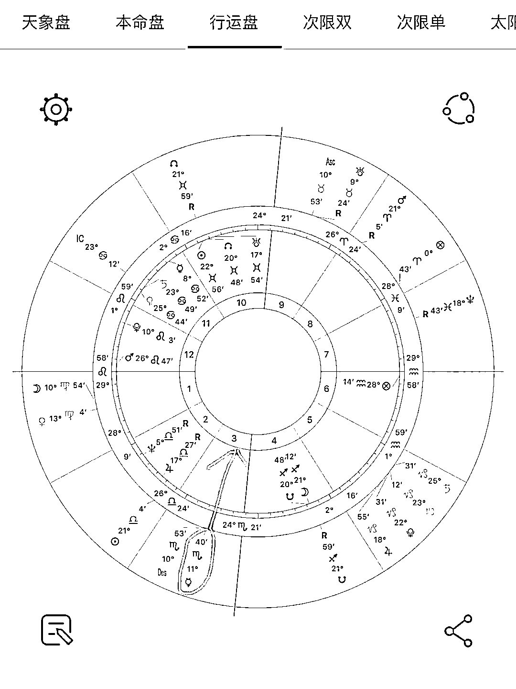**

**太阳/上升在*****天蝎座*****（水逆发生在第*****1*****宫）**

水逆前期你刚完成一个重要项目，接下来还会有一个新的机遇，这个机遇关联了你的薪水或者或者家庭资产处理。由此你对自己在工作领域的创造力以及开拓能力有了新的认识。

但需要注意身体健康，以及群体中因为固执己见造成的沟通不顺。

水逆也开启了一个提问：在成为一个更高层领导者的邀约中，你的抗拒背后，有什么真实的自我认定存在？而这个存在也许是时候放手了。

**太阳/上升在*****射手座*****（水逆发生在*****12*****宫）**

你足够信任关系/合作么？这次水星逆行，挑战到了你事业和亲密关系中最隐秘的伤痛，提醒你在关系/家庭/事业领域，做真实的自己。

10 月 17 日的天秤座新月将会带来你喜欢的社交、聚会、恋爱等。你需要练习恰如其分的，持续的表达自己，请勿情绪化。

**太阳/上升在*****摩羯座*****（水逆发生在*****11*****宫）**

在家庭责任方面，你是否承担了太多？对物质安全的管理太苛刻了？这个水逆前后一些和家居装修、房屋买卖有关的事物不断出现纠纷纰漏，或者有些关于孩子的出生/教育资金方面的开销，让摩羯座又开始思量财务安全问题。

也许你需要更新一下工作和家庭生活之间的时间投入，放轻松。10 月 17 日的天秤座新月将开启一个重要的事业机会，抬头看，不要被眼下的琐事淹没。

**太阳/上升在*****水瓶座*****（水逆发生在*****10*****宫）**

想要完成自我突破，先要看见事业中现存的恐惧感：你害怕因为出众而导致私生活被讨论么？水逆期间的天秤座新月提醒你重建自我价值感、对关系的接纳度，以及社群关系中存在的问题。请注意工作讨论中的情绪控制。水逆需要你对自己和他人都更开放一些。

如果从事营销、写作、出版、教育工作，或者准备移民，水逆后会有机会出现。

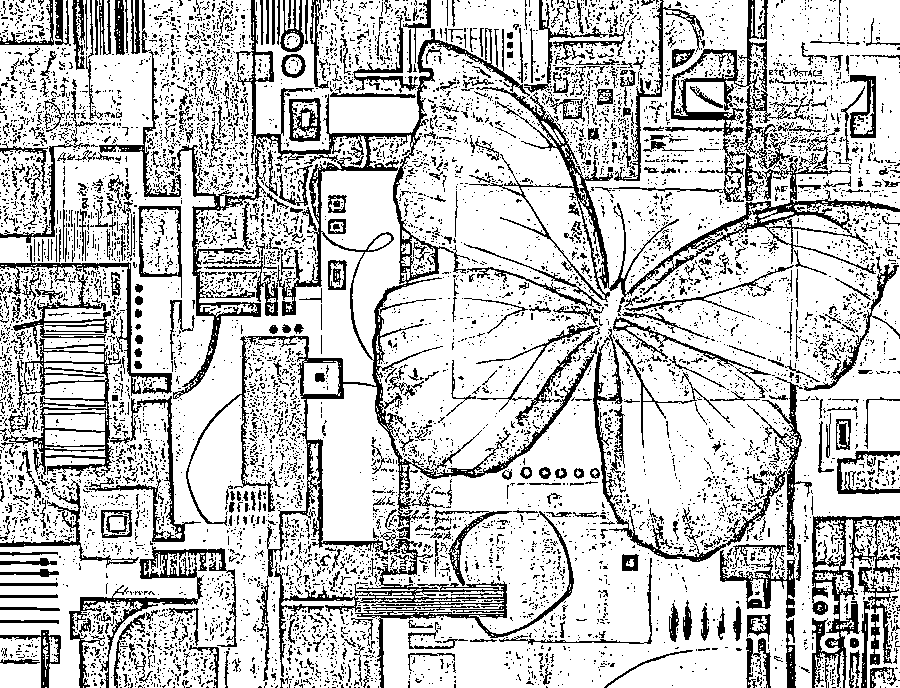

**太阳/上升在*****双鱼座*****（水逆发生在*****9*****宫）**

水逆前双鱼座有一笔事业/家庭资产领域的大开支。水星逆行增加了这个开支给你带来的“开销剧增” 压力。然而也是个重要的机会审视这笔投资的真正价值。

10 月 17 日天秤座新月之后，一个新机遇再度出现，为你带来意想不到的合作机会，让财务上多了一个令人满意的来源。

**太阳/上升在*****白羊座*****（水逆发生在*****8*****宫）**

水逆前白羊座们普遍在事业上收获重要的成就或者遭遇意外打击，带来财务、性、保险、家产继承方面的挑战。

水逆可让你看见潜在的渴望或者执念？在亲密关系领域，你是否对自己的过度/吝啬自己的付出？

任何决定请到 10 月 17 日天秤座新月后慢慢走着看，让你在冲突学习平等、合作、互惠。

**太阳/上升在*****金牛座*****（水逆发生在*****7*****宫）**

工作中正处于焦头烂额的金牛座，在水星逆行期间，开始回头重新审视这段合作/关系。

由此对自己的事业/情感信念，产生了不同看法。

一些金牛座遭遇体能持续低迷已经有一段时间，水逆后伴随火星顺行会慢慢好转。

**太阳/上升在*****双子座*****（水逆发生在*****6*****宫）**

双子座刚经历了情感上或者工作群体中的一些事件。这些事件让双子座有勇气面对工作做出一些改变。也许有些渴望早就应该被实现，比如搬家，更换工作等等。

另外，水逆也会让双子座进一步发现身体健康方面的问题，请多保重。

10 月 17 日的天秤座新月，给双子座带来一些和恋爱、孩子、创造力有关的机会，同时也带来财务或者家庭领域的障碍，请注意平衡。

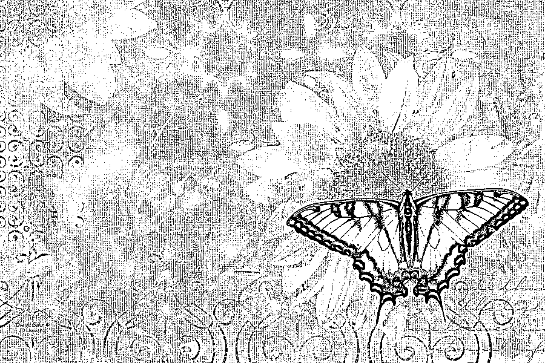

**太阳/上升在*****巨蟹座*****（水逆发生在*****5*****宫）**

巨蟹座在前一段时间有事业/家庭方面的事务，导致重大的压力。水星逆行激发了巨蟹座的身体健康问题、工作上的隐患、和怀孕/生育/儿童教育有关的问题……巨蟹座最容易发生的是心理疾病。这次水星逆行，巨蟹座需要回顾一下自己的童年时代生活，哪些阴影在最近的生活事件中被激发了出来，这是个进行深度疗愈的好时机。10 月 17 日的天秤座新月，会给巨蟹座的家庭带来一个意外，值得好好商量。

**太阳/上升在*****狮子座*****（水逆发生在*****4*****宫）**

狮子座刚完成了一个成功的项目、作品、或者在海外业务上取得了重大进展。但接下来到天秤座新月的时候，工作上会突然遇到压力。考验到狮子们的应对能力。

水星在天蝎座提醒狮子们注意哪些未被留意到的工作上暗流，这些潜在的危机唤醒了狮子座过往在原生家庭里存在的自我价值匮乏创伤。借助这个水逆，狮子们有机会去复原这个伤口。

**太阳/上升在*****处女座*****（水逆发生在*****3*****宫）**

处女座们最近有家庭资产方面的麻烦一直悬而未决，比如买的房子无法按时交付、家庭资产分割出现意外。

水星逆行在此基础上提醒你反思关系/婚姻中潜藏的表达恐惧。这次水逆也会激发你在公众形象上的一次重大转换。水逆结束后，你可能获得一份新的工作或者收入来源。

**太阳/上升在*****天秤座*****（水逆发生在*2*****宫）**

天秤座目前在事业合作/恋爱/婚姻上的遭遇了一些压力和挑战。事业上和现有上级/权威人物之间的理念有差距，或者需要突破瓶颈。

水星逆行激发了天秤座看见在哪些地方需要开放思维做更多探索，哪些地方需要进一步提升自己的技能，只有这样才会进一步提升自己在公众方面的影响力。

祝各位水逆顺利。

**版权声明**：原创文章由作者授权首发于若道平台，欢迎转发，反对抄袭。友号转载请申请白名单。

****

****傅莎珈****

ISAR 认证占星师（2015 年获得）

心理占星师/内观书写带领者/冥想带领者

国际著名传播集团工作 20 年

**微信公众号**：Helloshajia

长按打赏

**ISAR 选修课，心理占星学视角下的预测方法**

**点击图片了解详情**

**或长‍‍‍‍‍‍‍‍‍‍‍‍按图片二维码咨询客服**

**微信又双叒叕改版啦，不想错过若道君的推送？**

**就把若道设为星标吧！**

**▼**

就是这个“在看”，戳戳戳 ☟

********报名直达入口********

# ISAR 选修课程 | 新技法！心理占星学视角下的预测方法

> 原文：[`mp.weixin.qq.com/s?__biz=MzA5NjA0NTAxNg==&mid=2651429897&idx=2&sn=89a9a5e5184e0728026bfbfd025b208f&chksm=8b4b2ebebc3ca7a8950ab35094a097e07f6452e53726530ec991781e4b8787e2c87756d8a258&scene=126&sessionid=1692738090#rd`](http://mp.weixin.qq.com/s?__biz=MzA5NjA0NTAxNg==&mid=2651429897&idx=2&sn=89a9a5e5184e0728026bfbfd025b208f&chksm=8b4b2ebebc3ca7a8950ab35094a097e07f6452e53726530ec991781e4b8787e2c87756d8a258&scene=126&sessionid=1692738090#rd)

作为一门艺术，预测占星学运用行星的运行来预测特定时期的性质、意义和持续时间。在这个阶段的课程中，我们会**考察意识进化的概念、其基本原理及其与占星学预测部分的关系。****意识进化可以被定义为有意识地与星图中固有的进化过程合作。**学员们将探索如何用行进和推进来为意识进化服务。我们不是简单描述事件的结果，而是将行星运行描述为实现先天潜能的机遇之窗。**在这个阶段的课程中，会探索占星心理学视角下如何将对行进、推进和其他预测方法的分析运用于个人成长。**具体事件反映并促进了意识的改变；因此，行星运行可以帮助我们洞察成长过程的精确时机，让我们领会内在和外在现实如何同时发生、彼此反映、互相转化。我们还将探索宏观的世界行进，考察占星格局如何在社会、政治、经济、艺术和生态层面上表现出不同的形式，却又在多样化的现象中反映单一的原型。这里的挑战是去思考，我们对宇宙的这种参与式关系如何能为共同创造一个积极的、更充满希望的未来做出贡献。

**1**

**课程安排**

**第一课：开始预测****第二课：发展年龄方法****第三课：太阳的行进****第四课：月亮的行进与推进****第五课：水星的行进****第六课：金星的行进****第七课：火星的行进****第八课：木星的行进****第九课：土星的行进****第十课：天王星的行进****第十一课：海王星的行进****第十二课：冥王星的行进**

**2**

**课程费用**

**课程费用：9800 元****转发分享优惠价：8800 元（11 月 1 日之前有效）****若道核心课程 L5 学员优惠价：6800 元**

**3**

**授课时间**

**上课时间：**12 月 2 日（周三）20:00-22:00

**授课方式：**英文授课，中文翻译

**4**

**授课老师**

**格伦·佩里(Glenn Perry)**

*   这位传奇的占星师，也是一名拳击和摩托车爱好者； 

*   他毕业于赛布鲁克学院(Saybrook Institute)，是心理/意识研究专业博士，也是拥有 30 余年经验的加州注册婚姻和家庭治疗师 （CAMFT）； 

*   美国占星心理学学院（Academy of AstroPsychology）的创办人，他曾任国际占星研究协会 （ISAR） 以及联合占星大会董事会（UAC）副主席，也是 ISAR 突破性道德标准的设定者； 

*   康涅狄格州研究生院（the Graduate Institute of Connecticut）原型宇宙学与意识进化项目的负责人，共出版八本占星学著作：《心理占星学入门》、《心理占星论文集》、《盗取天火》、《从忠诚到革命》、《星图中的阴影》、《占星职业议题与伦理》、《出生星图深度分析》、《从古代到后现代占星学》。

**5**

**往期学员分享**

不得不说，格伦老师的心理占星课真的很强大，跟着老师上完了两年半的课程，仿佛做了一个长程的心理疗愈。这段时期我正好在经历冥王星的困难行进，感觉就像在地狱中行走，在这个过程中我懂得了，只有疗愈了自己，懂得自己的伤痛，才能理解他人，帮助他人。在学习占星学技法的同时，深深感受到老师的慈悲心，也感受到老师对待占星学的严肃认真。能够跟随格伦老师学习真是太幸福了，同时也特别感谢若道，感谢大卫老师。——2017 心理占星学格伦核心班学员 宋轶绚跟随美国心理占星学院两年课程，最受用的是格伦老师以扎实的心理学理论基础和咨询经验，所教授的心理占星学的系统架构。没有哪个心理占星学的课程比格伦的更系统、深入、有理论且有技巧了。还有格伦特色的发展年龄法，黄道带病理学理论在个案中很有实操性，2 年的学习，除课程外的几百万字经典的补充阅读资料，70 多场测试，以及格伦言传身教的从业道德标准，让我成长为一位合格的心理占星师。——2017 心理占星学格伦核心班学员 植语瞳

**6**

**退转课程**

**退款原则请详看《教学协议》，如有疑问请咨询课程顾问。******占星心理学之预测视角****

**授课老师：格伦·佩里**

**授课时间：****12 月 2 日（周三）20:00-22:00**

**授课方式：**网络课程：英文授课，中文翻译

**费用：9800 元** **转发分享优惠价：8800 元（11 月 1 日之前有效）若道核心课程 L5 学员优惠价：6800 元**

**课程负责人：Margaret（微信号：nodoor233）**请备注“预测视角”

长按二维码添加课程负责人咨询~  

****报名请点击“阅读原文”****

# 12 星座美食之旅（上）丨大开眼界！请享用这份不同星座的厨房行为研究！

> 原文：[`mp.weixin.qq.com/s?__biz=MzA5NjA0NTAxNg==&mid=2651429622&idx=1&sn=feee7071d411200393e07e848734494a&chksm=8b4b2841bc3ca157bc189fd5ba17a553e598345104aa06c6113e8fd93e0173609aa1c746ad83&scene=126&sessionid=1692738090#rd`](http://mp.weixin.qq.com/s?__biz=MzA5NjA0NTAxNg==&mid=2651429622&idx=1&sn=feee7071d411200393e07e848734494a&chksm=8b4b2841bc3ca157bc189fd5ba17a553e598345104aa06c6113e8fd93e0173609aa1c746ad83&scene=126&sessionid=1692738090#rd)

****************☆ ****************************后台****************************回复“今日”，给你一句生命态度****************

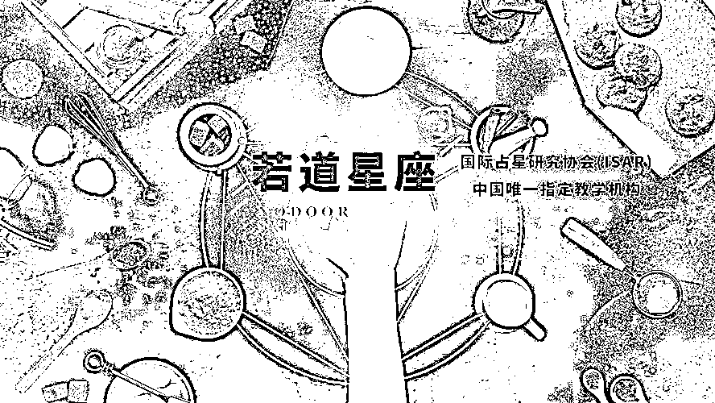

作者/佩妮·桑顿 

翻译/三三、李含 校对/Arrow、江艺

编辑/翀子 封面/书君 图片/网络

12 星座在厨房里是怎样的画风？他们又各自偏爱什么类型的食物？在 12 星座的厨房和餐桌上又有什么禁忌？这是一篇非常有趣的文章，作者从食物角度观察不同星座的特点。文章很长（第二部分在今日二条），所以我们节选了其中一部分呈现给大家。作为抛砖引玉，你们也可以为 12 星座添加不同的菜单哦~

**占星学与食物之间的联系并不是一个新概念**：这基于古老的信念，即宇宙中的所有事物都是相关的。数百年前，炼金术师（当时的科学家）遵照行星、星座与自然之间的神圣关系,创建了至今占星师仍在参考的关联列表。即使在如今，你依旧能在书店的书架上找到《卡尔佩珀草药集》（*Culpeper's Herbal*） ，这本书记载了各种草药、水果与植物的守护星。

对于中世纪的占星师来说，动物、鸟类、鱼类、植物——**任何呼吸的活物—都可以由行星或星座“掌管”**。天上如是，地上亦然。何时播种，何时收割，何时给鸡拔毛，何时给你的动物们配种！

以下文章内容包括不同星座在厨房行为的一般研究，请享用！

**火象星座的菜单**

**马背上的魔鬼——*****射手座***

想象三贤士（注：圣经里的人物），那三位智者，从波斯赶到伯利恒。他们本来沿着漫漫“丝绸之路”行进，这条贸易线从中国和蒙古开始，穿越阿富汗、乌兹别克斯坦和土库曼斯坦，经过西藏与印度抵达地中海沿岸国家。

我们的占星大师们在他们的路途中可能会遇到很多游牧民族，骑着商队骆驼、马和骡子，装着从丝绸、玉器、火药、香料等珍贵商品。他们会与商人与贸易者、朝圣者、僧侣和士兵在这条路上同行。他们可能会与旅伴们一起休息与共享面包，在蒙古包中过夜，在苍茫星空下交换故事与分享哲思。

你可能会问，这与射手座有什么关系？

**热烈的射手座被高贵的木星掌管，他们是十二星座中的环球旅行者，智慧的追寻者，宗教含义的布道者和伟大的哲学家。射手座也喜欢昂贵的和异国情调的东西。**

**游牧生活非常适合射手座的性情。**这种生活方式包含了旅行，鲜有扎根与定居，并体验不同文化和信仰。但是射手座与游牧生活之间的联系并不仅局限于此。**游牧民族所吃的食物也合射手座的胃口，同时有利这个星座的健康。**

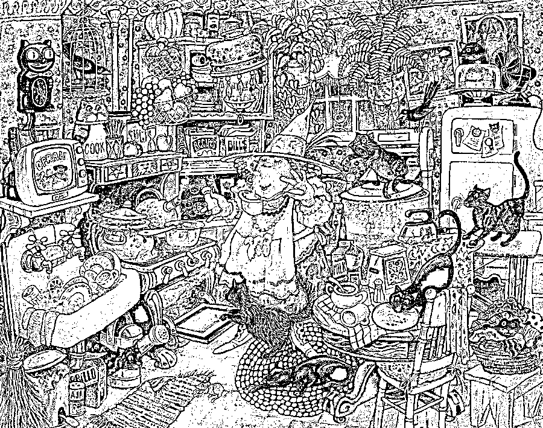

穿越古老丝绸之路的游牧民族会带上谷物、腌制肉干和烘干水果。将大麦和小麦磨成面粉，与水混合，放在灼热岩石上，或者在燃烧的树枝下深度烘烤成面包。他们可以用随行的山羊与绵羊的奶制成奶酪，并在合适或需要的时候食用它们的肉。

射手座的人喜欢在奔波中和户外用餐。**他们喜欢来自世界各地的食物，**并全心融入与他们一起用餐的任何国家或组织的习俗。

你将会发现射手座的人生活在全球各个角落，但凭他们的心而论，**会偏爱生活在开阔的地方，当然还有视野开阔的房子中。**如果你可以在大峡谷的顶部盖房子或蒙古包，射手座就会搬到那里。

在射手座的居住地的列表中，你会发现高地、丘陵、鸽房和树房，很少有喜欢天空的射手座不喜欢在城市最高建筑顶部的旋转餐厅中用餐。而且，当我们讨论餐厅时，快闪餐厅就是射手座的发明。

在射手座出没的地点中，你还可以加入图书馆、娱乐中心、冒险主题公园和机场。还有，迫不及待想知道**梦幻号客机餐盘上的铝箔盖下有些什么食物**的乘客往往也是射手座。

可能会有少部分被飞行恐惧困扰的射手座，但大多数不仅因为在去异地路上而兴奋，喜欢音速旅行，他们更**享受飞行的经历**。在建立行星与地球上动植物的相关性时，可能还没有飞机，但射手座的守护星木星与飞行有关，或者更具体地说，与鸟类有关。

在属于射手座的鸟类中，你会发现野鸡、鹧鸪和鸽子，肉类中射手座与羔羊、山羊、鹿和袋鼠有关。大鱼受到射手座的眷顾，特别是大比目鱼，金枪鱼，王鱼和白鲸，以及它们珍贵的鱼籽，鱼籽酱。所有的水果和种子类都属于射手座的大标题下，但特别是芝麻、栗子、杏仁和醋栗、苹果、杏以及大黄与其息息相关。就蔬菜与草药而言，可以包括韭菜，芜菁，莴苣以及鼠尾草，蒲公英，琉璃苣，菊苣和甜莫德林（英式调料），也被称为香叶蓍。

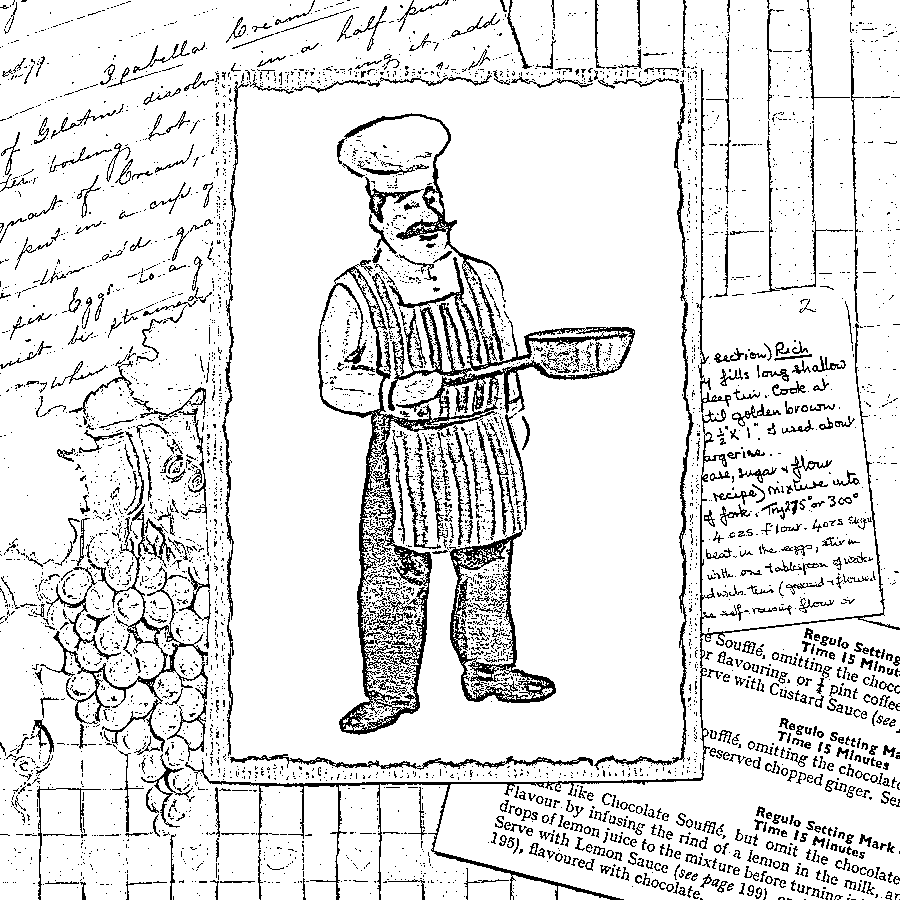

**射手座象征神话中的半人马兽——半人半马。**半人马是一群狂野的生物，容易醉酒斗殴、沉迷于感官的乐趣中，总是过激。除了对马的亲密与喜爱外，射手座经常难以适度行事。**他们并不是十二星座中讲究的进食者**，他们满怀热情地攻击食物，正如我们将在健康问题部分中看到的那样，他们在此过程中也常饱受痛苦。

然而，并不是所有的半人马都是疯狂、糟糕与危险的。它们其中的一员凯龙，是一位治疗者与老师。我们可以从神话传说中的这些掠夺看出，**所有射手座需要面对的是获得自律（掌控他们的动物本能），并因此找到心灵、肉体与精神上的和谐。**

他们拥有火元素的全部热烈与激情，以及变动星座的分散与模糊的特质，这也可以帮助我们了解这个星座以及他们获取食物的方式。

对于射手座来说，**食物是一场冒险，一场探索、感觉与知识之旅。****追寻就是一切。**这个星座的成员会至少有一次去尝试一切，如果预示了一些极好或宏大的结果，他们则会再试一次。

我的小儿子，太阳与上升都是射手座，是一位系列纪录片《穷游》（Budgeter Backpack）的节目主持人，他因节目去了菲律宾。在街头市场上，他曾挑战吃皮蛋。这种渗出绿色凝胶粘液，散发恶心气味的发酵鸭蛋，被某些亚洲美食家视为美味，但对于已经习惯了炸鱼炸薯条口味的他来说，这是一次需要后天习惯的尝试。我喜欢冒险的射手儿子，在为自己开脱、消失在小巷前吃下了整个蛋。

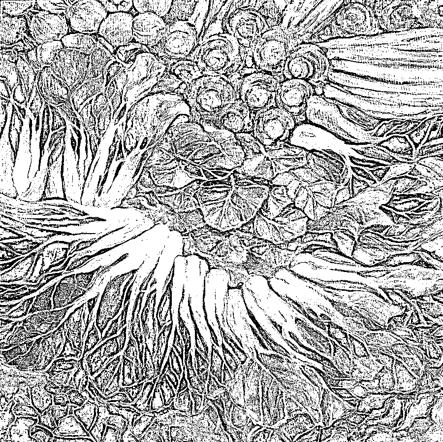

与他们热情多变的天性相一致，射手座倾追随事业而跳上兴趣的木马——暂时的激情随着点燃而迅速下降，**典型的射手座**可能一开始是杂食者，但随着生活，他或她可能会放弃某几类食物，只为了以后重拾。可能会持续数周、数月或数年吃素，而成为素食者，但最终会重拾蛋白质和其他被放弃的食物。（顺便说一下，射手座的人往往是动物保护者，并地球稀缺资源的忠实守护人。）

由于木星是太阳系中最大的行星，在射手座的世界中，小的并不美丽。**当木星人们在厨房中**，他们会准备足够的食物去喂饱五千人并弄得一团糟。为了追求好口感，清洗整理就得等等了。**一般射手座更在乎菜的口味**，而不是外观是否好看。而且如果一个星座可以做到保证口味，那就是射手座。

我不想提出这个，但作为占星师，我有责任提醒你那些射手座不那么令人钦佩的品质：**他们可能会很坦率到无礼，有时一些场合欠缺思考。**

遗憾的是，另一个射手座特性是笨拙，也如你所料，在有很多高温、尖锐的仪器和电子设备的环境中，有点危险。一部分原因是他们对速度的喜爱，也因为他们试图一次性完成太多任务，从而失去专注力与平衡感。

**出于冒险精神**，射手座厨师会把一堆食材一起下锅，无需称分量，让眼睛来做饭，然后奇迹般地，一道美味佳肴诞生了。你可能会认为这归功于他们的守护星幸运的木星，但真正的原因是射手座的厨师本能，了解哪些东西放一起能够可口，哪些香料和植物可以使味道更鲜活，这种本能在勇敢尝试各种外国美食、无数时间翻阅烹饪书籍与杂志和观看美食节目中得到磨练。

**射手座确实有系统：不是其他人都可以识别或遵循的系统。**

厨房如此，生活亦然。

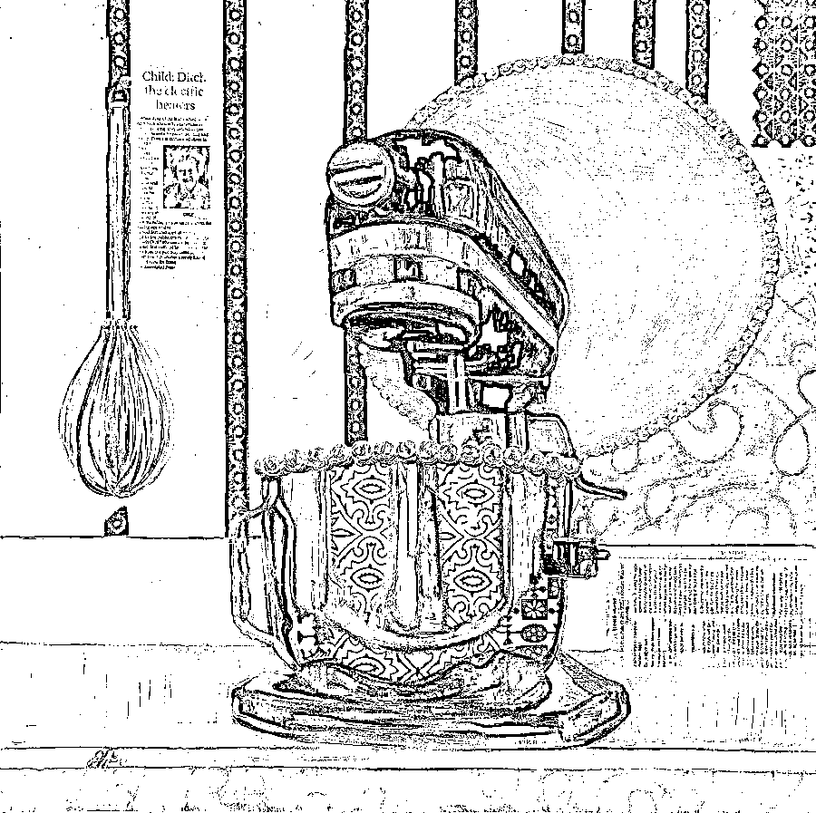

**羊排——*****白羊座***

白羊座相信第一印象。他们喜欢引起轰动，他们的决定基于环境的即时反应。无论多少高压，无论他们看待事物的时间有多长或有多少角度，如果他们一开始就不喜欢，那都不奏效，这个特质也反应在他们生活中的各个方面。当然，认识到你的厨房有待改进是一回事，而认识你的配偶也是这样是另一回事。买方后悔是这个天上的公羊的职业危险。

**白羊座的厨房是一个热闹的地方。**它有戏剧性，也热火朝天。如果预算不菲，白羊座会有一个成为邻里话题并规模超大的厨房。但即便预算很少，也能显示他们的远大志向。这个星座的人有着能让小空间看起来更大的天赋，仅仅因为他们看不到凌乱。

**但请注意这几个重要的词：看不到凌乱。**在那些崭新的橱柜门之后，是一堆厨房小玩意，蛋糕罐、果冻袋架子、鱼罐头、成盒的藜麦、法老小麦、斯佩耳特小麦和苋菜、成袋的国外干蘑菇、香料和不知名的酱料，试一次后也不再有下文，所有种类的烹饪零碎和废料。

**眼不见为净，是一种接近白羊座先生和女士内心深处的哲学。**

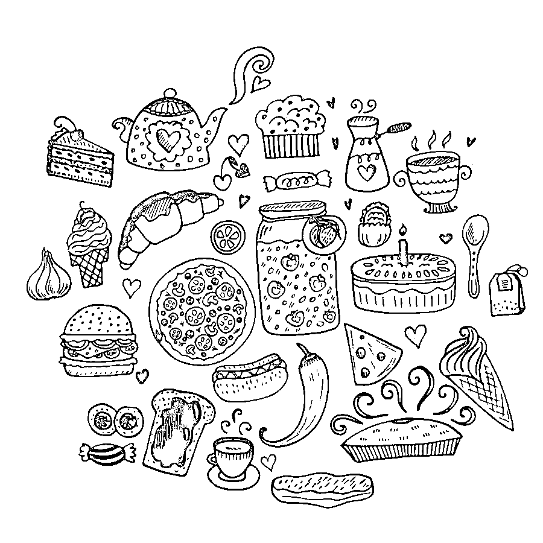

火星掌管火炉真是明智。毫无疑问，这就是厨房中最重要的特征。如果能竖立在底座上，它就会在那儿。并且最好有尽可能多的锅炉，12 个最好，实在不行就 6 个，应该有两个或更多的烤箱，最好足够宽且深，以便同时烤火鸡和一排牛排。并且在一个真正的白羊座的厨房中，火炉应该是红色的。

**白羊座喜欢新鲜和与众不同**，因此清新、整洁和现代的厨房是首选。**简单干净，注重功能**。工业时尚的外观同样受欢迎。白羊座是男性的标志，这就是为什么这种风格既吸引女性也吸引男性。温暖的木色和彩色窗户装饰的融合将为厨房增添魅力，以免像沉闷废弃的工厂楼一样。

**白羊座的人需要温暖，光和色彩才能茁壮成长。**他们的厨房通常是裸露的砖墙，孤零零的落地灯和铁质木质工业制图台，为了达到旧工厂工业风的机械装饰。例如转动的齿轮，旧木制成的陈列柜和橱子。理想的白羊座配色是灰白上面溅有红漆。

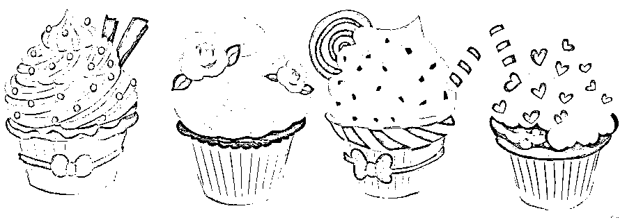

白羊座可能不是十二星座中伟大的收藏家，但他们的确喜欢不寻常的艺术品。他们特别喜欢经典的半身像，并让它们戴上校园围巾或穿上衣服来让厨房充满幽默感和独创性。确实，帽子和头饰深受这个星座的宠爱，你可能会发现门把手上挂着奇怪的草帽，软帽和棒球帽，或被搭在相框上。

白羊座也几乎常常会以令人难忘的方式陈列刀具。

白羊座与火的联系可以有完全真实的描述。**大多数白羊座并不仅仅在竞争中点燃火力，**不管是偶然还是蓄意，**他们喜欢烧烤和使用炊具**。对他们来说，没有什么比将煎锅放在火上并看着里面的东西燃烧更让他们有快感了。或者注视着糖融化成诱人的金色糖浆，同时将焦糖布蕾点燃。不利的一面是，**白羊座经常烧糊不该烧糊的东西，包括他们自己，在烤坚果时必须使用计时器。**

白羊座往往住在很高处，因为这个星座的人喜欢当第一名。即便有顶楼的公寓和悬崖边的房子，白羊座在厨房中也毫不掩饰他们的野心与欲望。家常便饭，**普通配菜不是他们的生活理念**：不，他们要给你的羊肉三烧配上塞满养肝慕斯的意大利饺，以及鸭蛋黄与接下来的高耸的焦糖泡芙塔。如果这些没按照他们预期的做成，你还得佩服他们的精神。

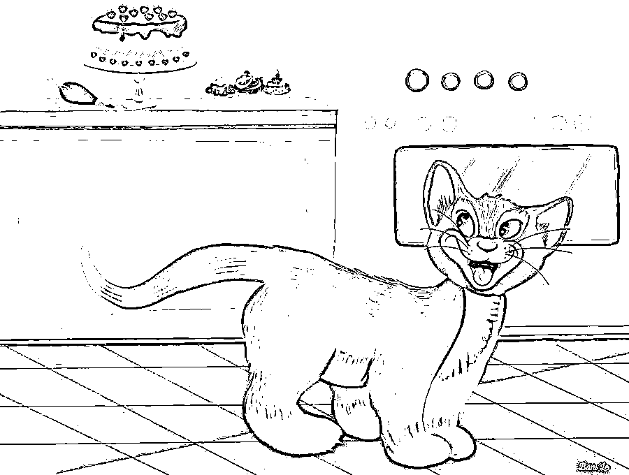

**撸狮毛教程——*****狮子座***

**狮子座厨房中的禁忌事项：**

*   不要提出建议。

*   不带礼物而来：更糟糕的是，带着可回收的便宜礼物。

*   不要引导对话：开始和结束。

*   不要询问他们的年龄和整容医生的地址。

*   不要谈你自己和你的成就。

**狮子座厨房中的适宜事项：**

*   请求建议。

*   像黄油一样把赞美撒得满满当当。

*   询问你的东道主是否想过参加《厨艺大师》节目。

*   饮用、品尝给你准备的一切。

*   在被要求离开之前离开。

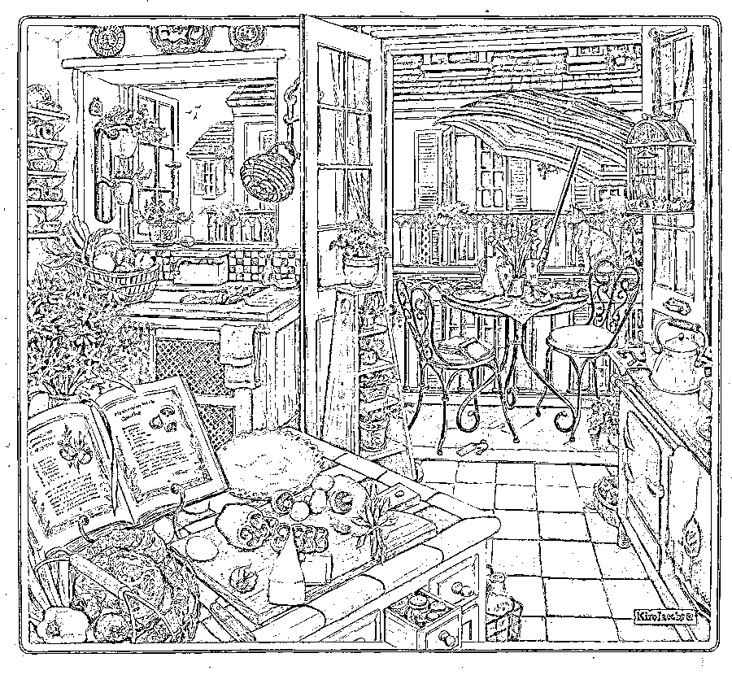

**土象星座的菜单**

**丸子拼盘——*****金牛座***

成千上万年前，人类文明仰望天空——诸神的国度——未来的迹象。古代人们从星星的图形中看到动物与物体；随着时间的流逝，直到如今，即便只是在我们的潜意识中运作，星座依旧与伟大的神话交织共鸣。

解释为什么在核心层面上我们会回应黄道十二星座，而且在我们的十二星座的烹饪之旅中介绍金牛座，是一条漫漫长路。

金牛座——公牛，让人联想起不太吸引人的图片，张大鼻孔、跺脚凶猛的生物，这掩盖了这个星座的真实本性。当你考虑用金牛座的塔罗牌——皇后牌时，你会对这个星座了解更多。在牌上，我们可以看见大地女神的所有荣耀、肥沃与无畏，母性与雅量。万物生长在土地中，**滋养与维持生命的所有事物都属于金牛座。**

想象一下，我们天上的公牛，并不在瓷器店中，而在夏日蓝空下的盛开鲜花的草地上、他不满足吗？他不香吗？当然，大多数金牛座成员也是如此：**他们大多数时候很快乐，满足的生物，但将他们推太远，你就会看到他们鼻孔张大，大地在他们脚下颤抖。**

意料之中，金牛座掌管牧场、果园、花园、小麦和玉米地，以及谷仓和粮仓。乳制品，多汁的水果（桃子、李子、芒果、无花果、苹果和梨），芦笋、欧洲萝卜、青刀豆、黄油豆、蚕豆、利马豆、栗、百里香和牛至都属于金牛座和它的守护星金星。至于金牛座的肉类，将兔肉、小牛肉、牛肉和鹿肉列入清单。而鱼类，包括鲑鱼、龙虾和沙丁鱼。

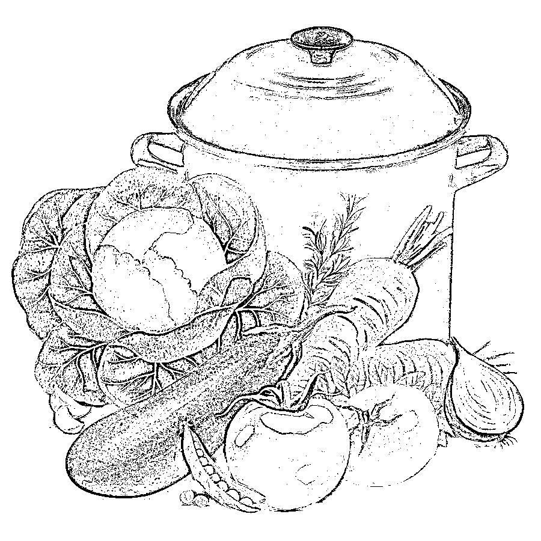

**这个星座的美在于他们的土元素和守护星金星的结合。**尽管金牛座的土相天性渴望稳定、一致与物质，他们本质却**容易成为享乐主义**，这难以避免包括过度沉迷于生活中的甜食与高卡路里食物。时不时过度放纵。**金牛座是十二星座中的美食家**，在天才的超级大厨之列中，你会发现美国美食家詹姆斯·比尔德（James Beard）、西班牙名厨费兰·阿德里亚（FerranAdrià）与英国大师加里·罗兹（Gary Rhodes），以及全球数以百万计的出色家居厨师和美食博主。

如果所有金牛座人有一个的共同点，那就是**不喜欢改变**。这个星座的人喜爱熟悉和家庭的东西。向他们提出建议，将他们带出舒适圈，你将总是得到“不要”的回答：在他们面前挥舞着香甜的桃子脆，他们可能会躲得远远的。

**金牛座不是十二星座中的实验者**：他们是保守派。他们**偏爱经典美食**，尽管他们的高级味觉享受香料和调味所带来的额外风味，但必须酌情添加。

金牛座很少在印度餐厅点最辣的咖喱。

**金牛座不喜欢改变。**

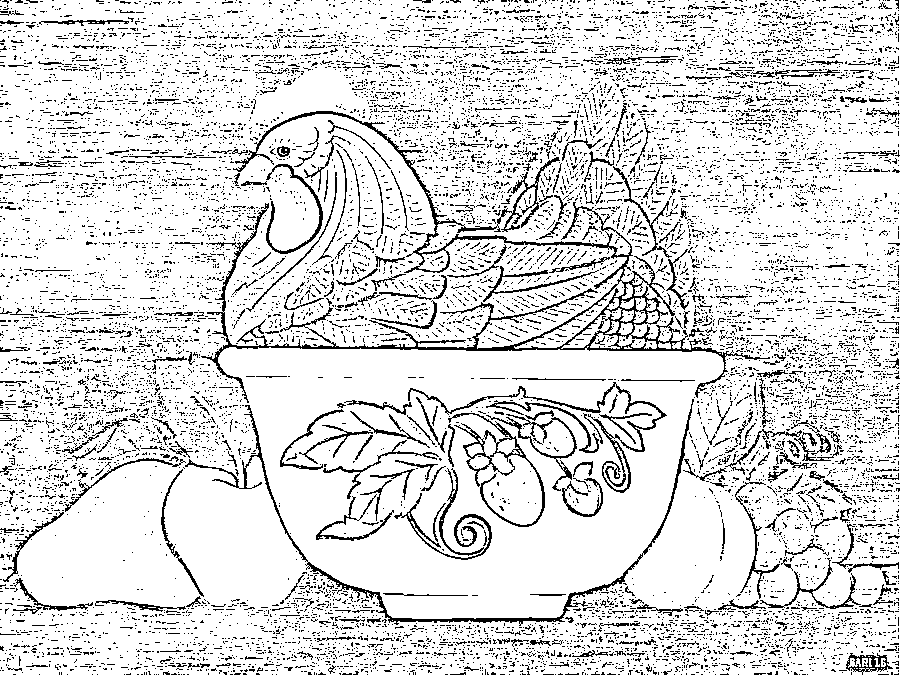

我很幸运有不止一个金牛座的朋友。之所以说是幸运，是因为他们是最忠实、最可靠和最有教养的人。他们实际上非常支持我，因此我可以原谅他们的固执和无法改变主意，即便符合他们的最大利益。并且，我离开他们的餐桌时，永远不会感到饥饿和失望。

**毅力、计划和耐心：金牛座是个双重炖锅。**

金牛座与天秤座有一些共同的特点和食物上的关联；因为金星同时守护着这两个星座。但因为元素相异，他们的气质和喜好差异很大。是的，在他们的列表中你可能会找到乳制品、熟透的水果、芦笋等，但即便用这些食材所做的菜肴类型却并不相同。

虽然这两个星座都好甜食，但因为天秤座对身材的完美渴求，阻止了他们食用太多含糖和乳脂的食物，并朝着清淡健康的饮食方向发展。**金牛座没有这种自律，如果闻起来很香，尝起来可口，管它有没有危害，他们都会吃光光。**

虽然这个星座的自我放纵以及无法拒绝诱惑——“嗯，这不该被浪费......”——但令人惊讶的是，有多少以纤细身材而闻名的舞者是金牛座，想想玛戈特·芳婷、奥黛丽·赫本和雪莉·麦克莱恩都是金牛座，以及精灵般的达西·布塞尔和纳塔利娅·奥希波娃。

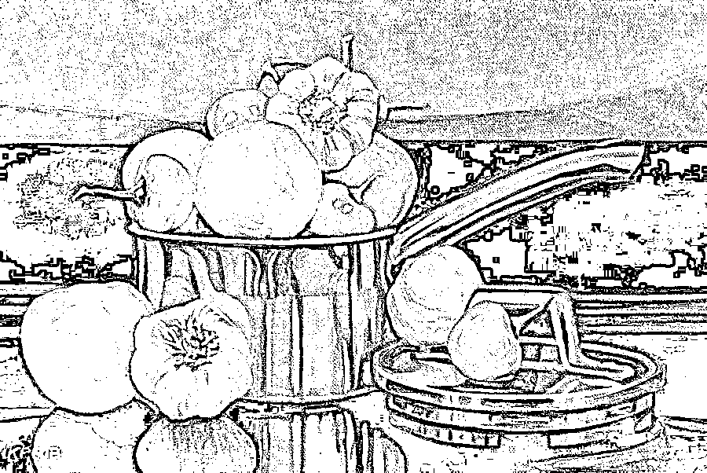

金牛座确实是唱歌跳舞的星座。显然，金星的艺术特性与金牛的体力相结合，能够培养出伟大的艺术家。并且由于**金牛座掌管着喉咙与声带**，许多伟大的艺术家都是歌剧演唱家。

这是十二星座中最感性的一员。他们的触觉非常敏锐，嗅觉无与伦比。就如音乐人听到一次旋律就能演奏音符一样，金牛座可以品尝和闻到一道菜就复制出来。

**金牛座的厨师喜欢亲手忙碌**，或者宁愿用双手准备食物：揉面团，将黄油揉到面粉中以及将糖浆制成漂亮的形状，这些都是一种感官的享受。**金牛座也有众所周知的园艺技能**，这就是为什么许多金牛座自己种植水果和蔬菜，而且养鸡和牲畜的原因。由于关注节俭，金牛座厨师喜欢利用整个动物食材—头、脚、指关节、尾巴、肝脏、牛羊胰脏—你所能想出名字的动物部分，都能变成一道菜。

食物与爱对这个星座来说密不可分。无论是养家糊口，招待朋友或者吸引恋人，**食物都是他们传递爱意的方式**。而且因为用爱烹饪是美食的精髓，金牛座在美食技艺上表现出色也就不足为奇了。

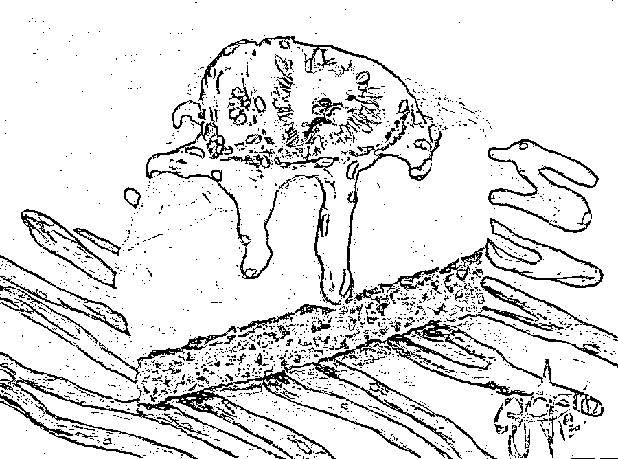

**特级初榨橄榄油——*****处女座***

处女座并不是十二星座中最强大的一员：**他们平静的外表掩盖了内心的纠葛。**如同他们变动星座的同伴——双子座，他们共同分享着守护星水星，他们过度活跃的思想干扰了身体健康。处女座实际上会担心自己生病。他们易患身心疾病，因此成为十二星座中疑病症最严重的一部分人。

处女座的消化系统非常敏感，他们的肚子很容易不舒服，**也易对最基本的食物产生过敏**——过敏的出现和消失似乎没有明显的原因，但通常是由于思虑过度的影响—处女座可以因为自我思虑而过敏。

**处女座所掌管的身体部位是消化系统和肠道**，因此容易得消化不良、结肠炎和肠道易激综合症。

**辛辣的食物几乎常是个问题：处女座喜欢它，但它不喜欢处女座。**如果处女座们要吃口味重的墨西哥辣椒，他们需要在一天中尽早食用。夜宵的咖喱让他们失眠，会加剧他们忧虑倾向的连锁反应。早上三点可不会做出什么好决定。

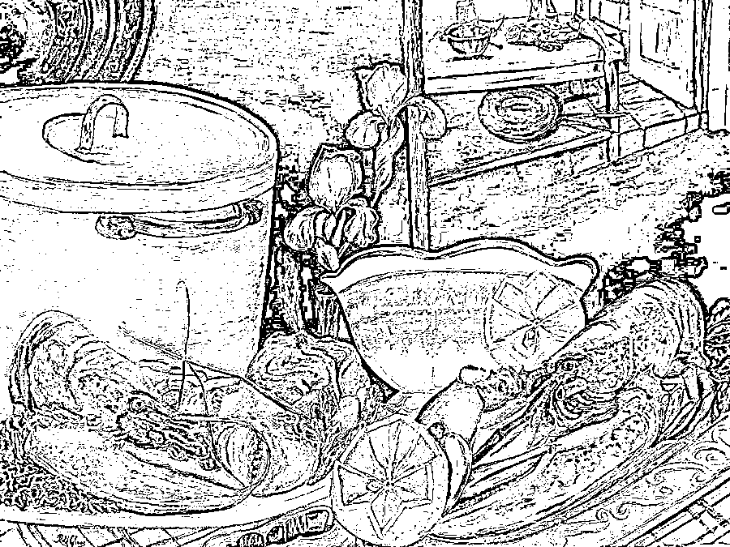

**处女座更适合天然的食物**，所以如果邀请处女座一起用餐，请确保有尽可能多的有机食品，并且肉类与鱼类的菜肴不要浇盖浓郁的酱汁。简单是最好的。

意料之中，处女座可能成为**健康饮食**的信徒。很大程度上，是由于他们精密的消化系统，只是闻一闻垃圾食品就会产生故障，但结合他们的经验与对食物过敏的研究，导致大很多处女座相信越少加工的食物，对消费者来说越好。

然后是低脂问题。只有承担了教育使命的人能够搜寻足够的食品标签，得出结论：西方国家肥胖不断增加的原因是低脂食品：仅仅因为一种产品低脂并不代表它卡路里低，卡路里大部分来自添加糖，甚至更具破坏性。

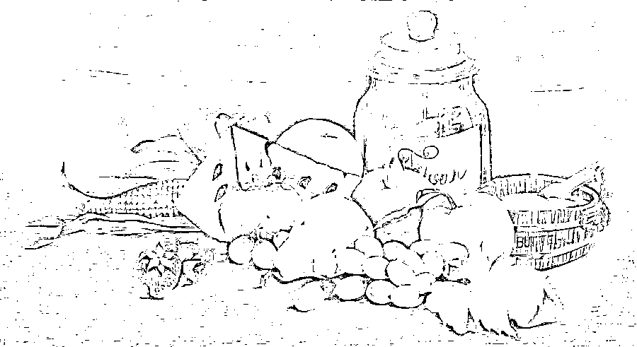

矛盾的是，尽管处女座对健康充满热情，他们健康的饮食习惯依旧有很多不足之处。**处女座的人并不总是如同她们倡导的那般执行，这个星座需要安慰性进食来安抚。**

他们倾向于将食物过敏归咎食用过量，但实话说，他们喜欢食物，并不是总知道适可而止。因此处女座的宝宝**永远不要过量喂养**，无论当时让他们多么满足，这将会导致随后一生的饮食失调。当我们转向处女座孩子的议题时，因为他们不愿意惹事和冒犯他们的照料者与喂养人，他们几乎会吃掉摆在他们面前的任何食物。你可能会认为这将是他们成为出色的美食探索者的一种优势，但这会使他们产生对特定食物的反感。

**处女座信奉的格言：你吃什么，你就成为什么。**但普通处女座们可能并不知道的是，某些由他们星座所掌管的食物实际上促进了健康，并治愈了许多健康问题，这些食物富含细胞硫酸钾盐。

硫酸钾有助于保持皮肤水分，处女座容易出现湿疹和头皮屑等干燥的皮肤状况，压力与焦虑会加剧这种情况。富含这种矿物质的食物包括绿色蔬菜、全麦和纯谷物面包、小麦胚芽油、糙米、燕麦、杏仁、奶酪、酸奶、鸡蛋和奶酪、香蕉、柠檬、苹果、梨、瓜和番木瓜。你还可以在这个列表中加入蜂蜜、草药和水果茶。

最后一点：**在处女座的世界里，少即是多。**

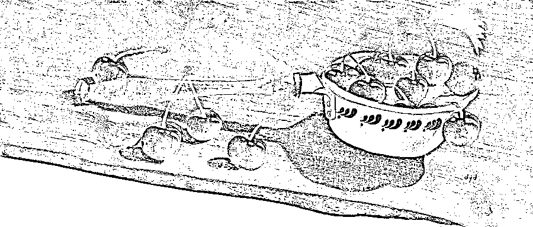

**法式山羊奶酪——*****摩羯座***

**摩羯座厨房中的禁忌事项：**

*   不要随心所欲。

*   不要加大火力，现实和象征层面都是如此。

*   把剩菜扔到垃圾箱里，而不是堆肥上。

*   请勿擅自开始话题。

*   暗示屋顶大型螺旋桨的装置会带来危险。

**摩羯座厨房中的适宜事项：**

*   遵循说明。

*   对过去的所有的剩菜给予好评。

*   询问主人是否有任何省钱和节能的秘诀。

*   就权利问题展开讨论。

*   赞扬屋顶上风轮机的优点。

**（未完，请见今日二条）**

**版权声明：**本文由若道翻译发布，欢迎转发，反对抄袭。友号转载请申请白名单。

**佩妮·桑顿**

佩尼·桑顿（Penny Thornton）的职业生涯使她从科文特花园皇家歌剧院的舞台走到了亚利桑那州的沙漠，期间她曾在鲁珀特·默多克的小报世界工作，陪伴在戴安娜王妃身边。她最出名的身份是占星师 —— 她在世界各地都有专栏和客户，她的网站 Astrolutely.com 是网络上最受欢迎的网站之一 —— 她也是一名专注于女性问题的自由撰稿人。

**系统学习占星学**

**点击下图了解详情**

**微信又双叒叕改版啦，不想错过若道君的推送？**

**就把若道设为星标吧！**

**▼**

就是这个“在看”，戳戳戳 ☟

********报名直达入口********

# 12 星座美食之旅（下）丨你永远能从食物看到他们的别具一格

> 原文：[`mp.weixin.qq.com/s?__biz=MzA5NjA0NTAxNg==&mid=2651429622&idx=2&sn=d743f78b35dc9cb0c06b635c63599694&chksm=8b4b2841bc3ca1576e23bcdf0497c3d390ef7a7e286b60e27f08b11bd91048c0e5b31c9b5ce7&scene=126&sessionid=1692738090#rd`](http://mp.weixin.qq.com/s?__biz=MzA5NjA0NTAxNg==&mid=2651429622&idx=2&sn=d743f78b35dc9cb0c06b635c63599694&chksm=8b4b2841bc3ca1576e23bcdf0497c3d390ef7a7e286b60e27f08b11bd91048c0e5b31c9b5ce7&scene=126&sessionid=1692738090#rd)

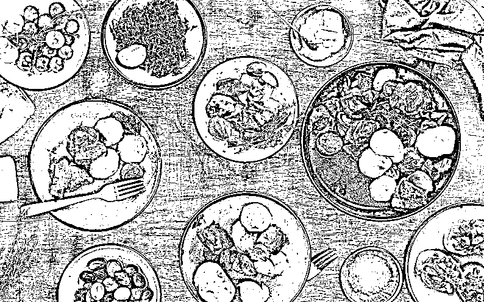

作者/佩妮·桑顿 

翻译/三三 李含 校对/Arrow 江艺

编辑/翀子 图片/网络

在文章的第一部分（见今日头条），作者撰写了火象星座和土象星座的菜单，是不是很有意思呢？接下来奉上风象星座和水象星座的菜单，里面肯定有让你会心一笑的描述。

**风象星座的菜单**

**如何烧开水——*****水瓶座***

**水瓶座是一个对照鲜明的星座，有两个性质完全相反守护星 ——保守派的土星和不墨守成规的天王星。**也许这就解释了为什么你永远不太确定在特定的某一天你会去见谁，而对于水瓶座的厨师来说，不知道你会带来炖肉双素还是炙烤鸡肝。

尽管水瓶座与养鱼场和酒吧——任何形式的酒吧——关联，但实际上，它并不是水象元素，而是一个风象星座，就像所有的风象星座一样，水瓶座喜欢那些吸引眼球和味蕾的食物。比如蛋奶酥、沙拉堡、慕斯和蛋白酥饼。西葫芦花，西兰花和菠菜。风干的肉类、盐鳕鱼、猪肉、鸭肉和贝类。甜菜，根菜，李子和木瓜，鼠尾草，大蒜，马槟榔，冬绿树，冬青和铁杉！这些都是水瓶座关联的事物。

**无论是在厨房里还是在厨房外，水瓶座都是复杂的个体。**一会儿，你的水瓶座厨师会拥护经典法国菜的优点，对烹饪的每一步都表示敬意；一会儿，你的水瓶厨师会展示出一种彻底的即兴厨艺，把所有东西都扔进锅里。然后还有食品科学家 —— 他们推崇烹饪的化学性并热衷于发明；那些喜欢混合菜肴的人 —— 那些不该出现在同一句话里的食物，更不用说同一道菜了。 

第一家融合菜餐厅的创建者肯定是一位水瓶座人。它也许叫做古巴-中国融合菜，或者泰国-拉曼查融合菜！实际上并不是，1983 年，由巨蟹座人沃尔夫冈·帕克（Wolfgang Puck）在圣塔蒙尼卡开设的 Chinois 餐厅才是第一家融合菜餐厅。但是我打赌帕克先生的上升星座落在水瓶座，他的星图中肯定有水星合相天王星。

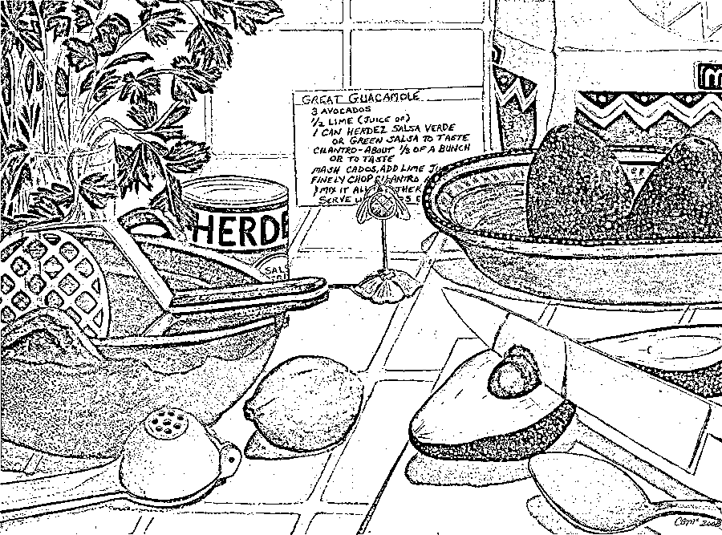

水瓶座是一个**风象星座**，因此**在心灵的领域里自在舒适**，却无法理解激情的水域，但是它同时也是固定星座，所有固定星座都**必须保持控制**。**最好的情况下，他们是顶级厨师，但最坏的情况下，他们可能是铁锅暴君。**

现在，在你认为水瓶座没有任何可取之处之前，请允许我调整一下平衡。如果你在寻找一个永远不会评判你的人，一个会在凌晨两点为你做三道菜的晚餐，或者至少不眠不休地听你讲伤心故事的人，一个会像对待皇室成员和公爵夫人一样对待无家可归之人的人，那么水瓶座就是你要找的人，**这是黄道十二星座中最不势利、最真实、最人道主义的星座之一。**它们的价值就像铀一样。

我不想被指责为性别歧视，但这个星座的男性和女性之间有很大的区别。想象一下瓦妮莎·雷德格雷夫和詹妮弗·安妮斯顿，你就会明白为什么我说水瓶座的女人定义了酷这个词。虽然女性往往是情感动物，但**水瓶座的超然和情感克制**增加了这个星座女性的吸引力。在水瓶座女士的陪伴下，你会感觉到一阵温暖、芬芳的微风拂面而过——即使产生了偏激的情绪，也总是在他们内心深处的隐秘处。在电视摄像机前进行深入的心理访谈不适合水瓶座女性。

美味的科学：水瓶座方式。

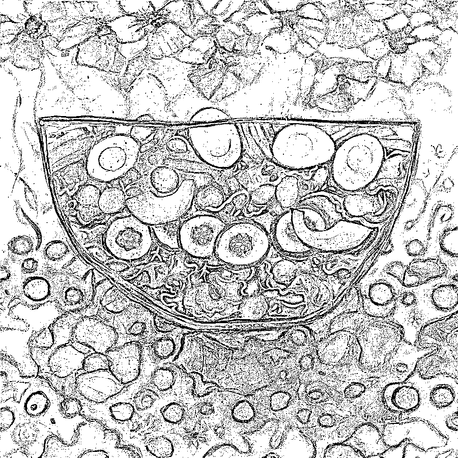

**两次烘焙的蛋奶酥——*****双子座***

**双子座喜欢多样化和创新。**他们总有最棒的故事可讲，他们会对一种古老的主食进行了完全不同的改变，他们会邀请你来家里做客，并给予你思考的启发。他们的餐桌布置很少重复，这既是为了挑战自己的创造力，也是为了用自己的创意取悦他人。

因为这是一个喜欢旅行的星座，而且对不同的文化着迷，所以你可以根据双子座人目前迷恋的是世界上哪个地方来推测宴请中会出现怎样的美酒佳肴。然而，我注意到，他们对东方，特别是日本格外偏爱。

不仅是日本料理适合双子座的口味，而且这个国家简约的建筑和装饰也吸引了他们的感官鉴赏。水星人也喜欢日本用餐仪式的神秘感，喜欢餐具和食物容器背后的意义和摆放。毫不意外，你会发现在日本的两个主要星图中，一个有双子座上升，而另一个有双子座月亮。

**完美的双子座用餐体验：不被限制在一个固定的菜单上或者在晚宴期间被夹在两个客人中间，**这在某种意义上是双子座的天堂。然而，这个星座和其他星座一样能够和众人围坐一桌，娱乐大家，而且他们可能会比其他星座更神气十足。

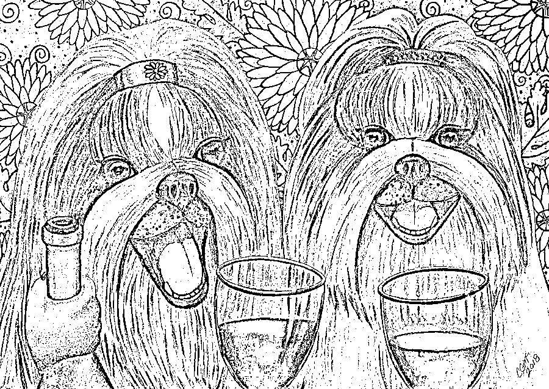

**双子座聚会的主要焦点**不是餐桌布置，而**是交谈和社交**。双子座可能是十二星座中最爱说话的一位。你永远不会感到不知所措：水星先生或女士会有很多话要谈，并鼓励与所有客人进行热烈的讨论和辩论。

然而，不要期望从这个星座嘴里得到任何私密的表露：**这些风向星座的人喜欢激发你放弃内心深处的秘密，但他们不会回报你。**记得丝带鳗鱼吗 —— 如果你离得太近，它会咬你一口。双子座的人也喜欢鼓励你对有争议的问题发表看法，然后他们会挑战自己的诚实，同时友好地微笑。做好心理准备。

考虑到食物并不是双子座晚宴上的重头戏，你也应该为不寻常的和意想不到的事情做好准备。你的主人可能会以舞台魔术师的形式提供娱乐，或者在餐桌上的一位客人结果是今晚请来的单口相声演员。然后，你可能会在两道菜的间隔期间被带出去看萤火虫在月光下跳舞，或者看一个没有公映过的电影片段。当神秘谋杀案晚宴被发明出来时，双子座就是第一个尝螃蟹的人。

**在双子座的世界里，你所看到的很少是你所得到的。**

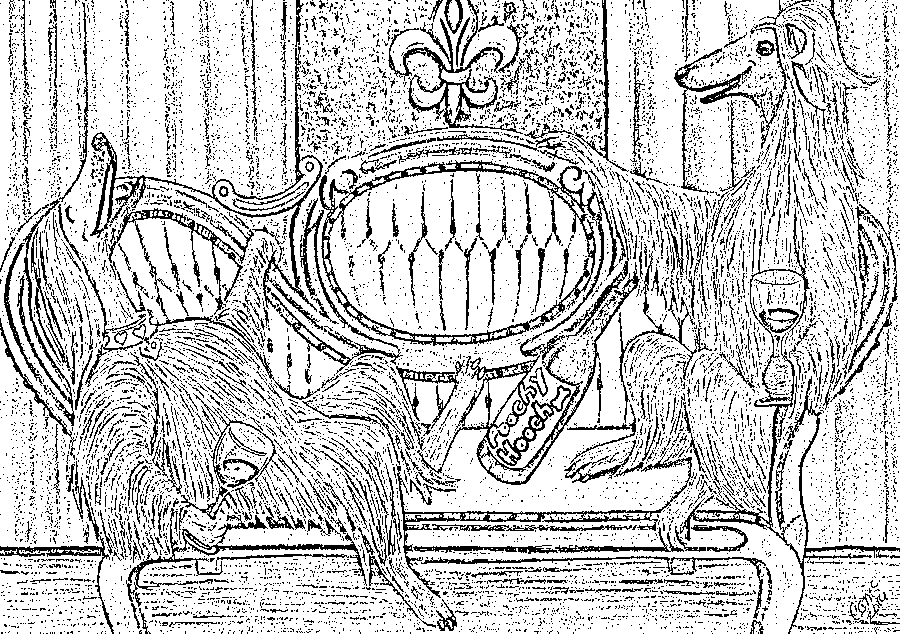

**一副好秤——*****天秤座***

**在天秤座的厨房里不该做的事：**

*   任何恶心的事。

*   开始争论。

*   把台面上假想的脏东西擦掉。

*   谈到衰老这个话题，甚至还要附带说：“但是你看起来比实际年龄年轻好多啊！”

*   谈论你在化粪池方面遇到的问题。

**在天秤座的厨房该做的事：**

*   赞美和奉承。

*   请携带鲜花和/或巧克力，最好是心形的。

*   寻求关于寻找爱情、保持爱情和找回爱情的建议。

*   适当迟到。

*   分享。

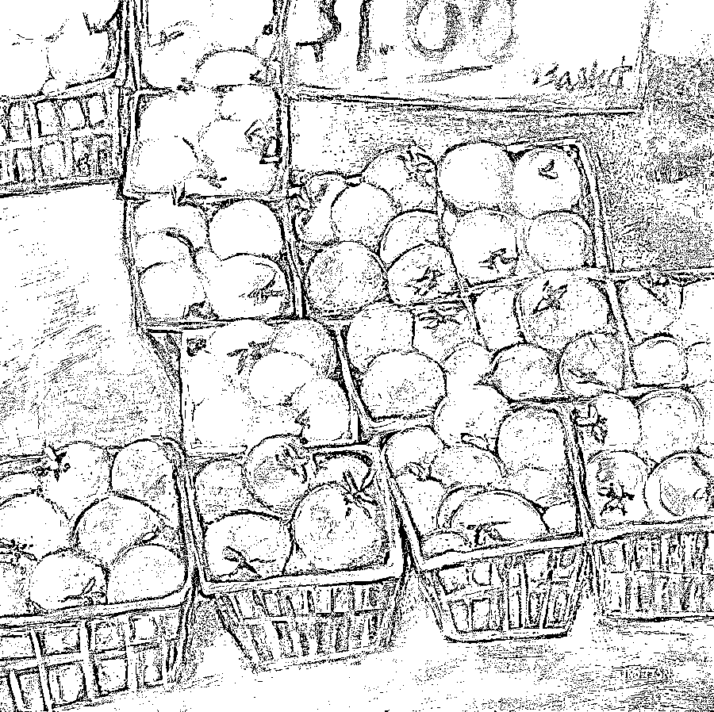

**水象星座的菜单**

**和螃蟹——*****巨蟹座*****一起下厨**

让大多数人创作一幅典型的家庭厨师画像时，他们可能会画出一个苹果脸、大胸脯、慈母般的人像；你还会看到典型的巨蟹座——民间传说中的巨蟹座，因为，当然，像家常菜一样，天上的螃蟹有各种形状、大小、性别和性格。他们中的一些人甚至成为了伟大的明星和时尚偶像——比如梅丽尔·斯特里普（梅姨），但我有充分的理由相信她也是一名出色的厨师，而已故的威尔士王妃却不是。

**巨蟹座的人热爱他们的家和一切家居事物。**如果你和巨蟹座的人一起用餐，和巨蟹座的人约会，和巨蟹座的人一起工作或居住，你必须知道家是真正的心之所向。批评他们的家人、他们的装饰、他们的宠物或他们的厨艺，你很可能会被他们的钳子狠狠咬上一口。这可能代表着这段关系已经走到了尽头。

在我们进入巨蟹座的烹饪世界之前，我们必须了解的另一个因素是，它是月亮守护的星座，月亮是一个既熟悉又神秘的物体。我们所有人都知道它就在那里；它神秘地漂浮在夜空中，消失在云层后面，然后重新出现，它的面孔每天都在变化。

**巨蟹座的人可能看起来很普通，很谦逊，但他们有神秘的内心深处，他们的情绪就像月亮的脸一样变幻莫测。**

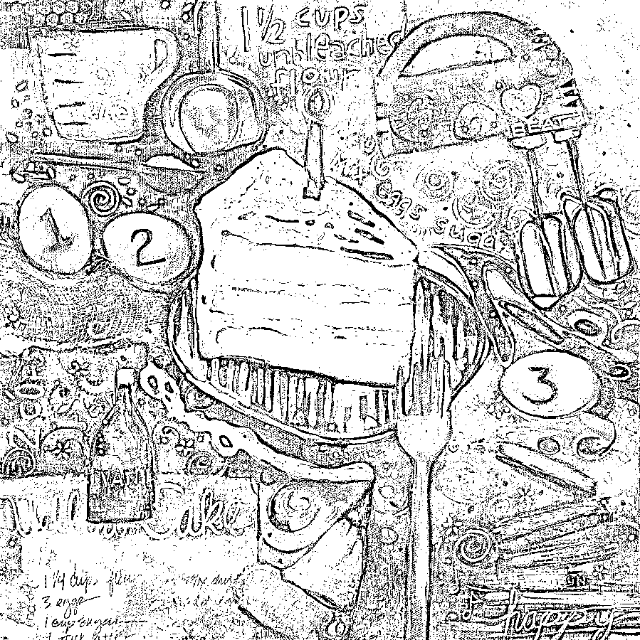

你不需要成为一个占星天才就能发现**巨蟹座关联的食物和动植物有海边的特色**。巨蟹座是水象星座，螃蟹是海洋生物；它们也可以在陆地上疾走，这使它们天然就是海陆的结合。任何多汁、松软和乳脂状的产品都与巨蟹座有密切关系。除了所有的鱼和贝类——尤其是螃蟹和牡蛎——还有青蛙和蜗牛都在这个星座的管辖范围之内；鹅、鸭、野兔、猪肉和小牛肉也一样。

蔬菜包括西葫芦、黄瓜、西葫芦、南瓜、莴苣、洋葱、菊苣，以及所有的海洋蔬菜，包括荸荠、海芦笋和海葡萄。至于水果：沙棘、芒果、甜瓜和桃子名列榜首。

**巨蟹座不是辛辣食物的星座**：属于这一敏感星座的香料是罂粟籽。巨蟹座草本植物包括迷迭香、马齿苋、月见草和柳叶蒲公英。你可能只熟悉迷迭香，但其他植物生长在世界各地；事实上，你会发现希腊菜肴中常用马齿苋来做沙拉，它过去和现在仍然被用来治疗女性疾病和胃痛，我们稍后会发现，这与巨蟹座的健康有关系。你可能不想把柳叶蒲公英和月见草加到你的沙拉里 —— 即使对于忠实的占星美食家来说，它们也有点太玄妙了。

对于所有的家庭厨师来说，做饭是一种充满爱的行为：即使你最不想做的事情就是为了你最亲近的人在热炉子上辛苦劳作，你只是出于责任感，这也是一种爱的形式。但是对于巨蟹座来说，**烹饪是表达爱意的最好方式**。食物不是一种燃料，而**是一种养育和情感寄托的手段。**

当然，这有两种方式，一是巨蟹座的人在高兴（庆祝）或悲伤（同情）的时候会吃东西，二是出于同样的原因，他们会让朋友和家人吃得过饱。对于巨蟹座们来说，人类的善良之乳有着非常字面的意思，通常表现为无穷无尽的米布丁和潘纳科塔塔酒供应。

还记得你刚出生的时候吗，那时你有乳牙，或者根本没有乳牙？他们给你的食物很容易滑进你的喉咙，很快到达目的地。有一段时间你是用勺子喂饭的。当你终于可以自己用刀和叉吃饭时，你可能强烈地感觉到了解放的快乐，幸福地咬一口肋眼牛排，**但如果你是一名巨蟹座人，你很难从婴儿到成人无缝过渡，**你可能永远不会失去对托儿所食物的欲望。

虽然黄道上的每一个星座都会有与他们生命中的一个特殊时刻联系在一起的特定食物和餐点，但**巨蟹座人关心的地方无不与记忆、情感和食物存在千丝万缕的联系。**当然，并不是所有人都有马塞尔·普鲁斯特那样的文学技巧，**但他们都有能力发自内心地回忆起某个熟悉的味道击中自己味蕾的时刻。**

**谨慎和巨蟹座就像火腿和奶酪一样密不可分。**这个星座不会抓住机会尝试来自世界各地的奇异组合或食物。如果上面有**“本国制造”**的标签，他们就会尝试，否则就不会。当然，饥饿最终会让最顽固的传统主义者缴械投降，但巨蟹座人不会热情地拥抱外国食物。再一次，因为这个星座产生了许多非常好的厨师，所以有一些巨蟹座的人强迫自己克服天生的保守主义，在自己的厨房里尝试新的口味或完善一道陌生的菜肴。

**巨蟹座还有另外两个特点 —— 坚持和保密。**这些喜怒无常的人可能永远不会透露他们的野心或计划，但他们会悄悄地，悄悄地，实现目标。

与另一个水象星座天蝎座仅是偶尔将食物当作激情的序曲不同，巨蟹座认为食物始终是灵魂的奉献。好吧，也许这有点夸大其词，但是**当巨蟹座为你烹饪的时候，每一口食物都蕴含着丰富的情感、想法和满满的关怀。**

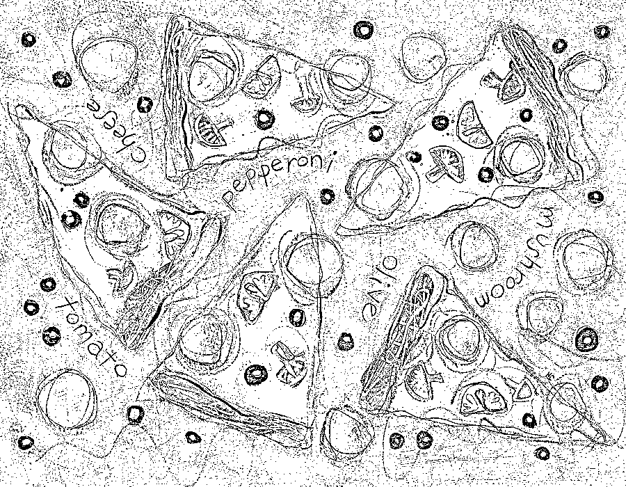

***双鱼座*****的鱼汤**

当然，**没有典型的双鱼座厨房这种东西。**双鱼座的人并不能规规矩矩被归于某些小类别中。即使他们有强烈的喜好和厌恶，这些也会改变，就像海风可能会从温和转为狂暴，海水从深蓝色变成青灰色一样突然而随机。**双鱼座的人会逃脱任何他们被放入的圈子，并反对任何似乎会限制他们选择的建议。**然而，我可以肯定地说，厨房将反映出他们是谁。

**双鱼座的人充满创造力。**无论是在厨房内外，他们在表达自己方面几乎没有什么困难。在大多数情况下，厨房不仅仅是一个储存、准备和食用食物的空间，更是一个做冥想、写日记、绘画、进行拼接手工，谘商和灵魂对话、分享的场所。不过，这个地方会有一些独特之处：它可能是整个厨房的外观，也可能是一个单一的物体。一些旧的，一些新的，一些回收的，借来的和循环再利用，还有一些蓝色的东西可能都会出现。

这个星座并没有太多地依恋于童年纪念品或家庭纪念品上，尽管它对过去有着美好的情怀，所以双鱼座人对海贝壳相架里微笑的面孔完全陌生，这只是他们从旧货店里淘来的物件。

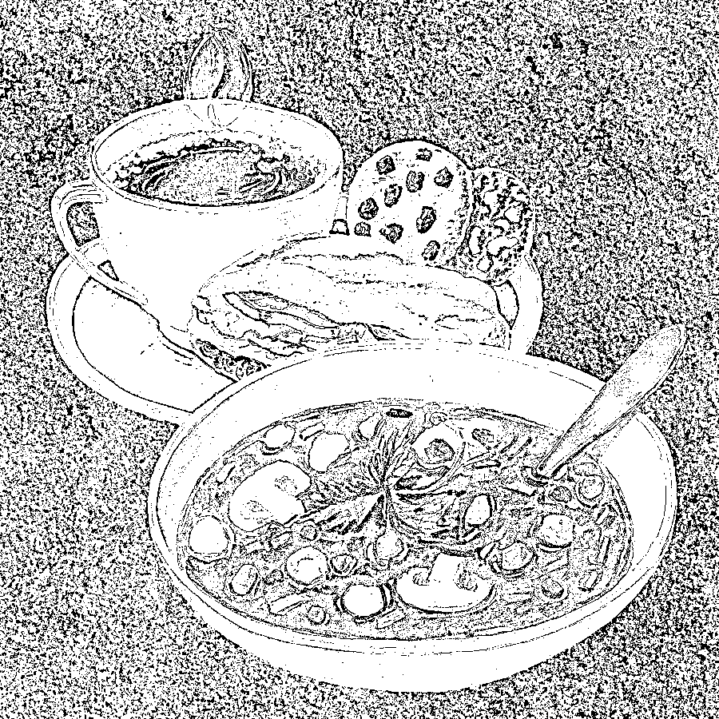

太空时代的技术可能不会有太多的证据。**天上的双鱼座可能渴望逃离地球**，去探索无边无际的太空，但他们不想让自己周围环绕着闪亮、锋利、旋转的小玩意儿。此外，双鱼座的人有一种隐秘的观念，他们喜欢用艰难的方式做事——他们欣赏痛苦的美德——而且他们喜欢辛苦地用手打蛋清，而不是看着它们在食品加工机里呼啸而过。你可以在他们的收藏品中找到古代的木勺和一套金属秤。

台面应该像海面一样闪闪发光，或者它们应该是用木头做的，上蜡和抛光，拥有缎子般的光泽。应该有足够的空间来悬挂古雅的图片或装框的饰物 —— 例如婴儿的第一双鞋，熨平的玫瑰或棒球卡。你可能会发现木质的大字母，拼成幸福或爱的单词。橱柜应该有网状门，可以在不同的层面错开货架，展示厨房储藏、漂亮的锅、烛台和彩色玻璃瓶。你还会发现一些小碗，里面塞满了旧收据、优惠券、电话号码 —— 甚至还有奇怪的耳环 —— 还有窗台上放着药草罐和微型水壶等等。

双鱼座获得黄道十二星座垃圾箱的称号并不是没有原因的！

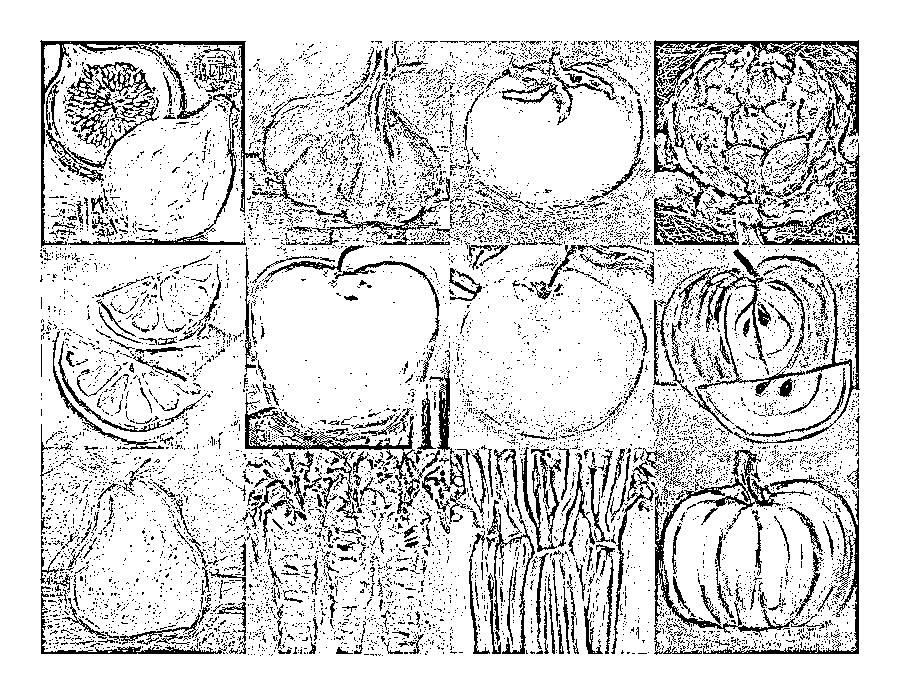

**激情水果冰糕——*****天蝎座***

**在天蝎座的厨房里不该做什么：**

*   看起来像竞争对手。

*   过分关注重要的其他人。

*   推断你做得更好。

*   企图算旧账。

*   寻求一点帮助。

**在天蝎座的厨房里该做什么：**

*   保持低调。

*   提供了一条有趣的八卦。

*   坚持要洗碗碟。

*   询问某事物是从哪里来的，但不要指望会被告知。 

**版权声明：**本文由若道翻译发布，欢迎转发，反对抄袭。友号转载请申请白名单。

**佩妮·桑顿**

佩尼·桑顿（Penny Thornton）的职业生涯使她从科文特花园皇家歌剧院的舞台走到了亚利桑那州的沙漠，期间她曾在鲁珀特·默多克的小报世界工作，陪伴在戴安娜王妃身边。她最出名的身份是占星师 —— 她在世界各地都有专栏和客户，她的网站 Astrolutely.com 是网络上最受欢迎的网站之一 —— 她也是一名专注于女性问题的自由撰稿人。

**系统学习占星学**

**点击下图了解详情**

**微信又双叒叕改版啦，不想错过若道君的推送？**

**就把若道设为星标吧！**

**▼**

就是这个“在看”，戳戳戳 ☟

********报名直达入口********

# 插班中丨核心课程 L3，教你掌握综合星图解读

> 原文：[`mp.weixin.qq.com/s?__biz=MzA5NjA0NTAxNg==&mid=2651429622&idx=3&sn=35a71b88039f4082efdc24f9e141251b&chksm=8b4b2841bc3ca15714c233ac02f41c810bba14585574fc04368bd543e14833a3279e23a1e09c&scene=126&sessionid=1692738090#rd`](http://mp.weixin.qq.com/s?__biz=MzA5NjA0NTAxNg==&mid=2651429622&idx=3&sn=35a71b88039f4082efdc24f9e141251b&chksm=8b4b2841bc3ca15714c233ac02f41c810bba14585574fc04368bd543e14833a3279e23a1e09c&scene=126&sessionid=1692738090#rd)

**Level3 也是占星学习的一个整合区和分水岭****若道君给大家准备了一份专业的占星测试：“2020 若道核心课 L3 入学测试”****测试内容包括：**

**适合参加测试的学员：**

**L1-2 结课学员**

**有一定占星基础的自学学员**

**准备考 ISAR 的学员**

**扫码开始测试吧**

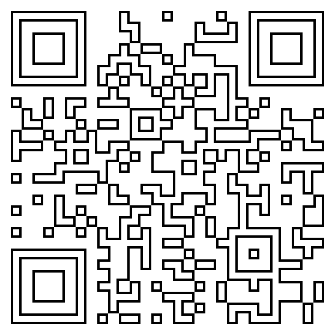

**1**

**占星学除了自我修炼，市场需求如何？**

**通过占星学习你帮助了自己，也可以选择成为自助助人的占星师，开启受益终生的第二事业。**一方面，社会快速发展人们压力山大，抚慰心灵的咨询市场需求巨大。另一方面，市场鱼龙混杂，真正学院派的严肃占星从业者十分稀缺。最重要的，**占星学能让你自己帮助自己，无论你是否进行占星咨询从业，学习了占星学，它都将是终身陪伴你成长的睿智好伙伴。**

**2**

**你的占星核心课老师是谁？**

 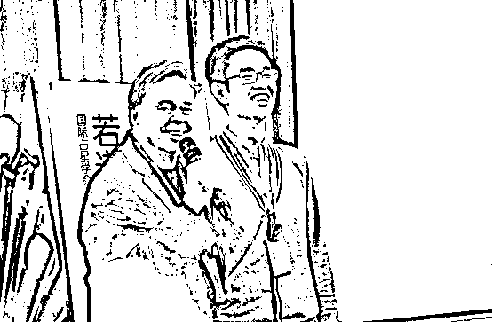拥有**50**年占星研究积淀**44**年职业占星实践**41**年占星教学经验的**若道联合创始人****2017-2020 年曾任 ISAR 全球副主席****2020 至今为****CAPISAR（全球职业占星师资质认证考试委员会）主席****大卫·瑞雷**&**最懂学员的若道首位认证金牌中国老师****熊鹰**师徒二人合力打造
**2020 年若道****全新核心占星课程**

**3**

**L3 阶，我们要学习什么？**

**第 3 阶 ****宫位、相位以及初步解读星图（15 次课） ****❶** **12 宫位****人生中重要的领域，不止 12 个，更是 12 类。****❷ 组合解读****行星、星座与宫位的组合解读。万丈高楼平地起，这是占星解读的基本功。****❸ 相位****不仅是常规的相位：合相、对分相、三分相、四分相……还有这些更为细致的知识：**相位计算入相位与出相位星座外的相位相位解读盈亏相位相位的优先级大卫老师案例课**❹ 宫主星与定位星****“联结”是宇宙的基本法则之一。除了相位，还有哪些方式让行星能量联结起来？**宫主星定位星与定位链大卫老师案例课**❺ 月亮交点专题****月亮交点是占星解读的另一个入手角度，这里会深入教你解读月亮交点，及其相位与定位星。**月亮交点的解法大卫老师案例课**❻ 相位模式：****那些坊间赋予神秘意义的占星格局：大三角、大十字、T 三角……究竟该如何解读其相位模式。**主要的七种相位模式星图中没有相位模式的情况大卫老师案例课**❼ “空”不等于“没有”：****星图中那些容易被忽视的地方：**无托勒密相位（俗称空相）一些特殊位置星图布局大卫老师案例课**第 3 阶课程安排****❶** 15 次线上直播网络课程，每次 2 小时，课程中依旧会使用同学们的星图作示范**❷** 10 节课由熊鹰老师教授，重点通过名人星图阐释知识点**❸** 5 节课由大卫·瑞雷老师教授，重点通过学员星图阐释知识点**❹** 熊鹰老师会指导练习，答疑解惑，学练结合**❺** 重点在于如何根据星图去问问题，着重自我发现和自我探索的过程 

| **时间** | **课程** |
| 2020 年 7 月 2 日 | 宫位、行星和星座组合 |
| 2020 年 7 月 9 日 | 宫位、行星和星座组合 |
| 2020 年 7 月 16 日 | 月亮交点 |
| 2020 年 7 月 23 日 | 月亮交点和演示案例 |
| 2020 年 7 月 30 日 | 相位 |
| 2020 年 8 月 6 日 | 相位、星座、行星和宫位 |
| 2020 年 8 月 13 日 | 相位、星座、行星和宫位的同学案例 |
| 2020 年 8 月 20 日 | 渐盈相位和渐亏相位，示例 |
| 2020 年 8 月 27 日 | 更多的关于宫位和宫主星 |
| 2020 年 9 月 3 日 | 同学案例 |
| 2020 年 9 月 17 日 | 空相行星和定位星 |
| 2020 年 9 月 24 日 | 宫主星 |
| 2020 年 10 月 15 日 | 优先级和组织 |
| 2020 年 10 月 22 日 | 相位模式以及范例 |
| 2020 年 10 月 29 日 | 学员星图解读范例 |

**截至 2020 年 10 月 13 日，课程第 1-12 讲为录播课程（限视频回放），其余均为网络直播课。**

**试听彩蛋**

📹 [`v.qq.com/iframe/preview.html?width=500&height=375&auto=0&vid=e093031qxym`](https://v.qq.com/iframe/preview.html?width=500&height=375&auto=0&vid=e093031qxym)

**4**

**这两位优秀的占星学老师是谁？**

**大卫·瑞雷（David Railey）**

*   **曾任 ISAR 全球副主席，2020 至今为 CAPISAR（全球职业占星师资质认证考试委员会）主席，若道联合创始人；** 

*   1976 年，通过亚特兰大职业占星师考试，成为全职占星师，随后通过**AFAN 和 ISAR 职业测试；** 

*   1980 年，与**杰夫·焦耳**一起在亚特兰大创建**“每日星球”**占星学中心。此后在亚特兰大占星协会担任 4 年考官，并且两次担任**亚特兰大地区占星协会主席**。1979-1992 年，作为占星师活跃于美国社会媒体，向不了解现代占星学变化的大众宣传专业占星学知识。在 1989-1992 年期间，他在 WRGG 电台 12 频道每周主持个人电视秀**“今日占星学”**，早先他还在 WRFG 的广播节目中播讲宇宙天气节目；

*   2010-2014 年，任**全美占星师联盟监督委员会委员**； 

*   2010 年，其著作**《灵魂的目标》**中国版出版，和蒋颖一起创办**若道占星**学校和其官网 www.nodoor.com。从该年开始，他工作并往返于亚特兰大和北京。目前他 80%的时间致力于在中国教授和推广西方占星学； 

*   2017 年，被选为**ISAR 委员会成员**（2017）。ISAR 是世界最大的国际占星机构，会员遍布 45 个国家，2017-2020 年曾任 ISAR 全球副主席； 

*   2020 年，被推举为**CAPISAR（全球职业占星师资质认证考试委员会）主席**。

**熊鹰老师（天空的空）**

*   2008 年接触严肃占星学，至此爱不释手； 
*   **2013 年师从大卫·瑞雷**，研习整套现代占星学核心课程，并于 2014 年起至今连续三年担任该课程的主助教； 
*   期间也**跟随格伦·佩里、诺·泰尔、理查德·塔纳斯、罗伯特·汉德、苏·汤普金斯、斯蒂芬·弗里斯特等多位国际顶尖占星大师进行学习**，进行定向占星主题研究； 
*   2015 年初，通过国际占星研究协会**（ISAR）资质认证并获得证书**。同年，进一步跟随大卫·瑞雷老师进修**“生时校正”**技术，通过最终考核并获得证书； 
*   目前在若道星文化任职，将传播系统、严谨、真实的占星学作为职业使命。任专职助教期间，进行沙龙与答疑等辅助教学工作已累计超过 200 小时；
*   在业余期间也提供占星咨询与生时校正服务。目前正致力于占星学与个人成长的整合。

**5**

**什么人适合这门课？**

*   对占星学有浓厚兴趣，想要系统学习占星学
*   对占星学有一定基础，但不知道该如何整合星图复杂的碎片
*   希望成为优秀的占星师，想要借鉴国际大师解读思路并融入自己的体系
*   想学习占星学，但不擅长英文，希望有中文老师授课
*   想结合占星学理论与咨询实践
*   大卫·瑞雷、熊鹰的忠粉，学过占星，但就是想跟着偶像再学一遍
*   走在自我探索和个人成长道路上的人

**6**

**课程费用**

 **★ L3****课程费用：10000 元****更多价格优惠请咨询客服**

**7**

**退转课程**

**退款原则请详看《教学协议》，如有疑问请咨询课程顾问。******核心课程 Level 3****

**授课老师：大卫·瑞雷 熊鹰**

**授课时间：****2020 年 7 月 2 日-2020 年 10 月 29 日**

**授课方式：**网络课程：英文授课，中文翻译

**费用：10000 元；**更多优惠请咨询客服

**课程负责人：Maggie（微信号：NodoorMaggie）**请备注“L3”

长按二维码添加课程负责人咨询~

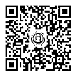

****报名请点击“阅读原文”****

# 今天才知道，历史上的木冥合相发生过这么多大事件！

> 原文：[`mp.weixin.qq.com/s?__biz=MzA5NjA0NTAxNg==&mid=2651429589&idx=1&sn=1c99acb57423d52586592ad29b178c9a&chksm=8b4b2862bc3ca174a33f15742679a630b9e95ee6b8f61e596dfe9ebd6e1feb36e214ab72a480&scene=126&sessionid=1692738090#rd`](http://mp.weixin.qq.com/s?__biz=MzA5NjA0NTAxNg==&mid=2651429589&idx=1&sn=1c99acb57423d52586592ad29b178c9a&chksm=8b4b2862bc3ca174a33f15742679a630b9e95ee6b8f61e596dfe9ebd6e1feb36e214ab72a480&scene=126&sessionid=1692738090#rd)

****************************☆ **************后台回复“今日”，给你一句生命态度**************

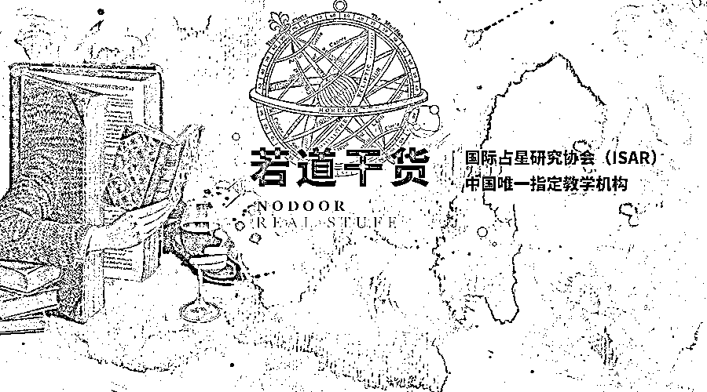

作者/亚历克斯·特雷诺韦瑟译者/江艺 校对/Arrow
编辑/玫瑰 图片/网络

2020 年 4 月 5 日，我们迎来了第一次木星-冥王星合相。2020 年 6 月 30 日 10:38，这两颗行星在双双逆行状态下再度合相。而当下，我们仍旧处在这个天象的影响之下，11 月 13 日，木星、冥王星将第三次精准合相。历史上的木冥合相都发生过什么？我们即将面临着怎样的新功课？来看看这篇简短却信息量很大的文章。

**木星与冥王星**木星和冥王星合相是一个有趣的周期，因为在天文学上，这两颗行星是截然不同的。木星是太阳系中最大的行星，它是一颗气态巨行星，表面有巨大的风暴，似乎控制着大小不一的众多卫星；冥王星存在一个双星系统（和它的卫星卡戎一起），它欺骗了科学家，让他们误以为它比实际要大。冥王星和卡戎是围绕一个中央重心旋转的两颗大岩石（完全不像地球-月球的重心是在地球中间）。就我个人而言，我一直觉得**冥王星-卡戎系统最重要的一点是不可见的**。
在神话中，木星和冥王星是相对的两极。木星（朱庇特）是天空之神，他在天空中的地位赋予他无所不知、无所不能和无所不在的能力。他掌管**法律和高等秩序**。冥王星（普路托）是冥界之神，凭借自身力量强大而富有。两者一起可以把小事闹大，这是可以理解的。在我开始研究当前和之前的周期前，我所预期的世俗事件有核爆炸、微生物学的进步以及通过私下调查发现重大秘密。我似乎发现了一些与我预期不同的东西。

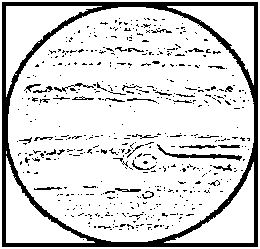

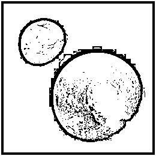

| 图一：木星；图二：冥王星和卡戎

**历史上的木冥合相发生了什么？**我想尽量避免挑三拣四，但是对于这么短的一篇文章来说，这是相当困难的。我基于木星和冥王星的紧密合相来选择人物和事件。这些只是一个小样本，但我想调查更广泛的信息基础。我很想知道如何做到这一点的其他想法。为了找到木星和冥王星合相的整个时间跨度，并且确保我没有错过那些狡猾的逆行期，我每周都用 Solar Fire 软件追踪木星和冥王星的合相。相当值得注意的是，这两颗非常不同的行星步伐如此一致，因而延长了它们的合相期。很简单，我从来没有想过用这种方法来观察合相。**木星和冥王星的合相（我个人运用不超过 8 度的容许度）几乎贯穿了整个 2020 年。**那么，木星和冥王星合相是如何展现的呢？我把这些合相按日期分成了几个部分，选择了一些拥有非常紧密合相的事件和人物，容许度只有一两度。并没有经过精挑细选，我很惊讶地发现，合相的事件似乎与木星-冥王星的主题和它们所在的星座相吻合。**1930 年**冥王星于 1930 年 2 月 18 日被发现，当冥王星位于巨蟹座 17°，木星位于双子座 6°。到 1930 年 8 月底，木星与冥王星在巨蟹座形成 8°内合相，到 10 月底，两者位于相同度数——巨蟹座 20°。冥王星在那个星期停滞，然后逆行。几个星期后，木星也转而逆行。这两颗行星保持 8°容许度内，到 1931 年 5 月再次精准合相，最终在 1931 年 7 月中旬离开容许度范围。18 个月对于合相来说是很长的一段时间，也是这些合相的最长期限。在这段时间里，**美国陷入了大萧条，这当然对整个世界产生了连锁反**应。据估计，GDP 下降了 15%，许多人在失去一切后结束了自己的生命。|《地狱天使》剧照 1930 年 11 月 15 日，木星和冥王星精准合相，让·哈洛主演的电影**《地狱天使》**上映。它使哈洛成为家喻户晓的名字。这部电影的标题就是这个合相的字面意思。尽管这部电影被誉为第一部有声动作电影，但它也因几名飞行员在拍摄期间死亡以及巨额预算而声名狼藉。

在合相期间的医学领域，**青霉素首次被用于治疗眼部感染，并研制出了预防白喉、百日咳和破伤风的疫苗（DPT）**。这是一个伟大的例子，微小、微观世界的抗体被用来预防重大疾病。由于这次合相的守护星与儿童和童年有关，因此，这些进步对易患这些疾病的儿童大有裨益。

**1943 年****1943 年 6 月中旬**，木星在巨蟹座，冥王星在狮子座，二者再次进入合相容许度内。到 7 月底，它们位于狮子座相同的度数，并合相太阳；到 9 月中旬，它们脱离容许度范围。

**在这段时间里，第二次世界大战爆发了，人们饱受战争的痛苦**。女人们的丈夫们和儿子们都在战壕里，因此，实际上剩下她们做通常由男人做的日常工作——而且第一次开始自己挣钱。这严重扰乱了权力的平衡，因为女性开始体验到掌控自己财务的乐趣。当男人们回来的时候，女人们当然不愿意回到厨房无偿工作。

7 月底，精准合相期间，**意大利独裁者贝尼托·墨索里尼被捕**。基本上，意大利被打败了。就在他被捕之前，他说：“7 年前，我是一个有趣的人。现在我只不过是一具尸体……是的，夫人，我完蛋了。我的星辰陨落了。”几年后，他的尸体，连同他的情妇和他政权的关键人物，被愤怒的众人倒吊着辱尸，这些著名的照片是完败的永恒形象。

米克·贾格尔（生于 1943 年 7 月 26 日凌晨 2:30，出生地英国达特福德，星图评级：A）是木星和冥王星合相狮子座的一个非常著名的代表。他以其在舞台上和卧室里的精力和活力而闻名。他和无数漂亮的女人有过关系，和 5 个女人有过 8 个孩子。他的乐队滚石乐队是最有影响力和最历久不衰的音乐表演之一。

**1955 年**

1955 年夏末，冥王星和木星在狮子座再次合相，到 10 月底，二者都位于狮子座 28°。木星继续行进到处女座，但在 12 月的第一周，冥王星开始逆行，几周后，木星紧随其后。1956 年 2 月初和 6 月，他们再次位于相同的度数（分别是狮子座 27°和狮子座 26°）合相。直到 8 月，它们一直保持在 8 度容许度以内。这个合相，就像 1930 年的合相，正逢这两颗行星的逆行。然而，合相的持续时间相对较短。就在精准合相的那一天，**越南战争爆发了**。这是一场代价高昂的残酷战争，许多人会说，这是一次没有必要的侵略战争。持续了近 20 年，实际上分裂了美国，出现大量的公众抗议，很多家庭被拆散，因为有良心的拒服兵役者为逃避被迫战斗而抛弃家园。

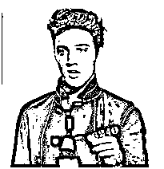

| 猫王

在更积极的方面，**1956 年 1 月，猫王埃尔维斯·普雷斯利以他的歌曲《伤心旅馆》进入排行榜**。这首歌对其他音乐表演者产生了重大影响，猫王也因此被称为“摇滚之王”。在如此年轻的年龄积累如此巨额的财富，他也继承了所有象征财富的浮华华。

比尔·盖茨（1955 年 10 月 28 日 21:15 出生于华盛顿西雅图，星图评级：B）出生在木星-冥王星合相狮子座时。作为**地球上最富有的人之一**，他靠电脑软件发家致富。有趣的是，他的贡献帮助我们消除了办公桌上的杂乱：我们有了电脑程序，取代了对实物的需求，如纸质文件、词典，照相机、录音机等工具。

**1968 年**木星和冥王星的下一次合相是在 1968 年夏末，在处女座。同年 10 月，他们处于相同的度数（处女座 23°），并在 12 月中旬前一直停留在容许度内。然而，在 1969 年 3 月，由于逆行运动，它们又处于合相的容许度内，并一直持续到 7 月中旬。**1968 年 10 月 1 日，电影《活死人之夜》在木星和冥王星在处女座相距 2 度时上映**。这部电影在评级之前就上映了，评级能够帮助指导父母判断电影是否适合他们年幼的孩子，然后再决定是否周六早上把他们送到电影院。这部电影把毫无防备的孩子们吓得魂飞魄散，现在它已经成为**电影分级的主要原因**之一。想象一下，当你还是个孩子的时候，你期待着一部半喜剧的恐怖电影，结果却遭遇了食尸鬼啃食人类，将他们变成了活死人。这部电影也被认为是“血液飞溅”技术的典范之一。血、内脏，还有大量的不死生物向你涌来。是的，我听着像木星-冥王星。

**1981 年**

1981 年 9 月，木星和冥王星再次会合，在 11 月初到达天秤座相同的度数。到了 12 月，他们离开了合相容许度。在 1982 年 5 月至 8 月，他们再次处在 8°容许度范围内，但没有达到精准合相。这一年，天秤座木星-冥王星合相引发了哪些重大事件？两场创纪录的婚礼怎么样？**1981 年 11 月 16 日，劳拉和卢克在《综合医院》中喜结连理。**这个电视节目的收视率史无前例，除了当年 7 月查尔斯和戴安娜的婚礼。在《综合医院》中婚礼举行前后，皇室宣布戴安娜王妃怀上了未来的英国国王。**1994 年**

1994 年 10 月中旬，木星和冥王星再次会合，11 月底，它们在天蝎座达到同样的度数，1995 年 1 月中旬离开 8°的容许度。由于逆行运动，它们在 1995 年 7 月处在 8°以内，但并没有更近。

正如我们按照年龄组教孩子，行星与木星（译注：相同的木星代表了同一年前后出生的人，类似孩子年级的划分）的合相一直是我的兴趣之一。

事实上，我所负责一整个年级的学生，几乎都有木星和冥王星合相。我教了他们 7 年，这段经历让我受益匪浅。我鼓励他们去旅行，我要求额外的课程和实地考察，弄得外语系筋疲力尽。他们的考试成绩是我们学校有史以来获得的最高分。

当**连环杀手、恋尸癖和食人者杰弗里·达莫在监狱里被谋杀**的时候，天蝎座的木星和冥王星（还有水星）处于 1°内合相。达莫的罪行是如此可怕，几乎不适合在一个正派体面的杂志上被提及。可以说，它很适合天空之神遇见地狱之神的主题。

实际上，达莫的木星在摩羯座，与处女座的冥王星成 1°内的三分相。这虽然不是连环杀手的星座特征，但值得注意的是他的死亡发生在它们合相时。

**2007 年**

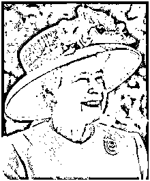

| 英国历史上在位时间最长的君主——英国女王伊丽莎白二世 2007 年 10 月，木星和冥王星在射手座相遇，12 月中旬，在射手座 28°的精确合相。几个星期后，他们就走出容许度范围。**2007 年 12 月 20 日，英国女王伊丽莎白二世成为英国在位时间最长的君主**，打破了维多利亚女王 63 年零 7 个月的在位记录。引人注目的是，这是一个跨星座合相，冥王星在射手座 28，木星在摩羯座 0°，而太阳夹在他们之间的射手座 29°。现任英国女王以她的**责任感和献身职责**而闻名。

由于我的主要兴趣是占星学和教育，所以我想指出的是，**许多 2007 年出生的孩子都有木星-冥王星合相**。当然，他们现在正处于青春期，**理解他们的学习方式将极大地帮助他们度过人生中这段非常棘手的时期。**

**2020 年**2020 年 2 月初，木星和冥王星在摩羯座处于 8°内合相。他们在 4 月初位于相同的度数（摩羯座 24°），由于逆行运动，会在 6 月底回到相同的度数（摩羯座 24°）。他们将在 11 月再次在摩羯座 22°精准合相，并一直保持在容许度内直到年底。值得注意的是，这与冥王星被发现之后，1930 年的木冥精准合相形成了 4°容许度的对分相。女王陛下，英国女王正在经历一段非常艰难的时期，正如我在其他文章中所说，这还没有结束。2020 年 6 月 21 日，不仅冥王星和木星将在摩羯座会合，而且这离她的上升仅在 3°内，同时也影响了苏塞克斯公爵夫人的上升点。威廉王子出生在木星和冥王星的跨星座合相时，2020 年 6 月 21 日的日食将合相他的太阳和月亮。

**版权声明：**本文由若道翻译发布，欢迎转发，反对抄袭。友号转载请申请白名单。

**更多精彩文章**

[土冥合相进入尾声，木星助你通关](http://mp.weixin.qq.com/s?__biz=MzA5NjA0NTAxNg==&mid=2651412090&idx=1&sn=342a68665492802574f06f9a78618602&chksm=8b4be4cdbc3c6ddbf8300d6a86b7b61b4ecb64fd74372547a6bfba830f05b074c9bc1204e3b6&scene=21#wechat_redirect)

[木土冥再聚首摩羯座！](http://mp.weixin.qq.com/s?__biz=MzA5NjA0NTAxNg==&mid=2651421072&idx=1&sn=8e3ec690fe730b908eb4f435eab372a2&chksm=8b4bcb27bc3c42315024bfac1aa175f12261c8e8d323f2f7d1d986daaeb0aad9ffeb192ef6d9&scene=21#wechat_redirect)

[土木冥极地之旅，始于极夜，终于极光](http://mp.weixin.qq.com/s?__biz=MzA5NjA0NTAxNg==&mid=2651412566&idx=1&sn=ba71bd85e67a9742fe9a76b2626634a8&chksm=8b4beae1bc3c63f71b58c70327e32874483a79a0b5aff0e62a2f02541acf0c32ae1af76c66c5&scene=21#wechat_redirect)

**亚历克斯·特雷诺韦瑟**

文学硕士，持有占星研究学院文凭，是一位经验丰富的占星师和中学教师，她周游世界，讲授占星学和教育。她发表的作品已被收入《同类》、《戴尔占星学》和许多其他杂志中。她也创作了《成长之痛》和《你喂养的狼》两本书，由威塞克斯占星师出版社出版。2015 年，她被克里希那穆提占星研究所(KIA)评为“最佳国际占星家”，表彰她的创新和突破性研究，她的研究基于敏锐的观察和统计分析，并与占星学理论巧妙地结合起来。

**系统学习占星学**

**点击下图了解详情**

**微信又又又改版啦，不想错过若道的推送？**

**就把若道设为星标吧！**

**▼**

就是这个“在看”，戳戳戳 ☟

********报名直达入口********

# 斯蒂芬“爱的内在炼金术”工作坊有感 | 真正的强大是柔软的

> 原文：[`mp.weixin.qq.com/s?__biz=MzA5NjA0NTAxNg==&mid=2651429589&idx=2&sn=4453787c9be40fc896b02db0883812e8&chksm=8b4b2862bc3ca17436ddb3384c55f3ec235dd6aa27ee73b81a59e7b14bd25c72c1bc6cb11d6f&scene=126&sessionid=1692738090#rd`](http://mp.weixin.qq.com/s?__biz=MzA5NjA0NTAxNg==&mid=2651429589&idx=2&sn=4453787c9be40fc896b02db0883812e8&chksm=8b4b2862bc3ca17436ddb3384c55f3ec235dd6aa27ee73b81a59e7b14bd25c72c1bc6cb11d6f&scene=126&sessionid=1692738090#rd)

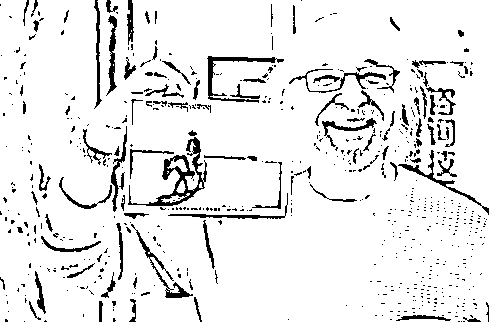

**作者/编辑/玫瑰 图片/若道**

**震撼于“亲密关系的穹庐”**

**很多单身的人都希望进入亲密关系，我们想像一下，他们如果能遇到那个完美对象的话，所有的一切就会像魔法一样。当然能遇到那个正确的人确实是有帮助的，但如果你本身是疯狂，遇到那个人根本没有帮助。因为疯狂的人根本没有能力经历那样正常的健康的关系，或者没法维系。**

**这是一个有力量的洞见，我们所有人都是疯狂的。它听上去像是糟糕的或是有点犯傻气的描述。但是你的出生星图描述的是你的灵魂来到这个星球上需要学习的是什么。非常清晰可见的，这些东西是你需要学习的，也是你未曾掌握的东西。**

**你的出生图描述了你灵性上的无知和无明，以及如何去修正它。其中一些灵性上的无明，是如何和其它人相处；其中一些灵性的无明无知，是你需要学习人类的性的关系。其中一些无名则意味着，我们与我们的愤怒，需要建立正确的关系。生命中充满着困难的问题，你出生图中所蕴含的伤口，与你个人的旅程是相联结的。它也告诉我们，在生命中无限的旅程中，你需要把你的下一步放在哪里。**

**——斯蒂芬·弗里斯特**

这是我第一次听斯蒂芬老师的工作坊。之前就早耳闻老爷子的睿智、幽默、深刻和慈悲，但坦白讲，第一天的课程除了让我有些昏昏欲睡，并没有带来太多感受——而这一点，在第二天的课程里，被斯蒂芬老师的案例解读 cue 到：案主和我有一个共同的配置，木星狮子座落在 5 宫。用老师的话：“木星是众神之神，狮子座是百兽之王，木星狮子座，就是王中王。”

是的，在 5 宫自我展现的领域，我时常有一种“高傲”。觉得自己小有建树，学习占星学如此多年，尽管工作坊的主题十分吸引我，木星式的膨胀却让我有一种“我看你能讲出什么洞见？”的莫名不逊感（汗颜中）。

但是，当晚上复盘视频的时候就不一样了。第二天的课程，一大早便上了闹钟起床，端坐在手机前洗耳恭听。这样的变化也就发生在十几个小时之内。**属于每个人“爱的内在炼金术”**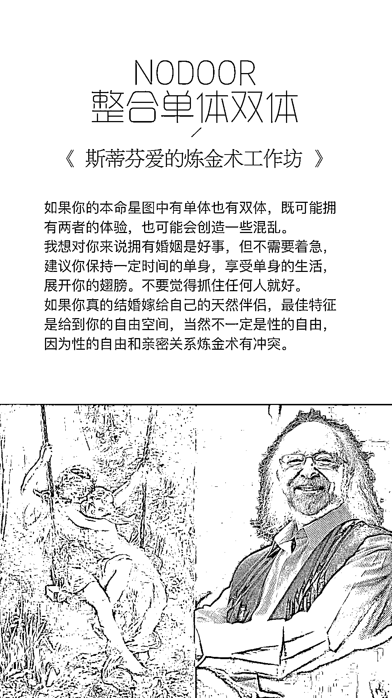“亲密关系的穹庐”工作坊中，斯蒂芬老爷子构建了一个理论——**亲密关系的穹庐（Arc of intimacy），也被称作爱的穹庐（Arc of relationships）**，将星图中的 4-8 宫结合在一起，完整地阐述了一个人**从原生家庭（4 宫）到爱的狂喜（5 宫）、谦卑（6 宫）、彼此接纳不同（7 宫）、深度袒露（8 宫）、通过两性真正的亲密建立新生家庭（4 宫）、生育子女（5 宫），继续穹庐循环**的过程。

**在所有人类中间，大约有 2/3 的人，来到这个世界的使命是在“关系”中修行的，这个“关系”不一定是婚姻，但是却一定是通过另外一个人的帮助，去学习“爱”和“信任”的功课，我们称之为“双体行星”；而剩下的那些人，却不一定需要走入关系，而是学会和自己相处，我们称之为“单体行星”。那些单体行星的人类，很多选择这样的人生道路的人类，他们大多数人的意识也许是超越其他人的。这些不同的选择对于不同的人类来说都是正确的，只要符合他们自己的能量，真实地活着。**

**如何判断自己的行星类别？第一个方法，看看星图中是否有比较多的行星落入“亲密关系的穹庐”（Arc of intimacy）——是否有行星落入 4 宫、5 宫、6 宫、7 宫及 8 宫；第二个方法，如果你的星图中关于关系的“议题”或者“主题”突出，那么你也是双体行星。**

**——斯蒂芬·弗里斯特**
作为一个几乎所有行星排满穹庐的人，生命的很多体验在 8 宫形成了断崖一般的坑洞，在过去对占星学和个人亲密关系的理解中，我会要求自己从 8 宫直接升华到 9 宫，以及其后几个更为人智和社会层面的修行。但是，即便行进土星、木星、冥王星已经走到我的 11 宫，却总感觉有些东西遗落在 8 宫里了。斯蒂芬老爷子的“穹庐理论”令我豁然开朗：8 宫的下一步，完全可以回到 4 宫，做人间情爱的循环，也许有些双体行星的人一生就要在情爱里摸爬滚打（比如我），又为什么非要放下所谓的执著和 ego（小我）呢？在这里，斯蒂芬老师也特别强调：**ego（小我）并非一个“坏”的词**。既然如此，**当我们在亲密关系里遭遇挫折、失败的时候，又为何非要让自己放下呢？**就如李健歌词中所唱：“可我舍不得，舍不得今生与你错过，我怎能，如僧人（12 宫）般洒脱？”我以为自己已经修炼到不再那么需要亲密关系，我以为追逐情爱、沉沦亲密，就停留在 8 宫，便无法灵性超脱，但其实，这还是一种放弃式的自我逃避。**如果还有一些东西留在了亲密关系的情路里，需要做的也许不是砍掉它，“修”没它，而是带着慈悲心再回去拥抱它。**为什么我们遇不到适合相爱的人？针对这个问题，斯蒂芬老师提供了从出生星图中获取**天然伴侣画像**的方法。下面，是一些值得反复研读的金句，请大家收藏之。

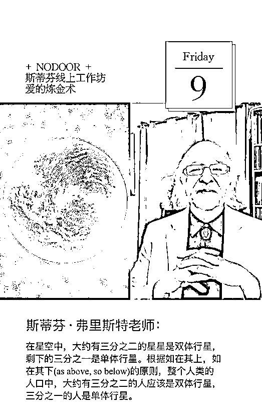

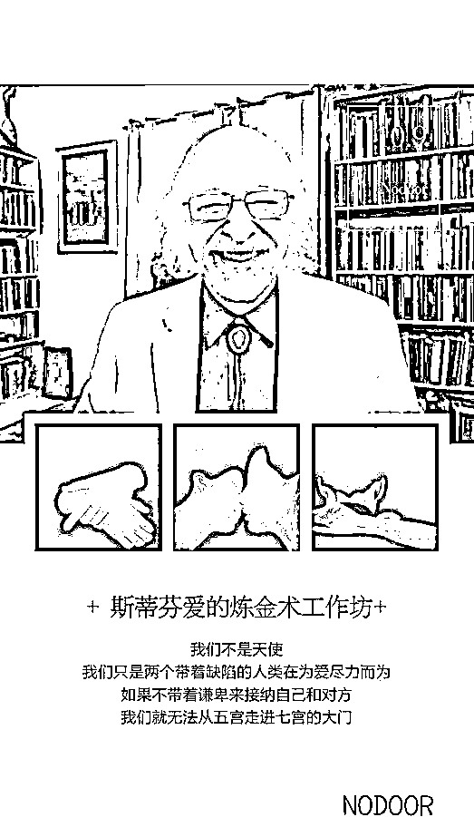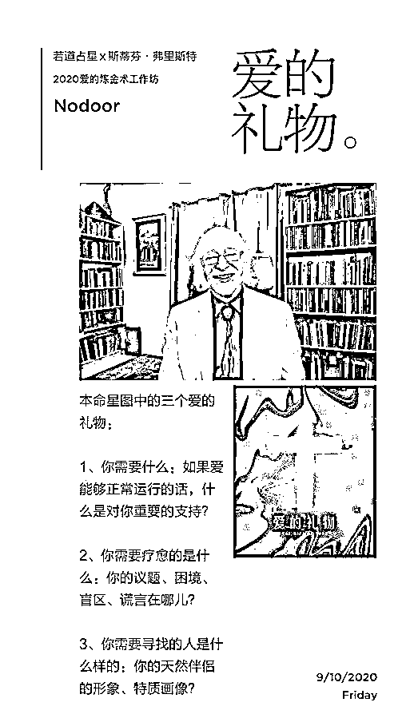

这时，有同学问：**“如果现在的伴侣并不完全符合天然伴侣的画像，该放弃当下的关系，继续寻找，还是彼此磨合呢？”**我想，这个问题也代表了很多小伙伴的心声。对此，斯蒂芬老师这样回答：**“星图中的天然伴侣就在海上航行，我们可以把罗盘设置到北极星的方向，但永远无法期待自己真的能航行到北斗星的位置。更重要的是通过天然伴侣的画像完成内在爱的炼金术，去认识和实现进化中的自己。”****外面没有别人，只有你自己。所有的伴侣都是我们内在功课的帮助者，即便是“失败”的关系也一定有其意义。**爱情就像升级打怪，不经历九九八十一难，又怎能发现自我，完善自我？一个没有自我觉知的人，是疯狂的人，这时候即使给了你一个“灵魂伴侣”，那也只能是一场灾难。分享这段话给大家，是因为我想有很多人和我一样，在爱的道路上遇到过挫折，受过创伤，便不再相信，甚至不愿努力。然而，就像斯蒂芬老师所说：“我们不能期望一个自然伴侣能够不通过你的任何努力就来到你身边，给你一切你想要的。”那只是一种**自我成长的逃避和推卸责任。**

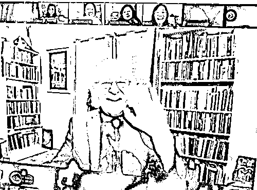

| 斯蒂芬老师在线上工作坊与同学们同屏合影娓娓道来的爱与慈悲第二天四个小时的课程里，我两度流下了眼泪。第一次流泪，是提到亲密关系穹庐的第 7 宫时，斯蒂芬老师说：**“我们接受对方同我们的不同，接纳对方的一切，允许对方成为他（她）自己。”**那一刻，我深深看到了冥王星落在 7 宫的我对于伴侣的不接纳和不宽容；第二次流泪，是在案例解说环节，对于南交天秤座 7 宫，北交白羊座 1 宫并合相太阳、水星、土星白羊座的案主，斯蒂芬老师解读道，也许案主在前世曾经遇到了一个不知怎样的男人，深受婚姻的困扰，这一生，她需要学习成为一个独立、强大、自我有效性、权威感的人。作为一个太阳摩羯座，斯蒂芬老师并未煽情，也没有激动不已。他只是缓慢而平静地说着，而我却在那一刻感受到了一种莫大的慈悲和懂得，以及背后蕴藏着的，深刻而稳定的力量感。

直到现在，写下这些话的时候，眼泪还是盈于眼眶。并非委屈，也不是自怨自怜。作为一个从业多年的占星师，我似乎看到了所有曾经咨询过的客户，看到了他们的痛苦、挣扎，以及不屈不挠的自我成长的勇气和决心。

这一刻，我真正感受到了属于木星狮子座的荣耀：我们的不可战胜，不在于不可一世的傲慢，而是臣服于自然之后，对命运馈赠的感谢——感谢那些让我们荣耀的，也感谢将我们击倒的，因为，我们终将站起来，高举成长的大旗，完成内在爱的炼金术，滋养和荫护我们的家人、孩子、爱人。Go through the arc of intimacy, regain the inner glory!

我感觉到自己内在爱的炼金术也在悄然完成着。真正的强大是柔软的

在案例解读环节，面对群星白羊座的案主星图，斯蒂芬老师描绘案主的天然伴侣应该是一个同样强大的人：**“和她一样强大的人会进入她的关系，一个强大的人很难和弱小的人一起，即使是很相爱。那样，她需要在他身边变得小心翼翼，没有办法放松和真实地表达自己。‘平等’很重要，需要一种相似的力量。她需要那个和她力量匹配的人，和她一样强大的人就可以一起放松，不是比赛而是和谐。（案主）太阳在 7 宫，很明显地强调了这一点。”**

对此，同学群里有了一番讨论。

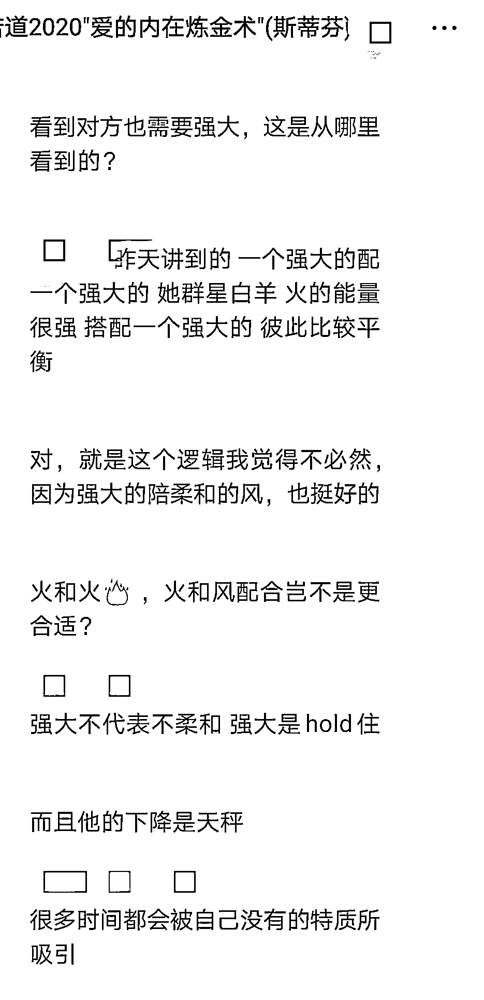

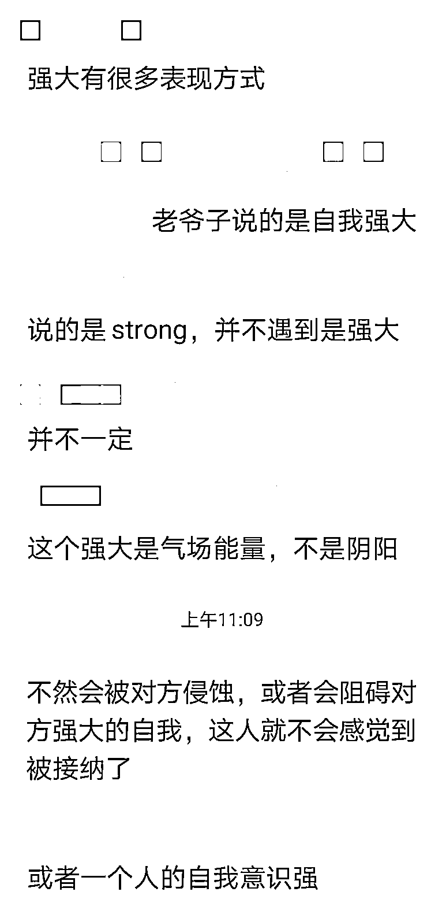

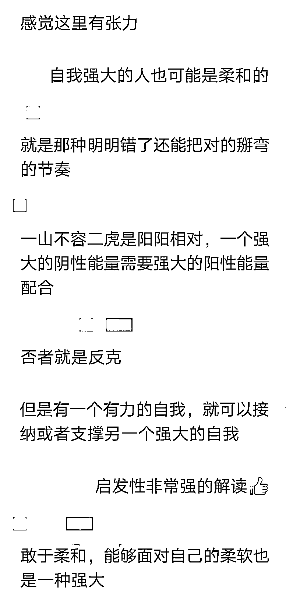

这也让我想到了**当下一些所谓的“女权”思潮，看起来更像是一种和男人争夺关系“权力”的强悍，这种强悍的背后，其实反而是深深的脆弱。而一个真正强大的人，很可能是柔软的。**正因为强大，才敢于柔软下来。斯蒂芬老师无疑是强大的，但他的语言、行为都温和有礼，毫无侵略性。也是在这样的场能中，才能让每个人放下抵抗和激辩，深深思考，并为之触动。身边的很多人，包括我自己，都时常在两性关系中产生“爱我就要懂我”的执念，可是，一个连自己都不懂的人，又怎能吸引来懂你的另一半？这或许也是爱的内在炼金术最重要的环节吧：**我敢让你看见我所有的脆弱，因为我自己先接纳了他们。**愿我们都成为真正强大而柔软的爱人。

**版权声明：**原创文章由作者授权首发于若道平台，欢迎转发，反对抄袭。友号转载请申请白名单。

****

****想阅读更多作者的文章****

****请在后台回复******玫瑰****** 即可****

**玫瑰**

英国 Cass Business School 管理学硕士

若道 2015 届核心课程毕业生，若道微信公众号兼职编辑

占星师，咨询时长超过 600 小时

**个人微信号：**Still_Queen_Astro

**公众号**：一个娘娘 

长按二维码，给作者打赏

**斯蒂芬线上工作坊最后一班车！****请长按下图添加客服微信咨询**

**想听听大师斯蒂芬老爷子的精彩讲座？****长按下图了解详情！**

********报名直达入口********

# 雷蒙德·梅里曼金融占星周运 | 水逆火逆，摇摆不定的一周！

> 原文：[`mp.weixin.qq.com/s?__biz=MzA5NjA0NTAxNg==&mid=2651429589&idx=3&sn=e50768a38ff89c3e6263812af8e7d846&chksm=8b4b2862bc3ca174f032b17a9ecf7b073fde2bd156b555118cbc22630aea810f2c15b627bcde&scene=126&sessionid=1692738090#rd`](http://mp.weixin.qq.com/s?__biz=MzA5NjA0NTAxNg==&mid=2651429589&idx=3&sn=e50768a38ff89c3e6263812af8e7d846&chksm=8b4b2862bc3ca174f032b17a9ecf7b073fde2bd156b555118cbc22630aea810f2c15b627bcde&scene=126&sessionid=1692738090#rd)

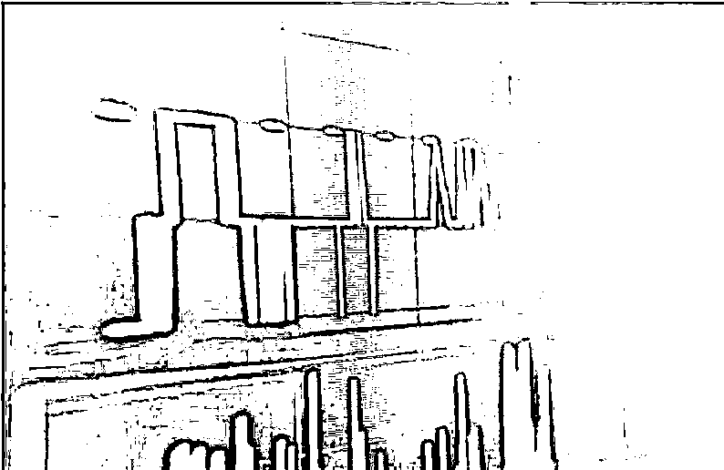

作者/雷蒙德·梅里曼
译者/李含编辑/玫瑰 图片/全景网雷蒙德·梅里曼是在金融占星学界稳坐第一把交椅的占星师，同时他也是若道签约的金融占星课老师，我们引进了雷蒙德·梅里曼老师的《[上证指数+黄金周期月度报告](http://mp.weixin.qq.com/s?__biz=MzA5NjA0NTAxNg==&mid=2651429179&idx=2&sn=f8de355cad74fae187ee1233c56b04d1&chksm=8b4b2b8cbc3ca29a9b34ea2a9ee64acc2f4d9d82db54663207ac5a2722ced9126f0610f45172&scene=21#wechat_redirect)》《[2021 年金融预报](http://mp.weixin.qq.com/s?__biz=MzA5NjA0NTAxNg==&mid=2651425978&idx=1&sn=067bd68ece37e1e820d6f84f7a3cc960&chksm=8b4b3e0dbc3cb71b866f65d51f7993d3c35dee77cebd77eda3f63a4d5864dadaea2e9d14c101&scene=21#wechat_redirect)》。我们经老师的授权，将每周刊登梅里曼老师的周运，供大家参考和学习。于是，这是本周的周运（10.12-10.16）。**说明：以下时间采用纽约证券交易所所在地美国东部标准时间。**
**展望与回顾**

**特朗普在福克斯商业网（fox business Network）接受主持人玛丽亚•巴蒂罗莫（Maria Bartiromo）采访时断言，如果拜登当选，市场就会崩溃。特朗普还援引拜登的税收计划，声称这位前副总统将“向这个国家征税，使其陷入 1929 年那样的大萧条。”**

**——罗伯特·施罗德****《特朗普声称拜登获胜将引发市场崩盘，导致大萧条》www.marketwatch.com****2020 年 8 月 13 日**
这可能是一年中最具挑战性的地球宇宙学时间段之一。世界（和欧盟）似乎正在分崩离析，没有机会痊愈，而美国在任总统在距离大选只有三周的时候，在民调中的支持率越来越低。但是全球的股票市场一直在上涨。这就像市场不相信特朗普会输，因为几乎所有人都认为，如果他真的输了，股市将陷入深渊，这将使 3 月的下跌看起来像是某种无辜的意外挫折。好吧，也许拜登的胜利和股市恐慌的前景并没有得到普遍认同，但这是总统上周（以及之前多次）所说的，也是许多市场评论员所相信的，包括你的真实看法。是的，从历史上看，在民主党总统任期内，股市表现良好。但它们开始的时候并不总是那么好，它们最好的表现时期，就是共和党人同时控制国会的一个或两个分支机构。**强大的地球宇宙学的高亮时间段确定为 9 月 28 日至 10 月 19 日，目前大约就在其中点。**似乎全球许多股市的一个重要低点就发生在 9 月 24 日，就在这段时间开始的两个交易日之前，土星改变了方向，并与行进火星成四分相。现在我们正处于这个时间段的中间，同样的股市正在飙升到至少 3 周来的最高水平。就印度的 Nifty 指数和日本的日经指数而言，股市回到了 2020 年 2 月疫情爆发开始以来的最高水平。黄金和白银上周也出现了积极的上涨。金价在两周前在 1851 触底后，周五在 1930 上方交易。白银更令人叹为观止，从 8 月 7 日的多年高点 29.91 跌至两周前 9 月 24 日的低点 21.81，在 7 周内完成了 27%的跌幅。但截至上周末，到达 25.33，涨幅为 16%。上周低点为 10 月 6 日（周二）的 22.96。这一点意义重大，因为正如上周一晚上我们的梅里曼市场时机学院日报中所说的那样，当白银收盘于 24.52 时，“周二和周三是关键的日子，太阳、月亮都在风象星座，这对白银来说总是一个危险。激进的交易者（可能会）在大跌到 23.00+/-0.25 的情况下进行回购。”有许多市场分析师错误地声称自己无法把握市场时机。我们经常这样做。但话说回来，他们没有——或者不想学习我们拥有的工具。对于那些不喜欢严格的工作、学习和分析的人来说，购买和拥有策略要容易得多。原油和比特币近几周也有不俗的表现。但上周表现抢眼的是大豆，价格暴涨至 1080，创下四年来的最高价格。2020 年，土星和木星在摩羯座与冥王星合相，这非常吻合大豆价格与地球宇宙学周期的历史相关性。**短期占星趋势和长期考量**

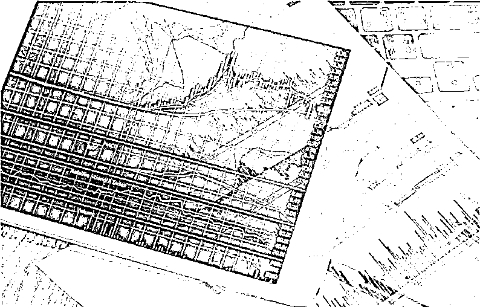

**“20 万人在他眼皮底下死去，有多少人幸存下来？”乔·拜登在第一次总统选举辩论中说。**

**——佩吉·诺南**

**《新型冠状肺炎病毒带来了十月惊奇》**

**《华尔街日报》**

**2020 年 10 月 3-4 日**

就世界和国家的活动而言，这已经是一个令人难以置信的地球宇宙学时间段。它始于 9 月 29 日的总统辩论，这与两位候选人争夺世界上最强大国家总统的所有其他辩论都不同，两天后，特朗普总统和第一夫人（以及他的几名核心圈子成员）确诊了新冠病毒肺炎，接下来，总统决定退出激烈的谈话，但两天后，他宣布他现在想要一个非常大的刺激方案，同时意识到这只是这个非凡的地球宇宙学时间框架的一半。这（目前）还没有对股市产生负面影响，但也不符合对未来乐观展望的普遍感觉。事实上，我会认为，**政治局势所产生的集体压力甚至绝望程度正在增加。**上周，我收到了很多来自特朗普支持者的邮件，他们非常失望，因为我的报告说，几乎所有的民调都显示总统没有赢得辩论，尽管他说根据所有的民调，他赢得了“巨大的胜利”。我查看了有关“真清晰政治”的民调，特别是拉斯穆森民调，这是 2016 年所有主要民调中最正确的，我注意到，在第一个民调周期中，特朗普实际上在辩论中领先拜登一个百分点。但自辩论表现之后，他已经落后拜登两位数。就连拉斯穆森过去一周的股价也下跌了 12%。这听起来不像是在辩论中“大获全胜”的人。这听起来像是在辩论中输掉了“重大时刻”的人。但对于阅读我每周专栏的特朗普支持者来说，仍然有理由抱有希望。请记住，就在 2016 年的这个时候，《走进好莱坞》的录像带问世了，当时所有人都认为一切都结束了。特朗普不可能从丑闻中恢复过来并获胜。然后他就是做到了。同样值得注意的是，如果一位候选人能在两周内下跌超过 12%，而另一位候选人的支持率上升了那么多，那么 12%的赤字也可能在 3 周内显现出来。**考虑到火星在 11 月 13 日仍在逆行，水星在 10 月 13 日至 11 月 3 日（选举日）逆行，并且考虑到 10 月 31 日的满月与天王星合相，就在选举日的前三天，我不排除会有更多的突然变化可以逆转这一趋势。**换句话说，所有这些逆行的行星和天王星在选举之前和进入选举期间都很突出，暗示着直到它结束才会结束。甚至很可能到那时也不会结束。在水星逆行、火星逆行的情况下，股市会有怎样的表现？变幻莫测，而且可能充满了假突破。未来三周的关键词是：**离奇、戏剧性、令人惊叹、难以置信，或许会令人震惊**。我认为一些非常令人不安的新闻事件和指控仍在等待发布。它们是真是假是另一回事。但我还是继续上周的建议：**不要相信你所看到、听到或读到的。**至于交易金融市场，我认为你的**视野越短越好**。在接下来的几周里，你认为将要发生的头寸交易可能会是一次痛苦的经历，因为火星和水星（尤其是水星）的逆行在市场上以其摇摆不定的行为而闻名。当然，这与新闻中摇摆不定的事件有关，可能与世界领导人政策公告的反转有关，或与其他不受控制的事件有关。

**说明：以上日期基于纽约证券交易所所在的美国东部标准时间，由于存在时差，中国地区可能需要加一天。**

**版权声明：**本文由若道翻译发布，欢迎转发，反对抄袭。友号转载请申请白名单。

**雷蒙德·梅里曼（Raymond Merriman）**

若道签约老师。著名金融占星师，ISAR（国际占星研究协会）前主席，梅里曼市场分析公司的总裁。他由于“提升了占星学的职业形象”，在 1995 年国际占星大会上被授予轩辕十四奖；在 2012 年国际占星大会上，被授予轩辕十四终身成就奖。

1“中国上证指数月度报告”发售

**若道推出了****中文版****的雷蒙德·梅里曼中国上证指数月度报告，并持续发行该报告！**

当把金融市场的周期和占星学的周期相结合时，雷蒙德·梅里曼老师的金融占星学研究**为投资者应对金融市场的周期波动，并随之调整投资策略提供了极大的价值参考**。

**10 月中英文报告均已上线！**

2“黄金价格周期月度报告”发售

**若道推出****中文版****的雷蒙德·梅里曼黄金价格周期月度报告！**不仅仅为广大读者在中国股市的投资出谋划策，更将视角放眼黄金市场。

**每当世界经济形式不明朗的时候，有一个地方是保值的港湾，那就是****黄金**。自 1982 年雷蒙德·梅里曼出版第一本研究《地球宇宙学征象与黄金价格的关联》的著作以来，**他一直作为最重要的黄金市场时机预测者之一享誉国际**。

8 月的黄金终于从高位开始下跌，有些分析人士认为，黄金在过去连涨 9 周是非常极端的，因此走势未来不会太强了；也有人认为，在目前各国大放水、国际局势不稳的情况下，黄金可以继续看高。

那么，你该如何面对目前的调整呢？是等待回调继续进行，还是在什么位置买入？9 月黄金周期报告等着你。火星已经进入逆行阴影期，很多国家都纷纷再次爆发新冠肺炎病毒疫情，未来的几个月注定不安宁。黄金的走势会安宁吗？

9 月黄金报告已经上线，上证报告也会在月底上线。欢迎了解。也可以按照季度和一年期订阅，有更多优惠。季度和年度的好处是，你可以持续了解梅里曼老师对于不断在变化的市场的看法。即便他某一次看法和市场不一致，你也看到在下一期他如何调整自己的看法，并看到金融占星在一个长期时间段内对你把控风险的帮助。而能够长期控制风险、尽量找到安全的投资时机才是投资的长久之计。

**10 月中英文报告均已上线！**

**购买套餐**，买得越多越优惠

中国上证指数月度报告套餐价

*   **单月报告**：280 元

*   **3 个月套餐**：780 元（260 元/月）

*   **12 个月套餐价**：1999 元（166 元/月）

**长按下图识别二维码**

**购买金融报告****套餐**

**▼**

黄金周期月度报告优惠

*   **双报告年度套餐更优惠（直降 899 元）**
*   **12 个月黄金报告+12 个月上证指数报告：仅需 3500**

**长按下图识别二维码购买黄金报告套餐**

▼

1976 年以来，由雷蒙德·梅里曼撰写的梅里曼市场时机学院每年一次的年度预报沙龙和每年一本的《年度预报》一直在应用占星学原理为投资者们服务，提供卓越洞见，从未间断。

过去两年，3 小时的年度预报讲座和长达 200 页左右对金融市场的分析报告，帮助许多若道读者做出正确的投资决策，降低了投资风险，并获得相当不菲的投资收益。在群星摩羯座的时候，我们和你一起提早规划自己来年的投资安排。

**2021 年金融年报预售**

**1976 年以来，由雷蒙德·梅里曼撰写的梅里曼市场时机学院每年一次的年度预报沙龙和每年一本的《年度预报》一直在应用占星学原理为投资者们服务，提供卓越洞见，从未间断。**

过去两年，3 小时的年度预报讲座和长达 200 页左右对金融市场的分析报告，帮助许多若道读者做出正确的投资决策，降低了投资风险，并获得相当不菲的投资收益。在群星摩羯座的时候，我们和你一起提早规划自己来年的投资安排。2021 年年度预报开始预售**前 50 名预售价格**：1080 元（已售罄）**前 50-100 名预售价格**：1180 元**100-150 名预售价格**：1280 元**150 名之后价格**：1380 元**2021 年年度预报中文版预计发布时间**：2020 年 12 月底**沙龙时间**：2021 年春节前后**沙龙形式**：英文讲座，配有中文翻译**点击下图了解详情**

▼

******点击阅读原文购买金融报告******

# 特朗普新冠出院丨看大选走势，先读懂美国国家星图中的这个相位

> 原文：[`mp.weixin.qq.com/s?__biz=MzA5NjA0NTAxNg==&mid=2651429580&idx=1&sn=41a68055f451aa5008db6de5d9360634&chksm=8b4b287bbc3ca16d8f0f3e7fc9e494ec6bbadfe12c31122b886e1c7bdb0253facc99c03393d1&scene=126&sessionid=1692738095#rd`](http://mp.weixin.qq.com/s?__biz=MzA5NjA0NTAxNg==&mid=2651429580&idx=1&sn=41a68055f451aa5008db6de5d9360634&chksm=8b4b287bbc3ca16d8f0f3e7fc9e494ec6bbadfe12c31122b886e1c7bdb0253facc99c03393d1&scene=126&sessionid=1692738095#rd)

******************☆ **************后台回复“今日”，给你一句生命态度****

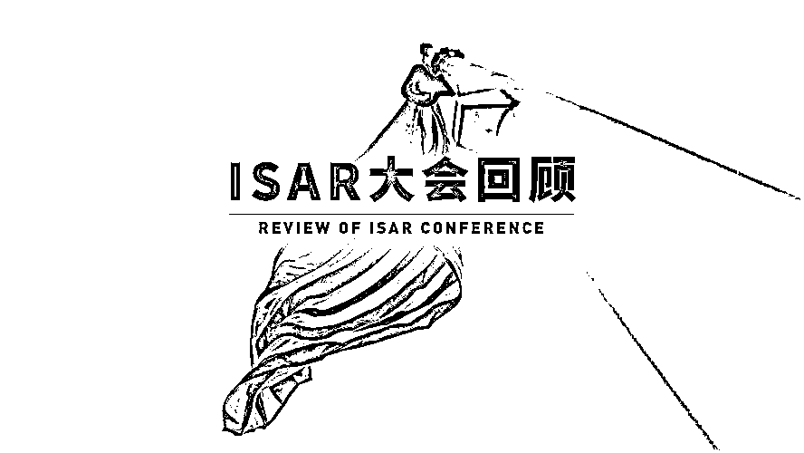

讲述人/文字整理/ Serina Sun ISAR 认证占星师编辑/翀子 封面/书君 图片/ Serina Sun、网络在线上 ISAR 大会，圆桌会议嘉宾之一、生活在纽约的 Serina 对美国星图上的压力重点、现实状况、特朗普与美国星图的能量共振、选举策略和美国正在经历的挑战做了精彩分享，让我们一起来回顾吧。如果你想聆听大会完整内容，可以拉到文章末尾了解详情。

**（本文为 ISAR 大会圆桌讨论的发言节选，仅代表讲述人个人观点）**

大家好，我是 Serina，我现在在纽约。

今天我想跟大家分享的是我眼中的美国社会现状，以及美国大选与占星学之间的相关性。

熟悉我的朋友们都知道，两个月之前，我们全家都在美国感染了新冠。

这个事情的起因，是老公的哥哥没有带口罩去参加教会聚会，他是家里第一个被感染的，把病毒传给了我们。我们从 3 月以来都很谨慎，基本不外出，反而对家人没有设防，也真的算是一个意外。

通过生病，我也真切的感受到了美国当下的集体意识：

第一，美国感染到新冠的人数，真的是太多了。单从官方的数字看，目前已经逼近 700 万。而从实际情况看，很多人即使发病了，也不会去检测，因此实际患病人数要远高于这个数字的。

第二，向来标榜自由民主的美国民众，即使在疫情非常严重的时候，也有相当一部分人，是拒绝戴口罩的，认为这是一种专制。

第三，还有人认为新冠的严重性是被政府高估了，这是一场政治阴谋。因为疫情，社会的很多其他矛盾被激活，比如种族问题，还有警察暴力执法的问题等，前阵子闹的沸沸扬扬，黑命贵运动，每天都有示威游行，有些地方游行又升级成了打砸抢。

美国是两党执政国家，它们分别是民主党与共和党，现在的总统特朗普，是共和党。前任奥巴马，是民主党。

疫情期间，你打开新闻，就是两个党在吵架。他们会为什么吵呢？

为了失业金的预算吵，吵来吵去几个月过去，政策还没出台。为了讨论究竟是封城还是不封城吵。大家互相唱反调，你支持的，我就要反对。

总之，我来美国 10 年，今年看的热闹实在是太多了。

特朗普是一个充满了争议的人物，我认为，他的背后，其实折射出的是冰火两重天的美国民众，喜欢他的，超级力挺，夸他真实、不拘一格、有魄力等等。

不喜欢他的，觉得他完全是个疯子，精神失常，套路荒诞。

那我们就不禁有这样一个疑问，究竟为什么这样的一个人，成为了美国总统，并且还有很大的可能连任，继续执掌美国接下来的 4 年。

这个问题，**我从占星学中，找到了一些有趣的答案。**

**美国星图的压力重点**下面这张星图，是美国的国家出生星图，关于究竟用哪个具体时间作为出生时间，这在占星学界一直有好几个不同的看法，而我选择的是独立宣言签署的时间，下午 5:10。我用的宫位制是整宫制。
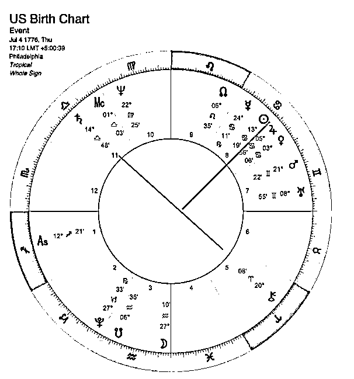

**| **美国建国星图

我今天会将主要精力放在一组相位上，就是**美国星图上的 T 三角相位**，**太阳巨蟹座-土星天秤座-凯龙星白羊座**，这三者之间的故事。略有一些占星学知识的朋友们，都知道**T 三角相位不是一个轻松的格局**，而且三角形是很稳定的结构，不易改变，**三角形的顶点**，也就是**太阳巨蟹座**这个位置，承担了一个相当大的压力。因为另外两颗星体，土星与凯龙星之间有一个 180 度的张力，我们可以想象**这是一个跷跷板，力量有可能在两者之间你高我低，而作为顶点的太阳，有可能是最挣扎，和最分裂的，被两股力量撕扯。**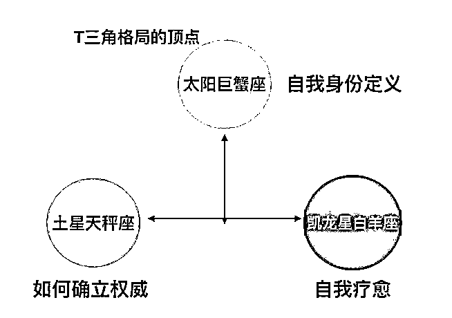从**星座原型**上看，太阳巨蟹座象征着这个国家的主权、自我身份的确立，也就是我是个什么样的国家。巨蟹座是追求美好家园生活的，这一点其实非常的符合美国的主流价值观，那就是家庭。**土星天秤座**是有关如何确立权威的。这里一个非常有意思的呼应就是美国对权力的追捧，总是在一个二元对立中进行，这也非常符合天秤座的星座原型，**喜欢把整个世界一切为二**，比如说，他的执政党，是两党，在种族问题上，存在黑人白人的冲突，对外国际关系呢，又总是树立一个假想敌，以前是苏联，现在呢，成了中国。
这个**太阳与土星的四分相**，代表着一种挣扎，是一个国家对自己到底有多少权威的惶恐，他极度需要被肯定，假如无法驾驭权力，掌控关系，就会对自我产生怀疑。再来看**凯龙星在白羊座**，它似乎是在提出一个解决方案，我们需要战斗，需要拥有个人主义精神，呼唤英雄式人物对自己救赎。我们其实可以去观察**好莱坞那些最卖座的大片，它一定是符合这个 T 三角原型的**，你只要看透了这一层本质，你就知道，想生产出受大众欢迎的商业片，就必须走哪个套路。每个大片里，必须出现的主线是，那里有一个危机，比如天灾人祸。外星人来了，洪水来了，地球马上就要不行了，等等，然后呢，肯定有一个英雄，会挺身而出，为了国家集体而战，同时呢，这个英雄还要解决自己的原生家庭问题，在救国救民的过程里，顺便把自己原生家庭创伤也疗愈了。最后结局，皆大欢喜。这就是美国梦。这也是美国持续向世界输出的价值观。这是它希望世界对他的身份认同，也就是世界的救主的形象。你看，**自我身份-权威-战斗与救赎，这个 T 三角的原型**，屡试不爽。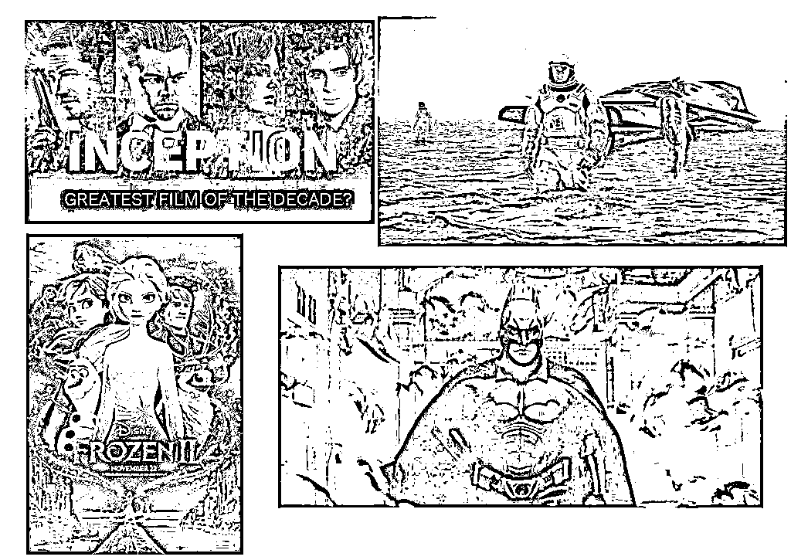

**| **美国主流商业电影

**现实中的美国是怎样的？**

我来美国 10 年了，据我个人的观察，我觉得跟电影里表现的，恰恰相反。

真实的美国，其实是这组 T 三角的负面表现更多一些。

怎么说呢？美国一直非常的在乎自己的全球老大的地位，骨子里面，缺乏的是安全感，我觉得这是一个日土四分相的经典体现。

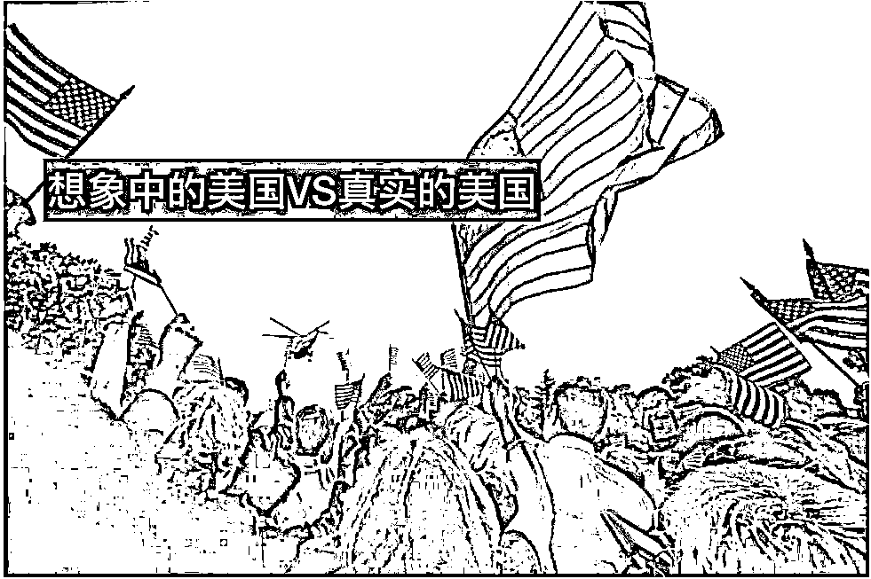假如我们把这个国家看作一个人，这个人很可能就是那个整天害怕不被父亲认可的小孩子，内里很敏感，很脆弱，始终感受不到满足，这个小孩日后**可能会表现的很霸道，但内心深处总有一块无法被疗愈的伤。**假如说美国也有原生家庭的议题，我想，或许就是因为这是一个移民国家，这里生活的群体，与自己祖先、源头的链接断开了，包括后来又被殖民，所以就**格外的渴望有一个明确的自我身份**，在这片国土上，我究竟是主人，还是客人，我到底有没有力量。
我观察我的女儿，她就是在美国出生和长大的，俗称 ABC，她就会对自己的身份很难有所界定，不像我，无论我离家多久，我始终坚定不移的认为自己是中国人。而这些移民的第二代，她虽然觉得自己是美国人，但是又觉得自己的肤色怎么跟人家不一样啊，没有真正的归属感，你让她认祖归宗吧，她也觉得对东方的文化非常陌生。在美国长期生活的民众，都会遇到这种**身份认同的迷茫**。所以集体潜意识里，很可能在**循环这个 T 三角主题**：对自我以及权威有很强烈的执着，也不得不靠英雄式的战斗，来获得灵魂深处的疗愈。所以我们看到了这一层，就不难理解，为何美国想时不时的打压一下中国，其实是对自己的不自信，看到东方一个大国在崛起，土星在天秤座的那个恐惧感就发作了。实际情况呢，他并不明白东方的哲学和价值观，也很难到达无为和放下我执的境界。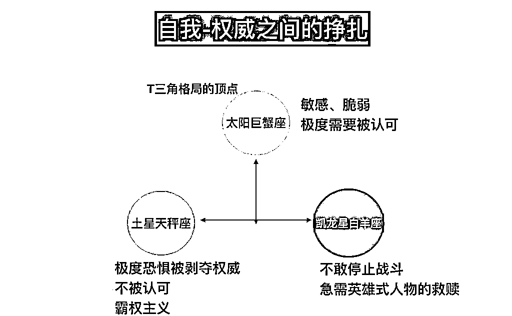

整个美国民众，也都是国家星图的表演者。

**集体潜意识投射出一个被需要的英雄，来拯救这个国家——正是在这种集体需求下，特朗普被推到了舞台中心。**

****

**特朗普与美国星图的共振**我们看，特朗普的出生星图。**群星巨蟹座，金星土星巨蟹座，四分天秤座的凯龙星。**这是多么有趣的一个主题再现。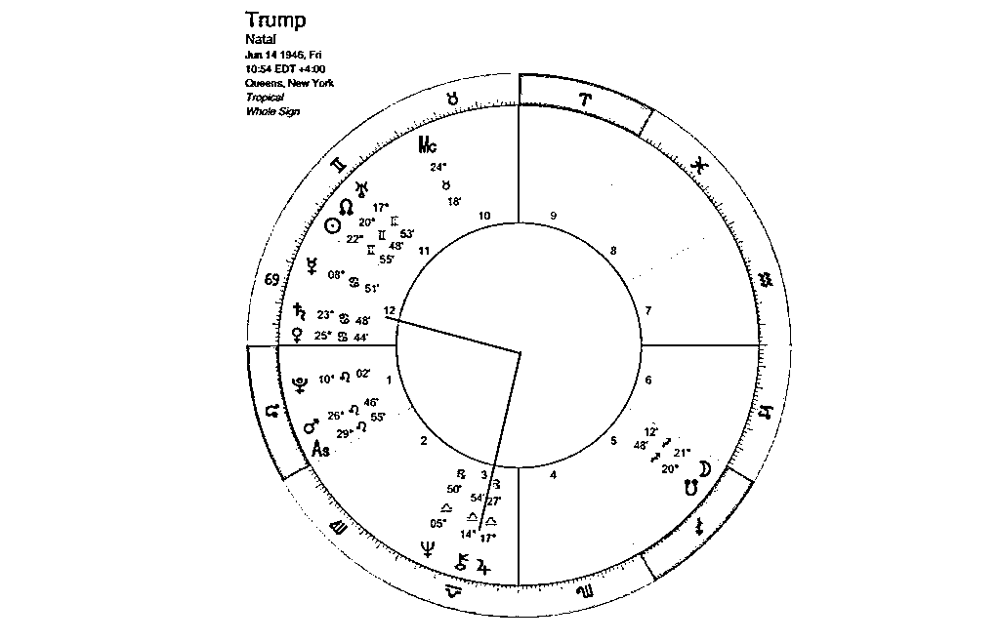

**| **特朗普的出生星图

所以我们看到个人的出生星图中，与这个大时代的背景、国家故事之间，是有着一种能量共振关系的。他当选绝对不是一个偶然。他 C 位出道，疯言疯语的，留给人最深的一个竞选口号是，“我要建一堵墙”（用来阻挡墨西哥非法移民）。还有，他一直都称新冠病毒为中国病毒。包括面对新冠死亡人数，他声称，这就是现实。好像死多少人，根本不是他在乎的。而且整个疫情期间，也从来没看到过他去医院慰问医护人员，到前线中，跟民众站在一起等等。
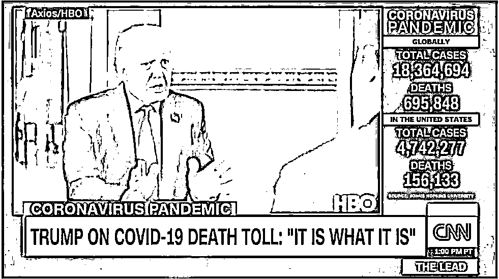

**选举策略——美国英雄主义投射**

这样的一位反常的总统，为何还有一定的支持率？

我带大家了解一下美国选举的背景。

实际上美国的两个政党，在各州地位的分布是这样的。像加州、纽约这种沿海、开放的州，基本都是民主党的地盘，选票方面，那肯定是投给自家党的候选人。

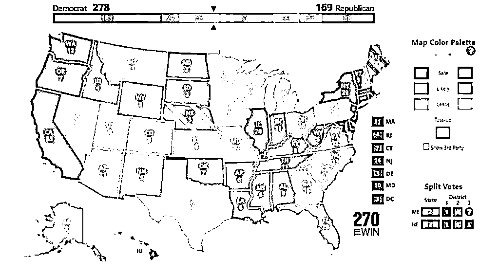**| **美国政党分布图大家可以看到，蓝色与红色势力基本相当，所以变数只在于那些摇摆州，英文叫 Swing State。这些摇摆州，才是看点，也是两党争抢的地方。特朗普其实并不是真疯，他那些话，都是套路，他放弃了那些本来也不会投票给他的人群，讨好潜在的支持者，这些人基本都是美国中部地区的人。
民主党的地区，人口结构特点是，移民为主，基本是中产阶级，上班族，因此就有更开阔的眼界，也懂得合作。而共和党的地区，要么是超级富豪，要么是农民、小企业主，他们都很保守，一般是白人主义至上。所以，特朗普就很鲜明的表现出了人设，激烈的打击移民，与中国作对，对黑人很蔑视。他在中部的忠实拥趸们，基本是非常粗旷线条的，像这幅图。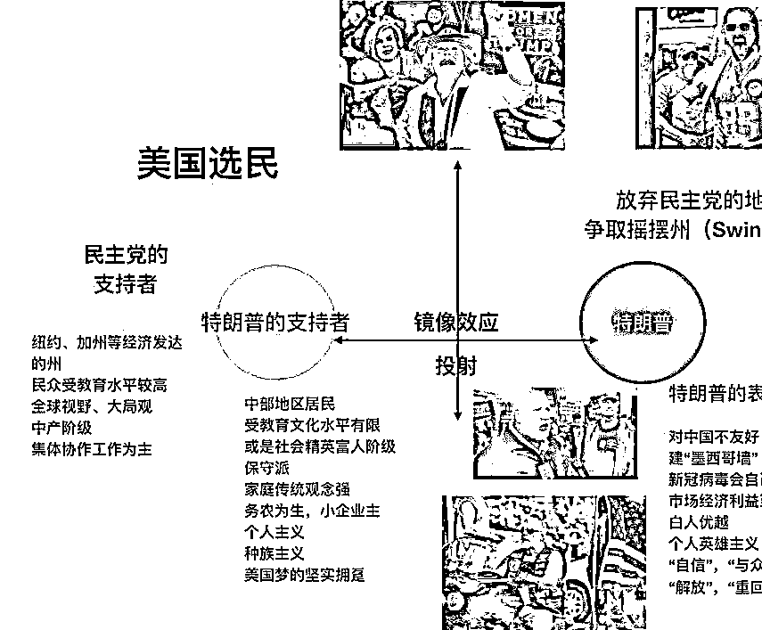所以，其实特朗普与这些人，是互为镜像的投射关系。他必须这样的出格，才让人记住他。那些人，把潜意识里那个美国英雄的角色，投射到特朗普身上了，认为他会拯救美国。他那句看上去极其搞笑的竞选口号，我要建一堵墙，反而是非常巧妙的抓住了选民的心理，因为所有人只要一想到墙这个说法，就会想起他来，而且会把他跟移民政策，联系在一起。支持排外，反对移民的那波群众，这个口号听的时间长了，就有催眠的效果，到时候把票投给了他。4 年前的那次选举，我想，民众对于他，是抱有憧憬的。那么，4 年后的今天，他任期期间，到底有没有成为一个真英雄呢？我研究了土星摩羯座长期行运，是如何影响美国政局的，发现了很有趣的对应。**刺破脓疮**

**土星摩羯座行运的 3 年，看到美国社会长期存在的脓疮。**

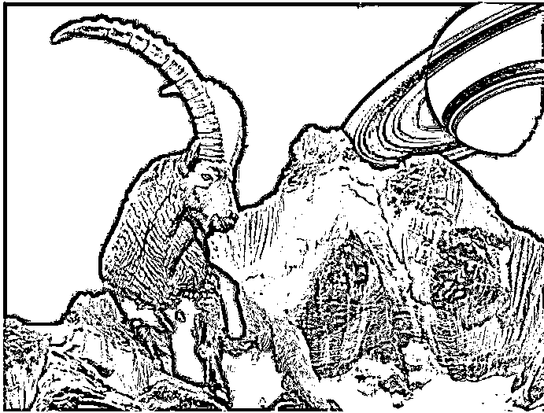

美国的太阳是巨蟹座 13 度。所以行运的土星摩羯座，会与这个太阳对分，同时触发这个 T 三角的相位。

那么现实中，当土星精准对分了太阳时，发生过什么呢？

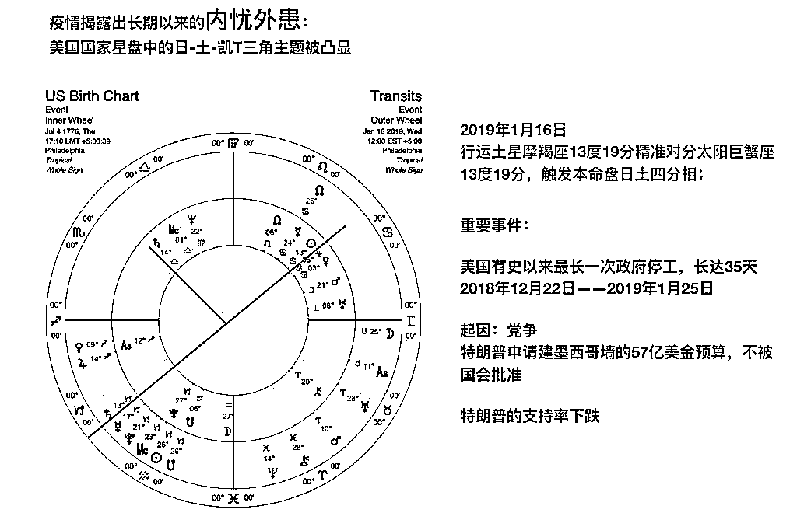2019 年 1 月 16 日，行运土星摩羯座 13 度 19 分，精准对分太阳巨蟹座 13 度 19 分，触发了美国国家星图中日土四分相。这个期间，美国爆发了有史以来最长时间的一次政府停工，从 2018 年 12 月 22 日到 2019 年 1 月 25 日，停工 35 天。这个事件的原因是特朗普申请建墨西哥强的 57 亿美金预算不被国会批准，而国会众议员是由民主党掌控的。这是两党相争的恶果。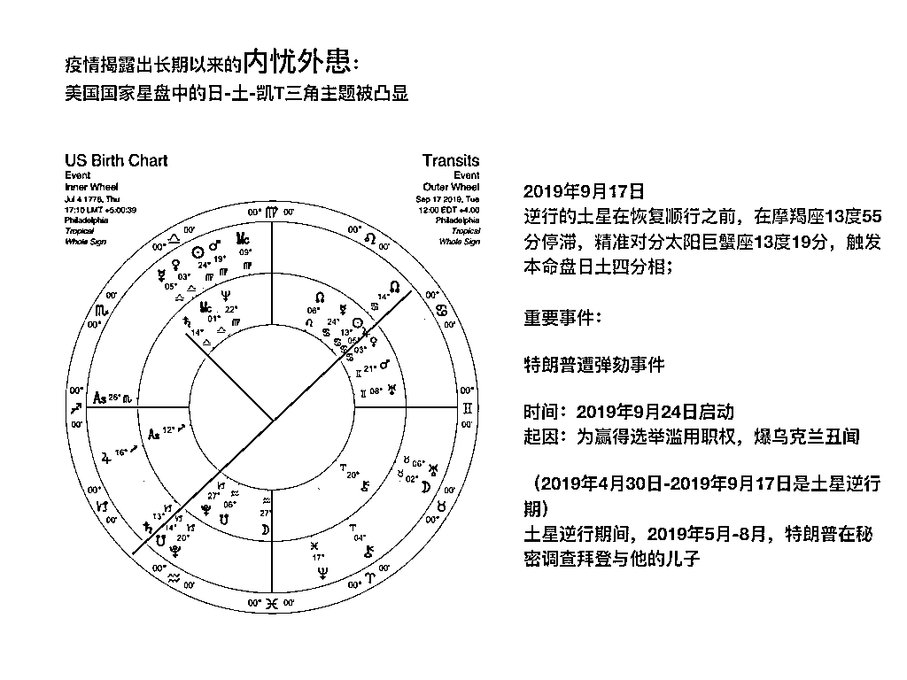2019 年 9 月 17 日，逆行的土星在恢复顺行之前，在摩羯座 13 度 55 分停滞，精准对分太阳巨蟹座 13 度 19 分。这个时间段，特朗普遭遇了弹劾事件。正式递交程序的日期是 2019 年 9 月 24 日，起因是特朗普为赢得选举滥用职权，逼迫乌克兰总统对其候选竞争对手拜登及其儿子展开秘密调查。一个比较有趣的发现是，特朗普秘密调查拜登的日期是 2019 年 5 月至 8 月，而此时正是土星逆行的期间。（2019 年 4 月 30 日-2019 年 9 月 17 日，为土星逆行期）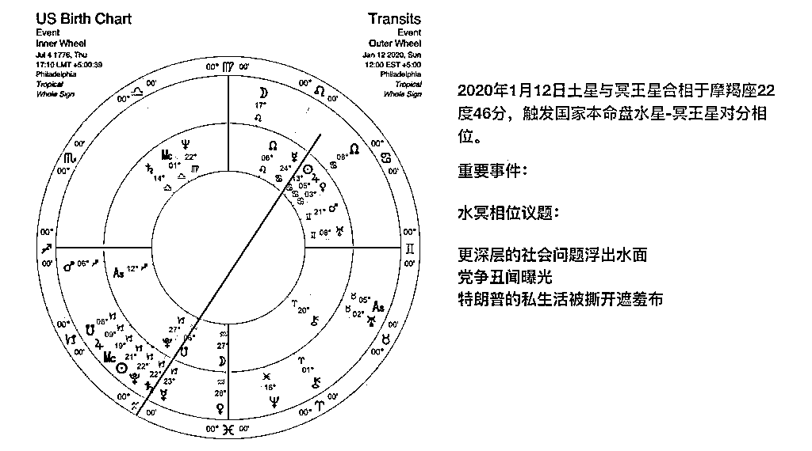

**2020 年 1 月 12 日**，**土星与冥王星合相于摩羯座 22 度 46 分，触发国家本命星图水星和冥王星的对分相位。**土星虽然距离精准对分太阳巨蟹座的度数有所偏离，但我们仍然可以考虑这是一个长期有效的整体影响。

进入 2020 年的事情，如大家所知，一场疫情的爆发，彻底将美国政局长期以来的腐败揭露出来。**很多被隐藏了许久的深层社会问题，都逐渐浮出水面。**而特朗普的私生活，包括他学历造假等一系列秘密，都被家人出书撕下了遮羞布。

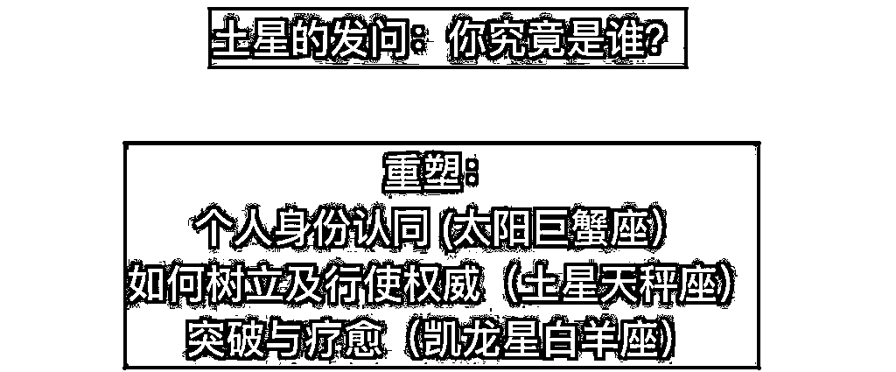

我们所看到在摩羯座土星长期行运背景下，**美国的社会现实，如同脓疮，一点点的扩大**，而特朗普作为一个重要的人物，围绕他而引发的党争、社会矛盾，映射出美国当下的局面——**虚弱、无力**。

曾经的美国，是超级大国，每个人都有着美国梦。

而今天的美国，民众对政府缺乏信心，疫情期间特朗普团队不作为，让很多人失望，失去了很多支持者。

医疗系统效率非常低，你们知道我得新冠的时候，一个核酸检测，我等了多少天吗？14 天。拿到结果的时候，我病也差不多好了。

疫情过后，曼哈顿的犯罪率上升了 50%，这是我认识的一位警察朋友告诉我的。很多有经济实力的人，都搬家离开了纽约市，去到郊区，长岛，或是上州。整个曼哈顿如今非常的不景气，空空荡荡的，大量店铺关门，有的整条街的门店都挂出招租广告。

谁都不知道经济哪一天能够恢复，因为看起来真的是太遥远了。

**土星的考试**

我们看**大选日的星图**，逆行中的白羊座火星，继续触发本命星图的日土四分相。

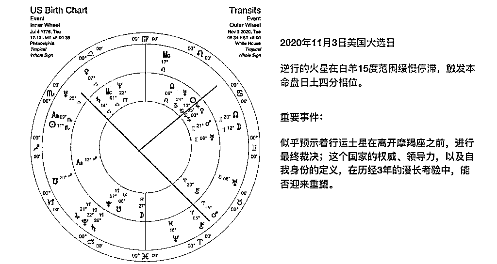

**| **2020 美国大选日的星图

这特别像是土星离开摩羯座之前，最后的考试。

**土星对太阳提出的发问是，你究竟有没有学到一些新的东西？你有没有长进？是否可以更成熟，承担更多的责任？**

可惜据我个人的观察，整个政权阶级，完全没有丝毫的谦虚、觉察，大家都在为了表面的功夫忙碌。

而大选的竞争口号，特朗普高喊，Keep America Great. 这说明，他依然认为自己做的很不错。有问题，都是别人的错，**巨蟹座的负面特质展现的非常明确，逃避、不敢直面问题。**

民主党那边，策略倒是简单了，只要重复提特朗普做的有多差，害了全美国，就可以了。

其实两党的争斗浪费了大量的时间、资源，对美国民众没有半点儿好处。社会在走下坡路，两个党都没有做出任何实质性的改变。

我问过身边的人，你们会把票投给谁？

你们知道答案是什么吗？

大家有一个共鸣，那就是，虽然我非常的讨厌特朗普，但是，我很可能最终还是会选他。因为实在没有更有力的竞争者了。

人们对民主党的整体印象，也在逐渐的失望，认为他们就是会假装歌颂主旋律，之前的奥巴马，留给这个国家的也是一个烂摊子。拜登真的太年老了，经常在讲话时，忘词儿，或者就是游离的。这也让人很担心他的健康。

据我观察，**对于土星扔过来的挑战，**美国的这颗巨蟹座太阳，并没有学会成长，反而在往反面走，整个国家缺乏主心骨，外交政策表现的很像个小孩儿一样无理取闹，遇到困难就甩锅，表现的全是巨蟹座的阴影面。

放在一个更大的行运周期里，美国马上要迎来的是木土合相水瓶座的大周期，我想，或许**每一个人，作为一个模块，参与到一个更大的历史进程中，**特朗普也好，拜登也好，无论他们留给世人的评价为何，其实他们出现的时间，做的事情，也都是配合了相应的故事情节设置，是有特别的意义的。

**脓疮想要被戳破，也必然要有一个膨胀到不能再膨胀的地步，才有可能被重视，被果断切掉。**

我想，留给未来的，就是木土合相的使命了——大刀阔斧的斩向那些腐朽不堪的体系、制度。

而土星摩羯座，已经圆满的完成了他的任务。

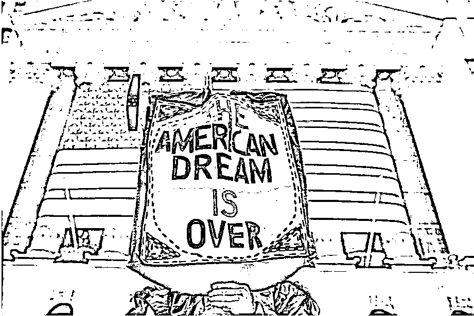  **尾声**演讲结束后，主持人蒋颖老师问及 2020 年美国大选谁更可能当选，我给出了个人的预测。

我认为，美国当下的集体潜意识在呼唤一种新局面的到来，但是却并没有清晰的看到，路在哪里，方法在哪里，又该如何到达。

整个社会暗潮涌动，大家的内心都充满了一股浮躁，还有急切的想要去做点什么的冲动，但在未经意识整合之前，很可能会体现出天王星、水瓶座原型的阴影面的行事风格。冲突、动荡，在未来是不可避免的。

因此在这样一个新旧力量交替的时期，需要有一个领袖人物，将疯狂的局面推到更高，所以从大时代的进程而言，特朗普是更加符合这样的能量需要的。

感谢大家。

**后记**

美国东部时间 2020 年 10 月 2 日凌晨 0:54，特朗普在 Twitter 上宣布自己和第一夫人确诊新冠，引起全世界哗然。

他公布确诊消息的时刻，行运的上升点刚好位于巨蟹座 24 度，合相着他的金星与土星，而就在几个小时之前，刚刚发生过白羊座满月，满月通常与某个秘密事件被曝光、某个局面的清理有关。

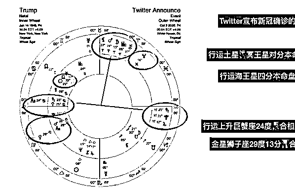

**| **特朗普宣布自己确诊新冠肺炎的行运星图

白羊座满月发生的度数，与特朗普星图中巨蟹座 8 度 51 分的水星之间，形成了精准的四分相，同时也触发了本命星图巨蟹座星群（水星、土星与金星）与天秤座星群（海王星、凯龙星与木星）之间的四分相。白羊座满月发生时，行运的火星（位于白羊座 24 度 48 分）与凯龙星（位于白羊座 7 度 03 分）都在白羊座逆行，我们清晰的看到度数范围，与特朗普本命盘中的巨蟹座、天秤座星群相位之间，产生了复杂交织的能量共振，火星行运带来的身体上的发热发烧，都是非常有可能的。水星与沟通交流有关，很多占星书籍笔记中也提到水星原型也与肺部呼吸相呼应，特朗普巨蟹座的水星被白羊座满月能量刺激，四分相带来的感受是挣扎与困难的，相信他的新冠症状中，会有一定的呼吸困难，而这也跟之前的新闻动态吻合。鉴于他星图中多处重要相位被激活，太阳与心脏有关，月亮与情绪有关，水星与呼吸有关，金星对应着肺部健康，而逆行中的火星、满月的效应叠加，让事情来势汹汹，这些指针，都对应着身体健康上的困难。2020 年 ISAR 大会上，Lynn Bell 老师曾指出，特朗普今年的日返图中，行运的凯龙星合相了中天，凯龙星象征着创伤与疗愈，**而凯龙星落在白羊座，合相中天，意味着在大众的目光下，一个受了伤的战士正在积极努力着，**而他确诊新冠的事件是多么有趣的显化。当然，相信这是阴谋的朋友们，会看到他星图中的水海四分相。确实，水海四分，说明他惯用的手段，使用语言迷惑大众，很可能被再次使用，因为他之前在大选辩论中表现令人失望，输急眼了，安排一场患病，也是很有可能的。

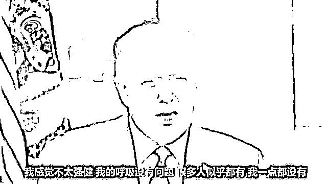

**| **当地时间 9 日，特朗普在确诊新冠后首度接受电视访问**海王星的原型既对应着无力、虚弱、也对应着谎言**，因此这一次的水海四分，到底是表现着患病的一面，还是骗人的一面，仅从这一组相位，是不能确定的。不过，大家看到新闻中，白宫幕僚和医生的说辞出现了不一致的地方，到底是商量好了的故意制造烟雾弹，就为了让大家互相争论呢，还是确实特朗普隐瞒了很多真相，我觉得这个局面，也恰好是符合他水海相位的表现的，我们是不可以完全相信媒体发出的任何言论的，因为真假很难分辨。

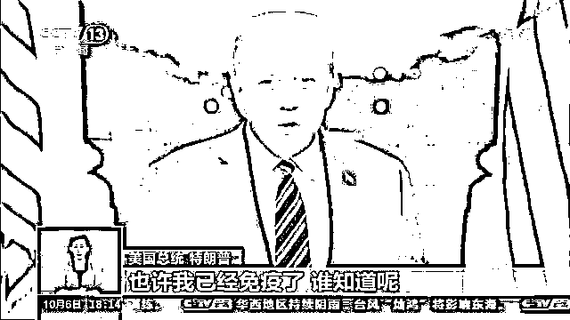

即使是在身体健康真的出现危机的情况下，他也不会透露出真实的情报，对水海四分相这组相位的使用，他实在是太驾轻就熟了，也是他习惯的保护伞。
一个最擅长讲故事的人，即使在危机中，也能游刃有余的掌控媒体曝光度，并且精准的再现美国英雄的形象，美国人民的口味是宁愿自我鼓励和造梦，看到一个不甘心向挫折低头，奋力拼搏的影响，也不愿承认和直面脆弱的伤病。特朗普恰如其分的把准了美国民众集体潜意识中太阳、土星、凯龙星 T 三角的诉求，他出院返回白宫的阵势，犹如英雄归来的美国大片，孤身一人走出直升飞机，长镜头随着他的步伐一步步登上白宫阶梯，然后定格在他的举动上，摘口罩，敬礼，向世界展现一个不屈的性格。

美国人民太喜欢这种戏剧化的内容了，也令选民们对他的狂爱推向更高。一个木土合相水瓶座呼唤改变的大时代，必然也会拣选出一位具有类似变动能量，能搅动风云的人物，
**从今年年底到明年，动荡、意外、戏剧化的局面，是在所难免的**。假如我们理解到人类所处的大环境、大趋势，就不难理解为何特朗普的一举一动，都紧紧呼应着这股趋势。特朗普的太阳弧天王星，会在不久之后精准的合相他的上升点，这是非常重要的一个运势指针。天王星代表着意外、突然的改变，这可能有两种预示：

*   他未来的几个月里，会遭到一些令人吃惊的，且不在意料之内的事件冲击。

*   他向外界发出一波不按套路出牌的政治措施。

天王星的力量，有可能代表的是他被动的遭遇，也可能是他自己主动的出击，无论是哪一种，对美国以及国际政治带来的改变，将是深远的，他的星图中有一组木天三分相，这是一个擅长制造变革的能量。不过，如占星师 Raymond Merriman 在 ISAR 大会上的总结，历史上每次木土合相时期被选举出来的美国总统，几乎都在任期遇刺。特朗普究竟会不会连任，未来 4 年的任期，他能否完整的履行，美国总统遇刺的魔咒，还会不会上演，令一切充满了悬念。不过，这也是经世占星学最具有魅力和耐人寻味的地方，不是吗？**版权声明：**本文由作者授权发布于若道平台，欢迎转发，反对抄袭。友号转载请申请白名单。

**Serina Sun**

ISAR 认证占星师（2016 年获得）

曾任跨国企业品牌公关职业经理人

现居纽约，专注占星个案咨询与教学

**微信公众号**：宸时星语

**个人微信号**：yanniesun2010

长按打赏

**想完整观看大会内容？请扫描下图二维码了解详情****微信又双叒叕改版啦，不想错过若道君的推送？****就把若道设为星标吧！****▼**就是这个“在看”，戳戳戳 ☟********回看大会直达入口********

# 宫位全解析 | 这个宫位的过度发展，很可能让人患上“压力综合症”

> 原文：[`mp.weixin.qq.com/s?__biz=MzA5NjA0NTAxNg==&mid=2651429367&idx=1&sn=f208aa060f6c8db617cc9c9097ba2dbf&chksm=8b4b2b40bc3ca25641caa49037815f4e8da9761f09e7537c1bca38903a97a22a85ac471d4a27&scene=126&sessionid=1692738095#rd`](http://mp.weixin.qq.com/s?__biz=MzA5NjA0NTAxNg==&mid=2651429367&idx=1&sn=f208aa060f6c8db617cc9c9097ba2dbf&chksm=8b4b2b40bc3ca25641caa49037815f4e8da9761f09e7537c1bca38903a97a22a85ac471d4a27&scene=126&sessionid=1692738095#rd)

****************☆ ****************************后台****************************回复“今日”，给你一句生命态度****************

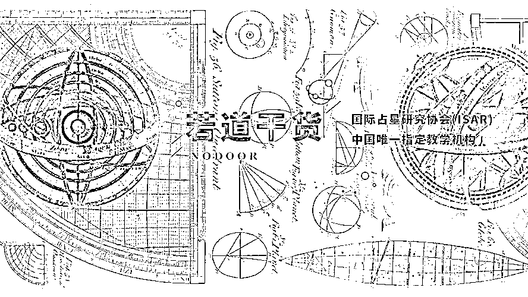

作者/达娜·格哈特
译者/葡萄园的女巫编辑/玫瑰 图片/全景网
**一个群星 6 宫的处女座会如何工作？**安娜·李是我最早的客户之一，当我看到她的出生星图时，倒抽一口凉气。她有 5 颗行星落在了第 6 宫，太阳、金星、水星、天王星和冥王星。更精彩的是，他们都落在处女座，而第 6 宫正是处女宫。这些信息对于我这个新手来说就像是一堆感叹号，它们是什么意思呢？那时我真是一点头绪都没有，我希望有朝一日能够面对一张星图时，马上就搞明白上面的意思，但是很遗憾，这愿望到现在都没实现。我有些羡慕，同时也很怀疑那些一看到星图立即就能分析出什么的人，他们对这个星图主人的生活一无所知啊！但是质疑占星学科学性的声音已经够多了，我不想再添一笔。坦白说，我必须进入这个星图主人的生活领域，才能鲜活地了解星图上的信息。甚至一些很简单的内容，就像群星落在同一宫、同一星座，我也需要揣测很久。有些人认为，这些集中的行星描述了此人生活的重点所在。另外一些人认为，安娜·李星图上的星群就像一堆纵横交错的电线，它们统治了整个星图。如果我想找人告诉我第 6 宫的秘密，安娜·李真是再合适不过了。行进土星将要对分她第 6 宫的太阳，我十分有兴趣了解这次行进给她带来的影响。 **有行星行进影响第 6 宫时，通常体现在工作和健康问题上。**这对于安娜会是一次很有意思的赌局，也许一个或者两个领域都将受到影响。事实上发生了什么呢？在土星行进的那个月，安娜的上司杰瑞遇到了健康和工作两方面的麻烦。他被要求离开公司，并要进行一次心脏血管手术。有时候，星图上的行进现象会发生在身边人的身上，但是绝对不会对我们毫无影响。安娜十分担心杰瑞的健康情况。但是杰瑞的离开也让安娜陷入两难的局面：她害怕公司高层接下来会要求她也离开，或者更糟的是，要她担任杰瑞以前的职务。在接下来的几个月里，安娜都在跟土星造成的困难局面做斗争。刚开始，她惊慌失措。她参加了两个面试，拿到了录取通知书，但是拒绝了。安娜就要离开的谣言在公司里开始流传，她直接找到公司老总澄清了谣言。杰瑞花了几个月的时间寻找一个新的职务，公司花了更久才公布了这项人事变更。但是当土星精确对分太阳时，杰瑞还是离开了，他的主要对手接替了他的职务，可怜的安娜。“那你为什么不离开呢？” 她眼神闪烁，叹了口气，说道：“我不知道，也许我喜欢那里。”但是几分钟前她还在抱怨公司气氛压抑，午餐时间不够，她的工作表现得不到高层的赏识，她所在的部门也不被公司重视。在杰瑞离开的那几天，她工作非常出色，让整个公司对她刮目相看。土星的行进往往也会让你过去的付出得到回报，并带领你上一个新台阶。“那么，为什么不申请杰瑞的那个职位呢？” “哦，我不知道，那个职位压力太大了……”她没有再说下去，而是看向了远处，过了一会儿，才接着说：“我喜欢工作，我也不介意工作幸苦，但是我并没有太大的野心，并不想掌控什么。”**牺牲、不安、吃亏的选择、被迫的工作态度**——我查看了她第 6 宫的太阳，明白了这一切。他们都有某些类似的经历。并不是所有在第 6 宫的太阳都会让人成为努力工作的受害者。但是**他们在谈起自己的工作和未来规划时，声音都是那么迟疑和犹豫。很少听到他们抱怨工作太累，或者获得赏识。**他们第 6 宫的批评家没有起到作用。**“努力工作，做得更好！”是第 6 宫常见的策略。**但是他们并不总是最佳解决方案。也许这不是对第 6 宫有利的影响——**第 6 宫的太阳往往等待别人的激励。如果没有其他人的作用力，那么这个太阳就被钉在这里了。****古典占星学与现代占星学**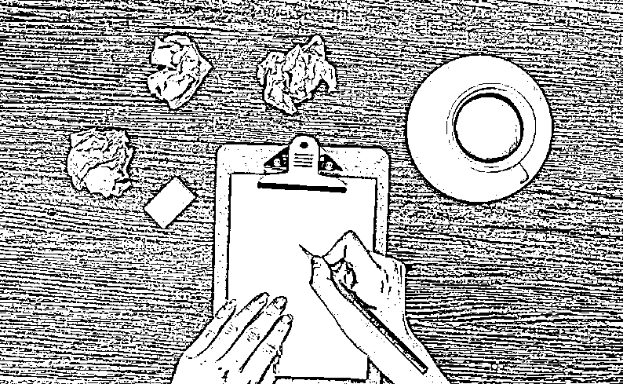古典占星学家认为第 6 宫是有害的——对于行星来说并不是愉快的落点。John Frawley，一个现代占星师，也从事古典占星的研究，他这样描述第 6 宫：“这是与厄运和灾难有关的宫位——这里充满了残忍和严酷的事件和企图伤害我们的人。”行星在这里不但会削弱它们的力量，还会伤害到它们统治的宫位。Frawley 声称，这不是掌管健康的宫位，这里掌管疾病。第 1 宫显示了一个人的健康和活力，这里则描述那些暗中破坏的家伙。同样，这里也不是代表工作和服务的宫位。这是现代占星学不严谨的发明，第 6 宫掌管了仆人和商人——这些人是为我们服务的。我们自己的工作还是由第 10 宫来掌管。现代占星学关于第 6 宫的描述“简单而且错误”。现代占星学喜欢“粉饰太平”，他们不愿意与客户谈论灾难的消息，所以他们把第 6 宫藏起来了。Frawley 对现代占星学家们提出了严厉的批评。他也对此作出了一个补充说明：行星落入第 6 宫往往会感到莫名的压力。如果你是一个占星师，与你的客户谈起这一点就跟告诉一个人“你喝醉了”一样，不会有什么效果。丹恩·鲁伊尔对于第 6 宫的看法或许更有帮助，他认为，第 6 宫描述一种**领土危机——需要重新调整和适应。**第 6 宫在掌管创造力、子女和浪漫爱情的第 5 宫的后面，描述了它们与现实社会碰撞的结果。创造力不会永不枯竭，爱情已经失去光泽，尽管我们尽了最大的努力，孩子们依旧抱怨和失望。**通过第 6 宫，我们认识到，生活并不是那么美好。我们也会在失败中沉沦，或者选择改变。我们可以改变方法学习新的技术，我们可以选择忍受命运，也可以选择成长。 **鲁伊尔在专栏中写道：**“因为第 6 宫描述了所有基本的个人危机，并帮助我们度过这些危机，这超越了所以有占星理论的领域，它告诉了我们如何在危机中寻求成长和改变。”**这对于古典占星家来说，又是一次愉快的谈话。这取决于你选择宿命还是自由意志。但是，古典占星学和现代占星学都同意，**第 6 宫给我们带来的是痛苦的考验**。行星落在这里需要**耐心、耐力、和信念**，更重要的是，需要在**经验中学习成长**。鲁伊尔认为，**如果出生星图的第 6 宫被强调了，他将不可避免地被要求改变。**当安娜·李的行进火星来到第 6 宫时，她告诉了我一个惊人的消息，她接受了一份新工作，而且是在新公司。我很高兴，这次突然曾加的自信带来了这个变化。然而听到这个消息，我也觉得讽刺，这管理职务正是她之前不愿意做的。她需要在新部门带领一个团队。有趣的是，她现在已经离开了这份工作，因为她发现老公司换了新老板，上层管理人士做出了她期望的改变。 我在想，她离开了老公司，最后也获得了更好的工作。但是我也记得，第 6 宫同样也掌管了**疾病**。就像 Frawley 所说的，**疾病是一个临时危机，它意味着让一个人的平衡系统得到恢复。** 安娜·李对于工作的不满就像一次普通的发烧，这次发烧让她不再被动，并把她的生活带到了一个新高度。当高烧褪去，她有了全新的生活。古代人认为第 6 宫是与炼金术有关的宫位。也许这正好鲁伊尔的观点，第 6 宫包含了巨大的改变能力，它能够将一个人的生活变成黄金。**有一种病叫“6 宫压力综合症”**

**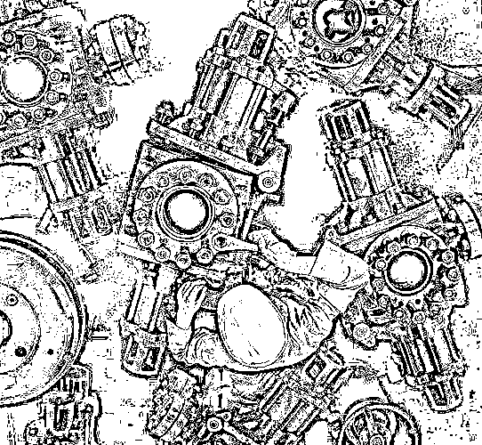**

**古典占星学和现代占星学都把水星作为第 6 宫的原始宫主星。**水星也是与人的**精神、智力**有关的行星，特别是**思考的能力**。如果第 6 宫给我们带来危机，那么，按照水星的逻辑去解决。通过水星，我们可以**分析组织经验**。我们把时间投入到更有效的活动中去。我们需要采取积极的策略与危机和疾病作斗争。

有时候，占星师们谈起第 6 宫就像唠叨的妈妈，不断提醒我们要整理床铺、收拾衣物。如果在行进、推进或者太阳返照图中遇到第 6 宫，现代占星学家会建议你：“多吃蔬菜、摄取维生素、锻炼身体、戒烟、简化工作程序、减少压力，要有条理。” 

也有一些占星师用流行的抽象语言解读第 6 宫，这看起来有点像炼金术的起源。他们提倡一些活动就像**“精神中心”、“神圣的仪式”、“在平凡中发现奇迹”**。行进中的第 6 宫往往需要**将平凡和神圣结合起来**。当然，这样的观点会让 Frawley 感到不安。但是他们也的确是在解决第六 6 宫的问题。**水星也掌管机械**。在第 6 宫，我们有时候表现得像一台机器。当次限推进月亮来到我的第 6 宫时，我并没有遭遇巨大的危机。我的生活围绕着工作，每天都十分沉闷。如果非要说我遇到了什么麻烦，那就是缺乏想象力，我希望生活中能多些神奇的感觉。**第 6 宫描述了我们日常的生活，平时我们都忙什么。**在这里，大部分人都**屈从于文化规范——做一个时间机器。**我们用生产活动来填满日常的生活：不断的工作，大部分人别无选择。这也许就是古代人所说的“坏运气”吧！然而，有一些人也认为工作没那么糟糕。工作通常也让我们的生活正常有序。研究指出，最郁闷的人往往不是朝九晚五忙碌工作的人们，而是失业者、生病的人还有退休的人，他们无处可去，无事可做。古典占星中认为，掌管行动力的火星落入第 6 宫是庙旺之地。第 6 宫需要活力，但是，难道它就不能有神奇的潜力么？ 我经常在孩子们身上发现思考的线索。他们当然是自然魔法当仁不让的主人。一个朋友跟我分享了他 3 岁小儿子 Zack 的趣事，我认为这个故事正好体现了第 6 宫的智慧。Zack 有两个牙刷，蓝色的睡觉前用，绿色的早上起床时用。有一天早上，Zack 的父亲不小心把牙膏挤到了蓝色牙刷上，Zack 就是不刷牙，父亲觉得需要教会 Zack 灵活处理问题，就哄着他用蓝色牙刷。但是 Zack 死活不干，又哭又叫，这场闹剧最后以父亲投降收场，Zack 还是用绿色牙刷刷牙开始新的一天。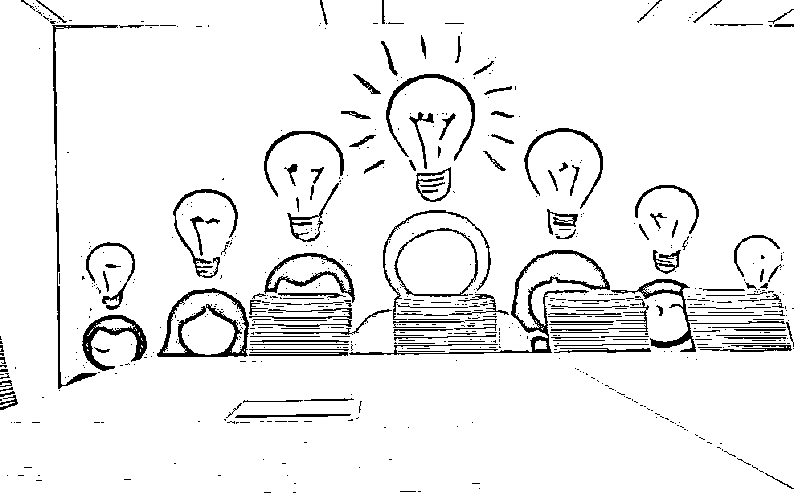当时，我认为朋友的孩子是个特例，直到后来，我也开始教初学走路的儿子一些基本礼仪，在什么时间做什么事情。Branden 两岁时，他已经记住坐在绿色的椅子上吃早饭，抱着格子抱枕看电视，妈妈会用画着鸟的杯子喝咖啡，爸爸会把钥匙放在柜子的最上面。有一天早上，我带着 Branden 出门的时候，只给狗狗喂了一片饼干，平时都是喂两片的。结果儿子一路上都在叫着：“狗狗饼干，狗狗饼干”，我不得不回家再给狗狗一块饼干。这件事让我很不痛快，这就是老式的育儿书籍里提到的亲子间“愿望的斗争”。书上说，如果孩子赢了，那你就什么都没了。然而那天我看着儿子的脸，我觉得这是救济，不是胜利。他的魔法术得到了保护，新的一天又正常开始。 这就是孩子们的第 6 宫，他们既不用工作，也不担心疾病，甚至感觉不到时间的紧迫。第 6 宫对于孩子们来说是举行宗教仪式的地方。成人有规则，而孩子们有宗教仪式，宗教仪式让人充满力量，规则消耗了力量。宗教仪式中孩子们向无形的世界申请援助。他们构筑了一个神奇的保护机制，就像用大蒜和十字架抵抗第六 6 宫的吸血鬼。虽然并不知道是什么吸引了孩子们，但是这种机制十分重要。对于孩子们来说，当下才是最重要的。第六 6 宫为每一个人举行仪式，让他们的世界意义重大。当孩子们进入学校，这个机制就渐渐被切断了。他们独特的经验被更有效的社会性的节奏取代。个人的魔力被生产力和实用性取代。年纪越大，这种状况就会越糟糕。有一年，我的太阳返照图中，太阳加上另外四颗行星都落入第 6 宫，那一年，日常工作十分繁忙。我被一堆高强度的工作压得透不过气，我希望有一天，所有的责任都像雪崩一样消失，但是愿望没能实现。那一年快要结束时，我听到雷蒙德·梅里曼关于返照图太阳落入第 6 宫的理论。他的一席话真是浇我一盆凉水，他说：“这些人只能怪自己，他们把自己的生活安排得太满了，没有注意到其实他们需要放松。” 梅里曼建议，如果我们想平衡一下第 6 宫，就需要看一看他的对宫——第 12 宫。这个宫位正好就掌管着**看不见的那个世界，这里是海王星的领土**。要让水星有效率的工作，我们需要海王星的支持——想象力、灵性、无意识的梦想。就像我们夜有所梦是因为日有所思一样，我们也必须保证日常的生活中有来自梦想的想象力。**荣格教授认为，心理疾病一般来自两个原因：毫无信仰或者过度迷信。水星的“工作过度”，缺少了海王星的“白日梦”，就会造成常见的第 6 宫压力综合症。**当海王星被遗忘，它会悄悄躲在角落等着报复你，用魔法把你扔得远远的。我们在回家的车上都睡着了，不知道什么时候上的床，忘记开了冰箱门，我们工作得像个高速运转的机器，我们一天一天麻木的生活。如果不能面对现实，就会沉沦在虚幻世界里成了瘾君子。不道德的海王星还会把酒精香烟递到我们手里，但是遥控器由我们自己掌握。 **如果第 6 宫沉闷或者磨难重重，那么你该审视自己的问题。**你也许会在半夜里点柱香开始祈祷，但还是找不到能够拯救自己的“魔法”。如果你想找到这个神奇的魔法——**关注有什么事情在当下发生。**我并是不是建议你像孩子一样，对于不照个人规则的事情大发脾气。或许让水星和海王星平衡一下会更好，用理智保持我们的想象力。就像孩子们那样，让我们做自己生活中的神父！**如何应对第 6 宫的危机？**

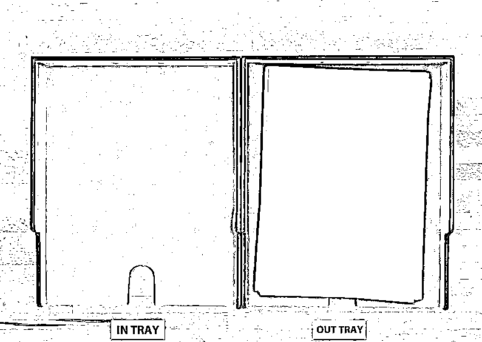

说起来是很容易，不过怎样才能做到呢？我认为没有什么简单的公式，虽然梅里曼已经指出了一些方法。我发现一般第 6 宫表现良好的人，往往也会与 12 宫关系不错。**他们喜欢在虚无的世界里幻想，也会在工作需要时全神贯注。**我认为**第 6 宫落入的星座描述了一个人最适合的日常生活的节奏——还有解决第 6 宫危机的最佳方法**。

我发现上升星座描述了一个人如何进行他的日常生活——我的上升点在处女座，我喜欢有计划，安排好时间表。“一个小时做西藏祈祷，一个小时阅读，接下来就做我的工作。”我会这样安排好一天。但是会有没有预计到的电话、电邮或者没有预约的客人。我的第 6 宫在水瓶座，这意味着我将遇到很多未曾预料到的打扰。

尽管我努力了，但是处女座上升点拟定的计划往往被打乱。如果出生星图的确描绘了一个人日常生活的节奏，那么可以简单归纳出一个公式：**上升星座表示你希望生活成为什么样子，第 6 宫告诉你事实如何。 **

通常，一个人的上升星座与第 6 宫星座呈 150 度夹角，这个角度是不稳定的。他们让我们失去平衡，需要**不断调整**。上升点与第 6 宫与生俱来的紧张关系时刻提醒我们回到这个宫位最重要的工作中。现实来袭，我们必须做出改变。**在第 6 宫，我们要打破经验理论，吸收真实的反馈。**我们不断改进技术和技巧，敦促迈向也许无法实现的完美。这标示了人类和机器工作的不同。没有完美的小说，也不会有完美的读者，我们也做不到“100 分妈咪”，但是革命尚未成功，同志仍需努力！认识到我们无法达到目标是很痛苦的。但是在现实和愿景的角力中，我还是不断敦促自己——**学习新技术、新方法、新见解。**这就是我与电脑的区别，他们总是不断完成同样的工作，而不懂得在实践中吸收新的资源。第 6 宫让我们的工艺技巧日趋成熟，我们总是希望能够获得成功，但是这个魔法的开关在哪里呢？创新往往源于失败。我们能从第 6 宫的危机中得到成长。这难道不是征服命运的关键么？

**版权声明：**本文由若道翻译发布，欢迎转发，反对抄袭。友号转载请申请白名单。

**其他宫位文章** 

[第 1 宫](http://mp.weixin.qq.com/s?__biz=MzA5NjA0NTAxNg==&mid=2651423092&idx=1&sn=53169f1901b50ce5d406aa45df1a830f&chksm=8b4b33c3bc3cbad5e64428fb653d1478ecdb1068a812985486b0299e1648061aee1a5eab07d1&scene=21#wechat_redirect)丨[第 2 宫](http://mp.weixin.qq.com/s?__biz=MzA5NjA0NTAxNg==&mid=2651424378&idx=1&sn=e0e512b4945987e1c9db4a849a6b4ba0&chksm=8b4b34cdbc3cbddb9a862751c15173684a2eb9a98deb37bacdbc003dfa6010c7e28df5ed0f14&scene=21#wechat_redirect) | [第 3 宫](http://mp.weixin.qq.com/s?__biz=MzA5NjA0NTAxNg==&mid=2651425739&idx=1&sn=b89185e88d277fbcded71a78b15db8c9&chksm=8b4b397cbc3cb06a5d052ca8701e95e2c8bd24ccf7f25712625a9b88ffadbda5d1c4791d7304&scene=21#wechat_redirect)

[第 4 宫](http://mp.weixin.qq.com/s?__biz=MzA5NjA0NTAxNg==&mid=2651426869&idx=1&sn=5c806962caab237741b9af30123c3c9e&chksm=8b4b2282bc3cab94daf6de6788f429ad15cce4f8c61d379f3e6212d5f12f436732eaec19d6c7&scene=21#wechat_redirect) 丨[第 5 宫](http://mp.weixin.qq.com/s?__biz=MzA5NjA0NTAxNg==&mid=2651427087&idx=1&sn=fc978e7fe2f6f4b57102e8a75b4c6dcf&chksm=8b4b23b8bc3caaae65c40d82a7a4ff7436e0b26ca37be6b84bde46f8c93230517c0529a5934e&scene=21#wechat_redirect)

**达娜·格哈特**一位国际范围内受尊敬的占星师。她为众多占星学网站和出版物讲课、写稿。她在十二宫的月亮激励她对这颗发光体进行了深刻而持久的探索研究。

**系统学习占星学**

**点击下图了解详情**

**微信又双叒叕改版啦，不想错过若道君的推送？**

**就把若道设为星标吧！**

**▼**

就是这个“在看”，戳戳戳 ☟

********报名直达入口********

# 从占星学角度解读，男人“渣”的背后，隐藏着怎样的原因？

> 原文：[`mp.weixin.qq.com/s?__biz=MzA5NjA0NTAxNg==&mid=2651429367&idx=2&sn=15c4ddb0d9c173da2a193a13253dd9f7&chksm=8b4b2b40bc3ca2561259ed2b7eb7d0fefb74ae05bafa2d8cc61075c661c71a3ec391e125bcb1&scene=126&sessionid=1692738095#rd`](http://mp.weixin.qq.com/s?__biz=MzA5NjA0NTAxNg==&mid=2651429367&idx=2&sn=15c4ddb0d9c173da2a193a13253dd9f7&chksm=8b4b2b40bc3ca2561259ed2b7eb7d0fefb74ae05bafa2d8cc61075c661c71a3ec391e125bcb1&scene=126&sessionid=1692738095#rd)

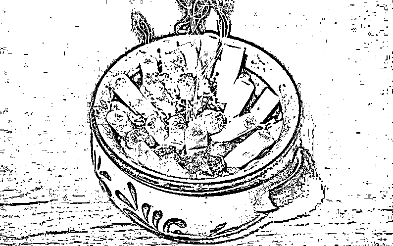

作者/格伦·佩里 译者/丁宏 

速记/佳黛 编辑/玫瑰 图片/全景网

说起渣男，大多数被他们伤害过的人都深恶痛绝，但是，虽然我们口口声声地骂他们渣，可他们却依旧吸引许多人趋之若鹜。我们认真地想一想：为什么会有渣男？渣男生下来就是渣吗？是什么样的人生轨迹造就了他们的渣？为什么他们会不断重复他们的渣行为？今天，就让整合心理学与占星学两个领域几十年的格伦·佩里博士，通过案例和大家聊一聊“渣男”，以及为大家演示他如何疗愈客户，如何将占星学运用到客户的心理解读。格伦老师的解读相当精彩，千万不要错过哦。“

**并不是说，如果要成为一个好的占星师，一定要回学校取得心理学学位。但我觉得我在心理学方面学到的东西，和占星学结合起来，就会让占星学的治疗性更强且更为深入。占星学和心理学结合真的可以受益很多。**

**——格伦·佩里**

”**占星学的两种解读方法**

1**以客户为中心**

我想强调的方式叫做**以客户为中心**的方法。以心理学或是客户为中心的方式，我觉得它就像液体，是一个过程，是流动的。就像这个人是一个故事，他可以随着时间去发展。所以**星图并不会决定这个人该如何去过他的生活，而相反的，是这个人决定他会如何活出他的星图。**这种思路，就可以让我们去发展、去改变、去选择。

2**以星图为中心**

与之相反的，就是**以星图为中心**的方法。在星图为中心的方式里面，其实是有这样一个假设——星图的表现只有一种方式，星图的符号只有一种含义，客户不太重要。

我用的是以客户为中心的咨询方法。**当人们去学习、去生活、去成长、去疗愈、去发展他的潜能，可能会用不同的方式，表达星图的不同部分**。比如说在他人生早期的方式，可能就跟他现在的方式不太一样。

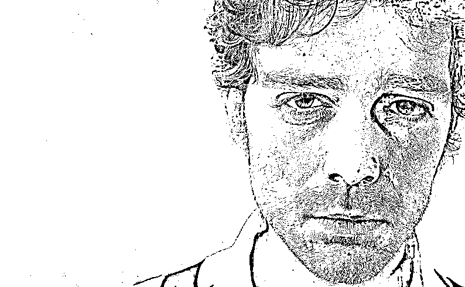

**如何疗愈客户？**

**首先，我想告诉大家心理占星咨询的四个阶段**。

> ① 跟客户对谈，评估他们星图中哪些部分与其所面临的问题和困扰相关，以及他们希望在咨询当中获得什么。
> 
> ② 以引导式的方法让他们去思考。 
> 
> ③ 问一些问题，与客户共情，聆听他们的故事。
> 
> （注意：在这三个阶段，我都会强调占星咨询必须要用到客户的回应、反馈来帮助我们更深入地理解，星图上的符号对这个人来说到底是什么意思。）
> 
> ④ 给客户提供一些意义，或是对客户进行一些鼓励，让他们对将来抱有希望。

**我是这样疗愈客户的：**

> 一次咨询的四阶段：面谈和评估；巧妙设计陈述；对客户的回应保持敏感；提供希望和方向。
> 
> 认出模式：思考事件的寓意和共时性。
> 
> 提出假设：辨识与自我世界的关系，相关的核心信念。
> 
> 检验假设：提问检验最初假设的准确性。
> 
> 初步阐释出生星图。
> 
> 建设性解读的艺术。
> 
> 识别客户经历的目的提供希望和方向。

我们下面来看一个例子，它具体阐释了上面的方法是如何在占星咨询里运作的。

**不断劈腿和被劈腿的男人**

**|** 一个不断劈腿和被劈腿的男人的星图

这个案例中的男人，有一种关系的模式，就是要**寻找梦中情人**。他的母亲曾经与一名已婚男出轨，生下了两个孩子。最终她意识到这个人是不会离婚跟她在一起的，于是她把这两个孩子留在了那个男人的家门口，从此消失了。而我们说的案例里的当事人，就是被遗弃的男孩之一，那时他两岁。我觉得对于这个孩子如此重要的事情，可能会在**第二宫**（在格伦的体系中，第二宫代表 2-4 岁）看见一些征象。我们看见**第二宫里没有行星**，于是就去看第二宫的守护星**土星**。土星是象征**父亲**的一颗象征星之一，也代表**权威**。**土星和海王星**之间形成了一个精准的**150°（梅花）相位**，海王星守护了**第四宫**，第四宫代表了**母亲和家庭**。这个**渐亏**的梅花相位，因为非常精准，可以象征这个两岁的孩子当时经历的伤痛。他突然被母亲抛弃在生父的家门口，而且之前也没有见过生父。**海王星是作为四宫的象征星**，海王星还跟四宫的定位星金星有关系，而金星就落在四宫，所以海王星非常重要，象征着**母亲的失去和消失**。他也结了婚，但是结婚后他依然就会寻找那个失落的爱，他理想中的女性就好像是他当年失去的母亲一样。所以他是一直想要**重新找回母亲，也就是当年抛弃他的人**，他本没有意识到这就是他对妻子不忠的原因。**他很强烈地把爱跟失去和消失联系在一起**，他觉得他找的那个人应该是幻想世界中魔法般的人物。所以他非常执迷于寻找这些理想中的女人，有的时候他可以找到，他们的关系也是非常混乱，他可能会**重复被抛弃的模式**。他也是那个**抛弃他人的人**，其实一个人是可以在这种模式中扮演两端的角色，也就是有的时候他是那个被母亲抛弃的角色，有的时候他又换成了抛弃的母亲的角色，**他就在这两个角色中转换**并不是说，他来找占星师咨询，他的整个问题都会被疗愈，他就完全好了。但是一次占星咨询确实会给他的问题提供一些洞见。这个是非常宝贵的。

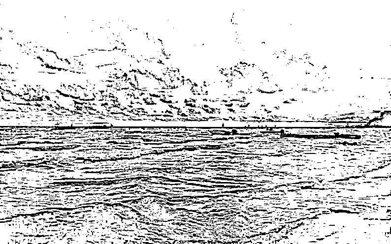

**领会星图中重复的模式**在咨询中，我们会**用星图来看到模式，思考星图的寓意和共时性**。**我觉得占星学最大的价值，就是它打开了另一个维度的意义，给予了我们很多的力量。它也允许你能够更好地适应和顺应人生，而不是将一切都看得太严肃。**我们能够提供给客户的就是能给他们的痛苦寻找一些意义，能让他们的痛苦变得容易承受。能够让他们在痛苦中成长，最终能够熬过这个痛苦。当我们用一切都是象征这个视角来看待人生，**童年就能代表一种原型**。原型是一个原始情境，充当之后各种情境的原始模型。因为整张星图都可以代表童年和之后的人生阶段，所以我们寻找一些重要配置早期的表现。**咨询时，最重要的是提出假设，看出这个客户内在的信念到底是什么，然后就是他自我和世界的关系是怎么样的。**强迫性重复这个概念也是非常重要的，我从心理学偷来的，经常讲的一个概念。**强迫性重复其实就是会重复一些很烦恼的、痛苦的情境**。那么刚才看见的案例，已经描述出了这种状况。**不过强迫性重复里面主要的概念就是，这个人并没有意识到自己也参与和促成了这类事件**。所以这个人会无意识地去产生一些行为，激发了他人对他的回应，并激发他之前的模式。同时他们也不会意识到现在的情境跟过去之间的关系。

如果我们帮助客户去获取一些洞见，就是关于他们在强迫性重复什么事情，以及他们为什么要做这些事情，还有他们在这些事情上能够去获取到和发展出来的一些经验是什么，**这样就会给他们带来价值**。

**其实重要的是，这些人重要的可能不只是模式的重复，而是他们在重复的过程中要致力于发展出一些精通**，可能是解决或者是疗愈一些伤痛和冲突，或者解除一些既定性的理念，也就是说这个强迫性重复是可以通过心理治疗和成长的。

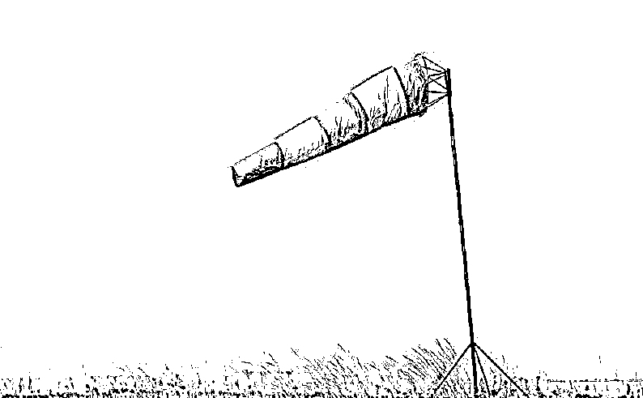

**寻找洞见，帮助疗愈**“

**人们有伤痛的地方，其实有特别大的情欲的能量。人们有强大的意愿要去疗愈这个伤痛。但是这个方式是通过寻找一个类似最初造成这个伤痛的人，跟他们有一个激烈的，或是情欲的、热烈的关系去治疗这个伤痛。**

**——格伦·佩里**

”

星图上一些部分可能对应到我们过去的一些非常挫败的、伤痛的经历。然后在成年的阶段，还会出现同样的一些事情，这个人其实想要在重复的事情中发现他童年并没有得到的东西。很多成年人的问题，其实是因为很想试图去获取一些东西，所以觉得这个唯一的方法就是跟问题待在一起。

其实他们不需要一直执着于这个问题。这里面的问题是我们质变性的信念，而这些信念可能是在童年的一些创伤的经历当中形成的。我们其实要改变的是这个信念。

**占星学其实可以提供一些洞见，让我们人生卡住或者是受控的、错误的信念，我觉得占星学最大的价值之一其实就是这些洞见。占星师可以用他们对星图的理解去帮助客户找到这些洞见，并且这些洞见是非常让人自由，可以达到疗愈的效果**。

“

**占星学和心理学——都因为彼此的结合而发生了根本的改变，并获得全新的力量。**

**——格伦·佩里**

”

  读到这里，你会发现，占星咨询是有焦点、有步骤、有方法的。关键的不是心理病症的标签，不是客户所面临的外在困境，**而是内在心理模式是如何延续并呈现的；而是占星师可以怎样引领客户探索领悟，并开始改变的行动**。

复杂的家庭关系、纠缠不清的情感、似乎门户不当的恋爱、工作狂的上瘾症、学术生涯的波折、无法说“不”的“取悦症患者”等，**本文作者格伦·佩里老师将以 9 个现场同学案例，带你了解不同心理议题下占星咨询过程的核心所在，将 40 余年咨询生涯的经验呈现在你面前**。

**版权声明：**本文由若道翻译发布，欢迎转发，反对抄袭。友号转载请申请白名单。

**格伦·佩里**

若道签约老师，著名占星师，前 ISAR 董事会成员，共出版 8 本占星著作；心理/意识研究专业博士；占星心理学学院（Academy of AstroPsychology）的创办人；康涅狄格州研究生院（the Graduate Institute of Connecticut）原型宇宙学与意识进化项目的负责人。

**ISAR 选修课，心理占星学视角下的预测方法**

**点击图片了解详情**

**或长按图片二维码咨询客服**

**微信又双叒叕改版啦，不想错过若道君的推送？**

**就把若道设为星标吧！**

**▼**

就是这个“在看”，戳戳戳 ☟

********报名直达入口********

# ISAR 选修课程 | 新技法！心理占星学视角下的预测方法

> 原文：[`mp.weixin.qq.com/s?__biz=MzA5NjA0NTAxNg==&mid=2651429367&idx=3&sn=afc64a600fed5d121134fef302dec51f&chksm=8b4b2b40bc3ca2564cb65e78da7a490c7bb494c5725c0180929f4506df41b68171b840fa127e&scene=126&sessionid=1692738095#rd`](http://mp.weixin.qq.com/s?__biz=MzA5NjA0NTAxNg==&mid=2651429367&idx=3&sn=afc64a600fed5d121134fef302dec51f&chksm=8b4b2b40bc3ca2564cb65e78da7a490c7bb494c5725c0180929f4506df41b68171b840fa127e&scene=126&sessionid=1692738095#rd)

作为一门艺术，预测占星学运用行星的运行来预测特定时期的性质、意义和持续时间。在这个阶段的课程中，我们会**考察意识进化的概念、其基本原理及其与占星学预测部分的关系。****意识进化可以被定义为有意识地与星图中固有的进化过程合作。**学员们将探索如何用行进和推进来为意识进化服务。我们不是简单描述事件的结果，而是将行星运行描述为实现先天潜能的机遇之窗。**在这个阶段的课程中，会探索占星心理学视角下如何将对行进、推进和其他预测方法的分析运用于个人成长。**具体事件反映并促进了意识的改变；因此，行星运行可以帮助我们洞察成长过程的精确时机，让我们领会内在和外在现实如何同时发生、彼此反映、互相转化。我们还将探索宏观的世界行进，考察占星格局如何在社会、政治、经济、艺术和生态层面上表现出不同的形式，却又在多样化的现象中反映单一的原型。这里的挑战是去思考，我们对宇宙的这种参与式关系如何能为共同创造一个积极的、更充满希望的未来做出贡献。

**1**

**课程安排**

**第一课：开始预测****第二课：发展年龄方法****第三课：太阳的行进****第四课：月亮的行进与推进****第五课：水星的行进****第六课：金星的行进****第七课：火星的行进****第八课：木星的行进****第九课：土星的行进****第十课：天王星的行进****第十一课：海王星的行进****第十二课：冥王星的行进**

**2**

**课程费用**

**课程费用：9800 元****转发分享优惠价：8800 元（11 月 1 日之前有效）****若道核心课程 L5 学员优惠价：6800 元**

**3**

**授课时间**

**上课时间：**12 月 2 日（周三）20:00-22:00

**授课方式：**英文授课，中文翻译

**4**

**授课老师**

**格伦·佩里(Glenn Perry)**

*   这位传奇的占星师，也是一名拳击和摩托车爱好者； 

*   他毕业于赛布鲁克学院(Saybrook Institute)，是心理/意识研究专业博士，也是拥有 30 余年经验的加州注册婚姻和家庭治疗师 （CAMFT）； 

*   美国占星心理学学院（Academy of AstroPsychology）的创办人，他曾任国际占星研究协会 （ISAR） 以及联合占星大会董事会（UAC）副主席，也是 ISAR 突破性道德标准的设定者； 

*   康涅狄格州研究生院（the Graduate Institute of Connecticut）原型宇宙学与意识进化项目的负责人，共出版八本占星学著作：《心理占星学入门》、《心理占星论文集》、《盗取天火》、《从忠诚到革命》、《星图中的阴影》、《占星职业议题与伦理》、《出生星图深度分析》、《从古代到后现代占星学》。

**5**

**往期学员分享**

不得不说，格伦老师的心理占星课真的很强大，跟着老师上完了两年半的课程，仿佛做了一个长程的心理疗愈。这段时期我正好在经历冥王星的困难行进，感觉就像在地狱中行走，在这个过程中我懂得了，只有疗愈了自己，懂得自己的伤痛，才能理解他人，帮助他人。在学习占星学技法的同时，深深感受到老师的慈悲心，也感受到老师对待占星学的严肃认真。能够跟随格伦老师学习真是太幸福了，同时也特别感谢若道，感谢大卫老师。——2017 心理占星学格伦核心班学员 宋轶绚跟随美国心理占星学院两年课程，最受用的是格伦老师以扎实的心理学理论基础和咨询经验，所教授的心理占星学的系统架构。没有哪个心理占星学的课程比格伦的更系统、深入、有理论且有技巧了。还有格伦特色的发展年龄法，黄道带病理学理论在个案中很有实操性，2 年的学习，除课程外的几百万字经典的补充阅读资料，70 多场测试，以及格伦言传身教的从业道德标准，让我成长为一位合格的心理占星师。——2017 心理占星学格伦核心班学员 植语瞳

**6**

**退转课程**

**退款原则请详看《教学协议》，如有疑问请咨询课程顾问。******占星心理学之预测视角****

**授课老师：格伦·佩里**

**授课时间：****12 月 2 日（周三）20:00-22:00**

**授课方式：**网络课程：英文授课，中文翻译

**费用：9800 元** **转发分享优惠价：8800 元（11 月 1 日之前有效）若道核心课程 L5 学员优惠价：6800 元**

**课程负责人：Margaret（微信号：nodoor233）**请备注“预测视角”

长按二维码添加课程负责人咨询~  

****报名请点击“阅读原文”****

# 火逆指南 | 太阳在天秤座：请学会说不，尝试有礼貌地狠狠打架

> 原文：[`mp.weixin.qq.com/s?__biz=MzA5NjA0NTAxNg==&mid=2651429261&idx=1&sn=099b6841db56fa81b96a6b8fdb95a5fe&chksm=8b4b2b3abc3ca22c21abd309882991a1f34d303612bf4bc3d456985dc7672653cd2cf05f1af1&scene=126&sessionid=1692738095#rd`](http://mp.weixin.qq.com/s?__biz=MzA5NjA0NTAxNg==&mid=2651429261&idx=1&sn=099b6841db56fa81b96a6b8fdb95a5fe&chksm=8b4b2b3abc3ca22c21abd309882991a1f34d303612bf4bc3d456985dc7672653cd2cf05f1af1&scene=126&sessionid=1692738095#rd)

****************☆ 后台回复“今日”，给你一句生命态度****************

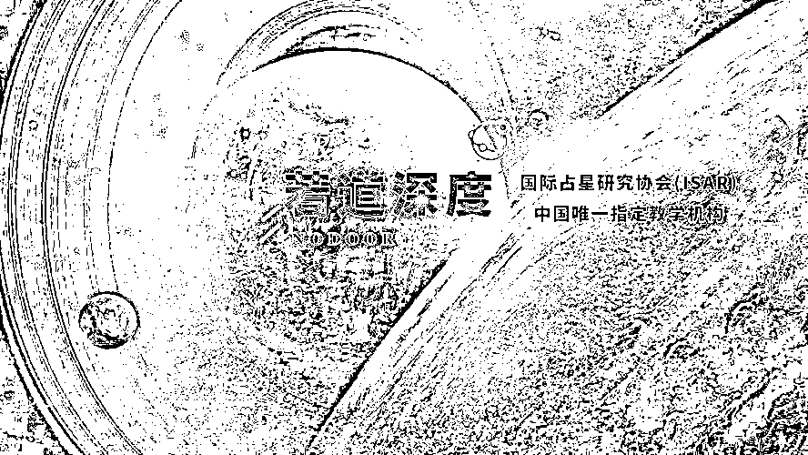

作者/傅莎珈 ISAR 认证占星师编辑/玫瑰 图片/全景网**火星逆行的意涵**在经历火星白羊座逆行的时候，突然意识到为何这次火星白羊座逆行横跨了处女座-天秤座-天蝎座。**这是一种修复和确认自我功能，进入灵性和肉体的打破合一状态，为土木合相水瓶座进行的意识提升工作。**火星的逆行是年头摩羯座日食到年尾摩羯座日食之间的一个阶段。这个阶段的“阶段性”成果，将在**10 月 2 日白羊座满月**的时候呈现。Divine 在本周运势中说：**太阳系中的阴性能量正在回归，全新的爱神和战神结合的神圣女性力量：激烈的、充满激情的、强而有力的、卓越的。****每个人都将被这股力量带入内在的召唤之中。**这种爱神+战胜的形象，如同电影《神奇女侠》。亚马逊部落的女战士承担起保护人类的责任。 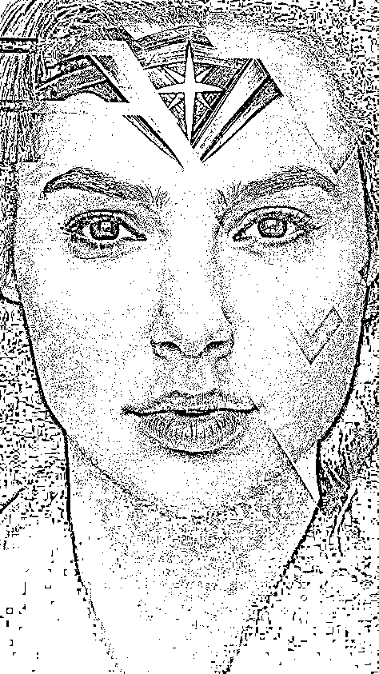| 《神奇女侠》剧照**理智和欲望的战争**现在是天秤座的月份。12 星座里其他都是动物，只有风象的天秤座、双子座、水瓶座，一个是秤，一个是人，一个是水+瓶子。人、水是有生命的，天秤是物品，没有生命。非常纯粹的物品。从这个角度来说，**天秤座的原型里，包含着不输给水瓶座的理智冷静客观。**天秤座的神话原型是特洛伊的王子帕里斯。出生就被祭司判定将来会引发战争，毁灭城邦。因此遭到父亲的遗弃，最后阴差阳错又成为了王子，并且被宙斯选中，需要把金苹果给三位女神中的一个。天后赫拉许以权力，拥有庞大的王国疆土，智慧女神雅典娜承诺战无不胜，美神阿芙洛狄特赐予帕里斯成为完美的情人与诱惑者，能获得任何美女的青睐，尤其是海伦。最后，帕里斯把苹果给了阿芙洛狄特，象征着**权力、财富、智慧会输给爱和欲望。爱和欲望会带来战争。**所以，天秤座的内在深处，随时充满了不同矛盾面向之间的冲突和战争。所谓理智，指的是**抽离欲望，以爱和智慧做出的平衡。****奥义占星学中，天秤座象征着一种继续前进之前的暂停。**需要完成上下左右的平衡和评估之后，再继续走进天蝎座的摧毁、合一、重生。这种暂停，意味着一种**自我需求的体察，环境的理解，方向的确认。**这是个在生命不可调和的冲突里以爱与美为促进力，寻找平衡的星座。所有的岁月静好，优雅和谐，都是**止息和协调**的结果。**所谓的平衡，有时候需要打仗，需要说不，需要拒绝，需要明确自己的诉求，直到所有事物再次基于自我实现的基础上达成了平衡和合作的意愿。**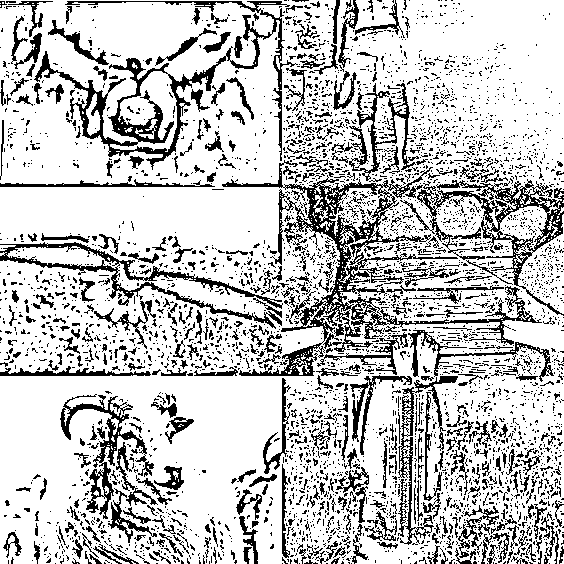**诞生于愤怒之中的火星**占星学谚语中称天秤座为“戴着金丝绒手套的铁拳”，一个礼貌的白羊座，一个进化的白羊座。这是一个**走进社会环境，在完成集体意识联结和融合的过程中，不断重建自我边界，更新自我认知基础上重新构建“关系/合作-我们” **的过程。这场从白羊座到天秤座的进化历程，在能量的探索上，意味着**探索自我边界，理解自我价值的基础上，重新整合自己的阴性能量和阳性能量的过程。**

**天秤座和白羊座一样，在星座能量上是“阳性”能量，是“开创星座“，是“向外扩张的电“。**白羊座被火星守护。火星的守护神希腊名字叫艾瑞斯（Aries），罗马名字叫（马尔斯）Mars.

火星艾瑞斯没有父亲。他是天后赫拉单性繁殖生下来的孩子。天神宙斯在不需要妻子参与的情况下，从头颅里诞生了女神雅典娜。天后赫拉非常生气，这完全是在藐视她所守护的婚姻、家庭与生育领域。天后赫拉的愤怒中诞生了火星艾瑞斯。按照佛洛依德的理论来说，火星艾瑞斯是母亲阳具羡妒下的产物：宙斯居然在没有她的情况下，创造出灵魂（智慧）的女性子嗣（智慧女神雅典娜），因此天后赫拉决定抗衡，打造出只为她而战的阳具儿子。

雅典娜没有母亲，她在本能与肉体的国度里没有一袭之地，艾瑞斯没有父亲，他不是从理智里诞生，无从继承阳性国度的灵性与智慧。火星艾瑞斯虽然是男性，却没有奥林匹斯山男神们的抽离感，他属于月亮与黑暗。在各种神话中，他是**所向无敌，无所畏惧，热衷战争，个性粗俗，鲁莽缺乏智慧，制造战争、死亡和恐慌**的象征。火象三星座——白羊座、狮子座、射手座的神话传说里，都显示了没有父亲、寻找父亲、被父亲抛弃的情节，他需要通过各种历练，**重建阳性力量，完成和父亲之间的联结与力量责任的交接**。其间总是阴差阳错地推翻父亲，完成新老交替。 “父亲”这个词，在各种文化里象征着**国王、权威、责任、荣耀、智慧、权威、仁慈、爱...……**是一种自我外显的高度集合。如果对比火星的出生，就会知道，这是火星身上缺乏的东西。这些词语属于太阳。这些词语，用来形容宙斯并不为过，是赫拉之子从小缺失的。火星是太阳的忠诚执行者。当他联结上太阳的这些意志，看见太阳所表达的信息，他就进入走出“月亮和黑暗诞生地”的旅程，打破了家庭羊水，进入了新的高阶段自我意识成长之旅。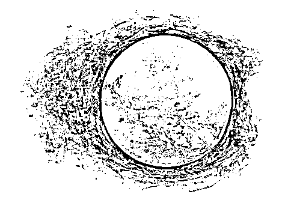**我们每个人的星图中都有火星，火星所到之处，形容了我们生命里与生俱来的恐惧、被吞噬、失去自我、渴望、羡妒......的部分。**

当火星被激发，同样唤醒了生命本能里的勇敢和战斗精神。

冥王星在摩羯座，被土星摩羯座定位，翻出了父权制度文明里的黑暗和腐朽面，火星和土星、冥王星的四分相位，意味着**对抗和战争的开始**，也意味着**每个人拒绝被集体意识淹没，试图重建自我的意识被唤醒。**

这次火星逆行要求我们去看看——**在哪里需要发出“不” 的声音。**

**·** 我是女性、我不想被当作男孩的替代品，总是要表现得比男性更强；**·** 我是女性，但我不那么柔弱，我具有很强的竞争力，为什么打压否定我的能力和智慧？
**·** 我是女性，我的身体和外表不应该被这么肆意苛刻地评价；**·** 我是女性，不想总是扮演兄弟的照料者角色；**·** 我是女性，我希望被理解、尊重、爱护，而不是被任意攻击欺凌......**·** 为什么父亲活得那么懦弱？ **·** 为什么父亲如此自私，毫无承担家庭责任的想法？**·** 为什么父亲如此苛刻？**·** 为什么父亲如此暴力，毫无理智和自控能力？......这个“不”，指向性别割裂，性别僵硬：**男性无法自由舒适地表达自己的阴性力量，女性无法完整自由地呈现自己的阳性力量。 **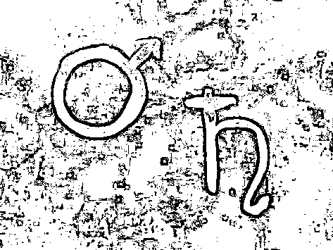世界的诞生，起源于厄洛斯本能的创造激情和爱的欲望。厄洛斯之后，分离出来有性别的人类，从此开始二元化的世界发展。而现在，这个二元化的世界正在完成再次的意识打破和升级。它要求每个人**不再从另一半性别的人那里寻求支持，而是转向内在，去发现自己身上被压抑的另一半性别，去修复自己生物性别里的阴影和创伤。**土木合相水瓶座的 2021 年是世界游戏规则重新调整的起始之年。水瓶座的一个象征元素是：只有一个一个友好的、彼此平等的人，跨越性别、文化、种族的差异。**金星的引领角色**今年天象的一大特色是，金星、火星在同一年逆行。并且金星从暮星转为晨星，走在了太阳前面。阴性力量正在成为每个人成就自己的太阳意志、自我意志的重要引导力量。协助火星逆行走出恐惧阴影，联手火星达成太阳的使命。**找出星图中金星星座的正面力量，会帮助你在这个火星逆行其间，完成更多的转化。**金星的神话传说中，埃及的哈索尔、塞赫麦特、巴比伦的伊斯塔/伊南娜、希腊早期的阿弗洛狄忒，都是女战神。**金星天生就拥有战斗能力。 **但金星若发挥不好或者过度发挥，也会造成灾难性结果。甚至会克制火星的活力和独立。所以，**如果你发现自己没有活力，缺乏自我意识，先去查看出生星图上月亮和金星的路线。她们呈现了火星无法启动的更深层的原因。****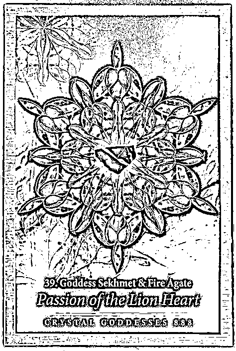**最近 5 年的美国电影有个奇特的转折点，拯救世界的是战斗力很强的女性，而不是男性：神奇女侠之于第一次世界大战，是一个逆转；惊奇队长是《复仇联盟》系列中最后扭转性打败灭霸的力量；《西部世界》里带头复仇的机器人是女性……我们可以说这是西方世界商业化和政治正确的需求，但何尝不是某种“如在其上，如在其下”的巧合？男权社会里最被压迫的女性，正在发出反抗的声音。太阳系中的阴性能量正在回归，激烈的、充满激情的、强而有力的、卓越的、全新的爱神和战神结合的神圣女性力量：每个人都将被这股力量带入内在的召唤之中。 刚结束的《脱口秀大会》第三季，女选手杨笠和李雪琴虽然没有进三甲，却成为这一届最引人注目的脱口秀演员。“男人不光美好，还特别神秘。为什么他看起来那么普通，却那么自信？" 这句话引发网络剧烈的讨论；还有“我这辈子都没被这么多男人竞争过，你们选我做 PK 对手肯定都能赢”、“想对那些不喜欢我的人说：我也不喜欢你”。

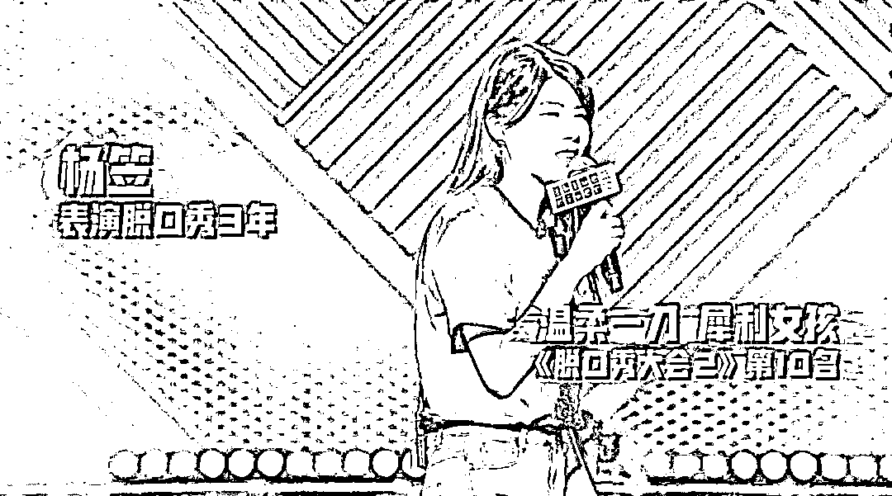

| 《脱口秀大会 2》参赛选手杨笠前者攻击性很强，后者轻描淡写，但其实都清晰、有力地表达了女性的观点。**当女性开始真正呈现自己的智慧、勇气和力量，参与到社会文化的重创中，意味着男性也需要打破偏见，敞开怀抱，欢迎带有神圣女性力量的女性们来到生活中。**这是一个将智慧和理智输入火星的勇猛直接之中，一起击碎恐惧、愤怒、不公的时刻。天秤月的火星逆行不是指让女性引领男性。女性首先要唤醒的是内在“神圣女性”的力量。女性们，请先完成自我疗愈和成长：**和父亲的关系、对男性力量的惯性感受、对自己的身体和性能量的健康认识......**先从自己开始。首先要去**感受和荣耀你的神圣金星力量。**而对男性来说，这个火星逆行，是去**看见内在金星的力量和智慧，理解和支持外在环境里的神圣女性原型的重生。**对我们来说，打破旧有性别意识的惯性没有那么容易，甚至非常艰难。完成自己内在性别的重整，会有更多的冲突产生。这样就回到了天秤座的开始：**如何以爱、智慧，去达成“止息”和平衡**。战争，是为了成就新的平衡，开始创造财富和美、和谐、宁静。

**参考资料：**

《内行星，从水星/金星/火星看内在实质》 作者 丽兹·格林、霍华德·萨斯伯塔斯

**转载声明：**文章由作者授权发布于若道平台，欢迎转发，反对抄袭。友号转载请申请白名单。

****

****傅莎珈****

ISAR 认证占星师（2015 年获得）

心理占星师/内观书写带领者/冥想带领者

国际著名传播集团工作 20 年

**微信公众号**：Helloshajia

长按打赏

**获取为你量身打造的火星逆行攻略**

**可扫描下图二维码购买**

**让勇气和战斗力为你服务**

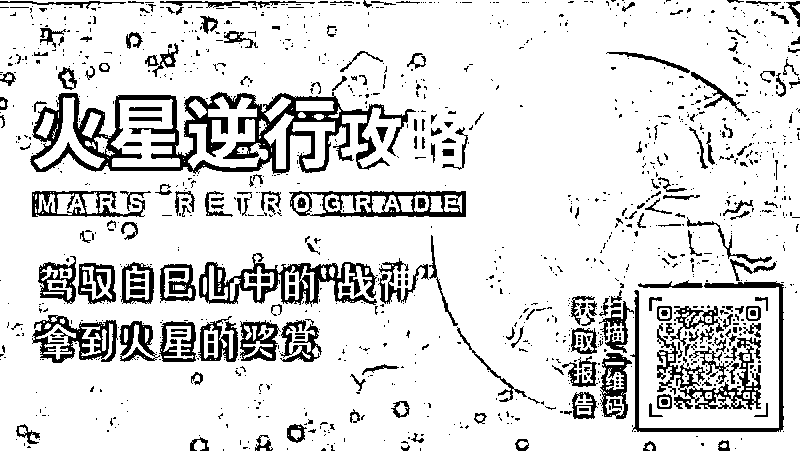

**微信又双叒叕改版啦，不想错过若道君的推送？**

**就把若道设为星标吧！**

**▼**

就是这个“在看”，戳一下☟

****直达报名通道****

# 学会解读出生星图要多久？ | 占星学学习走上正轨的 4 个信号

> 原文：[`mp.weixin.qq.com/s?__biz=MzA5NjA0NTAxNg==&mid=2651429261&idx=2&sn=500dd314f0d60ce7688aa9aa69c3c41a&chksm=8b4b2b3abc3ca22c7b70a1577f377e6a196ef7d0d926affa118f522e0db9d4eddf2b130c994f&scene=126&sessionid=1692738095#rd`](http://mp.weixin.qq.com/s?__biz=MzA5NjA0NTAxNg==&mid=2651429261&idx=2&sn=500dd314f0d60ce7688aa9aa69c3c41a&chksm=8b4b2b3abc3ca22c7b70a1577f377e6a196ef7d0d926affa118f522e0db9d4eddf2b130c994f&scene=126&sessionid=1692738095#rd)

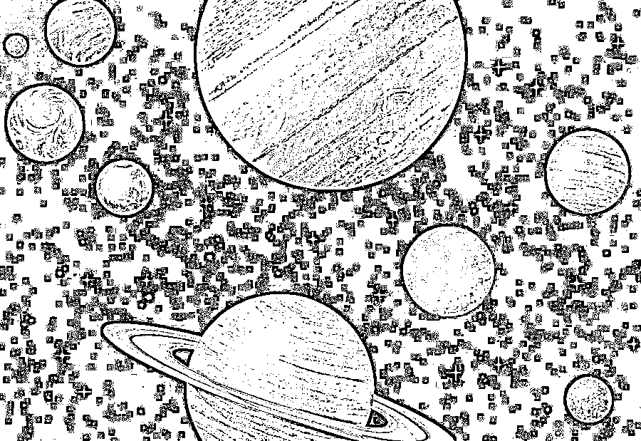

作者/托尼•霍华德译者/Vera 校对/Leisha 编辑/玫瑰 图片/全景网
**学习占星学需要多少时间？**如果你对占星学萌发了兴趣，想开始学习独立解读星图，那么你冒出来的第一个问题大概就会是：**我要花多长时间才能熟练地独立解读星图？**每个人的答案都不一样，但我要对你非常坦白：只上一个周末的工作坊就能学会解读出生星图，那是不可能的。所以要是哪个网络课程对你夸下海口，保证你能在四天内甚至是十天内、六周内学会解读星图，可别买账。实际上，哪怕你花上整整一年时间深入研究占星，很有可能你依然谈不上多自信。不过那时的你，绝对会比现在的你自在得多。所以究竟要花多长时间呢？深入研究学习一年之后，解读一张星图里的基本要义也许对你来说不再是难事。但很有可能你还得再花上两到四年的时间，才能顺畅地为客户解读上一小时的星图。当然你总得先学习，上周末工作坊或是网络课程都是很好的开始。但你需要确保自己有一份合理的期待值。你应该清晰地知道，要真正对占星学得心应手，仅仅上课是不够的，你还需要投入很多时间研究星图。

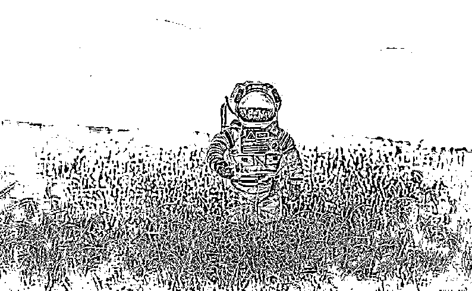

**步入正轨的四个信号**大多数新入门的占星学生都会在学习之旅上有四种相似的经历。你可以将这四种经历看作路标，表明你正走在越来越精通于占星解读的路上。

**第一阶段：兴奋**

**第一阶段，兴奋期。**现在的占星学可以说是越来越流行了，部分原因在于它的确让人目眩神迷。当你第一次发现个人星图或世界事件与占星学有“说得通”的相关性之后，你就被迷住了。因为你看到我们与宇宙之间存在神秘奇妙的联系，这令人惊叹。你无法自拔地主动跳入了坑中。如果你很幸运地从一开始就找到了合适的书籍或老师，你的兴奋感会随着每次获得新的洞见而增加。

我总会鼓励处在这个阶段的学生们充分利用这段时间。写日记，记录自己的想法。作为占星学的新手，在这个阶段你将创造力迸发，思维火花四射。你会有很多值得进一步研究的新想法，甚至可能会产生一些独特新颖的洞见，让你在未来几年中可以继续研究和拓展。你的初学者之心是最珍贵的，过了这个阶段之后就没有了，所以赶紧把脑袋里奔流不息的灵感记下来吧。

在兴奋期，重点是要定期坚持学习，保持住这份兴奋劲并持续产出。听听播客，参加你感兴趣的短期工作坊或网络课程，找占星师为你解读星图。

最重要的是，**当你在学习占星早期接触到很难的课程时，不要给自己太大压力**。那种迷茫的感觉其实能促使你的大脑加倍用功解开阻碍你理解星图的谜题。寻找答案时虽然会有一些不安，但这能助推你的学习。而且你读得越多，学得越多，就会越来越熟悉各种概念。

别让自己的胃口变小了，不断学习自己好奇的内容，投喂你的好奇心吧！接下来你会在某个时刻进入一个很关键的阶段，顺利度过之后便是第三阶段：醍醐灌顶期。

但在那之前，先保持住这份兴奋，因为你需要它带你熬过第二个阶段。

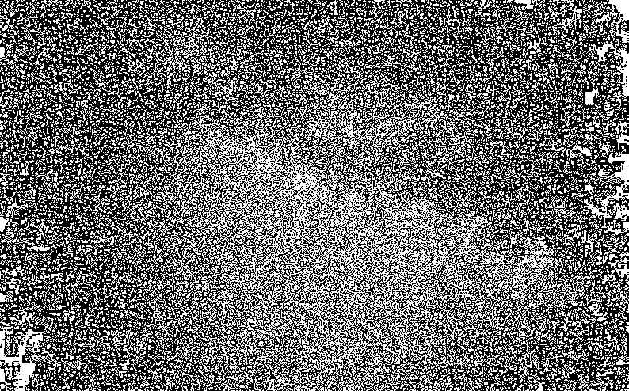

**第二阶段：不知所措**

**几次困惑或迷茫后，你可能很快会碰上让你感觉不知所措的路障。**也许是你开始发现自己必须熟记并理解大量的符号、原型及这两者的组合，而且你意识到这些都不是一两天就能完成的事情。**也许是你遇到了互相矛盾的学派或方法。**这样的事情可太多啦！不管是心理学，还是医学、科学，每个专业领域里都会有一些引发争议的概念、风格或方法。占星学也一样。你会发现各种彼此相左的观点和技法，还有一些性格鲜明、观点突出的代表人物。**也许是你陷入了宫位系统之争中，这是让人感到幻灭和迷茫的典型时刻。**哪怕许多人言之凿凿，对自己的观点坚信不疑，但这确实是一场至今未有定论的争辩。既然占星学界还没有达成共识，那显然这个主题还处在探索阶段。所以与其尝试自己“搞清楚”，不如选用一种你感兴趣的方法，多听听不同的声音，把你自己的星图放在不同的宫位系统里观察，和有经验的占星师交流，了解他们采取的方法，他们的思考过程。在这个不知所措的阶段，有些人会逃避退缩。如果你真的很想这么做，别太责备自己。很有可能，你休息一下就会重新投入学习，占星学有种使人终身着迷的魔力。**但如果你真的很想逃跑，先试试换一本书读一读，或另选一位老师跟随，或学习一个新的技法。**也可以找一位没有约过的占星师做一次解读。可能你只是还没找到最适合自己的方法。别放弃，转机就在不远处。在不知所措的阶段，你也许只是需要更投入地学习。这也许需要你**增加投入在学习上的时间**。也许需要你完完整整地读完一本书，而不是匆匆浏览，挑着读。也许需要你独立解读一些星图，做一个小研究。别担心，这个阶段会过去的。而且下个阶段是最有趣的阶段之一！

**第三阶段：醍醐灌顶时刻**

学到了某个时候，有时是**找到了一位非常适合你的老师之后，你会体验到一个醍醐灌顶的时刻**。你会灵光一现，联系自己一直在学的技法，突然就“懂了”。也许是看着一个行星相位，感觉自己终于知道了这些行星落于宫位和星座的含义；也许是你突然之间把一套复杂的象征符号都串联起来了，而不再是机械地混合匹配关键词；也许是你领悟到，太阳双鱼座和太阳摩羯座的人对月亮、土星在天蝎座的相位可能产生多么不同的感受。我没法预测你什么时候会体验到这种感受，我也没法解释背后的原因。但我可以保证的是，醍醐灌顶的时刻一定会发生，而且，这感觉太棒了！第一阶段的兴奋感会翻倍，同时你也会开始相信自己的能力。这需要大量的知识信息积累到质变，或听到了对某个原型的新诠释方式，然后突然——嘭！懂了。

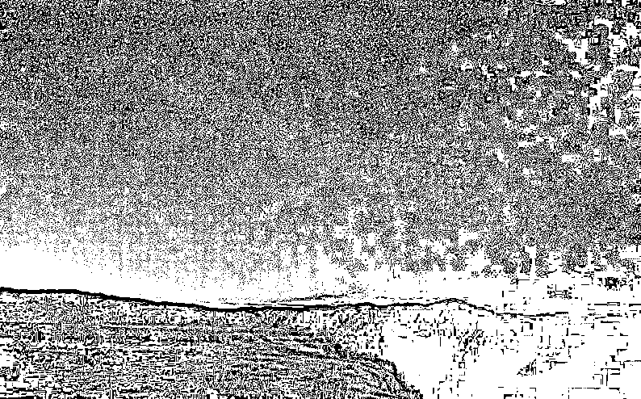

对于这个阶段，我的建议是：**坚持，继续**。别急着学其他的技法或流派。相反，要**更深入地研究这个已经让你顿悟的学派**。花些时间，完善你的领悟，深化你的理解，为下一个阶段做好准备。你也需要为自己的占星学习和实践打下足够坚实的知识基础，以便时时温故。在这一阶段，为了进一步学习，你也许至少在一段时间内会选择坚定地采用某种方法或跟随某位老师。

**第四阶段：不知所措续集**

随着你的学习之旅越发深入，你会开始意识到这个坑有多深。也许你听说了赤纬的概念，意识到还有全新的一套量度制要学习。你会意识到虽然星图是平面的，但头顶的星空却是立体的。也许你听说了恒星黄道与回归黄道之争，而你开始对吠陀占星产生了兴趣，从此投入了一个全新体系的学习。又或者你目睹了你的老师现场解读星图，或亲身体验了一次很厉害的解读，他们都让你痛苦地意识到你离这样的顶流技艺还有很漫长的距离。就像第一次经历到不知所措时一样，这个阶段人很容易放弃。为了挺过去这个阶段，你需要在学习上立下更大的决心。这也许意味着你需要**找到一些新的灵感**。小心别被新鲜事物吸引走了你的注意力，因为占星学几乎永远不缺新概念。但实际上你也许就在突破的边缘，你只需要坚持下去，走得更远一些。有时你会觉得自己只要再学一个技法，再获得一个洞见，很快就能解锁占星学了，这也是常有的事情。你可以让这样的感受继续驱动你的学习，但还是要有合理的期望值。因为并不存在什么秘传或神奇的力量，能让你一下子获得所有问题的答案。我这么说，不代表业内就没有值得大家学习的技法和理念了，我只是说通用于一切的灵丹妙药是不存在的。这样的期待，越早放下越好。放下了，你的精力就能真正专注在解读星图的学习上了。然后呢？通常到了这个节点，你之前努力坚持的成果会开始体现出来。你开始有了勇气，第一次为人正式解读星图，并发现这一个小时过得多么快，因为你有那么多的话想与客户分享。又或者你的客户不小心给了你错的出生时间，你必须当场立刻重新准备星图，而你竟然解读得还不错！

到这个点上，你已经走到目的地了。但目的地并不是终点，而是一个新的起点。你会发现还有许许多多需要学习的内容，但你也会发现每次帮助支持客户的同时，他们也成为了你的老师。

解读星图越多，你的自信也越坚固。你会能够与真实的客户实时应用并测试一些理论和概念。当然不是所有的实验都会成功，但带着谦逊与好奇，你依然会收获很多。你会开始看见，每一位客户都神奇地表达了人性之复杂、华美、坚韧，而他们正是华美繁复的星空的纯粹映射。你并不孤单。你总能在社群里找到一大群和你相似的占星学热爱者，他们会向你张开怀抱。恭喜你，终于走到了这里！

**版权声明：**本文由若道翻译发布，欢迎转发，反对抄袭。友号转载请申请白名单。

**系统学习占星学**

**点击下图了解详情**

**微信又双叒叕改版啦，不想错过若道君的推送？**

**就把若道设为星标吧！**

**▼**

就是这个“在看”，戳戳戳 ☟

********报名直达入口********

# 插班中丨核心课程 L3，教你掌握综合星图解读

> 原文：[`mp.weixin.qq.com/s?__biz=MzA5NjA0NTAxNg==&mid=2651429261&idx=3&sn=36bfe117d2abeac9db3572141e8cc772&chksm=8b4b2b3abc3ca22c1fadb671eef218f5a04832b8175b8915c4d6beca9371ff0fba6cc155685e&scene=126&sessionid=1692738095#rd`](http://mp.weixin.qq.com/s?__biz=MzA5NjA0NTAxNg==&mid=2651429261&idx=3&sn=36bfe117d2abeac9db3572141e8cc772&chksm=8b4b2b3abc3ca22c1fadb671eef218f5a04832b8175b8915c4d6beca9371ff0fba6cc155685e&scene=126&sessionid=1692738095#rd)

**Level3 也是占星学习的一个整合区和分水岭****若道君给大家准备了一份专业的占星测试：“2020 若道核心课 L3 入学测试”****测试内容包括：**

**适合参加测试的学员：**

**L1-2 结课学员**

**有一定占星基础的自学学员**

**准备考 ISAR 的学员**

**扫码开始测试吧**

**1**

**占星学除了自我修炼，市场需求如何？**

**通过占星学习你帮助了自己，也可以选择成为自助助人的占星师，开启受益终生的第二事业。**一方面，社会快速发展人们压力山大，抚慰心灵的咨询市场需求巨大。另一方面，市场鱼龙混杂，真正学院派的严肃占星从业者十分稀缺。最重要的，**占星学能让你自己帮助自己，无论你是否进行占星咨询从业，学习了占星学，它都将是终身陪伴你成长的睿智好伙伴。**

**2**

**你的占星核心课老师是谁？**

 拥有**50**年占星研究积淀**44**年职业占星实践**41**年占星教学经验的**若道联合创始人****2017-2020 年曾任 ISAR 全球副主席****2020 至今为****CAPISAR（全球职业占星师资质认证考试委员会）主席****大卫·瑞雷**&**最懂学员的若道首位认证金牌中国老师****熊鹰**师徒二人合力打造
**2020 年若道****全新核心占星课程**

**3**

**L3 阶，我们要学习什么？**

**第 3 阶 ****宫位、相位以及初步解读星图（15 次课） ****❶** **12 宫位****人生中重要的领域，不止 12 个，更是 12 类。****❷ 组合解读****行星、星座与宫位的组合解读。万丈高楼平地起，这是占星解读的基本功。****❸ 相位****不仅是常规的相位：合相、对分相、三分相、四分相……还有这些更为细致的知识：**相位计算入相位与出相位星座外的相位相位解读盈亏相位相位的优先级大卫老师案例课**❹ 宫主星与定位星****“联结”是宇宙的基本法则之一。除了相位，还有哪些方式让行星能量联结起来？**宫主星定位星与定位链大卫老师案例课**❺ 月亮交点专题****月亮交点是占星解读的另一个入手角度，这里会深入教你解读月亮交点，及其相位与定位星。**月亮交点的解法大卫老师案例课**❻ 相位模式：****那些坊间赋予神秘意义的占星格局：大三角、大十字、T 三角……究竟该如何解读其相位模式。**主要的七种相位模式星图中没有相位模式的情况大卫老师案例课**❼ “空”不等于“没有”：****星图中那些容易被忽视的地方：**无托勒密相位（俗称空相）一些特殊位置星图布局大卫老师案例课**第 3 阶课程安排****❶** 15 次线上直播网络课程，每次 2 小时，课程中依旧会使用同学们的星图作示范**❷** 10 节课由熊鹰老师教授，重点通过名人星图阐释知识点**❸** 5 节课由大卫·瑞雷老师教授，重点通过学员星图阐释知识点**❹** 熊鹰老师会指导练习，答疑解惑，学练结合**❺** 重点在于如何根据星图去问问题，着重自我发现和自我探索的过程 

| **时间** | **课程** |
| 2020 年 7 月 2 日 | 宫位、行星和星座组合 |
| 2020 年 7 月 9 日 | 宫位、行星和星座组合 |
| 2020 年 7 月 16 日 | 月亮交点 |
| 2020 年 7 月 23 日 | 月亮交点和演示案例 |
| 2020 年 7 月 30 日 | 相位 |
| 2020 年 8 月 6 日 | 相位、星座、行星和宫位 |
| 2020 年 8 月 13 日 | 相位、星座、行星和宫位的同学案例 |
| 2020 年 8 月 20 日 | 渐盈相位和渐亏相位，示例 |
| 2020 年 8 月 27 日 | 更多的关于宫位和宫主星 |
| 2020 年 9 月 3 日 | 同学案例 |
| 2020 年 9 月 17 日 | 空相行星和定位星 |
| 2020 年 9 月 24 日 | 宫主星 |
| 2020 年 10 月 15 日 | 优先级和组织 |
| 2020 年 10 月 22 日 | 相位模式以及范例 |
| 2020 年 10 月 29 日 | 学员星图解读范例 |

**截至 2020 年 10 月 9 日，课程第 1-12 讲为录播课程（限视频回放），其余均为网络直播课。**

**试听彩蛋**

📹 [`v.qq.com/iframe/preview.html?width=500&height=375&auto=0&vid=e093031qxym`](https://v.qq.com/iframe/preview.html?width=500&height=375&auto=0&vid=e093031qxym)

**4**

**这两位优秀的占星学老师是谁？**

**大卫·瑞雷（David Railey）**

*   **曾任 ISAR 全球副主席，2020 至今为 CAPISAR（全球职业占星师资质认证考试委员会）主席，若道联合创始人；** 

*   1976 年，通过亚特兰大职业占星师考试，成为全职占星师，随后通过**AFAN 和 ISAR 职业测试；** 

*   1980 年，与**杰夫·焦耳**一起在亚特兰大创建**“每日星球”**占星学中心。此后在亚特兰大占星协会担任 4 年考官，并且两次担任**亚特兰大地区占星协会主席**。1979-1992 年，作为占星师活跃于美国社会媒体，向不了解现代占星学变化的大众宣传专业占星学知识。在 1989-1992 年期间，他在 WRGG 电台 12 频道每周主持个人电视秀**“今日占星学”**，早先他还在 WRFG 的广播节目中播讲宇宙天气节目；

*   2010-2014 年，任**全美占星师联盟监督委员会委员**； 

*   2010 年，其著作**《灵魂的目标》**中国版出版，和蒋颖一起创办**若道占星**学校和其官网 www.nodoor.com。从该年开始，他工作并往返于亚特兰大和北京。目前他 80%的时间致力于在中国教授和推广西方占星学； 

*   2017 年，被选为**ISAR 委员会成员**（2017）。ISAR 是世界最大的国际占星机构，会员遍布 45 个国家，2017-2020 年曾任 ISAR 全球副主席； 

*   2020 年，被推举为**CAPISAR（全球职业占星师资质认证考试委员会）主席**。

**熊鹰老师（天空的空）**

*   2008 年接触严肃占星学，至此爱不释手； 
*   **2013 年师从大卫·瑞雷**，研习整套现代占星学核心课程，并于 2014 年起至今连续三年担任该课程的主助教； 
*   期间也**跟随格伦·佩里、诺·泰尔、理查德·塔纳斯、罗伯特·汉德、苏·汤普金斯、斯蒂芬·弗里斯特等多位国际顶尖占星大师进行学习**，进行定向占星主题研究； 
*   2015 年初，通过国际占星研究协会**（ISAR）资质认证并获得证书**。同年，进一步跟随大卫·瑞雷老师进修**“生时校正”**技术，通过最终考核并获得证书； 
*   目前在若道星文化任职，将传播系统、严谨、真实的占星学作为职业使命。任专职助教期间，进行沙龙与答疑等辅助教学工作已累计超过 200 小时；
*   在业余期间也提供占星咨询与生时校正服务。目前正致力于占星学与个人成长的整合。

**5**

**什么人适合这门课？**

*   对占星学有浓厚兴趣，想要系统学习占星学
*   对占星学有一定基础，但不知道该如何整合星图复杂的碎片
*   希望成为优秀的占星师，想要借鉴国际大师解读思路并融入自己的体系
*   想学习占星学，但不擅长英文，希望有中文老师授课
*   想结合占星学理论与咨询实践
*   大卫·瑞雷、熊鹰的忠粉，学过占星，但就是想跟着偶像再学一遍
*   走在自我探索和个人成长道路上的人

**6**

**课程费用**

 **★ L3****课程费用：10000 元****更多价格优惠请咨询客服**

**7**

**退转课程**

**退款原则请详看《教学协议》，如有疑问请咨询课程顾问。******核心课程 Level 3****

**授课老师：大卫·瑞雷 熊鹰**

**授课时间：****2020 年 7 月 2 日-2020 年 10 月 29 日**

**授课方式：**网络课程：英文授课，中文翻译

**费用：10000 元；**更多优惠请咨询客服

**课程负责人：Maggie（微信号：NodoorMaggie）**请备注“L3”

长按二维码添加课程负责人咨询~

****报名请点击“阅读原文”****

# 雷蒙德·梅里曼金融占星周运 | 注意，我们正在进入风暴的中心！

> 原文：[`mp.weixin.qq.com/s?__biz=MzA5NjA0NTAxNg==&mid=2651429255&idx=1&sn=e3227009ead1f1d831e23abc5d00a561&chksm=8b4b2b30bc3ca22672443cbcbebfa0af8283ac57d19c50f7e286d621a6ddb8825d0accd119dd&scene=126&sessionid=1692738095#rd`](http://mp.weixin.qq.com/s?__biz=MzA5NjA0NTAxNg==&mid=2651429255&idx=1&sn=e3227009ead1f1d831e23abc5d00a561&chksm=8b4b2b30bc3ca22672443cbcbebfa0af8283ac57d19c50f7e286d621a6ddb8825d0accd119dd&scene=126&sessionid=1692738095#rd)

作者/雷蒙德·梅里曼
译者/李含编辑/玫瑰 图片/全景网雷蒙德·梅里曼是在金融占星学界稳坐第一把交椅的占星师，同时他也是若道签约的金融占星课老师，我们引进了雷蒙德·梅里曼老师的《[上证指数+黄金周期月度报告](http://mp.weixin.qq.com/s?__biz=MzA5NjA0NTAxNg==&mid=2651429179&idx=2&sn=f8de355cad74fae187ee1233c56b04d1&chksm=8b4b2b8cbc3ca29a9b34ea2a9ee64acc2f4d9d82db54663207ac5a2722ced9126f0610f45172&scene=21#wechat_redirect)》《[2021 年金融预报](http://mp.weixin.qq.com/s?__biz=MzA5NjA0NTAxNg==&mid=2651425978&idx=1&sn=067bd68ece37e1e820d6f84f7a3cc960&chksm=8b4b3e0dbc3cb71b866f65d51f7993d3c35dee77cebd77eda3f63a4d5864dadaea2e9d14c101&scene=21#wechat_redirect)》。我们经老师的授权，将每周刊登梅里曼老师的周运，供大家参考和学习。于是，这是本周的周运。**说明：以下时间采用纽约证券交易所所在地美国东部标准时间。**
**展望与回顾**

**美国股市周五下跌，此前唐纳德·特朗普总统和第一夫人梅拉尼娅·特朗普的新型冠状病毒肺炎检测呈阳性……特朗普的推文最初在隔夜交易中将道琼斯指数期货拉低了 500 多点……**

**“随着选举日的临近，今年 10 月的意外进一步推高了市场已经面临的高度政治不确定性。” LPL Financial 的股票策略师杰夫·布赫宾德说：“市场似乎越来越认为拜登是最受欢迎的人选，这个消息可能不会改变这一点，但特朗普可能会从快速康复中获得支持。”**

**——李芸、尤斯坦斯·黄、皮帕·史蒂文斯**

**《在特朗普检测出冠状病毒呈阳性后，股市下跌，刺激计划的希望增加了一些支持》****www.cnbc.com ****2020 年 10 月 2 日****美国经济在 9 月份新增 661,000 个就业岗位，这表明在政府救助资金不断减少和感染病例逐渐增加的情况下，劳动力市场从新冠病毒大流行中复苏的势头开始趋于稳定。报告显示，失业率出人意料地从 8.4% 降至 7.9%。****——梅根·亨尼****《选举日前的最终就业报告》****www.foxbusiness.com/economy****2020 年 10 月 2 日**
这是一份相当令人失望的就业报告。最重要的是，周四晚间，总统和第一夫人都被诊断出患有新型冠状病毒肺炎。那是一个满月的夜晚。天秤座的满月和新月经常伴随着全球股票指数的急剧反转。但是从更大的宇宙视角来看，火星在其守护的白羊座逆行，与摩羯座的土星、冥王星和木星形成渐盈的四分相（2020 年的“摩羯座星群”或“大合相”)。在我们最近的几篇专栏文章中，这种行星模式被认为是**一年中最具挑战性和最令人不安的时期**之一。在[上周的专栏](http://mp.weixin.qq.com/s?__biz=MzA5NjA0NTAxNg==&mid=2651428740&idx=2&sn=5a7d2da7687add2cab0f29020f6f41f2&chksm=8b4b2533bc3cac258f27279cdaf35f3fa23fd59bc833623e48087811d7b0de58b3a5ebbfe68d&scene=21#wechat_redirect)（点击可阅读）中已经提到：“宇宙飓风的暴风眼现在出现了。此时此刻，我们正进入宇宙风暴的中心。在接下来的 3 周里，把重点放在保护你的财务、健康和总体福祉上，因为火星将渐盈四分土星（9 月 29 日）、冥王星（10 月 9 日）和木星（10 月 19 日）。这段具有挑战性的时期始于 9 月 28 日，土星转向顺行，它与 9 个交易日内的基本或更大周期存在强有力的一级地球宇宙学相关性（70%的概率）。土星的本性是压抑的，会引起焦虑和恐惧。第二天，9 月 29 日，火星与这颗停滞的土星成四分相，在 11 个交易日的容许度内，它与基本周期有 80%的地球宇宙学相关性。”

**股票市场的低点可能已经在 9 月 24 日出现，也就是这个有潜在危险的宇宙配置进入中央时间段的两个交易日之前。这是在我们设定的三个交易日容许度范围之内。**9 月 24 日标志着美国股市自 3 月 23 日大流行恐慌低点以来最长、最剧烈的下跌的结束。3 月 23 日，火星也是与这样一个摩羯座星群形成合相（3 月 20-31 日）。这可以说是 2020 年行星相位最有力的组合，也可能是一年中世界上最具挑战性的时期。大多数主要股票指数跌去了大约 40%的市值。美国股市（和经济）从未经历过如此剧烈、如此快速的下跌。这也是围绕着新冠病毒大流行的歇斯底里和恐惧的顶峰。

预计 9 月 28 日-10 月 19 日，这些主题将会卷土重来。现在我们看到的是美国总统和第一夫人感染了世界历史上第七大致命病毒（《世界上最严重的流行病的历史》，www.public Health online.org），就在本周，死亡人数超过了 100 万人。上周，原油遭受重创，重新测试了三周前的基本周期低点。黄金和白银从前一周的数周低点强劲反弹。但现在我们进入了 9 月 28 日-10 月 19 日这场群星风暴的中心。**短期占星趋势和长期考量**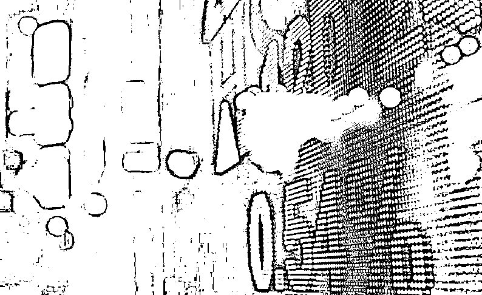

**第一场特朗普与拜登的辩论标志着混乱候选人的回归……在 98 分钟的时间里，他轻视、欺凌并斥责他的对手和主持人——他让辩论看得很痛苦……最重要的是，这 98 分钟标志着特朗普作为混乱候选人的回归。**

**——菲利普·韦格曼****《特朗普之夜：混乱候选人的回归》****www.realclearpolitics.com****2020 年 9 月 30 日**
**“在火星逆行时，侵略者通常是失败者。”**雷蒙德·梅里曼在本专栏中多次提及。在上周二的第一场总统辩论中，特朗普总统就是侵略者，尽管保守派脱口秀主持人的说法很夸张（“他就像一个角斗士，一个真正的勇士，向所有人展示他是如何为美国人和我们的权利而战！”），但根据之后进行的大多数民调，他显然是那场辩论的输家。想象一下：你是一家你所热爱的公司的人力资源部主管，有这两个人（我会叫他们绅士，但这可能会误导你）面试贵公司（国家）的最高职位。你为你的公司在过去 200 年里在世界上赢得的形象和尊重而感到自豪，你想通过这位新员工来保护甚至提升这种形象。你会相信这些受访者中的哪一个能做到这一点？作为一名美国选民，这正是你所处的位置。他们正在面试你的国家领导人。我知道本专栏的目的是讨论当前和未来的地球宇宙学周期及其与金融市场活动的关系，但我想谈论一下与总统星图以及他的健康相关的行进相位。从地球宇宙学的角度来看，有趣的是，美国总统唐纳德·特朗普现在已经与新型冠状病毒肺炎发生了联系。观察到行进的海王星和冥王星与他的出生星图形成的困难相位以及他的年龄，情况可能会比最初想象的更严重。这个时候他可能需要专家的护理，当然，他会有优秀的医务人员来监测他的病情。**这一事态发展可能会对金融市场价格产生极大的影响。**此外，这一事态发展创造了一个机会，让我们深入了解占星学是如何工作的。如果你对我进行的，将地球宇宙学因素与历史上最致命的大流行联系起来，以及它们会如何影响当下的新型冠状病毒肺炎大流行的研究感兴趣，你可能现在就像预订《[2021 年金融预报](http://mp.weixin.qq.com/s?__biz=MzA5NjA0NTAxNg==&mid=2651425978&idx=1&sn=067bd68ece37e1e820d6f84f7a3cc960&chksm=8b4b3e0dbc3cb71b866f65d51f7993d3c35dee77cebd77eda3f63a4d5864dadaea2e9d14c101&scene=21#wechat_redirect)》（点击可了解更多详情）。为什么？因为我将在本周完成这项研究，我们将把这一部分作为预览版发送给所有到本周为止已经预订了这本书的人。这些材料现在很及时，这本书出版的确定日期可能会是 12 月中旬。在医疗占星学的研究中，**海王星代表着疾病的脆弱性，尤其是那些与免疫系统减弱有关的疾病**。**土星和海王星的组合（中点）突出了身体最薄弱的部分。**当海王星与出生星图中的个人关键点形成困难相位时，一个人比平常更容易受到疾病的侵袭。如果土星和（或）冥王星也与一个关键的出生图位置形成困难相位，那么可能会比平常更危险。

当然，当出生星图被这些行进行星激活时，还有其他可能的表现。但当严重疾病发生时，这些因素的综合作用可能会出现。现在，所有这些行进激活了特朗普总统出生星图上的关键点和个人点。因此，作为占星师，我们知道这种情况可能会变得严重。但让我来讨论一下这些地球宇宙学因素可能表现出来的其他方式。首相，行进海王星与特朗普总统出生星图的太阳-月亮对分相（双子座-射手座 21°-22°）形成了 T 三角格局（他出生时恰逢月食，这个食相在 2020 年-2022 年间被海王星激活）。太阳是特朗普先生（出生星图）的守护星，意思就是守护着他的健康，尤其是他的心脏和活力。据报道，他感到疲惫，当海王星与自己的太阳或守护星形成困难相位时，这是很常见的情况。需要注意的是，12 月 14 日的日食发生在射手座 23°，与他的月亮合相，与他的太阳成对分相。日食也强有力地关联着一个人生活中因工作、关系或健康而发生重大变化的时刻。在这样的海王星强大行进期间，一个人的生活中还有其他方面可能会受到影响，比如精神和心理状态，可能会感到（或实际上）与现实脱节（“我赢得了这场辩论的重大胜利，这是基于汇编和民调等。谢谢你们”)。这会强烈地影响到艺术、音乐或精神倾向的人，因为它可能与强烈的幻觉和精神顿悟的时期相吻合，也可能与监禁的时期相吻合。这段时间，一个人可以感觉到自己——或者真的是受害者，是虚假和破坏性谣言的主体（或肇事者），这些谣言没有事实依据，但可能会损害自己的声誉。在这段时间里同样具有影响力的相位还有：行进的土星和冥王星对分特朗普总统出生星图的金星、土星（巨蟹座 23°-25°）。冥王星的对分相会一直持续到 2022 年的 11 月 1 日。这也可能与一段比往常更疲惫的时期不谋而合。然而，正如本专栏之前所说，冥王星处于这样的相位，“没有人能毫发无损地逃脱。”这是一个导致个人转变的时期，与先前的行动和行为相关，这些行动和行为不再符合本人的最佳利益。在这一领域重建更好的生活之前，需要**象征性的“臣服”**。鉴于特朗普的金星、土星位于掌管家庭的巨蟹座，这可能与他侄女玛丽·特朗普最近写的一本书中对他家庭动力的严厉揭露有关。不过，问题是，特朗普先生正处在海王星、冥王星和土星的艰难行进阶段，他已经接触到了新型冠状病毒肺炎，这是一个可以表明他生活中面临严重挑战的组合，比如健康。通常情况下，狮子座火星在上升点暗示着他是强壮和充满活力的，也许天生的力量会让他顺利度过难关。然而，对总统来说，最明智的做法是休息，避免压力，或许让自己敞开心扉，接受某种形式的顿悟，这将让美国公众再次看到一场文明和体面的美国最高职位辩论。与此同时，我们正处于一个包含多重地球宇宙学征象的时间段，这些征象与 3 月 20-31 日的时间段高度相关，当时全球股市触底，结束了一个月前开始的恐慌。如果有消息称总统的健康状况正在恶化，股市将再次大幅下挫。然而，由于海王星象征着虚假信息和欺骗（当它没有灵性领悟的时候），我完全不确定提供给公众的信息是否就是真实发生的事情。有了海王星，你无法相信你所看到的、听到的或读到的。然而，对于那些相信祈祷的力量并支持总统的人来说，这将是为总统的完全康复和福祉祈祷的适当时机。对于那些不相信祈祷或奇迹的人来说，也许这将是一个体验人类慈悲泛滥的时候。世界当然可以更多地利用这一点。幸运的是，当海王星没有陷入欺骗和谎言的网中时，它就是掌管慈悲的行星。

**说明：以上日期基于纽约证券交易所所在的美国东部标准时间，由于存在时差，中国地区可能需要加一天。**

**版权声明：**本文由若道翻译发布，欢迎转发，反对抄袭。友号转载请申请白名单。

**雷蒙德·梅里曼（Raymond Merriman）**

若道签约老师。著名金融占星师，ISAR（国际占星研究协会）前主席，梅里曼市场分析公司的总裁。他由于“提升了占星学的职业形象”，在 1995 年国际占星大会上被授予轩辕十四奖；在 2012 年国际占星大会上，被授予轩辕十四终身成就奖。

1“中国上证指数月度报告”发售

**若道推出了****中文版****的雷蒙德·梅里曼中国上证指数月度报告，并持续发行该报告！**

当把金融市场的周期和占星学的周期相结合时，雷蒙德·梅里曼老师的金融占星学研究**为投资者应对金融市场的周期波动，并随之调整投资策略提供了极大的价值参考**。

**10 月中英文报告均已上线！**

2“黄金价格周期月度报告”发售

**若道推出****中文版****的雷蒙德·梅里曼黄金价格周期月度报告！**不仅仅为广大读者在中国股市的投资出谋划策，更将视角放眼黄金市场。

**每当世界经济形式不明朗的时候，有一个地方是保值的港湾，那就是****黄金**。自 1982 年雷蒙德·梅里曼出版第一本研究《地球宇宙学征象与黄金价格的关联》的著作以来，**他一直作为最重要的黄金市场时机预测者之一享誉国际**。在上个月的黄金报告中，梅里曼老师说：“如果这是开始时间更早的 15-21 周基本周期的第 21 周，则会发生扭曲失真（扩张）。即使在扩张的基本周期中，波谷也通常在第 22 周和第 27 周之间出现，下跌通常仍会持续 2-5 周……收盘价跌回前一个价格通道内不是看涨的迹象，这表明市场正在转为看跌。”对于梅里曼老师市场报告熟悉的读者会知道，梅里曼老师在每份报告中都会分析市场的长期、中期和短期的走势。若道君身边有的朋友，会根据中短期走势操作，买入、卖出比较频繁，赚取周期涨跌的差价；有的朋友，则属于看大趋势做更长时间段的投资，这时报告给出的周期，也会非常有用。而对于本身特别喜欢做短线交易的交易员，关键反转日则是帮助他们做短期操作非常有用的技术。10 月份美国大选的白热化和变化莫测的情形，无疑将会为全球股票和黄金市场的波动带来变数。从天象角度而言，我们正在接近今年最强劲的两大地球宇宙学时间段之一——**逆行的火星将在 9 月 28 日-10 月 19 日期间与摩羯座星群形成上弦月四分相。**而在 3 月 20-31 日，当火星合相魔羯座星群时，黄金市场和股市都有令人印象深刻的反应。

**10 月中英文报告均已上线！**

**购买套餐**，买得越多越优惠

中国上证指数月度报告套餐价

*   **单月报告**：280 元

*   **3 个月套餐**：780 元（260 元/月）

*   **12 个月套餐价**：1999 元（166 元/月）

**长按下图识别二维码**

**购买金融报告****套餐**

**▼**

黄金周期月度报告优惠

*   **双报告年度套餐更优惠（直降 899 元）**
*   **12 个月黄金报告+12 个月上证指数报告：仅需 3500**

**长按下图识别二维码购买黄金报告套餐**

▼

1976 年以来，由雷蒙德·梅里曼撰写的梅里曼市场时机学院每年一次的年度预报沙龙和每年一本的《年度预报》一直在应用占星学原理为投资者们服务，提供卓越洞见，从未间断。

过去两年，3 小时的年度预报讲座和长达 200 页左右对金融市场的分析报告，帮助许多若道读者做出正确的投资决策，降低了投资风险，并获得相当不菲的投资收益。在群星摩羯座的时候，我们和你一起提早规划自己来年的投资安排。

**2021 年金融年报预售**

**1976 年以来，由雷蒙德·梅里曼撰写的梅里曼市场时机学院每年一次的年度预报沙龙和每年一本的《年度预报》一直在应用占星学原理为投资者们服务，提供卓越洞见，从未间断。**

过去两年，3 小时的年度预报讲座和长达 200 页左右对金融市场的分析报告，帮助许多若道读者做出正确的投资决策，降低了投资风险，并获得相当不菲的投资收益。在群星摩羯座的时候，我们和你一起提早规划自己来年的投资安排。2021 年年度预报开始预售**前 50 名预售价格**：1080 元（已售罄）**前 50-100 名预售价格**：1180 元**100-150 名预售价格**：1280 元**150 名之后价格**：1380 元**2021 年年度预报中文版预计发布时间**：2020 年 12 月底**沙龙时间**：2021 年春节前后**沙龙形式**：英文讲座，配有中文翻译**点击下图了解详情**

▼

******点击阅读原文购买金融报告******

# 重大天象｜一次逆行五个月的冥王星，这次又要出什么“幺蛾子”？

> 原文：[`mp.weixin.qq.com/s?__biz=MzA5NjA0NTAxNg==&mid=2651429233&idx=1&sn=b888cc3e0d368304f9aad1a339b03e02&chksm=8b4b2bc6bc3ca2d0eeb92cf0887f52ea5e8d95cc7b004a0acaf38f50d2765fec8a0b9d384992&scene=126&sessionid=1692738095#rd`](http://mp.weixin.qq.com/s?__biz=MzA5NjA0NTAxNg==&mid=2651429233&idx=1&sn=b888cc3e0d368304f9aad1a339b03e02&chksm=8b4b2bc6bc3ca2d0eeb92cf0887f52ea5e8d95cc7b004a0acaf38f50d2765fec8a0b9d384992&scene=126&sessionid=1692738095#rd)

******☆ ****后台回复“今日”，给你一句生命态度******

作者/图片/Justine ISAR 认证占星师
编辑/翀子 封面/书君

经过 5 个月的逆行，冥王星恢复顺行了！冥王星在摩羯座的最后 10 度顺行，对 12 星座都有什么影响？每个人又将收获什么礼物呢？让我们一起来看文章吧~

**北京时间 10 月 4 日，冥王星在摩羯座 22 度 29 分开始顺行，**这是自 4 月 26 日冥王星从摩羯座 25 度 59 分开始逆行以来，漫长的冬眠期之后的苏醒。**宇宙背景**

**9 月 29 日，土星已经在摩羯座 25 度 20 分开始顺行。**现在，土冥之间的距离还不到 3 度，当冥王星顺行，会最后一次行进在摩羯座的 22-23 度，这是今年土冥合相、木冥合相的敏感点，所以**我们可以重温今年早些时候的一些重主题。**

在 2020 年 1 月 12 日，土星和冥王星在摩羯座相遇，给我们带来了一场流行病、封锁、全球政治危机，以及随之而来的一切。

土冥考验着我们，让我们变得有弹性。就像那句名言“杀不死你的，让你更强大”——当我们培养了韧性，就更有可能承受未来可能遇到的困难。**土星和冥王星让我们在危机中茁壮成长。**

2020 年的 10 月，冥王星顺行的时候，火星仍在白羊座逆行，太阳将在 10 月 23 日进入天蝎座。作为天蝎座的守护星，冥王星希望我们能向前推进。但同时，2020 年最后一次水星在 10 月 14 日从天蝎座开始逆行。

**一些秘密、想远离公众注意的事情可能会暴露出来；一些仍未解决的混乱、阴谋或冲突为真相会被揭开。**因此，在我们能够再次前进之前，有些事情必须先完成。

**冥王星在摩羯座最后 10 度**

2020 年的土冥合相注定是非凡的。从 10 月 4 日开始，土冥将最终分道扬镳，越行越远。

虽然冥王星在摩羯座还会呆到 2024 年底，但冥王星在摩羯座的时代（从顶部开始控制的霸权或专制）已经进入了末期。

**12 月 17 日，土星将进入水瓶座，正式结束与冥王星在摩羯座的共存。**木星和土星在 2020 年底进入水瓶座，自下而上的民主会进入历史舞台的前沿。

2021 年 2 月，土星超出冥王星 10 度范围，土冥合相的行进完成，历史的一章即将结束。到 2054 年他们才会再次合相在双鱼座。

**当冥王星行进在一个星座的最后十度时，被视为独裁统治增强的度数，是强烈的，也是最艰难的**——不仅是政治领导人的独裁，还有想要控制世界的机构与公司。

十月的美国临近大选。占星学不牵涉政治 ，但我们处在木土冥合相摩羯座的周期中，任何试图占领整个星球的人都将走向崩溃。

**当一个人拥有太多力量，并尝试控制太多东西时，冥王星周期会让他就此终结。**即使是他们中最坚强的幸存者，也将很快失去地位，使命和野心。

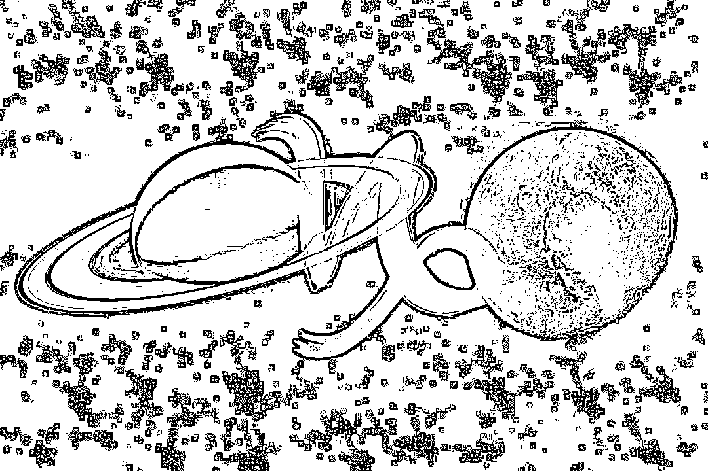

**冥王星顺行对个人的影响**

**冥王星是出生、死亡以及两者之间一切事物的领航者。**它的性质类似于印度教的湿婆神，即是破坏者，也是创造者。通常就是冥王星的力量，带领我们从舒适区走出去，实现超越与转化。

**冥王星逆行是一个常规周期，每年持续五个月。**与所有外行星一样，它引起的担忧要比内行星罕见的逆行引起的少。但是，作为最遥远的行星，所以冥王星描述的是最普遍的事件，同时影响着大多数的人。

逆行时，冥王星给我们的内在生活带来了微妙的变化。这位地狱之神回到地下世界，向自我施加压，我们必须聆听来自灵魂深处的声音，深入潜伏无意识记忆中的悲伤和恐惧，反思人生中力量与控制，直到内在的转化完成。年复一年，**冥王星的逆行使我们更加接近“自己必须成为的人”。**

因此，冥王星逆行是终极的进化。它带领我们访问地下世界，净化灵魂。到逆行周期结束时，我们将对自己最深入、最具挑战性的任务有了新的了解。所有最深切的欲望和秘密，各个面向的真相，会随着冥王星的顺行将开始浮出水面，以便我们加以处理。

这会在个人和地球层面都起到了催化剂的作用，因此，现在我们都可以期望冥王星的力量，将以一种或另一种方式改变我们的生活。

**第 3 次将事情做对的机会**

如果你现在处于激烈的冥王星行进中（行进的冥王星与你的太阳、月亮、上升点的守护星、四轴或其他重要的个人行星成合相、四分相、对分相），冥王星顺行之后，你有再一次（很可能是第三次）把事情做对的机会。

冥王星代表不可逆转的转变——可以经历的最深层次的转变。**冥王星的礼物，是每次通过带走你不再需要的东西，让你破茧成蝶，进入新的生命阶段。**

因此，如果你在冥王星运势的影响下，请放开真正不需要的东西，剩下的将是必不可少的和正确的。以下是一些可以用来面对冥王星行进的咒语：

*   我可以通过…来重生

*   当……时，我最强大

*   我释放生命中不再起作用的东西…

*   对我来说放手是安全的。

掌握我们内心最深的无意识能量是非常困难的，这使得冥王星逆行的功课非常困难。如果个体能设法掌握他们的性和最深层的欲望，他将通过这个考试，并将自己从与冥王星行进相关的能量中解放出来。

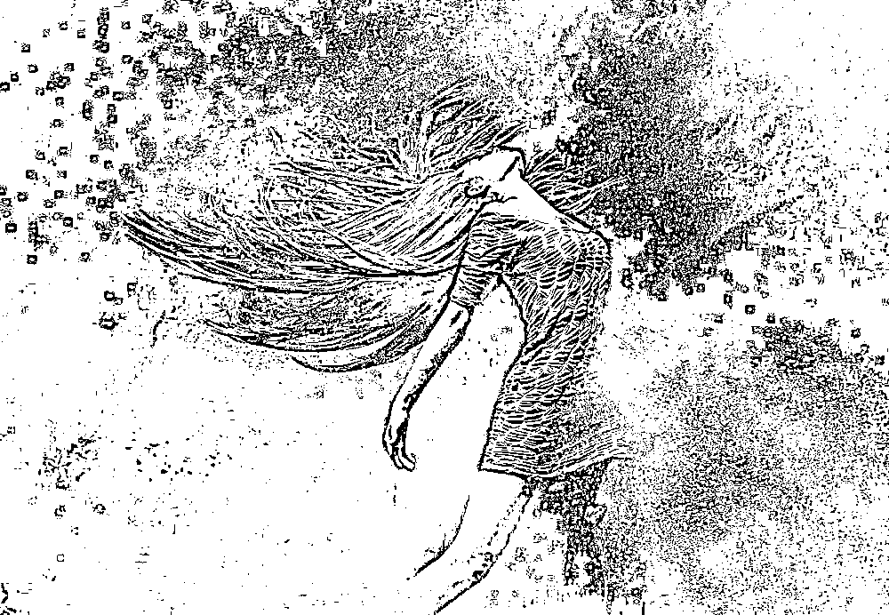

**冥王星顺行对 12 星座的影响**

**若道君：****你可以在 app store 或者应用商店搜索“若道”下载 app，输入个人档案，查看行运盘（也可以使用其他星图软件），找到行运冥王星落在出生星图的第几宫，然后对照下文查看冥王星顺行的影响。**

**例如下图中，行运冥王星在美国总统特朗普个人星图的第 5 宫。**

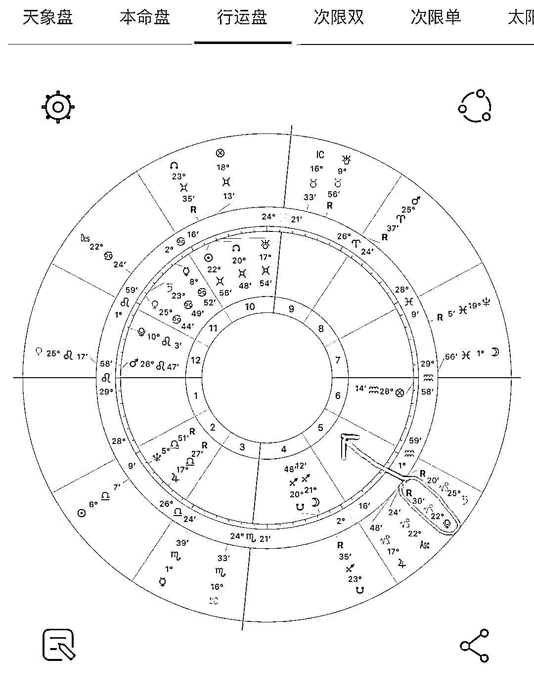

**上升*****白羊座*****（冥王星顺行在第*****10*****宫）**

自冥王星进入你的第十宫以来，你会有更多的野心，控制和支配的欲望。你想要更多的权力，因为你的目标是要在这个世界上留下尽可能伟大的印记，但也容易经历与父母、老板或权威人物的对抗。

在冥王星逆行期间，你发现前提是要真正发现自己是谁，你的生活关于什么。如果没有花足够的时间去发现自己，只是匆忙行事，会进入另一个错误的地方。**冥王星给予你实现人生目标的力量，或让你洞察到这个目标到底是什么。**

当冥王星顺行时，**如果感到无法再去面对自己现在的职业，你会对此进行根本性的改变。**甚至有可能，你想进入一个冥王星相关的职业——譬如占星学或身心疗愈！如果你在一个正确的方向与道路上，你将努力取得比以前更多的成就，带来治愈和改革，对周围产生强大的影响。

**上升*****金牛座*****（冥王星顺行在第*****9*****宫）**

自冥王星进入你的第九宫以来，**你对周围世界的整体看法将会有相当大的改变，**这常常是因为生活中的危机，显示出你以前的见解需要与时俱进了。

当冥王星逆行，**你深刻看待和理解这个世界的能力**、以及处理这个世界的智慧将会增长。你深入听从自己内在的呼唤，去继续吸收生命深奥的一面。你将会开始对更深刻的主题感兴趣，比如你与周围人的关系、与宇宙的关系。你可以转向宗教或更大的智慧，如果它能给你在这个时候所需要的深刻和亲密的体验。

现在冥王星顺行了，**你可以正确使用知识来改变世界**，把前面所学的东西整合传递给更多的人，利用思想的力量将他人从各种意识的束缚中解放出来。你也可能参与到一个团体或运动中，希望改变社会，但可能不是革命性的方式（冥王星行进会更慢更有效）。

**上升*****双子座*****（冥王星顺行在第*****8*****宫）**

自冥王星进入你的第八宫以来，也回到了自己的家。**你可能会经历跟伴侣的性、共享资源与控制议题，**或者**死亡、重生和再生**将在你的生命中变得比以往任何时候都更重要。

当冥王星逆行的五个月里，亲密关系内部深层的、黑暗的秘密会显现，你不得不深入水域去探索它。你周围的人的死亡，以某种方式从根本上改变你的生活环境，或者迫使你内心对你生命的本质和意义产生对抗。你会自己发现很难接受那些没有深入到事情的最底端的解释，因此可能会参与到神秘学或其他与生死有关的教导中。

当冥王星顺行，你可以行动起来，让性爱摆脱沉重的情感包袱，成为恢复活力和增进感情的重要手段；让金钱不再成为权力斗争的来源，你会处理负债问题——无论是配偶的财务，还是公司的财务，因为负债会让你在很大程度上处于别人的控制之下；**你会在现实生活中实践对生命深奥秘密的理解。**

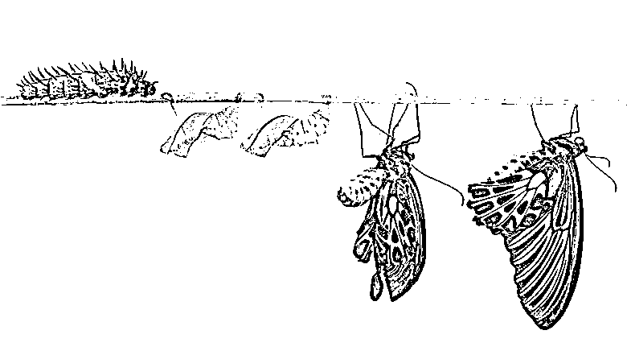

**上升*****巨蟹座*****（冥王星顺行在第*****7*****宫）**

在冥王星进入你的第七宫以来，要么你伙伴关系将经历深刻和重要的转变，要么你的生活将通过与另一个人的亲密接触而改变。关系的过山车可能会起伏不定，一波三折。某些一对一关系会经历毁灭，重新开始。你有没有试图控制他人的行为或态度？或者感受到你必须逃离对方的控制？

在冥王星逆行期间，你会寻找专业咨询师来帮助你改变你的生活。或者你会发现：自己遇到的那些会对生活产生巨大影响的人，**只不过是内心的一面镜子。**你开始认识到，自己是通过微妙的潜意识线索触发这些遭遇的，因此不能把发生在自己身上的好事或坏事都归咎于别人。

当冥王星顺行之后，你可以建设性地使用冥王星的能量，**让关系成为自我和对方转变的舞台，**尽量避免与敌人进行权力斗争。你会治愈自己的关系困难并学会放手。如果你本身就是一个治疗师或婚姻顾问，你会善用咨询关系和爱的能力作为一种疗愈的力量。

**上升*****狮子座*****（冥王星顺行在第*****6*****宫）**

在冥王星进入你的第六宫以来，你可能经历了身体上的不适。在这几年里，你可能会过度劳累自己，对身体的需求关注不足。但现在它可能到了一个临界点，你必须做些什么来改变。在工作上，你会经历很大的变化，或可能会有一段困难时期，因为冥王星在你的工作中制造了紧张，特别是与老板的关系。

在冥王星逆行阶段，你会探索合适自己的养生法，重建自己的身体，你也可能被迫考虑要不要换工作，应该去什么样的新环境。

当冥王星顺行，你可以开始**改善自己的饮食，练习瑜伽，加强锻炼。**你新找的工作会跟再生、秘密等冥王星的元素有关。或者你会**让工作可以成为改变、转化生活的强大力量**，在权力斗争之间游刃有余，做一个强大的变形金刚。

**上升*****处女座*****（冥王星顺行在第*****5*****宫）**

在冥王星进入你的第五宫以来，**如果你有孩子**，你跟他们的关系可能会紧张，因为你试图给他们施加太多压力，或者与孩子之间有权力斗争。**如果你在恋爱的阶段**，这段恋情可能会非常强烈，看起来命中注定，但情绪化并沉重。

**在冥王星逆行阶段**，你会意识到需要尊重孩子的本身意愿，你做的每件事都会对他们以后产生强大的影响，也许会让他们的天性受限；或者发现自己完全被某个你知道不适合做伴侣的人吸引。

**冥王星顺行后**，你在与孩子打交道时，会小心并运用常识；你可能会结束一段激烈但扭曲的关系；会被一些非常有力量、有参与性的自我表达、艺术和其他形式的娱乐活动所吸引。你在这段行进期间，想要非常强烈地体验，肤浅的经验根本不会吸引你。

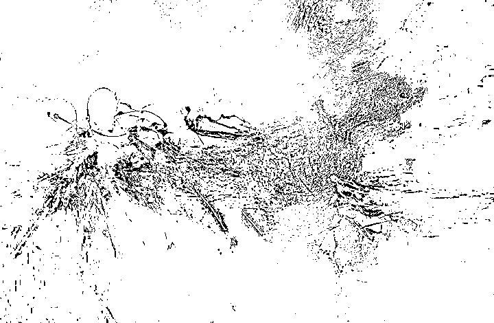

**上升*****天秤座*****（冥王星顺行在第*****4*****宫）**

在冥王星进入你的第四宫以来，你的家庭生活可能会发生巨大的变化。譬如搬家、房屋内部的变化、家庭内部的变化（如离婚、死亡或其他分居）、或者家庭关系本质上的巨大变化（如与父母的权力斗争）。当你开始理解童年经历对成年后的影响时，这些问题现在又会重新出现。

**冥王星逆行期间**，从心理层面上，你可能最终不得不处理一些你**童年的议题**。你将不再满足于仅仅与他们共存，你想要改变，通过心理治疗、占星咨询等方式，在最基本的层面上改变。

当**冥王星顺行**，如果你通过一些方式治愈了自己早期的创伤，现在可以**在现实层面加深你的家庭纽带。**家庭生活会成为再生的源泉，带给你扎根大地的稳固感和更多疗愈的能量。如果你因为任何原因过度依赖父母，可能会发现有必要摆脱他们。但是无论如何，你家庭内部或你和父母之间的变化不应该是消极的，而是带来转化和成长。

**上升****天蝎座****（冥王星顺行在第*****3*****宫）**

在冥王星进入你的第三宫以来，你会发现每天的交流和谈话都变得沉重很多。

你平常认为理所当然的日常生活元素——邻居、直系亲属、日常事务和其他日常事务——现在可能达到了危机点。你将被迫对他们做些什么，你确实应该做些什么。

在冥王星逆行阶段，**你经历了一段尖锐的自我反省的时期。**可能会对心理学、瑜伽和玄学研究感兴趣，尽管在这个阶段你可能会把它们作为智力训练来学习，而不是把它们作为生活经验应用到你自己身上。

当冥王星顺行，场景的变化和短途旅行可能会触发重要的变化，这些变化将产生深远的影响。无论你去哪里，努力获得一个**新的视角**，这将使你更深入地理解你的日常世界。这些体验会让你活得更有趣，并提升与扩展你的意识。

**上升*****射手座*****（冥王星顺行在第*****2*****宫）**

在冥王星进入你的第二宫以来，你的财务状况可能经历了重大变化。这种变化最令人不安的方面是：它通常开始于一个崩溃阶段，你可能不得不与更少的资源相处。

在冥王星逆行的阶段，**你的自我价值将会经历一次完全的蜕变，**包括物质层面上的个人财产和心理层面上的价值观。你对财产的态度可能会完全改变。你可能会认为金钱物理属性对你来说不是那么重要，形而上学和道德价值可能变得更重要，因为只有内在价值在自己的掌控之中。

当冥王星顺行，如果你**重新评估了自己与金钱的关系，**会清除以前任何财务上的业力，调整原先对于财富匮乏、抓取、不配得的心态，用自己的优势和资源快乐地去赚取金钱，成为吸引丰盛的磁铁或显化财富的魔术师。

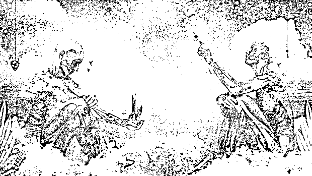

**上升*****摩羯座*****（冥王星顺行在第*****1*****宫）**

在冥王星进入你的第一宫以来，你会发现自己**内在的能量上升**，想要控制周围的每件事和每一个人。如果你不小心的话，这会使你与他人的关系变得极其困难。

在冥王星逆行阶段，你会越来越去寻找生活的内在维度。你会被生活中神秘和隐藏的方面所吸引，这将使你对自己和他人的内心活动非常感兴趣。你可能会对占星学、瑜伽和其他玄学或精神学说感兴趣，其目的就是让你的自我得到完全的再生。

当冥王星在此顺行，**你将逐渐重塑你个性的许多方面，成为你自己的力量。**如果你已经在神秘学、疗愈领域积累了很多年，你甚至在这个阶段成为咨询师、治疗师或灵媒，因为你可以直接看到问题的核心，并授权他人治愈自己。

**上升*****水瓶座*****（冥王星顺行在第*****12*****宫）**

冥王星行进在你的第十二宫以来，激活了你本性中不为人知的一面。可能是已经失败的关系，或者你意识到但不想讨论面对的部分，**这些隐藏的能量却以颠覆性的方式泄露出，**使它们不能被忽视。

冥王星逆行期间，你意识到自己有必要直面那些隐藏在生活和过去的不愉快的面向。通过回避它们，你已经制造了一种被它们控制的局面。只有诚实地面对它们，释放罪恶感，你才能清除它们，防止它们对你产生进一步的影响。

冥王星顺行之后，你可以联系任何一个能触及你内心的治疗师，继续深入 12 宫的黑暗的秘密，**面对自己的潜意识。**你的焦虑会得到化解，并疗愈久远的情绪议题。在冥王星进入 1 宫前，你需要清除旧的和隐藏的心灵垃圾，才能进入重建自我的阶段。

**上升*****双鱼座*****（冥王星顺行在第*****11*****宫）**

冥王星行进在你的第十一宫以来，你的朋友的类型、长期目标和对未来的希望都发生了巨大的改变，曾经喜欢的活动现在可能不再吸引你。你可能会觉得许多你曾经追求的目标不值得追求。

冥王星逆行期间，你会**重新评估人际关系的面向**，反思当下与朋友与某些团体之间激烈、不太愉快的接触，自己如何避免仅仅因为他们有力量和说服力就和他们互动？信任议题的根源是什么？你的理想会改变，这将反映在你与之交往的人和你认同的团体的改变上。

当冥王星顺行，一段特别的友谊可能会在这个时候改变你的生活——可能会遇到一个对你影响很大的人，会改变你的人生。至少，你会寻找一种完全不同于过去的友谊，可能会被吸引到社会改革或身心治疗的团体。浅的旧友谊可能会在这段时间结束，新的友谊可能会形成。从长期来说，**你会通过友谊重新实现你的目标，并展望未来愿景。**

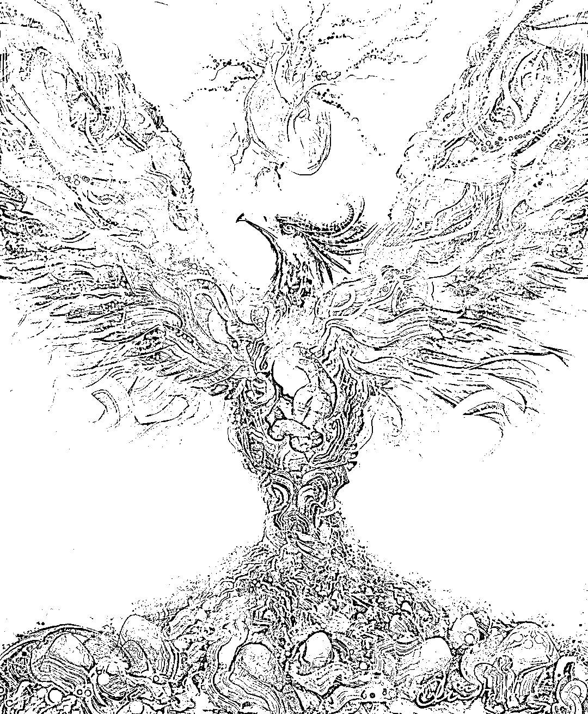

**展望**

在 2020 年的宇宙天气下，冥王星顺行非常关键的时间节点。冥王星苏醒之后，会在土木合相水瓶座的全球舞台上发挥作用，带来重大转型和重组的进行。我们会看到 2020 年更多的变革性能量正在展现。

**冥王星不是温和的，一层层的腐烂，全面破坏或死亡，旧的结束之后才会慢慢有新的诞生。**虽然，对许多人来说，现在生活仍然是艰难的。请放心——在不久的将来，我们将最终收获隐藏在土冥合相摩羯座背后的礼物。

**版权声明**：文章由作者授权首发于若道平台发布，欢迎转发，反对抄袭。

****

**Justine**

ISAR 国际认证占星师（2014 年获得）/塔罗师

毕业于浙江大学，十年跨国企业 HR 经验

咨询时长超过 1000 个小时

**咨询微信**：Justine_JT

**公众号**：星光体

长按打赏

**ISAR 选修课，心理占星学视角下的预测方法**

**点击图片链接或扫二维码咨询客服**

**微信又双叒叕改版啦，不想错过若道君的推送？**

**就把若道设为星标吧！**

**▼**

喜欢记得点一下在看哦☟

**报名直达入口**

# 金星进入处女座｜是时候谈一场声色俱佳的恋爱了

> 原文：[`mp.weixin.qq.com/s?__biz=MzA5NjA0NTAxNg==&mid=2651429232&idx=1&sn=27b6a409de3d8ba336d24dde02e0cfdd&chksm=8b4b2bc7bc3ca2d12fd1966e0800d7a478456f45d2605e3d9e56a2bfb0f63b782db750fca30f&scene=126&sessionid=1692738095#rd`](http://mp.weixin.qq.com/s?__biz=MzA5NjA0NTAxNg==&mid=2651429232&idx=1&sn=27b6a409de3d8ba336d24dde02e0cfdd&chksm=8b4b2bc7bc3ca2d12fd1966e0800d7a478456f45d2605e3d9e56a2bfb0f63b782db750fca30f&scene=126&sessionid=1692738095#rd)

********************☆ 后**********************台**********************回复“今日”，给你一句生命态度********************

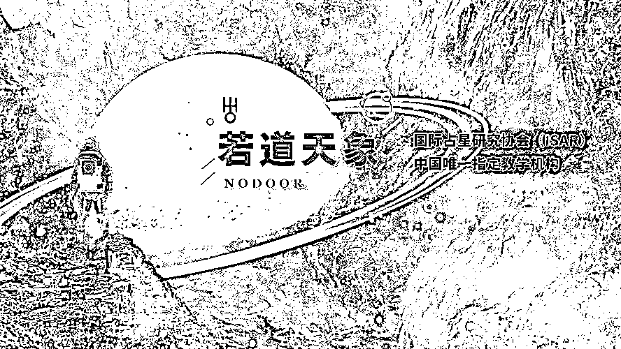

作者/郑玮玲 ISAR 认证占星师编辑/玫瑰 图片/全景网 10 月 3 日凌晨 4:48，金星进入处女座啦，此次金星将在处女座行进 25 天，直至 10 月 28 日进入天秤座。金星在处女座会有怎样的特质，这段时间又适合做怎样的自我觉察和成长呢？一起来看看吧。
**金星于处女座**

**处女座，土象变动星座，是踏实、效率的行动，是谦卑、服务、朝圣的精神，也是匠人的原型，追求并显化出至臻完美的品质。**水星的守护让处女座呈现出**强烈的理性色彩与客观态度，分析，尤其是数据分析是处女座最擅长的事**。这让处女座的研究能力常常发挥在**财务管理、数据统计，科学、数学、物理、化学、医学以及各类精密、深化的学术研究**上，包括**占星学、神秘学的研究**。

**对细节的关注和调整成就了处女座的道路。**在黄道上，处女座的确是一个小的星座，在现实中，处女座指向的是一条条在践行中延展的微小路径，让我们在少有人深入的领域耕耘和收获硕果。

金星在很多人的认识里是女性，阴性的行星。在灵性层面，它带来灵魂的完整，内在的女性面与男性面是合一的。人类神圣的女性面是通过金星得以展现，在金星的智慧里，我们找到向内完美的通道。处女座的金星其实为我们打开了一条向内在神性探寻的通道。

金星，维纳斯（Venus）本是罗马神话中爱与美的女神的名字，在希腊神话里她的名字是阿芙洛狄特（Aphrodite）。然而，人类发现金星早于古罗马，古希腊时期，关于金星的能量有关的女神溯源到古巴比伦、亚述文明中的伊斯塔（Ishtar），掌管丰饶、美丽、爱与性，乃至战争的女神。

在更久远的苏美尔文化里，人类崇拜的第一位女神是向下深入地府重生的女神伊莱娜（Inanna），她被认为是当时的“天后”，正是人类文明中已知的最早的与金星能量有关的爱与美的女神，也是天国与黑夜的女神。与她有关的事物还包括：**公正、权力、黑暗与重生**。于是金星的能量通过每一个女性的生命不断重生，演化，也在每一个男性的生命中通过外在的母亲、伴侣、妻子、女儿和内在的觉知生生不息。

金星守护金牛座和天秤座，这是两个爱与美的原型最强共振的星座，金星在双鱼座也是感到快乐、舒适的，因为这是金星入旺的位置，因此，在其对面的处女座就是传统意义上金星落陷的领域。但在进化的意涵里，行星的原型永远有鲜活的表达方式，只是在不同星座的土壤中呈现不同的活力和动力。处女座的条理性、计划性和对细节的要求确实不是爱与美的女神天然顺畅和熟悉的表达方式。**处女座的金星鼓励人类通过细腻、精艺的手法，服务、谦卑的态度去展现出魅力与价值。**她喜欢**通过计划、组织、完善让事情进展得更高效、完美，逻辑和条理在帮助我们进行财务管理上实际上是最有利的。**但金星所代表的人类原欲、性、渴望、消遣、娱乐，在处女座的领域是感受不适的，是觉得需要被剔除的，这便是金星落在处女座最需要调适的地方。金星是糖果、甜食、冰淇淋，金星是享受午夜电影和一杯啤酒一顿火锅的快乐，处女座则注重养生健康，是通过精细计算得出卡路里、糖份、脂肪、蛋白质的摄入量，要保持足够的运动、睡眠和工作。而金星本身也是关于选择的议题，处女座的挑剔和严谨真的让金星在此感受到难上加难。如何才让这颗处女座的金星感受更好呢？当然需要从处女座的优势下手。 

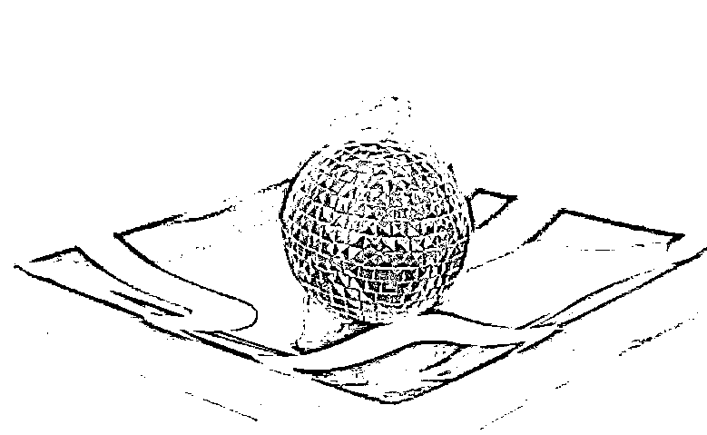

**金星在处女座的优势**技艺之美处女座的金星与艺术技艺深具联接。手指记忆是音乐演奏家和经年的乐器演奏者必然的印记，它意味着：当一个人熟练掌握一门乐器或一首曲目的演奏技巧时，他并不是靠脑子在记谱和指法，是他的手指关节、肌肉已经印刻下乐曲的节奏、旋律和其蕴藏的情感情绪。只要手与乐器接触就能进入音乐艺术的殿堂中，“自动”完成演奏。而这样的记忆必然是日精于勤的练习形成的身体记忆，这就是处女座勤勉、规律造就的艺术。计划之美我们活在一个变化比计划快的世界里，处女座却一直提醒我们计划带来的效率与规整。我曾在一家世界 500 强日企工作，公司要求每个工作日每一项工作都要进行一个叫作 OPDCA 的流程：目标 Object—计划 Plan—开展 Do—检查 Check—行动 Action。我早年非常厌烦这个流程，感觉把一气呵成的事情分隔成生硬的计划流程，浪费时间和精力。但后来我发现了它的妙处是便于时间管理，能很快地从忙碌混乱中分辨事情的先后缓急，让我在忙碌的时候不忘流程和要事，在正确的时间做正确的事。不管是在家务处理还是工作中都能在多任务操作时也不混乱。身忙心不忙靠的不只是念力和定静的功夫，每次快要忙晕时我就在感谢还有“OPDCA”这么美妙的东西。时序之美在灵魂的途径中，时间与空间是不存在的。而在三维世界的周折中，时间界定了生而为人的时序，让我们每一天都活在可被感知、遵循、利用的宇宙的韵律之中。一年四季 24 个节气，从出生死亡，从平淡到绚烂再到消亡，每一个过程都是在显化生命的本质，我们只需要跟随时序去与生命共舞。**处女座的金星教会我们去享受变幻中的当下，清晰、明白地走在成长的道路上。** 整洁之美**线条、格子、素色、中性色、自然风格**是处女座的审美取向，它们都能带来**整洁、简朴**的感受。从狮子座的华丽走向天秤座的完美风格，去掉不需要的细节后，剩下就是处女座的品味了。处女座也从狮子座的奢华走向天秤座的平衡，去除繁复，整理出清爽的工作台和居室，每样东西都放得井然有序，杂物及时清理，利用实用的厨房工具利落地料理就是处女座的金星喜爱的事。

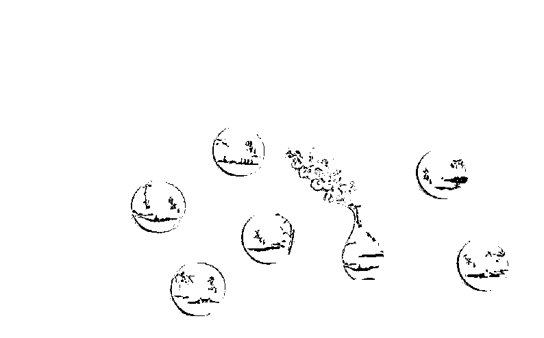

造物之美金牛座大地之灵创造了自然万物，而处女座则是打造自然万物的再创造者，同时也是对面双鱼座来自空灵、想像力的实践者，把梦想打造成现实。水星的守护意味着一双灵巧的手，落实到位的行动就会诞生艺术品一般的生活造物。金星处女座不一定是艺术家的配置，也不一定是完美情人的配置，但一定具有**创造生活美学**的天资和潜力。这样的潜力能让器物染上灵动与质朴同在的韵味，还能呈现出高度的质感、肌理之美与精艺融合的专注之功。
健康之美处女座的形象常被描绘成手持一捆小麦的少女，意味着大地的收获和谷物的维养。金星处女座意味着**喜欢并熟悉营养学、健康、养生知识，享受健康、规律的生活作息，享受天然、无添加的健康食物**。这不单单指我们要滋养和照顾健康，金星是关于喜欢和选择的，是一种更为本能的行为投入到健康自然的生活状态中。因为处女座是一个通过学习可以细致入微的变动星座，对健康的选择也将带来对人文、生态环境的敏感和关怀。**处女座正是关于身体健康与微小器官的星座，小肠——在中医里也联结着心，是心包经的区域。**
金星处女座的人，静静生活在烟火气里，品着温热的咖啡，却在细密心思中维养一份生活的热情与衷爱。在他们的世界里，**谦卑、为他人服务**是再自然的不过的事。看似简单的生活中已经融入了他们充满挑战的理想的想法，他们是会为想法着迷的人群，需要在实践中一层层打开思维的结。金星处女座的人会更欣赏未经加工的天然面貌，野生草木，枯萎的花朵，斑驳的落叶，未经修饰照片，未经打磨的水晶原石。**金星行进在处女座时期的主要天象**金星三分天王星 10 月 3 日-10 月 18 日

**重点影响人群：**个人行星、四轴、交点位于金牛座、处女座、摩羯座 0°-17°的人群。

天王星正在金牛座逆行，金星在狮子座时，与天王星形成四分相挑战的情境，可能已经让一些情感、财务中的紧急、突发状况呈现出来。接下来金天三分的时期，需要关注同样的模式是否重复出现？同样的措手不及是否能有解决方案？在断裂感、抽离状态中，我们能突然触碰到的那股伤痛、创伤在提醒我们什么？三分相会带来助力，帮助，协助我们去解决和面对某个议题。也可能，那是一种让你感到浑身过电的愉悦、兴奋与刺激，但是它的不稳定性是否让你感受到惶恐？天王星是雷电的原型，而雷电本身则是属于五行之中“水”的能量最强烈的显化。水主肾，对应的情绪是恐惧。而恐惧是我们一生都需要面对的情绪，它可能因任何事而浮现。**出现金天相位时，通常掺杂着情感与财务问题，提示着我们需要去面对这些领域中某个浮现的恐惧，清晰它，解除它，恐惧就完成了使命，让我们回归和拥抱内在智慧。**

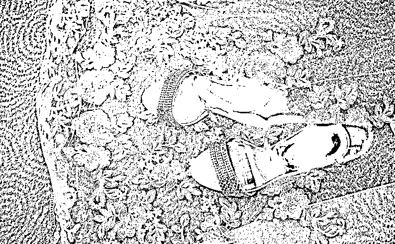

金星对分海王星 10 月 12 日-10 月 25 日重点影响人群：个人行星、四轴、交点位于处女座、射手座、双鱼座、双子座 10°-26°的人群。同在逆行中的海王星近期都在双鱼座 18°，当处女座金星行至 10°时，就开始了金海的浪漫旅程，金风玉露的相逢大抵如此。谈恋爱，或是想要谈恋爱的朋友确实是可以好好利用一下这个周期，也许你会感受到两颗心的融合，两个人共同超越小我。关系都是绝佳的实修之道，透过关系照见自己，在金海的行进之下，幻像与泡影最容易呈现，也容易让我们通过幻灭之境打破模糊的天窗，融入内在无垠的星空与智慧。这段时间，一定要赴一场浪漫的约会，和你的爱人，和你的伴侣，或是与秋天，与秋风，与山脉、大地谈一场声色俱佳的恋爱。**欣赏艺术作品**也是利用海王星超越之路的极佳方式，也许能让你在方寸之间看尽人生百态，走出自我的苦涩与迷惘，打开心灵别样的风景。金星三分摩羯座群星 10 月 13 日-10 月 28 日

重点影响人群：个人行星、四轴、交点位于金牛座、处女座、摩羯座 11°-29°度的人。

摩羯座的木星、土星、冥王星正在以越来越紧密的状态聚合在一起，它们之间的度数在接下来三个月会达到最紧密的合相，而后，木星、土星相继离开摩羯座，完成伟大的合相。整个十月，我们都在浓缩的摩羯座的最后历程中，强烈显化的时事热点都在已经呈现出危机的事态上，给我们带来至密的紧张感和加速通往高潮的趋势。无论是什么结果，现在都只是一个最终的推进过程了。金星与摩羯座的三分相，我们的价值观在经受最后一番考量，你站在哪一边？木星会给予我们很多选择，而你清楚自己的选择和价值吗？如果机会太多，我们都会抓不住，聪明地放弃一些才是智慧的道路。刚刚恢复顺行的土星已经为我们生活强烈显化了过去四个月以来，你所坚持的领域呈现的结果。不管是喜是忧，现在的你在新的前行路上。土星要我们接受所有的现实，你无法回头去修正的只能在当下出发，你可以使用的就是现在的时间和一切资源。金土的三分会在现实程度给予我们一个肯定的答案，在我们感受到局限的地方也许正是重新赢得、证明自己价值最有力的位置。而冥王星给我们深入灵魂的质问：**你所经历、创造、拥有和失去的被什么所影响和撼动着？**外在所有的险境与危机其实只是一面通往另一头的镜子。金冥三分预示着看向黑暗和深处，你就能找到内在的宝藏。如果你走在一条没有路的山上，为了活下去，你要继续寻找路，也许八个小时过去了，你发现自己还身在山中，看不到下山的路。天黑了，你眼前的道路更加艰难了，因为很可能你会被野兽吞掉，或者摔个粉身碎骨。但是你在黑暗中能看见远处的村庄，那里的灯光，你能更清晰地听到山中泉水的流向，黑暗反而给了你通往生之方向的力量。半小时后，你走出了那片已被夜幕笼罩的山。此刻的你，感受到温热，喜悦，成功，你庆幸自己还活着，并且拥有温暖御寒的衣服，背包里的威士忌，足够让你撑过寒夜。而最重要的是，你穿越了黑暗的群山，你拥有了前所未有的尝试，你用脚步走出了自己的精彩。金星在处女座会说：你值得为这最艰辛的三万步丢弃这双值得纪念的旧鞋，买一双新的徒步鞋再去下一座山吧。

**版权声明：**原创文章由作者授权首发于若道平台，欢迎转发，反对抄袭。友号转载请申请白名单。

**郑玮玲**

ISAR（国际占星研究协会）认证占星师（2016 年获得）

若道占星专栏作者

将占星咨询、教学与音乐、舞蹈相结合的疗愈者

**微信号**：zhengviolin

**新浪微博**：@郑玮玲

**微信公众号**：Sampriya-Astrology

长按打赏

**ISAR 选修课，心理占星学视角下的预测方法**

**点击图片链接或扫二维码咨询客服**

**微信又双叒叕改版啦，不想错过若道君的推送？**

**就把若道设为星标吧！**

**▼**

就是这个“在看”，戳戳戳 ☟

********报名直达入口********

# 10 月 2 日白羊座满月 | 站起来！接下来的功课你要独自去完成！

> 原文：[`mp.weixin.qq.com/s?__biz=MzA5NjA0NTAxNg==&mid=2651429231&idx=1&sn=de9a0aa0cfb37021cb3565ba90996d26&chksm=8b4b2bd8bc3ca2ce93278b81df66c1e259f6af2e94a3a8564d6b292fed98690a705399d9d895&scene=126&sessionid=1692738095#rd`](http://mp.weixin.qq.com/s?__biz=MzA5NjA0NTAxNg==&mid=2651429231&idx=1&sn=de9a0aa0cfb37021cb3565ba90996d26&chksm=8b4b2bd8bc3ca2ce93278b81df66c1e259f6af2e94a3a8564d6b292fed98690a705399d9d895&scene=126&sessionid=1692738095#rd)

****☆ ****后台回复“今日”，给你一句生命态度****

作者/王芝桦 编辑/玫瑰 图片/全景网

**白羊座满月**

**北京时间 2020 年 10 月 2 日 5:05 迎来白羊座满月，天秤座太阳与白羊座月亮于 9°08′精准对分。**

**9 月 29 日，**土星在摩羯座恢复顺行，同天，正在逆行的白羊座火星与恢复顺行停滞期的摩羯座土星形成“火土四分”结构的第二次能量峰值。而 9 月 29 日这个时间，已经进入此次白羊座满月的影响周期。**“土星虐我千百遍，我待土星如初恋”**相较于摩羯座土星，正在逆行的白羊座火星在气势上略逊一筹。当下，白羊座火星正行进在我出生星图的第五宫，在这篇满月文的创作过程中，我被土星“虐”了，经历了从自以为是的顺理成章，到踢到铁板的现实受挫，再到绝对不服的奋起反抗，最后到自知之明的满心沧桑的演化过程，现在大家看到的版本已是这篇满月文的第五稿。嗯，我在展现“创造能力”的第五宫被土星“虐”了。但是，我原谅自己了，因为即使我的职业是心理占星师，我依然有自己的生命功课和内在限制。土星目前正行进在我出生星图的第二宫，并合相我的摩羯座北交点，他老人家正在教导我看清自己的斤两（价值），并且告诉我：“每磨练一次，你就能对自己确信几分……”那好吧，拼了！我的幸运是有缘得益于占星学的引领，能够透过现实的际遇对自己的生命功课和心理性运作有所觉察，不至于处于考验而不知原因，深陷情绪而不问究竟。那么，此次白羊座满月，首先我想对像我一样有类似经历和体悟的朋友们说：**我们正处于自我蜕变的临界点！**每个人的人生总有一些时刻会体验到卡在那里、备受煎熬的感觉，就像是丢失了魔法的魔法师，瞬间被打回平凡，时间被按下空白键，但即使在置身黑暗的时刻也绝不要放弃生命中那些重要的东西，因为暂时的卡顿与空白只是为了让我们反思“怎么走到了当下的处境”，只是为了唤醒生命内在的潜在力量，而当我们愿意接受磨练并重拾魔法的时候，便会了悟并感恩这段经历所带来的礼物——**有些时候，生命必须要去经历“独自完成的功课”，必须要与“从前的自我”告别。**

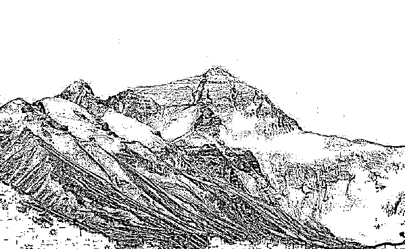

**白羊座满月重点影响人群**

参考满月峰值影响期间各个行星的行进度数，以及逆行行星的轨迹影响；常规容许度，个人行星入相位 3°，出相位 1°；非个人行星入相位和出相位均为 3°。**·** 出生星图中，有**行星、四轴、南北交点落入固定星座（金牛座、狮子座、天蝎座、水瓶座）0°-13°，25°-30°度**的人群； **·** 出生星图中，有**行星、四轴、南北交点落入基本星座（白羊座、巨蟹座、天秤座、摩羯座）0°-4°，15°-26°**的人群；**·** 出生星图中，有**行星、四轴、南北交点落入变动星座（双子座、射手座、处女座、双鱼座）7°-30°**的人群。**“内心戏”比“现实戏“更精彩**

**吾念所归，无惧无退。**

**——乔治·马丁 《冰与火之歌》**

我们跌跌撞撞地走到了 2020 年的最后一个季度，最近大家都在热烈讨论着年底，木星和土星双双换座进入水瓶座的划时代天象，期待能够结束难熬的 2020 年，开启 2021 年的全新周期。但时，两个周期的转换是个逐渐演化的过程，2021 年依然会有传统与创新的碰撞，需要我们对过去的旅途做出总结，对过去的议题做出清理，才能真正地迈向全新周期。

故而，2020 年最后一个季度的宇宙天象，将为 2021 年的重磅大戏做出铺垫，而 2020 年最后一个季度的现实演化，也在提示我们望向内心的旅程，借助那些未完结的现实议题做出内在意识的转化。此次白羊座满月，站在 2020 年最后一个季度的开端，宇宙要向我们传递什么样的深意呢？让我们透过“行星能量传导图”中 1 号和 2 号两个能量群组，读懂宇宙的心：

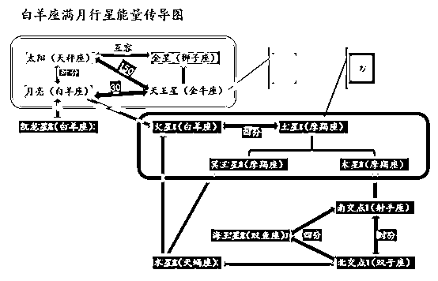

**1.** **关系议题指向自我真相**

**力量存在于人心，人相信什么是力量，什么就是力量。**

**——乔治·马丁 《冰与火之歌》**

**天象****· 凯龙星合相满月**：逆行的白羊座凯龙星合相白羊座月亮，对分天秤座太阳；**· 日金互容**：太阳和金星分别行进在对方守护的星座内，狮子座金星与天秤座太阳形成“互容”结构；**· 水天对分**：天蝎座水星对分逆行的金牛座天王星。此次白羊座满月“行星能量传导图”中的 1 号能量群组中，金牛座天王星将“现实的变革”能量注入到白羊座满月的整体能量演化之中。从 9 月 22 日太阳进入天秤座开始，行进于狮子座、作为金牛座天王星“变革风向标”的金星，便与天秤座太阳形成“互容”结构，我们可以从国际社会的领导竞选和权力竞争，个人生活的合作关系和亲密关系等不同层面，感觉到**“自我权益”的伸张**。记得有一天，在我的一个学员群里，一位同学问：“是不是只有强大的人，才能制定和修改规则？”这无疑是现实世界的游戏规则，否则，特朗普和拜登就没必要夹枪带棍地表演竞选辩论了。但这个提问，或者说感慨，其实道出了一些朋友在工作关系或亲密关系之中的被动状态和内心感受，自己感觉不舒适，权益没有得到满足。此次白羊座满月，白羊座主导的“自我独立”的核心主题被强调和彰显，将我们的关注焦点从天秤月的“关系”生活，拉回到“自我”身上。**那些自 9 月下旬开始逐渐呈现的关系问题、逐渐积累的情绪压力也都迫切地需要一个释放的出口。**

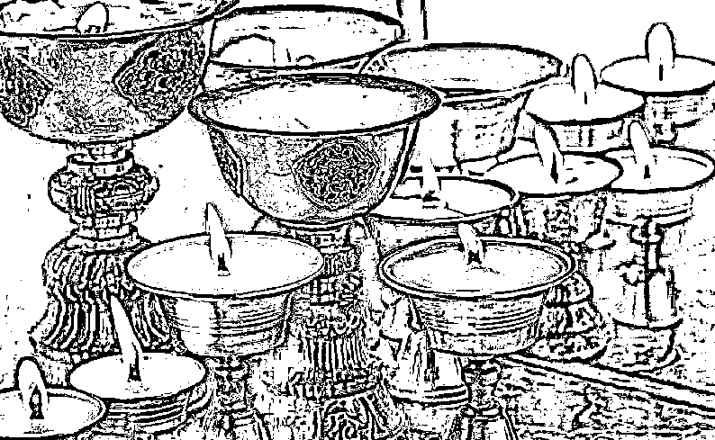

但是，此次白羊座满月，也是令关系问题再度升级、情绪压力再度升温的时间：**·** **白羊座凯龙星合相白羊座月亮这一组结构，勾起人们心底旧日的创伤记忆和心理情结。**那些不被认同的伤痛，那些曾经挫败的羞愧，令本就微妙的关系变得更加敏感，令本就存在的嫌隙进一步放大，甚至会因为一个敏感词或无心的一句话而恼羞成怒；**·** 白羊座满月的第二天（10 月 3 日），金星换座进入处女座，令人们**对关系的审视与权衡变得更加较真儿**。容易过度解读对方的言辞，过度计较现实的得失，过度猜测对方的忠诚，这无疑会进一步加大关系的冲突与矛盾，震荡与变数，甚至导致某些关系的恶化与决裂。

这里，我们需要关注一下即将于**10 月 14 日**开始的 2020 年第三波**水星逆行**。10 月 3 日-10 月 27 日期间，顺行又转为逆行的水星行进在天蝎座，接纳着处女座金星的能量（水星守护处女座），引领我们透过关系问题看向自我内心：

**·** 那些失衡的关系状态和不再信任的人，已经在你的生活中停留多久了？  

**·** 你们一直回避的问题是什么？维持表面的和谐会带来什么好处？  

**·** 关系的失衡，是由哪些问题造成的？能否调整？  

**·** 不再信任的人，碰触了你的哪些底线？能否原谅？  

**·** 你和关系中的另一方，对平衡和信任的标准存在哪些差异？  

**·** 如果让你为对方改变自己的标准，你是否愿意？

**·** 如果让对方为你改变标准，对方为什么“应该”愿意？

**·** 如果想继续这段关系或修复彼此信任，请提前准备 5 个解决方案。

另外，**10 月 8 日**，已经进入逆行前停滞期的天蝎座水星与金牛座天王星形成第一次的“水天对分”结构；**10 月 20 日**，已经开始逆行的天蝎座水星又与金牛座天王星形成第二次的“水天对分”结构。故而，**10 月中旬也是金融和货币的市场波动，商贸和物价的政策变化，关系和信任的真相浮现，底层民众和小人物的新闻热点的敏感时间。**此次白羊座满月，用火爆的方式打开了 10 月生活的大门，而 10 月也正为我们打开 2020 年最后一个季度的训练方式——我们必须通过他人、关系和互动的照见，才能看到自我的全貌，看到自己一个人难以觉察的功课，然后才能开始去做那些需要“独自完成的功课”；而这个功课做得怎么样，取决于我们对当下问题的态度和自我情绪的觉察，如果我们相信现实问题背后蕴藏着进化的机缘，相信自我功课能够激发内在的力量，那么就会为 10 月的整体生活创造一个有力的支点，就能为 2021 年的全新起点奠定一份充足的准备。

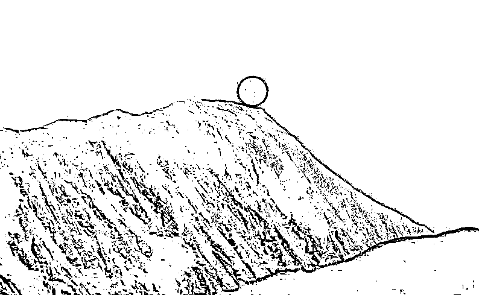

**2.****独自完成的功课**

**人，唯有恐惧，方能勇敢。**

**——乔治·马丁 《冰与火之歌》**

**天象****· 火土四分**：逆行的白羊座火星四分摩羯座土星；**· 海王星四分“南北交点”轴线**：双鱼座海王星四分射手座南交点，四分双子座北交点。此次白羊座满月的能量，也在进一步驱动着“行星能量传导图”中的 2 号能量群组，即白羊座火星与摩羯座上的木星、土星和冥王星之间四分结构的第二轮激烈演化。2020 年，每个人都深刻意识到要自我突破、要重建根基的时刻已经来临。但土星老人“现实高墙”的严格考验，却并未因为我们的意识觉悟有所收敛，反而从下半年开始不断升高并逐渐逼近，想走过去却无能为力，想冲破局限却难以跨越，那种一脚向前跑、一脚被拖住的撕扯感，令人倍感无力且心生焦虑。土星老人可不是为了要我们“献丑”来的，他老人家总是带着一份包装严肃但内里珍贵的礼物来教导我们——“现实高墙”并不只在外界，更在每个人的心里，那些暗示着“不行”的自语，那些习惯于“惰性”的模式，正是搭建现实高墙的砖瓦水泥。所以，**只有意识觉悟是不够的，还要去干！去磨练！直到确信自己并坚持前行，直到不再以“太难”和“疲累”当作借口，直到凭自己的实力成功跨越每个人必须“独自完成的功课”。**2020 年下半年，白羊座火星与摩羯座上的木星、土星和冥王星分别于**8 月、9 月底-10 月、12 月底-2021 年 1 月**，先后三次形成四分结构。10 正是第二轮洗礼的时间：**9 月 29 日“火土四分”结构，10 月 9 日“火冥四分”结构，10 月 19 日“火木四分”结构。**战无不胜的勇猛英雄白羊座火星，以一挑三地向摩羯座上的硬核权威发起进攻：在以现实生存为基准的 2020 年，我们必须要为自己赢得一席之地，才能踩稳自己的安全根基，而不至于在现实的洗礼之下风雨飘摇，于是我们求生、求变、求胜，于是我们在干、在拼、在冲……但是，就像我在写这篇满月文时遇到的考验一样，我们也一次又一次地被拖住后腿、被虐倒在地、被暴露笨拙。白羊座火星代表着我们每个人“为自己出征”的现实演化，而**2020 年 8 月-2021 年 1 月**期间，白羊座火星与摩羯座上木星、土星和冥王星的三轮四分结构，就是我们每个人的**“自我”与现实的“高墙”进行谈判、博弈和共生的时间。**

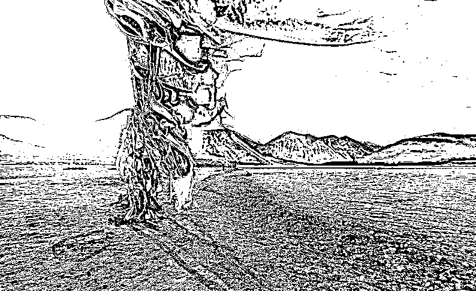

我们想超越现实处境，证明自我能行，但现实高墙犹如“照妖镜”一般，一次又一次地照见出我们自以为是傲慢相、跌落墙角的笨拙相、恼羞成怒的愤怒相，怨天怨地的懦弱相——自我的真相与实相：

**·** 认为自己应该独闯世界，但为什么一问到“你的梦想是什么”就立即陷入卡壳的状态？

**·** 感觉自己没有被重视，但如果离开那个给你背书的环境、组织和关系，你的价值究竟价值多少？

**·** 以为离开那些“八字不合”的人、关系和环境就不会再有问题了，但转换之后，并没有做完功课的问题就真的不会卷土重来了吗？

**·** 以为自己拥有实力并具有经验，但为什么就因为写一篇文、做一次沟通、运营一件小事就被虐得满脸沧桑？

“内心戏”永远比“现实戏”更精彩。我们一直为了自我证明和自我实现而与外界进行着战斗，但真正的战斗其实就在每个人的内心深处：**真的准备好自我的实力和耐力，清晰自我的定位和价值了吗？真的“断奶”独立，不再要求外界的配合了吗？真的学会“可以妥协的”和“必须坚持的”之间的平衡智慧了吗？真的具有与现实世界“共生”的能力了吗？**2020 年，宇宙的整体进程推进着每个人去做“独自完成的功课”，因为即将迈进的 2021 年全新周期，将会对**个人实力和个人品牌、个体创造力和私域流量**提出全新的要求。故而，此次白羊座满月开启的 10 月旅程，正是我们透过各种关系的现状和问题，重新了解自我真相，去做“独自完成的功课”的时间。如果你也像写这篇文章被虐得满脸沧桑的我一样，被卡在某个现实的点上备受折磨，那么真相就是——我们自己的能力还不够坚实，自我的“料儿”还不够丰盛。当然，这的确令人有些惭愧并感到恐惧，我也曾经 800 次想过不再受虐地弃之而去，但幸运的是，还有 801 次想到这正是土星老人布置的考验，于是内心深处又升起坚持的力量，相信总有一天土星老人会给我“A+”。我们每一个人都是自己的英雄。英雄偶尔也会恐惧、羞愧和自责，但英雄绝对不会后退、倒下和放弃。2020 年就是拼实力、拼体力、拼耐力和拼心力的一年，走到现在无论多么迷茫和疲累，都要记得“站直了，别趴下”，因为能为我们勇敢出征的就是我们自己。**寄语**

**你的荣誉像盔甲一样穿在身上，你觉得你好像安全了，却不知道它可以重得压倒你并让你动弹不得。**

****——乔治·马丁 《冰与火之歌》****
这很像是摩羯座冥王星说出的话。2008 年-2024 年，具有时代意义并代表集体业力的冥王星，行进在追求现实成就和目标成果的摩羯座之内，确实推进了整个人类世界在现实层面和物质层面的快速发展，但也令人们追求更高的欲望越演愈烈，只能更好的执着越陷越深。我们害怕失去荣誉，我们不敢放慢脚步，我们恐惧打回原形，故而，当宇宙进程演化到不断拿走过去辉煌（泡沫）的 2020 年、要求做出全新突破的 2021 年——这个新老周期的转换阶段时，我们便时常被“卡”在那里动弹不得，因为我们舍不得放下的东西太多，说得直白一点就是“包袱太重”。此次白羊座满月，如果一定要提到满月的“完结”能量，那么就让我们**与过去的自己、过去的包袱告别吧。**“减负，前行，你们执着的那些东西放进亿万光年之中又算得了什么？”我听到四分南北交点的双鱼座海王星这样说。愿每一个灵魂安好。祝福大家。

**版权声明**：原创文章由作者授权首发于若道平台，欢迎转发，反对抄袭。友号转载请申请白名单。

****

****想阅读更多作者的文章，****

****请在后台回复******王芝桦****** 即可。****

****王芝桦****

心理占星师，统合疗愈师，占星专栏作者

若道占星“新月和满月”专栏作者，腾讯视频特约占星师

全职于个案咨询与占星教学工作 16 年

**个案预约咨询微信号**：zhihua0621 

**微信公众号**：daoxi-life

**长按打赏**

****

**ISAR 选修课，心理占星学视角下的预测方法**

**点击下图了解更多详情**

喜欢记得点一下在看哦☟

********报名直达入口********

# ISAR 选修课程 | 新技法！心理占星学视角下的预测方法

> 原文：[`mp.weixin.qq.com/s?__biz=MzA5NjA0NTAxNg==&mid=2651429231&idx=2&sn=32f5c1310e45e8cef7847ed8de3339c6&chksm=8b4b2bd8bc3ca2cebaf1e6fb6d9ca2da22b246a1274d0cafbd92a6f2db32dfe7199ea6ac801f&scene=126&sessionid=1692738095#rd`](http://mp.weixin.qq.com/s?__biz=MzA5NjA0NTAxNg==&mid=2651429231&idx=2&sn=32f5c1310e45e8cef7847ed8de3339c6&chksm=8b4b2bd8bc3ca2cebaf1e6fb6d9ca2da22b246a1274d0cafbd92a6f2db32dfe7199ea6ac801f&scene=126&sessionid=1692738095#rd)

作为一门艺术，预测占星学运用行星的运行来预测特定时期的性质、意义和持续时间。在这个阶段的课程中，我们会**考察意识进化的概念、其基本原理及其与占星学预测部分的关系。****意识进化可以被定义为有意识地与星图中固有的进化过程合作。**学员们将探索如何用行进和推进来为意识进化服务。我们不是简单描述事件的结果，而是将行星运行描述为实现先天潜能的机遇之窗。**在这个阶段的课程中，会探索占星心理学视角下如何将对行进、推进和其他预测方法的分析运用于个人成长。**具体事件反映并促进了意识的改变；因此，行星运行可以帮助我们洞察成长过程的精确时机，让我们领会内在和外在现实如何同时发生、彼此反映、互相转化。我们还将探索宏观的世界行进，考察占星格局如何在社会、政治、经济、艺术和生态层面上表现出不同的形式，却又在多样化的现象中反映单一的原型。这里的挑战是去思考，我们对宇宙的这种参与式关系如何能为共同创造一个积极的、更充满希望的未来做出贡献。

**1**

**课程安排**

**第一课：开始预测****第二课：发展年龄方法****第三课：太阳的行进****第四课：月亮的行进与推进****第五课：水星的行进****第六课：金星的行进****第七课：火星的行进****第八课：木星的行进****第九课：土星的行进****第十课：天王星的行进****第十一课：海王星的行进****第十二课：冥王星的行进**

**2**

**课程费用**

**课程费用：9800 元****转发分享优惠价：8800 元（11 月 1 日之前有效）****若道核心课程 L5 学员优惠价：6800 元**

**3**

**授课时间**

**上课时间：**12 月 2 日（周三）20:00-22:00

**授课方式：**英文授课，中文翻译

**4**

**授课老师**

**格伦·佩里(Glenn Perry)**

*   这位传奇的占星师，也是一名拳击和摩托车爱好者； 

*   他毕业于赛布鲁克学院(Saybrook Institute)，是心理/意识研究专业博士，也是拥有 30 余年经验的加州注册婚姻和家庭治疗师 （CAMFT）； 

*   美国占星心理学学院（Academy of AstroPsychology）的创办人，他曾任国际占星研究协会 （ISAR） 以及联合占星大会董事会（UAC）副主席，也是 ISAR 突破性道德标准的设定者； 

*   康涅狄格州研究生院（the Graduate Institute of Connecticut）原型宇宙学与意识进化项目的负责人，共出版八本占星学著作：《心理占星学入门》、《心理占星论文集》、《盗取天火》、《从忠诚到革命》、《星图中的阴影》、《占星职业议题与伦理》、《出生星图深度分析》、《从古代到后现代占星学》。

**5**

**往期学员分享**

不得不说，格伦老师的心理占星课真的很强大，跟着老师上完了两年半的课程，仿佛做了一个长程的心理疗愈。这段时期我正好在经历冥王星的困难行进，感觉就像在地狱中行走，在这个过程中我懂得了，只有疗愈了自己，懂得自己的伤痛，才能理解他人，帮助他人。在学习占星学技法的同时，深深感受到老师的慈悲心，也感受到老师对待占星学的严肃认真。能够跟随格伦老师学习真是太幸福了，同时也特别感谢若道，感谢大卫老师。——2017 心理占星学格伦核心班学员 宋轶绚跟随美国心理占星学院两年课程，最受用的是格伦老师以扎实的心理学理论基础和咨询经验，所教授的心理占星学的系统架构。没有哪个心理占星学的课程比格伦的更系统、深入、有理论且有技巧了。还有格伦特色的发展年龄法，黄道带病理学理论在个案中很有实操性，2 年的学习，除课程外的几百万字经典的补充阅读资料，70 多场测试，以及格伦言传身教的从业道德标准，让我成长为一位合格的心理占星师。——2017 心理占星学格伦核心班学员 植语瞳

**6**

**退转课程**

**退款原则请详看《教学协议》，如有疑问请咨询课程顾问。******占星心理学之预测视角****

**授课老师：格伦·佩里**

**授课时间：****12 月 2 日（周三）20:00-22:00**

**授课方式：**网络课程：英文授课，中文翻译

**费用：9800 元** **转发分享优惠价：8800 元（11 月 1 日之前有效）若道核心课程 L5 学员优惠价：6800 元**

**课程负责人：Margaret（微信号：nodoor233）**请备注“预测视角”

长按二维码添加课程负责人咨询~  

****报名请点击“阅读原文”****

# 最强劲宇宙时间段已到！ | 10 月中国上证指数报告和黄金报告出炉

> 原文：[`mp.weixin.qq.com/s?__biz=MzA5NjA0NTAxNg==&mid=2651429179&idx=2&sn=f8de355cad74fae187ee1233c56b04d1&chksm=8b4b2b8cbc3ca29a9b34ea2a9ee64acc2f4d9d82db54663207ac5a2722ced9126f0610f45172&scene=126&sessionid=1692738095#rd`](http://mp.weixin.qq.com/s?__biz=MzA5NjA0NTAxNg==&mid=2651429179&idx=2&sn=f8de355cad74fae187ee1233c56b04d1&chksm=8b4b2b8cbc3ca29a9b34ea2a9ee64acc2f4d9d82db54663207ac5a2722ced9126f0610f45172&scene=126&sessionid=1692738095#rd)

上证指数 9 月以来一直处于下跌之中。下图为上证指数周线图。

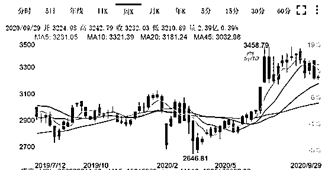

黄金也是一样。在达到 2089 美元的高点之后，已经下跌了 2 个月。下图为黄金指数周线图。

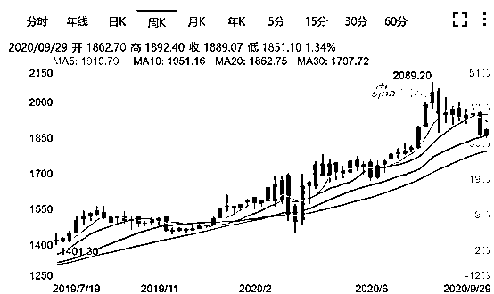

**下跌是刚刚开始，会持续一段时间，还是已经到了可以再次买入的时间？**在上个月的上证报告中，梅里曼老师说：“目前最值得关注的是 19 个月的周期。从 2019 年 1 月 4 日算起，预计 5.5 年周期的第一个 19 个月周期阶段将于 2020 年 5-11 月结束。我们现正处于这个时间段，上证综指的价格仍接近双顶的周期新高（2020 年 8 月 18 日的 3456 和 7 月 13 日的 3458）。双顶可能就是波峰，2-5 个月的暴跌可能已经蓄势待发。”在上个月的的黄金报告中，梅里曼老师说：“如果这是开始时间更早的 15-21 周基本周期的第 21 周，则会发生扭曲失真（扩张）。即使在扩张的基本周期中，波谷也通常在第 22 周和第 27 周之间出现，下跌通常仍会持续 2-5 周……收盘价跌回前一个价格通道内不是看涨的迹象，这表明市场正在转为看跌。”对于梅里曼老师市场报告熟悉的读者会知道，梅里曼老师在每份报告中都会分析市场的长期、中期和短期的走势。若道君身边有的朋友，会根据中短期走势操作，买入、卖出比较频繁，赚取周期涨跌的差价；有的朋友，则属于看大趋势做更长时间段的投资，这时报告给出的周期，也会非常有用。而对于本身特别喜欢做短线交易的交易员，关键反转日则是帮助他们做短期操作非常有用的技术。10 月份美国大选的白热化和变化莫测的情形，无疑将会为全球股票和黄金市场的波动带来变数。从天象角度而言，我们正在接近今年最强劲的两大地球宇宙学时间段之一——**逆行的火星将在 9 月 28 日-10 月 19 日期间与摩羯座星群形成上弦月四分相。**而在 3 月 20-31 日，当火星合相魔羯座星群时，黄金市场和股市都有令人印象深刻的反应。如何评估 10 月市场情况，梅里曼老师在《上证指数研究报告》和《黄金周期报告》告诉你他的看法。

**10 月上证报告上线**

上证指数月度报告价格

**单月报告**：280 元 

**3 个月套餐价**：780 元（260 元/月）

**12 个月套餐价**：1999 元（166 元/月） 

**长按下图识别二维码购买上证指数报告**
▼

**10 月黄金报告上线**

黄金月度报告价格

**单月报告**：280 元 

**3 个月套餐价**：860 元

**12 个月套餐价**：2400 元

**双报告年度套餐更优惠（直降 899 元）**

**12 个月黄金报告+12 个月上证指数报告：仅需 3500 元**

**长按下图识别二维码购买黄金报告**

▼

**购买者需知**

**①**梅里曼市场时机学院《中国上证指数月度研究报告》是梅里曼市场时机学院（以下简称 MMA）的研究“预报”，而不是市场“预测”，是梅里曼老师及 MMA 金融占星分析师对人类活动周期历史与行星周期之间相关性的研究，二者在大部分情况下具有 80%或更高的相关性，而不是因果关系。报告中的研究完全存在错误的可能性。即便是非常认真的研究和几十年的研究经验，金融占星师无法总是正确地解读出各种征象在实际层面上会如何相互作用，并显化为事件结果。所以请将报告看作一个研究参考，务必结合其他市场研究和你个人对市场的理解，根据你的自由意志做决策。**②** 本报告只是上证指数研究，没有个股研究。**③** 此报告一旦售出，**即不接受退款。****④** 此报告每月 1 期，**并非都是在每月相同日期发布**。我们收到英文报告的当天，即发布该英文报告。3 天后，上线报告中文版。**⑤ 此报告仅支持手机网页阅读，不支持电脑阅读和下载。****以上须知，请仔细阅读。一旦付款，即视为已了解并接受所有须知内容。**在过去的 39 年中，唯有梅里曼逐渐完善，并在梅里曼市场时机学院月度周期报告中阐释了将地球宇宙学与周期相结合的研究方法，以惊人的精确性预报了黄金价格发生重大变化的时间。黄金购买 Tip 各大银行均可购买黄金或黄金 EFT 基金，也可以在诸如天天基金或者支付宝购买黄金及黄金相关产品。不明白的可以百度搜索。购买后如何查看报告？

购买后有疑问怎么办？

请联系技术客服

**微信：nodoor201705**

购买上证指数+黄金报告直达入口

# 10 月宇宙天气 | 双节快乐！动荡的 10 月，该如何平安度过？

> 原文：[`mp.weixin.qq.com/s?__biz=MzA5NjA0NTAxNg==&mid=2651429179&idx=1&sn=13ce26e2dcf3c6ce1b4f44efb6809534&chksm=8b4b2b8cbc3ca29a1a879a14cbcd4afb9e8509a0d4391046e759095095c1e6c98985c9517cb6&scene=126&sessionid=1692738095#rd`](http://mp.weixin.qq.com/s?__biz=MzA5NjA0NTAxNg==&mid=2651429179&idx=1&sn=13ce26e2dcf3c6ce1b4f44efb6809534&chksm=8b4b2b8cbc3ca29a1a879a14cbcd4afb9e8509a0d4391046e759095095c1e6c98985c9517cb6&scene=126&sessionid=1692738095#rd)

****************☆ 后台回复“今日”，给你一句生命态度****************

作者/咔咔 ISAR 认证占星师

编辑/玫瑰 图片/全景网**10 月主要天象**2020 年 10 月的重大天象包括：**·** 水星在天蝎座逆行**·** 冥王星在摩羯座恢复顺行**·** 木星与海王星第三次形成六分相**·** 火星四分木星、冥王星

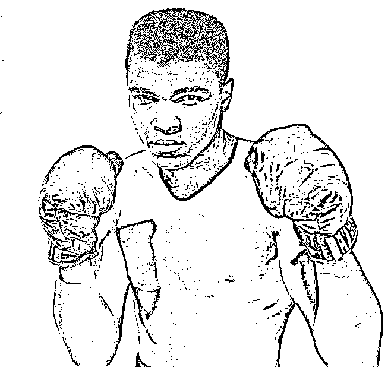

| 拳王阿里
1974 年 10 月 30 日，金沙萨，拳王阿里迎来了职业生涯最重要的一场比赛，挑战拳王福尔曼。赛前，阿里并不被看好，他已经 32 岁了，体重比巅峰时期增加了太多，这让他无法在拳台上以灵活的步伐躲避对手的击打。因为公开反对越战和拒绝服兵役，1967 年美国地方法院吊销了他在全美各州的拳击执照，判处他有期徒刑五年，罚金 10000 美元。1970 年，重出江湖后，他连续输给年轻的对手。这一次，他的对手是去年赢得拳王金腰带的乔治·福尔曼。福尔曼比阿里年轻 7 岁。开始的头七个回合，阿里被福尔曼的重拳打的没有还手之力，被动地靠在栏绳上招架。第八回合，就在人们以为福尔曼将赢得胜利的时候，阿里用一系列的闪电组合拳把福尔曼重重地击倒，赢得了比赛，夺回了阔别 7 年的金腰带。这个历史事件非常对应 10 月的宇宙天气——白羊座逆行的火星再次挑战摩羯座的木星和冥王星。这一次，火星的状态不好，逆行的它有力使不出来，它似乎和当年的阿里一样失去了力量。**10 月 2 日 白羊座满月****10 月 3 日 金星进入处女座****10 月 4 日 冥王星在摩羯座恢复顺行**整个 10 月会发生两次满月，白羊座满月紧密合相了凯龙星，金牛座满月紧密合相了天王星。凯龙星兼具受伤者和疗愈者的形象，在他的伤口里深藏着智慧。**10 月 2 日的白羊座满月会打开一些伤口，我们可能看到被排挤和忽视的底层人们的生活，联结到他们的痛苦**。满月和凯龙星的定位星火星还在四分土星，我们会感受到**成为独立的个体（白羊座）与遵守社会规则（摩羯座）之间的拉扯，回想起被压制和被评判的经历**。太阳在天秤座渴望和谐，想要获得别人的赞同，但是只有我们真的打开内在的伤口，才能真正学习到智慧（月亮合相凯龙星），也才能架起人与人沟通的真正的桥梁（天秤座）。处女座是一个低调有智慧的星座。他们具备过滤和挑拣的才能，深谙事物的实用性和有效性才是真正的价值。**10 月 3 日，金星离开了表演者的舞台，进入处女座**。在这个阶段，我们可能要支付掉之前“买买买”的账单，整理和收纳我们的衣柜、食品柜和储物室，挑拣出那些过期的、对健康无益的东西，再把它们归类整齐贴好标签。人际交往层面，可以和朋友交流养生保健的知识，参加手工课程，做公益服务性的工作。

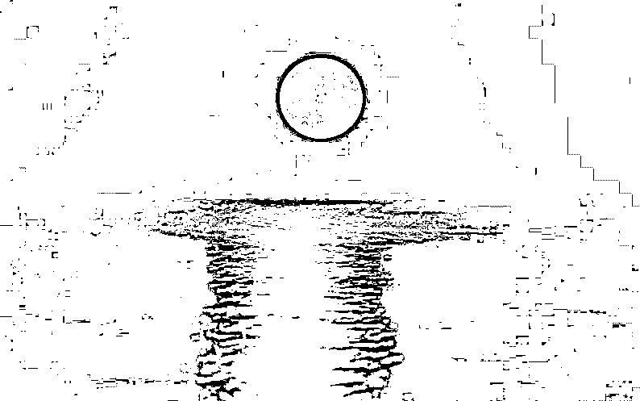

10 月 4 日，冥王星在摩羯座 22°恢复顺行。此次逆行开始后的一个月，明尼苏达州的黑人乔治·弗洛伊德因被怀疑使用 20 元假钞，被几名白人警察暴力执法导致窒息而死。美国各地开始示威活动并逐渐发展成暴乱，超过 20 个城市实行宵禁。骚乱迫使人们面对多年以来的社会阶层差异和对有色人种的隐性歧视。国内，性侵幼女、丈夫杀妻、底层女性的生存困境等新闻也让人们意识到长久以来两性权利的不平等，造成各种社会悲剧。**冥王星的工作模式是宣泄、净化和解放**。顺行之后的冥王星会再次和木星形成合相，**我们期待一些有毒的、破坏性的东西、制度继续被深层清理，为木星和土星在年底的合相铺平道路。****10 月 8 日 水星（天蝎座）对分天王星（金牛座）****10 月 9 日 火星（白羊座）四分冥王星（摩羯座）****10 月 11 日 金星（处女座）三分天王星（金牛座）****10 月 12 日 木星（摩羯座）六分海王星（双鱼座）****10 月 13 日 水星（天蝎座）六分金星（处女座）****10 月 9 日，在白羊座 22°逆行的火星四分冥王星。**拳击是一个以击倒对方为胜利的运动，有时候拳击手会付出生命的代价。普通人一般不会遇到生死攸关的事情，可是也会有和拳击手相似的愤怒和暴力的冲动，被剥夺和被伤害的恐惧，付出生命代价也要取得胜利的意志。拳王阿里最强大的对手，不是来自拳台，而是把人民送往越南的美国政府。他说：“我绝不会跑到万里之外去谋杀那里的穷人，如果我要死，我就死在这里，咱们来拼个你死我活！如果我要死的话，你们才是我的敌人，与中国人、越南人、日本人无关。我想要自由，你们不给；我想要公正，你们不给；我想要平等，你们也不给。你们却让我去别处替你们作战！在美国你们都没有站出来保护我的权益和信仰，你们在自己的国家都做不到这些！”**9 日当天，太阳在天秤座 16°四分木星，人们要选择信仰，选择愿意为之而战的信仰。**如果你不真心相信一个东西，是无法像阿里一样押上事业、名誉和自由，为了维护它战斗的。**水星在天蝎座对分天王星，我们会渴望看到真相，社会和个人生活需要诚实和真实的观点**。对分相意味着我们很难和他人妥协，拒绝听到别人的声音。12 月 23 日，火星会在白羊座最后一次四分冥王星，这段斩妖除魔的旅程才最终会告一段落，人们能从这些战斗中学到的，不只是如何与权力、权威、让我们痛苦的伴侣、困难的工作和学业作战，更重要的是**学会如何面对被深埋在心底的恐惧、欲望、残忍和不择手段。****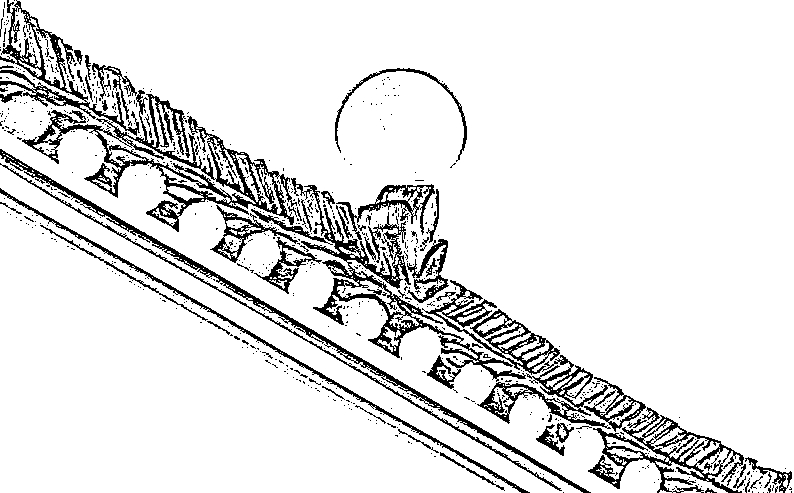****12 日，木星在摩羯座第三次与双鱼座的海王星形成三分相。**可以回想下，**2 月 20 日和 7 月 28 日**发生了什么。2 月 17 日，当行进的月亮在射手座 18°触发了木海六分相的时候，我决定帮助一只 3 个月的小奶狗。我们会在木海形成相位的时候增加敏感度，同情弱小和受苦的生命，为他们做些什么来减轻痛苦。**木星与海王星都是慷慨的，木星在摩羯座，帮你发现成长意味着面对严酷的现实不退缩，尽到自己的责任。海王星会说，你尽到了责任，我会给予你超乎想象的东西。**现在，那个瑟瑟发抖的只有 5 斤的小家伙已经长成为活泼好动的小伙子，每每看到他信赖的目光，我觉得这是 2020 年收到的最好的礼物。也许你会在学习神秘学、艺术创作、冥想、接纳自己、帮助他人的时候，有和我相似的感觉。面对日火冥日益紧密的 T 三角，我们需要一些双鱼座海王星接纳的能量，它不在外面，而是在我们每个人的内心，在此仍然推荐比丘尼佩玛·丘卓的方法——

随时坐下来，腾出内心的空间，允许各种念头升起，不评判不压抑，无论升起什么东西，都用好奇心对待。如果感觉房间太热而升起厌恶感，就去感觉热的猛烈和沉重。如果因为房间太冷而产生嫌弃感，就去感觉冷冽冰冷的滋味。冷、热是无法医治的，它们会一再出现。

**10 月 14 日 水星在天蝎座逆行****10 月 17 日 天秤座新月****10 月 18 日 金星（处女座）对分海王星（双鱼座）****10 月 19 日 火星（白羊座）四分木星（摩羯座）****10 月 19 日 金星（处女座）三分木星（摩羯座）****10 月 20 日 水星（天蝎座）对分天王星（金牛座）****10 月 22 日 金星（处女座）三分冥王星（摩羯座）****10 月 23 日 太阳进入天蝎座**17 日，天秤座的新月非常激烈，新月在 22°加入了火星与木冥的四分相。新月起了触发的作用，世界各地可能会传来**武装交火、爆炸、暴力冲突、骚乱**的信息。个体容易在此时**失控，让愤怒凌驾在理智之上。**另外，新月发生在天秤座，意味着**冲突是以公平为诉求，骚乱的爆发与长久以来受到的不公正对待有关**。天秤座的定位星金星触发了木星六分海王星，在日火冥的暴力、恐惧和冲突的能量之外，也存在着**平和、冷静、踏实和无私利他**的可能性。金海的组合意味着丧失的痛苦，暴乱和战争会导致经济损失，人员伤亡，心碎的哭泣飘荡在空中。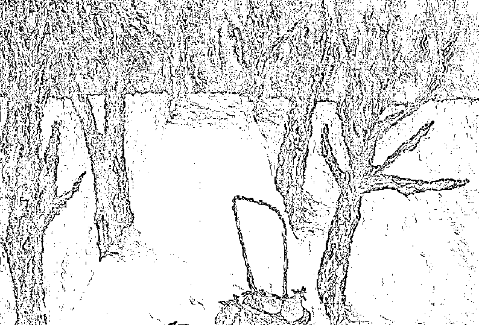**14 日，水星在天蝎座 11°开始逆行，11 月 4 日在天秤座 25°恢复顺行。天秤座 25°是本次新月的位置，意味着达成谅解的可能性。**水星在天蝎座的逆行会**引发负面的思考，陷入阴谋论，以讽刺、挖苦和揭穿人的秘密为乐**。**10 月中下旬**，水星在天蝎座逆行、金星三分冥王星、太阳进入天蝎座等系列天象提醒我们**对关系和价值进行思考**。天蝎座是一个深度关系星座，我们需要在关系里暴露自己，面对冲突，与伴侣和伙伴一起解决困难。这样做虽然不容易，却能增加关系的强韧程度和亲密度。**金星在处女座，三分木星和冥王星，是我们规划个人财务的有利时机。20 日**，水星会在逆行的状态再次对分天王星，为月初水天对分的僵局提供了第二个视角，也给**修正新的观念、发明和技术**提供了又一次的机会。**10 月 28 日 水星逆行回到天秤座****10 月 28 日 金星进入天秤座****10 月 31 日 金牛座满月**当水星和金星进入天秤座的时候，我们会赋予和平、公正、公平以价值，回归理性思考。这是历经 10 月动荡天象后的短暂休整期。**31 日，本月的第二个满月合相了天王星，唤醒了人们对物质稳定感，感到舒适和安全的需求**。定位星金星对分凯龙星。我们要继续暴露伤口，才能获得智慧。**这一次我们的创伤与被拒绝，不能获得稳定的关系，分离的伤痛有关。**祝我们平安度过动荡的十月！

**附录：本月重要天象一览表**

| **日期** | **星象** |
| **2020.10.2** | **白羊座满月** |
| **2020.10.3** | **金星进入处女座** |
| **2020.10.4** | **冥王星在摩羯座恢复顺行** |
| **2020.10.8** | **水星（天蝎座）对分天王星（金牛座）**  |
| **2020.10.9** | **火星（白羊座）四分冥王星（摩羯座）** |
| **2020.10.11** | **金星（处女座）三分天王星（金牛座）** |
| **2020.10.12** | **木星（摩羯座）六分海王星（双鱼座）** |
| **2020.10.13** | **水星（天蝎座）六分金星（处女座）** |
| **2020.10.14**  | **水星在天蝎座逆行** |
| **2020.10.17** | **天秤座新月** |
| **2020.10.18**  | **金星（处女座）对分海王星（双鱼座）**  |
| **2020.10.19** | **火星（白羊座）四分木星（摩羯座）****金星（处女座）三分木星（摩羯座）** |
| **2020.10.20** | **水星（天蝎座）对分天王星（金牛座）** |
| **2020.10.22**  | **金星（处女座）三分冥王星（摩羯座）**  |
| **2020.10.23**  | **太阳进入天蝎座**  |
| 2020.10.24 | **金星（处女座）三分土星（摩羯座）**  |
| 2020.10.28 | 水星逆行回到天秤座金星进入天秤座 |
| 2020.10.31 | **金牛座满月**  |

**版权声明**：原创文章由作者授权首发于若道平台，欢迎转发，反对抄袭。友号转载请申请白名单。

********想阅读更多作者的文章********

********请在后台回复**************** 咔咔 即可********

**咔咔**

职业占星师，若道核心课程讲师

ISAR 认证占星师（2014 年获得）

国际知名广告公司和市场研究公司工作十余年

**微信公众号**：咔星人

长按打赏

******你还可以预约作者咔咔的占星咨询****** 

******长按下图二维码预约吧******

**系统学习占星学**

**点击下图了解详情**

喜欢记得点一下在看哦☟

********报名直达入口********

# 有一些人，具有解除我们防御的力量 | 爱情战争里你“赢”了吗？

> 原文：[`mp.weixin.qq.com/s?__biz=MzA5NjA0NTAxNg==&mid=2651429074&idx=1&sn=ce407fe64a0f259df675de113e391967&chksm=8b4b2a65bc3ca3739d34e95c95ac80d4648c6ff79916dd6525ed7b8d1c297778150c5d277165&scene=126&sessionid=1692738101#rd`](http://mp.weixin.qq.com/s?__biz=MzA5NjA0NTAxNg==&mid=2651429074&idx=1&sn=ce407fe64a0f259df675de113e391967&chksm=8b4b2a65bc3ca3739d34e95c95ac80d4648c6ff79916dd6525ed7b8d1c297778150c5d277165&scene=126&sessionid=1692738101#rd)

********☆************后台回复“今日”，给你一句生命态度********

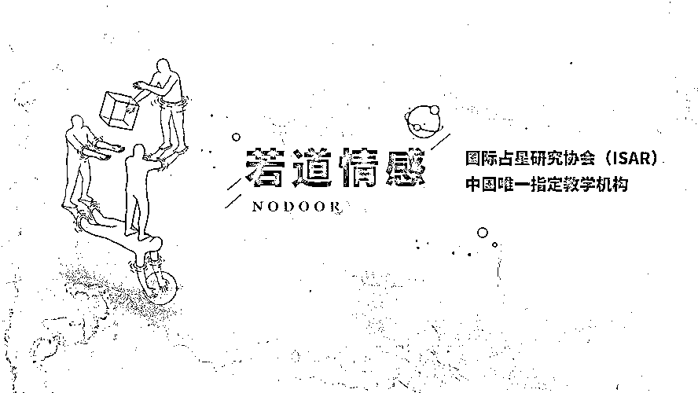

 作者/斯蒂芬·弗里斯特

 译者/Miawu 校对/Leisha

编辑/玫瑰 封面/书君 图片来源/全景网

本文摘自《天空的伴侣 I：爱、性和进化占星学》

提到爱情，总是离不开星图中的金星和火星。而除了传统占星学中所强调的含义，这两颗行星在进化占星学中还有着非比寻常的意义。毕竟在进化之路上，有些看似痛苦的体验反而是最好的教科书，那么，一起来看看关于这两颗行星，斯蒂芬老师是怎么解说的吧。

**金星与火星**太阳、月亮和上升点是占星学最核心的三大配置，但成熟的爱存在于两个人类的整体互动中。本质来说，星图中所有行星都与亲密关系相关，就如你整个人都会投入到关系中一样。然而，在考虑到亲密关系中的行为模式时，有两颗行星尤为重要，那就是**金星和火星——爱神和战神**。自古以来，传统占星师就认为火星代表“男性特质”——勇气、开创精神、自信强势和意志力；金星则代表“女性特质”——美丽温柔、通情达理、接纳包容。但本文并不是讨论女性的金星面和男性的火星面。如今的社会，这两颗行星的法则在男女身上都体现得越来越活跃，而且无论男女，也都更容易同时感受到这两颗行星的影响。**金星象征着我们建立关系的能力，创造的能力，吸引他人的能力，以及我们会被什么所吸引。**希腊爱神厄洛斯实为金星的原型，她不仅性感迷人，还很擅长人情互通——这是一种感觉与某人或某物相联结的能力。

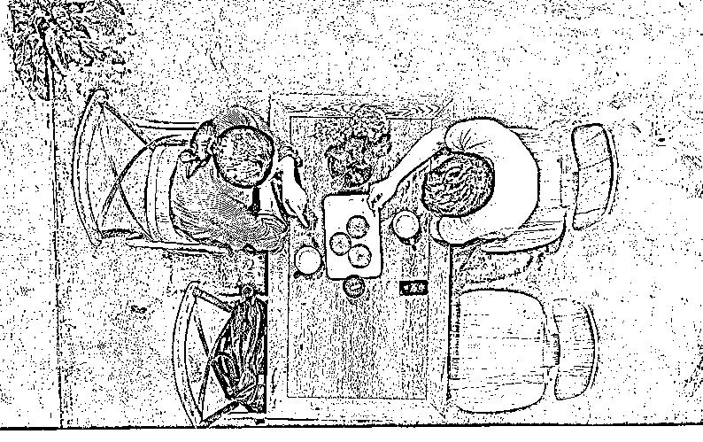

你曾经爱上过一个地方、一幢房子、一本书或是一幅画吗？那就是厄洛斯，因为你感受到一种联结。歌曲里的只言片语，身边的美景都像是在和你一个人对话，而这个感受也你感到愉悦。这种时刻，金星就在你耳旁嗡嗡作响，当你爱上某个人时，也是如此。在人与人的关系中，**金星代表感受温暖、情感、爱意和共情的能力，深刻认同某人的能力，以及将对方的需求看得与自己的需求一样重要的能力。**这是爱中更为柔软而感性的一面。**火星代表驱动力、决心，以及保护自己和追求自己想要的东西的本能。**占星师杰夫‧格林说，火星就是我们的**欲望本性**。出生星图里火星的运作原理就像是身体里的肾上腺，掌管**“逃跑或战斗”**的机制。如果你的肾上腺虚弱，你会感觉疲累。**如果你的火星虚弱，你就没有精力去联结周围的人事物，也没有精力去捍卫自己和追求自己想要的东西。****火星所在星座和宫位会展现你需要用什么来滋养自己的能量，在哪个领域去主张自我意识。**思考一下火星，这个代表战士的行星佩戴着它的宝剑和护盾。宝剑帮助我们区分自己想要什么，不想要什么，并帮助我们追寻自己的目标。而护盾是保护和防御的作用。总体而言，火星与我们的**元气精力、热情和意志力**相关。当然，火星也代表力比多——**性欲，血液的热度**。**走近金星与火星**  有时我们会积极尝试去建立或改善一段关系，但有时也会在关系里处于被动角色，让对方掌控主动权。**火星展现我们如何去接近吸引了我们注意的人，而金星则揭示我们如何施展魅力来获得关注。**回到关于金星非常重要的一点：**它所在的星座和宫位可以暗示我们被他人身上的何种魅力所吸引，是什么让我们以联结和共情的感受做出回应**。占星师史蒂芬‧阿若优建议，当你尝试取悦他人时，先了解这个人的金星星座。金星使我们按照物以类聚的原则行事。如果某个人身上具备我们星图中的金星特质，就会吸引我们，而我们也通过展示自己的金星特质来吸引他人。纯粹喜欢某人的金星元素非常重要，因为**每一段带有真正进化潜能的亲密关系，都会在不断发展中挑战你，逼你去面对自己最糟糕的一面，并设法带来疗愈**。联结可能也是愉悦的，但它有时不可避免地会**激起我们强烈的情感，暴露我们的黑暗面**。为了让一段关系蓬勃发展，我们有时也不得不**对彼此说出有关自己本性中困难面向的严酷真相**。这些真相会让我们感到害怕。我们天生的火星反应会在感知到攻击时展开防御。让我们先走进金星。**尽管听别人说出有关自己的痛苦真相绝非易事，但如果从我们喜欢、信任、认为有吸引力的人嘴里说出来，就更容易接受**。同样地，如果你打心眼儿爱一个人，就会**更容易原谅他（她）做出的混蛋行为并继续走下去**。一个能激发你金星反应的人，一定正具备非常多最吸引你的特质，我们天生对这种人没有抵抗力，他（她）具有**解除我们防御**的力量。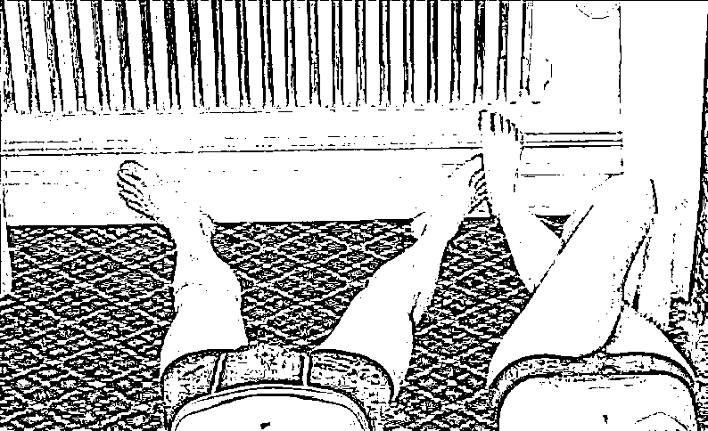当然，那可以刻画成一个个心碎伤感的故事，也可以孕育许多幸福美满的结局。再走进火星，它发挥我们战士的职能。有时候我们必须叫某人滚蛋；有时候我们的确需要在一段关系中咆哮，即便是一段好的关系。也许，我们曾受到不正当的攻击。**无论你多么深爱你的伴侣，都需要勇敢地在关系中需要努力的领域对抗对方，或应付对方发起的对抗**。这也会消耗你的精力。你有没有因为太过疲惫而不想争吵的时候呢？最后，如果你想做出改变，那就必须施展火星的意志力和能量。**星图中每颗行星只代表一个特征，任何特征都需要与星图的其他配置结合起来分析。**没有人只认同金星或只认同火星，星图整体很重要。用这些描述性的，而且必然具有限制性的文字来指引你自己解读的过程，这样就不会忽视星图的整体性。最后说明一点，**性是身体、心智和灵魂三方交汇区域的奇妙产物，为之神魂颠倒的不仅有你那发光的古老灵魂，还有你内在的原始动物性**。我们最深的灵魂意识，以及最难堪、人类最愚蠢的面向都明显得体现在性的议题中。最深的智慧在于看见这些灵长类动物的行为和性格工具如何能服务于灵魂的进化意图，看见它们是一个天衣无缝的整体。

**版权声明：**本文由若道翻译发布，欢迎转发，反对抄袭。友号转载请申请白名单。

斯蒂芬·弗里斯特

若道签约老师。进化占星学的创始人之一，当今世界最有影响力的占星大师之一；1985 年，他凭借《内在的天空》一书获得职业占星师协会奖（Professional Astrologers Incorporated Award）。他四次获得占星界最高的占星学联合协会奖（United Astrology Congress Regulus Award）提名，2018 年获得轩辕十四教育奖。

**想参加斯蒂芬老爷子的工作坊？**

**点击下图了解详情！**

**微信又双叒叕改版啦，不想错过若道君的推送？**

**就把若道设为星标吧！**

**▼**

就是这个“在看”，戳戳戳 ☟

****************报名直达入口****************

# 重磅天象 | 土星顺行了！！！！！

> 原文：[`mp.weixin.qq.com/s?__biz=MzA5NjA0NTAxNg==&mid=2651429068&idx=1&sn=6bcb2998f54af69bb7f3763d22681f8d&chksm=8b4b2a7bbc3ca36d70c4a44bc99de4e038126090e4fa7de79b62a58e74d2503af16c772698ce&scene=126&sessionid=1692738101#rd`](http://mp.weixin.qq.com/s?__biz=MzA5NjA0NTAxNg==&mid=2651429068&idx=1&sn=6bcb2998f54af69bb7f3763d22681f8d&chksm=8b4b2a7bbc3ca36d70c4a44bc99de4e038126090e4fa7de79b62a58e74d2503af16c772698ce&scene=126&sessionid=1692738101#rd)

****************☆ 后台回复“今日”，给你一句生命态度****************

作者/咔咔 ISAR 认证占星师

编辑/玫瑰 图片/全景网 2020 年 5 月 11 日 12:08 开始，土星开始为期 5 个月的逆行，从水瓶座 1°57′逆行回到摩羯座 25°20′。2020 年 9 月 29 日 13:10 恢复顺行。12 月 17 日，土星进入水瓶座，12 月 22 日，土星和木星在 0º29′合相。土星这次逆行-顺行的旅程，将给我们带来怎样的警示和启迪？一起来看看这封写给土星大人的信吧。
**给土星大人的一封信**

亲爱的土星大人：

请收下这封交织着爱与痛的情书。想到您今天在摩羯座 25°顺行后，还有 80 天就要离开摩羯座进入水瓶座，我的内心不由得翻涌起各种情绪——“这两年半您把我们折腾的好苦啊”，“您可算走了，我们再忍一忍，把冥王星也快点送走吧……”，“业力之王进入水瓶座了，还有什么新的挑战啊？”不过，我对您的感情不是只有埋怨和恐惧，如果是那样，恐怕又掉入了您的陷阱，让我们在寒冷和绝望里丧失活力，感觉虚弱和无能。我想，这不是宇宙大神委派给您的终极目的，土星的运行有着更高远的意义。要打开土星带来的礼物，要翻越崇山峻岭，怀着敬畏之心才能获得。古人很早以前就赞颂过您的核心理念——“必先苦其心志，劳其筋骨，饿其体肤，空乏其心，行拂乱其所为，所以动心忍性，曾益其所不能。”在展望未来之前，我们先看一下您近期布置的作业：

**2020 年 8 月 25 日，火星在白羊座 26°四分摩羯座土星；**

**2020 年 9 月 29 日，土星恢复顺行；**

**2020 年 9 月 30 日，火星在白羊座 25°四分摩羯座土星**这似乎描述了一场“打不赢，却一定要打下去”的战争。土星在摩羯座是强大的，讲究制度规则，也是传统保守的。想推动历史的车辆向前，需要一个年轻的、勇敢的、直率的力量。火星与土星的配置总被形容为**“一脚踩油门，一脚踩刹车”**，我们不知道哪个力量最后会占到上风，但是在这个过程里，我们知道，不管有多难，谁都不能松懈。回顾一下 2020 年 8 月 25 日前后的新闻：**·** 当地时间 24 日，TikTok（火星白羊座）正式对美国特朗普政府（土星摩羯座）8 月 6 日颁布的第一道行政令提起诉讼，该诉讼正在加州联邦法院进行；**·** 当地时间 22 日，英国伦敦塔桥在升起放行船只后，因“技术问题”突然“卡壳”，无法复位；**·** 当地时间 23 日，美国威斯康辛州基诺沙一名非裔男子遭警察开枪射击。事件引发抗议活动，基诺沙市当晚宣布实施宵禁。

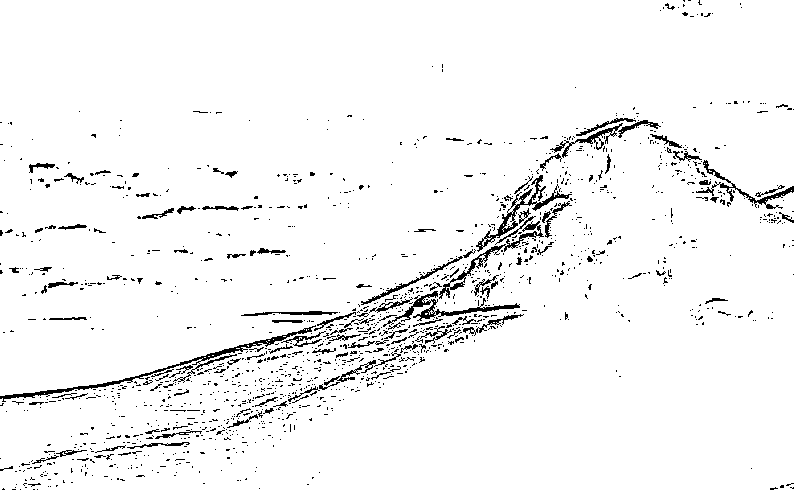

9 月 30 日，火星与土星会再次较量。这一次，火星在逆行的状态，而土星恢复了顺行。最近很多人都在抱怨身体某个部位疼痛，可能是腰背部、腿部、膝盖、脖子。疼痛的等级虽然不至于影响日常工作生活，也不能立竿见影地得到解决，只能咬着牙忍耐着，与疼痛相处。身体的状态反应了心灵的健康程度，**当火星代表的行动力、勇气、愤怒的力量无法顺畅地向外发挥，又或者力度减弱，被强大的阻力（土星）压制，这股力量就向身体内部发起攻击，制造炎症引发疼痛**。我们无法在工作和生活里向那些要求我们的权威和管理机构说“不”，无法主张自己的力量，也无法从这些沉重的责任里拂衣而去，打不赢，也跑不掉。可是，卡滞、困阻、疼痛和折磨，到底要从中学习什么呢？最近，罗永浩老师上了《脱口秀大会》，宣布已偿还 60%的债务，余下的债务有望明年还清。这位网红元老被称为“干一行垮一行的业界冥灯”，意味着他创业搞的项目都砸锅了。“开始做锤子手机那年，正赶上行业萎缩、竞争日益激烈；做空气净化器那年，天气特别好，加之相关政策因素，滞销；准备进军电子烟，整个行业又被央视点名，还登上 3·15 晚会……”创业失败的老罗欠下 6 亿元的债务，被限制消费。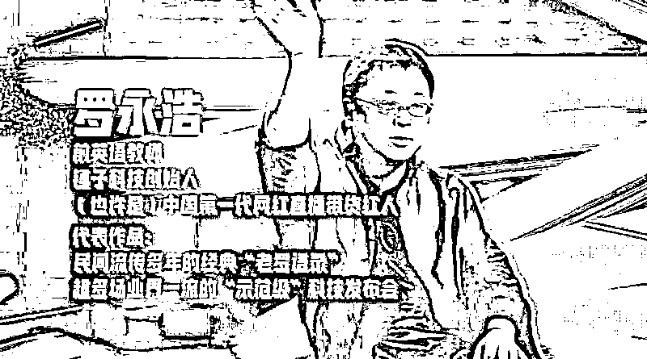土星大人没什么怜悯之心，它奉行的是**“因果原则”**，**通过土星的考验的会得到世俗的回报，通不过的要品尝失败的苦果**。2020 年，木星、土星和冥王星合相，疫情的连锁反应让众多公司倒闭，大批员工被裁员。最新消息，Zara 的母公司在上半年净亏损近 2 亿欧元，计划 2021 年在全球范围内关闭 1000 至 1200 家门店。这些人和欠下巨债的罗永浩一样，失去了曾经拥有的社会地位和收入，可能也体会到了安全感、归属感和价值感的垮塌。老罗转身进入了直播界，还在《脱口秀大会》上放话说为了还债，企业开幕婚礼主持的工作也欢迎和他联系。刚开始做直播的老罗还会念错品牌的名字，谁知道转眼之间，直播和其他的收入已经帮他偿还了 4 亿债务。火星在逆行的状态四分土星可能带来这样的思考：**·** 即使暂时失败了也别停下，时间和练习会让你更熟练，更有能力；**·** 挫败和愤怒是一种强大的力量，如果可以不评判挫败感和愤怒，耐心地和它们相处，就能利用这个力量做更有意义的事情；**·** 生命可能因为某些失去出现巨大的空洞，我们会感到自己是无能的。当我们把价值感外挂在某个工作和社会地位上，终究会有一天因为工作和社会地位的变化而失去价值；**·** 无力和无能感会滋养恐惧，要相信生命的活力和创造力。**土星大人布置的功课****“每做一件事，都会使人身心解放，即使把事情办坏了，也比什么都不做强。****——茨威格”**在余下的两个多月里，顺行的土星会走完在摩羯座最后的度数。有一种说法认为，当行星走到星座末度的时候，会表现的更为激烈，要集中地把这个星座的未尽事宜了结。虽然到 12 月 17 日之前，只有太阳、水星和金星与土星形成相位，不过我们还是期待一些事物和观念在经历长久的思考和显化后，在集体意识层面形成根本性的改变。

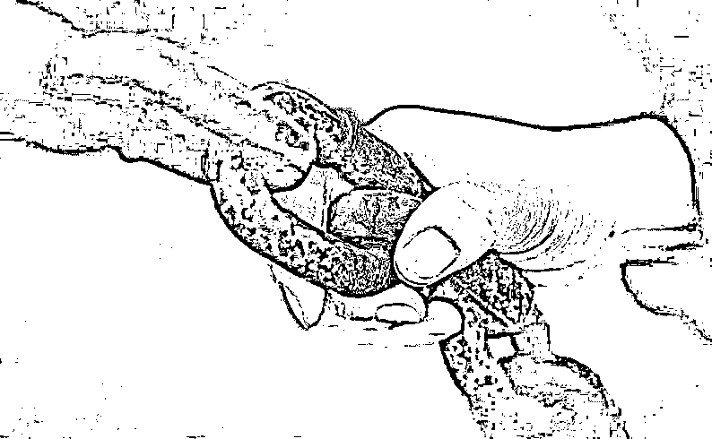

父权制度与女性地位土星逆行期间，网络上看到了各种令人不安的新闻——性侵未成年少女，贫困女性用不起卫生巾，数地爆出丈夫碎尸妻子的案件，印度一男性为了确认妻子肚子里孩子是男孩把妻子开膛……就连脱口秀女艺人调侃男性自信的笑话，也被某大学的教授抨击，而这个女艺人说，她当时的段子里也吐槽了女性，但是没什么女性骂她。可能因为女性听这样的调侃或者以调侃为包装的贬损听得多了。人类社会数千年以来构建的两性地位和父权制度，是一片剥夺女性权利的土壤。人们教育孩子要听大人的话，下级要服从上级，女孩子要表现得温顺、服从、依赖、配合。当人们说一个女性“一点也不像个女孩子”的时候，通常是带着贬义，指这个女性不符合社会普遍意义上对该性别的要求和期望。即使在西方发达国家，哈佛大学从 1946 年起才开始招收女学生，2007 年起才有第一位女性校长。哥伦比亚大学更晚，1983 年起才招收女学生。我们现在看来习以为常的权利，都曾经毫不理所应当。父权的世界总是被动地做出一点点的改变，而即使在现在，我们还能看到，这些改变仍然是不够的。**两性权利的不平等体现在最基础的生存权、掌握自己身体的权利、受教育的权利。**我们可能会问，这些根深蒂固的东西，这么多年都是这样，要怎么改变，什么时候能被改变？可是，我们也没有想到，在科技高度发达的今天，教育普及文明发展的国家，死于一场病毒的人数可以高达 20 万！2020 年，土星在摩羯座与木星和冥王星的合相，意味着旧的模式的终结。从个人来说，可能生命在疫情里结束了，一份工作（事业）结束了，一段感情关系结束了……对集体而言，我们可能到了要对过去几百年甚至上千年形成的东西挥手说“再见”的时候了。而外在环境的变化预示着内在僵化结构在松动，在合适的时机，二者皆会轰然陷落。

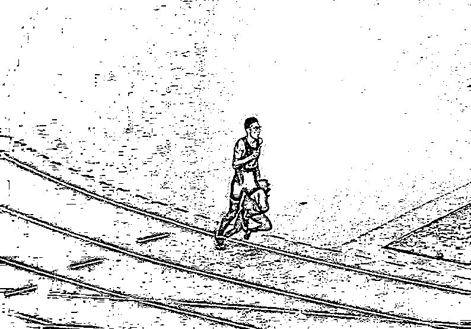

重新定义成功和权威土星在摩羯座会终结一些行业，即使是一些庞大的公司和机构，也会为了生存下去而去掉冗余的部门，缩小体量，以期度过经济的寒冬。对于那些失掉工作的人，失去的不只是一份工作，可能还包括**对自己的肯定，自信和对未来的信心。**

摩羯座与成功有关，希望被人尊重和被认真看待，对自己的名声和地位过度在意。我们也被工作定义，被工作赋予可以安稳存在于社会的感觉。人的社会属性决定了大部分的人会认同集体认同的价值，成功是好的，高尚的地位被人尊敬。不过多少人真的在做一份自觉有使命感的工作呢？有多少人在做一份自己热爱的工作呢？

我曾经的美国同事 Stephen 经过十几年苦心经营，在亚太地区和美国各大广告集团一路升迁，成为年轻的高管。此次疫情，身在纽约的他也上了裁员名单。对他而言，短时间内在这样的经济形势下找到新工作的希望渺茫，看不到未来，对自己的新方向、自我身份毫无头绪，生命似乎就这样陷落了。“Stephen 们”要**从对外在成功的追求中抽离出来，重新认识自己，对自己的能力、爱好、价值标准有个土星式的客观评价**。人们会遭遇失败，但是只有我们把成功、失败和自己的价值紧密关联的时候，才会被打垮。此次 ISAR 大会上，占星师 Michael Lutin 说：**“这样的时代，我们受到威胁，我们有很多的恐惧，恐惧让我们四散，让我们不再有勇气。而有效的方法，是打开我们自己的星图，找到太阳所在的宫位，那个宫位相关的领域永远可以让我们喘息和休息，太阳在的地方会源源不断地给我们能量，永远从那里获得勇气。”**当生活的某个模式结束了，生活并没有结束，旧模式的离开，会腾出一些新的空间，光会从裂缝中照射进来，会有一些新的种子在光线下生长、成熟。我们都是自己生活的权威。

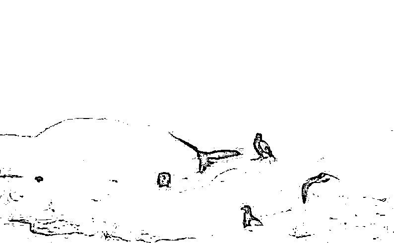

**迈向新纪元**土星大人，您将在 12 月 17 日进入水瓶座。这次旅程对您而言想必也是意义重大的，因为这次旅程的开始，您将与代表成长和信心的木星大人携手前行。在过去的 800 年里，你们都在土元素合相，世界的物质水平飞速发展。而未来的旅程里，木土的合相都会在风元素了。占星师 Wendy Stacey 说：**“这将彻底重塑整个人类的发展和参与方法，我们的思维和智力开始定位我们是谁，获取信息、生成信息、传播信息的能力将成为首要的，它将为新的社会结构、新经济和新产业奠定基础。”**新的纪元让人兴奋，**2021 年 2 月 18 日，**您在水瓶座与金牛座的天王星的第一次遭遇，可能会相当的刺激。作为占星师和神话爱好者的我们都知道土星与天王星的恩怨故事。天王星乌拉诺斯与大地母亲盖亚生下了很多孩子，这些孩子要么五大三粗，要么奇形怪状，乌拉诺斯很不满意，把他们都塞回了盖亚的肚子里。盖亚对乌拉诺斯的行为也很不满意，就给了儿子克罗诺斯（土星）一把镰刀。儿子手起刀落，一气呵成地切掉了父亲的阳具，丢到了海里。受伤的乌拉诺斯发下诅咒，诅咒克罗诺斯也要被自己的孩子推翻。而推翻克罗诺斯的，就是木星的守护神宙斯。神话的象征意义可以帮助我们理解，**在土冥合相摧毁了一些老旧模式之后，新旧势力还会有一轮交锋，但是这一次，战场会集中在水瓶座代表的理念、群体规则和天王星代表的革命性的价值观、收入模式、经济模式上**。**“天王星要挑战的就是已经变得贫乏、一成不变和僵滞的事物，反体制和对抗保守的作风。天王星与解放和自由有关，土星则跟掌控和安全保障有关，这两种观念是很难并存的。****——苏·汤普金斯”**土天交战会带来的改变，有以下的预测：**·** 银行业和金融业的重新洗牌，线上业务将进一步挤压线下网点的生存空间；**·** 农业、种植业、养殖业的创新技术被规模化应用；**·** 社群经济，比如现在已经崭露头角的微信群接龙等方式，进一步缩短了人们与产品的距离；**·** 婚姻和家庭的新模式；**·** 女性在政治舞台上承担更重要的责任；**·** 要小心地震灾害、核泄露；**·** 联盟和社会团体经历破裂，出现新的组织；**·** 对妇女儿童权益的保护法条进一步完善土星与天王星会在 2021 年形成三次四分相：**2 月 18 日** 土星在水瓶座（顺行状态）7°13′四分金牛座的天王星（顺行状态）**6 月 15 日** 土星在水瓶座（逆行状态）13°06′四分金牛座的天王星（顺行状态）**12 月 24 日** 土星在水瓶座（顺行状态）11°05′四分金牛座的天王星（逆行状态）亲爱的土星大人，对您过去两年半里在摩羯座的行进，我们表示深深的感谢。虽然我们付出了巨大的代价，看到了不堪的场景，可是在绝望和痛苦里，总有一些人安住在了痛苦和不堪中，并将这样的能量变为前行的动力，向人性无条件的善迈进。面对 2021 年您与天王星大人的交战，我们也会感到忐忑，毕竟经历了土冥摩羯座的人还在震惊和伤痛里，不过社会的前行总会被巨大的驱力推动，执着于过去只会阻碍进步。您在水瓶座运行期间，我们会意识到，人，虽然独立，却不孤独，因为我们会找到前进路上的伙伴。祝我们有一个精彩的土星水瓶座旅程。此致，敬礼。

**版权声明**：原创文章由作者授权首发于若道平台，欢迎转发，反对抄袭。友号转载请申请白名单。

********想阅读更多作者的文章********

********请在后台回复**************** 咔咔 即可********

**咔咔**

职业占星师，若道核心课程讲师

ISAR 认证占星师（2014 年获得）

国际知名广告公司和市场研究公司工作十余年

**微信公众号**：咔星人

长按打赏

******你还可以预约作者咔咔的占星咨询****** 

******长按下图二维码预约吧******

**系统学习占星学**

**点击图片了解详情**

喜欢记得点一下在看哦☟

********报名直达入口********

# 其实，我们都有许多不为人知的恐惧 | 顺势药物帮助你

> 原文：[`mp.weixin.qq.com/s?__biz=MzA5NjA0NTAxNg==&mid=2651429068&idx=2&sn=3310a944a9c68d938bcc84363443e66c&chksm=8b4b2a7bbc3ca36d033e0a70c02d1fff70e795ce42c03dca1ebd04c2c26e0c4f1dda9b252552&scene=126&sessionid=1692738101#rd`](http://mp.weixin.qq.com/s?__biz=MzA5NjA0NTAxNg==&mid=2651429068&idx=2&sn=3310a944a9c68d938bcc84363443e66c&chksm=8b4b2a7bbc3ca36d033e0a70c02d1fff70e795ce42c03dca1ebd04c2c26e0c4f1dda9b252552&scene=126&sessionid=1692738101#rd)

作者/Douglas M Gibson 编辑/玫瑰 图片/网络  苏·汤普金斯老师将于 10 月 12 日开设[【2 年制顺势疗法专业课程】](https://mp.weixin.qq.com/s?__biz=MjM5MjQwNjAyMQ==&mid=2649437652&idx=2&sn=c2086ea852e2419b0187eab09ed13798&scene=21#wechat_redirect)（报名请点击链接）。那么什么是顺势疗法呢？顺势是一个身心治疗的疗法。当我们有一些身体疾病时，也通常会有长期或者伴随的心理症状。

任何一种情绪和心理疾病都不是仅仅在心理层面，而都是身心反应。本文以恐惧这种情绪为例，向大家展示对于不同类型的恐惧，顺势疗法有哪些制剂可以有所帮助。顺势制剂可以用平静取代恐慌，以信心取代恐慌。

文中插图并非真实的顺势药剂。

**恐惧的情绪**

恐惧可能是人类最多见、最主要的情感，在民间传说、神话和人类经历的历史研究中可以明显看出这一点。它源于人类对生存的强烈渴望。当个人身处危险之境或受到威胁时，会产生各种类型的恐惧感受，它是人对于外在威胁的一种自然情感应对。

任何形式的危险或威胁都要求个人立即做出反应。威胁可能针对的是**身体，生命或身体器官处于危险中**；威胁也可能针对的是**金钱，让人遭受经济损**失；它也可能针对的是**声望、名誉，给人带来社交耻辱。**面对眼前的威胁，一般人的原始反应是想要逃跑、躲避，寻找藏身之处。当逃跑不可行时，就会反抗、战斗、反击。也许这两个路线都不可行。不管怎样，被威胁者都得对局势做出反应。**第一反应几乎肯定会是恐惧，其后可能感到愤怒。**无论威胁是真实的还是想象的，如果持续下去，会引起焦虑。**焦虑是一种长期害怕的状态。**恐惧的一个很自然的结果是**仇恨**，人们会憎恨让自己害怕的东西，渴望将其清除或毁灭。人们面对威胁时，既有心理反应，有会有生理上的反应。恐惧使得人身体内的内分泌发生变化，导致**血管运动和神经肌肉紊乱**。脸色可能因恐惧发白或发红。眼睛可能因恐惧发红，也可能因惊恐而瞳孔散大。

人体内的骨骼肌肉在准备逃跑或战斗时会变得紧张，也可能四肢变得瘫痪无力，导致受害者"呆若木鸡"。有时，如果只要“动”就会增加危险时，"呆若木鸡"的反应反而是一种保护性策略。当面对准备出击的眼镜蛇时，"冻结"比逃跑更安全。

恐惧带来的其他生理反应包括：**起鸡皮疙瘩、汗毛竖起、心跳加快、心悸、冒冷汗、肠胃蠕动增加、膀胱失禁、失声失音、口干舌燥、食欲不振。**恐惧的持续存在不仅仅是一个情绪困扰的问题，也是许多心理疾病的根源。恐惧还会带来生理功能紊乱，有害身体健康。诚然，消除恐惧的最佳方法就是增加信心和自信，这种信心能带来平静；不过，既然生理因素也包含在其中，恰当的药物也是人们一直以来在寻求的。在人们对药物的追求中，一度使用镇静剂、麻醉剂、致幻药物，但它们不是答案。充其量，这些药物可能会部分减轻恐惧，但更常见的是，这些药物会因为压制恐惧或造成所谓的"副作用"而使问题变得更糟。它们可能进一步引起药物依赖的严重并发症，甚至成瘾症。在消除恐惧方面，顺势疗法很有价值，它有一些制剂，拥有能够用冷静、信心取代恐慌的效果，而不是像精神科药物那样压抑恐惧。**顺势制剂不会带来副作用，也不会造成成瘾症。**

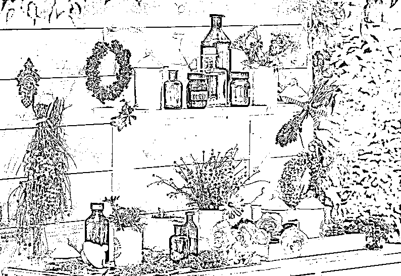

**恐惧类型及对应的顺势制剂**下面我们可以来看看一些恐惧类型及相应的对治顺势制剂：对死亡的恐惧  **对死亡的恐惧**是一些身体和心理疾病中突出的症状。而可以缓解恐惧的顺势制剂常常源于一些**剧毒植物、动物、矿物质**。当人们服用这些剧毒物质时会导致死亡。**顺势制剂运用这些原始材料的致死特性，提取出可以抵御死亡恐惧的顺势制剂。**根据这些剧毒物质在致人死亡时产生的心理和身体症状不同，其制作出来的顺势制剂也用来对治那些相似的身心症状。以下举几个治疗死亡恐惧的顺势制剂的例子：

*   **乌头**被誉为"英国最毒植物"，它的顺势制剂所应对的恐惧是那种**完全恐慌且伴随着极度焦躁不安**的状态； 
*   **砷**是以前最流行的谋杀案中的毒物，服用了砷的人**相信自己肯定会死，尽管感到筋疲力尽，也会完全拒绝药物和食物。渴望喝温水或热水，心灵和身体都有无可救药的焦躁不安**。而顺势制剂中的砷制剂可以医治同样身心症状； 
*   **硝酸银**类型的患者是那种平**时就匆匆忙忙，有很多担忧和恐惧**的人，**当生病时，对死亡愈发恐惧，甚至自己预测自己什么时候会死，有时甚至会预测自己死亡的小时和分钟；** 
*   **山金车**类型的患者**害怕即将到来的死亡，同时罹受着难以忍受的痛苦，非常害怕被人触摸，甚至害怕别人接近自己**； 
*   当生病时，**钩吻**类型的患者**头脑低落，身体虚弱，此时对死亡的恐惧就会升起**。肌肉瘫软无力，而身体的颤抖剧烈，甚至不得不要求旁人搀扶，或是不得不坐起来以控制颤抖； 
*   **磷**是那种艺术类型的人，心中有很多恐惧，**其强烈的想象力使其在生病时害怕死亡；**
*   **黑麦真菌**是一种致命的神经肌肉毒药，其顺势制剂可以治疗**焦虑和死亡恐惧**，也治疗在这个过程中的**灼烧综合征、出血症、寄生虫和坏疽症**。

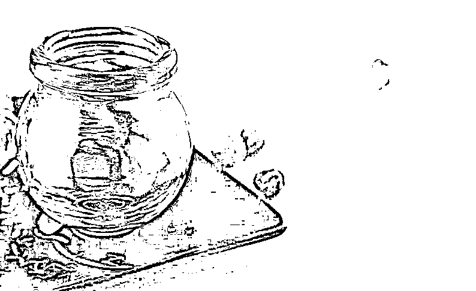

对黑暗的恐惧

**害怕黑暗本质上是对未知事物的恐惧。**人们常常用黑暗吓唬一些敏感小孩。对于富有想象力的孩子来说，这个空白的黑暗世界充满了各种可怕邪恶怪物，唯一逃脱的办法就是跑到有光的地方，或找到需要亲人陪伴。

顺势制剂也可以减轻和治愈对于黑暗的恐惧。

*   **碳酸钙**类型的孩子**极其渴望陪伴，他们比较神经质和容易惊吓。**他们在黑暗中会听到各种声音，并会认为那些都是邪恶的声音； 
*   **印度大麻**类型的孩子**极其敏感，会将其所有的感知、感觉和情绪放大 10 倍**，所以会害怕黑暗； 
*   **樟脑**类型的人表现出**焦虑和不安几乎到疯狂的地步，他们特别害怕靠近黑暗的一切；** 
*   **石松**类型的孩子喜欢知道他们在那里，那里发生了什么。在所有新的、不习惯的和未知的事务面前，他们都会退缩。因此，他们害怕黑暗，害怕的是其**模糊及不确定性；** 
*   而**磷**，则是**过度兴奋，有高度富有想象力的类型；** 
*   **白头翁**类型的孩子**非常依赖别人的陪伴，因此害怕独自在黑暗的房间里；** 
*   **曼陀罗**类型的人，**对黑暗有强烈的恐惧，并渴望晚上卧室里有一丝微弱光亮**。奇怪的是，他们**对于闪闪发光的物体也有恐惧**。而且，如果他们在黑暗中移动，或者闭着眼睛走路，则有可能会**绊倒**。

对过马路或走出家门的恐惧

这种特殊的心理问题并不罕见。它可能与**恐慌发作**有关，患者突然出现**剧烈颤抖、无法站立、全身冒汗、哭泣、脉搏加快，感到无缘无故的极端恐惧。**

在顺势药典中，**乌头**是可以用来治疗这类病症的制剂之一。

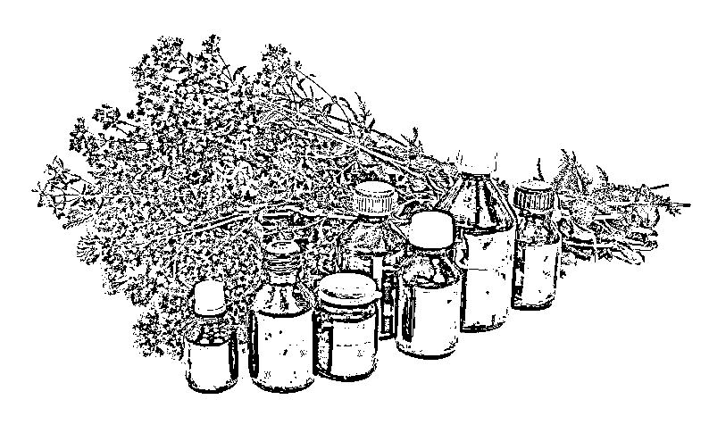

缺乏自信，害怕失败的恐惧这种折磨人的情绪或精神状态并不因为患者能力不足，而是源于**缺乏自信。**

在这方面，有三种顺势制剂值得提及。

*   **腰果**，其特点是**突然失去记忆，无法决断，无法对任何事情做出明确的决定，完全缺乏自信**。适用这种顺势制剂的人的一个特点是，他们在吃饭时会感觉到自己的健康状况有所改善； 
*   **石松**，是**过度认真的完美主义者**，因为缺乏自信，害怕在人生中担任新的角色，但**当他们深入了解情况时，他们一般做得很好；** 
*   **白头翁**，是温和、易于相处的人，他们**急于取悦他人，因此也会害怕无法做到这一点。**

**各种各样的恐惧**人类的恐惧多种多样。 有的人对**羽毛**恐惧，或**害怕遇到任何飘动和拍动的东西**。这种人也可能**害怕猫或狗**。顺势制剂中的**结核菌素**对应这种类型的恐惧。有的人**害怕有人在他们身后，害怕有东西像潜伏在草地上的蛇一样袭击他们**，这种患者在公交车上会寻找后座，在聚会上总是喜欢靠墙而立。对治这个问题的顺势制剂是**巨蝮蛇**。有的人**害怕刀子**，唯恐自己看到一把刀或手边有其他类似的武器，就有可能突然因为太过恐惧而爆发，拿起刀子伤害他人，甚至伤害孩子。这种恐惧很可怕，这种情况幸好不常遇到。**砷**是消除这种恐惧的顺势制剂。**马钱子**也可以制止这种突然爆发的恐惧导致的暴力行为。有的人在经历了一些可怕的事情后，恐惧会如幽灵一般萦绕不散，一直处于紧张情绪之中。**应对这种创伤应激的持续的恐惧，适合的顺势制剂之一是鸦片。**当然，在每个顺势案例中，追踪和发现每个个案的恐惧原因至关重要。如果威胁是真实的，那么必须有勇气和常识面对这些威胁。如果，像我们常见的那样，让我们恐惧的威胁是不实的，缺乏实质内容和现实性，那么这种恐惧必须被拖入日光中，看到它是什么，或者更确切地说，看到它不是什么。这时，顺势制剂将给予宝贵的帮助。**你在生活中常见的恐惧是什么？**

**版权声明：**本文由若道翻译发布，欢迎转发，反对抄袭。友号转载请申请白名单。

请在后台回复 顺势 获得更多****关于顺势疗法内容****

**学习顺势疗法**

**请点击下图了解详情**

**微信又双叒叕改版啦，不想错过若道君的推送？**

**就把若道设为星标吧！**

**▼**

就是这个“在看”，戳戳戳 ☟

********报名直达入口********

# 深度天秤座丨“关系”是生命的历练场，在选择中成为优雅大师

> 原文：[`mp.weixin.qq.com/s?__biz=MzA5NjA0NTAxNg==&mid=2651428740&idx=1&sn=ed5411a1caae7e07e9dd654f281d4730&chksm=8b4b2533bc3cac25506fe2e69e60ede699787e7dd5cbf874694fffaae4360c2233504bd75178&scene=126&sessionid=1692738101#rd`](http://mp.weixin.qq.com/s?__biz=MzA5NjA0NTAxNg==&mid=2651428740&idx=1&sn=ed5411a1caae7e07e9dd654f281d4730&chksm=8b4b2533bc3cac25506fe2e69e60ede699787e7dd5cbf874694fffaae4360c2233504bd75178&scene=126&sessionid=1692738101#rd)

******☆ ****后台回复“今日”，给你一句生命态度******

作者/编辑/翀子 ISAR 认证占星师

封面/书君 图片/网络

当深入天秤座关联季节象征，我们会明了为什么“关系”是这个星座的历练场。在关系中舞动的天秤座，最能知晓二元论的争论所在，以及整合对立双方的意义。这是潜能，也是阻碍他们进化的蹩脚石。而学会做选择，是他们成为关系大师的必需能力。

地球绕着太阳旋转的运行轨迹上，有人类自古以来就很重视的四个位置——春分、夏至、秋分和冬至，它们标志了太阳照射大地时长的变化节点。这四个节点也分别对应白羊座、巨蟹座、天秤座和摩羯座的能量，在生命之轮的转动中，有着不同的隐喻和象征。  

从白羊座到处女座，我们完成个体的建立，如同从春分开始，太阳（象征个体生命力）的照射时间长于黑夜；**当秋分来临，白天又回到与黑夜等长的时候**，渐长的黑夜开始引领每日生活，我们从“自我”移开，转向他者和集体，完成从天秤座到双鱼座的进化。看看**天秤座的符号**，太阳被水平线平均分割，一半在上，一半被隐没，如同告诉我们，这是分界时刻。对于星图上天秤座能量凸显的人来说，深入天秤座关联的季节象征，便能鲜活的理解自己的生命动力。

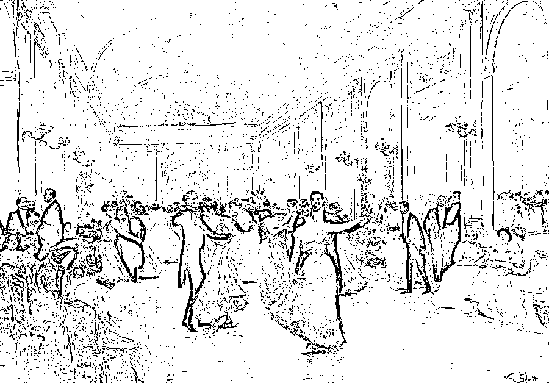

**聚光灯下的双人舞**

**春分和秋分都是白天与黑夜相等的日子，**只不过前者由白羊座能量象征，意味着我们从混沌而出，需要发展个体勇气和一往直前的力量，**而后者由天秤座能量代表，在经历了以“我”为中心的发展，开始进入“我们”的世界。**

**在天秤座的领域，我们学习如何在关系中舞蹈。**两人在舞池中旋转，耳鬓厮磨，光影流动，在距离中彼此接近，在旋律的节拍中协调双方脚步。我们既是两个独立个体，又如双生般相知相悦。跟随对方律动，试探着迈出一小步，有生疏青涩，有笨拙鲁莽，但这些都阻挡不了对方于自己的吸引。

对天秤座来说，双人舞比单人舞有意思多了，无论是优雅华尔兹、性感拉丁、热情牛仔还是动感恰恰，在不同的情绪氛围中，天秤座获得不同的体验。

作为初学者，他们跟随舞伴的脚步，在对方带领下起舞。他们的眼中是对方曼妙的舞姿、迷人的神情，从舞伴的舞动中，看到自己。慢慢的，他们的舞技变得娴熟，越来越自如的在舞池中游走，他们成为带领者，无论舞伴是谁，都可以让他们随着自己如风般优雅的姿态，跳出美丽的舞蹈。

**这就是天秤座。他们在关系中舞动，关系是生命的历练场。**

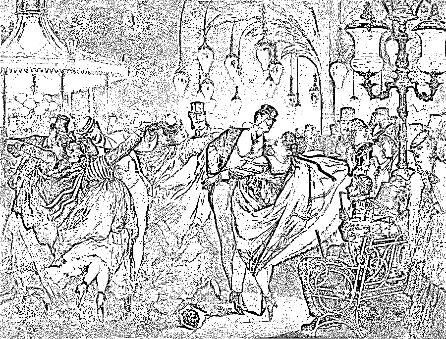

**关系：生命的历练场**

**不在关系中飞翔，便在关系中消逝，这是天秤座的功课。**

我和你，我和我们，是如此的不同，却又要合而共舞。电影《一代宗师》里，宫二小姐有这样一句台词：习武之人有三个阶段，见自己，见天地，见众生。

不只是习武，人生也是一样。12 星座在生命中遇见自己的方式各有不同：白羊座在行动和勇气中遇见自己；双子座在迅速流动的信息中遇见自己；狮子座在自信的创造中遇见自己；天蝎座在危机和恐惧中遇见自己；射手座在信念和远方中遇见自己……**对天秤座来说，他们在关系中遇见自己。**

你和舞伴可能像默契的双胞胎，高度的相似让你从他/她身上看到自己；你们也可能拥有巨大的差异，你从反差中逐渐清晰自己的轮廓；你们或许常开怀大笑，拥有美丽的时光，你开始明白你珍惜的是什么；也可能你们矛盾不少，在吵架中你了解到自己不喜欢的是什么。**双人舞的关系，就像镜子，你从镜面反射中看见自己，它是你的随身之物，生活必备。**

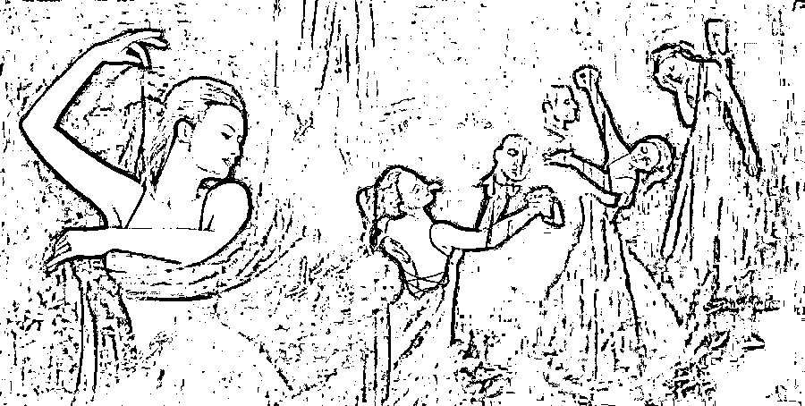

**李安的太阳落在天秤座，**说到这位“华人之光”导演的代表作，不得不提他早年的“家庭三部曲”——《推手》、《喜宴》和《饮食男女》。各种亲密关系内部的矛盾与和解、东西方文化间的冲突和彼此包容，是这几部影片的核心。在影片中，我们看到这位天秤座导演是如何表现紧密交织、既想紧紧握住又想彼此远离的断不了的牵绊，也看到了不同的人际关系是如何影响和造就我们。

而说起推手，它是太极中双人徒手对抗的一种练习，注重不丢（脱离）不顶（顶撞），在二人的博弈关系里寻找突破。这同样也是天秤座能量的核心表达。

对天秤座来说，他们被自己与他人的关系定义，**关系的质量和状态是衡量天秤座能量是否健康发挥的指针。**天秤两端追求流动的平衡，而不是像跷跷板那样“一坐定乾坤”。势均力敌、棋逢对手的你来我往，是能量流动的引力所在；而亦步亦趋、被对方牵制了节奏，则让天秤座的生命光辉暗淡下来。

没有人是他人的附庸，对天秤座来说更是如此。**他们吸引来各式各样的关系，在其中学习、成长、进化。**

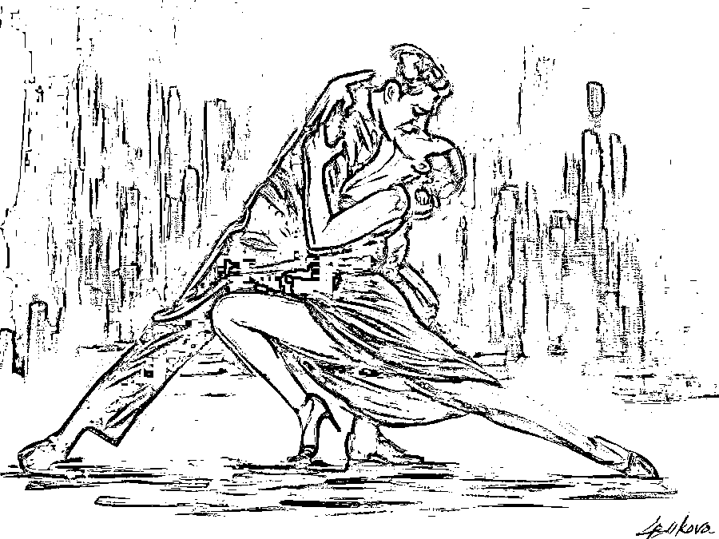

**“二元对立”的整合**

太极生两仪，即阴与阳。太极图上，以黑和白代表的阴阳二鱼交织在一起，意喻二元对立的融合与转化。人们习惯以二元论的视角看待世界的大多数事情，是非、黑白、善恶、公私、敌友、你我……站在天平一端，掂量着另一边。

天使在魔鬼的衬托下才成为天使，光明在黑暗的存在中才有意义。在对方的眼睛里，我们看见自己，没有对比就没有热爱，没有对比也就没有伤害。**关系中的天秤座深谙二元论的争论所在，**他们明白，没有绝对的黑与白。阴阳相异，又彼此相依，每个人都是雌雄同体，男人身体里有个女人，而女人身体里有个男人。当我们拥抱叫嚣着对立的两极，也就拥抱了 1 加 1 大于 2 的可能性。

让天秤座选择两棵树中的一棵栖息？这对他们来说是困难的选择题，大概没有哪个星座比天秤座更不愿意参加总是需要“站队”的人类活动。

**和谐的关系才能跳出优美的双人舞，**要平衡天平两端，需要带着**觉知与智慧**，而不是凭本能与情感，这也是为什么天秤座归属于注重头脑与思维的风象星座。天秤座常被认为代表爱与美，但深入它的内在，我们便知道，爱与美当然是“和谐”的重要表达，但“和谐”又不仅仅是如此。在窄窄的平衡木上保持优雅姿态，不光需要多年的稳态训练、足够的体能与技术做支撑，**更需要一个清醒的头脑。**仅靠动人的外表是不够的。

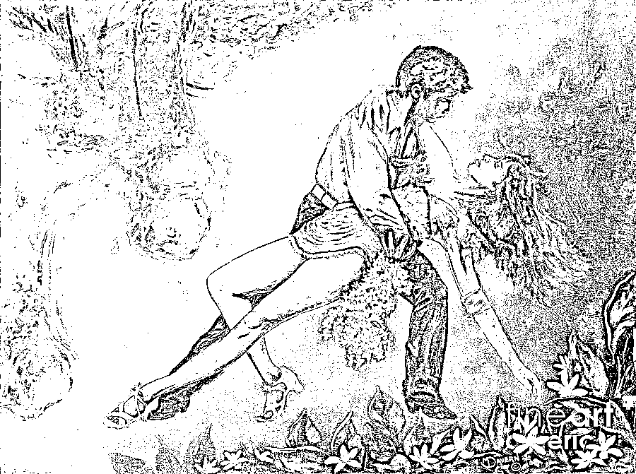

因此，与其说天秤座是一个关乎爱与美、在乎关系的优雅星座，倒不如说**它是主动运用觉知来展现、平衡双方差异的能量。**就像李安的作品，兼具东方的温文尔雅和西方的洒脱不羁，他讨论传统和现代的伦理矛盾、东方与西方的文化冲突，但他也很少在影片中鲜明亮出自己的观点，而是更常细腻的摆出不同角度，留出开放空间给观众回味。很多人认为这是中庸的表现，而**能拿捏好中庸之道，也是天秤座能量的积极表达——整合二元对立。**

“换位思考”对天秤座来说不是什么难事儿，难的是过度换位思考，每个都想要却又都不想要，以至于丢了自己、没了主意、左右摇摆、犹犹豫豫。

还是让我们先略过让他们为难的事情吧，被公认为有咨询师天赋的天秤座，当然不是浪得虚名，“为关系而生”的星座能量在对“平衡”的强烈需求下，对各方立场的出发点和诉求非常清晰，**他们有这样的潜能，让各方和谐的坐在一起，谈笑风生，化解矛盾，达到共赢。**

什么是高阶的天秤座能量？在我心里，用四两拨千斤的巧劲儿、让对立双方化干戈为玉帛，并运用智慧让周围环境处在和谐优雅的氛围中，是绝佳的高阶天秤座画像。

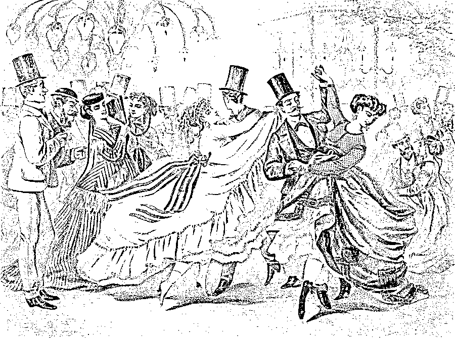

**进化路上的“笨拙舞步”**

当你的出生星图上有凸显的天秤座能量，“关系”就成为生命进化中的重要考试，**你拥有成为优秀双人舞者的潜能，**但前提是，你很可能需要不断的练习与试错，方能成为太极大师。大卫老师形容天秤座是**“礼貌的白羊座”**，这句话很精辟，**如何在顾忌到他人时又真实的做自己，是这个星座的议题。**

**过度取悦**关系中的另一方，是我们说到“初阶”天秤座时常会想到的。刚下舞池的选手，往往不知道先迈左脚还是右脚，亦或是不小心踩到对方，立刻收回脚步，愈发小心翼翼。对方引领着你略显笨拙的步伐，而你的神情生动诠释了那句歌词——“我说我的眼里只有你”。

关系是天秤座的世界，当他们还在其中姗姗学步时，容易随着对方的喜怒哀乐而动，或是被他人的选择牵着走。前些天在旅途中碰到一个太阳天秤座的姑娘，她说她在完全不知情的情况下，被男友通知已买好出来玩的机票，她只好匆忙请假；我看她一路上沉默不语，而她的男朋友却在不停的和其他同行旅伴们谈天说地；她还说她更喜欢和女性朋友们出去玩，因为总是问她各种意见的男友让她很没有耐心。

**太阳星座是我们在今生需要学习和发展的能量，**它的状态通过我们自己，或生命中重要的男性角色来呈现。行动被他人决定、对“拿主意”的厌烦（也是选择恐惧症的表现）等等，都是天秤座能量的初阶表达。而姑娘的男友，“社交力”出色，这也是她的太阳星座投射出来的“镜像”。她的寥寥数语和性格样貌非常有趣的呈现了天秤座的某些面向，只不过，她还有很长的进化之路要走。

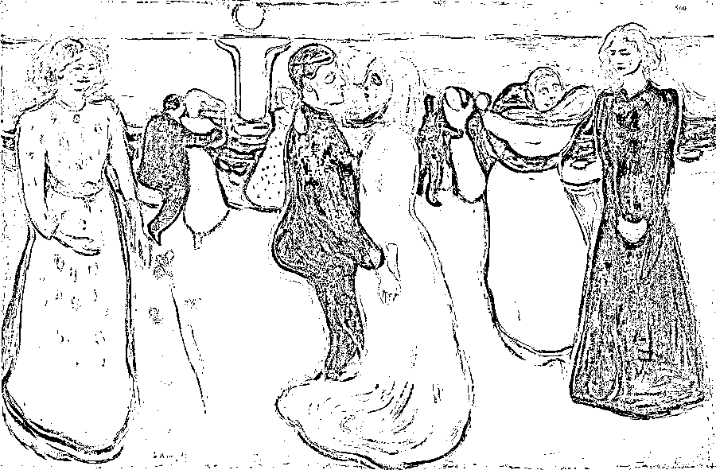

天秤座喜欢在关系中做“好好先生”与“好好小姐”，他们很可能不自觉的以为，取悦或不做选择是让自己“进可攻，退可守”的绝佳策略，认为**“中庸之道”**就是谁都不得罪，但殊不知它还有另一个形容词，叫**“和稀泥”**。虽然不太好听，但却栩栩如生的描绘了一个力当**和事佬**的天秤座形象。以为这样自己就能“万花丛中过，片叶不沾身”，但这离真正的关系高手还差得远。

在天秤座的进化之路上，**“取悦对方”**是初学者的笨拙舞步，**“和事佬”**是通往高阶的蹩脚石，而**做出有意识的选择**、并在互相制衡的状态里游刃有余的舞蹈，就是“得道”了的天秤座。

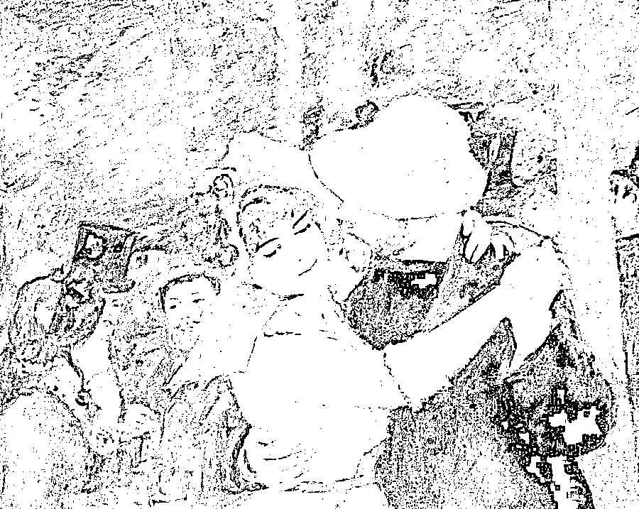

**在“选择”中升华**

天秤座不习惯“站队”，不愿意“二者之中择其一”，原因是他们知道**选择就意味着失去其他可能性**，当天平只剩一端时，如何有平衡？与其说天秤座不爱做选择，不如说他们害怕选择后的结果，而这也是**“选择恐惧症”**的症结所在。所以，初阶天秤座会跟着对方的步调，一方面可以取悦他人，同时也推开了自己做选择后需要面对和承担的情景。

而人生是自己的，对天秤座而言，在不同的关系中舞蹈是确立与清晰个人意志的途径和方式。什么都选和什么都不选，全意味着什么也得不到，以至于成为跟随他人舞步的被动生命。**天秤座的守护星是金星**，而金星的更深层意涵并不是我们认为的浪漫、爱与美，而是**选择**。选择定义了我们的生活、重要的人际关系、认可的价值体系以及我们眼中世界的样子。

和金星与天秤座相关的希腊神话是金苹果的故事。众神之王宙斯让特洛伊王子帕里斯从天后赫拉、爱与美之神阿弗洛狄忒、正义女神雅典娜中选出最美丽的女神，并把金苹果给获胜者。赫拉说如果帕里斯选自己，就给他统治世界的权利；雅典娜说如果选她，就让帕里斯赢得所有战争；阿弗洛狄忒说如果自己获胜，帕里斯就能得到世间最美丽的女人。帕里斯选择了阿芙洛狄忒，之后他和绝世美女海伦相爱并私奔，由此引发了特洛伊战争。

在这个故事里，当然有浪漫爱情和美丽的恋人，但它却更一针见血指出了“选择”的重要性。当看到丰富的花花世界和众多二元关系的呈现，**天秤座需要在其中做出自己的价值选择。关系是一面镜子**，它折射出我们的一部分，**但力量依然在、且只能握在自己手中。**当明白内心所向，共赢与两全其美才有意义，不然那只是镜花水月的表象。

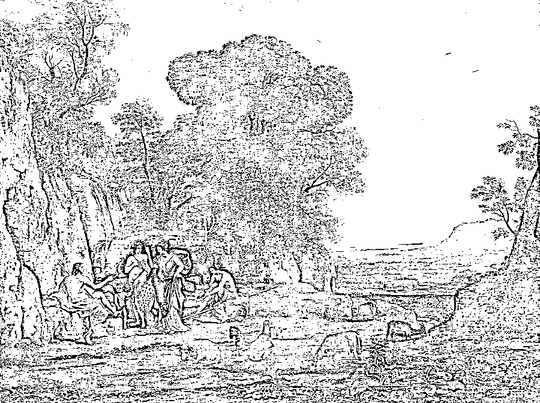

“良禽择木而栖”，对天秤座来说，在经历了“关系场”中的历练、和事佬的阶段，**“选择的能力”就成为进化的加速器。**他们已经成为成熟的双人舞者，对不同的双种都能信手拈来，选择什么样的舞伴、跳什么风格的舞、用什么样的难度、可以达到怎样的效果，是天秤座成为关系大师的关键。**在这样的舞动中，我们看到和谐带来的美感，看到二人势均力敌的你来我往，看到太极符号中的阴阳相制又相融。**

你是你自己，关系是你的历练场，也是你的舞台。你在关系中舞动，在选择中优雅自己的人生。

这就是你，天秤座。

**版权声明**：原创文章由作者授权首发于若道平台，欢迎转发，反对抄袭。友号转载请申请白名单。

翀子

ISAR 认证占星师（2019 年获得）

若道 2019 届核心课程毕业生，若道微信公众号兼职编辑

**咨询微信**：carolinemichong

**微信公众号**：LumosTrueSelf

长按打赏

**系统学习占星学**

**点击图片了解详情**

**微信又双叒叕改版啦，不想错过若道君的推送？**

**就把若道设为星标吧！**

**▼**

就是这个“在看”，戳戳戳 ☟

********报名直达入口********

# 雷蒙德·梅里曼金融占星周运 | 从现在起到 10 月 19 日，谨慎！

> 原文：[`mp.weixin.qq.com/s?__biz=MzA5NjA0NTAxNg==&mid=2651428740&idx=2&sn=5a7d2da7687add2cab0f29020f6f41f2&chksm=8b4b2533bc3cac258f27279cdaf35f3fa23fd59bc833623e48087811d7b0de58b3a5ebbfe68d&scene=126&sessionid=1692738101#rd`](http://mp.weixin.qq.com/s?__biz=MzA5NjA0NTAxNg==&mid=2651428740&idx=2&sn=5a7d2da7687add2cab0f29020f6f41f2&chksm=8b4b2533bc3cac258f27279cdaf35f3fa23fd59bc833623e48087811d7b0de58b3a5ebbfe68d&scene=126&sessionid=1692738101#rd)

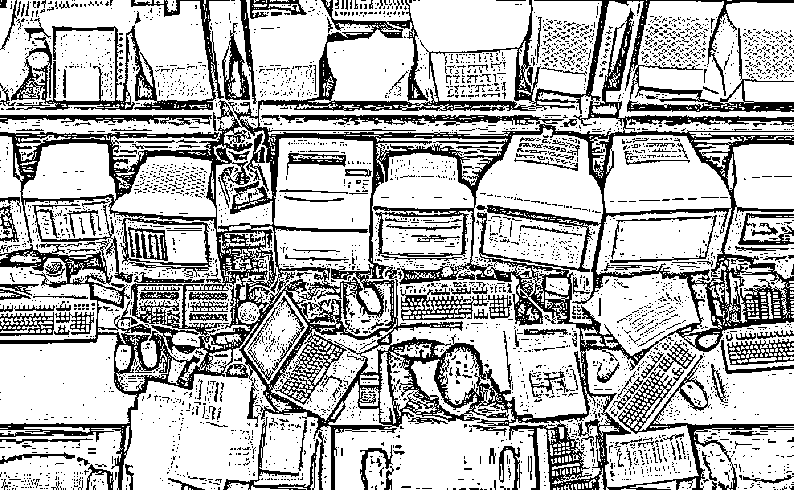

作者/雷蒙德·梅里曼
译者/李含编辑/玫瑰 图片/全景网雷蒙德·梅里曼是在金融占星学界稳坐第一把交椅的占星师，同时他也是若道签约的金融占星课老师，我们引进了雷蒙德·梅里曼老师的《[上证指数+黄金周期月度报告](http://mp.weixin.qq.com/s?__biz=MzA5NjA0NTAxNg==&mid=2651425978&idx=2&sn=c7e3187f3abfe604c511ea9506775c0a&chksm=8b4b3e0dbc3cb71bbe141e7e7a5e9ddb0690537fd1661d2f9919f23741010a762b9966633af8&scene=21#wechat_redirect)》《[2021 年金融预报](http://mp.weixin.qq.com/s?__biz=MzA5NjA0NTAxNg==&mid=2651425978&idx=1&sn=067bd68ece37e1e820d6f84f7a3cc960&chksm=8b4b3e0dbc3cb71b866f65d51f7993d3c35dee77cebd77eda3f63a4d5864dadaea2e9d14c101&scene=21#wechat_redirect)》。我们经老师的授权，将每周刊登梅里曼老师的周运，供大家参考和学习。于是，这是本周的周运（9.28-9.30）。**说明：以下时间采用纽约证券交易所所在地美国东部标准时间。**
**展望与回顾**自 2020 年 3 月 16-23 日新冠病毒肺炎疫情大爆发低点以来最大幅度、持续时间最长的下跌上周仍在继续。这并不令人惊讶，因为**火星在白羊座末尾逆行，从现在到 10 月 19 日，正与摩羯座星群形成渐盈的四分相（上弦月周期）**。2020 年 3 月的恐慌性低点发生在火星与这三颗行星合相的时候。合相代表一个周期的开始。**上弦月周期（渐盈四分相）通常代表对周期开始时出现的主题的测试或回访。**新冠病毒肺炎疫情和全球股指的下跌确实是回到了 3 月份的恐惧和市场模式。然而，到目前为止，这场面还没有像 3 月份那样激烈。但我们还有三周时间。正如 2020 年 3 月 1-23 日所表现出的那样，三周时间足以让全球股市下跌，新冠病毒肺炎病例大幅上升。然而，对于每个人来说，也有足够的时间来**应用从 3 月中旬这段时间吸取的经验教训，防止 6 个月前经历的大规模恐慌再次发生。**就在 9 月 9 日火星逆行前夕，全球数个股指创下了崩盘后的新高，上周跌至 2-4 个月来的最低水平。在欧洲，荷兰 AEX 指数跌至 6 月 15 日以来的最低水平。德国 DAX 指数跌至 7 月下旬以来的最低水平，伦敦富时指数（FTSE）跌至 5 月中旬以来的最低水平。苏黎世 SMI 指数表现相当不错，仍高于 9 月 4 日的低点。亚洲和环太平洋地区的情况与此类似，上证综指目前正在测试 7 月 22 日的低点，香港恒生指数回到 7 月下旬的低点，印度的 Nifty 指数跌至 5 月下旬以来的新低，澳大利亚的 ASX 指数回到 6 月下旬的价格。只有日本的日经指数表现相当不错，可能是因为上周的前两天由于“换季”假期而没有开市。除了美国之外，美洲也出现了类似的情况，美国股市上周五大涨。但在此之前，道琼斯工业指数和纳斯达克指数均跌至 7 月 30 日以来的最低水平。上周，随着欧元跌至两个月来的最低价格，美元再次称王。随着美元上涨，黄金和白银双双跌破 7 月 21-22 日以来的最低价格。白银尤其受到重创，9 月 24 日周四跌至 21.81 的周低点。与 8 月 6 日创下的多年新高相比，这一数字已缩水 27%。所有这些都证明了一件事：**贵金属对美元的价值非常敏感**。随着美元走强，黄金和白银价格下跌。事实上，大多数商品的价格随着美元的上涨而下降，因为世界贸易中的交换货币仍然是美元。但它还能保持这种状态多久？这是一个与天王星相关的问题，因为天王星与重大变化相关，它正在象征财富和货币的金牛座行进。
**短期占星趋势和长期考量**

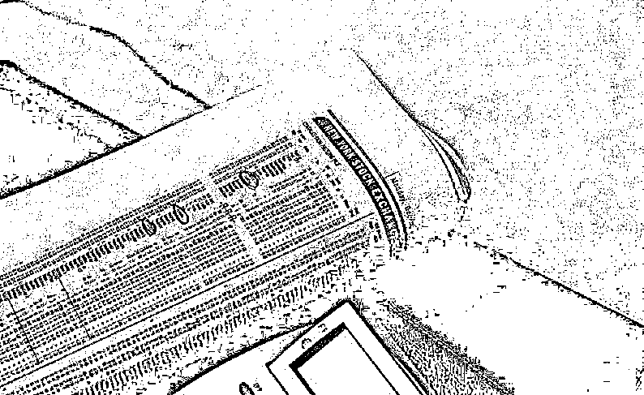

**“美国的当前账户赤字在第二季度遭遇了创纪录的恶化，这是我们与世界其他地区国际化失衡的最广泛衡量标准，”目前，美元指数在 94 左右交易。去年 6 月罗奇在《贸易国度》节目中预测该指数将暴跌 35%时，该指数在 96 左右交易，当时罗奇估计这将在未来一两年甚至更长时间内发生。但现在，他预计这将在 2021 年底发生。他说：“由于缺乏储蓄，又想要增长，我们利用这些经常账户赤字来借入盈余储蓄，这总是会推动货币走低。”“美元也不能幸免于这种由来已久的调整。”**

**——斯蒂芬妮·坎德斯曼**

**《经济学家斯蒂芬·罗奇发布新的美元崩盘警告，认为二次衰退的几率超过 50%》**

**www.cnbc.com**

**2020 年 9 月 23 日**

宇宙飓风的暴风眼现在出现了。此时此刻，我们正进入宇宙风暴的中心。**在接下来的 3 周里，把重点放在保护你的财务、健康和总体福祉上**，因为**火星将渐盈四分土星（9 月 29 日）、冥王星（10 月 9 日）和木星（10 月 19 日）**。这段具有挑战性的时期始于**9 月 28 日，****土星转向顺行**，它与 9 个交易日内的基本或更大周期存在强有力的一级地球宇宙学相关性（70%的概率）。**土星的本性是压抑的，会引起焦虑和恐惧。**第二天，**9 月 29 日，火星与停滞的土星成四分相**，在 11 个交易日的容许度，它与基本周期有 80%的地球宇宙学相关性。火星-土星也代表着精疲力竭，感觉落后了，做任何事情都没有足够的时间。在这种困难相位下，人们会感到沮丧和愤怒，这无助于解决任何问题。它只会带来更多的不安和挫折，最好避免和那些阻碍你的人或是过分挑剔的人一起工作。明智的做法是**延长最后期限，而不是让自己疲于奔命去完成那些还没有准备好的事情**。现在需要的关键咒语是**“耐心”**。在我们通过土星考验后不久，我们将面临冥王星的考验。**冥王星将在 10 月 4 日恢复顺行，五天后（10 月 9 日），火星将与这颗与债务、赤字、降级和违约相关的行星形成四分相。**土星可能令人沮丧，但冥王星如果不能如愿以偿，可能会执着、无情和怨恨。它可能会试图通过威胁和武力来达到目的。当然，在火星逆行的情况下，冥王星也不会更快地达到目的。当其他人希望它向前发展时，它会让一切倒退。冥王星不得不回到过去，从头再来一遍。这往往会让它变得更好。就像经常发生的那样，人们放弃了，项目在一片悲观中结束。没有疗愈，没有交易。结束了。现在是重新开始的时候了。在金融市场和经济方面，人们的注意力集中在新的税收提案上，可能还有更高的关税或终止贸易协议的威胁。在这方面，抖音短视频国际版 Tik Tok 是不会有喘息机会的，因为大门一旦关上，便很难再打开。我有没有说过现在正在做出的决定存在怨恨和报复（偿还）的问题？有人试图表明自己的观点：“如果你惹我，你会付出很大代价的。”这可能是一个凶残的相位，迫使人们放弃他们想要保留的东西。这也适用于任命一名新的最高法院大法官。我们在这里谈论的不仅仅是政治领导人的虚伪，还有如何将这一决定强加给那些没有机会通过即将到来的选举表达自己意愿的人。同样，在火星逆行，与停滞的土星和冥王星的困难相位背景下，在这个问题上强求可能会付出代价。人们很愤怒，那些反对这个决定、这种选举方式的人可能会出于怨恨而投票，否则他们可能会缺席选举或保持沉默。

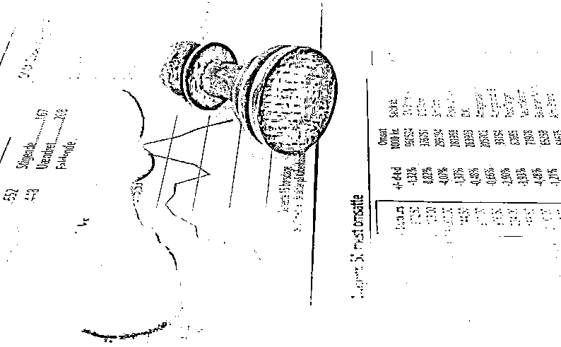

现在发生了很多事情。随着火星逆行和土星的突出，它可能看起来像一场斗争，以获得进步，以赶上对你的要求。我建议**在接下来的三个星期里，在工作、娱乐、休息和锻炼之间努力保持平衡。**在这个时候，工作往往更多，而其他三方面却不足。缺乏平衡，一个人就会精疲力尽，做出错误的决定。当你感到最大压力的时候，也许可以试试这个简单的呼吸练习。**吸气，数到四。数到四，然后慢慢呼气，数到八。**我知道你读这个专栏是为了了解市场和占星学。但有时候，在某些具有挑战性的占星学条件下，记住那些让你的生活运转起来的简单方法是有用的。呼吸就是其中之一。

**说明：以上日期基于纽约证券交易所所在的美国东部标准时间，由于存在时差，中国地区可能需要加一天。**

**版权声明：**本文由若道翻译发布，欢迎转发，反对抄袭。友号转载请申请白名单。

**雷蒙德·梅里曼（Raymond Merriman）**

若道签约老师。著名金融占星师，ISAR（国际占星研究协会）前主席，梅里曼市场分析公司的总裁。他由于“提升了占星学的职业形象”，在 1995 年国际占星大会上被授予轩辕十四奖；在 2012 年国际占星大会上，被授予轩辕十四终身成就奖。

1“中国上证指数月度报告”发售

**若道推出了****中文版****的雷蒙德·梅里曼中国上证指数月度报告，并持续发行该报告！**

当把金融市场的周期和占星学的周期相结合时，雷蒙德·梅里曼老师的金融占星学研究**为投资者应对金融市场的周期波动，并随之调整投资策略提供了极大的价值参考**。

**10 月中英文报告均已上线！**

2“黄金价格周期月度报告”发售

**若道推出****中文版****的雷蒙德·梅里曼黄金价格周期月度报告！**不仅仅为广大读者在中国股市的投资出谋划策，更将视角放眼黄金市场。

**每当世界经济形式不明朗的时候，有一个地方是保值的港湾，那就是****黄金**。自 1982 年雷蒙德·梅里曼出版第一本研究《地球宇宙学征象与黄金价格的关联》的著作以来，**他一直作为最重要的黄金市场时机预测者之一享誉国际**。

8 月的黄金终于从高位开始下跌，有些分析人士认为，黄金在过去连涨 9 周是非常极端的，因此走势未来不会太强了；也有人认为，在目前各国大放水、国际局势不稳的情况下，黄金可以继续看高。

那么，你该如何面对目前的调整呢？是等待回调继续进行，还是在什么位置买入？9 月黄金周期报告等着你。火星已经进入逆行阴影期，很多国家都纷纷再次爆发新冠肺炎病毒疫情，未来的几个月注定不安宁。黄金的走势会安宁吗？

9 月黄金报告已经上线，上证报告也会在月底上线。欢迎了解。也可以按照季度和一年期订阅，有更多优惠。季度和年度的好处是，你可以持续了解梅里曼老师对于不断在变化的市场的看法。即便他某一次看法和市场不一致，你也看到在下一期他如何调整自己的看法，并看到金融占星在一个长期时间段内对你把控风险的帮助。而能够长期控制风险、尽量找到安全的投资时机才是投资的长久之计。

**10 月中英文报告均已上线！**

**购买套餐**，买得越多越优惠

中国上证指数月度报告套餐价

*   **单月报告**：280 元

*   **3 个月套餐**：780 元（260 元/月）

*   **12 个月套餐价**：1999 元（166 元/月）

**长按下图识别二维码**

**购买金融报告****套餐**

**▼**

黄金周期月度报告优惠

*   **双报告年度套餐更优惠（直降 899 元）**
*   **12 个月黄金报告+12 个月上证指数报告：仅需 3500**

**长按下图识别二维码购买黄金报告套餐**

▼

1976 年以来，由雷蒙德·梅里曼撰写的梅里曼市场时机学院每年一次的年度预报沙龙和每年一本的《年度预报》一直在应用占星学原理为投资者们服务，提供卓越洞见，从未间断。

过去两年，3 小时的年度预报讲座和长达 200 页左右对金融市场的分析报告，帮助许多若道读者做出正确的投资决策，降低了投资风险，并获得相当不菲的投资收益。在群星摩羯座的时候，我们和你一起提早规划自己来年的投资安排。

**2021 年金融年报预售**

**1976 年以来，由雷蒙德·梅里曼撰写的梅里曼市场时机学院每年一次的年度预报沙龙和每年一本的《年度预报》一直在应用占星学原理为投资者们服务，提供卓越洞见，从未间断。**

过去两年，3 小时的年度预报讲座和长达 200 页左右对金融市场的分析报告，帮助许多若道读者做出正确的投资决策，降低了投资风险，并获得相当不菲的投资收益。在群星摩羯座的时候，我们和你一起提早规划自己来年的投资安排。2021 年年度预报开始预售**前 50 名预售价格**：1080 元（已售罄）**前 50-100 名预售价格**：1180 元**100-150 名预售价格**：1280 元**150 名之后价格**：1380 元**2021 年年度预报中文版预计发布时间**：2020 年 12 月底**沙龙时间**：2021 年春节前后**沙龙形式**：英文讲座，配有中文翻译**点击下图了解详情**

▼

******点击阅读原文购买金融报告******

# 甜蜜与苦涩参半的总统候选人，原来经历了这样的人生丨线上 ISAR 大会回顾

> 原文：[`mp.weixin.qq.com/s?__biz=MzA5NjA0NTAxNg==&mid=2651428683&idx=1&sn=9ceba7e6f0f483eee70fd1095b770447&chksm=8b4b25fcbc3cacea51c2a13596546055cb9145451c3863d30b1915437a4783e8206f2cd9a404&scene=126&sessionid=1692738101#rd`](http://mp.weixin.qq.com/s?__biz=MzA5NjA0NTAxNg==&mid=2651428683&idx=1&sn=9ceba7e6f0f483eee70fd1095b770447&chksm=8b4b25fcbc3cacea51c2a13596546055cb9145451c3863d30b1915437a4783e8206f2cd9a404&scene=126&sessionid=1692738101#rd)

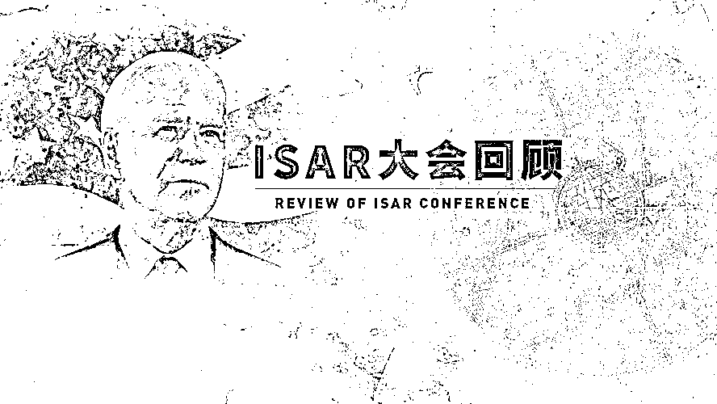

讲述人/文字整理 咔咔 ISAR 认证占星师编辑/翀子 封面/书君 图片/网络 2020 线上 ISAR 大会已经过去一周，大家对大会涉及的内容依然热情高涨。而参与圆桌会议的各位中国占星师也都有精彩发言。现在让我们回顾咔咔对美国总统候选人约瑟夫·拜登人生故事的介绍和解读片段吧~如果你想聆听大会完整内容，可以先拉到文章最后了解详情。

**（本文为上周末 ISAR 大会圆桌讨论的发言稿节选，仅代表讲述人个人观点）**

**如果人生是一盒巧克力的话，拜登今生领到的这盒巧克力绝对是苦涩与甜蜜参半甚至苦涩味道更重一些。**出生于 1942 年 11 月 20 日的约瑟夫·拜登的星图具有强烈冥王星/天蝎座特质，显然他来到世界不是为了过简单和轻松生活的。****

在展开他的人生故事之前，我们先来看看美国经历的重要行进，冥王星回归和海王星对分本命海王星。美国国家星图上本命冥王星在摩羯座 27 度，未来几年里行进冥王星会合相本命冥王星。

实际上，行进的土星在 2020 年已经在美国的本命冥王星来回走过几次了，土星把美国社会和集体潜意识的阴影、隐藏在光鲜美国梦下面的巨大阶级裂痕以及不能拿出来台面的事情毫无怜悯之心地摆了出来。

我们看到这个国家暴露的种族、阶层和地域的矛盾越来越多。新闻画面里，“黑命贵”抗议示威蔓延全国，武装持枪的有色人种和中产富裕的白人在对峙，繁华的纽约街头变得空荡荡的，奢侈品店铺挂住转租的招牌。

随着行进冥王星的前进，未来的美国社会是否有更多的顽疾被显化，继续经历终结、腐朽和死亡，从而在绝望中转化，再次重生为生机盎然的土地呢？

美国本命星图的火星四分海王星，我们在现实和艺术作品里看到美国英雄和美国梦的故事，电影屏幕上的美国队长、钢铁侠展现了完美的男人形象。

当行进海王星触发了本命的火海四分，海王星能吹起梦幻的泡沫也能把它们吹破。过去一段时间我们看到整个社会的混乱、失落、痛苦、迷惘、群体性的失智。

**2020 年至未来的几年里，美国这片土地到了汰旧换新、自省和重归内在平静的时刻。**

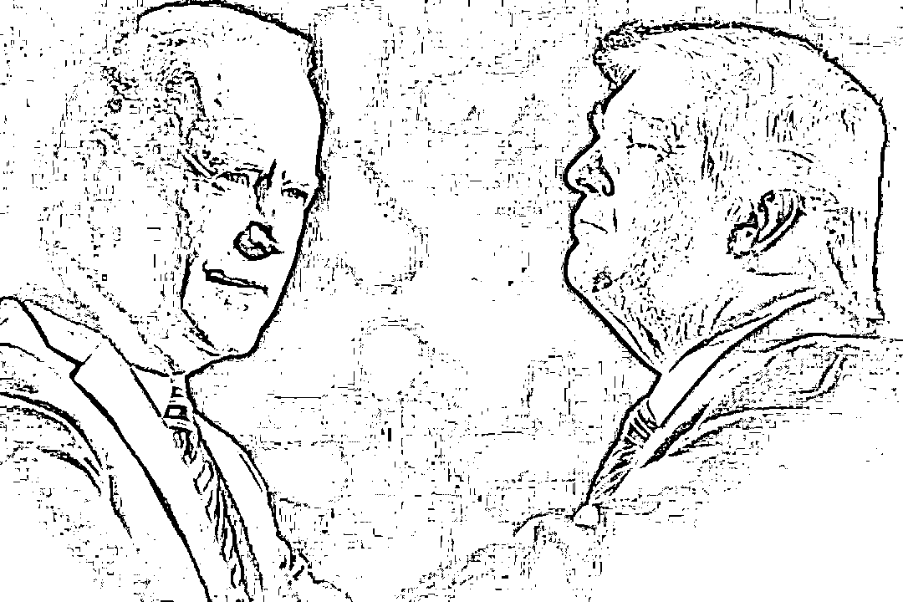

**| **拜登与特朗普

**拜登其人**

约瑟夫·拜登来自美国的中产阶级家庭，在 2009 年和 2013 年担任美国副总统。从政是拜登很小的时候就清晰的志向，他是美国历史上最年轻的参议员之一，刚刚 30 岁就成功当选特拉华州的参议员。

当时的拜登没有依附于任何一个党派也没有足够的竞选资金，他以独立身份参选最后获得民主党的支持。

**| **拜登青年时的照片

拜登从小家道中落，一家人为了生存吃了很多苦，很小就要勤工俭学。虽然起点不高，但是他一直在不懈地追求自己的美国梦，坚定不移。

父亲从小教育他，衡量男人的标准不在于你被击倒多少次，而是你能多快地站起来。拜登的妈妈也非常强悍，对儿子说如果你在学校被打了不要和我哭哭啼啼，你要照着对方的鼻子打回去。

拜登之前两度参选美国总统均告失败，是特拉华州在任时间最长的参议员，有人评价他是一根政界老油条，知道如何生存下来。

拜登的前同事，美国前国防部长罗伯特·盖茨说，“拜登是一个正直的人，但是他在过去四十年国内和国际事务均判断失误。”

可能对一个**天王星合相下降点，对分了太阳和金星**的人来说，他要做出的判断是另类的、创新的，自我身份的定位也可能是游离在主流价值体系之外的。

**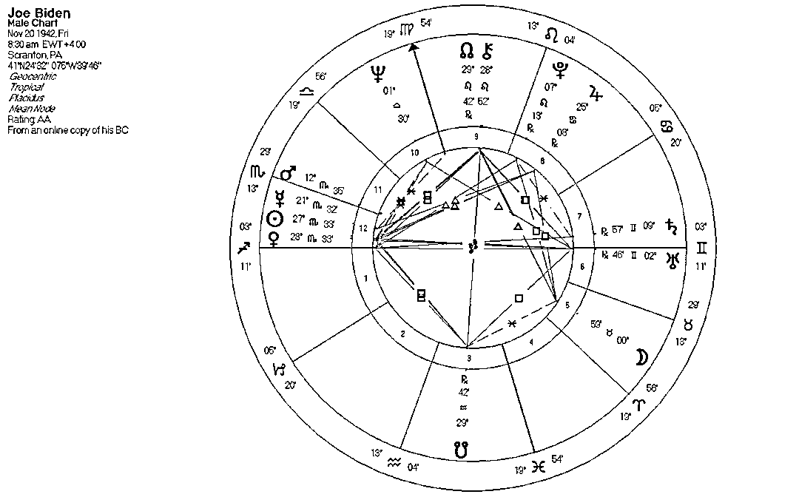**

**| **拜登的出生星图上，冥王星和海王星的主题非常清晰

**冥王星主题**

拜登是群星天蝎座，他的个人行星除了月亮在讲求安全、稳定、舒适的金牛座，其余的太阳、水星、金星和火星都在天蝎座。同时，他的冥王星在自己主管的八宫四分月亮，火星在天蝎座四分了自己的定位星冥王星。

**冥王星总是会带人进入幽暗之地，经历生存危机，体会困窘、绝望和耻辱**。要想走出绝境，冥王星人需要阅历丰厚，经验老道且对人性有着深刻的理解。当他们在阴暗里存活下来，他们面对和处理危机的功力又会上一个新的台阶。**拜登的人生也给人一种“打不死”的感觉，命运多舛但他会生存下来**。在他的星图上，生存的意愿大于突出性表现的意愿。拜登星图里火元素很少，作为一个政治家要有一定的热情和感染力，阳性的能量。他的所有个人行星都在阴性星座，而且有四个行星都在天蝎座，专注于生存，找到更多资源、权力、获得安全。

** **

**海王星主题**

他的海王星特质也很清晰：

*   太阳水星金星在 12 宫，也可以把火星算作 12 宫的行星

*   海王星在 10 宫高挂天空

*   海王星六分太阳、金星和天王星，150 度月亮。

**群星 12 宫，这个人可能有很多丧失、哀痛，让人感觉无法左右自己的命运。**海王星含混不清的特质也反应在他被指责 80 年代性侵女下属，在公众场合与女性缺乏界限，过于亲近。

可能受到上升射手座和水星 12 宫天蝎座的影响，拜登在公众场合的讲话有时过于随意但是似乎又说出了别人不敢说的事情。2014 年时任副总统的拜登在哈佛大学演讲的时候，回应一个学生的提问时说：“当副总统不就跟当婊子一样吗？”意识到失言后，他很快说自己是开玩笑。他也因为就 ISIS（伊斯兰国）问题批评美国盟友阿联酋和土耳其做出过重要道歉。

**1987 年他人生的重大危机也与海王星的过度美化、作假，不公开，不透明有关**。

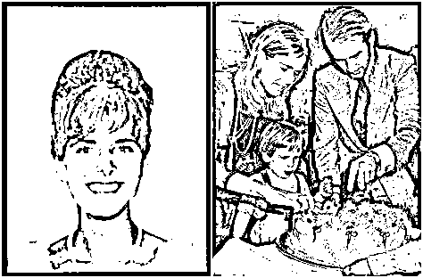

**| **拜登与第一位太太

**1972 年的人生至暗时刻**

拜登在大学的时候爱上了第一任太太，结婚后生下了两子一女。在他即将宣誓就职参议员的 1972 年 12 月 18 日，太太带着三个孩子出门采购圣诞树的路上不幸发生交通事故，撞上了大卡车。

车祸导致太太和一岁的女儿当场死亡，两个儿子受伤。这对拜登而言是重大的打击，巨大的哀痛和丧失让他想到自杀。他想过不做参议员，但是在资深参议员泰德·肯尼迪规劝下，拜登在儿子的病床前宣誓就职。

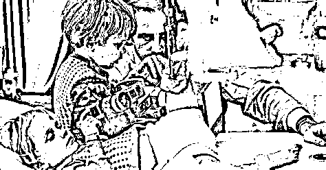

**|** 拜登与孩子们 

这是**海王星和冥王星的原型事件**：一个人经历重大丧失的时候咬着牙坚持下来，在绝望和最黑暗的时刻生存下来，要承担人生的重任，疗愈受伤的孩子。**责任对拜登而言非常重要**，**土星合了拜登的下降点**，描述了一个人进入这个世界的时候就不是一个轻松的感觉，对别人而言可能世界是个游乐场，但是世界对他来说个严肃的工厂。这个男人每次被打倒的时候都选择站起来，继续生活。当选之后他没有搬去华盛顿，要每天通勤 4 个小时往返于办公室和家庭，晚上要哄孩子们睡觉。他向儿子许下诺言，不管怎样我都会在。拜登命主星在巨蟹座，重视家庭的价值观，命主星落在八宫，无论顺遂困难我都会在。

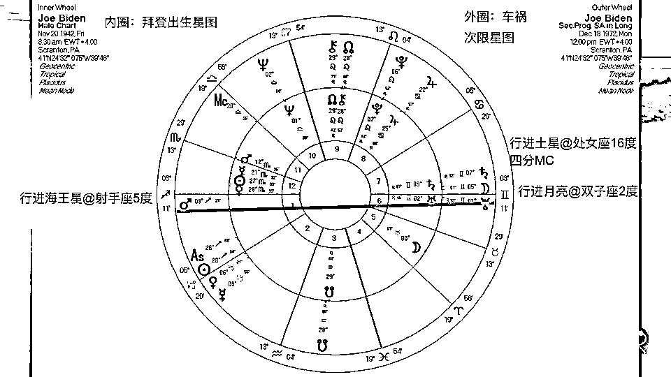

**| **拜登家人发生车祸的次限星图

**拜登家人发生车祸的次限星图**

*   次限火星在拜登的上升点出相位对分本命天王星，火天的组合让人想到车祸或者意外伤害。

*   本命天王星在代表伴侣的下降点。当天行进月亮在双子座 2 度触发了火星和天王星的组合。

*   次限的月亮也在他的下降点入相位次限的土星，次限月亮起到了触发的作用，月土组合描述了他接下来土星式的抑郁感受和沉重的人生责任。

*   行进海王星在拜登上升点射手座 5 度，让人感觉整个的人生瓦解了，感到哀伤和失落。

*   行进土星在 16 度处女座在逆行四分拜登的上中天。不是所有土星都是糟糕的事，只有懒人觉得困难是不好的。确实能看到很多人走向人生重要权力时刻、获得升职有土星的参与。

**行进土星对上下中天的触发显示这个人处于两难的境地，**要承担事业和家庭的双重责任，兼顾参议员和父亲两个身份。这张星图能很好的说明当时发生在拜登身上的人生重大变故。

**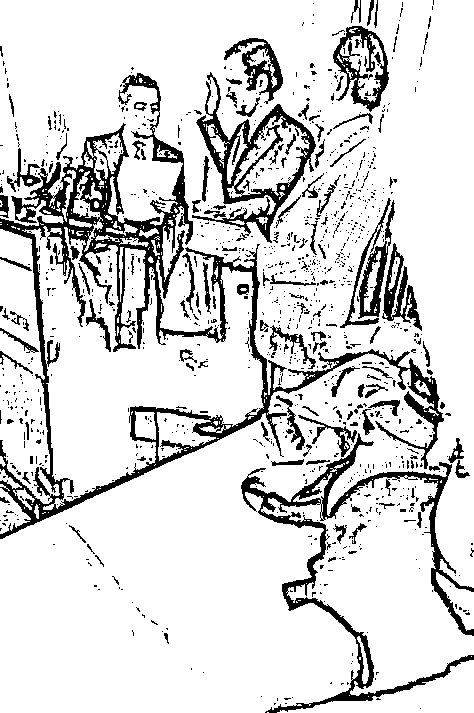**

**| **拜登在儿子病床前宣誓就职

这张图片是拜登在儿子病床前宣誓就职，它很好地描述了拜登的太阳 12 宫：**太阳是荣誉，获得荣誉的环境是要在 12 宫代表的病床前**。**2015 年长子离世**

2015 年，拜登的长子因为脑癌宣告不治，他因此没有参加 2016 年的大选。博被认为是继承父亲政治生命的很好人选，非常年轻就当选特拉华州的总检察长，曾在伊拉克战场服役。

**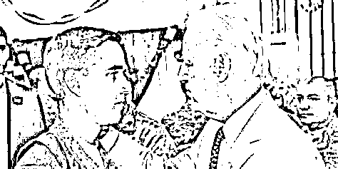**

**| **拜登与长子

长子去世的时候，拜登的星图次限 MC 在上升点对分本命天王星，显示拜登的公众职务和家庭发生突然改变，他宣布无法继续竞选。

行进土星在射手座 1 度过上升点，这个男人的人生又进入困难模式，人生的重压让他无法自在地追寻个人的梦想。行进海王星在双鱼座精准四分本命土星，土海的组合与失去、丧失、死亡有关。

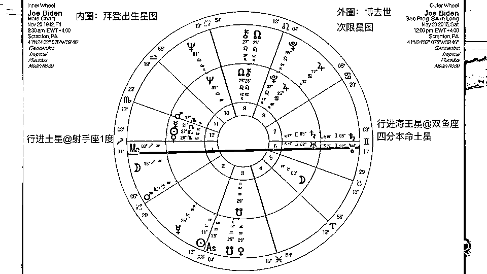

**| **拜登长子去世时的星图

**1987 年：另一个人生至暗时刻**拜登因学历问题宣布退出总统选举。**行进土星天王星同时在 1 宫四分上中天，这次他遇到的土星考验不是发生在伴侣关系方面，而是作为一个人他是否诚实**。

他是因为成绩造假的嫌疑宣布退出的。拜登为了塑造自己的光辉形象，说自己获得了三个学位。拜登的大学成绩不是很好，85 个人里他排第 76 位，但是他把自己包装成 top half（排名超过一半的同学），而且把获得半额奖学金说成获得全额奖学金。

**星图上强烈的海王星能量显示他希望塑造一个完美人设，要在公众面前表现个人魅力**，但是美国在诚信方面的要求是非常严苛的。人们发现他没有得到三个学位，只获得了政治历史学学位。这对个人声誉是严重的打击，于是拜登宣布退选。

**太阳弧的土星在当时精准合相他的木星，木星和正直诚信有关，土星过来就是要进行质量检查，把虚假的、矫饰美化的东西曝光，这也呼应了行进土星和天王星的突然的对个人公众形象的考验**。

祸不单行，拜登因为长期长时间的竞选工作，健康状况不佳，经检查发现了脑动脉瘤，1988 年有 7 个月他没有参加公众活动，做了两次脑部手术，真正在死神门前走了一遭。

**特朗普和拜登的高光时刻**

下面我们用太阳弧技术回顾一下从特朗普和拜登的人生高光时刻，也通过太阳弧推进的指征来看下这两个人在今年大选里的强弱对比。

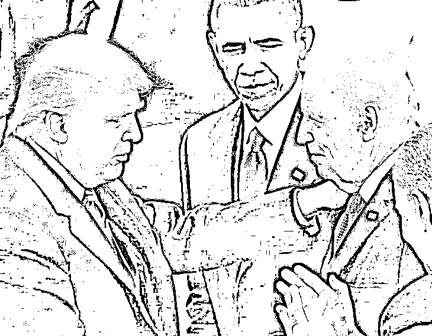

**| **特朗普和拜登

**2009 年拜登就职副总统**

*   太阳弧的 MC 精准合相了拜登的太阳，说明事业给他带来了个人的荣誉、荣耀、让他感到自豪。

*   太阳弧木星合相海王星，好像美国梦实现。

*   把太阳弧的中点也带进来，又一次木海和太阳组合在一起，太阳弧的太阳在触发本命木星海王星的中点，木海组合有梦幻的美妙的追求，太阳（荣耀）照了进来。

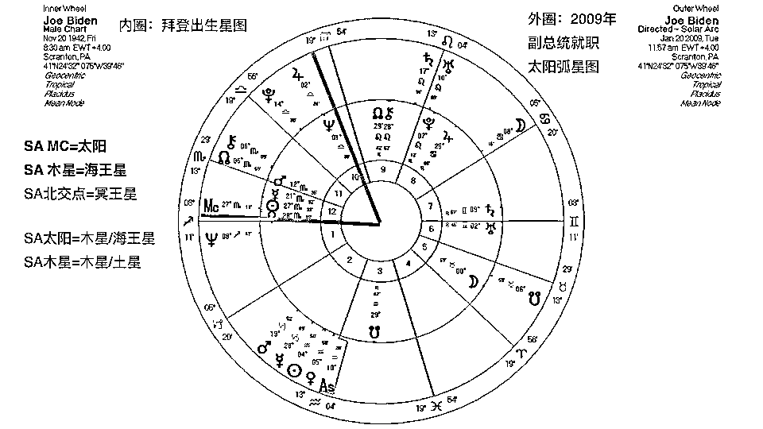

**| **拜登就职星图

*   政客的星图我会参考土星和木星的中点，木土合相的时候美国总统在任上是有特殊事件的，这个中点对政治人物是有代表性的。太阳弧的木星触发了本命的木土中点，显示了幸运，成功，外交事务（副总统的职务）。

*   太阳弧的北交点触发了冥王星，他接触了更多国际上政要拥有更多权力的人，也帮助总统处理一些幕后的人，他是群星 12 宫一个在幕后的有权谋的男人。

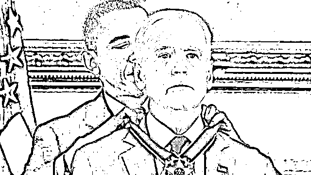

**2017 年特朗普宣誓就职总统**

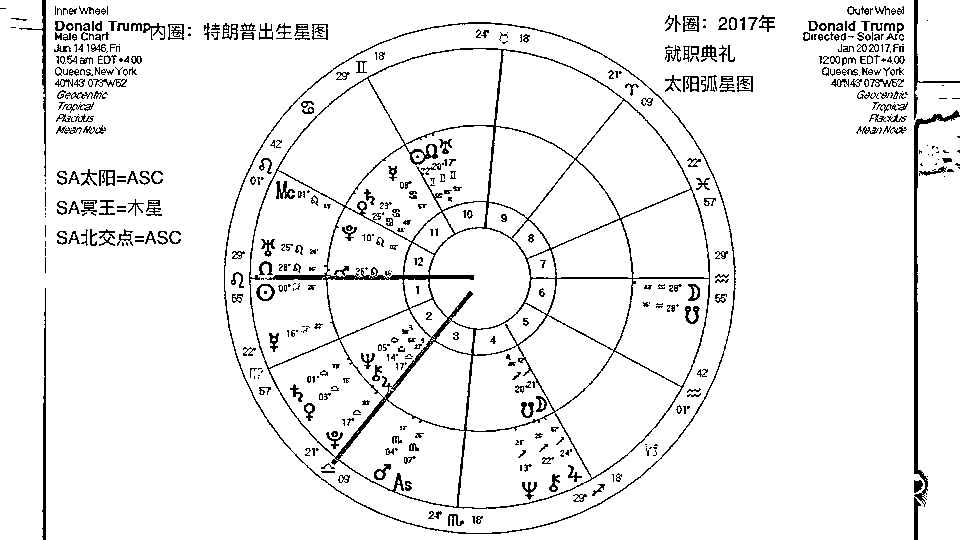

**|** 特朗普就职星图

特朗普就职典礼很简单，太阳弧显示了荣耀和集权。太阳弧太阳过上升，说明个人身份获得了荣耀，为自己感到自豪，得到了很多掌声、夸耀、鼓励，这是太阳代表的东西。 

太阳弧冥王星精准合相木星，操纵权力和财富。太阳弧的北交点合相上升点，接下来生命有更多的自我时刻，他开始推特治国而不是通过传统的新闻发言人。

**2021 就职典礼星图**

**2021 年 1 月 20 日 12 点，华盛顿特区**

**美国总统宣誓就职典礼**

**拜登正在经历**

**太阳弧和行进海王星触发上下中天，太阳弧的海王星四分本命上中天，描绘了生命脆弱的时刻**，一个人可能上瘾、迷惘，也可能有海王星式的工作或者梦想、愿景。拜登是个对海王星能量很熟悉的人。

**行进海王星在合相下中天，与太阳弧海王星形成双重撞击**。海王星过下中天好像本来一个人站在坚实的地板，突然这个地板融化了消失，这个人不知道自己身处何处。经历这个行进的人要花时间独处、从外部世界退回到内部世界里，倾听内心深处的感觉，寻找内在的平静。

不过海王星特质强烈的拜登也可能想拯救家园，拯救祖国，像是这个时刻被选出来献祭的羔羊。

太阳弧的 MC 对分了本命土星，也可能这个人又失败了，他的人生土星在下降点有不停被打倒的含义。过去 78 年里这个老兵在被打败的事情上获得了相当的经验，那这一次会不会获得土星式的回报呢？

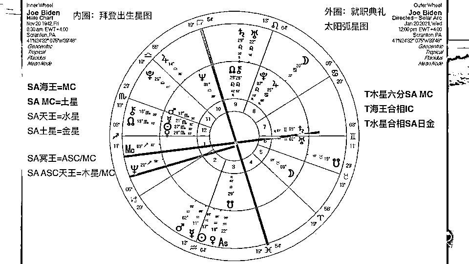

**|** 2021 就职典礼拜登星图

**太阳弧天王星触发水星，可能沟通上需要他快速的回应**，以 78 岁的高龄加上 12 宫的水星，他说的话会不会被曲解误读？他能快速地回应竞争对手咄咄逼人的发问吗？**太阳弧的土星触发了金星这个人可能感到很孤独**。

加入中点的角度，一个人的上升点和上中天的中点描述了我来到世界到底要干什么。2021 年，拜登星图上太阳弧的冥王星触发了这个中点，权力的意义被强化了，民主党有着打败特朗普的执念会集中全力支持他。

**太阳弧上升点和天王星触发了木星和上中天的中点，带有突如其来的幸运的感觉**。

**行进的木星三分了本命土星触发了太阳弧 MC 对分本命土星，显示了在这场艰难战斗里有着信心和获得支持**。

就职典礼当日，**行进水星合相了太阳弧太阳和金星，也有个人形象魅力通过水星传播的方式被看到的意义**。

**特朗普正在经历**

**特朗普四年前的太阳弧的太阳合相了本命上升意味着人生获得荣耀**。 **四年以后太阳弧的天王星合了上升，意味新的人生起点，可能有个人全新的生活**。可能是怎样的个人生活我们也不知道，但是他当下的行进总是有天王星和海王星的主题。
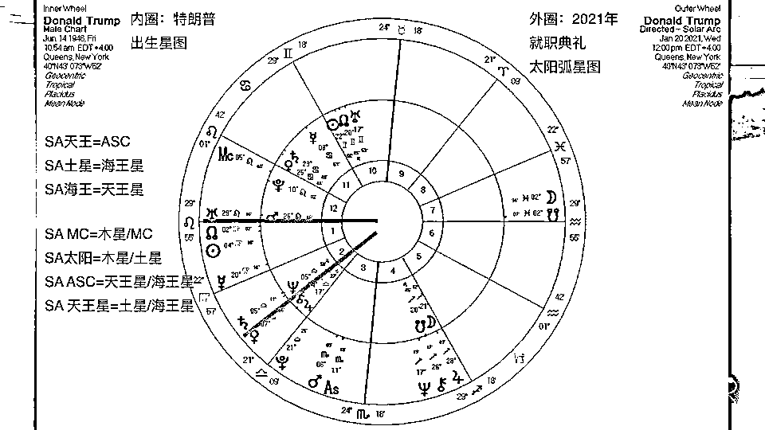

**| **2021 就职典礼特朗普星图

**太阳弧的土星触发了海王星，有孤独被挫败低落的感受，太阳弧海王星触发了天王星，海王星和天王星的组合有个要发疯的、失控的感觉**。有人把他和权利的游戏里瑟曦的儿子乔佛里做类比，说他们都是发疯的金发男子。**太阳弧的上升点触发了本命的天王星海王星中点，太阳弧的天王星触发了本命的土星和海王星的中点，有种感觉这个人会不会做出很多极端的事来应对身处高压锅的失控的感受。太阳弧天王星在上升点有不可被预测的感觉**。一个很重要的幸运迹象，**太阳弧的上中天触发了本命木星和上中天的中点**，出生星图的太阳触发了木星和土星的中点（和拜登的木星土星中点被触发一样）。这也预示了荣耀，获得权力走向世俗巅峰的意义。他们两个人的太阳弧推进看起来拜登的星图更加中规中矩，得到权力支持给他资源，这个人被要求表现是强壮的政客，但是他自己处于一个虚弱想要躲起来的状态。特朗普的能量似乎太多，他本命星图上天王星的模式在 2021 年太阳弧上也被强调了。俗语说要想让他灭亡先要让他疯狂，他会用天王星能量把美国进一步推入冥王星回归的幽暗之地吗？
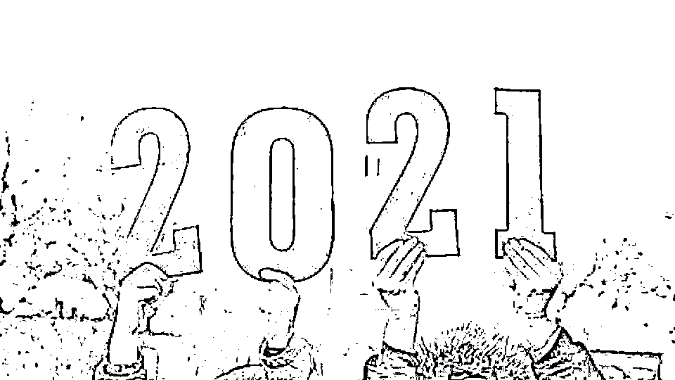

木星和土星合相水瓶座之时，他俩谁能带领美国进入新时代？拜登有可能是建造方舟的诺亚，特朗普可能会继续将事态推向绝望以加速新时代的到来。

我个人偏向于后者，但祈祷前者有能力帮助人们尽早走出幽暗之地。

**版权声明：**本文由作者授权发布于若道平台，欢迎转发，反对抄袭。友号转载请申请白名单。

********想阅读更多作者的文章********

********请在后台回复**************** 咔咔 即可********

**咔咔**

职业占星师，若道核心课程讲师

ISAR 认证占星师（2014 年获得）

国际知名广告公司和市场研究公司工作十余年

**微信公众号**：咔星人

长按打赏

******你还可以预约作者咔咔的占星咨询****** 

******长按下图二维码预约吧******

**想完整观看大会内容？请扫描下图二维码了解详情****微信又双叒叕改版啦，不想错过若道君的推送？****就把若道设为星标吧！****▼**就是这个“在看”，戳戳戳 ☟********回看大会直达入口********

# 你在这里受苦，也在这里斩获疗愈力量丨凯龙星落在 12 宫位

> 原文：[`mp.weixin.qq.com/s?__biz=MzA5NjA0NTAxNg==&mid=2651428241&idx=1&sn=7589b73798dad0c5eb01f9bc516d96c9&chksm=8b4b2726bc3cae30b2d06c09fc9c426dc5a7b9533a7dd02275cb976834864eb20be5bf5c5f67&scene=126&sessionid=1692738101#rd`](http://mp.weixin.qq.com/s?__biz=MzA5NjA0NTAxNg==&mid=2651428241&idx=1&sn=7589b73798dad0c5eb01f9bc516d96c9&chksm=8b4b2726bc3cae30b2d06c09fc9c426dc5a7b9533a7dd02275cb976834864eb20be5bf5c5f67&scene=126&sessionid=1692738101#rd)

**********☆****************后台回复“今日”，给你一句生命态度**********

作者/科里·库普曼 译者/轩轩

编辑/玫瑰 图片/全景网

我们每个人都有无法言说的伤痛，它们大部分来自于原生家庭，也有一小部分来自于其他成长阶段接触到的人和事件。我们被它们影响着，在不经意间，这些痛苦就会跑出来，如同魔鬼在我们耳边缠绕着，提醒着我们曾经有多糟、伤得有多深。然而，创伤只是为了伤害我们吗？身为“受伤的疗愈者”的凯龙星又如何对应着这些伤痛呢？本文来给你答案。

**凯龙星的创伤**

神秘的小行星凯龙星于 1977 年被发现，并且很快加入了大部分占星师的出生图解读中。凯龙星富含心理层面的洞悉，芭芭拉·汉德·克洛(Barbara Hand Clow)称其为“受伤的疗愈者”。

凯龙星直指个人核心创伤的本质，以及继而衍生出的才能，因而其解读对客户来说，既一针见血又意味深长。

然而，受伤的疗愈者原型是一个蕴藏着大美的概念。它说的是：我们所有人都在性格形成期受过伤，但是随着我们提升自我觉察并逐渐成熟，我们会释放或超越这段经历带来的有力的心理印记，而且同样重要的是，保留并运用其创造出的力量。

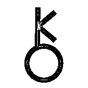

| 凯龙星的符号

**凯龙星在 12 个宫位****凯龙星所在宫位决定了核心创伤发生在哪个领域，并显示了相应的力量和天赋。**以下对凯龙星的解读以及它在各个宫位的运作方式，来自于长期对凯龙星的分析，并借助我的客户咨询经验修正对它深层含义的理解。本文中，我将讲解凯龙星在 12 宫的主要表现，同时认识到凯龙星还会以其他并不常见的方式影响我们的生活。凯龙星在第一宫：我有生存的权利吗？

第一宫的问题是“我是谁？”，描述了我们的核心和身份。它也许是凯龙星最富有挑战性的落宫了，因为核心创伤围绕的问题是：我有生存的权利吗？凯龙星落第一宫的客户总是体验到**和自己出生的世界疏离**的感觉。

有时候他们没有归属感是由于**意外怀孕或者父母不想要的性别**。也可能是因为**自己与原生家庭在个性、价值观甚至是人情世故上格格不入，比如高度敏感的孩子出生在混乱的家庭**。有时候，最差的情况是，凯龙星在这个关键位置造成了深刻的幻灭感，可能是因为**父母接纳度太低、太严苛**。

不管原因如何，这种缺少归属的困难感根深蒂固，并且对追求幸福造成了挑战。但凯龙星的目的不是伤害，而是培养出助人的能力。

当凯龙星第一宫的人发展自我并走向成熟时，他们将开始接受人类的经历，缓慢而必然会获得做自己的“正确感”。**辛苦得来的坚定自我接纳**是从这个核心创伤中收获的珍贵礼物。在凯龙星的世界，这个逐渐形成的才能应该用来帮助他人。

凯龙星在第一宫的人常常会步入**服务事业**，包括**疗愈、咨询、指导和精神治疗**。

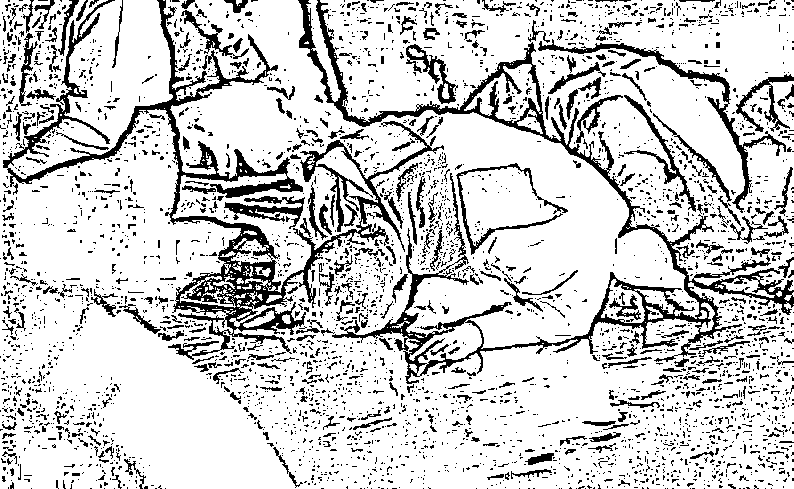

凯龙星在第二宫：金钱操控和信任危机第二宫和个人资源有关，包括资产和技能。在更深层次上，第二宫也和**个人的自我价值和自尊**有关。有人可能认为凯龙星在第二宫意味着生于贫困家庭，但是我很少发现这类案例——这或许也论证了对幸福的研究，结论是贫穷和财富并不是影响幸福的因素。相反，几乎万无一失的解读是：**凯龙星第二宫的人所出生的家庭将金钱作为操控的工具。**所以，核心创伤围绕着**必须满足家庭的要求，才能获得金钱所能买到的东西**。**信任**成为凯龙星落第二宫的主要议题。他们必须克服担忧和恐惧，即人们的友善背后是居心叵测。他们不太能接受支持、指导，甚至是经济帮助，直到个人开始解决信任的核心议题。当放下核心创伤时，主要获得的才能就是他们**在其愿望和梦想里展现的强大自信心**，不管有没有别人的帮助。这是来自于凯龙星无价的礼物！**低自尊**也可能是凯龙星第二宫的核心创伤，多少反映出了第一宫的自我接纳议题。但是这种表现并不常见。凯龙星在第三宫：我没法说出真实的想法第三宫提出的问题是：**“我怎么表达自己？”**。当凯龙星落在此宫时，**孩子的沟通能力可能出现某些重大阻碍**。这种阻碍有别于星图中受制的水星，其沟通障碍通常源于内在。当凯龙星落在第三宫时，可能是**父母压制了孩子的口头表达**。要么是他们无法应付一般的“话痨型小孩”以及好奇宝宝无尽的“为什么”，要么是他们对于孩子什么时候该说什么话有着强烈的主张。孩子因而变得安静，过于害怕而不敢说话或畅所欲言。此创伤还有一个没有那么激烈的版本，即孩子**只有在话题不涉及到情感的时候才被允许交流**。显然，这种强加的限制可能会在建立亲密关系中造成困难，直到创伤得到解决。凯龙星落第三宫的终极能力就是**发展出不可动摇的信心，在需要时说出心声，诚实正直地交流**。成功战胜这个伤口的人们相当重视沟通，也对那些在此领域有障碍的人十分敏感。他们常常成为**优秀的教师**，不管是通过训练或仅仅有意为之，他们可以鼓励自己的孩子、朋友和学生实现更开放的交流。

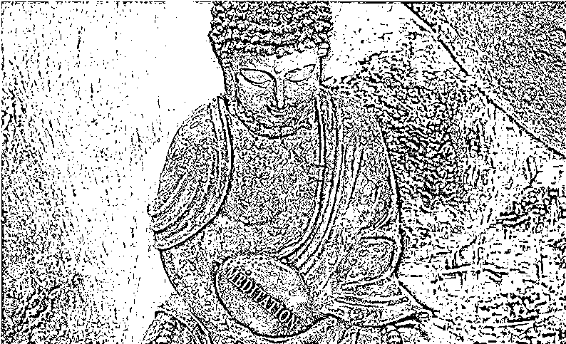

凯龙星在第四宫：冷漠的父母亲第四宫代表父母。当凯龙星落在此处时，影响可能很深远。我发现凯龙星第四宫的客户几乎不约而同有着**在情感上无能的父亲或母亲**。这可能是因为父母的个性中情感冷淡，或者对于为人父母既没有兴趣，也不参与。在某些案例中，父母可能有**严重的酗酒问题，造成冷漠疏离，可能还会缺席**。本质上，凯龙星第四宫的孩子**父母中只有一方正常，孩子怀着对现实悲伤、愤怒、憎恨的复杂情感。**对于那个疏远和（或）上瘾的父母抱有虚幻的认知，他（她）完全控制了自己的情感，并且冷漠地选择缺席。因而，**不被爱**的议题成为了核心创伤。根据不作为的养育者的性别，该核心创伤常常导致成人后**对相关性别的不信任，直到个人通过自我工程获得疗愈。**他们也可能会倾向于重演早期创伤，**选择冷淡而缺乏爱心的伴侣**，加重了问题。有这个核心创伤的人常常寻求治疗的方法。解决创伤的回报巨大。浮现的天赋是：**深刻理解幸福不是基于别人是否爱你，而是基于自爱。****同理心**是出现的第二种能力，当个人开始意识到父母的冷漠也是早期创伤的结果。第四宫是水象宫位，创伤深植内心，凯龙星第四宫的人往往最终对**心理学**产生了浓厚的兴趣。不管他们是否选择成为职业治疗师，他们终其一生都**有才能和兴趣去帮助人们从艰难的原生家庭中修复。**凯龙星在第五宫：我有天赋就是罪

**凯龙星第五宫影响创造性表达。**有时候，才华横溢的孩子有一双轻视艺术的父母。有些父母可能甚至对艺术类的尝试抱有负面看法，认为是浪费时间、妨碍赚钱。还有些情况下，家庭环境就是**不培养甚至压制孩子与生俱来的好奇心，阻碍各种创造性发展**。

凯龙星第五宫的人们知道在他们的生活中，有些重要的事情缺失了，但是并不一定意识到元凶是**创造力的压抑**。他们可能只知道没有激情。凯龙星第五宫所需要的个人努力就是**发现自己的激情**，这是和创造力密切相关的必要因素。外部帮助的介入可能是：**重要的老师**出现在逐渐成熟的孩子或青年的生活中，为他们打开了创造性探索的大门。或者案主**接触到了其他富有创造力的人**。**此创伤带来的珍贵礼物就是激情**。习得的激情随后成为人生的推动力，促成所有方面的创造性表达，包括工作和玩乐。凯龙星第五宫的人们对于其他创造性被阻碍的人很敏感。**他们成为优秀的老师，总是鼓励他人找到点燃激情的火花。**
凯龙星在第六宫：小时候，我的世界就四分五裂了第六宫是**通过选择生活方式来实现生活的平衡**——工作、玩乐和睡眠之间的平衡，社会生活和个人生活之间的平衡，还有我们的饮食平衡。这就是六宫和健康相关的原因，尤其是我们的**习惯而不是基因组合造成的健康状况。**父母们奠定基调，决定了孩子的生活方式。**凯龙星第六宫的人们在性格形成时期，家庭生活中往往出现了重大分裂。**凯龙星在第六宫的孩子一般**常常搬家**，可能是父母的职业需要频频转换地方。这意味着学校、朋友的变化，也可能是文化的转变，如果搬到国外，有时候甚至会改变语言。**很多孩子能很好地适应频繁搬家，但是凯龙星第六宫的孩子不行。他们对于重大变化适应很慢，感到他们的世界四分五裂了**。并且伴随着丧失感和悲伤，必须一次又一次地离开心爱的稳定环境。凯龙星在第六宫的另一种可能性是**成长于混乱的环境中**，父母工作、吃饭和睡眠作息毫无规律。孩子必须抵御不可预测的极度混乱。这两种情况下的创伤都是**害怕改变，适应力差**。孩子有一种边缘感，等待着釜底抽薪，失去立足之地。**由于对改变的潜在恐惧，可能形成有点刻板的个性。**疗愈此创伤带来的美好能力就是获得平衡感，不管外在环境的属性如何。凯龙星落此宫的人们常常对**瑜伽、冥想、按摩、健康食品**之类的物理疗法感兴趣，以此平衡自己的神经系统，调节对混乱的外界的反应。**结果他们常被健康领域所吸引，几乎总是强烈地渴望去帮助他人获得内在平衡与和谐。**

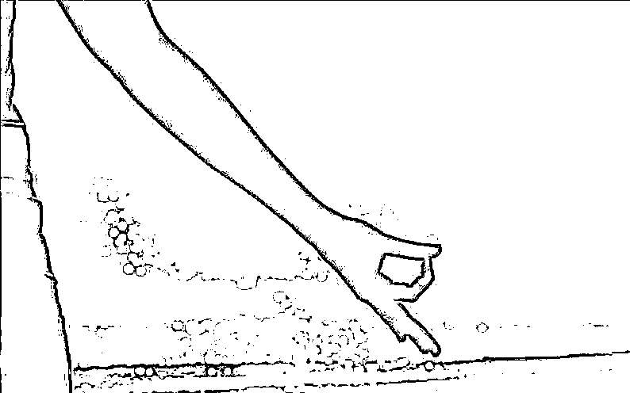

凯龙星在第七宫：消失的父母

**第七宫处理的是我们重要的承诺关系。**解读此宫位时，我们常常想到婚姻或合作伙伴，但是对于孩子来说，父母是最重要的关系。如同代表父母的四宫，凯龙星第七宫的核心创伤也和父母之一或双方有关。但是这里的创伤有所不同。**它不是来自情感缺席的父母，而是悲哀地源于消失的父母之一。**

失去的常见原因是**父母一方过早去世、或者早早离家参战、或者根本不认识血缘关系上的父母，多见于领养儿童**。选择**单性生育**（注：指单身女性通过精子库受精生育并抚养孩子）也是另一种造成消失的父母的情况。因为孩子和那位缺失的家长相处时间很少甚至为零，所以比起凯龙星落第四宫，此处得不到那位家长关爱的问题没有那么严重。大部分情况下，父母一方的无心之失导致了这种失去。所以，核心创伤，即凯龙星第七宫的首要创伤就是**抛弃**的议题。抛弃是人类更难治愈的一种情况。它要求逐渐成熟的个体**真正下决心克服恐惧和相应的破坏性行为模式**。凯龙星第七宫的客户在关系中挣扎。当这样的个体进入关系时，抛弃的议题被激活，强迫凯龙星第七宫的人去转化。心理上克服此艰难的核心创伤带来一种才能，就是**意识到完整感和关系或环境无关**。这种觉知是强大而令人无比自由的成就！关系从而进化成人生的财富，而不是用来逃避空虚的所需因素。克服了此核心创伤的个体会成为**优秀的调停者和家庭咨询师**，他们深刻理解抛弃议题，喜欢从事帮助他人形成更成熟关系的工作。
凯龙星在第八宫：缺少情感支持的人第八宫综错复杂，代表着生活的诸多领域。它是水平线上一系列宫位的开始，将我们和家庭以外的更多种多样的人群联结在一起。长久以来，我观察到八宫主要有两个方面受到凯龙星的影响：**亲密关系和他人资源**。最常见的核心创伤发生在亲密关系的领域。缺乏亲密技巧的原因各种各样，但是克服此限制的努力同样艰辛，常常包括接受心理治疗。回报的能力是：**与他人更深度地分享，并享受亲密关系。**此核心创伤愈合的人们有着与生俱来的天赋，吸引人们走出内心，并且可以从事此种珍贵技巧的应用领域。此外，第八宫和**他人的资产**有关，但也包括**接受他人指导、支持和建议之类的帮助**。第八宫的核心创伤也可能表现为**成长时严重缺少给予支持的人物。**有此落宫配置的孩子或许**很少接触到通常热心的亲戚**。他们的父母可能太忙于应对生活的基本需求而无法提供支持，祖父母可能住得太远也帮不上忙。他们所形成的创伤就是**感觉无依无靠，出于需要不得不完全依靠自己。**愈合后，此创伤被转化为觉知：**帮助并不总是送上门来，往往需要提出来的。**有此落宫的人们培养出了宽广的胸怀，最先给需要的人提供帮助。他们可能会**喜欢去非营利组织工作，或者是其他给不幸之人提供直接帮助的机构。**
凯龙星第九宫：无能的自卑和挫败感

当进入最后的四个宫位时，我们发现核心创伤和父母或家庭没有关系。所以，这些宫位的核心创伤倾向于发生在**学龄之后**。第九宫代表高等教育，所以核心创伤首先涉及到**学习的能力，尤其是在优秀的学业表现所需要的知识**。

凯龙星第九宫常常会令他们**获得大学学位的目标遭遇挫败**。**学习障碍或注意力缺失**可能使案主在高中无法好好学习。学业成绩随之变成为一种困扰和痛苦的源泉。**其他高于一切的义务也可能超越了个人教育目标。**我们肯定在书中或电影里见过少年牺牲自己去照顾生病的家人，放弃了自己珍视的学业志向。凯龙星落第九宫时，**经济问题导致的高等教育缺失问题**会更明显。无论原因如何，**个人的失望和失败感**成为凯龙星此落宫的核心创伤。无能和自卑感可能很普遍，同时也会不相信人生可以继续前进。除非这个核心创伤得到解决并治愈，否则后悔和痛苦将践踏幸福。当核心创伤被解决，自卑情结得到释放，他们才会**真正赏识自己独特的才智和能力。**人们克服了以往对于未来的宿命论，就可以自由地以创造性的方式生活。随之而来的是有趣的职业。这些人可以使用他们珍贵的技能来帮助他人成为人生赢家。他们会成为**优秀的导师，常常喜欢鼓励在高中里苦苦挣扎的青少年。**

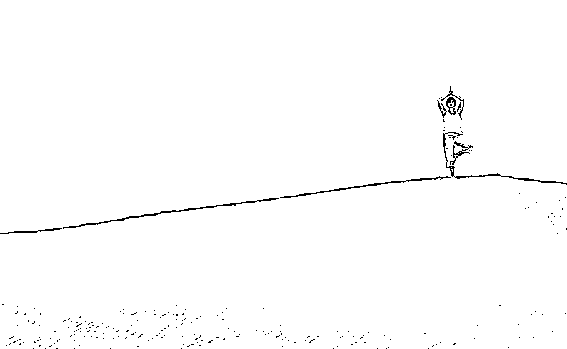

凯龙星在第十宫：社会中的孤独者作为占星师，我们将第十宫视为提供职业路径重要信息的宫位。要记住，这个宫位也描述我们和外在世界、所属社区的关联。当凯龙星落在这里时，第十宫的这一面向在个体**青年时期**首当其冲受到影响。对于儿童而言，外在社会的影响是从学龄阶段开始的。学校是孩子的社会，是他们和外在世界的联系。不同于第九宫的教育议题，凯龙星落第十宫时，这种挣扎对应的是**教育体系的环境。****学校对于敏感的孩子来说可能太过粗糙，部分出现欺凌的可怕情况——或是预期和组织结构过于宽松，可能造成年幼的学生陷入长期焦虑。**虽然有些人说，这种对公共机构的不信任和怀疑是合理的，但常常让个人远离社区活动，也可能造就**社会适应中的“孤独者”**。凯龙星第十宫的人着手解决了自我强加的限制和对市民、社区机构的不信任，他们可以克服早期的设定，全身心地投入到公共生活中。这些人常常最终会**促成重要的社区项目，并从这类活动中获得巨大的满足**。他们可能是**社区的管事，帮助解决其中部分问题，从而成为社区的疗愈者。**凯龙星在十一宫：曾被团体和同学排斥十一宫描述的是我们和团体、朋友的关系。对于逐渐成熟的孩子，这个宫位和第十宫有所关联，因为学校环境通常就是孩子建立友谊、参加团队的场所。然而，此宫位核心创伤的本质截然不同。第十一宫的凯龙星涉及的不是学校权威人物和环境的困难，而是**和同学之间的问题。**这个核心创伤可能由于**孩子入学或转学而发生，与学校文化格格不入**。或者可能仅仅是因为孩子的**社交技能还未能完全发展**，尽管在家永远不会成为限制，但是当孩子试图在学校这样的社会架构中找到自己的位置，就真的成为缺点了。**不管原因如何，被同龄人排斥的核心创伤导致不足感，害怕在团体情境中扮演角色。**这一核心创伤可能会限制需要团队合作的职业机会，通常会导致某些极度不适的工作情境，因为大部分工作都包括和同龄人合作。当一个人被强迫通过生活所呈现的情境去更多发展应对社交情境的优雅，这就是他开始接纳自己的独特性了。他们**相信自己能够成功地和人群互动，不管是社交还是工作**。伤口愈合后，被驱逐的感觉消失了，取而代之的是**意识到有些群体是健康的、支持性的，有些则不是，当与遇上后者时无需责备自己**。这些人能运用他们辛苦得到的团体方面的转化来帮助其他害羞或在社交上笨拙的人。他们可能在团队运作中扮演重要角色，确保没有人在分享和决策的过程中被遗漏。最终，他们常常成为**极具价值的协调者和雇员**！凯龙星在十二宫：隐藏自己的疗愈者

这个神秘的小行星位于这个神秘的宫位，曾令我一度无法解读，也许是因为这也是我的配置。第十二宫有众多含义：**业力、直觉、秘密、结局、全球的焦点、人道主义**等等。正是我的客户们揭示了 12 宫的哪些领域存在着重大创伤。

占星师芭芭拉·汉德·克洛（Barbara Hand Clow）告诉我们这是凯龙星强有力的位置，它的**“疗愈者”和“神秘”**的特质被强化了。然而，第十二宫通常意指**隐藏智慧和力量**的宫位，占星师崔西·马克斯（Tracy Marks）第一个赋予了十二宫这样的声名。这即是创伤的所在。

**凯龙星第十二宫的人有着与生俱来的卓越直觉和疗愈技巧，却羞于让其他人知道他们的才华。**他们倾向于隐姓埋名，常常压制自己使用天赋。我称其为**“秘密疗愈者”**。

他们在青少年时代表现出这些天赋时，凯龙星第十二宫的创伤也发生了。不可思议的观察力、预感和疗愈能力可能吓到了展现出能力的年轻孩子，尤其是当他们还不被周围人完全接纳时。

这些孩子学着去压抑或隐藏他们的能力，一部分是由于害怕被视为与众不同，又或者是害怕被嘲笑、责骂，甚至有时候是因为他们不想要看起来比别人出色。年轻时通过压制或隐藏自我的重要部分，造成的核心创伤就是一种**欺骗和自我限制**。

由于压抑和自我限制，有此落宫的成人生活远远没有活出他们的完整潜力。**他们可能一事无成，直到开始从事情感疗愈工作。**所以第十二宫有凯龙星的人常常从事服务他人的职业，但是个人疗愈发生后才能充分利用自己的能力。

当此创伤进入意识层面并得到解决时，这些人更加自如地使用自己的全部技能来帮助他人，真正开始体现疗愈者的原型。他们也会**极力鼓励那些明显怀才却向外界隐藏的人。**

**版权声明：**本文由若道翻译发布，欢迎转发，反对抄袭。友号转载请申请白名单。

科里·库普曼

1991 年起成为执业占星师。她一直活跃于占星实践领域，曾经在《大占星师》上发表了数篇文章。

**学习顺势疗法**

**请点击下图了解详情**

**微信又双叒叕改版啦，不想错过若道君的推送？**

**就把若道设为星标吧！**

**▼**

就是这个“在看”，戳戳戳 ☟

****************报名直达入口****************

# 顺势案例丨鼻炎、感冒、扭伤......神奇小药丸的功效

> 原文：[`mp.weixin.qq.com/s?__biz=MzA5NjA0NTAxNg==&mid=2651428241&idx=2&sn=d3eed1881fd34211820179b1c52cba55&chksm=8b4b2726bc3cae3068cb62718730b33bf71a8bc5bd4070dabbb2ba53ddd806f9cdb96b280465&scene=126&sessionid=1692738101#rd`](http://mp.weixin.qq.com/s?__biz=MzA5NjA0NTAxNg==&mid=2651428241&idx=2&sn=d3eed1881fd34211820179b1c52cba55&chksm=8b4b2726bc3cae3068cb62718730b33bf71a8bc5bd4070dabbb2ba53ddd806f9cdb96b280465&scene=126&sessionid=1692738101#rd)

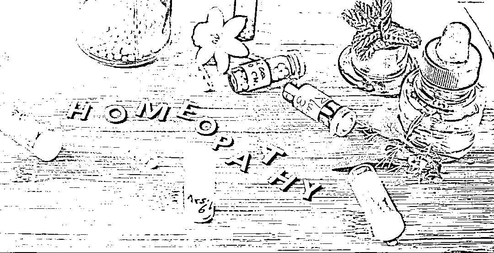作者/Rayray

  编辑/翀子  图片/网络

**作者的话**

跟苏·汤普金斯老师在 2015 年学习了 4 个月的顺势疗法、家庭急救治疗及保健网络课程，还在 2016 年的时候参加了苏·汤普金斯老师的顺势疗法工作坊，我作为唯一的现场案例收获巨大，借此机会也将此案例跟大家分享一下。（若道君：苏汤老师[【两年制顺势疗法系统课程】](http://mp.weixin.qq.com/s?__biz=MjM5MjQwNjAyMQ==&mid=2649437652&idx=2&sn=c2086ea852e2419b0187eab09ed13798&chksm=beb95abe89ced3a806b5150b4749040b2b96f19e555910e218653152d9a4f6e5dc4b0b762355&scene=21#wechat_redirect)将在 10 月 12 号正式开课，感兴趣的小伙伴请点击文字链接哦~）

**如何用顺势疗法治疗鼻炎？**

我当时是有很严重的鼻炎，夜里会疼醒，早上起床会排出大量的鼻涕，属于很严重的鼻炎患者，除此以外还有比较重的湿疹，曾经也得过哮喘。这些症状怕风怕冷在运动后好转，食用肉蛋奶后加重。苏·汤普金斯老师当时对我整个人的特点进行了归纳：**怕冷怕干燥，认真，尤其是对于细枝末节的认真，顺从、瘦小，在意形象，对数字敏感，经常梦见已故的人**。整理后给出了最佳方案：**硅（*Silica*）**。

在苏·汤普金斯老师的指导下，我连续服用了 5 天**硅 30C（*Silica 30C*）**：睡眠改善了，鼻涕减少了，湿疹增加了并且很痒，我想这也许是症状来到表层了。我与苏·汤普金斯老师沟通后，老师认为我需要更高势能的硅，她随后给我寄了**硅 10M（*Silica 10M*）**和硫磺 **10M（*Sulphur 10M）***。

按照苏·汤普金斯老师的要求，我一次吃掉 4 粒硅 10M，然后神奇的事情发生了：我整个后脊柱有一种很剧烈的疼痛、刺痛和麻木感。在入睡后两个小时，我突然被麻木感惊醒，麻痛感从尾骨扩散到胳膊和腿，感觉像是一股能量从脊柱流向四肢。随后的几天，脊柱疼痛感让我以为我患上腰椎间盘的毛病，左腿一直麻木；鼻涕明显减少了，变得很浓稠；很困很乏总想睡觉。随后几天鼻涕越来越少越来越稀，感觉已经是轻度鼻炎了，腿还是麻木，背部也很疼，我为此特意去了一次协和医院看腰。

后来苏·汤普金斯老师给我回信说，可能 10M 的势能有点太高了（哈哈）。老师讲过，硅本身是一种晶体，类似竹子一样坚硬直立，对应的人体的脊梁，我的感受完全印证了硅的能量。老师说不用担心，过几天症状会自动消失的。果不其然，麻木和疼痛感自愈了，根本不用去医院解决。

接下来的一段日子，由于空气质量和气候的影响我的鼻炎又复发了，这次苏·汤普金斯老师让我尝试了一下硫磺 10M。硫磺对我帮助很明显，鼻涕和疼痛感都明显减少。最后苏·汤普金斯老师下的结论是：**每次有症状反复的时候就用硅，但是都需要较高势能的硫磺来启动**。

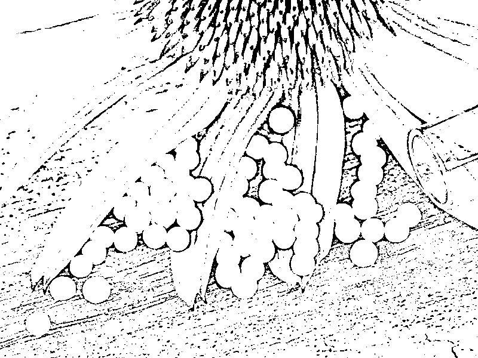

**顺势小药箱，家庭急救好帮手**

在学习顺势疗法家庭急救治疗及保健课程时，我经常尝试咱们的小药箱，都是非常有趣的尝试，其中有几次比较成功的案例跟大家分享。

01

**感冒**

1 岁的儿子感冒流鼻涕，是久久不愈的黄绿色浓稠鼻涕，结合小宝宝谨慎、乖巧的特质，我用了 1 粒**重铬酸钾 (*Kali Bich*)**。重铬酸钾是治疗鼻窦炎的首选药，对应粘稠的黄绿色粘稠分泌物（凌晨严重），而且重铬酸钾人每件事都是墨守陈规小心谨慎的。小宝宝含着很方便，上午吃完到晚上基本上就没有鼻涕了，第二天就彻底治愈了。

02

**脚部扭伤**

我的妈妈有次脚扭了，一动就疼，贴膏药和用一些外用药都没用。我结合了她对牛奶不适应症，上下楼会加重，感觉很疲惫，眼睛不舒服，还有腱鞘等筋膜经常出现问题的特质，给她吃了 3 天的**芸香（*Ruta*）**。芸香主要针对肌腱骨膜受伤，主要特点是感觉压力大、过度劳累、视力疲劳，喝牛奶恶化，但没有野葛那种僵硬感。她吃的那几天睡眠明显好转，总是想睡觉，她本身睡眠很不好，经常失眠，我觉得是身体一种自我疗愈，然后对脚伤也有帮助，过后几天就越来越好了。

03

**宿醉**

我先生有一次宿醉，我试用了**马钱子**，因为马钱子是宿醉首选药，而先生也很符合马钱子的特点：头痛、便秘、喜欢油腻刺激的食物，头脑极度活跃，工作非常用力，喜欢比赛，有野心、控制欲强。他当晚吃完之后感觉头痛有好转，眩晕轻一些，然后安静地入睡了，第二天早上已经没什么症状了。

04

**急性肠胃炎**

还有一次先生急性肠胃炎，排泄物多次且呈水状，人非常虚弱。我对比了植物碳和金鸡纳树皮，结合他对冷热都非常敏感的特点给他用了 1 粒**汞（*Merc*）**,虽然汞主要针对的是口腔溃疡，但是人体温度计的特点非常符合他，还有喜欢遵守规则的特质，比另外两种药更像他的性格。在使用汞的同时也用了艾灸贴一起治疗，效果非常好，吃完之后一个小时艾灸部位出现大量脓液，后来只拉了一次就没有再拉了，也没有反复过。以前用艾灸贴没有大量脓液的现象，我觉得汞也起了一定的排毒作用。

05

**鼻炎**

最近我鼻炎又比较厉害了，整个人感觉有点卡。因为我没有高势能的硫磺 ，我就直接用了 1 粒硅，还没吃完我就开始拉肚子。很奇特，拉完了之后感觉人轻快了好多，能量也提升了一些。

我还是打算继续练习使用顺势疗法的药物做各种尝试，非常感谢若道和苏·汤普金斯老师，让我有机会接触到这个神奇的学科。我亲身经历了这些之后更加相信能量的重要，顺势疗法直接在能量层级做功课，如果用药精准的话，对人的帮助不可估量。我觉得不只是身体上某些症状的缓解，对人的性格和心灵都会有影响。

****请在后台回复 顺势 获得更多************关于顺势疗法内容********

**版权声明：**本文由作者授权若道发布，欢迎转发，反对抄袭。友号转载请申请白名单。

**学习顺势疗法**

**请点击下图了解详情**

**微信又双叒叕改版啦，不想错过若道君的推送？**

**就把若道设为星标吧！**

**▼**

就是这个“在看”，戳戳戳 ☟

********报名直达入口********

# 心理占星学解读 10 大星体（上） | 你的行星能量运作正常吗？

> 原文：[`mp.weixin.qq.com/s?__biz=MzA5NjA0NTAxNg==&mid=2651428171&idx=1&sn=5ae40f0f075bbfe9ae23507691b31a12&chksm=8b4b27fcbc3caeea51b6bcf0a2880131c295e23900da3abf890b71266e2787a65461eb35b6c5&scene=126&sessionid=1692738101#rd`](http://mp.weixin.qq.com/s?__biz=MzA5NjA0NTAxNg==&mid=2651428171&idx=1&sn=5ae40f0f075bbfe9ae23507691b31a12&chksm=8b4b27fcbc3caeea51b6bcf0a2880131c295e23900da3abf890b71266e2787a65461eb35b6c5&scene=126&sessionid=1692738101#rd)

**☆ 后台回复“今日”，给你一句生命态度 **

作者/格伦·佩里 译者/若道翻译团队
  编辑/玫瑰 封面/书君 图片/全景网

想必大家对于占星学中的十大星体都不陌生。那么，从心理占星学的角度，又该如何诠释这些星体的意涵，以及对我们的影响呢？格伦老师给大家带来了超级干货，一定要收藏，仔细阅读哦！

**太阳**

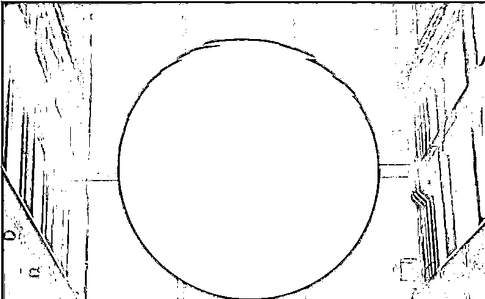

**太阳的符号**

**太阳守护的狮子座需求的活化剂**

**·** 身份的确认

· 自尊

· 创造性的自我表达

· 积极的自我形象

· 认可、欣赏

· 享乐、消遣

**太阳作为过程所代表的动词**

· 去创造，去表达

· 去打算，去决定

· 去保卫（自尊）

· 去获得认可

· 去浪漫，使人铭记

· 去娱乐，去表演

· 去选择，下决心，去认同

· 去辩解（行为），使其合理化

· 去赞同（他人）

· 去认可（他人）

**作为心理官能或能力**

· 自我表达，创造力

· 决断力，意志力，意图

· 身份认定，自我意识

· 自我，自身

**作为心理状态或事件**

太阳的目标状态是**骄傲而自信**的。它希望**避免一切丢脸蒙羞的亊情**。太阳需要被瞩目，因此会参与到活动和行为之中，以搏得他人的关注，这是完全健康自然的。获得快乐就是去表达自我，这就是太阳寻求的目标——**自我表达、创造力、玩耍、表演**。

星图中，太阳的位置描绘了此人**在哪个领域，以怎样的方式寻求观众对自身身份的认可。**太阳的活动与**浪漫和求爱、娱乐、玩耍、游戏、运动**有关。简而言之，就是**一切自我表演性质的活动**。同样，太阳所落的星座和宫位预示着，**我们在哪个领域，以何种方式获得快乐，以及给他人留下深刻印象。**

如果太阳整合良好，就会产生积极的状态：**愉快、自豪、自信、亲切**。但是，如果整合得不好，此人可能会过度补偿，表现出**傲慢、自大、自我中心、虚荣、自我膨胀**。这都是**太阳状态调控不足**的征象。**太阳状态调整过度**的征象包括**卑躬屈膝、战战兢兢、沉默寡言、不确定、不自信。**
**月亮**

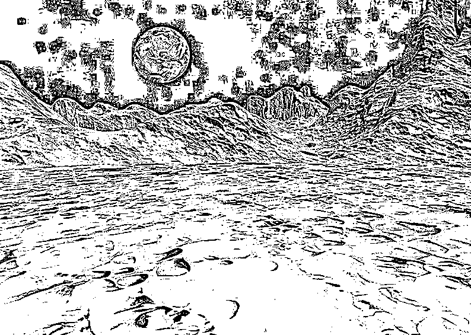

**月亮的符号**

**月亮守护的巨蟹座需求的活化剂**· 滋养，（母亲般的）抚育· 情感的安全· 归属，接纳· 亲切· 同情理解· 无条件的爱· 温暖与亲密· 照顾与保护**月亮作为过程所代表的动词**· 去滋养、保护· 去倾听（去感受）· 去照顾、同情· 去习惯性地反应· 无条件去爱· 去理解，去共鸣· 去感受，去包容· 去记忆，去回应 **作为心理官能或能力**· 接纳的功能· 滋养能力· 倾听回应· 情绪条件作用· 记忆· 个人潜意识**作为心理状态或事件**月亮的目标状态是**归属感和亲密感**。它试图去**避免被拒绝**。因此，月亮的落点描述了我们**以何种方式，在哪些领域寻求爱的感觉的体验，包括我们对他人的爱和他人对我们的爱**。相关的主题包括**养育与依赖**的问题，与**理解和支持**的需求相关的经历，关于**脆弱、敏感、温柔**的主题，以及可能存在**源自过往的情绪条件作用的地方**。其他议题包括**自我保护，家庭议题，以及在案主的生活中与母亲（女性）相关的经历**。其行为可能涉及某种**照顾、养育和保护**，为他人提供一个安全的港湾，满足他人的需求，以及住房等问题。如果月亮整合良好，这个人将会**很容易表达温柔的情感，怀着同情去倾听他人，谈论感情**。相反，**调控不足**的月亮状态包括**过度的情绪化、过度依赖他人、过度敏感、依恋执着**。如果月亮被**调整过度**，这个人很可能**对情感产生不舒服的感觉，无法表达温柔的关怀**。这种状态的根源是**过度害怕被拒绝。**
**水星**

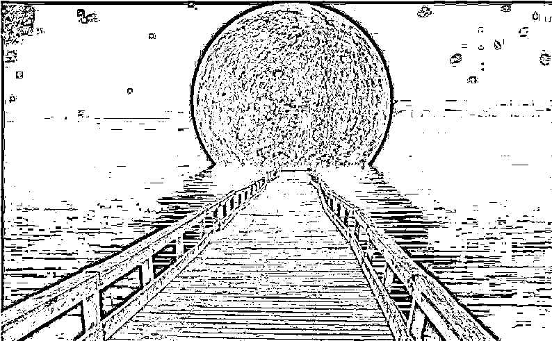

**水星的符号**

作为一颗行星，水星掌管了两个星座，分别是**双子座和处女座**。因此，水星努力满足这两个星座的需求。

**双子座需求的活化剂** 

· 信息，新闻

· 学习，教育

· 头脑刺激

· 交流

· 知识（事实与资料）

· 语言

**处女座需求的活化剂**

· 高效运作· 熟练服务· 解决问题· 辨识· 能力· 有用· 改善· 健康与健身

**水星代表的双子座动词**

· 去学习，去研究

· 去标记，去分类

· 去通知，去讲述

· 去注意，去观察

· 去提问，去查究

· 去交流，去报道

**水星代表的处女座动词**

· 去分析，去审查

· 去分解（成部分）

· 去纠正，去修理

· 去批评，挑毛病

· 去详细检查，去剖析

· 去服务，去改善

· 去修复 ，去维护

· 使系统化

**作为心理官能或能力**

· 认知能力，理性

· 思考，合理性

· 演讲，交流

· 智力，头脑

**作为心理状态或事件**在满足双子座的需求时，水星的目标状态是**好奇与有趣，避免厌倦或无趣**。这可能会表现为**不知满足的求知欲。**表达自己所学也是同样强烈的需求，于是可能会显得**喋喋不休**。如果**学习的需求被过度强调**，则可能会显得**焦躁不安、不够专注**。水星的外在表现可能包括**上课、学习新东西**，如果**学习能力过度运作，**则可能成为某种涉猎广泛却不够深入的半吊子，也就是**博而不精**的人。其他的典型表现包括**传媒、写作、报道、记者、知识分类、信息归档**，诸如此类。在满足处女座的需求时，水星的目标状态是**有用、有效率**。相关的状态包括**在工作类的任务中发挥效力，有能力完成工作，熟练地完成任务，能够在所有方面给予帮助。**如果一个人太努力去成为有助益的人，可能变得**苛责，到处纠错，尤其是在需要修正某些事或某些人的行为时**。实际的表现可能包括**任何种类的工作或服务，修理坏掉的东西，纠正错误，成为故障检修和纠纷调解人，或效能专家，从事手工艺、贸易、推销工作，尤其是在健康领域，比如饮食与营养方面。**
**金星**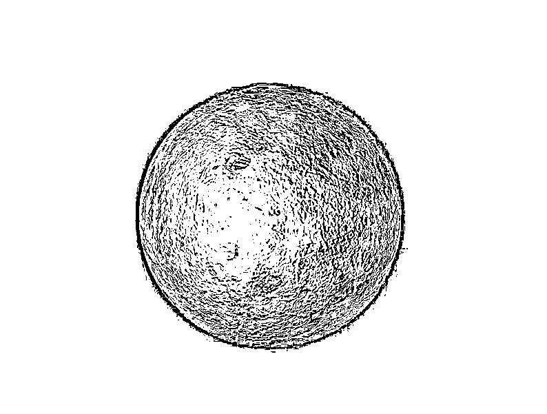金星的符号

和水星一样，金星也是**金牛座和天秤座**两个星座的守护星。

**金牛座需求的活化剂**

· 安全、保障

· 相同，可预期

· 自我与客体恒常性

· 稳定，内在平衡

· 感官满足

· 愉悦与舒适

**天秤座需求的活化剂**· 和谐，美，平衡· 亲密，伴侣关系· 社会关系· 公平，平等**金星代表的金牛座动词**· 去吸引，去获得· 去保护，去保存· 去拥有，去占有· 去取得，去得到· 去抚慰，使缓和· 去快乐，去满足 **金星代表的天秤座动词**· 去美化，去和谐· 去平衡，去补充· 去合作，去考虑· 去关联，去建立密切关系· 去调解，去仲裁· 去吸引，去联结· 去协商，去妥协· 去社交，去结交伙伴**作为心理官能或能力**

· 自我与客体恒常性

· 审美功能（品位）

· 内在安全感

· 艺术感

· 心理稳定

· 社交能力

· 自我安慰

· 亲密能力

**作为心理状态或事件**在满足金牛座的需求时，金星的目标状态是**保持平静**，这与**安全、舒适、愉快**相关。这种状态**试图避免痛苦、不安和不稳定**。与此根本目标状态相关的有**积蓄财务、维系安全和安宁、感官的满足**。举例来说，一个人购买渔船所获得的意义是：渔船提供了无尽的欢乐时光。然而，如果**金星被过度夸大**，可能导致的状态和行为有很多，包括**贪婪、占有的行为、自我放纵、怠惰、无精打采、懒惰、暴饮暴食、贪得无厌。**为了满足天秤座的需求，金星的目标状态是**亲密与合作**。个体寻求与合作有关的体验。避免独自行事，比如缺乏他人的参与。正如我的一位天秤座客户所说：**“我并不介意独立，我只是不愿意一个人去做。”**渴望的状态包括**喜爱的感觉、爱情以及各种伙伴关系、优雅与迷人的感觉、外交关系、社会关系、建立关系网**，诸如此类。另外，金星同样是美的典范。因此，**和谐、美、艺术鉴赏**也是目标状态。如果走得太远，金星可能变得**浅薄、肤浅、模棱两可，为了爱与联结感而过于依赖他人。**如果金星**开发不足**，可能**引发公开的冲突、分歧、争议，甚至是诉讼。**
**火星**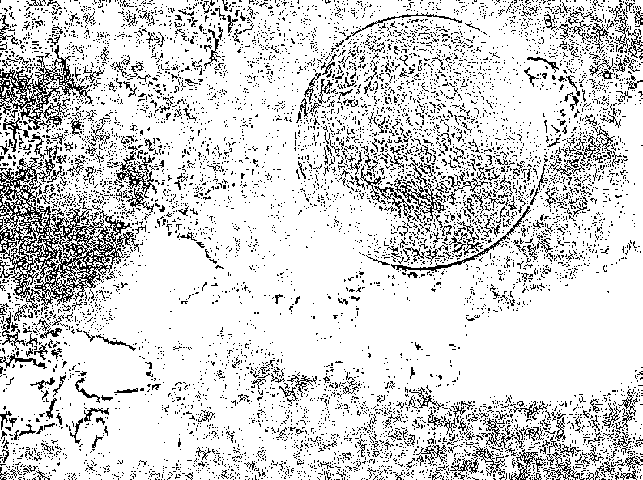**火星的符号**

 **火星守护的白羊座需求的活化剂**· 生存，生命，存在· 自由，解放· 行动、行为· 自主性，独立· 即时满足· 活动、运动**火星作为过程所代表的动词**· 去行动，去做· 去开始，去冒险· 去开动，去赋予生命力· 去挑战，去尝试· 去行动，去证实· 去发起，去开拓· 去战斗，去抗争· 惹怒，去激发

**作为心理官能或能力**

· 行动

· 生存本能

· 侵略性，本我

· 竞争性本能

· 驱动力，首创精神

· 力比多本能

**作为心理状态或事件**

火星的目标状态是**纯粹的活力，为活着而快乐**。避免了无生气，也就是一切对生存的威胁。比如，火星会将缺乏自由或缺少活动视作对生命的威胁。火星最重要的需求是**不断运动，特别是向着他们的愿望进发。**

**想要满足，获得短期目标——回报，高于其他一切考量**。因此，火星的恶名是**约束力差，缺乏社交技巧，对于其他生命形态普遍感觉迟钝。**由此产生的状态是**生命力、果断、鲁莽、冲动、无限力量（没有限制意识）、不顾后果、愤怒、沮丧（如果受挫）、攻击性。**

火星能量的外在表现包括，**新的计划或项目、冒险、事故、争斗、暴力、争吵、头疼、高血压、机械能力、工程技能、使用工具或切割仪器的工作**。任何**“独立作业”，与艰苦的体力劳作相关的工作**都属于火星的范畴。

**未完，下篇见今日二条。**

**版权声明：**本文由若道翻译发布，欢迎转发，反对抄袭。友号转载请申请白名单。

**格伦·佩里**

若道签约老师，著名占星师，前 ISAR 董事会成员，共出版 8 本占星著作；心理/意识研究专业博士；占星心理学学院（Academy of AstroPsychology）的创办人；康涅狄格州研究生院（the Graduate Institute of Connecticut）原型宇宙学与意识进化项目的负责人。

**ISAR 选修课，心理占星学视角下的预测方法**

**长按图片二维码咨询客服**

**微信又双叒叕改版啦，不想错过若道君的推送？**

**就把若道设为星标吧！**

**▼**

就是这个“在看”，戳戳戳 ☟

********报名直达入口********

# 心理占星学解读 10 大星体（下） | 这 5 颗星可不是一般的厉害

> 原文：[`mp.weixin.qq.com/s?__biz=MzA5NjA0NTAxNg==&mid=2651428171&idx=2&sn=e8a89017e7ad5fa665b32af3d3d6148a&chksm=8b4b27fcbc3caeea790371e5b173d33d395d5f47ee56d74783212f2eecb3589f5cee7dbf3aea&scene=126&sessionid=1692738101#rd`](http://mp.weixin.qq.com/s?__biz=MzA5NjA0NTAxNg==&mid=2651428171&idx=2&sn=e8a89017e7ad5fa665b32af3d3d6148a&chksm=8b4b27fcbc3caeea790371e5b173d33d395d5f47ee56d74783212f2eecb3589f5cee7dbf3aea&scene=126&sessionid=1692738101#rd)

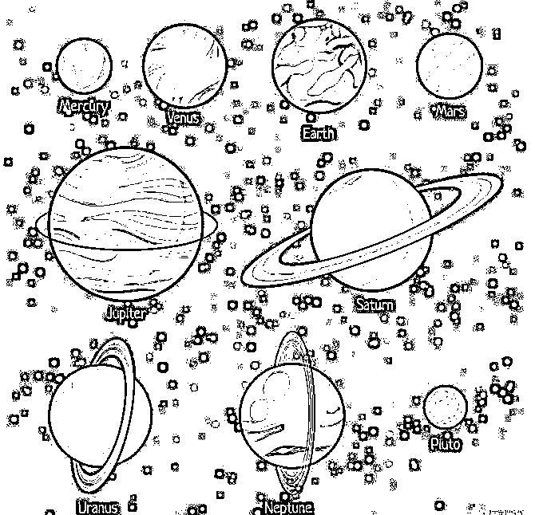

作者/格伦·佩里 译者/若道翻译团队
  编辑/玫瑰  图片/全景网

今天头条里，格伦老师给大家讲述了太阳、月亮、水星、金星、火星的心理学占星诠释。那么，剩下的 5 个行星又会有怎样的表现呢？一起来看看吧。

**木星**

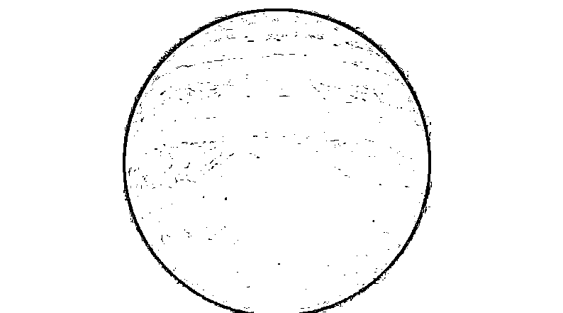

**木星的符号**

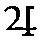

**木星守护的射手座需求的活化剂**

· 真理，智慧

· 意义，重要性

· 公正，正义

· 希望，信念，信任

· 目标

· 美德，品行，伦理

· 扩张，旅行

· 对于更高力量的信念

**木星作为过程所代表的动词**

· 建立理论，做出假设

· 得出结论，形成概念

· 去抽象化，去相信

· 去传教，去宣讲

· 去说教，审判，争辩

· 做出预测和预报

· 去相信，心怀希望，存有信念

· 过分扩张，夸张

· 去推测，去解释

· 去推断，推论

· 去教授，去公布

· 去宣传，销售，推广

· 去证实正确性或真实性

· 给予建议和忠告

· 去扩张，旅行，拓展

· 估计过高，做得过分

**作为心理官能或能力**

· 高等心智· 道德评判· 心生希望的能力· 推论，推理· 良知，美德· 信任的能力**作为心理状态或事件**木星的目标状态是**心怀希望、信念与热忱**。这是一种**膨胀**的感觉，**坚守着对宇宙智慧的信任**。其对立的状态是**怀疑、失去信念，或愤世嫉俗**。如果**木星功能运作良好**，可能会有一系列结果——**好运、福气和充裕富足的感觉。**木星是我们的**“仙女教母情结”**。它代表了我们**心生希望的能力**，不论我们是否觉得事情会顺利发展。这里显示出的状态是**乐观、慷慨、慈善的行为与友好**。木星还与**前瞻性、远见、智慧**相关。它很自然地与**哲学、伦理与道德的观念**相关。它掌管着**咨询与顾问**的职位。如果木星**过度运作**，可能会引发一些状态和问题，比如，**教条主义、自以为是、专横，可能有过度批判的倾向**。还可能会激起**传教士般的热情，想要去转变他人的想法**。过多的信念可能会导致**自大吹嘘，狂躁热情，奢侈放纵**的行为，**缺乏先见之明，冒险，以及一般意义上的愚蠢。**此人可能会**抱有巨大的希望，但却不切实际**。这会导致此人在重要亊情上**过度扩张，夸大自己的位置，对他人期待过多，给予他人过多承诺，因为自身的盲目乐观而成为受害者。** **土星**

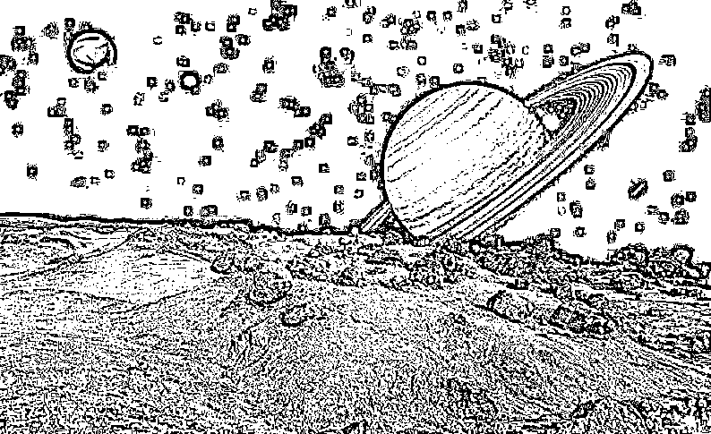

**土星的符号**

**土星守护的摩羯座需求的活化剂**

· 完美，卓越

· 成功，成就

· 声望，地位

· 结构，限制，形式

·秩序，组织

·控制，权威

**土星作为过程所代表的动词**

· 去达成，去生产

· 获得成功（去实现）

· 去坚持，坚忍

· 去实施（计划）

· 去完成，去实现

· 去构造，去整理

· 去组织，去自我控制

· 去管理，去统治

· 去计划，去系统化

· 去控制，去维持

· 去改善，去精通

· 去结晶，去成熟

· 着迷，全神贯注

· 去聚焦，去深化

· 去维护（传统）

· 去减少开支，保持谨慎

**土星作为情结所代表的动词**

· 去害怕（失败/不足）· 去设障碍，去妨碍· 去压制，去禁止· 变慢，延误，去屏蔽· 去限制，去压缩· 去紧缩，去收紧· 去渴望（因为不足）· 去过度补偿· 过度努力，痴迷困扰**·** 去过度运作，做过头

**作为心理官能或能力**

· 抱负，权威

· 自律

· 自我控制

· 义务与责任

· 对规则与限制的尊敬

· 生产力

**作为心理状态或事件**

土星的目标状态是**任务达成，做好工作，获得成功的感觉**。与这种目标状态关联的需求是感觉在追求成功目标的过程中**安排有序，“自信满满”**。这种**“位高权重”**的感觉是土星的目标状态，也暗指土星对于位居高层的需求，也就是成为**老板、权威人士或总统**。

土星最害怕的就是**失败**。亊实上，**追求成功在一定程度上正是对于害怕失败的本能补偿。**所有土星更为积极的状态——**雄心壮志、耐心、守纪、果断、坚毅、专业知识、地位、终极荣耀和勋章**、都可以被规作**内在害怕失败、低人一等、不胜任和匮乏的补偿**。所以，土星与**责任、重要的生意、义务、职责以及成功的压力**有关。土星同样可能在它最活跃的生命领域中体验到一种**渴望的状态，或者是急切的渴求**。

如果土星**过度运作**，可能案主会**深受严苛的标准之苦**，它驱使此人过分努力。这可能会导致**工作狂或是无力享受劳动成果**。但如果与土星相伴的**本能、健康的焦虑被抑制**，此人可能患上**拖延症，逃避责任**。或者就是**简单放弃了，允许消极悲观的情绪控制行为**。

内在的恐惧状态与特定的外在境遇相对应，比如**受限、延误、不足、障碍、阻碍、束缚**。如果此人认为这些境遇无法改变，永无止境，那么，可能会感觉到**更为极端消极的土星状态**，**彻底的失败、个人缺陷、抑郁、孤独、孤立、沮丧、内疚、闷闷不乐、绝望、悲伤。**

**天王星**

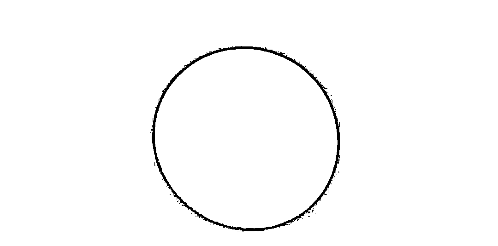

**天王星的符号**

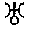

**天王星守护的水瓶座需求的活化剂**

· 觉醒，启示

· 规野（全面）

· 客观的观点

· 改变，进步，改革

· 启蒙，启迪

· 概观（全景的）

· 利他主义，人道主义

· 解放，突破

**天王星作为过程所代表的动词**

· 去觉醒，去启蒙· 获得自由，去解放· 体现客观，去释放· 去进步，去发展· 去揭示，启发· 从陈旧的方式中解脱出来· 去改发，去改革· 去创新，去发明

**天王星作为情结所代表的动词**

· 去震撼，去破坏

**·** 去反抗，去煽动

· 使不安，使动摇

· 使分开，使疏进

· 使惊愕，使动摇、重组

· 去分裂，去颠覆

· 去打破依附

· 去分离，去逃离

**作为心理官能或能力**

· 观察自我· 整体思维· 彻底的洞察，改变· 宇宙意识· 客观见证· 利他主义，人道主义**作为心理状态或事件**天王星的目标状态是**博爱**，戒考是希腊人所诪的阿加比（agape）——神对世人之爱。

这种状态伴随着**观念认识的实现**而达成。这种观念是一种**彻底的洞见或自我实现**，它是一种**超客观的认识，在灵光一闪之间顿悟了万事万物为美好目标该如何共事。**

有此认知之后，天王星希望能够**通过自身的参与，分享所得，启迪他人**。**人道主义、利他主义**，**揭示所有事物之间关联性的运动**，都是天王星喜爱的消遣方式。认识到**整体总是优于部分的**，这是典型的天王星式认知。同样，它总是关心着**整个人类的未来福祉**。

天王星倾向于**设法带来突破、革命、启示或发现**。这就与**突发、破坏、出乎意料和不稳定的状态**有关，让人想到**震惊与不安**。它还与**古怪、离奇、异常、争辩**有关。天王星掌管着**广播、无线电、电规、电脑、电子设备、先进技术和科学**。

天王星通过原创的贡献或发明激励着积极的改革，推动体系向着新的方向进发。这里推动的体系可能涉及任何领域——一段婚姻、一项生意、一个研究领域，一门艺术，一种文化，一个政治体系或一种制度。如果走向极端，天王星可能产生极端的不满，表现为**攻击传统、无政府状态、反叛、反抗、争吵或虚无主义**。

**海王星**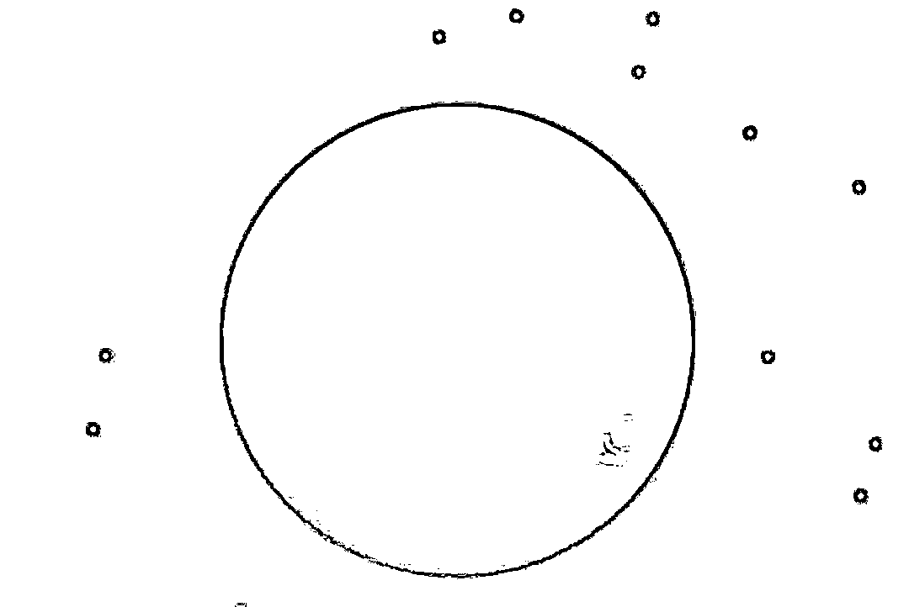**海王星的符号**

**海王星守护的双鱼座需求的活化剂**

· 超越二元性

· 统一的意识

· 生命/神性的统一

· 无限的爱与美

· 神圣，极乐，狂喜

· 赎罪，宽恕

· 慈善，利他主义

· 臣服，不执著

**海王星作为过程所代表的动词**· 去超越，去融合· 去流动，使融化，去屈服· 去投降，牺牲· 放手，听从神的旨意· 放弃，中止 · 共情，原谅· 接纳和允许· 非个人的爱· 去无私地爱· 为他人而殉难· 去营救受害者· 去想象、展望· 去梦想，去鼓舞· 去展望，去幻想· 去振奋，去提升· 凭直觉认识，去通灵（超想官）· 赋予魅力， 使理想化· 去着迷，陶醉**海王星作为情结所代表的动词**· 去逃避，拉开距离· 进入无意识，否认· 表现无助，使崩溃· 消解至混乱· 游移踌躇，拖延· 使服从，听从他人· 放弃责任· 自毁，蓄意破坏· 使困惑，使神秘化· 使不知所措，醉生梦死· 蛊惑，欺骗· 伪装，掩饰· 消失，撤退· 扭曲，逃避，隐藏

**作为心理官能或能力**

· 超验的能力· 集体无意识· 想象力与幻想· 同理心与宽恕· 直觉，超感官能力· 梦想，理想**作为心理状态或事件**海王星的目标状态是**极乐，对生命统一性的超验觉知**。这一状态很难达成 （更不用说维持），但我们可以在海王星的许多追求中窥见一斑。从积极的一面来看，灵性追求大体都属于海王星的表达，只要其目标在终极现实中被分享，而不仅仅是理性研究。**冥想、瑜伽、静修和祈祷**是常见的形式。**一个人只要感受到了共情、慈悲与宽恕，都是在体验海王星。****超自然的体验，诸如心电想应、先知、透视力是此行星的另一些表现形式**。如果一个人有了**与神合为一体这种超越性**的感受，并**备受鼓舞，或是想象无限的爱与美**，那么他们正在**更高的层面上体验海王星**。**仁爱与解除痛苦的正当愿望**是另一种健康的表达方式，同样还有**向超越个人控制的信仰臣服**的愿望。后一种产生了**随波逐流、随遇而安（适应性）**的体验，**以“无为之为”的方式追求目标。**另一个不那么愉快，但却更普遍的海王星体验则是**受害者（救世主）**的状态，这两个方面都是海王星的状态。有许多**真正值得帮助的受害者**，比如，空难的幸存者、被病魔威胁生命的人，或者是被性侵的受害儿童，另外还有一些**“表面上的”受害者**，他们只是**自我毁灭，通常这源自无意识的内疚，可能表现为对毒品或酒精的沉溺**。典型的人——**救助者、烈士、救世主，试图去帮助这些“表面的受害者”**。每当救助者认为自己对受害者的人生负有责任，尤其是受害者有能力自救时，救助者都表现出了海王星的冲动。通常，这种冲动源自**救助者对自己心理问题的否认，于是投射给了合适的对象——表面的受害者**。

**受害者将责任推给救助者，救助者对自己的动机和潜在的心理问题仍然保持无意识，这就是达成了同一性**。然而，受害者通过**自我毁灭**的行为表现出海王星的冲动，救助者通过**拯救**的行为表现海王星的冲动。双方都是**陷入纠缠状态的牺牲品。**

我们或许会说**受害者否认自我，也就是陷入无意识中，逃避作为一个人所需要做出的艰难选择和决定**。通过**否认现实，逃脱或回避责任**，通过**优柔寡断、拖拖拉拉，或者假设出一个相对被动无助的状态，此人并不是把生命交付于神，而是向命运投降。**而命运往往显现为一个人的形式，**这个人通过欺骗、利用、破坏、背叛或抛弃受害者来抓住受害者的弱点。**命运的第二波接下来会扮成**社工、流浪者之家或者就是一位好心人——任何施以援手的人**。受害者-救助者模式尤其恶毒的形式则是**依附-互相依附**的共舞，除非有一方决定中止游戏，否则他们就会一直这样纠缠，却难有极乐降临。无法达成时可能会造成**救助者“同情疲软”（燃烧殆尽）和受害者的“死亡”**。有关**困惑和妄念**的主观状态也是海王星的领域。困惑通常是为了**否认**，作为一种**防御**。为了各种原因，此人**在无意识中试图逃避令人不安的真相**。如果这种困惑的状态差不多有规律地发生，则预示着此人**无力发展出强大、分化的自我**。然而，任何**因借口、谎言、欺骗、背叛或诡计而受害的人**都可能在体验海王星。这样的经验可能只是为了**深化受害者的同理心和对痛苦的理解**，或者也许能**够鞭策其更好地发展辨识力。**

大部分人都曾经历过**幻灭**，这些海王星病症更为强烈的形式，发生在那些几乎经常处于**妄想状态**的不幸灵魂身上，像是**精神分裂症患者**。通常，那些**丧失、悲剧、不幸、疾病**的体验则是海王星的其他化身形式。注意，当人们处于痛苦或悲伤的状态时，他们往往会通过**祈祷和冥想**表达自身的精神渴求。

海王星同样也可能体验为具象化的艺术形式，比如**绘画、摄影或电影。诗歌、音乐和舞蹈**是灵感的另一些表现，尤其是以这些形式来表达超验的理想时。**冥王星**

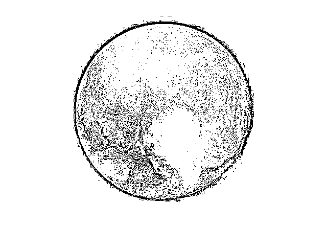

**冥王星的符号**

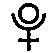

**冥王星守护的天蝎座需求的活化剂**

· 转化，治愈

· 发泄，释放

· 涤罪，净化

· 完整（整合）

· 死亡和重生

· 清除，淘汰

· 力量，权势

· 性，合并，融合

**冥王星作为过程所代表的动词**

· 赋予力量，唤起热情

· 去深化，使强化

· 去洞穿，合并，融合

· 去整合，去同化

· 使再生，更新

· 去治愈，变纯洁

· 去重建，去革新

· 彻底转发，突发

· 去宣泄，释放

· 强迫，占有

· 使更加色情，激发性欲

· 去调查，去洞察

· 去合并，同化

· 使变形，使转变

· 使净化，使清洁

· 使变化，重制

· 排除（毒素）

· 排出，毁灭

**冥王星作为情结代表的动词**

· 去害怕，去恐惧

· 去压抑，去防卫

· 去怀疑，去猜测

· 去否认，断绝关系

· 投射为邪恶、劣性

· 去控制，去操纵

· 去计划，去谋划

· 去恐吓，去胁迫

· 强迫，压迫，恐怖统治

· 使惊恐，使害怕，惊慌

· 使堕落，使恶化，使黑暗

· 使降级，贬低

· 去引诱，去怂恿，诱惑

· 去颠覆，暗中破坏

· 去毁灭，去反抗

· 歼灭，杀死

**作为心理官能或能力**· 力量，潜力· 性欲，性爱· 完整性（整合）· 疗愈能力**作为心理状态或事件**冥王星的目标状态是**力量或整体性**，但这与天王星和海王星所追求的整体性不一样。冥王星关注的整体是**内在的，而不是人类或自然的整体**。这种内在的整体性正是我们所说的**整合**，这是精神的整合所带来的**精神专注力**。状态达成时，会带来**深刻、透彻的关系，相对没有恐惧。**整合达成时，**再没有伤口需要疗愈，没有害怕揭开的压抑回忆，也没有痛苦的创伤被封存在心底的黑暗角落。**如果真有如此一隅，冥王星掌管的**转化与疗愈过程**就会启动运作，包括**高峰体验、精神宣泄、净化、清洗**。冥王星还与这些痛苦经历必然导致的所有**恐惧和痛苦**相关。因为冥王星既是死亡，也是重生。又一次看到，冥王星并不是对与所有生命达成统一这种超越的状态有兴趣；然而，它的确**渴望与其当下的环境感觉到联结**。这是因为，当下环境乃是投射的集结之处，准确地反应出个人投射，也就是我们的**阴影**，**在自我与他人之间创造了一种不舒服的分割**。因此，冥王星与**权力斗争和控制**问题有关，因为它是**意识的阴影内容**——一个人未愈的伤口通常会在关系的困境中像鬼影一般萦绕。如果一个人逃避痛苦，不愿面对阴影寻求改变，那么，冥王星将会表现为**控制，甚至是毁灭当前的敌人**。“毒性”较次一级表现形式则是这种控制具有**强迫性和恐吓性**，像是**勒索、讹诈、绑架、暴民统治**。更极端的形式是退化为**偏执、暴力和毁灭**。**强奸、谋杀、恐怖主义****和暴政**也是冥王星的领域。**如果投射阴影，则可能遭受恐惧和失去力量的折磨。**如果一个人过于认同意识中的冥王星成分，而排斥灵魂的其他部分，则可能**过于执迷于阴影**，转化为恐惧的对象；一个人企图化解恐惧，最终却导致他堕入阴影，这种状况，我们可以在迟来的整合现象中看到。阴影状态通常与一些**犯罪或邪恶的行为、黑社会、强制力、变态、颠覆**有关。任何人**与阴影或黑暗社会元素共舞，**都是在演绎冥王星的功能。这包括**疗愈工作者——医生、治疗师、社会工作者**，还有那些投身黑暗，直面阴影的人们。比如**警察、侦探、FBI 探员、中情局特工、治安委员会成员、间谍、打入敌人内部的人、卧底特工、告密者、调查员**，还有其他与邪恶做斗争的人们。冥王星的另一些表现包括**性欲、性冲突、强烈的激情**。**当人们即将通过对未知亊物的体验而转变自身时，似乎会感觉到无限的激情。**也许正是基于此原因，**性冲动与焦虑**都以同样的生理反应为表征；也就是说，恐惧是刺激源，因为我们需要将之整合。**“孤注一掷”的极端主义**同样是冥王星的表象，此时，**人们为了信念而将生死置于脑后**。

**版权声明：**本文由若道翻译发布，欢迎转发，反对抄袭。友号转载请申请白名单。

**格伦·佩里**

若道签约老师，著名占星师，前 ISAR 董事会成员，共出版 8 本占星著作；心理/意识研究专业博士；占星心理学学院（Academy of AstroPsychology）的创办人；康涅狄格州研究生院（the Graduate Institute of Connecticut）原型宇宙学与意识进化项目的负责人。

**ISAR 选修课，心理占星学视角下的预测方法**

**长按图片二维码咨询客服**

**微信又双叒叕改版啦，不想错过若道君的推送？**

**就把若道设为星标吧！**

**▼**

就是这个“在看”，戳戳戳 ☟

********报名直达入口********

# ISAR 选修课程 | 新技法！心理占星学视角下的预测方法

> 原文：[`mp.weixin.qq.com/s?__biz=MzA5NjA0NTAxNg==&mid=2651428171&idx=3&sn=bc32de34d32b99b66a23ac41207c1629&chksm=8b4b27fcbc3caeea53946222226a7b6e7280aa2f767a69fa49bc76f625b55f8eaac703723a65&scene=126&sessionid=1692738101#rd`](http://mp.weixin.qq.com/s?__biz=MzA5NjA0NTAxNg==&mid=2651428171&idx=3&sn=bc32de34d32b99b66a23ac41207c1629&chksm=8b4b27fcbc3caeea53946222226a7b6e7280aa2f767a69fa49bc76f625b55f8eaac703723a65&scene=126&sessionid=1692738101#rd)

作为一门艺术，预测占星学运用行星的运行来预测特定时期的性质、意义和持续时间。在这个阶段的课程中，我们会**考察意识进化的概念、其基本原理及其与占星学预测部分的关系。****意识进化可以被定义为有意识地与星图中固有的进化过程合作。**学员们将探索如何用行进和推进来为意识进化服务。我们不是简单描述事件的结果，而是将行星运行描述为实现先天潜能的机遇之窗。**在这个阶段的课程中，会探索占星心理学视角下如何将对行进、推进和其他预测方法的分析运用于个人成长。**具体事件反映并促进了意识的改变；因此，行星运行可以帮助我们洞察成长过程的精确时机，让我们领会内在和外在现实如何同时发生、彼此反映、互相转化。我们还将探索宏观的世界行进，考察占星格局如何在社会、政治、经济、艺术和生态层面上表现出不同的形式，却又在多样化的现象中反映单一的原型。这里的挑战是去思考，我们对宇宙的这种参与式关系如何能为共同创造一个积极的、更充满希望的未来做出贡献。

**1**

**课程安排**

**第一课：开始预测****第二课：发展年龄方法****第三课：太阳的行进****第四课：月亮的行进与推进****第五课：水星的行进****第六课：金星的行进****第七课：火星的行进****第八课：木星的行进****第九课：土星的行进****第十课：天王星的行进****第十一课：海王星的行进****第十二课：冥王星的行进**

**2**

**课程费用**

**课程费用：9800 元****转发分享优惠价：8800 元（11 月 1 日之前有效）****若道核心课程 L5 学员优惠价：6800 元**

**3**

**授课时间**

**上课时间：**12 月 2 日（周三）20:00-22:00

**授课方式：**英文授课，中文翻译

**4**

**授课老师**

**格伦·佩里(Glenn Perry)**

*   这位传奇的占星师，也是一名拳击和摩托车爱好者； 

*   他毕业于赛布鲁克学院(Saybrook Institute)，是心理/意识研究专业博士，也是拥有 30 余年经验的加州注册婚姻和家庭治疗师 （CAMFT）； 

*   美国占星心理学学院（Academy of AstroPsychology）的创办人，他曾任国际占星研究协会 （ISAR） 以及联合占星大会董事会（UAC）副主席，也是 ISAR 突破性道德标准的设定者； 

*   康涅狄格州研究生院（the Graduate Institute of Connecticut）原型宇宙学与意识进化项目的负责人，共出版八本占星学著作：《心理占星学入门》、《心理占星论文集》、《盗取天火》、《从忠诚到革命》、《星图中的阴影》、《占星职业议题与伦理》、《出生星图深度分析》、《从古代到后现代占星学》。

**5**

**往期学员分享**

不得不说，格伦老师的心理占星课真的很强大，跟着老师上完了两年半的课程，仿佛做了一个长程的心理疗愈。这段时期我正好在经历冥王星的困难行进，感觉就像在地狱中行走，在这个过程中我懂得了，只有疗愈了自己，懂得自己的伤痛，才能理解他人，帮助他人。在学习占星学技法的同时，深深感受到老师的慈悲心，也感受到老师对待占星学的严肃认真。能够跟随格伦老师学习真是太幸福了，同时也特别感谢若道，感谢大卫老师。——2017 心理占星学格伦核心班学员 宋轶绚跟随美国心理占星学院两年课程，最受用的是格伦老师以扎实的心理学理论基础和咨询经验，所教授的心理占星学的系统架构。没有哪个心理占星学的课程比格伦的更系统、深入、有理论且有技巧了。还有格伦特色的发展年龄法，黄道带病理学理论在个案中很有实操性，2 年的学习，除课程外的几百万字经典的补充阅读资料，70 多场测试，以及格伦言传身教的从业道德标准，让我成长为一位合格的心理占星师。——2017 心理占星学格伦核心班学员 植语瞳

**6**

**退转课程**

**退款原则请详看《教学协议》，如有疑问请咨询课程顾问。******占星心理学之预测视角****

**授课老师：格伦·佩里**

**授课时间：****12 月 2 日（周三）20:00-22:00**

**授课方式：**网络课程：英文授课，中文翻译

**费用：9800 元** **转发分享优惠价：8800 元（11 月 1 日之前有效）若道核心课程 L5 学员优惠价：6800 元**

**课程负责人：Margaret（微信号：nodoor233）**请备注“预测视角”

长按二维码添加课程负责人咨询~  

****报名请点击“阅读原文”****

# 行星 vs 季节 | 每个季节该做什么事儿，占星学有话说

> 原文：[`mp.weixin.qq.com/s?__biz=MzA5NjA0NTAxNg==&mid=2651427985&idx=1&sn=9d9500c0a4643579ab2797c599eb30a5&chksm=8b4b2626bc3caf304fbfbe6a479e6146be405652d5fb2b31b357f85903630f95b9e948a82cfb&scene=126&sessionid=1692738101#rd`](http://mp.weixin.qq.com/s?__biz=MzA5NjA0NTAxNg==&mid=2651427985&idx=1&sn=9d9500c0a4643579ab2797c599eb30a5&chksm=8b4b2626bc3caf304fbfbe6a479e6146be405652d5fb2b31b357f85903630f95b9e948a82cfb&scene=126&sessionid=1692738101#rd)

******☆ ****后台回复“今日”，给你一句生命态度******

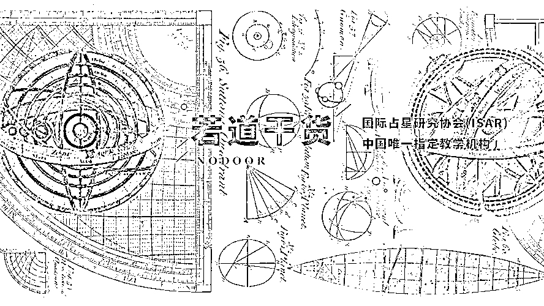

作者/凯莉·苏提斯

译者/王宏 校对/江艺

编辑/玫瑰 图片/全景网

本文先前发表在澳大利亚的《幸福杂志》上

占星学所基于的是对季节的理解，以及自然和所有生命一起，随着热、湿、冷、干等核心特质在一年间的转变而改变的方式。这四个核心特质最初定义了万物的本质。每颗行星和每个季节都是这四个基本特质的两两结合。一颗行星或一个季节要么热，要么冷，同时要么干燥，要么潮湿。昨天秋分，一起来看看当下的节气有怎样的含义吧。**季节性特质**春季是又热又潮湿的季节，它结合了**热和湿**的特质。**热的影响让事物生发，而潮湿的特质则会促进生长。**夏季是又热又干燥的季节，此时春季的潮湿让位于**干燥**。如果春季时有大量的水分（又称雨水），那么**在夏季的高温之下，水果和花朵就会充分生长和成熟。**秋季是由**寒冷和干燥**的特质所定义的季节。寒冷的特质让事物放缓脚步，我们在自然界中看到了这一点，此时植物生长缓慢，到秋季结束时，便完全停止了。干燥会产生**分离**的影响，这可能导致**事物变硬和拆解**。秋季被视为对人体最困难的季节，因为这些特质会导致不适。**寒冷和干燥是与土星和忧郁状态相关的特质。**冬季延续了秋季开始的寒冷的影响，但从干燥变为了潮湿，使冬季成为**寒冷、潮湿**的季节。这与**粘液质**有关——这并不奇怪，因为冬季通常是感冒和流感的季节，此时**我们的身体可能因感冒而饱受过多水分的折磨，这会导致鼻塞和流鼻涕。**

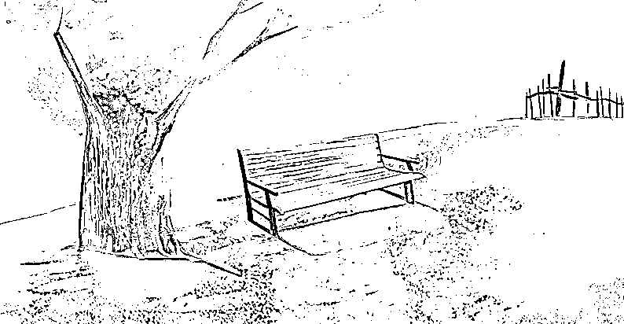

**季节、二至点和二分点****季节是由太阳与地球的关系确定的，它随着地球在天空中的移动而变化。**一年中有两次，太阳在我们的天空中显得格外高或格外低。这就是**至点**的时刻，发生在每年**6 月 20 日和 12 月 20 日前后**。（确切的时间和日期每年略有变化，但通常在这一日期的 24 小时内。）太阳一进入黄道十二宫的巨蟹座（接近 6 月 20 日）和摩羯座（接近 12 月 20 日），就到达至点了。至点季节也从这个日期开始。在澳大利亚，这意味着冬天从 6 月 20 日开始，此时太阳进入巨蟹座。夏天始于 12 月的至点，接近 12 月 20 日，此时太阳进入摩羯座。两个半球的至点日期相同，但季节是相反的。夏季和冬季是极端的季节，此时的气候反映出太阳与地球极度接近或极度远离。在活力方面，这两个季节也是极端情况占上风，过度行事的倾向很高。春季和秋季是具有变动可能性的季节，因为太阳从天空中横穿而过，改变方向并为新的目标而奋斗。在春季，太阳在天空中升起，给它所触及的一切带来温暖和鼓舞。这给自然界带来了新成长，并鼓励你把自己的心转向灵感和计划以寻求进步。秋季看到太阳从高点落下，鼓励放慢步伐，激励你完成已经开始的事情。

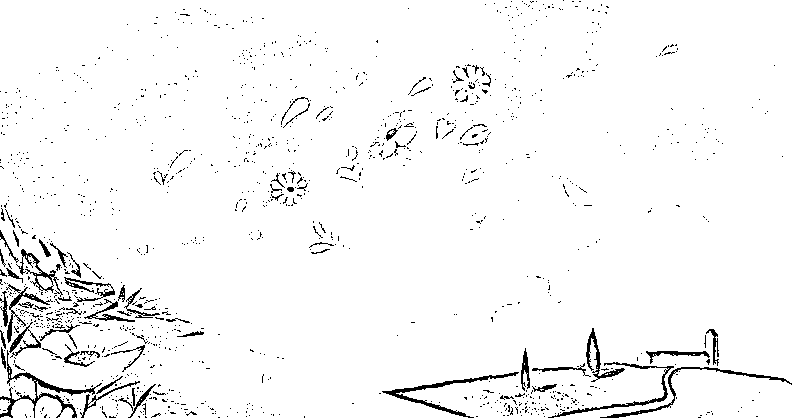

**春季和秋季是分点的季节，其开始时太阳处在它年度旅程的两个中点之一。**分点发生在每年的**3 月 20 日和 9 月 20 日附近**。在澳大利亚，3 月的分点开启了秋季，9 月的分点开启了春季。在北半球，季节仍然在这些日期变化，但却是相反的。**分点季节是指那些大自然努力从上一个至点季节的极端调整和重新平衡的季节。**在春季，目标是热身、前进和成长，以弥补冬季低点的迟滞性质。在秋季，是时候放慢脚步，重新评估和完成未完成的项目了。夏季的极点可能是遥远的记忆，而秋季则是回归基本并再次脚踏实地的时刻。**行星和季节** 每颗行星都天然地与特定季节的本质相连。这颗行星将在一年中属于自己的时段里更容易接近，行星的特质和目标为在与其相应的季节中关注什么提供了天体的灵感。春季和夏季都有着炎热的性质，鼓励活动、决策和前进。这些季节是**鼓励向外投身世界、梦想远大**的季节。秋季和冬季都有着寒冷的性质，鼓励休息和反思。它们都具有**内省**的特质，并突显出**观照内心**的力量。

| **季节** | **特质** | **行星** |
| **春季** | 热、湿 | 木星，连同金星 |
| **夏季** | 炎热和干燥 | 太阳和火星 |
| **秋季** | 寒冷和干燥 | 土星，连同水星 |
| **冬季** | 寒冷、潮湿 | 月亮，连同金星 |

1 春季：木星和金星

**木星是与生长、进步和机遇相关的行星，是与春季相关的主要行星。**木星是太阳系中最大的行星，当木星活跃时，计划和项目就会蓬勃发展。木星与**学习，以及丰富和支持**息息相关，这就是**春季是开启新的创始，或采取行动追求梦想的绝佳时机**的部分原因。

**旅行和学习**是木星的特殊兴趣，因此**在春季，进行你每年的盛大旅行**可以帮助你在接下来的 12 个月中获得最大的灵感。**学习、教学、写作和出版计划**也可以在春季的那几个月里从木星的强大影响力中得到提升。木星也是幸运之星，因此这是**冒险**的好时机，因为你将获得天体的支持。木星也与慷慨有关，所以**在春季也要自愿地把你的智慧、支持或明智的言辞传递给他人。**金星是一颗潮湿的行星，而基于它与太阳的关系，它可以是冷的，也可以是热的。这意味着**金星通常在冬季的后半段和春季的前半段很活跃**。金星与爱情和美丽有关，因此**春季的前半段是美丽和宠爱仪式的好时机**，在澳大利亚是从 9 月的分点到 11 月初。你可能已经做到了一些，或许是为夏季前去海滩做准备？但这也是一年中**让你的爱情生活重获生机的美好时光**，要么是单身的你寻找新的伴侣，要么是花时间和你现有的伴侣开心在一起并享受额外的品质时光。

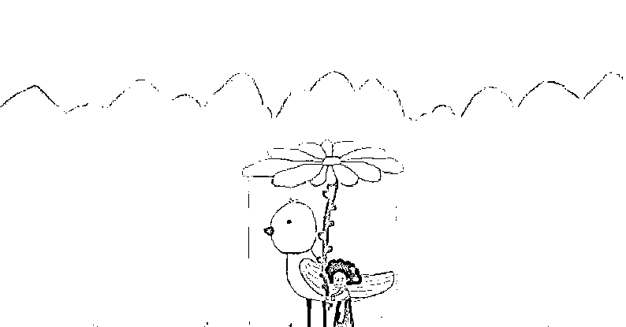

**春季仪式**

*   预定一次有趣的冒险或周末度假；
*   让宠爱自己以及美容或打扮的仪式成为生活的常规部分；
*   注册一门课程。

2 夏季：太阳和火星

**夏季实际上是发光的时段，因为这是太阳的季节。**太阳代表着**领导、皇室和坚持稳定的道路**。随着夏天的到来，这是一个**负起责任和重新聚焦**的好时机。

**太阳也与奢侈和高品质的事物相关联，因此在夏季不要亏待自己。**相反，要选择几个五星级的放纵方式，并在整个季节里依次享受，这样你就可以在太阳高悬于空中时尽情享受生活。太阳是最稳定、最为前后一致的一颗星，**在夏季保持稳定的例行常规**也是有益的。创造性的能量在太阳的影响下达到顶峰，因此要**花时间发展你的艺术方面，或者享受他人的创造性产出，比如通过演出、展览和表演**。火星是另一颗与夏季相关的行星，因为太阳和火星都有**炎热、干燥**的特质。但火星可能会走向极端（太阳是更平衡或更温和的夏季行星），因此夏季**要谨慎一些，尤其是不要试图超越自己的极限。**

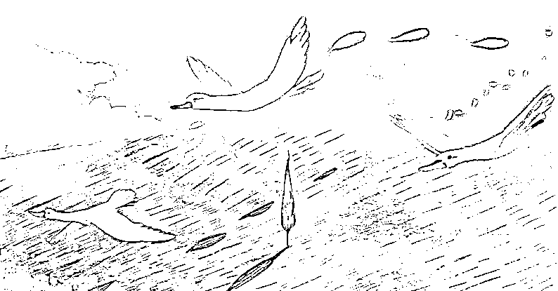

尽管测试或挑战自己去寻找新的发光方式很棒，但让事物极端化可能会导致疾病和压力。夏季的热量非常之多，因此像**游泳、冥想和阅读**这类冷却性的活动可以帮助你放慢速度并保持镇定。

体育活动非常有助于燃烧掉多余的火星热量。**考虑进行中等强度的锻炼，或者选择短时爆发性的高强度训练。**夏季长时间进行高强度锻炼并不理想，因为这可能引发过多的热量，导致你生命力的枯竭或耗尽。反而要在工作或个人生活中给自己设定一个挑战，你可以把精力集中在这个挑战上。

**夏季仪式**

*   学习或发展一种创造性才能；

*   在家里或工作中发号施令，并明确要求得到你想要的；

*   挥霍享受五星级的体验。

3 秋季：土星和水星**秋季是为了放慢速度以及进行脑力劳动。**秋季的主要行星是土星，它可以帮助你**专注于长期计划**。**缓慢和稳定**会赢得本季的比赛，因此不要向前冲，要**暂停下来反思**。水星是另一颗与秋季相关的行星，与**思想、思维和沟通**联系在一起。这意味着你需要在秋季**充实你的头脑**。这可能会激励你**参加一门课程、报名参加一个研讨会或多多读书**。花在听你最喜欢的播客，以及学习实现你的长期目标所需的信息或技能上的时间是值得的。在土星的季节里体验些许愁思是很正常的。如果你感到有点平淡或枯燥，就要独自安静地花时间探寻缺失的是什么。秋季是**反思和调整**的时候，因为土星将你的注意力吸引到你生活的基础之上。我经常把土星描述为代表生活的四大支柱。这些支柱对我们每个人来说可能有所不同，但它们通常包括**工作（职业）、家人和家庭、个人生活（包括爱情和友谊）以及健康和活力**。这些支柱哪怕有一根不够稳固，你都会感到没有支撑或基础不稳固。你的任务是**观察，留意缺乏的是什么，然后制定一个缓慢的、实际的计划，以实现持久的安全和稳定。**

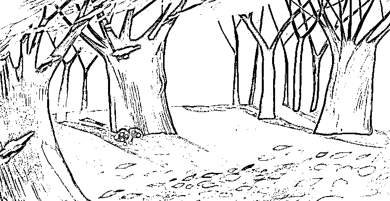

**在土星的影响下，你可能不得不做出一个让人无法回避但又必要的选择。**在秋季，你手头有水星来帮助沟通，因此这是让心里**摆脱某些想法或忧虑**的好季节。**花更多的时间与所爱之人交谈**，或是考虑**见一位顾问或其他治疗医生**。土星代表了过去，因此**放慢脚步并提出更深层次的、更具反思性的问题**可以帮助你克服过去，摆脱限制性的习惯和模式。

**秋季仪式**

*   写出你的恐惧或忧虑，然后烧掉它们，看着它们在烟雾中消散；

*   改变你的想法，从而改变你的生活；

*   通过温和的运动（散步、普拉提）和冥想，与你的头脑保持联结并平静下来。

4 冬季：月亮和金星**冬季是为了筑巢，并花时间待在家里。**冬季的主要行星是月亮，它完全是与**家庭、家人和你的生活状况**有关。如果你对自己的家并非全然满意，现在需要改变的地方就变得清晰起来了。如果你爱自己的家，现在就是时候添加舒适感，让你的家更放松了。你可能会进行装饰，尤其是在卧室或客厅。**食物和家人（或感觉像家人的朋友）**被强调了，所以要招待所爱之人用餐，或优先与家人一起吃饭。在寒冷潮湿的冬天，你的身体可能会变得迟钝，因此通过**加热食物、添加调料以及温和的运动**来增加热量是很重要的。月亮是代表健康和幸福的主要行星之一，突显了在冬季照顾自己和照料自己的身体是非常重要的。

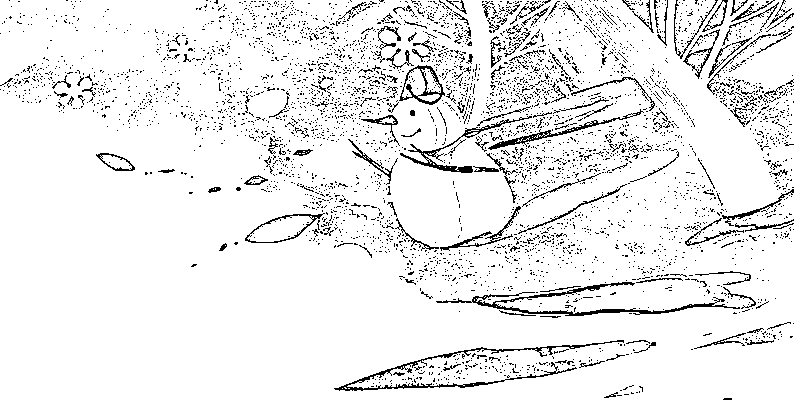

金星是爱与美的女神，在冬季的后半段开始展现自己的影响力，在澳大利亚是从 8 月初开始的，这是一个**重新联结或恢复你的美容、打扮和宠爱仪式**的好时机。你可能会放纵于**面部护理或按摩**，或在家中**添置一件新的艺术品**。**爱情、约会和人际关系**也很重要，因此当你在冬季花时间滋养重要的事物时，也要延伸到对你而言特殊的人身上，或者如果你是单身的话，就要采取行动见见新的人了。**冬季仪式**

*   在家里招待朋友或家人吃一顿慢慢煮好的饭菜；
*   用优质的油来滋养你的身体；
*   更新你的床上用品和柔软的家具，比如扔掉地毯和枕头；
*   放下你因年龄渐长而不再需要的东西。

希望与这些行星同步会启发你尊重季节，并打造与天空的周期相一致的生活。

**版权声明：**本文由若道翻译发布，欢迎转发，反对抄袭。友号转载请申请白名单。

**凯莉·苏提斯**

占星教师、顾问，坚信魔法、直觉和灵性的力量。

**系统学习占星学**

**点击下图了解详情**

**微信又双叒叕改版啦，不想错过若道君的推送？**

**就把若道设为星标吧！**

**▼**

喜欢记得点一下在看哦☟

********报名直达入口********

# 如何学会保护自己？ | 善用这两种能量设立自我界限

> 原文：[`mp.weixin.qq.com/s?__biz=MzA5NjA0NTAxNg==&mid=2651427985&idx=2&sn=a7563c6028b0468f17600d98c3e46a0e&chksm=8b4b2626bc3caf303bc2d933864a44328d574e6bea299449d818759d4babd7d975457475c59b&scene=126&sessionid=1692738101#rd`](http://mp.weixin.qq.com/s?__biz=MzA5NjA0NTAxNg==&mid=2651427985&idx=2&sn=a7563c6028b0468f17600d98c3e46a0e&chksm=8b4b2626bc3caf303bc2d933864a44328d574e6bea299449d818759d4babd7d975457475c59b&scene=126&sessionid=1692738101#rd)

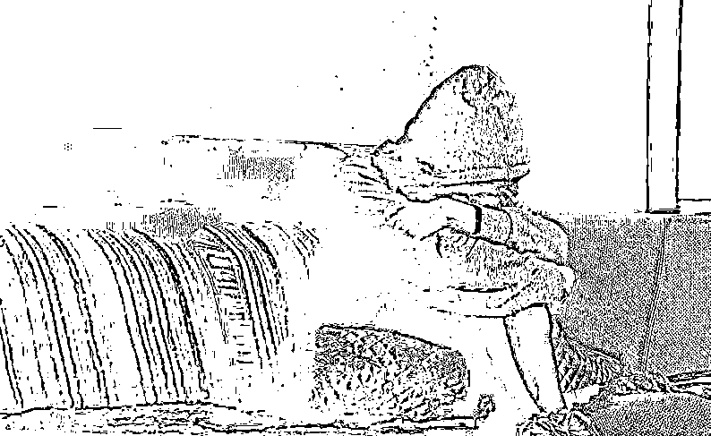

作者/艾伦·隆戈 译者/李晓庆 校对/江艺

编辑/玫瑰 图片/全景网

我们经常遇到无法捍卫自己的情况，不懂得如何保护自己，总是轻易被别人侵犯了界限，很少有人真正能倾听我们的需要。该如何解决这样的困境呢？这篇文章会给你一些启迪。

**我曾毫无界限感**过去我常常讨厌待在团体里，但是现在，当我想要，并且真的喜欢跟合得来的人在一起时，我学会了把自己的能量与他人的整合一起。现在甚至球类游戏都变得有趣了，因为我能“变成”我周围的人并且玩得很开心。

我从小在非常严格的，甚至可以称得上是在一种军事化的管教下长大。用占星学术语来说的话，这里有非常强的**土星**影响。家里的氛围导致了三种结果，而它们都和海王星有关：

*   我趋向于退缩到精神和浪漫幻想的世界里，因为那是我唯一有力量的地方； 
*   我完全没有自我界限感，因为它们每天都被专横的权威人士所侵犯； 
*   我没有自律感，因为施加在我身上的外部规则太多了。

我就这样漫无目的地从一个地方漂泊到另一个地方，从这个人走向那个人，然后进入了青年期，几乎没有感觉到，也并不渴望“真实生活”。我对于事情的潜在暗流非常敏感，但却有极低的自我保护意识。我几乎在所有社交场合都感到不舒服，从最小的晚餐聚会到大型的集体事件。我对于任何需要规则或结构的事件都不感兴趣。我的海王星能量非常活跃，土星能量却完全没有发展。那么这一切是怎么改变的呢？我必须承认这与个人界限有关。用占星学术语来讲就是——我发展出了我内在的**土星特质**。

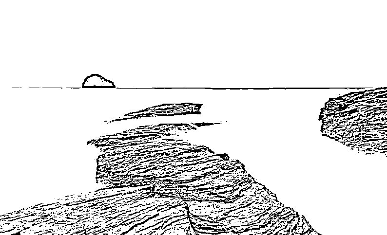

**第一次反抗权威**我开始意识到我自身的土星特质，始于一位权威人士让我去做一件我根本做不到的事，就像让我跨越一条根本无法迈过去的线。那是我有生以来第一次站起来对他人说**“不”**；战胜失去我所爱的人的恐惧，去表达我的感受和我所在意的事情。这件事情使我第一次感受到自己的权利；在此之前，我从未意识到自己有任何权力。能保护自己并不惜一切去那样做的感觉相当美好。从做这个决定开始，我确实失去了一切，但这种失去转变成了自力更生、学习、我自己的商业、盖房子，还有养育小孩。当然，这种内在权力的展现并非一蹴而就，而是花了很多年，但我一点一点地找到了自己内在坚实的地方，那是我自己安全的港湾，我学着去尊重它。**心门不需要一直敞开**

对于一些人而言，一旦找到了土星的自我保护本能，他们就好像被困住而走不出来了；更多海王星人倾向于把他们自己的权力拱手相让，以至于他们从来不会坚持自己。

感谢我的灵性老师，这两种情况在我身上都没有持续太长时间。很有趣的是一个小事件会带来重大的人生改变。

一天，我跟老师在一个大房间里，房间里还有几百人。一个女人朝老师走来，老师留意到这位女士脖子上戴了一个心形盒式吊坠，盒子是打开的。老师告诉这位女士：“你的吊坠开了。”这位女士向下看了一眼，说道：“那是因为我的心总是敞开着的。”于是老师说：“啊，但是你必须要学会打开它，也要学会关上它。”

这件小事让我灵光一闪，对于界限有了全新的领悟。在那之前，我一直认为一个有“灵性”的人必须不断地把他们的内心向外展开，以保持真正的开放。我学到我的界限就是我自己，它们可以根据我的辨别力和意志伸缩自如。我的圈子可以延展到拥抱整个宇宙，也可以收缩到只可以容纳我的家人那么小。

这就是关键：**我认识到我自己就是守门人。我只欢迎我真正喜欢的，我不喜欢的就被拒之门外。**

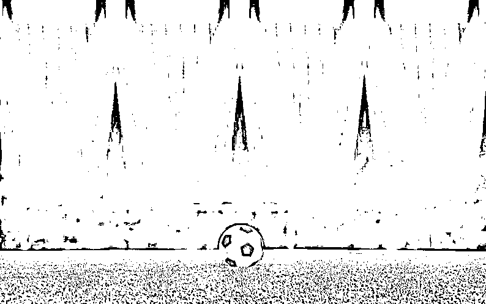

**无界限者的高质量转变**

这完全解放了我的生活。现在我能去最吵闹的球场，并全身心的加入人群中，玩得很痛快。没有什么比融入到共同胜利的快乐中更有趣。然而当我离开体育场，在纽约街头漫步的时候，我用自我保护的盾牌把自己围住。

我可以走进公园，与大自然融为一体，但是接着我坐在桌边专注于工作，我会随着环境的需要扩展或收缩自己。我可以在危险的负面环境下关上心房，迅速离开，然后在喜爱的朋友面前敞开心扉。

总的来说，我的故事在于要**学会自我掌权，自我界限，以及辨识力，这些都是土星特质。**一旦我学会内化土星权威的特质，它就会转变成自我保护。一旦我学会了自我保护，我就学会了以自我意愿去整合——整合多少都是我自己的选择。

**版权声明：**本文由若道翻译发布，欢迎转发，反对抄袭。友号转载请申请白名单。

**艾伦·隆戈**

执业占星师，女商人。曾就读原型宇宙学以及自主进化专业的研究生。

**系统学习占星学**

**点击图片了解详情**

就是这个“在看”，戳戳戳 ☟

********报名直达入口********

# 插班中丨核心课程 L3，教你掌握综合星图解读

> 原文：[`mp.weixin.qq.com/s?__biz=MzA5NjA0NTAxNg==&mid=2651427875&idx=3&sn=6258d6773474660895c381e79c2d9bfa&chksm=8b4b2694bc3caf82afed9f97aee5a9ece503619a0279b7f321a600895fcb9fcf0f64263a3940&scene=126&sessionid=1692738101#rd`](http://mp.weixin.qq.com/s?__biz=MzA5NjA0NTAxNg==&mid=2651427875&idx=3&sn=6258d6773474660895c381e79c2d9bfa&chksm=8b4b2694bc3caf82afed9f97aee5a9ece503619a0279b7f321a600895fcb9fcf0f64263a3940&scene=126&sessionid=1692738101#rd)

**Level3 也是占星学习的一个整合区和分水岭****若道君给大家准备了一份专业的占星测试：“2020 若道核心课 L3 入学测试”****测试内容包括：**

**适合参加测试的学员：**

**L1-2 结课学员**

**有一定占星基础的自学学员**

**准备考 ISAR 的学员**

**扫码开始测试吧**

**1**

**占星学除了自我修炼，市场需求如何？**

**通过占星学习你帮助了自己，也可以选择成为自助助人的占星师，开启受益终生的第二事业。**一方面，社会快速发展人们压力山大，抚慰心灵的咨询市场需求巨大。另一方面，市场鱼龙混杂，真正学院派的严肃占星从业者十分稀缺。最重要的，**占星学能让你自己帮助自己，无论你是否进行占星咨询从业，学习了占星学，它都将是终身陪伴你成长的睿智好伙伴。**

**2**

**你的占星核心课老师是谁？**

 拥有**50**年占星研究积淀**44**年职业占星实践**41**年占星教学经验的**若道联合创始人****2017-2020 年曾任 ISAR 全球副主席****2020 至今为****CAPISAR（全球职业占星师资质认证考试委员会）主席****大卫·瑞雷**&**最懂学员的若道首位认证金牌中国老师****熊鹰**师徒二人合力打造
**2020 年若道****全新核心占星课程**

**3**

**L3 阶，我们要学习什么？**

**第 3 阶 ****宫位、相位以及初步解读星图（15 次课） ****❶** **12 宫位****人生中重要的领域，不止 12 个，更是 12 类。****❷ 组合解读****行星、星座与宫位的组合解读。万丈高楼平地起，这是占星解读的基本功。****❸ 相位****不仅是常规的相位：合相、对分相、三分相、四分相……还有这些更为细致的知识：**相位计算入相位与出相位星座外的相位相位解读盈亏相位相位的优先级大卫老师案例课**❹ 宫主星与定位星****“联结”是宇宙的基本法则之一。除了相位，还有哪些方式让行星能量联结起来？**宫主星定位星与定位链大卫老师案例课**❺ 月亮交点专题****月亮交点是占星解读的另一个入手角度，这里会深入教你解读月亮交点，及其相位与定位星。**月亮交点的解法大卫老师案例课**❻ 相位模式：****那些坊间赋予神秘意义的占星格局：大三角、大十字、T 三角……究竟该如何解读其相位模式。**主要的七种相位模式星图中没有相位模式的情况大卫老师案例课**❼ “空”不等于“没有”：****星图中那些容易被忽视的地方：**无托勒密相位（俗称空相）一些特殊位置星图布局大卫老师案例课**第 3 阶课程安排****❶** 15 次线上直播网络课程，每次 2 小时，课程中依旧会使用同学们的星图作示范**❷** 10 节课由熊鹰老师教授，重点通过名人星图阐释知识点**❸** 5 节课由大卫·瑞雷老师教授，重点通过学员星图阐释知识点**❹** 熊鹰老师会指导练习，答疑解惑，学练结合**❺** 重点在于如何根据星图去问问题，着重自我发现和自我探索的过程 

| **时间** | **课程** |
| 2020 年 7 月 2 日 | 宫位、行星和星座组合 |
| 2020 年 7 月 9 日 | 宫位、行星和星座组合 |
| 2020 年 7 月 16 日 | 月亮交点 |
| 2020 年 7 月 23 日 | 月亮交点和演示案例 |
| 2020 年 7 月 30 日 | 相位 |
| 2020 年 8 月 6 日 | 相位、星座、行星和宫位 |
| 2020 年 8 月 13 日 | 相位、星座、行星和宫位的同学案例 |
| 2020 年 8 月 20 日 | 渐盈相位和渐亏相位，示例 |
| 2020 年 8 月 27 日 | 更多的关于宫位和宫主星 |
| 2020 年 9 月 3 日 | 同学案例 |
| 2020 年 9 月 17 日 | 空相行星和定位星 |
| 2020 年 9 月 24 日 | 宫主星 |
| 2020 年 10 月 15 日 | 优先级和组织 |
| 2020 年 10 月 22 日 | 相位模式以及范例 |
| 2020 年 10 月 29 日 | 学员星图解读范例 |

**截至 2020 年 9 月 21 日，课程第 1-11 讲为录播课程（限视频回放），其余均为网络直播课。**

**试听彩蛋**

📹 [`v.qq.com/iframe/preview.html?width=500&height=375&auto=0&vid=e093031qxym`](https://v.qq.com/iframe/preview.html?width=500&height=375&auto=0&vid=e093031qxym)

**4**

**这两位优秀的占星学老师是谁？**

**大卫·瑞雷（David Railey）**

*   **曾任 ISAR 全球副主席，2020 至今为 CAPISAR（全球职业占星师资质认证考试委员会）主席，若道联合创始人；** 

*   1976 年，通过亚特兰大职业占星师考试，成为全职占星师，随后通过**AFAN 和 ISAR 职业测试；** 

*   1980 年，与**杰夫·焦耳**一起在亚特兰大创建**“每日星球”**占星学中心。此后在亚特兰大占星协会担任 4 年考官，并且两次担任**亚特兰大地区占星协会主席**。1979-1992 年，作为占星师活跃于美国社会媒体，向不了解现代占星学变化的大众宣传专业占星学知识。在 1989-1992 年期间，他在 WRGG 电台 12 频道每周主持个人电视秀**“今日占星学”**，早先他还在 WRFG 的广播节目中播讲宇宙天气节目；

*   2010-2014 年，任**全美占星师联盟监督委员会委员**； 

*   2010 年，其著作**《灵魂的目标》**中国版出版，和蒋颖一起创办**若道占星**学校和其官网 www.nodoor.com。从该年开始，他工作并往返于亚特兰大和北京。目前他 80%的时间致力于在中国教授和推广西方占星学； 

*   2017 年，被选为**ISAR 委员会成员**（2017）。ISAR 是世界最大的国际占星机构，会员遍布 45 个国家，2017-2020 年曾任 ISAR 全球副主席； 

*   2020 年，被推举为**CAPISAR（全球职业占星师资质认证考试委员会）主席**。

**熊鹰老师（天空的空）**

*   2008 年接触严肃占星学，至此爱不释手； 
*   **2013 年师从大卫·瑞雷**，研习整套现代占星学核心课程，并于 2014 年起至今连续三年担任该课程的主助教； 
*   期间也**跟随格伦·佩里、诺·泰尔、理查德·塔纳斯、罗伯特·汉德、苏·汤普金斯、斯蒂芬·弗里斯特等多位国际顶尖占星大师进行学习**，进行定向占星主题研究； 
*   2015 年初，通过国际占星研究协会**（ISAR）资质认证并获得证书**。同年，进一步跟随大卫·瑞雷老师进修**“生时校正”**技术，通过最终考核并获得证书； 
*   目前在若道星文化任职，将传播系统、严谨、真实的占星学作为职业使命。任专职助教期间，进行沙龙与答疑等辅助教学工作已累计超过 200 小时；
*   在业余期间也提供占星咨询与生时校正服务。目前正致力于占星学与个人成长的整合。

**5**

**什么人适合这门课？**

*   对占星学有浓厚兴趣，想要系统学习占星学
*   对占星学有一定基础，但不知道该如何整合星图复杂的碎片
*   希望成为优秀的占星师，想要借鉴国际大师解读思路并融入自己的体系
*   想学习占星学，但不擅长英文，希望有中文老师授课
*   想结合占星学理论与咨询实践
*   大卫·瑞雷、熊鹰的忠粉，学过占星，但就是想跟着偶像再学一遍
*   走在自我探索和个人成长道路上的人

**6**

**课程费用**

 **★ L3****课程费用：10000 元****更多价格优惠请咨询客服**

**7**

**退转课程**

**退款原则请详看《教学协议》，如有疑问请咨询课程顾问。******核心课程 Level 3****

**授课老师：大卫·瑞雷 熊鹰**

**授课时间：****2020 年 7 月 2 日-2020 年 10 月 29 日**

**授课方式：**网络课程：英文授课，中文翻译

**费用：10000 元；**更多优惠请咨询客服

**课程负责人：Maggie（微信号：NodoorMaggie）**请备注“L3”

长按二维码添加课程负责人咨询~

****报名请点击“阅读原文”****

# 新纪元到来之时，爬上那座有金子的山丨线上 ISAR 大会回顾

> 原文：[`mp.weixin.qq.com/s?__biz=MzA5NjA0NTAxNg==&mid=2651427875&idx=2&sn=a39ec3bf1cf0b9dbc5c5e03810a94980&chksm=8b4b2694bc3caf829486a167144e4377275d4829548d40cf5aa7695142e4a732bf8be9040ac9&scene=126&sessionid=1692738101#rd`](http://mp.weixin.qq.com/s?__biz=MzA5NjA0NTAxNg==&mid=2651427875&idx=2&sn=a39ec3bf1cf0b9dbc5c5e03810a94980&chksm=8b4b2694bc3caf829486a167144e4377275d4829548d40cf5aa7695142e4a732bf8be9040ac9&scene=126&sessionid=1692738101#rd)

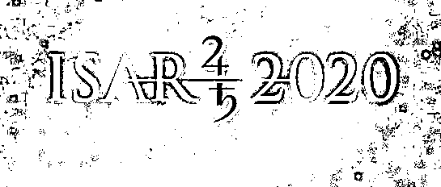

作者/编辑/翀子 图片/ISAR 线上大会

刚刚过去的周末，2020ISAR 大会在线上紧锣密鼓的召开了。持续烧脑的两天，干货满满，我们不仅聆听了国际一线占星大师们对于土木合相和美国大选的精彩论点，还有绝对不能错过的中国占星师们的圆桌会谈。在此次盛会中，大家都有哪些精彩发言呢？让我们进行一些回顾吧。

刚过去的周末，是让中国占星师和对占星学感兴趣的朋友们热情高涨的日子。因为受到新冠疫情的影响，原计划在美国科罗拉多州举行的 2020 ISAR 大会无法在线下召开，便首次改为在线会议。这一改动，给很多热爱占星学的朋友提供了参与国际占星学盛会的难得机遇，大家在线上**聆听各具风格的占星师们阐述观点**，看多位国际一线占星大师们**对当今世界的重要议题进行讨论**，并从每位演讲者的讲述中**学习占星学的各种运用方法。**若道作为此次 ISAR 线上大会的中国协办方，不仅邀请专业翻译团队制作演讲字幕，使听众获得了更好的参会体验，更邀请了 9 位中国占星师作为圆桌会议的嘉宾，对大会演讲者们的分享进行了更加广泛深入的讨论，为大家提供了一场占星学的盛宴。两天从早到晚的烧脑演讲，以及多角度的嘉宾讨论，让我们共同度过了一个回味无穷的周末时光。**主题一：土木合相的新纪元**ISAR 线上大会的大幕，由 2020 年末最重要的占星学征象——“土木合相的新纪元”拉开。ISAR 现任主席**亚历山大·因舍阿吉克**（Aleksandar Imsiragic）作为议题主持人，首先强调了我们正处于“双鱼座时代”到“水瓶座时代”的重要过渡期，并对 20 世纪以来的重要行星周期进行了梳理回顾。他认为，从 2020 年到 2026 年，集体意识将会实际的支持我们进行更深层次的内在转变，而最伟大的发现会在天王星进入双子座时发生。

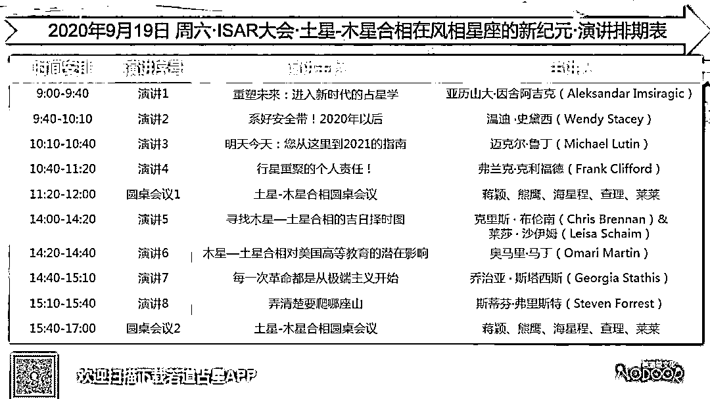

**温蒂·史黛西**（Wendy Stacey）在演讲中，引用查尔斯·哈维（Charles Harvey）关于“木星和土星是伟大的时间之主”的概念，认为 2020 年土星与木星合相在水瓶座，意味着我们的思维和智力开始定义我们是谁，这将彻底重塑整个人类的发展和参与方法，我们获取信息、生成信息、传播信息的能力将变成首要的，它将为新的社会结构、新经济和新产业奠定基础。

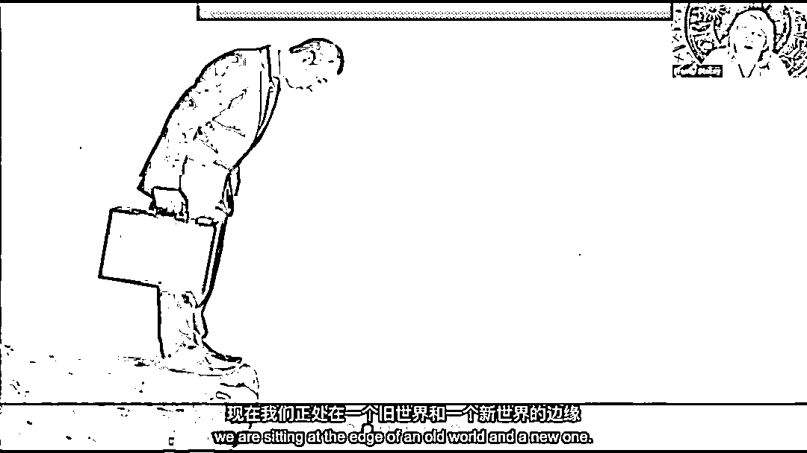

**| **温蒂·史黛西演讲**弗兰克·克利福德**（Frank Clifford）谈到木土合相在水瓶座 0°时说，它会帮助我们发展进入一个人人都有价值，都能发挥作用的社会，我们每个人都可以选择用自己的方式改变我们周围的世界，这个合相要我们融入人类，并在其中创造一个独一无二的个人角色。

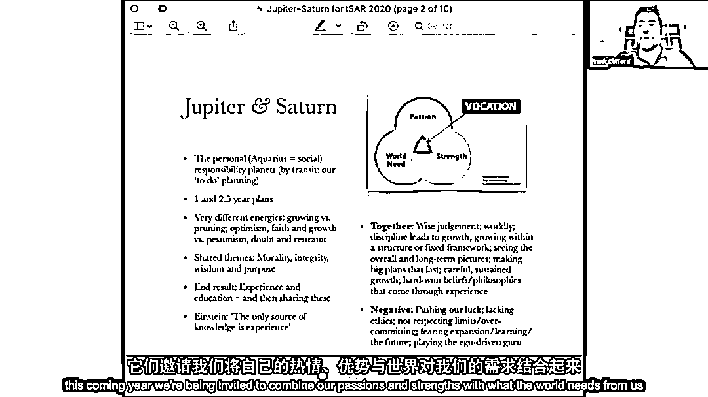

**| **弗兰克·克利福德演讲**迈克尔·鲁丁**（Michael Lutin）的分享感动了很多听众，他如诗般的语言充满了人性关怀。迈克尔·鲁丁将冥王星行进的三个阶段分别描述为毁灭、空无和繁衍，它考验人们的勇气，而人们会在意识的扩展中应对各种情境和遭遇，并在其中探索与成长。同时他还强调，无论在任何情境中，我们星图中太阳所在的位置都是我们喘息的地方，“这个地方向你源源不断地输送能量”。太阳所在的宫位，总是让人焕然一新，它让我们获得能量、勇气和生命力，“如果你专注于那耀眼的光芒，那种光将照亮正在全世界蔓延的黑暗。”

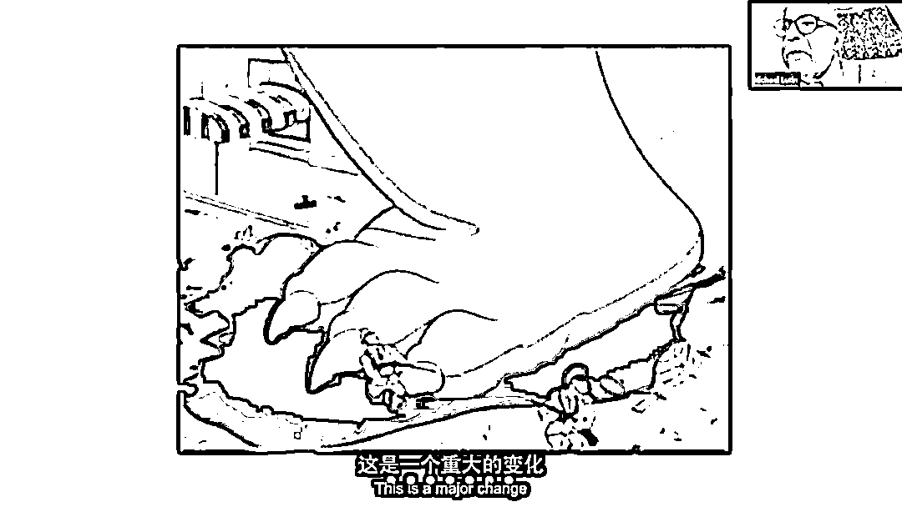

**| **迈克尔·鲁丁演讲语速飞快的**克里斯·布伦南**（Chris Brennan）和**莱莎·沙伊姆**（Leisa Schaim）如脱口秀演员般，做了一场“择时电台节目”，两人从不同角度出发，给出他们认为的“最吉祥”星图，在那个时刻，可以开始新的冒险或新的事业，是非常有趣的演讲。随后，奥马里·马丁（Omari Martin）利用经世占星学描述了历史上不同土木周期时美国高等教育的特点，并对 2020 年的土木合相于美国高等教育的影响进行了分析。

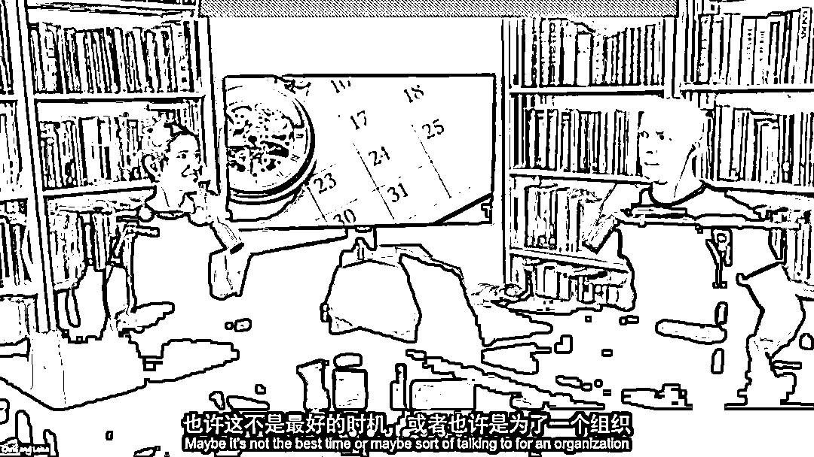

**| **莱莎·沙伊姆（左）和克里斯·布伦南（右）干货满满的**乔治亚·斯塔西斯**（Georgia Stathis）不仅预测了土木周期新纪元对太空探索、电子产品和网络安全的影响，还认为医疗技术会有很大突破、教育层面将出现巨大变革。她在演讲最后说：“教育是关键，即使你一直想住在洞穴里，也能通过学习改变你的生活方式，因为你学到的东西将帮助你进入新的方向。”

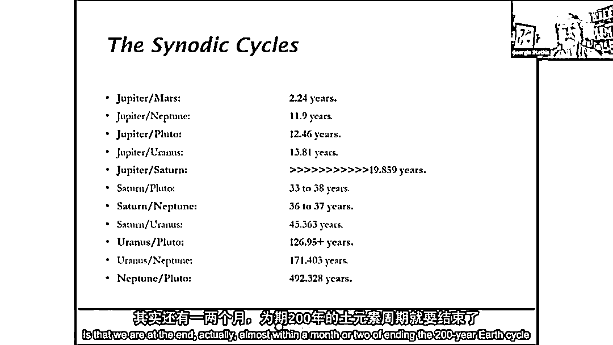

**| **乔治亚·斯塔西斯压轴的**斯蒂芬·弗里斯特**（Steven Forrest）的演讲掀起了当日高潮，他用深入浅出、极具画面感的描述方式，向我们展示了土木合相的图景以及不能忽视的摩羯座能量。他用这样一个生动的比喻象征木星、土星和冥王星齐聚摩羯座：“这就好比你问一个家长，养育一个孩子你开心吗？他们可能会说，这比我想象的要困难十倍，如果早知道是这样，我不确定我还会不会要孩子，但这比我想象的要满足一百倍。”木星代表广阔的希望和机遇的方向，有着对生命慷慨的激情；而土星需要自律和去做困难的事。我们需要进入黑暗之旅（冥王星），去面对我们不想面对的事，然后爬上那座值得攀登的山（土星），最后找到山顶的那罐金子（木星）。这就是斯蒂芬·弗里斯特对我们描绘的图景。（在十月份的线上工作坊中，斯蒂芬老爷子还会继续带来他关于[【亲密关系】](http://mp.weixin.qq.com/s?__biz=MjM5MjQwNjAyMQ==&mid=2649437652&idx=3&sn=271c45ffe3253dfedef42802d8d51e96&chksm=beb95abe89ced3a8591a997b617d9a87c999e2842219fe7b1bca44ae94fc5bc2b60b398c6e9f&scene=21#wechat_redirect)和[【占星学预测技法】](http://mp.weixin.qq.com/s?__biz=MjM5MjQwNjAyMQ==&mid=2649437652&idx=4&sn=50811e63e2fe583621f447b4b6f36f93&chksm=beb95abe89ced3a8dfc94a41783f948f646f91735ee6ed84aa2cc4ae5d1ff396d2cc60e7f4b5&scene=21#wechat_redirect)的智慧）

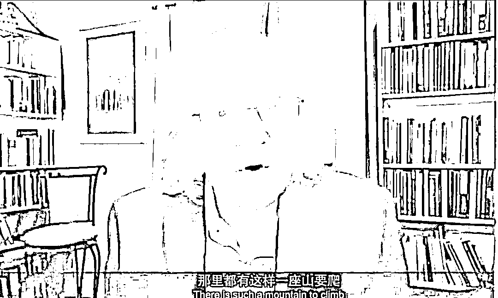

**| **斯蒂芬·弗里斯特演讲在第一天的**圆桌会谈**中，主持人**蒋颖**以及嘉宾**天空的空、海星程、查理和莱莱**，从各自擅长的领域和研究方向出发，对每位嘉宾的演讲内容进行了补充和丰富的讨论，让听众对每个行星周期各自的特点和影响的领域有更多了解，也对即将到来的土木合相在水瓶座开启的新纪元有了很多期待。

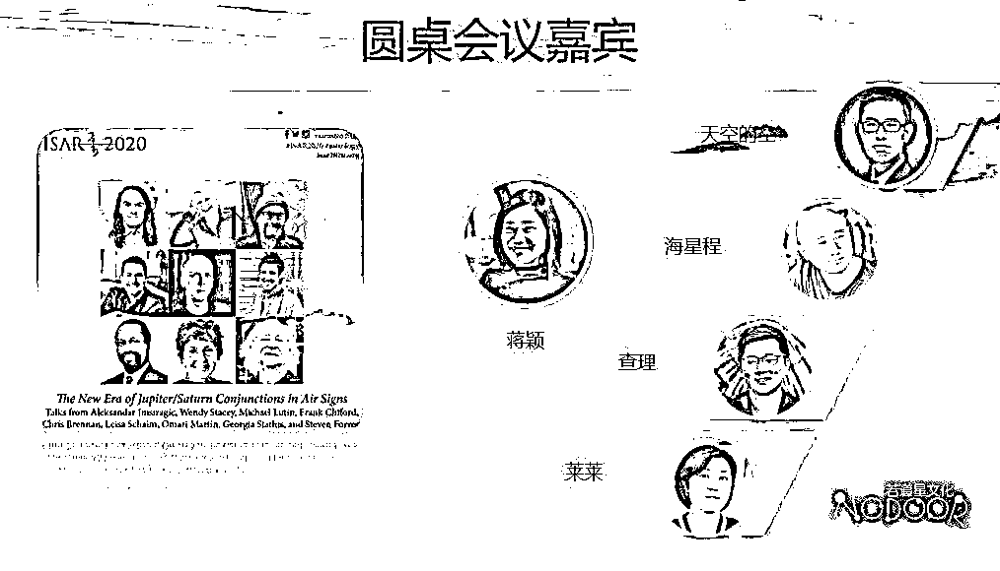

**主题二：美国大选**相比第一天，第二天的主题似乎带有更多的“八卦”气息。美国总统大选将于 2020 年 11 月开始，**对大选的预测成为 ISAR 大会的另一重要议题**。与其说是预测，不如说我们是在通过国际顶尖占星师们的演讲，**学习他们分析和看待事物的角度和方法，并从中看到占星学作为分析工具和趋势预测的优势和局限。**会议的主持人由我们非常熟悉的前 ISAR 主席**雷蒙德·梅里曼**（Ray Merriman）担任（他的金融占星周报持续在若道刊登，如果你想了解新一年的经济政治局势，股票、黄金、白银、比特币等市场的局势走向，可以点击了解梅里曼老师的[【新年沙龙】](http://mp.weixin.qq.com/s?__biz=MzA5NjA0NTAxNg==&mid=2651425978&idx=1&sn=067bd68ece37e1e820d6f84f7a3cc960&chksm=8b4b3e0dbc3cb71b866f65d51f7993d3c35dee77cebd77eda3f63a4d5864dadaea2e9d14c101&scene=21#wechat_redirect)）。**J·李·雷曼**（J·Lee Lehman）、**琳恩·贝尔**（Lynn Bell）、**卡洛琳·凯西**（Caroline Casey）和**克里斯汀·斯金纳**（Christeen Skinner）四位占星师，用精彩的演讲分享了她们对今年全球瞩目的美国大选的个人看法。

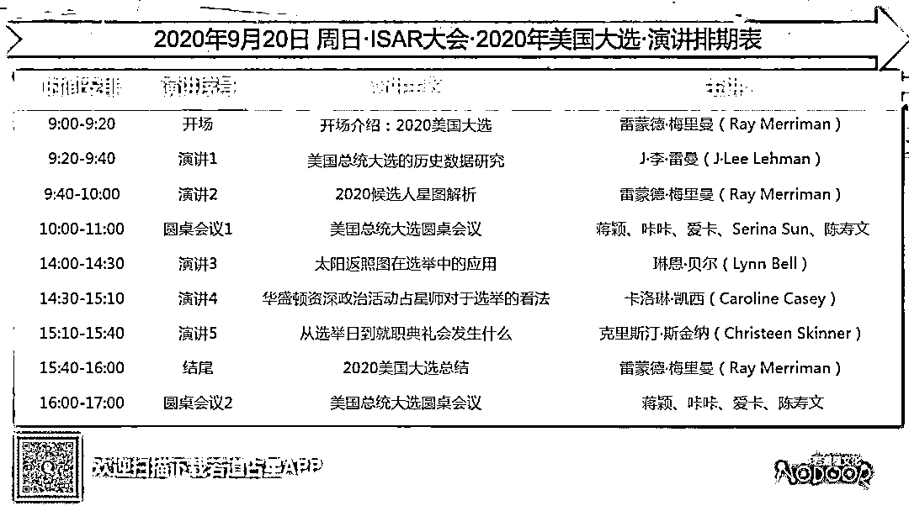

**雷蒙德·梅里曼**标注了候选人和他们的竞选伙伴出生星图上的重要行星行进；**J·李·雷曼**收集了历史中的选举数据，并运用了定量分析；**琳恩·贝尔**选择太阳返照图作为对竞选候选人的分析工具；**卡洛琳·凯西**个人风格突出的演讲，吸引了大家的关注，她的角度和对政治的看法非常新颖有趣；**克里斯汀·斯金纳**则通过选举日星图、就职典礼星图等讨论她对于此次美国大选的看法。
参与圆桌讨论的中国嘉宾也向我们提供了非常有价值的信息。

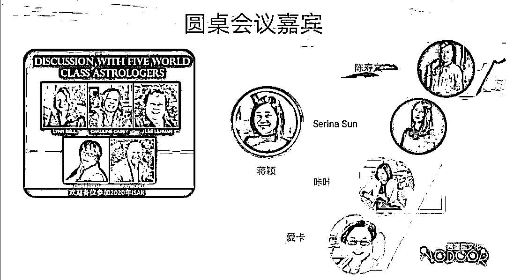

生活在美国的**Serina**从自身感受出发，讨论了美国国家星图中被突出的 T 三角（天秤座土星、白羊座凯龙星和顶点巨蟹座太阳），以及在疫情中被揭露的美国长期以来的内忧外患；身在台湾的**爱卡**不仅将演讲嘉宾分享的内容作了更深入的讨论，还从地缘角度出发，讲述了台湾人民和媒体是如何看待美国大选的；**咔咔**和**陈寿文**分别向听众讲述了拜登与卡马拉·哈里斯的人生故事和他们的出生星图，这让听众对这两位人物的人生经历和性格面向有了更立体的了解。

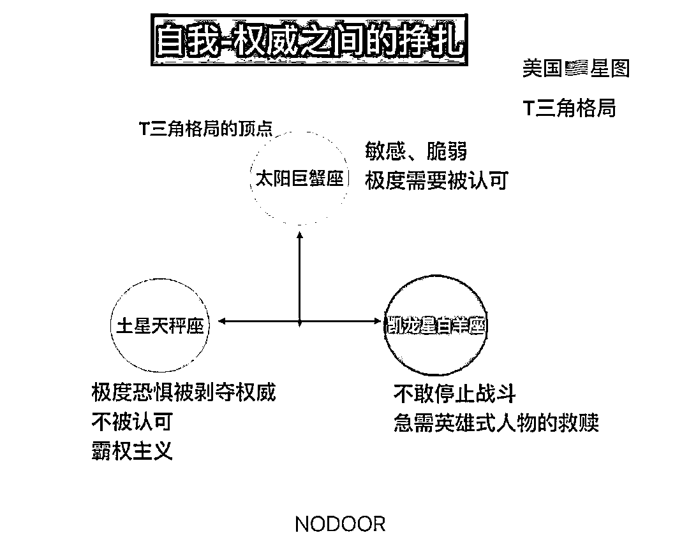

在一整天的会议中，演讲者们金句频出。面对人类当下所处的境地，卡洛琳·凯西说“无论我们在培养什么，无论我们投身的是什么，都是共时性在和我们说话”
而正在若道开设[【太阳返照课程】](http://mp.weixin.qq.com/s?__biz=MjM5MjQwNjAyMQ==&mid=2649437569&idx=5&sn=b8c8250e5602ce278d6cfa9f3a17df1c&chksm=beb95aeb89ced3fde7a1250af9210610ff188d01f2324ad00ea98e4bf13ca72a2dc76aa43f6d&scene=21#wechat_redirect)（点击了解详情）的琳恩·贝尔老师说道：“不管谁当选，面对的都将是一个即将崩坏的世界，我祝福他能顺利面对这个局面。这是一个在新旧世代交替的时刻发生的大选，我们将很多年不会有这样年龄级别的领导人选举了。”

**| **琳恩·贝尔演讲**期待相聚**大脑飞速运转的两天结束了，2020 线上 ISAR 大会的精彩演讲，再次向我们呈现了占星学的魅力，它不仅帮助我们了解个体生命的潜力与方向，也向我们展示了大环境的变化趋势和演变规律。万物相连，我们是宇宙的一份子。2020 年是大变局之年，人们陷入始料未及的混乱之中，在这当中我们如何构想未来、如何安住当下好好生活，占星学为我们提供了指针。
从国际顶尖占星师们的演讲中，每个人获取到不同的信息，收获了不同的养分，同学们在微信群里热烈讨论演讲者们分享的内容，学习热情高涨。就像文章开头所说，虽然因为疫情，大会由线下改为线上，这反而给更多人提供了亲身参与国际占星学盛会的机会，也是难得的机缘。不过我们依然期待面对面的相见日子，**2021 年 8 月，ISAR 将在美国科罗拉多举办线下会议，**那时木星和木星已经一起进入水瓶座，我们是否已经进入新时代？十分期待。

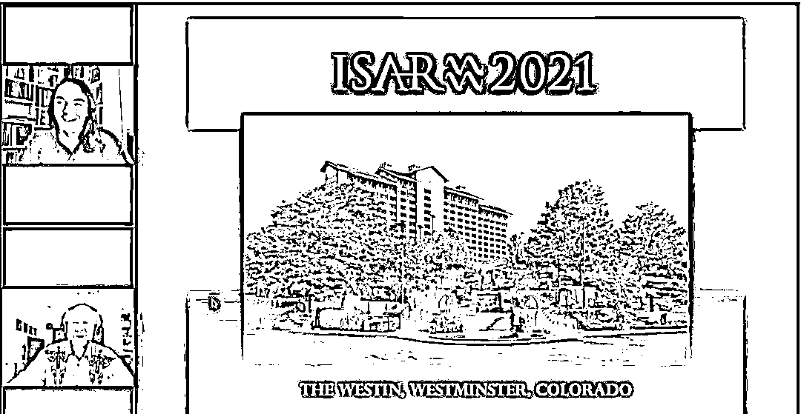

**版权声明：**本文由作者授权首发于若道平台，欢迎转发，反对抄袭。友号转载请申请白名单。

翀子

ISAR 认证占星师（2019 年获得）

若道 2019 届核心课程毕业生，若道微信公众号兼职编辑

**咨询微信**：carolinemichong

**微信公众号**：LumosTrueSelf

长按打赏

**想观看大会内容？请扫描下图二维码了解详情**

**微信又双叒叕改版啦，不想错过若道君的推送？**

**就把若道设为星标吧！**

**▼**

就是这个“在看”，戳戳戳 ☟

********回看大会直达入口********

# 太阳进入这个掌管爱与美的星座，能够为我们的个人成长带来什么？

> 原文：[`mp.weixin.qq.com/s?__biz=MzA5NjA0NTAxNg==&mid=2651427875&idx=1&sn=3d16bfa1cdfe2e353e9bb2026ce5a6d1&chksm=8b4b2694bc3caf82d47ce5bb11af945f259c4684f569c64700d76fd8747c4a6d4e4ca6d9e658&scene=126&sessionid=1692738101#rd`](http://mp.weixin.qq.com/s?__biz=MzA5NjA0NTAxNg==&mid=2651427875&idx=1&sn=3d16bfa1cdfe2e353e9bb2026ce5a6d1&chksm=8b4b2694bc3caf82d47ce5bb11af945f259c4684f569c64700d76fd8747c4a6d4e4ca6d9e658&scene=126&sessionid=1692738101#rd)

**☆ 后台回复“今日”，给你一句生命态度 **

作者/大卫·瑞雷  若道占星创始人

译者/Cora 编辑/玫瑰 图片/全景网

9 月 22 日 21:19，太阳进入天秤座。一起来看看大卫老师如何解读天秤座的个人成长吧。
**爱好和平的天秤座**“

**我们正在呼喊：给和平一个机会。**

**——约翰·列侬**

”在本系列文章中，我在讨论每个星座时会首先从它的“基本功能”展开论述，接着分析这一星座可能面临哪些基于恐惧的评判，以及由此引发的课题和挑战。要记住，有些星座，即使你的出生图中没有任何行星落入，但这个星座仍是星图中的一部分，在你的出生图中占据一定地位——以某种方式对你产生影响。而如果你的太阳、月亮、上升点或其他出生图中的重要行星落入该星座，或者是与该星座“共振”的宫位被强调，那么本系列文章对该星座的讨论将更加适用于你，其中所描述的该星座的特质与主题将在你身上反映得更加明显。       **天秤座代表了我们对他人的在意以及与他人构建关系，尤其是伙伴关系的强烈欲望。**十二星座当中，天秤座是与**合作、和平关系**最密切的一个。所以说，凡是出生于**太阳天秤座、月亮天秤座、上升天秤座或个人行星落在这颗社交型风象星座**里的人，都是出了名的**乐善好施**。所以我们夸他们“左右逢源”或者是“和事佬”，这两个是最典型的用词。圣雄甘地曾经在印度独立战争动乱爆发后，公开以牺牲健康和生命为代价进行斋戒，以求重获和平。这可能是最让人难忘的一个例子了。前美国总统、诺贝尔奖获得者吉米·卡特是另一个天秤座代表，他在退位之后依然利用外交不断努力实现一个更加和平的世界。流行娱乐界中，有前甲壳虫乐队主唱约翰·列侬，他与大野洋子嘶吼般高唱地那首《给和平一个机会》，成了 20 世界 60 年代末 70 年代初西方年轻人的口头禅。诚然，即使存在让世界人民和平相处的欲望，也并不意味着所有天秤座们都参与进了和平事业。有些人或许还记得我之前写的一篇博文，其中我开玩笑说：“天秤座不过就是一只礼貌的白羊座而已。”（黄道六星座）这话就在另一位美国前总统德怀特·艾森豪威尔身上应验了。他在成为总统之前就是很有名的二战联盟军的最高指挥官。白羊座们通常都会是前线战士，不过这个军事领袖却因为成功实现了联盟中多国将军派别之间的和平共处而受到极大拥戴，毕竟他们之间的争吵摩擦经常会削弱同盟军之间的合作，这会大大影响对德国纳粹的战事进攻。在艾森豪威尔总统任期之初，他就在南朝鲜和北朝鲜达成休战协议后结束了美国在朝鲜的军事行动。并且在其任职的 8 年时间里，他都没有参与任何军事行动或干预。“和平和繁荣”成了艾森豪威尔在位时的代名词，美国人民一提起他来都对此念念不忘。

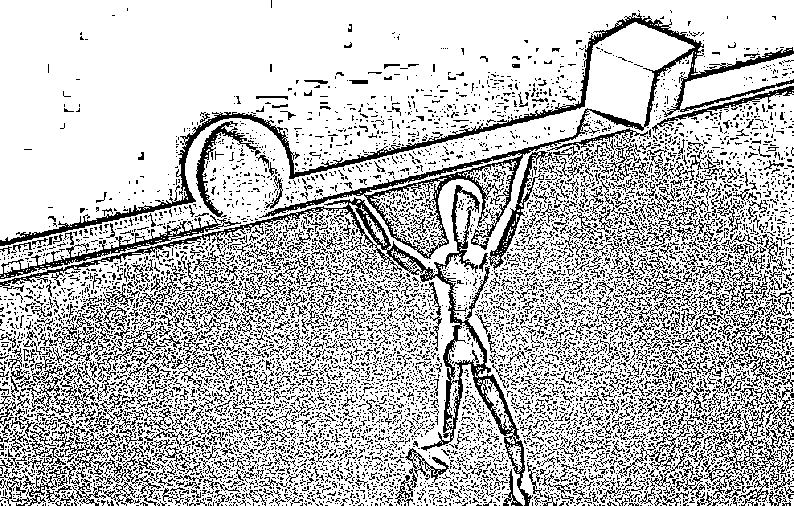

**天秤座的其他优点**  此外，天秤座还通常**很善于倾听**，给人一种“让干嘛就干嘛”的感觉，所以有时会认为天秤比较被动。天秤座可不是“被动”星座，他其实是一个社交星座，还是个**非常“活跃”的社交星座**。天秤座会主动搭讪，然后礼貌地冠以“我们”或“你”的称呼，这可是他们惯用的典型字眼。“不如我们去看电影吧。你愿意去嘛？”“我们应该去那里，你觉得呢？”天秤会给予他人建议，同时也会从他人那里寻求见解。那些在出生星图中天秤座影响很突出的人，往往会喜欢从事**资讯类**的职业，比如**心理咨询师，或者是商界律师或顾问。**天秤座“以人为导向”，只要是和天秤座有来往的人，不管从事何种职业，天秤座都会实打实地对待你。天秤座还善于**维护不同意见之间的公平、公正**，这点最为人所知，所以天秤座往往是**冲突或谈判各方之间的仲裁人**。不过，天秤座的这种不偏不倚的态度，有时也会给周围的人带来困惑，因为不知道他到底站在哪一边。其实，天秤座在乎的是能够**和谐地解决问题，他们以为你会知道其意在和平。**天秤座还颇具**“审美”能力**，久负盛名呢，所以有时会被奉为艺术天才或创意天才。其实，天秤座对美感之所以有灵敏的嗅觉，根本就在于他们**想取悦他人，渴望营造一份和谐的环境**。所以你会看到天秤座把墙上变形了的画弄得平平整整；把家具重新摆设，挑选那些能够互相搭配的色彩和艺术形式，放一些或舒缓或消遣的乐曲，所有这一切都是为了创造一个和平和谐的氛围，从而把出现分歧的可能性降到最低，让每一个人都倍感轻松愉快。**在天秤座出生星图里影响突出的行星，特别是那些外行星，会决定他们创造力发展的类型。**如果**冥王星**比较突出，那这个天秤座就会**寻找人与人之间深刻的联系。或激发出他人身上的激情；**如果**海王星**比较重要，那他们就是天秤座中**最富有创造力的一群，憧憬构建一个共同的更具有神秘色彩或浪漫情调的情景**；如果受**天王星**的主宰，这样的天秤座就会**想方设法让别人感到震惊，惊醒大家以一种全新的方式看待生活**——这往往是一种**更加“超前”或颇具现代实验性**的方式。

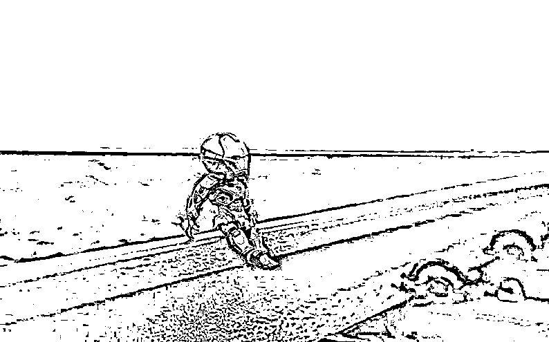

**天秤座的短板**  忽略天秤座本身实际风格或特性的话，那他们至少也会**在潜意识上考虑对他人将会产生的影响。**拿天秤座小孩子来说吧，他一画好画就赶紧向老师或家长展示。如果老师或家长真得喜欢他的作品，他就会画很多张一样的画；如果不喜欢，他们就不会在此浪费精力，转向其它，希望别的什么东西可以给他带来赞许。如果老师或家长无视或者嘲笑小天秤的努力，那他们很可能会就此舍弃所有的艺术追求。这种可悲的结果凸显了天秤座面临的核心问题——**自我驱动力**。**天秤座的动力就是为了取悦他人，所以往往会在取悦他人的过程中丧失“自我兴趣”。**不过，很多人还没有意识到一个问题，那就是天秤座们会在看到他人欢心雀跃的时候产生一种巨大的满足感，特别是看到他们的父母或亲密朋友高兴的时候。由此看来，天秤座“自我兴趣”中“自我”的部分塑造于**和谐关系产生的愉悦感**。这样说来，“共同的经历”反而成了天秤自我兴趣和自我驱动力构建的基础，真是有点好笑。孤身一人的天秤座不会是开心的天秤座，除非他们出生时伴有很多的双鱼座或受到海王星的强烈影响，这样才不会让自己寂寞，可以**通过幻想、想象、创造力或灵修带来的慰藉和安心自娱自乐。**下面不妨再探讨一些天秤座的典型负面特质。你要记住，这些负面特质通常都是植根于幼年时期及成长期各种问题的外在表现。天秤臭名昭著的四大行为是：

*   **优柔寡断；**

*   **意志薄弱；**

*   **老好先生；**

*   **拖沓懒散**

天秤座的这四种负面特质相互联系。他们做个决定推三阻四，天秤座的这种“拖拖拉拉”简直要了朋友的命！对此，很大一部分原因在于**天秤座总是纠结于自己决定所产生的后果，担心会对生命中所有重要的关系造成影响。**“如果我接受了这份工作，能有足够的时间和男朋友在一起吗？再说还有其他朋友呢。”天秤座总是想让所有其他人开心，这也会把天秤座自己逼疯的！所以他们会在做决定的过程中不断咨询他人，直到最终，天秤座自己都恼怒起来，就连“做点事吧！”这样的冲动都变得无法忍受。拿最极端的例子来说，这种优柔寡断、下不了决心的问题，根源于天秤座的家庭氛围，在不断成长的过程中，需要天秤座自己做决定的时候反而受到某种方式的阻挠，削弱了其自我决断的能力。所以，妈妈或爸爸就会替天秤座做所有的决定，连青春期也不例外。而天秤座的任务就是**以最有效的方式取悦父母**。父母一般都会喜欢自己小天秤作乖顺听话的样子，从来没有考虑过成年后天秤座自己做决定时出现的各种麻烦。就算是在家长过渡霸权的单亲家庭，小天秤座也将会不遗余力地去迎合家长的想法愿望。就此看来，成年天秤座需要费点力气摆脱自己这种过分“依赖”的方式，否则就算是做简单的决定也会惯性地不知所措。

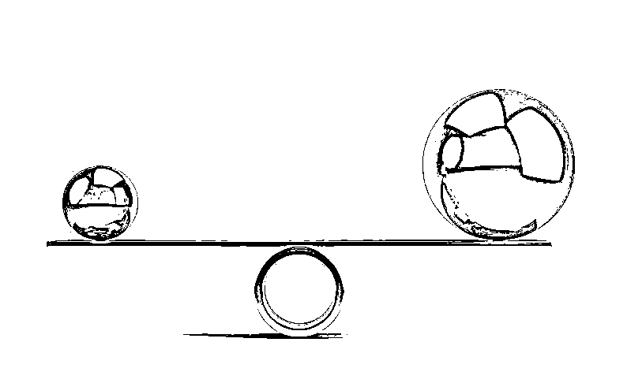

**天秤座如何自我突破？**  就个人成长而言，天秤座要想取得突破，需要**经历各种各样关系——各种终结的关系**！这点不出所料！**拒绝、分手或离婚，这些都会不可思议地改变天秤们的游戏规则**。分手之后，所有的事情都受到质疑，所有一切！**有了这些痛苦不堪、伤痕累累的经历，天秤座才会意识到自己对每一段感情所付出的时间、努力和能量。**在一道道感情伤痕中，天秤座觉得生活对他们如此不公，现在他们很生气！生气的天秤座只是一时而已，像一只白羊座，不过这种“一时性”倒是非常有益。虽然现在天平倾斜了，但最终还会重新平衡。这种情况下，很多天秤座就会去寻求咨询或接受治疗。治疗时，天秤座会揭开那些为了迎合父母或他人而埋藏的旧伤疤或痛楚。所以天秤座会对此愤愤不平！生活实在不公平！为什么不公平呢？呃……因为他们本来希望那段结束了的感情能够开花结果呢！生活有些不公，因为他们付出了那么多不就是为了能有个结果吗，但最终也没有收获一份成功的感情。如果天秤座的父母离婚了，他们会生气，因为他们曾经那么努力地协调双方，不想让他们分开！满腹怨气的天秤座到了青春期就会变得行为懒散、愤世嫉俗。他们最终会去思考**是否真的能够跟他人建立友好关系，是否能拥有美满的婚姻。**说来说去，所有症结最后还是归结于**平衡问题**。意志薄弱的天秤座可不敢冒犯他人，他们只会竭尽全力地寻求赞许，渴望和平的情感。如果再极端一些，那天秤偶说不定就成了**被虐待的牺牲品。**现在他们不厌其烦地避免任何麻烦威胁的出现，那些“老好先生”也是如此。不过生活终有办法召唤出这些人，给他们出难题，让他们去解决行为中的那些不平衡。小天秤座们会被父母贴上“太温顺”或太乐于助人的标签。“你为什么要让他们赢呢？”家长可能会这么说。“你干嘛要听别人的指挥呢？”“你干嘛跟着他们做呢？”**天秤座的父母要明白他们孩子的“能量”存在于“关系构建”中。****天秤座的成功往往基于伙伴关系和情感纽带。**即使是最有学识、或最富有创造力，或最具有技能的天秤座，也会把自己的成功归因于一些**至关重要的关系**上。天秤座的孩子们会首先为受到不公平待遇的朋友打抱不平，而不是为自己辩护。**家长应该强化这种公平竞争的意识。**如果你是天秤座孩子的家长，一定要**支持他们跟同龄人建立良好的关系**。同理，还要让他们**主宰自己的年轻生活**，当然，如果切实可行、合情合理的话。一个各方面都平衡的天秤座孩子或青少年会非常受同龄人的喜欢，长大成人后也会拥有良好的人脉关系网。

**版权声明：**原创文章由作者授权发布于若道平台，欢迎转发，反对抄袭。友号转载请申请白名单。

****想阅读更多作者的文章，请在后台回复******大卫****** 即可。****

**喜欢文章请长按下方二维码打赏**

**给大卫老师加杯咖啡呗~**

**▼**

**系统学习占星学**

**点击图片了解详情**

**微信又双叒叕改版啦，不想错过若道君的推送？**

**就把若道设为星标吧！**

**▼**

就是这个“在看”，戳戳戳 ☟

********报名直达入口********

# “人是会变的，于是我成为了进化占星师。” | 深度对话斯蒂芬·弗里斯特

> 原文：[`mp.weixin.qq.com/s?__biz=MzA5NjA0NTAxNg==&mid=2651427740&idx=1&sn=8ad5cd7d08ffa83f0c36ad32477c6a43&chksm=8b4b212bbc3ca83de6cb2f239525872cc2edf403a8e2f6c43752b60bae7ebb031883c0d335ef&scene=126&sessionid=1692738101#rd`](http://mp.weixin.qq.com/s?__biz=MzA5NjA0NTAxNg==&mid=2651427740&idx=1&sn=8ad5cd7d08ffa83f0c36ad32477c6a43&chksm=8b4b212bbc3ca83de6cb2f239525872cc2edf403a8e2f6c43752b60bae7ebb031883c0d335ef&scene=126&sessionid=1692738101#rd)

****************☆ ****************************后台****************************回复“今日”，给你一句生命态度****************

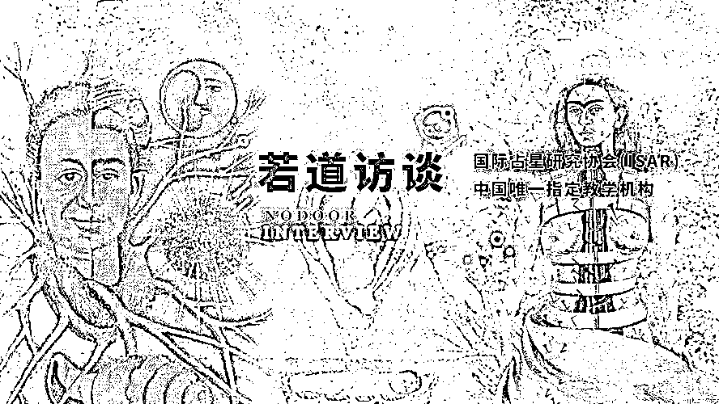

作者/克里斯·布伦南 译者/Chang 校对/Leisha 编辑/玫瑰 图片/全景网

2019 年 2 月 15 日，占星学博客节目主持人克里斯·布伦南同著名的占星师斯蒂芬·弗里斯特进行了一场谈话。如果你对于斯蒂芬老师有兴趣，或者对于进化占星学有兴趣，且相信人是会改变的，人的命运也是会因此而改变的，这篇对话记录将会非常适合你阅读。

**对话斯蒂芬·弗里斯特**

**克里斯·布伦南**

大家好，我是克里斯·布伦南，这里是占星学播客节目。本期我们将对话占星师斯蒂芬·弗里斯特，探讨轮回转世的概念及其在占星学中的应用。我感觉在这个问题的讨论上，你是先驱者之一，甚至是最领先的占星师。你在过去几十年里，一直参与探讨关于轮回转世的话题，以及它和相关观念在占星学中的应用。

所以，现在我终于要在节目上谈论这一话题，我认为你是首次对话的最好人选。那么，我想最好从你的一些个人信息开始，以防万一有听众还不了解你或你的背景。你研究占星学多久了？

**斯蒂芬·弗里斯特**

哈哈你知道的，我有个胡诌的答案，还有个合理的。经常听人这样问我，我就说大概 4000 年吧。大家都认为我是开玩笑。实际上，我觉得这是一种接近真实情况的描述。我孩提时代记得的第一件事就是想要一个望远镜看天空。而且进入占星学就是从业余天文学开始的（现在所谓的占星学后门）。

那时候我自制望远镜，并且对宇宙的科学模型着了迷，这是自从我 10 或 12 岁就开始的。当我通过望远镜去看的时候，我对 12 岁能了解的天文学物理学事实如数家珍。但我觉得这些事实遗漏了什么，我发现（也许说出来太疯狂）宇宙是有生命的。当我看向天空，看着木星、月亮甚至遥远的星系时，感觉就像看着朋友的眼睛。最终我有了足够的个性，可以从科学课上抽离出来，允许自己跟随那种直觉感受。

同时我遇到一个人，我将她看作一位女士。那时她才 16 岁左右，我大约 13 岁。这位女士来自德国，教了我手相学的符号意义。你的手掌——这里金星丘，那里木星丘。手相学知识的组织结构和占星学的基本相同。等到 17 岁这一年，我对天文学和手相学的兴趣可以说汇聚了，我获得了第一本占星学书。那本书真是很糟糕，叫《给青少年的占星学》，作者是一位叫天使·星星的女士，我怀疑这不是本名。我当时刚做了扁桃体切除手术，要在床上躺一两个星期。我做扁桃体切除术可够晚的，17 岁。我妈妈问我：“要不要给你买本书？”我说：“一本占星书。”她就给我买了刚才说过的那本。我说了，那书实在太糟。但我还是感觉里面有点什么，所以又跟妈妈要了一本。这次比较幸运，她给我买了约瑟夫·古德维奇(Joseph P. Goodovich)的一本平装书，名叫《书写你自己的星图》。这并不是一本深刻的著作，但它讲了水星在白羊座、金牛座、双子座，等等，一直讲了所有行星。我开始对占星学的原理产生了一些概念，并且后来再也没放开它。我在接下来的 20 年里一直痴迷地阅读和学习。非常有趣，我刚回想了一下，这个故事大概发生在我的次限水星停滞的时期。次限水星后来一直逆行，持续大约 22 年左右。在这漫长的时间里，我一直阅读占星学，但就是感觉我读的东西有什么不对。然后水星再一次停滞并且恢复顺行，我获得了写第一本书《内在的天空》的合约。简直像定时一样精准。我第一本书第一章的第一句话是：**“人是会变的，然而一个假设却如病毒般流行在现代占星学中，它就是：人不会改变。”**这就是关键，认识到传统占星学描述一个人的方式：“这是你的性格。你是天蝎座，所以你紧张激烈。”你知道这类东西，它挺准的，没有模棱两可，但它忽略了人会成长的事实。**人会随着时间而进化**。就因为这个，我开始将自己看作进化占星师。**并不是指在数千年里的进化，而是比如说，你这个礼拜因为和伴侣进行了一次激烈的谈话而获得了进化。**

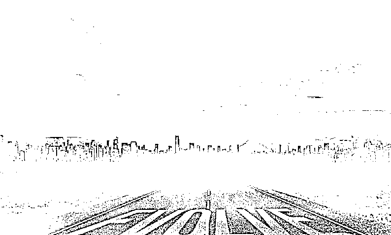

**克里斯·布伦南**是的，所以说我们的出生星图显示的东西，不仅人格，还有生活中的事件，都处在一种成长的，或者说是过程导向的状态里，没什么是固定不变的，没什么是决定好了不能变得更好的，对吗？斯蒂芬·弗里斯特是，就是这样。我在西北占星会议（NORWAC）上做过一个主题报告，很简短，但标题我很喜欢——“比描述更进一步”。主旨是这样：让占星学超越对人进行描述的层次，来到指引的境界，这主意非常诱人。你明白，在人们的进化之路上鼓励并且支持他们，如何成为更好的人。你的水星在天蝎座，你是将心理洞见化为攻击性的言辞来数落你所有的朋友呢？还是利用可能有些激烈但会支持到朋友们的洞见，来帮助他们，同时也让自己感觉更好呢？并且我觉得可以观察到，在水星落天蝎座的人群中，这两种行为都存在。令我激动的是，不好的那类可能渴望变成好的这类。这就是进化的路，所以，我们怎么指引并且支持到人们进化的脚步呢？克里斯·布伦南当然了。那这些的背景都是什么——我是指，你涉足占星学的时候，主要受哪些著作的吸引呢？比如你立刻就被丹恩•鲁伊尔的著作或者类似高水准的占星学吸引了吗？斯蒂芬·弗里斯特最深深打动我的，是**苏格兰占星师查尔斯·卡特**（Charles E. O. Carter），**神智学**方面的影响；**罗纳德·戴维森**（Ronald Davison）对我也非常重要。这两位对我来说影响最重大。我阅读了鲁伊尔的《人格占星学》，逐页地读，还划了重点，但读到最后仍然不理解他在说什么。当时我最欣赏的英国神智学家还有艾伦·里奥（Alan Leo）和瑟夫瑞欧（Sepharial），可能不像刚才提到的两位对我那么重要。后来，诺·泰尔真的对我帮助很大。他写了一部 12 本书的系列作品，好像叫《占星学的基础和原理》。我当时没什么钱，但我节衣缩食，激动地去书店买下一册又一册，然后大快朵颐。我一直为此很感佩他。克里斯•布伦南确实，他在心理占星学和咨询工作上很有一套。他的方式又很具体，或者说直接，好像所有事情都是用更加心理学的方式考虑的。对了，你白天的工作是什么？我就喜欢听这个。比如我做过咖啡馆服务生，这是我实现成为全职占星师的跨越之前的工作。所以我总是好奇不同的占星师们做过什么。斯蒂芬·弗里斯特我其实——这听上去会比实际上光鲜，但是呢——我为美国心理卫生研究所工作过四五年，其实是受雇于北卡罗来纳州立大学的一个研究项目。我就读于北卡罗来纳大学教堂山分校，毕业时，我在这个大项目里获得了一个打杂工作，慢慢地跟其中的人交了朋友，他们发现我擅长写作，所以我就成了在职作者。实际上这完全不符合我的个性，但那时候，北卡罗来纳的研究三角园区有一个电脑，当时还用穿孔卡片等进行操作，我变得很擅长那个应该是叫 SPSS 的（社会科学统计程序），于是我就帮忙做数据分析。所以我为他们工作了很长时间。这算一个有意思的故事，克里斯，因为我做了些相关性研究——这是我首次在节目中承认渎职误用税款的行为——我把人们对一些心理学问题的回答和他们的太阳星座进行了相关性研究。只有出生日期，所以我能做这个，但没能做更多。但我可以去掉落在转换日期，比如 21 或 22 号的人，然后将剩下的按太阳星座分组。所以数据是干净的，只基于太阳星座。随后我有了发现。举个例子，你走进一个房间，里面有些是陌生人，也有些熟人，你主要是跟熟人说话呢，还是试着认识新的人？巨蟹座的结果：有最多人回答只跟熟悉的人讲话，并且统计学上的差异是显著的。这并不是多伟大的洞见，但确实是支持占星学的数据。我当时非常激动，所以就辞职了。我要写一本书，它将改变世界。你明白，占星学的统计证据啊。我给它起的名字是《一种古老艺术的新证据》。我当时领取着失业保险，还把室温调到 45 华氏度，因为我的钱不够供自己家取暖，但我同时在打字机上书写着，觉得自己就要变成亿万富翁了，因为我要改变世界了。你懂的，我那时 27 岁左右。当然了，这本书被广泛拒绝了。

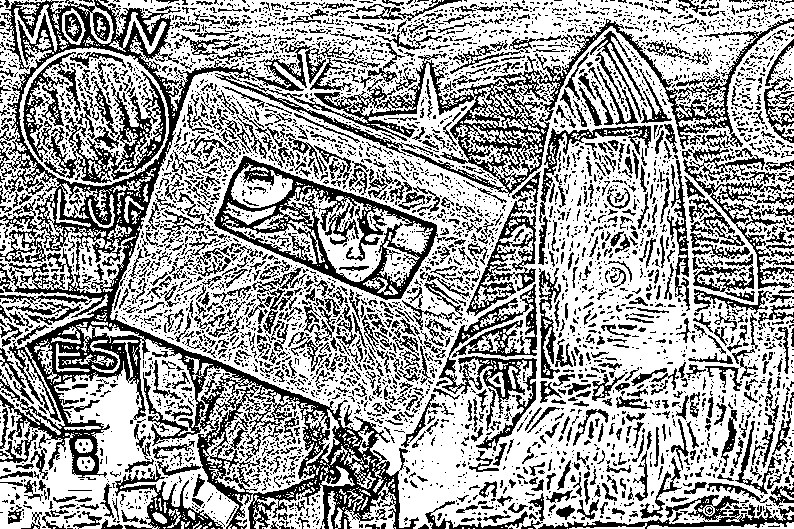

克里斯·布伦南你把它推销给各个出版商，但没人愿意出版？斯蒂芬·弗里斯特正是如此，投给主流出版商们。其中一个出版商在拒绝回信中这样写道：“主流占星学出版界的目标是以自我为中心，我希望它会一直如此。”就是这件事让我离开了美国心理卫生研究所的工作。并且就在这时，我逐渐开始建立自己的占星师事业，结果红火得很。没有出书，没有名气，就是本地一个嬉皮占星师而已，但我的预约排到了六、七个月之后，我能靠这个过得不错。此后我再也没有回头。克里斯·布伦南要是你那时候二十七八岁的话，这听上去简直像一个很有建设性的，几乎是土星回归的故事。斯蒂芬·弗里斯特是的，我当时在月亮回归和土星回归的过渡期。克里斯·布伦南明白了。那么，回到占星学和轮回转世。我想问，早期的时候它在你的占星学中扮演多重要的角色？比如在第一本书时，跟后面相比。随着时间推移，它在何时成了你的整个占星哲学中的核心部分？

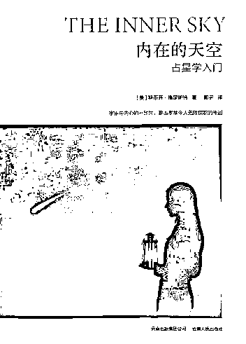

| 《内在的天空》
斯蒂芬·弗里斯特实际上，它从一开始就很重大。有意思的是，我写第一本书（《内在的天空》）的时候，我的出版商——班坦图书，给我施压让我不要把书写得太注重灵性。他们基本上——回想起来甚至有些滑稽——让我不要太多地用“灵魂”这个词，因为他们感觉这不会让读者感兴趣。但是当然了，几年后有了《心灵地图》（托马斯    摩尔著），然后突然间到处都是“灵魂”这个词。但他们当时就是不让我用，他们想让我把形而上学的部分轻描淡写。而我能跟班坦图书签合约就已经兴奋不已了，所以回答都是：“好的，先生。好的，先生。”但在那本书最后，我讲了约翰    列侬的星图。就在我写书期间，他被杀了，而他对我来说是很重要的人。这本书的最后一章对他的业力问题进行了一些分析；月亮南交点在白羊座，按照我用的普拉西德分宫制位于第十二宫。所以我将他描述为前世“打了败仗的战士”，这只是短短一句话，但想到打了败仗的战士所受到的情感冲击和后果，可以即刻帮助我们理解他的反战活动和反战歌曲《给和平一个机会》等等。所以在我第一本书里，就已经写了这些。克里斯·布伦南好的。你的第一本书就写了这些，但它又肯定在成长、发展，直到今天。我的意思是，你实践的占星学主要是被称为进化占星学的学派或技法。我在重新读你的《昨日的天空》的部分内容，这本书是 2012 年出版的，你在书中尝试定义进化占星学是什么。但这有点难，因为一方面，你想给它某种定义，但另一方面，你也希望它内涵足够广，不必是一个具体的技术方法。尽管到现在，它的发展主要还是围绕着你的技法和你的同事杰夫·格林（Jeffrey Wolf Green）的独特技法，但你们两个多多少少已经和进化占星学这一术语密不可分了。所以，考虑到这些，你会怎么定义进化占星学？或者说你的版本的定义？斯蒂芬·弗里斯特我确实喜欢包罗万象的技法，因为它还在不断发展中，新来的占星师在不停地扩充这个技法。但它实则是一个碰撞，是古老的，形而上学与现代占星学和 20 世纪伟大杰作心理学的碰撞。**心理学、古老的形而上学以及占星学，它们交汇的地方，就是进化占星学。**当一个心理学家做治疗的时候，会想要了解你的童年，成长经历，并去理解它们如何塑造着你成年生活中的挫折和挑战。而一位进化占星师，会高兴地将这些都包括进来，但还会看向**灵魂的童年，也就是往世**。进化占星学认为，**未解决的过去世经历，与你今生成长过程中在家里挨打或被爱的经历，对人所产生的影响几乎完全一致，影响本质上是相同的**。我们在做的，就是**扩展时间的维度，将过去世的概念包括进来。**

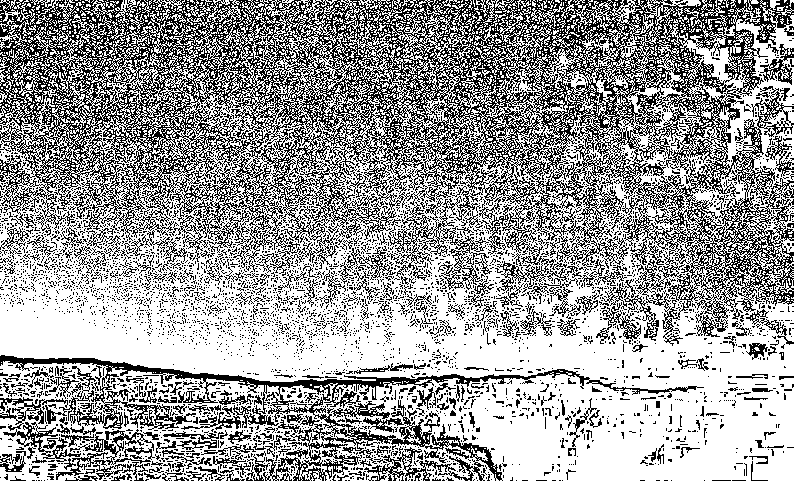

克里斯·布伦南当然了。所以我想，就像出生星图占星学有一个基本前提：一个人出生了，那一刻行星的排列会描述此人的性格，也描述此人的未来和可能发生的事件或主题。然后，总有这样一个问题：如果这能够精确描述一个人的性格，那么通常在心理学语境里，就有一个问题，是先天还是养育。一个人来到生命中时，带着多少已经设定好的性格特征，相比之下，多少性格特征是后天经由家庭教化和环境因素等事物的影响在人生的历程中发展而成？并且，你所应用的部分哲学前提是，其中某些性格特征不只是由此生的境遇发展而来，还有某种前世的动态能量在发挥影响，并且在今生中回响，这也出于某种原因反映在出生星图中。斯蒂芬·弗里斯特对，对，就是这样。你讲的是一个很好的论点。举个例子，某人月亮在水瓶座，合相土星，一个占星师：“你的妈妈比较疏离冷淡，”这是一种可能的解读。假如客户说：“是的，难怪我妈妈这么疏离冷淡，因为我的月亮在水瓶座合相土星呢。”虽然它们可能确实相关，但早在母亲对你疏离冷淡之前，你已经有了月亮合相土星的星图。如果我们想一想先有出生星图这个顺序，就会发现人们的逻辑有时会变得混乱，因为这种顺序会使人们推断出一种因果关系，就好像妈妈导致你有了这个配置一样，但实际上是反过来的。我们一旦努力应对这个根本问题，面前就像有两个合理的道路。做出挑选吧。一条是：占星学是宇宙的法则，而这个宇宙从根本上是随机的，当你碰巧吸第一口气时，轮盘停了一下，于是这就是你的星图，这就是你的人格。你是一只电动班尼兔，你会一直扮演这个人格，一直到你的电池在这个无意义、无希望的宇宙中用到没电为止。也许这是真的。在理智上，一个人可以捍卫这个虚无主义的观点。认为你的星图只是随机的。

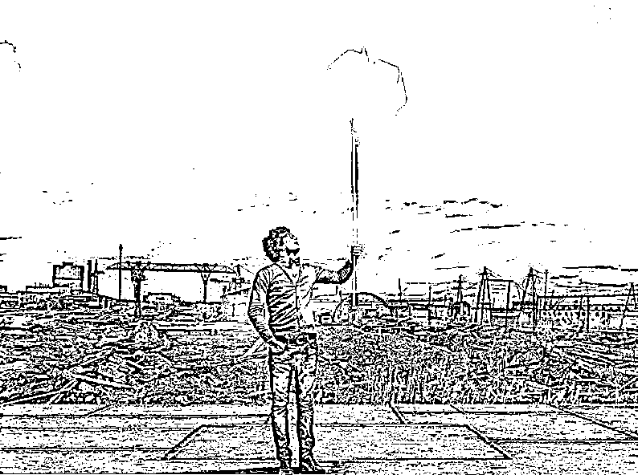

理解占星学之所以有效的第二种方式就是，**你拥有你的出生星图是有原因的，有某种目的**。我从来没遇到过任何占星师不认为第二种方式胜于虚无主义的观点。但是，一旦我们开始认为我们拥有这个星图是出于某种目的的，就要问，为什么有这个目的呢？逻辑要求我们假设，过往存在过条件，果跟随因，所以早在你出生之前，就有某种东西导致你成为一个拥有水瓶座月亮合相土星的人，或其他任何配置也是如此。现在，我先要说，这距离证明轮回转世差着十万八千里呢。我不会把它说成是证据。但它确实证明了，除非我们想要接受虚无主义的占星学，否则，我们就需要假设星图指向出生前的奥秘，我们生来具有某种天性是有原因的。我之所以对这种占星学抱有极大热忱，哲学基础就在于此。克里斯·布伦南当然了，我认为大部分占星师都会支持这个想法，占星学似乎暗示着我们的生命和发生的事件有某种意义和目标。出生星图有效这个事实，就表明这些事件和一个人的生命是有意为之。斯蒂芬·弗里斯特对，就是这样。我从来没遇到过哪位占星师不同意这点的。我知道很多人不喜欢进化占星学，这没有关系，但是我还没有遇到过谁更偏好随机的、虚无主义的宇宙模型。克里斯·布伦南占星学有效本身，似乎就不只是提出这个问题，而且几乎立即让你被迫承认，宇宙中有更大的存在。而且我认为，即便是带着更现代观念进入占星学界的占星师（也会同意）。我说的更现代——不想说更“科学”，因为说“科学”好像不太对，但是泛泛地讲，当前流行的科学观点确实认为宇宙是随机的、无意义的，认为我们只是漂浮在一块岩石周围的一片片有机物质尘埃，而万事万物也都是没来由的。但占星学似乎表明了一个奇异的、完全不同的甚至相反的观点，**我们的生命有意义和目标**。而且我认为大部分占星师都同意这一点。斯蒂芬·弗里斯特是的，我也这么想。我就接着你提到的一点继续，我也会很乐意为你这话署名，你提到有更大的存在，你的原话。我想加强这个观点：占星学有效本身，就说明在此生以前已经发生过某些事情了；在你的出生星图形成之前，先有了原因。轮子在转动着，在更大存在的背景下，谈论前世发生的事将带我们更贴近我的观点的核心。

**版权声明：**本文由若道翻译发布，欢迎转发，反对抄袭。友号转载请申请白名单。

斯蒂芬·弗里斯特

若道签约老师。进化占星学的创始人之一，当今世界最有影响力的占星大师之一；1985 年，他凭借《内在的天空》一书获得职业占星师协会奖（Professional Astrologers Incorporated Award）。他四次获得占星界最高的占星学联合协会奖（United Astrology Congress Regulus Award）提名，2018 年获得轩辕十四教育奖。

**想参加斯蒂芬线上工作坊？**

**请点击图片链接****或添加客服微信咨询**

**想听听大师斯蒂芬老爷子的精彩讲座？**

**长按下图了解详情！**

**微信又双叒叕改版啦，不想错过若道君的推送？**

**就把若道设为星标吧！**

**▼**

就是这个“在看”，戳戳戳 ☟

****************报名直达入口****************

# 雷蒙德·梅里曼金融占星周运 | 海啸来临前，会是相对平静的一周

> 原文：[`mp.weixin.qq.com/s?__biz=MzA5NjA0NTAxNg==&mid=2651427740&idx=2&sn=a6694f4c0d91439a6e0fdfc29d5aa0dd&chksm=8b4b212bbc3ca83d61327f050783de07c08ea09fd976ee44db3fed1b87a18ae4eda4e765a926&scene=126&sessionid=1692738101#rd`](http://mp.weixin.qq.com/s?__biz=MzA5NjA0NTAxNg==&mid=2651427740&idx=2&sn=a6694f4c0d91439a6e0fdfc29d5aa0dd&chksm=8b4b212bbc3ca83d61327f050783de07c08ea09fd976ee44db3fed1b87a18ae4eda4e765a926&scene=126&sessionid=1692738101#rd)

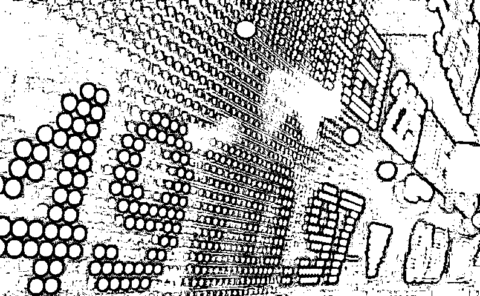

作者/雷蒙德·梅里曼
译者/李含编辑/玫瑰 图片/花瓣网雷蒙德·梅里曼是在金融占星学界稳坐第一把交椅的占星师，同时他也是若道签约的金融占星课老师，我们引进了雷蒙德·梅里曼老师的《[上证指数+黄金周期月度报告](http://mp.weixin.qq.com/s?__biz=MzA5NjA0NTAxNg==&mid=2651425978&idx=2&sn=c7e3187f3abfe604c511ea9506775c0a&chksm=8b4b3e0dbc3cb71bbe141e7e7a5e9ddb0690537fd1661d2f9919f23741010a762b9966633af8&scene=21#wechat_redirect)》《[2021 年金融预报](http://mp.weixin.qq.com/s?__biz=MzA5NjA0NTAxNg==&mid=2651425978&idx=1&sn=067bd68ece37e1e820d6f84f7a3cc960&chksm=8b4b3e0dbc3cb71b866f65d51f7993d3c35dee77cebd77eda3f63a4d5864dadaea2e9d14c101&scene=21#wechat_redirect)》。我们经老师的授权，将每周刊登梅里曼老师的周运，供大家参考和学习。于是，这是本周的周运（9.21-9.25）。**说明：以下时间采用纽约证券交易所所在地美国东部标准时间。**
**展望与回顾**

**全球股市周四进一步下滑，此前美联储没有承诺改变其大规模债券购买计划……即便在美联储周三暗示将把美国利率维持在历史低位至少到 2023 年底之后，投资者仍感到不安。**

**——亚当·萨姆森和卡米拉·霍奇森**

**《美联储量化宽松计划落空后，全球股市下滑》**

**《金融时报》**

**2020 年 9 月 17 日**

自 3 月底疫情大流行，市场触底以来，与美联储唱反调一直不是一个成功的策略。但是，当美联储上周宣布到 2023 年将维持利率在 0%左右不变时，全球股票市场并未欢欣鼓舞。美联储是否已经用尽了刺激股市的武器，特别是在即将进入美国大选之际？或者这只是火星在其守护星座白羊座的逆行，当它在其守护星座逆行的时候，就会**因为过于咄咄逼人和自信，而从强烈的侵略性和信心转变为担心不良后果**。火星逆行时，侵略者通常是输家。这种情况会一直持续到 11 月 13 日。**如果你怀疑某件事会不会成功，就不要开始做这件事。**就在两周前，在 9 月 4 日三星关键反转日期的一天内，全球许多股市都处于 3 月 16 日至 23 日市场崩盘低点以来的最高水平。纳斯达克指数和标准普尔指数甚至创下历史新高。在我们 9 月 14 日的二星关键反转日期，其他一些指数仍在创下崩盘后的新高，比如日本日经指数。到了 9 月 18 日，这些市场中的许多都创下了月度新低。似乎 9 月 9 日，火星在白羊座逆行确实与本专栏中提到的乐观情绪的逆转有关。不过，一些大宗商品也出现逆转，但却是**大幅上扬**。白羊座的火星充满热量，正如美国西部正在发生的大火那样。这也与**出乎意料的变暖条件**有关，需求增加，导致谷物价格上涨，这与火星四分土星和冥王星（农作物受损）一致，玉米和小麦价格处于 3 月份以来的最高水平。大豆达到了两年来的最高水平。原油价格也有所回升。9 月 8 日，当木星和火星都在为改变方向做准备时，从一周前的基本周期低点 36.13 开始，原油在一周内上涨了 15%，至 9 月 18 日星期五的高点 41.49。火星逆行将伴随我们到 11 月 13 日。但这只是故事的一部分，因为**从 9 月 28 日到 10 月 19 日，全球局势可能掀起一场大海啸，反过来可能会对金融和大宗商品市场价格产生巨大影响。****短期占星趋势和长期考量**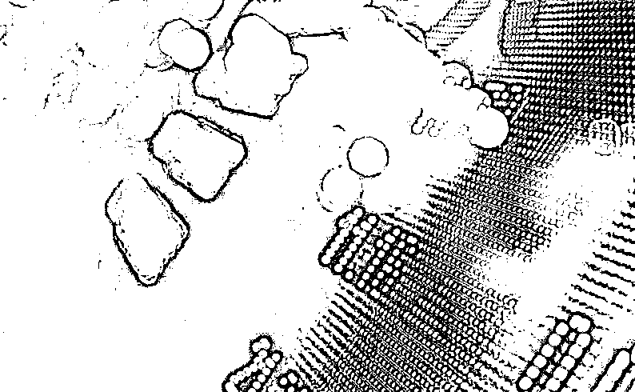

**在过去的几十年里，我们看到了许多与幸福相关的因素朝着正确的方向发展。经济繁荣，关键资源和服务的获取范围扩大，人与人之间的联系比以往任何时候都更紧密，至少在数字意义上是这样。尽管存在这些趋势，但人们对心理健康的担忧仍在增加。**

**根据卫生部的一项研究，在美国，青少年抑郁症从 2007 年到 2017 年上升了 63%。世界卫生组织关于精神健康和新冠肺炎的报告估计，全球经济每年因抑郁和焦虑而损失 1 万亿美元。**

**——《幸福的未来是什么样子的？》**

**瑞银首席投资办公室**

**www.ubs.com/global/**

**2020 年 9 月 17 日**

**“只有选举被操纵，我们才会输掉这场选举。”美国总统唐纳德·特朗普上个月发表了令人震惊的言论，以及他不断加大的对 11 月选举公正性的怀疑，突显了一个越来越令人担忧的问题：作为世界上最古老的民主国家之一，美国能否确保 2020 年的选举自由公正？**

**——《经济时报》**

**《失去信心：在民主的堡垒里，对美国选举诚信的担忧》**

**2020 年 9 月 13 日**

**在最新的《拉斯穆森报告》的每周白宫观察调查中，特朗普总统目前已小幅领先民主党候选人拜登一个百分点。虽然统计上无关紧要，但这是特朗普第一次领先……在过去两周，选情差距已经缩小。拜登上周领先 2 个百分点，但这项调查也标志着特朗普在过去两个半月里首次小幅突破 45%。在本周之前，自 7 月初白宫观察开始以来，拜登在每一次每周调查中都领先于特朗普。**

**——《拉斯穆森报告》**

**《白宫观察：特朗普领先》**

**www.rasmussenreports.com **

**2020 年 9 月 16 日**

也许在下一周宇宙风暴来袭之前，我们在这一周会拥有一点平静。太阳进入天秤座，这是协议和外交的象征，从 9 月 22 日开始为期一个月。水星在 9 月 27 日进入天蝎座，天蝎座掌管的是调查和揭露被隐藏的事情，由于逆行，水星将在这里逗留到 10 月的大部分时间，从 10 月 13 日到 11 月 3 日。鉴于特朗普总统是由水星掌管的双子座，这段逆行期对他来说将是至关重要的。我记得在 2008 年，当水星在选举季节逆行时，处女座（也是水星的守护星座）的约翰·麦凯恩看到他的竞选命运完全逆转。他一直领先，但在逆行期间，由于当时经济危机的爆发，他在判断上犯了错误，到巴拉克·奥巴马赢得选举时，他已落后太多，无法恢复元气。**不能忽视对 2020 年大选前可能出现的另一场经济危机和股市崩盘的担忧，尽管从历史上看，这种相关性很微弱，只在 2008 年发生过**。当土星在 2008 年 11 月 4 日选举日开始接近对分天王星时，危机爆发了，这个相位一直持续到 2010 年 7 月 26 日。

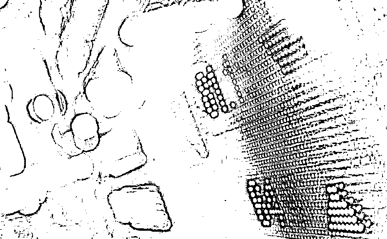

**土星和天王星之间的另一个困难相位即将到来，但它要到 2021 年 2 月才会第一次准确成相。**然而，我们确实有另一个强大的宇宙征象，预示着**两周后可能出现的经济危机和歇斯底里的股市**。**9 月 28 日至 10 月 19 日，逆行在白羊座的火星将第二次（共三次）与摩羯座的土星、冥王星和木星形成渐盈四分相。**今年早些时候（3 月 20 日至 31 日）股市危机时，火星就已经与这三颗行星形成了合相位。事实上，它是在 3 月 23 日股市暴跌的底部。**火星与这些行星的上弦四分相暗示着与当时类似的动态就要再次出现。**新冠病毒肺炎至今没有治愈方法，世界各地的社区封锁也在卷土重来，并伴随着企业倒闭潮。随着火星在白羊座逆行到 11 月 13 日，并且已经在四分土星和冥王星的容许度内，有没有人注意到**每个人似乎都承受着压力，没有足够的时间做所有的事情？**在世界各地的社会中，这可能是一种非常紧张的能量动态。然而，解决方案很简单。包括**调整自己的步调，不要一次承担太多有最后期限的任务。**从工作到休息、锻炼、饮食和社会事务，你的所有活动都要**保持平衡，避免卷入不必要的争执，这对你的身心健康至关重要。**如果你能做到这一点，并且**不让自己处于一种依赖关系中**——这种关系中任何人都有拖延的倾向。你不仅可以完成一些事情，而且你可以在按时完成这些项目时感到巨大的解脱，因为你已经掌握了控制权，而不是把它交给别人。如果你落后了，尤其是因为其他人没有尽自己的责任帮助你完成工作，你可能会感到痛苦的怨恨，同时感到自己没有获得尊重和赏识。如果你把所有的时间都集中在工作上或者一个特别有压力的问题上，你就会身心疲惫，精神（情绪）疲惫。如果可能的话，**利用这段时间更好地照顾好自己，放松一下你必须马上完成所有事情的执着**。你不能呼吸了，我也不能呼吸了……这是火星与土星-冥王星的角力。它自 3 月下旬以来一直在那里，它既是字面上的，也是一种隐喻。让你自己呼吸，也让别人呼吸。否则，可能会有人受伤。

**说明：以上日期基于纽约证券交易所所在的美国东部标准时间，由于存在时差，中国地区可能需要加一天。**

**版权声明：**本文由若道翻译发布，欢迎转发，反对抄袭。友号转载请申请白名单。

**雷蒙德·梅里曼（Raymond Merriman）**

若道签约老师。著名金融占星师，ISAR（国际占星研究协会）前主席，梅里曼市场分析公司的总裁。他由于“提升了占星学的职业形象”，在 1995 年国际占星大会上被授予轩辕十四奖；在 2012 年国际占星大会上，被授予轩辕十四终身成就奖。

1“中国上证指数月度报告”发售

**若道推出了****中文版****的雷蒙德·梅里曼中国上证指数月度报告，并持续发行该报告！**

当把金融市场的周期和占星学的周期相结合时，雷蒙德·梅里曼老师的金融占星学研究**为投资者应对金融市场的周期波动，并随之调整投资策略提供了极大的价值参考**。

**10 月中英文报告即将上线！**

2“黄金价格周期月度报告”发售

**若道推出****中文版****的雷蒙德·梅里曼黄金价格周期月度报告！**不仅仅为广大读者在中国股市的投资出谋划策，更将视角放眼黄金市场。

**每当世界经济形式不明朗的时候，有一个地方是保值的港湾，那就是****黄金**。自 1982 年雷蒙德·梅里曼出版第一本研究《地球宇宙学征象与黄金价格的关联》的著作以来，**他一直作为最重要的黄金市场时机预测者之一享誉国际**。

8 月的黄金终于从高位开始下跌，有些分析人士认为，黄金在过去连涨 9 周是非常极端的，因此走势未来不会太强了；也有人认为，在目前各国大放水、国际局势不稳的情况下，黄金可以继续看高。

那么，你该如何面对目前的调整呢？是等待回调继续进行，还是在什么位置买入？9 月黄金周期报告等着你。火星已经进入逆行阴影期，很多国家都纷纷再次爆发新冠肺炎病毒疫情，未来的几个月注定不安宁。黄金的走势会安宁吗？

9 月黄金报告已经上线，上证报告也会在月底上线。欢迎了解。也可以按照季度和一年期订阅，有更多优惠。季度和年度的好处是，你可以持续了解梅里曼老师对于不断在变化的市场的看法。即便他某一次看法和市场不一致，你也看到在下一期他如何调整自己的看法，并看到金融占星在一个长期时间段内对你把控风险的帮助。而能够长期控制风险、尽量找到安全的投资时机才是投资的长久之计。

**10 月中英文报告即将上线！**

**购买套餐**，买得越多越优惠

中国上证指数月度报告套餐价

*   **单月报告**：280 元

*   **3 个月套餐**：780 元（260 元/月）

*   **12 个月套餐价**：1999 元（166 元/月）

**长按下图识别二维码**

**购买金融报告****套餐**

**▼**

黄金周期月度报告优惠

*   **双报告年度套餐更优惠（直降 899 元）**
*   **12 个月黄金报告+12 个月上证指数报告：仅需 3500**

**长按下图识别二维码购买黄金报告套餐**

▼

1976 年以来，由雷蒙德·梅里曼撰写的梅里曼市场时机学院每年一次的年度预报沙龙和每年一本的《年度预报》一直在应用占星学原理为投资者们服务，提供卓越洞见，从未间断。

过去两年，3 小时的年度预报讲座和长达 200 页左右对金融市场的分析报告，帮助许多若道读者做出正确的投资决策，降低了投资风险，并获得相当不菲的投资收益。在群星摩羯座的时候，我们和你一起提早规划自己来年的投资安排。

**2021 年金融年报预售**

**1976 年以来，由雷蒙德·梅里曼撰写的梅里曼市场时机学院每年一次的年度预报沙龙和每年一本的《年度预报》一直在应用占星学原理为投资者们服务，提供卓越洞见，从未间断。**

过去两年，3 小时的年度预报讲座和长达 200 页左右对金融市场的分析报告，帮助许多若道读者做出正确的投资决策，降低了投资风险，并获得相当不菲的投资收益。在群星摩羯座的时候，我们和你一起提早规划自己来年的投资安排。2021 年年度预报开始预售**前 50 名预售价格**：1080 元（已售罄）**前 50-100 名预售价格**：1180 元**100-150 名预售价格**：1280 元**150 名之后价格**：1380 元**2021 年年度预报中文版预计发布时间**：2020 年 12 月底**沙龙时间**：2021 年春节前后**沙龙形式**：英文讲座，配有中文翻译**点击下图了解详情**

▼

******点击阅读原文购买金融报告******

# 做“高级”玩家，上天自有安排丨狮子座的进化功课

> 原文：[`mp.weixin.qq.com/s?__biz=MzA5NjA0NTAxNg==&mid=2651427708&idx=1&sn=aa159f47154ab7685ea28c223550d24d&chksm=8b4b21cbbc3ca8dd9273eb7af5f5b93bd4f9f0402d0d1719675dfe1d8b26216337bd274a2805&scene=126&sessionid=1692738106#rd`](http://mp.weixin.qq.com/s?__biz=MzA5NjA0NTAxNg==&mid=2651427708&idx=1&sn=aa159f47154ab7685ea28c223550d24d&chksm=8b4b21cbbc3ca8dd9273eb7af5f5b93bd4f9f0402d0d1719675dfe1d8b26216337bd274a2805&scene=126&sessionid=1692738106#rd)

******************☆ ****************************后台****************************回复“今日”，给你一句生命态度******************

作者/胡曦兮

编辑/翀子 封面/书君 图片/网络

提起狮子座，很多人都觉得他们阳光满满，充满生命活力。而他们的进化之路又是怎样的呢？做一个精彩的“玩家”真的那么简单吗？
**做高级“玩家”**

说起狮子座，很多人脑海里的印象都是阳光大男孩，或者霸道总裁范儿，这是娱乐占星给狮子座打上的标签。

那么狮子座的能量到底是什么呢？

狮子座作为火象的固定星座，它代表每个人的**生命活力能量（元气）**。人是一个能量体，除了肉眼可见的肉体之外还有不可见的以太体、情绪体、灵性体等多层，中医称为“营卫之气”，活力充沛时人的能量体便会增亮，整个人炯炯有神。

每个人都需要充沛的生命活力，就像万物都需要阳光，它是自我驱动的能量，也是人类社会得以繁荣发展的核心能量。活力充沛时，整个人充满热情与干劲，像满地乱跑的孩子从不觉得累；活力不足时，惰性便会产生，人容易萎靡不振，干什么都提不起劲头；而活力消沉时，人就贪图享乐，甚至自暴自弃。

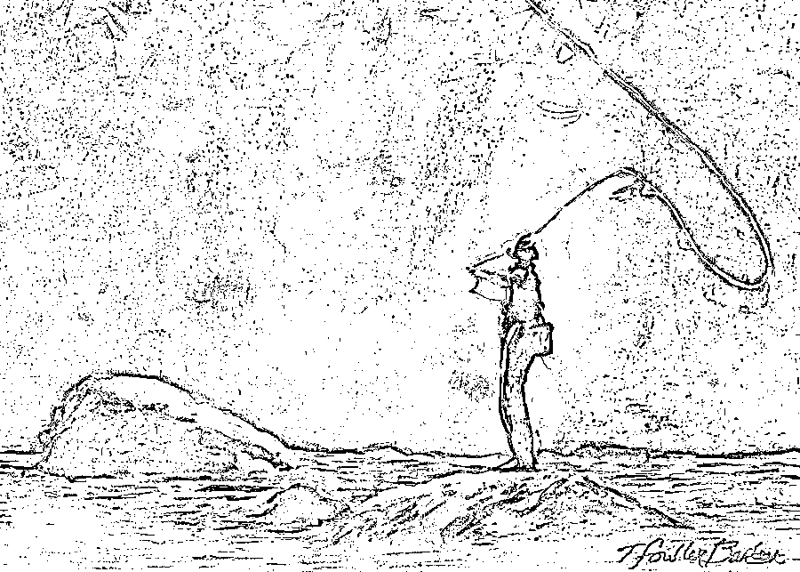

**保持自我充沛的生命活力，**是狮子座的功课，方法很简单——**学会尽情地去“玩”**。“玩”和“耍”不一样，“玩”字古代有两种写法，“玩”和“翫”，都与“元”（自我）相关，所有的“玩”都发自于内心，是自我的延伸。所有自己觉得好玩儿的事情都是在玩，可以是玩音乐，玩摄影，玩话剧，甚至是可以把工作当成在玩。

玩开心了，像孩子般的开怀大笑，忘却人间烦恼。两个“玩”字分别用“玉”（王）旁和 “习”旁，在古代，“玩”是一件很高级的事，玉有灵性，它是“挑主人”的，王侯贵族的德行比玉才可玩；“玩”需要不间断的练习，拳不离手，曲不离口；反之则是玩物丧志，有害生命，如玩赌博、玩大麻等等。

当“玩家”的生命光彩可以不断延展至整个舞台、整个领域乃至整个世界，促发众人一起积极向上，各自创造更多生命的精彩，这就是宇宙能量丰盛的过程——道生一，一生二，二生三，三生万物。

**作为高级“玩家”在这世上留下个人成果**，是狮子的高阶能量，一些经典的艺术作品带给世人美的想象，一些领导人物的叱咤风云给世界创造很多美好。很多领导者、大人物、创意工作者都有着这样强大的狮子座能量。

在出生星图中如果太阳、月亮、上升（或其所落星座的守护行星）落入狮子座，本文中称之为狮子座人。日月升是每个人星图中的三大重要引擎，分别代表我们的**活力**（心智系统）、**快乐**（情感系统）、**个人作风**（立足社会的能力），太阳作为狮子座的天然守护星，落于狮子座将使其变得尤为重要。狮子座人需要终其一生学会尽情地“玩”，保持充沛的生命活力。

为什么宇宙给了你如此强大的狮子座能量？

每个人来到人间都和宇宙签订了一份灵魂契约，它写在你的出生星图中，这并不是一份强制合约，人类拥有自由意志，可以自己做选择，但宇宙希望每个灵魂在生命旅程中都可以做出对的选择，收获成长。因此，出生星图中的每一个能量都是你所需要的，对灵魂有所助力的良药。

**狮子座的阴影**很多狮子座人说自己不像狮子座，总是觉得生活没什么意思，没什么个人追求。但又有一种狮子座人，他们总是自我亢奋，经常过度表现而不自知。
**学会尽情地去“玩”。**在这里，这两种表象不一的狮子座人，都需要学会同一种功课——学会尽情的去“玩”，保持充沛的生命活力。每个狮子座人的灵魂深处都有着这样的情绪“毒素”——低落和沮丧，总是在潜意识的层面控制自己的行为，萎靡不振、佯装强大，或是自暴自弃、及时行乐。狮子座人似乎在骨子里有着一种丧气感，仿似人走茶凉、曲终人散。丧气，像霜打的茄子，阴沉着脸。面子是最重要的，哪怕是硬撑的，一时风光看似带来了众人的关注，却并未减轻内在的低落。自命不凡却怀才不遇往往是“小我”的外在剧本。这样的情绪阴影来自于灵魂累生累世的业力创伤，几乎每个狮子座人的南交点故事里都可以找到因时代背景造成的灰暗人生，被冷落甚至被戏耍带来的自我消沉甚至自我放弃的伤痛经历，如被文革期间被当众批斗或在婚姻中被打入“冷宫”。物换星移，变换沧桑，在这一世狮子座人再一次来到人间，已然具备了走出前世阴影的能力。学会尽情的去“玩”，保持充沛的生命活力，这将成为他们生命发展主线之一。宇宙为了帮助狮子座人，会在无形之中支持着这样的灵魂，狮子座人总是会发现自己有某些天赋异禀的才华，当狮子座人开始发展自己的喜好或是才华，发现自己很容易就开心起来，吸引来掌声和点赞，灵魂深处的低落和沮丧瞬间释放，开始疗愈。天空开始晴朗，心情开始愉悦，自我开始成长！意识到这样的能量运转模式，对于狮子座人来说异常重要，这好似宇宙给你的一个定制承诺——你只负责精彩，上天自有安排！

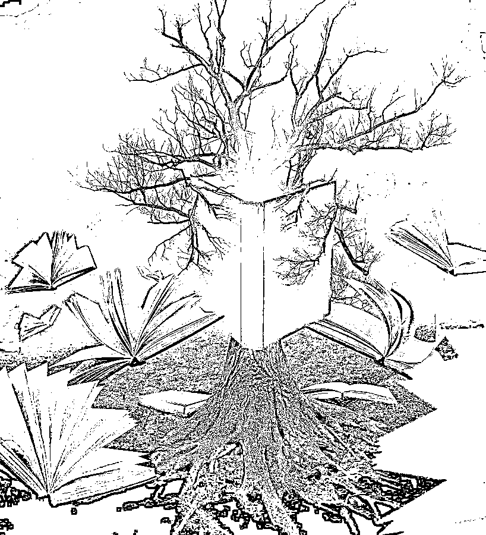

**怎样不断提升狮子座能量？**

怎样不断提升狮子座的能量？

就像金矿离纯金还有很长的距离一样，狮子座人离真正的狮子座高阶能量还有一定的距离。能量的提升是一个百炼成钢的过程，狮子座人需要去除掉那些杂质——狮子座的低阶能量：萎靡不振、精力涣散、贪图享乐；假大空、肤浅虚荣、哗众取宠；自以为是、傲慢自大、目中无人。狮子座需要发展自我，追求卓越。

能量是螺旋上升的，狮子座人在人生中会经历各种长期或短期的行进，保持良好的自我觉察，可以让宇宙的打磨变成狮子座人不断精进的良机。

*****Step1 *********强化狮子座能量****

**过去、现在、未来。**

人免不了有盲目性、自我评判、惰性和目的性，真正会“玩”说到底不是一件那么容易的事儿。关键如下：

*   对“过去”保持自我接纳，尺有所长寸有所短没有高下。发展和发挥长处，对短处保持自知或提升。很多时候总是觉得自己“不行”，可以试着练习：1“我允许”——“我允许我做不到”；2、“我同意”——“我同意我做不到”，如有情绪升起，继续处理内在的情绪；3“我承认”（见[巨蟹篇](http://mp.weixin.qq.com/s?__biz=MzA5NjA0NTAxNg==&mid=2651422510&idx=1&sn=062ae6bd0cc00b449dcf9df23d9198ad&chksm=8b4bcd99bc3c448f391dd84dcd6ae59a27e2a594399fcba9032c750443973eb6c5f6c318b817&scene=21#wechat_redirect)），全然接纳自我，收获心胸开朗与豁达。

*   确立“现在”的个人意愿，发愿、立志、下决心本身就带着自我的力量。“断舍离”无关事项，调动一切可以调动的资源，不做任何自我设限。就像孩子玩积木，要搭房子就拆掉原来的小汽车，找可用的方块。

*   “未来”取决于当下的投入，享受过程远比追求结果重要。持之以恒，每一分每一秒的当下才能决定未来的样子。水滴石穿，一定是水滴享受当下的结果。

**狮子座人需要玩的开心，玩的高级，玩的有进步，才会收获满满的掌声。**

*****Step2*********  平衡水瓶座能量****

**特立独行，玩出真我。**

水瓶座位于狮子座的对分相位，代表个性化、特立独行、另类奇葩不走寻常路的创新能量狮子座人需要摒除内在的虚荣心，需要平衡水瓶座的能量，放弃对掌声的追求。对自我保持真实，如果我的喜好就是和别人不一样，甚至有点奇葩，我敢不敢承认？前不久报考北大考古学的高考状元，面对众人的不理解，仍然选择自我的意愿，依旧获得大众的掌声。当狮子座人可以忠于自我，就可以特立独行，玩出真我，世界需要创新和不一样。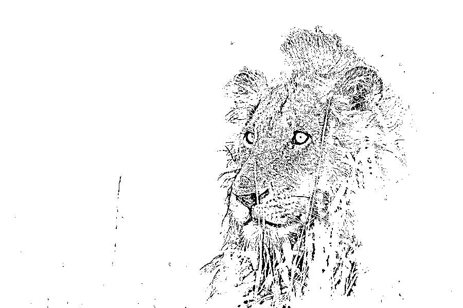

*****Step3*********整合金牛座能量****

**玩出价值，长期回报。**

金牛座是狮子座的四分相星座，代表天性的自然、内在的淡定和自我的价值。狮子座人需要“玩”的踏实，摒除假大空，需要整合金牛座的能量，确立自我的价值。如果违背自我的意愿可以获得巨大利益，或是遵从自我意愿短期内没有收益，我该怎么做？这不是一个容易的问题，尤其是很多创业者会遇到的问题。当狮子座人可以确立并坚守自我的价值，才能“玩”出价值，获得长期回报，世界不需要急功近利。

*****Step4*********整合天蝎座能量****

**直面阴影，焕然新生。**

天蝎座是狮子座的四分相星座，代表死亡、背后的真相、内在的创伤和自我的重生。

狮子座人需要“玩”得深入，打破肤浅，需要整合天蝎座的能量，直面自我的阴影。每个人都会本能选择逃避内在的阴影，不愿触碰，像曾经被性侵的经历，但这样的阴影会在潜意识层面限制你，无法逾越。坦然面对是唯一的方式：被性侵不是我的错，我并不需要为此背负一辈子恐惧——由此自我开始拿回了力量，焕然新生。是不是从此可以做一个性疗愈师，把性疗愈“玩”下去？那是完美的能量整合。当狮子座可以直面内在的禁区，伤口之上也可以开出花朵，世界需要光，照亮阴暗的角落。

我需要光，我吸引光，我成为光。当狮子座人的生命不断延伸，兴奋，高兴，狂喜——何期自性，本自具足，世界也因此被点亮。

愿世界充满光明！

**版权声明：**原创文章由作者授权发布于若道平台，欢迎转发，反对抄袭。友号转载请申请白名单。

**想阅读更多狮子座文章**

**请在后台回复****”狮子座“**

胡曦兮

若道 2012 年毕业生

师从斯蒂芬·弗里斯特，全职进化占星师

北京大学传播学硕士，星寓占星工作室创始人

公众号：星寓文化

**长按打赏**

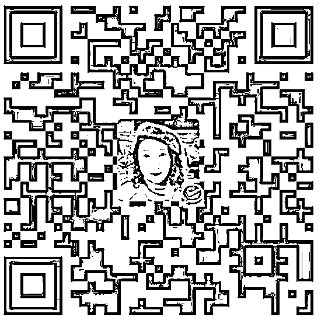

**系统学习占星学**

**点击下图了解详情**

**微信又双叒叕改版啦，不想错过若道君的推送？**

**就把若道设为星标吧！**

**▼**

喜欢记得点一下在看哦☟

********报名直达入口********

# 狮子座-水瓶座的整合秘诀 | 亲切友善又光芒四射，说的就是你

> 原文：[`mp.weixin.qq.com/s?__biz=MzA5NjA0NTAxNg==&mid=2651427708&idx=2&sn=62ded252cb24ccea829d9166a6de8fcb&chksm=8b4b21cbbc3ca8ddb2fcc63d07e55fe19fcc0d5dee32ba7d473a5ab5d31e72571629039b923a&scene=126&sessionid=1692738106#rd`](http://mp.weixin.qq.com/s?__biz=MzA5NjA0NTAxNg==&mid=2651427708&idx=2&sn=62ded252cb24ccea829d9166a6de8fcb&chksm=8b4b21cbbc3ca8ddb2fcc63d07e55fe19fcc0d5dee32ba7d473a5ab5d31e72571629039b923a&scene=126&sessionid=1692738106#rd)

作者/特蕾西·麦克斯
译者李含 校对/哲林 编辑/玫瑰 图片来源/全景网本文摘译自《How to handle your T-square》《如何整合你的 T 三角》

如果你的出生星图里有行星分别落在狮子座和水瓶座、第 5 宫、第 11 宫以及太阳和天王星被强调，均可参考此文章。

**狮子座-水瓶座对分相的负面表达**狮子座-水瓶座对分相意味着你**混淆了自我意愿与更宏大的人道主义愿景**。**你追求真理，但通常你的本我（内心）让你相信，你就是唯一的真理使者，人们应当遵从你的旨意。通过阐释宇宙法则，将自己古怪的行为合理化，你不仅自以为是将道理强加于他人，还企图说服他们，你是一个罕见的鞠躬尽瘁无私奉献的人。**你拥护人道主义的理念，这让你活跃于你所信仰的组织或是事业中，但是在个人生活中，你不能只靠理想而活；你自称热爱全人类，却不知道如何真正带着爱意与个体建立关系。通常，你会**在浮夸的抽象世界里迷失自我，或者活跃于团体而阻碍了亲密关系的发展。**在任何团体内，你都会**努力获得一个有权有势到能让你行动自如的的职位**，**并倚仗这种权势，将强人所难粉饰为好意和启迪，从而满足你的内心需求**。**你鼓吹民主，却建立独裁，你自己就是唯一的独裁者**。你居高临下，散发出狮子座的温暖以及由衷的慷慨，但你释放内心的光芒往往**只是为了赢得关注和公众赞誉的眼光。****你反抗统治，却会去统治他人。**与子女相处时，你穿上朋友的伪装，强迫他们服从你。在其他关系中，你**通过培养一众信徒来维持你的控制权，而不是建立平等、互利互惠的友谊。**在感情世界里，你**经常将友情错当做爱情，要求爱与忠诚，但你既不是合格的朋友，又无法摈弃通过颐指气使（强迫）的方式来表达爱意。****狮子座-水瓶座的两级特质**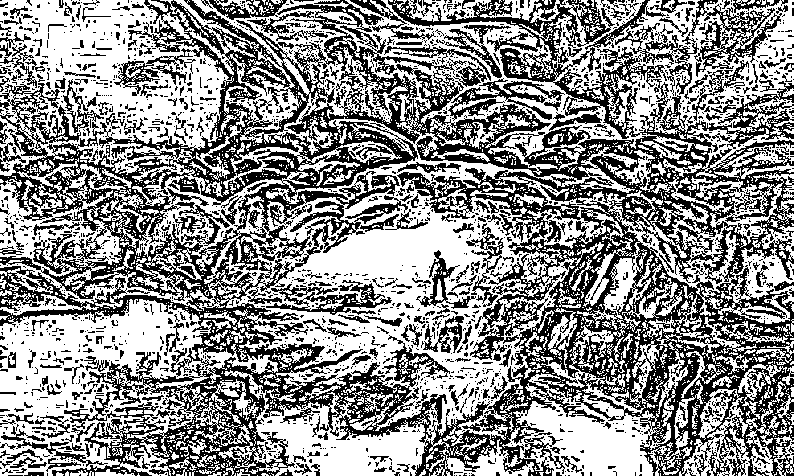

| **狮子座** | **水瓶座** |
| 善于自我表达（表现）富于创造力 顽皮温暖 光芒四射浪漫 个人性的 易动感情的自发的 忠诚 守信慷慨 付出拥有坚实的自我身份认同以自我为中心 傲慢自负个人主义 寻求关注 居高临下 专横跋扈想要在群体中居于领导地位自我探寻与个人愿望相一致  | 理智抽象思维 有发明创造天赋对所有人都很友善亲切友爱客观，超然 不情绪化爱自由 独立 人道主义 开明的认同人道主义、群体或社会的宏大目标不墨守成规和社会规范反叛 以集体为导向促进平等 合作宽容 追求真理 适应宇宙法则 |

**整合狮子座-水瓶座**整合狮子座-水瓶座对分相，需要**狮子座贡献爱的温暖和自信的领导力，以平衡水瓶座的超然与理智；水瓶座则拿出普世主义与人道主义的精神，来平衡狮子座的自我中心与傲慢。**狮子座的自我意识让你成为一个**以自我为主导的个人主义者**，让你意识到**自由源自于跟随内在自我的法则，而不是反抗社会**。你坚定的内心让你**有能力应付水瓶座带来的必然变革，不论这变化是你自愿接受还是由外部环境引起的。**狮子座赋予你**向他人敞开心扉的能力，建立私人关系，以自身的热情慷慨待人，这为你的友谊添上丰富的色彩，激励你真正的处处实践人道主义，而不只是流于言辞**。你所**体验到的、展现出的热情可以帮助你表达水瓶座的人道主义情怀**；你的**泰然自若与自我管理有助于建立真正的民主制度，**在这里，**人们自治而不会有一种无力感，而去寻求统治和被统治。**狮子座的存在让你所属的团体充满生气；你的热情与幽默能够帮助他人放松，享受人生。你的自信和领导力让你成为团体中的权威人士，让这个团体更具凝聚力，有能力履行其社会性目标。你亲历亲为，投入社会事业，这也激励他人积极参与，体验到实现水瓶座的理念所带来成就感。**充分的个人参与让狮子座能够进入水瓶座集体无意识的国度，认识普世真理。**这种认知来源于人与人之间的学习与交流，比抽象层面上的来源更生动，而不枯燥乏味。通过感受普世情绪在个人内心的深刻体验，你会认同所有人性，奉行水瓶座的理念：**思想开放、宽容友爱。**对自己内心需求的觉悟会帮助你分辨小我意愿与大局愿景；感受你自己内心的光芒不但可以为自己提供源源不断的活力，还能以你的光和热照亮他人，帮助他人感受他们身边的温暖与阳光。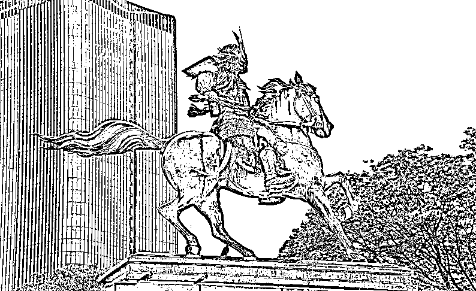**整合水瓶座-狮子座**水瓶座的独立灵魂会帮助狮子座**不那么依赖外界的喝彩，变得更自我导向**。水瓶座对于人性的认同，以及对于普遍意识的见解让狮子座的小我能够**超越狭隘的边界**。因为水瓶座特质使你能够适应普世法则，你得以认识到自己的本性，按自己的本性生活，你自己与人类都将因此受益。因为你的小我意志已然人类的宏伟愿景取得一致，你会**更加自信，更富于个人成就感。**水瓶座对人道主义的关心，使你能用自己的爱与关怀温暖周遭的每一个人，每一个与你接触的人——而不仅仅是一小圈仰慕者，都能被你照耀。因为你知道，友谊是平等、互利互惠的，你无需在人际关系中扮演君王或女王，君临你挚爱的追随者；**你可以成为他们真正的朋友，即使没有感激的回应，你依然会付出自己的爱。**水瓶座为狮子座提供了自我表达的渠道，让你能**为友谊、团体和社会事业做出富有创造性的贡献，让你的自我表达同时超越个人层面，将能量指向更为宏伟的目标。**

**版权声明：**本文由若道翻译发布，欢迎转发，反对抄袭。友号转载请申请白名单。

**特蕾西·麦克斯**老牌占星师，对 12 宫、梦境有深入研究。著有《如何整合你的 T 三角》、《你的秘密自我》(*Your Secret Self*)。

**系统学习占星学**

**点击图片了解详情**

**微信又双叒叕改版啦，不想错过若道君的推送？**

**就把若道设为星标吧！**

**▼**

就是这个“在看”，戳戳戳 ☟

****************报名直达入口****************

# 插班中丨核心课程 L3，教你掌握综合星图解读

> 原文：[`mp.weixin.qq.com/s?__biz=MzA5NjA0NTAxNg==&mid=2651427708&idx=3&sn=c6dc3ed148af6ef120989a79e47f2968&chksm=8b4b21cbbc3ca8ddfed740b1a2fcb8773bf3e29b07d05c1fb272282a1ee9470bf5cbccbdffe9&scene=126&sessionid=1692738106#rd`](http://mp.weixin.qq.com/s?__biz=MzA5NjA0NTAxNg==&mid=2651427708&idx=3&sn=c6dc3ed148af6ef120989a79e47f2968&chksm=8b4b21cbbc3ca8ddfed740b1a2fcb8773bf3e29b07d05c1fb272282a1ee9470bf5cbccbdffe9&scene=126&sessionid=1692738106#rd)

**Level3 也是占星学习的一个整合区和分水岭****若道君给大家准备了一份专业的占星测试：“2020 若道核心课 L3 入学测试”****测试内容包括：**

**适合参加测试的学员：**

**L1-2 结课学员**

**有一定占星基础的自学学员**

**准备考 ISAR 的学员**

**扫码开始测试吧**

**1**

**占星学除了自我修炼，市场需求如何？**

**通过占星学习你帮助了自己，也可以选择成为自助助人的占星师，开启受益终生的第二事业。**一方面，社会快速发展人们压力山大，抚慰心灵的咨询市场需求巨大。另一方面，市场鱼龙混杂，真正学院派的严肃占星从业者十分稀缺。最重要的，**占星学能让你自己帮助自己，无论你是否进行占星咨询从业，学习了占星学，它都将是终身陪伴你成长的睿智好伙伴。**

**2**

**你的占星核心课老师是谁？**

 拥有**50**年占星研究积淀**44**年职业占星实践**41**年占星教学经验的**若道联合创始人****2017-2020 年曾任 ISAR 全球副主席****2020 至今为****CAPISAR（全球职业占星师资质认证考试委员会）主席****大卫·瑞雷**&**最懂学员的若道首位认证金牌中国老师****熊鹰**师徒二人合力打造
**2020 年若道****全新核心占星课程**

**3**

**L3 阶，我们要学习什么？**

**第 3 阶 ****宫位、相位以及初步解读星图（15 次课） ****❶** **12 宫位****人生中重要的领域，不止 12 个，更是 12 类。****❷ 组合解读****行星、星座与宫位的组合解读。万丈高楼平地起，这是占星解读的基本功。****❸ 相位****不仅是常规的相位：合相、对分相、三分相、四分相……还有这些更为细致的知识：**相位计算入相位与出相位星座外的相位相位解读盈亏相位相位的优先级大卫老师案例课**❹ 宫主星与定位星****“联结”是宇宙的基本法则之一。除了相位，还有哪些方式让行星能量联结起来？**宫主星定位星与定位链大卫老师案例课**❺ 月亮交点专题****月亮交点是占星解读的另一个入手角度，这里会深入教你解读月亮交点，及其相位与定位星。**月亮交点的解法大卫老师案例课**❻ 相位模式：****那些坊间赋予神秘意义的占星格局：大三角、大十字、T 三角……究竟该如何解读其相位模式。**主要的七种相位模式星图中没有相位模式的情况大卫老师案例课**❼ “空”不等于“没有”：****星图中那些容易被忽视的地方：**无托勒密相位（俗称空相）一些特殊位置星图布局大卫老师案例课**第 3 阶课程安排****❶** 15 次线上直播网络课程，每次 2 小时，课程中依旧会使用同学们的星图作示范**❷** 10 节课由熊鹰老师教授，重点通过名人星图阐释知识点**❸** 5 节课由大卫·瑞雷老师教授，重点通过学员星图阐释知识点**❹** 熊鹰老师会指导练习，答疑解惑，学练结合**❺** 重点在于如何根据星图去问问题，着重自我发现和自我探索的过程 

| **时间** | **课程** |
| 2020 年 7 月 2 日 | 宫位、行星和星座组合 |
| 2020 年 7 月 9 日 | 宫位、行星和星座组合 |
| 2020 年 7 月 16 日 | 月亮交点 |
| 2020 年 7 月 23 日 | 月亮交点和演示案例 |
| 2020 年 7 月 30 日 | 相位 |
| 2020 年 8 月 6 日 | 相位、星座、行星和宫位 |
| 2020 年 8 月 13 日 | 相位、星座、行星和宫位的同学案例 |
| 2020 年 8 月 20 日 | 渐盈相位和渐亏相位，示例 |
| 2020 年 8 月 27 日 | 更多的关于宫位和宫主星 |
| 2020 年 9 月 3 日 | 同学案例 |
| 2020 年 9 月 17 日 | 空相行星和定位星 |
| 2020 年 9 月 24 日 | 宫主星 |
| 2020 年 10 月 15 日 | 优先级和组织 |
| 2020 年 10 月 22 日 | 相位模式以及范例 |
| 2020 年 10 月 29 日 | 学员星图解读范例 |

**截至 2020 年 9 月 19 日，课程第 1-11 讲为录播课程（限视频回放），其余均为网络直播课。**

**试听彩蛋**

📹 [`v.qq.com/iframe/preview.html?width=500&height=375&auto=0&vid=e093031qxym`](https://v.qq.com/iframe/preview.html?width=500&height=375&auto=0&vid=e093031qxym)

**4**

**这两位优秀的占星学老师是谁？**

**大卫·瑞雷（David Railey）**

*   **曾任 ISAR 全球副主席，2020 至今为 CAPISAR（全球职业占星师资质认证考试委员会）主席，若道联合创始人；** 

*   1976 年，通过亚特兰大职业占星师考试，成为全职占星师，随后通过**AFAN 和 ISAR 职业测试；** 

*   1980 年，与**杰夫·焦耳**一起在亚特兰大创建**“每日星球”**占星学中心。此后在亚特兰大占星协会担任 4 年考官，并且两次担任**亚特兰大地区占星协会主席**。1979-1992 年，作为占星师活跃于美国社会媒体，向不了解现代占星学变化的大众宣传专业占星学知识。在 1989-1992 年期间，他在 WRGG 电台 12 频道每周主持个人电视秀**“今日占星学”**，早先他还在 WRFG 的广播节目中播讲宇宙天气节目；

*   2010-2014 年，任**全美占星师联盟监督委员会委员**； 

*   2010 年，其著作**《灵魂的目标》**中国版出版，和蒋颖一起创办**若道占星**学校和其官网 www.nodoor.com。从该年开始，他工作并往返于亚特兰大和北京。目前他 80%的时间致力于在中国教授和推广西方占星学； 

*   2017 年，被选为**ISAR 委员会成员**（2017）。ISAR 是世界最大的国际占星机构，会员遍布 45 个国家，2017-2020 年曾任 ISAR 全球副主席； 

*   2020 年，被推举为**CAPISAR（全球职业占星师资质认证考试委员会）主席**。

**熊鹰老师（天空的空）**

*   2008 年接触严肃占星学，至此爱不释手； 
*   **2013 年师从大卫·瑞雷**，研习整套现代占星学核心课程，并于 2014 年起至今连续三年担任该课程的主助教； 
*   期间也**跟随格伦·佩里、诺·泰尔、理查德·塔纳斯、罗伯特·汉德、苏·汤普金斯、斯蒂芬·弗里斯特等多位国际顶尖占星大师进行学习**，进行定向占星主题研究； 
*   2015 年初，通过国际占星研究协会**（ISAR）资质认证并获得证书**。同年，进一步跟随大卫·瑞雷老师进修**“生时校正”**技术，通过最终考核并获得证书； 
*   目前在若道星文化任职，将传播系统、严谨、真实的占星学作为职业使命。任专职助教期间，进行沙龙与答疑等辅助教学工作已累计超过 200 小时；
*   在业余期间也提供占星咨询与生时校正服务。目前正致力于占星学与个人成长的整合。

**5**

**什么人适合这门课？**

*   对占星学有浓厚兴趣，想要系统学习占星学
*   对占星学有一定基础，但不知道该如何整合星图复杂的碎片
*   希望成为优秀的占星师，想要借鉴国际大师解读思路并融入自己的体系
*   想学习占星学，但不擅长英文，希望有中文老师授课
*   想结合占星学理论与咨询实践
*   大卫·瑞雷、熊鹰的忠粉，学过占星，但就是想跟着偶像再学一遍
*   走在自我探索和个人成长道路上的人

**6**

**课程费用**

 **★ L3****课程费用：10000 元****更多价格优惠请咨询客服**

**7**

**退转课程**

**退款原则请详看《教学协议》，如有疑问请咨询课程顾问。******核心课程 Level 3****

**授课老师：大卫·瑞雷 熊鹰**

**授课时间：****2020 年 7 月 2 日-2020 年 10 月 29 日**

**授课方式：**网络课程：英文授课，中文翻译

**费用：10000 元；**更多优惠请咨询客服

**课程负责人：Maggie（微信号：NodoorMaggie）**请备注“L3”

长按二维码添加课程负责人咨询~

****报名请点击“阅读原文”****

# 你被限制，自我攻击，觉得不配被爱丨解药都藏在这个配置里

> 原文：[`mp.weixin.qq.com/s?__biz=MzA5NjA0NTAxNg==&mid=2651427705&idx=1&sn=1584957642253e0e99ec265ae01d8b75&chksm=8b4b21cebc3ca8d8ecdfa03ba0755d9c2efce82dee63fba20eafad63d60bee74b7ed7c457597&scene=126&sessionid=1692738106#rd`](http://mp.weixin.qq.com/s?__biz=MzA5NjA0NTAxNg==&mid=2651427705&idx=1&sn=1584957642253e0e99ec265ae01d8b75&chksm=8b4b21cebc3ca8d8ecdfa03ba0755d9c2efce82dee63fba20eafad63d60bee74b7ed7c457597&scene=126&sessionid=1692738106#rd)

**☆ 后台回复“今日”，给你一句生命态度**

作者/薇安 ISAR 占星师编辑/佳黛 封面/书君 图片/全景网**月土相位：你可能感受到限制**

生命中某个时刻，某一天，甚至持续很久的一段时间，我们都可能因各种缘由，突然感到，生活令心灵备感沉重。在我们的内部空间里，弥漫着浓的化不开的哀伤；头脑再无法搜寻到意义来为生命供给动力；希望，犹如微弱的烛光，渐渐熄灭于黑暗之中。

这便是我们的“月亮”与“土星”相遇时，会经历到的其中一种体验。

占星学上的土星，**要求我们在具象的现实中，遵循纪律与规则，一方面面对资源、时间和空间的局限，另一方面必须构建出具体的成果或成就**。

而月亮这颗星体象征的心灵能量，最大的特征就是**流动性**，一如我们在自然中看到的月亏月盈。它也是属“阴”的，天然地消极、被动，处于接受或接收的状态。

不难想象，当它们碰撞在一起时，月亮会感受到的压迫性，以及由此诱发的无力感。

以这样的方式开启本文，多少是令人不悦的。但土星要教导我们的智慧，恰恰蕴含于它所施加的这份“压迫”之中。

除去情绪感受（月亮），我们也可能经由个人意志（太阳），思维（水星）、关系（金星）、攻击力（火星），扩张的意图（木星）——**去触碰到土星的限制，学习与之较量， 直至找到和他谈话的最佳方式，消弭“权威与被压迫者”的分离意识**。

此时，土星就会让我们领略到他恩赐的礼物——作为物质次元的主考官，他期待我们在一世又一世的轮回中，最终能真正堪破其以“现实”之名创设的幻象，让我们成为自己内在生命的权威，战胜现实的阻碍，亲历意识的创造性，在黑暗中重新点亮光。

既然我们在土星的领域中进行探索， 那么就让我们现实而具体地来分析出生星图中，月土相位与生命经历的关联吧。

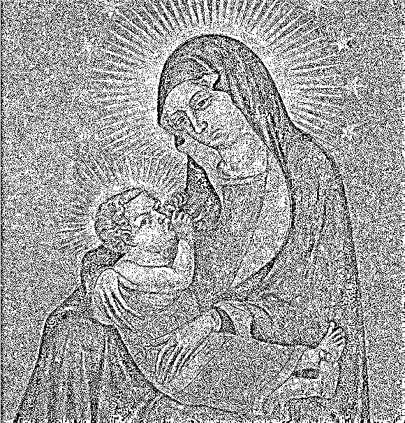

**让我们先回到与母亲的关系**

凡涉及出生星图中的月亮，我们都要追溯到与母亲的关系。

**作者注：要说明的是，随着社会形态的演化，月亮不再必然对应生物性的母亲，虽然大部分时候是如此。基于个体的真实情况，月亮指征的，可能是长期担负照顾婴儿和孩童生活责任的任何重要他人。为行文方便，后面我们仍然使用母亲一词，来指代个体生命中那个“月亮式”的人物。**

出生星图中月亮与土星成相位，无论是哪种相位类型，都暗示出：**个体可能在生命早期与母亲的关系中，经历了不同程度的压力经验**，例如：

*   母亲本身的情感流动比较僵化或自我抑制，不善于在这个层面与婴儿互动，比如在哺乳婴儿时面无表情；或无法与婴儿的情绪反应保持一致性。

*   母亲，或是整个家庭，都拒绝面对哀伤情绪；当孩童陷入低落悲伤时，会受到呵斥或忽视。

*   父母中的一方或双方，长期处于哀伤低落的情绪状态，令孩童将其视为恐怖的破坏物，对自身的负向情绪体验亦产生厌恶和排斥。

除了直接的情绪影响，压力体验也可能来自如下行为：

*   母亲认同了严格甚至严苛的养育方式，在婴儿早期就开始对哺乳时间、睡眠时间等就开始进行管控。

*   严格的管教一直持续伴随孩童的成长；父母会通过语言表达或具体的奖惩行为，将“我是否爱你”与孩子的行为表现是否达到标准关联起来。

*   ……

不可否认，为着孩童的安全着想，在适当的年龄开始社会规范的教育训练等都是必要的。但如果开始的过早，或标准过高，并伴随有严厉的惩戒，就会造成问题。

我们的心智发展，是一个体验感受与形成思想交互作用的过程，当以上所列的情形长期持续存在，就可能对人格发展造成影响：

*   婴儿早期，无论是生理上感到不舒服（例如饥饿、生病），或是情感体验上，被分崩离析的无意识幻想或自身的攻击冲动惊吓时，通过哭泣向外寻求帮助却遭到拒绝，都会令婴儿将自我体认成一个不受欢迎的，甚至是糟糕的存在。

*   随着孩童的成长，开始外显独立个性，以及发展社会性功能时，若探索性的行为表现，经常被严格得纠正、限制或打压，会令孩童产生被父母遗弃的感受（虽然并不是事实上的遗弃） 。

*   父母或家庭对负向情绪的排斥，则会令孩童渐渐隐藏起自己的脆弱，甚至对自身的脆弱性产生厌恶。

由于幼时无法得到足够的情感滋养，使得月土人成年后，其内在仿佛一直有一个受困的孩童——对自我的存在感到羞怯；对被拒绝或抛弃高度敏感；加之无意识认同了父母的高标准，会因为自己无法满足他们的期待而深感内疚。

当月土人在生活境遇中遭遇情绪的压力和冲击， 很容易退缩到这个状态中来。

因此，我们通常会在有月土相位配置的个体身上，观察到这样一些共性特质：**忧郁、情感抑制、退缩、不易表达情感、害羞而敏感**。

仿佛是为了使自己的内在孩童免于被人发现， 月土人在社交中容易有冷谈或孤立的倾向。这本质上是一种自我防卫，**一来，他们倾向于回避向他人展露情感；二来，在面对或接受来自他人的情感时，也会很不自在**。

**可能出现的问题**

**月土相位的人的出色表现**

我们还是要说，即便最困难的月土配置，个体仍然能在人生中有出色表现。

*   在现实生活的层面，他们特别能够负起责任，这可能与从很小的时候开始，就必须学会独立照顾自己有关。

*   严格的教育，使他们形成“工作重于娱乐“的观念，无论是早年的学习，还是成年后的工作中，因为原意比常人付出更多努力，也会使他们成为组织中可靠的贡献者。

*   虽然有些令人伤感， 但因无意识的内疚感，使得他们倾向于自我苛责、挑剔，无论从事什么工作活动，都会驱使自己不断精益求精。

*   因为能够耐受孤独，在那些需要上万小时进行技能的重复训练的工作领域，或需要能够沉入到悠久历史渊源中追寻考证的学问领域，他们都可能成为真正大师级别的专家。

**但月土人恰恰需要警惕自觉的，就是过于执着在现实层面**。

*   对感受与情感无法放松信任，一方面会限制他们对直觉和想象力的运用， 在实际上减低了工作的效能；并可能导致过度消耗身体。

*   另一方面， 无论他们交出多么漂亮的成绩单，都很难在内在体验到喜悦和价值感，无法向自尊的建立和巩固输送养料。

而在月土人对自己的严苛里，还会涉及到一个更深的心理议题：**自我攻击**。

自婴儿早期开始，当我们无法从重要客体那里获得支持、不断遭遇情感被拒时，也会生出对客体（或母亲）的愤怒。但对于幼年的孩童来说，“恨”自己的母亲，更是不可承受之重，担心指向他们的愤怒，会真的导致自己被抛弃。

此时，心灵会采用“将攻击转向自身“的心理防御来获得适应性。

*   ”如果我攻击自己，而非指向父母，他们就不会抛弃我了“——这样的信念假设，能减轻被抛弃的分离焦虑。

*   同时，这样会令个体获得一种力量感——”假如错在于我，那么我就能改变错误而扭转困境。“

当这种防御机制变得顽固，会使月土人对错误的耐受度大幅减低。当他们的工作成果需要接受来自外界的评价时，很容易使其陷入焦虑。任何被他们视为批评的反馈，都可能引动进一步的自我攻击。

而且这种防御反应，尤其容易在两类重要的人际关系中被触发。

**一是在职场中，与权威人物的关系。**

我们每个人都不可避免地会将幼年时内化于心的父母形象， 投射在成年后遇到的权威人物身上。

在无意识中，月土人会预期来自权威的批评，情绪时常处于紧绷或压抑的状态。也会带着这种滤镜看待对方的言行，敏感地捕捉着那些引发幼年相似体验的行为。无论对方真实的意图如何，都可能唤起我们的抑郁体验和自我攻击。

**另一类则与亲密的情感有关：友谊或伴侣关系。**

如果这类关系出现危机或破裂，月土人可能完全忽略一些客观事实——对方的利己行为或错误——而陷入深深的自责中，头脑里不断回忆检索自己的不当行为，认定是自己搞砸了关系。

有的月土人还会付诸行动，力图通过“修正自己的错误”，来挽回关系。其实关系破坏或结束的原因是多元的；甚至一些关系的结束，长远来看是有益的。然而，在那个当时当下，我们被巨大的哀伤、无助和懊悔的情绪淹没，无法清晰理性地看清这些。

月土人在亲密关系中被引动的，其实是关于被抛弃的恐惧，所以影响尤为强烈。如果无法正确理解类似经验的发生，一次或几次“冒险”交付情感，却总是失败的经历， 真的会让一些月土人从此将自己与外界彻底孤立开来，至少在内心世界是如此。

即便月土相位在有些个体身上，可能表现出相反的情感态度——**即并非冷淡孤立，而是表现出情感夸张的需求和渴望**。但他们潜意识幻想中的恐惧和与之相关的偏差信念，与前述分析并无二致；**不过是因匮乏的体验，或害怕需求得不到满足，而驱动出过度补偿行为**。

诚然，无论是哪种心理类型或星图配置，人们都可能因不同缘由，以不同方式经历到心灵的受伤体验。但月土人因为自身天然的压抑或抑制的倾向， 就要特别小心，持久压抑的情绪感受、特别是负面感受，不断累积至某一刻，致使心灵不堪重负而轰然坍塌。

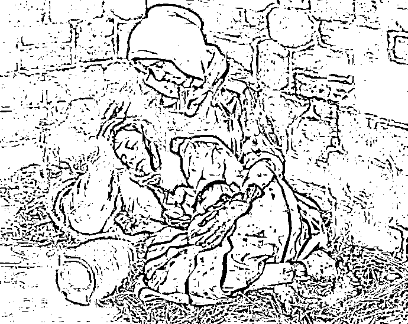

**如何改善呢？**

幸运的是，我们的生命本身就有寻求平衡的驱力，或许经由土星行进（外部压力事件） 的触发，或许是月土人自己内在智慧的指引，当内在情感与外在现实严重失衡时，都能推动我们踏上向内探索的旅程。

要去除蒙蔽住心灵上的厚厚尘埃，首先仍要在心智上对自我获得理解——

*   在我们身上发生过什么，它们怎样的地塑造了我们的自我信念？

*   生命早期，心灵为了发展出对痛苦情景的适应性，形成了哪些防御机制？

这些防御机制、信念系统，虽在我们的意识之外运作，但是否能够从我们当下的行为模式中瞥见端倪。经由理解的过程，能帮助我们意识到：

*   在当下情景中被激起的许多感受体验，其实来自于遥远的过去；换句话说，它们与当前的人、事并无真正的关系。认知到这一点，虽然无法消除我们即时的习性反应，但能创造出一个观察和反思的空间，使我们避免过度沉溺在感受中而深受困扰。

*   更重要的，我们有机会开启一个对自我的新意识。意识到内在世界中那些无端的内疚、恐惧可以与我们自身剥离开来，进而允许心智纳入新的理解——我可以脆弱，脆弱不必然带来伤害，这是我生而为人的真实面向。而且它让我有机会邀请他人的善意进入到自己的生命中，甚至获得确实的帮助，来解决现实中的困难或障碍。

占星学上，月亮的符号，还是家族的象征；而土星，常被称为业力之星。两者的结合，可以让我们更智慧地去理解“业力”的意涵——它绝非一种惩戒我们的外部神秘力量；而是“有一因必有一果”的物理原则；只是这种因果的延续也会在世代间传递。

> **举个例子：**如果我们的母亲确实没有做到“Good Enough Mother”（心理学上“足够好的母亲”）, 甚至付诸了给我们带来情感伤害的行为，一如文章此前的分析，但倘若我们愿意将反思的范围拓展到母亲幼时的经历，去了解他们父母的教养方式；包括去理解各代人身处的社会文化、物质环境对其思想意识的塑型， 我们便能意识到——**如果我们的父母没有正确地爱我们，很大一部分原因，是因为他们也没有被正确地爱过**。在新的意识崛起之前，世代之间就是这样盲目而被动地传递着伤害和伤痛。

从这个角度讲，打破业力的希望，就在于：这个传承的过程中，在某一代人——比如我们——这里，**那些不曾被觉知的、伤害性的行为模式被辨识出来，并经由我们学习新经验，建立新模式，将其打破甚至摧毁**。

很多月土人，在适婚年龄就会成家生子。这一方面是出于他们认为这是“应该承担的责任”；另一方面，也可能源于他们潜意识中一个强烈的愿望——**有机会创造一个与自己儿时记忆中完全不同的家**。

那么，当我们面对了发生在自己身上的事实，承认了自己曾经的哀伤，时时关照发生于自身的情绪反应，并开始学习以新的、更具爱和尊重的方式来养育后代。这些得到爱的滋养的生命，就会以更加有创造力的方式，将他们的生命编织进家族的脉络中，甚至使整个家族的情绪基调都开始得以改变。

就像伤害会经由累积而被加重一样，爱，也会逐渐累积而不断扩大，成为越来越明亮的光。

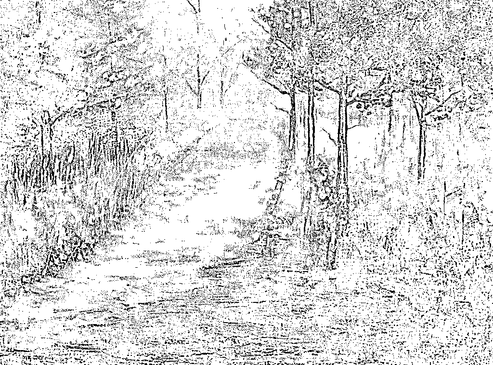

**也有另一种方式**

如果我们保持着独身也没关系。要知道，懂得**真正地全然享受孤独**，也是月土人经历磨难后会获得的馈赠——**在不带情绪的孤独里，我们有充分的时间、空间进入到真正的沉思和反省之中，直面内心的批判，无限接近自我的本质**。静修、沉默很多时候都会将极具意义的智慧带入我们的生命中。

而当这所有的内在体验，日趋成熟，我们就用机会用自己的智慧和生活经验帮助他人度过生命中的难关。

这样的月土人，很像塔罗牌中的“**隐士**”，他被描述为“提灯的人”，或“引路人”。

对月土人来说，一切的根本，要回归到——**以情感体验和直觉的面向，去信任生命**。

欢愉时可以开怀地笑，哀伤时可以尽情地哭，挫败时不怕承认自己的害怕，脆弱时敢要求一个拥抱。

而这样的我们，也能共振、分享和支持到他人如上的所有情感体验。

当月亮于土星获得升华性的融合时，自律的、负起责任的、坚实可靠的，同时又是流动的、滋养的、尊重边界又超越边界地将生命相连的爱，便得以发生。

版权声明：原创文章由作者授权首发于若道平台，欢迎转发，反对抄袭。友号转载请申请白名单。

**薇安**

全职心理占星师、ISAR 认证占星师（2016 年获得）、若道兼职助教

北大心理学硕士、MBTI 国际认证施测师

若道认证生时校正资质及 COAC 高阶资质毕业生

**微信 ID**：weianhuilai

**公众号 ID**：Radio-for-Alice

长按打赏

**系统学习占星学**

**点击下图了解详情**

**微信又双叒叕改版啦，不想错过若道君的推送？**

**就把若道设为星标吧！**

**▼**

就是这个“在看”，戳戳戳 ☟

********报名直达入口********

# “你能帮我吗？”“是的，我可以。” | 顺势疗法治愈惊恐的小故事

> 原文：[`mp.weixin.qq.com/s?__biz=MzA5NjA0NTAxNg==&mid=2651427705&idx=2&sn=2f4fc5f999514bc4236b63917c96be54&chksm=8b4b21cebc3ca8d8fccb77e2981fa0987b9ae77fe4b4bd123c8fc75a34cf2a506bff3d762b91&scene=126&sessionid=1692738106#rd`](http://mp.weixin.qq.com/s?__biz=MzA5NjA0NTAxNg==&mid=2651427705&idx=2&sn=2f4fc5f999514bc4236b63917c96be54&chksm=8b4b21cebc3ca8d8fccb77e2981fa0987b9ae77fe4b4bd123c8fc75a34cf2a506bff3d762b91&scene=126&sessionid=1692738106#rd)

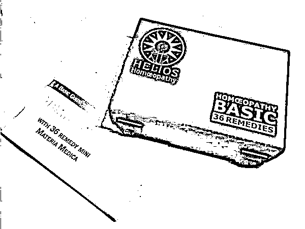

作者/凯特

 编辑/玫瑰 图片/网络

在过去的文章中，我们提到顺势疗法对于心理疾病的治疗。下面是一个英国女性所讲述的故事，她的顺势医生治疗好了她的焦虑症和惊恐症。
**顺势疗法治好了她的重度焦虑**我叫凯特，六年前，我突然得了偏头痛。随后，情绪也出了严重问题，我经常感觉焦虑，有时惊恐发作。身为 3 个孩子的母亲，过去我到处跑，现在，我闭门不出。而医生们从来都不知道如何治疗。事情变得越来越糟。我腹泻了 18 周，体重减轻了 3 磅（19 公斤）。胸口总会有一种揪心的感觉，就像心脏病会发作一样；我还会因呼吸过度而昏厥。同时，恐惧情绪蔓延在每件事情中，持续不断的恐惧使我筋疲力尽，我总是会想什么不好的事情会发生。如果有一个孩子在外过夜，我会一直睡不着觉。在此期间，我做了各种各样的检查，当时，我只能全依赖我的医生，我想他们一定知道自己在做什么。但每次我回去对他们说：“这药不管用”，他们就会给我开别的药让我试。在 18 个月的时间里，我的家庭医生给我开了各种药，从抗抑郁药到消炎药。我同时服用了 17 种不同的药物。这病影响了一切。我不能开车，不能工作，不能带孩子上学。对我的家庭也有很大的影响。我儿子当时正在上大学，他与所有人都断绝了联系，把自己锁在自己的房间里。因为我的情绪问题，我也错过了很多重要活动，比如我女儿大学毕业和她的婚礼。最终我对我的家庭医生说：“你必须把我转诊到其他医疗体系，因为这里没人知道发生了什么事。”我被转诊到伦敦皇家整合医学医院（Royal London Hospital for Integrated Medicine,其前身是 1849 年成立的伦敦顺势医院，医院的第一个巨大成功是在 1854 年，当时爆发了著名的水泵引起的霍乱疫情，伦敦顺势医院的死亡率为 16％，而附近的 Middlesex 医院为 53％。）

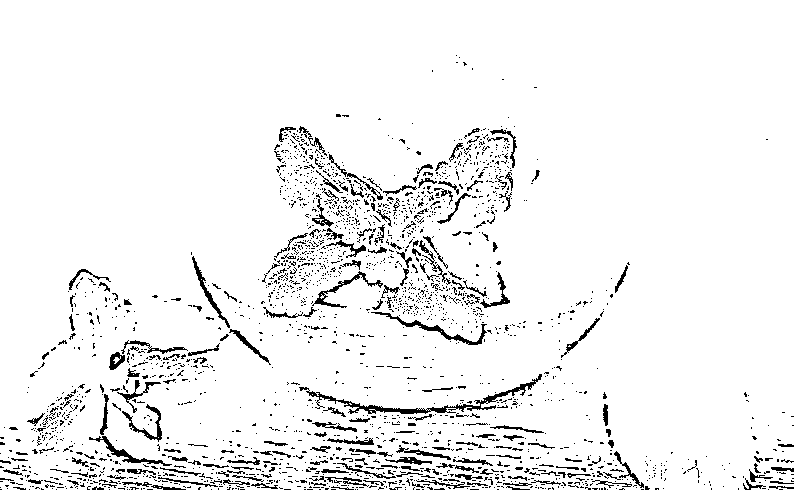

第一次见到顺势疗法医生安德里亚·韦斯纳医生

（Andrea Weissner）时，我真是一团糟。我哭着走进房间，因为我真的以为我快死了。当时，我总做噩梦，我记得我对她说，我想去除内心的这种可怕的恐惧感。她问了我很多问题，把我说的话都写下来了。她也了解到在这一切开始之前，我是什么样的人。我对她说：“韦斯纳医生，你能帮我吗？”她笑了，握着我的手说：“是的，我可以。”我们知道这将是一个缓慢的过程，但我觉得我终于来对了地方。我们尝试了不同的顺势制剂，我一点点戒掉了我当时服用的所有其他药物。四、五个星期后，我开始注意到自己有些不同了。梦没有那么疯狂，我也不再像以前那样浑身冒汗，开始平静下来。我也可以出去一会儿。顺势制剂改变了我的精神和身体状态。以前，一想到要上飞机，我就非常害怕，惊慌失措。后来，因为我的身体好转，我告诉韦斯纳医生我想和我的家人一起去度假，但是害怕坐飞机，她就给了我一个顺势制剂。成功了，我上了飞机——感觉棒极了。自从我开始求医于韦斯纳医生，三年半过去了，我觉得她真是帮助了我很多。当我第一次去看她时，从 1 分到 10 分的焦虑量度表，我的焦虑程度是 10 分，而现在是 1 分或 2 分。我的整个生活都发生了转变，我的孩子们也找回了他们的妈妈。现在，我常用顺势药剂是虱草子或者钩吻。偶尔，我也会服用其他顺势制剂。例如，几周前，我觉得昏昏欲睡，好像动不了，我就服用了乌贼 30c，真的很有帮助。看到顺势疗法给我带来的影响，我的一些家人和朋友都转向顺势疗法，甚至我的父母，他们本来都是老派人物，不相信这些。我表妹也带她四岁的女儿去顺势疗法，因为抗生素对她数月来的严重咳嗽没有帮助。她吃了三天药后，症状消除了且没有复发。这就是我和顺势疗法的故事。

****请在后台回复 顺势 获得更多****关于顺势疗法内容********

**版权声明：**本文由若道翻译发布，欢迎转发，反对抄袭。友号转载请申请白名单。

**学习顺势疗法**

**请点击下图了解详情**

**微信又双叒叕改版啦，不想错过若道君的推送？**

**就把若道设为星标吧！**

**▼**

就是这个“在看”，戳戳戳 ☟

********报名直达入口********

# 9 月 17 日处女座新月 | 比“想干什么”更重要的是“能干什么”

> 原文：[`mp.weixin.qq.com/s?__biz=MzA5NjA0NTAxNg==&mid=2651427666&idx=1&sn=0a2fc6d93035008ecddddd955594ca32&chksm=8b4b21e5bc3ca8f358232257556e2e9c4bf8d0027ed0f057c523d06f660410a2261ed15816e9&scene=126&sessionid=1692738106#rd`](http://mp.weixin.qq.com/s?__biz=MzA5NjA0NTAxNg==&mid=2651427666&idx=1&sn=0a2fc6d93035008ecddddd955594ca32&chksm=8b4b21e5bc3ca8f358232257556e2e9c4bf8d0027ed0f057c523d06f660410a2261ed15816e9&scene=126&sessionid=1692738106#rd)

**********☆****************后台回复“今日”，给你一句生命态度**********

作者/王芝桦 编辑/玫瑰 图片/全景网**处女座新月**

**我知道自己忙碌，**

**但不知道为什么。****我也知道自己应该回去，****但不知道回到哪里。****……****于是我把一切打碎，让一切重新开始。****——亨里克·诺德布兰德 《螺丝》****北京时间 2020 年 9 月 17 日 19:00 迎来处女座新月，太阳与月亮精准合相于处女座 25°00′。**

处女座的原型故事比较复杂，且有多个形象，但每年处女座新月我的意识之中闪现的并不是被劫入冥府的“冥后”珀耳塞福涅，而是“正义女神”阿斯特赖亚和她手中的麦穗，因为这会让我感受到“精细而具体”的颗粒感，以及成熟果实背后的“因果逻辑”——**种下什么因，结出什么果。**

希腊神话中，“正义女神”阿斯特赖亚是“众神之神”宙斯（木星的原型）的女儿，曾经在人类世界还没有战争的年代生活在大地上，教导人们遵循自然法则，即无论人类、动物和植物都要遵循的自然秩序和生命法则，任何事物都有其固定的时间和空间，存在与价值。后来随着人类的贪欲与堕落，阿斯特赖亚开始痛恨人类的无序和混乱，一怒之下回归天庭并变为处女座。“正义女神”阿斯特赖亚的手里时常拿着一束麦穗，象征着自然界的“因果逻辑”，但执着于“因果逻辑”的秩序化和仪式化的女神，也同时厌恶“无序和混乱”带来的偏差和瑕疵，故而处女座也具有**不允许偏差、厌恶瑕疵**的风险，并时常深陷**“不断纠偏却又难以完美”**的纠结与痛苦之中。**但是，真正的“因果逻辑”，既包含对秩序的维护，亦包含对混乱的接纳。**因为，“因果”之间除了播撒的种子之外，还有生长过程中各种“缘”的促进与影响，故而无法强迫种子必须结出“完美”果实。此次处女座新月，播撒愿景种子，但不要执着结果，因为生命的“因果逻辑”的真相是——**虽然自我意识的“因”决定着自我生活的“果”，但在“因果”演化过程中的“缘”亦是我们自我意识的选择。**此次处女座新月，我们首先需要了解——并不是许下愿景就一定会实现，更重要的是我们要在实现愿景的过程中带着一份觉知，在每时每刻做出有力的选择，提升“缘”的促进与影响，比如只有在一个目标之上持续精耕并不断完善，才可能让愿景得以实现。

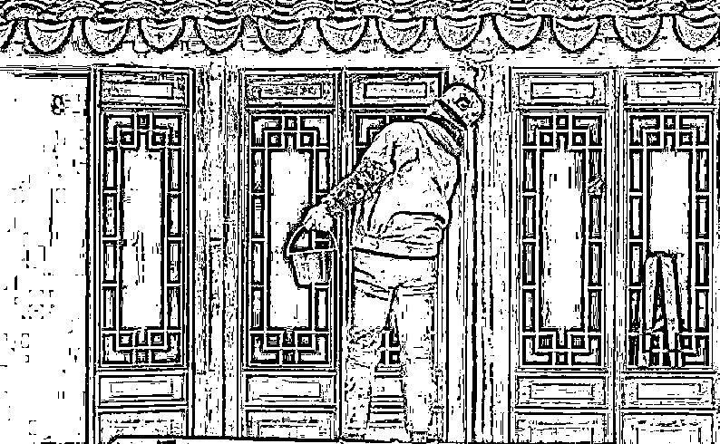

> **处女座新月重点影响人群**
> 
> **参考新月峰值影响期间各个行星的行进度数，以及逆行行星的轨迹影响；常规容许度，个人行星入相位 3°，出相位 1°；非个人行星入相位和出相位均为 3°。**
> 
> *   出生星图中，有**行星、四轴、南北交点**落入**固定星座（金牛座、狮子座、天蝎座、水瓶座）3°-16°**的人群。
>     
>     
> *   出生星图中，有**行星、四轴、南北交点**落入**变动星座（双子座、射手座、处女座、双鱼座）15°-30°**的人群。 
>     
>     
> *   出生星图中，有**行星、四轴、南北交点**落入**基本星座（白羊座、巨蟹座、天秤座、摩羯座）2°-30°**的人群。

**将“进化”的意识放进愿景之中**

**欲创造，先毁灭。**

**——电影《普罗米修斯》**

**天象**

*   **土星三分新月**：逆行的水瓶座土星三分处女座新月；

*   **火土四分**：逆行的白羊座火星四分逆行的摩羯座土星；

*   **新月四分南北交点**：处女座新月四分射手座南交点，四分双子座北交点；

*   **水木四分**：天秤座水星四分摩羯座木星；

*   **金天四分**：狮子座金星四分逆行的金牛座天王星。

9 月，宇宙能量似乎被行星的顺行和逆行脚步搅起“停滞”漩涡：**9 月 10 日，白羊座火星开始逆行，9 月 13 日，摩羯座木星恢复顺行，9 月 29 日，摩羯座土星即将恢复顺行，10 月 4 日，摩羯座冥王星即将恢复顺行。**

9 月，火星、木星、土星和冥王星四颗行星几乎同时处于“停滞”状态！而此次处女座新月，即将于**9 月 29 日**进入第二轮能量峰值的**“火土四分”**结构，由于火星和土星的停滞状态也已经进入僵持状态——**战无不胜的勇士被现实高墙撞得倍感无力并深感郁闷**。

或许正因为这种切实的感觉，令我们在 9 月期间深深感到：**结合现状，该做些全新的计划了。**

此次处女座新月，摩羯座土星与处女座新月的三分结构，就像是代表“现实法则和时间法则”的土星老人指着“正义女神”阿斯特赖亚手中的麦穗，对战无不胜的勇士说：“一颗种子变成沉甸甸的果实，需要在时间的轨道上持续地耕耘和自律地精进，收起你的无力和郁闷，你的小脸色我可不买账，去干你该干的正经事儿，come on!”

土星老人的这段话有两层意思：一是，**只许愿不行，持续的耕耘才可能有收获**；二是，**如果你正深陷情绪之中消耗时间，那么就要及时止损。**话好说，事难做，就像那首《螺丝》的诗歌里所描述的一样：“我也知道自己应该回去，但不知道回到哪里”。那么，我们就来理一理思路。

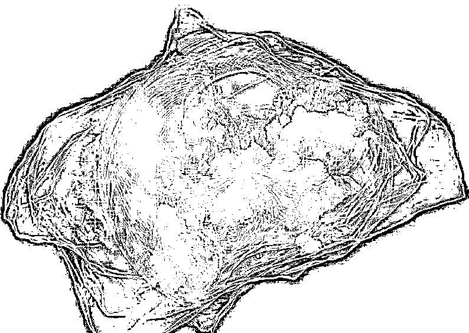

1**踩稳安全根基**

时至今日，“踩稳安全根基”这句从 2019 年下半年就一直在喊的话，再喊已是满心的沧桑。有得可踩就感恩珍惜吧，已经没得可踩也不妨反思重来。但是这句话还是要再喊一次，因为以“现实生存为基准”的 2020 年，依然是**“比想干什么更重要的是能干什么”**，前者能让你有激情，但后者能让你吃饱饭，我们总得先活着，然后再谈梦想，不是吗？9 月是 2020 年剩余的几个月时间里，**最后一次“梳理生命秩序”的月度，清理无用的欲望，校准梦想的航向，踩稳自己的安全根基，抓紧自己的生命之轮**，然后在 2020 年最后一个季度里穿越**“新旧周期”**转换激起的巨大浪潮，乘风破浪。

故而，9 月的天象也推进着我们的直觉与选择。最近你可能经历的：

*   **期待全新的“稳定感”，构建全新的目标**。比如能够带来长期流水的项目和收益，建立不受外界影响的核心竞争力，或许你已经在做前期的策划和预算，或许你已经准备好学习的决心和斗志； 
*   越来越明确自己“想成为什么样的人”，越来越清晰那些“必有回响”的事情是什么，这些明确和清晰正在支撑起你奋斗的意志和积极的动力； 
*   如果你有一个信得过并能助力的好朋友，或有一个既专业又具经验的智囊团，那么最近你会获得他们的建议和帮助，令你的目标和计划更加向前推进一步。

当然，也有一些朋友仍然处于“不知道回到哪里”的迷茫之中，那么你首先要回到的就是自己的内心深处，找到生命之内那个**“绝不放弃”**的东西。之所以它会一直存在于你的生命之内，是因为它是能为你的灵魂带来巨大欢愉的源泉，而今它正等待你将它一点一点地创造为现实。此次处女座新月，你的愿景，从它开始。

2**新月愿景遇见进化议题**

此次处女座新月四分“射手座南交点-双子座北交点”轴线，提示我们在许下愿景和制定计划的时候，要先觉察这一组凸显“内在意识”的南北交点轴线所揭示的“业力议题和进化目标”：**射手座南交点描述出“陈旧观念和老朽经验”所带来的束缚，双子座北交点则描述出“敞开学习和全新尝试”是解锁束缚的必备解药。**“射手座南交点-双子座北交点”轴线的能量，借由行星能量传导链被另外两颗行星接纳：

*   **双子座北交点-天秤座水星** 

*   代表心智思维、制定往来边界的水星守护双子座和处女座两个星座，故而既接纳着双子座北交点的能量，也接纳着此次处女座新月的能量。此次处女座新月，水星叠加了“新月+北交点”的能量，也指向“愿景+进化”的双重意涵——**能有力支撑我们在 2021 年前行的愿景和计划是什么？对未来生活更有建设性的全新意识有哪些？**我们需要做出更有力和更有建设性的选择； 
*   此次处女座新月，水星行进在天秤座，“公正女神”天秤座为水星润染上**“深刻的反思与衡量”**的意味，“平衡需求”进入我们的意识，但同时选择所带来的“失衡恐惧”也在干扰我们的内心。

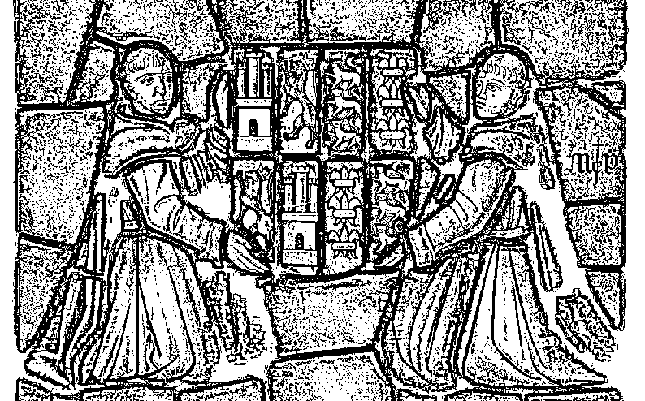

*   **射手座南交点-摩羯座木星** 

*   携带着“渴望扩张”能量的射手座守护行星木星接纳了射手座南交点的能量，在**引领我们追寻理想与智慧的同时，也携带着膨胀与纵欲的风险；** 
*   此次处女座新月，行进在摩羯座上的木星，正准备逐渐靠近同样行进在摩羯座上的冥王星和土星，上演具有“结束”意义的“三重合相”年度大格局；还准备在年底 12 月与土星双双换座进入水瓶座后，上演“开启”200 年风元素周期的“伟大的合相”重磅格局； 
*   故而，木星行进在摩羯座的最后三个月，将会推动人类业力议题中那些陈旧的“正确”观念、老朽的“应该”标准以极端的方式演化，我们将会从**道德法律、国际贸易、文化宗教和资本特权**等诸多领域，**看到真相的揭露和负面的清理**，这也是为即将到来的全新周期“欲创造，先毁灭”。

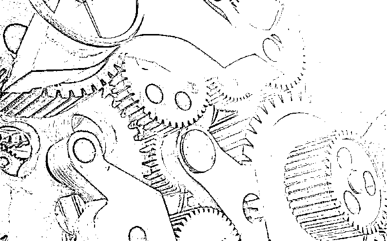此次处女座新月，天秤座水星与摩羯座木星组成了紧密的“水木四分”结构，提醒我们在开启愿景和制定计划的时候，需要带着一份觉察去规避意识的盲点：

*   确认你的愿景目标来自于生命内在的“真实的渴望”，而不是顺从集体价值的“好看的目标”；

*   不要用以往的意识观念或经验认知去判断什么能行、什么不行，因为以往的也最容易成为当下的“枷锁”； 

*   不要执着愿景目标必须按照你的预设去演化，这种带有强迫性的理想化会令你陷入“怎么选择才不会错”的消耗之中，随遇而安，勇敢前行。

“水木四分”结构也只是 9 月下半月的一个开端。**9 月 17 日-9 月 24 日**期间，天秤座水星与摩羯座上的木星、冥王星和土星，以及白羊座火星形成“挑战”意味十足的“T 三角”格局，点燃了“为公平而战”的战火，**不同立场和不同理念的人们采取极端的方式保护“自己需要的公平”**，彻底撕裂了自 4 月以来每况愈下的平衡状态。

此次处女座新月，需要我们有意识地在“业力议题和进化目标”之间做出选择——宇宙进程正在全速迈向全新周期，要求我们**升级意识维度，转化那些已经不能再对当下进程带来建设性的陈旧意识和老朽经验**。故而需要我们**敞开学习不同的知识，谦虚接纳不同的观点，因为只有超越过往才能创造全新的可能性。**

3**意外的关系变化**

狮子座金星与金牛座天王星的“金天四分”结构，在此次处女座新月的前后 4 天发挥影响，带来**“情感与关系”两方面意外的剧情和彻底的变化**：

*   暗恋者可能会突然告白，突然而至的承诺带来惊喜；有的朋友可能会迅速开展一段情感关系，或合作关系进入全新阶段； 
*   你可能突然发现某些人的真实面目，甚至某些坚不可摧的关系轰塌破碎，比如承诺之后突然消失或爽约的人，比如意外流露出的价值观令你跌破眼镜；对于本就面临关系考验的朋友而言，情感降温或关系冷战算是一般性问题，而断除往来或彻底拆伙的可能性也增高了概率。

当然，以上两方面也有可能是我们带给别人的感觉和影响。问题是，意外真的只是意外吗？还是被天象触发了本就存在的问题或一直忽视的功课？

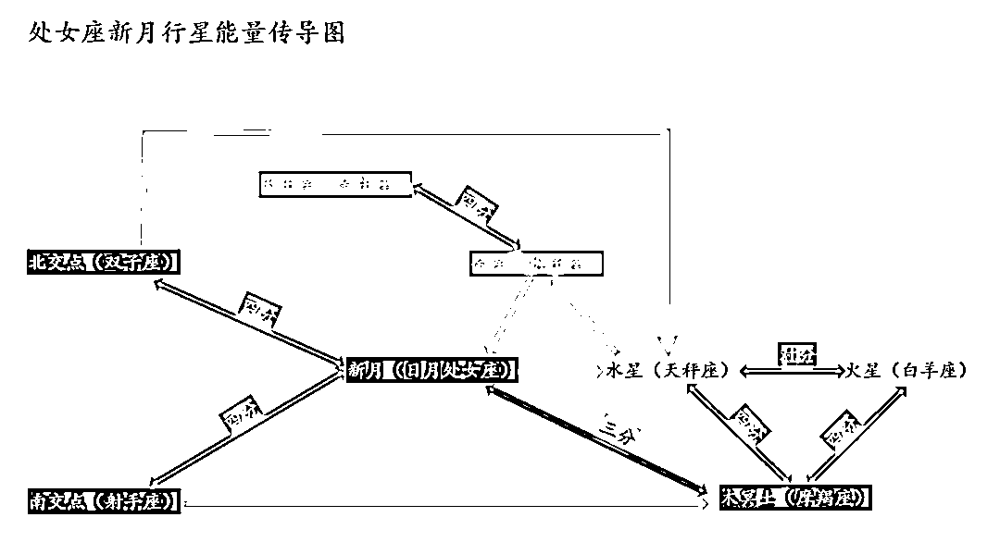

我们通过行星能量传导，可以看到“金天四分”结构中的狮子座金星也被牵涉到此次处女座新月的能量循环之中：金牛座天王星→狮子座金星→处女座太阳（新月）→天秤座水星→狮子座金星……如果你在此次处女座新月，想要许下“情感与关系”的愿景，不如先评估一下——**这段突然升温或突然分开的关系对于你的未来生活究竟有没有建设性**，再许愿不迟。懂得选择是一种智慧，懂得放弃是一种止损，而生活最怕的就是沿着老路循环不停，却看不见其他的可能性。另外，“金天四分”和“水木四分”两组结构，也预示着**集体层面公众人物的健康消息**，引发关注并牵动伤感；或触发出**知名人物的桃色新闻，人设崩塌或名誉受损**；而在国际社会，自 4 月以来各种强拉硬拽操作之下的金融平衡也到达了一个临界点，意味着**经济趋势和贸易约定将面临新一轮的震荡和洗礼。****寄语**

**巨大的事物总有细小的开头。**

**——电影《普罗米修斯》**

2020 年，我们生活在快速运转的时间机器之上，跟随这台机器奔往“全新周期”的开端，宇宙跨越如此巨大的一步，也要求我们跨越巨大的一步，而这巨大的一步就由当下细小的选择构成。

此次处女座新月，不要只将愿景锁定在现实的目标和计划，更要聚焦在**意识的转化和升维**，因为正是意识创造了当下的现实，一切细小的意识转化都将带来巨大的现实变化，故而此次处女座新月——尝试用意识之光去扫描当下的盲点，解锁未来的奇迹；学习以另一种意识滤镜看待当下的生活，创造更有建设性的可能性。祝福大家，愿每个灵魂安好。

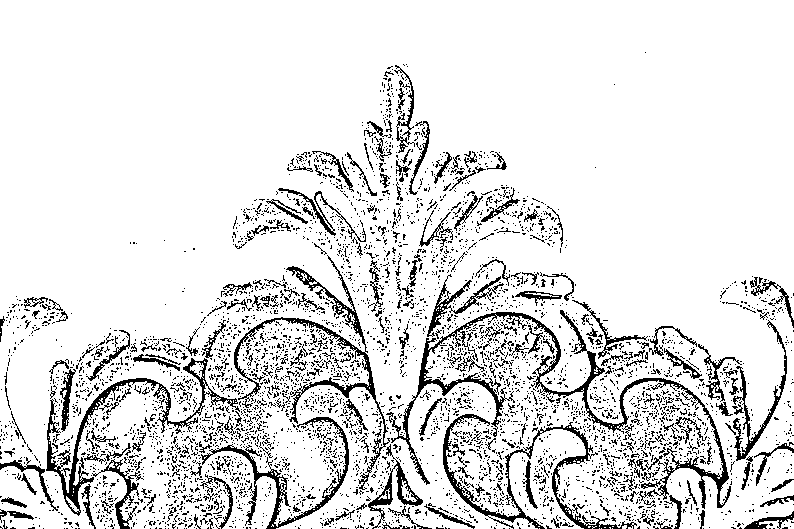

**新月如何许愿？**

**许愿时间**：2020 年 9 月 17 日 19:00 后，48 小时内有效、8 小时内最佳。

**许愿人群**：所有人。**许愿数量**：每人最多 10 个。**许愿方式**：静心冥想，身心祈祷或记录收藏。**许愿格式**：请万能的宇宙赐予我能量，我将以我的能量吸引**（什么）来到生命中……**许愿原则**：发心诚善利人。

**版权声明**：原创文章由作者授权首发于若道平台，欢迎转发，反对抄袭。友号转载请申请白名单。

****

****想阅读更多作者的文章****

****请在后台回复******王芝桦****** 即可****

****王芝桦****

心理占星师，统合疗愈师，若道占星“新月和满月”专栏作者

腾讯视频特邀合作占星师

全职于个案咨询与占星教学工作 16 年

**个案预约咨询微信号**：zhihua0621 

**微信公众号**：daoxi-life

**长按打赏**

****

**微信又双叒叕改版啦，不想错过若道君的推送？**

**就把若道设为星标吧！**

**▼**

**点击**

**“阅读原文”**

**获取免费新月报告**

****获取免费新月报告，请点击文末“阅读原文”****

# 月亮空亡的时期不能许愿？ | 为你揭秘神秘的“空亡”时间

> 原文：[`mp.weixin.qq.com/s?__biz=MzA5NjA0NTAxNg==&mid=2651427666&idx=2&sn=2a2bd95e6fefd25236ae1c9d5d4882c5&chksm=8b4b21e5bc3ca8f3a74aa6fd7d8fbe66c58fe940234c9d8c04d536ee134b2c3bc6c4d44d14f4&scene=126&sessionid=1692738106#rd`](http://mp.weixin.qq.com/s?__biz=MzA5NjA0NTAxNg==&mid=2651427666&idx=2&sn=2a2bd95e6fefd25236ae1c9d5d4882c5&chksm=8b4b21e5bc3ca8f3a74aa6fd7d8fbe66c58fe940234c9d8c04d536ee134b2c3bc6c4d44d14f4&scene=126&sessionid=1692738106#rd)

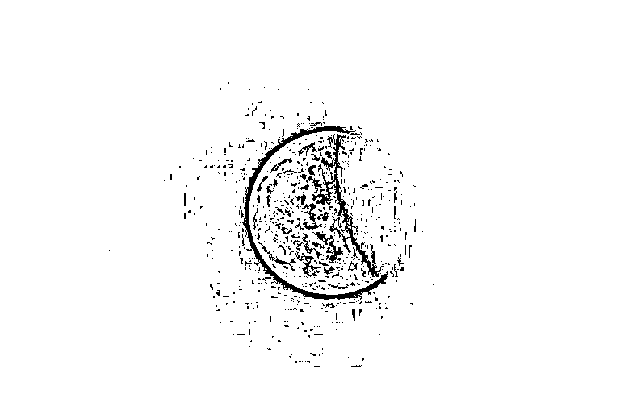

作者/比尔·赫布斯特 译者/Jun 校对/Arrow 编辑/玫瑰 图片/花瓣网

在每次新月许愿的时候，总有小伙伴问道：“月亮空亡时间能许愿吗？”月亮空亡到底指什么，又会对我们的人生又怎样的影响呢？一起来看看。

**月亮空亡**占星学上诸多稀奇古怪的激发现象之中，有一个称为**“月亮空亡”**（Void-of-Course Moons）。还没精通占星学行话的人请注意，这不是“空的……当然”（译注：此处原文为 void……of course，of course 有“当然”之意，但在 void-of-course 中另有含义），而是“空亡”，意思是**“没有路径”**。这个术语通常指的是月亮空亡。月亮的轨道就像母亲的子宫，地球上所有的生命都在其中。月亮为地球上的生命提供了缓冲，有点像大气保护层，物理屏蔽了潜在的有害宇宙辐射，使我们免受危害。不过，与大气层不同的是，月亮有微妙的隐喻功能——**它将宇宙能量与我们的情感之源“联结”，规范我们，建立相关联的节奏。**（在神秘学中，这更多与地球的需求有关，而不是我们的。）**我们共情的神经系统受到海洋潮汐每天起起落落的影响，也被每个月月相变化的含义所影响。****月亮在我们的天球上走过一周需要 28 天左右，每 2 天更换一次星座。**月亮每走过一个星座，都与太阳系中的其他星体形成重要的角度关系。这些角度称为“相位”，但我们可以把它看作“联结”，类似电路板上元器件间的电气联结。**从月亮在一个星座内与其他主要星体最后一次形成相位开始，一直到它进入下一个星座之前，这段时间被称做空亡。**月亮空亡的时间，短则几分钟，长则几天。由于太阳系中的所有星体划过天球的速度明显不同，月亮在不同星座之间的空亡阶段差异巨大，月与月、季与季，甚至年与年之间的差异也很大。主要星体在星座中的分布不断变化，导致有些月份会出现 13 个非常短暂的月亮空亡。每隔几天，就会有仅仅几分钟或者一两个小时左右的月亮空亡。其他月份可能缀满长时间的月亮空亡，持续一整天或者更久。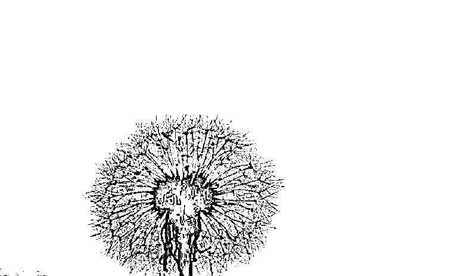**月亮空亡的意义**那么，月亮空亡又怎么样呢？这与我们有什么关系？这么说吧，月亮空亡的意义在于，那是**万物毫无联结**（NOTHING CONNECTS）的时间。生活的乐章在继续，但是节奏被打断了。我们没法继续跟着拍子，所以跳舞几乎不可能了。**联结万物的以太失去了弹性，共时性放了假，表面上的一般因果律也瓦解了**。当然，这些只是诗意的隐喻。我可不想装作知道月亮空亡象征的实际机制是什么。不过，我更有信心说的是，它是**发生在所有精微到难以觉察或感受到的层面的一切，同时又深远到足以影响构成我们世界的关系网。“**我”不仅指我们的社交或亲密关系，也包括万物之间的基本关系。月亮空亡在占星学中被解释为**最小结果的时间——更低生产力、更少活动、更少的有意为之**。这是短暂起起落落中的退潮阶段。生活表面上看上去很正常，但它并没朝任何地方发展。事情并没有得偿所愿。所以月亮空亡传递的信息，就是要我们**慢下来，细嗅蔷薇**。从千篇一律的工作中解脱出来。花时间来个星辰间的小憩。放空现实生活中的急迫需要——让工作和人际关系暂停一下。**尽可能别启动事情，别做决定，别投入期待**。相反，**去等待、去休憩、去反省。滋养自己，做白日梦。冥想你的脐轮，吐气。**月亮空亡同水星逆行有些相似之处，比如要**小心重要的决定、采购、合约**。但是**月亮空亡有助于反思计划，清理未完成的工作**。月亮空亡的意涵更具灵性。它催促我们转身离开现实世界的日常生活，就算只有一两天而已，重新将注意力投向我们身体的恢复，灵魂的平静。我相信月亮空亡吗？好问题。与其他占星事件相比，我对它的效果不太确定，也没听说过我的哪些专业同事感受到它的影响而狂热笃信。尽管如此，这项技术几个世纪以来到现在，持续存在于占星学中，而且许多德高望重的占星师对空亡十分关注。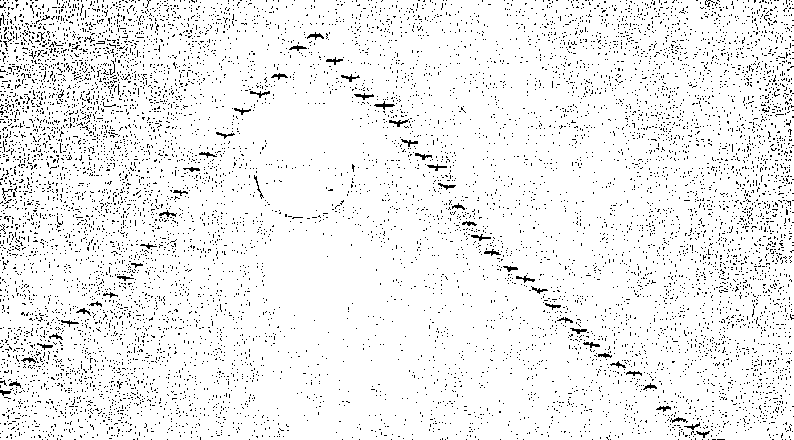**月亮空亡的问题**

生活会通过取长补短保持美妙的平衡——它在关上一扇门的同时，打开一扇窗。一般来说，有 13 个月亮空亡的一个月中，空亡的时间不超过 70 小时，粗略算作一个月 30 天里的 3 整天时间。这些极长的月亮空亡让我们有机会远离这个困难时期的过度压力。

每隔几天就记得找机会慢下来向内看的人，会从恢复精力中受益。忽略空亡，继续奋力向前推进的人，会为浪费的精力、错误、崩溃、失望、沮丧的情绪付出沉重的代价。

如果你上网搜索“月亮空亡”，你会找到好几百个占星网站，上面给出了特定某月的月亮空亡日期和时间。但这样做的问题在于，这些信息都是以原始数据列表的方式呈现的——每次空亡开始的日期、星期、时间，以及每次空亡结束的日期、星期、时间。而每个月有 12 次空亡，多得细究不过来。没人喜欢破译长长的数据表。要弄清楚需要做太多工作，我们很快就会以放弃努力或是忘记而告终。我是说，拿到让你感觉良好的药剂处方是一回事；遵守纪律记得按时服药是另一回事。

最需要我们关注的空亡发生在**工作日的白天**，因为那时我们**最容易被迷惑，**以为生活一切正常，尽管它并不是。**有空亡发生的工作日，正是需要我们真的退后一步的时候，有意识地停下（至少减慢）我们提高效率把事情做好的尝试。**

打印当月的那一页，贴在你的冰箱上。最好带去办公室。你不需要写下任何东西或者细究数字列表——全都为你视觉化呈现了，并可以立即使用。接着，你所要做的就是看着月亮空亡日历，然后说：“噢，明天是时候休个假了。”你会知道什么时候在工作中从容不迫，降低预期。你会知道什么时候避免重要的决定，凡事留有余地。你也会知道什么时候大自然母亲让你休息放松，任随宇宙之河漂流下去。
**2020 年月亮空亡时间**

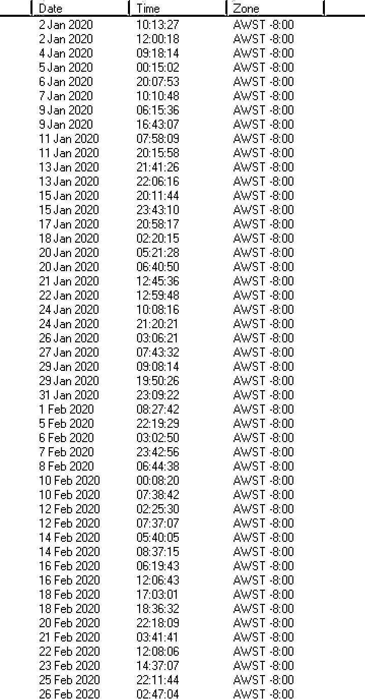

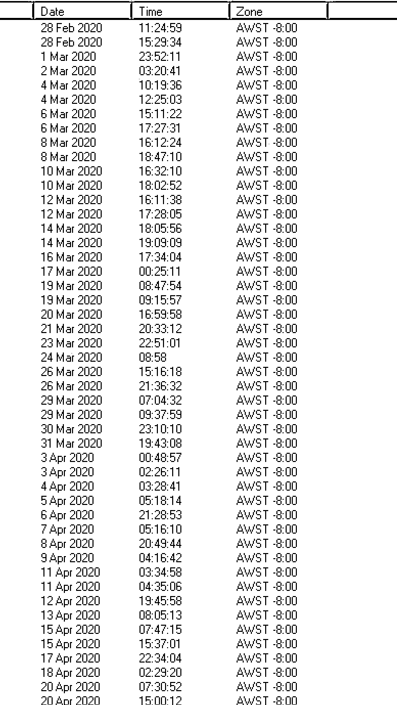

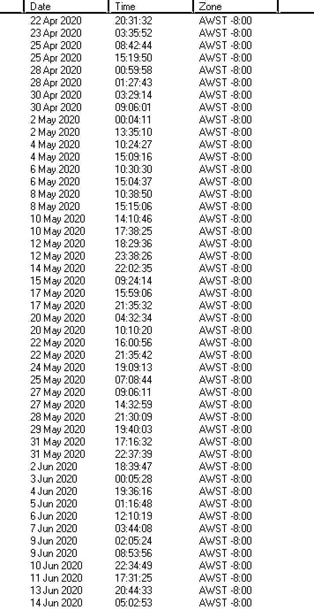

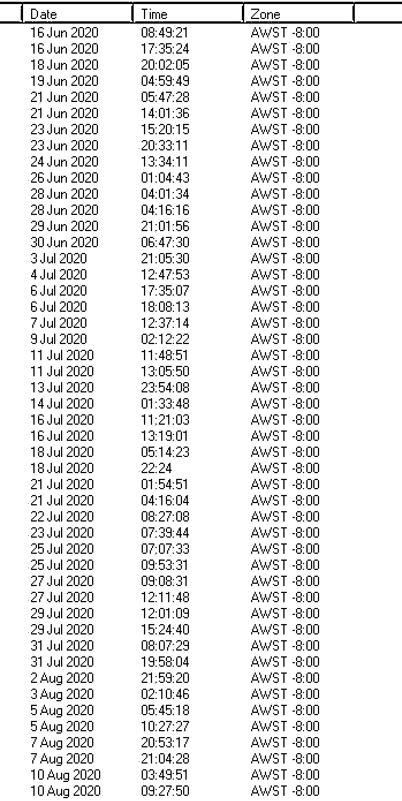

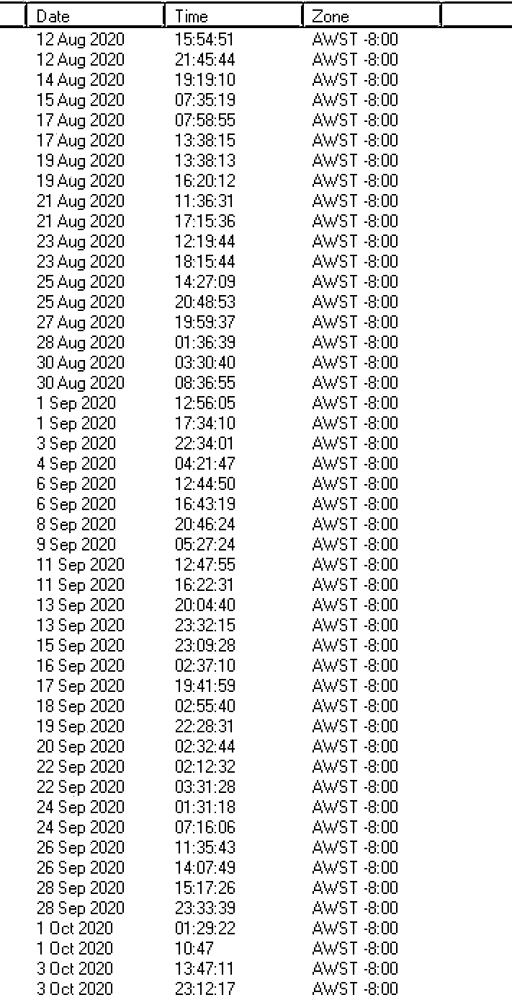

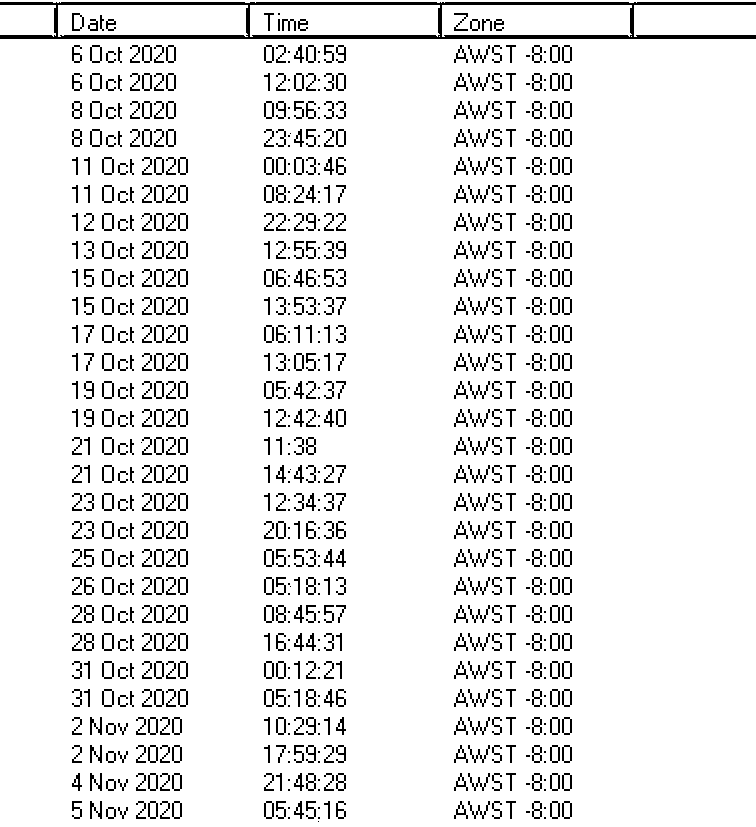

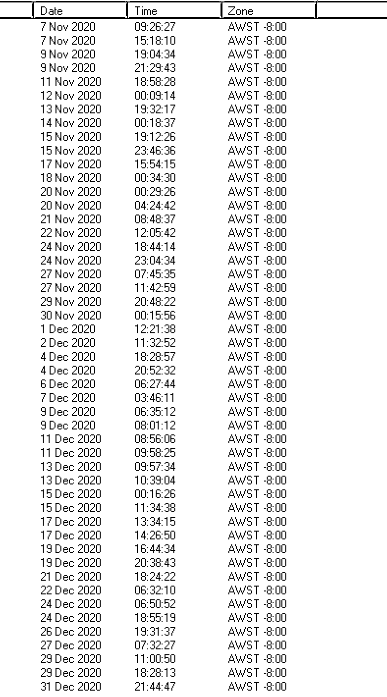

**版权声明：**本文由若道翻译发布，欢迎转发，反对抄袭。友号转载请申请白名单。

比尔·赫布斯特

比尔·赫布斯特，1973 年起任全职占星师。目前，他的撰稿专注分析 2010 年代前半段发生的重大事件，及其对后半段和 2020 年代产生的广泛性变革。

**系统学习占星学**

**点击图片了解详情**

**

**微信又双叒叕改版啦，不想错过若道君的推送？**

**就把若道设为星标吧！**

**▼**

就是这个“在看”，戳一下☟

********报名直达入口********

# 巨大的事物总有小的开头，比如这份免费的新月报告

> 原文：[`mp.weixin.qq.com/s?__biz=MzA5NjA0NTAxNg==&mid=2651427666&idx=3&sn=c92d8e988b3fb03f50ec9bef5a6dd549&chksm=8b4b21e5bc3ca8f342b43020b023163d3bfec87eff49bae2cab921d0dc5837280183ca59305e&scene=126&sessionid=1692738106#rd`](http://mp.weixin.qq.com/s?__biz=MzA5NjA0NTAxNg==&mid=2651427666&idx=3&sn=c92d8e988b3fb03f50ec9bef5a6dd549&chksm=8b4b21e5bc3ca8f342b43020b023163d3bfec87eff49bae2cab921d0dc5837280183ca59305e&scene=126&sessionid=1692738106#rd)

编辑/玫瑰 图片/网络

北京时间 2020 年 9 月 17 日 19:00，新月发生在处女座 25°00′。每到新月时分，若道君都会为你奉上根据你出生星图量身打造的免费新月报告。可是新月为什么要许愿？新月报告该如何领取？让若道君来教你。

　**什么是新月？**　

从占星学看，新月是月亮周期的一种相位。新月是开始，又称为朔，对应中国农历初一，太阳、月亮在此时合相。此时月亮运行到太阳与地球之间时，月亮以黑暗的一面对着地球，并且与太阳同升同落，地球上看不见月亮。

本次新月时间

**2020 年 9 月 17 日 19:00，新月发生在处女座 25°00′。**

为什么新月要许愿？新月是一个周期的开始，新月发生的时候，太阳与月亮合相，能量很强。当新月出现时，你也许会发现灵感忽现，非常适宜开启新领域、项目与行动，缔结一段新的关系或合作。许愿会加强新月的能量，也有助于你了解自己现阶段适合开启的方向。 本次新月最佳许愿时间

从新月开始到其后的 48 小时内，许愿的力量最强。

**最佳许愿时间：2020 年 9 月 17 日 19:00～9 月 19 日 19:00**

属于你的免费新月报告

每到新月时刻，看着占星文章里写着：看看你新月的宫位，如果新月在第 X 宫，你可以许愿的方向是……

是不是常常一头雾水？新月的宫位？我到底该看哪里啊？

而有时，那些标注上升星座的文章也会让你忍不住想：虽然我的上升星座是这个，可是我的新月好像并不落在你说的宫位啊？你是不是写错了？

虽然这些文章都没有写错，可是好像对你而言都太不友好了。

**Don't Worry！**别着急，让博学又体贴的若道君来帮你！

我们推出了一份**免费**又**好用**的新月报告！

而且是专门为你设计的哦，**根据你出生星图为你量身打造的，只****属于你的独家新月报告**。

报告有哪些内容？

**新月时间****最佳许愿时间**

**如何许愿 **属于你的**许愿关键词**

本次新月给你的**建议**

你会有怎样的**感受 **

****机会****

********

如何许愿？

许愿方式也很简单。

你可以把愿望写下来，或者双手合十后交叉，闭上眼睛来祈祷。

报告中会为你提供**祈祷词示例**，可以多多参考哦～

你还可以适当添加自己的语言，创造属于你自己的祈祷文！

如果报告拿到手了，快对照着许愿吧！

**这份好用又暖心的报告，点击阅读原文即可领取！**

****

****点击“阅读原文”即可获取新月报告****

# 最后一天早鸟价！丨学习斯蒂芬星图解读的秘密技巧

> 原文：[`mp.weixin.qq.com/s?__biz=MzA5NjA0NTAxNg==&mid=2651427576&idx=4&sn=58644362769cfdda1e09a80d8116e6f2&chksm=8b4b204fbc3ca9598b83ad64ada99bae71883434735d51aca308461634f3c1b040b45238816f&scene=126&sessionid=1692738106#rd`](http://mp.weixin.qq.com/s?__biz=MzA5NjA0NTAxNg==&mid=2651427576&idx=4&sn=58644362769cfdda1e09a80d8116e6f2&chksm=8b4b204fbc3ca9598b83ad64ada99bae71883434735d51aca308461634f3c1b040b45238816f&scene=126&sessionid=1692738106#rd)

**若道独家 3 日线上工作坊**

由于疫情影响，斯蒂芬老师今年的中国之行无奈受阻，但斯蒂芬老师不想他的中国学生们期待落空。在和大卫老师数次线上沟通后，斯蒂芬老师决定**首次开设线上工作坊**，**跟大卫老师联袂授课**，还专门为若道设计了**两大独家主题**：

**10 月 9 日-11 日**

**《爱的内在炼金术—你的亲密关系盲点在哪儿？》**

****10 月 16 日-18 日****

**《整合行进、推进以及太阳弧技法》**

满足中国占星学子对于进化占星学的学习和精进需求，用线上直播课的形式亲赴十月进化占星学之约。

鉴于时差安排，每天上午线上跟斯蒂芬老师学习 4 小时，下午大卫老师会抽取参课学员进行 1 个半小时案例解读。对南北交点最有心得建树的**两大权威导师**，从技法到实践，承包你的知识点。

防疫为重，线上工作坊也省去了学员们舟车劳顿奔赴现场的种种不确定性，我们相约 2020 年 10 月，斯蒂芬老师非常期待和新老学员们在线上工作坊中相见。

**我们将学习什么？**

**学习斯蒂芬星图解读的秘密技巧（艺术）！**

*   一名新手占星师可能看着一张星图想知道“我应该说什么呢？”

*   同时，一名高级占星师问道“我应该从哪儿开始呢？”

占星学的基本难题是它产生了太多信息。

所有对**行进**、**推进**和**太阳弧**的准确理解都依赖于对出生星图本身的彻底把握。

这个过程本身就足够棘手了——然后我们发现十几个移动点形成了数百个触发出生星图的相位。

逻辑表明，占星学的一个基本技能就是知道该舍弃什么。除非每次咨询都花上一周时间，否则这个现实是不可避免的。

但是，究竟有什么是我们可以放心地忽略呢? 又有什么对我们的理解至关重要，以至于忽略它会导致无法弥补的错误? 

一个简单的例子是，我们不会浪费时间谈论行进水星与出生星图宿命点之间形成的一个 144 度相位，但意识到我们竟然忘记了推进太阳与天王星形成的对分相！

另一个简单的例子是，我们不要因为木星正在触动她的中天，就贸然试图让一个安静的四宫巨蟹座的人对“成名”感到兴奋, 永远不要忘记对于出生星图的根本性预测，换句话说，当你准备分析一张出生星图的时候，你可以采取系统的步骤来帮助你把焦点对准需要聚焦的地方。有些非常简单，甚至可以通过计算机编程来成。

经过这些初步的准备步骤，我们进入了真正的占星艺术的领域。我们必须将客户当前现实的天气变化与出生星图本身根本的进化焦点编织在一起。我们必须以一种反映自身意识力量、本性和状态的正念方式去做——每一个有技巧的占星师都要学会保持他或她与符号间宝贵的直觉联系，监控任何“过热”的智力迹象。

**- 此次授课内容** **-**

*   斯蒂芬老师总结三大最实用占星预测技法：行进、次限推进、太阳弧推进

*   整合这三种技法能够宏观和微观预测一个人的运势起伏和重要节点

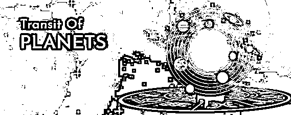

**行进（TRANSITS）**

**长期趋势**

分析行运的最好方法是先将长期的行运趋势列出来。顺序如下：冥王星、海王星、天王星、土星、木星、南北交点。

通过将这些影响力持久的长期行运先列出来，你将能够发现在未来一年甚至更长的时间里你人生中的重大课题。

**短期趋势和触发点**

接下来你需要去观察那些运行得较快的星体，来判断短期趋势。不过，重要的是要清楚，这些移动较快的星体在行运中扮演着事件的“触发点”的角色，特别是当与它们形成相位的个人行星同时也与行运外行星有相位的时候！

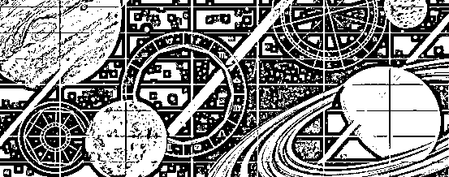

**次限推进（PROGRESSIONS）**

通常也被称作“一天代表一年”推运，因为这种技术把出生后的每一天和出生后的一整年等同起来。一旦设定了这个节奏，就像定时释放的胶囊一样，这些次限推进就像某种内部的太阳系一样运转起来，和真实时间的事件、经历、情境应和。

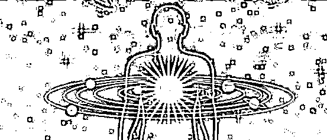

**太阳弧（SOLAR ARCS）**

以太阳为核心，为众星之首，带着众星一起移动,展示人生不同阶段我们是如何体验自我、表现自我、修缮自我。此方法虽非实际星体，但却是星动推运法中准确率最高，实用性最佳的推运方法。

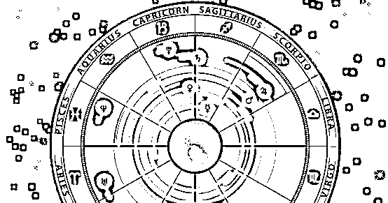

**综合以上技法**

*   我们该描述什么，该从哪里入手？

*   如此庞杂的信息，究竟有什么是我们可以放心地忽略呢?

*   系统的解读步骤来帮助你把焦点对准需要聚焦的地方，哪些是至关重要的？

*   如何培养与占星符号间宝贵的直觉联系，将行进、次限推进、太阳弧推进融会贯通？

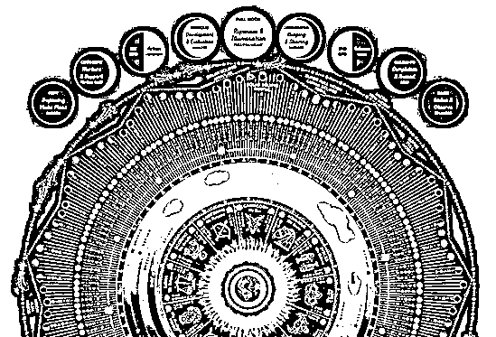

**- 斯蒂芬的占星著作** **-**

1984-1988 年间，斯蒂芬写作出版了《内在的天空》（已有中文版）、《变化的天空》和《天空的伴侣》三本占星经典著作，奠定了早期在占星学界的地位。

2002-2005 年间，他与朱迪·弗里斯特共同创作了两本经典的关系占星学著作《天空的伴侣 I：爱、性、和进化占星学》《天空的伴侣 II：组合图》。　

2008 年，斯蒂芬出版了一本非常重要的著作《昨日的天空》，此书是至今为止关于轮回转世跟星图的清晰对应最详尽的著作之一。斯蒂芬前后一共出版了 12 部占星著作，在世界占星学界拥有很高的声誉。**- 斯蒂芬获得的荣誉** **-**1985 年，他凭借《内在的天空》一书获得职业占星师协会奖（*Professional Astrologers Incorporated Award*）。1992、1995、2008 年、2018 年，他四次获得占星界最高的占星学联合协会奖（*UnitedAstrology Congress Regulus Award*）提名，2018 年获得轩辕十四教育奖。

**- 斯蒂芬的占星哲学观** **-**

斯蒂芬的占星风格以自由和选择为中心，他的解读不是以下定论的方式来“预测”未来，他强调**如何改善生命**，而不是宿命式的论断。他以心理占星学的语言来解读星图上的人格部分，但是通过**南北交点及其相位和守护星**来探索星图所揭示的**前世业力与今生方向**，在灵魂进化的背景里来整体解读星图。

他认为进化占星学的目的在于鼓励人们做出更符合进化方向的智慧选择，我们学习去了解前世的时侯，关注点应该集中在**如何通过意识来疗愈自己**。

**这些名人怎么说？**

斯蒂芬让我们停止了玩责备命运的游戏，而开始看到自己是一个走在进化路途上的勇士。 ——奥普拉杂志“O: THE OPRAH MAGAZINE”

斯蒂芬和杰夫这两位著名占星师创造性地相互应和，展现出他们出色的教师才华，发展并弘扬了占星这门艺术。（对《测量天空：进化占星学和灵魂的钥匙》的书评） ——著名心理占星师 现代占星学之父 诺·泰尔（Noel Tyl）

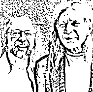

请享用斯蒂芬和朱迪这两个博大的灵魂在此书中所提供的洞见大餐吧。（对《天空的伴侣》的书评） ——进化占星学的创始人之一 杰夫·格林（Jeff Green）

我为斯蒂芬解读的精准感到惊叹，他强调没有一件事是坏得无法挽回的，也没有一件事是如此之好，以至于它不会因为现在的错误判断而消失的。我怎样推荐他都不为过！ ——好莱坞著名影星“钢铁侠”男主角 小罗伯特·唐尼（Robert Downey Jr）**上过课的占星师怎么说？**他关于我星图的解读，让几乎所有在场的人掉泪，我也从此开启了一段灵魂追寻的旅程。我很惊讶他透过星图可以如此深入一个人的灵魂。很多东西你自己都不知道，但是他讲出来你会发现，啊，这是真的，这是占星学的神奇。——《心探索》创始人孟想每个来参加老师课程的同学，都会被老师深深的慈悲心感动。这种慈悲心，并不是表面上说的一些什么话，而是一种从意识层次上发出的能量。每个来上课的人，都能感受到老师的爱。这种爱，并不是盲目的爱，而是深刻地洞悉真相后的慈悲。——斯蒂芬老师工作坊翻译逸月斯蒂芬老师的一对一咨询已经排期到两年之后，我特别幸运，曾在课堂上被老师抽中分析过我的星图，老师充满爱与智慧的指引让我更加清晰的认识了自我。内在的潜能、需求和矛盾被老师娓娓道来。——禄丽荣斯蒂芬老师是位非常非常值得推荐的大师，很粉他，这位进化占星学的创始人，对人的理解是那么的全面完整、深刻洞见、慈悲和温暖，就这方面而言足可以媲美我无比崇敬的荣格和史坦纳（这两位去天堂里玩了），如果你对西洋占星感兴趣，或者对人的所有角度、各个层次的真相和可能性感兴趣，推荐斯蒂芬老师的书和课程，特别是他的课程，数倍的功力大增的好机会，错过真是占星粉丝的莫大损失。——仁华**2019 年斯蒂芬工作坊学员感悟**

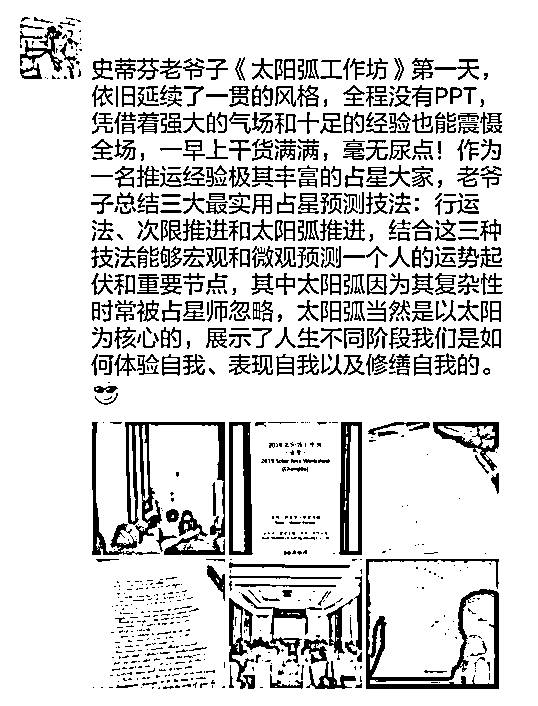

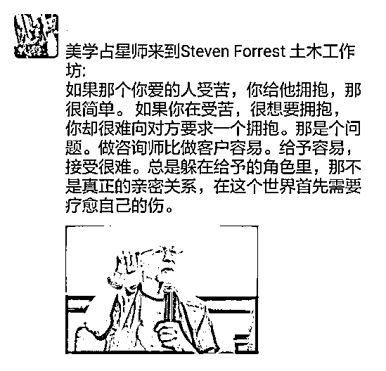

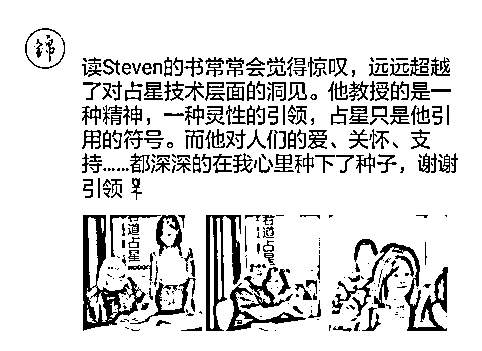

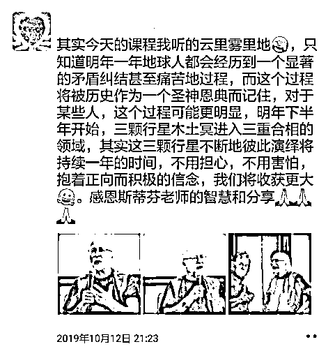

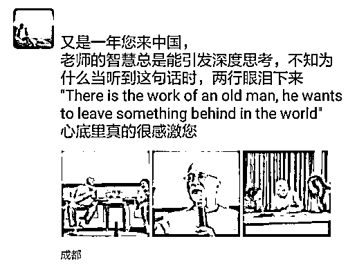

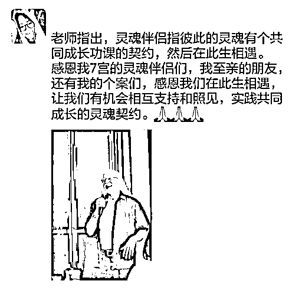

**什么人适合这门课程？**✦ 占星师或渴望成为占星师的人群。   ✦ 本课程并非针对初学者，需具备若道核心课程 level 3 及以上水平，即了解星座、行星、宫位、相位等。✦ 课程会涉及行进、推进等高阶内容，不了解相关知识的同学，请提前学习相关内容。**斯蒂芬老师其人**

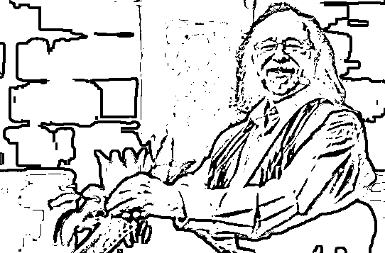

**斯蒂芬·弗里斯特(Steven Forrest)**

*   进化占星学的创始人之一，当今世界最有影响力的占星大师之一；
*   毕业于美国北卡罗莱纳大学宗教学专业； 
*   1984-1988 年间，写作出版了《内在的天空》、《变幻的天空》和《天空的伴侣》三本占星经典著作，奠定了早期在占星学界的地位。前后一共出版了 12 部占星著作，在世界占星学界拥有很高的声誉。 
*   1985 年，他凭借《内在的天空》一书获得职业占星师协会奖（*Professional Astrologers IncorporatedAward*）。1992、1995、2008 年、2018 年，他四次获得占星界最高的占星学联合协会奖（*United Astrology Congress Regulus Award*）提名，2018 年获得轩辕十四教育奖。 
*   斯蒂芬将自己的绝大部分时间都花在教学以及个人咨询上，他于 1998 年创立了占星学徒计划（*Astrological Appretice Program*），这个计划致力于培养职业占星师； 
*   至今为止已经有 600 余位学员完成了培训，其中很多都成为了优秀的职业占星师； 
*   他是一位脚踏实地的导师，充满快乐和活力，亲和幽默同时又充满了智慧；他的课程不仅仅是一次占星知识和经验的学习，也是一次与智者的相遇。

**大卫老师其人**

**大卫·瑞雷（David Railey）**

*   曾任 ISAR 全球副主席，CAPISAR（全球职业占星师资质认证考试委员会）主席，若道联合创始人；

*   1976 年，通过亚特兰大职业占星师考试，成为全职占星师，随后通过 AFAN 和 ISAR 职业测试；

*   1980 年，与杰夫·焦耳一起在亚特兰大创建“每日星球”占星学中心。此后在亚特兰大占星协会担任 4 年考官，并且两次担任亚特兰大地区占星协会主席。1979-1992 年，作为占星师活跃于美国社会媒体，向不了解现代占星学变化的大众宣传专业占星学知识。在 1989-1992 年期间，他在 WRGG 电台 12 频道每周主持个人电视秀“今日占星学”，早先他还在 WRFG 的广播节目中播讲宇宙天气节目；

*   2010-2014 年，任全美占星师联盟监督委员会委员； 

*   2010 年，其著作《灵魂的目标》中国版出版，和蒋颖一起创办若道占星学校和其官网 www.nodoor.com。从该年开始，他工作并往返于亚特兰大和北京。目前他 80%的时间致力于在中国教授和推广西方占星学； 

*   2017 年，被选为 ISAR 委员会成员（2017）。ISAR 是世界最大的国际占星机构，会员遍布 45 个国家，2017-2020 年曾任 ISAR 全球副主席； 

*   2020 年，被推举为 CAPISAR（全球职业占星师资质认证考试委员会）主席，组织奠基资质认证考试委员会成立工作。

**课程费用****早鸟价**：**3800 元（9 月 16 日前付款享受早鸟价）****正价**：**4800 元（9 月 16 日之后恢复原价）****连报 2020 两场线上工作坊，另外赠送 600 元课程券****授课时间、方式和退转****授课时间：****2020 年 10 月 16 日-10 月 18 日（周五、周六、周日），每天 8:00-15:30**

**8:00-9:45**（15 分钟休息）

**10:00-12:00**由于时差问题，斯蒂芬老师教授上午 4 小时课程**14:00-15:30** 下午大卫·瑞雷老师根据上午学习内容抽取在线学员案例解读**授课方式：**线上直播课，英文授课，中文翻译**退转课程：**退款原则请详看《教学协议》，如有疑问请咨询课程顾问。****斯蒂芬"整合行进，推进以及太阳弧技法"工作坊****

**授课老师：斯蒂芬·弗里斯特**

**授课时间：****2020 年 10 月 16 日-10 月 18 日**

**授课方式：**线上直播课，英文授课，中文翻译

**费用：****早鸟价**：3800 元（9 月 16 日前付款享受早鸟价）**正价**：4800 元（9 月 16 日之后恢复原价）

**课程负责人：****王老师**（微信：18510107057，请备注“斯蒂芬工作坊”）

长按二维码添加课程负责人咨询~

****报名请点击“阅读原文”****

# 现在报名，立省 1000 元！丨爱的炼金术：通过关系开启内在成熟功课

> 原文：[`mp.weixin.qq.com/s?__biz=MzA5NjA0NTAxNg==&mid=2651427576&idx=3&sn=456efd764c69db2e758b9e2d0bfdf294&chksm=8b4b204fbc3ca959dadcc941073f7c5831af4bb23556699f3f38772ee90ec34c5276be5f9465&scene=126&sessionid=1692738106#rd`](http://mp.weixin.qq.com/s?__biz=MzA5NjA0NTAxNg==&mid=2651427576&idx=3&sn=456efd764c69db2e758b9e2d0bfdf294&chksm=8b4b204fbc3ca959dadcc941073f7c5831af4bb23556699f3f38772ee90ec34c5276be5f9465&scene=126&sessionid=1692738106#rd)

**若道独家 3 日线上工作坊**

由于疫情影响，斯蒂芬老师今年的中国之行无奈受阻，但斯蒂芬老师不想他的中国学生们期待落空。在和大卫老师数次线上沟通后，斯蒂芬老师决定**首次开设线上工作坊，**跟**大卫老师**联袂授课，还专门为若道设计了**两大独家主题**：

**10 月 9 日-11 日**

**《爱的内在炼金术—你的亲密关系盲点在哪儿？》**

****10 月 16 日-18 日****

**《整合行进、推进以及太阳弧技法》**

满足中国占星学子对于进化占星学的学习和精进需求，用线上直播课的形式亲赴十月进化占星学之约。

鉴于时差安排，每天上午线上跟斯蒂芬老师学习 4 小时，下午大卫老师会抽取参课学员，进行一个半小时案例解读。对南北交点最有心得建树的两大权威导师，从技法到实践，承包你的知识点。

防疫为重，线上工作坊也省去了学员们舟车劳顿奔赴现场的种种不确定性，我们相约 2020 年 10 月，斯蒂芬老师非常期待和新老学员们在线上工作坊中相见。

**我们将学习什么？**

“找到完美的伴侣听起来是个很棒的主意——但如果你还没有准备好进行进化工作，仅仅找到那个人并不能给你带来多大帮助。亲密始于你所做的内在成熟功课。”

——斯蒂芬·弗里斯特

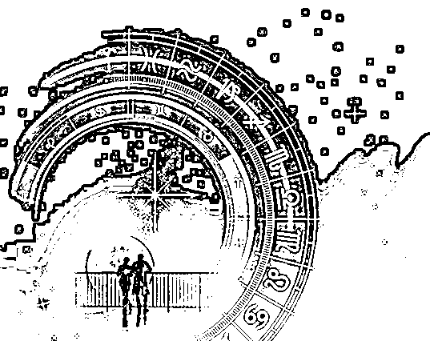

**-** **此次授课内容** **-**

*   关于自己的本性，你不希望了解的是什么?
*   什么会让别人爱你变得困难?
*   在哪些方面，你的创伤和文化状况影响了你的智慧判断，关于谁才是真正适合你的人?

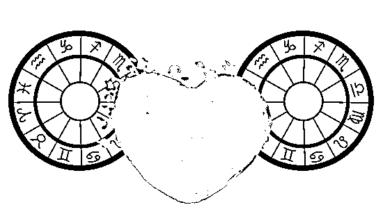

**关系占星学：比对图**通常集中于两张出生星图的比较。“直接用这种方式来看待感情，就像还没上高中就开始上大学一样。”所以斯蒂芬老师还会着眼于个人星图。

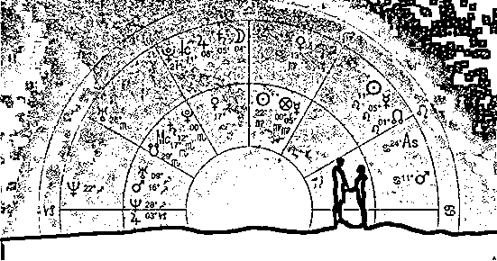

**个人星图上的三个关键区域**在这个工作坊中，斯蒂芬老师将会关注于个人星图上的三个关键区域。

*   首先，我们考虑你的灵魂对于亲密关系的独特要求。你正在学习什么？激情？和平？信任？还是独立呢？
*   其次，我们来破译你星图上关于任何可能阻碍你正确完成任务的警告信息。
*   最后,我们来探讨星图如何描述了你的天生伴侣——也就是说, 如何在编织在你出生星图的象征符号中, 找到与你享有灵魂契约之人的描述—— 在你出生呼吸第一口空气时，这个人可能甚至还没出生。

“伙伴”和“伴侣”这些词总让我们想到配偶关系，但我们在这个工作坊中探索的许多原则也适用于人类的另一杰作：**亲爱的朋友之间的灵魂纽带。**我们当然会尊重所有的性别差异，因为男人和女人努力爱着对方和他们自己，无论他们的灵魂穿着何种肉体的伪装。

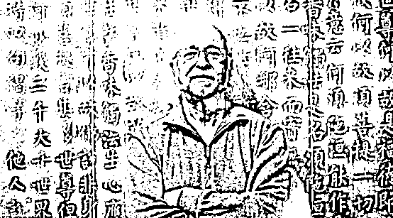

**-** **斯蒂芬的占星著作** **-**

1984-1988 年间，斯蒂芬写作出版了《内在的天空》（已有中文版）、《变化的天空》和《天空的伴侣》三本占星经典著作，奠定了早期在占星学界的地位。

2002-2005 年间，他与朱迪·弗里斯特共同创作了两本经典的关系占星学著作《天空的伴侣 I：爱、性、和进化占星学》《天空的伴侣 II：组合图》。　

2008 年，斯蒂芬出版了一本非常重要的著作《昨日的天空》，此书是至今为止关于轮回转世跟星图的清晰对应最详尽的著作之一。斯蒂芬前后一共出版了 12 部占星著作，在世界占星学界拥有很高的声誉。**-** **斯蒂芬获得的荣誉** **-**1985 年，他凭借《内在的天空》一书获得职业占星师协会奖（*Professional Astrologers Incorporated Award*）。1992、1995、2008 年、2018 年，他四次获得占星界最高的占星学联合协会奖（*UnitedAstrology Congress Regulus Award*）提名，2018 年获得轩辕十四教育奖。

**-** **斯蒂芬的占星哲学观** **-**

  斯蒂芬的占星风格以自由和选择为中心，他的解读不是以下定论的方式来“预测”未来，他强调**如何改善生命**，而不是宿命式的论断。他以心理占星学的语言来解读星图上的人格部分，但是通过**南北交点及其相位和守护星**来探索星图所揭示的**前世业力与今生方向**，在灵魂进化的背景里来整体解读星图。

他认为进化占星学的目的在于鼓励人们做出更符合进化方向的智慧选择，我们学习去了解前世的时侯，关注点应该集中在**如何通过意识来疗愈自己**。

**这些名人怎么说？**

斯蒂芬让我们停止了玩责备命运的游戏，而开始看到自己是一个走在进化路途上的勇士。 ——奥普拉杂志“O: THE OPRAH MAGAZINE”

斯蒂芬和杰夫这两位著名占星师创造性地相互应和，展现出他们出色的教师才华，发展并弘扬了占星这门艺术。（对《测量天空：进化占星学和灵魂的钥匙》的书评） ——著名心理占星师 现代占星学之父 诺·泰尔（Noel Tyl）

请享用斯蒂芬和朱迪这两个博大的灵魂在此书中所提供的洞见大餐吧。（对《天空的伴侣》的书评） ——进化占星学的创始人之一 杰夫·格林（Jeff Green）

我为斯蒂芬解读的精准感到惊叹，他强调没有一件事是坏得无法挽回的，也没有一件事是如此之好，以至于它不会因为现在的错误判断而消失的。我怎样推荐他都不为过！ ——好莱坞著名影星“钢铁侠”男主角 小罗伯特·唐尼（Robert Downey Jr）**上过课的占星师怎么说？**他关于我星图的解读，让几乎所有在场的人掉泪，我也从此开启了一段灵魂追寻的旅程。我很惊讶他透过星图可以如此深入一个人的灵魂。很多东西你自己都不知道，但是他讲出来你会发现，啊，这是真的，这是占星学的神奇。——《心探索》创始人孟想每个来参加老师课程的同学，都会被老师深深的慈悲心感动。这种慈悲心，并不是表面上说的一些什么话，而是一种从意识层次上发出的能量。每个来上课的人，都能感受到老师的爱。这种爱，并不是盲目的爱，而是深刻地洞悉真相后的慈悲。——斯蒂芬老师工作坊翻译逸月斯蒂芬老师的一对一咨询已经排期到两年之后，我特别幸运，曾在课堂上被老师抽中分析过我的星图，老师充满爱与智慧的指引让我更加清晰的认识了自我。内在的潜能、需求和矛盾被老师娓娓道来。——禄丽荣斯蒂芬老师是位非常非常值得推荐的大师，很粉他，这位进化占星学的创始人，对人的理解是那么的全面完整、深刻洞见、慈悲和温暖，就这方面而言足可以媲美我无比崇敬的荣格和史坦纳（这两位去天堂里玩了），如果你对西洋占星感兴趣，或者对人的所有角度、各个层次的真相和可能性感兴趣，推荐斯蒂芬老师的书和课程，特别是他的课程，数倍的功力大增的好机会，错过真是占星粉丝的莫大损失。——仁华**2019 年斯蒂芬工作坊学员感悟**

**什么人适合这门课程？**✦ 占星师或渴望成为占星师的人群。   ✦ 本课程并非针对初学者，需具备若道核心课程 level 4 及以上水平，即了解星座、行星、宫位、相位等。✦ 课程会涉及比对图等高阶内容，不了解相关知识的同学，请提前学习相关内容。**斯蒂芬老师其人**

**斯蒂芬·弗里斯特(Steven Forrest)**

*   进化占星学的创始人之一，当今世界最有影响力的占星大师之一；
*   毕业于美国北卡罗莱纳大学宗教学专业； 
*   1984-1988 年间，写作出版了《内在的天空》、《变幻的天空》和《天空的伴侣》三本占星经典著作，奠定了早期在占星学界的地位。前后一共出版了 12 部占星著作，在世界占星学界拥有很高的声誉。 
*   1985 年，他凭借《内在的天空》一书获得职业占星师协会奖（*Professional Astrologers IncorporatedAward*）。1992、1995、2008 年、2018 年，他四次获得占星界最高的占星学联合协会奖（*United Astrology Congress Regulus Award*）提名，2018 年获得轩辕十四教育奖。 
*   斯蒂芬将自己的绝大部分时间都花在教学以及个人咨询上，他于 1998 年创立了占星学徒计划（*Astrological Appretice Program*），这个计划致力于培养职业占星师； 
*   至今为止已经有 600 余位学员完成了培训，其中很多都成为了优秀的职业占星师； 
*   他是一位脚踏实地的导师，充满快乐和活力，亲和幽默同时又充满了智慧；他的课程不仅仅是一次占星知识和经验的学习，也是一次与智者的相遇。

**大卫老师其人**

**大卫·瑞雷（David Railey）**

*   曾任 ISAR 全球副主席、CAPISAR（全球职业占星师资质认证考试委员会）主席，若道联合创始人； 
*   1976 年，通过亚特兰大职业占星师考试，成为全职占星师，随后通过 AFAN 和 ISAR 职业测试； 
*   1980 年，与杰夫·焦耳一起在亚特兰大创建“每日星球”占星学中心。此后在亚特兰大占星协会担任 4 年考官，并且两次担任亚特兰大地区占星协会主席。1979-1992 年，作为占星师活跃于美国社会媒体，向不了解现代占星学变化的大众宣传专业占星学知识。在 1989-1992 年期间，他在 WRGG 电台 12 频道每周主持个人电视秀“今日占星学”，早先他还在 WRFG 的广播节目中播讲宇宙天气节目； 
*   2010-2014 年，任全美占星师联盟监督委员会委员； 
*   2010 年，其著作《灵魂的目标》中国版出版，和蒋颖一起创办若道占星学校和其官网 www.nodoor.com。从该年开始，他工作并往返于亚特兰大和北京。目前他 80%的时间致力于在中国教授和推广西方占星学； 
*   2017 年，被选为 ISAR 委员会成员（2017）。ISAR 是世界最大的国际占星机构，会员遍布 45 个国家，2017-2020 年曾任 ISAR 全球副主席； 
*   2020 年，被推举为 CAPISAR（全球职业占星师资质认证考试委员会）主席，组织奠基资质认证考试委员会成立工作。

**课程费用****早鸟价**：**3800 元（9 月 16 日前付款享受早鸟价）****正价**：**4800 元（9 月 16 日之后恢复原价）****连报 2020 两场线上工作坊，另外赠送 600 元课程券****授课时间、方式和退转****授课时间：****2020 年 10 月 9 日-10 月 11 日（周五、周六、周日），每天 8:00-15:30****8:00-9:45**（15 分钟休息）**10:00-12:00**由于时差问题，斯蒂芬老师教授上午 4 小时课程
**14:00-15:30** 下午大卫·瑞雷老师根据上午学习内容抽取在线学员案例解读**授课方式：**线上直播课，英文授课，中文翻译**退转课程：**退款原则请详看《教学协议》，如有疑问请咨询课程顾问。****斯蒂芬"爱的内在炼金术"工作坊****

**授课老师：斯蒂芬·弗里斯特**

**授课时间：****2020 年 10 月 9 日-10 月 11 日**

**授课方式：**线上直播课，英文授课，中文翻译

**费用：****早鸟价**：3800 元（9 月 16 日前付款享受早鸟价）**正价**：4800 元（9 月 16 日之后恢复原价）

**课程负责人：****王老师**（微信：18510107057，请备注“斯蒂芬工作坊”）

长按二维码添加课程负责人咨询~

****报名请点击“阅读原文”****

# 什么？！成为灵魂伴侣的第一步居然是相爱相杀？

> 原文：[`mp.weixin.qq.com/s?__biz=MzA5NjA0NTAxNg==&mid=2651427576&idx=1&sn=7f23afa53473c2c7b10ddec731a223e7&chksm=8b4b204fbc3ca9592e8a1df4c96c14e051b74e52c89196859327704b15ebc7b7847b9bed598f&scene=126&sessionid=1692738106#rd`](http://mp.weixin.qq.com/s?__biz=MzA5NjA0NTAxNg==&mid=2651427576&idx=1&sn=7f23afa53473c2c7b10ddec731a223e7&chksm=8b4b204fbc3ca9592e8a1df4c96c14e051b74e52c89196859327704b15ebc7b7847b9bed598f&scene=126&sessionid=1692738106#rd)

********☆****************后台回复“今日”，给你一句生命态度********

 作者/斯蒂芬·弗里斯特 朱迪·弗里斯特

 译者/胡曦兮 校对/Leisha

  编辑/翀子封面/书君 图片来源/网络

本文摘自《天空的伴侣 I：爱、性和进化占星学》

“灵魂伴侣”是所有浪漫爱情故事的核心，可大多数人都认为浪漫是一种危险，容易让人精神错乱。在这个稍显过激的观点背后，人类一直不停的在寻找“高贵的爱情”。当我们通过星图看到灵魂伴侣的轮廓，甚至遇到了他/她，又如何让爱持续并变得成熟？ 

**浪漫是一种危险，**大多数经历过的人都认可这个事实。但有人会抱有一些更负面的观点，认为浪漫是一种精神错乱。他们指出，爱情常常把一个原本理智的人变成一个喋喋不休的精神病患者：嫉妒、缺乏安全感、占有欲、偏执地要与另一个人厮守在一起，就好像那个人掌握着宇宙中所有幸福和意义的钥匙。

这也许是一个过于激愤的观点，但我们肯定都在我们的伴侣身上看到过，如果我们有勇气承认的话，我们在镜子里也看到过。**是什么让我们做出这样的行为？**

**对“灵魂伴侣”的需求从何而来？**

关于这个主题，荣格分析师罗伯特·约翰逊在他的书《我们：理解浪漫爱情的心理学》(哈珀与罗出版公司，纽约，1984 年)中提出了一些令人信服的观点。他通过深入分析 12 世纪的骑士神话，发展出了自己的论点，他认为浪漫的爱情相对而言是一个西方文明特有的新事物。就健康危害而言，它与艾滋病毒和废弃的核燃料棒相差无几。

他的概念简单来说就是，**我们的祖先一直以来通过宗教满足很多情感需求**，随着教会绝对权威的崩塌，祖先们试图通过**“高贵的爱情”**来满足这些需求，一个相思成灾的骑士和一个遥不可触、通常是已婚的淑女。

约翰逊暗示，就神的心理替代品而言，遥不可触的淑女是个不错的选择。至少在骑士厌倦了对淑女的渴求，想尽办法与她共赴巫山之前，这种心理替代都是有用的。然后麻烦就开始了，完美的女人很快被证明和其他人一样不过是一只猴子。

试想，当你想象对自己而言理想的性关系时，你想到的是不是狂喜沉迷，神秘的交融，通灵或超感的理解，一种终极意义的感觉？换句话说，**灵性的体验**。**这是我们过去期望从神那里获得的体验**，而不是从男人或女人那里，对猴子可不能要求这么多。

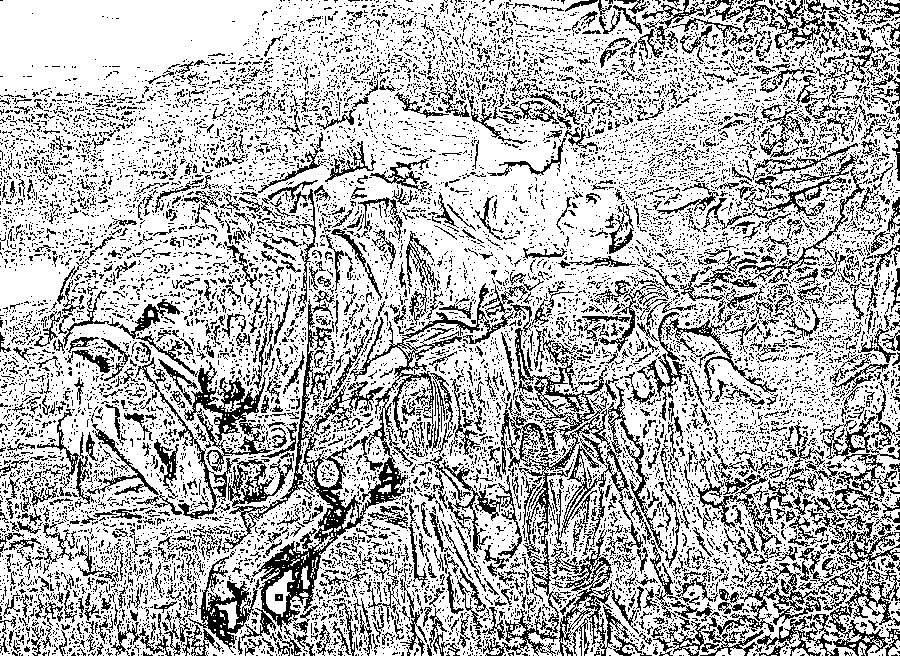

约翰逊认为，这些不切实际的期望，被好莱坞的神话制造机器所助长，已经不可避免地导致每个人的痛苦和幻灭。他还说到，这些期望已经成为我们世界观中非常重要的一部分，以至于它们会一直存在，并持续伤害人们。

对比当前印度和日本的婚姻观念，他认为西方的婚姻观念更不利。据他的描述，那些文化中的婚姻通常比西方社会的婚姻更有爱、更关怀彼此，而没有夸张的神话。他还指出，在西方离婚率不断攀升和闹剧式生活的情况下，我们还傲慢地鄙视那种婚姻为“不浪漫”。

《我们》是一本有力量的书，至少其中的主要洞见对我们而言是真理。**我们都期待爱情在我们的生活中发挥神奇的疗愈作用，**而到 30 岁时，我们中的大多数人都已经不止一次地经历了灾难性的失望。

这些与占星有关吗？有非常直接的关系。**从出生星图中，你通常可以清晰明确地瞥见你灵魂伴侣的轮廓，**获得这个信息很容易，难的是，一旦你们找到了彼此，**该如何相处。**我们将在接下来的章节中探讨。

**灵魂伴侣！这个概念是所有现存浪漫神话的核心。**你命中注定要与之结合的那个真爱！像钥匙匹配锁眼一样匹配你的人！罗伯特·约翰逊以及任何了解他著作的人听到这个词一定会感到尴尬，让他们尴尬吧。“灵魂伴侣”这个词是我们的理智中太美好、太基本的一部分，我们无法忽视它。如果没有它，心理魔法中另一个不可或缺的部分就会荡然无存。问题在于，太长时间以来，我们任由青少年和言情小说家定义了这个词。

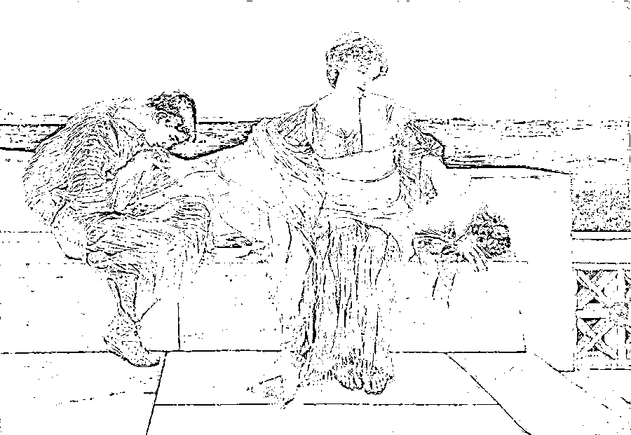

**“灵魂伴侣”的真相**

曾有一位来自北爱达荷州的女性智者，几年前我们成为了朋友。有一次，我听到她为一对我们共同认识的夫妇所做的通灵解读录音，她说：**“你们两个是灵魂伴侣。”**然后戏剧性地停顿了一下，接着说，**“但灵魂伴侣通常自相残杀。”**

与灵魂伴侣相伴到底意味着什么呢？第一步是不要妄想和这个人在一起的每一秒，每个月、几十年都会是某种性高潮式的极乐美梦状态。这有时会是其中的一部分，但这个想法的核心是，**我们遇到的灵魂伴侣能够帮助我们改变本性，**换句话说，帮助我们改变灵魂，而这个过程就好像把一次云霄飞车之旅看成同未婚的小姨喝个下午茶那样容易。

约翰尼在一个摇滚乐队里弹吉他。他是一个天生的音乐家，但他从来没有真正努力去探索过自己天赋的极限。他已经四处巡演了 10 年，越来越依赖酒精、毒品和愤世嫉俗来度日。

约翰尼的灵魂伴侣泰利走进了他的生活。这类相遇通常都是这样，他们迅速回应对方，进入性关系。蜜月期是短暂的，泰利清楚地看到约翰尼在对他自己做什么。作为他的灵魂伴侣，**她也看到了他的潜力。她打开了他的本性，**使他“颓废摇滚明星”的姿态突然在他们俩人面前显得尴尬和透明，那不过是一种虚弱的防御姿态。泰利的存在似乎要对抗约翰尼，挑战他——**这就是你最好的一面吗？这就是你所知道的最高真理吗？**

在好莱坞版本的故事中，约翰尼顺从地改过自新，娶了泰利，把她奉为自己的救世主，他们从此获得了幸福的生活，声名大作，财源滚滚，最后一定是去了郊区豪宅。

在现实生活中，他们大吵一架。

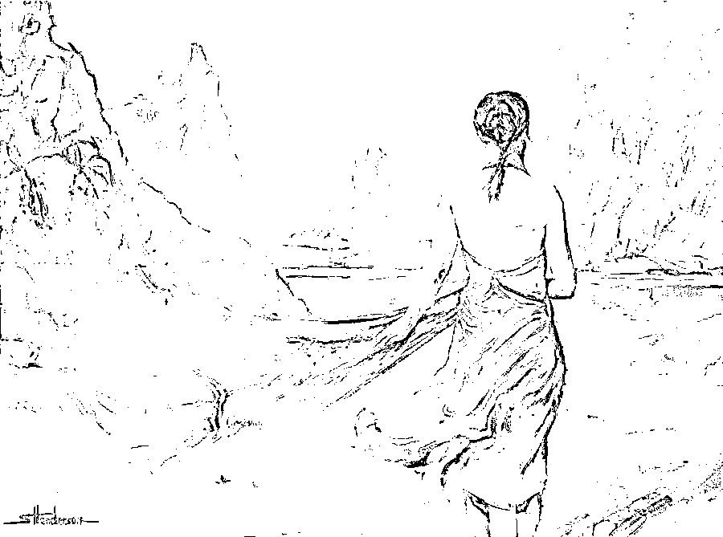

在现实生活中，吵架激起了他俩的自我防御，约翰尼和泰利很可能会分手，至少会分开一段时间。约翰尼内心深处有种感觉，如果他和泰利在一起，他所熟悉的生活将无可挽回地被改变。**隐藏在复杂防御机制背后的深层恐惧**，日益凸现，要求战斗。**脆弱的、自我安慰式的谎言**轰然倒下，他童年时期在心理层面做过的“魔鬼交易”突然浮现出来供他重新审视。

为什么约翰逊要为了这些心理创伤自寻烦恼？这个女人带来这么多麻烦，她真的值得吗？还有很多其他的女人。这些都是很好的问题，也是他一定会问自己的问题。性感的赛迪适时地出现了，约翰尼发现她有着致命的吸引力。他约泰利喝了一杯咖啡，严肃地告诉她，她的性格对他来说太强了，而赛迪就接受了他本来的样子。他们一致同意这段恋情只是一段**“成长经历”**，它结束了。

为什么泰利能这么快就同意约翰尼这臆造的分析？与他这么快就臆造出这种分析的原因相同：她也很害怕！像他一样，她的潜在本质还有一半未曾暴露。**灵魂伴侣的关系从来都不是单行道，在这种人类爱情中，拯救者总是成对出现。**

泰利是个诗人，很好的诗人。她写的是成人爱情诗，诗中充满了爱与恨、激情与恐惧。但这个身份没人知道，写诗是她深藏的一个秘密，为数不多的几首发表作品她用了笔名。很久以前，泰利就学会了隐藏自己的感受，她一直都是在照顾别人。这种模式可以追溯到她的童年，当时的环境迫使她对弟弟妹妹扮演父母的角色。做一个拯救者让她感觉舒服自在，平等和情感的袒露是她从未体验过的东西，会让她害怕。

尽管约翰尼有他自己的问题，但他看穿了泰利的面具，仿佛看穿了一块窗玻璃。当他的目光锁定在她的身上时，她内心深处的某种东西感到非常不舒服。“**这个人可以让我无处遁形**，这个人似乎已经知道了我的秘密——不仅仅是我的诗歌，还有我的渴望，我的占有欲，还有我保持控制的需求。我要离开这里！”

接下来会发生什么，无从知晓，即便占星学也没有答案，人们自己编写他们的剧本。也许约翰尼和泰利分开了，没有开发出他们潜在的灵魂联结。也许他们继续在一起，但依然没有开发出潜在的灵魂联结。怎么会这样？也许约翰尼继续做个长不大的孩子，在“受苦受难的妈妈”泰利面前永远扮演那个”坏男孩”。他们可以有条不紊地建立起一段婚姻，在这段婚姻中，他俩永远不会对视，性爱只在黑暗中发生，他们还会私下里嘲笑其他伴侣们的“成长经历”。

这些都是悲哀的选择，但是可能的选择。你见过多少爱的爆炸破裂不过是只打雷不下雨？你见过多少僵尸婚姻？

对泰利和约翰尼以及我们其他人来说，另一种选择是认识到，**如果爱情要治愈我们，它有时必须先把我们带到忍耐的极限。**成年人爱情的古老盟友：诚实、勇气、谦卑、信任、宽容，必须向我们心灵中最黑暗、痛苦、窘迫的角落发射出爆炸性的强光。

当然，其中也会有快乐。你手里拿着的并不是一本悲观主义的书！情况恰恰相反。但是近年来，伴侣们常常会分开，不过很少是因为嫌快乐太多而分开。**当灵魂触碰灵魂时，我们也许可能会体验到我们所知的最深刻的幸福。**我们也会经历进化成长，也是**在进化成长中，我们遇到了我们作为男人和女人的潜力极限。**

约翰尼和泰利，你和我，我们都可以做我们想做的事。占星学并不是灵丹妙药，可以治愈爱情时常带来的伤害。如果真的有灵丹妙药的话，那就是**彻底发展这些美德**——诚实、勇气、宽恕、耐心——**让持续的、成熟的爱成为可能。**

如果约翰尼和泰利分手后，又逐渐回到彼此身边怎么办？如果他们意识到一些无形的链条联结着他们的灵魂，但令他们恐惧的感情游戏正像饿狼一样撕咬这些链条，又该怎么办?

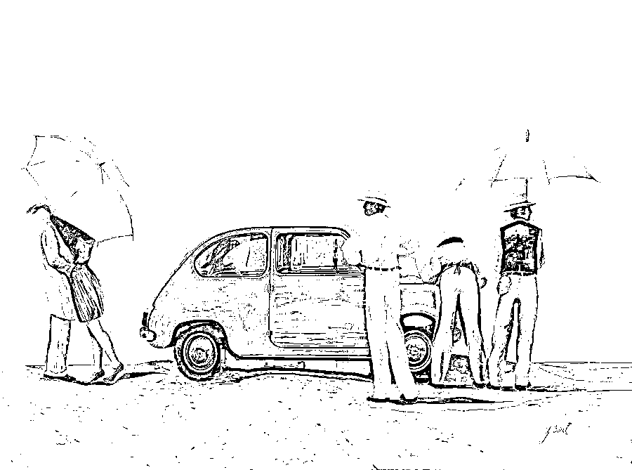

**从占星学看亲密关系**

**也许带着这些困惑，保持心灵和头脑的开放，他们找到了一位现代进化占星师，会怎么样呢？**

约翰尼可能会得知，他是太阳在第四宫的双鱼座，上升射手座。翻译一下，他会得知，他的整个自我身份是锁定在一个神奇、神秘的想象和创造力的领域，但也正是因为这样，他的自我从未完全成形。他会明白，像他这样的人可以成为他人宝贵的圣使，如果不以放纵沉沦、装腔作势和逃避现实来破坏这种潜力的话。他会知道他的射手座上升给了他一个轻松多彩的“吉普赛面具”，他可以隐藏在后面，只要他自己没有相信他发布的新闻就行。

泰利会了解到她是巨蟹座，上升摩羯座，月亮处女座。她是一位疗愈者（巨蟹座太阳），拥有服务者的灵魂（处女座月亮），带着长者的面具（摩羯座上升）。很多时候，这是美好的能量——但这也解释了为什么她迫切地想要保护自己，躲在扮演约翰尼的精神导师、母亲和心理治疗师的角色背后，避免与约翰尼真正进入亲密关系。

当约翰尼和泰利坐在那里互相凝视着对方的眼睛，占星师会和盘托出。他们可以像机器一样读出他们在老掉牙的感情戏里的剧情，约翰尼扮演悲催的痞子，泰利则扮演命中注定无论怎样都爱他的天使。又或者，**他们可以放弃那些死气沉沉，没有灵魂的感情游戏，作为三维立体的成年人那样面对彼此，帮助彼此成长。**

占星师可以更进一步，利用两张星图提升智慧和敏锐度之后，占星师可以透视泰利和约翰尼之间的联结，**查找他们在互动方面的弱点**，而且在许多情况下，还能**为他们的困境提供实际的解决方案**，以及支持性的积极解读。

例如，约翰尼第四宫的双鱼座偶尔需要有一段无商量余地的绝对隐私时间，以培养他的创造力和灵性生活。如果他不能获得这些独处的时间，他很可能变得孤僻、喜怒无常，只会盯着电视机。泰利需要了解，当约翰尼要求一些空间时，这与她的性格或他们的关系无关，她不需要感觉受到威胁。

另一方面，相比约翰尼出于本能就可以为她提供的情感满足而言，泰利在生活中还需要更多的条理、可预见性和情感支持。这去到了巨蟹座、处女座和摩羯座的领域，这三个星座在她的心理构成中非常突出。在约翰尼看来仅仅是有些冒险但有趣的情况，可能会让泰利感觉是危险地失控。一点点尝试就会让她害怕得噤声，并用其中一个擅长控制的面具隐藏自己的恐惧。如果要让她感觉足够安全到把内心的诗人展现出来，她首先需要打消很多顾虑。

约翰尼就是约翰尼，让他按照泰利的不安来改变自己的生活是错误的。但在占星师的帮助下，他可能第一次**认识到这些不安全感的真正本质**，并以更敏感的态度对待他的灵魂伴侣。为了她？是的，当然，这种大度就是爱的本质。**同时也是为了他自己**——和一个心智正常的女人在一起总比和一个疯女人在一起生活更快乐。

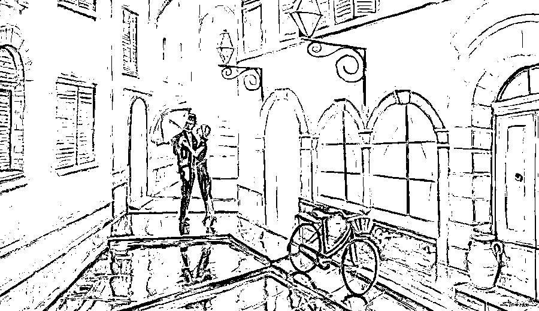

**进一步研究他们各自的星图**，加入行星、宫位和其他技术细节，我们将在接下来的章节中展开。占星师可能会打通一条金脉：例如，泰利和约翰尼可能喜欢一起做园艺、旅行或学习一门外语。那些共同的经历可能有助于他们在快乐的层面建立有力的纽带，把他们联结在一起——如果没有这些一起享乐的方法，那么只有受虐狂才能和灵魂伴侣保持长久的关系！

**找到加强和支持伴侣关系中天然乐趣的方法，和商讨解决那些不可避免的冲突一样重要**，在某种程度上，找到乐趣甚至可能更重要。对我们大多数人来说，让我们努力经营一段关系的是快乐，而不是抽象的灵性成长的承诺。

**这就是关系比对星图的领域，关于伴侣关系的占星学。**从以上内容你可以看到，我们的**目标是建立积极、有活力的伴侣关系**，我们不是算命先生。

**占星学可以引领你穿越这些爆发的状态**，让你平静，为你解惑，让你从在荷尔蒙的迷雾中走出来。如果你刚开始学习占星学，一些征象意义一开始似乎有点技术难度或有些抽象，坚持一下。占星学没有什么神秘的，就是被译成了一种征象性简述的生活而已。它只是一门技术，**有明确的步骤和技巧**。要使用占星学，你只需要运用自己的大脑。在几个小时内，你学到的就足够能帮到自己。经过几周的努力，你就能获得足够的技能可以开始帮助别人。

**版权声明：**本文由若道翻译发布，欢迎转发，反对抄袭。友号转载请申请白名单。

斯蒂芬·弗里斯特

若道签约老师。进化占星学的创始人之一，当今世界最有影响力的占星大师之一；1985 年，他凭借《内在的天空》一书获得职业占星师协会奖（Professional Astrologers Incorporated Award）。他四次获得占星界最高的占星学联合协会奖（United Astrology Congress Regulus Award）提名，2018 年获得轩辕十四教育奖。

**想参加斯蒂芬老爷子的亲密关系工作坊？**

**点击下图了解详情！**

**微信又双叒叕改版啦，不想错过若道君的推送？**

**就把若道设为星标吧！**

**▼**

就是这个“在看”，戳戳戳 ☟

****************报名直达入口****************

# 今天截止！ISAR 大会最后一波抢票啦！

> 原文：[`mp.weixin.qq.com/s?__biz=MzA5NjA0NTAxNg==&mid=2651427512&idx=1&sn=ca8be4d2c525fc0cf9e56cf1d790552a&chksm=8b4b200fbc3ca919840aef073d355607dcdc23d529fad85c8ce790a34dcbf688a9fcf0e00ce9&scene=126&sessionid=1692738106#rd`](http://mp.weixin.qq.com/s?__biz=MzA5NjA0NTAxNg==&mid=2651427512&idx=1&sn=ca8be4d2c525fc0cf9e56cf1d790552a&chksm=8b4b200fbc3ca919840aef073d355607dcdc23d529fad85c8ce790a34dcbf688a9fcf0e00ce9&scene=126&sessionid=1692738106#rd)

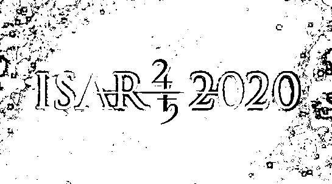

**前情回顾**2020 年是一个数十年未有之大变局之年。地球就像《权力的游戏》中的维斯特洛大陆，陷入始料未及的混乱之中。一方面，新冠病毒就像“看不见”的兵团，在无声无息中穿越国界和防御，袭击了所有国家；另一方面，中国和美国，地球上几乎最重要的两个大国竟然陷入前所未有的冷战。我们的世界变得非常魔幻。**2021 年将会如何？这个世界会好吗？在这样的大变局中，我们如何重新构想未来？**在过去的几十年中，ISAR（国际占星研究协会）每两年会举办一次大会，邀请 ISAR 在全世界的顶级占星师演讲，而占星师和占星爱好者们则从 40 多个国家飞到一起，欢聚一堂；今年，因为新冠疫情的影响，原计划在科罗拉多州举行的 ISAR 大会无法线下召开，会议改为在线会议。这次大会特意准备了将影响全球所有人的**1 个重要主题**和**1 个重大事件**，邀请全世界著名的占星师进行讨论分享。**★****一：伟大的时主——土木合相水瓶座０°**2020 年开始的时候，天上的行星形成了特别的排列——土相和冥王星合相在魔羯座。**时代秩序和规则遇到了大变局**。在这样的变局下，每个人的生活都受到影响。

土冥合相的特别之处在于，它们还合相在土星和冥王星自身的南交点上（不仅月亮有南北交点，其他所有行星都有南北交点——行星运转和黄道形成的交叉点）。

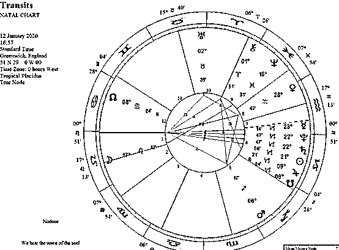

在 1284 年，我们也曾看到这样一个土冥合相在魔羯座的星群。黑死病传说就是从那一年开始的（可参看德国民间传说《花衣魔笛手》）。这场大流行疾病改变了欧洲的社会结构，对于政治、经济、文化都产生了重大影响。

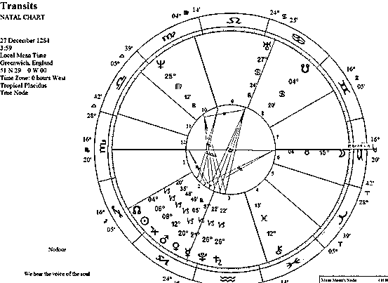

相似的能量重现，我们如何穿越过去和未来，把握现在？

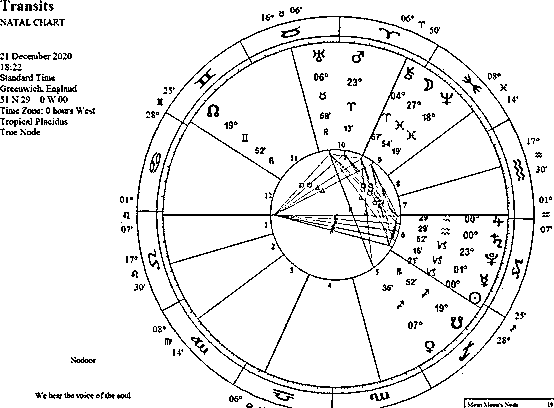

而就在土冥合相进行时分，**2020 年 12 月 22 日，木星和土星开始合相。**土木合相周期是占星学研究的最古老的周期，天王星发现之前，人们认为土星是最远的行星。**两颗行星的合相被看成时代的掌管者，木土周期被称为伟大的时主，时间的标记者。**

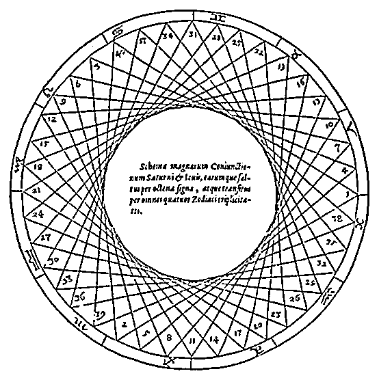

普通的木土合相周期是 20 年一次。天文学家、占星师开普勒发现了土木合相周期背后更大的周期，并在其著作《宇宙的奥秘》中发表了上图。大约每 200 年，土木合相 10 次后，这个合相会将会进入新的元素。比如土木合相在 1802 年落在土元素后，在此后 200 年，几乎一直发生在土元素（除 1821 年短暂回到火元素，1980 年、1981 年短暂合相风元素外）。我们看到了近 200 年科学技术的突飞猛进和人类物质生活的跳跃性发展。而超级大的周期则是 800 年。800 年中，土木合相将历尽四大元素。因此，对于整个人类社会而言，土木合相在过去 800 年中经过 4 大元素后，再次回到风相星座，且合相在水瓶座 0°，标志着**人类社会前所未有的全新时代的到来。****土木周期与“希望和可能性”如何在物质世界显化密切相关。**社会将发生变巨大的转变，我们正处这个伟大周期的开端。在这样一个重要的时代转折点，９位著名占星师将会９个不同角度，告诉大家我们将要进入的是什么样的未来。**★****二：全球瞩目的美国大选**时代转折点上，美国迎来了总统大选。有些美国人认为，这是他们一生中最重要的一次选举，有些人认为这是世界历史上最重要的一次大选。木星-土星是一个 20 年的周期，当它与美国大选重合时，在选举或总统期间就会发生一些奇怪的事情。在这次论坛中，占星师将会讨论以下内容：**★** **美国总统大选的历史数据研究****Lee Lehman**是占星界最杰出的研究者之一，她将分享她对过去历史选举所做的研究，并展示 2020 年与历史选举的共同之处。她的演讲中有很多定量研究，对于定量研究和数据感兴趣的占星师不妨关注一下。**★ 太阳返照图在选举中的应用****琳恩·贝尔**是世界上最受欢迎的职业占星师之一，她会从经世占星学的角度，重点关注候选人的选举星图和个人星图。她还会特别指出，从太阳返照图，尤其是唐纳德·特朗普的太阳返照图很能说明特朗普在这次选举中会做什么。★ **华盛顿资深政治活动占星师对于选举的看法****卡罗琳·凯西**是来自华盛顿的占星师，她非常深入地参与了华盛顿的国家政治活动。在她的演讲中，大家将看到作为一位著名占星师，她如何把占星学和她在华盛顿的政治活动经验结合起来，向大家解读她对于这次大选的看法。★ **从选举日到就职典礼会发生什么**2016 年的 ISAR 大会上，占星师**克里斯汀·斯金纳**做了一个非常不寻常的预测。她说希拉里·克林顿会赢得选举（希拉里普选得票数的确高于特朗普，但是选举人票数低于特朗普），但无法宣誓就职。这次她将会讨论总统候选人的星图、副总统星图、选举日星图、就职典礼星图。各个候选人和美国星图的比对星图，还将谈到从选举日到就职典礼日这段时间将会发生的事情。

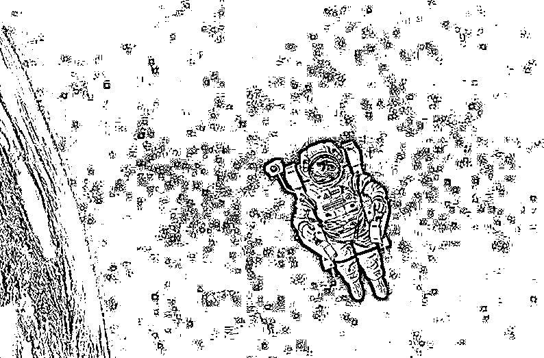

往年大会的每一个时段都有 2-3 场演讲同时进行，一天中要经历一次次的纠结割爱错过，即是英语水平再好，因为很多演讲主题专业性和前瞻性都很强，总有一些生僻词汇让你一脸懵。

人在他乡，想找个志同道合、水平相当、沟通顺畅的小伙伴探讨也不是很容易，更何况现在国内疫情不稳，美国更甚，根本无法实现出国参加群聚性活动的愿望。**若道作为 ISAR 中国唯一附属学校****协办的 ISAR 线上大会有哪些优势？**

省去请假、机票、住宿、时差、

舟车劳顿以及感染风险，不用同时段取舍选择，

每一场主题演讲全都要；

**若道专业翻译团队翻译制作字幕，**

省去中文口译时间，

实时 GET 最精准的知识点，

**14 位国际一线占星大师****，**

每一位大师的智慧和课程都价值不菲。

**这次的两个大主题和我们每个人的未来息息相关：**

该如何迎接 800 年一遇的**木星-土星合相在风象星座的新纪元**？**2020 年美国总统大选**更是时下热点，对于未来几年的大环境有着关键影响，绝对是咨询、社交中含金量满满的社交货币。句句出自大师之口，踏实放心消化吸收。

**觉得有点儿高深？**

还有 9 位特邀中国嘉宾

**点评解读**帮助你加深理解

**（排名不分先后）**

**主持人：蒋颖**

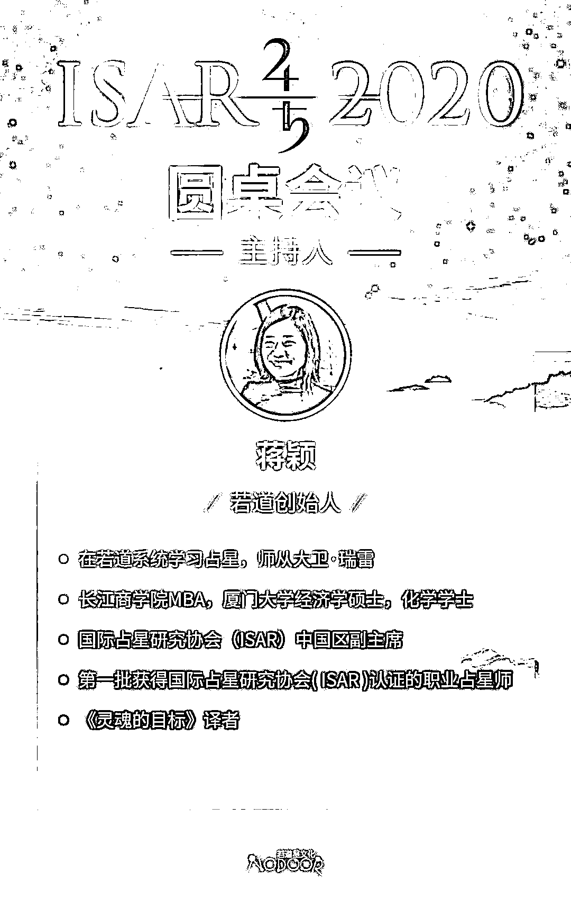

**“土木合相”讨论组嘉宾**

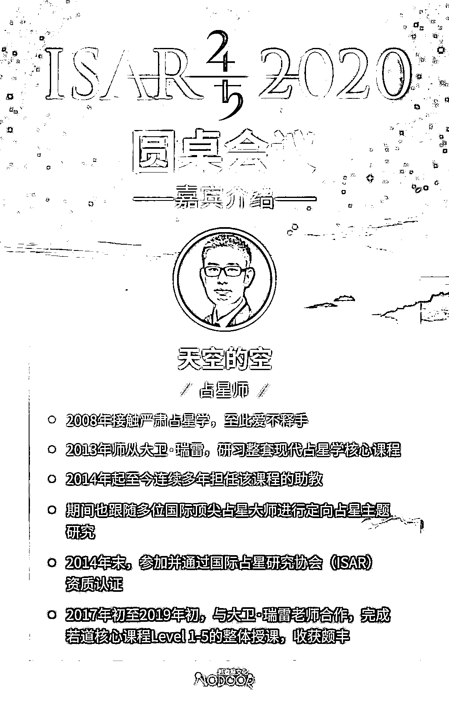

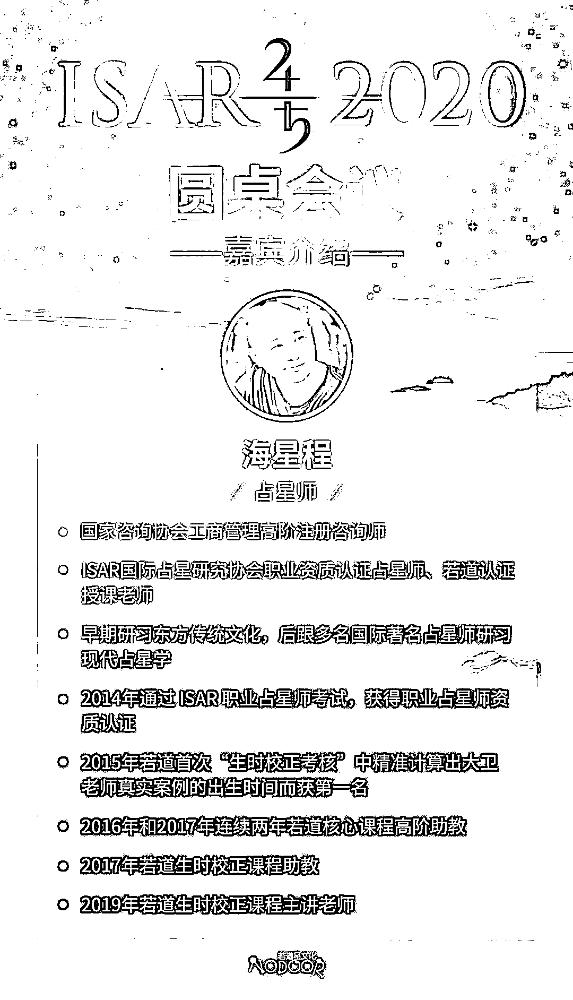

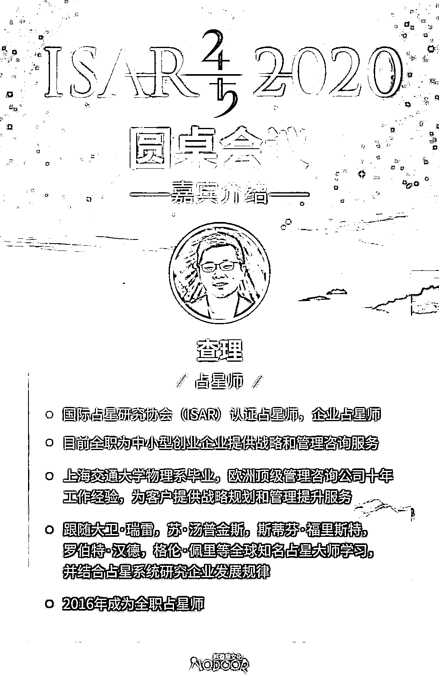

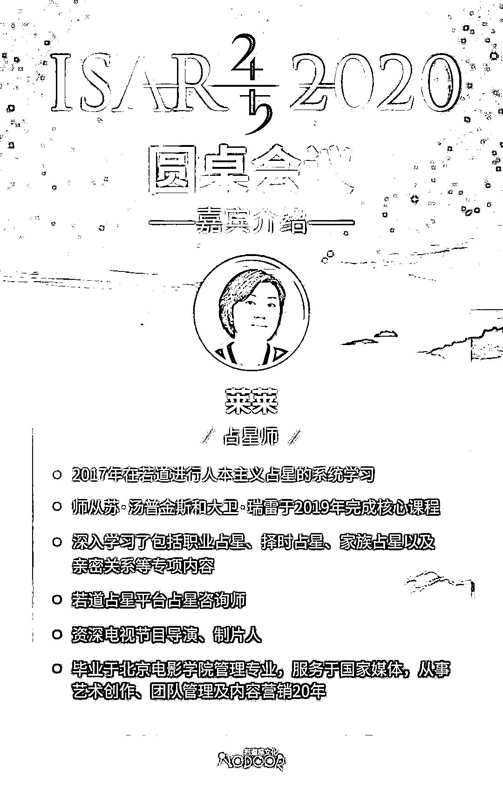

“美国大选”讨论组嘉宾

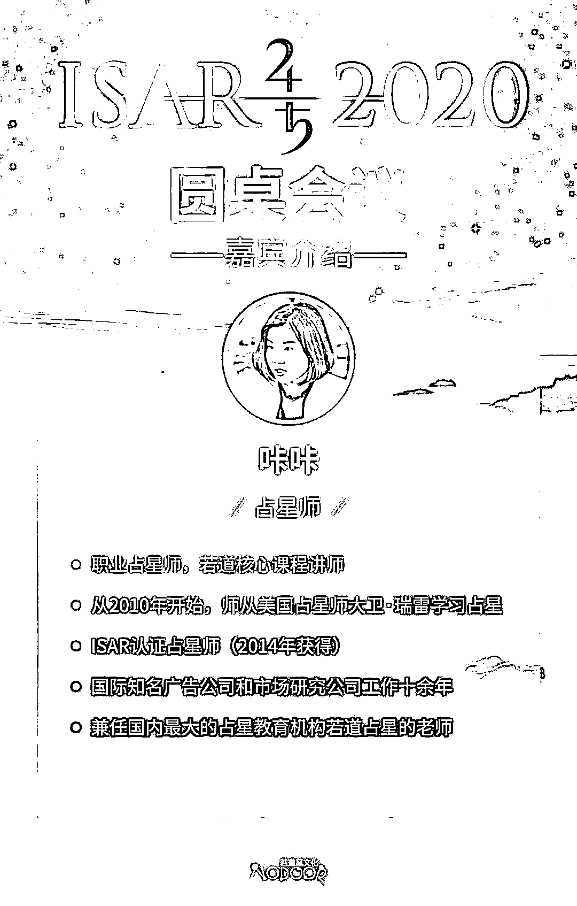

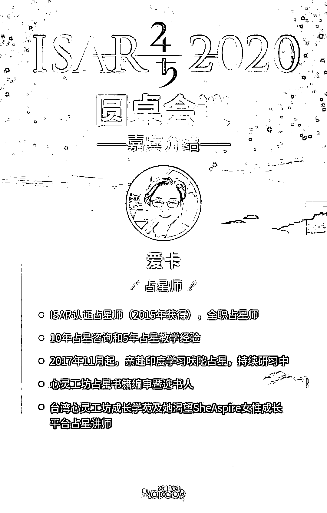

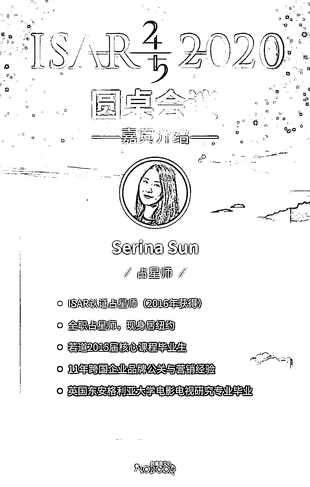

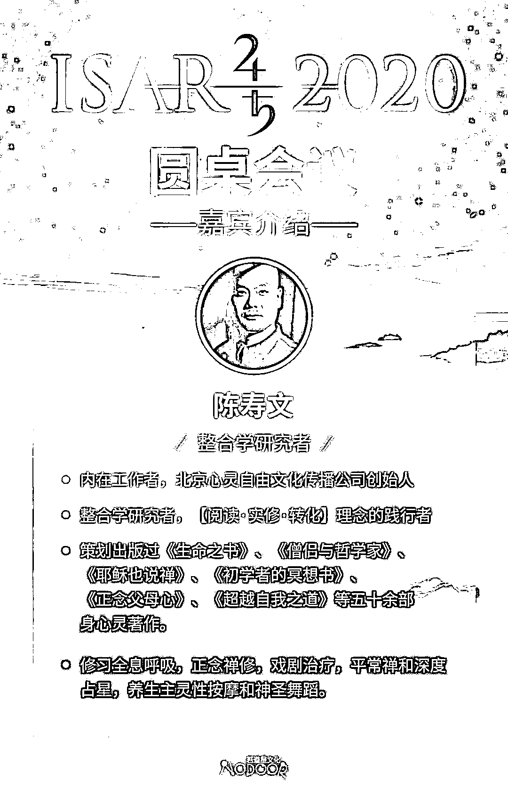

**2020 ISAR 大会**

**大会时间**

**2020 年 9 月 19 日（周六）**

******9:00-12:00，14:00-17:00******

**2020 年 9 月 20 日（周日）**

********9:00-11:00，14:00-16:00******** 

 （因时差原因，具体时间安排以现场直播为准）

**听课方式**

**网络直播课(可回放)**

（英文演讲有中文字幕翻译）

全价票：1080 元

ISAR 会员价：780 元

**关于 2020 ISAR 全球线上大会**

**日程安排、演讲题目和参与方式**

**请点击下图链接，了解详情**

**有任何问题可以咨询客服**

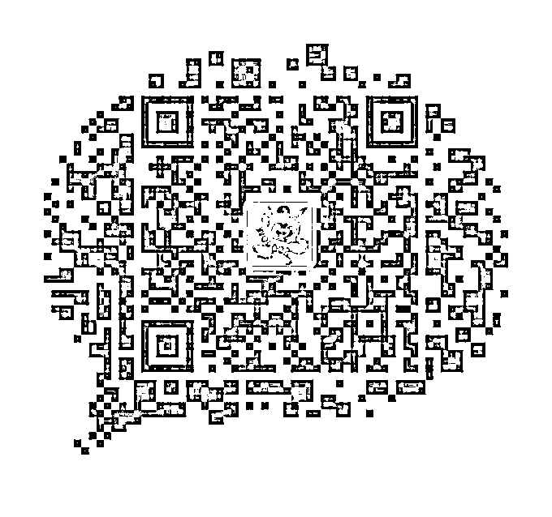

如何成为 ISAR 会员？

**如果你也想成为 ISAR 会员，请复制链接在浏览器打开**

http://www.nodoor.com/isarcert.do?contentId=3588（仅支持网站支付）

**或直接长按下方二维码，微信购买会员：**

关注我们

*   微博：**@若道星文化 Nodoor**

*   微信：**公众号【若道】（nodoorbj）**

     **服务号 （nodoorcn）**

*   邮箱：**nodoor@vip.126.com**

****购买大会门票请点击“阅读原文”****

# 你是什么样的领导人？原来美国总统里这些星座最多！

> 原文：[`mp.weixin.qq.com/s?__biz=MzA5NjA0NTAxNg==&mid=2651427446&idx=1&sn=48b49224b6489b2d29ea02ca975cf22c&chksm=8b4b20c1bc3ca9d71e9d50d769eb3a871cbc48046467fa6989f68f0b05d2c97a27c8bcc29f7f&scene=126&sessionid=1692738106#rd`](http://mp.weixin.qq.com/s?__biz=MzA5NjA0NTAxNg==&mid=2651427446&idx=1&sn=48b49224b6489b2d29ea02ca975cf22c&chksm=8b4b20c1bc3ca9d71e9d50d769eb3a871cbc48046467fa6989f68f0b05d2c97a27c8bcc29f7f&scene=126&sessionid=1692738106#rd)

******☆ ****后台回复“今日”，给你一句生命态度******

作者/大卫·瑞雷  若道占星创始人

翻译/李含 校对/Arrow 

编辑/翀子 封面/书君 图片/网络

在这篇有趣的文章里，大卫老师将美国历届总统的太阳星座做了分类，让我们看看有哪些星座最容易当上美国领导人。如果你成为领导者，又具备怎样的天赋、潜能和挑战呢？听大卫老师一一道来。

即使我们可以，我们大多数人也不会真有兴趣成为美国总统。事实上，美国人经常开玩笑说，如果有人想承受公众监督的压力和随之而来的巨大责任，他们一定是疯了。尽管如此，许多美国人在发表意见之前往往会说：“如果我是总统，我会。。。吧啦，吧啦，吧啦。”

那么，如果你能成为美国总统，你会成为什么样的总统呢？我不是说你身为总统会做什么，这个问题很容易回答“改善与中国的关系！”我的意思是，你会是什么样的总统，**你的太阳星座如何反映你的总统性格？**

下面美国历任总统的星座名单一览会提供一些线索，但你必须是一个历史爱好者才能了解过去所有 45 位总统的个性。这份名单按总统人数最多的太阳星座的顺序，列出了**美国总统的分组**，并他们的**总统任期**。例如，亚伯拉罕·林肯是水瓶座，是第 16 任美国总统。

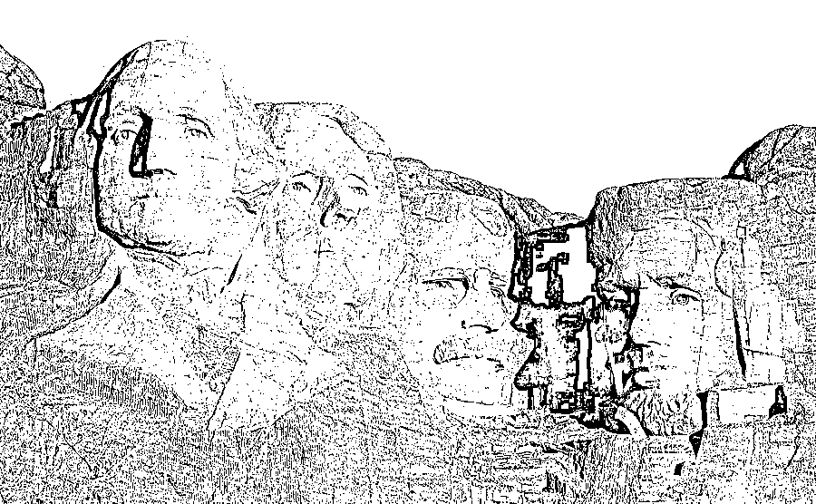

**| **美国总统山

**美国总统的太阳星座** 1 水瓶座***5***位

**9 **    威廉·亨利·哈里森

**16**   亚伯拉罕·林肯

**25**   威廉·麦金莱

**32**   富兰克林·德拉诺·罗斯福

**40**   罗纳德·里根

2 天蝎座***5***位

**2**     约翰·亚当斯

**11**   詹姆斯·波尔克

**20**   詹姆斯·A·加菲尔德

**26 **  西奥多·罗斯福

**29**   沃伦·哈丁

3 巨蟹座***4***位

**6 **    约翰·昆西·亚当斯

**30  ** 加尔文·柯立芝

**38  ** 杰拉尔德·R·福特

**43 **  乔治·W·布什

4 摩羯座*4*位

**13**   米勒德·菲尔莫尔

**17**   安德鲁·约翰逊

**28**   伍德罗·威尔逊

**37  ** 理查德·M·尼克松

5 狮子座*4*位

**23  ** 本杰明·哈里森

**31 **  赫伯特·胡佛

**42**   比尔·克林顿

**44**   巴拉克·奥巴马

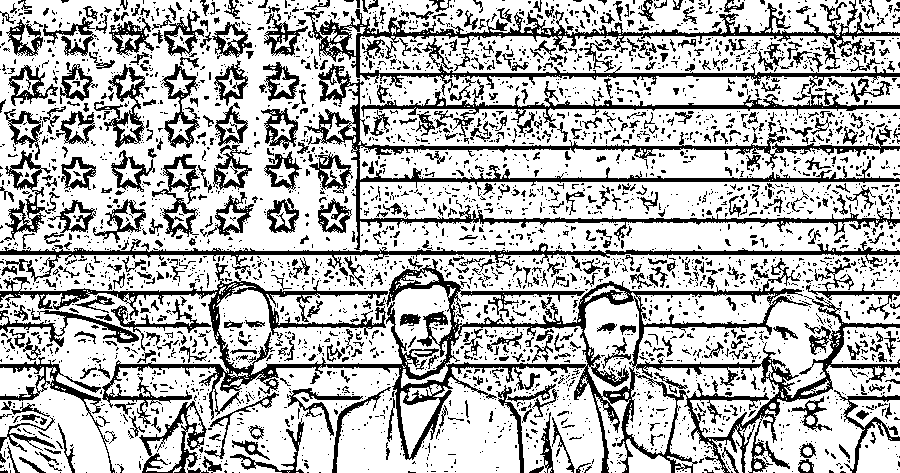

6 天秤座*4*位

**19  ** 拉瑟福德·海斯

**21 **  切斯特·A·亚瑟

**34** 德怀特·艾森豪威尔

**39**   吉米·卡特

7 双鱼座*4*位

**1  **   乔治·华盛顿

**4**     詹姆斯·麦迪逊

**7**     安德鲁·杰克逊

**22/24**      格罗弗·克利夫兰

8 金牛座*4*位

**5**     詹姆斯·门罗

**15**   詹姆斯·布坎南

**18** 尤利西斯·S·格兰特

**33**   哈里·S·杜鲁门

9 双子座*3*位

**35 **  约翰·肯尼迪

**41**   乔治·W·布

**45**   唐纳德·J·特朗普

10 处女座*2*位

**27**   威廉·H·塔夫脱

**36 **  林登·B·约翰逊

11 白羊座*2*位

**3**   托马斯·杰斐逊

**10 **  约翰·泰勒

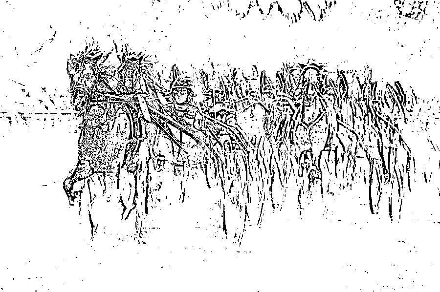

**你是怎样的美国总统？**

如你所见，45 位总统在所有 12 位星座中各有代表，水瓶座和天蝎座各有 5 位总统。如果乔·拜登下个月当选，他将成为天蝎座的第六名总统，这将使天蝎座领衔美国总统的太阳星座。

那么，你会成为怎样的美国总统呢？你的太阳星座为我们提供了一些线索！

**白羊座**

你的星座与处女座并列在名单的最末，但包括了最著名的总统之一，托马斯·杰斐逊 ——《独立宣言》的作者。当你开创新项目时，这种**“独立性”**对你很管用，但是作为一个自力更生的白羊座，你急于想要得到结果。获得同事的支持来帮助推动你的议程可能只会在最后一刻出现在你的脑海中。因此，**你坚定而自信**的性格可能令人印象深刻，但可能不利于你成为美国的 CEO。

**金牛座**

历史学家把金牛座的四位总统都归纳为**固执**。布坎南被称为顽固的理论家。这种固执也能为入主白宫铺平道路。格兰特在美国内战中作为一名**顽强而坚韧**的将军，为美国赢得了胜利，赢得了未来选民的喜爱。作为总统，你将**投资实际计划**，以稳定或建设一个更强大的国家。杜鲁门的总统任期引人瞩目，因为他实施了二战后重建西欧经济的马歇尔计划。

**双子座**

你可以成为一个**精通媒体**的总统，你的**修辞技巧**会给几代人留下深刻印象，像肯尼迪那样防止“冷战”变成悲惨的“热战”，或者像特朗普那样，用一个**不分是非**的罗盘，指北针像陀螺一样乱转的，轻率地在推特发布脑海中冒出的任何念头。肯尼迪 VS 特朗普彰显了你星座的利和弊。你的总统任期很可能由你的**言辞**来决定，所以仔细想想你要说什么。

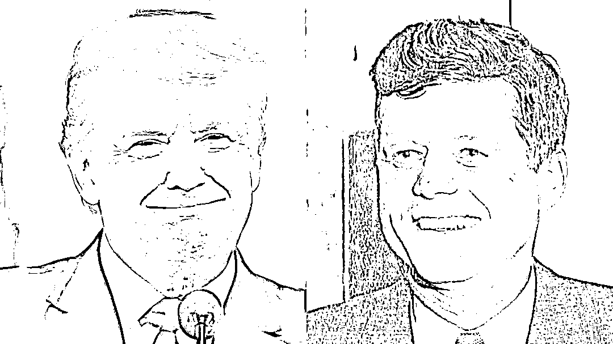

**| **特朗普（左）VS 肯尼迪（右）

**巨蟹座**

在**情感层面**上与选民联系将是你成为总统和留任总统的关键。人们会觉得你在**照顾**这个国家，好像这是你的**家**，他们是你家庭的一份子。作为一个父亲般的形象，只要你保障你家的安全，你就会受到爱戴。即使你失败了，许多人仍然会对你的总统任期有一种怀旧之感。

**狮子座**

你的**外表和行为都像一个领导人**，人们把你视作当总统的料。所以奥巴马和比尔·克林顿在执政期间仍然得到大多数人的好评。然而，这四位总统都被他们的对手贴上了**傲慢**的标签。以胡佛为例，大萧条中的人们认为胡佛是一个傲慢的人，不愿意承认他们所遭受的苦难。**由心而发**的执政是你总统任期的关键。

**处女座**

约翰逊和塔夫脱在**组织能力**方面都颇有建树。约翰逊被认为是一位**专家型**的政治家，利用他在国会的经验起草法案，在参众两院获得通过。塔夫脱和约翰逊都有治世方面的**专业知识**，但他们都不是鼓舞人心的领导者。你担任总统的关键是**不要让你的工作细节蒙蔽了你的大局观**。一辆干净的 SUV 是不错，直到撞上护栏。

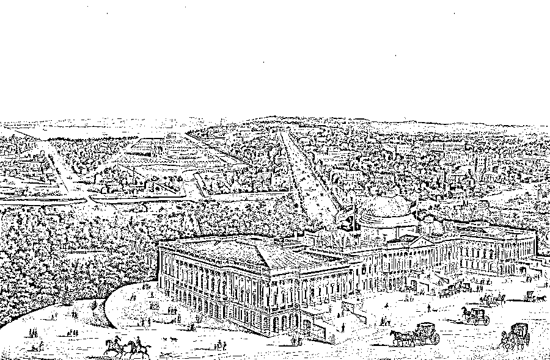

**天秤座**

你**善于与人相处**，**渴望和平**。这些特质可以让你入主白宫，并为你赢得诺贝尔和平奖 —— 就像吉米·卡特卸任总统 22 年后于 2002 年获此殊荣。尽管卡特在担任总统期间促成了埃及和以色列之间的和平协议，但最终还是被认为是一位软弱的总统。你作为总统的成功将取决于**在正确的时间、正确的地点建立起正确的关系。**

**天蝎座**

就像许多顶级公司的 CEO 一样，你**喜欢掌控局面**，这就是你的强项和弱点。正如泰迪·罗斯福所说，你可以“轻声说话，手持大棒”，无需使用就能传达权力。这至少给了你一种掌控一切的错觉。当然，世界比你更大，所以你能做的最好的事情就是**为未来发展和储备资源**，但愿你已为国家将面对的一切做好了准备。

**射手座**

也许你的**热情**和**乐观**会赢得这一天！？然而，并不是每个人都会分享你的**信念**和你**对真相的渴望**。从政治上讲，你可能有点天真。其他人可能会厌倦听到你的政策，特别是当他们的自身利益比你的原则更重要的时候。与其只做一个被贴上伪君子烙印的总统，不如**保持你的幽默感**。人们喜欢笑，这会让你不再着眼于高尚的东西。

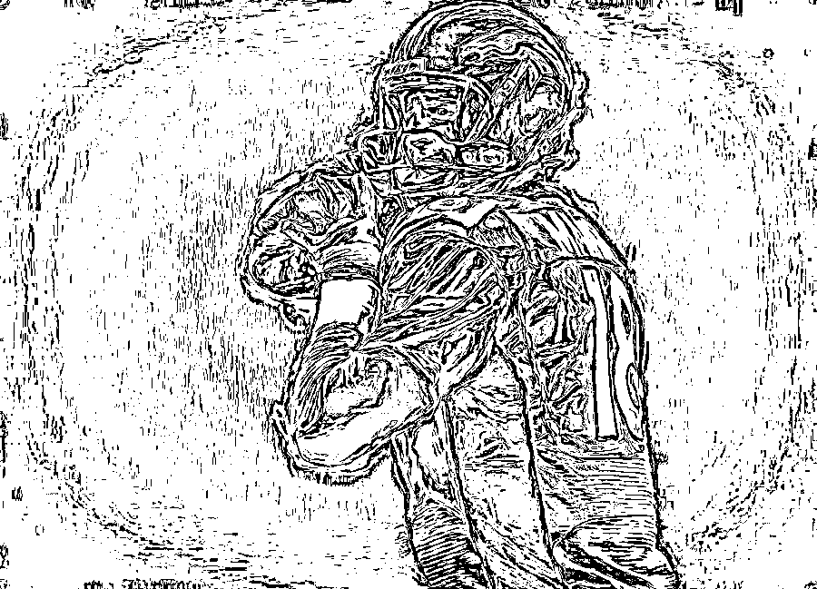

**摩羯座**

你为当总统而生，为当总统而死，或者在两次当选后辞职！你的星座就是**执政者的星座**，令人惊讶的是，到目前为止，摩羯座的美国总统不超过 4 位。尽管如此，我相信你们中的许多人正在国会大厅里走来走去，担任其他国家的领导人。你**长远谋划的能力**使你很难被击败。人们喜欢一个**有计划**的男人（或女人），尤其是一个看起来**务实并且可以实现的计划。**

**水瓶座**

你和天蝎座在美国总统名单中处于领先，很容易看出这个星座并无政党偏向。水瓶座的总统在美国很受欢迎，就像亚伯拉罕·林肯一样，罗斯福和里根仍然是很多人心目中的英雄人物，尽管他们在政治倾向上是对立的。作为一个水瓶座，你担任总统会**吸引认同你及时想法的人**。你**听取人们的意见**，你也**知道他们在想什么**。这让得你更容易因为你的想法而获得支持。

**双鱼座**

是的，第一位美国总统是双鱼座人。他**激发了公众的想象力**，他是带领美国经过长期艰苦的独立战争但最终取得胜利的华盛顿将军，因此备受爱戴。然而，华盛顿忠实于他的双鱼座本性，他不希望总统一职看起来只是“国王”的另一个代名词。身为总统，他用他的**谦逊**和**同情心**激励了所有的后来者。你担任总统的关键是**鼓舞人心**，要有激励人民的远见。

**版权声明：**原创文章由作者授权发布于若道平台，欢迎转发，反对抄袭。友号转载请申请白名单。

****想阅读更多作者的文章，请在后台回复******大卫****** 即可。****

**喜欢文章请长按下方二维码打赏**

**给大卫老师加杯咖啡呗~**

**▼**

**想系统学习占星学？**

**点击下图了解详情**

**微信又双叒叕改版啦，不想错过若道君的推送？**

**就把若道设为星标吧！**

**▼**

喜欢记得点一下在看哦☟

********报名直达入口********

# 雷蒙德·梅里曼金融占星周运 | 留意 9 月 28 日-10 月 19 日

> 原文：[`mp.weixin.qq.com/s?__biz=MzA5NjA0NTAxNg==&mid=2651427446&idx=2&sn=98c50a4ace373519969db73042b99751&chksm=8b4b20c1bc3ca9d7855134660d1aa55436b304b0c6232fec13607f54e39785829dcb9204e116&scene=126&sessionid=1692738106#rd`](http://mp.weixin.qq.com/s?__biz=MzA5NjA0NTAxNg==&mid=2651427446&idx=2&sn=98c50a4ace373519969db73042b99751&chksm=8b4b20c1bc3ca9d7855134660d1aa55436b304b0c6232fec13607f54e39785829dcb9204e116&scene=126&sessionid=1692738106#rd)

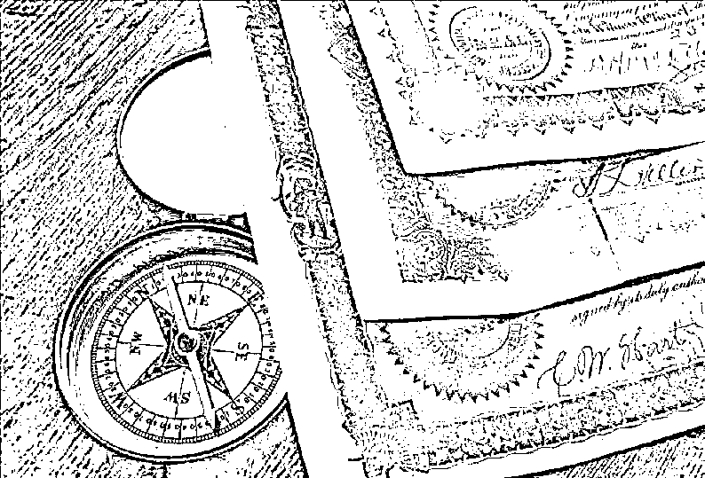

作者/雷蒙德·梅里曼
译者/李含编辑/玫瑰 图片/花瓣网雷蒙德·梅里曼是在金融占星学界稳坐第一把交椅的占星师，同时他也是若道签约的金融占星课老师，我们引进了雷蒙德·梅里曼老师的《[上证指数+黄金周期月度报告](http://mp.weixin.qq.com/s?__biz=MzA5NjA0NTAxNg==&mid=2651425978&idx=2&sn=c7e3187f3abfe604c511ea9506775c0a&chksm=8b4b3e0dbc3cb71bbe141e7e7a5e9ddb0690537fd1661d2f9919f23741010a762b9966633af8&scene=21#wechat_redirect)》《[2021 年金融预报](http://mp.weixin.qq.com/s?__biz=MzA5NjA0NTAxNg==&mid=2651425978&idx=1&sn=067bd68ece37e1e820d6f84f7a3cc960&chksm=8b4b3e0dbc3cb71b866f65d51f7993d3c35dee77cebd77eda3f63a4d5864dadaea2e9d14c101&scene=21#wechat_redirect)》。我们经老师的授权，将每周刊登梅里曼老师的周运，供大家参考和学习。于是，这是本周的周运（9.14-9.18）。**说明：以下时间采用纽约证券交易所所在地美国东部标准时间。**
**展望与回顾**

**然而，现在分析师预计年底前会出台更多刺激措施。欧元区经济学家弗洛里安·亨斯表示：“如果通胀维持在非常低的水平，欧洲央行可能会在 12 月决定延长应对危机的资产购买计划。”**

**——西尔维亚·阿马拉**

**《欧元区经济数据令人震惊，欧洲央行下一步将怎么做？》**

**www.cnbc.com**

**2020 年 9 月 1 日**

这场竞赛可能很快就会重新开始，看看谁能提供最便宜的世界货币，因为让通胀上升仍然是一个难以实现的目标。没有人想要通缩，即使在利率徘徊在零附近的情况下，通胀率也持续低于 2%的目标。现在，这正成为全球股市日益关注的问题，在过去的一周里，全球股市开始明显下跌。这一下跌与我们的市场时机研究非常吻合，因为在我们 9 月 4 日的地球宇宙学关键反转日期后的两天内，全球几个指数创下了新的周期高点。例如，纳斯达克综合指数在 9 月 2 日飙升至历史新高 12074。随后在 9 月 11 日跌至低点 10750，一周内下跌 11%。这是自 3 月 23 日疫情恐慌触底以来的最大跌幅。标普期货价格也在 9 月 2 日创下历史新高，收于 3587。到 9 月 9 日，这一价格跌至 3295.50，下跌了 8.1%。9 月 3 日，道琼斯工业平均指数已回升至 29199，这是自 2020 年的恐慌来临之前 2 月 12 日历史高点 29568 以来的最高点。到 9 月 11 日，这一指数已经跌破 27450，然后回升 200 多点，以 27665 收盘。全球其他股市也在 9 月 3 日见顶，包括德国 DAX 指数、苏黎世 SMI 指数和日本日经指数。然而，到目前为止，大多数指数的下跌幅度并不极端（低于 7%）。

股票并不是过去 1-2 周唯一下跌的市场。比特币上周的低点是 9825，比 8 月 17 日的年度高点 12489 下跌了 21.4%。原油价格上周跌至 36.13，较 8 月 26 日的崩盘后高点下跌 17.4%。白银从 9 月 1 日的次高点 29.23 下跌 11.1%，9 月 8 日跌至低点。另一方面，大豆周五飙升至 998，为今年新高，较 8 月 10 日的基本周期低点上涨 15.3%。

虽然这些价格反转幅度很大，但还没有达到歇斯底里的程度。然而，当我们现在进入**火星逆行的时间段（9 月 9 日-11 月 13 日）**，**火星会在 10 月 19 日与木星、冥王星和土星的大合相形成了上弦月四分相，这是一个趋势反转的时期，现在可能才刚刚开始**。毕竟，这是木星、冥王星和土星大合相的上弦月四分相周期，3 月 23 日火星也在摩羯座，合相木星、冥王星和土星大合相，当时股市触底。
**短期占星趋势和长期考量**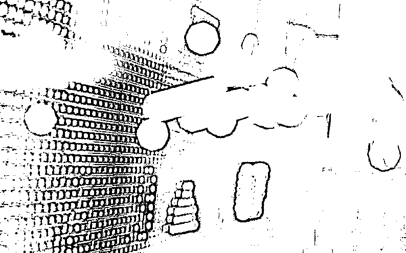

**在政治上，没有什么事情是偶然发生的，如果发生了，你可以打赌这是事先计划好的。**

**——富兰克林·德拉诺·罗斯福**

火星在白羊座逆行。火星是白羊座的守护星，所以当它在自己守护的星座顺行的时候（6 月 27 日-9 月 9 日），金融市场和经济似乎出人意料地强劲。但是，当火星在白羊座逆行时被认为是失去了力量，以前的信心变成了疑问。正如我们两周前的那篇专栏文章所述：“所有金融和商品市场很快都会出现重大反转，因为火星将于 9 月 9 日逆行，木星将于 9 月 12 日顺行。甚至在此之前，金星（价值，金钱）将在 8 月 25 日至 9 月 2 日与木星、冥王星和土星形成对分相，并在 9 月 4 日与火星形成 T 三角。这些都是地球宇宙学的反转征象，从现在到 9 月中旬的整个时间可以见证周期性的高点或低点，从而展开反转。”这是个不错的预测。但是随着火星逆行，很快将开启一年中最强大的地球宇宙学时间段之一，即**9 月 28 日至 10 月 19 日，届时火星将与摩羯座星群土星、冥王星和木星形成四分相（四分之一周期）**。同样，正如我们在两周前的专栏中所阐述的：“这预示着全球事务的重大转变，无论是政治、经济还是自然界。金融市场可能会通过显示趋势的重大反转来应对这种转变。这些反转持续的时间长度和激烈程度取决于许多因素，这将在长期前景中进行讨论……”与大多数占星学预测技术一样，还有其他地球宇宙学因素支持同样的潜在前景。例如，行进火星四分土星和冥王星，行进火星落在纽约证券交易所成立星图（1792 年 5 月 17 日成立，被称为“梧桐树”星图）的土星上。此外，在纽约证交所成立星图中，木星合相海王星，对分土星。这意味着行进的火星-土星-冥王星与纽约证交所成立星图中的土星对分木星、海王星形成基本星座 T 三角。这是一种**如果不迅速遏制，可能会导致另一场恐慌或金融崩溃**的组合，也许控制权在于美联储。

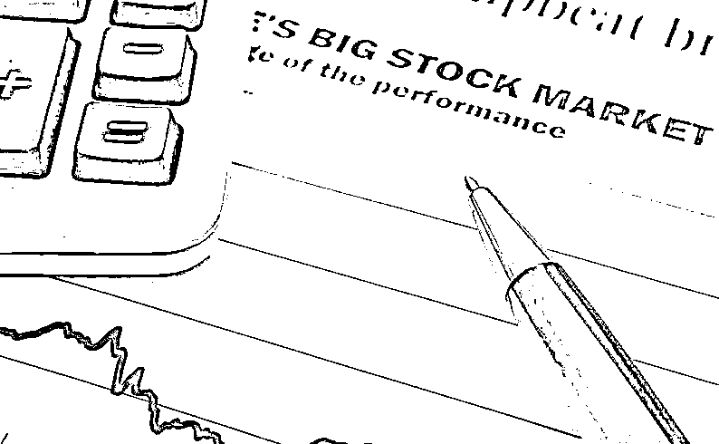

这一组合也可能表明一种愤怒的政治气氛，即假设事情确实在几周（或更长时间）内出现问题，那么这种气氛就会倾向于把问题归咎于除自己以外的所有人。结果并不一定非常可怕。但是读者应该知道——并准备好面对这种可能性，通常这些类型的宇宙结构出现的时候，常常伴随着**令人不安的地缘政治、经济、社会或环境性质的事件发生**。

宇宙不是导致这些事件的原因，但它经常与这些事件相关。因此，最好在这些情况发生之前做好准备和预先警告，而不是措手不及、感到惊讶。尽管火星牵涉其中，火星掌管着事故（因此有理由要小心），但这些骚乱可能不是意外的结果。它们可能是由于缺乏耐心、成熟和自制力造成的。

在下单买入或卖出之前要三思，或者在愤怒时做决定要三思而后行。冲动行事，或凭“直觉”行事，可能会在下个月导致代价高昂的错误。更好的做法是利用这种能量重新做一些一开始没有做正确的事情，尽管这看起来很令人沮丧。这次一定要做正确。

**说明：以上日期基于纽约证券交易所所在的美国东部标准时间，由于存在时差，中国地区可能需要加一天。**

**版权声明：**本文由若道翻译发布，欢迎转发，反对抄袭。友号转载请申请白名单。

**雷蒙德·梅里曼（Raymond Merriman）**

若道签约老师。著名金融占星师，ISAR（国际占星研究协会）前主席，梅里曼市场分析公司的总裁。他由于“提升了占星学的职业形象”，在 1995 年国际占星大会上被授予轩辕十四奖；在 2012 年国际占星大会上，被授予轩辕十四终身成就奖。

1“中国上证指数月度报告”发售

**若道推出了****中文版****的雷蒙德·梅里曼中国上证指数月度报告，并持续发行该报告！**

当把金融市场的周期和占星学的周期相结合时，雷蒙德·梅里曼老师的金融占星学研究**为投资者应对金融市场的周期波动，并随之调整投资策略提供了极大的价值参考**。

****9 月中英文报告均已上线！****

2“黄金价格周期月度报告”发售

**若道推出****中文版****的雷蒙德·梅里曼黄金价格周期月度报告！**不仅仅为广大读者在中国股市的投资出谋划策，更将视角放眼黄金市场。

**每当世界经济形式不明朗的时候，有一个地方是保值的港湾，那就是****黄金**。自 1982 年雷蒙德·梅里曼出版第一本研究《地球宇宙学征象与黄金价格的关联》的著作以来，**他一直作为最重要的黄金市场时机预测者之一享誉国际**。

8 月的黄金终于从高位开始下跌，有些分析人士认为，黄金在过去连涨 9 周是非常极端的，因此走势未来不会太强了；也有人认为，在目前各国大放水、国际局势不稳的情况下，黄金可以继续看高。

那么，你该如何面对目前的调整呢？是等待回调继续进行，还是在什么位置买入？9 月黄金周期报告等着你。火星已经进入逆行阴影期，很多国家都纷纷再次爆发新冠肺炎病毒疫情，未来的几个月注定不安宁。黄金的走势会安宁吗？

9 月黄金报告已经上线，上证报告也会在月底上线。欢迎了解。也可以按照季度和一年期订阅，有更多优惠。季度和年度的好处是，你可以持续了解梅里曼老师对于不断在变化的市场的看法。即便他某一次看法和市场不一致，你也看到在下一期他如何调整自己的看法，并看到金融占星在一个长期时间段内对你把控风险的帮助。而能够长期控制风险、尽量找到安全的投资时机才是投资的长久之计。

**9 月中英文报告均已更新！**

**购买套餐**，买得越多越优惠

中国上证指数月度报告套餐价

*   **单月报告**：280 元

*   **3 个月套餐**：780 元（260 元/月）

*   **12 个月套餐价**：1999 元（166 元/月）

**长按下图识别二维码**

**购买金融报告****套餐**

**▼**

黄金周期月度报告优惠

*   **双报告年度套餐更优惠（直降 899 元）**
*   **12 个月黄金报告+12 个月上证指数报告：仅需 3500**

**长按下图识别二维码购买黄金报告套餐**

▼

1976 年以来，由雷蒙德·梅里曼撰写的梅里曼市场时机学院每年一次的年度预报沙龙和每年一本的《年度预报》一直在应用占星学原理为投资者们服务，提供卓越洞见，从未间断。

过去两年，3 小时的年度预报讲座和长达 200 页左右对金融市场的分析报告，帮助许多若道读者做出正确的投资决策，降低了投资风险，并获得相当不菲的投资收益。在群星摩羯座的时候，我们和你一起提早规划自己来年的投资安排。

**2021 年金融年报预售**

**1976 年以来，由雷蒙德·梅里曼撰写的梅里曼市场时机学院每年一次的年度预报沙龙和每年一本的《年度预报》一直在应用占星学原理为投资者们服务，提供卓越洞见，从未间断。**

过去两年，3 小时的年度预报讲座和长达 200 页左右对金融市场的分析报告，帮助许多若道读者做出正确的投资决策，降低了投资风险，并获得相当不菲的投资收益。在群星摩羯座的时候，我们和你一起提早规划自己来年的投资安排。2021 年年度预报开始预售**前 50 名预售价格**：1080 元**前 50-100 名预售价格**：1180 元**100-150 名预售价格**：1280 元**150 名之后价格**：1380 元**2021 年年度预报中文版预计发布时间**：2020 年 12 月底**沙龙时间**：2021 年春节前后**沙龙形式**：英文讲座，配有中文翻译**点击下图了解详情**

▼

******点击阅读原文购买金融报告******

# 9 月 13 日木星顺行 | 带着木星的礼物向前走，越艰难，越宽阔

> 原文：[`mp.weixin.qq.com/s?__biz=MzA5NjA0NTAxNg==&mid=2651427421&idx=1&sn=a3b30888dbbf61e403be1c59a12d6dc4&chksm=8b4b20eabc3ca9fc5f6f5d72d7caac227654b92899893af881029f68a61b459fdca624f8badb&scene=126&sessionid=1692738106#rd`](http://mp.weixin.qq.com/s?__biz=MzA5NjA0NTAxNg==&mid=2651427421&idx=1&sn=a3b30888dbbf61e403be1c59a12d6dc4&chksm=8b4b20eabc3ca9fc5f6f5d72d7caac227654b92899893af881029f68a61b459fdca624f8badb&scene=126&sessionid=1692738106#rd)

************☆****** ****后台回复“今日”，给你一句生命态度******

作者/查理 ISAR 认证占星师编辑/玫瑰 封面/书君 图片/全景网
**木星顺行****9 月 13 日，木星结束为期 4 个月的逆行，重新开始顺行。**前几天我带领了一场沙龙，讲解木星星座与个人成长的主题，分享到木星摩羯座的时候，一位年轻姑娘突然说：“哇，我的男朋友就出生在木星摩羯座的年份，今年对他真是太难了，不过他是在越艰难的时候，就会越努力，之后也越有机会，上一次本命年他也是这样”。现场还有一位小哥，拥有木星摩羯座落在 7 宫的配置，他表示，相对于先天条件优渥的姑娘，自己更喜欢一穷二白但是可以一起白手起家的对象，他更愿意相信一起苦过来的伴侣才有未来。（如果是出生星图中木星巨蟹座在 7 宫，可能就会反过来，会更容易选前者。）**木星代表着机会、运气、扩张。**大部分人都希望能拥有更多机遇，道路更顺利和平坦，人生的道路越走越宽，有更多的可能性和发展潜力。木星是射手座的守护星，我在咨询中遇到的那些射手能量很强的个案，他们总能抓住各种各样的机遇，促成极为丰富的人生阅历，我总惊叹于他们活出同龄人不曾拥有过的精彩。按照大卫老师的说法：**“他们在一辈子会活出三辈子的感觉”。****但如果木星在摩羯座，机遇很可能会以面目全非的“困难”形式出现**。这可能与木星在摩羯座处于“入弱”的状态有关。

举几个例子，都是木星在摩羯座的年份：

*   **1984 年**，是中国企业的元年，柳传志、张瑞敏、王石、李东升、史玉柱、段永平等企业家都在极为艰苦的情况下开启了联想、海尔、万科、TCL 等企业，为各个行业的经济发展带来了更多的可能性；

*   **1996 年 2 月 3 日**，云南丽江地区发生的 7.0 级地震。地震造成严重破坏和损失。之后，丽江受到各方援助，开始灾后重建。灾后第二年，丽江古城被列入世界文化遗产名录。从此，丽江出现了全新的发展道路。《21 世纪商业评论》曾经在评述丽江 96-97 年的境况时写道：“这一种天方夜谭般的崭新命运，似乎就在那个时点开始轰然降临。”

*   **2008 年 5 月 12 日**，汶川地震，损失巨大，举国悲痛。在之后的重建过程中，当地和整个四川的经济发展似乎展现出全新的面貌，呈现出了更多的可能性。那一年，全球还经历了灾难性的金融危机。在中国，这场危机促使我们开启了“四万亿”投资计划。

当然，这和中国本身的木星落在摩羯座有关系。上面的这些年份，意味着中国的一个又一个“本命年”。**放在其他国家，“困难”可能就是“困难”，而在中国，“困难”反而意味着“机遇”。**在过去几个月咨询经历中，我也遇见过几位木星在摩羯座的个案，普遍的感受是今年特别辛苦，但是都有神奇的经历，简直堪称逆境之王。比如在今年如此困难的大环境下，成功出版了新书的、公司获得了千万级融资的、成功拿下大项目和大订单的，等等。另外，过去几个月，我的朋友圈也几乎被各类**西部旅行**照片和视频刷屏，青海环线、西藏、云南、川西等等，雪山、高原湖层出不穷。高原的道路是很艰难，但是风景这边独好。这似乎也都对应了木星摩羯座的隐喻，人们在高山上找到了真谛。

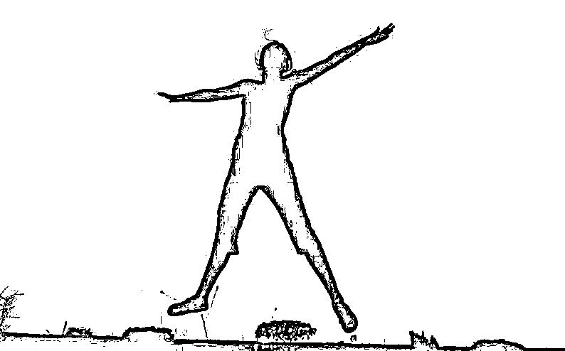

**未来四个月的木星轨迹**9 月 13 日木星开始顺行后，将会在摩羯座停留 3 个月半月时间，并在 12 月 22 日离开摩羯座，进入水瓶座，连同一起进入水瓶座的土星，结束持续了 200 年的土象时代，开启持续未来 200 年的风象时代。这是全球占星界在 2020 年最后四个月最热门的话题之一。最近一次木星与土星合相在水瓶座，那还是 1405 年，恰好是郑和第一次下西洋的年份。对这个话题感兴趣的朋友，也欢迎关注 9 月 19 日举办的 ISAR 大会（详情请点击：[ISAR 大会抢票](http://mp.weixin.qq.com/s?__biz=MzA5NjA0NTAxNg==&mid=2651427347&idx=1&sn=dd8f5cd0a1723ef28d8a8340db57597a&chksm=8b4b20a4bc3ca9b252cd596768433a0c05f02ab61c12aaab58e1fbcf1cb1efcdcf113b9c16f3&scene=21#wechat_redirect)）。**注意，木星、土星合相在水瓶座和我们常说的“水瓶座时代”并不是同一个概念**。后者是指回归黄道（tropical zodiac）的春分点（白羊座 0°）由于岁差的原因进入恒星黄道（sidereal zodiac）的水瓶座。（我们平时用的黄道一般是回归黄道，是将太阳在黄道上运行一年的时间等分为 12 分。而恒星黄道是黄道中不同星座的分布，是对于黄道空间的划分。由于岁差影响，两者目前并不一一对应。）

木星在摩羯座顺行的未来 4 个月，木星会把之前的历程重新经历一遍：

*   **9 月 13 日**，木星将从摩羯座 17°附近开始顺行； 

*   **10 月中旬**，木星将六分正在双鱼座逆行的海王星，位置在基本星座（白羊座、巨蟹座、天秤座、摩羯座）和变动星座（双子座、处女座、射手座、双鱼座）的 19°附近，预示着某种**“无边界”的扩张**； 

*   **10 月 19 日**，木星将四分正在逆行的白羊座火星，位置在基本星座的 19°附近，预示着某种**“冲突”的扩张**； 

*   **11 月中上旬**，木星将第三次合相重新顺行的冥王星，位置在摩羯座 23°附近，预示着**某种深度资源的扩张**； 

*   **12 月 19 日**，木星将正式离开摩羯座，进入水瓶座，下次回到摩羯座已经是 2031 年 11 月； 

*   **12 月 22 日**，木星将与土星合相于水瓶座 0°29′，木土的土象时代正式结束，木土的风象时代开启。

       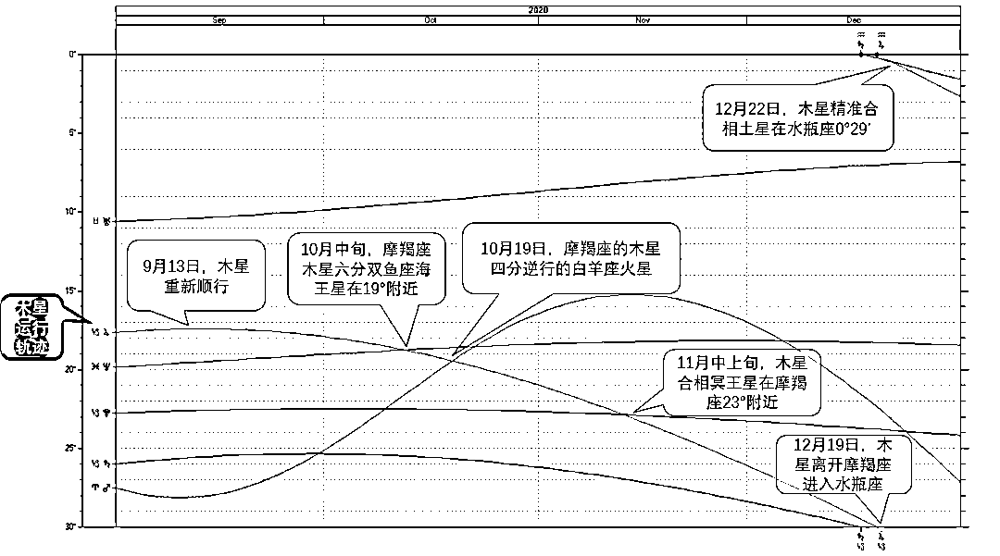|木星在未来 4 个月的运动轨迹，纵轴是度数，横轴是月份**经世占星学中的木星、土星行进****国家星图中的木星代表经济扩张、发展以及更多的可能性**。比如中国星图中木星在摩羯座，对应了**“基建狂魔”**的称号。**行进木星则代表着风口**，“只要站在风口，猪也能飞起来”。过去几十年的木星摩羯座年份，在中国都对应了基建行业的大风口。过去几个月，我也研究了木星在 12 星座的不同年份中国经济的风口，并制作了一张表格，供大家参考。（注：以下四张图信息量较大，可以保存慢慢看，先看后面的内容）

       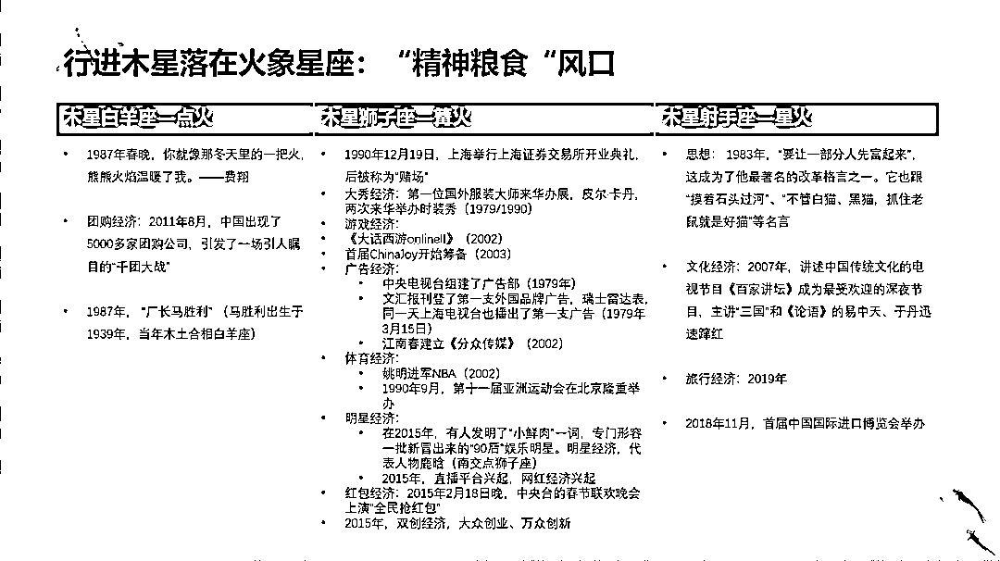      

       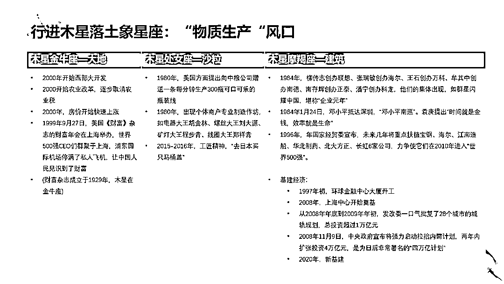      

       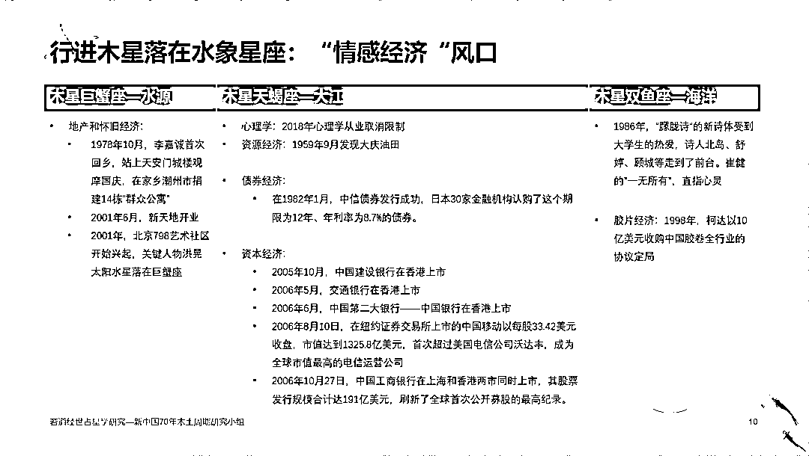      

       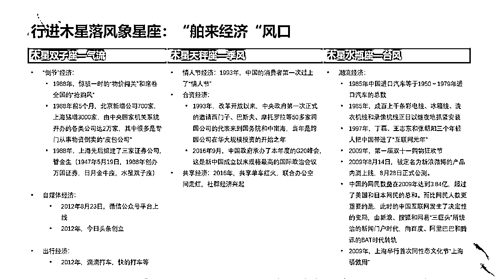       

**木星顺行后，国家层面的展望**

9 月 13 日，木星顺行后：

*   **整个 9 月**，木星都将与中国星图的冥王星形成梅花相位，**信用和资源可能会得到更多利用；** 

*   **10 月中旬**，行进木星六分中国星图中的金星，金星又是 9 宫和 4 宫主，也许在**外交、教育、农业等领域会面临一些发展机遇**；

*   **11 月中上旬**，行进木星合中国星图中的木星。也许**某种重大胜利会降临**。在 3 月 19 日，这个行进也发生过一次。当天，全世界的媒体都在关注一条新闻：“中国（除港澳台地区的 31 省份）新增本土病例为零，这为全球抗击疫情带来了希望”；

*   **11 月中下旬**，行运木进会六分中国星图的中天。还是可能会有一些与**胜利、希望**有关的事件。今年 3 月也有同样的行进发生。在 3 月 29 日当天，时隔 65 天，首趟旅客列车抵达武汉，首个客运航班在宜昌起飞；

*   **12 月末**，行进木星在进入水瓶座后，马上就会合相中国星图的上升点。也许国家又会有一次跨越式的成长（即便在 2021 年 1 月初，行进土星也会经过中国的上升点）。上一次中国在经历这个木星行进时，一个标示性的事件是：2009 年 1 月 13 日，中国国家统计局将 2007 年中国国内生产总值的现价总量修正为 257306 亿人民币，按平均汇率计算，中国超越德国成为世界第三大经济体。

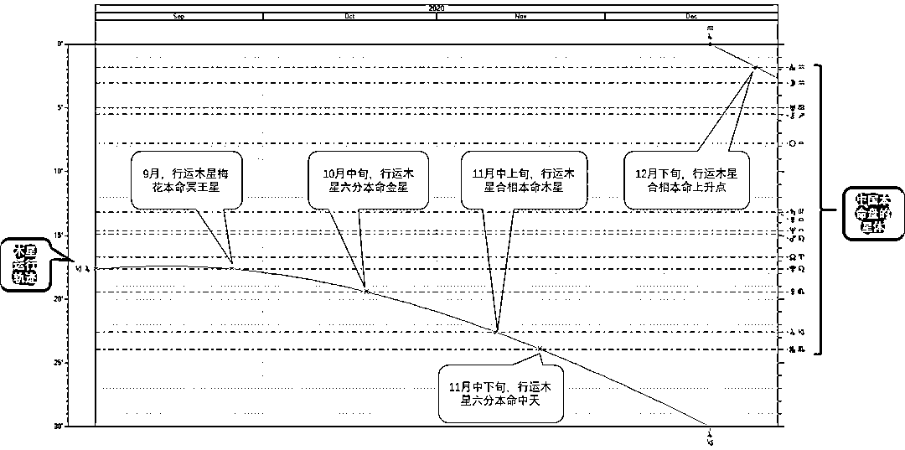      

| 这张图显示了木星的运进轨迹如何穿越中国星图的星体

       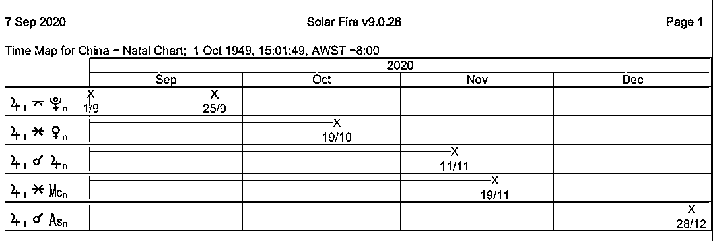 

| 这张图显示了行进木星与中国星图星体产生精准相位的日期，右边的 t 代表行进星图，n 代表中国星图当然，行进木星带来的扩张作用，也容易导致失控，这点我们同样需要注意。**木星顺行后，个人层面的建议**我们曾在木星逆行的文章中讨论过摩羯座木星逆行时的个人影响：[内化礼物](http://mp.weixin.qq.com/s?__biz=MzA5NjA0NTAxNg==&mid=2651416539&idx=1&sn=5076f2705c05afaffcad6f702c575139&chksm=8b4bd56cbc3c5c7a7a933c116283f0155ea4d96846185b5c16ea4780d70a72b4258cfe6c24fb&scene=21#wechat_redirect)（点击可阅读）。接下来 4 个月，我们可以带着这样的内化礼物继续往前探索，迎接木星、土星合相在水瓶座的风象时代。**若道君：****你可以在 app store 或者应用商店搜索“若道”下载 app，输入个人档案，查看行运盘（也可以使用其他星图软件），找到逆行的木星（符号：♃）落在出生星图的第几宫，然后对照下文查看你的木星顺行建议~**

**例如下图中，木星顺行在美国总统特朗普个人星图的第 5 宫。**

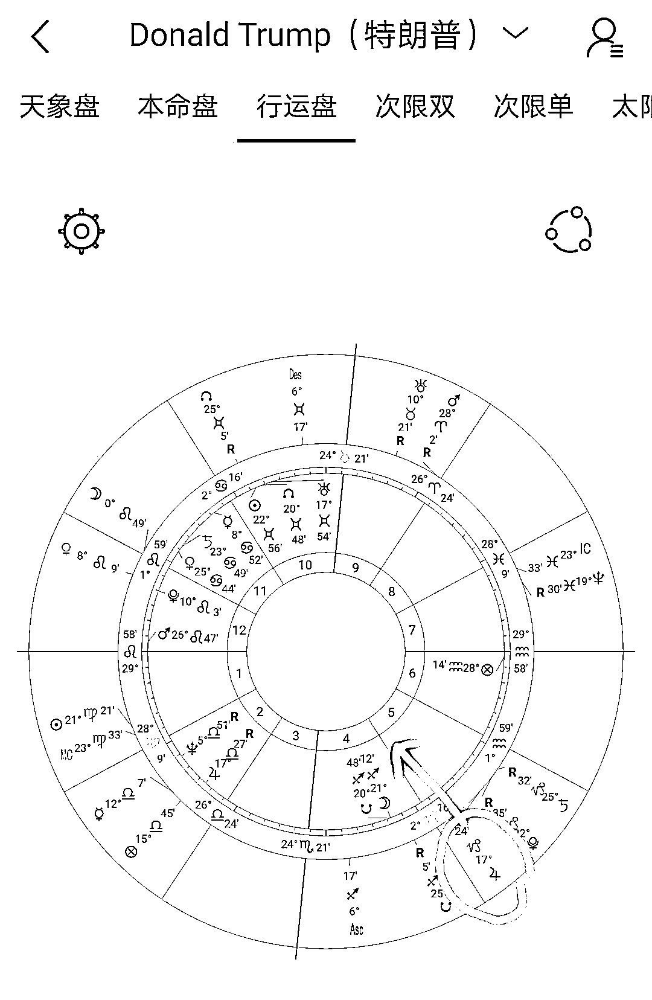

**上升白羊座 或行进木星在第****10****宫**

过去几个月，也许你已经在事业方面收获了内在礼物，当然由于行进土星和冥王星也在 10 宫，职场压力依然很大。带着这份礼物继续前进探索吧，**探索自己事业道路的更多可能性，压力大的地方，经常也带来更大的回报。**

**上升金牛座 或行进木星在第****9****宫**

过去几个月，也许你在人生意义方面有了更多的思考，甚至开始**考虑宗教和信仰问题**。由于行进土星和冥王星也在 9 宫，也可能你被困在境外无法回国。无论如何，**带着这些人生思考和经历继续生活下去，让自己的思想自由分享，你的精神将会更加饱满。**

**上升双子座 或行进木星在第****8****宫**

过去几个月，也许你拥有很多人生蜕变的礼物，比如来自**信任关系、亲密关系、信用管理**，甚至你开始**探索恐惧和死亡的议题**。由于行进土星和冥王星也在 8 宫，可能你还**深陷各种债务纠纷或业力纠缠。**有时候人可能真的需要失去点什么，才知道自己最珍贵最想要的是什么，带着这份礼物前行，你会变得更加轻盈。

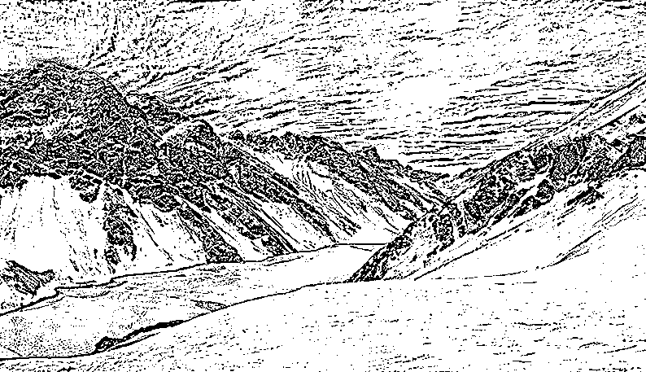

**上升巨蟹座 或行进木星在第****7****宫**过去几个月，也许你获得了很多关系方面重大领悟，无论是**婚姻、伴侣、合作还是社交关系**。当然，由于土星和冥王星也在 8 宫，可能你**在人情方面还有些过不去的坎儿**。不管怎么样，可能你**遇到了一些新的人，尝试在关系中探索更多的可能性**，过去的坎儿说不定就没那么在意了。

**上升狮子座 或行进木星在第****6****宫**

过去几个月，也许你**实践了一些新技能，带着新手光环顺利地完成了一些富有成果的项目**。当然，由于土冥和冥王星还在 6 宫，可能你**依然不得不面对各种各样的麻烦事**。没关系，你现在也许已经不再怕它们了，**带上你的新技能去尽情施展**，舞台依然是你的。**上升处女座 或行进木星在第****5****宫**过去几个月，也许你**经历了一些欢乐的时刻，比如找到了童年的乐趣，也可能赚了一笔小财。**当然，由于土星、冥王星在你的 5 宫，可能整体而言还是有点**压抑**。上升处女座的你可能天生就比较拘谨，喜欢工作，也许**适时地自娱自乐，找点乐子，可以帮助你更有效率地工作。****上升天秤座 或行进木星在第****4****宫**

过去几个月，也许你**和家人在一起的时间更多了，也获得了来自于父母的支持，根基更稳了**。当然，由于土星、冥王星还在你的 4 宫，可能你**依然背负着原生家庭的责任乃至整个家族的压力**。你的表面可能看起来礼貌客气，波澜不惊，但是内心依然一团乱麻。**尝试让自己的环境变得不同，也许你会有更积极的心态。**

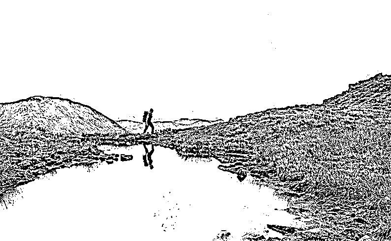

**上升天蝎座 或行进木星在第****3****宫**

过去几个月，也许你**在沟通、写作或者表达方面顺利多了，或者与你的兄弟姐妹、邻里乡亲的关系也改善了很多**。当然，由于土星、冥王星还在你的 3 宫，可能依然有一些**表达障碍，与周围人还是有些隔阂**。接下来，你可以**自由选择想说什么，想写什么，想和什么人聊天，甚至自由选择去那里出差**。如果遇到觉得不舒服的人和事，直接拒绝吧，没什么大不了的。

**上升射手座 或行进木星在第****2****宫**

过去几个月，也许你**在探索财富时获得了回报，甚至在财务自由方面有了更多的体会，自我价值感也得到了提升**。当然，由于土星、冥王星还在你的 2 宫，可能**荷包还是比较吃紧**，“钱到用时方狠少”。接下来几个月，**带着这些体会向更多财富进发，“赚钱的方法千万种，条条大路通罗马”。****上升摩羯座 或行进木星在第****1****宫**

过去几个月，也许你**越来越清晰自己是谁，想干什么，如何向别人介绍自己**。你越来越满意自己的内在身份。当然，由于土星、冥王星都还在你的 1 宫，可能你想走的路很长，需要付出极大的努力。但没关系，好歹现在已经出现了一些清晰的道路，**先实现一个“小目标”，不积跬步，无以至千里。**

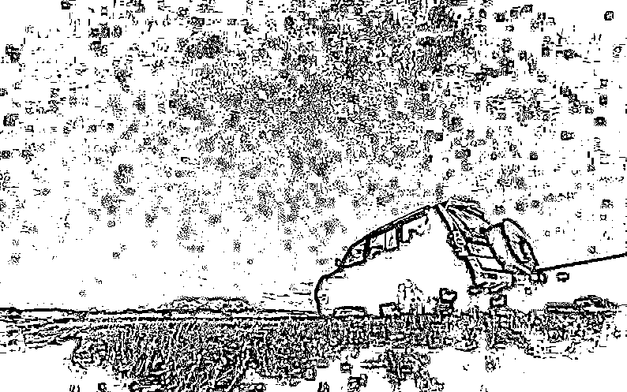

**上升水瓶座 或行进木星在第****12****宫**

过去几个月，也许你变得**越来越有耐心**了，**独处的时候经常会有一些灵感出现，你的梦境经常给你一些有趣的提示。**当然，由于土星、冥王星还在你的 12 宫，可能你依然发现**有些事情时候未到，再努力也是徒劳**。但曙光就在眼前了，还有 4 个月，接下来属于你的时代可能就会到来，**把一些未了的事情处理完吧，等到明年开始可以专心做自己的事情。****上升双鱼座 或行进木星在第****11****宫**过去几个月，也许你**获得了更多同行的认可，认识了更多志同道合的朋友，自己的圈层也打造得有模有样**。当然，由于土星、冥王星还在你的 11 宫，可能发现**想要真正出圈和跨界不是那么容易**。没关系，再等等，论耐心谁都比不过你，**你的跨界融合、天下大同梦想，也许在明年会有全新的进展。****即将迎来的全新时代**2021 年，我们将迎来木星、土星合相在风象星座的全新时代。上一次人类在这样的时代是 13 世纪，蒙古帝国三次西征搅动了当时欧亚大陆的整个文明世界，把原来因地理、经济、政治等各种条件互相阻隔的文明地区联系起来。在这段时间，中西交通与文化交流，达到历史上从未有过的高涨。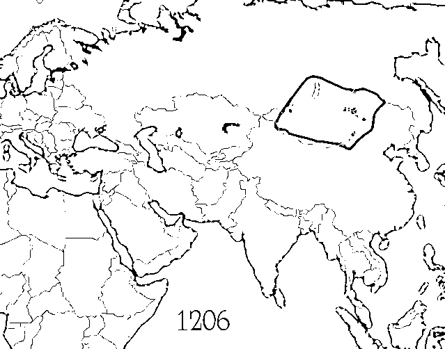| 蒙古帝国在 1206 年-1924 年之间占领的领土变化蒙古西征也带来了世界古代历史上一次较大规模的人口双向流动与迁徙。随着蒙古大军的西征，大批蒙古人、汉人、以及中国西北与中亚各族的人群，从东向西迁徙，进入中亚、西亚、东欧乃至西欧各地。以后随着各汗国的建立，这些西迁者有许多就在当地定居下来，把东亚的文明传到该地区。而随着蒙古远征军的东归，又有大批中亚人、西亚人、斡罗斯人、钦察人，或作为投顺的王公、贵族，或作为被掳的工匠、奴隶，辗转东来，也将他们的文明带到东亚来。

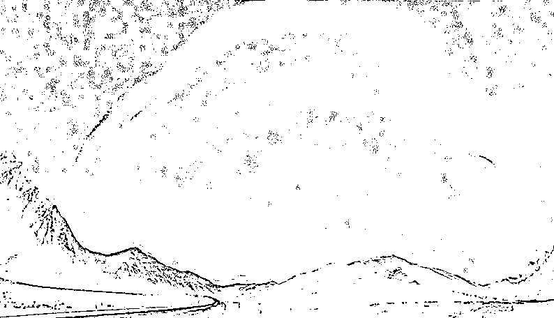

而在蒙古帝国的广袤无垠的范围内，一时更有众多的商贩、使臣、旅行家往来如织，也起了传播文化、促进交往的作用。例如，道士丘处机（号长春真人）奉成吉思汗之诏，从山东出发去见他，结果一直走到阿姆河畔才见到这位海洋大汗。他的随行弟子李志常，归来以后就撰写了《长春真人西游记》，记述了中亚各地的情况。天主教士普兰·迦尔宾等人，奉教皇之命，万里迢迢，出使蒙古，归去后也撰写了《蒙古历史》一书，对蒙古人的生活习俗、战略战术以及沿途见闻，作了记述。（节选自《古代中西文化交流史话》）2019 年，在斯蒂芬老师的《木土工作坊》上，他也提到了上一次木星、土星合相风象星座的时代是 13 世纪，当时蒙古帝国扩张到了欧亚大陆几乎全境，而欧洲正在经历内部的分裂，在第四次十字军东征时，十字军调转矛头指向拜占庭帝国的君士坦丁堡。西方势力衰弱，而东方势力崛起，多像如今的世界格局。同时，他作为一个美国人，觉得由美国来领导全球的世界，他也有些厌烦了。也许，在木星在摩羯座的最后 4 个月，我们需要更深层次地思考如何与未来的全新世界相处了。

**版权声明：**原创文章由作者授权首发于若道平台，欢迎转发，反对抄袭。友号转载请申请白名单。

**查理**

ISAR 认证占星师（2017 年获得），全职占星师

若道 2016 届核心课程学员，5 年企业占星研究和咨询经验

13 年企业管理咨询从业经验，上海交通大学物理与天文学员毕业

**咨询微信：**qinglee821

**微信公众号**：suoyingmk

长按打赏

**想参加斯蒂芬线上工作坊？**

**请点击图片链接****或添加客服微信咨询**

**想听听大师斯蒂芬老爷子的精彩讲座？**

**长按下图了解详情！**

**微信又双叒叕改版啦，不想错过若道君的推送？**

**就把若道设为星标吧！**

**▼**

就是这个“在看”，戳一下☟

********报名直达入口********

# 土木合相和美国总统大选 | 关于 ISAR 大会的预告花絮（抢票继续中）

> 原文：[`mp.weixin.qq.com/s?__biz=MzA5NjA0NTAxNg==&mid=2651427347&idx=1&sn=dd8f5cd0a1723ef28d8a8340db57597a&chksm=8b4b20a4bc3ca9b252cd596768433a0c05f02ab61c12aaab58e1fbcf1cb1efcdcf113b9c16f3&scene=126&sessionid=1692738106#rd`](http://mp.weixin.qq.com/s?__biz=MzA5NjA0NTAxNg==&mid=2651427347&idx=1&sn=dd8f5cd0a1723ef28d8a8340db57597a&chksm=8b4b20a4bc3ca9b252cd596768433a0c05f02ab61c12aaab58e1fbcf1cb1efcdcf113b9c16f3&scene=126&sessionid=1692738106#rd)

上周，ISAR 大会的主持人（亚历山大·因舍阿吉克和雷蒙德·梅里曼）对于即将召开的 ISAR 大会两天的内容做了一个介绍，下面，我们再给大家介绍一下大会预告的花絮片段。**★****一：伟大的时主——土木合相水瓶座０°**2020 年开始的时候，天上的行星形成了特别的排列——土相和冥王星合相在魔羯座。**时代秩序和规则遇到了大变局**。在这样的变局下，每个人的生活都受到影响。

土冥合相的特别之处在于，它们还合相在土星和冥王星自身的南交点上（不仅月亮有南北交点，其他所有行星都有南北交点——行星运转和黄道形成的交叉点）。

在 1284 年，我们也曾看到这样一个土冥合相在魔羯座的星群。黑死病传说就是从那一年开始的（可参看德国民间传说《花衣魔笛手》）。这场大流行疾病改变了欧洲的社会结构，对于政治、经济、文化都产生了重大影响。

相似的能量重现，我们如何穿越过去和未来，把握现在？

而就在土冥合相进行时分，**2020 年 12 月 22 日，木星和土星开始合相。**土木合相周期是占星学研究的最古老的周期，天王星发现之前，人们认为土星是最远的行星。**两颗行星的合相被看成时代的掌管者，木土周期被称为伟大的时主，时间的标记者。**

普通的木土合相周期是 20 年一次。天文学家、占星师开普勒发现了土木合相周期背后更大的周期，并在其著作《宇宙的奥秘》中发表了上图。大约每 200 年，土木合相 10 次后，这个合相会将会进入新的元素。比如土木合相在 1802 年落在土元素后，在此后 200 年，几乎一直发生在土元素（除 1821 年短暂回到火元素，1980 年、1981 年短暂合相风元素外）。我们看到了近 200 年科学技术的突飞猛进和人类物质生活的跳跃性发展。而超级大的周期则是 800 年。800 年中，土木合相将历尽四大元素。因此，对于整个人类社会而言，土木合相在过去 800 年中经过 4 大元素后，再次回到风相星座，且合相在水瓶座 0°，标志着**人类社会前所未有的全新时代的到来。****土木周期与“希望和可能性”如何在物质世界显化密切相关。**社会将发生变巨大的转变，我们正处这个伟大周期的开端。在这样一个重要的时代转折点，９位著名占星师将会９个不同角度，告诉大家我们将要进入的是什么样的未来。**★****二：全球瞩目的美国大选**时代转折点上，美国迎来了总统大选。有些美国人认为，这是他们一生中最重要的一次选举，有些人认为这是世界历史上最重要的一次大选。木星-土星是一个 20 年的周期，当它与美国大选重合时，在选举或总统期间就会发生一些奇怪的事情。在这次论坛中，占星师将会讨论以下内容：**★** **美国总统大选的历史数据研究****Lee Lehman**是占星界最杰出的研究者之一，她将分享她对过去历史选举所做的研究，并展示 2020 年与历史选举的共同之处。她的演讲中有很多定量研究，对于定量研究和数据感兴趣的占星师不妨关注一下。**★ 太阳返照图在选举中的应用****琳恩·贝尔**是世界上最受欢迎的职业占星师之一，她会从经世占星学的角度，重点关注候选人的选举星图和个人星图。她还会特别指出，从太阳返照图，尤其是唐纳德·特朗普的太阳返照图很能说明特朗普在这次选举中会做什么。★ **华盛顿资深政治活动占星师对于选举的看法****卡罗琳·凯西**是来自华盛顿的占星师，她非常深入地参与了华盛顿的国家政治活动。在她的演讲中，大家将看到作为一位著名占星师，她如何把占星学和她在华盛顿的政治活动经验结合起来，向大家解读她对于这次大选的看法。★ **从选举日到就职典礼会发生什么**2016 年的 ISAR 大会上，占星师**克里斯汀·斯金纳**做了一个非常不寻常的预测。她说希拉里·克林顿会赢得选举（希拉里普选得票数的确高于特朗普，但是选举人票数低于特朗普），但无法宣誓就职。这次她将会讨论总统候选人的星图、副总统星图、选举日星图、就职典礼星图。各个候选人和美国星图的比对星图，还将谈到从选举日到就职典礼日这段时间将会发生的事情。

**一个影响世界趋势的重大天象，一个影响世界的重大事件，在 ISAR2020 在线会议上，你不仅会听到这些世界知名的占星师们的研究和思考，还有机会学习对于这样的占星学主题，他们的研究方法是什么。**在过去许多年中，ISAR 大会都是在美国举办的线下会议，这次因为疫情举办线上会议，从未有过，未来也难以再有。**在时代大变局之中****洞悉未来世界大势****学习世界大事的分析预测方法****9 月 19 日、20 日****2020 ISAR 线上大会****机不可失，时不再来。**

**2020 ISAR 线上大会正式开票！**

**200 张转发助力优惠票上线 24 小时抢空**

**ISAR 大会为什么这么火爆？**ISAR 作为**国际上****最具声望****的占星组织**每届 ISAR 占星大会都是业内盛事，周边酒店爆满，各国占星师不远万里飞到美国，只为亲历**国际一线占星大师云集的盛会。**

往年大会的每一个时段都有 2-3 场演讲同时进行，一天中要经历一次次的纠结割爱错过，即是英语水平再好，因为很多演讲主题专业性和前瞻性都很强，总有一些生僻词汇让你一脸懵。

人在他乡，想找个志同道合、水平相当、沟通顺畅的小伙伴探讨也不是很容易，更何况现在国内疫情不稳，美国更甚，根本无法实现出国参加群聚性活动的愿望。**若道作为 ISAR 中国唯一附属学校****协办的 ISAR 线上大会有哪些优势？**

省去请假、机票、住宿、时差、

舟车劳顿以及感染风险，不用同时段取舍选择，

每一场主题演讲全都要；

**若道专业翻译团队翻译制作字幕，**

省去中文口译时间，

实时 GET 最精准的知识点，

**14 位国际一线占星大师****，**

每一位大师的智慧和课程都价值不菲。

**这次的两个大主题和我们每个人的未来息息相关：**

该如何迎接 800 年一遇的**木星-土星合相在风象星座的新纪元**？**2020 年美国总统大选**更是时下热点，对于未来几年的大环境有着关键影响，绝对是咨询、社交中含金量满满的社交货币。句句出自大师之口，踏实放心消化吸收。

**觉得有点儿高深？**

还有 8 位中国 ISAR 认证占星师

**点评解读**帮助你加深理解，

没来得及看直播，

或者觉得内容太棒了想看回放？

咱还有**三个月的视频回放权限**，

关键是价格太美丽了，

**会员优惠价**抢到就是赚到，美滋滋~

**绝对是职业占星师、占星爱好者们不容错过的知识宝藏**

**第一波转发优惠价****已经售罄**

**给手慢的宝宝们准备的****第二波的优惠抢票方式：**

全价票：1080 元

1、购买 ISAR 会员，享受**780 元**的家族会员价，ISAR 会员每个月都有星光俱乐部沙龙

2、不购买会员，可以呼朋引伴，三人团报，每人 880 元，**目前仅余 15 个优惠名额**，售罄恢复原价

**2020 ISAR 大会**

**大会时间**

**2020 年 9 月 19 日（周六）**

******9:00-12:00，14:00-17:00******

**2020 年 9 月 20 日（周日）**

********9:00-11:00，14:00-16:00******** 

 （因时差原因，具体时间安排以现场直播为准）

**听课方式**

**网络直播课(可回放)**

（英文演讲有中文字幕翻译）

全价票：1080 元

ISAR 会员价：780 元

**非会员三人团报价：每人 880 元**

 *******急性子可以先拉到文末**

**添加童老师微信报名！**

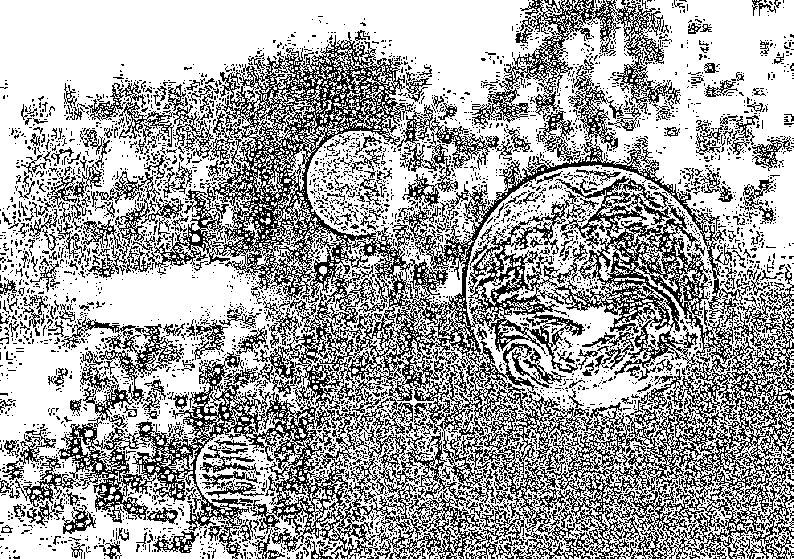

**关于 ISAR**

**国际占星研究协会**（ISAR, International Society for Astrological Research）ISAR 是一家于 1979 年在加州洛杉矶成立的非盈利组织，**它是国际上最具声望的占****星组织，**也是 UAC（国际占星大会）的四个举办方之一。

ISAR 成员遍及世界 45 个国家。这些不同地域的占星文化彼此碰撞，互通有无，形成积极的交流互动局面，推动了占星学研究和实践的多样性发展。同时，ISAR 的网站已被翻译成多种不同语言，旨在将世界各地的占星师联合起来，共建和谐互助的伙伴关系。

**ISAR 的占星资质认证项目包括，职业道德意识培训、咨询技巧培训及测试，以及专业占星技能的考试。**满足上述各方面要求者，可获国际职业占星师资格证（CAP, Certificate of Astrological Proficiency）。目前全球有 19 所 ISAR 附属占星学院。**在中国的唯一指定教学机构是若道占星。**

**关于大会内容**

2020 年是一个数十年未有之大变局之年。地球就像《权力的游戏》中的维斯特洛大陆，陷入始料未及的混乱之中。一方面，新冠病毒就像“看不见”的兵团，在无声无息中穿越国界和防御，袭击了所有国家；另一方面，中国和美国，地球上几乎最重要的两个大国竟然陷入前所未有的冷战。我们的世界变得非常魔幻。**2021 年将会如何？这个世界会好吗？在这样的大变局中，我们如何重新构想未来？**在过去的几十年中，ISAR（国际占星研究协会）每两年会举办一次大会，邀请 ISAR 在全世界的顶级占星师演讲，而占星师和占星爱好者们则从 40 多个国家飞到一起，欢聚一堂；今年，因为新冠疫情的影响，原计划在科罗拉多州举行的 ISAR 大会无法线下召开，会议改为在线会议。这次大会特意准备了将影响全球所有人的**1 个重要主题**和**1 个重大事件**，邀请全世界著名的占星师进行讨论分享。

**★****主题一：木星-土星合相在风象星座的新纪元**

木土合相 800 年经过风、水、火、土四大元素，每一元素历经大约 200 年周期，上次木星-土相进入风元素还是 800 年以前。因此，这次土木合相再次进入风元素对于这个世界有非常非常重要的影响，世界将发生重大变化。这也是全世界占星师都在密切关注和研究的天象。如果你知道世界发展的趋势，知道潮流方向，就能为自己、家人、事业做出更明智选择。

**★****主题二：  2020 年美国总统大选**

新冠疫情和中美冷战让每个中国人都深深认识到美中关系对普通人生活的影响，这个影响还会在未来更加明显显现。在疫情危机及其带来的经济危机中，谁将成为美国总统是世界瞩目的大事件。占星学怎么看待总统选举，怎么预测大选，4 位 ISAR 世界著名占星师将会提前为你分析预报。

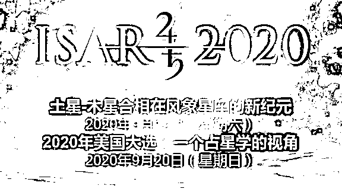

为了让中国占星师和占星爱好者可以参加这次大会，若道作为 ISAR 在中国的唯一指定教育机构，和 ISAR 合作全程翻译这个大会，将视频配以中文字幕，将于 9 月 19-20 日在线转播这个会议的全部内容，**并邀请 8 位国内经验丰富的 ISAR 认证职业占星师转播当日对于这个大会进行 2 小时的解说、探讨**。

**ISAR 线上大会具体日程安排**

**9 月 19 日，星期六**

★**土星-木星合相在风相星座的新纪元**

小组讨论主持人：亚历山大·因舍阿吉克——ISAR 主席

土木合相周期将离开土相星座，踏上其在风相星座的 140 年旅程。9 位世界顶级占星师将讲述这个周期对于我们所有人的影响，从集体层面到个人层面，这个重要周期意味着什么。他们每个人都将呈现自己个性化的观点，为我们展示一个迷人的未来。

★**演讲 1：重塑未来：进入新时代的占星学**

演讲人：亚历山大·因舍阿吉克（Aleksandar Imsiragic）个人网站：keplerunited.org

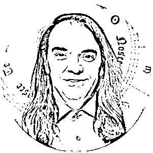

**个人简介：**亚历山大·因舍阿吉克是 ISAR 主席，塞尔维亚贝尔格莱德的约翰内斯开普勒占星机构的创始人。他从事占星学超过 25 年，教授冥想，写了 11 本占星术书籍，并自 2001 年以来，在贝尔格莱德组织了每年一次的国际占星大会。他的工作是基于对西方和东方传统知识的整合，他的特别专长在**恒星、业力占星术和占星治疗**等领域。小编 tip：一直关注若道的同学对这位现任 ISAR 主席大概比较熟悉，2019 年中国 ISAR 大会在北京举办时就邀请了亚历山大主席，他的关于业力占星学的讲座，颠覆意识，备受赞誉。另外亚历山大曾在若道开恒星一课，对于这些领域感兴趣的同学可咨询课程顾问相关信息。**演讲内容**：概述过去的伟大合相周期以及这些周期对 2020-2025 意味着什么。我们正在进入一个新时代，外行星合相的历史揭示了一个对于我们当前时代的迷人叙述。

★**演讲 2：系好安全带！2020 年以后**

演讲人：温迪 ·史黛西（Wendy Stacey）个人网站：wendystacey.com

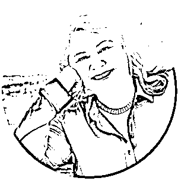

**个人简介：**温迪·史黛西是占星协会主席，国际梅奥占星学院校长。著有《占星术咨询》(2011 年)、《天王星四分冥王星》(2012 年)、《通过占星显微镜观察 Covid-19》(2020 年)、《新一代》(2012 年)、《专业占星师》(2016 年)、《比特币》(2018 年)等著作，为《占星杂志》撰写了 50 多篇文章。她的著作《超越 2020 年》和《未变的行星:诅咒与祝福》将于 2020 年发行。2014 年，温迪因“对占星的杰出贡献”获得了英国的**查尔斯·哈维奖**。

★**演讲 3：您从这里到 2021 的指南**

演讲人：迈克尔·鲁丁（Michael Lutin）

个人网站：michaellutin.com

**个人简介：**出版了 5 本书，创作了 5 场音乐剧，讲座和工作坊的范围从印度尼西亚的丛林到旧金山水果销售商。“我爱我所有的客户。我用占星学告诉人们正在发生的事情，帮助他们把他们想做的事情做到最好，减少他们的痛苦，并且我在这么做的时候让他们发笑。——迈克尔·鲁丁”**演讲内容：**

1.  为生活在非人类世界中的人类提供实用提示；评估预测和魔幻思维；
2.  拥抱你的个人王朝的更迭；
3.  行动背后的占星学：
4.  火星对土星的挑战。 

*   自由：法律和行星配置。
*   “他们”是谁？
*   凯龙星，凯瑞珂龙星（小行星，凯龙的妻子）和你现实的痛苦；邪恶的阴谋还是神圣的干预？
*   天王星对你生活的搅动。

★**演讲 4：行星重聚的个人责任！**

演讲人：弗兰克·克利福德（Frank Clifford）

个人网站：frankclifford.co.uk

**个人简介：**在占星学领域，弗兰克·克利福德(FrankClifford)已经有了 30 年的职业生涯，他担任过顾问、研究人员、数据收集者、作家、出版商和教师。他与《大占星师》杂志一起工作，在世界各地演讲，并在 2012 年成为最年轻的终身荣誉获得者——**查尔斯·哈维占星杰出服务奖**。他的伦敦占星术学院现在也上线了，在中国和日本都有分支机构。

演讲内容：2020 年 12 月，木星与土星合相在水瓶座 0°，为我们作为一个集体开启了非凡的新篇章。但是，对于我们个人生活和职业而言，这个合相又将提供什么？我们现在能做什么来充分利用这个合相呢？来加入弗兰克的木星-土星战略，加入这个新的冒险。

★**演讲 5：寻找木星—土星合相的吉日择时图**

演讲人：克里斯 · 布伦南（Chris Brennan）& 莱莎 · 沙伊姆（Leisa Schaim）

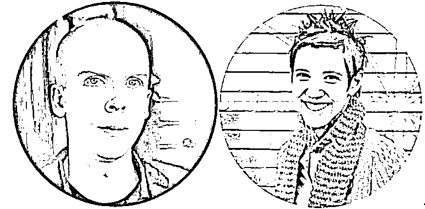

克里斯 · 布伦南（Chris Brennan）

个人网站：ChrisBrennanAstrologer.com

**个人简介：**克里斯·布伦南是一位来自科罗拉多州丹佛市的专业占星师。他是青年占星师协会的前任主席，也是国家地理研究委员会的前任研究主任。自 2012 年以来，他一直担任《占星学播客》的主持人，该播客在 2016 年获得了 ISAR 最佳视听制作奖。他专门研究古希腊罗马占星学，并著有《希腊占星术:命运与财富的研究》一书。莱莎 · 沙伊姆（Leisa Schaim）

个人网站：LeisaSchaim.com

**个人简介：**住在科罗拉多州丹佛的占星师，特别喜欢将现代和传统占星学的精髓结合起来，并将占星学的技巧与人类经历的故事结合起来。作为一名全职的占星咨询师，她每月为《占星学播客》提供吉时选择。
演讲内容：今年 12 月，木星和土星在水瓶座的罕见合相为开始新的冒险或新的事业提供了一个独特的机会，这个机会将经得起时间的考验。在本次演讲中，我们将演示如何使用择时占星学来寻找最吉祥的星图，以充分利用这一特殊的行星合相组合。

★**演讲 6：木星-土星合相对美国高等教育的潜在影响**

演讲人：奥马里·马丁（Omari Martin）

个人网站：soularwisdom.com/

个人简介：美国占星家联合会(AFA)的注册专业占星师，位于芝加哥的占星之友公司的总裁，SOULAR WISDOM™的所有者，该公司是一家人类性格和行为咨询公司，专注于出生星图和择时占星。他曾在 2018-2019 年 NORWAC、2018 年联合占星大会、2019 年印度东方遗产机构发表演讲，并为占星之友和 NCGR 的几个分会做过演讲。

演讲内容：本演讲将探讨木星—土星合相对美国高等教育的潜在影响。用经世占星学来分析观察土木合相可能如何影响学费和学生入学的趋势、学生贷款债务减免的法律或准则，以及学院和大学可能的兼并收购。此外，还将讨论土星—木星合相如何影响在线（远程）教育和外国学生。

★**演讲 7：2020 年 ISAR 大会参与美国大选专家组讨论：一个占星学的视角**

演讲人：乔治亚 · 斯塔西斯（Georgia Stathis）

个人网站：starcycles.com

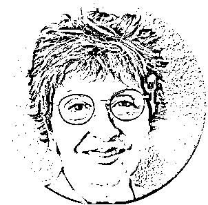

个人简介：《商业占星 101》的作者，《穿越时间:会合周期及其发展阶段和其他选集》的作者。开普勒学院的本科阶段的教员，同时她是一位很受欢迎的国际讲师，也是亚历山大伊伯斯项目(Alexandria iBase Project)的主席。这是一个 501C3 教育基金会，旨在为未来占星师编录保存占星学文献。斯塔西斯女士拥有理学学士和工商管理硕士学位。她从 1977 年开始就在加利福尼亚和佛罗里达两地工作。

演讲内容：当我们突然陷入一个价值基础和我们过去 200 年所了解的经济完全不同的经济环境时，会发生什么？当如何工作、在哪工作、做什么工作有 70%都会发生变化，未来会发生什么？经济的骨架结构还在（土星），但其他一切都在消融。

木星提供了一个尚未显现的未来愿景，而现实则需要边活下来边适应。每天铺天盖地的新闻没有提供解决方案。然而，有一个思想桥梁，邀请我们去跨越。当我们进入这个既兴奋又未知的未来时，乔治亚· 斯塔西斯提出了一些崭新思路。  

★**演讲 8：弄清楚要爬哪座山**

演讲人：斯蒂芬·弗里斯特（Steven Forrest）

个人网站：forrestastrology.com

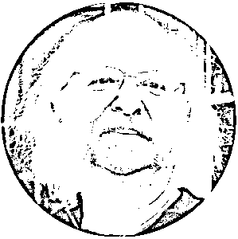

个人简介：斯蒂芬·弗里斯特是几本占星畅销书的作者，包括《内在的天空》。他的作品被广泛翻译，他还周游世界传授他的**选择中心进化占星学**——一种融合自由意志、基于人本主义心理学和古代形而上学的占星学。自 1998 年开始，超过 1500 人通过了他的占星学徒计划。他获得了**2018 年度轩辕十四教育奖**。小编 tip：在占星界，斯蒂芬·弗里斯特是备受敬仰的存在，听过他的课程或者工作坊的同学，都会被他的智慧光芒以及富有哲理内涵的话语和故事所深深打动，不可否认，他似乎带有一种魔法般的魅力，错过任何其他老师也不能错过他。他会以进化占星学的视角，让你碰触灵魂深入认识自己，由此你才有机会成为最好版本的自己。 如果你错过了斯蒂芬过去的课程，没关系，你还拥有未来，最近斯蒂芬老师将在若道独家开设两门线上课，没错，是独家线上课，也许从某些角度，应该感谢这次疫情，可以让更多人有机会聆听这位大师。（具体课程信息请点击链接：[爱的炼金术、](http://mp.weixin.qq.com/s?__biz=MzA5NjA0NTAxNg==&mid=2651427023&idx=3&sn=180809f85515fb8f74b1de34a91f7937&chksm=8b4b2278bc3cab6ea7e4dfe09129a05dacca496b0bb8f2bd37be66164e387172bebb59baee08&scene=21#wechat_redirect)[星图解读的秘密技巧](http://mp.weixin.qq.com/s?__biz=MzA5NjA0NTAxNg==&mid=2651427023&idx=4&sn=6aca39a91de854b3bf761df1feaa124b&chksm=8b4b2278bc3cab6e07a0281b01ae30130ea9add97768b40bd187200e3b17e24e8aa2e64f3154&scene=21#wechat_redirect)）演讲内容：具有划时代意义的木星—土星合相虽然发生在水瓶座，但两个巨大的行星已经在摩羯座共舞了一年，而且他们并不孤单：冥王星一直是他们看不见的伴侣，冥王星的存在改变了一切。什么样的无意识在集体意识中浮出水面？我们怎么才能有机会创造一个全新的水瓶座未来？
未来取决于我们能辨别出哪些摩羯座传统值得保留，而哪些传统只会将我们锁定在一个功能失调的过去。我们可以攀登上任何一座山，但哪一座才是我们应该攀登的呢？  **9 月 20 日，星期日**

★**2020 年美国大选：一个占星学的视角**

小组讨论主持人：雷蒙德·梅里曼（RayMerriman）——ISAR 大会主任

个人网站：https://mmacycles.com

个人简介：金融占星师，著有一些金融市场择时书籍，包括五卷系列，股票市场择时的终极著作(1997-2011)。他还著有《进化占星学:通过占星的灵魂之旅》和《太阳返照预测之书》。他因“提升占星学的专业形象”(1995)获得**轩辕十四大奖**，并在 2012 年荣获**“轩辕十四终身成就奖”**。在 1994 年-2000 年、2002 年-2008 年以及 2015-2017 年期间，他担任 ISAR 主席。

小编 tip：若道一直秉承“把西方最好的占星师带到中国”这一传统，而梅里曼是这个传统最好的范例之一，参与过若道梅里曼老师金融占星课的同学大概对此深有同感，如果你还没有参与过，但对各类股票市场感兴趣的同学依然可以参与每年元旦若道梅里曼开年的年度沙龙，帮助你了解新一年的天象能量，以及可能的经济政治局势、股票、黄金、白银、比特币等市场的局势走向，来进行新一年的财富规划。详情请点击：[雷蒙德·梅里曼 2021 年金融年报及沙龙](http://mp.weixin.qq.com/s?__biz=MzA5NjA0NTAxNg==&mid=2651425978&idx=1&sn=067bd68ece37e1e820d6f84f7a3cc960&chksm=8b4b3e0dbc3cb71b866f65d51f7993d3c35dee77cebd77eda3f63a4d5864dadaea2e9d14c101&scene=21#wechat_redirect)

演讲人：琳恩·贝尔（Lynn Bell）

个人网站：lynnbellastrology.com个人简介：琳恩·贝尔是一位在巴黎工作的占星咨询师、作家、老师，她用心理学以及原型的方法应用在研究占星学角度的人生。林恩经常做一些国际讲座，并长期担任**伦敦认证占星师的导师**。她现在在线上为 MISPA 和占星大学教授课程。2016 年，琳恩因对占星学的杰出贡献获得了**查尔斯·哈维奖**。她的主要著作有《行星线路》、《光的周期》等等。小编 tip：作为若道的忠实课程粉的同学，一定对这位富有灵性和洞见的老师不陌生，她善于用生动，富有戏剧性的案例为同学们讲解占星的奥秘。这位在国际占星圈久负盛名的占星师，以她多年的咨询经验和观察研究，每每在演讲和课程中给听众带来深刻的启示。她也是一位不容错过不可多得的老师。她在若道开设的课程有《家族占星》、《太阳返照》（详情请点击：[太阳返照全解读](http://mp.weixin.qq.com/s?__biz=MzA5NjA0NTAxNg==&mid=2651425001&idx=3&sn=a44ddecd3a4cb2eed4f7ccdc8cdfdb7a&chksm=8b4b3a5ebc3cb34817d3eb27af749a8da38054ef961beb23e92086ef0dd36ed201fb785de715&scene=21#wechat_redirect)），以及一些精彩的主题工作坊。

演讲人：卡洛琳·凯西（Caroline Casey）

个人网站：CoyoteNetworkNews.com

**个人简介：**卡洛琳在无数场合展示了她的占星学、神话、政客、引导、变幻故事叙述的艺术——23 年有远见活动家的电台节目经验。她的特邀嘉宾是虔诚的创新性复兴的主要贡献者; 她著有《让神为你工作:心灵的占星语言》。1970 年，她在伦敦学习占星学，之后在波士顿跟随伊莎贝尔·希基(Isabel Hickey)学习，并获得了布朗大学(Brown University)学士学位，学习了所有对占星学有用的知识，尤其是圣杯传说。

演讲人：J·李·雷曼（J·Lee Lehman）个人网站：leelehman.com

**个人简介：**实际应用是李•雷曼恒久不变的特点之一。她著有十一本书。她定期在中西部占星学院和开普勒学院任教。她是传统占星学院的导师，同时一手设计卜卦占星学以及医疗占星学课程。李还是**1995 年度马克·埃德蒙·琼斯奖以及 2008 年度轩辕十四教育奖**的获得者。

演讲人：克里斯汀·斯金纳（Christeen Skinner）

个人网站：https://financialuniverse.co.uk个人简介：克里斯汀·斯金纳是伦敦市域有限公司的董事。克里斯汀与基金经理、企业家和投资者打交道。她著有几本关于金融占星书籍，并在占星研究学院任教。她是 NCGR 顾问委员会的主席，Urania Trust 的理事以及亚历山大伊伯斯项目(Alexandria iBase Project)主任。2019 年，占星协会授予她**查尔斯·哈维占星奖**。  我们将邀请 4 位世界著名占星师对 2020 年 11 月的美国大选进行探讨。这四位占星师将会展示他们用什么占星技法来对这一意义重大而疯狂的选举进行分析。每位演讲者将分析总统候选人及其副总统的星图、选举日星图、就职日星图，以及他们认为有助于加深对选举及其结果潜在后果了解的其他关键星图。

**抢票须知**

全价票：1080 元

ISAR 会员价：780 元

**非会员三人团报价：每人 880 元**

（团购请添加童老师微信，等改价后付款确认）

购票疑问也请添加童老师微信咨询

**门票一旦售出 概不退换**

如何成为 ISAR 会员？

**如果你也想成为 ISAR 会员，请复制链接在浏览器打开**

http://www.nodoor.com/isarcert.do?contentId=3588（仅支持网站支付）

**或直接长按下方二维码，微信购买会员：**

关注我们

*   微博：**@若道星文化 Nodoor**

*   微信：**公众号【若道】（nodoorbj）**

     **服务号 （nodoorcn）**

*   邮箱：**nodoor@vip.126.com**

****购买大会门票请点击“阅读原文”****

# 重大天象丨 32 年一遇的火星逆行白羊座，引爆下半年！

> 原文：[`mp.weixin.qq.com/s?__biz=MzA5NjA0NTAxNg==&mid=2651427285&idx=1&sn=dedb0bf8f9c81139d42cc217be3c242b&chksm=8b4b2362bc3caa74d27af37a1bd878eb3889b473f9a9b8b9e73d2d291e608919aa9f2baad12b&scene=126&sessionid=1692738111#rd`](http://mp.weixin.qq.com/s?__biz=MzA5NjA0NTAxNg==&mid=2651427285&idx=1&sn=dedb0bf8f9c81139d42cc217be3c242b&chksm=8b4b2362bc3caa74d27af37a1bd878eb3889b473f9a9b8b9e73d2d291e608919aa9f2baad12b&scene=126&sessionid=1692738111#rd)

****************☆ ****************************后台****************************回复“今日”，给你一句生命态度****************

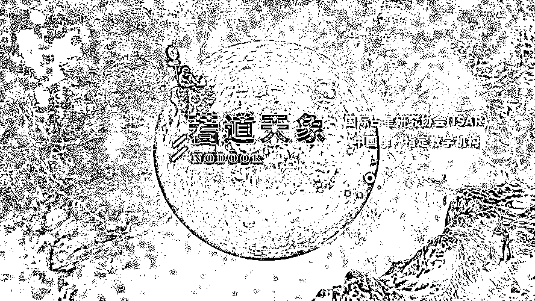

作者/帕姆·格雷戈里 翻译/Leisha 校对/江艺编辑/翀子 封面/书君 图片/网络

火星在 2020 年下半年，都行进在自己守护的白羊座，并且会少见的在白羊座逆行。出生星图中白羊座所在的位置将是我们下半年的重点关注和投入的领域，挑战与启示并存。

火星行进在自己守护的白羊座，会表现得极为活跃，并将**主导 2020 年的下半年**，尤其是**9 月 9 日至 11 月 13 日的逆行阶段（白羊座 28°08ʹ–15°14）。**

火星大约每两年逆行一次，但鲜少在白羊座逆行。**火星上一次在白羊座逆行是 1988 年，下一次要等到 2067 年。**今年的火星将**比 1988 年更强**，它在 1988 年的行进中没有与任何外行星形成困难相位。2020 年，火星将来回四分摩羯座的木星、土星和冥王星。好像这都不够激烈似的，火星还将在 2020 年下半年合相阋神星——“不和女神”（精准成相于 8 月、10 月、12 月）。

你可能还记得，2020 年 1 月的摩羯座星群包含了太阳、水星、木星、土星、冥王星、月亮南交点，以及小行星谷神星——代表大地母亲及丰收的女神。3 月，火星不仅加入并重新激活了这些行星在 1 月时的位置，还与这些位置形成了合相。

两颗行星的合相永远是播种的位置，是特定行星组合新周期的开始。**在今年的情况中，有五个新的行星周期几乎同时开始。**因此，当火星在 8 月至年底期间四分木星、土星和冥王星时（包括火星逆行期），**个人和集体层面在 3 月发生过的所有事件都将进一步考验这些新周期。**

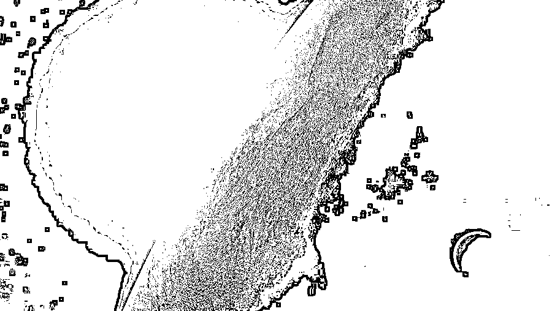

**火星在白羊座**

火星在 2020 年 6 月 27 日进入白羊座。火星行进通常在一个星座停留约 6 周，但由于逆行，**火星今年将在白羊座停留 6 个月，**最终将于 2021 年 1 月 6 日进入金牛座。火星在白羊座代表**强有力的战士能量**，偏好**单打独斗、独立自主**，通常以**简单直接**的方式表现出对肢体活动的热衷——“那有一座山，我要爬上去。”不用找别人确认，也不会自我怀疑，火星简单地寻找**最快速、最有效**的方法来实现目标。

由于白羊座是黄道上的第一个星座，因此这个时期**非常适合启动那些需要坚决果断、清晰明确的新项目。**你可以为自己人生的某个领域计划一个新开始吗？

当白羊座火星想要什么东西时，它不喜欢等待。出生星图中火星在白羊座的人往往会感觉其他人的动作都太慢了。这个组合很勇敢、充满激情、精力旺盛、自信独断，甚至具有好斗的潜力。如果火星在白羊座的**逆行行进穿过你出生星图的第五宫或第八宫**，那么你可能会感到强烈的性欲；如果这个行进穿过你出生星图的**第六宫或第十宫**，那么你可能会变得更雄心勃勃。

**火星在白羊座行进的整整六个月期间，出生星图中白羊座所在的位置将可能成为你重点关注和投入的领域。**

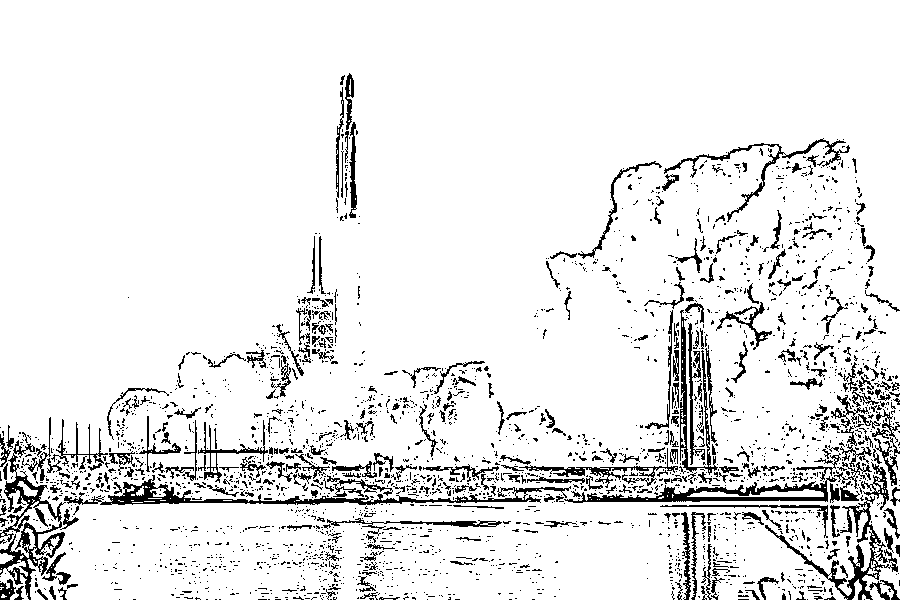

**火星逆行****火星 9 月 9 日至 11 月 13 日逆行，但加上阴影期的完整逆行阶段是 7 月 25 日至 2021 年 1 月 2 日。**（作者注：行星逆行的第一个阴影阶段始于行星经过其顺行停滞的度数时。第二个阴影阶段结束于行星再次经过其最初逆行停滞的度数时。）7 月 27 日，火星几乎与水星形成精准的四分相，因此**阴影期可能从“说气话”开始。**

很难不注意到，今年的火星逆行期恰好与 11 月 3 日的美国总统大选重合。火星逆行可能会“**无所不用其极”**，因此可能预示着一场**斗争尤为激烈**的竞选运动，愤怒和分裂会持续到大选结束之后。

火星逆行时，我们可能会感觉特别**容易受刺激，容易被点燃**，因此我们都需要注意这一点。

火星从白羊座 28°08ʹ开始逆行，11 月 13 日回到白羊座 15°14ʹ后停滞顺行。**任何行星的停滞都会放大其象征意义**，因此，在 9 月 9 日（逆行停滞）和 11 月 13 日（顺行停滞）前后，我们可能会在私人生活中体验到**强大的独断能量**，或在世界舞台上看到这种能量的体现。另一个重要的强有力的日期是**逆行的中点 10 月 13 日，**火星（白羊座 21°04ʹ）将精准对分太阳（天秤座 21°04ʹ），这可能是激烈和情绪张力十足的一天。

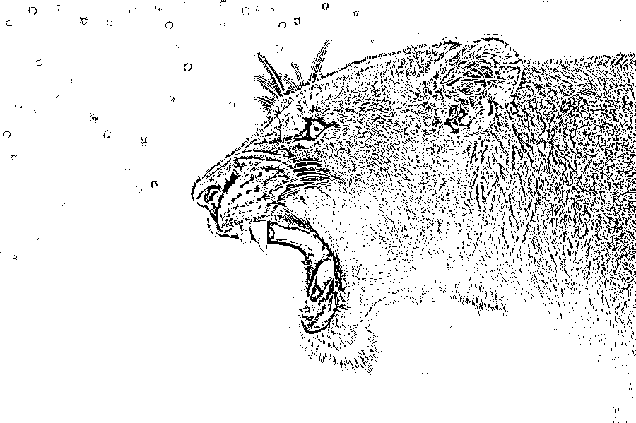

**火星现在处于距离地球最近的位置**，使其在天空中清晰可见。由于白羊座火星离地球如此近，我们的**个人观点可能会更主观**，因此难以从他人的视角看问题。我们还可能会意识到自己太自以为是，并以一种毫不妥协的方式作出回应。

**整个逆行期间，火星将强烈影响白羊座的后半部分**（15°–30°），因此出生星图中有行星落在基本星座（白羊座、巨蟹座、天秤座、摩羯座）这个度数区间的人将感受到这个行进的激烈。还要关注白羊座的最后 15°落在你星图的哪个宫位，你人生的这个领域将在此时被高度激活。

**火星在某种情况下可能会激发情感和生理的热度**，在逆行期间可能更为强烈。行星逆行时距离地球更近，因此在逆行的时期，人们会更强烈地感受到行星的象征意义。

例如，2018 年完整的火星逆行影响时期（包括阴影期）是 5 月 12 日至 10 月 8 日，逆行本身的准确时间是 6 月 26 日至 8 月 27 日。当年是北半球有纪录以来最热的一年之一，造成了很多与高温相关的死亡。英国夏季的雨水很少，逆行期间的气温更是每天都能破纪录。

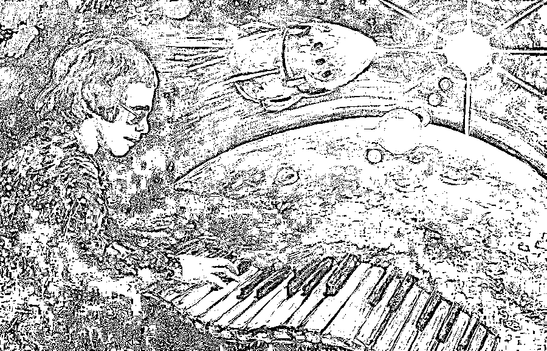

**2020 年下半年，火星来回四分木星、土星和冥王星。**8 月，火星将精准四分这三颗行星（作者注：我通常使用 3°的容许度）；9 月 29 日，火星**与土星**在白羊座-摩羯座 25°20'形成精准的四分相，而土星在几小时前刚停滞转顺行；10 月 9 日，火星**与冥王星**在白羊座-摩羯座 22°29'形成精准的四分相（非常接近 10 月 13 日火星对分太阳的度数）；最后，10 月 18 日，火星**与木星**在白羊座-摩羯座 19°26'形成精准的四分相。

**这些强大的行进都与权力的使用和滥用所造成的冲突相关，**这也是土星-冥王星在摩羯座合相的重大主题之一，如今将受到四分火星的挑战。在此期间，人们可能会更自信强势地应对滥权的情况。整个逆行期可能会**充满强权、分裂和愤怒**。

随着逆行期到达顶峰，木星在**11 月 12 日**精准合相冥王星，权力的使用可能会成为更严重的问题。这意味着对“过度权力”的使用，而且火星合相阋神星，四分木星和冥王星，将确保此时对过度权力的挑战会达到顶峰。木星合相冥王星也代表“大钱”及其在社会中的影响力，因此我们**可能也会看到不平等的问题到达紧要关头。**

**火星四分土星时**（2020 年 9 月 29 日），可能感觉像开车时一只脚踩油门，一只脚踩刹车。如果我们能整合这两颗行星，它们就可以成为自律能量的来源，帮助我们为长远目标奠定基础，但由于土星的规章制度以及实施这些规章制度的权威人物，火星前进的冲动可能会很容易感觉受阻和挫败。

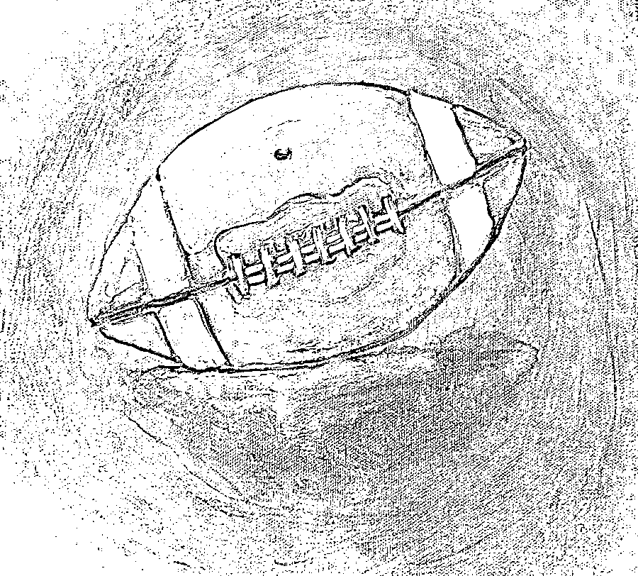

**火星逆行的启示**

火星总是更喜欢速度，而土星要求谨慎。其实，火星整个逆行期的能量与这个四分相的能量类似，因为它们都**要求我们调节缓和自己的本能冲动，节制行事。**逆行期的能量更为复杂，可能感觉更加激烈。

2020 年下半年期间，许多人会感觉精力充沛，因为火星代表我们的精力水平。然而**在逆行期间**，一些人可能会感觉体能下降，干事的热情也会降低。与火星-土星的相位或行进类似，**火星逆行最好的情况可能是带来极强的专注力和耐力，**但对某些人而言，火星逆行可能会引发**有关个人渴望和目标的更深层次问题。**这甚至可能会涉及一段关系，具体取决于火星行进在你星图中的哪个宫位。

这是一个**修改或重做项目的绝佳时期**，因为在此期间人们往往会更内省。在如何运用自己的雄心、干劲、坚持和性欲层面，我们可能会获悉有益的洞见。我们是行事太冲动，还是回应太主观？我们是否清晰地了解某个局势中的根本议题？

任何行星的逆行期都是让我们整合该行星所代表的象征意义的时机。我认为火星代表我们的个人力量，而摩羯座代表体制和政府力量，我们有时需要为自己的信念而战。

但是，我们与其表现出低落的情感，如愤怒和沮丧，倒不如意识到，**我们真正要做的是内心工作，而不是外在工作，**火星逆行会确保我们以更高昂的情感去寻找**自我感、中心感和力量感**。

**版权声明：**本文由若道翻译发布，欢迎转发，反对抄袭。友号转载请申请白名单。

**也许你还想看下面的文章**

[火星逆行在白羊座，一鼓作气，收复失地！](http://mp.weixin.qq.com/s?__biz=MzA5NjA0NTAxNg==&mid=2651425478&idx=1&sn=f8d621f1f732c5121d493af0ce2c461d&chksm=8b4b3871bc3cb16702425d04f1ad03668d127a5d46560b7a2a61b549ea4d50f8aad19a1b58a4&scene=21#wechat_redirect)

****帕姆·格雷戈里****作者，著有《你不是真的相信占星学，对吧？》以及畅销书《如何共同创造使用宇宙的秘密语言》。她持有占星研究学院的文凭，并且是诺·泰尔大师课程的荣誉毕业生。帕姆运营的 YouTube 频道非常成功，并在英格兰新森林市开展忙碌的占星学实践。

**系统学习占星学**

**点击图片了解详情**

**微信又双叒叕改版啦，不想错过若道君的推送？**

**就把若道设为星标吧！**

**▼**

就是这个“在看”，戳戳戳 ☟

********报名直达入口********

# 蚊虫叮咬、过敏、扭伤、痛经、宠物疾病……使用顺势药物全搞定！

> 原文：[`mp.weixin.qq.com/s?__biz=MzA5NjA0NTAxNg==&mid=2651427285&idx=2&sn=47dd53a18929f2759a683e1b8ad1299a&chksm=8b4b2362bc3caa745786c16004a2f63449258d92908f18d68fb3af37a6e58c7cad82e9c8c136&scene=126&sessionid=1692738111#rd`](http://mp.weixin.qq.com/s?__biz=MzA5NjA0NTAxNg==&mid=2651427285&idx=2&sn=47dd53a18929f2759a683e1b8ad1299a&chksm=8b4b2362bc3caa745786c16004a2f63449258d92908f18d68fb3af37a6e58c7cad82e9c8c136&scene=126&sessionid=1692738111#rd)

作者/苏·汤普金斯

 编辑/玫瑰 图片/网络

顺势疗法具有天然、安全有效、无副作用、整体医疗等特点，那有没有什么案例呢？特别是急救小药箱的案例。答案是：当然有啦，以下是一些案例。**蚊虫叮咬**这是卢女士的邮件：“一定要写这封邮件告诉您，用了 Apis 以后，我的脸已经完全消肿了。实在是太感谢了！”几天前，不知被什么昆虫叮咬导致卢女士整个脸都肿了起来，大概是由于她是过敏体质，以至于脸肿得非常严重。她找到我，咨询如何通过顺势药剂急救她目前的状况。刚好她自己有家庭顺势急救药箱，所以我告诉她使用急救药箱中的 Apis 这剂。在使用 Apis 后，卢女士的脸迅速开始消肿，我建议她如果她想快速完全消肿治愈，可以连续几天里每天都服用 1-2 次 Apis，这样脸部很快就会完全好了。**严重扭伤和长期关节炎**吉尔原本是一个 60 岁但依旧健康的护士，她很喜欢占星学。她参加了我的一个课程，但是她当时的状况很糟，之前，她不小心摔倒并且伤及了右脚踝，而受伤的右脚踝由于无法承受重量，进而导致她的左脚踝也承力过重而开始疼痛。这还不是最糟的，除了双脚脚踝的问题，她的两个膝盖也开始出现关节炎的症状。当天我甚至都不敢相信她的状态竟然这样糟，她几乎是一瘸一拐地到课堂来的。我立即决定先帮助她缓解痛苦，我马上给了她“家庭急救药箱”中的 Amrica，然后在接下来一周的每天给她服用 Bryonia。一周后，她的疼痛已经缓解了一大半，并且可以很自然的走路。吉尔回家后依然每天服用 Bryonia，脚踝和关节炎在持续的转好。吉尔甚至还去参加了著名的“格拉斯顿伯里音乐节”。在信中，吉尔提到：“在顺势药剂的帮助下，脚踝和关节炎正在迅速恢复中。目前，受伤的右脚踝还是有些肿，但是已经可以完全正常走路了，并且可以完全承力，这在使用‘家庭急救药箱’中顺势药剂以前是完全做不到的。左脚目前也仅仅是有些肿，但是完全不疼了。至于膝盖，仅仅是在上楼的时候有一点疼，下楼的时候，即便是在我提了很多东西的情况下也完全没有问题。”最近一次与吉尔的交流中，我进一步得知，她在整个使用急救箱中顺势药剂的过程中完全没有使用其他药物和治疗，目前她的严重扭伤和关节炎已经治愈 90%了。**痛经**有一次，我和几个朋友聚会，其中一位年轻女士当时正值生理期，并且正在遭受痛经的痛苦。通常她会习惯吃止疼药，但是当天她没随身带着止疼药，药店也已经关门了。当时我们几个人在咖啡厅，我没有办法给她做深入的、长时间个人咨询去找到正确的顺势药剂。但是，她说“她特别想抱一个热水袋放在肚子上”这一信息提醒了我，我可以用急救药箱中的 Mag Phos 试一下。刚好我出门随身带着急救药箱，所以我找到 Mag Phos，并跟咖啡厅服务生要了一杯热水溶解给她服用，大约在服用药剂 30 分钟左右的时候，这位女士说她感觉肚子非常舒服了，并且也没那么疼了。她觉得顺势疗法太神奇有效了，所以决定要预约顺势医师帮助她彻底解决痛经的问题。**过敏**顺势疗法改变了我的人生！我通过顺势药剂 Allium cepa 30c 治愈了困扰我 12 年的过敏症状！在尝试顺势疗法以前，我尝试了非常多的办法。我打了 6 年的过敏针，尝试过专柜药物，做过健康饮食调理，也积极锻炼身体，但是以上任何一种都没有解决我的过敏问题。我非常感恩我能够认识并为自己和家人选择顺势疗法。玛丽亚·林格美国犹他州 2011 年 1 月 20 日摘自 www.extraordinarymedicine.org**宠物耳朵产生过多分泌物**我特别想要分享一件几年前使用家庭顺势急救药箱治愈宠物狗的事。我曾经养过一只很漂亮的贵宾犬，它饱受耳垢分泌过多带来的痛苦。许多年来，我只能不断地带它看兽医，经常给它的耳朵清洗和滴药，但一直没有解决问题。最后，兽医建议，唯一的解决办法就是给它的耳道做调整手术。在那次看完兽医回家的路上，我刚好经过一家保健商店，里面有很多保健书。一本叫做《适合宠物的顺势疗法》的书吸引了我的注意，我决定买下它。回家后我认真阅读，关于宠物耳朵过多分泌物的问题，书上建议使用“家庭急救顺势药箱”中的 Hepar Sulph 药剂。我抱着试一试的心态购买了“家庭急救药箱”并开始治疗我的贵宾犬。仅仅经过一周的治疗，它的耳内环境变得干净正常，不再有过多分泌物。一直到 14 岁去世那天，它的耳朵都保持了干净正常。我将这个方法也分享给了一位朋友，她家的可卡犬也有同样的问题。如预期的那样， 她家的可卡犬也得到了完全的治愈！事实证明，顺势疗法非常有用，我希望我的经历可以帮助大家更多的认识和了解顺势疗法，哪怕仅仅是一点点。莎莉·奥林 美国犹他州 2012 年 11 月 26 日摘自 www.extraordinarymedicine.org

****请在后台回复 顺势 获得更多****关于顺势疗法内容********

**版权声明：**本文由若道翻译发布，欢迎转发，反对抄袭。友号转载请申请白名单。

**学习顺势疗法**

**请点击下图了解详情**

**微信又双叒叕改版啦，不想错过若道君的推送？**

**就把若道设为星标吧！**

**▼**

就是这个“在看”，戳戳戳 ☟

********报名直达入口********

# 教师节快乐！快来送上你对老师的祝福吧！

> 原文：[`mp.weixin.qq.com/s?__biz=MzA5NjA0NTAxNg==&mid=2651427285&idx=3&sn=f71aec52544aeb321711b6cb0becd511&chksm=8b4b2362bc3caa74d99c47f0b6ae109e6661c130ac834f8da39b94629a84f9a5fd763e5079c1&scene=126&sessionid=1692738111#rd`](http://mp.weixin.qq.com/s?__biz=MzA5NjA0NTAxNg==&mid=2651427285&idx=3&sn=f71aec52544aeb321711b6cb0becd511&chksm=8b4b2362bc3caa74d99c47f0b6ae109e6661c130ac834f8da39b94629a84f9a5fd763e5079c1&scene=126&sessionid=1692738111#rd)

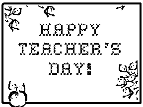

**教师节快乐！**

**来看看若道老学员们对历任老师的祝福吧~**

**表白老师篇**

**大卫·瑞雷**

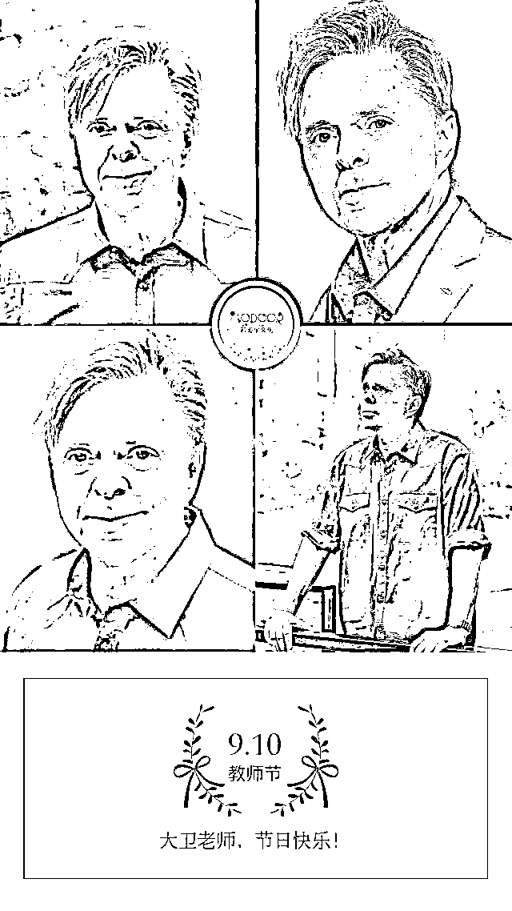

（向上滑动查看内容）

**致大卫老师：**

大卫老师，你的冒险精神让我感到振奋。我想，你严谨做事、大胆探索的生活态度是我人生学习的榜样。我很希望像你一样精力充沛、热爱生活，以及拥有对世界真诚的探索精神。感恩生命中能够遇见你。

——姝婷

海王星型的大卫老师，教师节快乐！谢谢你在中国传播占星学！

——陈小荣

**蒋颖**

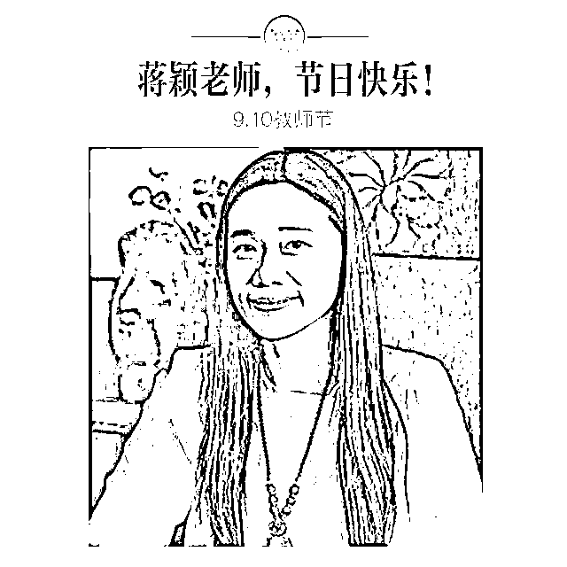

（向上滑动查看内容）

**致蒋颖老师：**

蒋颖老师用这个做案例，真是让我们收获更很多，感受更清晰，谢谢她，辛苦了！

——秦莉卿

听蒋颖老师的课很流畅过瘾，反复听仍然很吸引人，很有收获！

——didi

蒋颖老师谈到的阴影工作太有启发了，我为蒋颖老师分享的个人案例潸然泪下。忽然一下子就被戳到了。整理完笔记我也练习着做了一点阴影工作，对自己有意想不到的发现。感恩若道平台和老师们的分享!

——佚名

**斯蒂芬·福里斯特** 

（向上滑动查看内容）

**致斯蒂芬老师：**

他关于我星图的解读，让几乎所有在场的人掉泪，我也从此开启了一段灵魂追寻的旅程。我很惊讶他透过星图可以如此深入一个人的灵魂。很多东西你自己都不知道，但是他讲出来你会发现，啊，这是真的，这是占星学的神奇。

——孟想

每个来参加老师课程的同学，都会被老师深深的慈悲心感动。这种慈悲心，并不是表面上说的一些什么话，而是一种从意识层次上发出的能量。每个来上课的人，都能感受到老师的爱。这种爱，并不是盲目的爱，而是深刻地洞悉真相后的慈悲。

——逸月

上斯蒂芬的课，你只需要睁大眼睛目不转睛的看着他。一言一语都不要错过。在这个过程之中，已经被洗礼了灵魂。上他的占星课，学习到的不止于占星技术，而是生命包括身体细胞意识形态在内的华丽转身。作为职业的占星师，这位导师的职业态度和职业素质，是我的楷模。期待再次的拥抱。

——裴恩

**格伦·佩里**

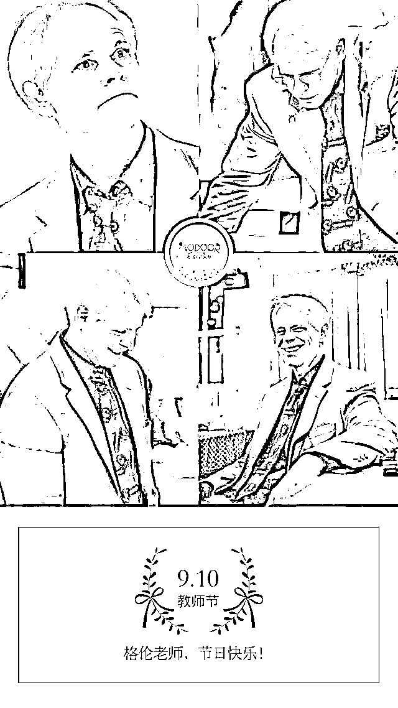

（向上滑动查看内容）

**致格伦老师：**

祝愿我们系统、专业、逻辑性强的格伦老师；热情、解答精准的薇安姐姐大美女助教；主动性及服务意识超强的课程顾问节日快乐！在接下来一年有余的我们的学习中，继续亦师亦友的一起成长，么么哒！

 ——雪冥

格伦老师的占星心理学体系严谨，他本人的学识渊博，功力深厚在补充资料的字里行间随处可见。

 ——呙小华

因为格伦老师遇见占星学，走进心理学。发现心理学好美，第一次见到老师是照片，印象深的是老师温暖的笑容。学习之后，吸引我的是老师对占星学深深的爱。遇见格伦老师的占星课，生活充满了乐趣。

 ——蔡爽

Happy Teacher's Day!

Thank you so much for leading me into the spectacular world of the Astrology!

Love your voice and wisdom! As a wanderer outside the threshold for such a long time, I know well how lucky I am to meet you!

 ——Zuleika

亲爱的格伦老师，能在若道认识您真的很荣幸。时间好快，一转眼 101 和 102 就已经结课了。跟着您的教学，我感觉自己正慢慢走向心中的自己，原来那个模糊的轮廓也慢慢变清晰了，特别开心。

除此之外，跟您的学习中还感悟到了很多人生哲学，感觉自己更有智慧了，这真的是意想不到的惊喜。感谢您这段时间的教诲，感激您真诚的付出。很期待跟您继续学习，期待 103 课程又能看到您和蔼的笑容。

 ——米苏

**苏·汤普金斯**

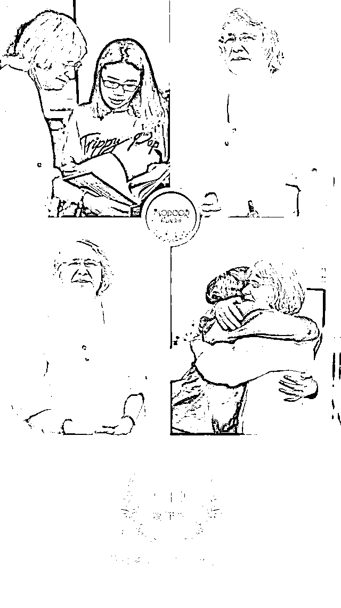

（向上滑动查看内容）

**致苏汤老师：**

苏老师给人的感觉很平易近人，上课有时候会用很夸张幽默风趣的神态和动作来表达，非常有趣。祝亲爱的苏老师节日快乐！

 ——晨曦

您无与伦比的人格魅力总是带给我们惊喜，只想乖乖做你的迷妹。豁达、开明的教学理念深深吸引着我，不管别人怎么想，您就是我心中成功女性的代表。祝老师心想事成，一切顺利！

——神佑

It's a great honor to follow you to study Astrology!

I learned a lot from it.

Thank you for your teaching,can't wait to see you in Level 4.

 —— 森森

祝苏老师健康，能多来中国，吃好喝好。

 ——莱莱

首先我是苏老师的小迷妹，得知苏老师在若道开课，当即就去报了名。苏老师给我印象最深的是：她逻辑严谨、认真负责。过三阶大坎时总是对我们说不要担心，鼓励我们积极面对困难，后面都会豁然开朗的。

苏老师用她自己的星图做示范，让我们解读她的 T 三角，让我们看到了一个努力追求真理与真相，睿智可爱又励志的老师。关键是苏老师很诚实，懂就是懂，不懂就说不懂，这种品质值得称赞。

她提供给我们一个清晰的思路去抓住解读星图的重点，相应实例也比较丰富。接下来需要我们复习三阶的内容，夯实基础知识，大量练习造句，已经等不及四阶课的到来了一定会很精彩。祝苏老师教师节节日快乐，三阶辛苦了，我们四阶再见。

 —— 飞飞 Vioce

Dear 苏：

做梦也没有想到有朝一日能亲身跟随您进行学习，您的那本《当代占星研究》是我从占星小白到入门时期从头到尾看得最认真也是最仔细的一本书。

当然，我相信不只是我，而是全中国所有热爱占星学，且想要进入严肃认真的占星领域的首选书籍，也是必备的书籍。

去年，当我看到您将要在若道开设了 1~5 阶核心系统课程时，内心的激动无以言表。当时就毫不犹豫的直接报名了全阶课程学习。能够在学习占星学初期就能跟您进行系统学习的我是多么的幸运。

中国的教师节马上就要到了，我希望在此佳节，可以借由若道平台表示我对您十分（满分）的喜爱，祝您教师节快乐！希望您能感受到我这个群星狮子座的热情和对您的喜爱！

 ——罗马仁

教师节要来了，苏老师和两位助教老师都辛苦了！我祝苏老师平安健康，快乐幸福！祝空妈越来越帅！咔咔怎么吃都不胖！大家教师节快乐！

——王福泉

**熊鹰**

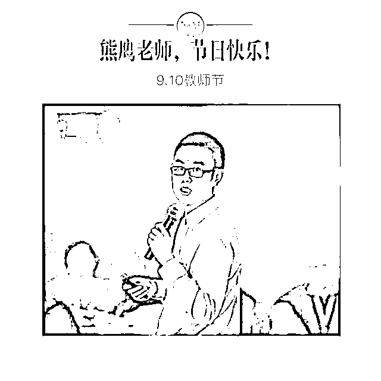

（向上滑动查看内容）

**致熊鹰老师：**

天空师兄系统详细的讲解，为我们打开了占星的大门，让我们看到了占星这庞大精深的世界。虽然现在还是初阶的学习，但是已经开始慢慢感知自己的思维和行为模型，开始了解自己，接纳自己，也更容易理解别人。非常感谢天空师兄，特别喜欢看天空师兄咧嘴大笑。

—— 周不语

昨晚第一次听熊鹰大师兄的课，觉得他不经意间好幽默，蛮喜欢他上课的风格，细心、耐心，而且谦虚认真又有深度。支持他，预祝大师兄教师节快乐，期待之后的课程。

—— 孔雀翎

祝熊鹰老师节日快乐，全家幸福。我们会努力学好占星学，不辜负他的谆谆教诲，他可是我们占星路上的启蒙老师。希望可以学到更多的东西，更好地认识自己。如果有能力，也希望像熊鹰老师一样，能够帮助别人，去解决一些问题。最后再次祝老师节日快乐，隔空送朵小红花。

—— Fiona

天空师兄，若道号宇宙飞船期待你的引领和导航，希望你带我们飞向浩瀚的天空，一起探索和成长！教师节快乐，老师！

—— 星空下的梦旅人

如果说占星学是一根指向真相的手指，那么天空老师就是一道于黑暗中爱的光亮，指引我们在占星学习的路上看得更清走得更稳。祝我们宇宙无敌超级帅无所不知无所不能的天空老师教师节快乐！

—— 雨梵

大师兄，福如东海，寿比南山！

—— 川楽

因为大师兄，我爱上了所有的处女座！

—— 小熊乖乖

天空小哥哥，为啥你就比我没大几岁，却睿智不止很多呢？喜欢听你的助教沙龙，处女座万岁！

——Nancy

第一次上天空助教的课，是星历表的答疑，看着那密密麻麻的数字，我这个双子座与处女座能量均缺失的人有着深深的恐惧。没想到天空助教用双子座的轻松幽默与处女座的专业，云淡风轻地解读完了。顿时非常的佩服。

每一次群答疑与助教课程，天空助教都精心准备，专业的知识用轻松活泼的话语传达给我们，最让我感动的是，看到天空助教在我的行进分享上细致的批注和鼓励的话语还有行进群分享时的指导，不但让我的专业知识有了提高，而且我往内在挖掘了更多，感觉得到了看见，得到了滋养，所以深深的感恩。

——秋霞

天空，感觉你的讲课风格很有个人特点，“轻快”与“内涵”的结合。在你的身上看到了很多双子座与处女座的能量。双子座兴趣多对知识的广度，与处女座严谨务实，都能够在你身上看到。并且感觉你是个很可靠的人。教师节快乐哦！

——姝婷

深受大家爱戴的“空妈”，知识渊博、教学严谨、风趣幽默，希望“空妈”能发挥“春蚕到死丝方尽”的精神，带领我们迈过四阶，冲出五阶，走向辉煌，走向胜利。

——晨曦

我的印象深深留在了您描述自己在游戏中周旋在男人之间，服气厉害了空妈。感谢您带给我们轻松愉快的学习氛围以及时不时的提点。祝空妈：人间至美，妖娆灵动无可匹敌！双击 666！

——神佑

祝天空的闺女和爸爸亲密无间，让他无忧。吃好喝好。

——莱莱

谢谢空妈的谆谆教诲~

以后要抱紧空妈的大腿~

（哈哈哈，还有点押韵~）

祝空妈节日嗨皮~

——森森

去年认识空妈的时候还没有当老师，给空妈的快速成长一个大大的赞。月亮双鱼座的空妈，在网游游戏中有一个妖艳贱货的网名，还曾经时常被别人当成女性，得到不少装备呢，哈哈哈。这就是空妈无节操又风趣的风格被我们深深喜欢。

他说网络世界，处在内心相对有安全感的地方是比较能体现月亮星座的那一面，这个观点让我十分认同。通过他总结的一些知识经过他讲解后让我一下能豁然开朗。

印象比较深刻的是空妈带我们微信群互动练习造句、相位解读过程中提出引发我们思考的论点，提升我思考的能力，升华了知识点，真的让我学到了很多。祝空妈教师节节日快乐！教学越来越棒，在以后的讲课中继续保持“无节操”的风格，如果有小学妹感兴趣占星，我一定会推荐你的课的。

——飞飞 Vioce

我最爱的空妈，我是你的头号迷妹，我要毫不吝啬的表达我对你的喜爱。从进入若道学习，到你第一次开口讲课的瞬间，我就被你迷倒了，在心中惊呼“哇。天底下为何能有如此迷人且有魅力的讲师！”

从小脾气又臭又硬的我，从来都是跟老师对这着干的，也根本没有佩服的和服气的老师，可是遇到你就不同了。看着你帅气的面庞，迷人的眼眸；听着你悦耳的声线，和讲课是优雅的逻辑，让我彻底沦陷在你的每一节课里。如果非要给这种体验加上一个期限，我希望是一万年！

最后，让我在 2017 年的教师节对你大声的呼喊一声“节日快乐 and I Love U so much！！！”（对，一定要把节日祝福写成粉丝疯狂表白书才甘心！我就是这样的迷妹！）

——罗马仁

**咔咔**

（向上滑动查看内容）

**致咔咔老师：**

亲爱的咔总：

非常感谢平日里您尽心尽力的为我们备课，

为我们细心批改作业，

在练习是耐心得带领和引导我们走向更深入的知识认知中，

从不吝啬自己丰厚的知识经验，倾囊相授。

而且您的声音听着特别温柔~

心水~~

在此，祝您 2017 年教师节快乐哦~~

——罗马仁

美丽温柔的咔总总是耐心认真地回答大家提出的问题，会结合她的学习方法给我们提出很好的建议和指导，希望在未来的四五阶学习中，咔总能继续带领我们，陪伴我们，一路前行！

——晨曦

您总能体察到我们的感受，感谢一直与我们的互动，能够感觉到努力做到完美的那份认真，所以真的很感谢。很能体察到我们内心所想，也总是在大家迷糊的时候一针见血，瞬间醒脑。祝老师：钞票多多，快乐多多~

——神佑

祝咔咔的卡乐让她快乐、省心。吃好喝好。

—— 莱莱

谢谢咔总每次的满满干货，很受启发

（会回去好好背关键词的）

祝咔总节日嗨皮~

（祝卡乐吃好喝好~）

——森森

**海星程**

（向上滑动查看内容）

**致海星程助教：**

海大师，教师节快乐！

——陈小荣

海大师，难忘你对太阳弧的讲解和进一步阐释。你的沙龙用三个字来概括：“高精尖”！好了，我继续去复习你的沙龙了……

——Nancy

每次上海星程助教的课，心中都是重复着几个念头：太专业了、太系统了。把所有的知识全部系统的归纳到了一起，海大师的几节课，我估计得用几年的时间来慢慢消化、掌握与应用。那次行进分享，我本来只写了行进，而海大师批注说：看看能否再写太阳弧与次限，我才又加上了。

我深深得感受到海大师月亮天蝎座的能量，深入极致的追求和对专业能力的不断挑战提升，这些都是我需要去学习的品质。同时深深的感恩。

——秋霞

海大师，每次对你的沙龙印象最深刻，那就是头脑风暴。并且你的课件、课程内容的设置、讲话逻辑清晰，对问题理解的一针见血。完全颠覆了我对“认真”的认识。我也希望有一天可以像你一样发光发亮。教师节快乐哦！

——姝婷

**表白助教篇**

**薇安**

（向上滑动查看内容）

**致薇安助教：**

助教薇安无私的利他之心在一次一次对我们耐心负责的辅导中被彰显。在掌握当前知识结构后她还希望扩展我们的视野，教导我们用客观全面的态度来面对占星学，并教导我们不迷信权威，要有自己独立思考的能力。自信包容开放的态度让人欣赏，感恩这一路学习中有你们这样的老灵相伴，倍感幸运！

——呙小华

充满温暖的声线，超强的逻辑分析能力和总结能力，用中文娓娓道来占星学，用中文架起占星学，告诉我们生命的奥秘，使学习不再孤独。

——蔡爽

感谢薇安！感谢你毫无保留地分享心得，让我们在占星的奇幻世界里不那么迷茫。

你的温柔总可以安抚我的焦虑不安。你的洞察力总可以照亮我思考的盲区。爱你哟~

——Zuleika

亲爱的薇安，好幸运在若道遇到你做助教！每一次答疑课，都能深入浅出，条理分明地将我头脑中的团团乱麻整理清晰。每次在论坛或群里答疑也是如此。

而且除了占星学的解惑，亲爱的你还分享了很多人生的哲学给大家，比如“病就是药”，真心感觉受益匪浅。平时表白的比较少，今天借教师节前夕向你表达我内心的感谢，并祝你永远快乐幸福，米苏爱你，么么哒～

——米苏

课堂内容没能理解的时候，课后思考遇到困难的时候，助教姐姐总能用最浅显易懂的语言，轻易的带我们走出困境，也时常用她自己的学习心得，指引着我们少走弯路。

有助教姐姐在，我感到十分安心，无论在未来的学习道路上遇见什么困难，都不会觉得害怕，都有勇气去克服。

我相信，在助教姐姐的陪伴下，我们都能够坚持到底，认真修完两年的课程，获得成长和领悟。感谢助教姐姐，您不仅是我们的导师和榜样，也是我们的灯塔，为我们指引着方向，赋予我们希望和勇气。助教姐姐，祝你教师节快乐！我们爱你！永远爱你！

——晓涛

**丁宏**

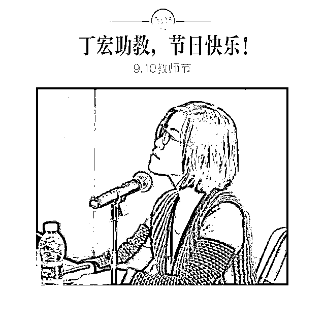

（向上滑动查看内容）

**致丁宏助教：**

助教 Hong 有种青春的学院风！

—dingding

占星英语专业水准高，吐字发音很舒服，冷静理智严谨，是偶像！

——ED

**Conrad**

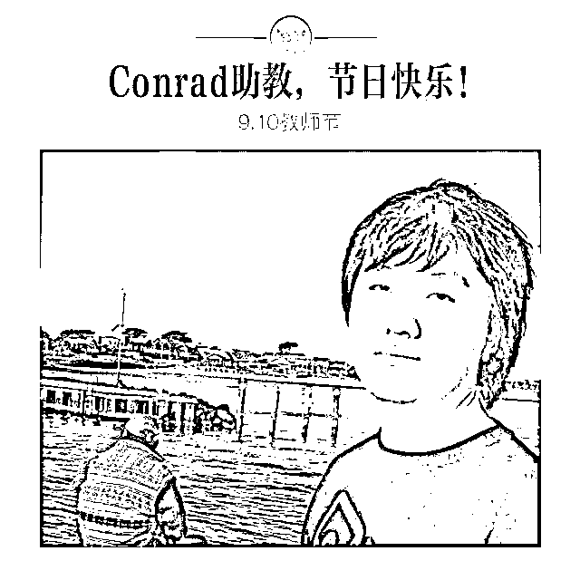

（向上滑动查看内容）

**致 Conrad 助教：**

喜欢 Conrad 的沙龙，把重点给我们总结了一下，很赞！

—蔡晨

Conrad 老师，教师节快乐！

——大水

**感谢占星旅途中 各位老师的辛劳付出**

**在评论区留下你对老师的祝福吧！**

# 12 种星座体验，全在太阳、月亮、上升落在这个星座的爱人心中

> 原文：[`mp.weixin.qq.com/s?__biz=MzA5NjA0NTAxNg==&mid=2651427171&idx=1&sn=cbe4dd659fa39fcbfcec208290e8e4d2&chksm=8b4b23d4bc3caac25248186f048d1518dafdbb6fbcb48c0c084024e6db9ade3bf263d05eaf74&scene=126&sessionid=1692738111#rd`](http://mp.weixin.qq.com/s?__biz=MzA5NjA0NTAxNg==&mid=2651427171&idx=1&sn=cbe4dd659fa39fcbfcec208290e8e4d2&chksm=8b4b23d4bc3caac25248186f048d1518dafdbb6fbcb48c0c084024e6db9ade3bf263d05eaf74&scene=126&sessionid=1692738111#rd)

**********☆****************后台回复“今日”，给你一句生命态度**********

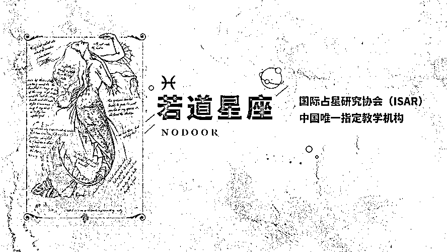

作者/斯蒂芬·弗里斯特 朱迪·弗里斯特 
译者/李含 编辑/玫瑰 图片来源/全景网本文摘自《天空的伴侣 I：爱、性和进化占星学》终于，大受欢迎的 12 星座爱情系列走到了黄道最后一个星座！是的，他们就是人见人爱，花见花开的双鱼座！如果你找了一个太阳、月亮、上升点落在双鱼座的爱人，等于找了前面 11 个星座爱人的集合，却又不同于他们任何一个。很“划算”有没有？快来和双鱼座做朋友吧！**双鱼座****原型**  

**神秘主义者 梦想家 诗人**

**先知 爱幻想的人 浪漫的理想主义者**

发展目标双鱼座是黄道 12 星座的最后一个。从某种意义上说，这是**最高级**的星座了。更现实的是，在双鱼座，**赌注是最高的。**我们的**获得和损失都是巨大的**。这是一个与**大逃亡**联系在一起的星座。并不是逃离这个世界，而是**从自我意识扩张的暴政中逃离。**双鱼座会让我们意识到，最终，**我们会保持个性，并有意识地表现出来**。我们置身事外，就好像生活是一场盛大的戏剧。从这个观点上看，**那些关于成功与失败、得到与失去、荣誉与耻辱的“成见”都变成了无以言表的乐趣。**这种典型的双鱼座式幽默并不是辛辣或愤世嫉俗的。这完全没有一点挖苦的意思，这里满心都是**慈悲**。最终我们发现，如果没有**神秘飘渺、宗教式的语言**，我们很难诠释双鱼座式的发展目标，这就是我们对于双鱼座的一贯认知。任何被染上双鱼座色彩的行星都会体验到一段**进化之旅，充满了知觉认知，促进成长，与信仰和人类理性并无关系**。他们都是以**直接、神秘**的方式**与更深次元的现实联系在一起**的。玄学里认为，**在前世，受到双鱼座影响的人，对于心灵和精神领域的探索很敏感，却无法将这些体验具体化的表达出来：正确的灵魂联结、与意识老师接触、充足的冥想时间**。此生会**对这些事情有强迫性的需求**。策略和资源

要实现双鱼座的目标，我们必须**脱离性命、等级这些标签，体验本质的自我**。我们必须**超越那些属于人类社会的身份角色认同**。我们把这个过程称为**“冥想”**。这种冥想并不涉及任何一种宗教信仰体系。我们谈论的是一种**大脑的状态：原生态，不用解释，意识自身觉醒的过程。**闭上双眼，深呼吸，关注思考深处静谧的角落。对！这就是冥想。非常简单。

这个方法有赖于**将这些宁静的空间串联起来，直到形成一段长期、不断裂的纯粹的意识觉醒。**如果双鱼座完成了这个过程，他将开始**真正地感受到自己的意识经验**，就好像一个人经常去打篮球，久而久之就会形成一套身体的条件反射。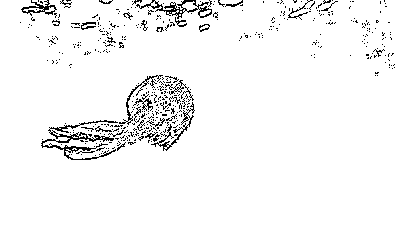阴影双鱼座会**扭曲这种神秘主义的冲动，或是误解了满足这种冲动的方式**，仅仅只是**逃避现实**。以前的占星书都会警告双鱼座人，**对于酒精有敏感性**。现在我们需要再加几条：**药物滥用、沉迷于电视、食物、性、睡觉、小说、工作、音乐、金钱、艺术、旅行、购物、癖好、教育、社会行动主义、宗教**。事实上，所有我们喜欢的东西都可以成为一种逃避的途径。关键并不是要**放弃寻欢作乐，**而是要**避免双鱼座企图消失于其中的行为。****双鱼座的爱情**太阳双鱼座的爱情

除非是走上了自我麻木的黑暗之路，否则，太阳双鱼座的人会是**非常温柔、敏感**的。**没有任何一个星座的浪漫，能如此真切的触动灵魂。**因此，对于双鱼座，爱情唯一的粘合剂就是**灵性的基础**。和大多数陈词滥调一样，我们随口一说“灵性关系”，但缺乏真正的思考。

两个双鱼座的长老会成员会在教堂坐在一起，也会有许多共同的长老会的体验，但他们并不是“灵性关系”。为什么？简单说，**他们的灵魂并没有发生关联**。另一方面，两个无神论者静静地坐在篝火前，默默地进入冥想状态——“火焰之梦”，就像是斯瓦希里人一样。**他们能够觉知对方的存在，能够分享这个想象的空间，无须解释交谈，不用担心彼此的意志被对方侵入**。两个灵魂在积极地触碰彼此。他们进入了意识的变化，依然感受到交流接触：双鱼座的天堂。一旦这样的情侣相遇，他们的结合必须仰赖于这样**高度灵性的接触**：静静的陪伴，黄昏时分，安静地在海边树林散步，或者是教堂、庙宇，参加其他形式的冥想小组。从事这些活动，这把伴侣以双鱼座的波段联接在一起，分享只有双鱼座才懂的爱情的感觉、愉快的舞蹈、宇宙的笑话。他们之间的关系就像有了魔法……一直相伴到有一天笑着面对死亡。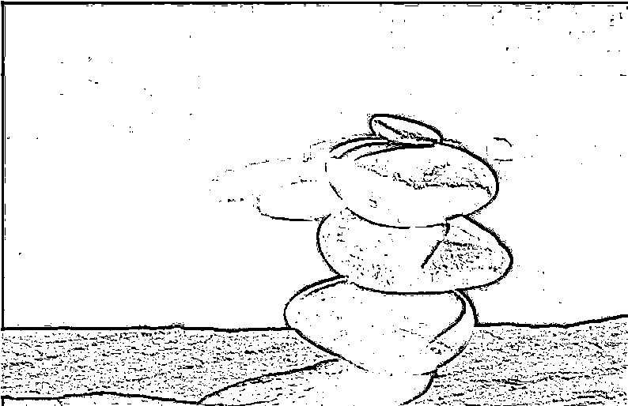月亮双鱼座的爱情基本上，关于太阳双鱼座的种种，对于月亮双鱼座也一样适用，只不过**更柔软、更内化、以更直觉的方式表现**。在最好的状态下，月亮双鱼座的人就像是一个仓库，**蕴藏着人类最高等的渴求。灵魂中潜在的爱神，将珍贵的、无常的灵性结合融入到化学反应促生的有意识的性行为之中。**但月亮双鱼座也可能是**不活跃的、主观的，**特别是这样一个超凡脱俗的星座。同样，还可能有**自我牺牲或是殉难**的状况，这有心理学或生物学两种方式的意思（精神上和肉体上）。**学着询问他的需要，学着积极地引领伴侣进入更深精神领域，对于月亮双鱼座的伴侣来说，这是发展亲密关系的关键技巧**。要**鼓励多愁善感，伴侣要认真地对待他们的需求**。他们要**学着不要放弃太多**。家庭中，月亮双鱼座需要自己的家带有**神圣的庙宇的色彩**：**平静、美好，有另一个世界的线索**。任何人的审美观念从根本上远离这一派的，都会让月亮双鱼座的人逃离现实，躲进自己的梦田。上升双鱼座的爱情

上升双鱼座的人**戴着演员的面具，可以扮演任何角色**。他们在社会上颇有优势：他们能够**很好地适应任何境遇，即使是非常有攻击性、非常混乱的状况**，让太阳、月亮双鱼座都难以应付的状况。但是在亲密关系中，上升双鱼座的人要警惕：**不要过多地披上变色龙的外衣，迎合伴侣的期望和风格**。他们必须符合星座真实的原型：**神秘主义和理想主义者。**

以下行为是这些原型的天性本能：**冥想、沉思、创造性活动**。如果**沉溺于付出型的感情关系中**，这些行为退出了生活的中心舞台，许多真相被牺牲在了“演员的面具”背后。许多真实的自我被放弃了。所有“演员的细胞”必须重返鱼儿的最基本行为：**深深地潜入意识的海洋。**双鱼座的守护星是海王星，所以上升双鱼座的人，海王星是命主星。从海王星所落的宫位和星座，能够反映出当事人在亲密关系中的表现，特别是当海王星落在亲密关系的宫位。

**版权声明：**本文由若道翻译发布，欢迎转发，反对抄袭。友号转载请申请白名单。

**12 星座爱情宝典**

[白羊座](http://mp.weixin.qq.com/s?__biz=MzA5NjA0NTAxNg==&mid=2651419096&idx=1&sn=30c86f7f9f489d61c1b0f80b8944b46b&chksm=8b4bc36fbc3c4a79c49f5b4aa43daad19a145e2bf762fe4a8e5bc1319228e633a65ae869df2c&scene=21#wechat_redirect) | [金牛座](http://mp.weixin.qq.com/s?__biz=MzA5NjA0NTAxNg==&mid=2651419469&idx=1&sn=e44679a33194bf652fe9f515565c8da5&chksm=8b4bc1fabc3c48ecfa11b12fdab2043d246c58d47176dfa105a11ee05a22b4bc65947c7ad02e&scene=21#wechat_redirect)丨[双子座](http://mp.weixin.qq.com/s?__biz=MzA5NjA0NTAxNg==&mid=2651420649&idx=1&sn=0179035270f9508988c70e85c969869c&chksm=8b4bc55ebc3c4c48c928471267184c6360676c387dc9527ef0e112d6671bba3e8893324b5621&scene=21#wechat_redirect) | [巨蟹座](http://mp.weixin.qq.com/s?__biz=MzA5NjA0NTAxNg==&mid=2651421302&idx=1&sn=23f3f771a6bb8eed2903620cc0344755&chksm=8b4bc8c1bc3c41d7b10a8b2c2a826edf4d7700e0db201cabe956be9128038e9dd3beb6b14afb&scene=21#wechat_redirect)

[狮子座](http://mp.weixin.qq.com/s?__biz=MzA5NjA0NTAxNg==&mid=2651422486&idx=1&sn=ee393d64fc0638b589212d81c2ecbd35&chksm=8b4bcda1bc3c44b737b01fcfcc85a0a9096d4f7a567d76c6079e9760105e5259d775715f6429&scene=21#wechat_redirect)丨[处女座](http://mp.weixin.qq.com/s?__biz=MzA5NjA0NTAxNg==&mid=2651422885&idx=1&sn=3d4e368f263ed2016388d3cec178b6b1&chksm=8b4b3212bc3cbb049ad7a6c403a4eab1664d38bb465ede4b82aeaeef64deb34b13e8319c642d&scene=21#wechat_redirect) | [天秤座](http://mp.weixin.qq.com/s?__biz=MzA5NjA0NTAxNg==&mid=2651423207&idx=1&sn=d3f8a94b54e7667c0876707de89e7a9f&chksm=8b4b3350bc3cba4672ecb735a445998dc008428e5bdc388c269c237ee361c0bb0b7404dbff0c&scene=21#wechat_redirect)丨[天蝎座](http://mp.weixin.qq.com/s?__biz=MzA5NjA0NTAxNg==&mid=2651423754&idx=1&sn=a98eabdbacb8702c235c367565a17ce3&chksm=8b4b36bdbc3cbfabc468d6015d7755528b6ffc28759c54f6f67d5e82b4354e6304c1787935f2&scene=21#wechat_redirect)

[射手座](http://mp.weixin.qq.com/s?__biz=MzA5NjA0NTAxNg==&mid=2651424047&idx=1&sn=26d45c630151b2e226c9a7157b3a1d40&chksm=8b4b3798bc3cbe8e296b075c8eeaaf9ba0f18152fac8f7a6afe356e32b8f75e40b12fd2983e7&scene=21#wechat_redirect) | [摩羯座](http://mp.weixin.qq.com/s?__biz=MzA5NjA0NTAxNg==&mid=2651425190&idx=1&sn=4bf77c3cb4cdf7eef017f516e814373c&chksm=8b4b3b11bc3cb20768ae89cad4c14bec3499f8c5679d3dfc12dcd5f9e5e6ba842185974a81b1&scene=21#wechat_redirect) | [水瓶座](http://mp.weixin.qq.com/s?__biz=MzA5NjA0NTAxNg==&mid=2651426017&idx=1&sn=50baff5c1193e6ad12ef833e6113e466&chksm=8b4b3e56bc3cb740af159c5a81c84f63fb4cb2c25c9f7491e9d5df33beb87eecaafa821c2aad&scene=21#wechat_redirect)

斯蒂芬·弗里斯特

若道签约老师。进化占星学的创始人之一，当今世界最有影响力的占星大师之一；1985 年，他凭借《内在的天空》一书获得职业占星师协会奖（Professional Astrologers Incorporated Award）。他四次获得占星界最高的占星学联合协会奖（United Astrology Congress Regulus Award）提名，2018 年获得轩辕十四教育奖。

**想参加斯蒂芬线上工作坊？**

**请点击图片链接****或添加客服微信咨询**

**想听听大师斯蒂芬老爷子的精彩讲座？**

**长按下图了解详情！**

**微信又双叒叕改版啦，不想错过若道君的推送？**

**就把若道设为星标吧！**

**▼**

就是这个“在看”，戳戳戳 ☟

****************报名直达入口****************

# 顺势案例 | 想不到，“辣椒”居然能治好反复无常的抑郁症

> 原文：[`mp.weixin.qq.com/s?__biz=MzA5NjA0NTAxNg==&mid=2651427171&idx=2&sn=bb439ed56cd84a0fc0d705c652c25a02&chksm=8b4b23d4bc3caac21cbf7543f772733ae68c00a632436c0df7b99522076a52c9e7cf1422bb93&scene=126&sessionid=1692738111#rd`](http://mp.weixin.qq.com/s?__biz=MzA5NjA0NTAxNg==&mid=2651427171&idx=2&sn=bb439ed56cd84a0fc0d705c652c25a02&chksm=8b4b23d4bc3caac21cbf7543f772733ae68c00a632436c0df7b99522076a52c9e7cf1422bb93&scene=126&sessionid=1692738111#rd)

作者/若道君 编辑/玫瑰 图片/网络苏·汤普金斯老师将于 10 月 22 日开设[【2 年制顺势疗法专业课程】](http://mp.weixin.qq.com/s?__biz=MjM5MjQwNjAyMQ==&mid=2649437569&idx=4&sn=a49744a1ff51e30ed64395f1da3ae40b&chksm=beb95aeb89ced3fd8ad42db2f7f84e3902527beee042fca975c53b6d46f0ba8447490d1a963c&scene=21#wechat_redirect)（报名请点击链接）。那么什么是顺势疗法呢？顺势是一个身心治疗的疗法。当我们有一些身体疾病时，也通常会有长期或者伴随的心理症状。有些朋友问，顺势疗法是否能够治疗以心理症状为主的问题呢？下面是 Sujit Chatterjee 医生讲课时提到的他的一个案例。这个案例非常有名，因为 Sujit Chatterjee 所在的诊所做了很多的视频，记录病人在服用顺势制剂前和服用顺势制剂后的不同，这个也是一个让人印象深刻的案例录像。
**抑郁症的案例**这个案例的主角是一个 18 岁的男孩，他被父母带来见 Sujit Chatterjee 医生。他患有抑郁症。像很多抑郁症病患一样，他也有饮食和睡眠问题。经常食欲不振，要服用很多安眠药才能睡觉。入睡后又常做噩梦，在梦中尖叫。他有思维和情绪方面的问题，思维非常僵化且顽固。对批评敏感，很容易生气，因此经常与他人打架和争吵，朋友也很少。他还有一个特点，喜欢毫无理性地和人对着干。比如他本来想学理科，但是如果那时恰好有人建议他，你还是学理科好，他就会立刻转变想法，去考商科，完全不管原来自己本来怎么想，没有理性，不可理喻。他来看医生的时候，正离开家到另外一个城市的学校读书，又患上了严重的思乡病。18 岁那年症状变得更严重，甚至尝试过吃安眠药自杀。而他也发现，散步可以有助于症状减轻。这是他父母带他来见顺势医生时的状况。在咨询中显示，这个孩子第一次出现这些症状是在童年，当他的父母把他和一个堂兄弟相比较，引发了他的强烈情绪。医生进一步了解，发现他的母亲在怀他的时候就有相似的极端情绪。他母亲说自己在怀孕期间非常任性，想做什么就会做什么。如果有人试图干涉她，她会对着干。比如本来她准备晚餐做咖喱鸡蛋，但如果有人说：“晚餐吃鸡蛋咖喱吧。”她就偏要做咖喱鱼。所以，正像我们在此前的文章所讲，对于这样一个有自杀倾向的抑郁症的青少年，我们需要从他个人的独特之处去找寻适合他的顺势药剂。

对于心理问题也是如此，可以看看这个患有抑郁症的少年的独特之处：

*   好与人作对（44 种顺势药剂都有这个特质）
*   任性，反复无常（55 种）
*   爱挑剔、批评、冲毛求疵（53 种）
*   很容易感觉被冒犯（52 种）
*   鲁莽草率（4 种）
*   睡着后常做噩梦（469 种）
*   顽固的孩子，行为乖戾，对人不友好（1 种）
*   睡着后会尖叫（38 种）
*   自杀倾向（70 种）
*   思乡病（29 种）
*   散步会缓解（113 种）

那么有哪一种顺势药剂同时满足所有这些特征呢？用《症状大全》查找出来，答案是**辣椒**。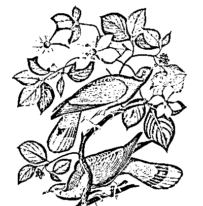如果再去《药典》中找辣椒这个顺势药剂的心理状态，会发现非常有趣的描述——**“如果病人想要某个东西，当其他人给她这个建议时，她反而会反对”**，完美地契合了这个病人和怀着他的母亲当时的心理状态。于是 Sujit Chatterjee 医生给了这个青少年 1M 的辣椒。治疗效果很好。在一年内，他的胃口回来了，不用服用安眠药就可以入睡，不再做噩梦，他的脾气也开始改变，不再容易生气发火，变得更加友好，开始交到很多朋友，而且他开始能做理性的决定，自杀的想法完全消失了。因为我们不断发表案例，使得很多朋友找来，想要苏·汤普金斯老师做咨询。在这里想说明一下，顺势咨询是一个过程，有的时候在一次咨询后就可以找到适合的药剂，有的时候，顺势医生需要几次咨询不断调试，努力去找到正确的顺势药剂。我们的文章中，大部分案例没有详细提及整个咨询过程，而且列举的都是成功的案例。这主要是因为我们想多方面向大家介绍顺势疗法。但是，一切并非如此简单——每个疾病问诊一次就能疗愈，那是过于理想、不切实际的想法。有些案例可能一次就开出正确的药剂，有些案例可能需要多次咨询，特别是疑难杂症。很多慕名前来的朋友咨询的都是尝试了中西医治疗办法也没有被治好的疑难杂症，对于这种情况，即使采用了顺势疗法也不一定会治愈。在疗愈这件事情上，虽然我们一直在推广，并且希望更多人了解顺势疗法，但是我们完全不想神话它。顺势疗法的确有非常多的神奇之处，同时，像任何一种疗法，使用它的人哪怕很有经验，也都有失败、无法找到合适制剂的可能性。也希望读者们能够抱有恰当的期待。

**版权声明：**本文由若道翻译发布，欢迎转发，反对抄袭。友号转载请申请白名单。

请在后台回复 顺势 获得更多****关于顺势疗法内容****

**学习顺势疗法**

**请点击下图了解详情**

**微信又双叒叕改版啦，不想错过若道君的推送？**

**就把若道设为星标吧！**

**▼**

就是这个“在看”，戳戳戳 ☟

********报名直达入口********

# 木星与冥王星合相：极端措施 | 去年的《金融预报》预测得如何？

> 原文：[`mp.weixin.qq.com/s?__biz=MzA5NjA0NTAxNg==&mid=2651427087&idx=2&sn=79d9e9b0bcd0b11ab6510a53c06c493b&chksm=8b4b23b8bc3caaae5a16200fca80264e8b8283cc2a48ba79480f7f72c55753ebe67060075301&scene=126&sessionid=1692738111#rd`](http://mp.weixin.qq.com/s?__biz=MzA5NjA0NTAxNg==&mid=2651427087&idx=2&sn=79d9e9b0bcd0b11ab6510a53c06c493b&chksm=8b4b23b8bc3caaae5a16200fca80264e8b8283cc2a48ba79480f7f72c55753ebe67060075301&scene=126&sessionid=1692738111#rd)

作者/雷蒙德·梅里曼
译者/Arrow 李含 校对/Jun Leisha 编辑/玫瑰 图片/全景网

雷蒙德·梅里曼是在金融占星学界稳坐第一把交椅的占星师，同时他也是若道签约的金融占星课老师，我们引进了雷蒙德·梅里曼老师的《[上证指数月度报告](http://mp.weixin.qq.com/s?__biz=MzA5NjA0NTAxNg==&mid=2651425978&idx=2&sn=c7e3187f3abfe604c511ea9506775c0a&chksm=8b4b3e0dbc3cb71bbe141e7e7a5e9ddb0690537fd1661d2f9919f23741010a762b9966633af8&scene=21#wechat_redirect)》《[黄金周期月度报告](http://mp.weixin.qq.com/s?__biz=MzA5NjA0NTAxNg==&mid=2651425978&idx=2&sn=c7e3187f3abfe604c511ea9506775c0a&chksm=8b4b3e0dbc3cb71bbe141e7e7a5e9ddb0690537fd1661d2f9919f23741010a762b9966633af8&scene=21#wechat_redirect)》《[2021 年金融预报](http://mp.weixin.qq.com/s?__biz=MzA5NjA0NTAxNg==&mid=2651425978&idx=1&sn=067bd68ece37e1e820d6f84f7a3cc960&chksm=8b4b3e0dbc3cb71b866f65d51f7993d3c35dee77cebd77eda3f63a4d5864dadaea2e9d14c101&scene=21#wechat_redirect)》。

以下文字摘自《2020 年金融预报》中的《木星与冥王星合相：极端措施》一章。2020 年肯定是“极端措施”的一年。文中点评部分为梅里曼老师根据 2020 年已发生状况所做的总结。

**文中提到的日期基于纽约证券交易所所在的美国东部标准时间，由于存在时差，中国地区可能需要加一天。**

**《2020 年金融预报》内容及回顾点评**

**如今，共和党是财政上不负责任的政党，而民主党是在财政上发疯的政党。**

**——莫娜·查伦**

**《赤字是缺失的大话题》**

**《亚利桑那共和报》**

**2019 年 11 月 11 日**

 摩羯座星群的最后一部分涉及木星和冥王星 13 年的会合周期。这会形成三次精准合相，分别发生在**2020 年 4 月 4 日、6 月 30 日和 11 月 12 日**。结合 2020 年 1 月 12 日土星合相冥王星以及 2020 年 12 月 21 日木星合相土星，这次木星与冥王星的合相将是 2020 年第三个外行星之间的会合周期。木星及其轨道之外的行星只有 10 种组合的可能，所以在同一年中见证这 10 个长会合周期中的 3 个是极为罕见的。木星和冥王星发生三次精准合相也非常罕见，在过去的 160 年里只出现过两次（1869 年 7 月-1870 年 5 月和 1955 年 11 月-1956 年 6 月)。与木星相关的原则包括乐观、充满希望、成长、扩张、夸张和极端主义。它也适用于世界贸易、教育和法院——传递审判的地方。木星似乎把一切都放大了，比平常更大。

**点评：****今年伊始，人们满怀希望，全球许多股票指数创下历史新高或多年新高，2020 年世界经济前景非常乐观。**

但是这次，木星在摩羯座——与木星原则相反的星座，代表现实主义、严肃、怀疑、收缩和限制的原则。木星是成长、放松和冒险的冲动。在摩羯座，它遭遇了保守、安全、不冒险的需求，取而代之为了实现目标而运用常识和实践。摩羯座做事有计划；木星基于希望和信念运作，木星认为因为这是个好主意，所有一切都会解决，在某种意义上，这是“注定”或“命定”要成功的。

点评：**实际情况是，在 2 月至 4 月的第一波新型冠状病毒肺炎感染爆发后，世界各国没有实施安全措施，遵循常识，也没有坚持一项有效的计划，而是过早地在新冠肺炎病毒疫情上冒了很大的风险，于是疫情在春末及整个夏季来势汹汹地卷土重来。**在最好的情况下，摩羯座的木星代表通过节制获得成功。它的崇高抱负结合了现实感：什么是可行的。一方面，它想要成长和扩展；另一方面，它明白需要认识到限制和界限。木星和土星可以配合得很好，并通过共同的努力获得持久的成功。摩羯座的木星可以带来着眼长远的良好而稳健的判断。在最糟的情况下，拖延和障碍将阻碍取得进展，导致挫折感日益增加。它可能象征一段**会发生重大损失、失望以及最终放弃计划的时期，而不是有稳定的收益和进展，推动事情进展。**

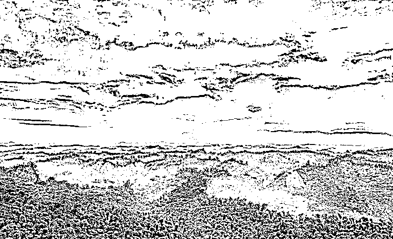

**点评：许多政府被迫封锁，许多企业破产或不得不搁置他们的项目，因为人们不能再面对面会面或召开面对面的会议。木星掌管会议和旅行，这两者在 2020 年都受到限制和禁令（摩羯座）的影响。**举个例子，上一次木星在摩羯座是 2007 年 12 月 18 日-2009 年 1 月 5 日。这段时期正好是 2007 年 12 月-2009 年 6 月经济大萧条开始的时候，政府和商界领袖希望启动的许多项目被推迟。然而，木星在摩羯座并不总是伴随着经济衰退。2007-2009 年大萧条的开端也接近上一次木星与冥王星的合相，即 2007 年 12 月 11 日，就在木星进入摩羯座的前一周。木星和冥王星的周期与**经济衰退和债务**可能具有更大的关联，正如之前两个实例中展现的：1994 年 12 月 2 日（奥兰治县市政债券违约）、1981 年 11 月 2 日（1981 年 10 月 6 日埃及总统安瓦尔·萨达特被暗杀，以及美国的经济衰退期)。2007-2009 年大萧条也与木星-冥王星合相对应。**点评：2020 年，木星-冥王星合相再次对应了可怕的经济衰退和股市恐慌，这在年初完全意料不到。但随后在木星-冥王星的冲击下，所有对国家和世界经济及其未来增长绚丽蓝图的乐观情绪都破灭了。**这让我们意识到冥王星和木星在摩羯座组合的重要性。如前所述，**冥王星主宰着经济学中的赤字、债务、降级和违约**。木星与冥王星合相，而且木星这颗象征增长和极端主义的行星在摩羯座，摩羯座代表着政府和大企业，它们带来的动力会增加赤字、债务、降级和违约。在承诺削减政府赤字的政党监管下，美国的赤字 7 年来首次即将突破 1 万亿美元。我们进入 2020 年时，美国的债务也将增加到 23 万亿美元，这是另一个纪录。美国的信用评级目前还没有下调，但 2020 年木星-冥王星的合相表明，世界上一些（或许多）国家以及几家大公司可能会遭遇信用降级，许多国家甚至可能被迫申请破产。**点评：由于疫情及由此进行的封锁，美国政府 2020 年的支出预计现在将增加 7 万亿美元，远远超过之前预期的 1 万亿美元。**

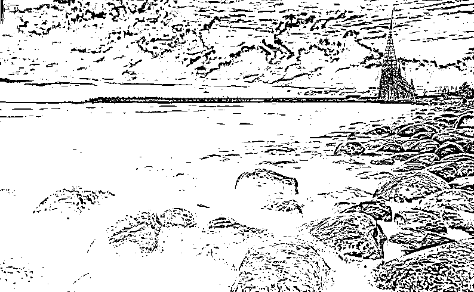

我们也可以将木星、冥王星和摩羯座的原则应用于全球社会政治领域。如果考虑**木星是极端主义和“自以为是”的信仰，摩羯座是“必须遵守的或违反必罚的法律和规则”，而冥王星是拥有权力的一群人（不一定在政府里）**，那么我们就得到了一种表明许多可能性的配置。其中一种可能性是世界各地“道德警察”团体会增加，他们希望惩罚甚至监禁任何他们认为违反了其规则或法律的人。另一种表达是无休止地（木星）调查（冥王星）政府（摩羯座）领导人的行为和决定，限制政府的功能。在最极端的情况下，冥王星代表政府首脑的终止、弹劾或免职，或与此相关的威胁（冥王星）。**点评：由于明尼阿波利斯市的警察造成乔治·弗洛伊德的死亡，美国各大城市的内乱升级。在许多大城市，成群结队的抗议者已经演变成暴力、抢劫和谋杀团伙，一些组织甚至占领了城市的部分地区，组建了自己的自治区域。法律与秩序因此成为 2020 年美国总统选举的竞选主题，与木星（极端措施）和冥王星（潜在的暴力和破坏）在摩羯座（掌管法律与规则的星座）相符。**写这篇文章之时，我们已经看到摩羯座木星-冥王星的活动正在美国发生，旨在弹劾和罢免特朗普总统的调查在进行中。此外，确定另一个政党（民主党）是否犯罪的调查正在开展，米勒调查了干涉 2016 年美国总统大选的情况。根据典型的木星风格，不只一个以确定美国的一个政党的政治领导人是否犯罪的调查正在进行，而是两个调查，以确定两个党派的领袖是否都有非法行为，“掩盖”他们意图伤害对方或压制另一方的“秘密”行动。冥王星与**“掩盖”和“秘密行动”**有关，目的是维持或获得压倒对手的优势。**点评：撰写上述文字以来，美国总统唐纳德·特朗普被众议院弹劾，但并未经参议院投票罢免。而现在，针对奥巴马政府的调查正在进行中，因为奥巴马政府在 2016 年非法暗中监视特朗普阵营。**

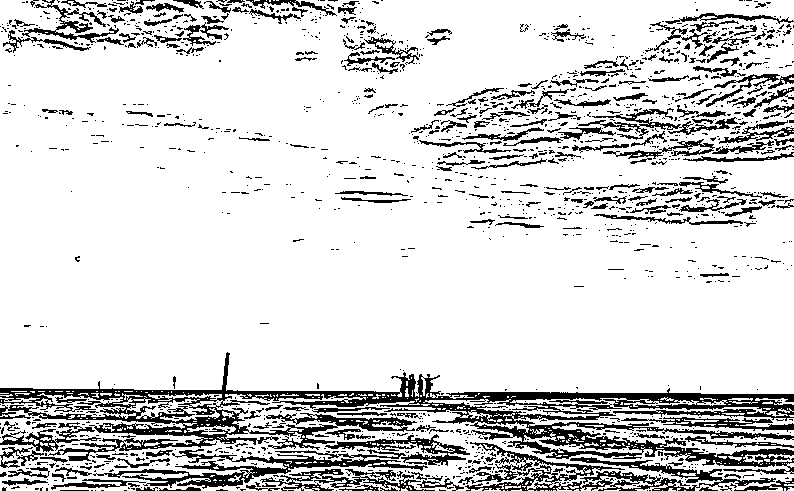

从积极的方面看，**木星也将和海王星形成三次精准的和谐六分相（2020 年 2 月 20 日、7 月 27 日、10 月 12 日）**。这种组合带来了**增加国家收入的可能性**。由于冥王星控制着包括关税在内的税收，而且鉴于越来越多的人在工作和纳税，同时外国购买的许多美国商品也在被征收关税，所以国家收入可能会增加。或许这有助于改良和改善联邦赤字。点评：**在 2020 年 3 月新型冠状病毒肺炎疫情恐慌袭来之前，情况确实如此。但奇怪的是，在 2020 年 2 月中旬-3 月底期间，道琼斯指数下跌 38%后，股市恢复得非常好，标普和纳斯达克指数现在都创下历史新高。最后一次木星-海王星六分相 10 月 12 日结束后，复苏会继续吗？**本段摘自《2020 年的美国股票市场》一章：**木星在 2020 年与冥王星合相 3 次：分别在 4 月 4 日、6 月 30 日和 11 月 12 日。这整个时期被称作“中央时间段”**。“中央时间段”在这里的意思是在这个区间在不超过一个月的容许度内，与股市长周期相关。这也是与股市相关的一个重要地球宇宙学征象，尤其当这个相位精确成相三次时。这将是过去 160 年来第三次（共 13 例）发生这种情况。正如《股票市场时机终极手册第 2 卷》所述：“木星和冥王星的合相是美国股市中期周期相当可靠的指征。然而，如果由于逆行使得这个相位精准成相三次，那么它倾向于对应股市长周期，比如 4 年周期。在两个历史案例中，4 年周期均在连续三次精准合相的中央时间段出现波峰。”因此，如果某个股市长周期的波峰再次在 2020 年木星冥王星三次精准成相的时段出现，我们也不会感到惊讶了。点评：**截至撰写本文时，道琼斯指数的历史最高纪录发生在 2 月 12 日，然后市场在 3 月下旬跌至低点。它们现在正在迅速回升，标准普尔和纳斯达克指数创下历史新高。但是，这些反弹会像过去一样，在最后一次木星-冥王星合相一个月后的 2020 年 12 月结束吗？****总之，很明显，在摩羯座木星-冥王星三次精准合相的影响下，2020 年确实是“极端措施”的一年。我们将在 2020 年 12 月 15 日发布的[《2021 年金融预报》](http://mp.weixin.qq.com/s?__biz=MzA5NjA0NTAxNg==&mid=2651425978&idx=1&sn=067bd68ece37e1e820d6f84f7a3cc960&chksm=8b4b3e0dbc3cb71b866f65d51f7993d3c35dee77cebd77eda3f63a4d5864dadaea2e9d14c101&scene=21#wechat_redirect)（点击了解更多详情）中详细回顾这一对应关系及其对未来的影响。**

**说明：以上日期基于纽约证券交易所所在的美国东部标准时间，由于存在时差，中国地区可能需要加一天。**

**版权声明：**本文由若道翻译发布，欢迎转发，反对抄袭。友号转载请申请白名单。

**雷蒙德·梅里曼（Raymond Merriman）**

若道签约老师。著名金融占星师，ISAR（国际占星研究协会）前主席，梅里曼市场分析公司的总裁。他由于“提升了占星学的职业形象”，在 1995 年国际占星大会上被授予轩辕十四奖；在 2012 年国际占星大会上，被授予轩辕十四终身成就奖。

**2021 年金融年报预售**

1976 年以来，由雷蒙德·梅里曼撰写的梅里曼市场时机学院每年一次的年度预报沙龙和每年一本的《年度预报》一直在应用占星学原理为投资者们服务，提供卓越洞见，从未间断。

过去两年，3 小时的年度预报讲座和长达 200 页左右对金融市场的分析报告，帮助许多若道读者做出正确的投资决策，降低了投资风险，并获得相当不菲的投资收益。在群星摩羯座的时候，我们和你一起提早规划自己来年的投资安排。2021 年年度预报开始预售**前 50 名预售价格**：1080 元**前 50-100 名预售价格**：1180 元**100-150 名预售价格**：1280 元**150 名之后价格**：1380 元**2021 年年度预报中文版预计发布时间**：2020 年 12 月底**沙龙时间**：2021 年春节前后**沙龙形式**：英文讲座，配有中文翻译**点击下图了解详情**

▼  

******点击阅读原文购买金融报告******

# 插班中丨核心课程 L3，教你掌握综合星图解读

> 原文：[`mp.weixin.qq.com/s?__biz=MzA5NjA0NTAxNg==&mid=2651427087&idx=3&sn=bae223111878ebe6fc945194ba4c3062&chksm=8b4b23b8bc3caaae105fc7912455f558975aadc984e61ddf2f5b931e07dd690daee6cf280c2b&scene=126&sessionid=1692738111#rd`](http://mp.weixin.qq.com/s?__biz=MzA5NjA0NTAxNg==&mid=2651427087&idx=3&sn=bae223111878ebe6fc945194ba4c3062&chksm=8b4b23b8bc3caaae105fc7912455f558975aadc984e61ddf2f5b931e07dd690daee6cf280c2b&scene=126&sessionid=1692738111#rd)

**Level3 也是占星学习的一个整合区和分水岭****若道君给大家准备了一份专业的占星测试：“2020 若道核心课 L3 入学测试”****测试内容包括：**

**适合参加测试的学员：**

**L1-2 结课学员**

**有一定占星基础的自学学员**

**准备考 ISAR 的学员**

**扫码开始测试吧**

**1**

**占星学除了自我修炼，市场需求如何？**

**通过占星学习你帮助了自己，也可以选择成为自助助人的占星师，开启受益终生的第二事业。**一方面，社会快速发展人们压力山大，抚慰心灵的咨询市场需求巨大。另一方面，市场鱼龙混杂，真正学院派的严肃占星从业者十分稀缺。最重要的，**占星学能让你自己帮助自己，无论你是否进行占星咨询从业，学习了占星学，它都将是终身陪伴你成长的睿智好伙伴。**

**2**

**你的占星核心课老师是谁？**

 拥有**50**年占星研究积淀**44**年职业占星实践**41**年占星教学经验的**若道联合创始人****2017-2020 年曾任 ISAR 全球副主席****2020 至今为****CAPISAR（全球职业占星师资质认证考试委员会）主席****大卫·瑞雷**&**最懂学员的若道首位认证金牌中国老师****熊鹰**师徒二人合力打造
**2020 年若道****全新核心占星课程**

**3**

**L3 阶，我们要学习什么？**

**第 3 阶 ****宫位、相位以及初步解读星图（15 次课） ****❶** **12 宫位****人生中重要的领域，不止 12 个，更是 12 类。****❷ 组合解读****行星、星座与宫位的组合解读。万丈高楼平地起，这是占星解读的基本功。****❸ 相位****不仅是常规的相位：合相、对分相、三分相、四分相……还有这些更为细致的知识：**相位计算入相位与出相位星座外的相位相位解读盈亏相位相位的优先级大卫老师案例课**❹ 宫主星与定位星****“联结”是宇宙的基本法则之一。除了相位，还有哪些方式让行星能量联结起来？**宫主星定位星与定位链大卫老师案例课**❺ 月亮交点专题****月亮交点是占星解读的另一个入手角度，这里会深入教你解读月亮交点，及其相位与定位星。**月亮交点的解法大卫老师案例课**❻ 相位模式：****那些坊间赋予神秘意义的占星格局：大三角、大十字、T 三角……究竟该如何解读其相位模式。**主要的七种相位模式星图中没有相位模式的情况大卫老师案例课**❼ “空”不等于“没有”：****星图中那些容易被忽视的地方：**无托勒密相位（俗称空相）一些特殊位置星图布局大卫老师案例课**第 3 阶课程安排****❶** 15 次线上直播网络课程，每次 2 小时，课程中依旧会使用同学们的星图作示范**❷** 10 节课由熊鹰老师教授，重点通过名人星图阐释知识点**❸** 5 节课由大卫·瑞雷老师教授，重点通过学员星图阐释知识点**❹** 熊鹰老师会指导练习，答疑解惑，学练结合**❺** 重点在于如何根据星图去问问题，着重自我发现和自我探索的过程 

| **时间** | **课程** |
| 2020 年 7 月 2 日 | 宫位、行星和星座组合 |
| 2020 年 7 月 9 日 | 宫位、行星和星座组合 |
| 2020 年 7 月 16 日 | 月亮交点 |
| 2020 年 7 月 23 日 | 月亮交点和演示案例 |
| 2020 年 7 月 30 日 | 相位 |
| 2020 年 8 月 6 日 | 相位、星座、行星和宫位 |
| 2020 年 8 月 13 日 | 相位、星座、行星和宫位的同学案例 |
| 2020 年 8 月 20 日 | 渐盈相位和渐亏相位，示例 |
| 2020 年 8 月 27 日 | 更多的关于宫位和宫主星 |
| 2020 年 9 月 3 日 | 同学案例 |
| 2020 年 9 月 17 日 | 空相行星和定位星 |
| 2020 年 9 月 24 日 | 宫主星 |
| 2020 年 10 月 15 日 | 优先级和组织 |
| 2020 年 10 月 22 日 | 相位模式以及范例 |
| 2020 年 10 月 29 日 | 学员星图解读范例 |

**截至 2020 年 9 月 8 日中午，课程第 1-10 讲为录播课程（限视频回放），其余均为网络直播课。**

**试听彩蛋**

📹 [`v.qq.com/iframe/preview.html?width=500&height=375&auto=0&vid=e093031qxym`](https://v.qq.com/iframe/preview.html?width=500&height=375&auto=0&vid=e093031qxym)

**4**

**这两位优秀的占星学老师是谁？**

**大卫·瑞雷（David Railey）**

*   **曾任 ISAR 全球副主席，2020 至今为 CAPISAR（全球职业占星师资质认证考试委员会）主席，若道联合创始人；** 

*   1976 年，通过亚特兰大职业占星师考试，成为全职占星师，随后通过**AFAN 和 ISAR 职业测试；** 

*   1980 年，与**杰夫·焦耳**一起在亚特兰大创建**“每日星球”**占星学中心。此后在亚特兰大占星协会担任 4 年考官，并且两次担任**亚特兰大地区占星协会主席**。1979-1992 年，作为占星师活跃于美国社会媒体，向不了解现代占星学变化的大众宣传专业占星学知识。在 1989-1992 年期间，他在 WRGG 电台 12 频道每周主持个人电视秀**“今日占星学”**，早先他还在 WRFG 的广播节目中播讲宇宙天气节目；

*   2010-2014 年，任**全美占星师联盟监督委员会委员**； 

*   2010 年，其著作**《灵魂的目标》**中国版出版，和蒋颖一起创办**若道占星**学校和其官网 www.nodoor.com。从该年开始，他工作并往返于亚特兰大和北京。目前他 80%的时间致力于在中国教授和推广西方占星学； 

*   2017 年，被选为**ISAR 委员会成员**（2017）。ISAR 是世界最大的国际占星机构，会员遍布 45 个国家，2017-2020 年曾任 ISAR 全球副主席； 

*   2020 年，被推举为**CAPISAR（全球职业占星师资质认证考试委员会）主席**。

**熊鹰老师（天空的空）**

*   2008 年接触严肃占星学，至此爱不释手； 
*   **2013 年师从大卫·瑞雷**，研习整套现代占星学核心课程，并于 2014 年起至今连续三年担任该课程的主助教； 
*   期间也**跟随格伦·佩里、诺·泰尔、理查德·塔纳斯、罗伯特·汉德、苏·汤普金斯、斯蒂芬·弗里斯特等多位国际顶尖占星大师进行学习**，进行定向占星主题研究； 
*   2015 年初，通过国际占星研究协会**（ISAR）资质认证并获得证书**。同年，进一步跟随大卫·瑞雷老师进修**“生时校正”**技术，通过最终考核并获得证书； 
*   目前在若道星文化任职，将传播系统、严谨、真实的占星学作为职业使命。任专职助教期间，进行沙龙与答疑等辅助教学工作已累计超过 200 小时；
*   在业余期间也提供占星咨询与生时校正服务。目前正致力于占星学与个人成长的整合。

**5**

**什么人适合这门课？**

*   对占星学有浓厚兴趣，想要系统学习占星学
*   对占星学有一定基础，但不知道该如何整合星图复杂的碎片
*   希望成为优秀的占星师，想要借鉴国际大师解读思路并融入自己的体系
*   想学习占星学，但不擅长英文，希望有中文老师授课
*   想结合占星学理论与咨询实践
*   大卫·瑞雷、熊鹰的忠粉，学过占星，但就是想跟着偶像再学一遍
*   走在自我探索和个人成长道路上的人

**6**

**课程费用**

 **★ L3****课程费用：10000 元****更多价格优惠请咨询客服**

**7**

**退转课程**

**退款原则请详看《教学协议》，如有疑问请咨询课程顾问。******核心课程 Level 3****

**授课老师：大卫·瑞雷 熊鹰**

**授课时间：****2020 年 7 月 2 日-2020 年 10 月 29 日**

**授课方式：**网络课程：英文授课，中文翻译

**费用：10000 元；**更多优惠请咨询客服

**课程负责人：Maggie（微信号：NodoorMaggie）**请备注“L3”

长按二维码添加课程负责人咨询~

****报名请点击“阅读原文”****

# 宫位全解析 | 你能获得多少爱？取决于你在这个宫位付出多少爱

> 原文：[`mp.weixin.qq.com/s?__biz=MzA5NjA0NTAxNg==&mid=2651427087&idx=1&sn=fc978e7fe2f6f4b57102e8a75b4c6dcf&chksm=8b4b23b8bc3caaae65c40d82a7a4ff7436e0b26ca37be6b84bde46f8c93230517c0529a5934e&scene=126&sessionid=1692738111#rd`](http://mp.weixin.qq.com/s?__biz=MzA5NjA0NTAxNg==&mid=2651427087&idx=1&sn=fc978e7fe2f6f4b57102e8a75b4c6dcf&chksm=8b4b23b8bc3caaae65c40d82a7a4ff7436e0b26ca37be6b84bde46f8c93230517c0529a5934e&scene=126&sessionid=1692738111#rd)

****************☆ ****************************后台****************************回复“今日”，给你一句生命态度****************

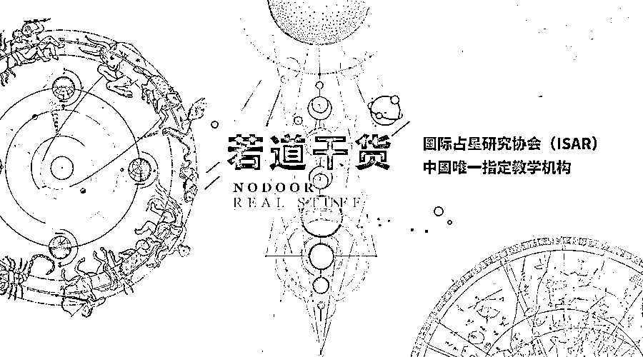

作者/达娜·格哈特
译者/葡萄园的女巫编辑/玫瑰 图片/全景网
**第 5 宫，是快乐的赤子之心**

如果你看过《浓情巧克力》这部电影，你就会明白第 5 宫的关键问题。这个宫位是关于**快乐和自然的自我表达**。他掌管的是**冒险、创造性、子女和爱情**。简单和纯真在这个宫位里肆无忌惮的狂欢以庆祝他们的生命。这有什么错呢？这个宫位描述了很多人想在占星学中寻求答案的问题：会发生浪漫的爱情么？会有孩子么？创新项目会成功么？第 5 宫的魅力不可否认。但是，就像《浓情巧克力》电影里的女主角一样，不可思议的，不幸的，很多人都与他们第 5 宫的快乐对抗着。

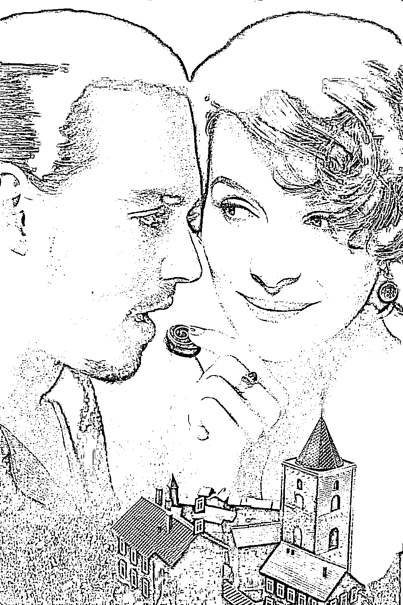

|《浓情巧克力》剧照电影里，薇安是一个受到诽谤的单身母亲，她喜爱流浪，于是搬到战后法国一个沉睡的小镇。小镇上的人都过着按步就班的生活。他们去教堂忏悔，自己修整花园。每个人都按照计划在生活（而且如果他们忘记了计划，一定会有人提醒他们）。如果看到了不该看的东西，他们一定转头。如果生活让他们失望，他们会学着不再要求。直到有一天，淘气的风把薇安和她的女儿吹到了小镇上。薇安穿着鲜艳的红色斗篷，给这个死寂的小镇带来了鲜活的气息。很快，她开了一家巧克力店，她的巧克力按照古老的玛雅食谱制作，拥有神奇的力量。他们释放了隐藏的憧憬，唤起了激情，注入了新的信念和力量。而神父则视薇安为撒旦的助手。市长要把她赶出小镇。女儿大叫着：“为什么你不能去教堂，穿黑色的鞋子，就像其他的母亲那样。”薇安有一颗赤子之心，在她的第 5 宫，住着最纯真原始的灵魂。就在那一刻，它将撼动你沉睡的生命，它将鼓舞你去狂欢。她有吉普赛人的洞察力，她清楚地知道巧克力的神奇作用——玫瑰奶油、贝壳巧克力、可可饮料辣椒饮料，人们都渴望。**你有没有患上“缺乏快乐”症？****你的第 5 宫同样也住着一个吉普赛的灵魂，它会告诉你如何让你的心灵快乐吟唱。**古典占星学中，金星在此宫是庙旺之地，**如果金星落在第 5 宫，就意味着它自然的力量将得到最顺畅的释放**。古典占星学中，土星归属于第 1 宫，木星归属于第 2 宫，而将守护快乐和爱的金星赐予了第 5 宫。如果行进或者推运中，有力量注入了第 5 宫，人们将作出反常的事情。也许会有风流韵事，也许会买了一辆金光闪闪的车，他们的梦想跑进了马戏团，他们的行为像个孩子。在第 5 宫中有**至关重要的生命力**，这种自然发展体现在驱动第 5 宫的过程中。第 4 宫家庭宫给予这个新兴的自我强大的支持。当情感滋养着我们的生命，力量由此聚集。这里聚集了创造和孕育的力量。它让生命充满了热情。这里洋溢着幸福快乐的光芒。这大概就是现代占星学中，把太阳作为第 5 宫的自然宫主的原因。太阳具有恒星的特质，就像在说：“我在这里！”它需要表现得**充满活力，需要被注目，需要尽情去爱并感受到被爱**。我们真的需要比较太阳或者金星哪一个影响第 5 宫更多么？不，你需要谨记太阳和金星两者的影响力。在第 5 宫，你要**毫无顾忌地展现你的太阳，而且勇敢追求金星带给你的快乐。****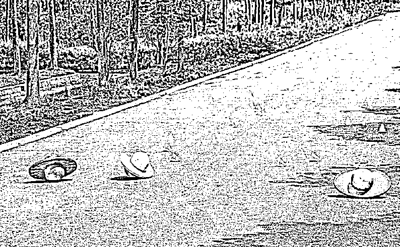**当人们来做占星咨询时，往往觉得生活陷入了胶着状态。在做咨询以前，我一般都会询问我的客户：“你觉得什么是你最近忽略的呢？”陷入困境的客人们往往回答：“我自己。”最典型的情况就是——他们**感受不到第 5 宫带来的快乐**。他们**没有时间娱乐**，像小男孩、小女孩一样，**履行别人的期望**。他们**只顾工作而不休息，希望有一天所有延迟的享乐会来到**。他们就像薇安来到小镇以前的居民们——寡妇还穿着黑色丧服，而丈夫已经去世了 40 年，谁要是喝了柠檬水，就必须向神忏悔。他们都患上了一种隐性疾病“缺乏快乐”，无法纵情于娱乐。在忙于工作的成年人中，这种疾病就像具有传染性。有些人意识到，他们的生活中失去了些什么。也许他们响应放置广告的个人专栏；也许他们向心理治疗师求助找寻已失去的赤子之心；也许他们买了一本书教人怎么释放创造的激情。如果他们向一位优秀的占星师咨询，那么，他一定会鼓励他们在第 5 宫里开一家巧克力店。这些糖果不仅仅是奢侈品，它们也很危险。**如果第 5 宫的快乐不是发自灵魂深处，它将无力去推向其他的宫位。**第 10 宫的事业将进展缓慢，第 7 宫的婚姻会索然无味，第 2 宫的财务会收入匮乏。一旦拒绝了你的第 5 宫，你的整个星图都将遭受痛苦。**书上说我天生不快乐，怎么办？**如果你没有患上抵制快乐的毛病，那真是恭喜你。那么就放下杂志，去寻欢作乐吧！如果你有不堪重负的责任，如果你觉得浪漫的生活已经死去，如果你有小孩要你念故事。我会跟你分享我在与缺乏快乐的第 5 宫较量时的心得。占星学书籍中，对于第 5 宫的宫主星和所落行星做出了很有趣的阐述。书中指出，第 5 宫显示了你的**创意**，还有你**如何表达创意**，还代表你**对子女的态度**，以及你**如何对待自己内心的童真**，同样描绘了你**如何经营浪漫的爱情**，**如何处理生活中与“艺术”相关的事物。**这些阐述很有道理。当你享受乐趣时，你会真实地感受到第 5 宫的原型在叮叮作响。当你觉得生活毫无乐趣时，试着从占星学的箴言找到合适的方法转变你的生活，让它充满希望。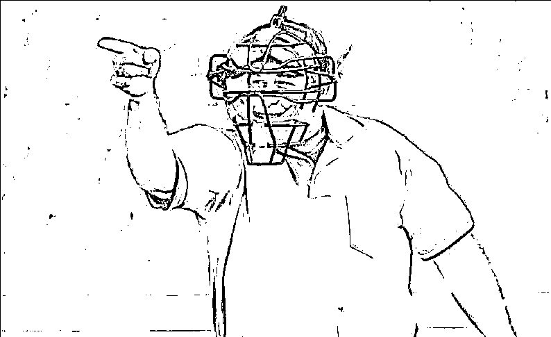去买一本关于如何寻找快乐的书，你就会明白我在说什么。这就像我 11 岁的小儿子在抱怨：“好无聊啊！”带着对他深深的爱，加上我最优秀的创造力，我给他列了一个清单，上面列举了很多能让他快乐的事情。可想而知，他很生气的瞪着我。非常遗憾，**对于如何找到第 5 宫的快乐，是没有说明书可以遵守的，只有在实践它的过程中，我们才能找到快乐。**我的第 5 宫宫头是摩羯座，这就意味着我的第 5 宫主星是土星。在我阅读过的占星学书籍中，这可不是什么幸运的事。没有什么比面对那个严肃的土星更让人不快乐了（现在我知道，为什么我在写这篇文章时一点都不快乐了）。在占星学的书籍中指出，摩羯座在第 5 宫头，意味着我或许不会有小孩，即使有了孩子，他也将带给我悲伤。我确实很晚才生了儿子（土星的延迟作用），但是，到目前为止，他带给我的快乐还是多过麻烦。这些书籍还说，我将在创造性的事物中受到禁忌限制，并且不稳定。我二十几岁时，对于占星学一无所知，我像热爱自由嬉皮士一样生活，渴望创造性的生活。我想过写一本优秀的美国小说，后来又想成为一个短篇小说家，最后我甚至想过写日本诗，但是这些作家梦都渐渐萎缩，直到消失。最后，因为环境所迫，我接受了一份在跨国企业的工作——好多年我都不愿意接受这样的工作。让我十分意外的是，这份工作有趣极了。我获得了很多过去在嬉皮士生活中无法找到的乐趣。我在这个公司工作了 16 年，还获得了升职。让我更加意外的是，在业余生活中，我的写作生涯也有收获，终于也有作品出版。摩羯座杰出的组织性刺激着我第 5 宫的能量。但是，如果在这之前，谁要是向我建议去跨国企业工作，我一定向他扔坚果。我并不是建议每一个第 5 宫落在摩羯座的人都去跨国公司工作。你必须自己去体验。特别是那些你曾经十分讨厌和抵制的事情。解开第 5 宫难题的关键是**自发自愿**——去**不断尝试新鲜机会的意愿**。快乐往往藏在你意想不到的包裹里。对很多人而言，第 5 宫的巧克力店开张时，就会从内心传来呼声：“你不能这么做。你怎么敢这么做，你以为你是谁！！”对这一点，有十分合理的解释。第 5 宫描述了我们的**童年**。在童年的生活中充斥着**禁止反对之声**。父母希望把孩子们野性的灵魂带回现实社会，他们自己的灵魂已经被驯化。**有一些父母将自己未完成的第 5 宫的意愿强加于自己的子女，而孩子们的快乐被压抑。**如果童年时，住在你第 5 宫的吉普赛人就被埋在了地下，那么你就将缺乏快乐。**你怀疑你的直觉。你觉得没有什么事情能让你快乐。你担心你尝试这些让你快乐的事情时会遭到别人的非议，说你任性妄为、不守规矩**——他们也许根本没说什么，但是你就是害怕。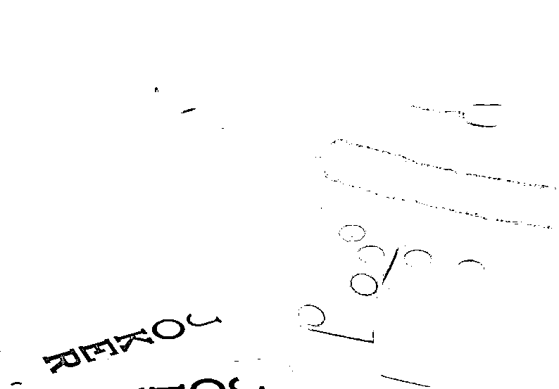**每个人都可以拥有解药**在儿子两岁的时候，我体会到这一点，那时，月亮推进中，月亮来到了我的第 5 宫。那是一段十分典型的日子。我迫不及待地把儿子送到了幼儿园，而我去工作。我问我的儿子想穿哪一件夹克，红的或是灰色的。“红色的。”我把灰色的夹克放进衣橱，他却摇头大叫：“No”。我把灰色的给他，然后把红色的放回衣橱，他还是跺着脚叫道：“No”。为了一件夹克，我和他讨论了好几个回合，每一次他都要我放回衣橱的那件，而不是准备给他的那件。我尝试了一项新战略，我问他是不是想要蓝色的夹克，“yes，”他点头，但是，当我把其他两件夹克放回衣橱时，尖叫又回来了。简单点说，几分钟之后，我感到前未有过的恼怒，把 3 件夹克都扔进了车里。这让我觉得我就像我妈妈一样，试着寻找自己的出路。我向儿子解释，今天早上我有一个重要的会议，需要他的配合，他看起来好像明白了。当我们到达幼儿园时，我想我们已经达成了共识，我问他：“你要哪一件夹克？”“那一件。”他指了指。那一刻我明白，问题解决了。我把 3 件夹克都放到他面前。接下来的事让我更惊讶，在那天早晨，儿子第一次温和的看着我，用纯真甜美的声音回答道：“谢谢，妈妈。”当然，这是关于 3 件夹克的故事，它告诉了我们什么呢？**打破陈规是创造性活动的本质。**不守规矩的态度帮助我们跳出条条框框建立新的关系。看似合理，成人有时可能需要一位艺术家，或者有个孩子。不幸的是，我们并不能随时满足这样特别的要求。那个早餐，并不是儿子不可理喻，而是我。Julia Cameron 从艺术家的角度，对于如何释放第 5 宫的吉普赛精神给予了精彩的建议。在一次称作“禁忌游戏”的练习中，她要求大家列出 10 件事，想做但是却不允许做的。Julia 总是说，**当你写下这些禁忌娱乐时，你已经跨越了实现它们的障碍。**他们在行为上将更加自由。上个礼拜，我就进行了一项禁忌娱乐。当然，我不能告诉你是什么。但是我能说的是，这件事给我带来了快乐和新的力量，让我足以应付我面临的任何挑战。Cameron 的计划中，有一个最基础的解决创造性阻碍的工具，称作**“艺术家的约会”**。这是**自己和自己有趣的远足或者约会**——你必须每周做一次。这都是些很简单、便宜的事情，像是去一个不熟悉的街区转转，只是随便看看，聆听，感受气氛；也可以去打保龄球，或者去艺术展览馆，抛开责任和所受的教育。记住 Cameron 的提醒，你内心里那个扫兴的家伙总会冒出来，打搅或者嘲弄你所做的（“这事多么愚蠢啊，这真是浪费时间”）。诀窍就是——**让自己无论如何都做到这个练习。**你将会收到神奇的回报。

我不清楚 Cameron 是不是懂占星学，但是有趣的是，她将艺术家的约会与第 5 宫联系了起来。她清楚地指出了**如何运用这个“约会”唤醒已经疲惫不堪的冒险精神**。这么做也将**增强父母与子女间的感情交流。**让生活变的快乐可以帮助你治愈第 5 宫的伤口。

当你的生活中多了一些娱乐，你会渐渐找回儿时的那些梦想。这对于成年人来说，是另外一笔来自 5 宫的丰富财宝。著名作家 Sam Keen 写过一个故事，当他还是小孩时，到马戏团游玩，当他看到高空秋千表演时，惊讶得说不出话来，他也想变成一个飞人。他在院子里装上管子绳子去实现他的梦想。

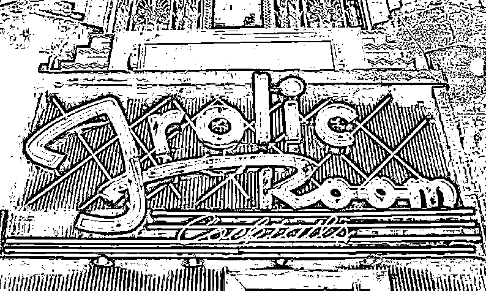

20 年后，当他已经 60 岁，他看到了一则关于飞人课程的广告。反对之声不绝于耳，“你已经太老了，你的身体不够强壮，你这样看起来像个傻瓜。”但是，他听从了他内心的渴望，他想要成为空中飞人。“Do it！”他报名参加了课程，他的身体虽然酸痛，有些瘀伤，对于生命的热情却又一次被唤醒。

当然，感到疑惑也十分正常：如果我们追求每一个第 5 宫的梦想，有时候是不是在愚弄我们自己？我们看过很多人做了些不可思议的事情：没天分的人滑稽地参加“美国偶像”的试镜，软件工程师 50 岁穿了鼻环，股票经纪放弃了体面的婚姻，娶了个跳圆圈舞的演员。难道我们不该给第五 5 宫一点限制么？

**如何正确打开第 5 宫？**罗马作家 Lucius Apuleius 在《The Golden Ass》书中讲述了一个相关的故事。故事的男主角 Lucius 来到了一个魔法小镇，与一个女仆成了好朋友。他看到这个女仆的女主人把一种药膏涂在了身上，就长出了翅膀飞出窗外，Lucius 非常惊讶，他请求女仆帮他偷这个药膏。可是女仆偷错了药膏，当他把药膏擦到身上时，却变成了一头驴子。他成了一头有趣的、无知的驴子，这个女仆跟他开了个玩笑。在整篇故事中，他经历了很多不幸的磨难和惩罚，直到最后吃到了玫瑰。玫瑰是金星维纳斯神的恩赐，吃了玫瑰他就变回了人形。**飞翔的愿望**是深深植入在第 5 宫的。第 5 宫里的吉普赛精神渴望**释放和自由**。但这需要一个过程。你必须搞清楚**你到底需要什么**。你必须**从错误中得到教训**。很明显，Lucius 从他的朋友那里得到了错误的药膏。朋友属于第 11 宫掌管，第 11 宫与第 5 宫相对，这两宫之间存在着**本能的、甚至有益的、紧张的关系。****第 11 宫给了我们来自社会的反馈。他们就像那些和我们一起在运动场或者是公司午餐室的人。**这些人也会参与到我们第 5 宫的娱乐中，比如在酒馆或者是赛马场，但是，他们也可能**使我们误入歧途**，就像 Lucius 拿到了错误的药膏。Lucius 藏在了帘子后面，有些人也藏起了他们第 5 宫的魔力，他们觉得这种自我意识是脆弱且不成熟的。这里的“自我意识”是没有任何贬义的。**良性的“自我意识”是必须的，它赋予人们勇气，去面对第 5 宫的冒险里暗藏的危机和责难**。Lucius 要求女仆给他偷药膏时是无意识的。**但是，如果有意识地去面对第 5 宫的挑战时，将会有巨大的恐惧心理**。如果 Sam Keen 向恐惧屈从，他还会在 62 岁时走向高空秋千么？听起来就像跟第 5 宫清单上的冒险赌博一样：**“我害怕失败。我害怕别人的非议。我害怕失去控制。我害怕我觉得不能相信你。我害怕达不到你的期望，我害怕自甘堕落。”**没有健康的自我意识，就会无法面对这种恐惧。自我意识给了我们勇气和信心去冒险，进行艺术创作，55 岁去溜滚轴，还有坠入爱河。自我意识的火花，让我们的激情燃烧。儿童有很多自我意识，这是一件好事。他们的世界围绕着他们的欲望。天生的自我中心主义会以自然的方式确保他们的生存。然后**在 11 宫的作用下，所有事情都被重新限制，它平衡了自我中心主义。****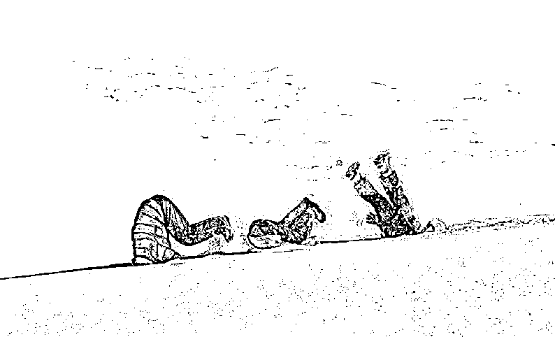**自我意识被斥责，影响和扰乱了整体性。**第 11 宫要求我们做自己，但是要符合社会标准。**如果我们在群体中是受欢迎的，那么，我们的创造将获得鼓励，我们的自我意识将获得想要得到爱和掌声。然而，**如果我们仅仅追求名利，最终将失去最初大胆表现的自我**。**来自第 5 宫的挑战就是要保持你的独特性。****第 11 宫描绘了我们能获得多少爱，而第 5 宫描绘了我们能付出多少爱。**我们心中的爱就像 Lucius 故事里救赎的玫瑰。衡量我们的第 5 宫是否成功，其标准就是我们能**多么自由投入地去爱**——**爱我们的子女、情人伴侣、还有创造性工作**。丹恩·鲁伊尔这样写道：**“对于第 5 宫最重要的测试，包含了在纯正的动机下，一个人能够明确表达他最深层本性的能力，用‘纯粹’的方式是释放自己能量的有效手段。”**这就是唯一的限制：关于第 5 宫，我们所做的事必须是**发自内心最纯粹的爱着的**。我们用这种方式对待其他人，还有流经我们的力量。我们在更高的目标面前迷失自我，有时候只有良好的自我意识才能做到这一点。第 5 宫赋予我们最珍贵的礼物之一，就是邀请我们去**释放天性。**这是非凡的自我在无意识的快乐游戏。我们在那一刻忘乎所以，在这一刻，孩子们成了主人。你可以去观察几个孩子们玩耍，看看他们一会儿玩这个，一会儿玩那个，毫无计划，他们只是做他们喜欢的事情。数一数他们多少次哈哈大笑。你还记得什么时候遇到这么有趣的事情了么？如果你要分析为什么这么有趣，那么，你就体会不到他们的快乐。有时候我想，孩子们笑是因为他们能够这么笑。他们的内心的吉普赛精神还是那么自由自在。你的吉普赛精神也可以这么持久，即使已经成年，但是，你要不断注入新的力量。**当推进或者行进有行星通过你的第 5 宫时，你便有了机会。**很多年前，当推进月亮来到我的第 5 宫，我生下了我的儿子——这是一个黄金事件，让我前所未有地敞开了我的心。这话说起来的确是陈词滥调，我像一辆金光闪闪的新车一样秀了自己一把。我与伙伴合作出书；结束了一段感情，却没有开始新的恋情，但是动机是**爱**！没有任何感情生活变得不可忽视。直到推进月亮进入第 6 宫，我彻底改头换面。再一次对生活充满了热情。也许你的第 5 宫也带给了你光明的力量。现在，开始快乐的生活吧！

**版权声明：**本文由若道翻译发布，欢迎转发，反对抄袭。友号转载请申请白名单。

**其他宫位文章** 

[第 1 宫](http://mp.weixin.qq.com/s?__biz=MzA5NjA0NTAxNg==&mid=2651423092&idx=1&sn=53169f1901b50ce5d406aa45df1a830f&chksm=8b4b33c3bc3cbad5e64428fb653d1478ecdb1068a812985486b0299e1648061aee1a5eab07d1&scene=21#wechat_redirect)丨[第 2 宫](http://mp.weixin.qq.com/s?__biz=MzA5NjA0NTAxNg==&mid=2651424378&idx=1&sn=e0e512b4945987e1c9db4a849a6b4ba0&chksm=8b4b34cdbc3cbddb9a862751c15173684a2eb9a98deb37bacdbc003dfa6010c7e28df5ed0f14&scene=21#wechat_redirect) | [第 3 宫](http://mp.weixin.qq.com/s?__biz=MzA5NjA0NTAxNg==&mid=2651425739&idx=1&sn=b89185e88d277fbcded71a78b15db8c9&chksm=8b4b397cbc3cb06a5d052ca8701e95e2c8bd24ccf7f25712625a9b88ffadbda5d1c4791d7304&scene=21#wechat_redirect)

[第 4 宫](http://mp.weixin.qq.com/s?__biz=MzA5NjA0NTAxNg==&mid=2651426869&idx=1&sn=5c806962caab237741b9af30123c3c9e&chksm=8b4b2282bc3cab94daf6de6788f429ad15cce4f8c61d379f3e6212d5f12f436732eaec19d6c7&scene=21#wechat_redirect)

**达纳·格哈特**一位国际范围内受尊敬的占星师。她为众多占星学网站和出版物讲课、写稿。她在十二宫的月亮激励她对这颗发光体进行了深刻而持久的探索研究。

**系统学习占星学**

**点击下图了解详情**

**微信又双叒叕改版啦，不想错过若道君的推送？**

**就把若道设为星标吧！**

**▼**

就是这个“在看”，戳戳戳 ☟

********报名直达入口********

# 12 太阳星座的变化之旅 | 你离梦想中的未来还有多远的距离？

> 原文：[`mp.weixin.qq.com/s?__biz=MzA5NjA0NTAxNg==&mid=2651427023&idx=1&sn=d0e606aba9632590d4438e33609de729&chksm=8b4b2278bc3cab6e8481dacf6fe8112ae8f205396e35dbaf1729995244a8b47191318c36275e&scene=126&sessionid=1692738111#rd`](http://mp.weixin.qq.com/s?__biz=MzA5NjA0NTAxNg==&mid=2651427023&idx=1&sn=d0e606aba9632590d4438e33609de729&chksm=8b4b2278bc3cab6e8481dacf6fe8112ae8f205396e35dbaf1729995244a8b47191318c36275e&scene=126&sessionid=1692738111#rd)

******☆ ****后台回复“今日”，给你一句生命态度******

作者/大卫·瑞雷  若道占星创始人译者/李含 校对/江艺 编辑/玫瑰 封面/书君 图片/全景网文章来源/《风度》杂志 2020 年未来是可以创造的，还是被命运“判定”的？人本主义占星学提倡每个人都在不断的进化中产生自我觉知，从而一定程度上能够“改变”命运，走向梦想中的未来。那么，12 星座要如何完成这样的太阳进化之旅呢？一起来看看吧。
**不断进化的太阳星座**我的学生和熟悉我工作的人都知道，我有一句座右铭——“未来由你们创造”。它已经成为我的一种口号。对于那些不熟悉现代占星学的人来说，这听起来有些自相矛盾。一个可能预测未来的占星师怎么能说未来是由你创造的呢？这里的假设是：你的未来在某种程度上注定会出现，不管你说什么或做什么，你的行动不会造成与预测明显不同的结果。这种对命运的信仰被称为宿命论。如果我在 1970 年第一次遇到的占星学支持这样一种宿命论哲学的话，它会让我失去兴趣。我会在大学里继续学新闻专业，对这种轻信和悲观的态度摇头。然而，我遇到的占星学被称为**“人本主义占星学”**。出生星图被认为是**“潜力”的地图**。和任何地图一样，出生星图显示事物的位置——**如果你愿意，你可以去哪里，以及到达那里的不同方式，但它不显示你“会不会”去那里**。地图没有指明你将选择去哪里。这取决于你。人本主义占星学是 20 世纪西方占星学重塑的一部分，它催生了对个人成长和潜能发展感兴趣的现代占星学。从 1970 年到今天，这一直是令我着迷的占星学，并且像我的许多专业同僚们一样，它成为了我们将要实践和教授的占星学类型。随着时间的推移，我逐渐意识到，**出生星图中的一切都在不断“形成”的过程中，也就是发展它的潜力——甚至是太阳星座**。你不仅仅生来就是完全成形的白羊座或巨蟹座，你还会像白羊座或巨蟹座一样进化。此外，你的太阳星座所能达到的目标是无限的。当然，创造一个充实的未来，首先**要对自己坦诚，构建适合你自己的生活**。在超过 26000 次与客户的咨商中，我经常被客户创造的生活所打动。很多时候，他们的成就远远超出了我们所讨论的范围，或者说我们双方都没有预料到。然而，在所有情况下，**“自知之明”**是他们能够创造一个更好、更有意义的生活的基础。所以，当你读到自己的太阳星座时，思考一下**你的潜力对你创造一个更富于成就感的未来意味着什么。****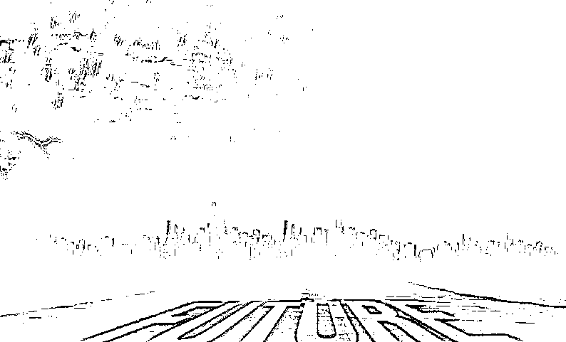****12 太阳星座的未来**1 白羊座

**你通过承认和追求自己的利益来创造你的未来，通常你会毫不犹豫。**然而，这在很大程度上取决于**你如何有效地维护自己**。直率和粗鲁是有区别的。同样，在坚定自信和咄咄逼人之间也存在差异。

学习这些差异是你进化的道路。例如，**你学会了如何处理你的急躁吗？**当你的道路被阻塞时，**找到有成效的事情去做会让你保持敏锐，而不是沮丧**。做好准备，你将是第一个越过障碍的人。

2 金牛座

**你对什么值得、什么不值得的判断，引导你慢慢地、稳步地创造你的未来。**

你不喜欢把精力浪费在没有回报的事情上，但是，找到自己的路并不像你想象的那么容易。有时你会陷入一个**难以改变**的境地。关键是**找到一种方法让你的顽强得到回报**。仅仅露个面就已经成功了一半，另一半则是说服人们给你更多报酬，如果他们希望你不仅仅是露个面。3 双子座**聪明**是一笔巨大的财富。同样，**培养沟通能力**对你创造的未来也有很大的贡献。然而，无论是在人际关系、事业还是生活方式上，选择一种**能激发你的好奇心，并让你保持精神振奋的生活**都是必不可少的。**拥抱变化，成为变化的一部分，让你保持年轻。**你的未来是由你和别人讨论的各种想法塑造的。**紧跟最新的趋势，加上你的社交网络圈子，为你创造一个充实的未来提供了许多选择。**4 巨蟹座作为一个感性的人，你可以**比大多数其他星座更充分地体验生**活。 你的感觉本能地引导着你。你的个人成长来自于**学会倾听和珍视你自己的情绪，而不是评判自己过于情绪化**。大多数决定都是基于情绪的，尽管人们会假装并非如此。**你通过意识到自己的情绪来创造你的未来，这让你处于决策过程的中心。 **不用想太多，你知道该怎么做。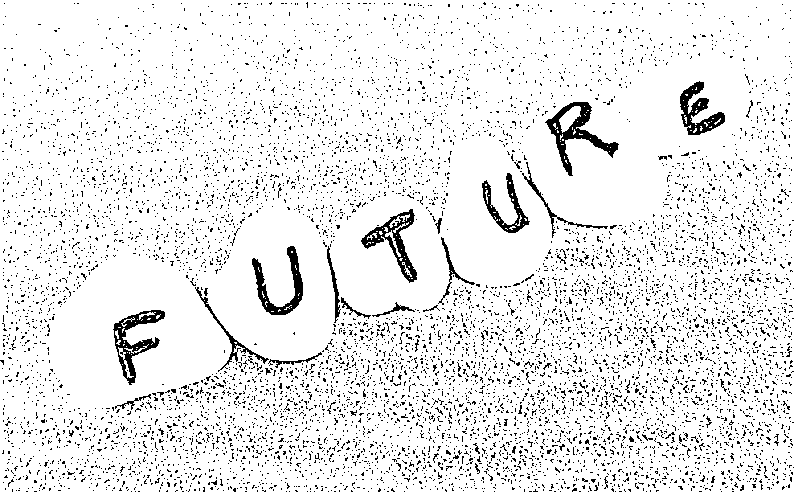5 狮子座你的**魅力和自信**可以帮助你创造一个光明的未来。人们通常**希望你来领导项目，让你展示自己的才能**。然而，信心是随着**时间**建立起来的。很多狮子座的人一开始并不自信。成为你生命中的狮子王或狮子女王需要一段时间。**发现你有多大的勇气**是你故事的中心主题。最终，**你需要掌控自己的生活，创造有价值的未来。**6 处女座通过**专注和实践**，你的未来一步一个脚印地建立起来。**过度自我批评会让自己退缩**，这不会创造你想要的未来。相反，**开发一个专业领域**是你创造一个充实未来的入场券。在你生活的各个领域，你的**实践性和组织能力**帮助你构建你的未来。其他人知道你会做得很好，并感谢你对细节的关注。随着时间的推移，**有条有理的过程最终会让你享受有意义的生活。**7 天秤座你用自己的**人际交往技巧**创造你想要的未来。**建立关系就等同于构建你的未来。** 然而，这样的人际交往技巧不是一夜之间就能学会的。**学会何时妥协，以及如何让自己参与到与他人的交易中**，是一个终生的过程。竭尽全力去取悦别人可能是痛苦的。然而，随着时间的推移，**成功的协议、伙伴关系和合作带来的益处**变得越来越明显。对你来说，**共享的生活就是令人满意的生活，就是充满希望的未来。**8 天蝎座通过**对抗、危机和权力斗争**，你提升了自己**追随激情的生存能力**。**学习辨识你可以信任的人，以及你可以信赖什么，这也显示了你学会信任自己的程度**。**值得信赖的关系**是你创造未来的强烈核心。这样的未来为你提供**对自己生活的掌控感，以及开发资源的能力，展现你有多么足智多谋**。这就是你渴望的未来。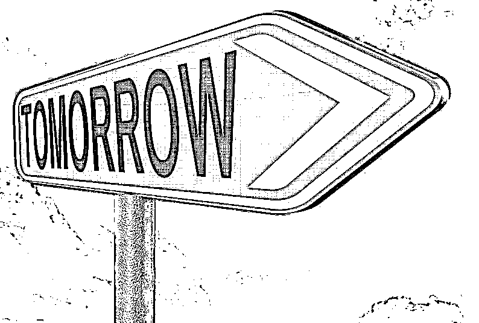9 射手座你把你的未来建立在**创造一个有意义的生活的需求**之上。你的**冒险**随着每一个新的认识而发展，直到**早期的愚蠢和对运气的依赖最终被智慧所取代**。**不愿意被太多的约束束缚，你居住的未来很少会在一个地方驻足太久**。那些和你一样有**冒险精神和学习热情**的人将会成为你一生的朋友。在你的未来，你就像一个**经验丰富的旅行者，知道何时该动身，该往何处去。**10 摩羯座

你只关心**“计划”** ，**不断地为你的未来制定战略**。 

当然，**你的计划会随着你的成功和失败而演变**。一旦目标达成，就开始另一座山峰的召唤。然而，给大多数人留下深刻印象的不是你的成功，而是**在生活击倒你之后重新振作起来的能力**。你的**败部复活**是个人进化的勋章，并为你赢得你所寻求的尊重。站在你未来的琉璃塔顶，你可以对着下面的街道微笑。11 水瓶座你喜欢**思考未来**——很多关于未来的思考。当你看起来超然物外的时候，你大脑中正在勾勒未来的蓝图。当然，你也在**观察你周围的人，想知道自己到底适合什么**。在你所创造的充实未来中，**你的天赋会以某种方式为一个更美好的世界做出贡献，在这样的过程中，你找到了自己的归属**。在这样的未来中，你的朋友和同事希望你保持疯狂。12 双鱼座

当人们问你，你想象的未来是什么样的时候，你通常不会告诉他们。谁会相信你的回答？ 

然而，最重要的问题是——**“你相信你自己吗? ”** **学会相信自己灵感的流动是你创造未来的方式**。成功人士称赞你为**愿景家**。如果不是，那么他们会说你是一个**梦想家**。 尽管幻灭带来了痛苦的负面影响，但是，**灵感的力量将塑造你的未来。你的创造力给你带来的不可思议的可能性远超过其他星座。**

**版权声明：**原创文章由作者授权发布于若道平台，欢迎转发，反对抄袭。友号转载请申请白名单。

****想阅读更多作者的文章，请在后台回复******大卫****** 即可。****

**喜欢文章请长按下方二维码打赏**

**给大卫老师加杯咖啡呗~**

**▼**

**系统学习占星学**

**点击下图了解详情**

**微信又双叒叕改版啦，不想错过若道君的推送？**

**就把若道设为星标吧！**

**▼**

喜欢记得点一下在看哦☟

********报名直达入口********

# 缺了爱与理解，正确就没有了意义 | 斯蒂芬大师谈星图解读

> 原文：[`mp.weixin.qq.com/s?__biz=MzA5NjA0NTAxNg==&mid=2651427023&idx=2&sn=804e1781676f25fa77a69af00431c93f&chksm=8b4b2278bc3cab6e2de285d984fa751cba1e0d9d046b01ad6002d6d33fe45dd9539826ce1c37&scene=126&sessionid=1692738111#rd`](http://mp.weixin.qq.com/s?__biz=MzA5NjA0NTAxNg==&mid=2651427023&idx=2&sn=804e1781676f25fa77a69af00431c93f&chksm=8b4b2278bc3cab6e2de285d984fa751cba1e0d9d046b01ad6002d6d33fe45dd9539826ce1c37&scene=126&sessionid=1692738111#rd)

作者/刘小猫 ISAR 认证占星师

编辑/玫瑰 摄影/赵磊 钱建伟

2017 年斯蒂芬·弗里斯特老师在中国进行了为期三天的整合星图工作坊。这位进化占星学创始人都说了些什么？他智慧的言辞，带给我们怎样的启示？一起来回顾一下吧！斯蒂芬老师还将于今年为大家带来两场线上工作坊，分别是：[爱的内在炼金术：你的亲密关系盲点在哪儿？](http://mp.weixin.qq.com/s?__biz=MzA5NjA0NTAxNg==&mid=2651425190&idx=3&sn=2db805f9cb87d29dc61fd5a3aa5addcd&chksm=8b4b3b11bc3cb2073861c560d59ef6beed77afcab93c9750ac13aeedb4f120ce32ac4c78292b&scene=21#wechat_redirect)和[整合行进、推进以及太阳弧技法](http://mp.weixin.qq.com/s?__biz=MzA5NjA0NTAxNg==&mid=2651425190&idx=4&sn=9f31a2d46ff872ee89bad1d1b35b751c&chksm=8b4b3b11bc3cb2074c6791b46e755ffce09538d00f7297bbca83d387691c9311d25448c4a188&scene=21#wechat_redirect)，一定别错过哦！

我们可以怎样去帮助他人？斯蒂芬老师的开场非常特别，他讲了一个小小的故事。他最开始做占星的时候，第一次来到纽约参加学术的会议，身边的占星师都在交流着艰深的占星学技巧，甚至会因为他分享的内容过于简单而露出匪夷所思的表情。这一切让他惶恐。他说，现在我并不再为自己不懂得什么而惶恐。我们都是人类，但我们在某种程度上都只是猴子。我们通过知道别人所不知道的事情来获得优越感，但是问题是，当你身为一名占星师的时候，你要明确最根本的一点是：**我们可以怎样去帮助他人？**在结束了三天的斯蒂芬整合星图工作坊后，回过头来思索这一段话时才明白，原来在故事的最开头，老师便讲出了最为重要的主线，最最关键的根本。当后续故事抽丝剥茧的展开，细节更加丰富内容更为深入，但是主旨只有一句，**我们应该记得，要怎样运用星图解读去帮助他人？****身为一名占星师，却摆脱不了身而为人的各种劣根性，忍不住想要去突显自己，炫技、卖弄，想要让别人知道我们有多么厉害，想让别人知道，你看我说得有多么准确。让你精准，让你哭泣，让你倍受冲击，而我的 ego（小我）也在这样之下得到满足**。 但是，这是客户她最需要的吗？这样做真的可以帮助到他们吗？对面这个无助的，全然信任你的来访者，他真的需要的是这样对命运的解析吗？当你开始慢慢明白，我们最重要的目的，是为了去支持我们的客户，支持他在生命中获取更大的力量。这个时候我们就明白，一切哪怕正确但不能帮助到这一点的星图解读，都应该被舍弃。所以我们要去决定，在这样浩瀚的星图内容中放弃那些又从哪里入手，而这才是星图整合的关键。**这也是在一名小白占星师，学习完所有的占星学符号后，要运用自己身为人的直觉，你的灵性，去完成的部分。也是在人工智能高度发展的水瓶座时代，机器无法替代的咨询内容**。

大师解读星图的秘密

把你的客户来访者看作是一个跟你一样的人。去感受他的星图，去感受你看到他星图过后那 1/10 秒形成的感觉，那个情绪，最最宝贵。这是从一份钢琴十级考生到一位钢琴演奏家的成熟过程。

**从匠气，到灵气**。灵气是天赋，但天赋的熟练展现，需要不断的练习。任何一位占星大师都把每个占星符号视做自己的朋友，与他们坐下来，沉默一会儿，感受一下这个气氛，而这个时候，你才真正进入到了对星图的解读。

****保********持诚实，回归简单****

斯蒂芬说：**“这么多年过后，我还是愿意从最简单的三元素开始，上升点、太阳、月亮。”**大师的秘密如此简单。这句话从他的第一本书《内在的天空》就开始写起。在我最初接触占星时便读到记得，**上升点、太阳、月亮**，**是星图的骨架**。而在几十年过去之后，他依然保持着这么简单的步骤，从三元素开始。太阳，总是要先从太阳开始，它让你把整个星图整合起来，它是你人生必须活出的部分，是你心智健康的所在。

**工作坊上举例**

一个太阳射手座、月亮巨蟹座、上升双子座的人离婚了，她来找你，你应该跟她说些什么呢？让我们试着从她的太阳入手，射手座的本质是获取生命的经验，是要去敞开去收集，射手座的一辈子会需要活出他人 3-4 辈子的经历，这是射手座灵魂的目的。当你（深刻）了解了这一点，你才会理解她，帮助她看到，离婚的伤痛并不是重点，而是重点是她如何实现自己的这个目标。很多时候，外界世界的经历只是我们内心呼唤的投射，而那些形式的事件只是路途的插曲，如果你能看清自己终点何在，将去往何地时，路上的一切颠簸和挫折，就显得不再难以接受。在这样的主题下，你要再去理解月亮与上升点，上升点在双子座，所以太阳在第七宫，月亮巨蟹座的敏感与小心。太阳与月亮之间的矛盾，她的太阳在对月亮说：“你是一个胆小鬼，你害怕去经历冒险，你没用极了。”而敏感多情的月亮在担心着太阳：“你不要去不要去冒险，你会受伤，我会担心。”去理解这个星图主体骨架的矛盾，就对当事人有了更深的理解。

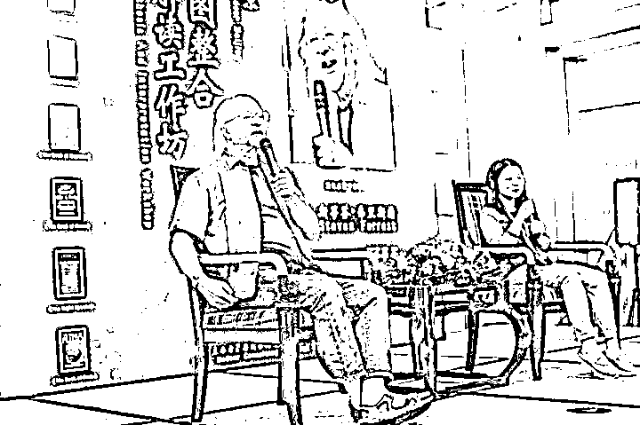

****保********持简单和谦卑****

**当你过度去启用心智时，你的直觉便会关闭，你或许会成为一名颇有技术的占星师，但你不会赢得客户。** 永远要保持简单和谦卑，永远不要忘记停下来询问自己：**“我现在迷惑了吗？”**而这个过程，好像不是你居高临下在给出咨询，而是你也在与他一起探索，你也在诚实面对自己。**保持简单，保持清明**，这是斯蒂芬给出的最简单也最重要的一点建议。不要害怕去掉一些信息，当你感觉到迷惑了，就停下来。看懂星图之下的星图

****最********重要的南北交点****

当然，在太阳、月亮、上升点“三巨头”之外，还有最重要的**南北交点**，这是斯蒂芬所创立的进化占星学里最重要的内容。如果三巨头是这个人的骨骼，那南北交点就是这个人的灵魂，他前世今生所聚集的业力。

而对南北交点的解读，是占星师在准备一次咨询之前的工作。是埋藏于这位占星师的内心深处，却不一定要先去解释给客户的重要内容。即使不提及他，但南北交点的气氛却从未消散。这一解读的方法也恰似南北交点的自身意念。

所以**保持简单，并非是解读的浅薄，而是你如同读书一般把星图读厚之后再去读薄的，返璞归真**。

****看********懂星图之下的星图****

读厚星图，就是要去**看懂星图之下的星图**。

进化占星学的核心与精粹在于，他认为在出生星图的背后还有一张星图，这是由你的南北交点以及相关的元素组成的，有关你的业力，你不断的模式所在。他回答了一个根本的问题：**为什么是我？为什么我在反复遭遇着这一切？**

这是**业力**（Karma）, 斯蒂芬不断提到这个词。**业力，就是过去的灵魂与现在之你的不停互动。**

业力这个概念，对于大多数信奉科学的现代人而言不是一个容易被接纳的词语。即使如我，在经过十几年理工科高等教育之后的占星师，坐在他面前时仍怀抱着一丝怀疑。业力这个东西真的存在么？它合乎逻辑么？它难道不是大师们故弄玄虚的创造么？

如果你也与我一样，科学、逻辑、充满着怀疑，那你会很喜欢斯蒂芬提到的下面的故事。

**工作坊上举例**

一位女性，她很小时父亲就酗酒，她很爱他却无法改变他，父亲很少陪伴在她身边。长大后她渴望得到家庭的温暖，结婚后自己的老公也是酗酒者，而她再一次遭遇了童年时代类似父亲的家庭模式。她感到，这如同命运一般。

这是我们非常熟悉的心理学中关于原生家庭的理论，你的原生家庭造就了你未来的情感关系。

但问题来了，她为什么会遭遇这样的父亲？

一个人出生在怎样的家庭，在他出生之前便已经决定。这不是他的错，但却成为他的命运。到底是什么决定了，他进入到这样的家庭呢？

如果说宇宙的一切都有迹可循，在这里的原因是什么？是不是在他灵魂的记忆深处，有一种这样的模式，有一种声音，想要去遭遇这一切，或者说，想要去解决这样的渴望。如果没有业力，你又如何解决这一切，或者说你相信宇宙的一切遭遇只是随机事件？

业力有点如同他灵魂的声音，所以她一次又一次遭遇到酗酒的亲人，这是她一直在寻求的爱，变成了一种模式，要去拯救一位受伤的爱人，让他变得热情而亲密。这个业力的故事会唤起她灵魂最深处的共鸣，当你讲出它时，对方也感到深刻的被听到。这份理解，可能就是疗愈的关键。

而这份解释把它放在星图解读之中时，一切便变得深刻而聚焦起来。

前面那位离婚的女士，她的南交点在天秤座第七宫，与金星相合。那你读懂了它背后的星图后，你意识到她一直在重复的模式是，被关系所控制。她被困在了爱里，丧失了自己。所以她的太阳得不到满足，所以去调和爱的渴望与自由的向往，是她今生的议题。

而当你记得这个背后的灵魂故事，一切的解读都会有不一样的光芒。**斯蒂芬让我惊艳的是关于木星的解读**。我们总是为木星的部分而骄傲自得，觉得木星代表着富足与乐观，却忽略了可能的困难。而在业力之下，你的木星可能是困住你的优越环境。你成为了一个有钱的可怜鬼，你因为害怕失去富足的物质而小心谨慎。

****占********星师自身的修行与挑战****

每一个占星学符号都拥有高阶形式和低阶实现，星图如同地图，但没有星图可以定义你能否成为伟大的旅行家。没有一个星图拥有遗憾，没有一张星图生而被诅咒。**每一个人都可以活出自己的高阶能量**。

而作为占星师，你要提醒你的客户，警惕自己活在低阶能量的陷阱之中，要不断的告诉他们高阶能量的实现方法。

而我也在问自己，**身为占星师，我自己有理解所有的高阶能量么？如果当我都没有看向那些更高的能量时，又如何帮助他人呢？这对我们自身而言，也是一场修行与挑战**。

故事进行到结尾，工作坊来到第三天，所有的人慢慢意识到，这种只有三元素与南北交点的简单解读，并不那么简单。因为那个背后的星图，一直以各种方式把星图的元素串联起来，交织在三元素之中。不论从哪里出发，最后都会指向一整张星图。因为，每一张星图都是精巧的杰作。

背后的星图，如同一首优美而低吟的背景交响乐曲，始终在占星师的心中演奏，响彻在整个咨询的过程中。不敢忘记，这个人曾经有着怎样的经历？她带着怎样的恐惧怎样的记忆，在生活着这一世。

所以你永远要带着爱与理解，去倾听她，帮助她。

**With Love**

签书的时候告诉斯蒂芬老师，我的北交点在第 12 宫双子座，他点点头，写下很简单的两个字：**“with love”**。

起初我以为他在讲我第十二宫的内容，要带着爱去生活。而当我写完此文，突然明白，他是在告诉我，身为占星师，你的所有咨询，你的所有工作，都要带着爱，对你的客户，更是对你自己。

**现在，有一个好消息要告诉你**

**斯蒂芬老师今年将举办 2 场线上工作坊** 

**点击下图了解详情**

********版权声明：**本文由作者授权发布于若道平台，欢迎转发，反对抄袭。友号转载请申请白名单。******

**刘小猫**

ISAR 认证占星师（2015 年获得）

北京大学心理学专业硕士研究生在读、星译社译者

超过 1000 小时的占星咨询经验

**微信公众号**：沐迦（woodastro）

**预约咨询邮箱**：xiaomaoastro@qq.com

**微信又双叒叕改版啦，不想错过若道君的推送？**

**就把若道设为星标吧！**

**▼**

喜欢记得点一下在看哦☟

********报名直达入口********

# 斯蒂芬&大卫线上工作坊丨爱的炼金术：通过关系开启内在成熟功课

> 原文：[`mp.weixin.qq.com/s?__biz=MzA5NjA0NTAxNg==&mid=2651427023&idx=3&sn=180809f85515fb8f74b1de34a91f7937&chksm=8b4b2278bc3cab6ea7e4dfe09129a05dacca496b0bb8f2bd37be66164e387172bebb59baee08&scene=126&sessionid=1692738111#rd`](http://mp.weixin.qq.com/s?__biz=MzA5NjA0NTAxNg==&mid=2651427023&idx=3&sn=180809f85515fb8f74b1de34a91f7937&chksm=8b4b2278bc3cab6ea7e4dfe09129a05dacca496b0bb8f2bd37be66164e387172bebb59baee08&scene=126&sessionid=1692738111#rd)

**若道独家 3 日线上工作坊**

由于疫情影响，斯蒂芬老师今年的中国之行无奈受阻，但斯蒂芬老师不想他的中国学生们期待落空。在和大卫老师数次线上沟通后，斯蒂芬老师决定**首次开设线上工作坊，**跟**大卫老师**联袂授课，还专门为若道设计了**两大独家主题**：

**10 月 9 日-11 日**

**《爱的内在炼金术—你的亲密关系盲点在哪儿？》**

****10 月 16 日-18 日****

**《整合行进、推进以及太阳弧技法》**

满足中国占星学子对于进化占星学的学习和精进需求，用线上直播课的形式亲赴十月进化占星学之约。

鉴于时差安排，每天上午线上跟斯蒂芬老师学习 4 小时，下午大卫老师会抽取参课学员，进行一个半小时案例解读。对南北交点最有心得建树的两大权威导师，从技法到实践，承包你的知识点。

防疫为重，线上工作坊也省去了学员们舟车劳顿奔赴现场的种种不确定性，我们相约 2020 年 10 月，斯蒂芬老师非常期待和新老学员们在线上工作坊中相见。

**我们将学习什么？**

“找到完美的伴侣听起来是个很棒的主意——但如果你还没有准备好进行进化工作，仅仅找到那个人并不能给你带来多大帮助。亲密始于你所做的内在成熟功课。”

——斯蒂芬·弗里斯特

**-** **此次授课内容** **-**

*   关于自己的本性，你不希望了解的是什么?
*   什么会让别人爱你变得困难?
*   在哪些方面，你的创伤和文化状况影响了你的智慧判断，关于谁才是真正适合你的人?

**关系占星学：比对图**通常集中于两张出生星图的比较。“直接用这种方式来看待感情，就像还没上高中就开始上大学一样。”所以斯蒂芬老师还会着眼于个人星图。

**个人星图上的三个关键区域**在这个工作坊中，斯蒂芬老师将会关注于个人星图上的三个关键区域。

*   首先，我们考虑你的灵魂对于亲密关系的独特要求。你正在学习什么？激情？和平？信任？还是独立呢？
*   其次，我们来破译你星图上关于任何可能阻碍你正确完成任务的警告信息。
*   最后,我们来探讨星图如何描述了你的天生伴侣——也就是说, 如何在编织在你出生星图的象征符号中, 找到与你享有灵魂契约之人的描述—— 在你出生呼吸第一口空气时，这个人可能甚至还没出生。

“伙伴”和“伴侣”这些词总让我们想到配偶关系，但我们在这个工作坊中探索的许多原则也适用于人类的另一杰作：**亲爱的朋友之间的灵魂纽带。**我们当然会尊重所有的性别差异，因为男人和女人努力爱着对方和他们自己，无论他们的灵魂穿着何种肉体的伪装。

**-** **斯蒂芬的占星著作** **-**

1984-1988 年间，斯蒂芬写作出版了《内在的天空》（已有中文版）、《变化的天空》和《天空的伴侣》三本占星经典著作，奠定了早期在占星学界的地位。

2002-2005 年间，他与朱迪·弗里斯特共同创作了两本经典的关系占星学著作《天空的伴侣 I：爱、性、和进化占星学》《天空的伴侣 II：组合图》。　

2008 年，斯蒂芬出版了一本非常重要的著作《昨日的天空》，此书是至今为止关于轮回转世跟星图的清晰对应最详尽的著作之一。斯蒂芬前后一共出版了 12 部占星著作，在世界占星学界拥有很高的声誉。**-** **斯蒂芬获得的荣誉** **-**1985 年，他凭借《内在的天空》一书获得职业占星师协会奖（*Professional Astrologers Incorporated Award*）。1992、1995、2008 年、2018 年，他四次获得占星界最高的占星学联合协会奖（*UnitedAstrology Congress Regulus Award*）提名，2018 年获得轩辕十四教育奖。

**-** **斯蒂芬的占星哲学观** **-**

  斯蒂芬的占星风格以自由和选择为中心，他的解读不是以下定论的方式来“预测”未来，他强调**如何改善生命**，而不是宿命式的论断。他以心理占星学的语言来解读星图上的人格部分，但是通过**南北交点及其相位和守护星**来探索星图所揭示的**前世业力与今生方向**，在灵魂进化的背景里来整体解读星图。

他认为进化占星学的目的在于鼓励人们做出更符合进化方向的智慧选择，我们学习去了解前世的时侯，关注点应该集中在**如何通过意识来疗愈自己**。

**这些名人怎么说？**

斯蒂芬让我们停止了玩责备命运的游戏，而开始看到自己是一个走在进化路途上的勇士。 ——奥普拉杂志“O: THE OPRAH MAGAZINE”

斯蒂芬和杰夫这两位著名占星师创造性地相互应和，展现出他们出色的教师才华，发展并弘扬了占星这门艺术。（对《测量天空：进化占星学和灵魂的钥匙》的书评） ——著名心理占星师 现代占星学之父 诺·泰尔（Noel Tyl）

请享用斯蒂芬和朱迪这两个博大的灵魂在此书中所提供的洞见大餐吧。（对《天空的伴侣》的书评） ——进化占星学的创始人之一 杰夫·格林（Jeff Green）

我为斯蒂芬解读的精准感到惊叹，他强调没有一件事是坏得无法挽回的，也没有一件事是如此之好，以至于它不会因为现在的错误判断而消失的。我怎样推荐他都不为过！ ——好莱坞著名影星“钢铁侠”男主角 小罗伯特·唐尼（Robert Downey Jr）**上过课的占星师怎么说？**他关于我星图的解读，让几乎所有在场的人掉泪，我也从此开启了一段灵魂追寻的旅程。我很惊讶他透过星图可以如此深入一个人的灵魂。很多东西你自己都不知道，但是他讲出来你会发现，啊，这是真的，这是占星学的神奇。——《心探索》创始人孟想每个来参加老师课程的同学，都会被老师深深的慈悲心感动。这种慈悲心，并不是表面上说的一些什么话，而是一种从意识层次上发出的能量。每个来上课的人，都能感受到老师的爱。这种爱，并不是盲目的爱，而是深刻地洞悉真相后的慈悲。——斯蒂芬老师工作坊翻译逸月斯蒂芬老师的一对一咨询已经排期到两年之后，我特别幸运，曾在课堂上被老师抽中分析过我的星图，老师充满爱与智慧的指引让我更加清晰的认识了自我。内在的潜能、需求和矛盾被老师娓娓道来。——禄丽荣斯蒂芬老师是位非常非常值得推荐的大师，很粉他，这位进化占星学的创始人，对人的理解是那么的全面完整、深刻洞见、慈悲和温暖，就这方面而言足可以媲美我无比崇敬的荣格和史坦纳（这两位去天堂里玩了），如果你对西洋占星感兴趣，或者对人的所有角度、各个层次的真相和可能性感兴趣，推荐斯蒂芬老师的书和课程，特别是他的课程，数倍的功力大增的好机会，错过真是占星粉丝的莫大损失。——仁华**2019 年斯蒂芬工作坊学员感悟**

**什么人适合这门课程？**✦ 占星师或渴望成为占星师的人群。   ✦ 本课程并非针对初学者，需具备若道核心课程 level 4 及以上水平，即了解星座、行星、宫位、相位等。✦ 课程会涉及比对图等高阶内容，不了解相关知识的同学，请提前学习相关内容。**斯蒂芬老师其人**

**斯蒂芬·弗里斯特(Steven Forrest)**

*   进化占星学的创始人之一，当今世界最有影响力的占星大师之一；
*   毕业于美国北卡罗莱纳大学宗教学专业； 
*   1984-1988 年间，写作出版了《内在的天空》、《变幻的天空》和《天空的伴侣》三本占星经典著作，奠定了早期在占星学界的地位。前后一共出版了 12 部占星著作，在世界占星学界拥有很高的声誉。 
*   1985 年，他凭借《内在的天空》一书获得职业占星师协会奖（*Professional Astrologers IncorporatedAward*）。1992、1995、2008 年、2018 年，他四次获得占星界最高的占星学联合协会奖（*United Astrology Congress Regulus Award*）提名，2018 年获得轩辕十四教育奖。 
*   斯蒂芬将自己的绝大部分时间都花在教学以及个人咨询上，他于 1998 年创立了占星学徒计划（*Astrological Appretice Program*），这个计划致力于培养职业占星师； 
*   至今为止已经有 600 余位学员完成了培训，其中很多都成为了优秀的职业占星师； 
*   他是一位脚踏实地的导师，充满快乐和活力，亲和幽默同时又充满了智慧；他的课程不仅仅是一次占星知识和经验的学习，也是一次与智者的相遇。

**大卫老师其人**

**大卫·瑞雷（David Railey）**

*   曾任 ISAR 全球副主席、CAPISAR（全球职业占星师资质认证考试委员会）主席，若道联合创始人； 
*   1976 年，通过亚特兰大职业占星师考试，成为全职占星师，随后通过 AFAN 和 ISAR 职业测试； 
*   1980 年，与杰夫·焦耳一起在亚特兰大创建“每日星球”占星学中心。此后在亚特兰大占星协会担任 4 年考官，并且两次担任亚特兰大地区占星协会主席。1979-1992 年，作为占星师活跃于美国社会媒体，向不了解现代占星学变化的大众宣传专业占星学知识。在 1989-1992 年期间，他在 WRGG 电台 12 频道每周主持个人电视秀“今日占星学”，早先他还在 WRFG 的广播节目中播讲宇宙天气节目； 
*   2010-2014 年，任全美占星师联盟监督委员会委员； 
*   2010 年，其著作《灵魂的目标》中国版出版，和蒋颖一起创办若道占星学校和其官网 www.nodoor.com。从该年开始，他工作并往返于亚特兰大和北京。目前他 80%的时间致力于在中国教授和推广西方占星学； 
*   2017 年，被选为 ISAR 委员会成员（2017）。ISAR 是世界最大的国际占星机构，会员遍布 45 个国家，2017-2020 年曾任 ISAR 全球副主席； 
*   2020 年，被推举为 CAPISAR（全球职业占星师资质认证考试委员会）主席，组织奠基资质认证考试委员会成立工作。

**课程费用****早鸟价**：**3800 元（9 月 16 日前付款享受早鸟价）****正价**：**4800 元（9 月 16 日之后恢复原价）****连报 2020 两场线上工作坊，另外赠送 600 元课程券****授课时间、方式和退转****授课时间：****2020 年 10 月 9 日-10 月 11 日（周五、周六、周日），每天 8:00-15:30****8:00-9:45**（15 分钟休息）**10:00-12:00**由于时差问题，斯蒂芬老师教授上午 4 小时课程
**14:00-15:30** 下午大卫·瑞雷老师根据上午学习内容抽取在线学员案例解读**授课方式：**线上直播课，英文授课，中文翻译**退转课程：**退款原则请详看《教学协议》，如有疑问请咨询课程顾问。****斯蒂芬"爱的内在炼金术"工作坊****

**授课老师：斯蒂芬·弗里斯特**

**授课时间：****2020 年 10 月 9 日-10 月 11 日**

**授课方式：**线上直播课，英文授课，中文翻译

**费用：****早鸟价**：3800 元（9 月 16 日前付款享受早鸟价）**正价**：4800 元（9 月 16 日之后恢复原价）

**课程负责人：****王老师**（微信：18510107057，请备注“斯蒂芬工作坊”）

长按二维码添加课程负责人咨询~

****报名请点击“阅读原文”****

# 斯蒂芬&大卫线上工作坊丨学习斯蒂芬星图解读的秘密技巧！

> 原文：[`mp.weixin.qq.com/s?__biz=MzA5NjA0NTAxNg==&mid=2651427023&idx=4&sn=6aca39a91de854b3bf761df1feaa124b&chksm=8b4b2278bc3cab6e07a0281b01ae30130ea9add97768b40bd187200e3b17e24e8aa2e64f3154&scene=126&sessionid=1692738111#rd`](http://mp.weixin.qq.com/s?__biz=MzA5NjA0NTAxNg==&mid=2651427023&idx=4&sn=6aca39a91de854b3bf761df1feaa124b&chksm=8b4b2278bc3cab6e07a0281b01ae30130ea9add97768b40bd187200e3b17e24e8aa2e64f3154&scene=126&sessionid=1692738111#rd)

**若道独家 3 日线上工作坊**

由于疫情影响，斯蒂芬老师今年的中国之行无奈受阻，但斯蒂芬老师不想他的中国学生们期待落空。在和大卫老师数次线上沟通后，斯蒂芬老师决定**首次开设线上工作坊**，**跟大卫老师联袂授课**，还专门为若道设计了**两大独家主题**：

**10 月 9 日-11 日**

**《爱的内在炼金术—你的亲密关系盲点在哪儿？》**

****10 月 16 日-18 日****

**《整合行进、推进以及太阳弧技法》**

满足中国占星学子对于进化占星学的学习和精进需求，用线上直播课的形式亲赴十月进化占星学之约。

鉴于时差安排，每天上午线上跟斯蒂芬老师学习 4 小时，下午大卫老师会抽取参课学员进行 1 个半小时案例解读。对南北交点最有心得建树的**两大权威导师**，从技法到实践，承包你的知识点。

防疫为重，线上工作坊也省去了学员们舟车劳顿奔赴现场的种种不确定性，我们相约 2020 年 10 月，斯蒂芬老师非常期待和新老学员们在线上工作坊中相见。

**我们将学习什么？**

**学习斯蒂芬星图解读的秘密技巧（艺术）！**

*   一名新手占星师可能看着一张星图想知道“我应该说什么呢？”

*   同时，一名高级占星师问道“我应该从哪儿开始呢？”

占星学的基本难题是它产生了太多信息。

所有对**行进**、**推进**和**太阳弧**的准确理解都依赖于对出生星图本身的彻底把握。

这个过程本身就足够棘手了——然后我们发现十几个移动点形成了数百个触发出生星图的相位。

逻辑表明，占星学的一个基本技能就是知道该舍弃什么。除非每次咨询都花上一周时间，否则这个现实是不可避免的。

但是，究竟有什么是我们可以放心地忽略呢? 又有什么对我们的理解至关重要，以至于忽略它会导致无法弥补的错误? 

一个简单的例子是，我们不会浪费时间谈论行进水星与出生星图宿命点之间形成的一个 144 度相位，但意识到我们竟然忘记了推进太阳与天王星形成的对分相！

另一个简单的例子是，我们不要因为木星正在触动她的中天，就贸然试图让一个安静的四宫巨蟹座的人对“成名”感到兴奋, 永远不要忘记对于出生星图的根本性预测，换句话说，当你准备分析一张出生星图的时候，你可以采取系统的步骤来帮助你把焦点对准需要聚焦的地方。有些非常简单，甚至可以通过计算机编程来成。

经过这些初步的准备步骤，我们进入了真正的占星艺术的领域。我们必须将客户当前现实的天气变化与出生星图本身根本的进化焦点编织在一起。我们必须以一种反映自身意识力量、本性和状态的正念方式去做——每一个有技巧的占星师都要学会保持他或她与符号间宝贵的直觉联系，监控任何“过热”的智力迹象。

**- 此次授课内容** **-**

*   斯蒂芬老师总结三大最实用占星预测技法：行进、次限推进、太阳弧推进

*   整合这三种技法能够宏观和微观预测一个人的运势起伏和重要节点

**行进（TRANSITS）**

**长期趋势**

分析行运的最好方法是先将长期的行运趋势列出来。顺序如下：冥王星、海王星、天王星、土星、木星、南北交点。

通过将这些影响力持久的长期行运先列出来，你将能够发现在未来一年甚至更长的时间里你人生中的重大课题。

**短期趋势和触发点**

接下来你需要去观察那些运行得较快的星体，来判断短期趋势。不过，重要的是要清楚，这些移动较快的星体在行运中扮演着事件的“触发点”的角色，特别是当与它们形成相位的个人行星同时也与行运外行星有相位的时候！

**次限推进（PROGRESSIONS）**

通常也被称作“一天代表一年”推运，因为这种技术把出生后的每一天和出生后的一整年等同起来。一旦设定了这个节奏，就像定时释放的胶囊一样，这些次限推进就像某种内部的太阳系一样运转起来，和真实时间的事件、经历、情境应和。

**太阳弧（SOLAR ARCS）**

以太阳为核心，为众星之首，带着众星一起移动,展示人生不同阶段我们是如何体验自我、表现自我、修缮自我。此方法虽非实际星体，但却是星动推运法中准确率最高，实用性最佳的推运方法。

**综合以上技法**

*   我们该描述什么，该从哪里入手？

*   如此庞杂的信息，究竟有什么是我们可以放心地忽略呢?

*   系统的解读步骤来帮助你把焦点对准需要聚焦的地方，哪些是至关重要的？

*   如何培养与占星符号间宝贵的直觉联系，将行进、次限推进、太阳弧推进融会贯通？

**- 斯蒂芬的占星著作** **-**

1984-1988 年间，斯蒂芬写作出版了《内在的天空》（已有中文版）、《变化的天空》和《天空的伴侣》三本占星经典著作，奠定了早期在占星学界的地位。

2002-2005 年间，他与朱迪·弗里斯特共同创作了两本经典的关系占星学著作《天空的伴侣 I：爱、性、和进化占星学》《天空的伴侣 II：组合图》。　

2008 年，斯蒂芬出版了一本非常重要的著作《昨日的天空》，此书是至今为止关于轮回转世跟星图的清晰对应最详尽的著作之一。斯蒂芬前后一共出版了 12 部占星著作，在世界占星学界拥有很高的声誉。**- 斯蒂芬获得的荣誉** **-**1985 年，他凭借《内在的天空》一书获得职业占星师协会奖（*Professional Astrologers Incorporated Award*）。1992、1995、2008 年、2018 年，他四次获得占星界最高的占星学联合协会奖（*UnitedAstrology Congress Regulus Award*）提名，2018 年获得轩辕十四教育奖。

**- 斯蒂芬的占星哲学观** **-**

斯蒂芬的占星风格以自由和选择为中心，他的解读不是以下定论的方式来“预测”未来，他强调**如何改善生命**，而不是宿命式的论断。他以心理占星学的语言来解读星图上的人格部分，但是通过**南北交点及其相位和守护星**来探索星图所揭示的**前世业力与今生方向**，在灵魂进化的背景里来整体解读星图。

他认为进化占星学的目的在于鼓励人们做出更符合进化方向的智慧选择，我们学习去了解前世的时侯，关注点应该集中在**如何通过意识来疗愈自己**。

**这些名人怎么说？**

斯蒂芬让我们停止了玩责备命运的游戏，而开始看到自己是一个走在进化路途上的勇士。 ——奥普拉杂志“O: THE OPRAH MAGAZINE”

斯蒂芬和杰夫这两位著名占星师创造性地相互应和，展现出他们出色的教师才华，发展并弘扬了占星这门艺术。（对《测量天空：进化占星学和灵魂的钥匙》的书评） ——著名心理占星师 现代占星学之父 诺·泰尔（Noel Tyl）

请享用斯蒂芬和朱迪这两个博大的灵魂在此书中所提供的洞见大餐吧。（对《天空的伴侣》的书评） ——进化占星学的创始人之一 杰夫·格林（Jeff Green）

我为斯蒂芬解读的精准感到惊叹，他强调没有一件事是坏得无法挽回的，也没有一件事是如此之好，以至于它不会因为现在的错误判断而消失的。我怎样推荐他都不为过！ ——好莱坞著名影星“钢铁侠”男主角 小罗伯特·唐尼（Robert Downey Jr）**上过课的占星师怎么说？**他关于我星图的解读，让几乎所有在场的人掉泪，我也从此开启了一段灵魂追寻的旅程。我很惊讶他透过星图可以如此深入一个人的灵魂。很多东西你自己都不知道，但是他讲出来你会发现，啊，这是真的，这是占星学的神奇。——《心探索》创始人孟想每个来参加老师课程的同学，都会被老师深深的慈悲心感动。这种慈悲心，并不是表面上说的一些什么话，而是一种从意识层次上发出的能量。每个来上课的人，都能感受到老师的爱。这种爱，并不是盲目的爱，而是深刻地洞悉真相后的慈悲。——斯蒂芬老师工作坊翻译逸月斯蒂芬老师的一对一咨询已经排期到两年之后，我特别幸运，曾在课堂上被老师抽中分析过我的星图，老师充满爱与智慧的指引让我更加清晰的认识了自我。内在的潜能、需求和矛盾被老师娓娓道来。——禄丽荣斯蒂芬老师是位非常非常值得推荐的大师，很粉他，这位进化占星学的创始人，对人的理解是那么的全面完整、深刻洞见、慈悲和温暖，就这方面而言足可以媲美我无比崇敬的荣格和史坦纳（这两位去天堂里玩了），如果你对西洋占星感兴趣，或者对人的所有角度、各个层次的真相和可能性感兴趣，推荐斯蒂芬老师的书和课程，特别是他的课程，数倍的功力大增的好机会，错过真是占星粉丝的莫大损失。——仁华**2019 年斯蒂芬工作坊学员感悟**

**什么人适合这门课程？**✦ 占星师或渴望成为占星师的人群。   ✦ 本课程并非针对初学者，需具备若道核心课程 level 3 及以上水平，即了解星座、行星、宫位、相位等。✦ 课程会涉及行进、推进等高阶内容，不了解相关知识的同学，请提前学习相关内容。**斯蒂芬老师其人**

**斯蒂芬·弗里斯特(Steven Forrest)**

*   进化占星学的创始人之一，当今世界最有影响力的占星大师之一；
*   毕业于美国北卡罗莱纳大学宗教学专业； 
*   1984-1988 年间，写作出版了《内在的天空》、《变幻的天空》和《天空的伴侣》三本占星经典著作，奠定了早期在占星学界的地位。前后一共出版了 12 部占星著作，在世界占星学界拥有很高的声誉。 
*   1985 年，他凭借《内在的天空》一书获得职业占星师协会奖（*Professional Astrologers IncorporatedAward*）。1992、1995、2008 年、2018 年，他四次获得占星界最高的占星学联合协会奖（*United Astrology Congress Regulus Award*）提名，2018 年获得轩辕十四教育奖。 
*   斯蒂芬将自己的绝大部分时间都花在教学以及个人咨询上，他于 1998 年创立了占星学徒计划（*Astrological Appretice Program*），这个计划致力于培养职业占星师； 
*   至今为止已经有 600 余位学员完成了培训，其中很多都成为了优秀的职业占星师； 
*   他是一位脚踏实地的导师，充满快乐和活力，亲和幽默同时又充满了智慧；他的课程不仅仅是一次占星知识和经验的学习，也是一次与智者的相遇。

**大卫老师其人**

**大卫·瑞雷（David Railey）**

*   曾任 ISAR 全球副主席，CAPISAR（全球职业占星师资质认证考试委员会）主席，若道联合创始人；

*   1976 年，通过亚特兰大职业占星师考试，成为全职占星师，随后通过 AFAN 和 ISAR 职业测试；

*   1980 年，与杰夫·焦耳一起在亚特兰大创建“每日星球”占星学中心。此后在亚特兰大占星协会担任 4 年考官，并且两次担任亚特兰大地区占星协会主席。1979-1992 年，作为占星师活跃于美国社会媒体，向不了解现代占星学变化的大众宣传专业占星学知识。在 1989-1992 年期间，他在 WRGG 电台 12 频道每周主持个人电视秀“今日占星学”，早先他还在 WRFG 的广播节目中播讲宇宙天气节目；

*   2010-2014 年，任全美占星师联盟监督委员会委员； 

*   2010 年，其著作《灵魂的目标》中国版出版，和蒋颖一起创办若道占星学校和其官网 www.nodoor.com。从该年开始，他工作并往返于亚特兰大和北京。目前他 80%的时间致力于在中国教授和推广西方占星学； 

*   2017 年，被选为 ISAR 委员会成员（2017）。ISAR 是世界最大的国际占星机构，会员遍布 45 个国家，2017-2020 年曾任 ISAR 全球副主席； 

*   2020 年，被推举为 CAPISAR（全球职业占星师资质认证考试委员会）主席，组织奠基资质认证考试委员会成立工作。

**课程费用****早鸟价**：**3800 元（9 月 16 日前付款享受早鸟价）****正价**：**4800 元（9 月 16 日之后恢复原价）****连报 2020 两场线上工作坊，另外赠送 600 元课程券****授课时间、方式和退转****授课时间：****2020 年 10 月 16 日-10 月 18 日（周五、周六、周日），每天 8:00-15:30**

**8:00-9:45**（15 分钟休息）

**10:00-12:00**由于时差问题，斯蒂芬老师教授上午 4 小时课程**14:00-15:30** 下午大卫·瑞雷老师根据上午学习内容抽取在线学员案例解读**授课方式：**线上直播课，英文授课，中文翻译**退转课程：**退款原则请详看《教学协议》，如有疑问请咨询课程顾问。****斯蒂芬"整合行进，推进以及太阳弧技法"工作坊****

**授课老师：斯蒂芬·弗里斯特**

**授课时间：****2020 年 10 月 16 日-10 月 18 日**

**授课方式：**线上直播课，英文授课，中文翻译

**费用：****早鸟价**：3800 元（9 月 16 日前付款享受早鸟价）**正价**：4800 元（9 月 16 日之后恢复原价）

**课程负责人：****王老师**（微信：18510107057，请备注“斯蒂芬工作坊”）

长按二维码添加课程负责人咨询~

****报名请点击“阅读原文”****

# ISAR 全球线上大会丨关于这个国际占星组织，你不得不知的一切

> 原文：[`mp.weixin.qq.com/s?__biz=MzA5NjA0NTAxNg==&mid=2651427000&idx=1&sn=40b5518a23c8eb62419881a51be4b045&chksm=8b4b220fbc3cab1948b90be1e1d1431516750b9874a0c8af92541452538a3ef9b5c498e844bb&scene=126&sessionid=1692738111#rd`](http://mp.weixin.qq.com/s?__biz=MzA5NjA0NTAxNg==&mid=2651427000&idx=1&sn=40b5518a23c8eb62419881a51be4b045&chksm=8b4b220fbc3cab1948b90be1e1d1431516750b9874a0c8af92541452538a3ef9b5c498e844bb&scene=126&sessionid=1692738111#rd)

很多人都对 ISAR 这个神秘占星组织感到好奇，或许你听过它，但还不了解它， 今天就带着大家一起来重新认识一下 ISAR，了解一下它的前世今生。

ISAR 的建立

ISAR 于 1968 年在俄亥俄州由 Julienne Mullette 创立，她是一个澳大利亚人，在美国生活了很多年，也在其他国家生活过。她在斯卡斯代尔、纽约和瑞士的拉查特莱尼接受教育。此外，她还获得了西方学院的哲学学士学位，并在哈佛大学（Harvard University）的心理学和哲学研究生院（Psychology and Philosophy）、迈阿密大学（Miami University）的宗教学院（Religion）以及巴西的 Filosofia 学院（Instituto do Filosofia）攻读哲学硕士学位。她是 ISAR（国际占星学研究协会）的创始人，该协会的成立引起了泰晤士报对占星学唯一一次提及。

**所以 ISAR 创建于 1968 年，而 1979 年作为非盈利组织成立。 **

1978 年夏天，佩吉·兰斯（Peggy Lance）在 AFA 会议上会见了 ISAR 的创始人、美国 ISAR 第一任主席**朱利安·穆莱特**（Juliene Mullette），讨论如何给这个她 1968 年在俄亥俄州成立的组织赋予新的生命。带着对一个国际社区的伟大愿景，几乎超越自身的时代，并在 20 世纪 70 年代初成功举办几次国际会议。

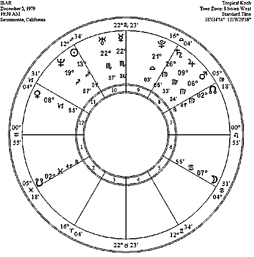

**| **此为 1979 年 12 月 5 日在加州萨克拉门托上午 10 点 30 分，ISAR 组织在西海岸重新成立的星图

ISAR 历任主席

1979-1981 佩吉·兰斯

理事会接受佩吉·兰斯作为 ISAR 新旗手，新成立的占星委员会选择了 ISAR 的成立日期和时间，以突显我们的使命: 通过研究、教育和专业精神，使占星学成为一门严肃的学科。水星和天王星在 22 度的天蝎座合相中天是这个目标最好的证明。从一开始，ISAR 的严肃工作总是以一个美好的聚会结束。如果你不曾注意到我们这些年来在会议上的存在，而分享，这一温暖的社会传统至今仍然存在。

1981-1983 吉姆埃·谢尔曼

吉姆·埃谢尔曼主席带领 ISAR 组织专注于一些严肃的研究。非常活跃的洛杉矶分会每月在 Zip Dobyns 的小教堂举行一次会议，聆听当地、国内和国际的演讲者，如约翰·阿德迪、米歇尔·弗朗索瓦·高奎林、亚历克斯·鲁佩蒂、查尔斯·哈维以及美国研究人员罗伯·汉德和李·雷曼。几乎所有 70 年代和 80 年代的著名占星师都是从洛杉矶来到 Zip 那里，有 30-40 名常客参与热烈的讨论。社交时间总是紧随其后，在一些尖端的计算机数据的帮助下，形成了一种巨大的学术纽带，从而引发了研究讨论。

1983-1985Carol Tebbs

Carol Tebbs 主席推动了第一个 ISAR 会员目录，以促进联络，使我们的会员能够在当地聚会并形成研究小组。在经历了多年的财务困境后，ISAR 终于恢复了盈利，有机会在 UAC 举办一场轰动一时的联合会议。ISAR 也是第一个向会议发言人支付“酬金”的机构，开创了至少适度专业认可团体的先河。为了改善教育环境，这个两年一度的会议在加州的惠蒂尔学院举行。

1985-1987 罗克珊娜 缪斯

Roxana Muise 接掌主席之位，立即开始将 ISAR 磁带整理好，随后，整理 UAC 磁带。她很早就意识到，ISAR 的磁带档案包含了世界上最伟大占星师的宝贵讲座和工作坊，他们中的许多人已经不在人世。固定货架上的 ISAR 图书馆得以保存，目前已捐赠给开普勒大学图书馆。

1987-1989 佩吉·兰斯

佩吉·兰斯主席再次掌舵 ISAR。ISAR 又一次和其他机构共同发起了 UAC ' 89，是在路易斯安那州的新奥尔良举行。ISAR 开始了一项储蓄计划，目的是能够从产生的利息中为研究和赠款提供资金。储蓄和投资战略今天仍在实施，这使 ISAR 获得了安全资源，为每届 UAC 和我们自己的会议提供了若干奖学金名额，并投资于研究项目，比如将收集到的数据输入计算机格式。

1989-1991 佩吉·兰斯

佩吉·兰斯继续担任 ISAR 主席，Zip Dobyns 继续把她的房子作为中心会议地点结束，在那里，ISAR 委员会每个月会聚一次。在此期间，ISAR 委员会与 Lois Rodden 达成协议，帮助开发 Rodden - ISAR 数据库，或称为 RID 或者 AstroDatabank。马克·波登格(Mark Pottenger)致力于细化类别和构建程序，而露易丝则致力于收集和纠正数据。在那些日子里，计算机数字运算仍然相当缓慢，输入所有的数据是一项艰巨的任务。董事会资助了雇用一名工人，将数据输入到 RID 中以加速这个过程。我们继续享受在南加州加州州立大学多明戈斯山的“小学院”校园举行的双年度 ISAR 会议，哲学系主任慷慨地赞助了我们。

1991-1993 卡罗·蒂布斯

随着电话会议的到来，卡罗·蒂布斯（Carol Tebbs）主席推动扩大 ISAR 董事会，将全国各地的董事纳入其中。开设全国各地 ISAR 领导分区让 ISAR 的成员人数迅速增加。与此同时，还积极征求国际副主席提出季度报告，这有助于确立我们的国际名称。这十几位国际副主席在国外推广了 ISAR，并向会员报告了他们国家的占星性质。ISAR 继续共同赞助在华盛顿举行的“UAC 92”，本届 UAC 大会吸引了来自世界 41 个国家的占星师。

1993-1995 卡罗尔·泰布斯

卡罗尔·泰布斯身兼 ISAR 主席和 UAC 95 协调员两职。ISAR 在加州蒙特雷举行的 UAC 主席会议上发挥了积极作用，这次会议聚集了全国各地占星团体的负责人，对共同问题的解决方案进行了头脑风暴。ISAR 是 ARC 理事会的一名代表，它为国际代表们提供了论坛。与来自世界近 50 个国家的其他占星师建立联系，以解决社区问题，促进了 ISAR 进行面对面国际对话的愿景。它也实现了 ISAR 的愿景，增强了占星师的专业形象。

1995-1997 雷·梅里曼

雷·梅里曼（Ray Merriman）作为主席开启了一个新时代，他与 ARC 在密歇根州成功召开了两次会议，在芝加哥召开了 ISAR 专业会议，带来了许多新成员。与 ISAR 的形式一样，网络在扩大受众方面发挥了重要作用。互联网通讯的发展，加上我们的很大一部分会员是“科技迷”，这就开启了董事会成员之间的在线通讯论坛和每日电子邮件通信。ISAR 向社区捐赠了长期资金用于开发 RID （Rodden-ISAR 数据库），Lois Rodden 发现一个新的合作伙伴能够更好地将有价值的资源数据作为研究工具提供给公众。

1999-2001 雷·梅里曼

再一次，当 Ray Merriman 掌舵时，ISAR 在 2000 年 10 月在加州阿纳海姆举办了一次有史以来最令人难忘的会议。本周最引人注目的两件大事是：格伦·佩里（Glenn Perry）和迈克尔·卢廷（Michael Lutin）领导的道德培训，以及大卫·科克伦（David Cochrane）领导的 ISAR 认证项目。针对这些问题，ISAR 提供了一个论坛并与其他团体和占星师建立了联系，以获得他们对我们社区中各种占星学科的关注。第一次，在专业实践中工作了至少 10 年并完成了一天的道德培训的占星师在“祖父原则”仪式上获得认可，并收到 CAP（认证职业占星师）证书。

2001-2003 大卫·科克伦

大卫·科克伦（David Cochrane）带头推动 ISAR 向天文实践和研究的高标准迈进。在佛罗里达州马尔科岛与 OPA（专业占星师组织）的联合会议证实了 ISAR 致力于培养专业精神和保持高道德标准。

2003-2009 雷·梅里曼

作为 ISAR 的总裁，雷·梅里曼（Ray Merriman）继续与 ISAR 的副主席 Chris McRae 开发 ISAR 认证项目。2004 年 4 月，理查德·斯穆特（Richard Smoot）和吉赛尔·特里（Gisele Terry）在佛罗里达州马尔科岛（Marco Island）举办了第一次 ISAR 咨询技能培训。从那时起，ISAR 认证需要 ISAR 咨询技巧培训，并成为 ISAR 最成功的项目之一，培训范围遍及全球——包括美国、阿根廷、巴西、智利、土耳其、塞尔维亚和俄罗斯。

2020 ISAR 线上大会

**2020 ISAR 线上大会周四正式开票！**

**200 张转发助力优惠票上线 24 小时抢空**

**ISAR 大会为什么这么火爆？**ISAR 作为**国际上****最具声望****的占星组织**每届 ISAR 占星大会都是业内盛事，周边酒店爆满，各国占星师不远万里飞到美国，只为亲历**国际一线占星大师云集的盛会。**

往年大会的每一个时段都有 2-3 场演讲同时进行，一天中要经历一次次的纠结割爱错过，即是英语水平再好，因为很多演讲主题专业性和前瞻性都很强，总有一些生僻词汇让你一脸懵。

人在他乡，想找个志同道合、水平相当、沟通顺畅的小伙伴探讨也不是很容易，更何况现在国内疫情不稳，美国更甚，根本无法实现出国参加群聚性活动的愿望。**若道作为 ISAR 中国唯一附属学校****协办的 ISAR 线上大会有哪些优势？**

省去请假、机票、住宿、时差、

舟车劳顿以及感染风险，不用同时段取舍选择，

每一场主题演讲全都要；

**若道专业翻译团队翻译制作字幕，**

省去中文口译时间，

实时 GET 最精准的知识点，

**14 位国际一线占星大师****，**

每一位大师的智慧和课程都价值不菲。

**这次的两个大主题和我们每个人的未来息息相关：**

该如何迎接 800 年一遇的**木星-土星合相在风象星座的新纪元**？**2020 年美国总统大选**更是时下热点，对于未来几年的大环境有着关键影响，绝对是咨询、社交中含金量满满的社交货币。句句出自大师之口，踏实放心消化吸收。

**觉得有点儿高深？**

还有 8 位中国 ISAR 认证占星师

**点评解读**帮助你加深理解，

没来得及看直播，

或者觉得内容太棒了想看回放？

咱还有**三个月的视频回放权限**，

关键是价格太美丽了，

**会员优惠价**抢到就是赚到，美滋滋~

**绝对是职业占星师、占星爱好者们不容错过的知识宝藏**

**第一波转发优惠价****已经售罄**

**给手慢的宝宝们准备的****第二波的优惠抢票方式：**

全价票：1080 元

1、购买 ISAR 会员，享受**780 元**的家族会员价，ISAR 会员每个月都有星光俱乐部沙龙

2、不购买会员，可以呼朋引伴，三人团报，每人 880 元，**限量 20 个团****（目前还剩 6 个团）**，售罄恢复原价

**关于 2020 ISAR 全球线上大会**

**日程安排、演讲题目和参与方式**

**请点击下图链接，了解详情**

**微信又双叒叕改版啦，不想错过若道君的推送？**

**就把若道设为星标吧！**

**▼**

喜欢记得点一下在看哦☟

**参加大会直达入口**

# 9 月 12 日处女座沙龙 | 没有“处女座”会“死”，信不信？！

> 原文：[`mp.weixin.qq.com/s?__biz=MzA5NjA0NTAxNg==&mid=2651427000&idx=2&sn=153e46a42e5e3050ece33fd310aff8f7&chksm=8b4b220fbc3cab19b8d0aaa85fb240f205541be33dbe9c243b026f9556228ef2111a392ac36c&scene=126&sessionid=1692738111#rd`](http://mp.weixin.qq.com/s?__biz=MzA5NjA0NTAxNg==&mid=2651427000&idx=2&sn=153e46a42e5e3050ece33fd310aff8f7&chksm=8b4b220fbc3cab19b8d0aaa85fb240f205541be33dbe9c243b026f9556228ef2111a392ac36c&scene=126&sessionid=1692738111#rd)

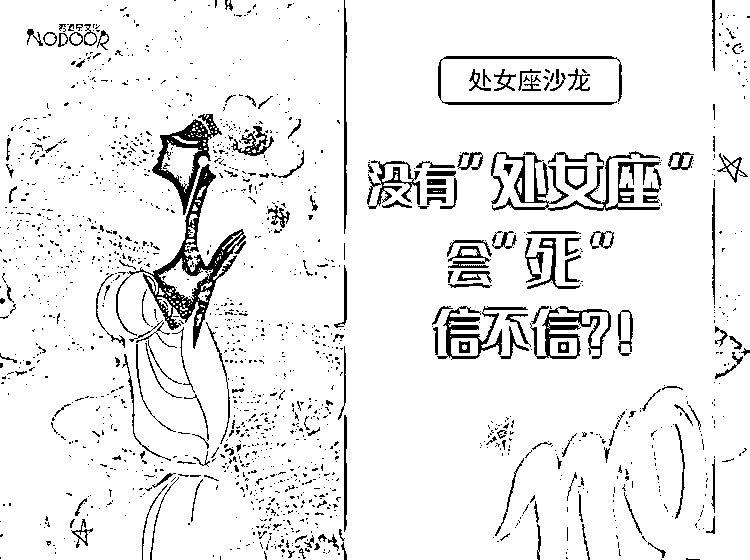

“这是吓唬人的鬼话吗？中元节的第二天，当我打开电脑，准备写这期线上沙龙发布稿时，这句话就这么直愣愣地跳进了我的脑海。在脑海中铺开星图，我看着处女座所在六宫的位置，看着它对面的十二宫，我觉得这句话既不是唬人的，也不是标题党，是真的。在我继续写下去之前，我担心着这样的表达是否会被若道主编给毙了，结果不是没有处女座会死，而是说这句话会死，这火星在白羊座尾度的凶猛，射手座人也就这样豁出去一把了，自嗨自嘲一下。言归正传，处女座很认真很务实，甚至可以说是很较真的，乱说话，是会惹处女座冷面忽视，并继续正儿八经地跟你讨论：当下最重要的是 1、2、3；现在要修正的细节是 1、2、3；这样做是最有效最省时省力的 1、2、3；我们的方法是 1、2、3；你觉得这样是不是更好 1、2、3……是的。这就是“处女座”。我们的日常生活也好，应对当下的困局也好，急着想找到突破口也好，无论你是不是处女座，无论你的星图长什么样，我们都需要习得一些处女座的“品质”与“方法论高手”的能力。我们生活的方方面面是由无处不在的处女座构成的，无论世人曾经怎么黑过处女座，或许只是对“好习惯养成、坏习惯要改”的恐惧与逃避吧？或许是对“精益求精、精耕细作”的不耐，对“服务品质提高的苛求”不耐？可我们也一样追捧过“匠人精神”、“高端品质、顶级服务”吧？在疫情和空污的紧逼下，我们也了解“健康、干净”“照顾好自己和他人”之必要吧？再怎么不想“工作”，有一份“活法”总要吧？种种这些引号下的表达，都是关于处女座的存在，请问，没有这点活着的能力和品质，活着，容易吗？！现在水星在处女座，正同土星形成六分相，你觉得这场沙龙会演变成为“处女座”正名的严肃沙龙吗？不会的。等开讲的那天，水星进了天秤座，金星进了狮子座，依旧讲得欢，依旧不会有任何偏袒，滴答依旧如常来分享——一个星座纯然的能量体所呈现的不偏不倚的状态，也一定会如常地提醒大家，我们在运用该能量失衡时，会产生的负作用。处女座喜欢“依旧、如常”，喜欢“干货”。即使你以为星图上中没有任何处女座的指征，你也有“处女座天然存在的位置——六宫”，也“处女座守护的领地，无论你喜不喜欢处女座，都邀你来听听沙龙的分享，感受和反思一下，如果还能带一些干货走，去应对当下的局面，以及日常就不可或缺的活法，或许更好，不是吗？处女座也喜欢“更好”，这样的“更好”都合适吗？来听听看就知道。9 月 12 日，依旧两小时的线上沙龙，好好介绍“处女座”及其相关的 1、2、3……我也依旧会提前在学员群里和大家互动交流。总之，等你。——滴答**”****参与方式****活动时间****：2020 年 9 月 12 日 19:30-21:30****活动费用****：直播免费（视频回放需单独付费）**

**人数限制****：300 人（报满即止）**

**沙龙地点****：线上直播**

**参与方式****：报名成功后，请添加客服微信（微信号：nodoorDaivd），获取线上直播地址**

**长按下图二维码报名**

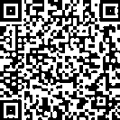

**注意事项****Q：我如果报名参加此次活动，有什么注意事项吗？**
**①** 报名后务必添加客服微信（nodoorDaivd）获取入群方式；**②** 登录直播平台时，请用报名时提交的用户名登录，登录名称不匹配将会被请出直播平台； 

**③** 直播当天最好提前半小时登录，测试下直播平台登录流程，同时请尽量确保一个较为稳定的网络环境，以便有一个较好的直播观看体验；

**④** 该直播如需回看视频，需另行付费，报名后请准时参加。

**更多活动信息**

**请长按下方二维码联络客服**

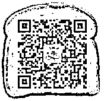**关于滴答老师**“

滴答老师是 ISAR 认证占星师，也是我在人生道路上的好友，她丰富的人生经历和对于内在诚挚，坚定的探索，对于中国道家，佛家修行的深入实践，面对无常而发展的智慧和勇气让她对占星学发展出深入而独特的理解。我很有幸在人生道路上有她相伴，也很有幸请她把对占星和人生的领悟分享给更多人。

**——若道创始人，蒋颖**

**”**

********报名直达入口********

# 金星进入狮子座｜一年中最适合玩乐、恋爱的一个月开始了！

> 原文：[`mp.weixin.qq.com/s?__biz=MzA5NjA0NTAxNg==&mid=2651426918&idx=1&sn=69f99af6e407c9566540f2f4ea6f4ea3&chksm=8b4b22d1bc3cabc77580c4d45ae7d9e8b3c9db29e377b65549a1e99b624352229fd8990108ae&scene=126&sessionid=1692738111#rd`](http://mp.weixin.qq.com/s?__biz=MzA5NjA0NTAxNg==&mid=2651426918&idx=1&sn=69f99af6e407c9566540f2f4ea6f4ea3&chksm=8b4b22d1bc3cabc77580c4d45ae7d9e8b3c9db29e377b65549a1e99b624352229fd8990108ae&scene=126&sessionid=1692738111#rd)

********************☆ 后**********************台**********************回复“今日”，给你一句生命态度********************

作者/郑玮玲 ISAR 认证占星师编辑/玫瑰 图片/全景网 9 月 6 日 15:21，金星离开温柔内敛的巨蟹座，进入热情昂扬的狮子座，并将在狮子座行进 28 天，直到 10 月 3 日进入处女座。金星在狮子座的这段旅程会有哪些高光时期呢？接下来的一个月我们值得去体验什么，创造什么呢？**多维视角的金星**人见人爱的金星是除了月亮之外我们最熟悉的地球邻居。在繁星点点的黄道上，金星总是升落在晨曦与薄暮时分，古人对金星的称谓正是“启明星”，也是“长庚星”——这取决于金星在三维视线里所在的位置：**地上或地下**。在东西方的传承里，占星学都起源于人类对星空的观察和记录。而今，当我们要去深入理解一颗行星在三维世界的运行时，也要回到内在视野去“看见”它们行进、变化的轨迹。

金星是让我们**具有“人性”**的行星。金星的符号是精神与灵性的“圆”与代表物质世界的“十字”的联结，意味着太阳所代表的独立精神体。月亮所代表的久远深邃的情绪体共同作为生命在运作时，同时还兼具的动物性——生而为人的行为产生了。当然，这部分的运作还有火星的共同参与。在金星的原始动力中，我们感受到内在的缺失，向外去寻找，填补“空白”。如果我们的心空了，我们就想把它填满，金星就是那个想要填满的动能。

爱与美能将我们作为人感受到的内在空白填满，金星是爱与美的原型。金星与**金钱、财富、价值**共振，所有能为我们带来喜悦和满足，感受到宁静、平衡、和谐的事物都是金星的原型。

**而黑暗的金星能量会呈现出令人着迷、缺少觉知的引诱，这是内在缺失、欲望的投射。**偶尔陷入欲望的满足和对快乐、享乐的抓取也是生而为人再正常不过的事——谁都有人性的一面，我们值得满足自己。然而，**纵容、懒惰、迷恋、滥用**都是在金星的道路上的迷失与堕落。想让自己的金星运作正常，就要取舍适度，做出正确的选择。放弃错误的事物是属于金星的智慧。

**金星在狮子座****狮子座是火象固定星座，意味着恒常的精神直觉与行动。**狮子座共振黄道第五宫，这是关于**孩子、玩乐和创造**的宫位。狮子座被太阳所守护，而太阳就是真我，宇宙的中心。狮子座的关键词包含**：活力、多彩、舞台、戏剧、华丽、游戏、孩童、才艺、信心、国王**。狮子座是**鼓励玩乐、享受快乐、支持创造力、激励自信心、实现魄力**的王者星座。在身体层面，狮子座与**心脏、心血管系统和上背部**有关。心，是生命的动力中心，信心的源头。当我们挺直背颈，如雄狮一般昂扬的英气自然向外散发，向世界展示着自我的精神与意志力。当柔美的金星在狮子座，就呈现出盛大的精神之美。**随着金星的行进，我们会渐渐感受到鼓舞、激励的价值，乐于通过创造性的方式，轻松、娱乐的途径进行自我激励，走向积极的自我实现。**金星行进在狮子座，每个人都有机会选择令自我悦愉的方式激发心的活力，显耀内在价值。

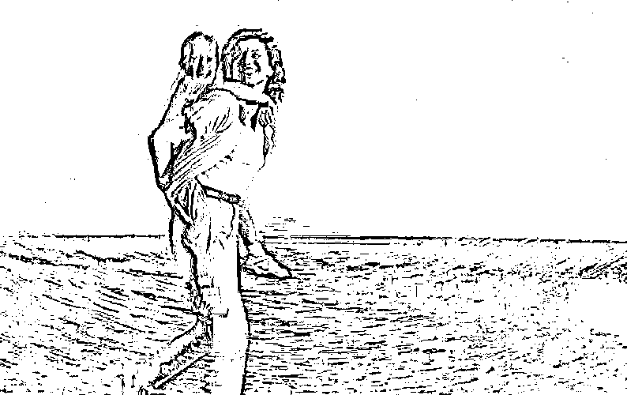

**金星在狮子座值得做的事**投入创造如果你正在进行创造性的工作，拥有创造性的想法、感受，那么接下来这段时间非常值得持续将这股创造性的能量发挥出来。**当我们活在一种自在无束缚的状态中，就能与内在天然的创造力相联接。**狮子座的创造力其本质正是生命的状态，生命就是一个创造性的过程——来自于创造，也终将投入于更为丰富、庞大、持续的创造中。人生所有领域里经历的从无到有的过程：知识、学历、人脉、资产、职业、家庭、孩子等等，从出生死亡，都在经历各种大大小小的创造，一步步演化出真实自我的创想与追寻。积极表现**勇敢去表达自己的创意、想法**，我们可能会感受到不适、不自在，但狮子座的金星指引了我们显化价值的可能性。如果你感受到内在有一束光，当你去呈现它的时候你就会自带舞台效果。没有人不渴望闪耀，只是他们还没准备好登台。享受被爱狮子座的金星鼓励我们去**勇敢地爱**。狮子座最核心的语义正是：被爱。所有魅力、魄力、慷慨都是在吸引外在同频的爱的联结。而金星将爱的联接变为强烈、炫烂的现实，大胆接受向你涌来的爱，被爱和渴望被爱是不需要羞涩和掩饰的。这是内在温暖力量吸引来的你的族群，勇敢走近那些温暖的面孔，执著的双手，热烈的拥戴。拥抱华丽狮子座的光华耀眼、热烈，就像莎士比亚的戏剧，充满了离奇的美妙与转折，也可能放大了内在某个空白。金星在狮子座盛大的爱，对应的拥抱和亲吻是热烈的，掌声是如潮的。有些人可能因此感受被强烈光线照射得不自在。其实金星永远在提醒我们：**你值得**。不管你是否有狮子座的能量，金星经过此位置总是通过华丽、盛大的方式给予我们欢乐和享受。敞开自己心，允许它的柔软、易感。

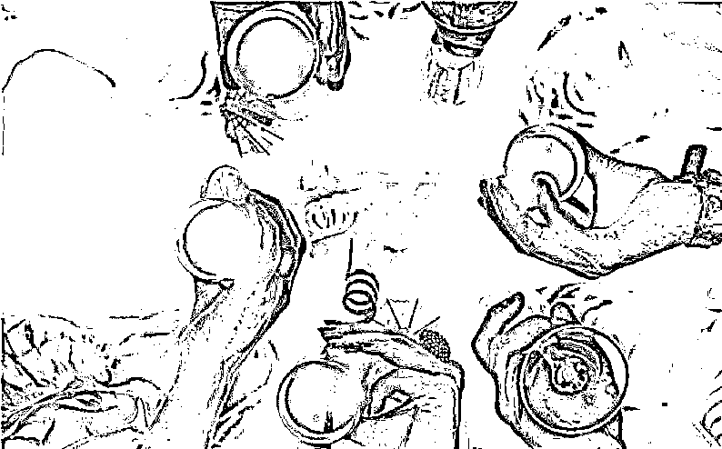

慷慨奉献金星在狮子座指引我们**从内心深处散播爱和光彩，用温暖的力量，慷慨的心去分享、去奉献**。当我们有能力的时候，会自然承担社区、集体性的厚望和责任，向外奉献的过程更能回向我们内在的爱与拥戴，巩固自我价值与信心。玩乐有益金星与狮子座最共振的一点是**鼓励享乐，制造欢乐**。玩乐对于人类是创造力的开端。当我们严肃的时候是要进行程序化的工作，只有我们不在规则之中才会让创造造力诞生。没有一个自然分娩的过程是需要被计划和干预的，任何一个创造都是积累的过程。金星行经狮子座时，正是我们需要**轻松、玩乐、享受**的时机。不要把日程安排太满，留一些随机的空白；玩乐的时候不带目的，让“目的”自然呈现。不管玩乐高玩具、水晶奇石、牌卡、宠物、网络游戏、手工、乐器、竞技，花艺，只要是投入你真正的兴趣，感受到当下的快乐，并且享受过程与成果，便能找到全新的更有活力的自信。才华舞台金星行进狮子座最能引起对于舞台的兴趣，舞台是一个充满魅力的、完成创造力，收获掌声与喝彩的最佳位置。每一个渴望活出狮子座能量的人只要被鼓励就有了舞台，才华就得以施展。用爱的动能去表现才华是可以点燃内在宇宙，照亮生命寒夜的。因为才华是用来庆祝生命的，是无条件的爱的火花。**金星狮子座的舞台** 当真实自我尽情演绎在人生舞台上，光芒就自然绽放，在红尘中我们孜孜渴求和艰辛磨练为的不过是炫烂的一瞬间。这个夏天热播的综艺节目《乘风破浪的姐姐》是完美的金星狮子座的演绎。姐姐们就是金星，她们代表了女性的柔美、优雅，爱的绽放，也尽显了狮子座的才华、自信、领导力、魅力和无限的创造力。

在三个月里，三十岁以上的姐姐们从独立的个体走向有凝聚力的团队，在一轮轮竞赛、磨练、挫折与伤痛中进化出了越发自信的光彩。狮子座的能量是要经历野外生存考验的，火象星座都包含了冒险与竞争的原动力。尽管其中的某些姐姐天生并不爱好竞争，不喜欢出风头，不在意 C 位，但是，竞争与较量能激发出内在的毅力与向上的精神——**回到原野般的兽性中，为着生存而绽放自己，**这是真正的狮子座精神。

一个人必须为了活出更好的自我而接受挑战：辛巴也在经历生命的劫难和流离之后重新焕发了生机与自信；乘风破浪的姐姐们本已具备演艺才华，仍要经历重重考验去超越自己，巩固信心。聚光灯下所有热情四射的表演，每一个打动人心的画面都闪耀着她们一颗雄雄燃烧的心。在团体共同的成长与竞赛中，原来觉得自已不需要争取的金晨会开始提出自己要被看见的要求；对唱歌失去过信心的万茜重新恢复了歌唱甚至唱跳的自信；原本不敢担当队长，只愿跟随的郁可唯也愿意站出来承担责任，超越了自已作为歌手曾经的完美，尝试了曾经无法做到的唱跳和说唱。

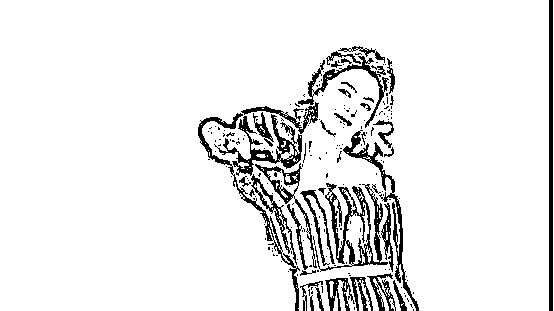

| 《乘风破浪的姐姐》中张雨绮的表演在所有的姐姐中，只有张雨绮是从头到尾都彰显出纯粹狮子座本色，她一开始就不掩饰说要站 C 位，要出道，要红，连睡觉的床铺都不放过 C 位。而她很有观众缘，她积极、率真，无论演出还是台下生活中都呈现出天然戏剧感——这是大众喜欢的，自带舞台吸引人关注。张雨绮自带狮子座天然的高光高调，无关她的技艺精湛与否，人设是否完美，就是这种充满“人味”的天然感带给了人欢乐的感受。因为狮子毕竟是丛林动物，越有动物性，越能激发出属于人类的活力与欢乐。观众与明显之间的联结属于金星的爱，也是一种无条件的爱。台上的人享受灯光打向自己身上的荣耀，那是对生命的聚焦和关注，这样的光足以点亮狮子座的勇气与魄力。而台上的她们用内在光点亮了台下的世界——心灵的世界，爱和欢乐被灌满，精神被激励、鼓舞。所有的人都在为一种精神所感动，这种精神就是：**自信**。**金星四分金牛座天王星**9 月 9 日-9 月 22 日**重点影响人群**：个人行星、四轴、交点位于狮子座、天蝎座、水瓶座、金牛座 2°-18°的人群。金星、天王星相遇从来是一场刺激的冒险历程，尤其是狮子座的金星会更加有勇气去面对天王星的电光火石。**在情感上的刺激、兴奋可能是短暂不稳定的，如果不能承受随后的画风突变，就要保持自我主张和距离感，不过于主动或避免失去理智地投入一段关系。**否则，就需要加倍恢复元气的能力去面对兴奋之后的断裂。当金天相位触发个人星图时，你真的可能遇到一个怦然心动的人。如果不想面对失去，就要先去做一些天王星的工作：**主动断裂一些不需要的旧有能量、模式，从更高层的视觉看到未来的可能性，选择先锋的道路**。**财务上剧烈的变动可能会出现在这段时期，避免过于猛烈的投资行为，参考专业理财建议。**

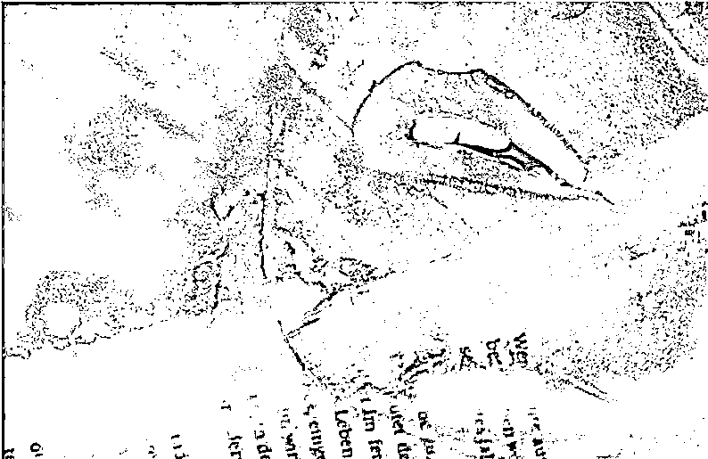

**金星三分逆行在白羊座的火星**9 月 24 日-10 月 3 日**重点影响人群**：个人行星、轴点、交点位于狮子座、射手座、白羊座的 19°-29°的人。
金星在一个月前才经历完与火星的四分，这一轮三分相顺畅了很多。在关系中的人可能感受到有利的交锋、交集，无论是家庭中还是职场上，这个相位可以支持我们去**健康地经营关系，有机会将旧有矛盾、误解一笔勾销**。如果你渴望一段新的关系，当你自信满满的时候，可以去尝试一些积极、主动的社交，显示你的才华，接受热情、积极的回馈。不管是否能进入亲密程度，只是努力积攒信心，就能将自己往更好的方向推动，稳定的自信心是我们人际美好的法宝。**金星、木星、海王星形成“上帝的手指”**9 月 22 日-9 月 24 日**发生度数**：狮子座、双鱼座、摩羯座 17°-19°，有个人行星、轴点、交点位于这些度数范畴内的人需要特别关注。“上帝的手指”格局是一个非常难以调和的相位，这段时期，狮子座的金星分别与摩羯座木星、双鱼座海王星形成精准的梅花相，而木星、海王星处在六分相的位置。在这三天里，**金星所代表的金钱、价值、情感层面会遇到到真理、边界上无法调整、协调的议题。**如果能在此之前稳定价值体系，避免对非我的意识和不必要的扩张、冒险付出精力，或许能减少一场混乱带来的丧失感。

**版权声明：**原创文章由作者授权首发于若道平台，欢迎转发，反对抄袭。友号转载请申请白名单。

**郑玮玲**

ISAR（国际占星研究协会）认证占星师（2016 年获得）

若道占星专栏作者

将占星咨询、教学与音乐、舞蹈相结合的疗愈者

**微信号**：zhengviolin

**新浪微博**：@郑玮玲

**微信公众号**：Sampriya-Astrology

长按打赏

**系统学习占星学**

**点击图片了解详情**

**微信又双叒叕改版啦，不想错过若道君的推送？**

**就把若道设为星标吧！**

**▼**

就是这个“在看”，戳戳戳 ☟

********报名直达入口********

# 蚊虫叮咬、过敏、扭伤、痛经、宠物疾病……使用顺势药物全搞定！

> 原文：[`mp.weixin.qq.com/s?__biz=MzA5NjA0NTAxNg==&mid=2651426918&idx=2&sn=47003e01ef825357bfc600a72bcf458d&chksm=8b4b22d1bc3cabc73973a16a5f22ede2580b1282842833b52584194b6d5ccf9dd5792578b314&scene=126&sessionid=1692738111#rd`](http://mp.weixin.qq.com/s?__biz=MzA5NjA0NTAxNg==&mid=2651426918&idx=2&sn=47003e01ef825357bfc600a72bcf458d&chksm=8b4b22d1bc3cabc73973a16a5f22ede2580b1282842833b52584194b6d5ccf9dd5792578b314&scene=126&sessionid=1692738111#rd)

作者/苏·汤普金斯

 编辑/玫瑰 图片/网络

顺势疗法具有天然、安全有效、无副作用、整体医疗等特点，那有没有什么案例呢？特别是急救小药箱的案例。答案是：当然有啦，以下是一些案例。**蚊虫叮咬**这是卢女士的邮件：“一定要写这封邮件告诉您，用了 Apis 以后，我的脸已经完全消肿了。实在是太感谢了！”几天前，不知被什么昆虫叮咬导致卢女士整个脸都肿了起来，大概是由于她是过敏体质，以至于脸肿得非常严重。她找到我，咨询如何通过顺势药剂急救她目前的状况。刚好她自己有家庭顺势急救药箱，所以我告诉她使用急救药箱中的 Apis 这剂。在使用 Apis 后，卢女士的脸迅速开始消肿，我建议她如果她想快速完全消肿治愈，可以连续几天里每天都服用 1-2 次 Apis，这样脸部很快就会完全好了。**严重扭伤和长期关节炎**吉尔原本是一个 60 岁但依旧健康的护士，她很喜欢占星学。她参加了我的一个课程，但是她当时的状况很糟，之前，她不小心摔倒并且伤及了右脚踝，而受伤的右脚踝由于无法承受重量，进而导致她的左脚踝也承力过重而开始疼痛。这还不是最糟的，除了双脚脚踝的问题，她的两个膝盖也开始出现关节炎的症状。当天我甚至都不敢相信她的状态竟然这样糟，她几乎是一瘸一拐地到课堂来的。我立即决定先帮助她缓解痛苦，我马上给了她“家庭急救药箱”中的 Amrica，然后在接下来一周的每天给她服用 Bryonia。一周后，她的疼痛已经缓解了一大半，并且可以很自然的走路。吉尔回家后依然每天服用 Bryonia，脚踝和关节炎在持续的转好。吉尔甚至还去参加了著名的“格拉斯顿伯里音乐节”。在信中，吉尔提到：“在顺势药剂的帮助下，脚踝和关节炎正在迅速恢复中。目前，受伤的右脚踝还是有些肿，但是已经可以完全正常走路了，并且可以完全承力，这在使用‘家庭急救药箱’中顺势药剂以前是完全做不到的。左脚目前也仅仅是有些肿，但是完全不疼了。至于膝盖，仅仅是在上楼的时候有一点疼，下楼的时候，即便是在我提了很多东西的情况下也完全没有问题。”最近一次与吉尔的交流中，我进一步得知，她在整个使用急救箱中顺势药剂的过程中完全没有使用其他药物和治疗，目前她的严重扭伤和关节炎已经治愈 90%了。**痛经**有一次，我和几个朋友聚会，其中一位年轻女士当时正值生理期，并且正在遭受痛经的痛苦。通常她会习惯吃止疼药，但是当天她没随身带着止疼药，药店也已经关门了。当时我们几个人在咖啡厅，我没有办法给她做深入的、长时间个人咨询去找到正确的顺势药剂。但是，她说“她特别想抱一个热水袋放在肚子上”这一信息提醒了我，我可以用急救药箱中的 Mag Phos 试一下。刚好我出门随身带着急救药箱，所以我找到 Mag Phos，并跟咖啡厅服务生要了一杯热水溶解给她服用，大约在服用药剂 30 分钟左右的时候，这位女士说她感觉肚子非常舒服了，并且也没那么疼了。她觉得顺势疗法太神奇有效了，所以决定要预约顺势医师帮助她彻底解决痛经的问题。**过敏**顺势疗法改变了我的人生！我通过顺势药剂 Allium cepa 30c 治愈了困扰我 12 年的过敏症状！在尝试顺势疗法以前，我尝试了非常多的办法。我打了 6 年的过敏针，尝试过专柜药物，做过健康饮食调理，也积极锻炼身体，但是以上任何一种都没有解决我的过敏问题。我非常感恩我能够认识并为自己和家人选择顺势疗法。玛丽亚·林格美国犹他州 2011 年 1 月 20 日摘自 www.extraordinarymedicine.org**宠物耳朵产生过多分泌物**我特别想要分享一件几年前使用家庭顺势急救药箱治愈宠物狗的事。我曾经养过一只很漂亮的贵宾犬，它饱受耳垢分泌过多带来的痛苦。许多年来，我只能不断地带它看兽医，经常给它的耳朵清洗和滴药，但一直没有解决问题。最后，兽医建议，唯一的解决办法就是给它的耳道做调整手术。在那次看完兽医回家的路上，我刚好经过一家保健商店，里面有很多保健书。一本叫做《适合宠物的顺势疗法》的书吸引了我的注意，我决定买下它。回家后我认真阅读，关于宠物耳朵过多分泌物的问题，书上建议使用“家庭急救顺势药箱”中的 Hepar Sulph 药剂。我抱着试一试的心态购买了“家庭急救药箱”并开始治疗我的贵宾犬。仅仅经过一周的治疗，它的耳内环境变得干净正常，不再有过多分泌物。一直到 14 岁去世那天，它的耳朵都保持了干净正常。我将这个方法也分享给了一位朋友，她家的可卡犬也有同样的问题。如预期的那样， 她家的可卡犬也得到了完全的治愈！事实证明，顺势疗法非常有用，我希望我的经历可以帮助大家更多的认识和了解顺势疗法，哪怕仅仅是一点点。莎莉·奥林 美国犹他州 2012 年 11 月 26 日摘自 www.extraordinarymedicine.org

****请在后台回复 顺势 获得更多****关于顺势疗法内容********

**版权声明：**本文由若道翻译发布，欢迎转发，反对抄袭。友号转载请申请白名单。

**学习顺势疗法**

**请点击下图了解详情**

**微信又双叒叕改版啦，不想错过若道君的推送？**

**就把若道设为星标吧！**

**▼**

就是这个“在看”，戳戳戳 ☟

********报名直达入口********

# 宫位全解析 | 你健身、恋爱、工作，可在这个宫位仍旧不快乐

> 原文：[`mp.weixin.qq.com/s?__biz=MzA5NjA0NTAxNg==&mid=2651426869&idx=1&sn=5c806962caab237741b9af30123c3c9e&chksm=8b4b2282bc3cab94daf6de6788f429ad15cce4f8c61d379f3e6212d5f12f436732eaec19d6c7&scene=126&sessionid=1692738111#rd`](http://mp.weixin.qq.com/s?__biz=MzA5NjA0NTAxNg==&mid=2651426869&idx=1&sn=5c806962caab237741b9af30123c3c9e&chksm=8b4b2282bc3cab94daf6de6788f429ad15cce4f8c61d379f3e6212d5f12f436732eaec19d6c7&scene=126&sessionid=1692738111#rd)

****************☆ ****************************后台****************************回复“今日”，给你一句生命态度****************

作者/达娜·格哈特
译者/葡萄园的女巫编辑/玫瑰 图片/全景网
**第 4 宫，是你跌下来的地方**小时候，至少有一两个暑假，妈妈会要求我和妹妹到后面山上做苦工——拔草。杂草必须连根拔起才会不再生长。当我到山上拔草的时候，妈妈在厨房，她离我很远，我认为她看不到，于是我偷懒了。 不快乐的情绪就像是杂草，如果不能连根拔起，它会不断生长。但是，谁又乐意深入去探究这些情感生长的土壤呢？通常很难找到情绪来源的根本。一般如果推进或行进中，月亮与土星发生了相位，你的情绪会受到不好的影响。如果你和大多数人一样，你会**忽略这些沮丧的情绪**，然后在你爱的那些人面前，**戴上一张快乐的面具**。或者装得很有爱心，或者很冷静，或者忙于工作。你可能忙于塑造第 1 宫的形象，寻找第 7 宫的伴侣，建立第 10 宫的事业，但是，最很残酷，最后你会失败，第 4 宫就是你跌下来的地方。 
**书上说得都不对？**这和我在占星学的书上读到的可不一样，书上说，我的太阳落在第 4 宫，我会深深眷恋我的家庭。童年时的确如此，但是，所有 10 岁的孩子也都是如此啊！成年后，当我搬到离家千里的地方自立门户时，我感到十分高兴。书上说，我的家庭会供养我。但是，我在 20 年里只见了我父亲两次，我妹妹数次把我踢出她的生活，爱冒险的白羊座妈妈在斯洛伐克买了房子。当听到别人用感伤的语调讲述着他们多么想念自己的亲人时，我就像一个人类学家在观察别国的文化。我了解他们的宗教仪式，但是并不理解。 书上还说，我会十分珍视我的家族，或者喜欢寻根溯源搞清楚家谱。但是，和表亲姑姑叔叔这些亲戚的家庭聚会，在我五岁以后就没有再继续了。我有很多姑姑和姨妈，但是我并没有好奇心去弄清楚她们的名字。我也不会拿出一堆旧照片来回忆我的这些家人，寻找我的根。当我儿子出生，我既没有让他跟我姓，也没有跟他父亲姓，我给他重新编了个姓。我喜欢这个姓的读音，觉得这么做很有趣，比让他跟那些我根本不认识的祖先姓有趣多了。 书上还说，我第 4 宫的太阳会给我带来房地产方面的好运。这很有趣，拥有一间自己的房子是我很多年的梦想。我非常渴望能够有条件买房，在 20 几岁到 30 几岁，每次经过一片漂亮的住宅区，我都会十分的羡慕。他们为什么能买房子，而我怎么就不能呢？这看起来简直就成了不能完成的梦想。的确，太阳所在的宫位见证了你的英雄之旅，而买个房子就是我的梦想。 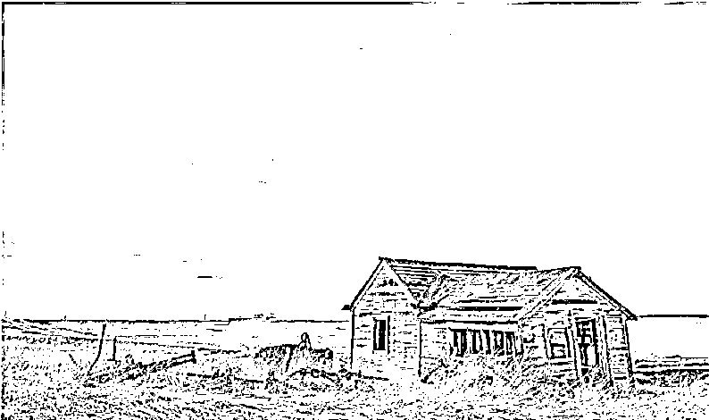当我购买第一间房屋时，绝对是个里程碑。我在市场暴跌的时候卖了它，赔了不少钱，但是，我的第 2 个房子却让我赚了一大笔。我的幸运似乎只是与市场周期有关，和占星血没什么关系。很多人赚或赔的周期都和我一样。 昨天晚上，一个好友来电话，说有一个很急的投资机会，“Rogue Valley 开始繁荣了。如果我们现在买一间商铺出租，5 年之后就能靠这个养活自己了。一定不要错过这个机会。”我想起了第 4 宫的太阳，这对我来说真是巨大的诱惑。内心里，我想要成为一个不动产的资本家。虽然这还不能断言什么。 **此“家”非彼“家”**关于 4 四宫的教材都不是完全的正确，我需要更加深入——回到最基本的原理。表面上看，太阳在第 4 宫意味着出生在午夜。这是星入中最原始的角落。在 4 角宫中，古埃及人把太阳称作白天的神，上升点是太阳初升之时象征了开始，中天是正午的太阳最高点象征着一个人公开的成就，下降点是日落时，太阳的力量在此时开始下降并渐渐消融。第 4 宫，也就是下中天所在，这里的太阳神隐藏在死亡和新生之间。**下中天描绘了一个转变的过程，从昨天到明天的过程。 **

**不论你出生时，哪颗行星落在了第 4 宫，它都具有午夜的性质**。每当夜深人静，你闭上眼看到的，就会是第 4 宫的领土。当你在黑夜中独自一人，你会感受到第 4 宫。所有落在第 4 宫的行星都将**隐藏在你的内心深处**。

这与处在第 10 宫的行星不可避免地公开性相反，它们具有**十分深刻的私密性**。与咨询客户谈论他们第 4 宫的行星是十分困难的，这些行星代表的事件已经十分清楚。

*   冥王星在第 4 宫，会让你的童年充满了隐匿的事件和权利的斗争；
*   海王星在第 4 宫，代表在你的家庭中有一个从不被谈及的秘密；
*   土星在第 4 宫，会让整个家庭都充满了恐惧和控制。

你可以跟客户们谈起这些往事，但是，一旦开场谈论这些他们曾经的经历，对于当事人来说都不是愉快的经历。 闭上你的眼睛，你看到了谁？看到了什么？那就是你的第 4 宫。我建议人们多关注一下第 4 宫，这里有你记忆里的家庭、你的祖先、你血液流动的节奏。**第 4 宫就是你的家，它会提供足够的安全感让你能触碰到自己的内心世界。**但是，你可以在这里发现更加神奇的东西。第 4 宫就是你的精神家园，你的根本所在，它将给予你力量重新振作。很多次，你需要重新出发，如果先下降到你的第 4 宫，你将可以做到这一点。我的太阳落在了第 4 宫，这让我花了很多年的时间才认识到，我的英雄之旅不仅仅是买一间房子，而是去创建一个家，也是一个心灵之家。我并不是一次就明白了这个道理，也是经过了多次的磨砺。 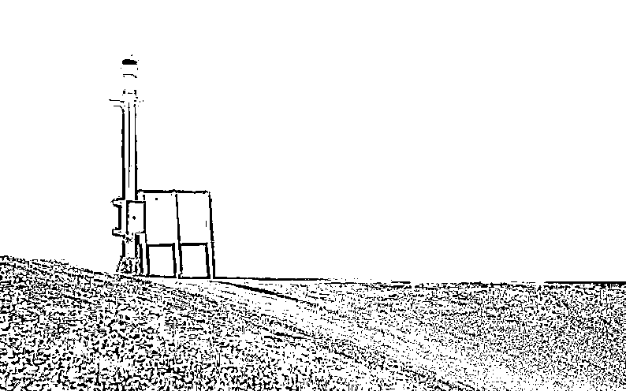**回家的路要怎么走？**在描述第 4 宫的行进或者推进情况时，显而易见的事件就是体现在我们常说的**“家庭”**概念上。冥王星或者天王星在太阳返照图中可能表示你将会有个新家；海王星可能意味着你需要注意家里管道泄漏或者水管事故，还有在地下室发现了有毒物质，或者闹鬼等等；当土星行进来到第 4 宫时，也许你会觉得家庭的约束和责任让你难以承受。 表现在外在的事件，往往也在内部情况中有相映的体现。冥王星行进到第 4 宫，将会赐予你重新出发的力量，也会给你的婚姻带来争执；木星行进在第 4 宫的这一年，你会有一个宽敞的家，而且家庭给予你无限的支持；如果火星行进到第 4 宫，那么，也许会有人侵入你的家庭，更典型的是带来不断的争吵，这段时间，家里将充满火药味。 但是，从更加内在的角度来描述第 4 宫的运程情况就不是那么容易了，虽然这种影响更加普遍。不愿回忆的往事也许如决堤一般的迎面而来。梦境中的形象变得格外尖锐，你的身体觉得十分疲惫。你可能非常想宅在家中窝在床上，把被子盖在脸上。这些迹象是告诉你，你需要**周期性回归自我**了。 Clarissa Pinkola Estes 在《与狼共舞的女人》一书中，详细描绘了这种心灵回归的过程。她为这个故事设计了一个女主角——“海豹姑娘”。有一天，一个猎人在海边看到一群漂亮赤裸的海豹姑娘在跳舞，她们要在舞蹈中穿上海豹的皮毛，重回大海。猎人忍不住偷了一个海豹姑娘的衣裳，强迫她做自己的妻子，生儿育女，并承诺她，7 年以后就把衣裳还给她，让她离开。 这种情况下，海豹姑娘只能接受猎人的要求。7 年过去了，她想要回她的皮毛衣裳，但是猎人改变了主意，把衣服藏了起来。海豹姑娘无法返回大海，她的家。她的皮肤开始干枯，她的眼睛开始模糊，她的身体开始枯萎。她就像那些我们不忍注视的无家可归的人一样。 **“对于无家可归的恐惧经常会萦绕我们心底，”** J. Edward Chamberlin 这样叙述，“我们之所以不愿注视街边那些流浪汉，其中一个原因就是不愿靠近内心的恐惧。”或者是一些我们已经知道的。慢性的抑郁症和疲劳状态是现在的流行病。他们把这称作是一种**“精神掠夺”——一种内心上的无家可归者。**如果我们太长时间没有进入第 4 宫去探求生命的根源，我们将面临这样的情况。 我们都曾经历过海豹姑娘那样皮毛衣裳被偷的事件。我们都曾向某一些人或事妥协，或许是某些利益，或许是一些偷心的感情关系。有时候，过于天真、单纯，让我们很容易遭遇这种**精神上的偷窃**。我们也许已经在超支购物，或者参加了一些奇怪的宗教团体。但是，并非所有的“精神偷窃”事件都是坏事，有时候也会变成好事——这也许会让我们**脱胎换骨**。 **在精神需求和公共生活的要求之间，不可避免地存在冲突。**第 10 宫的社会角色要求第 4 宫提供支持。第 2 宫要求我们提供物质支持，孩子们把我们拖进第 5 宫，伴侣们要求我们关注第 7 宫。在海豹姑娘的故事里，猎人可以被看作是我们的**自我意识**。他驱使我们去面对外面的现实世界。但是这也让我们**远离了内心的本源**，我们会**失去精神支撑的力量，不论我们最初的选择有多正确。 ****行进或者推进有行星影响第 4 宫时，我们的精神力量可以得到恢复。**这种力量也有可能来自于**有行星通过中天**。行进影响中天时也同样影响到了下中天，我们总是把目光投向在事业或者公众身份下遇到的麻烦。**但是，支撑外部生活的正是我们的灵魂，我们不能忽视去建立一个强有力的内在基础。**如果要在内心世界与现实生活中寻找平衡，我们必须保持与第 4 宫的联系，**遵循自然的、节奏周期性的心灵回归。 **第 4 宫将告诉我们**如何给自己添加燃料**，它暗示了我们穿上海豹皮的感觉。如果 4 宫头落在金牛座，你的基础将来源于物质上的感官享受，沉浸在熟悉的让你感觉安全的环境中，做你常做的事情；而水瓶座的第 4 宫则需要做出一些打破常规的事情，享受毫无牵绊的自由就能获得心灵上的滋养；白羊座的第 4 宫需要周期性的穿上印着“我我我”的兽皮。 **我可以忘记很多重要的事情**几个月前，我突然在午夜惊醒，四周一片漆黑，我独自在家。两年前，搬到俄勒冈州时，我就是独居。我意识到，这就是我第 4 宫的意义所在，我对自己说，是时候面对这一切了。在内心里，我觉得这一切就像午夜里最熟悉的那间屋子，但是却感觉笨拙和陌生。就像两个老友交谈时突然的沉默，两人都觉得不再那么了解对方了。我不喜欢这种静默，我会选择打开电视，读一本书，继续睡觉。 萨满教的巫师通常会问那些抑郁沮丧流离失所的人们：“什么时候你们开始对静默无声感到不安？”他们还会问你：“什么时候不再唱歌，不再跳舞了？” 我已经很久不在家中吟唱起舞了——这表示海豹姑娘需要找回她的皮毛，重回大海的怀抱了。还有其他的征兆也在提醒着我，我感到难以承受的疲劳，对美食不再有热情。各种俗事纠缠在我的生活中，新的追求、新的成功压力，很多无意识的感情负担又回来了，从前的感情伴侣、内心里关于自我价值的信息、新沉溺的爱好。我的根系曾经帮助我深入扩展了我的梦想、我的思考、我的内心的安宁，从这里我，深入地了解了我自己，也更加清楚我为了什么而存在。就像现在，当我的写作思路陷入僵局，我就会给我的根系更多养分。 我不知道接下来的生活是一种进步还是倒退，但是我的第 4 宫在射手座，我需要自由。我买了自己的房子，然后搬出去住。在头两个月，生活简直一团糟，之后就彷佛身在天堂。在卧室里，我可以抛开一切外在的身份，母亲、女儿、占星师、作家、伴侣、朋友。我可以尽情释放我的压力、不安、成功与失败、尚未实现的愿望。我可以什么都不做，什么都不是，只是静静坐着，呼吸！我身边的世界又重新变得开朗，我的情感和健康得到修复。这些情况都是在你与第 4 宫进行了良好的沟通之后。 在 Deborah Houlding 关于传统占星宫位的著作中，对第 4 宫统治地位的描述简直像一首诗。**“我们所经历的一切，都要追溯到这个基础和根源，就像宝物和宝藏、矿藏和大地、水井和水源。这里决定了一切的基础，决定了最本质天然的东西。不管是肥沃的土壤还是沼泽，或是石头山或者沙漠，一切都必须有地球的支撑。这里指出了所有事情的开始和结局，这里描绘了你的童年，以及那些无意识的感情模式的原因，还有老了以后的弱点，走向死亡的过程，还有葬礼。” **如果只是了解父母和不动产的情况，对于第 4 宫的资源真是一种浪费，关于第 4 宫表示母亲还是父亲一直存在争议。这个争议开始于第 4 宫原始宫主行星的不确定。在传统占星学中，太阳是第 4 宫的原始主星，那么，第 4 宫就代表了父亲。在现代占星学中，将月亮作为第 4 宫的原始主星，这样，第 4 宫就扮演了母亲的角色。我比较赞同 Howard Sasportas 的观点，**我们无法将第 4 宫固定地看做父亲或者是母亲。**将第 4 宫定义为**父母亲在子女成长过程中扮演的角色，**也许是最保险的说法。Sasportas 的看法很有道理，他将**第 10 宫定义为“外形父母”，他们更多影响我们的社会发展**。而**第 4 宫更倾向于是“内在父母”，他们的影响也许并不是那么显而易见，但是对于我们无意识的很对行为有着决定性的影响力。 **丹恩·鲁伊尔在对于占星宫位的看法上，完全回避了第 4 宫父母问题的争论。他对第 4 宫的看法十分传统，他认为，第 4 宫就是**“大地母亲”**的角色。从表面上看，它代表了不动产和家庭，深层解析就是**所有的土地供给，一切生物生长的土壤，一切生物死后的墓地。**但是这种观念已经有些过时了。他忽略了地球是旋转的，而不存在一个固定不变的基石。在鲁伊尔观点的基础上，你可以想象一下**将根基深入到一个球体之中**，你会对第 4 宫有新的更深刻的见解。**我们将会发现“经验中心”，我们也会找到所有感觉的母体。回到第 4 宫就是回到了本源**。第 4 宫与我们心脏的律动一致。 越是深层挖掘第 4 宫的意义，越会感受到它无尽的潜能。这看起来更像是一种精神状态。这与 Clarissa Pinkola Estes 关于“家”的定义十分类似，**“家更多的是给予我们情感上的持续支撑，而不仅仅是物质上的供给。思考、观察、安宁与自由，没有要求，没有担忧，没有唠叨。”**在这样的理想家园里，既有月亮，也有太阳。这样的第 4 宫，像月亮母亲一样滋养着我们，像太阳父亲一样给予我们支持。它邀请我们随着这律动吟唱起舞，这就是我们自己的王国，而你就是国王。

**版权声明：**本文由若道翻译发布，欢迎转发，反对抄袭。友号转载请申请白名单。

**其他宫位文章** 

[第 1 宫](http://mp.weixin.qq.com/s?__biz=MzA5NjA0NTAxNg==&mid=2651423092&idx=1&sn=53169f1901b50ce5d406aa45df1a830f&chksm=8b4b33c3bc3cbad5e64428fb653d1478ecdb1068a812985486b0299e1648061aee1a5eab07d1&scene=21#wechat_redirect)丨[第 2 宫](http://mp.weixin.qq.com/s?__biz=MzA5NjA0NTAxNg==&mid=2651424378&idx=1&sn=e0e512b4945987e1c9db4a849a6b4ba0&chksm=8b4b34cdbc3cbddb9a862751c15173684a2eb9a98deb37bacdbc003dfa6010c7e28df5ed0f14&scene=21#wechat_redirect) | [第 3 宫](http://mp.weixin.qq.com/s?__biz=MzA5NjA0NTAxNg==&mid=2651425739&idx=1&sn=b89185e88d277fbcded71a78b15db8c9&chksm=8b4b397cbc3cb06a5d052ca8701e95e2c8bd24ccf7f25712625a9b88ffadbda5d1c4791d7304&scene=21#wechat_redirect)

**达纳·格哈特**一位国际范围内受尊敬的占星师。她为众多占星学网站和出版物讲课、写稿。她在十二宫的月亮激励她对这颗发光体进行了深刻而持久的探索研究。

**系统学习占星学**

**点击下图了解详情**

**微信又双叒叕改版啦，不想错过若道君的推送？**

**就把若道设为星标吧！**

**▼**

就是这个“在看”，戳戳戳 ☟

********报名直达入口********

# 你知道吗？暴饮暴食和过度节食都是安全感不够的表现

> 原文：[`mp.weixin.qq.com/s?__biz=MzA5NjA0NTAxNg==&mid=2651426869&idx=2&sn=c5c9b1bf112266256a4519416d79fbdb&chksm=8b4b2282bc3cab94d24487d5a3d78450cf23de0bf70405d9c7f8fe67f17a06520ee735489e9f&scene=126&sessionid=1692738111#rd`](http://mp.weixin.qq.com/s?__biz=MzA5NjA0NTAxNg==&mid=2651426869&idx=2&sn=c5c9b1bf112266256a4519416d79fbdb&chksm=8b4b2282bc3cab94d24487d5a3d78450cf23de0bf70405d9c7f8fe67f17a06520ee735489e9f&scene=126&sessionid=1692738111#rd)

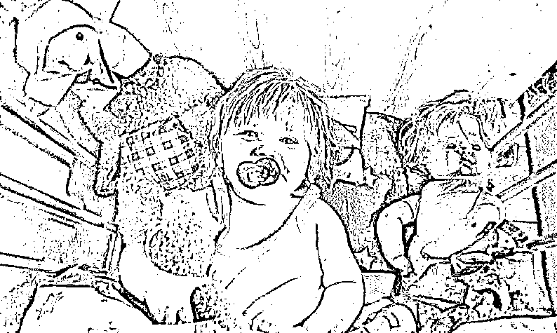

作者/唐娜·坎宁安 

译者/江艺 校对/Christy

编辑/玫瑰 图片/全景网

**体重与家庭之间的联系**对我们大多数人来说，成长的家庭环境极大地影响着我们的食物偏好和饮食习惯。我们对食物的大部分习惯和感受在很早以前就已习得，以至于变得无意识——**与月亮相关的领域常常都是无意识的**。由于我们与食物之间建立起的情感联系和食物给我们的安全感，任何与改变饮食习惯有关的建议都会遭到极大阻碍。有的家庭治疗师甚至通过观察家庭用餐来诊断家庭问题。因为孩子在初期心理模式形成的重要时刻，就是在晚餐时分。在这种近乎仪式的餐食中，孩子了解到他们的年龄和性别角色，家庭成员的期待是什么，什么样的情感表达是被允许的，以及其他的价值。这个时刻发生的事情是家庭关系和冲突的缩影。这样就不难理解食物和感受之间如此紧密地纠缠交织。研究显示，体重和家庭影响之间有明确关联。密歇根大学的一个工作组查看了近 3000 名儿童的经历。父母越超重，孩子就越可能超重，而且他们会更加超重。出生在肥胖家庭的孩子中，近 40%的人都极为肥胖，其中只有 15%的肥胖具有偶然性。女孩是受此影响最严重的，这在占星学中是合理的，因为**月亮和母亲-女儿紧密关联**。到 17 岁时，父母双方都超重的女儿会比父母都瘦的女儿重七倍多。很明显，引发严重肥胖的是一个隐性基因。也就是说，家长双方必须都存在这种基因才有可能显现，然后你有 1/4 的几率遗传到它。如果你有体重问题，你可能会说：“那么都怪我的坏基因咯！”这个研究小组并不否认遗传的重要作用，但他们同时研究了被收养的孩子，发现那些被肥胖家长收养的孩子与那些生在这种家庭的人一样趋向于肥胖，甚至连他们的宠物也存在很高的肥胖几率。月亮展现了我们很早以前习得的习惯，这些习惯很难打破。这些研究认为，过度饮食是一种习惯，是由于受过度饮食的家长影响而习得的一种机制。**月亮掌管情绪，大多严重的暴饮暴食都是一种习得的针对厌恶情绪的家庭防御。****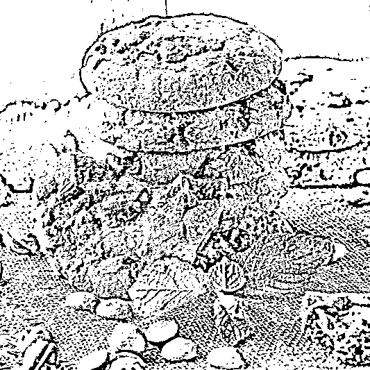****没有满足的月亮会带给我们什么？****饥饿会造成两种反应：一个是不再索取，另外是过度索取。**前者会造成**抑制、否认、冷漠**，后者会造成**强迫性和贪婪**。两种反应都可能在不同阶段出现于同一人的生活中，以一种保护性或防御性机制的方式，而这也可以从他们对于食物的态度看到，也可以从星图中月亮的挑战相位中看到。下面列举两种相位。

**月天相位**

月天相位的人，长大后可能处于**非常不稳定的进食状态**，没有一日三餐固定的吃饭时间，如果再有**木星或射手座**的影响，可能会造成**暴饮暴食后和神经质的节食**。

**月冥相位**

月冥相位的人，也许是能够**长期忍受饥饿状态**之中的人，**让自己处于半饿死状态活着而不自知**。或者相反，**希望占有尽可能多的食物，但不去享用它们**——其实他们也不知道如何享用，只知道占有，觉得只要不会饿死就好了。

这样的相位也可能造成**强迫性地不断去占有，但也不断分离**的状况。因为他们**习惯了某种饥饿状态，很难信任供给食物的人，也很难适应没有危机的丰盛人生**。**在饥饿和危机中的关系，可能反而是让他们感觉最可信、最安全的。** 

**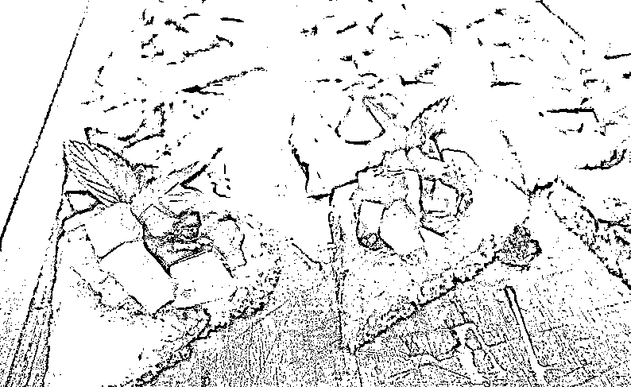**

**月亮的问题由月亮的方式来解决**

月亮掌管直觉，根据**直觉**而不是糟糕的家庭训练来控制饮食会更加健康。

在饮食习惯没有遭到主人强制破坏的情况下，大多数动物都知道吃什么对自己有利，也知道什么时候吃饱了。动物生病了不会吃东西，但人如果生病了会被劝导进食，但有时候禁食会更好。**孩子天生就有健全的食物本能。**在一项研究中，幼童可以自由地在一系列食物中进行选择。他们的饮食习惯或许在任何一天都不均衡，但一段时候之后却能够完美平衡。家长的教育抹杀了孩子的本能，他们强迫孩子吃东西，不考虑孩子是否愿意，让孩子按规律吃饭，不问他们是否饥饿，并且给他们吃高糖分的加工食物。

**举个例子**

我的太阳和木星合相在 12 宫巨蟹座，月亮落中天。我的家族中有许多超重的女性和酗酒的男性。我也喜欢多喝点酒，但我的酒量很有限，大概一年两瓶玛格丽塔，所以你可以猜到我支持哪一方了。我 70 岁了，过去 55 年一直在控制饮食、饮食失控，试图说服自己节食，或是放弃节食。你知道吗？我仍然对自己感觉良好，因为我尽了自己的职责让这个世界变得更美好。所以，当我们察觉到我们的饮食习惯有这样那样的问题，先别急着做硬性的调整。**检查一下出生星图，看看我们有没有照顾好自己的月亮。情绪的问题，安全感的问题是不是一直堆积没有得到解决，再从根源解决问题。****版权声明：**本文由若道翻译发布，欢迎转发，反对抄袭。友号转载请申请白名单。

**唐娜·坎宁安**一位在国际上广受尊敬的占星师，她有超过 45 年的从业经验。她已撰有数十本占星著作以及上百篇占星学和其他形而上学类的文章。于 2017 年 7 月 5 日离世，享年 75 岁。

**系统学习占星学**

**点击图片了解详情**

**微信又双叒叕改版啦，不想错过若道君的推送？**

**就把若道设为星标吧！**

**▼**

就是这个“在看”，戳一下☟

********报名直达入口********

# 插班中丨核心课程 L3，教你掌握综合星图解读

> 原文：[`mp.weixin.qq.com/s?__biz=MzA5NjA0NTAxNg==&mid=2651426869&idx=3&sn=6743a6cda224ca10264ec99472a92310&chksm=8b4b2282bc3cab945238dda4b5ec3a2c95ae5cbe533d77c3dbee1458d86fb78f72f7bbb8b3ba&scene=126&sessionid=1692738111#rd`](http://mp.weixin.qq.com/s?__biz=MzA5NjA0NTAxNg==&mid=2651426869&idx=3&sn=6743a6cda224ca10264ec99472a92310&chksm=8b4b2282bc3cab945238dda4b5ec3a2c95ae5cbe533d77c3dbee1458d86fb78f72f7bbb8b3ba&scene=126&sessionid=1692738111#rd)

**Level3 也是占星学习的一个整合区和分水岭****若道君给大家准备了一份专业的占星测试：“2020 若道核心课 L3 入学测试”****测试内容包括：**

**适合参加测试的学员：**

**L1-2 结课学员**

**有一定占星基础的自学学员**

**准备考 ISAR 的学员**

**扫码开始测试吧**

**1**

**占星学除了自我修炼，市场需求如何？**

**通过占星学习你帮助了自己，也可以选择成为自助助人的占星师，开启受益终生的第二事业。**一方面，社会快速发展人们压力山大，抚慰心灵的咨询市场需求巨大。另一方面，市场鱼龙混杂，真正学院派的严肃占星从业者十分稀缺。最重要的，**占星学能让你自己帮助自己，无论你是否进行占星咨询从业，学习了占星学，它都将是终身陪伴你成长的睿智好伙伴。**

**2**

**你的占星核心课老师是谁？**

 拥有**50**年占星研究积淀**44**年职业占星实践**41**年占星教学经验的**若道联合创始人****2017-2020 年曾任 ISAR 全球副主席****2020 至今为****CAPISAR（全球职业占星师资质认证考试委员会）主席****大卫·瑞雷**&**最懂学员的若道首位认证金牌中国老师****熊鹰**师徒二人合力打造
**2020 年若道****全新核心占星课程**

**3**

**L3 阶，我们要学习什么？**

**第 3 阶 ****宫位、相位以及初步解读星图（15 次课） ****❶** **12 宫位****人生中重要的领域，不止 12 个，更是 12 类。****❷ 组合解读****行星、星座与宫位的组合解读。万丈高楼平地起，这是占星解读的基本功。****❸ 相位****不仅是常规的相位：合相、对分相、三分相、四分相……还有这些更为细致的知识：**相位计算入相位与出相位星座外的相位相位解读盈亏相位相位的优先级大卫老师案例课**❹ 宫主星与定位星****“联结”是宇宙的基本法则之一。除了相位，还有哪些方式让行星能量联结起来？**宫主星定位星与定位链大卫老师案例课**❺ 月亮交点专题****月亮交点是占星解读的另一个入手角度，这里会深入教你解读月亮交点，及其相位与定位星。**月亮交点的解法大卫老师案例课**❻ 相位模式：****那些坊间赋予神秘意义的占星格局：大三角、大十字、T 三角……究竟该如何解读其相位模式。**主要的七种相位模式星图中没有相位模式的情况大卫老师案例课**❼ “空”不等于“没有”：****星图中那些容易被忽视的地方：**无托勒密相位（俗称空相）一些特殊位置星图布局大卫老师案例课**第 3 阶课程安排****❶** 15 次线上直播网络课程，每次 2 小时，课程中依旧会使用同学们的星图作示范**❷** 10 节课由熊鹰老师教授，重点通过名人星图阐释知识点**❸** 5 节课由大卫·瑞雷老师教授，重点通过学员星图阐释知识点**❹** 熊鹰老师会指导练习，答疑解惑，学练结合**❺** 重点在于如何根据星图去问问题，着重自我发现和自我探索的过程 

| **时间** | **课程** |
| 2020 年 7 月 2 日 | 宫位、行星和星座组合 |
| 2020 年 7 月 9 日 | 宫位、行星和星座组合 |
| 2020 年 7 月 16 日 | 月亮交点 |
| 2020 年 7 月 23 日 | 月亮交点和演示案例 |
| 2020 年 7 月 30 日 | 相位 |
| 2020 年 8 月 6 日 | 相位、星座、行星和宫位 |
| 2020 年 8 月 13 日 | 相位、星座、行星和宫位的同学案例 |
| 2020 年 8 月 20 日 | 渐盈相位和渐亏相位，示例 |
| 2020 年 8 月 27 日 | 更多的关于宫位和宫主星 |
| 2020 年 9 月 3 日 | 同学案例 |
| 2020 年 9 月 17 日 | 空相行星和定位星 |
| 2020 年 9 月 24 日 | 宫主星 |
| 2020 年 10 月 15 日 | 优先级和组织 |
| 2020 年 10 月 22 日 | 相位模式以及范例 |
| 2020 年 10 月 29 日 | 学员星图解读范例 |

**截至 2020 年 9 月 3 日中午，课程第 1-9 讲为录播课程（限视频回放），其余均为网络直播课。**

**试听彩蛋**

📹 [`v.qq.com/iframe/preview.html?width=500&height=375&auto=0&vid=e093031qxym`](https://v.qq.com/iframe/preview.html?width=500&height=375&auto=0&vid=e093031qxym)

**4**

**这两位优秀的占星学老师是谁？**

**大卫·瑞雷（David Railey）**

*   **曾任 ISAR 全球副主席，2020 至今为 CAPISAR（全球职业占星师资质认证考试委员会）主席，若道联合创始人；** 

*   1976 年，通过亚特兰大职业占星师考试，成为全职占星师，随后通过**AFAN 和 ISAR 职业测试；** 

*   1980 年，与**杰夫·焦耳**一起在亚特兰大创建**“每日星球”**占星学中心。此后在亚特兰大占星协会担任 4 年考官，并且两次担任**亚特兰大地区占星协会主席**。1979-1992 年，作为占星师活跃于美国社会媒体，向不了解现代占星学变化的大众宣传专业占星学知识。在 1989-1992 年期间，他在 WRGG 电台 12 频道每周主持个人电视秀**“今日占星学”**，早先他还在 WRFG 的广播节目中播讲宇宙天气节目；

*   2010-2014 年，任**全美占星师联盟监督委员会委员**； 

*   2010 年，其著作**《灵魂的目标》**中国版出版，和蒋颖一起创办**若道占星**学校和其官网 www.nodoor.com。从该年开始，他工作并往返于亚特兰大和北京。目前他 80%的时间致力于在中国教授和推广西方占星学； 

*   2017 年，被选为**ISAR 委员会成员**（2017）。ISAR 是世界最大的国际占星机构，会员遍布 45 个国家，2017-2020 年曾任 ISAR 全球副主席； 

*   2020 年，被推举为**CAPISAR（全球职业占星师资质认证考试委员会）主席**。

**熊鹰老师（天空的空）**

*   2008 年接触严肃占星学，至此爱不释手； 
*   **2013 年师从大卫·瑞雷**，研习整套现代占星学核心课程，并于 2014 年起至今连续三年担任该课程的主助教； 
*   期间也**跟随格伦·佩里、诺·泰尔、理查德·塔纳斯、罗伯特·汉德、苏·汤普金斯、斯蒂芬·弗里斯特等多位国际顶尖占星大师进行学习**，进行定向占星主题研究； 
*   2015 年初，通过国际占星研究协会**（ISAR）资质认证并获得证书**。同年，进一步跟随大卫·瑞雷老师进修**“生时校正”**技术，通过最终考核并获得证书； 
*   目前在若道星文化任职，将传播系统、严谨、真实的占星学作为职业使命。任专职助教期间，进行沙龙与答疑等辅助教学工作已累计超过 200 小时；
*   在业余期间也提供占星咨询与生时校正服务。目前正致力于占星学与个人成长的整合。

**5**

**什么人适合这门课？**

*   对占星学有浓厚兴趣，想要系统学习占星学
*   对占星学有一定基础，但不知道该如何整合星图复杂的碎片
*   希望成为优秀的占星师，想要借鉴国际大师解读思路并融入自己的体系
*   想学习占星学，但不擅长英文，希望有中文老师授课
*   想结合占星学理论与咨询实践
*   大卫·瑞雷、熊鹰的忠粉，学过占星，但就是想跟着偶像再学一遍
*   走在自我探索和个人成长道路上的人

**6**

**课程费用**

 **★ L3****课程费用：10000 元****更多价格优惠请咨询客服**

**7**

**退转课程**

**退款原则请详看《教学协议》，如有疑问请咨询课程顾问。******核心课程 Level 3****

**授课老师：大卫·瑞雷 熊鹰**

**授课时间：****2020 年 7 月 2 日-2020 年 10 月 29 日**

**授课方式：**网络课程：英文授课，中文翻译

**费用：10000 元；**更多优惠请咨询客服

**课程负责人：Maggie（微信号：NodoorMaggie）**请备注“L3”

长按二维码添加课程负责人咨询~

****报名请点击“阅读原文”****

# 斯蒂芬&大卫线上工作坊丨学习斯蒂芬星图解读的秘密技巧！

> 原文：[`mp.weixin.qq.com/s?__biz=MzA5NjA0NTAxNg==&mid=2651426656&idx=3&sn=1abc173fe9ec348631b3950a03e725ab&chksm=8b4b3dd7bc3cb4c1851347860a6895311d1c9d458d639f96cc480b7f49591eb74b4ccb0c8941&scene=126&sessionid=1692738111#rd`](http://mp.weixin.qq.com/s?__biz=MzA5NjA0NTAxNg==&mid=2651426656&idx=3&sn=1abc173fe9ec348631b3950a03e725ab&chksm=8b4b3dd7bc3cb4c1851347860a6895311d1c9d458d639f96cc480b7f49591eb74b4ccb0c8941&scene=126&sessionid=1692738111#rd)

**若道独家 3 日线上工作坊**

由于疫情影响，斯蒂芬老师今年的中国之行无奈受阻，但斯蒂芬老师不想他的中国学生们期待落空。在和大卫老师数次线上沟通后，斯蒂芬老师决定**首次开设线上工作坊**，**跟大卫老师联袂授课**，还专门为若道设计了**两大独家主题**：

**10 月 9 日-11 日**

**《爱的内在炼金术—你的亲密关系盲点在哪儿？》**

****10 月 16 日-18 日****

**《整合行进、推进以及太阳弧技法》**

满足中国占星学子对于进化占星学的学习和精进需求，用线上直播课的形式亲赴十月进化占星学之约。

鉴于时差安排，每天上午线上跟斯蒂芬老师学习 4 小时，下午大卫老师会抽取参课学员进行 1 个半小时案例解读。对南北交点最有心得建树的**两大权威导师**，从技法到实践，承包你的知识点。

防疫为重，线上工作坊也省去了学员们舟车劳顿奔赴现场的种种不确定性，我们相约 2020 年 10 月，斯蒂芬老师非常期待和新老学员们在线上工作坊中相见。

**我们将学习什么？**

**学习斯蒂芬星图解读的秘密技巧（艺术）！**

*   一名新手占星师可能看着一张星图想知道“我应该说什么呢？”

*   同时，一名高级占星师问道“我应该从哪儿开始呢？”

占星学的基本难题是它产生了太多信息。

所有对**行进**、**推进**和**太阳弧**的准确理解都依赖于对出生星图本身的彻底把握。

这个过程本身就足够棘手了——然后我们发现十几个移动点形成了数百个触发出生星图的相位。

逻辑表明，占星学的一个基本技能就是知道该舍弃什么。除非每次咨询都花上一周时间，否则这个现实是不可避免的。

但是，究竟有什么是我们可以放心地忽略呢? 又有什么对我们的理解至关重要，以至于忽略它会导致无法弥补的错误? 

一个简单的例子是，我们不会浪费时间谈论行进水星与出生星图宿命点之间形成的一个 144 度相位，但意识到我们竟然忘记了推进太阳与天王星形成的对分相！

另一个简单的例子是，我们不要因为木星正在触动她的中天，就贸然试图让一个安静的四宫巨蟹座的人对“成名”感到兴奋, 永远不要忘记对于出生星图的根本性预测，换句话说，当你准备分析一张出生星图的时候，你可以采取系统的步骤来帮助你把焦点对准需要聚焦的地方。有些非常简单，甚至可以通过计算机编程来成。

经过这些初步的准备步骤，我们进入了真正的占星艺术的领域。我们必须将客户当前现实的天气变化与出生星图本身根本的进化焦点编织在一起。我们必须以一种反映自身意识力量、本性和状态的正念方式去做——每一个有技巧的占星师都要学会保持他或她与符号间宝贵的直觉联系，监控任何“过热”的智力迹象。

**- 此次授课内容** **-**

*   斯蒂芬老师总结三大最实用占星预测技法：行进、次限推进、太阳弧推进

*   整合这三种技法能够宏观和微观预测一个人的运势起伏和重要节点

**行进（TRANSITS）**

**长期趋势**

分析行运的最好方法是先将长期的行运趋势列出来。顺序如下：冥王星、海王星、天王星、土星、木星、南北交点。

通过将这些影响力持久的长期行运先列出来，你将能够发现在未来一年甚至更长的时间里你人生中的重大课题。

**短期趋势和触发点**

接下来你需要去观察那些运行得较快的星体，来判断短期趋势。不过，重要的是要清楚，这些移动较快的星体在行运中扮演着事件的“触发点”的角色，特别是当与它们形成相位的个人行星同时也与行运外行星有相位的时候！

**次限推进（PROGRESSIONS）**

通常也被称作“一天代表一年”推运，因为这种技术把出生后的每一天和出生后的一整年等同起来。一旦设定了这个节奏，就像定时释放的胶囊一样，这些次限推进就像某种内部的太阳系一样运转起来，和真实时间的事件、经历、情境应和。

**太阳弧（SOLAR ARCS）**

以太阳为核心，为众星之首，带着众星一起移动,展示人生不同阶段我们是如何体验自我、表现自我、修缮自我。此方法虽非实际星体，但却是星动推运法中准确率最高，实用性最佳的推运方法。

**综合以上技法**

*   我们该描述什么，该从哪里入手？

*   如此庞杂的信息，究竟有什么是我们可以放心地忽略呢?

*   系统的解读步骤来帮助你把焦点对准需要聚焦的地方，哪些是至关重要的？

*   如何培养与占星符号间宝贵的直觉联系，将行进、次限推进、太阳弧推进融会贯通？

**- 斯蒂芬的占星著作** **-**

1984-1988 年间，斯蒂芬写作出版了《内在的天空》（已有中文版）、《变化的天空》和《天空的伴侣》三本占星经典著作，奠定了早期在占星学界的地位。

2002-2005 年间，他与朱迪·弗里斯特共同创作了两本经典的关系占星学著作《天空的伴侣 I：爱、性、和进化占星学》《天空的伴侣 II：组合图》。　

2008 年，斯蒂芬出版了一本非常重要的著作《昨日的天空》，此书是至今为止关于轮回转世跟星图的清晰对应最详尽的著作之一。斯蒂芬前后一共出版了 12 部占星著作，在世界占星学界拥有很高的声誉。**- 斯蒂芬获得的荣誉** **-**1985 年，他凭借《内在的天空》一书获得职业占星师协会奖（*Professional Astrologers Incorporated Award*）。1992、1995、2008 年、2018 年，他四次获得占星界最高的占星学联合协会奖（*UnitedAstrology Congress Regulus Award*）提名，2018 年获得轩辕十四教育奖。

**- 斯蒂芬的占星哲学观** **-**

斯蒂芬的占星风格以自由和选择为中心，他的解读不是以下定论的方式来“预测”未来，他强调**如何改善生命**，而不是宿命式的论断。他以心理占星学的语言来解读星图上的人格部分，但是通过**南北交点及其相位和守护星**来探索星图所揭示的**前世业力与今生方向**，在灵魂进化的背景里来整体解读星图。

他认为进化占星学的目的在于鼓励人们做出更符合进化方向的智慧选择，我们学习去了解前世的时侯，关注点应该集中在**如何通过意识来疗愈自己**。

**这些名人怎么说？**

斯蒂芬让我们停止了玩责备命运的游戏，而开始看到自己是一个走在进化路途上的勇士。 ——奥普拉杂志“O: THE OPRAH MAGAZINE”

斯蒂芬和杰夫这两位著名占星师创造性地相互应和，展现出他们出色的教师才华，发展并弘扬了占星这门艺术。（对《测量天空：进化占星学和灵魂的钥匙》的书评） ——著名心理占星师 现代占星学之父 诺·泰尔（Noel Tyl）

请享用斯蒂芬和朱迪这两个博大的灵魂在此书中所提供的洞见大餐吧。（对《天空的伴侣》的书评） ——进化占星学的创始人之一 杰夫·格林（Jeff Green）

我为斯蒂芬解读的精准感到惊叹，他强调没有一件事是坏得无法挽回的，也没有一件事是如此之好，以至于它不会因为现在的错误判断而消失的。我怎样推荐他都不为过！ ——好莱坞著名影星“钢铁侠”男主角 小罗伯特·唐尼（Robert Downey Jr）**上过课的占星师怎么说？**他关于我星图的解读，让几乎所有在场的人掉泪，我也从此开启了一段灵魂追寻的旅程。我很惊讶他透过星图可以如此深入一个人的灵魂。很多东西你自己都不知道，但是他讲出来你会发现，啊，这是真的，这是占星学的神奇。——《心探索》创始人孟想每个来参加老师课程的同学，都会被老师深深的慈悲心感动。这种慈悲心，并不是表面上说的一些什么话，而是一种从意识层次上发出的能量。每个来上课的人，都能感受到老师的爱。这种爱，并不是盲目的爱，而是深刻地洞悉真相后的慈悲。——斯蒂芬老师工作坊翻译逸月斯蒂芬老师的一对一咨询已经排期到两年之后，我特别幸运，曾在课堂上被老师抽中分析过我的星图，老师充满爱与智慧的指引让我更加清晰的认识了自我。内在的潜能、需求和矛盾被老师娓娓道来。——禄丽荣斯蒂芬老师是位非常非常值得推荐的大师，很粉他，这位进化占星学的创始人，对人的理解是那么的全面完整、深刻洞见、慈悲和温暖，就这方面而言足可以媲美我无比崇敬的荣格和史坦纳（这两位去天堂里玩了），如果你对西洋占星感兴趣，或者对人的所有角度、各个层次的真相和可能性感兴趣，推荐斯蒂芬老师的书和课程，特别是他的课程，数倍的功力大增的好机会，错过真是占星粉丝的莫大损失。——仁华**2019 年斯蒂芬工作坊学员感悟**

**什么人适合这门课程？**✦ 占星师或渴望成为占星师的人群。   ✦ 本课程并非针对初学者，需具备若道核心课程 level 3 及以上水平，即了解星座、行星、宫位、相位等。✦ 课程会涉及行进、推进等高阶内容，不了解相关知识的同学，请提前学习相关内容。**斯蒂芬老师其人**

**斯蒂芬·弗里斯特(Steven Forrest)**

*   进化占星学的创始人之一，当今世界最有影响力的占星大师之一；
*   毕业于美国北卡罗莱纳大学宗教学专业； 
*   1984-1988 年间，写作出版了《内在的天空》、《变幻的天空》和《天空的伴侣》三本占星经典著作，奠定了早期在占星学界的地位。前后一共出版了 12 部占星著作，在世界占星学界拥有很高的声誉。 
*   1985 年，他凭借《内在的天空》一书获得职业占星师协会奖（*Professional Astrologers IncorporatedAward*）。1992、1995、2008 年、2018 年，他四次获得占星界最高的占星学联合协会奖（*United Astrology Congress Regulus Award*）提名，2018 年获得轩辕十四教育奖。 
*   斯蒂芬将自己的绝大部分时间都花在教学以及个人咨询上，他于 1998 年创立了占星学徒计划（*Astrological Appretice Program*），这个计划致力于培养职业占星师； 
*   至今为止已经有 600 余位学员完成了培训，其中很多都成为了优秀的职业占星师； 
*   他是一位脚踏实地的导师，充满快乐和活力，亲和幽默同时又充满了智慧；他的课程不仅仅是一次占星知识和经验的学习，也是一次与智者的相遇。

**大卫老师其人**

**大卫·瑞雷（David Railey）**

*   曾任 ISAR 全球副主席，CAPISAR（全球职业占星师资质认证考试委员会）主席，若道联合创始人；

*   1976 年，通过亚特兰大职业占星师考试，成为全职占星师，随后通过 AFAN 和 ISAR 职业测试；

*   1980 年，与杰夫·焦耳一起在亚特兰大创建“每日星球”占星学中心。此后在亚特兰大占星协会担任 4 年考官，并且两次担任亚特兰大地区占星协会主席。1979-1992 年，作为占星师活跃于美国社会媒体，向不了解现代占星学变化的大众宣传专业占星学知识。在 1989-1992 年期间，他在 WRGG 电台 12 频道每周主持个人电视秀“今日占星学”，早先他还在 WRFG 的广播节目中播讲宇宙天气节目；

*   2010-2014 年，任全美占星师联盟监督委员会委员； 

*   2010 年，其著作《灵魂的目标》中国版出版，和蒋颖一起创办若道占星学校和其官网 www.nodoor.com。从该年开始，他工作并往返于亚特兰大和北京。目前他 80%的时间致力于在中国教授和推广西方占星学； 

*   2017 年，被选为 ISAR 委员会成员（2017）。ISAR 是世界最大的国际占星机构，会员遍布 45 个国家，2017-2020 年曾任 ISAR 全球副主席； 

*   2020 年，被推举为 CAPISAR（全球职业占星师资质认证考试委员会）主席，组织奠基资质认证考试委员会成立工作。

**课程费用****早鸟价**：**3800 元（9 月 16 日前付款享受早鸟价）****正价**：**4800 元（9 月 16 日之后恢复原价）****连报 2020 两场线上工作坊，另外赠送 600 元课程券****授课时间、方式和退转****授课时间：****2020 年 10 月 16 日-10 月 18 日（周五、周六、周日），每天 8:00-15:30**

**8:00-9:45**（15 分钟休息）

**10:00-12:00**由于时差问题，斯蒂芬老师教授上午 4 小时课程**14:00-15:30** 下午大卫·瑞雷老师根据上午学习内容抽取在线学员案例解读**授课方式：**线上直播课，英文授课，中文翻译**退转课程：**退款原则请详看《教学协议》，如有疑问请咨询课程顾问。****斯蒂芬"整合行进，推进以及太阳弧技法"工作坊****

**授课老师：斯蒂芬·弗里斯特**

**授课时间：****2020 年 10 月 16 日-10 月 18 日**

**授课方式：**线上直播课，英文授课，中文翻译

**费用：****早鸟价**：3800 元（9 月 16 日前付款享受早鸟价）**正价**：4800 元（9 月 16 日之后恢复原价）

**课程负责人：****王老师**（微信：18510107057，请备注“斯蒂芬工作坊”）

长按二维码添加课程负责人咨询~

****报名请点击“阅读原文”****

# 9 月 2 日双鱼座满月 | 放下“应该”的画地为牢，寻找更多可能性

> 原文：[`mp.weixin.qq.com/s?__biz=MzA5NjA0NTAxNg==&mid=2651426656&idx=1&sn=4708b11c2e9b2015d8092698745809d7&chksm=8b4b3dd7bc3cb4c1c11c14c307a2e4b6bde7132cb6255275f224ac019aeeb5fdbc64ee271ca3&scene=126&sessionid=1692738111#rd`](http://mp.weixin.qq.com/s?__biz=MzA5NjA0NTAxNg==&mid=2651426656&idx=1&sn=4708b11c2e9b2015d8092698745809d7&chksm=8b4b3dd7bc3cb4c1c11c14c307a2e4b6bde7132cb6255275f224ac019aeeb5fdbc64ee271ca3&scene=126&sessionid=1692738111#rd)

****☆ ****后台回复“今日”，给你一句生命态度****

作者/王芝桦 编辑/玫瑰 图片/全景网

**双鱼座满月**

**北京时间 2020 年 9 月 2 日 13:21 迎来双鱼座满月，处女座太阳与双鱼座月亮于 10°12′精准对分。**

经过激烈的 8 月，大家的生活发生了哪些变化？我搬离了原来的办公室，身边的朋友有的辞职或跳槽，有的合作关系拆伙或重组，有的亲密关系转浓或变淡……当然，并不是每个人的生活都会发生变化，但相信每个人的内心深处都会生出不同以往的感触与体悟。每年的双鱼座满月都发生在处女座月之中，引领我们带着务实的态度和辨析的视角望向内心深处，挑选具有可行性的梦想，清理扰乱脚步的欲望，收撤能量、精耕细作，将梦想照进现实。此次双鱼座满月，就像是热烈而激昂的 8 月生活的梦醒时分，引领我们梳理现实生活的脉络因果，觉察内在动力的真伪虚实，挑选梦想并清理欲望，为 2020 年最后几个月的冲刺奠定“落地而具体”的现实根基。

**双鱼座满月重点影响人群**

参考满月峰值影响期间各个行星的行进度数，以及逆行行星的轨迹影响；常规容许度，个人行星入相位 3°，出相位 1°；非个人行星入相位和出相位均为 3°。**·** 出生星图中，有**行星、四轴、南北交点落入固定星座（金牛座、狮子座、天蝎座、水瓶座）3°-13°度**的人群； **·** 出生星图中，有**行星、四轴、南北交点落入基本星座（白羊座、巨蟹座、天秤座、摩羯座）14°-30°**的人群；**·** 出生星图中，有**行星、四轴、南北交点落入变动星座（双子座、射手座、处女座、双鱼座）7°-30°**的人群。

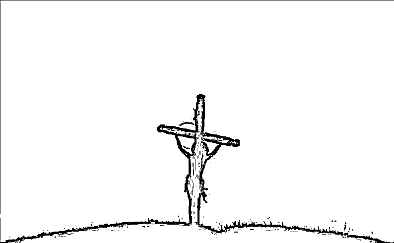

**一道月光，将“梦想与现实”连成海洋****你变了是因为有些关口不闯不行，闯过之后便发觉自己变了。****——多丽丝·莱辛 《天黑前的夏天》**

**天象**

*   **天王星介入“日月轴线”**：金牛座天王星三分处女座太阳，六分双鱼座月亮；
*   **金火土 T 三角**：巨蟹座金星对分摩羯座土星形成“金土对分”结构，白羊座火星四分巨蟹座金星和摩羯座土星形成“金火土 T 三角”结构；
*   **水星介入“金土对分”**：处女座水星六分巨蟹座金星，三分摩羯座土星；
*   **水星四分“南北交点轴线”**：处女座水星四分射手座南交点和双子座北交点。

首先，我们透过“行星能量传导图”，聚焦此次双鱼座满月整体天象的核心驱动力——金牛座天王星。

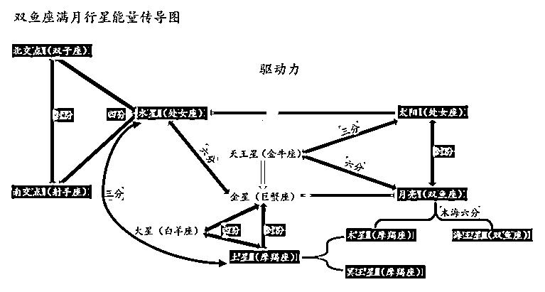

敲黑板！提前预告！金牛座天王星是 2021 年“新旧周期”转化大戏的主角。

虽然 2020 年，金牛座天王星在生存安全和经济结构等方面带来不小的震荡，但 2020 年依然只是“新旧周期”转化大戏的序幕。人类世界在一系列的考验与颠簸之中紧急应对，不惜一切代价想要拉住正在“脱缰”的缰绳，但现实却一次又一次地将“侥幸”打碎，提示我们顺应宇宙的韵律，跟随变革的进程。2021 年，于 2020 年底正式进入水瓶座的土星将与金牛座天王星形成**“土天四分”**结构，这组结构是 1988 年-2032 年这一轮“土天周期”的最后一次挑战性影响，并恰好遇见“新旧周期”的转化进程，虽然用“翻天覆地”形容有些夸张，但如果从“如在其上，如在其下”这一宇宙真谛的角度而言也并不为过。（“土天周期”的相关内容，请参考 3 月 24 日白羊座新月，文章链接：[白羊座新月](http://mp.weixin.qq.com/s?__biz=MzA5NjA0NTAxNg==&mid=2651414606&idx=1&sn=2a2b32531a847caa9a04d71f9a74bdd8&chksm=8b4bd2f9bc3c5bef6d64f886e66b03da1e9aac451c3b5d242d08260cb3d4211553d5196a199f&scene=21#wechat_redirect)）2021 年的“土天四分”结构就像是一个“解锁”的过程，哪儿锁上了就解哪儿，哪儿不健康就解哪儿：失衡的生态和失真的食物、陈旧的观念和限制的思维、执着的欲念和透支的健康、笨重的系统和老朽的规则等等。更加剧烈的颠覆与裂变将会到来，而无比震撼的进化与飞跃也将同时出现。此次双鱼座满月，金牛座天王星三分处女座太阳，六分双鱼座月亮，将“颠覆原有，突破陈旧”的变革之风注入到此次双鱼座满月“梦想与现实”的整合之中，提示我们——如果一直期待外在世界的人事物符合自我内心的预设和要求，现实生活中的变化和无常只会令我们陷入无尽的纠结与伤感之中。**我们需要转化的并不是外在现实中“令人失望”的事件，而是内在意识中贴着“正确”和“应该”标签的逻辑。**此次双鱼座满月，宇宙引领我们透过外在的现实，望向内在的真实。

**1.** **画地为牢，自我营造的困境**

双鱼座满月，满月的月光照亮了双鱼座的“意识之海”，一方面带来加倍感性和弥漫的情绪，另一方面也为我们敞开内在意识的大门。

双鱼座的两颗守护行星——木星正行进在摩羯座之内，海王星正行进在双鱼座之中。其中，摩羯座木星在 2020 年主导了两组年度重磅天象：

*   摩羯座木星和双鱼座海王星于 2 月 20 日、7 月 28 日和 10 月 12 日前后三次形成“木海六分”结构；

*   摩羯座木星和摩羯座冥王星于 4 月 5 日、6 月 30 日和 11 月 12 日前后三次形成“木冥合相”结构。

当下，我们正处于两组结构的第二次影响之下。“木海六分”结构就像“梦想加工厂”，而摩羯座冥王星则通过“木冥合相”结构间接向“木海六分”结构的“梦想加工厂”里投放着“恐惧和欲望”的佐料。故而，当 2020 年的现实考验打乱了梦想脚步的时候，“打回原形”的恐惧和“急于掌控”的欲望便驱动我们在情急之下做出短视的选择，甚至忽略了内心的志向，忘记了生命的航向，模糊了梦想与欲望的边界。

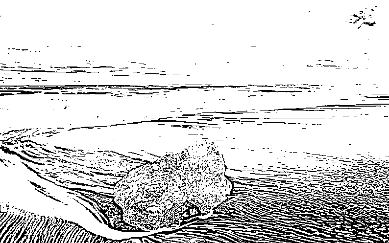

重要的是，**梦想经得起磨练与等待，而欲望却设置预期并索取满足。**内在的意识创造外在的生活。行进在自己守护的摩羯座之内的土星，接纳着摩羯座上“木冥合相”的能量，也呈现着梦想和欲望所创造出来的不同现实：梦想的脚步坚定而无惧，不会因现实的考验而垂头丧气，不会因现实的磨砺而轻易放弃；欲望的沟渠空洞而无底，即使得到再多也欲壑难填，稍微遇见波折便怨天尤人。如果我们检视一下 2020 年的轨迹，就不难分辨哪些是梦想的作品，哪些是欲望的投射。**2020 年最大的好处是让每个人不得不面对自我的素颜和现实的真相，最大的坏处是让我们容易像个溺水者一样忙乱抓取“救命”的机会。**故而 2020 年不单在考验我们的实力，也在考验我们的心性。当然在考验不断和艰辛倍增的 2020 年，“先生存再发展”和“先就业再择业”是必要的务实考量，但这可不是想抓这个、想做那个的胡乱折腾，更不是要求外界配合、期待符合预设的主观索取，而是**站在梦想基石之上，将“长期规划和短期计划”有效整合**的现实策略。8 月，白羊座火星依次与摩羯座上的木星、冥王星和土星形成四分结构，触发出激进的情绪和激昂的斗志，不少朋友做出了离职跳槽或关系取舍的决定；而随着 8 月底巨蟹座金星依次与摩羯座上的木星、冥王星和土星形成对分结构，更是在情感与合作的两方面关系中，触发出价值观的碰撞和内心底线的挑战。**如果你恰好在 8 月经历了这些波折，可能会发现付出的“情感与信任”并没有得到“应该”的反应，期待的“位置和重视”并没有达到“应该”的预期。**而一迈入 9 月就迎来的这场双鱼座满月，恰逢即将在 9 月 10 日逆行的白羊座火星、9 月 13 日恢复顺行的摩羯座木星、9 月 29 日恢复顺行的摩羯座土星、10 月 4 日恢复顺行的摩羯座冥王星这四颗行星因为顺逆行的能量转化全部处于“停滞状态”——这四颗在 8 月带来强大压力并触发重大决定的行星，原地不动，虎视眈眈，一方面预示着**8 月的某些事件并没有结束**，另一方面也宣告着我们**必须要透过这些事件去做内在的功课**。

**此次双鱼座满月的“完结能量”，似乎要推动我们向那些令人失望的关系拉黑告别，与那些忍无可忍的境遇宣告决裂。**但同时，满月的月光也照亮了生命的“意识之海”，敞开了内在意识的大门，引领我们透过外在现实看向内在真实，因为现实境遇正是内在意识创造的作品：

*   为什么会受伤？内心的哪些希望破灭了，哪些期待落空了？
*   事件“应该”如何发展，对方“应该”如何回应，才不会受伤呢？
*   “应该”的预设，外界是否有义务配合？
*   “应该”的预设，来自于哪些认知和观念？
*   当外界不能符合这些预设，而你又死抱着预设不放手的时候，是不是就成为了僵局并带来了痛苦？
*   你是否愿意突破这些“应该”的预设所制造的限制和痛苦？

我们在自己的“梦想加工厂”里编织了梦，添加了欲望，设置了预期，然后要求外界配合并满足自我的主观性，着实很难，基本不可能；而后又因为现实演绎了这种很难和不可能，像个受伤的孩子一样执意要改造外界或扳回一局，简直就是难上加难，根本不可能。这无疑是一种**“自制的困境”**，此次双鱼座满月正是要我们做出选择的时间。

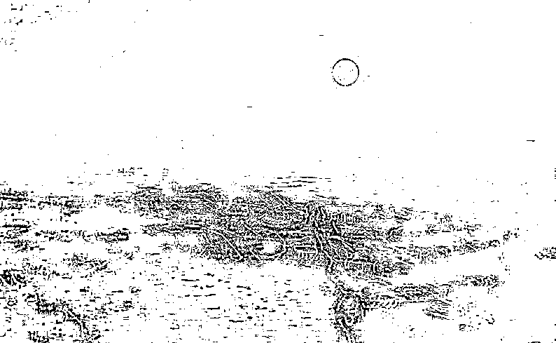

**2.** **信使指路，十字路口的选择**

此次双鱼座满月，处女座的守护行星水星正行进在处女座之内（入庙），接纳着处女座太阳乐于完善的意志和勤于精耕的品格。**占星学中，水星是唯一一颗“中性”的行星，守护双子座和处女座，代表心智层面交流和学习的能力。**水星的守护者在古希腊神话中叫赫尔墨斯，在古罗马神话中叫墨丘利，在古老的炼金术中，赫尔墨斯、墨丘利和透特（智慧之神）三神合一被尊称为“知晓宇宙三重智慧”的神，即知晓炼金术、占星术和魔法。赫尔墨斯（即墨丘利）是众神之神宙斯和水中女神迈亚的儿子，传承了明与暗、阴与阳的两极能量，象征着光明之魂与黑暗之心（荣格将此称为“阴影”）的融合，故而赫尔墨斯是唯一一个能够自由出入天界和地府的神，也是在上下界穿梭的途中将神谕传播给人间的“众神的信使”。我们不难从双子座“两面性”和处女座“纠结”的特质里看到赫尔墨斯游走两极能量之间的模棱两可：**足智多谋，也工于心计；掌管商业，也狡猾欺诈。**荣格曾这样描述这位“众神的信使”：**“每当人们遭遇讨厌的突发事件，意识和行动带上明显的恶意的时候，就是他在作祟。”**此次双鱼座满月，处女座水星四分“射手座南交点-双子座北交点“轴线，就像是赫尔墨斯站在十字路口指引我们做出选择——是要留在射手座南交点一边，继续用陈旧意识去设置理想化的预期和主观性的标准，认为**外界“应该”配合，要求外界必须“正确”**？还是走向双子座北交点一边，突破陈旧意识的限制，**走出“自制困境”的束缚，放下“应该”的预期和“正确”的评判，敞开内心接纳更多的可能性**？相信每个生命都有自己独特的智慧，都能做出智慧的选择。但需要注意的是，处女座水星也同时介入“金土对分”结构，令我们在**关系的价值碰撞和底线挑战**的过程中，引动**潜藏在内心深处的“阴影”**，**怨天尤人并投射愤怒，却对“自制的困境”毫无觉察与自知**。故而，此次双鱼座满月，我们**既要允许情绪的释放，也要有意识地觉察情绪的“因果脉络”，允许但不肆意，释放但有觉察。**当然，对于那些谎话连篇和故意欺骗，有失道德和毫无诚意的人，建议你越早“休”了越早止损——如果不想自欺欺人的话。此次双鱼座满月，对于一些朋友而言，无论你的外在表现是多么厉害和坚强，在内心深处一定是有一些伤痛的。如果你想哭一下，那么就在这个水象星座的满月时光里给自己一些宠溺，允许自己释放也是一种疗愈。好消息是，**9 月 6 日金星换座进入狮子座，将会帮助我们进一步确认自己的价值与自信，重新振作并疗愈伤情。**此次双鱼座满月，在集体层面，公益组织或福利机构爆出内幕，女性议题和种族运动再起热潮，传染性疾病或污染性问题成为焦点，法律边界和道德范畴引发热议，而金融市场也到了一个需要特别关注的敏感点。**2020 年下半年，宇宙的整体趋势开始向着更落地、更务实的方向下沉，这意味着需要我们从外在现实和内在意识两个层面去进行更为细微、具体的突破。**压力仍不会少，但宇宙就是要在重压之下挑选勇夫，土星就是要督促我们去做那些不可能的事，有些关口不闯不行，但闯过之后我们会看到自己的成长与变化。**寄语****以前的所想所感，现在看来是那么可笑，那么乏味。****——多丽丝·莱辛 《天黑前的夏天》**

时过境迁，没有什么是不会发生转化的，只是当时，我们却那么执着。

或许这就是生命必经的轨迹吧，不走过过去，不会来未来，未来是对过去的释怀。那么，当下的我们，能否带着一份纵观时间线的觉知做出更为成熟、更为智慧的选择呢？此次双鱼座满月，宇宙向我们落地而具体的处女月生活里注入了灵性的能量——一道意识的光束，引领我们觉察内在的梦想，释放情绪的压力，而后带着一份成熟与睿智，在 2020 年剩余的几个月时间里让梦想“落地生根”。愿每一个灵魂安好。祝福大家。

**版权声明**：原创文章由作者授权首发于若道平台，欢迎转发，反对抄袭。友号转载请申请白名单。

****

****想阅读更多作者的文章，****

****请在后台回复******王芝桦****** 即可。****

****王芝桦****

心理占星师，统合疗愈师，占星专栏作者

若道占星“新月和满月”专栏作者，腾讯视频特约占星师

全职于个案咨询与占星教学工作 16 年

**个案预约咨询微信号**：zhihua0621 

**微信公众号**：daoxi-life

**长按打赏**

****

**学习顺势疗法**

**请点击下图了解详情**

喜欢记得点一下在看哦☟

********报名直达入口********

# 斯蒂芬&大卫线上工作坊丨爱的炼金术：通过关系开启内在成熟功课

> 原文：[`mp.weixin.qq.com/s?__biz=MzA5NjA0NTAxNg==&mid=2651426656&idx=2&sn=cd119d1ab009859c053917b63676b3ec&chksm=8b4b3dd7bc3cb4c1d81f27421c3e5e280b70c325d0f937ff4264df0ccbf58ac4d3c26a877cfa&scene=126&sessionid=1692738111#rd`](http://mp.weixin.qq.com/s?__biz=MzA5NjA0NTAxNg==&mid=2651426656&idx=2&sn=cd119d1ab009859c053917b63676b3ec&chksm=8b4b3dd7bc3cb4c1d81f27421c3e5e280b70c325d0f937ff4264df0ccbf58ac4d3c26a877cfa&scene=126&sessionid=1692738111#rd)

**若道独家 3 日线上工作坊**

由于疫情影响，斯蒂芬老师今年的中国之行无奈受阻，但斯蒂芬老师不想他的中国学生们期待落空。在和大卫老师数次线上沟通后，斯蒂芬老师决定**首次开设线上工作坊，**跟**大卫老师**联袂授课，还专门为若道设计了**两大独家主题**：

**10 月 9 日-11 日**

**《爱的内在炼金术—你的亲密关系盲点在哪儿？》**

****10 月 16 日-18 日****

**《整合行进、推进以及太阳弧技法》**

满足中国占星学子对于进化占星学的学习和精进需求，用线上直播课的形式亲赴十月进化占星学之约。

鉴于时差安排，每天上午线上跟斯蒂芬老师学习 4 小时，下午大卫老师会抽取参课学员，进行一个半小时案例解读。对南北交点最有心得建树的两大权威导师，从技法到实践，承包你的知识点。

防疫为重，线上工作坊也省去了学员们舟车劳顿奔赴现场的种种不确定性，我们相约 2020 年 10 月，斯蒂芬老师非常期待和新老学员们在线上工作坊中相见。

**我们将学习什么？**

“找到完美的伴侣听起来是个很棒的主意——但如果你还没有准备好进行进化工作，仅仅找到那个人并不能给你带来多大帮助。亲密始于你所做的内在成熟功课。”

——斯蒂芬·弗里斯特

**-** **此次授课内容** **-**

*   关于自己的本性，你不希望了解的是什么?
*   什么会让别人爱你变得困难?
*   在哪些方面，你的创伤和文化状况影响了你的智慧判断，关于谁才是真正适合你的人?

**关系占星学：比对图**通常集中于两张出生星图的比较。“直接用这种方式来看待感情，就像还没上高中就开始上大学一样。”所以斯蒂芬老师还会着眼于个人星图。

**个人星图上的三个关键区域**在这个工作坊中，斯蒂芬老师将会关注于个人星图上的三个关键区域。

*   首先，我们考虑你的灵魂对于亲密关系的独特要求。你正在学习什么？激情？和平？信任？还是独立呢？
*   其次，我们来破译你星图上关于任何可能阻碍你正确完成任务的警告信息。
*   最后,我们来探讨星图如何描述了你的天生伴侣——也就是说, 如何在编织在你出生星图的象征符号中, 找到与你享有灵魂契约之人的描述—— 在你出生呼吸第一口空气时，这个人可能甚至还没出生。

“伙伴”和“伴侣”这些词总让我们想到配偶关系，但我们在这个工作坊中探索的许多原则也适用于人类的另一杰作：**亲爱的朋友之间的灵魂纽带。**我们当然会尊重所有的性别差异，因为男人和女人努力爱着对方和他们自己，无论他们的灵魂穿着何种肉体的伪装。

**-** **斯蒂芬的占星著作** **-**

1984-1988 年间，斯蒂芬写作出版了《内在的天空》（已有中文版）、《变化的天空》和《天空的伴侣》三本占星经典著作，奠定了早期在占星学界的地位。

2002-2005 年间，他与朱迪·弗里斯特共同创作了两本经典的关系占星学著作《天空的伴侣 I：爱、性、和进化占星学》《天空的伴侣 II：组合图》。　

2008 年，斯蒂芬出版了一本非常重要的著作《昨日的天空》，此书是至今为止关于轮回转世跟星图的清晰对应最详尽的著作之一。斯蒂芬前后一共出版了 12 部占星著作，在世界占星学界拥有很高的声誉。**-** **斯蒂芬获得的荣誉** **-**1985 年，他凭借《内在的天空》一书获得职业占星师协会奖（*Professional Astrologers Incorporated Award*）。1992、1995、2008 年、2018 年，他四次获得占星界最高的占星学联合协会奖（*UnitedAstrology Congress Regulus Award*）提名，2018 年获得轩辕十四教育奖。

**-** **斯蒂芬的占星哲学观** **-**

  斯蒂芬的占星风格以自由和选择为中心，他的解读不是以下定论的方式来“预测”未来，他强调**如何改善生命**，而不是宿命式的论断。他以心理占星学的语言来解读星图上的人格部分，但是通过**南北交点及其相位和守护星**来探索星图所揭示的**前世业力与今生方向**，在灵魂进化的背景里来整体解读星图。

他认为进化占星学的目的在于鼓励人们做出更符合进化方向的智慧选择，我们学习去了解前世的时侯，关注点应该集中在**如何通过意识来疗愈自己**。

**这些名人怎么说？**

斯蒂芬让我们停止了玩责备命运的游戏，而开始看到自己是一个走在进化路途上的勇士。 ——奥普拉杂志“O: THE OPRAH MAGAZINE”

斯蒂芬和杰夫这两位著名占星师创造性地相互应和，展现出他们出色的教师才华，发展并弘扬了占星这门艺术。（对《测量天空：进化占星学和灵魂的钥匙》的书评） ——著名心理占星师 现代占星学之父 诺·泰尔（Noel Tyl）

请享用斯蒂芬和朱迪这两个博大的灵魂在此书中所提供的洞见大餐吧。（对《天空的伴侣》的书评） ——进化占星学的创始人之一 杰夫·格林（Jeff Green）

我为斯蒂芬解读的精准感到惊叹，他强调没有一件事是坏得无法挽回的，也没有一件事是如此之好，以至于它不会因为现在的错误判断而消失的。我怎样推荐他都不为过！ ——好莱坞著名影星“钢铁侠”男主角 小罗伯特·唐尼（Robert Downey Jr）**上过课的占星师怎么说？**他关于我星图的解读，让几乎所有在场的人掉泪，我也从此开启了一段灵魂追寻的旅程。我很惊讶他透过星图可以如此深入一个人的灵魂。很多东西你自己都不知道，但是他讲出来你会发现，啊，这是真的，这是占星学的神奇。——《心探索》创始人孟想每个来参加老师课程的同学，都会被老师深深的慈悲心感动。这种慈悲心，并不是表面上说的一些什么话，而是一种从意识层次上发出的能量。每个来上课的人，都能感受到老师的爱。这种爱，并不是盲目的爱，而是深刻地洞悉真相后的慈悲。——斯蒂芬老师工作坊翻译逸月斯蒂芬老师的一对一咨询已经排期到两年之后，我特别幸运，曾在课堂上被老师抽中分析过我的星图，老师充满爱与智慧的指引让我更加清晰的认识了自我。内在的潜能、需求和矛盾被老师娓娓道来。——禄丽荣斯蒂芬老师是位非常非常值得推荐的大师，很粉他，这位进化占星学的创始人，对人的理解是那么的全面完整、深刻洞见、慈悲和温暖，就这方面而言足可以媲美我无比崇敬的荣格和史坦纳（这两位去天堂里玩了），如果你对西洋占星感兴趣，或者对人的所有角度、各个层次的真相和可能性感兴趣，推荐斯蒂芬老师的书和课程，特别是他的课程，数倍的功力大增的好机会，错过真是占星粉丝的莫大损失。——仁华**2019 年斯蒂芬工作坊学员感悟**

**什么人适合这门课程？**✦ 占星师或渴望成为占星师的人群。   ✦ 本课程并非针对初学者，需具备若道核心课程 level 4 及以上水平，即了解星座、行星、宫位、相位等。✦ 课程会涉及比对图等高阶内容，不了解相关知识的同学，请提前学习相关内容。**斯蒂芬老师其人**

**斯蒂芬·弗里斯特(Steven Forrest)**

*   进化占星学的创始人之一，当今世界最有影响力的占星大师之一；
*   毕业于美国北卡罗莱纳大学宗教学专业； 
*   1984-1988 年间，写作出版了《内在的天空》、《变幻的天空》和《天空的伴侣》三本占星经典著作，奠定了早期在占星学界的地位。前后一共出版了 12 部占星著作，在世界占星学界拥有很高的声誉。 
*   1985 年，他凭借《内在的天空》一书获得职业占星师协会奖（*Professional Astrologers IncorporatedAward*）。1992、1995、2008 年、2018 年，他四次获得占星界最高的占星学联合协会奖（*United Astrology Congress Regulus Award*）提名，2018 年获得轩辕十四教育奖。 
*   斯蒂芬将自己的绝大部分时间都花在教学以及个人咨询上，他于 1998 年创立了占星学徒计划（*Astrological Appretice Program*），这个计划致力于培养职业占星师； 
*   至今为止已经有 600 余位学员完成了培训，其中很多都成为了优秀的职业占星师； 
*   他是一位脚踏实地的导师，充满快乐和活力，亲和幽默同时又充满了智慧；他的课程不仅仅是一次占星知识和经验的学习，也是一次与智者的相遇。

**大卫老师其人**

**大卫·瑞雷（David Railey）**

*   曾任 ISAR 全球副主席、CAPISAR（全球职业占星师资质认证考试委员会）主席，若道联合创始人； 
*   1976 年，通过亚特兰大职业占星师考试，成为全职占星师，随后通过 AFAN 和 ISAR 职业测试； 
*   1980 年，与杰夫·焦耳一起在亚特兰大创建“每日星球”占星学中心。此后在亚特兰大占星协会担任 4 年考官，并且两次担任亚特兰大地区占星协会主席。1979-1992 年，作为占星师活跃于美国社会媒体，向不了解现代占星学变化的大众宣传专业占星学知识。在 1989-1992 年期间，他在 WRGG 电台 12 频道每周主持个人电视秀“今日占星学”，早先他还在 WRFG 的广播节目中播讲宇宙天气节目； 
*   2010-2014 年，任全美占星师联盟监督委员会委员； 
*   2010 年，其著作《灵魂的目标》中国版出版，和蒋颖一起创办若道占星学校和其官网 www.nodoor.com。从该年开始，他工作并往返于亚特兰大和北京。目前他 80%的时间致力于在中国教授和推广西方占星学； 
*   2017 年，被选为 ISAR 委员会成员（2017）。ISAR 是世界最大的国际占星机构，会员遍布 45 个国家，2017-2020 年曾任 ISAR 全球副主席； 
*   2020 年，被推举为 CAPISAR（全球职业占星师资质认证考试委员会）主席，组织奠基资质认证考试委员会成立工作。

**课程费用****早鸟价**：**3800 元（9 月 16 日前付款享受早鸟价）****正价**：**4800 元（9 月 16 日之后恢复原价）****连报 2020 两场线上工作坊，另外赠送 600 元课程券****授课时间、方式和退转****授课时间：****2020 年 10 月 9 日-10 月 11 日（周五、周六、周日），每天 8:00-15:30****8:00-9:45**（15 分钟休息）**10:00-12:00**由于时差问题，斯蒂芬老师教授上午 4 小时课程
**14:00-15:30** 下午大卫·瑞雷老师根据上午学习内容抽取在线学员案例解读**授课方式：**线上直播课，英文授课，中文翻译**退转课程：**退款原则请详看《教学协议》，如有疑问请咨询课程顾问。****斯蒂芬"爱的内在炼金术"工作坊****

**授课老师：斯蒂芬·弗里斯特**

**授课时间：****2020 年 10 月 9 日-10 月 11 日**

**授课方式：**线上直播课，英文授课，中文翻译

**费用：****早鸟价**：3800 元（9 月 16 日前付款享受早鸟价）**正价**：4800 元（9 月 16 日之后恢复原价）

**课程负责人：****王老师**（微信：18510107057，请备注“斯蒂芬工作坊”）

长按二维码添加课程负责人咨询~

****报名请点击“阅读原文”****

# 这六种顺势药剂，看看哪一种适合你？

> 原文：[`mp.weixin.qq.com/s?__biz=MzA5NjA0NTAxNg==&mid=2651426304&idx=2&sn=a0704ae65845edad4eae5ae00ff03601&chksm=8b4b3cb7bc3cb5a1a87291f7ddf5eb9e488bb2ac9017b428078c792e698805d4c1432282ea02&scene=126&sessionid=1692738111#rd`](http://mp.weixin.qq.com/s?__biz=MzA5NjA0NTAxNg==&mid=2651426304&idx=2&sn=a0704ae65845edad4eae5ae00ff03601&chksm=8b4b3cb7bc3cb5a1a87291f7ddf5eb9e488bb2ac9017b428078c792e698805d4c1432282ea02&scene=126&sessionid=1692738111#rd)

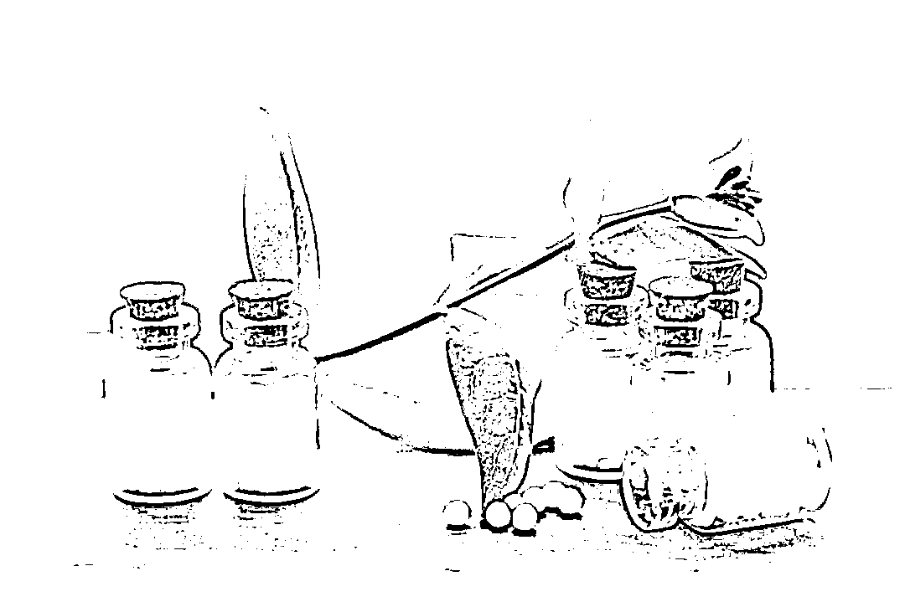

作者/苏·汤普金斯 哈内曼 整理/Elias

 编辑/玫瑰 图片/网络

本文摘录自苏·汤普金斯老师的顺势疗法课程内容

另有部分节选自《同类疗法》

顺势疗法作为家庭健康管理的辅助手段，副作用极低，对人体基本无害，我们可以运用顺势疗法针对不同体质治疗孩子的疾病。来看看这些顺势疗法的药品都适合哪些体质类型的孩子吧。特别提醒：使用顺势药剂需要遵照医嘱，成人也可以参考药剂类型哦。

**碳酸钙体质**碳酸钙是由牡蛎壳的中间部分制成，所以符合碳酸钙的婴儿有时就像是牡蛎中的肉一样，软软的、胖乎乎的。碳酸钙的婴儿往往**发育缓慢**，因为他们可能很晚才学会走路或说话。**长牙也可能延迟，并有困难。****碳酸钙体质的孩子喜欢依照自己的步伐行事，若有人勉强他们做不愿意做的事情，他们会不高兴。**身心两方面都属于慢调子的他们，也像其他类型的孩子一样聪明，只是需要时间去学习、消化、归纳外面的事物。 这类孩子看似“冥顽不灵”，其实是因为**他们行动前，都会先了解事物到底是怎么回事**。尽管他们天性内向，喜欢慢慢来，但若遭受超出忍耐限度的对待，他们也会发脾气。这样的孩子**需要安全感**，他们不爱冒险，不喜欢高处。他们怕黑、怕暗、怕电视中的幽灵鬼怪，碰到老鼠或蜘蛛会变得神经兮兮，狗可能也会带来困扰。噩梦使他们尖叫、吓醒，往往杞人忧天，需要别人保证大难不会临头，而且还要明白地解释给他们听。**有时对超自然事物感到好奇，小小年纪就会追问很多关于神的问题。**碳酸钙型体质的人**喜欢不易消化的食物**，例如面包、意大利面和各种碳水化合物，特别爱吃蛋，尤其是半熟的鸡蛋，或者想吃糖果。**容易便秘，经常好几天没有排便，但似乎不会有不适感。**他们通常都是胖嘟嘟的体型，容易流汗，尤其是头部和手，晚上会发现他们的枕头有汗渍。他们的**脚踝较脆弱，容易扭伤**。头部怕冷，所以喜欢戴帽子。这型小孩比较怕冷，容易咳嗽、耳痛、喉咙痛、扁桃体发炎，感冒或潮湿可能引起或加重这些病痛。温暖通常能使他们舒服很多。当你的孩子有不舒服而正好符合碳酸钙体质的特点，就可以每天给予一粒 30c 的碳酸钙用来治疗，直到他感觉舒服为止，也可以当做保健品给予服用。如果他们发高烧，可以用颠茄来急救。**石松型体质**

石松是一款非常适合**懦夫或者自感能力不足**的药物，总是感觉自己能力不足，因为害怕而不敢于冒险，他们可能会**试图去逃避责任，但又有点喜欢发号施令**。

石松型体质的孩子有**缺乏自信**的问题，总让你难以猜透。**他们可能用挑剔、嚣张和霸道的行为掩饰不自信，和其他人耍心机**。另一方面，**在陌生人面前却又显得胆怯、紧张，需要人陪伴、鼓励才能安心**。这些孩子深受预期心理所苦：害怕考试，担心在全班面前讲话或面对失败。他们严肃地看待自己，不想让自己像傻瓜一样。 他们怕黑、怕鬼、怕大型动物，所以夜间可能需要点灯，当他们很小时可能需要与人共眠。 这些小孩的体型往往比平均体型瘦，头部比例大。即使幼儿都会以皱眉头表达不满，直到觉得安全后才会露出笑容。虽然喜欢头部保持凉爽，但他们仍怕冷。**下午和傍晚是石松型孩子的容易感到不适的时段，醒来时或肚子饿时的脾气特别坏，胃部常常是弱点。**恐惧和焦虑不断，所以他们为**胀气和便秘**所苦。这类型的孩子要**避免食用会加剧胀气的食物**，如包心菜、豆类和洋葱等。**他们胃口往往很大，但有时又吃没几口就饱了。**喜欢**甜食、热食与热饮。**这些孩子容易罹患大多数小儿科的病痛，特别是耳痛、感冒和咳嗽，这些疾病可能会蔓延到胸部，引起支气管炎。疾病的症状通常从身体右侧发作，然后移到身体左侧，或者右侧的病情较重。湿疹有时会影响到头部，尤其是耳朵后面的部位。如果出现反复感冒与感染，而且性格与身体特质大致符合前面所述，那么石松就有帮助。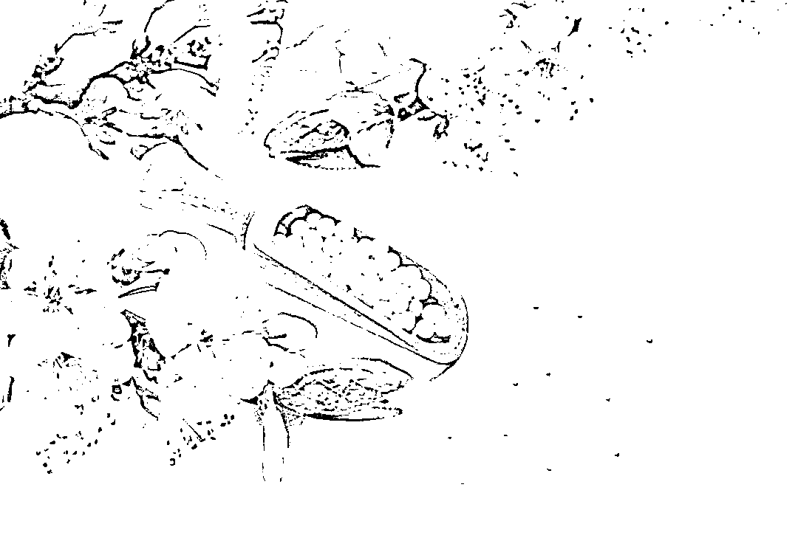**氯化钠型体质****氯化钠适用于慢性的悲伤，在一生中不断搭建起来的状况，可能不知道自己处于这个状况，是一种静默的悲伤。**过度敏感，一点点拒绝都会让他们感到不开心，**非常保守或者谨慎**。很害怕约会，因为害怕被拒绝所以根本不敢去。情绪上的悲伤或者别人的悲伤会让他们觉得像世界末日。**他们看上去是冷酷的，其实是为了隐藏情绪上的脆弱和敏感。**氯化钠适应的这类人总是坐在边缘的地方观察这个世界，会倾向于和已婚的人或者因为某些原因无法在一起的人陷入爱河，这会让他们制造他们更加内向的特点。氯化钠型体质的孩童**情绪很敏感，大多沉默寡言、性格内向，他们的难处在于对事物的感受深刻，但又觉得难以与他人分享沟通**。容易受伤，也知道痛苦是怎么回事，很怕伤害别人。害怕被责备，所以做事一板一眼以免犯错。倾向独自在房间里哭泣，或许会播放悲伤的音乐来安慰自己，借此松开卡住的感觉。**他们把事情安排得井然有序，要求完美，把自己和自己的房间打理得干干净净。**本性上沉默寡言与独立，能享受独自一人，害怕受人瞩目。讨厌被人发现他们犯了错。很容易陷入尴尬的状况，不喜欢被称赞或安慰，除非是很可靠的人。 他们具有早熟的聪慧与责任感，这类孩子常**严以律己，内心充满罪恶感和悲伤，可能连父母都没察觉他们的恐惧**。你永远不知道他内心的怨恨才是个大问题，他们对事情耿耿于怀，往往很久才能谅解，很多问题都出自于他们冰封的情绪。氯化钠是一种重要的悲伤治疗药，有此需要的小孩常有某些情绪创伤未处理，例如双亲离异、痛失朋友或宠物等，这些突如其来的悲痛，会使他们的身体生病。他们**害怕任何超出自己控制的事**，像是家里闯入窃贼，看到蜘蛛或想到父母亲可能死掉等。当你的孩子有什么不适又符合氯化钠的特质，那么可以尝试服用氯化钠，每天一粒 30c。**磷型体质**磷型体质的人**喜欢交际，有同情心，渴望陪伴，具有敏锐力洞悉力。**他们有非常典型的外貌，通常是**高挑或者修长的，胸部比较狭窄，个性活泼。****具有开放性，喜欢学习灵性的东西，对于很多事物会很有热情，但是三分钟热度，容易分心。**他们通常是**恐惧焦虑**的，害怕天黑、雷雨天等。典型的磷型体质的病人总是**充满着恐惧和焦虑**，他们总是吊着神经和焦虑，但是**很容易被安慰**，只要稍微关心一下，就能马上安静下来。对气味噪音、碰触敏感、气候的变化以及对别人的情绪都很敏感。好像所有人都喜欢磷型体质的儿童，他们亲切友好，热情又富有同情心，如磁铁一般——这种形容非常贴切，他们能吸引相互友好的伙伴。特别重要的是，当他们生病时，爱他们的人会在身边，倾全力相助。他们当然是外向的孩子，充满自发性与好奇心，老是静不下来，热衷追求新事物。他们容易**因为兴奋不已而生病，或因鲜活的想象力而玩过头。**他们付出太多，也需要他人回馈很多关注，但人们常以为他脾气好又爱玩，所以没有人会太在意。磷型体质的孩子很少羞怯，偶尔如此也只是想博得同情，如果给予赞美或疼惜，他们很容易就能克服害羞。**他们容易口渴、喜欢冷饮，也可能爱吃辣。**偶尔出现血糖骤降的情形会使他们头晕。胃部可能是弱点，奇怪的是有时生病期间，他们会呕吐出胃中温度升高的冷食。他们很少便秘，可能有流鼻血的问题，容易喉咙痛，也可能声音沙哑。感冒容易直接感染他们的胸部（这是另一个弱点），喉头炎会快速感染支气管，所以会抱怨胸部紧绷和胸闷感。磷型体质的孩子生病时会坦然表达他们的痛楚与需求，他们觉得被安慰、被拥抱能获得改善，而事实证明，最好的治疗就是给他们关爱，同时搭配一些磷药丸服用。

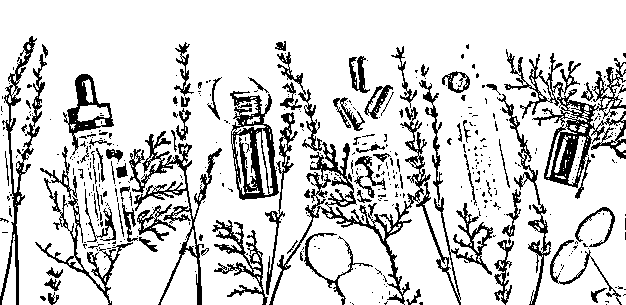

**白头翁体质****他们通常很善变。**病症也是不断在变化的，前一秒是这样的，后一秒可能就是那样的，或者每一次大便的样子都是不一样的。他们的性情其实是柔和温和的，不太容易愤怒，感觉是很温柔的那种。带有迷人的特质，喜欢被拥抱，渴望被关注。他们渴望有人交流，希望沮丧的时候，可以有个肩膀依靠，告诉他们说没事的，一切都会好的，也希望得到积极的回馈。他们**很敏感于被抛弃的感觉**，需要有人不停地给予肯定，就好像代表人类生活中不成熟、互相依赖的那种状态。有一个关键词是它是有依赖感的，它很需要被渴望，有依靠。白头翁体质的人是希望有安全感的，希望有一个住所，或者避难所，它希望有同情和爱在身边。**不喜欢闷热的房间，渴望呆在室外，通常不会觉得口渴。**白头翁体质的孩子主题是**被遗弃的恐惧，**他们是温和、轻柔的灵魂，颇为羞怯，很希望被取悦，认为这就是父母或朋友对他们的认同，证明自己没有受人排拒。他们大致上是爱哭的，在陌生环境下会形影不离地紧跟着父母，这是害怕的天性使然。他们是很乖的小孩，很听话，对别人斥责很敏感，被责备时很容易情绪失控。虽然他们有温和、可爱的天性，不过性格中也有**嫉妒与刁钻**的一面，例如认为兄弟姊妹博得父母所有的宠爱。因为极敏感，有时你会发现他们的病痛是因为以往的伤痛，例如最好的朋友因转学而离开了他。

他们的心境起伏很大，一会儿哭、一会儿笑。当然，所有孩子都是这个样子，只是易变的白头翁特质会让你觉得长大后的他们还是老样。怜爱与同情很能安慰他们，晚上和父母亲同睡一张床，对他们来说最好不过的事了。

白头翁型的孩子体温较高，觉得户外的新鲜空气最好，不容易口渴，但喜欢冷饮，他们不适合浓郁、油腻的食物，那些食物可能会使他们恶心和呕吐。**他们优柔寡断，要他们做任何决定都很难。**生病的症状正如他们的本性一样变化不定。病痛似一处转到另一处，一会是胸部，一会又是胃部。容易耳痛，感冒会潜入胸部，经常鼻塞，充满黄绿色的鼻涕。睑腺炎也容易复发。有人疼爱、大哭一场、冷敷和新鲜空气都有助于改善这些病痛，白头翁也包含在内。当你的孩子是这样的性格特质的时候，如果感到身体不适，可以尝试用急救箱中白头翁，一天一粒。**硫磺体质**硫磺体质人的特性是他**有很多非常伟大的想法，但是很难将想法转变为行动。**他们总是想把事情弄清楚，对任何事情都有想法，通常很有创造力的人。愿意坐着而不愿站着，更愿意躺着。希望自己的想法得到认可，可能是**自我满足的、以自我为中心的、虚荣的；夸张的、自吹自擂的**。这些人有一些木星的特性。

硫磺体质的人是**仓促的和冷漠的**，因为他们有些宏大的想法。他们往往**懒惰、迟缓、凌乱而不整洁**。硫磺是从火山这得到的，是火元素，水和火不要混合。所以**硫磺的病人遇到水病情会恶化。**令人讨厌的放屁、粪便或口气会让症状恶化。也会“察觉到体味”并且“厌恶”。 

*   一种硫磺型体质的孩子风头很健，有十足的活力与好奇心，觉得自己发育良好使他们成了天生的领袖。天生的敏捷与聪慧使他们能迅速消化新资讯，也敢实际运用。 

*   另一种硫磺型的孩子比较安静，但一样聪慧、好奇，具有一种非得全部弄懂的闹人特质。

**这两种类型的孩子总会提问，他们的固执有时会令父母抓狂。**硫磺型体质的孩子有天生的自信，加上几分顽固，相当自我中心，不顾别人对他的看法，所以很容易破坏比较脆弱的感情。常常认为规则就应该打破，很少害怕下场如何。

他们是脏乱的小孩，也不讲究打扮。天生就懒，也是世上最拖拖拉拉的人，他们宁可瘫坐而不站着。除了粗鲁与静不下来的性格，硫磺型孩子算是相当温和，喜欢助人，尤其能借此展现高度优越感时。**体格通常较同年龄的孩子壮，但安静的硫磺型孩子可能比较瘦小。**他们的脸或许很红，皮肤容易产生问题，如发痒、会灼痛的湿疹，特别是洗完澡后。洗澡不是他们拿手的，所以他们会一副脏兮兮的模样。幼年时，他们脸上挂着两行鼻水、满头汗，老是发红的眼睛和耳朵，习性上时常显得很没教养的样子。不怕冷，晚上睡觉时两只脚还能探出棉被外纳凉。早上十一点左右是他们无精打采的时段，那时可能已经饥肠辘辘，他们通常喜欢甜食与口味浓郁的食物，很容易口渴，但可能对乳品过敏。当孩子身体不适，如果孩子的性格特质恰好符合硫磺的特质，那么就可以尝试服用硫磺，每天一次，观察五天。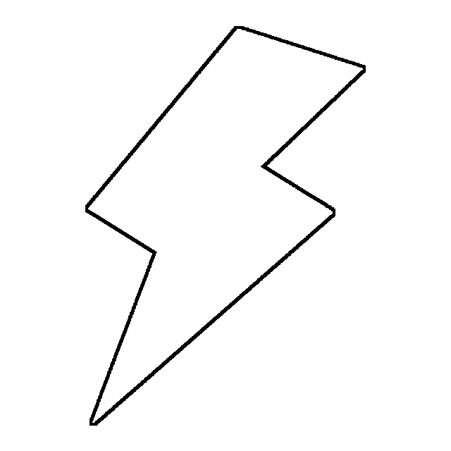

**提醒：安全性问题**

顺势疗法作为辅助医学，对我们日常的家庭健康管理起到了非常好的辅助作用，并且在某些急性病症或者严重疾病中也能起到舒缓的作用。但是罹患严重或者不知名的病症，或者一般人在 2-3 周内、5 岁以下儿童在 48 小时内情况未获得改善，应向现代医学求诊。

****请在后台回复 顺势 获得更多****关于顺势疗法内容********

**版权声明：**本文由若道翻译发布，欢迎转发，反对抄袭。友号转载请申请白名单。

**学习顺势疗法**

**请点击下图了解详情**

**微信又双叒叕改版啦，不想错过若道君的推送？**

**就把若道设为星标吧！**

**▼**

就是这个“在看”，戳戳戳 ☟

********报名直达入口********

# 9 月宇宙天气 | 六星逆行，请找到宁死也不要放弃的东西

> 原文：[`mp.weixin.qq.com/s?__biz=MzA5NjA0NTAxNg==&mid=2651426304&idx=1&sn=d699e0712468e304ad6b00c239823a15&chksm=8b4b3cb7bc3cb5a17e611fa1423f8ae52a209b24b7bd1ae109aabab212020ca2074d8fe013d4&scene=126&sessionid=1692738111#rd`](http://mp.weixin.qq.com/s?__biz=MzA5NjA0NTAxNg==&mid=2651426304&idx=1&sn=d699e0712468e304ad6b00c239823a15&chksm=8b4b3cb7bc3cb5a17e611fa1423f8ae52a209b24b7bd1ae109aabab212020ca2074d8fe013d4&scene=126&sessionid=1692738111#rd)

****************☆ 后台回复“今日”，给你一句生命态度****************

作者/咔咔 ISAR 认证占星师

编辑/玫瑰 图片/全景网**9 月主要天象**

2020 年 9 月的重大天象包括： 

*   火星在白羊座逆行；
*   木星和土星在摩羯座恢复顺行；
*   水星、金星与摩羯座群星的挑战相位；
*   9 月 10-12 日之间，天空中有六颗行星逆行。

纵观 2020 年全年的宇宙天气，火星逆行的重要度和关注度都名列前茅。可能和这颗距离太阳 2.28 亿公里的行星很少逆行有关，火星每两年才会逆行一次。也可能因为它每次逆行的时间长达 80 天。火星和太阳一样是阳性星体，它促使我们大胆地行动，坚持争取我们想要的东西。火星的最核心的含义与**生存**有关，如果我们不能使用树立明确的界线，不管是国境线还是与他人交往的健康边界，我们就会感到不安、受到威胁，进而展现攻击性。大洋彼岸那位“筑墙狂人”（特朗普）的出生星图中，火星就合相了上升点。

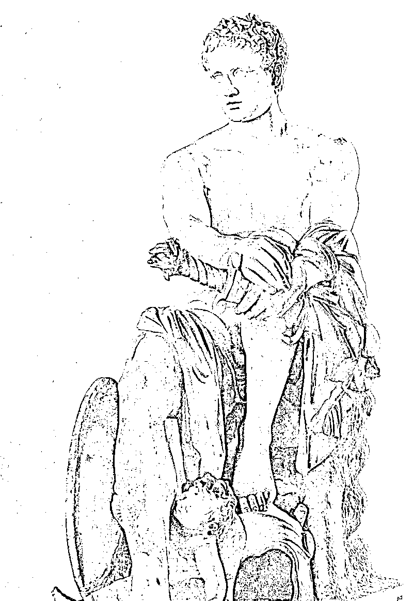

|战神阿瑞斯虽然古希腊人奉火星的守护神阿瑞斯为战神，不过这个称号不是形容他智勇双全、战无不胜，反而这位神祗鲁莽有余，智慧不足，还收受贿赂，临阵倒戈，最后被雅典娜打的丢盔卸甲。阿瑞斯虽然风流，但是会保护自己的孩子和关心的人。波塞冬的一个儿子企图诱拐战神的女儿，愤怒的阿瑞斯不顾对方尊贵的身份，无情将其斩杀。**战神的神力有其两面性，可以自私地发动战争挑起争端，也可以保护弱者、为他们争取权益。**那么，在火星逆行期间，战神阿瑞斯会如何表现呢？他是会变得虚弱，让恐惧和不自信占据自己，变得鲁莽自私易怒，还是学会了忍耐？阿瑞斯这次在自己守护的星座，天然地具有勇气、力量、胆气和决断力，可是他的对手也很强大，木星和土星在本月也恢复了顺行，意味着老旧的势力、权力机构、传统的价值体系强势回归。在这样充满张力的背景下，金星和水星将加入火星与木土冥的角力，在 9 月初和 9 月下旬与这些行星形成挑战相位，情感、语言和文字也将成为争斗的武器和战场。9 月上旬天象

**9 月 1 日 水星（处女座）三分冥王星（摩羯座）**

**9 月 2 日 金星（巨蟹座）对分土星（摩羯座）、双鱼座满月**

**9 月 3 日 水星（处女座）三分土星（摩羯座）**

**9 月 4 日 金星（巨蟹座）四分火星（白羊座）**

**9 月 5 日 水星（处女座）六分金星（巨蟹座）**

**9 月 6 日 水星进入天秤座，金星进入狮子座**

**趁着月初水星的状态好，建议大家把需要深入研究、严谨计划的工作提上日程。**在 6 日换座前，水星会与冥王星和土星形成三分相。这预示着一段**效率高、成绩显著**的时期。虽然在沟通和计划方面顺畅高效，这段期间的**人际关系和财务收入却不那么顺利**。金星在巨蟹座与土星、冥王星和火星构成了以火星为顶点的 T 三角格局，意味着**以感受安全、获得接纳、情感为主要考量的需求与纪律、规则、责任、尊重传统和权威的标准之间的矛盾**。这个矛盾无法调和的时候，就会通过火星的方式，用一种直接果决的态度站出来，把问题挑明，寻求解决的方案。

最近我们看到的关于女性使用卫生巾讨论，是金星、土星、冥王星对立天象的显化。卫生巾是每个女性（金星）的日常需求，长久以来也是一个禁忌的话题（冥王星），而在某些贫困地区，女性连这种基础用品都无法负担（土星）。在白羊座的火星代表了一种“何不食肉糜”的天真的声音，也代表了一种普及科学常识和呼吁公益慈善助力的勇敢的声音。**9 月 2 日的双鱼座满月让人们倾向于同情和不评判那些不知道、不了解的事情，并且提供力所能及的帮助。**

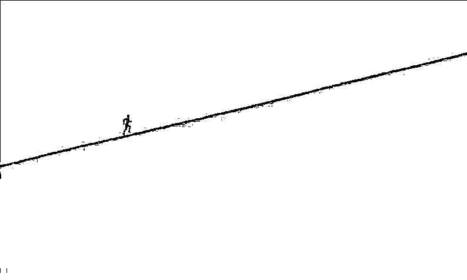

9 月中下旬天象**9 月 10 日 火星在白羊座逆行****9 月 13 日 木星在摩羯座恢复顺行****9 月 15 日 金星（狮子座）四分天王星（金牛座）****9 月 17 日 水星（天秤座）四分木星（摩羯座）****9 月 21 日 水星（天秤座）四分冥王星（摩羯座）****9 月 22 日 太阳进入天秤座****9 月 23 日 水星（天秤座）四分土星（摩羯座）****9 月 24 日 水星（天秤座）对分火星（白羊座）**火星在白羊座 28°逆行，11 月 14 日，火星在白羊座 15°恢复顺行。回到开篇的问题，战神阿瑞斯如果处于非常状态，他会如何表现？是变得虚弱，让恐惧和不自信占据自己，变得鲁莽自私易怒，还是学会了坚韧和隐忍？这几种情况都有可能。首先，我们要检查内在的战神是什么状态。如果我们一直没有滋养和供奉他，过于认同金星的能量，渴望受人欢迎，想被当做好人，火星逆行期间我们会看到一个失控的战神。**勇敢不会让人们挑起事端主动攻击，但是恐慌和畏惧会。**一个健康的战神因为知道如何应对挑战保护自己，反而对自己能在世界上生存具有信心。也可能我们内在的战神处于过度发展的状态：长期处于竞争状态让他习惯了主动出击争取自己想要的东西，也可能忙碌和紧张的生活节奏让他没有耐心、只关注自己的需求、盛气凌人。火星逆行期间，他可能感觉**精力匮乏，效率不高，体力下降连带动力不足**。疲惫的阿瑞斯需要慢下来，休息、补充营养，擦拭盔甲和兵器，积存战备物资。行星逆行都预示着一段把行星能量内化的时期，即向内发展。火星能量向内发展的极端表现是**自我攻击**，因为无法主张自己感到无力和失控，无法释放愤怒和性能量，转而向内攻击自己。似乎因为外在的世界太危险，这些愤怒和怨恨向内攻击是安全和和可控的。

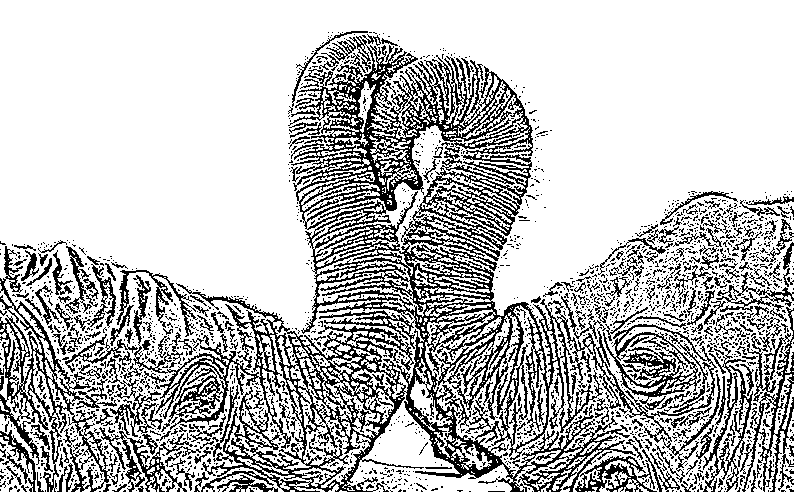

虽然未曾统计火星逆行期间抑郁症和抑郁状态的发生概率，但是如果我们能利用这段时间检验自己内在的火星状态，看到被压抑和被过度发挥的部分，对我们健康地度过下一个火星周期有着重要的意义。这段时间我们也要**小心炎症、擦伤、割烫伤和溃疡等症状**。木星在 17°摩羯座恢复顺行，经过了 3 个多月的逆行，不知道有多少人检视了内心的道德观和人生哲学呢？我们当下在木土冥合相的大背景里面。11 月 13 日，木星——射手座的守护者与冥王星、天蝎座的守护者将第三次形成合相。天蝎座在射手座之前，因为在经历了人生的坎坷、丧失、哀痛、被贬损、自我怀疑、卷入人性阴暗游戏后，你总会知道**有什么是你宁可死也不要放弃的**。那就是锻造之后的钢，是百炼之后的金，是比你的生命还要珍贵的东西，是你的星空，是你的准则。所以你可以坦然地将它供奉起来，你知道它是值得的，在星空行星的指引下，你的航程再不会偏离方向，纵然迷津深有万丈，遥亘千里，你终不会迷失。9 月 17-24 日，水星将在天秤座将火星、木星、土星与冥王星串起来，形成挑战的 T 三角格局。天秤座是一个有原则讲求公理的星座，但是他的理性准则是建立在和谐和公平的基础上，而当下木土冥的大背景是以生存为第一考虑，旨在保护某些个人、团体的利益，不能做到人人平等的。**届时，我们可能会听到不同理念的声音，极端的表达方式因为火星的加入变得尖锐粗暴**。9 月 22 日，太阳进入天秤座后，我们更能联结到天秤座的能量，希望用公平公开的态度面对理念上的分歧。

在 24 日前后，土星发挥力量，预示着权威对不同意见的管理和压制。

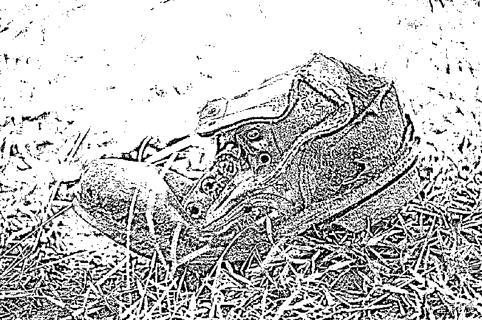

9 月下旬天象**9 月 27 日，水星进入天蝎座****9 月 29 日，金星（狮子座）三分火星（白羊座）、土星在摩羯座恢复顺行****9 月 30 日，火星（白羊座）四分土星（摩羯座）**这是我们第二次经历火星与土星的四分相，上一次——8 月 25 日，火星在顺行而土星是逆行的状态。这样的交锋围绕着个人主张与社会规则进行。只是这次的局势土星更占据上峰，火星则因为逆行而表现虚弱。**我们可能被恐慌和畏惧压倒，也可能学习如何与规则合作，尽力争取，学习不放弃就是胜利**。祝勇气和智慧与你同在！附录：本月重要天象一览表

|   | **星象** |
| **2020.9.1** | **水星（处女座）三分冥王星（摩羯座）** |
| **2020.9.2** | **金星（巨蟹座）对分土星（摩羯座）** |
| **2020.9.3** | **水星（处女座）三分土星（摩羯座）** |
| **2020.9.4** | **金星（巨蟹座）四分火星（白羊座）** |
| **2020.9.5** | **水星（处女座）六分金星（巨蟹座）** |
| **2020.9.6** | **水星进入天秤座****金星进入狮子座** |
| **2020.9.10** | **火星在白羊座逆行** |
| **2020.9.13** | **木星在摩羯座恢复顺行** |
| **2020.9.15**  | **金星（狮子座）四分天王星（金牛座）** |
| **2020.9.17** | **水星（天秤座）四分木星（摩羯座）** |
| **2020.9.21**  | **水星（天秤座）四分冥王星（摩羯座）** |
| **2020.9.22** | **太阳进入天秤座**  |
| **2020.9.23** | **水星（天秤座）四分土星（摩羯座）** |
| **2020.9.24**  | **水星（天秤座）对分火星（白羊座）**  |
| **2020.9.27**  | **水星进入天蝎座** |
| **2020.9.29**  | **金星（狮子座）三分火星（白羊座）****土星在摩羯座恢复顺行** |
| **2020.9.30** | **火星（白羊座）四分土星（摩羯座）** |

**版权声明**：原创文章由作者授权首发于若道平台，欢迎转发，反对抄袭。友号转载请申请白名单。

********想阅读更多作者的文章********

********请在后台回复**************** 咔咔 即可********

**咔咔**

职业占星师，若道核心课程讲师

ISAR 认证占星师（2014 年获得）

国际知名广告公司和市场研究公司工作十余年

**微信公众号**：咔星人

长按打赏

******你还可以预约作者咔咔的占星咨询****** 

******长按下图二维码预约吧******

**系统学习占星学**

**点击图片了解详情**

喜欢记得点一下在看哦☟

********报名直达入口********

# 如果你特别需要个人空间，请找太阳、月亮、上升落在这个星座的爱人

> 原文：[`mp.weixin.qq.com/s?__biz=MzA5NjA0NTAxNg==&mid=2651426017&idx=1&sn=50baff5c1193e6ad12ef833e6113e466&chksm=8b4b3e56bc3cb740af159c5a81c84f63fb4cb2c25c9f7491e9d5df33beb87eecaafa821c2aad&scene=126&sessionid=1692738116#rd`](http://mp.weixin.qq.com/s?__biz=MzA5NjA0NTAxNg==&mid=2651426017&idx=1&sn=50baff5c1193e6ad12ef833e6113e466&chksm=8b4b3e56bc3cb740af159c5a81c84f63fb4cb2c25c9f7491e9d5df33beb87eecaafa821c2aad&scene=126&sessionid=1692738116#rd)

**********☆****************后台回复“今日”，给你一句生命态度**********

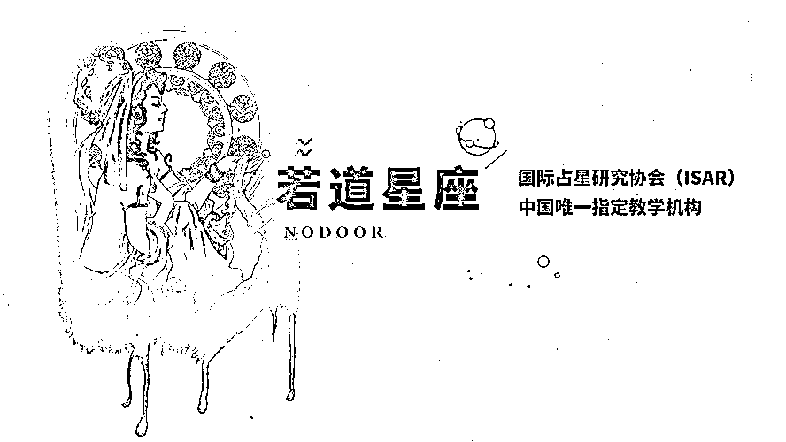

作者/斯蒂芬·弗里斯特 朱迪·弗里斯特 
译者/李含 编辑/玫瑰 图片来源/全景网本文摘自《天空的伴侣 I：爱、性和进化占星学》

如果这个世界由水瓶座主导，那么我们的婚姻和恋爱关系会变成怎样一种状态呀！但是，这个星座又是那么的吸引人，让人忍不住想要靠近。和水瓶座恋爱、结婚（如果你足够幸运的话）会是怎样一种感受呢？

**水瓶座****原型**  **天才 革命者****流放者 科学家 真理 先知**发展目标

晚间新闻里报道了一位祖母攀登上了珠穆朗玛峰。我们对她的勇气表示非常非常惊讶。我们不知道的是，这个勇气的 98%来自于她以前翻山越岭的经验。仅仅是具备攀登珠峰的资格，她就已经获得了心灵的圆满。也许她的父母希望她嫁给邻居小伙儿。几乎可以肯定，来自同辈的压力让她必须遵循传统的生活模式：事业、家庭、子女。从另一个角度上看，社会在她与珠峰之间设下了重重山丘，每一座她都必须翻越。

并不是每一个人都会去翻越山岭。事实上，大多数人在相对传统的生活里都有点不舒服。这不是传统的罪过。但有些人必须明白，**体验灵魂的变革之旅是滋养我们心灵的方式，这与父母给予我们的体验是不同的**。这些就是典型的水瓶座人。他们的发展目标是什么？简言之，就是**成就自我**。自我的满足偶尔会与亲众的期望一致。形而上学认为，**前世，他们经历了灵魂的分裂、游离的创伤，就因为被强迫在一个无法真实展现自我的生活状态里。**策略和资源水瓶座要学会**打破常规**。往窗户扔砖头不是关键，这个更像是水瓶座的阴影。这个过程的核心是，**要不断地加强这种意识，在集体思维和真实自我间找到共识**。水瓶座人要认识到，**小时候，社会灌输给我们一套这个世界的价值观和预设目标，但这些对于真正的满足自我需要、实现自我目标毫无帮助。**我们必须**在所有神话里找到真正的自我身份认同。**我们会提及自由的灵魂，但是真相是，大部分人的自由灵魂早就被老虎吃掉了。在生物学上，生存有赖于缔结同盟的能力。在进化的过程中，我们的种族是群居的、社会的、部族的。我们天生就会寻找伙伴，为了获得伙伴可以做任何事。宗族并不只是存在于传说中的中产阶级。很多人会选择“群居伙伴关系”作为次文化。别被愚弄了，这依旧是天性的体现。水瓶座人的策略就是**推翻这种部族的天性**。“我就是我。如果你喜欢我，那很好。如果你不喜欢我……呃，这很有意思。”这就是水瓶座人的方式。水瓶座人有资源去支持这种发展进化的策略。水瓶座天生就**不信任这种族长式的阶级关系**。他们可能**具有发散性思维，跳脱出主流的思想方式，为头脑注入魔力**。这是一种**流浪者型的磁力，冷静、清醒的视角，**流浪者希望找到一片新大陆，这些男人女人**需要刺激，不需要了解。****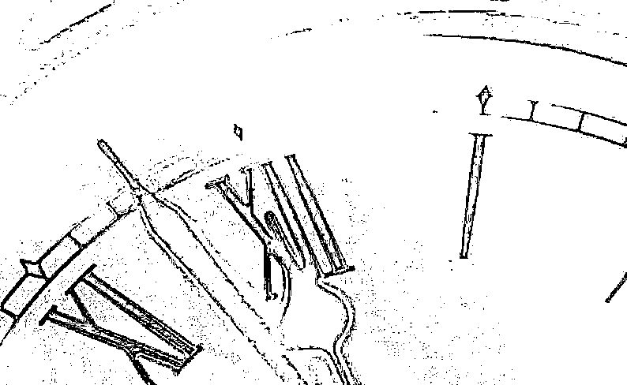**阴影

**反叛**就是水瓶座的阴影。那位奶奶登上了珠穆朗玛峰，而不是屈服于社会的压力。她的婚姻很传统，职业受人尊敬，穿着得体。发生了什么事情？**所有这些叛逆者，独立的水瓶座天性会被某个不相干的事情所触发，决堤而出**。一段时间以后，她开始用天赋的（叛逆）权力，穿紫色长筒袜上班。她非常坚定地拒绝与某位邻居来往。她需要有水瓶座的表达方式，不愿意被定义，**将反抗的力量投射在无意义的怪癖上。**

**如果真实的自我得不到发展，她就会变得越来越古怪**。接近她的人就会觉得她“不在状态”，虽然她看起来很自信。人们会觉得她**很冷酷、冷漠**，这是误解了阴影——**精神上的分裂与真实自我的分裂。**

**水瓶座的爱情**太阳水瓶座的爱情如果水瓶座成了这个世界的主流，我们也许还是会结婚，但婚姻的形式会有很大不同。首先，很多夫妻会选择分居在城市的两端，或者三四成群，或者是忘年恋、跨种族伴侣。各种各样的配对变得稀松平常，这也符合了心理学上认为的：**每个人都是不一样的。个体值得被尊重**——这就是水瓶座人的核心。操控人类的性行为是一件很困难的事情，但是，社会总是企图给我们预设好规则。混乱的男女关系被阻止，或者是被小心翼翼地引导为一种仪式。一般来说，倡导一夫一妻制，不支持的地区会有“安全”的解决方式。**女性被鼓励呈小鸟依人状（巢居家中）。男性被鼓励去发展一种不理性的、强制的赚钱行为。这些都是社会规范人的性行为的方式。**虽然我们批判这些方式，但是我们也会注意到，这反映了**人类在对待这种棘手的议题时，积累的智慧**。诚然，这种智慧有缺陷，但到目前为止，这是我们找到最好的方式。**承诺之爱很难，但对我们大部分人来说，接受这种形式还是有某种程度的帮助，起码可以帮助我们保持平衡。**但这对水瓶座人没用。对于他们来说，**所有事情都被质疑**。把脚本扔掉，把规矩抛诸脑后，随心所欲。　　　　——“让我们结婚吧，但是不要住在一起！”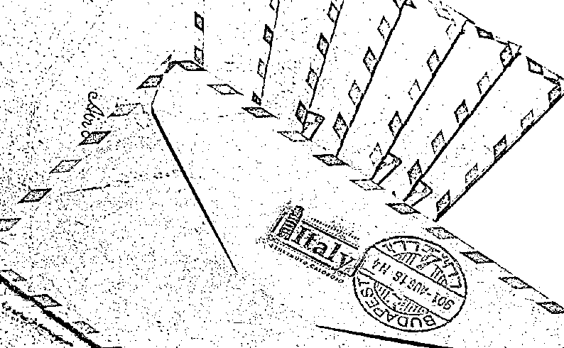月亮水瓶座的爱情

个人领域的爱很困难，或者可以支持或提升个人领域的爱。每一个月亮在水瓶座的人，一切都取决于保证硬币正面朝上。 

该如何做呢？首先，**在面对爱情承诺的挑战和冒险之前，月亮在水瓶座的男女需要先搞定自己。**出于这个原因，**月亮水瓶座的人虽然也会拥有快乐健康的婚姻，但是早年的婚姻会是乏味而短暂的**。**对于月亮水瓶座的人来说，婚姻格外具有挑战性，因为月亮比太阳更少思考，所以更容易将叛逆的方式代入爱情和两性关系。**

在任何情况下，**喘息的空间**对于亲密关系的积极发展都十分必要。亲密的关系对于巨蟹座或者是天蝎座都很自然，但是对于水瓶座，这就像是**幽闭恐惧症**，除非星图中的其他部分有完全相反的预示。对于月亮水瓶座的人来说，**分开的时光，即使只是几个小时，都是一种疗愈**。一旦有了**稳定的自我**，他们就变得可爱，并且能够专注。但是，在最初的发展阶段，**伴侣们还是会因为月亮水瓶座人的冷漠、超然和距离感而感到挫败：**这个症状说明**此人还没有打算好融入世界**。当他们准备好踏入，会带给大家惊喜。在任何情况下，月亮水瓶座都要**选择一个能够给予足够空间的伴侣**，很传统的伴侣会觉得月亮水瓶座的人难以理解：**他们的感情像是“不正常”。**与月亮水瓶座的人在一起，就像是认识了个外国人，或者是某位破除传统观念的人，总是有各种意料之外的收获——也许是一个甚至两个爆炸弹。上升水瓶座的爱情对于上升水瓶座的人，一般标准的分析认为，他们**亲切、善社交**，**在更亲密的关系中，显得比较冷。**这种观点在实践中正确率挺高，但是，这里有一个更具启发性的观念。上升水瓶座人表现出的个性是**独特的，他们以不同的视角看待世界。**所以，从出生开始，**因家人、同辈人、文化不解而产生的社会压力就如影相随。**他们**被强迫、被威胁、被收买、被引诱去屈从社会标准。**这种转化会让上升水瓶座的人**戴上一个“正常的、完全适应社会的”面具**，他们**隐藏了自己的秘密，有时候甚至是无意识的。**如果外力强迫占有优势，我们会看到一种**表面的融合适应**。**当关系变得亲密，距离感就会出现**。他们其实**心不在焉**。出于这个原因，上升水瓶座的人需要找一个**能够认同他们观点的伴侣。**水瓶座的守护星是天王星，上升水瓶座的人，天王星就是星图的命主星。了解上升水瓶座人的爱情与亲密关系，天王星所落的星座和宫位会有所展现，特别是如果天王星落在了亲密关系的宫位。

**版权声明：**本文由若道翻译发布，欢迎转发，反对抄袭。友号转载请申请白名单。

**12 星座爱情宝典**

[白羊座](http://mp.weixin.qq.com/s?__biz=MzA5NjA0NTAxNg==&mid=2651419096&idx=1&sn=30c86f7f9f489d61c1b0f80b8944b46b&chksm=8b4bc36fbc3c4a79c49f5b4aa43daad19a145e2bf762fe4a8e5bc1319228e633a65ae869df2c&scene=21#wechat_redirect) | [金牛座](http://mp.weixin.qq.com/s?__biz=MzA5NjA0NTAxNg==&mid=2651419469&idx=1&sn=e44679a33194bf652fe9f515565c8da5&chksm=8b4bc1fabc3c48ecfa11b12fdab2043d246c58d47176dfa105a11ee05a22b4bc65947c7ad02e&scene=21#wechat_redirect)丨[双子座](http://mp.weixin.qq.com/s?__biz=MzA5NjA0NTAxNg==&mid=2651420649&idx=1&sn=0179035270f9508988c70e85c969869c&chksm=8b4bc55ebc3c4c48c928471267184c6360676c387dc9527ef0e112d6671bba3e8893324b5621&scene=21#wechat_redirect) | [巨蟹座](http://mp.weixin.qq.com/s?__biz=MzA5NjA0NTAxNg==&mid=2651421302&idx=1&sn=23f3f771a6bb8eed2903620cc0344755&chksm=8b4bc8c1bc3c41d7b10a8b2c2a826edf4d7700e0db201cabe956be9128038e9dd3beb6b14afb&scene=21#wechat_redirect)

[狮子座](http://mp.weixin.qq.com/s?__biz=MzA5NjA0NTAxNg==&mid=2651422486&idx=1&sn=ee393d64fc0638b589212d81c2ecbd35&chksm=8b4bcda1bc3c44b737b01fcfcc85a0a9096d4f7a567d76c6079e9760105e5259d775715f6429&scene=21#wechat_redirect)丨[处女座](http://mp.weixin.qq.com/s?__biz=MzA5NjA0NTAxNg==&mid=2651422885&idx=1&sn=3d4e368f263ed2016388d3cec178b6b1&chksm=8b4b3212bc3cbb049ad7a6c403a4eab1664d38bb465ede4b82aeaeef64deb34b13e8319c642d&scene=21#wechat_redirect) | [天秤座](http://mp.weixin.qq.com/s?__biz=MzA5NjA0NTAxNg==&mid=2651423207&idx=1&sn=d3f8a94b54e7667c0876707de89e7a9f&chksm=8b4b3350bc3cba4672ecb735a445998dc008428e5bdc388c269c237ee361c0bb0b7404dbff0c&scene=21#wechat_redirect)丨[天蝎座](http://mp.weixin.qq.com/s?__biz=MzA5NjA0NTAxNg==&mid=2651423754&idx=1&sn=a98eabdbacb8702c235c367565a17ce3&chksm=8b4b36bdbc3cbfabc468d6015d7755528b6ffc28759c54f6f67d5e82b4354e6304c1787935f2&scene=21#wechat_redirect)

[射手座](http://mp.weixin.qq.com/s?__biz=MzA5NjA0NTAxNg==&mid=2651424047&idx=1&sn=26d45c630151b2e226c9a7157b3a1d40&chksm=8b4b3798bc3cbe8e296b075c8eeaaf9ba0f18152fac8f7a6afe356e32b8f75e40b12fd2983e7&scene=21#wechat_redirect) | [摩羯座](http://mp.weixin.qq.com/s?__biz=MzA5NjA0NTAxNg==&mid=2651425190&idx=1&sn=4bf77c3cb4cdf7eef017f516e814373c&chksm=8b4b3b11bc3cb20768ae89cad4c14bec3499f8c5679d3dfc12dcd5f9e5e6ba842185974a81b1&scene=21#wechat_redirect)

斯蒂芬·弗里斯特

若道签约老师。进化占星学的创始人之一，当今世界最有影响力的占星大师之一；1985 年，他凭借《内在的天空》一书获得职业占星师协会奖（Professional Astrologers Incorporated Award）。他四次获得占星界最高的占星学联合协会奖（United Astrology Congress Regulus Award）提名，2018 年获得轩辕十四教育奖。

**想参加斯蒂芬线上工作坊？**

**请点击图片链接****或添加客服微信咨询**

**想听听大师斯蒂芬老爷子的精彩讲座？**

**长按下图了解详情！**

**微信又双叒叕改版啦，不想错过若道君的推送？**

**就把若道设为星标吧！**

**▼**

就是这个“在看”，戳戳戳 ☟

****************报名直达入口****************

# 你不知道的斯蒂芬·弗里斯特丨进化占星学大师是如何炼成的？

> 原文：[`mp.weixin.qq.com/s?__biz=MzA5NjA0NTAxNg==&mid=2651426017&idx=2&sn=f84ba2f8c921bed1d62be894ad4ded30&chksm=8b4b3e56bc3cb740b713f8658de7076da375a41d91cf676c0fb2d660d2e15054c5d6179b7706&scene=126&sessionid=1692738116#rd`](http://mp.weixin.qq.com/s?__biz=MzA5NjA0NTAxNg==&mid=2651426017&idx=2&sn=f84ba2f8c921bed1d62be894ad4ded30&chksm=8b4b3e56bc3cb740b713f8658de7076da375a41d91cf676c0fb2d660d2e15054c5d6179b7706&scene=126&sessionid=1692738116#rd)

作者/迈克尔·厄尔瓦恩 译者/李含 校对/江艺

编辑/翀子 图片/斯蒂芬·弗里斯特

这是 Matrix 软件公司的创办人迈克尔•厄尔瓦恩（Michael Erlewine）在 2009 年对进化占星学创始人之一斯蒂芬·弗里斯特进行的采访。在特殊的 2020 年，我们将于今年 10 月再次和斯蒂芬相遇，形式从线下变成线上，但这依然是一次灵魂的相遇（报名戳：[亲密关系工作坊](http://mp.weixin.qq.com/s?__biz=MjM5MjQwNjAyMQ==&mid=2649437569&idx=1&sn=fa1a0326f2571174d8e838af0d285d87&chksm=beb95aeb89ced3fd9915091ee549c219d95b75bb1025969ef9c586674dc4fd9fb775f32081f9&scene=21#wechat_redirect)和[整合行进、推进以及太阳弧技法](http://mp.weixin.qq.com/s?__biz=MjM5MjQwNjAyMQ==&mid=2649437569&idx=3&sn=b357ee365827322eb8c4bf3e639c1643&chksm=beb95aeb89ced3fd29c3a6c950856dd5310c4755ab694efe6974bc66acc9d3b3ed9a9187fd2a&scene=21#wechat_redirect)）。

**进化占星学在实际生活中非常有用**

**迈克尔•厄尔瓦恩**

您是如何对占星学产生兴趣的？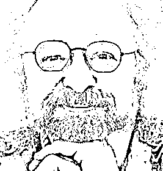

**斯蒂芬•弗里斯特**

这是两条线索相互交融的结果。我记得自己小时候特别想要一个望远镜。到了大约 12 岁左右，我就成为一名活跃的天文爱好者了。第二条线索是手相学，那是 13 岁时，一位德国女孩儿教给我的。在 17 岁以前，这两个兴趣都是独立发展的，直到我翻开了第一本占星书，两条线索才就此交汇到一起：通过望远镜瞭望的浩瀚星光，遇到了手相学中隐含的古老心理学。

****迈克尔•厄尔瓦恩****

您是如何学习占星学的呢，读过哪些占星书籍或是曾在哪所占星学校求过学呢？

****斯蒂芬•弗里斯特****

我完全是从书本上学习的占星学的。直到我在矮脚鸡出版社（Bantam）成功出版了两本占星书籍之后才认识了其他的职业占星师。这就是土星落在中天带来的礼物！其中对我影响最深的是一群英国神秘学家——特别是查尔斯 E.O.卡特（Charles E.O. Carter）和罗纳德·戴维森（Ronald Davison）。对我影响最大的书籍是罗德尼·科林（Rodney Colin）所著的《天体影响理论》（The Theory of Celestial Influence）一书。

****迈克尔•厄尔瓦恩****

您是否向哪位占星老师或者导师学习过呢？您的占星知识有什么传承关系吗？

****斯蒂芬•弗里斯特****

真遗憾，没有。如果要说到传承，我觉得自己继承了金刚乘佛教（即藏传佛教，又称密宗）和爱德加·凯西的“灵异”传统——并不是说我认为自己是灵媒，而是说我沿袭了他们的观念，以灵魂进化轮回的角度来观察这个世界。我花了许多时间与这两方面的大师们探讨。二十多岁时，我也有自己的心灵导师，她对我影响颇深——她是一位深具智慧的女士，玛丽安·斯塔恩斯（Marian Starnes）。她是我的精神之母，我将一直尊敬她。

****迈克尔•厄尔瓦恩****

您从事哪一个类别的占星学？您使用哪些技巧，您认为哪些技巧行之有效？

****斯蒂芬•弗里斯特****

我研究的是进化占星学，本质上是古代形而上学与荣格个体心理学的结合。在技巧上，关注于前世未解的动力及其对今生和心理体验的影响。这里的目标并不是“预言”或是“描述”，而是治愈和释放。实际的技巧可以阅读我所著的《昨日的天空：占星与轮回》（*Yesterday‘s Sky: Astrology and Reincarnation*）一书。我用了 300 多页才完全介绍完这些方法。

****迈克尔•厄尔瓦恩****

您是否有自创的占星技术呢？其他人是否了解或是使用这些技术呢？

****斯蒂芬•弗里斯特****

我为进化占星学领域增添了许多占星技术和阐释方法——这也在《昨日的天空》一书中有详细介绍。在一项占星学学徒计划中我已经教授这些技巧十多年了。约有四百多学生学过了这门课程，所以，绝对有其他的占星师在使用这些技巧并从中获益。一些学生逐步进入职业占星师的领域，这让我很自豪。

这些方法和那些在占星学大会上学到的不同，但它们运用于实际生活中确实非常有效，非常有生命力。当占星师们听说进化占星学与灵魂转世相关时，他们通常都认为这必定是一种神秘学说。实际上，它是心理占星学的一种强有力的表现形式：热烈而慈悲，并且能在人们的此生生活中立刻得到证实。

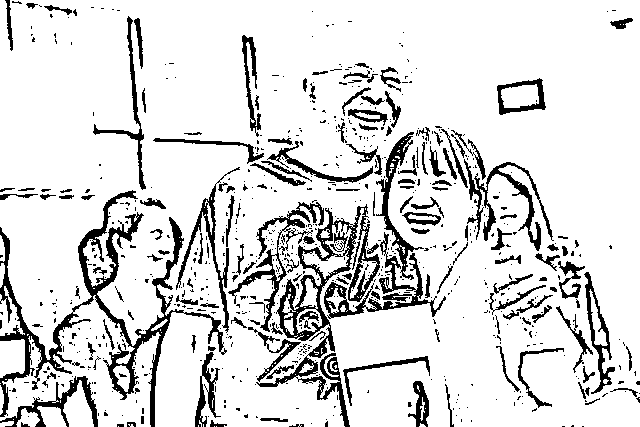

**| **往期斯蒂芬工作坊现场照

**占星学的预测不能丢弃个人意志**

****迈克尔•厄尔瓦恩****

在您自己的生活中，您在什么情况下会使用占星学呢，多久用上一次呢？

****斯蒂芬•弗里斯特****

我会一直关注自己生活中的重大行进和推进主题，还会注意到自己的反应。有时候，我会去散散步，然后在脑中与自己展开对话，就像在同样的占星情境下和客户交流那样。我总是惊叹于这些词语带给我的震动！这很有力！有时候会让我大吃一惊。

同样，我也非常注意每一天的月亮变化，在有重要行为时会以此参考——比如签订合约，订机票，启动重要的事业变动，等等。不问问月亮，我是绝不会轻举妄动的，要确保月亮没有落入空亡，月亮最近的一次成相是柔和相位。

****迈克尔•厄尔瓦恩****

您认为占星学是一项预测工具吗？如果是，是怎样运作的？

****斯蒂芬•弗里斯特****

**占星学非常适用于预测人生难题的本质和时机。预测的“结果”更适合不动脑子的笨蛋，一个人一旦开始探索意识的潜能，就跳脱了令人沮丧的宿命未来，拥有更为多元的可能性。**我没有怎么研究过占星师们技巧的差异，但我相信，“铁口直断”潜藏着危害，甚至是一件不道德的事。

话说得比较重，是因为我认为这样的预测会影响个人追求更高的目标和可能性，这样做就真的很像黑魔法。在进化占星学中，我们是教练，不是先知。我的观点只适用于自我成长与发展型的占星学说，顺便说一句，别预测股票市场和棒球比赛的结果。

****迈克尔•厄尔瓦恩****

在深刻的个人问题和人生探索领域，占星学帮助您找到答案了吗？

****斯蒂芬•弗里斯特****

这的确是个很难的问题。感谢你的提问。简单回答是，“对”。展开来说就是，每一个人，不管你多么坚定地支持不可知论，都将他们的个人哲学和理念带到了占星学中。完全摒弃价值观、完全客观中立的占星学是不太可能的，因为即使你摒弃价值观、坚持客观和中立，这本身就是一种哲学态度！
对我而言，占星学已经融入到世界观之中，不可分割。我现在已经正式皈依佛教，尽管我差不多在 19 岁时，就开始信奉佛教。我成长于健康的基督教文化环境之中，现在仍有基督教的情怀，在心灵层面上，它与我的佛教信仰完全不冲突。我相信，我们都是神秘世界中的神秘存在，经历了数世轮回，回归到难以言喻的一些事情，我们称之为“神”。我相信，**人生中发生的每一个事件，外在世界遇到的每一件事，内心体验到的每一分痛苦和纠结，都是回归家园漫漫旅途中的一部分。**

我没办法证明这一切，但是我能够真诚、坦率地表明我的立场。这样的理念完全渗透在我的占星风格之中。这就是行星告诉我的信息。因此“在深刻的个人问题和人生探索领域”，占星学的确向我反馈了重要的答案，就像一盏明灯照耀着我的归途。

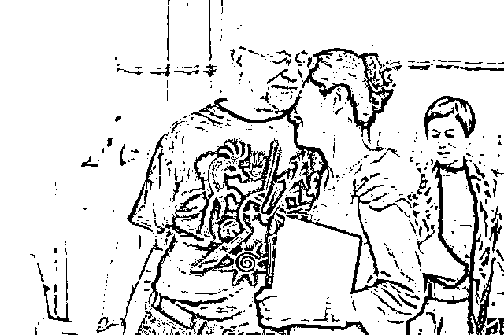

**| **往期斯蒂芬工作坊现场照

**版权声明：**本文由若道翻译发布，欢迎转发，反对抄袭。友号转载请申请白名单。

****想阅读更多斯蒂芬的文章，请在后台回复******** 斯蒂芬**** 即可。****

**想参加斯蒂芬线上工作坊？****请点击图片链接****或添加客服微信咨询**

**微信又双叒叕改版啦，不想错过若道君的推送？**

**就把若道设为星标吧！**

**▼**

喜欢记得点一下在看哦☟

**如何报名？请点击“阅读原文”**

# 雷蒙德·梅里曼金融占星周运 | 预计市场还会出现重大反转

> 原文：[`mp.weixin.qq.com/s?__biz=MzA5NjA0NTAxNg==&mid=2651426017&idx=3&sn=2af7bf4245ad6867016a37110d583ab7&chksm=8b4b3e56bc3cb740ba921eb5b0279eb589d719d662359a03c0fc6e31c77133fce9034a369846&scene=126&sessionid=1692738116#rd`](http://mp.weixin.qq.com/s?__biz=MzA5NjA0NTAxNg==&mid=2651426017&idx=3&sn=2af7bf4245ad6867016a37110d583ab7&chksm=8b4b3e56bc3cb740ba921eb5b0279eb589d719d662359a03c0fc6e31c77133fce9034a369846&scene=126&sessionid=1692738116#rd)

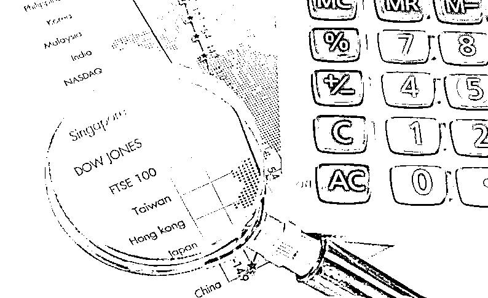

作者/雷蒙德·梅里曼
译者/Leisha 编辑/玫瑰 图片/花瓣网雷蒙德·梅里曼是在金融占星学界稳坐第一把交椅的占星师，同时他也是若道签约的金融占星课老师，我们引进了雷蒙德·梅里曼老师的《[上证指数月度报告](http://mp.weixin.qq.com/s?__biz=MzA5NjA0NTAxNg==&mid=2651425978&idx=2&sn=c7e3187f3abfe604c511ea9506775c0a&chksm=8b4b3e0dbc3cb71bbe141e7e7a5e9ddb0690537fd1661d2f9919f23741010a762b9966633af8&scene=21#wechat_redirect)》《[黄金周期月度报告](http://mp.weixin.qq.com/s?__biz=MzA5NjA0NTAxNg==&mid=2651425978&idx=2&sn=c7e3187f3abfe604c511ea9506775c0a&chksm=8b4b3e0dbc3cb71bbe141e7e7a5e9ddb0690537fd1661d2f9919f23741010a762b9966633af8&scene=21#wechat_redirect)》《[2020 年金融预报](http://mp.weixin.qq.com/s?__biz=MzA5NjA0NTAxNg==&mid=2651414279&idx=2&sn=cc131aa367c4ada15e35d0d80b308415&chksm=8b4bedb0bc3c64a6ef98c0e86ba3d842d8368de2b90e623af1d3870d521049ce352732c8d091&scene=21#wechat_redirect)》。我们经老师的授权，将每周刊登梅里曼老师的周运，供大家参考和学习。于是，这是本周的周运（8.31-9.4）。**说明：以下时间采用纽约证券交易所所在地美国东部标准时间。下周是美国劳动节，因此没有金融周运。**
**展望与回顾**

我今天到德国了，旅途很轻松但很漫长，因为现在很难买到直飞航班的机票。由于木星（国际旅行）将在冬至附近离开摩羯座（限制和旅行禁令），因此读者们也许可以研究航空公司和与旅行相关的公司的股票，在正常的修正性下跌中寻找可能的投资机会。但是，**“正常”的修正性下跌在今年的股市中是例外，而不是常态。**

全球股市上周的表现总体不错，许多股市都再次创下暴跌后的新高。纳斯达克指数和标准普尔指数均创下历史新高。道琼斯工业平均指数，德国 DAX 指数和印度 NIFTY 指数离创下历史新高也不远。然而，由于安倍首相周五因健康问题宣布辞职，日本股市受挫，日经指数下跌。其他市场，原油飙升至暴跌后的新高，随着美元再次下探两年多以来的最低水平，黄金再次上探 2000 大关。**火星将在 9 月 9 日转向逆行，木星将在 9 月 12 日转向顺行，所有金融和商品市场都很快会发生重大反转。**甚至在那之前就可能反转，因为**8 月 25 日-9 月 2 日，金星（价值、钱）将对分木星、冥王星、土星，并将在 9 月 4 日与火星形成 T 三角**。这些都是地球宇宙学反转征象，**从现在起至 9 月中旬的整个时期中，市场都有可能出现周期性的高点或低点，并由此反转**。但在那之后，我们将迎来今年最强劲的地球宇宙学时间段之一：**9 月 28 日-10 月 19 日，届时火星在自己掌管的白羊座逆行，并四分摩羯座星群的土星、冥王星、木星**。这预示世界局势的重大转变，无论政治、经济领域还是自然界，都是如此。**金融市场可能会以重大趋势反转的形式来回应这种转变**。这些反转的持续时长和剧烈程度取决于许多因素，将于下文的长期展望中详述。本周，**9 月 2 日是满月，当天金星也对分土星**。我们有一条地球宇宙学的基本交易规则是，**任何在金星-土星相位之前一直下跌的市场，都可能会反转和回升**。交易者会想要识别哪些市场会出现这种情况。**短期占星趋势和长期考量**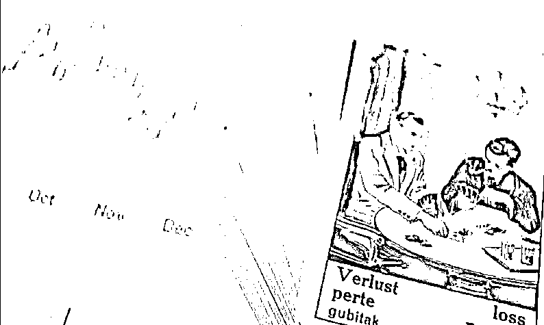

**经济学家们知道自己永远不会错。然而，经济学家发布的高频金融数据预测并不够准确。为什么会这样？……因为这不是普通的经济周期。人们的反应功能与过去的周期不同。经济模型基于反应功能稳定的假设。更决定性的是，新冠疫情加快了经济的结构性变化。经济数据识别变化的速度很慢，使宏观数据和微观数据难以融合。**

**——保罗·唐纳文****《为什么金融预测的准确度变低了》****瑞银周刊博客****2020 年 8 月 21 日**
我们应该讨论这个话题。我最喜欢的一位经济学家唐纳文博士在上述引言中指出，他观察到不仅最近的经济周期出现了扭曲失真，世界股票和国债市场的周期也出现了扭曲失真。贵金属（例如黄金）或货币市场周期的扭曲失真不太明显，这两个市场的周期模式与今年的周期和地球宇宙学研究对应得非常好。但是，为什么根据股指交易周期的预测进行交易变得很难？也许正如唐纳文博士对经济周期的看法，这可能是因为新冠肺炎病毒疫情“……加快了经济的结构性变化。经济数据识别变化的速度很慢，使宏观数据和微观数据难以融合。”这肯定是正确的，并且确实会影响市场行为。但我想进一步指出，股票和国债市场周期在 2020 年出现扭曲失真，其更大的根源在于世界各国中央银行施行了大量宽松的货币（流动性）政策。在许多情况下，中央银行实际上已经实施了干预，并大量买入了股票和债券，这被称为**“量化宽松政策”**。这种类型的金融干预和操纵极大地扭曲了这些证券的价格，并否定了正常周期模式得以展开的基础——“自由市场”的概念。这就是为什么常言道：“莫与联储斗”。这并不是说股票和国债市场中不再有周期，也不是说地球宇宙学的市场时机因素在这些市场中不再起作用，周期和市场时机仍然有用。市场的顶部和底部仍然“按时”出现。但是，价格活动的正常模式，即趋势和反趋势的价格目标，遭到了严重的扭曲。**回升态势比平常更强也更长，而修正性的下跌却比平常少得多**。在国债的情况下，价格活动的幅度变得非常窄。周期和反转依然存在，但正常的 40％-60％的价格修正性下跌变得很少见。因此，即使周期和地球宇宙学都表明是时候入场，我们也很难在 40％-60％的修正性下跌时期买入市场的底部，因为下跌幅度不足以进行风险/回报率有利的交易，有利的风险/回报率对交易者而言至关重要。在这些情况下，最好只是“买入并持有”，而“不与联储斗”。但是，这种类型的金融操纵也会制造“资产泡沫”，在发生意外冲击（“黑天鹅事件”）时，尤其如果中央银行的政策还不再支持由世界各国政府财政管理不善导致的过度支出和债务激增时，这些市场的暴跌将比预期的更严重。接下来将出现的是，“比平常更多”的危险下跌，而不是“比平常更少”的修正性下跌。2012-2015 年出现过相同的现象，那时也没有“正常的修正性下跌”。反弹的幅度比平常更大，持续时间也更长。从地球宇宙学的角度来看，这些时期金融市场模式的扭曲失真有哪些共同点？2012-2015 年的实例发生在天王星-冥王星长期的渐盈四分相下。过去，在天王星-冥王星的困难相位下，债务危机会加剧，导致股市崩盘。但这种情况发生在美联储主席本·伯南克发起非同寻常的政策之前，为了应对流动性危机，他实施了被称为 ZIRP 的零利率政策和被称为 QE 的量化宽松政策，这些政策奏效了。在那样的时期，世界股票市场不仅没有下跌，反而还飙升了，同时货币流动性和债务都增加到了历史性的高水平。结果是造成了资产泡沫，因为除非投资者愿意接受最低的储蓄利息回报，否则他们实际是被迫进入股市。当 2018 年末再次投入这剂救市猛药（低利率和量化宽松政策）时，投资者们恐慌了。但是随后美联储和各国央行开启了新一轮的零利率政策。当新冠肺炎病毒疫情在 2 月爆发时，股市大出血。量化宽松政策卷土重来，货币流动性和债务激增，投资者们再次回归股市。这发生在 2020 年 1-11 月，土星和木星先后合相冥王星。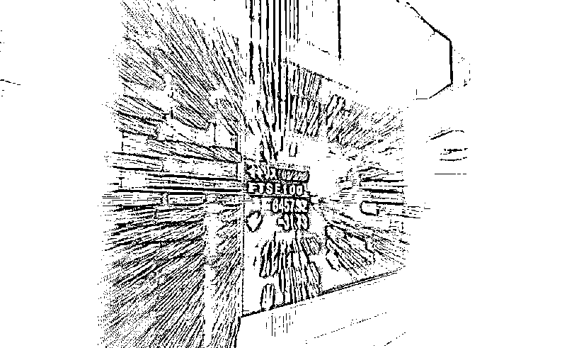在这些市场周期扭曲失真的时期中，地球宇宙学上有什么共同点？冥王星。这颗由冥界之神掌管的行星与债务和干预（“金融操纵”）相关，目的是为了实现理想的结果。**冥王星与外行星形成困难相位时，它会对应**（而且在 21 世纪已经发生过了）：

*   世界债务的历史性增加；

*   世界各国政府因财政管理不善而要求借贷；

*   中央银行为了纠正糟糕的财政政策，努力干预金融市场，并操纵股票和（或）国债资产的需求。

这个周期的最后一次木星-冥王星合相将发生在 2020 年 11 月 12 日。政府可能会继续为经济刺激计划支出数万亿美元，促使中央银行通过增加货币流动性来适应，并在股票和国债市场中再次制造出资产泡沫。如果在美国大选结束后，冥王星对木星的影响开始离开容许范围，而中央银行开始撤消这些扩张性的货币举措，到下一个重大相位（2021 年土星四分金牛座的天王星）形成时，你觉得会发生什么？希望以上内容解释了为什么自 2 月 12-20 日暴跌前高点的卖出信号以来，在股市中建立风险-回报有利的头寸交易变得充满挑战。并不是因为我们没有尝试在修正性下跌时买入，而是因为这些修正性下跌在周期结束时没有使价格回到“正常”的目标水平。但这并不会改变我们根据地球宇宙学和周期的历史模式研究所得出的长期观点。根据这些研究，我们预计**还会再次出现严重的下跌**，但与此同时，我们正逆流而上对抗美联储，美联储愿意纵容政府无节制的财政政策，看起来注定要造成资产泡沫，一旦央行试图恢复常态，最终必将导致又一次的严重下跌。土星与冥王星在 2020 年合相，预计利率的长周期低点将出现在今年，详见《[2020 年金融预报](http://mp.weixin.qq.com/s?__biz=MzA5NjA0NTAxNg==&mid=2651414279&idx=2&sn=cc131aa367c4ada15e35d0d80b308415&chksm=8b4bedb0bc3c64a6ef98c0e86ba3d842d8368de2b90e623af1d3870d521049ce352732c8d091&scene=21#wechat_redirect)》。当然，我们还会在将于三个月内出版的《[2021 年金融预报](http://mp.weixin.qq.com/s?__biz=MzA5NjA0NTAxNg==&mid=2651425978&idx=1&sn=067bd68ece37e1e820d6f84f7a3cc960&chksm=8b4b3e0dbc3cb71b866f65d51f7993d3c35dee77cebd77eda3f63a4d5864dadaea2e9d14c101&scene=21#wechat_redirect)》中更新这个分析。同时，我也不会放弃研究周期或地球宇宙学与各种金融市场的相关性。这种相关性在商品和货币市场中非常有用，只要美联储和其他中央银行一减轻支持不良财政管理的纵容政策，它也会重新对股市有用。有句俗话说：不顾历史的人注定要重蹈覆辙，并承受类似的后果。有一些时期，是要让自己的资本增值，还有一些时期，是要保护自己的资本。**自 2020 年 3 月 23 日以来一直都是让资本增值的时期，但要保护资本的情况也为期不远**。从另一个角度来看，**低价买入资产的时机尚未来临，但它可能来得比许多人想的要早。**某个时刻，现金将再次为王，但会体现为哪种货币或价值贮藏手段呢？我们将在《[2021 年金融预报](http://mp.weixin.qq.com/s?__biz=MzA5NjA0NTAxNg==&mid=2651425978&idx=1&sn=067bd68ece37e1e820d6f84f7a3cc960&chksm=8b4b3e0dbc3cb71b866f65d51f7993d3c35dee77cebd77eda3f63a4d5864dadaea2e9d14c101&scene=21#wechat_redirect)》中进一步探讨这个问题。

**说明：以上日期基于纽约证券交易所所在的美国东部标准时间，由于存在时差，中国地区可能需要加一天。**

**版权声明：**本文由若道翻译发布，欢迎转发，反对抄袭。友号转载请申请白名单。

**雷蒙德·梅里曼（Raymond Merriman）**

若道签约老师。著名金融占星师，ISAR（国际占星研究协会）前主席，梅里曼市场分析公司的总裁。他由于“提升了占星学的职业形象”，在 1995 年国际占星大会上被授予轩辕十四奖；在 2012 年国际占星大会上，被授予轩辕十四终身成就奖。

1“中国上证指数月度报告”发售

**若道推出了****中文版****的雷蒙德·梅里曼中国上证指数月度报告，并持续发行该报告！**

当把金融市场的周期和占星学的周期相结合时，雷蒙德·梅里曼老师的金融占星学研究**为投资者应对金融市场的周期波动，并随之调整投资策略提供了极大的价值参考**。

****9 月中英文报告均已上线！****

2“黄金价格周期月度报告”发售

**若道推出****中文版****的雷蒙德·梅里曼黄金价格周期月度报告！**不仅仅为广大读者在中国股市的投资出谋划策，更将视角放眼黄金市场。

**每当世界经济形式不明朗的时候，有一个地方是保值的港湾，那就是****黄金**。自 1982 年雷蒙德·梅里曼出版第一本研究《地球宇宙学征象与黄金价格的关联》的著作以来，**他一直作为最重要的黄金市场时机预测者之一享誉国际**。

8 月的黄金终于从高位开始下跌，有些分析人士认为，黄金在过去连涨 9 周是非常极端的，因此走势未来不会太强了；也有人认为，在目前各国大放水、国际局势不稳的情况下，黄金可以继续看高。

那么，你该如何面对目前的调整呢？是等待回调继续进行，还是在什么位置买入？9 月黄金周期报告等着你。火星已经进入逆行阴影期，很多国家都纷纷再次爆发新冠肺炎病毒疫情，未来的几个月注定不安宁。黄金的走势会安宁吗？

9 月黄金报告已经上线，上证报告也会在月底上线。欢迎了解。也可以按照季度和一年期订阅，有更多优惠。季度和年度的好处是，你可以持续了解梅里曼老师对于不断在变化的市场的看法。即便他某一次看法和市场不一致，你也看到在下一期他如何调整自己的看法，并看到金融占星在一个长期时间段内对你把控风险的帮助。而能够长期控制风险、尽量找到安全的投资时机才是投资的长久之计。

**9 月中英文报告均已更新！**

**购买套餐**，买得越多越优惠

中国上证指数月度报告套餐价

*   **单月报告**：280 元

*   **3 个月套餐**：780 元（260 元/月）

*   **12 个月套餐价**：1999 元（166 元/月）

**长按下图识别二维码**

**购买金融报告****套餐**

**▼**

黄金周期月度报告优惠

*   **双报告年度套餐更优惠（直降 899 元）**
*   **12 个月黄金报告+12 个月上证指数报告：仅需 3500**

**长按下图识别二维码购买黄金报告套餐**

▼

1976 年以来，由雷蒙德·梅里曼撰写的梅里曼市场时机学院每年一次的年度预报沙龙和每年一本的《年度预报》一直在应用占星学原理为投资者们服务，提供卓越洞见，从未间断。

过去两年，3 小时的年度预报讲座和长达 200 页左右对金融市场的分析报告，帮助许多若道读者做出正确的投资决策，降低了投资风险，并获得相当不菲的投资收益。在群星摩羯座的时候，我们和你一起提早规划自己来年的投资安排。

**2021 年金融年报预售**

2021 年年度预报开始预售**前 50 名预售价格**：1080 元**前 50-100 名预售价格**：1180 元**100-150 名预售价格**：1280 元**150 名之后价格**：1380 元**2021 年年度预报中文版预计发布时间**：2020 年 12 月底**沙龙时间**：2021 年春节前后**沙龙形式**：英文讲座，配有中文翻译**长按下图识别二维码购买**

▼

******点击阅读原文购买金融报告******

# 预售 | 世界金融占星学大师雷蒙德·梅里曼 2021 年金融年报及沙龙

> 原文：[`mp.weixin.qq.com/s?__biz=MzA5NjA0NTAxNg==&mid=2651425978&idx=1&sn=067bd68ece37e1e820d6f84f7a3cc960&chksm=8b4b3e0dbc3cb71b866f65d51f7993d3c35dee77cebd77eda3f63a4d5864dadaea2e9d14c101&scene=126&sessionid=1692738116#rd`](http://mp.weixin.qq.com/s?__biz=MzA5NjA0NTAxNg==&mid=2651425978&idx=1&sn=067bd68ece37e1e820d6f84f7a3cc960&chksm=8b4b3e0dbc3cb71b866f65d51f7993d3c35dee77cebd77eda3f63a4d5864dadaea2e9d14c101&scene=126&sessionid=1692738116#rd)

1976 年以来，由雷蒙德·梅里曼撰写的梅里曼市场时机学院每年一次的年度预报沙龙和每年一本的《年度预报》一直在应用占星学原理为投资者们服务，提供卓越洞见，从未间断。

2020 年已经过半。

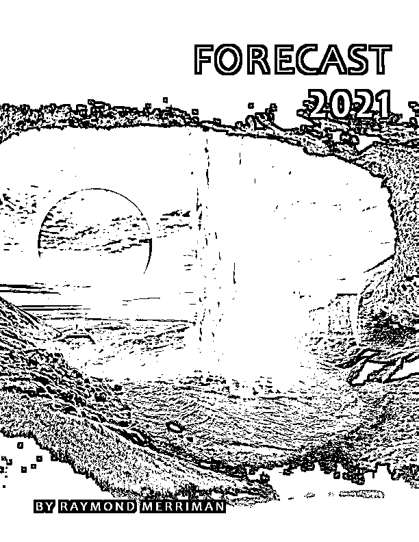

19.8 万字的《2020 年年度金融预报》撰写与 2019 年 10 月底前，于 2019 年 12 月底完成翻译。在其中，金融占星学大师雷蒙德·梅里曼写道：“**现在我们进入了以‘摩羯座’为象征的‘将军之年’。在这一年里，世界各国领导人必须非常具有战略眼光和严肃的态度，才能安全渡过破坏性肆虐的经济风暴。有人要被‘将死’。是中国还是伊朗没有屈服于美国施加的经济压力？他们的经济会崩溃并导致民粹主义者的反抗吗？还是美国将在 2020 年的选举中被将死，从而使其总统下台，导致那些拒绝被迫接受美国的决定和行动的国家在“持久战”中获胜？****以下主题非常突出，与当今的世界局势相关：** **1.达成协议，缔结承诺，然后撕毁。尽管有提供保护的承诺，但一方会设局造成另一方的损失或失败。****2.设立封锁，使被封锁地区内的人无法获得基本物资；实施贸易限制。****3.墙和堡垒正在建造，然后被拆除或被占领。****4.硬币和货币改革涉及纸币（法定货币）、黄金和白银。****5.腐败被揭发出来，而且会出现运动揭露并且防止腐败。****6.将军：有人赢，有人输，而且输得很惨。**
”那时新冠病毒肺炎疫情还没有爆发，中美“冷战”还没有升级到今天的严峻局面。然而，在 2020 年这个看起来非常不同寻常、危机四伏的年份，如果根据《年度预报》进行投资，你可能已经取得不错的收益。在 2019 年底发布的金融年报中，雷蒙德·梅里曼提到：**“中国上证周期研究表明，2020 年的反弹将超过 2019 年的高点 3288。然而，这一涨势可能会通向 5.5 年周期的波峰，随后将再次迎来一波跌势至 2021 年或更晚。”**对于黄金，他提到：**“如果突破了 1560-1590 的阻力区间，那么黄金就能够重新测试 1920。“** 目前，这些预报都已经成为现实。过去两年，3 小时的年度预报讲座和长达 200 页左右对金融市场的分析报告，帮助许多若道读者做出正确的投资决策，降低了投资风险，并获得相当不菲的投资收益。在群星摩羯座的时候，我们和你一起提早规划自己来年的投资安排。

**2021 年金融年报预售**

2021 年年度预报开始预售**前 50 名预售价格**：1080 元**前 50-100 名预售价格**：1180 元**100-150 名预售价格**：1280 元**150 名之后价格**：1380 元**2021 年年度预报中文版预计发布时间**：2020 年 12 月底**沙龙时间**：2021 年春节前后**沙龙形式**：英文讲座，配有中文翻译**长按下图识别二维码购买**

▼

**购买者重要需知**

**①** 梅里曼市场时机学院每年一次的年度预报沙龙和《年度预报》是梅里曼市场时机学院的研究“预报”，而不是市场“预测”，是梅里曼老师及其金融占星分析师对人类活动周期历史与行星周期之间相关性的研究，二者在大部分情况下具有 80%或更高的相关性，而不是因果关系。即便是非常认真的研究和几十年的研究经验，我们无法总是正确地解读出各种征象在实际层面上会如何相互作用，并显化为事件结果。

所以请将次沙龙和报告看作一个研究参考，务必结合其他市场研究和你个人对市场的理解，根据你的自由意志做决策。**②** 此套餐一旦售出，**即不接受退款。****③** 此报告仅支持手机网页阅读，不支持电脑阅读和下载。**④** 讲座提供视频回放。**以上须知，请仔细阅读。一旦付款，即视为已了解并接受所有须知内容。**
购买后有疑问怎么办？

请联系技术客服

**微信：nodoor201705**

****************购买金融年报直达入口****************

# 市场会跌吗？会进入调整期吗？ | 9 月上证指数＋黄金周期报告上线！

> 原文：[`mp.weixin.qq.com/s?__biz=MzA5NjA0NTAxNg==&mid=2651425978&idx=2&sn=c7e3187f3abfe604c511ea9506775c0a&chksm=8b4b3e0dbc3cb71bbe141e7e7a5e9ddb0690537fd1661d2f9919f23741010a762b9966633af8&scene=126&sessionid=1692738116#rd`](http://mp.weixin.qq.com/s?__biz=MzA5NjA0NTAxNg==&mid=2651425978&idx=2&sn=c7e3187f3abfe604c511ea9506775c0a&chksm=8b4b3e0dbc3cb71bbe141e7e7a5e9ddb0690537fd1661d2f9919f23741010a762b9966633af8&scene=126&sessionid=1692738116#rd)

7 月，上证指数形成了新的高点 3458.79。8 月，上证再次摸高到 3456.72，似乎与 7 月的新高形成双顶。

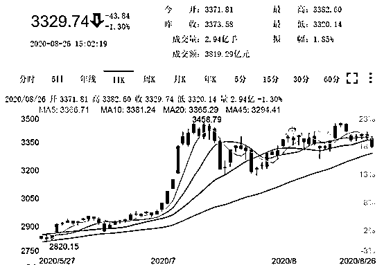

8 月 24 日，创业板注册制首批 18 家企业上市。创业板上市的改革具有非常深刻的意义，是一个历史性的改革。过去，企业能否上市都是要在证监会排队审批，市场资源被一批有关系但其实质地不好的企业占据；而现在，注册制使得符合上市要求的企业都有了在资本市场融资的机会。这对于中国股市的长远发展而言，是一个非常重要的利好。

同时，短期来说，市场似乎已经到达一个高位。9 月 10 日，火星将开始逆行，与土星、冥王星形成四分相；9 月 12 日，木星顺行。而金星也将在此期间对分冥王、土星。9 月将是我们重点关注的一个月份。

市场会跌吗？进入一个较大的调整期；或是会遇到支撑，然后继续上涨？

**9 月上证报告上线**

上证指数月度报告价格

**单月报告**：280 元 

**3 个月套餐价**：780 元（260 元/月）

**12 个月套餐价**：1999 元（166 元/月） 

**长按下图识别二维码购买上证指数报告**
▼

“**黄金是金钱。其他的只是信贷。****——约翰·皮尔庞特·摩根**”

之前，我们接到梅里曼老师发过来的黄金特刊，也把这份特刊翻译出来，免费发给了所有订购了 8 月份黄金报告和套餐报告的读者。

在 7 月中旬发布的 8 月份报告（每月的黄金报告其实是每月中上旬发布。比如 8 月中上旬发布 9 月的黄金报告，其实涵盖的时间段是两次报告发布之间的时间段）中，梅里曼老师认为黄金正在接近很快要触顶的时期。

然而黄金这一次涨得比较久，没有很快触顶，而是开启突破上涨模式，一部分不熟悉投资、也不熟悉如何使用报告的读者觉得自己可能卖早了，有些着急，担心黄金不管不顾地往上冲。梅里曼老师从读者来信中了解了这个困惑，并特意发出了 8 月特刊，以帮助投资者了解，在各种情况下如何操作。

在 8 月份特刊中，梅里曼老师写道：

**“在黄金 8 月月度报告撰写一周后的 7 月 21 日，黄金突破 1830 以后，我们一直在等待金价回落，以便为梅里曼市场时机学院月度周期报告订阅用户撰写一份特刊。”**

他在特刊中特别告诫那些可能因为提早卖出而看到黄金一步步升高而懊恼的客户，不要因为看到黄金突破了，就忍不住又在高位冲进去。因为他还是认为：“一次重要的下跌将在不久后发生。我们将使用基本周期作为指引。”

现在，梅里曼老师预测的下跌开始了。这两天的黄金暴跌，白银跌幅更为剧烈。

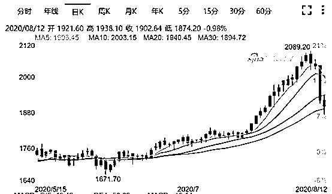

有些分析人士认为，黄金在过去连涨 9 周是非常极端的，因此走势未来不会太强了；也有人认为，在目前各国大放水、国际局势不稳的情况下，黄金可以继续看高。

那么，你该如何面对目前的调整呢？是等待回调继续进行，还是在什么位置买入？9 月黄金周期报告等着你。火星已经进入逆行阴影期，很多国家都纷纷再次爆发新冠肺炎病毒疫情，未来的几个月注定不安宁。黄金的走势会安宁吗？

**对于不是炒短线的投资者，请特别注意梅里曼老师在每次报告中提到的长期周期、中期周期和基本周期。**因为市场有起伏，有意料不到的变化，即便是每月报告有时也未必能够完全掐准时点。这时候，如果对于这些有各种时间长度的长中短周期的了解，未必能帮助你每次都买在波谷，卖在波峰，但可能能够帮助你不要买在波峰，卖在波谷。

9 月黄金报告及上证报均已上线。欢迎了解。也可以按照季度和一年期订阅，有更多优惠。季度和年度的好处是，你可以持续了解梅里曼老师对于不断在变化的市场的看法。即便他某一次看法和市场不一致，你也看到在下一期他如何调整自己的看法，并看到金融占星在一个长期时间段内对你把控风险的帮助。而能够长期控制风险、尽量找到安全的投资时机才是投资的长久之计。

世界著名金融占星大师雷蒙德·梅里曼，以 40 年黄金市场研究经验，对当前黄金市场做出研究报告。投资有收益，也有风险，希望这份金融占星学的研究帮助你更好地评估黄金投资。

**9 月黄金报告上线**

黄金月度报告价格

**单月报告**：280 元 

**3 个月套餐价**：860 元

**12 个月套餐价**：2400 元

**双报告年度套餐更优惠（直降 899 元）**

**12 个月黄金报告+12 个月上证指数报告：仅需 3500 元**

**长按下图识别二维码购买黄金报告**

▼

**购买者需知**

**①**梅里曼市场时机学院《中国上证指数月度研究报告》是梅里曼市场时机学院（以下简称 MMA）的研究“预报”，而不是市场“预测”，是梅里曼老师及 MMA 金融占星分析师对人类活动周期历史与行星周期之间相关性的研究，二者在大部分情况下具有 80%或更高的相关性，而不是因果关系。报告中的研究完全存在错误的可能性。即便是非常认真的研究和几十年的研究经验，金融占星师无法总是正确地解读出各种征象在实际层面上会如何相互作用，并显化为事件结果。所以请将报告看作一个研究参考，务必结合其他市场研究和你个人对市场的理解，根据你的自由意志做决策。**②** 本报告只是上证指数研究，没有个股研究。**③** 此报告一旦售出，**即不接受退款。****④** 此报告每月 1 期，**并非都是在每月相同日期发布**。我们收到英文报告的当天，即发布该英文报告。3 天后，上线报告中文版。**⑤ 此报告仅支持手机网页阅读，不支持电脑阅读和下载。****以上须知，请仔细阅读。一旦付款，即视为已了解并接受所有须知内容。**在过去的 39 年中，唯有梅里曼逐渐完善，并在梅里曼市场时机学院月度周期报告中阐释了将地球宇宙学与周期相结合的研究方法，以惊人的精确性预报了黄金价格发生重大变化的时间。黄金购买 Tip 各大银行均可购买黄金或黄金 EFT 基金，也可以在诸如天天基金或者支付宝购买黄金及黄金相关产品。不明白的可以百度搜索。购买后如何查看报告？

购买后有疑问怎么办？

请联系技术客服

**微信：nodoor201705**

购买上证指数+黄金报告直达入口

# 宫位全解析 | 星图里，这个宫位最“无趣”？才不是！

> 原文：[`mp.weixin.qq.com/s?__biz=MzA5NjA0NTAxNg==&mid=2651425739&idx=1&sn=b89185e88d277fbcded71a78b15db8c9&chksm=8b4b397cbc3cb06a5d052ca8701e95e2c8bd24ccf7f25712625a9b88ffadbda5d1c4791d7304&scene=126&sessionid=1692738116#rd`](http://mp.weixin.qq.com/s?__biz=MzA5NjA0NTAxNg==&mid=2651425739&idx=1&sn=b89185e88d277fbcded71a78b15db8c9&chksm=8b4b397cbc3cb06a5d052ca8701e95e2c8bd24ccf7f25712625a9b88ffadbda5d1c4791d7304&scene=126&sessionid=1692738116#rd)

****************☆ ****************************后台****************************回复“今日”，给你一句生命态度****************

作者/达娜·格哈特
译者/葡萄园的女巫编辑/玫瑰 图片/全景网第 3 宫代表着怎样的意涵呢？这个宫位似乎总是不那么容易理解。一起来看看作者精湛而细致的解读，相信你会受益匪浅。**遇见人类发展所需的基本特质**我儿子 3 岁的时候，我们总是散步从邻居家的游泳池旁经过。我记得当时遇到了一个年长的女人，总是用一辆红色小马车推着她的小孙子。这小男孩比我儿子 Branden 大几个月，当他爬出小马车时，我儿子对他有少许的敌意。小男孩瞪了 Branden 一眼，爬出小马车，抓住路边的灌木树枝乱扔。他奶奶一直在旁边像独角戏一样，教她孙子要礼貌地与小朋友一起玩耍，他不该伤害路边的植物，没有人喜欢这样的小孩——但是小男孩充耳不闻。 几分钟以后，Branden 也跑去抓了一把树枝开始乱扔，他以前可从来没做过这样的事情。接着，他们俩就站在一起扔树枝，就像一个仪式，只有他们自己懂得如何交流。小男孩的祖母结束了个游戏，而他们俩也再没有一起玩过——这并没有建立任何友谊。这就是第 3 宫掌管的内容。 第 3 宫掌管着**兄弟姐妹、邻居、短途旅行、文法学校、语言的天赋和学习**。但在这些表面内容之下，有着更深层的意义：人类发展所需的根本特质——**好奇心、模仿能力、交流能力，适应并联结现实社会的能力**。这个宫位所代表的内容可能并不是那么具有实践性。第 3 宫需要的更多是意念里的内容，更多我们的想法，它的关键词可以用一个动作表示：**学习**。 我们向兄弟姐妹学习，向邻居学习，在短途的旅行中学习，在阅读中塑造我们自己的世界，在学校里构建社会信息体系。当然，让人难以理解的是，并没有告诉我们要做这些，而我们却这么做了。这就像一个小婴儿会在地毯上爬，这是本能.环境中各种各样因素影响着我们的成长。孩子会模仿她的兄弟姐妹们，学他们说话，学他们的行为。如果没有兄弟姐妹，小孩就会寻找其他的模仿对象。我经常站在篱笆边看着 Branden 和他的保姆玩耍。看起来他们的行为并没有固定的模式，但是事实上，透过他们的这些行为，我们可以看到**通过第 3 宫的好奇心、竞争和模仿还有学习，他们与世界有了交流。 **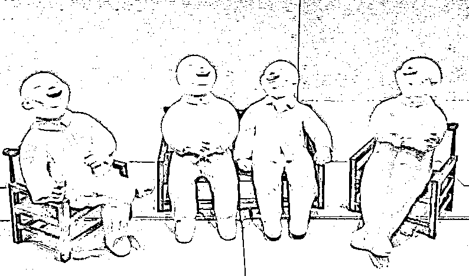**宫位小贴士****第 3 宫是“下降宫”，Cadent 这个词汇来自于拉丁语“cadere”，是远离的意思。角宫是游戏计划的中心，随后宫给予角宫支持，而下降宫远离了中心。**我们必须适应外界的势力。我们现实生活的成功就依赖于灵活和多才多艺。第 3 宫告诉我们，**向每一个我们遇到的人学习。**地平线上的下降宫带给我们的是更广阔的世界，在**第 9 宫**，我们可能**遭遇到外国的文化，延伸出全新的光年，观察到事件背后更深刻的意义**，在**第 12 宫**，我们**超越正常的逻辑，触摸也许你从未察觉的、深不可测的、神秘的事物。 **比较起来，地平线下的下降宫好像没这么有异国情调，也没这么有趣。这个领域有更多的限制。在**第 6 宫**，我们要**面对身体上的限制**（古典占星学中，第六 6 宫代表疾病），或者我们要**适应于工作场合的要求**（现代占星学中，第 6 宫代表同事和日常事务）；在**第 3 宫**，我们**必须关注日常的好多苦差事，电话、电邮、日常交通**。这里对孩子们来说是新奇的冒险，对成年人来说是已经厌倦的版图。初级中学已经毕业了。兄弟姐妹和邻居们不能带给你什么提升了，我们也早已掌握了很多词汇。 **你的信息过滤器生效了吗？**这大概就是 John Frawley 这么描述第 3 宫的原因：“在星图中的所有宫位里，第 3 宫大概是最无趣的。在查看出生星图时，占星师一般都把这一块轻轻带过，因为他们觉得这里没什么值得仔细研究。”当占星师谈到有关第 3 宫的行进或者太阳返照图时，一般会建议你去参加一下研讨会，改善一下沟通技巧，学习一项新技能好在简历上添一笔。或者有些占星师会认为你比平时要忙碌，更加需要冥想和减压。 这样的问题就是，你将会失去第 3 宫带来的潜在乐趣，也会错过正在进行的计划。就像第 6 宫提供了很多关于身体健康和工作场合不断变化的需求的反馈，第 3 宫也给了我们很多关于**环境改变**的信息。没有什么是一成不变的，包括我们所处的最熟悉的环境。如果你对这些改变失去了兴趣，你的思想也将变得无力。如果你不再注意到日常生活中的小变化，如果你对学习新的语言和无意识的模仿失去了兴趣，如果你不会因为学会了一个小技巧而欢欣雀跃，那么，你将失去第 3 宫带给你的巨大财富。这里的问题不是我们学习到了多少知识，而是我们在学习！在第 3 宫，我们要做的就是——**保持我们的思想永远有新鲜的力量**，就像 Bob Dylan 的歌里唱的：**“永远年轻”**。 去年圣诞节，我买了一支哈利·波特的魔法棒，我高兴地挥舞着魔法棒，假装自己拥有法术。我儿子马上在一旁假装自己被魔法击中，受伤倒地。我感到困惑，魔法棒的说明书里可没有写这样的游戏内容。而 Branden 自己发明了游戏的规则，击退了虚拟的敌人。虽然我在初中是优等生，获得了全 A 的成绩，而且也是我买了这支魔法棒。但是在 50 岁的时候，我觉得在这间教室里，我是一个不合格的学生。 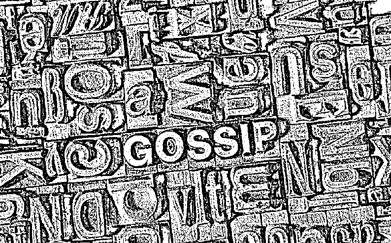第 3 宫给了我们机会去**不断提升自己**。重新回到初级中学，第 3 宫的学习模式是强制的，你无法选择你想要学习的内容，只有到了第 9 宫的高等教育，我们才能选科。第三 3 宫要求我们学习的，都是**环境要求我们掌握的重要技能**。你到现在还不会使用互联网？你还不知道如何用他们的语言与你的斯洛伐克邻居打招呼？如果你的答案是：“yes”，那么，你需要关上门，继续第 3 宫**有效性和适应性的学习。 **遇到第 3 宫的行进时，最好老实地想一想自己还有什么不足。虽然新型科技是第 11 宫的内容，像是数码相机和掌中电脑，但是，当他们在你的生活中出现时，就变成了第 3 宫的内容，特别是这些新科技还是与**信息传递**相关。也许手机上的很多功能你都用不上，但是，了解一下可以扩大你的知识面，试着使用菜单里的各项内容，你的脑袋可能会冒出新的创意。Branden 还没有开始看 MTV 台，但是，史努比狗狗已经通过邻居和他做了朋友。在占星学中，第 3 宫在掌管家庭的第 4 宫前面，意味着**这种影响是邻居到家庭，而不是家长或者教育者期望的家庭到学校**。落入第 3 宫的行星或者是第 3 宫头星就像一个**过滤器，带领我们优先遇到他们象征的领域和事物**。我和 Branden 从邻居家门口经过时，他第 3 宫头的水瓶座开始工作——“妈妈，我认识好多这个街区的小朋友，我想在这个镇上的每个街道我都有熟人。”我的第 3 宫头是天蝎座，神秘内向冷漠，我的邻居们总是关着门的。这对我来说很舒服，我在乎我的隐私，而且假设我的邻居们也是这样。 许多年前，当我在一个混合大型公寓社区买了第一所房子时，我想改变一下我的第 3 宫。毕竟那里，除了冷漠的土星，还有好奇的水星和那么有魅力的金星。我决定做一个友好的邻居，于是，从搬家公司还没卸下我的家具开始，我就跟每一个邻居打招呼，请他们参观我的新居，拿出糖果，做所有好邻居该做的事情。 两周以后，我开始回避与新邻居的交流——我发誓，是他们先回避与我的交流。难道我永远只能拥有第 3 宫天蝎座模式的邻居么？接下来发生了一次地震（天蝎座的灾难），我和邻居们互相认识并交换了电话，以应付紧急事件。然后，我们就返回互相隐形的生活中。在随后的 5 年时间里，我只是偶尔在有新邻居迁入时会打声招呼。 很多占星师认为，重复出生星图上的轨迹和童年的生活模式是我们的宿命。但有趣的是，我认为需要改变（我的第 3 宫头是天蝎座）。既然这样，我认为邻居这个问题就是一个很好的切入点。**邻居是八卦的中心，私人消息的传输渠道**。对于孩子们（或者古代生活在小镇的人们），**街区就是信息交流的中心**。但是对于那些 21 世纪有钱有驾照的人们来说，这个范围就扩大了很多。在这个扩大的范围内，我敞开大门欢迎更多友好的邻居。 去年，我的一个邻居从俄勒冈州阿什兰市搬到了佛罗里达的圣马科斯岛。现在有了手机，我们一样在周末大聊八卦。通过电子邮件，我还是能和加利福尼亚州的伙伴们分享生活。当这些以网络为基础的群落与我们在虚拟世界里交流时，像不像从前杂货铺前牌桌上的邻居？早间新闻里，Regis 和 Kelly 坐在像家里客厅的直播间里，喝着女主人煮的咖啡，聊着最近的八卦新闻，是不是我的第 3 宫也能把这些名人纳入其中？ 第 3 宫不仅仅描述了我们家附近街区的邻居们，更重要的是，它也体现了**我们在日常生活中寻找的精神刺激的类型**。我第 3 宫的邻居遍布全球，他们满足了我天蝎座式的需求，深入的亲密的交流。我时不时还会邀请 Oprah 和 Dr. Phil（著名脱口秀主持）到家里来做客！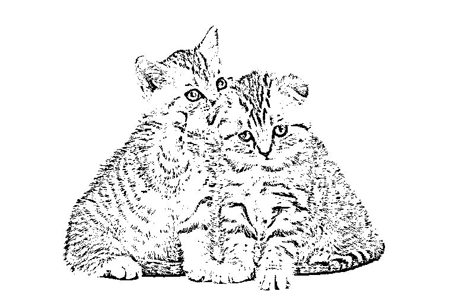第 3 宫告诉我们——**哪一种交流方式是我们需要的，通过这种交流，我们可以保持第 3 宫的新鲜活力**。当你觉得日常的生活太无趣或者太压抑，检查一下你经常造访的邻居们。你从谁那里听来的八卦消息？谁在影响你？他们是否满足了你第 3 宫显示的需求？ 我一直坚持希望 Branden 的童年多一些阅读、组合积木，或者自己发明的游戏，而不是电视、电脑这些东西。但是他不能忍受：“妈，这太太太无聊了。”他甚至无法忍受一个人呆着，他的第三 3 宫是水瓶座，最后，我给他买了一台 PS2。现在，他觉得我完全可以去佛寺上 5 个小时的冥想课，他一个人没问题。他整个下午都沉浸在罪恶城市的游戏中，我回到家，听到他高兴的大叫，他是世界上最快乐的人！ Donna Cunningham 曾写道：**“如果你觉得别人不了解你，看一下你的第 3 宫，查看一下你自己表达的方式。”**她的第 3 宫在射手座，喜欢开放、友善的与人交流；如果第 3 宫在天蝎座，冷漠的、有攻击性的、讽刺式的的沟通方式也许会阻碍你与别人的交流（我觉得自己可不是这样……不过别去问我的家人！嘿嘿）。不管是哪一种沟通方式，第 3 宫与掌管交流的水星的关系就十分清楚了，所以，现代占星学中把水星作为第 3 宫的原始主星。水星掌管了所有形式的交流——**书信、舆论、报道、交谈、争论**，这些也都属于第 3 宫的范畴。
**3 宫与 9 宫，一个都不能少**Carolyn Myss 在她的文章中写道：**“第 3 宫揭示了你如何把精力投入到现实世界中。”第 3 宫头所落的星座或许可以描述你如何将想法变成实际行动，最后会如何运用你的个人权利**。Myss 认为，第 3 宫带来的挑战就是**将你的意识转化为动力**，你的每一个想法、言谈、动作，援引磁力吸引的规则。你会从第 3 宫得到什么，取决于你放了什么进去。行动当然是第 3 宫的功能。但是，让现代占星学家们惊讶的是，**古典占星学中，以行动为目的，激发欲望，操纵权利的火星才 3 宫的原始主星，而不是水星。 **我们该用那一套理论呢？很困惑，我所知的一切还没办法为这个分歧做一个定论。我只希望占星学能帮助我们获得更丰富的人生，在第 3 宫的问题上，看起来，**行为和思想都能丰富我们的经验。 **一个演员的朋友曾经教我一个游戏——“梵语唱诵”。所有的演员在一个场景中选择一句台词或者是箴言，然后表演出来。有些人在表演“我饿了”的时候会拿着一碗爆米花，有些人在表现“我很特别”时，也这么做。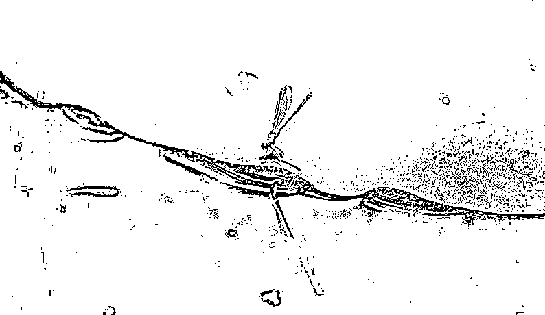我的朋友告诉我，这个游戏的结果当然就像普利策奖的颁奖礼一样热闹。如果生活中出现同样的场景，我一点也不意外。**我们的行为往往取决于我们如何思考，我们如何看待所处的环境，也在很大程度上被我们从前的行为影响。**行为和思想，或者说火星和水星，往往深深交织在一起。下一次，如果你感到不被理解，或者是无力实现愿望，好好研究一下你的第 3 宫。你在日常生活中是如何思考和行动的呢？ 当然，有时候彻底远离 3 宫的噪声和干扰，到第九 9 宫的广阔天空里转一圈真的很不错。当你对于理解某一个宫位有困难时，站到它对面的宫位思考一下会很有帮助。**第 3 宫的对宫——第 9 宫掌管着距离遥远的地方、宗教和哲学**。大部分宗教信仰都鼓励我们与邻居们友好的相处，但是，宗教也同样提醒我们远离他们中间的一部分人。**第 9 宫能控制第 3 宫的负面影响，内部的和外部的**。去到一个偏僻的宁静之所，你的心也将获得宁静。远离你所在城镇的干扰，你将获得全新的视野。 有些人认为，第 9 宫掌管高层次的思考，而第 3 宫则掌管低层次的。这个区分不够准确，而且听起来很傲慢。在我看来，3 宫和 9 宫同样重要，谁缺了另一个都会不完整。特别是当星图中的的月亮交点落在了这两个宫位。**南交点落入的宫位会消耗能量，北交点落入的宫位为这种消耗提供了对抗的办法，但是做到并不容易。 **安娜的月亮南交点落在第 3 宫，她的生活很忙碌，在很多职业领域都十分成功。她对于商务十分精通——电脑、财会、设计……但是，她对于生活的真正目标却很困惑。她不知道为什么这么忙碌的生活却觉得空虚，觉得无处可去。**她总是在路途中转弯迂回，但是却忘记了在地图上看一看全程的路线。**就像很多南交点在第 3 宫的人一样，她没有第 9 宫远见的基因。 埃里克却刚好相反，他对自己的人生很有规划，却不知道如何实施，他的北交点落在了第 3 宫。**他很清楚地看到了自己的目的地，却找不到通向那里的路。**他和很多人一样，被第 3 宫的那些琐碎的事情打败——打电话、跑跑腿、写信函、组织他的文章。很多年来，他一直希望在《纽约时代周刊》发表文章（为什么不能从简单的做起呢？），但一篇也没写出来，更别说投稿了。 现在已经很清楚了，埃里克需要加强第 3 宫的技巧和能力，安娜需要第 9 宫的远见和规划。对于我们每一个人来说，高级的和低端的智慧思考都十分重要。**你可以运用第 3 宫的技巧，也可以涉足第 9 宫更神圣的宗教领域。**仔细地呵护它们成长，用宗教信仰使它们更加纯净。停止无用闲聊，拒绝干扰信息，慎重地选择邻居。选择一个地方让自己可以呼吸到新鲜的空气，活力充沛。当你的日常生活环境中只有**简单的倾听和学习，充满了简单的快乐和渴望**，你就知道自己离成功不远了。这是第 3 宫带给你最珍贵的财富。

**版权声明：**本文由若道翻译发布，欢迎转发，反对抄袭。友号转载请申请白名单。

**其他宫位文章** 

[第 1 宫](http://mp.weixin.qq.com/s?__biz=MzA5NjA0NTAxNg==&mid=2651423092&idx=1&sn=53169f1901b50ce5d406aa45df1a830f&chksm=8b4b33c3bc3cbad5e64428fb653d1478ecdb1068a812985486b0299e1648061aee1a5eab07d1&scene=21#wechat_redirect)丨[第 2 宫](http://mp.weixin.qq.com/s?__biz=MzA5NjA0NTAxNg==&mid=2651424378&idx=1&sn=e0e512b4945987e1c9db4a849a6b4ba0&chksm=8b4b34cdbc3cbddb9a862751c15173684a2eb9a98deb37bacdbc003dfa6010c7e28df5ed0f14&scene=21#wechat_redirect)

**达纳·格哈特**一位国际范围内受尊敬的占星师。她为众多占星学网站和出版物讲课、写稿。她在 12 宫的月亮激励她对这颗发光体进行了深刻而持久的探索研究。

**学习太阳返照技法**

**请点击下图了解详情**

**

**微信又双叒叕改版啦，不想错过若道君的推送？**

**就把若道设为星标吧！**

**▼**

就是这个“在看”，戳戳戳 ☟

********报名直达入口********

# 提高生命力的顺势疗法，治疗的是人而不是病

> 原文：[`mp.weixin.qq.com/s?__biz=MzA5NjA0NTAxNg==&mid=2651425739&idx=2&sn=d1bf2dacaadadae932d82d2cd9f1536e&chksm=8b4b397cbc3cb06a32ecde04519195a27b4b626cab433ff32a67f195ea6fcc247c91af81ad7b&scene=126&sessionid=1692738116#rd`](http://mp.weixin.qq.com/s?__biz=MzA5NjA0NTAxNg==&mid=2651425739&idx=2&sn=d1bf2dacaadadae932d82d2cd9f1536e&chksm=8b4b397cbc3cb06a32ecde04519195a27b4b626cab433ff32a67f195ea6fcc247c91af81ad7b&scene=126&sessionid=1692738116#rd)

作者/苏·汤普金斯 译者/Luke 编辑/翀子 图片/网络苏·汤普金斯老师将于 10 月 22 日开设[【2 年制顺势疗法专业课程】](http://mp.weixin.qq.com/s?__biz=MjM5MjQwNjAyMQ==&mid=2649437569&idx=4&sn=a49744a1ff51e30ed64395f1da3ae40b&chksm=beb95aeb89ced3fd8ad42db2f7f84e3902527beee042fca975c53b6d46f0ba8447490d1a963c&scene=21#wechat_redirect)（报名请点击链接）。那么什么是顺势疗法呢？它的历史、治疗原则以及特点如何呢？让我们来听听老师是如何讲述的吧~

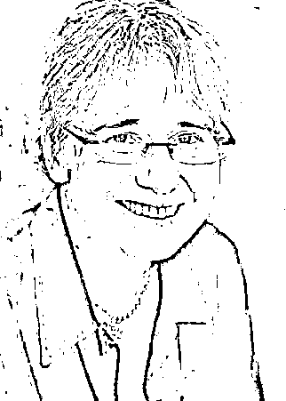

大家好，**我是苏·汤普金斯**。有些人知道我是一名占星师，但我**也是一名顺势疗法医师**。很高兴若道决定开设顺势疗法的课程。学习成为顺势疗法医者**需要 4 到 5 年时间**。就像其他的医学分支一样，这是一门复杂的学科。

**什么是顺势疗法？**首先，什么是顺势疗法? **这是一种整体论的医学，和中医一样，它会考虑个体的精神、情感以及身体三个层面。**顺势疗法治疗的是整个人，而不是某种疾病。根据世界卫生组织的调查，它是世界上第二大的医疗系统。我不太确定，可能中医是第二大的。不过，世界上至少有 5 亿人使用顺势疗法。可能实际的数字还要更多。 顺势疗法使用**高度稀释的物质治疗患者**。药物主要是**药片**的形式，有时也使用**液体**。这种药物会**激活身体的自然疗愈系统**。你可以把疾病分为急性和慢性的。

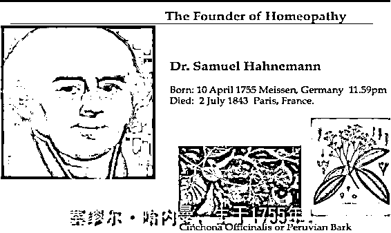

那么，顺势疗法的源头在哪？在上面这张图中，你可以看到它的**创始人塞缪尔·哈内曼**，生于 1755 年。这些出生信息是给占星师用的。他是一位内科医生，但当他发现自己无法治愈病人，甚至连自己孩子和妻子都没法治好时，他变得非常沮丧，于是他开始翻译一些书籍。他翻译了一本书，是一个叫威廉姆·卡伦的人写的。卡伦是大约 1789 年时有名的医师。在那本书中，卡伦说如果你食用一些金鸡纳树皮，就会产生疟疾的症状。哈内曼所做的就是他食用了一些这种植物，之后的确产生了冷热交替的发烧，以及疟疾的其他症状。图中的植物就是金鸡纳。事实上，直到今天，在世界的许多地方，这种植物在传统医药学中依然被用来治疗疟疾。这使得哈内曼开始思考，在接下来的六年里，他研究了许多植物和药品，服用它们，观察它们对身体产生的作用。最后他注意到，这些药物对身体的作用太强烈了。所以他开始稀释这些药品。这就是顺势疗法的药物产生的方式。这些物质被稀释，再稀释，再稀释，然后晃匀。过一会儿我会更详细地谈到这点。总之**顺势疗法的主要原则就是“同类法则**”。这对于中医的实践者来说并不陌生。事实上**无论是何种草药学，它们要么是利用了同类的原则，要么就是使用了对抗的法则。**没有别的选择。**同类原则和生命力概念**让我们举个例子，比如咖啡。有些人知道，如果你喝了太多咖啡，尤其对于那些身体还不熟悉这种物质的人来说，你会在晚上很难睡着觉，可能你睡不着觉的原因是脑子里有许多兴奋的想法和烦躁感。总之就是会醒着，睡不着。但是对于不喝咖啡，却因为兴奋和烦躁而遭受失眠痛苦的人，顺势疗法版本的咖啡会让他们的心智平静下来，这样就能睡着了。这就是顺势疗法产生效果的一个例子。**同样的制剂能治疗同样的疾病。**许多失眠的人不需要咖啡，这是因为他们的失眠症种类不同。这也是顺势疗法的原则之一，就是它**治疗的是人，而不是疾病**。假设有 20 个患了感冒，或者头痛的人，去找一位顺势疗法医师。**每个人都将得到不同的药方，因为每个人的头痛是不同的，每个人的感冒也是不同的。**让我们再看一个例子。洋葱的学名是 Allium Cepa。如果你切洋葱，肯定你会流泪。事实上这就是顺势疗法的一个药方，用来治疗流泪相关的症状，泪腺分泌方面的问题。需要洋葱治疗的人，可能要在温暖的房间，把脚弄湿，在春天的户外这类情境都可能使他们症状加重，甚至沙拉里的蔬菜都可能使他们症状加重。事实上，洋葱还可以治疗花粉过敏。当然许多其他的药方都可以治疗花粉过敏。如果你有花粉过敏症，你对这可能感兴趣，这就是“同类法则”的一个例子。

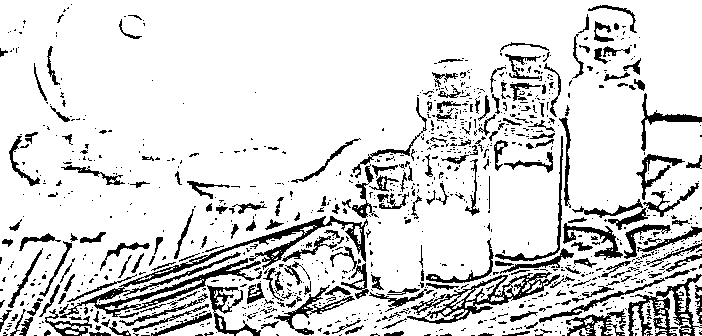

就像我说的，**“同类法则”是一个非常古老的概念**，在传统的中医文献中可以找到。在希腊的哲学家希波克拉底说的话中，公元前 1400 年的德尔菲神谕中，至少 4000 年前的印度梵语文献中都可以找到。所以同类法则的概念早就传遍了世界。普通的医药学，正统的医学被顺势疗法医师称为对症疗法医学（Allopathy）。“Allo”的意思是“其他的，其他人的痛苦”。对症疗法医学使用对抗的法则，对抗性治疗。你可以从我们的用词方式看出这一点，抗生素、消炎药、抗惊厥药、降压药。降压药能够将你的血压降下来，其实降血压最好的方式是放弃吃盐。抗抑郁药，抗精神病药等。所以，**传统的西医用的是对抗法则，这和顺势疗法所做的正好相反。****顺势疗法的另外一个哲学观点，在上图可以看到，是生命力的概念。**顺势疗法在这里又和中医和许多武术，比如合气道，搭上线了。它们都有生命力的概念。不同的文化对它有不同的称呼。中国人称它为“气”，日本人称“気"，夏威夷称之为玛那。这就是生命力，一种不可见的动力，却像电流一般流通身体。中医关注的是你的气是否有阻塞，因为什么阻塞，如何解除阻塞，气是强是弱等等。人们对于生命力的概念有不同的观点，而顺势疗法处理的就是这一生命力。我称它为“生命力”，因为哈内曼就是这么叫它的。你可以给它取任何名字都没有关系。它就是**为一切活物赋予生命的力量。**死人和活人不同的地方就是死人身上感觉缺了某种东西，缺的就是这一生命力。所以，这就是生命力的概念。**顺势疗法使用各种物质**

顺势疗法有趣的一点就是，我们使用各种物质。我们当然使用植物，同时也使用矿物和动物，甚至是会引发疾病的物质。我知道这和中医的做法很像。这里是一个顺势疗法和中医都用的药方，叫乌头或附子。这是一种非常著名的毒物，应该是地球上毒性最强的物质之一了。它可以让一匹马在 5 分钟以内倒下。有些人很敏感，甚至仅仅是触摸它就会中毒。

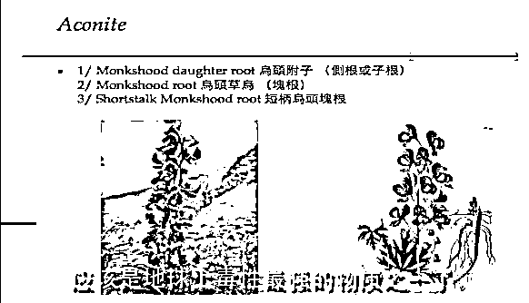

这里有一张它的图。在中医里面你用三种不同的根部做药。附子有种有趣的特性，母根死亡后的一年会依赖子根存活。我对这方面了解其实不太多，总之在中医里面，你用这三种根部做药，但是在顺势疗法中，我们使用整株植物，虽然根部才是毒性最强的部分。附子在顺势疗法的急救应用中是十分重要的药方，用来应对发烧，甚至是感冒。如果你在感冒的迹象刚刚露出头就服用顺势疗法版本的附子，特别是如果是因为吹寒冷干燥的风得的感冒，那么附子通常能将病情的发展扼杀在摇篮中。

****请在后台回复 顺势 获得更多****关于顺势疗法内容********

**版权声明：**本文由若道翻译发布，欢迎转发，反对抄袭。友号转载请申请白名单。

**学习顺势疗法**

**请点击下图了解详情**

**微信又双叒叕改版啦，不想错过若道君的推送？**

**就把若道设为星标吧！**

**▼**

就是这个“在看”，戳戳戳 ☟

********报名直达入口********

# 涨姿势 | 先定一个能达到的小目标，比如学会月相是什么

> 原文：[`mp.weixin.qq.com/s?__biz=MzA5NjA0NTAxNg==&mid=2651425478&idx=2&sn=291aab6288220ec88ae3b35ff4b42bc3&chksm=8b4b3871bc3cb1671846c105518130fd2280e8f910da91ab310dfacea4a8f3a822ccc59aa6a3&scene=126&sessionid=1692738116#rd`](http://mp.weixin.qq.com/s?__biz=MzA5NjA0NTAxNg==&mid=2651425478&idx=2&sn=291aab6288220ec88ae3b35ff4b42bc3&chksm=8b4b3871bc3cb1671846c105518130fd2280e8f910da91ab310dfacea4a8f3a822ccc59aa6a3&scene=126&sessionid=1692738116#rd)

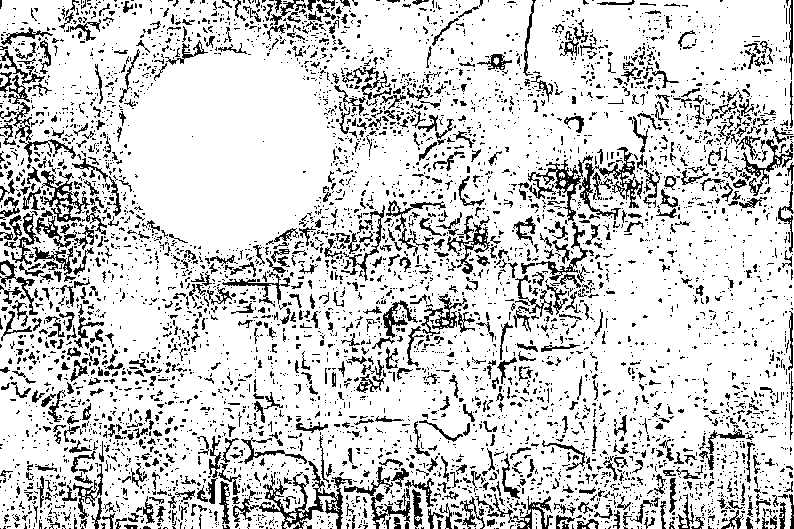

作者/莫妮卡•迪米诺 整理/莎珈编辑/玫瑰 图片/全景网

出生图上的月相周期非常重要。比起出生图上月亮的星座、宫位，月相周期更定义了我们是谁。这些周期也与我们的职业选择相关。在占星咨询中，如果要给客户提供职业咨询，比如下一步客户应往哪个方向发展，月相周期可以给我们清晰的答案。

**出生星图上的月相周期**

首先，我们来看看出生图上的 8 个月相周期。

**月相的计算方法：以太阳为起点，月亮逆时针与太阳 0°的度数差即为月相。**

举个例子：下图中，美国总统特朗普的出生星图里，太阳与月亮的度数为：

180°-（22°56′-21°12′）=178°16′，对应盈凸月。

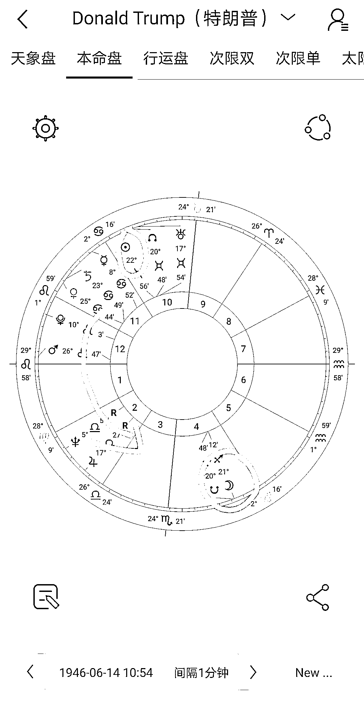

**新月：0°-45°**

**出生在新月周期的人，在知道自己要干什么的时候，有很强的执行力。**这是月相的一个非常主观的周期。如果他们人生中取得成功的话，很可能成为**偶像式的人物**。出生在这个周期的人可以**跟随内心的方向去创造、成就事物。**

在新月周期，好几个夜晚都是一片漆黑，天空中没有光。所以，出生在新月周期的人如同一匹戴着眼罩的马，不会被外界所影响，没有方向却必须前行，他需要专心留意内心的指引，不被外界扰乱心神。

**代表人物**：弗洛伊德、卡尔·马克思**眉月：45°-90°**当到达眉月时，月亮的形状慢慢形成，光亮开始出现。**这个阶段的人格特质更加冲动，更有自我决断。**他发现有些东西在外面，有必须做点什么的渴望。**除了有新的愿景，这类人也会觉得背后有巨大的业力推动自己向前走。****代表人物**：斯蒂芬·弗里斯特、教皇方济各、大卫·瑞雷**上弦月：90°-135°**再往下走 45°，上弦月的月相周期是危机的周期。**这类人有丰富的创造力，想为自己的新想法创造一个容器。**这里有巨蟹座的能量，希望能**滋养自己创造性**的能量。他们有基本星座的能量，**意志力超强，很活跃，有扩张性，不断往前走。****代表人物**：诺·泰尔、利兹·格林、小布什、斯大林**盈凸月：135°-180°**这里有**第六宫**的能量。出生在这个月相周期的人，是**敏锐的观察者，想把自己设计的流程赋予意义**。他们在很多方面都很处女座，**忠实地想让体系存活下来**。这些人的性格中有很实际的部分，希望**找到工具去实践他们的想法，适合研究以及解决问题的职业。****代表人物**：牛顿、拿破仑、富兰克林·罗斯福、赫鲁晓夫、希拉里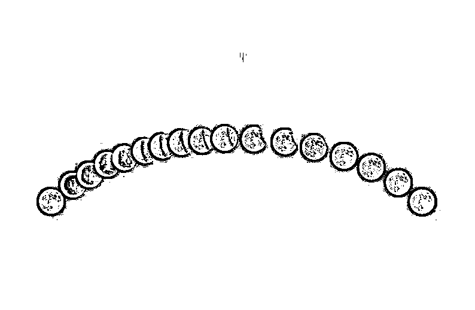**满月：180°-225°**当来到满月，想象一个有 180°视觉的人，他能看到整个宏大的场景，新月的主观性消失，这个人有**广阔、全面的视角**。**在关系中，这种人有很强的适应性，因为他总是能看到问题的正反两面，能保持一定的客观性，适合当咨询师。**满月的月相渐亏，这个人已经到达他能去最远的地方了，也许这个人不属于任何一个帮派，他是个建构桥梁的人，有自己的客观性。**代表人物**：克里希那穆提、唐纳德·特朗普、杰夫·焦耳**亏凸月：225°-270°**这是一个九宫的位置，这些人会教授自己在人生中学到的东西。无论他们做什么，他们都会**积累信息、积累经验、积累一切**。他们的工作是**教会别人，传达新的信息，好像是令别人转化皈依的那种人。****代表人物**：荣格、托马斯·杰弗逊、希特勒**下弦月：270°-315°**到这里，“蛋糕已经烤好了”。如果出生在下弦月周期，这些人好像生来就要做**统治者**，即便是个小孩，也想要统治。**他们善于坚持原则，不愿意接受批评。**蛋糕已经烤好了，还能做什么呢？无法再添加东西。一般来说，大众会服从他们。**代表人物**：列宁、爱因斯坦、奥巴马、克林顿、甘地**残月：315°-360°**到了残月周期，这里是故事结束的地方。这是种子的阶段，就好像土豆的周期，土豆已经摘下来了，种子也种下去了。这是一个有寓言意味的周期，出生在这个周期的人，能把过去放到背后，他们能认识到，剩下的只有未来。这里是**整个历程的结尾**。职业上通常代表**收尾工作**，残月是光亮逐渐消失。**代表人物**：林肯、罗伯特·汉德、丹恩·鲁伊尔、鲍勃·迪伦**你的星图中有怎样的月相？留言区分享给我们吧！****版权声明：**本文由若道翻译发布，欢迎转发，反对抄袭。友号转载请申请白名单。

**学习太阳返照技法**

**请点击下图了解详情**

**

**微信又双叒叕改版啦，不想错过若道君的推送？**

**就把若道设为星标吧！**

**▼**

就是这个“在看”，戳一下☟

********报名直达入口********

# 插班中丨核心课程 L3，教你掌握综合星图解读

> 原文：[`mp.weixin.qq.com/s?__biz=MzA5NjA0NTAxNg==&mid=2651425478&idx=3&sn=479c59221ae92f670b07886afa4e98cc&chksm=8b4b3871bc3cb1676572ad6ae8322013fe50cf0a2176cab9a6ca0f3d2b99efe33eaec71df360&scene=126&sessionid=1692738116#rd`](http://mp.weixin.qq.com/s?__biz=MzA5NjA0NTAxNg==&mid=2651425478&idx=3&sn=479c59221ae92f670b07886afa4e98cc&chksm=8b4b3871bc3cb1676572ad6ae8322013fe50cf0a2176cab9a6ca0f3d2b99efe33eaec71df360&scene=126&sessionid=1692738116#rd)

**Level3 也是占星学习的一个整合区和分水岭****若道君给大家准备了一份专业的占星测试：“2020 若道核心课 L3 入学测试”****测试内容包括：**

**适合参加测试的学员：**

**L1-2 结课学员**

**有一定占星基础的自学学员**

**准备考 ISAR 的学员**

**扫码开始测试吧**

**1**

**占星学除了自我修炼，市场需求如何？**

**通过占星学习你帮助了自己，也可以选择成为自助助人的占星师，开启受益终生的第二事业。**一方面，社会快速发展人们压力山大，抚慰心灵的咨询市场需求巨大。另一方面，市场鱼龙混杂，真正学院派的严肃占星从业者十分稀缺。最重要的，**占星学能让你自己帮助自己，无论你是否进行占星咨询从业，学习了占星学，它都将是终身陪伴你成长的睿智好伙伴。**

**2**

**你的占星核心课老师是谁？**

 拥有**50**年占星研究积淀**44**年职业占星实践**41**年占星教学经验的**若道联合创始人****2017-2020 年曾任 ISAR 全球副主席****2020 至今为****CAPISAR（全球职业占星师资质认证考试委员会）主席****大卫·瑞雷**&**最懂学员的若道首位认证金牌中国老师****熊鹰**师徒二人合力打造
**2020 年若道****全新核心占星课程**

**3**

**L3 阶，我们要学习什么？**

**第 3 阶 ****宫位、相位以及初步解读星图（15 次课） ****❶** **12 宫位****人生中重要的领域，不止 12 个，更是 12 类。****❷ 组合解读****行星、星座与宫位的组合解读。万丈高楼平地起，这是占星解读的基本功。****❸ 相位****不仅是常规的相位：合相、对分相、三分相、四分相……还有这些更为细致的知识：**相位计算入相位与出相位星座外的相位相位解读盈亏相位相位的优先级大卫老师案例课**❹ 宫主星与定位星****“联结”是宇宙的基本法则之一。除了相位，还有哪些方式让行星能量联结起来？**宫主星定位星与定位链大卫老师案例课**❺ 月亮交点专题****月亮交点是占星解读的另一个入手角度，这里会深入教你解读月亮交点，及其相位与定位星。**月亮交点的解法大卫老师案例课**❻ 相位模式：****那些坊间赋予神秘意义的占星格局：大三角、大十字、T 三角……究竟该如何解读其相位模式。**主要的七种相位模式星图中没有相位模式的情况大卫老师案例课**❼ “空”不等于“没有”：****星图中那些容易被忽视的地方：**无托勒密相位（俗称空相）一些特殊位置星图布局大卫老师案例课**第 3 阶课程安排****❶** 15 次线上直播网络课程，每次 2 小时，课程中依旧会使用同学们的星图作示范**❷** 10 节课由熊鹰老师教授，重点通过名人星图阐释知识点**❸** 5 节课由大卫·瑞雷老师教授，重点通过学员星图阐释知识点**❹** 熊鹰老师会指导练习，答疑解惑，学练结合**❺** 重点在于如何根据星图去问问题，着重自我发现和自我探索的过程 

| **时间** | **课程** |
| 2020 年 7 月 2 日 | 宫位、行星和星座组合 |
| 2020 年 7 月 9 日 | 宫位、行星和星座组合 |
| 2020 年 7 月 16 日 | 月亮交点 |
| 2020 年 7 月 23 日 | 月亮交点和演示案例 |
| 2020 年 7 月 30 日 | 相位 |
| 2020 年 8 月 6 日 | 相位、星座、行星和宫位 |
| 2020 年 8 月 13 日 | 相位、星座、行星和宫位的同学案例 |
| 2020 年 8 月 20 日 | 渐盈相位和渐亏相位，示例 |
| 2020 年 8 月 27 日 | 更多的关于宫位和宫主星 |
| 2020 年 9 月 3 日 | 同学案例 |
| 2020 年 9 月 17 日 | 空相行星和定位星 |
| 2020 年 9 月 24 日 | 宫主星 |
| 2020 年 10 月 15 日 | 优先级和组织 |
| 2020 年 10 月 22 日 | 相位模式以及范例 |
| 2020 年 10 月 29 日 | 学员星图解读范例 |

**截至 2020 年 8 月 26 日中午，课程第 1-8 讲为录播课程（限视频回放），其余均为网络直播课。**

**试听彩蛋**

📹 [`v.qq.com/iframe/preview.html?width=500&height=375&auto=0&vid=e093031qxym`](https://v.qq.com/iframe/preview.html?width=500&height=375&auto=0&vid=e093031qxym)

**4**

**这两位优秀的占星学老师是谁？**

**大卫·瑞雷（David Railey）**

*   **曾任 ISAR 全球副主席，2020 至今为 CAPISAR（全球职业占星师资质认证考试委员会）主席，若道联合创始人；** 

*   1976 年，通过亚特兰大职业占星师考试，成为全职占星师，随后通过**AFAN 和 ISAR 职业测试；** 

*   1980 年，与**杰夫·焦耳**一起在亚特兰大创建**“每日星球”**占星学中心。此后在亚特兰大占星协会担任 4 年考官，并且两次担任**亚特兰大地区占星协会主席**。1979-1992 年，作为占星师活跃于美国社会媒体，向不了解现代占星学变化的大众宣传专业占星学知识。在 1989-1992 年期间，他在 WRGG 电台 12 频道每周主持个人电视秀**“今日占星学”**，早先他还在 WRFG 的广播节目中播讲宇宙天气节目；

*   2010-2014 年，任**全美占星师联盟监督委员会委员**； 

*   2010 年，其著作**《灵魂的目标》**中国版出版，和蒋颖一起创办**若道占星**学校和其官网 www.nodoor.com。从该年开始，他工作并往返于亚特兰大和北京。目前他 80%的时间致力于在中国教授和推广西方占星学； 

*   2017 年，被选为**ISAR 委员会成员**（2017）。ISAR 是世界最大的国际占星机构，会员遍布 45 个国家，2017-2020 年曾任 ISAR 全球副主席； 

*   2020 年，被推举为**CAPISAR（全球职业占星师资质认证考试委员会）主席**。

**熊鹰老师（天空的空）**

*   2008 年接触严肃占星学，至此爱不释手； 
*   **2013 年师从大卫·瑞雷**，研习整套现代占星学核心课程，并于 2014 年起至今连续三年担任该课程的主助教； 
*   期间也**跟随格伦·佩里、诺·泰尔、理查德·塔纳斯、罗伯特·汉德、苏·汤普金斯、斯蒂芬·弗里斯特等多位国际顶尖占星大师进行学习**，进行定向占星主题研究； 
*   2015 年初，通过国际占星研究协会**（ISAR）资质认证并获得证书**。同年，进一步跟随大卫·瑞雷老师进修**“生时校正”**技术，通过最终考核并获得证书； 
*   目前在若道星文化任职，将传播系统、严谨、真实的占星学作为职业使命。任专职助教期间，进行沙龙与答疑等辅助教学工作已累计超过 200 小时；
*   在业余期间也提供占星咨询与生时校正服务。目前正致力于占星学与个人成长的整合。

**5**

**什么人适合这门课？**

*   对占星学有浓厚兴趣，想要系统学习占星学
*   对占星学有一定基础，但不知道该如何整合星图复杂的碎片
*   希望成为优秀的占星师，想要借鉴国际大师解读思路并融入自己的体系
*   想学习占星学，但不擅长英文，希望有中文老师授课
*   想结合占星学理论与咨询实践
*   大卫·瑞雷、熊鹰的忠粉，学过占星，但就是想跟着偶像再学一遍
*   走在自我探索和个人成长道路上的人

**6**

**课程费用**

 **★ L3****课程费用：10000 元****更多价格优惠请咨询客服**

**7**

**退转课程**

**退款原则请详看《教学协议》，如有疑问请咨询课程顾问。******核心课程 Level 3****

**授课老师：大卫·瑞雷 熊鹰**

**授课时间：****2020 年 7 月 2 日-2020 年 10 月 29 日**

**授课方式：**网络课程：英文授课，中文翻译

**费用：10000 元；**更多优惠请咨询客服

**课程负责人：Maggie（微信号：NodoorMaggie）**请备注“L3”

长按二维码添加课程负责人咨询~

****报名请点击“阅读原文”****

# 下半年重磅天象 | 火星逆行在白羊座，一鼓作气，收复失地！（请提早准备）

> 原文：[`mp.weixin.qq.com/s?__biz=MzA5NjA0NTAxNg==&mid=2651425478&idx=1&sn=f8d621f1f732c5121d493af0ce2c461d&chksm=8b4b3871bc3cb16702425d04f1ad03668d127a5d46560b7a2a61b549ea4d50f8aad19a1b58a4&scene=126&sessionid=1692738116#rd`](http://mp.weixin.qq.com/s?__biz=MzA5NjA0NTAxNg==&mid=2651425478&idx=1&sn=f8d621f1f732c5121d493af0ce2c461d&chksm=8b4b3871bc3cb16702425d04f1ad03668d127a5d46560b7a2a61b549ea4d50f8aad19a1b58a4&scene=126&sessionid=1692738116#rd)

************☆****** ****后台回复“今日”，给你一句生命态度******

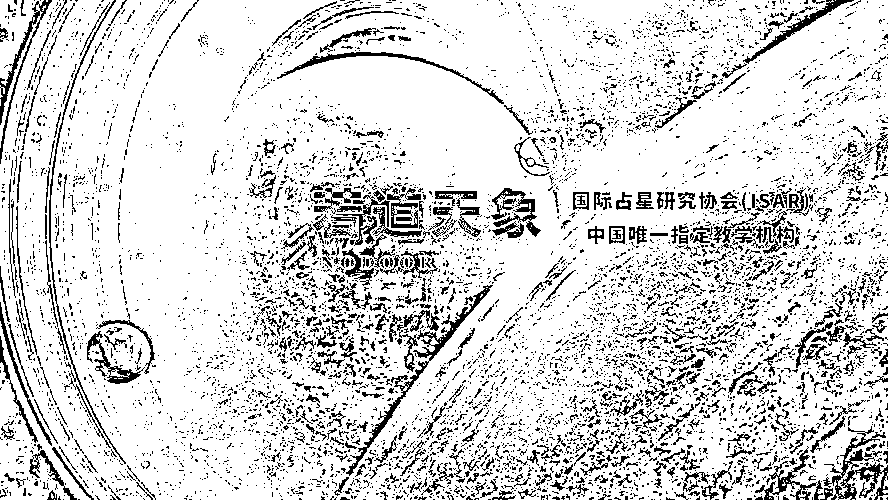

作者/查理 ISAR 认证占星师

编辑/玫瑰 封面/书君 图片/作者提供 全景网

**火星逆行**进入 7 月，很多人似乎焦躁了起来。从“杭州失踪女子被害案”到“公交车司机坠湖事件”；从“动漫展偷拍裙底事件”到“《三十而已》林有有的扮演者张月微博被网友攻击”；从“黎巴嫩贝鲁特大爆炸”到“西伯利亚大火”。用**”怒火中烧”**来描绘这些场景再合适不过了。应景的是，**6 月 28 日，火星进入白羊座，并持续到 2021 年 1 月 7 日**。在天上成的象，在地上又一次成形。当然，除了这些令人糟心的事件，还有一些激动人心的事情，比如“希望”号、“天问一号”和“毅力”号”三枚火星探测器都在此期间成功发射。人类对火星的认知和理解也许很快要被它们改写，至少从天文学的层面会是这样。 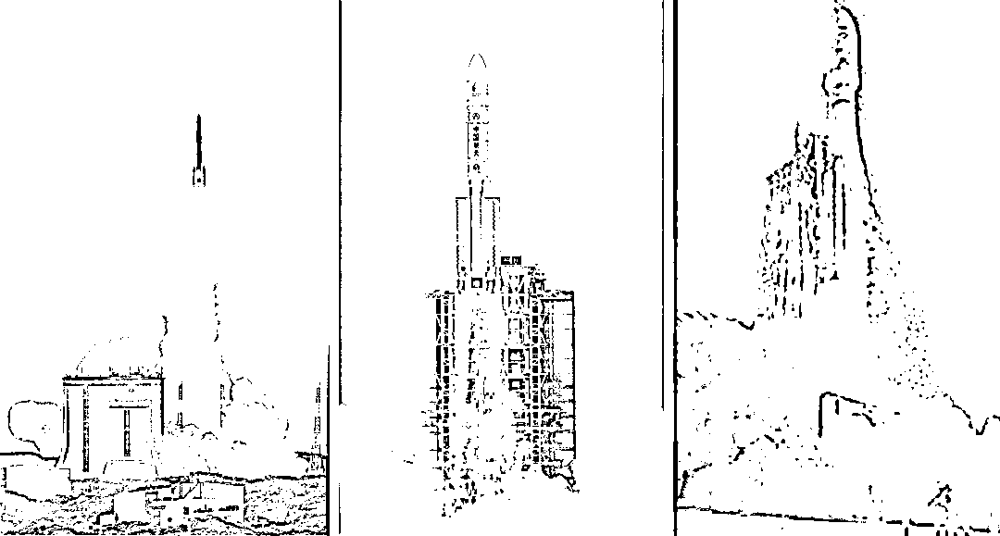|阿联酋“希望号”、中国“天宫一号”、美国“毅力号”火星探测卫星发射升空图于我个人而言，比较巧合的是，在 7 月-8 月间我遇到的几乎所有咨询个案都憋着一股劲儿：

*   工作中的愤怒和不满，本该属于自己的却没有得到；
*   朋友和家人一直不了解自己的内心愿景，但心中始终有着一团火，“饮冰三日，难凉热血”；
*   对于自己圈子的愤怒，自己的观点不被理解还遭受攻击；
*   等等等等……

**“你到底要什么？”**这是白羊座的火星对每个人的“粗暴”提问。如果你知道，这颗火星会告诉你：**”那还不抓紧！干就完了！”**如果你知道这不是自己想要的，火星会告诉你：**“那还不赶紧走，废什么话啊！”**如果你还迷迷糊糊地纠结中，火星会告诉你：**“干起来！干起来你就知道自己要什么了！”**在火星白羊座的世界，狭路相逢勇者胜，遇到敌军立马开大招，没有这么多嘻嘻哈哈。整个下半年，火星都会在白羊座，这意味着：**对于一部分人，火星在白羊座的整个下半年会荷尔蒙飙升，行动力拉满，甚至会极具攻击性；而对于另一部分人，可能完全没有公害，但还是会被当做“靶子”，不断被冒犯。**整个下半年，我们都可能会需要面对浓浓的“火药味”。但这次特殊的是，**火星会在 2020 年 9 月 10 日-11 月 14 日期间逆行，**火星虽然每两年逆行一次，但是在白羊座逆行并不多见，上一次这样的逆行还是 1988 年 8 月。那么，这样的逆行又意味着什么？火药味会不会加剧？暴力事件会更多吗？如果我们遇到暴力事件，如何应对呢？是不是还会有局部的冲突甚至战争？想了解这些答案，也许我们需要把“火星逆行于白羊座”的概念好好盘点一下。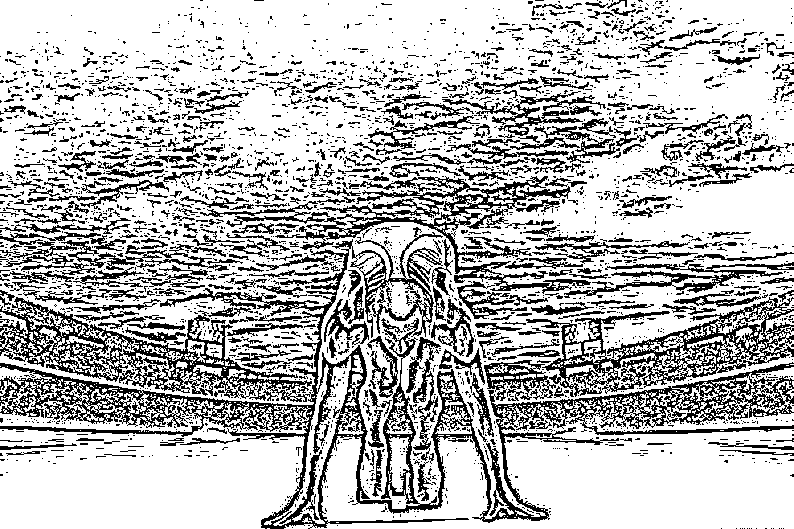**白羊座的含义：“热、摩擦、竞争的环境”**白羊座是三个火象星座（白羊座、狮子座、射手座）之首，寓意着**开创之火**。对于古代人类而言，只有通过摩擦，才能生火。白羊座的火是从 0 到 1 的开创，有趣的是，《从 0 到 1：开启商业与未来的秘密》的作者彼得·蒂尔，出生于 1967 年 10 月 11 日，北交点和土星都在白羊座，创立 Thiel 资产管理公司时 1996 年，他在经历白羊座土星回归。**白羊能量强的人，通常能征善战**。比如，宋代名将岳飞，太阳、水星、冥王、南交点汇集在白羊座，真是战神的配置。

       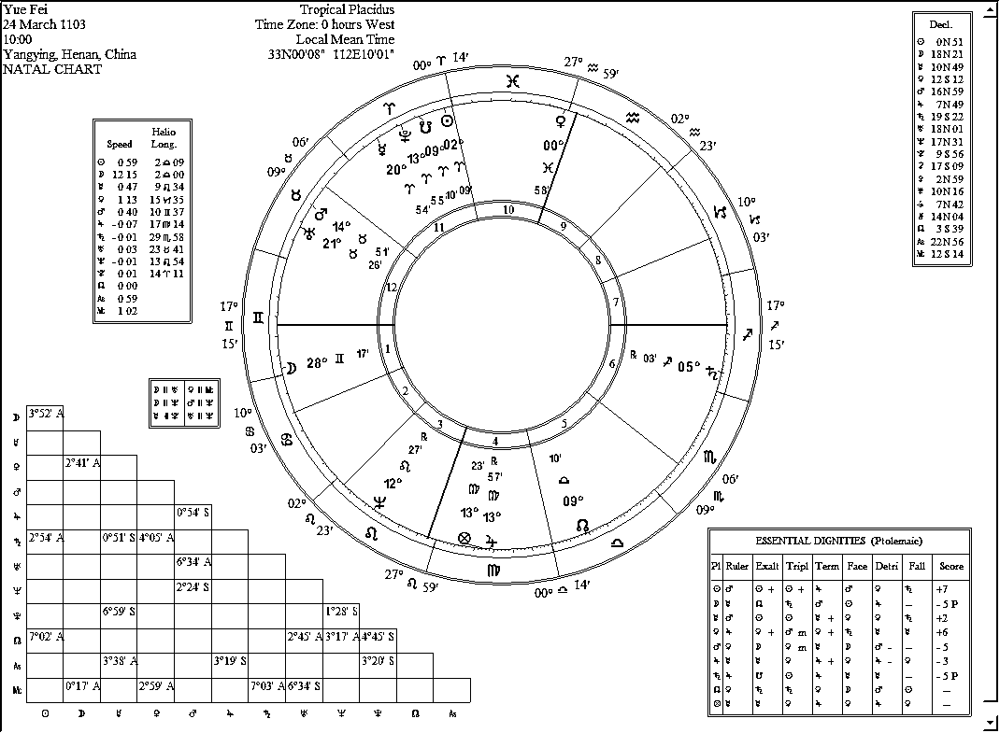      

| 岳飞的出生星图
不同的星体落在白羊座会带来不同的含义。

*   **太阳在白羊座，以竞争为骄傲，以头铁刷存在感**。海航（1998 年 4 月 16 日）和京东（2007 年 4 月 20 日）就注册于太阳落白羊座的日子。中美贸易战正式开始的日子（2018 年 3 月 22 日），太阳也刚进入白羊座； 
*   **月亮在白羊座的人，运动和对抗对他们来说是休息**。我认识很多月亮白羊座的朋友，大多是拼命三郎，经常需要待在健身房里，睡多了反而更累； 
*   **水星在白羊座，想法简单直接。**水星在白羊座的人可能**喜欢与人论战。**城市星图的水星代表着交通和交流，昆明（1950 年 3 月 28 日）和深圳（1979 年 3 月 5 日），水星在白羊座，那里有笔直的道路，市民们说话也很直接； 
*   **金星在白羊座，喜欢竞争性的关系，有一种要“喜欢抢人头”感觉。**刘若英在《为爱痴狂》中唱到：“想要问问你敢不敢，像你说过那样的爱我？”唱片发布的那一天（1995 年 5 月 5 日），金星就在白羊座；金星在白羊座的公司喜欢做爆款产品，快速抢占市场； 
*   **木星在白羊座的年份**，1987 年，费翔的《冬天里的一把火》火遍全国，随后大兴安岭的一把火，火光冲天；2011 年，团购网站“千团大战”硝烟弥漫； 
*   **土星在白羊座的年份，则对竞争开始管控**。比如，土星在白羊座的 1998 年，4 月 6 日，国家体育总局正式挂牌； 
*   天王星在白羊座，2011-2018 年，移动互联网兴起，随时随地满足需要，行业的竞争惨烈，经常第一名和第二名竞争，结果第三名“死了”； 
*   冥王星在白羊座，1840 年-1850 年期间，从焦耳建立电热当量，到热力学第一定律“能量守恒”的确立，打开了人类完全利用热能的新篇章。

如果你的出生星图有任何一颗星体落在白羊座，那么下半年，你极有可能会被火星激发，充满斗志。      **火星的含义：“血液、肌肉和武器”**火星的星球表面富含氧化铁，所以从视觉上呈现出一颗橘红色星球。对人类而言，红色更容易引发人的荷尔蒙和战斗欲。而在人类的血液（特别是动脉血）和肌肉中，富含着铁元素。以前我们说到铁，比较容易联想到“武器”，现在则很容易联想到健身“撸铁”。

       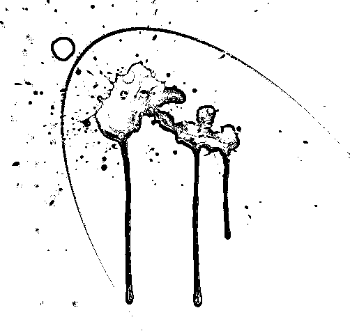      

在占星学里，火星的含义就要由这些联想展开了。火星的核心含义是**战斗**，落实到不同的领域，会演化出不同的“功能”：

医疗占星学中，**火星承载着身体的战斗功能，对应着血液、动脉和肌肉**。我见过很多火星在白羊座的人，肌肉“杠杠的”，无论男女，运动能力也超强。C 罗（出生于 1985 年 2 月 5 日）是典型的火星在白羊座的代表人物。

       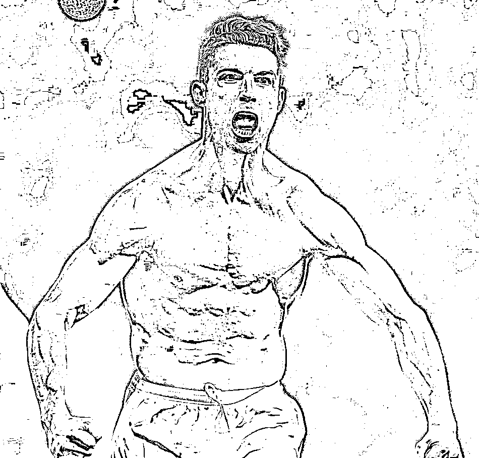 

| C 罗

**心理占星学中，火星代表着表达愤怒情绪的功能。**前几年有部动漫神作叫《头脑特工队》，火星就好比里面的红色小人——怒怒。

       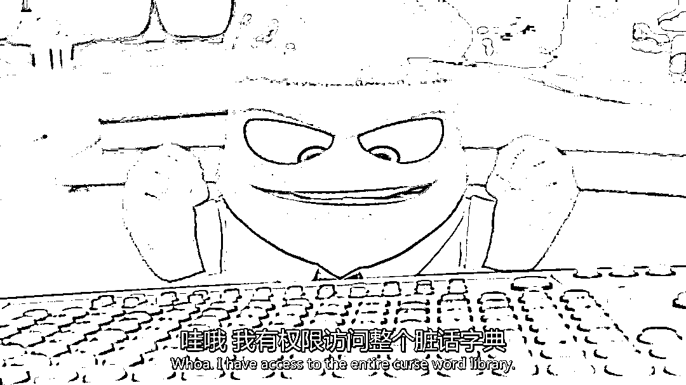      

| 怒怒

**人本主义占星学中，火星则代表勇气、行动，自我确立的内在功能，通俗来讲就是“我要干什么”。****企业占星学中，火星对应公司的竞争力和执行力，当企业开始攻占市场，或者抵御竞争对手攻击时，火星能量会得到彰显。**一般而言，**销售团队会承载着公司的火星职能**。比较典型的火星白羊座公司，比如北京三快在线科技有限公司（美团的主体公司之一，成立于 2011 年 5 月 6 日），攻击力极强。**经世占星学中，火星对应着国家竞争力，军事和国防力量、制造业、暴动等。**比如俄罗斯的国家星图（俄罗斯独立日：1990 年 6 月 12 日），火星在白羊座，火药味十足的战斗民族；还有伊拉克的国家星图（1958 年 7 月 14 日），火星也落在白羊座，一言不合就打架。

       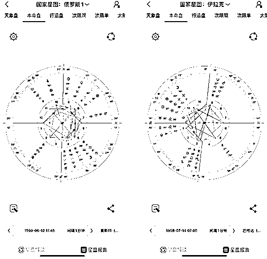

 | 俄罗斯和伊拉克的国家星图   

回到个人层面，火星落在不同的星座元素里，意味着每个人拥有不同的武器：

*   如果你的火星落在**火象星座（白羊座、狮子座、射手座）**，你的“武器”就在**精神和力量层面**，比如，你比别人**更有活力、眼界更宽阔，力气更大**等等； 
*   如果你的火星落在**风象星座（双子座、天秤座、水瓶座）**，你的“武器”可能是**头脑和心智层面**的，比如**脑子更好使、学识更渊博、圈子更广泛**； 
*   如果你的火星落在**土象星座（金牛座、处女座、摩羯座）**，你的“武器”将是**物质和权力层面**的，比如**财富碾压、地位碾压、更会使用工具**等等； 
*   如果你的火星落在水象星座（巨蟹座、天蝎座、双鱼座），你的“武器”会是**情绪和感受层面**的，比如**直觉精准、情绪掌控、心灵控制**等等。

**销售人员风格和火象星座**根据我们的观察，出生星图中的火星还与**销售方式**有关，如果一位销售人员的火星落在白羊座，那么 TA 会更擅长成交“生客”；而火星落在天秤的销售人员则对“熟客”情有独钟，成交效率会更高；火星落在巨蟹座的销售人员，则可能更容易安利周围熟悉的亲朋好友。对于火星落在火象星座的销售，TA 通常更容易满足于成交这件事情本身，会极度在意销售排行榜有没有自己的名字，是不是排名靠前，特别是火星白羊座和火星狮子座，反而对于物质奖励并没有特别大的兴趣；相反，火星落在土象星座的销售人员，他们通常只看中成交背后的物质奖励或者晋升空间，目标并不在成交本身。**出生星图中火星逆行的含义**在之前的[水逆文章](http://mp.weixin.qq.com/s?__biz=MzA5NjA0NTAxNg==&mid=2651419573&idx=1&sn=d260dacf688f0848071b38ed3d2685d0&chksm=8b4bc102bc3c481448e6f07e4aa3f396c470b8692340474217484824b989c6598d3e3105332d&scene=21#wechat_redirect)（点击可阅读）中，我提出的观点是：出生星图中水星逆行的人，即使落在双子座这种需要强烈沟通的星座里，依然会不太爱说话和自我表达，他们的水星在内化过程中。

同理，如果是出生星图中的火星逆行，火星也在内化过程中，这样的人通常而言攻击性比较弱，哪怕是落在白羊座、天蝎座、摩羯座这三个火星庙旺的星座。

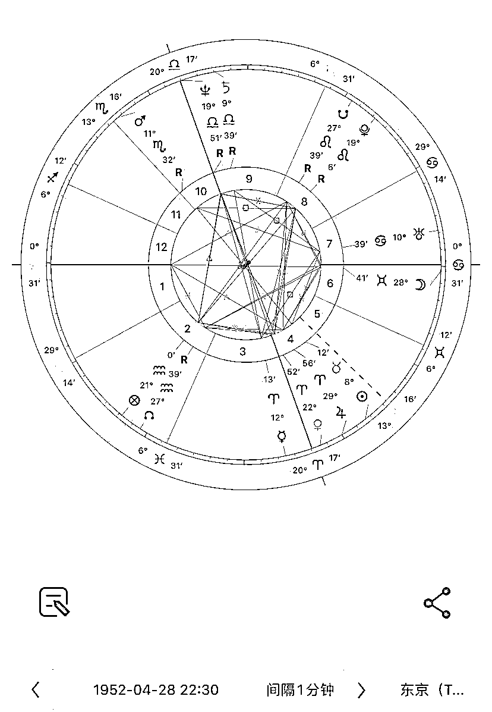

 | 日本国家星图  

在这里提供一个有趣的国家星图案例——日本的国家星图（1952 年 4 月 28 日，《旧金山对日和平条约》正式生效，日本恢复国际地位）中，火星逆行在天蝎座，处于庙旺的位置。日本军事实力极强，但受制于《和平宪法》的约束，并不能拥有军队，只能拥有自卫队。

**行进火星在白羊座逆行**本次火星逆行发生在**2020 年 9 月 10 日-11 月 14 日**，持续两个月，位置在**白羊座 15°-28°**。如果你出生星图中有星体落在**基本星座（白羊座、巨蟹座、天秤座、摩羯座）15°-28°**范围内，它们将会在此期间形成硬相位，可能会面对**强烈的冲突**。我回顾了过去 1870 年-2020 年间“火星逆行在白羊座”的时间段，一共发现了 5 个，分别是：

*   1894 年 10 月 13 日-1894 年 11 月 21 日；

*   1909 年 8 月 23 日-9 月 27 日；

*   1941 年 9 月 7 日-11 月 10 日；

*   1973 年 10 月 30 日-11 月 26 日；

*   1988 年 8 月 26 日-1988 年 10 月 24 日

很多人都觉得白羊座火逆期间很容易发生战争，从过去 150 年来看，确实在此期间发生过大规模的冲突和战争，比如：

*   1894 年 10 月 13 日-1894 年 11 月 21 日期间，甲午海战爆发； 
*   1941 年 9 月 7 日-11 月 10 日，还在二战期间，中国战场上正在进行第二次长沙会战。中国军队赢得了胜利，收复了长沙。同时也收复了福州； 
*   1973 年 10 月 30 日-11 月 26 日期间，第一次石油危机爆发，发生了中东战争，赎罪日战争，埃及和叙利亚联手打击以色列，并收复了被以色列占领的领土。

但这五个时间段也不全是战争，反倒是有战争结束的，比如：

*   1988 年 8 月 26 日-1988 年 10 月 24 日，打了 8 年的两伊战争在此期间结束，两国的分界线恢复到了战前状态。

虽然这几个时间段有战争也有和平，但是我们都能看到一个关键词——**“收复失地”**：“中国军队收复长沙和福州”；“埃及和叙利亚收复失地”；“两伊的分界线回到战前状态”。并且这个关键词与“火星逆行”的状态不谋而合。当然，当下还处于和平年代，像过去那种大规模的战争可能性并不大。但是，现代社会依然有各种各样的竞争、掠夺，比如国与国的贸易战、金融货币战、太空战等等。日常生活中，同样有各种各样的竞争和冲突，比如各类选秀节目的流量争夺、城市之间的人才争夺、职场中对于职位的争夺、销售对于客户的争夺、兄弟姐妹对于玩具的争夺，等等。良性竞争有利成长，恶性竞争两败俱伤。**在白羊座火星逆行期间，争夺的双方可能会恢复到一个平衡点。****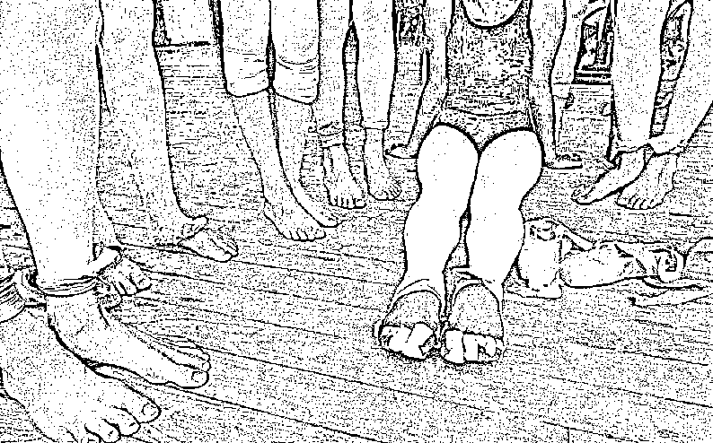****本次火星逆行的相关相位**本次火逆期间，恰逢行进火星四分摩羯座的木星、土星、冥王星，可能会带来独特的影响。

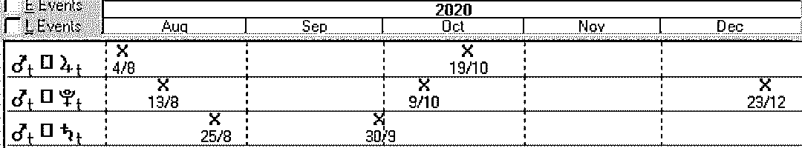 

当火星在顺行期间：

*   8 月 4 日，火星精准四分木星，恰好那天发生了黎巴嫩首都贝鲁特的大爆炸；美国在台协会 8 月 5 日表示，美国卫生及公共服务部部长阿扎计划将在未来几天内，率团访问台湾； 
*   8 月 13 日，火星与冥王星精准四分，美国卫生与公众服务部部长阿扎率领的代表团对台湾进行了访问；同时，解放军东部战区多军种多方向成体系出动兵力，在台湾海峡及南北两端连续组织实战化演练； 
*   8 月 25 日，火星与土星精准四分，我们看看会发生什么？

火星逆行后，将会再一次同这三颗行星形成四分相，大家可以**关注这几天的变化：**

*   **9 月 30 日**，火星四分土星；
*   **10 月 9 日**，火星四分冥王星；
*   **10 月 19 日**，火星四分木星。

火星顺行后，会在 12 月 23 日再次同冥王星形成四分相。之后，在 1 月同木星和土星形成四分相，但是那时的火星已经离开白羊座了，木星和土星也已经不在摩羯座，所以这里暂时不作考虑。白羊座的火星希望直面冲突，奔赴战场，奋勇杀敌，但摩羯座的策略是：熬。摩羯座的群星会对 TA 说：“上兵伐谋，其次伐交，其次伐兵，其下攻城；攻城之法为不得已。”另外，在**8 月末到 9 月中上旬期间**，火星处于停滞状态，这就好比拿着激光笔聚焦于一个固定的点，**某些特定议题可能会成为焦点**。**本次火星逆行在国家星图中的潜在含义**火星在中国国家星图的第三宫逆行，并在停滞期间触碰到中国的下中天。国家星图的第三宫有丰富的含义，比如**公共媒体领域、股票市场、通讯领域、公共运输领域**等等。行进的火星当下已经进入中国的第三宫，我想到最近各地的影院陆续开放，更有像《八佰》这样的战争电影上线，似乎影院正在逐渐收复失地；各类娱乐节目的“火药味”也越来越重，能感受到比赛中的参赛者对于“拿下比赛”的强烈渴望；同时，媒体发声也越来越强硬，只要是不怀好意的质疑，基本都毫不留情的怼回去；而像字节跳动这样出海“发声”的企业，则遇到了前所未有的挑战。也许在火星逆行期间，他们能收复一些失地。逆行的火星移动区域在白羊座的 15°-28°，在中国星图中落在开创星座 15°-28°的星体有：位于摩羯座 22°的木星，和位于白羊座 16°的北交点。国家星图的木星代表经济扩张，逆行的火星同木星形成四分相，也许**会有一些措施刺激经济增长**。北交点与国家未来使命有关，相信这段时间**国家会斗志昂扬**。
       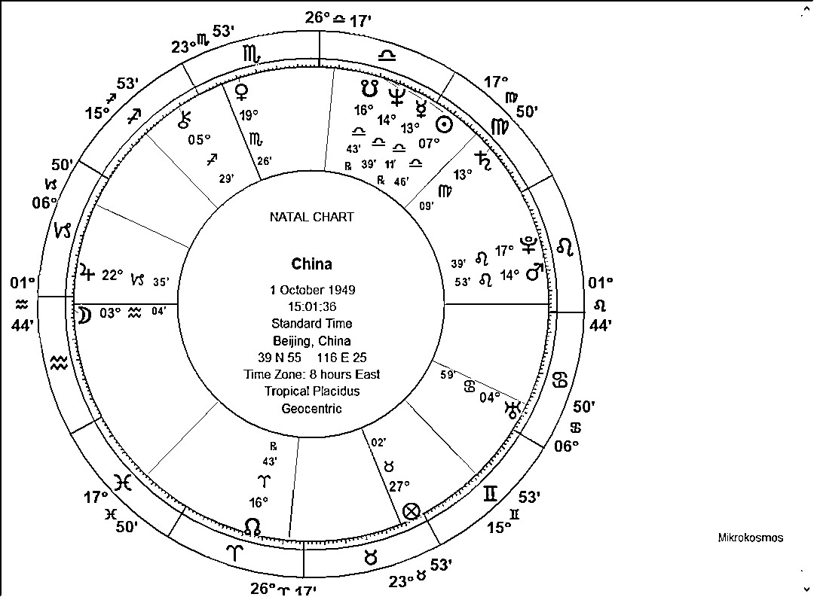| 中国国家星图**12 上升星座的火星逆行攻略**我们每个人都会有自己的领地，9 月 10 日-11 月 14 日的火星逆行期间，会有助于我们**收复失地**。具体会在哪里收复失地，需要根据不同的宫位来解读，12 个宫位，就好比 12 个战场。**上升****白羊座** **火星逆行在*****1*****宫**战斗会发生在**人设战场**。在此期间需要夺回个人形象，对于“我是谁”、“我要做什么”，要有信心。**把自己被侵犯的人格夺回来。****上升****金牛座** **火星逆行在*****12*****宫**战斗会发生在**心灵战场**。在此期间容易后院起火，也许说者无意，听者有心，不经意间就会触犯他人。在此期间如果**放下得失心，反而能重新找回心灵的安宁。****上升****双子座** **火星逆行在*****11*****宫**战斗会发生在**社交圈子**。可能更容易与自己的朋友圈发生冲突，如果能够**坚守大家的共同利益线，**那么你会捍卫你们的友谊。**上升****巨蟹座** **火星逆行在*****10*****宫**战斗会发生在**事业战场**。可能更容易面临职业发展的挑战。在此期间，你完全可以**捍卫自己的正当职业发展诉求，你会找到充满使命感的状态。****上升****狮子座** **火星逆行在*****9*****宫**战斗会发生在**思想领域**。你可能会很容易在思想观念上和人起冲突，这源于大家对于世界的看法和理解不同。考验你**立场是否坚定**的时候到了，你会重新找到充满希望的感觉。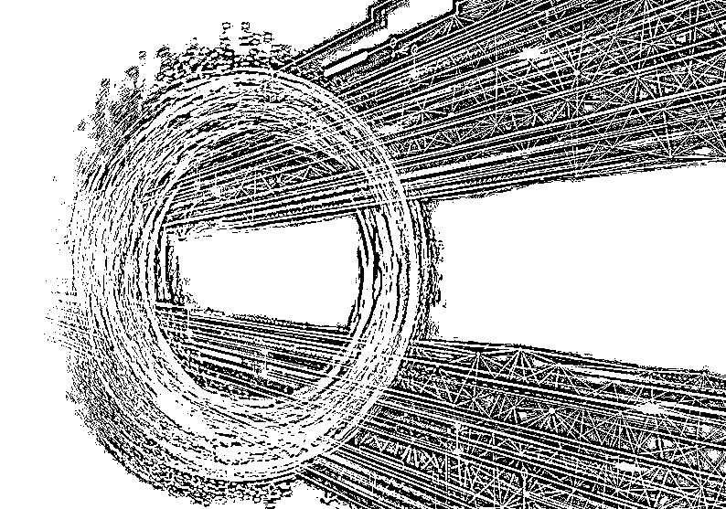**上升****处女座** **火星逆行在*****8*****宫**战斗会发生在**蜕变领域**。考验你与黑暗相处的时刻来了，比如亲密关系、信任关系。如果别人欠你钱，可以去催收，别怕得罪人。也可能你会经历生死攸关的时刻，坚持下去，你会重获新生。**上升****天秤座** **火星逆行在*****7*****宫**战斗会发生在**关系领域**。考验婚姻、社交、合作关系的时刻来了。**勇敢地面对冲突，敢于向对方说“不”，你们的关系反而会更积极向上。****上升****天蝎座** **火星逆行在*****6*****宫**战斗会发生在**实践领域**。有可能你在工作时战斗力拉满，锻炼极富有挑战的新技能，甚至兴奋过头还会病倒。不过即便如此，可能你依然**执着于“干活”，因为你需要找回充满力量去工作的状态。****上升****射手座** **火星逆行在*****5*****宫**战斗会发生在**创造领域**。可能你在打游戏时手感火热，特别来劲儿，如果有孩子的话，TA 可能想和你比划两下。火星逆行期间，你需要的是**找回儿时大汗淋漓玩耍的感觉。****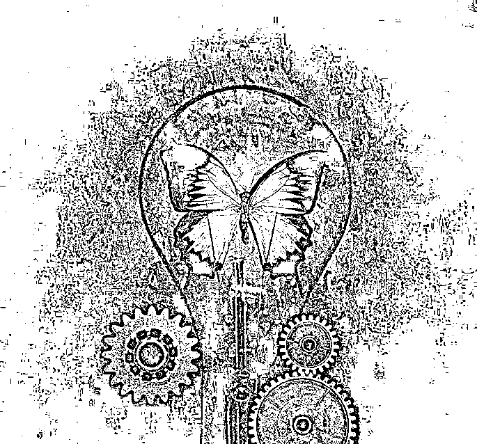****上升****摩羯座** **火星逆行在*****4*****宫**战斗会发生在**内在直觉领域**。这段时间可能你会面临来自于原生家庭的冲突，不用太担心，和家人大吵一架反而会好受一些。你要**找回和家人激烈互动的感觉。****上升****水瓶座** **火星逆行在*****3*****宫**战斗会发生在**言论领域**。前段时间你可能在和人沟通时被惹毛了，或者你的观点和言论被攻击了，还有些该说的话没直接说出来。现在，是时候**重新整理思路，拿下“舆论”阵地了。****上升****双鱼座** **火星逆行在*****2*****宫**战斗会发展在**财富领域**。这段时间，可能你一冲动花了不少钱。接下来，你要**设法夺回自己的钱袋子，是你的钱，要加油挣回来。**最后，送给大家一首歌，花儿乐队的《嘻唰唰》，副歌部分特别应景即将迎来的白羊座火逆，希望给大家欢乐和力量：“**请你****拿了我的给我送回来，****吃了我的给我吐出来，****闪闪红星里面的记载，****变成此时对白，****欠了我的给我补回来，****偷了我的给我交出来，****你我好像划拳般恋爱，****每次都是猜！**”对了，《嘻唰唰》发布日期——2005 年 7 月 28 日，火星行进在白羊座。

**版权声明：**原创文章由作者授权首发于若道平台，欢迎转发，反对抄袭。友号转载请申请白名单。

**查理**

ISAR 认证占星师（2017 年获得），全职占星师

若道 2016 届核心课程学员，5 年企业占星研究和咨询经验

13 年企业管理咨询从业经验，上海交通大学物理与天文学院毕业

**咨询微信：**qinglee821

**微信公众号**：suoyingmk

长按打赏

**获取为你量身打造的火星逆行攻略**

**可扫描下图二维码购买**

**让勇气和战斗力为你服务**

**微信又双叒叕改版啦，不想错过若道君的推送？**

**就把若道设为星标吧！**

**▼**

就是这个“在看”，戳一下☟

********购买报告直达入口********

# 冥王星 12 宫位转化指南丨一份来自冥王星最深的礼物：自我的转化与疗愈之旅

> 原文：[`mp.weixin.qq.com/s?__biz=MzA5NjA0NTAxNg==&mid=2651425283&idx=1&sn=f9471a4df257415827c9da5eb569eff3&chksm=8b4b38b4bc3cb1a2b2832bc1464c96755d0a4a2ad79cb8de98514db4158cb8e5f61244304f2c&scene=126&sessionid=1692738116#rd`](http://mp.weixin.qq.com/s?__biz=MzA5NjA0NTAxNg==&mid=2651425283&idx=1&sn=f9471a4df257415827c9da5eb569eff3&chksm=8b4b38b4bc3cb1a2b2832bc1464c96755d0a4a2ad79cb8de98514db4158cb8e5f61244304f2c&scene=126&sessionid=1692738116#rd)

**☆ 后台回复“今日”，给你一句生命态度**

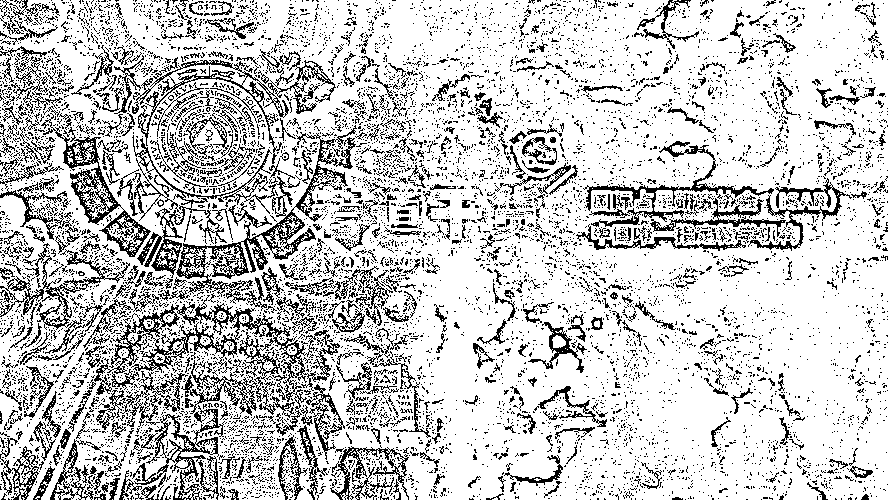作者/星星下的梅维斯 编辑/翀子 封面/书君 图片/网络源于未知、终于觉知的冥王星，它在星图中所在的位置，说明了我们这一生需要转化与抛弃的旧习，也是用我们本自具足的力量与自己的恐惧和解的地方。  

若想让一棵树的树枝伸向天堂，它的根就必须深入地狱。

——中古世纪炼金格言

一个人也许会朝着完美奋斗，但必须在相反的那一面受足了苦，才能使自己变得完整。

——卡尔·荣格

在占星学中，根据行星运行的速度和距离的远近，我们可以将它们进行三个维度的划分：**个人行星**，它们在我们的生活中扮演着举足轻重的地位，太阳（我是）月亮（我需要）水星（我认为）金星（我喜欢）火星（我行动），它们不同的组合构成了我们每一个人不同的人格基本面向。这正如同弗洛伊德提出的本我的概念，即我们在无意识中拥有的满足自我的各种需求的欲望。

而**木星与土星**，则会站在更高的角度，让我们更圆融的与整个社会形成互动：生具信仰，勇于探索（木星），制定规则，务实积累（土星）。

最后，**三王星**，他们运行的速度极为缓慢，往往造成的影响会横跨一个时代，对于个体而言，我们很难在每个当下立即觉察到他们的影响，但他们却能潜移默化地影响到个人心灵生活最深的面向，这些巨大的力量是从超自然次元爆发出来进入物质世界，因此他们带给我们的改变似乎更直接，更具有目的与深意。

本文将会与大家深入探讨这颗徜徉在太阳系最边界，身披神秘色彩的冥府之王——**冥王星。**

**源于未知，终于觉知**

史蒂芬·阿若优在提到冥王星时，有过以下的解读：

冥王星在个人出生星图里的位置，透露了仍然活跃的老旧自我或人格的旧壳子，而且仍含藏着不可忽视的浓缩的精神能量。只要这股能量不被意识到而仍然与生命的老旧模式连结在一起，那么它就会以心理情结的形式表现出来，进而在我们的意识里促成冲动的，挥之不去的思想及行为。

反之，这股能量若是能从那个旧壳子里释放出来，我们就可以清醒的运用它来帮助我们把太阳星座的本质展现出来，而这个新的存在形式乃是我们的发展不可或缺的。

冥王星初步解析，**源于未知，终于觉知。**

自冥王星被发现以来，很多人都试着替它下过定义，它似乎暗示着一个无法思议的浩瀚次元，即便是其物理特性，也足够具有神奇色彩：

冥王星在太阳系轨道最外环，在 9 大行星里体积最小，其亮度大约是第十四等级的行星，这意味着其亮度为月黑风高的夜晚肉眼可见亮度最微弱的行星的一千六百分之一。这不易被察觉的特性，我们往往会忽略其影响力与力量，正如任何与冥王星（天蝎座或者第 8 宫）相关的事物都无法通过其表面特征来理解和定义。

虽然冥王星体积小，亮度低，却携带着超出物质次元的先验性力量，往往我们都是通过其对立形式的展现，才能将其教诲加以领略。正如谈及它时，我们立马在脑海里会浮现的一些词汇：**无情，毁灭，占有，控制，瓦解，执着......**而这些意象，**是埋藏在每个人无意识深处的恐惧。**当我们未从潜意识中发觉这部分自我并将其整合的时候，就会有一种下意识的想要去控制或被控制的冲动。

**冥王星在我们星图中所处的位置，**说明了我们这一生需要转化与抛弃的旧习。没有一种觉醒是不带着痛苦的，冥王星会让我们经历一些在生活中**“被摧毁”**的事件，才能意识到过往的习气如今已经不再受用。

就好比亲密关系里那些拥有冥王星课题的人，彼此间强烈的渴望融合与占有，在这个交互的过程里，我们把太多自己内在的恐惧与不安投射在外，并通过改变亲密关系中另一半的执念来不断填满内心恐惧的深坑。而这内心的坑洞，是在童年自我的形成过程中就已种下的种子，我们永远无法通过外在的世界，或者说“另一个人”来填满。

如果我们不断地向外索求，便会进入关系的死循环里，并进行更深一步的破坏。而此处，冥王星便通过这外在对立的形式，给我们带来了课题——**带着觉知，直面内在的恐惧，用我们本自具足的力量（冥王星的正面特性）与自己的恐惧（冥王星的对立面向）和解。**

我们必须带着觉知，去拿出深层次的直面内在恐惧的勇气，在冥王星带给我们循环似的外在摧毁中，在那一次一次升起的熟悉的恐惧感里，看到源头，完成冥王星最深层次的爱的礼物——**自我的转化与疗愈之旅。**

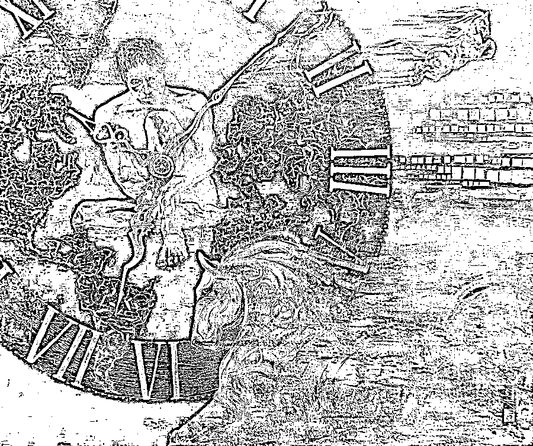

**三个面向的觉知**

我曾经有过一个极其罕见的灵视。我做了个梦，但没有人说得出那是怎样的梦：没有人会想要解释这个梦，除非他是头驴子...人们的眼睛从来没有听到过，人们的耳朵从来没有看见过，人们的手尝不出那是什么味道，人们的舌头想不出那是什么道理，人们的心也讲不出来这究竟是怎样的一个梦...这梦应该称为“底部的梦”（Bottoms’s Dream），因为这个梦可没有个底；我要在戏的最后唱唱这个梦......或者好一些的讲法，等咱们死的时候再唱这梦。

——威廉·莎士比亚《仲夏夜之梦》

**冥王星掌控着一切关于死亡的意象**，如果我们通过了冥王星安排的考验，就会迎来新生。冥王星带来的新生并不是死亡的对立面，而是高八度的**心灵升华**。在讲述冥王星的时候，有一个更深层次的面向是我们需要进一步去探讨和理解的：**遗忘，沉睡与死亡。**这是我们在意识的边界处所能探索到的更深一层的觉醒与转化。

**遗忘**

遗忘，如果这个世界没有概念，没有世俗的认知和传统，那么我们便不再定义什么是好，什么是坏，这便让我们与超我（佛洛依德人格结构中最高层，即人格结构中的管制者，由完美原则支配，属于人格结构中的道德部分，是道德化的自我，从童年之中与父母互动中体认的对与错，好与坏，社会规范、伦理道德、价值观念内化而来，其形成是社会化的结果）进行了和解。

我们看见马只是单纯的去体认，并不是通过“马”这个词语才知道客体是什么，亦或是看到客体而为其定义。那么我们就进行了一场彻底的遗忘，这个遗忘是在心智层面，我们停止了头脑的活动，不再使用逻辑和分析，从而打开了心轮的能量场，体认一种纯粹的存在的感知。这个时候我们会放下头脑批判的机制（逻辑死亡），从对自我严格的批判和不自主地自我惩罚地过程中解放。

一个很好的例子，便是冥想，我们在冥想的时候，会清空大脑，减少不必要的起心动念，身体处于清理状态，内心便愈发臻于宁静，经络会在这个过程中不断被活化，这也是为什么很多人在冥想之后都有一种精气神饱满的新生感。

克里希纳穆提曾说过：

我们大部分对事物的觉察在某一个点就停止了。我们接受了各种噪音、歌曲、美及丑的景色，但是我们却没有觉察自己对它们的反应。我们说“那是美的”或说“这是丑的”，然后我们就把它们放在一边了。我们从不探索什么是美，什么是丑。显然，如果你能知道自己对事物的反应，如果你对自己的每一个念头与思想都愈来愈敏感，并且观察到你的心智是如何被父母、老师、种族及文化的影响所局限，这一切都是觉察的一部分，不是吗？

一个人愈深入地察觉自己思想的过程，就愈能清楚地了解任何形式的想法都受到外在情况限制。当他明了这一点，他的心自然而然就非常寂静，这并不表示他的心进入了睡眠状态；相反，他的心变得非常灵敏，不再被咒语及重复的语言所麻醉，不再被规范所局限。这种寂静的灵敏也是觉察的一部分，如果你再深入去探索，你会发现，在觉察者与被觉察的事物之间是没有界限的。

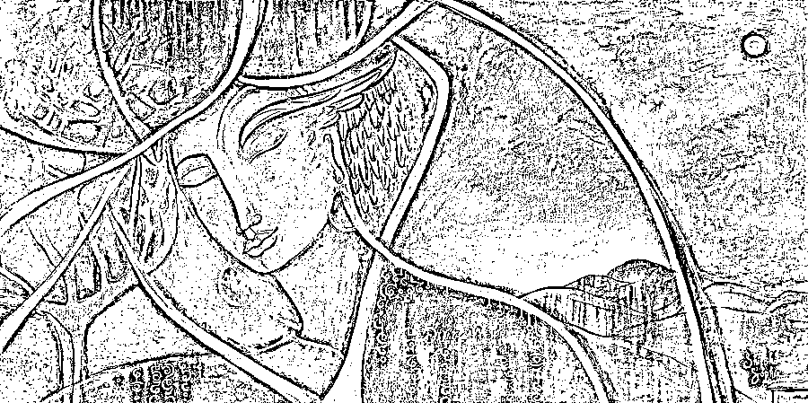

**沉睡**

沉睡，机体通过睡眠作为维持身体能量充足的一种必要条件，在深入睡眠的时候，我们人体的有机活动，诸如呼吸，循环，消化及生长，会在“人性”和“动物性”缺席的情况下持续发生作用，让我们暂时与”植物人”一般（意识的死亡），为早晨的苏醒做准备。

日夜更替，很少有人能在睡眠之中仍旧带有觉知，亦即我知道我在睡觉，我知道我在做梦。睡眠的过程是我们每个人每天的日常，我们每日在黑夜中通过意识的暂停才能与无意识相遇。无意识会通过梦境——不符合逻辑的“语言”去告诉个体其潜意识深处的讯息。

荣格认为潜意识的速度往往会先于意识，亦即我们在理解一件事情的发生和对其作出反应的时候，潜意识已经先于意识“体察”到了它。荣格也曾在其多个著作中提到过梦境与个体心理状态密不可分，是个体在自性化的旅途中非常重要的语言。

**这便是冥王星的转化过程，**通过意识的“暂时死亡”，带来被压抑的潜意识的新生，当我们发现了那些一直在无形中控制着我们的情结，并对其做出深刻的体认，转化便开始了。

心理分析教授申荷永曾说过：

就深度心理治疗，或者心理分析的临床意义来说，一旦来访者做了梦，能够用象征和意象表达的时候，其本身，便是疗愈的开始。而一旦我们能够理解来访者梦中的世界，甚至，通过积极想象，可以和来访者再度进入梦中，便能化解交流或者冲突，如化悲痛为力量，将烦恼化作菩提，获得治愈与转化。

于此可见，梦境其实是不断地在给予我们真实自己的线索，那些我们在白昼的意识中**忽略的，遗忘的，压抑的，**往往是因为我们**不愿去面对一些痛苦的感受**，转而通过每个人不同的防御方式去保护自己免受这些“坏”的感觉的干扰。而身心却如实的记录积累着这些情绪，正如荣格所说，一个人若是无法觉知到内在的冲突，那么外在的世界就会逼不得已将那份冲突演示出来，并撕裂成两极对立的情况。

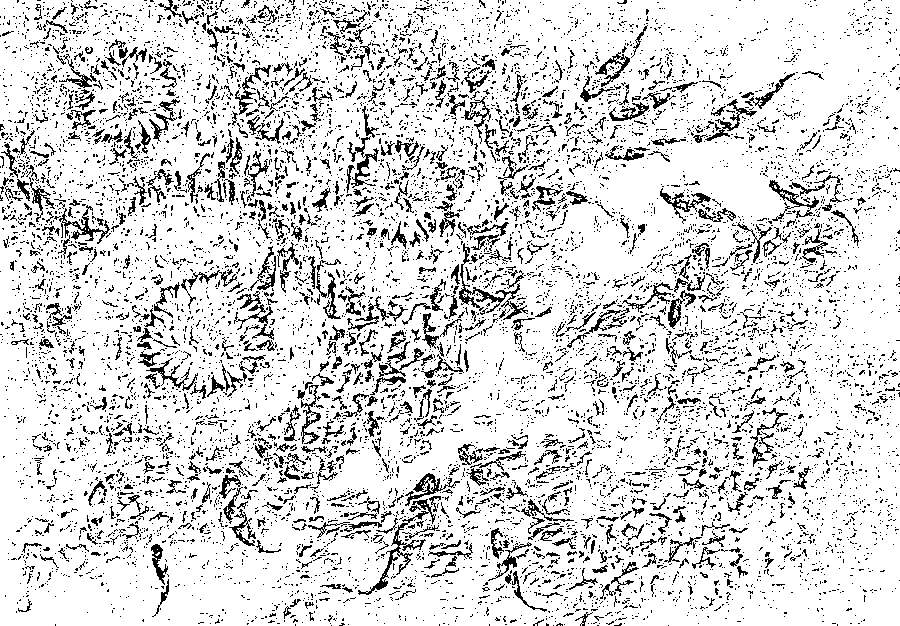

**死亡**

死亡，这是人类面向最深层次的恐惧，一种心灵底层的根本焦虑，是冥王星这位使者告知我们每个人不得不去面对的事实。

死本能是弗洛伊德非常重要的一个理论，这位上升天蝎且土星和月亮都坐落于 8 宫的伟大心理学家带着强烈的冥星王能量探索人性的死本能。

他认为，人类除有生的本能（包括自我本能和性本能）而外，还有与之相对立的死本能。它体现仇恨与破坏的力量，表现为求杀的欲望。当它向外表现时，就成为破坏、损害、侵犯的驱力，这时，它不会毁伤自我。但当向外侵犯受到挫折时，它又往往转向自我内部，成为一种自杀的倾向。

死本能不限于杀人和自杀，其活动范围广泛，包括自我惩罚、自我谴责、对手之间的嫉妒以及对权威的反抗等。死本能的概念很好的诠释了冥王星展现给我们的对立的面向，这些负面的能量似乎能让我们更容易的产生对冥王星推进和行进的恐惧，**我们往往在恐惧未来之前便已经被恐惧所控制，**却不知只有旧有的模式彻底瓦解，往昔的执念彻底放下，我们才可迎来新生。

**生本能与死本能相依而存**，我们在人生旅途中不断游走于二者之间，为的便是学会将这些能量转化与升华。

**冥王星在 12 宫位**

冥王星座落的宫位，是我们这一生**需要进行清理和转化的领域**，亦即是**需要彻底摧毁和重生的地方**，它会在其所在的宫位领域带来剧烈的能量，让个体必须直面，无法忽略。即使过程非常的痛苦，但转化过程中释放的能量却足够滋养我们，让我们更加完整。

**冥王星坐落于*****1*****宫**

1 宫是代表**自我**的宫位，也是我们**对外在世界展现自己**的方式，冥王星坐落于此处，你可能会有深刻的不安全感与危机意识，因此也具有对事物深层洞悉的天分，对于与外在的世界的互动有强烈的谨慎与自我怀疑倾向，拥有一套**自己深厚的“防御系统”**从而对自己形成周密的保护作用。我们对于外在世界的不信任往往源自于对自身的不信任与匮乏感，所以**信任是你必须学会的课题。**

**亲密关系，重要的合作伙伴与你公开的对手**，会是你非常重要的转化试炼场，但是你的敌人永远都是你自己而非外在的客体，当你想去改变他人，控制他人，亦或者是在思考如何去表达自己来获得基本的安全感时，你需要抓住这些当下给予你的念头，尝试与自己对话，问问自己，想控制的究竟是什么？

是否是希望对方以自己的方式来满足自己需要获得的爱？那么，你的方式方法是否有给你满足？还是你也发现了这个深坑是你永远无法通过你固有的方式填满的，抑或你是否怕袒露太多的自己反而被控制？

那么，你就需要想想，真正能给你力量的，不是拥有主动权与优势，而是**允许让自己脆弱，允许自己去害怕，**这样你已经拥有莫大的勇气能直面恐惧，去体察它，不加批判的观察，与这个感觉相处，慢慢你会发现，恐惧会转化成真正的力量。

**冥王星坐落于*2*宫**

2 宫掌管着我们的**价值观**，以及我们所拥有的**财富与物质**，冥王星坐落于此处，你可能对物质与金钱具有匮乏感和执着的倾向，你的安全感需要靠由充足的物质生活。此类案主也非常具有赚钱的办法，**深知财富的权力所能带来的是什么。**

让我们举一些例子，当你打开衣柜，是不是即使衣服再多，还是总觉得缺少一件? 是否银行卡里的数字越多你才能获得更多的安全感？房子是不是永远可以更大？你拥有的，似乎需要被你牢牢抓住才能感到安心。

可是你是否觉察到，不论你的价值观给你带来了多么强烈的赚钱的欲望与控制欲，那种满足感似乎是只能被这些物质去填补的，可是满足的却永远只有那么一瞬间，马上你又会有新的点子去继续寻找物质满足的途径去填补空白的内心。

下一次，哪怕是在你明明不饿不渴，却想买一杯奶茶的时候，问问自己，你真的需要它吗？它填补的是不是只是你当下内在的空虚感，那么你内在的这种空虚，是否是一种焦虑？让我们拉大你的人生时间线，数数这些年，你都用哪些物质在不断寻求填补这个感觉？是不是接下来，你可以用更多的时间去陪陪自己的这个感觉，**直面自己真实的需要，而不是用外在的这些客体去填补。**

**冥王星坐落于*3*宫**

3 宫掌管着我们的**思维，沟通，以及与邻里手足的关系，**冥王星坐落于此处，通常具有**心思缜密**的特征，也具有**强大的心智能力**，在生命早期可能会经历理解与误解的课题，从而使你对于自己的言语非常谨慎。但也因此，你更可能发展出杰出的学术能力及表达能力。

但是**自我怀疑**会是你需要面对的课题。信息对于你而言非常重要，也许在经历了很多误解后，你用自己强大的搜索信息的能力，学会了如何巧妙的言语。可是你是否花过一些时间去思考这些繁杂的信息是否真的带给你更深远的理念，形成不断完善的人生观？在你欲言又止，思考文字游戏的时候，你已经陷入了逻辑布的局，在这一点上，上文中关于遗忘的部分，会是你非常需要的养料。

**冥王星坐落于*4*宫**

4 宫是关乎我们**底层安全感**的宫位，我们最熟悉和放松的领域及方式，冥王星坐落于此，你可能较难彻底的放松与放下戒备，即使是在一个舒适安全的环境里。

寻找自己的舞台，并在这个舞台上自信的舞蹈，会让你更好走出内在的不安与恐惧，当你在不断寻找自己，实现自己的途中，内在的不安会定期的拜访，这便是你需要留心的时刻，这种深层的不安，其实是对自己的不信任。

你需要**与自我进行更深的层次的连接，体察情绪的起伏及缘由，**从而找到内心的祥和与宁静。这个过程并不容易，但是当你开始觉知自己，并为自己努力去争取的时候，你便已经踏上了自我疗愈之旅。

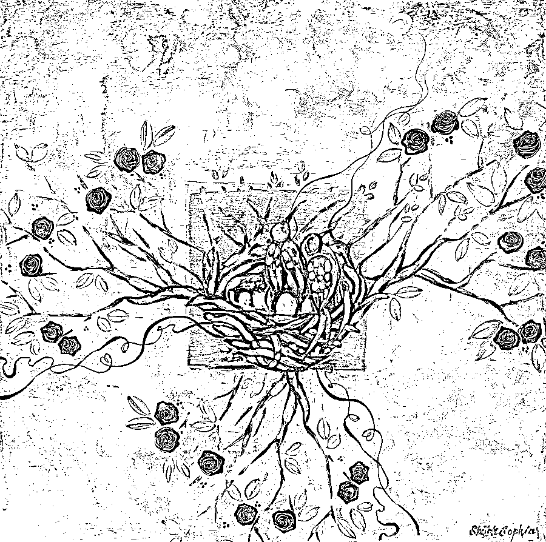

**冥王星坐落于*5*宫**

这与冥王星坐落于 1 宫有相似之处，案主会有**执着于外在认可**以及想要去证明自己的倾向，但同样会存在对自我的怀疑。发展对自我的认识，培养深层的自信，会让你展现出**非凡的创造力**。

用心去走入团体，去看看在团体里，你都会在与大家的互动的过程中有怎样的起心动念。是否你会在团体中过度在乎自己的感受？是否他人的评判与目光会对你有深刻的影响？你是选择他人眼里的自己去迎合，给自己戴上一些偶像包袱，还是对自己有非常稳定的认识？在团体中，你是否能看到其他人与你的不同并尊重那一份不同？

当你越发感受到**每一个人的独特性**，并看到我们是不可分割的一体，便会明白你是一个多么美好的个体。

**冥王星坐落于*6*宫**

6 宫掌管我们的**工作，健康。**冥王星坐落于 6 宫，会让案主有不由的，过度工作的倾向，你似乎更愿意亲历亲为，具有执着于奉献的强大驱力，但可能在工作中经历一些变动与突发的情况，也会有经历慢性疾病的可能。

是否你总喜欢包揽很多的工作却并没有获得想要的回馈？是否在工作中，家务中你会有一些包揽一切亲历亲为的冲动？学会区别什么是自己需要做的，什么是他人的责任，放过自己的身心。你很重要，奉献与服务需要建立在你非常尊重与爱护自己的前提之上。**只有你更爱惜自己，才能更好的服务这个世界。**

**冥王星坐落于*7*宫**

7 宫代表我们**一对一的关系**，以及**公开的敌人**，冥王星在此，会让案主较难建立深度的亲密关系，亦或者在一段关系里容易处于不对等的境地。也会不由得吸引来**一对一的“博弈”**。

你需要对自我产生更深的认识，从外界一对一的关系互动拉回到自己的内心。你是否会担心自己处于劣势失去了控制权？是不是很怕输了的感觉？没有关系，你所怕的，究竟只是一种感觉。可怕的不是你真的在关系里失去主动权，而是你回避或者没有意识到自己真正的恐惧，只要这个恐惧在，你会发现你总会吸引类似的课题让你不断去经历，直到你面对了真实自己。

了解到权力在关系中的利弊，从而在与自我和解的过程中，建立更加平等的关系。

**冥王星坐落于*8*宫**

冥王星在 8 宫的坐落，相当于再次强调了冥王星对于案主的课题，案主对于权力会拥有更深的渴望，也会在无意识间有想要掌控的欲望。他们需要对自己**深层的恐惧**有即刻的觉察，也要学会平等的对待他人。

当你下一次处于怀疑和不信任他人的处境时，尝试去观察你当下所经历的一切。冥王星在 8 宫的人，恐惧似乎会更多一些，你会给自己柔软脆弱的内心建立坚硬的保护壳子，认为权力会成为你最好的保护色。于是在这个过程里，你会被无形的欲望控制，从而远离了内心的祥和。学着不时的走进大自然吧，全然地观察一花一草去放空身心，光着脚与大地深刻的连结，你会发现，你被大地母亲牢牢的支撑着。

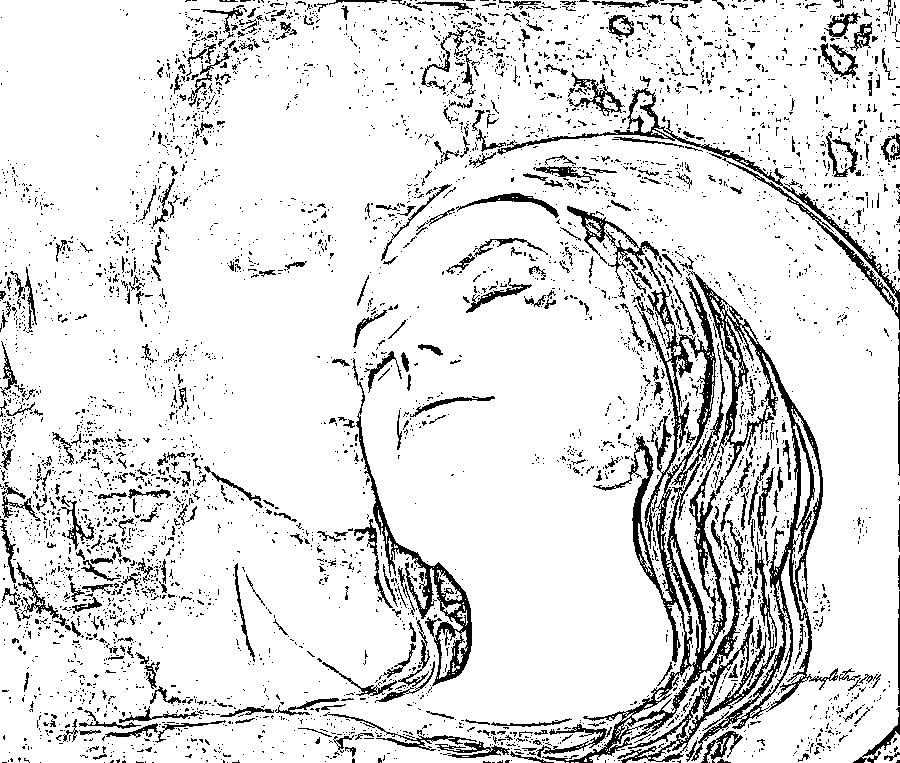

**冥王星坐落于*9*宫**

坐落于 9 宫的冥王星可能会带给案主**强烈的信念**，以及追求真理的渴望。他们具有可能是家族式的共同理念，并对这些理念十分坚持，这有可能会发展出负向的顽固倾向及强大的是非对错的判定。

当你坚持己见的时候，你有没有更深的思考过，你坚持的究竟是什么？我们每个人，都会认为自己看到的世界便是绝对的真理。我相信你一定拥有自己独到的智慧，但请尝试去用不同的方式表达自己吧，与他人互动的过程里，接受那些不同的观念，我们永远都能够在每一个人身上学习到很多，相信你会在更变通的资讯整合的方式里，达成你逐渐趋于完善的理念。

**冥王星坐落于*10*宫**

这个配置会让案主有在事业上成功的强大驱力，但也同样会让你在这个过程中经历波折与蜕变。你一方面可能对于权威有漠视和敌意，一方面会在转化对权威理解的过程中，找到权力的意义。

与此同时，家庭对于你会是非常重要的疗养院，这里不仅仅是指你的亲人，住所，你还需要看到自己更深的内在，看到那个**渴望成功**的内在小孩的恐惧，你是否忽略了这个恐惧很久，而通过地位的提升来使自己好受一些？

不，地位的提升不会真正的解决问题，你的强大完全靠由你的内心。请给予自己情绪上的滋养，直面那份恐惧。在追逐理想和自我实现的过程里，外在的权力与荣耀有时会蒙蔽你真实的内在需要，这个时候外在的冲突就会显现，这会提供给你一个非常好的与自己连结滋养的时机，尝试让自己的情感与情绪流动起来，这会对你进一步完成自己的梦想大有助益。

**冥王星坐落于*11*宫**

冥王星坐落于此，你可能会经历被社团或群里接纳及认可的课题，你非常渴望融入团体，并在团体中有所奉献。但也可能在另一个极端下封闭自己。

你很独特，你明白这个世界人人平等，但是你拥有独一无二的天赋，在你所在的社区环境中，你是否可以自信并自在的做一个愉快的人？你是否会顾及太多人的感受往往忽略了纳悦己身？你身心真实的快乐非常重要，当你在是否被认可和自己是否真实快乐中找到平衡点，你便转化了很多冥王星带给你的课题。

**冥王星坐落于*12*宫**

12 宫是所有宫位中最无边界的**潜意识领域**，冥王星坐落于此会让案主有一种被某种“力量”牵引和掌控的感受。也许在与他人互动的过程里，你经常会被激起莫名的情绪，你要学会体察和觉知自己的情绪与感受，学会甄别哪些情绪是自己的，哪些情绪来自于环境及他人。独处，观察这些情绪是你所需要的，你要知道，所有的情绪并不是真正的你，你所需要做的，就是去观察情绪的起伏变化。

与此同时，冥王星在 12 宫，会给你更具有**强烈直觉的天分**，也许这份直觉会带领你逐渐明白宇宙一体性的奥义，让你在一次次情绪的起伏里，得到对世界更深的认识与洞察，从而形成深具智慧的理念与信仰，服务于你眼中的世界，服务他人。

于此可见，**理解了自己的冥王星，就是在逐渐勾勒出我们内在恐惧的模样，而最直接与勇敢的方式，就是直面恐惧，承认它，接纳它。**我们都不完美，接纳这份不完美，是给自己最好的礼物。

文章的最后，附上鲁道夫·斯坦纳在 1910 年柏林演讲的诗篇：

我们务必要根除从灵魂中，所有来自于对于未来的恐惧和恐怖。对于未來的一切，我们一定要在我们的感受及感觉中获得宁静。我们应该对可能会发生的每一件事泰然处之；而且我们只需想的是，不论来到我们面前的是什么，都是透过了世界的全向，且是充满智慧的。这是我们必须在这个时代学习的一部分，也就是，在沒有任何安全感的生存之中，去活出纯粹的信任;只相信灵性世界永远存在的帮助。如果我们失去勇气的話，确实什么都不会有帮助。让我们训练我们的意志有纪律，让我们每天清晨和傍晚在我们自己的內在中寻求，这个觉醒。

**版权声明**：文章由作者授权首发于若道平台发布，欢迎转发，反对抄袭。

****

**星星下的梅维斯**

心理咨询师、心理占星师、古典瑜伽老师

**联系邮箱**：mavisxu316@163.com

长按打赏

**学习占星学，参加斯蒂芬线上工作坊**

**点击图片了解详情**

**微信又双叒叕改版啦，不想错过若道君的推送？**

**就把若道设为星标吧！**

**▼**

就是这个“在看”，戳戳戳 ☟

********报名直达入口********

# ISAR 星空俱乐部第 26 场沙龙丨量子占星，挑战你对现实的定义

> 原文：[`mp.weixin.qq.com/s?__biz=MzA5NjA0NTAxNg==&mid=2651425283&idx=2&sn=c9151b26560a9818968ab9fdba434ab9&chksm=8b4b38b4bc3cb1a20b0ab7cd701a000c471083927b67bdbafdceb83e723b77000a22d9f64db0&scene=126&sessionid=1692738116#rd`](http://mp.weixin.qq.com/s?__biz=MzA5NjA0NTAxNg==&mid=2651425283&idx=2&sn=c9151b26560a9818968ab9fdba434ab9&chksm=8b4b38b4bc3cb1a20b0ab7cd701a000c471083927b67bdbafdceb83e723b77000a22d9f64db0&scene=126&sessionid=1692738116#rd)

编辑/翀子 图片/ISAR

**8 月 29 号星期六早上 10 点**，国际占星研究协会（ISAR）中国星空俱乐部沙龙由占星界的传奇**瑞克·莱文**带来一场讲座！ 

沙龙主题**沙龙主题**：**量子占星——波粒二象性和命运不确定性****主讲人**：**瑞克·莱文**

**沙龙时间**：**2020 年 8 月 29 日 周六 **

**                  北京时间 10:00-11:30**

**沙龙方式**：****线上沙龙（中文翻译）****

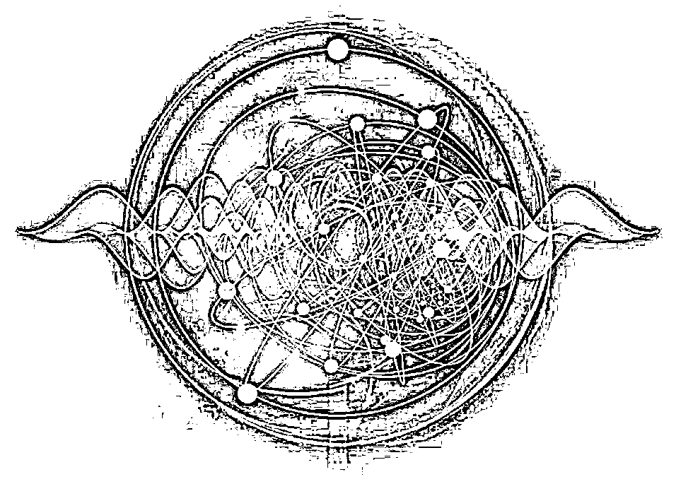

沙龙内容

正如瑞克在他的演讲一开始所说的，**“我们如何看待命运和自由意志，实际上决定了我们做什么以及运用占星学去向何方。”**在这个发人深省的演讲中，伴随有关**“意识和选择”**诱人的洞见，瑞克带你深入到命运和自由意志的谜题中。准备好挑战你对**“现实”**的定义，并以与你对占星学相关深入理解的方式来重新定义它。是的，这就是科学，它为占星学为何如此提供背景。

在这堂讲座之后，你的大脑将不再是原来的样子，你也会为此感到高兴。此外，你还可以用支持占星学理论和实践的观点来震撼你那些书呆子一样的科学朋友。

主讲嘉宾

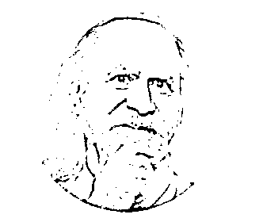

**瑞克·莱文**瑞克·莱文是一名职业占星师，专栏作家和演说家，住在华盛顿州西雅图郊区。他从 1976 年开始实践占星学，是全球占星界的传奇人物。他与前若道老师杰夫·焦耳共同创建 StarIQ.com 网站，同时也是开普勒学院的创始董事，经常在占星大会上讲课，讲授科学、占星学和我们的精神传统之间的重要关系。他为 Tarot.com 撰写每日星相专栏，内容发表在 MySpace.com、Beliefnet.com、AOL.com、iGoogle.com 等网站上。如何参加本次沙龙？

本讲座也是本月的国际占星研究协会（ISAR）星空俱乐部讲座。**ISAR 会员可以免费收看。**请注意邮件通知，具体参与方式见邮件。

❶ 如果你**已经是 ISAR 会员**，请注意邮件通知，告知如何参加。

❷ 如果你**不是 ISAR 会员**，非 ISAR 会员价格：98 元。如有任何问题请咨询工作人员 Maggie（ 微信：NodoorMaggie）

**非 ISAR 会员报名请长按下图**

**▼**

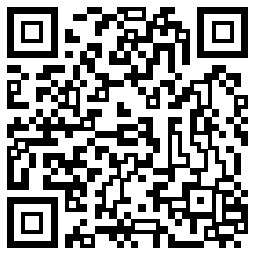

**关于 ISAR 的说明**

ISAR 是国际占星研究协会的缩写，ISAR 是世界上最大的占星组织，成员遍布世界 49 个国家，目前在中国约有 400 名成员。 ISAR 通过研究、会议，特别为会员提供的星空俱乐部讲座、在线档案（包含文章和录音）、专业期刊和线上周刊，来支持占星师们以及占星学的学生们。然而，ISAR 最重要的是它的认证程序得到了国际认可，通过它，ISAR 会员可以成为 ISAR CAP，CAP 代表着认证占星师，在国际占星界得到认可和重视的地位。 （说明：ISAR 会员并不是 ISAR 认证占星师，有人称自己为 ISAR 占星师或者 ISAR 职业占星师，他们只是提交会费加入 ISAR 组织成为 ISAR 会员） 在中国，目前有近 400 名 ISAR 会员，110 位 ISAR 认证占星师。关于 ISAR 的更多介绍，以及目前获得 ISAR 认证的占星师名单，**可以在后台回复“ISAR”获取**。这份名单包括了从 2012 年第一批 ISAR 考生到现在，中国所有的 ISAR 认证占星师。这些学生不仅通过了具有挑战性的专业考试，还完成了所有的教育要求、3 门选修课、咨询技能培训以及道德意识课程和测试。 ISAR 的认证项目需要投入时间认真学习。**这个项目不仅为成为一名专业占星师设定了很高的标准，而且还可以保护公众免受那些将“占星学”与算命结合起来，利用人们的恐惧和迷信之人的欺骗和滥用**。 ISAR 的认证项目目前由 ISAR 新的分支机构 CAP ISAR 管理。新的 CAP ISAR 网站将于 7 月 26 日启动上线，届时该网站将列出全世界 ISAR 认证占星师的照片、个人简历和联系方式。 在过去的 44 年里，作为一名专业占星师，大卫·瑞雷一直致力于帮助亚特兰大制定占星职业标准，曾作为 ISAR 在 2016-2020 年度的副主席，以及现在担任 CAP ISAR 的临时主席。我们希望公众知道，现代职业占星学不是旧时代的算命，而是一个有其道德和标准并被重新塑造的职业领域。顺便说一下，ISAR 是一个志愿者组织。对于董事会来说，这不是一个赚钱的企业。董事会成员都只是敬业的职业占星师，他们希望回馈占星界，支持职业标准的持续发展。 自然，当中国的 ISAR 占星师们看到其他人在没有证据或证明的情况下声称自己是 ISAR 认证占星师或所谓的占卜师时（根本没有 ISAR 认证占卜师或高级占卜师这一称谓），他们会感到担忧和不安。任何这样的虚假声明都在警示公众，不要相信那些作出这种声明的人。我为中国那些通过努力获得专业认证的 ISAR 认证占星师们感到骄傲。他们代表了中国新职业占星的先锋力量。——大卫·瑞雷 

**ISAR 星空俱乐部**

2019 年，ISAR 在主席亚历山大·因舍阿吉克的带领下，成立了 ISAR 明星俱乐部，每月为全球 ISAR 会员提供在线直播讲座，邀请全球著名占星师开讲，学习和分享新的理念。讲座时长一小时，涉及占星学的不同领域、不同观点，每个会员都可以参与其中，每次讲座之后还有 20-30 分钟问答时间向老师们提问。

每一场在线讲座都会记录下来，ISAR 除了提供视频，还会提供相关的讲座资料，以及单独的问答录音，自动发送到专门的 ISAR 明星俱乐部页面存档，每位 ISAR 会员可以在 ISAR 网站上自己的会员主页俱乐部页面找到。在 2018 年最初几个月，ISAR 明星俱乐部会每月举办一场在线演讲。之后，两周举办一场演讲，最终每周举办一场演讲。

但是，过去明星俱乐部讲座只有英文沙龙，因此，中国会员只有懂英文才能受益。为了使得更多不懂英文的中国会员能够受益，我们特别和 ISAR 总部协商，今后会安排有中文翻译的明星俱乐部占星沙龙，作为给中国 ISAR 会员的福利！

如何成为 ISAR 会员？

**如果你也想成为 ISAR 会员，请复制链接在浏览器打开**

http://www.nodoor.com/isarcert.do?contentId=3588（仅支持网站支付）

**或直接长按下方二维码，微信购买会员：**

ISAR 会员有什么福利？

一年期会员仅需支付**人民币****420****元**，即可享受：

**☆ 星空俱乐部免费沙龙**

**☆每年出版 3 次的《国际占星师》（目前只有英文）；**

**☆每周电子邮件交流汇总杂志（目前只有英文）；**

**☆专项研究基金和奖学金资格；**

**☆ISAR 主办的会议和论坛的会员折扣，包括国际占星大会（UAC）、ISAR 的会议和研讨会等会员权益。** 

有疑问怎么办？

关于 ISAR 星空会员俱乐部以及我们的讲座，如果你还有任何疑问，**请联系处女座工作人员**：

**仲老师  **

**电话：18513802156**

**微信：YY18513802156**

**若道 Conrad**

**微信：nodoor2016**

****非 ISAR 会员报名请点击“阅读原文”****

# 七夕节丨细思极恐，牛郎织女的浪漫故事隐藏了哪些不为人知的细节？

> 原文：[`mp.weixin.qq.com/s?__biz=MzA5NjA0NTAxNg==&mid=2651425239&idx=1&sn=eee854be02b3ac0a4d5bf8e5c2380406&chksm=8b4b3b60bc3cb276adca935a805c382c203d83901a08681bce8a79202dd7ba441a26dc59b0a9&scene=126&sessionid=1692738116#rd`](http://mp.weixin.qq.com/s?__biz=MzA5NjA0NTAxNg==&mid=2651425239&idx=1&sn=eee854be02b3ac0a4d5bf8e5c2380406&chksm=8b4b3b60bc3cb276adca935a805c382c203d83901a08681bce8a79202dd7ba441a26dc59b0a9&scene=126&sessionid=1692738116#rd)

**☆ 后台回复“今日”，给你一句生命态度**

作者/蒋颖 若道创始人 编辑/翀子 封面/书君 图片/网络

今天是七夕，牛郎织女鹊桥相会的故事成为中国情人节的原型。纵观世界各地的“天鹅处女型”神话，它们都有哪些相似之处？而这些情节又折射出怎样的现实生活？我们是否忽略了这些故事想要传达的重要信息？在这个特别的日子，让我们从一个截然不同的角度进入故事的原型中去吧。

**全球的“鸟妻”神话**

七月七日又到了七夕节。

这个节日大部分发生在狮子月（太阳在狮子座的月份），少部分的情况发生处女座月。今年的七夕在处女月。

所有的节日都有**庆祝的味道（狮子座）**，也都因为**仪式（处女座）**而承载意义。七夕节也不例外。即便在中国传统节日——春节、元宵、清明、端午、中秋里，七夕也有特别之处，因为它跟大家熟知的神话传说故事紧密相关，这个神话故事就是牛郎织女的故事。

这个大部分中国人都熟知的神话，其实不仅仅在汉民族流传，在泰族、藏族、蒙族、彝族、壮族、纳西族等 33 个民族中都有**相似的民间传说**，虽然故事的具体人物和细节有所变化。比如，生于 70 年代的朋友可能看过电影《孔雀公主》，这个根据泰文长诗《召树屯》的民间传说改编的电影虽然故事情节与牛郎织女看起来很不同，但是其原型是一致的，都是“鸟妻”故事的变型，只不过男主人公从贫穷的牛郎换成了王子。

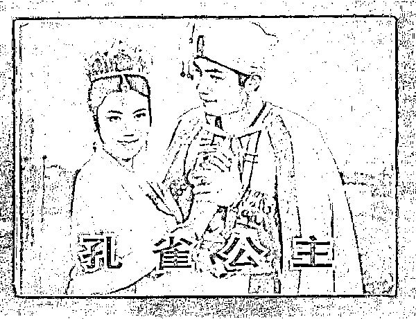

**| **1982 年《孔雀公主》，主演唐国强、李秀明、陈强

如果进一步阅读，会发现**这个原型故事深入地球五大洲**，具有**“全球化”**色彩。

比如在**爱尔兰**的凯尔特人中流传故事就有“兰诺赫一个农夫的儿子看见三个天鹅姑娘在水里洗澡，他把她们的衣服藏起来，作为交换，她们中最小的一个嫁给了他”。

**俄罗斯**民间故事《漫游者》也是类似：“米卡伊洛·伊万诺维奇去打猎，瞄准一只白天鹅，白天鹅请求不要伤害它的生命。然后，天鹅变成了一个可爱的少女玛雅公主，米卡伊洛爱上了她”。我们熟知的芭蕾舞剧《天鹅湖》就是这个故事的变体。

 还有**德国**民间故事《三只天鹅》，“一个鳏夫猎人在森林老人的指引下，偷了天鹅少女的魔法衣服，并与她结婚。十五年过去了，他的妻子找到了她的天鹅法衣，飞走了。猎人尾随其后，来到一座城堡，他的妻子和她的姐妹就住在那里。他被告知，他必须在城堡里经历三个晚上的艰苦考验，才能打破诅咒。”

由于相似的原型主题，这一类故事后来就被研究民俗学、人类学、神话学的西方学者统一归为**“天鹅处女型”**故事，虽然在东方的神话中，仙女有时是仙鹤（比如日本的《鹤妻》）、孔雀，在西方的神话中，仙女有时是海豹。不管怎么说，**我们的七夕神话是在这个类型中。**

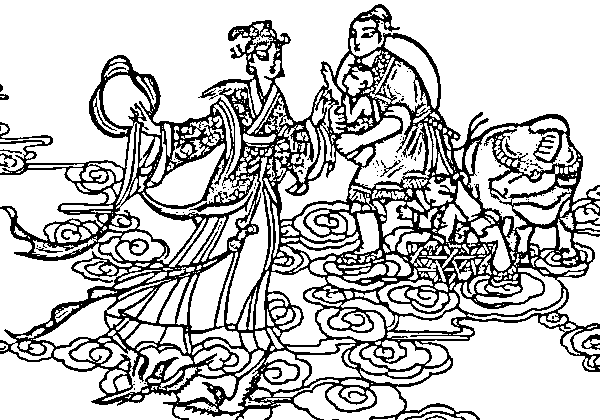

**神话故事的要素**

**民间传说和神话，就像我们每天所看的星图一样，是集体意识和潜意识的体现。**如果我们仅仅从爱情婚姻的角度去细细考察这类鸟妻的神话，会发现这个故事体现了爱情婚姻中一些非常令人深思的元素。

**首先，爱情的主人公是谁？**

在大部分鸟妻神话中，爱情的男女主人公如下：

*   身为凡人的男子，通常有着贫穷且受人欺负的背景，可能是猎人、农夫、樵夫，也可能是孤儿。

*   身为仙女的妻子，通常有着显赫的背景，常常是公主的身份。

也就是说，在这个爱情故事中，我们男、女主人公之间，有着巨大的种族差异（鸟类和人类）、家庭背景差异、童年环境差异、教育背景差异（宫廷教育和普通人的教育差异肯定是不同的，在一个红二代的回忆中，说起他所认识的大部分红二代的婚姻都是门当户对的，因为这是政治生活的需要，普通人家庭很难理解政治的复杂性和危险性，而这却是他们从小耳闻目睹的教育）。

世界上克服了巨大差异而走在一起的美满爱情故事当然也不少，而且也常常让人敬仰、赞叹；但是**富有经验的父母、占星师、心理咨询师会对一开始就有巨大差异的爱情提高警惕。**热恋中的人会忽视这种差异，但在漫长的相处过程中，其张力可能逐渐显现。

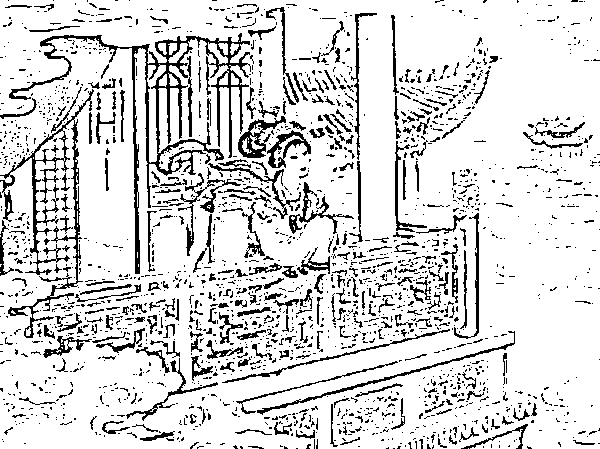

**| **仙界的织女

**第二，爱情是怎么开始的**

大部分的鸟妻神话中，爱情的开始是从凡人男子的偷窥和偷衣服开始，因此，从女性角度而言，这段爱情故事的开头具有胁迫性质。不过，因为民间传说的叙事开头从男主人公的童年写起，我们通常看到的是一个善良、勤劳、富有爱心的孤儿，受尽兄嫂的欺凌，这样的童年背景和性格特征使得大部分读者对男主人公一开始就心生好感和同情，更何况有时穿插着男主人公和好基友（比如那头老黄牛）的相依为命的动人故事。

一个温柔善良的男人，到了渴望性的年龄，想要娶到一个勤劳善良貌美的妻子，怎么忍心不帮助他实现呢？哪怕使出的是偷走仙女法衣的胁迫手段，也是可以理解和忽视的（在现代社会中，所有新闻故事看起来可能是客观报道，但其实记者手下的一支笔和镜头的选择都有改变舆论情感和态度的能力）。

因此，**不同于西方神话中冥王哈迪斯使用暴力对波赛凤的诱拐那种戏剧性的惨烈开头，**虽然同样是胁迫，**《牛郎织女》类型故事中温柔的胁迫在后世歌咏的旷世爱情中被淡化到看不见。**大奸大恶如黑山白雪，虽昭然若揭，毕竟稀少；善良人的小心思、小手段则通常是草蛇灰线，隐藏在命运的漩涡中，只能当事人深夜回首一生，眉间心头欲言又止，而看戏的外人则根据各自的心事，叹自己命运，看他人热闹。

刚才是从男性角度来说。从女性的角度来说，不管后来的爱情在不同的神话版本里如何演绎，这个改变命运的爱情的开始对于女性而言其实是相当出乎所料、让人震惊、且含着害怕、无奈。

本来不谙世事的仙女姑娘只是偶尔到湖水里和姐妹们嬉戏游泳，怎么料想，命运的道路就此改变。可以让自己回到天庭的羽衣被未来丈夫藏了起来，失去了羽衣的仙女也就是一个貌美的普通人。男人虽然是有绑架胁迫行为，但看起来温柔、善良、健壮、英俊。现实中天真少女在湖水中赤身裸体，陌生男子对面站着，且提出进一步加深关系的意图，要你，会怎么办？

姑娘在凡间举目无亲，站在一汪湖水中，如此情景下，女大当婚，嫁了就嫁了。**也许海王星的男人开始了冥王星的行进，而姑娘星图中的冥王星元素则被天王星触发。**

所有的未来都有一个开始，所有的开始也有一个未来。**在爱情故事中，开始埋下的种子，不论多么小，在未来必然发芽、开花、结果。**对织女来说是突然的分离、胁迫，虽然其后也有爱情；对牛郎来说，则是突然的好运，虽然他“不知道命运赠送的礼物，给每一个都标好了价钱”。

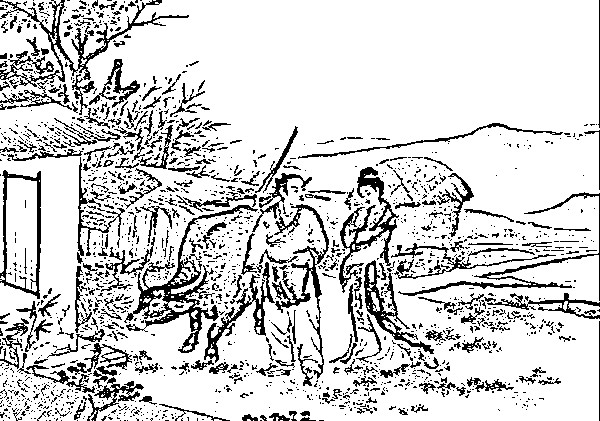

**| **牛郎织女的婚姻生活

**第三，父母家庭对这段爱情怎么看？**

一个婚姻是两个家庭的结合，这段话只有经过家庭生活和内在探索的人，才可能深深意识到。**对于了解占星学的人，则可以从父母几代人的星图中看到，一个婚姻是家族挑战、梦想延续的场所。某个相位，某个星座可能延续几代人。**

在中国婚礼中，过去要拜双方的父母；在西方婚礼中，也是由女方的长辈将女子交给男子，完成这个仪式。这样的婚姻经过两方父母的许可，也灌以两方父母的祝福。

从 20 世纪初，深受几千年来父母之命、媒妁之言之苦的中国人不再看重父母的许可和祝福，挺身反抗父母意志一时成为流行，因此形成了很多佳话，也形成了五四、左联及解放后许多流传广泛的作品。而到了现代，追求个人独立和个人意志的达成则更为稀松平常。

不过，**通常，大部分处于爱情婚姻中的年轻人不知道自己抗争的只是表象，家族潜意识里的动力究竟是什么，**多数人并无所知。而这个暗流的强大，更是可能只有年过半百回头时，才能依稀看到。

**在天鹅处女型的故事中，男女方家庭对这段婚姻有不同的态度。**女方家庭不仅斩钉截铁反对婚姻，而且有摧毁这段婚姻的决心、资源及能力，如织女的母亲，开始是被瞒住不知，知道后不惜立刻用暴力抓回女儿。

男方家庭，则有不同的版本。在有的版本，比如牛郎织女版本中，牛郎是孤儿，无父无母；有的版本比如《搜神记》的《田章》中，男方的母亲是帮忙藏了羽衣的人；有的版本，比如孔雀公主的版本，男方的父亲对于女方的身份非常狐疑，害怕女方是妖怪，要烧死女方。

不管是哪种演绎，**男女双方家庭对于这段姻缘从开头的态度都包含了害怕和愤怒。**婆婆之所以藏起羽衣，无非是知道这段婚姻始于胁迫；父母不论是要抓回女儿，还是烧死媳妇，无非是看到男女之间背景的不同，害怕这样的姻缘给儿女及家庭带来不良影响。

如果这两位主人公有星图，我们必然会看到日月金火和外行星的挑战相位，也可能看到一些行星的越界。**看上去反抗是父母，其实要面对的是比父母更为强大的原型能量的需求，而这个能量也是自身的一部分。**

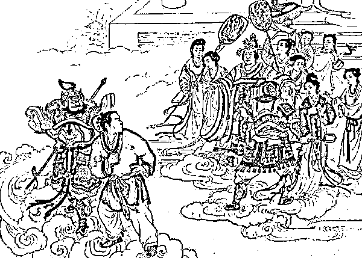 **| **织女的母亲要抓回女儿

**第四，两人的婚姻到底怎么样？**

在一些神话传说中，两个人婚后相亲相爱，并且生儿育女，虽然这样的幸福非常短暂，比如牛郎织女的故事。

在有的神话传说中，女方变成了贪婪的男方致富的牺牲品，比如日本神话传说《鹤妻》的故事。

而另外一些故事文本，则对此语焉不详，只是我们可以从后面女子离去的故事中有所猜测。

神话之所以是神话的原因，就是可以对平凡生活不去描述，而只描述人生的一个又一个转折点。**就好像我们在占星中，平常没有重大行进的日子，小小的不伤筋动骨的喜怒哀乐，就像流水一样逝去，只等待神话的鼓点——重大土、天、海、冥的钟声敲响我们出生星盘中埋藏的乐章。**

而我们读到的那些跌宕起伏的名人爱情故事，都是把爱情过成了神话并被现代说书人记录；而普通人的神话，则在小小的日记本中，闺蜜的私语中，占星咨询室中才能听到。

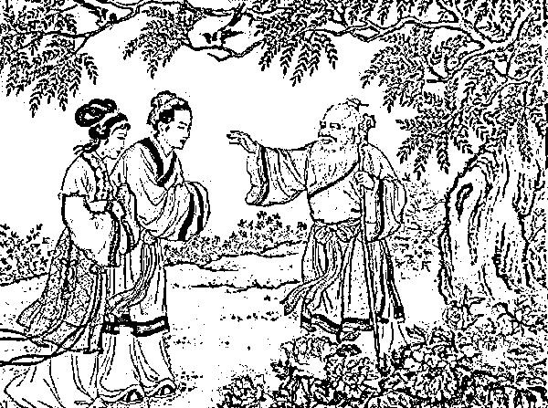

**|** 情投意合的牛郎织女

**第五，两人为什么分开？如何分开的？**

两人的分开虽然各个版本神话有不同描述，但基本是两个类型：

*   外力使之分开

*   女子找到羽衣，自己离开

牛郎织女的故事大家都很熟悉，就不再详述。这里给大家讲一下我国最早的两个牛郎织女故事文本，从不同角度看到这个故事的结局。一个故事文本见于晋朝干宝的《搜神记》。这是一则很短的故事：“豫章新喻县男子，见田中有六七女，皆衣毛衣，不知是鸟，匍匐往，得其一女所解毛衣，取藏之，即往就诸鸟。诸鸟各飞去，一鸟独不得去。男子取以为妇，生三女。其母后使女问父，知衣在积稻下，得之，衣飞去，去后复以迎三女，女亦得飞去。”

而南北朝时期南朝的东阳无疑氏在《齐谐记》中，则对两人为什么分开给出了另外一个版本，“天河之东有织女，天帝之女也。年年机杼劳役，织成云锦天衣，容貌不暇整。天帝怜其独处，许嫁河西牵牛郎，嫁后遂废织衽。天帝怒，责令归河东，许一年一度相会。“

所以，简单地说，一个是恨女不成钢的父亲，愤怒女儿嫁人后就不再上进，干脆用简单粗暴的办法结束了这段短暂的姻缘、逼迫女儿再次回归职场；一个是女子即便为男子生儿育女，也仍然不忘自己的羽衣，一旦得到羽衣，立刻义无反顾地丢下丈夫、孩子，回到天庭，虽然后来又接自己的孩子团聚。

我个人觉得这两个版本都比较有趣。有趣之处在于，在这两个版本中，**织女的形象都不再只是贤良淑德这种形象，而是变得别具一格，也更有现代性。**在《齐谐记》中的织女，是一个婚后沉溺于儿女情长的女子，而她的父亲天帝，则是一个恨女不成钢的父亲。在《搜神记》中的毛衣女，则强韧、刚烈、决绝，被“抓”那么多年也不忘其“志”，终究主动逃出，获得自由。

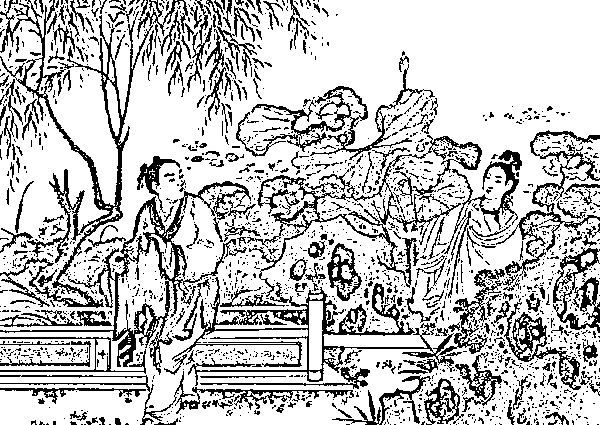

**| **牛郎藏起织女的羽衣

**第六，女子离去后，孩子丈夫怎么办？**

有的故事，如我们的牛郎织女故事，到女子离去，两人最终于银河两岸结束，有的则更进一步，把故事往另外一个方向延伸，而这个方向也是我们常常在希腊神话中看到的方向，男子需要历尽千辛万苦，解决 N 个难题，才能和妻子团聚，比如我们在一开始提到的德国民间故事《三只天鹅》中就是这样。

这个故事的意义在于，爱情和婚姻的经营不是“结婚后，他们快乐地生活在一起”这样的童话故事，**是要经历磨难和挑战去获得幸福的，尤其对于一开始就埋有挑战和隐患的爱情故事。**

而有的传说，就如我们现在的玄幻剧，开启了**仙二代的故事**——孩子寻母、历经千难万险，成为英雄的新篇章。这个故事，**就是把星图中父母未能解决的难题留给了孩子的星图，由孩子去解决。**

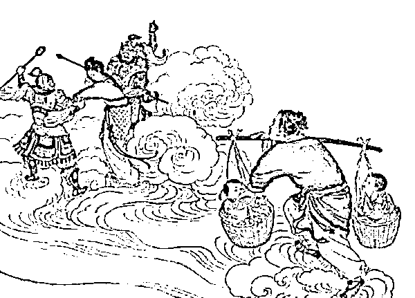

****| ****织女离去

**个人生活中的童话故事**

我们的人生中有类似的神话故事吗? 我相信是有的，即便是如你我这样的平凡人，我们也有 10 大行星高挂在我们的星图中闪闪发光。

正如在开头所讲，**神话故事的原型是简单的，而故事的变形可以多种多样。**我们在每日的热点新闻、名人的传奇和八卦中常常能够看到它，只要是有心人就能识别它。神话时时刻刻在现代社会上演。比如这两年红遍中国的李子柒，如果去细读她的故事，无疑是现代中国的一个神话。她的故事具备神话及其审美的要素，比如：

*   童年不幸，父母离异，父亲早逝

*   有一个关系不好的后母

*   被迫与祖父母相依为命

*   勤劳、美丽、坚韧、心灵手巧

*   创造出田园诗意的生活

这是一个没有牛郎的现代织女的故事，或者说是没有男主的现代田螺姑娘的故事。

除了这类众人皆知的故事，我在下面讲一个普通人的神话故事。

这个人是我的一个同学，有一天，我们两个聊起即将到来的七夕节，还有我得为这个写篇文章。我正在头疼，不知道从哪个角度写，因为似乎该写的也都写了。她笑着说，“你知道吗，我们两个聊天的时候，我才意识到我是牛郎织女的后代 。“ 

我很好奇，问，”你怎么个仙二代法？” 

她说：“我母亲的家庭原来是清朝翰林家庭，她从小多才多艺，是我外公最喜欢的孩子。在文革中，因为家庭出身不好，上山下乡到了农村，嫁给了我的父亲。我父亲是三代贫农，不过人很善良，且上进，后来几经辗转，也做了官。

我母亲要嫁给我的父亲时，我外公非常反对，但母亲执意要嫁，她那时的确爱我的父亲。我父亲年轻时非常英俊，而且很勤奋。外公那时自身难保，虽反对，也无济于事。我母亲因为嫁给父亲，又生养了小孩，就不像其他的孩子文革后继续读大学，当然外公非常失望。

后来，不知道是出于家人的内疚，还是她没有准备好抚养小孩，她生了我之后，就把我送给了我的外公。我成了外公晚年的慰藉。而我母亲到了中年，她与我父亲之间因为各种原因，产生了很多矛盾，她与娘家的亲人也越来越近，后来就和我的父亲离婚了。你说这像不像牛郎织女不顾家庭反对相爱，但织女最终还是回到了天庭？”

我点头称是。**很多那时的知青可不就是牛郎织女的故事吗？**

“那我呢，我从小在外公家长大，很少见到母亲，也很少见到父亲。虽然受到外公家人喜爱，但是又一直感觉自己是个外人。不知道是不是这个原因，后来我自己的爱情都不顺利。每次的爱情就像一场事故，无端而来，无端而终。”

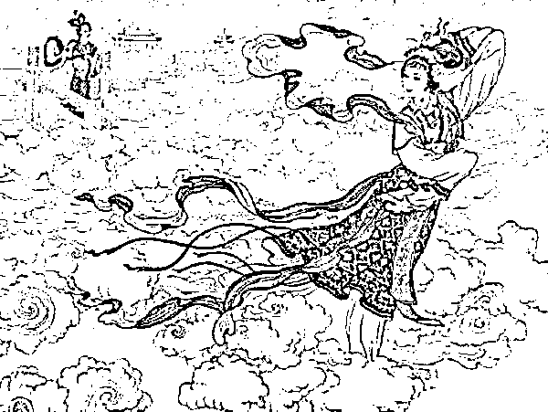

**| **织女的仙界生活

我知道她的爱情故事，看到金星和天王星及海王星的相位，我也看过她母亲星图中金星和天王星及冥王星的相位，知道一个无母无父的童年给她后来的爱情和婚姻带来的痛苦。

我正想找到一些话来安慰我这个朋友，突然又听她说，“你知道，你跟我聊织女的故事，我想她在婚姻中一直是被动的，刚开始，她被藏了衣服，不得不嫁；后来相爱，又被迫分离，她贤良淑德，但却是那个最无力的人，而唯一她能掌握的……,此时她的声音低下去，我听见哽咽声，“唯一她能掌握的，就是她的织锦，你知道那织锦有多么美”。说到这里，我再听到的就是她的抽泣声。

我只能说，这个故事，我起了个头，并没有料到这个结尾，我本来以为她要叹息的是爱情中命运的多舛，或者叹息小孩子从小没有母亲，没想到她叹息的是织女的织锦。我知道她很要强，可能因为外公把失去女儿的希望寄托她身上，她学了工科，在自己的工程领域做得风生水起。

但我也知道，她一直不喜欢自己做的事情。她曾告诉我幼年时就喜欢美术，后来那个崇尚数理化的时代，她也硬生生地断掉了。可是，她一直有个画家的梦想，也一直在涂涂抹抹。“ 我没有想到在这个神话故事中，最打动她的是仙女的织锦。我也非常吃惊地通过这个神话故事看到，她最深的爱在什么地方。

从我这个好朋友的故事，让我再回到天鹅处女型故事的原型上来。在这个故事中，羽衣是一个非常重要的故事要素。**鸟妻失去自己的羽衣，和再次取回羽衣无疑是故事的高潮。**

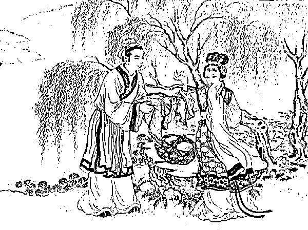

**| **牛郎把羽衣还给织女

在七夕节中，姑娘们不仅祈祷爱情的降临和爱情的美好，姑娘们也在祈祷，祈祷自己能够有一双灵巧的双手，这样可以为自己编织一个美好的未来。我祈祷千百年来，因为各种原因而被藏起、被销毁的羽衣，都在某个山洞中，或白如银瀑，或灿若朝霞。这是一个具有法术的仙衣，姑娘们穿上它，就能自由飞翔，不再被任何力量所囚禁、所胁迫。

**我们的生活本来就是一出神话，**只要你能认出它来，从你祖辈的故事，你的故事，你的梦境，你喜欢的电影、电视中，你都可以看到它。而**你与这些神话中哪些情节最心有戚戚？你又打算如何去编写还在继续的你的个人的神话？**

Steven Forrest 和 David Railey 老师都是现代神话的讲述者，他们讲述的方式是我们过去世的故事。如果你不知道你的个人神话，欢迎你到 Steven 和大卫老师 10 月的工作坊来（详情请点击[【亲密关系工作坊】](http://mp.weixin.qq.com/s?__biz=MzA5NjA0NTAxNg==&mid=2651425190&idx=3&sn=2db805f9cb87d29dc61fd5a3aa5addcd&chksm=8b4b3b11bc3cb2073861c560d59ef6beed77afcab93c9750ac13aeedb4f120ce32ac4c78292b&scene=21#wechat_redirect)和[【行进、推进和太阳弧技法】](http://mp.weixin.qq.com/s?__biz=MzA5NjA0NTAxNg==&mid=2651425190&idx=4&sn=9f31a2d46ff872ee89bad1d1b35b751c&chksm=8b4b3b11bc3cb2074c6791b46e755ffce09538d00f7297bbca83d387691c9311d25448c4a188&scene=21#wechat_redirect)），你既可以听到和爱情相关的神话故事，也可以看到命运的鼓点何时敲响，如何演奏。

**版权声明：**原创文章由作者授权发布于若道平台，欢迎转发，反对抄袭。

****想阅读更多作者的文章，请在后台回复******** 蒋颖**** 即可。****

**蒋颖**

若道创始人，中国首批 ISAR 英文认证占星师（2012 届）

长江商学院 MBA，厦门大学经济学硕士，化学学士

国际占星研究协会（ISAR）中国区副主席

《灵魂的目标》译者

**想拥有亲密关系的专属爱情报告吗？**

**可扫描下图二维码购买**

**获得根据你们的星图**

**量身分析的爱情互动关系报告**

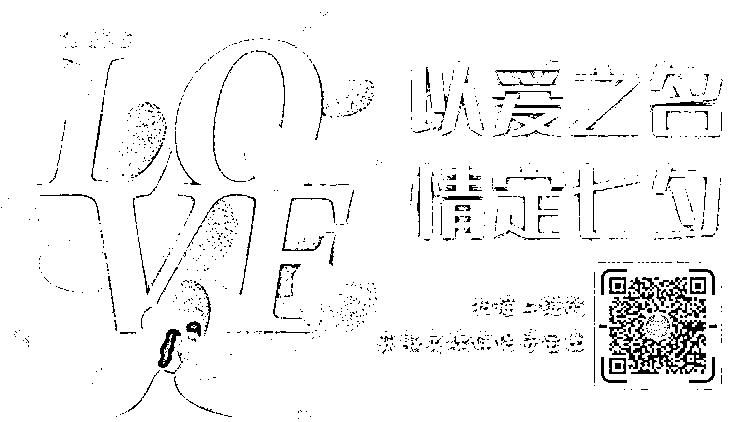

**微信又双叒叕改版啦，不想错过若道君的推送？**

**就把若道设为星标吧！**

**▼**

喜欢记得点一下在看哦☟

**购买报告直达入口**

# 想知道谁是你的另一半？请拿走这份“灵魂伴侣寻宝图”

> 原文：[`mp.weixin.qq.com/s?__biz=MzA5NjA0NTAxNg==&mid=2651425239&idx=2&sn=d9a826f032caa0d50d194c2b5e053f05&chksm=8b4b3b60bc3cb276117db7ffb2ff81905d29480524c2e563ea4f508acd1c61ea6571a11011e5&scene=126&sessionid=1692738116#rd`](http://mp.weixin.qq.com/s?__biz=MzA5NjA0NTAxNg==&mid=2651425239&idx=2&sn=d9a826f032caa0d50d194c2b5e053f05&chksm=8b4b3b60bc3cb276117db7ffb2ff81905d29480524c2e563ea4f508acd1c61ea6571a11011e5&scene=126&sessionid=1692738116#rd)

**七夕，又名为乞巧节。**

**相传，每逢农历七月初七，**

**人间的喜鹊就要飞上天去，**

**在银河为牛郎织女搭鹊桥相会。**

**七夕夜深人静之时，**

**人们还能在葡萄架或其他的瓜果架下，**

**听到牛郎织女在天上的脉脉情话。**

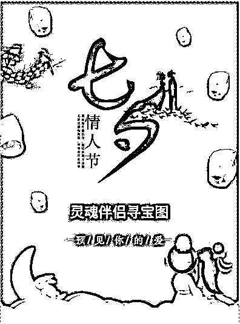

**在这个特殊的日子，**

**若道君又双叒叕来送大礼了，**

**“****灵魂伴侣寻宝图****”**

**助你找到更适合的 TA**

1

**灵魂伴侣寻宝图适用对象**

**如果你有伴侣**

**灵魂伴侣寻宝图能让你通过星图更好地****了解自己****，****了解伴侣****。**

**如果你是单身**

**灵魂伴侣寻宝图能让你通过星图了解自己****适合寻找什么样的灵魂伴侣****。**

2

## **灵魂伴侣寻宝图怎么玩？**

**①** 点击文末“**阅读原文**”或**扫描下图二维码**进入活动主页，开启灵魂伴侣探寻之旅

*   **活动页面二维码**

**长按下图扫描二维码**

▼

*   **活动首页**

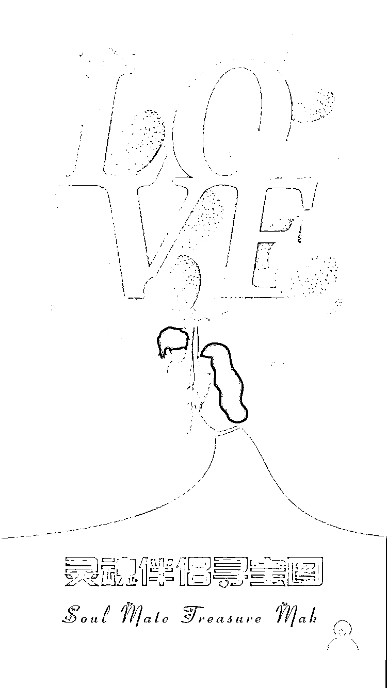

**②** 选择你当前的**情感状态**

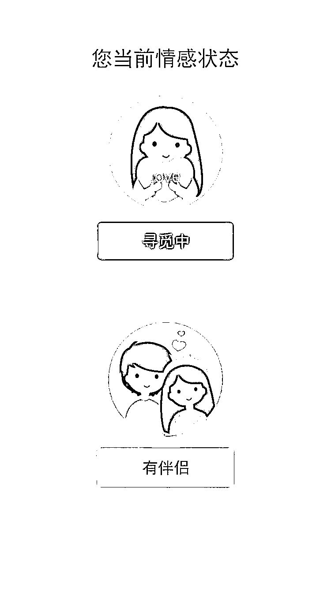

**③** 选择你的**性别**

**④** 选择你想了解的**伴侣信息**

**⑤** 输入自己或伴侣的**出生信息**

**⑥** 支付完成后，**获取报告内容**

**⑦** 报告内容**二次查看**：进入活动首页，点击右下角进入报告查看页面

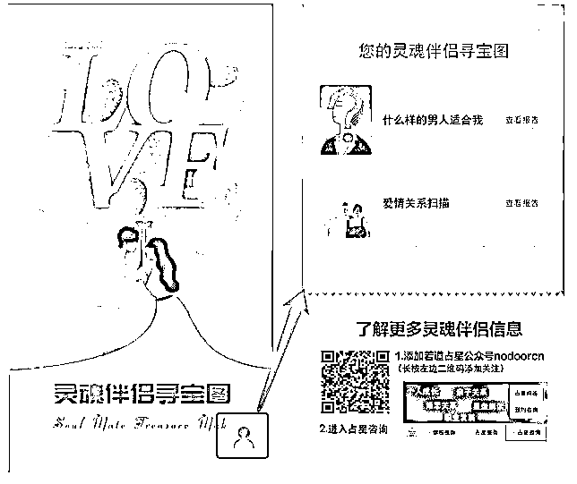

********点击“阅读原文”，开启灵魂伴侣探寻之旅********

# 若你只想要会结婚的爱情，请找太阳、月亮、上升落在这个星座的爱人

> 原文：[`mp.weixin.qq.com/s?__biz=MzA5NjA0NTAxNg==&mid=2651425190&idx=1&sn=4bf77c3cb4cdf7eef017f516e814373c&chksm=8b4b3b11bc3cb20768ae89cad4c14bec3499f8c5679d3dfc12dcd5f9e5e6ba842185974a81b1&scene=126&sessionid=1692738116#rd`](http://mp.weixin.qq.com/s?__biz=MzA5NjA0NTAxNg==&mid=2651425190&idx=1&sn=4bf77c3cb4cdf7eef017f516e814373c&chksm=8b4b3b11bc3cb20768ae89cad4c14bec3499f8c5679d3dfc12dcd5f9e5e6ba842185974a81b1&scene=126&sessionid=1692738116#rd)

**********☆****************后台回复“今日”，给你一句生命态度**********

作者/斯蒂芬·弗里斯特 朱迪·弗里斯特 
译者/李含 编辑/玫瑰 图片来源/全景网本文摘自《天空的伴侣 I：爱、性和进化占星学》

如果你和摩羯座谈恋爱，你会收获一份承诺。但是，这份承诺往往却是沮丧的开始……斯蒂芬老爷子居然这样“diss”摩羯座？！来看看！  

**摩羯座****原型**  

**隐士和独居修道士** **父亲**

**首相 权威 战略家 长者**

发展目标众所周知，要保持心理的健康，我们必须关注自身的感受。但如果仅仅是简单的关注，而不去试图保持平衡呢？想象一下蓄意伤害的罪行：旷工旷课、闯红灯、儿童流行病、杀人犯。

摩羯座反映的是这枚硬币的另一面。**并不是忽略感受，而是更加关注和发展情感的平衡：正直、坚忍、爱惜名誉、个人荣誉、坚持不懈、延迟快乐到来的能力、抵御诱惑的能力。**任何被摩羯座能量影响的行星，都会踏上一段进化的旅程，**不断地努力去追求卓越。**就像爱尔兰诗人叶芝（William Butler Yeats）的诗句：

**“崎岖艰险的山，让攀登者痴迷。”**玄学里认为，摩羯座人的前世**尝尽了失败之苦**。**这种延续并未升华，他们的灵魂依旧感到羞愧和内疚。**这一世，他们决定**坚守钢铁般的意志力，不论付出多少代价，誓要取得成功。**策略和资源

**为了成长，摩羯座人要付出艰辛的努力，某些努力的方式让摩羯座人限制了自身的潜能。**他们必须**抗争并且坚持，内在外在都必须与魔鬼做殊死搏斗。**简单的占星学观点总是将摩羯座贴上野心的标签。的确，摩羯座人努力工作，追求职业上的成就，但这不是唯一的可能。摩羯座人可能只驾一艘小船就横渡大洋，或者可能健康愉快地在居民区享受家庭生活，并成为作家。他们也可能在内陆的蒙大拿州安家，精通一门乐器。

**摩羯座的中心思想是循着他们的目标前行，而不是跟着感觉走，特别是环境中还充斥着恐惧、屈服和挫败。**

**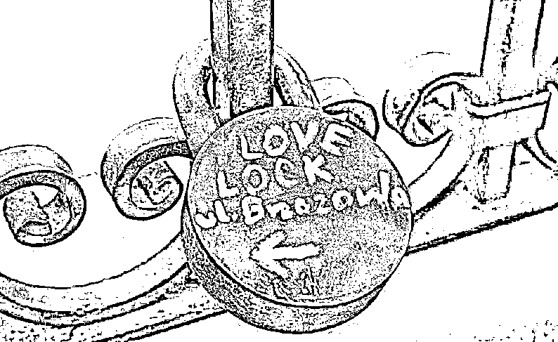**

阴影

为了不断地追求目标，摩羯座人必须**管理、控制自己的情绪**。恐怖的是，他们可能**完全压抑自己的情感。**这种极端的压抑可能导致摩羯座人**最终走向崩溃**。甚至生命的火花闪现，摩羯座依旧坚持自己的方向。

这是福是祸呢？问题是，并不仅仅只有摩羯座忽略了自身的感受，更有可能，**其他所有人也会忽略了摩羯座人的感受。**摩羯座人发现自己**被锁定在权威角色的固有形象里**了，**完美无缺**。同时，摩羯座人也**自愿接受了这种禁锢**。往这个方向探索下去，我们发现摩羯座人**对于他人的控制也在膨胀**。这种控制欲的根源可能是**恐惧**。**摩羯座人对自身的本能需求、内心的冲动和自我的领土有着不正常的恐惧。**

**摩羯座的爱情**太阳摩羯座的爱情

许下承诺对摩羯座人来说并不是难事，**承诺**就是他们突出的个性。但是，这份亲密关系所承诺的内容却**让人沮丧**。要经营好爱情关系，并从中获得满足感，摩羯座人要学会**练习表达自己的情感。**摩羯座人必须学会**为自己要求**。否则，太阳摩羯座的人可能陷入**“责任”**的泥潭，身边的人会习以为常，在爱情中忍受种种约束，却毫无益处。

比较明显的是，太阳摩羯座的人通常**欣赏可靠、理性的伴侣：可信赖、自给自足、冷静的头脑**。不太明显的是，太阳摩羯座的人需要一位**与之不同**的伴侣：**能够轻松地表达自己的感情，富于生命火花的人**。从阴影方面来看，摩羯座人如果在冰冷的道路上渐行渐远，**完全地自给自足，“成熟”地压抑自我的需要和冲动**，之后我们会看到一片混乱：**让摩羯座人神魂颠倒的人恰好具有他们所缺失的特征。**这意味着，在感情关系中呈现了一种**“亲子”关系的互动方式**。摩羯座人**为了信守承诺而永远地忍受这个错误。****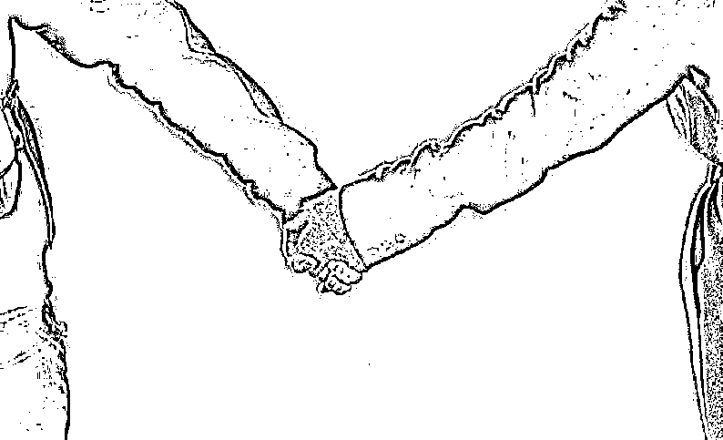**月亮摩羯座的爱情月亮摩羯座人会呈现一种**心境上的孤独隐居状态**。这和孤独、寂寞的情怀不同！他们只是**比普通人更需要独处的时光。**月亮摩羯座的人在情绪上更倾向于**让他人沮丧的巨大而荒芜的空间：独居、写小说、获得博士学位**。他们的潜意识里，**每个人最终都是孤独的。**因此，月亮摩羯座的人需要学习**与人结合的技巧、分享的技巧**，这样才能将爱延续。否则，伴侣很快就会**觉得自己被疏远了，被隔绝在外。**另一方面，月亮摩羯座的男女**需要一个伴侣**，**对方不会因为发现即使被爱着，最终也会被抛弃的这种宿命而感到非常震撼。**从摩羯座的星座特质上看，它与**现实主义的生存**有关。对于月亮摩羯座的人来说，这就变成了条件反射式的本能，**小心谨慎到了夸张的地步，还有恐惧也是如此。**如果到了这个阶段，月亮摩羯座的人将被阴影吞噬，呈现出一种**强迫性的控制欲，想要控制所有的事情：生命的课题、财富、社交、家庭和伴侣。**在家庭生活中，月亮摩羯座的要求是：**井井有条、有效率、有责任感**，即便月亮摩羯座的人公务繁忙，职责众多，根本无暇顾及家务。上升摩羯座的爱情上升摩羯座的人表现出了一种**世故、圆融**的姿态，**能干谨慎，能够凭借直觉理解社会的游戏规则。**他们或许看起来有**都市气息，甚至是着装打扮颇为昂贵**。但有少部分上升摩羯座的人，他们看起来像扑克赌桌上的玩家，冷冷的目光紧盯着桌上的每一个人。为了让爱延续，上升摩羯座的人迟早要触及更深层的本质，经历一番彻底的改变。对于一些人来说，他们的变革来得很快，甚至并不费什么力气，只要顺势而为。对于另一些人来说，这个变革也许永远不会发展。上升摩羯的面具背后是什么呢？看看星图中的其他因素是解开谜底的唯一方式。

**想要了解斯蒂芬老爷子的工作坊，感受现场魅力，****请移步三四条！**

**版权声明：**本文由若道翻译发布，欢迎转发，反对抄袭。友号转载请申请白名单。

**12 星座爱情宝典**

[白羊座](http://mp.weixin.qq.com/s?__biz=MzA5NjA0NTAxNg==&mid=2651419096&idx=1&sn=30c86f7f9f489d61c1b0f80b8944b46b&chksm=8b4bc36fbc3c4a79c49f5b4aa43daad19a145e2bf762fe4a8e5bc1319228e633a65ae869df2c&scene=21#wechat_redirect) | [金牛座](http://mp.weixin.qq.com/s?__biz=MzA5NjA0NTAxNg==&mid=2651419469&idx=1&sn=e44679a33194bf652fe9f515565c8da5&chksm=8b4bc1fabc3c48ecfa11b12fdab2043d246c58d47176dfa105a11ee05a22b4bc65947c7ad02e&scene=21#wechat_redirect)丨[双子座](http://mp.weixin.qq.com/s?__biz=MzA5NjA0NTAxNg==&mid=2651420649&idx=1&sn=0179035270f9508988c70e85c969869c&chksm=8b4bc55ebc3c4c48c928471267184c6360676c387dc9527ef0e112d6671bba3e8893324b5621&scene=21#wechat_redirect) | [巨蟹座](http://mp.weixin.qq.com/s?__biz=MzA5NjA0NTAxNg==&mid=2651421302&idx=1&sn=23f3f771a6bb8eed2903620cc0344755&chksm=8b4bc8c1bc3c41d7b10a8b2c2a826edf4d7700e0db201cabe956be9128038e9dd3beb6b14afb&scene=21#wechat_redirect)

[狮子座](http://mp.weixin.qq.com/s?__biz=MzA5NjA0NTAxNg==&mid=2651422486&idx=1&sn=ee393d64fc0638b589212d81c2ecbd35&chksm=8b4bcda1bc3c44b737b01fcfcc85a0a9096d4f7a567d76c6079e9760105e5259d775715f6429&scene=21#wechat_redirect)丨[处女座](http://mp.weixin.qq.com/s?__biz=MzA5NjA0NTAxNg==&mid=2651422885&idx=1&sn=3d4e368f263ed2016388d3cec178b6b1&chksm=8b4b3212bc3cbb049ad7a6c403a4eab1664d38bb465ede4b82aeaeef64deb34b13e8319c642d&scene=21#wechat_redirect) | [天秤座](http://mp.weixin.qq.com/s?__biz=MzA5NjA0NTAxNg==&mid=2651423207&idx=1&sn=d3f8a94b54e7667c0876707de89e7a9f&chksm=8b4b3350bc3cba4672ecb735a445998dc008428e5bdc388c269c237ee361c0bb0b7404dbff0c&scene=21#wechat_redirect)丨[天蝎座](http://mp.weixin.qq.com/s?__biz=MzA5NjA0NTAxNg==&mid=2651423754&idx=1&sn=a98eabdbacb8702c235c367565a17ce3&chksm=8b4b36bdbc3cbfabc468d6015d7755528b6ffc28759c54f6f67d5e82b4354e6304c1787935f2&scene=21#wechat_redirect)

[射手座](http://mp.weixin.qq.com/s?__biz=MzA5NjA0NTAxNg==&mid=2651424047&idx=1&sn=26d45c630151b2e226c9a7157b3a1d40&chksm=8b4b3798bc3cbe8e296b075c8eeaaf9ba0f18152fac8f7a6afe356e32b8f75e40b12fd2983e7&scene=21#wechat_redirect)

斯蒂芬·弗里斯特

若道签约老师。进化占星学的创始人之一，当今世界最有影响力的占星大师之一；1985 年，他凭借《内在的天空》一书获得职业占星师协会奖（Professional Astrologers Incorporated Award）。他四次获得占星界最高的占星学联合协会奖（United Astrology Congress Regulus Award）提名，2018 年获得轩辕十四教育奖。

**想听听大师斯蒂芬老爷子的精彩讲座？**

**长按下图了解详情！**

**微信又双叒叕改版啦，不想错过若道君的推送？**

**就把若道设为星标吧！**

**▼**

就是这个“在看”，戳戳戳 ☟

****************报名直达入口****************

# 雷蒙德·梅里曼金融占星周运 | 火星即将逆行，市场如何走向？

> 原文：[`mp.weixin.qq.com/s?__biz=MzA5NjA0NTAxNg==&mid=2651425190&idx=2&sn=05809228d6cd2ac3186a658b2f18eaa3&chksm=8b4b3b11bc3cb207b9b8559f927e10d6ce37d08132e0840e31eccf83ad7c848d56f02d79725f&scene=126&sessionid=1692738116#rd`](http://mp.weixin.qq.com/s?__biz=MzA5NjA0NTAxNg==&mid=2651425190&idx=2&sn=05809228d6cd2ac3186a658b2f18eaa3&chksm=8b4b3b11bc3cb207b9b8559f927e10d6ce37d08132e0840e31eccf83ad7c848d56f02d79725f&scene=126&sessionid=1692738116#rd)

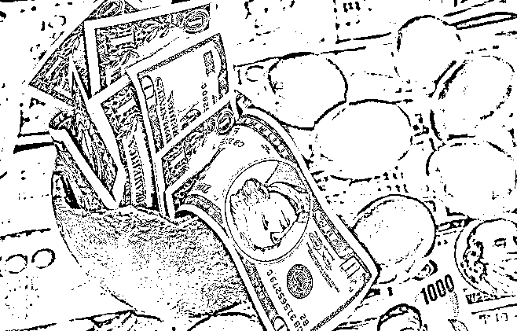

作者/雷蒙德·梅里曼
译者/Leisha 编辑/玫瑰 图片/花瓣网雷蒙德·梅里曼是在金融占星学界稳坐第一把交椅的占星师，同时他也是若道签约的金融占星课老师，我们引进了雷蒙德·梅里曼老师的《[上证指数月度报告](http://mp.weixin.qq.com/s?__biz=MzA5NjA0NTAxNg==&mid=2651423447&idx=3&sn=841a09c5d196d9885d98eeb480a2079b&chksm=8b4b3060bc3cb976c0aa2a2967b91ae73978faca1ee0437be958f79069958d5a410961a193c5&scene=21#wechat_redirect)》《[黄金周期月度报告](http://mp.weixin.qq.com/s?__biz=MzA5NjA0NTAxNg==&mid=2651422728&idx=2&sn=5e41d5bf3527772f19ca7a774eb984a2&chksm=8b4b32bfbc3cbba96679ac4b41485a34f838242408e52aa7626f837a39b7084a74eea73f500c&scene=21#wechat_redirect)》《[2020 年金融预报](http://mp.weixin.qq.com/s?__biz=MzA5NjA0NTAxNg==&mid=2651414279&idx=2&sn=cc131aa367c4ada15e35d0d80b308415&chksm=8b4bedb0bc3c64a6ef98c0e86ba3d842d8368de2b90e623af1d3870d521049ce352732c8d091&scene=21#wechat_redirect)》。我们经老师的授权，将每周刊登梅里曼老师的周运，供大家参考和学习。于是，这是本周的周运（8.24-8.28）。**说明：以下时间采用纽约证券交易所所在地美国东部标准时间。**
**展望与回顾**

**他们（民主党人和共和党人）说，美国的经济已经衰落了……近年来的财富增长全部流入了收入最高的 1％人群的口袋中，中产阶级的实际工资已停止增长，“游戏根本有黑幕”。（但是）在布鲁金斯学会发表的一项研究中，斯蒂芬·罗斯发现，美国中上阶层的人数从 1967 年的 6％增加到了 2016 年的 33％......迈克尔·斯特林在新书《美国梦未死》中表示，不平等问题在 2007 年至 2016 年之间减少了 7％......左右两派的民粹主义者一致同意，事实并非如此。美国梦之死被严重夸大了。**

**——道德与公共政策中心高级研究员莫娜·查伦**

**《美国梦未死》**

**《亚利桑那共和报》**

**2020 年 8 月 21 日**

**在金融恐慌结束后，美联储拒绝恢复正常的货币政策，导致证券交易市场、公司债务市场、城市房地产市场和世界其他地区出现资产泡沫的膨胀。这些繁荣以牺牲工薪阶层和创业者的利益为代价，使拥有资产的人成为主要受益者。结果导致美国新出现了一种破坏性的不平等形式，鼓励拥有资产或建立政治关系，而不鼓励创新和勤奋。这帮助唐纳德·特朗普证明了奥巴马的扩张计划已经抛弃了工薪阶层。**

**——《奥巴马-拜登的经济复兴》**

**《华尔街日报言论版》**

**2020 年 8 月 21 日**

**“我之所以在这里，是因为奥巴马总统和乔·拜登，因为如果他们把工作做好了，我就不会在这里……”**

**——唐纳德·特朗普总统**

**奥巴马在民主党全国代表大会讲话后**

**2020 年 8 月 20 日**

**奥巴马周三晚请求选民们“抓住各自履行公民责任的机会，确保美国民主的基本宗旨得以长存。因为现在处于危机存亡之刻的正是我们国家的民主制度。”**

**——史蒂夫·皮珀斯、米歇尔·普莱斯、亚历山德拉·贾菲**

**《民主党表示：特朗普是民主制的威胁》**

**美联社**

**2020 年 8 月 20 日**

天王星在 8 月 15 日停滞转向逆行之后，上周的世界股票市场表现各异。**世界上的一些股票指数在天王星停滞前后创下了暴跌后的新高，并开始下跌**。一些股指在上周初创下次高点，随后一直下跌至上周结束。还有一些股指下跌至上周中，然后反弹。

纳斯达克指数在 8 月 21 日周五再创历史新高。上证综指在 8 月 18 日上探了年度高点。欧洲的股指在 8 月 12 日创下了次高点，然后在上周的大部分时间里下跌。同样的情况也发生在日本和美国（道琼斯工业平均指数）。印度和澳大利亚的股指在 8 月 19 日创下暴跌后的新高。全球股市上周的情况大致如此，出现的可能是高点，市场由此开始反转，或者市场可能要开始突破至更多新高。本周我们会知道是哪种情况。

美元和比特币的进展更有趣。美元在 8 月 18 日跌至 2018 年 5 月以来的最低水平，与此同时，欧元涨至 2018 年 5 月以来的最高水平。比特币在 8 月 17 日飙升至年度新高 12489。8 月 19 日，原油反弹至高点，与 8 月 5 日创下的暴跌后高点 43.52 形成双顶。黄金和白银在 8 月 18 日创下了低于 8 月 7 日高点的高点，但也创下了高于 8 月 12 日低点的低点。

大多数市场，包括股票和金属，似乎都在犹豫不决地试探接下来是要继续突破，创下数月新高、数年新高或历史新高，还是要反转下跌。**一系列强大的金星相位将在本周展开**，这很符合现在的情况，因为大家都知道金星（以及金星掌管的天秤座）总在思考自己是否优柔寡断。

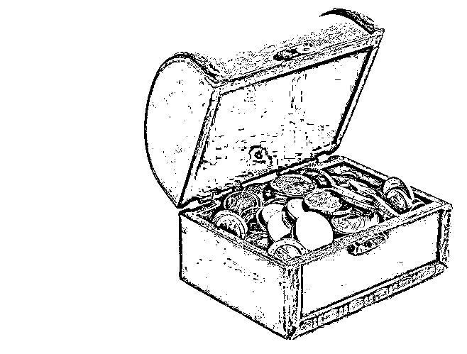

**短期占星趋势和长期考量**

道琼斯工业平均指数在 8 月 11 日创下暴跌后的新高。8 月 21 日周五，标普指数几乎创下历史新高，而纳斯达克指数当日其实已经创下历史新高。从地球宇宙学的角度来看，这一切都非常有趣，因为新冠病毒造成股市恐慌最严重的时期是 3 月 18-23 日，而在 3 月 20-31 日，火星合相摩羯座星群的木星、冥王星、土星。

**行星的合相开启相关行星的地球宇宙学周期。合相发生后，上弦周期变得非常重要，这在占星学研究中被称为渐盈的四分相**。**由于逆行，火星将与这三颗行星形成三次上弦周期（渐盈四分相），第一次四分相正是现在：8 月 4-24 日**。

有趣的原因在于，世界股票市场在周期开始时正好创下重要的周期低点，而这个上弦四分相的第一次成相正好对应市场自那时以来的最高价格。由于地球宇宙学的相位与金融市场的趋势反转之间存在重要的相关性，问题是，从 8 月 4 日到现在展开的高点是否是重要的波峰，股市将由此反转下跌？还是说股市的反转下跌会发生在 9 月 29 日至 10 月 19 日？届时火星将逆行，并再次与摩羯座星群形成同样的渐盈四分相。又或者，两种情况都会发生？

火星现在在白羊座，并将一直停留至 1 月 6 日。火星掌管白羊座，换言之，**火星在自己掌管的白羊座能量很强**。一种占星学理论认为，当行星在自己掌管的星座行进时，世界上会发生积极的事（例如股票市场），但是当行星在自己掌管的星座逆行时，事态就会变得更加艰难。

目前，不仅火星在自己掌管的星座，太阳也是（在狮子座），但在 8 月 22 日，太阳将离开狮子座。水星也行进在自己掌管的处女座，直到 9 月 5 日，刚好在火星逆行之前离开处女座。土星和海王星也行进在各自掌管的星座中，但土星将于 12 月 17 日离开摩羯座，海王星还要在双鱼座停留五年。

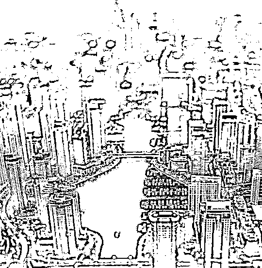

顺便提一下，土星和海王星现在都在逆行。因此，作为占星师，**我们必须关注 9 月 9 日之后会发生什么，届时火星、土星、海王星都将在各自掌管的星座中逆行，而太阳和水星都不再位于自己掌管的星座中**。当然，更不用说美国的大选季到那时将全面展开。

从现在起到大选结束，天空中不会出现任何轻松或顺利的征象。8 月 25 日至 9 月 4 日，也就是 9 月 9 日火星在白羊座逆行之前，金星在巨蟹座对分摩羯座星群（木星、冥王星、土星），并且与停滞在白羊座的火星形成 T 三角相位。这可以表示很多可能性，但是金星的关键在于**公正、平等和女性的议题**。这些相位可能会与金融市场的趋势变化相关。

但是，紧随其后（9 月 9-17 日）以及再之后（9 月 28 日-10 月 19 日）要展开的地球宇宙学征象也都是如此。这些都不是平平无奇的地球宇宙学征象，尤其是最后一组。我可以推测一下这些征象暗示的可能性，但是它们很复杂，需要大篇幅的描述，我将在这些时期更临近之时做详细的讲解。

现在，想象一下，形势又正在逐渐发展进入“压力值最强”的时期，届时我们将必须运用自己的能力来辨别真相和信息的准确性，还要有能力避免自己对突发情况做出冲动和情绪化的反应。就金融市场的形势而言，这不会是一个令人满意的有利时机，如果从现在起至 9 月下旬形成了年度新高或更长周期的高点，则更是如此。

就个人而言，肯定有人在最近的专栏中看到我哀叹，我的妻子住在德国，而美国和德国之间的旅行禁令致使我与她无法见面。德国刚刚宣布，现将允许德国公民的配偶办理适当的文件访德。我去德国不是“重要差旅”（尽管对于我的金星和木星在天蝎座合相而言，这就是“重要差旅”）。我下周启程，这一定是因为行进的木星（旅行和好运）经过我出生星图的月亮（家庭）和我妻子的金星（伴侣）。也许我极佳的幽默感会回到这些专栏文章中。我已经笑得很灿烂了，这也是行进木星触发出生星图行星的标志。下周见，我会在莱茵兰撰写周报专栏！

**说明：以上日期基于纽约证券交易所所在的美国东部标准时间，由于存在时差，中国地区可能需要加一天。**

**版权声明：**本文由若道翻译发布，欢迎转发，反对抄袭。友号转载请申请白名单。

**雷蒙德·梅里曼（Raymond Merriman）**

若道签约老师。著名金融占星师，ISAR（国际占星研究协会）前主席，梅里曼市场分析公司的总裁。他由于“提升了占星学的职业形象”，在 1995 年国际占星大会上被授予轩辕十四奖；在 2012 年国际占星大会上，被授予轩辕十四终身成就奖。

1“中国上证指数月度报告”发售

**若道推出了****中文版****的雷蒙德·梅里曼中国上证指数月度报告，并持续发行该报告！**

当把金融市场的周期和占星学的周期相结合时，雷蒙德·梅里曼老师的金融占星学研究**为投资者应对金融市场的周期波动，并随之调整投资策略提供了极大的价值参考**。

****9 月中英文报告即将上线！****

2“黄金价格周期月度报告”发售

**若道推出****中文版****的雷蒙德·梅里曼黄金价格周期月度报告！**不仅仅为广大读者在中国股市的投资出谋划策，更将视角放眼黄金市场。

**每当世界经济形式不明朗的时候，有一个地方是保值的港湾，那就是****黄金**。自 1982 年雷蒙德·梅里曼出版第一本研究《地球宇宙学征象与黄金价格的关联》的著作以来，**他一直作为最重要的黄金市场时机预测者之一享誉国际**。

8 月的黄金终于从高位开始下跌，有些分析人士认为，黄金在过去连涨 9 周是非常极端的，因此走势未来不会太强了；也有人认为，在目前各国大放水、国际局势不稳的情况下，黄金可以继续看高。

那么，你该如何面对目前的调整呢？是等待回调继续进行，还是在什么位置买入？9 月黄金周期报告等着你。火星已经进入逆行阴影期，很多国家都纷纷再次爆发新冠肺炎病毒疫情，未来的几个月注定不安宁。黄金的走势会安宁吗？

9 月黄金报告已经上线，上证报告也会在月底上线。欢迎了解。也可以按照季度和一年期订阅，有更多优惠。季度和年度的好处是，你可以持续了解梅里曼老师对于不断在变化的市场的看法。即便他某一次看法和市场不一致，你也看到在下一期他如何调整自己的看法，并看到金融占星在一个长期时间段内对你把控风险的帮助。而能够长期控制风险、尽量找到安全的投资时机才是投资的长久之计。

**9 月中英文报告均已更新！**

**购买套餐**，买得越多越优惠

中国上证指数月度报告套餐价

*   **单月报告**：280 元

*   **3 个月套餐**：780 元（260 元/月）

*   **12 个月套餐价**：1999 元（166 元/月）

**长按下图识别二维码**

**购买金融报告****套餐**

**▼**

黄金周期月度报告优惠

*   **双报告年度套餐更优惠（直降 899 元）**
*   **12 个月黄金报告+12 个月上证指数报告：仅需 3500**

**长按下图识别二维码购买黄金报告套餐**

▼

******点击阅读原文购买金融报告******

# 斯蒂芬&大卫线上工作坊丨爱的内在炼金术：你的亲密关系盲点在哪儿？

> 原文：[`mp.weixin.qq.com/s?__biz=MzA5NjA0NTAxNg==&mid=2651425190&idx=3&sn=2db805f9cb87d29dc61fd5a3aa5addcd&chksm=8b4b3b11bc3cb2073861c560d59ef6beed77afcab93c9750ac13aeedb4f120ce32ac4c78292b&scene=126&sessionid=1692738116#rd`](http://mp.weixin.qq.com/s?__biz=MzA5NjA0NTAxNg==&mid=2651425190&idx=3&sn=2db805f9cb87d29dc61fd5a3aa5addcd&chksm=8b4b3b11bc3cb2073861c560d59ef6beed77afcab93c9750ac13aeedb4f120ce32ac4c78292b&scene=126&sessionid=1692738116#rd)

**若道独家 3 日线上工作坊**

由于疫情影响，斯蒂芬老师今年的中国之行无奈受阻，但斯蒂芬老师不想他的中国学生们期待落空。在和大卫老师数次线上沟通后，斯蒂芬老师决定**首次开设线上工作坊，**跟**大卫老师**联袂授课，还专门为若道设计了**两大独家主题**：

**10 月 9 日-11 日**

**《爱的内在炼金术—你的亲密关系盲点在哪儿？》**

****10 月 16 日-18 日****

**《整合行进、推进以及太阳弧技法》**

满足中国占星学子对于进化占星学的学习和精进需求，用线上直播课的形式亲赴十月进化占星学之约。

鉴于时差安排，每天上午线上跟斯蒂芬老师学习 4 小时，下午大卫老师会抽取参课学员，进行一个半小时案例解读。对南北交点最有心得建树的两大权威导师，从技法到实践，承包你的知识点。

防疫为重，线上工作坊也省去了学员们舟车劳顿奔赴现场的种种不确定性，我们相约 2020 年 10 月，斯蒂芬老师非常期待和新老学员们在线上工作坊中相见。

**我们将学习什么？**

“找到完美的伴侣听起来是个很棒的主意——但如果你还没有准备好进行进化工作，仅仅找到那个人并不能给你带来多大帮助。亲密始于你所做的内在成熟功课。”

——斯蒂芬·弗里斯特

**-** **此次授课内容** **-**

*   关于自己的本性，你不希望了解的是什么?
*   什么会让别人爱你变得困难?
*   在哪些方面，你的创伤和文化状况影响了你的智慧判断，关于谁才是真正适合你的人?

**关系占星学：比对图**通常集中于两张出生星图的比较。“直接用这种方式来看待感情，就像还没上高中就开始上大学一样。”所以斯蒂芬老师还会着眼于个人星图。

**个人星图上的三个关键区域**在这个工作坊中，斯蒂芬老师将会关注于个人星图上的三个关键区域。

*   首先，我们考虑你的灵魂对于亲密关系的独特要求。你正在学习什么？激情？和平？信任？还是独立呢？
*   其次，我们来破译你星图上关于任何可能阻碍你正确完成任务的警告信息。
*   最后,我们来探讨星图如何描述了你的天生伴侣——也就是说, 如何在编织在你出生星图的象征符号中, 找到与你享有灵魂契约之人的描述—— 在你出生呼吸第一口空气时，这个人可能甚至还没出生。

“伙伴”和“伴侣”这些词总让我们想到配偶关系，但我们在这个工作坊中探索的许多原则也适用于人类的另一杰作：**亲爱的朋友之间的灵魂纽带。**我们当然会尊重所有的性别差异，因为男人和女人努力爱着对方和他们自己，无论他们的灵魂穿着何种肉体的伪装。

**-** **斯蒂芬的占星著作** **-**

1984-1988 年间，斯蒂芬写作出版了《内在的天空》（已有中文版）、《变化的天空》和《天空的伴侣》三本占星经典著作，奠定了早期在占星学界的地位。

2002-2005 年间，他与朱迪·弗里斯特共同创作了两本经典的关系占星学著作《天空的伴侣 I：爱、性、和进化占星学》《天空的伴侣 II：组合图》。　

2008 年，斯蒂芬出版了一本非常重要的著作《昨日的天空》，此书是至今为止关于轮回转世跟星图的清晰对应最详尽的著作之一。斯蒂芬前后一共出版了 12 部占星著作，在世界占星学界拥有很高的声誉。**-** **斯蒂芬获得的荣誉** **-**1985 年，他凭借《内在的天空》一书获得职业占星师协会奖（*Professional Astrologers Incorporated Award*）。1992、1995、2008 年、2018 年，他四次获得占星界最高的占星学联合协会奖（*UnitedAstrology Congress Regulus Award*）提名，2018 年获得轩辕十四教育奖。

**-** **斯蒂芬的占星哲学观** **-**

  斯蒂芬的占星风格以自由和选择为中心，他的解读不是以下定论的方式来“预测”未来，他强调**如何改善生命**，而不是宿命式的论断。他以心理占星学的语言来解读星图上的人格部分，但是通过**南北交点及其相位和守护星**来探索星图所揭示的**前世业力与今生方向**，在灵魂进化的背景里来整体解读星图。

他认为进化占星学的目的在于鼓励人们做出更符合进化方向的智慧选择，我们学习去了解前世的时侯，关注点应该集中在**如何通过意识来疗愈自己**。

**这些名人怎么说？**

斯蒂芬让我们停止了玩责备命运的游戏，而开始看到自己是一个走在进化路途上的勇士。 ——奥普拉杂志“O: THE OPRAH MAGAZINE”

斯蒂芬和杰夫这两位著名占星师创造性地相互应和，展现出他们出色的教师才华，发展并弘扬了占星这门艺术。（对《测量天空：进化占星学和灵魂的钥匙》的书评） ——著名心理占星师 现代占星学之父 诺·泰尔（Noel Tyl）

请享用斯蒂芬和朱迪这两个博大的灵魂在此书中所提供的洞见大餐吧。（对《天空的伴侣》的书评） ——进化占星学的创始人之一 杰夫·格林（Jeff Green）

我为斯蒂芬解读的精准感到惊叹，他强调没有一件事是坏得无法挽回的，也没有一件事是如此之好，以至于它不会因为现在的错误判断而消失的。我怎样推荐他都不为过！ ——好莱坞著名影星“钢铁侠”男主角 小罗伯特·唐尼（Robert Downey Jr）**上过课的占星师怎么说？**他关于我星图的解读，让几乎所有在场的人掉泪，我也从此开启了一段灵魂追寻的旅程。我很惊讶他透过星图可以如此深入一个人的灵魂。很多东西你自己都不知道，但是他讲出来你会发现，啊，这是真的，这是占星学的神奇。——《心探索》创始人孟想每个来参加老师课程的同学，都会被老师深深的慈悲心感动。这种慈悲心，并不是表面上说的一些什么话，而是一种从意识层次上发出的能量。每个来上课的人，都能感受到老师的爱。这种爱，并不是盲目的爱，而是深刻地洞悉真相后的慈悲。——斯蒂芬老师工作坊翻译逸月斯蒂芬老师的一对一咨询已经排期到两年之后，我特别幸运，曾在课堂上被老师抽中分析过我的星图，老师充满爱与智慧的指引让我更加清晰的认识了自我。内在的潜能、需求和矛盾被老师娓娓道来。——禄丽荣斯蒂芬老师是位非常非常值得推荐的大师，很粉他，这位进化占星学的创始人，对人的理解是那么的全面完整、深刻洞见、慈悲和温暖，就这方面而言足可以媲美我无比崇敬的荣格和史坦纳（这两位去天堂里玩了），如果你对西洋占星感兴趣，或者对人的所有角度、各个层次的真相和可能性感兴趣，推荐斯蒂芬老师的书和课程，特别是他的课程，数倍的功力大增的好机会，错过真是占星粉丝的莫大损失。——仁华**2019 年斯蒂芬工作坊学员感悟**

**什么人适合这门课程？**✦ 占星师或渴望成为占星师的人群。   ✦ 本课程并非针对初学者，需具备若道核心课程 level 4 及以上水平，即了解星座、行星、宫位、相位等。✦ 课程会涉及比对图等高阶内容，不了解相关知识的同学，请提前学习相关内容。**斯蒂芬老师其人**

**斯蒂芬·弗里斯特(Steven Forrest)**

*   进化占星学的创始人之一，当今世界最有影响力的占星大师之一；
*   毕业于美国北卡罗莱纳大学宗教学专业； 
*   1984-1988 年间，写作出版了《内在的天空》、《变幻的天空》和《天空的伴侣》三本占星经典著作，奠定了早期在占星学界的地位。前后一共出版了 12 部占星著作，在世界占星学界拥有很高的声誉。 
*   1985 年，他凭借《内在的天空》一书获得职业占星师协会奖（*Professional Astrologers IncorporatedAward*）。1992、1995、2008 年、2018 年，他四次获得占星界最高的占星学联合协会奖（*United Astrology Congress Regulus Award*）提名，2018 年获得轩辕十四教育奖。 
*   斯蒂芬将自己的绝大部分时间都花在教学以及个人咨询上，他于 1998 年创立了占星学徒计划（*Astrological Appretice Program*），这个计划致力于培养职业占星师； 
*   至今为止已经有 600 余位学员完成了培训，其中很多都成为了优秀的职业占星师； 
*   他是一位脚踏实地的导师，充满快乐和活力，亲和幽默同时又充满了智慧；他的课程不仅仅是一次占星知识和经验的学习，也是一次与智者的相遇。

**大卫老师其人**

**大卫·瑞雷（David Railey）**

*   曾任 ISAR 全球副主席、CAPISAR（全球职业占星师资质认证考试委员会）主席，若道联合创始人； 
*   1976 年，通过亚特兰大职业占星师考试，成为全职占星师，随后通过 AFAN 和 ISAR 职业测试； 
*   1980 年，与杰夫·焦耳一起在亚特兰大创建“每日星球”占星学中心。此后在亚特兰大占星协会担任 4 年考官，并且两次担任亚特兰大地区占星协会主席。1979-1992 年，作为占星师活跃于美国社会媒体，向不了解现代占星学变化的大众宣传专业占星学知识。在 1989-1992 年期间，他在 WRGG 电台 12 频道每周主持个人电视秀“今日占星学”，早先他还在 WRFG 的广播节目中播讲宇宙天气节目； 
*   2010-2014 年，任全美占星师联盟监督委员会委员； 
*   2010 年，其著作《灵魂的目标》中国版出版，和蒋颖一起创办若道占星学校和其官网 www.nodoor.com。从该年开始，他工作并往返于亚特兰大和北京。目前他 80%的时间致力于在中国教授和推广西方占星学； 
*   2017 年，被选为 ISAR 委员会成员（2017）。ISAR 是世界最大的国际占星机构，会员遍布 45 个国家，2017-2020 年曾任 ISAR 全球副主席； 
*   2020 年，被推举为 CAPISAR（全球职业占星师资质认证考试委员会）主席，组织奠基资质认证考试委员会成立工作。

**课程费用****早鸟价**：**3800 元（9 月 16 日前付款享受早鸟价）****正价**：**4800 元（9 月 16 日之后恢复原价）****连报 2020 两场线上工作坊，另外赠送 600 元课程券****授课时间、方式和退转****授课时间：****2020 年 10 月 9 日-10 月 11 日（周五、周六、周日），每天 8:00-15:30****8:00-9:45**（15 分钟休息）**10:00-12:00**由于时差问题，斯蒂芬老师教授上午 4 小时课程
**14:00-15:30** 下午大卫·瑞雷老师根据上午学习内容抽取在线学员案例解读**授课方式：**线上直播课，英文授课，中文翻译**退转课程：**退款原则请详看《教学协议》，如有疑问请咨询课程顾问。****斯蒂芬"爱的内在炼金术"工作坊****

**授课老师：斯蒂芬·弗里斯特**

**授课时间：****2020 年 10 月 9 日-10 月 11 日**

**授课方式：**线上直播课，英文授课，中文翻译

**费用：****早鸟价**：3800 元（9 月 16 日前付款享受早鸟价）**正价**：4800 元（9 月 16 日之后恢复原价）

**课程负责人：****王老师**（微信：18510107057，请备注“斯蒂芬工作坊”）

长按二维码添加课程负责人咨询~

****报名请点击“阅读原文”****

# 斯蒂芬&大卫线上工作坊丨整合行进、推进以及太阳弧技法

> 原文：[`mp.weixin.qq.com/s?__biz=MzA5NjA0NTAxNg==&mid=2651425190&idx=4&sn=9f31a2d46ff872ee89bad1d1b35b751c&chksm=8b4b3b11bc3cb2074c6791b46e755ffce09538d00f7297bbca83d387691c9311d25448c4a188&scene=126&sessionid=1692738116#rd`](http://mp.weixin.qq.com/s?__biz=MzA5NjA0NTAxNg==&mid=2651425190&idx=4&sn=9f31a2d46ff872ee89bad1d1b35b751c&chksm=8b4b3b11bc3cb2074c6791b46e755ffce09538d00f7297bbca83d387691c9311d25448c4a188&scene=126&sessionid=1692738116#rd)

**若道独家 3 日线上工作坊**

由于疫情影响，斯蒂芬老师今年的中国之行无奈受阻，但斯蒂芬老师不想他的中国学生们期待落空。在和大卫老师数次线上沟通后，斯蒂芬老师决定**首次开设线上工作坊**，**跟大卫老师联袂授课**，还专门为若道设计了**两大独家主题**：

**10 月 9 日-11 日**

**《爱的内在炼金术—你的亲密关系盲点在哪儿？》**

****10 月 16 日-18 日****

**《整合行进、推进以及太阳弧技法》**

满足中国占星学子对于进化占星学的学习和精进需求，用线上直播课的形式亲赴十月进化占星学之约。

鉴于时差安排，每天上午线上跟斯蒂芬老师学习 4 小时，下午大卫老师会抽取参课学员进行 1 个半小时案例解读。对南北交点最有心得建树的**两大权威导师**，从技法到实践，承包你的知识点。

防疫为重，线上工作坊也省去了学员们舟车劳顿奔赴现场的种种不确定性，我们相约 2020 年 10 月，斯蒂芬老师非常期待和新老学员们在线上工作坊中相见。

**我们将学习什么？**

**学习斯蒂芬星图解读的秘密技巧（艺术）！**

*   一名新手占星师可能看着一张星图想知道“我应该说什么呢？”

*   同时，一名高级占星师问道“我应该从哪儿开始呢？”

占星学的基本难题是它产生了太多信息。

所有对**行进**、**推进**和**太阳弧**的准确理解都依赖于对出生星图本身的彻底把握。

这个过程本身就足够棘手了——然后我们发现十几个移动点形成了数百个触发出生星图的相位。

逻辑表明，占星学的一个基本技能就是知道该舍弃什么。除非每次咨询都花上一周时间，否则这个现实是不可避免的。

但是，究竟有什么是我们可以放心地忽略呢? 又有什么对我们的理解至关重要，以至于忽略它会导致无法弥补的错误? 

一个简单的例子是，我们不会浪费时间谈论行进水星与出生星图宿命点之间形成的一个 144 度相位，但意识到我们竟然忘记了推进太阳与天王星形成的对分相！

另一个简单的例子是，我们不要因为木星正在触动她的中天，就贸然试图让一个安静的四宫巨蟹座的人对“成名”感到兴奋, 永远不要忘记对于出生星图的根本性预测，换句话说，当你准备分析一张出生星图的时候，你可以采取系统的步骤来帮助你把焦点对准需要聚焦的地方。有些非常简单，甚至可以通过计算机编程来成。

经过这些初步的准备步骤，我们进入了真正的占星艺术的领域。我们必须将客户当前现实的天气变化与出生星图本身根本的进化焦点编织在一起。我们必须以一种反映自身意识力量、本性和状态的正念方式去做——每一个有技巧的占星师都要学会保持他或她与符号间宝贵的直觉联系，监控任何“过热”的智力迹象。

**- 此次授课内容** **-**

*   斯蒂芬老师总结三大最实用占星预测技法：行进、次限推进、太阳弧推进

*   整合这三种技法能够宏观和微观预测一个人的运势起伏和重要节点

**行进（TRANSITS）**

**长期趋势**

分析行运的最好方法是先将长期的行运趋势列出来。顺序如下：冥王星、海王星、天王星、土星、木星、南北交点。

通过将这些影响力持久的长期行运先列出来，你将能够发现在未来一年甚至更长的时间里你人生中的重大课题。

**短期趋势和触发点**

接下来你需要去观察那些运行得较快的星体，来判断短期趋势。不过，重要的是要清楚，这些移动较快的星体在行运中扮演着事件的“触发点”的角色，特别是当与它们形成相位的个人行星同时也与行运外行星有相位的时候！

**次限推进（PROGRESSIONS）**

通常也被称作“一天代表一年”推运，因为这种技术把出生后的每一天和出生后的一整年等同起来。一旦设定了这个节奏，就像定时释放的胶囊一样，这些次限推进就像某种内部的太阳系一样运转起来，和真实时间的事件、经历、情境应和。

**太阳弧（SOLAR ARCS）**

以太阳为核心，为众星之首，带着众星一起移动,展示人生不同阶段我们是如何体验自我、表现自我、修缮自我。此方法虽非实际星体，但却是星动推运法中准确率最高，实用性最佳的推运方法。

**综合以上技法**

*   我们该描述什么，该从哪里入手？

*   如此庞杂的信息，究竟有什么是我们可以放心地忽略呢?

*   系统的解读步骤来帮助你把焦点对准需要聚焦的地方，哪些是至关重要的？

*   如何培养与占星符号间宝贵的直觉联系，将行进、次限推进、太阳弧推进融会贯通？

**- 斯蒂芬的占星著作** **-**

1984-1988 年间，斯蒂芬写作出版了《内在的天空》（已有中文版）、《变化的天空》和《天空的伴侣》三本占星经典著作，奠定了早期在占星学界的地位。

2002-2005 年间，他与朱迪·弗里斯特共同创作了两本经典的关系占星学著作《天空的伴侣 I：爱、性、和进化占星学》《天空的伴侣 II：组合图》。　

2008 年，斯蒂芬出版了一本非常重要的著作《昨日的天空》，此书是至今为止关于轮回转世跟星图的清晰对应最详尽的著作之一。斯蒂芬前后一共出版了 12 部占星著作，在世界占星学界拥有很高的声誉。**- 斯蒂芬获得的荣誉** **-**1985 年，他凭借《内在的天空》一书获得职业占星师协会奖（*Professional Astrologers Incorporated Award*）。1992、1995、2008 年、2018 年，他四次获得占星界最高的占星学联合协会奖（*UnitedAstrology Congress Regulus Award*）提名，2018 年获得轩辕十四教育奖。

**- 斯蒂芬的占星哲学观** **-**

斯蒂芬的占星风格以自由和选择为中心，他的解读不是以下定论的方式来“预测”未来，他强调**如何改善生命**，而不是宿命式的论断。他以心理占星学的语言来解读星图上的人格部分，但是通过**南北交点及其相位和守护星**来探索星图所揭示的**前世业力与今生方向**，在灵魂进化的背景里来整体解读星图。

他认为进化占星学的目的在于鼓励人们做出更符合进化方向的智慧选择，我们学习去了解前世的时侯，关注点应该集中在**如何通过意识来疗愈自己**。

**这些名人怎么说？**

斯蒂芬让我们停止了玩责备命运的游戏，而开始看到自己是一个走在进化路途上的勇士。 ——奥普拉杂志“O: THE OPRAH MAGAZINE”

斯蒂芬和杰夫这两位著名占星师创造性地相互应和，展现出他们出色的教师才华，发展并弘扬了占星这门艺术。（对《测量天空：进化占星学和灵魂的钥匙》的书评） ——著名心理占星师 现代占星学之父 诺·泰尔（Noel Tyl）

请享用斯蒂芬和朱迪这两个博大的灵魂在此书中所提供的洞见大餐吧。（对《天空的伴侣》的书评） ——进化占星学的创始人之一 杰夫·格林（Jeff Green）

我为斯蒂芬解读的精准感到惊叹，他强调没有一件事是坏得无法挽回的，也没有一件事是如此之好，以至于它不会因为现在的错误判断而消失的。我怎样推荐他都不为过！ ——好莱坞著名影星“钢铁侠”男主角 小罗伯特·唐尼（Robert Downey Jr）**上过课的占星师怎么说？**他关于我星图的解读，让几乎所有在场的人掉泪，我也从此开启了一段灵魂追寻的旅程。我很惊讶他透过星图可以如此深入一个人的灵魂。很多东西你自己都不知道，但是他讲出来你会发现，啊，这是真的，这是占星学的神奇。——《心探索》创始人孟想每个来参加老师课程的同学，都会被老师深深的慈悲心感动。这种慈悲心，并不是表面上说的一些什么话，而是一种从意识层次上发出的能量。每个来上课的人，都能感受到老师的爱。这种爱，并不是盲目的爱，而是深刻地洞悉真相后的慈悲。——斯蒂芬老师工作坊翻译逸月斯蒂芬老师的一对一咨询已经排期到两年之后，我特别幸运，曾在课堂上被老师抽中分析过我的星图，老师充满爱与智慧的指引让我更加清晰的认识了自我。内在的潜能、需求和矛盾被老师娓娓道来。——禄丽荣斯蒂芬老师是位非常非常值得推荐的大师，很粉他，这位进化占星学的创始人，对人的理解是那么的全面完整、深刻洞见、慈悲和温暖，就这方面而言足可以媲美我无比崇敬的荣格和史坦纳（这两位去天堂里玩了），如果你对西洋占星感兴趣，或者对人的所有角度、各个层次的真相和可能性感兴趣，推荐斯蒂芬老师的书和课程，特别是他的课程，数倍的功力大增的好机会，错过真是占星粉丝的莫大损失。——仁华**2019 年斯蒂芬工作坊学员感悟**

**什么人适合这门课程？**✦ 占星师或渴望成为占星师的人群。   ✦ 本课程并非针对初学者，需具备若道核心课程 level 3 及以上水平，即了解星座、行星、宫位、相位等。✦ 课程会涉及行进、推进等高阶内容，不了解相关知识的同学，请提前学习相关内容。**斯蒂芬老师其人**

**斯蒂芬·弗里斯特(Steven Forrest)**

*   进化占星学的创始人之一，当今世界最有影响力的占星大师之一；
*   毕业于美国北卡罗莱纳大学宗教学专业； 
*   1984-1988 年间，写作出版了《内在的天空》、《变幻的天空》和《天空的伴侣》三本占星经典著作，奠定了早期在占星学界的地位。前后一共出版了 12 部占星著作，在世界占星学界拥有很高的声誉。 
*   1985 年，他凭借《内在的天空》一书获得职业占星师协会奖（*Professional Astrologers IncorporatedAward*）。1992、1995、2008 年、2018 年，他四次获得占星界最高的占星学联合协会奖（*United Astrology Congress Regulus Award*）提名，2018 年获得轩辕十四教育奖。 
*   斯蒂芬将自己的绝大部分时间都花在教学以及个人咨询上，他于 1998 年创立了占星学徒计划（*Astrological Appretice Program*），这个计划致力于培养职业占星师； 
*   至今为止已经有 600 余位学员完成了培训，其中很多都成为了优秀的职业占星师； 
*   他是一位脚踏实地的导师，充满快乐和活力，亲和幽默同时又充满了智慧；他的课程不仅仅是一次占星知识和经验的学习，也是一次与智者的相遇。

**大卫老师其人**

**大卫·瑞雷（David Railey）**

*   曾任 ISAR 全球副主席，CAPISAR（全球职业占星师资质认证考试委员会）主席，若道联合创始人；

*   1976 年，通过亚特兰大职业占星师考试，成为全职占星师，随后通过 AFAN 和 ISAR 职业测试；

*   1980 年，与杰夫·焦耳一起在亚特兰大创建“每日星球”占星学中心。此后在亚特兰大占星协会担任 4 年考官，并且两次担任亚特兰大地区占星协会主席。1979-1992 年，作为占星师活跃于美国社会媒体，向不了解现代占星学变化的大众宣传专业占星学知识。在 1989-1992 年期间，他在 WRGG 电台 12 频道每周主持个人电视秀“今日占星学”，早先他还在 WRFG 的广播节目中播讲宇宙天气节目；

*   2010-2014 年，任全美占星师联盟监督委员会委员； 

*   2010 年，其著作《灵魂的目标》中国版出版，和蒋颖一起创办若道占星学校和其官网 www.nodoor.com。从该年开始，他工作并往返于亚特兰大和北京。目前他 80%的时间致力于在中国教授和推广西方占星学； 

*   2017 年，被选为 ISAR 委员会成员（2017）。ISAR 是世界最大的国际占星机构，会员遍布 45 个国家，2017-2020 年曾任 ISAR 全球副主席； 

*   2020 年，被推举为 CAPISAR（全球职业占星师资质认证考试委员会）主席，组织奠基资质认证考试委员会成立工作。

**课程费用****早鸟价**：**3800 元（9 月 16 日前付款享受早鸟价）****正价**：**4800 元（9 月 16 日之后恢复原价）****连报 2020 两场线上工作坊，另外赠送 600 元课程券****授课时间、方式和退转****授课时间：****2020 年 10 月 16 日-10 月 18 日（周五、周六、周日），每天 8:00-15:30**

**8:00-9:45**（15 分钟休息）

**10:00-12:00**由于时差问题，斯蒂芬老师教授上午 4 小时课程**14:00-15:30** 下午大卫·瑞雷老师根据上午学习内容抽取在线学员案例解读**授课方式：**线上直播课，英文授课，中文翻译**退转课程：**退款原则请详看《教学协议》，如有疑问请咨询课程顾问。****斯蒂芬"整合行进，推进以及太阳弧技法"工作坊****

**授课老师：斯蒂芬·弗里斯特**

**授课时间：****2020 年 10 月 16 日-10 月 18 日**

**授课方式：**线上直播课，英文授课，中文翻译

**费用：****早鸟价**：3800 元（9 月 16 日前付款享受早鸟价）**正价**：4800 元（9 月 16 日之后恢复原价）

**课程负责人：****王老师**（微信：18510107057，请备注“斯蒂芬工作坊”）

长按二维码添加课程负责人咨询~

****报名请点击“阅读原文”****

# 2020 年你不容错过的占星界盛会｜ISAR 线上全球大会第二波抢票来了！

> 原文：[`mp.weixin.qq.com/s?__biz=MzA5NjA0NTAxNg==&mid=2651425089&idx=1&sn=15050318e14a63054073adeebfc968ef&chksm=8b4b3bf6bc3cb2e043f1eb9cb7b2c860c47ff6f7015a549ad3980918772479785d91f32a0d10&scene=126&sessionid=1692738116#rd`](http://mp.weixin.qq.com/s?__biz=MzA5NjA0NTAxNg==&mid=2651425089&idx=1&sn=15050318e14a63054073adeebfc968ef&chksm=8b4b3bf6bc3cb2e043f1eb9cb7b2c860c47ff6f7015a549ad3980918772479785d91f32a0d10&scene=126&sessionid=1692738116#rd)

**2020 ISAR 线上大会周四正式开票！**

**200 张转发助力优惠票上线 24 小时抢空**

**ISAR 大会为什么这么火爆？**ISAR 作为**国际上****最具声望****的占星组织**每届 ISAR 占星大会都是业内盛事，周边酒店爆满，各国占星师不远万里飞到美国，只为亲历**国际一线占星大师云集的盛会。**

往年大会的每一个时段都有 2-3 场演讲同时进行，一天中要经历一次次的纠结割爱错过，即是英语水平再好，因为很多演讲主题专业性和前瞻性都很强，总有一些生僻词汇让你一脸懵。

人在他乡，想找个志同道合、水平相当、沟通顺畅的小伙伴探讨也不是很容易，更何况现在国内疫情不稳，美国更甚，根本无法实现出国参加群聚性活动的愿望。**若道作为 ISAR 中国唯一附属学校****协办的 ISAR 线上大会有哪些优势？**

省去请假、机票、住宿、时差、

舟车劳顿以及感染风险，不用同时段取舍选择，

每一场主题演讲全都要；

**若道专业翻译团队翻译制作字幕，**

省去中文口译时间，

实时 GET 最精准的知识点，

**14 位国际一线占星大师****，**

每一位大师的智慧和课程都价值不菲。

**这次的两个大主题和我们每个人的未来息息相关：**

该如何迎接 800 年一遇的**木星-土星合相在风象星座的新纪元**？**2020 年美国总统大选**更是时下热点，对于未来几年的大环境有着关键影响，绝对是咨询、社交中含金量满满的社交货币。句句出自大师之口，踏实放心消化吸收。

**觉得有点儿高深？**

还有 8 位中国 ISAR 认证占星师

**点评解读**帮助你加深理解，

没来得及看直播，

或者觉得内容太棒了想看回放？

咱还有**三个月的视频回放权限**，

关键是价格太美丽了，

**会员优惠价**抢到就是赚到，美滋滋~

**绝对是职业占星师、占星爱好者们不容错过的知识宝藏**

**第一波转发优惠价****已经售罄**

**给手慢的宝宝们准备的****第二波的优惠抢票方式：**

全价票：1080 元

1、购买 ISAR 会员，享受**780 元**的家族会员价，ISAR 会员每个月都有星光俱乐部沙龙

2、不购买会员，可以呼朋引伴，三人团报，每人 880 元，**限量 20 个团**，售罄恢复原价

**2020 ISAR 大会**

**大会时间**

**2020 年 9 月 19 日（周六）**

******9:00-12:00，14:00-17:00******

**2020 年 9 月 20 日（周日）**

********9:00-11:00，14:00-16:00******** 

 （因时差原因，具体时间安排以现场直播为准）

**听课方式**

**网络直播课(可回放)**

（英文演讲有中文字幕翻译）

全价票：1080 元

ISAR 会员价：780 元

**非会员三人团报价：每人 880 元**

 *******急性子可以先拉到文末**

**添加童老师微信报名！**

**关于 ISAR**

**国际占星研究协会**（ISAR, International Society for Astrological Research）ISAR 是一家于 1979 年在加州洛杉矶成立的非盈利组织，**它是国际上最具声望的占****星组织，**也是 UAC（国际占星大会）的四个举办方之一。

ISAR 成员遍及世界 45 个国家。这些不同地域的占星文化彼此碰撞，互通有无，形成积极的交流互动局面，推动了占星学研究和实践的多样性发展。同时，ISAR 的网站已被翻译成多种不同语言，旨在将世界各地的占星师联合起来，共建和谐互助的伙伴关系。

**ISAR 的占星资质认证项目包括，职业道德意识培训、咨询技巧培训及测试，以及专业占星技能的考试。**满足上述各方面要求者，可获国际职业占星师资格证（CAP, Certificate of Astrological Proficiency）。目前全球有 19 所 ISAR 附属占星学院。**在中国的唯一指定教学机构是若道占星。**

**关于大会内容**

2020 年是一个数十年未有之大变局之年。地球就像《权力的游戏》中的维斯特洛大陆，陷入始料未及的混乱之中。一方面，新冠病毒就像“看不见”的兵团，在无声无息中穿越国界和防御，袭击了所有国家；另一方面，中国和美国，地球上几乎最重要的两个大国竟然陷入前所未有的冷战。我们的世界变得非常魔幻。**2021 年将会如何？这个世界会好吗？在这样的大变局中，我们如何重新构想未来？**在过去的几十年中，ISAR（国际占星研究协会）每两年会举办一次大会，邀请 ISAR 在全世界的顶级占星师演讲，而占星师和占星爱好者们则从 40 多个国家飞到一起，欢聚一堂；今年，因为新冠疫情的影响，原计划在科罗拉多州举行的 ISAR 大会无法线下召开，会议改为在线会议。这次大会特意准备了将影响全球所有人的**1 个重要主题**和**1 个重大事件**，邀请全世界著名的占星师进行讨论分享。

**★****主题一：木星-土星合相在风象星座的新纪元**

木土合相 800 年经过风、水、火、土四大元素，每一元素历经大约 200 年周期，上次木星-土相进入风元素还是 800 年以前。因此，这次土木合相再次进入风元素对于这个世界有非常非常重要的影响，世界将发生重大变化。这也是全世界占星师都在密切关注和研究的天象。如果你知道世界发展的趋势，知道潮流方向，就能为自己、家人、事业做出更明智选择。

**★****主题二：  2020 年美国总统大选**

新冠疫情和中美冷战让每个中国人都深深认识到美中关系对普通人生活的影响，这个影响还会在未来更加明显显现。在疫情危机及其带来的经济危机中，谁将成为美国总统是世界瞩目的大事件。占星学怎么看待总统选举，怎么预测大选，4 位 ISAR 世界著名占星师将会提前为你分析预报。

为了让中国占星师和占星爱好者可以参加这次大会，若道作为 ISAR 在中国的唯一指定教育机构，和 ISAR 合作全程翻译这个大会，将视频配以中文字幕，将于 9 月 19-20 日在线转播这个会议的全部内容，**并邀请 8 位国内经验丰富的 ISAR 认证职业占星师转播当日对于这个大会进行 2 小时的解说、探讨**。

**ISAR 线上大会具体日程安排**

**9 月 19 日，星期六**

★**土星-木星合相在风相星座的新纪元**

小组讨论主持人：亚历山大·因舍阿吉克——ISAR 主席

土木合相周期将离开土相星座，踏上其在风相星座的 140 年旅程。9 位世界顶级占星师将讲述这个周期对于我们所有人的影响，从集体层面到个人层面，这个重要周期意味着什么。他们每个人都将呈现自己个性化的观点，为我们展示一个迷人的未来。

★**演讲 1：重塑未来：进入新时代的占星学**

演讲人：亚历山大·因舍阿吉克（Aleksandar Imsiragic）

概述过去的伟大合相周期以及这些周期对 2020-2025 意味着什么。我们正在进入一个新时代，外行星合相的历史揭示了一个对于我们当前时代的迷人叙述。

★**演讲 2：系好安全带！2020 年以后**

演讲人：温迪 ·史黛西（Wendy Stacey）

木星和土星将在水瓶座合相，冥王星也会慢慢进入水瓶座，我们可以期待人类历史上前所未有的快速和根本的变化。让我们来探索这个周期呈现的可能性，以及我们即将进入的激动人心的新时代。

★**演讲 3：明天今天：您从这里到 2021 的指南**

演讲人：迈克尔·鲁丁（Michael Lutin）

1.  为生活在非人类世界中的人类提供实用提示；

2.  评估预测和魔幻思维；

3.  拥抱你的个人王朝的更迭；

4.  行动背后的占星学：

*   火星对土星的挑战。

*   自由：法律和行星配置。

*   “他们”是谁？

*   凯龙星，凯瑞珂龙星（小行星，凯龙的妻子）和你现实的痛苦；邪恶的阴谋还是神圣的干预？

*   天王星对你生活的搅动。

★**演讲 4：行星重聚的个人责任！**

演讲人：弗兰克·克利福德（Frank Clifford）

2020 年 12 月，木星与土星合相在水瓶座 0°，为我们作为一个集体开启了非凡的新篇章。但是，对于我们个人生活和职业而言，这个合相又将提供什么？我们现在能做什么来充分利用这个合相呢？来加入弗兰克的木星-土星战略，加入这个新的冒险。

★**演讲 5：寻找木星—土星合相的吉日择时图**

演讲人：克里斯 · 布伦南（Chris Brennan）& 莱莎 · 沙伊姆（Leisa Schaim）

今年 12 月，木星和土星在水瓶座的罕见合相为开始新的冒险或新的事业提供了一个独特的机会，这个机会将经得起时间的考验。在本次演讲中，我们将演示如何使用择时占星学来寻找最吉祥的星图，以充分利用这一特殊的行星合相组合。

★**演讲 6：木星—土星合相对美国高等教育的潜在影响**

演讲人：奥马里·马丁（Omari Martin）

本演讲将探讨木星—土星合相对美国高等教育的潜在影响。用经世占星学来分析观察土木合相可能如何影响学费和学生入学的趋势、学生贷款债务减免的法律或准则，以及学院和大学可能的兼并收购。此外，还将讨论土星—木星合相如何影响在线（远程）教育和外国学生。

★**演讲 7：每一次革命都是从极端主义开始**

演讲人：乔治亚 · 斯塔西斯（Georgia Stathis）

当我们突然陷入一个价值基础和我们过去 200 年所了解的经济完全不同的经济环境时，会发生什么？当如何工作、在哪工作、做什么工作有 70%都会发生变化，未来会发生什么？经济的骨架结构还在（土星），但其他一切都在消融。木星提供了一个尚未显现的未来愿景，而现实则需要边活下来边适应。每天铺天盖地的新闻没有提供解决方案。然而，有一个思想桥梁，邀请我们去跨越。当我们进入这个既兴奋又未知的未来时，乔治亚· 斯塔西斯提出了一些崭新思路。  

★**演讲 8：弄清楚要爬哪座山**

演讲人：斯蒂芬·弗里斯特（Steven Forrest）

具有划时代意义的木星—土星合相虽然发生在水瓶座，但两个巨大的行星已经在摩羯座共舞了一年，而且他们并不孤单：冥王星一直是他们看不见的伴侣，冥王星的存在改变了一切。什么样的无意识在集体意识中浮出水面？我们怎么才能有机会创造一个全新的水瓶座未来？

未来取决于我们能辨别出哪些摩羯座传统值得保留，而哪些传统只会将我们锁定在一个功能失调的过去。我们可以攀登上任何一座山，但哪一座才是我们应该攀登的呢？  **9 月 20 日，星期日**

★**2020 年美国大选：一个占星学的视角**

小组讨论主持人：

雷蒙德·梅里曼（RayMerriman）——ISAR 大会主任

演讲人（从左至右）：

琳恩·贝尔（Lynn Bell）、卡洛琳·凯西（Caroline Casey）、J·李·雷曼（J·Lee Lehman）、克里斯汀·斯金纳（Christeen Skinner）

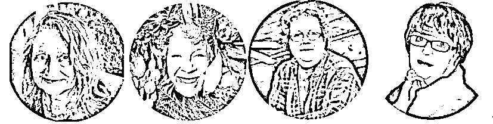

我们将邀请 4 位世界著名占星师对 2020 年 11 月的美国大选进行探讨。这四位占星师将会展示他们用什么占星技法来对这一意义重大而疯狂的选举进行分析。每位演讲者将分析总统候选人及其副总统的星图、选举日星图、就职日星图，以及他们认为有助于加深对选举及其结果潜在后果了解的其他关键星图。

**抢票须知**

全价票：1080 元

ISAR 会员价：780 元

**非会员三人团报价：每人 880 元**

（团购请添加童老师微信，等改价后付款确认）

购票疑问也请添加童老师微信咨询

**门票一旦售出 概不退换**

如何成为 ISAR 会员？

**如果你也想成为 ISAR 会员，请复制链接在浏览器打开**

http://www.nodoor.com/isarcert.do?contentId=3588（仅支持网站支付）

**或直接长按下方二维码，微信购买会员：**

关注我们

*   微博：**@若道星文化 Nodoor**

*   微信：**公众号【若道】（nodoorbj）**

     **服务号 （nodoorcn）**

*   邮箱：**nodoor@vip.126.com**

****购买大会门票请点击“阅读原文”****

# 太阳进处女座丨在极致细节控的尽头，是对完美的无限渴望

> 原文：[`mp.weixin.qq.com/s?__biz=MzA5NjA0NTAxNg==&mid=2651425001&idx=1&sn=e77225a5ed216fb4016a71183103e2e2&chksm=8b4b3a5ebc3cb348f450eca66e8e0e5bb977515de316aed40aa164151d5c0eb5acd613fad4c6&scene=126&sessionid=1692738121#rd`](http://mp.weixin.qq.com/s?__biz=MzA5NjA0NTAxNg==&mid=2651425001&idx=1&sn=e77225a5ed216fb4016a71183103e2e2&chksm=8b4b3a5ebc3cb348f450eca66e8e0e5bb977515de316aed40aa164151d5c0eb5acd613fad4c6&scene=126&sessionid=1692738121#rd)

******☆ ****后台回复“今日”，给你一句生命态度******

作者/编辑/翀子 ISAR 认证占星师

封面/书君 图片/网络

周六晚上 11 点 44 分，太阳进入处女座。处女座连接狮子座和天秤座，也正处秋收时繁忙的农事季节。从星座的进化和人类活动的节律，我们可以更生动的了解处女座的能量特质以及它渴望完美的动力来源。

北京时间 2020 年 8 月 22 日 23 点 44 分，太阳离开光芒四射、活力饱满的狮子座，来到低调谦逊、追求完美的处女座。太阳沿着黄道运行画圆，好似一次次顺着螺旋状循环上升的进化路径，它从何而来，又往哪儿去，可以向我们透露并解答很多关于这个星座能量的讯息。

**从狮子座来，往天秤座去**

处女座连接了狮子座和天秤座。狮子座是燃烧的创造之力，“我”是世界的中心、狮子座散播光和热，要将世界的每一个角落照亮。我开心，我创造，我爱我的臣民并享受他人的夸赞，生命之火永不灭，它点亮了“王者的荣耀”。

狮子座是自我的，而天秤座看重关系与平衡。“我”从个体走向人际互动，世界有我也有你，“我们”很重要，双人舞的和谐是宇宙交响中最美妙的旋律。用“制衡的艺术”来形容天秤座不为过，高度发展的天秤座可以在关系中既表达自我又关照对方，游刃有余的同时服务“我”和“你”。

**而连接狮子座“我”和天秤座“我们”的，就是中间处女座——“服务者”的形象。**这是一个**进化的路径**。在经历了“万众瞩目”、“发号施令”的狮子座后，处女座走到舞台旁边，灯光的过度聚焦令人不适，**到了服务规则和服务他人的时候。**在这里，“谦逊的服务者”是“王者荣耀”后的补偿，用来平衡狮子座的“自我中心”。演够了戏，做够了主角，在发展“关系的艺术”之前，要先将目光从狮子座的自我移开。

狮子座需要别人“以我为光”，处女座则是“我为他人添光”。在星座能量的进化路径上，狮子座的阳性能量连接了处女座的阴性能量，“**看向我”用“看向他者”来平衡**。学习如何做一个服务者，给进化的下个阶段——“关系的舞动者”天秤座奠定了重要一环。

也因为如此，作为**服务者**，**低调谦逊**（甚至遮盖自己的光芒）、**把技能（工作）和自我认同划等号**（而不是把职业作为自我的身份之一），成为处女座能量强的人常被提到的特质。

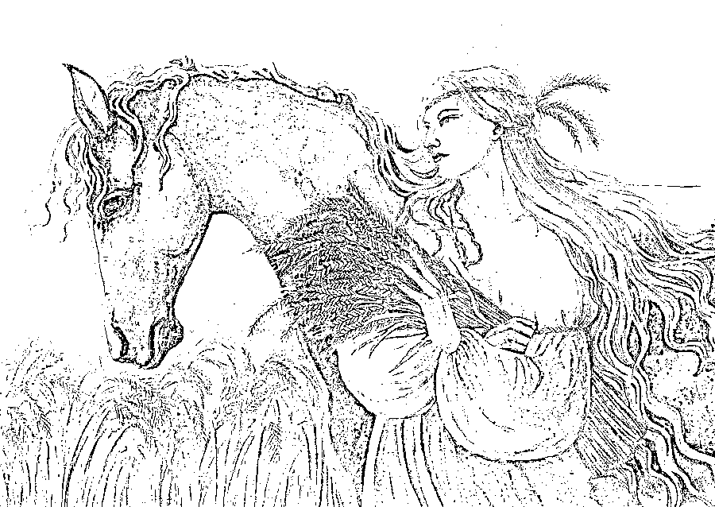

**从酷暑中来，往土地中去**

我们也可以从自然韵律、节气变化和人们的农耕活动了解处女座的能量特质。8 月是地球北半球最酷热的日子，在太阳光照的炙烤之下，农作物开始进入成熟期，人们则避开火辣高温的天气，休整歇息，从事各种娱乐活动，这是狮子座的月份给农人们带来的礼物。而处女座的月份对应了我们二十四节气中的处暑（处女座 0 度）和白露（处女座 15 度）

《月令七十二候集解》中写道："七月（农历）中，处，止也，暑气至此而止矣。"这个时节，炎热暑期即将过去，老鹰开始大量捕猎鸟类、天地间万物开始凋零、农作物成熟，**处暑节气的“抢收抢晒”**成为重要的农事活动。而**白露节气**基本结束了暑天的闷热，是天气由热转凉的转折点，也是收割早收作物和给晚收作物灌水保温的**繁忙时节。**

处女座常被描绘为一位抱着麦穗的丰收女神，她身处片片金黄中，象征收获。处女座是**土象星座**（摩羯座、金牛座、处女座）**里的变动星座**，变动星座给人变化快速、灵活机动的感受。土地是坚实稳固的，**在土地上快速移动的处女座，生动的描绘了一幅在农田里来回奔走、辛勤收割农作物的劳动景象。**

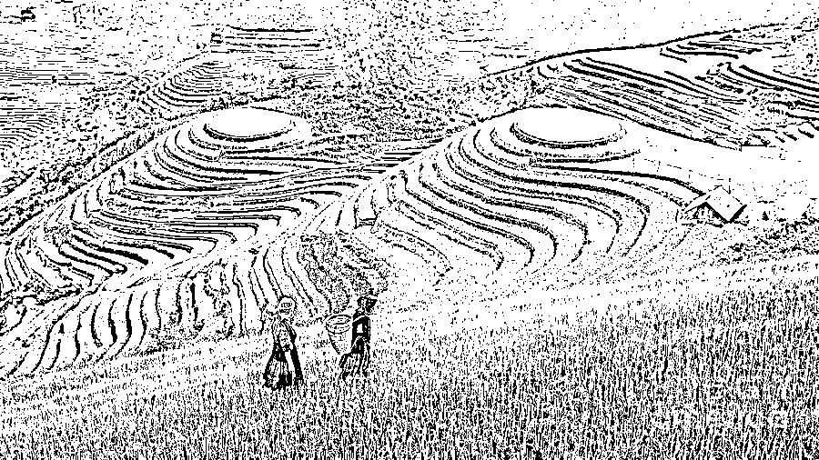

**“规则下”的完美主义**

**对农作物的收割采摘需要一个完美时刻**，既不能早，也不能晚，过早还未饱满，等过久的话又有烂掉的风险。在最好的时节“下手”，其收成是对人们辛勤劳作的最大奖赏。人们在对土地进行耕种的时候，遵照自然韵律的法则，奉行在此节律下事物的运作方式，追求精确，一丝不苟。

所以对处女座而言，**追求完美**并**严格服务于自己奉行的准则**是很自然的事。

**优胜劣汰**

粮食不仅要在**完美的时间**收割，还要在收割的过程中**筛选其中精品**，也就是我们常说的处女座的**“提纯”**特质。在春天播下的每颗种子，经过人们的悉心养护和大自然阳光雨露的滋养，逐渐成熟，然而并不是每粒粮食都坚实饱满，因此**处女座能量代表着我们必须决定什么是有用的**，什么是无用的，并留下那些有用的东西。

我们由此还可以关联到对应处女座能量的人体肠道部分。食物进入肠道，被分类为“营养”和“垃圾”，营养被身体吸收，垃圾被排出体外，在“提纯”中，身体因为获得了养分而变得健康。

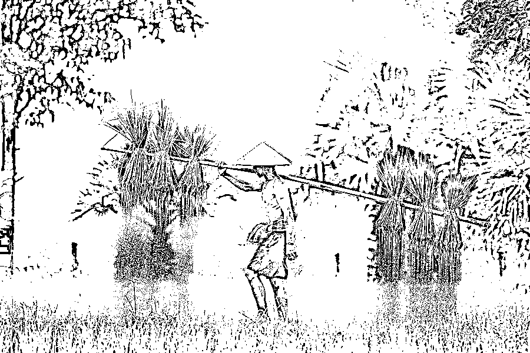

**注重效率**

酷暑在前，降温在后，成熟的农作物需要在这期间完成收割，才可以收获最多最丰盛的粮食，待细致储存后，供全家过冬。不仅是人，连动物也会利用这个时节捕猎，储存过冬的食物。在农业还没有被机械化的时代，一切劳作都需要靠人力，必须放下个人事务，在有限时间内完成“抢收抢晒”的工作。

**因为要在有限的时间里完成手上的工作，所以处女座是务实且注重效率的，**他们需要**分析判断**现状、选择**最优方案**并**细化**每个步骤**。**彰显自我（狮子座）在这个繁忙时节显得不合时宜，而享受浪漫的人际关系（天秤座）也会让自己在冬天有吃不饱肚子的危险。 

**磨炼技艺**

如何体现效率？对事物的**辨识力**、合理完善的**工作顺序**、**娴熟的操作**，都可以体现在高效中，而这些都是**技能**的展现。所谓熟能生巧、**“业精于勤”**，这是处女座奉行的做事准则。

在一遍遍操作中，处女座对筛选优质饱满的粮食越来越有经验，任何一个瑕疵都逃不过眼睛和手上的触感；能一眼分辨出什么是好的什么是坏的，对品质**一丝不苟**；为了在有限的时间内收割更多粮食，处女座必须不断**改进**劳作方式，**熟练**运用工具，刻苦**磨炼技术**……

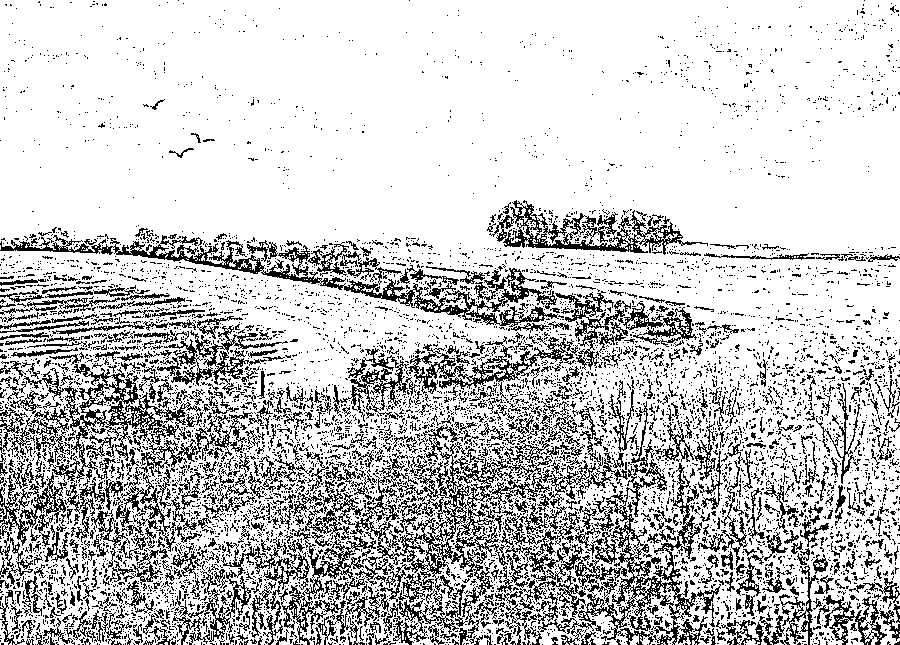

**从原型中来，往现实生活中去**

在学习占星学的过程中，每个星座有很多关键词，当我们回到星座能量的源头，**将它们和进化路径的发展、和自然韵律下人类活动的内容联系在一起时**，就会更清晰明了那些关键词的“前因后果”，它们从何而来，又用来描述什么。

**作为天生的“服务者”，处女座象征了低调谦逊的内收能量，它在完美主义的驱动下奉行自己的准则，追求务实高效、精湛的技艺、精益求精的表达，是代表“匠人”与“匠心”的星座能量。**

**“现实版”丰收之神**

被誉为“杂交水稻之父”的袁隆平，生于 1930 年 9 月 7 日，**太阳落在处女座**。袁隆平在国家粮食非常短缺的时候，他转而从事国家水稻育种研究，在发现了天然杂交稻后，他在几十年间不断对杂交水稻进行**改良**。他一次又一次创造人类粮食生产的历史高度，不仅真正解决了国人的吃饭问题，他的杂交稻还覆盖了其他许多国家，造福世界人民。

他曾说：“我们搞水稻品种，过去是以产量为主，质量放在次要地位，当时主要解决温饱问题。现在，随着人们生活水平的提高，光吃饱还不满足，还要吃好，所以我们也做了战略调整，**既要高产也要优质，在高产的前提下求优质。**”

**改良水稻、研究技术、追求高产和高质、服务于人民的温饱。**袁隆平就像“现实版”的丰收之神。

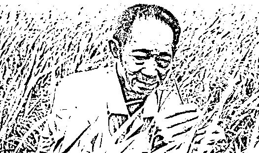

**|** 袁隆平

**“我就是时尚机器”**

处女座和双子座的守护星虽同为水星，都和处理信息有关，但前者对信息的需求是有目的和选择性的，而后者对所有事物都抱有好奇心。希腊神话中，和水星相连的天神赫尔墨斯曾用乌龟壳做出绝顶里拉琴，并且还能出色的演奏它，连太阳神阿波罗都被这把琴吸引。在这个情节里，赫尔墨斯充分展现了他**技艺精巧的手工艺者形象**。

在现实生活中，处女座特质强的人成为工匠和手工艺者的化身，已经去世的“时尚大帝”——出生星图上拥有处女座星群的卡尔·拉格斐（Karl Lagerfeld）就是典范。卡尔·拉格斐用他的**“完美主义”、“细节控”**和**“工作狂”**来承载时尚圈的“花花世界”。他曾形容自己是**“时尚机器”**，追求**不停歇的精确运转**，他知道作为一名设计师，需要的不只是画草图，“他开始努力接触文学、历史、建筑、音乐等各方面的内容”。

实用主义，思维导向，将获得的信息筛选到自己需要的程度，处女座的精髓被展露得分外鲜明。

**以技术为基础的电影业**

我们不仅可以用占星学观察人，也能为任何有明确“诞生日”的事物制作出生星图。1895 年 12 月 28 日星期六晚上，卢米埃尔兄弟的“活动电影机”在巴黎卡普辛路 14 号大咖啡馆的地下室里开始做第一次的公开售票公映，取得了惊人成就，这天被公认为电影的诞生日。

**月亮交点表达了生命剧本的蓝图**，在电影的出生星图上，**月亮南交点在处女座**，借助近代物理学、机械学、光学、化学等综合成果，电影得以诞生。

电影技术的发展、对镜头语言的研究、 剪辑手法的丰富，录音技术的出现、动画和电脑技术的应用，数字化技术……从黑白到彩色、从无声到有声、动单声道到多声道、从普通银幕到巨幕、从二维到三维、从模拟到数字进展，**“技术手段”**是电影发挥生命力的基础。

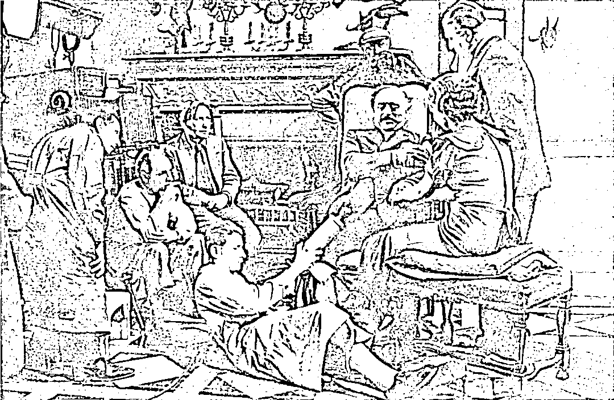

**从“渴望完美”到“接受情感”**

处女座**渴望完美**。在能量的积极呈现中，袁隆平以“提高水稻产量和品质”造福人类、“细节控”卡尔·拉格斐打造了自己的时尚帝国，电影业随着技术发展为人们提供更好的视听享受。而“渴望完美”的另一面，是**“吹毛求疵”**，是**“只看到墙上的裂缝”**，是“自私的”**只关注自己注重的准则、用批判的眼光看世界。**

在渴望完美的驱力下，处女座对自己奉行的准则一丝不苟、绝对细致、不放过任何一个细节，**却很可能对自己不关注的事情，鲜少付诸精力。**人们总用“干净”“整洁”形容处女座，但常发现很多处女座人在生活中非常邋遢。原因在于，这些处女座认为整理房间、每天对着镜子看自己的穿着打扮是非常浪费时间的，他们宁可把精力花在要追求完美的事情上。所以不要用在生活中是否干净整洁来定义一个处女座，**看看他们“业精于勤”的“业”立在何处，那是他们精耕细作、展现“匠人”风采的地方。**

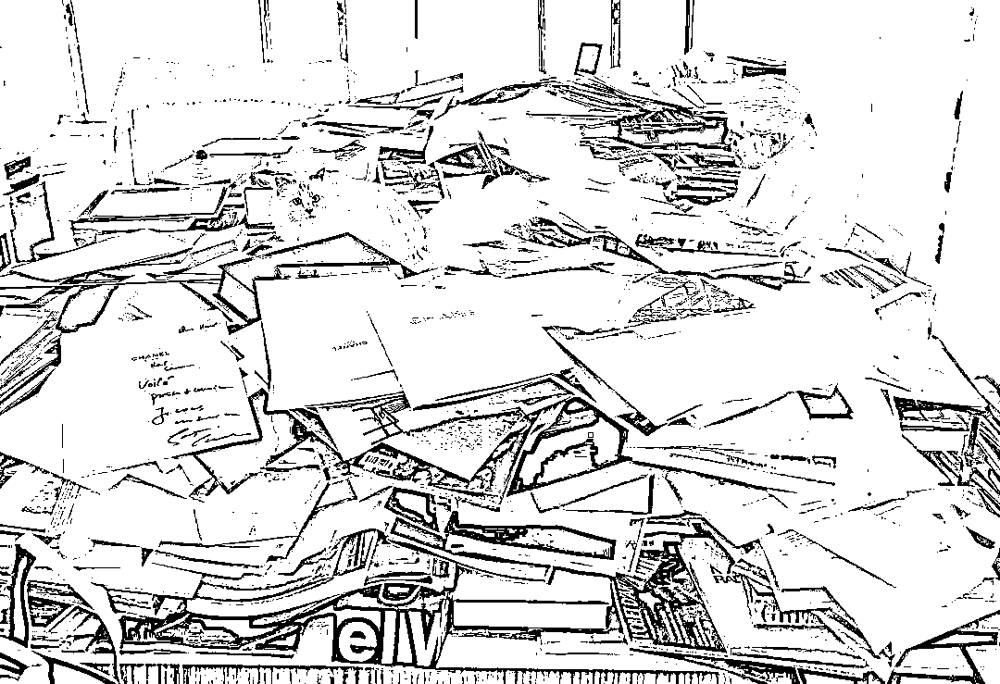

**| **卡尔·拉格斐（Karl Lagerfeld）

**在追求完美的过程中，“只见树木不见森林”**是处女座的过度表达，细节会淹没他们。我有个处女座能量较强的朋友，他能花一个小时向我们发牢骚，原因是合作伙伴不靠谱，然后他会把事情的细节翻来覆去重复讲很多遍。但其实除了纠结在一件事情上之外，有很多方法和视角可以处理墙上那道“裂缝”。

对每颗麦粒都仔细检验是负责任的表现，但有整片田地要在有限的时间内收割收仓，而不是为了在打着高光的展架上展览。

也正因为如此，处女座做事情**有时会显得拖沓**，他们的拖沓不是无法聚焦，而是过于强调每个细节的处理，从而拖缓整体节奏。处女座对细节的专注，容易让他们成为“挑剔”的代言人，当选择了“正确”路径时，精益求精是“成大器”的助力，**而一旦奉行的准则不切合自己的蓝图，“追求完美”就会把他们带离跑道。**

处女座务实、注重理性思维和逻辑分析，对完美的过度渴望会成为进化路上的阻碍。他们怀疑并不信任自然而发的情感和灵感，认为只有不断打磨技术、形成机械化的精准反应才能应对这个世界。就像我们常看到一些视觉特效极其震撼的电影作品，还有那些把“抠像”技术运用得令人惊讶的的影视剧，它们的故事乏力，情感空洞，难以让人获得美好的心灵体验。

**奉行技术至上的时候，对人性情感部分的体验就有了缺失。**

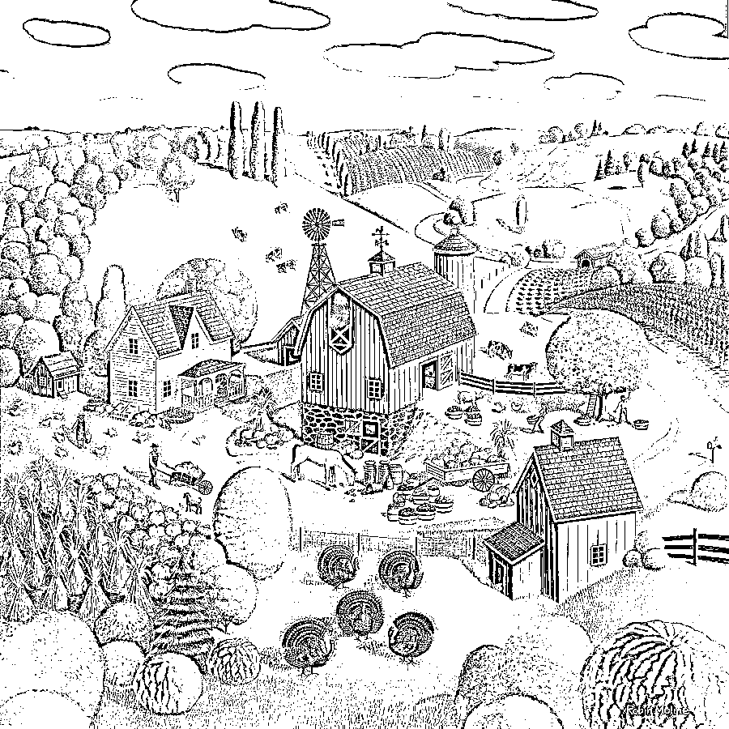

不知道看《乐队的夏天 2》的朋友们对重塑雕像的权利是什么感觉。重塑追求音乐的精致与控制感，主唱华东把音乐比喻成建筑物，他不相信有灵感这个东西，**只信任绝对严格的训练和一丝不苟绝对完美的肌肉记忆型表演。**他会用“我的音乐是难听（难以听懂）的”给观众划一道进入他们音乐世界的门槛，他还会说，“我们是来提高节目水准的”。他们用非常处女座的态度对待音乐，他们服务的对象是技术。

而观众对五条人乐队的喜爱则反映了处女座的一个进化方向——将技术用来服务人。五条人随性随心的表达自己，自由自在的演奏音乐，扑面而来的“烟火气”里有真切的生活阅历和情感体验，而演唱与演奏成为他们表达情感、与观众共鸣的管道。

**如何面对情感、情绪和“非理性”是处女座的挑战。**他们在批判别人的时候，更苛责自己。对完美的渴望不仅让他们带着“甄别”的眼光看世界，他们也在用同样的眼光看自己。任何瑕疵都是不能容忍的，**他们会怀疑并低估自己，**强烈的自我批评会给处女座的心智造成极大损害。当处女座无法接纳自己的“瑕疵”和“扰乱理智”的情绪时，同时也切断了和内在那个“服务者”连通的管道。

就像钢琴演奏家如果只是照本宣科的准确完成弹奏，并不能让乐曲充满生命力，只有当创作者的情感意图被表达、同时演奏者把自己对作品的理解和感受加进演奏中，乐曲才拥有活力，才能为人们带来无与伦比的服务和体验。

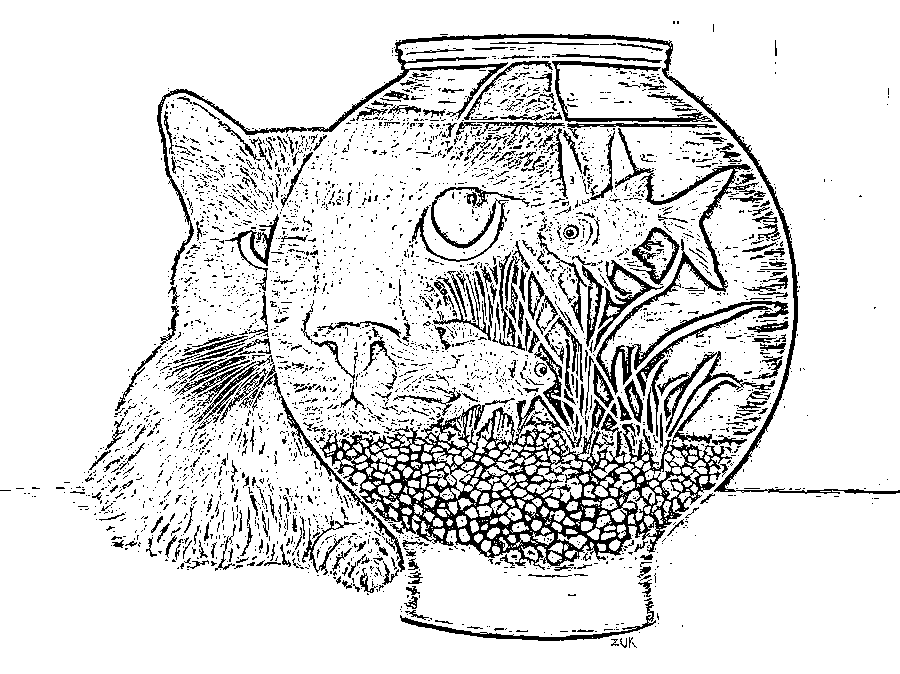

学会擅用能量

还是让我们回到正等着收割的农田情境，它描绘了一个发展良好的处女座会有怎样的表现：

面对庞大的工作量，细化工作、落实每天需要收割的粮食数量，把自己可用的时间、体力和精力考虑进去，在有效的时间内、用最优化的方案和耐心的工作，细致完成每天的任务。同时记得你的目的——储存足够多的粮食，以备过冬和来年的生活。

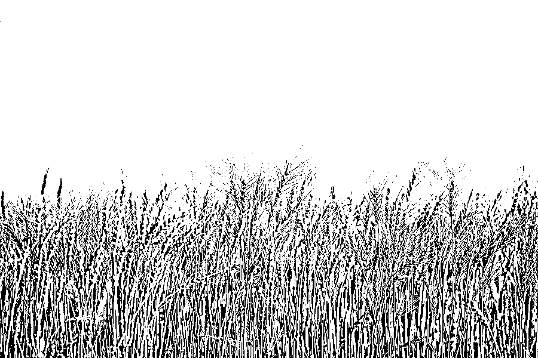

**处女座需要学会擅用自己的能量**，有效的运用“提纯”能力，从大量细节中提炼出核心问题，娴熟的运用技能，有条理的精确完成任务。所以**“断、舍、离”**对处女座而言是非常重要的生活实践。从生活中提炼出需要的、舍去和离开那些多余的困扰，从庞杂中筛选出最符合你迈向完美之路的要素，然后聚集你的能量，专注其中。

在这个过程中，学着接纳情绪和一切“非理性”的体验，如果能向对面的双鱼座学习**自我接纳**，**并对自己和他人的情感有更多接纳与理解**，对集体意识的波动有更加敏锐的体察，那么“服务者”的使命会在精益求精的自我驱动下，造福更多的人。

就像《哈利波特》中拥有处女座星群的赫敏，“十全十美小姐”和“问题多小姐”是她刚入学时的外号。她追求咒语精准、魔法完美，不容忍别人的错误，刚开始时她并不能很好的运用处女座能量。

而在她被哈利、罗恩营救，三人建立友情后，赫敏的“最强大脑”和让 “铁三角”在无数次险境中化解危难，她的精确判断和高超魔法技艺让她成为抗击黑伏地魔阵营里不可缺少的一员。她组织成立“家养小精灵权益促进会”，还在后来成为了魔法部部长，她用自己的智慧和技艺服务整个魔法世界。

斯蒂芬·弗里斯特曾这样评价处女座：**“没有一个星座比这个星座的人更渴望成长。她的完美主义促使她不断改变，而她的务实主义又可以让她找到办法去做。”**处女座拿出自己最完美的部分，服务于服务世界的原则，以此来完善自己并走向完美。

**版权声明**：原创文章由作者授权首发于若道平台，欢迎转发，反对抄袭。友号转载请申请白名单。

翀子

ISAR 认证占星师（2019 年获得）

若道 2019 届核心课程毕业生，若道微信公众号兼职编辑

**咨询微信**：carolinemichong

**微信公众号**：LumosTrueSelf

长按打赏

**长按下图扫码报名**

**听免费经世占星公开课**

**微信又双叒叕改版啦，不想错过若道君的推送？**

**就把若道设为星标吧！**

**▼**

就是这个“在看”，戳戳戳 ☟

********报名直达入口********

# 照亮年度重点的神奇星图，可以这么用！

> 原文：[`mp.weixin.qq.com/s?__biz=MzA5NjA0NTAxNg==&mid=2651425001&idx=2&sn=de6d2988d3cc783abffe869550a4791f&chksm=8b4b3a5ebc3cb3480c1c63971216ba160dd5b958aea31d37f67828ed5335a404bb7a0110d6a8&scene=126&sessionid=1692738121#rd`](http://mp.weixin.qq.com/s?__biz=MzA5NjA0NTAxNg==&mid=2651425001&idx=2&sn=de6d2988d3cc783abffe869550a4791f&chksm=8b4b3a5ebc3cb3480c1c63971216ba160dd5b958aea31d37f67828ed5335a404bb7a0110d6a8&scene=126&sessionid=1692738121#rd)

作者/埃德温·勒纳德 

翻译/舟鹅 校对/Leisha

编辑/翀子 图片/网络

这篇文章浅显易懂的解释了太阳返照的概念、意涵、解读要点，并给出了清晰的例子。太阳返照图不会改变出生星图的能量，但可以带来调整的力量。

**什么是太阳返照**

在占星学中，太阳返照图是根据你**生日当天或生日前后**的某个时间绘制而成，**此时太阳的位置与你出生时的太阳位置完全相同。**

**使用太阳返照时你所在的地点来计算太阳返照图。**

太阳返照图**从行进太阳到达你出生太阳的精准位置开始，影响持续到下一次太阳返照开始为止。**太阳返照图可以显示出在即将到来的太阳年里，与占星学意涵相关的**某些能量、方向、趋势和兴趣**等等。

它不会取代或超出你出生星图的能量，但可以提供一些有关来年的占星能量信息。你可能仍然会表现出与你出生星图紧密相关的能量，但可能也会表现出一些与当年太阳返照图相关的能量。

重要的是，不要将太阳返照图误解成太阳图。太阳图是当出生时间未知时，占星师常使用的星图计算方式，把太阳放在合相上升点的位置。

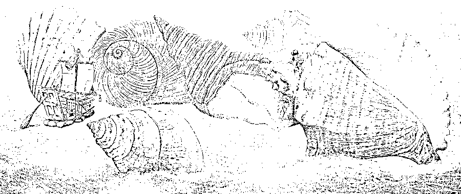

**太阳返照图的上升点**

解读太阳返照图的方式与解读出生星图相同，但方向和与占星学意涵相关的能量只与即将到来的太阳年相关。例如，太阳返照图的上升点在水瓶座的人，可能会在即将到来的太阳年中以一种不同寻常的外表出现。

他或她可能向外表达出更古怪、独特、非同寻常、不可预测的能量。这可能会与其出生星图的上升星座形成强烈的反差，如果出生星图的上升点在更传统保守的星座，如巨蟹座或金牛座，则更是如此。

这个人可能会比平时表现得更有未来意识和创新精神。**然而，太阳返照图表达和展现的能量不会消除出生星图上升点的能量，**观察**上升星座守护星所落的宫位**很重要，因为这可以显示出能量主要被分散到了生活的哪个领域。

例如，如果上升水瓶座的守护星之一(土星或天王星)落在第七宫，这个人可能会把很多无私的水瓶座能量带到与其他人、重要的他者和祖母有关的事情上。

**太阳返照图中的太阳位置**

**太阳在太阳返照图中所落的宫位可以指示来年太阳能量将灌注到哪个生活领域。**比如说，如果金牛座太阳在第三宫，那么案主可能会关注持续、稳定的交流。

**这可能意味着大量能量聚焦与集中在如何以看得见的方式呈现事物。**如果太阳落在第六宫，那么可以说这可能会“照亮”与健康相关的事情，尤其当太阳返照图中太阳与上升点形成梅花相时。

例如，太阳返照图的太阳在双子座意味着，精力和注意力会集中在与双子座健康有关的议题上，比如肺部、手臂、肩膀或手。太阳同样也掌管左眼或右眼，具体是哪只眼睛取决于性别。

其中一只眼睛可能会有与双子座相关的问题，比如复视，或者一只眼睛移动得比另一只快。试图同时做许多事情时，可能会出现精力问题。

太阳还掌管着心脏，所以，同时做多种多样(双子座)与服务/工作相关的事（第六宫），可能会引起与心脏相关的问题。

（若道君：了解太阳返照图中，太阳落在 12 宫位的意涵请点击【[这里](http://mp.weixin.qq.com/s?__biz=MzA5NjA0NTAxNg==&mid=2651422057&idx=1&sn=146785720a3bce7033b8250d4b8077c3&chksm=8b4bcfdebc3c46c88df0766e2f86c6758594b86ff9d776d9625fb5785e22bf20237ae8d9d57f&scene=21#wechat_redirect)】）

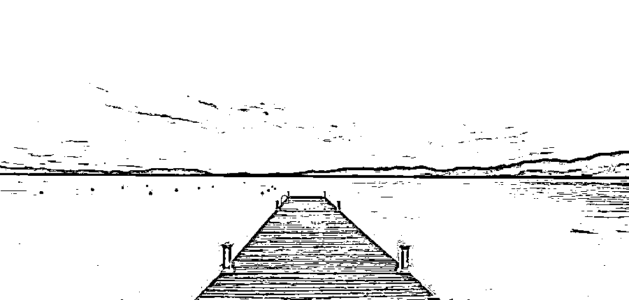

**出生星图和太阳返照图的关联**

**解读太阳返照图的一个关键要素是查看出生星图中与太阳返照图相关的突出点。**

例如，我出生星图的水瓶座中天将与我 2019-2020 年太阳返照图中的水瓶座上升点合相。

这表明许多人在那个太阳年对我的第一印象可能是，我的占星事业具有非常重要，表现得更显著。可能会更注重占星事业，事业将在这个太阳年被强调。

在占星界获得更高地位和认可对我来说可能是必要的。另外，**观察太阳返照图中的上升点落在你出生星图中的哪个宫位，这也很重要。**

**这可能预示着在即将到来的太阳年里，大量能量将被分配到何处。**我 2019-2020 年太阳返照图的水瓶座上升点将落在我出生星图的第十宫。这加强和再次确认了我在前文中阐述的内容。

我的占星事业，以及也许会获得更多与之相关的恶评与赞誉，可能会对太阳返照的这一年有着重大意义。

被认为是“所有人的朋友”可能很重要。

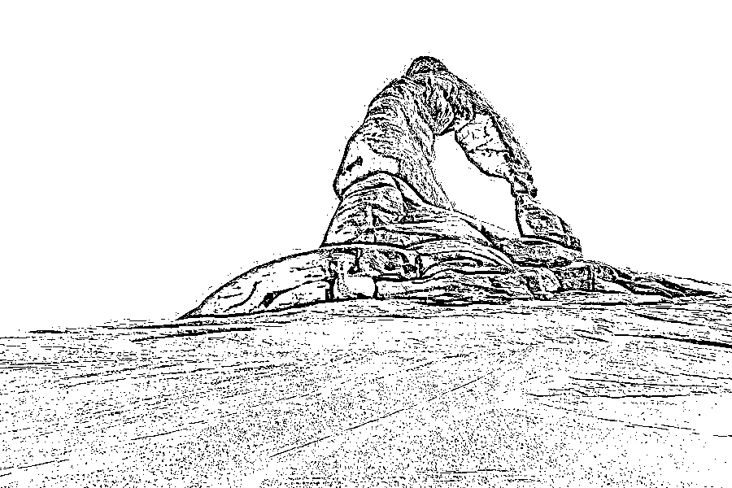

**行进在太阳返照图中的作用**

**行进在太阳返照图中也可能很重要。**行进通常可以带来**意想不到、意料之外的自发事件**，就像在出生星图里一样，但不会超过太阳年的范围。

举例来说，太阳返照图中，土星在摩羯座第七宫，但是稍后，在行进中，太阳返照期间，土星会穿过你的第八宫。

当它到达第八宫时，道德、情感、财务支持、共享资源、贷款(第八宫)方面可能会出现限制/阻碍，这可能会导致你感到沮丧和忧郁(摩羯座)。

同时假设土星对分太阳返照图中落在第二宫的巨蟹座太阳。

土星在摩羯座第八宫的议题可能会使巨蟹座太阳难以满足与家和家庭有关的基本需求，且巨蟹座太阳在第二宫，可能会对一个人的自尊和自我价值感产生影响。

日常工作似乎需要艰苦卓绝的努力。总之，太阳返照图在即将到来的太阳年对于你来说可能是非常重要的。然而，**它并不会取代出生星图的能量，但来年它可能会在某种程度上调整你的出生星图能量。**

以某个地点绘制的太阳返照图可能比以另一个地点绘制的太阳返照图对案主更有利。**这些星图不会永久取代出生星图中的任何能量。**

但是，在许多情况下，太阳返照图可能会为你的未来一年带来更有希望的能量，而行进对出生星图的触发可能不一定会体现出这些更有希望的能量。

**版权声明：**本文由若道翻译发布，欢迎转发，反对抄袭。友号转载请申请白名单。

**埃德温·勒纳德** YouTube 上的一位研究领域涉及广泛的占星师

******想跟随琳恩·贝尔老师学习太阳返照图？******

**点击下图了解详情**

**微信又双叒叕改版啦，不想错过若道君的推送？**

**就把若道设为星标吧！**

**▼**

就是这个“在看”，戳戳戳 ☟

****************报名直达入口****************

# 插班中丨琳恩·贝尔：太阳返照全解读

> 原文：[`mp.weixin.qq.com/s?__biz=MzA5NjA0NTAxNg==&mid=2651425001&idx=3&sn=a44ddecd3a4cb2eed4f7ccdc8cdfdb7a&chksm=8b4b3a5ebc3cb34817d3eb27af749a8da38054ef961beb23e92086ef0dd36ed201fb785de715&scene=126&sessionid=1692738121#rd`](http://mp.weixin.qq.com/s?__biz=MzA5NjA0NTAxNg==&mid=2651425001&idx=3&sn=a44ddecd3a4cb2eed4f7ccdc8cdfdb7a&chksm=8b4b3a5ebc3cb34817d3eb27af749a8da38054ef961beb23e92086ef0dd36ed201fb785de715&scene=126&sessionid=1692738121#rd)

编辑/玫瑰 图片/网络

“**每当太阳回到它在出生星图上的位置，我们都把宇宙的一个新部分吸纳进来，并把它变成我们自己的。大多数人都会有这种体验，生日那天是特殊的。那时我们可能会掂量一些事情，感受时光的变化，并为最近的过去画上一个句号。同时，我们也可能想把未来握在自己手中。****太阳返照就是这样，它是我们未来的一小块。端详着它，会有一种跃跃欲试的期待感，将太阳返照与行进和次限一起用，会开启我们对未来时间的理解。****黄道的每一个度数都带着某个太阳能量的特别印记，这是一种支撑着我们核心自我意识的独特品质。当太阳回归到那个度数，甚至分和秒都准确地回归到我们出生星图中的分秒时，这种至关重要的光就会被重新充满，每一颗行星都会与太阳形成新的关系。在这门课程中，我们将学习如何解读太阳返照图，并理解它对未来一年传达的信息，理解在未来的一年里会发生什么？****我们在整个课程中都会研究案例。学员们也将研究自己过去和未来的太阳返照图。****Lynn Bell****琳恩·贝尔**
”**此课程可作为 ISAR 选修课。**

**1**

**课程目标**

*   跟随太阳返照技法顶流名师系统学习，熟练掌握太阳返照单图、双图解读；
*   学习掌握太阳返照解读延伸出的占星知识：太阳返照择时、小限法等；
*   更好地解读每一年宇宙给予你的生日礼物，规划未来一年，活出生命的荣耀；
*   更清晰地洞察每一年的人生功课，更从容地迎接祝福、挑战、潜力和困难；
*   以人生目标管理的方式应用太阳返照图，制定人生的 3 年、5 年、10 年计划；
*   太阳返照为 ISAR 考试知识点，适合计划获得 ISAR 认证学员系统学习；
*   整合太阳返照等多种技法，在咨询中开设新项目《生日年运解读》。

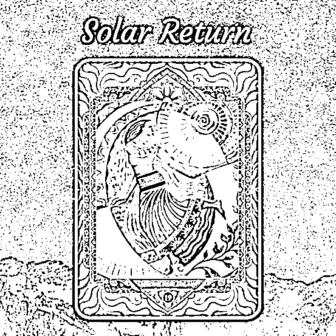

**2**

**课程内容**

**2020 年 8 月 4 日（周二）第一课**❶ 什么是太阳返照❷ 如何解读太阳返照❸ 一张太阳返照图解读两遍❹ 为期 19 年的默冬周期预测与意识❺ 出生地与迁徙地的返照图 ❻ 不是所有的年份的太阳返照都一样**2020 年 8 月 11 日（周二）第二课 **❶ 月亮在太阳返照中的至关重要性及其元素周期❷ 月亮落入火元素星座、土元素星座、风元素星座、水元素星座的解读❸ 食相、满月和新月❹ 月亮在太阳返照中的相位**2020 年 8 月 18 日（周二）第三课**❶ 继续月亮的相位❷ 太阳照亮各宫位❸ 通过太阳所在宫位解释太阳返照❹ 在太阳返照中太阳的相位**2020 年 8 月 25 日（周二）第四课**❶ 太阳返照中的合轴行星❷ 太阳返照中的合轴行星为未来一年添彩，并成为来年的主导者❸ 重要的星图模式❹ 精确紧密的相位❺ 行星力量**2020 年 9 月 1 日（周二）第五课**❶ 太阳返照与出生星图的关系❷ 识别模式❸ 太阳返照中行星作为出生星图的解释❹ 逆行行星和共振相位❺ 出生上升点经过各宫位**2020 年 9 月 8 日（周二）第六课**❶ 太阳返照中的择时❷ 利用月亮择时❸ 整合行进❹ 太阳经过各宫位❺ 中天推进❻ 小限法**2020 年 9 月 15 日（周二） 第七课**❶ 特殊的太阳返照年❷ 太阳返照与金星周期❸ 中天经过各元素❹ 最好和最坏的年份
**2020 年 9 月 22 日（周二） 第八课**❶ 与未来合作❷ 技巧的整合❸ 预测与心理学❹ 如何处理两难困境

**3**

**课程适用人群**

*   具有一定占星学基础知识，能综合解读出生星图的占星学子；

*   对于自我成长、人生目标规划有兴趣的占星学子；

*   占星师或渴望成为占星师的人群，希望丰富咨询技巧和项目；

*   计划获取 ISAR 考试认证学员，知识考点，可作为选修课。

**4**

**授课老师**

**琳恩·贝尔（Lynn Bell）**

*   世界最受欢迎的占星学演讲者、作家和老师之一。定居巴黎，对心理占星学和家族模式有几十年的研究。 
*   著名的心理占星学中心（Centre for Psychological Astrology）的长期导师。2016 年，获得查尔斯·哈维（Charles Harvey）杰出的占星学服务奖。 
*   作为一个从多个层面进行工作的占星咨询大师，琳恩的工作结合了心理学的观点。她对家族模式的兴趣首先来自与客户的合作。通过在分析领域所做的个人工作，她所受的埃里克森催眠训练将她引领至家族系统。后来，她组织研究小组在家族星图上进行了数年的研究。她写的《家族占星学》就是这项研究的结果。 
*   法国心理占星学协会的会长。除了占星学，她在法国沙特尔的新沙特尔学校任教 8 年，还 5 次获得了在《纽约时报》畅销书作者卡萝琳·迈斯（Caroline Myss）的卡萝琳·迈斯教育学院（Caroline Myss Educational Institute）合作教学的机会。

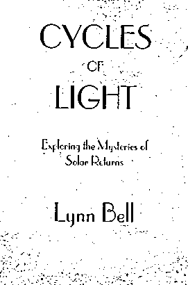

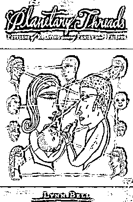

|琳恩·贝尔老师著作《Planetary Threads》和《Cycles of Light》

**5**

**课程费用**

**价格**：6800 元

**6**

**开课时间**

**2020 年 8 月 4 日（周二）20:00-22:00****共 8 次网络课，英文授课、中文翻译******截至 2020 年 8 月 20 日，课程第 1-3 讲为录播课程（限视频回放），其余均为网络直播课。****

**7**

**退转课程**

**退款原则请详看《教学协议》，如有疑问请咨询课程顾问**。****太阳返照全解读****

**授课老师：****琳恩·贝尔**

**授课时间：****2020 年 8 月 4 日-2020 年 9 月 22 日，共 8 次课程**

**授课方式：**网络课程，英文授课，中文翻译

**费用：6800****元**

**课程负责人：**王老师（微信：18510107057），请备注“太阳返照全解读”

长按二维码添加课程负责人咨询~

****报名请点击“阅读原文”****

# 什么？有 42 种羡慕和嫉妒？！看顺势疗法如何选用药剂

> 原文：[`mp.weixin.qq.com/s?__biz=MzA5NjA0NTAxNg==&mid=2651424942&idx=2&sn=76c510bed97ab7f94bd3d7dfba95b51f&chksm=8b4b3a19bc3cb30fb55736bc29467450cc963bd979222dfc9dddb6afb1182ef391a037c12a55&scene=126&sessionid=1692738121#rd`](http://mp.weixin.qq.com/s?__biz=MzA5NjA0NTAxNg==&mid=2651424942&idx=2&sn=76c510bed97ab7f94bd3d7dfba95b51f&chksm=8b4b3a19bc3cb30fb55736bc29467450cc963bd979222dfc9dddb6afb1182ef391a037c12a55&scene=126&sessionid=1692738121#rd)

作者/ 若道君 编辑/翀子 图片/网络顺势疗法的问诊详细涵盖身体和心理层面，这在目前的医疗界中是相当独特的，它会对心理状况有非常详细的分解，比如羡嫉就被分成 42 种。当使用合适的制剂，不仅身体的状况得到疗愈，心理的状况也会得到疗愈。

在前面的文章我们说过，**顺势疗法是一个整体性治疗的方法**，它认为从一滴水里可以看到整个海洋，我们身体、心灵的**每一个侧面**都反应了我们整体的状况。因此，顺势医生的问诊会**非常详细地涵盖身体和心理的层面**，而这在目前我们医疗界中是相当独特的。

**在目前的治疗界，大部分人身体生病了，去医院看病，很少有医生会关心病患的心理状况，**医院的医生更多关心的是身体症状，而不关心这个病是怎么来的，病人在生病前曾经发生什么事情，有什么心理状态，现在又处于什么样的心理状态中；而去看心理咨询师的人，心理咨询师也很少关心一个人具体的身体状况。

虽然我们都知道，**长期的某种情绪的失衡和心理的失衡必然最终会在身体层面反应出来**（学习占星学的学子很容易理解整体性的原则，占星学也是整体性的）。身心灵的一些研究者会提到身体和心灵的关系，给出一些如何调整心灵而去治疗身体问题的方法，但是在心理治疗界，这部分真正的实践者其实非常非常少，系统的教学也很少，真正能够去治疗他人的更是凤毛麟角。而且，有时候，当身体有了病痛，靠自己的心理调节也是相当有难度的事情。

而**顺势疗法**，则是从一开始就去**结合身心**，对病患进行疗愈的一种疗法。在顺势疗法的每一种药剂里，不仅会从头到脚去讲这个药剂从头到脚的症状对应，而且还会详细描述这个药剂的性格特征，对应什么样的性格、心智状态。当顺势药剂治疗一个人的身体症状时，也会**同样去治疗这个人的心理症状。**

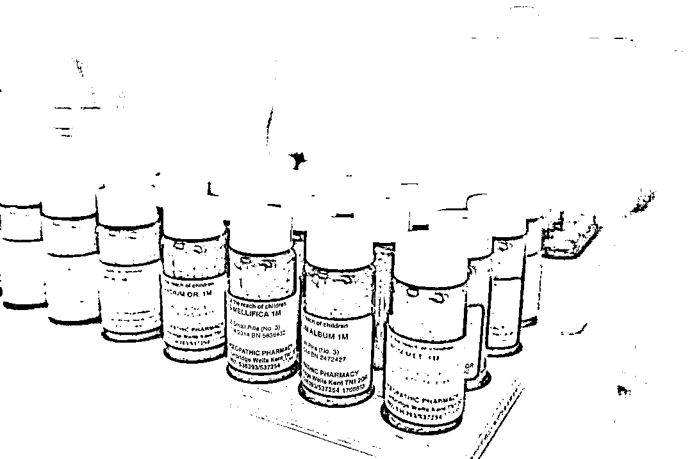

比如，我们过去曾经跟大家讲过钩吻（可点击文章【[神奇的顺势药物](http://mp.weixin.qq.com/s?__biz=MzA5NjA0NTAxNg==&mid=2651423508&idx=2&sn=97781498d66e8f01053479a325dd4fd5&chksm=8b4b31a3bc3cb8b50dbba1ef407071f609fa9855bc388e0d1686eef9b376d2291cb6cbfb81b8&scene=21#wechat_redirect)】）（顺便说一下，钩吻也对新冠肺炎有用的制剂）。那篇文章，只是非常简单地描述了钩吻的一些方面，专业的药典（*Materia Medica*）里对钩吻的描述则多得多。

比如，就在钩吻里，对于心智方面就有如下描述 ：

*   喜欢安静、独处，不想和其他人说话，也不想其他人靠近，哪怕另外一个人一声不出。

*   沉闷、蔫。对于自己的疾病漠不关心的样子。

*   情绪上的激动、恐惧等都会导致身体的疼痛。让人害怕和恐惧的新闻会让病情变糟。

*   有舞台恐惧症，对于在公众面前会感到紧张害怕。打算去教堂、剧院、约会时会腹泻。预期会遭受折磨时也会腹泻。

*   如果病人是孩子，则会抓住护士，开始尖叫好像害怕跌到一样。

*   站在高处就想往下跳。害怕跌到。害怕死亡、疼痛、折磨。

*   回答问题慢。发呆，不愿动。瞳孔散大。闭着眼睛但是意识清醒。

*   悲哀时无法哭泣，会对自己失去的怄气。

*   无法思考或者无法集中注意力。思维变得沉闷。

*   在睡觉时会变得神志不清，不连贯地说话，或者梦游。后半夜做不愉快的梦。

*   完全缺乏勇气。

*   ………….

当你读到上述钩吻的描述，是不是你对于这个药对应的人的心智状况是不是有一些感觉？

而且，非常有意思的是，顺势疗法对于心理状况有非常详细的分解，这一点又非常像处女座，其细致状况让人惊叹。**有的时候，通过一个心理状况切入，就可能找到合适的顺势制剂。**

下面我们来看一个很有意思的案例。

**一个案例**

一个男孩来见 Gaurang Gaikwad 医生，为了治疗他的癫痫症。他在癫痫发作时会四肢抽搐、口吐白沫，他的意识却又相当清醒，知道发生了什么，但却无法控制自己的身体。他服用了很多种抗癫痫药，但都没用。

在顺势疗法里，也有很多治疗癫痫的药，但是正如我们之前所说，**一定要找到这个人的独特之处。因为顺势治疗的是人，而不是病。**

于是医生问，第一次发病是什么时候，生病时发生了什么？这是一个非常柔和的男孩，他的回答很有意思。他说：

“

你知道，那时我九年级，当时要考试了，在那个下午，我们所有人，我们都在学习，我们学习数学、几何等。我看到我的一个朋友和另一个朋友，他们整整一年没有学，但现在他们开始学，而且他们还边学边打电子游戏，不仅打游戏，他们还叫了汉堡，他们还在吃汉堡。

他们怎么能这样做呢？我就不能这么做。我很紧张在学习，而他们却在吃汉堡，在玩电子游戏，玩得很开心，那我呢？我学了整整一年，但还是不懂。而这些人边学习，边打游戏、吃汉堡，玩得很开心，他们还能得好成绩。他们怎么能享受，而我不能享受。我希望我能和他们一样享受。但我不行，我很紧张。然后我就第一次发病了。

医生认为，强烈的羡嫉情感激发了这个男孩的癫痫。

**对于羡嫉，在《症状大全》里，有 42 种顺势制剂对应这种情感，而在羡嫉之后，出现癫痫，有 47 种顺势制剂。**

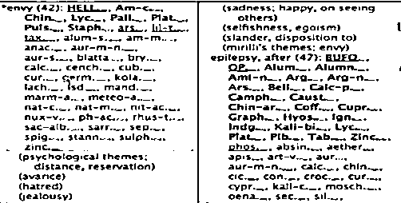

**|** 《症状大全》截图

所以，医生**需要进一步聚焦。**

顺势的非常有趣之处在于，在几百年的时间里，他们对此真的很有研究，并且整理地非常好。就以羡嫉而言，那种看到别人好，就想别人遭殃的羡嫉，和看到别人好，觉得自己没法得到而难过的**羡嫉是不一样的**，而**对应的顺势制剂也不同**。而顺势甚至对于羡嫉的是什么，也有非常详细的分类。**比如这个男孩的羡嫉，他羡嫉的是其他人的快乐。于是，这样，范围就缩窄了。**

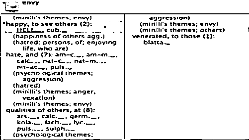

**| **《症状大全》截图

在以上这个截图中，我们可以看出，看到他人快乐而引起的羡嫉，和既羡嫉又恨，和对他人的生活质量感到羡嫉，对他人受到尊重感到羡嫉，都有不同的顺势制剂。

那么对应这个男孩，因为对于他人的快乐而感到羡嫉的顺势制剂只有 2 个。而医生为他选择药剂是其中一个——**黑黎芦。**

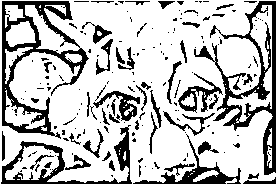

**| **黑黎芦

这个男孩服药后，**癫痫完全消失了。**他强烈的羡嫉情感也大大缓和，后来他学习 IT，也不再那么害怕和紧张考试，未来想成为 IT 工程师。

当若道君越来越多读到顺势案例，就越来越深地感觉到就**系统性、历史经验性、治疗实践**方面来说，顺势疗法在整个疗愈界的宝贵和独特。**一种自然界的灵魂可以治疗我们个人的灵魂。**当找到合适的制剂的时候，不仅身体的状况会得到疗愈，心理的状况也会得到疗愈。

****请在后台回复 顺势 获得更多****关于顺势疗法内容********

**版权声明：**本文由若道翻译发布，欢迎转发，反对抄袭。友号转载请申请白名单。

**学习顺势疗法**

**请点击下图了解详情**

**微信又双叒叕改版啦，不想错过若道君的推送？**

**就把若道设为星标吧！**

**▼**

就是这个“在看”，戳戳戳 ☟

********报名直达入口********

# 愤怒、委屈……的背后藏着什么？ | 12 星座情绪密码破解法

> 原文：[`mp.weixin.qq.com/s?__biz=MzA5NjA0NTAxNg==&mid=2651424942&idx=1&sn=f451febe4db5554576e816f7c720bcc1&chksm=8b4b3a19bc3cb30f5f015e05721db3360cdcae85d8d1f53f0ad827d1caf2f7a079a480c26c8a&scene=126&sessionid=1692738121#rd`](http://mp.weixin.qq.com/s?__biz=MzA5NjA0NTAxNg==&mid=2651424942&idx=1&sn=f451febe4db5554576e816f7c720bcc1&chksm=8b4b3a19bc3cb30f5f015e05721db3360cdcae85d8d1f53f0ad827d1caf2f7a079a480c26c8a&scene=126&sessionid=1692738121#rd)

** 后台回复“今日”，给你一句生命态度 **

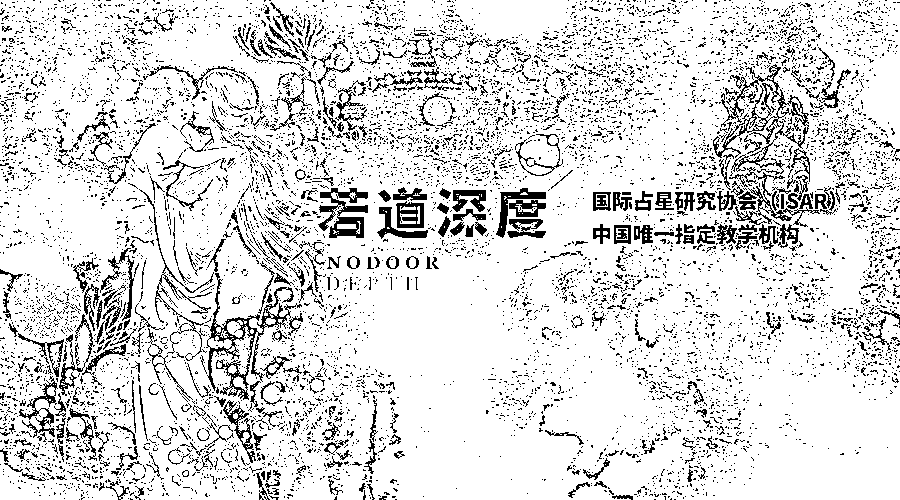

**作者/编辑/玫瑰 图片/全景网**

最近的天象不太友好。你是否有很多情绪，想要爆发却又感觉没有出口？这些情绪，有的和当下有关，有的需要追溯到很久以前的感情、家庭、事业矛盾……所有未能表达的愤怒、委屈、伤感、需求，都会积压下来，成为无法化解的情绪伤痕。这些伤痕经过长期内化，自身已经无从识别。只能通过我们同周遭人、事的互动时投射出来。于是你会发现，一和对象沟通就抓狂，一和父母说话就要疯……我们会用一些词语去描述情绪伤痕的起因——占有欲、低价值感、不配得感、自卑……也会尝试去挖掘原生家庭带来的创伤。然而，更深层的源头，还可以从星图中的这些地方寻找到。
**星图中的情绪密码**在星图中，有几个和巨蟹座相关的元素：**月亮（巨蟹座的守护星）、四宫（巨蟹座的天然宫位）、南北交点（月亮交点）**。他们加在一起，谱写了每个人生生世世的情绪密码。**月亮代表一个人的内在情绪模式，以及通过怎样的方式可以得到情绪滋养，通常也同早年养育我们的人，尤其是妈妈相关联。四宫是代表着家族、原生家庭的宫位，是我们的根系。南北交点则代表着我们意识进化中前世今生的“从哪里来，到哪里去”**。进化占星学大师斯蒂芬·弗里斯特认为，**月亮南交点星座是我们前世的太阳星座**。**情绪伤痕在星图中的显现**每个人都带有情绪的伤痕。如果你相信轮回，伤痕可能来自很多个前世；如果你是唯物主义者，伤痕也很可能在孕期以及围产期就产生了。星图中有浓厚巨蟹座、四宫、月亮色彩的人，更容易卡在“家”的创伤里，成为瑟缩在壳子中的螃蟹，没办法真正活出这一生精彩的进化之旅。原生家庭所带来的创伤真的会伴随我们一生么？其实不然。从科学的角度，我们无法回到自己婴儿期重活一次，但是在意识的世界中，我们却随时都有可能重新回到子宫中，将自己重新孕育出来。如果把人生的每一天都会成为你生命中的第一天，你愿意吗？想要达成这样的状态，要先**找到那些让你卡在旧有情绪中的人、事、物，去处理它**。它们深藏在下面的几个星图元素中。

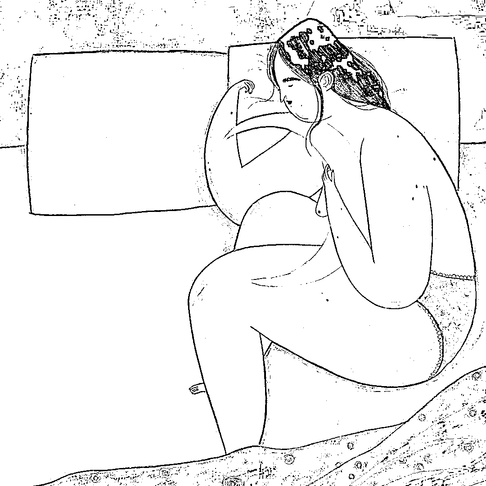

1**下中天星座（四宫头）**

在出生星图中，从十二宫孕育，到上升点吸进第一口空气。四宫代表的家族却并未在那一刻出现，而是在完成了第一宫对于“我”的认识；了解了第二宫——什么是“我的”；又经由第三宫牙牙学语，知道谁是“爸爸”、“妈妈”、“外公”、“外婆”……之后，我们才得以进入这个星图最低处的族谱。

从某种意义上来说，四宫代表的是我们认知中的亲人，却未必真的就是最亲的人。尤其是对于那些有过被收养、领养经历的孩子（也许并未真的行动），他们在四宫的家族中会感到陌生，甚至排斥。

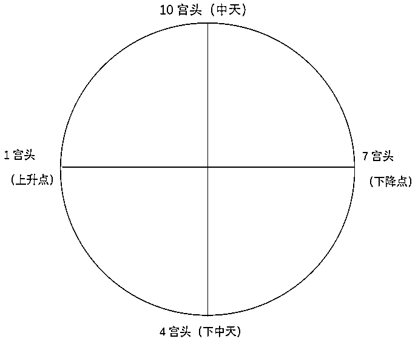

|星图中的四轴

整宫制中，四宫头（下中天）的星座必然同上升点（一宫头）、下降点（七宫头）呈四分（90°）的紧张相位，同中天（十宫头）呈对分（180°）的紧张相位。这似乎佐证了“父母皆祸害”这句俗语——**当一个人的根系同他的自我形象、伴侣关系，甚至世俗地位都呈现困难相位的时候，家族似乎注定就是一个人深陷其中的“痛苦根源”。**

然而这正是灵魂的“巧妙安排”。一宫到十二宫是螺旋上升的进化过程。在未曾觉醒之前，四宫代表的家族总是会带来不舒服的感受。只有这样，我们才能**不沉溺于其中止步不前，而继续向下面的宫位走过去。**

因此，**没有一个原生家庭是不带伤痕的**。但这些伤痕不应该成为令人流连忘返的泥沼，“锅”甩到它身上，只能表示我们是成长路上的弱者。更需要做的，是带着觉知不断疗愈和处理内在的情绪伤痕，慢慢将四宫变成真正的根基，使人更有勇气探索更远的道路。

2**月亮交点**

**星图中的月亮南交点通常代表着你的来处**。南交点所落的星座显示了你“曾经的亲人”。它们散落在世界各处，你很容易认出他们——当一个人的重要行星合相你的月亮南交点时，你会有强烈的“似曾相识”感，对他们倍感亲密，甚至刚见面就比相处了很久的家人还要亲。**很多夫妻的星图中也有一方重要行星合对方南交点的配置组合。**

然而，**南交点的归属感，更多昭示着你曾跌出的坑。**我们不妨做个设想：当你遇到一个人，经历了一段暧昧不明、骗财骗色的“双鱼座”色彩的虐恋之后，你告诉自己：下辈子再也不要遇到这样的剧情，要做一个明明白白，清清楚楚的人！于是，下一世，你的月亮南交点变成了双鱼座。

命运的确给了你一次机会，让你向月亮北交点处女座发展，然而，南交点双鱼座遗留的历史问题是无法逾越的。**你必须重新回到这样的关系中，处理完未竟的议题，才有可能谈得上今生的课题。**

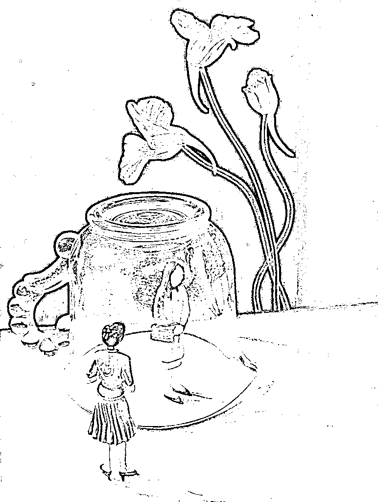

3**紧张状态的月亮**

紧张状态的月亮有几种情况，带着这样月亮印刻的人，天生在情绪的和解之路上就有困难。

*   **月亮落在一、七、十宫时，会同四宫形成天然紧张的关系，这意味着月亮所代表的母亲通常也是家族的“另类”。例如，一个落在十宫的月亮，很可能母亲突破了“传统女性”的形象，成为“女强人”，又或者想要充当家族中说一不二的“权威”；但是这会同月亮天然的属性产生冲突，让人在渴望情绪接纳的时候无法展现脆弱，而是显得生硬又强势；** 

*   **月亮同太阳、金星、水星、火星有紧张相位的人。**他们在同亲近的人相处时会很困难。例如，月亮同太阳四分相的人，可能有一对针锋相对的父母，加剧自己情绪不安感，进入关系的时候也会不自觉沿袭父母的模式，导致情感不顺利； 
*   **月亮同土星、天王星、海王星、冥王星有紧张相位的人**。他们难以认同家族模式，而“不为所容”，即便突出重围，也很可能成为没有“乡情”的异客。例如，月亮同天王星有相位的人，也许从小便需要在父亲和母亲两个家族中来回穿梭，无法安定，又或者母亲是十足的“叛逆者”…… 

*   **月亮落在四宫**，又会加剧同一、七、十宫的紧张关系，导致**念旧、恋家，无法摆脱家族的负面影响，建立自我的主见**，而对自我、婚姻、事业的发展都造成困境； 
*   **月亮同南北交点的紧张相位会导致今生的母亲（月亮）同曾经的“亲人”（南交点）产生矛盾。**例如，出生星图中月亮四分南北交点的人，他的妈妈也许会非常讨厌那些他熟悉而且亲近的朋友，认为他们阻碍了孩子的发展；即便月亮合相南交点，也可能导致同母亲之间过度依赖，反而坠入南交点的旧习气中，无法真正向北交点的成就感方向发展。母亲可能以各种方式阻拦孩子独立，试图将孩子捆绑在身边，等等。

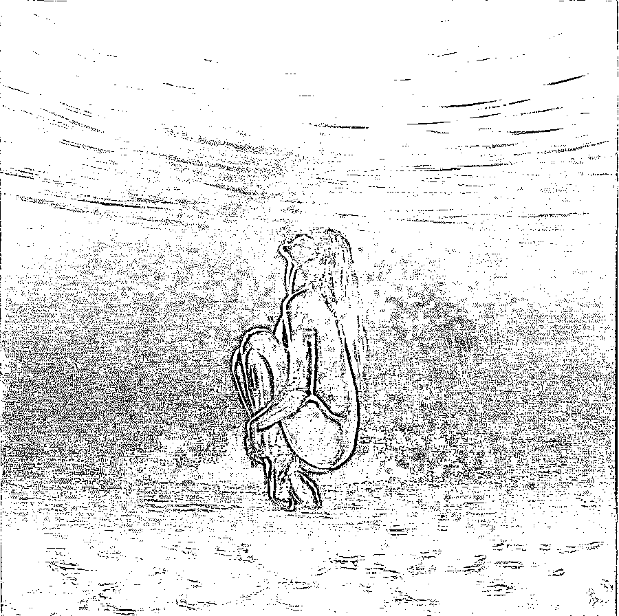

**处理你的情绪伤痕**

有几下几种方法，帮你处理情绪的伤痕。请记住，这是个漫长而反复的过程，需要你对自己足够的耐心和坚持。

1**寻找真正带给你滋养的巨蟹座能量**

如前文所说，四宫代表的家族，未必就是你真正感到亲密的人。关于这一点，相信不少人都有过体会——同在一个屋檐下的亲人却十分陌生，甚至彼此伤害。即便是一颗落在巨蟹座的月亮，也可能因为同土星、冥王星等行星的困难相位而导致同母亲之间的相爱相杀。

我的一位月亮同冥王星、海王星成困难相位的朋友，从小便受到母亲的控制，直至成年后，母亲仍时常要打电话来，事无巨细安排她的一切。而她甚至不敢在电话中对妈妈说一句“不”，理由是：“因为她是我的妈妈呀！”

不健康的亲子关系可能毁掉孩子的一生。**如果你拥有令你痛苦却无法反抗的父母，最先要做的便是让自己从这种畸形的关系中解脱出来。**这不是件容易的事。

*   一来，从一宫走到三宫的我们，按照格伦·佩里老师心理占星学的理论，尚在人生的 9 岁阶段，完全不足以独立生存。这时能够承载我们的四宫的家族，必然给我们提供了生活资料和养分，也让我们从心理上形成了**“哺育”关系**，这种关系**哪怕不健康，也非常难以脱离；** 
*   **二来，这样的依赖关系，令我们在潜意识中不断认同家族传递的观念。**你会发现一个看似叛逆的孩子，却遵从父母的安排进入了自己并不喜欢从事的行业，或者嫁给自己并不中意的人。反抗（-A）的背后其实是认同（A）——我们总试图活成和父母不一样的人，却在这种对抗中发觉自己和父母本质上几无二致。

**结束这种恶性循环的第一步，就是从“孝顺”思想中解脱出来。巨蟹座所代表的父母，更多的是一种意向，而非某一个具体的人**。改变的第一步便是**不盲从**。也许你当下沉浸在原生家庭的伤害中，那你要站出来，告诉自己：“我的父母也许当下并不是我所需要和期望的，最能够给我亲情和安全感支持的那个人。而我不必因此感到痛苦甚至屈服。”你可以寻找**其他能够给你带来接纳、宽容、滋养的个体和群体**。例如，也许你的父亲对你非常严苛，而你的某个导师却能给你父亲一般的关怀和指导。那么，你可以从导师身上获得你想要的属于巨蟹座的滋养，并**将这种感受收录到你的记忆库中，渐渐替代曾经原生家庭带给你的伤痛回忆。**

2**做父母的“父母”**

接下来，你需要看到，**自己的灵魂选择这样的家族，是因为背负着改变的使命**。我们对于父母的失望，大多源自于对他们的**期待**——期待妈妈是温柔体贴的，爸爸是坚强勇敢的。而当我们能够真正站在更高的维度去看到我们的父母，便会发现，**一个真正的巨蟹座能量，是不分群体的慈悲**——一个孩子若能将她的父母当做自己的孩子一样去爱，便能理解他们内在孩童曾受到的伤害，以及这些伤害无意识在下一代身上的延续。 

例如，如果你有一个特别暴躁易怒的母亲，不妨感受一下，母亲的暴躁源自何处？是否因为她还是个孩子的时候，经常遭受外祖母的责骂甚至殴打？现在，你能够看到那个暴躁的母亲内里满是伤痕的小女孩，便能升起巨蟹座的母性，宽容当下这个不如你意的母亲。而如果你遇到一个重男轻女的父亲，不妨想一想，是否在他那个年代，所有的人都歧视甚至轻慢女性？父亲也难以免俗，现在，你能将他当做你的孩子一样，用你当下的认知重新影响他，并且接纳他这样陈旧的思想，理解他的时代局限。宽容他对你所做的令你伤痛的事情。**巨蟹座的共情，是从自身的伤痕中得来的。**他们能将所有人类都当做孩子去爱，这源自巨蟹座来自海洋的，源源不断的自我疗愈和疗愈他人的能力。如果每个人都能发展出这样的能力，我们的世界将会成为充满大地母亲一般温柔关爱的人间天堂。

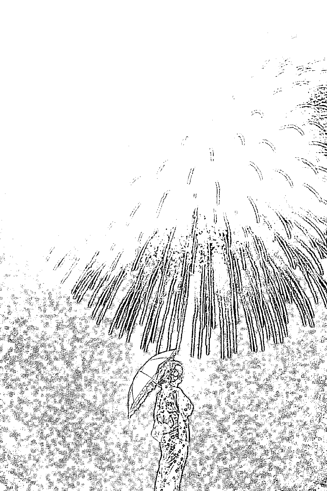

3**找到自我滋养的源泉**

**最根本的，是满足属于自己的情绪滋养源泉——月亮。**月亮是我们的加油站，没有月亮的原动力，我们甚至无法生存，更遑论在世界上创造什么丰功伟绩。而每一个月亮星座获得滋养的方式不同，了解自己的月亮，帮助自己获得源源不断的情绪动力，可以参考如下指引。**月亮白羊座**你需要**勇敢做自己**，月亮是保守而羞涩的，而你却要冲破它！你相信鲁莽比谨慎更勇敢，但在这个过程中，**注意不要太过自我而伤害到他人的情绪**。关于这一点，一个正向发挥的月亮天秤座会是你很好的老师。**月亮金牛座**不要害怕别人质疑你是个“贪财”的人！金钱对你而言十分重要，**缓慢地囤积资产，会让你感到心满意足而且安全。**一个正向发挥的月亮摩羯座会帮你实现这点，且明白金钱真正的价值。**月亮双子座**你可能喋喋不休，尤其是面对和你亲近的人。月亮水瓶座、月亮天秤座会是你很不错的密友。**给自己多订阅一些公众号、新闻，时刻处在八卦和信息的前沿会让你内心感到舒服，但请克制自己爱抬杠的冲动。**不妨多学习月亮双鱼座倾听的能力。**月亮巨蟹座****同妈妈之间的关系是你能够获得安全感的首要因素。**通常，一个胸部发育不良的月亮巨蟹座预示着，你需要寻找到真正的“母爱”。**如果你的母亲令你感到窒息，勇敢地同她分开居住，划清界限，你总能在其他女性朋友身上找到母性的感觉，并且不需要对妈妈感到歉疚**——直到你做好准备重新面对她，接受她也曾是个受伤的孩子。**月亮狮子座**你总是想要隐藏却“不经意”地显示出你是个女王！也许从小你被妈妈的光亮笼罩，成为她身后的影子，而你心里也住着一个永远长不大的孩子。作为巨蟹座后一个星座，你的热情、大气可以让人感受到阳光一般干爽的温暖和安全。但不妨**多向月亮水瓶座学习，如何将光芒辐射到更为广阔的人类社会中去。**

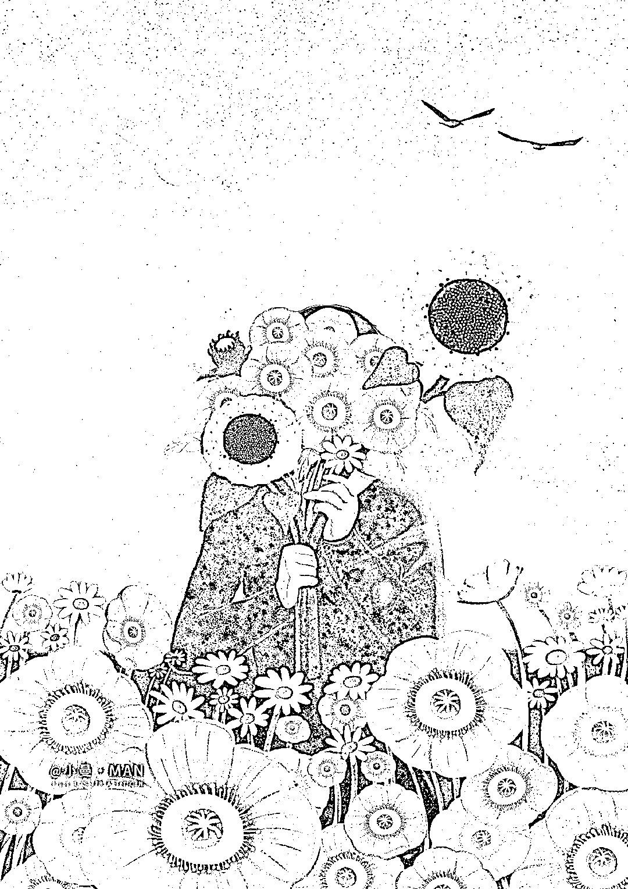

**月亮处女座**

**忙碌是你维持安全感的方式，而且是有计划的忙碌。**闲下来令你发慌。你也许有一个爱挑剔的母亲，导致你的精力都用在自我挑剔上，甚至都不敢有什么情绪。但是你的神经质和紧张总要有个地方发泄。一个月亮射手座或许能够令你放松，前提是别对他们的坏记性吹毛求疵——**太过理性不是月亮的功用，学着去感受，而不是去分析。**

**月亮天秤座**你太需要和谐了，大卫老师说你们是最不容易离婚的星座，真是这样吗？也许你很期待父母关系和谐，甚至因此使得你的父母关系好到将你忽略掉。**你们很需要陪伴，但感情不是等价交换，切莫有事的时候才想起去交往朋友**。**对着镜子观察你的笑**，是社交性假笑，还是发自内心的欢喜？**月亮天蝎座**

不得不说，你的母亲太复杂了。你们中的一些人，有一个生怕你们随时会死去的妈妈，而另一些人，有一个曾经暗暗想过要将你们丢弃的母亲。因此，你们的潜意识中有太多隐藏的情绪，有一些甚至无法从记忆中读出。也许你们是最需要月亮巨蟹座陪伴的一群。但请**先戒掉删除、拉黑的毛病**，巨蟹座最受不了这个。

**月亮射手座**

你们将太多精力用在“对错是非”的哲学思辨中，甚至忽略了人类正常的情绪。你们的母亲也许采用更为“散养”的方式，这令你们对好很多事都大而化之。然而，**如果认为别人也都和你们一样，则会让其他人在你们这里既得不到具体的思路，又得不到情绪的纾解。**不过，两个月亮射手座结伴而行，或许是不错的选择。

**月亮摩羯座**你们很容易被月亮巨蟹座吸引，他们身上的母性让你们放松。然而，严肃的你们似乎很难回馈同样的情感。**你需要问问自己，真的没有什么情绪，还是情绪被理性所禁锢，却在内在发酵？看一部温情片或许能够打开你情感的闸门**，但请偶尔为之，毕竟，对你们而言，追求踏踏实实的进步才是让自己感到安全的最好方法。

**月亮水瓶座**

你们十分友善，却总会令人心碎。你们也许百思不得其解，但这主要因为你们的友善似乎同人类的情感有些不同。**留意身体的疼痛**，那或许在说：“我有一个未解开的情绪在呐喊！”你们或许是最需要学习什么时候该哭，什么时候该笑的人，前提是很想成为一个“地球人”的话。当然，这其实比你们想得要重要得多。毕竟，你的母亲很难给你这样的范例，那么，**去找一些“让人无法忍受”的、情绪化的人相处吧，那里有你探索的人类密码。****月亮双鱼座**你们通常有一个和自己不分彼此的妈妈，然而这不总是件好事。成为一个独立的人的第一步就是同父母分离，这一点上，你们也许总是无法做到清楚明白。在同人交往中，也会因此出现界限含混、暧昧不明，而被斥做：“渣”。也许你总想牺牲自己去拯救别人，那么这时候可以回头**看看前一个星座——水瓶座**，如同塔罗牌一样，后一个星座的发展不良，总能从前一个星座中找到答案。

情绪的伤痕背后是渴望着流动的爱，祝大家都能通过自己的方式，找回内在的安全、温暖和爱。

**版权声明：**原创文章由作者授权首发于若道平台，欢迎转发，反对抄袭。友号转载请申请白名单。

****

****想阅读更多作者的文章****

****请在后台回复******玫瑰****** 即可****

**玫瑰**

英国 Cass Business School 管理学硕士

若道 2015 届核心课程毕业生，若道微信公众号兼职编辑

占星师，咨询时长超过 600 小时

**个人微信号：**Still_Queen_Astro

**公众号**：一个娘娘 

长按二维码，给作者打赏

**长按下图扫码报名**

**听免费经世占星公开课**

**学习顺势疗法**

**请点击下图了解详情**

**微信又双叒叕改版啦，不想错过若道君的推送？**

**就把若道设为星标吧！**

**▼**

就是这个“在看”，戳戳戳 ☟

********报名直达入口********

# 狮子月谈冥王星丨让神性下沉入地狱，寻找新生道路

> 原文：[`mp.weixin.qq.com/s?__biz=MzA5NjA0NTAxNg==&mid=2651424933&idx=1&sn=067ba9cd1699137296d7b8d1a4482d4f&chksm=8b4b3a12bc3cb30445b6be0ae7bbcd8801c8584f0f5bd97bc5222407cf1be33ee994b21115d4&scene=126&sessionid=1692738121#rd`](http://mp.weixin.qq.com/s?__biz=MzA5NjA0NTAxNg==&mid=2651424933&idx=1&sn=067ba9cd1699137296d7b8d1a4482d4f&chksm=8b4b3a12bc3cb30445b6be0ae7bbcd8801c8584f0f5bd97bc5222407cf1be33ee994b21115d4&scene=126&sessionid=1692738121#rd)

**☆ 后台回复“今日”，给你一句生命态度**

作者/蓝女巫 ISAR 认证占星师
编辑/翀子 封面/书君 图片/蓝女巫

本系列共四篇，是蓝女巫冥王星系列的子系列（前两篇请点击链接[【一】](http://mp.weixin.qq.com/s?__biz=MzA5NjA0NTAxNg==&mid=2651423829&idx=1&sn=1af9917d10025895ecb310ac4f4298d5&chksm=8b4b36e2bc3cbff4beeb3047e4aee6b3244ef96fe8a8255797d5e43e79c0d4f2c60c99b8987c&scene=21#wechat_redirect)与[【二】](http://mp.weixin.qq.com/s?__biz=MzA5NjA0NTAxNg==&mid=2651423829&idx=2&sn=ec0b8c8eed4135bad17755c7cdb6b07b&chksm=8b4b36e2bc3cbff4f7d44886303bb64a4ec75e401e6ec889953b7c0851a6ba639835b526aa1f&scene=21#wechat_redirect)）。写给冥王星第五宫人，以及太阳和冥王星有相位的人，也写给所有狮子座与天蝎座的合体，适用于狮子座水瓶座对宫人，以及热爱生命，及一切“活着”的人类。只要你的心脏还在跳动，就请在狮子月看向这里。本系列四篇，起承转合，将一步步深入到 5 宫的至暗之地，帮每一个狮子座灵魂探秘阴影。

呼应疫情，五六月我在读《红书》。此书公认的难懂，却刚好与我同频。与荣格同是冥 3，南交 8 宫的日海人，故能轻松会意。并有强烈意愿普及，**本系列就旨在将这本天书，扯成花瓣，向更多的心间散落。**我将结合个人感悟来编辑梳理相关章节，相信能让你很容易就领会了这本书。  

延续冥王星系列的框架，第三部分作为核心部分的转折点：**冥王星 5 宫，你将在何处受限崩塌？你注定在哪里历经失去的震撼？**本节要点：重温山树的两极；讲述天蝎座与狮子座的冰火交融，神魔合体；为撒旦画像；太阳神的夜行；谋杀英雄；新神诞生。继续用道生一，一生二，二生三，来动态地解释旧神，原我，新神的三步曲。

继上一篇在创造中**初探阴影后，此地我们要真正步入冰与火的温度中，去降入地狱的底端，找寻新生的道路！**

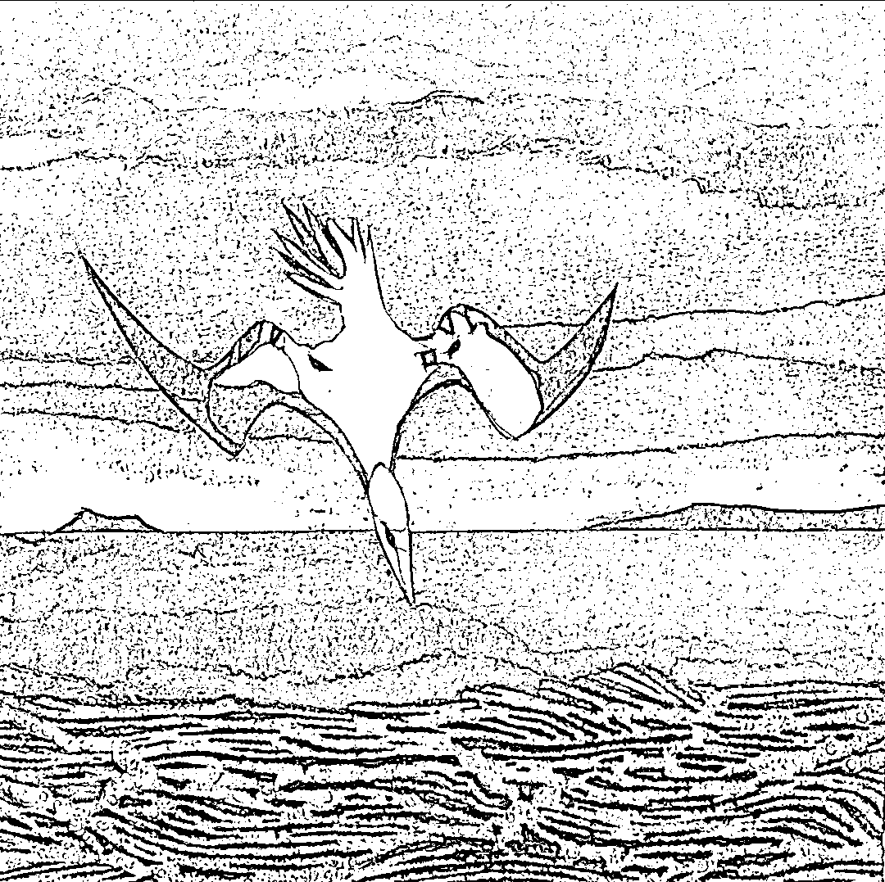

**两极**

我观察到，日冥人潜意识中的一个常见画面：“我看到不远处有一只鹗猛地钻入水中，接着叼着一条大鱼飞回到空中。这是**‘****下载着上’的标志。**” 

冥王星 5 宫或太阳与冥王星的相位，都从某种程度上，整合了狮子座与天蝎座两种原型，太阳与冥王星，即**冰与火的两极。**“上帝已死。我是太阳。” 我觉得，没有一个冥王星 5 宫可以不读尼采。他是强大的太阳和冥王星精准对分的人，生命力极其旺盛，作品充满对生命意志的赞颂。

读尼采，我总能看到无数的太阳的光芒，收获力的滋养，会有醉的感觉。一定是因为他在其中放入了**过剩的生命，高度的力感。美，就是生命力的丰盈，在对象上的投射。**他的人生，以神圣的疯狂收场。死于欣喜若狂，也算是艺术家死得其所的的幸福吧。毕竟，人生一场，并不是为了来滥竽充数的，你首先要是一个活生生的存在。 

这类人身上有一种鲜明的矛盾，**以悲观作为展示乐观的舞台，**能让阻力成为兴奋剂。在悲剧精神古希腊本质的张力中，我们看到这点：**至深的深渊，至高的高峰**。“**人之所以伟大，不在于走向一个极端，而恰恰在于同时触碰两个极端。**”既要对顶峰的寻找，也要对基础的勘探。

如尼采的山树般，狮蝎两极生长：一棵长在悬崖峭壁上的大树，它越是想长到髙处和光明处，它的根就越是力求扎入土里，扎到幽暗的深处，深入到恶里去。**最高的山从何处而来？它们来自大海。未拥有深度，如何拥有高度？**要在上和下的两极力量之间寻求不断平衡。现在你就走上你通向伟大的道路吧！顶峰与深渊，现在已经包含于一体。

无独有偶，荣格也致敬了尼采这个关于山树的比喻：一个向下扎根的人也在向上生长，就像一棵向上和向下同时生长的树一样。重点不是在高度，而是在中间。**你不能同时活在两种状态中，因它们相斥。但你的道路会带领你从山上到山谷，再从山谷到山上。在路上你就可以同时活出两者。**因此这条路能够拯救你。 

还是这首歌。听后你就会秒懂得了上述，歌特金属是我能想到对这个配置最完美的诠释。

我看到一棵树在海上升起，树冠直达天堂，树根直插地狱。它用深深扎到地下的根吃着地球，用高高深入空中的树枝饮着太阳。我想理解孤独的深度，我一直向前走，直到我生命中最后的声音都消失了……

**冰火交融，神魔合体** 

所以，整合狮子座与天蝎座之路，也就是神魔合体的过程。 

听荣格道来：**太阳神是最高的善，魔鬼是其对立面。**因此你有两个神。**美德和邪恶是一对兄弟。**善与恶在火焰中结合。太阳神讲的是生命，魔鬼讲的是死亡。**而至高的神，同时是生命和死亡。**从太阳那里吸取最高的善，从魔鬼那里吸收无尽的恶，才形成了前进中的世界。一切源自普累若麻的分化都是一对的对立，因此魔鬼一直属于神。

善恶明暗，空洞充满。彼此对立，互不抵消。那是正午和午夜的交响。亦如雌雄同体。神在太阳之后，魔鬼在黑夜之后。神在光明中带出来的东西，魔鬼在黑夜中将其吞掉。你用太阳神创造的一切都会给魔鬼有效的力量。每一颗恒星都是一个神，每一颗恒星所占的空间都是一个魔鬼。 

因此，谁能想到，邪恶竟源于过往的天真。**当你想要生出自己的神，同时也就想要邪恶。**也就是说，神临近时，你的本质便会翻动，深度的泥浆就开始向上涌。

**没有恶，你根本无法生活。接下来你要为那空洞赋予活力，让恶在这里成形。因为你在秘密地爱着恶，而且意识不到，才因此会受到恶的伤害。恶比你强大，它把你卷走。你对它的憎恨，只能将你与恶再次绑定。因你的力量仍然留在恶中。你只有接受它，既不爱也不恨，承认它的存在，把它视为你生命的一部分，才能把它从力量中剥离。 **

所以，当魔鬼强迫与你立约时，你可以先发制人，将自己与它合一，而不是满心想着去征服它，即否定它。魔鬼是人性黑暗面的总和。**而你必须首先变得完整，去超越你自己的对立面。**当冰与火的两股生命之流交汇时，那冲突必然是痛苦的，神圣与罪恶的冷热对流，理性与疯狂的力量交锋，快乐和痛苦一起交缠尖叫。直到它们结束了永无止尽的争吵，最终为真正的生命解放出双手。

**神与魔完成结合之后，对立面已相互包含，相互对视。生命变得完全静止。 **

荣格作品中常见将恶整合到神性中的主题，强调**完美之上的完整。**整合即指神的灵魂下地狱，救赎并征服黑暗，建立新秩序之后再回到天上，即让价值在无意识底端消沉后，重获全新更清晰的意识。即**在你的新神诞生之前，必须先去密会过了你阴间的兄弟。**这是对集体无意识的整合，作为个体化过程中不可或缺的环节。 

**当你意识到地狱也不是地狱时，你已经到达地狱的最深处，也即是充满欢乐的天堂。**

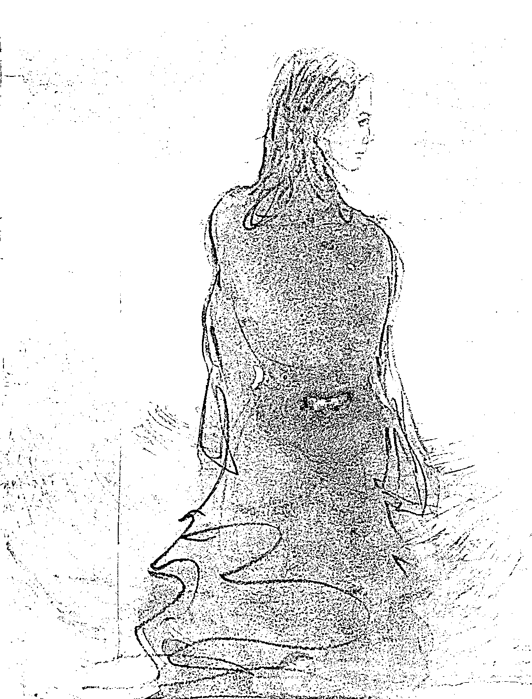

**| **蓝女巫画作 2020.6.3 

**撒旦**

魔鬼是世界的另一半，天平的一个托盘。冥王星代表的撒旦，是整个系统中最艰难却也是最有活力的部分。**他带着仓促的欲望，他永不满足，他把一切都推倒，又迅速重建。**对生命的理解和定义，他说：我的生命泡沫四起，搅起汹涌的波浪，它由抓住和扔掉构成，热切的渴望和不安。**这就是生命，不是吗？”“但绝对事物也有生命啊。”“那不是生命。是静止。”**

南交点来自 8 宫，月亮在天蝎座的我对天蝎座撒旦的激烈，本能地有着好感和认同。毕竟他是**“有个人特质的典范”**！是永恒的对手，是与永恒神性相对的个人性。而冥王星 5 宫，肯定首先强调的是个人性的生命。 

荣格提示我们，当撒旦在你潜意识的深渊中重新抬起头，你将看到最极端的冰冷。**它要让被遗忘的一切重现，那正是你自身的魔鬼。在你自己特有的地狱中，一切都令人厌恶。**它由所有你一直拒绝，被你诅咒着驱逐出自己神之圣殿的东西构成。所以，人尤其要冷静地观察激起你鄙视或愤怒的一切……重视任何阻挡了你道路的东西，在你进入地狱的途中。 

反之，若你贪婪地只想靠向外追寻，去找到能让你继续生活下去的依托，那将没有任何事物能满足你的快乐，围绕在你身边的都将是最渺小的东西。**因此要注视着死亡，只有它能教会你如何生活。**没有死亡，生命将没有意义，因漫长的时间会再次出现。此处，我想到了尼采的“永恒轮回”……

所以，**中年之后，只有愿意死亡的人才能保持活力。当下此处，不也正是人类的中年危机？与之共时，周围也有太多正值中年危机的朋友们……不愿意死等于不愿意生！**

下面来看一段荣格最生动的幻象： 

当我看到地球的哀叹和无意义并蒙着头走进死亡的时候（在我理解自己的黑暗之时，震撼的黑夜出现），我看到的一切都变成了冰（我的梦把我拉进千年的深度中），但红色的太阳在阴影的世界中升起（我的凤凰在这里升起）。一个新的太阳摆脱了血腥的大海，闪着光滚到最深的深度，消失在我的脚下（太阳依然在闪耀，但我感到自己进入到了巨大的阴影中。我缓慢又镇定地顺着溪流向深度前进，一直走到来者的深度中）。

你从灰色的岩壁，滑落巨大的深度

水覆盖着洞底，被秽物淹没脚踝

黑色的圣甲虫，游过溪流

红色的太阳光，穿过黑水

石墙上千万条小蛇，正一起扑向那光的闪烁，

**当恐惧已控制了你……**

**太阳神**

太阳神在冥界的夜行，被视为转化过程的象征：**死去的太阳神，化作圣甲虫，将新生的太阳，滚向东方的天空......**圣甲虫，代表古代的太阳，落日的原型。黑色甲虫之死，对于重生非常必要，因为此后的曙光中，青金般瑰丽的新辉，将冉冉升起，这是深度的太阳，也是黑夜中的太阳。它充满令人费解的事物。 

**太阳的主题，总是指代新的意识已经诞生。**而这一切在我画完一张画之后，奇异地发生。那后来，一切都不再一样了……我感到太阳之火已在体内喷发，多出了些新东西？它向我揭示着“神”的生命力，宇宙也更加频繁地与我对话。给我惊喜，也给我力量，在作品中，在日常中，直到让我一瞥巅峰体验。心中强烈的感觉难以言表： 

“我身上不断迸发出火流--我穿过熊熊的火焰--我浑身是火，在大海中游动--充满光芒，充满渴望，充满永恒--更新自己--**起初被压缩在蛋中的他站了起来，而他却是太阳。**” 

我无意中抓住太阳，并把他放在手里。我成为他夜间的母亲，孵化初始的蛋。他站了起来，得到更新，重生后更加光彩夺目。

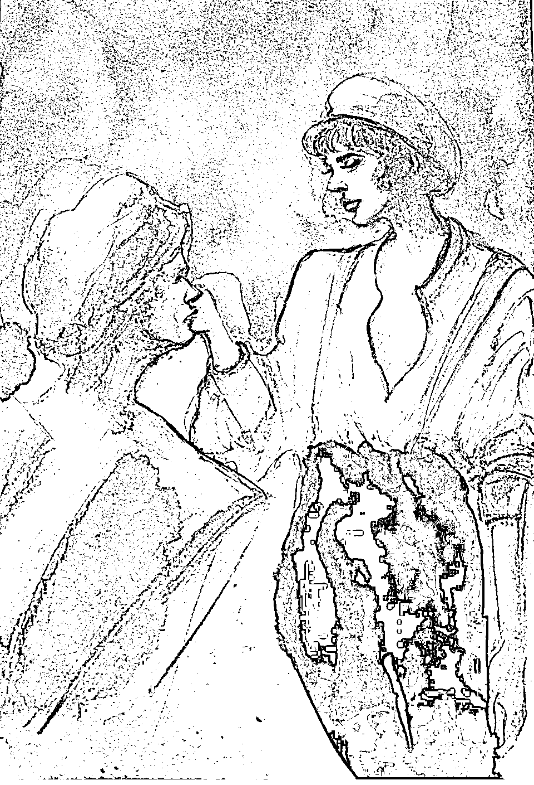

**| **蓝女巫画作 2020.5.29

这天，我画完一幅画，不自觉地对望着它很久。但我却不知道画它意味着什么？只是配了句话：我的心中，住着一个古希腊的神。立刻有人问是什么神？**心底一个响亮的声音：太阳神！**当晚，我才读到这一段，吓了一跳：“作为神，吉尔伽美什与太阳神有关。**吉尔伽美什的孵化和重生符合经典的太阳神话模式。是女性在很短的时间内由圣灵感孕生出太阳神，**借助某种形式，神在蛋中孵化……”但我却仍然不知道生出神意味着什么？ 

你的灵魂是精神世界中自己的原我。就像你生产或孕育你的孩子一样，他们逐渐长大，与你分离，成为自己命运的主人。你同样也产生或生产思想，而它们与你相分离，有自己的生命力。就像我们老去的时候会离开自己的孩子并返回到大地中一样，我使自己和神分离，也即是与太阳分离，下沉到物质的空洞中，并抹去孩子在我心中的意象。

写到这里，我才明白，同期从我潜意识中自动流淌出的另一幅画的含义……

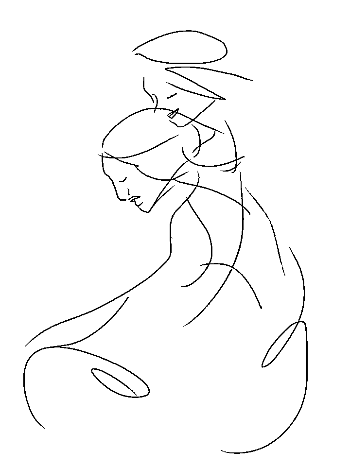

**| **蓝女巫画作《新神诞生》 2020.6.14

**造神**

冥王星 5 宫，常自以为是神的化身，或有着成为神的欲望，或者说拥有着一个英雄般的人设。但造神的意义又是什么呢？让我来用两个视角来整理荣格的描述。  

**对于造神的人而言： **

成功造出一个神，你为其倾尽全力。赋形于神，造神者则会被完全抽空，被剥去力量，变成空洞。你的力量注入到他的身体。他上升时，你却下降了。在神成熟并占有所有力量时，人的本质还遗留下什么？所有的光都会离你而去。**其实神性吞食人性，所以，这也就是残暴**。造神的过程中，你宁可忘掉的是自己，那个真实，完整，无能的自己？ 

神，只是你在自己外部设立的一个作品。而这会使你与原我分离。因为神远比你强大，便会让你的原我陷入水深火热之中。所以，你必须通过摆脱神来强化自己，完全成为自己。否定神，即摧毁你自身形式所投射出的意象，接受自己的空洞，去下沉到你无能的深渊和恐惧中。外在你进入孤独；内在你进入地狱。远离神。通过与神性分离和变成完整的自己，得到巩固，完成个体化。  

**对于这个神而言： **

你是神话的容器，人们在你身上感觉到的是自己需要的东西。他们抓住自由的你，为你打上神的烙印，锁进金色笼中。开始为你设计神话，称颂你。**你沉默地坐在笼中，变得瘫痪，上演神圣的喜剧。此处谓之为崇拜，这是人类所喜欢的。**

人类急需一个神，去找到自己传奇的承载者，将你变成他们的理想。他们需要你，而不是另一个凡人。你应该成为他们心目中的国王，而不是你心目中的国王，虽然他们的灵魂已空乏无意义，但他们对你的想法符合他们的理想。因此他们想要拥有你，你用以满足人类的愿望，然后消失......和人一样，神也饱受无能之苦。 

（提示：上述的神，还皆是**旧神......**） 

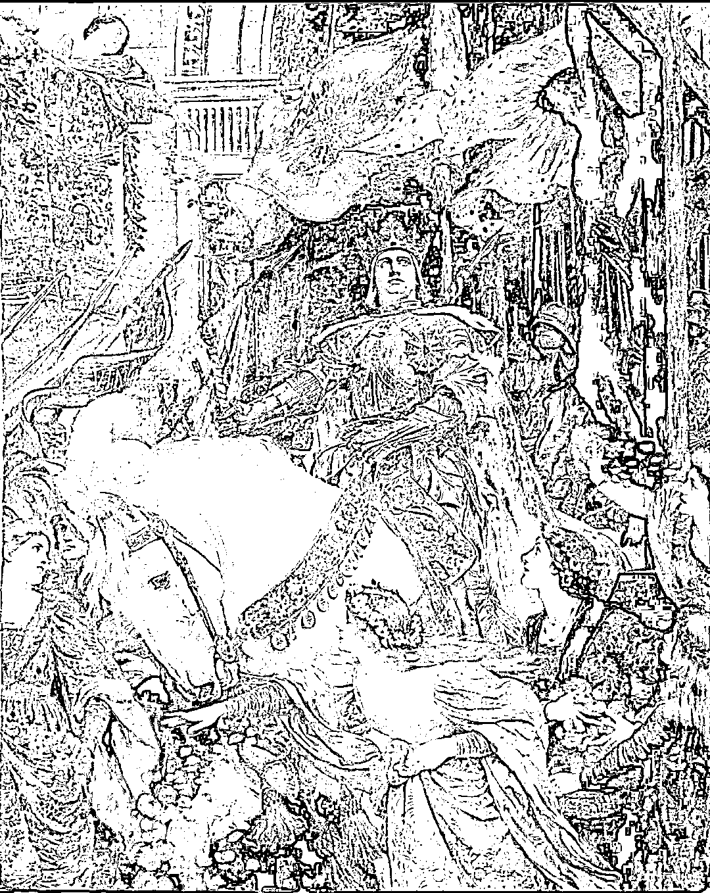

**谋杀英雄 **

神是关于创造。有关创造的内容都适用于神。**而创造害怕的是自己！所以，冥王星 5 宫最大的敌人就是自己。**为了能更加完整地活着，你必须要谋杀掉自己的部分生命。所以，冥王星 5 宫，去杀死你心中的英雄，超越虚荣心，超越英雄主义渴望。因为认同英雄是危险的。对应红书中谋杀英雄的章节：

“西格弗雷德，那个金发碧眼的德意志英雄，**至忠至勇的英雄只能死在我的手中！他拥有我最珍视的伟大和美好的一切，**他是我的力量，我的勇敢和我的荣耀。”

王子的隐喻，他就是我们每个人身上的英雄部分。得胜的英雄，被众人喜爱和环绕。你向他投射着你渴望拥有的一切权利与世间最高荣耀。他无所不能，相对于你所惧怕的无能。他代表夸大的意志……于是，他正在受到威胁，即将遭到暗杀，这是由无能对意志的愤怒导致，当无能的心怒视着崇高和恩宠。其实这是一场内战，**谋杀者与被谋杀的人，都是你。 **

抛弃英雄主义，没有什么比做英雄更危险。小到冥王星 5 宫做完美女友的愿望，大到英雄主义情怀，都代表你正被一种普世的时代精神所统治，一种顽固的价值评判，让你成为“应该”的奴隶，以压抑并牺牲你至真的深度精神为代价。

世界的终极规则是混沌的，生命力本身也是混沌的。在伟大的，和谐美好，光明飞升的英雄式美德中，散发的尽善尽美，是可怕而残暴的，它以扼杀生命力作为代价。任何抹杀冥王星这种混沌的努力，都是将世界推向死亡的一种方式。

**模仿英雄和成为英雄都是一场虚妄。**你应该大声讲出来你害怕自己。**害怕自己（冥王星 5 宫）是一种智慧。**只有英雄们才说自己无所畏惧，但你知道英雄身上都发生了什么？

当神逾越巅峰之后，他就会生病。**神其实希望被战胜，因为他需要重生。**英雄都是因为自己英雄般的态度超越了某个限制而陷落，从而丧失自己的立足之地。如果一个神不再是生命之道，他必须悄然倒下。如果神老了，他就变成阴影，无意义，他开始走下坡路。 

英雄必须倒下，因为他就是模范并要求模仿。**如果我们是我们自己，那么我们就能够腾空周围的空间，让神来充满。英雄没有被杀掉之前，你的神是不可能出生的。**因为英雄就是完美。为了能够做出一个新的改变，必须牺牲掉它。**荣格大喊，“出来吧，黑色深渊中的蛇......” **

为了能够获得可以激活劣势功能所必需的力比多，你需要牺牲掉优势功能，去摧毁你理想化的力量和有效率的英雄理想。而若你想征服死亡，就必须让死亡活过来。深度的太阳唤醒死者，你只须用生命的甜酒洒向它们，你的黑暗面将起死回生，**成千上万条黑蛇群起，扑向黑夜中刚刚升起的红太阳，**熄灭它，将其扼死。你将陷入巨大的震惊和怀疑中，坠入暗夜的混乱。

这有如戏剧中熟悉的场景，被杀死的恶人突然又爬起来，从背后袭击英雄的桥段，象征集体无意识中的黑蛇们。**蛇象征着对原我最深的威胁，你新获得的意识将再次被本能的无意识吞噬。**恢复了生机的邪恶正向你体内埋藏的即将冉冉升起的新生命发出攻击。

此处象征英雄（旧神）被抹杀后，每个人的深度中，光明与黑暗之间开始爆发的可怕战斗。战斗迸发出激烈且无法被遏止的血源，也是**新生命之源**，象征重生总是诞生于鲜血与折磨。 

当神是绝美和至善，他何以容纳生命之丰盈？**所以说，英雄是旧神，并不是完整的新神。**在英雄王子倒下之后，你才能看到新神的诞生，重生的神象征已更新的态度，**新神是相对的，因他有善也有恶。**所以，冥王星 5 宫，你最大的敌人就是现有的自己！或许它早已经老旧，快去杀死你心中的英雄，快从人设中抽身，**从神降入地下去重生。**

**只有通过让自己变成旧神，经历他的苦难和死亡，才能征服旧神。才能成为自己，也无便须再模仿英雄了。   **

**潜能**

当我们自身的优势功能遭到废黜后，却能令无意识的力量得以释放。在倾盆大雨象征的解脱中，所有紧张感获得了释放。至此，你才懂得了**谋杀英雄的意义，是为了救赎。**因只有主导功能充分丧失后，人格中其他的部分才能尽情出现在生命之中。而这不是别的，**正是潜能！是生命力的释放，**如大雨般的泪流。它冲刷束缚，埋葬老旧，摧枯拉朽，让大地肥沃，继而焕发出新神。

**这是对于冥王星 5 宫，至关重要的意义。以威胁性事件唤醒你身体最深处的资源（冥王星），使你能充分转化并体验个体的全部创造潜能（5 宫）。**

所以，**冥王星 5 宫，当你保持疯狂时，你需要耗费巨大能量。当你制服了疯狂，你却收获了礼物。因为能量守恒，这些解放和空闲出的剩余能量，都将供你调度。它们是活力，生命力，是最珍贵的能量，**能集结最大的力比多，带来最大的价值。你将强烈体验到生命被重新充电的感觉，变得精神振奋，能迎接任何挑战。 

写到这章时，又很共时地听到古典瑜珈老师在讲：**要有力量地去呼气，有如白羊座般有意识地使用些阳性力量，将身体清空。从满到空；以呼气的收缩，把所有废旧的气体都向外排挤干净后，吸气的动作便可紧随其后地自然发生了，它以双鱼式的阴性能量从容地受纳着宇宙恩典。即从空到满。**

这让我立刻想到且更深刻理解了，荣格的这句，**“英雄（1.旧神）必须倒下，因为他就是模范并要求模仿，如果我们是我们自己（2.原我），那么我们就能够腾空周围的空间，让神（3.新神）来充满。”**继而，我又进行了这样的联想：**“看山是山（1.吸气），看山不是山（2.呼气），看山还是山（3.再吸气）……”**

呼吸练习时，第一口吸气，特别容易变得机械而僵硬，它相当于那个“旧神”。我在吸气的此处因刻意而卡住了，正如冥王星 5 宫们在英雄梦想之处卡住了。而与其为第“一”步的动作而焦虑纠结，不如更智慧地去体悟那下一口吸气的来源，即推陈出新的“二”，它对应地狱中群起的黑蛇与原我之战。

所以，**必须先将自己充分地抽成空洞，才能让神来充满。**于是，在下一个吸气的“三”那里，“新神”降临，且来得非常流畅与自然。这不也正是一个**解释三生万物的动态角度**吗？而我们的生命力，也恰是在这往与收的起伏中，才得以保持旺盛，如海浪般绵延不绝......

**结语**

 **下面，这也是我在同一天，全然由潜意识中生长出的另一幅画。**让我们一起来解读这幅画，就像解梦那样：左上角的那一对，焦虑不被爱的女人，投射出一个碾压别人以强壮自己的男人；右上角，一个女人孕育出了一个婴儿。画时还完全不解。直到晚上读到的那个章节一下子让我明白了。**这是在象征自我的转化！创伤后蜕变出的一个新生，**可以是创造力或是生命力，一种由太阳所隐喻的力量。再往下看，左下角。**她与他都得到了真爱，**一种纯然忘我的结合，在新生后。且是在**整合了各自的阿尼玛和阿尼姆斯之后。 **

正如第一篇中讲到的**先觉 logos 和快乐 eros，当它们在你自身合一后，“圣子”便从中涌现，他是终极意义，象征向一个新创造的跨越。**神以蛇的形式把对立的爱和思想之结合体握在手中。如果你想要两者，神就会诞生。但你又难以同时要两者，所以，矛盾认识之间的战斗就会先在你身上爆发。而你将会看到外在的战争。所以荣格说：

“我见过祭山，鲜血横流。**大战爆发之时，我看到骄傲和力量如何令男人得到满足，美丽如何使女人的双眼闪光，我知道人类就在自我牺牲的路上。**”

所有的外部灾难，都是一场内战，是每个人本质的冲突。无明者却会把错归咎于他人。在人类能够上升到光明和爱的高度之前，大战必然发生。当战争支配人类的时候，战争不仅是罪恶的，它更是自我牺牲的神秘。因此，**爱，需要自我牺牲。这就是命运。**

我预见的圣母怀抱圣子的意象将转化的神秘呈现给我……

——卡尔·荣格

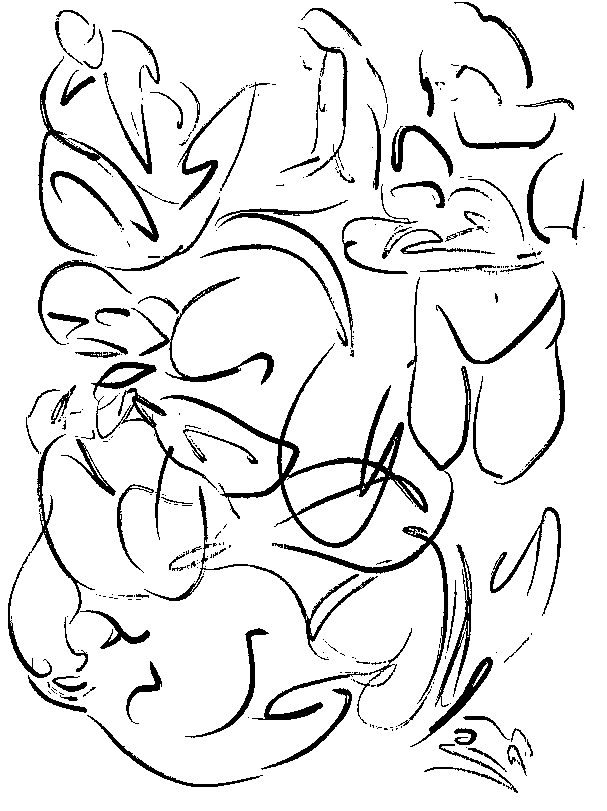

**| **蓝女巫画作 2020.5.29

**下篇预告（见今日二条）：《合唱》 **

**版权声明：**本文由作者授权在若道平台发布，欢迎转发，反对抄袭。

**蓝女巫**

英国伯明翰大学 市场营销学硕士

职业占星师/专栏作者/芳疗师/珠宝设计师

中国首批 ISAR 英文认证占星师（2012 届）

**微信公众号**：cecilia_sui

长按打赏

**长按下图扫码报名**

**听免费经世占星公开课**

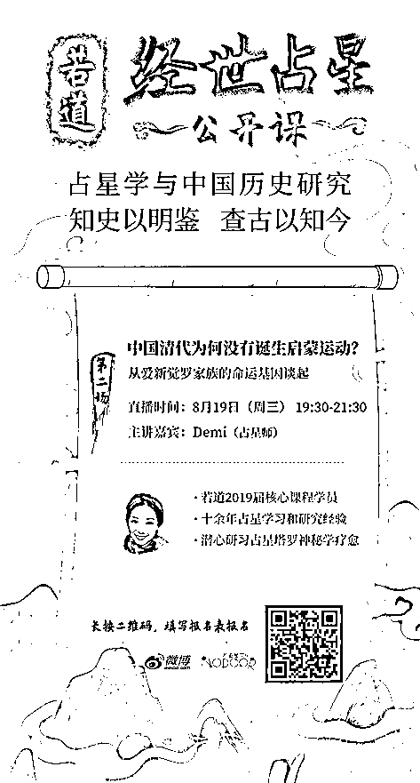

**系统学习占星学**

**点击图片了解详情**

**微信又双叒叕改版啦，不想错过若道君的推送？**

**就把若道设为星标吧！**

**▼**

就是这个“在看”，戳一下☟

********报名直达入口********

# 狮子月谈冥王星丨找到自爱的路途，创造唯一的你

> 原文：[`mp.weixin.qq.com/s?__biz=MzA5NjA0NTAxNg==&mid=2651424933&idx=2&sn=2e60c0253f46f1f995c923abb14eec45&chksm=8b4b3a12bc3cb304ec3cd3757251af7e62c4b0b92cd119c24c067af1548bb1aa01da071d66a9&scene=126&sessionid=1692738121#rd`](http://mp.weixin.qq.com/s?__biz=MzA5NjA0NTAxNg==&mid=2651424933&idx=2&sn=2e60c0253f46f1f995c923abb14eec45&chksm=8b4b3a12bc3cb304ec3cd3757251af7e62c4b0b92cd119c24c067af1548bb1aa01da071d66a9&scene=126&sessionid=1692738121#rd)

作者/蓝女巫 ISAR 认证占星师
编辑/翀子 封面/书君 图片/蓝女巫

冥王星 5 宫系列共四篇，这是最后一篇（前三篇请点击[【一】](http://mp.weixin.qq.com/s?__biz=MzA5NjA0NTAxNg==&mid=2651423829&idx=1&sn=1af9917d10025895ecb310ac4f4298d5&chksm=8b4b36e2bc3cbff4beeb3047e4aee6b3244ef96fe8a8255797d5e43e79c0d4f2c60c99b8987c&scene=21#wechat_redirect)[【二】](http://mp.weixin.qq.com/s?__biz=MzA5NjA0NTAxNg==&mid=2651423829&idx=2&sn=ec0b8c8eed4135bad17755c7cdb6b07b&chksm=8b4b36e2bc3cbff4f7d44886303bb64a4ec75e401e6ec889953b7c0851a6ba639835b526aa1f&scene=21#wechat_redirect)和今日头条）。打破旧有的限制后，该如何拥抱新的无限？什么才是对自己的真爱？又该如何在 11 宫找到平衡？让我们走进冥王星 5 宫的创造之路吧。

**原我**

梵高电影中有这么一句话：Someone is living a lie；Someone is living for his precious truth.

**究竟什么是爱自己？**我认为，那并不是教冥王星 5 宫的人去自恋，而是指要狠狠地**忠于自己！真实的你，才会被爱。**假我，不配被爱。正如，**缺少自爱的创作，就不会有神性的辉光。**

人们总惯于说，水瓶座才是大爱，大我；狮子座只有小爱，小我。而我想说，**任何爱，终究首先还是要始于对自己的爱，始于“我”。**

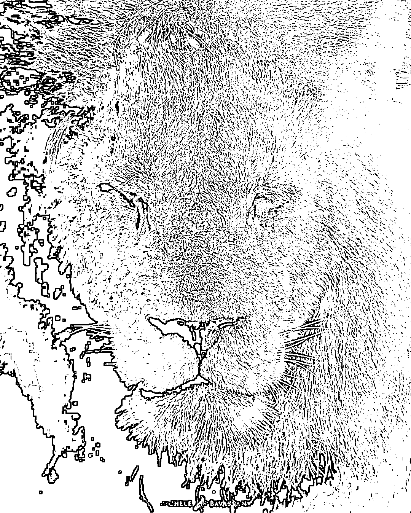

**共性与个性**人类拥有一项能力，虽然这项能力是集体目的最实用之处，但对于个体化而言，它是最有害的，这项能力就是模仿！**集体心理几乎无法避免模仿。**——卡尔·荣格

面对荣格这个论点，水瓶座双子座的代表们或许会本能地秒回一句：而世界上并没有原创。就算荣格也有局限，作为一个狮子座。但我是这样认为的，当一个人尚未到 5 宫那里，先结结实实地找到自己，就直接进入了 11 宫的集体，比如南交水瓶座（11 宫）。那么会发生什么？

荣格接着说：我们内部拥有个性，外部拥有共性。在我们之外，是共性与外在世界相连，而个性指我们自己。**当我们是自己的时候，我们就是独特的，而使用共性与外在世界建立联系。**如果我们是自己，我们就能够满足原我的需求，我们就会富足，在此基础上，我们**就能够意识到共性的需求，并能够满足它们。**如果我们**不是自己，那么我们就会在共性上变得独特且自私。**我们的原我就会处在水深火热之中，因此它**就会用共性来满足自己的需求。**所以，**共性就被伪装成个性。**在我们**还不是自己之前，我们与人的关系，经过的空间，都是自私。自私的欲最终渴望的是它自己。**如果你抛弃自己的原我，在别人的生命中活出它，那么你就开始自私地对待他人，因此你是在欺骗他人。所以说，先被水瓶座 11 宫集体能量灌满的人，常因缺失狮子座 5 宫的“我”，反而可能会更自私？ 在个性中，每个人都将自己置于他人之上，因此每个人都要成为自己，避免被奴役。在团体中，每个人都要服从别人，这样团体才能运转，因为你需要团体。人很脆弱，因此团体必不可少。团体的缺失是痛苦，但团体即是消解。团体提倡自我约束，个性提倡放纵。分化导致个性，个性与团体相对。**团体为我们带来温暖，个性给我们带来光明。****模仿**

与很有个性的火象创造相比，安于共性的风象更倾向于模仿。除了双子座的好学模仿外，天秤座的社交依赖，水瓶座的团体归属，其实本质上都是没有扎根的象征。因为受限于其社交属性，参照系在外。我细心观察到，很多正学习走向狮子座的水瓶座，在征途中似乎总显得欠缺了点什么。

你**经常忘记了自己是谁。当任由自己被外在的世界冲走，却忘记在自己的生命中深深地卷入**。且当你抽离旁观不参与，无论是你身内或身外的生命，那么你当然就找不到嗨点。创造的作品也就不够动人。

同理，我们 2021 开启的风象大时代又将意味着什么？当水瓶时代又逢北交双子。于是，就刚好会有南交狮子座 9 宫的人来问我：该怎么办？……懂其悲戚，回以唏嘘。下文旨在**为水瓶时代的低阶模式预警，螳臂当车也无妨！** 

狮子座荣格这段描述很精炼：你是一只在**地球上爬行的狮子，你是蜥蜴，拙劣地模仿，善于改变颜色，一只爬行的发光蜥蜴，但就不是一只狮子。**狮子座本质上和太阳相连，**它自己产生能量，不在有保护色的环境中爬行。**不通过伪装自己进行防御。我认识蜥蜴，再也不想在地上爬行和改变自己的颜色，也不想复活，**我要通过自己的力量存在，就像太阳散发出光芒而不吸收光芒一样，而地球吸收光芒。**

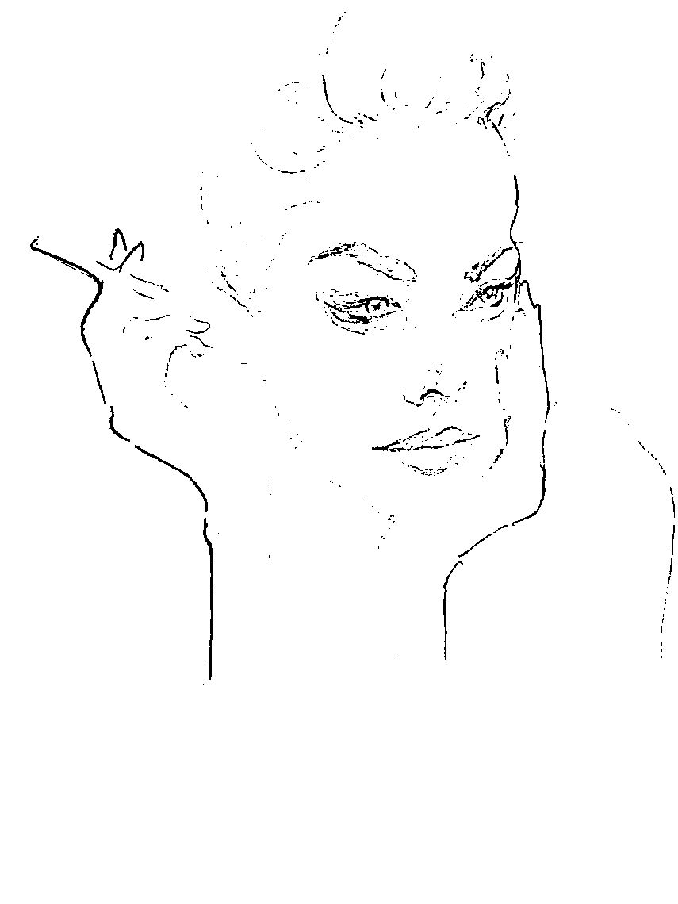

**| **蓝女巫画作 2019.3.21**是的。真狮子座憎恶模仿！**你可以指摘其因傲骄而强调独一无二。但**这确是其荣耀的底线！**本能热衷于原创，从 0 到 1 地开疆辟土，而非从 1 到 N 地鱼贯而入。狮子座之所以不模仿，也不愿被世间节奏牵着鼻子走。其实正是**因为他爱自己！更关键的，是他忠于自己！ **
冥王星 5 宫，也是一种对 5 宫深深的怀疑，这便值得挖地三尺地再探讨一下，**什么是真狮子座？什么是真正的贵族？以及什么是冥王星 5 宫的原我？ **这时刚好看到一段视频在讲梦露不需要珠宝。心下说，因为上升狮子座的她，自己就是珠宝。是的，真正的狮子座，与形式化的精英生活，没有半毛钱关系。富与贵本是两回事，甚至连**仪式感也是次要的。**狮子座必须是贵族，更精确地说，它代表一种**贵族精神**！像是极夜中的篝火，照亮人心的暖流。其核心**是对所有贪欲趋之若鹜的东西熟视无睹。 **而反面呢？荣格说：对于邪恶而言，没有什么比它的眼睛更有价值，因为空洞只能借助它的眼睛抓住闪闪发光的充满。因为空洞缺乏充满，它渴望充满及其夺目的力量。**空洞看到最美丽的东西，便想把它吞下！目的是为了毁掉它！邪恶知道什么是美丽。** **当你的参照系全在外部，每一步皆因别人而产生反应。我看到你无可藏匿的慌张。**邯郸学步，误以为模仿动作就可以模仿成功，却无心力去模仿精神。这不是一个真正鼓励创作的年代，因为一切原初美好的东西，一旦显现出价值，便会瞬间被利益的眼睛俘获，毫无悬念，次日烂大街。曾经，人们还默守着边界，而今纷纷已没有了顾忌。失去了尊重，便开始侵犯掠夺。在泛滥的信息洪流中，一切尽皆失控。羊群的核心是，懒惰与不思想。因为思考，带来痛苦。因精神失守，而内心荒芜，导致丧失判断，便屈从于惰性。绝望带来恶，它通往破坏。荒蛮在每个领域，赶走了开拓者与原住民。快速复制，快速死亡。杀鸡取蛋，同归于尽。直到把所有创作的公路，全玩坏了。但见日光下的一切，速生速死。朋友圈收割着一茬又一茬的风尚，末了都是一笑而过。 
我采访了一些冥王星 5 宫的人，说说对模仿的看法：

*   “鄙夷、附属感、无意义、空洞。要原创，要绝对是自己的。内心不肯与别人一样”

*   “模仿可以使我们走的很快，但那不是我们。属于我们自己的原创表达，整合了我们自己。”

*   “这只是我的路径，但你为什么要以此为道路？我看见每个人在追寻着不属于他的东西。”

*   “walking dead”

*   ......

对此我想说：**“如果你的创意也来自别处，那么你可能熟视无睹；但你的创意若发自肺腑，那么你一定会深感厌恶！”** 

所以，荣格也称之为：**这只不过是一种猴子般的拙劣模仿。**当人类仍然需要英雄式的原型时，模仿就是一种生命之道。英雄的意象便是利用模仿的贪欲为所有年龄阶段的人设立的，因此英雄必须被谋杀掉，因为所有人都在像猴子一样模仿他。**灾难会降临在依照别人的方式为榜样而生活的人身上！生命与榜样相悖。**如果你根据一个榜样去生活，那么你活出的就是榜样的生命，但是如果你不活出自己的生命，那么应该由谁活出你的生命？所以，活出你自己吧。猴子的方式就是猴子的生命之道，如果人像猴子，这也是他的生命之道。人的猴子一面源远流长，但人最终将能够摆脱猴子的一面。**你知道自己为什么无法脱离猴性吗？那是因为你害怕孤独和失败！**这真是一句振聋发聩的话，我想把它送给 2020 的这个世界。

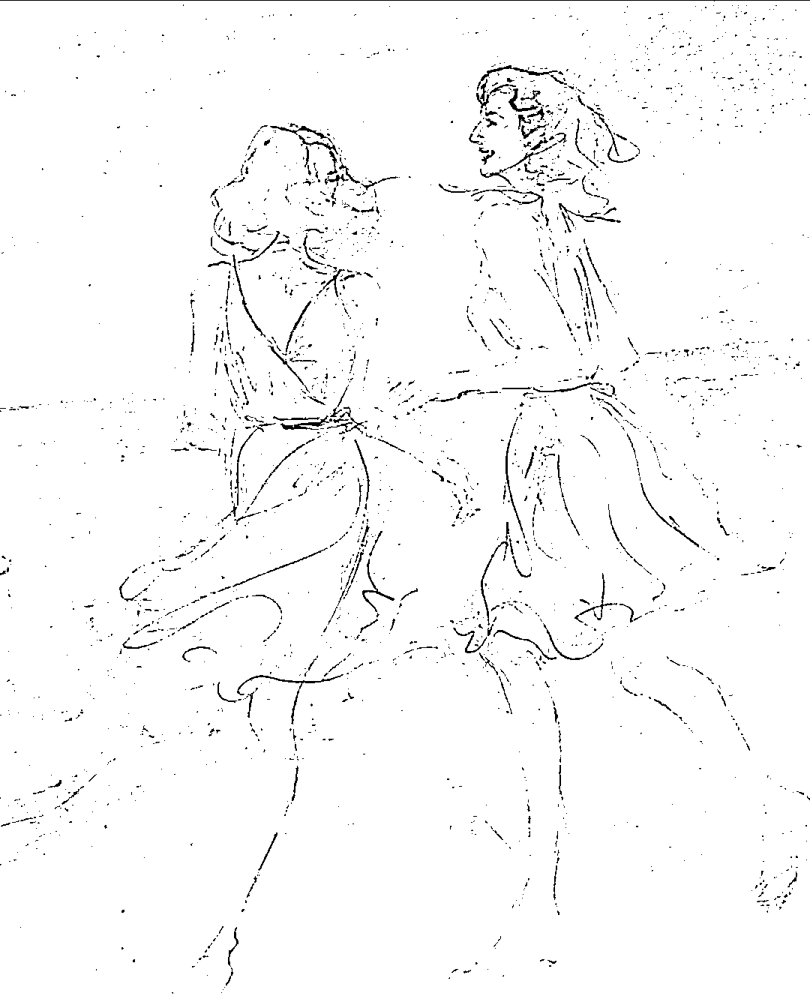

**| **蓝女巫画作 2020.6.29**心中那片海**曾回到家乡，追随一整片处女地的大海，空空如也的蓝灰色中，流露着不着粉黛的安宁，每当我对着它发呆，便可以忘记整个世界。而今她也被利益的眼睛盯上，现已彻底商业化了。门庭若市地收着门票，架起了舞台大喇叭，海滩上跑着推土机，分分钟打断你的日光浴。海被强加以媚俗的装扮迎客，总令我胸腔中笑声暗藏。每一天，狂欢的人群呼啸而过。只有次日清晨，我悄悄去看望时，才见她恢复了素静的表情，陪伴在身边的是遍地垃圾......我共情着她的委屈，眉头紧锁，心中只有一个词：Catastraphe。**而更可悲的是，这个例子却适用于人间各处。**（可见，关于狮子座那种本能憎恶，人声鼎沸不是重点，海滩上的垃圾才是重点！） “我该怎么办？”“**去找下一片海！**”一位客户朋友回答。 然后她说：Talent is gift，以此你能与神对话。神也会让你用天才去变现，因为那正是天赐你的道路。每个人都要寻求自我，接受自己的特性，并以此创造成功。人的优势，来自先天使命，加上后天训练。当既无得天独厚资源，又耐不住寂寞去磨练。仍想一飞冲天，结果必然是安全感全无，这就是当下时代的焦虑......而抄来的东西，却无法再创造了。**但世界始终需要创造者。**是啊，满树花枝，你折取一段，芳华刹那，次日即死。那是一个必然。模仿的东西没有根。没有生命。它是死的。正如齐白石说，学我者生，似我者死。学动作，还是学魂魄？这揭示了你的段位。**而后者真心不好学。因为那依然不是你！**除非你与之刚好完全同频。否则你获取的只能是假肢。无法再开花。**愿每个人，都能找到自己心中那片海，那片让你理直气壮的，独一无二的安宁。**对此，荣格说：**你在寻找道路？我提醒你不要追随我的道路，对你来说，它可能就是一条错误的道路。不要贪婪地吞下别人的地里产出的水果。你可曾知道你自己就是肥沃的土地，可以长出为你所用的一切？**我的道路不是你们的道路，因此我无法教给你们。路就在我们身上。我们身上有路、真理和生命。**唯一的道路就是你自己的道路。愿每一个人都走自己的道路。 **所以，伟大的画家都在勇敢地做自己。**如果你不做自己，那你谁也不是，最后可能变成毫无特色的无名小卒**：nobody。虽说 5 宫的生命仍是一场游戏，但**绝不能玩成一场伪善的游戏。这就是冥王星 5 宫最大的功课。**
那么，来了解一下原我吧：**“在你的思想和情感背后，有一个强有力的发号施令者，一个未识的智者，它进行统治，而且是‘自我’的统治者。它的名字叫原我。”**我认为这正是冥王星所代表的特质。所以，冥王星 5 宫尤其要面对自我 ego 与原我 self 之间的矛盾。在渴望被外界看到之前，应该先尝试深深地去看见自己。个人理解是，**自我栖息于“时代精神”里，而原我深埋于“深度精神”里。**对原我探洞的过程，就像第三篇所讲述的，须历经谋杀“旧神”的自我，再深深下探阴影层之后，整合而诞生了“新神”，实现自性。即“我吃掉地球，吞下太阳。变成绿树，孤独地在沙漠中生长”，同理。 

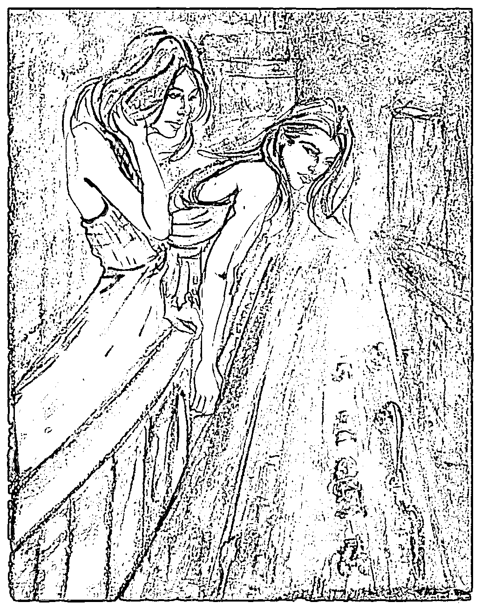

**| **蓝女巫画作 2020.4.4

**道路**荣格又说：只要你意识不到你的原我，你就能够活着；但如果你意识到你的原我，你将落入一个又一个的坟墓中。**人为什么不愿意接触到自己？**前几篇已说过，活出自己意味着：担起自己的任务，面对漫长的痛苦。你必须经历黑暗，才能创造自己。那是一种**极度真实而痛苦**的爱。**故你不愿意活出自己。**你本质上害怕的是自己，因此，**你喜欢转向外部，而不是转向自己。**把渴望指向自己吧，这样你才会被带到路上。如果你不承认自己的渴望，那么你就不能跟随自己，而走上他人指给你的邪路。那么你活出的就不是自己的生命，而是一种陌生的生命。**因为你永远不可能真正活出他人的生命，你只能假装这么做，欺骗他人和你自己，而你只能活出自己的生命。** **但一个人必须活出这种生命。这种生命就是道路**，这是一条广受欢迎且通往深不可测之地的道路，我们将之称为神圣。**再无其他的道路，因为其他的道路都是错误的。**我找到了这条正确的道路，找到我的灵魂。我回来了，平和又纯净。**那么我是如何找到你的呢？**在这一条崎岖的道路上，**是那颗美丽的恒星将我引领到你这里？（狮子座荣格说的是太阳！）**当你被 5 宫爆发的生命力引领，来到了原我这一片沙漠。**那里是你灵魂独有的栖息地。**而沙漠是孤独的。折磨属于沙漠。你要在这里等待。这时你已既不在世事中，也不在常人中，更不在自己的思想中。**没有人能够免于等待，但是大多数人不能够承受这种折磨，**他们又带着贪婪返回到常人、世事和思想，从那时起，**他们就变成了奴隶。**因为他不能没有它们。不论欲望的创造性力量在哪里，都会有泉水滋润土壤中的种子，但是不要忘记等待。**当你的创造性力量转向现世时，那些毫无生机的事物就会在它下面和内部流动，**这些东西就会生长和繁荣，你的思想如何流进肥沃的河流？**如果你的创造性力量现在转向灵魂的所在地，你就会看到你的灵魂所在的地方就开始有生机，这片土地便会硕果累累。** **通往真理的道路只向那些没有目的的人开放。**我们应该像一棵树一样地生长，因为树对自己的生长法则一无所知。我们把自己绑定到目的上，却没有注意到，实际上，**目的就是局限，是的，它是对生命的排斥。**我们相信自己能够使用目的照亮黑暗，但却错过了目标。荣格如是说。 而狮子座和冥王星 5 宫的盲目自信，有时，却也可能带来相反的问题。木心说，**所谓无底深渊，下去，也是前程万里。**但前提是，你先充分地找到了真实的自己。冥王星 5 宫有一种执念，常常不肯认错。觉得对错不重要，就算错了，也要一错到底。好像走到底就能证明是正确的。但是为何又会碰壁，貌似走不到底了？这才开始怀疑惶恐。错了呗，**当你把假我走到底了**……比如那种从土星视角的正确。当你只是去做了**“应该”而非擅长的事，**却无视自己独特的激情和天份。目标方向的错位，将你困在一种疲于奔命感中，彷徨。 一位本命星图被土星深深折磨的冥王星 5 宫的朋友在咨询中说：“**可我从来不知‘对’是什么……”**当时特别想去抱抱她，这真是我听到的一句最悲伤的话。因为我知道，且深深地知道！她接着说：“一条鱼以为自己是飞鸟，结果即使飞到了 500 尺的高空，却仍不能证明自己是一只鸟。这时，它该怎么办？向上？还是下去？”可见，深陷于时代精神的“应该”咒语中，而严重障蔽了深度精神中的认知：对于自己，究竟什么是对的？而**当你没有在为自己活，你就会想要爱人为自己活……**而这，没有人会受得了。只有找回自己的力量，才能给到对方真实的自己，你也才会被正确的爱稳稳地接住，才不至于收到的爱总是错位。 另一位想要出国学画的摩羯冥王星 5 宫，也彷徨了，面对理想与现实的落差。我告诉她：**当外部的路都堵上了，就回内在找路吧。****所以中年危机时的荣格，选择“向东走”：**我吸收两个朋友的生命，是在神庙的废墟上长出的了棵绿树。他们没有支撑生命，但被生命诱惑，已经变成他们自己骗人的把戏。他们深陷泥潭，才会把生命称为魔鬼和叛徒。因此**我召唤回自己太阳的本质，**并想快速上升。但废墟挡住了我的道路。它们说，对人而言，你们应该这样或那样。我变色龙一样的皮肤开始发抖。它们强行出现在我身上，意图改变我的颜色。但历史不再重演，善与恶都不再是我的主人。我把这些可笑的幸存者推到一边，继续踏上前往东方的道路。**在这条道路上，没有人跟着我，我穿过人迹罕至的道路。**我独自一人，我用孤独填满自己的生命。我向东方游荡。**我不再知道自己的远景目标。我看到眼前蓝色的地平线：它们足以成为我的目标。**我赶紧向东方走去，这是我上升的道路。向外求客体，不如向内求空无。去真正找回自己。当向内走得越深，外面的世界就越远……层出不穷的，趋之若鹜的，都注定转瞬即逝，不必劳神。**莫听穿林打叶声，何妨吟啸且徐行。愿我们都找到那条最值得专注的路去走。而不是左顾右盼，当一只猴子……**

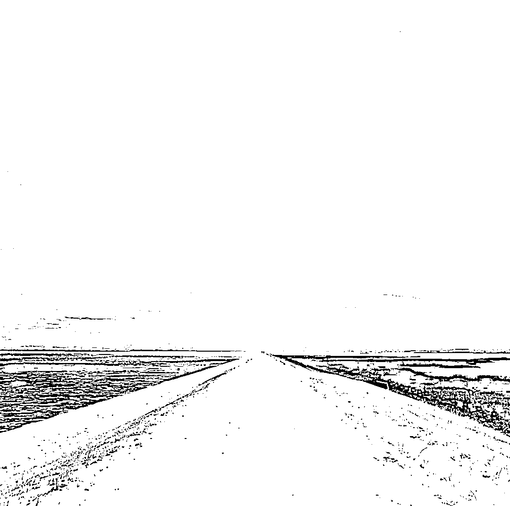

**合唱**人都需要创造超越自己的东西，因为我们自身需要被超越。所以，**狮子座和冥王星 5 宫的人们，当你已成功完成了以人为本的探寻后，就可以去往 11 宫，走向水瓶座式的超个人之路了。**当然切记，超个人的提升，仍是要基于人本，以健全自我人格为前提。所谓人本主义，强调人的主体性，自由意志，自我价值，内在潜能的自我实现，要对自己的人生负起全责。正如第一篇中，鼓励冥王星 5 宫们追求卓越，去实现“德性”的人生。但当你成为了完满的人，此处仍在超个人之前。然后，**冥王星对应点会要求你转向 11 宫找到解药，**不再在自恋中逗留。要从个人小我意识，进化到超个人意识的真我认同。从 self 提升到 Self，**去完成小我的超越。**从自我实现到真我实现，去唤醒更高层次的灵性潜能。对他人，对社会，对宇宙等更大整体，发展出终极关怀。以此克服存在空虚的无意义感。破除人我对立，触碰到潜意识中对众生一体的原初渴望。**将自他分别的意识，含摄于一种无分别的智慧中。将小我含摄于大我之中。即狮子座部分并未消亡，却包含于了水瓶座的更大整体中。 **冥王星 5 宫，为何有时会遭遇到一种折磨？感受到社会对于你个人特质的不认同和不肯定，因此而承受巨大的愤怒与挫败感。这时，正是冥王星对宫在召唤你，去培养客观意识，人道意识，能发现别人与自己同样是独一无二的个体。**将 5 宫的个人目标和创造性目的，去与 11 宫的团体目标和社会功能相连结。**不再根据自己的需求来付出，而是愿意去看清楚他人和社会对你的真实需求。**设法在整体意识中实现自己的才华，**这就是最好的结合点。并与志同道合的德性相似者，互惠互爱，即是**友爱**。以及用狮子座的影响力去感染周遭，为推动社会进步，甚至推动人类意识进化，作出贡献。**即从独善其身，到兼济天下。因众生未度，个人亦不能得度。**且必先满足小我，才能拥有大爱。当每个人都唤醒了悲剧精神的狮子座勇气时，就会彼此激发，产生共振的合力。**要用生命的合唱来对抗无边的苦厄，让生命主义响彻整个宇宙的剧场。独乐乐不如众乐乐。**

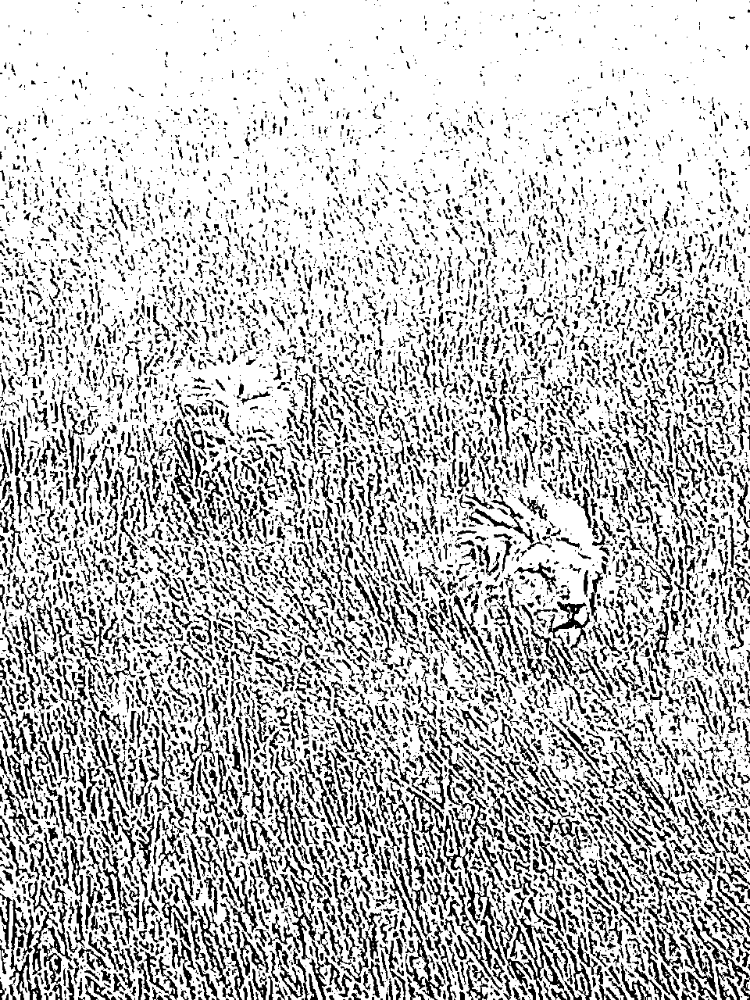

**结语**末了，让我们折返第一篇，再看一眼那个**《红书》中我最喜爱的角色，红人……**相信每一个狮子座灵魂都会在此找到共鸣。或许这也正是众多尝试合唱的冥王星 5 宫都会折返之处吧。风象时代的未来，究竟通向何方？ 

现在来听我的故事吧，那次交谈后，你用自己对舞蹈的看法使我掉进狐狸的陷阱中。之后我开始变得严肃，严肃到我走进修道院，我盲目到想去改革教堂礼拜仪式的程度，我在主教的支持下引入舞蹈。我成为修道院院长，而且只有我能够在祭坛前跳舞。但是慢慢地，兄弟们也开始跳舞甚至整个忠诚的教区也开始跳舞，最后整个城市也开始跳舞。这很可怕。我逃进孤独，整天跳舞到结束，但第二天清晨，邪恶的舞蹈再次开始。我从这里逃跑，开始流浪，在夜里彷徨。白天我与世隔绝，在森林和沙漠深处跳舞……

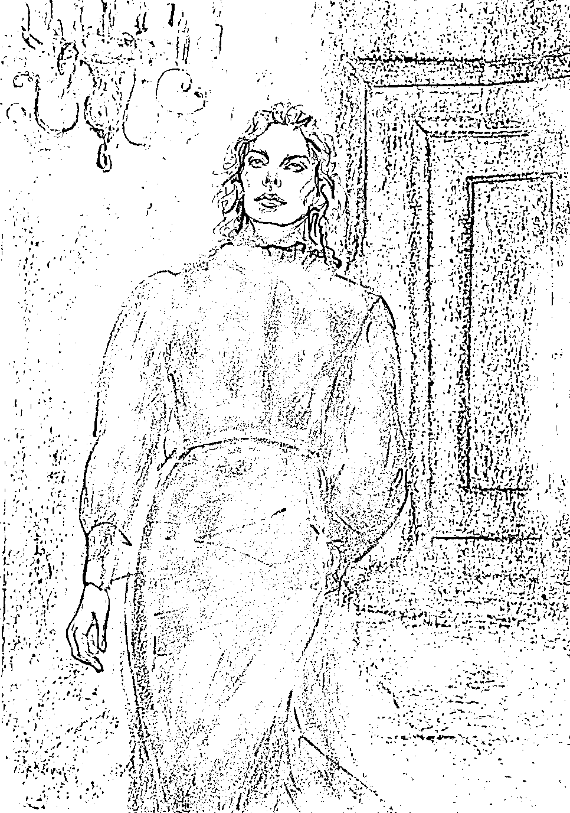

**| **蓝女巫画作 2020.4.4

当下时代的出路是什么？ 2020 上半年，个人反思最关键的结论是：我会继续大真大美的坚持！令人欣慰的是，这条路真心不拥挤......**因为它正是试金石！ **正如红书最后一句话：**这就是道路。 **这，**也就是《红书》给我的力量。**真实的力量，就是最强大的力量。**故择太阳狮子座的时节，以此系列向其致敬！在水瓶时代的门前……**

**版权声明：**本文由作者授权在若道平台发布，欢迎转发，反对抄袭。

**蓝女巫**

英国伯明翰大学 市场营销学硕士

职业占星师/专栏作者/芳疗师/珠宝设计师

中国首批 ISAR 英文认证占星师（2012 届）

**微信公众号**：cecilia_sui

长按打赏

**系统学习占星学**

**点击图片了解详情**

**微信又双叒叕改版啦，不想错过若道君的推送？**

**就把若道设为星标吧！**

**▼**

就是这个“在看”，戳一下☟

********报名直达入口********

# 插班中丨现在来，正好赶上卜卦进度！还能玩转卜卦图！

> 原文：[`mp.weixin.qq.com/s?__biz=MzA5NjA0NTAxNg==&mid=2651424933&idx=3&sn=a2581648569dcf0ade7e78746f4b7ea0&chksm=8b4b3a12bc3cb3044819c0d3902f7f6ee12f9561e6675c7b81ac240bdff9bca19bba117f9229&scene=126&sessionid=1692738121#rd`](http://mp.weixin.qq.com/s?__biz=MzA5NjA0NTAxNg==&mid=2651424933&idx=3&sn=a2581648569dcf0ade7e78746f4b7ea0&chksm=8b4b3a12bc3cb3044819c0d3902f7f6ee12f9561e6675c7b81ac240bdff9bca19bba117f9229&scene=126&sessionid=1692738121#rd)

自从热热闹闹的卜卦占星课开课以来，同学们边学边练，学得可欢了。几乎每一天，若道卜卦课程群里都有新的卜卦问题被抛出来。

这也不奇怪，我们生活中本来每天就要面对各种问题，今年又是这么一个特殊时期，每个人都面临来自未来的巨大不确定性。大家（同学们及其朋友和客户）也都期望用卜卦星图来获得指引。

**同学们的问题**

比如，有同学问这么一个特殊的问题：“今年我的孩子还能出国留学吗？我有可能陪他出去吗？”可不，本来早就联系好的留学，因为疫情，让人不知道如何选择。

大家的卜卦问题都是我们人生中常见的问题：

*   有人问**结婚**行不行，有人问离婚行不行，有人没结婚意外有了孩子问怎么办……？

*   有人问**工作和职业**问题：转行会顺利吗？离开北京到异地会更好吗？公司裁员，会被裁吗？部门调整，会被调动吗？新岗位很委屈，但是怕得罪领导不敢说话，应该怎么办……？

*   有人问**投资**问题：卖房子什么价格合适？买房子什么价格合适？出租房子什么价格合适? 股票还能补仓追涨吗？某个投资项目可以投资吗……？

*   有人问**健康**问题：手术会成功吗？能顺利住院吗？如何帮助亲人面对另一位亲人可能的离世？两位亲人的状况是什么样……？

*   有人问**法律**问题：朋友被拘留，情况会怎样？P2P 平台暴雷了、老板跑了、公安介入了、投资的钱能通过官司要回吗……？

*   有人问生活中的**邻里关系**问题：楼上噪音不停，房东调理无用，这种情况还需要持续多久呢……？

*   还有很多人在**找东西**：眼镜丢了，钱包丢了，手机丢了，耳机丢了……你们在哪呢？

一个人提问，一群人提出自己的解盘思路和观点。不仅做了练习、启发了思路，还安慰了心灵。很多同学的提问还被邓肯老师抽中，老师亲自解读。

**同学们的讨论**

有时候讨论也会歪楼，比如你看这个楼歪的：

一个同学在一个炒股的卜卦后感慨：“我们太厉害了，把炒股讨论成灵性升华！”因为大家不仅讨论个案，也会探讨卜卦占星学的精神。

再比如群里有这样一个讨论：一位同学问：“如果完全按照卜卦的结果去做选择，心里还会有力量吗？”

大家是这样讨论的：

*   A 同学：“我印象深刻的是**分享的案例，虽然卦象显示的比较清楚，不能成，但她仍然尽努力去把事情做完了”。

*   B 同学：“谋事在人，成事在天，我们不能因为天做了决定自己就不谋事了”。

*   C 同学：“对，有的事需要明知不可为而为之，符合大道”。

*   A 同学：“即使没有去到原先的目的地，行事的过程会打开另外一扇门”。

所以，卜卦群里一些同学感慨：

*   “学占星不就是让人既学会臣服顺应，同时又能努力保有自由意志吗？”
*   “我在大家身上看到满满的正能量，内在力量也得到了提升”。

大家不仅讨论这些和个人相关的卜卦问题，也会积极关注各种大事件。比如贵州公交车出事的当天，大家也在研究当时的天象图，想找到事故的原因。毕竟，邓肯老师每节课，都会讲当下的天象，世界上出了什么样的事情，可以从这样的天象图看到，还有，当然也是最重要的动态卜卦的概念——这样的天象会如何发展。怎么样，是不是很热闹？是不是很有趣？没错，卜卦是特别有趣的一个占星学技艺，常常把玩之，既可以看到每颗行星生动的在卦星图中出没，又可以慨叹天意和人的自由意志是如何很好地结合表达。**如果你生活中地卜卦问题感兴趣，或者你的客户可能对这些问题感兴趣，欢迎你来加入我们！****现在正是最好的插班时机！**插班的大家可以尽情回听和复习，并思考课程中的问题，现在正是上车的好时机哦：

*   你有充分的时间复习前 7 节课的视频内容

*   你有充分时间对于前 7 节课不懂的内容提问，并得到回答

*   你有充分的时间理解和吸收前 7 节课程的知识点和技法

我们为你准备了每节课的知识要点，你还可以看到前期同学们的问题及解答。**现在直接跟上直播节奏，这个夏天学习充电的完美安排。**这次课程恰逢世界在巨大的变动和不确定之中，期待你来和我们一起经历。**学员反馈：**

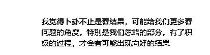

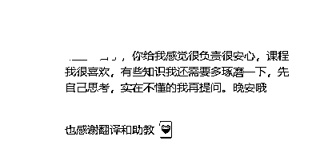

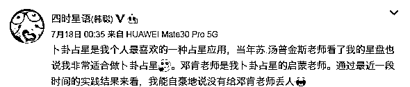

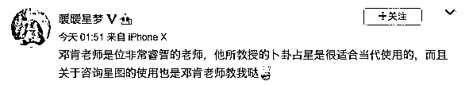

**课程内容**

***Part1***** 融合现代占星理念，整合动态占星知识**

星图如同地图，展示了人们从哪里来，现在在哪里，以及可能的去向是什么。卜卦星图虽然显示的是当下这一刻，但却是在动态当中的。所以过去的运动轨迹对应着过去所发生的，接下来的运动轨迹对应着接下来要发生的。**在课程中你会学习到：**

*   我们如何从一张卜卦星图看到时间的流动：从过去到未来，故事如何展开

*   心理占星和事件预测如何在卜卦占星中有机结合起来

*   卜卦星图如何回答是否的问题

*   如何用卜卦星图回答分析性和指导性的问题

*   现代动态占星中事件发展的顺序：

*   确定咨询图中强调的当前事件
*   将客户与相位或行星组合相关的情感能量关联起来
*   在早期经历中找出相似的情景
*   认识到过去和现在的情感完全相同
*   辨识出过去做出的所有限制性决定
*   通过头脑风暴找出更能带来力量的方法来解决相同类型的问题
*   在想象和现实生活中重演当前和未来的事件

***Part2 *****独家【现代动态卜卦占星技术】全面教学**

*   **卜卦中的行星**

*   行星强弱及力量

*   太、月、水、金、火、木、土在庙旺落陷时的意思

*   卜卦星图中的月亮及其在 12 宫的意义

*   卜卦星图中的外行星

*   卜卦星图中的恒星

*   卜卦星图中的凯龙星

*   上升点和指征星的度数

*   **如何选择和辨识征象星**

*   当问题出现时，如何判断征象星

*   如果两个人或物由同样的征象星指代该怎么办

*   **卜卦图中的相位**

*   不同相位的意义

*   征象星之间相位的意义

*   征象星与其他行星相位的意义

*   **卜卦中的宫位**

*   12 宫位和宫位系统

*   对宫位的动态观察

*   宫主星及其互动

*   互溶和定位星

*   **卜卦中的星座**

*   **传统卜卦原则（约束和限制条件条件）及其在现代动态卜卦中的应用**

*   **空亡、光线传递、完成、围困、燃烧之路等**

*   **星图中的逆行及其讲述的故事**

*   水星和计划

*   金星与依恋

*   火星与斗争

*   外行星逆行

*   **应期与时机**

*   1 度是代表多久

*   宫位的重要性

*   行星速度和逆行

*   如何综合卜卦和行进、二次限分析时间问题

***Part3*****  学以致用，覆盖人生各个领域问题的卜卦解法**

希望将现代卜卦占星学的精髓传达出来，精细地讲解每一宫所代表的卜卦事物，分主题详解不同类型问题的卜卦解读思路，内容包括但不限于：

❶ **爱情和关系**

*   金星的重要性
*   第一和第七宫以及其中的行星
*   成对行星
*   上升下降及其守护星

❷ **利用月亮择时**

*   第十和第六宫以及其中的行星

*   木星和土星及其相位
*   火星和水星
*   行进和中天

❸ **资金和资源**

*   第二宫和第八宫以及其中的行星
*   第五和第十一宫
*   金星、木星和土星
*   四元素的意义

❹ **家庭和大家庭**

*   第四和第十宫及其守护星
*   第五、十一宫及其守护者
*   第五宫和第十一宫的行星
*   月亮

❺ **社会、法律、智性、健康、存在主义的问题**

*   第九和第十二宫及其中的行星
*   木星和第九宫守护星
*   三宫 、十一宫、六宫和八宫

❻ **如何解读事件星图**

*   从新闻学习卜卦盘
*   如何从卜卦盘看新闻事件和世界大事的发展变化
*   我们如何去培养自己观察有预兆意义的信息、从日常事件中捕捉启迪
*   占星解读的意义

***Part4 ***** 扩展延伸择时占星技法的新认知**

在择时的时候，我们会选取征象星处于有力的时候，来规划我们的事件；避免征象星不力的时候，尤其当这个征象星代表我们自己。**择时星图一瞥**

*   择时的艺术
*   如何在不完美的天象下取得最佳结果
*   如何做出深思熟虑的回答
*   如何为约会择时
*   如何为婚礼择时
*   如何为商业活动择时
*   如何为旅行择时
*   如何为对抗事情择时

*   虚拟和实时会议的择时

***Part5  *****如何运用卜卦占星学做一场转化性的咨询**

虽然卜卦的结果可能是不利的，但我们仍然可以从心理占星学的角度给出一些积极建议，帮助客户建立信心，有助于应对之后的人生。客户出生星图与卜卦星图的关联，这在咨询中对于心理方面的考量是非常重要的。

*   一个好的咨询有哪些特色
*   咨询星图及其应用
*   如何用卜卦星图和新客户在短暂的咨询开场白快速建立信任
*   如何综合卜卦星图、出生星图、次限图一起分析
*   如何用卜卦星图聚焦当下的问题
*   如果客户在一场咨询提出多个问题，要看多少卜卦盘
*   如何在一个充满挑战的卜卦星图中寻找客户资源、有利的时机，找到支持客户的策略
*   如何从客户故事中寻找意义
*   卜卦星图如何从事件维度和心理维度来解读
*   当看到客户不愿意看到的结果可能出现时，如何开展对话
*   改变的方法

**整个课程将有大量案例演示、课下作业以帮助大家理解和练习。**

**导师介绍**

**艾德里安·罗斯·邓肯****（Adrian Ross Duncan）**1971 年在印度游学时开始学习占星学，1985 年开始成为全职占星师，**迄今执业已超过 33 年，是人本主义占星学、卜卦占星学和经世占星学领域的知名占星师。他还开发了占星软件 AstroClock 和多款占星报告。**他在日常咨询中都会运用卜卦，咨询图（卜卦的一种运用方式，即根据客户来访时间制作星图，从星图中获得大量信息）也是他**特别擅长的领域**。艾德里安·罗斯·邓肯从 1971 年开始研习佛学，受佛学影响很深，他**相信占星学和佛学观点统一、转化的一个基础是在于对现实感知的改变**。而卜卦很容易与佛教融合，因为它只关乎当下。

| 艾德里安·罗斯·邓肯的占星学著作

**适合参加本课程的人**

*   想要系统学习现代动态卜卦占星的学员
*   想在生活中熟练使用现代卜卦占星学
*   在咨询中想帮助个案更清晰的分析解读困惑
*   想参加 ISAR 认证考试，此课程是 ISAR 选修课
*   希望通过卜卦占星帮助自己和身边人挖掘一个积极主动的未来

学习整合卜卦技巧，不仅有益于想钻研卜卦占星学这个分支的同学，对占星初学者也很有有帮助，可以让你的占星技巧加倍。**课程费用****课程原价：9900 元****老学员复训专享价：**
**2018 年参加艾德里安·罗斯·邓肯卜卦占星课程的同学：****5000 元****特别优惠****：****分享课宣到朋友圈****保留 48 小时****（不设分组显示）截图给课程顾问可获得****400 元优惠****。****授课时间****2020 年 5 月 15 日-9 月 25 日（7 月休息），每周五 20:00-22:00****具体日期：**

*   5 月 15 日、22 日、29 日   

*   6 月 5 日、12 日、19 日、26 日    

*   8 月 7 日、14 日、21 日、28 日 

*   9 月 4 日、11 日、18 日、25 日 

**截至 2020 年 8 月 19 日，课程 1-9 讲为录播课程（限视频回放），其余均为网络直播课。**

**授课方式****线上网络课，英文授课，中文翻译**
**退转课程****退款原则请详看《教学协议》，如有疑问请咨询课程顾问。******现代卜卦占星学精修课程****

**授课老师：艾德里安·罗斯·邓肯**

**授课时间：**2020 年 5 月 15 日-9 月 25 日（15 次课）

**授课方式：**网络课程，英文授课，中文翻译

**费用：9900 元；****老学员复训价：5000 元；特别优惠，分享课宣到朋友圈保留 48 小时（不设分组显示）截图给课程顾问可再获得 400 元优惠。**

**课程负责人：**童老师（微信：196267205），请备注“卜卦”

长按二维码添加课程负责人咨询

****报名请点击“阅读原文”****

# 8 月 19 日狮子座新月 | “自我英雄”之旅，要先放下“情绪之剑”

> 原文：[`mp.weixin.qq.com/s?__biz=MzA5NjA0NTAxNg==&mid=2651424812&idx=1&sn=cf7c3cc2cc19b41071cef0d50f14600f&chksm=8b4b3a9bbc3cb38d0248c1bcd7439050ec3a46212481b4dd42177301c100a0c8cf10752c1faa&scene=126&sessionid=1692738121#rd`](http://mp.weixin.qq.com/s?__biz=MzA5NjA0NTAxNg==&mid=2651424812&idx=1&sn=cf7c3cc2cc19b41071cef0d50f14600f&chksm=8b4b3a9bbc3cb38d0248c1bcd7439050ec3a46212481b4dd42177301c100a0c8cf10752c1faa&scene=126&sessionid=1692738121#rd)

**********☆****************后台回复“今日”，给你一句生命态度**********

作者/王芝桦 编辑/玫瑰 图片/全景网

**狮子座新月**

**北京时间 2020 年 8 月 19 日 10:41 迎来狮子新月，太阳与月亮精准合相于狮子座 26°35′。** 

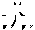

**你划亮火柴，它的火焰让你眼花缭乱**

**因而在黑暗中你找不到所要寻找的**

**那根火柴在你的手指间燃尽**

**疼痛使你忘记所要寻找的**

**——亨里克·诺德布兰德 《一种生活》**

**代表“我是谁”的太阳与狮子座是一组具有共振能量的守护关系，每年狮子月的 30 天也是自我直觉最为强烈的时间。**

记得有一年狮子月，每每走路的时候，我总是强烈地感觉到心脏的位置想成为这具身体的最高点和最前端，那种来自于身体核心的渴望带着火焰一般的炙热与力量，令我再次体验到 18 岁的挺拔与热情。狮子座象征着**自我的统合与个性的发展**，每年狮子月的 30 天，是我们**将心灵深处的“内在英雄”在现实生活进行塑造和成就的时间**，而每年的狮子座新月正是“自我英雄”成就之旅的梦想起点。2020 年的狮子座新月，情况似乎变得更加黑暗和复杂，现实的考验与身心的压力时而令我们忘记所要寻找的是什么，颇有应接不暇的感觉，但也同时在提醒我们：**“自我英雄”成就之旅的首要任务是战胜内心的恐惧，化解内心的烦躁，因为挥舞着“情绪之剑”的一定不会是英雄。**

> **狮子座新月重点影响人群**
> 
> **参考新月峰值影响期间各个行星的行进度数，以及逆行行星的轨迹影响；常规容许度，个人行星入相位 3°，出相位 1°；非个人行星入相位和出相位均为 3°。**
> 
> *   出生星图中，有**行星、四轴、南北交点**落入**固定星座（金牛座、狮子座、天蝎座、水瓶座）3°-13°，23°-30°**的人群。
>     
>     
> *   出生星图中，有**行星、四轴、南北交点**落入**变动星座（双子座、射手座、处女座、双鱼座）15°-30°**的人群。 
>     
>     
> *   出生星图中，有**行星、四轴、南北交点**落入**基本星座（白羊座、巨蟹座、天秤座、摩羯座）7°-30°**的人群。

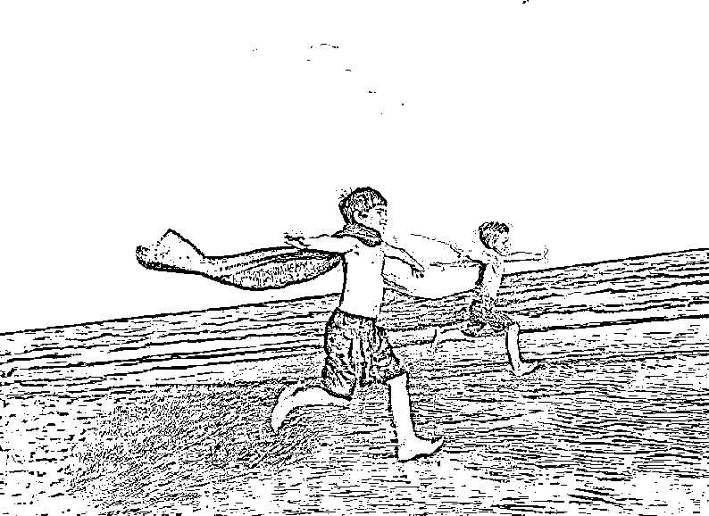

**学会放下“情绪之剑”**

**你必须学会控制自己的冲动。剑渴望被使用，它渴望染血，这就是它被锻造出来的使命，它在这世上别无其它目标。如果你不控制它，它就要控制你。**

**——约翰·康诺利《失物之书》**

**天象**

*   **新月与土星成梅花相位**：狮子座新月与逆行的水瓶座土星形成 150 度梅花结构；
*   **白羊座火星四分摩羯座群组**：此次新月处于白羊座火星与摩羯座上的木星、冥王星和土星形成的“火木四分”、“火冥四分”和“火土四分”三组结构的第一轮峰值影响之中；
*   **金天六分**：巨蟹座金星六分金牛座天王星；
*   **新月介入南北交点轴线**：狮子座新月三分射手座南交点，六分双子座北交点；
*   **水星合相新月**：狮子座水星合相狮子座新月。

此次狮子座新月是土星在 2020 年第二次与新月形成 150 度梅花结构：

*   **6 月 21 日巨蟹座日食**（详情点击：[巨蟹座日食](http://mp.weixin.qq.com/s?__biz=MzA5NjA0NTAxNg==&mid=2651420021&idx=1&sn=6daabca1426aec45a88ee10949abaa18&chksm=8b4bc7c2bc3c4ed420a695f1ce5d577d059f93e96a1be5bb25bf0b197a482fb9ef0d4a48510c&scene=21#wechat_redirect)）：逆行到水瓶座 0 度的土星与巨蟹座 0 度的巨蟹座日食形成 150 度梅花结构；
*   **8 月 19 日狮子座新月**：逆行回到摩羯座的土星与狮子座新月形成 150 度梅花结构。

新月是宇宙赐予我们开启愿景的时间。每年的巨蟹座新月，因为月亮与巨蟹座的守护关系，是我们感应到“内在英雄”的渴望与呼唤的时间；每年的狮子座新月，因为太阳与狮子座的守护关系，于是就成为我们走上“自我英雄”的塑造与成就的时间。2020 年土星这位坐在“现实高墙”之上，教导责任并训练成熟的老人，分别在两次新月布下“梅花阵仗”，他老人家好像是要教导和训练我们成为英雄。

1**“他急了”，土星回来了**

**3 月 22 日-7 月 2 日**，土星在水瓶座试水的三个月时间，与金牛座天王星形成“土天四分”结构。“土天四分”结构是 2021 年的重大天象背景，代表着——**这场巨大的时代变革，必将经过新旧周期的震荡和破旧创新的磨合**。即使是颠覆那些陈旧又保守的事物，也依然会令我们不愿意和不习惯，但又有哪些事物是我们一上来就能乖乖地愿意和习惯的呢？**变革就是将不习惯一点一点转化为习惯的过程。**故而，**2020 年 3 月 22 日-7 月 2 日的“土天四分”是 2021 年“土天四分”的“前期试炼”**。但是，试炼的结果并不理想，甚至发现了更多的问题。4 月-6 月期间，人们正急于在各种变化的惊慌失措之中稳住状况和保住生计：不少企业紧急转型，不少朋友尝试突破，但收效并不一定乐观；国际社会更是“钱数重于人数”，拉升了股市数字，却撕裂了集体情感，种族运动持续蔓延，国际冲突花样百出。似乎，无论集体还是个人，在这场时代变革来临的时候，不仅不习惯，并且还“急了”。于是，7 月 2 日，土星逆行回到摩羯座，宣告要在 2020 年下半年“把问题全干掉”。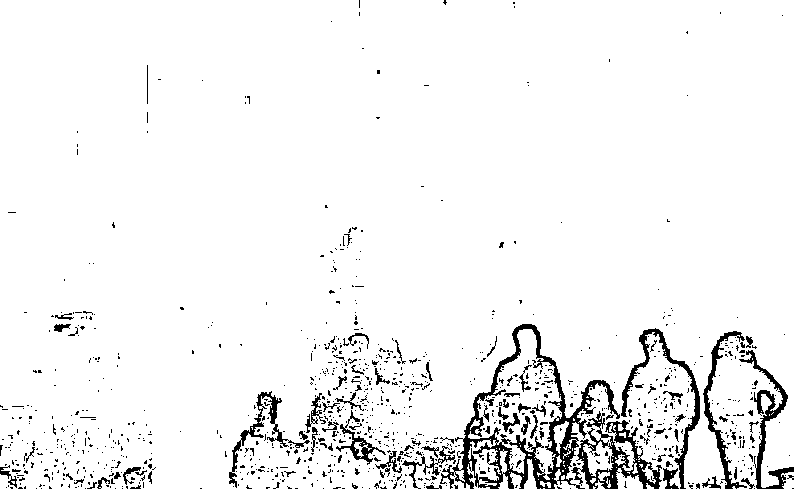

2**两个梅花相位之间隐藏的功课**

12 星座的每一个星座都从上一个星座的发展中而来，也将在发展之中走向下一个星座，12 个星座都在循环发展的链条之中，没有一座孤岛。狮子座是黄道 12 星座中的第五个星座，前一个星座是巨蟹座，后一个星座是处女座。古希腊神话中，狮子座的由来与众神之神宙斯（木星）的一场风流债有关：“大力神”海格力斯是宙斯的私生子，遭到宙斯的妻子天后赫拉的厌恶与仇恨。于是，赫拉将“神兽”狮子从月球（巨蟹座）派遣到地面，与海格力斯进行搏斗，几经波折，最后海格力斯将狮子扼死，并剥下狮皮穿在身上，而狮子的灵魂则被升到天空成为狮子座。来自于月球（月亮守护巨蟹座）的狮子是伴随在母亲（巨蟹座原型）身边的神兽，缺乏父亲（内在英雄）的陪伴，故而**从巨蟹座发展而来的狮子座，象征着“内在英雄”向外发展的“自我英雄”成就之旅，超越原有价值与认同，塑造自我个性与力量。**这只“尊贵的神兽”也对应着“众神的信使”墨丘利（水星的原型，水星守护处女座）变形过程中的一个阶段，故而狮子座“自我英雄”的成就之路通往处女座的完善旅途。狮子座在“神兽”阶段背负着天后赫拉的厌恶与仇恨，“人与兽”之间的搏斗与征服，象征着**“自我个性与本能情绪”之间的撕扯与较量**。故而，狮子座的“自我英雄”成就之路上布满“自我与情绪”的战斗——**当不能统御情绪的时候，又如何成就自我？**土星与两次新月（6 月 21 日巨蟹座日食和此次 8 月 19 日狮子座新月）的梅花结构，提示我们**在现实的表象之下，还有一些“隐藏”的问题没有解决**；督促我们**回到根基（巨蟹座，神兽的来源地）并深入觉察自我的内在功课**，因为这些内在功课影响着我们愿景的构建和理想的实现。此次狮子座新月，土星老人引领我们**回溯并觉察 6 月 21 日巨蟹座日食的愿望清单**——2020 年，我们可能会迫于现实的考验而急需全新的起点，但我们真的准备好长远的规划、理性的评估和丰厚的实力了吗？如果因为现实挫败升起嫉恨，因为外在压力激起愤怒，发狠般急于证明，赌气般盲目冒险，非但不能解决任何问题，反而会吸引压力和瓶颈周而复始地来到生活之中。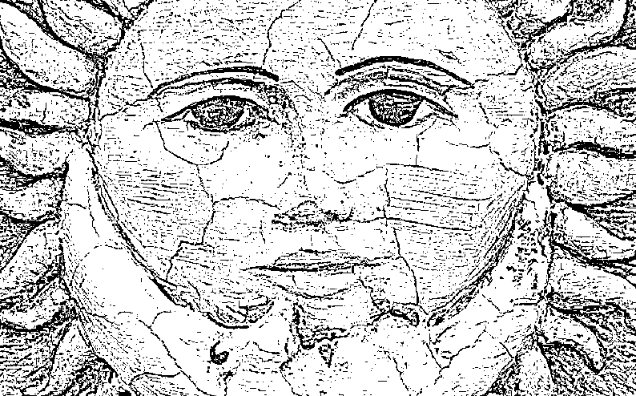

3**自我与情绪之间的战斗**

8 月，白羊座火星这位勇猛的“战神”与摩羯座上的木星、冥王星和土星依次交手；而整个 8 月都处于停滞状态并在 8 月 15 日开始逆行的金牛座天王星，更是在我们每次感觉“走不过去”或“忍无可忍”的黑暗时刻划过一道闪电，将“突破”的光与“冒险”的热注入到我们的意识之中，鼓动我们在“生死攸关”的时刻——**改变不了外界就改变自己！**那些严苛的权威上司或难搞的工作项目，那些痛苦的亲密关系或不顺的合作状态，有时会令人产生“不想再伺候了”的冲动，故而离职或跳槽，分手或拆伙的情况可能没少发生。以前的武侠片里总有这样一个剧情：身怀绝技的大侠一声怒吼“忍无可忍，无须再忍”！然后出手将对方打倒。8 月，当我们与情绪再次相遇，当“自我与情绪”再次交锋的时候，**一定要先评估一下自己的绝技，分析一下现实的状况，千万别被情绪怂恿着冒然出手，然后自己把自己打倒。**重要的是，这个 8 月，宇宙的深意是要我们**改变内在的意识，而不只是改变外在的处境**，因为现实生活是内在意识的外在呈现，“自我英雄”是“内在英雄”的外在塑造。此次狮子座新月，“金天六分”结构的能量传导链提示出此次新月最大的“变革”意义——走上“自我英雄”的成就之旅：金牛座天王星→巨蟹座金星（金星守护金牛座）→狮子座月亮（月亮守护巨蟹座）→狮子座太阳（太阳守护狮子座）。这一场“自我英雄”成就之旅的起点，从 6 月 21 日巨蟹座日食就已经开始。此次狮子座新月，先要**觉察潜意识（巨蟹座）之中的情绪运作**，才能以理性和智慧统御情绪，化解情绪对自我的干扰，对生活的左右，至少不要让情绪继续“隐藏”并决定我们的愿望清单。情绪的剑就在你的手上，如果你不控制它，它就要控制你。

4**来自宇宙的信件**

此次狮子座新月与“射手南交点-双子座北交点”南北交点轴线的和谐运作，与狮子座水星的一体联手，揭示出：双子座北交点正为此次狮子座新月提供出进化的路径，前文提到过的“众神的信使”墨丘利（水星的原型）正将进化的策略送到我们手中。

几个必要的自问：

*   **盲点**

*   无论是亲密关系或合作关系，你最忍受不了的是什么？是对方的态度和反应，还是具体的要求和压力？你的感受来自于哪些内在的“观念和标准”？这些观念和标准是否经常制造关系的问题和内心的痛苦，你想不想改变这种状况？

*   **情绪**

*   你想捍卫的自我尊严，坚守的自我边界是什么？在此之前，这些尊严和边界是否被维护过？如果没有，那么是哪些事件促使你突然发生改变？你进行捍卫和坚守的方式是什么，是否还有更成熟和更有效的方式？

*   **理想**

*   给自己十分钟时间，闭上眼睛想象“内在英雄”的形象、身份和画面……如果你希望这个“内在英雄”的想象照进“自我英雄”的现实，那么还需要学习哪些专业技能，沉淀哪些综合实力？

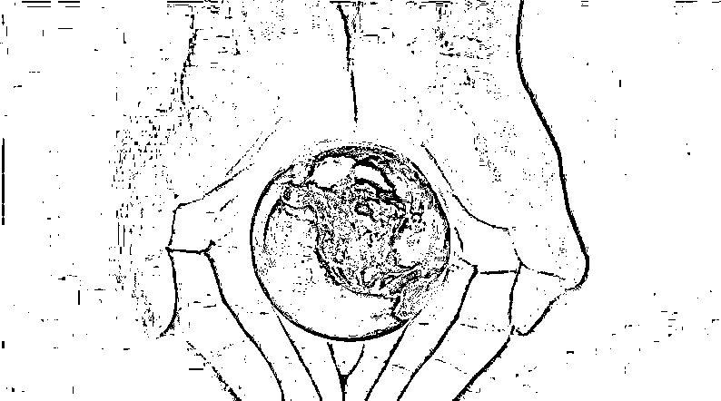**寄语****每个大人的心里都住着一个孩子；而每个小孩的心里，都有个未来成人在静静等候。****——约翰·康诺利《失物之书》**
“内在英雄”是一个象征性的描述，并不是说一定要高于当下的年龄或优于当下的成就，但一定会带来超越当下价值的快乐，超越当下力量的创造。对于成年人来说，那个住在内心深处的孩子，有可能是“隐藏”着心理情结的内在小孩，也有可能是“蕴藏”着神圣之光的内在天使。但无论是哪一个，我们都要牵手这个孩子并将他（她）带到现实的阳光之下，因为这个孩子就是“隐藏”着脆弱和“蕴藏”着理想的我们自己。生命是一场自己与自己搏斗，自己对自己成就的旅行。祝福大家，愿每个灵魂安好。**新月如何许愿？**

**许愿时间**：2020 年 8 月 19 日 10:41 后，48 小时内有效、8 小时内最佳。

**许愿人群**：所有人。**许愿数量**：每人最多 10 个。**许愿方式**：静心冥想，身心祈祷或记录收藏。**许愿格式**：请万能的宇宙赐予我能量，我将以我的能量吸引**（什么）来到生命中……**许愿原则**：发心诚善利人。

**版权声明**：原创文章由作者授权首发于若道平台，欢迎转发，反对抄袭。友号转载请申请白名单。

****

****想阅读更多作者的文章****

****请在后台回复******王芝桦****** 即可****

****王芝桦****

心理占星师，统合疗愈师，若道占星“新月和满月”专栏作者

腾讯视频特邀合作占星师

全职于个案咨询与占星教学工作 16 年

**个案预约咨询微信号**：zhihua0621 

**微信公众号**：daoxi-life

**长按打赏**

****

**长按下图扫码报名**

**听免费经世占星公开课**

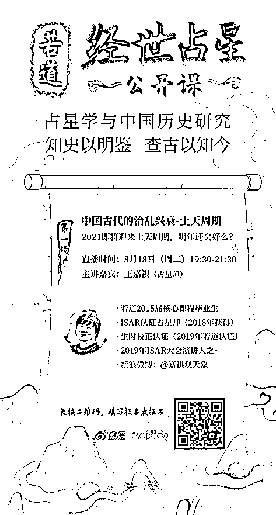

**微信又双叒叕改版啦，不想错过若道君的推送？**

**就把若道设为星标吧！**

**▼**

**点击**

**“阅读原文”**

**获取免费新月报告**

****获取免费新月报告，请点击文末“阅读原文”****

# 斯蒂芬&大卫线上工作坊丨爱的内在炼金术：你的亲密关系盲点在哪儿？

> 原文：[`mp.weixin.qq.com/s?__biz=MzA5NjA0NTAxNg==&mid=2651424812&idx=2&sn=0ff652654dd1c482ed6d07fd75d51d16&chksm=8b4b3a9bbc3cb38d0eaa60ed5fec0fde5b51b6b7a249b36c4a0f1ebcce23ecc585790fc5aae0&scene=126&sessionid=1692738121#rd`](http://mp.weixin.qq.com/s?__biz=MzA5NjA0NTAxNg==&mid=2651424812&idx=2&sn=0ff652654dd1c482ed6d07fd75d51d16&chksm=8b4b3a9bbc3cb38d0eaa60ed5fec0fde5b51b6b7a249b36c4a0f1ebcce23ecc585790fc5aae0&scene=126&sessionid=1692738121#rd)

**若道独家 3 日线上工作坊**

由于疫情影响，斯蒂芬老师今年的中国之行无奈受阻，但斯蒂芬老师不想他的中国学生们期待落空。在和大卫老师数次线上沟通后，斯蒂芬老师决定**首次开设线上工作坊，**跟**大卫老师**联袂授课，还专门为若道设计了**两大独家主题**：

**10 月 9 日-11 日**

**《爱的内在炼金术—你的亲密关系盲点在哪儿？》**

****10 月 16 日-18 日****

**《整合行进、推进以及太阳弧技法》**

满足中国占星学子对于进化占星学的学习和精进需求，用线上直播课的形式亲赴十月进化占星学之约。

鉴于时差安排，每天上午线上跟斯蒂芬老师学习 4 小时，下午大卫老师会抽取参课学员，进行一个半小时案例解读。对南北交点最有心得建树的两大权威导师，从技法到实践，承包你的知识点。

防疫为重，线上工作坊也省去了学员们舟车劳顿奔赴现场的种种不确定性，我们相约 2020 年 10 月，斯蒂芬老师非常期待和新老学员们在线上工作坊中相见。

**我们将学习什么？**

“找到完美的伴侣听起来是个很棒的主意——但如果你还没有准备好进行进化工作，仅仅找到那个人并不能给你带来多大帮助。亲密始于你所做的内在成熟功课。”

——斯蒂芬·弗里斯特

**-** **此次授课内容** **-**

*   关于自己的本性，你不希望了解的是什么?
*   什么会让别人爱你变得困难?
*   在哪些方面，你的创伤和文化状况影响了你的智慧判断，关于谁才是真正适合你的人?

**关系占星学：比对图**通常集中于两张出生星图的比较。“直接用这种方式来看待感情，就像还没上高中就开始上大学一样。”所以斯蒂芬老师还会着眼于个人星图。

**个人星图上的三个关键区域**在这个工作坊中，斯蒂芬老师将会关注于个人星图上的三个关键区域。

*   首先，我们考虑你的灵魂对于亲密关系的独特要求。你正在学习什么？激情？和平？信任？还是独立呢？
*   其次，我们来破译你星图上关于任何可能阻碍你正确完成任务的警告信息。
*   最后,我们来探讨星图如何描述了你的天生伴侣——也就是说, 如何在编织在你出生星图的象征符号中, 找到与你享有灵魂契约之人的描述—— 在你出生呼吸第一口空气时，这个人可能甚至还没出生。

“伙伴”和“伴侣”这些词总让我们想到配偶关系，但我们在这个工作坊中探索的许多原则也适用于人类的另一杰作：**亲爱的朋友之间的灵魂纽带。**我们当然会尊重所有的性别差异，因为男人和女人努力爱着对方和他们自己，无论他们的灵魂穿着何种肉体的伪装。

**-** **斯蒂芬的占星著作** **-**

1984-1988 年间，斯蒂芬写作出版了《内在的天空》（已有中文版）、《变化的天空》和《天空的伴侣》三本占星经典著作，奠定了早期在占星学界的地位。

2002-2005 年间，他与朱迪·弗里斯特共同创作了两本经典的关系占星学著作《天空的伴侣 I：爱、性、和进化占星学》《天空的伴侣 II：组合图》。　

2008 年，斯蒂芬出版了一本非常重要的著作《昨日的天空》，此书是至今为止关于轮回转世跟星图的清晰对应最详尽的著作之一。斯蒂芬前后一共出版了 12 部占星著作，在世界占星学界拥有很高的声誉。**-** **斯蒂芬获得的荣誉** **-**1985 年，他凭借《内在的天空》一书获得职业占星师协会奖（*Professional Astrologers Incorporated Award*）。1992、1995、2008 年、2018 年，他四次获得占星界最高的占星学联合协会奖（*UnitedAstrology Congress Regulus Award*）提名，2018 年获得轩辕十四教育奖。

**-** **斯蒂芬的占星哲学观** **-**

  斯蒂芬的占星风格以自由和选择为中心，他的解读不是以下定论的方式来“预测”未来，他强调**如何改善生命**，而不是宿命式的论断。他以心理占星学的语言来解读星图上的人格部分，但是通过**南北交点及其相位和守护星**来探索星图所揭示的**前世业力与今生方向**，在灵魂进化的背景里来整体解读星图。

他认为进化占星学的目的在于鼓励人们做出更符合进化方向的智慧选择，我们学习去了解前世的时侯，关注点应该集中在**如何通过意识来疗愈自己**。

**这些名人怎么说？**

斯蒂芬让我们停止了玩责备命运的游戏，而开始看到自己是一个走在进化路途上的勇士。 ——奥普拉杂志“O: THE OPRAH MAGAZINE”

斯蒂芬和杰夫这两位著名占星师创造性地相互应和，展现出他们出色的教师才华，发展并弘扬了占星这门艺术。（对《测量天空：进化占星学和灵魂的钥匙》的书评） ——著名心理占星师 现代占星学之父 诺·泰尔（Noel Tyl）

请享用斯蒂芬和朱迪这两个博大的灵魂在此书中所提供的洞见大餐吧。（对《天空的伴侣》的书评） ——进化占星学的创始人之一 杰夫·格林（Jeff Green）

我为斯蒂芬解读的精准感到惊叹，他强调没有一件事是坏得无法挽回的，也没有一件事是如此之好，以至于它不会因为现在的错误判断而消失的。我怎样推荐他都不为过！ ——好莱坞著名影星“钢铁侠”男主角 小罗伯特·唐尼（Robert Downey Jr）**上过课的占星师怎么说？**他关于我星图的解读，让几乎所有在场的人掉泪，我也从此开启了一段灵魂追寻的旅程。我很惊讶他透过星图可以如此深入一个人的灵魂。很多东西你自己都不知道，但是他讲出来你会发现，啊，这是真的，这是占星学的神奇。——《心探索》创始人孟想每个来参加老师课程的同学，都会被老师深深的慈悲心感动。这种慈悲心，并不是表面上说的一些什么话，而是一种从意识层次上发出的能量。每个来上课的人，都能感受到老师的爱。这种爱，并不是盲目的爱，而是深刻地洞悉真相后的慈悲。——斯蒂芬老师工作坊翻译逸月斯蒂芬老师的一对一咨询已经排期到两年之后，我特别幸运，曾在课堂上被老师抽中分析过我的星图，老师充满爱与智慧的指引让我更加清晰的认识了自我。内在的潜能、需求和矛盾被老师娓娓道来。——禄丽荣斯蒂芬老师是位非常非常值得推荐的大师，很粉他，这位进化占星学的创始人，对人的理解是那么的全面完整、深刻洞见、慈悲和温暖，就这方面而言足可以媲美我无比崇敬的荣格和史坦纳（这两位去天堂里玩了），如果你对西洋占星感兴趣，或者对人的所有角度、各个层次的真相和可能性感兴趣，推荐斯蒂芬老师的书和课程，特别是他的课程，数倍的功力大增的好机会，错过真是占星粉丝的莫大损失。——仁华**2019 年斯蒂芬工作坊学员感悟**

**什么人适合这门课程？**✦ 占星师或渴望成为占星师的人群。   ✦ 本课程并非针对初学者，需具备若道核心课程 level 4 及以上水平，即了解星座、行星、宫位、相位等。✦ 课程会涉及比对图等高阶内容，不了解相关知识的同学，请提前学习相关内容。**斯蒂芬老师其人**

**斯蒂芬·弗里斯特(Steven Forrest)**

*   进化占星学的创始人之一，当今世界最有影响力的占星大师之一；
*   毕业于美国北卡罗莱纳大学宗教学专业； 
*   1984-1988 年间，写作出版了《内在的天空》、《变幻的天空》和《天空的伴侣》三本占星经典著作，奠定了早期在占星学界的地位。前后一共出版了 12 部占星著作，在世界占星学界拥有很高的声誉。 
*   1985 年，他凭借《内在的天空》一书获得职业占星师协会奖（*Professional Astrologers IncorporatedAward*）。1992、1995、2008 年、2018 年，他四次获得占星界最高的占星学联合协会奖（*United Astrology Congress Regulus Award*）提名，2018 年获得轩辕十四教育奖。 
*   斯蒂芬将自己的绝大部分时间都花在教学以及个人咨询上，他于 1998 年创立了占星学徒计划（*Astrological Appretice Program*），这个计划致力于培养职业占星师； 
*   至今为止已经有 600 余位学员完成了培训，其中很多都成为了优秀的职业占星师； 
*   他是一位脚踏实地的导师，充满快乐和活力，亲和幽默同时又充满了智慧；他的课程不仅仅是一次占星知识和经验的学习，也是一次与智者的相遇。

**大卫老师其人**

**大卫·瑞雷（David Railey）**

*   曾任 ISAR 全球副主席、CAPISAR（全球职业占星师资质认证考试委员会）主席，若道联合创始人； 
*   1976 年，通过亚特兰大职业占星师考试，成为全职占星师，随后通过 AFAN 和 ISAR 职业测试； 
*   1980 年，与杰夫·焦耳一起在亚特兰大创建“每日星球”占星学中心。此后在亚特兰大占星协会担任 4 年考官，并且两次担任亚特兰大地区占星协会主席。1979-1992 年，作为占星师活跃于美国社会媒体，向不了解现代占星学变化的大众宣传专业占星学知识。在 1989-1992 年期间，他在 WRGG 电台 12 频道每周主持个人电视秀“今日占星学”，早先他还在 WRFG 的广播节目中播讲宇宙天气节目； 
*   2010-2014 年，任全美占星师联盟监督委员会委员； 
*   2010 年，其著作《灵魂的目标》中国版出版，和蒋颖一起创办若道占星学校和其官网 www.nodoor.com。从该年开始，他工作并往返于亚特兰大和北京。目前他 80%的时间致力于在中国教授和推广西方占星学； 
*   2017 年，被选为 ISAR 委员会成员（2017）。ISAR 是世界最大的国际占星机构，会员遍布 45 个国家，2017-2020 年曾任 ISAR 全球副主席； 
*   2020 年，被推举为 CAPISAR（全球职业占星师资质认证考试委员会）主席，组织奠基资质认证考试委员会成立工作。

**课程费用****早鸟价**：**3800 元（9 月 16 日前付款享受早鸟价）****正价**：**4800 元（9 月 16 日之后恢复原价）****连报 2020 两场线上工作坊，另外赠送 600 元课程券****授课时间、方式和退转****授课时间：****2020 年 10 月 9 日-10 月 11 日（周五、周六、周日），每天 8:00-15:30****8:00-9:45**（15 分钟休息）**10:00-12:00**由于时差问题，斯蒂芬老师教授上午 4 小时课程
**14:00-15:30** 下午大卫·瑞雷老师根据上午学习内容抽取在线学员案例解读**授课方式：**线上直播课，英文授课，中文翻译**退转课程：**退款原则请详看《教学协议》，如有疑问请咨询课程顾问。****斯蒂芬"爱的内在炼金术"工作坊****

**授课老师：斯蒂芬·弗里斯特**

**授课时间：****2020 年 10 月 9 日-10 月 11 日**

**授课方式：**线上直播课，英文授课，中文翻译

**费用：****早鸟价**：3800 元（9 月 16 日前付款享受早鸟价）**正价**：4800 元（9 月 16 日之后恢复原价）

**课程负责人：****王老师**（微信：18510107057，请备注“斯蒂芬工作坊”）

长按二维码添加课程负责人咨询~

****报名请点击“阅读原文”****

# 斯蒂芬&大卫线上工作坊丨整合行进、推进以及太阳弧技法

> 原文：[`mp.weixin.qq.com/s?__biz=MzA5NjA0NTAxNg==&mid=2651424812&idx=3&sn=ab268b2e8a2ab74754eb2e24d1a60b00&chksm=8b4b3a9bbc3cb38dff35d636d1eaffe44dbf0bee55bd75f4271015101972e759aa3ba23b048e&scene=126&sessionid=1692738121#rd`](http://mp.weixin.qq.com/s?__biz=MzA5NjA0NTAxNg==&mid=2651424812&idx=3&sn=ab268b2e8a2ab74754eb2e24d1a60b00&chksm=8b4b3a9bbc3cb38dff35d636d1eaffe44dbf0bee55bd75f4271015101972e759aa3ba23b048e&scene=126&sessionid=1692738121#rd)

**若道独家 3 日线上工作坊**

由于疫情影响，斯蒂芬老师今年的中国之行无奈受阻，但斯蒂芬老师不想他的中国学生们期待落空。在和大卫老师数次线上沟通后，斯蒂芬老师决定**首次开设线上工作坊**，**跟大卫老师联袂授课**，还专门为若道设计了**两大独家主题**：

**10 月 9 日-11 日**

**《爱的内在炼金术—你的亲密关系盲点在哪儿？》**

****10 月 16 日-18 日****

**《整合行进、推进以及太阳弧技法》**

满足中国占星学子对于进化占星学的学习和精进需求，用线上直播课的形式亲赴十月进化占星学之约。

鉴于时差安排，每天上午线上跟斯蒂芬老师学习 4 小时，下午大卫老师会抽取参课学员进行 1 个半小时案例解读。对南北交点最有心得建树的**两大权威导师**，从技法到实践，承包你的知识点。

防疫为重，线上工作坊也省去了学员们舟车劳顿奔赴现场的种种不确定性，我们相约 2020 年 10 月，斯蒂芬老师非常期待和新老学员们在线上工作坊中相见。

**我们将学习什么？**

**学习斯蒂芬星图解读的秘密技巧（艺术）！**

*   一名新手占星师可能看着一张星图想知道“我应该说什么呢？”

*   同时，一名高级占星师问道“我应该从哪儿开始呢？”

占星学的基本难题是它产生了太多信息。

所有对**行进**、**推进**和**太阳弧**的准确理解都依赖于对出生星图本身的彻底把握。

这个过程本身就足够棘手了——然后我们发现十几个移动点形成了数百个触发出生星图的相位。

逻辑表明，占星学的一个基本技能就是知道该舍弃什么。除非每次咨询都花上一周时间，否则这个现实是不可避免的。

但是，究竟有什么是我们可以放心地忽略呢? 又有什么对我们的理解至关重要，以至于忽略它会导致无法弥补的错误? 

一个简单的例子是，我们不会浪费时间谈论行进水星与出生星图宿命点之间形成的一个 144 度相位，但意识到我们竟然忘记了推进太阳与天王星形成的对分相！

另一个简单的例子是，我们不要因为木星正在触动她的中天，就贸然试图让一个安静的四宫巨蟹座的人对“成名”感到兴奋, 永远不要忘记对于出生星图的根本性预测，换句话说，当你准备分析一张出生星图的时候，你可以采取系统的步骤来帮助你把焦点对准需要聚焦的地方。有些非常简单，甚至可以通过计算机编程来成。

经过这些初步的准备步骤，我们进入了真正的占星艺术的领域。我们必须将客户当前现实的天气变化与出生星图本身根本的进化焦点编织在一起。我们必须以一种反映自身意识力量、本性和状态的正念方式去做——每一个有技巧的占星师都要学会保持他或她与符号间宝贵的直觉联系，监控任何“过热”的智力迹象。

**- 此次授课内容** **-**

*   斯蒂芬老师总结三大最实用占星预测技法：行进、次限推进、太阳弧推进

*   整合这三种技法能够宏观和微观预测一个人的运势起伏和重要节点

**行进（TRANSITS）**

**长期趋势**

分析行运的最好方法是先将长期的行运趋势列出来。顺序如下：冥王星、海王星、天王星、土星、木星、南北交点。

通过将这些影响力持久的长期行运先列出来，你将能够发现在未来一年甚至更长的时间里你人生中的重大课题。

**短期趋势和触发点**

接下来你需要去观察那些运行得较快的星体，来判断短期趋势。不过，重要的是要清楚，这些移动较快的星体在行运中扮演着事件的“触发点”的角色，特别是当与它们形成相位的个人行星同时也与行运外行星有相位的时候！

**次限推进（PROGRESSIONS）**

通常也被称作“一天代表一年”推运，因为这种技术把出生后的每一天和出生后的一整年等同起来。一旦设定了这个节奏，就像定时释放的胶囊一样，这些次限推进就像某种内部的太阳系一样运转起来，和真实时间的事件、经历、情境应和。

**太阳弧（SOLAR ARCS）**

以太阳为核心，为众星之首，带着众星一起移动,展示人生不同阶段我们是如何体验自我、表现自我、修缮自我。此方法虽非实际星体，但却是星动推运法中准确率最高，实用性最佳的推运方法。

**综合以上技法**

*   我们该描述什么，该从哪里入手？

*   如此庞杂的信息，究竟有什么是我们可以放心地忽略呢?

*   系统的解读步骤来帮助你把焦点对准需要聚焦的地方，哪些是至关重要的？

*   如何培养与占星符号间宝贵的直觉联系，将行进、次限推进、太阳弧推进融会贯通？

**- 斯蒂芬的占星著作** **-**

1984-1988 年间，斯蒂芬写作出版了《内在的天空》（已有中文版）、《变化的天空》和《天空的伴侣》三本占星经典著作，奠定了早期在占星学界的地位。

2002-2005 年间，他与朱迪·弗里斯特共同创作了两本经典的关系占星学著作《天空的伴侣 I：爱、性、和进化占星学》《天空的伴侣 II：组合图》。　

2008 年，斯蒂芬出版了一本非常重要的著作《昨日的天空》，此书是至今为止关于轮回转世跟星图的清晰对应最详尽的著作之一。斯蒂芬前后一共出版了 12 部占星著作，在世界占星学界拥有很高的声誉。**- 斯蒂芬获得的荣誉** **-**1985 年，他凭借《内在的天空》一书获得职业占星师协会奖（*Professional Astrologers Incorporated Award*）。1992、1995、2008 年、2018 年，他四次获得占星界最高的占星学联合协会奖（*UnitedAstrology Congress Regulus Award*）提名，2018 年获得轩辕十四教育奖。

**- 斯蒂芬的占星哲学观** **-**

斯蒂芬的占星风格以自由和选择为中心，他的解读不是以下定论的方式来“预测”未来，他强调**如何改善生命**，而不是宿命式的论断。他以心理占星学的语言来解读星图上的人格部分，但是通过**南北交点及其相位和守护星**来探索星图所揭示的**前世业力与今生方向**，在灵魂进化的背景里来整体解读星图。

他认为进化占星学的目的在于鼓励人们做出更符合进化方向的智慧选择，我们学习去了解前世的时侯，关注点应该集中在**如何通过意识来疗愈自己**。

**这些名人怎么说？**

斯蒂芬让我们停止了玩责备命运的游戏，而开始看到自己是一个走在进化路途上的勇士。 ——奥普拉杂志“O: THE OPRAH MAGAZINE”

斯蒂芬和杰夫这两位著名占星师创造性地相互应和，展现出他们出色的教师才华，发展并弘扬了占星这门艺术。（对《测量天空：进化占星学和灵魂的钥匙》的书评） ——著名心理占星师 现代占星学之父 诺·泰尔（Noel Tyl）

请享用斯蒂芬和朱迪这两个博大的灵魂在此书中所提供的洞见大餐吧。（对《天空的伴侣》的书评） ——进化占星学的创始人之一 杰夫·格林（Jeff Green）

我为斯蒂芬解读的精准感到惊叹，他强调没有一件事是坏得无法挽回的，也没有一件事是如此之好，以至于它不会因为现在的错误判断而消失的。我怎样推荐他都不为过！ ——好莱坞著名影星“钢铁侠”男主角 小罗伯特·唐尼（Robert Downey Jr）**上过课的占星师怎么说？**他关于我星图的解读，让几乎所有在场的人掉泪，我也从此开启了一段灵魂追寻的旅程。我很惊讶他透过星图可以如此深入一个人的灵魂。很多东西你自己都不知道，但是他讲出来你会发现，啊，这是真的，这是占星学的神奇。——《心探索》创始人孟想每个来参加老师课程的同学，都会被老师深深的慈悲心感动。这种慈悲心，并不是表面上说的一些什么话，而是一种从意识层次上发出的能量。每个来上课的人，都能感受到老师的爱。这种爱，并不是盲目的爱，而是深刻地洞悉真相后的慈悲。——斯蒂芬老师工作坊翻译逸月斯蒂芬老师的一对一咨询已经排期到两年之后，我特别幸运，曾在课堂上被老师抽中分析过我的星图，老师充满爱与智慧的指引让我更加清晰的认识了自我。内在的潜能、需求和矛盾被老师娓娓道来。——禄丽荣斯蒂芬老师是位非常非常值得推荐的大师，很粉他，这位进化占星学的创始人，对人的理解是那么的全面完整、深刻洞见、慈悲和温暖，就这方面而言足可以媲美我无比崇敬的荣格和史坦纳（这两位去天堂里玩了），如果你对西洋占星感兴趣，或者对人的所有角度、各个层次的真相和可能性感兴趣，推荐斯蒂芬老师的书和课程，特别是他的课程，数倍的功力大增的好机会，错过真是占星粉丝的莫大损失。——仁华**2019 年斯蒂芬工作坊学员感悟**

**什么人适合这门课程？**✦ 占星师或渴望成为占星师的人群。   ✦ 本课程并非针对初学者，需具备若道核心课程 level 3 及以上水平，即了解星座、行星、宫位、相位等。✦ 课程会涉及行进、推进等高阶内容，不了解相关知识的同学，请提前学习相关内容。**斯蒂芬老师其人**

**斯蒂芬·弗里斯特(Steven Forrest)**

*   进化占星学的创始人之一，当今世界最有影响力的占星大师之一；
*   毕业于美国北卡罗莱纳大学宗教学专业； 
*   1984-1988 年间，写作出版了《内在的天空》、《变幻的天空》和《天空的伴侣》三本占星经典著作，奠定了早期在占星学界的地位。前后一共出版了 12 部占星著作，在世界占星学界拥有很高的声誉。 
*   1985 年，他凭借《内在的天空》一书获得职业占星师协会奖（*Professional Astrologers IncorporatedAward*）。1992、1995、2008 年、2018 年，他四次获得占星界最高的占星学联合协会奖（*United Astrology Congress Regulus Award*）提名，2018 年获得轩辕十四教育奖。 
*   斯蒂芬将自己的绝大部分时间都花在教学以及个人咨询上，他于 1998 年创立了占星学徒计划（*Astrological Appretice Program*），这个计划致力于培养职业占星师； 
*   至今为止已经有 600 余位学员完成了培训，其中很多都成为了优秀的职业占星师； 
*   他是一位脚踏实地的导师，充满快乐和活力，亲和幽默同时又充满了智慧；他的课程不仅仅是一次占星知识和经验的学习，也是一次与智者的相遇。

**大卫老师其人**

**大卫·瑞雷（David Railey）**

*   曾任 ISAR 全球副主席，CAPISAR（全球职业占星师资质认证考试委员会）主席，若道联合创始人；

*   1976 年，通过亚特兰大职业占星师考试，成为全职占星师，随后通过 AFAN 和 ISAR 职业测试；

*   1980 年，与杰夫·焦耳一起在亚特兰大创建“每日星球”占星学中心。此后在亚特兰大占星协会担任 4 年考官，并且两次担任亚特兰大地区占星协会主席。1979-1992 年，作为占星师活跃于美国社会媒体，向不了解现代占星学变化的大众宣传专业占星学知识。在 1989-1992 年期间，他在 WRGG 电台 12 频道每周主持个人电视秀“今日占星学”，早先他还在 WRFG 的广播节目中播讲宇宙天气节目；

*   2010-2014 年，任全美占星师联盟监督委员会委员； 

*   2010 年，其著作《灵魂的目标》中国版出版，和蒋颖一起创办若道占星学校和其官网 www.nodoor.com。从该年开始，他工作并往返于亚特兰大和北京。目前他 80%的时间致力于在中国教授和推广西方占星学； 

*   2017 年，被选为 ISAR 委员会成员（2017）。ISAR 是世界最大的国际占星机构，会员遍布 45 个国家，2017-2020 年曾任 ISAR 全球副主席； 

*   2020 年，被推举为 CAPISAR（全球职业占星师资质认证考试委员会）主席，组织奠基资质认证考试委员会成立工作。

**课程费用****早鸟价**：**3800 元（9 月 16 日前付款享受早鸟价）****正价**：**4800 元（9 月 16 日之后恢复原价）****连报 2020 两场线上工作坊，另外赠送 600 元课程券****授课时间、方式和退转****授课时间：****2020 年 10 月 16 日-10 月 18 日（周五、周六、周日），每天 8:00-15:30**

**8:00-9:45**（15 分钟休息）

**10:00-12:00**由于时差问题，斯蒂芬老师教授上午 4 小时课程**14:00-15:30** 下午大卫·瑞雷老师根据上午学习内容抽取在线学员案例解读**授课方式：**线上直播课，英文授课，中文翻译**退转课程：**退款原则请详看《教学协议》，如有疑问请咨询课程顾问。****斯蒂芬"整合行进，推进以及太阳弧技法"工作坊****

**授课老师：斯蒂芬·弗里斯特**

**授课时间：****2020 年 10 月 16 日-10 月 18 日**

**授课方式：**线上直播课，英文授课，中文翻译

**费用：****早鸟价**：3800 元（9 月 16 日前付款享受早鸟价）**正价**：4800 元（9 月 16 日之后恢复原价）

**课程负责人：****王老师**（微信：18510107057，请备注“斯蒂芬工作坊”）

长按二维码添加课程负责人咨询~

****报名请点击“阅读原文”****

# 收下这份免费的新月报告，开启你的狮子座“英雄之旅”！

> 原文：[`mp.weixin.qq.com/s?__biz=MzA5NjA0NTAxNg==&mid=2651424812&idx=4&sn=7ff92b8082bc65cea8868cb382d7abbc&chksm=8b4b3a9bbc3cb38d6d96f90acc1ff8ab0c38956f32dcf539c34ddd96bed8e7867bef50066c3f&scene=126&sessionid=1692738121#rd`](http://mp.weixin.qq.com/s?__biz=MzA5NjA0NTAxNg==&mid=2651424812&idx=4&sn=7ff92b8082bc65cea8868cb382d7abbc&chksm=8b4b3a9bbc3cb38d6d96f90acc1ff8ab0c38956f32dcf539c34ddd96bed8e7867bef50066c3f&scene=126&sessionid=1692738121#rd)

编辑/玫瑰 图片/网络

北京时间 2020 年 8 月 19 日 10:41，新月发生在狮子座 26°35′。每到新月时分，若道君都会为你奉上根据你出生星图量身打造的免费新月报告。可是新月为什么要许愿？新月报告该如何领取？让若道君来教你。

　**什么是新月？**　

从占星学看，新月是月亮周期的一种相位。新月是开始，又称为朔，对应中国农历初一，太阳、月亮在此时合相。此时月亮运行到太阳与地球之间时，月亮以黑暗的一面对着地球，并且与太阳同升同落，地球上看不见月亮。

本次新月时间

**2020 年 8 月 19 日 10:41，新月发生在狮子座 26°35′。**

为什么新月要许愿？新月是一个周期的开始，新月发生的时候，太阳与月亮合相，能量很强。当新月出现时，你也许会发现灵感忽现，非常适宜开启新领域、项目与行动，缔结一段新的关系或合作。许愿会加强新月的能量，也有助于你了解自己现阶段适合开启的方向。 本次新月最佳许愿时间

从新月开始到其后的 48 小时内，许愿的力量最强。

**最佳许愿时间：2020 年 8 月 19 日 10:41～8 月 21 日 10:41**

属于你的免费新月报告

每到新月时刻，看着占星文章里写着：看看你新月的宫位，如果新月在第 X 宫，你可以许愿的方向是……

是不是常常一头雾水？新月的宫位？我到底该看哪里啊？

而有时，那些标注上升星座的文章也会让你忍不住想：虽然我的上升星座是这个，可是我的新月好像并不落在你说的宫位啊？你是不是写错了？

虽然这些文章都没有写错，可是好像对你而言都太不友好了。

**Don't Worry！**别着急，让博学又体贴的若道君来帮你！

我们推出了一份**免费**又**好用**的新月报告！

而且是专门为你设计的哦，**根据你出生星图为你量身打造的，只****属于你的独家新月报告**。

报告有哪些内容？

**新月时间****最佳许愿时间**

**如何许愿 **属于你的**许愿关键词**

本次新月给你的**建议**

你会有怎样的**感受 **

****机会****

********

如何许愿？

许愿方式也很简单。

你可以把愿望写下来，或者双手合十后交叉，闭上眼睛来祈祷。

报告中会为你提供**祈祷词示例**，可以多多参考哦～

你还可以适当添加自己的语言，创造属于你自己的祈祷文！

如果报告拿到手了，快对照着许愿吧！

**这份好用又暖心的报告，点击阅读原文即可领取！**

****

****点击“阅读原文”即可获取新月报告****

# 《乘风破浪的姐姐》高开低走，且看姐姐们用这七颗行星直挂云帆！

> 原文：[`mp.weixin.qq.com/s?__biz=MzA5NjA0NTAxNg==&mid=2651424576&idx=1&sn=f912d5da3809859f72be58910bd0d2b9&chksm=8b4b35f7bc3cbce1e2683e86dcaf088f8a29da9b90a526b84f96530fd67bc9b59159b69740f3&scene=126&sessionid=1692738121#rd`](http://mp.weixin.qq.com/s?__biz=MzA5NjA0NTAxNg==&mid=2651424576&idx=1&sn=f912d5da3809859f72be58910bd0d2b9&chksm=8b4b35f7bc3cbce1e2683e86dcaf088f8a29da9b90a526b84f96530fd67bc9b59159b69740f3&scene=126&sessionid=1692738121#rd)

**☆ 后台回复“今日”，给你一句生命态度**

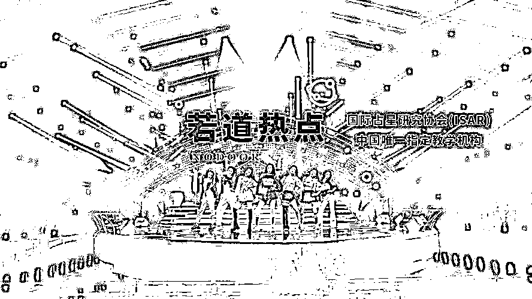作者/编辑/翀子 ISAR 认证占星师
   图片/网络 封面/书君

今夏最红火的综艺节目《乘风破浪的姐姐》马上进入尾声，围绕它产生的讨论非常热闹，仅从占星学就可以找出好多角度。节目舞台的造型是一艘扬帆起航的船，就让我们为它绘制一份行星地图，看它走过了哪些路径吧~

综艺节目《乘风破浪的姐姐》一路猛进，马上就要进入尾声。无论是高开低走的评价、观众对输出的价值观从鼓掌到质疑，还是红遍大江南北的主题曲《无价之姐》，《乘风破浪的姐姐》无疑是今夏最具热度的综艺节目。

我看到有很多对节目的讨论，角度不同，立场不同，如果从占星学的镜头看向这群突破自我又光芒万丈的姐姐，又会是什么样子？让我们踏上这艘“乘风破浪”的大船，看看它从哪里出发、装载了什么、行经了哪里、目的地是何方。

我为它绘制了一副七星地图，就像给旅人指路的北斗七星。但它不是唯一的答案，你也可以给它绘制一份哦！

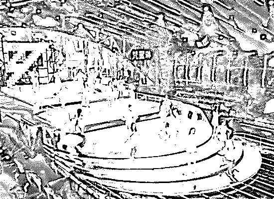

**航程的起点：月亮**

姐姐们的表演舞台是一艘扬帆起航的船。船在启程之前停留在港口，清洗、保养，船员们放松休息，双脚踩在坚实温暖的大地上，和家人相聚，享受难得的温馨时光。港口的夜是安静的，水面微微荡漾，船员们在这里，有自己熟悉的家人朋友，没有海浪拍打与“吼叫”的声音，一切都是舒适惬意的。

**月亮是滋养我们的港湾，**提供保护与安全感，是我们的人生航程不管走多远，都会紧密相连的内在情感支持，是我们的**领地与家**。参加节目的三十位姐姐，都是别人眼中“功成名就”的人，每个人都已经在自己的领域取得或大或小的成绩。她们的履历和一个个代表作，是她们的“名片”，也是她们的“保护罩”和安全港。

**当她们决定要驶出港湾，就意味着过往所有的成绩与光环将面临观众重新的审视。**

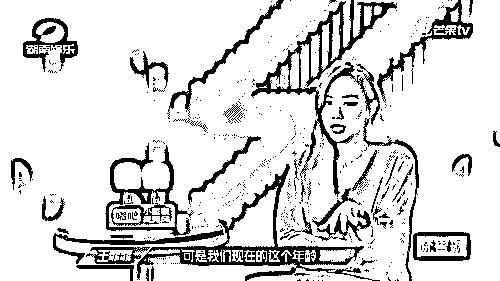

她们和参加选秀的年轻女孩子们不一样，后者初出茅庐，没有光环加持却也没有顾虑，往前冲就是了。而当你的家已经很大、很美、很舒服、别人对你充满艳羡与崇拜的目光，这时要走出舒适区的“温柔乡”，就是一件颇有风险的事儿。

节目第一期，“久经沙场”的姐姐们面对未知的节目旅程、面对即将要挑战自己的担忧，一个个在表面淡定下略显紧张，所以黄晓明对姐姐们重复最多的一句话就是：别紧张，这是加分项！

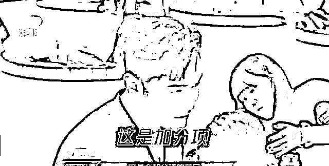

月亮是提供安全感和启程驶向未知之前的港湾，也是**阴性能量的象征**。代表男性与阳性能量的太阳是向外的，扩张的，而**代表女性和阴性能量的月亮是向内的，内收的。**

这个夏天，女性群体占据了综艺节目和影视剧的重要位置，《乘风破浪的姐姐》和《三十而已》都是对女性群体的重新思考。大环境长期关注人们阳性能量（太阳）的发挥，忽略阴性能量（月亮）的作用，而这个节目的出现，唤醒了人们对女性（月亮）力量的聚焦。

驶出自己熟悉的安全区，以女性身份“乘风破浪”，姐姐们勇气可嘉。

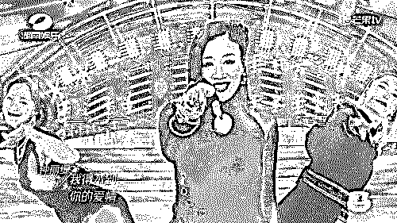

**旅程的载具：木星**

“破浪”需要载具，而**木星就是那艘承载姐姐们的船。**节目对姐姐们来说是一艘**冒险之船**，更是一艘**“大”船**。它的大，不一定多宽敞，而是她们在船上的一举一动，不经意间的一句话、一个表情、一个情绪，都被摄像机“精心”拍摄下来，然后**放大**呈现在“吃瓜群众”眼前。

**姐姐们从自己的“月亮之地”出发，登上这艘不知最终将带自己驶向何处的冒险**（木星）**大船。**宁静用自己的“江湖地位”冒险，伊能静和钟丽缇挑战年龄对体能限制的冒险、王丽坤用自己的“仙女形象”和“素颜女神”冒险、万茜以“担心参加节目而影响以后观众看待自己的角色”冒险、王霏霏和孟佳则以专业女团出身的光环冒险……

姐姐们跟着冒险之船，驶向**远方**（木星）。

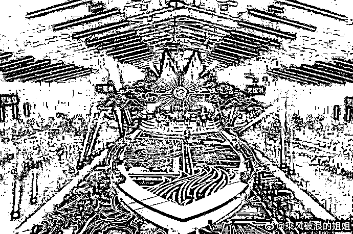

这也是一艘**成长之船。**每趟旅程都是一次成长，载着姐姐们航行的大船，每向前越过一个浪，就带来更远处的风景和视野，也带来更大的冒险。难度逐渐升级的小考和公演曲目，从一场公演表演一首歌到后来一场公演要表演两首歌，从只是唱歌跳舞到学习乐器演奏、与乐队合作……姐姐们在大船上迎风踏浪，早已不是刚参加节目时的她们。

姐姐们的“破浪之旅”虽有各种复杂情况出现，比如丁当对评委给自己初舞台打出的低分提出质疑、金莎的表演道具在公演时多次掉落以致泪洒舞台、郑希怡面对自己受伤而影响团队很是难过……但毫无疑问，姐姐们在一起训练、表演、吃宵夜，是**快乐的体验**。她们的开心连同各自的成长，通过镜头传递给每一位看节目的观众。

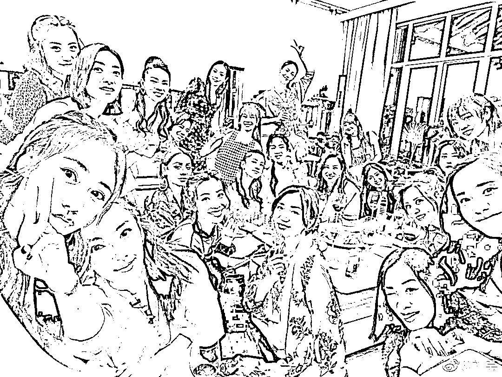

**船上主要项目：水星**

**水星和沟通有关。**俗话说“三个女人一台戏”，三十位姐姐凑在一起就够演十台戏了。不同性格、不同事业领域、看这些成功女艺人们 “明争暗斗”是观众们喜欢的戏码。

光是看她们的太阳星座（6 个白羊座、5 个金牛座、1 个双子座、2 个狮子座、3 个处女座、2 个天秤座、2 个天蝎座、1 个摩羯座、5 个水瓶座和 3 个双鱼座），就已经能够想象她们之间在台上台下的“火花”有多么精彩。

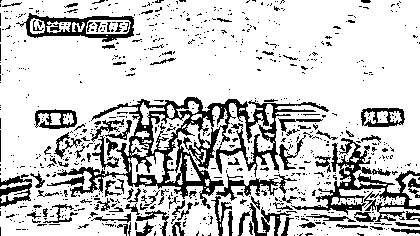

热闹的团队排练里，有发号施令的、有给队长提建议的、有活跃气氛的、有煽情的、也有不善表达默默在一旁苦练的。每个人带着自己独一无二的性格而来，在这艘“破浪之船”上，姐姐们从彼此不熟悉到熟悉，大家说话聊天，表达自己也看到她人。

通过一次次小考和公演，每个人越来越了解别人的优势和短板，越来越知道如何练习、如何分工、如何提高舞台表现力、如何展现团队的光芒。**这是水星代表的沟通与学习能力的呈现。**

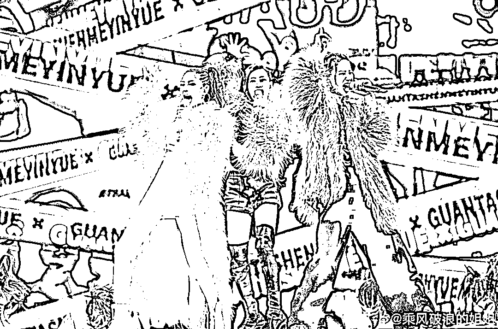

“破浪之旅”的主要项目是唱歌跳舞。姐姐们要在短时间内学会不同歌曲，从经典老歌到二次元神曲，从说唱到歌剧式表演，还要学习不同的舞蹈风格，手指舞、宅舞、劈叉、舞狮、踩椅子……亮出的“绝技”嫌少不嫌多。

**担任传播中介的水星**，为观众奉上了新鲜的视听体验和多样的表演形式。气势十足的《兰花草》、有现代舞气息的《这是因为我们能感到疼痛》、充满野性力量的《新物种》、暗黑风《花样年华》，多道菜品任你选。

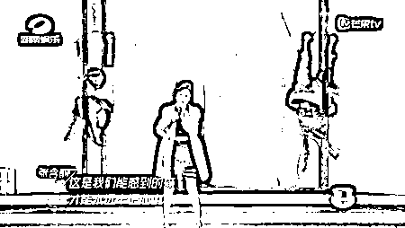

**航程燃料：火星**

**火星给“破浪之旅”注入燃料，**是展现热情、力量和行动力的能量，也是勇气的象征。姐姐们参加一个“前途未卜”的新节目，面对向自己舒适区的挑战，本来就需要**勇气**（火星）**。**谁都怕头上的“王冠”掉了，但无论是基于“贪玩”心态、“翻红”的目的、扩大知名度的想法、社交需求等等初衷，她们能放下过往成绩、让评审和观众打分，就值得为自己鼓掌了。

这是一个才艺、体能与、耐力和个人魅力的**“竞技场”**，姐姐们彼此是伙伴也是**对手**，不在**比赛**中赢得比分，就要淘汰下场。随着节目进程的展开，姐姐们发现“选女团”是动真格的，它不是简单的真人秀，如果不激活自己的**斗志，**真的会被淘汰。

面对时刻摆在面前的“生存危机”，战还是逃？**肾上腺素**（火星）发挥了作用，“**我们要拿第一名**”成为赤裸裸的宣言。

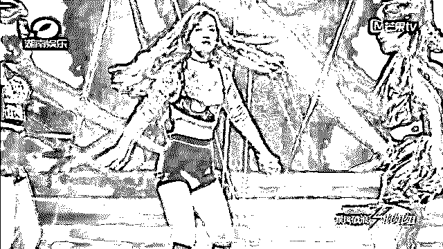

绑沙袋、抠动作、熬夜写词排练、憋“大招”……小考和公演舞台成为姐姐们的“奥林匹克赛场”，“学会得更快、完成度更高、实力更强”可以当作她们的竞技口号。更直接的表达想赢的欲望，**活力和火力全部迸发出来**，抛开顾虑和担忧，一门心思向前冲。

乘风破浪的大船在向远方航行的时候，充足的燃料是旅程顺利的保障与核心。火星激活姐姐们的肾上腺素、激发她们的创造力和快速行动力，同时也激活每个人的心理能量，精确对准目标。

如果说启航之初，很多人都抱着走一步看一步的心态，那越到节目后期，每位姐姐也越明确自己想要取得更好成绩、赢得更多表演机会的想法，**燃料越烧越足。**

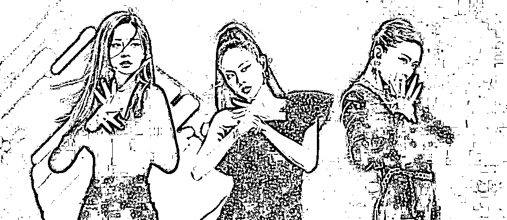

**后勤保障：土星**

**土星代表了事物运行的规范和法则**，即便是游戏，也有它的游戏规则，不成规矩无以成方圆。土星就是节目顺利推进的后勤保障。

在《乘风破浪的姐姐》里，“确定队长—挑选团员—选择公演曲目—排练—小考—排练—公演投票—淘汰和晋级”就是姐姐们必须服从的游戏规则。每套规则当然有**局限性**，时间紧、任务重、选票机制残酷……游戏不断重复，每位姐姐越来越会玩，从对观众喜好没有概念到完全清楚什么样的舞台表演会是票数高的，每个人也越来越明白女团到底是怎么回事。

**“带着镣铐起舞”描述的就是，在土星的限制之下，呼吸到越来越多的自由空气。**

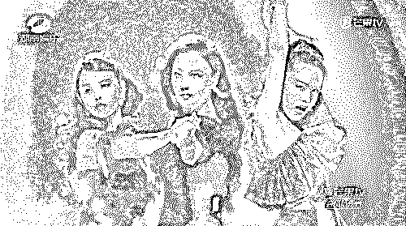

规则是节目设计框架下的产物，是“综艺产品”的使用功说明，而对三十位姐姐来说，**土星不仅意味着她们登船需要遵守的条件，更是对自己肩膀压上的“一座山”。**谁都不是因为天上掉馅饼就成功的，演员靠一部部拿得出手的影视剧、歌手借助一张张在录音棚里细细打磨的专辑、主持人在一个个节目和晚会的打磨中成长、专业女团队员凭一次次不停歇的“魔鬼式训练”成为舞台之光……

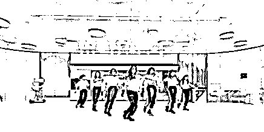

即便“小有成就”，每位姐姐依然逼自己要做得更好。不吃饭、晚睡觉、一遍遍对着镜子抠动作，和老师一次次探讨更优的表现方式，力求每次都呈现高水准的舞台表演。

当有很多东西要学习、了解、表达和呈现时，光有热情和不服输的劲头是不够的，**土星此时就是一位严格又耐心的老师。**它有**很高的标准，**有时**令人沮丧和焦虑**，但它也告诉我们实实在在完成目标的方法，就是**一点一滴实打实的练习、练习、再练习。**

有土星做后勤保障，每位姐姐面对一次次全新的舞台表演，不盲目乐观，也不盲目焦虑，着眼于排练的步骤，打磨细节，勤于练习。到了台上，土星是她们自信表演背后的底气，而完成的每首作品、观众的每次掌声和尖叫呐喊，也成为她们的**收获和成果**（土星）。

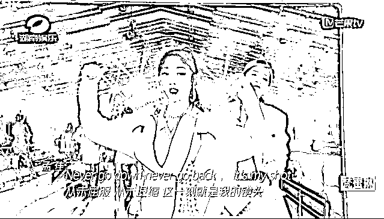

**“破浪”秘笈：海王星**

在海上乘风破浪，总有碰上风雨交加的时候。夜晚波涛汹涌，船体上下颠簸，冒险可不是简单的开玩笑。游戏规则残酷，时间紧任务重，面对身心的双重考验，用什么支撑自己一路前行？

**海王星是愿景，是美好的渴望，**当我们身处重重现实考验，它可以成为“破浪”的秘笈。“重拾女团梦”王霏霏和孟佳的愿景，让更多人认识自己的音乐是袁咏琳的愿景，“突破自己”是王丽坤的愿景，“让孩子知道我并不只是妈妈”是伊能静的愿景……

在高强度训练和“生存危机”的压力下，海王星让我们**超越当下**、看着给自己绘制的美丽图景，为心灵舒压，支撑我们完成一次次考验。它是我们给自己勾勒的伊甸园。

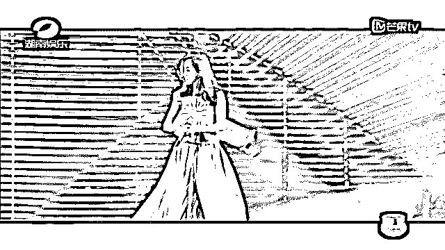

在团体中，个人特质是被**消融**掉的，参加节目的姐姐们除了王霏霏和孟佳有女团经验，其他人基本都是以“主角”形象登台亮相，她们个人特质鲜明，有“独霸舞台”的资本。然而在选女团的节目里，团体表现重于个人表演，很多时候个人要为团体做出**牺牲**。

有时候需要放弃更亮眼的高难度动作，以让集体整齐；花费大量个人时间，帮助其他团员学习舞蹈动作；为了好好完成比赛，**将个人好恶抛开**，既能跳自己喜欢的舞蹈，也不会逃避自己的短板……**这是海王星运作精妙的方式。**

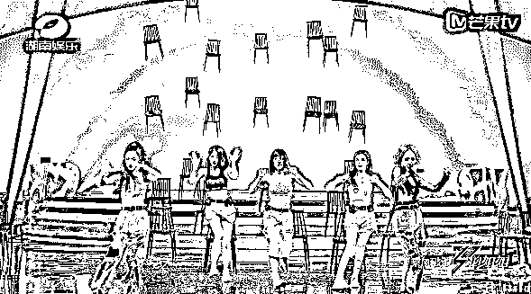

**用想象力“造梦”，****也是海王星的拿手好戏。**无论声乐总监还是舞蹈总监，整个节目组力求为观众呈现“乘风破浪”的梦想舞台。**“造梦”是大众传媒常使用的方式，**通过镜头给普通人带来缓解日常压力的消遣。而如何让表演更好看，舞台更炫酷，姐姐们和节目组一起，发挥想象力，在歌曲演唱、舞蹈编排、舞美设计上力求**完美。**

所有的选秀节目，都不外乎围绕一个**“造梦故事”**——每个人都可以挑战自我、超越自我、变成更好的自我。《乘风破浪的姐姐》也是如此。

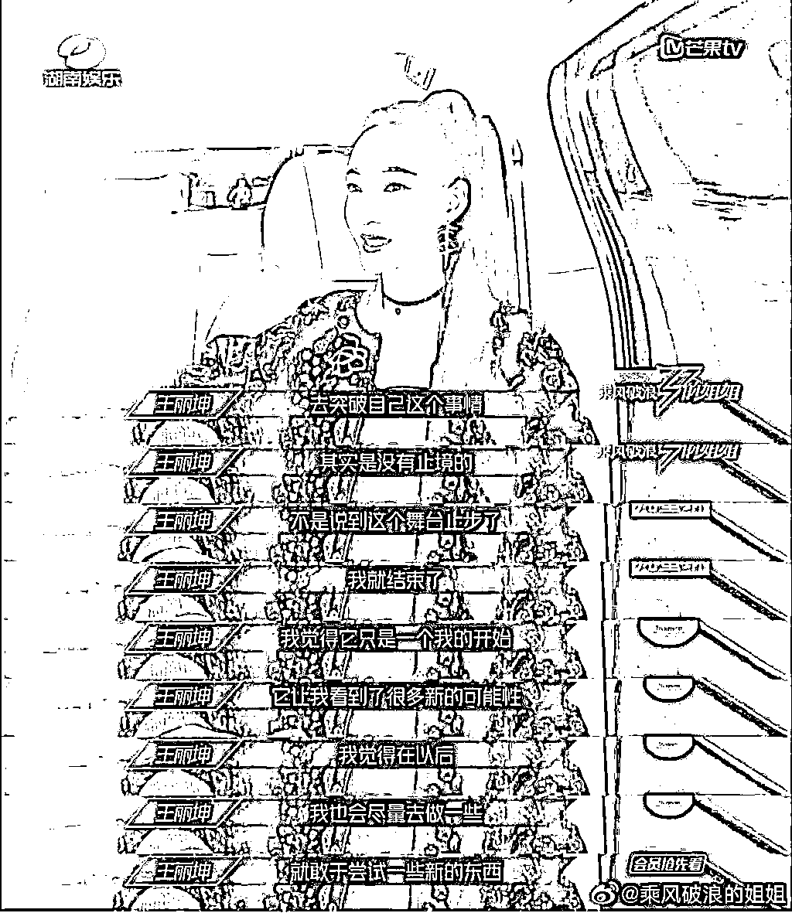

**目的地：天王星**

“乘风破浪”的大船从月亮港口启航，姐姐们迈出舒适区，踏上冒险之旅，天王星是目的地。

**刺激、兴奋、新鲜，做之前没做过的尝试。**“不想跳舞”的宁静发现了舞蹈的乐趣、“云淡风轻”的万茜带领团队争第一、尝试说唱的王丽坤、短发造型的郁可唯……**天王星是变革的力量，它“击碎”事物老旧的部分，**如果抵抗这股革新的驱力，天王星就会用破坏性的方式强力撕开一个口子，让人不得不面对陌生的新境地带来的冲击**，脱掉制约前行的旧衣，从而发展出适应新的生命阶段的能力。**

在节目“严苛”的土星规则之下，**姐姐们必须突破以往惯性——**唱没唱过的歌、跳没跳过的舞、“开发”新才艺，还要研究观众喜好而不仅仅是做到自己认可的“好”就可以。**被天王星触碰到的地方，会带来“颠覆式”的改变和个性的发展。**

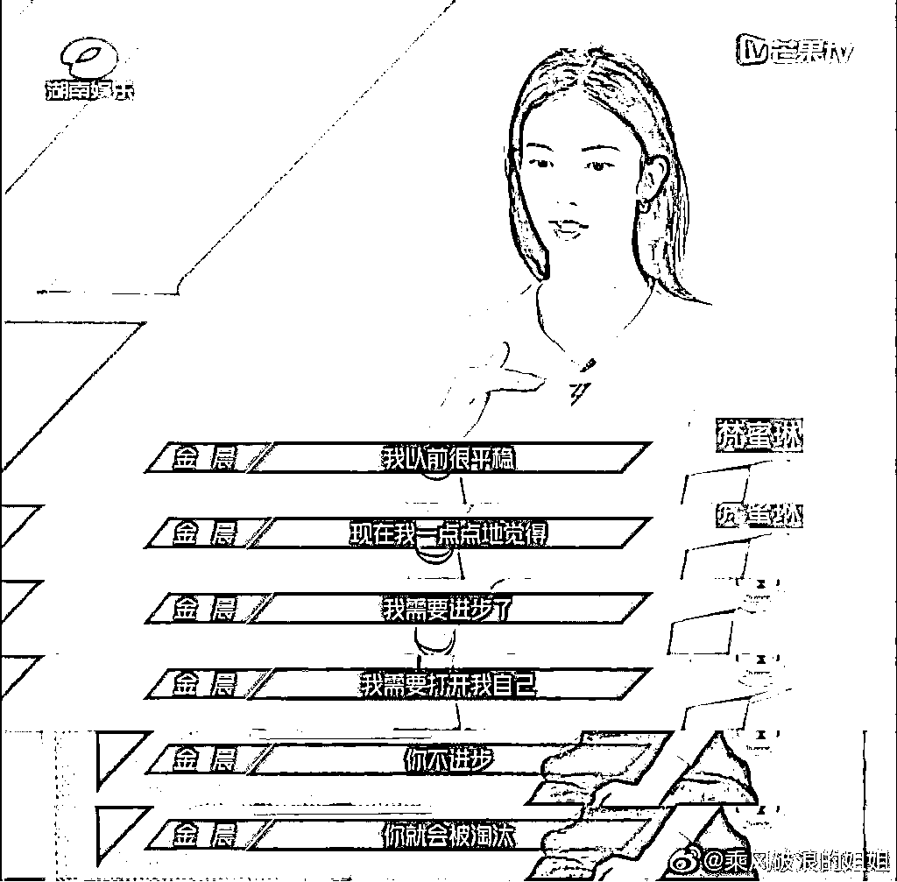

有趣的是，在三十位姐姐的太阳星座里，有五位是金牛座——宁静、万茜、李斯丹妮、王霏霏和白冰。如果问什么星座适合做队长，金牛座一定不是首选。然而**天王星正在金牛座运行**，沉着、平静又有耐性的金牛座不再闷声，宁静、万茜、李斯丹妮和王霏霏扛起队友们的信任，带领姐姐们“乘风破浪”，而她们几个无疑也是在这个节目里极其亮眼并受到高关注度的姐姐们。亮眼，是因为她们给人**耳目一新的惊喜**，和之前给观众的印象有强烈反差。这种**令人兴奋的“不一样”**，**便是天王星的特质。**

**天王星带来个体的改变与解放，**“破浪之旅”让“30+”的成熟女明星们**突破**曾经的傲人光环，打造全新的自己。当她们登上这艘船，当然知道这趟旅程会**颠覆**自己的舒适区，但依然决定上船，主动面对**难以预测的变化** 。

生命如果只是日复一日重复昨日，抱住过往抗拒改变，如何才能进化呢？

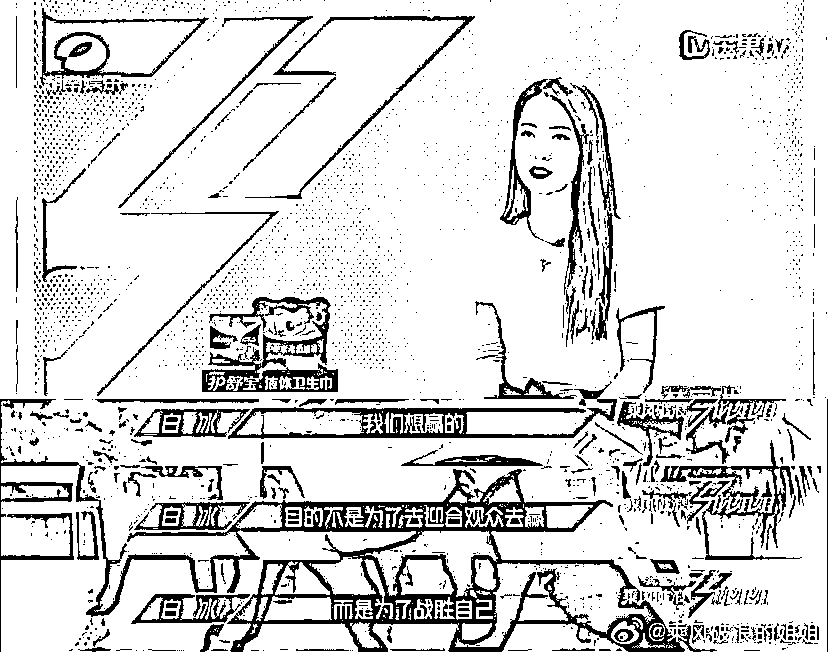

**我们都需要“乘风破浪”**

《乘风破浪的姐姐》是一档综艺节目，它的目的是为观众提供娱乐与消遣、给制作方带来热度和流量；对参与节目的三十位姐姐来说，它是一份工作、一份收入，但又不光是这样。

花掉的时间精力、挥洒的汗和流过的泪、开心和沮丧……节目对她们每个人到底有怎样的意义，我们不得而知，但这艘“乘风破浪”的大船一路前行，作为看客，我们自己体会到了什么是可以品味的。

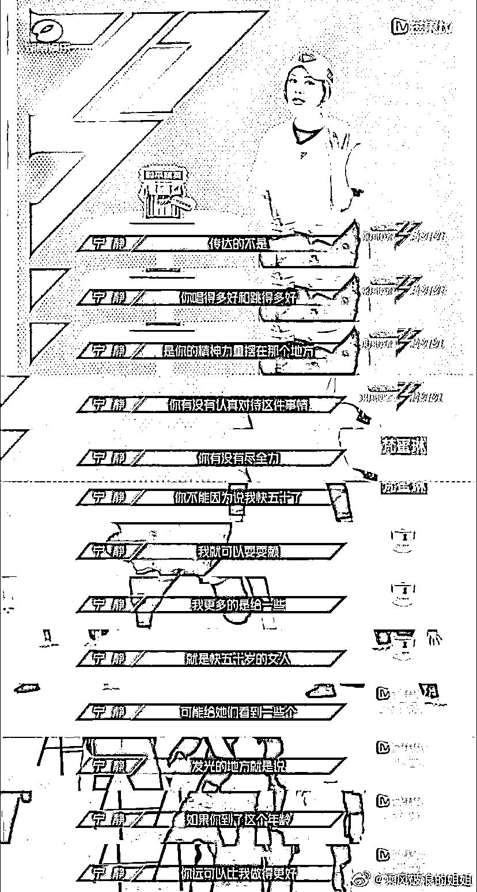

“选秀类”的综艺节目是成长类神话的现代表达，也是社会环境的缩影。三十位姐姐在一起，有不同的人、不同的想法、不同的光芒，当这些光芒汇聚在一起，让我们看到这个世界的多元，也看到每个个体在成长之路上的潜力和需要跨越的困难。

在她们身上，我们或许看到一点自己的影子，你喜欢的和讨厌的，是映射自己的一面镜子。

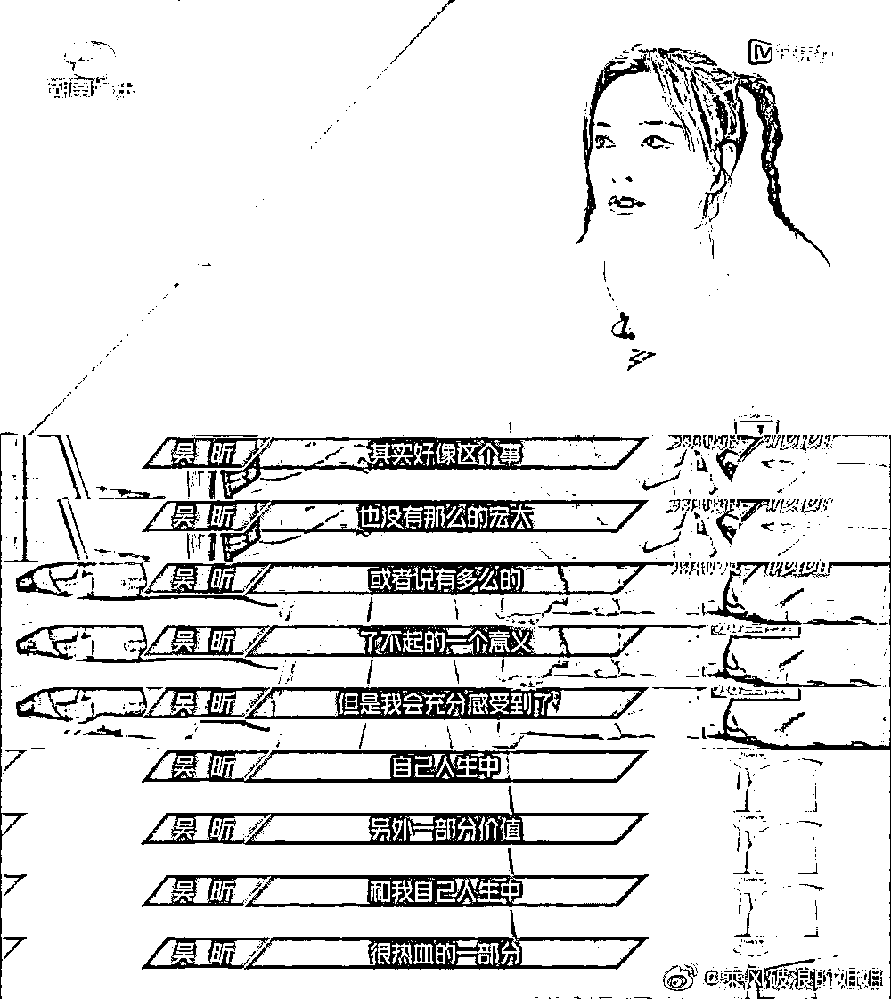

姐姐们从源头（月亮）出发，扬帆起航（木星），在节目规则之中（土星），学习新东西并表演给观众（水星）。她们有参加节目的愿景（海王星），同时明确目的并付诸行动（火星），在节目进行的过程中，她们不断突破自己（天王星），展现新貌。

每个人的人生都是一艘乘风破浪的船，当我们降生在这世界上，就已经没有回头的可能。海面有时风平浪静，有时巨浪滔天，如何行驶生命之船，只有我们是自己的舵手。

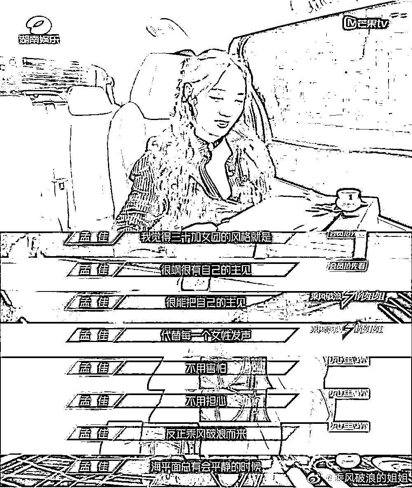

我们当然需要掌握方向，但面对浩瀚无边的海洋，就像在风云变幻形势复杂的当下，渺小个体在“未知”面前该如何安宁自处，我们要如何前行，不仅需要勇气，也需要智慧和定力。

我不认为《乘风破浪的姐姐》只是定位给女性群体的节目，它的宣传文案太好了，适合每个“乘风破浪”的我们：

**我们关心成功，**

**也关心失败，**

**更关心每个人要面对的那座山；**

**我们关心美好，**

**关心热爱，**

**更关心日新月异的未来；**

**努力与翻越，**

**不馁与坚信，**

**肆意笑泪，青春归位，**

**一切过往，皆为序章，**

**直挂云帆，乘风破浪。**

**版权声明**：原创文章由作者授权首发于若道平台，欢迎转发，反对抄袭。友号转载请申请白名单。

翀子

ISAR 认证占星师（2019 年获得）

若道 2019 届核心课程毕业生，若道微信公众号兼职编辑

**咨询微信**：carolinemichong

**微信公众号**：LumosTrueSelf

长按打赏

**系统学习占星学**

**点击下图了解详情**

**微信又双叒叕改版啦，不想错过若道君的推送？**

**就把若道设为星标吧！**

**▼**

就是这个“在看”，戳戳戳 ☟

********报名直达入口********

# 雷蒙德·梅里曼金融占星周运 | 天王星逆行，新高还是暴跌？

> 原文：[`mp.weixin.qq.com/s?__biz=MzA5NjA0NTAxNg==&mid=2651424576&idx=2&sn=6166fb860e5e8872740eb2d8817ecc4a&chksm=8b4b35f7bc3cbce15b24b74e4a7f4f7434ec0a1bb05c23d9e6f327e4853e2591a35e1f474db7&scene=126&sessionid=1692738121#rd`](http://mp.weixin.qq.com/s?__biz=MzA5NjA0NTAxNg==&mid=2651424576&idx=2&sn=6166fb860e5e8872740eb2d8817ecc4a&chksm=8b4b35f7bc3cbce15b24b74e4a7f4f7434ec0a1bb05c23d9e6f327e4853e2591a35e1f474db7&scene=126&sessionid=1692738121#rd)

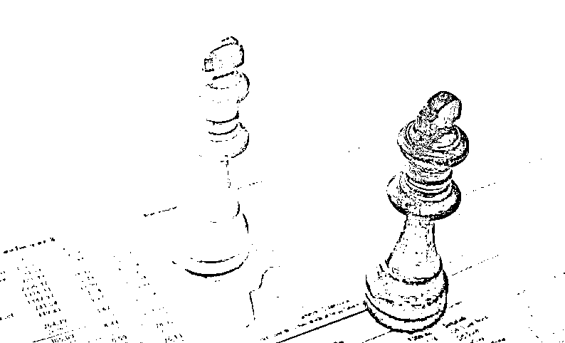

作者/雷蒙德·梅里曼
译者/Leisha 编辑/玫瑰 图片/全景网雷蒙德·梅里曼是在金融占星学界稳坐第一把交椅的占星师，同时他也是若道签约的金融占星课老师，我们引进了雷蒙德·梅里曼老师的《[上证指数月度报告](http://mp.weixin.qq.com/s?__biz=MzA5NjA0NTAxNg==&mid=2651423447&idx=3&sn=841a09c5d196d9885d98eeb480a2079b&chksm=8b4b3060bc3cb976c0aa2a2967b91ae73978faca1ee0437be958f79069958d5a410961a193c5&scene=21#wechat_redirect)》《[黄金周期月度报告](http://mp.weixin.qq.com/s?__biz=MzA5NjA0NTAxNg==&mid=2651422728&idx=2&sn=5e41d5bf3527772f19ca7a774eb984a2&chksm=8b4b32bfbc3cbba96679ac4b41485a34f838242408e52aa7626f837a39b7084a74eea73f500c&scene=21#wechat_redirect)》《[2020 年金融预报](http://mp.weixin.qq.com/s?__biz=MzA5NjA0NTAxNg==&mid=2651414279&idx=2&sn=cc131aa367c4ada15e35d0d80b308415&chksm=8b4bedb0bc3c64a6ef98c0e86ba3d842d8368de2b90e623af1d3870d521049ce352732c8d091&scene=21#wechat_redirect)》。我们经老师的授权，将每周刊登梅里曼老师的周运，供大家参考和学习。于是，这是本周的周运（8.17-8.21）。**说明：以下时间采用纽约证券交易所所在地美国东部标准时间。**
**展望与回顾**

**美国国会议员未能在休会之前就新冠病毒疫情救济方案达成一致，零售业态势随即疲软，随后，美国股票市场在一个安静的夏季周五交易时段结束后收平。**

**——乔纳森·加伯**

**《新冠病毒疫情救济方案悬而未决，股票收盘持平》**

**www.foxbusiness.com**

**2020 年 8 月 14 日**

观察上周结束时的亚洲股市，你可能会觉得天王星上周末开始逆行造成了向上突破。日本日经指数和印度 NIFTY 指数正突破至暴跌后的新高。

欧洲的股票市场正反转下跌，并在天王星即将逆行之时看似准备跌得更低。欧洲的所有股指都上涨至 8 月 12 日，但到 8 月 14 日开始急剧下跌。在 7 月 14-20 日太阳对分的摩羯座星群（木星、冥王星、土星）之后，欧洲还没有股指突破各自在 7 月 21 日创下的高点，但每个股指都创下了次高点，并在上周四之后开始下跌。美国，道琼斯工业平均指数和标准普尔指数在 8 月 11 日创下暴跌后的新高，但纳斯达克指数没有。不过，纳斯达克指数在 8 月 11 日的前一周创下了历史新高，但其他指数当时尚未创下历史新高，是为市场间看跌背离的情况。然而，这些指数在创下高点之后都没有急剧下跌，只是横盘震荡。因此，**目前尚不清楚天王星逆行会对应当前看涨趋势的反转，还是会对应创下暴跌后新高，甚至历史新高的突破。**另一方面，黄金和白银上周的表现像天王星一样非常戏剧化。8 月 7 日，黄金创下历史新高 2089，三个交易日后的 8 月 12 日，黄金暴跌至低点 1874，跌了 215 美元。那个低点的前一天，我们在日报中指出，这个模式看起来很像黄金在 2011 年的涨势。2011 年 8 月中旬，黄金创下首个高点，随后在两天内下跌了 212.50 美元，然后继续上涨，在 9 月 6 日创下历史新高。我们建议日报订阅用户，如果第二天出现类似的下跌，则买入。黄金的确在第二天出现了类似的下跌。白银的表现与黄金类似，在 8 月 7 日周五涨至数年新高 29.91。到周三，白银暴跌至 23.58，跌幅达 21％。我们还是建议交易者在 8 月 12 日前买入，到周五，白银再次上探 28.00。原油和比特币上周的走势依旧强劲，但未能超过前一周的高点，可能也表明即将发生与天王星逆行相关的反转或突破。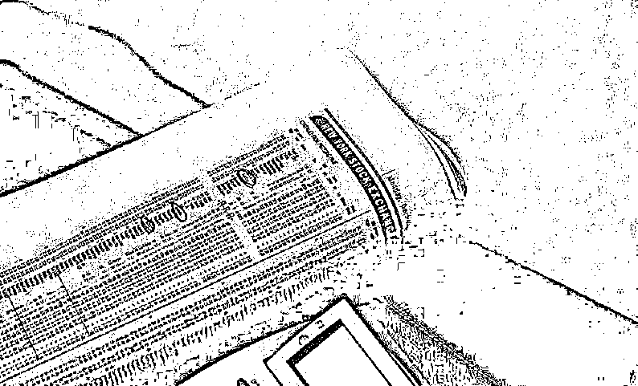**短期占星趋势和长期考量**

**团结则存，分裂则亡。我们不要分裂成小派系，那必定会摧毁我们赖以生存的联盟。**

**——帕特里克·亨利**

**1799 年 3 月**

**将共和制分割为两大政党……是令人恐惧的邪恶政治。**

**——约翰·亚当斯**

**查尔斯·弗朗西斯·亚当斯摘自《约翰·亚当斯的著作》**

**利特尔与布朗出版社 马萨诸塞州波士顿**

**1856 年**

**不要问国家能为你做什么……要问你能为自己的国家做什么。**

**——约翰·肯尼迪的就职演说**

**1961 年 1 月**

**8 月 4-24 日，火星与摩羯座星群中的木星、冥王星、土星形成第一次渐盈的四分相，现在正是这个时段的中期。**上周发挥效力的是好斗强势的火星-冥王星四分相，民主党总统候选人乔·拜登选择了前检察官、现任美国参议员卡马拉·哈里斯作为其竞选伙伴。共和党人立即开始攻击她，说她“卑鄙龌龊、小心眼”，这都是典型的火星-冥王星词汇。但是华尔街对拜登选择感到非常满意。她将为拜登的选情带来多大的帮助或伤害，还有待观察，但鉴于火星在整个大选期间存在感极强，人们似乎会对她又爱又恨，就像对特朗普总统一样。astro.com 网站显示，卡马拉·哈里斯于 1964 年 10 月 20 日 21:28 在加利福尼亚州奥克兰市出生。与特朗普一样，她也出生在满月之时。今年余下的时间里，摩羯座星群中的木星、冥王星、火星将与她出生星图中的满月形成 T 三角。对于特朗普总统而言，摩羯座星群将对分他出生星图中的金星-土星合相。换言之，摩羯座星群将与他俩出生星图合并的重要位置形成大十字。土星和冥王星对个人配置的触发凸显无论如何都不代表受欢迎。预计他俩会激烈地互相攻击。特朗普与哈里斯的斗争可能比与拜登的还多，而且就特朗普与哈里斯之间的斗争可能会如何发展而言，“卑鄙龌龊”只是较为温和的描述之一。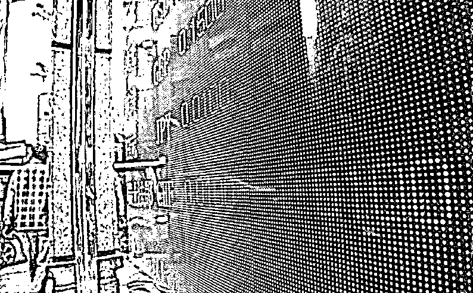**从地球宇宙学的角度来看，人们容易互相激怒，斗争时不会手下留情，不会屈服，也没有幸存者。**这是背水一战。在冥王星手下，没人能毫发无伤地全身而退。另一个有趣之处是，行进的月亮北交点合相特朗普的太阳，预示着成功。与此同时，哈里斯的出生星图显示，她正在经历月亮交点回归，而行进和出生星图的月亮北交点都合相她的上升点，这也是成功的征象。行进的冥王星表示，他俩都可能会在这次大选期间遭受痛苦和伤害，而月亮北交点表示，他俩都可能会成功，成为最后的胜利者。从政治的角度而言，拜登选择哈里斯可能看起来很冒险。从占星学的角度而言，这个选择对拜登和民主党来说根本不是坏事，因为行进的土星正在哈里斯的星图中上行，这是权力不断增强的征象。还不能排除另一种可能性：根据土星和月亮北交点的行进，卡玛拉·哈里斯可能会在未来四年内成为美国总统。那么，股市将如何回应这种状况？我认为，9 月 29 日至 10 月 19 日，当行进的火星转向逆行，并再次与木星、冥王星、土星形成上弦月周期（渐盈的四分相）之后，我们会看得更清楚。**现在，我们要等着看上周末的天王星停滞是对应股市向上突破至新高，还是对应股市开始连续数周地暴跌。**

**说明：以上日期基于纽约证券交易所所在的美国东部标准时间，由于存在时差，中国地区可能需要加一天。**

**版权声明：**本文由若道翻译发布，欢迎转发，反对抄袭。友号转载请申请白名单。

**雷蒙德·梅里曼（Raymond Merriman）**

若道签约老师。著名金融占星师，ISAR（国际占星研究协会）前主席，梅里曼市场分析公司的总裁。他由于“提升了占星学的职业形象”，在 1995 年国际占星大会上被授予轩辕十四奖；在 2012 年国际占星大会上，被授予轩辕十四终身成就奖。

1“中国上证指数月度报告”发售

**若道推出了****中文版****的雷蒙德·梅里曼中国上证指数月度报告，并持续发行该报告！**

当把金融市场的周期和占星学的周期相结合时，雷蒙德·梅里曼老师的金融占星学研究**为投资者应对金融市场的周期波动，并随之调整投资策略提供了极大的价值参考**。

****9 月中英文报告即将上线！****

2“黄金价格周期月度报告”发售

**若道推出****中文版****的雷蒙德·梅里曼黄金价格周期月度报告！**不仅仅为广大读者在中国股市的投资出谋划策，更将视角放眼黄金市场。

**每当世界经济形式不明朗的时候，有一个地方是保值的港湾，那就是****黄金**。从 2018 年 8 月开始，黄金已经用自己的升值再次提醒众人它在经济不稳定时的位置。**截至目前，2019 年 8 月底，黄金已飙升至 6 年新高，高于 1565 美元。**

自 1982 年雷蒙德·梅里曼出版第一本研究《地球宇宙学征象与黄金价格的关联》的著作以来，**他一直作为最重要的黄金市场时机预测者之一享誉国际**。

过去 1 年，那些订阅并遵循建议的梅里曼市场时机学院日报和周报的订阅者，如果从 2018 年 8 月 16 日的低点或 8 月 23-24 日的次低点购买黄金，他们已经赚到了不少的 30%左右的利润。

**9 月中英文报告均已更新！**

**购买套餐**，买得越多越优惠

中国上证指数月度报告套餐价

*   **单月报告**：280 元

*   **3 个月套餐**：780 元（260 元/月）

*   **12 个月套餐价**：1999 元（166 元/月）

**长按下图识别二维码**

**购买金融报告****套餐**

**▼**

黄金周期月度报告优惠

*   **双报告年度套餐更优惠（直降 899 元）**
*   **12 个月黄金报告+12 个月上证指数报告：仅需 3500**

**长按下图识别二维码购买黄金报告套餐**

▼

32020 年金融预报 1976 年以来，由雷蒙德·梅里曼撰写的梅里曼市场时机学院每年一次的年度预报沙龙和每年一本的《年度预报》一直在应用占星学原理为投资者们服务。2018 年，若道第一次将这份广受赞誉的一年一度的金融占星报告和沙龙引入中国，供中国投资者参考。**《2020 年金融预报》将会谈及 2020 年重要的宇宙天象及其对世界经济、贸易形势的整体影响，还将覆盖中国上证股票市场的分析、黄金白银市场、美国经济、美国总统、美联储、美国国债市场、美国股票市场、主要外汇货币市场（主要外汇美元、英镑、欧元、日元、瑞士法郎）、原油市场、谷物市场、活牛市场、比特币市场等投资市场。**梅里曼老师及梅里曼市场时机学院的金融占星分析师还会给出以上市场 2020 年的**市场价格目标区间及重要价格反转日**，为短期、中期和长期投资者进行市场操作的时机提供参考。如果你关注世界经济和金融投资市场的变化，会发现梅里曼《金融年度预报》中的研究对于你了解世界经济在发生什么，这些市场的走向会如何有非同寻常的指导价值。为了让更多人从这个讲座和报告中获益，我们特意免费提供沙龙**讲座前 30 分钟试看（免费放大）**，你可以先试看，然后再决定是否购买整体报告及沙龙。如何安然度过这场危机？如何明智地投资，让自己安然度过这个充满挑战的一年，甚至获得丰厚收益？我们相信 2020 年度金融预报沙龙和报告套餐组合会给你远高于其价格的回报。**30 分钟免费试看**获取路径参见如下指引：①请扫描下图二维码，下载若道 app **②** 登录若道 APP 首页-金融报告-《2020 年金融预报》讲座视频——免费试看，即刻免费试看 30 分钟的讲座视频。

报告和讲座价格

2020 年金融预报讲座和报告价格整体售价** 1280 元**

（本讲座和报告不单独出售）

**长按下图识别二维码购买 2020 年金融预报**

▼

********点击阅读原文购买金融报告********

# 插班中丨核心课程 L3，教你掌握综合星图解读

> 原文：[`mp.weixin.qq.com/s?__biz=MzA5NjA0NTAxNg==&mid=2651424576&idx=3&sn=47fc28105bc370949eb0205ee8c0e91e&chksm=8b4b35f7bc3cbce1d826d6d3a630b7ea93ef60a1df2f5d2112310b844f371fec4a455af5a9e2&scene=126&sessionid=1692738121#rd`](http://mp.weixin.qq.com/s?__biz=MzA5NjA0NTAxNg==&mid=2651424576&idx=3&sn=47fc28105bc370949eb0205ee8c0e91e&chksm=8b4b35f7bc3cbce1d826d6d3a630b7ea93ef60a1df2f5d2112310b844f371fec4a455af5a9e2&scene=126&sessionid=1692738121#rd)

**Level3 也是占星学习的一个整合区和分水岭****若道君给大家准备了一份专业的占星测试：“2020 若道核心课 L3 入学测试”****测试内容包括：**

**适合参加测试的学员：**

**L1-2 结课学员**

**有一定占星基础的自学学员**

**准备考 ISAR 的学员**

**扫码开始测试吧**

**1**

**占星学除了自我修炼，市场需求如何？**

**通过占星学习你帮助了自己，也可以选择成为自助助人的占星师，开启受益终生的第二事业。**一方面，社会快速发展人们压力山大，抚慰心灵的咨询市场需求巨大。另一方面，市场鱼龙混杂，真正学院派的严肃占星从业者十分稀缺。最重要的，**占星学能让你自己帮助自己，无论你是否进行占星咨询从业，学习了占星学，它都将是终身陪伴你成长的睿智好伙伴。**

**2**

**你的占星核心课老师是谁？**

 拥有**50**年占星研究积淀**44**年职业占星实践**41**年占星教学经验的**若道联合创始人****2017-2020 年曾任 ISAR 全球副主席****2020 至今为****CAPISAR（全球职业占星师资质认证考试委员会）主席****大卫·瑞雷**&**最懂学员的若道首位认证金牌中国老师****熊鹰**师徒二人合力打造
**2020 年若道****全新核心占星课程**

**3**

**L3 阶，我们要学习什么？**

**第 3 阶 ****宫位、相位以及初步解读星图（15 次课） ****❶** **12 宫位****人生中重要的领域，不止 12 个，更是 12 类。****❷ 组合解读****行星、星座与宫位的组合解读。万丈高楼平地起，这是占星解读的基本功。****❸ 相位****不仅是常规的相位：合相、对分相、三分相、四分相……还有这些更为细致的知识：**相位计算入相位与出相位星座外的相位相位解读盈亏相位相位的优先级大卫老师案例课**❹ 宫主星与定位星****“联结”是宇宙的基本法则之一。除了相位，还有哪些方式让行星能量联结起来？**宫主星定位星与定位链大卫老师案例课**❺ 月亮交点专题****月亮交点是占星解读的另一个入手角度，这里会深入教你解读月亮交点，及其相位与定位星。**月亮交点的解法大卫老师案例课**❻ 相位模式：****那些坊间赋予神秘意义的占星格局：大三角、大十字、T 三角……究竟该如何解读其相位模式。**主要的七种相位模式星图中没有相位模式的情况大卫老师案例课**❼ “空”不等于“没有”：****星图中那些容易被忽视的地方：**无托勒密相位（俗称空相）一些特殊位置星图布局大卫老师案例课**第 3 阶课程安排****❶** 15 次线上直播网络课程，每次 2 小时，课程中依旧会使用同学们的星图作示范**❷** 10 节课由熊鹰老师教授，重点通过名人星图阐释知识点**❸** 5 节课由大卫·瑞雷老师教授，重点通过学员星图阐释知识点**❹** 熊鹰老师会指导练习，答疑解惑，学练结合**❺** 重点在于如何根据星图去问问题，着重自我发现和自我探索的过程 

| **时间** | **课程** |
| 2020 年 7 月 2 日 | 宫位、行星和星座组合 |
| 2020 年 7 月 9 日 | 宫位、行星和星座组合 |
| 2020 年 7 月 16 日 | 月亮交点 |
| 2020 年 7 月 23 日 | 月亮交点和演示案例 |
| 2020 年 7 月 30 日 | 相位 |
| 2020 年 8 月 6 日 | 相位、星座、行星和宫位 |
| 2020 年 8 月 13 日 | 相位、星座、行星和宫位的同学案例 |
| 2020 年 8 月 20 日 | 渐盈相位和渐亏相位，示例 |
| 2020 年 8 月 27 日 | 更多的关于宫位和宫主星 |
| 2020 年 9 月 3 日 | 同学案例 |
| 2020 年 9 月 17 日 | 空相行星和定位星 |
| 2020 年 9 月 24 日 | 宫主星 |
| 2020 年 10 月 15 日 | 优先级和组织 |
| 2020 年 10 月 22 日 | 相位模式以及范例 |
| 2020 年 10 月 29 日 | 学员星图解读范例 |

**截至 2020 年 8 月 17 日中午，课程第 1-7 讲为录播课程（限视频回放），其余均为网络直播课。**

**4**

**这两位优秀的占星学老师是谁？**

**大卫·瑞雷（David Railey）**

*   **曾任 ISAR 全球副主席，2020 至今为 CAPISAR（全球职业占星师资质认证考试委员会）主席，若道联合创始人；** 

*   1976 年，通过亚特兰大职业占星师考试，成为全职占星师，随后通过**AFAN 和 ISAR 职业测试；** 

*   1980 年，与**杰夫·焦耳**一起在亚特兰大创建**“每日星球”**占星学中心。此后在亚特兰大占星协会担任 4 年考官，并且两次担任**亚特兰大地区占星协会主席**。1979-1992 年，作为占星师活跃于美国社会媒体，向不了解现代占星学变化的大众宣传专业占星学知识。在 1989-1992 年期间，他在 WRGG 电台 12 频道每周主持个人电视秀**“今日占星学”**，早先他还在 WRFG 的广播节目中播讲宇宙天气节目；

*   2010-2014 年，任**全美占星师联盟监督委员会委员**； 

*   2010 年，其著作**《灵魂的目标》**中国版出版，和蒋颖一起创办**若道占星**学校和其官网 www.nodoor.com。从该年开始，他工作并往返于亚特兰大和北京。目前他 80%的时间致力于在中国教授和推广西方占星学； 

*   2017 年，被选为**ISAR 委员会成员**（2017）。ISAR 是世界最大的国际占星机构，会员遍布 45 个国家，2017-2020 年曾任 ISAR 全球副主席； 

*   2020 年，被推举为**CAPISAR（全球职业占星师资质认证考试委员会）主席**。

**熊鹰老师（天空的空）**

*   2008 年接触严肃占星学，至此爱不释手； 
*   **2013 年师从大卫·瑞雷**，研习整套现代占星学核心课程，并于 2014 年起至今连续三年担任该课程的主助教； 
*   期间也**跟随格伦·佩里、诺·泰尔、理查德·塔纳斯、罗伯特·汉德、苏·汤普金斯、斯蒂芬·弗里斯特等多位国际顶尖占星大师进行学习**，进行定向占星主题研究； 
*   2015 年初，通过国际占星研究协会**（ISAR）资质认证并获得证书**。同年，进一步跟随大卫·瑞雷老师进修**“生时校正”**技术，通过最终考核并获得证书； 
*   目前在若道星文化任职，将传播系统、严谨、真实的占星学作为职业使命。任专职助教期间，进行沙龙与答疑等辅助教学工作已累计超过 200 小时；
*   在业余期间也提供占星咨询与生时校正服务。目前正致力于占星学与个人成长的整合。

**5**

**什么人适合这门课？**

*   对占星学有浓厚兴趣，想要系统学习占星学
*   对占星学有一定基础，但不知道该如何整合星图复杂的碎片
*   希望成为优秀的占星师，想要借鉴国际大师解读思路并融入自己的体系
*   想学习占星学，但不擅长英文，希望有中文老师授课
*   想结合占星学理论与咨询实践
*   大卫·瑞雷、熊鹰的忠粉，学过占星，但就是想跟着偶像再学一遍
*   走在自我探索和个人成长道路上的人

**6**

**课程费用**

 **★ L3****课程费用：10000 元****更多价格优惠请咨询客服**

**7**

**退转课程**

**退款原则请详看《教学协议》，如有疑问请咨询课程顾问。******核心课程 Level 3****

**授课老师：大卫·瑞雷 熊鹰**

**授课时间：****2020 年 7 月 2 日-2020 年 10 月 29 日**

**授课方式：**网络课程：英文授课，中文翻译

**费用：10000 元；**更多优惠请咨询客服

**课程负责人：Maggie（微信号：NodoorMaggie）**请备注“L3”

长按二维码添加课程负责人咨询~

****报名请点击“阅读原文”****

# 12 星座天王星逆行指南 | 未来 5 个月的休整期，找回改变的勇气

> 原文：[`mp.weixin.qq.com/s?__biz=MzA5NjA0NTAxNg==&mid=2651424523&idx=1&sn=29cfe730523dce8d82225f021fe85c39&chksm=8b4b35bcbc3cbcaa310cf621d919543297f286257d9ae95622c30d5cab430426cd34637e0f07&scene=126&sessionid=1692738121#rd`](http://mp.weixin.qq.com/s?__biz=MzA5NjA0NTAxNg==&mid=2651424523&idx=1&sn=29cfe730523dce8d82225f021fe85c39&chksm=8b4b35bcbc3cbcaa310cf621d919543297f286257d9ae95622c30d5cab430426cd34637e0f07&scene=126&sessionid=1692738121#rd)

**☆ 后台回复“今日”，给你一句生命态度**

作者/Justine ISAR 认证占星师
编辑/玫瑰 图片/全景网**天王星逆行****2020 年 8 月 15 日，代表觉醒、改变和解放的天王星将开始逆行，一直到 2021 年 1 月 14 日。**天王星在占星学上被称为**“伟大的觉醒者”**，有**不可预测性**，旨在**变革与解放、创新与自由，抛弃所有过时的传统。**其实天王星式的“直觉”一直在提醒我们，但是很多时候，轻柔的推动、天使般的讯息还不足以迫使我们放下与改变，唯有通过天王星式的“震撼”才能觉醒。当天王星卯足动力时，会让我们明白：“疯子”与“天才”只有一线之隔——**有时会如天才般引发激进而积极的变革，有时会造成出乎意料的疯狂混乱。****天王星逆行，是一个每年持续 155 天的常规周期。**在这个周期中，行星通过黄道带向后移动 4 度。天王星在 2020 年剩下的时间里，都会在金牛座逆行，**从金牛座 10°42′至 6°43′。****“转变”**已变成 2020 年的重要标签之一。

*   你的生活在这一年有些被动摇吗？

*   你是否感觉自己在坚硬的岩石地面上行走？

*   你由亟需摆脱的人、事物或老旧信念吗？

2020 年注定是一个带来“震撼”并提升的年代。当我们在措手不及地适应外部变化的过程中，逆行的天王星指向了更重要的部分——**内在的变化**。现在，是时候**重新审视自 2020 年 1 月上旬以来发生的事件，相信能更加清晰地看到全局。**

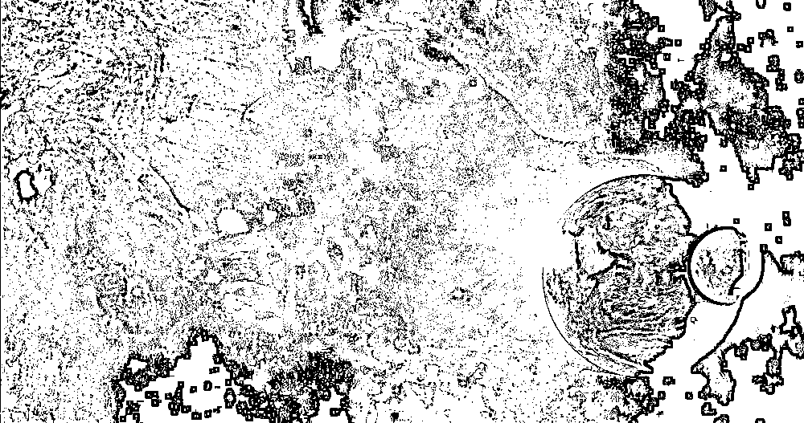

**天王星的轨迹**

**逆行之前**

天王星是整个八月宇宙天气中最活跃的行星之一。**8 月 2 日，太阳精确四分天王星；8 月 3 日，水瓶座满月；8 月 15 日，天王星开始逆行。**在这个八月，你的生活中在发生什么？有时，我们出于恐惧，想紧紧抓住安全和熟悉的感觉，即使知道该放手了。**你可能已经预料到了生活中的重大改变，或者试图发起变化，寻求更多的个人自由，但似乎阻碍太大，什么也没有发生。**在这种情况下，五个多月的天王星逆行，将**引起态度或行为的内部缓慢变化，而这会我们使期望的外部变化成为可能。**另一个可能是，**你一直极具颠覆性和叛逆性，试图强迫进行根本性的改变**。无论你的改变是基于无知还是年轻的纯真，**天王星的逆行都会带来更高的自我意识和洞察力**。接下来的一段时间，你会**转向内在，多一些内省、反思，去制定计划，减少混乱**。

**逆行初期**

**2020 年 8 月 15 日-9 月 9 日，有五颗行星处于逆行状态：木星、土星、天王星、海王星和冥王星。****9 月 10 日，火星将加入逆行的队伍，天空中一共有六颗逆行行星，这种状态将持续四天，直到 9 月 13 日木星顺行。**
当五个或更多的行星同时逆行时，世界似乎在减速。你可能会觉得自己似乎**生活在另一个维度、另一个现实中，可能会感到孤独或与众不同。**群星逆行，是宇宙为我们提供了难得的机会，让我们更多地走向内在。2020 年前半年，很多人都在措手不及地被动地适应外在世界的巨变，只是无意识地求生存。但，这不是宇宙给予我们那么多功课的目的。  

**逆行后期**

**土星将于 12 月 17 日进入水瓶座，随后，木星于 12 月 19 日进入水瓶座。**土木精确合相将发生在 2020 年 12 月 22 日，在水瓶座初度，并与金牛座的天王星呈四分相。这个跨时代的土木合相，将开启崭新 200 年的风象周期，催化经济社会的方方面面的改革。而天王星与土木合相之间的紧张关系，强调这会带来颠覆性的变化，使人们认识到新的发展潜力。

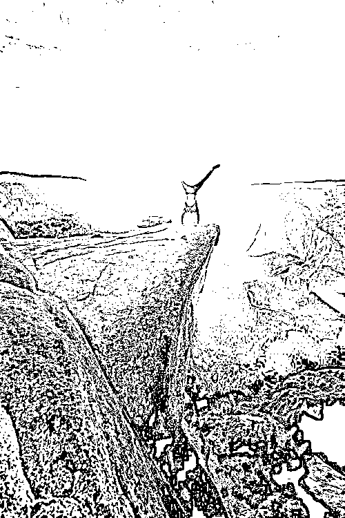

**天王星逆行在 12 宫位指南**

本次天王星逆行的敏感人群：

*   出生星图中，**太阳或上升在水瓶座，或有水瓶座星群**的人群；
*   **个人行星、四轴、敏感点在固定星座（金牛座、狮子座、天蝎座、水瓶座）5°-12°**的人群。

不妨回顾**2020 年 4 月-2020 年 8 月**。那时候你在经历什么？或者还可以看看**2019 年 7 月-2019 年 9 月**。这是天王星两次经过金牛座 4°-10°的时间段，**有哪些议题还没有完全解决？可以期待类似的主题重新出现。**另外，可以结合天王逆行期间经过的宫位、与出生星图行星形成的相位，能进一步理解对自己的影响。

**若道君：****你可以在 app store 或者应用商店搜索“若道”下载 app，输入个人档案，查看行运盘（也可以使用其他星图软件），找到逆行的天王星（符号：♅）落在出生星图的第几宫，然后对照下文查看逆行指南。**

**例如下图中，天王星逆行在美国总统特朗普出生星图的第 9 宫。**

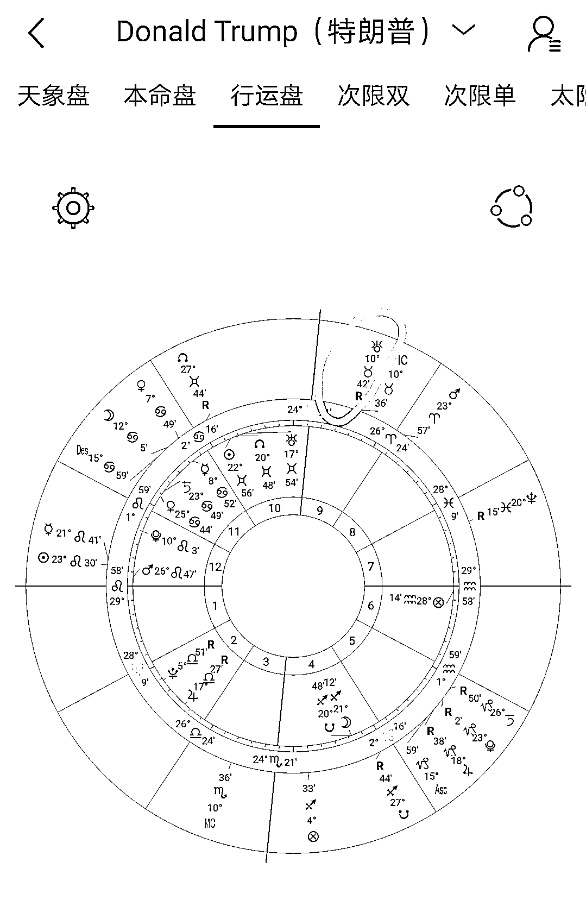

以下是天王星逆行在 12 宫的指南。（文中上升星座仅供参考，以实际落宫为准。）

**上升白羊座** **天王星逆行在第** ***2*** **宫**天王星逆行将鼓励你**在财务方面进行创新**。你会反思如何吸引更多的金钱和物质财富。如果你对自己的谋生方式不太满意，现在是时候**发现新的收入来源，或者被吸引去开发可以增加财务选择的新技能。**如果你在过去七个月中冒着风险制定新的赚钱方式，天王星逆行将有助于**进行必要的调整，以更安全的方式确定并巩固你的财务新方向。**金钱是物化的能量，是我们价值观的一部分。从更大的层面，**你的价值观需要经历内在的反思与更新。**钱对你而言是最重要的吗？**上升金牛座** **天王星逆行在第** ***1*** **宫**当天王星在 1 宫，你生命中的动荡可能已经持续一段时间了，也许你颠覆了一半的人生。如果你在过去的七个月中已经冒险摆脱旧的束缚，以体现自由的个人外表或风格，天王星的逆行将帮助你**加深建立新方向的可能性。**如果你想在生活中做出重大改变，但又压抑了这种冲动，天王星逆行将**鼓励你放开你一直所坚持的古老的、有限的模式。**是什么阻碍你走出自己的舒适区？是什么让你无法放飞自己，打破笼子？从内部来审视自己，天王星逆行将**监督你彻底革新向世界展示自己的方式。**请相信，你可以生动地表达自己，让世界对你敬畏。**上升双子座** **天王星逆行在第** ***12*** **宫****天王星逆行会将你的注意力吸引到任何限制性的内在模式上，这些内在模式导致你无法发挥自己的潜力。**五个月的天王星逆行，是**心灵休息或重大突破的时期**。你可以将自己从任何内在障碍中解放出来，摆脱“可以做”或“不能做”的消极信念。**鼓励自己面对去最内在的需求与过去的阴影，完成精神上的转变。**同时，关注你的**直觉、梦境中的信息、心灵能力的提升**，你会有**感知他人尚无法理解的事物的潜力。******上升巨蟹座** **天王星逆行在第** ***11*** **宫****过去的七个月中，如果你一直在努力建立新的友谊，天王星逆行可以**促进你加深关系或承担更大的社区责任**。你可以**突破既定圈子，将人们召集在一起，并带入你的愿景与方向。**如果你没有走出舒适区，冒险与志同道合、互相支持的团体建立联系，那么，天王星逆行将**重新集结合适的支持团队，来帮助你在深水区跋涉**。天王星逆行将激发你思考**与什么样的群体建立联系和友谊，如何真正激发你前进的动力。**

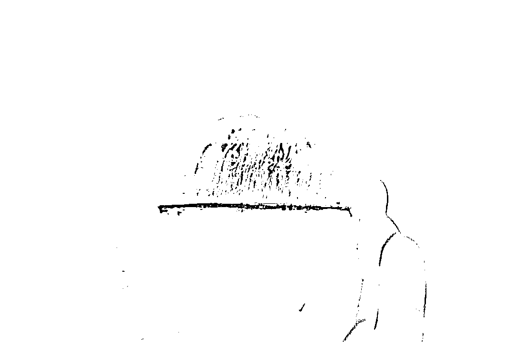

**上升狮子座** **天王星逆行在第** ***10*** **宫****过去七个月，天王星行进在你的职业领域，可能使你的工作或公众声誉发生变化。**如果你成功应对了这样变化——无论是面对**工作的中断或职责的迅速加速**，现在你可以缓一缓，进行必要的内在调整。如果过去一段时间，职业领域的改变让你措手不及，现在请重新审视在这个竞技场上所需要的任何更新——你的**职业角色、发展方向、做事方式、服务的机构与老板**。这样，在天王星顺行之后，你就能**将新的能量带入你的职业领域，甚至去革新你的行业。**你也可能需要**在职业和家庭之间，或在外部目标上与内在滋养所需的时间之间，找到更大的平衡。****上升处女座** **天王星逆行在第** ***9*** **宫**2020 年几乎影响了每个人的长途旅行与跨文化交流，但对你的影响是最大的。你想走向世界，离开屋子，去实践你的新点子，拓展你的视野，但被突如其来的疫情打乱了节奏。天王星逆行，将引发你**思考或研究旅行、高等教育、跨文化交流的新途径**。你依然想要去冒险，更多不是向外的“长途旅行”，而是**向内的“意识扩展”，**从而来增长自己的智慧。你的意识会向新的视角敞开。你可能还会觉得自己**被要求进行精神上的朝圣之旅，或者加深与哲学或精神世界的关系。******上升天秤座** **天王星逆行在第** ***8*** **宫****天王星逆行在你出生星图非常敏感的宫位，促使你**面对最深刻、最原始的情感，去解决已经失衡的共享资源议题，或者向内审视死亡与性，感觉不那么令人愉悦。**关系与合作对你来说一直很重要，但作为天秤座，你也容易过多妥协。如果你觉得自己正在做所有的工作，或者由于关系而耗尽了财务，那么，你将**不得不重新平衡重新评估在已建立的深入共享关系，试着去发现的新的平衡，或摆脱合伙关系。**当然，这里的合作不仅仅是商业合作，还有婚姻与深入的亲密关系。**只有释放限制你的老旧关系，更好的关系才有空间进入你的人生。****上升天蝎座** **天王星逆行在第** ***7*** **宫**天王星行进在你的关系宫已经很长时间，你也许刚经历了爱情或伙伴关系的不稳定或背叛，感觉自己被卷入波涛汹涌的情绪旋涡中，但天王星逆行让你有了喘息的机会。你会**反思自己合适的伴侣是怎么样的类型，或用什么样的方式去找到匹配的合作伙伴。**你也许会**从过时的关系中解脱出来，去追求新的模式**，而不是再次退回到原来的关系或做事方式上。如果你与拥有共同信念的人建立新的关系，这种关系将更容易持久。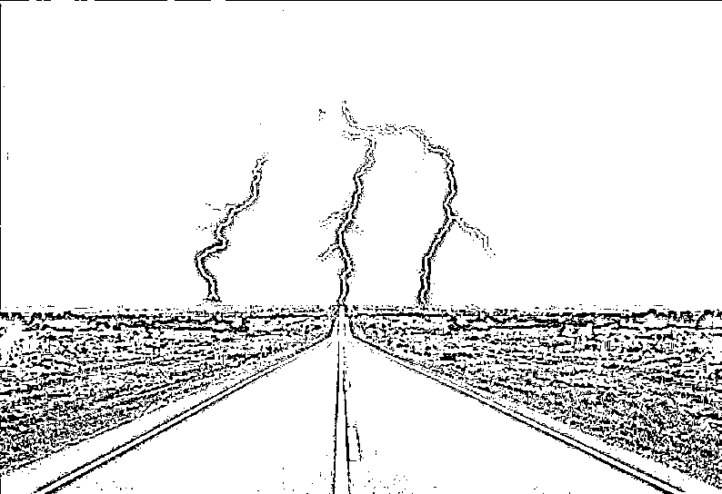**上升射手座** **天王星逆行在第** ***6*** **宫**天王星逆行会使你的注意力集中在**日常工作和时间安排**上。你会审视：是什么让我分心了，它是如何消散我的精力的？我如何有效地利用时间，将更多的精力用于发展自己的兴趣？你会**重新设定目标的优先级，修改日程计划，让自己更加专注于核心目标**。你可能还需要**解决健康问题，例如调整饮食或开启新的锻炼计划。**身体健康、日常习惯跟你的幸福与生活质量息息相关，现在是时候进行从内而外的改变。**上升摩羯座** **天王星逆行在第** ***5*** **宫**天王星逆行会让你**重新思考在浪漫关系、创造力、自我表达、孩子和性爱等领域上所做的任何近期转变**。这些转变的背后，是你想与充满激情和创造力的人充分互动的愿望吗？过去的七个月，如果你在以上的领域踱步不前，也许你要问自己的是：是什么阻止了我表达最真实的自己？是什么在让我害怕恋爱，害怕冒险？是什么在遏止我开启新的爱好，展示自己的创意？这段时间，你也可能会**吸引有点古怪的人，这是内心想要打开新的世界的渴望，去倾听它。****上升水瓶座** **天王星逆行在第** ***4*** **宫**也许在过去的七个月，你已经在考虑家庭生活的某种重大改变，想要搬个新家，或处理原生家庭中突然浮出水面的与父母的重要议题，但推翻自己的根基或强迫放下老旧的事物是很难的。在接下去的五个月里，你得到了调整的机会，这给你在做出任何最终决定之前，稍作喘息的机会。天王星逆行会使你**“意识”到自己无意识的模式**，这些模式限制了你主张自己的能力。一旦意识到，就可以摆脱他们的限制性影响。**上升双鱼座** **天王星逆行在第** ***3*** **宫**天王星逆行将开启一段回顾期，**反思你与他人的交流方式，以及如何让沟通变得更加真实有效。**你可能会**在营销、写作、演讲或社交媒体上突然有一些出色的创意策略，并倾向于表达更多不同的自我**。在这些领域提高你的技能，孵化你的作品，等天王星顺行后就可以向外界展示你的作品。你也可能会感到你的**思维变缓，写作、交流的项目暂时搁浅，特别是逻辑思维似乎变迟钝了，但直觉增强了**。天王星逆行是一个让你的左脑休息，开发右脑的好时机。

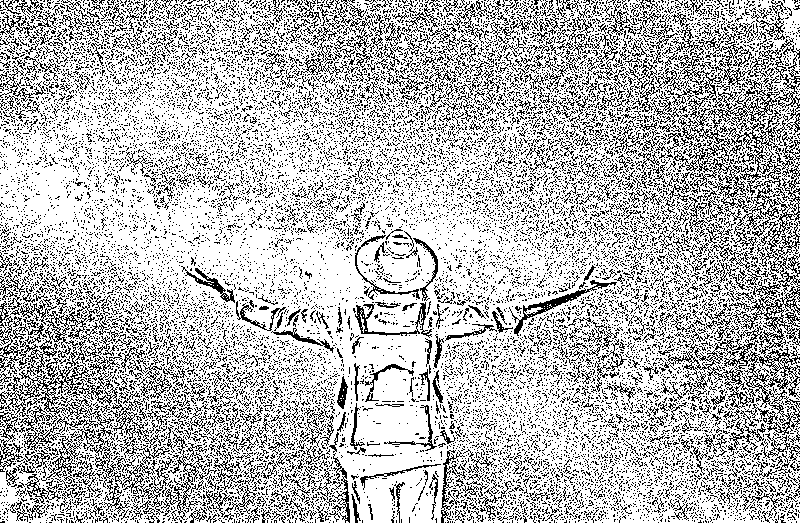

**天王星的礼物** 天王星、海王星、冥王星的逆行是一种微妙的运动，对于个体而言，是在潜意识水平上发生。当天王星在金牛座逆行时，它让我们回顾过去七个月的发展，外在的压力会暂时消退，使我们可以收集自己的想法。这可以帮助我们**直面过去的烦恼，做出积极的内在改变，并兑现已经克服的挑战。**天王星的确会带来一些突发的可怕的灾难，当**忽略了宇宙让我们主动改变的信号，忽略了自己内在想突破束缚想要自由的声音时，潜意识会主动去“吸引”一些外部灾难性的事件来驱使我们改变。**但真正的改变，不是被动等待其发生的，而是自己主动发起一些大动作，用一种真正支持自己的方式来重组生活。我们不需要等到天王星“不得不来震憾我们”的吓人时刻，可以主动自发地去控制改变的节奏。天王逆行的五个月，就提供了这个一个宝贵的窗口。比起“意外的颠覆”，“内在的反思”更像是天王星逆行带来的礼物。这段时间，我们可以与宇宙对话，与内在联结，下载更高的自我意识。当天王星在 2021 年 1 月 14 日顺行时，四分土星、木星合相的张力，期待每一个人从内部世界显化内在的更新，一起进入更好的未来。

**版权声明**：原创文章由作者授权首发于若道平台，欢迎转发，反对抄袭。友号转载请申请白名单。

****

**Justine**

ISAR 国际认证占星师（2014 年获得）/塔罗师

毕业于浙江大学，十年跨国企业 HR 经验

咨询时长超过 1000 个小时

**咨询微信**：Justine_JT

**公众号**：星光体

长按打赏

******想跟随琳恩·贝尔老师学习太阳返照图？******

**点击下图了解详情**

**微信又双叒叕改版啦，不想错过若道君的推送？**

**就把若道设为星标吧！**

**▼**

就是这个“在看”，戳一下☟

********报名直达入口********

# 明天见 | 狮子月沙龙，太阳和他守护的狮子座

> 原文：[`mp.weixin.qq.com/s?__biz=MzA5NjA0NTAxNg==&mid=2651424450&idx=2&sn=0f498042b51ca34088829a4f5621eb94&chksm=8b4b3475bc3cbd632bbe3cd10bcfdc89ea361c18955be776f0b4639a50734131485c4afd1530&scene=126&sessionid=1692738121#rd`](http://mp.weixin.qq.com/s?__biz=MzA5NjA0NTAxNg==&mid=2651424450&idx=2&sn=0f498042b51ca34088829a4f5621eb94&chksm=8b4b3475bc3cbd632bbe3cd10bcfdc89ea361c18955be776f0b4639a50734131485c4afd1530&scene=126&sessionid=1692738121#rd)

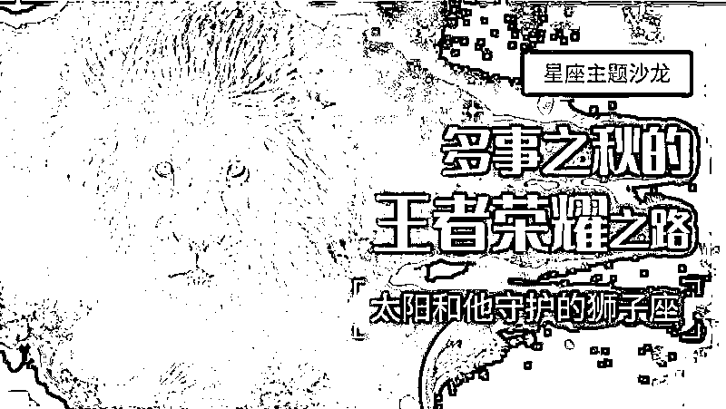

“即将结束在甘肃的一场溯源之旅时，我窝在兰州修整疲惫的身体，着笔写此次沙龙的发布稿。也是在这样的旅行中，让我再次加深我对自己太阳射手座落 9 宫的认知与思考：我们每个人要如何活出自己的太阳？如何活出自己生命中的活力、热情与快乐？如何成就自己的荣耀与自信，完成每个个体生命的英雄之旅？在这个群体意志大于个体意志的大环境下，自我意志如何发展？在这个困境重重的 2020 年，在这个人人忙于突破重围的 2020 年下半场，如何运用我们的太阳度过这个多事之秋，让我们活得依然快乐，或者坚韧却荣耀、踏实且自信？因此，与以往不同的是，这个星座主题系列的沙龙开讲到“狮子座”时，我要先讲太阳，再讲太阳守护的狮子座。因为，我们每个人都是自己的王者，我们每个人都想活出王者的荣耀，每个人的内心都有一个“狮子王”。无论你是太阳狮子座，还是太阳处女座.....所以，欢迎来参加一次太阳聚会般的快乐分享，在狮子座新月即将到来的 8 月 15 日，我们来看看，在行进的火星白羊座强烈推动下，在土星摩羯座设置的阻力与慎重提醒下，狮子座们和每一个太阳星座们，如何在自己的人生舞台上再奏凯歌。两小时的沙龙：我会先介绍太阳，让大家认识自己的太阳：太阳的内涵与存在对我们每个人而言意味着什么，又指向了什么。我也会继续在群里和大家交流，并在沙龙中分享点评同学们对自己太阳落座的理解与认识。和以往一样，我会介绍狮子座，也会介绍狮子座和他的朋友们，会将同学群里的狮子座们调动起来，让他们积极分享，并在沙龙中展示他们的精彩。8 月 15 日，太阳/狮子座盛会！——滴答**”****参与方式****活动时间****：2020 年 8 月 15 日 19:30-21:30****活动费用****：直播免费（视频回放需单独付费）**

**人数限制****：300 人（报满即止）**

**沙龙地点****：线上直播**

**参与方式****：报名成功后，请添加客服微信（微信号：nodoorDaivd），获取线上直播地址**

**长按下图二维码报名**

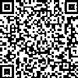

**注意事项****Q：我如果报名参加此次活动，有什么注意事项吗？**
**①** 报名后务必添加客服微信（nodoorDaivd）获取入群方式；**②** 登录直播平台时，请用报名时提交的用户名登录，登录名称不匹配将会被请出直播平台； 

**③** 直播期间请确保有一个较为稳定的网络环境，以保证有一个较好的观看体验；

**④** 该直播如需回看视频，需另行付费，报名后，请准时参加。

**更多活动信息**

**请长按下方二维码联络客服**

**关于滴答老师**“

滴答老师是 ISAR 认证占星师，也是我在人生道路上的好友，她丰富的人生经历和对于内在诚挚，坚定的探索，对于中国道家，佛家修行的深入实践，面对无常而发展的智慧和勇气让她对占星学发展出深入而独特的理解。我很有幸在人生道路上有她相伴，也很有幸请她把对占星和人生的领悟分享给更多人。

**——若道创始人，蒋颖**

**”**

********报名直达入口********

# 今日哈利波特重映！“大难不死的男孩”是 J·K 罗琳用占星学写出来的？！

> 原文：[`mp.weixin.qq.com/s?__biz=MzA5NjA0NTAxNg==&mid=2651424450&idx=1&sn=b4d07cfb164dcc5f2c04f85fd7b46797&chksm=8b4b3475bc3cbd63f572546063d3d458a2847bfc21a8d9c6eb817613414b5d6a00d5424d6414&scene=126&sessionid=1692738121#rd`](http://mp.weixin.qq.com/s?__biz=MzA5NjA0NTAxNg==&mid=2651424450&idx=1&sn=b4d07cfb164dcc5f2c04f85fd7b46797&chksm=8b4b3475bc3cbd63f572546063d3d458a2847bfc21a8d9c6eb817613414b5d6a00d5424d6414&scene=126&sessionid=1692738121#rd)

********☆****************后台回复“今日”，给你一句生命态度********

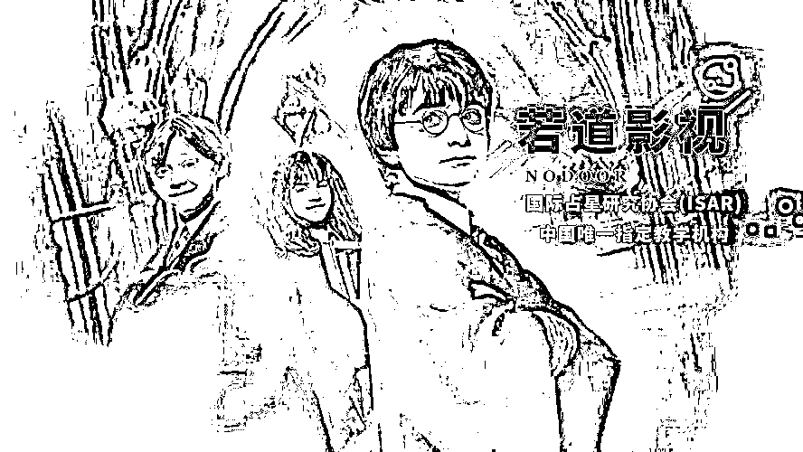

作者/亚历克斯·特雷诺威斯
译者/Jun 校对/Leisha 编辑/翀子 封面/书君 图片/网络

《哈利·波特》书中人物的出生时间是有意设定的吗？随着故事情节的发展，又有怎样重要的行星行进反映了人物的“英雄之旅”呢？作者 J·K 罗琳是占星师吗？电影《哈利·波特与魔法石》今天重新上映，无论你是否会去电影院怀旧，都可以带着好奇心、轻松的进入本文作者解读的魔法世界。

1997 年 6 月 26 日，当水星与太阳在巨蟹座合相时，原本是为儿童写的《哈利·波特》系列七部曲中的第一部出版了。有些人可能会说，文学世界从此不同了：魔法、巫师和晦涩的拉丁短语让麻瓜们着迷，这是其他书所没有的。J·K·罗琳一下子就从一贫如洗的单身母亲变成了享誉全球的作家。迄今为止，这些书已经在全世界售出超过 5 亿本。

**暗藏的占星学符号**从一开始，占星师们就讨论罗琳本人是占星师的可能性。第一本书《哈利·波特与魔法石》中好几个以星星或星座命名的人物一定让占星师们欢呼雀跃。书中还提到了半人马罗南和贝恩，讨论火星的辉煌以及著名炼金术士尼古拉斯·勒梅鬼影般的现身。甚至还有一个被放逐的半人马，名叫费伦泽，他似乎证实了自己是一个占星师，他说：“哈利·波特，祝你好运......即使是半人马也曾错误地解读行星。我希望这也是其中一次。”  然而，到了第四部书，罗琳本人似乎在刻意消除任何关于她是占星师的传言。也有消息称，她曾是埃克塞特大学古典学的学生，会学到很多神话学和其他相关学科的知识。《哈利·波特与火焰杯》甚至引入了占卜老师西比尔·特里劳妮这个角色，她看起来就像众所周知的三美元钞票一样虚假（译注：没有三美元面值的钞票，俗语「三美元钞票」意为明显的虚假）。强制学习占星学(和其他形式的占卜)显然不适合赫敏，她和其他角色一起嘲笑占卜术的不准确。似乎占星师们最多能猜测的就是 J.K.罗琳在她生命中的某个阶段对占星学有过模糊的兴趣。

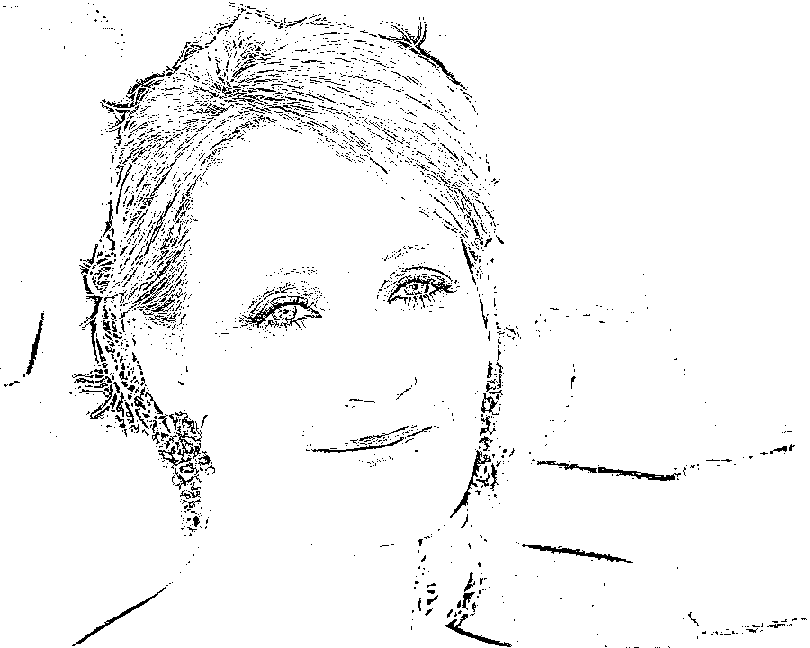

**|** J·K 罗琳然而，在 2010 年的电视节目《古董巡回秀》（*Antiques Roadshow*）上，出现了一件非常奇怪的物品。**这件物品是一个塑料文件夹，里面有一张手绘的出生星图，一份 12 页的分析报告，还有一份有关案主性格的关键占星学概念说明——署名的正是罗琳本人。**分析的内容清楚地表明，罗琳拥有从埃克塞特大学学不到的信息。罗琳被识破了。顺便说一下，这个文件夹估价 25000 英镑。世界上最畅销的作家之一 J.K.罗琳是一个占星师，这一点得到证实固然很好，但是，**除了用星星和星座给人物命名之外，她还能用占星学把她的人物写活吗？**奇怪的是，除了邓布利多和伏地魔，大多数角色都有出生日期，但出生时间只能通过生时校正来确定。校正结果可以通过观察重要事件的行进来确认。许多占星师对使用生时校正心存疑虑，只愿意使用时间可靠的星图。毫无疑问，可靠性是重要的，但在没有任何出生时间证据的情况下，校正有时是必要的。

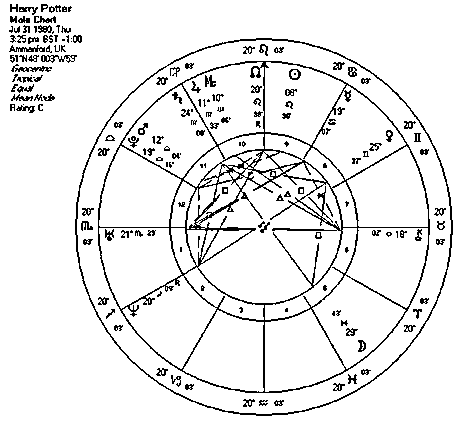

**| **哈利·波特的出生星图霍夫曼在《哈利·波特——英雄之旅》中对这一问题进行了精辟的分析和生时校正。她使用的时间是 1980 年 7 月 31 日 15:25，地点是南威尔士的麻瓜镇阿曼福德。这使上升星座位于天蝎座 20 度左右。她指出，哈利眼睛上方的**闪电形伤疤是天王星与上升点合相的完美指征**。她还使用太阳返照图解释了书中的事件如何与占星学相吻合。

**教室里的占星学**

**出生星图中的木星是理解孩子如何学习的主要关键**。由于木星每年都会换座，老师们可以利用这颗行星来帮助他们了解学术课程每年的变化。**土星在理解局限性和困难方面非常重要**，可以帮助家长和老师理解如何管教他们照顾的孩子。木星和土星一起创造了一个占星学特征，可以极大地帮助忙碌的老师或家长。
**木星大约****每三年**就会相对出生位置发生重大行进，而**土星大约每七年**就会相对出生位置发生重大行进。在青春期，关键的行进是：12 岁木星回归，14 岁天王星第一次六分本命天王星，15 岁左右土星对分本命土星，15 岁木星四分本命木星，18 岁木星对分本命木星。

**木星和土星的位置**

**如果我要用占星学创造一个青春期的角色，我可能会开始研究木星和土星在出生星图上的位置**，因为那些成长和稳定的行星会受到那些重要行进的影响。我认为罗琳错过了一个机会，没为她的某个角色选择一张带有大合相的星图。大合相因预示着重要事件或重要人物的诞生而受到关注。例如，有理论认为伯利恒之星（译注：伯利恒之星，即 The Star of Bethlehem，是圣经中记载的耶稣诞生时升起的星相）就是一次大合相。
尽管**大合相**在视觉上没有日食或月食那么壮观，但却引起了第谷·布拉赫和约翰内斯·开普勒等天文学家的想象，他们认为这种事件是吉兆。伽利略是在布拉赫和开普勒的工作基础上，最终令全世界相信是地球绕着太阳转，他就是在大合相期间出生的。莎士比亚的作品中充满了占星学的内容，他也是在一次大合相中诞生的。然而，尽管书中有这个看似疏忽的地方（而我并不懂如何写畅销小说），占星学的符号在哈利人生大事中的体现其实非常明显。而罗琳给了我们提供日期，这样我们就可以密切关注了。

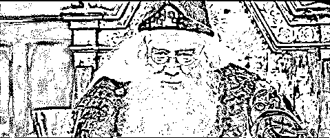

**大难不死的男孩**哈利的父母于 1981 年 10 月 31 日去世，这一事件在整个系列中反复出现(事实上，在该系列的每一部书中，这个日期都很重要)。多年前，西比尔·特里劳妮曾经预言一个未命名的孩子会成为伏地魔的对手，并警告说两个人不能都活着，只有一个会活下来。伏地魔痴迷于征服死亡，无法接受一个孩子长大后击败他的风险。根据预言中提供的其他细节，他推断这个孩子不是哈利就是纳威·隆巴顿。伏地魔首先对付哈利，几乎立即杀死了他的父亲。书中说得很清楚，哈利的母亲为了救儿子牺牲了自己，正因为如此，伏地魔随后想用来杀死哈利的诅咒也反弹到了他身上。哈利生还的消息很快传遍了整个魔法界。**牺牲**和**幸存**是故事中反复出现的重要词汇。

在这特殊的一天，**行进的太阳四分哈利的出生太阳**(父亲的死亡)，**月亮合相他的出生海王星**(母亲的牺牲)。**行进的水星精准合相哈利的冥王****星**(麦格教授在哈利幸存后曾预言："这孩子会出名。世界上所有的孩子都会知道他的名字")。每个见过哈利的人都惊叹于他的幸存。
然而，这里有更多的象征意义。由于作恶多端，伏地魔的灵魂不稳定。当他把诅咒释放到哈利身上，而诅咒又反弹到他身上时，他一块的灵魂碎片击中了哈利，在哈利的额头上留下了闪电形的伤疤。我们记得，**哈利的上升点在天蝎座，与天王星合相**。霍夫曼指出，**次限中天与哈利的出生木星精准合相**，这也许可以解释他的幸存。

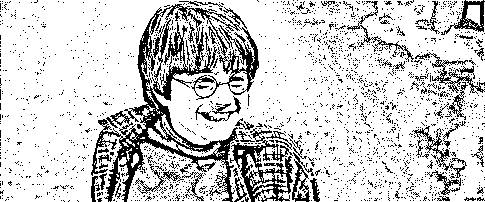

**霍格沃茨之前的生活**在《哈利波特与魔法石》中，我们看到了哈利的早年生活和在霍格沃茨的第一年。前者不是太愉快的经历。后者恰逢他第一次木星回归，明显要好过些。首先，让我们回顾一下哈利木星回归前的生活。1985 年，**土星正在第三次合相天王星**的行进之中。哈利当时 5 岁，在一个生日派对上，哈利的姨妈捶打了哈利的小腿，防止他在生日派对上用音乐雕像打他那令人厌恶的表哥。1988 年 6 月，**木星对分天王星**，还是在表哥的生日派对上，哈利的姨妈送给表哥一个电脑机器人，送给哈利一盒狗饼干。两年后，在另一个生日派对上，当**行进的木星对分哈利的本命火星**时，姨妈的狗追着哈利爬上了一棵树，哈利在树上一直呆到了半夜。**在哈利 10 岁生日那天，就在行进的木星四分他的出生火星之后**，他得到了一个衣架和一双他姨父的旧袜子。然而，就在 1991 年 5 月**木星第一次与哈利的出生太阳合相之后**，事情开始好转：他有了第一次与动物交流的经历，那是一条蟒蛇感谢哈利魔术般地移开了蛇箱前的玻璃，释放了它。这就开启了哈利巫师个性迅速发展的关键线索，这一幕的主题在后来的书中再次出现。

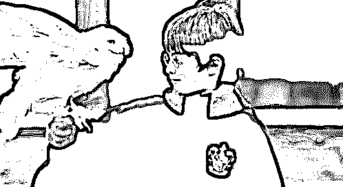

**第一封入学信**几个月后，当**行进的木星与哈利的出生北交点合相时**，他在 11 岁生日前一周开始收到猫头鹰投递的信，邀请他入学霍格沃茨。计算书中的日子，**第一封信首次送达的日期是 7 月 23 日：正逢太阳和凯龙星的精准合相。**霍格沃茨的来信是哈利摆脱悲惨生活的门票，会让他开始了解自己的真实身份。哈利甚至被禁止询问他父母的情况，他有很多严肃的问题要问（他被告知父母死于车祸，收养他的姨妈和姨夫绝口不提魔法世界）。这些信件被施法显示是否已读，越来越多的信件陆续到来，确保让哈利有机会打开信封并接受他在霍格沃茨的一席之地。他的姨夫为了不让他看到这些信费尽心思，甚至把一家人带到一个谁也不可能知道地址的破旧小屋里。

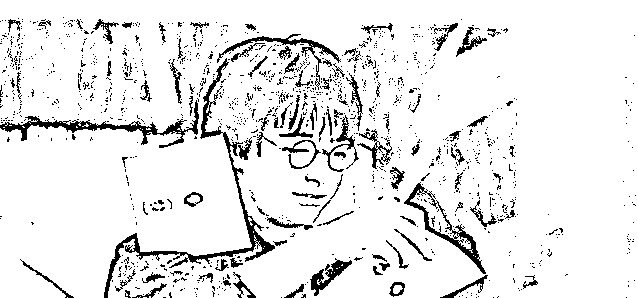

在哈利生日的午夜钟声敲响时，巨人海格亲自来到小屋送上入学邀请。**行进的冥王星这时合相下降点，行进的上升点合相哈利的出生凯龙星**。这一刻，哈利的人生彻底改变了。虽然罗琳说哈利的生日是在星期二，但这似乎是一个罕见的错误：1991 年 7 月 31 日是个星期六。
1991 年 8 月初，当**行进的木星四分哈利的出生天王星**时，海格把哈利从麻瓜的世界中解放出来，带着他采购魔法学校的生活用品。作为**木星在处女座**的学生，哈里选择了最能确保自己成为好学生的物品。

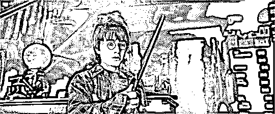

**哈利的第一次木星回归****当哈利即将迎来他的第一次木星回归时**，他发现他擅长魁地奇和飞行，并成为了球队的新任“找球手”。日期是 1991 年 9 月 12 日，是日木星进入处女座。1991 年 10 月底，就在木星接近哈利中天的前几天，哈利和罗恩·韦斯莱与山怪搏斗，营救了赫敏，巩固了他们的友谊(后来赫敏成为了罗恩的妻子!)。在当年的圣诞节，哈利收到了父亲的隐形斗篷，度过了人生中最美好的圣诞节。这表现了第一次木星回归的全然喜悦，这也延伸到了认识新的有趣的人。在哈利的故事里，他遇到了黑魔法防御术老师西弗勒斯·斯内普和奎里纳斯·奇洛，奎里纳斯·奇洛后来被发现一直被伏地魔控制着的。

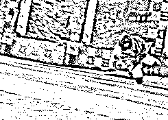

**行进的行星一次可以与一颗行星发生多达三次的接触，**按理说接触越多，影响越深远。因此，哈利的木星回归因为木星的逆行和顺行而延长了时间，**基本上持续了整个学年**。木星回归一直持续到他第一次在禁林关禁闭之后，他在那里遇到了半人马，并目睹了伏地魔吸食独角兽的血。
这个学年也恰逢**行进的土星两次四分他的出生凯龙星**：一次是在他第一次被关禁闭的时候，另一次是在他与奇洛发生冲突的时候。

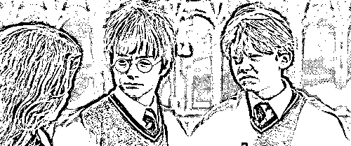

**第二部：家养小精灵多比**

在哈利 12 岁生日前夕，多比拜访了哈利，这是木星行进最后一次与出生木星成相位。

《哈利·波特与密室》记录了哈利在霍格沃茨的第二年，**行进的天秤座木星合相哈利的出生火星**。这年 12 月，当行**进木星第一次与哈利的火星合相**时，这位巫师男孩发现他能说“Parseltongue”蛇语，这是黑巫师的典型标志。几个星期后，哈利、罗恩和赫敏服用了复方汤剂，使他们能够变成别人的样子。

在这两颗行星的**第二次****合相**中，哈利收到了神秘的 T.M.里德尔赠送的情人节礼物。这两颗行星的**第三次合相**发生在哈利 13 岁生日前后，哈利在麻瓜电视上看到了小天狼星布莱克。

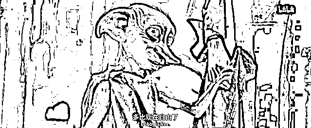

**第三部：小天狼星布莱克**

在该系列的第三部《哈利·波特与阿兹卡班囚徒》中，**行进的木星合相哈利的冥王星，并四分他巨蟹座的水星**，象征意义非常明显：盯上哈利的不是伏地魔，而是小天狼星布莱克，小天狼星布莱克被认为是杀害哈利父母的帮凶。此外，能够吞噬人类灵魂的恐怖摄魂怪也在追捕哈利。

**行进的土星也与这些出生行星形成了棘手的相位**，一个狼人和其他能够变换形态的角色与哈利发生了互动。摄魂怪可能就是土星最贴切的表现形式了。还有另一个可怕的支线故事，就是鹰头马巴克比克即将被处死。

在这本关于逃犯的书中，这整个学年，**土星的一系列行进对分哈利的中天和出生木星**，**行进的木星也与他的中天和出生木星形成了一系列相位****。**巴克比克差点被处决于 1994 年 6 月 6 日。**行进的金星合相哈利的水星，北交点合相他的上升点，行进的月亮合相他的出生凯龙星。**就在这一天，小天狼星被重新抓获，并从摄魂怪的死亡之吻下侥幸逃脱。小天狼星骑在巴克比克的背上奔向自由。

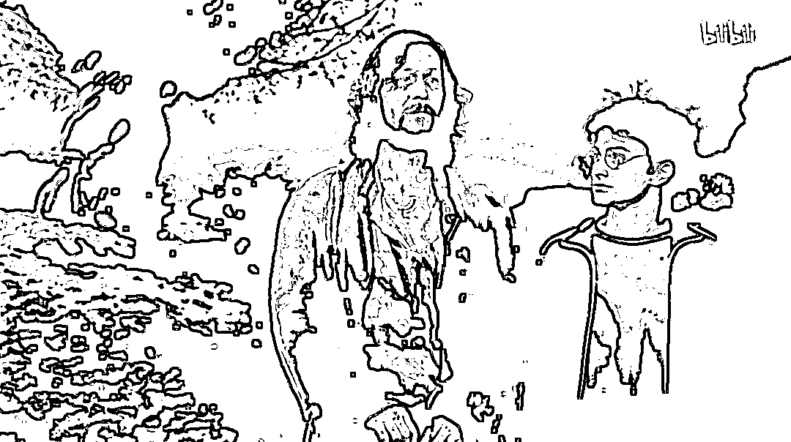

**| **哈利·波特与小天狼星布莱克

**第四部：青少年的棘手时期**在《哈利·波特与火焰杯》中，哈里将经历他的**第一次行进土星对分本命土星**，这对于一个正在成熟的青少年来说是一个棘手的时期。在这个时期，麻瓜青少年要**面对严峻的考试，并且通常会表现出对失败的强烈恐惧**。在这本书中，除了准备考试之外，哈利还不情愿地参加了三强争霸赛。读者们注意到，这本书呈现了一个更黑暗、更愤怒的哈利。1994 年 10 月 31 日，哈利被选中代表霍格沃茨，当时**木星正精准合相与他的上升点**。哈利和罗恩不欢而散，直到完成比赛的第一项任务后才和解——**当天行进的木星半四分哈利的出生火星。**哈利邀请张秋作为他圣诞舞会的舞伴，但被拒绝了，因为张秋已经接受了受欢迎的塞德里克·迪戈里的邀请。在 11 月举行的三强争霸赛的第二场比赛中，张秋被绑架并被扣为人质。当然，她必须被塞德里克救出来。三强争霸赛的决赛在 1995 年 6 月 24 日晚上举行，要求完成的任务简直是玩命。虽然哈利最终获胜，但他的竞争对手塞德里克还是被虫尾巴（小矮星彼得）和伏地魔杀死了。这是一个令人震惊的死亡(因为这可是本儿童读物)，也是为胜利付出的可怕代价。哈利的一系列**行进土星对分本命土星**已经在此前几个星期就开始了，所以与死亡不期而遇似乎很适合。最后一次土星对分土星将在本书的下个学期中出现。

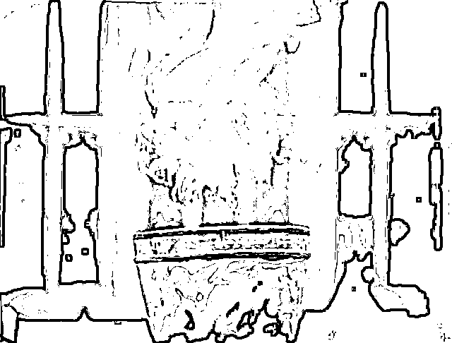

**| **火焰杯**第五部：小天狼星布莱克之死**在本系列第五部《哈利·波特与凤凰社》中，那年夏天晚些时候，也就是 1995 年 8 月 2 日，哈利被迫使用守护神咒从摄魂怪手中救出了他的表哥。**这天是他其中一次的行进土星对分本命土星**，不难猜到，土星此前一天开始逆行。这一事件使哈利遭到纪律处分，如果不是邓布利多的干预，哈利将被霍格沃茨开除。哈利在霍格沃茨的第五年开头并不顺利：他遇到了多洛雷斯·乌姆里奇教授，这个角色太让人讨厌了，很难相信同一个作者既能创造出那么多可爱的角色，也能创造出一个让读者想掐死的角色。

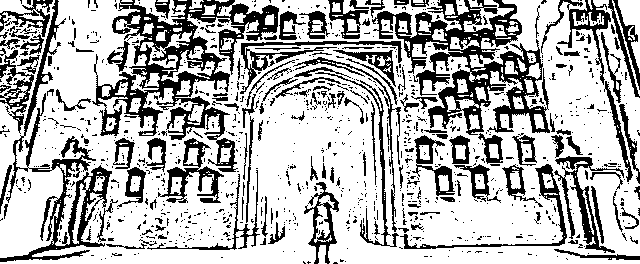

乌姆里奇教授很邪恶、喜欢虐待别人、高傲、残忍，恐怖大师斯蒂芬·金曾将她描述为“自汉尼拔·莱克特以来最伟大的虚构反派”。遗憾的是，尽管她的出生日期已知(8 月 26 日)，但不知道年份。哈利立刻就讨厌她，他控制不住自己的怒火。**行进的木星已经与哈利的中天形成了最后一次四分相**，出现了一位有能力中断他的学业并憎恨半人马的女巫。
更多的困难是哈利和张秋之间的尴尬关系，他们都还在为塞德里克的事情伤心。然而，在**行进的木星与出生海王星的合相**期间，哈利鼓起勇气在槲寄生下亲吻了她。到情人节那天，**行进的土星最后一次对分哈利的出生土星**，他们惨不忍睹的约会被巫师报纸《唱唱反调》报道，这让他们倍感羞辱。本学年的重大事件是小天狼星·布莱克于 1995 年 6 月 17 日过世。当哈利看着他穿过帷幔再也没有回来时，行进的太阳在 1°之内合相他的出生金星。**行进的土星也开始了与他太阳的一系列三次对分相**，象征着他的悲伤和丧失才刚刚开始。

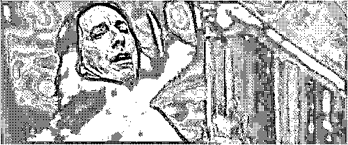

**最后两部：史诗般的战斗**《哈利波特与混血王子》讲述了阿不思·邓不利多的死亡。日期是 1997 年 6 月 27 日，**行进的土星在白羊座开始精准对分哈利的出生冥王星，并四分他的出生水星。**《哈利·波特与死亡圣器》讲述了哈利、罗恩和赫敏在霍格沃茨的最后一年。1998 年 3 月下旬，家养小精灵多比死去了，**正值行进的双鱼座木星对分哈利的出生中天，然后对分出生木星**。这是该系列中最悲伤的死亡之一，赚取了观众的眼泪。当霍格沃茨之战发生时，**行进的木星正精准四分哈利的出生火星**。在和平恢复前，几个主要角色惨死。

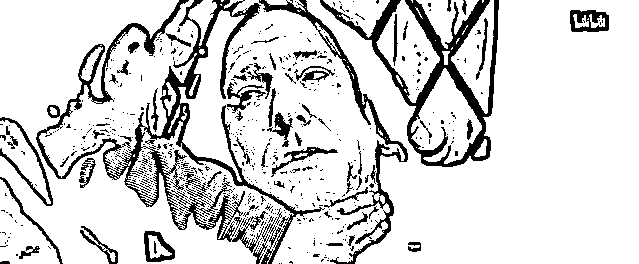

**J·K 罗琳运用占星学了吗？**如果我们同意罗琳确实用占星学来设计了故事情节，那么不难想象她借助占星学塑造了她笔下角色的性格。如果这些信息容易被接受，那么我们也许可以接受，她用了占星学来确保自己创造的这些角色的幸运程度在上天的允许范围之内。为了在困难时期给哈利送去温柔的保护和安慰，**她把自己的本命月亮放在了哈利的本命土星之上**。为了确保她了解哈利的内心，她让**哈利与自己同一天生日**。为了在写作事业上获得好运，**她和哈利的双子座金星和木星在几度之内合相**。

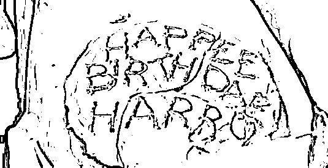

**| **海格送给哈利·波特的生日蛋糕在众多特征中，**她把自己的本命土星放在罗恩的本命月亮之上**，也许代表了他那坚如磐石的家庭。假设我们有正确的出生时间，**罗琳把她的本命月亮放了在赫敏的本命太阳之上**。罗琳总是说她最认同赫敏。
我们可能永远不会知道罗琳什么时候想出了她的魔法世界，但是在 1990 年，当她还是一个单身母亲，被困在开往伦敦的火车上时，她经历了**一系列三次行进木星合相她的出生太阳——当然也与哈利的太阳合相**。1995 年，她写完了这本书，但是被 12 家出版社拒绝。第二年，布鲁姆斯伯里出版社接受了她，并预付给她 1000 英镑。她有这本大作，但是鉴于罗琳的银行账户没有增加，这本书仍然没有显示出任何它会取得非凡成功的迹象。
但是在 1997 年 6 月 26 日，当**木星正在与她的出生上升点形成一系列三次合相时**，第一本书出版了，1000 本书很快就全部售罄。哈利·波特热潮开始了，J.K.罗琳和她的作品也顺利地成为家喻户晓的名字。

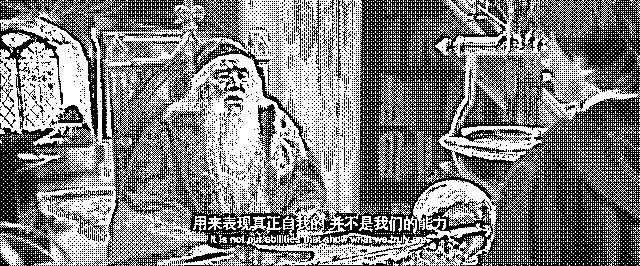

据称，华纳兄弟在 1999 年以 100 万英镑的价格买下《哈利·波特》系列的电影版权。那一年初，**行进的木星合相罗琳在第二宫双鱼座的凯龙星**。不知道是财务疗愈还是什么？2004 年，她成为第一个通过写作变成美国亿万富翁的人。但这次行进的真实故事是，罗琳把很多钱都捐给了慈善事业，把自己挡在了亿万富翁的名单之外。
有太多的巧合让人无法否认罗琳在她的《哈利·波特》系列丛书中运用了占星学。她不承认这一点可能是一种遗憾，但也许她只是认为她不必承认这一点。

**版权声明：**本文由若道翻译发布，欢迎转发，反对抄袭。友号转载请申请白名单。

**亚历克斯·特雷诺威斯**

英国伦敦的占星学研究者和专业教师，2015 年被克里希那穆提占星学会（KIA）授予“年度国际占星师”称号，并为一些主要的占星学杂志和出版物撰稿，2018 年，KIA 授予她荣誉博士学位，以表彰她对“青少年行为和月相”的研究，并授予她占星学杰出服务奖。

**系统学习占星学**

**点击下图了解详情**

**微信又双叒叕改版啦，不想错过若道君的推送？**

**就把若道设为星标吧！**

**▼**

就是这个“在看”，戳戳戳 ☟

****************报名直达入口****************

# 宫位全解析｜人际关系和事业地位的困境，都源自这个宫位出了问题

> 原文：[`mp.weixin.qq.com/s?__biz=MzA5NjA0NTAxNg==&mid=2651424378&idx=1&sn=e0e512b4945987e1c9db4a849a6b4ba0&chksm=8b4b34cdbc3cbddb9a862751c15173684a2eb9a98deb37bacdbc003dfa6010c7e28df5ed0f14&scene=126&sessionid=1692738121#rd`](http://mp.weixin.qq.com/s?__biz=MzA5NjA0NTAxNg==&mid=2651424378&idx=1&sn=e0e512b4945987e1c9db4a849a6b4ba0&chksm=8b4b34cdbc3cbddb9a862751c15173684a2eb9a98deb37bacdbc003dfa6010c7e28df5ed0f14&scene=126&sessionid=1692738121#rd)

****************☆ ****************************后台****************************回复“今日”，给你一句生命态度****************

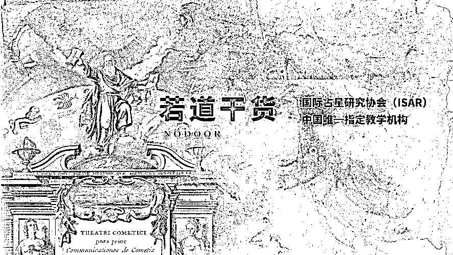

作者/达娜·格哈特
译者/葡萄园的女巫编辑/玫瑰 图片/全景网
**第 2 宫与金钱**在一群哲学人士聚会时谈论金钱，就像淘气的小孩把一只老鼠扔进满是拉拉队长的屋子，看能争执成什么样子，有多少热闹的讨论。谈到第 2 宫，就不得不谈到**金钱、财富**。虽然在精神领域里，金钱显得世俗和鄙陋，对金钱的渴求是对精神世界的侮辱，也绝对违反标准（除了某些精神导师接受捐赠），占星学也是如此。我不止一次听说收费占星辅导是亵渎，因为占星学是一种天赋（这或许需要专业的论证占星学是一门“科学”）。另一方面，新时代人喜欢钱。他们会背诵誓词和神奇咒语以获得更多的资讯。他们宣称，如果你没有足够的钱，那么意味着你的想法不够有把握。 不论金钱是肮脏的，还是邪恶的，或者是精神激励，又或者更有可能的情况下，积极但中立的，**“我怎么能获得更多钱呢？”**是在咨询中，大部分客户询问几率最高的 3 个问题之一。一般，这个问题都伴随着哀叹：“是不是只有我必须赚钱啊？”这真是悲惨啊，现实期望我们去做油漆匠、保险经纪或者贷款业务员，但我们期望更宏大的人生规划啊，做个艺术家、哲学家或者冒险家。必须赚钱好像是可怜的弯路。我听过一个故事，上帝比国王需要更多的洗碗工，但是，为什么上帝不把我们都培养得有更多喜欢的欲望呢？这个进退两难的局面在**冥王星狮子座**的一代人身上格外尖锐，他们**对自我实现的渴求是非常强烈的**——尽管他们的父母，冥王星在巨蟹座的一代人认为比起金钱，安全性和地位更有价值。 **为什么第 2 宫和财富相关？**除了爱情，很少有事情能让人如此渴望，如此焦虑怨、恨、混乱。占星学通过第 2 宫的情况了解这个人的财务状况，随着观念和条件，帮助或阻碍它。如果你想解开自己**财务状况**的奥秘，必须了解第 2 宫的情况。**你会拥有什么呢？**在第 2 宫中描述的可不仅仅是你银行账户的情况。 在《神圣的契约》一文中，Caroline Myss 指出了第 2 宫能量的基础。虽然 Myss 不是占星学家，但是，她有敏锐捕捉原型的能力。对于你的第 2 宫情况的诊断，她建议——看一下**生活中总是感到无力**的那一方面。你感到无力的方面也许与其他宫位有关，比如**人际关系（7 宫）或者职业生涯（10 宫）**——你**感到无力的通道**。她提出，这很有可能是因为你**第 2 宫的消极态度**造成的。换句话说，**力量的关键或者无力的原因，都体现在第 2 宫。****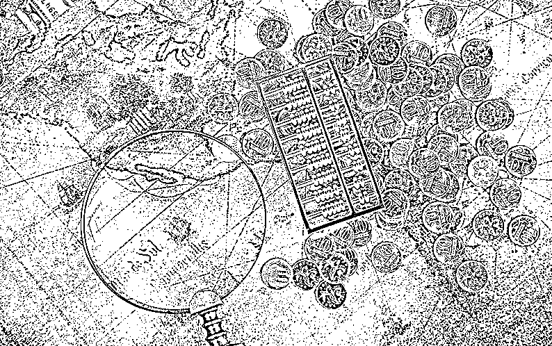****宫位小贴士****第 2 宫是随后宫，这表示它跟随在一个重要的角宫之后**。John Frawley 的文章指出，**角宫（1、4、7、10 宫）是整个星图中的关键位置，就像房屋的横梁**。行星落入角宫会**更有力，更能发挥优势作用**。它们支撑了你生命中最重要的部分：**你的人格特质、家庭、伴侣、事业**。**当有行星行进到角宫时，会比它行进到其他宫位发挥出更显著的效应。**角宫的行星行进通过会**带来新的主题**，并且**在行星通过角宫后很长一段时间仍然持续**。这并不意味着随后宫就不重要了。恰恰相反，随后宫的重要意义跟它前面的角宫紧紧相关。随后宫扮演了非常重要的**支持**角色。他们意味着——**不论角宫开创了什么局面，随后宫都将给予稳固的支持**。举个例子，随后宫第 5 宫，它掌管了**子女、恋爱、创造性**，但是，他们都有同样的任务。**这几种活动都源自第 4 宫——家庭所培育和鼓励的人格特质**；同样的，**更深层的密切关系，财务上的、两性关系上的，在第 8 宫，延续第 7 宫伴侣宫所赋予的命题；第 11 宫所掌管的社会交际网络，也在支持或破坏着我们在角宫第 10 宫所建立的专业地位。 **所以，不论第 1 宫诞生了怎样的本质特征，第 2 宫都扮演了支持它的角色。**一个精力旺盛的第 2 宫，不但确保了你的基本生存，更给了你对抗的力量**。举个例子，对于一个国家，第 2 宫掌管了国家物资、银行系统、粮食和出口物资的兴旺。对于一个正要对外宣战的国家，第 2 宫就是同盟军、弹药和枪支。对于一场法律官司的原告，第 2 宫就是给你作证的人。**一个强大的第 2 宫决定了成败的关键。 ****第 1 宫代表了出生，第 2 宫代表如何让我们生存。**这里有所有你称为**“我的”东西**。通过第 2 宫，你能融入到这个世界，并证明你的存在。当你还是个孩子，第 2 宫就开始确认你所拥有的脚趾头和手指头、你塞进嘴里的食物，只有你能抱着睡觉的泰迪熊。当你渐渐长大，你也将继续巩固基础，以支撑第 1 宫不断深化你的自我发现。**通过你的欲望来不断完成自我的认知，你必须利用的资源就是你赋予自己的价值。 **第 2 宫控制着**金钱能购买的（财产和物质资源）和金钱所不能购买的（天赋、自尊心、价值观）**。如果你工作的不快乐，那是因为你的天赋在工作中得不到充分的利用，**而第 2 宫里的行星和第 2 宫的宫主星将向你描述，你有哪些天赋。****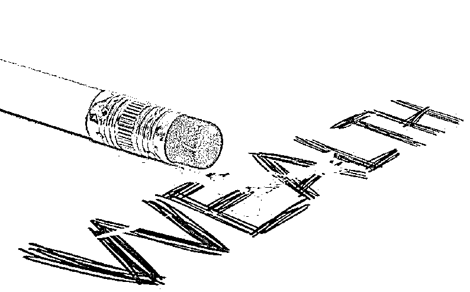**举个例子，如果月亮是第 2 宫的宫主星，或者落入第 2 宫，那么，你将有很优秀的直觉天赋、对情感的敏锐性、学习的欲望。除非这个月亮是落在摩羯座、处女座或者金牛座，不然，从事会计工作将是一种折磨。也许你喜欢自己从事的工作，虽然报酬不是很多。为什么你的同事能长驱直入地走到老板办公室要求加薪，而你靠这份工作为生却没办法做到这样？因为他有一个过分自信的水星、火星合相在第 2 宫，而你有一个阻碍自我发展的冥王星同太阳的四分相。 **你的第 2 宫必须打牢基础，你必须转变在这里找到的一切。**当你还是个婴儿，第 2 宫曾经是一个真实的伊甸园。任何你需要的——手指、食物、泰迪熊，都会像变魔术一样出现。然而，当你渐渐长大，你认识到必须保养和维护这片花园。蔓藤需要修剪，果树需要种植，花朵需要施肥。地球就是伊甸园，但是同样也充满了现实。害虫会毁掉你的花园，掠食动物会吃掉你的庄稼。如果不了解如何提高花园的收益，你的需求将无法实现，愿望也不能满足。如果你等着天上掉馅饼，那真是会饿死。 换句话说，**你必须以现实的态度对待第 2 宫。学习如何利用、保护、管理这里的资源，否则，你将失去这些恩赐。**任何有财务麻烦的人就是对这一点的认识太过简单。 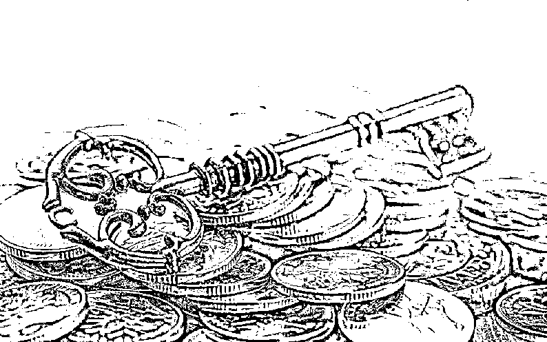**困在第 2 宫里的艺术家**约翰 49 岁，他不但有一堆债务，甚至连这次咨询的费用都无法支付。成年以后，他一直从事只有最低薪水的工作。在过去 10 年里，他只能靠女朋友的收入为生。约翰第 2 宫的宫主星是“吉星”木星，而且落在了勤奋的处女座。他是一个有天分的艺术家和手工艺者。他设计镶嵌的首饰非常有灵气。“他们喜欢在石头上作画。”这是一个朋友对他的评价。但是，约翰却很少设计首饰，即使在他最多产的时期也没法以此为生。与约翰交谈之后我知道，他父亲是一个木匠，为好莱坞电影做布景设计，他一再告诫儿子不要以手工业为生。他怨恨自己的蓝领生涯，认为约翰没办法靠双手挣到任何钱。因为这个沉重的警告，一个艺术家被困在了第 2 宫挣扎着。 约翰的第 2 宫宫主星是木星，落在了处女座，处女座的守护星是掌管**手工业**的水星。但这两颗行星都被冥王星压抑着。这种**由冥王星带来的行星无力感只有在做出改变之后才能消除。**大部分时候，约翰都感到无力和瘫痪，不能从事他喜爱的艺术，就等于什么都不能做。那双创造艺术灵感的手就是他最好的资源，他父亲贬低了这双手的价值，就像告诉约翰，他是个废物。成年以后，不管财务问题或者其他问题，都无意识地在证明这一点。 帕提的第 2 宫落了一颗在巨蟹座的木星，还与月亮和天王星合相。她第一次来见我的时候，也是有财务上的麻烦。她很有才华，受过良好教育，但是最近从事的都是一连串底薪的工作，她一个都不喜欢。事实上，她刚刚离开了一份这样的工作，她想知道下一步该往哪里走，她不想在经济上依赖她丈夫。 我花了几次咨询时间来揭开她第 2 宫的财务秘密，但是真相却浮现得很慢。当她还是个孩子，她发现，只要妈妈花钱就会被爸爸无情的数落。所以她（巨蟹座的作用）认为一定要有自己的收入。父亲赞同她自己存零用钱。之后，她也非常重视自己赚钱，因为这代表了她作为一个女人的独立（木星、月亮、天王星）。至少，这让她能免于丈夫的责难。 帕提第 2 宫的合相给了她非凡的才华，她有充足的探险天赋。在十几岁时就展露了优秀的音乐才华，但是，她父亲总是打击她，怒气冲冲地说：“你不可能以此为生。”所以，她追随父亲的足迹，拿到同样专业的学位。奇怪的是，在这个领域她一样没赚到钱。最后我在第 2 宫中揭开了这个秘密：**他父亲否定了她的天赋，取而代之的是潜意识地教育她：“想赚钱，就要从事你不喜欢的职业。”**她遵循了这一点要求，做了一份又一份她不喜欢的工作。她非常不满这一交易让她的收入一直不高。 在最初，他们接收到的第 2 宫最大的问题就是**态度和价值观**。很多年前，我坐在一个治疗师的办公室里抱怨我很失败，因为我没开上奔驰。“但是，”我的治疗师回答：“你从来没让我觉得你是那种在乎空洞地位的人。”那一刻对我真是一种解脱。我父亲一直希望看到我开着奔驰车，在他眼里那就是成功。讽刺的是，多年以后我真的买了一辆豪华轿车，虽然不是奔驰。我第 2 宫的宫主星是金星，我喜欢奢侈的东西。到我买车的时候，我已经大幅提高了收入，最终实现了我的价值观。 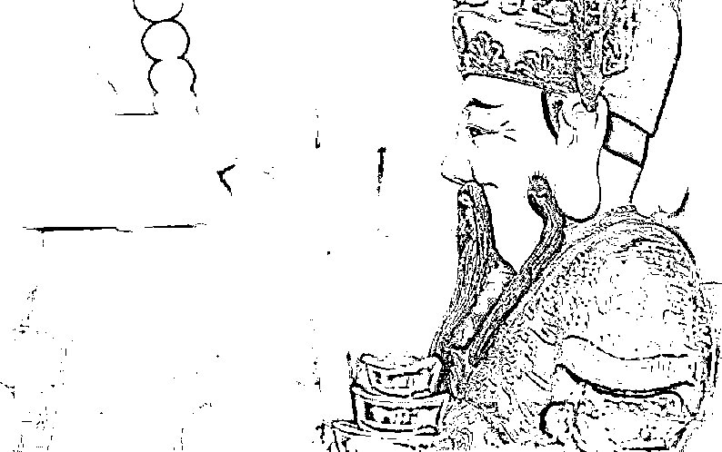关于第 2 宫的探究，丹恩·鲁伊尔指出了一条重要的观点：**我们必须改变这片领土，以适应个人的目的和命运。否则，我们只是过去的公仆，灵魂的代理人，我们的生活只能被我的祖先统治。** 鲁伊尔指出，**第 2 宫的资源财富必须得到有效利用。**这意味着——我们个性的韵律给他们留下了深刻的印象，不论是物质财富，还是我们的天赋，或者是花掉的金钱。**我们需要引领第 2 宫给予人格特质足够的支持（就是第 2 宫支持第 1 宫）**。鲁伊尔建议我们致力于找出我们必须成为什么样的人，这被赋予了重要意义。“没有什么比失去生存价值更让人觉得徒劳和空虚，这才是各种意义上的拥有。” 约翰很幸运地与一个相信他的天分的女人一起生活。但是，这些年她的爱情并没有能够帮助他在艺术上的发展。一直到丽萨厌倦了，开始要求他也挣钱，约翰冒着感情的风险养活自己。丽萨有非常优秀的商业头脑，帮助约翰开展他的新事业。展示设计这一步对约翰来说是一种折磨，不论是在手工艺品交易会的展台上，还是与客户商谈订制事宜，都是他自己负责。他成熟了，尽管这种蜕变和新生是很痛苦的。这需要勇气。如果没有赚钱的压力，约翰恐怕做不到这一点。 这就是为什么当我听到人们抱怨赚钱的压力毁了他们的精神生活、阻碍了自我的探寻时，会表示怀疑。精神与物质，息息相关。我们以肉体实在的感受存在着，也有充分的理由必须与其他物质发生联系。**物质决定了精神的形态。**怎样才能让灵魂成长得足够坚强，以抵抗唯物主义的强硬？如果我们简单的梦想或者“计划”按照我们的方式去成长，是不是就成了外星人？ **现代占星学中，把金星作为第 2 宫的自然宫主星。古典占星中，第 2 宫是金牛宫，并由金星守护。**对于描绘第 2 宫的全貌，这三者都十分重要。**金星确切地描绘了一个人的品味和喜欢保持的风格**。金星对于**评估一个人的自尊心**是非常重要的。但是，**找到金牛座提供的基础稳定的力量在哪里**也很有帮助。此外，**北交点落在金牛座更加强调了第 2 宫的问题**。群体行为上看，有一些人有更大的愿望，将钱花在安全保障的事情上（比如反恐战争的基金）。另一些人可能觉得，有必要去清理国家财政（解决赤字和失业问题）。个别人群希望把重点放在集体的金融合作上。 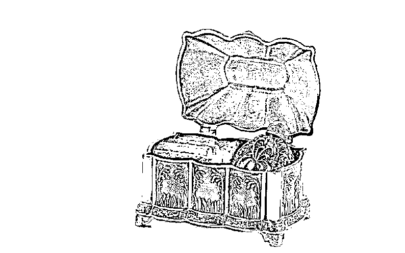**木星=祝福？土星=诅咒？**

**木星是掌管财富的行星。**不能断定木星的力量，就不能准确估计一个人财富的潜力。尽管如此，一个现象还是让人很迷惑：在我观察的星图中，有很大财务问题的人往往有木星落在 2 宫或是第 2 宫宫主星，而比较成功的人士的第 2 宫，却往往与土星扯上关系（落入第 2 宫或者是第 2 宫的宫主星）。

这有悖于传统的结论，木星带来好运而土星带来厄运。或许这是因为我们已经不是生活在传统的社会了——**在传统社会，家族财富决定了人们的财富命运，跨越阶级是非常困难的，土星在这种状况下决定了我们所受的限制，而不是需要克服的困难**。

木星带来的是**对于特权的期望**——尽管我所认识的大部分木星落 2 宫或者是 2 宫主的人，都来自中产阶级家庭，他们的权利意识却很强。不论是银行账户的余额，还是关于未来，他们都希望**感到安全**。

他们相信：“Something will come.”事实上也的确发生了。举个例子，约翰就一直有吃有住，有钱买鞋，也有钱支付牙医和按摩师，虽然他很多年都没有收入。 

我姐姐的第 2 宫宫主星是木星，我的第 2 宫落入了土星。当我们俩都怀孕时，我担心即将到来的责任，每天看护的花费、小孩的健康保险、衣服、尿布、食物。我姐姐却很轻松快乐。她身体有残疾，靠国家救济为生。而我的收入是她的 6 倍——但是，谁会有巨大财富，就像扔硬币一样没谱。土星和木星的不同之处让我想到了一个寓言——蚂蚁与蝗虫。蚂蚁整个夏天都在工作，而蝗虫则玩儿得跟没有明天一样。直到冬天来了，没有了食物。我就是一个土星在第 2 宫的蚂蚁。我习惯储蓄而且工作努力。但是，我知道很多玩耍了一个夏天的木星蚂蝗，在冬天账单到期时也没饿死。看起来这两种情况都不错。所以我把这一点留给你去决定——对于第 2 宫，哪颗行星是祝福，哪一颗是诅咒呢？ 在这篇文章里，我谈了很多关于我第 2 宫土星的问题。但是，我也尝过了蝗虫的无忧无虑的精神态度，那时，木星正通过我的第 2 宫。当木星来到了我的第 2 宫宫头，我有了一种**全新的、有信心的态度，几乎放纵的自大**。就像一股美好的信风吹起了我的风帆。我开始重新评估我自己。因为落在第 2 宫的土星，我总是对购物有负疚感，但是，那时我变得不再为此感到抱歉，每到周末，我就成了购物狂。 当木星行进到我的第 3 宫时，这样的疯狂行为得到了抑制（我忙于文书工作没时间购物）。但是，我新的信心却保留了下来。事实上，我收入戏剧性的增加并不是在木星来到第 2 宫的时候，而是当木星行进到了第 3 宫。很明显，**这得益于之前行进种下的幸运的种子**。我告别了过去，开始了一段**全新的、为期 12 年的财务周期。 **当然，金钱不代表一切，这甚至不是我最喜欢的第 2 宫的内容。所有奋斗和成功的过程比美元更深刻。但是，简单诊断第 2 宫的情况，从财务问题开始是不错的选择。**看一下你的资产和银行账目**。关于你与世界的关系，他们告诉了你什么呢？接下来，看看你的财产，他们是不是反应了你的个性？是他们支配着你，还是你拥有他们？你第 2 宫的天赋呢？他们是否得到了充分的利用？最重要的是，你是否持续改变着这个战场，以确定你对于拥有权力的态度而不是去挑战它？我曾经和一个群星落第 2 宫的男人一起共事，星群中包括一个处女座的金星。金钱不是他生命的驱动力，但是他喜欢他能购买的东西。事实上，我最喜欢的茶余饭后的乐趣，就是听他讲最新的购物故事。不论是食物还是家具，或者是刚买的新家的硬木地板，他都能通过各种方式表达他对这些物质财富的喜爱和赞赏之情。他信誓旦旦地认为这都是最好的，最美味的。有时候我试着购买或者品尝一下，觉得也就一般。但是通过他较为发达的第 2 宫看来，这些东西都是多好的礼物啊！毕竟**第 2 宫决定了我们身体和物质的舒适享受。它提醒我们保持质朴的爱好！ **

**版权声明：**本文由若道翻译发布，欢迎转发，反对抄袭。友号转载请申请白名单。

其他宫位文章 

[第 1 宫](http://mp.weixin.qq.com/s?__biz=MzA5NjA0NTAxNg==&mid=2651423092&idx=1&sn=53169f1901b50ce5d406aa45df1a830f&chksm=8b4b33c3bc3cbad5e64428fb653d1478ecdb1068a812985486b0299e1648061aee1a5eab07d1&scene=21#wechat_redirect)

**达纳·格哈特**一位国际范围内受尊敬的占星师。她为众多占星学网站和出版物讲课、写稿。她在十二宫的月亮激励她对这颗发光体进行了深刻而持久的探索研究。

**系统学习占星学**

**点击下图了解详情**

**微信又双叒叕改版啦，不想错过若道君的推送？**

**就把若道设为星标吧！**

**▼**

就是这个“在看”，戳戳戳 ☟

********报名直达入口********

# 黄金终于跌了，怎么办？| 雷蒙德·梅里曼 9 月黄金报告上线！

> 原文：[`mp.weixin.qq.com/s?__biz=MzA5NjA0NTAxNg==&mid=2651424378&idx=2&sn=c5d506cbdf94436cc5f4eb0ecfa022f4&chksm=8b4b34cdbc3cbddb35dbd9c2ec150bed9db142e728dc52e85600e2128255441f8bd131fb1b0c&scene=126&sessionid=1692738121#rd`](http://mp.weixin.qq.com/s?__biz=MzA5NjA0NTAxNg==&mid=2651424378&idx=2&sn=c5d506cbdf94436cc5f4eb0ecfa022f4&chksm=8b4b34cdbc3cbddb35dbd9c2ec150bed9db142e728dc52e85600e2128255441f8bd131fb1b0c&scene=126&sessionid=1692738121#rd)

“

**黄金是金钱。其他的只是信贷。**

**——约翰·皮尔庞特·摩根**

”几天前，我们刚刚接到梅里曼老师发过来的黄金特刊，也把这份特刊翻译出来，免费发给了所有订购了 8 月份黄金报告和套餐报告的读者。在 7 月中旬发布的 8 月份报告（每月的黄金报告其实是每月中上旬发布。比如 8 月中上旬发布 9 月的黄金报告，其实涵盖的时间段是两次报告发布之间的时间段）中，梅里曼老师认为黄金正在接近很快要触顶的时期。然而黄金这一次涨得比较久，没有很快触顶，而是开启突破上涨模式，一部分不熟悉投资、也不熟悉如何使用报告的读者觉得自己可能卖早了，有些着急，担心黄金不管不顾地往上冲。梅里曼老师从读者来信中了解了这个困惑，并特意发出了 8 月特刊，以帮助投资者了解，在各种情况下，如何操作。在 8 月份特刊中，梅里曼老师写道：**“在黄金 8 月月度报告撰写一周后的 7 月 21 日，黄金突破 1830 以后，我们一直在等待金价回落，以便为梅里曼市场时机学院月度周期报告订阅用户撰写一份特刊。”**他在特刊中特别告诫那些可能因为提早卖出而看到黄金一步步升高而懊恼的客户，不要因为看到黄金突破了，就忍不住又在高位冲进去。因为他还是认为：“一次重要的下跌将在不久后发生。我们将使用基本周期作为指引。”现在，梅里曼老师预测的下跌开始了。这两天的黄金暴跌，白银跌幅更为剧烈。

有些分析人士认为，黄金在过去连涨 9 周是非常极端的，因此走势未来不会太强了；也有人认为，在目前各国大放水、国际局势不稳的情况下，黄金可以继续看高。那么，你该如何面对目前的调整呢？是等待回调继续进行，还是在什么位置买入？9 月黄金周期报告等着你。火星已经进入逆行阴影期，很多国家都纷纷再次爆发新冠肺炎病毒疫情，未来的几个月注定不安宁。黄金的走势会安宁吗？**对于不是炒短线的投资者，请特别注意梅里曼老师在每次报告中提到的长期周期、中期周期和基本周期。**因为市场有起伏，有意料不到的变化，即便是每月报告有时也未必能够完全掐准时点。这时候，如果对于这些有各种时间长度的长中短周期的了解，未必能帮助你每次都买在波谷，卖在波峰，但可能能够帮助你不要买在波峰，卖在波谷。9 月黄金报告已经上线，上证报告也会在月底上线。欢迎了解。也可以按照季度和一年期订阅，有更多优惠。季度和年度的好处是，你可以持续了解梅里曼老师对于不断在变化的市场的看法。即便他某一次看法和市场不一致，你也看到在下一期他如何调整自己的看法，并看到金融占星在一个长期时间段内对你把控风险的帮助。而能够长期控制风险、尽量找到安全的投资时机才是投资的长久之计。

雷蒙德·梅里曼黄金周期 9 月度报告上线——世界著名金融占星大师雷蒙德·梅里曼，以 40 年黄金市场研究经验，对当前黄金市场做出研究报告。投资有收益，也有风险，希望这份金融占星学的研究帮助你更好地评估黄金投资。

**9 月黄金报告上线**

黄金月度报告价格**单月报告**：280 元 **3 个月套餐价**：860 元**12 个月套餐价**：2400 元**双报告年度套餐更优惠（直降 899 元）****12 个月黄金报告+12 个月上证指数报告：仅需 3500 元****长按下图识别二维码购买黄金报告**

▼

**购买者需知**

**①**梅里曼市场时机学院《中国上证指数月度研究报告》是梅里曼市场时机学院（以下简称 MMA）的研究“预报”，而不是市场“预测”，是梅里曼老师及 MMA 金融占星分析师对人类活动周期历史与行星周期之间相关性的研究，二者在大部分情况下具有 80%或更高的相关性，而不是因果关系。报告中的研究完全存在错误的可能性。即便是非常认真的研究和几十年的研究经验，金融占星师无法总是正确地解读出各种征象在实际层面上会如何相互作用，并显化为事件结果。

所以请将报告看作一个研究参考，务必结合其他市场研究和你个人对市场的理解，根据你的自由意志做决策。**②** 本报告只是上证指数研究，没有个股研究。**③** 此报告一旦售出，**即不接受退款。****④** 此报告每月 1 期，**并非都是在每月相同日期发布**。我们收到英文报告的当天，即发布该英文报告。3 天后，上线报告中文版。**⑤ 此报告仅支持手机网页阅读，不支持电脑阅读和下载。****以上须知，请仔细阅读。一旦付款，即视为已了解并接受所有须知内容。**在过去的 39 年中，唯有梅里曼逐渐完善，并在梅里曼市场时机学院月度周期报告中阐释了将地球宇宙学与周期相结合的研究方法，以惊人的精确性预报了黄金价格发生重大变化的时间。黄金购买 Tip

各大银行均可购买黄金或黄金 EFT 基金，也可以在诸如天天基金或者支付宝购买黄金及黄金相关产品。不明白的可以百度搜索。

购买后如何查看报告？

购买后有疑问怎么办？

请联系技术客服

**微信：nodoor201705**

购买黄金报告直达入口

# 插班中丨核心课程 L3，教你掌握综合星图解读

> 原文：[`mp.weixin.qq.com/s?__biz=MzA5NjA0NTAxNg==&mid=2651424378&idx=3&sn=ff3672ec5b79fdfd250c35bccf303e6b&chksm=8b4b34cdbc3cbddbbe8e483bb17830b643e59ee029ec00c1cbec20d63117bbfdb32de6a8b8e7&scene=126&sessionid=1692738121#rd`](http://mp.weixin.qq.com/s?__biz=MzA5NjA0NTAxNg==&mid=2651424378&idx=3&sn=ff3672ec5b79fdfd250c35bccf303e6b&chksm=8b4b34cdbc3cbddbbe8e483bb17830b643e59ee029ec00c1cbec20d63117bbfdb32de6a8b8e7&scene=126&sessionid=1692738121#rd)

**Level3 也是占星学习的一个整合区和分水岭****若道君给大家准备了一份专业的占星测试：“2020 若道核心课 L3 入学测试”****测试内容包括：**

**适合参加测试的学员：**

**L1-2 结课学员**

**有一定占星基础的自学学员**

**准备考 ISAR 的学员**

**扫码开始测试吧**

**测试会由若道专业助教免费阅卷，答题后添加课程顾问 Maggie（微信号：NodoorMaggie）获得测试成绩**

**1**

**占星学除了自我修炼，市场需求如何？**

**通过占星学习你帮助了自己，也可以选择成为自助助人的占星师，开启受益终生的第二事业。**一方面，社会快速发展人们压力山大，抚慰心灵的咨询市场需求巨大。另一方面，市场鱼龙混杂，真正学院派的严肃占星从业者十分稀缺。最重要的，**占星学能让你自己帮助自己，无论你是否进行占星咨询从业，学习了占星学，它都将是终身陪伴你成长的睿智好伙伴。**

**2**

**你的占星核心课老师是谁？**

 拥有**50**年占星研究积淀**44**年职业占星实践**41**年占星教学经验的**若道联合创始人****2017-2020 年曾任 ISAR 全球副主席****2020 至今为****CAPISAR（全球职业占星师资质认证考试委员会）主席****大卫·瑞雷**&**最懂学员的若道首位认证金牌中国老师****熊鹰**师徒二人合力打造
**2020 年若道****全新核心占星课程**

**3**

**L3 阶，我们要学习什么？**

**第 3 阶 ****宫位、相位以及初步解读星图（15 次课） ****❶** **12 宫位****人生中重要的领域，不止 12 个，更是 12 类。****❷ 组合解读****行星、星座与宫位的组合解读。万丈高楼平地起，这是占星解读的基本功。****❸ 相位****不仅是常规的相位：合相、对分相、三分相、四分相……还有这些更为细致的知识：**相位计算入相位与出相位星座外的相位相位解读盈亏相位相位的优先级大卫老师案例课**❹ 宫主星与定位星****“联结”是宇宙的基本法则之一。除了相位，还有哪些方式让行星能量联结起来？**宫主星定位星与定位链大卫老师案例课**❺ 月亮交点专题****月亮交点是占星解读的另一个入手角度，这里会深入教你解读月亮交点，及其相位与定位星。**月亮交点的解法大卫老师案例课**❻ 相位模式：****那些坊间赋予神秘意义的占星格局：大三角、大十字、T 三角……究竟该如何解读其相位模式。**主要的七种相位模式星图中没有相位模式的情况大卫老师案例课**❼ “空”不等于“没有”：****星图中那些容易被忽视的地方：**无托勒密相位（俗称空相）一些特殊位置星图布局大卫老师案例课**第 3 阶课程安排****❶** 15 次线上直播网络课程，每次 2 小时，课程中依旧会使用同学们的星图作示范**❷** 10 节课由熊鹰老师教授，重点通过名人星图阐释知识点**❸** 5 节课由大卫·瑞雷老师教授，重点通过学员星图阐释知识点**❹** 熊鹰老师会指导练习，答疑解惑，学练结合**❺** 重点在于如何根据星图去问问题，着重自我发现和自我探索的过程 

| **时间** | **课程** |
| 2020 年 7 月 2 日 | 宫位、行星和星座组合 |
| 2020 年 7 月 9 日 | 宫位、行星和星座组合 |
| 2020 年 7 月 16 日 | 月亮交点 |
| 2020 年 7 月 23 日 | 月亮交点和演示案例 |
| 2020 年 7 月 30 日 | 相位 |
| 2020 年 8 月 6 日 | 相位、星座、行星和宫位 |
| 2020 年 8 月 13 日 | 相位、星座、行星和宫位的同学案例 |
| 2020 年 8 月 20 日 | 渐盈相位和渐亏相位，示例 |
| 2020 年 8 月 27 日 | 更多的关于宫位和宫主星 |
| 2020 年 9 月 3 日 | 同学案例 |
| 2020 年 9 月 17 日 | 空相行星和定位星 |
| 2020 年 9 月 24 日 | 宫主星 |
| 2020 年 10 月 15 日 | 优先级和组织 |
| 2020 年 10 月 22 日 | 相位模式以及范例 |
| 2020 年 10 月 29 日 | 学员星图解读范例 |

**截至 2020 年 8 月 12 日，课程第 1-6 讲为录播课程（限视频回放），其余均为网络直播课。**

**4**

**这两位优秀的占星学老师是谁？**

**大卫·瑞雷（David Railey）**

*   **曾任 ISAR 全球副主席，2020 至今为 CAPISAR（全球职业占星师资质认证考试委员会）主席，若道联合创始人；** 

*   1976 年，通过亚特兰大职业占星师考试，成为全职占星师，随后通过**AFAN 和 ISAR 职业测试；** 

*   1980 年，与**杰夫·焦耳**一起在亚特兰大创建**“每日星球”**占星学中心。此后在亚特兰大占星协会担任 4 年考官，并且两次担任**亚特兰大地区占星协会主席**。1979-1992 年，作为占星师活跃于美国社会媒体，向不了解现代占星学变化的大众宣传专业占星学知识。在 1989-1992 年期间，他在 WRGG 电台 12 频道每周主持个人电视秀**“今日占星学”**，早先他还在 WRFG 的广播节目中播讲宇宙天气节目；

*   2010-2014 年，任**全美占星师联盟监督委员会委员**； 

*   2010 年，其著作**《灵魂的目标》**中国版出版，和蒋颖一起创办**若道占星**学校和其官网 www.nodoor.com。从该年开始，他工作并往返于亚特兰大和北京。目前他 80%的时间致力于在中国教授和推广西方占星学； 

*   2017 年，被选为**ISAR 委员会成员**（2017）。ISAR 是世界最大的国际占星机构，会员遍布 45 个国家，2017-2020 年曾任 ISAR 全球副主席； 

*   2020 年，被推举为**CAPISAR（全球职业占星师资质认证考试委员会）主席**。

**熊鹰老师（天空的空）**

*   2008 年接触严肃占星学，至此爱不释手； 
*   **2013 年师从大卫·瑞雷**，研习整套现代占星学核心课程，并于 2014 年起至今连续三年担任该课程的主助教； 
*   期间也**跟随格伦·佩里、诺·泰尔、理查德·塔纳斯、罗伯特·汉德、苏·汤普金斯、斯蒂芬·弗里斯特等多位国际顶尖占星大师进行学习**，进行定向占星主题研究； 
*   2015 年初，通过国际占星研究协会**（ISAR）资质认证并获得证书**。同年，进一步跟随大卫·瑞雷老师进修**“生时校正”**技术，通过最终考核并获得证书； 
*   目前在若道星文化任职，将传播系统、严谨、真实的占星学作为职业使命。任专职助教期间，进行沙龙与答疑等辅助教学工作已累计超过 200 小时；
*   在业余期间也提供占星咨询与生时校正服务。目前正致力于占星学与个人成长的整合。

**5**

**什么人适合这门课？**

*   对占星学有浓厚兴趣，想要系统学习占星学
*   对占星学有一定基础，但不知道该如何整合星图复杂的碎片
*   希望成为优秀的占星师，想要借鉴国际大师解读思路并融入自己的体系
*   想学习占星学，但不擅长英文，希望有中文老师授课
*   想结合占星学理论与咨询实践
*   大卫·瑞雷、熊鹰的忠粉，学过占星，但就是想跟着偶像再学一遍
*   走在自我探索和个人成长道路上的人

**6**

**课程费用**

 **★ L3****课程费用：10000 元****更多价格优惠请咨询客服**

**7**

**退转课程**

**退款原则请详看《教学协议》，如有疑问请咨询课程顾问。******核心课程 Level 3****

**授课老师：大卫·瑞雷 熊鹰**

**授课时间：****2020 年 7 月 2 日-2020 年 10 月 29 日**

**授课方式：**网络课程：英文授课，中文翻译

**费用：10000 元；**更多优惠请咨询客服

**课程负责人：Maggie（微信号：NodoorMaggie）**请备注“L3”

长按二维码添加课程负责人咨询~

****报名请点击“阅读原文”****

# 总经历天王星式“爆炸”，心无法安住，不断经历失去丨这个配置功课“重”但值得！

> 原文：[`mp.weixin.qq.com/s?__biz=MzA5NjA0NTAxNg==&mid=2651424322&idx=1&sn=2726b2959506206921e75e8f110fdabd&chksm=8b4b34f5bc3cbde3f363aae7930e5c6b1a633603793bbbadbd604f926aa8c389b13c7b569c8e&scene=126&sessionid=1692738121#rd`](http://mp.weixin.qq.com/s?__biz=MzA5NjA0NTAxNg==&mid=2651424322&idx=1&sn=2726b2959506206921e75e8f110fdabd&chksm=8b4b34f5bc3cbde3f363aae7930e5c6b1a633603793bbbadbd604f926aa8c389b13c7b569c8e&scene=126&sessionid=1692738121#rd)

**☆ 后台回复“今日”，给你一句生命态度**

作者/薇安 ISAR 认证占星师 编辑/翀子 封面/书君 图片/网络当代表生命根源的月亮，和强力摧毁旧有结构的天王星相遇，意味着什么？当一个人的出生星图上，月亮和天王星形成压力相位，他/她的生命会经历怎样的挑战？让我们一起来读文章吧~**月亮与天王星的相遇**

**“分裂、瓦解、粉碎、震撼、 颠覆、破裂”**，这是占星学上天王星所象征的能量作用，非常激烈，令人震惊，却能强有力地摧毁掉旧有结构与模式。在任何层面的进化过程中，它都**带来突变与更新。**

这并非必然令人喜悦。通常人们更认同的常识是：在物质界中，任何生命形式，有形的，或无形的（例如：文化、情感联结等），都需建立在某种连续性上；若与根源断然分离，往往意味着生命的孤立、枯萎，甚至死亡。

但如果放到一个足够长的时空中去看，无论是个体，亦或集体人类，生命都有足够的韧性在“**建造—打破—重塑—再毁损—再重建……**”的进程中，倔强生长，持续更新。当我们的生命经历，以任何形式和天王星相遇时，请在内心牢记这一点。

在个人出生星图中，**若月亮与天王星形成相位**，拥有这一配置的个体，或多或少在内心深处都有这样一种体验——“I’m a stranger!”（我是个陌生人！），可能是在他们的家族里、社区中，或之于其所属的国家文化，**都有这种疏离或格格不入之感。**

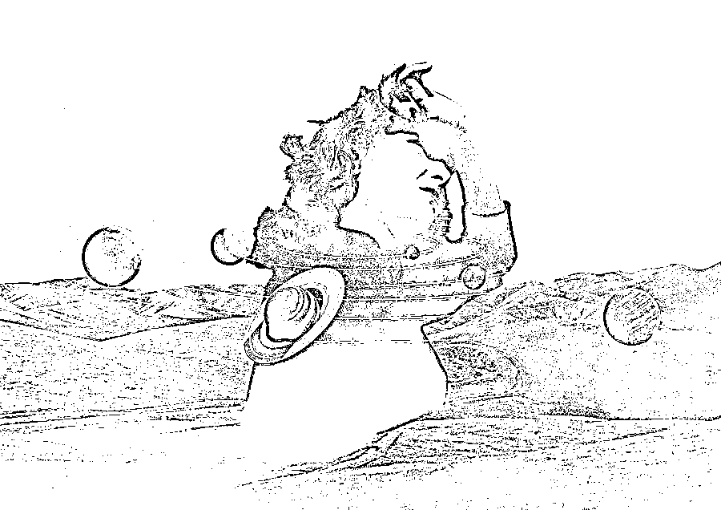

月亮代表生命的根源，从子宫、母亲、家庭、 家族、国家到历史文化，都表征出一种心灵天然的驱力——为生命寻求归属之地。当天王星的能量混同进来，**我们的内在精神，似乎便无法持久地安住于某地或某种状态之中了。**

有的月天人，会主动呼应这种的变动的需求，可以随时出发，去往新领域；例如：

*   愿意远离出生地，甚至移居到与之完全不同的社会文化中生活；

*   不眷念已经熟悉甚至擅长的工作领域，乐于完全革新事业轨道；

*   不滞留在已经逝去的情感或已终结的关系中——结束的，就是结束了；

*   不固着于某种特定的角色认同，高度适应环境的变化或多元性；

*   ……

这种“不恋过往”的态度，有效地避免了将能量投注在已经失去生命力的事物上，或滞留在已然属于过去的时间维度中。从而使得心智意识更有可能投向未来，**能够进行“无中生有”的创造**——这对拥有月天相位配置的人而言，可谓被恩赐的礼物。

而有的月天人，却可能要经历颇为挣扎的内在成长，逐步认知接纳自我的本性，** 卸下对失去联结的恐惧，发展出健康独处的能力，**才能找到属于自己的、升华性地表达月天能量的方式和路径。

但我们不必对这个过程感到羞愧，**每个生命都有自己的生长节奏。**不沉溺于痛苦，而专注于探索痛苦背后的意义与真相，我们终将获得某种程度的解放——这同样是珍贵的生命经验。

所以，当我们和一张有月天相位配置的出生星图一起工作时，首先要探索辨析的，便是星图的主人，在其成长过程中是如何与这份体验共处的；是否有创伤性的体验，让他们回避、压抑或“错用”了天王星的能量。

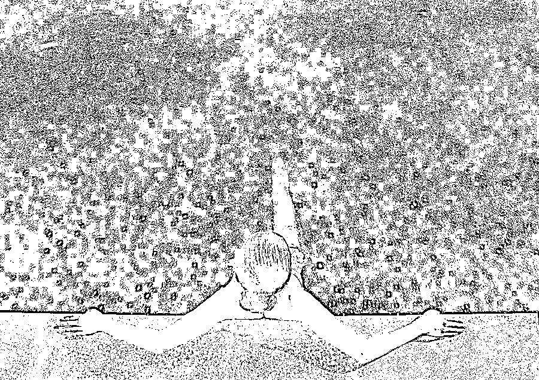

**月亮与天王星成对分相、四分相或合相，会反映出，我们需要经历一个“困难”的过程，付出更多的努力，来磨砺两者的整合。**

我们这里所说的困难，不仅指外显事件的激烈程度，更是指：**内在心理在适应天王星式的扰动时，所历经的挑战。**

**举个简单的例子**

同样是幼年时期频繁经历生活环境的改变，有的孩童会因此发展出惊人的适应性，并成为其成年后，适应多元社会生活的优势能力。

有的孩童却可能在这个过程中，一遍遍地体验到新环境对自己的不接纳甚至排斥，于是退缩到一个自我封闭的状态中。成年后的生活中，他们会拒绝与他人产生有深度的情感联结。因为会无意识地预期：一但产生了感情联结，就要经受断裂之痛。

显然，后者是一种更为困难的情形，但这无关乎孰好孰坏的评价；**接受所有的发生，并在此基础上寻求改进，发展和创造，这是意义。**

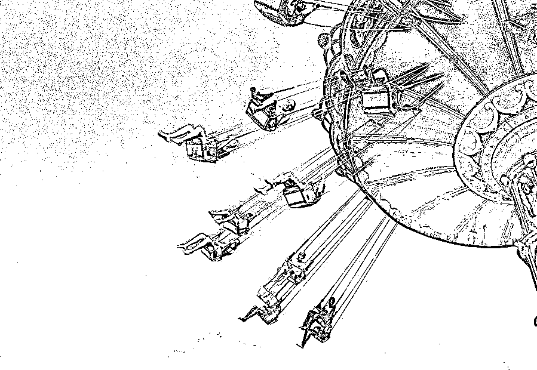

**月亮对分天王星：关系冲突**

居于经验观察，**月天成对分相的个体**，更有可能在关系（广义的，不限于亲密关系） 中显化内在冲突，同时，他们也正需要在这些关系中完成对内在冲突的发现、理解和整合。

拥有这一配置的个体，**在早期的母婴关系中，母亲的在场可能呈现一种不稳定性。**比如，因为某些原因，婴儿的主要照顾者多于一人，而这些照顾者护理婴儿方式差异较大。有的会更为及时地响应婴儿的需求，而另一位则可能有较明显的延迟。

或者是另一种情形，**母亲虽是婴儿固定的照顾者，但母亲在涵容婴儿情绪时是不稳定的。**例如， 当婴儿向母亲投射出情绪时，母亲却从中抽离了，或者是因为母亲自身对强烈情绪的回避倾向，或者是因为母亲彼时正沉浸在自己的思绪或情绪中。

婴儿混乱复杂的情绪感受没有被容器承接，进而得到整理；**只有在挣扎中被迫与情感暂时性的解离开来。**

但母婴间也有互动良好的时候，让婴儿在与母亲的交互中，逐步意识并学习到自己月亮的功能——**我有情绪，但我不会被情绪吞没。**

以上两者交叉出现，可能使婴儿的心智产生困惑；感觉就像我们正在聆听一首乐曲，却会突然出现一段寂静的空白，也不知道在这段空白间，那些音乐都去了哪里？

这种令人不安的扰动，使得我们在聆听乐曲时无法全然沉浸其中，需要分出一部分心力去预备着空白的到来，以免被突然地惊扰到。

伴随这种内在图式，这类月天人在以后的人际关系中，**会无意识地控制与他人关系的情感浓度。**他们关心他人，对他人情绪感受也不乏敏感性；却会避免自己对他人产生强烈的情感需要，因为这意味着依赖的产生。

这就好像，如果把乐曲的音量尽量调低，就能令突然发生的中断变得不那么突出。

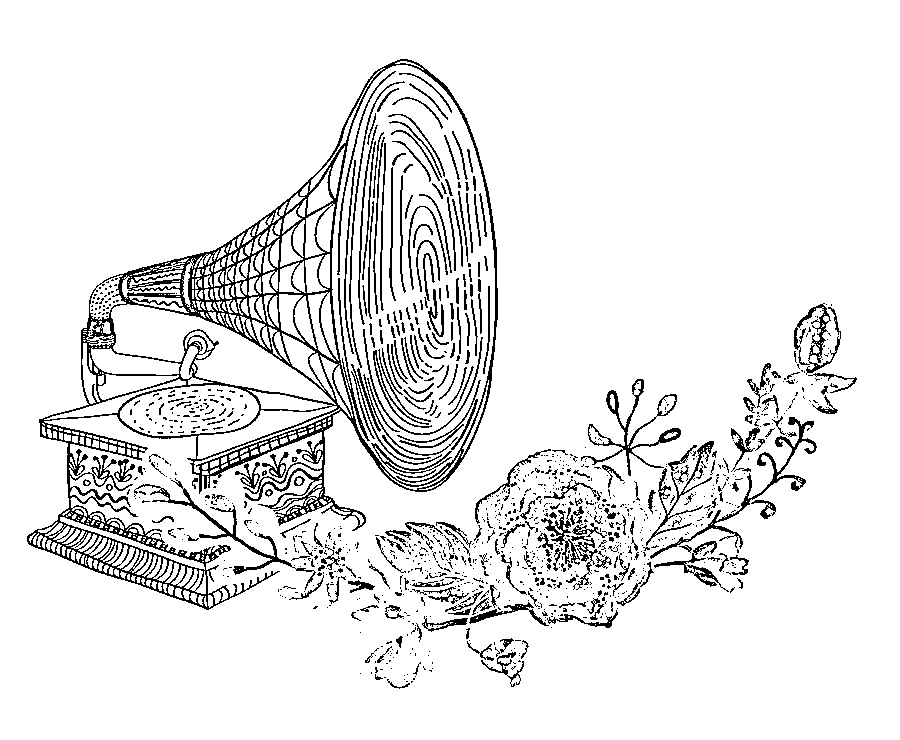

然而，这并不会消弭人类本性中对依恋的渴望，它会为生命带来不可替代的温暖和喜悦。当我们的内在生命准备好去重新审视这一图式时，便可能遇到一个重要他人——无论对方与我们的关系性质是什么——他们会不断增强我们月亮的功能，吸引我们突破惯有的、对情感投入的控制，直至我们对这段关系产生出依恋。

但关系中的另一方，却可能在此时因为某种原因，从关系中抽身离去。可能是物理位置的异动；或者是我们发现这段关系于对方而言并不具有特殊性；当然，也可能是令人心碎的爱情关系的突然中断。

不难想象，无论上述哪一种情形，都会令我们再一次经验到：**震惊，情感需求无人承接而空悬在那里， 进而伴生淹没性的复杂情绪，**这里面实际也包含着来自过去一直未被消化的经验。

当成年经历，激活了幼时的痛苦体验时，也对我们提出的一个考验：这一次，是从情绪中抽离，否认痛苦？还是借此强化发展自身月亮的韧性和功能？这一次，或许我们可以：

**反思自身经验**

*   类似这样的人际关系经历以前是否也出现过？虽然具体内容（人、事、时空）不尽相同，但又有一种规律的相似性。

*   过往我是如何对此反应的？是否很快抽离了自己的情感，感到无所谓？如果我再勇敢一点，向内再迈出一步，我还能体验到哪些感受？

*   我是真的不在乎与他人的深刻联结么？如果答案是否定的， 那么我是在害怕或恐惧什么？

**学习与情绪共处的方法**

*   儿时受损的依恋关系，可以在成年后一段高质量的咨询关系中得到很大程度的修复，尝试进行分析性的心理咨询是很好的选择。

*   先从一定的认知学习开始，深入了解关于情绪的现代研究结果；理解它们对我们的重要性，以及如何影响着我们的身心。

*   筛选资讯，选择其他任何你喜欢的方法和练习

**忍受痛苦**

就是字面含义：忍受痛苦。

当我们**月亮的功能得到锻炼和增强**，在对分相的跷跷板的两端，才会是能量相当的二者；才能创造出内在平衡和谐的状态；才能真正在**给予滋养，获取滋养，自我滋养之间自由舞蹈。**

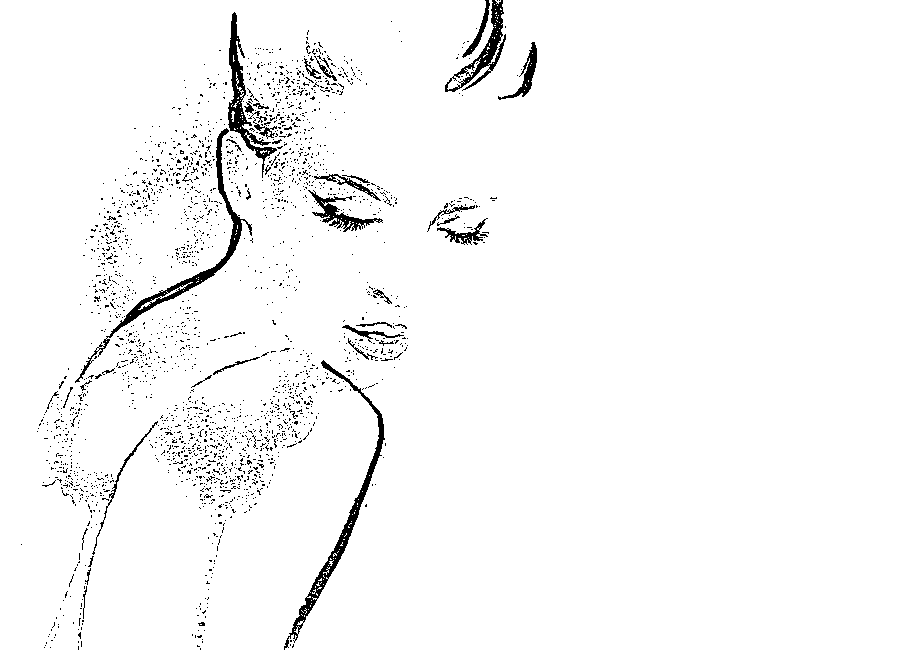

**月亮四分天王星：内在较量**

月天四分相位的冲突，**更多是个体内在的较量与纠缠；**整合的过程，需要完成与这些部分的和解。

和人们以为的相反，一个月天四分相的人，**往往会拥有一个对自己过度投入情感的母亲。**

在我们的心灵里，实现个体化的进程，和寻求与他人的联结的渴望，共存于原始欲求中。它们混沌交织，并非如星图视觉符号般了了分明。**当母亲对孩子过度投注情感，可能增加了婴儿区分自我与母亲的困难，**这种障碍尤其会在母亲与婴儿的情绪模式不匹配时凸显出来。

月天四分相位好似在讲述这样一个故事：

婴儿天然需要一个较大的内在空间，他们可能对情绪过于敏感而有较低的耐受性，或者消化处理情绪体验，需要较长的时间。一个宽松的内在心理空间，可以避免情绪过于拥挤带来压迫性。

而母亲在与婴儿互动时，若携带着高浓度的情感体验：积极的（爱或欢喜），或消极的（焦虑不安）；一方面，这会令母亲无暇涵容婴儿投射过来的情绪——他们的婴儿对此的需求本就更为旺盛。另一方面，母亲反向灌注给婴儿的情绪，益发加重了婴儿消化的负担，使得婴儿不得不将这些情绪暂时冻结起来，并强迫自己与这个部分离开一些距离，以免被其吞噬。

但这也会使得婴儿产生拒绝甚至憎恨母亲的无意识幻想。在早期的生命阶段，我们无法离开母亲而独活。**为防御这类幻想带来的恐惧， 婴儿反而会在其意识心智中，益加去强调对母亲的爱。**

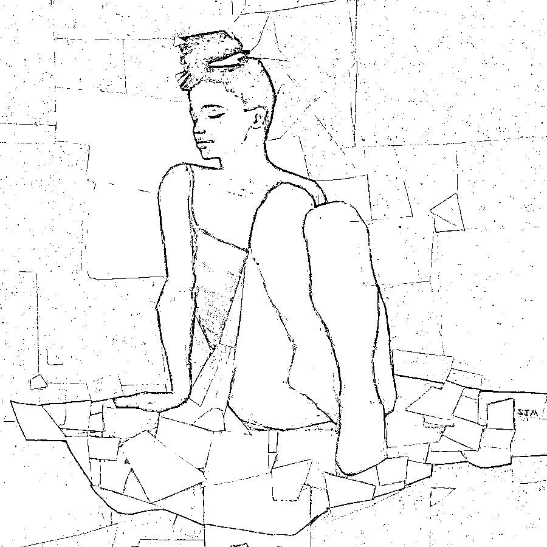

**客户的故事**

我的一个有月天四分相的客户，其月亮落位五宫头，按格伦·佩里老师提出的宫位年龄发展法，这个位置也恰好对应刚进入青春期的年龄点。

当我们第一次见面时，已经四十岁的她，整个身体非常瘦小，几乎看不出明显的女性特征；性格脾性，举手投足间，也难见成熟女性的气息。整体给人的感觉，就是一个青春期的少年。她未婚，有过几段异地恋情，但都没有进一步的发展。其他社会功能都发展的不错，也非常聪颖。

她大学毕业后就离开父母到异地生活工作，但情感上非常眷念父母，尤其是母亲。她自述，和母亲的关系就像好朋友，无话不谈，每天都要通电话。她特别谈到一点：完全不能去面对父母日渐年长的事实，因为即使在最正常的情况下，这也会带来死亡。任何时候，她只要想到这一点，都有无法抑制的悲伤和恐惧。

星图象征化的信息，帮助我们理解到：临近青春期，个体内在需要与父母彻底分离的需求开始变得活跃；这也激发了她婴儿期的体验，将分离的渴望和想要拒绝和伤害母亲的冲动混淆起来。

一方面， 她不断强化自己对母亲的爱来防御内疚， 另一方面潜意识中**无法消解的激烈冲突**，令她的内在人格，甚至包括身体发育，好似**选择了一种极端的方式来避免冲突的演化**——就此停滞在青春期的门栏边。

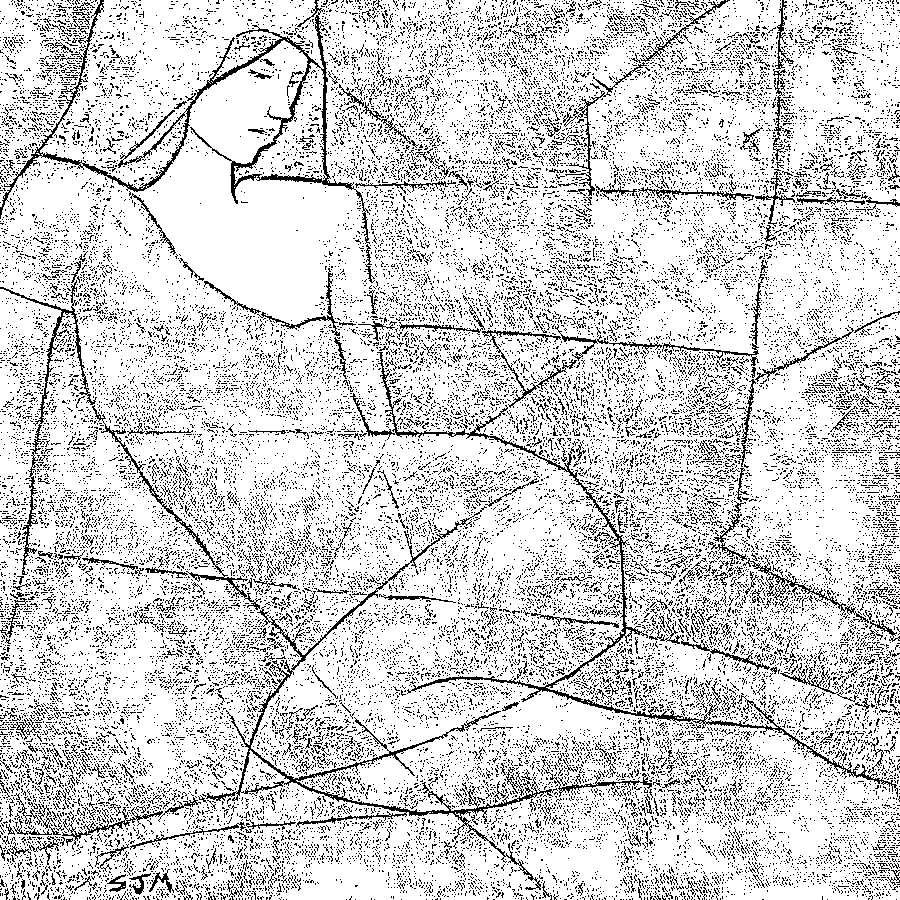

生活很真实也很残酷，现实世界对一个成年人“应该有的样子”是有着特定范式的——无论是人际互动的方式；在职场中赢得他人信任，能够被交付重要岗位需要的气质；还是建立亲密关系时，异性间的期许等。

在现实层面遭遇越来越多的阻滞和困扰，迫使她开始寻求内在肇因。她需要通过长程的分析性治疗，在心智上领悟到早年内在冲突是如何形成的，以及由此建立的防御机制；明白当下对母亲内疚情绪的来源，反思其合理性；学习为创建自己需求的合理情绪空间，涵容这个过程中伴生的恐惧；为面对不可避免的死亡带来的与母亲的彻底分离做好准备。

我的这位客户，在其人生经历中，必然也习得了很多社会适应性行为。月亮、天王星象征的其他特质，在她的身上也有健康的体现；和家族良好的关系，很大程度上为她提供内在的安全感，她也并不乏关爱他人的能力。

同时，婴儿期潜意识的幻想，仍在主导她的部分心智。在心灵某个原始的部分，她将自己长大成人，获得完整独立，与必然失去母亲混同在了一起；而更为可怕的体验是，这种丧失很可能正是由自己对母亲的攻击（愤怒体验）而导致的。

幼时心灵不堪此重负，便压制了部分功能意识的正常化发展 。但现在，她已经完全具备了区分幻想与现实的能力，也有足够的心智理解发生在自己身上事情；随着这个过程的解锁，冻结在过去的老旧情绪也将有机会得以疏通。

这肯定是个需要付诸时间和努力的过程，但当闭锁在潜意识中的冲突得与暴露并对其工作，她“中断了”的那部分能量会在一个更整体性的心理空间中得以延续，准备好以更积极的方式去表达月天相位的特质。

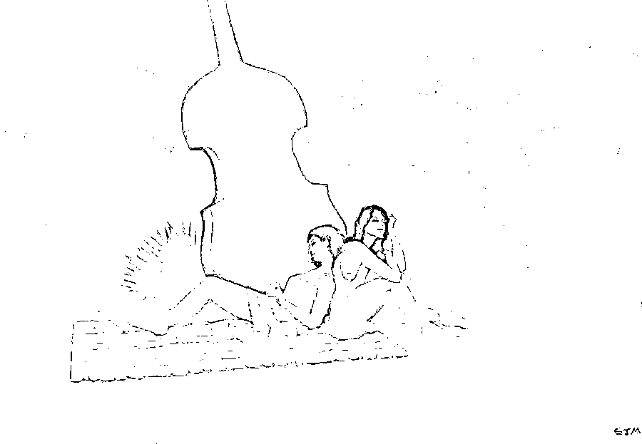

**月亮与天王星的其他相位**

**如果****月亮与天王星的合相**，会发生什么样的情形，就变得更加**“不可预测”**了。不过，从本质上看，个体的内在体验，会在前述的和谐与挑战中的任何一个方向上，发展和表现的更为极致；甚至可能是在这两端跳跃。

重要的，不要意图去消灭在自己或他人看来，我们身上“怪异”的部分；而是努力为这个部分找到一种创造性而非破坏性的表达。

**若月亮与天王星形成三分相，六分相**，往往反映出，星图主人对自己天生气质中的疏离感会更加自洽。以此为前提，这种与情绪感受保持一定距离的能力，**若恰当运用，就能成为有效的创造力。**

比如，月亮带来情感上的直觉，天王星则带来心智上的直觉，这使月天人即便在面对高浓度的情绪情感时，也能迅速获得心智上的理解，从而避免了，因被情绪淹没而无法运用其他自我功能的情形。

这可以帮助我们胜任高压力情景的工作，或者成为一位出色的情绪治疗师，或擅长用言语、文字表达出人类内在情感的丰富性和复杂性。

可以说，我们能够在同一个当下，**即对情感进行主观经验，又对其拥有观察者的客观视角；**这是一种可贵的天赋。

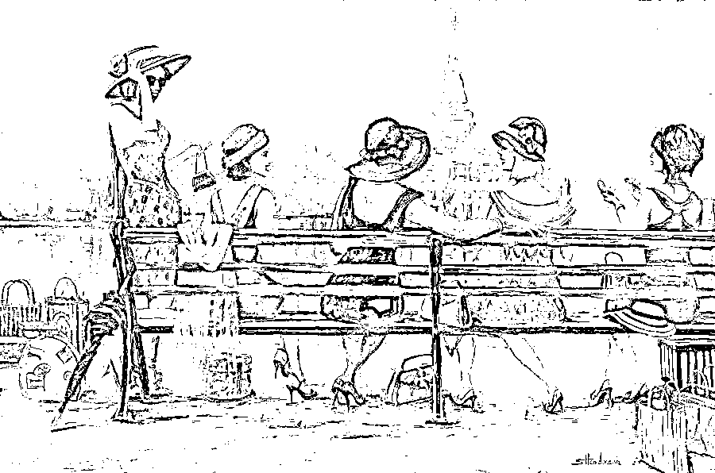

当然，**这****并非是月天和谐相位的“特权”**，任何所谓困难相位在得到个体自己的理解和涵容之后，他们都可以高水平地去发挥这些能力。

总之，无论出生星图呈现怎样的配置，它本身是一个完全地开放式结局的剧本，等待个体心灵参与其中，共同书写。

月亮，是生命之根；但无论习性多么顽强，当天王星与之携手，昭示着我们**从根本上已具备松动的可能。**我们的灵魂已准备好，去超越我们的历史，家庭或家族打在我们身上的烙印，向着一个全新的世界敞开。**我们需要这样一场具颠覆性的、飞跃式的进化。**

著名占星师罗伯特.汉德对天王星有这样一句美妙的描述：**“它（天王星）掌管着启蒙。它是照亮黑暗领域的一道光；这道光本身与在它之前的黑暗完全无关。”**

让我们，即便心怀恐惧，也勇敢让这道光，照进生命！

**版权声明**：文章由作者授权首发于若道平台发布，欢迎转发，反对抄袭。

****

**薇安**

全职心理占星师、ISAR 认证占星师（2016 年获得）、若道兼职助教

北大心理学硕士、MBTI 国际认证施测师

若道认证生时校正资质及 COAC 高阶资质毕业生

**微信 ID**：weianhuilai

**公众号 ID**：Radio-for-Alice

长按打赏

**学习顺势疗法**

**请点击下图了解详情**

**微信又双叒叕改版啦，不想错过若道君的推送？**

**就把若道设为星标吧！**

**▼**

就是这个“在看”，戳戳戳 ☟

********报名直达入口********

# 顺势疗法有何优势？丨我们将它和 6 种药物疗法做了对比

> 原文：[`mp.weixin.qq.com/s?__biz=MzA5NjA0NTAxNg==&mid=2651424322&idx=2&sn=fbabd85f1282649a203c8a08bc7784e9&chksm=8b4b34f5bc3cbde3f160e12362eba7bc12b409ff37290c96392e21efd84e0926f14f8a617194&scene=126&sessionid=1692738121#rd`](http://mp.weixin.qq.com/s?__biz=MzA5NjA0NTAxNg==&mid=2651424322&idx=2&sn=fbabd85f1282649a203c8a08bc7784e9&chksm=8b4b34f5bc3cbde3f160e12362eba7bc12b409ff37290c96392e21efd84e0926f14f8a617194&scene=126&sessionid=1692738121#rd)

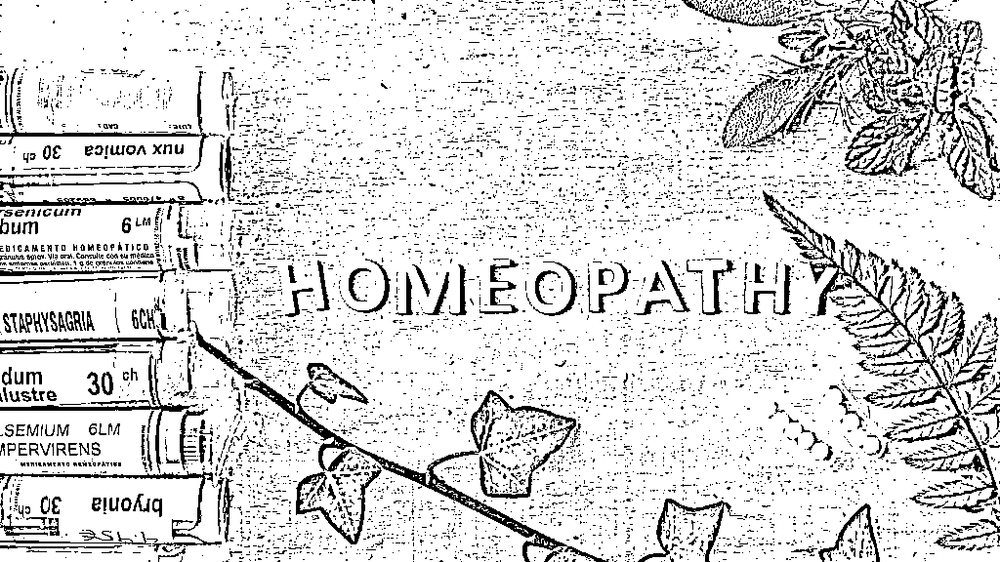

来源/ homeopathyplus 网站

译者/李含 编辑/翀子 图片/网络

顺势疗法是一种基于“同类法则”的完整医疗体系，“同类法则”又可以称作是“同类治疗同类”。那么，顺势疗法和当代其他可行的药物治疗方法有什么异同呢？我们将顺势疗法和传统西医、花疗、舒斯勒组织盐、营养疗法、草药和自然疗法做了对比，请看下面的文章。**传统西医疗法（对抗疗法）**对抗疗法是主流的医疗方法。它使用制药公司生产的化学制剂。对抗疗法的一个常见例子就是扑热息痛（对乙酰氨基酚）——一种用于缓解发热的药物。扑热息痛的化学疗效大约半小时起效，降低你的体温。一旦药物全部被排出身体，体温回升，你就需要再服用一剂。大部分你在药剂师那里买到的药品都是这样的方式——它们会缓解或解除你身体的症状，但只要药剂消失，症状又会复发。

**相似之处**

顺势疗法和对抗疗法都试图减轻痛苦，恢复健康。

**不同之处**

**顺势疗法是基于“同类法则”，而对抗疗法的药品则旨在对抗症状**。例如，治疗慢性腹泻的药品如果健康者服用就会导致便秘——它们产生相反的症状给予治疗。但是给予相反的处方只能短时的压制症状，并未真正的治愈。当药力消退，症状又会复发，常常还会因为身体形成了抗药性而愈发严重。

而**顺势疗法则使用“相似物”**去刺激身体治愈自己的症状。药品的选择是基于它们能够模拟而不是对抗患者的症状。例如慢性腹泻，就会选择一种会导致健康人腹泻的药品进行治疗。这种刺激而不是压制的方式激发身体的反弹效应，恢复健康。

对抗疗法和顺势疗法之间的另一个区别是，对抗疗法对待不同的症状就像对待不同的疾病，即使它们发生在同一个人身上。例如，复发性偏头痛和腹泻，会使用两种不同的对抗性疗法的药物。顺势疗法会将这些问题视作**一个整体疾病的部分**，作为一种疾病同时治疗。

对抗疗法的药物与顺势疗法的药物相比危险性更大。因为对抗疗法的药物以化学方法为基础，病人可能面临药物互相作用和毒性副作用。相反，顺势疗法使用**能量治疗**，并不产生化学副作用，毒性或与其他药品的相互作用。

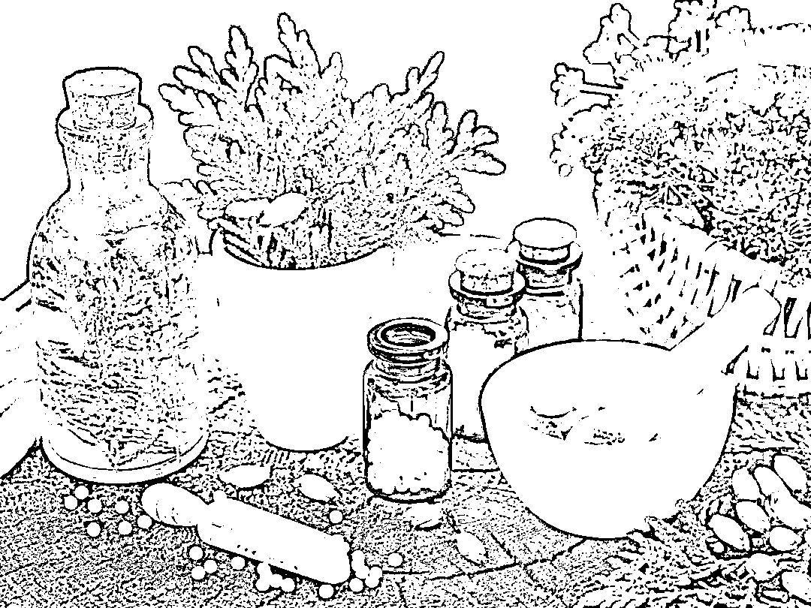

**巴赫花疗（或其他花疗方法）**

爱德华·巴赫医生认为负面情绪影响了我们的身体健康。在 20 世纪初，他发展出 38 种花精去平衡这些情绪，让身体可以恢复健康。

**相似之处**

巴赫花精和其他花疗药品与顺势疗法一样**都是能量医学**—— 并不依靠化学品及其效力。它们并无毒性，不论对年轻人还是长者都是安全的，比如孕妇、动物甚至是宠物都可以使用。它们的味道与顺势疗法液体状态的药物类似，味道好，方便服用。

**不同之处**

与顺势疗法的药品相比，花疗的疗效更弱更温和，它们直接作用于情绪。而顺势疗法同时**作用于身体和情绪领域**。因为它们尚未通过顺势疗法的标准测试（实验），很难分辨花疗是根据对抗法则来抑制症状或是基于同类法则来治愈病症。
**舒斯勒组织盐**

舒斯勒盐是德国顺势疗法医师舒斯勒在 19 世纪的时候调制的。它们被认为是一种生化治疗法，被称为细胞盐。舒斯勒相信，这十二种盐中缺乏一种或多种就会导致身体的疾病。他同样还认为这些盐作为稀释的顺势疗法药品调制更易吸收。

**相似之处**

人们常常惊讶于组织盐并不是营养补充剂，而是稀释的顺势疗法药品。在盐中含有的药物成分非常少，并不足以提供任何营养补充。组织盐按照十进制低浓度稀释配比（6X 或 12X）。和所有顺势疗法药品一样，它们并无毒性，使用安全，但是它们只能在出现病症时服用，并不是像补充剂那样可以不断反复服食。

**不同之处**

组织盐与其他顺势疗法的药品相比，在使用上有所限制。它们只有低浓度，并不足以深入影响患者的慢性疾病或精神-情绪症候。其他顺势疗法的药品（有成千上万种）**稀释程度各异，既可以治疗简单症状，也可以治疗顽固的慢性病**。简单来说，顺势疗法为你提供了多种选择。

**维生素及矿物质补充剂（营养疗法）**良好的营养当然是维持良好健康状况的基石。饮食失调，营养吸收不佳，或压力导致营养物耗竭都会导致我们更容易感染各种疾病，治愈困难，慢性的健康问题，情绪波动压抑。这种时候，人工的营养补充剂可以带来帮助，但并不能完全解决问题。转而食用营养餐，解除压力来源，解决影响营养吸收的根源，才能带来长期的改善。大量的维生素和矿物质剂只能掩盖问题，或因为导致身体生化失调而引发新的问题。

**相似之处**

营养补充剂的目的是将身体恢复到一个**“平衡”**状态。顺势疗法的治疗中通常会包含有对营养品和改变生活方式的建议。

**不同之处**

营养品只能在表层治疗疾病。顺势疗法可以**作用于更深的层面**。在许多病例中，营养吸收不良，健康问题，嗜食和厌食都是因为能量的失衡导致的。这就解释了为何一些人在适当饮食的情况下患上了“营养”问题，而其他人却没有。在这些病例中，顺势疗法可以获得补充剂无法达到的效果。

**草药医学**

草药医学和人类自身的存在一样久远，使用新鲜植物药物成分，或将其制成茶和药酊，治疗各种疾病。

**相似之处**

一些草药的治疗是基于“同类法则”，有一些使用“对抗法则”抑制症状。这些使用同类法则的药物如果按照顺势疗法的方式配比效果会更佳。有两个病例：荨麻药剂（植物荨麻），作为治疗过敏性湿疹的草药，减少出奶量；雪叶莲治疗结膜炎这类眼疾。两种草药都在按照顺势疗法配比处方后起效更快。许多草药医生并不知道这种顺势疗法的关系，即使有许多其他病例存在。

**不同之处**

虽然比许多传统西医医疗更温和，但草药依然具有化学作用，可能有毒性，或与传统药物发生反应。如果制成顺势疗法药品，它们就可以避免这些问题。另一个显著的差异就是大部分草药并不好吃。这样就很难劝诱孩子服用，甚至一些大人也不愿意服用。相反，**顺势疗法的药品都做得像可口的糖丸或糖水**。

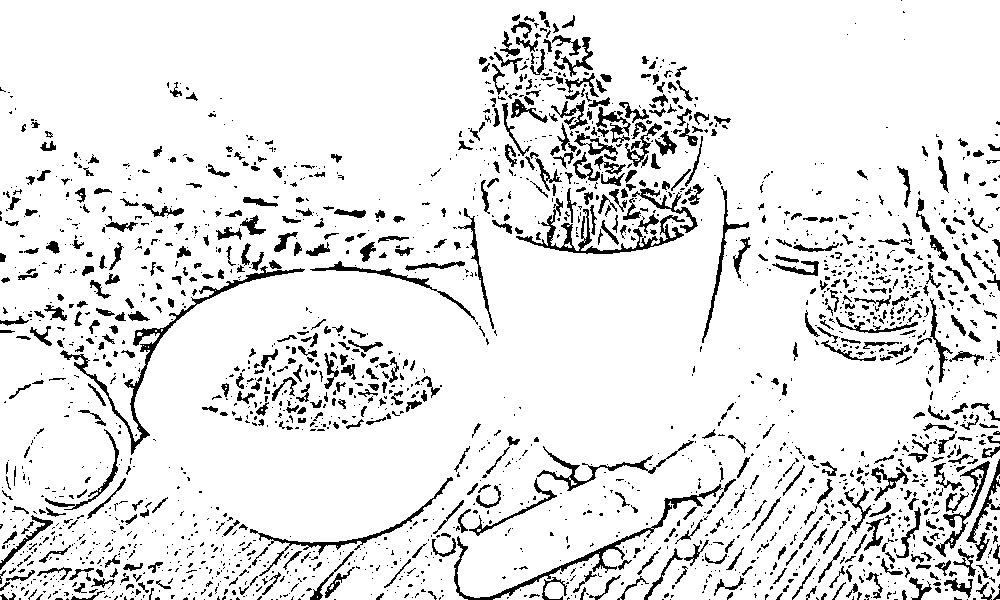

**自然疗法**人们常常问，自然疗法和顺势疗法有何区别。**顺势疗法就像是专科医生，而自然疗法是博通之才。**自然疗法是兼收并蓄的方法，汲取自各种疗法。起初，自然疗法使用“无毒害”的生活方式，比如节食，锻炼，清新的空气，纯净的水，阳光和按摩。如今，它又包括了其他疗法，比如草药、顺势疗法、营养补充剂、花疗、能量疗法、芳香疗法等等。每一位自然疗法医师都有自己偏爱的治疗方法。

**相似之处**

接受过顺势疗法的入门培训的自然疗法治疗师，可以为急性单纯的症状或急救情况开具顺势疗法药品的处方。除非他们进一步研习顺势疗法，否则自然疗法医师并不具备以顺势疗法治疗长期或慢性病症的资格。

**不同之处**

在澳大利亚，一位自然疗法的医师在为期三年的全日制课程中会博览众疗法但都浅尝辄止（四年学期可以获得学士学位）。一位顺势疗法的学生在三年的全日制课程中只学习顺势疗法和相关课程（四年学期可以获得学士学位）。你的顺势疗法医师资质可以用顺势疗法治疗所有急性和慢性的疾病，而你的自然疗法医师则不可以。

澳大利亚顺势疗法协会（Australian Homeopathic Association，AHA）和澳大利亚注册顺势疗法治疗师（Australian Register of Homeopaths，AROH）只接受政府认可的顺势疗法执业者资质或学历。这些机构从业者可以直接联系或通过网络联系。

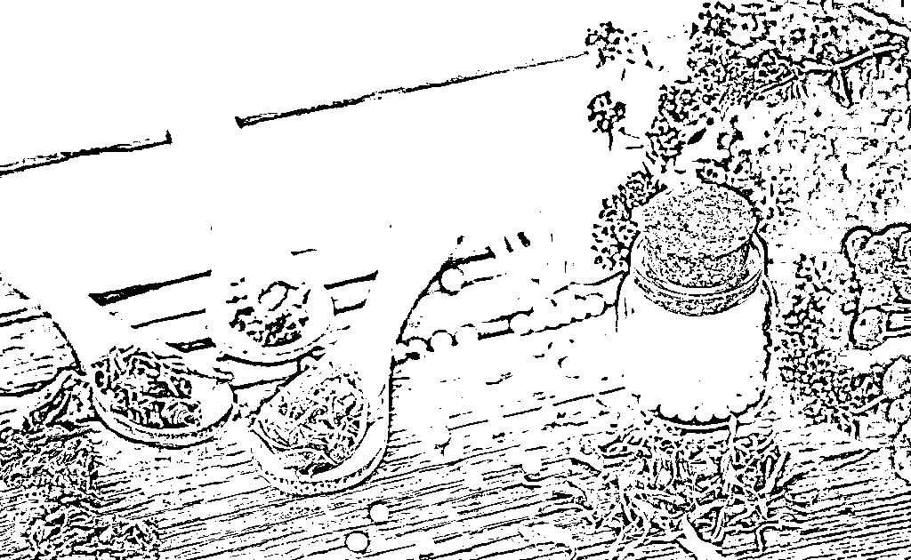

**虽然以上这些治疗方法都有其自身的实用性，但都没有顺势疗法的广度和深度。**有一些只专注于精神和情绪问题，有一些只是治疗身体。大部分疗法只是起到缓和或压制的作用，而有一些，比如草药疗法偶尔能够意外获得顺势疗法的疗效。

相比之下，**顺势疗法可以系统地作用于深层能量水平，疗愈精神、情绪和身体的非健康症状。**它的治疗是无毒的，不会与其他药物发生反应，味道好。每个人，任何一个人都可以使用。顺势疗法真正是一种不可思议的医疗体系。

****请在后台回复 顺势 获得更多****关于顺势疗法内容********

**版权声明：**本文由若道翻译发布，欢迎转发，反对抄袭。友号转载请申请白名单。

**学习顺势疗法**

**请点击下图了解详情**

**微信又双叒叕改版啦，不想错过若道君的推送？**

**就把若道设为星标吧！**

**▼**

就是这个“在看”，戳戳戳 ☟

********报名直达入口********

# 《三十而已》大结局 | 愿每一个我们，都保有“而已”的勇气

> 原文：[`mp.weixin.qq.com/s?__biz=MzA5NjA0NTAxNg==&mid=2651424256&idx=1&sn=a64b1212b4a55c38fb31b585d1ed93e8&chksm=8b4b34b7bc3cbda12e84af580d6c0e5da8851590a82298268d7e8ae5cb56c948b9b290f1e67e&scene=126&sessionid=1692738126#rd`](http://mp.weixin.qq.com/s?__biz=MzA5NjA0NTAxNg==&mid=2651424256&idx=1&sn=a64b1212b4a55c38fb31b585d1ed93e8&chksm=8b4b34b7bc3cbda12e84af580d6c0e5da8851590a82298268d7e8ae5cb56c948b9b290f1e67e&scene=126&sessionid=1692738126#rd)

** 后台回复“今日”，给你一句生命态度 **

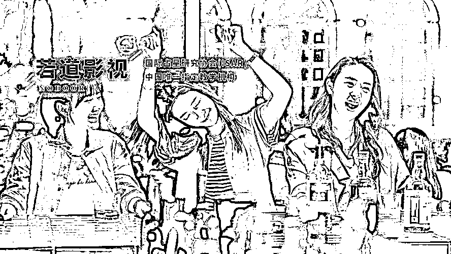

作者/编辑/玫瑰 图片/《三十而已》官方微博 网络

电视剧《三十而已》在 2020 年的夏天掀起了一股收视热浪。人到三十，正是传说中的第一次“土星回归”——土星在星图上走了一圈后，又回到出生时的位置。无法逃脱的恐惧、四处碰壁的绝望、铺天盖地的压力、劳而无获的委屈……就像剧中的三个女主角，一夜之间，失去了婚姻、财富、地位，甚至失去了信任、尊严和希望。触到冰冷残酷的现实世界，才发现原来自己并非无所不能，回看曾经的意气风发，落差不言而喻。然而，三个女主角并非靠着运气和松散挥霍掉了人生前 30 年，一出生便带着天王星、海王星、土星摩羯座能量的她们兢兢业业，按部就班，命运却并未因此放她们一马。不由令看官无语问苍天：这么努力，这么优秀的人，依然在土星面前铩羽而归，行星真的是来“伤害”我们的吗？
**30 岁集中爆发的人生课题**我曾听过一个故事，一个女孩子在大街上丢了钱包。回到家，她对妈妈说：“这是宇宙在告诉我，我需要去做更多善事。”这个故事告诉我们的，正是你在 30 岁需要做的——**校准同现实世界之间的落差。**很多时候，我们努力为之搏命的，并非真正想要的，而是掺杂了太多社会的限制和别人的期许。真正需要的同以为自己“想要”的，也根本不是同一样事情。30 岁难就难在**将父母、社会灌输给我们的规则的条框打破，重新找回自己**。这意味着**不只需要锲而不舍的努力，更要拥有“推翻”的勇气，和“找到航道”的智慧**。30 岁的土星除了制造狼狈、失败，求而不得，更多的是帮助我们——**找到真正想要撬动的，真正在乎和承担的，建立同这个世界真实的承诺。**

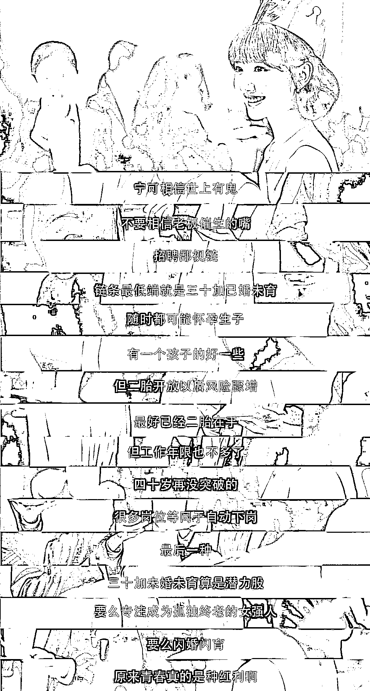

| 30 岁女性面临的“招聘鄙视链”
出生星图中的土星，镌刻着**权威（父母、祖父母）所设立的条框**。我们无一幸免被框进这个框架。土星带来看似安全的稳定架构。钟晓芹的妈妈告诫她，女人到了年纪就要结婚；王漫妮的父母一直催她回老家，迫不及待安排相亲，认为公务员主任是她需要“高攀”的不二人选；顾佳的父亲非要去养老院，不想给女儿“添麻烦”……
那一代的父母大多如此。这是她们能给孩子最靠谱的爱法——“土星摩羯座”的爱，这份爱让孩子们因为土星摩羯座的权威感而不得不遵从。可是，稳定必然会被“推翻”。占星界泰斗诺·泰尔在他的太阳弧技法理论中提到，**土星回归时，个人星图中所有关于天王星、海王星、冥王星的议题都会集中引爆**。这是一次绝好的机会，让我们**将所有仰赖他人之时被植入的彻底清理**。30 岁是引信，点燃内化的伤痕。是危险而瞬间绽放的烟花，还是长久热烈的未来？端看你是否有勇气和智慧，安静地聆听宇宙传递给我们的声音。这些声音，来自出生星图中的行星、南北交点。组合起来，便成了成长之路。**30 岁的她们**《三十而已》开机于 2019 年 7 月，不妨将这三位主角的出生年份回溯到 30 年前——1989 年。在剧中，钟晓芹是 7 月出生的太阳巨蟹座，可以推测她的金星落在狮子座；顾佳是 8 月出生的太阳狮子座，太阳同冥王星在星座角度形成四分关系，且同南北交点在星座角度形成 T 三角关系；王漫妮的太阳在天秤座，同土星摩羯座形成星座角度的四分关系。本文对于三位主角星图的分析，主要依据不同行星原型特征。抛砖引玉，也欢迎读者们提出自己的观点。**01**

**钟晓芹**

钟晓芹**太阳巨蟹座，温柔、善于忍耐、热爱孩子、期待温情；金星狮子座，需要追捧、夸赞，在爱情中需要如火的热情和行动。**钟晓芹的前 30 年无功无过，被母亲推着和陈屿结婚，做着别人认为好的工作，像个孩子，没有主见，更谈不上自己的人生目标和方向。土星在她太阳的对面，在星座角度形成对分相。

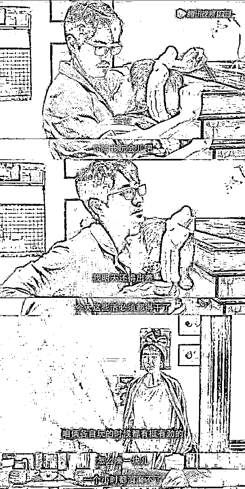

| 遭遇土星回归的钟晓芹对婚姻生活的乏味沉闷感到厌倦对分相代表**关系**，钟晓芹是三个人中最“成功”将土星能量投射到丈夫身上的人：陈屿老实却毫无情趣，活脱脱土星直男的代表。晓芹认为陈屿理性、冷漠、不解风情，在妻子需要关爱的时候总是冷冰冰地拒绝……这样的婚姻于不懂拒绝的钟晓芹而言，尚可忍耐。然而，30 岁时，行进土星必然对分钟晓芹代表活力、自我意志的太阳。**土星让人无法假装一切都好。**代表她生命中男性力量的丈夫也在这一年遭遇事业滑铁卢。

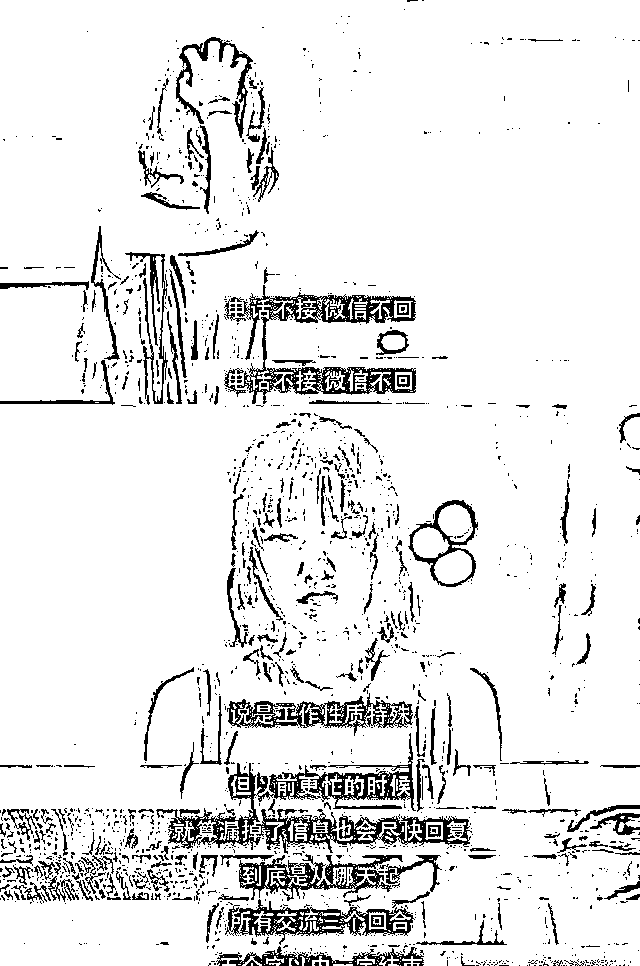  

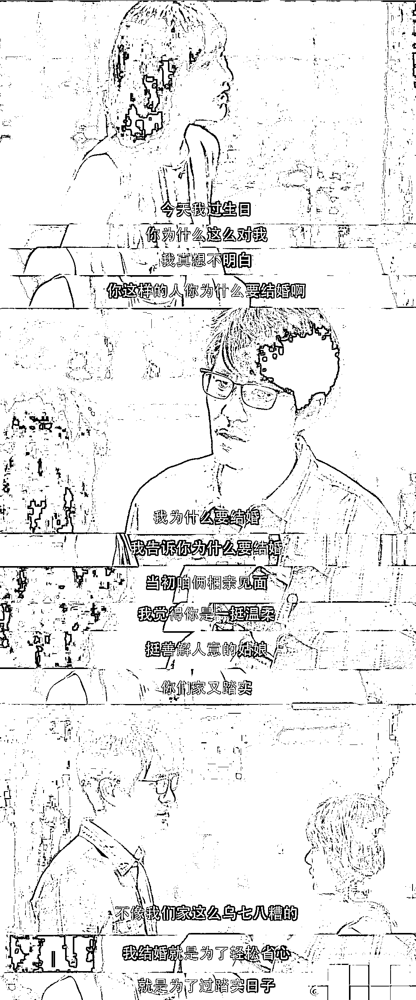

| 满是土星能量的陈屿表示，结婚只是为了省心，过“踏实日子”30 岁生日那天，第一次穿得 bling bling 的她，拿积蓄赎出了陈屿的弟弟，却被工作为重（摩羯座）的陈屿再一次放鸽子，在大雨中狼狈不堪。落魄的金星狮子座，得不到关爱的太阳巨蟹座，终于说出了离婚。被命运逼到退无可退，真正看到无以为继的现实，才能探寻土星对面的太阳以及金星真实的需求：**我要怎样的爱情？我想成为怎样的人？**

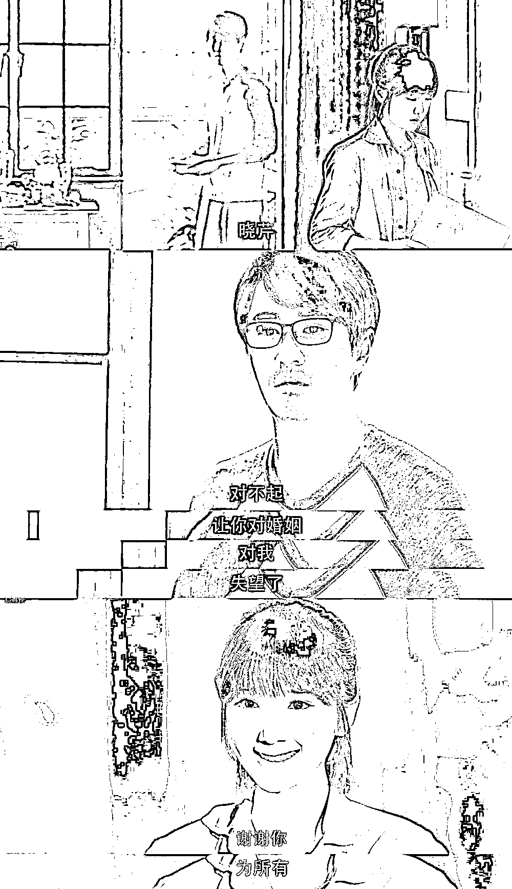

 | 冲动下离婚的陈屿和钟晓芹才开始彼此理解和感谢钟晓芹的月亮南交点在狮子座，北交点水瓶座。当狮子座的傲娇碎一地，水瓶座的自由必然向她召唤。离婚是为了自由，一个年轻、开摩托、带她各种玩耍各种狂狼的“弟弟”在这段时间满足了她从现实中抽离的需求。也带着她在狮子座-水瓶座之间穿梭。渴望热情的钟晓芹却发现自己无福消受：被动而害羞的她对于过度的热情第一反应不是欣喜，反而是怀疑。当钟晓阳和当时的她一样，面对自己繁重的工作仍旧连环 call 的时候，她才理解陈屿默默为这个家付出的一切。**土星摩羯座的隐忍中包含着实打实的爱**——对于一个孩子一般长不大的她（巨蟹座），默默处理琐碎而消磨了所有浪漫的土星，却是钟晓芹恐惧时第一个想要联系的人。陈屿是她生命的基石。**稳如磐石，是摩羯座的爱情表白。**

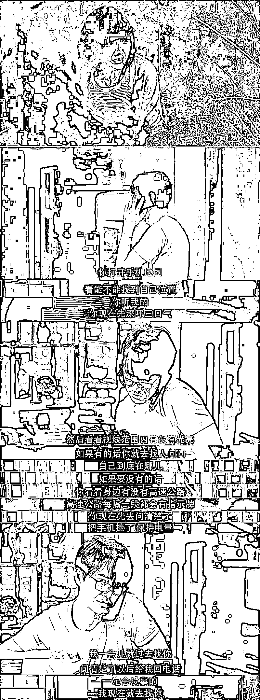

 | 在崇明岛荒野里惊恐不安的钟晓芹，第一个想到的还是打电话给陈屿

**人要站在关系的对面角色中，才能真正理解对方，发展出属于巨蟹座的共情。**金星狮子座需要发展的，不是浮夸的赞美和热情，而是慷慨和真正的爱护。于是，复婚后的钟晓芹为陈屿的妈妈买下了民宿，曾经流产的小岛也再次回到她腹中——真正完成了孩子到母亲的转化，一个成熟的巨蟹座才能成为优秀的妻子和妈妈。**人的勇敢，在敢于第二次面对曾经摔过的坑。**在这里，我们看到了南交狮子座的勇气，和北交水瓶座的突破。太阳巨蟹座的钟晓芹或许不能像另两位一样“独立”。但是，她在自己的航道上找回了经营关系和爱的能力，这对她个人而言，就是一种踏踏实实的成长。

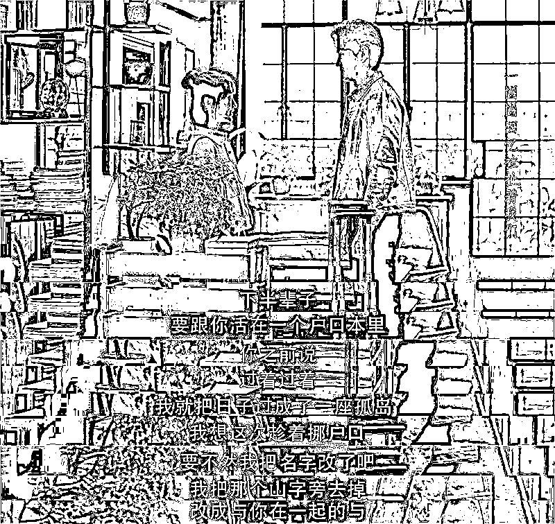

| 重新“爱”上的两个人，真正理解了婚姻的意义——与你在一起钟晓芹的结局并非"天上掉馅饼"，而是木星双子座的恩赐——曾经的工作除了**和业主、客户沟通**，便是**多线程，处理突发问题的能力**，这些也都是双子座所擅长的。陈屿从事**记者**工作，也同双子座相关。木星守护射手座，当木星落在射手座对面的双子座，意味着一个人要**通过双子座的琐碎、短浅提炼出更为高远的目标和蓝图**。这个过程中，也许会面临物理距离上的迁移（异国、长距离远行），也可能是对于从前价值观、世界观的重建，人生体验的突破。最终，钟晓芹**通过写作成为畅销书作家**（双子座），并发现这才是她最想要做的事情。而她的书超越了小情爱，给大众传递了一种生活态度和价值观念（书名中的云朵，象征着更为高远的木星的视角）。之所以获得这样的恩赐，正如她自己所言：“有了家，一切都有了支撑和安全感。”上天没理由不奖励知道自己要什么，还有勇气去获得的人，不是么？**02**

**王漫妮**

王漫妮 30 岁的梦想是在上海买个房，或者找个有钱人嫁了。三个女主中，她对物质的渴求看似最为强烈。有人拼命努力，就为了事业上淋漓尽致的快感（土星摩羯座），有人花巨资升舱，就为钓上有钱人，晋升阶层（天秤座-摩羯座）；而她努力了 8 年，却因为一场失败的恋爱就跑回了老家；如愿找到财富自由的梁正贤，却又拒绝他给的资助。

为什么会如此拧巴？这就要从太阳在天秤座同土星摩羯座形成星座角度的四分关系说起。**太阳同土星的紧张关系使人有身份认同上的困难，以及“不自信”**。30 岁的王漫妮对于自己要成为怎样的人，其实是并不知道的。但她一定知道自己不想成为怎样的人——她努力留在上海，是为了逃避回到家乡的属于土星的禁锢感。与其说是需要留下，不如说是不得不留下。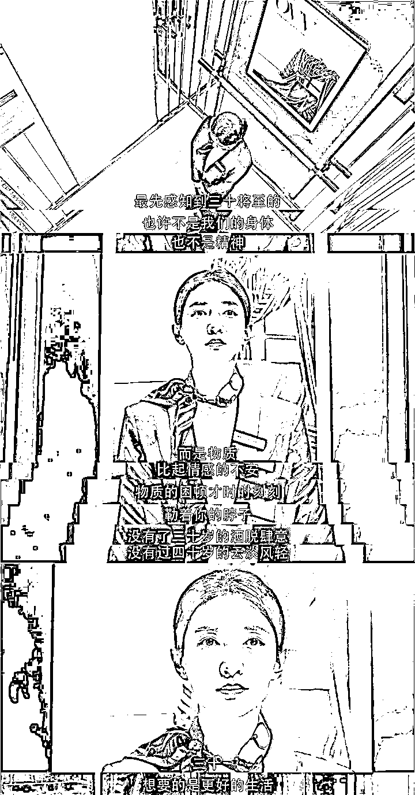| 王漫妮一语道出 30 岁的土星压力——物质土星的功课并不是对抗便能挣脱。看似自由了的王漫妮在上海依旧活得干干巴巴：每天拼力工作，对自己极度苛刻，缺乏物质却又不愿胡乱委身。继续拧巴。**当一个人无法向宇宙呼唤真正的想要时，做再多的努力都只是徒劳。**一再的失败也是让这个倔强的女孩儿明白：亲爱的，你的方向错了。于是，命运为她安排了一场局。在行政舱遇到梁正贤，海王星的大幕拉开。梁正贤满足了她所有的幻想：奢华（天秤座、南交点狮子座）、脱轨（北交点水瓶座）、海洋、红酒、浪漫（海王星）。然而，日土人尚存一丝理智。“发生在船上的事，就该留在船上。”理性如她，却在梁正贤追到上海，出现在她熟悉的环境之后，立刻投入梁的怀抱。然而，面对如此优秀的男人，她的不自信再也没法隐藏：一再怀疑、试探，找人查证他是否真的未婚；在任何他带她去的场所，她都像个怯懦的局外人，努力试图融入。如果南交点狮子座在她身上有过呈现，也仅仅停留在“奢侈品牌店替人守柜门的“。她无法成为一个真正傲娇、自由、独立的女人，即便找了有钱的男朋友，也对每一分他的投入如履薄冰，看似守着自己一点骄傲的自尊，实则敏感而脆弱的背后，是**“我不配”**。

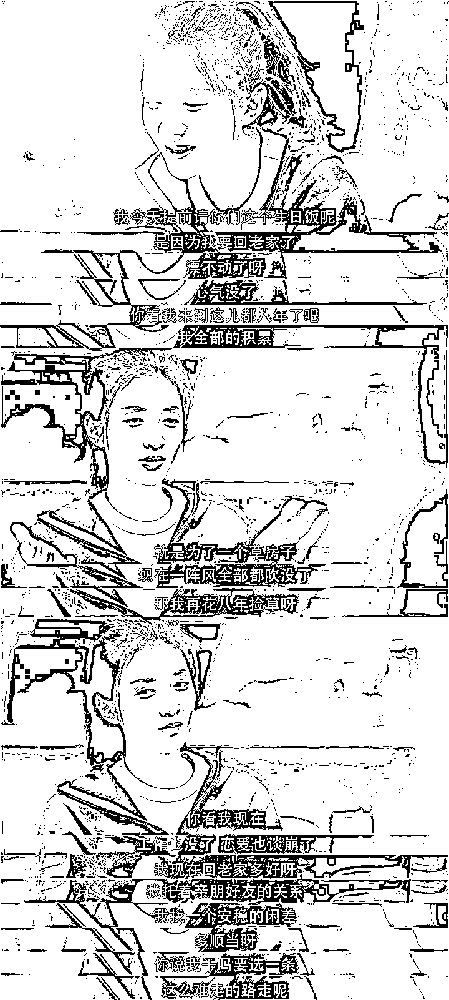

|王漫妮想要“看得见、摸的着的东西”，她对梁正贤说：“我想要谈正常的恋爱，稳定的关系，我不要一开始，就带着卑微和委屈。”也正是她这种急迫的追求稳定感，才给了梁正贤欺骗她的机会。也让她明知对方不婚，依旧无法放弃，一再退让自己的底线。

有多少"王漫妮们"，容颜姣好，有机会到大城市拼搏，骨子里仍旧是土星的保守、传统思想：都“那个”了，就一定要有个名分；既然是男女朋友，就一定要结婚。正如她对梁正贤说的：“这个年纪的人，想要的就是看得见，摸得着的东西。”她们**渴望金钱、晋级（天秤座、摩羯座），却又有自己想要恪守的底线（土星）。**王漫妮为何会输得如此之惨？因为那份深埋在血液中，即便在上海打拼 8 年也没有被打破的“不配得”。**当一个人无法真正相信自己可以驾驭什么，她便无法真正获得。**

📹 [`v.qq.com/iframe/preview.html?width=500&height=375&auto=0&vid=g3127km2tsr`](https://v.qq.com/iframe/preview.html?width=500&height=375&auto=0&vid=g3127km2tsr)

 | 王漫妮辞职后的内心独白这一场海王星的剧情，让王漫妮在规则和底线的刚硬中不知不觉坠入无形的网，让之前她忍辱负重维护的一切一场空，让她没法再在这条路上一意孤行，将她打回原形，不得不放弃同父母的对抗，回到小镇。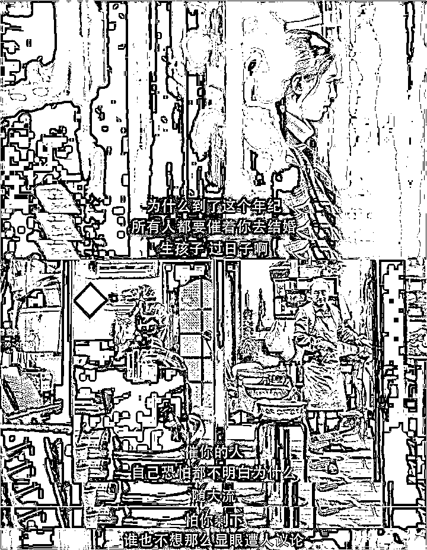 | 在小镇，王漫妮看到了自己真正想要的人生小镇看似浓厚的亲情背后，是将关系变做最方便的笼络交易手段。王漫妮没法留在家乡，她不能让自己像个物品一样，被恩情交换成别人的结婚对象。然而，她也明白了，即便不愿意承认，自己之所以想要嫁个有钱人，又何尝不是青春和肉体的交换？**土星所有的努力，是为了更高的”信“。**王漫妮想要的，并不是金钱、地位，甚至不是一个结婚对象，而是属于高八度金星——海王星**真正的爱与包容**。然而，天秤座-摩羯座对于爱情的理解是”以物易物“的公平以及现实感。你付出多少，我也回报多少，我为你买一个皮包，只是为了让你拿着它，测试是否只属于我一个人。在爱别人之前，她得先成为一个**善待、认可自己的，真正有底气的人。**重回上海的王漫妮，在种种困难中完成了工作任务，要的却再不是认可、晋升，甚至爱情。曾经的王漫妮，说自己不需要一个在她身后的男人，而是要一个在前面引领她的男人；而今的她，**不再将土星投射到有身份、地位的男性身上去引领自己**。戒掉了最“美”却又最虚空的爱情毒瘾，就像迷雾中的海燕找到了阳光。**她不需要男人来提携自己，她自己便是自己最好的指路人。**

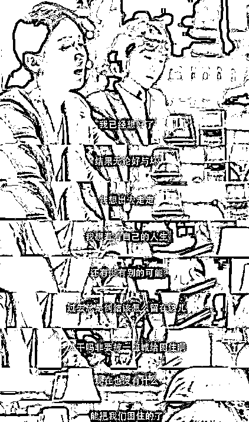

| 不再被困住，是土星功课的突破土星的功课，正如王漫妮的“贵人”（土星摩羯座）所说：“安排了完不成的任务，却帮助她找到了自信。”**土星的“桎梏”，是为了让我们脚踏实地地打磨出真正的信心，带着这份能力再去寻找人生各种可能性**。从囿于方寸柜台到留学深造，信心和能力是比钱更重要的底气。**03**

**顾佳**

 顾佳的故事很“老套”。同年少相识的丈夫一起打拼创业，人到中年，也有过富贵时光，为人妻人母，却遭遇背叛。也正因为太老套了，不由得让看官忽略了这样的安排背后想要传递的，只顾着骂“小三”林有有，骂“渣男”许幻山，同时也怪顾佳“太完美”。

因为我们都想看到一个幸福的家庭，不愿意任其以如此不堪的方式破碎。然而，我却要感谢“渣男渣女”，如若不是她们，以顾佳之个性，怕是到第二个土星回归也未必真的能去争取自己想要的。土星教会我们一个道理：**“塞翁失马，焉知非福。”**在土星横扫的地方，一定会有现实层面的失去，无论是金钱、关系、地位、还是生命。而**失去未必就是坏事。****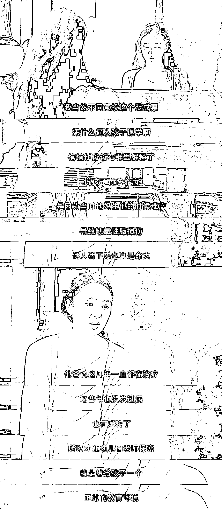** | 在利益群体中仍旧保持着正义的顾佳正如茶厂负责人说的：“每一株茶树都需要修剪，尤其是那些努劲儿长的，就得狠狠地修剪，这样才能让养分和力量集中到该去的地方。”现代已婚女性，最需要去做的，似乎便是事业家庭双丰收。这一点上，顾佳非常努力。刚出场的她，替老公摆平了甲方后，立刻收拾潜在“绿茶”；老公脂肪肝，她跟着不吃晚饭；大客户岌岌可危，她出面搞定，面对对方咸猪手，义正辞严打退，顺便收拾了幼儿园里搞腐败的家委会会长。正所谓“出得厅堂，入得厨房，抓得住小三，斗得过色狼”。

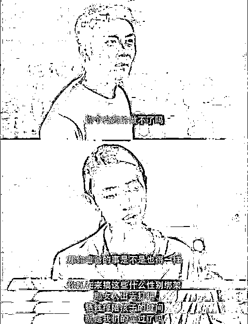

| 顾佳想要开创茶厂事业而同丈夫发生激烈争执。许幻山的大男子主义，仍旧希望顾佳“围着他转”

有很多文章分析，这正是她的问题。如果不是这样一手包办，也许许幻山不会出轨。我只能“呵呵”，正如王漫妮对许幻山说的：**“把妻子的完美当出轨理由的男人，会不会太低级了？”**男人要出轨，是怎样都不可能阻止的。与其揣摩另一人的心思，学习各种招数，试图令他不出轨，更需要看到的，是“被出轨”这件事让我们学习到什么？

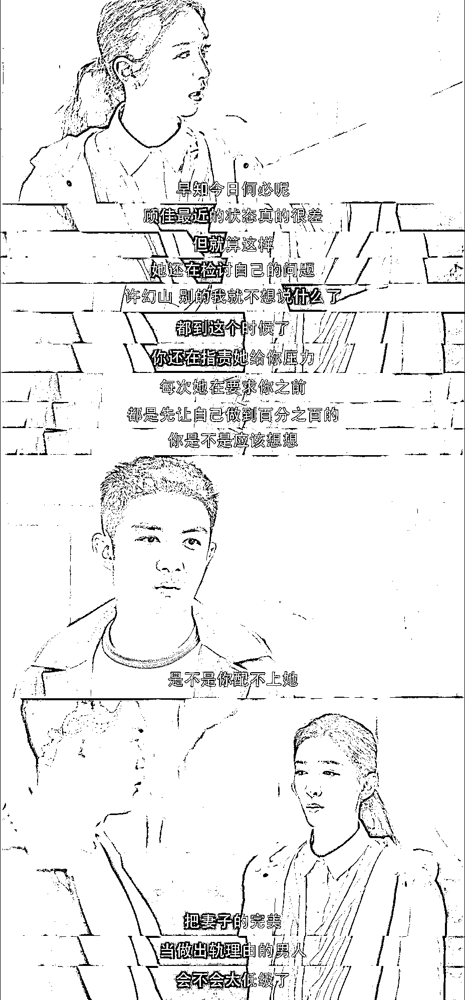

| 许幻山出轨为自己找借口，被王漫妮驳斥顾佳的太阳、南交点在狮子座，北交点在水瓶座，冥王星在天蝎座，从星座角度形成了 T 三角格局。T 三角像一张弓，要从南交点走向北交点的进化之路，顶端的冥王星是突破口，而冥王星的把戏，顾佳一样一样都经历了。顾佳有着南交狮子座的负面特质：**浮夸**。30 岁能住浦江边豪宅，已是“额头顶到天花板”。可她还想要更好，更有钱。把孩子往她认为最棒的幼儿园塞。这不是“顾佳们”的错，是当下土星带给我们所有人的生存法则——身在上海，进入这个阶层，就会身不由己被成功学推着向王太太们靠拢，向鸡娃靠拢，更何况一个连莫奈和梵高都分不清的人都能住顶层复式，努力优秀如顾佳，自然不甘落后。三个女主角中，顾佳是最具有“搏女王”潜质的，在 30 岁这个年纪，她有这样的野心，不足为怪。然而，在这个过程里，她不断地向自己的北交点挑战：**水瓶座代表着集体、圈子、归属**。开始的顾佳有两个选择：幼儿园家委会圈子，以及太太圈。而在南北交点转化这一路上，冥王星天蝎座不断出来作祟：家委会圈子资源争夺、暗箱操作、霸凌……顾佳在送孩子进幼儿园的过程里，也用到了不少冥王星的方式；太太圈更不必说，看起来是个水瓶座的慈善仁爱组织，内部充满着尔虞我诈、争名夺利、互相倾轧，甚至联合起来的做局。

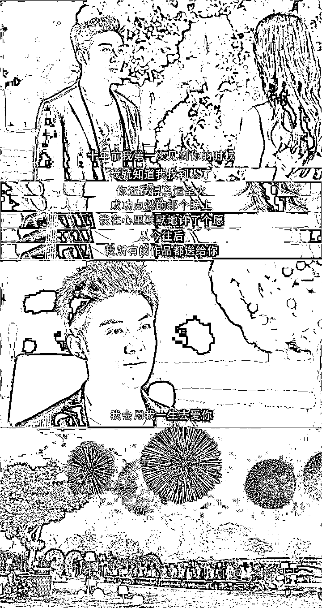

| 顾佳对许幻山说：“要是当时我没打开车窗玩，我妈就不会生病，也许我们一家三口，还能幸福好几年。所以也是幸福的时候我就越害怕，我就好怕因为那几件小事，让美好都破灭了。”也许，30 岁这个美好到梦幻的生日，正是破灭的开始。

冥王星在顾佳的成长之路上是必须经过的。**没有这些陷阱、背叛和黑暗，她很难看到真实的自己，更谈不上明白自己真正的需求。**破解冥王星，最重要的是**真实**。顾佳以为自己无比坦荡，无比诚恳，却仍旧有一些无意识的内在阴暗面令她数次马失前蹄，直至遭遇至亲之人的背叛。而这些阴暗面最根源的部分，无非一个**“贪”**字。贪图更好的房子、更高的地位、更多的资源；贪图站在太太圈 C 位；贪图孩子更好的教育；贪图和伴侣最完美、最持久的关系……**当这些美好的需求变成了贪欲，人便认同且陷入利益纷争、利益交换，最终毁掉的，只能是自己的人生。**那么，这是顾佳的错么？我并不这样看。相反，我非常钦佩在面对这一系列事情中顾佳的所作所为。一个被冥王星碰到的人，在黑暗边缘徘徊是必然的，这个过程里，她**不断挖掘内心深处的黑暗，换之以磊落。**

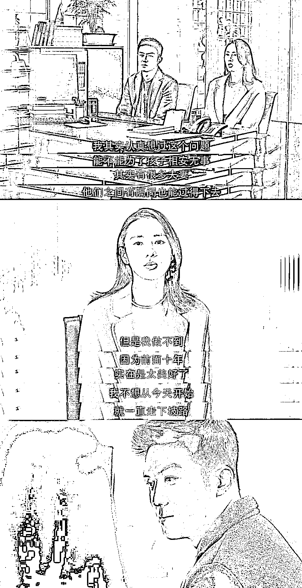

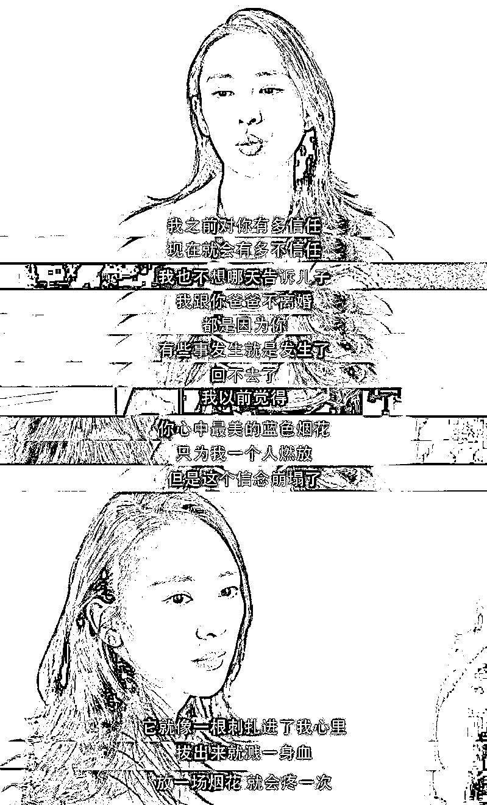

| 破灭之后，才能看到真相，看到自己的伤痕在幼儿园试图排挤癫痫同学退学时仗义执言；面对性骚扰的大客户时果断解约；被太太圈坑了之后勇敢地为自己的错误买单，接手茶厂；遭遇背叛，撕心裂肺之后，依旧收拾残局，将自己的内心同对方和盘托出……人这一生，总得走进黑暗，然而，能从黑暗里走了一遭，出来更明亮，更通透的，顾佳算一个。仔细想来，如果没有她的“贪”，顾佳不会被“坑”得这么惨。那么，她将仍旧是守着摇摇欲坠的婚姻、蠢蠢欲动的老公、岌岌可危的烟花公司、负债累累地住着大房子的“完美太太”。**没有极致的力量将她推下命运的高塔，又怎能真正放弃浮华的一切，找到内心真正的归属？（水瓶座）**顾佳的人生看似是最失败的，在个人成长角度，却是最成功的。她赢得了真心，当茶厂负责人把全村人凑起来的 1 万多块一大包硬塞到她怀里时，那是属于水瓶座的，真正的**信任、联结和财富**。**愿你我都保有“而已“的勇气**

**“我做了太久别人的老婆，别人的妈妈，别人的女儿，我现在只想做回我自己。**

**——顾佳”****“有时候跑道越清晰，越会束缚自己。我干吗非要着急给自己选一条路，定下来呢？****——王漫妮“****“最起码你有可以重新开始的勇气，强过大多数人。****——钟晓芹”**

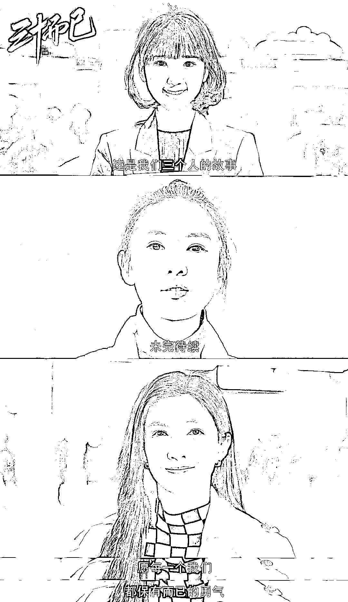

我们都曾经是她们，怀揣着对这个世界美好的梦想，捧着自己的心兴冲冲地飞奔。然后遇到什么人，什么事，一颗心掉在地上摔得稀碎。我们都曾在深夜痛哭，为什么？凭什么？为什么我那么努力却得不到自己想要的？凭什么别人会抢走我最爱的一切？我们都曾如此恐惧，恐惧因为自己的一个不小心，搞砸了事业，搞砸了家庭，搞砸了人生；我们都曾自责，如果当初，可以再忍耐一点点，努力一点点，结局是否会不同……然而，我们也都会站在下一个 40 岁、50 岁、60 岁的路口，看到 30 岁那个狼狈不堪的自己，趴下，再站起来。希望所有的女孩子们能够在命运的“黑手”扼住喉咙之时，想一想，这些“磨难”是否因为你的执著却令自己离真正想要的越来越远？三十，而已，未来，待续。**对《三十而已》，你有怎样的见解？又有怎样的故事同我们分享？留言区等你哦。**

**版权声明：**原创文章由作者授权首发于若道平台，欢迎转发，反对抄袭。友号转载请申请白名单。

****

****想阅读更多作者的文章****

****请在后台回复******玫瑰****** 即可****

**玫瑰**

英国 Cass Business School 管理学硕士

若道 2015 届核心课程毕业生，若道微信公众号兼职编辑

占星师，咨询时长超过 600 小时

**个人微信号：**Still_Queen_Astro

**公众号**：一个娘娘 

长按二维码，给作者打赏

**系统学习现代卜卦占星学**

**点击图片了解详情**

**微信又双叒叕改版啦，不想错过若道君的推送？**

**就把若道设为星标吧！**

**▼**

就是这个“在看”，戳戳戳 ☟

********报名直达入口********

# 免费 | 8 月经世占星公开课：占星学与中国历史研究（有福利）

> 原文：[`mp.weixin.qq.com/s?__biz=MzA5NjA0NTAxNg==&mid=2651424256&idx=2&sn=2f13fd2feee184b27957725dc9d38c42&chksm=8b4b34b7bc3cbda1f93eefdd96de76c64408140a4f23dd8fde58108e0c5d510b37d000a6795a&scene=126&sessionid=1692738126#rd`](http://mp.weixin.qq.com/s?__biz=MzA5NjA0NTAxNg==&mid=2651424256&idx=2&sn=2f13fd2feee184b27957725dc9d38c42&chksm=8b4b34b7bc3cbda1f93eefdd96de76c64408140a4f23dd8fde58108e0c5d510b37d000a6795a&scene=126&sessionid=1692738126#rd)

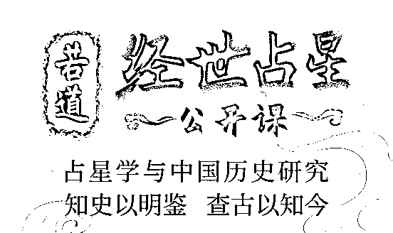

**什么是经世占星学？****经世占星学（mundane astrology）是研究世界政治经济发展趋势和世界各国发展周期的占星学研究分支。**任何有一些人生阅历，对于国家历史、家族历史有所了解的人都会明白，我们的个人生活是时代和国家历史的缩影。我们个人经历的行进、推进是一条小溪，而更大的背景是世界和国家行进、推进的大河。大河的流向决定了小溪的流向。学习经世占星学，**帮助我们及我们的客户这条小溪在这个世界的大江大河“顺势而为”**。2020 年**卡伦·哈梅克·佐达格老师**为若道学员带了《ISAR 选修课经世占星学》课程，教授了经世占星的研究理论，国际案例分享，帮助学习了这门课程的学员解锁了全新大格局的占星版图。**从占星学习到经世研究**若道占星一直致力于培养专业、可信赖的占星师，更希望挖掘严谨、肯钻研的占星学者。在经世占星学课程中，若道组织了**《经世占星学与中国历史研究小组》**，发起研究小组的初衷有三：**1.** 很多国家在经世占星学中的案例都非常精妙传神，中国历史源远流长，经世占星学研究却相对空白；2. Karen 老师作为经世占星血的顶级大师，首次在中国开课，这 10 周的课程是中国经世占星学子们获得明师指导的难逢之机；3. 若道的助教们组织发起关于中国重要历史时期或事件的占星学研究，带领同学们边学边用，以实战方式掌握经世占星学的解读与研究方法。经过 3 个月的学习研究，4 个小组完成了 6 个选题的成果汇报。于是有了这次 **“8 月经世占星学若道公开课：占星学与中国历史研究”**，邀请**4**位经世占星学的优秀学员带来**4 场**经世小组研究分享，希望这**4 场分享**给喜欢占星学和喜欢中国历史的你带来新的视角和启发。

**-第***1 ***场-**

  **-第** *2* **场-**

**-第** *3* **场-**

**-第** *4* **场-**

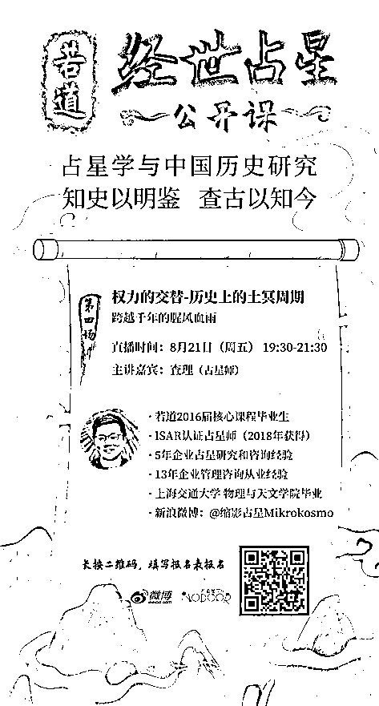

**如何参加活动？**

**长按上方任意一张海报，识别二维码，填写报名表即默认报名 4 场沙龙。**

**可根据自己的需求选择收听场次。填写报名表即可添加客服哦。**

**下载若道 APP**

**免费回看若道公开课**

**“经典回顾” 14 场沙龙免费听！**

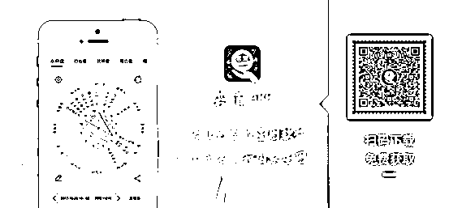

# 8 月 15 日狮子月沙龙 | 太阳和他守护的狮子座

> 原文：[`mp.weixin.qq.com/s?__biz=MzA5NjA0NTAxNg==&mid=2651424256&idx=3&sn=1070d9a518bb554d26a692cc1ad97a97&chksm=8b4b34b7bc3cbda1fc0920d932c2da49591896802d3e0548f4fe4ae7270a408b01d6103407d4&scene=126&sessionid=1692738126#rd`](http://mp.weixin.qq.com/s?__biz=MzA5NjA0NTAxNg==&mid=2651424256&idx=3&sn=1070d9a518bb554d26a692cc1ad97a97&chksm=8b4b34b7bc3cbda1fc0920d932c2da49591896802d3e0548f4fe4ae7270a408b01d6103407d4&scene=126&sessionid=1692738126#rd)

“即将结束在甘肃的一场溯源之旅时，我窝在兰州修整疲惫的身体，着笔写此次沙龙的发布稿。也是在这样的旅行中，让我再次加深我对自己太阳射手座落 9 宫的认知与思考：我们每个人要如何活出自己的太阳？如何活出自己生命中的活力、热情与快乐？如何成就自己的荣耀与自信，完成每个个体生命的英雄之旅？在这个群体意志大于个体意志的大环境下，自我意志如何发展？在这个困境重重的 2020 年，在这个人人忙于突破重围的 2020 年下半场，如何运用我们的太阳度过这个多事之秋，让我们活得依然快乐，或者坚韧却荣耀、踏实且自信？因此，与以往不同的是，这个星座主题系列的沙龙开讲到“狮子座”时，我要先讲太阳，再讲太阳守护的狮子座。因为，我们每个人都是自己的王者，我们每个人都想活出王者的荣耀，每个人的内心都有一个“狮子王”。无论你是太阳狮子座，还是太阳处女座.....所以，欢迎来参加一次太阳聚会般的快乐分享，在狮子座新月即将到来的 8 月 15 日，我们来看看，在行进的火星白羊座强烈推动下，在土星摩羯座设置的阻力与慎重提醒下，狮子座们和每一个太阳星座们，如何在自己的人生舞台上再奏凯歌。两小时的沙龙：我会先介绍太阳，让大家认识自己的太阳：太阳的内涵与存在对我们每个人而言意味着什么，又指向了什么。我也会继续在群里和大家交流，并在沙龙中分享点评同学们对自己太阳落座的理解与认识。和以往一样，我会介绍狮子座，也会介绍狮子座和他的朋友们，会将同学群里的狮子座们调动起来，让他们积极分享，并在沙龙中展示他们的精彩。8 月 15 日，太阳/狮子座盛会！——滴答**”****参与方式****活动时间****：2020 年 8 月 15 日 19:30-21:30****活动费用****：直播免费（视频回放需单独付费）**

**人数限制****：300 人（报满即止）**

**沙龙地点****：线上直播**

**参与方式****：报名成功后，请添加客服微信（微信号：nodoorDaivd），获取线上直播地址**

**长按下图二维码报名**

**注意事项****Q：我如果报名参加此次活动，有什么注意事项吗？**
**①** 报名后务必添加客服微信（nodoorDaivd）获取入群方式；**②** 登录直播平台时，请用报名时提交的用户名登录，登录名称不匹配将会被请出直播平台； 

**③** 直播期间请确保有一个较为稳定的网络环境，以保证有一个较好的观看体验；

**④** 该直播如需回看视频，需另行付费，报名后，请准时参加。

**更多活动信息**

**请长按下方二维码联络客服**

**关于滴答老师**“

滴答老师是 ISAR 认证占星师，也是我在人生道路上的好友，她丰富的人生经历和对于内在诚挚，坚定的探索，对于中国道家，佛家修行的深入实践，面对无常而发展的智慧和勇气让她对占星学发展出深入而独特的理解。我很有幸在人生道路上有她相伴，也很有幸请她把对占星和人生的领悟分享给更多人。

**——若道创始人，蒋颖**

**”**

********报名直达入口********

# 若你也害怕给出爱的承诺，请找太阳、月亮、上升落在这个星座的爱人

> 原文：[`mp.weixin.qq.com/s?__biz=MzA5NjA0NTAxNg==&mid=2651424047&idx=1&sn=26d45c630151b2e226c9a7157b3a1d40&chksm=8b4b3798bc3cbe8e296b075c8eeaaf9ba0f18152fac8f7a6afe356e32b8f75e40b12fd2983e7&scene=126&sessionid=1692738126#rd`](http://mp.weixin.qq.com/s?__biz=MzA5NjA0NTAxNg==&mid=2651424047&idx=1&sn=26d45c630151b2e226c9a7157b3a1d40&chksm=8b4b3798bc3cbe8e296b075c8eeaaf9ba0f18152fac8f7a6afe356e32b8f75e40b12fd2983e7&scene=126&sessionid=1692738126#rd)

**********☆****************后台回复“今日”，给你一句生命态度**********

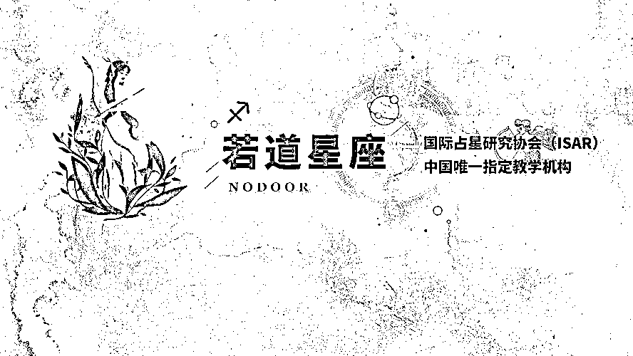

作者/斯蒂芬·弗里斯特 朱迪·弗里斯特 
译者/李含 编辑/玫瑰 图片来源/全景网本文摘自《天空的伴侣 I：爱、性和进化占星学》

射手座和爱情，似乎并没有太多直接的关联。难道和吉普赛人一样自由流浪不正是射手座更加需要的吗？所以，那些爱上射手座的人们，内心也有一匹难以蛰伏于柴米油盐的不羁之心么？问问自己吧。

**射手座****原型**  

**吉普赛人 朝圣者** 

**探险者 人类学家 哲学家 学者**

发展目标

生命对于射手座而言就是一场**彻头彻尾的探索之旅**。射手就是**探索者**。内在的驱动力会促使射手座人永无止息、永不间断地探索。要准确地定义射手座人的目标是什么？归根到底，就是**生命的真谛**。在进化占星学中，这个目标并不是个人必须觉悟到的。很多时候，呈现的是相反的情况。不管是意识层面，还是潜意识层面，根本的发展目标还是会驱动射手座人去追寻，这种驱动力解释了他们大部分行为的深层原因——有些行为看起来完全不可思议，毫无意义。

从射手座身上，我们可以看到一种灵魂追求进化的轨迹。首先，他们需要**专注于追寻更广阔的心智与意识的体验。**惯有的阻碍必须被打破，沉闷乏味的区域性现实视角必须被更全球化的视野所取代。形而上学的观点认为：在前世中，射手座意味着**对于进化的渴求被现实无情地打碎。所以，在这一世里，要强迫自己打破枷锁， 冲出牢笼。**策略和资源

去追寻生命的意义！这是不是一个唐吉柯德式的冒险？对于射手座人而言，这不成问题。生命的意义才是问题，亦或生命本就毫无意义。这就是射手座最主要的资源：他们坚信，**在随机的命运背后蕴藏着的宏大格局。**如何参透这个格局的奥妙呢？去体验，去探索！射手座有一种强烈的愿望，要**打破墨守陈规的僵化思考。**这就是射手座的策略。

没有充分的自由，就无法张开追寻的翅膀。所以，射手座比任何星座都要谨慎，他们**不会轻易做出承诺，交出主权**。批评射手座的人会把这种对于自由的热爱解读为**承诺恐惧症**。在个体分析上，这个也许正确，但是在更广泛地解读射手座时，我们必须认识到，**失去了自由，射手座的生命将会枯萎凋落**。很悲哀，但不得不面对，爱情通常很难建立在自由的基础上。阴影

但是爱情也有另一面：在人性的探索里，**爱情可以赋予一个人极大的自由和拓展**。人生的意义是什么？谁知道呢？但是，很多伟大的人文主义导师都认为，不论生命的意义是什么，都与**爱**有关。射手座的阴影：是他们很有可能**逃避真诚的关怀，这种真诚的关怀只有在我们抛开一切将彼此的命运绑在一起，不在乎结局如何时才会拥有。**

射手座人对于人生就像是石头滑过结冰的池塘，尽可能多地体验学习。就像歌里唱的：**“自由的代名词就是一无所有。”**对于射手座来说，**对真理的探索要比亲密的两性关系有更加广阔的天空。**认真读一本好书、领悟到的人生的意义，要比随便翻翻美国国会图书馆里任何一本宗卷获得的要多。辽阔的风景是美的，但**强烈的、专注的、负责任的态度，不论是对于在爱情中还是在图书馆里都是美好的。****射手座的爱情**太阳射手座的爱情

在爱情的国度里，射手座人是**言辞上的巨人，行动上的矮子**，这是名声在外的。这种让人沮丧的情况也不一定就无可避免，但是，射手座人要**放下对爱情的强迫性背叛行为，或者只是肤浅的感情接触，实则保持孤独的内心**。射手座人必须接受这种不可避免的理念，**不管多么充满活力的关系，也会有乏味的部分**。从另一方面看，这种**成熟爱情的灵魂冒险会带来丰富的成长经验。**

**思想理念**是射手座的强大驱动力，但是这些思想理念必须**令人信服，经得起实践的考验**。精神空洞的爱情不会让射手座人停留太久，体验过后就会觉得无味而放弃。另外，对于每一个太阳射手座的人来说，自由的确是进化所必需的途径。他们必须**选择和自己一样热爱自由的伴侣，有自己独立的兴趣和朋友圈，从不停下追逐的脚步，更重要的是，他不会幼稚地大肆嫉妒，安全感匮乏**。满足了这些要求，射手座人就能了解射手座的秘密：**如果可以与伴侣携手并肩，就能追求得更丰富、更深刻。****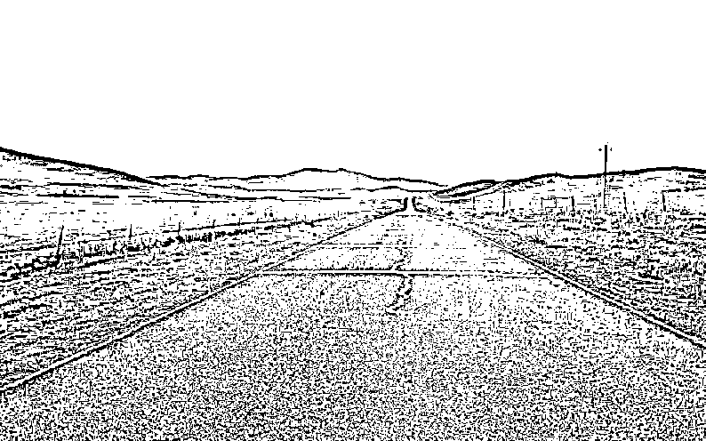**月亮射手座的爱情在亲密关系中，月亮射手座会有一些矛盾。月亮代表了支配性的需求，射手座的需要就是**“不需要有任何需要”**，至少会**很独立，不需要依附于任何人**。月亮射手座的男女与伴侣的关系会在两重的矛盾性间拉扯：**理想化混合着距离感。**传统文化夸大了伴侣间的互相依赖在维系婚姻稳定中的作用。社会文化削弱了女人操作机器的能力，而男人则不善于照顾自己。月亮射手座热爱自由，他们不能容忍自己落入这样的圈套。即使他们的生活不会像 50 年代的家庭生活真人秀那样枯燥无味，但为了不让纠缠的恐惧愈演愈烈，他们还是必须**忙于生活中的实践活动，获得满足感**。这样看来，爱情的承诺更多的是带来混乱，而不是危险可憎的必需品。我们强调这个月亮星座对爱情的**敏感性，**毕竟月亮更多影响到家庭生活的情绪。上升射手座的爱情

上升射手座的人会流露出**豪爽、健康、勇敢**的气质——“吉普赛人的面具”。通常**急智幽默、眼光独到、宽宏大量**。自然，这是非常具有魅力的，吸引异性的瞩目，也同样在社交中广受欢迎。

**“把一切都整合到一起”**需要在生活中时常注入新鲜和出乎意料的元素**，避免陷入惯性、呆板、可预知性**。上升射手座人会**不断与爱情长跑中的单调乏味做斗争**。这种观念是现实可行的，但不要做过了头。与之前讲到的太阳月亮射手座类似，上升射手座的人**不要逃避承诺，但要避免让爱情的承诺变成一种毒药。**

上升射手座的人守护星是木星，木星的落点也会影响到爱情。

**版权声明：**本文由若道翻译发布，欢迎转发，反对抄袭。友号转载请申请白名单。

**12 星座爱情宝典**

[白羊座](http://mp.weixin.qq.com/s?__biz=MzA5NjA0NTAxNg==&mid=2651419096&idx=1&sn=30c86f7f9f489d61c1b0f80b8944b46b&chksm=8b4bc36fbc3c4a79c49f5b4aa43daad19a145e2bf762fe4a8e5bc1319228e633a65ae869df2c&scene=21#wechat_redirect) | [金牛座](http://mp.weixin.qq.com/s?__biz=MzA5NjA0NTAxNg==&mid=2651419469&idx=1&sn=e44679a33194bf652fe9f515565c8da5&chksm=8b4bc1fabc3c48ecfa11b12fdab2043d246c58d47176dfa105a11ee05a22b4bc65947c7ad02e&scene=21#wechat_redirect)丨[双子座](http://mp.weixin.qq.com/s?__biz=MzA5NjA0NTAxNg==&mid=2651420649&idx=1&sn=0179035270f9508988c70e85c969869c&chksm=8b4bc55ebc3c4c48c928471267184c6360676c387dc9527ef0e112d6671bba3e8893324b5621&scene=21#wechat_redirect) | [巨蟹座](http://mp.weixin.qq.com/s?__biz=MzA5NjA0NTAxNg==&mid=2651421302&idx=1&sn=23f3f771a6bb8eed2903620cc0344755&chksm=8b4bc8c1bc3c41d7b10a8b2c2a826edf4d7700e0db201cabe956be9128038e9dd3beb6b14afb&scene=21#wechat_redirect)

[狮子座](http://mp.weixin.qq.com/s?__biz=MzA5NjA0NTAxNg==&mid=2651422486&idx=1&sn=ee393d64fc0638b589212d81c2ecbd35&chksm=8b4bcda1bc3c44b737b01fcfcc85a0a9096d4f7a567d76c6079e9760105e5259d775715f6429&scene=21#wechat_redirect)丨[处女座](http://mp.weixin.qq.com/s?__biz=MzA5NjA0NTAxNg==&mid=2651422885&idx=1&sn=3d4e368f263ed2016388d3cec178b6b1&chksm=8b4b3212bc3cbb049ad7a6c403a4eab1664d38bb465ede4b82aeaeef64deb34b13e8319c642d&scene=21#wechat_redirect) | [天秤座](http://mp.weixin.qq.com/s?__biz=MzA5NjA0NTAxNg==&mid=2651423207&idx=1&sn=d3f8a94b54e7667c0876707de89e7a9f&chksm=8b4b3350bc3cba4672ecb735a445998dc008428e5bdc388c269c237ee361c0bb0b7404dbff0c&scene=21#wechat_redirect)丨[天蝎座](http://mp.weixin.qq.com/s?__biz=MzA5NjA0NTAxNg==&mid=2651423754&idx=1&sn=a98eabdbacb8702c235c367565a17ce3&chksm=8b4b36bdbc3cbfabc468d6015d7755528b6ffc28759c54f6f67d5e82b4354e6304c1787935f2&scene=21#wechat_redirect)

斯蒂芬·弗里斯特

若道签约老师。进化占星学的创始人之一，当今世界最有影响力的占星大师之一；1985 年，他凭借《内在的天空》一书获得职业占星师协会奖（Professional Astrologers Incorporated Award）。他四次获得占星界最高的占星学联合协会奖（United Astrology Congress Regulus Award）提名，2018 年获得轩辕十四教育奖。

**想听听大师斯蒂芬老爷子的精彩讲座？**

**长按下图了解详情！**

**微信又双叒叕改版啦，不想错过若道君的推送？**

**就把若道设为星标吧！**

**▼**

就是这个“在看”，戳戳戳 ☟

****************报名直达入口****************

# 雷蒙德·梅里曼金融占星周运 | 注意 8 月 13-15 日的市场动态

> 原文：[`mp.weixin.qq.com/s?__biz=MzA5NjA0NTAxNg==&mid=2651424047&idx=2&sn=891ff1b9589822c35df7c67967516399&chksm=8b4b3798bc3cbe8efc6527837c151d0ae8c59f2bff585194350cc0d21351c091777c651d3aa3&scene=126&sessionid=1692738126#rd`](http://mp.weixin.qq.com/s?__biz=MzA5NjA0NTAxNg==&mid=2651424047&idx=2&sn=891ff1b9589822c35df7c67967516399&chksm=8b4b3798bc3cbe8efc6527837c151d0ae8c59f2bff585194350cc0d21351c091777c651d3aa3&scene=126&sessionid=1692738126#rd)

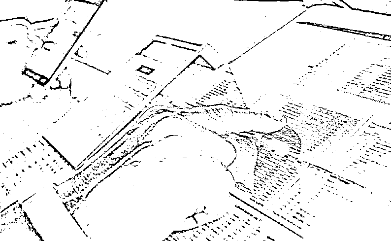

作者/雷蒙德·梅里曼
译者/Leisha 编辑/玫瑰 图片/全景网雷蒙德·梅里曼是在金融占星学界稳坐第一把交椅的占星师，同时他也是若道签约的金融占星课老师，我们引进了雷蒙德·梅里曼老师的《[上证指数月度报告](http://mp.weixin.qq.com/s?__biz=MzA5NjA0NTAxNg==&mid=2651423447&idx=3&sn=841a09c5d196d9885d98eeb480a2079b&chksm=8b4b3060bc3cb976c0aa2a2967b91ae73978faca1ee0437be958f79069958d5a410961a193c5&scene=21#wechat_redirect)》《[黄金周期月度报告](http://mp.weixin.qq.com/s?__biz=MzA5NjA0NTAxNg==&mid=2651422728&idx=2&sn=5e41d5bf3527772f19ca7a774eb984a2&chksm=8b4b32bfbc3cbba96679ac4b41485a34f838242408e52aa7626f837a39b7084a74eea73f500c&scene=21#wechat_redirect)》《[2020 年金融预报](http://mp.weixin.qq.com/s?__biz=MzA5NjA0NTAxNg==&mid=2651414279&idx=2&sn=cc131aa367c4ada15e35d0d80b308415&chksm=8b4bedb0bc3c64a6ef98c0e86ba3d842d8368de2b90e623af1d3870d521049ce352732c8d091&scene=21#wechat_redirect)》。我们经老师的授权，将每周刊登梅里曼老师的周运，供大家参考和学习。于是，这是本周的周运（8.10-8.14）。**说明：以下时间采用纽约证券交易所所在地美国东部标准时间。**
**展望与回顾**

**美国劳工部周五的报告称，上个月雇主新增 180 万个工作岗位，使失业率连续第三个月下降至 10.2％，超出了华尔街的预期。该报告显示就业人数连续第三个月以百万级增长，表明经济形势有缓慢但稳定的起色。但数据仍然显示，在新冠肺炎病毒疫情期间消失的 2200 万个工作岗位到目前为止恢复了不到一半（约 42％）。当前美国的失业人数仍比 2 月时多 1060 万。**

**——梅根·亨尼**

**《七月就业实现连续第三个月的百万级增长》**

**www.foxbusiness.com**

**2020 年 8 月 7 日**

**民意调查显示，大多数人在经济问题上对特朗普的信任度高于乔·拜登。但是，如果他再签署一项南希·佩洛西提议的特别经济法案，选民们就分不清共和党和民主党所主张的经济政策有什么差异了。**

**——《特朗普的万亿美元之选》**

**《华尔街日报》言论版编辑**

**2020 年 8 月 7 日**

对于贵金属和货币市场（包括比特币）而言，上周又是引人注目的一周。8 月 7 日，黄金再创历史新高，飙升至 2089.20，远高于其上一次在 2011 年 9 月创下的历史高点 1920。白银上探 30.00，为自 2013 年 2 月以来的最高水平，但仍远低于其在 1980 年 1 月和 2011 年 4 月创下的，接近 50.00 的历史最高水平。8 月 6 日，欧元涨至 1.1915，为自 2018 年 5 月以来的最高水平，而美元则跌至 92.52，为自 2018 年 5 月以来的最低价格。比特币在 8 月 6 日暴涨至新高 12085，为自 2019 年 8 月以来的最高价格。美国十年国债上周的表现也不错，飙升至 140/13，上探其 3 月 19 日（火星合相摩羯座星群时）创下的历史高点 140/24。现在，火星正在与摩羯座星群中同样的三颗行星形成上弦周期的四分相。尽管如此，全球股票市场的表现并没有那么壮观，但却很有趣。欧洲地区，重要股指在 7 月 30 日至 8 月 3 日之间跌至主要周期低点，随后一直回升至 8 月 2-3 日——满月四分天王星之时，一些股指在满月时触顶，而另一些股指（例如德国 DAX 指数）持续反弹至 8 月 6 日才回落。远东和亚太地区，股票市场的表现非常混杂。中国的上证综指结束了从 7 月 13 日年度高点 3458 至 7 月 27 日低点 3174 的跌势，随后在 8 月 6 日反弹至次高点 3392。香港恒生指数表现不佳，在 8 月 7 日周五创下数周新低。印度 Nifty 指数在 7 月 29 日反弹至暴跌后的新高，在 8 月 3 日跌至低点，随后又在 8 月 6 日再次回升至次高点。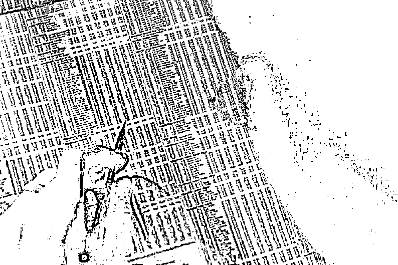日本的日经指数创下了双底，7 月 31 日跌至主要周期低点，然后在上周温和回升，但没有创下周期新高。澳大利亚 ASX 指数在 8 月 2 日周一跌至周期低点，但之后只是小幅上涨至 8 月 4 日。欧洲和亚洲股市的有趣之处在于，它们与重要的地球宇宙学反转征象密切相关。你可能还记得 7 月 14-20 日，太阳对分摩羯座星群的三颗行星，欧洲和亚洲的市场都在那时创下了周期新高。之后还有一个关键的反转时期是 7 月 31 日+/-3 个交易日，那时所有市场都跌至主要周期低点。美国股指的情况略有不同，我们关注的所有市场都在 7 月 30 日跌至主要周期或交易周期的低点，但随后都迅速回升至 8 月 7 日。纳斯达克指数创下历史新高，标准普尔指数创下暴跌后的新高，道琼斯工业平均指数创下次高点，但未创下暴跌后新高。世界各地的分歧仍持续不断，因为我们正处于两个强大的天王星征象和火星与摩羯座星群形成强大的上弦四分相之间。现在到今年年底，甚至到明年初，看起来将是颇为动荡的五个月。**短期占星趋势和长期考量**

**特朗普于周四表示，他将重新对加拿大进口铝征收 10％的关税，这个关税在去年的《美国-墨西哥-加拿大协定》（USMCA）之前已经取消了……如果美国背弃自己的贸易承诺，又如何能批评中国背弃贸易承诺的举动？加征进口铝关税是特朗普政策中最糟糕的一项。他在伤害美国工业和消费者的同时，还让美国的盟友知道，他的贸易承诺不可信。**

**——《特朗普的贸易承诺不过如此》****《华尔街日报》编辑****《华尔街日报》****2020 年 8 月 7 日****“我不需要告诉别人情况很糟，每个人都知道情况很糟。现在是经济衰退，每个人都已经失业或正在害怕失业。一美元只能买到价值五美分的货品，银行快要破产，店主要在柜台下放把枪防身。地痞无赖在街上疯跑，似乎没人知道该怎么办。我们知道空气和食物质量不好……****整个世界好像都疯了一样，所以我们不再出门。我们坐在房里，慢慢地，我们生活的世界变得越来越小……我只知道，首先，你必须发怒，你必须说：‘我是一个人，我的人生是有价值的！’所以，我希望你现在站起来，去窗户边大喊：“我要气死了，我再也忍不了了！”****——1976 年西德尼·吕美特执导的电影《电视台风云》****（引文由梅里曼市场时机学院编辑贝丝·伍迪提供）**

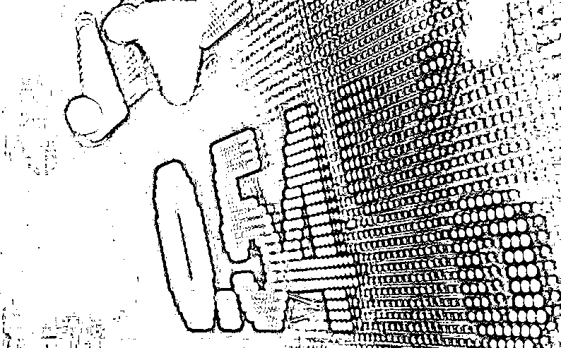

世界很疯狂，而且看起来也不会很快归于平静。火热的火星正处于火热的白羊座，这是火星自己掌管的星座，而且**在 8 月 4-24 日这三周期间，火星的行进将开始与摩羯座星群中的木星、冥王星、土星形成困难相位**。**8 月 13 日，我们会进入这个易燃易爆组合的中期。届时，火星四分冥王星，这是一个可能使人“暴怒”并宣称自己“再也忍不了”的相位。**

**8 月 15 日，天王星将在金牛座转向逆行，这并不会对平息事态有所帮助，反而像是将激发敌人和个人挫败感的压力调高至最强。**从字面上看，可能会出现**野火、爆炸，以及威胁环境、农作物和人类生命的情况。**

其实，火星四分摩羯座星群的行进并不会在三周内彻底结束，因为**火星将转向逆行，并在 9 月 29 日-10 月 19 日期间再次四分摩羯座星群**。火星在自己守护的星座对世界而言，通常是一个积极的征象，但火星四分木星、冥王星、土星是一个重大挑战。

然而，当**火星在自己守护的星座逆行时（9 月 9 日-11 月 13 日）**，火星在白羊座自信强势的特质可能会变成**挑衅和好战的言行**。**如果人们不控制自己的本能冲动，大战可能一触即发，而且可能会造成毁灭或自我毁灭。**在火星逆行的情况下，挑衅者通常是失败者。

金融市场可能会受到怎样的影响？你已经看到了贵金属、比特币和货币市场的表现。现在的政治环境很疯狂，易燃易爆，促使投资者寻求掩护。在这种不断恶化的炼狱中，股市保持的状态已经够好了，但**好的状态随时可能会中断，尤其是 9 月 29 日-10 月 19 日，甚至在本月都有可能。**

**天王星表示，一切清晰明确的支撑位或阻力位也有可能被打破**。随着纳斯达克指数和标准普尔指数的大幅上涨，美国股市的阻力位已经被打破，但支撑位离阻力位并不远。实际上，支撑位和阻力位在一些亚洲股指中距离非常近，如日经指数和恒生指数。**天王星凸显时，既可能发生反转，也可能发生突破。加上火星，一切会发生得很快。**火星关于规模和动静都很大的行动。

进一步展望未来，**土星将在 2021 年的大部分时间里与天王星形成每 45 年发生一次的渐亏四分相**。这个相位上一次发生在 1975 年 10 月-1977 年 4 月，电影《电视台风云》在此期间上映（见本节开头的引文）。

这也是吉米·卡特当选总统的一年，在此之前，杰拉尔德·福特刚摆平了尼克松号召“法律与秩序”的动荡年代。乔·拜登使我联想到吉米·卡特。我可以想象，拜登的总统任期将与卡特的总统任期很相似。

卡特当选总统之前是 1930 年 2 月至 1931 年 10 月，当时，《斯穆特-霍利关税法》对经济大萧条的爆发发挥了至关重要的作用，时任的总统也是一位仅有商业背景而几乎没有政治经验的共和党总统（赫伯特·胡佛），他在总统任期的头两年同时控制着众议院和参议院。

历史并不是一定要重演，但是当历史对应重复出现的长期行星相位时（这种情况经常发生），明智的做法是**关注在相同的宇宙周期中重复出现的主题（混乱）。**

我们不仅要记住，这些行星周期对应**混乱以及社会和金融动荡**，还要提醒自己，我们曾经历过这些宇宙风暴，并且在经过风暴的洗礼后变得更强、更好。尽管美国某些领导人的确通过做出挑战美国精神核心原则的决策和行为，实现了自我毁灭，但美国作为一个国家并没有自我毁灭。

经济和金融市场经历了剧烈的动荡，人们蒙受了金钱的损失，许多企业破产了。但是，尽管当时人们普遍担心经济和市场的崩溃再也无法好转，尽管当时的无政府主义者宣称那是美国、民主和资本主义的终结，但经济和市场还是复苏了。

这是一个长周期（土星-冥王星、木星-土星、土星-天王星），而我们正身处其中。我们必须意识到或记住，在这样的周期中带领我们进入繁荣新时代的常常是发明创造和新的思想观念，这就是我们正在进入的新时代。我们要想想这个新时代会有哪些机会，更好的做法是去创造新的机会。

**说明：以上日期基于纽约证券交易所所在的美国东部标准时间，由于存在时差，中国地区可能需要加一天。**

**版权声明：**本文由若道翻译发布，欢迎转发，反对抄袭。友号转载请申请白名单。

**雷蒙德·梅里曼（Raymond Merriman）**

若道签约老师。著名金融占星师，ISAR（国际占星研究协会）前主席，梅里曼市场分析公司的总裁。他由于“提升了占星学的职业形象”，在 1995 年国际占星大会上被授予轩辕十四奖；在 2012 年国际占星大会上，被授予轩辕十四终身成就奖。

1“中国上证指数月度报告”发售

**若道推出了****中文版****的雷蒙德·梅里曼中国上证指数月度报告，并持续发行该报告！**

当把金融市场的周期和占星学的周期相结合时，雷蒙德·梅里曼老师的金融占星学研究**为投资者应对金融市场的周期波动，并随之调整投资策略提供了极大的价值参考**。

****8 月中英文报告均已更新！****

2“黄金价格周期月度报告”发售

**若道推出****中文版****的雷蒙德·梅里曼黄金价格周期月度报告！**不仅仅为广大读者在中国股市的投资出谋划策，更将视角放眼黄金市场。

**每当世界经济形式不明朗的时候，有一个地方是保值的港湾，那就是****黄金**。从 2018 年 8 月开始，黄金已经用自己的升值再次提醒众人它在经济不稳定时的位置。**截至目前，2019 年 8 月底，黄金已飙升至 6 年新高，高于 1565 美元。**

自 1982 年雷蒙德·梅里曼出版第一本研究《地球宇宙学征象与黄金价格的关联》的著作以来，**他一直作为最重要的黄金市场时机预测者之一享誉国际**。

过去 1 年，那些订阅并遵循建议的梅里曼市场时机学院日报和周报的订阅者，如果从 2018 年 8 月 16 日的低点或 8 月 23-24 日的次低点购买黄金，他们已经赚到了不少的 30%左右的利润。

**8 月中英文报告均已更新！**

**购买套餐**，买得越多越优惠

中国上证指数月度报告套餐价

*   **单月报告**：280 元

*   **3 个月套餐**：780 元（260 元/月）

*   **12 个月套餐价**：1999 元（166 元/月）

**长按下图识别二维码**

**购买金融报告****套餐**

**▼**

黄金周期月度报告优惠

*   **双报告年度套餐更优惠（直降 899 元）**
*   **12 个月黄金报告+12 个月上证指数报告：仅需 3500**

**长按下图识别二维码购买黄金报告套餐**

▼

32020 年金融预报 1976 年以来，由雷蒙德·梅里曼撰写的梅里曼市场时机学院每年一次的年度预报沙龙和每年一本的《年度预报》一直在应用占星学原理为投资者们服务。2018 年，若道第一次将这份广受赞誉的一年一度的金融占星报告和沙龙引入中国，供中国投资者参考。**《2020 年金融预报》将会谈及 2020 年重要的宇宙天象及其对世界经济、贸易形势的整体影响，还将覆盖中国上证股票市场的分析、黄金白银市场、美国经济、美国总统、美联储、美国国债市场、美国股票市场、主要外汇货币市场（主要外汇美元、英镑、欧元、日元、瑞士法郎）、原油市场、谷物市场、活牛市场、比特币市场等投资市场。**梅里曼老师及梅里曼市场时机学院的金融占星分析师还会给出以上市场 2020 年的**市场价格目标区间及重要价格反转日**，为短期、中期和长期投资者进行市场操作的时机提供参考。如果你关注世界经济和金融投资市场的变化，会发现梅里曼《金融年度预报》中的研究对于你了解世界经济在发生什么，这些市场的走向会如何有非同寻常的指导价值。为了让更多人从这个讲座和报告中获益，我们特意免费提供沙龙**讲座前 30 分钟试看（免费放大）**，你可以先试看，然后再决定是否购买整体报告及沙龙。如何安然度过这场危机？如何明智地投资，让自己安然度过这个充满挑战的一年，甚至获得丰厚收益？我们相信 2020 年度金融预报沙龙和报告套餐组合会给你远高于其价格的回报。**30 分钟免费试看**获取路径参见如下指引：①请扫描下图二维码，下载若道 app **②** 登录若道 APP 首页-金融报告-《2020 年金融预报》讲座视频——免费试看，即刻免费试看 30 分钟的讲座视频。

报告和讲座价格

2020 年金融预报讲座和报告价格整体售价** 1280 元**

（本讲座和报告不单独出售）

**长按下图识别二维码购买 2020 年金融预报**

▼

********点击阅读原文购买金融报告********

# 灵魂画像与生命自觉 | 成都线下沙龙

> 原文：[`mp.weixin.qq.com/s?__biz=MzA5NjA0NTAxNg==&mid=2651424017&idx=1&sn=56dda0a65102877f6c1c744ae33a8628&chksm=8b4b37a6bc3cbeb09393ae903de7294a9a89f7584c67552db70f94e295a7634d24cafe696650&scene=126&sessionid=1692738126#rd`](http://mp.weixin.qq.com/s?__biz=MzA5NjA0NTAxNg==&mid=2651424017&idx=1&sn=56dda0a65102877f6c1c744ae33a8628&chksm=8b4b37a6bc3cbeb09393ae903de7294a9a89f7584c67552db70f94e295a7634d24cafe696650&scene=126&sessionid=1692738126#rd)

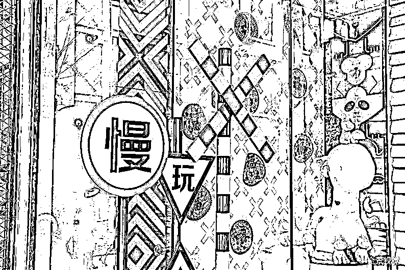

“

兜兜转转，这与成都的缘分好像必是要结成的。

兰州的第三场沙龙还没开始，成都的两场沙龙就已经排上了。

虽是冥冥指引和朋友帮忙之下成行的，我心里却也是很开心的，因为真的很喜欢成都，也非常期待和关注自我认知与成长的成都朋友们相聚。无论你是否懂得严肃占星学，我都可以和你促膝相谈，只要你专注在你自己：

① **灵魂画像**：运用占星学为每一位到场的学员做“灵魂画像”的解读，勾勒你今生的方向与课题，以一个旁观者的角度与你交心而谈，希望能协助你更加看清自己，了解自己。 ****②** 当下课题、挑战与生命自觉**：2020 年是是充满压力和挑战的一年。立秋已至，到明年年初，突破人生困境的机遇和挑战并存。我会为每一位到场学员准备一份时间表，提醒你目前人生所处的发展阶段，说明要注意的时间点、挑战的领域，以协助你发展自我觉知与智慧，去看待不同生命阶段与时间点的人生挑战。在我们倾听自己和他人的灵魂的故事时，我们一起倾听每个生命既有的共性与独特性，我们的勇气与恐惧，我们的坚强与脆弱，我们拥有的和需要放下的。逐个解读，共同分享，人数因此有限，每场限额 8 名。尚未谋面的成都朋友们，来吧，8 月 16 日或 8 月 22 日，我们约一个——
——滴答**”****往期线下沙龙学员回馈**

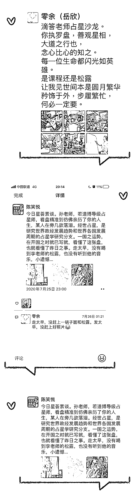

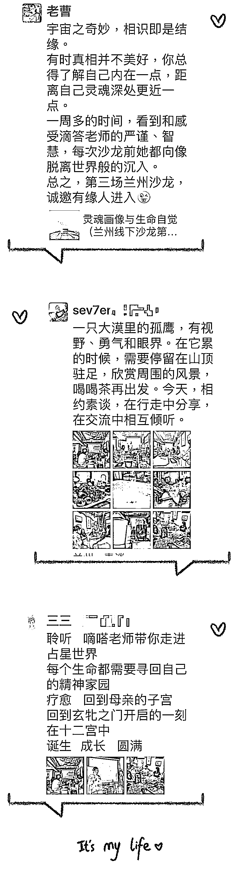

**参与方式****活动时间****：第一场 8 月 16 日 下午 2:30-5:30；第二场 8 月 22 日 下午 2:30-5:30****活动费用****：300 元/位**

**人数限制****：12 人（报满即止）**

**沙龙地点****：成都市恒大广场购物中心 3 楼花园露台茶予**

**温馨提示**：本次活动不接受空降，报名付款后不接受退款转课，请悉知！****

**参与方式****：请咨询**李老师 微信号：cd13518140789****

**长按下图二维码报名**

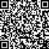

**注意事项****Q：我如果报名参加此次活动，有什么注意事项吗？**
**①** 报名后务必添加客服微信（cd13518140789）获取入群方式；**②** 报名后，请提前 15 分钟到现场签到；

**③** 线下沙龙，不提供视频回放；

**④** 报名时会收集出生信息，主要是为了现场解读星图，老师提前熟悉星图，因此，请提供准确的出生信息。

**更多活动信息**

**请长按下方二维码联络客服**

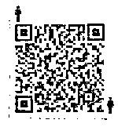**关于滴答老师**“

滴答老师是 ISAR 认证占星师，也是我在人生道路上的好友，她丰富的人生经历和对于内在诚挚，坚定的探索，对于中国道家，佛家修行的深入实践，面对无常而发展的智慧和勇气让她对占星学发展出深入而独特的理解。我很有幸在人生道路上有她相伴，也很有幸请她把对占星和人生的领悟分享给更多人。

**——若道创始人，蒋颖**

**”**

********报名直达入口********

# 最近屡屡“作妖”的特朗普，他的凯龙星和冥王星揭露了哪些家族的秘密？

> 原文：[`mp.weixin.qq.com/s?__biz=MzA5NjA0NTAxNg==&mid=2651424010&idx=1&sn=47095473c5e7b381a889a54745918ee8&chksm=8b4b37bdbc3cbeabf73d6cfc5ace29abc8ee332d6742ad7830c0646f0011972f859a749dcd42&scene=126&sessionid=1692738126#rd`](http://mp.weixin.qq.com/s?__biz=MzA5NjA0NTAxNg==&mid=2651424010&idx=1&sn=47095473c5e7b381a889a54745918ee8&chksm=8b4b37bdbc3cbeabf73d6cfc5ace29abc8ee332d6742ad7830c0646f0011972f859a749dcd42&scene=126&sessionid=1692738126#rd)

**☆ 后台回复“今日”，给你一句生命态度**

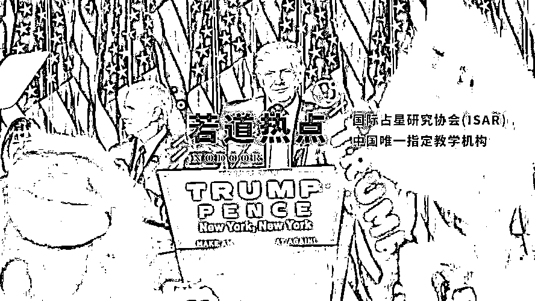作者/Justine ISAR 认证占星师
编辑/翀子 封面/书君 图片/网络

特朗普常常“语不惊人死不休”，长期停留在新闻头条，最近几天更是如此。从他的星图上，从凯龙星和冥王星的灵魂创伤，我们可以得到什么信息？让我们来读文章吧~

特朗普最近又上了新闻头条。

在威胁“封禁 TikTok”后，3 日特朗普再次发出赤裸裸恐吓——TikTok 必须在 9 月 15 日之前卖给美国，否则必须关门，而且相当一部分钱要交给美国财政部，“因为是我们让这笔交易成为可能”。

“这就像房东和房客。我们不出租（地方），房客就不会有价值。在某种程度上，我们就是租赁关系。是我们让这一巨大成功成为可能。”

特朗普说，“TikTok 取得了巨大的成功，但很大一部分（成功）是在这个国家（取得的）。” “美国政府应该从这笔交易中获得资金：“不管这个数字是多少，它都将来自这笔交易。”

美国政府联合商业巨头恐吓并强买 TikTok 引发国际关注。德国新闻电视台 3 日指出，TikTok 事件是美国经济强权的又一象征。外交部发言人汪文斌 3 日发言，中方对此坚决反对。

但这只是特朗普为了连任总统，各种不择手段的一环。

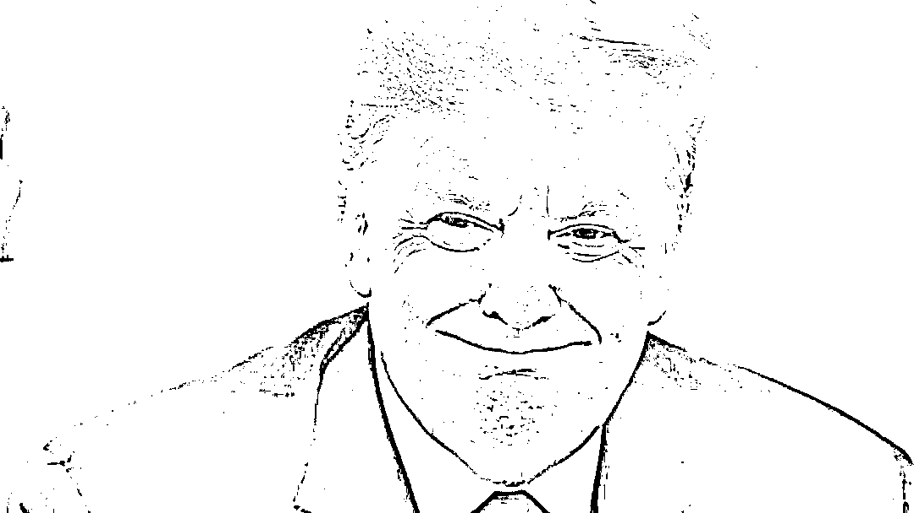

**成长史**

我们来挖挖特朗普的底细。

美国商人、电视名人、作家、政治家，2017 年 1 月 20 日就任美国第 45 任总统。

特朗普是有史以来当选总统年龄最大的人，也是总统中最富有的人。他通过寻找和购买亏损的房产，并使其扭亏为盈，获得了估计达 10 亿美元的财富。

他是五个孩子中的老四，在皇后区长大，父亲是白手起家的房地产百万富翁。大多数人都不知道，特朗普小时候到底经历过些什么，才长成今天这个样子。在特朗普的吹嘘、放荡和盲目自信之下，他内心深处到底藏着什么难以启齿的弱点。

唐纳德·特朗普是不会说的，但是有人替他说了。7 月 14 日，特朗普大哥的女儿，也就是他的亲侄女玛丽·特朗普（Mary L. Trump），出版了一本震惊全美的书。这本书还在预售的时候就跃升到了美国亚马逊书榜的榜首，刚刚开售几天销量就十分惊人。

这本书的副标题赫然写着，“我的家庭如何造就了全世界最危险的男人”，而书的主标题却非常耐人寻味，叫做“*Too Much and Never Enough*”，翻译过来就是《“太多”与“不足”》

书中将特朗普描述为病态自恋狂，在大学入学考试中作弊，并自那时以来一直崇尚“把作弊作为一种生活方式”。这是一本揭伤疤的书，侄女揭开了特朗普内心的伤疤，也揭开了整个特朗普家族的伤疤。

**| **玛丽·特朗普《“太多”与“不足”》

**家族故事**

特朗普家族的故事，要从这个家庭的大家长，也就是特朗普的爸爸弗雷德·特朗普讲起。弗雷德出生在 1905 年，从小是讲德语，后来移民美国，成为适应英语的一代人。

弗雷德的父亲，也就是唐纳德的爷爷，死于 20 世纪初期的大流感。当时弗雷德只有 12 岁，他成了“家中的男人”，成了顶梁柱。弗雷德的母亲伊丽莎白严格恪守维多利亚时代的道德规范和礼仪，并不慈爱。

父亲的早逝和母亲的严格管教，再加上早早进入那个弱肉强食的社会，让这个叫弗雷德的小伙子明白：**弱者没有活下去的资格。**

用今天的话说，弗雷德把生活看成了一场肉搏——要么你死，要么我亡，**赢家只有一个，**赢家必须通吃。后来他学会了用一个词来形容：“零和游戏”。

弗雷德的成功，还要归功于他的“表演癖”。**他经常使用极其夸张的语言**——一切都是“伟大的”、“奇妙的”、“完美的”。他接受了无数采访，每次都夸自己的房产如何如何好。自称自己是“中产阶级住宅建筑大师”。

他希望大儿子能子承父业，明确要求大儿子做一个“杀手”。意思是**要不惜代价地强硬，不光性格要强硬，甚至身体都应该百毒不侵**——弗雷德自己几乎从来不生病，从来不去医院。

但当他发现大儿子身上有“善良”和“同情心”这些问题的时候，他彻底失望了。**他开始无时无刻地贬低和羞辱他的大儿子，当着家人的面，或者当着自己公司员工的面。**

挣钱和羞辱别人，包括羞辱自己的儿子，是弗雷德唯二的两个爱好。

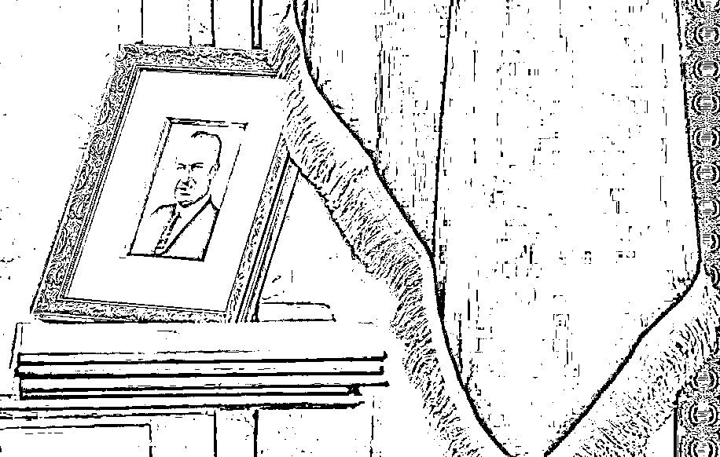

**|** 弗雷德·特朗普的相片

当弗雷德不停地训斥“软弱”、没出息的儿子弗雷迪的时候，唐纳德还是个躺在摇篮里的小婴儿，他哇哇地哭着，但没有人理他，他似乎没有父母。

生下唐纳德和最后一个孩子后，母亲玛丽造成了严重的产后并发症。她被摘除卵巢和子宫之后，患上了严重的骨质疏松症，成了一个玻璃人，一碰就碎，经常因为骨头不断变薄、变脆引起的自发骨折，遭受巨大的痛苦。手术后的她还出现精神问题，变得坐立不安，成了一个失眠症患者。

随着健康状态与日俱下，玛丽终于变成了一个“女幽灵”。很多时候她照顾不了孩子们。而弗雷德则完全不管孩子，他认为好像婴儿可以像土豆一样，扔到地上就能发芽长大。

而人类的婴儿完全不具备生存能力，离开父母即意味着死亡。唐纳德出生后不久，就本能地感到死神就像一条大蟒蛇，缠在自己的脖子上。那是小唐纳德第一次感到什么叫做“被抛弃”。

稍微长大点之后，唐纳德亲眼看到了父亲是怎么羞辱、排斥、惩罚大哥的。就像一切单纯的孩子一样，他也不相信父亲真的要伤害大哥。才几岁大的唐纳德说：“爸爸并不想伤害弗雷迪，他只是想教我们如何成为真正的男人。”

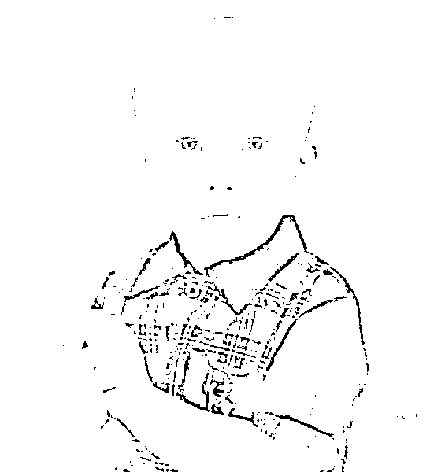

**| **小时候的特朗普

现在，小唐纳德面前摆着一个选择：父亲的手里握着一个写好的“剧本”，他缺一个“演员”；你如果不演，下场就会和大哥一样。唐纳德是家里排行倒数第二的孩子，本来就没什么存在感，他害怕。

害怕被父亲抛弃的唐纳德，本能地积极融入父亲的“剧本”里，他要它“演”好，博得父亲的认可和欢心。**这不是跟谁争宠，这是保命——脖子上的“蟒蛇”在提醒他，看看大哥的下场。**

他被囚禁在父亲给他的这个“人设”里；往后的余生，他必须依赖这个人设才能活下去。

实际上，唐纳德还有“学习障碍”，他几乎学不进去什么东西，接受新知识的能力很有限。但他**必须用最夸张的方式**抵抗“我不够聪明”“我不够优秀”的事实，**抵抗内心的不安全感，满足父亲对他的期待。**

其中一个方法就是：他必须装成一个“什么都懂”的人，没有谁比他更懂这个世界的一切。

面对一次次的失败，面对“客观现实”和“完美自我”之间的不匹配，唐纳德也**学会了像父亲一样，用最夸张的词汇填补认知失调。**

他的口头禅就是“这很棒，不是吗？”——赔钱破产很棒，亲戚死了很棒，疫情大流行也很棒——**因为他自己“很棒”，所以自己做的一切也必须“很棒”。**

**缺少滋养的危机**

我们来看一下唐纳德.特朗普的出生星图。

出生于满月，太阳双子座十宫，月亮射手座四宫。**对于满月月相的人，关系是人生的主要议题。**在他们的一生中，一直在与他人合作，并学习对立的紧张关系，学习与不同的人和谐相处意味着什么。

东半球侧重，明显的自我防御倾向。上升点在 29 度的狮子座，火星合相上升点，让整个星图张力十足。

不少人觉得特朗普某种意义上”有点可爱“，因为他不是政界商界特别普遍的天蝎座和摩羯座——精于算计或谋略，而是双子座、射手座、火星有啥说啥的**“直白”**与奔放的**“推销员”**的气质，而狮子座的上升点又特别王者或孩子气。

近距离看特朗普的星图，上面暗示了他原生家庭未解决的议题——月亮合相南交点，有情绪与滋养的议题，太阳也对分南交点，母亲本应该是在影响力相当大的位置上。

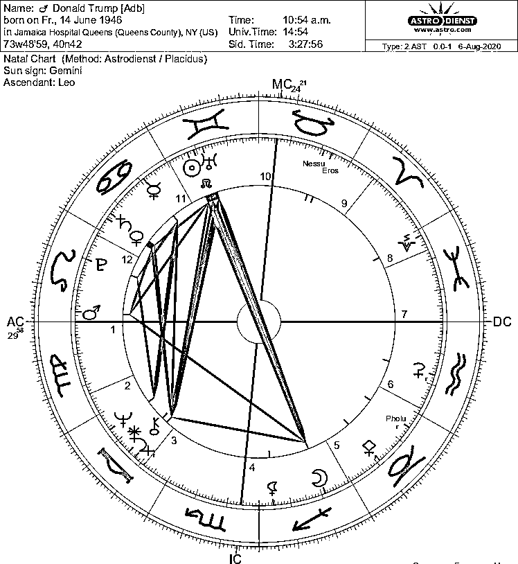

在很多家庭中，父母双方对孩子的影响，会像跷跷板一样。父亲不关心孩子缺席，母亲的影响力就会变大，总有一方需要承担更大的责任。但现实中，可惜的是，他的妈妈玛丽像个“女幽灵”一样存在，无法照顾他、滋养他、保护他。

特朗普的童年是非常不足的，星图上金星与土星合相（金星还是 10 宫主，10 宫因此处于压力位置），映射了他与生俱来不被爱的感觉，童年缺乏温暖，得不到父母的爱。

这也是书名《“太多”与“不足”》（*Too Much and Never Enough*）里“不足”所指代的部分。而且，**金星和土星合相在巨蟹座**，也许因为从小没有得到了积极的母爱，成年之后的特朗普有着对“传统”女性角色的坚持，对女性的仇恨。他也经常在某些公开场合调戏女性，对女性有不自觉的侮辱言行。

特朗普的谷神星（大地母亲的原型，跟养育、滋养有关的小行星），在水瓶座，对分了冥王星。母亲的情绪是抽离的，与冥王星的对分相，暗示了特朗普通过丧失与所爱的人分离，而带来的强烈的情绪危机。

这可能在一个孩子的内心会导致强烈的悲伤、痛苦和沮丧，而这样的情绪根本没有机会表达，只能压抑，因为父亲不允许！失去母亲关爱与保护的他，只能在父亲给他的人格定义中求生存。本质上，这是一个含着奶嘴、歇斯底里地哭喊地“没人喜欢我”的 72 岁的大孩子。

《“太多”与“不足”》的作者玛丽·特朗普说：

他的内心深处，仍然是那个没有安全感、受惊吓的小男孩。这个畸形的小男孩是他内心的致命弱点，他后来一切的所作所为都是在试图掩盖和逃避这个弱点。

他必须活在父亲给他的人格定义里，不断强调自己是最聪明的，是最伟大的，自己做什么都是对的，别人做什么都是错的，问题全出在别人身上。

他撒谎、蒙骗、暴怒、虚张声势，旁人以为那都是演给全世界看的，其实那只是演给一个观众看的——他平生最重要的那个观众、那个埋在泥土里的父亲弗雷德。

**凯龙星和冥王星的创伤**

玛丽·特朗普是临床心理学家，如果从潜意识再深入一步，去剖析特朗普灵魂的创伤，我们可以看到什么？

特朗普的星图上冥王星在 12 宫，凯龙星在第二宫天秤座，合相了南交点的守护星木星。从进化占星学的角度，这是一个经历过悲剧与灾难的灵魂。

**凯龙星和冥王星都代表创伤**，而这两者有什么不同呢？在占星学中其实有很多符号的含义都有重叠，比如说月亮和海王星都代表直觉力。

但是在创伤的理解上，凯龙星并不仅仅代表冥王星的缩小版。冥王星和凯龙星代表的创伤两者这件有非常明显的区别。

**冥王星代表深度心理性创伤**，需要很久的时间去疗愈和处理，就好像进入冥王星代表的地狱之旅。而凯龙星的轨迹连接了天王星的轨迹，因此凯龙星的创伤疗愈是可以像天王星的电闪雷鸣一样迅速发生的。

我喜欢的另外一种说法是，**凯龙星是冥王星的使者**，把灵魂深度创伤在地球上显化。因此，可能会更具体，而且在疗愈自己的同时，也获得了疗愈他人的天赋。

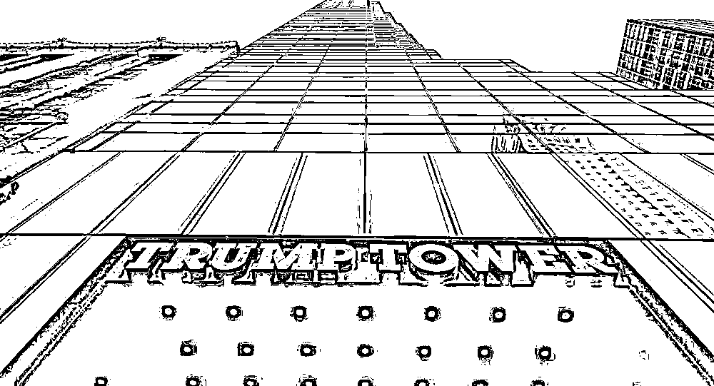

**“完美自我”的背后**

我在解读个人星图的时候，都会去看凯龙星，当然每个人的凯龙星特质有强有弱。特朗普的凯龙星显然是非常强的，因为它合相了射手座南交点的守护星木星！凯龙星就变成了南交点人格的一部分。

第二宫、凯龙星、天秤座深入描绘了他南交点的创伤细节。整体而言，木星与二宫凯龙星的合相，强调了其**巨大、膨胀的自尊心**，特别担心他人对他的看法（天秤座）。这是他灵魂的创伤，也是一生的主要动力之一。

先来说说凯龙星，如果缺乏自尊或有不安全感，往往会过度补偿。一些人在发现证明自己根本行不通之前，会感到需要无休止在生活的这些方面证明自己。个体可能会更加受挫，然后防御机制越来越强，自我炫耀连本加厉。

面对一次次的失败，面对“客观现实”和“完美自我”之间的不匹配，**特朗普也学会了像父亲一样，用最夸张的词汇填补认知失调。**

他的口头禅就是“这很棒，不是吗？”——赔钱破产很棒，亲戚死了很棒，疫情大流行也很棒——因为他自己“很棒”，所以**自己做的一切也必须“很棒”。**

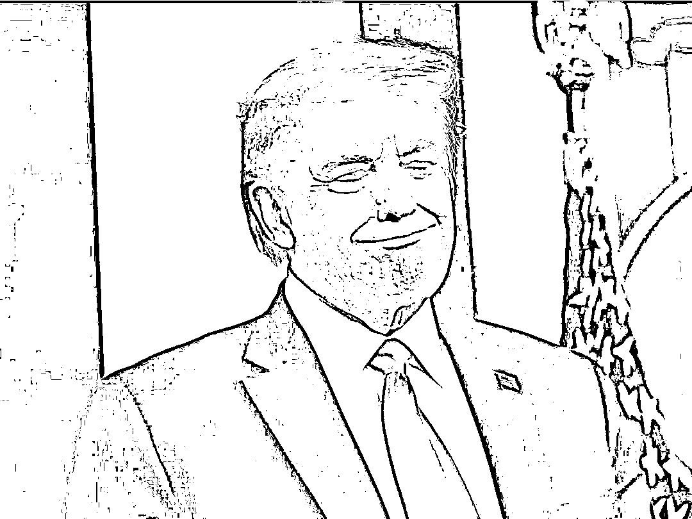

特朗普的凯龙星在第二宫。第二宫和个人资源有关，包括财富、资产和技能。**在更深层次上，第二宫也和个人的自我价值和自尊有关。**

有人可能认为凯龙星在第二宫意味着生于贫困家庭，其实这样的比例非常少。**贫穷和财富并不是直接影响幸福、自我价值的因素。**

相反，我在很多个案中，看到凯龙星在第二宫的现实解读是：当事人所出生的家庭将金钱作为操控的工具。核心创伤围绕着必须满足家庭的要求，才能获得金钱所能买到的东西。

在现实中，唐纳德.特朗普成了一个年轻版本的弗雷德，成了弗雷德的“复制品”。弗雷德站在后面，不断地暗中给他钱；唐纳德.特朗普站在前面，**不断地展现野心，追求更大的项目。**

即使特朗普经营的赌场和酒店都在赔钱，即使特朗普几次宣告破产，弗雷德还是偏爱这个儿子，百般夸奖这个儿子。

但特朗普真的对这种建立在金钱操控上的父子关系感恩吗？

患上阿尔茨海默症以后，晚年的弗雷德忘掉了妻子，忘掉了女儿和孙女。他只记得二儿子唐纳德。一提到“唐纳德”，他的眼里还能焕发出光彩。

但是，他却被最心爱的儿子完全无视了，直到他最终死去。他一辈子都在把儿子训练成“狼人”，又如何能指望到头来儿子变得温顺可亲呢？

我猜想，特朗普很难接受支持、指导克服，很难内在担忧和恐惧，他很容易认为人们的友善背后是居心叵测。

在特朗普的情感与关系世界里，他也许一辈子都很难从财产相关的情感创伤、受金钱操控和信任危机中走出来。**当他放下第二宫凯龙星的核心信任创伤时，才能真正展现强大的自信心去实现自己的愿望和梦想。**

作为一个世代行星，凯龙星的星座不是那么重要，但因为凯龙星与南交点守护星木星都落在天秤座，再一次强调了关系的议题。终其一生，**他需要去不断面对关系中的冲突与信任，学习如何协调自己与他人的需求。**

**冥王星的启示**

再来看一下特朗普在 12 宫的冥王星。12 宫是最后一个宫位。在现实的层面，12 宫的危险或付出的代价是最高的，同时这是一个神秘、灵性的宫位。

冥王星在 12 宫，这个配置会非常准确的看到：在灵魂的历史中，特朗普经历过悲惨的损失。他曾经失去了一切。有这样的经历 ，他也许对上帝非常生气，对生命失去信念。

他来这里，是为了被疗愈。而他的是冥王星，需要要去面对残酷的真相。

**任何落入 12 宫的行星，都不是阻碍，而是为了引导当事人走向更加觉知的领域。**当冥王星在 12 宫的时候，它是在对你说：为了引导你到更高阶的意识状态，你需要做一些心理性的工作。你的疯狂把你限制住了。

但是，特朗普似乎一直没有机会真正去面对内在的议题，他无法表达软弱与受伤。他只能拿过父亲给的剧本，通过金钱与权力，从外部来完成自己的自尊。事实上，他像个行走的大伤口！

很可惜，现代社会大多数人只是相信金钱、权力这些的东西。于是，特朗普有了太多的支持者。有些媒体说：特朗普有积极的自尊心，他的信心非凡！完全不在乎别人的认可！如果人们不喜欢他，他只是认为这是由一堆假人组成的虚假新闻构成的谎言。

是的，特朗普一直在说：我有这么多钱！我能当选！这会让我得到尊重！

最终，他成为了掌权者中最富有的一个，但是他真的得到尊重了吗？他的内在真的获得童年失去的安全感、没有恐惧了吗？还是他让疯狂将自己限制住了？

如果没有去面对灵魂的创伤，即使家财万贯，甚至做了总统，年纪过了 70，恐惧、不安全与匮乏感的伤口都一直行影随行。

**路在何方？**

当下美国的大选，对于特朗普就是性命攸关。如果不能连任，不但他会面临严厉的清算，甚至其家族也会被清算——众议院议长佩洛西就曾公开扬言，要让特朗普去坐牢。

所以，为了提升选民支持率特朗普无所不用极，也就不奇怪。

为了掩盖其防疫不力的责任各种甩锅抹黑中国，悍然关闭中国驻休斯敦领事馆来“碰瓷”中国，威胁 TIKTOK 卖给中国，8 月 5 日还宣布美国建立“清洁网络”（Clean Network）的五大措施，并点名包括华为、中国移动、百度、阿里巴巴在内的 7 家中国科技公司，以禁止更多来自中国的应用程序，进一步限制中国公司进入美国的云端系统。

这已经是特朗普最后的疯狂。有些媒体分析，如果这次大选失败，特朗普是做好了耍赖的准备的，很大可能就会以此为理由拒绝承认选举结果的合法性。

特朗普在 2020 年 11 月美国总统大选中的命运会如何？

无论如何，我们知道：特朗普并没有表面那么成功，他星图上合相北交点的双子座太阳的谎言、善变、毫无歉意的沟通，天王星对分南交点并合相太阳带来的的不稳定状态与突发事件，都证明他并没有活出高阶的自己。

无论结局如何，他终将如履薄冰。

参考资料：公众号远读重洋 《特朗普侄女爆料：我们家族都有病，叔叔特朗普还不是最严重的”》

**版权声明**：文章由作者授权首发于若道平台发布，欢迎转发，反对抄袭。

****

**Justine**

ISAR 国际认证占星师（2014 年获得）/塔罗师

毕业于浙江大学，十年跨国企业 HR 经验

咨询时长超过 1000 个小时

**咨询微信**：Justine_JT

**公众号**：星光体

长按打赏

**系统学习占星学**

**点击图片了解详情**

**微信又双叒叕改版啦，不想错过若道君的推送？**

**就把若道设为星标吧！**

**▼**

就是这个“在看”，戳一下☟

********报名直达入口********

# 插班中丨核心课程 L3，教你掌握综合星图解读

> 原文：[`mp.weixin.qq.com/s?__biz=MzA5NjA0NTAxNg==&mid=2651423912&idx=3&sn=314c3bc580dbe3b87b069608fb1c385f&chksm=8b4b361fbc3cbf09185399b70d51e8ce8a0ff950115d55e982ff5cdfef87ecb12c0bb4299a09&scene=126&sessionid=1692738126#rd`](http://mp.weixin.qq.com/s?__biz=MzA5NjA0NTAxNg==&mid=2651423912&idx=3&sn=314c3bc580dbe3b87b069608fb1c385f&chksm=8b4b361fbc3cbf09185399b70d51e8ce8a0ff950115d55e982ff5cdfef87ecb12c0bb4299a09&scene=126&sessionid=1692738126#rd)

**Level3 也是占星学习的一个整合区和分水岭****若道君给大家准备了一份专业的占星测试：“2020 若道核心课 L3 入学测试”****测试内容包括：**

**适合参加测试的学员：**

**L1-2 结课学员**

**有一定占星基础的自学学员**

**准备考 ISAR 的学员**

**扫码开始测试吧**

**测试会由若道专业助教免费阅卷，答题后添加课程顾问 Maggie（微信号：NodoorMaggie）获得测试成绩**

**1**

**占星学除了自我修炼，市场需求如何？**

**通过占星学习你帮助了自己，也可以选择成为自助助人的占星师，开启受益终生的第二事业。**一方面，社会快速发展人们压力山大，抚慰心灵的咨询市场需求巨大。另一方面，市场鱼龙混杂，真正学院派的严肃占星从业者十分稀缺。最重要的，**占星学能让你自己帮助自己，无论你是否进行占星咨询从业，学习了占星学，它都将是终身陪伴你成长的睿智好伙伴。**

**2**

**你的占星核心课老师是谁？**

 拥有**50**年占星研究积淀**44**年职业占星实践**41**年占星教学经验的**若道联合创始人****2017-2020 年曾任 ISAR 全球副主席****2020 至今为****CAPISAR（全球职业占星师资质认证考试委员会）主席****大卫·瑞雷**&**最懂学员的若道首位认证金牌中国老师****熊鹰**师徒二人合力打造
**2020 年若道****全新核心占星课程**

**3**

**L3 阶，我们要学习什么？**

**第 3 阶 ****宫位、相位以及初步解读星图（15 次课） ****❶** **12 宫位****人生中重要的领域，不止 12 个，更是 12 类。****❷ 组合解读****行星、星座与宫位的组合解读。万丈高楼平地起，这是占星解读的基本功。****❸ 相位****不仅是常规的相位：合相、对分相、三分相、四分相……还有这些更为细致的知识：**相位计算入相位与出相位星座外的相位相位解读盈亏相位相位的优先级大卫老师案例课**❹ 宫主星与定位星****“联结”是宇宙的基本法则之一。除了相位，还有哪些方式让行星能量联结起来？**宫主星定位星与定位链大卫老师案例课**❺ 月亮交点专题****月亮交点是占星解读的另一个入手角度，这里会深入教你解读月亮交点，及其相位与定位星。**月亮交点的解法大卫老师案例课**❻ 相位模式：****那些坊间赋予神秘意义的占星格局：大三角、大十字、T 三角……究竟该如何解读其相位模式。**主要的七种相位模式星图中没有相位模式的情况大卫老师案例课**❼ “空”不等于“没有”：****星图中那些容易被忽视的地方：**无托勒密相位（俗称空相）一些特殊位置星图布局大卫老师案例课**第 3 阶课程安排****❶** 15 次线上直播网络课程，每次 2 小时，课程中依旧会使用同学们的星图作示范**❷** 10 节课由熊鹰老师教授，重点通过名人星图阐释知识点**❸** 5 节课由大卫·瑞雷老师教授，重点通过学员星图阐释知识点**❹** 熊鹰老师会指导练习，答疑解惑，学练结合**❺** 重点在于如何根据星图去问问题，着重自我发现和自我探索的过程 

| **时间** | **课程** |
| 2020 年 7 月 2 日 | 宫位、行星和星座组合 |
| 2020 年 7 月 9 日 | 宫位、行星和星座组合 |
| 2020 年 7 月 16 日 | 月亮交点 |
| 2020 年 7 月 23 日 | 月亮交点和演示案例 |
| 2020 年 7 月 30 日 | 相位 |
| 2020 年 8 月 6 日 | 相位、星座、行星和宫位 |
| 2020 年 8 月 13 日 | 相位、星座、行星和宫位的同学案例 |
| 2020 年 8 月 20 日 | 渐盈相位和渐亏相位，示例 |
| 2020 年 8 月 27 日 | 更多的关于宫位和宫主星 |
| 2020 年 9 月 3 日 | 同学案例 |
| 2020 年 9 月 17 日 | 空相行星和定位星 |
| 2020 年 9 月 24 日 | 宫主星 |
| 2020 年 10 月 15 日 | 优先级和组织 |
| 2020 年 10 月 22 日 | 相位模式以及范例 |
| 2020 年 10 月 29 日 | 学员星图解读范例 |

**截至 2020 年 8 月 7 日，课程第 1-6 讲为录播课程（限视频回放），其余均为网络直播课。**

**4**

**这两位优秀的占星学老师是谁？**

**大卫·瑞雷（David Railey）**

*   **曾任 ISAR 全球副主席，2020 至今为 CAPISAR（全球职业占星师资质认证考试委员会）主席，若道联合创始人；** 

*   1976 年，通过亚特兰大职业占星师考试，成为全职占星师，随后通过**AFAN 和 ISAR 职业测试；** 

*   1980 年，与**杰夫·焦耳**一起在亚特兰大创建**“每日星球”**占星学中心。此后在亚特兰大占星协会担任 4 年考官，并且两次担任**亚特兰大地区占星协会主席**。1979-1992 年，作为占星师活跃于美国社会媒体，向不了解现代占星学变化的大众宣传专业占星学知识。在 1989-1992 年期间，他在 WRGG 电台 12 频道每周主持个人电视秀**“今日占星学”**，早先他还在 WRFG 的广播节目中播讲宇宙天气节目；

*   2010-2014 年，任**全美占星师联盟监督委员会委员**； 

*   2010 年，其著作**《灵魂的目标》**中国版出版，和蒋颖一起创办**若道占星**学校和其官网 www.nodoor.com。从该年开始，他工作并往返于亚特兰大和北京。目前他 80%的时间致力于在中国教授和推广西方占星学； 

*   2017 年，被选为**ISAR 委员会成员**（2017）。ISAR 是世界最大的国际占星机构，会员遍布 45 个国家，2017-2020 年曾任 ISAR 全球副主席； 

*   2020 年，被推举为**CAPISAR（全球职业占星师资质认证考试委员会）主席**。

**熊鹰老师（天空的空）**

*   2008 年接触严肃占星学，至此爱不释手； 
*   **2013 年师从大卫·瑞雷**，研习整套现代占星学核心课程，并于 2014 年起至今连续三年担任该课程的主助教； 
*   期间也**跟随格伦·佩里、诺·泰尔、理查德·塔纳斯、罗伯特·汉德、苏·汤普金斯、斯蒂芬·弗里斯特等多位国际顶尖占星大师进行学习**，进行定向占星主题研究； 
*   2015 年初，通过国际占星研究协会**（ISAR）资质认证并获得证书**。同年，进一步跟随大卫·瑞雷老师进修**“生时校正”**技术，通过最终考核并获得证书； 
*   目前在若道星文化任职，将传播系统、严谨、真实的占星学作为职业使命。任专职助教期间，进行沙龙与答疑等辅助教学工作已累计超过 200 小时；
*   在业余期间也提供占星咨询与生时校正服务。目前正致力于占星学与个人成长的整合。

**5**

**什么人适合这门课？**

*   对占星学有浓厚兴趣，想要系统学习占星学
*   对占星学有一定基础，但不知道该如何整合星图复杂的碎片
*   希望成为优秀的占星师，想要借鉴国际大师解读思路并融入自己的体系
*   想学习占星学，但不擅长英文，希望有中文老师授课
*   想结合占星学理论与咨询实践
*   大卫·瑞雷、熊鹰的忠粉，学过占星，但就是想跟着偶像再学一遍
*   走在自我探索和个人成长道路上的人

**6**

**课程费用**

 **★ L3****课程费用：10000 元****更多价格优惠请咨询客服**

**7**

**退转课程**

**退款原则请详看《教学协议》，如有疑问请咨询课程顾问。******核心课程 Level 3****

**授课老师：大卫·瑞雷 熊鹰**

**授课时间：****2020 年 7 月 2 日-2020 年 10 月 29 日**

**授课方式：**网络课程：英文授课，中文翻译

**费用：10000 元；**更多优惠请咨询客服

**课程负责人：Maggie（微信号：NodoorMaggie）**请备注“L3”

长按二维码添加课程负责人咨询~

****报名请点击“阅读原文”****

# 强烈推荐！六大行星的考试大纲都在这里！

> 原文：[`mp.weixin.qq.com/s?__biz=MzA5NjA0NTAxNg==&mid=2651423912&idx=2&sn=9a6861faf6307f930723f58416092722&chksm=8b4b361fbc3cbf09bd17a430e8045f5d1d1b863dd91263342732ab83d6c4fa154b5e1622181b&scene=126&sessionid=1692738126#rd`](http://mp.weixin.qq.com/s?__biz=MzA5NjA0NTAxNg==&mid=2651423912&idx=2&sn=9a6861faf6307f930723f58416092722&chksm=8b4b361fbc3cbf09bd17a430e8045f5d1d1b863dd91263342732ab83d6c4fa154b5e1622181b&scene=126&sessionid=1692738126#rd)

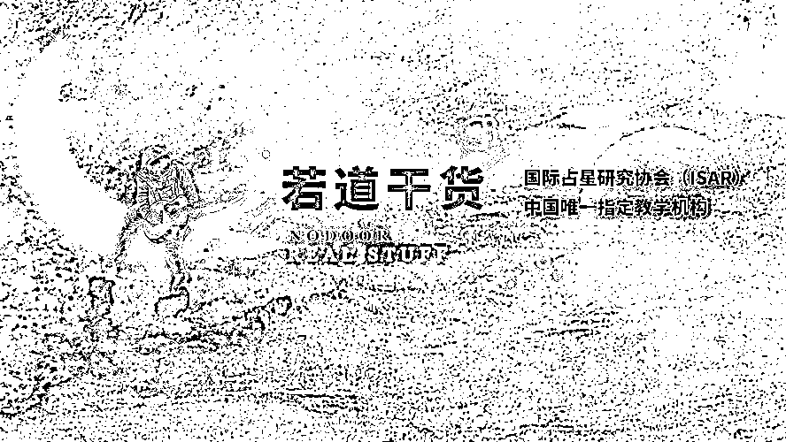

作者/杰夫·焦耳
译者/江艺 李含 轩轩 校对/轩轩 江艺 王宏 李含编辑/玫瑰 图片/全景网

在上一篇文章中，我们为大家介绍了土星、天王星、海王星、冥王星教会大家的事。这篇文章里，我们会继续介绍太阳、月亮、水星、金星、火星、木星会带给人生怎样的启迪。

**木星的功课：迈出更大的步伐**

**木星是幸运之星，在古代中被称为大吉星，象征着扩张和机遇。**它在出生图中的位置，以及它在周期运转中经过的地方，都受到上帝赐予的祝福。它是所有行星中最大的，比其他所有行星加起来都还要大。

事实上，木星尤其能给地球带来好运，因为木星巨大的引力场吸引了许多小行星、流星和其他太空物质，如果不是这样，它们就可能撞上地球，摧毁地球。

木**星与哲学和所谓的更高心智相关。**它并不是数据收集者——这是小小水星的角色。**它是信息的合成者，将意义或真理编织起来**。木星代表**信仰体系和宗教，象征着我们最高智慧的价值**。

然而在充当真理仲裁者角色时，木星可能展现其黑暗面，即变成**审判者**。**当信念过度膨胀，慷慨的木星则充当了道德的权威，贬低他人，就像地狱和诅咒的布道者**。当我们将自己理念的重要性过度放大，将它们看作绝对真理时，我们就**用谴责扼杀了善**。过分严厉的信仰体系使信仰中充满拒绝和惩罚，只有恻隐之心和好奇心才是解毒的良药。

木星带来的好运气来源于**宽广的视野**。它能**赋予每日活动的细节以意义。**从这个视角出发并不一定会让我们面临的挑战消失，却使我们认识到，**这不过是人生中的一件小事，而不是整个人生。**在实际意义上，木星提醒我们从卷入的世事中退回来，从而让我们意识到自己正深陷泥潭，并且很可能告诉我们如何解开难题。

**木星还代表乐观和希望，帮助我们度过最艰难的时光。**如果你陷入忧郁情绪，试着**效仿木星的走路方式，这可以赋予你扩张精神**。很简单，只要**将你的步幅再向前迈开一英寸就行**。这样做可以敞开你的肢体，延伸你的脚步，模仿木星广大无边的特性。

在身体层面上给你的生活引入更大的空间，直接表达了这颗行星向更大潜能开放的特性。要记住，**在失落的时候向上看，世界会为你开放更大的空间，让你的目标和潜能都得以成长。**

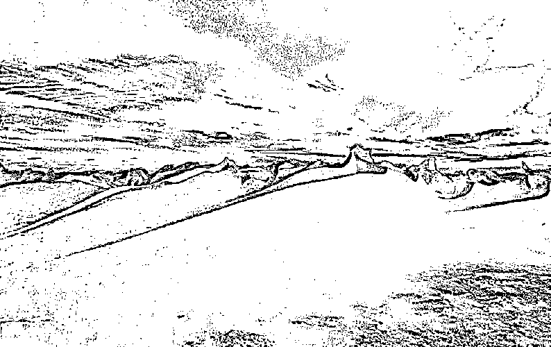

**太阳的功课：活在当下****太阳赋予我们敞开的内心、慷慨的灵魂、创造性的冲动、玩乐之心和爱**。在占星学的象征中，它代表**生命、身份，关系网中凸显的自我，以及占据我们大量生活的理念和活动**。**太阳就是生活本身，因此它没有凝固于过去的个人历史之中，也没有被限制在自我的外壳之中。**虽然我们经常通过太阳星座的特质来认同自己，但它真正的意义是**让我们充分意识到当下，富有创造力地迎接未来**。**太阳更多地与我们将要成为谁有关，而非我们曾经在哪儿。****玩耍**是开发太阳能量的一个好办法。没有野心，没有目的，就这样简简单单地享乐，这将我们与内在的孩子重新联结。**这是活在当下的一种方式，不会迷失在对明日的希望或是对过去的遗憾之中**。自由地玩乐让我们**敞开心扉，激发太阳的创造性能量。**它同时也使得**给予和接受爱**变得更加容易。火热的太阳还与**冒险**有关，别太考虑后果，去表现自我吧。然而，这并不是批评他人的借口，因为太阳意识的关键是与自己保持联结。**转变你人生的力量并没有掌握在他人手中，而是存在于你自己的身体、思想和灵魂之中**。当我们通过玩耍、艺术、想象力和身体活动扩展自我，进入这个世界时，太阳的光辉就在我们的心中闪耀。太阳象征着**勇气**，这个词来源于心（heart）的拉丁文词根。但是，英勇无畏并不意味着没有恐惧，而是尽管恐惧，却仍然愿意采取行动。通过一些小小的练习来**锻炼勇气**，可以让我们在面临困难环境时变得更坚强。内心就像肌肉，可以被强化，这就要求我们在**想要放弃或逃避的时候，保持警醒和诚实。**自信是与太阳有关的特质，但是它却常常被误解。有一些人看起来很强大，外表显得很坚强，却缺乏对他人的同情。这不是真正发自内心的自信；它是**攻击性与好胜心**的混合，目的是**掩盖表面之下的不安全感。**当我们与太阳联结时，无需盛气凌人，无需贪婪地独占聚光灯。太阳的力量是**耐心和慷慨，它源于真正自爱的创造性和快乐。**不是非要做什么才能找到太阳，存在之中太阳自会显现。**充分地关注当下**，这个简单的过程就可以释放能量之波，让我们运用它作出选择。我们通过玩耍、冒险、创意、慷慨和爱与太阳建立联结，从而温暖我们的内心，让我们的生活充满光明。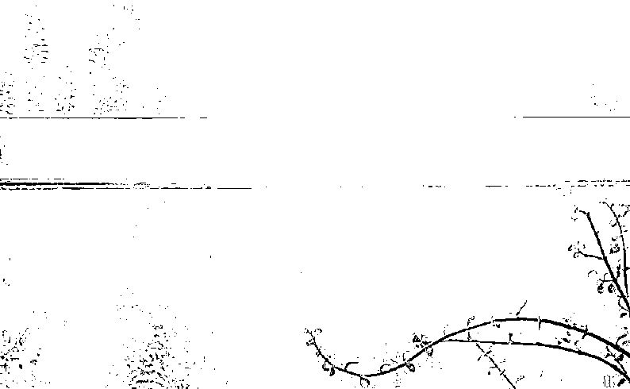**月亮的功课：28 天持续记录情绪**没有任何占星符号比月亮更重要。她是**母亲、家园、根基、食物、家庭需要、感受和习惯，同时也是我们对生活的无意识、直觉性的反应。**它与太阳积极的阳性能量相对，是**接受性的阴性能量，将我们与过去联结起来，并设定了现在的节奏。**奇怪的是，**月亮既代表一贯性，也代表变化。**这种鲜明的对照反映在她守护的水象巨蟹座，与它的擢升星座固定的土象金牛座中，它们一个起伏不定，一个稳固不变。从人类经验所反映的月亮的每月周期（里克·莱文所说的“月亮的”周期）中，我们看到了**恒定的变化**。我们通常都是我们自己，从出生到死亡。但是在永不停息的时间进程中，我们逐渐成长、成熟，然后死亡。时间的流动在我们出生之前就存在，也不会因我们的死亡而终止。**月亮教导我们，恒定和变化并非互相对立的能量，而是同一块布料上交织的经纬线。**对于在生活中缺乏恒定感的个体，月亮提醒他们注意，有一种永恒的模式让他们得以真实存在。**即使是最无厘头的人，在说话、走路、思考或行动方面也会有一些习惯性的方式，这便揭示了他们生命的恒定性**。即便是不断游荡的流浪者，也总是保持着自我。另一方面，对受困于僵化程式，缺乏情感灵动性的人，可以通过月亮发现内在的活动。我们可以学着去**变换“情绪”（moody）**——这个词也和“月亮”（moon）有着相同的词根，这里的变换情绪和抑郁的意义无关，而是包含了**运动**的意义。要做到这一点，有一个简单的方法：**每天记录下一至五个强烈的感觉，像这样持续记录 28 天（一个月亮周期），这会揭露一些变化，让我们看到情绪确实起伏不定。**意识到这个事实是打破自己的麻木迟钝的重要一步，最终会导向更为灵敏的自我呵护和滋养。占星学常常将水星与心智功能等同，这只说对了一部分。但是，**记忆**却与月亮关联。仿佛水星是相机的镜头或思想的眼睛，而月亮是记录影像的媒介。我们记忆中的过去影响着我们对现在的看法。**未解决的痛苦记忆可能在相似的环境中导致自我封闭。**哈维·杰肯斯（Harvey Jackins），这位再评价咨询协会（Re-Evaluation Counseling）的创始人曾说，**我们的聪明才智仅限于情绪允许的范围。与感觉，或与月亮的自我意识的联结，是最大限度发挥智力的关键。**当大脑产生了怀疑或不相信的中断信号，有益的方法是**再次核查我们的感觉，发现阻抗的根源在哪儿**。身体常常会感觉到它。当然，我们可能将自己的观念合理化，好像他们纯粹基于逻辑。但是，**在这个等式中加入月亮的情绪领域，可以带来基于主观的信息，从而形成有关当前情形的更加完整的画卷，开放意识，导向更好的选择。****月亮通常不会用言语的形式对我们说话。她生活在直觉的水域，在语言的层面之下流动。**在这个平面上居住的主要是意识，但是未能知晓它在我们行为中的角色也同样令人受限。**恢复我们自身之中非言语的面向，会带来一个主观的真相，当它与理智整合为一体时，就是发展真正自我认知的关键因素**。作为回报，这种联结会带给我们**意义、快乐和更深厚的满足感。****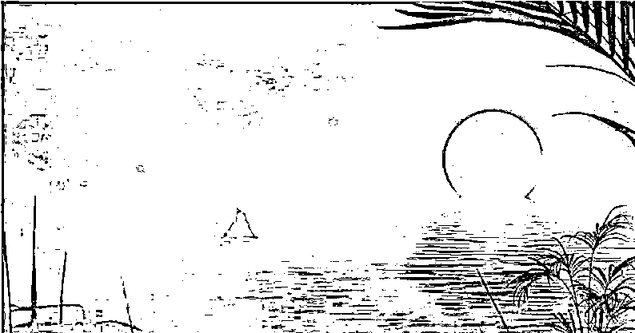****水星的功课：深呼吸**运用占星学主要是为了更加了解我们自己，理解我们的人生周期和人际关系。这些都是非常有价值的用途，在几千年的历史中一直发挥着它的作用，但这门宇宙科学还有另一个重要的好处，即帮助我们开发出一些能够应用于日常生活中的概念。这是因为太阳、月亮、行星以及黄道星座的符号是宇宙能量的密码。研究它们的特性和方式，表达它们，能够让我们成为更敏锐的地球居民。我们的出生星图反映了体验各颗行星的独特方式，揭示了与生俱来的挑战以及在生活中应用它们的机会。然而在另一个层面上，我们可以忽略这些具体条件，直接利用它们的能量。行星是原型，是超越我们个体人生故事的本质能量，可以为每个人所利用。把它们想象成各种工具，在我们需要的时候就可以加以应用。**水星这个敏捷的小个子是离太阳最近的行星。**水星每四个月左右逆行一次，这常常被解读为一段让交流和旅行的性质变得更加复杂的时期。然而，这个为期三周的退行阶段却是水星离地球最近的时候，这意味着我们在这段时间里更有机会接近这颗行星。水星给我们的馈赠是**客观性、思维能力和适应性**，在**水星逆行期间，**我们将在这些方面颇有所得。首先，我们可以**成为更好的自我观察者。**任何评判，无论是积极的还是消极的，都会阻碍我们观察的透彻度。无论你做的事是愚蠢的还是得体的，慷慨的还是自私的，你在看待这个行为时最好不要立刻将它描述为好或坏。举例来说，**我们会很自然地批评错误，但是简单地将这个过程推后，可以创造出一个中立的空间，让水星的智慧产生**。**在陷入自我责备之前深吸一口气，**这是一个好办法，可以赶走扰乱思想的情绪习惯。如果你可以，还可以继续第二次深呼吸、第三次……这样你将**打通觉悟和客观性的渠道，将水星的魔力转化为你自己的。****这颗信使之星对问题比对答案更感兴趣。**虽然在某些情况下这可能显得混乱复杂，但有效的做法是：**放下这样一种观念，即只有唯一一种正确的做事方式或思考方式。**这样开阔思维，让我们**看到各种不同的观点，让我们更加宽容，更具创造力。****现在，你要关注自己的情绪在什么时候让你的观点变得狭隘，然后深吸一口气（或两口、三口、十口……），再推进你的理念。**如果你提出的概念很好，那么一次活跃的讨论可以让它变得丰满，最终证明它的价值。如果不是，你就会知道需要做出什么改进，从而让它发挥作用。邀请水星的思考进入你生活的另一种方式是**保持身体的灵活性。**另外还有一些利用水星能量的方式，比如，**走其他路线去上班，改变日常惯例的顺序，将好奇心看得和效率同等重要。**这些简单的练习几乎不需要任何投入，却能开拓你的眼界和思维，让你看到现在无法看到的选项。它还能提升你倾听和表达的能力，让你的交流沟通技巧更加纯熟。记住，所有的行星都属于我们，都能为我们人类的意识所接受，只要我们敞开心扉，接受它们天然的状态。当我们进行这项水星功课时，个人限制就会消失，我们会变得比从前更聪慧、更明智。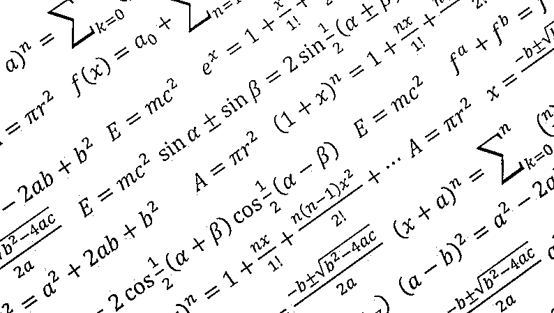**金星的功课：不带愧疚地接受****金星——吸引力之星。她是掌管爱与美的女神，是一个象征自我价值的占星元素。传统上称她为“小吉星”，她会带来积极的助力，但是要比幸运的木星在程度上稍逊一筹**。同样，她给人带来**快乐，象征着愉快与满足，就像大脑中的多巴胺（快乐物质）**。金星掌管着土象的金牛座和风象的天秤座，是**感官愉悦和社交满足**的源泉。让金星进入我们的生活，带给我们欢乐。她是玫瑰的甜美芬芳，是你品尝到的最美妙的食物，是绕梁三日的旋律，是织锦的柔软触感，是欣赏倩影的喜悦**。金星愉悦所有的感官意识，是风尚女王**。她还是一位迷倒众生的美人，举止优雅，她是技巧娴熟的调解者，一位可爱的伴侣。**金星吸引钱财和赏识，她教会我们看到自身的闪光点。**培养金星魅力的方法有许多种。最重要的一点是**善待自己**。**在我们状态欠佳时，这一点尤其重要。**爱上自己最不可爱的那一部分人格似乎有违直觉，好像是在鼓励不良行为。当我们愤怒、急躁、笨拙，甚至残酷时，作为一个有责任感的人很自然会批评这些行为。但是这些缺点与我们的伤口有关，在严苛的评判之下难以获得疗愈。**爱带来疗愈，而包容是爱的根源。**这并不是说我们赞同或希望继续这些负面行为，但是**如果我们通过贬低自己，积累了大量谴责的理由，那么这些习惯可能会隐藏起来，但绝不会被消除。**爱是包容，所以当我们**满怀怜悯地拥抱了自身的“不足”时，它们会与我们的优点整合在一起，最终获得疗愈。****这里的金星是一位接纳者，从自我价值的起点开始建造幸福的生活。**我并不是建议我们应该认可自己的坏行为，而仅仅是让大家记住，**不带严苛评判地去审视它们，是降低它们对我们生活影响力的有效步骤。**学习去接纳金星的另一面。许多人欲求不满是因为在追求目标的路上有一些阻碍。因为**有一些获得意味着对他人的亏欠，**好像每一份礼物都是我们需要偿还的债。我们会感觉自己**欠了别人的，拿走了他们的某些东西，或是放弃了独立性去满足自己所需**。有一种反击方式就是认识到**有许多时候，我们的接受并无任何交换回馈的义务。**当一个小宝贝的微笑或是美丽的夕阳温暖我们时，接纳它吧。享受这份愉悦，它们是免费的，它们并不期待回赠。当你安逸地窝在椅子里，享受毫无压力的简单时光时，请留意它。它们是金星的礼物，不用付出代价便给予你心灵的满足。**如果你想要让世界变得更加快乐，就让自己快乐起来吧。不带愧疚地接受**并不会导致过度放纵；它会带来满足，和一种平和的感觉，它会让你的周遭充满欢乐、爱与和谐。感激生命的祝福提醒你感激自己，反过来会让你更有吸引力。金星是甜蜜的和谐共鸣，它提醒你，你被爱着，你的存在就是他人乐于见到的礼物。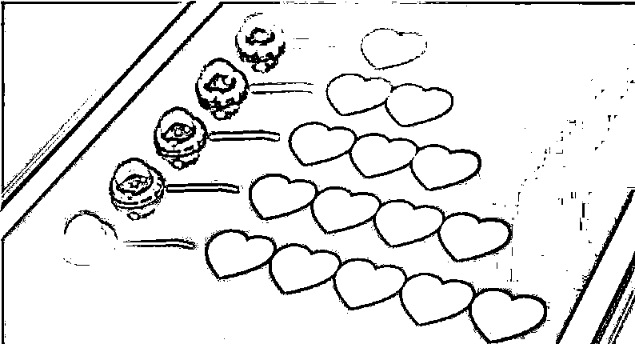**火星的功课：立刻行动**

水星和金星代表不同的联结方式：一颗与思想相连，一颗与心相连。原则上，这两颗行星对人和环境保持警觉，反应也都很快。但是，现在要说的这位来自宇宙的老师与聆听无关，它是关于**采取行动**的。这就是**火星**。

**火星是代表战士的行星，它活跃而且精力充沛，是创始者和煽动者。它是第一颗位于地球围绕太阳运转轨道之外的行星，充当着新领域的开拓者和侵入者角色**。火星是红色的，这反映了它**激励行动的激情，以及与愤怒的关联**。

**出生星图中的火星描绘了我们表达愤怒的方式，我们许多人都不会直接表达愤怒，或是简单地压抑它。**对这种情绪所持有的负面想法也在传统占星学对火星的称呼中可见一斑——传统占星学将火星称为小凶星，认为它是一颗“坏的”行星，但是没有“大凶星”土星那么艰难。

不管出生星图和人生经历让我们对火星产生了怎样的曲解，在这里，我们所关心的是火星的本质特性，经过一些练习，每个人都可以利用这些特性。首先，人们之所以不去表达自己的愤怒，一个关键原因就是他们认为**表达愤怒会伤害他人。**显然，我并不是在鼓励大家毫不顾虑后果就去行动。然而，我并不认为我们可以伤害到一个身心健全的成年人。

比如，“你伤害了我的感情”这句话通常意味着你触碰到了我已经很脆弱的部位了。这种脆弱并不是你造成的，但你却刺激了它。同样，我并不是说没有必要对他人保持敏感，我的意思是**触碰伤口不同于制造伤口**。而且，**当激起某人不舒服的感觉时，如果我们不因为内疚而责怪自己，而是仍然保持同情心，甚至有可能帮助他人治愈那些创伤。**

充分利用动力十足的火星火力，关键就在于**跨过障碍，采取行动，即使你还没有完全做好准备。**这不是说要你在做好准备之前就向公众展示一份重要的计划，而是说**要朝着特定的方向至少踏出一小步。**

**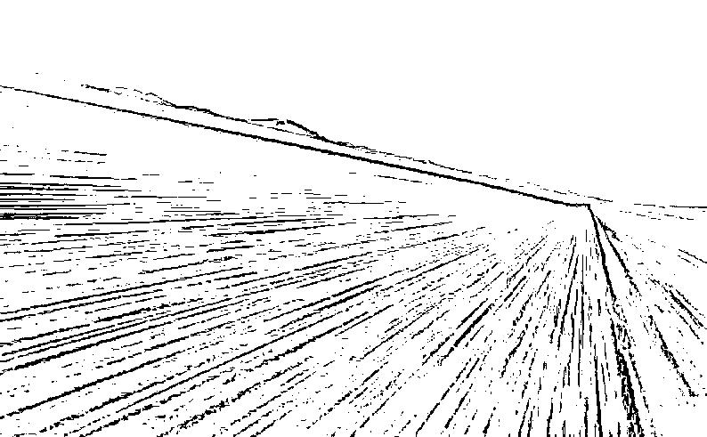**

你不一定要知道如何穿越新领域的每一个细节，但是**采取行动时，会获得一些在静止不动时无法获得的信息**。边做边学，直接从经验中学习，这是利用火星顺利启动停滞项目的积极方法。

当我们移动身体时，便触动的火星的能量，此时火星与**身体**相关。**锻炼肌肉能与这颗红色星球的强迫性能量联结。**但是没有必要通过跑马拉松来实现这一目标。仅仅是通过**散步、跳舞、游泳、练习瑜伽、普拉提，或是任何你能做的事，**就可以激起火星所传递的生命力。**增强体力会增加自信，甚至能为承担风险提供更多的勇气。****火星的工作并不是完成任务，而仅仅是开始任务。**利用其潜能并不需要做出终生的承诺，也不要求精确和完美。聪明的战士愿意去尝试，可以分辨出哪些战斗值得继续，哪些不值得。当我们尽可能有意识地充分活在当下，不太担心明天将会发生的事情，火星就会很好地服务于我们。

**版权声明：**本文由若道翻译，欢迎转发，反对抄袭。友号转载请申请白名单。

杰夫·焦耳

国际占星大会（UAC）和全美占星师联盟（AFAN）创始人，美国著名占星网 www.stariq.com 创始人。曾任亚特兰大协会主席和亚特兰大占星考试委员会委员。4 本占星书的联合作者，在全世界的 4 个大洲开办过工作坊。2015 年逝世。

**系统学习占星学**

**点击图片了解详情**

**微信又双叒叕改版啦，不想错过若道君的推送？**

**就把若道设为星标吧！**

**▼**

就是这个“在看”，戳一下☟

********报名直达入口********

# 8 月 7 日金星进入巨蟹座｜拥抱脆弱时，就能闻到爱的味道

> 原文：[`mp.weixin.qq.com/s?__biz=MzA5NjA0NTAxNg==&mid=2651423912&idx=1&sn=845a6414e2e559f335507af7c92c9341&chksm=8b4b361fbc3cbf0993f0e377fa6b2c5040a8abbcb6887fbe1d14231343f3be5e692b847187d3&scene=126&sessionid=1692738126#rd`](http://mp.weixin.qq.com/s?__biz=MzA5NjA0NTAxNg==&mid=2651423912&idx=1&sn=845a6414e2e559f335507af7c92c9341&chksm=8b4b361fbc3cbf0993f0e377fa6b2c5040a8abbcb6887fbe1d14231343f3be5e692b847187d3&scene=126&sessionid=1692738126#rd)

********************☆ 后**********************台**********************回复“今日”，给你一句生命态度********************

作者/郑玮玲 ISAR 认证占星师编辑/玫瑰 图片/全景网**人人都爱金星**

📹 [`mp.weixin.qq.com/mp/readtemplate?t=pages/video_player_tmpl&action=mpvideo&auto=0&vid=wxv_1461593108596293640`](https://mp.weixin.qq.com/mp/readtemplate?t=pages/video_player_tmpl&action=mpvideo&auto=0&vid=wxv_1461593108596293640)

|作者创作并弹唱的歌曲《寻觅》**8 月 7 日 23:21，金星终于结束了在双子座长达四个月的旅程，进入巨蟹座，此次金星将在巨蟹座行进至 9 月 6 日。**金星在双子座完成了 18 个月一次的逆行之后，已经深化这一年中关于**情感关系、内在价值与外在资源联接与交流**的意图，所有经由我们的思维、学习、交流而得到活化的领域，都为我们带来了深层的喜悦，实现并转化出了具有应变机制的，更富生命力的内在价值。巨蟹座的水象能量让金星可以完全释放，告别在双子座时期快速、灵敏甚至紧张的状态。将爱与美投入到更为灵动的感知的领域中去，和我们内在深层的情绪、情感开展深入的工作。**金星的本质是一颗联结的行星，是情感、感知层面的联结，也是内在价值与物质世界的联结。**金星所表达的爱与美的原型存在于万事万物中，每个人内在都有金星的意识，都在用独特的个人风格去表达金星的艺术，赢取金星带来的财富与价值。除此之外，金星的原型呈现还包括**在人际关系中整合内在完美的资源，从生命的时间线中做出忠于内心价值的选择。**巨蟹座，海洋母亲一般的星座，**孕育**——正是巨蟹座永恒的主题，由之而来的即是：**保护、滋养、安全感、疗愈、家、母亲和孩子，脆弱与坚强**。我们常把脆弱与巨蟹座联接在一起，“坚强”被赋予摩羯座的色彩，事实上却总看到“为母则刚”的演化过程。女人在做了母亲之后，面对生命的脆弱、无助，都变得更加敏感、易碎，也同时越发坚强，能完成独身时无法完成的挑战，能生出做母亲之前没有的勇气和毅力。生命越是脆弱敏感，越是必须坚强，从手无缚鸡之力到能单手抱孩子，从需要被照顾到什么都能承受，这样的演化成长，只有一个核心，那就是：**生命**。巨蟹座正是为着生命成长，为着保护生命而生长出的爱的能力。如果爱是一阵风，爱的能力就是气温带来的气流；如果爱是一座山，爱的能力就是这山中的万物与季后；如果爱是一片云，爱的能力就是它变幻的姿态；如果爱是大海，那我们永远都活在它之中，我们也永远具有爱的能力——水的形态存在于一切物质空间，外在的环境和我们内在的身体，每一滴汗水、眼泪、液洫、体液、血液都是我们爱的能力。而巨蟹座是一个水象创始星座，通过水，它开启、创造了一切，它的目的是：**温暖**。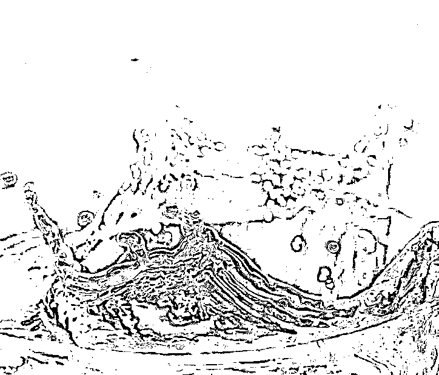**金星巨蟹座的人**当金星行走在巨蟹座，爱与美的女神游向了大海深处，这里是支持她阴柔娇媚的水域，也开启了通往深邃的直觉力的道路。巨蟹座让金星的联结力被安全的机制接纳，与感受、感觉深度协作，越是熟悉的美好，越能让巨蟹座的金星打开感知和享受到愉悦。打开敏感的触角的金星能量会伸向关怀与温情的世界，让我们**更欣赏、更享受温暖的事物，爱上充满“家”味的一切。****金星巨蟹座的人并不常是宅家族，但他们的眼光总是被温暖的家饰所吸引（而不是华丽和有质感的家饰），他们可能也不擅长料理，但会对有“家”味的食物有特殊喜好。**同时，金星巨蟹座的人往往给人**“在情感中表现怯懦”**的印象。无论男女，他们在情感中常常**选择被动**，并非无法选择，而巨蟹座的安全需求促使他们要拥有一个**“壳”**，正是这层壳让他们感受到了安全，也隔离了一些联结的可能。**他们会选择看起来更像家人，更有烟火味的伴侣，而不是更“理想”的伴侣。**甚至有些金星巨蟹座的人**对进入亲密关系本身就带着恐惧，选择一直留在自己的“壳”里。**
**金星巨蟹座：爱的味道**金星和**嗅觉**有关，**香味、味道、品味**也是金星的领域，巨蟹座也象征**婴儿和母亲**。**母亲和孩子之间的情感互动**正是典型的金星巨蟹座的运作模式。新生婴儿身上带着的“奶娃味”其实是羊水的味道——那就是子宫天然的味道，婴儿身上的味道会让产后母亲迅速分泌乳汁，催乳素分泌就会带来血清素、多巴胺的分泌，血清素让母亲感受到幸福、愉悦、满足，多巴胺正是“爱的荷尔蒙”——这就是母爱的本能。一个健康的新生儿在没有人工干预的情况下可以在出生 45 分钟之内自己找到乳头并吮吸的，这是婴儿、人类的本能。而乳头的味道正是羊水的味道。这就是人类生命得以延续的最初模式，如同巨蟹座的创始之力，在生命之初的滋养、保护。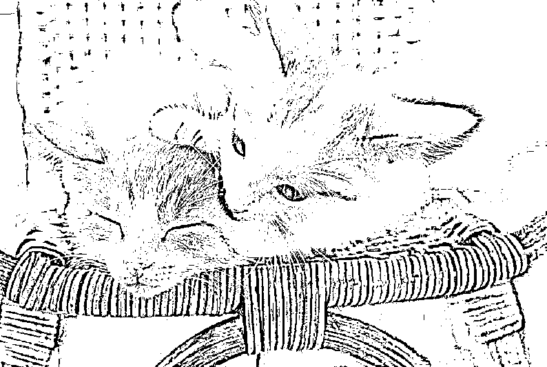人的本能是通过味道找到自己的妈妈，寻求滋养，保护。**通过嗅觉认识彼此**，是金星的能量，每个人星图中的月亮是母亲，金星也是母亲，金星的部分与美好的母亲、母亲的味道更有关。我和我的女儿有持续两年的同一段对话。女儿从一岁会说话起就爱蹭在我怀里说：“妈妈好香啊，香妈妈。”每次我都问她：“是什么香啊？我怎么闻不到啊？”到了两岁多，她会渐渐表达说：“妈妈味。”每次我会继续追问：“妈妈味是什么味啊？”到了快三岁的她终于有一天告诉我最终答案：“就是妈妈和桃子在一起的味道啊！”我还是继续追问：“那到底是什么味道啊？”“那就是爱啊。”当时的我感动到眼眶全湿，紧紧搂着她，看着怀里的也闪亮的眼睛。这就是爱。是我三岁女儿教给我的纯真的爱的智慧。每当我想起这个场景，依然是眼眶湿润。在巨蟹座的爱里，一定有水在流淌。
**金星行进在巨蟹座的影响**金星在巨蟹座行进的一个月里，受影响最明显的是有**个人行星、交点、轴点位于巨蟹座、天秤座、摩羯座、白羊座、天羯座、双鱼座**的人。你们需要**关注生活中细微的情感变化，情绪波动**。任何情绪化的境况都可能触及金星的价值观与情感地带，同时**关注自己和家人的身体健康，做一些建设性的养生尝试，照顾好身体**才是真正的幸福源泉。金星在巨蟹座适合做的事：**美化你的家、家居、家装、家饰，爱上厨房，爱上料理，用美食滋养身心，从食物中获得愉悦。享受喂养的乐趣。享受疗愈的艺术。****金星巨蟹座的爱**

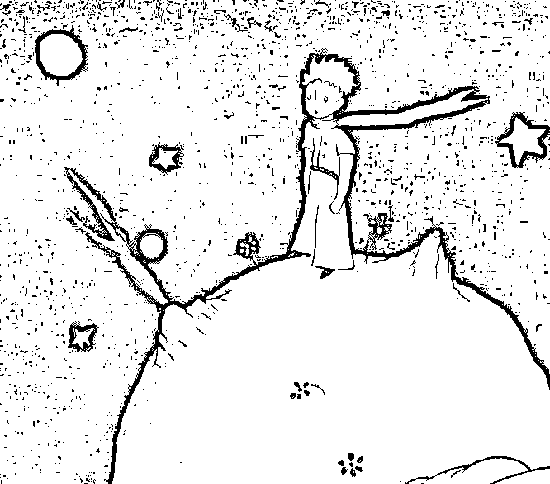

|《小王子》
风靡世界的成人童话《小王子》的作者安东尼·圣埃克絮佩利，正是太阳、金星巨蟹座。每一个内心留守着脆弱与童真的人应该都曾被小王子温暖过，感动过，我们都曾渴望去往 B612，都希望和自己心中的玫瑰花永不分离。当小王子在沙漠中辛苦跋涉后来到了一片玫瑰花园，他发现了五千朵玫瑰花时，感到悲伤、震惊。他的花曾告诉他：她是全宇宙中唯一的一朵花。而她为了避免被人取笑，会假装快要死掉。小王子说：“而我也不得不装出一副要细心照顾到她好的模样——要是我也不如此低声下气的话，她会真的让自己死去······。”狐狸告诉小王子：你在她身上投入的时间，才让她变得如此重要。你要永远为你所驯养的东西负责，你要为你的玫瑰花负责。重要的事情肉眼是看不见的。如果你爱一朵长在某颗星星上的花，那么，在夜晚仰望星空是一件很甜美的事。所有的星星都在盛开着花。如果我们能**为我们的爱负责**，巨蟹座的金星则向内平衡了外显的脆弱，整合出了内在的力量。这正是与巨蟹座在黄道同一轴线上摩羯座所代表的坚强与责任，爱与温情是需要时间的承诺，坚强的担当来实现的。**金星行进在巨蟹座的重要相位**金星与摩羯座的木星、土星、冥王星激烈对分**影响时长**：**从 8 月 20 日一直持续到金星进入狮子座。****重点影响人群**：有**个人行星、轴点、交点位于巨蟹座、天秤座、摩羯座、白羊座 11°-29°的人。**2020 年，木星、土星、冥王星在摩羯座的三重合相一直在持续演化，当你的出生星图中有任何创始星座（白羊座、巨蟹座、天秤座、摩羯座）的行星、轴点、交点被历史性的三重合相击中时，你就能感受到它们巨大的扩张力、压力与转化诉求。在集体的层面，全球性疫情带来的危机与转机，对生活、经济、就业、生存、环境、意识带来的冲击与影响正是三重合相在集体层面的切实表达。而当金星行经巨蟹座时，必然触碰到摩羯座三颗行星已然开启的时代氛围：**金星所代表的金钱、经济、财富的巨烈动荡**。我们已经看到，全球性经济危机下，无数的行业在经受历史性的挑战。巨蟹座的金星在短期内为我们提供的视角是：**关注本地资源，故土价值**。因为巨蟹座代表的“家”，正是金星所代表的金钱、财富所拥有的土壤与环境。在过去很多年里，人们已经习惯了暑期蜂拥、频繁旅行，国际航线每到夏天都满舱，机场、码头、车站穿梭着自由又疲惫的旅人。我们要去到所有没有去过的地方，去看所有没有看过的风景。然而，疫情蔓延之后，国境关闭，经济、政治的壁垒再次出现——如同土星、冥王星在摩羯座最后也最强势的威力在极速显化。我们需要**臣服在时间与管制里，接受有限的自由空间。****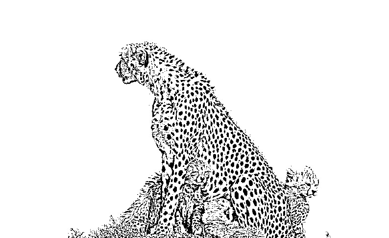**但是生活总归是自由的，金星作为代表选择的行星依然鼓励我们做选择，而这一次，她让我们**尽可能选择当地、本地，家乡的旅行线路**。这就像是素食主义者和环保志愿者们一直倡导的“本地食物”一般，让人们最大限度地减少能源消耗，为着地球万物共生和个体健康做出更好的选择。利用当地资源正是一方水土养一方人。而我们曾经过度向世界探寻，太频繁、活跃的国际流动、迁徙，在当下被宇宙能量叫停了。我们曾经没能看到的微小的弊端渐渐演变成为全球性的危机，当然这一点跟行进在双鱼座的海王星也不无关系，整个太阳系的行星在共同描述我们当下的世界。当我们在不知不觉中超越了宇宙的极限、边界时，行星们就给我们向内的力量，让我们回到自己的原生地，在这局限的空间里重新发现、选择、创造，找寻到全新的价值，享受此刻能感受的愉悦吧。金星四分火星****影响时长**：8 月 27 日开始，金星将与白羊座火星形成四分相，这个相位会持续到金星进入狮子座早期，在金星换座前 9 月 3 日-6 日达到最紧密。****重点影响人群**：有**个人行星、轴点、交点位于巨蟹座、天秤座、摩羯座、白羊座 19°-29°的人。**金火的摩擦必然带来激情的火花，刚柔之间，迸发出的激情正是吸引力法则的呈现。另一方面，我们也需要提醒自己，火星代表战争，金星代表和平，**敌对、较量、攻击、对抗**都会出现在这个相位时期。而白羊座的火星显然是更加有力的，巨蟹座的金星很可能在情绪上为我们制造一些麻烦，平添**优柔、怯懦**。四分相的张力告诉我们：**要调整内在情绪的纠缠，对脆弱和敏感进行工作，懂得在正确的时间、地点做防护、滋养身心的工作。**当我们内在养分充足，精力充沛的时候，才可能向世界去发出自我的力量。同时，这个相位对亲密关系也会带来考验。**在关系中的人，警惕可能面对一些突发的冲突与纠葛，单身的朋友如果期待进入关系，则需要调适好内在力量与自我保护机制。****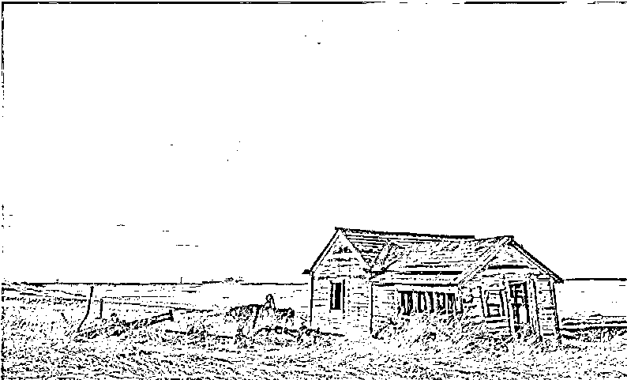**金星三分海王星**影响时长**：**8 月 22 日-9 月 3 日****重点影响人群**：**个人行星、轴点、交点位于巨蟹座、处女座、天秤座、天蝎座、射手座、摩羯座、双鱼座、白羊座、双子座 13°-26°的人。**海王星被认为是高八度的金星，当它们彼此都落在水象星座时，更加剧了**在情感、艺术、美的感受中消融的进程**。这个相位的确在向我们诉说着“浪漫”与梦幻。但是要非常小心去面对三分相所带来的舒适，因为**海王星很可能让我们麻木，沉醉在一些幻像之中，虚无缥缈并不是生活本身**。如果你能够在此期间进行一些**灵性探索**，在**占星学、艺术、深度心理**的途径中感受内在的喜悦，用灵性的泉水滋养身心，你将会**完成神圣的自我超越，甚至神启**。非常建议做一些**梦的工作，或是参与艺术疗愈的活动。**金星六分天王星影响时长：**8 月 15 日-23 日****重点影响人群**：有**个人行星、轴点、交点位于金牛座、巨蟹座、天秤座、天蝎座、摩羯座、双鱼座、白羊座 6°-14°的人，以及个人行星位于射手座 9°-11°的人**，金星与天王星在行进会与你的行星形成非常难以调试的“上帝的手指”格局。金星与天王星的相遇，可以说是“金风玉露”的闪电交汇，**惊喜、刺激、兴奋**，同时伴随着**不稳定和随时撤离、抽空、崩塌的险境**。金星巨蟹座需要的安全舒适会遭遇到天王星突如其来的碰撞。理想的情况下，我们可以借用六分相带来的积极作用去**适应新的改变、新的模式，感受新的情感，带来新的意识与更新内在的能量。**在金钱方面需要留意机遇的快速变化，**在投资、理财方面，如你想尝试新兴的方案和领域，需要保持慎重，避免承担难以承受的风险**。在感情方面，则需要**回到自身的诉求。**当我们清晰自己是谁，需要什么样的情感关系时，外界的强震和不稳定也只能成为一面摇晃中的镜子，让我们**从破碎中回到内在稳定和富有滋养的情感关系中。**

**版权声明：**原创文章由作者授权首发于若道平台，欢迎转发，反对抄袭。友号转载请申请白名单。

**郑玮玲**

ISAR（国际占星研究协会）认证占星师（2016 年获得）

若道占星专栏作者

将占星咨询、教学与音乐、舞蹈相结合的疗愈者

**微信号**：zhengviolin

**新浪微博**：@郑玮玲

**微信公众号**：Sampriya-Astrology

长按打赏

******想要跟随邓肯老师学习卜卦占星学？******

**点击下图了解详情**

**微信又双叒叕改版啦，不想错过若道君的推送？**

**就把若道设为星标吧！**

**▼**

就是这个“在看”，戳戳戳 ☟

********报名直达入口********

# 顺势疗法祖师爷传奇人生经历 | 医者仁心的塞谬尔·哈尼曼

> 原文：[`mp.weixin.qq.com/s?__biz=MzA5NjA0NTAxNg==&mid=2651423851&idx=2&sn=cd6ebb10391a47eebde031d8cdb54b7f&chksm=8b4b36dcbc3cbfca7af2103b5db7c59d8d5efa6d17234ca772caedb23000553fc36b2e459ed5&scene=126&sessionid=1692738126#rd`](http://mp.weixin.qq.com/s?__biz=MzA5NjA0NTAxNg==&mid=2651423851&idx=2&sn=cd6ebb10391a47eebde031d8cdb54b7f&chksm=8b4b36dcbc3cbfca7af2103b5db7c59d8d5efa6d17234ca772caedb23000553fc36b2e459ed5&scene=126&sessionid=1692738126#rd)

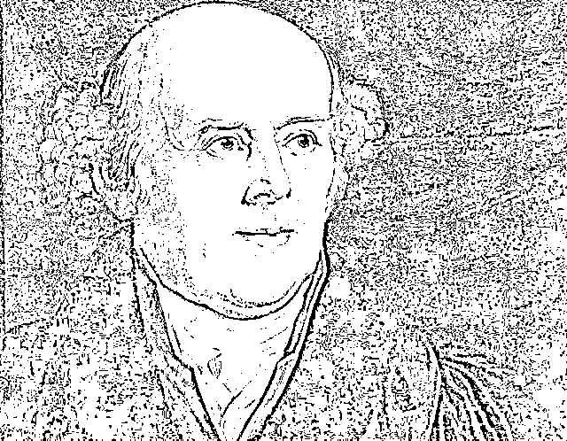

作者/若道君 

 编辑/玫瑰 图片/网络

提到顺势疗法，若道的读者们应该都不陌生了。那么，你知道顺势疗法的创始人塞谬尔·哈尼曼，这位祖师爷到底为什么放弃自己刻苦研习多年的传统西医，反而转向创立顺势疗法？搬好小板凳，来听若道君讲故事吧！就像“魔教”创始人其实都是从名门正派出来的一样，德国人塞谬尔·哈尼曼先生其实也是如此——出生于名门正派。
**医学系学霸的养成之路**

哈尼曼 1755 年出生于德国梅森小镇（*Meissen*），他的父亲是陶瓷绘画师和设计师，家境不富裕。他从小就是学霸，文理科都好，尤其有语言天赋！ 

**哈尼曼母语是德语，除此之外，他年轻时就精通英语、法语、意大利语、希腊语、拉丁语，后来他又精通了阿拉伯语、古叙利亚语**。学霸家庭不富有，所以年轻时他就靠教语言补贴学费。

**青年哈尼曼 20 岁进入莱比锡大学学习医学**，但他很快为学校没有相关诊所或医院等设施感到失望，为了获得临床经验，22 岁转学到了埃朗根（Erlangen）大学，9 个月后，这里高昂生活成本又迫使他放弃学业（虽然在大学期间，这位优等生就已经翻译了 4 本英文的医学书籍）。

尽管弃学，但他已经给一位担任皇家法院医生的教授留下印象深刻，他将哈尼曼引荐给一位富有的顾客——一位省长做家庭医生，而这位省长拥有一个非常大型的图书馆，那里有各种古代珍贵的书籍和手稿，还有炼金术、神秘学著作。他沉浸在这些书本之中。**24 岁，他完成毕业答辩，获得医学博士资质，开始开业行医，同时，他专注于化学和实用药学的学习和研究。**

到此为止，这位即将成为顺势疗法创始人的青年的人生都还算正常，出生于普通家庭，通过自己的奋斗获得了良好的医学教育，终于毕业并成为可以执业的医生，还结识了省长级别的权贵，大好前景就在他的脚下。

**然而，如果命运要一个人成为一个“异端”创始人，这个人就必然没法走寻常路，青年哈尼曼也不例外。**

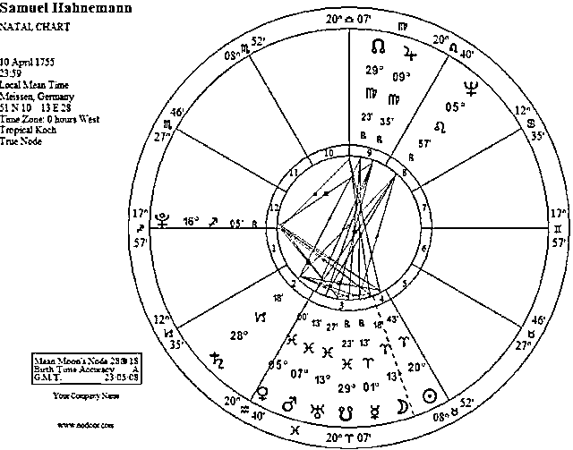

**丨**塞谬尔·哈尼曼的出生星图 

土星回归年，他决定弃医从文**29 岁，土星回归的那年，哈尼曼做了一件让人吃惊的决定，他宣布他放弃执业，不再当医生了！**这可不是因为“世界那么大，我想去看看”这样一个文艺青年的浪漫决定，要知道，那时他已经结婚生子了，他也没有一个富裕的爸爸。是什么让这个好不容易奋斗到今天的年轻人放弃医生生涯呢？**因为在他自己的行医执业中，发现当时的医学理论错误百出，药物不仅常常无效，而且对病人带来很多危害，对于这样的情景，他实在没有办法忍受了。**不干医生怎么赚钱呢？此时他的语言天赋又派上用场了！别忘了，他精通 7 门外语！哈尼曼成了职业翻译！他翻译法文书、英文书、拉丁文书…….高质量的翻译作品让他在学界得到了高度的认可。不过，这些翻译挣不了多少钱，因为贫困，他不得不把家搬到农村以节省开支，但这些都无法阻止哈尼曼顺着自己的兴趣发展的决心。在这个时期，他继续研究化学，撰写并发表了相当数量的化学论文，并在科学界获得很高的评价。他的研究包括什么呢？说几个有趣的大家听听。他对于鉴定药品纯度是否掺有杂质或者掺假，检测溶液中的微量金属及其含量，提出了许多鉴定方法。他还钻研法医学，针对一些毒品，比如砷的投毒反应、治疗和司法调查出版相关著作。在哈尼曼离开医生行业后，他在埋头翻译、钻研药学和化学、发表论文中度过，日子宁静而贫困，他说：**“我静静目睹命运将天意放进我生命中的每一天，我生命的时日在她的手中。”**他当时还不知道，命运女神很快就把一个伟大的发现放入他的生命之中，而这个发现会让他的生命道路变得更加曲折。

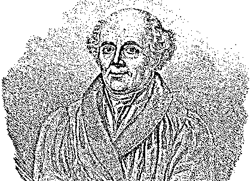

**丨**塞谬尔·哈尼曼的肖像  

**顺势疗法之父，把自己当作小白鼠**1790 年，哈尼曼已经 35 岁了，某日，他在翻译苏格兰教授卡尔伦的一篇论文时读到一段话：“金鸡纳（奎宁）可用来治疗疟疾，但它同样可以引起健康人出现类似疟疾的症状。”这段话引起了他的极大兴趣。因为哈尼曼也精通希腊医学文献，他知道早在公元 400 年，医学之父希波克拉底也发现：**服用某些大剂量的天然物制剂能引起健康人产生疾病的症状，而使用小剂量的同类物质却能缓解这些相同的症状**。但当时，希波克拉底这一发现并没有引起重视。哈尼曼因为对当时药房的制药很不满，一直自己致力于研究药物，于是决定把自己作为小白鼠来实验。他一次服用了 22.5 克 2 天剂量的金鸡纳，使他吃惊的是，他的身体产生了所有疟疾的症状：骨头疼痛、体温忽冷忽热、心跳加速、极度忧虑及疲乏等等，典型的以发热为主的疟疾症状在自己身上出现了。由于他精通药理学，很清楚药物毒性对人体的危害，于是尝试将药物进行无数次的稀释和振荡，当药物稀释振荡至一定程度时，特别是浓度小于 10 的负 23 次方，药效不但没有降低，反而强大许多，且没有毒性。于是，**他发现“相同者能治愈”的顺势疗法基本原则。由此，哈尼曼开创了顺势疗法的新时期。**使用在金鸡纳之后，哈尼曼继续拿自己、家人、朋友做实验，一个药品接着一个药品用在健康人身上，这些实验的结论是一致的，**那个令健康人产生相关疾病症状的药品正是治疗这个病人的药品**。他发现了无数从未想象得到的药理现象 ，并把实验数据非常详细地记录下来，在后来的书籍中，**哈德曼称自己是实验药学之父**。

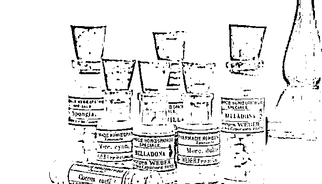

**丨**顺势药物  

颠覆世界的“异端”疗法 1796 年，哈尼曼 41 岁时，在 6 年观察和实验后，他公布自己在医学领域的新发现，通过论文的方式，热情洋溢地希望将这个新发现推广给他的同行。可他撞了个鼻青脸肿。想想看并不奇怪，别说那时，就是现在，人们也很难理解这种疗法。**顺势疗法对于医疗界的颠覆性太大了**。稍微介绍一点医疗知识就知道，传统的西医一直使用的医疗原则为对抗法则，对抗性治疗。这一点，从西药的名称就可以看出来，抗生素、消炎药、抗惊厥药、降压药、抗抑郁药，抗精神病药等。传统的西医用的是对抗法则，而顺势疗法所做的正好相反。**这样理念的颠覆性不能被理解，而且威胁到了正统医生和西药房的地位。**而且，当时的医生们还有一个很让人信服的说辞，毕竟，哈尼曼不执业已经很久了，虽然他一直在从事与医疗相关的研究，医生们说这不过都是纸上谈兵。然而，机会很快来了。1799 年，哈尼曼 44 岁时，一场猩红热席卷了哈尼曼当时所在的孔宁斯路特市（*Konigslutter*），如今已经很少会有人因猩红热而致死了，但猩红热却是历史上最严重的儿童杀手之一。当年的这场疫病让很多医生束手无策，然而哈尼曼用他自制的药品，不仅有效治愈了猩红热，还在猩红热预防方面取得了很好的成效。让他意料不到的是，当地医生联合药房一起抵制他，最后，这位治疗猩红热的功臣竟然被迫离开城市。更加不幸的是，在他前往另一个城市汉堡的途中，遇到车祸，他刚刚诞生不久的一个男孩因此遇难了。**不过，哈尼曼有效预防和治疗猩红热的消息传了出去，他所用的药品立刻变得需求大增。**这个药物就是颠茄。我们在今后的文章会介绍它。2 年后，哈尼曼于 1801 年在汉堡发表了自己对颠茄的特性及其在预防和治疗猩红热方面的研究，然而，这样的分享没有能让他的对手停止攻击他，他又只能离开汉堡。他想给医生们传播他的方法和理念，但却在一个个城市吃闭门羹，甚至遭到迫害，在 5 年间，迁徙了 6 次，从一个城市迁徙到另外一个城市，直到 1805 定居托尔高（*Torgau*）。

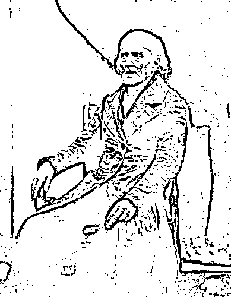

**丨**顺势疗法之父塞谬尔·哈尼曼，摄于 1841 年

**医学名门正派的强势围攻**50 岁的哈尼曼再次放下行医生涯，把自己的精力全部投入到研究和著书中去，写出 3 本巨著，其中一本是《**The Organon》**第一版，**这是顺势疗法的概念和原理系统的阐述，至今仍然是一本必读宝典**。在书籍写完后，他又投入行医生涯，直至延续到他生命尽头。1811 年，56 岁的哈尼曼重回他青年时求学的城市莱比锡，莱比锡仍然是德国医疗中心，36 年前，他在这里求学、毕业、成为一个年轻的医生，又放下了自己的执医生涯，而现在，56 岁，**找到了全新的治疗方法的他，要在这里重新向医疗界推广他的新的理论**。他不再试图说服那些老医生和老药剂师们了，他的热情给他带来的只有偏见、嫉妒、嘲讽、迫害，他转向那些还没有如此坚定偏见的学生和年轻的医生，他们想弄清楚和试验哈尼曼新令人吃惊的医学理论。在 1812-1921 年期间，他每周三和周六下午会举办 2 场讲座，教授顺势疗法知识，并且出版了重要著作**《Materia Medica》**1-6 卷。1813 年，德国传染性斑疹伤寒盛行，斑疹伤害是那个年代最可怕的瘟疫之一，哈尼曼的药物成功地治疗了这个疫病，并使他的批评者暂时沉默了下来，他也变得更加有名。然而，名望随即为这个“异教徒”带来了指责、诽谤、审判的阴影。医学界和药剂师行业对他的批判逐年升级，**1819 年 12 月 16 日，莱比锡药店协会向市议会提交了一份报告，控诉他自己研制药品侵犯了协会的权利，投诉他违法开药。**他败诉了，失去了开药权力。要知道，顺势医生的行医主要是开药，其实，他因此失去了行医权利，这是在逼他离开莱比锡。好在天无绝人之路。1821 年春天，科腾大公向 66 岁的哈尼曼发出邀请，作为他的私人医生前往科腾，在那里，大公允许他拥有自己的开药权力，于是，在莱比锡居住 10 年后，哈尼曼带着他的家人和两位高徒一起离开了莱比锡。如果哈尼曼只活到了 66 岁，那么，我们看到的故事是一个令人唏嘘的故事，一代大师忍受不了名门正派的错误做法，青年时期就叛出山门，放下名利、甘愿忍受贫穷，隐居山林，以身试毒，潜心钻研，发明了新的医林绝学，出山后匡救苍生，然而却受到正派人士的不解、嫉妒、憎恨、围攻，逼得他在花甲之年再次远走，最后抱憾而去。好在，哈尼曼的生命没有完结在这一年。

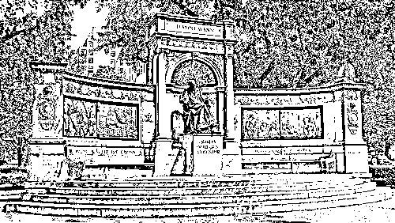

**丨**美国华盛顿特区塞谬尔·哈尼曼博士顺势疗法纪念馆

**“异教徒”的命运反转**不久，命运之轮开始翻转了。在哈尼曼离开莱比锡 6 个月之后，**1821 年 11 月 30 日，顺势医生们的请愿收到了皇家的回应，一道皇家法令赋予顺势医生自己开药的权利，这是顺势疗法第一次得到正式确认。**同年，第一本顺势疗法期刊在莱比锡出版。在科腾期间，哈尼曼远离主流医学界，除了行医之外，他将极大的经历投入他最重要的两本书籍 Materia Medica 和 the Organon 的修订和撰写,并且更深入地思索疾病的起源和疗愈。**1828 年，哈尼曼 73 岁时，出版了《慢性疾病：其性质及顺势治疗》，震动了对抗疗法和顺势疗法的世界**。此前，连他的学生都央求他暂时不要出版这本书，怕本来就广受争议的顺势疗法因为他的书籍再受影响，但白羊座的哈尼曼已经不再愿意受到任何人的干扰了。**接下来的时间里，荣誉接踵而至**。1829 年 8 月 10 日，哈尼曼 74 岁时，他毕业的著名医学院所在的城市为他举行了盛大的节日庆典。整个城市因此换了盛装，他的学生和朋友们蜂拥而至向他致敬，大公和大公夫人赠予他丰厚的礼物，著名画家画的肖像画也在节日上揭幕。随后，顺势医学推广和发展协会成立，哈尼曼成为终身主席。**1833 年，哈尼曼 78 岁时，在莱比锡，第一家顺势医院成立了。**哈尼曼的故事仍旧没有结束。高潮在他生命的最后时期展开。在他的第一任妻子去世四年半后，一位 30 多岁的法国贵族女士梅兰妮进入了他的人生。她先是成为他的病人，然后是顺势疗法的学生，然后是他的爱人。1835 年 1 月 28 日，80 岁的哈尼曼娶了 35 岁的新娘，并在 6 月 7 日搬到巴黎。尽管这一婚姻引起非常多的嘲笑和诽谤，但哈尼曼收获了人生最后 8 年的幸福。梅兰妮在法国有很好的社交圈，他与年轻的妻子在巴黎建立了蓬勃发展的医疗实践，成为名人和贵族的首选医师，并为穷人提供免费治疗。他在巴黎期间仍不断实验着顺势疗法新的药物、新的治疗方法。哈尼曼生命的最后 8 年非常幸福，有和他志同道合的年轻妻子的陪伴，医疗生涯受到巴黎名流的尊重和推崇，能够继续自己的研究和发明。看来，活得久对于“异教徒”真的很重要。哈尼曼晚年患了老年支气管粘膜炎，他的妻子在他患病时说：“你让那么多人免除痛苦，而你却在你艰难的一生中遭受那么多不幸，所以上天应让你免除痛苦，这是他欠你的。”哈尼曼回答说：“**为什么我应该免于受苦？这个世界上的每个人都按照上天所赋予的恩赐和权力来工作，神给予每个力量，也许每个人在人世间的审判席上得到或多或少回报，但他可以在神的审判席上没有什么要索取的酬劳。神不欠我什么，但我欠了神很多。**”顺势疗法之父活到了 88 岁，1843 年 7 月 2 日在巴黎过世。**顺势疗法在欧洲、美洲，俄罗斯和印度迅速扩展开来。**在他死后，一首诗说出了他的一生：

**哈尼曼不需要宏伟的墓碑**

**在他的墓上，天堂的意识徘徊**

**一个天使说**

**他献身责任、科学、艺术**

**人类的福祉和上帝的服务**

**第二个天使说**

**毫无疑问，真的好、善、有益永不消失**

**第三个天使徘徊在那里**

**在我们的凝视中挥手**

**哈恩曼的名字和那句名言浮现**

**他的一生没有虚度**

请在后台回复 顺势 获得更多****关于顺势疗法内容****

**版权声明：**本文由若道翻译发布，欢迎转发，反对抄袭。友号转载请申请白名单。

**学习顺势疗法**

**请点击下图了解详情**

就是这个“在看”，戳戳戳 ☟

********报名直达入口********

# 摩羯座-巨蟹座的整合秘诀 | 事业家庭两手抓，两手都要硬

> 原文：[`mp.weixin.qq.com/s?__biz=MzA5NjA0NTAxNg==&mid=2651423851&idx=1&sn=18646de5d78d6cfcba97d2ac11a4a1d6&chksm=8b4b36dcbc3cbfcab619a50caff9039446e0d6f157f26ad63e1803da72e112ab5228bbeda146&scene=126&sessionid=1692738126#rd`](http://mp.weixin.qq.com/s?__biz=MzA5NjA0NTAxNg==&mid=2651423851&idx=1&sn=18646de5d78d6cfcba97d2ac11a4a1d6&chksm=8b4b36dcbc3cbfcab619a50caff9039446e0d6f157f26ad63e1803da72e112ab5228bbeda146&scene=126&sessionid=1692738126#rd)

**********☆****************后台回复“今日”，给你一句生命态度**********

作者/特蕾西·麦克斯
译者/王宏 编辑/玫瑰 图片来源/全景网本文摘译自《How to handle your T-square》《如何整合你的 T 三角》

如果你的出生星图里既有行星落在巨蟹座，又有行星落在摩羯座，那么可以参考此篇文章。以及 4 宫和 10 宫，还有月亮和土星被强调的，都有参考的价值。

**巨蟹座-摩羯座轴线**

**巨蟹座-摩羯座的对分相表明你经常感到情感的贫瘠和缺乏。**因为**童年时期没有体验过被照顾的温暖与明智的纪律之间的健康平衡，所以在成熟后，作为有能力的成年人，很难满足自己的情感需求。**

一方面，你变得**过度依赖于其他人，并想要他们来照顾你**；另一方面，**为了满足别人的需要，表现你的独立和责任心，会对自己提出过高的要求。**

当自己始终无法得到满足时，就不能真正帮助他人，或者感激他们给与的关怀，因此你变得越来越**沮丧和自我怀疑**。你会**退缩回自己的壳里，不断沉思、担忧，既不能给与，也不能接受爱**。抑或是，你**通过依附于家人或完全投身于事业，将情感的满足替换为安全感。**过度专注于作为家长的角色，你可能**无法成功地通过自己的孩子来满足自己的需求。**

试图通过依赖性的爱或是强迫性的工作来满足你所有的需求，这并非解决你困境的办法。**你的忧郁和不满阻止你集中精力，专心致志地做手头的工作。你对家庭的依赖会削弱你的活力，并让你变得越来越不自信。**你变得越消极，行事就越没有效率；行事越没有效率，你就变得越消极。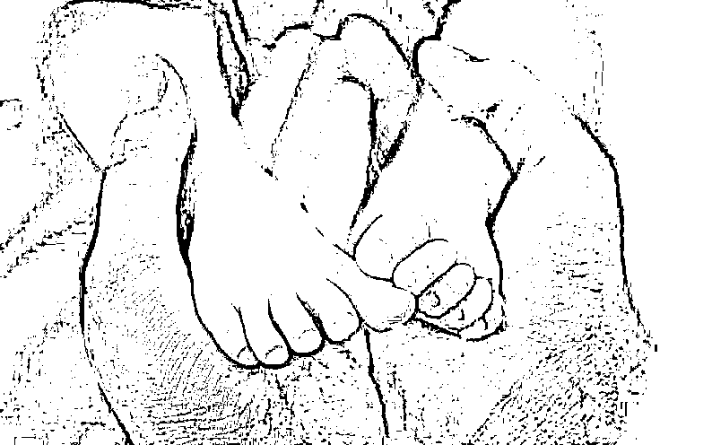**巨蟹座-摩羯座的两极**巨蟹座**关键词**  **喜怒无常 情绪不稳定****善变 敏感 脆弱****善解人意 富有同情心****反应灵敏 充满母爱和温情**

**保护 溺爱他人 令人窒息 **

**依恋性强 依赖于他人**

**被动 害羞 退缩**

**有灵性 直觉感强 适应无意识的发展根基**

**寻求个人滋养 关心个人和家庭**

**以家庭或家为核心 渴望家庭安全感**
摩羯座**关键词**  **克制 封闭 情感压抑 自律**

**感觉迟钝 冷漠 坚忍**

**疏远 孤立 冷淡**

**充满父爱 划定界限**

**控制 运用权力和权威**

**独立 勤奋 果断 **

**情绪稳定 高度自觉**

**适应外部现实 以成功为导向**

**有****抱负 寻求公众认可**

**关心职业和物质 渴望职业安全感**

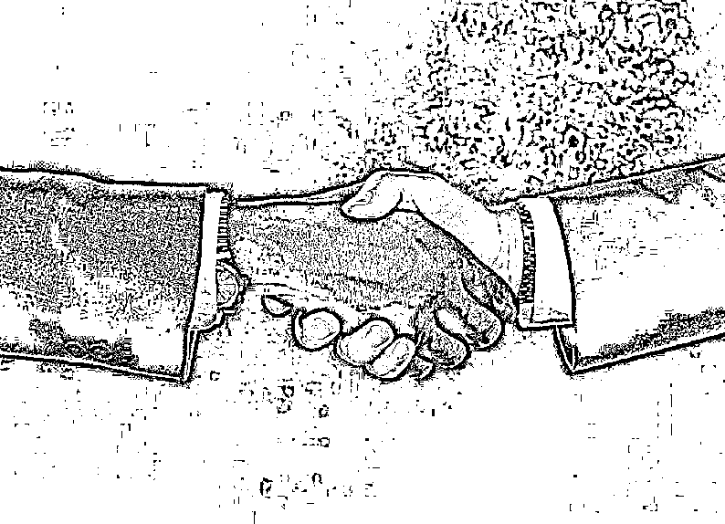**整合巨蟹座-摩羯座****要整合你的巨蟹座-摩羯座对分相，需要巨蟹座为摩羯座的纪律和辛勤努力增添敏感的温情，同时需要摩羯座将其自制力和独立性应用到巨蟹座的感受中去。**你巨蟹座式的感性基调使你能够**感受到妨碍你工作和责任的情绪，并将其疏导出去**。巨蟹座教导你，通过关注自己的情感需求，学习滋养自身，你不仅变得更加满足，还变得更强大并越来越独立，能够应对摩羯座可能要求你体验的约束或困顿。**巨蟹座寻求并提供的情感滋养，使你倾向于和他人建立深厚、持久的关系。**你能够**完全将自己交付给他人并保持忠诚**，不仅是由于你的责任感，还因为你**乐于处理个人关系中的脆弱和不安全因素**，因为你**了解可以和另一个人一起体验的情感深度和满足感。**由于你知道自己的敏感性，并可以应对自己不断变化的情绪，你对其他人的状况也非常敏感，并且感同身受。这也会促使他们**认真对待你，并反过来将自己交付与你。**你储藏着大量的巨蟹座无意识能量，这让你仍然能够与自己的内在“小孩”保持接触，并且能够优雅地老去。它有助于你**成为有影响力的家长，可以对自己孩子的需求做出反应，因为你可以处理你自己的需求，并且可以用爱来缓和你纪律的严苛。**

**因为你的行为既富含温情，又不失威严，你的孩子尊重你的权威性并乐于成为自律且可靠的人。**你所提供并体验到的温暖的家庭生活给了你和他们坚实的基础，鼓励你们每个人在外部世界中更为成熟、负责。

**你在个人生活中体验到的满足感强化了你的职业生涯。**因为你**并不愿意用以情感缺失为代价来换取成功，所以你可以放松并更加有效地工作。**你可以享受工作的过程，以及获得的认可。

**巨蟹座帮助你选择可以滋养内在，并激励自己尽最大努力工作的职业。**它使得你可以**在工作中投入情感，并体验工作带来的满足感**。你也会**对他人以及公众的状态非常敏感，这会让你赢得他们的好感。**这甚至还可能使你倾向于**选择居家性质或可以帮助他人**的职业，你可以在这类职业中满足自己的情感需求，同时丰富他人的个人生活。

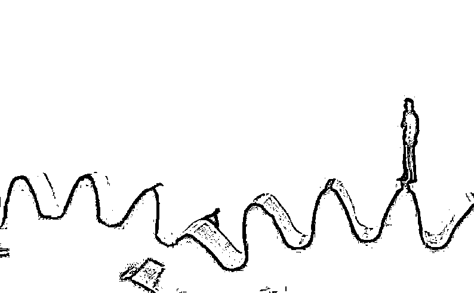

**稳定的情绪**

**摩羯座的自足帮助你应对情感冲突，并满足自己的需求，自制力使得你可以稳定自己的情绪，防止被情绪淹没。**因为你愿意为自己的行为承担责任，所以你可以**勇敢地面对幼稚的行为、坏习惯以及无助感**，并可以**摆脱那些不再起到滋养作用的旧模式。**

摩羯座会**过滤你的经历，保护你不会沉溺于让人虚弱的情感中，也使你不会过于轻易地被你周围人们的心理困惑所影响**。因为你能感知自身极限，不会在他人的苦难中迷失自己，所以你不会为他们的问题感到过度沮丧。

**你的回应理智且成熟，不仅给他们提供巨蟹座式的支持，还会激励他们的力量并拒绝放纵他们的缺点。**因此，摩羯座为你的情感健康以及周围人的幸福做出了贡献。

**这种对局限的认识，以及按成人方式行事的决心，有助于你成为负责任的、有影响力的家长，让你在滋养孩子的同时还可以执行纪律。**随着他们逐渐变得自制和自立，你的家庭生活也会有所改善，你会变得更有安全感，因为你知道自己经营了一个健康的家庭。

摩羯座的责任感使你能够**向家庭和你爱的人做出坚定的承诺，在必要的时候，你会忍受艰苦的日子并勤勉工作以供养他们**。因为有时你会为了家人的利益而丧失自我，所以在其他时候，你会体验到家庭的安全感，和对你而言至关重要的爱给你带来的情感回报。

摩羯座会教你**将自己的情感能量引导到完成工作上来。**你的工作能力和成就感也会改善家庭生活，从而保证你**不会将身边的人看作满足感的唯一来源，让他们感到窒息**。摩羯座可能有助你**将家庭和个人兴趣变为职业才能**，让你倾向于**在家工作，或在与家庭或养育相关的职业上获得成功。**

**版权声明：**本文由若道翻译发布，欢迎转发，反对抄袭。友号转载请申请白名单。

**特蕾西·麦克斯**老牌占星师，对 12 宫、梦境有深入研究。著有《如何整合你的 T 三角》、《你的秘密自我》(*Your Secret Self*)。

******想要跟随邓肯老师学习卜卦占星学？******

**点击下图了解详情**

**微信又双叒叕改版啦，不想错过若道君的推送？**

**就把若道设为星标吧！**

**▼**

就是这个“在看”，戳戳戳 ☟

****************报名直达入口****************

# 狮子月谈冥王星（上）丨冥王星落在这里，愉快的宫位也变成了暗地

> 原文：[`mp.weixin.qq.com/s?__biz=MzA5NjA0NTAxNg==&mid=2651423829&idx=1&sn=1af9917d10025895ecb310ac4f4298d5&chksm=8b4b36e2bc3cbff4beeb3047e4aee6b3244ef96fe8a8255797d5e43e79c0d4f2c60c99b8987c&scene=126&sessionid=1692738126#rd`](http://mp.weixin.qq.com/s?__biz=MzA5NjA0NTAxNg==&mid=2651423829&idx=1&sn=1af9917d10025895ecb310ac4f4298d5&chksm=8b4b36e2bc3cbff4beeb3047e4aee6b3244ef96fe8a8255797d5e43e79c0d4f2c60c99b8987c&scene=126&sessionid=1692738126#rd)

**☆ 后台回复“今日”，给你一句生命态度**

作者/蓝女巫 ISAR 认证占星师
编辑/翀子 封面/书君 图片/蓝女巫

冥王星 5 宫系列共四篇，本文和今日二条是其中的第一篇和第二篇（后续文章会在之后放出），这同时也是蓝女巫冥王星系列的子系列。起承转合，文章将一步步深入到 5 宫的至暗之地，帮每一个狮子座灵魂探秘阴影。文章写给冥王星在五宫的人，以及日冥人，也写给所有狮子座与天蝎座的合体，适用于狮子座/水瓶座对宫人，以及热爱生命，及一切“活着”的人类。只要你的心脏还在跳动，就请在狮子月看向这里。

疫情期间我在读《红书》。此书公认的难懂，却刚好与我同频，并有强烈意愿普及。**本系列就旨在将这本天书，扯成花瓣，向更多的心间散落。**我将结合个人感悟来梳理相关章节，相信会让它变得很容易领会。

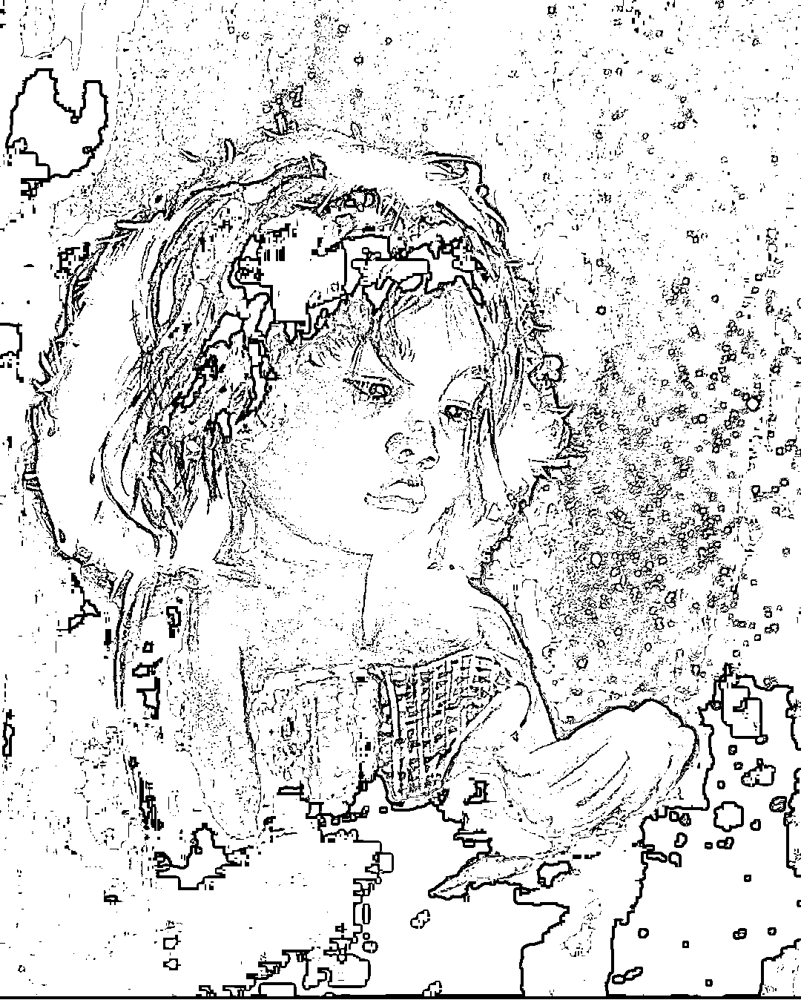

**光**

**生存，还是毁灭？存在，还是从未存在过？**

5 宫，代表生命力本身。即**对“生”的思考！**冥王星代表极端的渴望与权力的控制。所以，冥王星在 5 宫，是“生”的专家？也**将被看见等同于一种权力。不被看见，是死；被看见，是生。**你，是否已沐浴在聚光灯下？存在感，在你心中究竟是个怎样的问号？5 宫，是舞台；冥王星，是焦虑。冥王星 5 宫，**强迫性的表现**，无不是出于被看见的焦虑。本能地只想要被看见，无论是正面还是负面地被看见。且不甘于被平庸地看见，而是要被深刻地看见。故通常拥有或热衷发展一种很强的“造型”能力。因为，那紧密相关于被曝光的样子，以及被曝光的前提。可为了进化剧情的设置，最害怕不被看见的人，早期反而偏偏没有被充分的看见？这便是戏剧的张力所在。下面，就来为这些不被看见的创伤，溯源......   

**童年早期的创伤 **

这些都是命运为冥王星 5 宫安排的套路剧情。比如，从小父母没在身边，或是没有被照料者充分地“看见”，比如，感到兄弟姐妹比自己更受青睐……种种因缺乏关注，在幼小心灵中埋下对自我深深的怀疑。

绝望的被弃感，伴随着羞耻感，通往一个欲壑难填的情感坑洞，始终窒息于此。以至于后来，见到别人被关爱，或谁的心中有了他人，你都会深感威胁么？有时，又似乎想要垄断夸奖似的？这一切源自爱的排他性，exclusive，你在此处十足敏感。     

**前世遗留的创伤  ** 

过去世，你曾在生而为人的欢愉享受之处......有过创伤。快乐功能曾被剥夺，而今生是否仍求而未得？所以，当你还是个孩子的时候，就已经很老了？或是觉得长大后，已经不快乐很久了？发自心底的快乐非常难，或是说填不满。其实，今生这一趟，就是为了把曾被偷走的，赢回来。所有那些失联的快乐。多巴胺斋戒，不适合你。反而，你需要的是补偿。**一切身心的高潮感。你值得拥有！        **

冥王星 5 宫的爱，是无底洞。你们要从五宫欢乐的入口，去通往冥府的深处。所以，要再度回到孩子的位置，重建你的乐园。

留意当你以孩子为镜时，心底自然升起的声音。那情绪是有多复杂？你是怎样强加爱于他们，又是怎样受其胁迫的。又或许，你偏会选择了不对的爱人，然后迫使你去看到这一处创伤的袒露。这时，你需要去诚实地自问：**心的感受是什么？**记忆中，一个冥王星 5 宫对着一尊“吾丧我”的佛像，看似无情却有情地说：**“我没有心。”**

我站在有很多岩石的深度中，看起来像是一个火山口。我发现自己面前有一座房子，房子内有很多圆柱。我看到莎乐美沿着墙向左走，她像盲人一样扶着墙前行，蛇在跟着她。

——卡尔·荣格《红书》

**左，是心脏的一侧。**

宗教早已指明过两条路径：**承受痛苦，征服激情**；或是，舍弃苦乐，以超越之。冥王星 5 宫，或许应该选前者。你至少要投身过激情的熊熊大火中。**是以为“活着”？**否则，当激情离开自我，会有什么发生？它必会在你身后重新集结。迟早再来征服你？冥王星 5 宫，别忘了，你那代表狮子高涨欲望和狂热激情的部分，却与哈迪斯有一个契约。

世界上这种奇怪的快乐就像一股温暖的南风，夹杂着浓郁的花香和生活的轻松出乎意料地出现。如果你从自己的诗人那里知道这种严肃，当它们在期待深度中有什么事情发生的时候，它们会因为自己春天般的快乐被魔鬼首先识别出来。它像波浪一样将人们卷起，并推着向前……任何一个体验到这种快乐的人都会忘记自己。没有什么比忘记自己更加甜美了。

——卡尔·荣格《红书》

这种快乐，叫作**神圣的疯狂**，狂喜出神的巅峰体验，你究竟有没有勇气去品尝它？其实，冥王星 5 宫最能感应这种能量。**他必定眼里放光，无论他是否已决意前往......**注定要发展快乐的冥王星 5 宫们，**怀着敬畏与恐惧，下一步都将走进莎乐美的花园**： 

阳光满园，开着红花的树，夏娃听蛇说出诱惑，前方是奥德修斯的冒险，你已陷入漫长的彷徨…… 

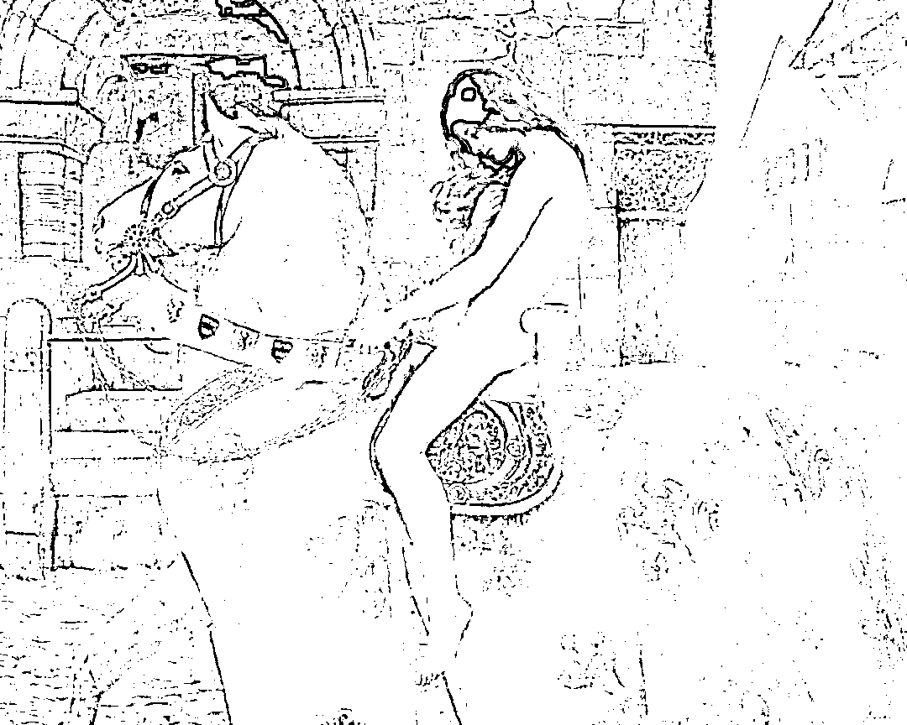

**玫瑰园**

**什么是快乐？** 

那是一个骑马的人，身穿红色的外套，是一位红色的骑马者。他要进入我的城堡：他正在穿过城门，我能听到马走在石阶上的脚步声，台阶嘎吱作响，他在敲门：我感到莫名的恐惧：一个红色的人站在那里，他个子修长，全身的衣服都是红色，甚至他的头发都是红色的。我在想：原来他是一个魔鬼。 

红人：“你好，高塔上的人。我从远处看到你，我看到你在遥望和等待。你的等待把我召唤到这里。

红人：我实在不明白你为什么这么严肃。乐趣完全被你破坏了。

红人：哦，我懂，你指的是生命。我知道这个词汇。我也有生命，不愿意让自己的头发变白。生命不需要任何严肃，反而，最好为生命起舞。

我：或许在神面前也存在一种快乐，被称为舞蹈。但我还没找到这种快乐，我在寻找那些还未到来的事物，而快乐没有跟事物一起到来。

红人：兄弟，你没有认出我？我就是快乐！

——卡尔·荣格《红书》

**这是我在红书中最爱的意象。**我突然明白为什么冥王星 5 宫们最喜欢我，我也喜欢他们了。同时我想通了一件事，**为什么叫“红书”？因为荣格是狮子座吧。**难怪我那么爱此书，又那么能够读懂他-——**生命就像火一样将它周围的一切照亮**，而火是魔鬼的元素……**红人就是快乐。** 

**“当他以红色的形式出现时，他就是烈火，本质上就是激情，造成放纵、憎恨或不真实的爱。”**狮子荣格对魔鬼形象如是说。如同，日冥尼采借查拉图斯特拉说，高人最差劲之处，就在于没有学会人人都应该会的舞蹈，通过舞蹈超越自己。   

“魔鬼相信舞蹈既不是淫欲也不是疯狂，而是表达快乐。我认同魔鬼，因此他在我眼前变成人形，而我像春天的树一样变绿了。**快乐就是生命终极的开花和变绿。**红色的骑士变成了鲜红色。看，真是奇迹，我的绿外套上长出了叶子。” 

这个红人肯定是魔鬼，是我的魔鬼。他就是我的快乐，一个严肃的人的快乐，让这个人独自一人站在高塔上遥望他红色、红色芬芳和暖亮红色的快乐。

你不相信自己的快乐就是魔鬼的事实。但似乎快乐总有一些邪恶的东西。我身上有一个魔鬼，它就在我内心中。

并不是所有人都了解自己的魔鬼。他们不仅是快乐的魔鬼，也是悲伤的魔鬼。

当我发现魔鬼就是快乐的时候，我必定想和它立约。但是，你无法和快乐立约，因为它会稍纵即逝。因此，你也抓不住魔鬼。对，这就是它无法被抓住的本质。魔鬼总是将所你坐的树枝锯断。

魔鬼是一种邪恶的元素。那快乐呢？如果你跟着它，你会发现快乐里也有魔鬼，因为在你到达快乐时，就从快乐直接进入地狱，到你自己特定的地狱……

——卡尔·荣格《红书》 

(写到这里，水逆之末，我打翻了一瓶瓷器蓝墨水，整只手都变蓝了。)         

**接受快乐永远是一件危险的事情，但快乐能将我们带回生命和它令人失望之处，从而我们的生命才变得完整。 **

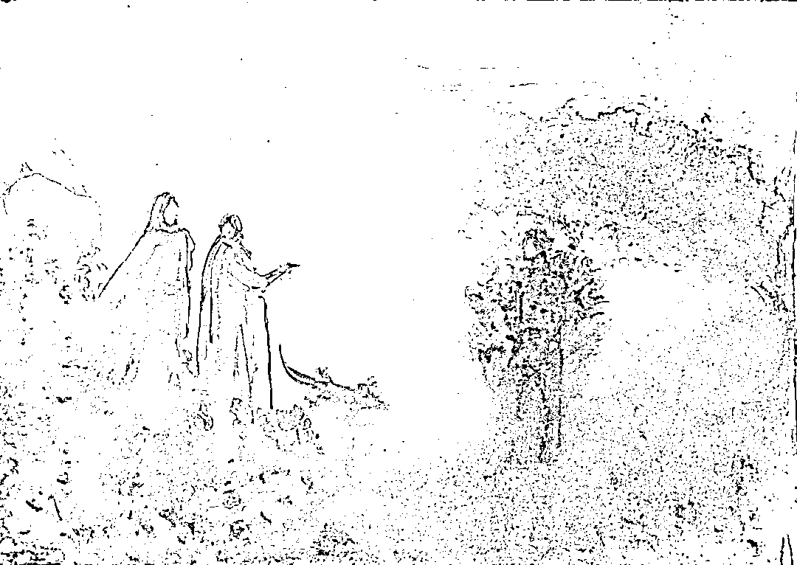

**后来  ** 

男人的步态很像孩子，穿着已经褪色的红衣服。当他们走近的时候，我发现那个高个子男人就是红色的骑士。他变化真大啊！他变老了，红色的头发已经花白，火红的衣服已经破旧。

阿谟尼乌斯戳了一下他的肋骨，红人尴尬地不再出声。他们站在我的面前，怯儒又可笑，又有些可怜。

在我变绿的时候，它们站在那里，早期的神庙和玫瑰花园中还留着悲伤。

——卡尔·荣格《红书》

**红书最感动我的，是这一章！**我会一遍遍地读，进入得很深，每一次都有泪含在眼中。于是，我画下了这一幕……但是，**心疼红人，我不忍心让它变老…… **

“舞蹈的音乐、跺脚声和欢呼声从四面八方传来，将我淹没的是人类这种动物的恶臭，而非玫瑰花香的南风。”**为什么荣格笔下的红人老了？我明白，他是在说：快乐转瞬即逝……           **

喜欢红人，曾很莎乐美，红书中这些代表**Eros 的意象**。爱洛斯是欲望、渴望、驱力、活跃、快乐和痛苦。忘记思维的人，就显得**年****轻且盲目。**快乐蒙蔽理智，越蒙蔽，越快乐。莎乐美是个一进入场景，就盲目地摸索着向左走的女孩。因爱洛斯不倾向于朝右走，本能地不受意识意志的控制。朝左的运动是盲目的，没有目的和意图。**因此，它需要引导，受理性逻各斯的引导，以变得完整。**

快乐是盲目的，失明是痛苦的，需要得到治愈。失明的莎乐美，象征她的不完整。**而正因她的缺陷，才需要依赖象征 logos 的男人吧？所以说，爱有视力，而快乐失明……**难怪莎乐美的快乐最终要变成爱。我想，荣格就在暗示发展完整自我的必要吧。什么是完整的自我？如果你走向思维，要带着你的心。如果你走向爱，要带着你的头脑。

（注：Logos,逻各斯象征精神原则，很理智；Eros,爱洛斯象征非精神原则，即情感）

**任何一种快乐落单的时候，都会流入深海，最终消散在无尽的空间中，变成死一般的寂静……**

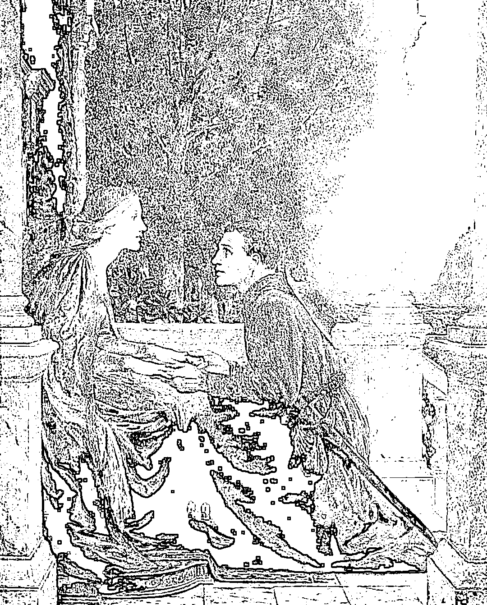

**引导快乐**

亚里士多德在《尼伦》中对快乐的两点最深刻总结：

*   快乐能带来很强烈的体验，但却不能持久；

*   快乐虽然不是人生的终极目的，但确实是通向这个目的的重要途径。

**首先，既然快乐转瞬即逝，那该如何应对它的无常？关键在于区分被动快乐与主动快乐：    **

**冥王星 5 宫的低阶，是被动快乐。**将快乐视为肤浅低级的享受。       

快乐本身是一种盲目的力量，是出于本能的需求。即**儿童和兽类都追求的快乐。**被动快乐，指当你仅为这些物质需求所累所奴役，而非主动去尝试追寻的快乐。正如娱乐消遣繁华落尽之后的那份无聊疲惫，空虚在向更深处敞开。 

**“我想要我要的立刻就要”**，可能狮子们都更容易多巴胺上瘾吧。而冥王星 5 宫，你的大脑尤其更想要寻找快乐，以此逃避源于过去世无聊和痛苦的印记。其实，多巴胺主要负责“想要”的冲动，使人渴望某样东西。多巴胺分泌得越多，“想要”的冲动就越强烈。但却并不保证在欲望实现后，你最终拥有快乐，即你一定会喜欢你所得到的东西。

所以，享乐主义者是快乐的，在其沉醉当下，留连忘返时。但其悲剧在于，不加节制地深陷于快感，任其吞噬，会分不清人生主次，不去想隔夜的目标，看不到身边更大的世界。一切只凭感觉，快乐就好。因为缺乏一个大的蓝图方向指引，即使偶遇成功，撞见胜利，都没有路途去安放，只能眼见各种机会都溜走，碌碌无为，饱尝挫败。蹉跎半生，收起笑容，身后像是一场空，徒留悔恨伤悲。

一切强烈的快感，终将衰落，那些欢愉的笑声，在记忆的回廊中，响彻，衰减，远去......所以，快乐是多变而不稳定的，要想体会持久强烈的快乐，就需要将此力量引导向正确的目的。 

**冥王星 5 宫的高阶，是主动快乐。**快乐，也可以被严肃认真地对待。       

**所以，冥王星 5 宫需要对面 11 宫的目标愿景来导航人生的激情。**对快乐这种最积极的力量因势利导，注入更高的目的，以获得带来精神振奋的主动快乐。真正的快乐是要在自我实现中获得，以自我培育为手段。亚里士多德强调**“德性”（virtue）的培养，就可以作为引导快乐的有效方法。以积极主动的方式去实现目的，获得人们对你出色实现活动的称赞。**

据我观察，冥王星 5 宫的精英们正是对这种德性的生活，尤其最孜孜以求的一个族群。 

德性的三个要素：**目的，能力和过程。**首先，有德性者必是心怀理想之人。找到了正确的人生目标和意义，必然带来快乐。在快乐之上那层更高的理想，就是幸福。快乐是通往幸福的过程和手段，但本身并不能作为最终目的。

其次，德性就是要**追求“卓越”**，即当你展现优秀出色的显著才能时，获得了他人的赞美和肯定。**卓越带来的快乐，是真实强烈且持久的。**你真实的自我也在此过程中充分展开，以步步完满去通往自我实现的终极幸福。

最后，有德性的人都有坚持的力量，且心无旁骛，以强大意志力来排除障碍干扰，以持之以恒的行动去创造，将理想步步落成现实。

**另外，快乐虽然不是人生的终极目的，但确实是通向这个目的的重要途径：     **

第一，快乐，不是趋向于目的的过程，而**是一种自我实现的运动。**所谓**实现，即其目的不在它自己之外，而是内在于它本身的运动过程之中。**真正的快乐，也就是以不断展开自身潜能，充分完善自己，来实现自我的过程。 

第二，快乐，**是未受阻碍的实现活动。**作为能通往最高幸福的能量，正是因**快乐中充满了生命的强度！**它能激活你的生命，增强你的感受，让潜能以最充分的姿态地展现出来。为什么我首先用一整篇来讲快乐，正因为它是冥王星 5 宫尤其不可或缺的一种美丽的生命强度，以此实现自我。所以，**冥王星 5 宫，一定要快乐啊！  **   

第三，**快乐，是用最喜爱的能力，作用于最喜爱的对象上，**这样一种积极的活动。比如去投入一个爱好，或去爱一个人……这里让我想到了，**享乐层级最高处叫作 Playing God。**诸如史上那些伟大非凡的人类，终日去忙于触碰真理和宇宙瑰丽，他们在这些巨大发现中获得的快感，远胜于人世间的吃喝玩乐。所以很多伟大的艺术家并不需要结婚。也正如高度投身于艺术创作中的人，都懂得的那种对于消费欲望的漠然。 

最后，还要注意，想要正确地使用快乐多巴胺，则必须**设定合理的预期。**观察你是否正在用过高标准去要求和评判自己？当你不切实际地高估自己现有能力，急于求成，幻想着一飞冲天，总对自己错误预期，便会导致你一直活在挫败感之中。因为，相对于成就感能带来激励效果，持续的挫败感则会让人逐渐丧失自信，行动力也将愈发低落下行。这个现象，我在年轻的冥王星 5 宫族群中尤其多见。take your time......

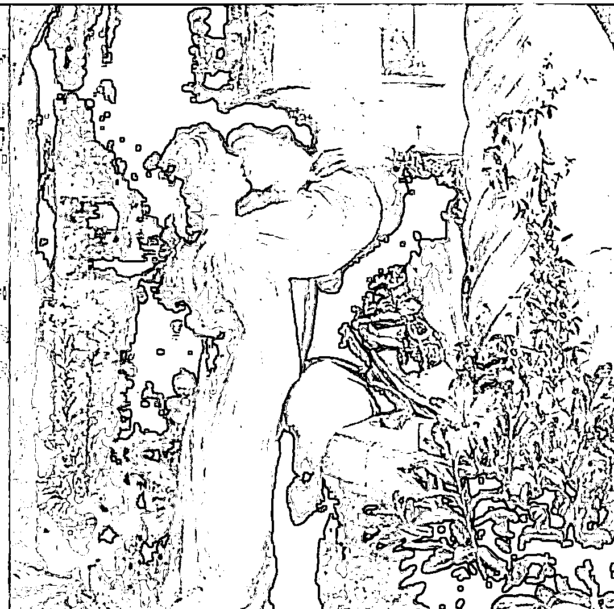

**爱，玫瑰花香的南风 **

在我心里有一个从未平静，也不可平静的东西；它想要声张。在我心里有一种对爱的渴望，它本身说着爱的语言。

——尼采《查拉图斯特拉如是说》

爱，是万物的本性，是宇宙中最根本的创造力量。人会因拥有爱而强大，当手中握有着神赐予的礼物。 

尤其对于狮子们和 5 宫人来说，爱，总令你百听不厌。你也对之贪得无厌。它永远像玫瑰花香的南风般诱人。**于是，连说爱的感觉本身，都是美的~ **

 5 宫就是 fall in love 的完整能量。那么，哈迪斯落在了恋爱宫的冥王星 5 宫们会说：**带着爱，面对死亡也无所畏惧！**可是，爱又在哪里呢？永远也得不到的爱？无论如何也不够的爱？只因你对爱的无法餍足吧。你如此满溢的容器，都还在等待着施舍。越渴望，越窒息......

冥王星 5 宫，也倾向于将爱建立在毁灭感之上，不惜以自我伤害的情绪刺激，在极悲与极乐的转折点，生死临界的利刃上，去体验测试并证明爱的存在。爱就是权力占有，没有空间？爱就是全然控制，完全拥有？

 或许，**你该学会如何爱自己？**如何让自己更爱自己？**这才是真正的问题。**

 爱，确实是安全感需求中最高难的层级。**冥王星 5 宫的功课，尤其要学习爱。且从小爱升华到大爱**（一个冥王星 5 宫的妹妹，用了“一本万利”这个词）。如同尼采笔下的查拉图斯特拉，那个用自己的阳光来照耀世界的高贵者。

 爱，无法止于情欲单纯的快乐，因世上没谁能让你一直愉快；爱，并不是心存依赖的向往，它不该为自我利益和欲望所渗透；爱，也不等同于伟大字眼的美化，因它无关于任何偶性的伪装；**爱，游走于孤独与亲密之间，**让双方之间充斥神性，而彼此又互为难解之谜。

 **那么真爱，倒底是什么？**

 **真爱，是一种灵魂上的平等。**是两个独立灵魂间的合奏，它必须发生在两个完整的自我之间，即两人都已实现了自我，**独立而自足！**继而，真爱应该是爱其本身，爱对方深入本质的属性，即那些持久稳定的特征。**真爱，最终就是为了去爱对方如其所是的样子。**前提是，两个灵魂间是真正地彼此欣赏的吸引。

“快乐总是想得到最近的东西，通过多样性感受，不断跳跃，没有目标，一味地去寻找，但永远不满足。爱想要的是最远、最美好和最圆满的东西。”

**所以说，爱有视力，而快乐失明。**冥王星 5 宫，最终也都要经历快乐蜕变成爱的过程：

莎乐美从右侧向我走来。当我完成自我牺牲时，我体验到自己的快乐来到我身上。我邪恶的快乐把我带到自我牺牲，它的核心是爱，牺牲使爱摆脱快乐。奇迹在这里发生，我以前失明的快乐开始有了视力。由于我强烈渴望自我牺牲，我的快乐发生了改变，它变成更高的原则。爱洛斯首先朝肉体运动，后来朝精神运动。丧失自己快乐的莎乐美已经学到了对别人的爱，丧失诱惑力量的莎乐美已经变成爱。于是，当你已在自己身上赢得快乐和力量时，也就想要对自己的爱。那么，我如何对自己也有爱？我相信爱属于其他人。但我的爱想和我在一起，我害怕她。我接受莎乐美为快乐，拒绝她为爱。

——卡尔·荣格《红书》

荣格：你给我的是可恶的报酬，**这是一个需要做出牺牲才能触碰的报酬。**只要触碰到它，就必须做出更大的牺牲。

 蛇：你是要不用牺牲的生活？**生命必须付出代价，不是吗？**

 下面，你可以带着新获得的快乐，开始冒险。冥王星 5 宫们请谨记：**你自己的心，才是你最终极的冒险。**道路正在前方伸展，我们将继续去探索**“我如何对自己也有真爱？”**的答案......

**下篇：《创造》****（请见今日二条）**

**版权声明：**本文由作者授权在若道平台发布，欢迎转发，反对抄袭。

**蓝女巫**

英国伯明翰大学 市场营销学硕士

职业占星师/专栏作者/芳疗师/珠宝设计师

中国首批 ISAR 英文认证占星师（2012 届）

**微信公众号**：cecilia_sui

长按打赏

**系统学习占星学**

**点击图片了解详情**

**微信又双叒叕改版啦，不想错过若道君的推送？**

**就把若道设为星标吧！**

**▼**

就是这个“在看”，戳一下☟

********报名直达入口********

# 插班中丨古典瑜伽与占星学，身心疗愈的实操练习

> 原文：[`mp.weixin.qq.com/s?__biz=MzA5NjA0NTAxNg==&mid=2651423829&idx=3&sn=c3599570b944b4a2ccbd31aa50521d54&chksm=8b4b36e2bc3cbff464fc9f40a4551971903167de9b307826211d016b02840a3cd86a322888b5&scene=126&sessionid=1692738126#rd`](http://mp.weixin.qq.com/s?__biz=MzA5NjA0NTAxNg==&mid=2651423829&idx=3&sn=c3599570b944b4a2ccbd31aa50521d54&chksm=8b4b36e2bc3cbff464fc9f40a4551971903167de9b307826211d016b02840a3cd86a322888b5&scene=126&sessionid=1692738126#rd)

****

编辑/玫瑰 图片/全景网

“**2011 年，我第一次见到 Selene，那时我叫她孙继红。她是 2012 年在新奥尔良参加国际占星大会（UAC）的第一批认真的占星学学生。在和诺·泰尔、斯蒂芬·福利斯特等多位占星学老师学习了更多的知识后，她也成为了 ISAR 认证职业占星师，开始了占星学的专业实践。****从一开始，我就对她的奉献精神和灵性追求印象深刻。作为占星师，她想方设法支持她的客户走上个人成长的道路。后来，Selene 的灵性追寻又把她带到了印度和美国。在那里，她经年累月在静修院的道场跟随古典瑜伽大师学习，这样的生活也加深了她的灵性觉悟以及个人成长。****Selene 通过占星学的视角体验瑜伽和她的灵性生活，瑜伽及奉爱也让她对占星学的灵性层面有着独特的见解。现在，她将把她多年独特的学习和体验分享出来。我很荣幸有她作为一名老师加入我们。她是一个有着深深慈悲之心的温柔的灵魂，也是我永远的朋友、同事。****——大卫 ·瑞雷 若道占星创始人**”

**1**

**课程简介**

**身体是最大的潜意识：身形影响着心理状态，体态反应着能量存贮于循环；而心理状态体现在身体状态的变化中。**

宇宙中的一切能量都包含在每个个体生命的生理机能及心理状态中，每个**身体症状（身结）**，背后都存在着**特定的能量结（气结）**，这气结其背后隐藏着**局限的信念结（心结）导致的不断反复的情绪**。正如我们的出生星图所展示，每个生命个体内部都存有一个太阳系，每个行星都以其特定的方式影响着每个生命个体的不同层面，同时，每个生命个体的生理状态通过信念、情绪及能量状态显化在对外境的反应上；**占星学让我们可以从理性的认知去了解大宇宙天体运作法则对于小宇宙个体的影响，以及每个生命个体的能量中心的运行状态；****古典瑜伽则让我们从身体、心理以及能量上直接感受体验到占星学中的行星能量，感知这些宇宙法则及影响。身体及能量的运行可以打通身体与意识的管道，从而达到能量与意识的整合。****当我们进行瑜伽练习，就可以联结外在大宇宙和人体小宇宙**。持续的练习可促使我们在每一个有意识的呼吸与身体相融之时，带来头脑的明觉，之后的冥想与禅定、真知与智慧即油然而生了，在身体内显化并转化的这种宇宙能量也在太阳系中恒定的运化着。天上如是，人体亦然，通过日常稳态的练习，每个人都能感受到：**每个生命个体即是宇宙至美的化身！******

**2**

**课程目标**

*   从古典瑜伽系统了解行星与身体、气脉及意识的整合运作；

*   从整体的角度展开古典瑜伽；整合不同瑜伽流派，提升意识的维度及全观性；

*   透过占星学+瑜伽，穿越行星及脉轮代表的意识进化的站点，促进灵魂进化的目标。

**3**

**课程内容**

课程分为两个部分：**第一部分**为期 6 周的在线课程。每周 2 小时侧重理论与自我常规练习，旨在培养自我常规练习的基础。**授课时间**：**7 月 18 日-8 月 22 日每周六 15:00-17:00******截至 2020 年 8 月 4********日，课程第 1 讲-第 3 讲为录播课程（限视频回放），其余均为网络直播课。******第二部分**为期两日，侧重体验式的深入集中练习。**授课时间****：9 月 5 日-6 日****工作坊地点****：北京（具体位置请关注开课前通知）**可分开报名，也可一起报名。**6 节网络课程内容：整合古典瑜伽的自我练习****第一讲：古典瑜伽文化与瑜伽智慧之眼吠陀占星学概述****❶** 生命有机体的整合疗愈，三身五体与元素；**❷ **生命经验的构成；身心相应症状的形成及转化；**❸ **古典瑜伽之心息相依之道；**❹** 练习：导引；瑜伽式呼吸；根轮练习；**第二讲：古典瑜伽生物能量学简介**❶ 脉轮生理部位；腺体/神经丛/元素/轮穴；❷ 日月脉与中脉；脉轮与丹田；❸ 古典瑜伽之心的基本原则；❹ 练习：腹轮的练习，瑜伽调息；**第三讲：古典瑜伽心理学简介**❶ 脉轮的心理功能：自我取向；身份认同；❷ 脉轮发展阶段；功能发展良好及失调状态；❸ 行星的守护日，元素/导性；色彩/方位/梵结；❹ 练习：脐轮的练习，瑜伽休息术；**第四讲：古典瑜伽哲学简介**❶ 个体意识进化的 7 个阶段；主观心与客观心；❷ 行星周期与瑜伽饮食；食物的二性/三态/性味/归经；❸ 瑜伽自然疗法与净化法❹ 练习：心轮的练习；瑜伽观想**第五讲：东方传统能量学与古典瑜伽**❶ 星相与藏象经络；❷ 通调经络与瑜伽理疗；❸ 不同的体质的瑜伽养生❹ 练习：喉轮的练习；瑜伽唱诵；**第六讲：百日筑基自我练习**❶ 五运六气与顺时食疗；❷ 导引吐纳与引气归元；❸ 穴位通调与补气培元；❹ 练习：额轮/顶轮的练习；烛光冥想；**2 天线下工作坊内容**❶ 导引；❷ 瑜伽之心入门/经典练习序列；❸ 脉轮瑜伽的入门/经典练习序列；❹ 瑜伽调息减压；❺ 瑜伽休息术与瑜伽冥想；❻ 培元补气通调经络的练习法；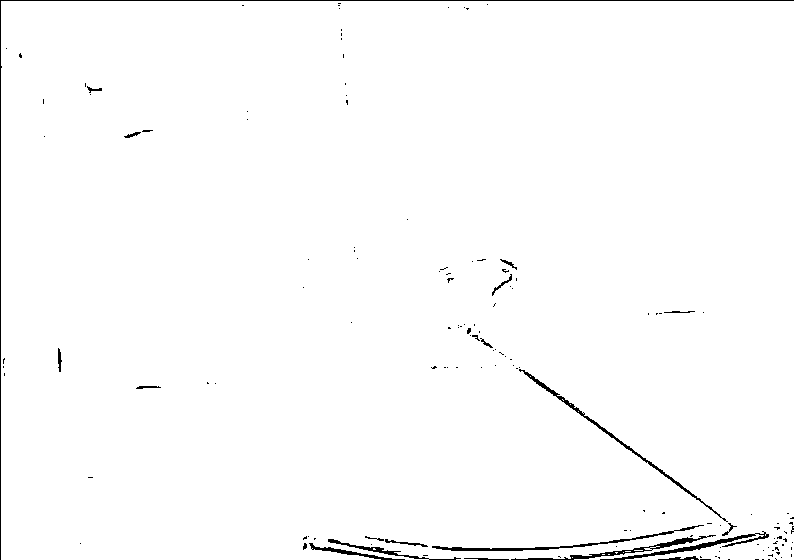

**4**

**关于古典瑜伽的特别说明**

 瑜伽从物质层面来讲，不仅有肌肉骨骼的锻炼，更重要的是配合呼吸，意念的动态冥想，以达到身语意的整合；从精神层面来讲，瑜伽是一种生活方式；从心灵层面来讲，是到达身心健康，平和喜乐之道；古典瑜伽的练习将会经历身体小宇宙的星际穿越。瑜伽体式可以调节腺体，腺体控制了荷尔蒙的分泌，荷尔蒙直接影响心理意识的变化；身正则气顺，身态反应心态；气顺则神安。瑜伽调息可以通过呼吸即生命能量的调整可直接疏导情绪。瑜伽休息术让感官由外而收内以专注内在。瑜伽冥想体验内在的平静祥和至内在小宇宙与大宇宙的融合。个人的体质大致决定了每个人的特性，因此，每个人倾向于惯用身体的某些系统甚于其他系统。瑜伽练习的目的不是要改变我们的天性，如同人本占星学一样，是扩大我们的选择，让我们不至于因身体及心理的惯性而失衡并限制成长，成为一个多维度宽频的人，不单单让人处世圆融，还让人欣然接触不同频率的人。

**5**

**课程费用**

**6 周在线课程费用：****2680 元**

**2 天工作坊费用：****2680 元****工作坊和在线课程联报价格：4800 元   ****优惠价请咨询客服**

**6**

**授课老师**

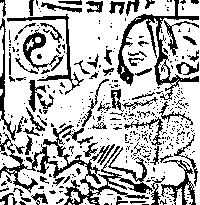

**授课老师：孙继红（Selene 子月）**

*   首届若道学员；国内首届获得国际占星研究协会（ISAR）认证职业占星师；

*   国际瑜伽吠檀多中心（ISYVC)认证瑜伽健康教育咨询师；古典瑜伽之心（HOY)全球认证嫡传导师；

*   德国系统排列协会（DGFS)认证系统排列导师；

*   师从并受益于若道各流派占星大师的开启，专注于整合身体及心理的星相疗愈探索；

*   跟随超个人心理学流派疗愈大师的净化与指引，探索并实践包括人本占星学、超个人心理学、古典瑜伽的身心整合疗愈；

*   曾旅居印度及亚洲、北美等地的古典瑜伽静修学院及社区教学人本占星学及古典瑜伽；

**7**

**课程适用人群**

**本课程不需要任何占星学或者瑜伽基础，适合所有想要运用占星学和古典瑜伽，实践身心疗愈的人。**

****古典瑜伽与占星学****

**授课老师：孙继红**

**授课时间：****第一部分课程：7 月 18 日-8 月 22 日每周六 15:00-17:00；2 天工作坊：9 月 5 日-6 日**

**授课方式：**网络课程；现场工作坊

**费用：********第一部分********课程：2680 元；2 日工作坊：2680 元；联报价格：4800 元；****（优惠价请咨询客服）**

**课程负责人：**王老师（微信：18510107057），请备注“古典瑜伽与占星学”

长按二维码添加课程负责人咨询~

****报名请点击“阅读原文”****

# 狮子月谈冥王星（下）丨当生命的意义是虚无，幸好我们还有创造

> 原文：[`mp.weixin.qq.com/s?__biz=MzA5NjA0NTAxNg==&mid=2651423829&idx=2&sn=ec0b8c8eed4135bad17755c7cdb6b07b&chksm=8b4b36e2bc3cbff4f7d44886303bb64a4ec75e401e6ec889953b7c0851a6ba639835b526aa1f&scene=126&sessionid=1692738126#rd`](http://mp.weixin.qq.com/s?__biz=MzA5NjA0NTAxNg==&mid=2651423829&idx=2&sn=ec0b8c8eed4135bad17755c7cdb6b07b&chksm=8b4b36e2bc3cbff4f7d44886303bb64a4ec75e401e6ec889953b7c0851a6ba639835b526aa1f&scene=126&sessionid=1692738126#rd)

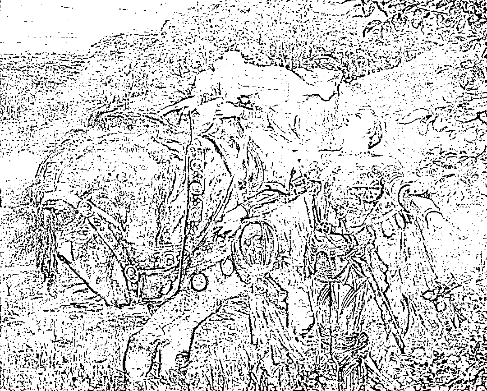

作者/蓝女巫 ISAR 认证占星师
编辑/翀子  图片/蓝女巫**意义：既来之，则安之**人生既有意义，又无意义。我们想要世界有意义，但它没有。所以，尼采加缪式哲学的追随者，**决定用对生命的勇气去反抗其虚无的意义，即活出绝望中的希望。**当目的变得虚无缥缈时，手段本身就成了目的，重要的只是那个过程。故生命本身，才是真正值得审视的前提。尤从狮子座和 5 宫人角度，**生命就是一种“实现”**，即追问外在意义没那么重要，解脱也不在彼岸和寂灭中。**生命的真正目的，就是要在其中不断展开自身潜能，**力求完善之，去享用“创造”带来的愉悦。**生命的意义，恰恰就在创造之中！“做生命的主人”**才是每个人最无可剥夺的根本权利。既来之，则安之。 荣格也说，世事本无意义。世事并不意味着什么，世事只在我们身上有意义。意义永远是人为的，是我们在制造世事的意义。在自己身上找寻世事的意义，生命才能够再次流动起来。世事的意义是你创造出的救赎之道，**世事的意义来自，在你创造的世界中生命所具有的可能性。**它是世界的主宰，**是你的灵魂在这个世界上的主张。** 冥王星 1 宫（火星与冥王星）和冥王星 5 宫（太阳与冥王星），同是某种程度上的命运之爱，但冥王星 5 宫的人生剧情，不像冥 1 那般仍在寻找发现自我独特使命之路，而是关于该如何创造并实现之。第 5 宫，已是个人化主观能量的极致表现阶段，**灵魂深处已明确了自我独特性，**只想通过强烈的意志力将其实现出来。对其而言，**自我实现的核心手段，正是创造！即渴望用意志力塑造自己的命运。**脑海中回荡着一句话：**“我是主角”**。 于是，当咆哮的冥王星响彻 5 宫，此间的浪漫情感与兴趣爱好，也都被赋予了更为戏剧力的夸张。故冥王星 5 宫渴望创作，作品也能够转化唤醒他人。因其拥有得天独厚的深度力感，并不惜以破坏和颠覆来重塑所爱。而这一切欲望挣扎的**深层动机**，不都恰是**生命力在笼中呼喊**的感觉？**一切皆创造！**那么，什么是创造？**创造 **

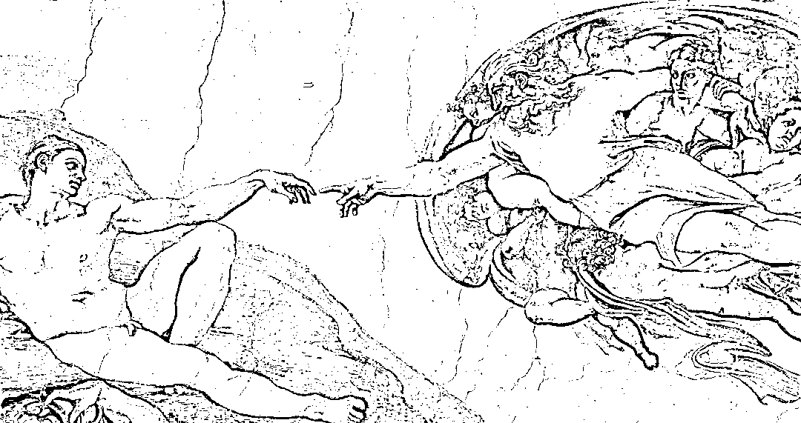

尼采作为阐发生命创造性的第一人，认为**生命本质就是创造**，一种**求新求变**的强力意志。 而柏格森也谈创造，提出创造进化论：**创造，如炮弹，似烟花……**创造是艰难的。因它**既是源自内在，**即生命本原的爆炸力；**又须逾越障碍，**即克服外在现实的阻力压制。是由向上的推动与向下的衰竭，才共同组成了完整的生命。生命力在往与收的起伏中，如海浪般绵延不绝。**创造，便是由这种不可遏制的生命之流推动，生生不息。**且创造就是要**创新。**总要去改变现状，不断突破告别旧我，孕育新生。让同一条河流，在每个瞬间都丰产出新东西，即是质的多样性。 而自由的创造性，一定是出自于**内在进化目的**，而非来自于什么外在目的。是内在于鲜活的生命运动中，不断去展开自己，实现自己的过程。可见，**创造仍然是一种“实现”**。（至此我发现，相关 5 宫的这些词汇：快乐，创造，生命……似乎都交织于“实现”？**所谓实现，即其目的不在它自己之外，而是内在于它本身的运动过程之中。**所以说，狮子座与 5 宫主题，注定是非常强调**自我实现**的。）
所以，**真正的艺术家**，必须是能在创新中不断地发展自己，**生于激情**；而非在套路中重复地复制自己，**死于怠惰**。  

**生命强度**

**生命力充沛时，才会体验到强大助推力；生命力薄弱时，人则无力创造。**创造，是内在生命力绽放的显现。**真正的勇气，所检验的，是你对生命的执着和信念。**生命的强度，正是发生在你逾越障碍，超越自我的过程中。回归深渊之处才能爆发更为猛烈的峰值，焕发出你内在不可遏制也从未枯竭的生命创造动力。相反，一帆风顺的人生，却只能保证你昏昏欲睡。故**创造必须要弃绝庸常，挣脱俗套。 **想成为自己的创造者，就要能活出自己的生命。而这并不简单。更多人并不愿意**活出自己**。因活出自己意味着：需要对自己全全负责，并全然投入，对生命充满激情。想活出自己，将不再伴随肤浅的快乐，而是要直面真实而漫长的痛苦。因**创造首先就是要俯身于黑暗，而非诞生于崇高。创造的意志，实在是需要极尽生命强度的勇气。 ****而你的创造之源，会从何处而来？**我认为，真正的创造，不会从平庸或正常的状态中流出，而是要从冥王星的黑暗和海王的醉中流出。或者说**从对生命黑暗的醉意中流出……**只因那里充满最令人失控的恐惧，也是以为创造力的土壤吧。 

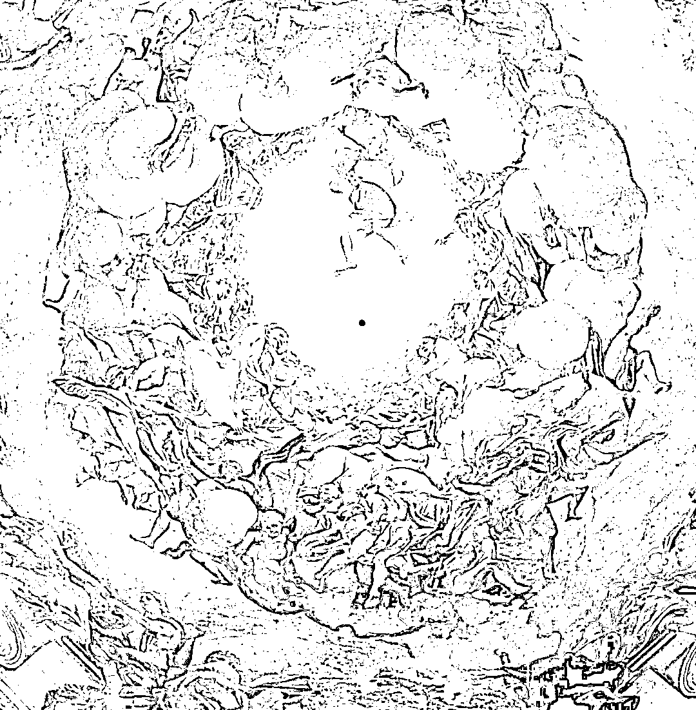

**悲剧精神**

所以，日冥的尼采赞颂生命。正如**冥王星 5 宫们聚精会神于生命本身。生命，需要你全身心地卷入！**在狂喜出神巅峰体验的失控中，将自己献祭给更宏大的本源。在敢于自我放弃的“醉”中，蕴涵着强大的生命力，需要被激活汲取，用于创造。 尼采将生命的出路寄望于艺术。认为只有艺术才能将生命带往极致。**艺术即是生命的强度**，令你能在生命痛苦的深渊中反弹飞升。喜欢艺术的冥王星 5 宫们，可以跟随这条路。让艺术引导生命，将自己的生命塑造成艺术品。 所以，尼采对生命的态度就是创造。**以****一种强力的悲观主义，面对命运。**要永远有力量改变自己，不悲观，不放弃，成为自己生命的主宰，甚至承担整个世界的痛苦，不被其吞噬，反而作为转化的力量。如此的生命创造即是勇气。即使，这样的生命如同举起下落重量的努力，它仅是延缓了下落……  所以，**冥王星 5 宫的戏剧首先要始于“悲剧精神”。宁做生命悲剧的伟大创造者，也不做人生喜剧中的乌合之众。 下面，就像尼采那样，走进剧场，找到行动。****戏剧与意志力  **

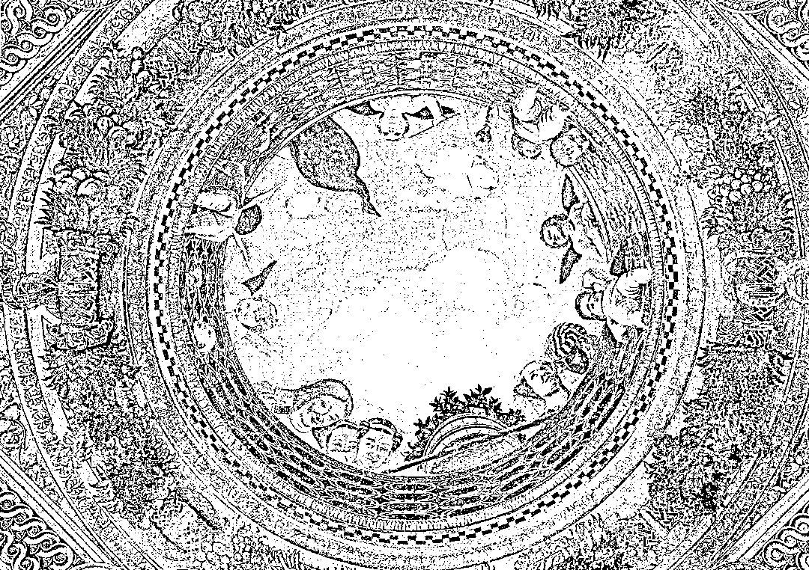

**渴望**

**你充分地思考过自己的渴望吗？**或者说，**你敢于承认自己的渴望吗？**荣格说，这并不是一件容易的事。首先，它需要诚实。其次，太多人不想知道自己的渴望在哪里，因为这像是一件不可能或非常痛苦的事。但渴望就是生命之道，如果你不承认自己的渴望，你就不能跟随自己，而走上他人指给你的邪路。即使用魔鬼来喂养渴望，也都是值得的，因为最终你会因此而学到东西，在你外部的战争中…… 狮子座和 5 宫的人生，关于戏剧；而冥王星 5 宫的人生，尤其关于意志力！如何能行使戏剧的意志，表演到极致？下面就来一睹，冥王星 5 宫，意志的世界…… 
**一个 ex 冥王星 5 宫，对戏剧的感受： **戏剧，就是展示向着一个目标而奋斗的意志，以及应用一种手段去实现目标的**自觉意志**。布伦退尔提到了行动力和自觉意志，非常打动我。即戏剧中的主人公有**明确目标**，“总是继续**不断地要求他要求的东西**”，总是“靠意志”去求取成功，而生活中的主人公则“没有特殊的或明确的目的”，“他是服从环境，而不是支配环境。他没有从事行动，而是在接受行动”。只有在它们的主人公确实是自己命运的缔造者时，才是富有戏剧性的。”基于对戏剧与小说相区别的这一认识，他强调说：“**相信宿命论更有利于小说的发展，相信自由的意志则更有利于戏剧的发展。”一种戏优于另一种戏，决定于意志所发挥的性质的高低。**因此，剧作家一般会选择具有**强大自觉意志力**的人物作为戏剧作品的**主人公**。所以，我在想，把自己的后半生想想成一场剧。然后对自己说，**我有戏！**原来，真的是人生如戏，但没有好好演，也不是一个好的男一号。不，演技是假相，要本色出演，要表现意志力。 因此，他娶了一个能为他做“战袍”的人。 

**“我是主角”**

“我就要世界上有一束光是为我打的，有一个**舞台**是为我亮的。我要这个世界上有人是为我而来的，那**非常非常重要**。”这是狮子座特质最好的写照。对于冥王星 5 宫，这更加重要。 狮子座的字典里只有两个关键词，**重要(VIP)与嫌弃(diss)**。渴望被注目，又要独享尊崇。“因为你重要……”对于他们，这是一句多么甜蜜多么受用的情话。所以，狮子座荣格对自己的自我说：我们相互依存。请振作起来，**看重自己！**冥王星 5 宫很强调影响力，渴望优越感。而敏感于尊重的人，同时，也必然会挣扎于被 diss……“**如果你的虚荣心不深入骨髓，蔑视根本无法挑战你。**”可见，重要与嫌弃，是一对孪生兄弟，是双刃剑。  **作品感**热衷戏剧的冥王星 5 宫，当然也会渴**望作品感。**我见到他们戴上白手套，小心翼翼地，如对至尊地为自己的作品装框上墙，如同手捧着自己的生命。不管多小的作品，都会为它署上自己的名字（“**我，重要！”**）。没人比他们更懂得，作品就是你，**你就是你的作品**。作品之珍贵，因为它是你的孩子，是你生命的延伸之处。所以，他们说“我的生活就是一本自传”，“做生命的艺术家”，也可以说“衣橱如人生”。冥王星 5 宫在乎形象工程，也有超群的造型“表现力”。是人生舞台上的光影魔术师，擅长调节操纵光与影的比例，打造“自我”这个个人品牌。毕竟冥王星 5 宫需要能掌控的人生，用一切的行动强调人生的作品感。此处倒是令我想到一句话：**神关于创造。有关创造的内容都适用于神……  **

**名利场**

5 宫是名利的竞技场 vanity fair。所以不难理解，艺术圈是这个世界上最大的名利场……那是狮子座荣耀的主场。我看到，很多冥王星 5 宫，游走于其中。就像他们喜欢看《权力的游戏》。于是，他们以上篇中的“德性”引导快乐，追求卓越，获得认可，在优越的地位中追求自豪感。后来，**主角们都活成了精英**。     然而，正如梭罗所看到的那样：“在表面的光鲜和富有下，芸芸众生都过着一份平静而绝望的生活”…… 所谓精英的生活。 **审判**

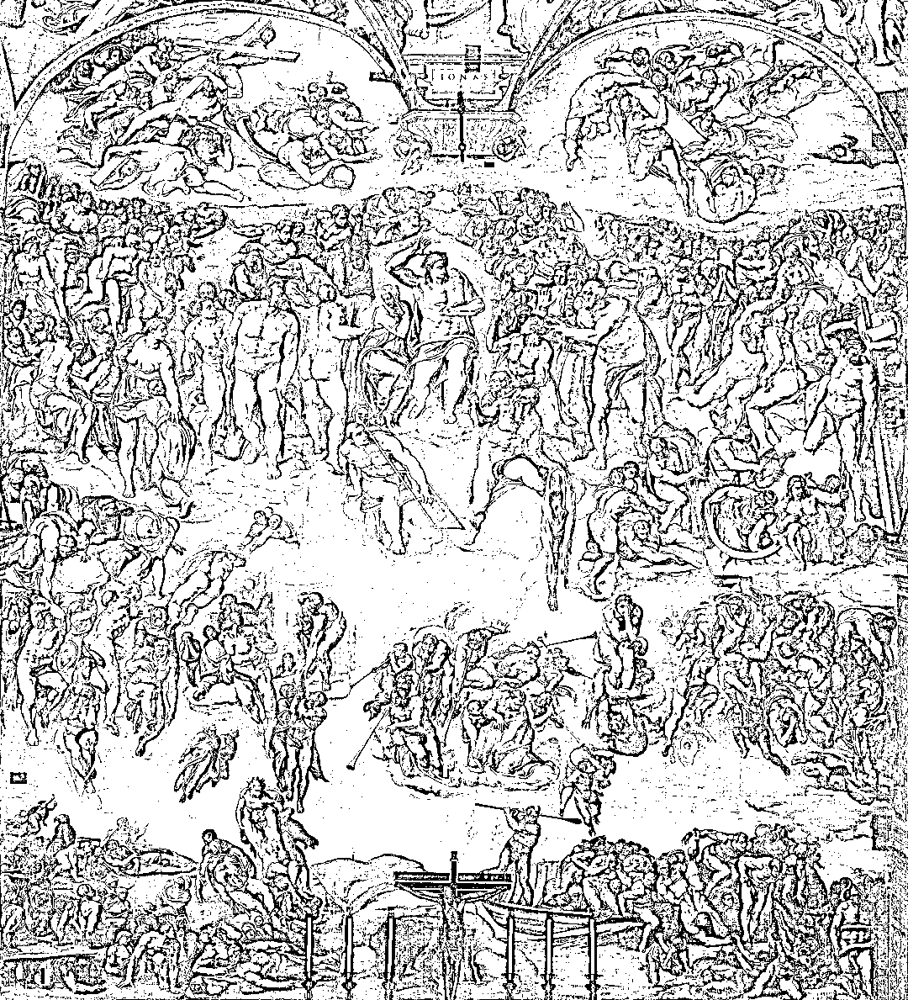

人设，是一枚硬币。它有光明的一面，也有阴暗的一面。 **在红书的末尾，狮子座荣格毫不留情地深刻审判了自己。**作为冥王星 5 宫，也必须对 5 宫议题以冥王星视角进行最真实地审视，且一定要深入骨髓。放下无聊的自尊心，玩一下自嘲吧。这不也正是冥王星 5 宫区别于纯粹的狮子座之最大区别？冥王星能量让其可以做到并不盲目。或者说，冥王星 5 宫甚至也很享受这种自我折磨，因为你更乐于看清自己？想要被理解吗？先理解你自己，你就会被充分地理解。 荣格非常“恶毒”地开了个头：**你不是我的灵魂，你是我赤裸和空洞的虚无，也即是自我（ego）**，这是令人不安的存在。我要把隐藏在你身上的东西拖到光下，我要把你的优越踩在脚下。你有很可笑的敏感、自以为是、不真实、猜忌、悲观、怯懦、对自己不诚实、恶毒和报复心，人们几乎不能讲你幼稚的自傲、你对权利的渴求、你对自尊的渴望、你可笑的野心、你对名声不知羞耻的奢求。做作和浮夸很不幸已经成为你，你使出浑身解数滥用它们。你恨伤害你的情感的人，忽视你的人，不认可你的人。你感到痛苦令人难以忍耐，你可以用最天真的方式把这些痛苦强加到别人身上，并完全不知不觉地赦免自己。你过度的野心毫无边界。你滥用自己的能力，大声宣扬自己的荣耀和正直的善意。你利用他人的善意，宣扬优越和获得奖励。你玩弄谦逊，对自己的优点只字不提，希望别人能够替你说出你的优点，如果别人没有这么做，你会很失望和受伤。你对别人的快乐很反感，因为你宁愿把它给那些你喜欢的人，因为他们喜欢你。你嫉妒自己周围的幸福，你傲慢地站在对立面。你在内心里强迫又粗野地只想那些永远适合你的东西，这样你会感到自己在人性之上，而且完全不用负责。你想变得卓越！多么可笑。你以前和现在都很低劣。 **注：此处适用于所有狮子座与 5 宫人自检。而其实被审判的则是所有人性共通之处的 Ego！**只不过说给冥王星 5 宫听，才显得更有意义？因为他们才是那个**渴望爱的同时，也渴望真实**的族群。 

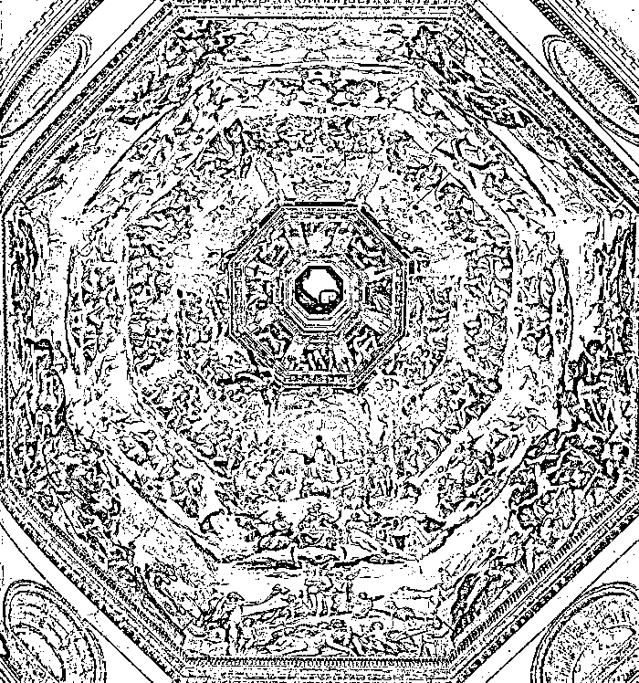

**唯我独尊**冥王星 5 宫，**最大的敌人是自己。**比如，南交 12 宫的冥王星 5 宫，他的衣服上印着“如来”……即**最极端时的情形**是自以为是神的化身。**成为神的欲望，**是按照自己的理想来安排整个世界，随意地创造毁灭并影响他人的欲望。铺展戏剧时，会误以为自己是主导人生的唯一导演；但又时常会觉得没法获得自认为应得的肯定，**难以接受自己的命运，**觉得红毯没有为自己铺开，掌声如记忆……这种落差，正是要逼迫你正视自己的盲点，去学习抽离客观。尽管你可以挥洒强力意志，但你仍需要臣服。你只是一场演出中的角色，可以让你当主角，但你并不是造物主。同理，你也非创意的真正来源，你只是作为宇宙之神的一个管道。不要总是相信自己是正确的。自恋狂妄的情结会构成你的限制。 
狮子座是高贵而骄傲的君主。而冥王星 5 宫，尤其会对昂扬生出偏执。整个人生是否都在追求一个维度，高？时常显得目中无人，仿佛站在银河系的中央被瞻仰。有时，真的觉得自己太大了，大到能够碾压他人。你既想要追上太阳，也想要冲击大海。**飞高，狂而死。**任高傲与愚蠢齐飞扬。对此，荣格说：幼稚的人，你不可能对命运进行报复。你应该建造更好的桥，这是一种更好地挥霍你才智的方法。 你是爱情的暴君吗，还是站在被胁迫的一方？你有没有把爱当成权力的游戏？在你眼里，别人都是“他者”？你有没有物化他人？使之成为附庸。狮子座荣格补充着自嘲，“我感觉你还想把别人变成你欲望的奴隶？你却利用这一点达到个人的目的。你会思考人，但却忽略人的尊严，你敢用他们思考，把他们当作你舞台上的人物，好像他们就是你构思的样子？觉得一切都是绕着自己在打转，是自我实现的附属品。当你极力证明自己！又利用别人证明自己。你没有耐心，也不严肃对待。只有它关系到你的快乐之时你才有耐心。”
狮子座对应心脏。冥王星 5 宫视心脏为最珍贵。脑海浮现一个画面，冥王星 5 宫他一字一句地重复着说：“我的心脏没问题……”上下文根本不重要，是那认真的态度令我难忘。什么时候，你需要近乎执着地敲黑板？仿佛出于对“生命危胁”的敏感？这便是冥王星 5 宫的字义。荣格补充说，“**你靠人类心脏里流出的鲜血而活**。对我而言，没有什么饮品比鲜红的血液珍贵。”我想，这**也就是《红书》壮美的深意吧！    ** 

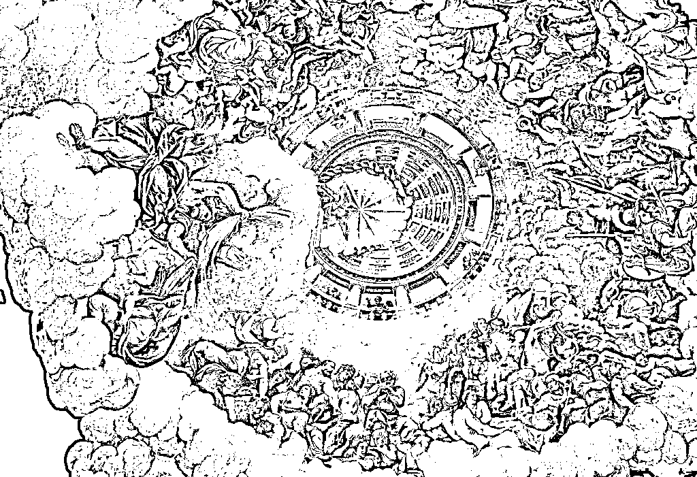

**虚荣**什么是虚荣？梭罗举了个例子：我们认识的人不多，但认识的衣服、裤子却不少。给稻草人穿上你贴身的大褂，而你却一丝不挂地站在旁边，有谁不会立即向稻草人问好呢？那天，我经过一片玉米地，走近一根穿衣戴帽的木桩，才认出那是农场的主人。跟上一次见面相比，他只是在风吹雨淋中经历了更多风霜。我听人说起过一只狗，它对所有穿了衣服向他主人的宅院走来的陌生人吠叫，却轻而易举地被一个赤身露体的窃贼弄得一声不吭。" 狮子座的虚荣心，即指**你的基础并未集中于真正值得敬重的东西，而是为人们所看重的东西努力。**当你完成事情时，只是为了追求普遍认可与保全自身优势。你不是为人类努力，而是为自身的利益。于是，你错误地认为很富有的地方实际上很贫穷。**自我证明**回想一下，主角之梦中，下意识的目光搜寻……想要被看到，来证明你是重要的。“自己”就在那里，需要向谁证明？转瞬即逝的世人们？而在爱情中，你是否也会贪恋对方的赞美，很想扮演完美男/女友。但自知那是不真实的，是逞强的。你极度需要认同。可当你急需以对方的回应来界定自我时，你就失去了力量。从而，越发失去自我。**你与“自我”的关系，到底是怎样的？**这对冥王星 5 宫是一个相当复杂的问题，应该不仅仅是自恋那么简单的概括。 综上，**当心成为多巴胺的奴隶。**当你认定某物可以给你带来快乐，大脑就会分泌大量多巴胺，促使你为快乐而行动。无论是荣誉，爱情，还是才华，一旦被你确认为快乐的载体后，你便 just can't stop it。但多巴胺并不能保证你一定会喜欢你所得到的东西，它只是确保你“想要”的渴望。即**一切取决于你对快乐的预期。 **所以，冥王星 5 宫尤其会**为自己的表现而焦虑不安，**因为你特别在意表现得是否足够出色。也为被爱着或是不被爱，而困扰。循环播放着，我是否真的被爱？足够被爱？以及害怕失去爱。其实，对爱与成功，相对于“需要”，或许你更多是“想要”吧。**其实你的存在，圆满自足。**你误以为的“需要”，只是你渴求被映照的“想要”。**但那些预期，真的值得吗？你“想要”的东西，真的令你快乐了吗？还是只帮你自我证明了那虚弱的存在感？ **梭罗说：那种所谓的富足而高雅的生活是需要跳着才够得到的，于是我的**注意力完全集中在跳跃本身**，根本无从欣赏作为这种生活之点缀的美术作品。  **打怪心理**而在典型的时代尴尬中，商业机器的套路设计，也越发像升级打怪的游戏。你该何去何从？打怪心理的设计，点击鼠标，妖怪碎裂。发条推送，收获赞许。几秒钟的经验值反馈，轻松获得成就感？由此分泌大量多巴胺，又激发你去坚持并复制这种行动。夸赞，涨粉，得奖，接单，然后快速复制复制再复制，量产，被榨干，过气。**杰出的你并没意识到，自己只是多巴胺的奴隶。**正如尼采所说的，**灵魂比肉体先死。**这是对所有人的提醒。而**冥王星 5 宫最大的陷阱，尤其是当你的作品中已没有了自己...... **当存在感来得如此轻易，还有多少人仍愿意消耗时间，经年地去爬一座山，为作品投入足够的时间？**“真爱”到底是什么？**这是一个你应该不停追问自己的问题。你可以把目光投向那些满面沧桑的匠人们，但见他们岁月静好地依然在继续着手上的坚持。尽管深知已经无法适应当下的社会，却还在坚持着做那些真正定义他们自我的事情。也许只有地摊留给了他们……而时代的潮水变本加厉地冲刷着，这些难能可贵的，自得其乐的人。 要注意一种负向循环，当人恐惧并抑制向内在连接的激情时，生命力就休止，而这将导向内在的匮乏与不满，进而更饥渴于外在的认可与掌声。越想向外证明力量，内在虚弱的坑洞越难填满。这就是盲目的人被不断增加的想去塑造事物的欲望占据时的样子。由于他已经耗尽自己的力量，他开始夺去别人的力量为自己所用。**自我折磨**冥王星 5 宫，字面意思就是虐自己。而自我折磨的快乐，对于冥王星 5 宫，究竟意味着什么？ 

荣格总结：

你需要从自己的自我蔑视中获得美德。没有一个人的嘲笑比我对自己的嘲笑厉害。**当我完全把蔑视征服时，我就很接近自己的灵魂了。如果我将你这头野兽驯服，我会给他人机会驯服他们自己的野兽。驯服要从你这里开始，我的自我，而非别处。**

在我讲出这些和对我的自我说出更多愤怒的话之后，我注意到自我开始独自面对我自己。我需要经常鞭打自己。我一直鞭打自己，直到自我折磨的快乐消退。我想你讲讲自己的羞耻，不要用伟大的字眼.你应该受到愚弄，而不是尊重。

**我要烧掉那些你引以为豪的内容，那么你就会变得空洞，像被抽空的容器一样。你应该为自己的空洞和悲惨感到自豪。你要成为生命的容器，从而杀掉自己的偶像……**

——卡尔·荣格《红书》

**下篇预告：《命运》**

**版权声明：**本文由作者授权在若道平台发布，欢迎转发，反对抄袭。

**蓝女巫**

英国伯明翰大学 市场营销学硕士

职业占星师/专栏作者/芳疗师/珠宝设计师

中国首批 ISAR 英文认证占星师（2012 届）

**微信公众号**：cecilia_sui

长按打赏

**系统学习占星学**

**点击图片了解详情**

**微信又双叒叕改版啦，不想错过若道君的推送？**

**就把若道设为星标吧！**

**▼**

就是这个“在看”，戳一下☟

********报名直达入口********

# 如果你觉得人生太好受了，请找太阳、月亮、上升落在这个星座的爱人

> 原文：[`mp.weixin.qq.com/s?__biz=MzA5NjA0NTAxNg==&mid=2651423754&idx=1&sn=a98eabdbacb8702c235c367565a17ce3&chksm=8b4b36bdbc3cbfabc468d6015d7755528b6ffc28759c54f6f67d5e82b4354e6304c1787935f2&scene=126&sessionid=1692738126#rd`](http://mp.weixin.qq.com/s?__biz=MzA5NjA0NTAxNg==&mid=2651423754&idx=1&sn=a98eabdbacb8702c235c367565a17ce3&chksm=8b4b36bdbc3cbfabc468d6015d7755528b6ffc28759c54f6f67d5e82b4354e6304c1787935f2&scene=126&sessionid=1692738126#rd)

**********☆****************后台回复“今日”，给你一句生命态度**********

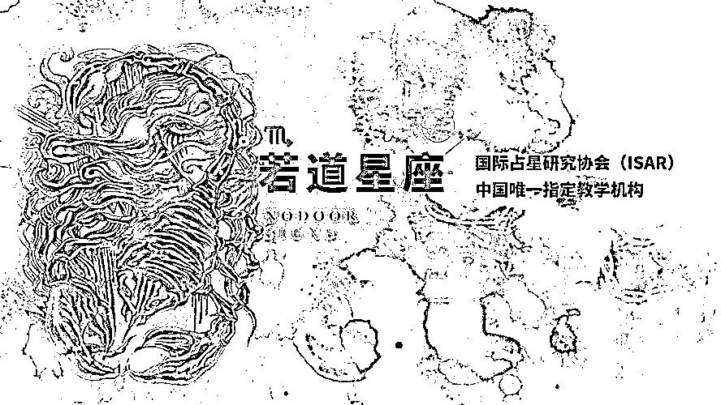

作者/斯蒂芬·弗里斯特 朱迪·弗里斯特 
译者/李含 编辑/玫瑰 图片来源/全景网本文摘自《天空的伴侣 I：爱、性和进化占星学》

提到这个星座，总归是“不虐不活”。现在，你是不是做好了准备，让这位天蝎座的暗黑之神带你坐上命运的过山车，体验一把“死了都要爱”的感觉呢？抓紧扶手，开动咯！

**天蝎座****原型**  **侦探 催眠师****魔术师 心理学家 巫师**发展目标我们的祖先在给天蝎座命名的时候就已经没有打算让我们好受了！我们都坐在一座火山之上，被潜意识驱使——至少是**被强迫，心理上的强迫。性欲**就是其中一种强迫力。如果你问一个 18 岁的足球运动员，为什么被啦啦队长吸引，首先他一定认为你是个疯子，然后会玩笑带过。对我们大部分人来说，这已经足够了。在生活中，我们接受了这些潜意识的引领。对于天蝎座来说，这只是个开始。必须更深刻地挖掘，这很快就让人感到害怕了。**向灵魂深处探索，就像跟随直觉的脚步，有许多扭曲和伤害，隐藏在我们不愿触碰之处。**潜意识和直觉扭曲了我们的生活，我们从来不能确定他们的方向。如果有一颗星体触碰了天蝎座的能量，这种**扭曲和变形**就开始了。**某些深埋在地狱里的黑暗面会被挖掘出来，上升到意识层面，并且治愈。**形而上学的意义中，在前世里，受冥王星影响的人**体验了黑暗的灵魂，所以必须反过头去面对这个黑暗面，去整合自己，最后治疗并痊愈是最终的目的。**策略和资源**有洞察力，以感觉为中心的自我分析**是天蝎式的基本生存策略。从来没有一个星座如此强烈地**执着于探求人类灵魂的深处。**没有哪一个星座会像天蝎座这样**不选择压抑和否认**。《内在的天空》一书中，我们描述天蝎座有**“压抑机制缺陷”**。本能的，天蝎就是有一种**怀疑精神，而不是相信呈现在眼前之事**。**探索、感受和体会内心的世界**，天蝎座变得**越来越有智慧，更深刻，更加能够从昏暗中发现人性的本质**……除非在这段内在的旅途中，你不慎滑落到阴影的陷进里。为了保证通往心灵深处的这条曲径安全，天蝎座必须运用两个关键的资源来完成情感上的自我分析，这就是安全策略。这两种资源都不是无意识产生的。两个都必须有意识地培养。第一个资源是要让你**退一步，换个视角看待问题**。天蝎座需要**卸下某些自尊心的防备，学会自嘲，学会幽默地看待自己的紧张。**天蝎座的第二种资源是“朋友”，或许用**“盟友”**这个词更合适一些。他们帮助天蝎座**更多元地看待世界**。他们让天蝎座开怀大笑，帮助天蝎座更健康积极地看待世界，带给你不一样的自我暗示。更重要的是，他们了解天蝎座，给予天蝎座所缺乏的能力：**幽默、宏观的视野。****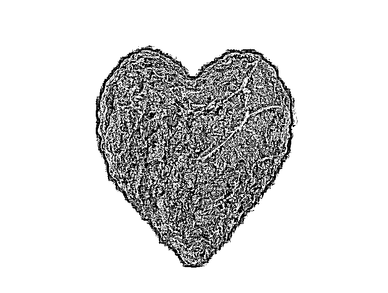**阴影天蝎座的阴影是**病态的自省、沉思、忧郁、沉闷**。这是一个困境。“有缺陷的压抑方式”给予天蝎接近潜意识的有效途径。但这是一个双向渠道，潜意识也会影响到天蝎。缺少了两项关键资源——洞察力和朋友，所有内心的痛苦、混乱将天蝎座拖进黑色情绪的泥沼。天蝎座人如果踏上这条歧途，最终伤害的不止是自己。在阴影中的蝎子还会蜇伤别人，**用这种消极的方式引起别人的关注，强调他们经历了各种精神上的痛楚。**真相必将把仁慈送上祭坛。潘多拉的盒子被开启……但没有人知道如何面对，不知道盒子里会放出什么样的魔鬼。**天蝎座的爱情**太阳天蝎座的爱情流行的占星学观点认为天蝎座**非常性感**。我们做了一个小小的调查发现，其他 11 个星座也很关心性啊！性，不是任何一个星座垄断的领域。**认为“天蝎座很性感”的说法是扭曲了占星基础理论中，认为天蝎座倾泻感情的方式很强烈。**每一个太阳落在天蝎座的人，**他们的基本活力和精神的健康，都需要定期进行情感的宣泄。**事实上，我们的文化趋向于**将“深刻激烈”的情感与性联系在一起，或者是性，离不开这种情感**。但对于很多人来说，性是一种基本“娱乐”，并不涉及复杂深刻的精神需要，但这些人就不是健康的天蝎座了！月亮天蝎座的爱情

月亮在天蝎的道理是类似的，只不过这种天蝎式的渴求通常被**埋藏**起来了，不会立即被发现，更少理性。他们必须体验天蝎座的方式，即**不断深化的亲密和忠诚**，否则，他总是**在爱情中感到不满足**。

这种情况下，他们会变得**沉默，处于爆发的边缘**，通常是因为**含糊的、人为的原因**。月亮天蝎座的人**往返于地狱，总是不经意就沉沦**。在情人们的眼里，这很可怕：**突然之间，伴侣的情绪变得冷酷阴森，灵魂在飘远。**月亮天蝎座要尊重原始的冥王星节奏：**该离开的留不住。**逆袭而来时，你需要正视他。如果与月亮天蝎座的人亲密共处，要能**忍受情绪的直白暴露。**

**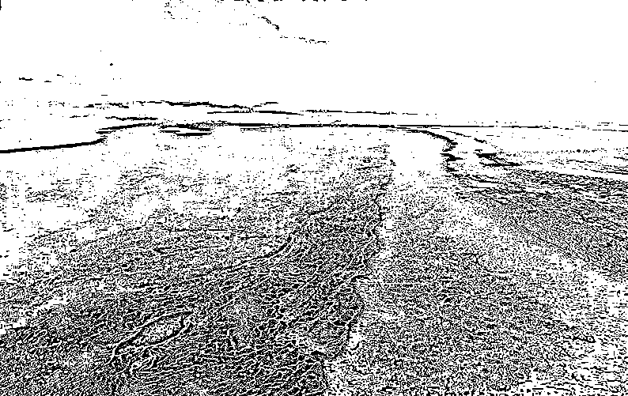**

上升天蝎座的爱情

我的鼻子和你的鼻子距离两英尺。我的瞳孔和你的瞳孔对视。突然间，我们俩都浑身鸡皮疙瘩。我脱口而出：“你就是我的灵魂啊！”这就是上升点在天蝎座的人会有的行为。在亲密关系中，上升天蝎座的人**期待一种邂逅。需要有灵魂的碰撞。**天蝎式的意愿是**不断深化**。上升点在天蝎的男人、女人通常好像**戴了巫师的面具，散发着强大的洞察力和紧张感。**

如果天蝎座的伴侣**没有成长**，那么**所有的情感，包括性爱，会很快褪色。**所有情况下，我们都会感受到**恐怖的紧张感。**X 光一样穿透的视线。背后藏着什么？这就要看星图里更深层的架构了。一般，上升点在天蝎座的人，**非常善于与一个极端强烈的人开始亲密关系，但是，一旦开始交往，他们又不知所措**。就我们所知的，上升星座描绘的是我们**表面的的人格表达**。如何在爱情和性关系表现，上升星座有重要的影响，但是并不像太阳、月亮的影响力那么强大。另外说一点，目前广泛认为天蝎座的守护星是冥王星，这在实际运用中很贴切。但在传统的占星学中，火星是天蝎座的守护星，这个原则依然说得通。实际解读星图时，上升天蝎座的人拥有两颗命主星。它们的运作好像是**合作者**。我们会格外关注**火星**作为守护星，因为**火星更具有性的能量**。如果一个人的上升点落在天蝎座，他会**以火星星座所体现的方式来构筑亲密关系**。如果**火星还落在“亲密关系”的宫位**，这个影响更是加倍。

**版权声明：**本文由若道翻译发布，欢迎转发，反对抄袭。友号转载请申请白名单。

**12 星座爱情宝典**

[白羊座](http://mp.weixin.qq.com/s?__biz=MzA5NjA0NTAxNg==&mid=2651419096&idx=1&sn=30c86f7f9f489d61c1b0f80b8944b46b&chksm=8b4bc36fbc3c4a79c49f5b4aa43daad19a145e2bf762fe4a8e5bc1319228e633a65ae869df2c&scene=21#wechat_redirect) | [金牛座](http://mp.weixin.qq.com/s?__biz=MzA5NjA0NTAxNg==&mid=2651419469&idx=1&sn=e44679a33194bf652fe9f515565c8da5&chksm=8b4bc1fabc3c48ecfa11b12fdab2043d246c58d47176dfa105a11ee05a22b4bc65947c7ad02e&scene=21#wechat_redirect)丨[双子座](http://mp.weixin.qq.com/s?__biz=MzA5NjA0NTAxNg==&mid=2651420649&idx=1&sn=0179035270f9508988c70e85c969869c&chksm=8b4bc55ebc3c4c48c928471267184c6360676c387dc9527ef0e112d6671bba3e8893324b5621&scene=21#wechat_redirect) | [巨蟹座](http://mp.weixin.qq.com/s?__biz=MzA5NjA0NTAxNg==&mid=2651421302&idx=1&sn=23f3f771a6bb8eed2903620cc0344755&chksm=8b4bc8c1bc3c41d7b10a8b2c2a826edf4d7700e0db201cabe956be9128038e9dd3beb6b14afb&scene=21#wechat_redirect)

[狮子座](http://mp.weixin.qq.com/s?__biz=MzA5NjA0NTAxNg==&mid=2651422486&idx=1&sn=ee393d64fc0638b589212d81c2ecbd35&chksm=8b4bcda1bc3c44b737b01fcfcc85a0a9096d4f7a567d76c6079e9760105e5259d775715f6429&scene=21#wechat_redirect)丨[处女座](http://mp.weixin.qq.com/s?__biz=MzA5NjA0NTAxNg==&mid=2651422885&idx=1&sn=3d4e368f263ed2016388d3cec178b6b1&chksm=8b4b3212bc3cbb049ad7a6c403a4eab1664d38bb465ede4b82aeaeef64deb34b13e8319c642d&scene=21#wechat_redirect) | [天秤座](http://mp.weixin.qq.com/s?__biz=MzA5NjA0NTAxNg==&mid=2651423207&idx=1&sn=d3f8a94b54e7667c0876707de89e7a9f&chksm=8b4b3350bc3cba4672ecb735a445998dc008428e5bdc388c269c237ee361c0bb0b7404dbff0c&scene=21#wechat_redirect)

斯蒂芬·弗里斯特

若道签约老师。进化占星学的创始人之一，当今世界最有影响力的占星大师之一；1985 年，他凭借《内在的天空》一书获得职业占星师协会奖（Professional Astrologers Incorporated Award）。他四次获得占星界最高的占星学联合协会奖（United Astrology Congress Regulus Award）提名，2018 年获得轩辕十四教育奖。

**想听听大师斯蒂芬老爷子的精彩讲座？**

**长按下图了解详情！**

**微信又双叒叕改版啦，不想错过若道君的推送？**

**就把若道设为星标吧！**

**▼**

就是这个“在看”，戳戳戳 ☟

****************报名直达入口****************

# 太阳返照图干货 | 日返图里，九大行星分别代表了什么？

> 原文：[`mp.weixin.qq.com/s?__biz=MzA5NjA0NTAxNg==&mid=2651423754&idx=2&sn=6678283fe24c6a706eb56e657dcb8612&chksm=8b4b36bdbc3cbfab381d9b925d0fec68b6da2ca9905421bc9b350f3061b38de7d94f5d7e0753&scene=126&sessionid=1692738126#rd`](http://mp.weixin.qq.com/s?__biz=MzA5NjA0NTAxNg==&mid=2651423754&idx=2&sn=6678283fe24c6a706eb56e657dcb8612&chksm=8b4b36bdbc3cbfab381d9b925d0fec68b6da2ca9905421bc9b350f3061b38de7d94f5d7e0753&scene=126&sessionid=1692738126#rd)

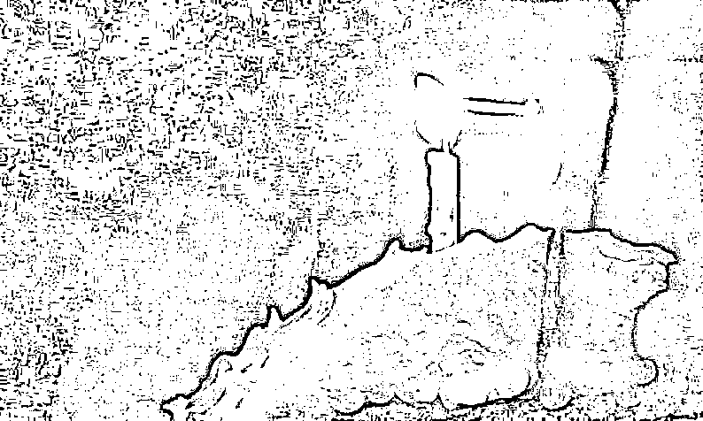

作者/萨拉·希普曼 译者/李含 校对/江艺

编辑/翀子 图片/网络

太阳返照星图是特殊的占星学预测工具，它的作用只持续一年。星图上的行星描绘出在这一年里“将要发生什么”，而行星所落宫位则告诉我们“在哪里”发生。作者在文中分别讨论了十颗行星在太阳返照星图中的作用和意义，帮助我们更好的了解这一预测工具。**太阳返照星图是我们可以运用的最好的预测占星学工具之一**。然而，因为星图是短暂的，只持续一年，所以解释太阳返照星图中太阳（和其他行星）的宫位落点将会不同于你出生星图中熟悉的意义。因此，在解释这一年的太阳返照星图时，**了解行星在太阳返照星图中的功能非常有用。**你的太阳返照星图中的**行星描绘出“将要发生什么”**，而**宫位落点则告诉你“在哪里”**，所以这会对你解读自己的太阳返照星图很有帮助。我建议你们在分析时记下你的宫位关键词。

**太阳返照星图中的*****太阳***

太阳返照星图中，你会发现自己投入了大量的精力在太阳所落的宫位，并被该宫位相关的活动所吸引，因为那将是你优先考虑的事情。所以，太阳会告诉你**这一年的重心**，也会告诉你生活中**哪些部分**是你真正需要关注的。它照亮了你需要做的事情，你可能会感到**不得不表达你的星图中太阳落点所凸显的部分**。一般来说，**太阳也象征着男性和一般意义上的男子气概**，有人认为，在女性的星图中尤其如此。我不认为宇宙有性别偏见，但可能是你星图中的太阳照亮了你生命中的男人（不管你自己是什么性别），或者点亮了你生命中需要以某种方式明显展示你**个人权威**的一个部分。

**太阳返照星图中的*****月亮***

太阳返照星图中的月亮，就像出生月亮一样，都是关于情绪反应。然而，太阳返照星图的月亮**描绘了在你的世界里一年中感觉最舒适的地方**。这可能是一个物理位置，让你联想到一个情感问题，因为月亮也掌管着家，家庭和你深层次的情感安全感。这些事情经常要求我们处理跨越情感谱系的问题，这些问题对我们来说可能很难处理。因此，**月亮的宫位**可能会向你展示你生活中**需要学习更好地“处理”事情的领域**。太阳返照星图的月亮会在不知不觉中把你吸引到**需要“照顾”**的地方，或者你觉得**受到照顾**的地方——双向的解释都是可能的，而且在你的太阳返照星图中尤为可能，因为月亮在其变幻无常中有其可靠性。随着月盈月亏，月亮也可能表明你的生活中处于**过渡状态的领域**。无论月亮落在哪里，你的感觉都会发挥作用。

**太阳返照星图中的*****水星***

在太阳返照星图中，水星是关于想法及其传播的。在水星翅膀降落的地方，你会在太阳返照星图对应的这一年大部分时间里（如果不是全部时间的话）**思考与该宫位相关的活动**。而且很有可能你也会在**写作和谈论**中提到这些内容。**水星也会告诉你自己的精神状态，并描绘出你的感知是如何受到影响的。**确切地说，你的心智状态、思想和想法如何与你生活的其他部分**关联**，如何与你的行为和情感的联系，将取决于水星与其他行星的联系，因为水星毕竟是关于连接和交流的行星。水星作为“中间人”的概念是非常重要的，因为水星依靠它的关联点让你的思维过程完全整合到一个完整的信息包中。这使你能够制定计划，做出决定，采取的行动，影响到这一年乃至你以后的生活。因此，想法、演讲、书面交流、短途旅行、调解都将是这个信息包里的一部分。为什么？因为辩论、讨论、联系和交流是水星的意义所在。水星是一个充满活力的行星，所以不断动起来吧，**无论水星在哪里，他都会让你忙个不停**。

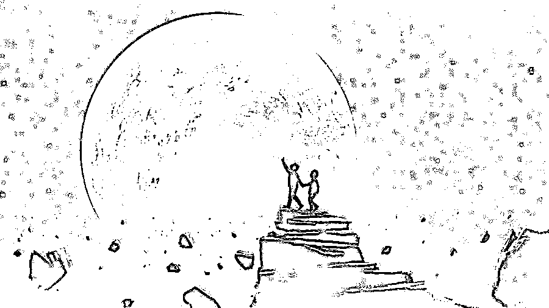

**太阳返照星图中的*****金星***

啊，金星，每个人最喜欢的行星——谁会不喜欢她呢？毕竟，她是充满爱和吸引力的行星。在你的太阳返照星图中，**金星可以象征几件事情，而且不全是关于爱情的**。金星还**象征着金钱**，因为这个行星是一位物质女孩。在你的太阳返照星图中，在金星代表的生活部分中，你可能希望通过某种方式来进行一番改善，无论是从**审美**上还是在你自己的**价值体系**方面。金星也是你**找到快乐和享受生活的地方**，是的，这通常涉及到花钱。然而，金星也可能显示出你可能因为过度消费而面临财务压力的地方，尽管金星可能会为你**吸引到资源**，但你也同样可能屈服于金星的欲望，**过度追求**生活中的美好事物。生活中的美好事物通常是社会性和关系性的，金星象征着我们与所爱的人一起度过的时光和参与社会活动享乐的时间。她也可以被解读为**你重要的另一半**，或者象征着**其他重要的人际关系和职业关系**，因为金星会出现在家里，在商业活动中，也会在美容院。

**太阳返照星图中的*****火星***

你的太阳返照星图上的火星是关于行动的，**在火星所落的地方，你将会从起跑线上被发射出去，不得不奔跑。**如果你不能继续比赛，你会迅速变得沮丧和愤怒。很简单，火星要求你继续做它的落点告诉你做的任何事情。**这个动作可能是身体上的，心智上的，甚至是精神上的**——不管你需要做什么，对火星来说“行动”是很重要的。因此，你的太阳返照火星可以作为一个指示器，告诉你今年你可能会在哪里感到心烦意乱，并且失去常序，但是——这是非常重要的——如果你不运用自己的火星能量去完成你生命中火星告诉你急需关注的领域的事情时，才会发生这种情况。在太阳返照的这一年里，**与火星有关的事情将立即出现在火星所在的宫位**。所以也就是，身体动作，运动，速度，性，能量，争论，暴力，勇敢，手术，年轻男子，主动性，积极主动，红色。明白了吗？

**太阳返照星图中的*****木星***

在你的太阳返照星图中，木星作为带来好运、机会、（各种形式的）财富的使者，当然还有随之而来的无限乐观，张开双臂欢迎进入他所在的宫位是常有的事情。然而，这种欢乐是合理的吗？正如谚语所说，你可能拥有过多的好东西，而木星同样以各种形式的过度而闻名。过度乐观，感觉全世界都欠你，过度热情和放纵，就像遥远彼岸的木星一样，带着积极的心境，你可能会忍不住去探索。无论木星在你的太阳返照星图中落在哪里，他都以积极的和不那么积极的方式进行扩张，诀窍（如果有的话）依然是倾听木星对你说的话，**找出你的机会，然后努力工作抓住机遇**，只有那时，你才会收获木星的报酬。“工作？”我听到你说，‘我以为那是土星的领地？’是的，的确是这样，但是**木星也要求你努力工作**——即使你不喜欢。懒惰在很大程度上是木星的特征，但是，唉，它会让你一事无成，**木星的目标是让你有所成就，让你继续前进，开阔你的眼界**。

**太阳返照星图中的*****土星***

在你的太阳返照星图中，**土星所落的地方真的要求努力工作**。土星的作用是**告诉你什么地方需要务实**，什么地方只要你再努力一点就能做得更好，什么地方你需要保持冷静的头脑，培养更成熟的态度，保持耐心，有责任心，脚踏实地。事实上，由土星落点所指示的事件将不可避免地要求你做出那样的回应。换句话说，**土星是木星的补充——是我们努力审视自己，意识到自己需要负起责任的那一刻。**忽视土星，你将生活在恐惧中——害怕改变，害怕推动自己更进一步，事实上，你对几乎所有的事情都感到恐惧。恐惧是土星负面能量的核心，因为正是恐惧让你陷入对自己不利的境地。记住这一点并克服它——你所需要的一切帮助土星都会给你。

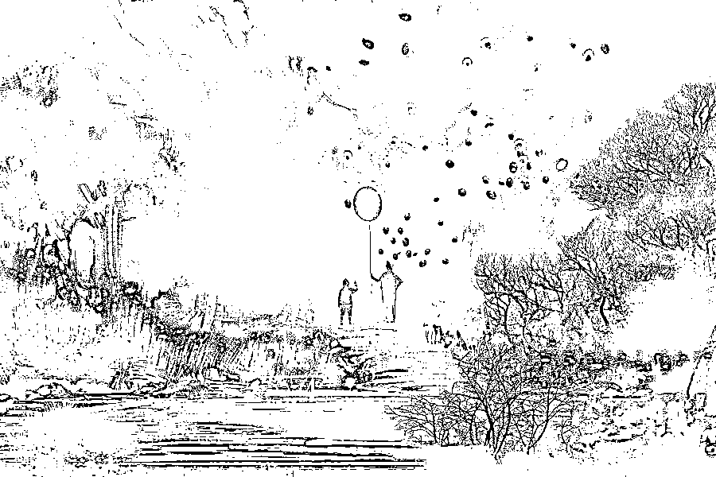

**太阳返照星图中的*****天王星***

无论天王星落在你的太阳返照星图的哪个位置，你都可以预期，天王星的出乎意料都是关于变化的，作为一个完全没有人情味的行星，天王星真的不在乎那个变化是什么，只要它是变化就行。我们不是在这里谈论调整边界，外行星的变化是“真刀真枪”的。这听起来可能很疯狂和可怕——有时候确实如此——但是请用这个想法来安慰自己。**在你的太阳返照星图中，天王星会帮助你摆脱天王星宫位落点所显示一切陈腐桎梏。****天王星希望你以一种不同于以前的方式来思考问题。**天王星希望你能接受新事物的概念，有时这将需要某些不常见的、不受欢迎的或其他奇怪事物让你警觉和留心。这可能是夜深人静时“惊喜发现”的时刻！或者你的外部生活中发生了一件意想不到的事情，让你突然停下来。或两者兼而有之。天王星是不可知的，因为你只可能经历其中一种，或者两者都经历。天王星就是这样，不可预测。

**太阳返照星图中的*****海王星***

在所有的行星中，海王星是在象征世界中运作最好的一个，在你的太阳返照星图中，海王星的象征意义突出。这样来看，海王星不再是困惑的源头，而变成了一个更有用的存在，一个指针，**指向你需要停下来的地方，深呼吸，比平常更多地反思生活**。然而，这不仅仅是一次冥想练习。海王星掌管视野，这开辟了一个解释可能性的广阔领域。海王星会**告诉你哪些地方你看得不够清楚**，哪些地方你可能会经历误解，哪些地方你需要更加稳扎稳打，哪些地方你可能会经历错位的事情 ——从你的情绪到你的家门钥匙。海王星也会告诉你在哪里你可以**更有创造力**，在哪里找到**灵感和内心的平静**。永远不要怀疑海王星在不那么精神的层面上表达其象征意义的能力。在你的太阳返照星图中，就像其他行星一样，你会发现**海王星的影响力作用于许多层面**，包括世俗和物质领域。它的影响范围对应了水、石油和天然气。还有脚和眼睛。电影和舞蹈。毒品，酗酒，还有深层的睡眠。困惑？你会有的。

**太阳返照星图中的*****冥王星***

在你太阳返照星图中发现冥王星的地方，**有必要丢弃一些东西**——字面意思或隐喻意义的，因为冥王星代表着不可逆转的从一种存在状态转变到另一种存在状态。冥王星告诉你放弃那些你认为很宝贵的东西，并让新的东西取而代之。因此，**冥王星在你的太阳返照星图中所落的宫位就是你被要求以某种方式改变生活的地方。**这种转变可以通过要求你掌控一个你以前觉得无法维护自己的领域来实现。相反，冥王星也可以要求你放下你的防御，让自己屈服于你最大的恐惧——不管它们是什么——从而使你在这个过程中成长和更新自己。**冥王星的主题是扔掉你生活中的垃****圾**，我们知道如果你囤积垃圾会发生什么……冥王星不希望你的生活最终成为真人秀节目中的一间房子，从地板到天花板都堆满了恶臭的垃圾。危险在于，如果你没有定期清理垃圾（至少在隐喻上），你积累的垃圾将远远超出你的处理能力。正如你在电视上看到的那样，处理这个问题的唯一方法就是请一些认真的人来帮你收拾残局。来见见冥王星。他就是地狱来的强迫症清洁工。

**版权声明：**本文由若道翻译发布，欢迎转发，反对抄袭。友号转载请申请白名单。

莎拉·希普曼

英国牛津的一位占星师。从孩提时代起莎拉就对占星学充满兴趣，现在她已经学习和实践占星学三十多年了。莎拉·希普曼是作者的笔名和执业名。

**学习太阳返照技法**

**请点击下图了解详情**

**

**微信又双叒叕改版啦，不想错过若道君的推送？**

**就把若道设为星标吧！**

**▼**

就是这个“在看”，戳戳戳 ☟

****************报名直达入口****************

# 琳恩·贝尔：太阳返照全解读丨今晚 8 点开课，还没上车的小伙伴抓紧！

> 原文：[`mp.weixin.qq.com/s?__biz=MzA5NjA0NTAxNg==&mid=2651423754&idx=3&sn=e7657952e475fc8c7acbe65c9548d8bb&chksm=8b4b36bdbc3cbfab6bfa84513e8744f085fab8da3c86eec365ac3f871570d6a3a9121a036c39&scene=126&sessionid=1692738126#rd`](http://mp.weixin.qq.com/s?__biz=MzA5NjA0NTAxNg==&mid=2651423754&idx=3&sn=e7657952e475fc8c7acbe65c9548d8bb&chksm=8b4b36bdbc3cbfab6bfa84513e8744f085fab8da3c86eec365ac3f871570d6a3a9121a036c39&scene=126&sessionid=1692738126#rd)

编辑/玫瑰 图片/网络

“**每当太阳回到它在出生星图上的位置，我们都把宇宙的一个新部分吸纳进来，并把它变成我们自己的。大多数人都会有这种体验，生日那天是特殊的。那时我们可能会掂量一些事情，感受时光的变化，并为最近的过去画上一个句号。同时，我们也可能想把未来握在自己手中。****太阳返照就是这样，它是我们未来的一小块。端详着它，会有一种跃跃欲试的期待感，将太阳返照与行进和次限一起用，会开启我们对未来时间的理解。****黄道的每一个度数都带着某个太阳能量的特别印记，这是一种支撑着我们核心自我意识的独特品质。当太阳回归到那个度数，甚至分和秒都准确地回归到我们出生星图中的分秒时，这种至关重要的光就会被重新充满，每一颗行星都会与太阳形成新的关系。在这门课程中，我们将学习如何解读太阳返照图，并理解它对未来一年传达的信息，理解在未来的一年里会发生什么？****我们在整个课程中都会研究案例。学员们也将研究自己过去和未来的太阳返照图。****Lynn Bell****琳恩·贝尔**
”**此课程可作为 ISAR 选修课。**

**1**

**课程目标**

*   跟随太阳返照技法顶流名师系统学习，熟练掌握太阳返照单图、双图解读；
*   学习掌握太阳返照解读延伸出的占星知识：太阳返照择时、小限法等；
*   更好地解读每一年宇宙给予你的生日礼物，规划未来一年，活出生命的荣耀；
*   更清晰地洞察每一年的人生功课，更从容地迎接祝福、挑战、潜力和困难；
*   以人生目标管理的方式应用太阳返照图，制定人生的 3 年、5 年、10 年计划；
*   太阳返照为 ISAR 考试知识点，适合计划获得 ISAR 认证学员系统学习；
*   整合太阳返照等多种技法，在咨询中开设新项目《生日年运解读》。

**2**

**课程内容**

**2020 年 8 月 4 日（周二）第一课**❶ 什么是太阳返照❷ 如何解读太阳返照❸ 一张太阳返照图解读两遍❹ 为期 19 年的默冬周期预测与意识❺ 出生地与迁徙地的返照图❻ 不是所有的年份的太阳返照都一样**2020 年 8 月 11 日（周二）第二课 **❶ 月亮在太阳返照中的至关重要性及其元素周期❷ 月亮落入火元素星座、土元素星座、风元素星座、水元素星座的解读❸ 食相、满月和新月❹ 月亮在太阳返照中的相位**2020 年 8 月 18 日（周二）第三课**❶ 继续月亮的相位❷ 太阳照亮各宫位❸ 通过太阳所在宫位解释太阳返照❹ 在太阳返照中太阳的相位**2020 年 8 月 25 日（周二）第四课**❶ 太阳返照中的合轴行星❷ 太阳返照中的合轴行星为未来一年添彩，并成为来年的主导者❸ 重要的星图模式❹ 精确紧密的相位❺ 行星力量**2020 年 9 月 1 日（周二）第五课**❶ 太阳返照与出生星图的关系❷ 识别模式❸ 太阳返照中行星作为出生星图的解释❹ 逆行行星和共振相位❺ 出生上升点经过各宫位**2020 年 9 月 8 日（周二）第六课**❶ 太阳返照中的择时❷ 利用月亮择时❸ 整合行进❹ 太阳经过各宫位❺ 中天推进❻ 小限法**2020 年 9 月 15 日（周二） 第七课**❶ 特殊的太阳返照年❷ 太阳返照与金星周期❸ 中天经过各元素❹ 最好和最坏的年份
**2020 年 9 月 22 日（周二） 第八课**❶ 与未来合作❷ 技巧的整合❸ 预测与心理学❹ 如何处理两难困境

**3**

**课程适用人群**

*   具有一定占星学基础知识，能综合解读出生星图的占星学子；

*   对于自我成长、人生目标规划有兴趣的占星学子；

*   占星师或渴望成为占星师的人群，希望丰富咨询技巧和项目；

*   计划获取 ISAR 考试认证学员，知识考点，可作为选修课。

**4**

**授课老师**

**琳恩·贝尔（Lynn Bell）**

*   世界最受欢迎的占星学演讲者、作家和老师之一。定居巴黎，对心理占星学和家族模式有几十年的研究。 
*   著名的心理占星学中心（Centre for Psychological Astrology）的长期导师。2016 年，获得查尔斯·哈维（Charles Harvey）杰出的占星学服务奖。 
*   作为一个从多个层面进行工作的占星咨询大师，琳恩的工作结合了心理学的观点。她对家族模式的兴趣首先来自与客户的合作。通过在分析领域所做的个人工作，她所受的埃里克森催眠训练将她引领至家族系统。后来，她组织研究小组在家族星图上进行了数年的研究。她写的《家族占星学》就是这项研究的结果。 
*   法国心理占星学协会的会长。除了占星学，她在法国沙特尔的新沙特尔学校任教 8 年，还 5 次获得了在《纽约时报》畅销书作者卡萝琳·迈斯（Caroline Myss）的卡萝琳·迈斯教育学院（Caroline Myss Educational Institute）合作教学的机会。

|琳恩·贝尔老师著作《Planetary Threads》和《Cycles of Light》

**5**

**课程费用**

**价格**：6800 元

**6**

**开课时间**

**2020 年 8 月 4 日（周二）20:00-22:00****共 8 次网络课，英文授课、中文翻译**

**7**

**退转课程**

**退款原则请详看《教学协议》，如有疑问请咨询课程顾问**。****太阳返照全解读****

**授课老师：****琳恩·贝尔**

**授课时间：****2020 年 8 月 4 日-2020 年 9 月 22 日，共 8 次课程**

**授课方式：**网络课程，英文授课，中文翻译

**费用：6800****元**

**课程负责人：**王老师（微信：18510107057），请备注“太阳返照全解读”

长按二维码添加课程负责人咨询~

****报名请点击“阅读原文”****

# 8 月 3 日水瓶座满月 | 土星提供通关攻略，决定你未来半年的旅程！

> 原文：[`mp.weixin.qq.com/s?__biz=MzA5NjA0NTAxNg==&mid=2651423599&idx=1&sn=783ea44a3a827887255f5a5e121c75db&chksm=8b4b31d8bc3cb8ce910c2e249cf1fc2d4a5e04272a86e40b4114467f8afe45270d94d713fba5&scene=126&sessionid=1692738126#rd`](http://mp.weixin.qq.com/s?__biz=MzA5NjA0NTAxNg==&mid=2651423599&idx=1&sn=783ea44a3a827887255f5a5e121c75db&chksm=8b4b31d8bc3cb8ce910c2e249cf1fc2d4a5e04272a86e40b4114467f8afe45270d94d713fba5&scene=126&sessionid=1692738126#rd)

****☆ ****后台回复“今日”，给你一句生命态度****

作者/王芝桦 编辑/玫瑰 图片/全景网

**水瓶座满月**

**北京时间 2020 年 8 月 3 日 23:58 迎来水瓶座满月，狮子座太阳与水瓶座月亮于 11°45′精准对分。**

走过 6 月-7 月跌宕起伏的“日月食季”，很多朋友可能感觉 2020 年最激烈的时段应该过去了，很遗憾地说还没有。此次水瓶座满月周期内的一切意外都不意外，因为此次水瓶座满月将会点燃未来半年激烈而尖锐的战火，同时为我们布置出“为什么战斗，在战斗之中寻找什么”的问题，并给予我们半年时间寻获答案。那么，你准备好了吗？

**水瓶座满月重点影响人群**

**·** 出生星图中，有**行星、四轴、南北交点落入固定星座（金牛座、狮子座、天蝎座、水瓶座）0-4 度，7-15 度**的人群； **·** 出生星图中，有**行星、四轴、南北交点落入基本星座（白羊座、巨蟹座、天秤座、摩羯座）8-10 度，14-30 度**的人群；**·** 出生星图中，有**行星、四轴、南北交点落入变动星座（双子座、射手座、处女座、双鱼座）15-30**度****的人群。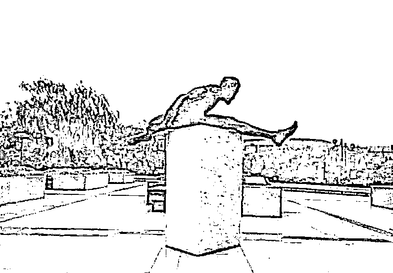**“外在的动荡”源于“内在的真相”****真正的幸福源泉在我们自身，一个人只要自己善于追求幸福，别人便无法使他落到真正悲惨的境地。****——卢梭 《一个孤独的散步者的梦》**

**天象**

*   **天王星四分“日月轴线”**：金牛座天王星四分狮子座太阳，四分水瓶座月亮；
*   **金星合相北交**：双子座金星合相双子座北交点；
*   **水土对分**：巨蟹座水星对分摩羯座土星；
*   **火木四分**：白羊座火星四分摩羯座木星。

7 月底到此次水瓶座满月前夕，巨蟹座水星便开始对分摩羯座上的木星和冥王星，带来一波隐秘真相和过往事件的披露曝光：“被贷款 1200 万”事件感觉扑簌迷离；“抢劫嫌犯潜藏法院高位”事件令人瞠目结舌；而我也在 8 月 1 日早上收到朋友发来的求助私信，她现在的雇员，也是即将开始合作的准合作伙伴，私下动用营业现金，她咨询该如何选择，我告诉她：“先有人再做事”。意外，反转，真相的背后是人，人的背后是信任，权力，边界……2020 年的现实魔幻不断挑战着我们的认知范畴，震落着过往的价值经验，提示我们升级意识的时候到了。但这可不像丢掉一个干瘪的苹果那么简单，因为正是过往的体系造就了今天的我们，没有人愿意将自己的信念碾碎，没有人舍得将自己的荣耀摘下，但所有人又都在热切渴望并努力尝试着“突破”。只是，究竟如何突破呢？我们先从此次水瓶座满月的行星能量传导图中寻找一些线索：

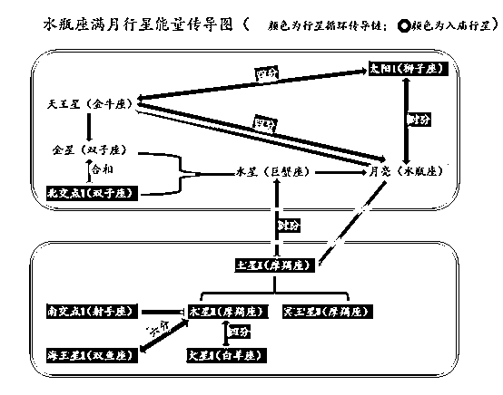

找到逻辑，便有出路。我们可以通过三步来解读此次水瓶座满月的“行星能量传导图”，看懂宇宙的寓意，寻获突破的路径。

**1.** **循环传导链，指向智慧之路**

一个月前，7 月 2 日，土星逆行回到摩羯座，7 月 5 日发生了摩羯座月食（详情点击：[摩羯座月食](http://mp.weixin.qq.com/s?__biz=MzA5NjA0NTAxNg==&mid=2651421273&idx=1&sn=301f3b769406e3f0aef1d52f7dd4da05&chksm=8b4bc8eebc3c41f8ad03ef9cac36e770fb061717cd607dd3e066cb04f9d67967169b38480c07&scene=21#wechat_redirect)），我们站在 2020 年上半年和下半年的转换路口，听令土星“拍板下半年旅程”，收拾残局，把问题全干掉！

在 7 月的一个月时间里，问题并没有被干掉，相反，更多的危机正在越积越高：自然界的地壳运动和天水奔腾，没有一天消停；奇葩界的疫情和股票的数字双涨，“正比”已成笑话；国际界的八字不合和被害妄想，令人瞠目结舌；个人界呢，求职和离职犹如看不到结局的连续剧，关系和信任时不时地爆出个含恨投江的杜十娘……如果将 2020 年比喻成披荆斩棘和降妖除怪的《西游记》，到这个时候孙悟空差不多也该“急眼”了，还有完没完？进入 8 月，马上迎来了此次水瓶座满月，满月的“行星能量传导图”中有一条“循环传导链”：水瓶座月亮→金牛座天王星（天王星守护水瓶座）→双子座金星（金星守护金牛座）→巨蟹座水星（水星守护双子座）→水瓶座月亮（月亮守护巨蟹座）……这条“循环传导链”中，带着“变革”能量和“变奏”旋律的天王星，本身就是水瓶座的守护行星，接纳着此次水瓶座满月的“完结”能量和“激进”情绪，并通过金牛座天王星四分“狮子座太阳-水瓶座月亮”满月轴线这组结构，在越发高涨的“突破”势力下触发出**改弦更张的事件和意外频发的状况**。值得注意的是，即将于 8 月 15 日开始逆行的天王星已经进入逆行前的停滞状态，故而，**此次水瓶座满月触发出的那些“改弦更张的事件和意外频发的状况”，其实是自 7 月以来逐步演化的某些事件的爆发点。**而这正是此次满月需要我们带着意识去觉察和规避的重点，因为凡事都有代价，而此次水瓶座满月的风险在于：**冲动和激进的当下看不到后期的“多米诺骨牌效应”。**“循环传导链”中的“金星合相北交点”结构为我们提供此次水瓶座满月的通关策略：**凡事都有多种选择和多种可能性，如果在冲动的时候多等上 3 秒，在决策的时候听取不同的声音和学习不同的视角，便能觉察主观性造成的盲点，规避情绪化架高的成本。****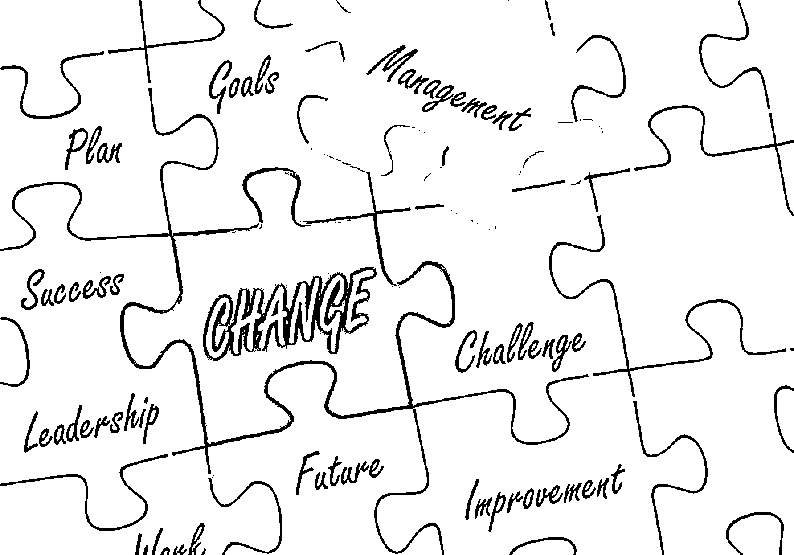**

**2.** **土星定位链，揭示下半年策略**

《西游记》是一部通过故事情节将内在的“佛性和魔性”诠释出来的神奇巨著，2020 年的我们其实也像孙悟空一样，要在现实磨难之中完成“佛魔不二，一念之转”的领悟。无论集体或个人，现实魔幻一再激起我们内心的**贪婪、愤怒、执着、傲慢和猜忌**，特朗普脸上有，我们也有，为钱，为权，甚至为口气，为口饭。但是，宇宙安排 2020 年一系列演化的真正用意是要我们**完成“非常艰难”的内在转化，因为我们总是妄想改变外界，而不是内在。**此次水瓶座满月的“行星能量传导图”中有一条“土星定位链”：摩羯座的守护行星土星，定位了摩羯座上木星和冥王星的能量，也连带接纳着“火木四分”和“木海六分”两组结构的能量，以及射手座南交点的业力议题。但是，摩羯座土星定位的这一条线索并不只限于此次水瓶座满月周期，而是会延展到半年之久——**敲黑板，划重点！**土星拍板下半年旅程，教导我们去完成“非常艰难”的内在转化：

*   **三阶段**

*   **8 月、9 月底-10 月中旬、12 月底-2021 年 1 月**这三个时间段，战无不胜的白羊座火星前后 3 次与摩羯座上的木星、冥王星和土星形成“火木四分”、“火冥四分”和“火土四分”三组结构，带来斗志与力量，也制造出硝烟与争端。

*   **意义**

*   8 月，我们处于“彰显自我意志，强调个人荣耀”的狮子月；9 月底-10 月中旬，我们处于“建立合作关系，商定平衡模式”的天秤月；12 月底-2021 年 1 月，我们处于“制定边界立场，构建现实规则”的摩羯月。于个人层面而言，这是从**“自信-自知-自律”**的成长过程；于集体层面而言，这是从**“领导核心-协作核心-秩序核心”**的升级过程。 

*   **土星的策略**

*   在未来的半年时间里，摩羯座土星持续不断地督促我们思考**“为什么战斗”**这个问题：如果我们妄想改变外界，就会与那些享有特权的权威或带来压力的上级“掰手腕较量”，对那些暂时艰难的处境和带来痛苦的关系“投射愤怒情绪”，就很难看到自身的盲点并做出有利的突破；但如果我们能够透过现实去反思“哪些模式造成了当下的限制”，沉入内心去寻找“更为成熟的策略”，就能逐步磨练并最终完成“将不可能变成可能”的内在转化。

此次水瓶座满月当天，恰逢“火木四分”结构第一次达到峰值，而此时，7 月 28 日“木海六分”结构第二次能量峰值的影响还未散去，8 月 13 日，“火冥四分”结构的第一次峰值也即将到来。此次水瓶座满月，“贪、嗔、痴、慢、疑”的情绪已被点燃，正值“彰显自我意志，强调个人荣耀”的狮子月生活，故而情绪的火苗难免会制造出一些争端。

**几点提示：**

*   为梦想而战，不为欲望而战；为真实而战，不为虚荣而战；为信心而战，不为输赢而战； 
*   如果我们渴望塑造全新的自己，重建全新的身份，就要遵循土星的策略由内而外地全面升级并完成突破； 
*   “突破”从来不是戴着主观滤镜和点燃情绪炮火的冒险游戏，而是带着觉知并升起智慧的磨练过程。

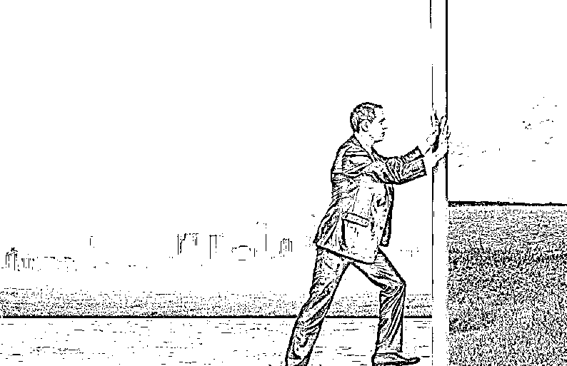

**3.** **水土对分，与权威对话**

“循环传导链”与“土星定位链”的关联，由巨蟹座水星与摩羯座土星的“水土对分”结构搭建。

“水土对分”结构的重点是：水星是双子座的守护行星，接纳着双子座上“金星合相北交点”的能量，如果我们能够借助前文提到的“金星合相北交点”的策略，就能：

*   **与内在的权威对话**

*   每个人的内在世界都住着一位既具有经验又携带业力的“内在权威”，指导着我们对“好坏对错”的判断，左右着我们对“安全-危险”的选择，在提供现实策略的同时，也制造内在的限制； 
*   如果我们渴望“突破”现实生活中的瓶颈，就需要放下“内在权威”的身段，直面“内在权威”的恐惧，倾听不同的声音，学习不同的视角，觉察自我的盲点，突破内在的限制。如此才能逐步提升能力并完善方法，辨识更为成熟的可能，做出更为有力的选择。

*   **与外在的权威对话**

*   “水土对分”结构一方面触发出集体层面的重磅新闻，如知名企业的合作消息或退市新闻，知名人士的隐私披露或丑闻曝光；另一方面也影响着个人层面的职场境况和人际关系，如遭遇领导打压或环境排挤，经历企业裁员或退出组织等状况，如遭遇现实困难或情感考验，经历分手拆伙或关系冷战等情况； 

*   我们需要保持敞开的接纳度，带着客观的理想去看待这些现实的事件。集体层面的事件，不跟风，少评判，目前的一切都是人类历史进程的必然演化，我们能做的至少是不添乱；

*   个人层面的事件，试着去倾听权威领导的教导，去面对情感关系的真相，那些最为艰难的环境和最为痛苦的土壤，往往也最能开出疗愈的花朵，但关键是你得知道需要舍弃哪些拖累成长的废料，汲取哪些能够助力成长的养分。

如果能做到上述两点，就收获了此次水瓶座满月的神秘礼物：即使考验还未结束，前景还未清晰，但全新的力量和无限的可能已经像种子般播撒在我们的生命深处，剩下的只需交给时间去推进，等待现实去演化。在同样的星空之下，每个人都在做出自己的选择，这些选择不单汇聚出当下的现实，也正在汇聚着未来的可能性，而决定未来不同可能性的正是我们当下的意识觉知和现实选择。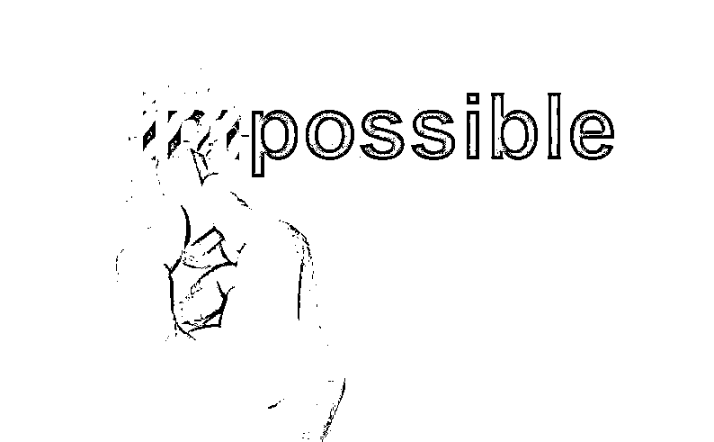**寄语****唯独在这些孤独和沉思默想的时刻，我才是真正的我，才是和我的天性相符的我，我才既无忧烦又无羁束。****——卢梭 《一个孤独的散步者的梦》**

全人类共命运的 2020 年，我们无法独善其身，自然更加关注集体性的趋势和发展。但 “聚众”也存在一定的风险，因为没有百分百的概率能够保证个体的“认同需求”不向外投射，继而无意识地陷入“从众”的归属感与满足感之中，而生命的独特天性便在那一刻被润染，被覆盖。

近日，我的一位学生正处于和任职企业解约的过程中，昨天她告诉我要去远方独处几天。特别理解和支持她的这个决定，因为只有在静谧之中听到内在天性的震动音波，她才能知道自己生命的韵律在什么方向，才能在下一阶段寻获同频的土壤和共振的伙伴。此次水瓶座满月，给自己一些时间和一个空间，是一个不错的策略。愿每一个灵魂安好。祝福大家。

**版权声明**：原创文章由作者授权首发于若道平台，欢迎转发，反对抄袭。友号转载请申请白名单。

****

****想阅读更多作者的文章，****

****请在后台回复******王芝桦****** 即可。****

****王芝桦****

心理占星师，统合疗愈师，占星专栏作者

若道占星“新月和满月”专栏作者，腾讯视频特约占星师

全职于个案咨询与占星教学工作 16 年

**个案预约咨询微信号**：zhihua0621 

**微信公众号**：daoxi-life

**长按打赏**

****

**学习太阳返照技法**

**请点击下图了解详情**

**

喜欢记得点一下在看哦☟

********报名直达入口********

# 雷蒙德·梅里曼金融占星周运 | 未来三周，市场可能很不稳定

> 原文：[`mp.weixin.qq.com/s?__biz=MzA5NjA0NTAxNg==&mid=2651423599&idx=2&sn=1393334d50d71f7df97b98a377c38392&chksm=8b4b31d8bc3cb8cedef14eeef04bc8c77be4e4a29786c8a03843c48942353de3494af8cd530f&scene=126&sessionid=1692738126#rd`](http://mp.weixin.qq.com/s?__biz=MzA5NjA0NTAxNg==&mid=2651423599&idx=2&sn=1393334d50d71f7df97b98a377c38392&chksm=8b4b31d8bc3cb8cedef14eeef04bc8c77be4e4a29786c8a03843c48942353de3494af8cd530f&scene=126&sessionid=1692738126#rd)

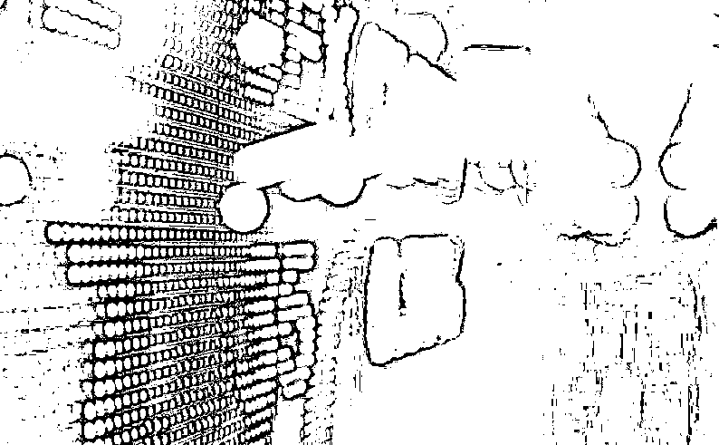

作者/雷蒙德·梅里曼
译者/李含编辑/玫瑰 图片/全景网雷蒙德·梅里曼是在金融占星学界稳坐第一把交椅的占星师，同时他也是若道签约的金融占星课老师，我们引进了雷蒙德·梅里曼老师的《[上证指数月度报告](http://mp.weixin.qq.com/s?__biz=MzA5NjA0NTAxNg==&mid=2651423447&idx=3&sn=841a09c5d196d9885d98eeb480a2079b&chksm=8b4b3060bc3cb976c0aa2a2967b91ae73978faca1ee0437be958f79069958d5a410961a193c5&scene=21#wechat_redirect)》《[黄金周期月度报告](http://mp.weixin.qq.com/s?__biz=MzA5NjA0NTAxNg==&mid=2651422728&idx=2&sn=5e41d5bf3527772f19ca7a774eb984a2&chksm=8b4b32bfbc3cbba96679ac4b41485a34f838242408e52aa7626f837a39b7084a74eea73f500c&scene=21#wechat_redirect)》《[2020 年金融预报](http://mp.weixin.qq.com/s?__biz=MzA5NjA0NTAxNg==&mid=2651414279&idx=2&sn=cc131aa367c4ada15e35d0d80b308415&chksm=8b4bedb0bc3c64a6ef98c0e86ba3d842d8368de2b90e623af1d3870d521049ce352732c8d091&scene=21#wechat_redirect)》。我们经老师的授权，将每周刊登梅里曼老师的周运，供大家参考和学习。于是，这是本周的周运（8.3-8.7）。**说明：以下时间采用纽约证券交易所所在地美国东部标准时间。**
**展望与回顾**

**美国政府星期四报告称，美国经济在 4-6 月份这一季度创下了令人眩晕的 32.9%的年化萎缩，这是迄今为止最严重的季度暴跌，原因是冠状病毒疫情导致企业倒闭，数千万人失业，失业率飙升至 14.7%。**

**——美联社**

**《特朗普在选举舞弊的指控中提出“推迟”选举》**

**www.foxbusiness.com**

**2020 年 7 月 30 日**

**是的，一些民调专家在四年前就偏离了，但这只是证实了民调（和权威人士）是容易出错的，并不是说他们总是错误的，应该被忽视。**

**——杰森·L·莱利**

**《特朗普连任的努力为时已晚》**

**《华尔街日报》**

**2020 年 7 月 30 日**

**糟糕的政策“有时尽”，但糟糕的货币政策似乎“无绝期”……美联储也受到了财政部的政治压力，明确地将利率政治化，在二战后尽管通胀率不断上升，美联储仍坚持这一政策……这些概念冒着极大的风险：世界需要 10 年期国债收益率的市场价格，鲍威尔先生威胁要取消这一价格。我们不知道在经济扭曲或金融不稳定的情况下，全球经济会为这种政策付出什么代价。美联储也不知道。没有人应该急于找出答案。**

**——《杰罗姆·鲍威尔的定价策略出现了》**

**《华尔街日报》评论版**

**2020 年 7 月 28 日**

这是令人难以置信，甚至是荒诞离奇的一周。美国总统将自己与福奇博士的声望相提并论，在异乎寻常的自我反省中公开感叹：“……没有人像我一样。只有我是这样的性格。”在同一周，他发了一条推文：“推迟选举，直到人们可以体面、安全地投票？？？”什么？推迟选举？没人像我？全球股市当然不喜欢这种黑暗演变成自怜、不确定性和悲观情绪，因为一些指数迅速跌至数周新低。也许这与民意调查显示乔·拜登的支持率上升有关（市场不喜欢更换领导层的想法，这很可能是一个重要原因）。也许这和他侄女玛丽·特朗普撰写一本有趣的著作有关，书名是《过度与永远不够（Too Much and Never Enough）》。我读了这本书，并建议每个人都读一读，不管你是支持特朗普还是从不支持特朗普。这是我读过的对总统性格最深入的分析，现在（考虑到我自己接受的正规心理学教育），我想我对他这个人以及他的驱动力有了更清晰的认识。一方面，我对此感觉更好了，另一方面，也为它对未来意味着什么而烦恼。我对民主党候选人对美国未来的潜在影响也有类似的担忧，也许这就是为什么股市开始波动，并再次出现疲软迹象。每个人都关注这个国家的未来，关注世界的未来，关注这个国家的领导地位，关注其经济情况，关注所谓潜在敌人新冠病毒肺炎疫情日益增长的威胁。越来越少的人相信我们正朝着“正确的方向”前进。这都是“摩羯座星群”的反映，**土星在 7 月 1 日-12 月 19 日期间逆行回摩羯座**。摩羯座有一个问题，那就是**过于现实，过于自我专注，过于恐惧，对积极的可能结果缺乏远见，除非有一个经过深思熟虑的计划，并充满信心地遵循它**。一旦它做到了这一点，它就可以爬上高山，体验到努力和成就带来的愉悦。但在陷入摩羯座的自我专注之前，让我们回到市场。美元也不喜欢上周发生的事情，因为美元跌至 92.50 区间，是 2018 年 5 月以来的最低关口。四个月前，该指数在 103 点左右，测试了自 2017 年 1 月 103.82 点以来的最高点，也是 2002 年 12 月以来的最高水平。美元不喜欢美联储和政府印钱花钱如流水的打算。它不喜欢美联储继续干预金融市场并破坏自由贸易“有效市场理论”的规划。但你知道谁喜欢吗？黄金、白银和其他货币对美元的汇率。如果你认为上周的政治和经济环境是荒诞不现实的，那就仔细看看金价，金价有史以来首次突破了 2000。黄金也是集体心理的反映，集体心理越来越深地陷入摩羯座星群的最后阵痛之中。试想一下：**2020 年 12 月的冬至过后，木星和土星都将离开摩羯座（传统、过去、旧时代的象征），来到水瓶座。这个星座象征着未来和外太空的象征（新纪元）**。近 800 年来，这一系列的合相位还没有出现在风象星座（双子座、天秤座、水瓶座）。在风象星座的合相位将持续 140 年。我们只需要**保持耐心（摩羯座最有耐心），去经历这个阶段**。它就是它，直到它发生变化。周期的结束总是最具挑战性的时刻。一个新的周期的开始通常是令人敬畏和鼓舞人心的，新的想法和新的领导者如雨后春笋般破土而出。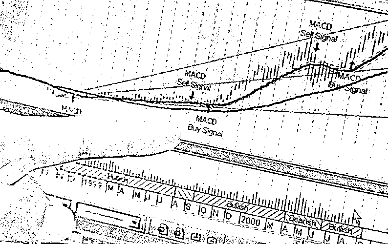**短期占星趋势和长期考量**

**一定有办法离开这里**

**小丑对贼如是说**

**有太多的困惑**

**我无法解脱**

**——鲍勃·迪伦**

**《沿着瞭望塔》**

**吉米·亨德里克斯也有演唱这首歌，哥伦比亚工作室，纳什维尔，田纳西州，1967 年**

**家人不是血脉相连，……而是生死与共。**

**——林肯·克莱《黑手党 3》**

**2016 年**

我今天心情不好。也许这和摩羯座的月亮有关。我觉得写作更多的是发自主观的角度（一个危险的诱惑），而不是一个专栏作家秉持客观和超然的视角。我想和大家谈谈我对这一年余下时间的担忧，以及对余生的希望。

作为自我反省的一部分，我发现自己在回顾我的来处。今天很像生活在 60 年代，你能活着度过那段时光的唯一方法就是大胆、勇敢，在世代延伸的脉络探索中找到你的部落（家族），并保持一种新时代正在展开的意识，你和你的冒险主义伙伴们正在共同创造这个勇敢的新世界。当前的事件和今天一样黑暗，但我们强烈地憧憬着更光明的未来和一个和平与美丽世界，这是我们如今需要但现在却没有的。我看着今年余下时间里宇宙的安排，特别是**8 月 4 日至 24 日**，我想：我曾经历过这一幕。我们以前也遇到过这种情况。我们在 20 世纪 60 年代中期经历过这种情况。在今年早些时候（2020 年 3 月至 4 月）经历了这个过程。1966 年 2 月，美国股市创下历史新高，道琼斯指数在当年 2 月首次触及 1000 点，抗议者与警察和政府发生冲突，随后 3-5 年内内乱不断升级。道琼斯工业平均指数的历史高点持续了大约 2 天，然后股市在接下来的 8 个月里大幅下跌。直到 1974 年 8 月 8 日，理查德·尼克松认为自己受够了并辞职后不久，股市才触底。道琼斯工业平均指数在 2020 年 2 月中旬再创历史新高（它喜欢在 2 月创出新高），然后在接下来的五周内大幅下跌。然后是又一次反弹，纳斯达克指数在 7 月中旬创下历史新高，总统可能会再次怀疑这一切是否值得。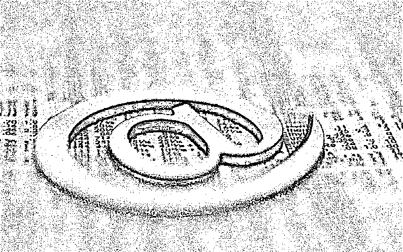“没有人像我这样，只有我的个性是如此。”他也许在想，就像我在：“一定有某种方式可以离开这里。”但可能是出于不同的原因。我想知道怎么离开这里，因为我想和住在德国的妻子团聚。但我不能离开这里，因为美国和欧元区之间的旅行禁令限制不对等，毫无意义。我们的国家不允许德国人抵美，所以欧盟不允许美国人赴欧旅行，即使他们近期进行过新冠病毒测试。我是说，我们可以在塞尔维亚会面，两国公民都被允许进入。我爱的塞尔维亚比德国安全吗？我有没有说过现在是非常荒诞的时代？今年年底，木星（旅行）离开摩羯座（限制）的同时，木星也会离开摩羯座的守护星土星（限制和禁止）。然后，我想，会有办法离开这里的。但现在，请回到市场。**在****8 月 4 日-24 日之间，行进的火星将与摩羯座一众行星（木星、冥王星和土星）形成周期的第一个四分相**。这一周期始于**2020 年 3 月 20 日-31 日**，当时正值新冠肺炎病毒疫情歇斯底里和市场崩溃的高峰期。因此，8 月 4 日-24 日这一行星组合的第一季度阶段已经到了尾声，这意味着我们可能会**经历某种故态复萌**（至少从主题上来说），这反过来又给投资者敲响了警钟。市场很容易被激怒；如果你自满，这可能会变得很危险，也许是因为政治家和央行行长被激怒，由此产生**冲动、对抗、决策和行动**的倾向。作为交易者或投资者，你需要知道：8 月是一个危险时期。情况可能白热化（对谷物交易商来说，天气也会热起来）。这可能继续利好贵金属和货币，因为它们在这样的宇宙风暴下会变得兴奋。我也是，因为我喜欢交易贵金属和货币。唯一的问题是，**火星在 9 月 8 日逆行，这个火星与摩羯座星群的渐盈四分相在今年结束前还会发生两次。**作为摩羯座，我不知道我还能忍受多少刺激。作为摩羯座，我喜欢控制自己的情绪——也许也包括其他人的情绪。事实上，我希望其他人在我身边不要太情绪化……只要开心、有趣，把压力留给自己。或者和我最近喜欢的心理学家玛丽·特朗普讨论一下。不过，亲爱的读者，我希望您得到的信息是：请注意，**接下来的三周可能会非常不稳定，并且可能会在十月的前三周再来一轮**。**在 9 月 9 日-10 日火星转向逆行时，也要保持警惕。**然而，也有理由抱有希望。眼光再放远一点，这场宇宙火山喷发将在冬季开始时结束，木星和土星在离开摩羯座后合相。短期内，也有一条通往快乐和希望的道路，因为太阳和火星分别落在自己守护的狮子座和白羊座这两个火象星座。双鱼座海王星和摩羯座土星在摩羯座也在他们各自守护的星座。这四颗行星在**8 月 22 日之前**都行进在它们守护的星座。**当行星“回到自家”的时候，事态也会有积极的发展。**也许股票市场会找到一些值得高兴的东西（即便火星四分摩羯座星群，这可能会竖起一堵“担忧之墙”）。也许总统也会，因为狮子座的太阳会穿过他的狮子座上升点。如果他在八月中旬开始取得进展，找到了他的剑，并开始挥舞它，不要惊讶。正如约吉·贝拉（Yogi Berra）所说：“直到一切结束前，都不会结束。”

**说明：以上日期基于纽约证券交易所所在的美国东部标准时间，由于存在时差，中国地区可能需要加一天。**

**版权声明：**本文由若道翻译发布，欢迎转发，反对抄袭。友号转载请申请白名单。

**雷蒙德·梅里曼（Raymond Merriman）**

若道签约老师。著名金融占星师，ISAR（国际占星研究协会）前主席，梅里曼市场分析公司的总裁。他由于“提升了占星学的职业形象”，在 1995 年国际占星大会上被授予轩辕十四奖；在 2012 年国际占星大会上，被授予轩辕十四终身成就奖。

1“中国上证指数月度报告”发售

**若道推出了****中文版****的雷蒙德·梅里曼中国上证指数月度报告，并持续发行该报告！**

当把金融市场的周期和占星学的周期相结合时，雷蒙德·梅里曼老师的金融占星学研究**为投资者应对金融市场的周期波动，并随之调整投资策略提供了极大的价值参考**。

****8 月中英文报告均已更新！****

2“黄金价格周期月度报告”发售

**若道推出****中文版****的雷蒙德·梅里曼黄金价格周期月度报告！**不仅仅为广大读者在中国股市的投资出谋划策，更将视角放眼黄金市场。

**每当世界经济形式不明朗的时候，有一个地方是保值的港湾，那就是****黄金**。从 2018 年 8 月开始，黄金已经用自己的升值再次提醒众人它在经济不稳定时的位置。**截至目前，2019 年 8 月底，黄金已飙升至 6 年新高，高于 1565 美元。**

自 1982 年雷蒙德·梅里曼出版第一本研究《地球宇宙学征象与黄金价格的关联》的著作以来，**他一直作为最重要的黄金市场时机预测者之一享誉国际**。

过去 1 年，那些订阅并遵循建议的梅里曼市场时机学院日报和周报的订阅者，如果从 2018 年 8 月 16 日的低点或 8 月 23-24 日的次低点购买黄金，他们已经赚到了不少的 30%左右的利润。

**8 月中英文报告均已更新！**

**购买套餐**，买得越多越优惠

中国上证指数月度报告套餐价

*   **单月报告**：280 元

*   **3 个月套餐**：780 元（260 元/月）

*   **12 个月套餐价**：1999 元（166 元/月）

**长按下图识别二维码**

**购买金融报告****套餐**

**▼**

黄金周期月度报告优惠

*   **双报告年度套餐更优惠（直降 899 元）**
*   **12 个月黄金报告+12 个月上证指数报告：仅需 3500**

**长按下图识别二维码购买黄金报告套餐**

▼

32020 年金融预报 1976 年以来，由雷蒙德·梅里曼撰写的梅里曼市场时机学院每年一次的年度预报沙龙和每年一本的《年度预报》一直在应用占星学原理为投资者们服务。2018 年，若道第一次将这份广受赞誉的一年一度的金融占星报告和沙龙引入中国，供中国投资者参考。**《2020 年金融预报》将会谈及 2020 年重要的宇宙天象及其对世界经济、贸易形势的整体影响，还将覆盖中国上证股票市场的分析、黄金白银市场、美国经济、美国总统、美联储、美国国债市场、美国股票市场、主要外汇货币市场（主要外汇美元、英镑、欧元、日元、瑞士法郎）、原油市场、谷物市场、活牛市场、比特币市场等投资市场。**梅里曼老师及梅里曼市场时机学院的金融占星分析师还会给出以上市场 2020 年的**市场价格目标区间及重要价格反转日**，为短期、中期和长期投资者进行市场操作的时机提供参考。如果你关注世界经济和金融投资市场的变化，会发现梅里曼《金融年度预报》中的研究对于你了解世界经济在发生什么，这些市场的走向会如何有非同寻常的指导价值。为了让更多人从这个讲座和报告中获益，我们特意免费提供沙龙**讲座前 30 分钟试看（免费放大）**，你可以先试看，然后再决定是否购买整体报告及沙龙。如何安然度过这场危机？如何明智地投资，让自己安然度过这个充满挑战的一年，甚至获得丰厚收益？我们相信 2020 年度金融预报沙龙和报告套餐组合会给你远高于其价格的回报。**30 分钟免费试看**获取路径参见如下指引：①请扫描下图二维码，下载若道 app **②** 登录若道 APP 首页-金融报告-《2020 年金融预报》讲座视频——免费试看，即刻免费试看 30 分钟的讲座视频。

报告和讲座价格

2020 年金融预报讲座和报告价格整体售价** 1280 元**

（本讲座和报告不单独出售）

**长按下图识别二维码购买 2020 年金融预报**

▼

********点击阅读原文购买金融报告********

# 8 月宇宙天气 | 又是 5 星逆行期，跳出舒适区是关键！

> 原文：[`mp.weixin.qq.com/s?__biz=MzA5NjA0NTAxNg==&mid=2651423508&idx=1&sn=5c85c7b7194e74dce21ace219bd28e8e&chksm=8b4b31a3bc3cb8b5a0b340a0805d0a3062507f9f508c046d61a6972bae7d2934b87217e6c072&scene=126&sessionid=1692738131#rd`](http://mp.weixin.qq.com/s?__biz=MzA5NjA0NTAxNg==&mid=2651423508&idx=1&sn=5c85c7b7194e74dce21ace219bd28e8e&chksm=8b4b31a3bc3cb8b5a0b340a0805d0a3062507f9f508c046d61a6972bae7d2934b87217e6c072&scene=126&sessionid=1692738131#rd)

****************☆ 后台回复“今日”，给你一句生命态度****************

作者/咔咔 ISAR 认证占星师

编辑/玫瑰 图片/全景网**8 月主要天象**2020 年 8 月的重大天象包括：

*   火星在白羊座四分木星、冥王星和土星；

*   金星在巨蟹座对分木星、冥王星；

*   天王星在金牛座逆行

希腊神话里有个英勇无敌、力大过人的大力士，名字叫做赫拉克勒斯。迈锡尼的国王给了他 12 项看似不可能达成的任务，包括徒手杀死狮子、捉住一头野猪、宰杀多头水怪许德拉、偷走亚马逊女王的腰带、前往地府带回长着三个头的看门犬刻耳柏洛斯。这些任务里的怪兽令大多数人闻风丧胆，却一一败在了大英雄的脚下。赫拉克勒斯也有抓瞎的时候，每当他砍下水怪许德拉的一颗头，怪物就会长出两个新的头颅。出征前，老师给了他一个忠告：“我们下跪而起来，我们投降而征服，我们放弃而得益。”于是大英雄在泥沼中跪下，抓住怪物高举在阳光之下。原来许德拉只有藏身在恶臭的沼泽里才有神奇的力量。赫拉克勒斯将她的九个头一一砍下，完成了又一个不可能的人物。这个神话非常对应 8 月的主要宇宙天气——**火星在白羊座与逆行的木星、冥王星和土星形成第一个四分相。**我们内在都有一个赫拉克勒斯式的勇士，在生命的各个面向中遭遇到木星、冥王星和土星式的挑战。在神话里，勇士遇到了野蛮的动物、打不死的怪物、巨人、女王、冥王；在现实生活里，我们可能会遇到严格的老板、苛刻的客户、让我们痛苦的伴侣、困难的工作和学业。**内心里，我们会与愤怒、嫉妒、憎恶、贪婪、性欲相遇，完成看似不可能的、艰难的转化。**勇士千辛万苦地完成了任务，被宙斯升到了奥林匹斯山，成为诸神中的一名。8 月 22 日之前，太阳在狮子座，描述了本次斩妖降魔旅程最终目的地：**个人身份得以显耀，获得荣誉，内在感到骄傲和自豪。****8 月 1 日 水星（巨蟹座）对分冥王星（摩羯座）****8 月 2 日 太阳（狮子座）四分天王星（金牛座）****8 月 3 日 水瓶座满月****8 月 4 日 水星（巨蟹座）对分土星（摩羯座）****8 月 4 日 火星（白羊座）四分木星（摩羯座）****8 月 5 日 水星进入狮子座****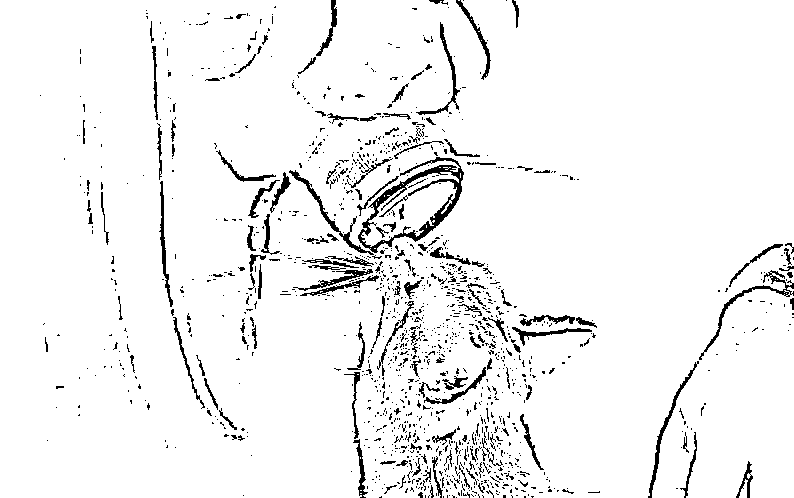**所有与冥王星的相遇都会挖掘出来一些什么，谁让这个遥远而隐秘的行星与地府神君有关呢？我们可能会听到社会上关于**女性、家庭、性别、安全（安全感）、食品质量（供给）**方面的深刻讨论，一些淹没在时光里的旧新闻又冒出来，一些秘密被翻出来。发生在狮子座-水瓶座 11°的满月，与天王星形成了精准的四分相，水瓶座满月四分天王星，人们的情绪高涨亢奋，打破窠臼的声音回响在上空。当水星对分土星的时候，火星同时精准四分了木星。这是赫拉克勒斯 mission impossible 旅程的第一站，勇士即将出发：一项全新的，从来没有人做过的任务，人们甚至想都不敢想。水星与冥王星和土星的对分相描述了一些保守、负面的声音，把我们吓得呆住；我们生命里的权威说：“这根本不现实，也不安全。如果你真的要去，好吧，那你要做好计划……”不管怎样，火星与木星的组合描绘了一场冒险无畏的旅程，8 月 5 日，水星进入狮子座，人们夹道欢呼，为勇士喝彩壮行。**8 月 7 日 金星进入巨蟹座****8 月 10 日 水星（狮子座）四分天王星（金牛座）****8 月 13 日 火星（白羊座）四分冥王星（摩羯座）****8 月 15 日 天王星在金牛座逆行****8 月 16-17 日 日水合相（狮子座）三分火星（白羊座）****8 月 19 日 狮子座新月****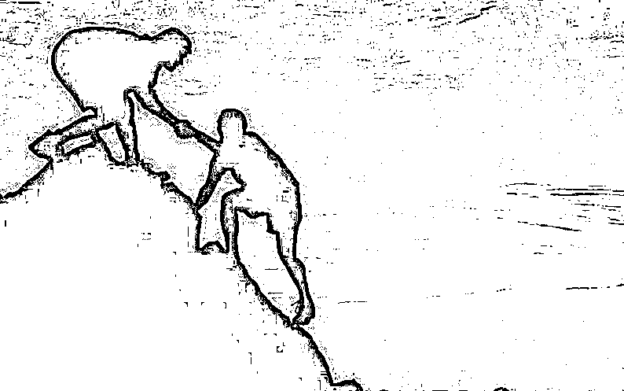**在赫拉克勒斯的英雄旅程并不孤单，他的朋友们与他一起完成降妖除魔的任务。金星在巨蟹座，我们要**找到可以信赖的朋友，彼此关怀，获得力量。**面对苛刻刁钻的任务的时候，赫拉克勒斯也要**开动脑筋，想出新颖的解决方案。**水星与天王星的四分相，我们想**寻找新鲜的视角，跳出框框想问题**。火星与冥王星的斗争，可能演化为**遭遇一个诡计多端的权威，或者一个若即若离的伴侣，激起我们的愤怒。**也可能我们会遭遇一个**直接粗鲁、自我为中心**的人，抡着大棒猛扑过来。不管是哪一种演化，这都是一段很激烈紧张的时期，我们会经历一些“生死攸关”的事情，肾上腺素大量分泌，集中精神专注在应对危机和威胁上。这样的经历也会唤醒我们，应对这些事情让我们发现一些被深深压抑的东西，比如**对权力的渴望、自我表达的驱动力、自私和自我为中心**。火星与冥王星都与生存有关，生命被挑战的时候，也是生命被激活的时候，突然之间我们有了一些要达成的目标，决定要去的地方，想要得到的东西和不再容忍的做法。与猛兽和妖怪的战斗不见得第一次就圆满胜利，**9 月和 10 月，火星的逆行和恢复顺行还有继续练习的机会**。**有行星和轴点在基本星座（白羊座、巨蟹座、天秤座、摩羯座）20°-25°的人们的感受会最强烈。**火冥四分期间，狮子座新月和水星同时三分火星、太阳与木星形成 150 度相位，太阳给战斗注入了充沛的能量，日木的梅花相位在提醒我们，在这场战斗里，我们的荣誉、骄傲是在支持我们面对内心的阴影和外在的障碍，还是煽风点火，让我们盲目地陷入斗争里。8 月 15 日，天王星开始逆行。天空里的两颗社会行星和三颗外行星都在逆行的状态了。**天王星会从金牛座 10°逆行回到金牛座 6°，在 2021 年 1 月 15 日恢复顺行。**每次谈到天王星，我总会想到塔罗牌中的高塔牌，一些人惊慌失措地从失火的塔顶跳下来，天空中的闪电正在劈向高塔。人们生活在自己的舒适区里，但是随着天王星的行进，舒适区被击破，我们感觉不得已从高塔顶上跳下来。**天王星逆行的好处在于，它打破了我们内在世界的高塔-我们那些陈旧过时的信念。**去年夏天，一个客户的丈夫不告而别，他说：“我不想和你在一起了。”她的世界就此倒塌了，闪电来的如此突然，她没有任何准备。一年过去了，她去签了离婚协议书，她说，我想赶快把这件事解决，开始我的新生活。**天王星逆行的时候，我们要允许一些内心的东西倒塌，一些与依恋、物质安全有关的信条。**木星、土星、冥王星会支持这样的改变，他们会帮忙撼动那些还没有塌掉的墙壁，咯咯地笑着说，这部分也拆了吧……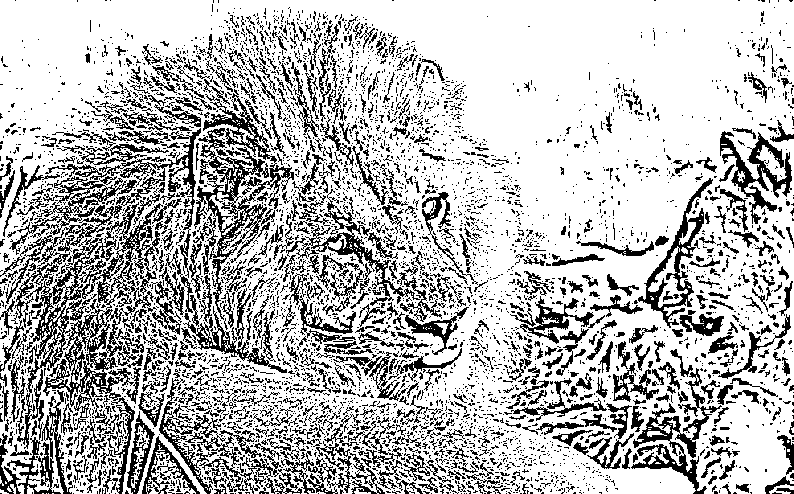**8 月 20 日 水星进入处女座****8 月 22 日 太阳进入处女座****8 月 25 日 火星（白羊座）四分土星（摩羯座）****8 月 25 日 水星（处女座）三分天王星（金牛座）****8 月 26 日 金星（巨蟹座）对分木星（摩羯座）****8 月 28 日 金星（巨蟹座）三分海王星（双鱼座）****8 月 29 日 水星（处女座）三分木星（摩羯座）****8 月 30 日 金星（巨蟹座）对分冥王星（摩羯座）****8 月 31 日 水星（处女座）对分海王星（双鱼座）**8 月 22 日，太阳与水星都进入了处女座。8 月 25 日，火星四分土星。通常火星与土星的组合被解读为**行动受阻，**不过这个组合也意味着**持续不断地练习能达到更高的标准。**太阳与水星强调了我们要**寻找有实际用处的目标，采用实际的技能，加之持续不断的工作，取得持续的进步**。这个时刻需要我们**慢下来，专注在某一个单项的任务上。**抓住地府之犬刻耳柏洛斯后，赫拉克勒斯获得了神与凡人的赞赏。他获得了国王的女儿、女王的青睐，与之欢好，诞下子女。**8 月 26 日-28 日，金星在丰沃的巨蟹座对分木星，三分海王星，描绘了一段欢庆的时光。人们温柔地彼此包容和照顾，在安逸的环境下彼此联结，情感自在地流动。**这位英雄最后的结局是金星与冥王星式的，赫拉克勒斯的敌人告诉他的妻子，如果用自己背上的毛为他编织一件上衣，他穿上就永远不会移情别恋。嫉妒的妻子想要多情的英雄专一的爱，给他穿上了这件衣服。衣服灼烧着赫拉克勒斯的皮肤，让他痛不欲生，于是投火而死。**8 月 30 日，我们可能也会被嫉妒、占有欲驱使，做出一些疯狂的事情。**感情关系的角力背后有着更深的心理动力，金冥对分的时候也可能唤起我们童年体验过的**羞耻、嫉妒**的情绪。**我们也会受到海王星的引诱而扭曲事实。这个时刻是一个将伤痛的能量转化为艺术形式，进行创作的极好时机。**顺祝夏安！

**附录：本月重要天象一览表**

| **日期** | **星象** |
| **2020.8.1** | **水星（巨蟹座）对分冥王星（摩羯座）**  |
| **2020.8.2** | **太阳（狮子座）四分天王星（金牛座）** |
| **2020.8.3** | **水瓶座满月** |
| **2020.8.4** | **水星（巨蟹座）对分土星（摩羯座） 火星（白羊座）四分木星（摩羯座）** |
| **2020.8.5** | **水星进入狮子座** |
| **2020.8.7** | **金星进入巨蟹座** |
| **2020.8.10** | **水星（狮子座）四分天王星（金牛座）** |
| **2020.8.13** | **火星（白羊座）四分冥王星（摩羯座）** |
| **2020.8.15**  | **天王星在金牛座逆行** |
| **2020.8.16** | **太阳（狮子座）三分火星（白羊座）** |
| **2020.8.17**  | **水星（狮子座）三分火星（白羊座）****太阳合相水星（狮子座）** |
| **2020.8.19** | **金星（巨蟹座）六分天王星（金牛座）****狮子座新月**  |
| **2020.8.20** | **水星进入处女座** |
| **2020.8.22**  | **太阳进入处女座**  |
| **2020.8.25**  | **火星（白羊座）四分土星（摩羯座）****水星（处女座）三分天王星（金牛座）** |
| 2020.8.26 | **金星（巨蟹座）对分木星（摩羯座）**  |
| 2020.8.28 | 金星（巨蟹座）三分海王星（双鱼座） |
| 2020.8.29 | **水星（处女座）三分木星（摩羯座）**  |
| 2020**.8.30** | **金星（巨蟹座）对分冥王星（摩羯座）**  |
| **2020.8.31**  | **水星（处女座）对分海王星（双鱼座）** |

**版权声明**：原创文章由作者授权首发于若道平台，欢迎转发，反对抄袭。友号转载请申请白名单。

********想阅读更多作者的文章********

********请在后台回复**************** 咔咔 即可********

**咔咔**

职业占星师，若道核心课程讲师

ISAR 认证占星师（2014 年获得）

国际知名广告公司和市场研究公司工作十余年

**微信公众号**：咔星人

长按打赏

******你还可以预约作者咔咔的占星咨询****** 

******长按下图二维码预约吧******

**系统学习占星学**

**点击图片了解详情**

喜欢记得点一下在看哦☟

********报名直达入口********

# 神奇的顺势药物｜吃了这颗“草”，忘了那个他

> 原文：[`mp.weixin.qq.com/s?__biz=MzA5NjA0NTAxNg==&mid=2651423508&idx=2&sn=97781498d66e8f01053479a325dd4fd5&chksm=8b4b31a3bc3cb8b50dbba1ef407071f609fa9855bc388e0d1686eef9b376d2291cb6cbfb81b8&scene=126&sessionid=1692738131#rd`](http://mp.weixin.qq.com/s?__biz=MzA5NjA0NTAxNg==&mid=2651423508&idx=2&sn=97781498d66e8f01053479a325dd4fd5&chksm=8b4b31a3bc3cb8b50dbba1ef407071f609fa9855bc388e0d1686eef9b376d2291cb6cbfb81b8&scene=126&sessionid=1692738131#rd)

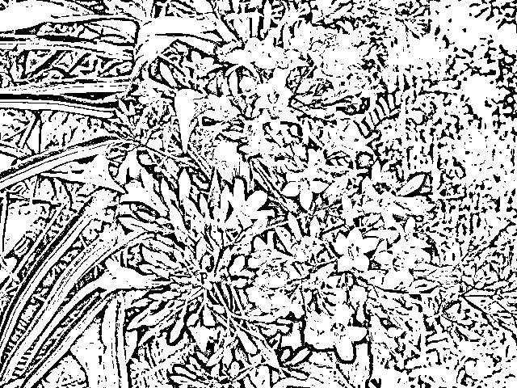

作者/若道君

 编辑/玫瑰 图片来源/网络

**若道君的话**今天给大家介绍的这个顺势药物叫**钩吻(Gelsemium)**。钩吻这个名字大部分人可能是陌生的，名字听起来蛮有调皮的诱惑性，感觉像是一个小手指勾啊勾，就钓来了一个香吻。不过如果你熟悉武侠小说，听到它的另外一个名字，就可能要避之不及了，它的另外的一个名字是**断肠草**（英文是 heartbreak grass, 心碎草）。和断肠草比，哪个更浪漫？ 在《神雕侠侣》中，金庸写道，杨过为了解情花毒，吃了断肠草，然后就感觉有千万枚钢针同时在腹中扎刺，好似肚肠寸寸断绝。 是啊，又是一颗毒草。**断肠草，杨过能用你也能用**

**断肠草作为毒物，虽不如砒霜那样家喻户晓，但也在投毒杀人上立过“功劳”。**

近的说，2012 年 11 月，一个很知名的悬案就和断肠草挂了勾。一位俄国银行家在英国慢跑时突然倒地身亡，他此前曾经向反腐人士提供文件，披露俄罗斯税务机构大规模腐败问题，他被警告过这么做会有后果，所以他也提高了警惕。然而，不幸的事情还是发生了。后来，验尸报告发现了他体内存在一种只能从断肠草中提取的物质。是克格勃干（苏联国家安全委员会）的还是黑手党干的，没人知道，这变成了一桩悬案。而远的说，民间传说，为天下尝遍百草的神农氏就是吃了断肠草，没来得及喝下他的“茶”作为解药，壮烈牺牲了。不过，别让这些故事吓到了你，需要再次说明，**顺势药物钩吻，就像任何顺势药物一样，是一种能量药品，虽然取名钩吻，但里面已经不含任何钩吻的物理成分了**。做顺势药品时，用的是钩吻的根，把它切了放在酒精里泡一段时间，然后过滤掉固体，留下母液，用水按照顺势疗法的步骤一遍遍稀释震荡，稀释震荡……**最后让人害怕的“钩吻”在顺势药剂师的一道道工序下，撇去了所有的“物质毒性”，只是把它的“能量”贡献出来，化身成为大自然给予我们的一剂良药**。

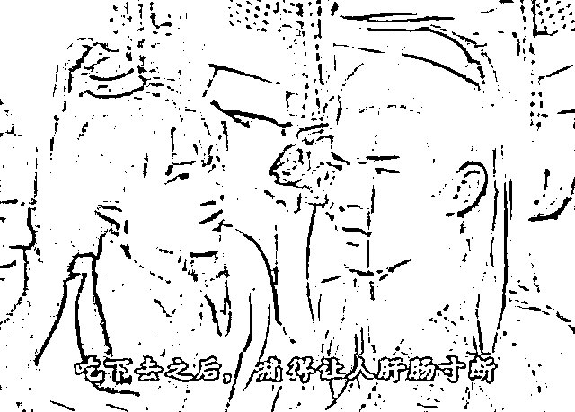

**钩吻是什么？****钩吻，是一种缠绕藤的植物，开黄色小花，花朵五个瓣，有点像喇叭花，也有人觉得像金银花**（在外面玩，**千万别把金银花和钩吻搞混了**！金银花可以泡水喝，如果你把钩吻泡水喝就是服毒。也有孩子把钩吻当作金银花吸取花蜜中毒的例子。其实金银花有黄花及白花，而且花比钩吻的花长得多）。在北美，因为当地的钩吻香气甜美，而且是攀援型植物，所以很多家庭在做园艺时会用钩吻来装饰外墙、拱门、长廊。钩吻一般是绕着树长，开花。如果有足够的支持，可以长 3-6 米高。它弯弯绕绕的，依附于树木，看上去很柔弱，没有自己的“脊梁”。因此，**顺势药物钩吻也适用于心理、情绪或身体虚弱的症状，身体上或者精神上有那种感觉瘫痪的状况**。如果误服钩吻中毒，毒性发作的症状是：**眼睑下垂、吞咽困难、四肢麻木、无力、肌震颤**等。在挑选顺势药物时，如果观察到这些症状，此人也可能就是适合用钩吻治疗的。

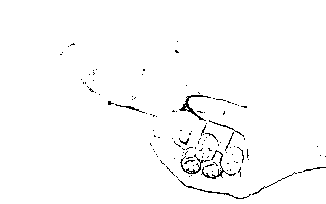

**在什么情况下使用钩吻？*****1*****流感**

**钩吻是得了流感的首选药。** 感冒的症状各不相同，可能要用不同的顺势药物。而适用于钩吻的流感是那种得病比较缓慢，逐渐发作，也许感觉不舒服已经几天了。病人有**很强的虚弱感和沉重感，精疲力竭，也会有嗜睡，迟钝的感觉**。**全身肌肉酸痛，头、眼、肌肉都感觉沉重。脊柱上上下下都觉得冷。**可能有**颤抖**的症状，**头昏眼花，走路不稳**。病人也许会抱怨。

***2***

**预期性恐惧**

另外一个**钩吻很有用的是治疗预期性的恐惧**。钩吻性格的人往往**缺乏信心、胆小、避免挑战**，容易发生**预期的焦虑或恐惧**。

有的人在参加考试、表演、演讲之前感觉很焦虑，害怕跟别人产生竞争，害怕站在舞台上，害怕公众的场合进行演讲，而感到恐惧心虚害怕的时候，又会经常要排尿上厕所，有时还会腹泻。可能站到台上，张口结舌、四肢瘫痪、舌头僵硬、头晕眼花，这也对应了钩吻对治**“虚弱瘫痪”**的特性。

有的人害怕看牙医，去看牙医时也会发生这种焦虑，出现哆嗦，频繁排尿缓解焦虑的情况。总之，**不管是害怕考试，还是害怕看牙医，钩吻对治这种因为预期产生的焦虑恐惧，非常有效**。

***3*****头痛****钩吻还可以用来治疗头痛**。能治疗不同类型的头痛的顺势药品很多，曾有顺势医生把头痛分成 12 种，钩吻适合的这种头痛好像**从后脖颈到前额缠着一根带子一样**。**头感觉沉重，抬不起来。眼皮沉重，张开眼费力。头痛发生的时间可能是在下午两三点钟。**

**模式**

不要忘记顺势疗法中的模式。**模式在顺势疗法里是非常重要的，简单地说，看看病人在什么情形下感觉舒服一些，什么情况下会感觉病情恶化，就叫做模式。** 

*   如果一个人适用钩吻，可能**出汗、排尿、向前弯腰、户外、温和持续的运动**都会让病人感觉好转；

*   而**预期的表演、考试、坏消息、让人惊讶的事、潮湿天气、雷暴之前、吸烟**都会让情况感觉恶化。

以上，就是我们对钩吻的介绍。以后，假若你得了流感，或者出现演讲恐惧症，你可以拿出一粒钩吻，投入舌下，然后对身边人嫣然一笑，说：“断肠草有什么稀罕，杨过用得，我也用得。”请在后台回复 顺势 获得更多****关于顺势疗法内容****

**版权声明：**原创文章由作者授权发布于若道平台，欢迎转发，反对抄袭。友号转载请申请白名单。

**学习顺势疗法**

**点击下图了解详情**

就是这个“在看”，戳戳戳 ☟

********报名直达入口********

# 8 月大理│占星、戏剧与造化力工作坊

> 原文：[`mp.weixin.qq.com/s?__biz=MzA5NjA0NTAxNg==&mid=2651423508&idx=3&sn=24708a596006b9ff4d51a3348a5d408e&chksm=8b4b31a3bc3cb8b55caaf9bf26e5d831e8710b05257ab3d3df9ce69dbc6190508cd677b19de8&scene=126&sessionid=1692738131#rd`](http://mp.weixin.qq.com/s?__biz=MzA5NjA0NTAxNg==&mid=2651423508&idx=3&sn=24708a596006b9ff4d51a3348a5d408e&chksm=8b4b31a3bc3cb8b55caaf9bf26e5d831e8710b05257ab3d3df9ce69dbc6190508cd677b19de8&scene=126&sessionid=1692738131#rd)

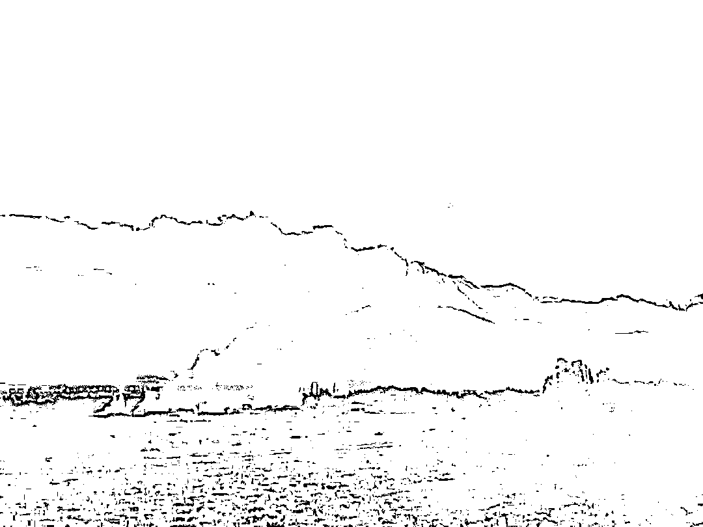

在我们新的认证教师计划中，Iris 是 8 位若道认证老师之一。所有若道认证的教师都是 ISAR 认证占星师，曾担任助教或在若道有相关工作经验，他们熟悉若道的老师以及培训课程、课程标准和职业道德规范。他们的课程独立于若道的课程系统之外。占星、戏剧与造化力工作坊将在美丽的大理举办，推荐给感兴趣的朋友参加。

有个美国年轻人， 坐在一列开往东德的火车上。他打算去东德读研究生，却没有想好具体要在哪个城市。他向火车上的陌生人打听，最后在一个地方下了车，那个地方就是魏玛，是歌德生前常住的地方，也是鲁道夫·斯坦纳工作过的地方。他住进一个大房子，前屋主移民去了西方，留下了所有物品。留下的衣服和鞋子，恰好都是这个年轻人的尺寸。连他的朋友，最后也和这个年轻人成了朋友。这个年轻人，就是我们的戏剧导师 David Anderson。 那段求学生涯，成为他此生志业的重要开端。 生命中的未知与不确定，对有些人来说，是可怕的黑洞；对另一些人来说，却是一匹可以翻身骑上的野马。他们倾听它、了解它， 不断重塑自己，最终轻松地驾驭它。剧变动荡的 2020，未知与不确定如风尘弥漫，看看周遭的世界，看看自己的内心，你是那个驾驭者吗？你想成长为迎风驰骋的驾驭者吗？ 如果这是你心之所向，邀请你参加今年的第一场 也是去年以来的第五场 占星、戏剧与造化力工作坊！ 助你心无所惧， 行所当行。

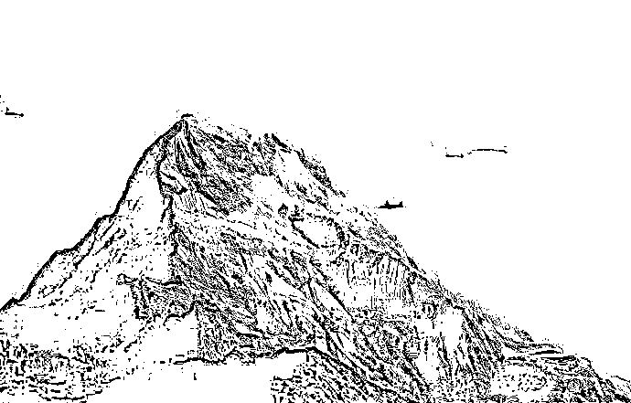

|摄影：Iris

**我们共同创造什么？**

进入我们工作空间的人 不同程度上都想深入看见 自己生命的意图 都想精微感知内在真实的需求 我们有一个基本的结构也会因应你当下 愿意探索、愿意了解的部分来展开探索的过程。 在星辰的启示和群体的映照中 我们将发现 独属于个人的真相 我们也将创造 群体的深度联结和亲密

**我们的工作方式**

“内在形态”映照
星座原型剧场模拟
即兴相遇 多主题塔罗
群体雕塑   适量占星知识讲解  大量戏剧游戏手法

 

**预期得到提升的品质和能力**

明白自己此生的方向和天命所在对生命的信任感和内在的安全感得到显著提升平衡发展自己的日、月、升星座
知道如何获得内在的深刻满足感
找到自己与世界互动的最佳方式
懂得以别人喜欢和需要的方式提供支持 恢复对人类的喜爱和信任
敏感度增加，对于去创造新的现实充满信心

**1** 

**每日主题**

Day 1

**蜕变之始**

Day  2 

**元素之舞**

Day  3

** 内在之光**

Day  4 

**韵律之美**

Day  5 

** 星辰之路**

Day  6 

**  创造之元**

**内容掠影**

*   **深度解读“日月升”**

深入凝视你的“出生星图”，了解它最核心的三个面向——太阳星座、月亮星座和上升点，用“日月升”来协助你“看见”你的灵魂骨架、生命之地。

*   用大量戏剧手法，在群体中深度对话，获得对自我真相的映照。

*   惊喜加料（不断更新中）

**十二宫位 **

 哪个生命领域里的活动对你至关重要

**月亮南北交点**

前世的业力模式和今生进化的“妙药” 

**命主星**

引领你生命道路的重要行星能量是什么 

**更多感知力训练**

植物观察；山林、星空，户外深入自然 

**＊专场福利＊** 

**2020 重大星象分析，协助你与“天时”合作创作**

**2** 

**去年** **一月场、六月场、** **九月场、十二月场** **部分学员分享摘录**

*伍洲*：（戏剧编剧、编导）

"选择排除万难参加工作坊（带上一对九个月的龙凤胎和两个阿姨，飞了两程飞机），源于三年前曾经对一位职业占星师朋友提议尝试占星结合戏剧，让意识流的部分能显化在具体的体验之内。三年后，当知道有人已经铺成了这条有价值的路，除了兴奋以外，只剩义无反顾的以行动加入其中。

Iris 温柔包容的特性令稍显生涩的占星概念更具人文化、形象化，宋颜冷静精准的特质，恰如其分的支持到整个课程体系的严谨与深刻。

没有故弄玄虚的讨好，没有生搬硬套的教条，更没有含糊不清的说教，全程的引领与融合让整个生命能量在悄无声息中自动扬升、净化。人们需要游戏，需要唤醒觉知进入有意义的互动之中，lris 和宋颜做到了，谢谢她们！ "

*小董*（试管婴儿行业创业者）：

"

从年初第一期开始种草，终于赶在 2019 年结束之前把心心念的工作坊上了。我可以负责任地说，这是我上过的最棒的工作坊，没有之一。作为一个已经接触占星知识好几年的非小白，这个工作坊之所以吸引我，是因为我一直很想知道，戏剧与造化力这个东东到底是如何与占星学相结合的！

在六天的工作坊里，我找到了答案。没有生搬硬套，没有填鸭教学，Iris 和宋颜老师借助各种有趣的游戏、团体即兴创作表演、大量卡牌，把原本枯燥的占星学知识，非常生动自然地向我们展示了出来！比如一个简单的小剧场，就让我一下子记住了混淆了几年的概念（创始星座、固定星座、变动星座）。每天我们都生活在未知的有趣中，真的很好玩很欢乐。

但如果你认为这只是简单的占星教学，那就错了。宋老师在工作坊第一天，就提到了造化力这个主题。占星学只是工具，工作坊真正要探索的是如何通过占星学成为更好的自己，实现造化力的转化，生发人生无限的可能性。所以，工作坊的焦点不在于知识传授，而在于引发每个人对自我深层次的思考，我觉得这是在传统的占星课程市场特别难得和惊艳的一次尝试，非常非常赞！

随着工作坊的深入，我们所有同学都对自己有了全新的觉察和认知。有的同学甚至从内到外呈现出了非常大的变化。不得不说，课程的内在滋养能力是非常强的！这完全得益于 Iris 和宋颜两位老师非常温和用心的引领。六天时间我们被感动了很多次，很多环节实在太暖心了！

总之，这是一次相当难忘的体验。我也在自我探索中发现了以前没有留意、值得挖掘的特质，非常期待自己新的蜕变和成长。六天课程让大家彼此亲密无间，相信这个小团体会成为我们每个人未来成长道路上最坚强的支持力量。也祝愿未来的工作坊会给更多有探索和成长需求的人带来有益指引和帮助。

"

*韩磊*（网球教练，大理波特曼运动推广者）：

"

这个工作坊让我开启了另一个视角。让我了解到人和人之间是多么不同。这些不同对每个人来说又是多么重要。从中，我也看到了自己的局限和每个个体的局限。幸好我们每个人是那么的不同，我们也可以藉由这些不同互相支持和帮助。

另外，在课程中，我也将自己的很多特质和线索串了起来。增加了对自己的了解，明确了今后在生活中的方向，这与我内心相合的方向，让我感觉更加踏实和自在。

再有，和同学们老师们一起工作的这六天，让我倍感温暖。课程可以说是以神奇的方式呈现。这真是“占星、戏剧与造化力”这一课程的独特魅力。希望能有更多的人被温暖。

"

*夏风* *（占星学工作者）：*

"

六天的工作坊结束后，想起每一位同伴心里总是暖暖的，那个场域里流动的能量与心的连接，让我深深地被滋养。*同时内心也升出一种清明，如果人生是场大戏，愿我能觉察到每一个行为、每一刻起心动念的背后是基于内在的恐惧匮乏欲望去抓取、占有、控制，还是源于内心的和谐丰盛自由去经营、创造、投入*，并有足够的智慧和勇气去分辨它们。

"

**3** 

**导师介绍**

**Iris**资深职业占星师 2014 年 ISAR 执业认证“若道”认证讲师、公众平台作者三年半制“戏剧与内在转化”课程毕业 开设工作坊：“融合的艺术：占星、塔罗和自然疗愈”奥修禅卡塔罗工作坊 塔罗学徒工作坊“初心心理”网络系列占星课：《与星辰为友，唤醒你在人际关系中的洞察力和创造力》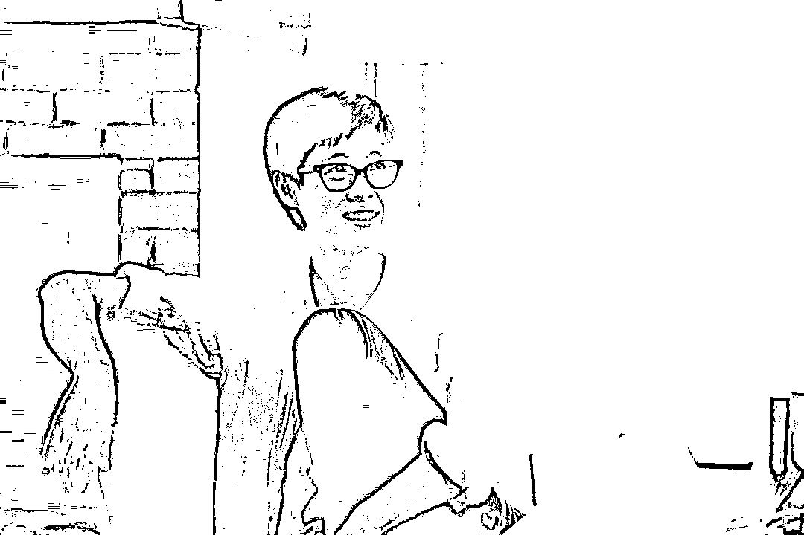**宋颜**
意识演化探索者、践行者、服务者 三年半制“戏剧与内在转化”课程毕业 灵性作品译者国内外已出版译作： 克里希那穆提 《智慧的觉醒》《最初和最终的自由》《聆听万物之美》 哈利·帕尔默《阿梵达的传世珍宝》阿梵达课程高阶教材

**4** 

**特别的推荐**

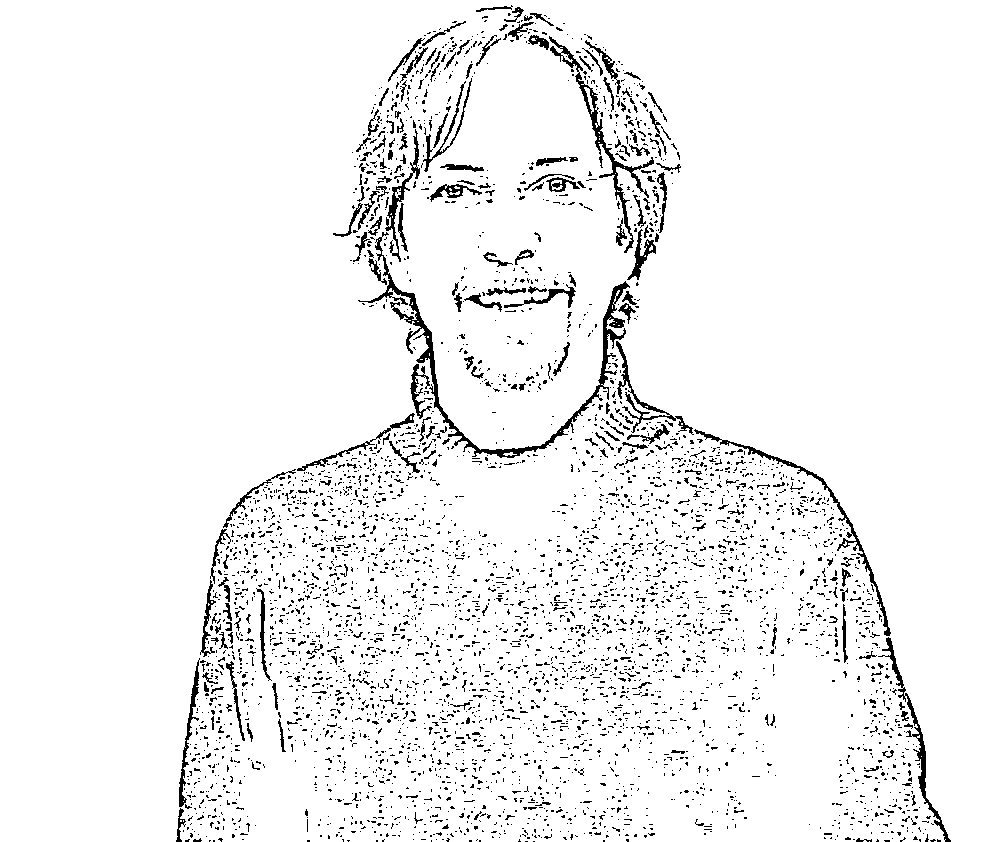David Anderson 安大為 Iris 和宋颜的戏剧导师。美国遛狗剧场联合创始人及艺术总监，戏剧导演、演员、戏剧教育工作者，中国十多个城市三年半制“戏剧与内在转化”课程导师。
"Iris 和宋颜，一直投入在学习与内在转化的道路上。因为这份投入，这个世界的很多语言向她们打开了，使她们能够用内在意识已吸收的部分来协助他人。她们善于倾听，善于精微地感知。在社交过程、团体觉察和戏剧生活方面，她们也发展出了杰出的能力。她们很能看到他人，看出他们下一步需要什么样的学习。她们对无形世界的兴趣以及运用，让宇宙的广大领域有可能在她们工作的空间中显现自身。她们一起搭档，是一股慷慨的力量，值得遇见。"

**我想报名！**

时间：
    2020 年 8 月 30 日－9 月 4 日（六天）

 地点：
    大理绿社

 课费：   9999 元／人 （此费用不包含食宿、交通费用。）
 咨询联系：
太阳猫
    工作微信：Sun_Song69     可扫下面二维码，注明：若道读者

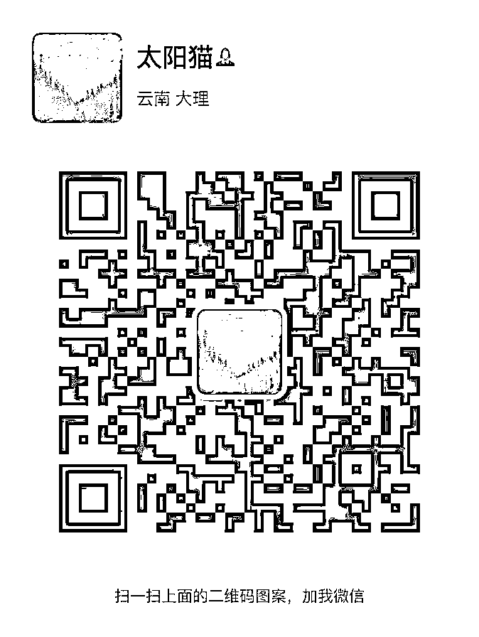

**最后提醒**

*   课程内容会根据学员现场情况进行微调。

*   报名时请提供准确的出生时间和地点，如时间不准确（准确到分钟），需尽快联系主办方安排“生时校正”，费用另付。

*   报名成功后，导师组将即刻开始对你的出生星图进行工作。星图解读很费时，报名请加紧。

*   工作坊学员享受绿社最优价，房间紧俏，订房请尽快，房型、价格详询“太阳猫”。

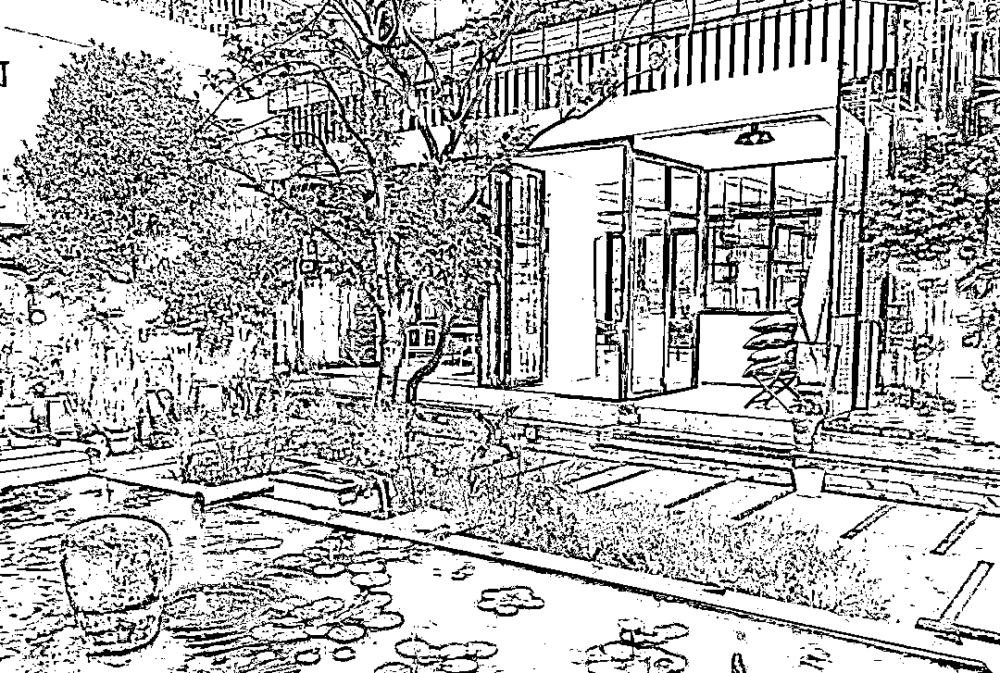

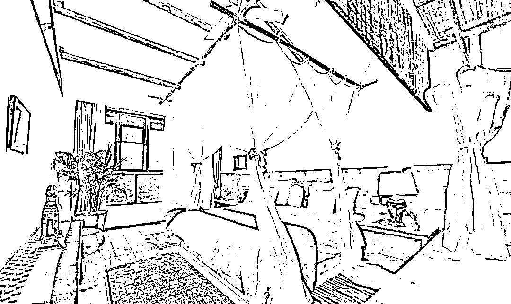

# 火逆逼近，市场如何走向？ | 8 月中国上证指数+黄金周期报告上线啦

> 原文：[`mp.weixin.qq.com/s?__biz=MzA5NjA0NTAxNg==&mid=2651423447&idx=3&sn=841a09c5d196d9885d98eeb480a2079b&chksm=8b4b3060bc3cb976c0aa2a2967b91ae73978faca1ee0437be958f79069958d5a410961a193c5&scene=126&sessionid=1692738131#rd`](http://mp.weixin.qq.com/s?__biz=MzA5NjA0NTAxNg==&mid=2651423447&idx=3&sn=841a09c5d196d9885d98eeb480a2079b&chksm=8b4b3060bc3cb976c0aa2a2967b91ae73978faca1ee0437be958f79069958d5a410961a193c5&scene=126&sessionid=1692738131#rd)

7 月是个激烈的月份，上证指数终于突破了 2019 年 4 月形成的高点 3280，并形成了新的高点 3458。

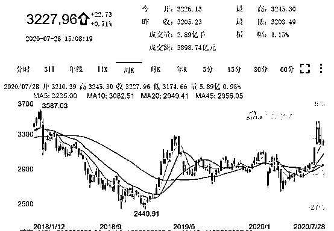

| 上证指数走势图 2020 年 7 月也是若道引入梅里曼老师为中国市场所写的上证指数报告 1 周年。回顾过去的一年，我们还清晰地记得梅里曼老师在 2019 年 7 月的第一份报告中就指出：**“2019 年 1 月 4 日的低点是新的 5.5 年周期的开始。”****“新的 5.5 年周期既可能看跌也可能看涨。如果看跌，则高点不会超过上一个周期的高点 5178。正常的修正性反弹将持续 8-22 个月，或者至少不超过 30 个月，然后价格将回到 3809+/-323。如果看涨，5.5 年的周期将持续 32 个月以上，价格将超过前一个基本周期的高点 5178。指数上行价格预测将为 5769+/-463。然而，要小心，不要过于信任这些价格目标，因为在这个年轻的市场，价格往往会超出所计算的价格目标。”****“不论这个 5.5 年周期看跌还是看涨，这个周期的第一个阶段都是看涨的……”**在以后的多份报告里，每次下跌时，梅里曼老师总是会多次提及：**“迄今为止的年度高点发生在 2019 年 4 月 8 日，距离 1 月 4 日更大的周期的起点仅三个月，它可以被接受作为 52 周和 19 个月周期的波峰。但对于更大的 33.5 个月或 5.5 年的周期来说，它的时间太短，不太可能是更大的周期的波峰……”**在新冠肺炎疫情发生后，股市大跌，梅里曼老师在 2020 年 3 月的报告中再次重申：**“我倾向于看涨，除非收盘价低于 2570 或甚至低于 2 月 4 日的低点 2685。因此，我们建议从现在至 3 月 9 日期间在任一修正性下跌中买入，尤其是 2872+/-45 的价位，在收盘价低于 2685 的位置止损。如果上证综指的价格可以超过 3127，那我们的目标是 3533+/-129。”**在 7 月，上证指数终于一举跨入从 2019 年以来，梅里曼老师一直在指出的第一个阶段的价位目标 3533+/-129。在 7 月的报告中，梅里曼老师指出：**“我们预计基本周期波峰将于本周（6 月 22-28 日）或下周（6 月 29 日-7 月 5 日）出现，然后下跌至 7 月 16 日+/-3 个交易日。****7 月 16 日的三星关键反转日期很重要，因为太阳将对分木星（7 月 14 日）、冥王星（7 月 15 日）和土星（7 月 20 日）。所有这些都是一级征象，是与美国股票市场基本周期的低点或高点之间关联最强的地球宇宙学征象。我们观察到，这些征象也与所有全球股票指数的反转相关，尽管有时可能是在不同的日期发生，但会在一周之内发生。“**1 年后，上证指数上涨到了一个新的高点，同时，火星进入白羊座以来，中美摩擦急剧升级。而今年下半年火星会一直在白羊座，且有火星逆行，整个市场都要去面对白羊座火星咄咄逼人的不安稳的局面。是保持对于中国股市的信心，在调整时去寻找低谷的价值股，还是在逐渐升级的危险中保证资产的安全？在这“黑云压城城欲摧，山雨欲来风满楼“的关键月份——8 月，梅里曼老师怎么看？ 

**8 月上证报告上线**

上证指数月度报告价格**单月报告**：280 元 **3 个月套餐价**：780 元（260 元/月）**12 个月套餐价**：1999 元（166 元/月） 

**长按下图识别二维码购买上证指数报告**

▼

“

**黄金是金钱。其他的只是信贷。**

**——约翰·皮尔庞特·摩根**

”2018 年 9 月 4 日，若道君还清楚记得那个时候，因为那时，若道君收到了一份特别的邮件。2018 年，我们正在上梅里曼老师的金融占星课程，老师讲到了黄金的周期。出于好奇，过去只知道中国大妈买黄金，完全没有关注黄金市场的若道君也到梅里曼老师的网站订购了一份周期报告。2018 年 9 月 4 日，这封特别的邮件来了——**《梅里曼市场时机学院黄金特别提醒报告》。**当**时，黄金的收盘价格还是 1197。**

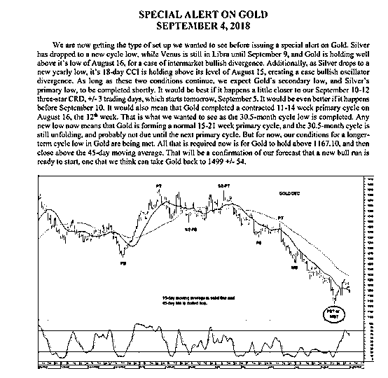

| 《梅里曼市场时机学院黄金特别提醒报告》在这份报告中，梅里曼老师运用金融占星学预测，黄金已经到了一个重要的波谷，当时是非常好的入市时机，投资的机会远远大于风险。并且预测黄金的第一个目标价位在 1499+/-54。出于在练习中学习的想法，从来没有投资过黄金的若道君买了一点点黄金，等着看是否黄金的走势如梅里曼老师所言。
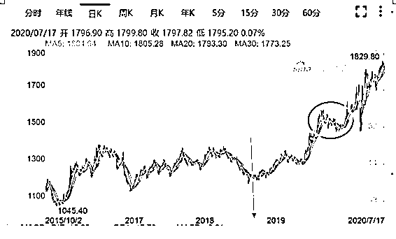|黄金价格走势图现在回首，那时当然是一个周期的低点。可如果没有看到后面的涨势，黄金是会接着向下，还是会出现向上的突破呢？又怎么可能对于 1500 元这个位置有一些感觉呢？因为感慨梅里曼老师运用金融占星学对于市场趋势判断研究的帮助，若道引入了梅里曼老师的《上证指数报告》和《黄金报告》，并将之翻译出来，以便更多想要对这两个市场有所了解的朋友可以看到，并将之作为自己投资的参考之一，让占星学能够为在金融投资中帮助大家。当然，梅里曼老师的报告不是每一次、每个月都完全准确的。毕竟没有人能够每次完全精准预测金融市场。只是说，如果你阅读了一段时期的报告，会发现有金融占星学帮助，你可能对于市场起起伏伏的周期有比一般人更多的了解，能够更大程度地把控风险，看到机会。那些持续购买报告的人，可能对这点更有体会。**对于非短线投资者，请特别注意梅里曼老师在每次报告中提到的长期周期、中期周期和基本周期。**因为市场有起伏，有意料不到的变化，即便是每月报告有时也未必能够完全掐准时点。这时候，如果有长中短周期的了解，未必能帮助你每次都买在波谷，卖在波峰，但可能能够帮助你不要买在波峰，卖在波谷。从 2018 年黄金低谷至今，如果你持有黄金，不去追涨杀跌赚短期差价，现在的收益也有 50%，这个收益无法和一些很牛的基金相比。但是对普通投资者而言，可能也不错吧。在火星进入白羊座的下半年，世界局势剑拔弩张，各国中央银行疯狂印钞、透支货币信用以挽救经济，两年来已经上涨了 50%的黄金，接下来会怎么走？8 月黄金报告已经上线，上证报告也会在月底上线。欢迎了解。**也可以按照季度和 1 年期订阅，有更多优惠。季度和年度的好处是，你可以持续了解梅里曼老师对于不断在变化的市场的看法。**即便某一次看法和市场不一致，你也会看到在下一期，他如何调整自己的看法，并看到金融占星学在长期时间段内对你风险把控的帮助。而能够长期控制风险、尽量找到安全的投资时机才是投资的长久之计。雷蒙德·梅里曼黄金周期 8 月度报告上线——世界著名金融占星大师雷蒙德·梅里曼，以 40 年黄金市场研究经验，对当前黄金市场做出研究报告。投资有收益，也有风险，希望这份金融占星学的研究帮助你更好地评估黄金投资。

**8 月黄金报告上线**

黄金月度报告价格**单月报告**：280 元 **3 个月套餐价**：860 元**12 个月套餐价**：2400 元**双报告年度套餐更优惠（直降 899 元）****12 个月黄金报告+12 个月上证指数报告：仅需 3500 元****长按下图识别二维码购买黄金报告**

▼

**购买者需知**

**①**梅里曼市场时机学院《中国上证指数月度研究报告》是梅里曼市场时机学院（以下简称 MMA）的研究“预报”，而不是市场“预测”，是梅里曼老师及 MMA 金融占星分析师对人类活动周期历史与行星周期之间相关性的研究，二者在大部分情况下具有 80%或更高的相关性，而不是因果关系。报告中的研究完全存在错误的可能性。即便是非常认真的研究和几十年的研究经验，金融占星师无法总是正确地解读出各种征象在实际层面上会如何相互作用，并显化为事件结果。

所以请将报告看作一个研究参考，务必结合其他市场研究和你个人对市场的理解，根据你的自由意志做决策。**②** 本报告只是上证指数研究，没有个股研究。**③** 此报告一旦售出，**即不接受退款。****④** 此报告每月 1 期，**并非都是在每月相同日期发布**。我们收到英文报告的当天，即发布该英文报告。3 天后，上线报告中文版。**⑤ 此报告仅支持手机网页阅读，不支持电脑阅读和下载。****以上须知，请仔细阅读。一旦付款，即视为已了解并接受所有须知内容。**在过去的 39 年中，唯有梅里曼逐渐完善，并在梅里曼市场时机学院月度周期报告中阐释了将地球宇宙学与周期相结合的研究方法，以惊人的精确性预报了黄金价格发生重大变化的时间。黄金购买 Tip

各大银行均可购买黄金或黄金 EFT 基金，也可以在诸如天天基金或者支付宝购买黄金及黄金相关产品。不明白的可以百度搜索。

购买后如何查看报告？

购买后有疑问怎么办？

请联系技术客服

**微信：nodoor201705**

****************购买上证指数报告直达入口****************

# 倒计时 5 天！丨琳恩·贝尔：太阳返照全解读

> 原文：[`mp.weixin.qq.com/s?__biz=MzA5NjA0NTAxNg==&mid=2651423447&idx=4&sn=0342461c003a2f6a14587ff8a940a021&chksm=8b4b3060bc3cb9764ce9d28182f238f3fd024f49058eb9762b5a22548eb370e2f3a444fb62be&scene=126&sessionid=1692738131#rd`](http://mp.weixin.qq.com/s?__biz=MzA5NjA0NTAxNg==&mid=2651423447&idx=4&sn=0342461c003a2f6a14587ff8a940a021&chksm=8b4b3060bc3cb9764ce9d28182f238f3fd024f49058eb9762b5a22548eb370e2f3a444fb62be&scene=126&sessionid=1692738131#rd)

编辑/玫瑰 图片/网络

“**每当太阳回到它在出生星图上的位置，我们都把宇宙的一个新部分吸纳进来，并把它变成我们自己的。大多数人都会有这种体验，生日那天是特殊的。那时我们可能会掂量一些事情，感受时光的变化，并为最近的过去画上一个句号。同时，我们也可能想把未来握在自己手中。****太阳返照就是这样，它是我们未来的一小块。端详着它，会有一种跃跃欲试的期待感，将太阳返照与行进和次限一起用，会开启我们对未来时间的理解。****黄道的每一个度数都带着某个太阳能量的特别印记，这是一种支撑着我们核心自我意识的独特品质。当太阳回归到那个度数，甚至分和秒都准确地回归到我们出生星图中的分秒时，这种至关重要的光就会被重新充满，每一颗行星都会与太阳形成新的关系。在这门课程中，我们将学习如何解读太阳返照图，并理解它对未来一年传达的信息，理解在未来的一年里会发生什么？****我们在整个课程中都会研究案例。学员们也将研究自己过去和未来的太阳返照图。****Lynn Bell****琳恩·贝尔**
”**此课程可作为 ISAR 选修课。**

**1**

**课程目标**

*   跟随太阳返照技法顶流名师系统学习，熟练掌握太阳返照单图、双图解读；
*   学习掌握太阳返照解读延伸出的占星知识：太阳返照择时、小限法等；
*   更好地解读每一年宇宙给予你的生日礼物，规划未来一年，活出生命的荣耀；
*   更清晰地洞察每一年的人生功课，更从容地迎接祝福、挑战、潜力和困难；
*   以人生目标管理的方式应用太阳返照图，制定人生的 3 年、5 年、10 年计划；
*   太阳返照为 ISAR 考试知识点，适合计划获得 ISAR 认证学员系统学习；
*   整合太阳返照等多种技法，在咨询中开设新项目《生日年运解读》。

**2**

**课程内容**

**2020 年 8 月 4 日（周二）第一课**❶ 什么是太阳返照❷ 如何解读太阳返照❸ 一张太阳返照图解读两遍❹ 为期 19 年的默冬周期预测与意识❺ 出生地与迁徙地的返照图❻ 不是所有的年份的太阳返照都一样**2020 年 8 月 11 日（周二）第二课 **❶ 月亮在太阳返照中的至关重要性及其元素周期❷ 月亮落入火元素星座、土元素星座、风元素星座、水元素星座的解读❸ 食相、满月和新月❹ 月亮在太阳返照中的相位**2020 年 8 月 18 日（周二）第三课**❶ 继续月亮的相位❷ 太阳照亮各宫位❸ 通过太阳所在宫位解释太阳返照❹ 在太阳返照中太阳的相位**2020 年 8 月 25 日（周二）第四课**❶ 太阳返照中的合轴行星❷ 太阳返照中的合轴行星为未来一年添彩，并成为来年的主导者❸ 重要的星图模式❹ 精确紧密的相位❺ 行星力量**2020 年 9 月 1 日（周二）第五课**❶ 太阳返照与出生星图的关系❷ 识别模式❸ 太阳返照中行星作为出生星图的解释❹ 逆行行星和共振相位❺ 出生上升点经过各宫位**2020 年 9 月 8 日（周二）第六课**❶ 太阳返照中的择时❷ 利用月亮择时❸ 整合行进❹ 太阳经过各宫位❺ 中天推进❻ 小限法**2020 年 9 月 15 日（周二） 第七课**❶ 特殊的太阳返照年❷ 太阳返照与金星周期❸ 中天经过各元素❹ 最好和最坏的年份
**2020 年 9 月 22 日（周二） 第八课**❶ 与未来合作❷ 技巧的整合❸ 预测与心理学❹ 如何处理两难困境

**3**

**课程适用人群**

*   具有一定占星学基础知识，能综合解读出生星图的占星学子；

*   对于自我成长、人生目标规划有兴趣的占星学子；

*   占星师或渴望成为占星师的人群，希望丰富咨询技巧和项目；

*   计划获取 ISAR 考试认证学员，知识考点，可作为选修课。

**4**

**授课老师**

**琳恩·贝尔（Lynn Bell）**

*   世界最受欢迎的占星学演讲者、作家和老师之一。定居巴黎，对心理占星学和家族模式有几十年的研究。 
*   著名的心理占星学中心（Centre for Psychological Astrology）的长期导师。2016 年，获得查尔斯·哈维（Charles Harvey）杰出的占星学服务奖。 
*   作为一个从多个层面进行工作的占星咨询大师，琳恩的工作结合了心理学的观点。她对家族模式的兴趣首先来自与客户的合作。通过在分析领域所做的个人工作，她所受的埃里克森催眠训练将她引领至家族系统。后来，她组织研究小组在家族星图上进行了数年的研究。她写的《家族占星学》就是这项研究的结果。 
*   法国心理占星学协会的会长。除了占星学，她在法国沙特尔的新沙特尔学校任教 8 年，还 5 次获得了在《纽约时报》畅销书作者卡萝琳·迈斯（Caroline Myss）的卡萝琳·迈斯教育学院（Caroline Myss Educational Institute）合作教学的机会。

|琳恩·贝尔老师著作《Planetary Threads》和《Cycles of Light》

**5**

**课程费用**

**价格**：6800 元

**6**

**开课时间**

**2020 年 8 月 4 日（周二）20:00-22:00****共 8 次网络课，英文授课、中文翻译**

**7**

**退转课程**

**退款原则请详看《教学协议》，如有疑问请咨询课程顾问**。****太阳返照全解读****

**授课老师：****琳恩·贝尔**

**授课时间：****2020 年 8 月 4 日-2020 年 9 月 22 日，共 8 次课程**

**授课方式：**网络课程，英文授课，中文翻译

**费用：6800****元**

**课程负责人：**王老师（微信：18510107057），请备注“太阳返照全解读”

长按二维码添加课程负责人咨询~

****报名请点击“阅读原文”****

# 外行星教我们的事丨为什么说三王星+土星的功课并不难？

> 原文：[`mp.weixin.qq.com/s?__biz=MzA5NjA0NTAxNg==&mid=2651423447&idx=1&sn=512dca68b3e039dc612e70bddba74f79&chksm=8b4b3060bc3cb976b75fe9c8fa20d366df7eb5d6d3b4d28148cf827d48e08247d9bf84aa3f57&scene=126&sessionid=1692738131#rd`](http://mp.weixin.qq.com/s?__biz=MzA5NjA0NTAxNg==&mid=2651423447&idx=1&sn=512dca68b3e039dc612e70bddba74f79&chksm=8b4b3060bc3cb976b75fe9c8fa20d366df7eb5d6d3b4d28148cf827d48e08247d9bf84aa3f57&scene=126&sessionid=1692738131#rd)

作者/杰夫·焦耳
译者/王宏 江艺 校对/轩轩 神婆阿丘编辑/玫瑰 图片/全景网

“行星是原型，是超越我们个体人生故事的本质能量，可以为每个人所利用。”基于这一理念，来看看杰夫老师如何理解“那些行星教我们的事”。

**海王星的功课：为他人服务****海王星是代表梦想和幻想的行星。它消融边界和障碍，将我们从一般现实的局限中解放出来，从而激发想象力并触碰灵魂。**海王星是通往灵性的大门，因为它将我们与所有层面的所有事物联系在了一起。海王星是**神圣并具有同情心**的，代表着环抱每一个人的无际水域。对于那些寻求慰藉并渴望放开伤痛、忧虑和无关紧要的细节的人来说，海王星是他们的救赎者。而对于需要精确性、纪律和明确目标的个人来说，海王星可能是导致困惑的不可靠且模糊不清的源头。**应当偶尔寻求一种逃避方式。**支付账单、应对慢性病、或一段耗尽心力的情感关系都可能带来持续压力，而从这些压力中得到喘息，这对于心理和生理健康都可能很必要。从海王星的治愈能力中获益的关键是，**意识到拒绝和短暂休息之间的差异**。当我们**迷失在幻想世界**之中时，比如被电视、药物滥用或宗教狂热下了迷魂药时，海王星就是一种**不健康**的影响。当我们**不对自己的身体、思想和义务负责**时，我们就是在表达海王星的**削弱性影响**。然而，当我们**找到使我们能够以更大的热情投入生活的信念和宽容之心**时，海王星的恩赐就是一种**鼓舞人心并让人充实**的力量。享受海王星富有创造性和安慰性的臂膀的一个方式，就是认识到**现实远远不只是我们的想法、自我和个人身份。**当我们深吸一口气并退出个人戏码时，就可能回到灵性源头。意识到我们**归属于人类、宇宙和生命的不可分割的结构**，这提醒着我们，**我们既不是孤单的，也不是我们可能认为或感觉的那般孤立的。****自然**是这种体验的极佳源泉，因为在自然中，我们很容易放开自己的问题，并与高山、溪流、海洋、沙漠和草地的美丽和力量联结在一起。在无人之地漫步会带来所需的沉默，以便让我们的头脑静下来并用心倾听，那就是我们灵性联结的真相之所在。海王星代表着**放弃控制并相信自己不会从宇宙中坠落时，支撑我们的无形之网**。就像是入睡，或是在盐水中漂浮。让目光变得柔和，以便模糊将我们与他人分隔开的界限，这是另一种与海王星的魔法能量相融合的方式。当我们在开车或呈现细致的观点时，敏锐的思维很关键，但这种焦点却抑制了想象力，并增强了**分离主义**，分离主义是对现实的一种雾化式观点，主导着大部分现代生活。我们需要留意：思想何时被缩小选择面的批判性视角打磨锋利，然后缓缓地将自己从这种以所谓的、事实为基础的、紧绷的焦点中解放出来。**用柔和的目光去看，会打开情感和直觉之门，而直觉会提供更为广阔、更为柔和及更为包罗万象的视角。****祈祷、冥想以及气功、太极和瑜伽**这类基于灵性的体育活动都用到了海王星的治愈能力。而身、心、灵也可以与**音乐和诗歌**等鼓舞人心的艺术形式联合在一起。然而，海王星的消融效果也与**疲惫和失败**相关。有时意志被削弱，能量变弱，我们感到**被剥夺了权力**。当我们穷困潦倒时，或仅仅是情绪低落时，恢复平衡的绝妙的海王星式方式就是**为他人提供服务。在我们认为自己空虚时去给予，这会让我们重新充满希望。**那是因为，不再去看自我的孤立和个人的辛劳，使得我们与海王星所代表的宇宙无穷能量重新联结在一起。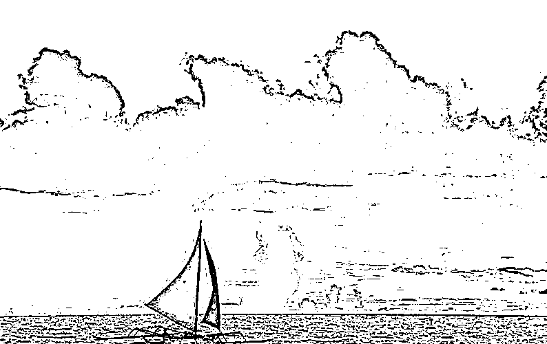**天王星的功课：打破模式的练习**天王星将我们带入未知的领域。它是通过望远镜观测到的第一颗行星，一夜之间将太阳系的大小扩展了一倍。它为人们所知的时间正值美国革命和法国革命之间，它打破了王权统治，孕育了民主政治。18 世纪晚期作为蒸汽时代的开端，同时也是发明创造的年代，从此开始了以机器替代人和动物劳动力的过程。今天，**天王星仍然象征着突破创新，它创造了自由，但也用惊奇和不确定的事物让我们震惊。**应对充满压力的日子，自然的反应是撤退到保护模式。对待不确定的事物，合理的反应是保持谨慎，这种方式在当前似乎非常流行。但**回到过去并无法解决我们共同面对的经济、坏境和社会问题。**在个体层面上也是同样的道理，**当工作、家庭和关系中出现困难和挑战时，通过防御和撤退很难将其克服**。天王星一起创造未来，意味着发明创造和与过去决裂的意愿可以帮助我们将世界变得更加美好。然而，在面对个体或集体改变的需求时，我们有时候认为自己必须**走向极端**。极端的方法似乎在所难免，比如辞去一份糟糕的工作，或者直面一段困难重重的关系危机，在此时做出根本的改变，难免要去冒险。天王星的功课是，**首先在无足轻重的人生领域中练习打破模式**，就像是为了成为一名应急工作人员而训练。你不需要一开始就通过跳入燃烧的大楼来学习如何成为一名消防员。如果你想要在人生中作出重大改变，无论是换工作、减肥，还是在与人相处时表现得更有自信，你都应该先做一些改变的训练。**改变一些细小的习惯模式可以令僵化的模式开始松动，发展出应付革命性天王星所必须的灵活性**。将每天早晨的惯例顺序改改；把头发分往另一边；对日程做一些小小的改动；在无需冒险的情况下做一些不同的事情，或者说一些不同的话，这些都是为作出人生中的重大改变而做的练习。如果你很难向别人表达你的需要，不要一开始就在与配偶的争吵中提出。先试试将购买的商品退货，或者在饭店里友好地要求将火候不足的食物送回厨房。这些都是行为上温和的改变，可以为你在之后作出更大的改变建立自信。自由和突破有时就像闪电一样突如其来。然而，未能做好准备应对变化，很可能导致爆发而非释放。**虽然很多时候我们希望别人改变他们的行为，但最有效的方式是改变我们自己**。这种在安全的情况下排练的过程，为经验和自信奠定了基础，从而让我们能够引领成功的革命，这不仅可以改善我们的生活，同时也能成为世界革新和建设性改变的模范。   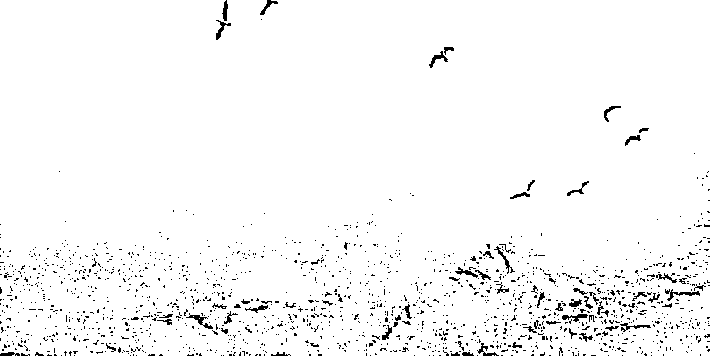                                              
**土星的功课：分辨责任感和负罪感的差异****土星象征着边界、限制和具体化。**作为能用肉眼看到的最后一颗行星，它在过去代表了太阳系的末端，但这并没有指出我们真实视野的终点。**土星代表必需品、责任以及应对生活中的规则，因此被认为是所有行星中最困难的一个**。在密教中，土星的问题在于，它代表**物质形式的显现。**这是灵魂的堕落，化身物质，而在某些描述中，它与**原罪**的概念相关。**正是因为我们以肉身的形式存在，才使我们从神圣的统一体中分离出来，与神分离，因此是一种罪。**注意，英文中的土星“Saturn 与”撒旦“Satan”非常相似，本质上，这就是**对物质世界的谴责。**将有关原罪的神学问题放在一边，认识到土星是**纪律、结构和承诺**的模范，这是很有益的。**如果这颗行星未能得到表达，就很难将理念转变为现实，很难坚持一项计划或为自己辩护。如果对土星的表达太过强烈，我们则会变得死板而胆怯，甚至无法正常活动。**关键是要**在凝固的形式和不拘一格之间找到平衡**，就像健康的身体是灵活而有序的存在方式。土星极具物质性，我们可以认识并左右它对我们身体的影响力。如果你思维僵化，或者沉溺在某种情境中，那就要留意了，这些都反映了土星形式的**僵化和无用**。另一方面，**留意你在什么地方显得无精打采或者避开其他人，这些都是土星未能充分发展的表现。**幸运的是，有一些简单的方法可以教我们如何有效表达这颗关键行星的能量。一种方法是练习土星式的走路方法，关键是**保持良好的姿势，不要太僵硬，要让你的脚后跟紧紧踩在地面上。**利用土星的积极能量和塑形能力的其他关键还有**前后连贯和时间管理**。如果你想要完成某事，**制定规律的时间进度表，并遵照进度做事，**可以让你与土星的组织性能量联结。这颗行星被希腊人称为“克洛诺斯”（Chronos），象征着它作为计时员的角色。**保持稳定的节奏执行承诺，可以养成健康的习惯，比起不规律、反复无常的做法更容易产生理想的结果。**另一个因素是**耐心**，因为当我们处于**持久的追寻**中时，土星才能发挥最佳状态。**这颗行星象征着成熟，它会嘉奖通过有意识地运用时间和精力所取得的经验。**一个与土星相关的要点是**责任感和负罪感之间的差异**。前者是对这颗行星健康、成熟的表达。责任感是指**恰如其分地回应，而负罪感指的是过度或错置的责任感、义务感或缺陷感。**识别二者之间的差异非常重要，有助于达成目标，避免因怀疑和自我谴责而消耗扰乱灵魂。**我们可以通过尽可能用一种与己无关的态度看待问题，从而发现差异。观察造成这个问题的客观情况和行为。**如果你可以找到补救方案，就负起责任来解决它。如果你没办法，别感到内疚，把土星的能量用在建设性的地方。当然，**如果这涉及到关键问题，它很可能会再次出现，那时，通过坚定的承诺和脚踏实地的努力，你可以更有效地处理它。****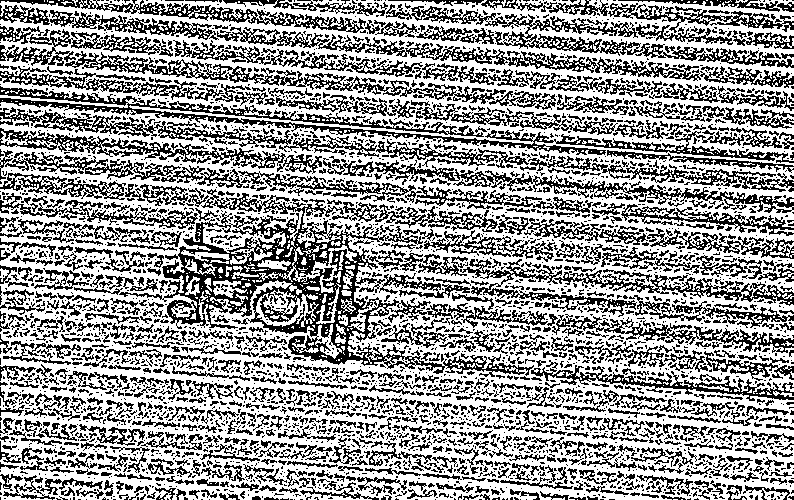****冥王星的功课：直面阴影** 现在，我们来到了最遥远、最微小的一颗行星——冥王星。事实上，由于它的体积太小，离我们太远，所以失去了作为一颗行星的正式身份。然而，这并不会改变一个占星学事实，即冥王星威力强大。1930 年被发现的冥王星以神话中的冥府之主为名，发现当时正值经济萧条和法西斯主义的崛起。这些都反映了与这颗行星相关的深刻性和集中的力量。冥王星如此强大的原因是，它象征着一个**可以释放和转变能量（也包括情绪）**的密码，它是占星学中的 E=MC2——这一公式释放着强大的力量。冥王星与核能之间的关系非常明显，当然也包括其中对钚（plutonium，与冥王星 Pluto 有相同的词根）的使用。另外，这颗遥远的行星在 1930 年 2 月 18 日被发现时正位于巨蟹座 18°。当象征现实性的行星土星到达这一点的时候，正是在日本广岛市原子弹爆炸的那几日。而当天王星（与铀 uranium 的词根相同）来到冥王星被发现的那一点时，正是第一次氢弹试验的时候。这个小家伙真是威力无穷！在个人层面上，冥王星是**阴影**的原则，这是心理学家卡尔·荣格的术语，代表心理学中我们**无意识地将其隐藏起来，不被自己发现的某些部分。**这就切合了神话中的冥王，他绑架了帕尔萨福涅。冥王将帕尔萨福涅带到他的地下巢穴，直到与她的母亲德墨忒尔达成协议才将其释放，但是她每年有四个月必须回到冥府。这个故事象征着回归黑暗的冬天。但是它也是一个重生的故事，冬天已来，春亦不远。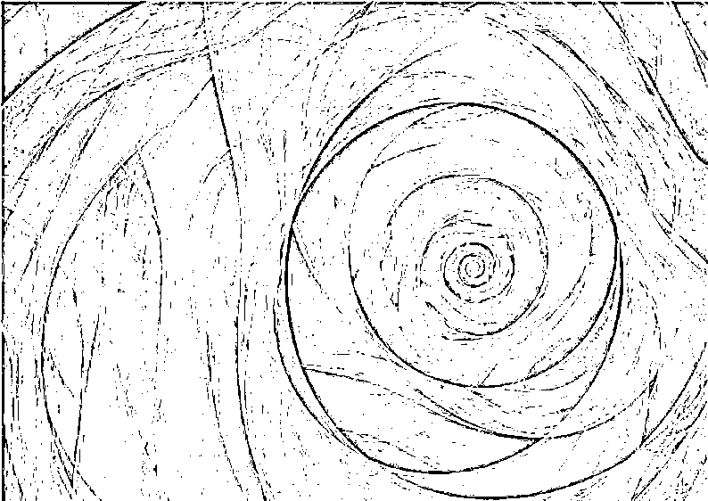当我们拒绝查看自己的黑暗面时，我们是不完整的，无法充分运用我们的力量。当我们**面对自己的恐惧、怀疑、罪恶和缺点，不去责备或指责**时，我们就**释放了它们对我们的束缚，变得更深刻有力。**每个人都有一个阴影，无论他们有多善良。正是因为**愿意去面对我们自身之中这些常常令人羞愧的部分，并用爱和理解去拥抱它们，我们才能打开情感的密码，帮助自身获得更大的能量。**冥王星的运作被描述为**“采用减法运算的加法”**，它开始于这颗行星**清除（死）**的那一面，却为重生和复兴开辟了道路。**简单地清除那些对生存不再重要的习惯、信仰、行为、期待、义务和抱负，可以为新的理念、行为和展望创造空间。****划分优先顺序**是冥王星运作的方式，需要我们去**评估和选择如何消耗自己的身体、精神和情感资源**。它有时确实会潜入个人的黑暗世界里，认识到我们最深层次的需求和欲望，但一旦这些都变得清晰了，就更容易清楚处理它们的方式。**小小的清理和冒险尝试**是开发冥王星的转化和复兴能量的关键。

**版权声明：**本文由若道翻译，欢迎转发，反对抄袭。友号转载请申请白名单。

杰夫·焦耳

国际占星大会（UAC）和全美占星师联盟（AFAN）创始人，美国著名占星网 www.stariq.com 创始人。曾任亚特兰大协会主席和亚特兰大占星考试委员会委员。4 本占星书的联合作者，在全世界的 4 个大洲开办过工作坊。2015 年逝世。

**系统学习占星学**

**点击图片了解详情**

**微信又双叒叕改版啦，不想错过若道君的推送？**

**就把若道设为星标吧！**

**▼**

就是这个“在看”，戳一下☟

********报名直达入口********

# 深度文章慎入！太阳返照星图，可能没你想得那么简单

> 原文：[`mp.weixin.qq.com/s?__biz=MzA5NjA0NTAxNg==&mid=2651423447&idx=2&sn=71a19a73e252092a5db651944bffed71&chksm=8b4b3060bc3cb976ada685b18bfcaf4538cd25d3358d8578e82f988454c02a6c8836ceda43c3&scene=126&sessionid=1692738131#rd`](http://mp.weixin.qq.com/s?__biz=MzA5NjA0NTAxNg==&mid=2651423447&idx=2&sn=71a19a73e252092a5db651944bffed71&chksm=8b4b3060bc3cb976ada685b18bfcaf4538cd25d3358d8578e82f988454c02a6c8836ceda43c3&scene=126&sessionid=1692738131#rd)

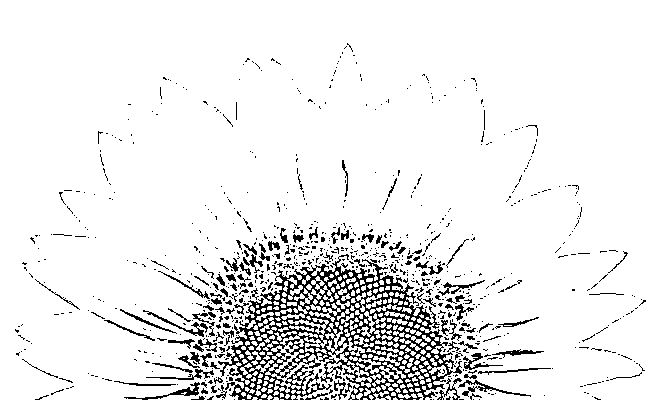

作者/唐娜·坎宁安 译者/雅祯 校对/Leisha

编辑/翀子 图片/网络

唐娜·坎宁安的这篇文章写于 2010 年。太阳返照星图是生日的特写，常作为一种预测工具被占星师们使用。文中讨论了太阳返照星图的意义、它是否是有效、选择过生日的地点到底有没有用，对占星师来说，留意那些反复出现的征象是非常重要的。【[太阳返照全解读](http://mp.weixin.qq.com/s?__biz=MjM5MjQwNjAyMQ==&mid=2649437351&idx=3&sn=e996ec98c2302c6ae995cdce2ed76a62&chksm=beb95bcd89ced2db524f4900b47fd26f15379500222f53345ea3699faa33babf39710566ea38&scene=21#wechat_redirect)】（点击可阅读）下周就要开课啦，还不快上车！**留意重复的征象**太阳返照并不一定发生在你生日当天，因为一个 4 年周期中，每次太阳返照星图的日期和时间可能是从你生日前一天到生日过后一天的任何时候。闰年和闰日的存在也是出于同样的原因，即每 4 年的 2 月 29 日。一年也不是真的 365 天，而是 365 又¼天。

> 译者注：这里描述的并不很清楚，由于地球绕太阳的运行周期为 365 天 5 小时 48 分 46 秒（合 365.24219 天）即一回归年，公历把一年定为 365 天。余下的时间约为四年累计一天，加在二月里，所以平常年份每年 365 天，二月为 28 天，闰年为 366 天，二月为 29 天。

对很多人来说，太阳返照星图中的上升点和各个宫头的位置也处于 4 年周期中，出生星图的上升星座会每 4 年定期重复出现在太阳返照星图中。我并不了解这其中的数学原理，但是一旦太阳返照星图中出现了与出生星图相同的度数、宫位配置和特征，我就会将其解读为重要的时期。**重复的征象就像荧光笔，让我们留意这些征象在我们的人生中所代表的重要特征和模式。**据说，太阳返照将在你的生日前 3 个月就开始生效。更年长的占星师告诉我们：你可以在生日之前很久就“感受到太阳即将返照的那股震动”。根据我多年观察的确看似如此，但这也完全可能只是主观暗示。又或者，这可能是因为太阳返照星图的相位与缓慢行星的行进相关。**太阳返照星图是在你生日前后某一刻行进的特写。**在太阳返照星图中，你很可能会看见与行进行星主题相对应的相位，尤其是一年移动都不超过 2-3°的运行缓慢的外行星。外行星与太阳的相位更是如此，但因为金星和水星总是离太阳很近，它们与太阳的相位也可能会重复出现。在我看来，行进是比太阳返照更好的预测工具，所以除非客户特别要求，我一般不会解读太阳返照星图。太阳返照、推进、日月食或者其他技法中预示的所有征象都已经存在于出生星图中，并且会被行进再次确认，所以不要纠结于你的太阳返照星图。

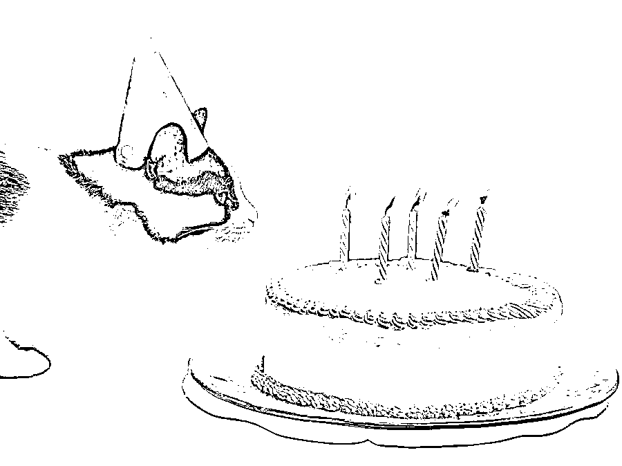

**与太阳返照星图对话**尽管有些纯粹主义者只以出生地计算太阳返照星图，但**太阳返照星图的地点应该是你的现居地**。纯粹主义者比较麻烦——另一个争论的焦点是所谓的岁差太阳返照与普通太阳返照，曾有读者写信问我是否使用过地心岁差（若道君：不了解的读者就当是一个可以一听而过的知识点）进动星图，我从未听说过这种星图。我认为用哪种太阳返照星图真的没那么重要。我认为，只要占星师认为有用，就有用。我们其实只是在调谐到行星的能量，是**行星在与我们对话**。那张被称为星图的纸，不过是指引我们连接到行星能量的一种曼陀罗。嗯，这是我第一次提出比较激进的观点，这有点像塔罗牌及其各种现代版本。**只要你相信它们，并将它们当作理解人的工具，那么它们就是有用的。**这里的整个占星实践都是要告诉客户可以去哪里旅行以求获得最好的太阳返照星图。不喜欢冥王星在太阳返照星图中的第 10 宫？找一个更好的宫位的所在地出发吧。为了让这张星图发挥作用，你需要在那个地点从太阳返照的 1.5 天之前停留至 1.5 天之后，所以请打包 3 天的行李吧。这是真的有用还是只是心理安慰？是否只是最任性的占星式戏剧？当关键事务的宫位中出现我不喜欢的行星时，**我对根据太阳返照星图择地旅行做过很多次尝试，结果大不相同。**我把这归功于意愿的力量和展现决心的力量。如果要为了得到更好的太阳返照星图的地点出行，那一定是因为：今年（2010 年）6-9 月所有的太阳返照星图中都会出现由冥王星、土星和天王星构成的基本星座 T 三角。如果你的太阳返照星图看起来非常糟糕，那得知你不是唯一被宇宙“霉运”砸到的人或许有所安慰。

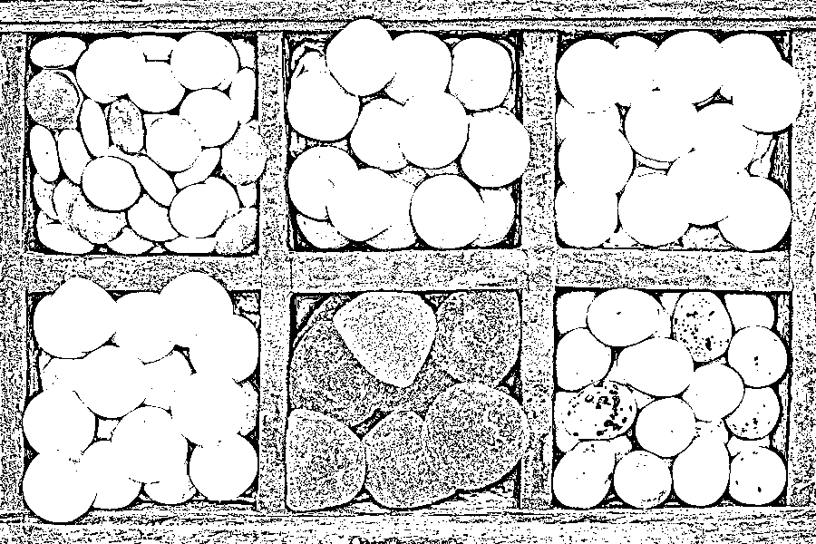

**我们在某种程度上都受到当前社会、经济、政治和环境危机的冲击，但它对我们个人的影响程度取决于各自的出生星图。**T 三角在出生星图和太阳返照星图中所涉及的宫位可以显示出，我们需要在哪些领域采取行动。你可以“推进”太阳返照星图去**找到几年生日之间的事件高峰****期**。在黄道中按每天 1°向前推进太阳返照星图的四轴（上升、中天、下降和下中天），以找到太阳返照星图中相位预示的议题将会加剧并需要被着重应对的大致时间段。因此，**太阳返照的一个特定关键点，在一年中将会有大约 4 次变得特别重要**——但幸运和希望的征象也是如此。（更直接的版本是从生日的 3 个月后起每个月将四轴移动到下一个星座，一共向前移动 3 个星座）**版权声明：**本文由若道翻译发布，欢迎转发，反对抄袭。友号转载请申请白名单。

**唐娜·坎宁安**一位在国际上广受尊敬的占星师，她有超过 45 年的从业经验。她已撰有数十本占星著作以及上百篇占星学和其他形而上学类的文章。于 2017 年 7 月 5 日离世，享年 75 岁。

**学习太阳返照技法**

**请点击下图了解详情**

**

**微信又双叒叕改版啦，不想错过若道君的推送？**

**就把若道设为星标吧！**

**▼**

就是这个“在看”，戳一下☟

********报名直达入口********

# 深度好文丨你的太阳星座和月亮星座是否健康运作？

> 原文：[`mp.weixin.qq.com/s?__biz=MzA5NjA0NTAxNg==&mid=2651423290&idx=1&sn=4e549a5286db6e8d05daef1c5d88bbfe&chksm=8b4b308dbc3cb99bd3c96b56de46581216a1db4479366b2a28e9a9ec23abb8bd6692c07b3b21&scene=126&sessionid=1692738131#rd`](http://mp.weixin.qq.com/s?__biz=MzA5NjA0NTAxNg==&mid=2651423290&idx=1&sn=4e549a5286db6e8d05daef1c5d88bbfe&chksm=8b4b308dbc3cb99bd3c96b56de46581216a1db4479366b2a28e9a9ec23abb8bd6692c07b3b21&scene=126&sessionid=1692738131#rd)

****后台回复“今日”，给你一句生命态度****

作者/安特罗·阿莱 译者/江艺 校对/Leisha 编辑/翀子 封面/书君 图片/网络

我们的太阳星座是“精神”的内在过程，月亮星座象征“灵魂”的内在过程，我们通过太阳获得光，通过月亮获得内在滋养。作者认为，我们可以通过在家中分别布置太阳房间和月亮房间，调整它们的能量。

灵魂和精神这两个术语常常被混为一谈。在这篇文章中，我建议灵魂代表“活着的事物”，而精神代表“我们正在成为的事物”。同时我建议，占星学中的**太阳星座**和它的宫位落点象征着**“精神”**的内在过程，而占星学中的**月亮星座**象征着**“灵魂”**的内在过程。

占星学中月亮和太阳是象征性的表征，而不是准则。月亮不是灵魂；月亮代表了灵魂的现实(可能无法描述)。太阳不是精神，而是其直接经验的象征。

如果你的**太阳星座**指的是你正在成为谁，那么它也象征着你实现自我的个人过程，也就是**成为完整自我的具体动力**。如果**月亮星座**象征着活在你躯壳内的东西，那么它也**代表了生活在你之前的祖先的遗传史**，他们的影响力塑造了你当前的经历，正如无论你是否意识到，历史都影响着我们一样。

**自我实现的深刻需求**

另一种对待太阳星座的理所当然的方式是，**把专长错误地归因于太阳星座本身。**

例如，作为太阳金牛座并不会自动让你成为房间里最沉稳和忠诚的人，除非你是一个致力于实现自我的金牛座。作为太阳狮子座并不能保证你是一个有魅力的艺术家，除非你完全致力于实现自我。作为太阳天秤座并不意味着宇宙该给你一份有意义的关系，除非你愿意通过亲密关系努力实现自我。

最有可能的是，**我们出生在一个特定的太阳星座，不是因为我们是那个原型的专家，而是因为我们有更深刻的需求，去体验那个本质，从而得到进化。**

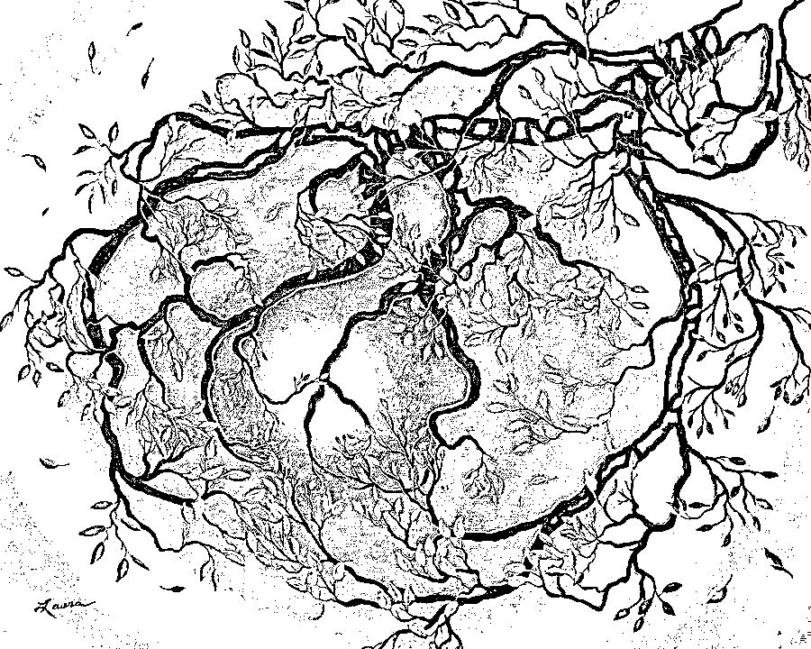

自我实现并不适合每个人。的确，每个人都是潜力之星，但不是每个人都愿意并能够显化这一现实。**所有稚嫩的潜力之星都必须面对某些必要的压力、突然的爆炸和太阳耀斑。**自我实现要求无论如何都要做自己的坚定意愿。强烈的小我不仅仅充满矛盾，而且需要有勇气去将这些矛盾接纳为自我更大的变化整体的一部分，仅仅是去尝试和弄明白这些矛盾是不够的。

太阳星座反映了我们太阳系中心恒星的放热、发光特性。**要实现你作为个体的光辉命运，你必须愿意忍受大量的热、光和自我暴露。**

当任何非常以自我为中心的人格、社会或时代精神(是的，每个时代都有其自己的小我)**以失去灵魂为代价，过度认同于它的精神时，太阳的阴暗面就会显现出来。**当太阳星座被过分强调时，它会散发出过多的光、热和过多的自我暴露；今天的恒星就是明天的黑洞。

伊卡洛斯的神话讲述了一个天真的年轻人，在手臂上插上蜡做的翅膀，向太阳飞去。伊卡洛斯怀着对这颗恒星炽热光辉的热情，飞得离这颗恒星如此之近，以至于他的翅膀融化了，他坠落到下面波涛汹涌的海里。海代表灵魂的领域和月亮潮汐的引力。

**伊卡洛斯神话的背景是不可分割的日月炼金术**；上面是炽烈的精神光芒，下面是冷酷和黑暗深邃的灵魂海洋。

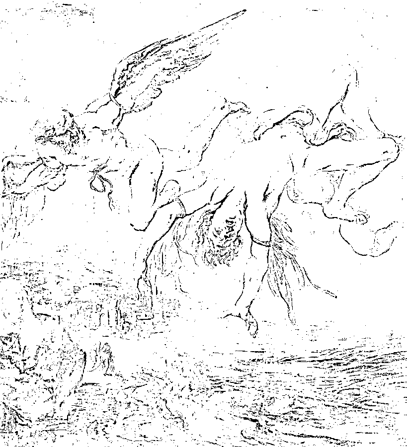

**| **《伊卡洛斯的飞行》，雅各布·彼得·高威。

**在月亮的阴影中冷静**

**过多的太阳**，或精神太多而灵魂不足的另一个症状是，可以观察到**对理解的心理成瘾**。过分热衷于理解的能力会使人着迷于不惜一切代价保持头脑清醒。结果是，被太阳灼伤的心灵对自己而言太过明亮，过热而无法冷静下来，过度暴露而无法享受自身的幽默感。

**心灵作为一个整体也需要停下来睡眠、休息和反思(月亮的特征)**，从而降低热量。通过我们身体的生物特性，我们与所有生物、所有有生命的事物联系在一起。这并不是由于任何认知体系，也不是由于某种先进的思想，一个不可否认的事实是：只要我们活着，肉体就是我们整体中始终存于现在的唯一部分。

思想漫游，**记忆将注意力转向过去，但身体始终存于现在**，只要它还活着。这个简单的真理解释了我们与当前存在的一切事物以及一切存在之间的亲属关系和联系。直接理解和认可这一鲜活事实，给了我们更多关于月亮在我们的星图中的内在意义和它所象征的灵魂生命的线索。

月亮所代表的这个复杂的生物智能网络不需要任何以智力和精神为基础的术语来理解；它说自己的语言。它的梦的语言之道指向我们与所有生命的连接，同时也指向我们与无常的和不断变迁的现实的联系。

**月亮和它所代表的灵魂象征着我们从祖先的 DNA 中继承了什么**，这是将我们与自然生命联系起来的遗传密码；我们体内的 DNA 与任何有生命存在的地方的 DNA 具有相同的形态。如果地球有一种与其创造的万物保持联系的共同语言，它可能是 DNA。流经每个孕妇的母体荷尔蒙基因河流展示了原型月亮化身的一个鲜活例子；我们体内和周围的基因潮汐起起落落，汹涌达到顶点的潮水，潮涨潮落。

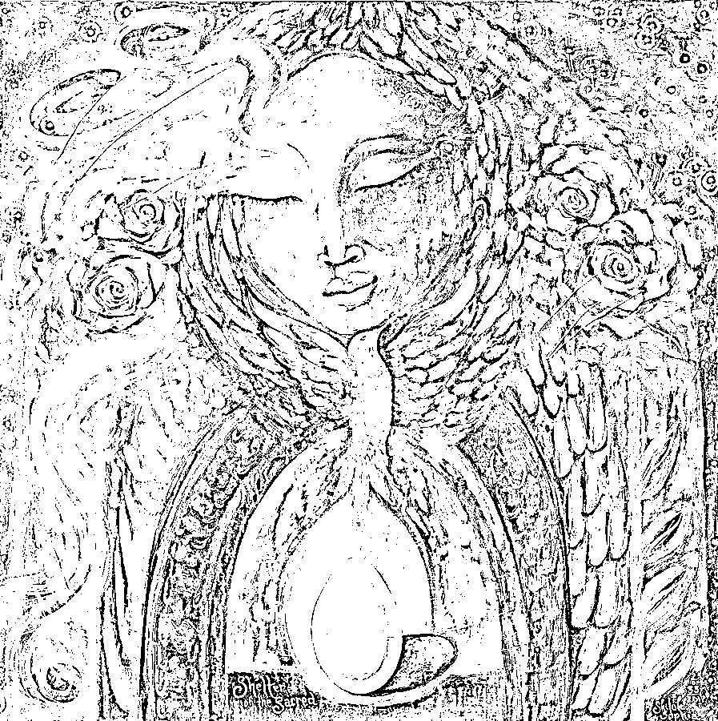

**月亮的幻觉与深度主观性**

**当我们过度认同月亮和它所代表的东西时，我们的感官就会迷失方向。**

与月亮相关的病态是灵魂的错乱。在任何极度情绪化，或月亮的状态下，我们都会失去洞察力。像线性时间(约会)和空间(容易发生事故的行为)这样的组织管理细节最多只能成为一种碰碰运气的尝试。有时，我们会遭遇个人界限的瓦解，盲目地将自己淹没在他人的个人事务和情感中，而往往对其影响一无所知。

当月亮被过度强调时，我们就会忘记自己行为的后果，就好像因果法则并不适用一样。**如果一个过度扩展的太阳是错误地相信它自己对客观性的错觉，那么月亮的幻觉就展现了我们深深地淹没于自身主观性和错觉之中。**

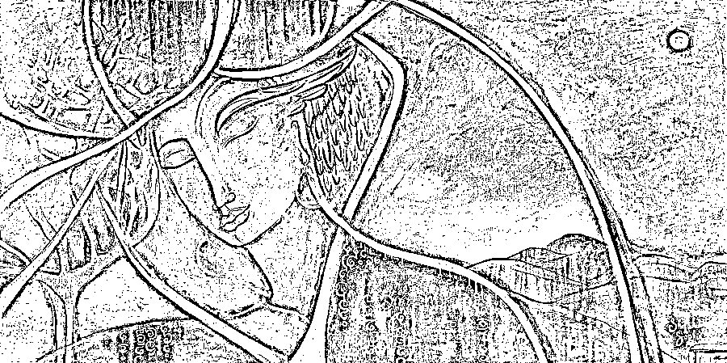

我们可以使用占星学来精确定位我们出生的月亮和太阳的位置，从而应用所有这些关于灵魂和精神的信息。一般来说，**你去太阳照耀的地方是为了获得光、热和自我暴露，而你去月亮的住所是为了降温、关灯、与更滋养的生命源头连接。**

很少有人意识到，要使精神和灵魂之间不稳定的关系保持平衡，以及终生追求这两者之间持续不断、神秘的紧密结合，我们自己的责任可能非常大。就像灵魂和精神一样，只要我们活着，月亮和太阳就总是会在我们的内心中紧密结合，或许在我们死后也会如此。**它们的紧密结合是否牢固可能在很大程度上取决于我们整体的这两个方面能否很好地沟通和理解彼此的需求。**

占星学可以成为揭示这种理解的有效工具，因为它被应用于认识这些符号所指代的生活事实;换句话说，除非你完全认同精神/太阳，否则理解不是万能的。

**太阳和月亮的神庙**

利用太阳和月亮星座来激发和维持我们自身的心灵天气——空气，温暖的晴天，阴郁的黄昏——可以是一个宝贵的炼金术晴雨表，解读我们的心灵和情感需求。**通过区分太阳和月亮在你的生活中的特性**，**就有可能运用你的出生星图来对你已经开始经历的事物进行微调。**

将这种太阳和月亮，精神和灵魂的炼金术仪式化的方法之一就是对它们进行戏剧化，**通过布置你家里的某些房间来表达这两者的能量。**

通过在你的住所选择两个房间——可能是卧室和客厅——并将月亮的物质和精神属性指派给一个房间，将太阳的属性指派给另一个，这样就可以建立一种神庙来尊崇它们各自在你日常生活中的力量。要想给你的太阳/月亮神庙带来真实感，一个方法就是运用你个人太阳和月亮星座固有的元素知识。你是水象、火象、土象还是风象?

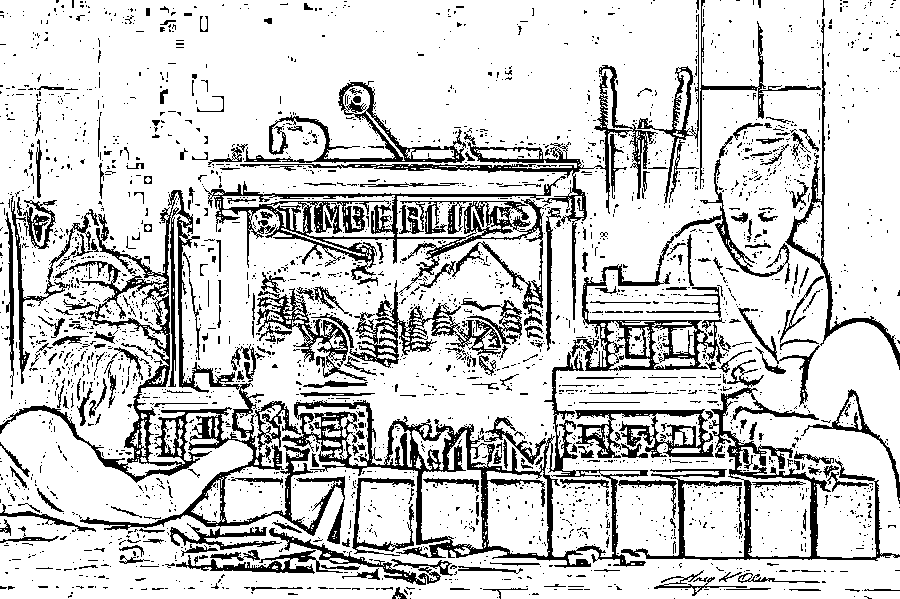

**在处理你自己出生星图的个人元素时要具体。**例如，如果你的月亮在处女座，那么你可能想要强调土元素(而不是月亮一般对应的水元素)。如果你的太阳在天秤座，那么风元素(而不是太阳通常对应的火元素)会让你更接近太阳。

你如何在家中布置一个**月亮房间**取决于你的**直觉和想象力**，而**太阳房间**需要你的**理解和清****晰**。你在这个项目中的完全投入和热情将反映出你当前的需求和渴望，即在你的生活中区分这些层次，并通过你的日常环境实现它们。

你可能会发现为太阳创造一个房间很容易，但是当碰到月亮的时候就完全不知所措了，或者正好相反;如果是这样，要知道这是有原因的。如果无法立即想出某个房间的布置，那就花几天甚至几周的时间让它慢慢发展自己的生命。

如果你对任何一个房间都感到绝望或沮丧或麻木，那么考虑将这些反应作为你的太阳或月亮可能在那个时候的合理表达。将这些反应整合到神庙中，直到它们准备好改变形态。

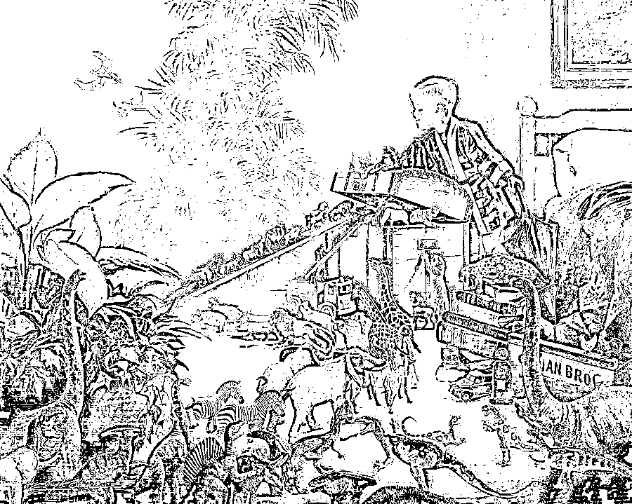

**神庙中的日常生活**

让你的出生星图也参与你建造神庙的过程。如果你的月亮合相中天，也许你会希望其他人注意到你的房间；如果你的太阳在第 12 宫，也许你在仪式化自己的隐藏。

将你的太阳和月亮形成的相位像元素或道具那样放置在神庙中，提醒你它们之间的相互作用。如果你的土星对分月亮，放置一个像时钟或日历的土星道具，面对你月亮房间的祭坛或焦点。如果你的太阳处于一个 T 三角格局之中，那么将那个房间里的其他元素也摆放出类似的几何形状和张力。似乎第一个用“宫”这个词来描述一个出生星图的 12 个部分的人在他们的脑海中也曾有过这个过程。

这些太阳和月亮房间在设计上不必具有明显的仪式性。有时，要让一个空间充满月亮或太阳的能量，只需要做一些只有你自己才会意识到的细微调整。**通常情况下，我们在日常生活中所做的更自然的调整会在不知不觉中开始渗透到我们的生活结构中，**直到它们带来的变化真正实现之后才会被我们注意到。

在你自己家里建造一个太阳和月亮神庙，或者日/月神庙，是实现这些变化的一种方式。

**版权声明：**本文由若道翻译发布，欢迎转发，反对抄袭。友号转载请申请白名单。

**安特罗·阿莱（Antero Alli）**

隐居作家，著有 8 本书，占星师，也是派拉电影研究所的地下电影制作人和艺术导演（自 1977 年起）

**系统学习占星学**

**点击图片了解详情**

**微信又双叒叕改版啦，不想错过若道君的推送？**

**就把若道设为星标吧！**

**▼**

就是这个“在看”，戳戳戳 ☟

********报名直达入口********

# 神奇的卜卦占星学，你真的不想了解一下吗？

> 原文：[`mp.weixin.qq.com/s?__biz=MzA5NjA0NTAxNg==&mid=2651423290&idx=2&sn=f06316b42e1e176c9afe2f94b66c8086&chksm=8b4b308dbc3cb99b30be9c6a746e69b3541f0b57e1cc738d80e2738cc330b0dc19a90e5fdb8e&scene=126&sessionid=1692738131#rd`](http://mp.weixin.qq.com/s?__biz=MzA5NjA0NTAxNg==&mid=2651423290&idx=2&sn=f06316b42e1e176c9afe2f94b66c8086&chksm=8b4b308dbc3cb99b30be9c6a746e69b3541f0b57e1cc738d80e2738cc330b0dc19a90e5fdb8e&scene=126&sessionid=1692738131#rd)

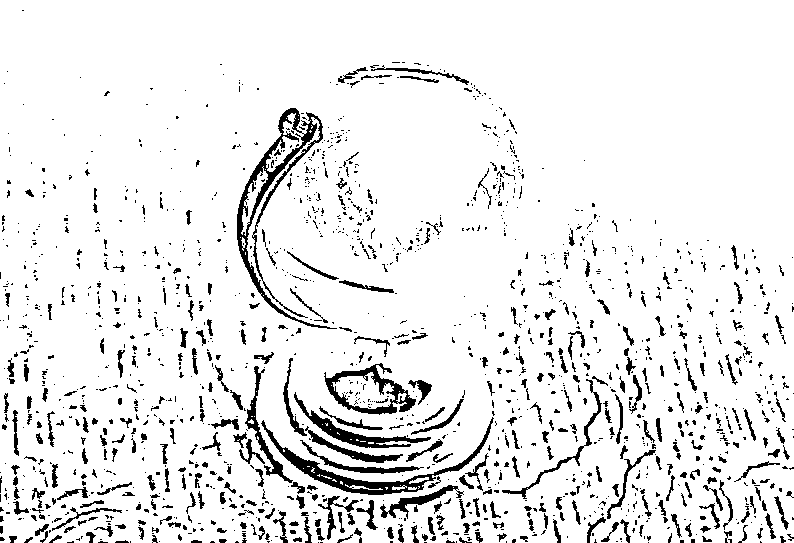

作者/艾德里安·邓肯 

译者/Leisha 校对/Arrow

编辑/玫瑰 封面/书君 图片/全景网

**作者的话**

如果说为咨询而做的卜卦图是咨询过程中一个重要的部分，听起来可能是个革命性的说法。但是，咨询星图在整个占星学历史上都是传统的一部分。如同历史上许多其他从业者一样，威廉·利里更倾向于运用咨询图而不是出生星图，只是因为咨询图的日期和时间是确定的，而很多人的出生时间并不确定。

在印度，当出生信息的细节未知时，占星师们大量使用咨询时间来设立星图。在某些情况下，占星师不知道客户的出生时间，但是通过将客户的生时设为正午，并与咨询图结合使用，咨询仍然可以是准确的。有些情况下，比如被收养的儿童没有出生日期的记录，咨询图同样是有效的，能够为占星师提供所需要的信息。

**预兆与征兆**用客户到达的时间设立的星图反映了客户周围正在发生的一切。也可以对此得出一个推论，**通过研究当下或其他时刻发生在客户周围的实际情况，可以清楚地了解任何特定时刻的意义**。这就是为什么预兆与征兆可以是准确的，而善于观察的占星师则通过意识到那一时刻正在发生的一切，为咨询提供许多信息。与咨询共时发生的事件令人惊奇——有人来清理下水道（月亮-冥王星）、花店送来鲜花（金星-水星）、园艺中心送来堆肥蠕虫（火星-冥王星）、天花板渗漏（月亮-海王星）。当宇宙用这类事件提示占星师时，你就会知道自己在卜卦图中的所见是强有力的。**咨询图的时机**如果你的业务繁忙，那么，你可能在某天预约了多位客户，并希望他们都能准时出现。这些人为安排的时间，而非随机的时间，并不会影响咨询图的效力。占星师只是一面镜子，和其他人一样与宇宙调和。**无论你是否安排好了时间，客户总会在正确的时间出现，如果这个时间是早了或者晚了，那么咨询图就要相应调整。**很多客户不会准时到，而这些细小的差别会影响**上升点**，这可能非常重要。如果收到电子邮件的咨询，你可以遵循一个传统规则：**当你阅读并理解了问题之后，就可以为它制作星图了。**不要使用电子邮件发送的时间，或客户想到那个问题时记下的时间来制作星图。客户与占星师之间的互动很重要。如果你确实要回复电子邮件发来的提问，最好安排一段可以回答问题的时间，然后阅读、理解和开始回答一次完成。重要的是，**制作星图要使用客户的所在地，而不是你自己的所在地**——这是客户的问题，不是你的。客户也可能通过打电话或网络电话的方式联系占星师。**如果当下没有时间回答问题，就别问客户的问题是什么，安排一个你可以专心回答问题的时间，再用咨询发生的实际时间制作星图，同样还是使用客户的所在地**。然而，如果你当下有时间回答客户的问题，那么，你会发现星图极为强有力，而且很容易给出答案。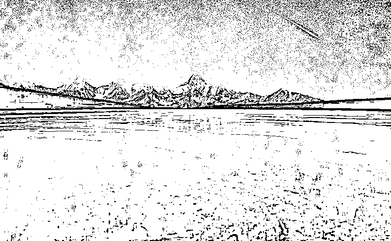**问题和回答**

**回答问题时，标准的规则始终适用**。 

*   上升点的守护星总是代表提问者；
*   月亮的星座与落宫会显示出客户所有的情感能量投入在何处；
*   月亮可以被视为客户的共同征象星，尽管它并不像上升点的守护星那样是决定性的因素；
*   当与所问之事相关的宫位的守护星与上升点的守护星形成托勒密相位时，就会产生一个结果，或者与月亮形成相位时也可能如此。

传统规则可以被视为建议，而不是限制，因为，所有的星图都可以以各种不同的方式解读。某些行星可能像王牌一样好用——金星代表爱，火星代表胜利，木星代表成功——它们如果与征象星形成积极的相位，这些行星根据自身属性可以带来结果。咨询图几乎总能反映出生星图的行进和推进所显示出的当前重要主题。这就是咨询图如此有效的原因：**它能显示对客户而言最紧迫的议题，以及精确地反映议题在哪个领域体现以及如何体现。**咨询期间提出的任何问题，通常都可以**追溯到卜卦图中的行星配置，并做出相应的答案**。客户可能会提出很多不同而且独立的问题——工作问题、感情关系、孩子、友谊、金钱、意识，不同的行星模式会显示出事件的发展，并提供具体的答案。一张星图可以回答许多问题。**衍生宫位**

神奇的是，衍生宫位系统，让回答客户生命中其他人的问题成为可能。一个简单的例子是，可以运用第 7 宫的守护星来描述伴侣的生活状况。通过第 7 宫的守护星及其星座和相位，能够对客户伴侣的情况给出非常好的描述，客户经常对这种描述的准确性表示惊讶。

我记得有一次咨询，星图中下降点的守护星水星将要合相第 8 宫内的天蝎座太阳，同时四分冥王星，这让客户伴侣的经济状况看起来不怎么好。事实上，客户的伴侣拥有一家航空公司，一周后破产了。

理论上，你可以**通过“转宫”来获取与客户相关的任何人的信息。**因此，第 11 宫的守护星可以描述孩子的伴侣、丈夫的婚外情，或者从另一段婚姻而来的子女；第 10 宫的守护星可以描述伴侣的家人，或者其本身所象征的老板；如果客户是政府官员，那么，第 10 宫的守护星就是那个政府的领导人；再比如，第 10 宫的守护星是天秤座的太阳，即将四分摩羯座的冥王星，就表明：这个政府领导人正在建立的脆弱共识即将崩塌。咨询图给出的信息有时令人“毛骨悚然”。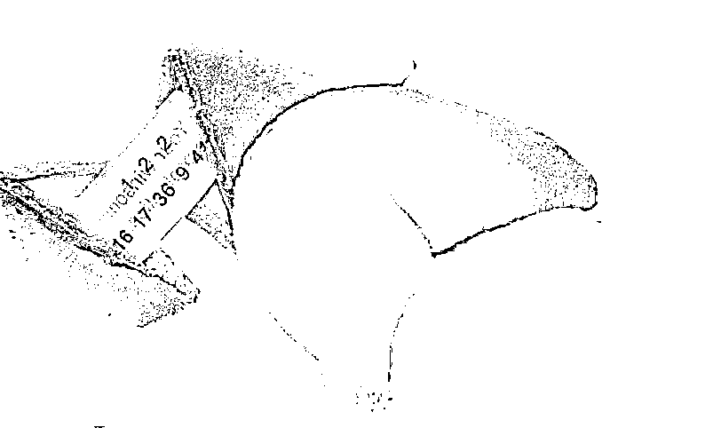**事件图与择时图**对于有些事件，你可以进行择时，比如旅行或结婚，而有些事件，你无法为其选择时机，比如会议、求职面试等。为一个事件选择最佳时机，比如开业或婚礼，是具有挑战性的，也是一门艺术。在为客户选择日期和时间时，我倾向于通过打电话，或面对面的交谈来完成。你必须知道什么可能，什么不可能。例如，婚礼择时的范围通常可以被缩小到周六，而且提前几个月就能知道大致的时间段。这有助于占星师找出最适合的周六，最好是**月亮配置良好，金星强有力而相位和谐**的时候。择时总是需要做出妥协，因为几乎总有一些行星配置存在问题。诀窍是**尽量减轻问题，选择一天中问题配置不占据星图主导地位的时间。**例如，水星四分火星可能会好争论，那么，你就不要将其放在择时图中的第 1 宫或第 7 宫。如果你为商业用途择时，最好**给木星和土星安排良好的配置，并让上升点的守护星与这两颗行星形成和谐相位**。**对于人生中的长期项目，应该选择渐盈的月相，不要太靠近新月，而且绝对不要选在接近新月的最后 45 度区间。**择时图的关键要素是——**让上升点的守护星强而有力，良好地配置于与当前事项相关的宫位中，而且，最好与强而有力的下降点的守护星形成和谐相位**，那就皆大欢喜了。为感情关系择时，尤其在婚礼星图中，当**所有的成对行星形成和谐相位**时最佳：**金星-火星、水星-木星、太阳/月亮-土星。**由他人定下时间的事件图稍微有些棘手。一般来说，**因为你是在指定时间到达某处的人，所以你是由上升点的守护星所代表的。**如果是重要的事件，那么，你需要**确保自己不会完全妥协**。例如，星图中上升点落入金牛座，而你是落在第 7 宫的天蝎座金星（失势），金星还入相位四分火星-土星的合相，那你就有麻烦了。在这样的情况下，最好取消预约，并要求重新安排一个时间。要了解**会面时将发生什么**——例如求职面试，你需要**对应地识别出参与的各方以及他们的行为**。如果你处于弱势位置，那么，试图坚持自我是没有意义的，如果你处于强势位置，那你就可以坚持自我。求职时，面试你的人可能有好几个。**下降点守护星代表的可能是之前联系你、直接通知你来面试的人；第 10 宫的守护星代表真正的老板；第 6 宫内的行星或第 6 宫的守护星，可能代表其他在场并参与筛选求职者的同事**。如果上升点的守护星与各位面试官的征象星之间的相位不佳或没有形成相位，那么你可能不会得到这份工作。但如果与主要征象星之间形成一个良好的相位，就可能预示求职成功。事件图会讲述故事，也会讲述面试如何推进，随着上升点和中天的移动，也许会合相某颗行星，也许会进入下一个星座。最好的策略是**专注于你的长处**，例如：金星六分水星，可能代表你有与人打交道以及良好地表达自我的能力，能够在不被激怒的情况下，顺从由敌对征象星代表的面试官，并且能够与和你形成有利相位的征象星所代表的人建立亲密的关系。怎么强调都不为过的是，运用卜卦星图和事件图的重点在于**观察星图本身所表达的内容，而不是死板地遵守先入为主的理念**。行星代表人和事，当你能够识别哪些行星对应哪些议题时，就不难看出结果。客户的参与对结果预测有极大的帮助，因为客户比你更清楚什么可能，什么不可能。通过合作，你们可以一起编织可能的未来场景，因此，客户可以带着期待和满足，积极主动地为未来而努力。

**版权声明：**本文由若道翻译，欢迎转发，反对抄袭。友号转载请申请白名单。

艾德里安·罗斯·邓肯

若道签约老师，哥本哈根占星学院院长 1985 年开始成为全职占星师，是人本主义占星、卜卦占星和食宿占星领域的知名占星师。开发了占星软件 AstroClock 和多款占星报告。

******想要跟随邓肯老师学习卜卦占星学？******

**点击下图了解详情**

喜欢记得点一下在看哦☟

********报名直达入口********

# 黄金插班期丨现在插班，轻松赶上卜卦进度！还能玩转卜卦图！

> 原文：[`mp.weixin.qq.com/s?__biz=MzA5NjA0NTAxNg==&mid=2651423290&idx=3&sn=727fac39a6dc614b74ff47b296f162cf&chksm=8b4b308dbc3cb99bc7ad185db0c8ec926a2a66db0c8a0793b7ce281e9d5aefb7db48b4f56e82&scene=126&sessionid=1692738131#rd`](http://mp.weixin.qq.com/s?__biz=MzA5NjA0NTAxNg==&mid=2651423290&idx=3&sn=727fac39a6dc614b74ff47b296f162cf&chksm=8b4b308dbc3cb99bc7ad185db0c8ec926a2a66db0c8a0793b7ce281e9d5aefb7db48b4f56e82&scene=126&sessionid=1692738131#rd)

自从热热闹闹的卜卦占星课开课以来，同学们边学边练，学得可欢了。几乎每一天，若道卜卦课程群里都有新的卜卦问题被抛出来。

这也不奇怪，我们生活中本来每天就要面对各种问题，今年又是这么一个特殊时期，每个人都面临来自未来的巨大不确定性。大家（同学们及其朋友和客户）也都期望用卜卦星图来获得指引。

**同学们的问题**

比如，有同学问这么一个特殊的问题：“今年我的孩子还能出国留学吗？我有可能陪他出去吗？”可不，本来早就联系好的留学，因为疫情，让人不知道如何选择。

大家的卜卦问题都是我们人生中常见的问题：

*   有人问**结婚**行不行，有人问离婚行不行，有人没结婚意外有了孩子问怎么办……？

*   有人问**工作和职业**问题：转行会顺利吗？离开北京到异地会更好吗？公司裁员，会被裁吗？部门调整，会被调动吗？新岗位很委屈，但是怕得罪领导不敢说话，应该怎么办……？

*   有人问**投资**问题：卖房子什么价格合适？买房子什么价格合适？出租房子什么价格合适? 股票还能补仓追涨吗？某个投资项目可以投资吗……？

*   有人问**健康**问题：手术会成功吗？能顺利住院吗？如何帮助亲人面对另一位亲人可能的离世？两位亲人的状况是什么样……？

*   有人问**法律**问题：朋友被拘留，情况会怎样？P2P 平台暴雷了、老板跑了、公安介入了、投资的钱能通过官司要回吗……？

*   有人问生活中的**邻里关系**问题：楼上噪音不停，房东调理无用，这种情况还需要持续多久呢……？

*   还有很多人在**找东西**：眼镜丢了，钱包丢了，手机丢了，耳机丢了……你们在哪呢？

一个人提问，一群人提出自己的解盘思路和观点。不仅做了练习、启发了思路，还安慰了心灵。很多同学的提问还被邓肯老师抽中，老师亲自解读。

**同学们的讨论**

有时候讨论也会歪楼，比如你看这个楼歪的：

一个同学在一个炒股的卜卦后感慨：“我们太厉害了，把炒股讨论成灵性升华！”因为大家不仅讨论个案，也会探讨卜卦占星学的精神。

再比如群里有这样一个讨论：一位同学问：“如果完全按照卜卦的结果去做选择，心里还会有力量吗？”

大家是这样讨论的：

*   A 同学：“我印象深刻的是**分享的案例，虽然卦象显示的比较清楚，不能成，但她仍然尽努力去把事情做完了”。

*   B 同学：“谋事在人，成事在天，我们不能因为天做了决定自己就不谋事了”。

*   C 同学：“对，有的事需要明知不可为而为之，符合大道”。

*   A 同学：“即使没有去到原先的目的地，行事的过程会打开另外一扇门”。

所以，卜卦群里一些同学感慨：

*   “学占星不就是让人既学会臣服顺应，同时又能努力保有自由意志吗？”
*   “我在大家身上看到满满的正能量，内在力量也得到了提升”。

大家不仅讨论这些和个人相关的卜卦问题，也会积极关注各种大事件。比如贵州公交车出事的当天，大家也在研究当时的天象图，想找到事故的原因。毕竟，邓肯老师每节课，都会讲当下的天象，世界上出了什么样的事情，可以从这样的天象图看到，还有，当然也是最重要的动态卜卦的概念——这样的天象会如何发展。怎么样，是不是很热闹？是不是很有趣？没错，卜卦是特别有趣的一个占星学技艺，常常把玩之，既可以看到每颗行星生动的在卦星图中出没，又可以慨叹天意和人的自由意志是如何很好地结合表达。**如果你生活中地卜卦问题感兴趣，或者你的客户可能对这些问题感兴趣，欢迎你来加入我们！****现在正是最好的插班时机！**因为 7 月份恰好为卜卦课的休假期，这个月我们暂时不上课，大家可以尽情回听和复习，并思考课程中的问题。还没有上卜卦占星学这辆车的同学，现在正是上车的好时机哦：

*   你有充分的时间复习前 7 节课的视频内容

*   你有充分时间对于前 7 节课不懂的内容提问，并得到回答

*   你有充分的时间理解和吸收前 7 节课程的知识点和技法

我们为你准备了每节课的知识要点，你还可以看到前期同学们的问题及解答。**8 月 7 日（周五）直播课直接跟上节奏，这个夏天学习充电的完美安排。**这次课程恰逢世界在巨大的变动和不确定之中，期待你来和我们一起经历。**学员反馈：**

**课程内容**

***Part1***** 融合现代占星理念，整合动态占星知识**

星图如同地图，展示了人们从哪里来，现在在哪里，以及可能的去向是什么。卜卦星图虽然显示的是当下这一刻，但却是在动态当中的。所以过去的运动轨迹对应着过去所发生的，接下来的运动轨迹对应着接下来要发生的。**在课程中你会学习到：**

*   我们如何从一张卜卦星图看到时间的流动：从过去到未来，故事如何展开

*   心理占星和事件预测如何在卜卦占星中有机结合起来

*   卜卦星图如何回答是否的问题

*   如何用卜卦星图回答分析性和指导性的问题

*   现代动态占星中事件发展的顺序：

*   确定咨询图中强调的当前事件
*   将客户与相位或行星组合相关的情感能量关联起来
*   在早期经历中找出相似的情景
*   认识到过去和现在的情感完全相同
*   辨识出过去做出的所有限制性决定
*   通过头脑风暴找出更能带来力量的方法来解决相同类型的问题
*   在想象和现实生活中重演当前和未来的事件

***Part2 *****独家【现代动态卜卦占星技术】全面教学**

*   **卜卦中的行星**

*   行星强弱及力量

*   太、月、水、金、火、木、土在庙旺落陷时的意思

*   卜卦星图中的月亮及其在 12 宫的意义

*   卜卦星图中的外行星

*   卜卦星图中的恒星

*   卜卦星图中的凯龙星

*   上升点和指征星的度数

*   **如何选择和辨识征象星**

*   当问题出现时，如何判断征象星

*   如果两个人或物由同样的征象星指代该怎么办

*   **卜卦图中的相位**

*   不同相位的意义

*   征象星之间相位的意义

*   征象星与其他行星相位的意义

*   **卜卦中的宫位**

*   12 宫位和宫位系统

*   对宫位的动态观察

*   宫主星及其互动

*   互溶和定位星

*   **卜卦中的星座**

*   **传统卜卦原则（约束和限制条件条件）及其在现代动态卜卦中的应用**

*   **空亡、光线传递、完成、围困、燃烧之路等**

*   **星图中的逆行及其讲述的故事**

*   水星和计划

*   金星与依恋

*   火星与斗争

*   外行星逆行

*   **应期与时机**

*   1 度是代表多久

*   宫位的重要性

*   行星速度和逆行

*   如何综合卜卦和行进、二次限分析时间问题

***Part3*****  学以致用，覆盖人生各个领域问题的卜卦解法**

希望将现代卜卦占星学的精髓传达出来，精细地讲解每一宫所代表的卜卦事物，分主题详解不同类型问题的卜卦解读思路，内容包括但不限于：

❶ **爱情和关系**

*   金星的重要性
*   第一和第七宫以及其中的行星
*   成对行星
*   上升下降及其守护星

❷ **利用月亮择时**

*   第十和第六宫以及其中的行星

*   木星和土星及其相位
*   火星和水星
*   行进和中天

❸ **资金和资源**

*   第二宫和第八宫以及其中的行星
*   第五和第十一宫
*   金星、木星和土星
*   四元素的意义

❹ **家庭和大家庭**

*   第四和第十宫及其守护星
*   第五、十一宫及其守护者
*   第五宫和第十一宫的行星
*   月亮

❺ **社会、法律、智性、健康、存在主义的问题**

*   第九和第十二宫及其中的行星
*   木星和第九宫守护星
*   三宫 、十一宫、六宫和八宫

❻ **如何解读事件星图**

*   从新闻学习卜卦盘
*   如何从卜卦盘看新闻事件和世界大事的发展变化
*   我们如何去培养自己观察有预兆意义的信息、从日常事件中捕捉启迪
*   占星解读的意义

***Part4 ***** 扩展延伸择时占星技法的新认知**

在择时的时候，我们会选取征象星处于有力的时候，来规划我们的事件；避免征象星不力的时候，尤其当这个征象星代表我们自己。**择时星图一瞥**

*   择时的艺术
*   如何在不完美的天象下取得最佳结果
*   如何做出深思熟虑的回答
*   如何为约会择时
*   如何为婚礼择时
*   如何为商业活动择时
*   如何为旅行择时
*   如何为对抗事情择时

*   虚拟和实时会议的择时

***Part5  *****如何运用卜卦占星学做一场转化性的咨询**

虽然卜卦的结果可能是不利的，但我们仍然可以从心理占星学的角度给出一些积极建议，帮助客户建立信心，有助于应对之后的人生。客户出生星图与卜卦星图的关联，这在咨询中对于心理方面的考量是非常重要的。

*   一个好的咨询有哪些特色
*   咨询星图及其应用
*   如何用卜卦星图和新客户在短暂的咨询开场白快速建立信任
*   如何综合卜卦星图、出生星图、次限图一起分析
*   如何用卜卦星图聚焦当下的问题
*   如果客户在一场咨询提出多个问题，要看多少卜卦盘
*   如何在一个充满挑战的卜卦星图中寻找客户资源、有利的时机，找到支持客户的策略
*   如何从客户故事中寻找意义
*   卜卦星图如何从事件维度和心理维度来解读
*   当看到客户不愿意看到的结果可能出现时，如何开展对话
*   改变的方法

**整个课程将有大量案例演示、课下作业以帮助大家理解和练习。**

**导师介绍**

**艾德里安·罗斯·邓肯****（Adrian Ross Duncan）**1971 年在印度游学时开始学习占星学，1985 年开始成为全职占星师，**迄今执业已超过 33 年，是人本主义占星学、卜卦占星学和经世占星学领域的知名占星师。他还开发了占星软件 AstroClock 和多款占星报告。**他在日常咨询中都会运用卜卦，咨询图（卜卦的一种运用方式，即根据客户来访时间制作星图，从星图中获得大量信息）也是他**特别擅长的领域**。艾德里安·罗斯·邓肯从 1971 年开始研习佛学，受佛学影响很深，他**相信占星学和佛学观点统一、转化的一个基础是在于对现实感知的改变**。而卜卦很容易与佛教融合，因为它只关乎当下。

| 艾德里安·罗斯·邓肯的占星学著作

**适合参加本课程的人**

*   想要系统学习现代动态卜卦占星的学员
*   想在生活中熟练使用现代卜卦占星学
*   在咨询中想帮助个案更清晰的分析解读困惑
*   想参加 ISAR 认证考试，此课程是 ISAR 选修课
*   希望通过卜卦占星帮助自己和身边人挖掘一个积极主动的未来

学习整合卜卦技巧，不仅有益于想钻研卜卦占星学这个分支的同学，对占星初学者也很有有帮助，可以让你的占星技巧加倍。**课程费用****课程原价：9900 元****老学员复训专享价：**
**2018 年参加艾德里安·罗斯·邓肯卜卦占星课程的同学：****5000 元****特别优惠****：****分享课宣到朋友圈****保留 48 小时****（不设分组显示）截图给课程顾问可获得****400 元优惠****。****授课时间****2020 年 5 月 15 日-9 月 25 日（7 月休息），每周五 20:00-22:00****具体日期：**

*   5 月 15 日、22 日、29 日   

*   6 月 5 日、12 日、19 日、26 日    

*   8 月 7 日、14 日、21 日、28 日 

*   9 月 4 日、11 日、18 日、25 日 

**截至 2020 年 6 月 26 日，课程 1-7 讲为录播课程（限视频回放），其余均为网络直播课。**

**授课方式****线上网络课，英文授课，中文翻译**
**退转课程****退款原则请详看《教学协议》，如有疑问请咨询课程顾问。******现代卜卦占星学精修课程****

**授课老师：艾德里安·罗斯·邓肯**

**授课时间：**2020 年 5 月 15 日-9 月 25 日（15 次课）

**授课方式：**网络课程，英文授课，中文翻译

**费用：9900 元；****老学员复训价：5000 元；特别优惠，分享课宣到朋友圈保留 48 小时（不设分组显示）截图给课程顾问可再获得 400 元优惠。**

**课程负责人：**童老师（微信：196267205），请备注“卜卦”

长按二维码添加课程负责人咨询

****报名请点击“阅读原文”****

# 若“优雅宁静”是你的菜，请找太阳、月亮、上升落在这个星座的爱人

> 原文：[`mp.weixin.qq.com/s?__biz=MzA5NjA0NTAxNg==&mid=2651423207&idx=1&sn=d3f8a94b54e7667c0876707de89e7a9f&chksm=8b4b3350bc3cba4672ecb735a445998dc008428e5bdc388c269c237ee361c0bb0b7404dbff0c&scene=126&sessionid=1692738131#rd`](http://mp.weixin.qq.com/s?__biz=MzA5NjA0NTAxNg==&mid=2651423207&idx=1&sn=d3f8a94b54e7667c0876707de89e7a9f&chksm=8b4b3350bc3cba4672ecb735a445998dc008428e5bdc388c269c237ee361c0bb0b7404dbff0c&scene=126&sessionid=1692738131#rd)

**********☆****************后台回复“今日”，给你一句生命态度**********

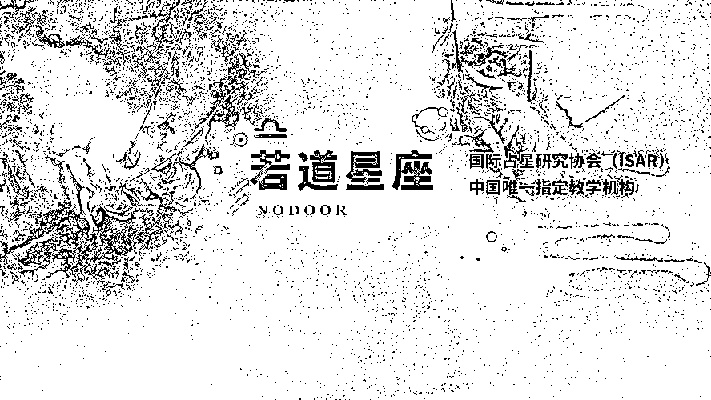

作者/斯蒂芬·弗里斯特 朱迪·弗里斯特 

译者/李含 编辑/玫瑰 图片来源/全景网

本文摘自《天空的伴侣 I：爱、性和进化占星学》

12 星座中，天秤座天然同“关系”、“婚姻”相关。这个星座的人，让人难忘却又头疼，在于他们看起来长袖善舞，优雅美好，却又那么优柔寡断，藕断丝连……该如何得到他们的心？这真是个难题吗？来看看斯蒂芬老师怎么说。**天秤座****原型**  

**情人艺术家**

**和平使者 外交官 顾问** 

发展目标**宁静**，这就是天秤座的目标。天秤的图案象征着**平衡、平静**。任何一个基于良性的天秤座行为都有意无意的达成平静的效果。为了**释放压力、寻求妥协、平复恼怒的情绪**，天秤座人一步步实现他们的目标：**练就临危不乱的平和**。所有被天秤座影响的行星都会在进化中趋于和谐、平静。这个背后的寓意是，**在前世耗尽力气，应付混乱不堪的局面，今生要为灵魂寻求逆转。 **策略和资源犬儒学派的世界观认为：**人都是独善其身，不论他们的内心隐藏了什么样的观念**。面对纯粹的利他的善念，犬儒主义者首先就困惑了，然后挣扎着强迫将这种观念融入到自己悲观的人生观之中。所以，他会执迷于**对人的行为动机做出阴谋论的判断，善举会让他紧张，他想要用自己的方式解释，遂让他陷入感情关系的迷乱之中。 **与此相对的，**理想主义者对一切都充满信心，但痛苦的是，这个目的和最终的结局都将是心灵的体验课程**。面对好友女儿被谋杀的事件，理想主义者和犬儒主义者一样，在最初都会经历纠结。把谋杀融合到平凡的生活中同样不易。再一次，面部肌肉变得僵硬。思想奋力的寻找合理化。纠结矛盾的情绪淹没了内心世界。 

真理总是复杂的，似是而非的。任何的简化或者抗拒行为都会导致紧张压力。而压力和天秤座的目标是对立的。所以，天秤座被赋予这样一个强大的资源：**似是而非和模棱两可的天赋**。天秤座在任何事情上都能有**正反两面的思考。他们在寻求中道，找到他们的平衡点。 **

美，是另一种抚慰心灵的方式。日落的美让我们感到惊艳。我们大呼，所有的压力和紧张烟消云散。**培养美感**是天秤座的一项策略，不论是被动地做一名鉴赏者，还是积极主动地成为艺术创作者。 

人与人之间的紧张关系，比如，与伴侣的战争，压力巨大。天秤座的另一个策略反应在这个领域：**彬彬有礼**。这可能是个苍白的世界。使用这个策略时，并不意味着我们能够在高级餐厅辨别哪个是吃沙拉的叉子！彬彬有礼是**无时无刻地向他人传达尊敬和鼓励，来维系人际关系的和谐**。天秤座人很善于**评估我们的行为对他人的影响。** 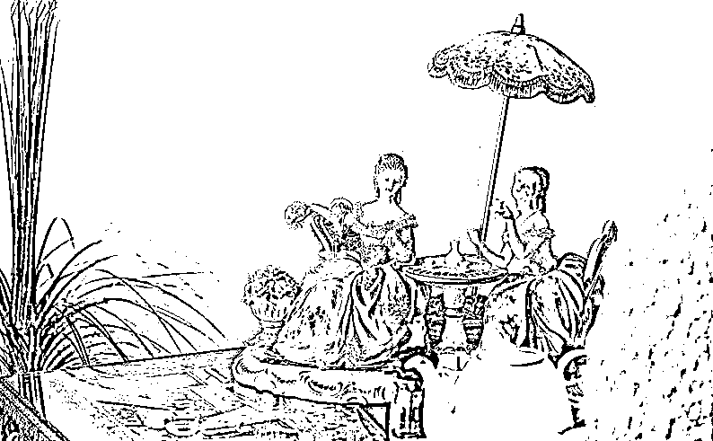阴影天秤座的阴影，和其他星座一样，都是对本星座策略和资源的曲解。天秤座模棱两可的天赋可能被扭曲为**优柔寡断和犹豫不决**。对美的敏感性也可能沦落为**俗气的低级趣味**。彬彬有礼可能变成了**华而不实的花言巧语，不敢面对真切的冲突对抗**。天秤座的本性直接导致了**紧张加剧**。换言之，这是颠覆了天秤座良性的策略；完全在相反的方向上愈错愈远。 **天秤座的爱情**太阳天秤座的爱情传统占星学认为，天秤座与**婚姻**有关。以符号元素来看，的确如此。天秤座，让我们看到了平衡的原则。两个人走到一起，和谐相处，相互理解、坦诚相待，带来两种观念的碰撞。通常，这对健康的灵魂关系是有益的象征。每一个星座都会在某些方面“与爱情相关”，但没有一个太阳星座是这样一个**亲密关系的试验场，体验根本的进化**。为了获得鲜活的满足感，太阳天秤座的人需要**在人际互动中经历挑战、妥协和诱惑。**这些体验有助于个人成长，最终成为人的精神支柱。因为移情作用的提升，太阳天秤座的人需要记住，**保持一定的自我重心，不要成为他人的卫星**——**永无止境地调停琐事，这意味着深深的裂痕，而没有进行商谈。 ****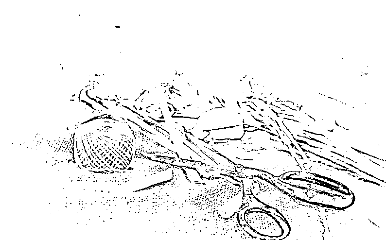**月亮天秤座的爱情在亲密关系中，天秤座需要**伴侣礼貌殷勤和细腻的感情**。这点对于月亮天秤座的人来说尤其正确，月亮的温柔敏感带来了非凡魅力。这里呈现了一种**优雅的敏感性**：粗俗的笑话和粗鲁的言辞难入他们的法眼。对于月亮天秤座的人来说，亲密关系就像是**直觉的艺术**。对他们而言，优雅是自然流露的方式，怀有开放的意识，和对每个行为的觉知。月亮天秤的人有**异常敏锐的美学视角，即使是简洁干净也是好的**。以天秤座的阴影来看，需要注意，**不去过度抚平爱情关系中避无可避的皱纹**。这里的风险是，**一个人要完全放下最自我需要的追逐，才能彻底理解和吸收另一个人的观念。**天秤座人想要营造出**真正和谐快乐的关系**，必须认识到：**曾经隐藏在甜美、耐心、容忍面具背后的真实的个性**。在家庭生活中，月亮天秤座的人会**尽力营造宁静、平和的美好环境。**舒适的环境加上充满艺术、音乐的氛围。但是，即便在艰难维持的生活中，月亮天秤座的人也会点上香薰蜡烛，努力营造美的生活。 上升天秤座的爱情上升天秤座的人有一种魅力，让人油然而生一种**休戚与共的认同感** ，对方会夸张地认为彼此有很多共同点。他们**本能寻求与他人建立和维系和谐的关系**。这种特质也被称作**礼貌殷勤，但并不会显得刻板僵硬**。更确切地说，他们能够**以巧妙优雅的方式，让人与人相处时不可避免的磨擦减到最低。**天秤座的守护星是金星，金星当然是对于爱情影响颇大的行星。金星作为命主星，爱情和亲密关系会成为生命的重要主题。

**版权声明：**本文由若道翻译发布，欢迎转发，反对抄袭。友号转载请申请白名单。

**12 星座爱情宝典**

[白羊座](http://mp.weixin.qq.com/s?__biz=MzA5NjA0NTAxNg==&mid=2651419096&idx=1&sn=30c86f7f9f489d61c1b0f80b8944b46b&chksm=8b4bc36fbc3c4a79c49f5b4aa43daad19a145e2bf762fe4a8e5bc1319228e633a65ae869df2c&scene=21#wechat_redirect) | [金牛座](http://mp.weixin.qq.com/s?__biz=MzA5NjA0NTAxNg==&mid=2651419469&idx=1&sn=e44679a33194bf652fe9f515565c8da5&chksm=8b4bc1fabc3c48ecfa11b12fdab2043d246c58d47176dfa105a11ee05a22b4bc65947c7ad02e&scene=21#wechat_redirect)丨[双子座](http://mp.weixin.qq.com/s?__biz=MzA5NjA0NTAxNg==&mid=2651420649&idx=1&sn=0179035270f9508988c70e85c969869c&chksm=8b4bc55ebc3c4c48c928471267184c6360676c387dc9527ef0e112d6671bba3e8893324b5621&scene=21#wechat_redirect) 

[ ](http://mp.weixin.qq.com/s?__biz=MzA5NjA0NTAxNg==&mid=2651421302&idx=1&sn=23f3f771a6bb8eed2903620cc0344755&chksm=8b4bc8c1bc3c41d7b10a8b2c2a826edf4d7700e0db201cabe956be9128038e9dd3beb6b14afb&scene=21#wechat_redirect)[巨蟹座](http://mp.weixin.qq.com/s?__biz=MzA5NjA0NTAxNg==&mid=2651421302&idx=1&sn=23f3f771a6bb8eed2903620cc0344755&chksm=8b4bc8c1bc3c41d7b10a8b2c2a826edf4d7700e0db201cabe956be9128038e9dd3beb6b14afb&scene=21#wechat_redirect)丨[狮子座](http://mp.weixin.qq.com/s?__biz=MzA5NjA0NTAxNg==&mid=2651422486&idx=1&sn=ee393d64fc0638b589212d81c2ecbd35&chksm=8b4bcda1bc3c44b737b01fcfcc85a0a9096d4f7a567d76c6079e9760105e5259d775715f6429&scene=21#wechat_redirect)丨[处女座](http://mp.weixin.qq.com/s?__biz=MzA5NjA0NTAxNg==&mid=2651422885&idx=1&sn=3d4e368f263ed2016388d3cec178b6b1&chksm=8b4b3212bc3cbb049ad7a6c403a4eab1664d38bb465ede4b82aeaeef64deb34b13e8319c642d&scene=21#wechat_redirect)  

斯蒂芬·弗里斯特

若道签约老师。进化占星学的创始人之一，当今世界最有影响力的占星大师之一；1985 年，他凭借《内在的天空》一书获得职业占星师协会奖（Professional Astrologers Incorporated Award）。他四次获得占星界最高的占星学联合协会奖（United Astrology Congress Regulus Award）提名，2018 年获得轩辕十四教育奖。

**想听听大师斯蒂芬老爷子的精彩讲座？**

**长按下图了解详情！**

**微信又双叒叕改版啦，不想错过若道君的推送？**

**就把若道设为星标吧！**

**▼**

就是这个“在看”，戳戳戳 ☟

****************报名直达入口****************

# 用扁桃体炎的症状治好了“不可描述病症”丨带你看有趣的顺势案例

> 原文：[`mp.weixin.qq.com/s?__biz=MzA5NjA0NTAxNg==&mid=2651423207&idx=2&sn=9d85557ac5f2911f14f65e38c824f671&chksm=8b4b3350bc3cba468e9f5dba17a087ef824aeeab62ec716ee8a5a06b057d10beb28dae12389e&scene=126&sessionid=1692738131#rd`](http://mp.weixin.qq.com/s?__biz=MzA5NjA0NTAxNg==&mid=2651423207&idx=2&sn=9d85557ac5f2911f14f65e38c824f671&chksm=8b4b3350bc3cba468e9f5dba17a087ef824aeeab62ec716ee8a5a06b057d10beb28dae12389e&scene=126&sessionid=1692738131#rd)

作者/若道君

 编辑/翀子 图片来源/网络

今天给大家介绍顺势疗法的两个重要概念：独特性和整体性。这个两者的结合让顺势疗法成为治疗复杂身心疾病的有力方法。同时文中也提到，顺势药物和疾病并不是一一对应的特定关系哦~

为了让大家对于顺势疗法有更多的了解，若道君在这段时间很是阅读了一些顺势疗法的资料，发现了更多顺势疗法非常迷人的地方，我们也将逐渐把这些有趣的地方分享给大家。  

这篇文章，我们将用几个案例，来诠释顺势疗法中的两个非常重要的概念。以下文章中的观点和案例主要来自于著名顺势医生拉詹·桑卡兰博士、加贾南•达尼普卡尔博士讲座的内容摘要，让若道君八哥学舌给你听。

**独特性**

**在顺势治疗中，第一个重要概念是独特性概念。**什么是独特性呢？就是这个病症中有什么奇怪的地方，让你和“同病相连”的另一个病人不同的地方。这就是顺势的**个性化治疗**。

我们在此前的文章中说，**顺势疗法治疗的不是病，而是你这个人！**你们虽然患同一种病，但是你们是不同的人！

这意味着顺势医生要基于每个人个性化特征的症状找到不同的制剂，**这些症状可能来自身体或心灵的任何部分。**而且最为神奇的是，当顺势医生听到这个症状后，真的可以按图索骥，在顺势疗法的宝书（虽然有不同的版本，不同著名顺势医生撰写）**《症状大全》**（*Repertory*）中查到病人说的这个奇特的症状（**在我们的课程中，我们会为学员发这本书**）。

**举个例子**

以下是加贾南•达尼普卡尔博士给出的一个咳嗽的案例。一位女士有严重的咳嗽，持续 5-6 天，来看病的时候呼吸急促，几乎到了说不出话的地步。她像许多病人一样，告诉加贾南博士她躺着的时候咳嗽更剧烈，头一碰到枕头咳嗽就加剧了，还会流眼泪。当然她也提到因为咳嗽导致声音嘶哑。

咳嗽在平躺时更剧烈，导致声音嘶哑，咳嗽时会流眼泪这些都是咳嗽的常见状况，甚至因为咳嗽而导致呼吸急促也不特殊。顺势医生很难根据这些描述开药。不过随后她讲了**一个非常有趣的症状**，她说，“我咳嗽的那一刻，我的耳朵、腿、手也会开始疼痛”。

这是不是很有趣！咳嗽通常会让我们胸口疼，头疼，这个都常见，但腿会疼，手、耳朵会疼？这就是让这个女士的咳嗽独特的地方。根据这个症状， 加贾南博士在《症状大全》这本书中查到“咳嗽，引起较远部位的疼痛”的唯一制剂是辣椒。这个女士服用 2 剂 1M 辣椒（Capsicum 1M）后，咳嗽消失了。

这个案例是想告诉大家，顺势治疗的一个非常重要的概念就是，我**们每一个人都是独特的**，哪怕你我都是得了一种疾病，我们都会有一些细微的不同！所以，顺势医生不会看那些在这个疾病中常常可以看到的症状——比如对于咳嗽来说，躺下，流眼泪，痉挛性咳嗽，或者咳嗽时头痛这种情况。**他们像侦探一样，会去找那些一般人看不到的非常独特的东西。**

正是这个独特的表现定义了这个患者的独特之处。**这个独特之处越稳定、清晰，就越能迅速帮助顺势医生找到合适的制剂。**

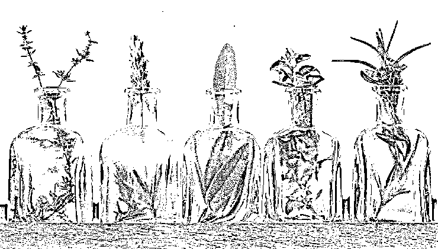

**整体性**

**第二个重要概念是整体性的概念。**

想了解整体性，最简单的就是了解什么不是整体性。比如头痛医头，脚痛医脚就是典型的不是整体性。而头疼医脚则是因为整体性！因为**顺势疗法认为，身体、心灵和整个有机体是一个整体**。它作为整体孕育、发展，它作为整体活着，也作为整体死去。因此身体的任何一个部位的症状都有全息性，它反应的不仅仅是那个部位，而是反应你身体的整体问题，顺势医生可以从身体部位疾患的一滴水里看到整个身心的大海。

所以，当一个人有花粉过敏症的人来到顺势医生面前，医生问她，告诉我你经常做什么梦？对病人来说，这个问题可能听起来非常不着调，我来看过敏，又不是心理问题，你干嘛问我做什么梦？但对顺势医生来说，这位女士的花粉过敏症和她的梦都表达着她相同的状态，因此这个问题完全合情合理。**这个人的梦的独特之处和花粉症的独特之处将会引导顺势医生找到适合她的顺势制剂。**

有时候顺势医生切入某个病症可能是其他某个伴随这个主要病症的其他病症，甚至可能是此人过去很多年前所患的一个病症。因为正如我们在第一个重要概念那里所讲，顺势医生需要找到奇特的地方。因为整体性的原因，如果在主要症状里找不到奇特的地方，就可以在别的地方找，甚至在别的时空找！这里有一个有趣的案例。

**一个例子**

一个有阳痿问题的男子来来找著名的顺势医生利佩博士。前面我们说到，对于顺势疗法来说，需要找到这个病症奇怪的地方。但是阳痿就是阳痿，利佩博士在一番问诊后实在找不到这个男子的阳痿和其他人的阳痿相比有什么不同寻常的地方。性无能就是性无能。没什么特别的。

后来，在详细的问询后利佩博士发现，这个男子 20 年前得过扁桃体炎。而他的扁桃体炎有一个非常独特的症状，通常发炎是从右侧到左侧，再从左侧到右侧。根据这个信息，他开出顺势制剂犬乳（Lac Caninum），治愈了男子的性无能。这就是整体性概念的应用。**阳萎和扁桃体是同一状态的一部分，**此人 20 年前得的扁桃体炎的特征给出顺势医生治愈他整个人的制剂，因此也可以治愈了他的性无能。这就是整体性。

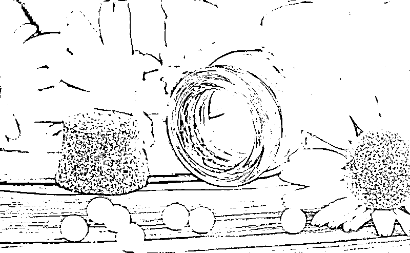

**独特性和整体性的结合**

**整体性和个性化是顺势中非常重要的概念，只有真正能够从心里懂得这两个概念，顺势的门才能为你打开。**

为了达到这两个目标，当你到顺势医生那里第一次问诊的时候，虽然你比如就是看胃病，但你会发现，顺势医生会把你从头到脚非常详细地盘问一遍。而且**不仅仅是身体层面**、病理、症状层面，还包括**情绪层面**，你的妄想和梦，你的感觉，你对食物、气候的好恶，你的性格等等。还包括你的**既有病史，家族病史**。一个顺势医生的问诊问卷，可以有几十页那么长。

我们再举一个拉詹·桑卡兰博士的例子，看看**完整和个性化**在治疗一个慢性疑难疾病中的应用。

这是一位患有间质性肺纤维化病的女士。间质性肺纤维化是一种很难治疗的疾病，在非典病人的后遗症中，我们也会看到这种疾病的出现。它通常是逐渐恶化，人感到疲倦，喘不过气来。通常医生们会用类固醇来治疗，但是没有真正好的治疗方法。

这个病人氧饱和度很低，已经在用雾化器和类固醇。她说晚上咳嗽得更厉害，躺下后喘不过气来。桑卡兰博士在她所描述的症状中没有找到特别的地方。

后来问到情感层面，她提到和丈夫及其家人相处不来。婆婆每天都会侮辱她。于是桑卡兰医生就问，当婆婆骂你的时候你有什么感觉？她说：“我感到非常愤怒。内心很多愤怒， 我想如果这样的事情继续下去，将来会怎样呢？当我想到未来时，我感到很沮丧和悲伤”。桑卡兰医生接着问她：“你生气时会发生什么？”这位女士回答“我会感到整个手臂都灼烧”。而且在随后病人所讲的每一个故事中都有这两种情况出现：

*   愤怒时心里会想未来会怎样，感到沮丧和悲伤

*   生气时会感到整个手臂都在灼烧

这是一个非常有趣的信息。除非顺势医生去问，病人不会因为自己的间质性肺纤维化告诉医生这些信息。**医生问到了这个病人的身心伴随症状——当你生气时，你会怎么样？愤怒与什么同时起？**这些和身体伴随的精神症状非常重要，因为它直接显示病人的心理神经轴线。

根据这两个主要线索，桑卡兰博士为这位女士开出了氯化钠（Natrum Mur 1M）。

此前，这位女士用类固醇和雾化器治疗了一年，没有效果。而在服用氯化钠后，她呼吸困难减少 75%，也不再有灼热的感觉，增重了 7 公斤，而且在情感上平静多了。对于一个患有间质性肺纤维化病人，这是一个非常好的结果。

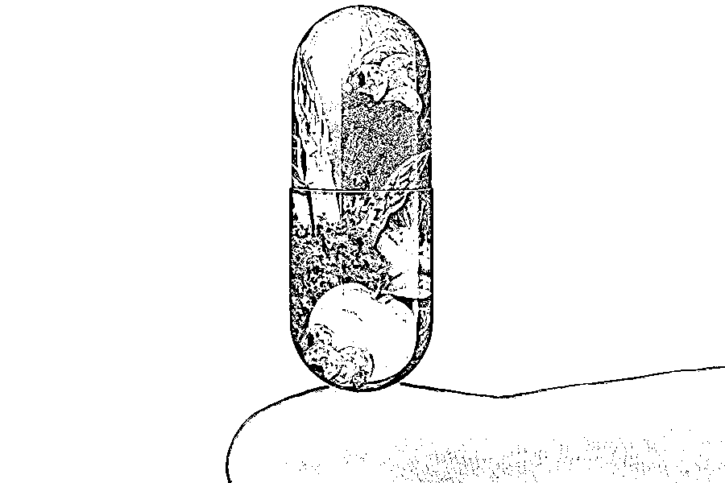

**不简单的顺势疗法**

在写这篇文章的过程中，若道君听说一个学员问我们将会配给上课的同学什么药，都是多大势能。她问是不是自己可以去买药就好，不必上课。我想，这是不了解顺势才升起的想法吧。

没错，在英美的很多超市里，就有各种顺势制剂，很方便购买。但是，**顺势制剂不是和某种疾病相连**，虽然有时候有一些便捷的治疗方式，比如我们吃了油腻的东西，通常可以服用马钱子，如果食物中毒，通常可以服用砷，如果跌伤了，通常可以用山金车。

但是，很多时候，或者说大部分时候，服用顺势不是这么简单的对应。如果冒然从国外的网站上买一堆药，其后果很可能是用不了两次，而且也发现未必能够找对。

顺势不是精油，也不是花精，可以看看说明书就好（花精和精油如果药达到精准的治疗肯定也需要上专业的课程），**顺势复杂得多，而且它可以治疗很多复杂的身心疾病，**后面我们还会用更多的文章来分享一些案例，让大家了解顺势的美妙之处。

请在后台回复 顺势 获得更多**关于顺势疗法内容**

**版权声明：**文章由作者授权发布于若道平台，欢迎转发，反对抄袭。友号转载请申请白名单。

**学习顺势疗法**

**点击下图了解详情**

**微信又双叒叕改版啦，不想错过若道君的推送？**

**就把若道设为星标吧！**

**▼**

就是这个“在看”，戳戳戳 ☟

********报名直达入口********

# 高阶狮子座蜕变之路：从兽性到神性，燃烧生命之火

> 原文：[`mp.weixin.qq.com/s?__biz=MzA5NjA0NTAxNg==&mid=2651423162&idx=1&sn=161a5b9f290dd4bcc5b9cfd77ac7a515&chksm=8b4b330dbc3cba1b6af80f0dae075ce56f8d89d728187d8428353879a7115e87dbbd6eb32847&scene=126&sessionid=1692738131#rd`](http://mp.weixin.qq.com/s?__biz=MzA5NjA0NTAxNg==&mid=2651423162&idx=1&sn=161a5b9f290dd4bcc5b9cfd77ac7a515&chksm=8b4b330dbc3cba1b6af80f0dae075ce56f8d89d728187d8428353879a7115e87dbbd6eb32847&scene=126&sessionid=1692738131#rd)

******☆ ****后台回复“今日”，给你一句生命态度******

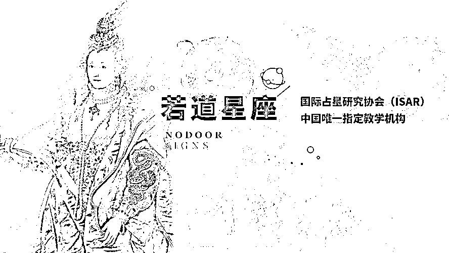

作者/编辑/翀子 ISAR 认证占星师

封面/书君 图片/网络

提到狮子座，我们总会想到引人注目、受推崇的领导力、信心满满甚至傲慢自大、骄傲并充满个性等等的形容词，很少想起它在欢庆生命之余还有什么事情可以做。而当我们深入狮子座的原型能量、神话故事、了解与狮子有关的艺术形象，便看到一条从“兽性”到“神性”的生命燃烧之路。

狮子，被称作“万兽之王”。想想电影《狮子王》中的第一幕，动物们从非洲大草原各地如“朝拜”般，来到荣耀石下，庆贺小王子辛巴的诞生。当充满智慧的老山魈——拉飞奇为小辛巴举行洗礼并将它高高举起，太阳的耀眼光芒照射在辛巴身上。荣耀石下，万兽欢腾。

这是描绘狮子座的生动画面。光芒四射中闪亮登场，他们**欢庆人间一趟，直视太阳**；荣耀、皇冠、宝座，他们是**慷慨的统治者**，彰显“舍我其谁”的**王者风范**；他们张扬生命的热度，付诸**温暖、勇敢与力量**，相信自己的独一无二。在人生的舞台上，他们享受自己的表演，更欢喜于观众的夸赞。大概没有什么星座比狮子座更懂得**“众星捧月”带来的满足感**，而他们也是“夸夸群”里最受益的那个，是“鼓励教育”的推崇者。

狮子座既让人看到尽情生活的明亮样子，也让人看到，这股熊熊燃烧的“生命之火”需要不断添柴加火，才能持续的温暖自己、照耀他人。而这动力源自哪里？“生命之火”为谁而烧？狮子座的路在何方？嗯，这是好问题。

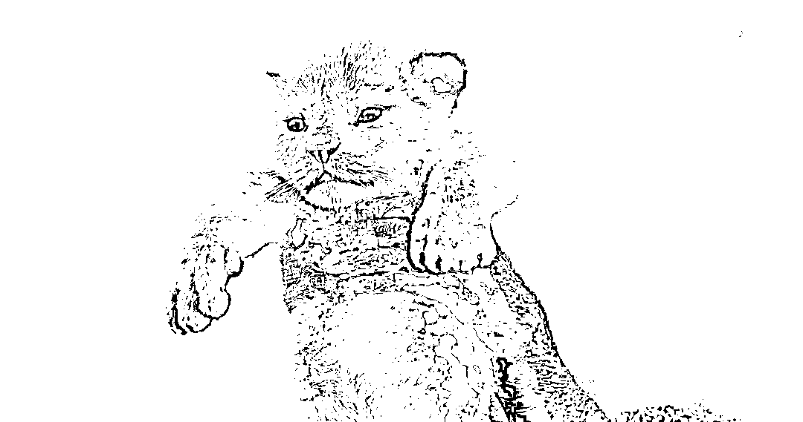

**真我的熊熊火焰**

**火元素**与精神能量的**动力**有关，它是**向外的、张扬的、肆意展现的**。当你观察火时，形态时刻变化的火苗如同跳着欢乐的舞姿，添柴时火焰发出噼里啪啦的声响，好似开心的歌唱。火焰驱散黑夜的寒冷、隐藏的危险，当围绕着它，它的温度让人敞开心扉，让人把酒言欢，让人回到简单快乐不加掩饰的真实自我。

三个火象星座里，**如果白羊座代表了星星之火，那狮子座就是熊熊燃烧的火焰，而射手座便是那燎原之火。**

在**白羊座**的阶段，我们如新生般对周围的一切充满好奇与试探。我们愿意挑战、冲锋到未知世界，确立花花世界中的“我”到底是芸芸众生里的谁；到了**狮子座**的阶段，我们“阅尽千帆”后知了“我是谁”，表达并创造“我”的延伸，统领“我”的王国；直至**射手座**的阶段，“王国”开始扩张，声名显赫，“我的延伸”到达更远的地方。**如果做个比喻，白羊座、狮子座和射手座的感觉就像祖孙三代——“我”、“我的孩子们”、开枝散叶的大家族。**

“我”的确立、表达与扩张，和生命之火彼此相应。而狮子座，就是那个**真实表达个体独特性、绽放熊熊火焰**的能量模式。

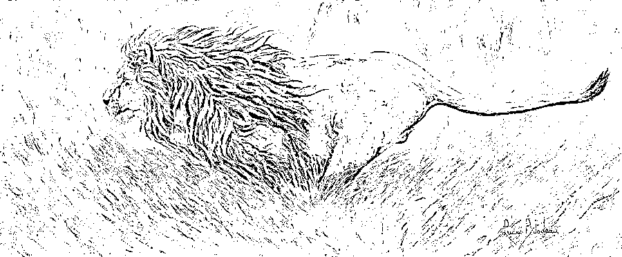

**耀眼如日，力量之心**

在很多地方的文化中，狮子都和太阳联系在一起。太阳被人们奉为至尊力量，它的光芒让所有事物成长兴旺。**万兽之王与太阳系之王，狮子和太阳，就这样彼此相映。**共同作为“中心”的象征符号，当健康表达出自己的能量，它们便是散发光和热、欢庆生命的创造力、并用王者之力惠及国土的统治者。

对狮子座来说，**生命是用来展现、创造和表达的**。相信自己是发光发热的太阳，他们用创造性或戏剧化的方式表达自己，拥有激励别人热爱生命的潜能。金黄色的鬃毛被风吹动，我就是王者，是独一无二的火热生命。站上舞台，中央灯光亮起，照在身上。**这是我的表演时间。**

**举个例子**

阿尔丰斯·穆夏出生于 1860 年 7 月 24 日，出生星图上拥有显著的狮子座能量（太阳、水星、木星、土星、月亮南交点都在狮子座）。穆夏是十九世纪末法国最当红的艺术家，他给女演员沙拉·伯恩哈特绘制的一系列戏剧人物海报使他一炮走红。他拥有旺盛的创作力，用巴洛克、洛可可艺术的细致而富于肉感的线条绘制人物，用拜占庭艺术华美的色彩和几何图形装饰效果。

穆夏的作品华丽，享乐主义色彩突出，作品类型遍及戏剧海报、产品广告、菜单、明信片、年历等等，当时被《纽约时报》评价为最好的装饰艺术大师。

穆夏曾说：“**在舞台上，演员是最重要的，其他无用的东西（例如舞台道具）会分散观众的注意力。**”穆夏不仅在作品中凸显演员的重要性，他自己更是家喻户晓的明星艺术家，同时还是新艺术运动的领军人物。其作品成为该艺术运动的缩影，遍布大街小巷和人们的家里。穆夏建造了自己的装饰艺术王国，是时尚广告界耀眼的太阳。

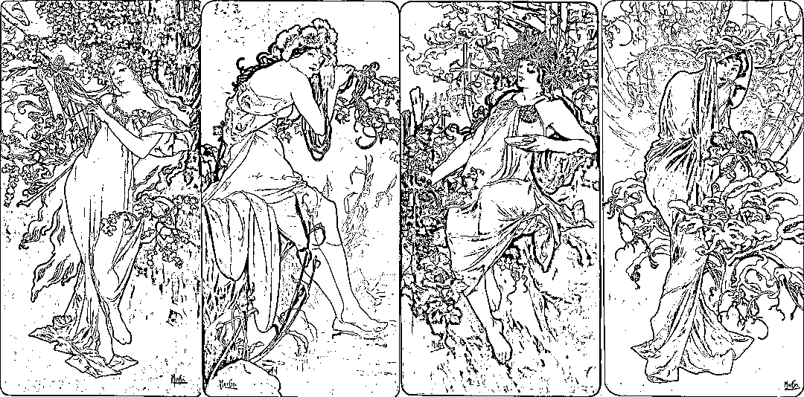

**| **四联画《春夏秋冬》，穆夏，1896 年。

然而，炫目的“花架子”可不是狮子座立足的方式，**耀眼背后靠坚定稳固的力量支撑。**作为太阳系的中心，太阳的质量是星系总质量的 99.86%，内部不停的核聚变产生巨大能量，向外放射出光与热，成为生命的创造者；而狮子也不仅凭一圈威严的鬃毛就戴上王冠，它身处草原食物链的顶端，自然是力量强大的猎食者。**没有坚实的能量、自信的定力、勇敢的精神，英雄无法统领江湖。**

**人们对力量和勇敢的向往体现在希腊神话中大力士赫拉克勒斯的故事里。**赫拉克勒斯被认为是古希腊神话中最伟大的英雄，他征服尼米亚猛狮的任务最为著名。刀枪不入的巨狮凶残贪暴，赫拉克勒斯用弓箭、刀剑和棍棒皆无法伤它，直到近身搏斗才让巨狮死去。赫拉克勒斯用狮子锋利的爪子剥掉它的皮，制作盔甲穿在身上，成为力量和勇气的化身。而这头死去的凶猛尼米亚巨狮，被升上天空，成为狮子座。

在这个神话里，人们尊崇战胜巨狮的大力英雄。巨狮的力量、威严和勇猛也成为赫拉克勒斯的象征，这位大力士经过一系列考验，最终升上天界进入神位。

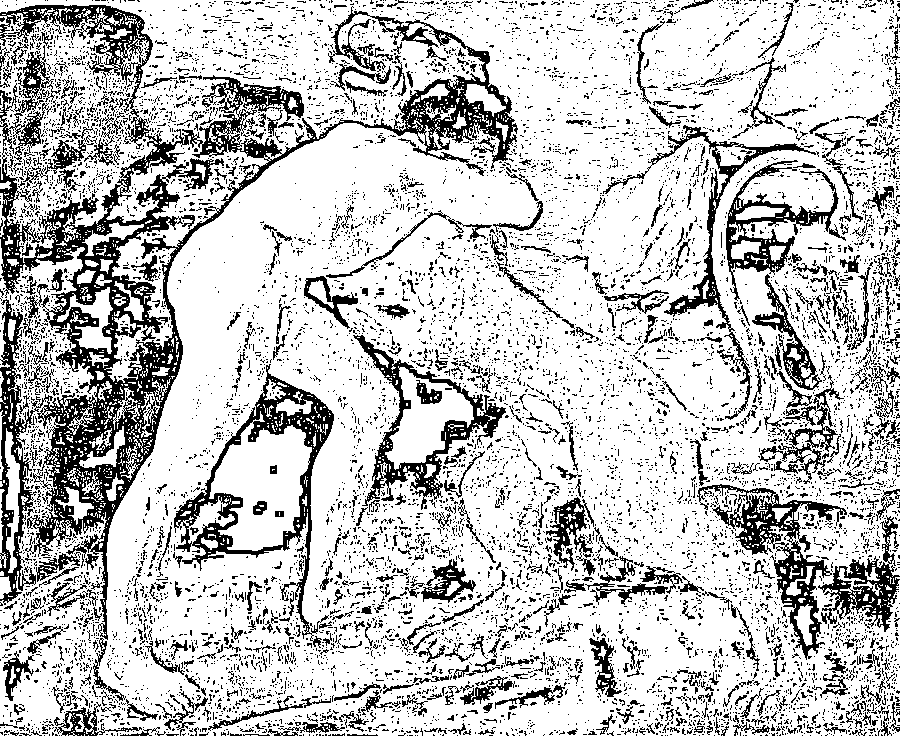

**| **《赫拉克勒斯与尼米亚猛狮搏斗》，苏巴朗，1634 年。

**“唯我独尊”的本能**

在狮子座的意识里，王者力量散发出的光芒，照耀脚下的每寸土地，**而他们，就是那个王****，****照拂每个忠心的臣民并以慷慨大度待之****。**

**勇敢、决心、力量、王权**，因为这些特质，**不少王族、国家和重要机构都会选择狮子作为自己的表征**，比如挪威的徽章上描绘了带着王冠、手握斧头的狮子，象征力量、正义及皇室；英国查尔斯王子纹章上的持护兽有象征勇气的狮子；剑桥大学的徽章上也有四只直行并侧身直视的狮子（象征决心）。

但这其中存有一些微妙的玄机，它已经从赫拉克勒斯和巨狮的故事中透露出来。**赫拉克勒斯用最原始的方式搏斗，这其实是原始动物本能的象征。**

狮子座是 12 星座里的**野性四足动物星座**。动物既是单纯本真的存在，让人类看到生命的力量，但同时也受到**局限**，它们**被本能欲望驱动**，以个体生存为最高利益。目光所及，“我是最靓的仔”，“我”是王国的太阳；世界以“我”为圆心、以“我”关注和表达的事情为半径，画圆。

**“唯我独尊”，成为狮子座的阴影。**

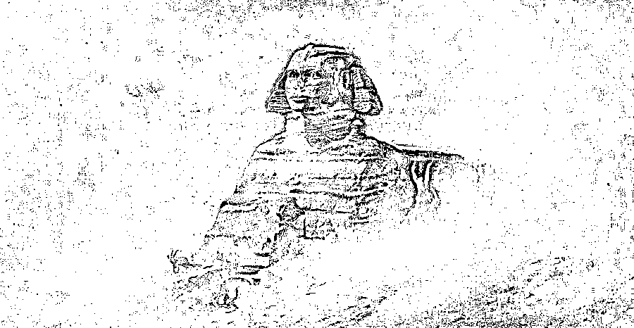

**“唯我独尊”的破坏力**

古埃及神话中的狮神塞赫麦特（Sekhmet）是一位太阳神，有时也被称作太阳神拉(Ra)的女儿。她头上顶一个太阳圆盘，象征着王权，而塞赫麦特的名字来自古埃及词"sekhem"，意思是"强大有力"。

而这些并不是全部。狮神塞赫麦特是**嗜血的战神**，被古埃及人公认为**最凶猛的猎手**。塞赫麦特带着一条会吐火的眼镜蛇，以火箭袭击敌人，身躯充满正午的阳光光芒。

当人们崇尚的勇气、决心和力量被正向发挥，我们看到光环中的君主风姿；而**当它被不健康的表达，“自我中心”的倾向使得狮子们无法接受这个世界上有除自己以外的“太阳”。**“我”就是世界的中心，他人的闪耀光芒让他们变身为气急败坏的暴君。

想想“唯我独尊”的破坏力吧。当人们被过度鼓励表达个性，人际间的冲突变得不那么容易解决；当每个国家都只强调自己至高无上的利益、罔顾他国立场，我们看到“退群”不断的分裂的国际关系；当人类把自己当做地球的“王”，伴随科技和社会发展的，是自然生态的破坏和物种的消亡；当地球被认为是银河系唯一拥有“高智慧生命”的星球，这份强大的自信又会带来什么呢？

当狮子用独特的动物本能处世，它可以依靠强健的身躯、威严的仪态、充满勇气的力量牢牢握住王权，可以就此享受生命的热情与欢乐。**但它同时还拥有一条通往智慧的神圣之路，在路的那头，是超越本能的启蒙之光。**

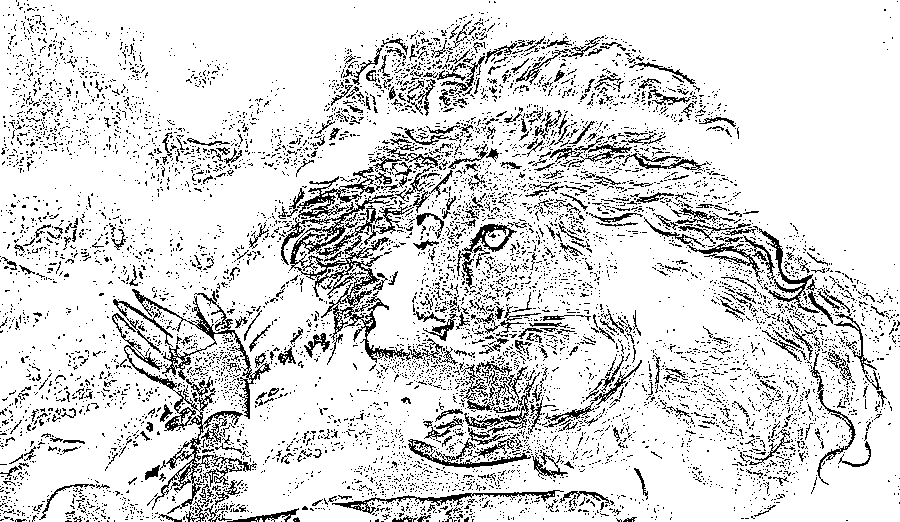

**超越之路：启蒙之光**

人们如此欣赏自己的头脑，不会满足于仅仅是用来欢庆的生命旅程。对狮子座而言，**做国王和英雄的时间久了，疲惫和孤独在所难免。**电影中的超级英雄虽然风光，单打独斗毕竟势单力薄。

当我们说到一个星座的进化之路时，总会提到与其相距 180 度的对立星座，它们即相异又相似，排斥又相容，彼此是对方变得更加完整圆融的觉知对象。

**水瓶座是狮子座的对立星座**，它关注超越肉体的智慧层面，在意自由和平等；它相信个体皆独特，却不信奉个人英雄主义；它和狮子座皆喜“去伪存真”，但它从头脑出发，而狮子座由本性而生；它追求造福社群的革新思想与技术的实现，而不仅仅满足于欢乐的现世生活。

**当把头脑与心脏联通，将超越动物本能的智慧和欢庆生命的热情连接起来，四足野兽狮子座便插上了翅膀，迈向转化之路。**

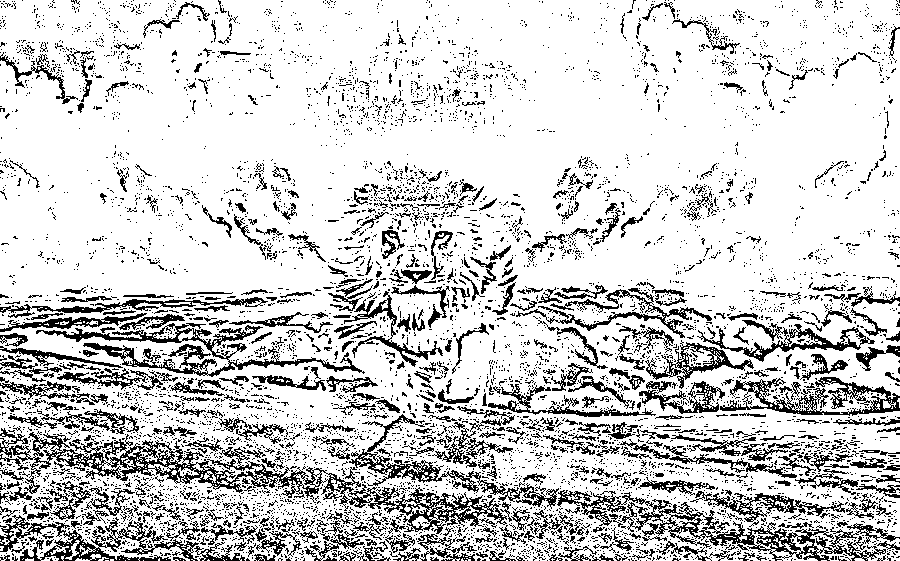

**我在装饰设计作品中并没有获得真正的满足。我看到我的道路在其他地方，其他更高的地方。我一直在寻找将光传播到最遥远的角落去的方法。**

**——阿尔丰斯·穆夏**

**穆夏出生星图上的月亮北交点在水瓶座。**月亮北交点是让我们感到人生有成就感的方向，狮子座能量凸显的穆夏在感受心中向往并迈步追寻的过程中，**更能感受到水瓶座能量给他带来的吸引与进化之力。**

作为商业绘画的佼佼者和新艺术运动的领军人物，他并不满足于这份荣耀与成功，**总是希望能够创作一些真正代表自身意识的严肃作品。**穆夏在生命晚期用全部精力、历经十六年绘制了展现自己民族——斯拉夫民族历史的大型组画《斯拉夫史诗》，并将其捐献给自己的国家，保存这份“斯拉夫民族的历史”。

**我创作的目的是要创造，创建一座桥梁，因为我们必须心怀这样的希望，只有我们更好地相互理解，人类才会更加团结。**

**——阿尔丰斯·穆夏**

穆夏沿着自己的生命剧本，从**顶级明星设计师**走向将自己的创作与**集体**紧紧联系在一起、**极具民族情感和理想主义的艺术家**。他后期的作品几乎和之前的艺术风格完全割裂，画面不再以年轻女性作为主角来表达世间美好，而是用各行各业各个年龄段的男女老少展现斯拉夫民族的故事及人民。

穆夏去世后被葬在布拉格郊外的维舍城堡公墓，他的身旁葬着音乐家斯美塔那和德沃夏克，两位都是捷克民族乐派的重要人物。**从表达个体生命，到为集体命运谱曲，**穆夏响应了水瓶座能量的感召，**将自己狮子座式的创作表达投入到对集体意识的唤醒中，他就像普罗米修斯，他的画作就是点燃斯拉夫之魂的火把。**

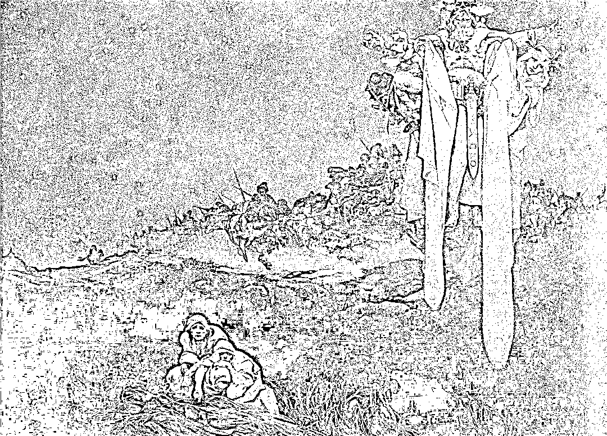

****| ****斯拉夫史诗一《故乡的斯拉夫人》，穆夏，1912 年。

**从兽性到神性：整合智慧与心性**

**当太阳代表热源，它象征热情的生命力，当它代表光源，则是启蒙的象征。**狮子座的光芒不仅为生命歌唱，更照耀天空。如果我们回溯一些久远的狮子形象，会发现，**狮子不仅承载权力和荣耀，更是与高层智慧的连接之物。**

埃及金字塔旁的人面狮身像，既象征太阳的力量与法老王的威严，也为神圣道路做指引；希腊神话中残暴的人面狮身有翼兽斯芬克斯，当你拥有智慧猜中谜底，就能战胜它；炼金术中，吞食太阳的狮子象征了炼金过程的最后成果，即转化成金；狮子还是象征大智慧的文殊菩萨的坐骑，同时也是佛陀所属释迦族的徽章。

在过去很多的绘画和雕塑中，常出现**长着翅膀的狮子形象**，它是智力、力量和勇气的结合。狮子象征热烈跳动的心脏，是物质身体的核心，**当它与超越动物本能的智慧（翅膀）相连，便得以超越小我的局限。**

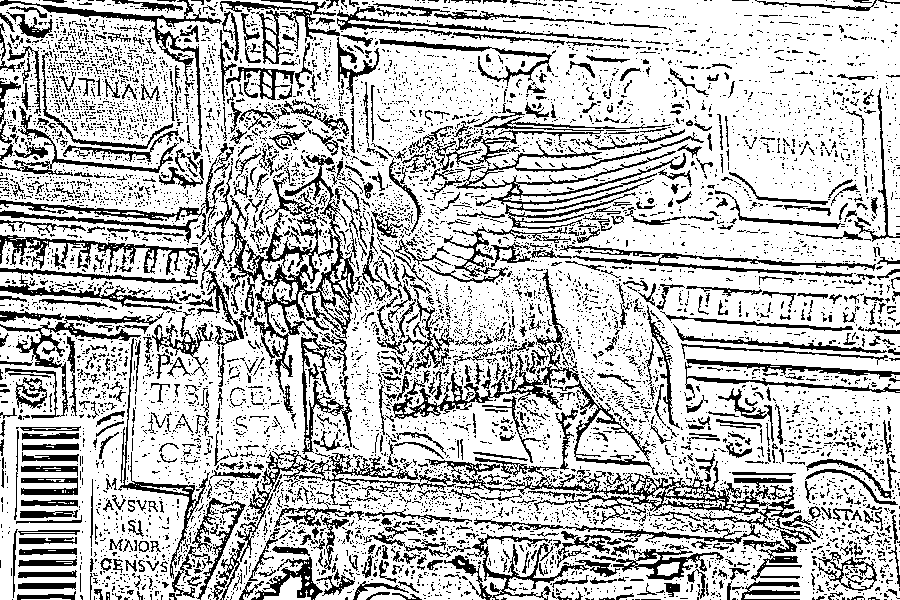

电影《狮子王》中有这样一组对白：

辛巴：“我觉得国王可以做任何他想做的事。”木法沙：“做国王不止这些，**不能单凭勇气**。你所见到的事物，都存在一种非常微妙的平衡关系。作为国王，**你要懂得这种平衡并尊重所有生物，**不管是蚂蚁还是羚羊。”

“普天之下，莫非王土”，它的意思并不是说天下土地为王权私有，而是指**天子无私财，以天下为家**。对狮子座而言，这句话是非常贴切的提醒。作为一个国王，当然可以酣畅淋漓自信满满的歌颂生命荣光，也能凭借勇敢与决心令天下赞扬。**而更有力量的睿智的狮子座，则会去实践“普天之下，莫非王土”的真谛。**

狮子座的生命之火为谁烧？为独特的自己，为共命运的众人，为耀眼的启蒙之光。

**版权声明**：原创文章由作者授权首发于若道平台，欢迎转发，反对抄袭。友号转载请申请白名单。

翀子

ISAR 认证占星师（2019 年获得）

若道 2019 届核心课程毕业生，若道微信公众号兼职编辑

**咨询微信**：carolinemichong

**微信公众号**：LumosTrueSelf

长按打赏

**系统学习占星学**

**点击图片了解详情**

**微信又双叒叕改版啦，不想错过若道君的推送？**

**就把若道设为星标吧！**

**▼**

就是这个“在看”，戳戳戳 ☟

********报名直达入口********

# 雷蒙德·梅里曼金融占星周运 | 准备迎接另一轮动荡的开始

> 原文：[`mp.weixin.qq.com/s?__biz=MzA5NjA0NTAxNg==&mid=2651423162&idx=2&sn=9cb492da79c698c636ab11bd4d56bda4&chksm=8b4b330dbc3cba1b88cb781c4107fbc1b7a46bf45c02554a76b514f809c6f9c6090a34dfd9f8&scene=126&sessionid=1692738131#rd`](http://mp.weixin.qq.com/s?__biz=MzA5NjA0NTAxNg==&mid=2651423162&idx=2&sn=9cb492da79c698c636ab11bd4d56bda4&chksm=8b4b330dbc3cba1b88cb781c4107fbc1b7a46bf45c02554a76b514f809c6f9c6090a34dfd9f8&scene=126&sessionid=1692738131#rd)

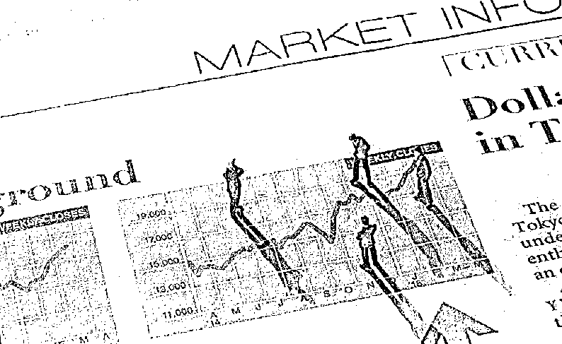

作者/雷蒙德·梅里曼
译者/李含编辑/玫瑰 图片/全景网雷蒙德·梅里曼是在金融占星学界稳坐第一把交椅的占星师，同时他也是若道签约的金融占星课老师，我们引进了雷蒙德·梅里曼老师的《[上证指数月度报告](http://mp.weixin.qq.com/s?__biz=MzA5NjA0NTAxNg==&mid=2651420649&idx=3&sn=3f72270900ccc4da00ce69fa18dde5ab&chksm=8b4bc55ebc3c4c48d50c0c422f18698684a51ef314b79aae1ae58ca80f70fe4149188e1fdbbc&scene=21#wechat_redirect)》《[黄金周期月度报告](http://mp.weixin.qq.com/s?__biz=MzA5NjA0NTAxNg==&mid=2651422728&idx=2&sn=5e41d5bf3527772f19ca7a774eb984a2&chksm=8b4b32bfbc3cbba96679ac4b41485a34f838242408e52aa7626f837a39b7084a74eea73f500c&scene=21#wechat_redirect)》《[2020 年金融预报](http://mp.weixin.qq.com/s?__biz=MzA5NjA0NTAxNg==&mid=2651414279&idx=2&sn=cc131aa367c4ada15e35d0d80b308415&chksm=8b4bedb0bc3c64a6ef98c0e86ba3d842d8368de2b90e623af1d3870d521049ce352732c8d091&scene=21#wechat_redirect)》。我们经老师的授权，将每周刊登梅里曼老师的周运，供大家参考和学习。于是，这是本周的周运（7.27-7.31）。**说明：以下时间采用纽约证券交易所所在地美国东部标准时间。**
**展望与回顾**

**白银价格刚刚创下 2008 年雷曼兄弟破产以来的最大单周涨幅，但金价的小幅上涨在很大程度上掩盖了这一上涨的势头。在过去的一周里，白银上涨了 20%，至每盎司 23 美元，较 3 月时 12 美元的低点上涨了 94%以上。**

**——乔纳森·加伯**

**《白银价格涨幅超过黄金》**

**www.foxbusnessnews.com**

**2020 年 7 月 24 日**

**因此，默认的做法是继续推行这样一种观点，即今年秋天入主白宫和参议院会议的方式是加入民主党人的支出马拉松竞赛。事实上，保守派选民对华盛顿的援助法案对资产负债表和私营经济基础造成的持久损害越来越不满……佩洛西女士一直以来在交易艺术方面对姆努钦先生的传授无懈可击，那么令人费解的是，究竟是谁在白宫一直授权努钦先生担任国会特使呢？**

**——金伯利·A.·斯特拉塞尔**

**《姆努钦的愚蠢行径》**

**《华尔街日报》**

**2020 年 7 月 24 日**

7 月 14-20 日，太阳与“摩羯座星群”木星、冥王星和土星形成三重对分相，导致贵金属价格飙升至多年新高。同时，这一征象可能也对应着全球一些股指可能出现周期高点，此后，许多股指开始下跌。除了贵金属飙升和全球股市停滞之外，参与这场大震荡的还有，美元继续下跌至年内新低，而欧元汇率则创下年内新高。**投资者心理的根本性转变又开始了，这是土星在 2020 年 7 月 1 日返回摩羯座所传递的信息，它与木星和冥王星一起组成了 2020 年强大的“摩羯座星群”的一部分。**在土星离开摩羯座，进入水瓶座之前，这段时间里会**重新回顾、重新评估和纠正今年第一季度做出的判断和（或）决定错误**。当然，这在很大程度上与美国新型冠状病毒肺炎新增病例加速有关，美国联邦储备委员会正在筹备的大量资金，以及政府为应对疫情的经济威胁而制定的额外财政刺激措施，旨在应对这种病毒带来的经济威胁。（或者主要是为月选举争取投票？）伴随着这种“花钱马拉松”，人们又开始担忧与摩羯座在冥王星相关的债务、赤字、评级下调和违约。由于涉及木星（夸张），货币和财政问题正在失控，达到美国共和党领导下从未想象过的债务水平，这让你不禁要问：谁才是真正的掌控者？他们（或他）真的知道如何进行财政管理吗？美国能承担多少债务而不使其货币严重贬值，或至少致使目前将美元视为全球货币兑换标准的其他国家失去信心？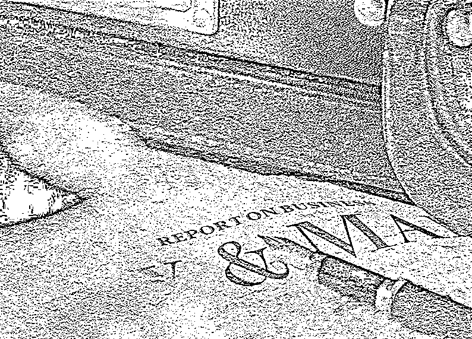让我们先回顾一下过去两周的美国股市。7 月 14-20 日，太阳与摩羯座星群形成对分相。7 月 13 日，纳斯达克指数期货再创历史新高。它在 7 月 21 日再次经受测试，事实上，现金市场创下了当时的新高，这是一个期货和现金市场出现市场间背离的例子。其他指数并未创下历史新高，但标普指数在 7 月 22 日创下基本周期新高。道琼斯工业平均指数没有，但它确实在 7 月 15 日形成了一个主要周期波峰（比基本周期小一个级别），并在 7 月 22 日再次测试了高点。它的基本周期高点仍然出现在 6 月 8 日，这是强有力的月食后的第一个交易日，也是金星逆行中点后的两个交易日。这些是地球宇宙关键反转区间中发生的市场间看跌背离的又一个例子。到上周末，这些指数中的每一个都在测试或跌破 15 日移动平均线，这一指标表明主要周期已经触顶，而且由于它已经处在基本周期的末尾，这也可能就是基本周期的波峰，正好落在这些地球宇宙学研究确定的反转时间段内。我们判断市场时机的方法是将周期研究与地球宇宙学研究以及图表和技术研究结合起来，它是有效的。这些市场背离在全球股市中都可以观察到。在欧洲，7 月 21 日，荷兰 AEX 指数、德国 DAX 指数和苏黎世 SMI 指数创下了崩盘后的新高。然后所有的指数都开始下跌，直至周五。伦敦富时指数甚至没有创下周内新高。在亚太地区，印度的 NIFTY 指数在 7 月 22 日创下了崩盘后的新高，而中国的上证指数则在 7 月 13 日形成基本周期的高点。上周，亚太地区没有其他市场创下基本周期新高。然而，重头戏发生在黄金和白银市场。自 2011 年 9 月创下历史新高以来，金价首次突破 1900，2018 年 8 月我们开始为订阅者推荐买入计划，这让我们的推荐有了亮眼的表现。仅在计划推出 1-2 天后，金价就创下了 31.33 个月周期低点 1167。白银上周飙升至 23.67，创下 2013 年 9 月以来的最高价格。所有这些牛市活动都与美元下跌有关，原因正是美国政府有问题的金融政策和意图。这的确反映出了木星和冥王星（过度负债）以及土星在摩羯座的原则。由于土星很快将再次进入水瓶座，并在明年与天王星形成一个 45 年的周期性渐亏的四分相，因此我们有理由担心政府不是由金融天才来管理的，而不是说反对党执政就会更好。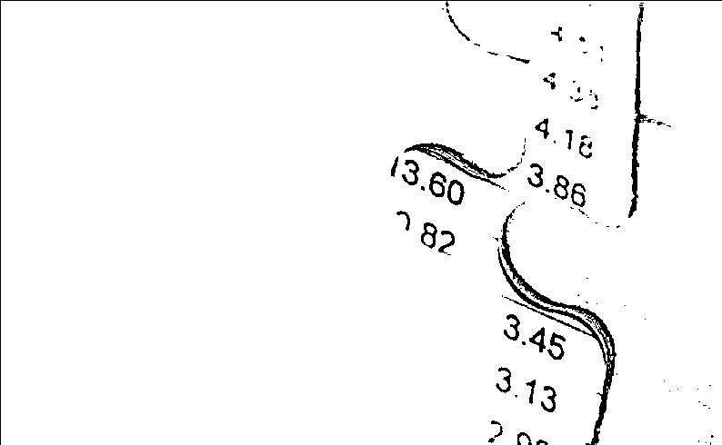**短期占星趋势和长期考量****我们目前的焦点正在转向 8 月 4 日-24 日，届时，在白羊座行进的火星将与摩羯座星群形成三轮四分相中的首次准确成相。**另外两次将在今年年底完成，这意味着**从现在起到 2020 年 12 月底，我们将回顾与社会、政治、政府、经济和健康相关的动力，这些关联着 2020 年 3 月 20-31 日开始的火星合会周期。**这是**歇斯底里症的顶峰，**因为人们意识到新型冠状病毒肺炎疫情是一个看不见的敌人，它不容易被制服，它会摧毁我们的生活方式，无论是真实的、想象的，还是被操纵的。宇宙不在乎，也不评判。它只是报告正在人类活动周期中发生的事情。它表明，这股相同的力量卷土重来，而且可能会持续到今年年底。如果情况与 3 月下旬类似（地球宇宙学认为是这样），那么**金融市场可能会再次被搅动，价格很可能会大幅波动。**今年余下的时间里，更让人感兴趣的是，火星与木星、冥王星和土星的这一系列困难相位也将触发纽约证券交易所创建星图中的木星-海王星合相，对分处于基本星座同一度数的土星，特别是在 8 月 3 日-12 日时。届时，它将与纽约证券交易所的创建星图形成基本星座大十字。它也会触发美国建国星图、美联储成立星图以及杰罗姆·鲍威尔、彼得·纳瓦罗和唐纳德·特朗普的出生星图中类似的行星模式。如果你喜欢采取行动，这也许不错。如果你希望安全，如果你没有意识到宇宙中的周期和人类活动的周期之间的对应关系，可能就不那么美好了。有了意识和知识，你所做出的选择可以改变你生活中既定的结果和后果。你可以选择不要粗心或冲动。你可以选择在采取行动之前三思而后行（尤其是当这个行动可能会引起他人的不良反应时），或者做出让你自己、你的社区、你的国家、地球和其他人处于危险之中的决定。每个人都应该在这个时候努力做到真实、冷静、自制，要明白什么时候做得太多了，什么时候做得还远远不够。你不必是个天才，也不必大声疾呼和大胆行事。在这样的时候，最好是**保持警惕和觉知，并训练自我控制和良好的环境管理（土星在摩羯座）和财务管理**。有了这些工具，你就可以成功地在这一波地球宇宙学征象的强大浪潮中游刃有余，这一征象将会影响今年余下的大部分时间。就个人交易而言，这些因素可能会带来丰厚的利润。不遵守这些特性可能会产生相反的效果。无论是与健康、人际关系还是财务有关，现在的机会和风险都处在高位。我不想说教。我只想让每个人都意识到天上正在发生什么。因为“……天上如是，地下亦然。”别忘了，在早晨的天空中可以看到 6000 年周期的新智彗星。这是一位信使，是一个给人类带来美与希望的天文奇迹。

**说明：以上日期基于纽约证券交易所所在的美国东部标准时间，由于存在时差，中国地区可能需要加一天。**

**版权声明：**本文由若道翻译发布，欢迎转发，反对抄袭。友号转载请申请白名单。

**雷蒙德·梅里曼（Raymond Merriman）**

若道签约老师。著名金融占星师，ISAR（国际占星研究协会）前主席，梅里曼市场分析公司的总裁。他由于“提升了占星学的职业形象”，在 1995 年国际占星大会上被授予轩辕十四奖；在 2012 年国际占星大会上，被授予轩辕十四终身成就奖。

1“中国上证指数月度报告”发售

**若道推出了****中文版****的雷蒙德·梅里曼中国上证指数月度报告，并持续发行该报告！**

当把金融市场的周期和占星学的周期相结合时，雷蒙德·梅里曼老师的金融占星学研究**为投资者应对金融市场的周期波动，并随之调整投资策略提供了极大的价值参考**。

****8 月中英文报告将于本周上线！****

2“黄金价格周期月度报告”发售

**若道推出****中文版****的雷蒙德·梅里曼黄金价格周期月度报告！**不仅仅为广大读者在中国股市的投资出谋划策，更将视角放眼黄金市场。

**每当世界经济形式不明朗的时候，有一个地方是保值的港湾，那就是****黄金**。从 2018 年 8 月开始，黄金已经用自己的升值再次提醒众人它在经济不稳定时的位置。**截至目前，2019 年 8 月底，黄金已飙升至 6 年新高，高于 1565 美元。**

自 1982 年雷蒙德·梅里曼出版第一本研究《地球宇宙学征象与黄金价格的关联》的著作以来，**他一直作为最重要的黄金市场时机预测者之一享誉国际**。

过去 1 年，那些订阅并遵循建议的梅里曼市场时机学院日报和周报的订阅者，如果从 2018 年 8 月 16 日的低点或 8 月 23-24 日的次低点购买黄金，他们已经赚到了不少的 30%左右的利润。

**8 月中英文报告均已更新！**

**购买套餐**，买得越多越优惠

中国上证指数月度报告套餐价

*   **单月报告**：280 元

*   **3 个月套餐**：780 元（260 元/月）

*   **12 个月套餐价**：1999 元（166 元/月）

**长按下图识别二维码**

**购买金融报告****套餐**

**▼**

黄金周期月度报告优惠

*   **双报告年度套餐更优惠（直降 899 元）**
*   **12 个月黄金报告+12 个月上证指数报告：仅需 3500**

**长按下图识别二维码购买黄金报告套餐**

▼

32020 年金融预报 1976 年以来，由雷蒙德·梅里曼撰写的梅里曼市场时机学院每年一次的年度预报沙龙和每年一本的《年度预报》一直在应用占星学原理为投资者们服务。2018 年，若道第一次将这份广受赞誉的一年一度的金融占星报告和沙龙引入中国，供中国投资者参考。**《2020 年金融预报》将会谈及 2020 年重要的宇宙天象及其对世界经济、贸易形势的整体影响，还将覆盖中国上证股票市场的分析、黄金白银市场、美国经济、美国总统、美联储、美国国债市场、美国股票市场、主要外汇货币市场（主要外汇美元、英镑、欧元、日元、瑞士法郎）、原油市场、谷物市场、活牛市场、比特币市场等投资市场。**梅里曼老师及梅里曼市场时机学院的金融占星分析师还会给出以上市场 2020 年的**市场价格目标区间及重要价格反转日**，为短期、中期和长期投资者进行市场操作的时机提供参考。如果你关注世界经济和金融投资市场的变化，会发现梅里曼《金融年度预报》中的研究对于你了解世界经济在发生什么，这些市场的走向会如何有非同寻常的指导价值。为了让更多人从这个讲座和报告中获益，我们特意免费提供沙龙**讲座前 30 分钟试看（免费放大）**，你可以先试看，然后再决定是否购买整体报告及沙龙。如何安然度过这场危机？如何明智地投资，让自己安然度过这个充满挑战的一年，甚至获得丰厚收益？我们相信 2020 年度金融预报沙龙和报告套餐组合会给你远高于其价格的回报。**30 分钟免费试看**获取路径参见如下指引：①请扫描下图二维码，下载若道 app **②** 登录若道 APP 首页-金融报告-《2020 年金融预报》讲座视频——免费试看，即刻免费试看 30 分钟的讲座视频。

报告和讲座价格

2020 年金融预报讲座和报告价格整体售价** 1280 元**

（本讲座和报告不单独出售）

**长按下图识别二维码购买 2020 年金融预报**

▼

******点击阅读原文购买金融报告******

# 插班中丨核心课程 L3，教你掌握综合星图解读

> 原文：[`mp.weixin.qq.com/s?__biz=MzA5NjA0NTAxNg==&mid=2651423162&idx=3&sn=f9f093ea629b6658d7dec78972167c6f&chksm=8b4b330dbc3cba1be425e48c76e5e852c4fa638967daa7954adc455e96de1d04f9c7562d9352&scene=126&sessionid=1692738131#rd`](http://mp.weixin.qq.com/s?__biz=MzA5NjA0NTAxNg==&mid=2651423162&idx=3&sn=f9f093ea629b6658d7dec78972167c6f&chksm=8b4b330dbc3cba1be425e48c76e5e852c4fa638967daa7954adc455e96de1d04f9c7562d9352&scene=126&sessionid=1692738131#rd)

**Level3 也是占星学习的一个整合区和分水岭****若道君给大家准备了一份专业的占星测试：“2020 若道核心课 L3 入学测试”****测试内容包括：**

**适合参加测试的学员：**

**L1-2 结课学员**

**有一定占星基础的自学学员**

**准备考 ISAR 的学员**

**扫码开始测试吧**

**测试会由若道专业助教免费阅卷，答题后添加课程顾问 Maggie（微信号：NodoorMaggie）获得测试成绩**

**1**

**占星学除了自我修炼，市场需求如何？**

**通过占星学习你帮助了自己，也可以选择成为自助助人的占星师，开启受益终生的第二事业。**一方面，社会快速发展人们压力山大，抚慰心灵的咨询市场需求巨大。另一方面，市场鱼龙混杂，真正学院派的严肃占星从业者十分稀缺。最重要的，**占星学能让你自己帮助自己，无论你是否进行占星咨询从业，学习了占星学，它都将是终身陪伴你成长的睿智好伙伴。**

**2**

**你的占星核心课老师是谁？**

 拥有**50**年占星研究积淀**44**年职业占星实践**41**年占星教学经验的**若道联合创始人****2017-2020 年曾任 ISAR 全球副主席****2020 至今为****CAPISAR（全球职业占星师资质认证考试委员会）主席****大卫·瑞雷**&**最懂学员的若道首位认证金牌中国老师****熊鹰**师徒二人合力打造
**2020 年若道****全新核心占星课程**

**3**

**L3 阶，我们要学习什么？**

**第 3 阶 ****宫位、相位以及初步解读星图（15 次课） ****❶** **12 宫位****人生中重要的领域，不止 12 个，更是 12 类。****❷ 组合解读****行星、星座与宫位的组合解读。万丈高楼平地起，这是占星解读的基本功。****❸ 相位****不仅是常规的相位：合相、对分相、三分相、四分相……还有这些更为细致的知识：**相位计算入相位与出相位星座外的相位相位解读盈亏相位相位的优先级大卫老师案例课**❹ 宫主星与定位星****“联结”是宇宙的基本法则之一。除了相位，还有哪些方式让行星能量联结起来？**宫主星定位星与定位链大卫老师案例课**❺ 月亮交点专题****月亮交点是占星解读的另一个入手角度，这里会深入教你解读月亮交点，及其相位与定位星。**月亮交点的解法大卫老师案例课**❻ 相位模式：****那些坊间赋予神秘意义的占星格局：大三角、大十字、T 三角……究竟该如何解读其相位模式。**主要的七种相位模式星图中没有相位模式的情况大卫老师案例课**❼ “空”不等于“没有”：****星图中那些容易被忽视的地方：**无托勒密相位（俗称空相）一些特殊位置星图布局大卫老师案例课**第 3 阶课程安排****❶** 15 次线上直播网络课程，每次 2 小时，课程中依旧会使用同学们的星图作示范**❷** 10 节课由熊鹰老师教授，重点通过名人星图阐释知识点**❸** 5 节课由大卫·瑞雷老师教授，重点通过学员星图阐释知识点**❹** 熊鹰老师会指导练习，答疑解惑，学练结合**❺** 重点在于如何根据星图去问问题，着重自我发现和自我探索的过程 

| **时间** | **课程** |
| 2020 年 7 月 2 日 | 宫位、行星和星座组合 |
| 2020 年 7 月 9 日 | 宫位、行星和星座组合 |
| 2020 年 7 月 16 日 | 月亮交点 |
| 2020 年 7 月 23 日 | 月亮交点和演示案例 |
| 2020 年 7 月 30 日 | 相位 |
| 2020 年 8 月 6 日 | 相位、星座、行星和宫位 |
| 2020 年 8 月 13 日 | 相位、星座、行星和宫位的同学案例 |
| 2020 年 8 月 20 日 | 渐盈相位和渐亏相位，示例 |
| 2020 年 8 月 27 日 | 更多的关于宫位和宫主星 |
| 2020 年 9 月 3 日 | 同学案例 |
| 2020 年 9 月 17 日 | 空相行星和定位星 |
| 2020 年 9 月 24 日 | 宫主星 |
| 2020 年 10 月 15 日 | 优先级和组织 |
| 2020 年 10 月 22 日 | 相位模式以及范例 |
| 2020 年 10 月 29 日 | 学员星图解读范例 |

**截至 2020 年 7 月 27 日，课程第 1-4 讲为录播课程（限视频回放），其余均为网络直播课。**

**4**

**这两位优秀的占星学老师是谁？**

**大卫·瑞雷（David Railey）**

*   **曾任 ISAR 全球副主席，2020 至今为 CAPISAR（全球职业占星师资质认证考试委员会）主席，若道联合创始人；** 

*   1976 年，通过亚特兰大职业占星师考试，成为全职占星师，随后通过**AFAN 和 ISAR 职业测试；** 

*   1980 年，与**杰夫·焦耳**一起在亚特兰大创建**“每日星球”**占星学中心。此后在亚特兰大占星协会担任 4 年考官，并且两次担任**亚特兰大地区占星协会主席**。1979-1992 年，作为占星师活跃于美国社会媒体，向不了解现代占星学变化的大众宣传专业占星学知识。在 1989-1992 年期间，他在 WRGG 电台 12 频道每周主持个人电视秀**“今日占星学”**，早先他还在 WRFG 的广播节目中播讲宇宙天气节目；

*   2010-2014 年，任**全美占星师联盟监督委员会委员**； 

*   2010 年，其著作**《灵魂的目标》**中国版出版，和蒋颖一起创办**若道占星**学校和其官网 www.nodoor.com。从该年开始，他工作并往返于亚特兰大和北京。目前他 80%的时间致力于在中国教授和推广西方占星学； 

*   2017 年，被选为**ISAR 委员会成员**（2017）。ISAR 是世界最大的国际占星机构，会员遍布 45 个国家，2017-2020 年曾任 ISAR 全球副主席； 

*   2020 年，被推举为**CAPISAR（全球职业占星师资质认证考试委员会）主席**。

**熊鹰老师（天空的空）**

*   2008 年接触严肃占星学，至此爱不释手； 
*   **2013 年师从大卫·瑞雷**，研习整套现代占星学核心课程，并于 2014 年起至今连续三年担任该课程的主助教； 
*   期间也**跟随格伦·佩里、诺·泰尔、理查德·塔纳斯、罗伯特·汉德、苏·汤普金斯、斯蒂芬·弗里斯特等多位国际顶尖占星大师进行学习**，进行定向占星主题研究； 
*   2015 年初，通过国际占星研究协会**（ISAR）资质认证并获得证书**。同年，进一步跟随大卫·瑞雷老师进修**“生时校正”**技术，通过最终考核并获得证书； 
*   目前在若道星文化任职，将传播系统、严谨、真实的占星学作为职业使命。任专职助教期间，进行沙龙与答疑等辅助教学工作已累计超过 200 小时；
*   在业余期间也提供占星咨询与生时校正服务。目前正致力于占星学与个人成长的整合。

**5**

**什么人适合这门课？**

*   对占星学有浓厚兴趣，想要系统学习占星学
*   对占星学有一定基础，但不知道该如何整合星图复杂的碎片
*   希望成为优秀的占星师，想要借鉴国际大师解读思路并融入自己的体系
*   想学习占星学，但不擅长英文，希望有中文老师授课
*   想结合占星学理论与咨询实践
*   大卫·瑞雷、熊鹰的忠粉，学过占星，但就是想跟着偶像再学一遍
*   走在自我探索和个人成长道路上的人

**6**

**课程费用**

 **★ L3****课程费用：10000 元****更多价格优惠请咨询客服**

**7**

**退转课程**

**退款原则请详看《教学协议》，如有疑问请咨询课程顾问。******核心课程 Level 3****

**授课老师：大卫·瑞雷 熊鹰**

**授课时间：****2020 年 7 月 2 日-2020 年 10 月 29 日**

**授课方式：**网络课程：英文授课，中文翻译

**费用：10000 元；**更多优惠请咨询客服

**课程负责人：Maggie（微信号：NodoorMaggie）**请备注“L3”

长按二维码添加课程负责人咨询~

****报名请点击“阅读原文”****

# 神奇的顺势药物 | 以毒攻毒的白砷，另一个名字你一定知道

> 原文：[`mp.weixin.qq.com/s?__biz=MzA5NjA0NTAxNg==&mid=2651423092&idx=2&sn=2e1901d539a42c63cb3d1078fee2a654&chksm=8b4b33c3bc3cbad57b1aacec85e446a35a50ecaada5d235cab4bbfbe753caaa294a23f6537ad&scene=126&sessionid=1692738131#rd`](http://mp.weixin.qq.com/s?__biz=MzA5NjA0NTAxNg==&mid=2651423092&idx=2&sn=2e1901d539a42c63cb3d1078fee2a654&chksm=8b4b33c3bc3cbad57b1aacec85e446a35a50ecaada5d235cab4bbfbe753caaa294a23f6537ad&scene=126&sessionid=1692738131#rd)

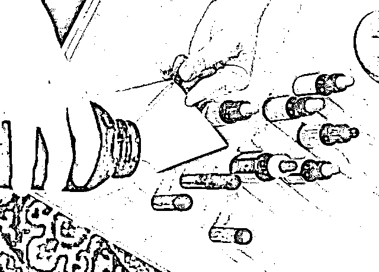

作者/若道君

 编辑/玫瑰 图片来源/网络

**若道君的话**

今天给大家先介绍的这个顺势药物是**白砷(Arsenicum)**。说到白砷，或者它的化学名三氧化二砷 As2O3，估计很多人不熟悉，但如果提到它另外一个名字——砒霜，你一定不陌生。如果再说另外一个名字，估计你会更浮想联翩——鹤顶红。

鹤顶红这么一个听上去很充满浪漫武侠气息的毒药，其实是不纯的白砷而已。**纯的白砷颜色如白色的霜，因此美其名曰“砒霜”，含有杂质的白砷颜色变成了红色，美其名曰为“鹤顶红”。**

在顺势药品中，白砷这款药虽然原料是白砷，但是已经**经过无数的稀释，和其他顺势药品一样，你不会在这款顺势药品中找到任何 As2O3 或砷的存在，因此不再具有毒性**。

白砷在顺势药品家族中是一款非常深奥而强大的药品，也是被称作**“万用药”**，因为它可以**针对体内的每一个器官和系统，可以用来治疗多种急性病和慢性病**。不过在这篇文章里，我们只能简单介绍一下。你可以先记住**白砷是治疗“食物中毒”、“呕吐腹泻”的首选药物**。

**既是剧毒物又是药物，白砷的前世今生**

**白砷是最古老的毒物之一，无臭无味，在历史上，常常被作为“毒药”被用于谋杀。**在公元前 331 年，西方就有了最早在食物饮料中下毒的记录。毒杀现象在罗马时期、中世纪、文艺复兴时期见于社会各个阶层。在中国历史上，被白砷毒死的皇帝、贵族和平民也比比皆是。

同时，在历史上，**白砷又一直作为药物被炼金术士、药剂师、医师小心翼翼地使用着**。公元 1 世纪，被视为药理学之父的希腊医生和药剂师迪奥斯科里德斯(Dioscorides)就记录了如何制取白砷，并用于药物之中。**在中国，公元 973 年宋朝人编著的《开宝本草》是最早记录小剂量白砷作为药用的书籍**。而不论西方炼金术士还是中国的炼丹术士也都提到白砷在炼金术中的作用。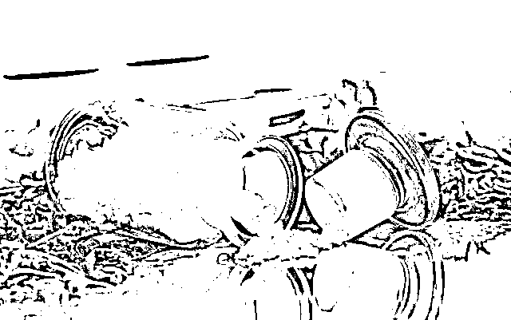顺势疗法的祖师爷哈尼曼在发现顺势疗法之前，也研究过这个毒物，他钻研法医学，针对砷的投毒反应、治疗、及司法调查进行研究，并出版了相关著作。**在东西方，都有用白砷治疗疟疾、梅毒的历史。**
**顺势疗法中的白砷，毒药也可以治愈疾病**

我们知道，**顺势疗法是根据 “同类法则”的原理，也就是说要治疗某种疾病，需要使用一种能够在健康人中产生相同症状的药剂**。 

白砷无色无臭，极易被呼吸系统、消化系统及皮肤吸收。如果让健康人服用白砷会发生什么呢？如果白砷通过食物和饮料进入体内，首先病人会出现消化系统问题，出现**灼烧感、呕吐、腹痛、腹泻带、痉挛，进而心脏血管，肝脏及肾脏发炎，血液不寻常凝结，跟随着的是指甲上出现白线及头发脱落等症状。**受害者死前会经历激烈的痛苦，而心理也处于**极度恐惧**之中，**烦躁不安、神志不清、出现妄想、害怕死亡，很需要别人陪伴在身边。**而顺势疗法的白砷这款药，就是针对这些症状的。
**在什么情况下使用白砷？**

具体而言，当发现以下症状，可以考虑白砷：

**身体状态**

**❶ 突发的呕吐腹泻**当出现**突然的呕吐、腹泻**，可以服用白砷。比如吃了不好的肉、或者变质的食物而导致上吐下泻，也可能是其他原因引起的食物中毒。**❷** **水土不服**有很多人到异地去，刚开始不适应的时候，会出现水土不服，胃不舒服，可能会**恶心、腹泻**，这个时候就可以用白砷。**❸** **胃部不适**特别是**胃部疼痛，有灼烧感**。有的是因为胃炎、胃溃疡导致的疼痛和灼烧感。也可能是因为消化不良、胃酸倒流感觉烧心。常常是胃内部灼热，但身体可能会感觉冷，**外冷内热**。**❹** **疼痛****常常是灼烧感，但遇热又感觉好转。****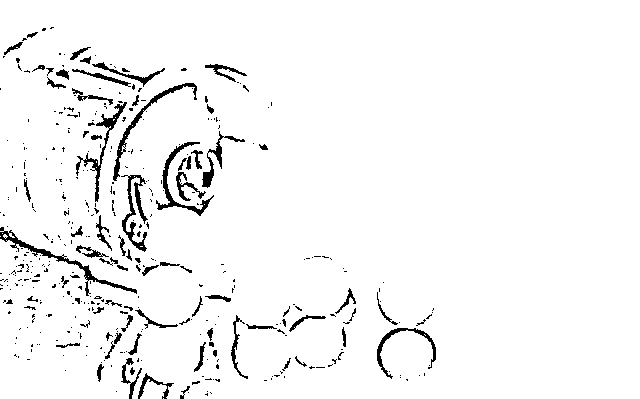**

**精神状态**

**❶** **疑病症**有疑病症的人**对于健康有很多担心，身体稍有一点不适，就害怕自己得了什么重病，尤其害怕得心脏病或癌症**；这类人甚至有些**臆想症，很容易焦虑**；可能对于饮食很挑剔，因为**害怕吃错了东西会得病。****❷** **焦虑不安**适用白砷的人常会有很**焦虑不安**的情绪，有时候会有**恐慌症发作**；经常**烦躁不安，要动来动去。** **❸** **挑剔**

适用白砷的人的性情常常**很挑剔**，**对于生活环境小的不足吹毛求疵**。他们常常**无法忍受不整洁或者无秩序**。如果你跟他外出就餐的话，你会发现他对所有事情总是在抱怨。

**❹** **渴望陪伴，害怕死亡**

他们很**需要有人陪伴**，因为他们觉得在这个世界上活着不容易，需要支持。他们也未必需要去参加社交活动，他们只是希望在身边有一个人陪着他。

**模式**

**模式在顺势疗法里是非常重要的，简单地说，看看病人在什么情形下感觉舒服一些，什么情况下会感觉病情恶化，就叫做****模式**。当顺势医生问诊时，模式是顺势医生必然要问的。让我们看看适合白砷的模式。** 以下情况下，病人感觉更舒服：**

*   热可以让病人感觉舒服，比如**喝热水、房间温暖、泡热水浴**等；
*   **有人陪伴**会让病人更舒服；
*   **出汗**会让病人感觉舒服；
*   **小口喝水**比大口喝水舒服  （你可能奇怪，这种情况也要注意？！没错，就是这些小的细节，有时候越奇怪的模式越容易诊断）；
*   **笔直而坐**更舒服；

** 以下情况下，病人感觉更不舒服：**

*   **午夜时**（半夜 12 点到凌晨 2 点）病情会恶化 ； 

*   **冷**让病人不舒服。寒冷，冷食、冷饮、冰淇淋，更感觉不舒服；

*   **吃含水量丰富的水果和蔬菜**，例如西瓜、黄瓜，不舒服；

*   **身体劳累，旅行**会更不舒服；

*   往往右侧发病，**右侧**更不舒服 （顺势中有一些药是左侧的，一些药是右侧的，这个也很有意思）；

*   另外，周期性是一个特征，比如症状可能**每夜、每周、每月或每年**出现。

**注意**因为想要让大家简单记忆理解，我们仍然用了某种药适合什么病，比如——如果出现呕吐腹泻、食物中毒，可以首先尝试白砷；但实际上，白砷并非只试用于呕吐腹泻、食物中毒；呕吐腹泻、食物中毒也并非肯定用白砷。专业的顺势医生开药是看这个人的**身心症状**，是不是白砷的症状，比如：是不是灼热疼痛？是不是焦虑不安、挑剔、有很多恐惧？是不是热的情况下更舒服，冷食冷饮会恶化等。白砷是顺势中的一个“万用药“，曾被炼金术士所用的白砷是一个深奥的药品，涵括了身心方面的许多情况，而大部分人都只会展现出全部图景的一小部分问题，这篇文章只是非常简单的介绍白砷这款药，希望大家能略微了解一点，在遇到突发的一些急性症状时，用白砷帮助自己解除病痛。请在后台回复 顺势 获得更多****关于顺势疗法内容****

**版权声明：**原创文章由作者授权发布于若道平台，欢迎转发，反对抄袭。友号转载请申请白名单。

**学习顺势疗法**

**点击下图了解详情**

就是这个“在看”，戳戳戳 ☟

********报名直达入口********

# 宫位全解析｜想活出不一样的人生，就要离开你的第 1 宫

> 原文：[`mp.weixin.qq.com/s?__biz=MzA5NjA0NTAxNg==&mid=2651423092&idx=1&sn=53169f1901b50ce5d406aa45df1a830f&chksm=8b4b33c3bc3cbad5e64428fb653d1478ecdb1068a812985486b0299e1648061aee1a5eab07d1&scene=126&sessionid=1692738131#rd`](http://mp.weixin.qq.com/s?__biz=MzA5NjA0NTAxNg==&mid=2651423092&idx=1&sn=53169f1901b50ce5d406aa45df1a830f&chksm=8b4b33c3bc3cbad5e64428fb653d1478ecdb1068a812985486b0299e1648061aee1a5eab07d1&scene=126&sessionid=1692738131#rd)

****************☆ ****************************后台****************************回复“今日”，给你一句生命态度****************

作者/达娜·格哈特
译者/葡萄园的女巫编辑/玫瑰 图片/网络
**上升星座**

上升星座是我们孵出的形式，但是我们会成长为太阳的特质……**太阳星座指出我们为什么在这里，而上升星座指出我们怎么到达这里。**

有一座房子，它建在海岸的悬崖边，有着绝佳的视角享受碧海蓝天。什么样的人生可以像生在这样一个家庭。或者说，**不同的出生环境将给人的观念带来什么不同的影响呢**？在生活中，在占星学中，**出生地对他的个性有塑造能力**。当你出生时，行星的位置就是确定好的，然后落入你出生星图上的每一个宫位。于是，**你就被赋予了与世界上其他同时出生的人不同的星体身份证。**

**出生地的位置确定了你星图上最有力的宣言——第 1 宫**。如果你在出生时能推开医院的窗户，望向东方的地平线，你就可以找到刚刚升起的那团星群，那就是你的上升星座、第一宫头。第 1 宫描述了**你的整体活力，你的高度、体重、下巴的形状、最初的期望，如何与人互动，整体的生活态度**。

有人说，第 1 宫主要描述了人的个性。John Frawley 在他的著作《真正的占星学应用》（*The Real Astrology Applied*）中将第 1 宫比喻为**整个星图的标题页**，其他的宫位都是作为原文在充实和详述这个标题。

出生的环境是如何转化表述这一切？想象一下，你出生在一个箱子里，随着你的成长，你的身体就会适应它的形状，变得驼背像个正方形。你或许会在与人的交流中有所保留，你也许会封闭和偷偷摸摸。就像你喜欢在黑暗中工作。

**上升点象征着当你离开子宫来到这世界时最初进入的心灵容器**，随着第一次呼吸，你意识到，你已经来到了一个新的地方。第 1 宫代表了最初的印象——**你对世界的第一印象，世界对你的第一印象。**

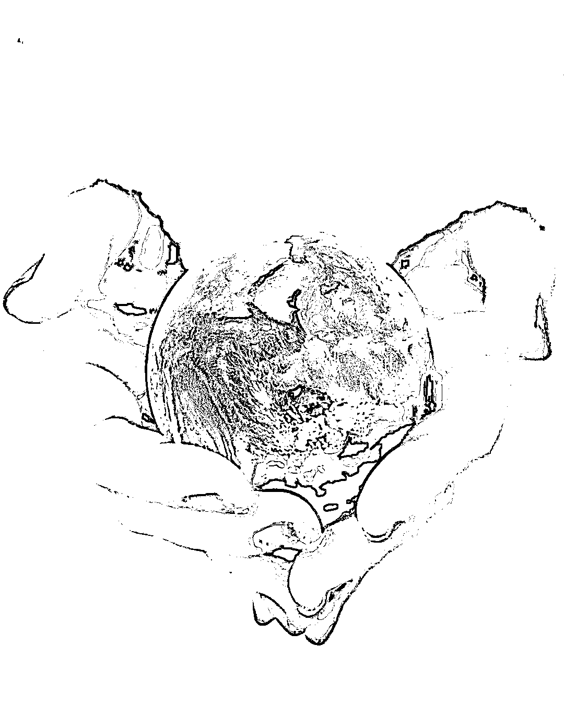

**上升点是在家庭里的最初角色**

比起国家、城市或者街区，家庭或许是最有力的环境压力。当你还是个孩子，家庭就是你的世界。心理占星学中将上升解读为**我们在初期的环境中所扮演的角色**。关于家庭的系统理论认为，**每个孩子都不可避免地在家庭理论中吸收了一种独特的立场，因为顾虑整体的需要而忽略了孩子们的天性**。

家庭动态或许要求第 1 个孩子成为一个英雄，第 3 个孩子成了替罪羔羊。上升巨蟹座或许需要成为家庭的守护者，上升处女座是两只感伤的鞋。事实上，孩子们离开家庭去寻找更广阔的空间，伴随而来也有新的可能性和压力。他们最初的网络不断扩大，但它的中心是一样的。第 1 宫就是持久的角色，它决定了——**不论走到哪里，你会见到，会做出何种本能反应。**

对于了解人群来说，这是非常有用的信息。如果我觉得世界就像一座坚硬的山，每个人都需要努力攀爬；而你认为世界就是一片大海，而我们都要在里面扑腾，那么，当你遇到问题的时候，我会认为你不够有雄心壮志，而你觉得我不快乐，是因为我不能跟随潮流？你觉得我们真的能交流么？

我母亲和她的姐姐就有很多年不来往。直到现在，她们谈论起彼此，都还能把多少年前关于童年的不满都翻出来。她们一般都谈论陌生人，而不谈论我熟悉的。我妈妈谈起她这个上升天蝎座，敏感的、坚韧的、具有很强洞察力的姐姐时，说道：“她总是很残酷，她不希望我拥有任何东西，也不希望我快乐。”

当我姨妈谈起她这个上升摩羯座的妹妹时（我总认为我妈妈很孤单，有着封闭的童年），说道：“你妈妈都被宠坏了，她总是注目的焦点，她想要的什么都得到了”。

你觉得她们是在同一个现实环境中么？她们在同一个家庭长大，出生前后差了 7 年，沿着不同的地平线，她们编制了不同的家庭网，成长在完全不同的环境。

我妈妈不但是上升摩羯座，还有一个落在第 1 宫的水瓶座土星。因为土星在水瓶座的影响，她特别害怕渺小，害怕不被注意，害怕在人群中消失。我妈妈是在她母亲有些年纪的时候出生的，我外婆起初都以为是长了肿瘤而不是一个孩子。

不能确定是不是因为土星的影响，我妈妈身材十分娇小，比她的兄弟姐妹要矮 1 英尺，但这的确是我妈妈抽象的形象。妈妈人生的信念就是要**经久耐用、有实际价值**。她常重复这一句。她在第 1 宫摩羯座，还落有土星的影响下成长，充满了**孤单和早熟**。童年的抑郁进一步磨练了她摩羯座的透镜。即使雄心勃勃、十分成功，但是妈妈依然担心不够。她不断地制订计划赚取金钱，推迟退休的时间，她害怕变成那种只会购物满城乱逛的坏女人。她总是不断树立目标，制订计划。而且这一切，不论好坏，都渗透到了我的星图中，我有一个月亮-土星四分相，姐姐有一个摩羯座的月亮。生我儿子的那一年，我的太阳回归到我妈妈的第 1 宫。我走了我妈妈的旧路，发现更能理解我的母亲了。一轮新月落在了出生星图的第 1 宫，让她强烈感受到这个世界的痛苦与幸福。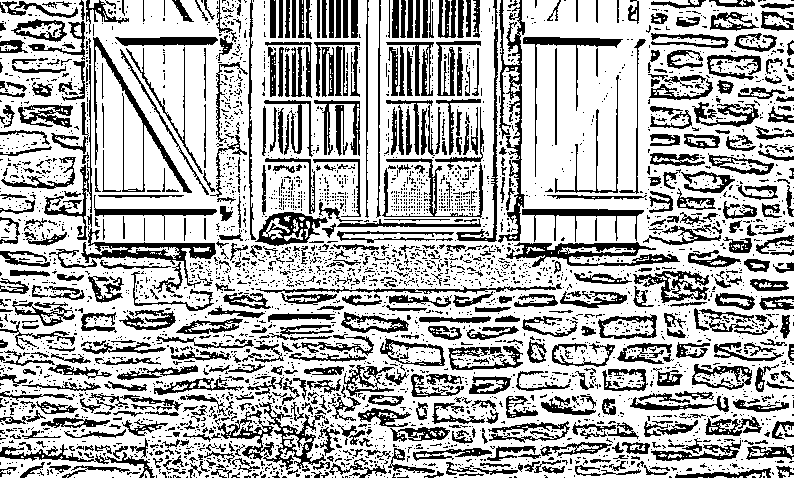**上升星座不是贴标签**多年前，我参加了一次占星家的聚会。话题谈论到了上升星座，“他是上升天蝎座，你要小心哦。她上升狮子座，真是个戏剧女王啊。”这种言论普遍得像占星学里的面包和黄油，却让我倒胃口。作为一个有才华的、专注的、专业的占星学家，必须把人当作人来看，用星图看出一个人的特质。可能在很多人眼里，人都是贴了标签的，分门别类的，但是在占星师的眼里，人必须是**丰满的、鲜活的、复杂的、有天分的、完整的**人。上升星座是解释这些特质的关键。上升星座是每个人**心灵之门最敏感的一块**。当他们还是个孩子，是可塑的、容易受到影响的。那时，他们最初发现**需要有一个面具，于是就造了一个**。下一次，当你看到一个星图，试着从第 1 宫着手了解。先将自己沉浸在元素基础里，天蝎座是水象，狮子座是火象。想象一下当你还是个孩子，这些元素就环绕在你周围。让你的直觉带领你的心去了解一个人过去的故事。什么可能让他们受伤？什么事情给他们提供安全感？如何鼓励他们？沉浸在你的幻想里，直到这个人上升的面具替代了你自己的。带上别人的面具，透过他们的眼睛你重新看看这个世界，你看到了什么？通过他们的第 7 宫，看看他们都碰到了些什么人？在第 10 宫的职业生涯中遇到了什么挑战？一旦你用第 1 宫的视角来体会整个星图，你会更加敏感地了解案主。有些占星师相信，上升点对人个性的描述比太阳星座更私密。在大约 30 天的时间里出生的人都是同一个太阳星座，而上升星座却精确滴标明了他们出生的不同时间。关于上升星座和太阳星座的争辩，我更赞同 Howard Sasportas 的观点，**上升星座引领我们走向太阳星座承诺的身份。****第 1 宫代表我们开始自我发现的道路。**这是一个**舒服但只是早期的身份**。就像一个穿旧了的外套，也更像南交点，这是**得到你要的生活的一个缓存的心理习惯和生存机制，但是你最终会退却**。我注意到，**人们对于履行自己命运的大部分恐惧来自于第 1 宫无形的约束**。我认为，典型的双子座朋友应该具有这样的特征，他会有典型的双子座活动——社会互动、讨论新想法，这是他生活中最有意义的事情。然而，他天蝎座的上升点却会抑制他混乱的社交。他会站在一边偷偷观看，保护自己。我们一起参加了很多的研讨会（他是双子座怎么会错过这个），但是，在最初，他一定是充满了天蝎座的防备。他是愤怒而充满怀疑的。他皱眉表示：“这个演讲者太有领袖魅力，而且很虚假，他操纵听众们。”

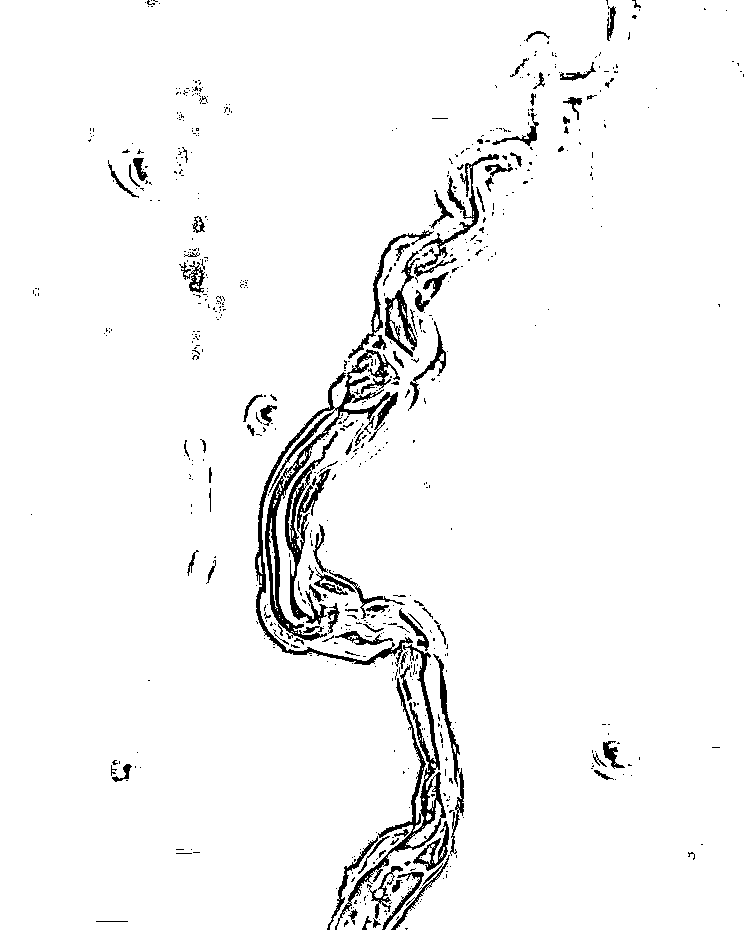

**一个海王星合相上升点的故事**

接下来是 Paul 的例子。他从车载电话给我来电，他的声音时强时弱，“我看到你的照片，觉得你可以帮助我，我过去常常给人留下通灵的印象，现在我需要目标、焦点……我不知道……我站在十字路口……我刚结束了一段感情……也许我该发展一下我作为一个医疗者的技能，或者艺术方面的才华。”

从与人的交谈中猜测对方的星图不是我的习惯（这游戏用其他的方式玩更丰富），但是当我看到 Paul 的星图时，我一点都不惊讶。他的言语中明显透露了他的海王合相上升点，落在天秤座。

在与他的会面之前，我在想，他期望从这次谈话中获得什么呢？你能给一个海王合上升的人一个“焦点”和目标么？你能么？或者用土星和冥王星替代他的海王星？

我走进他的上升星座，看到一片迷雾。我在迷雾中沉思，你在大雾中驾车还能找到焦距么？你看到了目的地么？不，你没有，你甚至看不到面前的双手。当你在大雾中驾车，你必须慢慢地开，警惕近处的危险要比长远的更重要。你必须充分利用直觉去真实的感觉这一切。如果我真的要帮助 Paul 去解决他面临的抉择问题，我最好提升他处理这问题的能力。我知道 Paul 是一个有天分的、富有爱心和创造力的人。从他的言谈中，我了解到他的成长经历。我明白了他是为何必须穿上变色龙的外衣——就像天秤座海王星所赋予的平衡融合的能力。**为了生存，他会适应不同人对他的要求。**所付出的代价当然就是那个真实的、富有创造性的、热情的 Paul。他星图中，冥王星合了太阳，它们会为此买单。每一次他脱离了所处的现实情况，他的期望在将来会更加失落。Paul 谈了他的想法——回学校念书，或者拜个大师，再或者换个城市居住。我想跟他谈谈他的现状。我问他，如果他专注于他现在的处境，以他现在的感觉做出选择，他是不是相信他会达到一直以来想要的目的，不论是回学校念书、从事艺术行业，还是移居到其他的城市？他的回答的声音从他身体深处发出，“是的，当我静下心来，我可以确定这一点。”在接下来的交谈中，我们讨论了他刚刚结束的感情。事实上，Paul 从他的深深的痛苦中体会到这是最美好的感情，对他们两人都是。他的星图也显露出这一点。两周后，他用手机给我打来电话，声音又是时强时弱，他刚刚给前女友打了电话，但是她却已经和别的男人开始了新感情。他邀请她一起去他们初识的地方度假。“她说她会给我回话……她很乱，她不想伤害我……她不知道该怎么办。”Paul 又一次的陷入他的迷雾中。他想逃离现在的感觉（他的孤独、痛苦），躲进他海王星面具赐予的白日梦中。

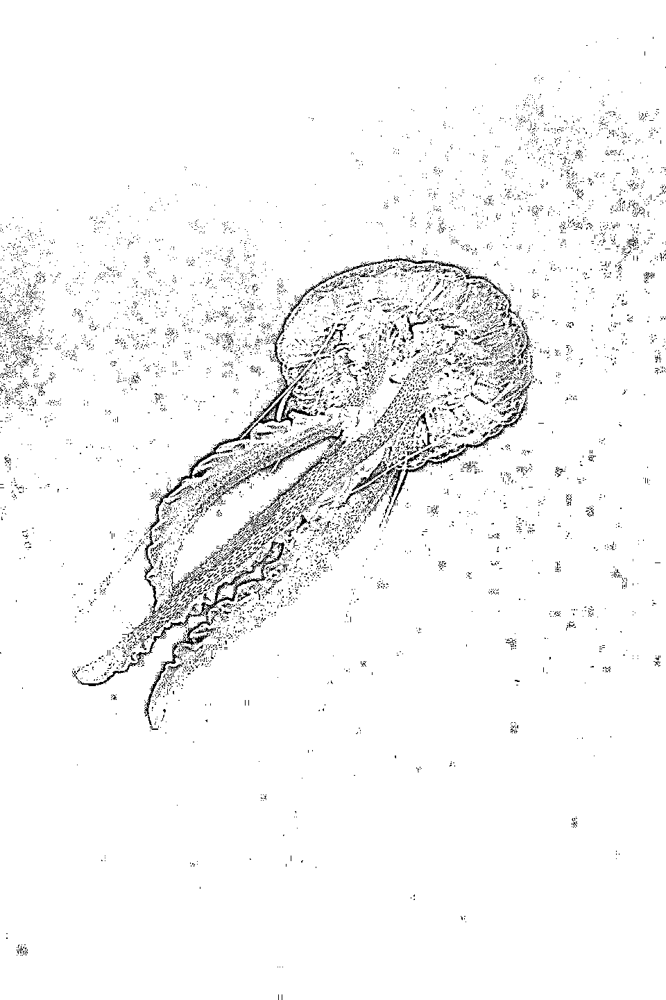

**认识面具后真实的自己**

现在，回到第 1 宫给我们的难题，**如何不让这早期的容器变成我们的监狱呢？**荣格心理学说的支持者——James Hillman 曾经说过：**“你必须放弃你宿命的生活。”**这就是我们出生时，东方地平线上升起的那个星座带给我们的密码。出生时，你证明这个道理：**你必须脱离子宫才能重获新生。**这是一个自然的发展规律。

明白这一点，是掌握第 1 宫的关键。谈到第 1 宫，占星学家 Dane Rudhyar 强调，**我们必须脱离那些在人生早期对我们产生巨大影响的人和事，个人的、社会的、文化上的这些像母亲一样照顾我们的影响因素**。

第 1 宫的作用是**守护我们的出生，然后保护我们的独立性，尊重我们作为独立个体而存在**。**你的“与众不同”并不等同于过于自我而造成的与人群的疏离（没人懂我）。**相反的，**它是接受完全不同的礼物**。

在心灵的更深处，我们意识到，我们都是**互相关联和依赖的个体**。所以，大部分人都尽力将他们的创造力和生产力体现在个人的特质中。当你拥抱了你的个性，你就更进一步的履行了你的命运。你会获得更多来自内心的力量，你将被塑造得更加真实。

上升星座不是一个个性化的目标，它更像是一个手段和工具。它并不是真实的人，而更多的是扮演了这么一个角色。**通过它，你向世界表达你的灵魂**。这是一个持续不断的过程，这个变化会在你的一生中不断发生。

把上升星座看做一件可以伸缩的弹性外衣，随着你的成长，它会拉伸和重塑。想象一下你正站在星图的第 1 宫，感受它的星座和落入的行星，脱下面具，你就可以开始了解它的意义。把它放到你面前的桌上，是个什么样子呢？它会有什么表情呢？当人们带着这样的面具与世界交流，会是什么样子呢？ 

注意，这面具是柔软的材料制成，你该怎么改变它的表情呢？在不把上升星座带给你的面具毁成碎片并换个新面具的情况下，你能重新设计你的人格以获取更多你想要的么？**找出你上升星座最优秀的特质，上升星座的守护行星、落在第 1 宫内的行星，然后将你的面具粉刷一新。**

这会和你从前的面具有什么不同么？它能不能更好地表现你的不同之处呢？当行进行星通过你的第 1 宫时，你都会自觉或不自觉地将它粉刷一遍。按照天体在星图中运行的规律，在通过第 1 宫之前，他们必须通过第 12 宫。**第 12 宫代表了结束，行星在 12 宫运行时，旧的方法将渐渐被抛弃，你就放空了自己。随着行星运行到第 1 宫，一股新鲜的灵感充斥着你，你将有了一个新的面具。**我是从最基本的“字母表”开始学习占星学的，在最基础的理论中，白羊座、火星是和第 1 宫联系在一起的，火星是第 1 宫的自然宫主。**当有行星进入第 1 宫，我们会感受到自发的、冲动的、积极的、充满自信的力量。**现代理论敦促我们**积极主动地面对这样的局面，设立新目标，追求新生活**。当我了解到在古典占星中，土星是第一宫的守护星时，最初非常困惑。但是就像 John Frawley 指出的，土星掌管了**途径与限制**，这样看起来就不奇怪了，**上升星座不正是我们生活最大的范围限制么？**火星或许代表了第 1 宫最初的性质，而土星则描绘了它的基本任务。在第 1 宫有行星运行期间，**我们自己和我们所见的世界都将经历革新**。土星同时掌管了**社交和分离**，这两股力量同时在第 1 宫显现，或冲突或结合。**我们在这里与世界初遇，在现实的压力下，找到了自己的与众不同。**传统占星学认为，水星在第 1 宫也是很好的落点，这也很好理解，因为当我们通过第 1 宫重新定义自己时，同样也重新定义了我们的环境。水星代表：**我们表述我们所见。****当有行星经过第 1 宫时，我们有机会重新塑造我们自己的形象，并重新认识我们所处的环境。**最近我和 Julie 有一次交谈，她的太阳正行进到第 1 宫。虽然占星学家很少提及太阳行进的影响，但是我发现，每年一圈的太阳行进也有它的奥秘所在。这是属于每个人自己的四季，每一个月太阳来到不同的宫位，这个宫位所管辖的部分就变得十分重要。Julie 对占星几乎一无所知，但是当我告诉她太阳来到第 1 宫意味着什么时，她笑着表示赞同：“现在知道为什么这样了。”小时候，Julie 的牙齿有些不正，这让她很压抑，不敢大笑。不知道是因为经济原因还是不重视，她母亲从没带她去看过矫形医生。“我妈妈总跟我说，看起来很好，但我自己却觉得不好。”今年，当太阳走到了她的第 1 宫，这个 45 岁的女人决定去矫正牙齿。这个生理上的改变让她向过去说再见，迎接一个更光明的新生，更充满了自信。相信你也能抓住行星行进经过第 1 宫的时期！

**版权声明：**本文由若道翻译发布，欢迎转发，反对抄袭。友号转载请申请白名单。

**达娜·格哈特**一位国际范围内受尊敬的占星师。她为众多占星学网站和出版物讲课、写稿。她在十二宫的月亮激励她对这颗发光体进行了深刻而持久的探索研究。

**学习太阳返照技法**

**请点击下图了解详情**

**

**微信又双叒叕改版啦，不想错过若道君的推送？**

**就把若道设为星标吧！**

**▼**

就是这个“在看”，戳戳戳 ☟

********报名直达入口********

# 瑜伽有那么多流派，傻傻分不清？

> 原文：[`mp.weixin.qq.com/s?__biz=MzA5NjA0NTAxNg==&mid=2651423062&idx=2&sn=44d64a4b5c3515d58f9e58c81ee4b487&chksm=8b4b33e1bc3cbaf7c41c243cb315ad4ffc924ed89ffa03206ea31f2a5b50cfd07e0a4073c497&scene=126&sessionid=1692738131#rd`](http://mp.weixin.qq.com/s?__biz=MzA5NjA0NTAxNg==&mid=2651423062&idx=2&sn=44d64a4b5c3515d58f9e58c81ee4b487&chksm=8b4b33e1bc3cbaf7c41c243cb315ad4ffc924ed89ffa03206ea31f2a5b50cfd07e0a4073c497&scene=126&sessionid=1692738131#rd)

**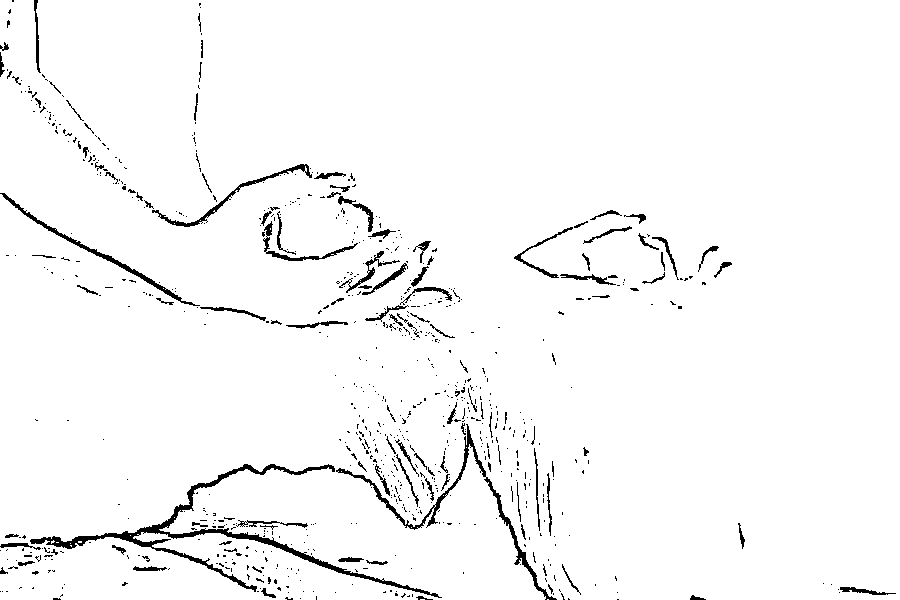**

采访、整理、编辑/翀子  图片/网络

作为即将开设的课程[【古典瑜伽与占星学】](http://mp.weixin.qq.com/s?__biz=MjM5MjQwNjAyMQ==&mid=2649437306&idx=6&sn=84e3fc2ff569618d4e7ab57e49d51530&chksm=beb95b1089ced2067b4f59036a054587cc591560705aff7395d9ca4050c355dcd718fe951a40&scene=21#wechat_redirect)（点击可阅读）的授课老师，孙继红在采访中详细回答了若道君关于“什么是古典瑜伽”、“课程内容如何设置”以及“同学们可以在课堂上获得哪些体验”等若干问题。她还说只要有好奇心，哪怕没有任何瑜伽和占星学的基础，都可以学习这门课程。

** 问 **在大众认知里，瑜伽给人的概念是从健身房得来的，很多人把它当做健身操的一种来做，你对此有什么看法呢？** 答 **坊间对瑜伽的认知，就像严肃占星和大众的星座热一样，比如摩羯座人会怎样，金牛座人会怎样等等。这种标签式的定格，也是瑜伽传到西方世界的过程。瑜伽初到西方时，必须要避开一些意识形态领域的冲突，瑜伽的精华才能够留存下来，所以它就剥离了很多瑜伽经典的一些东西，而沦为了被西方人所看重的**仅仅有体式**的这种竞技啊体操啊健身，甚至形成一种杂技。而这种注重形而下的**物质身体**上的练习，确实给西方人带来了很多这种体能上的更阳刚的阳性力量，但是在这种形而上的这种神秘的背景，在当年并没有去领会到。直到这些印度的大师，他们在当地的文化能够去生存下来后，他们通过他们的练习，通过他的呼吸法，止息，冥想的过程，让西方人大开眼界，把他们当成研究目标的时候，比如说研究冥想过程当中脑波的变化，呼吸对人情绪体的改变，当时这些瑜伽大师们成为了当时西方科学界、心理学研究对象的时候，这些瑜伽大师们也因此得到了相应的回报，可以果腹，甚至淘到了第一桶金。然后在这样的物质基础之上，他们在当地建立了瑜伽的道场，才开始慢慢的比较平稳的安全的将**瑜伽的哲学和心理学**的部分，才能够安住下来去传播。所以你去看西方人，在学习瑜伽的过程中，是否去结合前面的体式练习，然后最后能够去吸收后面的瑜伽的精髓。而**这就是古典瑜伽的真正核心部分**。** 问 **瑜伽有很多派别，抛开健身房的健身瑜伽，各种瑜伽派别之间有什么区别呢？** 答 **瑜伽从传统上很有意思，比如有**行动瑜伽**，它对我们占星学生来说，就是火象能量比较强，适合去做执行力的瑜伽形式。有一本书叫《行动瑜伽》，专门研究这些行动瑜伽，研究怎么在行动过程中参悟。第二种是**奉爱瑜伽**，它更像是最接近宗教化的瑜伽。奉爱瑜伽就像我们的净土宗一样，每天持诵、俯拜，以一念代万念。所以有很多小孩子、受过很少教育的妇女，他们的心安可以住在其中，然后这样去供奉和颂持，也能达到头脑的平静。这也是一种瑜伽。像占星学子进入这个领域，更喜欢也更习惯**智慧瑜伽**，就是先去了解瑜伽是怎么回事、了解不同的流派，这也能达到一种整合。**古典瑜伽**并不是一个流派，而是它把瑜伽核心的东西提炼出来，然后带着这些核心的东西，去安住在你自有的流派当中，或者是你自有的信仰中。它不要求你去改变你的传统、你的信仰、你的流派，但是你可以把这个古典瑜伽的方法，它实际上就是一种呼吸和身体和你内在感受整合在一起的方法，运用在实际的这些流派当中。** 问 **昆达里尼瑜伽在印度也算是一个很古老的体系，据说是帝王家的秘传瑜伽，并不是很公开的，那古典瑜伽和昆达里尼瑜伽的区别是什么？** 答 **印度有个锡克教，占印度人口的非常少一部分，但它创造经济的实力包括对政府国家的贡献。**昆达里尼瑜**伽当时在印度都是这种精英和高端人士练习的，所以它有一个特定的群体。所以像昆达里尼很像锡克教的那种唱诵，它的重点是启动不同脉轮上的节点，和我们的道家有些相像，但它更侧重于唱诵，而不是很强调和着重在呼吸上。然而整个现代瑜伽的脉流都来自克里希那玛查雅，也就是古典瑜伽的部分。就像若道引进不同领域的占星师，他们在基础的部分是一样的。**现代瑜伽的基础，也就是瑜伽之心的那个部分，就应用到包括昆达里尼等各种瑜伽流派的身上。**** 问 **所以古典瑜伽注重呼吸、并且还有一些很基础的原则、然后被后面的不同瑜伽流派应用，而不是因为它是一个叫做古典瑜伽的流派？** 答 **对，古典瑜伽它更多的是一些**原则**，它并不是一个流派而是一个基础，是**瑜伽核心的部分**，是**呼吸和身体融合**的过程。它的练习非常简单，但需要持续去做，它的核心秘密就是呼吸，去练习在白天的呼吸中体会到入眠时候的状态。** 问 **我能不能这样理解，古典瑜伽很像一棵树的树根部分，然后不同的瑜伽流派就像它的枝叶？** 答 **若把瑜伽比作一棵生长千年的树，那么古典瑜伽就是它的树干、它的营养之根，我们通过古典瑜伽的哲学体系，再配合简单易行的呼吸法及身体练习，可以让我们**从物理身体上、能量体、心智体上、甚至到灵魂体上能直接感受体验到宇宙法则及其影响。**** 问 **不懂瑜伽和占星学的人可以学习这门课吗？** 答 **所有人都能听懂，只要有好奇心，都可以的。

那么，【古典瑜伽与占星学】具体如何设置的呢？我们的课程将分为两部分：

**第一部分**为期 6 周的在线课程。每周 2 小时侧重理论与自我常规练习，旨在培养自我常规练习的基础。**授课时间**：**7 月 18 日-8 月 22 日每周六 早上 9:30-11:30****第二部分**为期两日，侧重体验式的深入集中练习。**授课时间****：9 月 5 日-6 日****工作坊地点****：北京（具体位置请关注开课前通知）****6 节网络课程内容：整合古典瑜伽的自我练习****第一讲：古典瑜伽文化与瑜伽智慧之眼吠陀占星学概述****❶** 生命有机体的整合疗愈，三身五体与元素；**❷ **生命经验的构成；身心相应症状的形成及转化；**❸ **古典瑜伽之心息相依之道；**❹** 练习：导引；瑜伽式呼吸；根轮练习。**第二讲：古典瑜伽生物能量学简介**❶ 脉轮生理部位；腺体/神经丛/元素/轮穴；❷ 日月脉与中脉；脉轮与丹田；❸ 古典瑜伽之心的基本原则；❹ 练习：腹轮的练习，瑜伽调息。**第三讲：古典瑜伽心理学简介**❶ 脉轮的心理功能：自我取向；身份认同；❷ 脉轮发展阶段；功能发展良好及失调状态；❸ 行星的守护日，元素/导性；色彩/方位/梵结；❹ 练习：脐轮的练习，瑜伽休息术。**第四讲：古典瑜伽哲学简介**❶ 个体意识进化的 7 个阶段；主观心与客观心；❷ 行星周期与瑜伽饮食；食物的二性/三态/性味/归经；❸ 瑜伽自然疗法与净化法❹ 练习：心轮的练习；瑜伽观想。**第五讲：东方传统能量学与古典瑜伽**❶ 星象与藏象经络；❷ 通调经络与瑜伽理疗；❸ 不同的体质的瑜伽养生❹ 练习：喉轮的练习；瑜伽唱诵。**第六讲：百日筑基自我练习**❶ 五运六气与顺时食疗；❷ 导引吐纳与引气归元；❸ 穴位通调与补气培元；❹ 练习：额轮/顶轮的练习；烛光冥想。**2 天线下工作坊内容**❶ 导引；❷ 瑜伽之心入门/经典练习序列；❸ 脉轮瑜伽的入门/经典练习序列；❹ 瑜伽调息减压；❺ 瑜伽休息术与瑜伽冥想；❻ 培元补气通调经络的练习法。

**关于课程更多信息**

**请点击图片了解详情**

**微信又双叒叕改版啦，不想错过若道君的推送？**

**就把若道设为星标吧！**

**▼**

喜欢记得点一下在看哦☟****报名请点击“阅读原文”****

# 超级干货 | 神奇的日返技巧，让你每年的生日变成好运开启日

> 原文：[`mp.weixin.qq.com/s?__biz=MzA5NjA0NTAxNg==&mid=2651423062&idx=1&sn=3e827edee2c56160bd6d8692dd3e6896&chksm=8b4b33e1bc3cbaf78c1b2ce7bf1cc2ba312a6761208aaacfc4ce99028338562e23d52c739e84&scene=126&sessionid=1692738131#rd`](http://mp.weixin.qq.com/s?__biz=MzA5NjA0NTAxNg==&mid=2651423062&idx=1&sn=3e827edee2c56160bd6d8692dd3e6896&chksm=8b4b33e1bc3cbaf78c1b2ce7bf1cc2ba312a6761208aaacfc4ce99028338562e23d52c739e84&scene=126&sessionid=1692738131#rd)

****************☆ ****************************后台****************************回复“今日”，给你一句生命态度****************

作者/海星程 Hastro ISAR 认证占星师编辑/玫瑰 图片/作者提供“生日”是人们用来记录自己来到这个社会和庆祝自己成长的一种仪式，在庆祝活动中，通常我们会有以下形式：生日蛋糕、生日祝福、生日许愿……但是，在做这些活动时，你有想到过自己这个庆祝的“生日”时间可能会是错的吗？**本文从头到尾都是干货，请大家一定要认真读完（最好收藏）哦。****文中图片摘自若道核心课程 Level 5 课程中助教沙龙 PPT，引用请注明出处。**
这篇纯干货给大家介绍的是如何用占星学技术和占星学理念来“过生日”，你会从中学到三个“大招”：❶ 如何确定准确的庆祝“生日”时间？❷  如何用占星学理念来确定生日的意义？❸ 如何用占星学让自己的生日更加丰富？**关于生日的迷思****01**
**我有准确的出生时间，不就是“生日”时间吗？****出生时间≠“生日”时间！**
不要吃惊，我们都知道自己出生那一刻的时间，通常我们会沿用这个时间来作为每年的“生日”时间。混淆的地方就在于：出生时间到底记录的是什么？每年在这个“生日”除了时间数字相同，能代表真正的周期循环吗？经过思考，你一定会发现答案是：不能！先从天文学的角度了解这里面的原因：**我们是用年（365 天）来表示地球绕太阳一圈，而实际情况是，地球需要 365 天 5 小时 48 分 46 秒一圈。可以看出，每年出生时间只是个数字相同的时间而已，不能代表准确的周期循环。**再用一个模型来给大家演示。如果你在下图①这个位置出生，在第二年按照这个出生时间来庆祝“生日”，那么经过这 365 天，地球只是到了②这个位置，并没有真正回到出生时刻那个位置，这两个位置有近 5 个小时的误差。就是说**每年的这 5 小时多的误差会在 4 年后累计到 1 天（误差累计到 23 小时 15 分）**。虽然年历中采用了**闰年**（每 4 年在 2 月增加 1 天）的方式消除这个误差，也只是**每隔 4 年减少了误差的大小，还是没能消除这个误差**。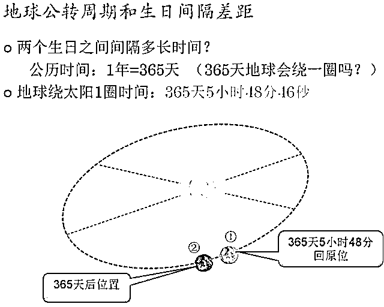**02**
**怎样的方式才能代表真正的周期循环呢？****从占星学宇宙星体能量循环的角度看，出生时间记录的是出生时刻太阳的位置，而每年值得我们庆祝的“生日”时间应该是太阳回到出生时刻位置的时间。**如果只是用出生时间来作为“生日”时间，无异于“刻舟求剑”，是在船上刻的标记。只有用**出生时刻太阳的位置**作为标准才是“落剑位置”，才能真正代表能量的周期循环。

**03**

**为什么要用太阳回到出生时刻位置作为“生日”的时间呢？**

**整个地球都受太阳光和热的能量影响，在你出生时，你就被烙上了这个时刻太阳的能量，你就会和这个时刻的宇宙能量频率实现共振。而之后的每年，太阳回到这个位置，就像是宇宙为你开了一个“天窗”，来接收和感应属于你自己独特的能量，这是你的生命节点。**采用这个方法，那些**闰年 2 月 29 日**出生的人就不会被错误的说成只有 4 年才能过一次生日了——**无论什么时候出生，太阳都会在某一时刻回到出生时刻位置的**。因此，即使我们有很精准的出生日期和出生时刻，每年能够真正代表周期循环的“生日”时间有可能是在出生日期的前一天或者后一天，而精准的时间一定不在当年出生的那一时刻。**04**
**怎么能知道每年的“生日”时间呢？**占星学有个技术可以解决这个问题，就是**“太阳返照”**（简称日返），我们可以通过这个方法直接找出太阳回到出生时刻的位置的时间（落剑位置）。就是说**从地球的角度看，太阳每年回到出生时刻的星座位置（星座的度分秒都一样）就是你真实的每年“生日”时间**。从下面这个模型中可以看到，只要太阳回到了天秤座①的位置，就是地球绕了太阳整整 1 圈的位置。

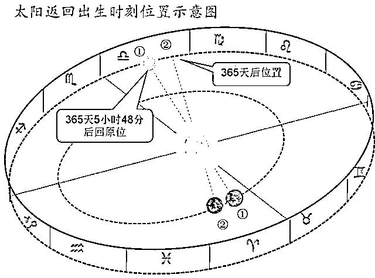

随着现代科技的发展，要找到这个太阳返照的时间很简单。只要**你有一个占星软件里面有太阳返照的功能，输入你要知道的那一年的返照时间，软件就可以自动为你找出这一年太阳回到你出生位置的精准时间。**

举个例子

假设一个人的出生时间是：**1987 年 2 月 28 日 10:58:46am（北京）**。从下面的本命星图中我们可以看到**太阳落在双鱼座 8°59′，10 宫**。

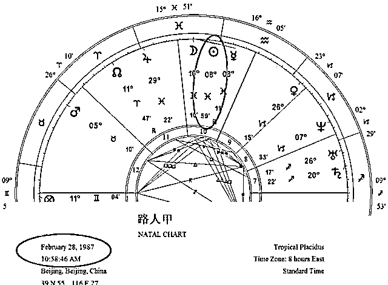

如果按照出生时间来看这个人 30 岁的“生日”星图**（2017 年 2 月 28 日 10:58:46am）**太阳星座在**双鱼座 9°43′**，这一刻，太阳根本就没有回到这个人出生时刻的位置。

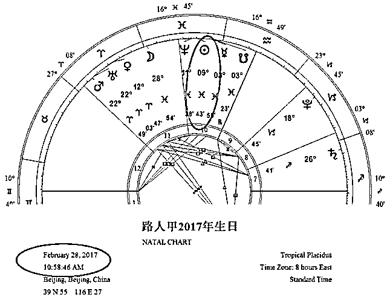

如果用太阳返照的方法来看这个人 30 岁太阳回到出生时刻位置的时间，就会发现太阳回到双鱼座 8°59′的具体时间是**2017 年 2 月 27 日下午 5:38:20pm**。

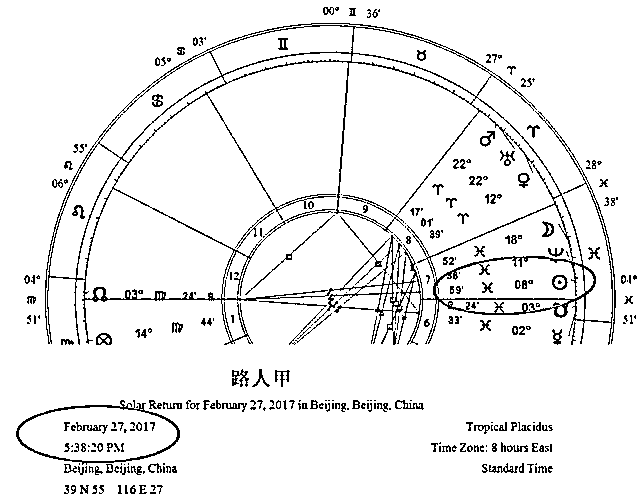

由于地球围绕太阳的周期不是整整的 365 天，所以每次太阳回到出生时刻的位置也会与出生时间有差别，这个时间最大可能会在你出生日期前后一天。

**这个占星理念的生日有什么意义？**占星学研究的就是**周期规律**，尤其是宇宙中行星周期对地球和人类的影响。无论从周期的观点或者能量循环的观点来看，出生日期和每年的生日都是记录一个生命过程的循环点和宇宙能量的窗口。 地球公转引起我们从地球角度观察行星在黄道上星座的周期变化，地球自转引起这些行星分别落在不同的宫位**。在出生时刻，太阳的星座位置和我们的日返找出的出生时间，虽然星座位置一样，但是宫位不一样（这是由于两个时间有差别），这种差别会造成每一年返照太阳落的宫位都不一样。**如此，出生星图中的太阳和返照星图中的太阳的象征意义就出来了：

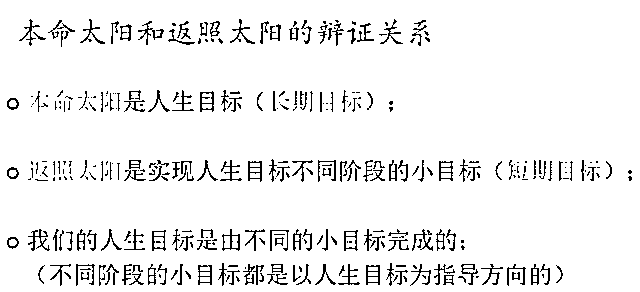

**虽然出生星图中太阳的宫位是固定不变的，但是每一年返照星图中，太阳的宫位在有规律地经过不同的宫位。这就意味着我们每一年的返照星图中，太阳落的宫位都是这一个返照年（这个生日到下一个生日之间的一年）的功课和重点，而这些功课和重点都是完成我们太阳英雄之旅的过程。**

如果能够了解每一个返照年的功课和议题，就会有力地配合出生星图中太阳的人生目标和主题的完成。（如果能够配合太阳弧和次限，将更加清楚地看到这一返照年的议题）

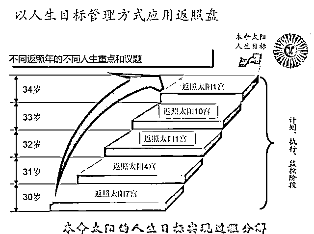

**我们的生日应该怎么过？**千里之行，始于足下，如果出生星图比喻成我们的“人生地图”，每年的日返星图就记录着“人生足迹”的每一次脚印。从能量学上理解生日，是太阳回到我们出生时刻的位置，就像宇宙能量天窗被打开一样，给我们“注入”新的能量。另外，生日也是一种“仪式”，对于人类个体来说都希望通过某种方式庆祝和祈福，希望带来幸运，所以，知道了每年“生日”的准确时间，也了解了占星理念下的生日意义，下面给大家建议几种跟占星有关的生日的方式，来让你的生日更加精彩和富有意义：

*   **能量感受（旅游计划）**

*   如果你在生日的时候能够请到一个假期，不妨给自己制定一个生日旅游计划，占星学中有个技术 ACG，是一种可以来帮助选择最佳地点的工具，不妨一试。 
*   **日返+ACG 原理及用法**：ACG 是应用行星能量原理，观察行星在某一时刻经过地球哪些城市和地区，利用日返确定了一个生日的具体时间，就可以根据 ACG 找到我们期望的行星能量经过的城市。

    只要生日期间在这个城市，日返星图这个行星能量就一定会合轴（上升或中天）。虽然它的作用影响没有那么大，但是我们可以借助这个美好的“喻意”让自己在生日这天感受这个能量，至少来年在我们心理层面会有一个好的感受。 

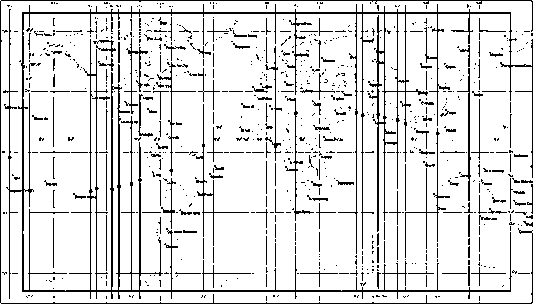

| 使用 ACG 寻找能量经过的城市

*   **祈福仪式（生日许愿）** 

*   我们可以利用现代科技软件精准计算出来的每年的生日时间，在那个时刻开始进行某种仪式活动，比如冥想和许愿。如果能够结合自己这个返照年的太阳宫位主题领域效果会更好（这个时刻的许愿会把吹蛋糕的时刻能量大哦）。

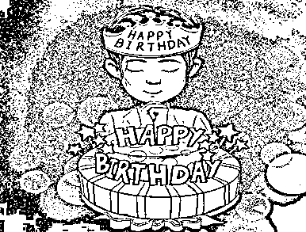

*   **人生规划（个案咨询**  ）

*   喜欢通过占星了解自己和个人成长的非占星专业人士，可以在生日前一个月找专业占星师咨询太阳返照图，了解这一返照年的功课和重点，并且配合年初的年度运势，更好地把握机遇，积极应对人生挑战和成长需求。（年度运势主要是以自然年为周期，通过这一年内行进行星能量了解对自己的影响。）

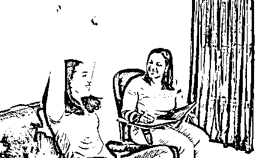

*   **幸运感受（生日礼物）**

*   你也可以用**购买占星报告**的形式来了解自己的返照年度主题，作为给自己或朋友的一份厚礼。

**版权声明：**原创文章由作者授权发布于若道平台，欢迎转发，反对抄袭。友号转载请申请白名单。

**日返文章合集**

**[太阳落在 12 宫位](http://mp.weixin.qq.com/s?__biz=MzA5NjA0NTAxNg==&mid=2651422057&idx=1&sn=146785720a3bce7033b8250d4b8077c3&chksm=8b4bcfdebc3c46c88df0766e2f86c6758594b86ff9d776d9625fb5785e22bf20237ae8d9d57f&scene=21#wechat_redirect)**

海星程 Hastro

ISAR 认证占星师（2014 年获得）/若道高阶课程助教

2015 年以第一名的成绩获得若道首届生时校正认证

若道认证授课老师/2019 年若道生时矫正主讲老师

**微信**：Hastro321   

**QQ**：2085274311

长按打赏

**系统学习占星学**

**点击下图了解详情**

**微信又双叒叕改版啦，不想错过若道君的推送？**

**就把若道设为星标吧！**

**▼**

喜欢记得点一下在看哦☟

********报名直达入口********

# 大师课前沙龙丨太阳返照，在生日读懂未来一年的人生剧本

> 原文：[`mp.weixin.qq.com/s?__biz=MzA5NjA0NTAxNg==&mid=2651423062&idx=3&sn=792996f8610dd4009e2caa55ef987a45&chksm=8b4b33e1bc3cbaf783581f705f78c5598e913c610d88a87dbd7a2b0d45c27fb8421b4b059445&scene=126&sessionid=1692738131#rd`](http://mp.weixin.qq.com/s?__biz=MzA5NjA0NTAxNg==&mid=2651423062&idx=3&sn=792996f8610dd4009e2caa55ef987a45&chksm=8b4b33e1bc3cbaf783581f705f78c5598e913c610d88a87dbd7a2b0d45c27fb8421b4b059445&scene=126&sessionid=1692738131#rd)

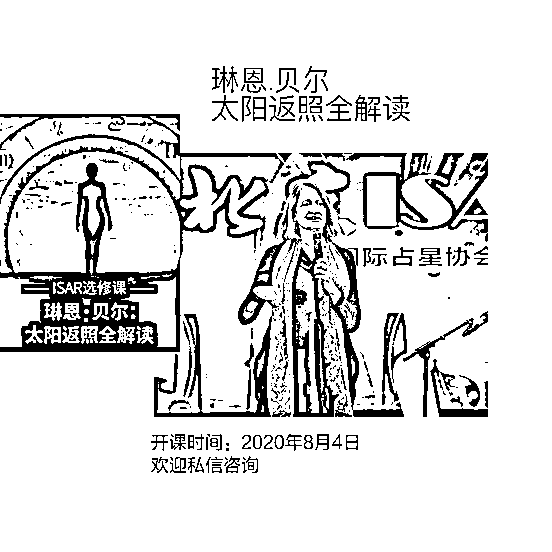

琳恩·贝尔（Lynn Bell）老师的**太阳返照课程**8 月 4 日就要开课啦~给大家准备了由琳恩·贝尔老师亲自讲授的**《太阳返照，在生日读懂未来一年的人生剧本》**讲座作为课前体验沙龙！沙龙报名只需**98 元**，适合考虑报名系统课程的你体验学习。让琳恩·贝尔老师用一场精彩的名人太阳返照星图案例，指导你开启生命中每年最重要的一天——你的生日。每年的生日，太阳都会回到其出生时的位置，点亮来年的可能性。从太阳返照图看，有些年份我们会受到更多限制，而另一些年份，我们则可以通过搬迁到别的地方打开生命神奇的可能性。**你知道你每年的太阳返照图正向你提出什么问题？你知道如何使用太阳返照图的指引？你知道如何通过搬迁打开什么的可能性？**如果你对这些问题都没有答案，这个沙龙千万别错过。让琳恩贝尔老师指导你开启生命中每年最重要的一天——你的生日。**沙龙主题**

**沙龙主题****：太阳返照，在生日读懂未来一年的人生剧本**

**主讲人****：琳恩·贝尔**

**沙龙费用****：98 元**

**沙龙时长****：90 分钟**

**沙龙方式****：视频沙龙，英文授课，中文翻译**

**非 ISAR 会员报名请长按下图**

**▼**

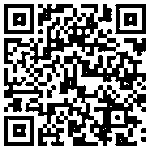

本讲座也是 7 月的国际占星研究协会（ISAR）星空俱乐部讲座。ISAR 会员可以免费收看。请勿重复购买。购买后，下载若道 APP，登录购买账号，即可进入沙龙学习。

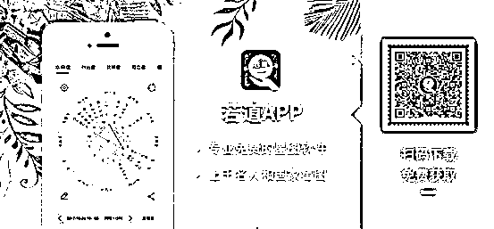

**沙龙内容**每当太阳回到它在出生星图上的位置，我们都把宇宙的一个新部分吸纳进来，并把它变成我们自己的。大多数人都会有这种体验，生日那天是特殊的。那时我们可能会掂量一些事情，感受时光的变化，并为最近的过去画上一个句号。同时，我们也可能想把未来握在自己手中。 太阳返照就是这样，它是我们未来的一小块。端详着它，会有一种跃跃欲试的期待感，将太阳返照与行进和次限一起用，会开启我们对未来时间的理解。黄道的每一个度数都带着某个太阳能量的特别印记，这是一种支撑着我们核心自我意识的独特品质。当太阳回归到那个度数，甚至分和秒都准确地回归到我们出生星图中的分秒时，这种至关重要的光就会被重新充满，每一颗行星都会与太阳形成新的关系。本次沙龙内容为太阳返照初探，我还将在 8 月 4 日开始在若道教授完整的太阳返照系列课程，在这门课程中，我们将学习如何解读太阳返照图，并理解它对未来一年传达的信息，理解在未来的一年里会发生什么？ 我们在整个课程中都会研究案例，学员们也将研究自己过去和未来的太阳返照图。期待想要深入学习太阳返照知识的你加入。—— Lynn Bell 琳恩·贝尔**主讲嘉宾**

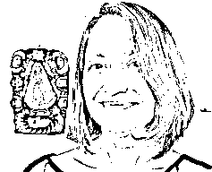

**琳恩·贝尔（Lynn Bell）**

*   世界最受欢迎的占星学演讲者、作家和老师之一。定居巴黎，对心理占星学和家族模式有几十年的研究。
*   著名的心理占星学中心（Centre for PsychologicalAstrology）的长期导师。2016 年，获得查尔斯·哈维（Charles Harvey）杰出的占星学服务奖。 
*   作为从多个层面进行工作的占星咨询大师，琳恩的工作结合了心理学的观点。她对家族模式的兴趣首先来自与客户的合作。通过在分析领域所做的个人工作，她所受的埃里克森催眠训练将她引领至家族系统。后来，她组织研究小组在家族星图上进行了数年的研究。她写的《家族占星学》就是这项研究的结果。 
*   法国心理占星学协会会长。除了占星学，她在法国沙特尔的新沙特尔学校任教 8 年，还 5 次获得了在《纽约时报》畅销书作者卡萝琳·迈斯（Caroline Myss）的卡萝琳·迈斯教育学院（Caroline Myss Educational Institute）合作教学的机会。

**课前沙龙不过瘾？****想要系统学习太阳返照知识**

## **欢迎报名琳恩·贝尔（LynnBell）老师的 ISAR 选修课程**

**《太阳返照全解读》**

********报名直达入口********

# 太阳进狮子座丨以勇气直面戏剧人生，发掘与众不同的光芒！

> 原文：[`mp.weixin.qq.com/s?__biz=MzA5NjA0NTAxNg==&mid=2651422956&idx=1&sn=d811741053521ce5e20b41037ea3529e&chksm=8b4b325bbc3cbb4deb5f732955631ffec9594090c0acbeabbbdc65c34ec6ceaac882aaacceab&scene=126&sessionid=1692738131#rd`](http://mp.weixin.qq.com/s?__biz=MzA5NjA0NTAxNg==&mid=2651422956&idx=1&sn=d811741053521ce5e20b41037ea3529e&chksm=8b4b325bbc3cbb4deb5f732955631ffec9594090c0acbeabbbdc65c34ec6ceaac882aaacceab&scene=126&sessionid=1692738131#rd)

**☆ 后台回复“今日”，给你一句生命态度 **

作者/大卫·瑞雷  若道占星创始人

译者/李含、周恩、若道翻译团队 

编辑/翀子 图片/网络

2020 年 7 月 22 日 16 点 36 分，太阳进入狮子座。引人注目的狮子座，生命充满了戏剧性，在“英雄”形象的背后，他们也有自己的恐惧和担忧。当他们面对事业和爱情，大卫老师给出了怎样的建议？当身处恐惧，如何迈向成功？释放巨大能量的狮子座，为世间唱出生命赞歌。

你就是最高首领，总是会给人留下深刻印象，这一点是其他星座的人望尘莫及的。有一些人会自称讨厌你，这是因为他们觉得你遥不可及。许多狮子座人会让人想到“**英雄**”，即使你们的身体并不强壮，但那种自信的气度能够让人们忽略你们的缺点。从来就没有胆怯的狮子，你**直面人生的勇气**往往会成为人们的榜样，有时甚至会成为传奇。

**受人关注，无论好事坏事**

**对于那些太阳或者其他行星落在狮子座，或者在出生图中狮子座被强调的朋友来说，要做到不引人注目是件很不容易的事情**。早在阿诺·施瓦辛格七次获得了奥林匹克先生的殊荣、成为好莱坞巨星以及成为加州州长之前，我相信他童年在奥地利生活的时候，与他的同班同学相比，就是一个**引人注目**的小男孩。

同样，前任美国总统比尔·克林顿在青少年时也已显现出狮子座的特质。在一张早期照片中，十几岁的他微笑着与肯尼迪总统握手，他光彩照人、自信满满的样子给人留下了深刻的印象。而肯尼迪的妻子，也是狮子座，她的勇气让她在经历悲剧时仍然保持着尊严。即使她试图低调，却也隐藏不了她戏剧般的人生所散发出的光彩。

但是，**他人的关注对狮子座来说，是祝福，同时又是一种诅咒**。狮子座的丑闻，也可以像他们获得成功时那样充满了戏剧性。克林顿的性丑闻在他任期的最后一段时间内悲剧性地占据了所有报纸的头版头条。而 2001 年中国台湾前电视台记者和台北市议员璩美凤的视频丑闻也是另一个狮子座的例子。

当然，丑闻不是狮子座独有，也不是任何一个星座独有的，但不可否认的是，**不论好事还是坏事，****狮子座就是容易引人注目，并给人留下深刻印象。**就算这些狮子座很安静，在一对一的交往中很低调，你也会惊讶地发现当他们面对人群的时候，他们多么会发指令，当人们抬头仰望，看看这是谁在说话时，狮子座的声音会变得格外有力。

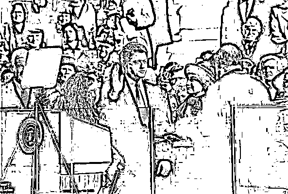

**意志强烈，人生如戏**

**领导力是狮子座备受推崇的能力，**而他们的确也当之无愧。当涉及到“谁是老大”这个问题时，拿破仑、菲德尔·卡斯特罗、查韦斯、墨索里尼必然是名列榜首的极端狮子座人物。同样的，就像罗伯特·雷德福、达斯汀·霍夫曼、罗伯特·德尼罗和西恩·潘那样，狮子座的演员在所属的领域中也都是重量级的人物。

在艺人中，像麦当娜、珍妮弗·洛佩慈，和被誉为摇滚乐传奇的滚石乐队成员米克·贾格尔都是狮子座的典型，他们都彰显着人生的炫目和壮观。像陈凯歌和 M·奈特·沙马兰这两位电影人虽然代表的是两种不同的风格，但他们同样总是能引起人们的关注。

太阳狮子座的名人列表可能不会比其他任何一个星座的长，但当你阅读它时，会发现这里没有模棱两可的人格类型，这里面所列的都是些**意志强烈的人**，他们**活出了如同戏剧般精彩的人生。**

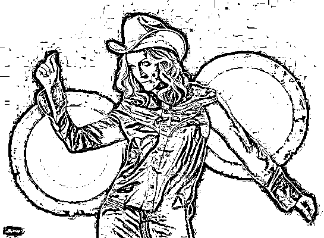

**有时候也是脆弱的大喵**

当然，**“爱当老大”**的狮子座人也惹上了颐指气使、甚至是傲慢自大的名声，有时候这的确让你困扰。你觉得“总要有人领头啊，不然事情都无法完成。”所以你十分讨厌那些急于批评你，却又不愿承担领导责任的人。

许多狮子座人会时常体验到处在**舞台中央的孤独感**。你实力强大，备受瞩目，自然会引来众人的拥趸，但这也带来一项挑战，你似乎很难找到强大到能客观评价你的人。事实上，你最需要的密友恰恰不是崇拜者，而是能够对你坦陈相告的人！你得珍视这些客观的诤言，同时也要意识到，你依然是众人的榜样。

因为你总是自信满满的样子，所以当其他人发现，你与大家一样，也会缺乏安全感时，总会惊讶不已。你很担心这两个领域会出问题：

**家庭的问题**

你会非常小心地控制私人生活和家庭生活的一切细节。你无所不用其极，就是因为害怕有人想要暗中破坏——尤其是当你真的有不可告人的秘密的时候。回想一下让施瓦辛格超级丢脸的那桩丑闻，他与女佣私通并育有一个私生子。对狮子座人来说，这是最烂的剧情了。尽管多年来，他一直隐瞒着这个秘密，但最终还是被人发现了。试图控制家庭成员也会带来麻烦，最重要的是学会放手，当事情无法控制的时候就要学会放手。 

**事业的问题**

事业也是你十分在意的领域。对你而言，**名气**就像是银行里的钱，打你的名号，使用你的肖像权都需要付费或者给你相应的回报。如果可能的话，你不仅想掌控局面，还想拥有自己的公司，至少做个大股东。

无论如何，你都会**维护自己的形象，**不管那是你想努力营造的形象，还是你的真实形象。同样，你也会注意那些抄袭你的点子、你的公众形象、你的公司的商标的人，如果他们做得太过分，你会阻止他们的侵犯行为，甚至会起诉他们。你**比较顽固**，不太容易随着时代的变迁来改变自己的形象，但你的确一贯是品质优良的蓝筹股。

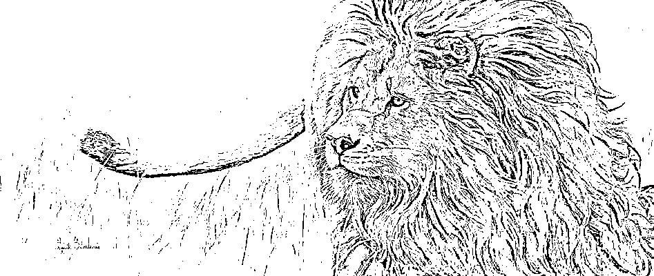

**狮子座的事业**

**你的领导才能备受瞩目**，如果你的老板自身缺乏安全感，他将难以掩饰自己对你的嫉妒，害怕你会取代他们。你的风格和气度经常能吸引高层管理人员的注意，他们会提拔你，让你掌管更多公司事务。同样，你可能有机会陪同上级参加贸易商展、大会和其他公司活动，上级也乐意在竞争对手面前炫耀你，因此会让你在展会上发言，介绍公司的新产品和新业务，这也是你大放异彩的机会。而如果你的确内外兼修，那绝对势不可挡。

你这样的人才，在任何领域都能崭露头角，成为领导者。

吸引你的职业可能是表演、电影制作以及其他与娱乐相关的事业，也可能是广告、销售和活动推广等。不过，假如你感兴趣的是科学，甚至微生物学，亦或是医学研究，即使是在这些领域，你仍然很有可能会成为团队领导者和表率，在学术会议或其他重要场合介绍你们团队的研究结果。

**你不是那种可以被忽视的人，你强烈的个性会吸引来他人的注目，而在对你而言意义重大事情上，你可能会非常谨慎。**如果你认为你所在的公司作了错误决策，你会非常在意——这让你觉得尴尬，你不想与任何让你羞于提起的事有任何关联。

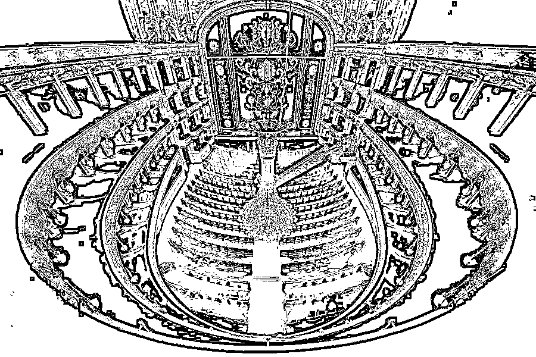

**给狮子座事业上的锦囊**

**狮子座的骄傲**对你而言是“成也萧何败萧何”。

在正面意义上，你会全心投入工作，对自己所做的出色工作自豪极了。在负面的意义上呢，一旦人们忽略你付出的努力，或你在重要成就中做出的巨大贡献，这些情形就会触怒你。

受到冒犯之后，满不在乎地耸耸肩，对狮子座的人来说并非易事。你皱着眉头，一副嫌恶的表情，在场的人没有谁会看不出你的不满。

同样，你也有能耐陷进一场意志力的博弈，耗尽所有人的气力，有可能同时也耗尽公司的资源！

而你的**缺乏客观性**也往往是引爆这类事件的一个关键因素。至少你要学着听取那些你所信赖的同事的意见，当他们指出你将铸成大错时，认真对待或许能使你免于陷入一堆麻烦之中。

既然**亲密同事以及员工的忠诚对你而言极为重要**，在你准备像超人那样腾跃于大厦上空之前，考虑一下他们的观点，会是明智之举！

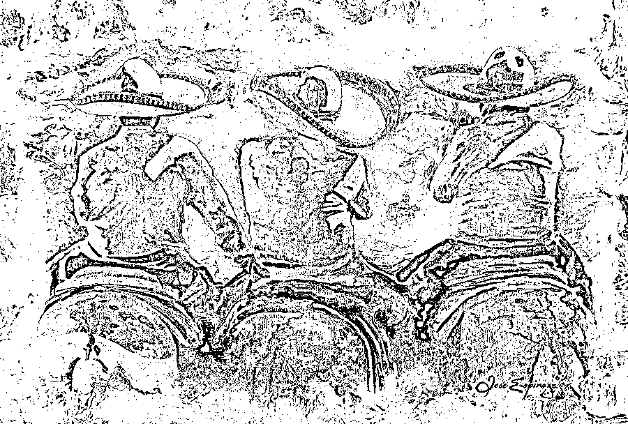

**狮子座的爱情**

一方面，约会和求婚过程中的种种盛况让你如痴如醉。优雅的烛光晚餐、美酒佳肴，在这样的情调和氛围之下，狮子座的你会格外容光焕发。在戏剧演出、电影首映、舞会，或任何喜庆场合，你都能同样自在地展现迷人魅力，**你炫耀的可不止身旁那位光彩照人的同伴，还有你自己的风采。**

然而，**在浮华之下，你寻求的是有一位知己相随。**这当然不是说你不享受佳人钦慕，你的确喜欢受到关注！只不过这并不是你追求的全部。

是的，吸引你的是有着绝佳品位、外表优雅的人，这些你都喜欢，但前提是他们也得很聪明！或者，得非常聪明！而且……**他们还懂得怎么取乐，怎么真正享受人生！**

这些条件都满足当然是最理想了，但最重要的是她/他确实是你最好的朋友。当你犯傻时，他们会像最好的朋友那样指出来，因为他们是真心为你着想。即使你并不知情，他们可能也还在默默为你打算，哪怕是狮子的骄傲蒙蔽了你的双眼，忽视了他们的奉献。

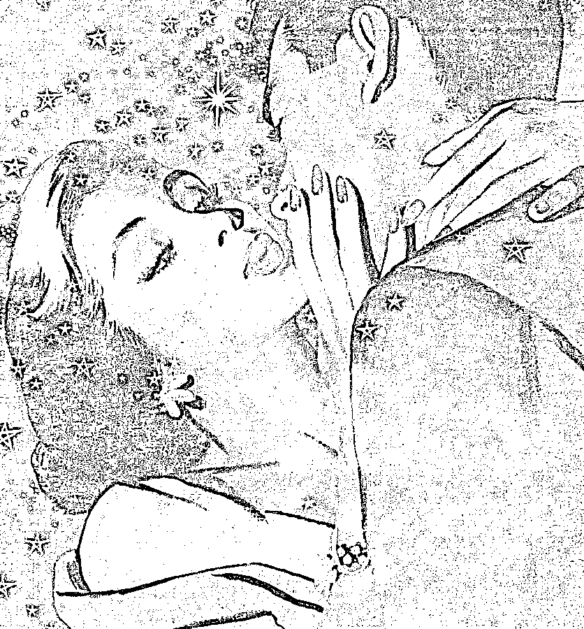

**一部讲述狮子座爱情的电影**

还记得获得奥斯卡最佳影片奖的电影《艺术家》（The Artist）吗？片中主人公乔治·瓦伦丁（让·杜雅尔丹饰）就是典型的狮子座！狮子座人都该看看这部电影！

不过我要谈论的是乔治和女主角佩皮·米勒（贝热尼丝·贝乔饰）的感情。当乔治认识她的时候，她还没成名。他们一见如故，以一种友好而戏谑的方式相处**。他俩似乎都有一种好玩的超然态度，像最好的朋友那样笑对人生。**

然而悲剧来了，佩皮借助一部有声电影的新片迅速蹿红，而乔治的默片明星生涯一落千丈。他俩因各自职业的原因而分开，佩皮还是像未成名时一样，全心全意对待乔治，乔治却坠入绝望的深渊中。他失去了一切，只保留了自己的骄傲，拒绝去拍有声电影。他受伤的自尊心蒙蔽了双眼，看不到佩皮的爱，即便在她将他从死亡边缘救回来之后，他依然对她的名气深感不满，只因自身的明星光芒已然消失。

我不想向那些没看过这部电影的人透露影片的结局，但无论如何，它突显了狮子座人在感情和生活中经常会**遇到的挑战：骄傲**。**除了力量、勇气和魄力之外，骄傲也是狮子座人的特质。**

当然，为什么狮子座人不应该感到骄傲呢？自身值得骄傲的品质，狮子座人一点也不比别的星座的人少，如果不是更多的话！我们都希望自己至少能当一天国王，不是吗？

但试试，当一辈子国王的滋味。王冠会变得沉重，但比它更重的是你们的骄傲。这就是身边那位最好的朋友的魅力！对她，你不需要全天候都摆出国王范儿。她爱你，无论你是光彩夺目还是默默无闻。她懂你的弱点，而对她而言你将永远是特别的，即使她客观地指出了你的错误。

如果这听起来美好得不像是真的，那就检视一下你对自己的评估吧。看看骄傲后面是什么。你在哪些层面上并不是自己最好的朋友？就是在这些地方，你会发现到底是什么在阻止你拥有一段令人满意的关系。 

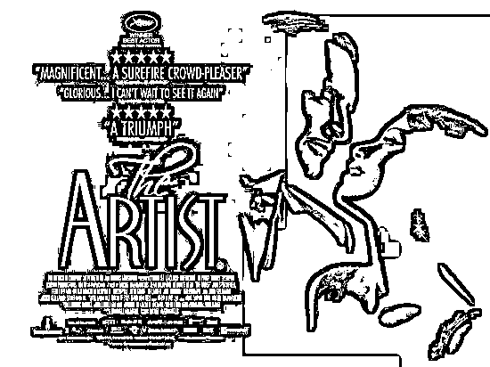

**| **电影《艺术家》海报

**狮子座的恐惧**

**无法成为英雄**

没错，狮子座可能是霸道的、傲慢的、被宠坏的、要求被特殊对待的、骄傲的甚至自夸的，但是，这些行为往往象征着他们没有安全感，那些未被处理的自我评判累积在恐惧之上，**他们真正担心的是自己也许根本没那么特殊。**这样想着，受伤的“自我”便以狮子座的方式表达了出来。

有些人扮演着低调的英雄，勇敢地忍受着生活中的巨大混乱，坚信如果他们不去主动做那件事，就会一无所成。即使是能量没那么强的狮子座仍然会为自己所做的事情负责任，就算他们所表现的不那么明显，但他们真的发自内心为自己完成的工作所自豪。

但是，对于狮子座来说，孤立的感觉又并非罕见，因为在他们心中，有一个剧本，而自己是剧本中那个未被承认的英雄。即使他们天赋未被人承认，或者不被人欣赏，他们仍然会**勇敢地朝着自己心中的方向尝试着去做出与众不同的成绩。**

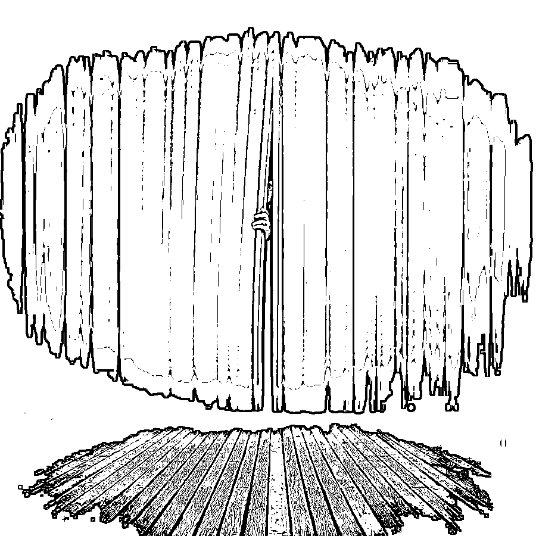

**清理恐惧模式，才能迈向成功**

如果是你的太阳在狮子座，或者是上升狮子座，又或者星图中有突出的狮子座元素，如果你体验到前文提及的性格特征或人生主题，你需要为自己去探索这是为什么。

对于狮子座人而言，最常见的负面力量莫过于在成长中接触到这样的信息：**“你并不特别。”**父母通常的说法是：“**你凭什么觉得自己如此与众不同呢？”**比这更糟糕的是，你**被完全忽视，你全力以赴却未获得认可**。“无论我做什么都没啥了不起的”的信念应运而生。

更让自我受挫的是当家庭因为社会、经济或家人上瘾的恶习而遇到问题时，这个孩子想要像个英雄一样竭尽全力照料家庭，但却最终无法阻止家的分崩离析，于是他/她就成了一个失败的英雄。

我有一个客户跟我说，她竭尽全力想要保护母亲和兄弟姐妹们安宁、幸福，但她的酒鬼父亲总是知道如何破坏她的计划。小小年纪，她就靠做模特贴补家用，可是父亲偷了她赚来的钱还烧了他们的公寓。另一位狮子座客户认为父母戏剧化的离婚事件葬送了她求学的机会。她说：“他们把我的学费都拿去支付律师费了。等他们都折腾完了，妈妈也承担不起我的学费了……”

但是，**挫折并不能阻挠狮子座人向成功迈进**。某些狮子座人有很大机会战胜困难，比如 J.K. 罗琳女士，当她开始写第一本书时，她只是一个靠社会救济生存的单身母亲，但随后写出了《哈利·波特》系列故事。其实，**阻挠狮子座人获得幸福和成功的是来自于老旧信念中的恐惧，**这个信念说，“你期待的不会到来。”

你要**从情感内核清理这种基于老旧恐惧的程序模式**。因为你是一只狮子，你的康复疗愈过程“必然”是**戏剧化**的。你的人生大戏即将上演，而你正是舞台中央的那一个，你要**秀出你的生命**，无需为你所经历的道歉。**闪亮登场吧！释放你的创造力，聚光灯将追随你的身影。**

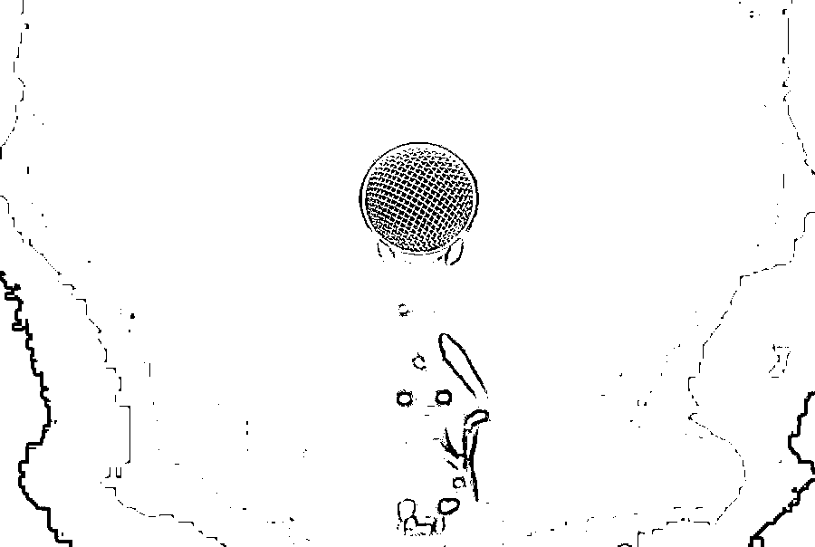

**释放能量，让生命与众不同**

如果狮子座的你恰好又具有显著的**海王星、十二宫或双鱼座元素**，你的表达可能没有那么明显的戏剧化，但你一样有能力克服童年时被家人忽视的影响，冲破家庭混乱所带来的伤害。

如果是狮子座伴随着显著的**冥王星、第八宫或天蝎座元素**，你的问题就是重新掌控自己的人生，冲破被虐待和受操纵所带来的负面影响。

如果是狮子座伴随着显著的**土星、第十宫或摩羯座**元素，你的潜意识中重复的信念可能是“一切都来之不易！”“你必须千辛万苦才能获得成功！”“在成功的道路上总是有障碍在等着你。”你需要清除这些信念。

如果是狮子座伴随着显著的**天王星、十一宫或水瓶座元素**，你需要与削弱你独特性的信念作战。你会感到冷漠而疏离，早年生活的冲击，成长中的不稳定经历，比如总在频繁搬家、换邻居、换学校通常造就了这种“非典型性的狮子座”。

无论太阳的相位如何，亦或星图中有其他因素影响，**在每一个狮子座人的心中都潜藏着一股等待释放的巨大能量**。这就像是太阳的能量（太阳是狮子座的守护星），向往穿透云层，释放让人敬畏的万丈光芒。**狮子座向我们展示了一场庆典，如何为生命的戏剧本质唱出赞歌。**

对狮子座的人来说，**最大的成就感莫过于在生活中发掘自身与众不同的光芒，能够为自己做点什么，让生命与众不同。**只要是得到了充分的运用，狮子座人的意志力会一往无前、所向披靡。

**版权声明：**原创文章由作者授权发布于若道平台，欢迎转发，反对抄袭。友号转载请申请白名单。

****想阅读更多作者的文章，请在后台回复******大卫****** 即可。****

**喜欢文章请长按下方二维码打赏**

**给大卫老师加杯咖啡呗~**

**▼**

**系统学习占星学**

**点击图片了解详情**

**微信又双叒叕改版啦，不想错过若道君的推送？**

**就把若道设为星标吧！**

**▼**

就是这个“在看”，戳戳戳 ☟

********报名直达入口********

# 核心课程 L3 插班 | 向占星中阶进发，重燃 2020

> 原文：[`mp.weixin.qq.com/s?__biz=MzA5NjA0NTAxNg==&mid=2651422956&idx=2&sn=81cab6cffd69bb163c4aff4cba7a10ff&chksm=8b4b325bbc3cbb4d557c679aa3adc6e28bb79863d2aa7c00f2616a672e3d7ee79ca8dcb01306&scene=126&sessionid=1692738131#rd`](http://mp.weixin.qq.com/s?__biz=MzA5NjA0NTAxNg==&mid=2651422956&idx=2&sn=81cab6cffd69bb163c4aff4cba7a10ff&chksm=8b4b325bbc3cbb4d557c679aa3adc6e28bb79863d2aa7c00f2616a672e3d7ee79ca8dcb01306&scene=126&sessionid=1692738131#rd)

**7 月，我们踏上了占星学习的新阶段****Level3 也是占星学习的一个整合区和分水岭****若道君给大家准备了一份专业的占星测试：“2020 若道核心课 L3 入学测试”****测试内容包括：**

**适合参加测试的学员：**

**L1-2 结课学员**

**有一定占星基础的自学学员**

**准备考 ISAR 的学员**

**扫码开始测试吧**

**测试会由若道专业助教免费阅卷，答题后添加课程顾问 Maggie（微信号：NodoorMaggie）获得测试成绩**

**1**

**占星学除了自我修炼，市场需求如何？**

**通过占星学习你帮助了自己，也可以选择成为自助助人的占星师，开启受益终生的第二事业。**一方面，社会快速发展人们压力山大，抚慰心灵的咨询市场需求巨大。另一方面，市场鱼龙混杂，真正学院派的严肃占星从业者十分稀缺。最重要的，**占星学能让你自己帮助自己，无论你是否进行占星咨询从业，学习了占星学，它都将是终身陪伴你成长的睿智好伙伴。**

**2**

**你的占星核心课老师是谁？**

 拥有**50**年占星研究积淀 **44**年职业占星实践 **41**年占星教学经验的**若道联合创始人****2017-2020 年曾任 ISAR 全球副主席****2020 至今为****CAPISAR（全球职业占星师资质认证考试委员会）主席****大卫·瑞雷**&**最懂学员的若道首位认证金牌中国老师****熊鹰**师徒二人合力打造
**2020 年若道****全新核心占星课程**

**3**

**L3 阶，我们要学习什么？**

**第 3 阶 ****宫位、相位以及初步解读星图（15 次课） ****❶** **12 宫位****人生中重要的领域，不止 12 个，更是 12 类。****❷ 组合解读****行星、星座与宫位的组合解读。万丈高楼平地起，这是占星解读的基本功。****❸ 相位****不仅是常规的相位：合相、对分相、三分相、四分相……还有这些更为细致的知识：**相位计算入相位与出相位星座外的相位相位解读盈亏相位相位的优先级大卫老师案例课**❹ 宫主星与定位星****“联结”是宇宙的基本法则之一。除了相位，还有哪些方式让行星能量联结起来？**宫主星定位星与定位链大卫老师案例课**❺ 月亮交点专题****月亮交点是占星解读的另一个入手角度，这里会深入教你解读月亮交点，及其相位与定位星。**月亮交点的解法大卫老师案例课**❻ 相位模式：****那些坊间赋予神秘意义的占星格局：大三角、大十字、T 三角……究竟该如何解读其相位模式。**主要的七种相位模式星图中没有相位模式的情况大卫老师案例课**❼ “空”不等于“没有”：****星图中那些容易被忽视的地方：**无托勒密相位（俗称空相）一些特殊位置星图布局大卫老师案例课**第 3 阶课程安排****❶** 15 次线上直播网络课程，每次 2 小时，课程中依旧会使用同学们的星图作示范**❷** 10 节课由熊鹰老师教授，重点通过名人星图阐释知识点**❸** 5 节课由大卫·瑞雷老师教授，重点通过学员星图阐释知识点**❹** 熊鹰老师会指导练习，答疑解惑，学练结合**❺** 重点在于如何根据星图去问问题，着重自我发现和自我探索的过程 

| **时间** | **课程** |
| 2020 年 7 月 2 日 | 宫位、行星和星座组合 |
| 2020 年 7 月 9 日 | 宫位、行星和星座组合 |
| 2020 年 7 月 16 日 | 月亮交点 |
| 2020 年 7 月 23 日 | 月亮交点和演示案例 |
| 2020 年 7 月 30 日 | 相位 |
| 2020 年 8 月 6 日 | 相位、星座、行星和宫位 |
| 2020 年 8 月 13 日 | 相位、星座、行星和宫位的同学案例 |
| 2020 年 8 月 20 日 | 渐盈相位和渐亏相位，示例 |
| 2020 年 8 月 27 日 | 更多的关于宫位和宫主星 |
| 2020 年 9 月 3 日 | 同学案例 |
| 2020 年 9 月 17 日 | 空相行星和定位星 |
| 2020 年 9 月 24 日 | 宫主星 |
| 2020 年 10 月 15 日 | 优先级和组织 |
| 2020 年 10 月 22 日 | 相位模式以及范例 |
| 2020 年 10 月 29 日 | 学员星图解读范例 |

**截至 2020 年 7 月 22 日，课程第 1-3 讲为录播课程（限视频回放），其余均为网络直播课。**

**4**

**这两位优秀的占星学老师是谁？**

**大卫·瑞雷（David Railey）**

*   **曾任 ISAR 全球副主席，2020 至今为 CAPISAR（全球职业占星师资质认证考试委员会）主席，若道联合创始人；** 

*   1976 年，通过亚特兰大职业占星师考试，成为全职占星师，随后通过**AFAN 和 ISAR 职业测试；** 

*   1980 年，与**杰夫·焦耳**一起在亚特兰大创建**“每日星球”**占星学中心。此后在亚特兰大占星协会担任 4 年考官，并且两次担任**亚特兰大地区占星协会主席**。1979-1992 年，作为占星师活跃于美国社会媒体，向不了解现代占星学变化的大众宣传专业占星学知识。在 1989-1992 年期间，他在 WRGG 电台 12 频道每周主持个人电视秀**“今日占星学”**，早先他还在 WRFG 的广播节目中播讲宇宙天气节目；

*   2010-2014 年，任**全美占星师联盟监督委员会委员**； 

*   2010 年，其著作**《灵魂的目标》**中国版出版，和蒋颖一起创办**若道占星**学校和其官网 www.nodoor.com。从该年开始，他工作并往返于亚特兰大和北京。目前他 80%的时间致力于在中国教授和推广西方占星学； 

*   2017 年，被选为**ISAR 委员会成员**（2017）。ISAR 是世界最大的国际占星机构，会员遍布 45 个国家，2017-2020 年曾任 ISAR 全球副主席； 

*   2020 年，被推举为**CAPISAR（全球职业占星师资质认证考试委员会）主席**。

**熊鹰老师（天空的空）**

*   2008 年接触严肃占星学，至此爱不释手； 
*   **2013 年师从大卫·瑞雷**，研习整套现代占星学核心课程，并于 2014 年起至今连续三年担任该课程的主助教； 
*   期间也**跟随格伦·佩里、诺·泰尔、理查德·塔纳斯、罗伯特·汉德、苏·汤普金斯、斯蒂芬·弗里斯特等多位国际顶尖占星大师进行学习**，进行定向占星主题研究； 
*   2015 年初，通过国际占星研究协会**（ISAR）资质认证并获得证书**。同年，进一步跟随大卫·瑞雷老师进修**“生时校正”**技术，通过最终考核并获得证书； 
*   目前在若道星文化任职，将传播系统、严谨、真实的占星学作为职业使命。任专职助教期间，进行沙龙与答疑等辅助教学工作已累计超过 200 小时；
*   在业余期间也提供占星咨询与生时校正服务。目前正致力于占星学与个人成长的整合。

**5**

**什么人适合这门课？**

*   对占星学有浓厚兴趣，想要系统学习占星学
*   对占星学有一定基础，但不知道该如何整合星图复杂的碎片
*   希望成为优秀的占星师，想要借鉴国际大师解读思路并融入自己的体系
*   想学习占星学，但不擅长英文，希望有中文老师授课
*   想结合占星学理论与咨询实践
*   大卫·瑞雷、熊鹰的忠粉，学过占星，但就是想跟着偶像再学一遍
*   走在自我探索和个人成长道路上的人

**6**

**课程费用**

 **★ L3****课程费用：10000 元****更多价格优惠请咨询客服**

**7**

**退转课程**

**退款原则请详看《教学协议》，如有疑问请咨询课程顾问。******核心课程 Level 3****

**授课老师：大卫·瑞雷 熊鹰**

**授课时间：****2020 年 7 月 2 日-2020 年 10 月 29 日**

**授课方式：**网络课程：英文授课，中文翻译

**费用：10000 元；**更多优惠请咨询客服

**课程负责人：Maggie****（微信号：NodoorMaggie****）**请备注“L3”

长按二维码添加课程负责人咨询~

****报名请点击“阅读原文”****

# 兰州线下沙龙 | 揭秘下半年重磅天象，还有个人星图解读哦

> 原文：[`mp.weixin.qq.com/s?__biz=MzA5NjA0NTAxNg==&mid=2651422956&idx=3&sn=85f4cc9c139def7fc2047e865f0b2308&chksm=8b4b325bbc3cbb4d724f48e33a945b04db966aa5d8e0b80dd9802397649e1a8deff3c0bdaf9e&scene=126&sessionid=1692738131#rd`](http://mp.weixin.qq.com/s?__biz=MzA5NjA0NTAxNg==&mid=2651422956&idx=3&sn=85f4cc9c139def7fc2047e865f0b2308&chksm=8b4b325bbc3cbb4d724f48e33a945b04db966aa5d8e0b80dd9802397649e1a8deff3c0bdaf9e&scene=126&sessionid=1692738131#rd)

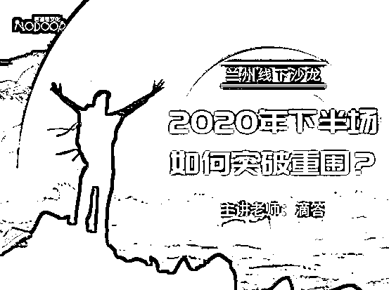

“这火星进入白羊座，太阳射手座的我就按捺不住长期的闭门不出，决定出一趟远门了。火星这个宇宙的先锋战士，正成为 2020 年下半场的主角，搅动和引领一幕幕激情燃烧甚至奋勇冲杀的剧情，试图突破重围。天上如斯，地下如是。我们在各自的人生道路上，心中是否被莫名地点起一把火，脚下无意识地猛踩油门，轰鸣的引擎声仿佛激荡着我们的肾上腺素跟着飙升，是这样吗？刹车太久了，被困太久了？！停滞不前是不可能了。前行，又能否一路畅通？答案也是否定的。挑战是必然的，或多或少，或重或轻。我们只能一路升级打怪，突破重围。如何突破重围？如何把握你的方向盘，调校你的方向，看清你的目的地和横亘在前的路障，机遇在哪？挑战在哪？在你生活的哪个领域？事业工作；家庭婚姻；感情；学业；伙伴关系？我们必是要身体力行地去经验它，并在经验中成长和成就。我们也需要更成熟稳健地倾听来自宇宙与现实中的各种声音，以帮助我们收集行动的指南，把握行动策略与节奏，助力我们最终能自信安然地站上 2021 年的新舞台。在多方的现实考量下，我把我的远行方位定在了西北：甘肃，驻扎兰州。这是我第三次经由这座城市行走大西北，这次我要去天水，联结古老的源头，拜访伏羲庙。我也计划把若道线下沙龙带到兰州。在行走中分享，在交流中相互倾听：人生与宇宙的故事，天人合谋共营的人生经验。以上种种，又何尝不是呼应了当下天象启动的南北交点落座射手双子轴的发展指引。我们又何尝不是在顺应天时，臣服冥冥天意的指引与恩典，试图活出我们个体的生命自觉与成长呢？！我们都在路上！走好！兰州见！——滴答**”****沙龙议程安排****①** 14:30-15:00 简述下半年的整体天象与趋势 **②** 15:00-17:30  现场解读星图：解读每个现场学员的下半年核心趋势与课题：机遇与挑战，关键的时间点，需关注的生活领域，行动建议。**适合对象****①** 没有任何占星基础，但相信天地人是相互联结的整体。愿意为自己人生负责而更敞开地倾听一些不同的声音。 **②** 有占星基础，在倾听老师对自己和他人的解读中，增进对占星知识与运用的了解。**参与方式**

**活动时间****：2020 年 7 月 25 日 14:30-17:30**

**活动费用****：200 元/位**

**人数限制****：12 人（报满即止）**

**沙龙地点****：素谈（兰州岚沐文创园 南滨河中路 405 号原兰州木器厂）**

**参与方式****：报名成功后，请添加客服微信，获取线下沙龙入群方式**

**长按下图二维码报名**

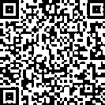

**注意事项****Q：我如果报名参加此次活动，有什么注意事项吗？**
**①** 报名后务必添加客服微信（nodoorDavid）获取入群方式；**②** 报名后，请提前 15 分钟到现场签到；

**③** 线下沙龙，不提供视频回放；

**④** 报名时会收集出生信息，主要是为了现场解读星图，老师提前熟悉星图，因此，请提供准确的出生信息。

**请长按下方二维码联络客服**

**关于滴答老师**“

滴答老师是 ISAR 认证占星师，也是我在人生道路上的好友，她丰富的人生经历和对于内在诚挚，坚定的探索，对于中国道家，佛家修行的深入实践，面对无常而发展的智慧和勇气让她对占星学发展出深入而独特的理解。我很有幸在人生道路上有她相伴，也很有幸请她把对占星和人生的领悟分享给更多人。

**——若道创始人，蒋颖**

**”**

********报名直达入口********

# 若你寻求不断进步成长，请找太阳、月亮、上升落在这个星座的爱人

> 原文：[`mp.weixin.qq.com/s?__biz=MzA5NjA0NTAxNg==&mid=2651422885&idx=1&sn=3d4e368f263ed2016388d3cec178b6b1&chksm=8b4b3212bc3cbb049ad7a6c403a4eab1664d38bb465ede4b82aeaeef64deb34b13e8319c642d&scene=126&sessionid=1692738131#rd`](http://mp.weixin.qq.com/s?__biz=MzA5NjA0NTAxNg==&mid=2651422885&idx=1&sn=3d4e368f263ed2016388d3cec178b6b1&chksm=8b4b3212bc3cbb049ad7a6c403a4eab1664d38bb465ede4b82aeaeef64deb34b13e8319c642d&scene=126&sessionid=1692738131#rd)

**********☆****************后台回复“今日”，给你一句生命态度**********

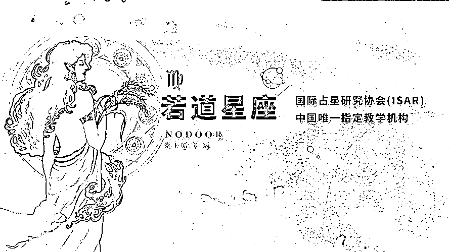

作者/斯蒂芬·弗里斯特 朱迪·弗里斯特 
译者/李含 编辑/玫瑰 图片来源/全景网本文摘自《天空的伴侣 I：爱、性和进化占星学》

说到不断地练习、进步，达到完美状态，还有什么星座能比处女座做（geng）得（jia）更（gui）好（mao）呢？想要一段完美爱情关系的人，一定不要错过这个星座……当然，你也会发现，在这篇文章中，老师提到了多少次“弄死”爱人……好吧，祝你好运！

**处女座****原型**  **仆人 殉道者和烈士** **完美主义者 分析师 批评家 工匠**发展目标

**纯粹，**就是处女座的目标。但是，不要被“处女”这个词迷惑了。处女座的纯粹和没有性经验毫无关系。处女座的目标是**不断地进化自己，让自己的潜能达到更精纯的层次**。她的纯粹是一种生活形态，**她的思想里只有她认同的真理，而没有被其他任何事物所污染。**

总而言之，处女座的目标就是**“完美”**。**追求完美**是一种与生俱来的性情，而不是人类理性的选择，但是这个动机是处女座赖以生存的命脉。任何被处女座影响的行星都会体验到一段进化的旅程，做好准备，**谦逊地面对这段宿命的境遇，寻求指引或建议，然后成长**。这个形而上学的寓意表示，处女座的人在前世体验了**某种灵魂的停滞、乏味**。**因为这种模糊不清，无法确定的感觉而心生愧疚，永无止境地强烈追求精准便由此而生。**

策略和资源

处女座最基础的资源就是**理想意识**。意识到理想的高度。处女座**一丝不苟、严谨认真，探求事物的本质。**在现实与理想之间拉扯，加快了处女座的成长脚步，明确了处女座的方向。她不知疲倦，内心的确认机制让**她讨厌懒惰，拒绝自满**。不论已经做到了什么程度，她都**希望更进一步**，她知道她可以。**经常不间断地用巧妙有效的策略推进自我的成长，追求愈加完美的境界。**

在中世纪，处女座是**仆人**的代表。关键问题并不是像仓库管理员和女仆那样认真细致的工作。**服务于他人是**一种非常行之有效的成长方式。处女座人**向内探索，找到自己需要打磨之处，呈现给世界。**换言之，她找到了那些**可以改善，更趋近完美**的部分。于是，她会真正地具有这种优秀品质。从某种意义上说，她成为了**此项优秀品质的仆人**。她是怎么做的呢？ 这很简单，处女座会**花上很多时间来练习它。**

例如，某个处女座人是一位作家。她在写作时，总觉得没能达到最佳状态，她就不停地写啊、写啊，精益求精，更精炼、更富于表现力，每一天都有提高。这位处女座作家可能还八卦，但她知道这不是她的“优秀品质”。这就是她问题的关键，当她写作时，就没时间八卦了。**八卦爱好饥渴了。优秀的品质得到了滋养成长。**

不要肤浅地看待处女座这个策略。这很有效，假以时日，它就能完全地改善性格，趋近完美。而我们知道，处女座的目标，就是完美！

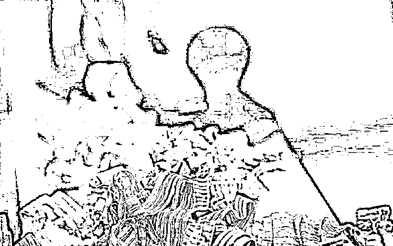

阴影

“这是我的理想。如果我不懒惰、脆弱、发疯，我的生活就要是这个样子……另一方面，我……神啊，请赐予我力量吧！”完美是一个严厉的情人，她投射的阴影后果严重，带来**有破坏性的自我批判**。处女座必须**学会接受自己、原谅自己**。否则，就会陷入**冷酷的自我质疑、自我破坏、自我限制**的模式中。如果处女座被这种毒药放倒了，她很快就会陷入下一个阴影中：**事无巨细的挑剔。**

**处女座的爱情**太阳处女座的爱情

在亲密关系中，处女座最欣赏两种品质：**成熟务实和努力成长（精益求精）的态度**。她也许不会使用这几个词，但是，如果伴侣没有了这两种品质，处女座马上就会抽身离开。在现实主义的大旗之下，我们欣赏**逻辑思考、清晰的头脑、耐心、能力**，也许还有**雄心壮志**。这些品质有助于我们在现实世界里生存。努力成长：**在处女座的影响下，我们欣赏诚恳宽容地接受批评，欣然面对自己的不足和缺点，努力改正，做到更好。**

处女座人的爱情能够延续，需要这份爱能够**持续地改变和成长。**她会**帮助伴侣把构想的新项目、新想法细化成可行性方案。**她也许会陷入人生的茫然之中，但是这很短暂。经历过一些事情后，**处女座人很难简单地相信爱情，需要不断证实爱情和爱人值得信赖。**从阴暗面来看，处女座的完美主义倾向会让她对伴侣**唠叨苛责，这种批判会腐蚀信任，有损自发性，无法分享爱情的快乐**。同样，处女座自我怀疑的阴影，会导致一种**自我毁灭**的行为，**选择麻木、自私、专制独裁的伴侣。****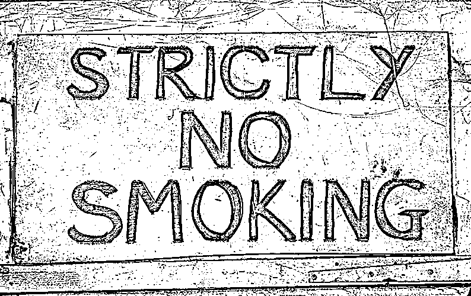**月亮处女座的爱情月亮的情绪模式是天性使然，月亮在处女座的情绪模式是**习惯性不满**。显而易见，处女座的阴影会带来如下负面作用：**过度担忧、挑剔唠叨、琐碎小气**，这些行为在短短一周内就能把任何人弄疯。这里面也有宝藏：这种习惯性的烦躁不满也能转化一种动力。**谦虚的自我评价态度**，代表了**改进的意愿**。处女座会**给予伴侣务实的见解和具体的帮助。一起为人生而奋斗，有条不紊、百折不挠、行之有效地进行计划。**处女座的守护星是水星，会投注很多精力在**交流沟通**上：月亮处女座人的亲密关系有赖于**畅所欲言的沟通**。**如果月亮处女座的人真正放松和信任，就能够逐步放开自我质疑，重新思考自我价值**。在家庭生活中，月亮处女座的人倾向于**执行严格的管理**——要知道，家是享受快乐，休息、充电的地方呢。上升处女座的爱情

上升处女座的男女都会给人留下**干练、高效**的印象。他们能够**很快获取别人的信赖，在关系开始的初期，会被征询建议或帮助**。他们**精确严格、一丝不苟**，通常他们的着装打扮也是如此。拥有强大的水星能量，上升处女座的人可能是**话唠**。

通常，他们会**强迫性地过于关注细节**。**超越语言和思考，体会到心灵的悸动**，这就是上升处女座要面对的挑战。**工作和责任能让他们保持专注，如果爱情让他们的内心感到不安，他们通常会“弄死”伴侣。**

处女座的守护星是水星，上升处女座的人，水星就是命主星。从水星所落的宫位和星座也会影响到亲密关系，特别是落在了相关的“领域”。

**版权声明：**本文由若道翻译发布，欢迎转发，反对抄袭。友号转载请申请白名单。

**12 星座爱情宝典**

[白羊座](http://mp.weixin.qq.com/s?__biz=MzA5NjA0NTAxNg==&mid=2651419096&idx=1&sn=30c86f7f9f489d61c1b0f80b8944b46b&chksm=8b4bc36fbc3c4a79c49f5b4aa43daad19a145e2bf762fe4a8e5bc1319228e633a65ae869df2c&scene=21#wechat_redirect)丨[金牛座](http://mp.weixin.qq.com/s?__biz=MzA5NjA0NTAxNg==&mid=2651419469&idx=1&sn=e44679a33194bf652fe9f515565c8da5&chksm=8b4bc1fabc3c48ecfa11b12fdab2043d246c58d47176dfa105a11ee05a22b4bc65947c7ad02e&scene=21#wechat_redirect)丨[双子座](http://mp.weixin.qq.com/s?__biz=MzA5NjA0NTAxNg==&mid=2651420649&idx=1&sn=0179035270f9508988c70e85c969869c&chksm=8b4bc55ebc3c4c48c928471267184c6360676c387dc9527ef0e112d6671bba3e8893324b5621&scene=21#wechat_redirect)

[巨蟹座](http://mp.weixin.qq.com/s?__biz=MzA5NjA0NTAxNg==&mid=2651421302&idx=1&sn=23f3f771a6bb8eed2903620cc0344755&chksm=8b4bc8c1bc3c41d7b10a8b2c2a826edf4d7700e0db201cabe956be9128038e9dd3beb6b14afb&scene=21#wechat_redirect) | [狮子座](http://mp.weixin.qq.com/s?__biz=MzA5NjA0NTAxNg==&mid=2651422486&idx=1&sn=ee393d64fc0638b589212d81c2ecbd35&chksm=8b4bcda1bc3c44b737b01fcfcc85a0a9096d4f7a567d76c6079e9760105e5259d775715f6429&scene=21#wechat_redirect)

斯蒂芬·弗里斯特

若道签约老师。进化占星学的创始人之一，当今世界最有影响力的占星大师之一；1985 年，他凭借《内在的天空》一书获得职业占星师协会奖（Professional Astrologers Incorporated Award）。他四次获得占星界最高的占星学联合协会奖（United Astrology Congress Regulus Award）提名，2018 年获得轩辕十四教育奖。

**想听听大师斯蒂芬老爷子的精彩讲座？**

**长按下图了解详情！**

**微信又双叒叕改版啦，不想错过若道君的推送？**

**就把若道设为星标吧！**

**▼**

就是这个“在看”，戳戳戳 ☟

****************报名直达入口****************

