# 若道 202104-202111 PT1

# 若道 202104-202111

来源：[`mp.weixin.qq.com`](http://mp.weixin.qq.com)

# 新课首发·2022 年若道 ISAR 选修课 | 《医疗占星手册》作者亲授

> 原文：[`mp.weixin.qq.com/s?__biz=MzA5NjA0NTAxNg==&mid=2651462540&idx=2&sn=0eac41c0de975b532a968e982f8f7f6d&chksm=8b48a93bbc3f202de47daaadf78856ebc6800c8779628e71ff7bfda7b22994aa02b9ab419075&scene=126&sessionid=1692737893#rd`](http://mp.weixin.qq.com/s?__biz=MzA5NjA0NTAxNg==&mid=2651462540&idx=2&sn=0eac41c0de975b532a968e982f8f7f6d&chksm=8b48a93bbc3f202de47daaadf78856ebc6800c8779628e71ff7bfda7b22994aa02b9ab419075&scene=126&sessionid=1692737893#rd)

**有四个主要因素影响着我们的生活和健康：基因构成、物质环境、情绪环境，以及我们的占星配置。我们在星图中都存在患病的可能性，而预防的方法在于尽可能充分、真实和健康地生活。****——简·里德·帕特里克****（Jane Ridder-Patrick）博士**

占星学就像心灵的 X 光片。它可以描述个人对世界的看法和反应。我们越不了解自己的天性，面对生活中的挑战，我们就会有越少的选择。

**“占星学可以精准定位需要解决的潜在问题。”**

**医疗占星学是一个强大的工具，同时洞察的身体和心理过程，通过更多的自我认知照顾和关爱自我和身边的人。**

**本课程既适合医疗占星学的初学者，也适合已经有一些相关经验的人****。**简·里德·帕特里克老师将运用现实生活中的例子，揭示一个人的性格、症状及其星图是如何相互映照的。课程也会探讨疾病的意义以及可能的治疗方法。

**本课程旨在为学员提供一个运用医疗占星学的框架和方法，**学员将会学到一些有价值的实用工具，在课程结束后，自己使用这些工具研究其中的关联性。

**此课程可作为 ISAR 选修课。**

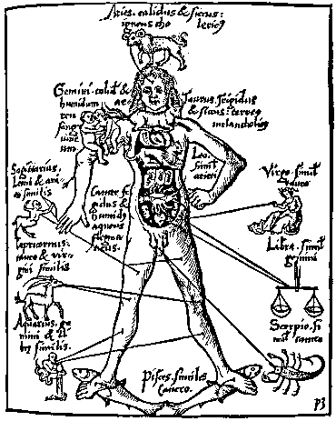

1

**课程安排**

**课程时间：2022 年 3 月 8 日-4 月 26 日  每周二 20:00-22:00**

**第*****1*****讲  3 月 8 日 与占星学、心理学、病症一起工作**

*   医疗占星学的组成部分以及如何使用它们

*   行星的作用与相互作用

*   黄道星座人

*   宫位的重要性

*   疾病和健康是如何产生的

**★ 第二、三、四讲的课程内容基于星座以及它们之间的相互作用。**

**第*****2*****讲  3 月 15 日 基本星座**

学习基本大十字星座——**白羊座、巨蟹座、天秤座和摩羯座**——及其功能和相关的健康问题。**这些星座与防御、养育、结构、体内平衡和荷尔蒙控制有关。**

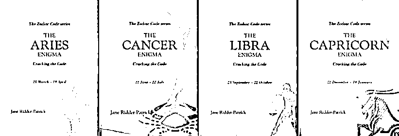

****第*****3*****讲  3 月 22 日 固定星座****

学习固定大十字星座——**金牛座、狮子座、天蝎座和水瓶座**——及其功能和相关的健康问题。**这些星座与习惯和反射、心脏调节、生存、循环和协调有关。**

“固定星座（金牛座、狮子座、天蝎座和水瓶座）在情感和生理上都倾向于**‘难以放手’**，这可能为恶性肿瘤的生长创造环境。所以说，他们可能倾向于沉浸在过去的伤害中，难以自拔。另一方面，这些星座也擅长在艰难的时期坚持不懈并一直**持之以恒**。”——简·里德·帕特里克（Jane Ridder-Patrick）博士

**第*****4*****讲  3 月 29 日 变动星座**

学习变动大十字星座——**双子座、处女座、射手座和双鱼座**及其功能和相关健康问题。**这些星座与呼吸、神经系统、肠道、睡眠以及信息、情感和行动的整合有关。**

**★ 第五、六、七、八讲重点学习行星，它们在身体层面的表达、它们的相位与行进。**

**第*****5*****讲  4 月 5 日 太阳与月亮**

**太阳**掌管视觉、活力、心脏和意识，与心脏、脊柱和视觉问题相关。**月亮**掌管人体的周期，特别是月经周期、饮食模式和体液，与情绪引起的疾病、饮食失调和胃病相关。

**第*****6*****讲  4 月 12 日 土星与天王星**

**土星**掌管着皮肤、骨骼、牙齿和衰老过程。它对应的疾病包括慢性疾病、耳聋、帕金森病、关节僵硬和牙齿问题。**天王星**代表身体活动的协调，有节奏的脉动和身体的“电”。与天王星相关的疾病包括癫痫、痉挛、心律失常，以及阿斯伯格综合症和自闭症样综合症。

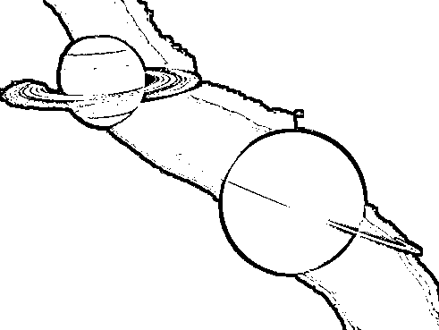

**第*****7*****讲  4 月 19 日 海王星与冥王星**

**海王星**掌管松果体、细胞膜渗透和右脑功能，与过敏、上瘾的病症、慢性疲劳综合症和睡眠障碍相关。**冥王星**掌管消除和转化，其病理包括毒性、脓肿、癌症和强迫症。

**第*****8*****讲  4 月 26 日 火星**

**火星是与能量和防御相关的行星**，掌管免疫系统、肾上腺功能、肌肉活动和炎症反应。**它是许多身体和情绪障碍的核心**，如自动免疫障碍、抑郁和发烧，以及由手术或需要手术引发的问题。

2

**此次课程适合哪些人？**

*   有一定占星学基础，若道核心课 L3 以上水平；

*   希望成为优秀的占星师，想要借鉴国际大师医疗占星解读思路并融入自己的体系的人；

*   热爱占星学、健康、养生的研究型占星学者；

*   计划考取 ISAR 认证占星师，寻觅中意选修课的学员；

*   走在自我探索和个人成长道路上的人。

**快来和简·里德·帕特里克老师学习升级版的占星学身体地图吧！**

3

**授课老师**

**简·里德·帕特里克 **博士****

（Jane Ridder-Patrick）

简接受过药剂师、理疗师、草药师、心理治疗师和历史学的专业学习，从事写作、咨询和讲学工作，在英国和全球教授占星学及其历史、当今的心理学和医学应用。她在爱丁堡执业，在爱丁堡大学获得博士学位，研究方向是 17 世纪苏格兰占星学历史。

**她最著名的出版物是《医疗占星手册》。2018 年，她因对医疗占星学的贡献而获得了著名的查尔斯·哈维占星学杰出服务奖。**

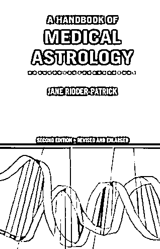

《医学占星术手册》（第二版，修订版和扩充版）

(爱丁堡，克拉布出版社，2006 年)

4

**课程信息**

*   **课程时间：**2022 年 3 月 28 日开始，每周二晚上 8 点，每周一次，共 8 次课。

*   **授课方式：**线上直播，英文授课，中文翻译

*   **课程价格：****6800 元**

*   **早鸟价：5800 元（截止日期：2022 年 2 月 9 日）**

*   **课程咨询：**王老师（微信：18510107057，请备注“医疗占星”）

长按二维码添加王老师

5

**退转课程**

*   **退款原则请详看《教学协议》，如有疑问请咨询课程顾问。**

****医疗占星****

**授课老师：**简·里德·帕特里克

**授课时间：**2022 年 3 月 28 日起

**授课方式：**网络课程**，**英文授课，中文翻译

**费用：****6800 元****（早鸟价：5800 元，2022 年 2 月 9 日截止）**

**课程负责人：****王老师**（微信：18510107057，请备注“医疗占星”）

长按二维码添加课程负责人咨询~

****报名请点击“阅读原文”****

# 深度丨这颗“独立又叛逆”的行星，如何给生命带来进化？（内附行星相位指南）

> 原文：[`mp.weixin.qq.com/s?__biz=MzA5NjA0NTAxNg==&mid=2651462440&idx=1&sn=2c8ca49187b35110793619175b6cb341&chksm=8b48a99fbc3f20895537045ab73acc0c3e51d9f00537ab5eca9807f2e2d38f78cc2b29db9bd9&scene=126&sessionid=1692737893#rd`](http://mp.weixin.qq.com/s?__biz=MzA5NjA0NTAxNg==&mid=2651462440&idx=1&sn=2c8ca49187b35110793619175b6cb341&chksm=8b48a99fbc3f20895537045ab73acc0c3e51d9f00537ab5eca9807f2e2d38f78cc2b29db9bd9&scene=126&sessionid=1692737893#rd)

**☆ 后台回复“今日”，给你一句生命态度 **

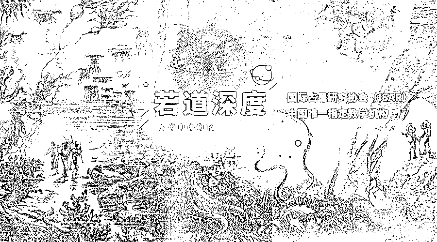

作者/薇安 ISRA 认证占星师
编辑/翀子  图片/网络

占星学里的天王星，象征着打破现状的冲动，并以崭新和独创性的方式带来进步和解放。当它与个人星图上的太阳、月亮、水星、金星、火星形成重要相位时，意味着会在哪些领域拥有独特的过往和挑战传统的动力呢？一起阅读吧！

**导论**

**1781 年 3 月 13 日，爱好观星的音乐家 William Herschel，在英国巴斯发现了天王星。**随着它被认定为行星，太阳系即刻扩张了两倍，数千年来由七个天体依序围绕太阳的传统宇宙论被打破。

这颗星体“诞生于世”的影响，生动直观地镜映出占星学赋予它的象征意义——**挑战、打破现状的冲动**；**从旧有事物和传统中脱离的渴望；崭新的、独创性的、带来进步和解放的意图与行动。**

**出生星图中，天王星与个人行星形成紧密相位时，**我们会透过后者所征象的心理动力与行为面向，来展现**独立、叛逆**的特质，渴望以**“另类途径”**行事。而这里，也蕴藏着**直击真相、原创发明或创造新观念的生命潜能。**

**要强调的是，欲建设性地运用天王星的能量，个体必须发展出更具整合性的意识。**换言之，在真实的生活中，我们同样需要“土星式”的规范、纪律来提供稳定性和安全保障；要有能力构建自身相对稳定的内外结构和秩序，作为成长的基石。

既能参与社会契约、构建现实成就；又能主动瓦解掉熟悉但已失效的部分，腾挪出空间给新想法和新行动，天王星就会促进人生的持续更新和发展。否则，它可能只是造就了古怪的性格，或无法产生任何实际成果的“特立独行”。

在此过程中，我们会经历：“渴望改变又害怕改变”、“渴望与众不同又害怕被排斥和孤立”的内心冲突；也可能因此而过激地表达的叛逆、或压抑冻结了发展的驱力……**直面、理解、调适、整合它们，心灵的成熟也将悄然而至。**

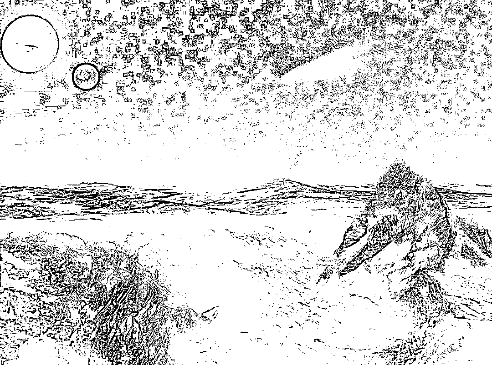

**天王星与太阳的相位**

**当天王星与太阳交互辉映，自我的身份认同中必须纳入独特、独立和原创性的元素。**

人生早年，日天人可能就与周遭**“格格不入”**；**或隐微或直接地以某种方式挑战权威**，抗拒服从制度，坚持按自己的方式行事而不愿意被干预或指导，渴望摆脱过往为自己寻得一番自由天地。

在社会生活中，这些特质难免带来挑战。例如，因表达的观点过于超前而遭到误解；或因另类的行为方式而遭异化。

*   **日天成和谐相位的个体，**较能自洽于自身的独特性。

*   **挑战相位**则容易形成“**既渴望与众不同又害怕变成局外人”**的心灵冲突。若长期压抑自己的天性，“伪装”迎合，会与真实的自我感解离开来，内在日渐变得空洞而虚弱无力。

*   有的人则**特别害怕自己的个性会被抹杀**，倾向于不分情景地固执坚持自我、不易妥协合作，甚至引起他人的反弹，令自己落入孤立境地。

**日天人要意识到：叛逆和反抗的冲动，只是太天能量的原初表现，它的核心本质是驱使我们成为一个能够为社会带来改变的人。**重要的是，要能将其贯注到某个能具体地实现自我成就的领域中，释放分享真相的才能和热情，打破那些已经变得无效、却仍被人们视为理所当然的境况，为之注入新活力。

真正能促进改变发生的人，都要冒遭遇排斥和冷落的风险。日天人的“英雄之旅”正是—**—不断发展出坚定的自我形象和人格，去“挑战落伍的传统、成为进步的代言人和拓荒者！”**

**案例**

**太阳与天王星合相落于三宫的好友，**曾这样向我描述：

“高中那会，我很难接受一些老师特别教条的知识灌输，常和他们起冲突。有时正上课呢，实在听不下去了，我会当众起身离开……我因此也受到了长辈的质疑和同济的排斥，**真的就是一个‘独行侠’**。”

“进入社会参加工作后，挑战更大。就像心理学家荣格所言，我们需要发展健康的人格面具适应社会生活，让自己能立足于世。这当中，如何不迷失掉内心真实的自我；能脱离外界标准、评判，拥有稳定的自尊，以及定义自己的力量......到了不惑之年，算是小有心得，**但也还在不断探索这个平衡的过程中......”**

现在，她是一名语言学家，以独立专家的身份与教学结构合作。**“公司很尊重我的专业价值和贡献，彼此的距离，也刚刚好……”**

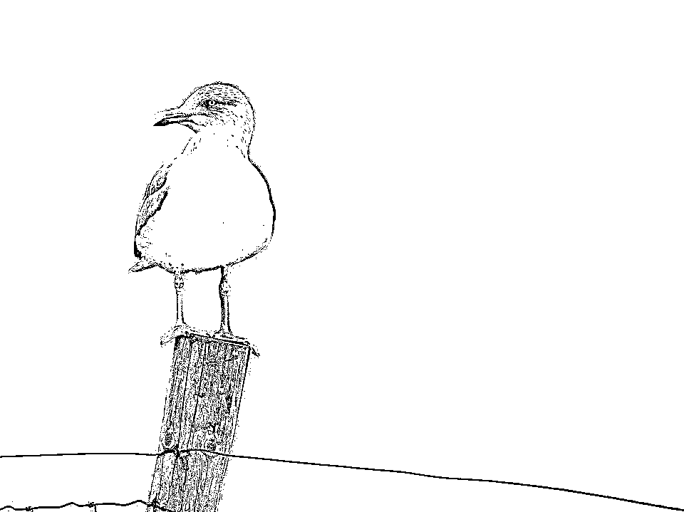

**天王星与月亮的相位**

一个最直接地表达月天组合功能的词就是：**去依赖性。**

月亮与“根源”相关。月天人在孩童期，往往有类似经历：或因家庭生活剧烈变动、或因照料者的养育方式等原因，在需要抚慰和支持时，得到的回应多是冷谈或反复无常的。

他们可能自然适应了这种情况，也可能觉得被忽视或抛弃，**但都很早发展出了情感的独立性，**并激活了一种本能的心理机制——**必要时与感受切割开来以自我保护。**

从进化的意图来看，与家庭的疏离，会促使个体从家族模式中脱离出来。许多月天人都倾向于远离出生地，或移居国外。**一种近乎天然的、独处的自在感，支持他们游走四方，在不断适应变化的过程中，探索自我的真实本质。**

但人类天生有着依恋的本能，需要透过熟悉的事物获得安全感。月天的挑战相位，可能使个体心灵固着于未被充分滋养和回应的创伤中，**处理关系时，会在要么过度依赖，要么断然孤立的两极间跳跃。**

月天人需要哀悼未能获得充沛情感滋养的内在孩童，更要信任自给自足的能力。同时**正视人际间恰当的依赖，学会正向地展示脆弱性，并自在地接受他人给予的情绪支持。**

**伴随内在整合，他们将更好地展现其天赋**——迅速洞悉他人的感受，直觉地知道该如何回应；因自身快速变化的情绪而对人类行为产生包容力和洞见，且有能力以各种方式展现关怀。

**案例**

我的公众号中，有关月天相位的讨论，收到这样一些精彩留言：

*   “看得眼泪婆娑。我 18 岁离家千里上大学，变**换八个城市四个国家生活后定居异乡**，天王星合相月亮在天底。”

*   “月天合相，**从小就经常转学，变换住所，**曾经跟妈妈姐姐一起临时住的房子还被人用自制炸药包炸过，后来就长期住在姥姥家，偶然才见妈妈，18 岁离家上大学之后，很少回家，后来出国留学，回国后定居外地。”

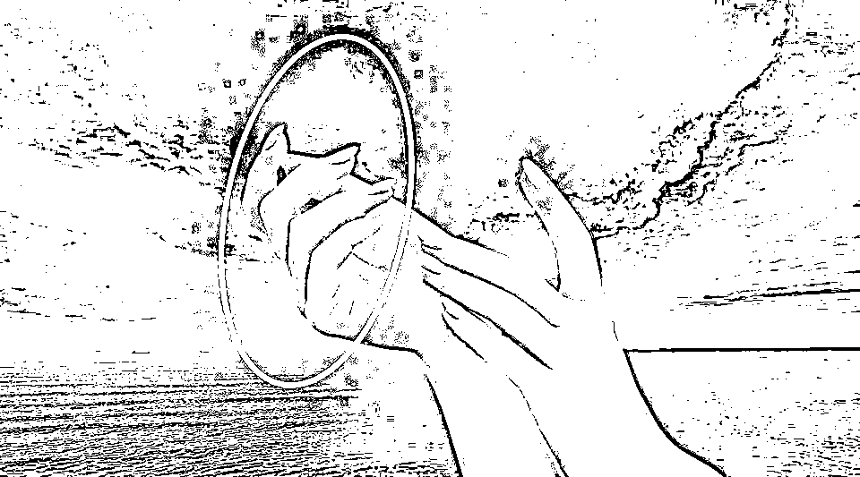

**天王星与水星的相位**

两颗皆与心智功能相关的行星联结，**预示着快如闪电般消化信息的能力、超强的直觉和高智力。**当条件成熟时，水天能量的最佳运用，便是穿透传统、暧昧性和恐惧，直截了当地道出最真实的想法，给他人带来震撼、启示和解放。

但快速闪现的直觉，未必总是正确的。**水天人如果过度认同于自己的心智特质，**将之视为反叛传统，或定义自我独特性的“武器”，**会固执地坚持自以为是的“真理”**。虽然有着强烈地交流的欲望，却无法与他人进行真正平等的沟通。

不难想象，典型的水天人**很容易对传统教育的内容和方式感到不耐烦。**成年后，他们可能将自己早期教育中感到的不适，转化为推动教育改革的动力，主张教育、学习都应该为解放思想服务。

而父母最好能用更加宽容的视角，考量水天相位（尤其是合相和挑战相位）的孩子的学习表现。在协助他们适应社会规范的同时，支持他们运用更契合自身特质的学习方式，投入兴趣领域。

天王星对水星的磁化，会使水天人的**神经系统变得活跃**。深入某个领域中，**运用独立思考的能力发展出超越传统的见解，**以多元的途径进行展示和表达，能更具建设性地将这股能量转化为创造力。

**案例**

**友人的女儿，水星合相天王星落九宫水瓶座。**

初中毕业时，女儿的成绩可以继续就读本校（一所高考升学率颇高的学校）高中部；但她更展现出对艺术创作的强烈兴趣（太阳落双鱼座）。朋友坦言，自己的确有传统顾虑，担心学习艺术，将来不易就业和发展。在和女儿认真沟通后，父母决心尊重孩子的意愿，脱离出传统教育的轨道，转而接受专项艺术创作训练。

“女儿告诉我，通过绘画、雕塑这些方式，**她更能表达自己的思想**，对生活的理解。这些部分她平时很难和别人交流，学校的知识教育对此也没有太多帮助。作为妈妈，我永远都会牵挂担忧，**但我更愿意信任、支持她按自己的方式去展开生命旅程......”**

三年后，女儿凭自己的努力拿到奖学金，目前正在芝加哥艺术学院深造。

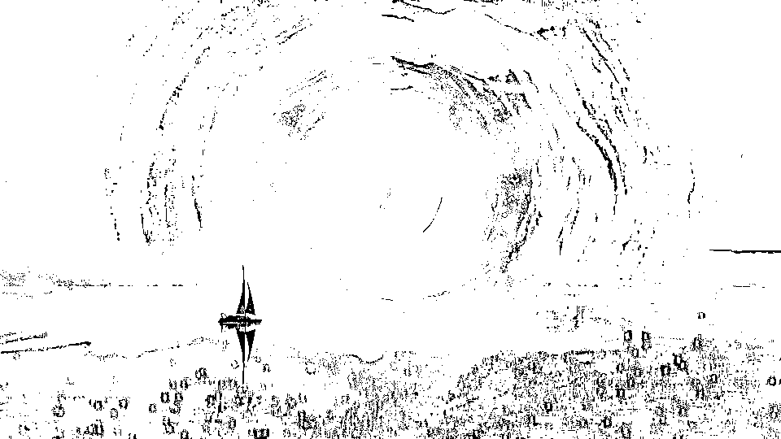

**天王星与金星的相位**

金天人透过自身的审美面向表达这组原型时，**喜欢以独特的方式打扮自己**，会释放出一种富磁性的吸引力，**也颇具艺术或创意领域的原创潜力**。而这组原型也极大地影响着他们在**人际互动**，以及**亲密关系**中动力模式。

因着一种人道主义的价值态度，**金天人几乎可以和任何人交朋友。**无论对方的背景、身份如何，他们都会真诚地给予同等的重视。

**在构建长期稳定的亲密关系方面，金星与天王星的合相或挑战相位，则会带来一些挑战。**

**例如：**

*   **“爱的激情”往往会骤然发生，又很快消失**。关系最好能保有令人感到刺激、兴奋的元素，若一旦变得乏味，他们会倾向迅速离开。

*   **在关系中，他们仍然需求足够的个人空间和自由。**如果伴侣希望拥有更多属于“我们”的体验时，金天人较难做出妥协。一方面，被天王星触及的面向，难免强化自我中心的倾向。另一方面，他们可能将配合他人，视作对自我独特性的牺牲或不诚实，因而拒绝合作，导致关系解体。

*   **如果童年有被人排斥的经历，会强化金天人对“被拒绝、排斥”的敏感性，**因而采取一种独立、抽离的态度来自我保护。有冲突发生时，他们可能表现得漠不关心，好像在说“我不在乎你会离开”。这往往令伴侣感觉不被需要，找不到呆在关系中的理由而离去。

**（注：金天人也可能在心理上否认自身的这部分特质，经由投射作用，吸引来演绎上述剧情的伴侣。）**

持久的关系，犹如双人舞蹈，独立与合作都不可或缺。**学会将两者整合至平衡，也是金天人成长的必经之途。**

总的来说，**追求自我的独特性，看重诚实、平等和自由，**是金天人的优势特质；而激励伴侣或他人，发展出同样的品质，也正是他们在关系中能够给出的礼物。

**案例**

**客户 J 女士：月亮落巨蟹座；金星合相天王星落七宫。**

“26 岁那年，我进入了第一段婚姻。感情是一方面，更多是遵循传统，觉得‘应该结婚’了。”

30 岁，因为职业晋升，她离家到北京发展。先生不满意两地分居的生活，要求她回归家庭。而 J 看重工作带来的个人成就，渴望不断拓展生活的视野和可能性。最后因彼此都不愿妥协，而结束了婚姻。

“情感的冲突肯定是令人痛苦的。因为从小接受的教育，也难免让你质疑自己的‘自私之举’。**但那些独立生活的日子，让我更加清晰自己想成为什么样的人。**对方始终不能理解这一点，才是我决心结束关系的真正原因。”

有趣的是，两年后，**她经历了一段远距离的恋爱，**并最终选择放弃既定的职业轨道，去到爱人生活的城市，结婚生子。

“我现在是**独立执业**的教练，能自主安排好工作和生活。最重要的是，以教练的角色支持一个生命，去发掘自身特质、潜能，**去意识到自己可以拥有的选择权和自由**，令我感到无比兴奋，充满激情。**精神世界的自给自足**，也让我能给到伴侣自由发展空间，希望也因此给女儿树立一个榜样吧。”

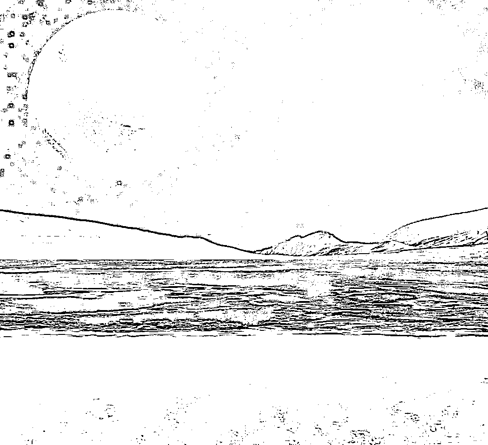

**天王星与火星的相位**

当天王星“燃爆”了火星，好似发出这样的宣言：“我就是要这样做，无论你喜不喜欢”。**这股能量的最佳表现，是让人有勇气选择走自己想走的路。**特别在为人道议题、先进思想或任何一种形式的改革奋斗时，能得到很好的升华。**在强烈的行动渴望的驱策下，往往“当下”就能改变现状。**

就个人特质而言，火天人**容易有过动的倾向**，较难安静下来。他们可能因**缺乏耐心、行事过于匆忙**而忽略安全问题。也可能因为**偏好冒险**，特别是追求速度带来的兴奋感（比如：开快车）；加之**很难听取他人的意见或警告**，不免更易招致突发的意外事故。

为使这股强劲的活力有释放的管道**，火天人不妨在生活中安排一些例行运动。**同时尽量对冒险和寻求刺激的倾向多保持一些觉知，在从事相关活动时，以更审慎的态度和技能控制好风险。

**有这组配置的女性，**受社会传统刻板印象的限制，较容易否认或压抑这部分特质。她们**或许会通过选择有火天特质的伴侣**，将之间接地表达出来。但长期压制的心理能量，仍会在暗处破坏或攻击自我。而天王星本就与解放、变革密切相关，**那些能经由自身活出火天能量的女性，正是推动人类意识进步的管道。**

**在心灵的层面，天王星和火星的组合，凸显出解放生命力和自由意志的渴望，**为整张星图注入一种所向披靡的勇气、活力与激情。火天人若能设定令自己感到兴奋、且富于创造性的人生目标和计划，投身其中；亦或在团体中充分发挥临危决策、行动的优势，或激励他人为目标采取行动......便能善用这组能量，加速自我、他人、乃至社会的成长与进步。

**案例**

**著名墨西哥女艺术家弗里达·卡罗：火星与天王星紧密合相落于摩羯座。**

她的生命经验，**在三个不同层面**，生动地显化出这组原型。

*   6 岁罹患小儿麻痹，邻居的孩子嘲笑她“瘸腿弗里达”。**她就用更加大胆的行为，**比如在自行车或滑板上做一些高难度的杂技动作，以证明就算身体有缺陷，也不落后于人。18 岁遭遇车祸，医生预言她再也无法独立行走。**弗里达以惊人的意志，熬过长达两年、极其痛苦的脊柱矫正治疗，恢复了行走的自由。**但她的身体再没能从这次事故中真正康复， 43 岁后逐渐失去自理能力。医生告诉她必须卧床休息，**她就让人用担架将自己抬到画廊中间的床上，**出席自己在墨西哥唯一的一次个人画展的开幕式。

*   **她用独有的艺术风格进行绘画创作，毫不在意外界的褒贬评述**。其作品主题大多是自己的个人故事，同时也涉及广阔多元的视角和题材：性别、生育、混血、生命周期、民族主义......当纳粹党人利用宗谱证明弗里达为优等民族时，她的回应却是创作家谱彰显自己的多国血统，**挑战社会对混血儿的负面看法。**

*   除去世人熟知的艺术家身份，弗里达也是一位**热衷政治改革运动**的女性。曾和丈夫迭戈·里维拉一起，冒着生命危险，为逃亡的俄国革命领袖里昂·托洛茨基夫妇提供庇护。在她离世前十天，虽身患肺炎，仍违背医嘱，前往危地马拉，和一万多名墨西哥人一起，参加了反对美国干预的抗议集会和游行。

**坚韧无畏、独立且个性鲜明**的弗里达，创作的画作只有两百幅，生前除丈夫和身边好友，其艺术才华并不为人知晓。而如今，许多个人和团体借用她的形象、意识形态和观点来宣传他们想要传达的信息。弗里达成为了女权、残疾人、同性恋者、以及那些不循性别桎梏之人的精神图腾。

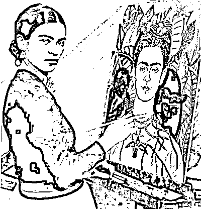

| 弗里达·卡罗

**结语**

**天王星象征的核心动力是：通过挑战传统，为个体带来某种觉醒和解放。**

当个人行星与之形成紧密相位时，我们必须有意识地向这一原型能量敞开。即使会历经重重挑战，带着觉知，接纳、信任自己独有的进化地图，于冲突中学习成长，我们将穿透外界制约、挣脱恐惧及对常规的依赖，在自我革新中发展出思想和行为上真正的独立与自由；甚至成为某个社会领域中的革新者或推动进步的人！

**版权声明**：文章由作者授权首发于若道平台发布，欢迎转发，反对抄袭。

****

**薇安**

全职心理占星师、ISAR 认证占星师（2016 年获得）、若道兼职助教

北大心理学硕士、MBTI 国际认证施测师

若道认证生时校正资质及 COAC 高阶资质毕业生

**微信 ID**：weianhuilai

**公众号 ID**：Radio-for-Alice

长按打赏

**学习占星学****点击下图了解课程详情** 

********************

**微信又双叒叕改版啦，不想错过若道君的推送？****就把若道设为星标吧！****▼**

**就是这个“在看”，戳戳戳 ☟**

******报名直达入口******

# 雷蒙德·梅里曼金融占星周运 | 密切注意 12 月 3 日前后的行情

> 原文：[`mp.weixin.qq.com/s?__biz=MzA5NjA0NTAxNg==&mid=2651462440&idx=2&sn=f1f7c1df88447660f5abe1dcce977db0&chksm=8b48a99fbc3f20894c8d247bb89a65b7bce27bd9eefd6de3e48cc77c903c10828455fdadfc42&scene=126&sessionid=1692737893#rd`](http://mp.weixin.qq.com/s?__biz=MzA5NjA0NTAxNg==&mid=2651462440&idx=2&sn=f1f7c1df88447660f5abe1dcce977db0&chksm=8b48a99fbc3f20894c8d247bb89a65b7bce27bd9eefd6de3e48cc77c903c10828455fdadfc42&scene=126&sessionid=1692737893#rd)

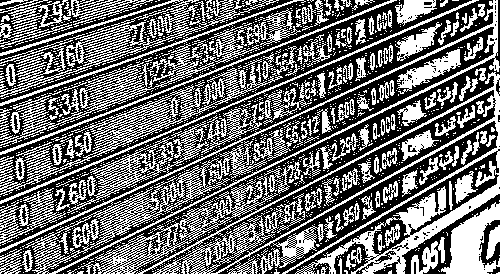

作者/雷蒙德·梅里曼 译者/Luke
编辑/玫瑰 图片/网络

雷蒙德·梅里曼是在金融占星学界稳坐第一把交椅的占星师，同时他也是若道签约的金融占星课老师，我们引进了雷蒙德·梅里曼老师的《[上证指数月度报告](http://mp.weixin.qq.com/s?__biz=MzA5NjA0NTAxNg==&mid=2651462309&idx=2&sn=dda7a20cf990d75420e394ceea74cf1f&chksm=8b48a812bc3f21043a90a8ce17ee8ec149a0027c79752983afc2556ee011f21b08677eb6c740&scene=21#wechat_redirect)》及《[黄金报告](http://mp.weixin.qq.com/s?__biz=MzA5NjA0NTAxNg==&mid=2651462213&idx=2&sn=004acddccb104b694d186ba788a2da70&chksm=8b48a8f2bc3f21e4553423c357b528ad3251f93eed420864e22fb73187bb40a9bc6ad303c1f6&scene=21#wechat_redirect)》。我们经老师的授权，将每周刊登梅里曼老师的周运，供大家参考和学习。于是，这是本周的周运（11.29-12.3）。

**说明：以下时间采用纽约证券交易所所在地美国东部标准时间。**

**展望与回顾**

****

**道琼斯工业平均指数——在短暂下跌超过 1,000 点后——当日收盘下跌 905 点，或跌幅 2.5%，创下了上周五交易时段缩短后，本年度最严重的下跌（美国股市因感恩节假期于美国东部时间下午 1 点收盘）。此轮下跌，是因为健康官员警告说，在南非发现了一种新的变种毒株，具有大量突变，并且在年轻人群中快速传播。****——梅根·亨利****《新 COVID-19 变种触发市场抛售，道琼斯指数创下单日最大跌幅》www.foxbusiness.com****2021 年 11 月 26 日**在土星-天王星渐亏四分相经典的“黑天鹅”事件中，全球股票指数周五崩盘。伴随着又一轮南非的新变种毒株，COVID-19 再一次抬起了丑陋的头。**这是一次令人震惊的警告，预示了 12 月 19 日和 24 日的金星逆行合相冥王星，以及土星-天王星的最后一次渐亏四分相，将是什么样子。**2018 年 12 月 26 日，美联储宣布将开始加息，当时美国股市发生了严重的下跌。今天面对着同样的预期，美国股市可能遭遇同样的命运，但市场似乎不放在心上。直到周五，直到 COVID-19 的新变种毒株来袭，威胁全世界的人口。有好几个与市场和地球宇宙学有关的因素要考虑。首先，2018 年 12 月 26 日的抛售，始于 2018 年 10 月初的金星逆行。那通常是美联储或者其他央行出人意料宣布利率政策变化的时候。19 个月的金星逆行周期，是最强有力和最一致的征象，不仅与中央银行的政策改变有关，也对应了全球股票指数基本或更大周期。**金星逆行将于 12 月 19 日再次发生，并合相冥王星。**冥王星是与**债务和税收**有关的行星，它们和利率有关的市场（比如国债和货币）以及股票指数有直接关系。

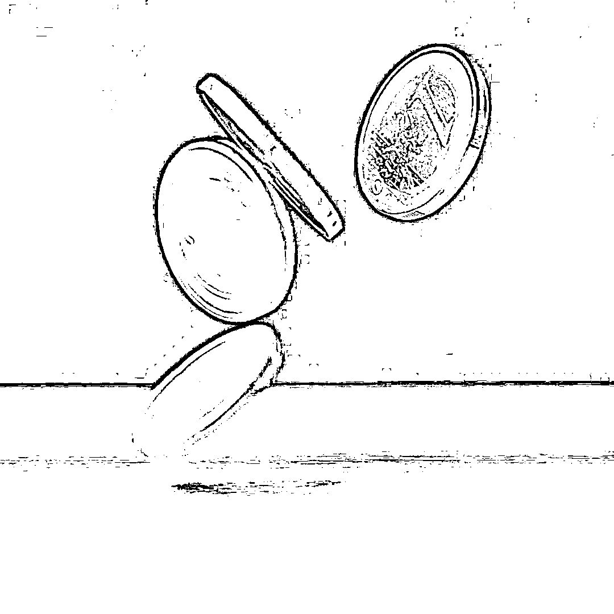

同样重要的，**是 2021 年 12 月 24 日土星-天王星第三次的渐亏四分相**。第一次精确四分相发生在 2021 年 2 月 17 日，对应了日本和中国股票市场的高点。在过去两期金融预报中，给出的研究表明，美国和英国股票市场的长期周期波峰，出现在第一次成相前几个月到最后一次成相前两个月之间。道琼斯工业指数的历史高点是 11 月 8 日的 36.565，距离这一相位的第三次和最后一次精准成相还不到两个月。我们不能排除这一可能性，那就是**11 月 8 日的高点，可能是长期周期的波峰，也是自 2020 年 3 月 23 日大流行危机 38%抛售以来，最严重下跌的起点。**在这之前，自 2020 年 3 月以来最剧烈的下跌是 10.5%。在 2021 年截至目前，还没有两位数跌幅的下跌。另一个值得关注的市场是国债。正如最近专栏中讨论的，行进木星将在 2021 年 12 月 28 日-29 日进入双鱼座，那里它会与美联储的太阳-冥王星组合构成有利的三分和六分相。我们的立场是，直到那一时期结束前，美联储都不会提高利率，或停止货币宽松政策。如果变种毒株严重，那么美联储将有理由推迟计划中的货币刺激项目削减。美联储仍然可能在木星双鱼座期间这么做，12 月 29 日-5 月 10 日，但是可能比他们提出的十二月份要晚 1-2 个月。至于这一新 COVID-19 变种有多严重，我们建议阅读《[2022 年金融预报](http://mp.weixin.qq.com/s?__biz=MzA5NjA0NTAxNg==&mid=2651462405&idx=1&sn=93e540411f9dde0fc30db3d0d7badb22&chksm=8b48a9b2bc3f20a42917c1ef97e2cd0c473599ea7ee032cf7a46a65475f3bb9b6a86701af72d&scene=21#wechat_redirect)》（点击链接课阅读）的相关章节。去年的金融预报中给出的研究，显示了历史上最知名的疫情流行，与**土星-海王星**征象的关联。**在 2021 年的最后一个季度，土星与海王星构成半四分相（硬相位）。我们现在就处于其中，这一相位将在 2022 年初失去力量。**但是**木星将在 2022 年 4 月中旬与海王星合相。这一相位预示着自由，这意味着危机再一次消退**。但也代表着一段时间过度的粗心大意，如果我们到时候不学会保护自己和彼此的话，那可能构成进一步的问题。正如上面提到的，全球股票市场上周遭遇重击。原油和白银也是如此。黄金周三价格也大幅下跌，但在变种病毒新闻的影响下迅速反弹，随后再次遭到抛售直至收盘。比特币下跌到了自 10 月 6 日以来的最低价格。周五美元下跌时，货币上涨的幅度最大，这表明交易者相信美联储会出手相救。有时占星学在理解人类活动周期运行方面，是难以置信的准确。

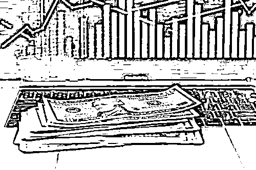

**短期占星趋势和长期考量**

****

**9 月份，美国工作者辞去了创纪录的 440 万份工作。自今年 1 月以来，在教育服务行业中，退职增加最多，包括教师、前台和指导顾问。****——安德鲁·茉莉卡和莎拉·查尼·坎本****《报告显示工作者以创纪录的速度辞职》****《华尔街日报》****2021 年 11 月 26 日**

短期来看，下周就会出现一些有趣的地球宇宙学征象，可能影响金融市场。第一个重要的，是**12 月 1 日，海王星在双鱼座转向顺行。**

海王星是一颗奇怪的行星，它可能对应着**快乐和幸福，以及表达创造力和寻找浪漫的冲动。**它非常擅长**在人们的头脑中创造出愉快和有说服力的图像和故事**。它也有利于**市场营销和广告**。

但它常常**缺乏现实主义，在压力下表现也不好**。**如果全球股市在海王星行进影响下上涨，它们可以保持高位，因为投资者“寄希望”于最好结果。**

但是如果**环境充满了压力，海王星时期可能对应着歇斯底里和恐慌，因为每件事都失控了——至少很多人认为事情开始走向失控**。

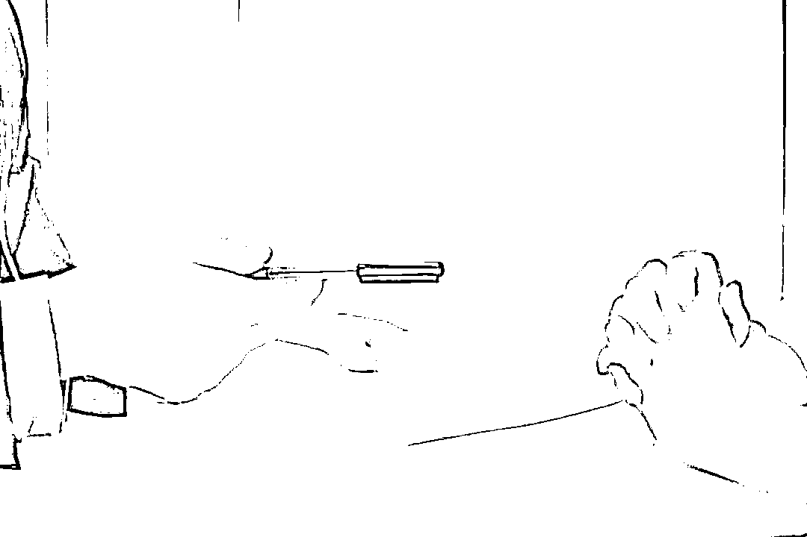

关于海王星的一件事，是你并不真正知道，**在缺乏事实数据支持的情况下，人们开始投机，有时还很疯狂，导致了恐慌。这可能是全球金融市场下周出现的情况。**

**在 12 月 3 日-4 日，新月射手座的影响力下，事情可能进一步失控。**射手座由木星守护，所以**无论集体情绪当时是什么样的，都会被夸大**。通常，在一年的这一时刻，集体情绪是愉悦的，所以市场在射手座新月下也会上涨。但是**如果伴随着新 COVID-19 变种病毒的恐慌情绪开始升级，市场可能会直线下跌。**我倾向于这样认为，因为与此同时，行进火星将与 1792 年 5 月 17 日纽约证交所建立盘的水星-冥王星，构成 T 三角格局。这一组合与股票价格的剧烈下跌有很强的历史关联。除了海王星、木星、以及射手座新月以外，有另一个行星（星座）组合可能对应着过度兴奋或歇斯底里。那就是**日心图水星从 11 月 26 日到 12 月 7 日行进射手座**。通常，这对于黄金是看涨的时期，我们看到的案例是，周五黄金从前一个交易日的低点跳涨接近$40，但收盘时回撤了大部分涨幅。但是如果木星和射手座确实与夸大有关，而且被夸大的是歇斯底里，而不是盲目乐观，那么交易者就会寻求避风港。黄金、国债或美元通常是这种经济气候下的受益者。如果美元上涨，那对于黄金可能也是有利的。**对于日心图水星在射手座的行进，我们可能见证大幅的上涨和下跌，有时两者兼有。**看起来，这将是一个有趣的假日。对于所有的射手座和海王星能量，你应该试着和爱人寻欢作乐。射手座是快乐；海王星是幸福，如果你是这样选择的话。或者，如果你更喜欢戏剧性，可以选择投机性的狂热和歇斯底里，显然这些行星提供了大量此种能量。但是记住，在强有力的海王星行进下，一个人必须小心谣言，努力获得正确的信息。

**说明：以上日期基于纽约证券交易所所在的美国东部标准时间，由于存在时差，中国地区可能需要加一天。**

**版权声明：**本文由若道翻译发布，欢迎转发，反对抄袭。友号转载请申请白名单。

**雷蒙德·梅里曼（Raymond Merriman）**

若道签约老师。著名金融占星师，ISAR（国际占星研究协会）前主席，梅里曼市场分析公司的总裁。他由于“提升了占星学的职业形象”，在 1995 年国际占星大会上被授予轩辕十四奖；在 2012 年国际占星大会上，被授予轩辕十四终身成就奖。

1“中国上证指数月度报告”发售**若道推出了****中文版****的雷蒙德·梅里曼中国上证指数月度报告，并持续发行该报告！**当把金融市场的周期和占星学的周期相结合时，雷蒙德·梅里曼老师的金融占星学研究**为投资者应对金融市场的周期波动，并随之调整投资策略提供了极大的价值参考**。
**12 月中英文报告已上线！**2“黄金价格周期月度报告”发售**若道推出****中文版****的雷蒙德·梅里曼黄金价格周期月度报告！**不仅仅为广大读者在中国股市的投资出谋划策，更将视角放眼黄金市场。**每当世界经济形式不明朗的时候，有一个地方是保值的港湾，那就是****黄金**。自 1982 年雷蒙德·梅里曼出版第一本研究《地球宇宙学征象与黄金价格的关联》的著作以来，**他一直作为最重要的黄金市场时机预测者之一享誉国际**。12 月黄金报告已上线，梅里曼老师将会告诉你他对这个关键时期如何操作的想法。也可以按照季度和一年期订阅，有更多优惠。季度和年度的好处是，你可以持续了解梅里曼老师对于不断在变化的市场的看法。即便他某一次看法和市场不一致，你也看到在下一期他如何调整自己的看法，并看到金融占星在一个长期时间段内对你把控风险的帮助。而能够长期控制风险、尽量找到安全的投资时机才是投资的长久之计。**12 月中英文报告已上线！****购买套餐**，买得越多越优惠中国上证指数月度报告套餐价

*   **单月报告**：280 元
*   **3 个月套餐**：780 元（260 元/月）
*   **12 个月套餐价**：2400 元（200 元/月）

**长按下图识别二维码****购买金融报告****套餐****▼**

黄金周期月度报告优惠

*   **双报告年度套餐更优惠（直降 900 元）**

*   **12 个月黄金报告+12 个月上证指数报告：仅需 3900 元**

**长按下图识别二维码购买黄金报告套餐**▼

3 中国金融市场特别网络研讨讲座面对年底几个影响金融市场的重要天象，该如何把握下半年的投资，为跨年做准备？我们特意邀请雷蒙德·梅里曼老师为大家带来了**3 个小时的金融讲座——雷蒙德·梅里曼中国金融市场特别网络研讨讲座。**这场为期 3 小时的在线讲座探讨了**这些长期行星周期如何影响世界经济的长期周期和趋势，特别是如何影响上证综指和黄金市场**。并描述**在 2021 年剩下的时间里市场反转关键时间点，特别是 12 月 19 日至 25 日金星逆行，以及土星-天王星最后一次渐亏四分相、金星与冥王星合相的重要时期。****长按下图识别二维码购买讲座视频**
▼

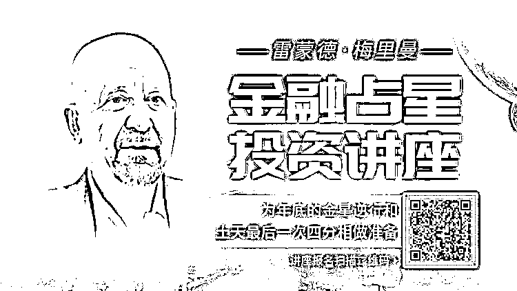

5《2022 年金融预报和沙龙》1976 年以来，由雷蒙德·A·梅里曼撰写的梅里曼市场时机学院每年一次的年度预报沙龙和每年一本的《年度预报》一直在应用占星学原理为投资者们服务，提供卓越洞见，从未间断。 **雷蒙德·梅里曼《2022 年金融预报和沙龙》开始预售中。****长按下图了解详情**
▼

**点击阅读原文购买金融报告**

# 更新 | 雷蒙德·梅里曼上证指数+黄金 12 月报告上线啦！

> 原文：[`mp.weixin.qq.com/s?__biz=MzA5NjA0NTAxNg==&mid=2651462440&idx=3&sn=1c45283342a3cb70cb06be2a0f79ab9b&chksm=8b48a99fbc3f2089cdeb7e7014fae031358fbf2824825603c7f00a56311ff43b8589902deb7f&scene=126&sessionid=1692737893#rd`](http://mp.weixin.qq.com/s?__biz=MzA5NjA0NTAxNg==&mid=2651462440&idx=3&sn=1c45283342a3cb70cb06be2a0f79ab9b&chksm=8b48a99fbc3f2089cdeb7e7014fae031358fbf2824825603c7f00a56311ff43b8589902deb7f&scene=126&sessionid=1692737893#rd)

在上上期报告中，梅里曼老师指出：**“太阳和火星将在 10 月 7-8 日合相。在容许度为 8°的情况下，这一合相与全球股指的大幅下跌有着非常强的关联。通常，市场将从形成的高点下跌 8%-20%。”**上证 9 月 13 日涨到 3723 的高点后，在 11 月 10 日跌到 3448 跌幅达 7.3%。随后上证开始上涨。上证存在一个 33 个月的周期，11 月是第 34 个月。**新的 33 个月的周期开始了吗？**

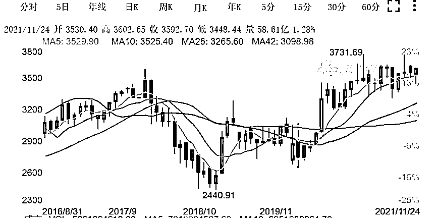

| 上证指数月度 K 线图

12 月，我们会迎来两个非常重要的占星指标：**12 月 19 日，金星开始逆行，并合相冥王星；12 月 24 日，土星、天王星将第三次也是最后一次形成精准四分相。两者都是强有力征象。**

12 月应该如何操作，金融占星大师雷蒙德·梅里曼的《2021 年 12 月上证指数报告》已上线，你可以听听梅里曼老师的看法。

**雷蒙德·梅里曼《2022 年金融年度预报和沙龙》开始预售，和《2022 年四位占星大师天象预测》课程一起购买，可享受连报优惠。**

**长按下图了解详情**

▼

投资有收益，投资有风险，希望金融占星学的研究帮助你更好地评估你的投资。

**12 月上证报告上线**

**上证指数月度报告价格**

**单月报告**：280 元/月 

**季度套餐价格**：780 元（260 元/月）

**年度套餐价格**：2400 元（200 元/月）

“**黄金是金钱。其他的只是信贷。****——约翰·皮尔庞特·摩根**”一般而言，从历史走势来看，**黄金往往在火星处于天秤座后半段时（10 月 8-29 日）对应一个低点，随后金价会急剧上涨。**

这次黄金的低点来得比较早，9 月 29 日，当火星在天秤座 9°多时，就形成了一个低点 1721 美元，随后黄金开始一轮上升，当火星进入天蝎座前半段，最高升至 1877.15，上涨了 100 多美元，升幅达 9%。

越来越接近年底，你需要关注**12 月中旬到月底的一些更有影响力的相位**。届时，金星将开始逆行（12 月 19 日），紧随其后的是 12 月 24 日，土星和天王星第三次也是最后一次形成精准的渐亏四分相。也就是说，**12 月 15 日到 1 月 7 日，对应一个基本周期或更大周期的波峰或波谷，而这将带领我们进入新的一年。**

目前，**火星已经进入天蝎座后半段，黄金开始下跌，如果这个下跌继续，会到一个更大的周期波谷吗？****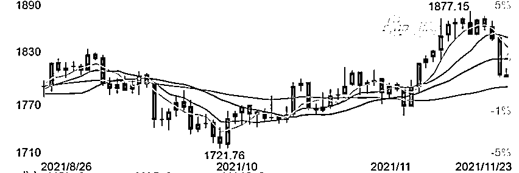**| 黄金走势日 K 线图

12 月黄金报告已经上线，上证报告也已上线。欢迎了解。也可以按照季度和 1 年期订阅，有更多优惠。季度和年度的好处是，你可以持续了解梅里曼老师对于不断在变化的市场的看法。即便他某一次看法和市场不一致，你也看到在下一期他如何调整自己的看法，并看到金融占星在一个长期时间段内对你把控风险的帮助。而能够长期控制风险、尽量找到安全的投资时机才是投资的长久之计。

点击阅读原文，雷蒙德·梅里曼黄金周期 12 月度报告带来有 40 年黄金市场研究经验的世界著名金融占星大师雷蒙德·梅里曼对当前黄金市场的研究。

**12 月黄金报告上线**

**黄金月度报告价格****单月报告**：280 元/月 **季度套餐价格**：780 元（260 元/月）**年度套餐价格**：2400 元（200 元/月）**双报告年度套餐更优惠（直降 900 元）****12 个月黄金报告+12 个月上证指数报告：仅需 3900 元****长按下图识别二维码购买黄金报告**
▼

**购买者需知**

**① **梅里曼市场时机学院《中国上证指数月度研究报告》是梅里曼市场时机学院（以下简称 MMA）的研究“预报”，而不是市场“预测”，是梅里曼老师及 MMA 金融占星分析师对人类活动周期历史与行星周期之间相关性的研究，二者在大部分情况下具有 80%或更高的相关性，而不是因果关系。报告中的研究完全存在错误的可能性。即便是非常认真的研究和几十年的研究经验，金融占星师无法总是正确地解读出各种征象在实际层面上会如何相互作用，并显化为事件结果。

所以请将报告看作一个研究参考，务必结合其他市场研究和你个人对市场的理解，根据你的自由意志做决策。

**②** 此报告一旦售出，**即不接受退款。**

**③** 上证、黄金月度报告每月固定 1 期，**并非都是在每月相同日期发布。**

**④** **我们收到英文报告的当天，即发布该英文报告。3 天后，上线报告中文版。此报告仅支持手机网页阅读，不支持电脑阅读和下载。****以上须知，请仔细阅读。一旦付款，即视为已了解并接受所有须知内容。**在过去的 39 年中，唯有梅里曼逐渐完善，并在梅里曼市场时机学院月度周期报告中阐释了将地球宇宙学与周期相结合的研究方法，以惊人的精确性预报了黄金价格发生重大变化的时间。**黄金购买 Tip**

各大银行均可购买黄金或黄金 EFT 基金，也可以在诸如天天基金或者支付宝购买黄金及黄金相关产品。不明白的可以百度搜索。

**购买后如何查看报告？**

**购买后有疑问怎么办？**请联系技术客服
**微信：nodoor201705**
**购买黄金+上证报告直达入口**

# 金融占星学大师雷蒙德·梅里曼《2022 年金融预报》开售！

> 原文：[`mp.weixin.qq.com/s?__biz=MzA5NjA0NTAxNg==&mid=2651462405&idx=1&sn=93e540411f9dde0fc30db3d0d7badb22&chksm=8b48a9b2bc3f20a42917c1ef97e2cd0c473599ea7ee032cf7a46a65475f3bb9b6a86701af72d&scene=126&sessionid=1692737893#rd`](http://mp.weixin.qq.com/s?__biz=MzA5NjA0NTAxNg==&mid=2651462405&idx=1&sn=93e540411f9dde0fc30db3d0d7badb22&chksm=8b48a9b2bc3f20a42917c1ef97e2cd0c473599ea7ee032cf7a46a65475f3bb9b6a86701af72d&scene=126&sessionid=1692737893#rd)

1976 年以来，由雷蒙德·A·梅里曼撰写的梅里曼市场时机学院每年一次的年度预报沙龙和每年一本的《年度预报》一直在应用占星学原理为投资者们服务，提供卓越洞见，从未间断。**2020 年，木星、土星和冥王星形成大合相，我们刚刚结束了一个周期和一个时代。现在我们正处于一个新时代和一个新的长期周期的早期阶段。**  如果 2020 年我们还在手忙脚乱，不知道发生了什么；2021 年则更让我们更清楚地看到一个时代结束了——2020 年之前的时代，在新冠肺炎病毒大流行、2020 年”大合相”之前的时代，这是人类历史进程上的一个转折点。**我们所熟知的生活诸多方面在那时就结束了，现在人们仍在试图找出“正确的方式”或“最好的方式”来重建和再造世界。**2021 年，有的行业被彻底摧毁，有的行业成为新贵。2021 年对投资者是一个苦乐不均的一年。尽管美国新冠肺炎疫情未见好转，道琼斯指数仍然扶摇直上；尽管中国经济在世界经济增长中一马当先，上证指数仍然波澜不惊。在货币对标的品种中，老贵族黄金走低，新贵族比特币飞升。我们还看到了大宗商品价格的飞涨，各种短缺开始出现。在中国，各种政府干预市场的调控在各个行业愈演愈烈。**这种现象到底说明了什么？又预示着什么？**2022 年我们的金融市场会受到哪些行星组合的影响呢？我们来看一看：**·** 140 年的木星-土星合相的“风象纪元”在 2021 年刚刚拉开序幕，2022 年我们还将会看到温和主义与极端主义之间存在冲突；**·** 土星四分天王星最后一次成相的影响：专制主义和中央政府控制与个人追求个体的权利和声音的冲突；新能源和旧能源的冲突；**·** 天王星进入金牛座的后半段：包括美元在内的世界货币的重新估价和地位；**·** 土星-海王星的半六分相：新冠肺炎病毒；**·** 水星、金星和火星在 2022 年的逆行“它们对 2022 年发展和增长的影响；**·** 木星在双鱼座（黄道最后一个星座）和白羊座（黄道第一个星座）之间来回移动：战争还是和平；谁是“第一名”的激烈竞争；**· **木星与海王星在双鱼座合相；**·** 冥王星在美国国家星图回归；美国的选择会对全球带来的影响；**·** 月亮交点的换座：月亮交点周期和经济周期的对应；**·** 木星在双鱼座期间金融市场和主要趋势的反转。2022 年仍然是旧世界向着新世界转变的一年。此时，金融市场的投资者和潜在投资者，都需要客观而睿智的思考，而金融占星大师雷蒙德·A·梅里曼的研究则更是无可替代的。1976 年以来，由雷蒙德·A·梅里曼撰写的梅里曼市场时机学院每年一次的年度预报沙龙和每年一本的《年度预报》报告一直在应用占星学原理为投资者们服务，提供卓越洞见，从未间断。去年，这个 3 小时的年度预报沙龙和长达 200 页左右对金融市场的分析报告帮助许多若道的读者做出正确的投资决策，降低投资风险，并获得相当不菲的投资收益。在《2021 年金融预报》中，关于上证指数，梅里曼老师说：对于上证指数，梅里曼老师说：**“我们预计涨势将在 2020 年 12 月-2021 年 2 月之间达到波峰，然后急剧下跌至 52 周和 22 个月周期的低点，这些周期将在 2021 年 5 月之前，甚至在 3 月底之前结束。此后可能会出现另一轮反弹，可能会也可能不会在 2021 年 11 月之前形成第一个 33 个月周期的新高。”**| 上证指数 K 线图关于黄金，梅里曼老师说：**“黄金的 31.33 个月周期波谷将在 2021 年 9 月之前出现，理想情况是 2020 年 12 月-2021 年 6 月。价格目标是 1628+/-109 或 1768+/-76。重叠范围（理想情况）是 1692-1737。如果价格跌破这些范围，则为看涨情况中令人担忧的状况。”**| 黄金走势 K 线图关于白银，梅里曼老师说：**“木星和月亮交点的周期表明，白银的一个重要低点将在 2021 年出现，最有可能在 5 月 13 日之前或 7 月 28 日之后出现。这可能是 5-7 年周期的波谷，但可能会保持在 18.50 以上。收盘低于 17.00 将令人担忧。”**

| 白银走势 K 线图

12 月底，我们将会再次发布梅里曼老师《2022 金融年报》。**2022 年初，梅里曼老师将会照样带来一场精彩的讲座，讨论 2022 年重要的宇宙天象及其对世界经济、金融形势的整体影响，还将覆盖中国上证股票市场的分析、黄金白银市场、比特币市场等投资市场。具体时间我们待确定后会通知大家。****2022 年度预报及沙龙预售**

**价格：****1380 元**

**一份价格仅千元的顶尖金融占星大师的投资分析报告和沙龙，聪明的投资者值得拥有。****购买者重要须知****①** 梅里曼市场时机学院每年一次的年度预报沙龙和《年度预报》是梅里曼市场时机学院的研究“预报”，而不是市场“预测”，是梅里曼老师及其金融占星分析师对人类活动周期历史与行星周期之间相关性的研究，二者在大部分情况下具有 80%或更高的相关性，而不是因果关系。沙龙中和报告中的研究完全存在错误的可能性。即便是非常认真的研究和几十年的研究经验，我们无法总是正确地解读出各种征象在实际层面上会如何相互作用，并显化为事件结果。

所以请将次沙龙和报告看作一个研究参考，务必结合其他市场研究和你个人对市场的理解，根据你的自由意志做决策。

**②** 此报告一旦售出，**即不接受退款。**

**③** 此报告仅支持在手机网页和若道 APP 上阅读，不支持电脑阅读和下载。**④** 讲座提供视频回放。**以上须知，请仔细阅读。一旦付款，即视为已了解并接受所有须知内容。**

**如在购买报告中遇见任何问题**

**可添加客服**

▼

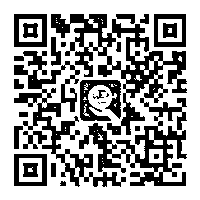

****购买报告直达入口****

# 金星六分海王星，你怎么度过这个浪漫周末？

> 原文：[`mp.weixin.qq.com/s?__biz=MzA5NjA0NTAxNg==&mid=2651462397&idx=1&sn=17fec4885ac3a51fb4afdeeb2757616a&chksm=8b48a84abc3f215c47020fda7307dcd3c23d46cf8f2b3096d40323e64d57858e77a59ec35b77&scene=126&sessionid=1692737893#rd`](http://mp.weixin.qq.com/s?__biz=MzA5NjA0NTAxNg==&mid=2651462397&idx=1&sn=17fec4885ac3a51fb4afdeeb2757616a&chksm=8b48a84abc3f215c47020fda7307dcd3c23d46cf8f2b3096d40323e64d57858e77a59ec35b77&scene=126&sessionid=1692737893#rd)

**2021 年 11 月 27 日天象：**

*   **10:11 月亮进入处女座**
*   ******水星合相太阳******
*   ************金星六分火星、六分海王星************ 
*   ******火星三分海王星******

**今天上午月亮进入处女座，**看来这个周末可以来一个大扫除啦~无论收拾屋子、分析和整理资料、照顾宠物、做轻断食，都能让这两天过得有满足感。不过从今天中午到下午，人们容易斤斤计较，变得焦虑，**处女座月亮与射手座的水星、太阳形成压力四分相。**面对自信”说大话“的人，你可能会变得很烦躁。对精确度和细节的要求，会让肆意表达有压力，但也能让思虑更落地。
金星与火星、海王星呈六分相，看上去是适合社交、以及制造浪漫约会的时机呢！火星三分海王星，一切和艺术、心灵有关的活动都可以安排起来~**所以，你打算怎么制造一个浪漫周末呢？**周六快乐！马上要迎来 2021 年的最后一个月，加油呀！我们周一见！**了解每日天象，可****下载“若道”APP 查看****还有更多精彩等着你哦**

# 涨知识！2 秒就能知道，你面对新鲜事物的反应！你知道“第一响应行星”吗？

> 原文：[`mp.weixin.qq.com/s?__biz=MzA5NjA0NTAxNg==&mid=2651462309&idx=1&sn=684c809c3bc595e74f2dbb11c23de594&chksm=8b48a812bc3f2104643216f12512db1f6608b86bfe47b656176149e704f25534ff227b8fce38&scene=126&sessionid=1692737893#rd`](http://mp.weixin.qq.com/s?__biz=MzA5NjA0NTAxNg==&mid=2651462309&idx=1&sn=684c809c3bc595e74f2dbb11c23de594&chksm=8b48a812bc3f2104643216f12512db1f6608b86bfe47b656176149e704f25534ff227b8fce38&scene=126&sessionid=1692737893#rd)

****☆ **后台回复“今日”，给你一句生命态度**

作者/艾普瑞·伊略特·肯特

译者/Lei 校对/Jun

编辑/翀子 封面/书君 图片/网络

了解占星学的人，对上升点和星图守护星的概念并不陌生，但你知道什么是“第一响应行星”吗？这篇文章介绍了这一概念。“第一响应行星”会在我们面对新鲜事物时先“蹦出来”处理事情，形成日常习惯。你的“第一响应行星”是哪颗呢？**我的日常习惯**

我要对此忏悔：说不，是我面对大部分新鲜、不熟悉、或偶然状况、即时建议的第一反应。如果人们建议我说：“艾普瑞，请再吃点奇多。”——一种我从小就时常喜欢吃的零食，我就会以一声充满热情的“好！”来回应。

但如果这种建议是“嘿，我们明天一起去吃午餐，吃完就去动物园吧。”就算我喜欢你这个人又喜欢去动物园（这是重点），忽略午餐不谈，我下意识的反应可能会是“谢谢，不用了。”

为什么会这样呢？你看，我喜欢我的小日常，遵守这些日常让我感到安全。我越能掌控我周围的事物和日程，我就越快乐。我已经计划好了，明天要非常努力地工作，然后午餐喝汤。那些可怜的小计划塞不下社交、三明治或羚羊。

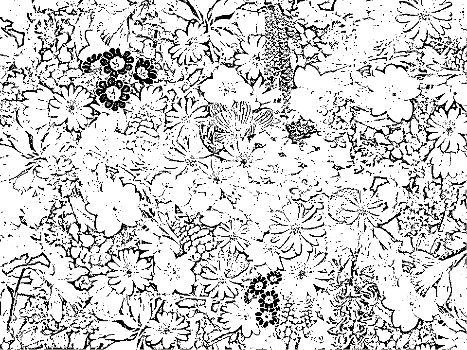

**处理新鲜事的“第一响应”行星**

**最靠近你上升点的行星，通常落在第一宫、第二宫或第三宫，叫做上升行星。****我也把它称为“第一响应”行星，因为这是第一颗准备好处理任何来到你身边的新鲜事物的行星。**

（我们不应将首应者行星与“星图守护星”混为一谈。“星图守护星”守护上升点所在的星座。在下面这个星图中，上升点在白羊座，因此守护白羊座的火星为此星图的守护星。）

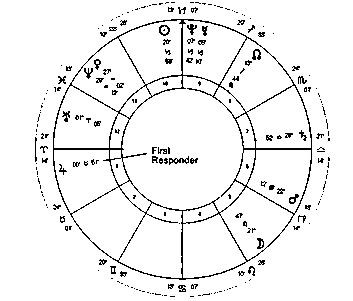

**在我的星图中，土星是我的“第一响应者”。**因此，我面对任何新鲜事物或出乎意料的事物，第一反应都是一副无可奈何的样子，同时表情就像闻到了讨厌的气味一样。**而这一切又因为我的上升星座（我上升点的星座）在友好而主动的射手座而变得更加复杂。**

所以我看起来好像是那种能随时约出去喝酒、喝咖啡，甚至去猎鲨探险的女子。我当然愿意成为那样的人，这也是为什么我培养出了那样的人格面具。但在这种人格面具之下，我其实不是那样的。

**星座可能表明了个人风格，但行星才设定了议题。**

**作为“第一响应者”的行星**

**你的第一响应行星是什么，它如何描述你对新鲜事物以及超出预期事物的最初反应？**

如果你没有行星落在第一宫、第二宫或第三宫，那么带入从第一宫逆时针数的第一颗行星吧，忽略它的宫位。如果你没有行星落在第一宫、第二宫或第三宫，但在第十二宫有行星，比如说它在离上升点几度的范围内，那么该行星很可能跟第一响应行星有类似的作用。

**★****太阳**

你会寻找一种能**脱颖而出**并引起注意的方式，**你善于对新状况制定创造性的反应。**你不停寻找能让事情变得**更有趣**的方法，并常常能成功。因此，你可能十分受欢迎。同时，你的**人格魅力**让你成为一个**天然的领导者**。

**★****月亮**

你监测着周围每一种状况和每个人的**情绪温度**。大家感觉还好吗？是否有人需要帮助？你有**天然的同理心**，但如果不发展出强大的边界，**也容易被消耗光精力**。

**★****水星**

你容易感到无聊，**喜欢新鲜事物**。你会提出问题，试图找到有趣或新奇的事物，你也很善于讲故事。为了避免无聊，如果没有很快制定出脱身策略的话，你不会进入一个新的环境。

**★****金星**

通常来说你很有礼貌，充满魅力，可能还有一点轻浮。不过我认识一些金星在上升点的人，他们有着惊人的攻击性。那是因为你是一位**战略家**，你会弄清事态的气氛，并采取一种能使事情变得平衡的调性。**有时需要你更甜美，而有时需要更强硬。**

**★****火星**

你能把事情办成！**事情需要有进展并且进展迅速，你才会开心。**尽管你天性不想要领导他人，你也不会是个跟随者。你可能是一个急性子，或至少别人会以为你在生气，尽管有时候你并没有。在紧急情况下，你很可能有良好的反应和本能。

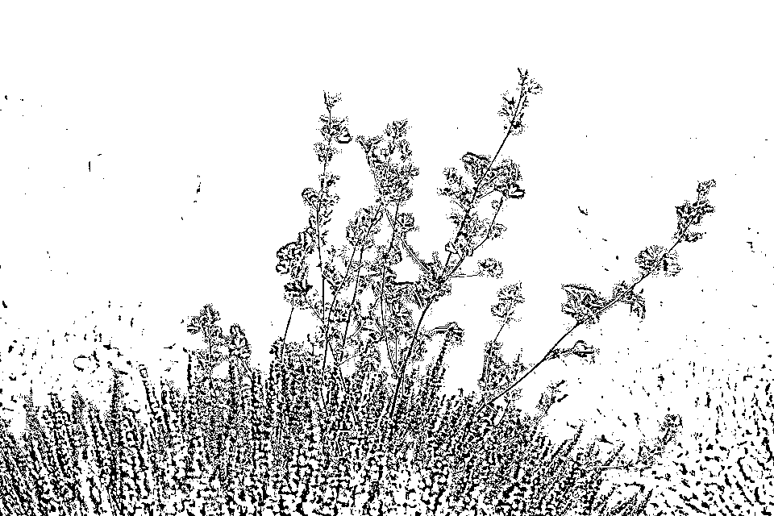

**★****木星**

跟水星上升类似**，通常而言你喜欢新鲜事物并将它们看作是一场冒险。**你能让人们大笑，通常以牺牲自己为代价。你处理事情的方法颇具哲学性，当土星说“不！”的时候，你倾向于说“当然，为什么不呢？”不过，**如果你感到不安，面对新鲜事物你可能会开启“自认为无所不知”的模式。**

**★****土星**

你倾向于止步不前并高筑防御，直到你感到安全。**在新环境中，你非常谨慎，**一开始不愿意进入这些环境。当**你做主导时**，你能在不熟悉的环境中表现更好。

**★****天王星**

你倾向于让人们有点失去平衡，对此你暗地里（或者不那么暗地里）很享受。**你很少感到自己真的合群了**，而你通常并不会为此烦恼。**你的行为是不可预测的，**而不是即兴的。在他人看来一个突然的、即兴的决定通常你已构思了许久。

**★****海王星**

**你是开放的、包容的，接纳一切周围事物。**跟月亮上升的人类似，你的边界通常很薄弱，因此**你必须努力照顾自己的情绪和精力。**奇怪的是，你有一种能在人群中**隐身**的能力。事实上有时候你必须要很努力才能被注意到。

**★****冥王星**

有人在脸书上的签名是：“首先，我得搞清楚我是爱它还是恨它”。如果你爱它，你会百分比投入进去；如果你恨它，你会让这个人或这个情况事物再也不会跟你有交集。

**你散发出一种强有力的、通常很性感的气场，**有些人觉得诱人，有些人觉得反感。你十分**擅长处理紧急情况**，当你掌控局势的时候最为开心。

**★****其他**

由于月亮交点并非行星，我没有将它们算作第一响应者。我也不研究小行星（包括凯龙星），当然我相信你可以声明它们是你的第一响应者（请自由地在评论区讨论），我对此不发表意见。

**那你呢？你的第一反应行星是哪颗，它/它们在你的生活中如何运作？**

**版权声明：**本文由若道翻译发布于若道平台，欢迎转发，反对抄袭。友号转载请申请白名单。

**艾普瑞·伊略特·肯特**

自 1990 年以来一直从事专业占星。她著有三本书，包括《占星行进》、《实用占星学必备指南》，该书被《奥普拉杂志》、《纽约杂志》和《商业内幕》列入最佳书籍名单。艾普瑞就职于全美占星师联盟（AFAN）管理委员会，曾任圣地亚哥占星协会主席，也是国际占星研究协会（ISAR）、职业占星师组织（OPA）和美国地球宇宙学研究协会（NCGR）的成员。

**学习占星学****点击下图了解课程详情** 

********************

**微信又双叒叕改版啦，不想错过若道君的推送？****就把若道设为星标吧！****▼**

**喜欢记得点一下在看哦☟**

****报名直达入口****

# 上证综指年底会有一波行情吗？ | 梅里曼上证指数 11 月报告上线啦！

> 原文：[`mp.weixin.qq.com/s?__biz=MzA5NjA0NTAxNg==&mid=2651462309&idx=2&sn=dda7a20cf990d75420e394ceea74cf1f&chksm=8b48a812bc3f21043a90a8ce17ee8ec149a0027c79752983afc2556ee011f21b08677eb6c740&scene=126&sessionid=1692737893#rd`](http://mp.weixin.qq.com/s?__biz=MzA5NjA0NTAxNg==&mid=2651462309&idx=2&sn=dda7a20cf990d75420e394ceea74cf1f&chksm=8b48a812bc3f21043a90a8ce17ee8ec149a0027c79752983afc2556ee011f21b08677eb6c740&scene=126&sessionid=1692737893#rd)

在上上期报告中，梅里曼老师指出：**“太阳和火星将在 10 月 7-8 日合相。在容许度为 8 度的情况下，这一合相与全球股指的大幅下跌有着非常强的关联。通常，市场将从形成的高点下跌 8%-20%。”**上证 9 月 13 日涨到 3723 的高点后，在 11 月 10 日跌到 3448 跌幅达 7.3%。随后上证开始上涨。上证存在一个 33 个月的周期，11 月是第 34 个月。**新的 33 个月的周期开始了吗？**

| 上证指数月度 K 线图

12 月，我们会迎来两个非常重要的占星指标：**12 月 19 日，金星开始逆行，并合相冥王星；12 月 24 日，土星、天王星将第三次也是最后一次形成精准四分相。两者都是强有力征象。**

12 月应该如何操作，金融占星大师雷蒙德·梅里曼的《2021 年 12 月上证指数报告》已上线，你可以听听梅里曼老师的看法。

[《2021 年 12 月黄金报告》](http://mp.weixin.qq.com/s?__biz=MzA5NjA0NTAxNg==&mid=2651462213&idx=2&sn=004acddccb104b694d186ba788a2da70&chksm=8b48a8f2bc3f21e4553423c357b528ad3251f93eed420864e22fb73187bb40a9bc6ad303c1f6&scene=21#wechat_redirect)也已上线，欢迎购买。

**雷蒙德·梅里曼《2022 年金融年度预报和沙龙》开始预售，和《2022 年四位占星大师天象预测》课程一起购买，可享受连报优惠。**

**长按下图了解详情**

▼

投资有收益，投资有风险，希望金融占星学的研究帮助你更好地评估你的投资。

**12 月上证报告上线**

**上证指数月度报告价格**

**单月报告**：280 元/月 

**季度套餐价格**：780 元（260 元/月）

**年度套餐价格**：2400 元（200 元/月）

**双报告年度套餐更优惠（直降 900 元）**

**12 个月黄金报告+12 个月上证指数报告：仅需 3900 元**

**长按下图识别二维码购买黄金报告**

▼

**购买者需知**

**① **梅里曼市场时机学院《中国上证指数月度研究报告》是梅里曼市场时机学院（以下简称 MMA）的研究“预报”，而不是市场“预测”，是梅里曼老师及 MMA 金融占星分析师对人类活动周期历史与行星周期之间相关性的研究，二者在大部分情况下具有 80%或更高的相关性，而不是因果关系。报告中的研究完全存在错误的可能性。即便是非常认真的研究和几十年的研究经验，金融占星师无法总是正确地解读出各种征象在实际层面上会如何相互作用，并显化为事件结果。所以请将报告看作一个研究参考，务必结合其他市场研究和你个人对市场的理解，根据你的自由意志做决策。

**②** 此报告一旦售出，**即不接受退款。**

**③** 上证、黄金月度报告每月固定 1 期，**并非都是在每月相同日期发布。**

**④** **我们收到英文报告的当天，即发布该英文报告。3 天后，上线报告中文版。此报告仅支持手机网页阅读，不支持电脑阅读和下载。****以上须知，请仔细阅读。一旦付款，即视为已了解并接受所有须知内容。****购买后如何查看报告？**

**购买后有疑问怎么办？**请联系技术客服
**微信：nodoor201705**

**购买黄金+上证报告直达入口**

# 插班中丨 ISAR 选修课：行星交点在集体进化中的作用

> 原文：[`mp.weixin.qq.com/s?__biz=MzA5NjA0NTAxNg==&mid=2651462309&idx=3&sn=5147d747165f3ce2620479e062ac4f05&chksm=8b48a812bc3f210450293883c6b1267c1c443a357429e9059aedaeb17bf7fd5956cc36ae560f&scene=126&sessionid=1692737893#rd`](http://mp.weixin.qq.com/s?__biz=MzA5NjA0NTAxNg==&mid=2651462309&idx=3&sn=5147d747165f3ce2620479e062ac4f05&chksm=8b48a812bc3f210450293883c6b1267c1c443a357429e9059aedaeb17bf7fd5956cc36ae560f&scene=126&sessionid=1692737893#rd)

这是一门专门为若道开设的课程！**马克·琼斯**将于今年秋天教授**八节关于行星交点的深度在线课程**，他将通过我们集体进化中的一些重大事件来阐释这一主题。

1

**什么是行星交点？****交点是一个天体轨道与另一个天体轨道延伸平面的交点。**任何沿轨道运行的天体都有交点。月亮有月亮交点，每颗行星、小行星、卫星和微小行星也都有交点。

2

**课程教授什么？**

马克老师**首先会讲解基础知识，**介绍行星交点是什么、行星交点运转的动力（包括日心视角和地心视角），然后他会**论述丹恩·鲁伊尔晚期工作中关于月亮交点和行星交点重要性的洞见**，以及它们如何在个人生活和事件中创造一个动态的意义轴，**超越个人出生星图的静态画面。**

马克老师还将简要**介绍自己的一些开创性研究**，并通过精选一些反映我们共同的**集体进化的现代历史事件**，分享他最近的著作《行星交点与集体进化》中的洞见。**我们将学习木星往外的行星交点**，看到木星交点如何向我们揭示文化和宗教意识形态的集体历史进化，正如我们的文明结构所表现出来的那样。例如，土星和冥王星的交点也在摩羯座，清楚地描绘了我们所有人在这个时期试图进化所面临的挑战，因为在我们生活的世界根本结构的变化中，游戏规则正在升级。**我们还将学习近期历史中行星交点的影响**，包括最近木星、土星和冥王星在摩羯座的大合相，开始真正意识到当前这个时期在文明进化本身中的集体重要性。理解这些盛衰周期，我们至少可以在这些困难时期仍然抱有希望：我们不会失去一切！**在整个课程中，马克老师将通过多个历史案例动态地研究这些强有力的交点配置可能如何运作。**

3

**课程安排****第*****1*****讲** **介绍行星交点**
我们将学习行星周期如何形成行星交点，并了解日心视角和地心视角之间的区别。**第*****2*****讲** **什么是行星交点**我们将深入学习丹恩·鲁伊尔的成熟思想，这是启发马克老师研究行星交点的灵感之源，也是他最近出版的《行星交点与集体进化》一书的灵感来源。**第*****3*****讲** **双子座-射手座的天王星交点**我们将学习人类认知和技术如何通过天王星交点的透镜进化。**第*****4*****讲**** 巨蟹座-摩羯座行星交点**我们将进一步学习行星交点对社会和文化的影响，深入探讨落在摩羯座-巨蟹座的木星、土星和冥王星交点，并了解它们在过去 1000 年里对我们的全球社会、政治和文化思潮起着怎样至关重要的影响。**第*****5*****讲** **海王星及其狮子座-水瓶座交点**我们将学习落在狮子座-水瓶座的海王星交点影响的不同显化，及其在疗愈中的作用；灵性意识形态的发展，及其促使事件结束的倾向。**第*****6*****讲** **作家案例**通过原创研究，我们将学习行星交点如何影响了世界上一些最伟大的作家的人生。**第*****7*****讲** **研究 2020 年**我们将了解 2020 年的重要意义。**第*****8*****讲** **回顾**我们将回顾前面的课程，并探索如何通过行星交点的意涵理解月亮交点。

4

**授课老师****马克·琼斯（**Mark Jones**）**马克·琼斯是一名**占星师、心理整合治疗师和催眠治疗师**，为世界各地的客户和学生提供服务。马克的第一本书《**疗愈灵魂:冥王星，天王星和月亮交点》**，详细解释他的占星方法论。他的第二本书**《灵魂的表达:占星学的治疗潜力》**，融合了马克作为超个人心理治疗师和占星学的经验，概述了占星学解读的变革性潜力。此外，马克还联合其他作者**共同撰写了一些占星书籍**：《占星学:新一代》、《超个人的占星学》以及《进化占星学的洞见》。**而《行星交点和集体进化》则是他将他对交点研究的集大成之作。**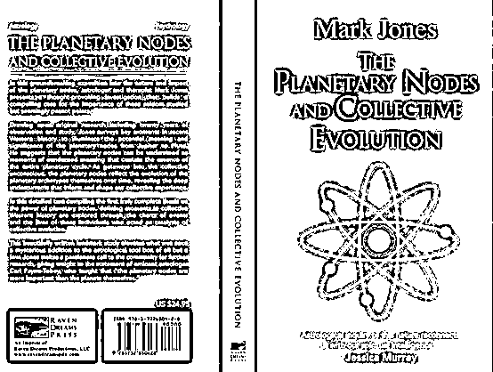

5

**课程信息**

*   **课程时间：**2021 年 10 月 26 日开始，每周二晚上 8 点，每周一次，共 8 次课。

*   **授课方式：**线上直播，英文授课，中文翻译

*   **课程价格：****6800 元****（课程不分组写走心推荐语转发朋友优惠价：5800 元）**

*   **行星交点名人案例和问答免费试听：**添加课程顾问王老师，发送“行星交点试听”，即可获得免费试听内容。

*   **课程咨询：**王老师（微信：18510107057，请备注“行星交点”）

长按二维码添加王老师

6

**退转课程**

*   **退款原则请详看《教学协议》，如有疑问请咨询课程顾问。**

****行星交点****

**授课老师：**马克·琼斯

**授课时间：**2021 年 10 月 26 日起

**授课方式：**网络课程**，**英文授课，中文翻译

**费用：****6800 元****（课程不分组写走心推荐语转发朋友优惠价：5800 元）**

**课程负责人：****王老师**（微信：18510107057，请备注“行星交点”）

长按二维码添加课程负责人咨询~

****报名请点击“阅读原文”****

# 4 位大师天象预测课 | 2022 有哪些重大天象？（内含联报优惠）

> 原文：[`mp.weixin.qq.com/s?__biz=MzA5NjA0NTAxNg==&mid=2651462213&idx=3&sn=4caa1640dc95de08ea93b2e1f58adf7f&chksm=8b48a8f2bc3f21e4bce5801f00a0b4728bd596919fbe539ee6b0288c709ccea54aec9a7476ee&scene=126&sessionid=1692737893#rd`](http://mp.weixin.qq.com/s?__biz=MzA5NjA0NTAxNg==&mid=2651462213&idx=3&sn=4caa1640dc95de08ea93b2e1f58adf7f&chksm=8b48a8f2bc3f21e4bce5801f00a0b4728bd596919fbe539ee6b0288c709ccea54aec9a7476ee&scene=126&sessionid=1692737893#rd)

2021 年已接近尾声，忙碌的年末工作也挡不住我们对来年的盼望和期许。作为占星师，在年初跟随权威老师透彻地学习 2022 年重要天象的含义和影响，是迎接新的一年的正确姿势，仪式感满满！为新一年的自我规划和占星事业加油充电。**若道邀请了金牌核心课中的四位国际名师再次集结，在明年 1 月 8 日、9 日带来 2022 年重大天象的深入解读：**********

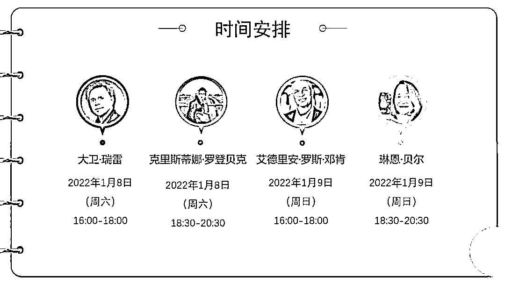

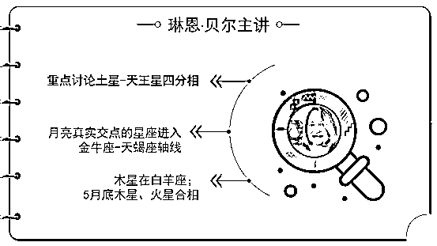

**讲师是谁？**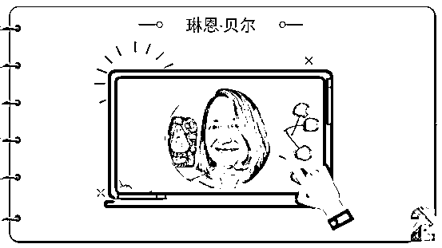

**琳恩·贝尔**

**（Lynn Bell）**

**· **世界最受欢迎的占星学演讲者、作家和老师之一。定居巴黎，研究心理占星学和家族模式数十年； **·** 著名的心理占星学中心（*Centre for Psychological Astrology*）的长期导师。2016 年，获得查尔斯·哈维（Charles Harvey）杰出的占星学服务奖；**· **作为一个从多个层面进行工作的占星咨询大师，琳恩的工作结合了心理学的观点。她对家族模式的兴趣首先来自与客户的合作。通过在分析领域所做的个人工作，她所受的埃里克森催眠训练将她引领至家族系统。后来，她组织研究小组在家族星图上进行了数年的研究。她写的《家族占星学》就是这项研究的结果；**· **法国心理占星学协会的会长。除了占星学，她在法国沙特尔的新沙特尔学校任教 8 年，还 5 次获得了在《纽约时报》畅销书作者卡罗琳·迈斯（Caroline Myss）的卡罗琳·迈斯教育学院（*Caroline Myss Educational Institute*）合作教学的机会。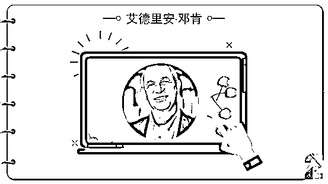

**艾德里安·罗斯·邓肯**

**（Adrian Ross Duncan）**

**· **1971 年在印度游学时开始学习占星学，1985 年开始成为全职占星师，迄今执业已超过 33 年，是人本主义占星学、卜卦占星学和经世占星学领域的知名占星师。他还开发了占星软件 AstroClock 和多款占星报告；

**· **哥本哈根占星学院院长；

**· **他在日常咨询中经常运用卜卦，咨询图（卜卦的一种运用方式，即根据客户来访时间制作星图，从星图中获得大量信息）也是他特别擅长的领域；

**· **艾德里安·罗斯·邓肯从 1971 年开始研习佛学，受佛学影响很深，他相信占星学和佛学观点一致，转化的一个基础是在于对现实感知的改变。而卜卦很容易与佛教融合，因为它只关乎当下。

**克里斯蒂娜·罗登贝克**
**（Christina Rodenbeck）****· **克里斯蒂娜·罗登贝克（Christina Rodenbeck）是一名全职职业占星师，在牛津大学城生活和工作，深受周围知识和文化氛围影响；她拥有伦敦大学（*University of London*）的人文荣誉学位，曾在伦敦占星学馆（*Astrological Lodge of London*）、心理占星中心和占星研究学院学习；**· **作为一名占星师，在过去的 20 年里，克里斯蒂娜在她的网站“牛津占星师”上写了大量关于时事、艺术和文化的文章；她每月主持一个占星播客：“与克里斯蒂娜和萨莉一起占星”，并定期在《占星杂志》(*Astrological Journal)*上撰写时尚专栏；她定期在英国授课，并保持着蓬勃发展的专业实践。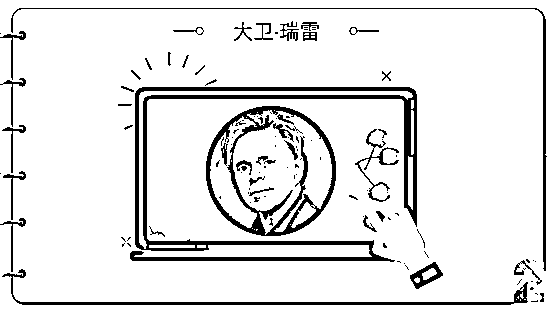

**大卫·瑞雷**

**（David Railey）**

**· **若道联合创始人，致力于在中国教授和推广西方占星学；

**· **曾任 ISAR 全球副主席，CAPISAR（ISAR 职业占星师资质认证机构）主席；

**· **1976 年，通过亚特兰大职业占星师考试，成为全职占星师，随后通过 AFAN 和 ISAR 职业测试；

**·** 1980 年，与杰夫·焦耳一起在亚特兰大创建“每日行星”占星学中心。此后在亚特兰大占星协会担任 4 年考官，并且两次担任亚特兰大地区占星协会主席。1979-1992 年，作为占星师活跃于美国社会媒体，向不了解现代占星学变化的大众宣传专业占星学知识。在 1989-1992 年期间，他在 WRGG 电台 12 频道每周主持个人电视秀“今日占星学”，早先他还在 WRFG 的广播节目中播讲宇宙天气节目；

**· **2010-2014 年，任全美占星师联盟监督委员会委员；

**· **2010 年，其著作《灵魂的目标》中国版出版，和蒋颖一起创办若道占星学校和其官网 www.nodoor.com；

**· **2017 年，被选为 ISAR 委员会成员。ISAR 是世界最大的国际占星机构，会员遍布 45 个国家，2017-2020 年曾任 ISAR 全球副主席、CAPISAR（ISAR 职业占星师资质认证机构）主席。

**课程价格****正价**：3000 元**限量优惠价：2022 元**（前 60 名报满截止）**（联系 Maggie 老师，抢占限量优惠价）******联报套餐：《2022 年度天象预测大师课》+《2022 年金融占星预报》联报优惠价****2999 元****（限前 50 名联报）****（联系 Maggie 老师，抢占限量优惠价）**长按二维码添加 Maggie 老师获取联报优惠价**退转课程**

**· 退款原则请详看《教学协议》，如有疑问请咨询课程顾问。**

****2022 年度天象预测大师课****

**授课老师：**琳恩·贝尔、艾德里安·罗斯·邓肯、克里斯蒂娜·罗登贝克、大卫·瑞雷

**授课时间：**2022 年 1 月 8 日-9 日

**授课方式：**网络课程**，**英文授课，中文翻译

**费用：**3000 元**；****限量优惠价：2022 元（前 60 名报满截止）；****联报套餐：《2022 年度天象预测大师课》+《2022 年金融占星预报》联报优惠价：****2999 元****（****限前 50 名联报）**

**课程负责人：****Maggie 老师**（微信：18510107057，请备注“天象预测大师课”）

长按二维码添加课程负责人咨询~

****报名直达入口****

# 火星进入天蝎座=上涨行情？| 梅里曼黄金周期 11 月度报告上线！

> 原文：[`mp.weixin.qq.com/s?__biz=MzA5NjA0NTAxNg==&mid=2651462213&idx=2&sn=004acddccb104b694d186ba788a2da70&chksm=8b48a8f2bc3f21e4553423c357b528ad3251f93eed420864e22fb73187bb40a9bc6ad303c1f6&scene=126&sessionid=1692737893#rd`](http://mp.weixin.qq.com/s?__biz=MzA5NjA0NTAxNg==&mid=2651462213&idx=2&sn=004acddccb104b694d186ba788a2da70&chksm=8b48a8f2bc3f21e4553423c357b528ad3251f93eed420864e22fb73187bb40a9bc6ad303c1f6&scene=126&sessionid=1692737893#rd)

“**黄金是金钱。其他的只是信贷。****——约翰·皮尔庞特·摩根**”一般而言，从历史走势来看，**黄金往往在火星处于天秤座后半段时（10 月 8-29 日）对应一个低点，随后金价会急剧上涨。**

这次黄金的低点来得比较早，9 月 29 日，当火星在天秤座 9°多时，就形成了一个低点 1721 美元，随后黄金开始一轮上升，当火星进入天蝎座前半段，最高升至 1877.15，上涨了 100 多美元，升幅达 9%。

越来越接近年底，你需要关注**12 月中旬到月底的一些更有影响力的相位**。届时，金星将开始逆行（12 月 19 日），紧随其后的是 12 月 24 日，土星和天王星第三次也是最后一次形成精准的渐亏四分相。也就是说，**12 月 15 日到 1 月 7 日，对应一个基本周期或更大周期的波峰或波谷，而这将带领我们进入新的一年。**

目前，**火星已经进入天蝎座后半段，黄金开始下跌，如果这个下跌继续，会到一个更大的周期波谷吗？******| 黄金走势日 K 线图

12 月黄金报告已经上线，上证报告也已上线。欢迎了解。也可以按照季度和 1 年期订阅，有更多优惠。季度和年度的好处是，你可以持续了解梅里曼老师对于不断在变化的市场的看法。即便他某一次看法和市场不一致，你也看到在下一期他如何调整自己的看法，并看到金融占星在一个长期时间段内对你把控风险的帮助。而能够长期控制风险、尽量找到安全的投资时机才是投资的长久之计。

点击阅读原文，雷蒙德·梅里曼黄金周期 12 月度报告带来有 40 年黄金市场研究经验的世界著名金融占星大师雷蒙德·梅里曼对当前黄金市场的研究。

**雷蒙德·梅里曼《2022 年金融年度预报和沙龙》开始预售，和《2022 年四位占星大师天象预测》课程一起购买，可享受连报优惠。****长按下图了解详情**
▼

投资有收益，投资有风险，希望金融占星学的研究帮助你更好地评估你的投资。

**12 月黄金报告上线**

**黄金月度报告价格****单月报告**：280 元/月 **季度套餐价格**：780 元（260 元/月）**年度套餐价格**：2400 元（200 元/月）**双报告年度套餐更优惠（直降 900 元）****12 个月黄金报告+12 个月上证指数报告：仅需 3900 元****长按下图识别二维码购买黄金报告**
▼

**购买者需知**

**① **梅里曼市场时机学院《中国上证指数月度研究报告》是梅里曼市场时机学院（以下简称 MMA）的研究“预报”，而不是市场“预测”，是梅里曼老师及 MMA 金融占星分析师对人类活动周期历史与行星周期之间相关性的研究，二者在大部分情况下具有 80%或更高的相关性，而不是因果关系。报告中的研究完全存在错误的可能性。即便是非常认真的研究和几十年的研究经验，金融占星师无法总是正确地解读出各种征象在实际层面上会如何相互作用，并显化为事件结果。

所以请将报告看作一个研究参考，务必结合其他市场研究和你个人对市场的理解，根据你的自由意志做决策。

**②** 此报告一旦售出，**即不接受退款。**

**③** 上证、黄金月度报告每月固定 1 期，**并非都是在每月相同日期发布。**

**④** **我们收到英文报告的当天，即发布该英文报告。3 天后，上线报告中文版。此报告仅支持手机网页阅读，不支持电脑阅读和下载。****以上须知，请仔细阅读。一旦付款，即视为已了解并接受所有须知内容。**在过去的 39 年中，唯有梅里曼逐渐完善，并在梅里曼市场时机学院月度周期报告中阐释了将地球宇宙学与周期相结合的研究方法，以惊人的精确性预报了黄金价格发生重大变化的时间。**黄金购买 Tip**

各大银行均可购买黄金或黄金 EFT 基金，也可以在诸如天天基金或者支付宝购买黄金及黄金相关产品。不明白的可以百度搜索。

**购买后如何查看报告？**

**购买后有疑问怎么办？**请联系技术客服
**微信：nodoor201705**

**购买黄金+上证报告直达入口**

# 12 星座的爱情·月亮篇（下） | 关系想要持久些？月亮有什么需求就很重要

> 原文：[`mp.weixin.qq.com/s?__biz=MzA5NjA0NTAxNg==&mid=2651462213&idx=1&sn=ff94f9d2c0fa56955ec33525106f5d5e&chksm=8b48a8f2bc3f21e4936aaa978b7747a84eae458e674b18732ee15f6e152fe079fc6841300b4d&scene=126&sessionid=1692737893#rd`](http://mp.weixin.qq.com/s?__biz=MzA5NjA0NTAxNg==&mid=2651462213&idx=1&sn=ff94f9d2c0fa56955ec33525106f5d5e&chksm=8b48a8f2bc3f21e4936aaa978b7747a84eae458e674b18732ee15f6e152fe079fc6841300b4d&scene=126&sessionid=1692737893#rd)

************☆********************后台回复“今日”，给你一句生命态度************

作者/斯蒂芬·弗里斯特 朱迪·弗里斯特 译者/李含 

编辑/玫瑰 封面/书君 图片/pexels

本文摘自《天空的伴侣 I：爱、性和进化占星学》

星图中的月亮同情感关系有着非常关键的联系。相处得越长，就越接近隐秘的月亮核心需求。之前我们分析了[6 个月亮星座的情感需求](http://mp.weixin.qq.com/s?__biz=MzA5NjA0NTAxNg==&mid=2651462070&idx=1&sn=d5cbef611d7737ded063f0f5bf9d84b1&chksm=8b48ab01bc3f22174486a56624093693138f8fd944a52f543d3ab4c9eb6f5093e798516f48d4&scene=21#wechat_redirect)（点击可阅读），今天我们来看看剩下 6 个月亮星座又是怎样的情况吧。想要进一步学习占星学，也可以点击链接[【核心课】](http://mp.weixin.qq.com/s?__biz=MzA5NjA0NTAxNg==&mid=2651460660&idx=3&sn=f65f5f0a57ca16dc1134f01b5bc1b1d1&chksm=8b48a683bc3f2f95d8b3c1f1bd069842f8f83372cdf1511107156834f8f54a9e6c52a9191c7c&scene=21#wechat_redirect)了解课程信息！

**月亮风象星座的爱情****月亮双子座的爱情**月亮双子座在亲密关系里最核心的心理需求就是**沟通交流**。这里的交流包括**认真的感受分享，也包括简单的谈笑风生**。在这里，**内容并不重要，在交流中体验彼此分享、彼此关注、彼此联结的感受才是最重要的。**持续不断地共同享受新鲜的体验，日本全岛游……或者是一起去看午夜场电影。**月亮通常对意识思考很敏感。**在这种情况下，月亮双子座的需要会难以得到满足，他们将失去动力。当亲密关系变得墨守陈规，月亮双子座会感到烦躁不安，莫名地生出不满，有时候会表现出让人烦躁的**喋喋不休强迫症。**月亮双子座的家庭生活通常透着一股**超负荷**的感觉，并且**有些混乱**，他们觉得这样的环境**很舒服，甚至是轻松安逸**。与月亮双子座在同一屋檐下，要能忍耐他们为了接听电话而关小音响踢到电脑电源这种囧事。

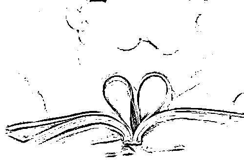

**月亮天秤座的爱情**在亲密关系中，天秤座需要伴侣**礼貌殷勤和细腻的感情**。对于月亮天秤座的人来说更是如此，月亮的温柔敏感带来了非凡魅力。这里呈现了一种优雅的敏感性：**粗俗的笑话和粗鲁的言辞难入他们的法眼。**对于月亮天秤座的人来说，亲密关系就像是**直觉的艺术**。对他们而言，优雅是自然流露的方式，是怀有开放的意识，是对每个行为的觉知。月亮天秤座的人有**异常敏锐的美学视角，即使是简洁干净也是好的。**以天秤座的阴影来看，要注意**不去过度地抚平爱情关系中避无可避的皱纹**。这里的风险是，**一个人需要完全放下自我需要才能彻底理解和吸收另一个人的观念。**天秤座如果想要营造出真正和谐快乐的关系，就必须认识到**曾经隐藏在甜美、耐心、容忍面具背后的真实的个性。**在家庭生活中，月亮天秤座会**尽力营造宁静、平和的美好环境。**舒适的环境加上充满艺术、音乐的氛围。但是，即便在艰难维持的生活中，月亮天秤座也会点上香薰蜡烛，努力营造美的生活。

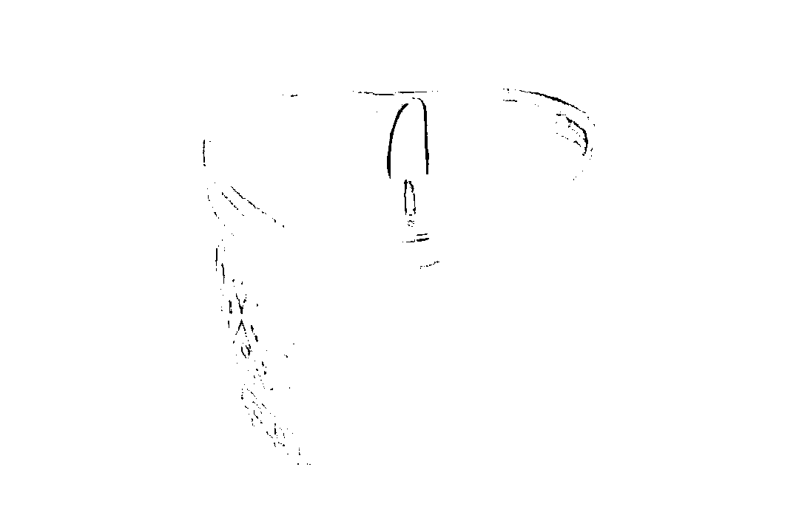

**月亮水瓶座的爱情**局限与个人层面的爱是很困难的，对月亮水瓶座来说，这尤其具有挑战性。该如何做呢？首先，**在面对爱情承诺的挑战和冒险之前，月亮水瓶座需要先搞定自己。**出于这个原因，**月亮水瓶座虽然也会拥有快乐健康的婚姻，但是早年的婚姻会是乏味而短暂的。**对于他们来说，**婚姻格外具有挑战性，**因为相比于太阳，**月亮更少地用逻辑思考，他们更容易将叛逆的方式代入爱情和两性关系。**在任何情况下，**喘息的空间**对于亲密关系的积极发展都十分必要。亲密关系对于巨蟹座和天蝎座都很自然，但是对于水瓶座，这就像是**幽闭恐惧症**，除非星图中的其他部分有完全相反的预示。**对于月亮水瓶座的人来说，分开的时光，即使只是几个小时，都是一种疗愈。**一旦有了稳定的自我，他们就变得可爱，并且能够专注，但是，在最初的发展阶段，伴侣们还是会因为月亮水瓶座的**冷漠、超然和距离感**而感到挫败：这个症状说明此人**还没有打算好融入世界。**当他们准备好踏入世界时，会给大家带来惊喜。在任何情况下，月亮水瓶座都需要**选择一个能够给予足够空间的伴侣**，传统的伴侣会觉得月亮水瓶座难以理解：他们的感情像是“不正常”。与月亮水瓶座在一起，就像是认识了外国人，或者是某位破除传统观念的人，总是有着各种意料之外的收获——但这也许也是爆炸弹。

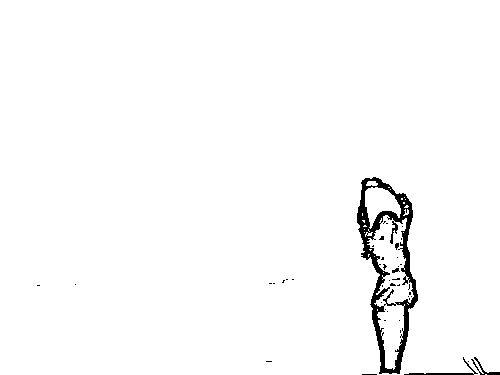

**月亮水象星座的爱情****月亮巨蟹座的爱情****月亮巨蟹座的情况很复杂，很大程度要参照太阳星座。**月亮巨蟹座需要一个壳隐藏自己，太阳通常是最合适的。月亮是掌管情绪情感的行星，巨蟹座是十二星座里**情绪最丰富**的，这两者结合在一起，可能**需要一点时间才能表达你无与伦比的温柔和情感**。到那时，巨蟹座会更明显地表达出出生星图的能量。月亮巨蟹座喜欢**跟着直觉走，他们的天性中充满了疗愈和关怀的能量。**每一个月亮巨蟹座的人都要警惕，**不要将这种同情的关怀当作是真正的爱**。巨蟹座月亮会**引来受伤的心，他们可能最终无法回馈对等的爱**。月亮巨蟹座的人**看起来太宽容善良，但事实上，这是他们自我保护的方式。**在家庭生活中，他们**擅长制造温暖、包容的氛围，**好像“霍比特人的夏尔家园”，他们需要这样的家来安放自己的情绪与幸福。**月亮天蝎座的爱情**

月亮天蝎座与太阳天蝎座类似，只不过**这种天蝎式的渴求通常被埋藏起来了，不会立即被发现，更少理性。**他们必须**体验天蝎座的方式，即不断深化的亲密和忠诚，否则他总是在爱情中感到不满足。**

这种情况下，他们通常会**因为含糊的、人为的原因，而变得沉默，处于爆发的边缘**。月亮天蝎座往返于地狱，总是不经意就沉沦。

在情人们的眼里，这很可怕：突然之间，伴侣的情绪变得冷酷阴森，灵魂在飘远。月亮天蝎座要尊重原始的冥王星节奏：**该离开的留不住。**逆袭而来时，你需要正视他。如果与月亮天蝎座亲密共处，要能**忍受情绪的直白暴露。**

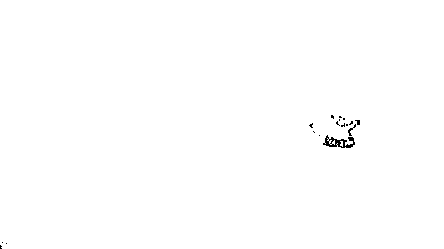

**月亮双鱼座的爱情**

基本上，**太阳双鱼座的种种特质对于月亮双鱼座也一样适用，只不过会以更柔软、更内化、更直觉的方式展现。**

在最好的状态下，月亮双鱼座就像是**一个仓库，蕴藏着人类最高等的渴求。**灵魂中潜在的爱神，将珍贵的、无常的、灵性的结合，融入到化学反应促生的、有意识的性行为之中。

双鱼座是一个超凡脱俗的星座，所以月亮双鱼座也可能是**不活跃的、主观的。**同样，这个月亮星座还可能**有精神上和肉体上的自我牺牲或殉难的情况。**

对月亮双鱼座的伴侣来说，**学着询问他的需要，学着积极地引领他进入更深的精神领域，**这是发展亲密关系的关键技巧。你们应该**鼓励他的多愁善感，并且认真地对待他们的需求。**

月亮双鱼座要学习**不要放弃太多。**家庭中，月亮双鱼座的家需要带有神圣的庙宇的色彩：**平静、美好，有另一个世界的线索。**任何人的审美观念从根本上远离这一派的，都会让月亮双鱼的人逃离现实，躲进自己的梦田。

**版权声明：**本文由若道翻译发布，欢迎转发，反对抄袭。友号转载请申请白名单。

**斯蒂芬·弗里斯特**

若道签约老师。进化占星学的创始人之一，当今世界最有影响力的占星大师之一；1985 年，他凭借《内在的天空》一书获得职业占星师协会奖（Professional Astrologers Incorporated Award）。他四次获得占星界最高的占星学联合协会奖（United Astrology Congress Regulus Award）提名，2018 年获得轩辕十四教育奖。

**学习占星学****点击下图了解课程详情** 

********************

**微信又双叒叕改版啦，不想错过若道君的推送？****就把若道设为星标吧！****▼**

**喜欢记得点一下在看哦☟**

****报名直达入口****

# 12 星座的爱情·月亮篇（上） | 从这里触发的需求，比太阳要深入些

> 原文：[`mp.weixin.qq.com/s?__biz=MzA5NjA0NTAxNg==&mid=2651462070&idx=1&sn=d5cbef611d7737ded063f0f5bf9d84b1&chksm=8b48ab01bc3f22174486a56624093693138f8fd944a52f543d3ab4c9eb6f5093e798516f48d4&scene=126&sessionid=1692737893#rd`](http://mp.weixin.qq.com/s?__biz=MzA5NjA0NTAxNg==&mid=2651462070&idx=1&sn=d5cbef611d7737ded063f0f5bf9d84b1&chksm=8b48ab01bc3f22174486a56624093693138f8fd944a52f543d3ab4c9eb6f5093e798516f48d4&scene=126&sessionid=1692737893#rd)

************☆********************后台回复“今日”，给你一句生命态度************

作者/斯蒂芬·弗里斯特 朱迪·弗里斯特 译者/李含 

编辑/玫瑰 封面/书君 图片/pexels

本文摘自《天空的伴侣 I：爱、性和进化占星学》

前阵子，若道君给大家分享了两篇太阳星座的爱情文章[【1】](http://mp.weixin.qq.com/s?__biz=MzA5NjA0NTAxNg==&mid=2651461305&idx=1&sn=d38d0b86eba072ffdaf809e1fc10133f&chksm=8b48a40ebc3f2d18b2da40d8ce914188853b1478df8ee424f0e5700e58fa7a8e104c5a6e56d4&scene=21#wechat_redirect)、[【2】](http://mp.weixin.qq.com/s?__biz=MzA5NjA0NTAxNg==&mid=2651461398&idx=1&sn=895b774bcd0d4f3abca2e7b71095b63c&chksm=8b48a5a1bc3f2cb7c6c8ae1d66432b787bbfbd92ded67fa1a2e5be506cd5905ae59e3e51cf83&scene=21#wechat_redirect)（点击可阅读）。其实啊，星图中的月亮同情感关系有着更为关键的联系哦。相处得越长，就越接近隐秘的月亮核心需求。

如果你不想三天两头闹分手，就需要学习如何同彼此的月亮星座相处。今天我们先来看看这 6 个月亮星座的情感需求。想要进一步学习占星学，也可以点击链接[【核心课】](http://mp.weixin.qq.com/s?__biz=MzA5NjA0NTAxNg==&mid=2651461947&idx=3&sn=14d40c383c62613b567633f9cbb002f6&chksm=8b48ab8cbc3f229a41d537a9376c951d1ecc3bf8d74fe64b06b5aabbafffa04647c426862177&scene=21#wechat_redirect)了解课程信息！

**月亮火象星座的爱情****月亮白羊座的爱情**月亮白羊座在爱情里的方式和太阳白羊座（点击链接可阅读）类似，只不过隐藏更深。你也许不会在第一眼就发现，因为**月亮是更直觉更无意识的行为。****月亮白羊座也许并未意识到他们心中蕴藏着这股灼热的力量。**在感情关系中，当他们感受到的信赖和亲密感越多，就越能激发内心里的火花。发怒也是，如果**月亮白羊座直接地对你发火，这其实是信赖的表现。**月亮白羊座通过特别的途径学着在感情中勇敢：**他们愿意与伴侣分享所有个人的需求和恐惧，他们也十分忠诚，强迫性地、天生地忠诚。**黑暗的一面是，月亮白羊座有时候**非常不理性、易生气、好竞争、好斗，**好像白羊座的野性完全失控。月亮白羊座**特别渴望冒险、激情或是其他极端的挑战。**当他们变得安静，或是在看过动作电影后陷入沉思时，他们可能即将开始冒险。月亮总是和家联系在一起，所以这也预示着**家中经常会有危机出现。****月亮狮子座的爱情**

**月亮狮子座也需要同样的掌声，但是这种需求被隐形了：这是一种未被表达的情绪。**为月亮狮子座喝彩，你会收获到他们灿烂的笑容，就像草原上美丽的日出。

月亮狮子座拥有**表演者**的灵魂，他们只是未曾表现出来，除非你给予一些鼓励。月亮总是害羞的，不论它落在哪个星座。

**月亮狮子座的人，伴侣必须是引人注目的，站在舞台中央，广受赞赏的，否则感情关系会充斥着阴沉冷淡疏远的气氛。**

创造性的活动可能是一顿精心准备的晚餐，全新的“形象”，也可能是更明显的艺术创造。在家庭生活中，月亮狮子座喜欢**“大”**，虽然不至于住在宫殿里，但是他们会很享受，并自豪于这样的居住环境。

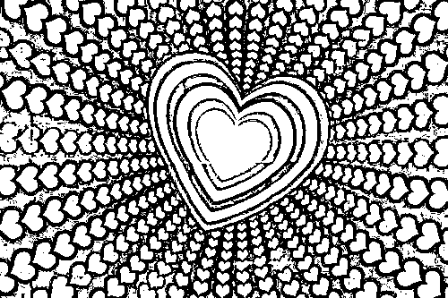

**月亮射手座的爱情****在亲密关系中，月亮射手座会有一些矛盾。月亮代表了我们对支配性的需求，**射手座的需要就是**"不需要有任何需要"，至少必须很独立，不需要依附于任何人。**月亮射手座的男男女女们与伴侣的关系会在两重的矛盾性间拉扯**：理想化混合着距离感。** 传统文化夸大了伴侣间的相互依赖在维系婚姻稳定中的作用。社会文化削弱了女人操作机器的能力，而男人则不善于照顾自己。但**月亮射手座热爱自由，他们不能容忍自己落入这样的圈套。**即使他们的生活不会像 50 年代的家庭生活真人秀那样枯燥无味，但为了不让纠缠的恐惧愈演愈烈，他们还是**必须忙于生活中的实践活动，获得满足感。**这样看来，爱情的承诺更多的是带来混乱，而不是危险可憎的必需品。月亮射手座需要**强调对爱情的敏感性，毕竟月亮更多影响到家庭生活的情绪。****月亮土象星座的爱情****月亮金牛座的爱情****月亮代表情感，金牛座月亮的人重视感官享受和稳定性。**月亮金牛座的人大多喜欢**搂搂抱抱的亲热行为**。他们就是喜欢这种肢体的互相触碰。**动物性的舒适感**对于月亮金牛座的人来说很重要，这是一种土象的、现实主义的“心灵鸡汤”，在爱情与两性关系中滋养着他们。如果在感情关系中建立了真实可靠的信任，月亮金牛座可**不会害羞于享受肉体的亲密接触和宁静的相处方式**。他们对于**平静**有着本能上的执着，可能会落入阴影的迷思之中，逃避生命中的纷争冲突矛盾，这些会导致愤恨和挫败，并在之后避无可避地爆发出来。在家中，月亮金牛座喜欢**有宠物相伴，喜欢有植物花草营造出的安逸的自然氛围。**

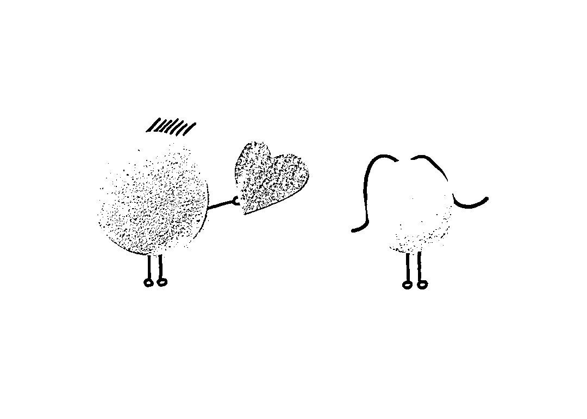

**月亮处女座的爱情**

月亮的情绪模式是天性使然，而月亮在处女座的模式就是**习惯性的不满**。显而易见，处女座的阴影会带来如下负面作用：**过度担忧、挑剔唠叨、琐碎小气**，这些行为在短短一周内就能把任何人弄疯。

但这里面也有宝藏：这种习惯性的烦躁不满也能转化一种动力。**谦虚的自我评价态度， 代表了改进的意愿。**处女座能**给予伴侣务实的见解和具体的帮助，他们可以一起为人生而奋斗，有条不紊、百折不挠、行之有效地进行计划。**

处女座的守护星是水星，所以他们会**投注很多精力在交流沟通上**：月亮处女座的亲密关系有赖于**畅所欲言的沟通**。

如果月亮处女座感到真正地放松和信任，那他们就能够**逐步放开自我质疑，重新思考自我价值。**在家庭生活中，处女座月亮的人倾向于**执行严格的管理**——要知道家是享受快乐、休息、充电的地方。

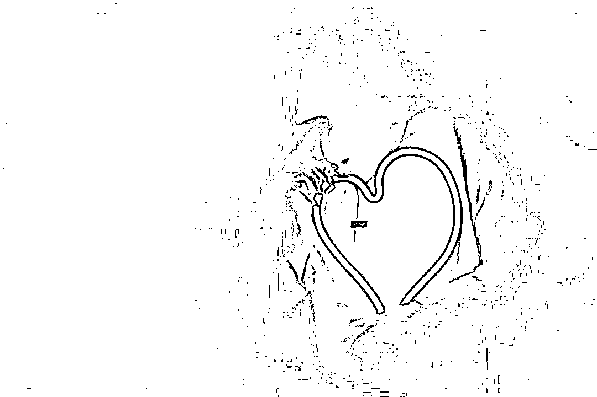

**月亮摩羯座的爱情**月亮摩羯座会呈现一种**心境上的孤独隐居状态**。这和孤独寂寞的情怀不同！他们只是**比普通人更需要独处的时光**。月亮摩羯座在情绪上更喜欢那些**反而会让他人沮丧的事件：独居、写小说、获得博士学位。**他们的潜意识里，每个人最终都是孤独的。因此，月亮摩羯座的人需要**学习与人结合、分享的技巧，**这样才能将爱延续。否则，**伴侣很快就会觉得自己被疏远了，被隔绝在外。**另一方面，月亮摩羯座需要一个伴侣，这个伴侣需要明白**自己即使被爱着，最终也可能被抛弃。**从摩羯座的星座特质上看，它与**现实主义的生存**有关。对于月亮摩羯座的人来说，这就变成了条件反射式的本能，**小心谨慎到了夸张的地步，他们也会感觉到异常的恐惧**。这时，月亮摩羯座将被阴影吞噬，呈现出一种**强迫性的控制欲，想要控制所有的事情：**生命的课题、财富、社交、家庭和伴侣。在家庭生活中，月亮摩羯座的要求是：**井井有条、有效率、有责任感。**即便他们公务繁忙、职责众多，根本无暇顾及家务，也会坚持这样的要求。**（未完待续，下篇敬请期待明日头条）**

**版权声明：**本文由若道翻译发布，欢迎转发，反对抄袭。友号转载请申请白名单。

**斯蒂芬·弗里斯特**

若道签约老师。进化占星学的创始人之一，当今世界最有影响力的占星大师之一；1985 年，他凭借《内在的天空》一书获得职业占星师协会奖（Professional Astrologers Incorporated Award）。他四次获得占星界最高的占星学联合协会奖（United Astrology Congress Regulus Award）提名，2018 年获得轩辕十四教育奖。

**学习占星学****点击下图了解课程详情** 

********************

**微信又双叒叕改版啦，不想错过若道君的推送？****就把若道设为星标吧！****▼**

**喜欢记得点一下在看哦☟**

****报名直达入口****

# 神话塔罗之大阿卡纳牌｜死神

> 原文：[`mp.weixin.qq.com/s?__biz=MzA5NjA0NTAxNg==&mid=2651462070&idx=2&sn=0ec10f47f9ecefa9907ab965f1dc1427&chksm=8b48ab01bc3f22175ce9227f6c3d5150cc9bcb344c4aa70be0cb68410ba424cffdc77a2f2120&scene=126&sessionid=1692737893#rd`](http://mp.weixin.qq.com/s?__biz=MzA5NjA0NTAxNg==&mid=2651462070&idx=2&sn=0ec10f47f9ecefa9907ab965f1dc1427&chksm=8b48ab01bc3f22175ce9227f6c3d5150cc9bcb344c4aa70be0cb68410ba424cffdc77a2f2120&scene=126&sessionid=1692737893#rd)

作者/朱丽叶·沙曼-伯克 丽兹·格林

译者/闫东升 编辑/玫瑰 图片/神话塔罗 网络

本文节选自《神话塔罗》

塔罗牌就像是照向心灵的一面镜子，某张牌会在我们内心经历某些原型事件时，在摊开牌的那一刻，神秘地，似乎毫无“理由”地出现。人人都害怕抽到的死神牌，就一定代表着某些“不好”的事情吗？今天就来解读大阿卡纳牌——死神。

[🔈 神话塔罗·死神](https://res.wx.qq.com/voice/getvoice?mediaid=MzA5NjA0NTAxNl8yNjUxNDYyMDY5)

**｜**朗读者小巫

**书名：**神话塔罗 **作者：**朱丽叶·沙曼-伯克   丽兹·格林 **出版日期：**2011-08-02 死神对应的希腊神祗
**哈迪斯·冥界之神****冥界之神**

死神牌描绘的是一个全身黑袍的人物形象，他的脸完全隐藏在黑色的头盔之中。他的双手向两侧展开，去接受跪在他面前三个微小人形所递交的礼物。

其中一个成年人手中捧着一顶金色的皇冠；另一个成年人手中捧着一堆金币；还有一个孩子举着一支鲜花。在身着黑袍的人物背后，是一条从远方流过来的黑色河流。远方河岸边的山峦和草地，被正在升起的一轮红日逐渐照亮。

> **冥河**：意味着“憎恨”，它被描绘成一条黑色的、令人恐惧的河流，为了到达丰富的地底世界，我们必须通过冥河，这是生命必经的一段旅程。这个阶段饱含悲伤和痛苦，却是生命的欢喜和庆祝的必需品。
> 
> **献花的小孩子**：象征着我们在遭遇和死亡有关的悲伤时，像孩子一样的信任能够帮助我们度过这个过程。只有孩子才不害怕全然地表达悲伤之情。 
> 
> **升起的太阳**：象征着一个全新的未来，尽管跪在哈迪斯（*Hades*）面前的灵魂们还并不知情。

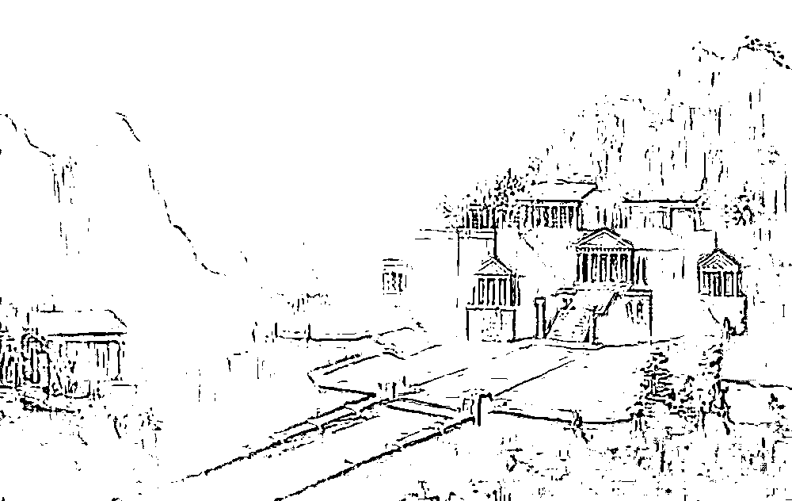

**无法躲避的地府君王**

在这里我们遇到了地府的君王——黑暗之神哈迪斯（*Hades*），我们第一次遇到他是在女祭司的牌面上，他绑架了德墨忒尔（*Demeter*）的女儿珀尔塞福涅（*Persephone*）。

神话中，哈迪斯一直是无形的，没有人看到他的身体。另外他也常常被称为普鲁托（*Pluto*），词义为“丰饶（*riches*）”的意思，因为他的领域中有大量隐藏的财富。

哈迪斯是泰坦巨神（*Titan*）克洛诺斯（*Titans Cronos*）和瑞亚（*Rhea*）的儿子，他的兄长宙斯（*Zeus*）从父亲克洛诺斯的肚子里把他救了出来。后来宙斯任命他为地府之王，和自己分享继承来的遗产。 

在地府这个黑暗的地下世界中，哈迪斯是绝对的君王。每当白昼他在地面上现身的时候，总是带着一顶头盔，这样人类就无法看到他的样子。

有些地方在举行死亡仪式的时候，把一枚金币放入尸体的口中，因为如果不给哈迪斯应付的钱财，灵魂就会被永远流放在冥河之畔，也就是说永远在地府不得超生。

尽管哈迪斯没有得到像兄长宙斯一样的名望，但是他拥有极大的权利，因为他的律法是不能撤销的。任何一个灵魂如果进入了哈迪斯的王国，即使是神祗，甚至众神之王，也不能再任意返回了。

虽然有一些像俄耳甫斯（*Orpheus*）和赛休斯（*Theseus*） 这样的英雄，欺骗了冥河摆渡人卡戎（*Charon*），躲开了可怕的看门三头犬克尔伯罗斯（*Cerberus*），违例进入了哈迪斯的领土，他们也没有做到全身而退，回到地上世界的时候也不再和从前一样了。

哈迪斯这种不能撤销的力量，是神界通过冥河之水立下的誓言，它是协商而来的不朽，是令所有生命胆战心惊的致命之毒。

**不可撤销的永恒结局**

**从内在的层面来看，死神——哈迪斯象征着生命循环最终的、永恒的结局。**当我们改变的时候，无论是拥有了一种新的态度，还是进入了一个新的环境，旧有的东西就已经死亡了，而且永远不可能回到原来的面貌。

因此哈迪斯象征着我们所经验的所有的终结，他的黑色长袍则象征着哀悼的经验，这是准备进入新循环的必需品。

在倒吊人牌中，我们体验到了自愿服从于潜意识中隐藏的律则的经验，从而做出在期待中让事情自然发生的决定，新的生命阶段由此崭露端倪。死神——哈迪斯代表着我们进入了两个阶段之间的状态，意即停留在无法撤销的失去已然注定和新的开始尚未发生之前。

**死神牌并不是象征着一个“不好”的结局。**无法撤销的完结也可能伴随着像婚礼或者婴儿出生这样快乐的事件，因为它们不仅仅意味着一个新的开始，也同时意味着旧有的生命模式已然告终，失去旧有模式的痛苦和哀伤都在所难免。 

很多地方都兴起了结婚前的告别单身聚会，就是人们向单身阶段告别的仪式类活动。当有些新生儿到来的时候，父母们可能会经历某种抑郁期，因为他们没有意识到当新的生命降临时，就意味着过去的生命阶段已经结束。

神话中，灵魂必须要给哈迪斯奉上金币，因为他主宰着所有的结束和新的开始，结束和开始一样重要，所以我们要认可它并全然地体验它。人们都要赤裸着走进地府，因为我们要放弃所有以前的模式和态度，即使它们曾经给予了我们安全感。

由此可见，死神牌并不是只意味着身体的死亡，它反映出生命循环中所有不可避免的改变，只要是改变，就包括了某种终结。 

**在哈迪斯的眼中，生命是一连串死亡的过程**，它始于生命离开子宫里温暖的水域，以独立个体的形式进入到粗糙的现实世界。从此以后，我们不再生活于母亲身体的伊甸园中。青春期的到来和性别的发展之前，童年一定要走入终结。

人们无论怎么锻炼身体、节制饮食和细致地化妆，靓丽躁动的青春期都会结束，成熟的中年必将如约而至。

每一段关系，无论多么亲密和美好，都有它开始和结束的时日，因为我们的感觉不断改变，对他人的理解能力也与日俱增。结婚就意味着结束单身的日子，新生儿的出生提醒我们青春的岁月一去不返，毕竟肉骨凡胎的人类世界没有永恒一说。

死神——哈迪斯虽然隐身于暗处， 却陪伴我们度过一生，所以奉上金币也是理所当然的报答。

**死神，是结束也是开始**

**从解牌的角度来看，死神牌暗示着当事人需要面对某种结束，至于是否有痛苦的经验，要依赖于他（她）对于这件事结束的认可度和承受能力。**

死神牌也预示着生命中的新开始，如果当事人能坦然放下旧有的模式，开始就可能伴随着喜悦。就这样愚人进入了地府，把他以前的生命抛诸脑后，准备走向未知的将来。

**版权声明：**本文由《自在园》授权发布，欢迎转发，反对抄袭。友号转载请申请白名单。

**神话塔罗系列**

[开篇](http://mp.weixin.qq.com/s?__biz=MzA5NjA0NTAxNg==&mid=2651451590&idx=2&sn=41c1083542bcf098de303e29a028ff20&chksm=8b4b4271bc3ccb67d5d53c143cd5a17c24b7b60e5b1051949fa9f086f90b4ab04877976c47e5&scene=21#wechat_redirect)丨[愚人](http://mp.weixin.qq.com/s?__biz=MzA5NjA0NTAxNg==&mid=2651452189&idx=2&sn=f4cc6e768e367fbdb0f69b9c6382443d&chksm=8b4b41aabc3cc8bcdbd952d91d8408014a799224d3f67ab50bb5cbe88ee0090afc92869de1a6&scene=21#wechat_redirect)丨[魔术师](http://mp.weixin.qq.com/s?__biz=MzA5NjA0NTAxNg==&mid=2651453528&idx=2&sn=3ca9b35e1736168eef1856274635224a&chksm=8b4b4aefbc3cc3f965f2531f8c0d37da2e66a2b47139d445df1ea35eeb74bdf3b6827236741a&scene=21#wechat_redirect) | [女祭司](http://mp.weixin.qq.com/s?__biz=MzA5NjA0NTAxNg==&mid=2651455871&idx=2&sn=15ae629e1b35f1371b81868f5bfdd2aa&chksm=8b48b3c8bc3f3ade0175d0e03bfe496711801614273e7fe98b6435fafe0de5daf3a8d7c1312f&scene=21#wechat_redirect) | [皇后](http://mp.weixin.qq.com/s?__biz=MzA5NjA0NTAxNg==&mid=2651453921&idx=2&sn=4d1efea03b2b9f940be7a6aadf553dec&chksm=8b4b4b56bc3cc2405fe562b8ef48f335699f57c12d5d817e24aeeb84f6306092de2ae55becc7&scene=21#wechat_redirect)

[皇帝](http://mp.weixin.qq.com/s?__biz=MzA5NjA0NTAxNg==&mid=2651455083&idx=2&sn=d12546b67c830055f37b147f41c7641f&chksm=8b4b4cdcbc3cc5cad2def85451c3a7ddbb31ba5b9a01febb8a9fb18991d3e1263d9371ac212f&scene=21#wechat_redirect) | [导师](http://mp.weixin.qq.com/s?__biz=MzA5NjA0NTAxNg==&mid=2651456482&idx=2&sn=153b4ca2f69f6745425525773616455d&chksm=8b48b155bc3f384322115b0b94621662ba562a2a252fd244a0a3fc84a664408b2311014e8db5&scene=21#wechat_redirect)丨[恋人](http://mp.weixin.qq.com/s?__biz=MzA5NjA0NTAxNg==&mid=2651457110&idx=2&sn=b4f6a1e93475b39df8f6c80a7409c59c&chksm=8b48b4e1bc3f3df721f206e899272c01bf324355f649fe0fd0dd8363c5b58683daa38e8cf648&scene=21#wechat_redirect) | [战车](http://mp.weixin.qq.com/s?__biz=MzA5NjA0NTAxNg==&mid=2651457444&idx=2&sn=75e9cc378abfefb59ebe7f12357c1b4b&chksm=8b48b513bc3f3c051bf2bb4be018694ca47996a193c0a92d5003c47dc384a2b07f9b9f9806ed&scene=21#wechat_redirect) | [正义](http://mp.weixin.qq.com/s?__biz=MzA5NjA0NTAxNg==&mid=2651458133&idx=3&sn=e37f69e34bc33afe6c0935e32ad0b786&chksm=8b48b8e2bc3f31f465dee7a4595d44620d93e58ca37eeab785724f5a92a9ec3bbb85c3d34f17&scene=21#wechat_redirect) | [节制](http://mp.weixin.qq.com/s?__biz=MzA5NjA0NTAxNg==&mid=2651458981&idx=3&sn=8858e451980859e86b87571128e4f115&chksm=8b48bf12bc3f3604c1ef97c0a818f501fc28c84a4ef19e25521527e162d2d2c6bdded6238ea8&scene=21#wechat_redirect)

[力量](http://mp.weixin.qq.com/s?__biz=MzA5NjA0NTAxNg==&mid=2651459675&idx=3&sn=ebac312745895402e187ccd8700f3674&chksm=8b48a2ecbc3f2bfa134c6b364d828b6b0e77a4c3c05054ff44d97ccc75eec4f7958f77f92605&scene=21#wechat_redirect) | [隐士](http://mp.weixin.qq.com/s?__biz=MzA5NjA0NTAxNg==&mid=2651460114&idx=3&sn=a562cf2d91c74192ebacfa9484e0b141&chksm=8b48a0a5bc3f29b3807e6a2e49b1a3f16c82e528c54ae708ecd44e1e7e9ca5dbb1148dde5de6&scene=21#wechat_redirect)丨[命运之轮](http://mp.weixin.qq.com/s?__biz=MzA5NjA0NTAxNg==&mid=2651460960&idx=3&sn=4d85b69a6df831d4229b18a668cbcda4&chksm=8b48a7d7bc3f2ec12b54056abd2b389148daf918ee9dbb6d3c00a0327906aa78a0c7ceb433ff&scene=21#wechat_redirect)| [倒吊人](http://mp.weixin.qq.com/s?__biz=MzA5NjA0NTAxNg==&mid=2651461398&idx=2&sn=658494d65c46567cf789233df59e1409&chksm=8b48a5a1bc3f2cb7320f143d43c75c15e3e84c0759cff994066ecbfaf5522c76291548934ad5&scene=21#wechat_redirect)

**朱丽叶·沙曼·伯克**从 20 世纪 70 年代早期开始，就对塔罗牌产生了兴趣，并踏入了塔罗的世界。后来，在丽兹·格林的鼓励下，开始研习心理占星学和塔罗。1984 年，第一本书《塔罗全书》（The Complete Book ofTarot）出版。之后，与丽兹·格林合作设计并撰写了《神话塔罗》（The Mythic Tarot）。朱丽叶写了十本塔罗和占星学书，包括一本名为《众星的传说》（Stories from the Stars）的儿童读物，以及与丽兹·格林合著的《神话之旅》（The Mythic Journey），这是一本详细讲述如何运用神话来指导生活的书。

**点击下图了解课程详情** 

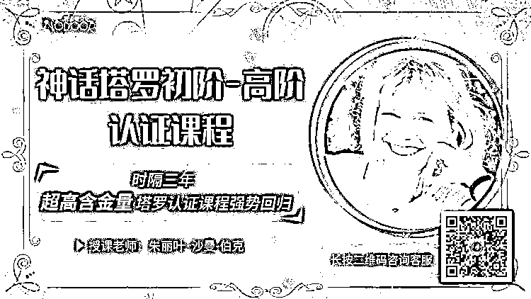

**微信又双叒叕改版啦，不想错过若道君的推送？****就把若道设为星标吧！****▼**

**喜欢记得点一下在看哦☟**

************报名直达入口************

# 神话塔罗之小阿卡纳牌 | 圣杯 1-3

> 原文：[`mp.weixin.qq.com/s?__biz=MzA5NjA0NTAxNg==&mid=2651462070&idx=3&sn=e66e4b901f320d8b99070b5ac1bdb3b5&chksm=8b48ab01bc3f2217620254fde1947a99a08b514f248015d8f52a8c884cccfc5834cf3bf15ab1&scene=126&sessionid=1692737893#rd`](http://mp.weixin.qq.com/s?__biz=MzA5NjA0NTAxNg==&mid=2651462070&idx=3&sn=e66e4b901f320d8b99070b5ac1bdb3b5&chksm=8b48ab01bc3f2217620254fde1947a99a08b514f248015d8f52a8c884cccfc5834cf3bf15ab1&scene=126&sessionid=1692737893#rd)

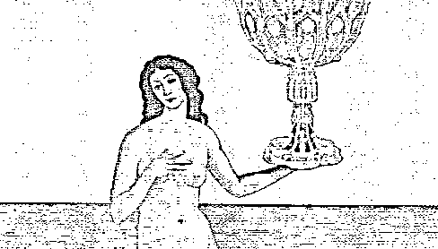

作者/朱丽叶·沙曼-伯克 丽兹·格林

译者/闫东升 编辑/玫瑰 图片/神话塔罗 网络

本文节选自《神话塔罗》

圣杯、权杖、宝剑和钱币是塔罗牌中四套小阿卡纳牌的核心象征符号，它们反映着生命的四个不同面向。每一套小阿卡纳牌都可以分为两组：一组是 10 张数字牌；另一组是 4 张宫廷牌。今天就让我们走近圣杯牌组前 3 张数字牌——圣杯 1-3。

**书名：**神话塔罗 **作者：**朱丽叶·沙曼-伯克   丽兹·格林 **出版日期：**2011-08-02**圣杯 1**

**海水中诞生的爱之女神**

圣杯 1 描绘的是一个美丽的女人，长着一头黑色的秀发，从海浪的泡沫中冉冉升起。她的左手托着一个金色的圣杯。在这张牌中我们看到的是从海水的泡沫中出生的爱之女神阿弗洛狄忒 （*Aphrodite*），她的意象反映着**爱的高尚与低劣**两个面向，她也是厄洛斯（*Eros*）和普绪克（*Psyche*）的神话故事的发起者和推动者。神话中，阿弗洛狄忒的出生过程很是奇特。狡猾的克罗诺斯（*Cronos*）在他母亲盖亚（*Gaea*）的怂恿下，阉割了他的天国之父乌拉诺斯（*Uranus*），并把他的阳具丢入了大海，乌拉诺斯的阳具在大海上漂浮，激起了很多白色的泡沫，阿弗洛狄忒就在这些白色泡沫中出生。当时的地点是吉菲拉岛（*Kythera*）海岸边，西风之神塞菲勒斯（*Zephyrus*）用轻柔的呼吸把这位女神带到了塞浦路斯（*Cyprus*）岸边。四季女神霍莉（*Horae*）热烈地欢迎她的到来，给她穿上了华贵的衣裳，佩戴上珍贵的珠宝，并指引她进入了永生之神的行列。

**原始情感的涌现**

阿弗洛狄忒是一位很复杂的神祗。她的本质反映的是**女性之美**，关于她的描绘大都和**纯然的魅力与和谐**有关。但是她也拥有**嫉妒、恶意、虚荣、欺骗、背叛、懒惰和复仇。**她的力量能够给生活带来愉悦和享乐，同时她也有可怕的一面，因为她也能让人类的内心被狂热的激情淹没。献身于阿弗洛狄忒的人们可能会遭遇不幸，因为他们要**背叛自己的父权力量，或者抛弃自己的家园，亦或被乱伦和兽性的激情淹没。**她还**保护着婚姻（契约）的结合，主宰着婚姻的圣洁性。**简而言之，阿弗洛狄忒的意象反映着**自然属性的驱动力**。**小阿卡纳牌中四张 1 号牌的意义都是原始能量的爆发，**这个黑发女神从海洋的白色泡沫中手托着圣杯冉冉升起，**代表着原始的情感涌现出来**。这种驱力推动人们走入关系的领域，也就是说它发生在人们与他人建立关系之前，因为**如果没有准备好，他人就不会在生命中出现**。如果没有阿弗洛狄忒，神话中的厄洛斯和普绪克就永远不会相遇，是她的任性和善变开启了一个跌宕起伏的故事。**因此圣杯 1 暗示着一次“心”的旅程的开始，丰富的情感喷薄而出，驱使着人们走入一段关系之中。**

**圣杯 1，情感的流露**

**从解牌的角度来看，圣杯 1 预示着情感的流露，但此时的情感还没有分化，处于最原始的状态中，它充满了活力，常常把人们淹没。**

通常这张牌的出现意味着**一段现实关系的开始，往往它还没有完全呈现出来，因此当事人并没有清楚地看到它，但是当事人已经准备好投入一段爱的旅程了。**

**圣杯 2**

**遇见**

圣杯 2 描绘的是厄洛斯（*Eros*）和普绪克（*Psyche*）的初见。普绪克一袭白袍象征着她的纯洁，在阿弗洛狄忒（*Aphrodite*）的命令下，她被绑在大海中一块孤零零的礁石上。她的脚边放着一只金色的圣杯，海水中隐约有一只怪兽，普绪克茫然又恐惧地望着远方，等待着被怪兽吞噬的悲惨命运。在她身后，英俊的厄洛斯盘旋于空中，金色的头发和翅膀闪闪发光。厄洛斯右手紧握着画面中的第二个圣杯，左手举着一只箭，他就是不小心被自己的那支箭刺伤了，所以“不经意”地对普绪克一见钟情，而他此行的任务却是杀死普绪克。

**寻找灵魂的另一半**

**小阿卡纳牌的 2 号牌象征着 1 号牌中原始力量的两极化。这张圣杯 2 中，原始力量的两极化意味着男性和女性之间的吸引力。**圣杯 1 中爆发出来的原初情感，在圣杯 2 中找到了对象，意即厄洛斯遇见了一个可以与他融合的女人。在柏拉图（*Plato*）关于人类之源的远古神话中，人类的心灵包含着阴阳两种能量，圆融完整。但是这种雌雄同体的心灵后来分化了，人类也有了男女之别，彼此被盲目的力量驱使着寻找自己遗失的另一半。对于希腊的头脑来说，**情爱的吸引力代表着感官和灵性中的某些力量，它能够给人的身体带来欢愉，也会为了心灵的完整而寻找自己的另一半。**当任何潜在的力量从潜意识中升起的时候，它首先就会把自己投射到外在的人或者事物上。因此，当圣杯 1 暗示的处于原处完整状态的潜力从个体内在升起时，最开始的迹象就是**被他人吸引**。从他人身上，我们能够瞥见自己走向圆满之路中所必须经验的种种模样。在人类的普绪克身上，厄洛斯看到了成为一个人的机会，因为他是一个脱离肉体的灵性力量，从来没有在人类关系中体验过爱恨情仇。在做为神祗的厄洛斯身上，人类的普绪克看到了自己永恒的潜质，通过内在像厄洛斯一样的力量，她可以把爱提升到灵性的更高境界。**圣杯 2 中出现了圣杯数字牌的男女主角，阿弗洛狄忒代表的原初力量现在变成了男女之间的吸引力。****圣杯 2，关系的开始**

**从解牌的角度来看，圣杯 2 预示着关系的开始。**如果当事人正在现有关系中遭受着一些问题的折磨或者经历着分离，圣杯 2 也意味着**关系的和解与和谐**。它甚至也可能预示着**某种生意伙伴的相遇或者签约**，因为这样关系就形成了。

**圣杯 3**

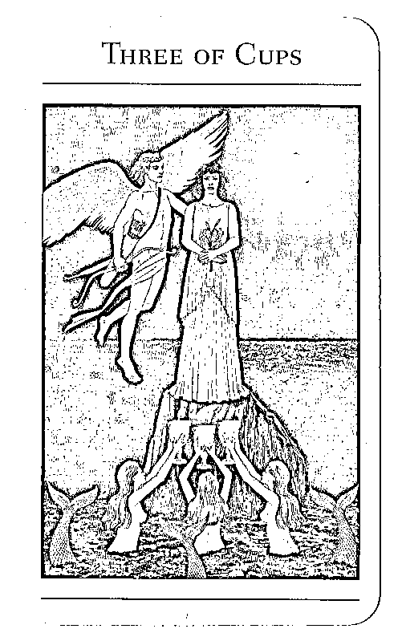

**婚礼的祝福**

圣杯 3 描绘了厄洛斯（*Eros*）和普绪克（*Psyche*）的婚礼。普绪克站在巨大的礁石上，四周环绕着海水，她身穿着新娘的嫁衣面对我们，头上装饰着鲜花，手里还握着一束百合。新郎厄洛斯在她的身后，所以她无法看见这个光芒四射的爱神。厄洛斯的手中握着金色的弓，背着箭袋。他们脚下的海水中有三个女性精灵（或水之女神），每个人都捧着一只金色的圣杯，围绕在他们身边庆祝婚礼。

**感情甜蜜期的喜悦**

**每张小阿卡纳牌中的 3 号牌都反映着初始阶段的完成。**生命中一个新的次元展开了，旅程的第一部分到此时告一段落。**圣杯 3 意味着庆祝，它隐喻着最初的吸引力已经完成，当事人经验了情感上的满足。**这一对伴侣已经结合在一起了，彼此都给予了承诺并享受着愉悦。厄洛斯和普绪克的故事告诉我们，**初始阶段的满足和完整是很重要的。**在神话故事中，普绪克此时还没有看过新郎，对于不真实的相遇过程也没有疑问。她满足于和厄洛斯在一起的生活，就像在梦中一样，因为厄洛斯只有在黑夜中才会到来。可以说他们婚礼的庆祝和愉悦中，有太多**天真烂漫**的意味，这是“陷入爱河”最明显的特点之一，人们就像被对方在自己头脑中的影像施了魔法，无法看到对方最真实的样子。情感的初始阶段往往伴随着快乐的经验，它是关于爱与生命的庆祝，是一个激动人心的开始。世上很多文学和戏剧作品都描述着这个阶段，可以说这是一种赐福，但是它们所呈现的只有一个讯息，那就是**你能享受的时候，就尽情享受它吧。**接下来的旅程中还有很多内容，有些欢喜有些痛苦，厄洛斯和普绪克在整个圣杯数字牌所呈现的故事里，会逐步使自己的人性和神性的潜力都开花结果。**圣杯 3 可谓是生命的初始阶段，伴随着很多的承诺。**少女成为了新娘，把她的纯真和贞洁永远地抛在身后。**这张牌还预示着进一步发展的开始，旅程并没有完结，困难就在不远的前方。**

**圣杯 3，情感上的满足**

**从解牌的角度来看，圣杯 3 意味着婚礼的祝福，这可能是一个爱情的甜蜜期，或者婴儿的诞生，亦或某种情感上的满足和承诺的经验。**但是所有这些处境都只是一个开端，当事人必然要走向更深一层的内心体验，继续探索更多的未知。 

**版权声明：**本文由《自在园》授权发布，欢迎转发，反对抄袭。友号转载请申请白名单。

**神话塔罗系列**

[开篇](http://mp.weixin.qq.com/s?__biz=MzA5NjA0NTAxNg==&mid=2651451590&idx=2&sn=41c1083542bcf098de303e29a028ff20&chksm=8b4b4271bc3ccb67d5d53c143cd5a17c24b7b60e5b1051949fa9f086f90b4ab04877976c47e5&scene=21#wechat_redirect)丨[愚人](http://mp.weixin.qq.com/s?__biz=MzA5NjA0NTAxNg==&mid=2651452189&idx=2&sn=f4cc6e768e367fbdb0f69b9c6382443d&chksm=8b4b41aabc3cc8bcdbd952d91d8408014a799224d3f67ab50bb5cbe88ee0090afc92869de1a6&scene=21#wechat_redirect)丨[魔术师](http://mp.weixin.qq.com/s?__biz=MzA5NjA0NTAxNg==&mid=2651453528&idx=2&sn=3ca9b35e1736168eef1856274635224a&chksm=8b4b4aefbc3cc3f965f2531f8c0d37da2e66a2b47139d445df1ea35eeb74bdf3b6827236741a&scene=21#wechat_redirect) | [女祭司](http://mp.weixin.qq.com/s?__biz=MzA5NjA0NTAxNg==&mid=2651455871&idx=2&sn=15ae629e1b35f1371b81868f5bfdd2aa&chksm=8b48b3c8bc3f3ade0175d0e03bfe496711801614273e7fe98b6435fafe0de5daf3a8d7c1312f&scene=21#wechat_redirect) | [皇后](http://mp.weixin.qq.com/s?__biz=MzA5NjA0NTAxNg==&mid=2651453921&idx=2&sn=4d1efea03b2b9f940be7a6aadf553dec&chksm=8b4b4b56bc3cc2405fe562b8ef48f335699f57c12d5d817e24aeeb84f6306092de2ae55becc7&scene=21#wechat_redirect)

[皇帝](http://mp.weixin.qq.com/s?__biz=MzA5NjA0NTAxNg==&mid=2651455083&idx=2&sn=d12546b67c830055f37b147f41c7641f&chksm=8b4b4cdcbc3cc5cad2def85451c3a7ddbb31ba5b9a01febb8a9fb18991d3e1263d9371ac212f&scene=21#wechat_redirect) | [导师](http://mp.weixin.qq.com/s?__biz=MzA5NjA0NTAxNg==&mid=2651456482&idx=2&sn=153b4ca2f69f6745425525773616455d&chksm=8b48b155bc3f384322115b0b94621662ba562a2a252fd244a0a3fc84a664408b2311014e8db5&scene=21#wechat_redirect)丨[恋人](http://mp.weixin.qq.com/s?__biz=MzA5NjA0NTAxNg==&mid=2651457110&idx=2&sn=b4f6a1e93475b39df8f6c80a7409c59c&chksm=8b48b4e1bc3f3df721f206e899272c01bf324355f649fe0fd0dd8363c5b58683daa38e8cf648&scene=21#wechat_redirect) | [战车](http://mp.weixin.qq.com/s?__biz=MzA5NjA0NTAxNg==&mid=2651457444&idx=2&sn=75e9cc378abfefb59ebe7f12357c1b4b&chksm=8b48b513bc3f3c051bf2bb4be018694ca47996a193c0a92d5003c47dc384a2b07f9b9f9806ed&scene=21#wechat_redirect) | [正义](http://mp.weixin.qq.com/s?__biz=MzA5NjA0NTAxNg==&mid=2651458133&idx=3&sn=e37f69e34bc33afe6c0935e32ad0b786&chksm=8b48b8e2bc3f31f465dee7a4595d44620d93e58ca37eeab785724f5a92a9ec3bbb85c3d34f17&scene=21#wechat_redirect) | [节制](http://mp.weixin.qq.com/s?__biz=MzA5NjA0NTAxNg==&mid=2651458981&idx=3&sn=8858e451980859e86b87571128e4f115&chksm=8b48bf12bc3f3604c1ef97c0a818f501fc28c84a4ef19e25521527e162d2d2c6bdded6238ea8&scene=21#wechat_redirect)

[力量](http://mp.weixin.qq.com/s?__biz=MzA5NjA0NTAxNg==&mid=2651459675&idx=3&sn=ebac312745895402e187ccd8700f3674&chksm=8b48a2ecbc3f2bfa134c6b364d828b6b0e77a4c3c05054ff44d97ccc75eec4f7958f77f92605&scene=21#wechat_redirect) | [隐士](http://mp.weixin.qq.com/s?__biz=MzA5NjA0NTAxNg==&mid=2651460114&idx=3&sn=a562cf2d91c74192ebacfa9484e0b141&chksm=8b48a0a5bc3f29b3807e6a2e49b1a3f16c82e528c54ae708ecd44e1e7e9ca5dbb1148dde5de6&scene=21#wechat_redirect)丨[命运之轮](http://mp.weixin.qq.com/s?__biz=MzA5NjA0NTAxNg==&mid=2651460960&idx=3&sn=4d85b69a6df831d4229b18a668cbcda4&chksm=8b48a7d7bc3f2ec12b54056abd2b389148daf918ee9dbb6d3c00a0327906aa78a0c7ceb433ff&scene=21#wechat_redirect) | [倒吊人](http://mp.weixin.qq.com/s?__biz=MzA5NjA0NTAxNg==&mid=2651461398&idx=2&sn=658494d65c46567cf789233df59e1409&chksm=8b48a5a1bc3f2cb7320f143d43c75c15e3e84c0759cff994066ecbfaf5522c76291548934ad5&scene=21#wechat_redirect)

**朱丽叶·沙曼·伯克**从 20 世纪 70 年代早期开始，就对塔罗牌产生了兴趣，并踏入了塔罗的世界。后来，在丽兹·格林的鼓励下，开始研习心理占星学和塔罗。1984 年，第一本书《塔罗全书》（The Complete Book ofTarot）出版。之后，与丽兹·格林合作设计并撰写了《神话塔罗》（The Mythic Tarot）。朱丽叶写了十本塔罗和占星学书，包括一本名为《众星的传说》（Stories from the Stars）的儿童读物，以及与丽兹·格林合著的《神话之旅》（The Mythic Journey），这是一本详细讲述如何运用神话来指导生活的书。**点击下图了解课程详情** 

**微信又双叒叕改版啦，不想错过若道君的推送？****就把若道设为星标吧！****▼**

**喜欢记得点一下在看哦☟**

************报名直达入口************

# 慎点！当这颗行星不再温柔，它会黑化成什么样子？（内含超越指南）

> 原文：[`mp.weixin.qq.com/s?__biz=MzA5NjA0NTAxNg==&mid=2651461947&idx=1&sn=fae025acb55a3409791253c7724737b8&chksm=8b48ab8cbc3f229a45e0f4b34298ca7d3af11ed114c9223e621d51e52c2dfd897dbc475789cd&scene=126&sessionid=1692737893#rd`](http://mp.weixin.qq.com/s?__biz=MzA5NjA0NTAxNg==&mid=2651461947&idx=1&sn=fae025acb55a3409791253c7724737b8&chksm=8b48ab8cbc3f229a45e0f4b34298ca7d3af11ed114c9223e621d51e52c2dfd897dbc475789cd&scene=126&sessionid=1692737893#rd)

**********************☆ **************后台回复“今日”，给你一句生命态度********
作者/杨浠 Vera ISAR 认证占星师
 编辑/翀子 封面/书君 图片/作者提供在温柔的月亮背后，是其象征——母亲带来的滋养与安全感。它是我们的生存基础，但与其共存的阴影面，也能吞噬掉我们独立自主的生命。深度心理学中的母子关系，生动阐释了“共生有机体”这一概念，作者也提出，每个人都应该成为自己的母亲，给予自己养分。

**从古至今，在东西方的各种文化中，月亮总是与人们至深的情感联系在一起。**艺术家在诗歌与音乐中，借由月亮表达着人类亘古不变的情与爱。

从邓丽君的“你问我爱你有多深，月亮代表我的心”，到奥黛丽·赫本在电影中唱着“Moon river, wider than a mile”，再到夏目漱石的“今晚的月色真美”——**虽然处在不同的时代、拥有着不同的肤色，人们却都有着同样一颗温柔的月亮心。**

**但每个人内心如月亮般柔软的那面并不容易被外人看到**，一个表面上看起来彬彬有礼、精明强干的人，很可能在亲近的人面前会非常孩子气。因为在亲近的人那里，TA 感到放松安全，TA 可以幼稚犯傻，却不用担心被严厉地评判和指责。

**所以很自然地，月亮象征着母亲，以及由她而来的安全感、滋养和关怀。**也正是由于这种无条件地包容与呵护，为一个人的存在与生命奠定了基础。

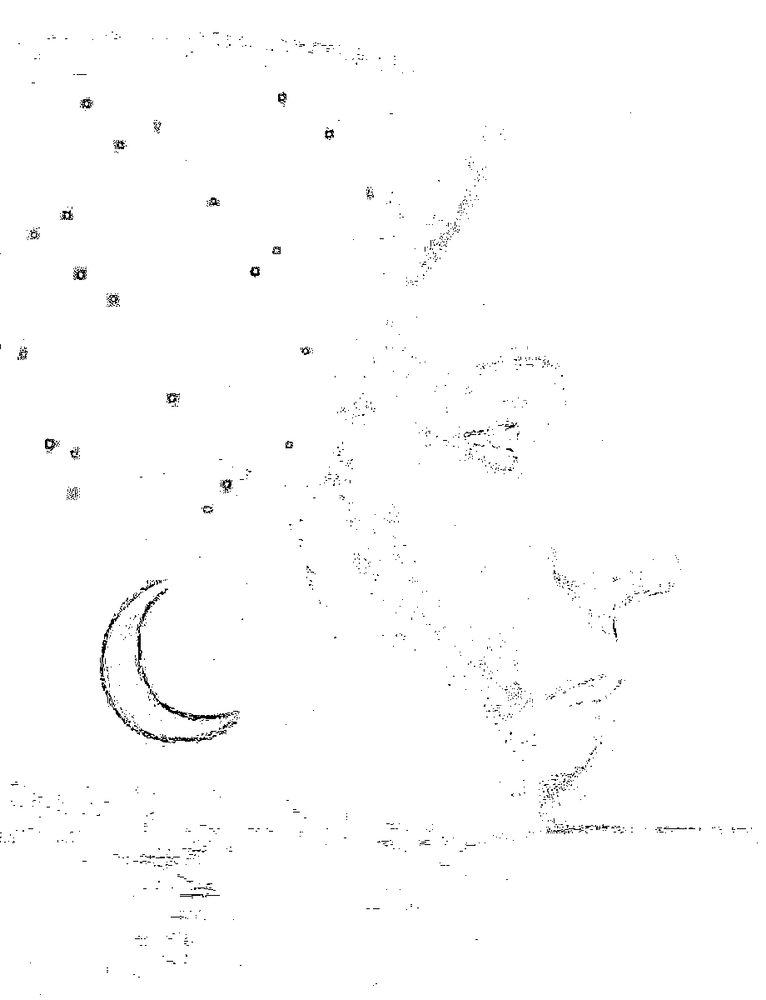

**不可或缺的母爱**

母亲的爱能够“引诱”一个人进入生命，换句话说，**母爱能够让一个人愿意去活**——因着这爱的美好，TA 会觉得生命本身、活着，是一件幸福的好事！

这就是为什么美国曾经做过一个调查，那些一出生就被抛弃的婴儿，即便生活在物质条件非常好的福利院，能够得到营养充分的食物与干净卫生的居住坏境，**但其中 70%~80%的婴儿都活不过两岁。**

**因为并没有这样一个人——能抱着他们，与他们对视，亲吻、爱抚他们的脸，对他们微笑、逗他们开心。**所以很自然地，他们并不愿意继续待在世上。

**还有另一个非常著名的实验。**一位科学家把一只刚出生的小猴子关在笼子里，笼子的一边放着铁丝做的猴妈妈，那里放着奶瓶，笼子的另一边放着一个棉花布做的猴妈妈。科学家发现，小猴子只有在饿的时候才去喝奶，大部分时候，它只呆在棉花布猴妈妈那里寻找慰藉——**柔软的触感让它感觉起来更像一只真的猴子。**

这就是为什么母爱对人的一生如此重要的原因，**即便在人们长大成年后，其实也还在寻求这种爱的替代品——亲密关系。**

**这种亲密关系并不是刚刚坠入爱河的那种**——一位令你神魂颠倒小鹿乱撞的异性或同性——这是金星所象征的领域；**而是那种无所保留、亲密无间的温柔与接纳，这才是月亮所象征的归属与安全感。**

至此，关于月亮所象征的母性特质的关键词几乎都有被提到：**温柔、呵护、滋养、关怀、照料、体贴、安全感、归属感。**

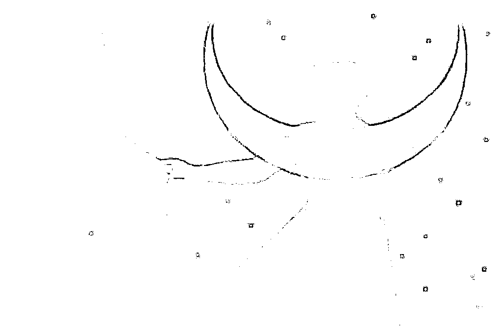

**母性的阴影**

这些都是令人眷恋和渴望的美好特质，但每一个神圣的原型都具有其光明面与黑暗面。**在月亮所象征的大母神原型中，其阴暗面，就如同她的光明面一样巨大又充满能量。**

如果只是一味地歌颂和赞扬其美好的一面，就会像是把人简单地分为“好人”与“坏人”一样天真，这种天真如果不加以视检，将会带来沉重的成长代价。

母性的阴暗面——这句话听着就让人感到不适，主流观念无止尽地赞颂着母爱的伟大，但如果调低音量最大的那些声音，以一个更加整体和全面的视角去观察，就会发现，**光明是不可能独立于黑暗而单独存在的。**

就如同尼采说的：“一棵树要长得更高，接受更多的光明，那么它的根就必须更深入黑暗。”**而大母神原型的阴影面就如同她的光明面能够给予生命一样，能够吞噬生命。**

**吞噬，即是母性原型阴影最重要的关键词。**阴性原则在视觉象征层面通常与容器相关，例如碗、盆、锅、杯子、包……所有中空的、能够放东西进去的容器。

这对应的女性最显著的性特征——子宫，孕育生命的容器。而她的阴影与危险就在于，**人们在无意识中太过依赖和怀念母亲的怀抱，从而无法离开这个子宫，因此也就无法“出生”为一个全然独立的个体生命。**

有一种很常见的模式是来自母亲的**“过度保护”**，这种体贴入微的爱的反面就是令人窒息的爱，无微不至的背后是对外在世界的不安与焦虑、是对孩子能力的不信任与贬抑。**对子女来说，来自母亲这样的信息会使他们培养不出自信的力量，内心脆弱、空洞。**

那些为子女准备好一切，总是叮嘱孩子要这样那样的母亲其实是在无意识地对她的孩子说：“你还没有长大，你没办法自己做好这些事，你必须听我的才行。”**所以通常，成年后的子女会排斥母亲的过度呵护，原因就是他们渴望剪断“脐带”，成为独立的个体。**

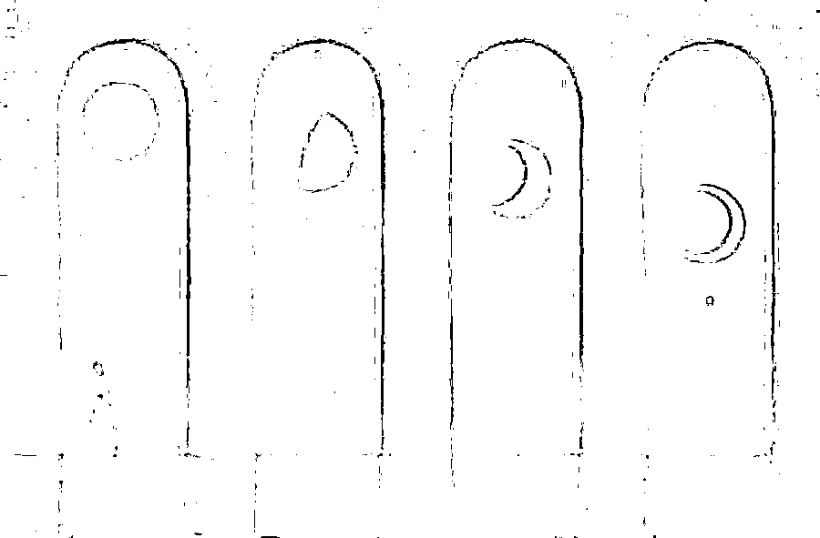

**深度心理学中的母子关系**

母亲和孩子的关系就其本质来说是两个不平等人之间的关系。在这种关系中有一个人需要帮助，而另一个人给予这种帮助。而母爱中值得赞美的东西并不是母亲对婴儿的爱，而是母亲对成长着的孩子的爱，**即允许这个孩子最终脱离母体，成为一个完整的、独立的生命。**

因为大多数母亲在她们的孩子完全依赖她们的时候，能够从中得到非常大的满足感，即便在外人看来除了孩子脸上的笑容之外，她们并无所得。但是从深度心理学层面去探究，就会发现：母亲一直把孩子看作是自身的一部分，**所以母亲对孩子的爱很可能是满足自恋的一种途径。**

**另外一个根源也许是母亲的权力欲和占有欲。**婴儿对母爱的需要就如上文提到的，是不可或缺的，这种对于另一个人的存在产生着至关重要的影响本身，**会提升母亲对自己的正向感受，让她觉得自己是如此重要、可以左右另一个生命。**

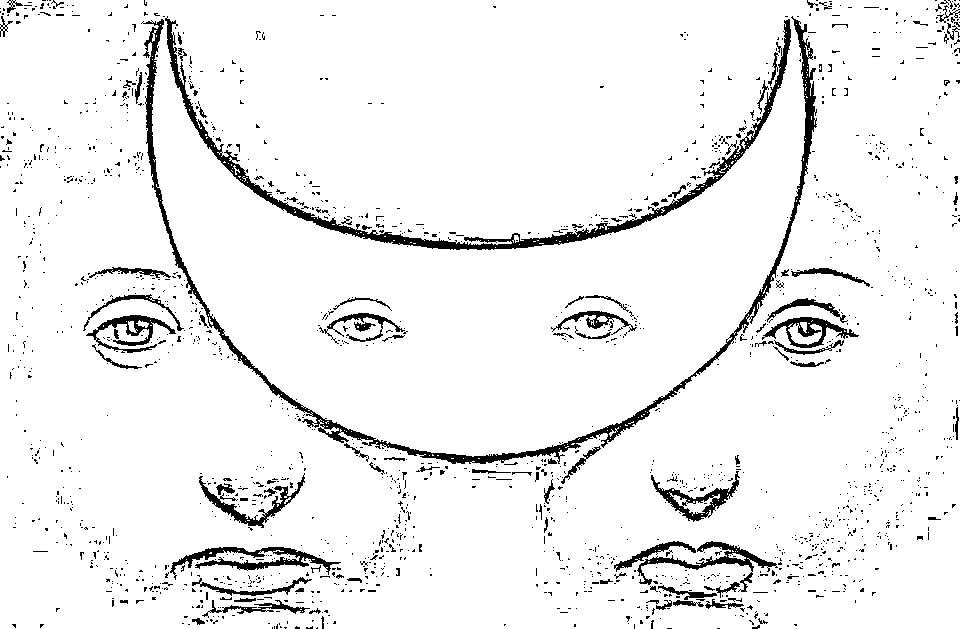

**共生有机体**

在生物学中，两个无法离开对方而独立存活的生物体被称为**“共生有机体”**。共生有机体的“楷模”是怀孕的母亲和胚胎之间的关系——他们既是两体，又是一体。**他们生活在一起（共生），并且互相需要**。

胎儿是母亲的一部分，并从她身上得到他所需要的一切，所以母亲就是他的世界。从母亲的角度，她抚养和保护胎儿，同时她自己的存在也因胎儿的存在得到一种升华。

**此外，共生有机体的负面形式也经常出现在不成熟的亲密关系当中，即服从与控制**——**医学名词就是受虐与施虐癖。**

有受虐癖的人通过把自己变成其保护者的一部分**使自己摆脱孤独感**。保护者就是他的生命、没有保护者他就无法生存。对他来说，保护者的威力超越一切，他接受被其主宰。

**受虐者**必须成为其保护者的一部分，因为只有这样他才能分享保护者的威力和安全。受虐者从不孤独，但也绝不独立。**他不是一个完整的人，可以说还没有完全诞生。**

共生有机体中的另一方——**控制方**，也就是施虐癖。**他通过把另一个人成为他自己的一部分而摆脱孤独，**他吞并他的崇拜者，从而使自己身价百倍。

**施虐者与受虐者最大的特点是：双方都不能失去对方，在结合的过程中双方都失去其独立性和完整性。**

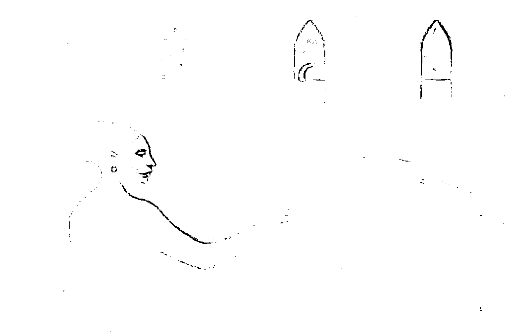

**脱离母体**

如果说精神健康的本质在于脱离母亲的子宫，成为独立的个体，进入世界，那么严重精神病的本质就是被母体所吸引，要重新回到母体——也就是被夺走生命。

**母性的阴影面会让一个人以爱的名义，**有时是以帮助对方和履行责任的名义在将另一个人保留在自己身上——**对方必须通过自己才能呼吸和生存。**

**这种模式在亲情、友情、爱情中都有可能出现：**出于“我是为你好”的角度对另一个进行控制、教育和指正，其实都只是为了满足自身的效能感，在这些表达的背后，此人在说“你并不如我，我比你更懂”。

**通过帮助和照顾别人去获得自我存在的价值感，但过程中却忽略了别人真实的感受和需求，这是母性型人格最大的阴暗面。**

而最可怕的是，当这样一个人不了解自己的无意识时，**TA 通常会将自己看作是一个善良的、热心的人。**当别人隐约感觉到这种越界的“帮助”是一种不平等的关系而拒绝 TA 时，TA 又会将自己看作一个被辜负的受害者。

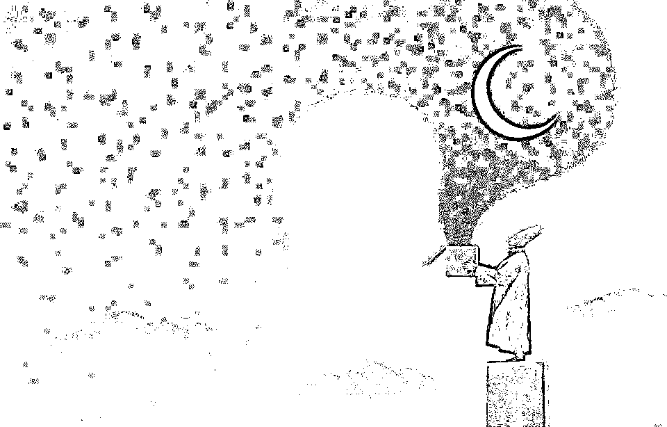

**尊重与信任**

一句老生常谈的话是：没有尊重与信任就没有真正的爱。**尊重意味着将另一个人看作是与自己平等且同样重要的个体，**所以尊重他人势必需要一个人具备独立完整的自体——他不需要其他人的依附和仰慕便能认可自身的价值与力量，**这种独立性能够催生出健康的人际边界。**

而对他人的信任也必然建立在对自己和对生命本身的信任之上，**这种信任需要一个人内心能自发地感受到安全，如此他才能信任别人的力量，**不过多地干涉和提供越界的帮助；与此同时，这种信任必然会给到对方正向的鼓舞，让双方的关系变得更加亲密。

也许在成年之后，我们应该做的最重要的事，就是自我养育——**成为自己的母亲，给予自己成长的养分，培养自身内在的安全感以及接纳和认可自己。**而一个好母亲是不会阻止孩子成长的，她应该希望孩子独立并最终脱离自己。

**真正的爱，正如人本主义心理学家卡尔·罗杰斯所讲的那样：**

**如果有人倾听你，不对你评头论足，不替你担惊受怕，也不想改变你，这多美好啊……每当我得到人们的倾听和理解，我就可以用新的眼光看世界，并继续前进……这真神奇！一旦有人倾听，看起来无法解决的问题就有了解决办法，千头万绪的思路也会变得清晰起来。**

**版权声明：**原创文章由作者授权首发于若道平台，欢迎转发，反对抄袭。友号转载请申请白名单。

**杨浠 Vera**

ISAR 认证占星师（2017 年获得）

全职心理占星师，若道 COAC 高阶学员（2012 届）

咨询时长已达 800 小时

**占星咨询微信号：**haloace（请注名占星咨询）

**微信公众号：**verandu

长按打赏

**学习占星学****点击或长按下图了解课程详情** ************

****

********

**微信又双叒叕改版啦，不想错过若道君的推送？****就把若道设为星标吧！****▼**

**喜欢记得点一下在看哦☟**

********报名直达入口********

# 12 星座自画像丨狮子座：自我中心的设计师

> 原文：[`mp.weixin.qq.com/s?__biz=MzA5NjA0NTAxNg==&mid=2651461947&idx=2&sn=70a6531351eda8206c0bf346a74be567&chksm=8b48ab8cbc3f229ac7d6b1b81855854a827e4512a40504f41e114e795ab3c69d4317d8cd3bba&scene=126&sessionid=1692737893#rd`](http://mp.weixin.qq.com/s?__biz=MzA5NjA0NTAxNg==&mid=2651461947&idx=2&sn=70a6531351eda8206c0bf346a74be567&chksm=8b48ab8cbc3f229ac7d6b1b81855854a827e4512a40504f41e114e795ab3c69d4317d8cd3bba&scene=126&sessionid=1692737893#rd)

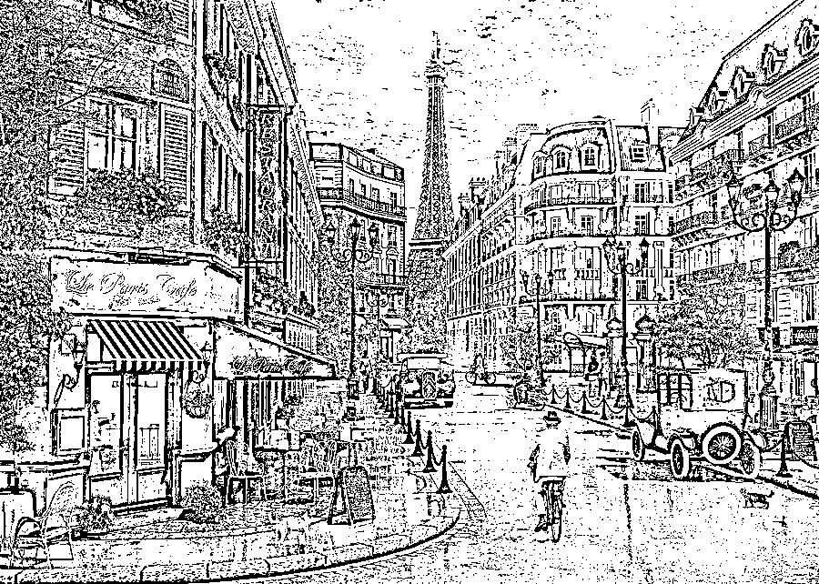

作者/克里斯蒂娜·罗登贝克

译者/亚麻林恩 校对/江艺

编辑/翀子 文章图片及注释/作者提供

本系列是克里斯蒂·罗登贝克老师撰写的艺术中的 12 星座自画像，角度独特，语句生动。本文是该系列第五篇：狮子座自画像。

似乎**狮子座的人不太容易拿起画笔。**我想他们中的很多人可能都会觉得**整天待在工作室里太孤单了。**所以毫不奇怪，20 世纪最著名的狮子座艺术家安迪·沃霍尔（1928 年 8 月 6 日），让一大群人来他的工作室，他称之为工厂……这是典型的狮子座，它关乎**广大的视野和组织人们。**

| 安迪·沃霍尔，生于 1928 年 8 月 6 日
我总是会注意到沃霍尔冷淡的眼神和美丽的色彩之间的对比，有着奇怪的残酷和不安。他有月亮、天王星的合相落白羊座，自私却又有开创式的古怪。这与落狮子座的水星、月亮、金星、海王星还有上升点相结合，**让人变得相当以自我为中心。**

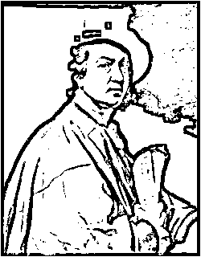

| 约书亚·雷诺兹，《城里的人》**约书亚·雷诺兹**（1723 年 7 月 27 日）是另一位伟大的自荐者。**和沃霍尔一样，他凭借自己的努力成名，在乔治王朝时期的伦敦，他广泛交结名流。他画了他那个时代所有的名人。**但他不仅是一个优秀的画家，而且是一个知识分子和一个实干家。他在伦敦创办的皇家美术学院，至今仍是一所重要的学府。

|托马斯·艾金斯，多美的眼神啊！**另一位实干家和肖像画家是托马斯·埃金斯**（1844 年 7 月 25 日）。这位费城的大师不仅创作了很多细致、深刻的肖像画，还教会了一代代美国艺术家如何不断审视。**当然，他的教学生涯颇受争议，但众多门生对他的喜爱，足以帮助他建立一所新的学校。**如果在这些画中发现戏剧、服装元素也没什么好奇怪的，因为戏剧本就是狮子座的范畴。格卢克并未穿过女人的衣服。辛基森其实是个服装设计师。朱迪思·莱斯特脖子上戴着太阳，剧院设计师弗洛伦·史提海莫将太阳纳入了她的自画像中。但有趣的是，有些狮子座的画家认为他们一半是阴影——沃霍尔、克拉克、多丽丝·克莱尔·辛基森。值得注意的是，这些画中也有很多红色。但总的来说，我认为狮子座的艺术家是相当多样化的！

|弗洛伦·史提海莫，生于 1871 年 8 月 19 日

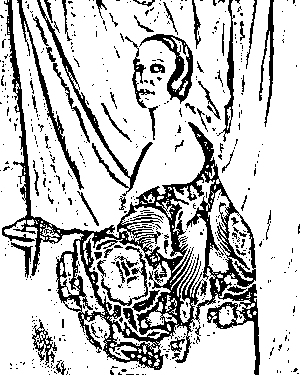

|多丽丝·克莱尔·辛基森，1891 年 7 月 31 日

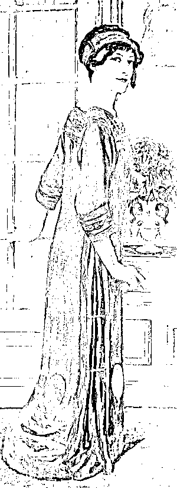

|克莱芒蒂娜·埃莱·娜杜芙，1869 年 8 月 18 日

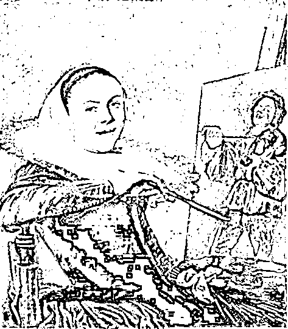

|朱迪思·莱斯特，生于 1609 年 7 月 28 日

|格卢克，生于 1895 年 8 月 13 日

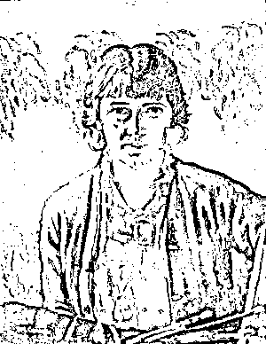

|玛格丽特·克拉克生于 1884 年 8 月 1 日

|海达·斯特恩，1910 年 8 月 4 日****版权声明：**本文由若道翻译发布，欢迎转发，反对抄袭。友号转载请申请白名单。**

****

**12 星座自画像**[白羊座](http://mp.weixin.qq.com/s?__biz=MzA5NjA0NTAxNg==&mid=2651452779&idx=2&sn=38a345623020cadc4ed4f42904d29926&chksm=8b4b47dcbc3cceca0fbf3e66149382c065ff3dbc2f61c881cdba2807e9e4c0c8f9ec71f1e245&scene=21#wechat_redirect)| [金牛座](http://mp.weixin.qq.com/s?__biz=MzA5NjA0NTAxNg==&mid=2651453849&idx=2&sn=7f5ada7b667fcd56f09c2a4bffadab67&chksm=8b4b4b2ebc3cc2386cc5ee12e45ac147964723803ce5714b7c612caf6bf0436652a82e0eaf9a&scene=21#wechat_redirect) | [双子座](http://mp.weixin.qq.com/s?__biz=MzA5NjA0NTAxNg==&mid=2651460660&idx=2&sn=a239f43ebe4aa8c8058cfa11d79028d4&chksm=8b48a683bc3f2f9539414a0d2b911b7a8f67befff92ed4dad04c4387aaa4a44ec883ab777afd&scene=21#wechat_redirect) | [巨蟹座](http://mp.weixin.qq.com/s?__biz=MzA5NjA0NTAxNg==&mid=2651461305&idx=2&sn=dffc1bb3cfeb85d7e388220b268914b8&chksm=8b48a40ebc3f2d1847a163a94ec9ca66b2722ca5754c3e8bc834e8be2377dd290bf08ae9bdfb&scene=21#wechat_redirect)

**克里斯蒂娜·罗登贝克**

克里斯蒂娜·罗登贝克，若道签约老师。全职职业占星师，从业 20 余年，在其网站长期撰写时事、艺术和文化的文章；定期在英国授课，并保持蓬勃发展的专业实践。

**学习占星学****点击下图了解课程详情**************

****

********

**微信又双叒叕改版啦，不想错过若道君的推送？****就把若道设为星标吧！****▼****喜欢记得点一下在看哦☟**

********报名直达入口********

# 好物推荐 | 从"麻瓜"进化成占星师的自我觉察工具（插班中）

> 原文：[`mp.weixin.qq.com/s?__biz=MzA5NjA0NTAxNg==&mid=2651461947&idx=3&sn=14d40c383c62613b567633f9cbb002f6&chksm=8b48ab8cbc3f229a41d537a9376c951d1ecc3bf8d74fe64b06b5aabbafffa04647c426862177&scene=126&sessionid=1692737893#rd`](http://mp.weixin.qq.com/s?__biz=MzA5NjA0NTAxNg==&mid=2651461947&idx=3&sn=14d40c383c62613b567633f9cbb002f6&chksm=8b48ab8cbc3f229a41d537a9376c951d1ecc3bf8d74fe64b06b5aabbafffa04647c426862177&scene=126&sessionid=1692737893#rd)

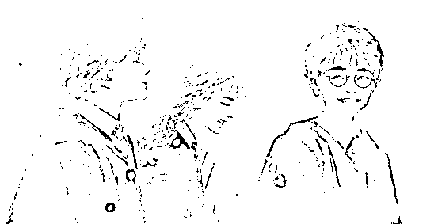

1

**自我觉察，是智慧的基础**

每个人都有自己的内在冰山，自我觉察能够帮助我们觉察自己的行为、情绪等，然后向内深层探索，探索自己的行为、情绪背后的深层渴望、期待。学习和应用占星学的过程，就是慢慢掌握自我觉察工具的过程，当你熟练掌握了占星学，也就具备了帮助引导他人觉察到自身生命议题的能力。**往外张望的人在做梦，向内审视的人才是清醒的。**只有真正向内看，只有当觉察开始由外向内时，改变才会发生，才能够知行合一。

# | 插画师：古戈力

以情绪来举例说明，每个人的情况不同，觉察的程度也不同，觉察有四个层次：***1.*** **不知不觉：**没有觉察情况，当情绪来了，会被情绪控制，做出很多不计后果的事情。而且每次都是同样的状况，反反复复；***2.***** 后知后觉：**情绪过后，自己能够反应过来，自己做的对与错，但是很难避免同样的情况再次发生；***3*****. 当知当觉：**当情绪来的时候，你已经知道在这个当下，正在发生什么。当达到这个层次，你就可以自己控制情绪，从而影响后事的发展；***4*****. 先知先觉：**当事情还没发生，就可以预知它要发生了。因为你对情绪的觉察已经越来越熟练，所以情绪还没来，你就知道它要来了。所以，你也就有了更好的选择和处理方法。所以，我们要自我觉察，向内探索，觉察是为了接纳，然后做出改变，成长，迭代，升级。**那么要如何练习自我觉察，掌握先知先觉的能力呢？**

2

**每日觉察的工具推荐**

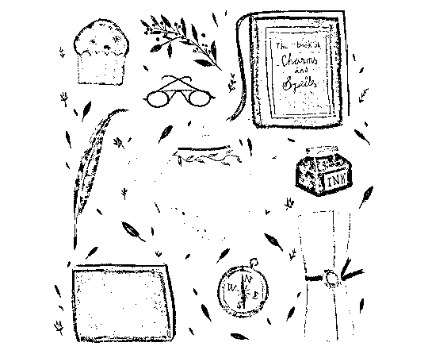

**今日天象&近期行进**

若道 APP 中的今日天象功能，罗列展示每一天的具体天象，你当天的行进和行进周期：

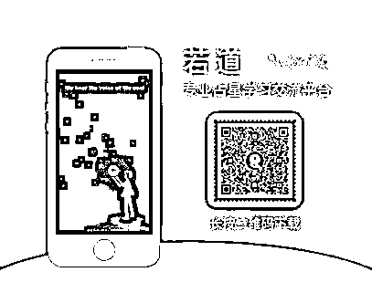

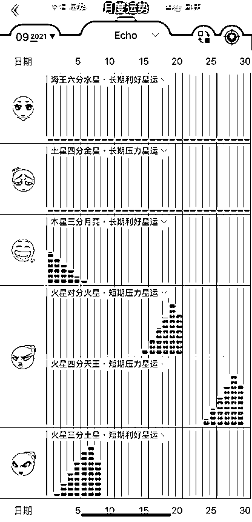

作为占星师，可以这样使用这个自我觉知工具：

**记录梦境**如果你有醒来记录梦境的习惯，每天早上看一下睡梦中的天象和行进，对应联想，你会惊喜地发现一些神奇的对应，能够更敏锐的捕捉到日常被压抑的情绪和需求。能够帮助你在白天的工作生活中先知先觉的关注身心状态。**规划生活**每月月初，周初都可以参考天象和行进进行日程规划，预估可能的助力和阻力，在对的时间做对的事，会发现平平无奇的日常也可以有不一样的色彩。根据月相的变化感知情绪的起伏，更好的自我关爱。**感知环境**当身边发生了引起你注意和好奇的事情，或者网络上层出不穷的新闻热点，都可以在天象中寻找对应的能量。从更大的格局视角去思考你的个人观点。通过环境的共振，更深入地理解自己的出生星图。以上都是很好的学习深化占星知识的方法，只需要系统掌握以下知识，就可以开始使用以上方法去提升自我觉知。**第*1*阶 黄道星座&个人行星****概要介绍占星学与星图**

**四元素与三形态**

**黄道 12 星座**

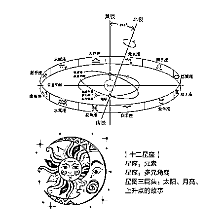

**太阳、月亮及其他个人行星**

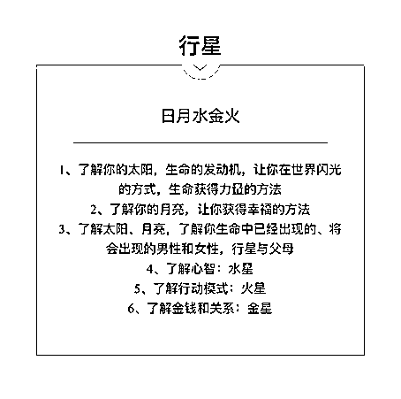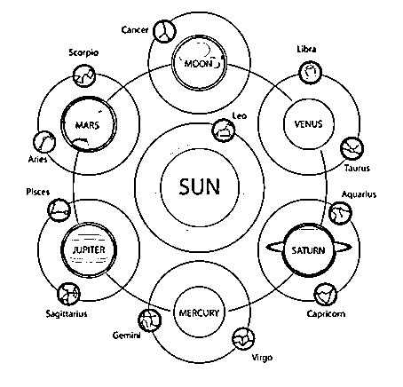

**第*2*阶 行星&宫位****木星&土星****天王星&海王星&冥王星**

**练习组合所有行星**

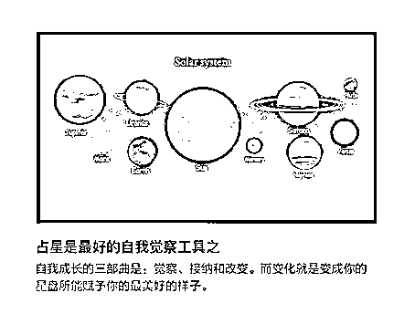

**四轴**

**十二宫位**

**组合宫位、行星、星座****第*3*阶 月亮交点、相位以及初步解读星图**

**了解灵魂进化的路径：月亮交点**

**相位概论**

**相位&行为模式**

**困难相位**

**柔和相位**

**容许度，出入相位**

**渐盈渐亏相位**

**空相**

**宫主星&定位星**

**相位模式**

**组合相位、星座、行星、宫位**

**解读的基本原则，权重，失衡**

3

**课程安排是怎样的呢？**

**第*1*阶**2021 年 9 月 15 日开课，每周一天晚上 20:00-22:00 上课，共 6 次课**第*2*阶**2021 年 11 月 11 日开课，每周四晚上 20:00-22:00 上课，共 6 次课**第*3*阶**2022 年 1 月 6 日开课，每周四晚上 20:00-22:00 上课，共 15 次课 2022 年 4 月 30 日、5 月 1 日**L3 北京两日线下工作坊**

****

4

**授课老师**

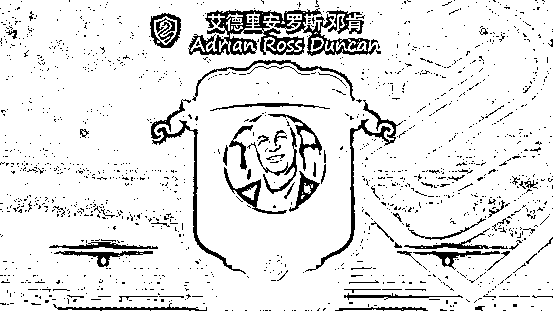

**艾德里安·罗斯·邓肯**

**（AdrianRoss Duncan）**

**· **1971 年在印度游学时开始学习占星学，1985 年开始成为全职占星师，迄今执业已超过 33 年，是人本主义占星学、卜卦占星学和经世占星学领域的知名占星师。他还开发了占星软件 AstroClock 和多款占星报告；**·** 哥本哈根占星学院院长；**·** 他在日常咨询中经常运用卜卦，咨询图（卜卦的一种运用方式，即根据客户来访时间制作星图，从星图中获得大量信息）也是他特别擅长的领域；**· **艾德里安·罗斯·邓肯从 1971 年开始研习佛学，受佛学影响很深，他相信占星学和佛学观点一致，转化的一个基础是在于对现实感知的改变。而卜卦很容易与佛教融合，因为它只关乎当下。

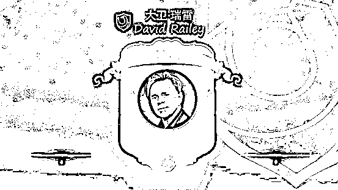

**大卫·瑞雷**

**（David Railey）**

**·** 若道联合创始人，致力于在中国教授和推广西方占星学；**·** 曾任 ISAR 全球副主席，CAPISAR（ISAR 职业占星师资质认证机构）主席；**·** 1976 年，通过亚特兰大职业占星师考试，成为全职占星师，随后通过 AFAN 和 ISAR 职业测试；**·** 1980 年，与杰夫·焦耳一起在亚特兰大创建“每日行星”占星学中心。此后在亚特兰大占星协会担任 4 年考官，并且两次担任亚特兰大地区占星协会主席。1979-1992 年，作为占星师活跃于美国社会媒体，向不了解现代占星学变化的大众宣传专业占星学知识。在 1989-1992 年期间，他在 WRGG 电台 12 频道每周主持个人电视秀“今日占星学”，早先他还在 WRFG 的广播节目中播讲宇宙天气节目；**·** 2010-2014 年，任全美占星师联盟监督委员会委员；**·** 2010 年，其著作《灵魂的目标》中国版出版，和蒋颖一起创办若道占星学校和其官网 www.nodoor.com；**·** 2017 年，被选为 ISAR 委员会成员。ISAR 是世界最大的国际占星机构，会员遍布 45 个国家，2017-2020 年曾任 ISAR 全球副主席、CAPISAR（ISAR 职业占星师资质认证机构）主席。

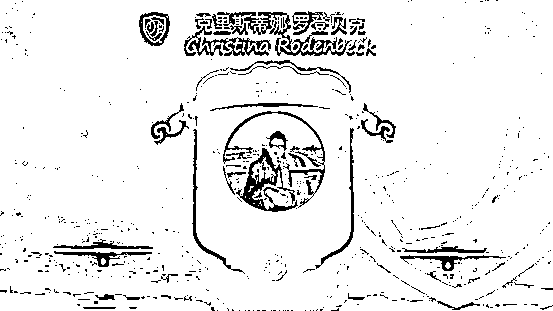

**克里斯蒂娜·罗登贝克**

**（Christina Rodenbeck）**

**· **克里斯蒂娜·罗登贝克（Christina Rodenbeck）是一名全职职业占星师，在牛津大学城生活和工作，深受周围知识和文化氛围影响；她拥有伦敦大学（University of London）的人文荣誉学位，曾在伦敦占星学馆（AstrologicalLodge of London）、心理占星中心和占星研究学院学习；**·** 作为一名占星师，在过去的 20 年里，克里斯蒂娜在她的网站“牛津占星师”上写了大量关于时事、艺术和文化的文章；她每月主持一个占星播客：“与克里斯蒂娜和萨莉一起占星”，并定期在《占星杂志》(Astrological Journal)上撰写时尚专栏；她定期在英国授课，并保持着蓬勃发展的专业实践。

**琳恩·贝尔**

**（Lynn Bell）**

**·** 世界最受欢迎的占星学演讲者、作家和老师之一。定居巴黎，研究心理占星学和家族模式数十年；

**·** 著名的心理占星学中心（Centre for Psychological Astrology）的长期导师。2016 年，获得查尔斯·哈维（Charles Harvey）杰出的占星学服务奖；

**·** 作为一个从多个层面进行工作的占星咨询大师，琳恩的工作结合了心理学的观点。她对家族模式的兴趣首先来自与客户的合作。通过在分析领域所做的个人工作，她所受的埃里克森催眠训练将她引领至家族系统。后来，她组织研究小组在家族星图上进行了数年的研究。她写的《家族占星学》就是这项研究的结果；

**·** 法国心理占星学协会的会长。除了占星学，她在法国沙特尔的新沙特尔学校任教 8 年，还 5 次获得了在《纽约时报》畅销书作者卡罗琳·迈斯（Caroline Myss）的卡罗琳·迈斯教育学院（Caroline MyssEducational Institute）合作教学的机会。**课程助教：**

**熊鹰老师**

**（天空的空）**

**·** 2008 年接触严肃占星学，至此爱不释手；**·** 2013 年师从大卫·瑞雷，研习现代占星学核心课程，并于 2014 年起担任该课程的助教，之后于 2017 年与 2020 年两次与大卫老师合作讲授完整核心课程（Level 1-5）；**·** 期间也跟随格伦·佩里、诺·泰尔、理查德·塔纳斯、罗伯特·汉德、苏·汤普金斯、斯蒂芬·弗里斯特、琳恩·贝尔、艾德里安·邓肯等多位国际占星大师进行学习，进行定向占星主题研究；**·** 2014 年末，通过国际占星研究协会（ISAR）资质认证并获得证书；**· **在若道占星任职六年余，以“传播系统、专业、实效的占星学”为职业使命，执教与助教已累计超过 700 小时。在业余期间也提供占星咨询服务；**·** 目前正着眼于占星学与中国文化之互参，以当代中国人的身心成长为目标，力求落到实处。

5

**此次课程适合哪些人？**

**·** 对占星学感兴趣，想要入门的零基础者**· **占星学小白，想通过星图学习识人之术**· **有一定占星学基础，但不知道该如何整合星图复杂碎片的人**· **想要师从更多殿堂级占星导师学习占星心法的人**· **走在自我探索和个人成长道路上的人

6

**课程价格**

**L1-3 价格**：15000 元

其他各阶段课程单报价格，请咨询课程顾问：**Maggie 老师**（微信：18510107057，请备注**“核心课”**）

长按二维码添加 Maggie 老师

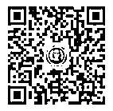

7

**退转课程**

****· 退款原则请详看《教学协议》，如有疑问请咨询课程顾问****

****名师汇集金牌核心课程****

**授课老师：**琳恩·贝尔、艾德里安·罗斯·邓肯、克里斯蒂娜·罗登贝克、大卫·瑞雷

**授课时间：**2021 年 9 月 15 日起

**授课方式：**网络课程**，**英文授课，中文翻译

**费用：**L1-2 价格：4800 元**；**L1-3 价格：12000 元

**课程负责人：****Maggie 老师**（微信：18510107057，请备注“核心课”）

长按二维码添加课程负责人咨询~

****报名请点击“阅读原文”****

# 太阳进入射手座啦！经历了爆炸的月食，我们需要这份乐观精神！

> 原文：[`mp.weixin.qq.com/s?__biz=MzA5NjA0NTAxNg==&mid=2651461828&idx=1&sn=34c6da597a8d752d110d375e803cbacd&chksm=8b48aa73bc3f23659fbff49fc69ed008fe9d092233afd2f80b4e9dc71365940a5ee86563587d&scene=126&sessionid=1692737898#rd`](http://mp.weixin.qq.com/s?__biz=MzA5NjA0NTAxNg==&mid=2651461828&idx=1&sn=34c6da597a8d752d110d375e803cbacd&chksm=8b48aa73bc3f23659fbff49fc69ed008fe9d092233afd2f80b4e9dc71365940a5ee86563587d&scene=126&sessionid=1692737898#rd)

****☆ **后台回复“今日”，给你一句生命态度**

作者/达纳·格哈特

译者/李含 校对/江艺

编辑/翀子 封面/书君 图片/网络

11 月 22 日上午 10 点 33 分，太阳进入射手座。这是让我们跳出疆界、开拓崭新可能性的星座，我们每个人都需要这份对生命充满热情的拓展，但射手座也有它的挑战。现在，让我们读读关于这个“哲人星座”的文章吧~**要保持思想正确，一个人每天应该至少眺望一次地平线。** **——送给射手座的箴言****眺望未知之地吧！**

射手座人，**跳出自己的思维疆域，**眺望那个令人好奇的远方，那个未知之地，那个你还不曾了解的地方。**将你的心融入那片未曾踏足的领地，**奔向遥远的地平线，你会获得新的视野，一个充满希望的未来正向你招手。

做这些对于太阳射手座的人来说就是他们创造力和自信之火的燃料。凝视地平线就像是最棒的占星学。**它旨在开拓生命，用新的可能性让生命更加辽阔。**

**人人都能做的小练习****每个人都需要这样的拓展。**这就是黄道给予我们每个人一个射手宫的原因。如果你最近没有与你的射手宫有所沟通，那么可以做做下面的尝试：**思****考你星图中由射手座指导的生命领域，承诺在接下来三十年的时间都坚持每日在那个领域做地平线展望的练习。**

*   **如果射手座在你的星图中指引着第五宫**，那么与孩子一起凝望远眺吧，创作诗歌或画卷描绘你所见；
*   **如果你的射手座指引着第六宫**，选一个窗边的位置，每日闲暇时喝着咖啡，眺望远方；
*   **如果你的射手座指引的是第七宫**，那么与你的伴侣共赏日落一个月；
*   如果射手座……你懂了吧。**让你内心的射手为你指路，你的灵魂会跟随它的指引。**

我要提醒你：**凝望地平线太久，就会发生有趣的事情。**这个世界的麻烦就会如淤泥沉积。它们会累积成一个琐碎无意义的小石子，你可能在不经意间、非常淡漠地将它踢开。你的眼睛在眺望，你的头脑在翱翔——好像是飘走的生日气球！**往上看：**你全都看到了！你全都知道了！你的心充盈满溢。你感觉到如此积极的力量，充满生机，如此慷慨，你想要与每个人分享你的真理！**你刚刚已经越过藩篱：进入那个遥远的射手座国度。**

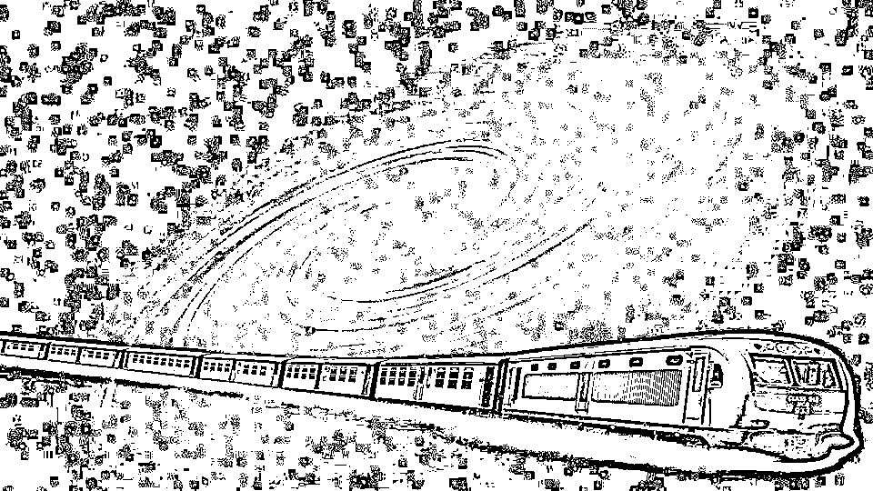

**射手座的国度**在射手座国度里，你感觉就像是阿尔卑斯山的徒步旅行者一样安逸欢快。你拥有**哲人的智慧**，像一位精神追寻者赤着脚**大步前行**，你迫切地想要把头伸出窗外，看看这个**辽阔的世界！**你可能在拥挤的曼谷街头找到神，也可能在被遗忘的图书馆一隅发霉的书卷里发现神。**“公正、自由与正直”**这样的字眼让你感到心潮澎湃。如果你看到不公不义，你会想要拨乱反正。**在黑暗中，你满怀希望。**如果生命变得难以预测，答案就在你的嘴边。在这个国度里，你开心地跃上临时讲台向你的朋友们宣讲——但奇怪的是，他们却惊恐地退后。你伤害了他们的感情，或者你忘记了一次约会。你人马座（射手座）的马蹄被他们不断丢在你前路上的恼人承诺所绊。人们指控你好争辩、自我放纵、拖延症——确有此事。有时候，你行事并不像个成年人。最近，你已经注意到自己的箭有多少次错失靶心，你精妙的计划有多快就变得无聊透顶。你丢掉这些想法，可以它们总会卷土重来：也许不是其他人有问题，而是你自己有问题。是否......你有那么多聪明的见解，其实你只是像个傻瓜？简短的回答是，“没错！”我可以这样作答是因为我也是太阳落于射手座，我还有许许多多射手座能量十足的朋友。像我们这样四条腿奔跑的很显然与身边两条腿的难以同步。我们会**充满阳光、无忧无虑、健谈，**除非我们感到愤怒、**自以为是，或学究枯燥。**我们可以像古典神话中人首马身之物那样不负责任、野性粗鲁、大喝大闹、容易兴奋陶醉、预言布道。我们可能会被激怒，就像哈利·波特世界里森林中的动物，守林人海格暴躁地说：“永远，永远，不要试图从马人那里得到直截了当的回答。**总是仰头看着星星**，真讨厌。他们除了月亮周围的东西，对任何事情都不感兴趣。”

**什么时候你会需要射手座？**

当你有正经事要做时，射手座人通常不是你联络的首选。但是你最后还是会联络他们，因为你想要**更多意义、欢笑或冒险。**射手座在黄道中的位置是**具有教育性的**。它被夹在天蝎座与摩羯座之间，它隔开了两个最野心勃勃（有些人会说是最冷酷）的星座。

射手座从天蝎座彻底变革的灰烬中一跃而起，直冲云霄。**它的羽翼让我们感受到新的自由，超越我们的极限，在原始体验或高等教育中追寻智慧和意义。**

我们探索**新的哲学、宗教和异国文化，**挑战自己的身心，跟随自己灵魂的脚步解放新的真理，跟随内心的燎原之火**向最远处探索**——一直到我们被撞得粉身碎骨或是坠落。然后，我们必须用摩羯座的现实与务实主义将我们的最高理想落于实处。

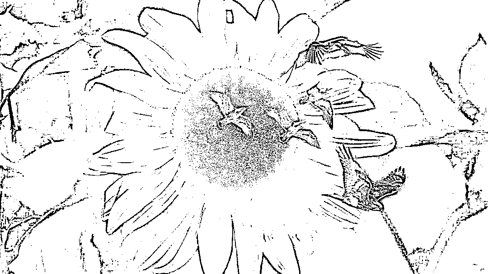

**射手座如何挑战自我？**不论你面对怎样的挑战，**射手座的人们，首先要去一个辽阔之地，**最好是一个高地，让你们有呼吸的空间，你们的思维可以延伸，于是可以让你的思维得到扩展，向高等思维开放。**在灵感浮现时，让你自己充满热情吧。**让新的理念像回荡着的响板之声一样将你环绕。然后专注起来。拿起你的箭。将你的目光锁定。让你的箭燃起熊熊火焰，直到你命中目标。鸟是思维的普遍象征。但在阿卡狄亚——这个以无忧无虑、轻松自在而闻名的仙境（就像射手座！）——这些聚集的鸟儿就是麻烦和黑暗。这些斯廷法利斯的捕食者就是射手座头脑中的阴影。沼泽是一个滞瘀之所，潜意识本能在这里汇集溃烂。**射手座是为了展望未来而生，为了拓展它的地平线而生，为了追寻增长智慧的体验而生。**但是射手座同样可能陷入过去的泥沼中，失去它的地平线，伤害了自己却并没有增长智慧。斯廷法利斯的怪鸟就是这些潜意识信念，它们妨碍了清晰的视角和判断。它们是习惯性思维，阻碍我们认识自身的潜力。**不安、膨胀、自以为是和自私都藏在这些本能中，让射手座进一步沦陷。**金属羽毛的鸟儿就是那些**止步不前的信念和观点**。野蛮的力量或决心无法摆脱这些。射手座必须自己奋起、前进。**它的意识必须转变**，必须有一段旅行。射手座可以有很多选择去清除他们内心的沼泽，而消极飞走的那一刻——总是一份礼物。**射手座需要敞开自己的心，等待更高的智慧出现，**就像仙乐悠扬传来。真正理解这一点的射手座人会永远谦卑，因此愿意在自己真正的任务中投入实践训练。**射手座必须发展的技能是箭术——锁定目标，命中靶心的能力。**只知道玩闹，与神迹擦肩而过的射手座人除非实干否则永远不能实现自身全部潜力。

**关于射手座专注的小故事**凯瑟琳·伯特在《黄道星座原型》（*In Archetypes of the Zodiac*）一书中讲述了一则极精彩的故事就是关于射手座的专注。

一位年老的箭术大师，他时间宝贵，正在面试学生。他不愿教授泛泛之辈弓箭之术。

每个待选学生必须拿起弓，全神贯注，大师会提问他看到了什么。

第一位，看到一座山，穿过山谷、天空、森林，有一只鸟停在树梢。

“出去”，大师瞟了他一眼说。

第二位看同样的目标，大师说：“你也失败了。”

有更多待选学生给予了同样的反应，一直到最终有一位年轻的王子出现了。

“你看到了什么？”大师问。

“我只看到了一只鸟。”

“再看，更全神贯注”，大师命令。

“噢，我只看到鸟的前额中心有一个斑点。”“很好”，大师说，“放下弓，我收你为弟子。”**这就是成为成功射手的秘诀！**

**版权声明：**本文由若道翻译发布于若道平台，欢迎转发，反对抄袭。友号转载请申请白名单。

**达纳·格哈特**

一位国际范围内受尊敬的占星师。她为众多占星学网站和出版物讲课、写稿。她在十二宫的月亮激励她对这颗发光体进行了深刻而持久的探索研究。

**学习占星学****点击下图了解课程详情**************

****

********

**微信又双叒叕改版啦，不想错过若道君的推送？****就把若道设为星标吧！****▼**

**喜欢记得点一下在看哦☟**

****报名直达入口****

# 若道气象丨小雪满天，迎来射手

> 原文：[`mp.weixin.qq.com/s?__biz=MzA5NjA0NTAxNg==&mid=2651461828&idx=2&sn=68e882b4ed0218bf56a0077681112ae9&chksm=8b48aa73bc3f236526df77010ccb187451b378976c9dd2d25b6ceaa9a855cf21123391afffc9&scene=126&sessionid=1692737898#rd`](http://mp.weixin.qq.com/s?__biz=MzA5NjA0NTAxNg==&mid=2651461828&idx=2&sn=68e882b4ed0218bf56a0077681112ae9&chksm=8b48aa73bc3f236526df77010ccb187451b378976c9dd2d25b6ceaa9a855cf21123391afffc9&scene=126&sessionid=1692737898#rd)

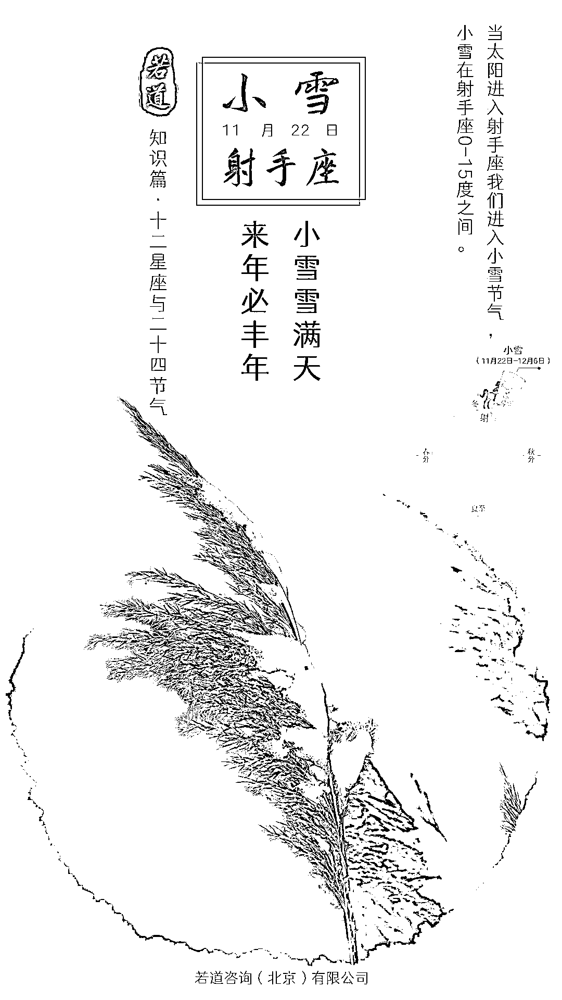

# 雷蒙德·梅里曼金融占星周运 | 后市看涨的可能很大

> 原文：[`mp.weixin.qq.com/s?__biz=MzA5NjA0NTAxNg==&mid=2651461828&idx=3&sn=de2efe8078277761f3d228202bb85699&chksm=8b48aa73bc3f2365d976560b6dd849c72128b55209553908adcee285b5ceb8236459dba4c873&scene=126&sessionid=1692737898#rd`](http://mp.weixin.qq.com/s?__biz=MzA5NjA0NTAxNg==&mid=2651461828&idx=3&sn=de2efe8078277761f3d228202bb85699&chksm=8b48aa73bc3f2365d976560b6dd849c72128b55209553908adcee285b5ceb8236459dba4c873&scene=126&sessionid=1692737898#rd)

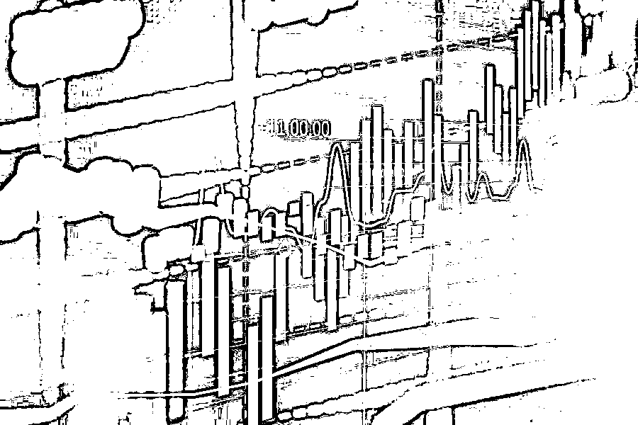

作者/雷蒙德·梅里曼 译者/Luke
编辑/玫瑰 图片/网络

雷蒙德·梅里曼是在金融占星学界稳坐第一把交椅的占星师，同时他也是若道签约的金融占星课老师，我们引进了雷蒙德·梅里曼老师的《[上证指数月度报告](http://mp.weixin.qq.com/s?__biz=MzA5NjA0NTAxNg==&mid=2651460114&idx=2&sn=28ad91e5b6986901dbbfb41509073ae1&chksm=8b48a0a5bc3f29b3d8ddfdac23345e867f6d9716c0b0fa2daf208dc6c0e622f11c558a991a17&scene=21#wechat_redirect)》及《[黄金报告](http://mp.weixin.qq.com/s?__biz=MzA5NjA0NTAxNg==&mid=2651460114&idx=2&sn=28ad91e5b6986901dbbfb41509073ae1&chksm=8b48a0a5bc3f29b3d8ddfdac23345e867f6d9716c0b0fa2daf208dc6c0e622f11c558a991a17&scene=21#wechat_redirect)》。我们经老师的授权，将每周刊登梅里曼老师的周运，供大家参考和学习。于是，这是本周的周运（11.22-11.26）。

**说明：以下时间采用纽约证券交易所所在地美国东部标准时间。**

**展望与回顾**

****

**白宫西楼的主要工作人员几乎举手投降了，因为副总统卡玛拉·哈里斯和她手下人的功能失调和注意力不集中，把他们弄得精疲力尽……烦恼是双向的。****对近三十多名前任和现任哈里斯员工、政府官员、民主党工作人员、捐助者和外部顾问的采访，揭露了白宫内部复杂的现状。副总统圈里的很多人感到愤怒，因为她没有担任重要职务，反而被边缘化了。****那些她周围的人，也对她未来的政治前景持观望态度，因为拜登团队高度关注不忠诚的迹象，尤其是副总统的。****——爱德华·艾萨克·多佛和茉莉·赖特****《恼怒和功能失调：卡玛拉·哈里斯举步维艰的副总统生涯》****www.cnn.com****2021 年 11 月 18 日**就金融市场而言，月食可能对应着日内的波动性，尤其是也在上周五月食这一天月亮从稳定的金牛座进入不稳定、抓人眼球的双子座。事实上，整整这一周都有些奇怪，因为就在月食之前，太阳和火星结束了为期两周与土星和天王星形成的 T 三角。在月食当天，标准普尔指数和纳斯达克指数都创下历史新高，同时道琼斯工业平均指数跌至三周来的最低价位，这显示了双子座的二元性，尤其是在火星-天王星对分相之后。黄金和白银在 11 月 16 日周二创下数月来的新高，仅比二星级地球宇宙学关键反转日期 11 月 12-15 日晚了一天。两者随后在月食时下跌至当周的低点。

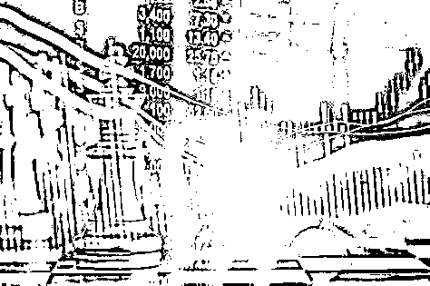

市场走弱的趋势还不止如此。比特币在 11 月 15 日的关键反转日到达 66150 的次高点，但周五时跌落至 55571，是一个月来的最低价位，自 11 月 10 日的高点算起跌幅 19.5%。对于我们来说，那不算什么。我们预期那个高点后跌幅达 20%。但是最不稳定的市场可能是欧元了，在周五跌至数年来的低点 1.1248，是自 2020 年 7 月以来的最低点。有趣的是，德国 DAX 指数于 11 月 18 日创下 16290 的历史新高后，也在第二天大幅下跌。原油也度过了艰难的一周，周五跌至 75.09，是当月的最低位。**短期占星趋势和长期考量**

****

**自 1970 年以来，负实际国债收益率通常对应着暴跌的股市。今天，负 4.7%的实际国债收益率，是自 1970 年的最低点。然而标准普尔 500 指数却在过去一年中上涨接近 30%。****今天有什么不同？首先，自美联储 2010 年开始的第二次量化宽松以来，美国国债市场一直受到操控……由于上升的通胀加上政府大量举债，国债收益率的上涨或市场驱动的紧缩，可能引发一场金融危机。有利的融资将消失，不再保护国债收益率免受巨额预算赤字的影响。****——劳伦斯·古德曼****《美联储如何操纵债券市场》****《华尔街日报》****2021 年 11 月 18 日****如果根据维持价格稳定的职责来判断他们，那么没有一人（杰罗姆·鲍威尔或莱尔·布雷纳德）配得上这份工作（美联储主席）。****鲍威尔的美联储未能预见通胀的上涨，而且在应对方面反应缓慢。美联储宣称的通胀目标是 2%，但是 10 月份的消费者价格指数已比去年上升 6.2%。无论以任何标准衡量，这都是一次历史性的失败。****——《美联储主席就像连体双胞胎》****《华尔街日报》社论版****2021 年 11 月 18 日**是的，当然，美联储一直在操控国债市场。它已经不再是“自由市场”了。在自由市场中，价格由买方和卖方公平自由地竞价决定。相反，人们在和世界上最大的银行——中央银行竞价。自 2008 年基本星座的高峰以来，对应了冥王星（债务和操纵）进入摩羯座，同时开始量化宽松和零利率政策。自那以来，与美联储的市场操纵逆行就注定会失败。或许自 1987 年 10 月黑色星期一大抛售以来就一直如此，当时的美联储就已经被赋予了新的权力。**冥王星将在 2024 年 1 月 22 日离开摩羯座。**

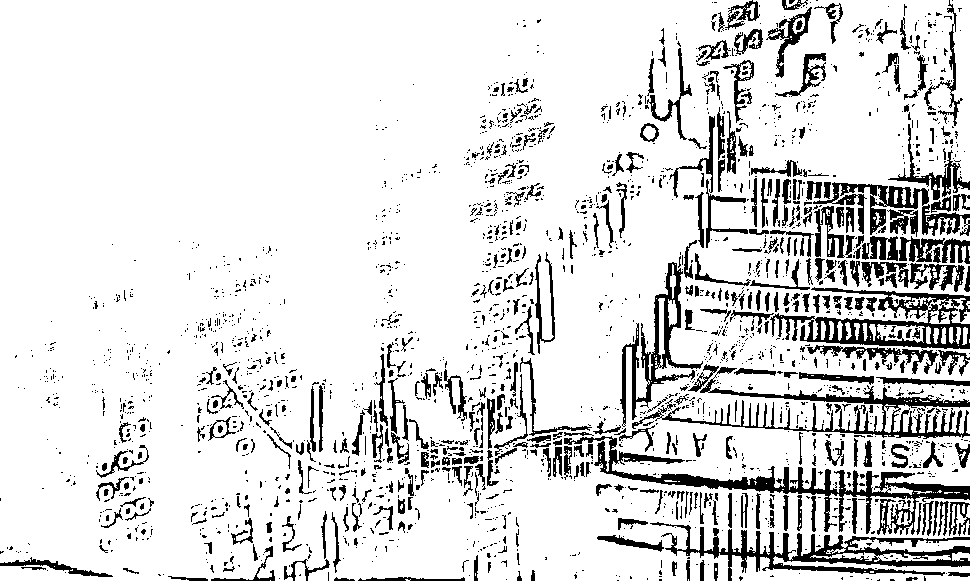

但是，解决“债务危机”的方法，难道不一直都是依靠通货膨胀吗？然而，在此过程中，某些超出计算的事情发生了（那从来不是计算的一部分，因为如果是的话，一开始就不被允许）。美联储、政府和人民都陷入了冥王星的陷阱，而没有致力于这颗行星动力更高阶表达所代表的改革。他们服用了大量药物来缓解疼痛，但是他们现在不得不面对长期刺激经济这一药方所带来的负面后果。**冥王星掌管着欺骗和操控这样的概念，正如它也掌管着腐败、胁迫和权力一样。**一旦领导人获得权力，开始以腐败和胁迫的方式操控公众的财产（以保持自身的权力和地位），那么事情就变得无法收拾，直到……这些事情被揭露，反对派将其终结。但是在某一点上，所有周期都会结束。如果事前没做充分准备或计划的话，周期的终点——就像生命本身常常像一场海难。有必要立刻把船头的方向调正。海难不一定会发生，因为与此同时，大多数的外行星开始了彼此之间的渐盈周期，可能会持续好几年。在未来的 6-18 个月里，有机会撤出所有的市场操纵，但这需要温和的政策和行动（木星-土星渐盈相位），而不是极端和操纵（土星四分天王星，冥王星仍在摩羯座）。否则，解决方案可能比问题本身还糟糕。与此同时，正如我们在今年 2 月和 5 月的 2021 年金融预报在线讲座中提到的那样，这艘大船仍旧向着今年第三个也是最后一个重要时期前进。

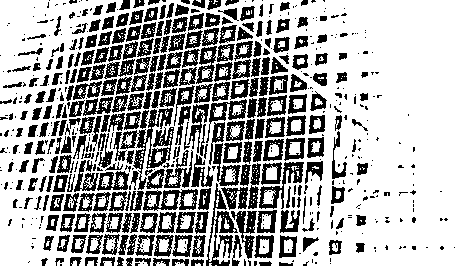

事实上，我们现在就身处其中：**10 月 29 日-12 月 31 日，尤其是 12 月份的最后两周，届时金星将逆行，土星与天王星将形成第三次渐亏四分相。**金星在摩羯座后段逆行，合相冥王星。金星逆行（2021 年 12 月 19 日-2022 年 1 月 29 日），常常对应着美联储和其他中央银行改变货币政策。这次更加有可能，因为它与冥王星合相，后者掌管债务。因此随着我们进入年底，最值得关注的是货币市场的表现，或许还有加密货币市场。因为金星、冥王星在摩羯座合相，我们可能会听到新的管控措施出台。就本周而言，我们注意到**太阳和水星将在接下来的 3-4 周进入射手座**。这通常**对全球股票市场是看涨的，因为射手座代表善意和快乐。**希望这些好时光能持续下去，不会被 12 月 24 日的土星-天王星四分相打断。

**说明：以上日期基于纽约证券交易所所在的美国东部标准时间，由于存在时差，中国地区可能需要加一天。**

**版权声明：**本文由若道翻译发布，欢迎转发，反对抄袭。友号转载请申请白名单。

**雷蒙德·梅里曼（Raymond Merriman）**

若道签约老师。著名金融占星师，ISAR（国际占星研究协会）前主席，梅里曼市场分析公司的总裁。他由于“提升了占星学的职业形象”，在 1995 年国际占星大会上被授予轩辕十四奖；在 2012 年国际占星大会上，被授予轩辕十四终身成就奖。

1“中国上证指数月度报告”发售**若道推出了****中文版****的雷蒙德·梅里曼中国上证指数月度报告，并持续发行该报告！**当把金融市场的周期和占星学的周期相结合时，雷蒙德·梅里曼老师的金融占星学研究**为投资者应对金融市场的周期波动，并随之调整投资策略提供了极大的价值参考**。
**11 月中英文报告已上线！**2“黄金价格周期月度报告”发售**若道推出****中文版****的雷蒙德·梅里曼黄金价格周期月度报告！**不仅仅为广大读者在中国股市的投资出谋划策，更将视角放眼黄金市场。**每当世界经济形式不明朗的时候，有一个地方是保值的港湾，那就是****黄金**。自 1982 年雷蒙德·梅里曼出版第一本研究《地球宇宙学征象与黄金价格的关联》的著作以来，**他一直作为最重要的黄金市场时机预测者之一享誉国际**。11 月黄金报告已上线，梅里曼老师将会告诉你他对这个关键时期如何操作的想法。也可以按照季度和一年期订阅，有更多优惠。季度和年度的好处是，你可以持续了解梅里曼老师对于不断在变化的市场的看法。即便他某一次看法和市场不一致，你也看到在下一期他如何调整自己的看法，并看到金融占星在一个长期时间段内对你把控风险的帮助。而能够长期控制风险、尽量找到安全的投资时机才是投资的长久之计。**11 月中英文报告已上线！****购买套餐**，买得越多越优惠中国上证指数月度报告套餐价

*   **单月报告**：280 元
*   **3 个月套餐**：780 元（260 元/月）
*   **12 个月套餐价**：2400 元（200 元/月）

**长按下图识别二维码****购买金融报告****套餐****▼**

黄金周期月度报告优惠

*   **双报告年度套餐更优惠（直降 900 元）**

*   **12 个月黄金报告+12 个月上证指数报告：仅需 3900 元**

**长按下图识别二维码购买黄金报告套餐**▼

3 中国金融市场特别网络研讨讲座面对年底几个影响金融市场的重要天象，该如何把握下半年的投资，为跨年做准备？我们特意邀请雷蒙德·梅里曼老师为大家带来了**3 个小时的金融讲座——雷蒙德·梅里曼中国金融市场特别网络研讨讲座。**这场为期 3 小时的在线讲座探讨了**这些长期行星周期如何影响世界经济的长期周期和趋势，特别是如何影响上证综指和黄金市场**。并描述**在 2021 年剩下的时间里市场反转关键时间点，特别是 12 月 19 日至 25 日金星逆行，以及土星-天王星最后一次渐亏四分相、金星与冥王星合相的重要时期。****长按下图识别二维码购买讲座视频**
▼

5《2022 年金融预报和沙龙》1976 年以来，由雷蒙德·A·梅里曼撰写的梅里曼市场时机学院每年一次的年度预报沙龙和每年一本的《年度预报》一直在应用占星学原理为投资者们服务，提供卓越洞见，从未间断。 **雷蒙德·梅里曼《2022 年金融预报和沙龙》开始预售中。****长按下图了解详情**
▼

**点击阅读原文购买金融报告**

# 2021 年天蝎月的最后一天，想跟自己说什么？

> 原文：[`mp.weixin.qq.com/s?__biz=MzA5NjA0NTAxNg==&mid=2651461800&idx=1&sn=3cf9bb713e94746de9c539b34d46e9e1&chksm=8b48aa1fbc3f23093ed869f57db94631ad808f70b7701c6afc13a077b7cf6843d657a3dece4f&scene=126&sessionid=1692737898#rd`](http://mp.weixin.qq.com/s?__biz=MzA5NjA0NTAxNg==&mid=2651461800&idx=1&sn=3cf9bb713e94746de9c539b34d46e9e1&chksm=8b48aa1fbc3f23093ed869f57db94631ad808f70b7701c6afc13a077b7cf6843d657a3dece4f&scene=126&sessionid=1692737898#rd)

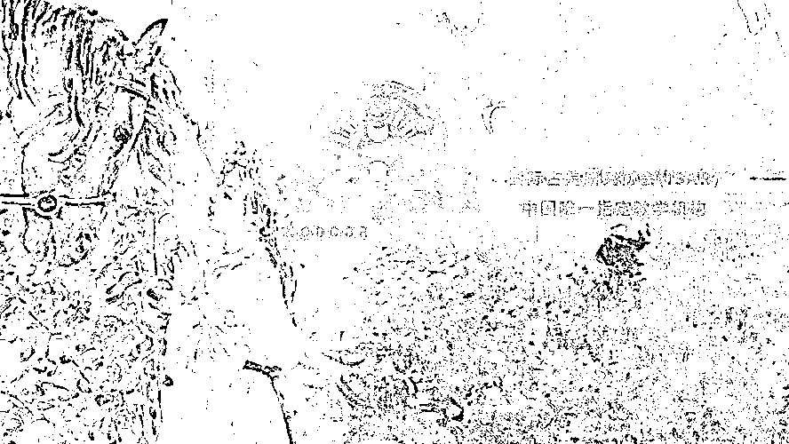

**2021 年 11 月 21 日天象：**

*   **月亮在双子座**
*   ******太阳合相月亮南交点******
*   ******水星四分木星、六分冥王星******
*   ******金星六分火星******
*   ******土星六分凯龙星******

今天月亮在双子座，你可能一大早就不想赖在床上了，今天要做点什么？学点什么？是不是打算把一整天都安排得满满当当又新鲜有趣呢？双子座的守护星——水星，今天还和木星形成四分相、和冥王星形成六分相，跟他人沟通交流或学习的意愿比较强烈，让自己的大脑充分吸取信息吧！前天我们迎来了关乎“前后一年半”的金牛座月食（点击[【金牛座月食】](http://mp.weixin.qq.com/s?__biz=MzA5NjA0NTAxNg==&mid=2651461670&idx=1&sn=48d44052692e7cf6fc6e5146266e8a74&chksm=8b48aa91bc3f2387b8ca38bb0073b63aed347505e4ac2d7e321188081e7279eb2c45e3c4637f&scene=21#wechat_redirect)查看文章），这是与过去告别、从“不成熟”迈向“成熟”的时刻。不做突破，就没有未来，在 2021 年天蝎月的最后一天，你想跟自己说些什么呢？欢迎跟我们分享呀~周日快乐！我们明天见！**了解每日天象，可****下载“若道”APP 查看****还有更多精彩等着你哦**

# 冥王星落在 8 宫（中）丨爱与妒一起高声尖叫，关系需要敌人存在？

> 原文：[`mp.weixin.qq.com/s?__biz=MzA5NjA0NTAxNg==&mid=2651461799&idx=2&sn=b883690fda7187c23be95654316ed956&chksm=8b48aa10bc3f2306f80d6aa61e69ffce352286487a6997f7c57fadabbf1b4a4b2ee4d1c8b947&scene=126&sessionid=1692737898#rd`](http://mp.weixin.qq.com/s?__biz=MzA5NjA0NTAxNg==&mid=2651461799&idx=2&sn=b883690fda7187c23be95654316ed956&chksm=8b48aa10bc3f2306f80d6aa61e69ffce352286487a6997f7c57fadabbf1b4a4b2ee4d1c8b947&scene=126&sessionid=1692737898#rd)

作者/蓝女巫 ISAR 认证占星师
编辑/翀子 封面/书君 图片/音乐/作者提供

**(接今日头条）** 

**你在补偿些什么？** 

**激情**

**撒旦**最近给我留下深刻的印象，他似乎是有**个人特质的典范**。是整个教条中最有活力的。撒旦：“我**非常不安，迅速加快生命。我永远不满足**，永远**不会泰然自若。**我**把一切都推倒，又迅速重建**。我**非常有野心，贪图名利，渴望行动，**我是新想法和行动的嘶嘶声响。还有生命。”我：“对我而言，那要看你**如何定义生命**。你**对生命的理解是必须向上爬和拆毁，**带有**坚持和怀疑**，**不耐烦地到处拖拽，**带着**仓促的欲望。**你**缺乏**绝对事物和它的**忍耐心**。”撒旦：“**相当正确。我的生命泡沫四起，搅起汹涌的波浪**，它**由抓住和扔掉构成，热切的渴望和不安。这就是生命，不是吗？”**每个人都能理解他的话，因为**这些话都是个人性的。**

——荣格《红书》

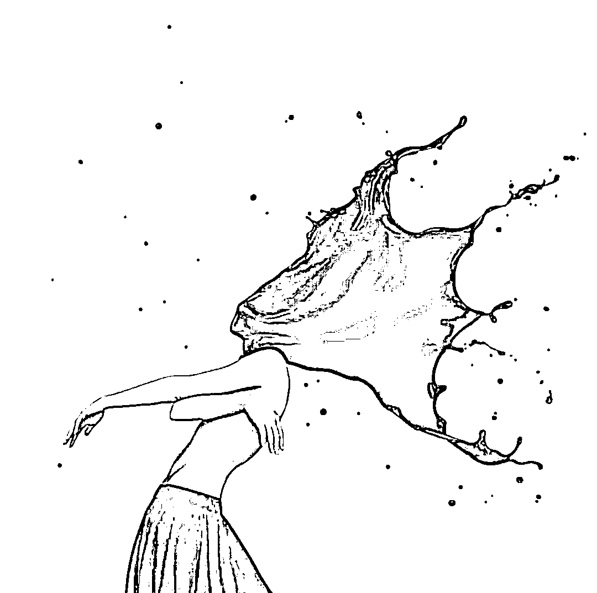

这就是生命，不是吗？天蝎座/8 宫人的兴致，在于“**人/性”**。激情必须是血色的，而当那张力饱满，却还被抑制，即是冥王星 8 宫的写照......本章相关，**人之“爱”“恨”，性之“权”“欲”，及亲密关系，灵魂伴侣。**

**人：爱与恨**

但我必须说**那两个交缠在一起升上天的也是善和恶。快乐和痛苦在一起高声尖叫。**但只要**有爱的地方，都有蛇形**的存在。出现在爱中又超越人性的东西具有蛇和鸟的本质。你看来是鸟的，别人看来是蛇，而你看来是蛇的，别人看来是鸟。**如果你想要变化，那么鸟与蛇之间的战斗就会爆发。两者直接相克，只能成为其一。**

——荣格《红书》

**爱，与信任**

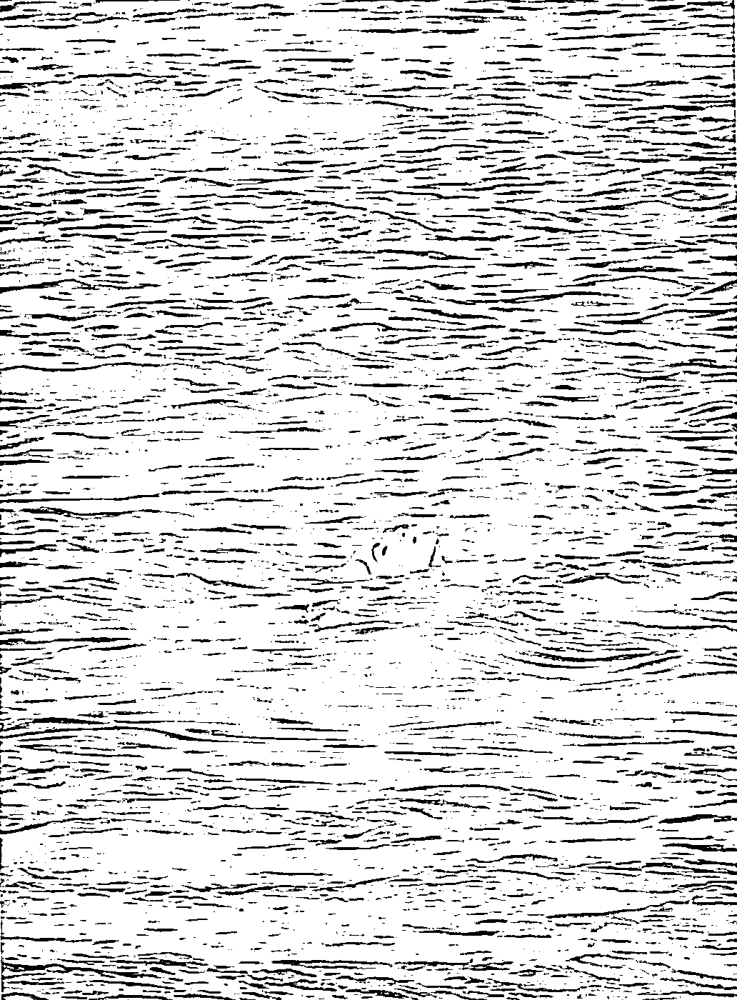

天蝎座们是**对人更感兴趣，**而不（只）是对钱。于是，当有人说：我对钱没兴趣。我们南交点 8 宫的人，都会理解此言不虚。没人不需要钱，但仍可以有人不把钱当回事。对于冥王星 8 宫，**钱就是一个数字**罢了。正因为可以玩很大，故也就显得轻视。**相比之下，信任（人）则更重要。**因**信任能直接转化为财富。**正如金融，本质上不就是关于**信任和信心的交易。**出于嫁接他人价值的热望，信任则必不可少。

 **爱，是一场冒险，赌的更是信任。冥王星 8 宫对信任，有个欲壑！**要很多，才有安全感。会近乎疯狂地去踩底线，不断用事实确认他人对自己足够真诚。**爱，就需要经得起最锋利的试探。**要的就是，逼至悬崖边的不删之爱，行走在刀刃上的荡气回肠...... 想起了一个冥王星 8 宫在唱《别离开我》时的神情。

 **冥王星 8 宫，最享受被信任的感觉，将信任等同于亲近。**那是一种灵魂间的默许。确认过眼神，是自己人时，便会肝胆相照，赴汤蹈火。感于真诚，自会报之以真诚。情感需要交付得很深。过命的交情**，要的就是相互兜底的恩义。**无论如何，**他们的精神内核都是极致感性的。**

 然而被怀疑时，滋生的**“异已感”，却会让心瞬间就凉了。**感觉不被当成自己人，就会一下子兴致全无，仿佛失去了所有往来的意义。等同于一种被背叛。一旦形同陌路，便会心生厌恶。赤诚破裂，继而展现出蝎式无情，冷若冰霜，会变得针锋相对，成了敌人。总之，对于 8 宫人，**信任一旦失去，后果不堪设想......**

 正因对于冥王星 8 宫，**信任也总来之不易。亲密恐惧，**是冥王星 8 宫最深远的恐惧吧？越是渴望依赖，越担心受制于人。毕竟，没有谁比伴侣更能激怒我们。敞开即示弱，便会因爱的需求而蒙羞。最激情的冥王星 8 宫，更**难以在亲密关系最深层交换激烈。**情感会保留或退缩，以一种极为**复杂的抑制。**这与其在分享资源时的控制感同理。都源自累世灵魂记忆中的**信任危机。**曾在深度关系中，留下过难以愈合的信任创伤。故今生建立关系时，本能升起怀疑与防卫，似乎随时准备着毁灭它。过度应激，先发制人，有如惊弓之鸟。而恐惧的投射，会继续吸来不忠与背叛，**以验证灵魂的警觉。**

 释怀冥王星 8 宫根深蒂固的犹疑，究竟尚需多少确认？而 2021 年，我们与原本就缺乏核心信任的**冥王星在天蝎座一代人**，有目共睹地，**见证着这个时代在如何透支信任，**尤其关于情感的。爱，从没那么丑陋过；恨，从没那么嘹亮过。抛开是非对错的评判，而那是**一场信任本身的劫难。**一石激起千层浪......那一刻，我**一叶知秋，**已预知到，未来在何处将**噤若寒蝉。**

 爱的另一面，是恨。爱，总被恨尾随......

**恨，与嫉妒**

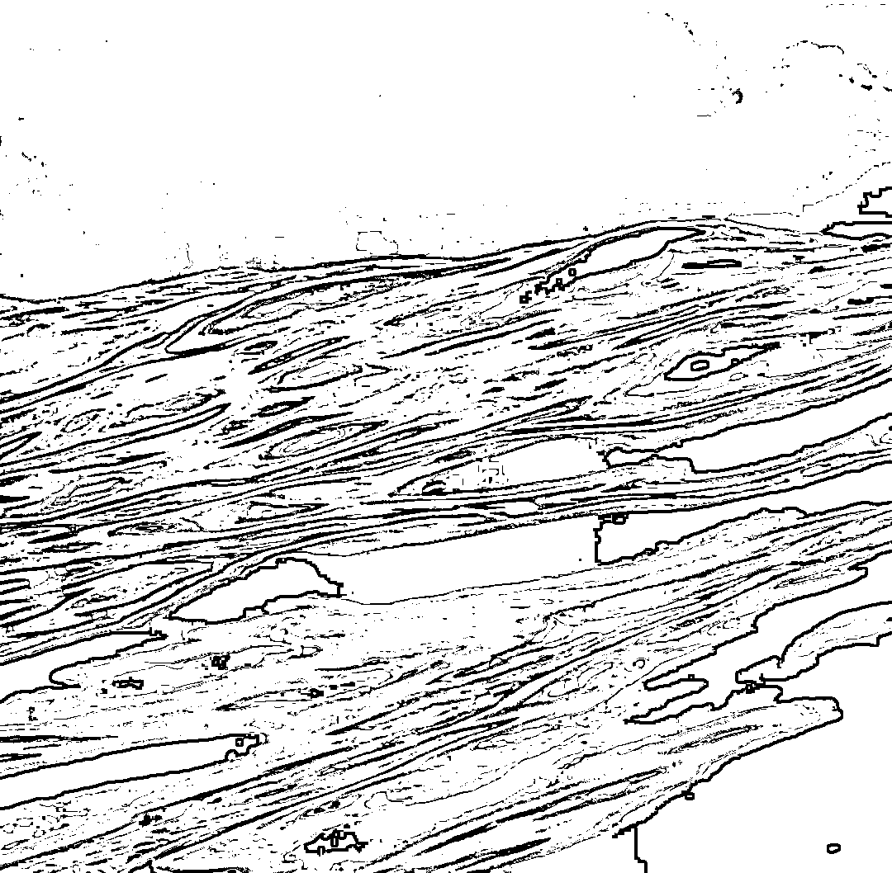

撒旦本身就是魔鬼的典范，**赤裸着，因此没有诱惑，甚至不算聪明，**是**完全没有说服力的纯粹否定。**因此我阻抗他毁灭性的影响，将他抓住，紧紧地铐住他。他的后代为我效劳，我用剑献祭他们。

——荣格《红书》

**爱之深，妒之切。**蝎子们的恨，如图......那是压抑嫉妒的色彩么？而冥王星 8 宫，尤具强烈的报复心。无论对爱擅长于否，却**一定最擅长恨。**占上风的强迫性，仍关乎**权力的控制？**“直击他人死穴，往伤口上再撒一把盐。”“曾经被分手，努力不分后，再以冥王星 8 宫甩掉，作为报复。”“竟敢如此对本宫！你不要我，我就去投奔你的竞争对手吧。” 你要称之为“作恶”吗？**事关人性，可没那么简单。**在我眼中，他们只是**敢于抒发人性**罢了。8 宫**缘何如此残忍？“绝决”，皆因由情同陌路感的心寒，所引发的悲愤......**毒死皇帝当太后，抑或美狄亚杀子的原因，当你倾听恨的理由时，却会为之动容。因为**恨的另一面，是爱。**

 正如少年时读到“邪恶”阿紫对乔峰的占有，肝肠寸断的体验，至今难以磨灭。太能共情此等生命之重。怪我是月亮天蝎座吧，故从不在天蝎座之处，使用评判。为什么呢？**人性远比道德更生动吧。**在天蝎座这里，**从没有什么政治正确。**飞蛾扑火的同归于尽？那要的是怎样一种激烈？**似乎只有最极端的表达，才配得上深爱的浓度。人追求一击致命时，正是自己最不冷静的时候。绝决的同时，亦是自毁**（“？？？”此处总会跟随着摩羯座们的表情包）。一个闪念，**“作”是什么？**想起一个武侠人物，**损人不利己**——白开心。**可为什么要期待撒旦冷静？我倒觉得他至少一点也不虚伪。**狠狠摔死恶梦中攻击你的巨蟒时，那本能的情绪，难道不是人之常情？天蝎座最动人之处，便是他们**对于感受的诚实。**仇恨由恐惧喂养，情绪被愤怒裹挟，升级到暴力的攻击性。**而能抚平恨之疯狂的，也就只有爱了......**

在爱的语境下，**恨，常常就是嫉妒。**恕我们天蝎座无法理解，**不会嫉妒的爱，那是爱吗？**哦，像双鱼座那样的“绝对之爱”，可连上帝都是有嫉妒的。当崇拜其他神时，不被允许。又何况人。**“相对之爱”却更符合“人性”！所谓 8 宫。**然而，不幸的事实却是，连母亲都不可能是完全属于孩子的...... 冥王星在 8 宫，**问人间，谁可相依？**

 **冥王星 8 宫，是最勇于表达嫉妒的吧？**面对无可遏制的暴怒，冥王星 8 宫可决不是什么“高尚的情人”。冥王星 8 宫人们会用行动响亮地复仇，要大声说出来。很大声！如此不惜一切，**正是勇于承认爱的“发生”**，像美狄亚那般“去讨回床的公平”。（同理于[【论火冥与酒神精神，历万劫而永生】](http://mp.weixin.qq.com/s?__biz=MzA5NjA0NTAxNg==&mid=2651407854&idx=1&sn=7e0e4ed2e417b45c7a4fe3beb05e2d6e&chksm=8b4bf759bc3c7e4fb3e8427e46571ad1873f36fef391a841d685ef11b07323d8c2dc84cedacc&scene=21#wechat_redirect)的后记，点击可查看文章）。即便你为嫉妒去复仇，本身已败给了痛苦。因承认嫉妒，就等于暴露了软弱焦虑与欲求不满。不伪装地展现嫉妒，是非常需要勇气的。**而出于自保，嫉妒总是变得不可言说，**当你把尊严看得更重要，需要掩护 inferior（卑微）相对于 superior（优越）。**释放压抑的野兽，总是充满争议，**而并不妨碍那样的故事在时空中流转时，总是牵动人心，余音绕梁...... 因它撞击着人类心底相通的黑暗。而**最深入黑夜的人，才最接近光明。**

 **物化。**在物化的欢愉中，没什么比一个嫉妒的女人更煞风景了吧。而谁会愿意，在关系中被当成物品（商品）？谁会甘于，一片痴心被简化为一个部位？只好通过嫉妒，摆脱物化，把尊严还给情欲。去要求被赋予更高的价值，情感价值！**以 2 宫的物化，去占有对方的身体？还是以 8 宫的嫉妒，去拥有对方的欲望？这是爱情截然不同的出发点。**不可当工具，前提要有爱，**冥王星 8 宫会为此抗争到至死不渝。**且天蝎座们要的从不只是浪漫的爱情，而是**欲望中的欲望！**天蝎座最看重的平等相互性，是**期待彼此归属的熨贴，渴望同等深度的回应。**要浑然一体，临在性中：**feeling is mutual（同感）****......**

可是，冥王星 8 宫究竟为什么总被逼上嫉妒的梁山？因为越是你最害怕的，也就最容易威胁你。至于，嫉妒的源头，**究竟是出于爱，还是不安全感？**这确实是一个复杂的问题。

 **生命初始的伊甸园中，**我们曾与母亲身心融合，紧密相连，享受服帖。成年后步步回眸，寄望有人能令你重温那片极乐。**绝对的排他性，**是人类心中普遍的隐秘期望：无论我怎样，你都应该爱我。渴求对方的偏爱，如婴儿般甜美的幻想。当爱人拒绝他人，选择你。便能证明你的**独特性，重要性，以及不可替代性。**而被出轨的瞬间，但见你的**独一无二，一脚踏空。**所以，喜欢上别人，**不可以！出轨是终极背叛，它通往 8 宫人的终极恐惧（愤怒）！是的，这里，已经是不折不扣的底线了。**

 可残酷的事实是，人世间所有的感情，**无不笼罩在第三者的阴影下：无论真实存在，还是幻想中的。你从未完完整整地占有过任何人，包括你的母亲。**毫无血缘关系的爱人，则更可**以“自由”之名，频频挑衅你的不安。阻抗是幼稚的。**对不确定性的入侵，负隅顽抗，注定你终会在某一瞬间溃不成军。认为能对“所有物”拥有绝对的信任，不过是个幻觉。**绝对忠诚，止于空想。**骗自己没有，并不会感到安全。侦察和验证的控制感，无法永久消除疑虑。你任性低幼的占有欲，根本拴不住任何人性的犟驴。最痛苦莫过于承认爱人**从不独属于你，**无论是他的身体，还是他的选择。爱是自由的，它无法通过强制得到。要承认其他的可能性。**"TA"注定永远存在！**怎么解决？对待人生太多无解之事，**别奢望着能去解决它，你只好随时去管理它。学会适应。**

后来，有些人，**想开了。**对诱惑发放了准入许可。**尝试以邀请的“合作”姿态，来颠覆其力量，**阉割其作为阴影而隐匿时，所具有的强悍威胁性。毕竟，很多东西，正因不承认，而更显力量。因叛逆总在酝酿着私下的越轨。**这与处理人性阴影面，同理。光与影，要同存，**让神魔合为一体，结束冲突。活在对立结合中的人，**方能变得静止。**他们明白了与其抑制它的不稳定性，不如**“利用”它来平衡反制，**成全长久的关系。于是，得出了相当理智的感悟：**“长期关系需要敌人存在！”** 引入嫉妒的惊扰，拯救关系的寡淡。心中苦笑，这究竟算是一种“聪明”，还是一种“智慧”？面对生命之痛，人性的防御显得自私又残忍。但其实，并没有人获胜！**开放式婚姻或封闭式婚姻，都痛苦。很不幸，只要尚有人性存在的一天......**

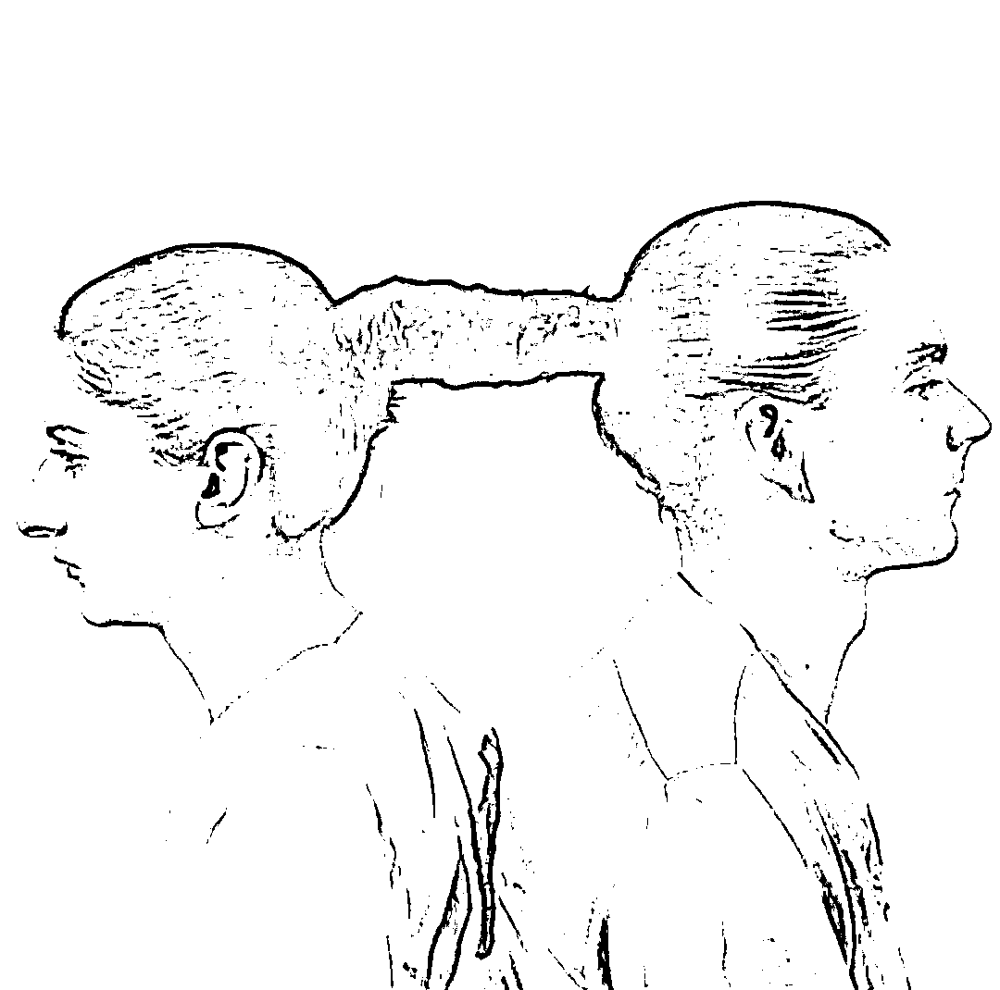

**不忠是可能的。**它伴随着人类呼吸的始末。前方时代最必然的不确定性中，将孕育着更多的欲望种子。它史无其例地让失去的风险，变得愈发易如反掌。**一切皆可被抛弃！一切皆可被取代！振聋发聩的次声，**放大着每个人心间的原始恐惧，防御抛弃的情感游戏中，**令安全感的尖叫更加刺耳。**它撼动着人类神圣不可侵犯的信念，**挑衅着一切最诗意的忠诚！**婚姻制度的**定海神针，开始摇晃。**零容忍，且同仇敌忾？可是未来两千年，叫作**水瓶时代！**而**水瓶座最憎恨的词，就是 exclusive（排他性）！**即时满足的消费文化，已让人们变得无法忍耐任何挫折。新奇刺激，应接不暇，何以招架？对孤独与被抛弃的保卫，**将注定湮没在水瓶时代的寒风里......**

 **心底的不安全感，如何安放？这世间，并没有人对你负责。我们只能靠自己......不确定性？此事古难全，**但愿人长久......此处，我突然明白了，为何我们**对“双生”如此期待？难道是在秘密期待它能打破第三者的威胁？**让爱只在人类二元间**发生，摆荡，**以此满足心间**全有与全无**的婴儿式浪漫。仿佛只要存在着那最完美的契合，便能给予我们最确定的安全了！really？见后文吧......

 而 exclusive，大概也是我有生之年最执迷的死穴了！也始终成了**我最致命的痛点。冥王星 8 宫与南交点在 8 宫的人，**一直在将所有的自我价值依附于爱人身上。而他人的认可，又何足以证明我们的意义？**让所有的鸡蛋孤注一掷？可有谁的筐会比自己的筐更安全呢。北交点在 2 宫，除了坚定地做好自己，还能奈何？那或许才是最温柔而美好的挽留吧。**写冥王星 8 宫的日子里......多么痛的领悟！想送给活在人性宫斗剧中的冥王星 8 宫人，一句解药：**风物长宜放眼量！**莫要落入天蝎座/冥王星偏执的陷阱。请深深地记住，**合也无常，分也无常......**

**性：权与欲**

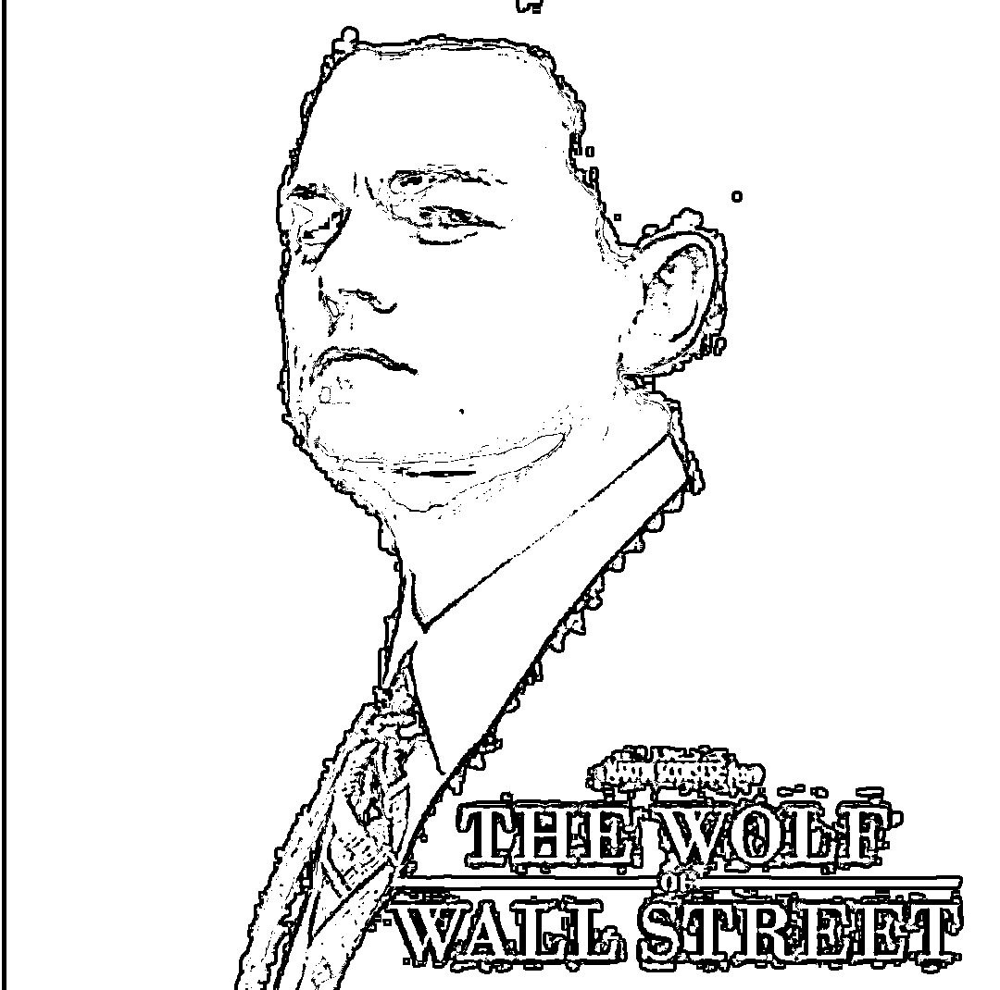

**欲望**

**魔鬼是人性黑暗面的总和。我将自己和它合一，而不是征服它。**我接纳施加到我身上的羞辱和征服，因此**我拥有了蛇的本质。**如果我没有变成蛇或魔鬼，有这样一点力量便能支配我。这将会让魔鬼抓到把柄，**魔鬼将强迫我和他立约，**他也是这样狡猾地欺骗浮士德的。但**我先发制人，借助的是将自己和蛇合一，就像男性与女性的合一**一样。因此，我**摆脱掉魔鬼施加影响的可能性。**撒旦，带有我的蛇性。一夜之间，我开始**喜欢蛇，解开它们的谜语。**我知道如何**巧妙又残酷地抓住它们。**灵魂的到来走的就是蛇一般的道路。你没有看到白天变成黑夜有多快？蛇变得愤怒，试图咬我的心脏，但我秘密的盔甲折断了她的毒牙。她很吃惊地缩回去，发出嘶嘶的声音：**“你表现得高深莫测。”**我的灵魂就是一条蛇。这个认识给我的灵魂带来一张新面孔，因此我决定对她施魔法，使她向我的力量屈服。**蛇很有智慧，我想要我的蛇灵魂把她的智慧传给我。**

——荣格《红书》

**金钱，性，权力，**三座大山，对冥王星 8 宫，相当于魔鬼般的存在。**当冥王星 8 宫手握着资源，便能感受到权力的滋养。**而什么是资源？**冥王星 8 宫和天蝎座们更注重的是无形的“势能”，而非有形的物质。**冥王星 8 宫最擅长对人性的拿捏和洞察，便能让偏财随人脉滚滚而来。故**人际关系本身，即是资源。将人脉转化为资本，通过信任**。于是，冥王星 8 宫人们常以**心理学或金融见长**。而二者的协同，让冥王星 8 宫之路，走得更深更广.......

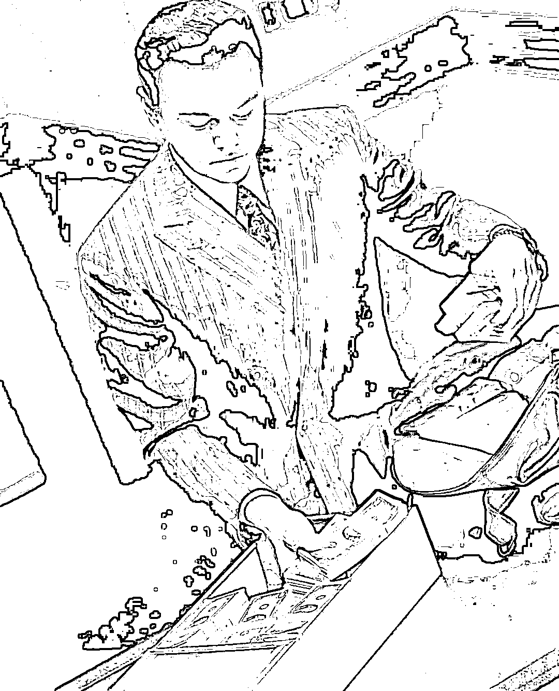

**冥王星 8 宫，你的心中，住着华尔街之狼。**狼的野心，最好的投射，即是冥王星的商业帝国。8 宫向往的财产，是资本量级的。要以虚拟空间才能承载的无形资产。当钱变成了数字，才便于指数倍地繁殖，以此释放心中膨胀的疯狂，想像着自己正以此通往强大。**体验一掷千金的魄力，方能彰显欲望中的豪横。**因此，冥王星 8 宫多从事金融行业，要的就是亿万财富经手的心跳，而同时亦被一种**异样的焦虑所折磨？**当它们并不（真正）属于自己，**只能见其穿行，**你却总留不住它们？对冥王星 8 宫，会是怎样的引诱。一个铤而走险的闪念，频频出现。**掠夺，似乎是最快的方法？**

 当你面对着终极的**势力与能量**，却从未曾像金牛那样**具象地享有使用**它们时，**抽象的力量**越大，竟越令人觉得困惑？**欲望，变成一个极度高亢的声音，悬浮在空荡荡的山洞中嘶吼**......越是掏空，越想补偿！**空洞渴望充满。冥王星 8 宫的眼睛最有价值，**它擅长抓取一切闪闪发光的充满，迫不及待地吞下其夺目的力量！**如何可以安全无虞地去掠夺？**比如聪明的富人，利用人性的贪婪与焦虑，把穷人的钱搜刮到自己的兜里。比如美丽的女人，利用男人的垂涎，将渴望的资源据为己有。**以引诱之名，**擦边而过的灰度，实现了种种顺理成章的掠夺。8 宫的**急功近利，**显示出一种**强迫性！向死而生的不耐烦，**撕下道德的啰嗦，瞄准的是**效能与利益，**所谓天蝎座的实用主义精神。

但是，蛇也是生命。在古人提供的意象中，是蛇终结了伊甸园天真烂漫的辉煌，古人甚至说**基督自己曾经就是一条蛇。**

——荣格《红书》

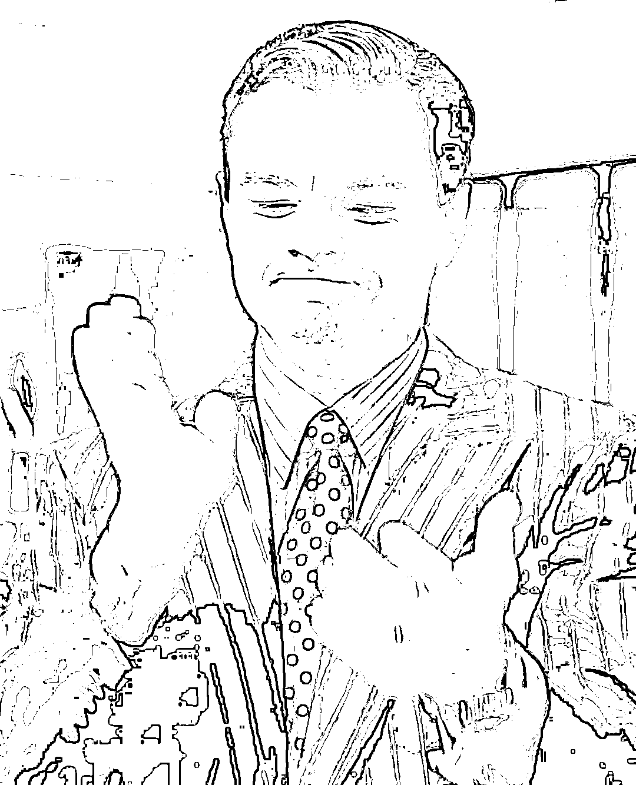

**8 宫是欲望之宫，“权”“势”**二字，没有一个天蝎座可以抗拒与抵御。换言之，是相当的崇拜与痴迷。嗜血天性时刻驱迫你要成为强者。**总听见一个难填的欲壑在说：我值得更大的舞台！但冥王星 8 宫却可能是欲说还休。作为天蝎座中的天蝎座，他们很可能会掩藏欲望，甚至去无情反击它。**难以启齿，因害怕显得贪得无厌。可是抑制只能加深渴望。与其**让欲望拥有人，不如让人拥有欲望，**大大方方地去实现你的野心。而非为你的欲望编造借口，自我麻痹。要**直视八宫的野心**，检视那暗流涌动，赤裸裸地自我揭示，避免它向外投射成为环境中的宫斗。冥王星 8 宫，时时刻刻不得不面对的，正是**你与自身欲望的关系。“出来吧，黑色深渊中的蛇！”**荣格喊道。

 正如冥王星在天蝎座的一代，**都特别知道自己要什么，**并毫不遮掩地去谋取它。于是，眼前的世界，已疯狂内卷到人人疲惫......**蛇在闪耀的阳光下眨眼。**他们有着强大的资源链接能力，以及翻云覆雨的心机，很容易获得资助。**而欲望也总是标明了价码。**深陷权力斗争，血雨腥风，通往的都是同样的归处......当欲望的属性，是**分离式**的私欲，而非**合一式**的利他，自身便会衍生出更多的欲望，**永远无法魇足**（见旧文[【蓝女巫解秘冥王星系列-序言】](http://mp.weixin.qq.com/s?__biz=MzA5NjA0NTAxNg==&mid=2651411924&idx=1&sn=d9a10f7f763dbb80a857ca94e2a67830&chksm=8b4be763bc3c6e759456fd2dd4dc92e87ea3b3b2507a5be70072d2c6339b895af34e04c1f7d6&scene=21#wechat_redirect)点击可查看文章）。而冥王星 8 宫，也注定会在一切 8 宫事务中**饱受折磨。**

 当你在掠夺与被掠夺，控制与反控制的剧本中，为风险与得失劳心劳力时，**你常常会忘了：资本，或许却远不如一个农民那样，更拥有自我价值感......**所匮乏的是，那种脚踏实地的满足感与安全感。真正的幸福感，从不那么害怕被掠夺，因它只能安居在你自己的心里。**当宁静必须来自于心安理得。**

**性，与权力**

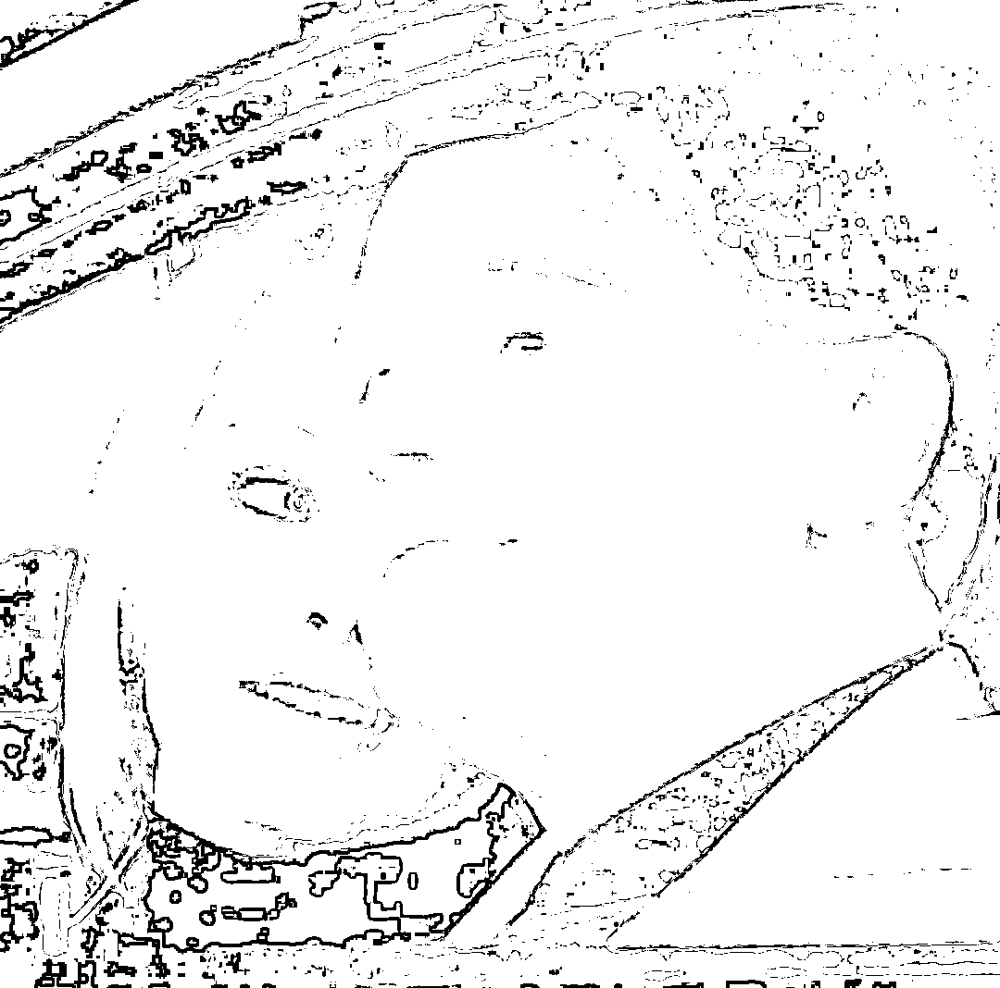

王尔德说，**世间一切都与性有关，除了性本身。性，只关乎权力。**

 从 7 宫开始讲究的协商，到了 8 宫，已抵达了**协商最艰难的困境——权力！权力足以扭曲人性。或是说，它直接还原人性。**因此 8 宫的丛林，是它最好的归属。但见权力的烟花绽放，磁力四射。权力的共生关系中，**主宰与服从，霸凌与反抗，顺昌逆亡的奖惩。**原始的兽欲，病态的控制。然而，并没有人情愿放弃权利，弱者也有其隐性的权力......**权力斗争在人际关系中永存。**

 **性爱背后充满权力。有欲望，就有操纵。**冥王星有**恃强凌弱**的本性，因为有差距，才会有攻击。因为有攻击，才有力比多，才有生命力。正因**权力失衡，力量悬殊，而显得性感。**试想将女权带入卧室，此处的平衡却可能是灾难性的？所以，**八宫是要打破平衡的失衡之美，绝不是七宫天秤座的平衡之美，**Unbalanced is so ugly（失衡是丑陋的）......即所谓**天蝎座之美**。欲望是存在于落差中的快感，是一场权力的游戏。比如，在被物化的关系里，**性仅仅作为权力的附属品，**三妻四妾的幻想中，你在寻求怎样的“落差”？它是如何密谋着为你赢得“尊严”的？又比如，性的冻结，也常常与权力的收放有关......总之，性爱心理中的权力课题，皆可追溯到童年。

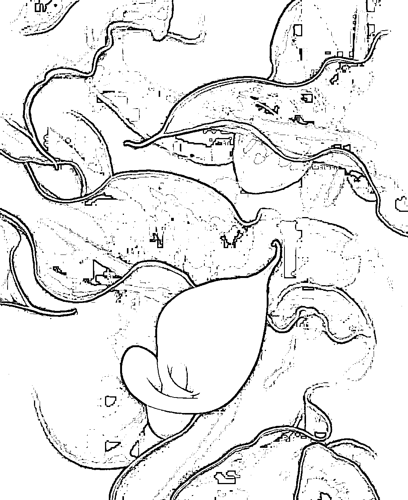

**性与爱**

冥王星 8 宫，无疑是最性感的族群，携带的气场，大到很玄学。然而，冥王星 8 宫却最**恐惧**自己的（性）欲望，因为他们心知肚明，那**会像洪水猛兽一样恐怖！**所以，他们宁可**选择克制。**在此，他们也将遭遇最复杂的焦虑。**在恐惧和渴望之间，他们必须找到妥协。**难以轻信他人，源于难以相信自己？如何超越对自他的恐惧，在与他人灵肉亲昵间，**去让自己的灵与肉重新聚合。**隐秘的心魔，羞耻的创伤，一旦被爱人全然地接住，便是全身心最深度的认可。它通往极乐般的逾越与转化。

 性，是诸多灵魂需求的补剂，同时也可夸大人性的顽疾。它从蓄积紧张，到全然释放，让人重获新生，充满力量。那片活力，通往生命本身。每一次**死亡之舞**圆满完成的时刻，如临**silent night（平安夜）**，在平静的满足中安息。而**在性爱中，你最渴望得到的却是什么？**这是一个直逼核心的拷问。

 **欲望是个谜。**它既不是自发性的神话，也无法目标导向地获得。止步于关注性爱表现的身体成就，是狭隘的，那会错过**“人类性爱中唐吉诃德式的本质问题”。真正的性爱，**难以靠科学的计量成全，而**是一门艺术**，一种**爱与性的协同**，可谓**身心灵的炼金术。**如何**将灵魂的船员召回肉体的甲板？**如何能够让**爱与性同时发生？**

 **没有爱的性，那会是怎样的创伤？**商业狂欢所炮制的消费主义性爱，让诱惑取代了爱，即时满足的刺激，成了目的本身。当性只作为避难所，用来发泄焦虑，填补空虚，回避问题。欲望沼泽通往的是，宣泄过后，心的荒凉。**无根的性，**只会让人更孤独。**爱被压抑，则性就不可能达成真正的满足！爱才能给你意义感，**与源头的生命力相连。爱是拓展，性是释放，一张一弛。**性与爱的分离，将通向冷漠的人间......**

**版权声明：**本文由作者授权在若道平台发布，欢迎转发，反对抄袭。

**（未完，余下请见今日三条）**

**蓝女巫**

英国伯明翰大学 市场营销学硕士

职业占星师/专栏作者/芳疗师/珠宝设计师

中国首批 ISAR 英文认证占星师（2012 届）

**微信公众号**：cecilia_sui

长按打赏

**学习占星学****点击或长按下图了解课程详情** ************

****

****

**微信又双叒叕改版啦，不想错过若道君的推送？**

**就把若道设为星标吧！**

**▼**

**就是这个“在看”，戳一下☟**

********报名直达入口********

# 冥王星落在 8 宫（下）丨相遇即是分离之时，多么凄美的约定

> 原文：[`mp.weixin.qq.com/s?__biz=MzA5NjA0NTAxNg==&mid=2651461799&idx=3&sn=af479b5e7c89af05b3dd55500c76ff5e&chksm=8b48aa10bc3f23066ad1206298e7b342c18e251c36bd7e2a3bec81b1a81d4ec30dc072b8c7eb&scene=126&sessionid=1692737898#rd`](http://mp.weixin.qq.com/s?__biz=MzA5NjA0NTAxNg==&mid=2651461799&idx=3&sn=af479b5e7c89af05b3dd55500c76ff5e&chksm=8b48aa10bc3f23066ad1206298e7b342c18e251c36bd7e2a3bec81b1a81d4ec30dc072b8c7eb&scene=126&sessionid=1692737898#rd)

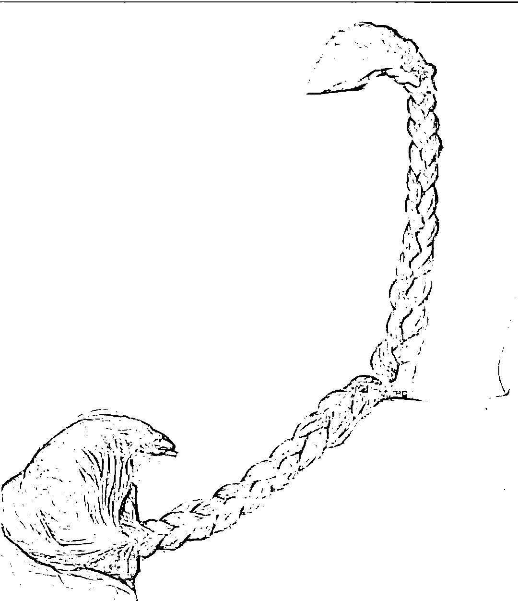

作者/蓝女巫 ISAR 认证占星师
编辑/翀子 封面/书君 图片/音乐/作者提供

**(接今日头条、二条）** 

**亲密关系**

8 宫，是一片**漆黑的秘密花园，**斑驳着人性最可怖的阴影，我们与伴侣携手走进。**在触碰底线与守住底线**的权力斗争间厮杀较劲。**亲密就是敢于自我揭露，呈现脆弱。**像宠物那样亮肚皮给你，将最脆弱的部分袒露，以此表示信任。**不敢自我暴露，就不是真正的亲密关系**。天秤座的粉饰，双鱼座的逃避，都不利于此地的发展。一味回避冲突，自欺欺人，只能让误会滚雪球。急于妥协翻片儿，来稳固安全感，却将未解决的刺埋入关系。积怨的种子，迟早爆发。**敢于吵架时，还是充满信任的，**深知吵不散。相信暴露秘密不会被抛弃，才敢如此丢盔卸甲地以丑陋示人。不要恐惧争吵，但一定不要见诸于情绪化。坦露真相，并非意在伤害，吵架旨在舒展感受以获得理解。处理掉负能量，转变为正能量。释放深藏秘密，让恶魔化作天使。**当冥王星在亲密关系中得以表达，就实现了疗愈与超越！**

 所以，8 宫亲密关系应以**开诚布公**为契约。**但过度袒露真的就是对的吗？冥王星 8 宫在此处最难拿捏。**冥王星 8 宫对碰触不适话题有着高容忍，却又是矛盾的，物极必反。**或许他们更需要在关系中隐藏自己。**要理解他们的隐私中包裹着更深邃的痛苦，易激窒息的恐惧。故需要一个接得住你秘密的伴侣。否则，善意的隐瞒，能避免对双方都造成永久的伤害。而心理补偿式的种种胁迫监视和强制分享，都可能造成侵吞的创伤。且当禁忌无从藏匿，神秘无可遁形，便没有什么需要寻找，欲望的空间被挤压殆尽，人们**陷入了最亲密的孤独。**

 其实，**亲密与欲望，却是两个维度的事**，甚至是**互斥的**。我认为，**七宫才是亲密关系，八宫则更关于欲望。**亲密关系和情欲需求，缺一不可，但又各自独立。安全与激情，难以兼得。这正是所有伴侣关系中的两难。**情到深处人孤独。而亲密是怎么弄丢了欲望的？**

 **亲密，**以高度信任和温情舒适喂养，安全来自重复。但重复通向疲软，全身心亲密无间，必会造成情欲的抑制。深入了解，也助长责任与歉疚，都**让爱开始变得沉重。而激情来自于渴望。甚至是一场需要不那么害怕失去，才敢投身的冒险。欲望，需要求而不得，**诱惑产生于你所需求和你被允许拥有之间的鸿沟。欲望之火渴望空气。它需要差异性，不确定性，心理距离感。侵略，强迫，折磨，非利他，这些爱的阴影面，却都是维系情欲的燃料。安全削弱活力，危险破坏情感。该如何取舍？当牺牲激情来换取稳定成了普遍作法，但见**现代婚姻总是陷入了性的僵局。**

 亲密关系的完美出路，在于**温暖与激情的平衡。**能相互关爱，又关注自我，即是能充分敞开内心的自我中心。对于冥王星 8 宫最核心的忠告就是，与他人联结前，切莫丢失自己。从未自我疏远，永葆自我忠诚！始终将保证自身价值的独立完整性，作为前提。亲密关系像捉迷藏的游戏，要允许暂时离去，却信任必将归来。**关于更多亲密关系的内容，将在****下篇冥王星 7 宫****集中深挖。**

**灵魂伴侣**

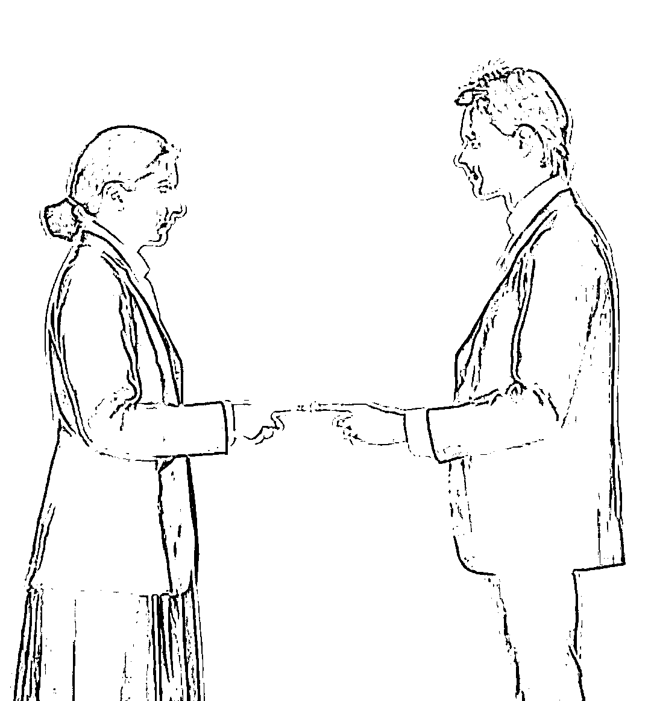

冥王星 8 宫会最**强迫式地去渴求灵魂伴侣。**双生火焰，（曾经）是心中振聋发聩的词。终其一生在追寻着这种**精神鸦片，**所谓最高贵的爱情。他们是最需要激情联结的人，恨不得负距离地与人相处。**不深刻，毋宁死**。又岂能满足于举案齐眉的假性亲密，貌合神离是行不通的。要的是完整冰山的磁力共振，连同水下最神秘的维度。追求灵魂和肉体的统一性，而频率的默契也常须基于灵性的匹配。等待着以一见钟情兑现累世承诺。**那是似曾相识，一眼万年的致命吸引！一经对视，便已是一体了......**

 与失落在人间的完整灵魂之另一半，重聚之前，双方都必须先历经孤独。分离的时间内，各自完成个体化的灵性成长之路。**双生相遇的前提是，都已准备好了自己，**先解除业力的束缚。继而，磨合中的冲突才不至于导致分裂，而是经由震荡，共同成长，趋向去重叠为一个完整的圆。

久别重逢，重温灵魂亲密的那一刻，固然令人激动，欣喜若狂。但如此深刻的幸福究竟可以维持多久，一经相遇便永远生活在一起？**那不过是个开始。**匹配契合，自古都不保证相依相守。挑战仍来自你们心中的权衡，功名利禄，安定考量，面对人间具象化的种种。毕竟**蝎子们没那么能够免俗。**能**把爱情看得至高无上的，并不普遍。那珍贵却无形的灵魂链接，或许只停留在了一个潜力阶段。**开发的意愿，仍须被自由意志所改写。

 **找到彼此后，却要如何相处？这才是灵魂伴侣的最核心问题。他们仍然需要相爱相杀，**被亲密关系的情感游戏无情撕咬，被各自最深层的恐惧逼近忍耐的极限，直到被击溃了完美天真的幻象。**灵魂约定，止于抽象，终成了一纸空谈。**所以说，灵魂伴侣的事，从来没有那么理想化。能走到一起的**概率，真的并不大。醉卧沙场君莫笑，古来征战几人回......**

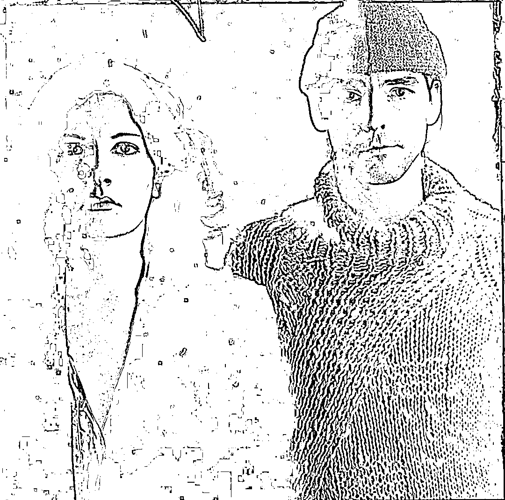

其实，大多数**疑似双生**，最终被证明不过是一场痛苦的幻灭，可能**只是混淆了业力伴侣与双生火焰。业力伴侣**是由业力捆绑的未解之缘，**是“人对人”的“相对之爱”，故充满无常。**重聚是为了**共同处理清偿灵魂的债务。**曾经的物质纠缠或情感折磨，于无意识中残存的创伤记忆，才产生**强迫式的吸引。**且注定会**以惯性的情绪反应相处。**我们互相折磨，难舍难分，竟只是为了放下。 

而后者的理想境界，**才是绝对之爱。是一生二，二生三的三生万物，见旧文**《[有一种联结，叫作双生火焰｜你的名字（下）](http://mp.weixin.qq.com/s?__biz=MzA5NjU3NzQwMg==&mid=2649271888&idx=1&sn=ddde14d387f7e59adeaa5b9d35088a0d&chksm=88b1fc45bfc6755396a82e8fb5abb56915f860fcbfbed95245d5fb67750a0e10dbfbac82faaf&scene=21#wechat_redirect)》。能自由地支持各自生命本质的表达，为能帮双方活出自身最好的部分。而非相互制约，扼住咽喉，以控制占有之名改变对方，阻止其成为自己。是基于互爱的相互陪伴，而非基于渴望的残忍索取。**是为了共同通往生命的创造，而非只为了弥补各自情感的需求。**这就是所谓**无条件的爱**之圆满境界。 

个人认为，8 宫依然是个**强调“相对性”的宫位，有其局限性。**而**你与我**的关系中，**必然充满**二元对立与**无常**，充满警觉与陷阱，亦会追求对方的认可，时刻**被得失牵动**，注定会让人伤痕累累。**12 宫“绝对性”的无条件之爱，在此实在不太常见，也难以勉强。**但不得不承认，此宫的温度感人，闻得见**沉睡中的岩浆。**让我们在此遭遇，暴烈的争执，冰冷的僵局，时而汹涌，时而破碎，步步惊心，跌宕壮美。从怀疑试探，失望指责，到破镜重圆，谅解重生。**如此为了分别的相遇，成全了两片生命的鲜活。相遇即是分离之时，多么凄美的约定。**“当再深的爱，最终都不过是一键清零的命运......还不如直奔 2 宫！” 南交点在 8 宫的我，此刻心底的声音。

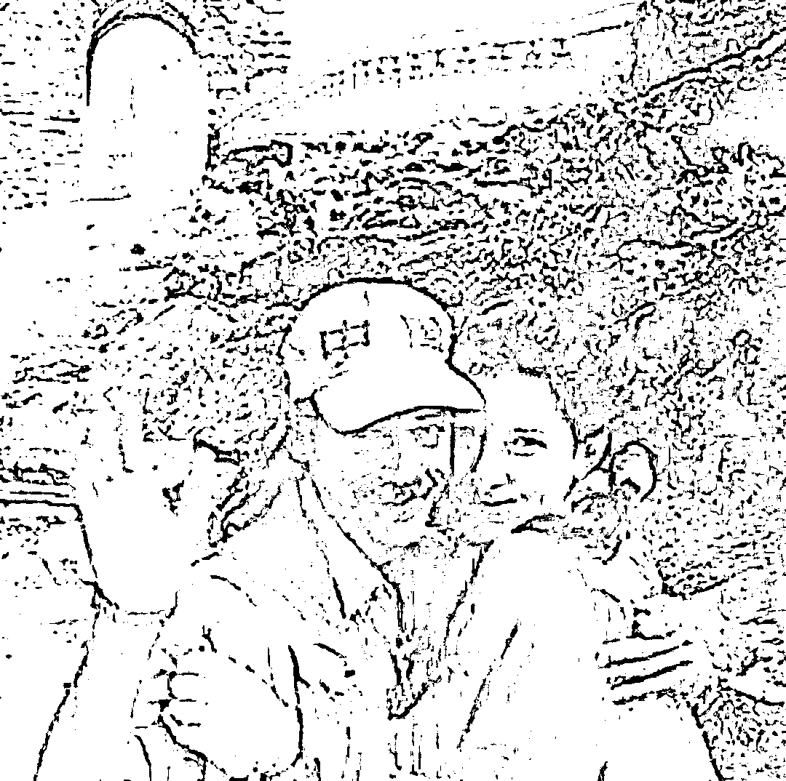

**你将在何处崩塌？**

**限制**

**成长进化，是人类永恒的需求。**冥王星 8 宫尤其**憎恨限制，渴望突破。**面对人有我无的东西时，充分体验到自身极限。**无法拥有，则会恐惧被其所掌控。**于是情绪暗涌，渴望转化现状超越它，相当急躁地，想打破所有阻碍成长的路障。像是一种内驱力。方法就是**将他人倾吞进自身内部，以实现自我扩展。**所以进化的核心，就是**不断去与各种代表象征力量的载体，即表征物相结合。**即与渴望的需求去建立关系**来超越自身限制。**且处于不同的灵魂进化阶段，会选择不同层级的实际表征物。总之，冥王星 8 宫会本能地去接近具有象征力量的表征物，与之实现**链接，无论是身份还是资源。**

**地狱的本质**是什么呢？地狱就是在深度带着一切来到你面前的时候，**你不再或还未拥有的能力**；地狱就是在你再也无法获得你能够获得的东西之时。

——荣格《红书》

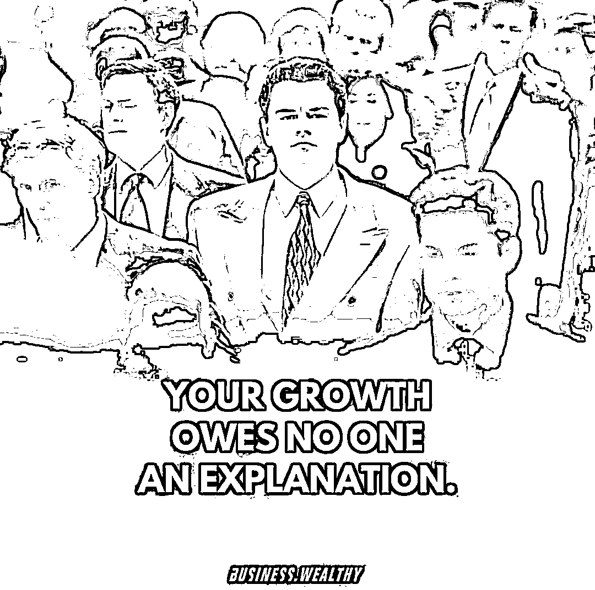

**表征物**

八宫的核心议题是，**我在与别人关系中，有什么价值。**注重的是**关系价值**，而非自我价值。**七宫是关系共同体，而八宫则尤为利益共同体。**于是，八宫如七宫一样，**充满权衡，看重**基于互利互换的**交换价值**，相当于一种**商业思维**，携带着交易属性。于是，**会对他人的价值深切关注，**渴望拥有别人的力量。同时追求合作**利益的最大化。**亦会受限于社会价值的影响，**让爱过度关乎于值与不值。如何能使自己值得购买？**定当急功近利，充满资源，获取认可。

 **冥王星 8 宫最擅长借势，**吸收有能量的资源和势力。与他人价值建立联系，融合为一体后，你就变成了他。且追求极具穿透性的结合，要如性般全然切肤地体验到表征物，与之产生**足够深刻的链接。欲念有多深，就有多依赖。**携带的**强迫性**，便是其根深蒂固**业力的彰显**。极度渴望体验关系带给自己的成长，一生在关系中寻觅与抉择着，**能反映他们进化需求的人。**看重身心灵间的交响，排除缺乏默契的路人。于是，**建立的关系，彼此都象征着对方尚未满足的需求。**这也令**利用的渴望，与被利用的焦虑，**同存。无形操控中，会有种权力的幻觉；而发现被剥削被利用时，则又会产生冰冷的愠怒。爱恨交织，写满了欲望的河流。

**周期交替**

正因为形成的**关系，常是基于需求存在的**。当需求满足，关系失去了价值，便会**因成长停滞而进入倦怠期，**就想要迈向下一段关系。便会爆发**周期性的内外冲突**。产生了成长拓展需求与维持安全现状间的剧烈撕扯。无奈求新求变的秘密渴望，根本无法遏制，抵制只能引起反扑。沉迷于诱惑，或者去抗拒诱惑都不利于成长。你更需要去**看清诱惑的本质，**它只是在**象征着你对更好东西的强烈渴望，**那里有你想要改进和成长的的无限空间。

 如此，**成长期和平衡期，**将在冥王星 8 宫一生中无休止地交替。而探险的需求，将终结于混乱；安全的港湾，又易僵化至死。究竟如何两全？是去寻找一个能够永恒神秘的爱人？还是学会去开发对伴侣的好奇心？总之，要在熟悉空间中重建差异性，让持久关系保持刺激感。**冥王星 8 宫故应选择对进化和成长持有开放心态的伴侣**，愿意一生携手不断变革，积极拥抱不确定，不可知。且需要坦诚沟通，良性互动，以**释放层层路障中的停滞能量，**在既有关系中不断经验架构的死亡重生。**共同通关每一次。**

**你将回归于何方？**

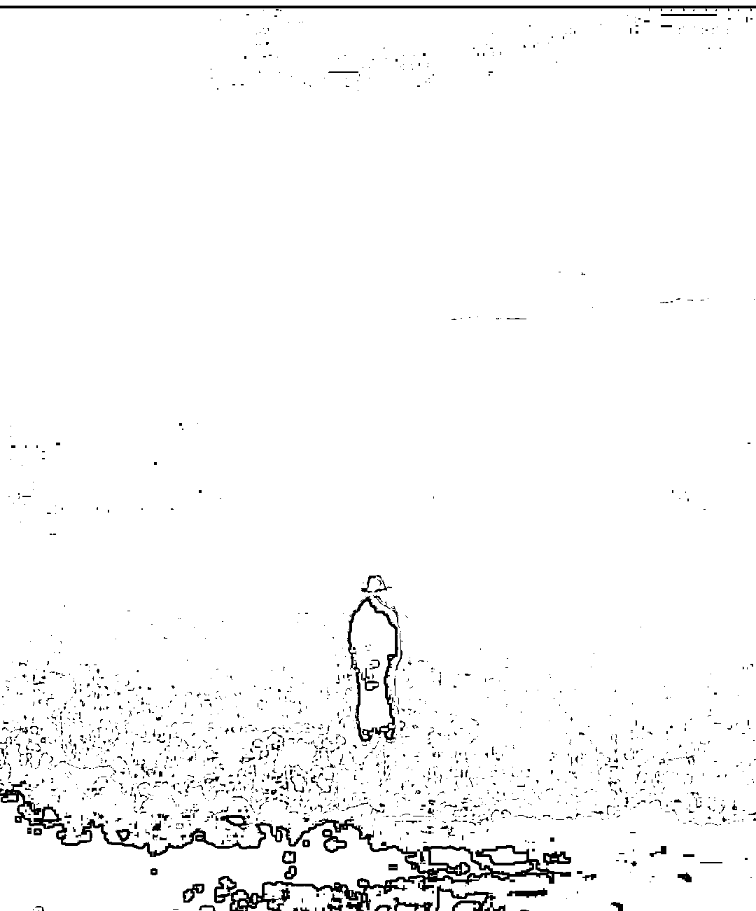

**对应点：二宫/金牛座原型**

乏味的灵魂渴望激情，而激荡的灵魂无不渴求安宁。8 宫人的**情绪暗涌，究竟该如何平息？**所以要到 2 宫**去生产去创造（**点击[【冥王星 2 宫】](http://mp.weixin.qq.com/s?__biz=MzA5NjA0NTAxNg==&mid=2651457278&idx=1&sn=7c15e5b4982c87dc687d915579145b69&chksm=8b48b449bc3f3d5f1cf9a24c857f1c249d51fd8ed0f989952c27f20ab9ffb02f697886144854&scene=21#wechat_redirect)查看文章）**，**而非停留在 8 宫，**围绕他人的价值死循环**。与其时刻以**探针向外，草木皆兵。不如意识内收，聚焦自己。自我丰富，而非攀附他人，**常是最好的解药。与天蝎座/8 宫人相比，为什么金牛座/2 宫人常常选择**不凝视**？也许正因为他们**能够自我满足**，而不像天蝎座那么需要互动和联结吧。终其一生，都是**针对自己个体生命的体验，**在那片**珍贵的定力**中，收获**人生值得。**所以，冥王星 8 宫人们向外的用力过猛，是因为内在的匮乏吗？**只有有力量的人才不会“使用”力量——金牛座的力量。【**[金牛座天蝎座对宫之吻｜月下的城墙如山静伏](http://mp.weixin.qq.com/s?__biz=MzA5NjA0NTAxNg==&mid=2651387445&idx=1&sn=354e48b977945478bbe39db7dcf2c8d2&chksm=8b4a4482bc3dcd941e452dd3d8e4989c0f4e647062a69ff26895c7413dfcc9f9eafee144aadd&scene=21#wechat_redirect)】（点击可查看文章）

 **所以冥王星 8 宫的进化方向，就是要能像 2 宫那样自给自足，认清与生俱来的内在核心价值，和能够赖以维生的资源。减少对外界强迫性的依赖，把对外的能量收回内心。**当你过度投入经营关系时，万万别忘了建设自己。**将自己视为转化力量的表征！而善用自己之后，就发现其实可以不再需要依傍他人和外界来获得成长了。**前文的冥王星 8 宫继续说：“其实我爱的不是男人，也没那么关心他们。最关心的是证明自己在他们心中的地位，为获得认可。”这就是为什么天蝎式分手，都总会那么鸡飞狗跳不平和，因恰恰反应了心中执念。**分手之难，是因为我们在目送自己投射于他人身上的价值期望和安全感的逝去。**应学习金牛座不需要任何人也能自证圆满。**“自我价值”根本就不需要被“他人认可”！**

 于是，冥王星 8 宫与南交点在 8 宫的人，常会**遇见自给自足特质的伴侣，**逼迫他们无法再强迫式地建立依赖属性的关系，也学会不再滥用权力。**亲密有间，彼此独立又相互依赖。**先学会好好地**自我照顾**，能与自己安然相处后，再去将两个独立自我进行融合。因此，**外在环境的隔绝**，对其十分重要，为能让生活变得更简单更基本。因症结总出在对外界执念太深，自我意识不稳定，太容易被他人的需求淹没，所以**心理空窗期至关重要。**没有空窗，你就始终无法**真正面对自己。独处的时光，**才能让你与内在最真诚的声音交流，让灵魂的智慧激长。才能专注于自我价值的修行。**留白，才能让正确的到来，**为了早日遇见你真正的 soulmate（灵魂伴侣）。冥王星 8 宫人们接着说：“近来对男人已没了幻想，少女心死亡，在目睹他们如何明哲保身的懦弱之后，他们只是想从你这获取些情感价值，若发现此处代价大，就会去别处找。以前我太有执念，总为他们强加滤镜，而其实发现他们远不如我......难得男人全部退场，心中空无一人，我感到内心建设正达到最鼎盛的时期！”我说，无独有偶。

 “嫁给有钱人，去运作对方的生活？还是拥有自主权去工作，创造自我价值？”她们最后这一句，是**可以代表所有 2/8 宫人的一个终极追问！**宫斗，不如创作。**经营他人，不如聚焦自己。**与其耗尽一生，与虎谋皮，进行利益周旋，**活成他人的附庸。**不如 stand on your own feet（自给自足）！心怀委屈，满脸堆笑，总不是一个长久的解决方案。低眉顺眼，受制于人，那可真是个最高危的职业，将挑战身心的极限。成功的亲密关系，关键是在**士气上的势均力敌。**此处无关社会**地位权力**之差，而是在**个人权力感知**上的平衡。

 同是南交点双鱼座 8 宫人的朋友寿文说得好：**“宫斗是一种终极内卷：**在一个资源有限、结构固化的父权空间内，并没有任何生产与创作，没有任何对个人自由意志的探索，通过雌性竞争、勾心斗角，来互相陷害，以谋求自己的个人最大利益。”

此处，我又想起了《生命不能承受之轻中》那段**卡列宁的微笑**：

一个由来已久的念头又回到她的脑海里：她的归宿，不是托马斯，而是卡列宁。它要是不在了，谁来给他们的生活之钟上发条呢。是啊，任何一个人，都无法将牧歌献给另一个人。只有动物能做到，因为它没有被逐出伊甸园。人类之时间不是循环转动的，而是直线前进的。这就是为什么人类不可能幸福的缘故，因为幸福是对重复的渴望。

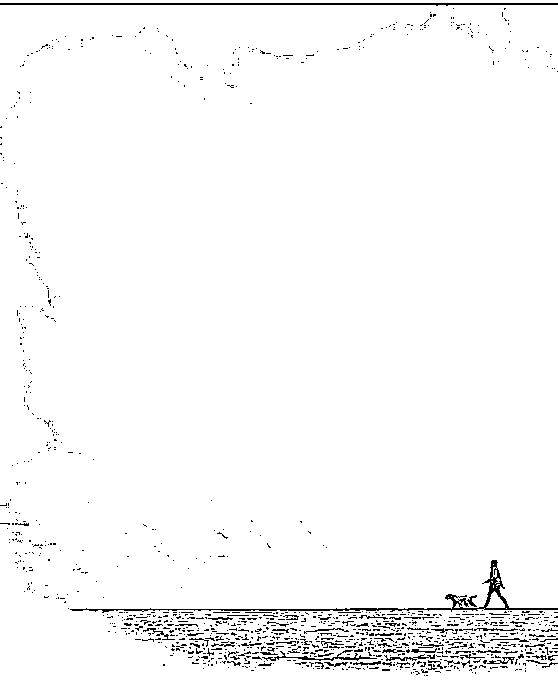

**结语**

这是《红书》中，最令我难忘的段落......每一次读，都会落泪。等了很久，才得以将它放在此处。在我心中，它是冥王星 8 宫最契合的结语！ 

你的感谢方式很奇怪。不要抛弃自己的女儿，而是**让她自己立足。她将会在人们面前跳舞、唱歌**和弹鲁特琴，她**也会喜欢人们将闪光的金币投到她脚下。**莎乐美，谢谢你的爱。**如果你真的爱我，请在众人面前起舞，给人们带来快乐，**那么**他们会夸你的美和你的法术。**如果**你获得一个这么丰富的收获，请从你的窗户上扔一支玫瑰给我，如果你的快乐满盈溢出，请为我跳舞和唱歌。我渴望常人的快乐，渴望他们的充满和自由，而非他们的贫乏。**”

我：“我并不是在把你送走，但你不会离我太远。**不要出于你的渴望而给予我，而是出于你的充满。我无法满足你的贫乏，就像你不能平息我的渴望一样。如果你收获颇丰，从你的花园中摘一些水果给我。**如果你受到富足的困扰，我将从你满溢的斛角中饮一口你的快乐。我知道这是给我的香膏。**只有坐有满足者的桌子我才能满足，而不是那些求助者的空碗。**我不会偷走自己的报酬。**你一无所有，怎么给予呢？尽管你能给予，但你是在要求。**

——荣格《红书》

**莎乐美：你首先要是自己！**

**版权声明：**本文由作者授权在若道平台发布，欢迎转发，反对抄袭。

**来自作者的其它冥王星文章**

[冥王星 4 宫](http://mp.weixin.qq.com/s?__biz=MzA5NjA0NTAxNg==&mid=2651430468&idx=1&sn=1c785ed2023d1b0f50e66364bbf29e13&chksm=8b4b2cf3bc3ca5e526e87f041575af18bf825df47e0cb60bbdbfc537b9ac536cfa54a134e74f&scene=21#wechat_redirect)（上）丨[冥王星 4 宫](http://mp.weixin.qq.com/s?__biz=MzA5NjA0NTAxNg==&mid=2651430468&idx=2&sn=a902f973afba98106792f92c3f503285&chksm=8b4b2cf3bc3ca5e51ef8b2e9ac2647916e7a859721d06b398016e5f00ff02046931d543d354d&scene=21#wechat_redirect)（下）

[冥王星 5 宫](http://mp.weixin.qq.com/s?__biz=MzA5NjA0NTAxNg==&mid=2651424933&idx=2&sn=2e60c0253f46f1f995c923abb14eec45&chksm=8b4b3a12bc3cb304ec3cd3757251af7e62c4b0b92cd119c24c067af1548bb1aa01da071d66a9&scene=21#wechat_redirect)丨[冥王星 6 宫](http://mp.weixin.qq.com/s?__biz=MzA5NjA0NTAxNg==&mid=2651453130&idx=1&sn=7a1f4956aca064e20d6dd35a12dcb966&chksm=8b4b447dbc3ccd6bd06e06aec73c625820caf753697c2bc13e48d07041da3aa555d07aacfcb2&scene=21#wechat_redirect)

[冥王星 10 宫](http://mp.weixin.qq.com/s?__biz=MzA5NjA0NTAxNg==&mid=2651412808&idx=1&sn=57012d1806a6776cc8556b7c79f0e30b&chksm=8b4bebffbc3c62e9a33bfbdcd736cf91077048ac889936318ba4cf575de4a7d4409eeca1373f&scene=21#wechat_redirect)丨[冥王星 12 宫](http://mp.weixin.qq.com/s?__biz=MzA5NjA0NTAxNg==&mid=2651443520&idx=1&sn=d2f1b6b4e8b41bee0ae6071dab6d280b&chksm=8b4b63f7bc3ceae154d6bf8570b7966d9f5899b5f3ea9dda47c8996168c8512a61f7688186f0&scene=21#wechat_redirect)（上）

[冥王星 12 宫](http://mp.weixin.qq.com/s?__biz=MzA5NjA0NTAxNg==&mid=2651443520&idx=2&sn=e3bca13b228a5fd75f7715ef152871e3&chksm=8b4b63f7bc3ceae123d2088fdf65f7451dfe438b1cafb66db1d848dff9123982abfa857709c9&scene=21#wechat_redirect)（下）丨[冥王星 2 宫](http://mp.weixin.qq.com/s?__biz=MzA5NjA0NTAxNg==&mid=2651457278&idx=1&sn=7c15e5b4982c87dc687d915579145b69&chksm=8b48b449bc3f3d5f1cf9a24c857f1c249d51fd8ed0f989952c27f20ab9ffb02f697886144854&scene=21#wechat_redirect)（上）

[冥王星 2 宫](http://mp.weixin.qq.com/s?__biz=MzA5NjA0NTAxNg==&mid=2651457278&idx=2&sn=dc951a366f5f2393b2d3f40571399e14&chksm=8b48b449bc3f3d5f38cabeae6b603ee51f6ad82345b4ca957d029e33cc021531300b2fa014c8&scene=21#wechat_redirect)（下）

**蓝女巫**

英国伯明翰大学 市场营销学硕士

职业占星师/专栏作者/芳疗师/珠宝设计师

中国首批 ISAR 英文认证占星师（2012 届）

**微信公众号**：cecilia_sui

长按打赏

**学习占星学****点击或长按下图了解课程详情** ************

****

********

**微信又双叒叕改版啦，不想错过若道君的推送？**

**就把若道设为星标吧！**

**▼**

**就是这个“在看”，戳一下☟**

********报名直达入口********

# 冥王星落在 8 宫（上）丨当理解自身黑暗之时，你的凤凰将在火中升起

> 原文：[`mp.weixin.qq.com/s?__biz=MzA5NjA0NTAxNg==&mid=2651461799&idx=1&sn=6449bc2646de146b034e2dbe33901b5c&chksm=8b48aa10bc3f2306791c7094ae689cc5ce52e3b92412b18cfdde538c9df2134798dc0716963a&scene=126&sessionid=1692737898#rd`](http://mp.weixin.qq.com/s?__biz=MzA5NjA0NTAxNg==&mid=2651461799&idx=1&sn=6449bc2646de146b034e2dbe33901b5c&chksm=8b48aa10bc3f2306791c7094ae689cc5ce52e3b92412b18cfdde538c9df2134798dc0716963a&scene=126&sessionid=1692737898#rd)

**☆ 后台回复“今日”，给你一句生命态度**

作者/蓝女巫 ISAR 认证占星师
编辑/翀子 封面/书君 图片/音乐/作者提供**引言**

**可悲！**

**我看见了什么？**

**导游卸下面具和面纱，**

**在队伍的最前头**

**稳步走着狰狞的必然。**

**——尼采**

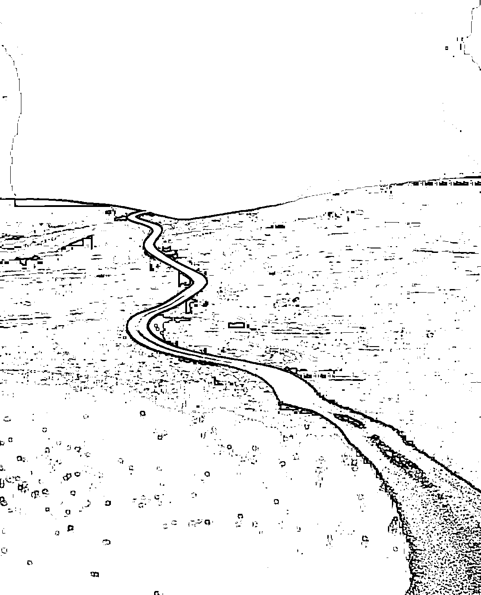

作者的话

冥王星落水象宫位，至此完结。归纳冥王星在水象星座之痛：[【4 宫】](http://mp.weixin.qq.com/s?__biz=MzA5NjA0NTAxNg==&mid=2651430468&idx=1&sn=1c785ed2023d1b0f50e66364bbf29e13&chksm=8b4b2cf3bc3ca5e526e87f041575af18bf825df47e0cb60bbdbfc537b9ac536cfa54a134e74f&scene=21#wechat_redirect)（点击可查看文章）是**惊悚**，[【12 宫】](http://mp.weixin.qq.com/s?__biz=MzA5NjA0NTAxNg==&mid=2651443520&idx=1&sn=d2f1b6b4e8b41bee0ae6071dab6d280b&chksm=8b4b63f7bc3ceae154d6bf8570b7966d9f5899b5f3ea9dda47c8996168c8512a61f7688186f0&scene=21#wechat_redirect)（点击可查看文章）是**绝望**，而 8 宫是**残忍**......

是啊，8 宫太残忍，以至于南交点在 8 宫双鱼座的我，好几世都没忍心定睛看这里。写冥王星 8 宫，给了我一个重新审视的机会。**离开前，必须首先看清它。**打开南交点的后门，将遗留的功课完结，才能更轻松更情愿地直奔 2 宫的北交点而去。现已彻底看清，确有太多回避的真相......**卸载于此。**然后，准备起身离开了。

这一篇，**适合所有“人”！**只有 AI 除外。所有**天蝎座/8 宫原型，金牛座/天蝎座对宫人，必读。**尤其适合南交点在 8 宫及 1984-1995 的整个**冥王星在天蝎座一代**。建议配合[【冥王星 2 宫】](http://mp.weixin.qq.com/s?__biz=MzA5NjA0NTAxNg==&mid=2651457278&idx=1&sn=7c15e5b4982c87dc687d915579145b69&chksm=8b48b449bc3f3d5f1cf9a24c857f1c249d51fd8ed0f989952c27f20ab9ffb02f697886144854&scene=21#wechat_redirect)及[【冥王星 5 宫】](http://mp.weixin.qq.com/s?__biz=MzA5NjA0NTAxNg==&mid=2651424933&idx=2&sn=2e60c0253f46f1f995c923abb14eec45&chksm=8b4b3a12bc3cb304ec3cd3757251af7e62c4b0b92cd119c24c067af1548bb1aa01da071d66a9&scene=21#wechat_redirect)系列，一起阅读。

**本文亮点**则在于，对更多 8 宫**争议性话题**的探索：关于**嫉妒**，关于**诱惑**，关于**欲望**，关于人/**性，二元与三元关系**，以及**灵魂伴侣**......

**你在恐惧些什么？**

**创伤**

火车不断地发出怪诞的嘶鸣，像是因怜悯这些注定走向地狱的人们而发出的求助呼喊。当火车进入岔道，显然是要驶入大站时，焦虑的乘客中突然发出一声惊呼：“站牌，奥斯维辛！”霎那间，每个人都心跳骤停。奥斯维辛这个名字代表着所有的恐怖：我没有其他感觉。**从那一刻起，我们不得不逐渐适应这种极度恐慌的状态，直至习以为常。**

“哪里？”我追问了一句。他随手指向几百码外的烟囱，烟囱里冒出的一串串火苗映照着波兰灰暗的天空，又慢慢融入幽暗的烟云。**“你的朋友正慢慢地飘向天空。”**

——《man's search for meaning》

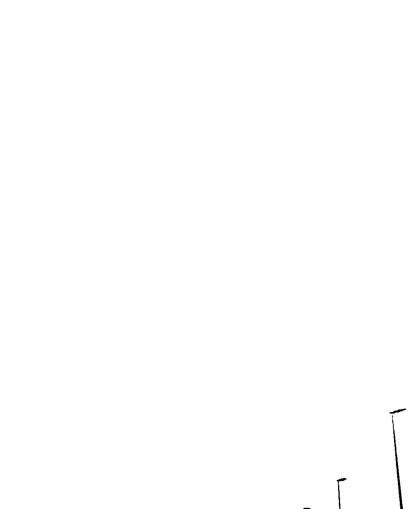

每个人都有**第八宫**，那里是你在**人间的地狱。**当冥王星的乌黑翻搅着 8 宫，象征着**死亡的焦虑**。**恐惧的味道......最深刻！**冥王星 8 宫，心理创伤的汽笛，总下意识地拉响。这些**幸存者们**，之后要的不仅是**生存**，而是渴望**重获新生！**其实，你**累世都在参与着“宫斗”**。饱经资源的纷争，情感的操控，已穿越过**最复杂人性的血雨腥风**，而得以存活下来。不必为你担心，危机中，你必有惊天的能量。**你从灵魂的童年，就是被吓大的，**所以从不会被危难吓倒！**但惊恐是脱不下的内衣，**习以为常却时时防御，你**对人性有着深入骨髓的悲观。信任危机**，是一种**无法松弛**的本能，不得不集中所有能量，随时投入到保全性命这件事上，紧张应激，却充满斗志。嗜血的天性，暗示了你对生命的执念和警觉。威胁性事件，总能唤醒你心底最深处的力量，提炼你独具的**攸关生死的智慧。当激荡注定是生命的主旋律，就去把自己炼成金子吧！而为了避免昏迷，你总尽量在夜里保持清醒......**

 冥王星在 8 宫的客户花花对我说：“我从森林里出来，进入一个村庄。**我觉得眼前全是阴谋......**我无法摆脱杀人现场的想象。因为只有这么想，才会让我觉得安全。把他们**视作好人时，我是敞开的，那会遭受攻击。**所以，**必须先默认为坏人**，再印证为不是。”我说，你的防御也必然会引起他人的应激。而我眼前却同时浮现出她曾经晕倒时的濒死体验：“我进入到一个场景，风和日丽，阳光正好，面前不远处是一个绿草点缀小花的山坡，山顶上有一棵漂亮的大树，风徐徐吹过，让树和柔软的草都轻轻摆动~**我就往山顶的树上跑去，心中满是幸福...... 眼里全是光明！**突然感到有人拍我的脸。**被叫醒时，我泪流满面......**跑向山顶时，那片满足向往的愉快心情，至今仍很清晰。” 同时，她刚好是**北交点在 2 宫**：[《冥王星在 2 宫 》](http://mp.weixin.qq.com/s?__biz=MzA5NjA0NTAxNg==&mid=2651457278&idx=1&sn=7c15e5b4982c87dc687d915579145b69&chksm=8b48b449bc3f3d5f1cf9a24c857f1c249d51fd8ed0f989952c27f20ab9ffb02f697886144854&scene=21#wechat_redirect)（点击可查看文章）

正因你们**至情至性，故一切创伤，皆关乎于人性。**前世顿失所依，今生情感震撼。**你对情感有多依赖，今生就注定会有多震撼。亲密关系领域，将反复成为战场，**（再次）在此遭遇冥王式的刻骨铭心，同时也注定了**关系本质的危机四伏。**直到你从创伤滞留的影响中彻底涅槃，才恍然大悟，一切幻象皆为转化而生。天蝎座/8 宫人最擅用置之于**死地而后生的能量。**直到再也没有什么可以失去，生命的韧性方显，自深深处。

 冥王星 8 宫的悠悠对我说：水到绝境是风景，人到绝处是重生。**瀑布到了绝境，但见那水的势能......**如同我此时心底迸发出的一股劲儿。就算我什么都没有了，**但我还活着。于是，我就还可以改变！**南交点在 8 宫的我说，indeed！When you have nothing to lose, then you have everything to gain.（当你已无可失去，便只能获得。）

**生死**

所有这些光明、黑暗、温暖、温润和冰冷的水，所有这些波动、摇摆、像植物一样交缠在一起的动物和动物一般的植物，所有那些在黑夜中彷徨的人，**都变成你的恐惧**，那天夜里，通过**死亡对世界的淹没，**我对死亡有了认识。我看到我们如何走向死亡，看到**摇曳的金色麦子怎样在农人的镰刀下倒下，就像海滩上平滑的波浪一样。**

——荣格《红书》

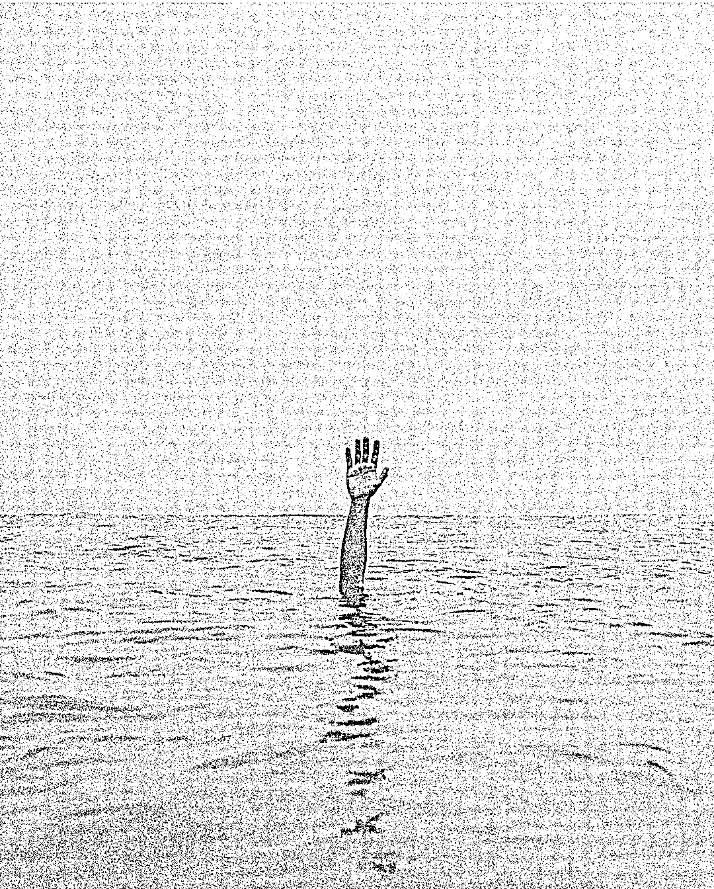

**你最惧怕死亡，你也最不畏惧死亡。恐惧和迷恋，正是冥王星的双刃剑。**“死并非生的对立面，而作为生的一部分永存”。5 宫是生，8 宫是死。“未知死，焉知生”，否认死亡等于否认生命。以 8 宫认知鞭策着一切死而复生的 5 宫悸动，只是为了去提醒，**你已活过来。然后，活得更久**......在猛醒的生机中活着，方能汲取到生命最底端的核能。于是，你**把每一刻都当成最后一分钟去活，仿佛随时都会死去。**还是去做**最紧迫的事**吧！你在一生中不断让自己涉身险境，是无意识流露出的**自我毁灭倾向**，旨在突破旧我的限制。**人都有死亡欲望**，渴望回到生前全然放松的状态，**所谓释放。**此处的死亡很广义，指一切**被你视为根基的事物**，情感依托，人间挂碍，被**抽地毯**般抽掉的时刻。皆为让你看到**向外依赖的虚妄**，方能学会**向内铺建的心安。**

 人生对你如同**黑暗的丛林，**冥王星 8 宫比他人更能共情到所谓的“负能量”，并深受其困扰。但见你周遭的世界，为何总是充满生死存亡的危机？总是莫名地见证痛苦发生？难道是你**恐惧悲观的阴影**在环境中的投射？要**经由外部冲击带来内在转化。**种种极端的身心灵危机，都是你**进化的必经之路。**为帮你获得对至暗的理解与升华，坦诚接纳死亡焦虑。于是会执迷玄学和凝想死后世界。你也就非常擅长引导他人度过难关。当你将阴暗的情绪转化为疗愈的基础，便拥有了**向死而生的创造力！**

如果你**贪婪地向外追寻**一切可以**让你继续生活下去的东西**，那么**没有任何东西能满足你的快乐**，继续围绕在你身边的最渺小的东西不再是快乐。因此我**注视着死亡，因为它教会我如何生活。没有死亡，生命将没有意义，**因为**漫长的时间**会再次出现。

——荣格《红书》

**真相**

你站在何处，**你就深深挖掘！**

下面就是清泉！

让愚昧的家伙去哀叹：

‘最下面是——地狱！’

——尼采

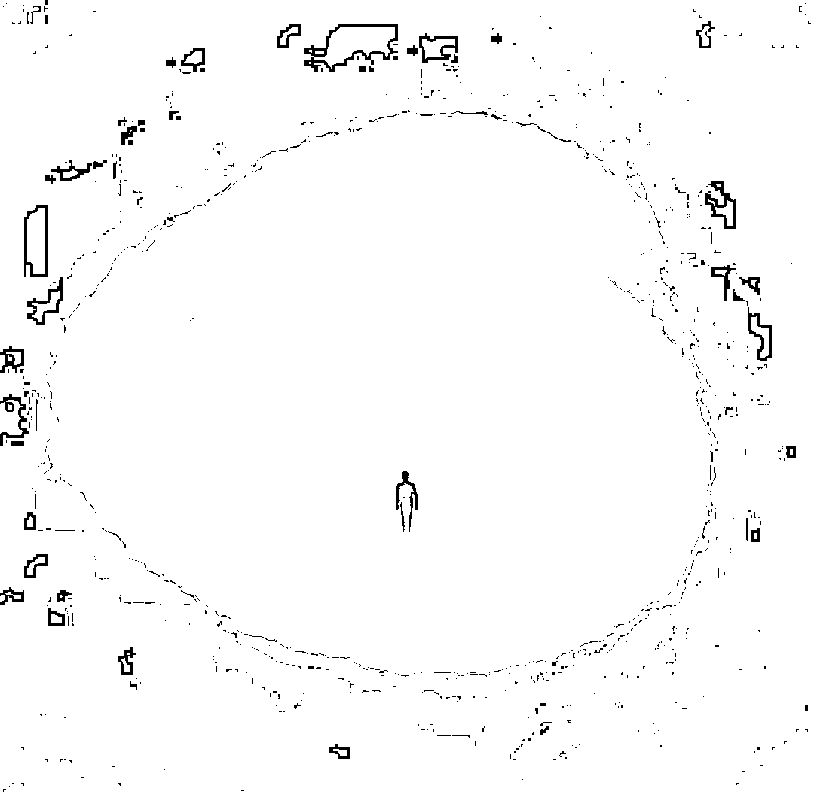

**八宫究竟有多深，千吻之深......**尼采接着说，“**但人类之痛苦却是最深刻的痛苦。**人多么深刻地观入生命，他同样也多么深刻地观入痛苦。” 想起一个冥王星 8 宫的前任，给我讲他小时在水泥管中探险的欢乐画面。是的，8 宫正像个有毒气的山洞，**而冥王星 8 宫，最爱探洞，好奇害死猫。**他们并不敏感于光明，他们却最敏感于**月之暗面**。对禁忌知识，隐秘世界，无意识丛林，潜能开发，心怀热忱。**禁令让诱惑更具神性。**而不否认阴影者，方显澄明。**洞里还有什么？有矿！**因为巨大的价值，都是深藏不露的。**而那正是冥王星 8 宫最渴望的力量！**

 冥王星 8 宫生来就爱问**为什么**，为什么问为什么，**为了控制！**以垂直的视角，贯穿天宇的规律，至人性的地狱。誓将一切真相，打破砂锅问到底。追根溯源像是一种**安全本能**的需要。一生为探索心理成长投注了**激光般的精力**。且总试图**锁定焦点，逼近本质，一剑封喉。****digging down（向下深挖）**，是冥王星 8 宫的一种本能。挖着挖着，却打通了人性相通的痛楚？明白了**自己与众生的真相，无差。**而获得了深度的同理心，故对人性洞若观火。会强迫式地去挖掘自他**所有行为背后的动机**和心理结构，能轻易看穿他人的核心本质，并助其直面欲望，疗愈阴影，是天生的心理治疗师。要依灵魂进化阶段决定其对人性洞悉的程度。也拥有灵媒魔法师的潜力，与超自然力量，有着本能的链接和强大的感应力。但切忌利用此力量操纵他人，满足私欲。未来冥王星在 12 宫运行时，会放大反噬的力量。

**阴影**

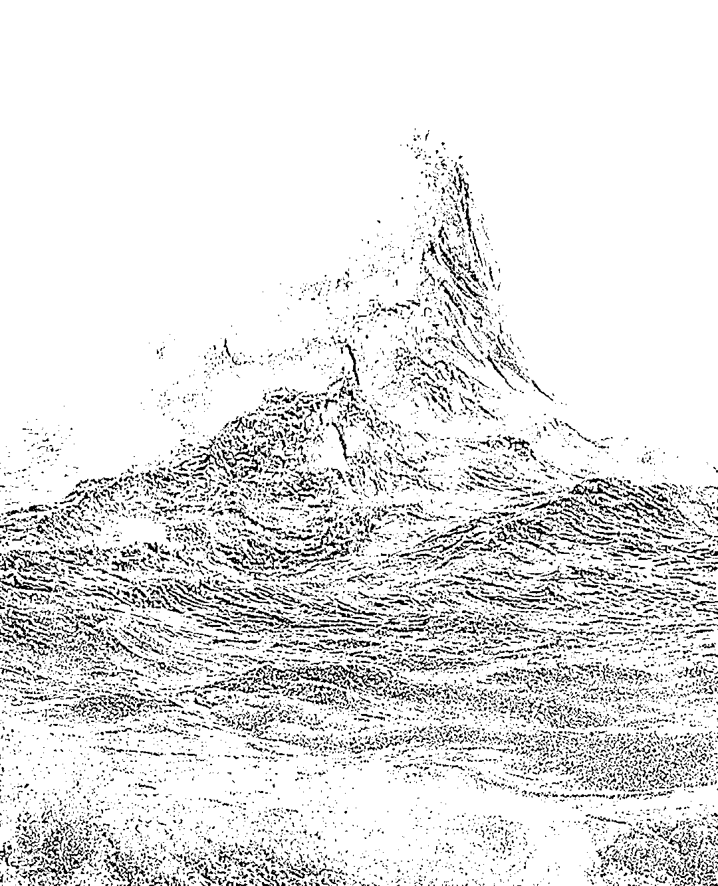

这是一个**彻底没有生机的夏天**。他们**顺着巨大的洪流回到过去。黑暗之人，**这个幻象真可怕。”**“你想要和我站在一起**，所以克制住自己。**看着他们！**”夜晚是安静的时间。我感到自己进入到了巨大的阴影中。**在我理解自己的黑暗之时，震撼的黑夜出现，我的梦把我拉进千年的深度中，我的凤凰在这里升起。**

——荣格《红书》

8 宫，是最艰难的功课，需要具备直面自身恐怖的勇气。**每一个人都难以面对自己心中的极夜。**在那片神圣的恐惧中，你将被冰冷刺透，见证孤独的扩张。**而在内在阴影面前，人人都是懦夫！**然而冥王星偏要对人性阴影面，挖地三尺，**去造成深度不适**。面对根深蒂固习性的无情瓦解，人类必会本能顽抗，体现为**恼羞成怒**。因被推翻的过往，象征巨大的失败；被颠覆了执念，无异于死亡；承认限制，多么无力和绝望。**掩饰脆弱，最好的办法，就是拒绝承认它的存在，**且使尽浑身解数。冥王星为什么会被行星界**除名？**从象征意义上，那正是**同理的恐惧**。凡害怕确认的，必经疯狂否定。群起而攻之，**抹杀它的存在。而它，到底是什么？是死亡焦虑。**深埋于集体潜意识中的那片连绵不绝地日夜咆哮着的终极鬼魅......**而最令你不安的，才正是你最需要去观看的。**

你把撒旦关在深渊中长达千年，你嘲笑他，因为**他已经变成儿童的童话。**但如果这个可怕的**庞然大物抬起自己的头，**世界就会畏缩，最极端的冰冷便会来临。

**你为什么想去理解黑暗！**但你**必须这么做，否则它会控制你。**你**思考过自己身上的魔鬼**吗？你知道魔鬼是什么吗？你知道它**就在你的美德背后**吗？你知道**它是美德不可或缺的**内容吗？

正是我无法接受的、令我厌恶的和我一直拒绝的事物在我身上开始出现。**总是袭击我**意想不到的弱点。

——荣格《红书》

凡内在所否认的，都会在外境中疯长。**将战火烧向“你的兄弟”**，与之激烈对抗。即以迂回的想像与操纵，将别人变成魔鬼。原罪用美德刻意剥离自身的恶，由他人承担，然后**暴力严惩他人身上的恶。**你将幻象物刺穿时，发现杀死的，却是自己的影子。这时才明白，**外面没有人，一切皆投射。此刻，原罪又返回到你的身上。**

 在**所有英雄之旅的原型故事中**，我们都能看到**属于你的那条蛇**，它如何在阴间占据优势，给地上的你造成威胁，你无边憎恨它，又无比渴望它的智慧和魔法。角逐的过程中，阴沟中的蛇，摇身一变，但见深潭中的巨龙跃起，你征服了坐骑，杀死了心魔，黑色生命力被转化后，**英雄重返自由。**所以，**邪恶的伏地魔，永远只与你自己有关，从没有偶然！**西格弗雷德，金发碧眼的英雄？谋杀英雄的桥段，已在[【冥王星 5 宫】](http://mp.weixin.qq.com/s?__biz=MzA5NjA0NTAxNg==&mid=2651424933&idx=1&sn=067ba9cd1699137296d7b8d1a4482d4f&chksm=8b4b3a12bc3cb30445b6be0ae7bbcd8801c8584f0f5bd97bc5222407cf1be33ee994b21115d4&scene=21#wechat_redirect)（点击可查看文章）中充分展开过了。区别是，那里重点着墨于**生还的希望，**而本篇侧重于**死亡的挣扎**。eve~ 

**当你意识到地狱也不是地狱时，你已经到达地狱的最深处，也即是充满欢乐的天堂。**但它本身并不是天堂，但从这个角度上看，它就是天堂，从另一个角度上看，它就是地狱。

我看到时代的美德所变成的邪恶，你的温和如何变成冷酷，你的善良变成残酷，你的爱变成恨，你的理解力变成疯狂。**美德和邪恶是一对兄弟。**

今天的人们更需要死亡。**如果已经获得平衡，继续保持平衡就是错误的。**平衡是生和死之间的一瞬。**魔鬼是世界的另一半，天平的一个托盘。**

——荣格《红书》

万圣节之夜我就在想，作为南交点在 8 宫双鱼座的天蝎座月亮，海王星三分上升点，冥王星三分下降点。圣母与女巫，都在我身上。在爱情中，做夏娃还是莉莉丝？而这又何须选择。**光影共舞，昼夜更替，**便是自然中的自然，**这才是生命的全貌。**敢于让正确死亡，方能重建更加清晰而完整的意识。从此，**诅咒已伤害不到有蛇的人。**接纳善恶一体，以通往自性化之路。正如后文中将要讲到的，**就像关系的持久，需要敌人的存在......**

你完全是独自一个人进行这场战斗，因为**神已经变成聋子。**如果**神依然保持沉默，那么每个人都能听到自己的话。**只有在最黑暗的夜之后，白天才会到来。因此**遮住这些光，保持沉默**，这样**夜晚才会变黑和安静。**太阳不用我们的帮助就能升起。只有**知道最黑暗的错误**的人**才知道光**是什么。我看到的一切都变成了冰**。但红色的太阳在阴影的世界中升起。**

——荣格《红书》

所以，**选择穿越地狱，**是自我拯救的前夜。而**夜晚首先必须是漫长的**......但**焦土田园，一念之差**，[《昨日焦土，今朝田园——南交点天蝎座，北交点金牛座》](http://mp.weixin.qq.com/s?__biz=MzA5NjA0NTAxNg==&mid=201385988&idx=1&sn=350b7cac62956c18617be8b6ed99a465&chksm=19425ab32e35d3a58551f1a13096cf0f4f06cd11fee696a46d9e67d39ca8fa49b454cc475667&scene=21#wechat_redirect)（点击可查看文章）。是毁灭还是成长，由你书写。月蝎升狮我心中永远的座右铭：**Tomorrow is another day！（日日新）**果然，每个清晨，海上日出的光芒，都会照常唤醒穿越了黑夜的我。

**（未完，余下请见今日二条和三条）**

**版权声明：**本文由作者授权在若道平台发布，欢迎转发，反对抄袭。

**蓝女巫**

英国伯明翰大学 市场营销学硕士

职业占星师/专栏作者/芳疗师/珠宝设计师

中国首批 ISAR 英文认证占星师（2012 届）

**微信公众号**：cecilia_sui

长按打赏

**学习占星学****点击或长按下图了解课程详情** ************

****

****

**微信又双叒叕改版啦，不想错过若道君的推送？**

**就把若道设为星标吧！**

**▼**

**就是这个“在看”，戳一下☟**

********报名直达入口********

# 天象预测课 | 连续两天！四位大师为你轮番揭秘 2022！（内有惊喜）

> 原文：[`mp.weixin.qq.com/s?__biz=MzA5NjA0NTAxNg==&mid=2651461670&idx=2&sn=ba4d30e3a3c6670b81959d73991ac787&chksm=8b48aa91bc3f23877f62f7d0b4c4dae635850dd212b4ee817057e067ccd4b1d0b0f7ab9bb5f0&scene=126&sessionid=1692737898#rd`](http://mp.weixin.qq.com/s?__biz=MzA5NjA0NTAxNg==&mid=2651461670&idx=2&sn=ba4d30e3a3c6670b81959d73991ac787&chksm=8b48aa91bc3f23877f62f7d0b4c4dae635850dd212b4ee817057e067ccd4b1d0b0f7ab9bb5f0&scene=126&sessionid=1692737898#rd)

2021 年已接近尾声，忙碌的年末工作也挡不住我们对来年的盼望和期许。作为占星师，在年初跟随权威老师透彻地学习 2022 年重要天象的含义和影响，是迎接新的一年的正确姿势，仪式感满满！为新一年的自我规划和占星事业加油充电。**若道邀请了金牌核心课中的四位国际名师再次集结，在明年 1 月 8 日、9 日带来 2022 年重大天象的深入解读：**********

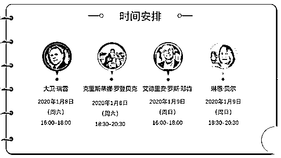

**讲师是谁？**

**琳恩·贝尔**

**（Lynn Bell）**

**· **世界最受欢迎的占星学演讲者、作家和老师之一。定居巴黎，研究心理占星学和家族模式数十年； **·** 著名的心理占星学中心（*Centre for Psychological Astrology*）的长期导师。2016 年，获得查尔斯·哈维（Charles Harvey）杰出的占星学服务奖；**· **作为一个从多个层面进行工作的占星咨询大师，琳恩的工作结合了心理学的观点。她对家族模式的兴趣首先来自与客户的合作。通过在分析领域所做的个人工作，她所受的埃里克森催眠训练将她引领至家族系统。后来，她组织研究小组在家族星图上进行了数年的研究。她写的《家族占星学》就是这项研究的结果；**· **法国心理占星学协会的会长。除了占星学，她在法国沙特尔的新沙特尔学校任教 8 年，还 5 次获得了在《纽约时报》畅销书作者卡罗琳·迈斯（Caroline Myss）的卡罗琳·迈斯教育学院（*Caroline Myss Educational Institute*）合作教学的机会。

**艾德里安·罗斯·邓肯**

**（Adrian Ross Duncan）**

**· **1971 年在印度游学时开始学习占星学，1985 年开始成为全职占星师，迄今执业已超过 33 年，是人本主义占星学、卜卦占星学和经世占星学领域的知名占星师。他还开发了占星软件 AstroClock 和多款占星报告；

**· **哥本哈根占星学院院长；

**· **他在日常咨询中经常运用卜卦，咨询图（卜卦的一种运用方式，即根据客户来访时间制作星图，从星图中获得大量信息）也是他特别擅长的领域；

**· **艾德里安·罗斯·邓肯从 1971 年开始研习佛学，受佛学影响很深，他相信占星学和佛学观点一致，转化的一个基础是在于对现实感知的改变。而卜卦很容易与佛教融合，因为它只关乎当下。

**克里斯蒂娜·罗登贝克**
**（Christina Rodenbeck）****· **克里斯蒂娜·罗登贝克（Christina Rodenbeck）是一名全职职业占星师，在牛津大学城生活和工作，深受周围知识和文化氛围影响；她拥有伦敦大学（*University of London*）的人文荣誉学位，曾在伦敦占星学馆（*Astrological Lodge of London*）、心理占星中心和占星研究学院学习；**· **作为一名占星师，在过去的 20 年里，克里斯蒂娜在她的网站“牛津占星师”上写了大量关于时事、艺术和文化的文章；她每月主持一个占星播客：“与克里斯蒂娜和萨莉一起占星”，并定期在《占星杂志》(*Astrological Journal)*上撰写时尚专栏；她定期在英国授课，并保持着蓬勃发展的专业实践。

**大卫·瑞雷**

**（David Railey）**

**· **若道联合创始人，致力于在中国教授和推广西方占星学；

**· **曾任 ISAR 全球副主席，CAPISAR（ISAR 职业占星师资质认证机构）主席；

**· **1976 年，通过亚特兰大职业占星师考试，成为全职占星师，随后通过 AFAN 和 ISAR 职业测试；

**·** 1980 年，与杰夫·焦耳一起在亚特兰大创建“每日行星”占星学中心。此后在亚特兰大占星协会担任 4 年考官，并且两次担任亚特兰大地区占星协会主席。1979-1992 年，作为占星师活跃于美国社会媒体，向不了解现代占星学变化的大众宣传专业占星学知识。在 1989-1992 年期间，他在 WRGG 电台 12 频道每周主持个人电视秀“今日占星学”，早先他还在 WRFG 的广播节目中播讲宇宙天气节目；

**· **2010-2014 年，任全美占星师联盟监督委员会委员；

**· **2010 年，其著作《灵魂的目标》中国版出版，和蒋颖一起创办若道占星学校和其官网 www.nodoor.com；

**· **2017 年，被选为 ISAR 委员会成员。ISAR 是世界最大的国际占星机构，会员遍布 45 个国家，2017-2020 年曾任 ISAR 全球副主席、CAPISAR（ISAR 职业占星师资质认证机构）主席。

**课程价格****正价**：3000 元**限量优惠价：2022 元**（前 60 名报满截止）**（联系 Maggie 老师，抢占限量优惠价）******联报套餐：《2022 年度天象预测大师课》+《2022 年金融占星预报》联报优惠价****2999 元****（限前 50 名联报）****（联系 Maggie 老师，抢占限量优惠价）**长按二维码添加 Maggie 老师获取联报优惠价**退转课程**

**· 退款原则请详看《教学协议》，如有疑问请咨询课程顾问。**

****2022 年度天象预测大师课****

**授课老师：**琳恩·贝尔、艾德里安·罗斯·邓肯、克里斯蒂娜·罗登贝克、大卫·瑞雷

**授课时间：**2022 年 1 月 8 日-9 日

**授课方式：**网络课程**，**英文授课，中文翻译

**费用：**3000 元**；****限量优惠价：2022 元（前 60 名报满截止）；****联报套餐：《2022 年度天象预测大师课》+《2022 年金融占星预报》联报优惠价：****2999 元****（****限前 50 名联报）**

**课程负责人：****Maggie 老师**（微信：18510107057，请备注“天象预测大师课”）

长按二维码添加课程负责人咨询~

****报名直达入口****

# 重磅 | 关乎“前后一年半”的金牛座月食，这一次必须和过去告别了！

> 原文：[`mp.weixin.qq.com/s?__biz=MzA5NjA0NTAxNg==&mid=2651461670&idx=1&sn=48d44052692e7cf6fc6e5146266e8a74&chksm=8b48aa91bc3f2387b8ca38bb0073b63aed347505e4ac2d7e321188081e7279eb2c45e3c4637f&scene=126&sessionid=1692737898#rd`](http://mp.weixin.qq.com/s?__biz=MzA5NjA0NTAxNg==&mid=2651461670&idx=1&sn=48d44052692e7cf6fc6e5146266e8a74&chksm=8b48aa91bc3f2387b8ca38bb0073b63aed347505e4ac2d7e321188081e7279eb2c45e3c4637f&scene=126&sessionid=1692737898#rd)

****☆ **后台回复“今日”，给你一句生命态度**

作者/王芝桦 编辑/玫瑰 图片/pexels

**金牛座月食**

**北京时间 2021 年 11 月 19 日 16:57 迎来金牛座满月，天蝎座太阳与金牛座月亮于 27°14′精准对分，并以 4°之差靠近“射手座南交点-双子座北交点”轴线，形成 2021 年底的重磅天象——金牛座月偏食。**

月食将满月的“完结能量”呈数倍放大，影响周期拉长至 3-6 个月，并在月食前后 16-18 天推动事物呈现高潮并照见结果。

此次金牛座月食，在 2021 年迈向 2022 年进程中担当着“承上启下”的重任，向我们宣告——**当下正是从“不成熟”向“成熟”迈进的时刻。**

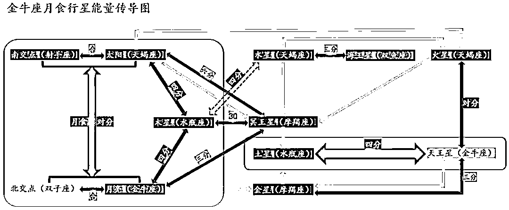

> **金牛座月食重点影响人群**
> 
> **参考新月峰值影响期间各个行星的行进度数，以及逆行行星的轨迹影响；常规容许度，个人行星入相位 3°，出相位 1°；非个人行星入相位和出相位均为 3°。**
> 
> *   出生星图中，有**行星、四轴、南北交点**落入**固定星座（金牛座、狮子座、天蝎座、水瓶座）5°-30°**的人群。
>     
>     
> *   出生星图中，有**行星、四轴、南北交点**落入**变动星座（双子座、射手座、处女座、双鱼座）0°-4°,17°-26°**的人群。
>     
>     
>     
>     
> *   出生星图中，有**行星、四轴、南北交点**落入**基本星座（白羊座、巨蟹座、天秤座、摩羯座）9°-16°，21°-27°**的人群。

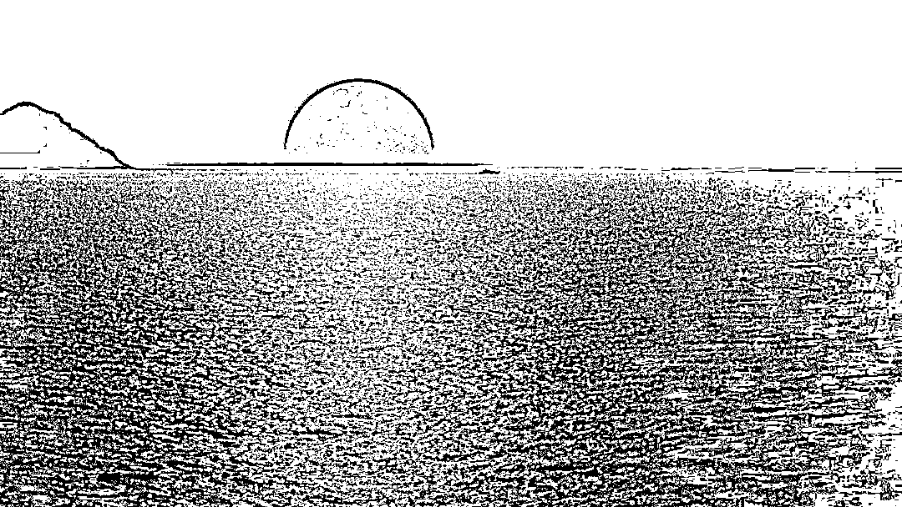

**关乎“前后一年半”的月食**

****

**我觉得自己很幸运，因为对我来说从来就没有任何安全感，于是我只能被迫向前走。世上没有回头路，那么好吧，我要尽我所能努力奋斗，看看究竟会怎样。**

**——电影《风雨哈佛路》**

> **天象****· “日月对分”轴线介入“南北交点”轴线：**天蝎座太阳合相射手座南交点，金牛座月亮合相双子座北交点。

黄道十二星座中，“土元素+固定模式”的金牛座，与“自然万物和现实资源”有着最天然、最深厚的联结。故而，**现实的安稳、物质的持守、品质的舒适、时光的安享，会为金牛座带来“基础的安全”和“内在的满足”。**每年的金牛座满月，**“安全感”**都是彰显的主题。2021 年的下半年，随着年度重磅天象“土天四分”结构屡屡被激活，“清算”进程越来越深化，现实的变化越来越多，我们的感受也越来越沉重。故而，当 2021 年的金牛座月食进一步催化着人们对“安全感”的渴望，放大着人们对“安全感”的敏感的时候，**“安全感”就变成“一扯就断”的脆弱状态。****· 9 月-10 月：**一场“水星逆行天秤座+金火互容”的混搭戏，令过去生活中隐藏的暗涌浮出水面——透过亲密关系、合作关系、金钱关系、职场关系的现实问题，“失衡状态”一一暴雷，“付出与得到”旧账清算；**· 10 月 23 日-11 月 21 日：** 撕开真相并狠狠扒皮的天蝎月并不好过。进入 11 月，此次金牛座月食的能量影响逐渐发酵，贪恋、愤怒、不舍、猜疑，几种不同的情绪交织心底，化作几种不同的声音来回撕扯：“如果能回到从前多好……”“如果从前的美好并不真实，留下又有什么必要……”“是 Ta 的不珍惜，导致了这一切……”“是我自己的脆弱，逃避着真相……”此次金牛座月食的前后一周，“高压”气息扑面而来，我们似乎被现实际遇逼到“非做选择不可”的地步，但其实我们的内在觉知深深知道——**不做突破，没有未来。**金牛座月食发生时刻，“日月对分”轴线合相“南北交点”轴线，为此次月食润染上“业力进化”的味道：**· 天蝎座太阳合相射手座南交点：**每个人都有内在的阴影和执着，因匮乏而贪求，因恐惧而过度，因脆弱而逃避，导致了“失衡状态”的发生。现实困境的背后真相，需要我们对过去做出检视，向内做出反思——**哪些陈旧的观念仍在束缚着我们？哪些过时的经验仍在阻碍着我们？****· 金牛座月亮合相双子座北交点：**“安全感”究竟是什么，又来自何处？这个世界瞬息万变，但只要我们能够“安住自心，活在当下”，便能够拥抱一切的可能性。**“安全感”从来不在外面，而是愿意学习多元知识、敞开接纳不同观点、勇敢尝试全新体验的“内在自信”。**

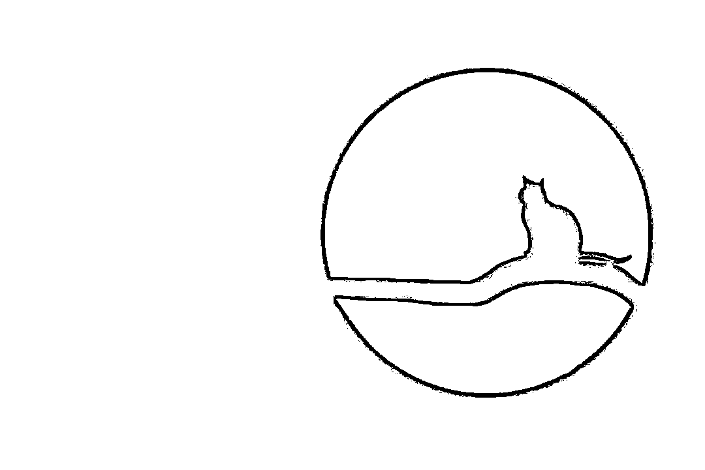

故而，此次金牛座月食：**· 首先，**借助天蝎座的“洞悉之眼”看到自我内在的阴影与执着，找到那些束缚我们的陈旧观念和阻碍我们的过时经验；**· 然后，**借助月食超强的“完结能量”，与“不成熟”的意识和模式告别；**· 最后**，重建对“安全感”的认知，向着更为“成熟”的意识与模式迈进。

**敲黑板！划重点！**

11 月 19 日的金牛座月食和 12 月 4 日的射手座日食，是当下一轮“射手座南交点-双子座北交点”轴线的最后一组食相（下一轮相隔 18 年）；12 月 23 日，南北交点平均交点将会换座进入“天蝎座南交点-金牛座北交点”轴线，未来一年半的时间里，一段全新的进化历程就此开启。故而，此次金牛座月食，也在检验我们过去一年半，对“射手座南交点-双子座北交点”轴线揭示的“业力功课”完成的情况——**对陈旧观念和过时经验的突破，对全新思辨和无限可能的接纳！**这个世界本就无常相随，而自从**2019 年 3 月**，“不按常理出牌的疯子”天王星带着“突破与变革”之风正式进入金牛座之后，现实世界便开始了“疯癫”的表演——我们每一天都不知道明天什么样，过去的安全和安稳已被逐渐“打破”，曾经的观念和经验随时可能“退休”；我们不能再用以往的眼光去看待这个世界，这个世界正在以前所未有的方式打开每一天！

**再次！敲黑板！划重点！**

**12 月 23 日，**南北交点平均交点换座进入“天蝎座南交点-金牛座北交点”轴线，标志着天王星行进金牛座（2019 年 3 月 6 日-2026 年 4 月 26 日）的 7 年进程将会进入到下一个阶段——**“重建现实根基”的进程将被正式打开。**故而，此次金牛座月食，也同时带着“承上启下”的启示——只有在“射手座南交点-双子座北交点”轴线即将谢幕的时刻，**为意识松绑，对未来敞开**；才能在“天蝎座南交点-金牛座北交点”轴线登上舞台的时刻，**放下执着，活在当下。**没有任何安全感的人，其实最有安全感，因为只能被迫向前走，反而最能活在当下。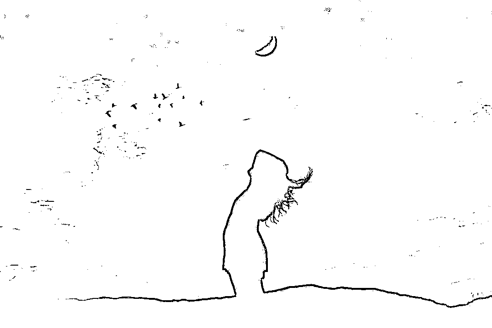**不要怕，一切都是最好的安排**

****

**没有人知道事情的结果会是怎样，除非他亲自去尝试了。**

**——电影《风雨哈佛路》**

> **天象**
> 
> **· 火天对分：**天蝎座火星对分金牛座天王星； 
> 
> **· 金天三分：**摩羯座金星三分金牛座天王星；
> 
> **· 水木四分：**天蝎座水星四分水瓶座木星；
> 
> **· 水海三分：**天蝎座水星三分双鱼座海王星。

此次金牛座月食，宇宙天象复杂而激烈，打出的都是一记记“重拳”；而发生在靠近天蝎座尾部度数的月食，我们也不得不小心着蝎子的“毒针”。金牛座月食的“日月对分”轴线，天蝎座太阳和金牛座月亮两方都派出了自己的代表：月食发生的前一天 11 月 18 日，接纳天蝎座能量的天蝎座火星与金牛座天王星形成“火天对分”结构；月食发生的当天 11 月 19 日，接纳金牛座能量的摩羯座金星与金牛座天王星形成“金天三分”结构。金牛座天王星被双重触发！“不按常理出牌的疯子”天王星，又会令金牛座主导的现实世界如何“疯癫”呢？哦，不，是“突破与变革”。

**敲黑板！划重点！**

“金天三分”结构中的摩羯座金星，也同时接纳着金牛座天王星的能量（金星守护金牛座）；并且，摩羯座金星又将能量传递给了水瓶座土星（土星守护摩羯座）——年度重磅天象“土天四分”结构再次被引动！**“清算”进程依然在大力推进，而这一切不过是 12 月 24 日“土天四分”结构第三次能量峰值的前戏铺垫而已！**

**再次！敲黑板！划重点！**

最近一段时间，“金天三分”结构中的摩羯座金星，本身也异常“疯癫”！**· 越界：**如果我们将太阳赤纬的“管控”范围拉宽一点，那么**这颗金星从 10 月初开始便处于“越界”状态，像“不按常理出牌的疯子”天王星一样不听太阳的管控！** 9 月 27 日-10 月 18 日，水星逆行天秤座，9 月 15 日-10 月 6 日，“金火互容”——**各种“关系”毫无征兆地暴雷，各种“旧账”歇斯底里地清算，而在“关系”中的我们也被愤怒灼伤，为失去伤悲；****· 逆行：11 月 5 日**，“越界”的金星进入摩羯座，并将“越界”状态一直延续到 12 月下旬；**2021 年 12 月 19 日-2022 年 1 月 29 日**，金星逆行摩羯座，而这场逆行的前影响期就从此次金牛座月食的前一天 11 月 18 日开始——**从此次金牛座月食开始，直至摩羯座金星逆行之前的整个逆行前影响期，“超边的关系，越界的模式”成为最大的风险。**

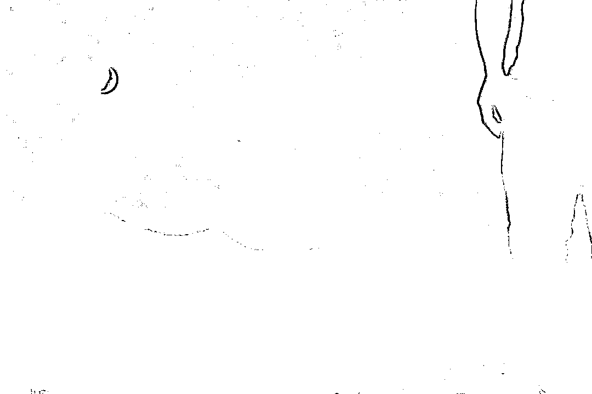

故而，此次金牛座月食，关乎着 2021 年底-2022 年初的趋势发展，需要我们对以下几个方面进行关注。**·** **市场：**金融领域、科技行业、食品卫生和资源能耗等几方面，容易发生“突变性”状况或“安全性”问题；而涉及民生的物价、房价和货币也将会呈现曲线波动或政策调整；**·** **职场：**上至领导人物，下至普通员工，极有可能出现人事架构调整、工作岗位更换的情况；而一些企业也将进行收购兼并或股权变更；**·** **情感：**突如其来的好感，一见钟情的相遇，不是没有奇迹，但生活不是“拆盲盒”，保持一些理性，加深一些了解，至少能够躲开一些吃亏、后悔和上当的“坑”；**·** **关系：**金牛座月食，**“利益和安全”**成为每个人内心深处最在意和最敏感的事情。9 月-10 月已经令很多的关系出现裂痕，甚至剑拔弩张，而此次月食更是**进一步催化着“价值观分歧”和“立场冲突”，稍有不慎便容易加速关系的恶化和决裂。**任何一种“失去”都带着痛，但是，与其在虚妄中消耗，不如在穿越中前行。

**·** **言行：**11 月 18 日的“水海三分”结构，11 月 21 日的“水木四分”结构，提示我们在此次金牛座月食的前后一周，谨守平等的态度，尊重不同的观点，谦虚一点，少说大话，注意分寸，避免因为冲动性、狂妄性、评断性的言行产生破坏性的影响。

不要怕。其实，我们所经历的现实变化和现实考验，正是“内在意识的突破、内在模式的变革”的外在显化。否则，关系为什么不早暴雷？旧账为什么不早清算？世界为什么不早“疯癫”？一切都是最好的安排。很多时候，我们似乎还处于无意识和无明之中，但其实生命内在高阶的意识和觉知，就像天上的行星一样从未停歇，一直在引领着我们的脚步；只是，没有人知道事情的结果会是怎样，我们只能像天上的行星一样，在茫茫的宇宙中勇敢尝试并奋力前行。**此次金牛座月食，为 12 月 24 日年度重磅天象“土天四分”结构的第三次能量峰值做出铺垫——宇宙“清算”的从来不是历史，而是历史中的沉渣，向“不成熟”的意识和模式告别，向“成熟”的意识与模式迈进。**

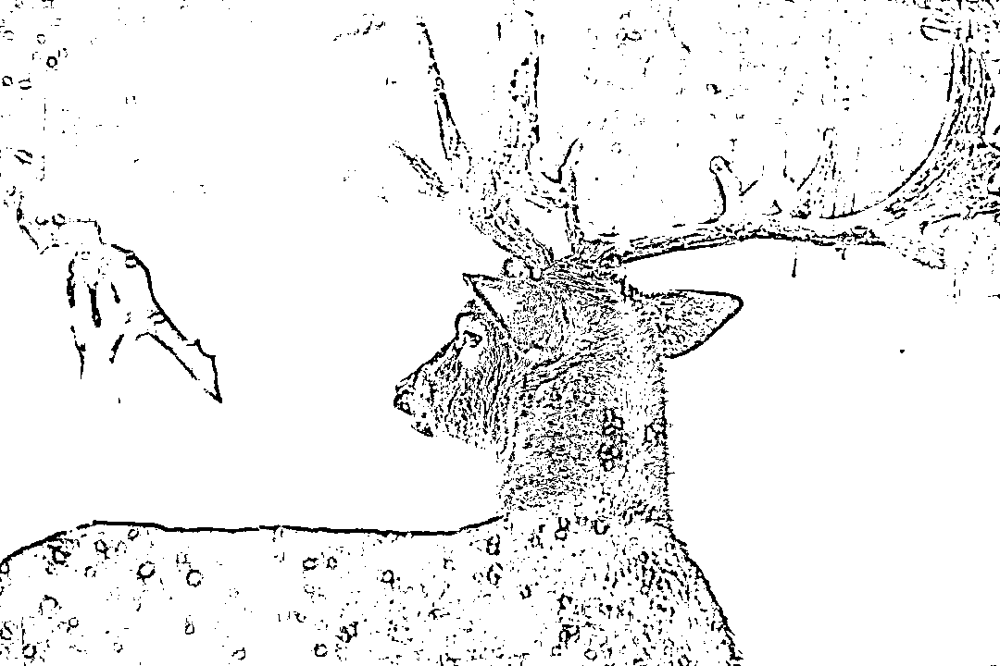

**真实自我的重生，未来生活的创造**

****

**就在那一刻，我明白了，我得做出选择。我可以为自己寻找各种借口向生活低头，也可以迫使自己创造更好的生活。**

**——电影《风雨哈佛路》**

> **天象**
> 
> **· 木冥 30°：**水瓶座木星与摩羯座冥王星形成 30°结构；**· 木星介入“日月对分”轴线：**宽泛容许度下，水瓶座木星四分天蝎座太阳，四分金牛座月亮；**· 冥王星介入“日月对分”轴线：**宽泛容许度下，摩羯座冥王星六分天蝎座太阳，三分金牛座月亮。

此次金牛座月食，木星和冥王星 30°联手，并分别介入“日月对分”轴线，引领我们望向生命的内在，与“真实的自我”相遇。为“过去的自己”做一场评估和选择：**·** 你一直在努力扮演什么“角色”？你是否感到快乐和满足？**·** 如果答案是否定的，你是否“允许”自己褪下角色的外衣？**·** 如果答案还是否定的，是什么“不允许”你这样做？**·** 你是否看到了内在“被认同的渴望”和“被放弃的恐惧”？**·** 你是否想看到“与过去不一样的自己”？过去的自己，虽然不快乐和不满足，但可能已经习惯了；但是，如果我们和生活讨价还价，生活就会让我们缺斤短两；如果我们想要活得真实和自在，就要**对那些试图掌控我们生命的事物说“不”！首先是自我内在的恐惧和懒惰。**此次金牛座月食，正是我们做出选择的时刻——**不再寻找各种借口向生活低头，让“真实的自我”重生，去创造更好的生活。**

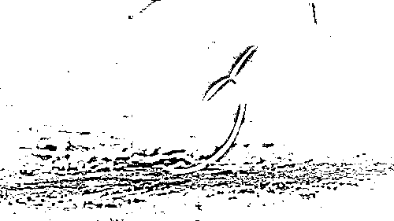

**寄语**

****

**你的幸福与你的自尊，无论是智力上，身体上或精神上，都有着直接的联系。身体就像一座神庙，你必须保护自己，以防滥用或虐待你的神庙。你必须成为自己的守护者，你要说出自己的感受。****——电影《风雨哈佛路》**身体承载着所有的记忆。僵硬、疲惫、病痛和憔悴纷纷诉说着内在的感受和岁月的忧伤。让我们在这个与“自然万物、现实资源和身体能量”联结深厚的金牛座月食，与自己的身体建立紧密的联结吧。身体的每个细胞、每块肌肉和每寸皮肤都在提示我们——允许自己放松和舒缓下来，允许自己做简单而真实的自己，允许自己按照身体的节奏，允许自己满足内在的渴望，允许自己对他人的投射说“不”，允许自己对外在的强迫喊“停”……

我现在要结束这篇文章了，因为我的身体正在告诉我“该睡觉了”，我的神庙正在宣告“打烊啦”。

祝愿每一个灵魂安好。祝福大家。

**版权声明**：原创文章由作者授权首发于若道平台，欢迎转发，反对抄袭。友号转载请申请白名单。

****

****想阅读更多作者的文章，请在后台回复******王芝桦****** 即可。****

****王芝桦****

心理占星师，统合疗愈师，占星专栏作者

全职于个案咨询与占星教学工作 16 年

**个案预约咨询微信号**：zhihua0621 

**微信公众号**：daoxi-life

**长按打赏**

****

**学习占星学****点击或长按下图了解课程详情** ************

****

****

**微信又双叒叕改版啦，不想错过若道君的推送？****就把若道设为星标吧！****▼**

喜欢记得点一下在看哦☟

****报名直达入口****

# 如何让“月海”与“金冥”的洪荒之力，回归到积极的轨道上！

> 原文：[`mp.weixin.qq.com/s?__biz=MzA5NjA0NTAxNg==&mid=2651461536&idx=1&sn=d6bd881623e4b88a67abe8fea038831c&chksm=8b48a517bc3f2c01274d18b4949263c2043558a7c8f43504b27411c3d7aad0c52f7d6045f029&scene=126&sessionid=1692737898#rd`](http://mp.weixin.qq.com/s?__biz=MzA5NjA0NTAxNg==&mid=2651461536&idx=1&sn=d6bd881623e4b88a67abe8fea038831c&chksm=8b48a517bc3f2c01274d18b4949263c2043558a7c8f43504b27411c3d7aad0c52f7d6045f029&scene=126&sessionid=1692737898#rd)

********************☆ 后台回复“今日”，给你一句生命态度********************

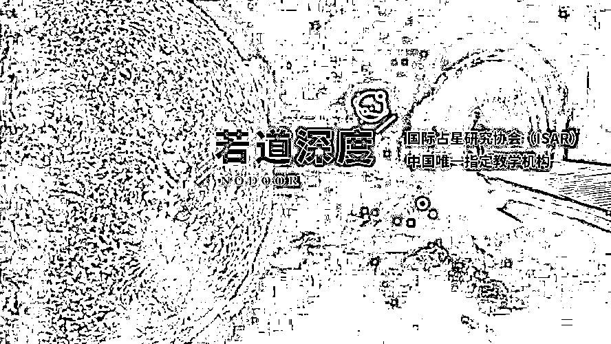

作者/杰西卡·卡巴拉

翻译/幼婷 整理/佳黛

编辑/翀子 封面/书君 图片/网络

任何事物都有一体两面，我们表达行星原型能量的时候也是如此。当看到那些挑战与弱点所在之处，也就到了和阴影一同工作并接受上天礼物的时候。

**痛苦被看见与被释放，能够让我们更加完整**一切人和事物身上都有光和阴影的面向。**每一个行星、星座、宫位都有光和阴影的面向。**它们不是分离的，而是一体两面的。所以，当我们表达原型能量的时候，既可以表达出该原型礼物的部分，也可以表达出挑战的部分。我的老师理查德·塔纳斯曾经说过：

原型要么就是呈现出一种提升我们生命的特质，要么就是破坏我们生命品质的能量。

当我们可以用一种清晰和扎根的角度来看待这些**行星、星座、宫位原型能量**的时候，我们就能够表达出健康且能提升我们生活品质的能量。可是当我们以一种恐惧、扭曲和收缩的形式去表达出原型能量的时候，它们就会呈现出一种痛苦的状态。当我们能够在星图中，**向客户呈现他的挑战和弱点所在之处**的时候，这就是一项伟大的服务。就如同我们能够向他呈现出力量和礼物所在一般。当占星师这样做的时候，能够**帮助个体有一种释放和被看见的感受**，让他能够变得更加完整。接下来我将给大家举一些例子，告诉大家，我们如何在占星学中与阴影面工作。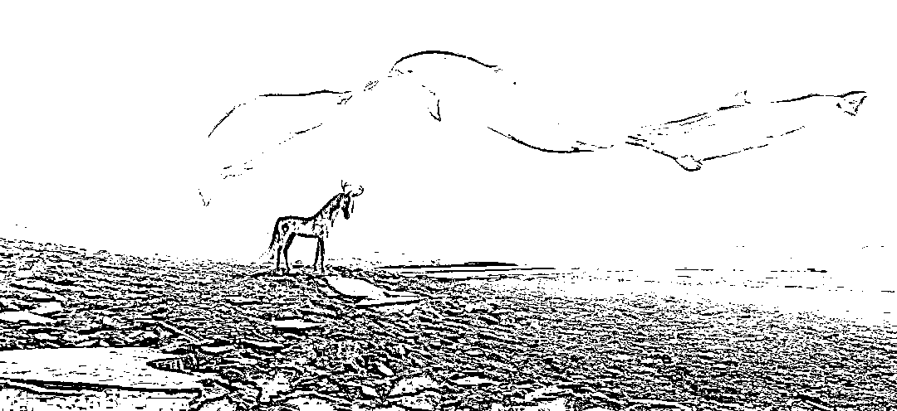**月海相位的能力与阴影****你会感受到****★ 敏感**拥有月亮和海王星相位的人，会拥有**情绪上很强的敏感性**，这种敏感性会为你带来极强的直觉和慈悲。但这种敏感性，有时候会让你在亲密关系中失去自己。**★ 逃避**当你处在压力状态、或感觉到生命中没有支持的时候，你就会有**逃避、或麻痹自己的行为**。通过诸如吃、喝、看电视等等上瘾症。**★ 联结**在你身上有一种深深的能力。你可以与周围的人、或是这个世界产生一种**深入的、一体化的联结**。因为你对于合一的议题是了解得非常清晰且深入的。有的时候会让你产生对关系的渴求，以及活在幻想的世界当中。如果没有和他人产生这种关系的话，你常常会感到非常孤单。**如何面对阴影面？****★ 拿出时间照顾自己**当你和朋友、家人在一起的时候，你会感觉到自己就像是被淹没了一样，因为你完全能够感受到他们身上的感受。这意味着**你需要拿出额外的时间和精力来好好地照顾自己。**这样你才能精神抖擞地出现在一段关系当中，而不被这段关系当中的人和事吞没。**★ 设置边界**能够去好好照顾你自身敏感性的其中一个方法是：你能够**在关系当中设置清晰的边界**。你可以把它称为一种心理上的照顾。就像我们需要照顾自己的身体一样，心理上你也需要照顾，照顾好自己的能量空间。你可以去做按摩、可以去做和能量相关的工作，比如灵气、太极。当你有空的时候，试试做些灵性上的练习，这些练习可以把你带向很远的地方。我们想向月海客户呈现出他们对人和世界的敏感性是很正常的，我们并没有试图让他们摆脱敏感性，而是让他们**学习如何与自己的敏感性共处。**当人们能够意识到自己敏感性当中蕴含的礼物的时候，他们就能够用极大的力量向世界去呈现出这份礼物。但是同样的，敏感性也会让他们在关系中迷失自己，所以我们必须在这个层面去提醒他们。**我们所拥有的挑战和阴影带来的痛苦，让我们没法意识到其实它们也是礼物——可以给世界的礼物。**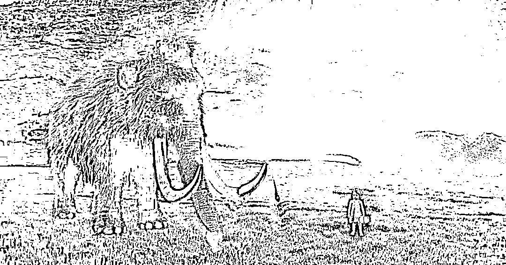**金冥相位的能力与阴影****你会感受到****★ 激情**当我想到金冥相位的时候，我就会想到非常强烈、浪漫的关系。金冥相位的人拥有着**极大的激情和力量**，这些力量可以**通过爱、关系或是艺术**呈现出来。**★ 操纵**冥王星的能量从积极的角度说，可以正向地转换这个世界。但是同样的，冥王星的力量从负面的角度说，会让你有**操纵和控制他人**的欲望，产生破坏的作用。这是冥王星身上存在的问题，它虽然赋予你手中的力量，但你要通过哪种方式转化和影响这个世界呢？当这种激情和力量以一种正向和清晰的方式呈现出来的时候，它可以显化为一个**非常有力量的**艺术家、一个非常深化的朋友或者是一个激情的恋人。在这种情况，这个人就会是一个热爱动物、热爱大自然，并且照顾到周围人的需求的人。**★ 压抑**但是当冥王星的能量没能以一种积极、健康的方式呈现出来的时候，它会非常容易地呈现出破坏性的状态。冥王星最让人痛苦的一个负面能量是：**压抑。**压抑你内在深深创造性的力量。**当你感觉到自己很渺小，感觉到自己受伤的时候，**你在关系中就会呈现出**操纵、嫉妒或羡慕**的状态，就会想去**控制、主导或者操纵**朋友和伴侣。如此一来，就会呈现出权力的争夺。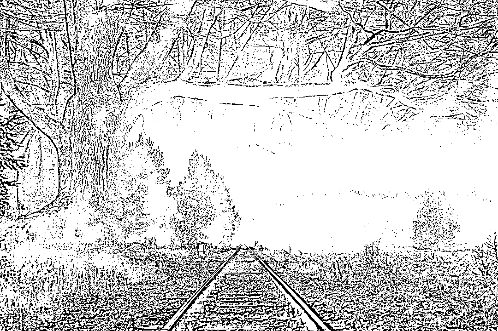**如何面对阴影面？****★ 唯有感觉渺小，争斗才会出现**唯有当我们感觉到自己很渺小、试图证明什么的时候，我们才会进入到**权力的斗争**当中。当你有金冥相位且处在阴影面的时候，不仅是你会试图控制和主导别人，当他人认为自己渺小的时候，他们也会来控制和主导你。但是当我们了解这点的时候，我们就能够对自己和生活中的其他人产生一种**慈悲心**。这样也能够给我们一个选择的自由：**当我们感觉到渺小，或者当我们看到他人觉得自己渺小的时候，我们该做怎样的选择？****★ 通过艺术的方式表达激情**你想向这个世界呈现和表达的东西太多太多了，只是我们要确保，**你能以一种深深的爱的形式表达出来。**这就是为什么，你能够通过艺术性和创造性把流进你血液的激情表达出来是重要的。其实你内在这种深深的激情，对于你自己和身边的人来说，都是一份珍贵的礼物。但是也有可能，你身上承载的激情，让另一方感觉到承受不住。这并不意味着，你身上有如此激烈的面向就有什么错。只是你需要留意你需要在什么时候，**以一种怎样的方式去表达身上的激烈。**当你处在均衡状态的时候，你的力量不仅可以转化你，也可以转化其他人，让他们也感觉到力量。

**版权声明：**本文由若道翻译发布，欢迎转发，反对抄袭。友号转载请申请白名单。

**杰西卡·卡巴拉**

占星师，心理咨询师，注册的婚姻与家庭治疗实习医师。从 2007 年开始实践原型占星学，提供占星咨询服务。2014 年，杰西卡在帕西菲卡研究生院获得咨询心理学硕士学位，研究方向为深度心理学。她的理论基础主要来源于理查德·塔纳斯、斯坦尼斯拉夫·格罗夫，以及原型占星学和超个人心理学。杰西卡教授原型占星学和深度心理学，也积极进行深度心理治疗方面的实践，将原型占星学的智慧和洞见同深度心理学整合起来。

**学习占星学****点击或长按下图了解课程详情** ************

****

****

**微信又双叒叕改版啦，不想错过若道君的推送？**

**就把若道设为星标吧！**

**▼**

**就是这个“在看”，戳戳戳 ☟**

******报名直达入口******

# 人生的每个难题都是功课，过关了再前往下一个

> 原文：[`mp.weixin.qq.com/s?__biz=MzA5NjA0NTAxNg==&mid=2651461536&idx=2&sn=3274258b0a0cfffb32a7d97c637da8a0&chksm=8b48a517bc3f2c01f3f5d75f861b2f05d40c59984eb333b9197a7840fe3bfcbf7509c19b2bab&scene=126&sessionid=1692737898#rd`](http://mp.weixin.qq.com/s?__biz=MzA5NjA0NTAxNg==&mid=2651461536&idx=2&sn=3274258b0a0cfffb32a7d97c637da8a0&chksm=8b48a517bc3f2c01f3f5d75f861b2f05d40c59984eb333b9197a7840fe3bfcbf7509c19b2bab&scene=126&sessionid=1692737898#rd)

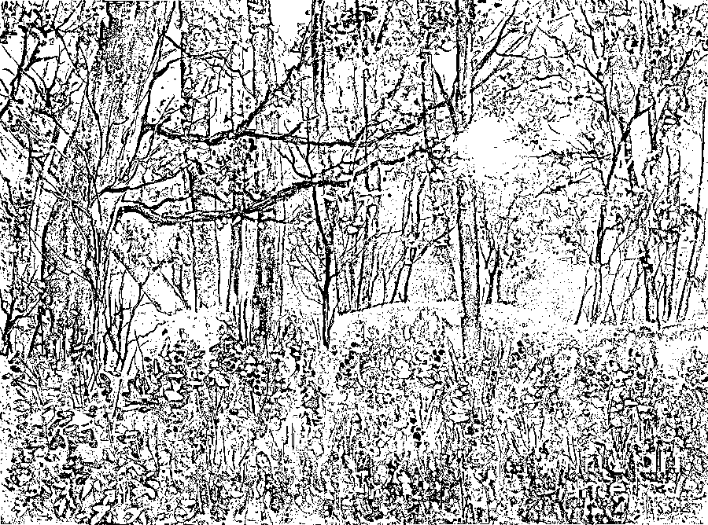作者/杰夫·焦耳 翻译/丁宏编辑/翀子 图片/网络文章来源/杰夫·焦耳创造性预测沙龙

不管东方还是西方，预测都是占星学的传统。现代占星学看重发现，传统占星学则关心安全感，两者对于预测有什么不同看法？什么样的预测才能更好的帮助个案？就让著名占星师杰夫·焦耳与我们细致地聊一聊吧。

**占星学帮你更好的了解世界**

对不了解占星学的人来说，占星学非常难，比英语难。**其实占星学作为一门语言本身，没有汉语难，复杂的是人本身。**

虽然通过占星学，我们可以告诉你关于你的一切个性，但是我们仍然无法了解作为一个人的神秘性。因为这个神秘性的答案不在于占星学或任何神秘学的系统，而是在于如何生活。当我们已经有了需要了解占星学的装备，如何生活才是一场冒险。

**即使你不想成为占星师，占星学也是非常值得了解的东西，因为它是能量的语言。**你不必成为专家，它也可以**帮助你更好地了解这个世界**。正如不同的音乐、绘画、小说、诗歌帮助我们以一种不同的方式了解世界，占星学也是如此。

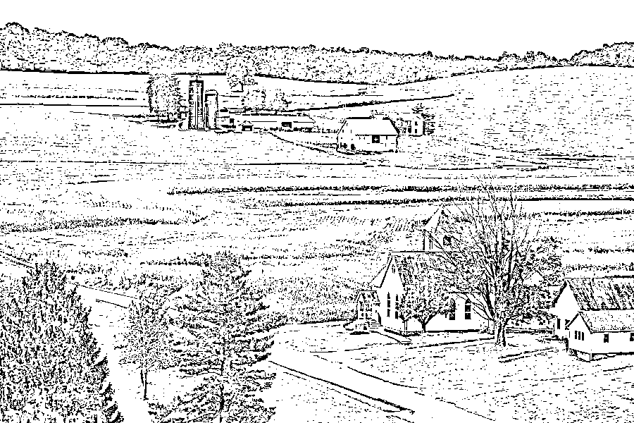

**预测，占星学的传统**

**占星预测非常接近占星学的中心，不管是东方还是西方，预测都是占星学的传统。**当初国王不是为了个人成长或更了解自己才去找占星师，他就想知道今年是否会有大丰收，或者什么时候他打仗能否打赢。

**这是占星学的传统，是非常关注预测的。**不论是东方还是西方，在传统上，它都是服务于世界，在这个世界上人们为了实实在在地生存而挣扎。

当然，我们物质世界的生存非常重要，占星学也帮助我们更好地了解如何生存，**但我觉得现代占星学最主要的目的不是这个。**我们的肚子已经吃饱了，我们也不再被过去制约了我们的父辈、祖父辈、曾祖父辈的规则和条件所制约。

100 年以前，在个人层面上，预测是非常简单的。从职业上而言，如果你是一个男人，你父亲干什么，你基本上也就会干什么；如果你是女人，你母亲做什么，你基本也就做什么。

**但这个在现代社会已经改变了。**当然，我们仍有限制，即便像在上海这样的现代都市。但**男性和女性如今都有比 100 年前多得多的选择**。**这既是礼物也是诅咒。**

礼物是你可以不过父辈的生活，去探索与他们完全不同的生活了，诅咒是我们必须自己去搞清楚我们到底要去过怎样的生活，如何去过？**但这就是自由的意思。**

**自由就是要面对可以选择后带来的复杂性。而之前的老旧的占星学根本和选择无关。**而我说老，其实也没有那么老。

比如，当我开始学占星的时候，我读的书是 1930 年写的。我比你们年老，但是写书的人比我更老多了。写得很吓人。

比如我是在满月出生的。我读的第一本占星书对天蝎座满月出生的解读是这样的，它写道“你的人生是悲惨的，但是有一个好消息，你会死得很早。”这当然不是吸引我做占星师的理由。

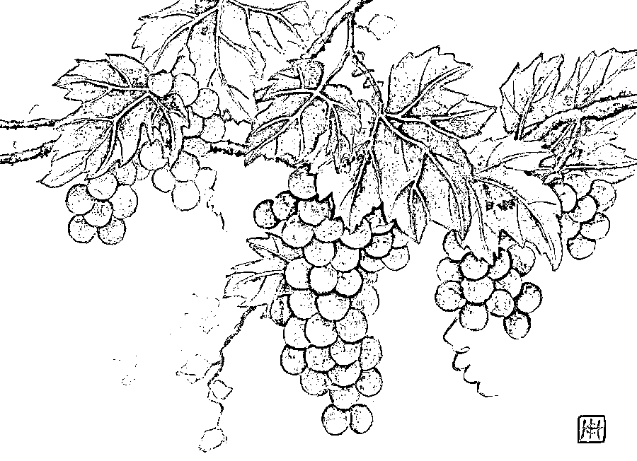

**成长比正确更重要**

令人高兴的是我很快发现了现代占星学的世界。**现代占星学是“发现的占星学”（Astrology of Discovery)，传统的占星学是关于“安全感的占星学”（Astrologyof security and safe)，都是关于控制的，如何避免被老虎吃掉。**

当时因为我们的生活没有更多的选择，所以，当时的占星学也不是关于如何创造生活的占星学。不过，把预测当做掌控的工具也仍然是非常有诱惑的。

我猜想如果我或其他占星师在你面前说你未来一切会发生的重要的事情，你们还是会想要听的，你也会想要相信这些。虽然你不想听坏消息，但是坏消息真的很有诱惑性。

**生存非常重要，但是人类在改变。**在对待占星的态度方面，中国人似乎走在前面，你们是创造未来的人。你们这些年轻人所做的选择，将会决定人类的未来。

**我想说安全感仍是是非常重要的，**不论我们对个人成长多么重要，如果地震了，我们也会被迅速地切换到生存模式中，这是我们生理和心理的核心。

但是为什么就停在这里呢？我们仍然在生活，仍然在书写历史，而**占星学是一个了不起的帮助我们书写历史的工具，但这取决于你如何运用它。**

**如果陷入古典占星学的那种好坏评判，我们就无法成长**，古典占星学里有个理论是行星在某些星座里比较强势，在某星座里比较弱势。当你星图里有些比较困难的东西那就是不好的。那就是你的业力，你将要付出代价。我知道的西方占星师都不太公开谈论这些概念。

比如说代表爱情的金星、火星有个挑战相位，你的爱情生活就会很糟。好像你这一世拥有这些不好的相位是因为你过去世做了些坏事，所以受到惩罚。

**这种理论对某些人很有吸引力**，因为很简单——如果我在受苦，那是因为我不好，这是我的业力，我正在受惩罚。

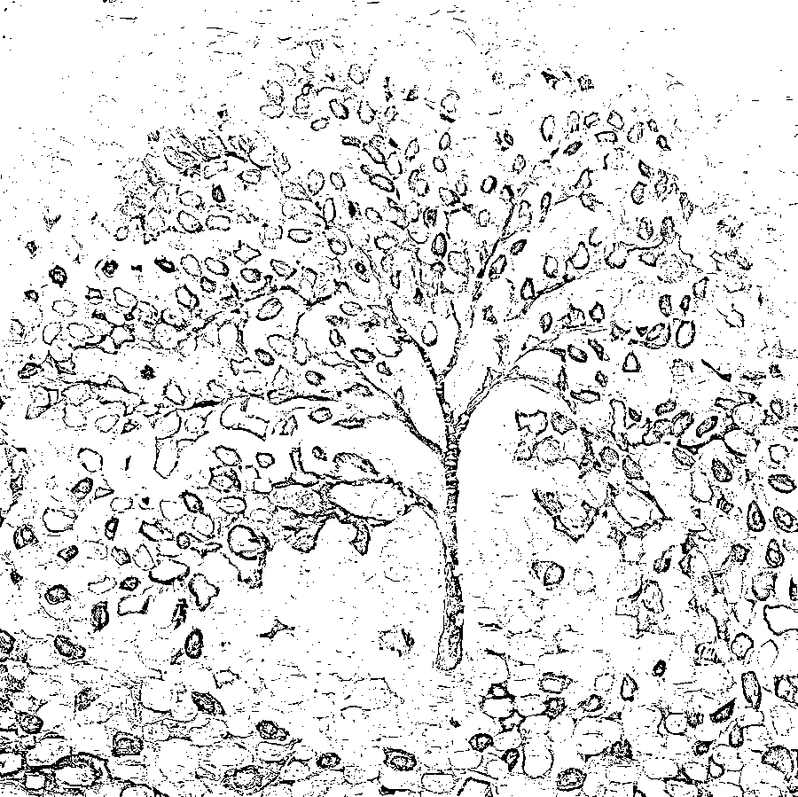

我有一个占星师朋友有一位住在巴西的老师，这位老师说过一段正好相反的观点。他说：这一世生活中的那些困难的东西就是因为过去世你做对了，所以要进入下一课。而那些容易的事就是因为你此前没做好，所以给你降低难度，好让你过关。

我喜欢这个说法，从教育角度来说，这很有道理。为什么要把事情弄得更复杂来惩罚差生，而跟优等生说你不用再学了呢？它把惩罚的概念从占星学里拿走了。**成长比正确更重要。**

如果你觉得现在正受苦的人是应得的话，你就很难产生同情。这不会帮我们去爱自己，爱别人。我们真能知道什么东西是好的，什么是坏的吗？我们都曾失望，当事情发生的时候感觉很糟。

但在这里关上一扇门，总会在另一个地方打开一扇窗。你有没有一个很好的经历却将你带到不想去的地方的经历呢？我并不是说我们不会感到受苦，失望。有时我们的痛苦是很压抑的，有些领域甚至永远都不能康复。但我们仍能从跌倒的地方学习，站起来重新出发。

**占星学的一个好处就是告诉我们，在特定时候遇到的挑战是什么，会给出遇到问题的意义。**真正痛苦的是被卡在那里——痛苦，却不知道为什么，不知怎么解决。**这就是占星学给出一个创造性解释的意义和价值，将你带出那种僵滞的状态。　　**

比如土星是代表收缩的，与代表情感的月亮产生合相。这有很多表达方式。做预测的占星师会很高兴地看到这点，他笃定地说：你感觉不好吧？客户说：我感觉太糟了。这是个准确的预测，但并没什么帮助。

但一个创造性的占星师会说：我理解你的感受，这是你如何去跟这种能量工作，进而成长的机会。

**预测本身是一个诊断，是对现实状况的一个描述。可以是一个精确的诊断，但好的占星师提供药方，这带来疗愈，带来成长。**

我们能利用不适感成长。痛苦有不同的种类。有非常神经质的痛苦，会让我们反复地经历。如果学不到经验，将会一味地伤害自己。但同时也有非常有动力的痛苦，这种痛苦可以打开视野，让我们好好看看自己的生活。

这就是占星能做到的。我要传达的是如何从创造性的角度去看占星学。

**我们不是单纯描述这个人的状况，我们是用占星学去打开心灵，去观察情绪的色彩，看看有多少路可以探索。从许多角度来说，占星学是教我们如何更好的问问题，而不是找正确答案。**

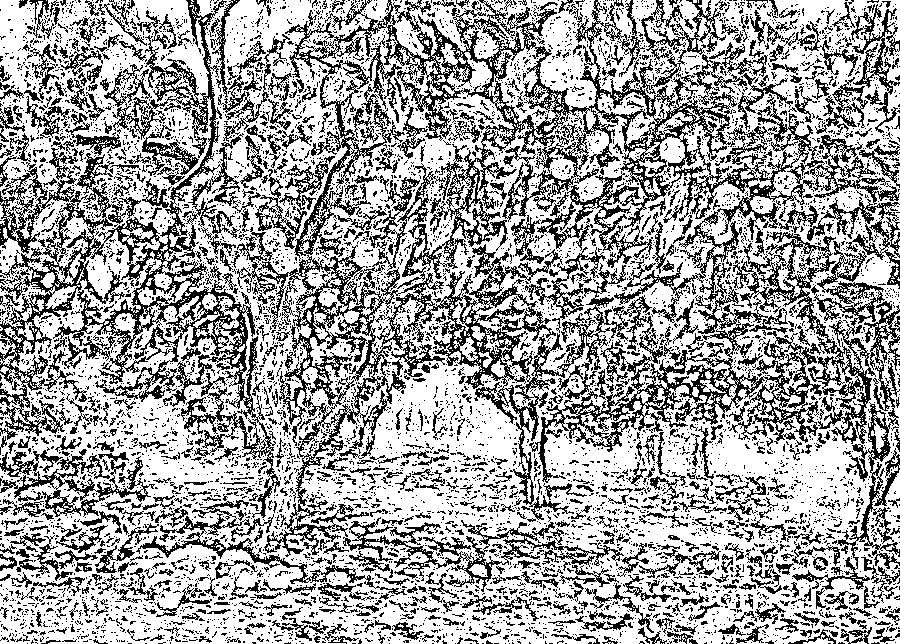

**用占星学改变生命的方向**

**我们从不同层面去经历占星，一层层探讨，有事件层面，有心理学情感与行为的层面，还有灵性层面，从更高的视角来解释。**

有一句古老的话是：性格决定命运。占星学里出生星图所讲的就是性格，就是一次又一次地回到我们的核心，这就是树的根基。**当我们更好地理解根基（出生星图），就能更好理解树枝能伸向哪里（行运预测）。**

对于占星学生来说，这就是去理解各种行运，将之关联到出生星图，来观察各种行进与你本身的关系。

如果你们对心理学有点了解，就知道早期的经历对我们影响巨大。很多情感和基于情感所做的决定都可以追溯到早期经历的。**可以用占星学追溯到根源，改变河流的方向。**

早年的创伤经历，并不能定义现在的你。你只需带着现在已经成长的、已经具备的智慧，一遍遍地回到过去，带着智慧理解接受那些经历。

有个叫汤姆·罗宾斯的美国作家，他说要拥有一个幸福的童年，永远不会太晚。如果你的童年不幸，长大后，你可以一遍遍回溯过去，理解它的意义，把那个压力释放出来。这就是改变我们生活之力量的源泉，我们生活的核心。

**虽然****占星学的一些图示能说明我们的现在，但也能透视到我们的过去。**

你们中的一些人可能跟我一样有创伤性的童年经历。我 12-13 岁的时候眼睁睁看着心爱的母亲死于癌症。看着生命中最重要的人慢慢在生理上，精神上的衰败。我最开始默默祈祷她能活过来，到最后变成祈祷她能早点离去。

多年后，我和妻子在一个情感治疗的小组中，小组带领者非常有智慧，善于倾听。但我问他是否能有一天我们克服这个创伤。他说不能，当时我的下巴都掉下来了。

“**你不能扔掉你的历史，心灵需要持续性，需要你知道自己是谁。**”如果我说你明天能得到一切，但要忘记你是谁。你们有谁能接受吗？当然不会。但这个人跟我说，你可以降低这个创伤的主导性。

痛苦经历就像是毒药。但当你过着健康的生活，有清洁的水源，这个毒药就被稀释了，不会毒害、主导你的生活。这对我很有用，我不需要忘记自己曾经的过去，才能从中解脱。**所有的行星周期都能帮我们回到过去，同时帮我们展开新的旅程。**

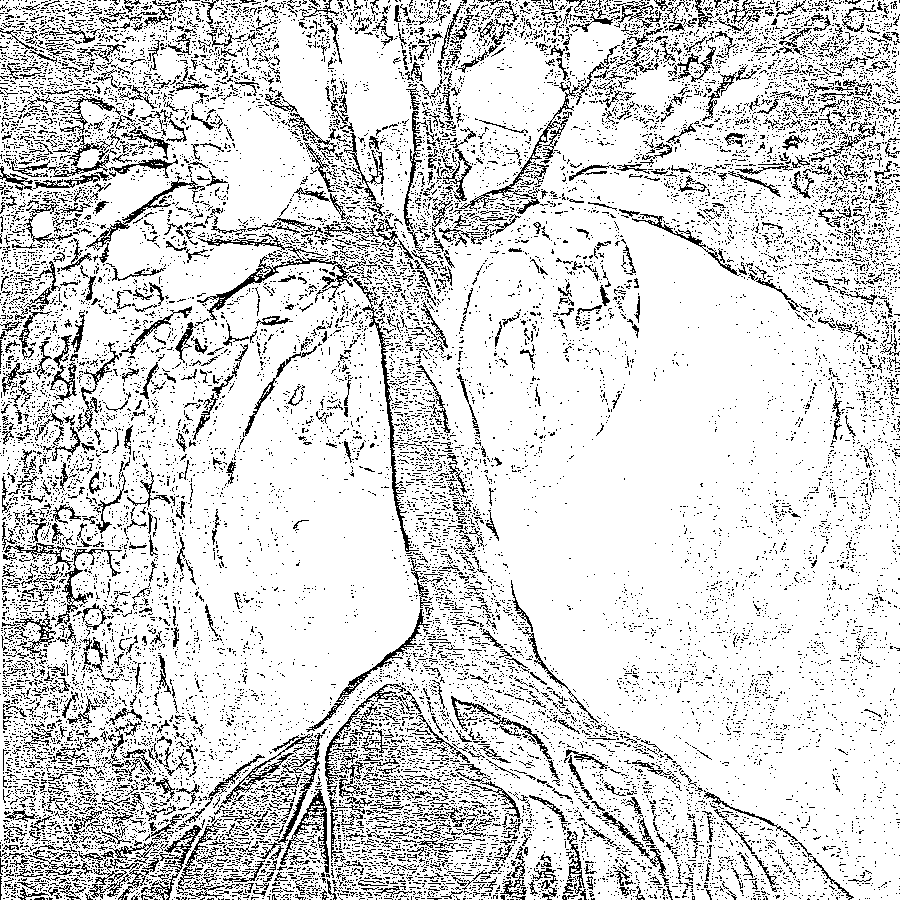

**赋予力量的创造性预测**

还有个**占星学的复杂性就是我们能得到各个方面的信息**。可能星图一部分说他是个害羞的人，而另一部分却说他非常外向。占星师的工作就是去编织不同色彩的线，组织不同的故事。

在预测上我们也可能同时经历扩张和收缩的两种周期。我喜欢的技巧就是我曾在北京工作坊运用的“**讲故事**”的方法。

讲故事有什么好处呢？**如果你是占星师或占星学生，你就是在学习生命的能量，会帮你更有创造性。**如果你做了“对或错”的决定，就不如说故事更灵活，更有创造性，能让客户握有更多可能性。

假使一定要去谈论绝对的对与错，做到正确，这会让预测变成监狱。

我们不用成为占星学或其他任何体系的奴隶。大卫·瑞雷老师用“**赋予力量**”（empowerment）这个词。这意味着**把你放到自我的中心，拥有更清晰的视野，选择也更加清晰**。

**版权声明：**本文由若道翻译，欢迎转发，反对抄袭。友号转载请申请白名单。

**杰夫·焦耳**

国际占星大会（UAC）和全美占星师联盟（AFAN）创始人，美国著名占星网 www.stariq.com 创始人。曾任亚特兰大协会主席和亚特兰大占星考试委员会委员。4 本占星书的联合作者，在全世界的 4 个大洲开办过工作坊。2015 年逝世。

**学习占星学****点击或长按下图了解课程详情** ************

****

****

**微信又双叒叕改版啦，不想错过若道君的推送？**

**就把若道设为星标吧！**

**▼**

**就是这个“在看”，戳一下☟**

********报名直达入口********

# 插班中丨 ISAR 选修课：行星交点在集体进化中的作用

> 原文：[`mp.weixin.qq.com/s?__biz=MzA5NjA0NTAxNg==&mid=2651461536&idx=3&sn=9eaf9f22bb885a1c6b164565f4a87dda&chksm=8b48a517bc3f2c0157e497e4114355e0b4148b12a6d66b81995fb6e2c5c0eaeaf1fa165be63d&scene=126&sessionid=1692737898#rd`](http://mp.weixin.qq.com/s?__biz=MzA5NjA0NTAxNg==&mid=2651461536&idx=3&sn=9eaf9f22bb885a1c6b164565f4a87dda&chksm=8b48a517bc3f2c0157e497e4114355e0b4148b12a6d66b81995fb6e2c5c0eaeaf1fa165be63d&scene=126&sessionid=1692737898#rd)

这是一门专门为若道开设的课程！**马克·琼斯**将于今年秋天教授**八节关于行星交点的深度在线课程**，他将通过我们集体进化中的一些重大事件来阐释这一主题。

1

**什么是行星交点？****交点是一个天体轨道与另一个天体轨道延伸平面的交点。**任何沿轨道运行的天体都有交点。月亮有月亮交点，每颗行星、小行星、卫星和微小行星也都有交点。

2

**课程教授什么？**

马克老师**首先会讲解基础知识，**介绍行星交点是什么、行星交点运转的动力（包括日心视角和地心视角），然后他会**论述丹恩·鲁伊尔晚期工作中关于月亮交点和行星交点重要性的洞见**，以及它们如何在个人生活和事件中创造一个动态的意义轴，**超越个人出生星图的静态画面。**

马克老师还将简要**介绍自己的一些开创性研究**，并通过精选一些反映我们共同的**集体进化的现代历史事件**，分享他最近的著作《行星交点与集体进化》中的洞见。**我们将学习木星往外的行星交点**，看到木星交点如何向我们揭示文化和宗教意识形态的集体历史进化，正如我们的文明结构所表现出来的那样。例如，土星和冥王星的交点也在摩羯座，清楚地描绘了我们所有人在这个时期试图进化所面临的挑战，因为在我们生活的世界根本结构的变化中，游戏规则正在升级。**我们还将学习近期历史中行星交点的影响**，包括最近木星、土星和冥王星在摩羯座的大合相，开始真正意识到当前这个时期在文明进化本身中的集体重要性。理解这些盛衰周期，我们至少可以在这些困难时期仍然抱有希望：我们不会失去一切！**在整个课程中，马克老师将通过多个历史案例动态地研究这些强有力的交点配置可能如何运作。**

3

**课程安排****第*****1*****讲** **介绍行星交点**
我们将学习行星周期如何形成行星交点，并了解日心视角和地心视角之间的区别。**第*****2*****讲** **什么是行星交点**我们将深入学习丹恩·鲁伊尔的成熟思想，这是启发马克老师研究行星交点的灵感之源，也是他最近出版的《行星交点与集体进化》一书的灵感来源。**第*****3*****讲** **双子座-射手座的天王星交点**我们将学习人类认知和技术如何通过天王星交点的透镜进化。**第*****4*****讲**** 巨蟹座-摩羯座行星交点**我们将进一步学习行星交点对社会和文化的影响，深入探讨落在摩羯座-巨蟹座的木星、土星和冥王星交点，并了解它们在过去 1000 年里对我们的全球社会、政治和文化思潮起着怎样至关重要的影响。**第*****5*****讲** **海王星及其狮子座-水瓶座交点**我们将学习落在狮子座-水瓶座的海王星交点影响的不同显化，及其在疗愈中的作用；灵性意识形态的发展，及其促使事件结束的倾向。**第*****6*****讲** **作家案例**通过原创研究，我们将学习行星交点如何影响了世界上一些最伟大的作家的人生。**第*****7*****讲** **研究 2020 年**我们将了解 2020 年的重要意义。**第*****8*****讲** **回顾**我们将回顾前面的课程，并探索如何通过行星交点的意涵理解月亮交点。

4

**授课老师****马克·琼斯（**Mark Jones**）**马克·琼斯是一名**占星师、心理整合治疗师和催眠治疗师**，为世界各地的客户和学生提供服务。马克的第一本书《**疗愈灵魂:冥王星，天王星和月亮交点》**，详细解释他的占星方法论。他的第二本书**《灵魂的表达:占星学的治疗潜力》**，融合了马克作为超个人心理治疗师和占星学的经验，概述了占星学解读的变革性潜力。此外，马克还联合其他作者**共同撰写了一些占星书籍**：《占星学:新一代》、《超个人的占星学》以及《进化占星学的洞见》。**而《行星交点和集体进化》则是他将他对交点研究的集大成之作。**

5

**课程信息**

*   **课程时间：**2021 年 10 月 26 日开始，每周二晚上 8 点，每周一次，共 8 次课。

*   **授课方式：**线上直播，英文授课，中文翻译

*   **课程价格：****6800 元****（课程不分组写走心推荐语转发朋友优惠价：5800 元）**

*   **行星交点名人案例和问答免费试听：**添加课程顾问王老师，发送“行星交点试听”，即可获得免费试听内容。

*   **课程咨询：**王老师（微信：18510107057，请备注“行星交点”）

长按二维码添加王老师

6

**退转课程**

*   **退款原则请详看《教学协议》，如有疑问请咨询课程顾问。**

****行星交点****

**授课老师：**马克·琼斯

**授课时间：**2021 年 10 月 26 日起

**授课方式：**网络课程**，**英文授课，中文翻译

**费用：****6800 元****（课程不分组写走心推荐语转发朋友优惠价：5800 元）**

**课程负责人：****王老师**（微信：18510107057，请备注“行星交点”）

长按二维码添加课程负责人咨询~

****报名请点击“阅读原文”****

# 12 星座在爱情里到底要什么？看太阳星座就可以哦！（下）

> 原文：[`mp.weixin.qq.com/s?__biz=MzA5NjA0NTAxNg==&mid=2651461398&idx=1&sn=895b774bcd0d4f3abca2e7b71095b63c&chksm=8b48a5a1bc3f2cb7c6c8ae1d66432b787bbfbd92ded67fa1a2e5be506cd5905ae59e3e51cf83&scene=126&sessionid=1692737898#rd`](http://mp.weixin.qq.com/s?__biz=MzA5NjA0NTAxNg==&mid=2651461398&idx=1&sn=895b774bcd0d4f3abca2e7b71095b63c&chksm=8b48a5a1bc3f2cb7c6c8ae1d66432b787bbfbd92ded67fa1a2e5be506cd5905ae59e3e51cf83&scene=126&sessionid=1692737898#rd)

************☆********************后台回复“今日”，给你一句生命态度************

作者/斯蒂芬·弗里斯特 译者/李含 

编辑/翀子 封面/书君 图片/网络

本文摘自《天空的伴侣 I：爱、性和进化占星学》爱情是人类永恒的话题，它在占星学中也不例外。12 星座可以按元素划分为火象星座、风象星座、土象星座和水象星座。[【昨日头条】](http://mp.weixin.qq.com/s?__biz=MzA5NjA0NTAxNg==&mid=2651461305&idx=1&sn=d38d0b86eba072ffdaf809e1fc10133f&chksm=8b48a40ebc3f2d18b2da40d8ce914188853b1478df8ee424f0e5700e58fa7a8e104c5a6e56d4&scene=21#wechat_redirect)（点击可查看文章）讲述了火象星座和风象星座的爱情，今天来看看“矢志不渝”的土象星座，和“柔情似水”的水象星座的爱情是什么样吧~**土象星座的爱情****太阳金牛座的爱情**

太阳金牛座的人在用心追求爱情时，和其他人生领域一样，**他们的目标在于：维持稳定、稳固、可靠的关系。**理想的伴侣是在感情关系中时刻保持脚踏实地的态度，而不会离经叛道的人。

**这里有一种感官上的特质，**甚至是在爱情关系中也是如此。这可能会误导金牛座对伴侣的选择，**金牛座人选择伴侣就好像在买一辆车，除非他已越过了阴影。**

从占星学的角度来看，**在亲密关系中金牛座关心的是“持久”。**很少有金牛座人会仅仅因为伴侣的魅力就坠入爱河，亦或是沉浸于荒唐的幻想里。**金牛座人是务实而理性的，在感情里非常固执。**

**坚持不懈**——金牛座是出了名的倔强——他们能够顶住感情关系中的暴风骤雨，让感情在无声无息中重现光彩。**金牛座人喜欢并且需要简单的肢体接触。**有形的方式在金牛座人的爱情关系中依然行之有效：**简单的礼物、送花、珠宝首饰。**

**物质主义并不是重点，但是这种看得见摸得着的方式能帮助他们获得内心深处的踏实感。**

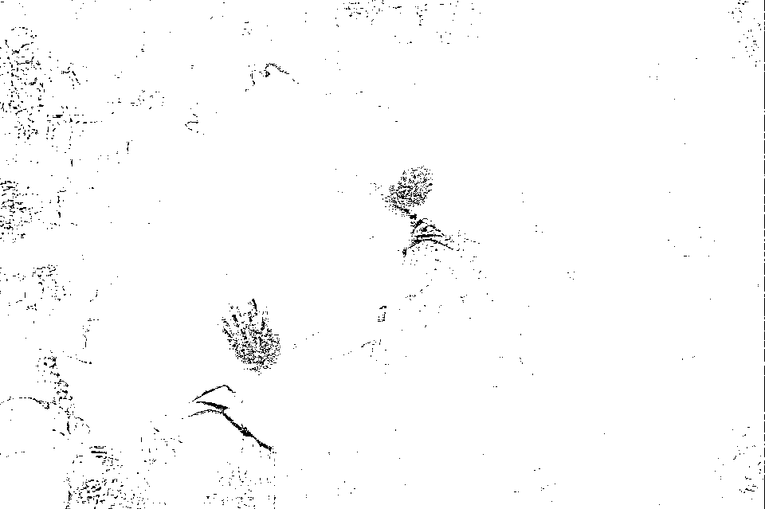

**太阳处女座的爱情**

**在亲密关系中，****处女座最欣赏两种品质：成熟务实和努力成长（精益求精）的态度。**她也许不会使用这几个词，但是如果伴侣没有了这两种品质，处女座马上就会抽身离开。

在**现实主义**的大旗之下，我们欣赏逻辑思考、清晰的头脑、耐心、能力，也许还有雄心壮志。 这些品质有助于我们在现实世界里生存。

**“努力成长”是处女座所关注的。**他们欣赏的是诚恳宽容地接受批评，欣然面对自己的不足和缺点，努力改正，做到更好。

**处女座的爱情若想要延续，这份爱必须能够持续地改变和成长。**她会帮助伴侣把构想的新项目、新想法细化成可行性方案。她也许会陷入人生的茫然之中，但是这很短暂。

**经历过一些事情后，处女座人很难简单地相信爱情，需要不断证实爱情和爱人值得信赖。**

从阴暗面来看，**处女座的完美主义倾向会让她对伴侣唠叨苛责，**这种批判会腐蚀信任，有损自发性，无法分享爱情的快乐。同样的，处女座**自我怀疑的阴影**，会导致一种自我毁灭的行为，选择麻木、自私、专制独裁的伴侣。

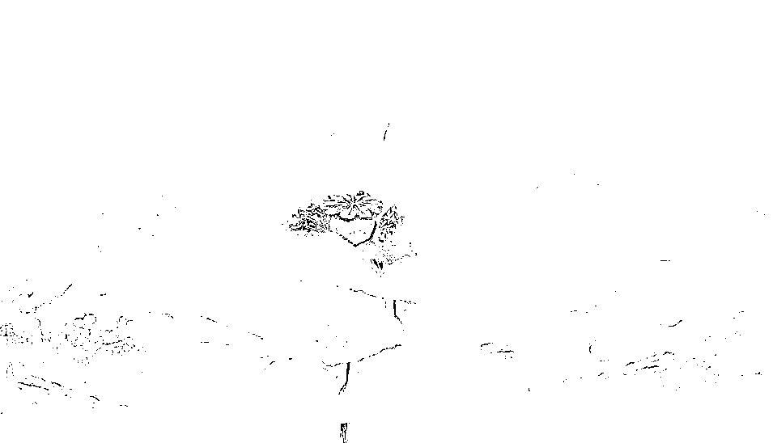

**太阳摩羯座的爱情**

许下承诺对摩羯座人来说并不是难事，**承诺就是他们突出的个性。**但是这份亲密关系所承诺的内容却让人沮丧。要经营好爱情关系，并从中获得满足感，**摩羯座人要学会练习表达自己的情感。**

**摩羯座人必须学会为自己去提出要求。**否则，太阳摩羯座的人可能陷入“责任”的泥潭，身边的人甚至会以为一切都是理所应当。**但是，在爱情中忍受种种约束，其实毫无益处。**

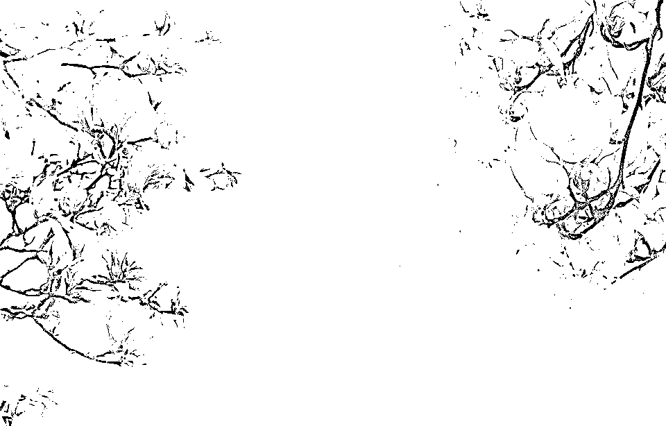

**水象星座的爱情****太阳巨蟹座的爱情**

**“防御”是太阳巨蟹座的关键词。**大西洋海岸上乱窜的幽灵蟹 ，它们是在防御状态么？抑或者它们是在耍策略，在海鸥的注目下脱壳。**敏感**需要自卫。变通的选择有破坏性。

在爱情中，巨蟹座看起来有点防御警惕，这是因为她下的赌注很大：她的城墙很牢固，但是一旦有人进入到壳内，她就彻底脆弱了。所以**巨蟹座是谨慎的**，用自己的情感触碰另一个灵魂，用危险试探对方。

**想要打动巨蟹座，你必须拿出你的温柔、真诚、亲切和承诺让巨蟹座信服，你要让巨蟹座知道，你愿意与她共筑爱巢。**

在巨蟹座被打动之前，你只会看到她的壳，可能是冰山，可能是超然的智慧、头脑，也可能是性爱，但绝不是巨蟹座的灵魂。

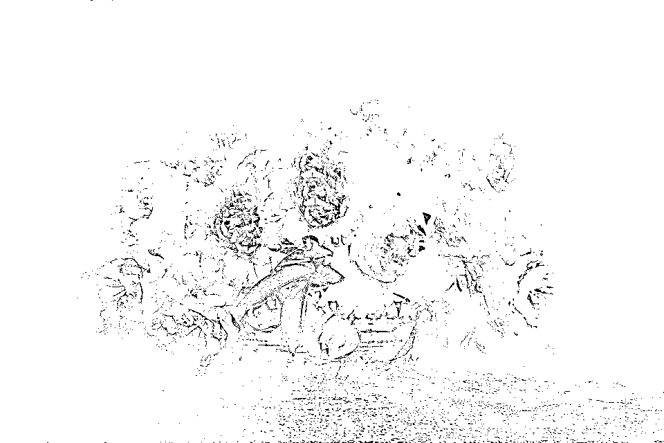

**太阳天蝎座的爱情**

流行的占星学观点认为天蝎座非常性感。我们做了一个小小的调查发现，其他十一个星座也很关心性啊！性，不是任何一个星座垄断的领域。占星基础理论认为**天蝎座倾泻感情的方式很强烈**，但是"天蝎座很性感"的说法扭曲了这一理论。

每一个太阳落在天蝎座的人，为了保证基本活力和健康的精神，**他们都需要定期宣泄情感**。事实上，我们的文化趋向于将**"深刻激烈"的情感**与性联系在一起，这也许是因为性离不开这种情感。

但对于很多人来说，性是一种基本"娱乐"，并不涉及复杂深刻的精神需要，但这些人就不是健康的天蝎座人了！

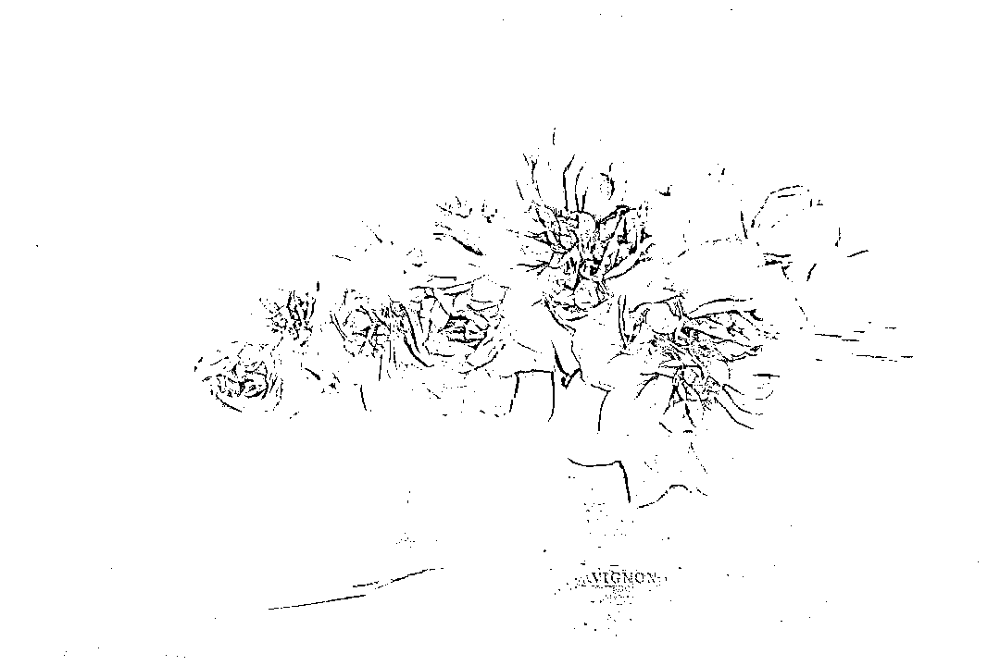

**太阳双鱼座的爱情**

除非是走上了自我麻木的黑暗之路，否则太阳双鱼座的人会**非常温柔和敏感**。没有任何一个星座的**浪漫**，能如此真切地触动灵魂。

**因此，****对于双鱼座来说，爱情唯一的粘合剂就是灵性的基础。**和大多数陈词滥调一样，我们将“灵性关系”随便挂在嘴边，却缺乏真正的思考。

两个双鱼座的长老会成员一起坐在教堂里，他们会有许多共同的长老会的体验，但他们并不是“灵性关系”。为什么？简单地说，他们的灵魂并没有发生关联。

另一方面，两个无神论者静静地坐在篝火前，默默地进入冥想状态——“火焰之梦”，就像是斯瓦希里人一样。他们能够觉知对方的存在，他们能够分享这个想象的空间，无须解释交谈，不用担心彼此的意志被对方侵入。

**两个灵魂在积极地触碰彼此。他们进入了意识的变化，但依然感受的到交流和接触：这就是双鱼座的天堂。**

一旦这样的情侣相遇，他们的结合**必须仰赖于这样高度灵性的接触**：静静地陪伴，黄昏时分，安静地散步，或是在海边树林，或是在教堂、庙宇，他们也会参加其他形式的冥想小组。

这些活动将这对伴侣**以双鱼座的波段联接在一起**，分享只有双鱼座才懂的爱情的感觉，愉快的舞蹈，宇宙的笑话。他们之间的关系就像有了魔法——一直相伴到共同笑着面对死亡的那一天。

**版权声明：**本文由若道翻译发布，欢迎转发，反对抄袭。友号转载请申请白名单。

**斯蒂芬·弗里斯特**

若道签约老师。进化占星学的创始人之一，当今世界最有影响力的占星大师之一；1985 年，他凭借《内在的天空》一书获得职业占星师协会奖（Professional Astrologers Incorporated Award）。他四次获得占星界最高的占星学联合协会奖（United Astrology Congress Regulus Award）提名，2018 年获得轩辕十四教育奖。

**学习占星学****点击或长按下图了解课程详情** ************

****

****

**微信又双叒叕改版啦，不想错过若道君的推送？****就把若道设为星标吧！****▼**

**喜欢记得点一下在看哦☟**

****报名直达入口****

# 神话塔罗之大阿卡纳牌｜倒吊人

> 原文：[`mp.weixin.qq.com/s?__biz=MzA5NjA0NTAxNg==&mid=2651461398&idx=2&sn=658494d65c46567cf789233df59e1409&chksm=8b48a5a1bc3f2cb7320f143d43c75c15e3e84c0759cff994066ecbfaf5522c76291548934ad5&scene=126&sessionid=1692737898#rd`](http://mp.weixin.qq.com/s?__biz=MzA5NjA0NTAxNg==&mid=2651461398&idx=2&sn=658494d65c46567cf789233df59e1409&chksm=8b48a5a1bc3f2cb7320f143d43c75c15e3e84c0759cff994066ecbfaf5522c76291548934ad5&scene=126&sessionid=1692737898#rd)

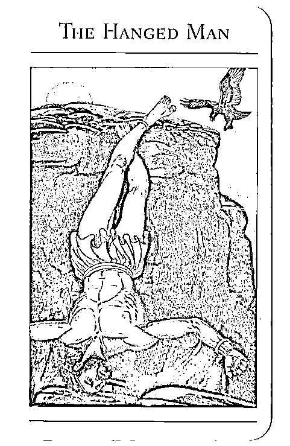

作者/朱丽叶·沙曼-伯克 丽兹·格林

译者/闫东升 编辑/玫瑰 图片/神话塔罗 网络

本文节选自《神话塔罗》

神话是文艺复兴时期的思想精髓，窥见了隐藏在塔罗牌神秘意象背后的意义。超越了过去四千年文化和意识变迁的塔罗牌，像旧时的记忆体系一样，让我们与古老且永恒的架构建立起联结感。 

为了与自己毫不相干的人类，身为神的普罗米修斯背叛了同族，为何他受到宙斯严酷的惩罚依旧无悔？倒吊人这张牌，会为你解答。今天就来解读大阿卡纳牌——倒吊人。

[🔈 神话塔罗·倒吊人](https://res.wx.qq.com/voice/getvoice?mediaid=MzA5NjA0NTAxNl8yNjUxNDYxMzk3)

**｜**朗读者小巫

**书名：**

神话塔罗 

**作者：**

朱丽叶·沙曼-伯克   丽兹·格林 

**出版日期：**

2011-08-02

倒吊人对应的希腊神祗

**普罗米修斯·先见之神**

**先见之神**

倒吊人的牌面描绘的是一个褐色头发和胡须的成熟男人。尽管他被扭曲地束缚着，倒挂于荒芜的悬崖上，全身几乎赤裸，但是表情非常平静。他身后的悬崖上隐约可见都是凹凸不平的岩石，山崖后面落日的血红色光芒照亮了他的身体，因此可以看清他面部的表情。在他的上面，一只老鹰正在飞来。 

> **落日**：象征着意识和意愿的光亮已经在渐渐消逝中。
> 
> **普罗米修斯（*Prometheus*）的姿势**：暗示着头脑——理性思维已经不再掌控，就像落日的隐喻，这幅图画象征着精神之光已经要降入潜意识的黑暗中。 
> 
> **神话中被宙斯（*Zeus*）的鹰袭击**：都与希望和精神的内容有关，因此普罗米修斯的痛苦是失去信仰的意象，在神秘学的教诲中被称为“灵魂的暗夜（*dark  night  of  the soul*）”，此时的当事人只能等待，没有自信的愿景，也不知道一切如何结束。

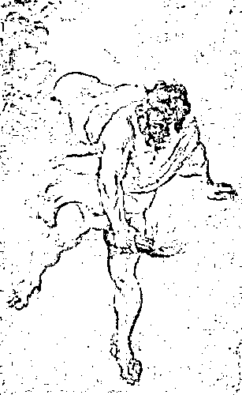**叛神的普罗米修斯**在这里我们遇到了普罗米修斯，他是泰坦（*Titan*）巨神的一员，帮助宙斯制定了律法，他还从神那里偷来火种送给人类，而且完全知道他会为此付出的代价。普罗米修斯这个名字意思是“先见之明”，作为一个泰坦巨神，他拥有预言的能力。在神话中，据说是普罗米修斯用土地和自己的眼泪混合在一起创造了人类的躯体，雅典娜用呼吸赋予了人类生命力。普罗米修斯对人类有着深深的同情，因为是那是他一手创造的。宙斯认为自己统辖的神之国度才是至高无上的，人类世界不配拥有神圣的火元素，于是他把火从人类手中拿了回来。没有了火就意味着人类没有了光明和发展的可能，只能像动物一样躲在山洞中，吃着生肉。普罗米修斯用空心茴香秆从赫菲斯托斯（*Hephaistos*）的火炉中偷取了一些圣火，并把它带到了人类世界中。宙斯对这次盗窃行为非常愤怒，决定用洪水毁灭人类，他的愤怒不仅仅因为神的骄傲，还有一些恐惧，因为人类拥有了火，就可以像神一样地存在于天地间。普罗米修斯知道这个消息后，就警告儿子杜卡利恩（*Deucalion*），于是杜卡利恩修建了一艘方舟，和妻子芘拉（Pyrrha）生活在上面。灭世大洪水持续了九天九夜，第十天洪水停止的时候，杜卡利恩给宙斯献上了虔诚的祭祀。众神之王宙斯被他的行为打动，答应了他的请求，让人类可以重新在大地上生活。宙斯并没有轻易地赦免普罗米修斯，因为他拥有预言的能力，宙斯决定用一根无法被摧毁的锁链，把普罗米修斯倒挂着束缚在高加索山（*Caucasus*）的悬崖上。每天一只老鹰都会飞去吞食普罗米修斯的肝脏，而每晚他的肝脏又会重生，所以他的痛苦会永无尽头。三十年以后，在宙斯的允许下，英雄赫拉克勒斯杀死了老鹰并销毁了锁链，救下了普罗米修斯。在人类眼中，他是永生之神，是给人来带来光明和赐福的恩人，所以人们经常举行庆典，用身披锁链的方式来纪念他。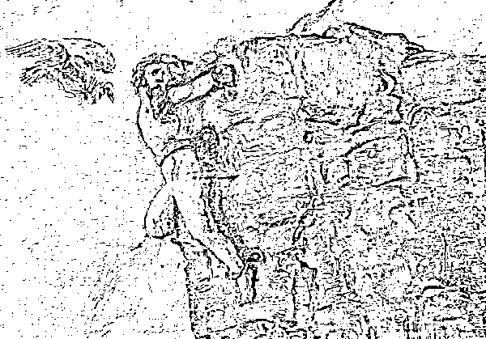**灵魂暗夜中的无尽等待****从内在的层面来看，倒吊人——普罗米修斯是为了更高的利益而牺牲自我的志愿者意象。**牺牲的东西可能是身外之物，也可能是内在的态度，但是它一定出于自愿，而且也会全然接纳牺牲所带来的苦难。在命运之轮牌中，愚人遭遇了出乎意料的改变，对于整个生命旅程来说，意义非常深远。我们和愚人一样，对于此类改变的反应千差万别。有些人不能适应改变，一味想紧紧地抓住过往的生活。还有些人变得悲观和痛苦，认为是命运、神灵、社会或者他人给自己带来了噩运。普罗米修斯象征着每个人内在的远见性，我们必须依靠它去了解什么样的改变能够把我们内在的生命蓝图落实到外在的生活中。因此，这位泰坦巨神（*Titan*）代表着为了命运之轮背后的神秘核心而自愿牺牲奉献的态度。**倒吊人——普罗米修斯还暗示着全然地接纳黑暗中的等待。**他倒挂在危险的悬崖上，不知道自己牺牲的结局是什么，为此他可能内心充满了焦虑和恐惧，但表情却云淡风轻。他最后终于被解救，倒悬于悬崖的惩罚改变了他与神界的关系，也改变了他自己，最后他还是获得了永生。**从很多层面上来说，普罗米修斯的意象和放弃掌控有关，他放弃掌控的目的是为了一种全新的、更高的生命力量得以显现。**因为普罗米修斯制造了人类，所以可以说他也是人类，是我们内在富有远见的精神性，我们能够通过他去看到更伟大的可能性，因此愿意抛弃（或奉献）所拥有的过去，从而获得更伟大的意识力量。普罗米修斯开始的时候是非常脆弱的，因为我们如果带着信任去牺牲过去，就要完全地对着生命敞开，那么生命也许会伤害我们。但是当我们无法支撑自己，想要去探索究竟是什么在背后支撑我们的时候，放弃防卫、踏上孤独之旅和自我质疑就是非常必要的了。这就是宗教里所谓的真正的信仰，它必须通过生命的冒险才能获得。**倒吊人牌是命运之轮牌的必然结果，因为它暗示着我们必须自愿去相信“  他者（*Other*）”，因为“他者”比自我（*ego*）更有智慧，“他者”也是我们发展的必经之路。****倒吊人，自我牺牲的意义所在****从解牌的角度来看，倒吊人——普罗米修斯预示着当事人为了获得某种更大价值的事物，必须要自愿地做出牺牲。**这可能意味着当事人要牺牲或放弃某种之前曾给他（她）带来安全感的外在事物，这样才能留出空间发展出更大的潜力。或者它也可能意味着当事人要放弃或牺牲一种自己一直持有的态度，例如智力上的优势和优越感；某种无法释怀的憎恨；或者对于某种不切实际幻想的顽固追寻。就这样，愚人用看不到的潜意识力量和等待来应对命运之轮的挑战，他常常焦虑和恐惧，但却一直抱着生命将会更新鲜和更美好的希望。**版权声明：**本文由《自在园》授权发布，欢迎转发，反对抄袭。友号转载请申请白名单。

**神话塔罗系列**[开篇](http://mp.weixin.qq.com/s?__biz=MzA5NjA0NTAxNg==&mid=2651451590&idx=2&sn=41c1083542bcf098de303e29a028ff20&chksm=8b4b4271bc3ccb67d5d53c143cd5a17c24b7b60e5b1051949fa9f086f90b4ab04877976c47e5&scene=21#wechat_redirect)丨[愚人](http://mp.weixin.qq.com/s?__biz=MzA5NjA0NTAxNg==&mid=2651452189&idx=2&sn=f4cc6e768e367fbdb0f69b9c6382443d&chksm=8b4b41aabc3cc8bcdbd952d91d8408014a799224d3f67ab50bb5cbe88ee0090afc92869de1a6&scene=21#wechat_redirect)丨[魔术师](http://mp.weixin.qq.com/s?__biz=MzA5NjA0NTAxNg==&mid=2651453528&idx=2&sn=3ca9b35e1736168eef1856274635224a&chksm=8b4b4aefbc3cc3f965f2531f8c0d37da2e66a2b47139d445df1ea35eeb74bdf3b6827236741a&scene=21#wechat_redirect) | [女祭司](http://mp.weixin.qq.com/s?__biz=MzA5NjA0NTAxNg==&mid=2651455871&idx=2&sn=15ae629e1b35f1371b81868f5bfdd2aa&chksm=8b48b3c8bc3f3ade0175d0e03bfe496711801614273e7fe98b6435fafe0de5daf3a8d7c1312f&scene=21#wechat_redirect) | [皇后](http://mp.weixin.qq.com/s?__biz=MzA5NjA0NTAxNg==&mid=2651453921&idx=2&sn=4d1efea03b2b9f940be7a6aadf553dec&chksm=8b4b4b56bc3cc2405fe562b8ef48f335699f57c12d5d817e24aeeb84f6306092de2ae55becc7&scene=21#wechat_redirect)[皇帝](http://mp.weixin.qq.com/s?__biz=MzA5NjA0NTAxNg==&mid=2651455083&idx=2&sn=d12546b67c830055f37b147f41c7641f&chksm=8b4b4cdcbc3cc5cad2def85451c3a7ddbb31ba5b9a01febb8a9fb18991d3e1263d9371ac212f&scene=21#wechat_redirect) | [导师](http://mp.weixin.qq.com/s?__biz=MzA5NjA0NTAxNg==&mid=2651456482&idx=2&sn=153b4ca2f69f6745425525773616455d&chksm=8b48b155bc3f384322115b0b94621662ba562a2a252fd244a0a3fc84a664408b2311014e8db5&scene=21#wechat_redirect)丨[恋人](http://mp.weixin.qq.com/s?__biz=MzA5NjA0NTAxNg==&mid=2651457110&idx=2&sn=b4f6a1e93475b39df8f6c80a7409c59c&chksm=8b48b4e1bc3f3df721f206e899272c01bf324355f649fe0fd0dd8363c5b58683daa38e8cf648&scene=21#wechat_redirect) | [战车](http://mp.weixin.qq.com/s?__biz=MzA5NjA0NTAxNg==&mid=2651457444&idx=2&sn=75e9cc378abfefb59ebe7f12357c1b4b&chksm=8b48b513bc3f3c051bf2bb4be018694ca47996a193c0a92d5003c47dc384a2b07f9b9f9806ed&scene=21#wechat_redirect) | [正义](http://mp.weixin.qq.com/s?__biz=MzA5NjA0NTAxNg==&mid=2651458133&idx=3&sn=e37f69e34bc33afe6c0935e32ad0b786&chksm=8b48b8e2bc3f31f465dee7a4595d44620d93e58ca37eeab785724f5a92a9ec3bbb85c3d34f17&scene=21#wechat_redirect)[节制](http://mp.weixin.qq.com/s?__biz=MzA5NjA0NTAxNg==&mid=2651458981&idx=3&sn=8858e451980859e86b87571128e4f115&chksm=8b48bf12bc3f3604c1ef97c0a818f501fc28c84a4ef19e25521527e162d2d2c6bdded6238ea8&scene=21#wechat_redirect)丨[力量](http://mp.weixin.qq.com/s?__biz=MzA5NjA0NTAxNg==&mid=2651459675&idx=3&sn=ebac312745895402e187ccd8700f3674&chksm=8b48a2ecbc3f2bfa134c6b364d828b6b0e77a4c3c05054ff44d97ccc75eec4f7958f77f92605&scene=21#wechat_redirect) | [隐士](http://mp.weixin.qq.com/s?__biz=MzA5NjA0NTAxNg==&mid=2651460114&idx=3&sn=a562cf2d91c74192ebacfa9484e0b141&chksm=8b48a0a5bc3f29b3807e6a2e49b1a3f16c82e528c54ae708ecd44e1e7e9ca5dbb1148dde5de6&scene=21#wechat_redirect)丨[命运之轮](http://mp.weixin.qq.com/s?__biz=MzA5NjA0NTAxNg==&mid=2651460960&idx=3&sn=4d85b69a6df831d4229b18a668cbcda4&chksm=8b48a7d7bc3f2ec12b54056abd2b389148daf918ee9dbb6d3c00a0327906aa78a0c7ceb433ff&scene=21#wechat_redirect)**朱丽叶·沙曼·伯克**从 20 世纪 70 年代早期开始，就对塔罗牌产生了兴趣，并踏入了塔罗的世界。后来，在丽兹·格林的鼓励下，开始研习心理占星学和塔罗。1984 年，第一本书《塔罗全书》（The Complete Book ofTarot）出版。之后，与丽兹·格林合作设计并撰写了《神话塔罗》（The Mythic Tarot）。朱丽叶写了十本塔罗和占星学书，包括一本名为《众星的传说》（Stories from the Stars）的儿童读物，以及与丽兹·格林合著的《神话之旅》（The Mythic Journey），这是一本详细讲述如何运用神话来指导生活的书。

**点击下图了解课程详情** 

**微信又双叒叕改版啦，不想错过若道君的推送？**

**就把若道设为星标吧！**

**▼**

**喜欢记得点一下在看哦☟**

************报名直达入口************

# 12 星座在爱情里到底要什么？看太阳星座就可以哦！（上）

> 原文：[`mp.weixin.qq.com/s?__biz=MzA5NjA0NTAxNg==&mid=2651461305&idx=1&sn=d38d0b86eba072ffdaf809e1fc10133f&chksm=8b48a40ebc3f2d18b2da40d8ce914188853b1478df8ee424f0e5700e58fa7a8e104c5a6e56d4&scene=126&sessionid=1692737898#rd`](http://mp.weixin.qq.com/s?__biz=MzA5NjA0NTAxNg==&mid=2651461305&idx=1&sn=d38d0b86eba072ffdaf809e1fc10133f&chksm=8b48a40ebc3f2d18b2da40d8ce914188853b1478df8ee424f0e5700e58fa7a8e104c5a6e56d4&scene=126&sessionid=1692737898#rd)

************☆********************后台回复“今日”，给你一句生命态度************

作者/斯蒂芬·弗里斯特 译者/李含 

编辑/翀子 封面/书君 图片/网络

本文摘自《天空的伴侣 I：爱、性和进化占星学》

爱情是人类永恒的话题，它在占星学中也不例外。12 星座可以按元素划分为火象星座、风象星座、土象星座和水象星座。这篇文章告诉你风风火火的火象星座与风象星座的爱情是什么样子。

**火象星座的爱情****太阳白羊座的爱情**

太阳落在白羊座的人往往表现出某种意义上的热烈、爱冒险、行动派。**在爱情中，他们和伴侣之间必须有强有力的互动，和一些心理较量的戏码。**如果感情关系趋于休眠状态，白羊座会跳出来“摇醒”关系——甚至不惜来一场争吵。

要记住，白羊座不论是在爱情中，还是在生活的方方面面中，都要学着勇敢，白羊座的伴侣最好誓守承诺：所**谓伴侣，换言之，就是勇于与你并肩战斗的人。**

在亲密关系中，太阳落在白羊座的人**直率、坦诚、忠实**。但负面影响是，白羊座也**可能陷入无目地的争吵**，纯粹伤害了彼此，通常只是因为误会让关系陷入低气压。

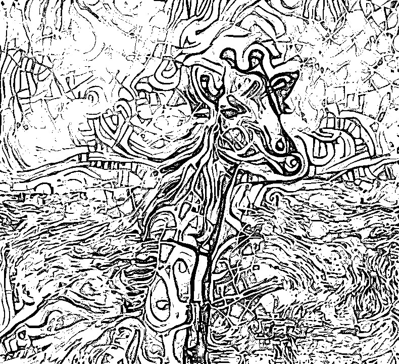

**太阳狮子座的爱情**

求爱是狮子座本能的活动。我们的**自我表达**——讲述我们自己的故事——是两性关系中必不可少的部分。还有**互相给予赞美。**还有**愉快的玩乐**。

所有这些都是太阳狮子座人的拿手好戏。**鲜花、情诗、倾心的交流、蜡烛、彼此的崇拜：**这就是狮子座的恋爱秘籍。

狮子座会轻易地坠入爱河。那么，在爱河中徜徉呢？这当然也是可能的，**但伴侣必须不断地给予肯定和赞赏。**谁都不愿意爱情变得麻木、陈腐。这对于太阳狮子座的人来说是毁灭性的打击，除非立刻有求爱的火焰重燃，让爱情重获新生。

太阳的活力单纯地来自于**关注和被关注**。因为狮子座人要给予伴侣关注，所以伴侣也要有某种戏剧性风格：**色彩缤纷、风度翩翩、时尚潮流、活力充沛。**

**太阳射手座的爱情**

在爱情的国度里，射手座人是言辞上的巨人，行动上的矮子，这是名声在外的。这种让人沮丧的情况也不一定就无可避免，但是**射手座人要放下对爱情的强迫性背叛行为。**

射手座人可能有一种不可避免的理念：爱情只是肤浅的感情接触，内心其实依然孤独。对于射手座来说，**不管多么充满活力的关系，也会有乏味的部分。**从另一方面看，这种成熟爱情的灵魂冒险会带来丰富的成长经验。

思想理念是射手座的强大驱动力，但是这些思想理念必须令人信服，经得起实践的考验。**精神空洞的爱情不会让射手座人停留太久，**体验过后就会因为感觉乏味而放弃。

另外，对于每一个太阳射手座的人来说，自由的确是进化所必需的途径。**他们必须选择和自己一样热爱自由的伴侣，**有自己独立的兴趣和朋友圈，从不停下追逐的脚步，更重要的是，他不会幼稚地大肆嫉妒，安全感匮乏。

满足了这些要求，射手座人就能了解射手座的秘密：**如果可以与伴侣携手并肩，那就能获得更丰富、更深刻的追求。**

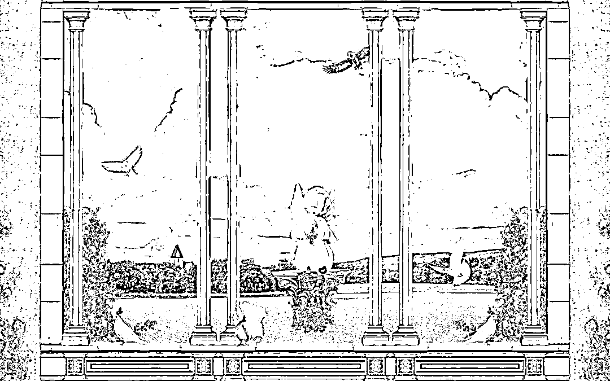

**风象星座的爱情****太阳双子座的爱情**

通常来说，我们了解了一个星座的终极目标，就能照此方式来推测出在感情关系中的互动的情况。从进化的角度来看，**太阳双子座的人寻求奇妙的体验。**他们被好奇心驱使，**他们需要很多的刺激。**墨守陈规和可预见性会给这个太阳能量带来致命的破坏力。

想要持续抓住双子座恋人的关注，伴侣不止需要建立稳固、安定的中产阶级的生活特征。这些特征只是一部分，**伴侣最好能够带来更多的有趣的思想火花、惊喜，有广泛的兴趣。**流行的占星学观点认为双子座是浮躁无常的。当然这也是一种可能。

但是我们也要认识到，这种浮躁多变其实是对于体验的贪婪欲望。满足这种欲望，**要注意保持交流，性的或其他各种各样让人着迷的方式。**不要被这种言论误导了，双子座人也可以拥有一夫一妻的爱情关系，只是有两个前提：

第一，**伴侣要支持双子座人拥有活跃的朋友交往**。第二，伴侣与双子座人要**一起分享生命的惊喜**，不要停下学习的脚步，享受多姿多彩的生活。

对于双子座来说，理想的婚姻就像是蜿蜒曲折的一次漫步，在漫步中**不断地交谈，有乐趣，有深意，并且永不停止。**

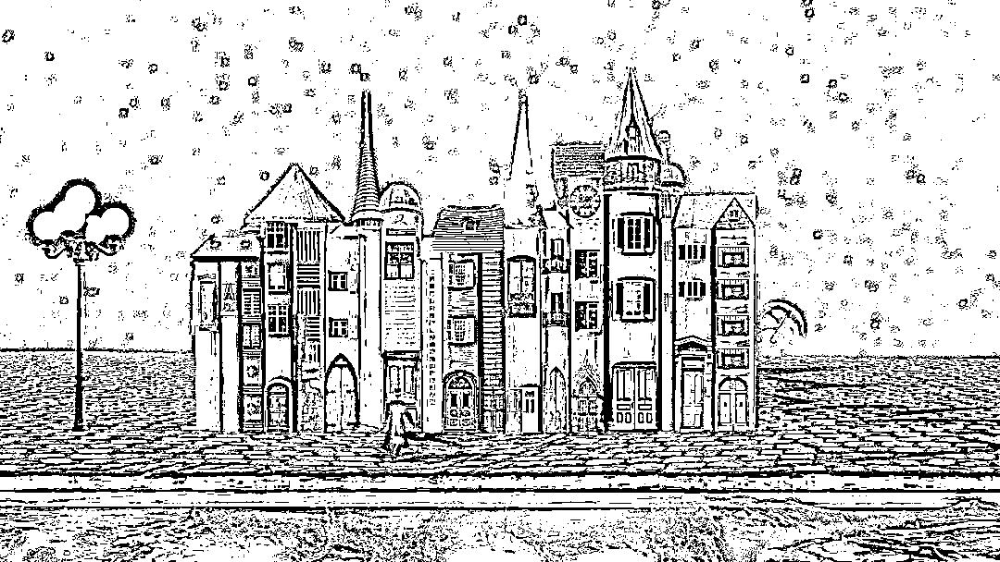

**太阳天秤座的爱情**

传统占星学认为，天秤座是与婚姻有关的。以符号元素来看，的确如此。天秤座，让我们看到了平衡的原则。**两个人走到一起，和谐相处，相互理解、坦诚相待，带来两种观念的碰撞**。

通常，对健康的灵魂关系来说，这是有益的象征。每一个星座都会在某些方面“与爱情相关”，但没有一个太阳星座是这样一个亲密关系的试验场，体验根本的进化。

为了获得鲜活的满足感，**太阳天秤座的人需要在人际互动中经历挑战、妥协和诱惑。**这些体验有助于个人的成长，最终成为人的精神支柱。因为移情作用的提升，太阳天秤座的人需要记住，**保持一定的自我重心，**不要成为他人的卫星。

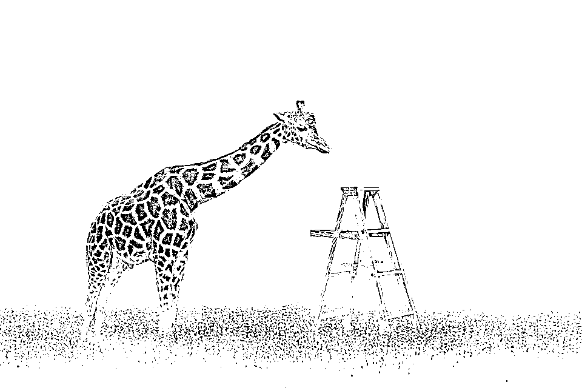

**太阳水瓶座的爱情**

如果这个世界水瓶座人成了主流，我们也许还是会结婚，但婚姻的形式会有很大不同。首先，很多夫妻会选择分居在城市的两端，或者三四成群，或者是忘年恋，跨种族伴侣。

各种各样的配对变得稀松平常，这也符合了心理学上认为的：每个人都是不一样的。**个体值得被尊重——这就是水瓶座人的核心。**

操控人类的性行为是一件很困难的事情，但是社会总是企图给我们预设好规则。混乱的男女关系被阻止，或者是被小心翼翼地引导为一种仪式。一般来说各国倡导一夫一妻制，但是不支持这一制度的地区会有“安全”的解决方式。

女性被鼓励呈小鸟依人状（巢居家中）。男性被鼓励去发展一种不理性的、强制的赚钱行为。这些都是社会规范人的性行为的方式。

虽然我们批判这些方式，但是我们也会注意到，这反映了人类在对待这种棘手的议题时所积累的智慧。诚然，这种智慧有缺陷，但到目前为止，这是我们找到的最好的。

承诺之爱很难，但对我们大部分人来说，接受这种形式还是有某种程度的帮助，起码可以帮助我们保持平衡。但这对水瓶座人没用。**对于水瓶座来说，所有事情都被质疑。**把脚本扔掉，把规矩抛诸脑后，随心所欲。“让我们结婚吧，但是不要住在一起！”

**（下篇请关注明日头条推送）**

**版权声明：**本文由若道翻译发布，欢迎转发，反对抄袭。友号转载请申请白名单。

**斯蒂芬·弗里斯特**

若道签约老师。进化占星学的创始人之一，当今世界最有影响力的占星大师之一；1985 年，他凭借《内在的天空》一书获得职业占星师协会奖（Professional Astrologers Incorporated Award）。他四次获得占星界最高的占星学联合协会奖（United Astrology Congress Regulus Award）提名，2018 年获得轩辕十四教育奖。

**学习占星学****点击或长按下图了解课程详情** ************

****

****

**微信又双叒叕改版啦，不想错过若道君的推送？****就把若道设为星标吧！****▼**

**喜欢记得点一下在看哦☟**

****报名直达入口****

# 12 星座自画像丨巨蟹座：情感丰富的色彩大师

> 原文：[`mp.weixin.qq.com/s?__biz=MzA5NjA0NTAxNg==&mid=2651461305&idx=2&sn=dffc1bb3cfeb85d7e388220b268914b8&chksm=8b48a40ebc3f2d1847a163a94ec9ca66b2722ca5754c3e8bc834e8be2377dd290bf08ae9bdfb&scene=126&sessionid=1692737898#rd`](http://mp.weixin.qq.com/s?__biz=MzA5NjA0NTAxNg==&mid=2651461305&idx=2&sn=dffc1bb3cfeb85d7e388220b268914b8&chksm=8b48a40ebc3f2d1847a163a94ec9ca66b2722ca5754c3e8bc834e8be2377dd290bf08ae9bdfb&scene=126&sessionid=1692737898#rd)

作者/克里斯蒂娜·罗登贝克

译者/亚麻林恩 校对/江艺

编辑/翀子 文章图片及注释/作者提供

本系列是克里斯蒂·罗登贝克老师撰写的艺术中的 12 星座自画像，角度独特，语句生动。本文是该系列第四篇：巨蟹座自画像。

我不会像无名小卒一样画画。你说的是一种方式，但我要用不同的方式来说。你可以画骡子，狗，猫，或者人，我要用不一样的方式画它。因为你总是看到不同的东西。

——内莉·梅·罗，巨蟹座艺术家

| 阿特米谢·简特内斯基，1593 年 7 月 8 日。太棒了。再看看画中她手臂的形状。

巨蟹座的艺术家似乎比其他艺术家更痴迷于自画像。当你向下滚动页面时，你就会明白我的意思。

| 鲁本斯，生于 1577 年 6 月 28 日

在现存的作品中，**海琳·施杰夫贝克、弗里达·卡洛、伦勃朗和大卫·霍克尼**一直都是超级多产的自画像画家，这意味着有更多的自画像可供选择。有趣的是，卡洛在她的所有肖像中看起来几乎一样——它们就像是她自己的偶像——而在伦勃朗的肖像中，你可以追溯到他的年龄，从面带稚气的小伙子到饱经沧桑的老人。霍克尼的画是一个持续性的实验，用以观察和表现他所看到的东西的方式。而施杰夫贝克的肖像画则随着年龄的增长，变得越来越抽象、脱节、感性。

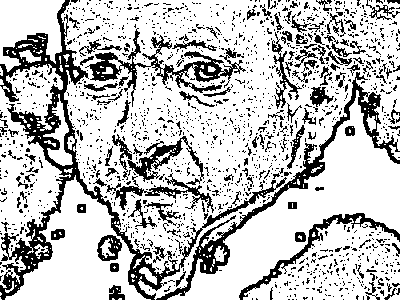

| 伦勃朗，生于 1606 年 7 月 15 日

我喜欢自画像的部分是凝视。我认为有些画家，与别人相比，能将他们眼中的灵魂表现得更为生动。我特别想到**霍珀、伦勃朗、科尔维茨、德加和夏加尔**，他们的目光都那么的清澈有力。但相对的，**罗、怀斯和莫蒂里安尼**却在躲避。当然，怀斯和莫蒂里安尼以裸女画而闻名。

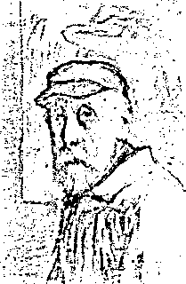

| 埃德加·德加，生于 1834 年 7 月 19 日。真是个色彩大师！

做这个练习，让我能以全新的眼光看待某些艺术家。我立刻就注意到有几位（被广泛熟知的）伟大的**色彩大师**都是太阳落巨蟹座——**鲁本斯、德加、霍克尼****。**这让我再次想起**弗里达·卡洛**对色彩的运用，现在我又看了一遍，真是棒极了。至于内莉·梅·罗！可以看看她的其他作品，但你可以从这幅自画像中看到强烈的靛蓝色。

所以我问自己，**太阳在巨蟹座意味着什么？**

这是黄道带的第四个星座，所以我们仍处于**关于自我的这一象限中**。仍旧是**“全都关于我”**。当然，作为一个水象星座，它是关于**我的情感**。它也是一个**基本星座**。基本星座是实干家。我的情感需要被表达。一个太阳巨蟹座最有可能问的问题是**“我感觉如何？”**从伦勃朗的每幅自画像中，你几乎都可以看到他在问自己这个问题。

弗里达·卡洛的作品完全是对她自己和她撕裂的情感世界的探索。她对当代艺术家**特雷西·埃敏**有很大的影响，她的情感世界今年夏天会在伦敦的海沃德画廊全面展出。两个女人都对自己的身体特别着迷，这看起来很粗俗，但事实上她们的艺术是她们破碎情感的流露。

但情绪并不总是需要尖叫。**科尔维茨**显然也在她的作品中探索情感——比如孤独。**夏加尔**的全部作品（几乎）都专注于**一种特别的巨蟹式情感——怀旧。**

| 内莉·梅·罗，生于 1900 年 7 月 4 日，有点像…融入她的蟹壳…

| 詹姆斯·麦克尼尔·惠斯勒，也是 1834 年 7 月 19 日。你越看，越觉得这幅画奇怪

| 安德鲁·怀斯，1917 年 7 月 12 日。也是越看越觉得奇怪。像罗和惠斯勒一样，他与背景融为一体

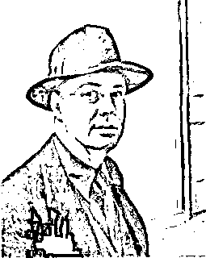

| 爱德华·霍珀 1882 年 7 月 22 日。柔和的面容，深情的眼神

| 珂勒·惠支, 1867 年 7 月 8 日

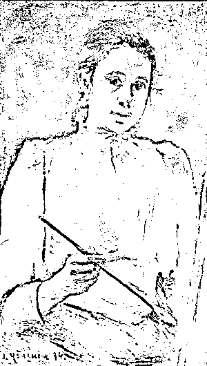

| 洛顿·伦奎斯特, 1864 年 7 月 1 日

| 莫蒂里安尼, 1884 年 7 月 12 日

| 马克·夏加尔 (沉思，深情) 1887 年 7 月 6 日

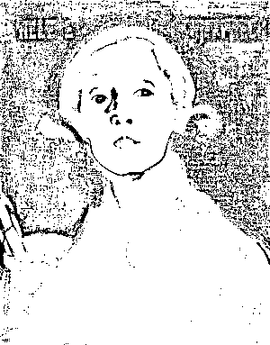

| 海琳·施杰夫贝克，1862 年 7 月 10 日。循着她的职业生涯，她的自画像变得越来越抽象。都值得一看。

| 乔治·莫兰迪《瓶子在哪里？》，1890 年 7 月 20 日

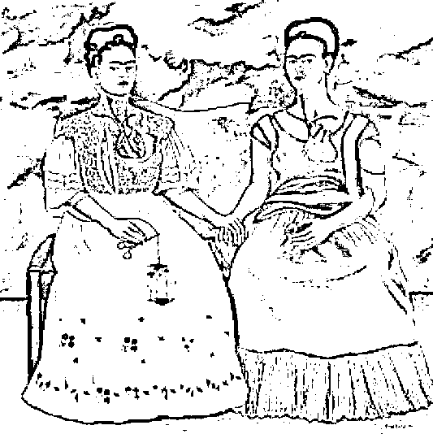

| 弗里达·卡洛，1890 年 7 月 6 日。显然她的月亮是 29 度，有点儿金牛座，但我很怀疑…

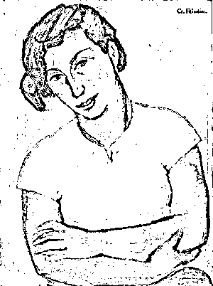

| 安娜·瑞金·布里克，1908 年 6 月 23 日

| 大卫·霍克尼，1937 年 7 月 7 日

| 查克·克洛斯，一张由数千张小照片组成的脸，2000 年(1940 年 7 月 5 日)

| 特雷西·埃敏，1963 年 7 月 3 日

****版权声明：**本文由若道翻译发布，欢迎转发，反对抄袭。友号转载请申请白名单。**

****

**12 星座自画像**

****[白羊座](http://mp.weixin.qq.com/s?__biz=MzA5NjA0NTAxNg==&mid=2651452779&idx=2&sn=38a345623020cadc4ed4f42904d29926&chksm=8b4b47dcbc3cceca0fbf3e66149382c065ff3dbc2f61c881cdba2807e9e4c0c8f9ec71f1e245&scene=21#wechat_redirect)****** | [金牛座](http://mp.weixin.qq.com/s?__biz=MzA5NjA0NTAxNg==&mid=2651453849&idx=2&sn=7f5ada7b667fcd56f09c2a4bffadab67&chksm=8b4b4b2ebc3cc2386cc5ee12e45ac147964723803ce5714b7c612caf6bf0436652a82e0eaf9a&scene=21#wechat_redirect)丨[双子座](http://mp.weixin.qq.com/s?__biz=MzA5NjA0NTAxNg==&mid=2651460660&idx=2&sn=a239f43ebe4aa8c8058cfa11d79028d4&chksm=8b48a683bc3f2f9539414a0d2b911b7a8f67befff92ed4dad04c4387aaa4a44ec883ab777afd&scene=21#wechat_redirect)**

**克里斯蒂娜·罗登贝克**

克里斯蒂娜·罗登贝克，若道签约老师。全职职业占星师，从业 20 余年，在其网站长期撰写时事、艺术和文化的文章；定期在英国授课，并保持蓬勃发展的专业实践。

**学习占星学****点击或长按下图了解课程详情** ************

****

****

**微信又双叒叕改版啦，不想错过若道君的推送？**

**就把若道设为星标吧！**

**▼**

**喜欢记得点一下在看哦☟**

********报名直达入口********

# 滚动课宣栏目丨这里是若道最经典的占星核心课程，欢迎了解~

> 原文：[`mp.weixin.qq.com/s?__biz=MzA5NjA0NTAxNg==&mid=2651461305&idx=3&sn=026741f725273eeabfb7191c0346a758&chksm=8b48a40ebc3f2d189ef1f692728da8e5084c9d20d183b94886a4ace8ac04a831de7e6ed23bc1&scene=126&sessionid=1692737898#rd`](http://mp.weixin.qq.com/s?__biz=MzA5NjA0NTAxNg==&mid=2651461305&idx=3&sn=026741f725273eeabfb7191c0346a758&chksm=8b48a40ebc3f2d189ef1f692728da8e5084c9d20d183b94886a4ace8ac04a831de7e6ed23bc1&scene=126&sessionid=1692737898#rd)

1

**自我觉察，是智慧的基础**

每个人都有自己的内在冰山，自我觉察能够帮助我们觉察自己的行为、情绪等，然后向内深层探索，探索自己的行为、情绪背后的深层渴望、期待。学习和应用占星学的过程，就是慢慢掌握自我觉察工具的过程，当你熟练掌握了占星学，也就具备了帮助引导他人觉察到自身生命议题的能力。**往外张望的人在做梦，向内审视的人才是清醒的。**只有真正向内看，只有当觉察开始由外向内时，改变才会发生，才能够知行合一。

# | 插画师：古戈力

以情绪来举例说明，每个人的情况不同，觉察的程度也不同，觉察有四个层次：***1.*** **不知不觉：**没有觉察情况，当情绪来了，会被情绪控制，做出很多不计后果的事情。而且每次都是同样的状况，反反复复；***2.***** 后知后觉：**情绪过后，自己能够反应过来，自己做的对与错，但是很难避免同样的情况再次发生；***3*****. 当知当觉：**当情绪来的时候，你已经知道在这个当下，正在发生什么。当达到这个层次，你就可以自己控制情绪，从而影响后事的发展；***4*****. 先知先觉：**当事情还没发生，就可以预知它要发生了。因为你对情绪的觉察已经越来越熟练，所以情绪还没来，你就知道它要来了。所以，你也就有了更好的选择和处理方法。所以，我们要自我觉察，向内探索，觉察是为了接纳，然后做出改变，成长，迭代，升级。**那么要如何练习自我觉察，掌握先知先觉的能力呢？**

2

**每日觉察的工具推荐**

**今日天象&近期行进**

若道 APP 中的今日天象功能，罗列展示每一天的具体天象，你当天的行进和行进周期：

作为占星师，可以这样使用这个自我觉知工具：

**记录梦境**如果你有醒来记录梦境的习惯，每天早上看一下睡梦中的天象和行进，对应联想，你会惊喜地发现一些神奇的对应，能够更敏锐的捕捉到日常被压抑的情绪和需求。能够帮助你在白天的工作生活中先知先觉的关注身心状态。**规划生活**每月月初，周初都可以参考天象和行进进行日程规划，预估可能的助力和阻力，在对的时间做对的事，会发现平平无奇的日常也可以有不一样的色彩。根据月相的变化感知情绪的起伏，更好的自我关爱。**感知环境**当身边发生了引起你注意和好奇的事情，或者网络上层出不穷的新闻热点，都可以在天象中寻找对应的能量。从更大的格局视角去思考你的个人观点。通过环境的共振，更深入地理解自己的出生星图。以上都是很好的学习深化占星知识的方法，只需要系统掌握以下知识，就可以开始使用以上方法去提升自我觉知。**第*1*阶 黄道星座&个人行星****概要介绍占星学与星图**

**四元素与三形态**

**黄道 12 星座**

**太阳、月亮及其他个人行星**

**第*2*阶 行星&宫位****木星&土星****天王星&海王星&冥王星**

**练习组合所有行星**

**四轴**

**十二宫位**

**组合宫位、行星、星座****第*3*阶 月亮交点、相位以及初步解读星图**

**了解灵魂进化的路径：月亮交点**

**相位概论**

**相位&行为模式**

**困难相位**

**柔和相位**

**容许度，出入相位**

**渐盈渐亏相位**

**空相**

**宫主星&定位星**

**相位模式**

**组合相位、星座、行星、宫位**

**解读的基本原则，权重，失衡**

3

**课程安排是怎样的呢？**

**第*1*阶**2021 年 9 月 15 日开课，每周一天晚上 20:00-22:00 上课，共 6 次课**第*2*阶**2021 年 11 月 11 日开课，每周四晚上 20:00-22:00 上课，共 6 次课**第*3*阶**2022 年 1 月 6 日开课，每周四晚上 20:00-22:00 上课，共 15 次课 2022 年 4 月 30 日、5 月 1 日**L3 北京两日线下工作坊**

****

4

**授课老师**

**艾德里安·罗斯·邓肯**

**（AdrianRoss Duncan）**

**· **1971 年在印度游学时开始学习占星学，1985 年开始成为全职占星师，迄今执业已超过 33 年，是人本主义占星学、卜卦占星学和经世占星学领域的知名占星师。他还开发了占星软件 AstroClock 和多款占星报告；**·** 哥本哈根占星学院院长；**·** 他在日常咨询中经常运用卜卦，咨询图（卜卦的一种运用方式，即根据客户来访时间制作星图，从星图中获得大量信息）也是他特别擅长的领域；**· **艾德里安·罗斯·邓肯从 1971 年开始研习佛学，受佛学影响很深，他相信占星学和佛学观点一致，转化的一个基础是在于对现实感知的改变。而卜卦很容易与佛教融合，因为它只关乎当下。

**大卫·瑞雷**

**（David Railey）**

**·** 若道联合创始人，致力于在中国教授和推广西方占星学；**·** 曾任 ISAR 全球副主席，CAPISAR（ISAR 职业占星师资质认证机构）主席；**·** 1976 年，通过亚特兰大职业占星师考试，成为全职占星师，随后通过 AFAN 和 ISAR 职业测试；**·** 1980 年，与杰夫·焦耳一起在亚特兰大创建“每日行星”占星学中心。此后在亚特兰大占星协会担任 4 年考官，并且两次担任亚特兰大地区占星协会主席。1979-1992 年，作为占星师活跃于美国社会媒体，向不了解现代占星学变化的大众宣传专业占星学知识。在 1989-1992 年期间，他在 WRGG 电台 12 频道每周主持个人电视秀“今日占星学”，早先他还在 WRFG 的广播节目中播讲宇宙天气节目；**·** 2010-2014 年，任全美占星师联盟监督委员会委员；**·** 2010 年，其著作《灵魂的目标》中国版出版，和蒋颖一起创办若道占星学校和其官网 www.nodoor.com；**·** 2017 年，被选为 ISAR 委员会成员。ISAR 是世界最大的国际占星机构，会员遍布 45 个国家，2017-2020 年曾任 ISAR 全球副主席、CAPISAR（ISAR 职业占星师资质认证机构）主席。

**克里斯蒂娜·罗登贝克**

**（Christina Rodenbeck）**

**· **克里斯蒂娜·罗登贝克（Christina Rodenbeck）是一名全职职业占星师，在牛津大学城生活和工作，深受周围知识和文化氛围影响；她拥有伦敦大学（University of London）的人文荣誉学位，曾在伦敦占星学馆（AstrologicalLodge of London）、心理占星中心和占星研究学院学习；**·** 作为一名占星师，在过去的 20 年里，克里斯蒂娜在她的网站“牛津占星师”上写了大量关于时事、艺术和文化的文章；她每月主持一个占星播客：“与克里斯蒂娜和萨莉一起占星”，并定期在《占星杂志》(Astrological Journal)上撰写时尚专栏；她定期在英国授课，并保持着蓬勃发展的专业实践。

**琳恩·贝尔**

**（Lynn Bell）**

**·** 世界最受欢迎的占星学演讲者、作家和老师之一。定居巴黎，研究心理占星学和家族模式数十年；

**·** 著名的心理占星学中心（Centre for Psychological Astrology）的长期导师。2016 年，获得查尔斯·哈维（Charles Harvey）杰出的占星学服务奖；

**·** 作为一个从多个层面进行工作的占星咨询大师，琳恩的工作结合了心理学的观点。她对家族模式的兴趣首先来自与客户的合作。通过在分析领域所做的个人工作，她所受的埃里克森催眠训练将她引领至家族系统。后来，她组织研究小组在家族星图上进行了数年的研究。她写的《家族占星学》就是这项研究的结果；

**·** 法国心理占星学协会的会长。除了占星学，她在法国沙特尔的新沙特尔学校任教 8 年，还 5 次获得了在《纽约时报》畅销书作者卡罗琳·迈斯（Caroline Myss）的卡罗琳·迈斯教育学院（Caroline MyssEducational Institute）合作教学的机会。**课程助教：**

**熊鹰老师**

**（天空的空）**

**·** 2008 年接触严肃占星学，至此爱不释手；**·** 2013 年师从大卫·瑞雷，研习现代占星学核心课程，并于 2014 年起担任该课程的助教，之后于 2017 年与 2020 年两次与大卫老师合作讲授完整核心课程（Level 1-5）；**·** 期间也跟随格伦·佩里、诺·泰尔、理查德·塔纳斯、罗伯特·汉德、苏·汤普金斯、斯蒂芬·弗里斯特、琳恩·贝尔、艾德里安·邓肯等多位国际占星大师进行学习，进行定向占星主题研究；**·** 2014 年末，通过国际占星研究协会（ISAR）资质认证并获得证书；**· **在若道占星任职六年余，以“传播系统、专业、实效的占星学”为职业使命，执教与助教已累计超过 700 小时。在业余期间也提供占星咨询服务；**·** 目前正着眼于占星学与中国文化之互参，以当代中国人的身心成长为目标，力求落到实处。

5

**此次课程适合哪些人？**

**·** 对占星学感兴趣，想要入门的零基础者**· **占星学小白，想通过星图学习识人之术**· **有一定占星学基础，但不知道该如何整合星图复杂碎片的人**· **想要师从更多殿堂级占星导师学习占星心法的人**· **走在自我探索和个人成长道路上的人

6

**课程价格**

**L1-3 价格**：15000 元

其他各阶段课程单报价格，请咨询课程顾问：**Maggie 老师**（微信：18510107057，请备注**“核心课”**）

长按二维码添加 Maggie 老师

7

**退转课程**

****· 退款原则请详看《教学协议》，如有疑问请咨询课程顾问****

****名师汇集金牌核心课程****

**授课老师：**琳恩·贝尔、艾德里安·罗斯·邓肯、克里斯蒂娜·罗登贝克、大卫·瑞雷

**授课时间：**2021 年 9 月 15 日起

**授课方式：**网络课程**，**英文授课，中文翻译

**费用：**L1-2 价格：4800 元**；**L1-3 价格：12000 元

**课程负责人：****Maggie 老师**（微信：18510107057，请备注“核心课”）

长按二维码添加课程负责人咨询~

****报名请点击“阅读原文”****

# yyds、次元壁、wysl……这些词儿一定都是这个星座发明出来的！

> 原文：[`mp.weixin.qq.com/s?__biz=MzA5NjA0NTAxNg==&mid=2651461182&idx=1&sn=06b9d68a40dd70df12d64563ea5f9a73&chksm=8b48a489bc3f2d9fbd38dac680b09565012991929b3a6ceff4eaf2bdf985dba0351e917d5eab&scene=126&sessionid=1692737898#rd`](http://mp.weixin.qq.com/s?__biz=MzA5NjA0NTAxNg==&mid=2651461182&idx=1&sn=06b9d68a40dd70df12d64563ea5f9a73&chksm=8b48a489bc3f2d9fbd38dac680b09565012991929b3a6ceff4eaf2bdf985dba0351e917d5eab&scene=126&sessionid=1692737898#rd)

******☆ ****后台回复“今日”，给你一句生命态度******

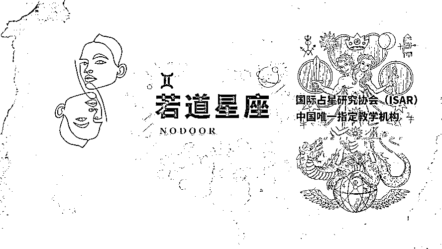

作者/大卫·瑞雷 若道占星创始人
译者/若道翻译团队编辑/玫瑰 封面/书君 图片/pexels

提到标题里这些网络热词，大家一定很好奇，到底谁第一个想出来的？！那我们就一起来看看这个神奇的好奇宝宝星座——双子座吧！

**双子座**经过了放松、平静又舒适的金牛座的阶段，我们的黄道列车之旅或许开始变得不安分，或说，好奇。“我现在在哪呢？”你想知道，“我正经过什么地带？”你看着车窗外的风景呼啸而过，心里琢磨着自己到底身在何处，不时从口袋里拿出车票来核对上面的信息。你瞥了一眼车厢门上方滚动的红色电子数字。或许你开始看一本随身携带的杂志，或者掏出手机看看有没有网络信号，心里想着“该查一下邮件”，或是“能不能上微信呢”。然后你注意到那些坐在你旁边的人，于是你开始与他们聊天，看看他们要去哪，顺便也了解一下你现在具体在什么位置。即便是短暂的交谈也饱含信息量。你听出了他的方言口音，很快你就得到了很多有关你现在在哪以及你要去的那个地方的信息。这就是双子座，你们总是这样。**如果你是双子座，你会被一种渴望传递信息的热情占据；让自己成为一个成功的“传播者”，对你们获得成就感非常重要。**没有哪个星座像双子座这样**对任何正在发生的事都有一种强迫性的评论热情**，也没有哪个星座像双子座这样**关心一直在变化的、看起来似乎毫无关联的信息碎片的简单流逝**。

在最基本的层面上，交流就是一种**“模仿”**，双子座对模仿或复制他们所看到或听到的任何事物轻车熟路。“我把每个人的东西都拿来一点，”传奇创作人鲍勃·迪伦说：“然后他们称我为‘原创’。”

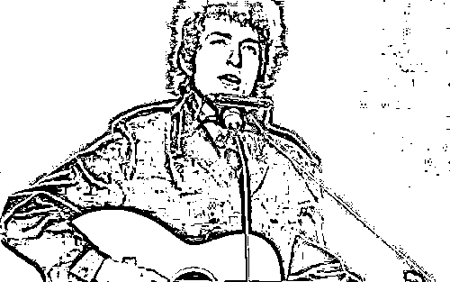

| 鲍勃·迪伦

**双子座擅长交流，懂得如何将文字和音乐结合起来。**在我们那个年代很红的双子座唱作人有鲍勃·迪伦、詹姆斯·保罗·麦卡特尼、“海滩男孩”组合里的布莱恩·威尔逊，再比如伟大的歌剧天才理查德·瓦格纳。中国的双子座唱作人有黄家驹、张雨生、陈绮贞，他们都有了不起的作词才能。虽然黄家驹和张雨生不幸英年早逝，但他们创作的歌词和音乐会一直留存，成为他们双子座天分的证明。

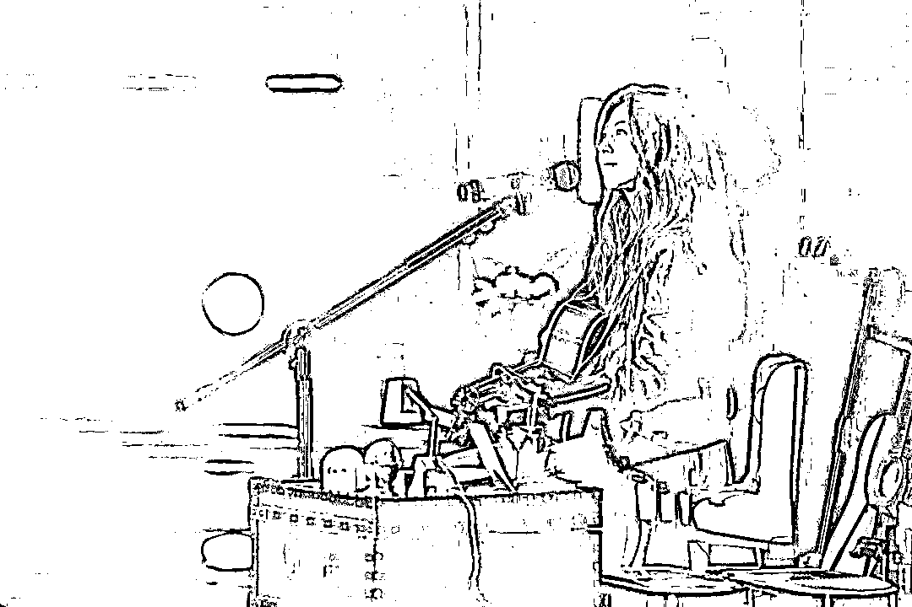

| 陈绮贞

双子座作家的样本则呈现出不可思议的才华的多样性，比如《福尔摩斯》系列的作者阿瑟·柯南·道尔，伟大的俄罗斯诗人、剧作家、小说家普希金，阿利盖利·但丁——他的《神曲》被认为是最伟大的意大利语文学作品，也是世界文学名著。伟大的美国诗人沃尔特·惠特曼，著名的武侠小说作家古龙，童话作家郑渊洁，香港小说家、作家倪匡，诗人、作家、建筑师林徽因，还有前面引用过其作品的萧红，她的文学才华在她充满艰难的一生中熠熠生辉。

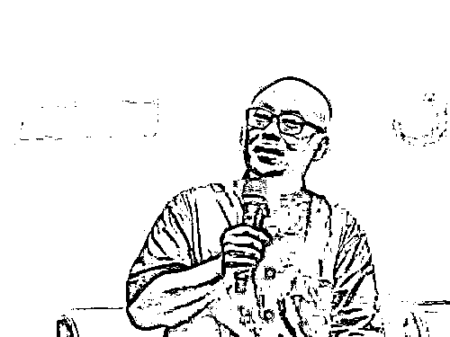

| 郑渊洁

双子座的另一个特征是**喜欢“打手势”**，比如用手部的动作来强调或描绘正在谈论的事物。此外，眼疾手快、手指灵活、灵巧机敏，也是双子座的典型特征。

我们可以在这些人身上看到这种灵巧快速的特质：三次夺得世界冠军的乒乓球运动员王励勤，21 次获全英羽毛球冠军的乔治·艾伦·托马斯，被誉为欧洲最成功羽毛球员的吉莉安·吉尔克斯……在台球界则有跻身名人堂的巴迪·霍尔和艾尔·史翠南。

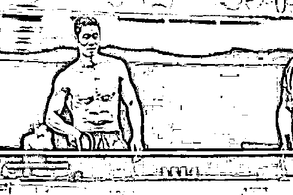

| 王励勤

或许你并不想在乒乓球、羽毛球或桌球方面有所发展，但**如果你的出生星图中有太阳、月亮或上升落在双子座，你还是会更适合在一个需要你对多变的环境进行灵活反应的领域开创事业**。

年轻的玛丽莲·梦露在一次“裸照风波”中被记者问到：“当时你穿了什么？”她的回答是：“收音机是开着的。”（译注：英文原文中“穿着”和“开着”是用同一个词“on”来表达的，这里梦露利用语言的歧义挡掉了这个问题。）

此外，“灵活反应”也包括**临时的解决手段和多线程工作的能力**，这令双子座成为一个不安分的星座。**“便宜行事”是双子座的主要特征。双子座在你的出生星图中的位置显示了你会将智力和好奇心投放的领域。**在这个领域你提供信息或给出问题的快速解决方案的能力会得到施展。

如果你有一个太阳、月亮或上升在双子座，或是群星在双子座的朋友，那么你就相当于拥有了一个**强大的社交网络中转站**。双子座会把他们知道的一切信息都告诉你，不加过滤或编辑。

**富有好奇心是双子座人身上一个美好的品质，它让你们永葆青春，随着年纪的增长也一直头脑聪明，见多识广，跟得上潮流。**

**个人成长主题和故事**

要不是我的双子座父亲有一天将一个他在心里埋藏了多年的秘密告诉我，我可能永远也不会知道，“好奇心”对一个双子座来说会有多么重要。

“你妈妈的情况恶化的那些日子（我小时候妈妈受伤致残，只能坐轮椅），我们的整个家都塌了，我不得不向你的祖母借钱来维持生计。那段日子太灰暗了，我看不到任何出路。无论我怎么努力，我都想不出任何办法可以让这个家再撑两个礼拜。

我太绝望了，我真的考虑过要自杀，但接着我想，我应该留下来，只为了看看到底会发生什么！因为我不知道事情到底会怎么发展，怎么被解决。

所以，是好奇心，我的儿子，只是单纯的好奇心让我熬过了那个夜晚。我就是必须要看到这一切是怎么被解决的。”

后来，事情出现了转机，我的父亲把握住了机会，人生走向成功。然而，当他的生活被绝望的海水淹没时，好奇心是那张他赖以倚靠的救生筏。

任何双子座的特质，也如同其他所有星座一样，可能以负面的或带来毁坏的方式表现出来。双子座常为人诟病的地方有，**爱传闲话，有时甚至是散布谣言，话唠，肤浅或是短视。**这听起来似乎是脸谱化的陈词滥调，但作为双子座特质的负面表现也是有根据的。

不过这样的描述若成为一种“断言”，则暗示了某些**深层的基于评判的恐惧**。比上述双子座特质的负面表现更糟糕的情况是，**双子座特质的受损，因为被不当地对待或塑造而导致其交流技能和智力天分被损伤或发展受阻。**

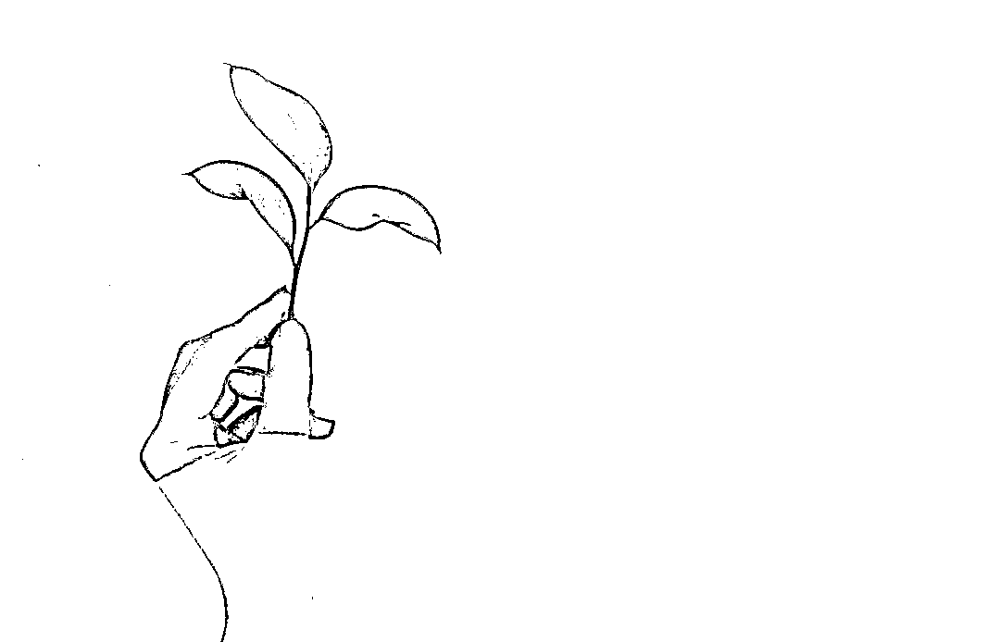

更糟糕的情况是，**不当的教育方式甚至虐待，令双子座的天然特质得不到健康表达，沟通技巧和智力都因此受到损伤**。

一个星图中双子座能量很强的孩子，一般来讲**神经系统会比较活跃。**他们对世间万物充满好奇，比其他任何星座的孩子都更爱问问题。

他们很喜欢跟自己的父母或其他家庭成员交谈，如果他们的父母此时没有其他事情要专心处理，那就再好不过了。

最佳情况是，父母有足够的洞察力以辨认出孩子有颗永不满足的好奇心，于是确保让他们尽早学习读写，发展电脑技能，以及抓住每一次交谈的机会，抛出生词来帮他们学习。

鼓励他们去解决不同类型的问题，可以让这些头脑不安分的双子座小孩有事做，同时多与他们交流也很重要。

不过，显然最理想的情况并不总是会出现。大部分家长要付出很多时间在工作上，没有什么时间留给夜晚的长谈。如果这个双子型的小孩家里有一位老人，可以与他就任何话题说个滔滔不绝，那这个孩子是幸运的。**双子座能量强的小孩常常被告诫要“安静”或“闭嘴”。给他们带来负面影响的多少取决于他们感到自己“无法参与”的程度**。对于双子座来说，**缺少沟通就等同于“拒绝”**。这种拒绝会令他们延伸出各种不同的内心戏，比如，**没人想跟我说话是因为“我太笨”“我很烦人”“我很无趣”“我哪里有问题”。被忽视的程度越深，他们的负面自我暗示就越严重。**如果你潜意识里带着“没人跟我说话是因为我很招人烦”这样的信念成长起来，那么你可能会真的认同自己是“烦人的”，然后真的在行为上有所表现。“我很笨”“我很无趣”等等的自我暗示也是同样道理。每次当你们因缺少沟通而感到被忽视时，这些不良的自我暗示就被加强一次，而那些与此相呼应的行为也就更加根深蒂固。而更糟的是当这些不良信念被父母或其他家庭成员所强化时，比如他们重复地说“你这个笨蛋！”“你就不能闭嘴吗？！难道你看不出来没人对你说的话感兴趣吗？”这些带有伤害性的言语如果被反复听到，就可能在脑中形成印记，从而让一个双子座人变得安静，表达受到抑制，这种情况常常还伴随着**神经质的崴脚或腿扭伤**，其实是潜意识里躁动的表现。

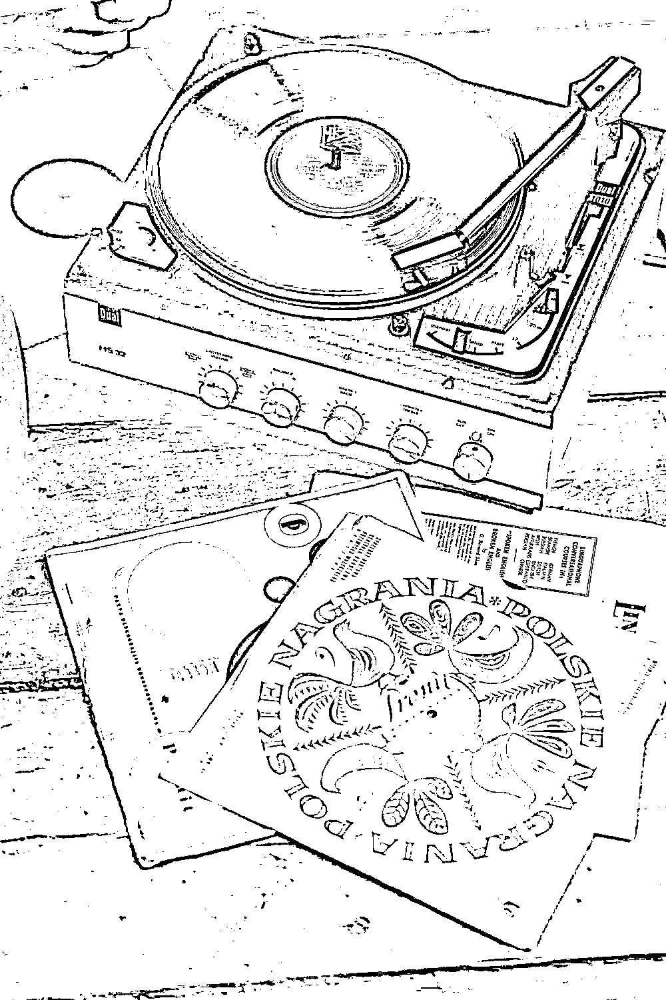

**双子座的事业线索**

**成为一个良好的沟通者是你们获得事业成功的关键。**你们大多具备沟通的天分，但“天分”是需要被开发的，否则就只是“潜力”。你们最常见的职业包括**写作、记者、媒体、公关、发言人、教师、督导或教练**。**销售**也是不错的，可以把你们的好口才用上。

你们中的一些人有**快速洞悉市场趋势**的本事，如果你经营自己的公司，便可以利用潮流而得利；如果你是为别人打工，你对于潮流的敏感反应也可以帮你获得晋升的机会。这样的天分在互联网时代是一个明显的优势。

所以，如果你是双子座，**你是一个很好的沟通者吗？其他人会听你说话吗？他们会对你说的话很感兴趣或热切渴望听你说话吗？**如果答案是肯定的，那么你便更有可能活出圆满的人生。如果答案是否定的，那么有一些方法可以提升你的人生满意度。

有效的沟通，是在关系、事业或家庭中获得成功的根本途径之一。双子座的你，比其他任何星座都更有潜力成为有影响力的沟通者。

如果你对与人沟通这件事感到困扰，或是希望提升沟通技巧，去想想是什么干扰或阻碍了你的沟通过程。以下是一些在口头或书面沟通时常见的问题：

**·** 害怕自己说的话会让自己看上去像个白痴

**· **觉得没人会在乎自己说的话

**· **说话前太过不假思索

**· **回避有难度的沟通

**· **用“反应”代替“回应”

**· **没有准备充分

**· **假定别人已经懂了你的意思

**· **缺乏敏感度

**· **冒犯他人隐私

你有上述问题吗？前面两条，也就是害怕自己说的话显得很傻，以及认为别人对自己要说的不感兴趣，很明显是情绪上的问题。**被拒绝是核心的痛苦所在。要克服这种情绪上的压抑感，你必须去面对潜在的痛苦根源。**

如果这种痛苦跟某些身体上或心理上的虐待有关，那么你可能需要去找一位有执业资格的治疗师来获得专业的帮助。

如果情况没这么严重，你或许可以**靠自己的力量去学习如何面对痛苦**。不过，你也可能需要学习一些基本的自我引导的冥想技巧，让你能够在这个过程中感到安全、有力量。你可以找有经验的冥想老师，告诉他们你想要达到的效果。尝试催眠或许也会有帮助。

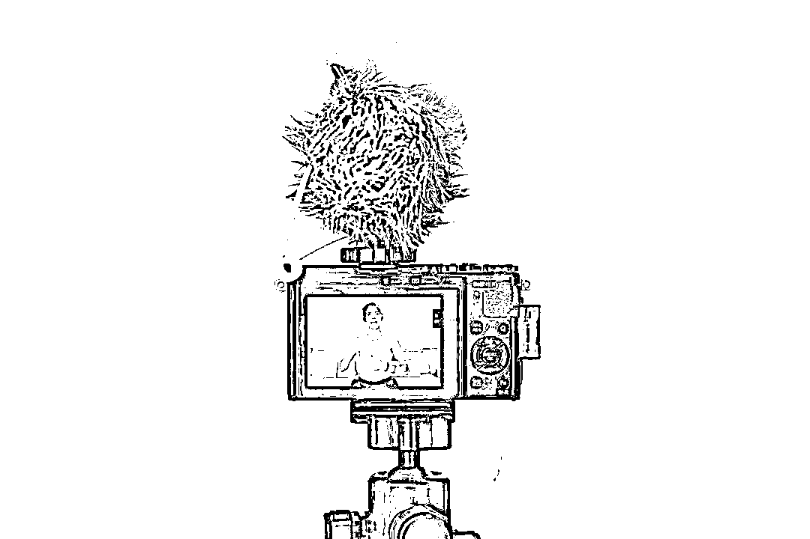

**双子座的爱情**

对于大部分人来说，关系中的彼此兼容要求双方的相似之处远大于不同之处。不过，对双子座来说，**多样性和差异性反而更能制造吸引，**这一点上其他星座都没有双子座这么明显。

但是，能成为你的伴侣的人必须能**在智力上吸引你，并能与你相谈甚欢**。甚至对方可能受教育程度比你高，或是去过更多地方旅行。

一个见多识广的伴侣给了你更多提问题的机会，能够暂时满足你无穷的好奇心。他们的新奇见闻就像一本《国家地理》杂志一样，你随意翻阅便能从中汲取营养。

很自然地你也会想跟他们一起去旅行，去那些令人心驰神往的地方看一看——新鲜事物越多越好。

你有一个重要但不太容易被察觉的关系中的兴趣点，便是**伴侣的成功**。只有摩羯座和巨蟹座会更加在意伴侣的成就，不过他们更喜欢传统行业中的成功。而对你来说，成功可以是任何领域的，只要它显示出**你的伴侣获得了某种身份上的认可，被他们的同侪尊敬或仰慕。**

吸引你的是他们在该领域中的统治地位，而不是钱的数量，虽然伴随着成功而来的金钱也是额外加分项。你们会觉得**成功人士身上有一种性感，就好像希望通过与他们建立亲密关系，进而也能拥有他们的权力和地位。**然而，这种对于身份感的迷恋中混合着**嫉妒**的成分，这会给关系埋下隐患。结果如何很大程度上取决于**你的自我价值能给你带来多少安全感**。如果你觉得你在伴侣的对照下黯然失色了，这种情况下，**你的嫉妒心会让你特别想要与对方竞争**。一定程度的竞争对于关系是有益的，但是过度了就会破坏信任与亲密。真相是，**如果你无法真正尊重你自己，你也不可能通过伴侣来获得你想得到的尊重。****“无聊”**或许是你在关系中的最大敌人。问过你的伴侣太多问题之后，你或许开始对他们的回答因熟悉而感到厌倦，认为他们没有更多信任可以提供给你了。你们的交谈变得了无新意，你也开始心猿意马。新兴趣和新伙伴会吸引你的注意力，增加了分手或离婚的概率。然而，无聊是一个外在表现。通常人们是**对自己感到厌倦，是生活的常态让人感到不满意。**这种不满常常是情绪层面上的，根源于过去的某种未处理的深层感受。不过，就像其他风象星座一样，**双子座是一个偏向头脑和智力的星座，不习惯“通过感受来感受”。你们可以谈论感受或是绕过感受，但臣服于感受，哪怕只是暂时的，都可能让你觉得需要醒醒脑。**但是，面对你的感受——特别是在治疗中，可以为你打开新世界的大门。当然，“谈话疗法”也可能绕过了感受本身而成为一种回避情绪的方式。但一个好的治疗师不会让你离开感受太远。**停止说话，只是让自己去感受，不仅可以治愈心灵，还能让你的头脑“重启”。**在情绪浮现之后，会有新想法补充进来，这会让你重拾对自己和对生活的兴奋感。这样的心理治疗也会带来看待关系的新视角，让你能够重新发现伴侣身上的优点和动人之处。当然，人生无常，有时你的新领悟可能恰恰导致你和伴侣的分道扬镳，但至少，只要你对自己的觉察是诚实的，那么你所选择的改变就能够引领你到更富成就感的关系中。

**版权声明：**原创文章由作者授权发布于若道平台，欢迎转发，反对抄袭。友号转载请申请白名单。

****想阅读更多作者的文章，请在后台回复******大卫****** 即可。****

**大卫·瑞雷**

美国占星师，若道联合创始人，致力于在中国教授和推广西方占星学；2010-2014 年，任全美占星师联盟监督委员会委员；2017 年，被选为 ISAR 委员会成员。ISAR 是世界最大的国际占星机构，会员遍布 45 个国家，2017-2020 年曾任 ISAR 全球副主席、CAPISAR（ISAR 职业占星师资质认证机构）主席。

**喜欢文章请长按下方二维码打赏****给大卫老师加杯咖啡呗~****▼**

**学习占星学****点击或长按下图了解课程详情** ************

****

****

**微信又双叒叕改版啦，不想错过若道君的推送？****就把若道设为星标吧！****▼**

**喜欢记得点一下在看哦☟**

****报名直达入口****

# 雷蒙德·梅里曼金融占星周运 | 火天对分+满月，会发生什么？

> 原文：[`mp.weixin.qq.com/s?__biz=MzA5NjA0NTAxNg==&mid=2651461182&idx=2&sn=40e60678f281cb9b5add8f329674ec0b&chksm=8b48a489bc3f2d9f6d88efe5ef259b6cc128cfcd18c3a2664c082f683b86b769cf005785570d&scene=126&sessionid=1692737898#rd`](http://mp.weixin.qq.com/s?__biz=MzA5NjA0NTAxNg==&mid=2651461182&idx=2&sn=40e60678f281cb9b5add8f329674ec0b&chksm=8b48a489bc3f2d9f6d88efe5ef259b6cc128cfcd18c3a2664c082f683b86b769cf005785570d&scene=126&sessionid=1692737898#rd)

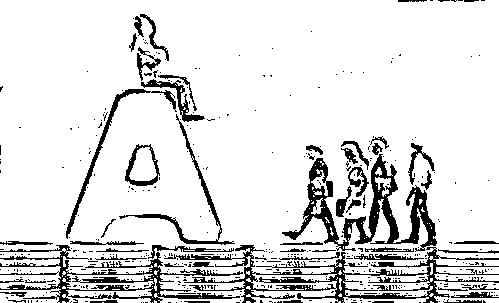

作者/雷蒙德·梅里曼 译者/Luke
编辑/玫瑰 图片/pexels 雷蒙德·梅里曼是在金融占星学界稳坐第一把交椅的占星师，同时他也是若道签约的金融占星课老师，我们引进了雷蒙德·梅里曼老师的《[上证指数月度报告](http://mp.weixin.qq.com/s?__biz=MzA5NjA0NTAxNg==&mid=2651460114&idx=2&sn=28ad91e5b6986901dbbfb41509073ae1&chksm=8b48a0a5bc3f29b3d8ddfdac23345e867f6d9716c0b0fa2daf208dc6c0e622f11c558a991a17&scene=21#wechat_redirect)》和《[黄金报告](http://mp.weixin.qq.com/s?__biz=MzA5NjA0NTAxNg==&mid=2651460114&idx=2&sn=28ad91e5b6986901dbbfb41509073ae1&chksm=8b48a0a5bc3f29b3d8ddfdac23345e867f6d9716c0b0fa2daf208dc6c0e622f11c558a991a17&scene=21#wechat_redirect)》。我们经老师的授权，将每周刊登梅里曼老师的周运，供大家参考和学习。于是，这是本周的周运（11.15-11.19）。**说明：以下时间采用纽约证券交易所所在地美国东部标准时间。****展望与回顾**

****

**10 月美国通胀达到了三十年来的高点。持续的供应短缺和强劲的消费需求，给家庭支出带来了广泛和可观的增长。**

**——格温·吉尔福德**

**《通胀率达 6.2%，标志着 31 年来的高点》**

**《华尔街日报》**

**2021 年 11 月 11 日**

**乔·拜登的下一个政治噩梦是通货膨胀，这股力量能够摧毁家庭预算和政治前程。驱动它的国内和国际因素，是总统很难快速解决的。****——斯蒂芬·科林森****《为什么通货膨胀是拜登的政治噩梦》****www.cnn.com****2021 年 11 月 11 日**上周走高的通胀数据，对股票价格不那么有利，却带动了黄金和白银价格的增长。上上周末或上周初，全球大多数股票指数创下了周期高点，甚至是历史新高。然后依照惯例，回撤 3-5 个交易日至上周中旬的低点。也有一些值得注意的例外，比如，德国 DAX 指数，于刚刚过去的 11 月 12 日上涨至历史新高；上证综合指数上周晚些时候下跌至最低价位，然后开始反弹。加密货币上周中旬表现出色，比特币和以太坊都创下历史新高。然而，在创出新高的同一天，也再次出现了一次大幅度的抛售。

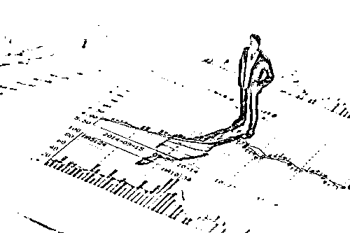

然而，最奇怪的市场行为，出现在稳定货币和贵金属上。通常，当欧元下跌，美元上涨，黄金和白银也会下跌。但是宇宙天象正处在天王星相位活跃的时期，对于天王星，规则是不管用的。欧元下跌到了自 2020 年 7 月以来的最低点。但与此同时，黄金飙升至 5 个月来的最高价位。你们可以感谢我了，因为我发现了火星在天蝎座与黄金大幅上涨的关联。在我的（月度、周度和每日）订阅报告和 9 月 3 日[中国市场专场讲座](http://mp.weixin.qq.com/s?__biz=MzA5NjA0NTAxNg==&mid=2651454543&idx=1&sn=f2b48a2534372dbebdfa2ac5ce7aeda7&chksm=8b4b4ef8bc3cc7ee21bdfdf4100f4db4a48688aa898fc30cff89afac9b4258ff01196b81046d&scene=21#wechat_redirect)（点击链接可阅读）里进行了详细描述，其中正确地指出了 10 月最后两周买入低点的时间段，以跟上这波持续到 11 月-12 月的大涨。我会接受你们的感谢，因为我们都知道，市场分析不可能总是准确，但这是一次了不起的交易，尤其考虑到美元也在上涨。就在一周多以前，11 月 3 日，黄金在 1758 交易，测试 10 月 6 日和 18 日的低点 1750-1760。上周五，11 月 12 日，黄金上涨到了 1871。我应该现在就退休。但我的交易仍在进行，我仍然有可能赚到大钱。然后再退休。我在开玩笑。我不会退休的。我是一个太阳、月亮和火星都在摩羯座的人。如果我退休了，我会变成一块石头。或更糟，一块土豆。那样我不会幸福的。

并不是说群星摩羯座的人永远都不可能真正幸福。除非他的金星、木星合相在天蝎座第二宫。幸运的是，我也有这个配置。

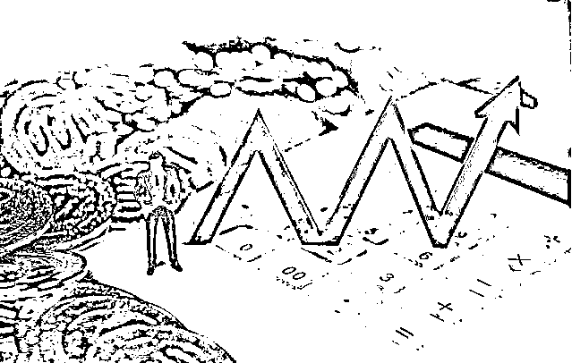

**短期占星趋势和长期考量**首先，让我们很快检查回顾一下本周的宇宙天象。行星运行非常活跃，**11 月 4-17 日，太阳-火星与土星-天王星四分相形成 T 三角。**终点是**11 月 17 日的惊天动地的火星对分天王星。**然后，**11 月 19 日的满月可能带来一些余震**。它发生在天蝎座的最后 4°，也就是蝎子毒刺所在的位置。住在美国亚利桑那州，我对蝎子的毒刺了如指掌。你必须眼睛盯着地面，因为你不想踩到这种生物上面被蜇。只要问问那些有过这种经历的人，就知道我的意思。**木星即将回到水象星座双鱼座，2021 年 12 月 29 日到 2022 年 5 月 16 日，它将与海洋之神海王星合相。**这可能是投资救生衣的好时候。木星和海王星在双鱼座，指向溺水的危险，无论是字面意义，还是象征意义。**一旦木星-双鱼座的潮水（通胀）开始涨潮，它会迅速膨胀成一股浪潮。或许甚至变成一场海啸。**对于木星，事情的发展可能比任何人预测的还要庞大。由于涉及海王星和双鱼座，界限和控制消失了，解决方案更多的是建立在幻想和希望上，而非科学和现实上。好消息是，**与木星在双鱼座相关的恐惧和歇斯底里不会持久。它们在 5 月中旬前就结束了。**坏消息是，**木星随后进入白羊座**，那可能是非常有趣的，也可能带来很多愤怒、好斗和指责，针对领导者，因为船头正在撞向冰山。

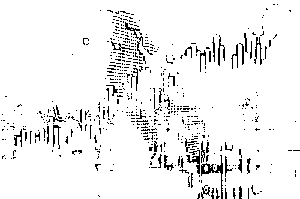

幸运的是，由于全球变暖，冰山可能在船撞上之前就融化了。领导者可能因为拯救了船舶免于不可避免的碰撞，而得到赞扬。事实上，碰撞本来就不会发生。那是一场虚幻的危机，被吹捧得太过分了。**这个十年的后半段，真正的危险依然是通货紧缩。**

以上就是本周的全部内容了。我不能保证下周也会发布专栏，因为如果我们想有机会在 12 月 15 日前印刷和寄出[《2022 年金融预报》](http://mp.weixin.qq.com/s?__biz=MzA5NjA0NTAxNg==&mid=2651460765&idx=1&sn=67f6a350c0dfb7c898506dc1aea56420&chksm=8b48a62abc3f2f3c93bbc7efaa12011cf2c2f3359a318ada40e7f3ae8741cb1e187ac2623a8a&scene=21#wechat_redirect)（点击链接可阅读）的话，那么截止日期是下周末。

今年的截止日期比往年早了 10 天，因为供应链（本例为纸张）的中断导致了各地印刷的延迟。通货膨胀也到处都是。但尽管有通货膨胀，我们仍然保持了和过去 10 年中相同的价格。我说过了我是摩羯座，有时我们像乌龟一样自信、稳定和缓慢，但绝不会像土豆那样僵化。

**说明：以上日期基于纽约证券交易所所在的美国东部标准时间，由于存在时差，中国地区可能需要加一天。**

**版权声明：**本文由若道翻译发布，欢迎转发，反对抄袭。友号转载请申请白名单。

**雷蒙德·梅里曼（Raymond Merriman）**

若道签约老师。著名金融占星师，ISAR（国际占星研究协会）前主席，梅里曼市场分析公司的总裁。他由于“提升了占星学的职业形象”，在 1995 年国际占星大会上被授予轩辕十四奖；在 2012 年国际占星大会上，被授予轩辕十四终身成就奖。

1“中国上证指数月度报告”发售**若道推出了****中文版****的雷蒙德·梅里曼中国上证指数月度报告，并持续发行该报告！**当把金融市场的周期和占星学的周期相结合时，雷蒙德·梅里曼老师的金融占星学研究**为投资者应对金融市场的周期波动，并随之调整投资策略提供了极大的价值参考**。
**11 月中英文报告已上线！**2“黄金价格周期月度报告”发售**若道推出****中文版****的雷蒙德·梅里曼黄金价格周期月度报告！**不仅仅为广大读者在中国股市的投资出谋划策，更将视角放眼黄金市场。**每当世界经济形式不明朗的时候，有一个地方是保值的港湾，那就是****黄金**。自 1982 年雷蒙德·梅里曼出版第一本研究《地球宇宙学征象与黄金价格的关联》的著作以来，**他一直作为最重要的黄金市场时机预测者之一享誉国际**。11 月黄金报告已上线，梅里曼老师将会告诉你他对这个关键时期如何操作的想法。也可以按照季度和一年期订阅，有更多优惠。季度和年度的好处是，你可以持续了解梅里曼老师对于不断在变化的市场的看法。即便他某一次看法和市场不一致，你也看到在下一期他如何调整自己的看法，并看到金融占星在一个长期时间段内对你把控风险的帮助。而能够长期控制风险、尽量找到安全的投资时机才是投资的长久之计。**11 月中英文报告已上线！****购买套餐**，买得越多越优惠中国上证指数月度报告套餐价

*   **单月报告**：280 元
*   **3 个月套餐**：780 元（260 元/月）
*   **12 个月套餐价**：2400 元（200 元/月）

**长按下图识别二维码****购买金融报告****套餐****▼**

黄金周期月度报告优惠

*   **双报告年度套餐更优惠（直降 900 元）**

*   **12 个月黄金报告+12 个月上证指数报告：仅需 3900 元**

**长按下图识别二维码购买黄金报告套餐**▼

3 中国金融市场特别网络研讨讲座面对年底几个影响金融市场的重要天象，该如何把握下半年的投资，为跨年做准备？我们特意邀请雷蒙德·梅里曼老师为大家带来了**3 个小时的金融讲座——雷蒙德·梅里曼中国金融市场特别网络研讨讲座。**这场为期 3 小时的在线讲座探讨了**这些长期行星周期如何影响世界经济的长期周期和趋势，特别是如何影响上证综指和黄金市场**。并描述**在 2021 年剩下的时间里市场反转关键时间点，特别是 12 月 19 日至 25 日金星逆行，以及土星-天王星最后一次渐亏四分相、金星与冥王星合相的重要时期。****长按下图识别二维码购买讲座视频**
▼

4《2022 年金融预报和沙龙》1976 年以来，由雷蒙德·A·梅里曼撰写的梅里曼市场时机学院每年一次的年度预报沙龙和每年一本的《年度预报》一直在应用占星学原理为投资者们服务，提供卓越洞见，从未间断。 **雷蒙德·梅里曼《2022 年金融预报和沙龙》开始预售中。****长按下图识别二维码购买**
▼

**点击阅读原文购买金融报告**

# 金融占星学大师雷蒙德·梅里曼《2022 年金融预报》开售！

> 原文：[`mp.weixin.qq.com/s?__biz=MzA5NjA0NTAxNg==&mid=2651461182&idx=3&sn=ef8865a4413913c7d4fa3dff751fbba2&chksm=8b48a489bc3f2d9f75250d9082dface403109da524fe89646fcd8ee738e5696613aeb03c6eb5&scene=126&sessionid=1692737898#rd`](http://mp.weixin.qq.com/s?__biz=MzA5NjA0NTAxNg==&mid=2651461182&idx=3&sn=ef8865a4413913c7d4fa3dff751fbba2&chksm=8b48a489bc3f2d9f75250d9082dface403109da524fe89646fcd8ee738e5696613aeb03c6eb5&scene=126&sessionid=1692737898#rd)

1976 年以来，由雷蒙德·A·梅里曼撰写的梅里曼市场时机学院每年一次的年度预报沙龙和每年一本的《年度预报》一直在应用占星学原理为投资者们服务，提供卓越洞见，从未间断。**2020 年，木星、土星和冥王星形成大合相，我们刚刚结束了一个周期和一个时代。现在我们正处于一个新时代和一个新的长期周期的早期阶段。**  如果 2020 年我们还在手忙脚乱，不知道发生了什么；2021 年则更让我们更清楚地看到一个时代结束了——2020 年之前的时代，在新冠肺炎病毒大流行、2020 年”大合相”之前的时代，这是人类历史进程上的一个转折点。**我们所熟知的生活诸多方面在那时就结束了，现在人们仍在试图找出“正确的方式”或“最好的方式”来重建和再造世界。**2021 年，有的行业被彻底摧毁，有的行业成为新贵。2021 年对投资者是一个苦乐不均的一年。尽管美国新冠肺炎疫情未见好转，道琼斯指数仍然扶摇直上；尽管中国经济在世界经济增长中一马当先，上证指数仍然波澜不惊。在货币对标的品种中，老贵族黄金走低，新贵族比特币飞升。我们还看到了大宗商品价格的飞涨，各种短缺开始出现。在中国，各种政府干预市场的调控在各个行业愈演愈烈。**这种现象到底说明了什么？又预示着什么？**2022 年我们的金融市场会受到哪些行星组合的影响呢？我们来看一看：**·** 140 年的木星-土星合相的“风象纪元”在 2021 年刚刚拉开序幕，2022 年我们还将会看到温和主义与极端主义之间存在冲突；**·** 土星四分天王星最后一次成相的影响：专制主义和中央政府控制与个人追求个体的权利和声音的冲突；新能源和旧能源的冲突；**·** 天王星进入金牛座的后半段：包括美元在内的世界货币的重新估价和地位；**·** 土星-海王星的半六分相：新冠肺炎病毒；**·** 水星、金星和火星在 2022 年的逆行“它们对 2022 年发展和增长的影响；**·** 木星在双鱼座（黄道最后一个星座）和白羊座（黄道第一个星座）之间来回移动：战争还是和平；谁是“第一名”的激烈竞争；**· **木星与海王星在双鱼座合相；**·** 冥王星在美国国家星图回归；美国的选择会对全球带来的影响；**·** 月亮交点的换座：月亮交点周期和经济周期的对应；**·** 木星在双鱼座期间金融市场和主要趋势的反转。2022 年仍然是旧世界向着新世界转变的一年。此时，金融市场的投资者和潜在投资者，都需要客观而睿智的思考，而金融占星大师雷蒙德·A·梅里曼的研究则更是无可替代的。1976 年以来，由雷蒙德·A·梅里曼撰写的梅里曼市场时机学院每年一次的年度预报沙龙和每年一本的《年度预报》报告一直在应用占星学原理为投资者们服务，提供卓越洞见，从未间断。去年，这个 3 小时的年度预报沙龙和长达 200 页左右对金融市场的分析报告帮助许多若道的读者做出正确的投资决策，降低投资风险，并获得相当不菲的投资收益。在《2021 年金融预报》中，关于上证指数，梅里曼老师说：对于上证指数，梅里曼老师说：**“我们预计涨势将在 2020 年 12 月-2021 年 2 月之间达到波峰，然后急剧下跌至 52 周和 22 个月周期的低点，这些周期将在 2021 年 5 月之前，甚至在 3 月底之前结束。此后可能会出现另一轮反弹，可能会也可能不会在 2021 年 11 月之前形成第一个 33 个月周期的新高。”**| 上证指数 K 线图关于黄金，梅里曼老师说：**“黄金的 31.33 个月周期波谷将在 2021 年 9 月之前出现，理想情况是 2020 年 12 月-2021 年 6 月。价格目标是 1628+/-109 或 1768+/-76。重叠范围（理想情况）是 1692-1737。如果价格跌破这些范围，则为看涨情况中令人担忧的状况。”**| 黄金走势 K 线图关于白银，梅里曼老师说：**“木星和月亮交点的周期表明，白银的一个重要低点将在 2021 年出现，最有可能在 5 月 13 日之前或 7 月 28 日之后出现。这可能是 5-7 年周期的波谷，但可能会保持在 18.50 以上。收盘低于 17.00 将令人担忧。”**

| 白银走势 K 线图

12 月底，我们将会再次发布梅里曼老师《2022 金融年报》。**2022 年初，梅里曼老师将会照样带来一场精彩的讲座，讨论 2022 年重要的宇宙天象及其对世界经济、金融形势的整体影响，还将覆盖中国上证股票市场的分析、黄金白银市场、比特币市场等投资市场。具体时间我们待确定后会通知大家。****2022 年度预报及沙龙预售**

**价格：****1380 元**

一份价格仅千元的顶尖金融占星大师的投资分析报告和沙龙，聪明的投资者值得拥有。**购买者重要须知****①** 梅里曼市场时机学院每年一次的年度预报沙龙和《年度预报》是梅里曼市场时机学院的研究“预报”，而不是市场“预测”，是梅里曼老师及其金融占星分析师对人类活动周期历史与行星周期之间相关性的研究，二者在大部分情况下具有 80%或更高的相关性，而不是因果关系。沙龙中和报告中的研究完全存在错误的可能性。即便是非常认真的研究和几十年的研究经验，我们无法总是正确地解读出各种征象在实际层面上会如何相互作用，并显化为事件结果。

所以请将次沙龙和报告看作一个研究参考，务必结合其他市场研究和你个人对市场的理解，根据你的自由意志做决策。

**②** 此报告一旦售出，**即不接受退款。**

**③** 此报告仅支持在手机网页和若道 APP 上阅读，不支持电脑阅读和下载。**④** 讲座提供视频回放。**以上须知，请仔细阅读。一旦付款，即视为已了解并接受所有须知内容。**

**如在购买报告中遇见任何问题**

**可添加客服**

▼

****购买报告直达入口****

# 今天月亮在双鱼座，大家打算“躺平”还是“奋斗”？

> 原文：[`mp.weixin.qq.com/s?__biz=MzA5NjA0NTAxNg==&mid=2651461122&idx=1&sn=193b505018b1831ce1d26fe66818480b&chksm=8b48a4b5bc3f2da37c21e21308fe38b01f7af510d8713749d41bd3783a1b451af255441ae7ca&scene=126&sessionid=1692737898#rd`](http://mp.weixin.qq.com/s?__biz=MzA5NjA0NTAxNg==&mid=2651461122&idx=1&sn=193b505018b1831ce1d26fe66818480b&chksm=8b48a4b5bc3f2da37c21e21308fe38b01f7af510d8713749d41bd3783a1b451af255441ae7ca&scene=126&sessionid=1692737898#rd)

**2021 年 11 月 13 日天象：**

*   **月亮在双鱼座**

*   ******太阳三分海王星******

*   ******水星对分天王星******

*   ******金星六分火星******

今天，月亮在双鱼座，适合看电影、参与和艺术有关的活动，或者放空发呆，让自己彻底的放松休整一下。月亮在今天的行进过程中，还会依次和天蝎座的火星、水星形成和谐三分相。我们可以顺畅表达内心感受，不仅深刻，还有疗愈感。不过，三分相的“扩张”能量，也容易让敏感柔软的情绪“泛滥成灾”，尤其太阳还与海王星形成精准三分相，在理想主义的环绕中，我们的内在更容易被“搅动”。

在被“包裹”的双鱼座能量之外，天蝎座水星和金牛座天王星形成对分相、摩羯座金星和天蝎座火星形成六分相。行动力充足，能集中精力做事情，并且在这个过程中，某些观点可能受到“颠覆式”冲击，并从中获得崭新启示。

那么，大家打算怎么度过这个周末呢？是懒散放松一下，还是卯足劲头“充电”？ 

周六快乐！我们周一见！ **了解每日天象，可****下载“若道”APP 查看****还有更多精彩等着你哦**

# 强烈推荐 | 对照这篇文章看自己的情感历程，简直神准！

> 原文：[`mp.weixin.qq.com/s?__biz=MzA5NjA0NTAxNg==&mid=2651461116&idx=1&sn=3c7789602ff3ede831284f1a3ff6f635&chksm=8b48a74bbc3f2e5d801c5dc5a4ccc7b2db3e5d8ab9ff3bbf9ca1c403bbefdcdf9726317c8286&scene=126&sessionid=1692737898#rd`](http://mp.weixin.qq.com/s?__biz=MzA5NjA0NTAxNg==&mid=2651461116&idx=1&sn=3c7789602ff3ede831284f1a3ff6f635&chksm=8b48a74bbc3f2e5d801c5dc5a4ccc7b2db3e5d8ab9ff3bbf9ca1c403bbefdcdf9726317c8286&scene=126&sessionid=1692737898#rd)

******☆ ****后台回复“今日”，给你一句生命态度******

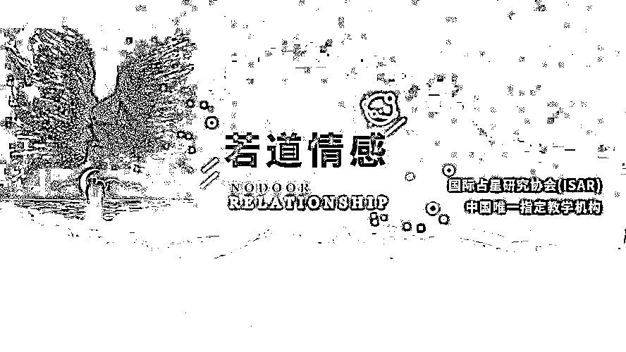

作者/大卫·瑞雷 若道占星创始人
译者/蒋颖 速记/沐心方 整理/Zorra 编辑/玫瑰 封面/书君 图片/pexels 我们对于亲密关系的觉察和需求，会随着所处的生命周期而变化。天王星周期时，我们会在亲密关系中冒险尝试；而土星周期时，我们的爱情观会更加现实……大卫老师为我们详细讲述了对亲密关系有重要影响的行星周期，这些规律无论对于单身还是已婚人士都适用。另外，大卫老师参与授课的[四大名师核心课](http://mp.weixin.qq.com/s?__biz=MzA5NjA0NTAxNg==&mid=2651460660&idx=3&sn=f65f5f0a57ca16dc1134f01b5bc1b1d1&chksm=8b48a683bc3f2f95d8b3c1f1bd069842f8f83372cdf1511107156834f8f54a9e6c52a9191c7c&scene=21#wechat_redirect)（点击链接可阅读），也欢迎你来了解更多详情！**不同年龄的人，亲密关系的需求也不同**

尽管我们希望把占星学和亲密关系尽可能简单化，但是它们不可能很简单。我们先来回顾一下占星学与亲密关系的一些最基本的原则。

作为学习占星学的学生，我们要看到一个人所处的生命周期，也就是他（她）的年龄。所处的生命周期不同，对于亲密关系的觉察和需求也是不同的。下面是一些影响单身人士的周期，它们也会影响已婚夫妇。

首先我们看看**二十多岁的单身人士所处的生命周期。**

**21/22 岁**

在**21 岁、22 岁**的时候，有趣的事情发生了，因为这时我们处于非常不同的两个周期：其中一个是**天王星与出生星图的天王星成四分相**。在这时，我们常常会**做出一些极端的改变，这些改变可能跟我们的本性和常见的行为模式不一样，我们会去寻求一种自我解放的感觉。**那么在 21-22 岁的时候，尤其对于在大学就读的年轻人来说，很可能想去尝试换一下他们的主修专业。

**在亲密关系中，这个年龄的人也容易去冒险，做一些尝试。**如果你在此时处于一段关系中，你会想挑一挑事，有些伴侣可能会**暂时分离，甚至分手**。这个时候，你会**有一种冲动，去跟一些非典型的、不同寻常的人群社交。**你会跟你的朋友说：“我以前从来没有跟这样的人约会过！”

但有趣的是，在行进天王星四分出生星图的天王星之后，马上到来的一个周期是**行进土星会跟出生星图的土星成四分相。**在这时候，我们会暂时变得更加严肃起来，会去想，**我们所冒的风险会有什么后果呢？**

有时候这意味着，**在短时期内，我们的爱情观会变得现实。**要记住，**土星总是在测试我们是否有承诺，而天王星却总是与兴奋有关。**

所以说，**在 20 岁出头的时候，我们可能会测试关系是否能定下来。**我们常常认为，天王星是让我们分手的行星，但实际上，土星也会让我们感觉到这段关系是行不通的。**在土星的影响下，我们会慢慢发现，我们到底对什么事情更认真。**

总而言之，这是一个我们**内在非常挣扎**的时期，因为有两个性质完全不同的周期接踵而至。

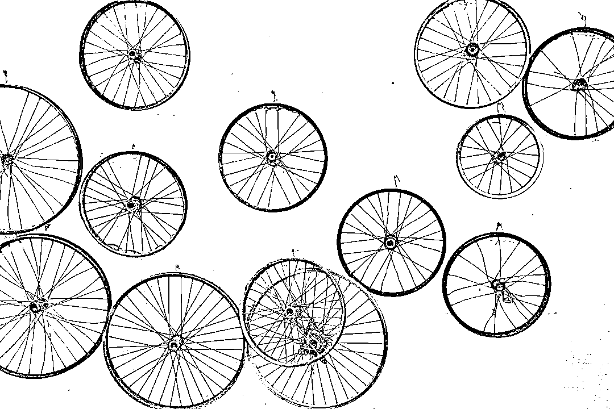

**24 岁**

**在 24 岁的时候，我们迎来了木星第二次回归（木星的第一次回归是在 12 岁）。**那时候行进的木星所落的宫位对应的领域，会激起我们**寻求更多的冒险、冲动和体验**。比如你的出生星图木星在 10 宫狮子座，那么在 24 岁的时候，你可能想去找一个更棒的工作，你对此也更加乐观。

但是这个周期也会影响到亲密关系。如果你们两人的关系很好，那么你们可以分享一样的冒险冲动。但是如果你们关系不好的话，你们的关系就会拉远，或者这时候可能会出现**异地恋**。

**27/28 岁**

在 27、28 岁的时候，会发生另外一件非常有趣的事情，这时候行**进的月亮交点与出生星图中的月亮交点成对分相。**巧合的是无论你的南交点在哪里，这时候你的行为模式都会反映出你南交点的习惯模式。

例如，一个人的南交点在天秤座，那么 28 岁左右时他会想要结婚，要有一个稳定的关系，这对他的安全感非常重要。所以南交天秤座的人，可能会遵循一条对他们而来阻抗最小的道路。

但这也可能给他造成一种两难的困境，因为我们所有人的内在都有南交点和北交点的张力。南交点在天秤座的人北交点在白羊座，所以他们这种想要做事情的渴望会与他们对结婚的渴望相冲突。

高阶的占星学生知道，**在 27 岁的时候，推进月亮也回归了，**也就是推进月亮回到了出生星图上的位置。我的老师认为这个周期 **“终于把心理上和家庭连接的脐带剪断了”**。这时你更加觉得**“我要靠自己了”**，虽然你还是一个年轻人，但是感觉更加自立了。

在中国，我发现当一个女性到了 27 岁的时候，就开始害怕自己成为剩女了。我觉得这真令人悲哀。**20 多岁是一个非常重要的自我发现的时期。**在这个时期，你会发现自己什么地方跟父母相同，什么地方跟父母是不同的。

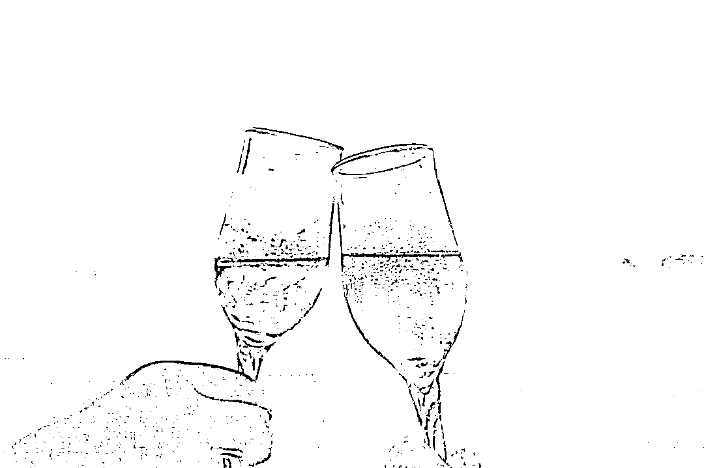

很多地方，特别是中国的年轻人，似乎在 30 岁之前必须结婚，这让他们承受了很大的压力。**在这个年纪，他们还不是特别了解自己。**当然有些人会说，在一段关系中，尤其是在结婚后，可以更好地了解自己。

这没错，但是常常发生的是，很多人急不可耐地跳入婚姻中——他们既不了解自己也不了解对方，然后就发现自己陷入一段非常不幸福的婚姻之中了。**30 岁以下的夫妻也会因为结婚和养育子女感受到巨大的冲突，从而经历自我认知的改变。**

**30 岁以上结婚的人，至少可以更成熟地应对亲密关系中的很多问题，因为我们对自己更了解。**在 30 岁刚开始的时候，我们迎来了**土星回归，这时候我们会变得更成熟。**我的老师曾经说，在第一次土星回归之前，你还不是真正的成年人。**经历过土星回归会更懂得自我限制——这是成年的标志，也就是说你能够意识到自己行为的后果是什么。**

**36 岁**

**当我们 36 岁的时候，会迎来木星的第三次回归，我们更加成熟地去审视自己的信念。**不过我觉得，在 30 多岁时最重要的趋势，是**37 岁时经历的月亮交点的第二次回归——北交点回归到出生图上的位置。**这个回归让我们**重新定义成就感和目标。**

当一个人到了 37 岁的时候，会用一种非常不同的态度来看待亲密关系。**如果一段关系和你的人生的方向并不和谐，那么这段关系可能会终止。**另一方面，你可能跟另一个人开始一段新的关系——如果你感觉到那个人跟你的人生方向是和谐的，那么**当你在 40 岁的时候，你就会有非常著名的所谓“中年危机”——这就是行进天王星和你的出生星图的天王星对分的时候。**

如果这还不够疯狂的话，你还会看到，这个**天王星对分天王星的周期和海王星四分海王星的周期重合**了。所以说在 40 岁出头的时候，你可能**经历一个非常不安的周期，同时也可能是一个非常幻灭的周期**。人们常在这个年纪对我说：“我现在觉得我的人生不是我想像的那个样子。”这也是表达了他们的**幻灭感。**

这种幻灭感会蔓延到亲密关系的各个方面，这常常是非常不稳定、非常让人困惑的阶段。所以你需要重新定义理想的关系究竟是什么样的。一段梦想会破灭，新的梦想会开启。

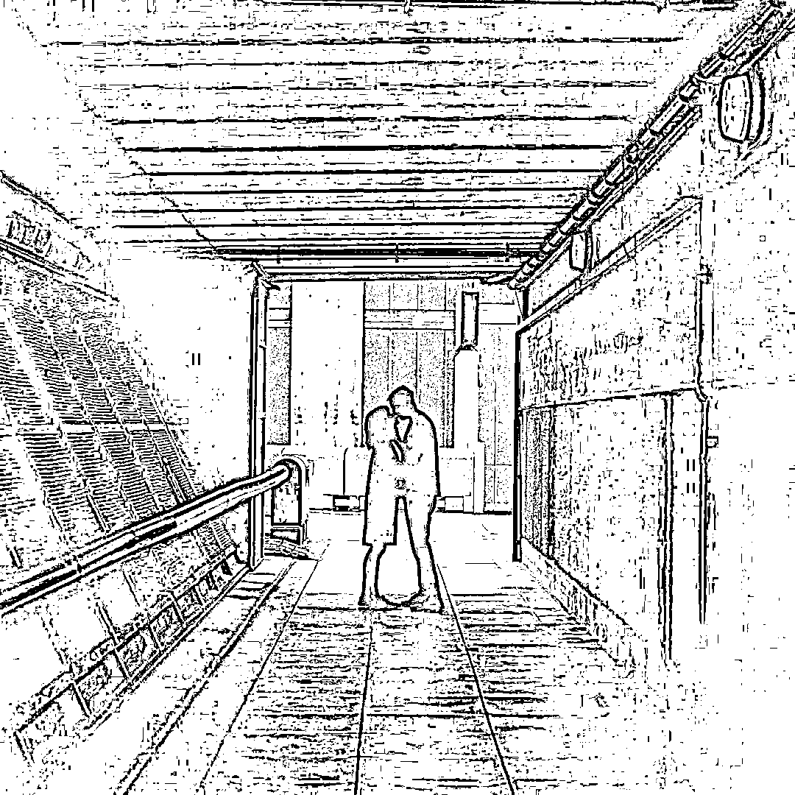

**40 岁中期**

**在 40 岁中期的时候，我们获得了土星的影响，这时候土星会对分我们出生星图的土星。**上一次土星对分土星是 14-15 岁的时候，那是我们的青少年的时期，青春期是非常令人尴尬的一个时期，但是现在你已经 44 岁、45 岁了，这是人生比较清醒的一个时期。

这时候你可以去**重新承诺或者重新定义你的承诺了**。这时候你**希望你的关系更能够遵循你制定的人生计划。**

**到 48 岁，我们再一次迎来了木星的回归，这也会在 48 岁的时候给我们的关系带来扩张和冒险。**

**50 岁**

对于 50 多岁的人来说，**大概在 55 岁左右的时候，会收获到行进的海王与出生海王星成三分的相位，这时候能够更轻松地解决生活中遇到的问题。**这时候能够**更平和地去看待和解决亲密关系中的一些问题。**非常有趣的是，**海王星三分海王星的周期正好处于月亮交点第三次回归之前。**

我看到已婚人士在 56 岁的时候，期望他们的关系能够朝着更令人满足的方向发展。比如我的客户北交点在水瓶座，他和太太每个月会为无家可归的人做两次公益服务。年轻人或许不太能理解，但是北交点在水瓶座就是要对人类有所贡献，所以当你想要为人类做出贡献时，你可以让你的关系也包括在其中，例如和太太一起做这件事情。

**版权声明：**原创文章由作者授权发布于若道平台，欢迎转发，反对抄袭。友号转载请申请白名单。

****想阅读更多作者的文章，请在后台回复******大卫****** 即可。****

**大卫·瑞雷**

美国占星师，若道联合创始人，致力于在中国教授和推广西方占星学；2010-2014 年，任全美占星师联盟监督委员会委员；2017 年，被选为 ISAR 委员会成员。ISAR 是世界最大的国际占星机构，会员遍布 45 个国家，2017-2020 年曾任 ISAR 全球副主席、CAPISAR（ISAR 职业占星师资质认证机构）主席。

**喜欢文章请长按下方二维码打赏**

**给大卫老师加杯咖啡呗~**

**▼**

**学习占星学**

**点击或长按下图了解课程详情** 

************

****

****

**微信又双叒叕改版啦，不想错过若道君的推送？**

**就把若道设为星标吧！**

**▼**

**喜欢记得点一下在看哦☟**

****报名直达入口****

# 插班中丨 ISAR 选修课：行星交点在集体进化中的作用

> 原文：[`mp.weixin.qq.com/s?__biz=MzA5NjA0NTAxNg==&mid=2651461116&idx=3&sn=bcf95f339524d2d947c3d741d92ded11&chksm=8b48a74bbc3f2e5d01df1ac31cb87fb022fdd85be1cbe91a62cdc33d3f86990914c7210b5d59&scene=126&sessionid=1692737898#rd`](http://mp.weixin.qq.com/s?__biz=MzA5NjA0NTAxNg==&mid=2651461116&idx=3&sn=bcf95f339524d2d947c3d741d92ded11&chksm=8b48a74bbc3f2e5d01df1ac31cb87fb022fdd85be1cbe91a62cdc33d3f86990914c7210b5d59&scene=126&sessionid=1692737898#rd)

这是一门专门为若道开设的课程！**马克·琼斯**将于今年秋天教授**八节关于行星交点的深度在线课程**，他将通过我们集体进化中的一些重大事件来阐释这一主题。

1

**什么是行星交点？****交点是一个天体轨道与另一个天体轨道延伸平面的交点。**任何沿轨道运行的天体都有交点。月亮有月亮交点，每颗行星、小行星、卫星和微小行星也都有交点。

2

**课程教授什么？**

马克老师**首先会讲解基础知识，**介绍行星交点是什么、行星交点运转的动力（包括日心视角和地心视角），然后他会**论述丹恩·鲁伊尔晚期工作中关于月亮交点和行星交点重要性的洞见**，以及它们如何在个人生活和事件中创造一个动态的意义轴，**超越个人出生星图的静态画面。**

马克老师还将简要**介绍自己的一些开创性研究**，并通过精选一些反映我们共同的**集体进化的现代历史事件**，分享他最近的著作《行星交点与集体进化》中的洞见。**我们将学习木星往外的行星交点**，看到木星交点如何向我们揭示文化和宗教意识形态的集体历史进化，正如我们的文明结构所表现出来的那样。例如，土星和冥王星的交点也在摩羯座，清楚地描绘了我们所有人在这个时期试图进化所面临的挑战，因为在我们生活的世界根本结构的变化中，游戏规则正在升级。**我们还将学习近期历史中行星交点的影响**，包括最近木星、土星和冥王星在摩羯座的大合相，开始真正意识到当前这个时期在文明进化本身中的集体重要性。理解这些盛衰周期，我们至少可以在这些困难时期仍然抱有希望：我们不会失去一切！**在整个课程中，马克老师将通过多个历史案例动态地研究这些强有力的交点配置可能如何运作。**

3

**课程安排****第*****1*****讲** **介绍行星交点**
我们将学习行星周期如何形成行星交点，并了解日心视角和地心视角之间的区别。**第*****2*****讲** **什么是行星交点**我们将深入学习丹恩·鲁伊尔的成熟思想，这是启发马克老师研究行星交点的灵感之源，也是他最近出版的《行星交点与集体进化》一书的灵感来源。**第*****3*****讲** **双子座-射手座的天王星交点**我们将学习人类认知和技术如何通过天王星交点的透镜进化。**第*****4*****讲**** 巨蟹座-摩羯座行星交点**我们将进一步学习行星交点对社会和文化的影响，深入探讨落在摩羯座-巨蟹座的木星、土星和冥王星交点，并了解它们在过去 1000 年里对我们的全球社会、政治和文化思潮起着怎样至关重要的影响。**第*****5*****讲** **海王星及其狮子座-水瓶座交点**我们将学习落在狮子座-水瓶座的海王星交点影响的不同显化，及其在疗愈中的作用；灵性意识形态的发展，及其促使事件结束的倾向。**第*****6*****讲** **作家案例**通过原创研究，我们将学习行星交点如何影响了世界上一些最伟大的作家的人生。**第*****7*****讲** **研究 2020 年**我们将了解 2020 年的重要意义。**第*****8*****讲** **回顾**我们将回顾前面的课程，并探索如何通过行星交点的意涵理解月亮交点。

4

**授课老师****马克·琼斯（**Mark Jones**）**马克·琼斯是一名**占星师、心理整合治疗师和催眠治疗师**，为世界各地的客户和学生提供服务。马克的第一本书《**疗愈灵魂:冥王星，天王星和月亮交点》**，详细解释他的占星方法论。他的第二本书**《灵魂的表达:占星学的治疗潜力》**，融合了马克作为超个人心理治疗师和占星学的经验，概述了占星学解读的变革性潜力。此外，马克还联合其他作者**共同撰写了一些占星书籍**：《占星学:新一代》、《超个人的占星学》以及《进化占星学的洞见》。**而《行星交点和集体进化》则是他将他对交点研究的集大成之作。**

5

**课程信息**

*   **课程时间：**2021 年 10 月 26 日开始，每周二晚上 8 点，每周一次，共 8 次课。

*   **授课方式：**线上直播，英文授课，中文翻译

*   **课程价格：****6800 元****（课程不分组写走心推荐语转发朋友优惠价：5800 元）**

*   **行星交点名人案例和问答免费试听：**添加课程顾问王老师，发送“行星交点试听”，即可获得免费试听内容。

*   **课程咨询：**王老师（微信：18510107057，请备注“行星交点”）

长按二维码添加王老师

6

**退转课程**

*   **退款原则请详看《教学协议》，如有疑问请咨询课程顾问。**

****行星交点****

**授课老师：**马克·琼斯

**授课时间：**2021 年 10 月 26 日起

**授课方式：**网络课程**，**英文授课，中文翻译

**费用：****6800 元****（课程不分组写走心推荐语转发朋友优惠价：5800 元）**

**课程负责人：****王老师**（微信：18510107057，请备注“行星交点”）

长按二维码添加课程负责人咨询~

****报名请点击“阅读原文”****

# 一个关于星图的小秘密，点开才知道！

> 原文：[`mp.weixin.qq.com/s?__biz=MzA5NjA0NTAxNg==&mid=2651461116&idx=2&sn=684423140e04342f8009f730f9dd90a2&chksm=8b48a74bbc3f2e5dd852dc57164bfd8cc9032c451ec4242701d89b11333a0b4b80f296608430&scene=126&sessionid=1692737898#rd`](http://mp.weixin.qq.com/s?__biz=MzA5NjA0NTAxNg==&mid=2651461116&idx=2&sn=684423140e04342f8009f730f9dd90a2&chksm=8b48a74bbc3f2e5dd852dc57164bfd8cc9032c451ec4242701d89b11333a0b4b80f296608430&scene=126&sessionid=1692737898#rd)

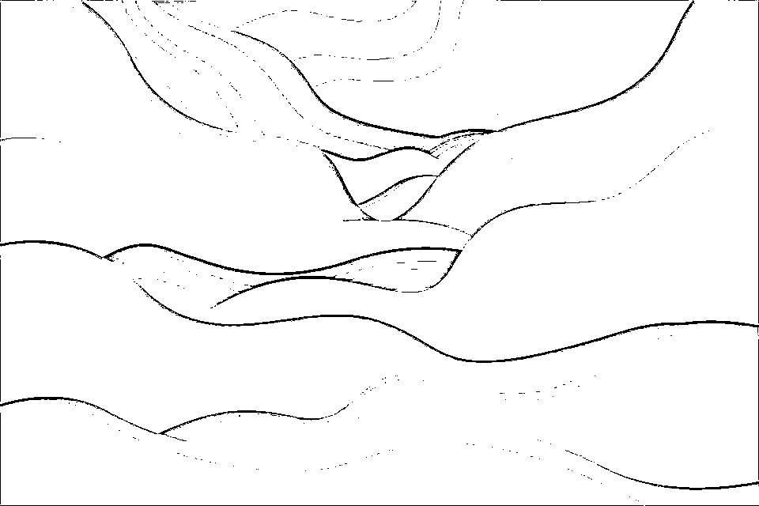

作者/简·斯皮勒

译者/轩轩 校对/王宏

编辑/翀子 图片/网络

占星学是实用的工具，我们需要听从内在声音来分辨出生星图上呈现的信息，通过星图找到自己的“小毛病”所在，意识到它们并进行调整，便有机会实现独一无二的内在生命。

没有必要为了让占星学对你有价值而信仰占星学。如果从心理学或科学的层面探索，占星学和信仰毫无关联。**占星学是实用的，与获取知识、进行尝试相关。**占星学提供的心理评估对你而言是自我认识的有用工具吗？占星学基于你的整张出生图做出的时机预测有助于你更有效地利用你的时间吗？在评估占星学所呈现的材料的真实性时，**重要的是听从自己内在的知识和过去的经历。**不管别人可能怎么想，只有你知道自己内心斗争的本质。

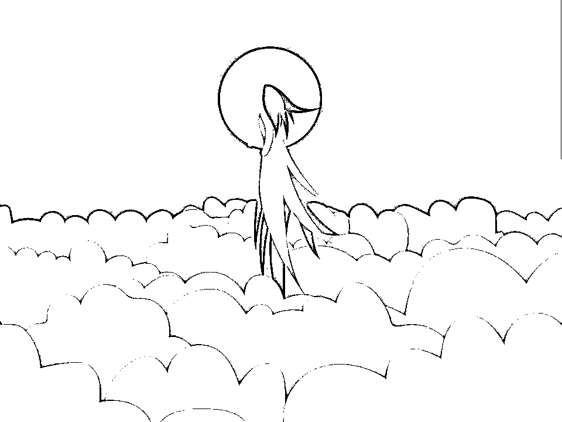

**我们每个人都是独一无二的**当我们从真正开放的认识层面来探讨占星学时，它就会直接带来无条件之爱。当你完全理解一个人的内心机制，并知道他们的“小毛病”都在哪里时，你怎么可能生他们的气呢？**我们都在尽自己最大的努力应用我们所拥有的领悟，并试图克服我们的缺点。**为什么呢？因为**占星学是实用的。**小毛病阻碍我们获得我们想要的。我们所有人都身在其中。

太阳星座占星学，例如在日报和杂志上看到的星座预测，是一种只考虑太阳星座位置的预测。**完整的出生图占星学要考虑十颗行星的星座位置**（太阳和月亮在此背景下也被看作行星，因为我们是从银河系对地球的影响这一角度来看待它的。）

出生图占星学还要考虑这个人出生时刻的轴线，以及其他几点：月亮交点、食相等等。

事实上，我们每个人都是独一无二的，**一张出生图在 25000 年间都不会重复，**因为所有的行星都以不同的速度绕太阳转动。在你第一次呼吸的时刻，整个人类，所有在那一刻活着的人，都和你一起经历那一时刻。每个人都尽全力让那一刻的自己快乐；但是，下一时刻很快就到来了，人类不得不去应对它——然后又是下一时刻，再下一个时刻，一直到此时此刻。**但是你出生的时刻被印在你根本存在的细胞层面上，它仍然是你的一部分。**通过这个联系，你负责为地球上的其他人净化那一时刻，**只有你拥有完善你自己出生时刻的力量。**就好像你得到了那一刻的时间，让它慢下来，并将其延伸，使其持续整个一生的时间。而当你开始跟那一刻互动时，你要挑出你的“线路”中运行得不太好的部分并调整它们，从而在你自己的生活中创造幸福、笑声和喜悦，而这些变化的正能量会影响其他所有人。

通过你自己的个人生活，你基本上是在改变过去的某一个时刻。**而当你改变过去时，你也为每个人改变了现在。**我曾听很多灵性导师说，**我们能为别人做的最好的事就是做好我们自己。**我们都在最深的层次上相互联结，我们是一体的。

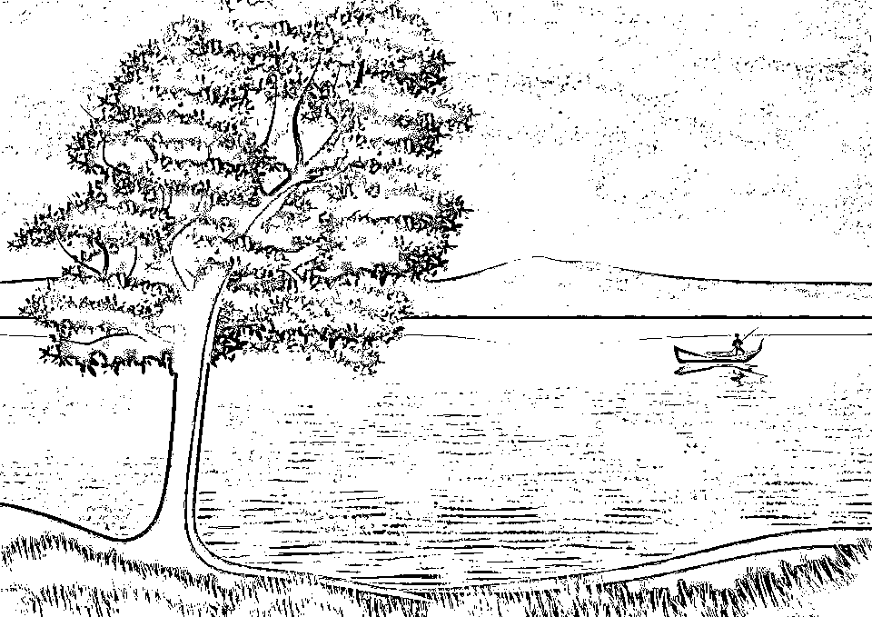

**生命道路并无好坏之分**星图本身其实就是一张图表：一张展示人们“内在线路”的图表。**我们每个人内在的线路都是不一样的。**它并没有好与坏之分，它只是以自己的方式连接着。**你的出生图展现的是你与生俱来的内在线路，但是你如何利用那些线路就取决于你自己了。**当你能够客观地看到你自己的行为模式时，你就能做出调整，以获得更有效的结果和更好的表现。当你修正了错误的线路时，你的生活就会更加顺利（首先是内在，然后是外在）。**通过清晰了解你的内在线路，你能够意识到固有的“小毛病”，**然后也可以选择不继续做不适合你的行为。例如，如果一个人通过查看自己的出生星图，客观地意识到自己倾向于认为自己无所不知，并因此变得没有耐性，表现出一种自以为是的态度，将自己与他人隔绝开来（如果他们的北交点落在双子座或第三宫，就会出现这种情况）。当这个人知道了自己的这种倾向，他/她就可以有意识地先多花点时间恭敬地接受他人给予的真实信息，然后再大胆地提出自己的观点。**仅仅是这一调整就会对这个人的社会交往产生很大的影响。**我们每个人都可能有一些不合适的行为，会觉得被孤立、不开心。**秘诀在于发现我们自己的小毛病，并尽力去避免他们。**有了这一客观认识，我们不再在黑暗中摸索，同时也开始理解为什么生活给予我们的回应总让我们不开心。**人生苦短，没有时间蒙住眼睛转圈。**你不仅仅是你星图的总和。**星图展现了你的个性结构，你自己才是星图背后的操控者，你有能力用自己选择的任何方式发挥个性**（出生图中描述的能量）。无论是让个性无意识地运作，还是由自己来掌控并净化能量，从而让生活朝对你有利的方向发展，这都取决于你自己。

**版权声明：**本文由若道翻译发布，欢迎转发，反对抄袭。友号转载请申请白名单。

**简·斯皮勒**

全球占星界的一位领军人物，是美国占星师联盟（AFAN）的教授。也是畅销书《新月占星学》、《灵魂占星》、《灵性占星学》和《宇宙之爱》的作者。

**学习占星学****点击下图了解课程详情**************

****

****

**微信又双叒叕改版啦，不想错过若道君的推送？****就把若道设为星标吧！****▼**

**就是这个“在看”，戳戳戳 ☟**

****报名直达入口****

# “我怎么能赚到更多钱呢？”请好好照顾你的财富宝库宫位！

> 原文：[`mp.weixin.qq.com/s?__biz=MzA5NjA0NTAxNg==&mid=2651460960&idx=1&sn=890a455ac2693104ee6682eada34fda1&chksm=8b48a7d7bc3f2ec18b8b5669ecd74f544414b41f98763e0cee5aeb4e6cfb8f3938b67b72fa30&scene=126&sessionid=1692737903#rd`](http://mp.weixin.qq.com/s?__biz=MzA5NjA0NTAxNg==&mid=2651460960&idx=1&sn=890a455ac2693104ee6682eada34fda1&chksm=8b48a7d7bc3f2ec18b8b5669ecd74f544414b41f98763e0cee5aeb4e6cfb8f3938b67b72fa30&scene=126&sessionid=1692737903#rd)

**后台回复“今日”，给你一句生命态度**

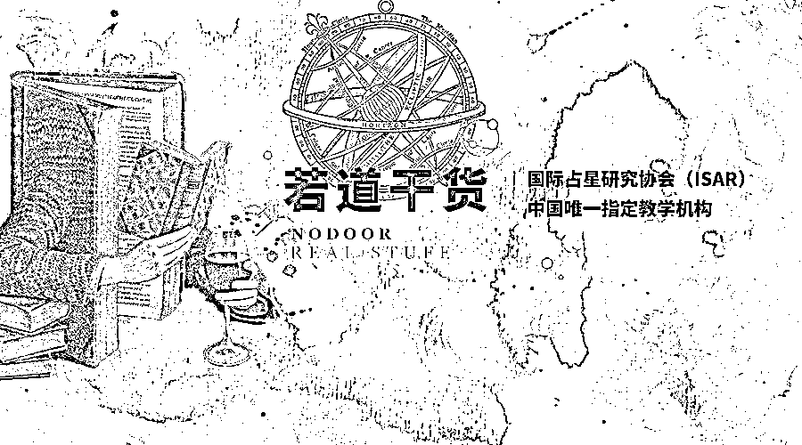

作者/达娜·格哈特 译者/葡萄园的女巫

编辑/玫瑰 图片/pexels

二宫是一个很多学占星学的同学都会去好好研究的宫位，因为它涉及了我们的资源、金钱，是我们生活在这个世界上的物质基础。这篇文章更深入地分析了这个宫位，不仅提到钱，甚至如果你感到无力，也可以去关注一下二宫的议题。

“我怎么能获得更多钱呢？”是在咨询中大部分客户询问机率最高的三个问题之一。除了爱情，很少有事情能让人如此渴望，如此焦虑怨恨混乱。占星学通过第二宫的情况了解一个人财务的状况、观念和现状，以及可以帮助或阻碍他的状况。**如果你想解开自己财务状况的奥秘，必须了解第二宫的情况。**你会拥有什么呢？在第二宫中描述的可不仅仅是你银行账户的状况。 **二宫为什么和财富相关？**在《神圣的契约》一文中，凯洛琳·梅斯指出了第二宫能量的基础。虽然梅斯不是占星学家，但是她有敏锐捕捉原型的能力。对于你第二宫情况的诊断，她建议看一下你生活中总是感到无力的那一方面。你感到无力的方面也许与其他宫位有关，比如你的人际关系（七宫）或者你的职业生涯（十宫）——你感到无力的通道。她提出，这很有可能是因为你第二宫的消极态度造成的。换句话说，**你力量的关键或者你无力的原因，都体现在第二宫。 ** 

**宫位小贴士**

第二宫是**续宫**，这表示它跟随在一个重要的角宫之后。约翰· 弗罗利的文章指出，角宫（一、四、七、十宫）是整个星图中的关键位置，就像房屋的横梁。行星落入角宫会更有力，更能发挥优势作用。它们支撑了你生命中最重要的部分：你的人格特质、你的家庭、你的伴侣、你的事业。

但这并不意味着续宫就不重要了。恰恰相反，**续宫的重要意义跟它前面的角宫紧紧相关。续宫扮演了非常重要的支持角色。**他们意味着不论角宫开创了什么局面续宫都将给予稳固的支持。

举个例子，续宫第五宫，它掌管了子女、恋爱、创造性——但是它们都有同样的任务。这几种活动都源自第四宫——家庭所培育和鼓励的人格特质。

同样，更深层的密切关系，财务上的、两性关系上的，在第八宫将延续第七宫伴侣宫所赋予的命题。同样的，第十一宫所掌管的社会交际网络也在支持或破坏着我们在角宫第十宫所建立的专业地位。 

所以，不论第一宫诞生了怎样的本质特征，**第二宫都扮演了支持它的角色**。一个精力旺盛的第二宫不但确保了你的基本生存，更给了你对抗的力量。举个例子，如果你是一个国家，那么第二宫就掌管了你的国家物资，国家的银行系统，你的粮食和出口物资的兴旺。如果你是一个正要对外宣战的国家，那么第二宫就是你的同盟军，你的弹药和枪支。如果你是一场法律官司的原告，那么第二宫就是给你作证的人。一个强大的第二宫决定了成败的关键。 

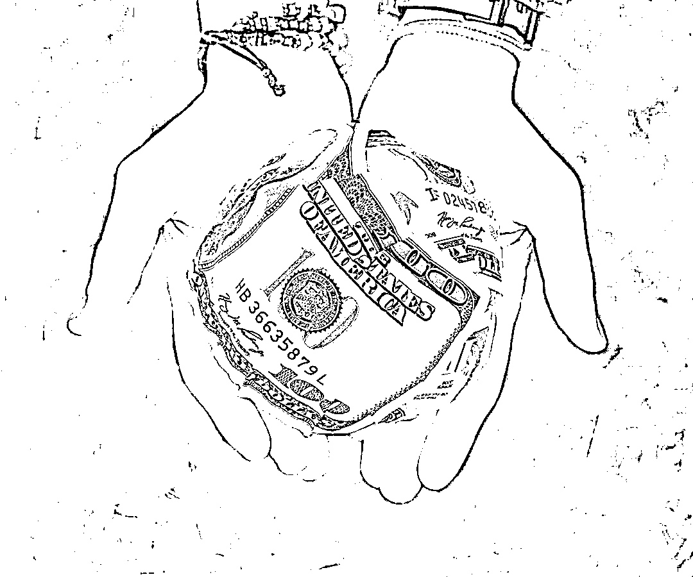

**第一宫代表了你来到这个世上，第二宫代表什么让你留在世界中。**这里有所有你称为“我的”东西。通过第二宫你能融入到这个世界并证明你的存在。当你还是个孩子时，第二宫就开始确认你所拥有的脚趾头和手指头，你塞进嘴里的食物，只有你能抱着睡觉的泰迪熊。当你渐渐长大，你也将继续巩固基础以支撑第一宫不断深化你的自我发现。通过你的欲望来不断完成自我的认知，你必须利用的资源就是你赋予自己的价值。 **第二宫控制着金钱能购买的（财产和物质资源）和金钱所不能购买的（天赋、自尊心、价值观）**。如果你工作得不快乐，那是因为你的天赋在工作中得不到充分地发挥，而第二宫里的行星和第二宫的宫主星将向你描述，你有哪些天赋。举个例子，如果月亮是第二宫的宫主星或者落入第二宫，那么你将有很优秀的直觉天赋，对情感的敏锐性，学习的欲望。除非这个月亮是落在摩羯座、处女座或者金牛座，不然从事会计工作将是一种折磨。为什么你的同事能长驱直入地走到老板办公室要求加薪，而你靠这份工作为生却没办法做到这样？因为他有一个过分自信的水星合相火星在第二宫，而你有一个阻碍自我发展的冥王星四分太阳。 你必须以现实态度对待第二宫。**你必须学习怎么利用、保护、管理这里的资源，否则你将失去这些恩赐。**任何有财务麻烦的人就是对这一点的认识太过简单。 
**困在第二宫里的艺术家**约翰（John）49 岁，他不但有一堆债务甚至连这次咨询的费用都无法支付。在他成年以后，他一直从事只有最低薪水的工作。在过去十年里，他只能靠女朋友的收入为生。 约翰第二宫的**宫主星是吉星木星，而且落在了勤奋的处女座**。约翰是一个有天分的艺术家和手工艺者。他设计镶嵌的首饰非常有灵气。“他喜欢在石头上作画。”这是一个朋友对他的评价。但是约翰却很少设计首饰，即使在他最多产的时期也没法以此为生。与约翰交谈之后我知道，他父亲是一个木匠，为好莱坞电影做布景设计，他一再地告诫儿子不要以手工业为生。他怨恨自己的蓝领生涯，他认为约翰没办法靠双手挣到任何钱。因为这个沉重的警告，一个艺术家被困在了约翰的第二宫里挣扎着。 约翰的第二宫宫主星是木星，落在了处女座，处女座的守护星是掌管手工业的水星。但这两颗行星都被冥王星压抑着。这种由冥王星带来的行星无力感只有在做出改变之后才能消除。大部分时候约翰都感到无力和瘫痪，不能从事他喜爱的艺术就等于什么都不能做。那双创造艺术灵感的手就是约翰最好的资源，他父亲贬低了这双手的价值就像告诉约翰他是个废物。约翰成年以后，不管是他的财务问题或者是其他问题都是无意识地在证明这一点。 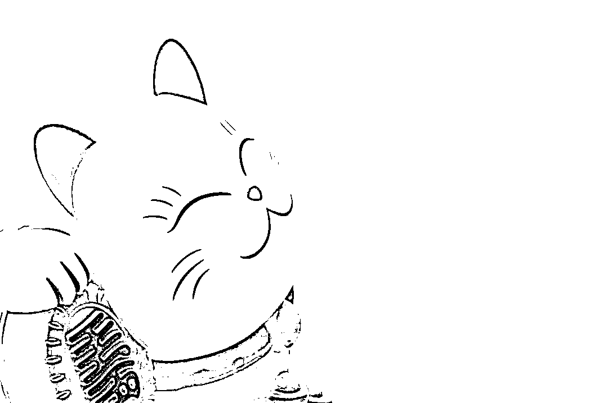约翰很幸运地与一个相信他的天分的女人丽莎（Lysa）一起生活。但是这些年她的爱情并没有能够帮助约翰在艺术上的发展。一直到丽莎厌倦了，开始要求他也挣钱，约翰冒着感情的风险养活自己。丽莎有非常优秀的商业头脑帮助约翰开展他的新事业。展示设计这一步对约翰来说是一种折磨，不论是在手工艺品交易会的展台上，还是与客户商谈订制事宜，都是他自己负责。他成熟了，尽管这种蜕变和新生是很痛苦的。这需要勇气。如果没有赚钱的压力，约翰恐怕做不到这一点。 每当我听到人们抱怨赚钱的压力毁了他们的精神生活、阻碍了自我的探寻时我都表示怀疑。**精神与物质，息息相关。**我们以肉体实在的感受存在着，也有充分的理由必须与其他物质发生联系。物质决定了精神的形态。怎么样才能让我们的灵魂成长得足够坚强以抵抗唯物主义的强硬？如果我们简单的梦想或者 “计划”按照我们的方式去成长，是不是就成了外星人？**木星=祝福？土星=诅咒？**

**木星是掌管财富的行星**。如果不能断定木星的力量，就不能准确的估计一个人财富的潜力。尽管如此，我观察到的一个现象还是让我很迷惑：**在我观察的星图中，有很大财务问题的人往往有木星落在二宫或是二宫宫主星，而比较成功的人士的第二宫却往往与土星扯上关系**（落入第二宫或者是第二宫的宫主星）。 

**这有悖于传统的结论，木星带来好运而土星带来厄运。**或许这是因为我们已经不是生活在传统的社会了——在传统社会，家族财富决定了人们的财富命运，跨越阶级是非常困难的，土星在这种状况下决定了我们所受的限制，而不是我们需要克服的困难。

木星带来的是对于特权的期望——虽然我所认识的大部分木星落二宫或者是二宫宫主星的人都来自中产阶级家庭。

尽管如此，他们的权利意识却很强。不论是银行账户的余额还是关于未来，他们都希望感到安全。他们相信：“有些事情将要发生。”事实上也的确发生了。举个例子，约翰就一直有吃有住，有钱买鞋，也有钱支付牙医和按摩师，虽然他很多年都没有收入。 

我姐姐的第二宫宫主星是木星，我的第二宫落入了土星。当我们俩都怀孕时，我担心即将到来的责任，每天看护的花费，小孩的健康保险，衣服、尿布、食物。我姐姐却很轻松快乐。她身体有残疾，靠国家救济为生。而我的收入是她的 6 倍——但是谁会有巨大财富就像扔硬币一样没谱。

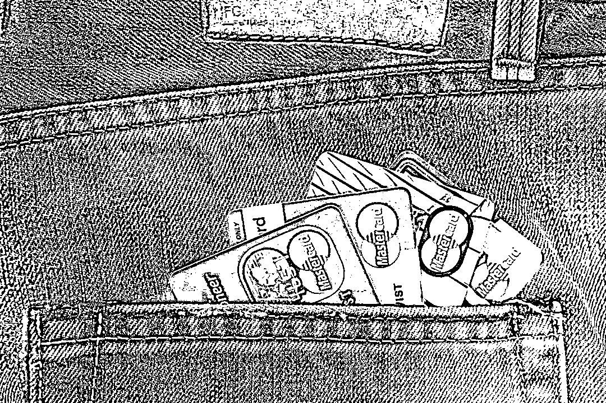

**土星和木星的不同之处让我想到了一个寓言，蚂蚁与蝗虫。**蚂蚁整个夏天都在工作，而蝗虫则玩得跟没有明天一样，直到冬天来了，没有了食物。我就是一个有土星在第二宫的蚂蚁。我习惯储蓄而且工作努力。但是我知道很多玩耍了一个夏天的木星蝗虫在冬天账单到期时也没饿死。看起来这两种情况都不错。所以我把这一点留给你去决定——**对于第二宫，哪颗行星是祝福而哪一颗是诅咒呢？ **当然，金钱不代表一切，这甚至不是我最喜欢的我第二宫的内容。所有奋斗和成功的过程比美元更深刻。所以简单诊断第二宫的情况，从财务问题开始是不错的选择。看一下你的资产和银行账目。关于你与世界的关系，它们告诉了你什么呢？

接下来看看你的财产。它们是不是反应了你的个性？是它们支配着你，还是你拥有它们？你第二宫的天赋是什么？它们是否得到了充分的发挥？而且最重要的是，你是否持续地改变着这个战场以确定你对于拥有权力的态度而不是去挑战它？

**版权声明：**本文由若道翻译发布，欢迎转发，反对抄袭。友号转载请申请白名单。

****

**达纳·格哈特**一位国际范围内受尊敬的占星师。她为众多占星学网站和出版物讲课、写稿。她在十二宫的月亮激励她对这颗发光体进行了深刻而持久的探索研究。****雷蒙德·梅里曼《2022 年金融预报和沙龙》开始预售中。原价 1380 元，双十一特惠购，仅需 1180 元，特惠促销仅限 100 名，先到先得。********长按下图了解详情****

**学习占星学****点击下图了解课程详情**************

****

****

**微信又双叒叕改版啦，不想错过若道君的推送？****就把若道设为星标吧！****▼**

**就是这个“在看”，戳戳戳 ☟**

**********报名直达入口**********

# 重磅·年度天象预测课 | 即将到来的 2022，会发生什么大事件？四位国际大师轮番深度揭秘！

> 原文：[`mp.weixin.qq.com/s?__biz=MzA5NjA0NTAxNg==&mid=2651460960&idx=2&sn=f013d274802e4a1d7d4c887dc7eb7579&chksm=8b48a7d7bc3f2ec184dc14054b792e10a8330fc9d4a504722ed42c6fd2b04c53ba4d550b7b67&scene=126&sessionid=1692737903#rd`](http://mp.weixin.qq.com/s?__biz=MzA5NjA0NTAxNg==&mid=2651460960&idx=2&sn=f013d274802e4a1d7d4c887dc7eb7579&chksm=8b48a7d7bc3f2ec184dc14054b792e10a8330fc9d4a504722ed42c6fd2b04c53ba4d550b7b67&scene=126&sessionid=1692737903#rd)

2021 年已接近尾声，忙碌的年末工作也挡不住我们对来年的盼望和期许。作为占星师，在年初跟随权威老师透彻地学习 2022 年重要天象的含义和影响，是迎接新的一年的正确姿势，仪式感满满！为新一年的自我规划和占星事业加油充电。**若道邀请了金牌核心课中的四位国际名师再次集结，在明年 1 月 8 日、9 日带来 2022 年重大天象的深入解读：**********

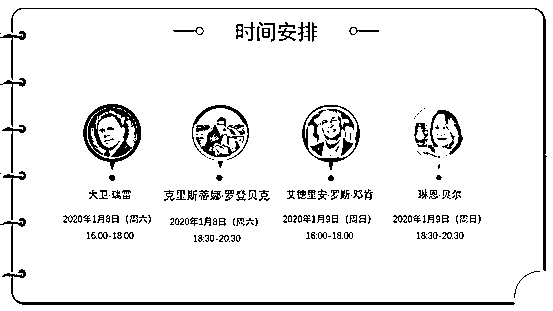

**讲师是谁？**

**琳恩·贝尔**

**（Lynn Bell）**

**· **世界最受欢迎的占星学演讲者、作家和老师之一。定居巴黎，研究心理占星学和家族模式数十年； **·** 著名的心理占星学中心（*Centre for Psychological Astrology*）的长期导师。2016 年，获得查尔斯·哈维（Charles Harvey）杰出的占星学服务奖；**· **作为一个从多个层面进行工作的占星咨询大师，琳恩的工作结合了心理学的观点。她对家族模式的兴趣首先来自与客户的合作。通过在分析领域所做的个人工作，她所受的埃里克森催眠训练将她引领至家族系统。后来，她组织研究小组在家族星图上进行了数年的研究。她写的《家族占星学》就是这项研究的结果；**· **法国心理占星学协会的会长。除了占星学，她在法国沙特尔的新沙特尔学校任教 8 年，还 5 次获得了在《纽约时报》畅销书作者卡罗琳·迈斯（Caroline Myss）的卡罗琳·迈斯教育学院（*Caroline Myss Educational Institute*）合作教学的机会。

**艾德里安·罗斯·邓肯**

**（Adrian Ross Duncan）**

**· **1971 年在印度游学时开始学习占星学，1985 年开始成为全职占星师，迄今执业已超过 33 年，是人本主义占星学、卜卦占星学和经世占星学领域的知名占星师。他还开发了占星软件 AstroClock 和多款占星报告；

**· **哥本哈根占星学院院长；

**· **他在日常咨询中经常运用卜卦，咨询图（卜卦的一种运用方式，即根据客户来访时间制作星图，从星图中获得大量信息）也是他特别擅长的领域；

**· **艾德里安·罗斯·邓肯从 1971 年开始研习佛学，受佛学影响很深，他相信占星学和佛学观点一致，转化的一个基础是在于对现实感知的改变。而卜卦很容易与佛教融合，因为它只关乎当下。

**克里斯蒂娜·罗登贝克**
**（Christina Rodenbeck）****· **克里斯蒂娜·罗登贝克（Christina Rodenbeck）是一名全职职业占星师，在牛津大学城生活和工作，深受周围知识和文化氛围影响；她拥有伦敦大学（*University of London*）的人文荣誉学位，曾在伦敦占星学馆（*Astrological Lodge of London*）、心理占星中心和占星研究学院学习；**· **作为一名占星师，在过去的 20 年里，克里斯蒂娜在她的网站“牛津占星师”上写了大量关于时事、艺术和文化的文章；她每月主持一个占星播客：“与克里斯蒂娜和萨莉一起占星”，并定期在《占星杂志》(*Astrological Journal)*上撰写时尚专栏；她定期在英国授课，并保持着蓬勃发展的专业实践。

**大卫·瑞雷**

**（David Railey）**

**· **若道联合创始人，致力于在中国教授和推广西方占星学；

**· **曾任 ISAR 全球副主席，CAPISAR（ISAR 职业占星师资质认证机构）主席；

**· **1976 年，通过亚特兰大职业占星师考试，成为全职占星师，随后通过 AFAN 和 ISAR 职业测试；

**·** 1980 年，与杰夫·焦耳一起在亚特兰大创建“每日行星”占星学中心。此后在亚特兰大占星协会担任 4 年考官，并且两次担任亚特兰大地区占星协会主席。1979-1992 年，作为占星师活跃于美国社会媒体，向不了解现代占星学变化的大众宣传专业占星学知识。在 1989-1992 年期间，他在 WRGG 电台 12 频道每周主持个人电视秀“今日占星学”，早先他还在 WRFG 的广播节目中播讲宇宙天气节目；

**· **2010-2014 年，任全美占星师联盟监督委员会委员；

**· **2010 年，其著作《灵魂的目标》中国版出版，和蒋颖一起创办若道占星学校和其官网 www.nodoor.com；

**· **2017 年，被选为 ISAR 委员会成员。ISAR 是世界最大的国际占星机构，会员遍布 45 个国家，2017-2020 年曾任 ISAR 全球副主席、CAPISAR（ISAR 职业占星师资质认证机构）主席。

**课程价格****正价**：3000 元**限量优惠价：2022 元**（前 60 名报满截止）**（联系 Maggie 老师，抢占限量优惠价）**

长按二维码添加 Maggie 老师

**退转课程**

**· 退款原则请详看《教学协议》，如有疑问请咨询课程顾问。**

****2022 年度天象预测大师课****

**授课老师：**琳恩·贝尔、艾德里安·罗斯·邓肯、克里斯蒂娜·罗登贝克、大卫·瑞雷

**授课时间：**2022 年 1 月 8 日-9 日

**授课方式：**网络课程**，**英文授课，中文翻译

**费用：**3000 元**；****限量优惠价：2022 元（前 60 名报满截止）**

**课程负责人：****Maggie 老师**（微信：18510107057，请备注“天象预测大师课”）

长按二维码添加课程负责人咨询~

****报名直达入口****

# 神话塔罗之大阿卡纳牌｜命运之轮

> 原文：[`mp.weixin.qq.com/s?__biz=MzA5NjA0NTAxNg==&mid=2651460960&idx=3&sn=4d85b69a6df831d4229b18a668cbcda4&chksm=8b48a7d7bc3f2ec12b54056abd2b389148daf918ee9dbb6d3c00a0327906aa78a0c7ceb433ff&scene=126&sessionid=1692737903#rd`](http://mp.weixin.qq.com/s?__biz=MzA5NjA0NTAxNg==&mid=2651460960&idx=3&sn=4d85b69a6df831d4229b18a668cbcda4&chksm=8b48a7d7bc3f2ec12b54056abd2b389148daf918ee9dbb6d3c00a0327906aa78a0c7ceb433ff&scene=126&sessionid=1692737903#rd)

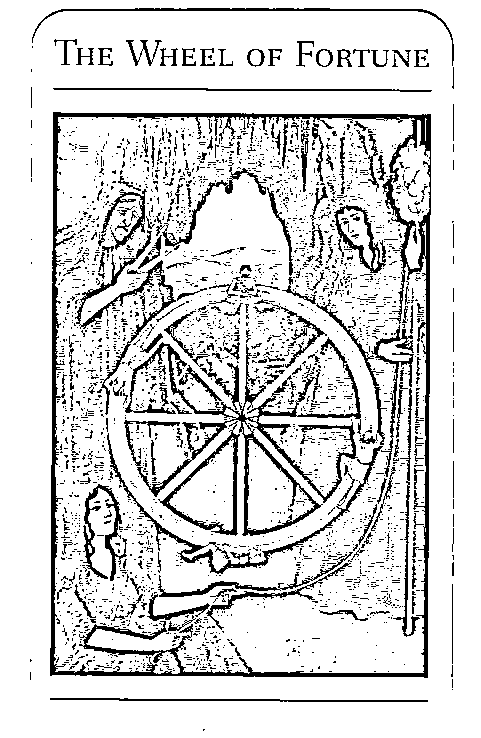

作者/朱丽叶·沙曼-伯克 丽兹·格林

译者/闫东升 编辑/玫瑰 图片/神话塔罗 网络

本文节选自《神话塔罗》

神话塔罗取材于希腊诸神，它们是描绘多面多彩的人类心智活动中最基本、最全面的图像。它们象征着原始自然，也象征着我们原始的人类本性，这种本性中蕴藏着身体与精神的矛盾。命运之轮的轮转，人生的高低起伏，这个人类逃不开的话题，在神话塔罗中和命运三女神有着不可割裂的关系。今天就来解读大阿卡纳牌——命运之轮。

[🔈 神话塔罗·命运之轮](https://res.wx.qq.com/voice/getvoice?mediaid=MzA5NjA0NTAxNl8yNjUxNDYwOTU5)

**｜**朗读者小巫

**书名：**

神话塔罗 

**作者：**

朱丽叶·沙曼-伯克   丽兹·格林 

**出版日期：**

2011-08-02

命运之轮对应的希腊神祗**摩伊莱·命运三女神****命运三女神**

命运之轮牌描绘了三个在黑暗的洞穴中坐着的女人。第一个女人很年轻，她正在从一个金色的纺锤中抽线。第二个女人成熟优雅，她在用双手测量线的长度。第三个女人已经年迈，手中举着一个剪刀。她们三个中间是一个金色的轮盘，轮盘的边缘上有四个很小的人体，姿势各不相同。通过她们背后的洞口，可以看到外面是一片翠绿富饶的土地。

> **摩伊莱（*Moirai*，命运三女神的统称）**：抽取、测量和剪切的线比喻着构成身体的元素，洞穴象征着子宫，因此牌面的核心反映着命运和遗传与身体有紧密的关联。**摩伊莱三个不同年纪的形象**：呈现出月亮周期的不同阶段，从开始的上弦月到中间的满月，又到最后终将回归黑暗的下弦月，对应着人生的三个阶段。**洞穴**：除了象征子宫外，还象征着坟墓，也就是命运的起点和终点。

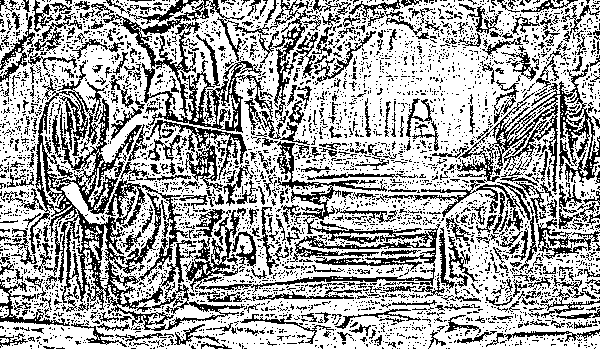

**无可躲避的生命之线编织者**

在这张牌中我们和希腊神话中的摩伊莱——命运三女神相遇了。摩伊莱是黑夜之母（*Mother Night*）的女儿，她们并没有父亲。其中克罗托（*Clotho*）是纺织者，拉克希斯（*Lachesis*）是测量者，阿特洛柏斯（*Atropos*）是剪切者，后者名字的含义是“没有人能够躲开她”。

命运三女神在她们隐秘的黑暗洞穴中编织着人类的生命之线，没有任何神可以干涉她们的工作，即使伟大的宙斯（*Zeus*）也不例外。

只要任何人的命运被织好，就是无法挽回的事实了，而且也不能被更改，生命的长度和终点是三位女神一起决定的。如果任何人想挑战命运，就像古往今来很多英雄人物一样，那他（她）通常会受到可怕的惩罚，因为摩伊莱设定的限制是严禁任何人跨越的。

在神话中，据说太阳神阿波罗（*Apollo*）曾经嘲笑过摩伊莱，他不怀好意地灌醉了她们，试图让好友艾德米塔斯（*Admetus*）免于死亡。据说宙斯非常敬畏命运三女神，因为她们是黑夜之母独自孕育出来的孩子，和任何其它的神都没有关系，而且黑夜之母是宇宙最古老的神秘力量。

**人生没有偶然****从内在的层面来看，摩伊莱掌握的命运之轮象征着在每个人身上都运作着的一种非常隐秘和神秘的律则，人们无法看到和了解它，似乎它给人生带来的忽然的改变，一下子就颠覆了已经建立的生命模式。**命运之轮牌面上轮子边缘的四个人体形象，象征着不同的生命经验，它反映着当灵魂进入生命之轮时，第一反应并不是去探寻它背后的根源，而只是跟随着命运的改变做出反应。轮盘顶部的那个人已经通过轮盘的转动到达了成功的巅峰，而轮盘底部的那个人则认为自己遭到了“噩运”，其实他们都只是在某种神秘的模式中不断变换着位置罢了。轮盘右边的那个人开始向上攀登，一种神秘的、不可见的力量在帮助他（她），其实也是这种力量使上面的人到达巅峰，使下面的人跌入噩运；而轮盘左边的人开始下落，这当然违背了他（她）的意愿，但随着轮盘的旋转，他（她）的“好运”已经享用殆尽了。其实命运之轮牌并不是为了呈现人生的机遇、改变或运气的急速变化。**在摩伊莱代表的命运之轮背后，是一个有秩序和善巧的计划，只是从生命的表象看来，好像一切变化都是偶然的。**这些远古的形象一直保存在我们内在潜意识的深处，所以个体意识无法看到，更无法明白。我们只能通过它对外在的影响力来了解，看起来就像命运一样，其实外在的命运并非源自于外在的力量，而是来自于每个人的心灵深处。人们对命运之轮的体验，在本质上是对自己内在的“他者（*Other*）”的体验，通常情况下我们把“他者”投射到外在世界里，然后把噩运责怪到他人或生活境遇上，把自己完全置身事外。命运之轮的旋转强迫我们去觉知到内在的“他者”，意即转轮背后的善巧和秩序，就是每个人承载着的命运。转轮的意象非常深奥，环形的外围象征着每个人生命之路的全景，转轮的中心则象征着不变的本质或根源。

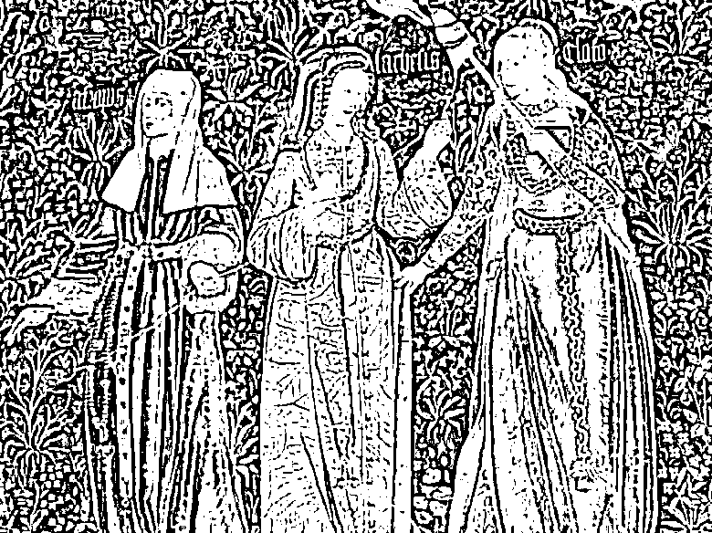

因此，转轮的中心就像隐藏起来的本我（*self*），是它选择［不是意识自我（*ego*）的选择］了让自己通过旋转来遭遇各种事件、人物、路途和环境。可以说不是命运降临在我们头上，而是我们走向了命运。在女祭司牌中，愚人遇到了自己内在的直觉能力，它化身为珀尔塞福涅（*Persephone*），让愚人可以一窥潜意识的力量。在命运之轮这张牌里，愚人了解了命运的编织模式和不变的中心点，它无形无相又遥不可及，比最古老的神祗更加年长，却拥有众神之王都不敢挑战的力量。希腊神话中的命运三女神，即使精神的力量都要服从她们，人类的自满和掌控的幻想在她们面前简直不堪一击。 有些人在了解塔罗、占星或其它预言的艺术时会觉得不安甚至恐惧，可能部分原因是来自意识人格中的焦虑造成的，因为意识人格是日常生活中的决策者，它拥有万能的幻想，当面对潜意识深处的“他者”时，很容易产生焦虑和恐惧。尽管这种力量来自我们内在，但却不属于我们能力所控的范围，就像宙斯也不敢挑战摩伊莱一样。**命运之轮不仅仅是改变的一个预示，它更是愚人（也就是我们每个人）的深入内在之旅的使者，带领他一步步走向宿命的安排。****命运之轮，无可选择的改变**

**从解牌的角度来看，命运之轮牌预示着运气上一个突然的变化。它可能是“好的”，也可能是“坏的”，但当事人都要步入生命之路上一段全新的旅程了。**

我们无法预测什么样的事会发生在自己头上，或者更准确地说，我们无法预测自己会走向怎样的境遇。但是在改变的身后伫立的就是摩伊莱——每个人命运的本质。愚人终将在自满的状态中被一脚踢开，朝着他自己命运的源头跌落。

**版权声明：**本文由《自在园》授权发布，欢迎转发，反对抄袭。友号转载请申请白名单。

**神话塔罗系列**[开篇](http://mp.weixin.qq.com/s?__biz=MzA5NjA0NTAxNg==&mid=2651451590&idx=2&sn=41c1083542bcf098de303e29a028ff20&chksm=8b4b4271bc3ccb67d5d53c143cd5a17c24b7b60e5b1051949fa9f086f90b4ab04877976c47e5&scene=21#wechat_redirect)丨[愚人](http://mp.weixin.qq.com/s?__biz=MzA5NjA0NTAxNg==&mid=2651452189&idx=2&sn=f4cc6e768e367fbdb0f69b9c6382443d&chksm=8b4b41aabc3cc8bcdbd952d91d8408014a799224d3f67ab50bb5cbe88ee0090afc92869de1a6&scene=21#wechat_redirect)丨[魔术师](http://mp.weixin.qq.com/s?__biz=MzA5NjA0NTAxNg==&mid=2651453528&idx=2&sn=3ca9b35e1736168eef1856274635224a&chksm=8b4b4aefbc3cc3f965f2531f8c0d37da2e66a2b47139d445df1ea35eeb74bdf3b6827236741a&scene=21#wechat_redirect) | [女祭司](http://mp.weixin.qq.com/s?__biz=MzA5NjA0NTAxNg==&mid=2651455871&idx=2&sn=15ae629e1b35f1371b81868f5bfdd2aa&chksm=8b48b3c8bc3f3ade0175d0e03bfe496711801614273e7fe98b6435fafe0de5daf3a8d7c1312f&scene=21#wechat_redirect) | [皇后](http://mp.weixin.qq.com/s?__biz=MzA5NjA0NTAxNg==&mid=2651453921&idx=2&sn=4d1efea03b2b9f940be7a6aadf553dec&chksm=8b4b4b56bc3cc2405fe562b8ef48f335699f57c12d5d817e24aeeb84f6306092de2ae55becc7&scene=21#wechat_redirect)[皇帝](http://mp.weixin.qq.com/s?__biz=MzA5NjA0NTAxNg==&mid=2651455083&idx=2&sn=d12546b67c830055f37b147f41c7641f&chksm=8b4b4cdcbc3cc5cad2def85451c3a7ddbb31ba5b9a01febb8a9fb18991d3e1263d9371ac212f&scene=21#wechat_redirect) | [导师](http://mp.weixin.qq.com/s?__biz=MzA5NjA0NTAxNg==&mid=2651456482&idx=2&sn=153b4ca2f69f6745425525773616455d&chksm=8b48b155bc3f384322115b0b94621662ba562a2a252fd244a0a3fc84a664408b2311014e8db5&scene=21#wechat_redirect)丨[恋人](http://mp.weixin.qq.com/s?__biz=MzA5NjA0NTAxNg==&mid=2651457110&idx=2&sn=b4f6a1e93475b39df8f6c80a7409c59c&chksm=8b48b4e1bc3f3df721f206e899272c01bf324355f649fe0fd0dd8363c5b58683daa38e8cf648&scene=21#wechat_redirect) | [战车](http://mp.weixin.qq.com/s?__biz=MzA5NjA0NTAxNg==&mid=2651457444&idx=2&sn=75e9cc378abfefb59ebe7f12357c1b4b&chksm=8b48b513bc3f3c051bf2bb4be018694ca47996a193c0a92d5003c47dc384a2b07f9b9f9806ed&scene=21#wechat_redirect) | [正义](http://mp.weixin.qq.com/s?__biz=MzA5NjA0NTAxNg==&mid=2651458133&idx=3&sn=e37f69e34bc33afe6c0935e32ad0b786&chksm=8b48b8e2bc3f31f465dee7a4595d44620d93e58ca37eeab785724f5a92a9ec3bbb85c3d34f17&scene=21#wechat_redirect)[节制](http://mp.weixin.qq.com/s?__biz=MzA5NjA0NTAxNg==&mid=2651458981&idx=3&sn=8858e451980859e86b87571128e4f115&chksm=8b48bf12bc3f3604c1ef97c0a818f501fc28c84a4ef19e25521527e162d2d2c6bdded6238ea8&scene=21#wechat_redirect)丨[力量](http://mp.weixin.qq.com/s?__biz=MzA5NjA0NTAxNg==&mid=2651459675&idx=3&sn=ebac312745895402e187ccd8700f3674&chksm=8b48a2ecbc3f2bfa134c6b364d828b6b0e77a4c3c05054ff44d97ccc75eec4f7958f77f92605&scene=21#wechat_redirect) | [隐士](http://mp.weixin.qq.com/s?__biz=MzA5NjA0NTAxNg==&mid=2651460114&idx=3&sn=a562cf2d91c74192ebacfa9484e0b141&chksm=8b48a0a5bc3f29b3807e6a2e49b1a3f16c82e528c54ae708ecd44e1e7e9ca5dbb1148dde5de6&scene=21#wechat_redirect)**朱丽叶·沙曼·伯克**从 20 世纪 70 年代早期开始，就对塔罗牌产生了兴趣，并踏入了塔罗的世界。后来，在丽兹·格林的鼓励下，开始研习心理占星学和塔罗。1984 年，第一本书《塔罗全书》（The Complete Book ofTarot）出版。之后，与丽兹·格林合作设计并撰写了《神话塔罗》（The Mythic Tarot）。朱丽叶写了十本塔罗和占星学书，包括一本名为《众星的传说》（Stories from the Stars）的儿童读物，以及与丽兹·格林合著的《神话之旅》（The Mythic Journey），这是一本详细讲述如何运用神话来指导生活的书。**点击下图了解课程详情** 

**微信又双叒叕改版啦，不想错过若道君的推送？****就把若道设为星标吧！****▼****喜欢记得点一下在看哦☟**

************报名直达入口************

# 双十一限时优惠！金融占星学大师雷蒙德·梅里曼《2022 年金融预报》开售！

> 原文：[`mp.weixin.qq.com/s?__biz=MzA5NjA0NTAxNg==&mid=2651460765&idx=1&sn=67f6a350c0dfb7c898506dc1aea56420&chksm=8b48a62abc3f2f3c93bbc7efaa12011cf2c2f3359a318ada40e7f3ae8741cb1e187ac2623a8a&scene=126&sessionid=1692737903#rd`](http://mp.weixin.qq.com/s?__biz=MzA5NjA0NTAxNg==&mid=2651460765&idx=1&sn=67f6a350c0dfb7c898506dc1aea56420&chksm=8b48a62abc3f2f3c93bbc7efaa12011cf2c2f3359a318ada40e7f3ae8741cb1e187ac2623a8a&scene=126&sessionid=1692737903#rd)

1976 年以来，由雷蒙德·A·梅里曼撰写的梅里曼市场时机学院每年一次的年度预报沙龙和每年一本的《年度预报》一直在应用占星学原理为投资者们服务，提供卓越洞见，从未间断。**2020 年，木星、土星和冥王星形成大合相，我们刚刚结束了一个周期和一个时代。现在我们正处于一个新时代和一个新的长期周期的早期阶段。**  如果 2020 年我们还在手忙脚乱，不知道发生了什么；2021 年则更让我们更清楚地看到一个时代结束了——2020 年之前的时代，在新冠肺炎病毒大流行、2020 年”大合相”之前的时代，这是人类历史进程上的一个转折点。**我们所熟知的生活诸多方面在那时就结束了，现在人们仍在试图找出“正确的方式”或“最好的方式”来重建和再造世界。**2021 年，有的行业被彻底摧毁，有的行业成为新贵。2021 年对投资者是一个苦乐不均的一年。尽管美国新冠肺炎疫情未见好转，道琼斯指数仍然扶摇直上；尽管中国经济在世界经济增长中一马当先，上证指数仍然波澜不惊。在货币对标的品种中，老贵族黄金走低，新贵族比特币飞升。我们还看到了大宗商品价格的飞涨，各种短缺开始出现。在中国，各种政府干预市场的调控在各个行业愈演愈烈。**这种现象到底说明了什么？又预示着什么？**2022 年我们的金融市场会受到哪些行星组合的影响呢？我们来看一看：**·** 140 年的木星-土星合相的“风象纪元”在 2021 年刚刚拉开序幕，2022 年我们还将会看到温和主义与极端主义之间存在冲突；**·** 土星四分天王星最后一次成相的影响：专制主义和中央政府控制与个人追求个体的权利和声音的冲突；新能源和旧能源的冲突；**·** 天王星进入金牛座的后半段：包括美元在内的世界货币的重新估价和地位；**·** 土星-海王星的半六分相：新冠肺炎病毒；**·** 水星、金星和火星在 2022 年的逆行“它们对 2022 年发展和增长的影响；**·** 木星在双鱼座（黄道最后一个星座）和白羊座（黄道第一个星座）之间来回移动：战争还是和平；谁是“第一名”的激烈竞争；**· **木星与海王星在双鱼座合相；**·** 冥王星在美国国家星图回归；美国的选择会对全球带来的影响；**·** 月亮交点的换座：月亮交点周期和经济周期的对应；**·** 木星在双鱼座期间金融市场和主要趋势的反转。2022 年仍然是旧世界向着新世界转变的一年。此时，金融市场的投资者和潜在投资者，都需要客观而睿智的思考，而金融占星大师雷蒙德·A·梅里曼的研究则更是无可替代的。1976 年以来，由雷蒙德·A·梅里曼撰写的梅里曼市场时机学院每年一次的年度预报沙龙和每年一本的《年度预报》报告一直在应用占星学原理为投资者们服务，提供卓越洞见，从未间断。去年，这个 3 小时的年度预报沙龙和长达 200 页左右对金融市场的分析报告帮助许多若道的读者做出正确的投资决策，降低投资风险，并获得相当不菲的投资收益。在《2021 年金融预报》中，关于上证指数，梅里曼老师说：对于上证指数，梅里曼老师说：**“我们预计涨势将在 2020 年 12 月-2021 年 2 月之间达到波峰，然后急剧下跌至 52 周和 22 个月周期的低点，这些周期将在 2021 年 5 月之前，甚至在 3 月底之前结束。此后可能会出现另一轮反弹，可能会也可能不会在 2021 年 11 月之前形成第一个 33 个月周期的新高。”**| 上证指数 K 线图关于黄金，梅里曼老师说：**“黄金的 31.33 个月周期波谷将在 2021 年 9 月之前出现，理想情况是 2020 年 12 月-2021 年 6 月。价格目标是 1628+/-109 或 1768+/-76。重叠范围（理想情况）是 1692-1737。如果价格跌破这些范围，则为看涨情况中令人担忧的状况。”**| 黄金走势 K 线图关于白银，梅里曼老师说：**“木星和月亮交点的周期表明，白银的一个重要低点将在 2021 年出现，最有可能在 5 月 13 日之前或 7 月 28 日之后出现。这可能是 5-7 年周期的波谷，但可能会保持在 18.50 以上。收盘低于 17.00 将令人担忧。”**

| 白银走势 K 线图

12 月底，我们将会再次发布梅里曼老师《2022 金融年报》。**2022 年初，梅里曼老师将会照样带来一场精彩的讲座，讨论 2022 年重要的宇宙天象及其对世界经济、金融形势的整体影响，还将覆盖中国上证股票市场的分析、黄金白银市场、比特币市场等投资市场。具体时间我们待确定后会通知大家。****2022 年度预报及沙龙预售**

**双 11 预售优惠价格：****1180 元（仅限前 100 名）**

**双 11 后恢复原价：****1380 元**

一份价格仅千元的顶尖金融占星大师的投资分析报告和沙龙，聪明的投资者值得拥有。**购买者重要须知****①** 梅里曼市场时机学院每年一次的年度预报沙龙和《年度预报》是梅里曼市场时机学院的研究“预报”，而不是市场“预测”，是梅里曼老师及其金融占星分析师对人类活动周期历史与行星周期之间相关性的研究，二者在大部分情况下具有 80%或更高的相关性，而不是因果关系。沙龙中和报告中的研究完全存在错误的可能性。即便是非常认真的研究和几十年的研究经验，我们无法总是正确地解读出各种征象在实际层面上会如何相互作用，并显化为事件结果。

所以请将次沙龙和报告看作一个研究参考，务必结合其他市场研究和你个人对市场的理解，根据你的自由意志做决策。

**②** 此报告一旦售出，**即不接受退款。**

**③** 此报告仅支持在手机网页和若道 APP 上阅读，不支持电脑阅读和下载。**④** 讲座提供视频回放。**以上须知，请仔细阅读。一旦付款，即视为已了解并接受所有须知内容。**

****长按下图识别二维码购买报告****

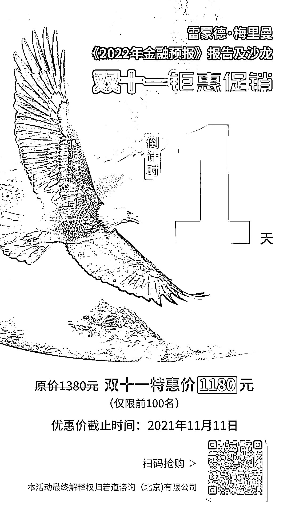

**长按二维码添加客服**

▼

****购买报告直达入口****

# 你们总问行星没有相位是什么意思？来来来，这一篇全告诉你！

> 原文：[`mp.weixin.qq.com/s?__biz=MzA5NjA0NTAxNg==&mid=2651460660&idx=1&sn=171163b28341b76df80218481d2bdf4d&chksm=8b48a683bc3f2f953030280f9db390c025eca01e17fa6018ac09ed43f27d7c16047ed51972e4&scene=126&sessionid=1692737903#rd`](http://mp.weixin.qq.com/s?__biz=MzA5NjA0NTAxNg==&mid=2651460660&idx=1&sn=171163b28341b76df80218481d2bdf4d&chksm=8b48a683bc3f2f953030280f9db390c025eca01e17fa6018ac09ed43f27d7c16047ed51972e4&scene=126&sessionid=1692737903#rd)

**********************☆ ****************************后台****************************回复“今日”，给你一句生命态度**********************

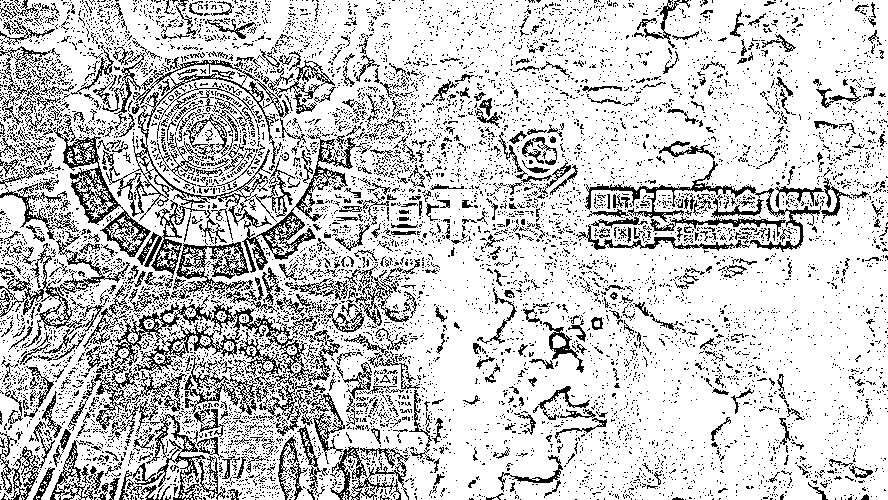

作者/HIROKI NIIZATO（新里弘树）

译者/李含 校对/江艺

编辑/翀子 图片/网络

星图上的空相行星反映出与外部失联的感觉，它可能是强大的天赋也可能过度补偿。如果你的星图上有一颗空相行星，它是什么意思？找到积极的表达方向，让它成为你的强大资本。**什么是空相行星？**

你出生星图中的空相行星就像是你灵魂中未被驯化的野兽。它们可以“不受你星图的约束”，不论你是否认同，它们都会成为你人格中一个明确的特质。

**空相行星，被著名占星师诺·泰尔称作游离行星，****指的是你的出生星图中没有与其他行星形成托勒密相位**（也就是合相、六分相、四分相、三分相或对分相）的行星。

**怎么解读空相行星？**

① **空相行星与心灵中的其他部分并无关联**——很像是某人身在异国他乡，与周遭的环境并无关联，整合就变成了挑战。

② **这可能反映出一种与外部关系失联的感觉**，尤其如果是关键星体空相位，比如太阳或月亮。如果有空相位的太阳或月亮，可能会有一种这个世界并不太理解我的感觉。你可能会“敲着不同的鼓点”。

③ **空相位行星的功能可能是强大的天赋或极端、过度补偿的习惯：**

例如，**空相位的水星**可能预示着某个人的思维或语言能力被显著强调，就像是作家诺曼·文森特·皮尔，《积极思考的力量》一书的作者。但是，这也可能预示着一个人因为习惯性神经紧张而不断说话。

④ **空相位的行星可以被解释为强大和主导性的，或者过度和孤立倾向。**在你解释自己星图中的空相行星时要考虑一下各种可能性。

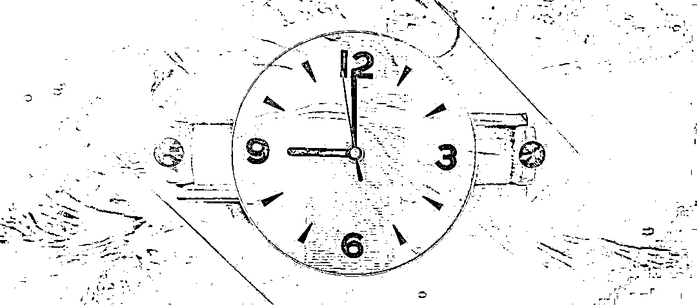

**空相行星：可能的意义与关键词****空相太阳****强化的自我动力**

空相太阳的人**很容易别具一格**。可能会特别**强调自我表现**和**领导**能力，以及对**自我认可**的强烈需求。 

**空相月亮****可能指向情感上的分离**

出生月亮没有重要相位**容易放大月亮星座代表的需求**。

史蒂夫·乔布斯就是个好例子，他的白羊座月亮（“争做第一的需求”）空相位。空相月亮可能预示着与双亲的**情感分离**，以及后来与其他人的情感分离。可能也需要通过表达关心、照顾、教育行为来建立与世界的关联。 **空相水星****过度活跃的头脑**

空相水星会强调过度活跃的头脑，**可能导致不停地说话、思考或担忧。**如果失控的精神能量可以加以约束，有效运用，空相水星就会变成非常**强大的资本**，给你带来超强的智力和沟通能力。 

**空相金星****强化的情感和社交需求**

空相金星**放大了金星星座所代表的情感和社交需求。**

例如，金星在**水象星座**（巨蟹座、天蝎座、双鱼座）空相位，强调了人际关系中的**情感表达**，也许表现为戏剧化的情绪，也许表现为深入关怀他人的能力。

与此相对的是金星如果在**土象星座**（摩羯座、金牛座、处女座）空相位，则强调了金星的**物质层面**，也许更热衷于实现财务上的成功或保障。

整体上，**空相金星强调的是**充满吸引力、爱调情、富有魅力或善解人意，以此赢得喜欢和欣赏（金星的原型特质表达）。 

**空相火星****未被驯服的能量**

空相火星就像一匹野马，**充满力量但也是潜在的危险，**你可能需要特别注意疏导你的能量，尤其是你的**愤怒**。给你的能量找到**合适的宣泄途径，**动力之火就会让你坚持很久。

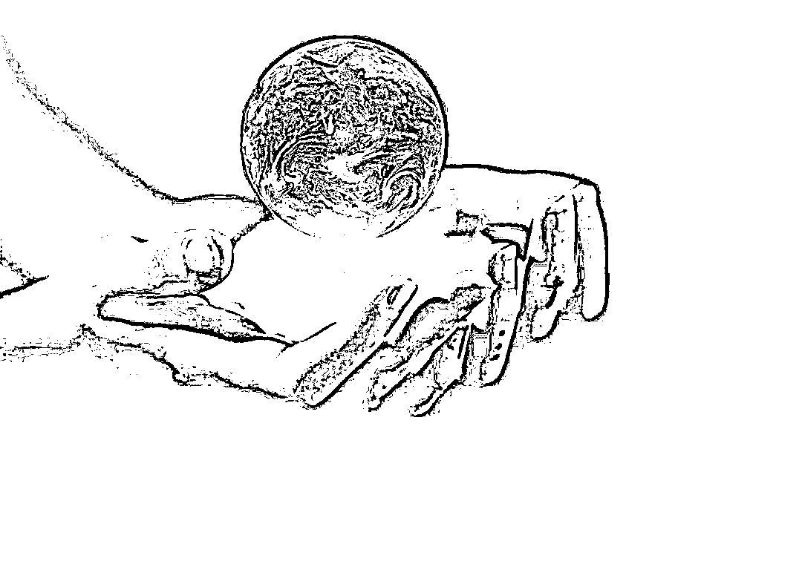

**空相木星****占主导的高等思维**

空相木星意味着强调的重点是**哲学、教育、国际性或精神性维度。**这预示着**渴求更高层次学习的头脑。**

**空相土星****与父亲分离，强化志向抱负**

空相土星可能意味着缺少来自父亲角色的支持。**强调了工作成就或自律可以弥补最初的不安感。**空相土星也预示着强化志向抱负，尤其是在土星所落星座和宫位领域。 

**空相天王星****凸显个性和进步**

空相天王星意味着的**强化个性，渴望进步，需要实现社会意义。**

发明家托马斯·爱迪生的星图中天王星空相位，天王星是发明创造和科学进步之星。 

**空相海王星****愿景和理想**

尽管不太常见，但空相的海王星可能表现为**提高审美敏感度和强大理想。**

**空相冥王星****权力和影响力**

空相冥王星**可能预示着卓越、权力和影响力。**约翰·F·肯尼迪的星图中就有空相冥王星。 

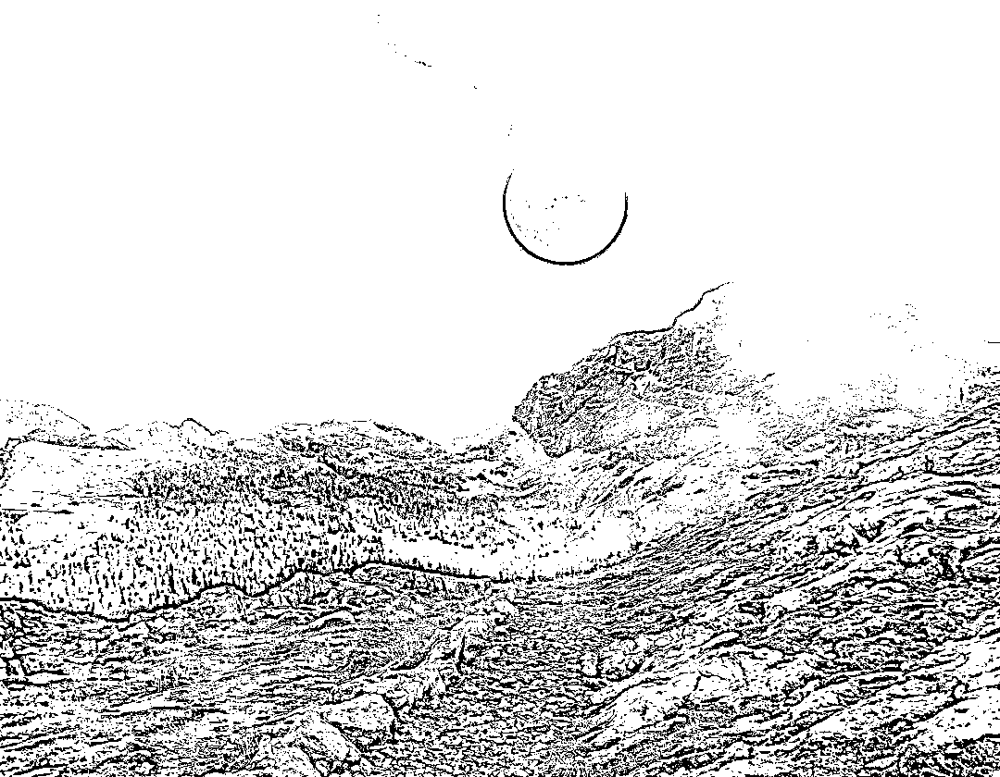

**如何整合空相行星？**

空相行星可能难以驯服。在我们的心灵中整合空相行星，感觉就像让高个子的西方人融入一群日本人——没办法，还是那么突出。 

与其试图让空相行星符合社会规范，你可能不如**为它的能量找到一个富有挑战性的出口**——写一本书，学习一门外语，建立一家非营利组织或是练习武术。

**只要找到积极的方向，空相行星就可以成为你的最强有力的资本。**

**版权声明：**本文由若道翻译发布，欢迎转发，反对抄袭。友号转载请申请白名单。

**HIROKI NIIZATO(新里弘树)**

诺·泰尔门下的高材生

从 2001 年开始从事职业占星咨询

****雷蒙德·梅里曼《2022 年金融预报和沙龙》开始预售中。原价 1380 元，双十一特惠购，仅需 1180 元，特惠促销仅限 100 名，先到先得。****

****长按下图识别二维码了解详情****

****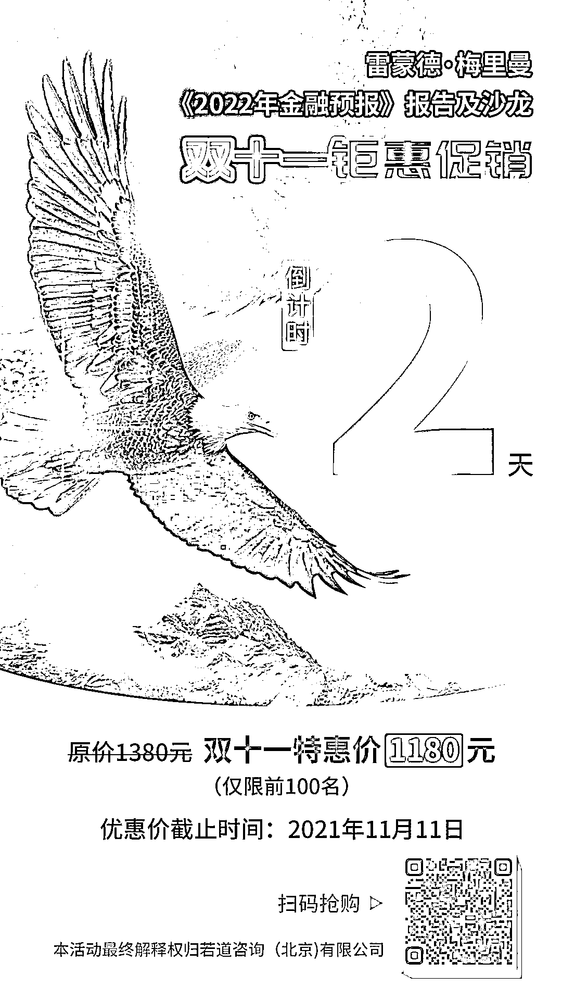****

**学习占星学**

**点击下图了解课程详情**

************

****

****

**微信又双叒叕改版啦，不想错过若道君的推送？**

**就把若道设为星标吧！**

**▼**

**喜欢记得点一下在看哦☟**

********报名直达入口********

# 12 星座自画像丨双子座：自由天真的尝试派

> 原文：[`mp.weixin.qq.com/s?__biz=MzA5NjA0NTAxNg==&mid=2651460660&idx=2&sn=a239f43ebe4aa8c8058cfa11d79028d4&chksm=8b48a683bc3f2f9539414a0d2b911b7a8f67befff92ed4dad04c4387aaa4a44ec883ab777afd&scene=126&sessionid=1692737903#rd`](http://mp.weixin.qq.com/s?__biz=MzA5NjA0NTAxNg==&mid=2651460660&idx=2&sn=a239f43ebe4aa8c8058cfa11d79028d4&chksm=8b48a683bc3f2f9539414a0d2b911b7a8f67befff92ed4dad04c4387aaa4a44ec883ab777afd&scene=126&sessionid=1692737903#rd)

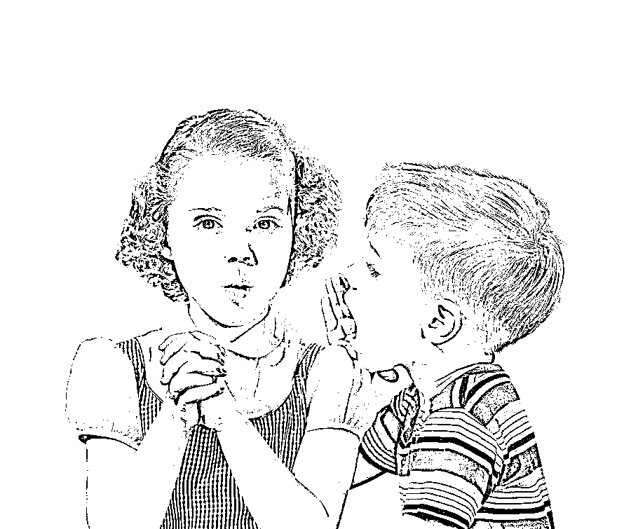

作者/克里斯蒂娜·罗登贝克

译者/亚麻林恩 校对/江艺

编辑/翀子 文章图片及注释/作者提供

本系列是克里斯蒂·罗登贝克老师撰写的艺术中的 12 星座自画像，角度独特，语句生动。本文是该系列第三篇：双子座自画像。

是的——**有三位艺术家看起来像是几个世纪以来一直想和我们说话一样。**这就是你期待的太阳双子座的样子。但我不确定他们是否会说太过恭维的话。更多的是——好吧——请你自行想象。

坦白说，当我看到这些人时，我会想到**喜怒无常**这个词。

每当看到**阿尔布雷希特·杜勒**（1471-1528）这幅浓烈的自画像，我总是被他的现代感所冲击。我可以想象在我当地超市的结账处撞见他（穿着皮衣）。看他把自己的手画得多漂亮呀。

| 28 岁的阿尔布雷希特·杜勒

说到浓烈的双手，**古斯塔夫·库尔贝**（1819-1877）有这样的一个瞬间。你可以想象他在熬夜后照镜子。我觉得它真的有点风象星座抓狂的神经质。

库尔贝画了很多自画像。给人一种感觉，就是每当找不到题材时，他就画自己。这无疑是他最滑稽的一次。

也许他在描绘自己疯狂的**内在孪生兄弟**——这是所有双子座都熟悉的特点。那是他们天性中无法无天的、搞怪的部分，有时需要被释放，被允许在外晃荡一阵儿。如果我们有双子座的一点特质，则必须学会用一种相当精打细算的方式来艰难地释放自己——时间就是一切。这幅画也叫**《绝望的人》**。

古斯塔夫·库尔贝在画了这幅画很多年后写道：**“我一直生活在自由中；让我自由地结束我的生命；当我死后，请这样评价我：‘他不属于任何学校，不属于任何教堂，不属于任何机构，不属于任何学院，尤其不属于任何体制，除了自由体制。’”**

现今，他可能被冠以“局外人艺术家”的标签；回到 19 世纪 50 年代，人们就喜欢称他为现实主义者。

| 古斯塔夫·库尔贝

**保罗·高更**（1848-1903）也做了很多自画像，这张画里，他非常暴躁地看着自己。像杜勒一样，他画了自己的右手，这让我想知道他是左撇子还是双手通用。水星，双子座的守护星，机敏而灵巧。

高更也是出了名的无法无天——他几乎自学成才，在他决定全身心投入绘画之前，他是一名股票经纪人——做了很多年。1883 年股市崩盘时，他才成为一名全职画家。**行进天王星**落处女座对分了他出生星图上落**双鱼座的土星，四分太阳双子座，六分出生星图的木星。**实际上，这颗行进的改革之星打破了多变的日土四分。

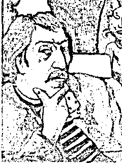

| 保罗·高更

最终，他抛弃了自己的家庭（五个孩子和一次离婚），搬到了塔希提岛，过着更“自然”的生活。显然，在他最好的年华他是相当暴躁的，在他（短暂的）生命结束时，他实际上是个脾气暴躁的老人。这都在照片里。

这里还有一个人，为了成为她注定要成为的那个人，不得不离开了家。现在我不得不承认我对这幅画很失望，因为我认为玛丽·卡萨特（1844-1926）是一位出色的画家。我一直在寻找一幅更好的自画像，但显然她不太想画镜像的自己。有意思。

与库尔贝和高更一样，当她停止传统绘画时，她找到了自我，她当然有技巧做得很好，并于 1879 年加入了“落选者沙龙”（Salon des Refusesés）–革命性的行进天王星落第七宫，四分她的太阳（个人身份）和中天（公众面）。行进天王星往往指示有时髦的人会进入你的生活，当天王星进入她的第七宫关系宫时，她遇到了画家埃德加·德加，他改变了她职业生涯的整个方向，让她以适合自己的方式创作。

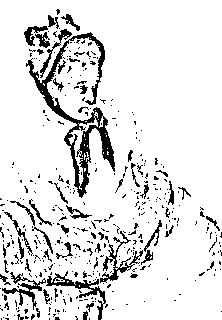

| 卡萨特的自画像

| 德加的卡萨特肖像画

这张自画像很奇怪，因为她没看自己。她看向了别处。如果她用了照片，我也不会感到惊讶。这是一个相当快速的素描，但你可以看到她衣服上灵巧而自信的笔触，更重要的是她在背景中巧妙地运用了色彩。为了让你更好地感受她活泼的个性，我附上了这幅埃德加·德加（巨蟹座）的饱含深情的肖像画，她与德加有着终生的友谊。有趣的是，画中的她似乎拿着照片。德加热衷于新的视觉方式——摄影。

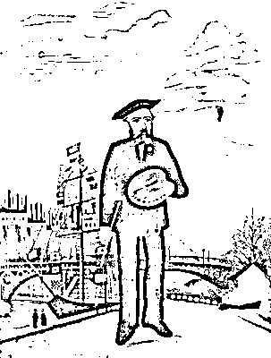

| 亨利·卢梭

最后，又是一个特立独行的人。**亨利·卢梭**（1844-1910）和高更一样，有两份工作。他白天在海关上班，但他最终放弃了，成为了一名全职艺术家。卢梭在他有生之年从未受到其他艺术家的赞赏，但他的影响却一代代传了下来。在这幅画像中，你可以看到一些特质，既是双子座的，又完全是他的。

卢梭的每一幅画似乎都在**讲述一个故事**；一个你可能不太了解的故事，但它就在你的脑海边缘，就在不远处。这会让你的想象无限延伸直到故事的结尾。

他的画被批评为**幼稚和天真**——好吧，曾经是，现在是——那又怎样？幼稚的天真就是六月某个雨天午后的门票。

****版权声明：**本文由若道翻译发布，欢迎转发，反对抄袭。友号转载请申请白名单。**

****

**12 星座自画像**

****[白羊座](http://mp.weixin.qq.com/s?__biz=MzA5NjA0NTAxNg==&mid=2651452779&idx=2&sn=38a345623020cadc4ed4f42904d29926&chksm=8b4b47dcbc3cceca0fbf3e66149382c065ff3dbc2f61c881cdba2807e9e4c0c8f9ec71f1e245&scene=21#wechat_redirect)**** **| [金牛座](http://mp.weixin.qq.com/s?__biz=MzA5NjA0NTAxNg==&mid=2651453849&idx=2&sn=7f5ada7b667fcd56f09c2a4bffadab67&chksm=8b4b4b2ebc3cc2386cc5ee12e45ac147964723803ce5714b7c612caf6bf0436652a82e0eaf9a&scene=21#wechat_redirect)**

**克里斯蒂娜·罗登贝克**

克里斯蒂娜·罗登贝克，若道签约老师。全职职业占星师，从业 20 余年，在其网站长期撰写时事、艺术和文化的文章；定期在英国授课，并保持蓬勃发展的专业实践。

**学习占星学**

**点击下图了解课程详情**

************

****

****

**微信又双叒叕改版啦，不想错过若道君的推送？**

**就把若道设为星标吧！**

**▼**

**喜欢记得点一下在看哦☟**

********报名直达入口********

# 好物推荐 | 从"麻瓜"进化成占星师的自我觉察工具（插班中）

> 原文：[`mp.weixin.qq.com/s?__biz=MzA5NjA0NTAxNg==&mid=2651460660&idx=3&sn=f65f5f0a57ca16dc1134f01b5bc1b1d1&chksm=8b48a683bc3f2f95d8b3c1f1bd069842f8f83372cdf1511107156834f8f54a9e6c52a9191c7c&scene=126&sessionid=1692737903#rd`](http://mp.weixin.qq.com/s?__biz=MzA5NjA0NTAxNg==&mid=2651460660&idx=3&sn=f65f5f0a57ca16dc1134f01b5bc1b1d1&chksm=8b48a683bc3f2f95d8b3c1f1bd069842f8f83372cdf1511107156834f8f54a9e6c52a9191c7c&scene=126&sessionid=1692737903#rd)

1

**自我觉察，是智慧的基础**

每个人都有自己的内在冰山，自我觉察能够帮助我们觉察自己的行为、情绪等，然后向内深层探索，探索自己的行为、情绪背后的深层渴望、期待。学习和应用占星学的过程，就是慢慢掌握自我觉察工具的过程，当你熟练掌握了占星学，也就具备了帮助引导他人觉察到自身生命议题的能力。**往外张望的人在做梦，向内审视的人才是清醒的。**只有真正向内看，只有当觉察开始由外向内时，改变才会发生，才能够知行合一。

# | 插画师：古戈力

以情绪来举例说明，每个人的情况不同，觉察的程度也不同，觉察有四个层次：***1.*** **不知不觉：**没有觉察情况，当情绪来了，会被情绪控制，做出很多不计后果的事情。而且每次都是同样的状况，反反复复；***2.***** 后知后觉：**情绪过后，自己能够反应过来，自己做的对与错，但是很难避免同样的情况再次发生；***3*****. 当知当觉：**当情绪来的时候，你已经知道在这个当下，正在发生什么。当达到这个层次，你就可以自己控制情绪，从而影响后事的发展；***4*****. 先知先觉：**当事情还没发生，就可以预知它要发生了。因为你对情绪的觉察已经越来越熟练，所以情绪还没来，你就知道它要来了。所以，你也就有了更好的选择和处理方法。所以，我们要自我觉察，向内探索，觉察是为了接纳，然后做出改变，成长，迭代，升级。**那么要如何练习自我觉察，掌握先知先觉的能力呢？**

2

**每日觉察的工具推荐**

**今日天象&近期行进**

若道 APP 中的今日天象功能，罗列展示每一天的具体天象，你当天的行进和行进周期：

作为占星师，可以这样使用这个自我觉知工具：

**记录梦境**如果你有醒来记录梦境的习惯，每天早上看一下睡梦中的天象和行进，对应联想，你会惊喜地发现一些神奇的对应，能够更敏锐的捕捉到日常被压抑的情绪和需求。能够帮助你在白天的工作生活中先知先觉的关注身心状态。**规划生活**每月月初，周初都可以参考天象和行进进行日程规划，预估可能的助力和阻力，在对的时间做对的事，会发现平平无奇的日常也可以有不一样的色彩。根据月相的变化感知情绪的起伏，更好的自我关爱。**感知环境**当身边发生了引起你注意和好奇的事情，或者网络上层出不穷的新闻热点，都可以在天象中寻找对应的能量。从更大的格局视角去思考你的个人观点。通过环境的共振，更深入地理解自己的出生星图。以上都是很好的学习深化占星知识的方法，只需要系统掌握以下知识，就可以开始使用以上方法去提升自我觉知。**第*1*阶 黄道星座&个人行星****概要介绍占星学与星图**

**四元素与三形态**

**黄道 12 星座**

**太阳、月亮及其他个人行星**

**第*2*阶 行星&宫位****木星&土星****天王星&海王星&冥王星**

**练习组合所有行星**

**四轴**

**十二宫位**

**组合宫位、行星、星座****第*3*阶 月亮交点、相位以及初步解读星图**

**了解灵魂进化的路径：月亮交点**

**相位概论**

**相位&行为模式**

**困难相位**

**柔和相位**

**容许度，出入相位**

**渐盈渐亏相位**

**空相**

**宫主星&定位星**

**相位模式**

**组合相位、星座、行星、宫位**

**解读的基本原则，权重，失衡**

3

**课程安排是怎样的呢？**

**第*1*阶**2021 年 9 月 15 日开课，每周一天晚上 20:00-22:00 上课，共 6 次课**第*2*阶**2021 年 11 月 11 日开课，每周四晚上 20:00-22:00 上课，共 6 次课**第*3*阶**2022 年 1 月 6 日开课，每周四晚上 20:00-22:00 上课，共 15 次课 2022 年 4 月 30 日、5 月 1 日**L3 北京两日线下工作坊**

****

4

**授课老师**

**艾德里安·罗斯·邓肯**

**（AdrianRoss Duncan）**

**· **1971 年在印度游学时开始学习占星学，1985 年开始成为全职占星师，迄今执业已超过 33 年，是人本主义占星学、卜卦占星学和经世占星学领域的知名占星师。他还开发了占星软件 AstroClock 和多款占星报告；**·** 哥本哈根占星学院院长；**·** 他在日常咨询中经常运用卜卦，咨询图（卜卦的一种运用方式，即根据客户来访时间制作星图，从星图中获得大量信息）也是他特别擅长的领域；**· **艾德里安·罗斯·邓肯从 1971 年开始研习佛学，受佛学影响很深，他相信占星学和佛学观点一致，转化的一个基础是在于对现实感知的改变。而卜卦很容易与佛教融合，因为它只关乎当下。

**大卫·瑞雷**

**（David Railey）**

**·** 若道联合创始人，致力于在中国教授和推广西方占星学；**·** 曾任 ISAR 全球副主席，CAPISAR（ISAR 职业占星师资质认证机构）主席；**·** 1976 年，通过亚特兰大职业占星师考试，成为全职占星师，随后通过 AFAN 和 ISAR 职业测试；**·** 1980 年，与杰夫·焦耳一起在亚特兰大创建“每日行星”占星学中心。此后在亚特兰大占星协会担任 4 年考官，并且两次担任亚特兰大地区占星协会主席。1979-1992 年，作为占星师活跃于美国社会媒体，向不了解现代占星学变化的大众宣传专业占星学知识。在 1989-1992 年期间，他在 WRGG 电台 12 频道每周主持个人电视秀“今日占星学”，早先他还在 WRFG 的广播节目中播讲宇宙天气节目；**·** 2010-2014 年，任全美占星师联盟监督委员会委员；**·** 2010 年，其著作《灵魂的目标》中国版出版，和蒋颖一起创办若道占星学校和其官网 www.nodoor.com；**·** 2017 年，被选为 ISAR 委员会成员。ISAR 是世界最大的国际占星机构，会员遍布 45 个国家，2017-2020 年曾任 ISAR 全球副主席、CAPISAR（ISAR 职业占星师资质认证机构）主席。

**克里斯蒂娜·罗登贝克**

**（Christina Rodenbeck）**

**· **克里斯蒂娜·罗登贝克（Christina Rodenbeck）是一名全职职业占星师，在牛津大学城生活和工作，深受周围知识和文化氛围影响；她拥有伦敦大学（University of London）的人文荣誉学位，曾在伦敦占星学馆（AstrologicalLodge of London）、心理占星中心和占星研究学院学习；**·** 作为一名占星师，在过去的 20 年里，克里斯蒂娜在她的网站“牛津占星师”上写了大量关于时事、艺术和文化的文章；她每月主持一个占星播客：“与克里斯蒂娜和萨莉一起占星”，并定期在《占星杂志》(Astrological Journal)上撰写时尚专栏；她定期在英国授课，并保持着蓬勃发展的专业实践。

**琳恩·贝尔**

**（Lynn Bell）**

**·** 世界最受欢迎的占星学演讲者、作家和老师之一。定居巴黎，研究心理占星学和家族模式数十年；

**·** 著名的心理占星学中心（Centre for Psychological Astrology）的长期导师。2016 年，获得查尔斯·哈维（Charles Harvey）杰出的占星学服务奖；

**·** 作为一个从多个层面进行工作的占星咨询大师，琳恩的工作结合了心理学的观点。她对家族模式的兴趣首先来自与客户的合作。通过在分析领域所做的个人工作，她所受的埃里克森催眠训练将她引领至家族系统。后来，她组织研究小组在家族星图上进行了数年的研究。她写的《家族占星学》就是这项研究的结果；

**·** 法国心理占星学协会的会长。除了占星学，她在法国沙特尔的新沙特尔学校任教 8 年，还 5 次获得了在《纽约时报》畅销书作者卡罗琳·迈斯（Caroline Myss）的卡罗琳·迈斯教育学院（Caroline MyssEducational Institute）合作教学的机会。**课程助教：**

**熊鹰老师**

**（天空的空）**

**·** 2008 年接触严肃占星学，至此爱不释手；**·** 2013 年师从大卫·瑞雷，研习现代占星学核心课程，并于 2014 年起担任该课程的助教，之后于 2017 年与 2020 年两次与大卫老师合作讲授完整核心课程（Level 1-5）；**·** 期间也跟随格伦·佩里、诺·泰尔、理查德·塔纳斯、罗伯特·汉德、苏·汤普金斯、斯蒂芬·弗里斯特、琳恩·贝尔、艾德里安·邓肯等多位国际占星大师进行学习，进行定向占星主题研究；**·** 2014 年末，通过国际占星研究协会（ISAR）资质认证并获得证书；**· **在若道占星任职六年余，以“传播系统、专业、实效的占星学”为职业使命，执教与助教已累计超过 700 小时。在业余期间也提供占星咨询服务；**·** 目前正着眼于占星学与中国文化之互参，以当代中国人的身心成长为目标，力求落到实处。

5

**此次课程适合哪些人？**

**·** 对占星学感兴趣，想要入门的零基础者**· **占星学小白，想通过星图学习识人之术**· **有一定占星学基础，但不知道该如何整合星图复杂碎片的人**· **想要师从更多殿堂级占星导师学习占星心法的人**· **走在自我探索和个人成长道路上的人

6

**课程价格**

**L1-3 价格**：15000 元

其他各阶段课程单报价格，请咨询课程顾问：**Maggie 老师**（微信：18510107057，请备注**“核心课”**）

长按二维码添加 Maggie 老师

7

**退转课程**

****· 退款原则请详看《教学协议》，如有疑问请咨询课程顾问****

****名师汇集金牌核心课程****

**授课老师：**琳恩·贝尔、艾德里安·罗斯·邓肯、克里斯蒂娜·罗登贝克、大卫·瑞雷

**授课时间：**2021 年 9 月 15 日起

**授课方式：**网络课程**，**英文授课，中文翻译

**费用：**L1-2 价格：4800 元**；**L1-3 价格：12000 元

**课程负责人：****Maggie 老师**（微信：18510107057，请备注“核心课”）

长按二维码添加课程负责人咨询~

****报名请点击“阅读原文”****

# “两情若是久长时，先认识你自己”丨 12 星座的长情奥秘是什么？

> 原文：[`mp.weixin.qq.com/s?__biz=MzA5NjA0NTAxNg==&mid=2651460556&idx=1&sn=6363adaf16f6d9f3f2b4eae3cbca1323&chksm=8b48a17bbc3f286ddc255f40a3355d003d27ef50c3a0376539204dabca43c2221f0eb0bb3468&scene=126&sessionid=1692737903#rd`](http://mp.weixin.qq.com/s?__biz=MzA5NjA0NTAxNg==&mid=2651460556&idx=1&sn=6363adaf16f6d9f3f2b4eae3cbca1323&chksm=8b48a17bbc3f286ddc255f40a3355d003d27ef50c3a0376539204dabca43c2221f0eb0bb3468&scene=126&sessionid=1692737903#rd)

******☆ ****后台回复“今日”，给你一句生命态度******

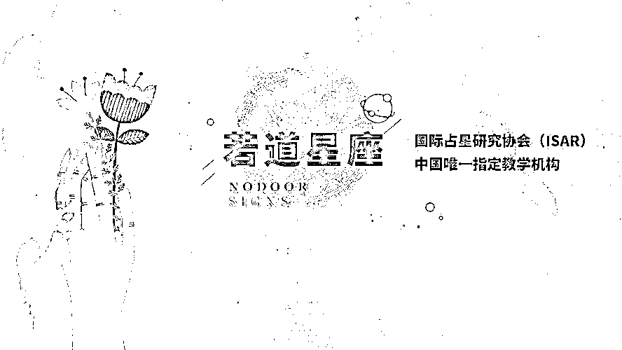

作者/大卫·瑞雷 若道占星创始人

翻译/江艺 校对/李含

编辑/翀子 封面/书君 图片/网络

亲密关系是一门学问，只有不断成长，不断互相发现和互相体谅才能携手走过一生。大卫老师给 12 星座列举了一些问题，看看它们对你的爱情有什么帮助吧！另外，大卫老师参与授课的[四大名师核心课](http://mp.weixin.qq.com/s?__biz=MjM5MjQwNjAyMQ==&mid=2649438826&idx=6&sn=2021d0992c95fe8a036fe1e29b199365&chksm=beb9550089cedc1651adba7f406155ca6998eda69ee239d8ead50a57fbce28a9ff46067b8c77&scene=21#wechat_redirect)（点击链接可阅读），也欢迎你来了解更多详情！

**你无法通过操纵来建立关系**

娱乐占星的 12 星座分析似乎总是会刮起一阵“爱情星象”旋风，它许诺可以透露“单身人士”点燃永恒爱火的秘诀。或是如何在沉寂如死灰的婚姻生活中重新唤起爱意。这类星象师会提供诸如此类的建议： 

*   **“让你的摩羯座男友知道你有多么尊重他。”**

*   **“以欢笑回应你的射手座男友开的玩笑，这样他会认为你是唯一懂他的人。”**

这显然很肤浅，这种建议吹嘘的都是些占星学的陈词滥调，以此来操纵你的男友或女友，让他/她爱上你。 

但是……

*   **如果你确实不认为那个射手座家伙的笑话搞笑呢？**

*   **如果你的摩羯座男友或女友是工作狂呢？**

你无法通过操纵来建立一段令人满足的关系，尤其是当它掩盖了你的真实感受时。即使你成功地结了婚，但和以真实情感和真爱为基础逐渐发展起来的关系相比，这种建立在操纵基础上的婚姻也会成为一种悲剧。

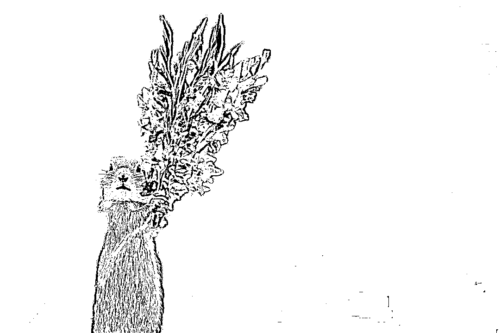

**接纳自己前，先要认识自己**

所以这里我们又看到另一条陈词滥调**“接纳你自己，别人也会接纳你。”** 

**然而在你接受自己之前，你需要“认识你自己”。**这就是占星学发挥作用的地方。

将黄道 12 星座看作一个自我认识的模板。用占星学的语言来说，我们每个人都不仅仅由太阳星座组成，还有月亮星座、上升点、行星等等。但是你的**太阳星座包含了重要的核心真理。**

所以当你读到我对你的星座的描述时，问问自己“这是真的吗？”其他人也会接纳你，正如你自己一样 —— 没有评判。然后爱情就会成为可能，无论是让你的婚姻重新焕发活力，还是向某个新人敞开心扉。

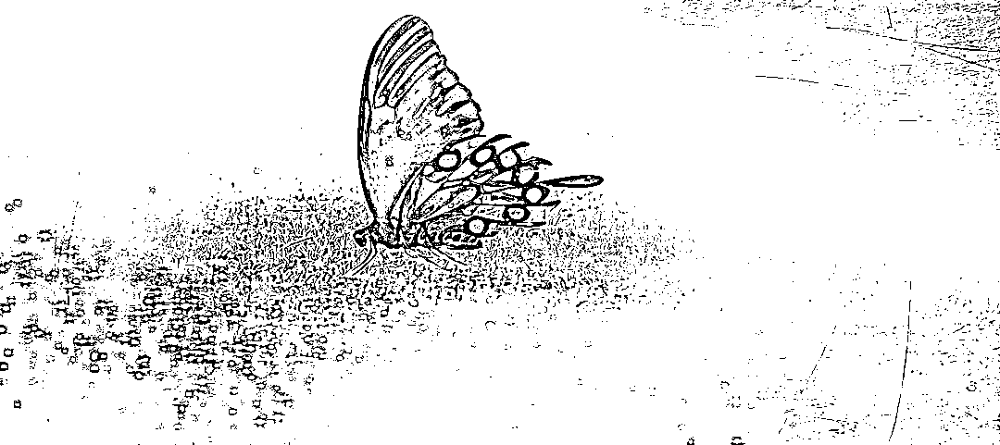

**问问自己这些问题****★****白羊座**

*   你是否率直？

*   你对自己的个人利益是否感觉敏锐？

*   你是否坚决果断？

*   你是否愿意为自己而战？

*   你是否认同这些特质，你接受它们吗？还是你认为“没有人可以忍受我。人们觉得我太难搞了。”

*   直率，意识到自己的利益，自信果断，愿意为自己而战，这些有什么错？

这些特质可以很容易获得称赞，但是你**首先需要接纳它**。

**★****金牛座**

*   你是否平静沉着？

*   你是否注重感官，强烈欣赏生活所提供的美好事物？

*   你可靠吗？如果“是的”，那么你是否接受这些特征？还是你觉得“我很懒，很放纵、顽固而自私 —— 不值得被爱。”

*   享受生活的乐趣有什么错？

是的，你可以慢慢接受改变，但是在不稳定的时期**坚定踏实**——这样的品质难道不可贵吗？你很会讨价还价，这不是坏事，接受它，别人也会把你当作重要的交易对象。

**★****双子座**

*   你是不是拥有强大的语言天赋？

*   你是否聪明机变，能用最短的时间解决问题？

*   你是否消息灵通、见识广博？如果“是的”，你是否喜欢这样的自己？还是你认为“没有人喜欢花言巧语的人”或“人们并没有真正听我说什么，他们认为我很肤浅。”

这是你的评判，不是别人的。相反，接纳你的**好奇心**和你想要就此展开**讨论**的需求，然后留意谁在**倾听**。

**★****巨蟹座**

*   你很善于滋养他人吗？

*   你是一个感性的人吗？

*   你是否依赖直觉解决问题？

*   你能够创造更安全的工作和家庭环境吗？如果“是的”，那么你对此感觉好吗？

*   你是否认为自己“太多愁善感”？

*   你是否感觉“你对任何人都太情绪化，太不安全？”

*   你是否企图隐藏自己的感受，却只觉得更糟？

别再隐藏了。接纳自己拥有**“惊人的敏感性”**，其他人会越来越喜爱你这一点的。

**★****狮子座**

*   你自信吗？

*   你是否会因为某人想做一件事而担起责任呢？

*   你有时候是否会用生动活泼、激动人心的方式举例子？如果“是的”，那么你为这些特质感到骄傲吗？或者你是否将自己评价为一个爱炫耀的人，相信没有任何人爱你，因为你的专横只是为了掩饰自己的不足？

嘿，你猜怎么着？一位**真正的英雄**之所以是英雄是因为他或她是“人类”，而不是上帝或超人。接受这一点，你会获得引人注目的爱。

**★****处女座**

*   你专注于解决问题吗？

*   你在专门领域中对细节的关注是否常常让你成为工作中不可缺少的人才？

*   你在评估自己的技术和能力时是否低调谦逊？如果“是的”，那么你是否理所当然地接受这些特质？还是你认为自己“有缺陷”，过度吹毛求疵，爱批评，没有人会真正去爱一个不完美的完美主义者？

只要你自己有这种想法，其他人也会这么想。嘿，**放下这些评判，**看看会发生什么。

**★****天秤座**

*   你圆滑练达吗？

*   你对自己包容他人的能力感到骄傲吗？

*   你是一个优秀的协商者吗？

*   你是善于交际吗？如果“是的”，你想“那么为什么不应该每个人都爱我呢？”

你无法让每个人都开心，虽然你试图这么做 ，但是每个不开心的人都会激起你的恐惧：你不够好，不是真的可爱。这似乎是不公平的！毕竟，你是这样**友好**的人，所以为什么不接受这一点呢？**平衡**也需要让他人为你有所付出。

**★****天蝎座**

*   你的朋友是否会依赖你对他人的敏锐洞见，而你也愿意在危机中帮助他们？

*   你是否充满激情？足智多谋？坚韧不拔？

*   你可以挺过任何困难，对吧？

所以你为什么要为失去爱人而困扰呢？你为什么如此**难以相信**别人呢？是不是因为你觉得如果他们离开你，你就会死？或许吧。**相信自己**，相信你能在最恶劣的环境中生存，然后**允许自己热情地去爱和被爱**。

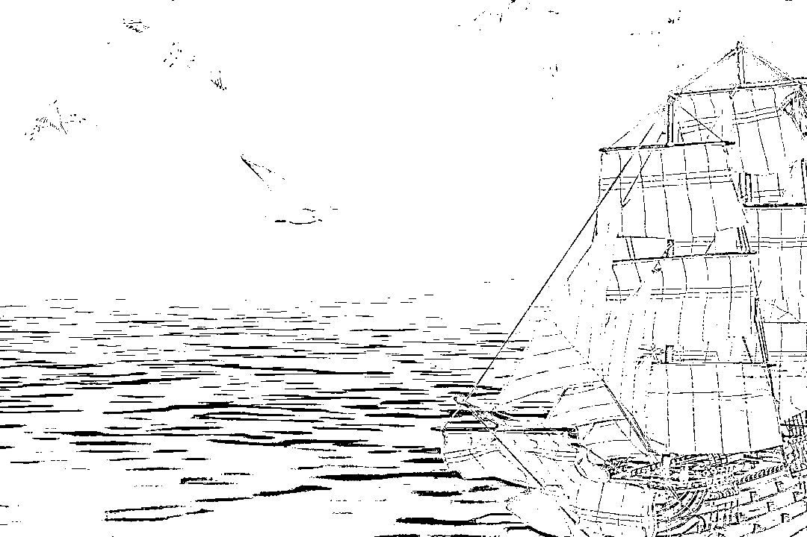

**★****射手座**

*   你爱冒险吗？

*   你有惊人的幽默感吗？

*   自由对你重要吗？

*   你热爱哲学吗？

*   你是永远的学生吗？

*   你是天生的老师吗？

*   谈论责任会抹去了你脸上的笑容吗？

你**害怕被困住**，因此“你好”常常是“再见”的前奏。没有人说你必须要结婚。与一个像你一样**独立自主**的人分享你人生的**冒险**，是你最好的选择。难道不是这样吗？

**★****摩羯座**

*   你充满野心吗？

*   你善于规划吗？

*   采取行动前你是否会仔细权衡后果？

*   身份对你重要吗？

*   关系和婚姻如何配合你的计划？ 

爱情可能带来不可预料的情感动力，因此，你很**谨慎**。除了你对父母的**责任感和社会的压力**，对婚姻**失败的恐惧**也阻碍你做出承诺。所以，**接受**这一点，并且**等待**，直到你做好充分准备。毕竟，**成熟会提升你成功的机会**。

**★****水瓶座**

*   婚姻是你不愿加入的俱乐部吗？

*   每次你父母问你计划何时结婚时，你都会说“绝不”吗？

*   彼此和睦相处看起来是不可能的吗？

*   如果我这么奇葩，那么和一个非常不理智地想要和我结婚的人步入婚姻对我有意义吗？

然而，浪漫爱情并不是**超然理性**的产物。最终你会渐渐厌倦了当房间里最杰出的未婚人士，决定变成房间里最杰出的已婚人士。

**★****双鱼座**

*   你是否在启迪和幻灭之间来回波动？

*   如果你变得愤世嫉俗，是不是因为你是一个真正悲伤的浪漫主义者？

*   你为什么而悲伤？因为未能实现的梦想？

**幻灭**是当一个梦想家的副产品。接受这一点，你才能够走出幻灭，重新获得**灵感**！如果你的心已破碎，花些时间去疗愈。但是别放弃。毕竟，你体验**浪漫爱情**的能力比其他任何星座都强大。

**版权声明：**原创文章由作者授权发布于若道平台，欢迎转发，反对抄袭。友号转载请申请白名单。

****想阅读更多作者的文章，请在后台回复******大卫****** 即可。****

**喜欢文章请长按下方二维码打赏**

**给大卫老师加杯咖啡呗~**

**▼**

**学习占星学**

**点击下图了解课程详情**

************

****

****

**微信又双叒叕改版啦，不想错过若道君的推送？**

**就把若道设为星标吧！**

**▼**

**喜欢记得点一下在看哦☟**

********报名直达入口********

# 雷蒙德·梅里曼金融占星周运 | 天王星的突变仍在继续

> 原文：[`mp.weixin.qq.com/s?__biz=MzA5NjA0NTAxNg==&mid=2651460556&idx=2&sn=83ad06ee7e778c8ec35a33f1475e1659&chksm=8b48a17bbc3f286db0d2ce8696b4e95d270b32aae7ce81522838dd906f2e21e53fda915dea01&scene=126&sessionid=1692737903#rd`](http://mp.weixin.qq.com/s?__biz=MzA5NjA0NTAxNg==&mid=2651460556&idx=2&sn=83ad06ee7e778c8ec35a33f1475e1659&chksm=8b48a17bbc3f286db0d2ce8696b4e95d270b32aae7ce81522838dd906f2e21e53fda915dea01&scene=126&sessionid=1692737903#rd)

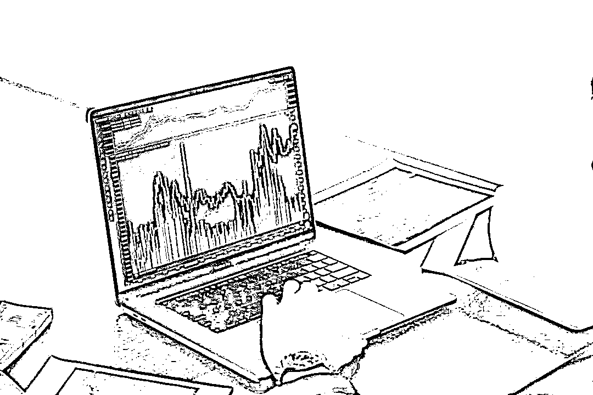

作者/雷蒙德·梅里曼 译者/Luke
编辑/玫瑰 图片/pexels

雷蒙德·梅里曼是在金融占星学界稳坐第一把交椅的占星师，同时他也是若道签约的金融占星课老师，我们引进了雷蒙德·梅里曼老师的《[上证指数月度报告](http://mp.weixin.qq.com/s?__biz=MzA5NjA0NTAxNg==&mid=2651460114&idx=2&sn=28ad91e5b6986901dbbfb41509073ae1&chksm=8b48a0a5bc3f29b3d8ddfdac23345e867f6d9716c0b0fa2daf208dc6c0e622f11c558a991a17&scene=21#wechat_redirect)》及《[黄金报告](http://mp.weixin.qq.com/s?__biz=MzA5NjA0NTAxNg==&mid=2651460114&idx=2&sn=28ad91e5b6986901dbbfb41509073ae1&chksm=8b48a0a5bc3f29b3d8ddfdac23345e867f6d9716c0b0fa2daf208dc6c0e622f11c558a991a17&scene=21#wechat_redirect)》。我们经老师的授权，将每周刊登梅里曼老师的周运，供大家参考和学习。于是，这是本周的周运（11.8-11.12）。

**说明：以下时间采用纽约证券交易所所在地美国东部标准时间。**

**展望与回顾**

****

**10 月强势的就业报告表明，经济正在摆脱第三季度与新型冠状病毒肺炎疫情相关的衰退。第四季度的经济增长可能快于预期。当月就业人数增长 53.1 万。失业率下跌至 4.6%。对前几个月就业数据的修订，也为 8 月和 9 月的就业人数共增加了 235000 人。****——帕蒂·多姆****《强势就业报告表明经济正重新回到增长的轨道》****www.cnbc.com****2021 年 11 月 5 日**股票市场上周表现强势，许多股市在上周 11 月 4 日的天蝎座新月对分天王星时，创下了历史新高，包括美国的道琼斯工业平均指数、标准普尔指数和纳斯达克指数，以及欧洲的 DAX 指数和 AEX 指数。其他市场也出现快速上涨，尽管还没创历史新高。例外是中国（上海、香港）、印度和巴西股市，它们都下跌到了新的 4 周低点。**涉及天王星，很少出现一致的表现。其天性就是不一致，可能带来剧烈的波动。**天王星的剧烈波动在贵金属市场上最为明显，尤其是黄金，周三下跌到了 3 周来的低点，但周五又创下 2 个月来的高点。天蝎座在火星，只要上周的低点守住，价格就会继续走高。以太坊上周也有出色的表现，飙升至历史新高，但比特币未能做到这点。由于当前天王星扮演了重要角色，处于与金钱相关的金牛座，可以**期待某些大波动的出现，尤其在 12 月 24 日土星与天王星最后一次形成渐亏四分相之前。**那一周恰好**金星也逆行了，合相冥王星。**金星和冥王星掌管稳定货币，金牛座也是如此。天王星掌管加密货币，是另一种形式的货币，许多人希望加密货币能成为“稳定货币”。由于天王星在金牛座，这在短期内不是太可能。

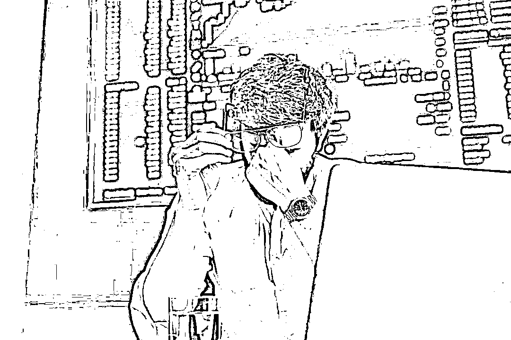

**短期占星趋势和长期考量**

****

**从周二投票可以看出，民主党的进步派显然带来了危险，无论对自己的政党，还是其他人。因为他们激进的立场、无能和狭隘，共和党人现在掌控了三个重要的安全议题——经济安全、教育安全和公民安全，也就是“法律和秩序”。****——丹尼尔·亨宁格****《拜登的民主党正在失败》****《华尔街日报》****2021 年 11 月 4 日****特朗普先生，自然地，试图把杨金先生的胜利视为自己的功劳。但他其实是在适得其反。如果这位前总统帮杨金先生竞选，反而会伤害到他。弗吉尼亚人的心声是，他们不想要进步左派的议程。他们想要听取一位共和党人的意见，这位共和党人能够直截了当地处理人们关心的问题，同时又像一个正常人那样行事。****——《进步派失败的教训·回顾和展望》****《华尔街日报》****2021 年 11 月 4 日**我们正处于天王星的照耀之下。11 月 4 日晚上的新月直接对分天王星。劳工部公布就业人数增幅远远好于预期，并将上个月令人失望的就业人数修正得更高。看起来美国经济正在回归蓬勃发展的正轨。但这也意味着蒸蒸日上的通货膨胀也将持续下去。通货膨胀就像一种“隐形的税收”。随着美联储通报，他们将于本月底开始“缩减回购规模”，值得观察的是，天王星引发的“突破”将持续多久，才会变成天王星引发的“反转”。**从 11 月 10 日到 11 月 17 日，火星将与土星和天王星构成 T 三角。****在 12 月 24 日，最后一次土星-天王星将形成精准四分相。**在这一期间，我们可能看到**天王星的两面性，“突破”和“反转”连番上演。**我们已经在见证这颗行星引发的突破了。但是我们知道**天王星可能在任一时刻切换节奏，就像水星逆行那样，只是更有力量。**

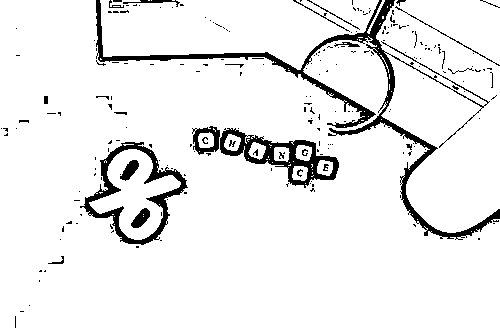

在天王星相位的不断冲击下，没有人知道天王星特性的哪一面将首先出现。但是**市场很可能在这些时期快速上涨（下跌），并以同样快的速度反转。**问题是，导致这些剧烈价格波动的原因很可能是政治因素。**我们很快就要到好时节了——太阳在射手座，那通常是股票市场最看涨的一段时间。**但是涉及天王星，“通常”并不意味着事物将如“往常”那样进展。更可能**从现在到 12 月 25 日期间，是一段“不同寻常”的时期，因为天王星的影响力在宇宙叙述中占了主导。**这可能是一段有挑战的时光，因为计划不像预期的那样展开。但这也可能成为一段灵感迸发和新观点出现的时间。如果有可能的话，保证自身安全，远离危险，看看你能不能为自己的新观点找到支持。它们很可能需要一些调整，才能为社会接受。但在调整过后，可能产生巨大的影响。换句话说，独立思考，但直到你和其他相关人士核实以前，不要将你的观点付诸实践。**说明：以上日期基于纽约证券交易所所在的美国东部标准时间，由于存在时差，中国地区可能需要加一天。****版权声明：**本文由若道翻译发布，欢迎转发，反对抄袭。友号转载请申请白名单。

**雷蒙德·梅里曼（Raymond Merriman）**

若道签约老师。著名金融占星师，ISAR（国际占星研究协会）前主席，梅里曼市场分析公司的总裁。他由于“提升了占星学的职业形象”，在 1995 年国际占星大会上被授予轩辕十四奖；在 2012 年国际占星大会上，被授予轩辕十四终身成就奖。

1“中国上证指数月度报告”发售

**若道推出了****中文版****的雷蒙德·梅里曼中国上证指数月度报告，并持续发行该报告！**

当把金融市场的周期和占星学的周期相结合时，雷蒙德·梅里曼老师的金融占星学研究**为投资者应对金融市场的周期波动，并随之调整投资策略提供了极大的价值参考**。

**11 月中英文报告已上线！**

2“黄金价格周期月度报告”发售

**若道推出****中文版****的雷蒙德·梅里曼黄金价格周期月度报告！**不仅仅为广大读者在中国股市的投资出谋划策，更将视角放眼黄金市场。

**每当世界经济形式不明朗的时候，有一个地方是保值的港湾，那就是****黄金**。自 1982 年雷蒙德·梅里曼出版第一本研究《地球宇宙学征象与黄金价格的关联》的著作以来，**他一直作为最重要的黄金市场时机预测者之一享誉国际**。

11 月黄金报告已上线，梅里曼老师将会告诉你他对这个关键时期如何操作的想法。也可以按照季度和一年期订阅，有更多优惠。季度和年度的好处是，你可以持续了解梅里曼老师对于不断在变化的市场的看法。即便他某一次看法和市场不一致，你也看到在下一期他如何调整自己的看法，并看到金融占星在一个长期时间段内对你把控风险的帮助。而能够长期控制风险、尽量找到安全的投资时机才是投资的长久之计。

**11 月中英文报告已上线！**

**购买套餐**，买得越多越优惠

中国上证指数月度报告套餐价

*   **单月报告**：280 元

*   **3 个月套餐**：780 元（260 元/月）

*   **12 个月套餐价**：2400 元（200 元/月）

**长按下图识别二维码**

**购买金融报告****套餐**

**▼**

黄金周期月度报告优惠

*   **双报告年度套餐更优惠（直降 900 元）**
*   **12 个月黄金报告+12 个月上证指数报告：仅需 3900 元**

**长按下图识别二维码购买黄金报告套餐**

▼

3 中国金融市场特别网络研讨讲座

面对年底几个影响金融市场的重要天象，该如何把握下半年的投资，为跨年做准备？我们特意邀请雷蒙德·梅里曼老师为大家带来了**3 个小时的金融讲座——雷蒙德·梅里曼中国金融市场特别网络研讨讲座。**

这场为期 3 小时的在线讲座探讨了**这些长期行星周期如何影响世界经济的长期周期和趋势，特别是如何影响上证综指和黄金市场**。并描述**在 2021 年剩下的时间里市场反转关键时间点，特别是 12 月 19 日至 25 日金星逆行，以及土星-天王星最后一次渐亏四分相、金星与冥王星合相的重要时期。**

**长按下图识别二维码购买讲座视频**

▼

5《2022 年金融预报和沙龙》1976 年以来，由雷蒙德·A·梅里曼撰写的梅里曼市场时机学院每年一次的年度预报沙龙和每年一本的《年度预报》一直在应用占星学原理为投资者们服务，提供卓越洞见，从未间断。 **雷蒙德·梅里曼《2022 年金融预报和沙龙》开始预售中。原价 1380 元，双十一特惠购，仅需 1180 元，特惠促销仅限 100 名，先到先得。**

**长按下图识别二维码购买**

▼

**点击阅读原文购买金融报告**

# 周末好呀，这个能量爆棚的天蝎座新月，你许了什么愿望？

> 原文：[`mp.weixin.qq.com/s?__biz=MzA5NjA0NTAxNg==&mid=2651460464&idx=1&sn=c297cafc3b054383c9faa24c4fddf2ed&chksm=8b48a1c7bc3f28d19430fc16bf62e305ad36d7da0dc2e7a7a3b895a6896fd78e45d9c3081e72&scene=126&sessionid=1692737903#rd`](http://mp.weixin.qq.com/s?__biz=MzA5NjA0NTAxNg==&mid=2651460464&idx=1&sn=c297cafc3b054383c9faa24c4fddf2ed&chksm=8b48a1c7bc3f28d19430fc16bf62e305ad36d7da0dc2e7a7a3b895a6896fd78e45d9c3081e72&scene=126&sessionid=1692737903#rd)

**2021 年 11 月 6 日天象：**

*   **06:34 水星进入天蝎座**

*   ******08:52 月亮进入射手座******

*   ******水星六分金星******

这两天的宇宙天气很忙碌，先是金星进入摩羯座（点击[【金星进摩羯座】](http://mp.weixin.qq.com/s?__biz=MzA5NjA0NTAxNg==&mid=2651460226&idx=1&sn=2d5372abb7de833c07ed703de96a085d&chksm=8b48a035bc3f2923aa71340a4753b3d77a499925a9051a8330a534deb9d2fe812b674e6b37e6&scene=21#wechat_redirect)查看相关文章），展开为期四个月的”超长摩擦之旅“；昨天，我们迎来能量爆棚、让人”死去活来“的天蝎座新月（点击[【天蝎座新月】](http://mp.weixin.qq.com/s?__biz=MzA5NjA0NTAxNg==&mid=2651460359&idx=1&sn=790107745f42246206f4209f91ef51d3&chksm=8b48a1b0bc3f28a63d338e7649fb867680b12c10d1abc3582dc2ee0de43884c249f1644972ae&scene=21#wechat_redirect)查看文章）；而今天早上 6 点 34 分，水星进入”刺探真相“的天蝎座。此外，你也可以点击[【11 月月运】](http://mp.weixin.qq.com/s?__biz=MzA5NjA0NTAxNg==&mid=2651459819&idx=1&sn=07fcaafae6814e23d7ec7bf3f10898a1&chksm=8b48a25cbc3f2b4a13cb401bc509a2e8e12f5f0da00dc3a7842586dcaa36135513315dbeff5d&scene=21#wechat_redirect)查看本月整体宇宙天气。

不知道大家对这一轮重磅登场的能量有哪些感受？无论有哪些经历、情绪和感受，都可以跟我们分享，欢迎在周末树洞时间畅所欲言~尤其是，月亮也在今早进入射手座，水星和金星形成了利于分享沟通的六分相，没准你在这几天的生活中有了新感悟和更深刻的觉知觉察，都可以在留言区写下你心里的话哦！

周六快乐！我们周一见！ **了解每日天象，可****下载“若道”APP 查看****还有更多精彩等着你哦**

# 插班中丨 ISAR 选修课：行星交点在集体进化中的作用

> 原文：[`mp.weixin.qq.com/s?__biz=MzA5NjA0NTAxNg==&mid=2651460359&idx=3&sn=9ebd53cc517c3e5b64587cc9d73ce552&chksm=8b48a1b0bc3f28a6b040e00fb55532ab7e23f70ac0400423efd3cc226c3c579888f1d909ece3&scene=126&sessionid=1692737903#rd`](http://mp.weixin.qq.com/s?__biz=MzA5NjA0NTAxNg==&mid=2651460359&idx=3&sn=9ebd53cc517c3e5b64587cc9d73ce552&chksm=8b48a1b0bc3f28a6b040e00fb55532ab7e23f70ac0400423efd3cc226c3c579888f1d909ece3&scene=126&sessionid=1692737903#rd)

这是一门专门为若道开设的课程！**马克·琼斯**将于今年秋天教授**八节关于行星交点的深度在线课程**，他将通过我们集体进化中的一些重大事件来阐释这一主题。

1

**什么是行星交点？**

**交点是一个天体轨道与另一个天体轨道延伸平面的交点。**任何沿轨道运行的天体都有交点。月亮有月亮交点，每颗行星、小行星、卫星和微小行星也都有交点。

2

**课程教授什么？**

马克老师**首先会讲解基础知识，**介绍行星交点是什么、行星交点运转的动力（包括日心视角和地心视角），然后他会**论述丹恩·鲁伊尔晚期工作中关于月亮交点和行星交点重要性的洞见**，以及它们如何在个人生活和事件中创造一个动态的意义轴，**超越个人出生星图的静态画面。**

马克老师还将简要**介绍自己的一些开创性研究**，并通过精选一些反映我们共同的**集体进化的现代历史事件**，分享他最近的著作《行星交点与集体进化》中的洞见。

**我们将学习木星往外的行星交点**，看到木星交点如何向我们揭示文化和宗教意识形态的集体历史进化，正如我们的文明结构所表现出来的那样。例如，土星和冥王星的交点也在摩羯座，清楚地描绘了我们所有人在这个时期试图进化所面临的挑战，因为在我们生活的世界根本结构的变化中，游戏规则正在升级。

**我们还将学习近期历史中行星交点的影响**，包括最近木星、土星和冥王星在摩羯座的大合相，开始真正意识到当前这个时期在文明进化本身中的集体重要性。理解这些盛衰周期，我们至少可以在这些困难时期仍然抱有希望：我们不会失去一切！

**在整个课程中，马克老师将通过多个历史案例动态地研究这些强有力的交点配置可能如何运作。**

3

**课程安排**

**第*****1*****讲** **介绍行星交点**

我们将学习行星周期如何形成行星交点，并了解日心视角和地心视角之间的区别。

**第*****2*****讲** **什么是行星交点**

我们将深入学习丹恩·鲁伊尔的成熟思想，这是启发马克老师研究行星交点的灵感之源，也是他最近出版的《行星交点与集体进化》一书的灵感来源。

**第*****3*****讲** **双子座-射手座的天王星交点**

我们将学习人类认知和技术如何通过天王星交点的透镜进化。

**第*****4*****讲**** 巨蟹座-摩羯座行星交点**

我们将进一步学习行星交点对社会和文化的影响，深入探讨落在摩羯座-巨蟹座的木星、土星和冥王星交点，并了解它们在过去 1000 年里对我们的全球社会、政治和文化思潮起着怎样至关重要的影响。

**第*****5*****讲** **海王星及其狮子座-水瓶座交点**

我们将学习落在狮子座-水瓶座的海王星交点影响的不同显化，及其在疗愈中的作用；灵性意识形态的发展，及其促使事件结束的倾向。

**第*****6*****讲** **作家案例**

通过原创研究，我们将学习行星交点如何影响了世界上一些最伟大的作家的人生。

**第*****7*****讲** **研究 2020 年**

我们将了解 2020 年的重要意义。

**第*****8*****讲** **回顾**

我们将回顾前面的课程，并探索如何通过行星交点的意涵理解月亮交点。

4

**授课老师**

**马克·琼斯（**Mark Jones**）**

马克·琼斯是一名**占星师、心理整合治疗师和催眠治疗师**，为世界各地的客户和学生提供服务。

马克的第一本书《**疗愈灵魂:冥王星，天王星和月亮交点》**，详细解释他的占星方法论。

他的第二本书**《灵魂的表达:占星学的治疗潜力》**，融合了马克作为超个人心理治疗师和占星学的经验，概述了占星学解读的变革性潜力。

此外，马克还联合其他作者**共同撰写了一些占星书籍**：《占星学:新一代》、《超个人的占星学》以及《进化占星学的洞见》。

**而《行星交点和集体进化》则是他将他对交点研究的集大成之作。**

5

**课程信息**

*   **课程时间：**2021 年 10 月 26 日开始，每周二晚上 8 点，每周一次，共 8 次课。

*   **授课方式：**线上直播，英文授课，中文翻译

*   **课程价格：****6800 元****（课程不分组写走心推荐语转发朋友优惠价：5800 元）**

*   **行星交点名人案例和问答免费试听：**添加课程顾问王老师，发送“行星交点试听”，即可获得免费试听内容。

*   **课程咨询：**王老师（微信：18510107057，请备注“行星交点”）

长按二维码添加王老师

6

**退转课程**

*   **退款原则请详看《教学协议》，如有疑问请咨询课程顾问。**

****行星交点****

**授课老师：**马克·琼斯

**授课时间：**2021 年 10 月 26 日起

**授课方式：**网络课程**，**英文授课，中文翻译

**费用：****6800 元****（课程不分组写走心推荐语转发朋友优惠价：5800 元）**

**课程负责人：****王老师**（微信：18510107057，请备注“行星交点”）

长按二维码添加课程负责人咨询~

****报名请点击“阅读原文”****

# 天蝎座新月 | 秘密揭开，“死去活来”，选择的时刻到了

> 原文：[`mp.weixin.qq.com/s?__biz=MzA5NjA0NTAxNg==&mid=2651460359&idx=1&sn=790107745f42246206f4209f91ef51d3&chksm=8b48a1b0bc3f28a63d338e7649fb867680b12c10d1abc3582dc2ee0de43884c249f1644972ae&scene=126&sessionid=1692737903#rd`](http://mp.weixin.qq.com/s?__biz=MzA5NjA0NTAxNg==&mid=2651460359&idx=1&sn=790107745f42246206f4209f91ef51d3&chksm=8b48a1b0bc3f28a63d338e7649fb867680b12c10d1abc3582dc2ee0de43884c249f1644972ae&scene=126&sessionid=1692737903#rd)

****☆ **后台回复“今日”，给你一句生命态度**

作者/王芝桦 编辑/玫瑰 图片/pexels

**天蝎座新月****北京时间 2021 年 11 月 5 日 5:14 迎来天蝎座新月，太阳与月亮精准合相于天蝎座 12°40′。**说个秘密：每年，我都盼望着天蝎座新月魔法时刻的到来，令我油然生出“拆盲盒”的兴奋感；此次天蝎座新月前夕，一位学生所在的城市正在进行全员核算检测，她的描述是“随时在拆盲盒”……然后我对“拆盲盒”这件事就不那么期待了，还是老实、踏实、翔实地活在当下吧。于是，带着谦卑和臣服的心，开始写这篇新月文：在做下面这张“行星能量传导图”的过程里，越来越感到“宇宙的盲盒根本不像人间的游戏那么简单”，先是不断惊叹“宇宙安排了好大一盘棋”，最后暗自决定“我要做棋盘上的乖宝宝”。此次天蝎座新月的能量影响，从 11 月初便开始发挥作用，我肯定是赶上这一波了：一个期待，进入“蕴藏魔法的旋转门”转了一圈；出来之时，已经深知自己的无知。究竟发生了什么？来，在天蝎座新月进入“蕴藏魔法的旋转门”走一圈，全知。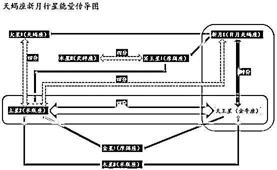

> **天蝎座新月重点影响人群**
> 
> **参考新月峰值影响期间各个行星的行进度数，以及逆行行星的轨迹影响；常规容许度，个人行星入相位 3°，出相位 1°；非个人行星入相位和出相位均为 3°。**
> 
> *   出生星图中，有**行星、四轴、南北交点**落入**固定星座（金牛座、狮子座、天蝎座、水瓶座）0°-17°，**19°-26°****的人群。
>     
>     
> *   出生星图中，有**行星、四轴、南北交点**落入**变动星座（双子座、射手座、处女座、双鱼座）0°-5°，17°-26°**的人群。
>     
>     
>     
>     
> *   出生星图中，有**行星、四轴、南北交点**落入**基本星座（白羊座、巨蟹座、天秤座、摩羯座）21°-30°**的人群。

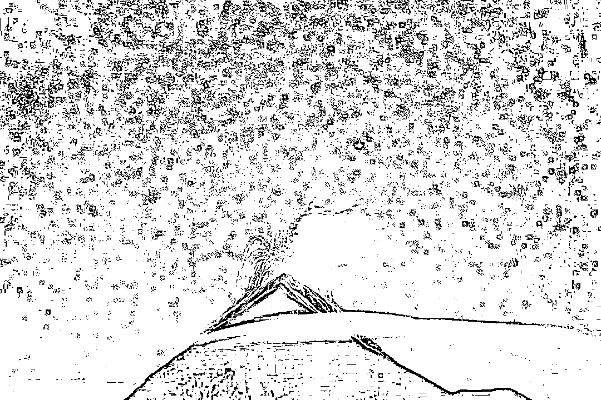

**新月前的作业：说真话，做选择**

****

**墨菲定律并非代表坏事一定发生，而是说该发生的就会发生。****——电影《星际穿越》****天象****· 水冥四分：**天秤座水星四分摩羯座冥王星。此次天蝎座新月的能量辐射，从进入 11 月就已开始发挥影响。**11 月 2 日，天秤座水星与摩羯座冥王星（冥王星守护天蝎座）第三次形成“水冥四分”结构。**“水冥四分”结构的 3 次精准呈相，是随着 2021 年**第三波水星逆行（9 月 27 日-10 月 18 日）**的脚步形成：**第 1 次发生于 9 月 22 日水星逆行前影响期，第 2 次发生于 10 月 1 日水星逆行期，第 3 次发生于 11 月 2 日水星逆行后影响期。**2021 年第三波水星逆行发生在主导“道德与平衡”的天秤座，触发了**“关系的平衡”**议题。**水星逆行周期，“流动性”容易发生阻塞，“诚实性”容易伴随虚伪。**故而，当“水逆”作为主角登上 9 月-11 月的舞台，**人际关系、商业合作、金钱往来和市场环境**等几方面，便逐渐暴露出**不尊重、不平等、不合理的失衡问题和暴雷事件。**更重要的是，这里还有两位配角：**· 金火互容：****9 月 15 日-10 月 6 日**期间，天蝎座金星与天秤座火星形成“金火互容”结构，将“水逆”暴露出来的“关系失衡”问题，更具体地指向“关系旧账”——过去感受到的失望和怠慢、痛苦和委屈，其实都记在心底的小本本上；既然记下了“证据”，自然就留有“后手”；**· 水冥四分：**3 次“水冥四分”结构，就像是冥王星将水星绑在手术床上的拷问——对过去“做好人来感动对方、掩盖问题来获取好处、假装无恙来维系正常”说真话！该发生的就会发生。9 月-11 月期间，看似只是一场水星的逆行，但其实就像每个人的不同“房间”被撬动了地板并起了底——**那些模糊的边界和底线，那些过度的付出或索取，揭示出“只能更好”的执着，“不能后退”的恐惧，“逃避真相”的脆弱。**11 月 2 日的“水冥四分”结构，就像是“宇宙超级大 BOSS”冥王星在此次天蝎座新月前夕，为我们布置下的一份作业——平静打破，真相起底，是做出选择的时候了。

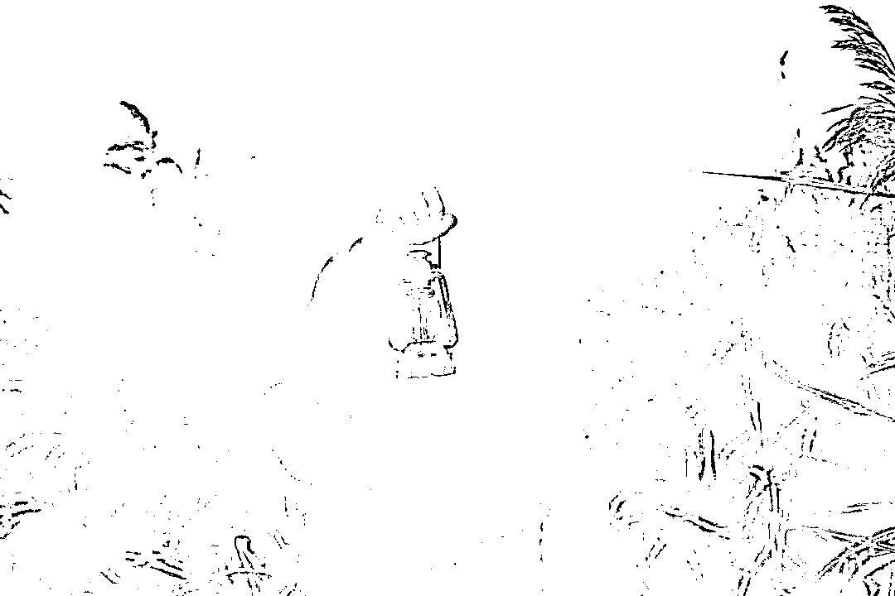

**“死亡”与“重生”**

****

**要想死而复生，那就得先死。****——电影《星际穿越》****天象****· 新月对分天王星：**精准合相于天蝎座的太阳与月亮，对分金牛座天王星。 对于天蝎座而言，“死亡”是具有特别意义的一份资源。这里所说的“死亡”，并不是生命的终结或肉体的消亡，而是**“触底的黑暗与绝境”**。天蝎座不怕“死亡”，反而每每在面对死亡的瞬间顿悟真相——**我不怕死，但我不能被那些要我命的、不值得的、没必要的耗死。**“生死”之间，“蕴藏魔法的旋转门”出现，**天蝎座顿悟出“最深刻、最真诚”的联结真相，剪断没必要的牵绊，选择最重要的留存，触底重生！**天蝎座新月与金牛座天王星的对分结构，为此次天蝎座新月注入了“惊颤”的能量——"不按常理出牌的疯子（天王星）”遇见“蕴藏魔法的旋转门（天蝎座）”，能变出什么戏法来就真的难说了：疯子走进旋转门，走出来一位如玉公子？疯子指着旋转门说：“把这个神秘的盲盒拆了吧”？此次天蝎座新月，无疑是一次令人瞪大眼睛的新月。惊艳，惊讶，惊悚，虽然这两年我们已经见怪不怪，但也难免在看到真相前有些“焦虑不安”。集体层面的**物质资源、金融领域和保险行业伴随着“大手笔”的震荡和整顿**，个人层面的**金钱观念、投资管理和财务规划**也需要我们重新梳理并做出调整；结合 11 月 2 日的“水冥四分”结构，此次天蝎座新月也是“关系议题”进一步推进和深化的时间，**秘密揭开，平静打破，“选择”的时刻来临。****全新“风元素周期”的起始年 2021 年，主导着新旧周期的“转化”进程。**在这个过程中，陈旧的事物一点点被打破，而新建的事物还不够成熟，现实常常将刚见的起色打回原形，令我们在选择的时候却不敢确信，就像一枚硬币立在那里却不敢出手。**2021 年，被动反应多，主动出手少，“惊”字相伴，焦虑难免。**但请相信，一切都是最好的安排。更重要的是，此次天蝎座新月，天蝎座主导的“心理性”为我们开启了一段“心路历程”。**·** 秘密本身已经无关紧要，而最在意、最不能接受的是“你一直隐瞒未说”；**·** 没有人喜欢蒙蔽和欺骗。于是，受伤的灵魂像个倔强的孩子，即使心在流血也要看到全貌；**·** 还有多少是我不知道的？天蝎座的“侦探”因子被彻底激发，一遍遍冲刷着血液，一点点挖掘着真相。因为，必须要对伤痛有个交待；**· **当所有逃避、妥协和伪装的可能性都被拿走，“触底”时刻来临——我不怕死，但我不能被那些要我命的、不值得的、没必要的耗死！

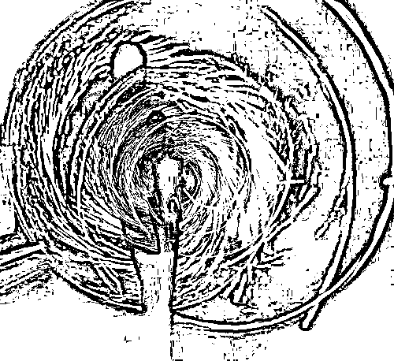

此次天蝎座新月，“蕴藏魔法的旋转门”已经开启，走进走出之间，全新的洞见注入灵魂的深处。**·** 之所以伤心，是因为你曾努力过；但你的努力，未必是别人想要的；**·** 至少，你曾经成全了自己的意志；值了，因为没有人比你更重要；**·** 或许，你还不知道自己要成为什么样的人；但是，你肯定知道自己不想成为什么样子；**·** 如果你不愿意，伤害和损失根本无计可施；如果你愿意，觉醒与重生将会马上发生；**·** 当你看见自己的痛苦，就对自己慈悲一点；你不是别人的药，别人也不该成为你的病。要想死而复生，那就得先死。此次天蝎座新月，引领我们**向生命内在已经“死亡”的部分“告别”——过去的自我主观和自我执着。****艰难的处境，神奇的安排**

****

**我们要超越自己的领地。****——电影《星际穿越》****天象****· “土天四分”被激活：**太阳、水星和火星介入“土天四分”结构；**· 金星换座：**金星换座进入摩羯座。此次天蝎座新月所处的宇宙大环境，和我们所处的地球大环境一样的艰难。太阳（10 月 23 日）、火星（10 月 30 日）、水星（11 月 6 日）先后换座进入天蝎座，11 月上旬和中旬，三颗行星先后介入年度重磅天象“土天四分”结构（四分水瓶座土星，对分金牛座天王星），为 2021 年的“清算”进程之中注入“去伪存真”的能量——**撕开现实表象，揭露真相内幕，激发深层力量。**此次天蝎座新月许愿之前，建议先进行一场内在的对话：**我想要的是什么？“我”和“想要”之间的距离，是变得更近了，还是走得更远了？哪些问题阻隔在中间，哪些初衷已经被偏离？**在我们的内心深处，常常恐惧被在意的人事物抛在岸边，或是曾经的努力付之东流，于是，我们依照自我主观去妄想、占有和控制，无论采取的方式是索取或付出，但背后都是**“我认为应该这样，我期待你会那样”**的自我执着。

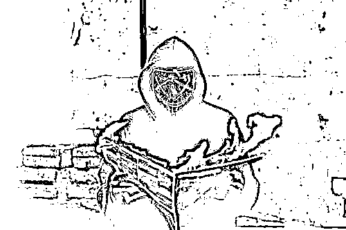

现在，反思自我的主观，转化自我的执着；然后，为未来的自己做出选择——**勇敢凝视内在的恐惧和不自信，勇敢迎接一切的变化和挑战，让毫无营养、消耗我们的事物“死亡”，让内心渴望、非常重要的事物“重生”。**关键的时刻，宇宙总有一些神奇的安排。**此次天蝎座新月当天，金星换座进入摩羯座，并将随着一场跨年的逆行（2021 年 12 月 19 日-2022 年 1 月 29 日），在摩羯座行进 4 个月之久（2021 年 11 月 5 日-2022 年 3 月 6 日）。**未来 4 个月的时间里，**“金钱和关系”**两个方面的议题将被再次凸显：**无论哪种关系（人际、金钱、生存、病毒、市场、职场），都不能自我主观或毫无章法地经营，因为任何“过度”的付出和索取，都只会导致关系“失衡”，都终将要被时间“清算”。**此次天蝎座新月，金星进入摩羯座，开启未来 4 个月的起点，同时为我们翻天覆地的现实生活、狂风暴雨的内心世界注入**“理性和务实”**的能量——无论是对金钱，还是对某个人，都要爱得实际一点，靠谱一些，确立自己的原则和边界，界定关系的尺度和距离，清晰人生的可为和不可为，才不会在“过度”之后感觉被“亏欠”，才能重建成熟的自我和平衡的关系。此次天蝎座新月，在我们的愿望清单上，一定要有一条——**超越自己的领地。**

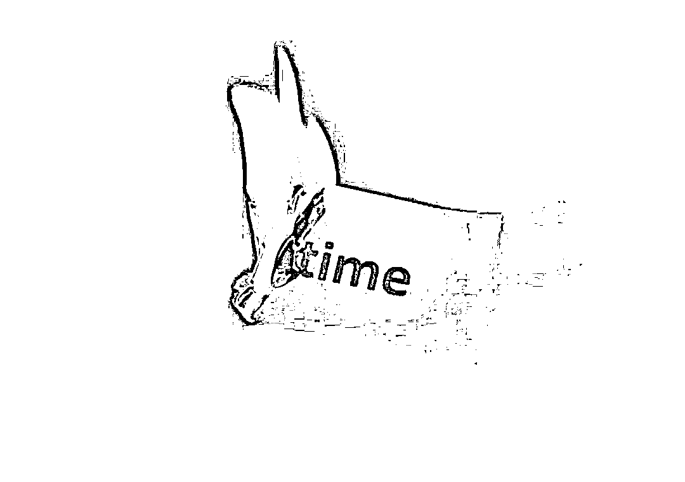

**寄语**

****

**人很贪婪，但也很勇敢，面对浩瀚的宇宙，没有心里的爱和勇气，我们就真的太渺小了。****——电影《星际穿越》**越是伤痛的时刻，越要拥抱爱和勇气，否则，没有什么能够支撑我们走下去，没有什么能够让我们愿意留下一些什么。无论你的生活正在发生什么，记得我爱你，还有很多人爱你，宇宙也爱着我们。祝福大家，愿每个灵魂安好。**新月如何许愿？**

**许愿时间**：2021 年 11 月 5 日北京时间 5:14 后，48 小时内有效、8 小时内最佳。 

**许愿人群**：所有人。

**许愿数量**：每人最多 10 个。

**许愿方式**：静心冥想，身心祈祷或记录收藏。

**许愿格式**：请万能的宇宙赐予我能量，我将以我的能量吸引**（什么）来到生命中……

**许愿原则**：发心诚善利人。

**版权声明**：原创文章由作者授权首发于若道平台，欢迎转发，反对抄袭。友号转载请申请白名单。

****

****想阅读更多作者的文章，请在后台回复******王芝桦****** 即可。****

****王芝桦****

心理占星师，统合疗愈师，占星专栏作者

全职于个案咨询与占星教学工作 16 年

**个案预约咨询微信号**：zhihua0621 

**微信公众号**：daoxi-life

**长按打赏**

****

**学习占星学**

**点击下图了解课程详情**

************

****

****

****

**微信又双叒叕改版啦，不想错过若道君的推送？**

**就把若道设为星标吧！**

**▼**

**福利来啦**

**点击**

**“阅读原文”**

**获取最好用的免费**

**新月报告**

**获取免费新月报告，请点击文末“阅读原文”**

# “惊吓”的天蝎座新月，让这份免费的新月报告为你保驾护航！

> 原文：[`mp.weixin.qq.com/s?__biz=MzA5NjA0NTAxNg==&mid=2651460359&idx=2&sn=52866634e2ef2c7dc1f75a3647ddced6&chksm=8b48a1b0bc3f28a6a6a208d03bcbfa9cb9f7b767709fd810db3635cd6fc6c55f03b2b8e368f8&scene=126&sessionid=1692737903#rd`](http://mp.weixin.qq.com/s?__biz=MzA5NjA0NTAxNg==&mid=2651460359&idx=2&sn=52866634e2ef2c7dc1f75a3647ddced6&chksm=8b48a1b0bc3f28a6a6a208d03bcbfa9cb9f7b767709fd810db3635cd6fc6c55f03b2b8e368f8&scene=126&sessionid=1692737903#rd)

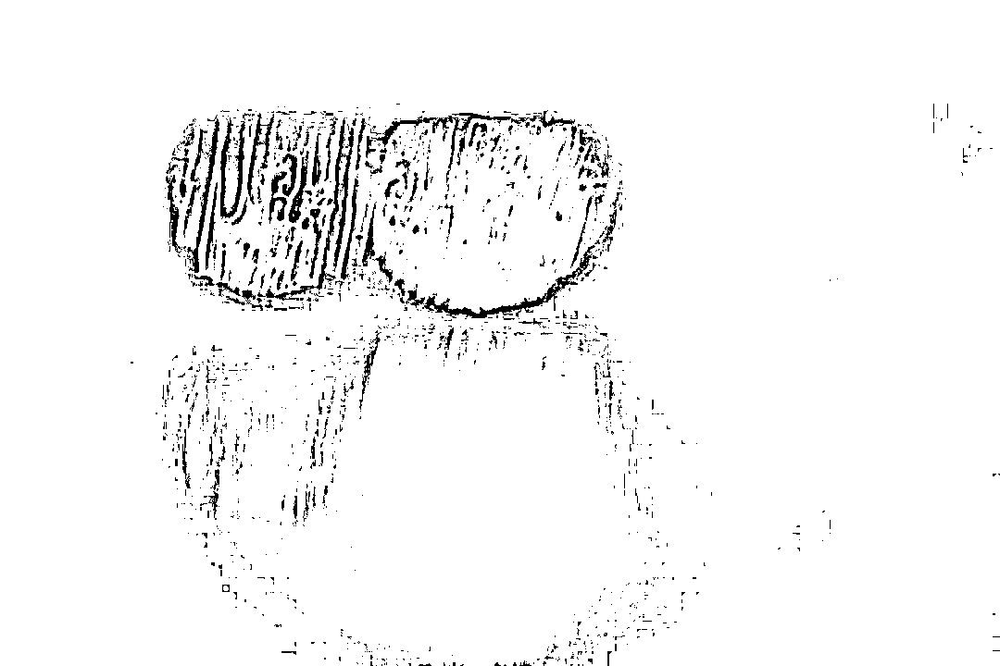

北京时间 11 月 5 日 5:14，新月发生在天蝎座 12°14′。每到新月时分，若道君都会为你奉上根据你出生星图量身打造的免费新月报告。可是新月为什么要许愿？新月报告该如何领取？让若道君来教你。

　**什么是新月？**　

从占星学看，新月是月亮周期的一种相位。新月是开始，又称为朔，对应中国农历初一，太阳、月亮在此时合相。此时月亮运行到太阳与地球之间时，月亮以黑暗的一面对着地球，并且与太阳同升同落，地球上看不见月亮。

本次新月时间

**11 月 5 日 5:14，新月发生在天蝎座 12°14′。**

为什么新月要许愿？新月是一个周期的开始，新月发生的时候，太阳与月亮合相，能量很强。当新月出现时，你也许会发现灵感忽现，非常适宜开启新领域、项目与行动，缔结一段新的关系或合作。许愿会加强新月的能量，也有助于你了解自己现阶段适合开启的方向。 本次新月最佳许愿时间

从新月开始到其后的 48 小时内，许愿的力量最强。

**最佳许愿时间：11 月 5 日 5:14-11 月 7 日 5:14**

属于你的免费新月报告

每到新月时刻，看着占星文章里写着：看看你新月的宫位，如果新月在第 X 宫，你可以许愿的方向是……

是不是常常一头雾水？新月的宫位？我到底该看哪里啊？

而有时，那些标注上升星座的文章也会让你忍不住想：虽然我的上升星座是这个，可是我的新月好像并不落在你说的宫位啊？你是不是写错了？

虽然这些文章都没有写错，可是好像对你而言都太不友好了。

**Don't Worry！**别着急，让博学又体贴的若道君来帮你！

我们推出了一份**免费**又**好用**的新月报告！

而且是专门为你设计的哦，**根据你出生星图为你量身打造的，只****属于你的独家新月报告**。

报告有哪些内容？

**新月时间****最佳许愿时间**

**如何许愿 **属于你的**许愿关键词**

本次新月给你的**建议**

你会有怎样的**感受 **

****机会****

********

如何许愿？

许愿方式也很简单。

你可以把愿望写下来，或者双手合十后交叉，闭上眼睛来祈祷。 

报告中会为你提供**祈祷词示例**，可以多多参考哦～ 

你还可以适当添加自己的语言，创造属于你自己的祈祷文！

如果报告拿到手了，快对照着许愿吧！

**这份好用又暖心的报告，点击****阅读原文****即可领取！**

****

****点击“阅读原文”即可获取新月报告****

# 非暴力沟通丨人的需求，是对生命力的表达

> 原文：[`mp.weixin.qq.com/s?__biz=MzA5NjA0NTAxNg==&mid=2651460226&idx=2&sn=70407cad99b7e4dcf8f3759e86c894c4&chksm=8b48a035bc3f2923a0d07df80f95b4ba80c40bd91abf635030aa709c9f5138f0efdb19a533f6&scene=126&sessionid=1692737903#rd`](http://mp.weixin.qq.com/s?__biz=MzA5NjA0NTAxNg==&mid=2651460226&idx=2&sn=70407cad99b7e4dcf8f3759e86c894c4&chksm=8b48a035bc3f2923a0d07df80f95b4ba80c40bd91abf635030aa709c9f5138f0efdb19a533f6&scene=126&sessionid=1692737903#rd)

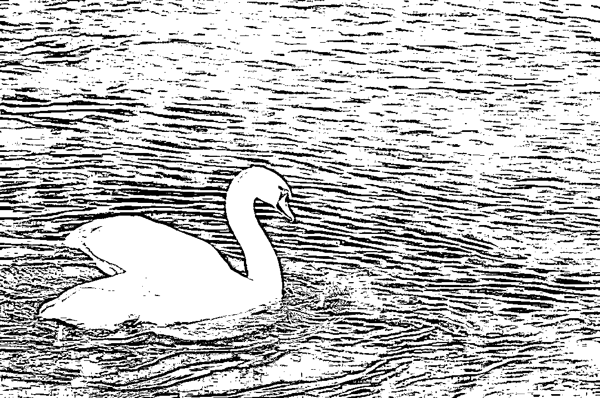

作者/艾迪·萨卡帕

翻译/JUN 校对/江艺

编辑/翀子 图片/网络

“人生来自私”的想法带来哪些问题？作者由此展开论述，认为人的需求是对生命力的表达，如果做到与自己和他人共情、了解各自的需求，我们就有可能创造出一种新的、有别于恐惧的文化，从而获得更好的沟通与合作。

**从很小的时候起，我就被教导，所有人生来自私。**在我还是个孩子时以及成年后，我都被灌输了这种观点。这种关于人性的理论似乎解释了为什么世界上有那么多的暴力和邪恶。这是因为人类天生就是自私的；如果没有惩罚机制让他们走上正轨的话，他们就会采取自私。

**胡萝卜加大棒法**

**我从他人那里学到，要解决冲突并达到目的，就要使用胡萝卜加大棒的方法。**如果人们做了错事，就该受到惩罚，如果他们做了好事，就该得到奖励。通过向人们提供一个未来的奖励，或者威胁说如果他们没有做到他人期望他们做的事情，就惩罚他们，这样来激励人们是可取的。

许多身居高位的人仍然遵循这种思路。对于主管、领导、老师或家长来说，用胡萝卜加大棒法十分诱人。

**以需求为中心的方法**

我不再赞同这种方法。我相信另一种人性理论。我相信，**所有人都是由需求或价值观所驱动的，而这些需求是普遍存在的。**人类之所以如此行事，并不是出于自私，而是出于**渴望与价值观相连，并与这些价值观和需求保持一致。**

马歇尔 · 罗森伯格(Marshall Rosenberg)总结得很好，他说：**“需求就是生命在寻求表达。”**我们选择的每一个行为背后都有一个很好的理由，因为它与某种需求相连，而这种需求对于生命来说是必不可少的，是纯粹而普遍的。

渴望爱、理解、和平、正义、被重视、被倾听、支持、合作或正义没有任何问题。这些都是好事。**我们都有潜力把这些东西带进我们的生命和他人的生命，**让世界变得更美好。

当我们对生命中的某种价值或需求有了认识时，我们可以问自己一个问题：**"我如何在这个世界上体验爱、理解、和平或正义的价值？当我在内心与这些需求和价值相连时，我注意到了什么?”**

如果我们选择的策略会导致我们自己和他人遭受痛苦，问题就出现了。正是我们对如何实现需求的选择，会使我们陷入困境。虽然普遍的需求和价值观从来没有冲突，**但我们选择的策略可能会有冲突。**

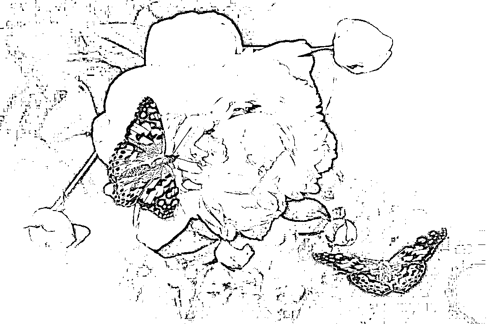

**问题**

当我们选择相信人类是自私的时候，我们就很容易对他人做出这样的评判。**我们通过评判的滤镜看待世界，我们使用标签。**当这样做时，我们的思维以对与错或好与坏的标准来看待事物。

**我们创造了别人的敌对形象。**我们的脑海里现在有了好人和坏人。我们的心对那些被我们贴上 “坏人”标签的人并不那么开放，我们更倾向于认为他们应该受到惩罚，更容易使用惩罚或奖励。**当我们有了别人的敌对形象时，我们更有可能选择那些能够刺激我们自己和他人遭受更多痛苦的策略。**

**开诚布公的方法**

我想邀请大家采取另一种方法。使用这种方法首先要相信，**任何人所做的一切都是为了满足某种需求。**例如，当我们或某人做了一些我们不认同的事情（我们认为对他人有害的事情) ，**我们可以关注自己或他们的需求是什么，并重视这些需求。**

亚伯拉罕·马斯洛创造了需求的层次结构，证明了人类需求的重要性。我们都有基本的需求，比如对空气、水、食物和住所的需求，这些都是我们生存所必需的。我们也有对爱、被重视、被倾听、对社区、对感情的需求等等。**当这些需求得不到满足时，我们会感到缺乏，并产生渴望，在某些情况下(当我们的物理需求得不到满足时) ，我们会死去。**

一旦我们坚信人类所做的一切都是为了满足需求，我们就可以练习猜测如果一个人做了一些我们认为不利于服务生命的事情，**他想要满足的是什么样的需求。**随着不断的练习，我们将**提高自己关心他人的能力。**

如果一个婴儿在哭，他就有需求。婴儿可能需要食物、温暖或安抚。大多数父母不会认为孩子是自私的。婴儿只是在用他能做到的最好的方式让父母知道他需要什么。父母通常能理解这一点，因为他们认为婴儿是无辜且脆弱的。这里有一种无辜的假设。

**当我们意识到一切都是为了需求时，我们也会这样做。**我们认为别人之所以如此行事，仅仅是因为他们已经学会了用这种方式来满足自己的需求。希望是存在的。他们可以学习用不同的方式来满足需求。

如果我们假设别人有恶意或是自私的，我们就会陷入麻烦。如果父母没弄清婴儿的需求，婴儿也不会认为他们是“坏父母”。婴儿还没有被教会如何做出判断。以后的社会化过程，将教会他们。

婴儿将哭泣与自己的需求联系在一起，之后他将会被教导在需求没有得到满足时去评判他人，而不是清楚地表达出自己的需求。**这就是悲剧——控制模式的结果，已经成为了我们的集体习惯。**

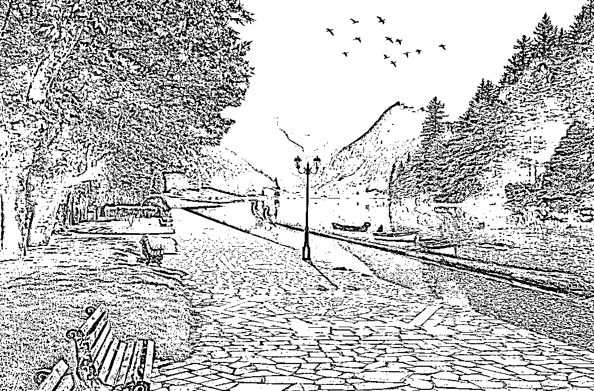

**施暴者干预计划**

在过去的 19 年里，我一直在帮助那些在亲密关系中有身体暴力行为的男性和女性。我以一种开放的态度对待他们。我这么说的意思是，我没有因为他们的所作所为而评判他们。**我会给自己时间去了解，当他们以暴力的方式行动时，他们想要满足什么样的需求。**然后我会问他们想要满足什么样的需求。起初，他们中的许多人并说不清楚。

通过指导和练习，他们开始能够说出他们试图满足的需求。一个人分享说，当他抓住妻子，推到床上时，**他有一种被倾听的需求。**我问他，他选择的策略是否支持那个被倾听的需求。他说不支持。他说妻子开始哭，然后报了警。

**我问他是否可以想出另一个策略，让他被倾听的需求更有可能得到满足，**并且能小心地抱住妻子。他说他可以停下来，深吸一口气，问妻子是否愿意聊聊，听自己说话。他还说，他本来可以等到他们都准备好了，并且冷静下来的时候，再和她说话。他想出的这个新策略奏效了，改善了他和妻子的关系。

要我告诉他，他既自私又粗鲁是多么容易的事。他活该被逮捕。但相反，我已经训练自己去考虑我的客户试图满足什么样的需求，并**帮助他们识别这些需求，找到他们可以使用的不含暴力的策略；**这些策略增加了每个人的需求都得到重视的可能性。

我在无暴力关系中心（The Center for Violence-Free Relationships）的施暴者干预计划(*Batterers’ Intervention Program* ，BIP）工作了七年，并整合了这种以需求为中心的方法。

我很自豪地说，2008 年的 BIP 毕业生在 10 年后都没有再因任何家庭暴力的指控而被起诉。另一个 2017 年的 BIP 小组 2 年后的再犯率也是零。这是迄今为止已知的最低再犯率。直到今天，我仍然通过**“丰盈生命沟通”**（*Life Enriching Communication*）提供同样的干预方法。

如果个人意识到他们可以仅仅修改自己的策略，并得到一个对每个人都更好的不同结果，这就是革命性的。**因为他们可以与做出选择的那一部分自己共情，并原谅自己和他人。**他们从自己的评判中解脱出来，并有能力让改变发生。

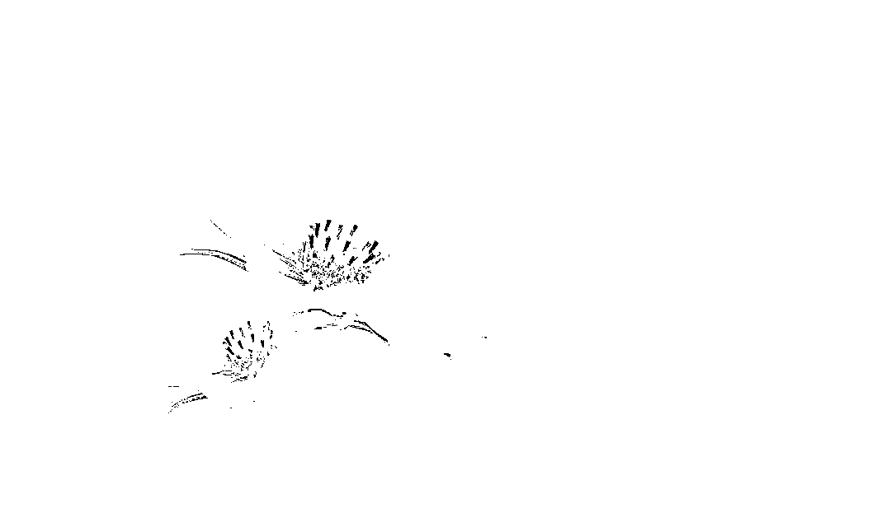

**以共情为路径**

**我鼓励我的客户采取的另一种方法，是去了解他们伴侣的需求。**当他们意识到伴侣需要尊重、关心、被重视、安全、保证、空间和其他需求，这些需求他们往往能与自身联系起来，他们会经历一种转变，并在心中找到与伴侣共情的空间。

**同理心会由此产生，**他们可以选择策略，不仅让自己的需求更有可能被满足，也让每个人的需求更有可能被满足。

**通过将注意力集中在需求上，我们可以用同理心拥抱自己和他人。**我们可以用一种温柔开放的心态来对待生活，从而让我们的需求连结，也可以让我们找到对每个人都有效的策略。

这种方法可以用于亲子关系、主管与员工、教师与学生，以及所有类型的关系。

**创造一种不同的文化**

当领导、家长、主管选择胡萝卜加大棒的方法时，他们就会**培养出一种恐惧的文化。**例如，孩子、员工或学生由于害怕可能会受到惩罚，或者仅仅是被奖励所驱使，而不是被内在动机所激励。

**最主要的动机就变成了不惹麻烦，不受惩罚，或为了得到奖励。**他们的动机不再是更伟大的事业、使命或价值观。更大的价值通常会在这个过程中丢失。

如果一个孩子或者一个员工**认识到他们为之奉献的需求，他们就能发自内心地与之合作。**驱使他们的不是恐惧，而是一种全人类共有的价值观。

**马歇尔·罗森伯格向父母提出的两个问题是：**

*   **你希望你的孩子做什么？**

*   **你希望他们做这件事的动机是什么？**

第一个问题很简单。第二个问题很关键。我们真的希望一个孩子，一个员工或者一个学生因为害怕我们而去做我们要求他们做的事情吗？

**我希望更多人选择采用以需求为中心的方法，创造有同理心的文化，让连接、透明和协作能兴盛起来。**

**进一步练习：**

 **1\. 自我同理心** 

*   **观察：写下你所做的令你后悔的事情，不作评价。**

*   **需求：写下当你做这件事时，有哪些价值或需求没有得到满足。**

*   **需求：当你做出这个选择时，你想满足什么价值或需求？**

*   **自我要求：你将来会选择什么策略来满足这一需求？**

*   **感受：当你将两种需求连结后，你有什么感受？**

**2. 对他人的同理心**

*   **观察：与上述相同。**

*   **感受：当你做了所做之事时，你认为这个人是什么感受？**

*   **需求：当你这样做时，其他人的哪些价值或需求没有得到实现？**

**版权声明：**原创文章由若道翻译发布，欢迎转发，反对抄袭。友号转载请申请白名单。

**艾迪·萨卡帕**

“丰盈生命沟通”的创始人，非暴力沟通中心(CNVC)认证培训师，著有《非暴力沟通的原则与实践: 30 种练习同理心的冥想法》和《热忱志愿者与领导者的培养要点》。艾迪在家庭暴力领域工作了 19 年，致力于结束暴力循环。

**学习 NVC**

**点击或长按下图了解课程详情**

**

**微信又双叒叕改版啦，不想错过若道君的推送？**

**就把若道设为星标吧！**

**▼**

**喜欢记得点一下在看哦☟**

********报名直达入口********

# NVC 线上训练营丨别让“暴力沟通”毁掉真挚的关系（插班中）

> 原文：[`mp.weixin.qq.com/s?__biz=MzA5NjA0NTAxNg==&mid=2651460226&idx=3&sn=dbc74a325c6583610ed3356eaacf9fd2&chksm=8b48a035bc3f2923fb047dde325dbd91711881f75e37e41e8937b0397b45a5f36934c6c99c6c&scene=126&sessionid=1692737903#rd`](http://mp.weixin.qq.com/s?__biz=MzA5NjA0NTAxNg==&mid=2651460226&idx=3&sn=dbc74a325c6583610ed3356eaacf9fd2&chksm=8b48a035bc3f2923fb047dde325dbd91711881f75e37e41e8937b0397b45a5f36934c6c99c6c&scene=126&sessionid=1692737903#rd)

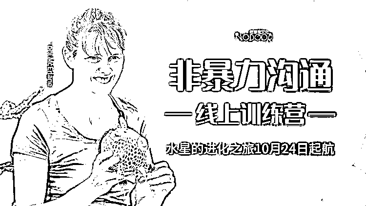

**为什么我们要学 NVC？**

（向上滑动查看内容）

**蒋颖**

若道联合创始人

2016 年，我在新西兰参加一个 Hakomi 亲密关系治疗的治疗工作坊。参加这个工作坊的都是治疗师。在这个工作坊中，有一位女性让我特别印象深刻，因为她身上有种特别的气质，某种既温柔又坚定的东西，充满力量，充满对这个世界充满关怀，她身上表现出的让人惊讶的真实也让我有很多思索。她叫托尼·麦克尔兰（Toni McErlane）。

我知道她从小学习武术，也是一个悬挂式滑翔运动的运动员，曾经背着滑翔机在世界各地的上空飞行和比赛。她完成了北美非暴力传播（NVC）领导计划，是一个非暴力沟通（Nonviolent Communication，简写 NVC）培训师和注册的家庭纠纷调解人，也是生态心理学的培训师。她有多年的内观经验，在身体创伤治疗方面的经验，还有她在有机种植、景观设计、园艺治疗都有专长……我看到她到印度去，帮助印度乡村做有机耕种。在这次疫情之前，她已经买了一艘帆船，准备和丈夫开着他们的船环游世界。所有这些都让我感叹，一个女性可以活得如此勇敢和丰富。现在她而她对中国也充满了某种关切。多年前就一个人在藏区徒步旅行，后来又骑自行车穿越西藏。

但喜欢户外冒险的 Toni 说， NVC 比武术更管用。

2019 年，我终于请 Toni 到中国来，请她给若道做了基础和中级的 NVC 培训，也请她对外做了一次工作坊。

怎么说呢，培训和工作坊棒极了，更棒的是，我觉得人人都爱她。

**Toni McErlane**

我来自新西兰，拥有社区和人类服务—咨询康复学士学位，是 Aminz 的注册家庭纠纷调解人，也是 NVC Aotearoa 的 NVC 培训师。

在我的生命中，我一直对真诚、充满活力、自我负责的沟通和有意识的选择充满激情。而我的人生旅程为我提供了充足的机会，让我去探索、研究、反思和完善这在沟通中是什么样的。

在我的工作坊中，我的原则和实践都是建立在非暴力沟通和正念的哲学基础之上。非暴力沟通是由美国心理学家马歇尔·卢森堡博士所开发的。马歇尔的目标是发展出一种语言，这种语言受到印度巴利语中的“非暴力主义”（Ahimsa）一词的启发，它的意思是“没有伤害”。我们怎样才能在与他人沟通时不造成伤害呢？这不仅需要非暴力沟通的技巧，还需要在训练中融入正念。正念是受小乘佛教内观传统的启发，发展觉知和接纳，关注和允许。在我们的工作坊中 ，我们将非暴力沟通和正念编织在一起。

我致力于以这种沟通和处世方式作为我日常与人互动的基础。我曾经学习了为期一年的北美非暴力沟通领导者项目，在加州湾区非暴力沟通的全年浸入式项目中做了两年协助工作，然后在索诺马县女子监狱推动非暴力沟通培训。同时，多年来我持续参加内观静修，致力于继续和发展这种实践，并把它融入自己的工作坊中。

2020 年疫情期间，我与丈夫和我们的猫在游艇上休了一年假。现在，我和丈夫还有 15 岁的侄女在新西兰南岛的达尼丁生活。我在那里从事心理咨询、冥想和生态心理疗法。我们还正在那里慢慢建立一个治疗静修中心和生态冥想社区。

过去四年，我曾两次来中国，与若道及其友好而充满活力的团队分享非暴力沟通，并参观了一些绝佳风景。我期待继续与若道合作，在网上分享我的知识和技能。

向上滑动可查看更多

**Toni 老师有话对你说**<mpvideosnap class="js_uneditable custom_select_card channels_iframe" data-pluginname="videosnap" data-id="export/UzFfAgtgekIEAQAAAAAABNIXkZitzgAAAAstQy6ubaLX4KHWvLEZgBPEtIMEEEUxZvj-zNPgMIuM7PVi1oMK5fdX4B-DAnh3" data-url="https://findermp.video.qq.com/251/20304/stodownload?encfilekey=RBfjicXSHKCOONJnTbRmmlD8cOQPXE48ibrgo6T80SM1b4QSoxiaa7xblfRvMCU22ricO1icL5GdBOSmzhG7mbaLtSLg4xqYaTLicapWwCV45Axx8QGaozqH7OpxicjibYzN1icWtyuIibCRyZInILWhIGRG1ILicWtib8H3XUMxBW2rZO2GMmc&amp;adaptivelytrans=0&amp;bizid=1023&amp;dotrans=0&amp;hy=SH&amp;idx=1&amp;m=3d7ca9d191932d16f6faa80b9364d1f9&amp;token=AxricY7RBHdVzFXjPCFncbbQSWL8x8x2YeR1VX1JKDza8JFxFfuEYeFkqjygt392VxqY7mdlmzAc" data-headimgurl="http://wx.qlogo.cn/finderhead/PiajxSqBRaEJYnVsqWfEX9qA0sI6hNVKsDfyzfPZ92WZMZyBpZWU5NA/0" data-username="v2_060000231003b20faec8c4e68a1ec2d4ca07e434b07755bbf47e7053a3059defd2c9d6c68a20@finder" data-nickname="若道" data-desc="#非暴力沟通 NVC  在面临一个两难处境时，如何运用 NVC 促进合作的开展？
" data-nonceid="1620007045275601581" data-type="video"></mpvideosnap>

**福利！**

**最后 2 名！**

**报名课程即赠送 NVC 情绪-需求卡一套**

**NVC 情绪-需求卡**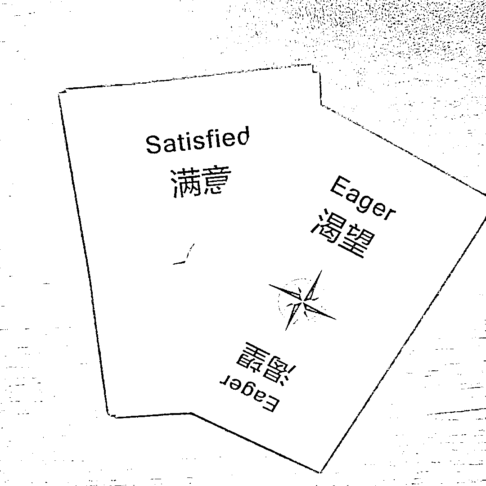**课程内容**

**第*****1*****模块 区分感受和想法**

*   学习区分想法、感受和故事感受。

*   体会为什么在表达中分享自己对某一情境的感受很重要，而不仅仅是想法和判断。

*   学习辨识和认同身体传递的感受和情感，将它们作为自我觉知和自我联结的资源。

*   理解感受是重要的信息媒介，支持你与自身的需求建立联结。

*   认识关注感受、探索联结需求的重要性，而不是对感受做出反应。

**第*****2*****模块 将感受与需求、需求与策略关联起来**

*   了解并理解满足一个人需求的策略可能无法满足另一个人相同的需求。

*   学习理解需求的概念，学习区分需求和策略。

*   体验如何用多种不同的策略来满足一种需求，以及如何通过选择一种特定的策略满足或不满足其他需求。

**第*****3*****模块 倾听和共情**

*   学习倾听他人话语中透露出的情绪和需求。

*   体验受到共情和受到其他形式的有意识的支持之间的差别，比如同情、安慰、分散注意力、陪伴等等……

*   学习认可别人的体验和情感，而不必认同对方的策略，认识这种技能所能带来的力量和解脱。

**第*****4*****模块 观察与评价**

*   学习在表达中运用观察而非评价的重要性。

*   体验两者之间的差异，自己去领会为何有此差异。

*   学习区分对情境的解读和事实。

**第*****5*****模块 自我共情**

*   学习认识和观察自己的评判和评价，并用它们与自身感受和需求建立联结，借此更深入、更清晰地理解自己。

*   学习识别自己赋予情境的意义，并探求其中的事实。

**第*****6*****模块 ****提出请求**

*   学习请求是表达中重要的一部分。

*   学习如何提出满足自身需求和他人需求的请求。

*   分辨请求和要求之间的区别。

*   学习如何倾听拒绝，如何表达拒绝。

**第*****7*****模块 ****练习坦诚地表达**

*   在一个支持性的框架中，综合运用之前所学, 练习相互联结、清晰有效、对自己负责的沟通。

**第*****8*****模块 ****接受和表达感激和谢意**

*   运用之前所学，练习表达感激和谢意。

*   学习表达感激之情，远不止一句随口说出的“谢谢”。

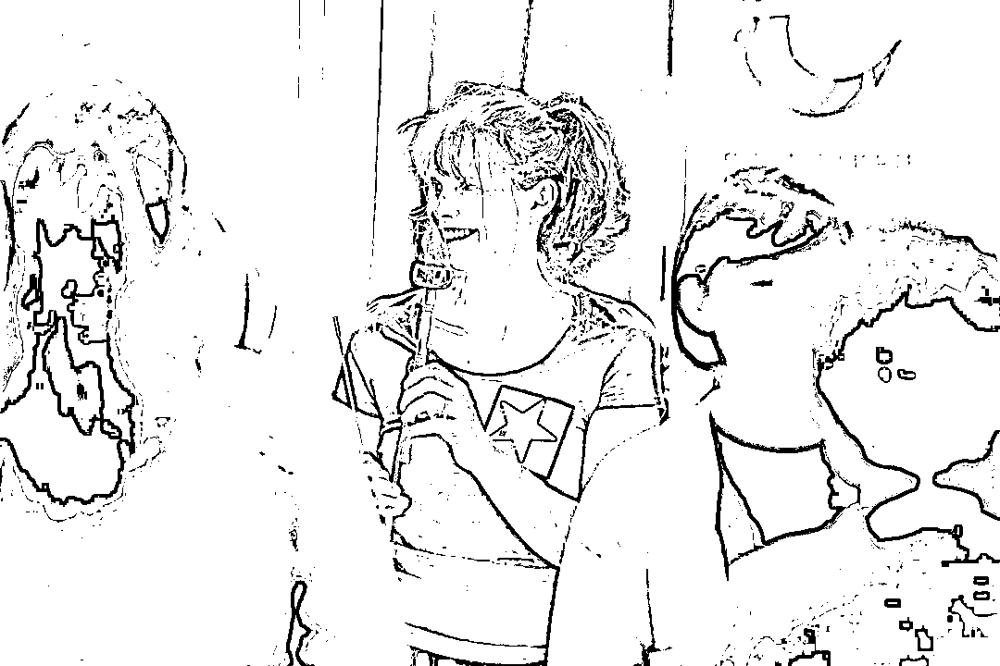

**工作坊学员这么说**

非暴力沟通带给我的最大的收获是：通过课堂的学习和大量互动练习提升了觉察力，提升了沟通技能，非暴力沟通并不仅仅停留在语言的表达，非暴力沟通的核心是同理心。通过倾听对方的感受，帮助我将情绪转化为解决问题的动力。

我过去和其他人沟通时，常常陷在自己的思维中，通过练习我才发现，原来别人说话的时候我常常其实并没有听到对方说什么，都是在自己的想法里打转，现在我起码学习到当对方说话的时候，能够去尽量不想自己的想法。

过去我不会留意到原来自己的某种表达方式会让别人不舒服，而且其实也无助于解决问题，对于我想达到的完全无效，NVC 的学习能够让我更能觉察哪些表达会让别人不舒服，让我的沟通更有效，更能帮助我达到我的需求。我学完后，才觉察到过去在沟通中，如果对方有情绪，我也是情绪化地回应，现在，我能够和自己和对方的情绪都拉开一些距离。过去我对于对方情绪化的表达，会有情绪化的回应或不知所措，现在我更能去感受他们情绪下的需求是什么，因此就更从容，不那么容易被他人的情绪影响，能够更有效地回应那些有负面情绪的人。我是一个比较理性的人，在练习中发现原来对一个在我用理性分析如此很明显的画面，每个人竟然有如此截然不同的看法，这还是挺让我吃惊的，这个发现好像打开了一扇门。

我是一个比较感性的人，过去有什么事情，常常是情绪化的沟通；NVC 的学习让我能够更理性一些，能够更客观去看问题。

这个培训让我非常感动，这是我没有想到的，一个关于沟通的培训如此让人感动。在那些常见的表面事件呈现之下，是如此脆弱、温柔的人性。我们如此绝望地想要被理解、被爱，想要与他人联结，然而我们常常用非常错误的沟通方式去做，这时我们离我们的目标就越来越远。

**什么人适合学习 NVC？**

**老实说，NVC 真的是一门人生必修课。**

**NVC 可以非常有效地帮助提高沟通能力，提高觉察力、自我同理心和他人同理心，进而减轻童年创伤对成年生活的影响，帮助有效改善亲密关系、与父母的关系、亲子关系、职场关系。**

*   如果你正被低效的沟通方式困扰或正经历沟通暴力，想**提升觉察，避免伤害的话**，NVC 培训是个不错的选择；

*   如果想结束“相爱相杀”恶性循环的相处模式，**享受一段真诚而愉快的亲密关系**，NVC 培训是个不错的练习途径（可以拉着你的 Ta 一起来哦）；

*   如果你的**工作、求学、生活和“表达”息息相关**，想更理解自己，想改善你的人际关系，改进工作，NVC 培训可以体验到一种更有力量的表达。

**训练营时间与价格**

**课程时间：**10 月 24 日-12 月 12 日，每周日下午 2 点-6 点。共 8 周，每周 4 小时

**课程价格：**6800 元

**购买须知**

❶ **本课程一旦报名，不接受退转课。**

****非暴力沟通线上训练营****

**授课老师：**Toni McErlane

**授课时间：**2021 年 10 月 24 日起

**授课方式：**网络课程**，**英文授课，中文翻译

**费用：**6800 元

**课程负责人：****Maggie 老师**（微信：18510107057，请备注“非暴力沟通”，**获取优惠价信息**）

长按二维码添加课程负责人咨询~

****报名请点击“阅读原文”****

# 11.5 金星进摩羯座丨什么？未来四个月都是关系的“摩擦期”？！

> 原文：[`mp.weixin.qq.com/s?__biz=MzA5NjA0NTAxNg==&mid=2651460226&idx=1&sn=2d5372abb7de833c07ed703de96a085d&chksm=8b48a035bc3f2923aa71340a4753b3d77a499925a9051a8330a534deb9d2fe812b674e6b37e6&scene=126&sessionid=1692737903#rd`](http://mp.weixin.qq.com/s?__biz=MzA5NjA0NTAxNg==&mid=2651460226&idx=1&sn=2d5372abb7de833c07ed703de96a085d&chksm=8b48a035bc3f2923aa71340a4753b3d77a499925a9051a8330a534deb9d2fe812b674e6b37e6&scene=126&sessionid=1692737903#rd)

**********************☆ ****************************后台****************************回复“今日”，给你一句生命态度**********************

作者/MaryChan 玛丽

编辑/翀子 封面/书君 图片/网络

2021 年 11 月 5 日 18 点 43 分，金星进入摩羯座并在此停留至明年 3 月 6 日。象征爱与美的金星来到摩羯座掌管的领地时，会有哪些表现？在这段日子里，又有哪些重要的宇宙天气可以助力金星的能量发挥呢？让我们一起来看文章吧~

**11 月 5 日 18:43 金星由射手座进入摩羯座，并在这里一直待到明年 3 月 6 日。**由火元素到土元素，生命的意志、希望、愿景得以在长远而务实的规划与秩序中凝聚、显化、成形**，人们得以享受因自律与承诺带来的成功喜悦。**

金星象征着爱与美，一般来说，在每个星座待三周半左右，再进入下一个星座。**但本次因涉及金星逆行（12 月 19 日-2022 年 1 月 29 日），所以金星在摩羯座会待四个月之久，摩羯座的象征会透过金星非常明显而强烈地体现出来。**

金星与阴性能量有关，是除了月亮的滋养、照料、养育面向之外的另一种阴性能量展现。根据运行位置不同，金星看起来的形状也在变化，当离地球很近的时候形似明亮的月牙，离地球很远的时候形似银盘。

在金星的律动中，与之持续地连接，寻求理解，邀请金星所象征的神圣美好的能量与我们同在，这就仿佛做了一个与金星女神（品质）融合的仪式。有助于个体连接生命中的愉悦感，开发提升个人魅力，带来自然而然的吸引力，创造良性的人际互动，开启或维护有品质的感情，创造价值、财富与丰盛。

金星属于内行星，是“自我”的具体面向。有别于外行星所象征的超然面向，金星非常具有“烟火气”，与触手可及的人事物有关。**其守护星座天秤座——带来平衡、和谐与优雅；金牛座——带来自然、价值与感官享受。**

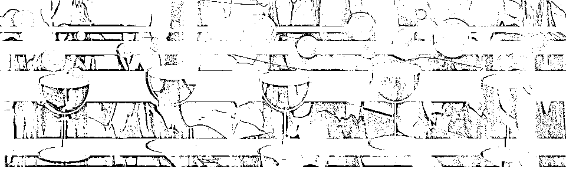

**摩羯座的法则**

摩羯座，是土元素的开创星座，守护星土星。摩羯座的关键词：**结构、秩序、制约、责任、控制、成就、权威。**

**摩羯座通过规则与世界相处，**以分辨什么是现实的，什么是重要的。摩羯座善于接受并研究规则，而且按照这些规则来玩游戏，利用它们为自己的存在建立一座华厦，然后对世界说:“瞧，我做到了，我建造了它。”

射手座和摩羯座都是社会秩序的代表，但他们的表现方式不同。射手座关注的是统一的、概括的原则以及整合的理论。射手座渴望理解事物之间的相互联系，是为了达到意识的扩张。**而摩羯座更关心原则如何落实，如何实际具体执行。**摩羯座想触摸到“实存的”现实，而非仅仅抽象的理论。摩羯座注重现实，关注可体验的、具体可见的现实结果，因此它知晓如何在物质世界中达到成功。

**摩羯座和时间、耐力相关，**可以为长期的目标而推迟立即的满足。通过长时间的努力耕耘，而在某一方面达到游刃有余的专精状态，成为某一领域的资深人士、专家或权威。

**摩羯座与限制有关，希望事物始终可控。**这会导致想要控制周围的人事物，也会害怕因依赖他人而失去对自我的掌控。在内心欲望和恐惧驱使下，会显得不近人情。良性发展之下，会导向责任感，重视承诺，守规守约。

**摩羯座在情感表达上是谨慎内敛的，**甚至可能会压抑、排斥、贬低、不认同情感的价值。其对宫巨蟹座，代表母系的滋养和支持，会从情感上包裹、保护、同理孩子。而摩羯座与父系能量有关，将孩子从家庭向外推，令其走向世界。**摩羯座认为外面的世界是现实的、**不轻松的，资源是有限的，需要努力去争取，情感在那里应被放到生存、财富、成功之后。

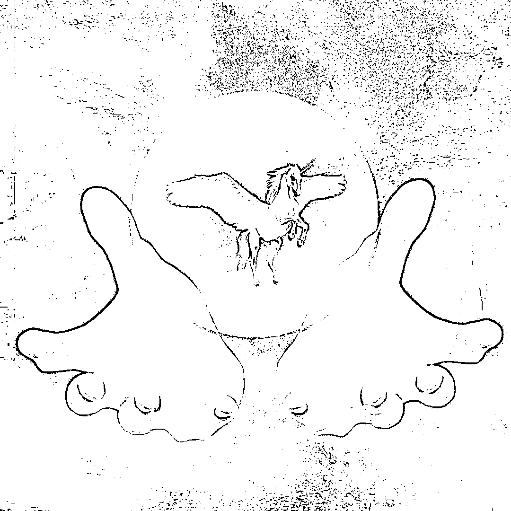

**金星在摩羯座**

金星在摩羯座，**人们变得实际，**在消费的时候，倾向于具**有实际用途或功能的东西，**而不只是单纯的外表漂亮而已。人们会欣赏务实且有创意的东西，如果质地上佳就更好了，比如做工精致的腕表。

金星在摩羯座，享受也需要兼具功能性，愉悦感不仅仅来源于进行喜欢的事情，还要可得到实际有用的结果。**摩羯座带来对效率的注重，所以很难轻松玩乐。**一项活动只有在有其重要性的情况下才是合理的，可能把娱乐和工作等同起来。欣赏通过时光考验而有文化沉淀的艺术，例如文玩、古典音乐、传统手工艺。

金星在摩羯座，**情感表达倾向于矜持自制**。有时候会压抑情绪，以支持自控的纪律要求。然而，情感和情绪终究还是存在，在那看似理性的面具背后，被封存和隔离地燃烧着。

玛丽亚·卡拉斯(Maria Callas) ，上世纪著名的歌剧女王。金星摩羯座，且火星、土星合相于天秤座。其第一任丈夫比她大近 30 岁，这场婚姻是歌唱家与经理人的组合，她也逐渐走到事业巅峰。为了歌剧艺术而活，却牺牲了个人的情感生活。直到她与希腊船王奥纳西斯相遇，爱得浓烈疯狂。但最后奥纳西斯移情别恋，迎娶了美国肯尼迪总统的遗孀杰奎琳。

也许卡拉斯付出了惨重的代价，但她也正是以这种方式，在自己的生命中（而非歌剧中）领略了富有深度和强度的情感。正如作家阿里扬娜说：“我以深深崇敬和仰慕这位传奇人物的成就和抱负开始，而以喜欢上这个普通女人结束。”星辰与尘埃终于结合，本就一体。

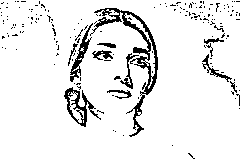

| 玛利亚·卡拉斯

金星在摩羯座，不必然令人缺乏情感，或不懂情感。如果心智已提升到比较成熟的层面，能在不批判的前提下平衡理性与感性，能有勇气、有智慧与内在的脆弱同在，那么就能拥有**真实而成熟**的情感表达方式，如美酒一般的醇厚、含蓄而韵味久长。如果觉得不了解自己的真实感受，有品质的心理测试量表是适合的工具，协助人们用理性的方式了解感性。

金星在摩羯座，可能放大个人的内在“坑洞”，那是一种缺陷感或匮乏感，**带来自我否定，对自己魅力的不确定，对自己的吸引力失去信心，认为自己不值得被爱，不配得到好的东西。**同时，我们也容易从周围人的身上看到和感受到“缺乏”，譬如缺乏爱、缺乏连接感、缺乏力量、缺乏价值感等。

金星在摩羯座，令人反思关系中的贪婪和占有。关系的建立，往往是在填补彼此心中的坑洞。例如一个人特别懂得欣赏你、赞美你，和那个人在一起你便感觉自己很有价值。但如果哪一天他离你而去，你会感觉失落和痛苦，并怀疑自己的价值，你的力量也随之流逝。之前被填满的那些坑洞，现在又暴露出来，原来它们并没有因为一段看似美好的关系而消失。

其实没有人能真正填满我们内在的坑洞。不断外求，被看起来更成熟、社会地位更高、更有权力的人吸引，希望借助其完满自己虚空的心。这**造就了无数表面满足，实质是操控和利用的关系。**我们可以通过关系去逃避自己，但不去面对自己的坑洞，压抑自己的感觉，并不等于没有感觉，情感流动受阻，内在生活会变得越来越孤独和干枯。

**金星在摩羯座，让人看到关系中的束缚，不平等与不自由。**如果关系中充满操控、利用、压制，代价总会在某一时刻显现。也许当事人明知道不好，却难以或不想结束一段关系，直到看清对方是如何无情地践踏自己的自尊。

深刻的失落感往往是成长的机会，它使你重新经验那些坑洞。如果能不马上逃避，而是与这种冒着寒气与刺痛的匮乏感在一起，这时候我们就已经很接近自己内在最深的真相了。

待在排山倒海的孤寂和空虚中，允许自己与之同在，意味着让自己臣服于命运。懂得放下，无力与力量就在这一刻转换，你的“允许”将引发穿透性的力量，打破盲目与束缚，带来光明。

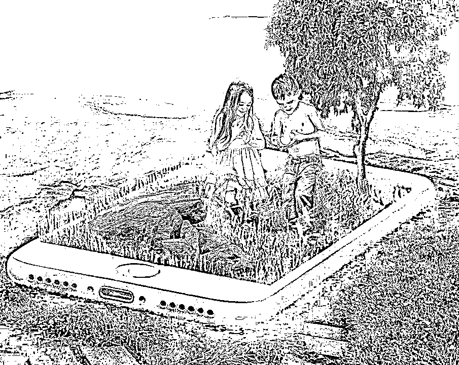

**金星在摩羯座，让我们透过关系议题，看到自己内在的真实需求，让我们寻获一份力量——无论是温柔的抑或坚韧的。**拥有自律与毅力的人，意识到在追寻外在成功的同时，也需要面对自己的感情渴望，因而去寻找并认同一份温暖的滋养心灵的感情。

另一方面，如果是不那么独立自主，或依赖性较强的人，反而是给自己增加独处的时间，整理并看清自己的目标，找到自己的追求，而非只是一味地粘着对方。**不过度沉溺于感情，**把时间收回来一些，花些时间和功夫在自己身上，懂得取悦自己、享受生活，让自己单独的时候，也活得快乐和饱满。

**金星在摩羯座，协助人们以成熟、客观的视角，来理解自己的情感。**去试图理解自己，一直以来在抗拒什么，忍受什么，逃避什么，一直以来的闪躲、否认、压抑、责怪、批判。所有的这一切，让自己画地为牢，失去了客观与直觉，活在恐惧与僵化之中，成为一个失去活力、被冻结的人。

**金星在摩羯座，提醒人们在关系中重诺守信。**一份长久而稳定的关系，意味着双方都愿意接受某种限制。无论是为了利益，还是为了爱，双方愿意限制自己的一部分自由，愿意为对方做出让步和妥协，关系才能得以续存。许多现实的东西在一个稳定的架构之下，才能兴盛发展，无论是公司间的合作，还是个人的情感，可靠、忠诚都是很重要的品质。

承担一份责任，需要持续不断地付出，而有时候辛苦只有自己知道。责任感并不是什么可以用来炫耀的东西，反而是一份深沉和隐忍，是一份时光铸就的珍宝，是一个人成熟的标志。**如果其中有爱，有理解，有懂得，有并肩作战和相濡以沫，这份责任就不是苦涩的。**

**金星在摩羯座，提醒人们通过时间，踏实而笃定地积累能力、财富以及积极的影响力，获得相应的社会地位以及尊重。**伪善的野心家，咬紧牙关坚持，利用周围的一切，只为了有朝一日的炫耀、自证、甚至报复，德不配位，终将自毁。拥有成熟智慧的人，像山一样稳定和笃定，能客观看待自己，有道德感，并懂得感恩，这样的成功是稳定而幸福的，并且有一份更深的宁静和满足感在其中。

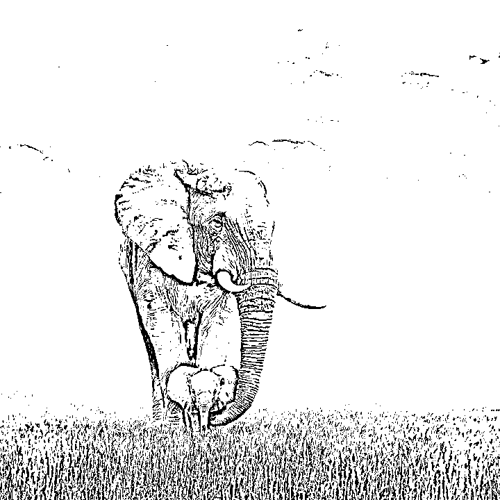

**金星在摩羯座的爱情**

渴望稳定、务实的爱情，不一定有浪漫的鲜花与烛光晚餐，但能够为了更美好的生活共同打拼，彼此分担生活的压力与责任，为更富足的、更有安全感的未来携手不断地为生活添砖加瓦。

**对传统价值的重视，**需要门当户对或对方比自己更有实力。**对爱情严肃、认真，**不想儿戏，看重自律的价值。**历经时间，并且获得真实的承诺，**才能敞开心扉。能持之以恒，爱情长跑。可能被专业人士、成功人士或年长者吸引。欣赏独立、上进的人，愿意支持伴侣成功。

**金星在摩羯座的性爱**

在公开场合保守，私下里非常渴望被对方重视。**有时候有点被动，**需要被对方推一把。**不喜欢失控，**在过程中需要有掌控感。如果并非例行公事，持久的过程，加上爱意的表达，能让彼此放下压抑、刻板而更加满足。

**金星在摩羯座的开运饰品**

钻石，各类宝石、水晶装饰。

**金星在摩羯座的阴影**

**过度自我控制，**不懂温情关怀，**与情感隔离，冷漠、**不近人情、自命不凡。只期待不断得到他人的付出和厚待，而看不到自己的贪婪和吝于付出。

**低自我评价导致低自尊，**对地位尊卑敏感，为了控制的目的而卑下地迎合，但却暗自希望享受一种地位尊崇的状态。扭曲地付出，内心容易失衡，常常抱怨或寻求补偿。

**过度崇拜权威人物，**而容易在关系中被蒙蔽和控制，失去自主意志，活得苦涩而卑微。

过于**固执**，对人事物要求高，待人苛责，与心失去连接，对事物的理解局限在一个**僵硬狭隘**的范围内。

**只看重物质世界，**不断追求物质欲望，心灵被忽略，精神层面处于黑暗中，人变得盲目而短视。

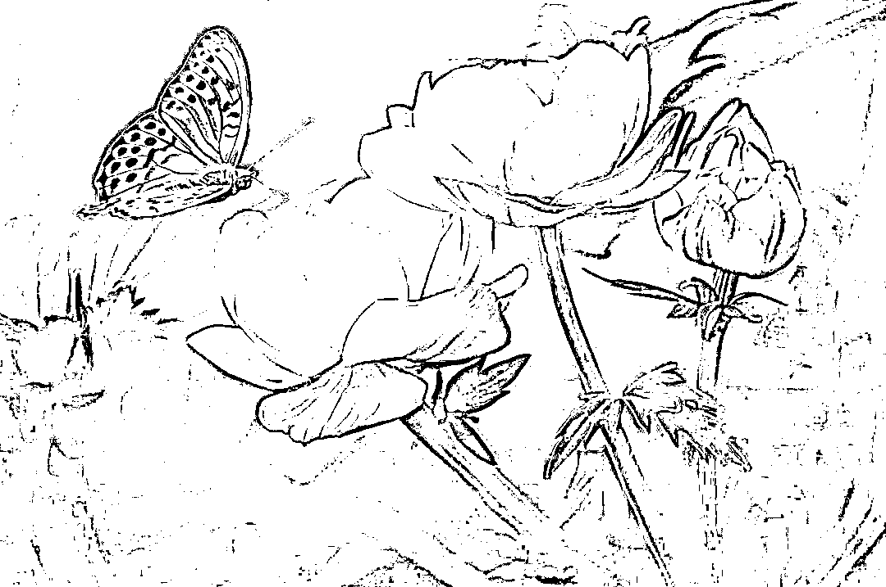

**金星在摩羯座的重要相位**

**金星在摩羯座期间与其他天象的结合以及相位（容许度 1°）：**

**★ **11 月 5 日 05:14 天蝎座新月****

天蝎座新月。金星进入摩羯座的当天，升起的天蝎座新月，提醒我们毫无恐惧地进入复杂而真实的世界，在其中接受欲望的洗礼，最终看清自己的需要。

**★ **11 月 5-7 日 金星六分天蝎座水星****

**重点影响人群：有重要行星/四轴/月亮交点落在摩羯座、天蝎座、巨蟹座、金牛座、双鱼座、处女座 0°-6°。**

接收一条消息，看到一则故事，体会一个情节，也许是情深义重，也许是欺哄讨巧。金星进入摩羯座的引子，一场持续 4 个月大戏的序幕正徐徐拉开。

★ **11 月 14-15 日 金星四分白羊座凯龙星**

**重点影响人群：有重要行星/四轴/月亮交点落在摩羯座、白羊座、巨蟹座、天秤座 2°-16°。**

一些挑战、波澜被掀起，也许感觉自己被看轻，有点压抑、失落和受伤的感觉。可能被卷入他人的争执中，看到关系中的痛苦。隐忍是一种逃避，还是捍卫？我们是否以表面稳定之名，而忽视了重要的个人感受？疼痛是老师，亦是方向。

★ **11 月 18-19 日 以及 2022 年 1 月 23 日-2 月 4 日，金星三分金牛座天王星**

**重点影响人群：有重要行星/四轴/月亮交点落在摩羯座、金牛座、处女座、巨蟹座、天蝎座、双鱼座 5°-18°。**

打破关系中某些陈旧的信念和盲点，从而让某种压抑的、被利用的状态得以脱落，重获接受爱与欢乐的能力。了解用真挚的诚意与对方产生理解与共鸣，是让人更加自信和满足的事。

★ **11 月 20 日-12 月 2 日 金星六分天蝎座火星**

**重点影响人群：有重要行星/四轴/月亮交点落在摩羯座、天蝎座、巨蟹座、金牛座、双鱼座、处女座 12°-21°。**

一段利于增进人际深度理解与亲密感的时光。此时活力提升，无论是热情还是深情，需要与庄重、承诺相结合。此时也利于缔结商业关系，善用你的人脉，掌握收入机会。

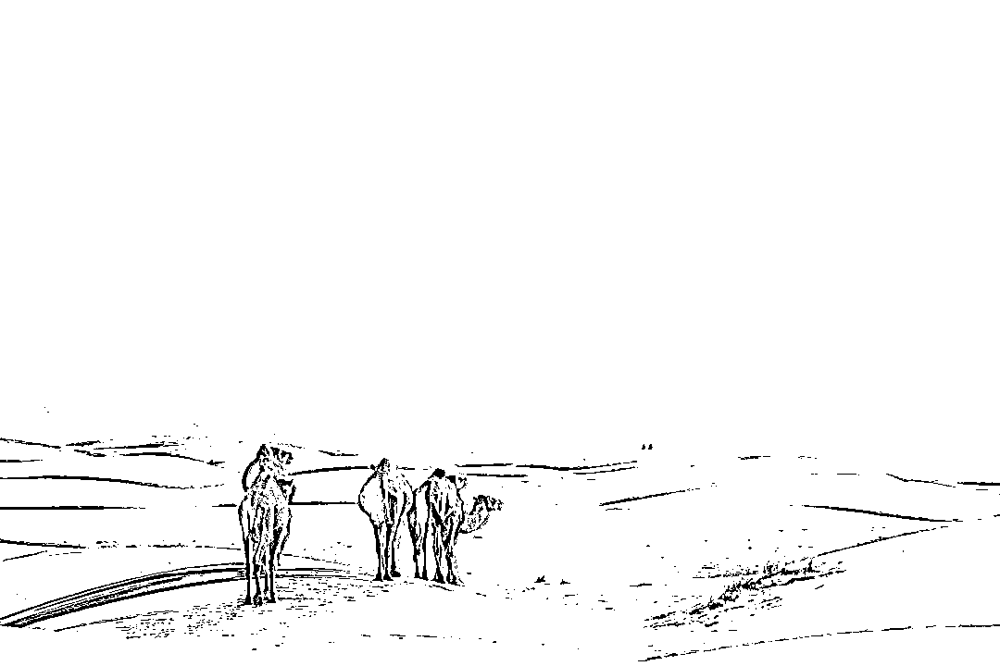

★ **11 月 29 日-12 月 2 日、2022 年 1 月 4-6 日、2 月 23-25 日，金星六分海王星**

**重点影响人群：有重要行星/四轴/月亮交点落在摩羯座、双鱼座、巨蟹座、处女座、天蝎座、金牛座 15°-25°。**

令人柔和下来，对于现实与想象的界限更加富有弹性。如果对现实失望或不满足，可能转而寻求心灵的知识或慰藉。以某种方式体会关系中的无私和奉献，可能有意无意地把自我的需求放在后面。

★ **12 月 9-27 日、2022 年 3 月 3-4 日，金星合相摩羯座冥王星**

**重点影响人群：有重要行星/四轴/月亮交点落在摩羯座、巨蟹座、天秤座、白羊座、金牛座、处女座 18°-29°；天蝎座、双鱼座 20°-29°。**

由于金星由顺行转逆行的度数正好接近冥王星，**所以金星在停滞期长时间与冥王星合相，这会带来非常明显而强烈的影响。**

这个相位带来紧张、激烈、刺激，带来对亲密关系的测试、质疑，或者遇到某种致命吸引力对象，而陷入执迷，**这一切都迫使个人透过关系看到自我更深的面向。**一直以来被忽视和压抑的事情浮出水面，可能以一种非常剧烈的方式要我们去面对。**冥王星代表的深度清理和净化功能，**迫使原有关系的老旧模式在某种意义上经历“死亡”和重生的过程。

也许携手经历这一切以后，双方的关系会更加真实和牢固。但也可能，因为被掀开的事情，看到彼此深藏的差异，如果这差异很难弥补，可能关系就真的走向“死亡”而无法修复。这时候，我们必须要面对关系中的真相，也许很残忍，但已没有讨价还价的余地。

**此时我们已接近生命的核心，**最令人恐惧、最不愿被触碰的疼痛近在咫尺。尽管一些东西看似很重要，我们不忍放手，但有时候我们需要放下某些看似重要的东西，然后更好的事才会到来。

“放手”往往让人打开从未设想过的另一扇门。虽然这个过程绝不轻松，但有益于个人放下长久以来的自我设限，**去学会爱，形成新的价值观，在关系中成熟地看待自己，**不唯我独尊，也不妄自菲薄，从而重新迸发出生命鲜活的强度。

★ **2022 年 2 月 12 日-3 月 12 日，金星换座之际，将在摩羯座 13°-水瓶座 5°持续合相火星。**

**重点影响人群：有重要行星/四轴/月亮交点落在摩羯座、巨蟹座、天秤座、白羊座、金牛座、处女座、天蝎座、双鱼座 13°-29°；水瓶座、狮子座、天蝎座、金牛座、天秤座、双子座、射手座、白羊座 0°-5°。**

这象征着关系的新开端，无论结果是什么，都值得从现在开始准备和改变，不是吗？在摩羯座的金星火星提醒人们：**在真实基础上的重新出发**，看清现实，**将眼光放长远，**自律而不呆板，放下恐惧和自私，更加成熟地看待自己以及自己的感情需求。当人从狭隘导向一个更开阔的状态，他人也更有可能尊重你的意图。

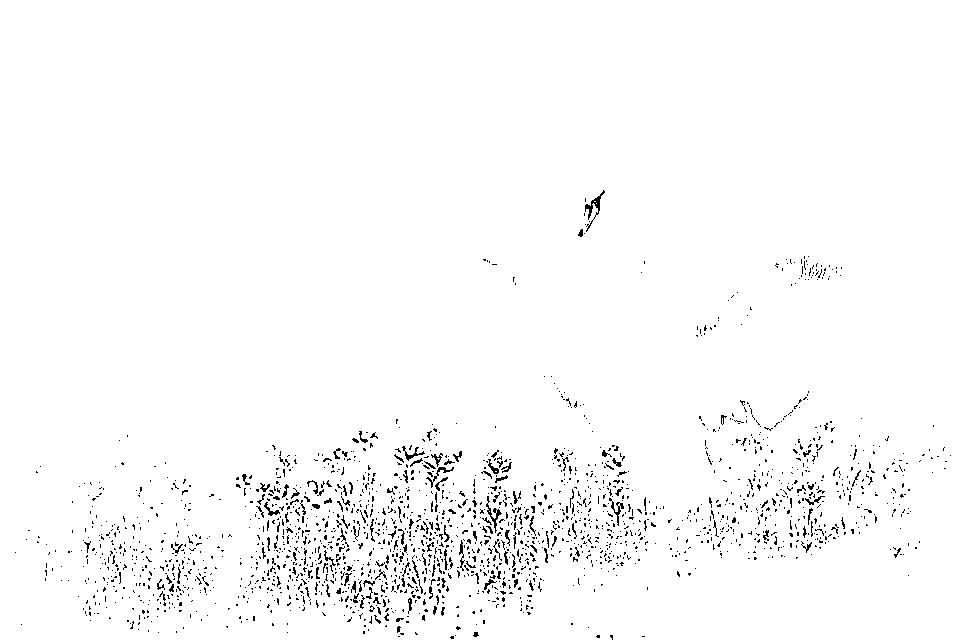

**金星在摩羯座期间，从 11 月到明年 3 月，期间还有许多重磅天象，这是一个相对长程的关系调整时期，**大家可标注以下时点，留意一下自己的状态，包括：

*   **11 月 19 日 16:57，金牛座月食。**月食带来终结、结果、收获，以及放手。

*   **12 月 4 日 15:42，射手座日食。**日食带来开始、启蒙、更新、激发。

*   **12 月 1 日 21:22，海王星将在双鱼座 20°24′开始顺行。**回想今年 6 月 26 日海王星开始逆行以来，你是否经历了很多？海王星让人做梦，但并不负责之后的副作用。**海王星带来美妙的梦幻，**创造力和想象力；**也带来残忍的幻灭，**与冷冰冰的现实相对，难以接受，**但幻灭却是真实的开端。**海王星式的关系，让一部分的自己消融，自我的需要变得没那么重要，或难以全然实现，需要做出一定的牺牲，以成就他者。

*   **12 月 19 日 18:35，金星于摩羯座 26°开始逆行。**直到 1 月 29 日于摩羯座 11°开始顺行。关系中的责任与承诺，关系中的荒芜之地，值得每个追求真爱的人好好探索。

*   **12 月 24 日 15:18，土星（水瓶座）、天王星（金牛座）本年第三次精准四分相。**明年**1 月 18 日 23:25，天王星于金牛座 10°49′开始顺行。**该来的总会来，那就让该走的走吧。

**结语**

或许世事无常，世道艰辛，努力前行时，请别残忍地忘了自己。因为，温柔总是无坚不摧。就像那首歌“我是谁”——当悬丝的傀儡 有过温度的体会 瞳孔里不再是黑白灰 冷漠是盔甲里的人强忍的伤悲 一滴泪 就能被摧毁。

**你的痛楚不过是因为束缚你的窠臼被打破了。**

**——纪伯伦**

**版权声明：**原创文章由作者授权首发于若道平台，欢迎转发，反对抄袭。友号转载请申请白名单。

**MaryChan 玛丽**

人本主义占星师、花精咨询师

于成都创办工作室，从事咨询、组织相关活动 8 年

咨询预约号：MaryChen336

微信公众号：ZhanXing336

长按打赏

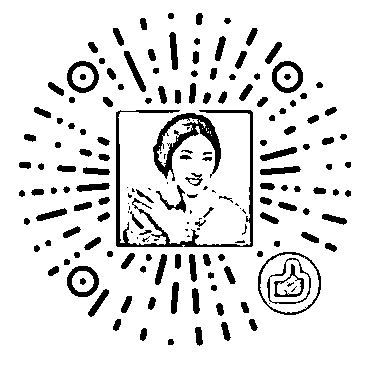

**学习占星学**

**点击下图了解课程详情**

************

****

****

****

**微信又双叒叕改版啦，不想错过若道君的推送？**

**就把若道设为星标吧！**

**▼**

**喜欢记得点一下在看哦☟**

****报名直达入口****

# 12 星座必读丨总感觉生命被限制了？这是你的太阳星座没活出来！

> 原文：[`mp.weixin.qq.com/s?__biz=MzA5NjA0NTAxNg==&mid=2651460114&idx=1&sn=211bb7df1bf1e3b85b8be8139899d1e3&chksm=8b48a0a5bc3f29b3949f3dabbbfa51122f2c29f73977c3e46e43a92285fffe77389124097939&scene=126&sessionid=1692737903#rd`](http://mp.weixin.qq.com/s?__biz=MzA5NjA0NTAxNg==&mid=2651460114&idx=1&sn=211bb7df1bf1e3b85b8be8139899d1e3&chksm=8b48a0a5bc3f29b3949f3dabbbfa51122f2c29f73977c3e46e43a92285fffe77389124097939&scene=126&sessionid=1692737903#rd)

**☆ 后台回复“今日”，给你一句生命态度**

**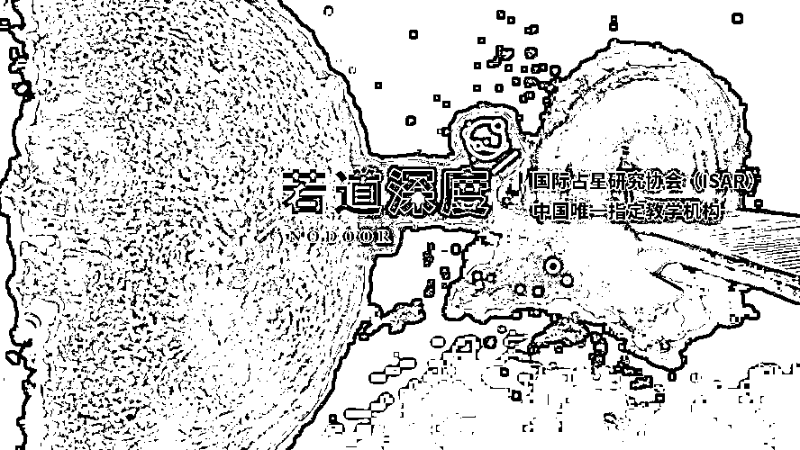**

作者/Anastasia 编辑/翀子 封面/书君 图片/网络

太阳是我们最大的潜能所在，当出生星图上的所有行星都能聚集起来、为太阳的”英雄之旅”服务，我们也就觉知到了自由意志的力量。当你的太阳星座分别落在火象、土象、风象和水象星座时，将如何获得生命的丰盛？

每个人都知道自己的太阳星座，可是有几个人会意识到，太阳星座就是我们最大的潜能所在？

**出生星图上的所有行星都是为太阳服务的。**是太阳为我们做出抉择，在何种情况下我们需要顺应月亮和火星的本能反应，在何种情况下我们又需要避开那些情绪和冲动？面对土星和冥王星的碾压，我们是该精进练习，勇往直前，还是退避三舍，保存实力？

**对太阳的觉知会拓展个人控制人生的能力。**意识层面和自我觉察的改变会翻转出生星图的影响，将潜在的厄运转化为创造力和充实圆满的人生体验。

**而对星图上的每颗行星而言，目标只有一个，就是去辅助和支持我们的太阳，找到真实的自我，然后不停向前、向前、再向前。**

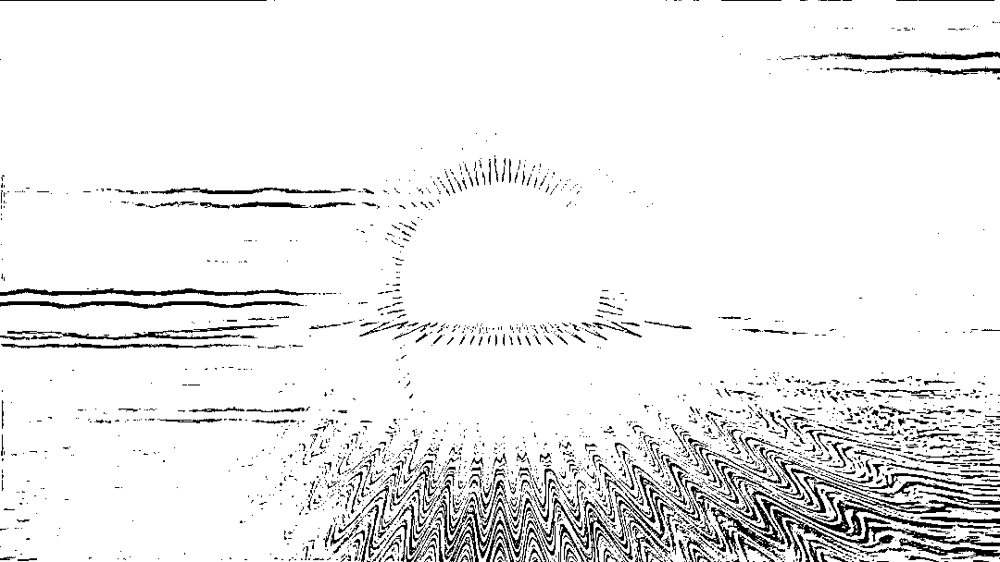

**太阳星座的英雄之旅**

出生星图象征灵魂播种的时刻，对应的是个体生命诞生的重大时刻以及为什么会这样。**而太阳作为唯一的发光体，就是我们最终要成为的那个人，**以及此生要去实现的英雄之旅。**这就是我们的人生使命。**

个体的完整，不仅仅是金星和火星的爱欲，也不是水星执迷的头脑风暴，更不是月亮象征的安全和舒适。**个体的完整性，是以太阳为核心，用太阳星座的方式整合星图上所有的能量去成就卓越。**

我们走很多的路，看很多的书，遇见很多的人，一路上的风景都是为了找寻最真实的自我。如果说人生有捷径，那出生星图就是我们认识自己的捷径。**通过出生星图，有经验的占星师可以在有限的时间内说出当事人的人生使命和意义。**

个体的渴望（太阳）和需求（月亮），通过什么方式（上升）来获得，会感到满意还是挫败（土星），最深沉的恐惧、欲望和挑战在哪里（冥王星），这几大要素构成了我们出生星图中的脊梁，撑起来我们整个人生。

去看出生星图上行星所落的星座，去看它的宫位和相位，去看它的定位星和定位星链，对比我们所经历的人生经验，就会意识到，**人生中最核心的模式分毫不差地体现在了我们的日常生活中。**

**出生星图是起点**

出生星图不是终点，而是生命的起点。**通过出生星图，我们得以深入地了解自己，发现自己的天赋，了解自己的使命。**每一次行进都是在启动、触发我们内在的困惑、冲突和挣扎。**我们遭遇的经验，往往是内在的创造力以一种神秘的方式吸引来的**。一次又一次的周而复始，就是通过不断发生的外在事件和反馈，**促使我们探索内在，从而实现心理冲突的整合和行为模式的进化。**

尝试去问为什么，在每一次的挫折、失望和恐惧中去洞察潜意识里面的心理机制，借由这些经验认清人生的意义。如果我们不去努力扩张自己的觉知范围，以便理解这些经验的本质，并且尝试与它们合作，或许会觉得自己是命运的受害者。**只有学着认识自己，了解特定的经验是为了发展出更完整的自我，才有可能得到真正的自由。**

山本耀司说，“自己这个东西是看不见的，撞上一些别的什么反弹回来，才会了解自己。所以跟很强的东西、可怕的东西、水准很高的东西相碰撞，然后才知道自己是什么。”这句话里，我们看到了太阳和土星的关系。

土星是界限、是规则、是冰冷的现实，土星让人意识到自己被环境所禁锢。如果一个人缺乏觉知，土星就会让他产生不满足和憎恶感。而太阳是土星的解药，**太阳会带来意识层面的改变和精进的自我觉察。**太阳说，人类必须通过自我发现来拓展自由意志；而土星告诉我们：除非事情变得非常痛苦和毫无选择，否则人们是不会想要探索自己的。 

太阳的选择的能力以及精进的觉察，可以帮助我们接近生命的真相，改变一个人经验自己出生星图方式。**如果我们以正确的了解来待人接物，我们随时随地都会经验到小小的开悟。**

所有的存在都是意义，所有的发生都是合理。**出生星图就是我们用来发现自己、认识自己的那面镜子。　**

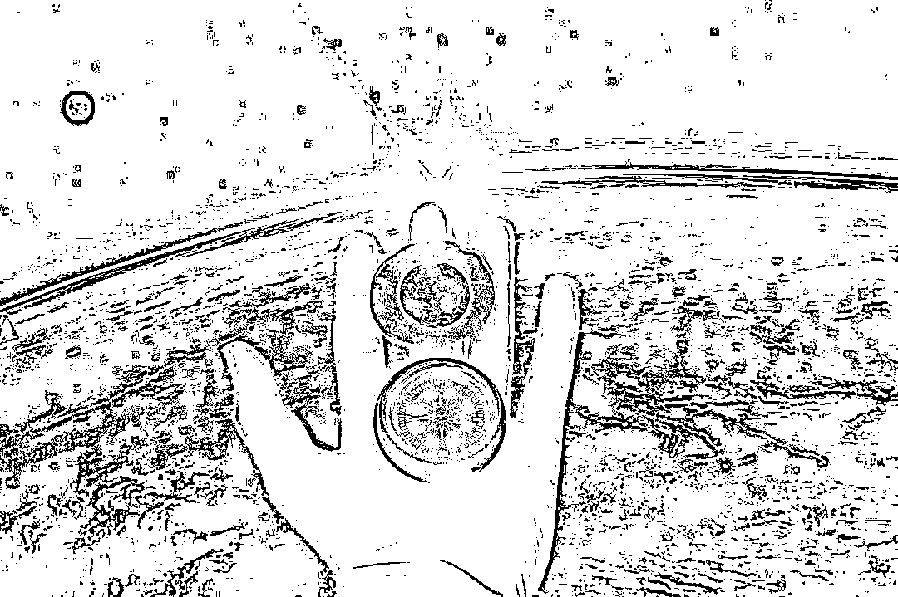

**你没有觉知的，是你的命运**

向着太阳奔跑，先要找到太阳在哪儿。**那么，没有活出太阳的你是什么样子？**

如果你是一个依赖性很强的白羊座；如果你是一个陷于混乱的处女座；如果你是一个安于平淡的天蝎座；如果你是一个没有观点的射手座；你一定对自己的人生充满困惑。

大所数人所经历的，并不是心底里最想成为的那个人，而是不得不去成为的人。**也许我们该去思考，如何在平淡的现实生活中发现自己的天赋，并且找到自己人生的意义？**

出生星图就是非常好用的工具之一。我们能够借助行星的语言，给予自己和他人有关人生的客观分析。在这里，我们每个人都是炼金师，**将出生星图上所描绘的原始心灵材料，透过意识的参与将其转化。**

**真正的满足感来自于释放意识深处的本能，**让无法借由其它形式表达的那一部分内心浮出水面，获得生命。正如一个画家说，“我必须画画，我控制不住自己。假如有人掉进水里，那么他游泳的本事高明也好，差劲也好，都是无关紧要的：他要么挣扎着爬出来，要么就被淹死。”

一位传记作家，通过回忆、走访、记录，将某个天才的人生呈现在我们眼前。相对于天才，他也给我们展示了一种普通的人生，勤奋工作，积累知识。他找到了作家追求的人生意义，“应该是挥洒文字的快乐和传播思想的惬意，至于其他的，那就随便吧，别去在意赞美或诋毁、失败或成功。”

一个船长，他有祖传的地产，本来可以过着安安稳稳的日子，却因为理财失败，不得不带着妻子离乡背井，借钱买了一个小岛。他们和几个土著一起，拼命工作，用了二十年，将荒岛变成了花园。岛上的每一颗树都是他亲手种的，每次看到那些高大健康的椰子树，他心中都非常激动。岛上生活平淡，但是他觉得从未有过的幸福。这是命运无法打倒的人生。

人生何去何从？对于每个人，普通也好，非凡也好，人生的意义都是不同的。但是**每个人都可以活出自己的丰盛。**只是，没有人能够替代我们做决定。丰盛的，可以对抗命运的唯一方法：请走向内心。**而这条路上，出生星图上的太阳可以更好地帮助到我们。　　**

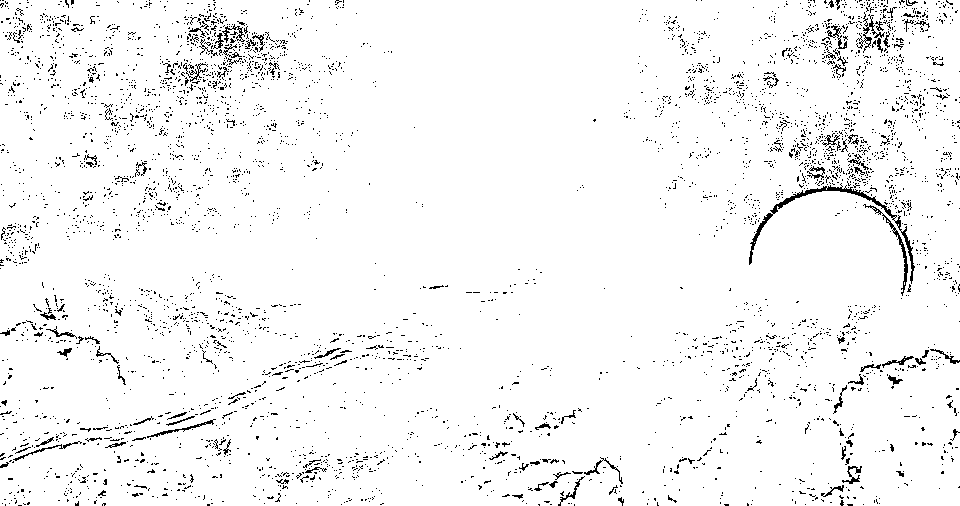

**太阳在火象元素**

火元素和**直觉、精神、生命力、意识的源头**有关，对于火元素来说，世界是值得探索、采取行动、深入了解和付出爱的舞台。火元素认为生命本身就是有意义的，每个人都值得最高的奖赏。火元素有一种**深层的目的性**，必须有意识地把自我表现出来，并且在每个经验中寻找背后的意义。

**太阳白羊座追求的是探索和征服。**太阳在白羊座或多或少会受到定位星火星的影响变得冲动和暴躁。太阳白羊座需要发展自己的意志力，以及带有目的性的行动，通过自己的意志力来掌控环境，而不是跟随自己的本能和欲望。

**太阳狮子座追求的是创造和爱。**太阳狮子座需要找到自己的舞台，发展出真正的核心价值，通过创作来反观自我，看到自己的完整性和独特性。人必须在自己的内心找到身份认同。喜乐来自于对生命和宇宙之爱的信赖，只要存在本身就够了。

**太阳射手座追求的是扩张和理解。**太阳射手座需要发展出智慧力，并进行有目的性的意义探索，发展出对存在的洞见，找到最直接的权威：自己。只有通过直接体验人生，才能带来满足。所有的道德、伦理和价值都是相对的，宇宙万物的存在都合乎道德。

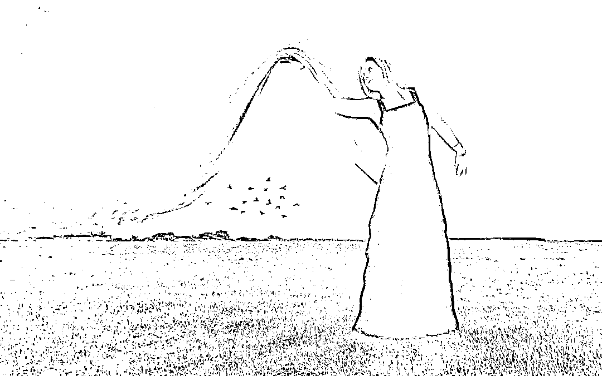

**太阳在土象元素**

土元素与我们生活的**物质次元**息息相关，我们所有的努力和错误都会在其中制造出具体的后果，理解起来也相对简单，就是钱、资源、工作、服务、事业等物质现实。土元素**踏实、缓慢、坚韧、有耐心**，但活力和创造力不足。但如果不能把体悟到的高层意识应用在身体和现实环境上，就不能算真的觉醒。

**太阳金牛座追求的是内在价值的体现，而不是具体的人或物或事件。**要去发展出内在的力量和自给自足的能力。并且避免金牛座的陷阱：贪婪、过度物化的价值观、评判自己和他人的方式不是基于内在的本质，而是基于所拥有的东西。

**太阳处女座要意识到表现自我的工具，不仅仅是谋生的手段，还是自我整理和净化的活动。**太阳处女座要去追求身体的健康和人格的统合，追求身心的完整性。有觉知地整合身体和心灵两个面向，建立起良好的健康作息，以及重新认识身体和环境之间的关系。

**太阳摩羯座追求的是外在的自我形象以及内心向往的人生角色。**太阳摩羯座需要去成为事业上的权威或者人群中的楷模，并最终促成集体结构的某种改变。太阳摩羯座要避免对自己的形象过度敏感，以及过度物化的价值观。

**太阳在风象元素**

**风象元素是唯一不带有动物形象的星座符号**，这意味着风元素脱离了低层的动物性，是人类专有的特质。风元素是社交属性的，象征着人与人之间的**学习、交流、沟通和分享，**帮助我们运用头脑和智慧照亮精神世界中的阴暗角落，

**太阳双子座追求心智上的发展。他们对生命及多元化的现象感兴趣，有着永不停歇的好奇心。**太阳双子座要发展出通过个人经验和观察来获得知识的能力，以及从外界获取信息和自由自在地沟通与分享的能力。

**太阳天秤座追求和谐的关系，从根本上说，追求的是整合阴阳两面的平衡感。**只有内在的完整性才能创造出完美的关系以及新的精神中心，才能够与伴侣和谐相处。太阳天秤座要避免在对方身上投射我们无法显现出来的部分。

**太阳水瓶座追求群体意识的发展。**这要求太阳水瓶座从专注于个人意识的发展，转到献身于集体生活，自动自发地对群体的奉献。我们的个人价值不会在此丧失，而是和群体的利益保持一致，从而实现更大的理想和目标。

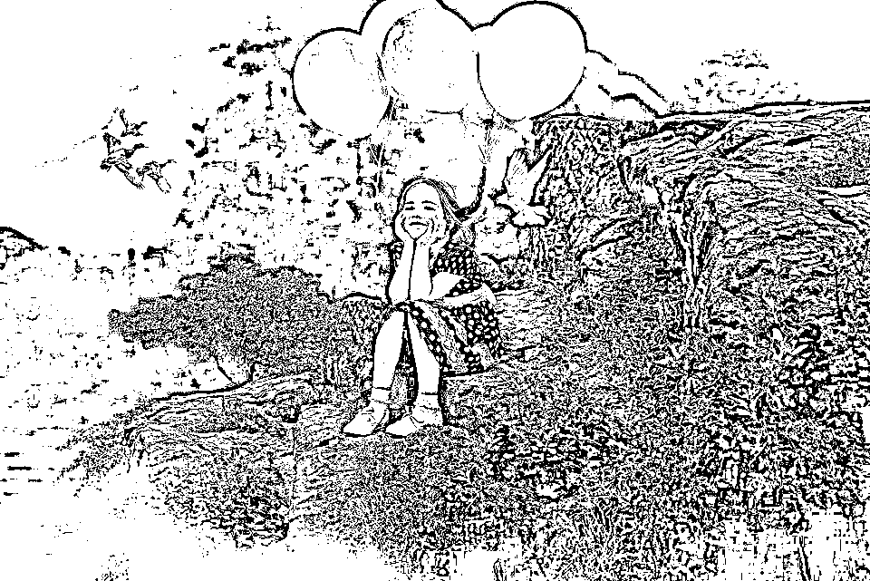

**太阳在水象元素**

**水象元素代表情感，**我们经历的痛苦和挣扎，我们的悲伤和恐惧，我们的梦想和最终获得的爱的疗愈，都蕴藏在水象元素中。水象元素要**避免过于执着和依赖于情感。**只有通过奠定内在基础，把向外投射出去的东西收回来，才能获得真正的自我接纳的能力。

**太阳巨蟹座追求情绪上的安全感，我们人格发展需要的保护和安全是个体的生命根源。**太阳巨蟹座需要鼓励自己去经验、信赖感情世界，发展出安详和信任的能力，才能构建出真正的内在安全感和自我接纳的能力。

**太阳天蝎座追求欲望的净化和最根本的情感价值。天蝎座看起来是钱权欲，核心的根源还是情感**。钱可以买到自由，也可以买到婚姻，但却未必能买到情绪上的稳定和安全。太阳天蝎座需要去理清这里面的深层含义，并且发展出自知之明和自我控制的能力。

**太阳双鱼座必须放弃自己的个人意志，和生命本身合一。**太阳双鱼座不要去努力和奋斗，而是需要去奉献和臣服。太阳双鱼座的能量必须转向内在和高层意识，它没有物质性，不需要现实的成果和成就来肯定。

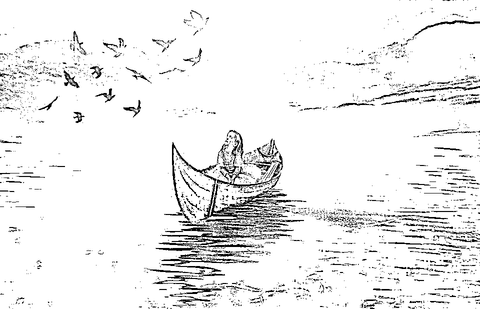

**从今天起，做真正的自己**

如果你什么都有，连抱怨都会让人觉得矫情，但是你还是不快乐；如果你心中有某种呼之欲出的情感和意义，却找不到方式来表现它；如果你只是单纯地好奇，人生到底有什么意义；别无他途，**请走向内心。**帮你做出决定的，是某种更为强大的力量，那就是你的太阳。

荣格说，你没有觉知到的，是你的命运。我在这里补充完整，**你能够觉知到的，就是你的自由意志。**请找到它，你可以用艺术来表现它，也可以用工作来表现它，或者用生活来表现它……表现的形式，就取决于你出生星图上的太阳。**当出生星图上的行星聚拢在太阳周围，一起为太阳的原则服务时，我们就可以进行光荣的行为。**

我们要坚定地走向自己的太阳，全心全意，不要退缩。这就是我们的自由意志，也是真正勇敢、独立、自主的个体化的人生。

**版权声明：**文章由作者授权首发于若道平台，欢迎转发，反对抄袭。友号转载请申请白名单。

**Anastasia**

职业占星师/专栏作者/策展人

ISAR 认证占星师（2016 年获得）

若道认证生时校正资质（2015 年获得）

**微信公众号**：KairosMoment

长按打赏

**学习占星学**

**点击下图了解课程详情**

************

****

****

****

**微信又双叒叕改版啦，不想错过若道君的推送？**

**就把若道设为星标吧！**

**▼**

**喜欢记得点一下在看哦☟**

**********报名直达入口**********

# 上证的调整结束了吗？黄金会上涨吗？梅里曼 11 月上证+黄金报告来啦！

> 原文：[`mp.weixin.qq.com/s?__biz=MzA5NjA0NTAxNg==&mid=2651460114&idx=2&sn=28ad91e5b6986901dbbfb41509073ae1&chksm=8b48a0a5bc3f29b3d8ddfdac23345e867f6d9716c0b0fa2daf208dc6c0e622f11c558a991a17&scene=126&sessionid=1692737903#rd`](http://mp.weixin.qq.com/s?__biz=MzA5NjA0NTAxNg==&mid=2651460114&idx=2&sn=28ad91e5b6986901dbbfb41509073ae1&chksm=8b48a0a5bc3f29b3d8ddfdac23345e867f6d9716c0b0fa2daf208dc6c0e622f11c558a991a17&scene=126&sessionid=1692737903#rd)

在上期报告中，梅里曼老师指出：**“太阳和火星将在 10 月 7 日-8 日合相。在容许度为 8 度的情况下，这一合相与全球股指的大幅下跌有着非常强的关联。该时间段已于 9 月 13 日开始，有效期至 10 月 31 日。通常，市场将从形成的高点下跌 8%-20%。我们现在可能正处于这个时期。上证综指从高点下跌 8%-20%将使其跌破 3425。**”****从 9 月 13 日达到 3723 以后，上证处于持续的下跌之中。在 10 月 31 日之前，跌幅不到 8%。不过在刚刚进入 11 月后，上证就出现更大幅度的下跌。现在的问题是，**11 月上证会走继续下跌向 7 月 28 日的低点 3312 吗？**毕竟上证存在一个 33 个月的周期，10 月是第 33 个月，而这个周期的范围是 27-40 个月，我们仍然在这个 33 个月的周期之内。**如果周期低点没有在 10 月 31 日内出现，上证在 11 月接着下跌，那么说明新的 33 个月的周期仍然没有开始，下跌持续是可能的。好在这种不清晰的情况不会持续太久。**

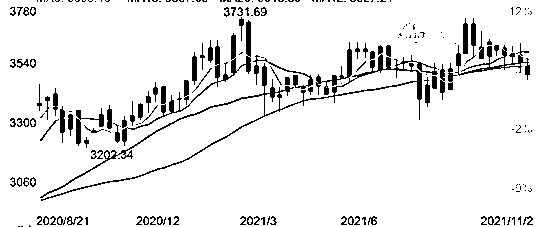

| 上证指数月 K 线

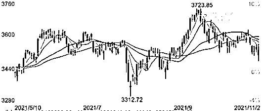

| 上证指数日 K 线
毕竟，12 月我们会迎来两个非常重要的占星指标。**12 月 19 日，金星开始逆行（合相冥王星）；其后一周的 12 月 24 日，土星、天王星将第三次也是最后一次形成精准四分相。两者都是强有力征象。**11 月应该如何操作？金融占星大师雷蒙德·梅里曼的《2021 年 11 月上证指数报告》已上线，你可以听听梅里曼老师的看法。投资有收益，投资有风险，希望金融占星学的研究帮助你更好地评估你的投资。

**雷蒙德·梅里曼《2022 年金融年度预报和沙龙》开始预售。双 11 有优惠价格，请在若道 APP 内购买。**

**长按下图识别二维码购买**

▼

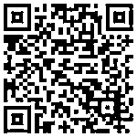

雷蒙德·梅里曼中国金融市场特别网络研讨沙龙也在售卖中。这场为期 3.5 小时的在线沙龙探讨长期行星周期如何影响世界经济的长期周期和趋势，特别是如何影响上证综指、黄金市场、比特币市场，并描述在 2021 年剩下的时间里市场反转关键时间点。

**长按下图识别二维码购买讲座视频**

▼

**11 月上证报告上线**

**上证指数月度报告价格**

**单月报告**：280 元/月 

**季度套餐价格**：780 元（260 元/月）

**年度套餐价格**：2400 元（200 元/月）

**双报告年度套餐更优惠（直降 900 元）**

**12 个月黄金报告+12 个月上证指数报告：仅需 3900 元**

**长按下图识别二维码购买上证报告**

▼

“**黄金是金钱。其他的只是信贷。**

**——约翰·皮尔庞特·摩根**

”全球经济都面临了 2 个艰难选择。抑制通货膨胀，还是抑制经济衰退？而**各国央行关于这两个问题的选择对于黄金中短期的走势毫无疑问会产生影响。**以美联储为例，美联储已经宣布计划开始缩减月度债券购买量，投资者对此感到担忧，因为通胀的增长速度远高于预期。如果通胀在上升，美联储必须加息以遏制这一趋势，同时美国国债和股市也在下跌，那么经济萎缩的前景将越来越严重，超出大多数金融市场专家的预期。美联储发现自己正被迫陷入困境。如果他们设法抑制通货膨胀，他们就面临经济衰退的风险。如果他们设法阻止经济衰退，他们就面临通胀的风险。他们会选择哪种毒药呢？在中国，我们可以看到政府越来越多采用行政干预市场的方式进行价格调控。比如 10 月份，发改委直接对于因为供应短缺、需求上涨而飙升的煤价执行了限价政策。政府用政策直接干预价格直接导致了相关股票的市场大跌。而在贵金属市场，也有相关的行政干预政策的推出。比如，从 11 月开始，在一些银行，个人投资者只能卖出纸黄金和纸白银产品，而不能买入相关产品（而实物黄金的买卖不受影响）。**11 月份，有一个和黄金走势相关的趋势值得关注——火星进入天蝎座。**在过去，火星进入天秤座的后半段时，黄金并没有出现一个预期的跌幅。在 9 月 29 日，火星在天秤座的前半段，黄金价格最低触底 1721 后就一路上涨。因此，**当火星进入天蝎座后，会迎来如过去一样的涨幅吗？**

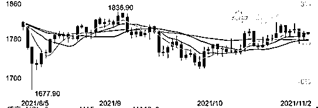

| 黄金日 K 线
11 月黄金报告已经上线，上证报告也已上线。欢迎了解。也可以按照季度和 1 年期订阅，有更多优惠。季度和年度的好处是，你可以持续了解梅里曼老师对于不断在变化的市场的看法。即便他某一次看法和市场不一致，你也看到在下一期他如何调整自己的看法，并看到金融占星在一个长期时间段内对你把控风险的帮助。而能够长期控制风险、尽量找到安全的投资时机才是投资的长久之计。点击阅读原文，雷蒙德·梅里曼黄金周期 11 月度报告带来有 40 年黄金市场研究经验的世界著名金融占星大师雷蒙德·梅里曼对当前黄金市场的研究。

**11 月黄金报告上线**

**黄金月度报告价格**

**单月报告**：280 元/月 

**季度套餐价格**：780 元（260 元/月）

**年度套餐价格**：2400 元（200 元/月）

**双报告年度套餐更优惠（直降 900 元）**

**12 个月黄金报告+12 个月上证指数报告：仅需 3900 元**

**长按下图识别二维码购买黄金报告**

▼

**购买者需知**

**① **梅里曼市场时机学院《中国上证指数月度研究报告》是梅里曼市场时机学院（以下简称 MMA）的研究“预报”，而不是市场“预测”，是梅里曼老师及 MMA 金融占星分析师对人类活动周期历史与行星周期之间相关性的研究，二者在大部分情况下具有 80%或更高的相关性，而不是因果关系。报告中的研究完全存在错误的可能性。即便是非常认真的研究和几十年的研究经验，金融占星师无法总是正确地解读出各种征象在实际层面上会如何相互作用，并显化为事件结果。所以请将报告看作一个研究参考，务必结合其他市场研究和你个人对市场的理解，根据你的自由意志做决策。**②** 此报告一旦售出，**即不接受退款。**

**③** 上证、黄金月度报告每月固定 1 期，**并非都是在每月相同日期发布。**

**④** **我们收到英文报告的当天，即发布该英文报告。3 天后，上线报告中文版。此报告仅支持手机网页阅读，不支持电脑阅读和下载。**

**以上须知，请仔细阅读。一旦付款，即视为已了解并接受所有须知内容。**

在过去的 39 年中，唯有梅里曼逐渐完善，并在梅里曼市场时机学院月度周期报告中阐释了将地球宇宙学与周期相结合的研究方法，以惊人的精确性预报了黄金价格发生重大变化的时间。

**黄金购买 Tip**各大银行均可购买黄金或黄金 EFT 基金，也可以在诸如天天基金或者支付宝购买黄金及黄金相关产品。不明白的可以百度搜索。**购买后如何查看报告？**

**购买后有疑问怎么办？**

请联系技术客服

**微信：nodoor201705**

**购买黄金+上证报告直达入口**

# 神话塔罗今日开课丨大阿卡纳牌：隐士

> 原文：[`mp.weixin.qq.com/s?__biz=MzA5NjA0NTAxNg==&mid=2651460114&idx=3&sn=a562cf2d91c74192ebacfa9484e0b141&chksm=8b48a0a5bc3f29b3807e6a2e49b1a3f16c82e528c54ae708ecd44e1e7e9ca5dbb1148dde5de6&scene=126&sessionid=1692737903#rd`](http://mp.weixin.qq.com/s?__biz=MzA5NjA0NTAxNg==&mid=2651460114&idx=3&sn=a562cf2d91c74192ebacfa9484e0b141&chksm=8b48a0a5bc3f29b3807e6a2e49b1a3f16c82e528c54ae708ecd44e1e7e9ca5dbb1148dde5de6&scene=126&sessionid=1692737903#rd)

作者/朱丽叶·沙曼-伯克 丽兹·格林

译者/闫东升 编辑/玫瑰 图片/神话塔罗 网络

本文节选自《神话塔罗》

神话塔罗牌的设计源自于希腊神话，希腊诸神是西方文化的一个重要支柱，它们并不独属于某一个神秘流派、宗教教义或灵性途径，它们无关道德却蕴藏着深刻的道德真理，它们的出现早于我们现代的宗教象征符号，无处不在地渗透其中，整个西方文化的艺术和文学中都能看到它们的身影。总有一段时光我们只想自己独享，那就是隐士牌。今天就来解读大阿卡纳牌——隐士。

**今日开课，**点击下图了解课程**详情**

[🔈 神话塔罗·隐士](https://res.wx.qq.com/voice/getvoice?mediaid=MzA5NjA0NTAxNl8yNjUxNDYwMTEz)

**｜**朗读者小巫

**书名：**

神话塔罗 

**作者：**

朱丽叶·沙曼-伯克   丽兹·格林 

**出版日期：**

2011-08-02

隐士对应的希腊神祗

**克洛诺斯·上一代天神**

**时间之神**隐士牌描绘的是一个长着灰白胡须的年长的男人，肩披灰色的斗篷，他的脸被斗篷的帽子遮住了一小半。他的右手提着一盏油灯，闪耀着金色的光芒。他的左手擎着一把长柄镰刀。一只乌鸦落在他的肩头。他身后是苍凉模糊的暗色山峦，和暗沉的灰色天空在远处连成一片。 

> **克洛诺斯（*Cronos*）提着的油灯**：象征着从孤独和耐心的等待过程中获得的理解和洞见。 **新月形的镰刀（也就是新月）**：是克洛诺斯的母亲盖亚（*Gaea*）送给他的礼物，它象征着时间循环的永恒变化。

**统御世界的上一代天神**隐士牌面上我们遇到了远古之神克洛诺斯，他的名字意味着时间。神话中乌拉诺斯（*Uranus*，天空）和盖亚（大地）结合后生出的第一个种族是泰坦（*Titans*）巨神（或大地之神，*Earth-gods*），克洛诺斯是其中最小的一个。乌拉诺斯很不喜欢孩子们，嫌弃他们丑陋而且肉骨凡胎。他把所有的泰坦巨神关进地府，以免看到他们。盖亚对此非常愤怒，决定报复丈夫。她从胸口取出了火石，变成了一把锋利的镰刀，把它交给最小的也是最机敏的儿子克洛诺斯。夜晚到来的时候，乌拉诺斯和往常一样与妻子结合了。当他熟睡的时候，事先藏起来的克洛诺斯出来用镰刀阉割了他，并且把他血淋淋的阳具丢尽了大海。克洛诺斯杀死父亲后就解放了所有被囚禁的手足，并成为了统御世界的君主。创世纪的过程就这样在他不懈的努力中，历经了漫长的岁月后终于完成。那段时间被后人称为黄金时代，因为和乌拉诺斯统治时期相比，克洛诺斯的时代富饶繁华。作为时间之神，他统御的时空中有规律的季节交替，从孕育、出生、成长到死亡和再生，生命循环井然有序，臣民们对他既崇拜又敬畏，因为他带来了富饶，也带来了死亡，人们无法回到过去，只能大步向前。克洛诺斯本人并不愿意全心接纳自己所创造的循环律则，因为它意味着终有一天，自己的王国也会被儿子颠覆，就像他和父亲乌拉诺斯的故事一样，所以他一直在吞噬自己的孩子，用来维持他所创立的规则。接下来的故事就是克洛诺斯和宙斯（*Zeus*）之间的杀戮了，宙斯也是克洛诺斯最小的儿子，我们曾在皇帝牌中讲述过他的故事，神话中宙斯颠覆了父亲的统治，创建了奥林匹斯山的神之国度。克洛诺斯被儿子宙斯驱逐后，有的神话中说他被囚禁在很深的地府之中，但也有些故事说他沉睡在赐福之岛（*the  Blessed  Isles*）上，等待着下一个黄金时代的到来。

**无法跨越的时空律则****从内在的层面来看，隐士——克洛诺斯的意象，是愚人要学习的四项“美德”的最后一个：尘世生命的时间性和局限性。**没有任何事情是一成不变的，也没有任何事情能够跨越时空的律则，这是尘世生命最显而易见的面向，尽管我们都非常清楚，却很难学会它的真谛，大部分情况下必须经历岁月和经验的洗礼，我们才会真诚并完全地接受它。**克洛诺斯的意象反映出时间的意义，也同时反映了与之对抗的后果，所以他被颠覆并放逐，在孤独和沉默中获得了智慧**。从很多层面上看，克洛诺斯象征着身体，因为身体无法停止自己成长老去的步伐，但它时时都与其抗争，想要获得永生。通过静默、孤独和探索，我们都会发现自己最终还是单独的个体，也都要面对尘世生命的进退两难。从某种神秘性的角度来看，全然地接受这个事实就是在内在经历了真正的亲子分离，因为这意味着我们不再幻想某日、某地或某人会来帮助我们解开生命的魔咒。“从此以后他们幸福地生活着”这句话蕴含了多少渴望、幻灭、心酸和苦难！那绝对不可能存在于克洛诺斯的规则中。从青涩走向成熟后，我们就再也无法回头，但记忆和智慧会从时间的洗礼中闪出夺目的光彩，而且还会获得耐心这个伟大的礼物。隐士牌的功课无法通过挣扎和征服来完成，因此我们看到克洛诺斯站在了赫拉克勒斯的对立面，这意味着怎样的挣扎都无法让时间停止。只有接受时间的规律，才能获得克洛诺斯黄金时代的奖赏。通过强制性的限制和岁月的洗礼，而不是战斗和挣扎，愚人才可以发展出隐士——克洛诺斯的内敛、深思熟虑和保持傲然独立的特质。因此，克洛诺斯在某种程度上还是谦卑的意象，在我们无法改变的事物面前，谦卑是最好的品质和面对方式，它会使我们变得冷静、从容和沉着，能够容忍生命之路上的障碍和失望。无论多么聪慧，无论多么热心，无论有多么强大的自我身份认同感，如果没有学会内在隐士的耐心和慎重，生老病死的无常变迁可能会随时击溃我们，所以我们必须学会像隐士一样在静默中忍耐和等待。克洛诺斯的黑暗面是僵化和顽固，一味地抗拒改变和时间的流逝。这位来自远古黄金时代，身上充满矛盾性的神明，最值得人们学习的就是需要改变的时候机敏，不能改变的时候接纳，在静默中耐心地等待我们能够分辨和选择的时机。**隐士，回归内在的自省****从解牌的角度来看，克洛诺斯——隐士牌出现的时候，预示着当事人需要独处或者从外倾的社会活动中撤回到自己的内在，从而获得耐心的智慧。**这是一个建造稳固内在的机遇，只要当事人愿意等待。因此，愚人最终变得成熟了，发展出了理智和情感的力量，拥有了稳固的自我身份，在岁月循环往复的洗礼下学会了发自内心地尊重自己的局限性。

**版权声明：**本文由《自在园》授权发布，欢迎转发，反对抄袭。友号转载请申请白名单。

**神话塔罗系列**

[开篇](http://mp.weixin.qq.com/s?__biz=MzA5NjA0NTAxNg==&mid=2651451590&idx=2&sn=41c1083542bcf098de303e29a028ff20&chksm=8b4b4271bc3ccb67d5d53c143cd5a17c24b7b60e5b1051949fa9f086f90b4ab04877976c47e5&scene=21#wechat_redirect)丨[愚人](http://mp.weixin.qq.com/s?__biz=MzA5NjA0NTAxNg==&mid=2651452189&idx=2&sn=f4cc6e768e367fbdb0f69b9c6382443d&chksm=8b4b41aabc3cc8bcdbd952d91d8408014a799224d3f67ab50bb5cbe88ee0090afc92869de1a6&scene=21#wechat_redirect)丨[魔术师](http://mp.weixin.qq.com/s?__biz=MzA5NjA0NTAxNg==&mid=2651453528&idx=2&sn=3ca9b35e1736168eef1856274635224a&chksm=8b4b4aefbc3cc3f965f2531f8c0d37da2e66a2b47139d445df1ea35eeb74bdf3b6827236741a&scene=21#wechat_redirect) | [女祭司](http://mp.weixin.qq.com/s?__biz=MzA5NjA0NTAxNg==&mid=2651455871&idx=2&sn=15ae629e1b35f1371b81868f5bfdd2aa&chksm=8b48b3c8bc3f3ade0175d0e03bfe496711801614273e7fe98b6435fafe0de5daf3a8d7c1312f&scene=21#wechat_redirect)

[皇后](http://mp.weixin.qq.com/s?__biz=MzA5NjA0NTAxNg==&mid=2651453921&idx=2&sn=4d1efea03b2b9f940be7a6aadf553dec&chksm=8b4b4b56bc3cc2405fe562b8ef48f335699f57c12d5d817e24aeeb84f6306092de2ae55becc7&scene=21#wechat_redirect) | [皇帝](http://mp.weixin.qq.com/s?__biz=MzA5NjA0NTAxNg==&mid=2651455083&idx=2&sn=d12546b67c830055f37b147f41c7641f&chksm=8b4b4cdcbc3cc5cad2def85451c3a7ddbb31ba5b9a01febb8a9fb18991d3e1263d9371ac212f&scene=21#wechat_redirect) | [导师](http://mp.weixin.qq.com/s?__biz=MzA5NjA0NTAxNg==&mid=2651456482&idx=2&sn=153b4ca2f69f6745425525773616455d&chksm=8b48b155bc3f384322115b0b94621662ba562a2a252fd244a0a3fc84a664408b2311014e8db5&scene=21#wechat_redirect)丨[恋人](http://mp.weixin.qq.com/s?__biz=MzA5NjA0NTAxNg==&mid=2651457110&idx=2&sn=b4f6a1e93475b39df8f6c80a7409c59c&chksm=8b48b4e1bc3f3df721f206e899272c01bf324355f649fe0fd0dd8363c5b58683daa38e8cf648&scene=21#wechat_redirect)

[战车](http://mp.weixin.qq.com/s?__biz=MzA5NjA0NTAxNg==&mid=2651457444&idx=2&sn=75e9cc378abfefb59ebe7f12357c1b4b&chksm=8b48b513bc3f3c051bf2bb4be018694ca47996a193c0a92d5003c47dc384a2b07f9b9f9806ed&scene=21#wechat_redirect) | [正义](http://mp.weixin.qq.com/s?__biz=MzA5NjA0NTAxNg==&mid=2651458133&idx=3&sn=e37f69e34bc33afe6c0935e32ad0b786&chksm=8b48b8e2bc3f31f465dee7a4595d44620d93e58ca37eeab785724f5a92a9ec3bbb85c3d34f17&scene=21#wechat_redirect) | [节制](http://mp.weixin.qq.com/s?__biz=MzA5NjA0NTAxNg==&mid=2651458981&idx=3&sn=8858e451980859e86b87571128e4f115&chksm=8b48bf12bc3f3604c1ef97c0a818f501fc28c84a4ef19e25521527e162d2d2c6bdded6238ea8&scene=21#wechat_redirect)丨[力量](http://mp.weixin.qq.com/s?__biz=MzA5NjA0NTAxNg==&mid=2651459675&idx=3&sn=ebac312745895402e187ccd8700f3674&chksm=8b48a2ecbc3f2bfa134c6b364d828b6b0e77a4c3c05054ff44d97ccc75eec4f7958f77f92605&scene=21#wechat_redirect)

**朱丽叶·沙曼·伯克**从 20 世纪 70 年代早期开始，就对塔罗牌产生了兴趣，并踏入了塔罗的世界。后来，在丽兹·格林的鼓励下，开始研习心理占星学和塔罗。1984 年，第一本书《塔罗全书》（The Complete Book ofTarot）出版。之后，与丽兹·格林合作设计并撰写了《神话塔罗》（The Mythic Tarot）。朱丽叶写了十本塔罗和占星学书，包括一本名为《众星的传说》（Stories from the Stars）的儿童读物，以及与丽兹·格林合著的《神话之旅》（The Mythic Journey），这是一本详细讲述如何运用神话来指导生活的书。

**点击下图了解课程详情** 

**微信又双叒叕改版啦，不想错过若道君的推送？**

**就把若道设为星标吧！**

**▼**

**喜欢记得点一下在看哦☟**

************报名直达入口************

# 深度 | 那些历练无数人世的老灵魂，都住在这个神秘的宫位中

> 原文：[`mp.weixin.qq.com/s?__biz=MzA5NjA0NTAxNg==&mid=2651459956&idx=1&sn=abe083aa38f4bfcbdda48746bf4dd280&chksm=8b48a3c3bc3f2ad5cba0e90236061f3f480e72b98b33712057380f495edd1dc4ea95b50ff2ca&scene=126&sessionid=1692737903#rd`](http://mp.weixin.qq.com/s?__biz=MzA5NjA0NTAxNg==&mid=2651459956&idx=1&sn=abe083aa38f4bfcbdda48746bf4dd280&chksm=8b48a3c3bc3f2ad5cba0e90236061f3f480e72b98b33712057380f495edd1dc4ea95b50ff2ca&scene=126&sessionid=1692737903#rd)

******☆ ****后台回复“今日”，给你一句生命态度******

作者/唐娜·坎宁安 译者/Luke
编辑/玫瑰 图片/pexels

12 宫是一个神秘的宫位，它甚至曾被列为 4 个职业宫位之一。如果你拥有这个宫位的凸显能量，你或许会感觉到一些深藏起来的宝藏等待挖掘，却又总是有些费力。别着急，一起来看看唐娜老师如何解读吧。

**12 宫的职业是上天的召唤**如果我们在 14 世纪，或那之前的一千年学习占星学的话，第 12 宫会被列为 4 个职业宫位之一。在那里的行星指示了一个人的职业，取这个词最原始的含义，也就是——**上天的召唤**。**做选择的不是你，而是某种事业选择了你，而且到头来你会为它自愿奉献你的人生。**当你接受到这类召唤时，你的高我会驱使你**从事某种服务型工作，尽管它很具挑战性，而且会阻挠你满足自己的需求和欲望。**你可能会有一种**使命感，要为受苦的人带去援助和安慰，或为陷入黑暗的人们带去光明。****这项工作可能很难，吃力不讨好，而且薪水很少。**不过即使如此，12 宫人今天的待遇也比过去好多了。在你献身服务型事业的过程中，如果一切进展顺利，有时你会获得一种蒙受恩宠的状态：一种幸福的感觉，感到度过了充实的一生，自己对世界产生了积极的影响。如果不是我的太阳和木星合相在巨蟹座 12 宫，我是不会有这种感觉的。我是否受到召唤？是的，而且有两次。我本来的人生计划是成为一名法语教师，所以我在大学主修的是语言。要拿到教师资格证需要进修一系列的课程，所以我开始上心理学课程。几个月之后，召唤来了，我知道我命中注定要成为一位咨询师。我换了专业，专修心理学和社会学的课程。当我修完社会工作专业的硕士学位时，我知道我的生活开始走上轨道了。然后，我的一位同事开始热衷于占星学。他到处为别人读琳达·古德曼 1968 年的畅销书《太阳星座》里的星座描述。我被里面巨蟹座的描述惊呆了。这就是了——第二个召唤！几个月以后，我每周上三个晚上的占星课，周末的时候专心钻研星图。不出意外的是，我的社工学位为我成为职业占星师提供了极佳的背景。

**12 宫职业征象的配置**如何在出生图中看出 12 宫的职业呢？12 宫内的行星显然是一个指征。这里，按照力量强弱列举了一些可以作为职业征象的配置。征象越多，力量越强。**·** 12 宫宫内星与中天形成相位，或是中天星座的守护星
**·** 12 宫宫内星与 10、6、2 宫宫内星形成相位
**· **太阳在 12 宫
**· **处女座、摩羯座或金牛座的行星在 12 宫
**· **土星在 12 宫
**· **6 宫主或 2 宫主在 12 宫
**· **因为 12 宫、海王星和双鱼座是互相关联的，所以当海王星或双鱼座的配置落在 2、6、10 宫时也会呈现相似的职业模式。一些可能的服务领域包括：**· **医院职工、机构人员、疗养院职工
**· **牧师、修女、修道院员工
**· **瑜伽或冥想老师
**· **灵性工作者、占星师
**· **监狱工作者
**· **戒酒或戒毒项目的员工
**· **残疾人的疗养院、康复之家**6 宫和 12 宫的配置都象征医疗领域的职业，但第 6 宫更多地代表主流医学。**一份由带有 12 宫配置的读者们参与的职业调查报告显示，这些人可能**起初是主流医学的拥趸，但不久就开始采用一系列的替代疗法。**我的理解是，**12 宫代表的健康问题通常是会使人失去活动能力的慢性病，包括那些由自毁行为引起的症状，比如成瘾**。因为病人或客户的治疗缺乏成效，医生们开始寻求其他种类的治疗手段，以减轻他们的痛苦。也有可能，医生自己就忍受了久治不愈的病况，因此开始研究替代疗法，再用学到的方法帮助别人。**警告：**如果以不明智的方式从事服务于人的行业，对双方都没有好处。这会消耗付出者的能量和资源，同时暗地里削弱接受者的独立能力，变成一种拯救和依赖的关系。**为了感到受需要和自我价值感，服务者常常暗中（无意识地）阻挠求助者的成长。**当小我或个人利益被牵扯进来，即使最高尚的意图也会遭到扭曲。**海王星和 12 宫是我们最容易发生否认机制的位置，小我就可以藉此伪装成灵性的傲慢（“我是整个世界上最优秀最谦卑的仆人”）。** 要知道，有 12 宫的太阳不代表你这辈子注定默默无闻。你可能以为太阳落在这个位置的人大部分时间只能处于幕后，这并不全对！以下这些知名人物就有 12 宫的太阳：英国前首相托尼·布莱尔、美国前总统乔治·W·布什、演员朱迪·福斯特、米歇尔·菲弗、灵性老师卡罗琳·梅斯、篮球明星奥尼尔……

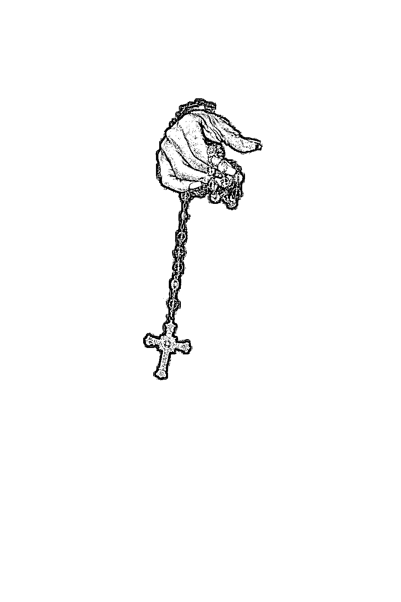

**内向的力量**近 45 年的占星解读给我留下的印象是**，12 宫人大多都是内向者，他们享受和需要独处的时光。**他们经常发现**其他人的陪伴或身处某一团体时，无论时间长短，都使人感到烦心和疲惫**。这种内向性格对他们的职业生涯有巨大的影响。我的写作需要长时间的独处和完全的静默——没有电视、电话，甚至连音乐都没有。为了深入钻研某一主题，我需要**内省、沉思、放飞思绪和大胆想象**。我的星图帮我认识到**无需为内向感到羞耻，它是我本性的一部分。**位于 12 宫的太阳和木星告诉我，避世倾向是我的长处之一，也是我的工作中创造力的源泉。有一件事阻止 12 宫人自我感觉良好，那就是人们（特别是西方世界）对内向的看法。内向被认为是适应不良的症状，需要改变。内向的人被告知应该接受心理治疗，找一个恋人，过和正常人一样的生活。**他们可能会因为与众不同而感到羞愧，感觉应该假装变得外向起来，无论演技多么笨拙。**不过我碰巧在《今日心理学》和《科学美国人》杂志上读到关于内向者的心理学研究。研究发现，**内向者在实际的工作表现上有令人惊讶的优势，尤其是那些需要注意力、集中力、长期独自进行的工作。**如果内向者成为管理人员，他们能够**倾听雇员的意见和反馈，从而提升工作场所的士气和效率。**关于这个主题，作家苏珊·凯恩写了一本重量级的书：《内向性格的力量》（皇冠出版社，2012 年）。书的简介上写道：**“世界上至少有 1/3 的人是内向者。他们相较于说话，更喜欢倾听，相较于聚会，更喜欢阅读；他们发明创造，却不喜欢自我推销；他们喜欢独立工作。虽然他们常常被贴上安静的标签，却对社会作出了巨大的贡献——从梵高的向日葵到个人电脑的发明，都是内向者的作品。”****一个有时外向，有时内向的人被称作双向性格者。**当一个人 12 宫有行星，水象星座（巨蟹座、天蝎座、双鱼座）有行星，同时又有行星或星图的四角在火象（白羊座、狮子座、射手座）或风象（双子座、天秤座、水瓶座）星座时，这种情形就会发生。一位读者说：“我有一组星群包括天王星、水星、冥王星和金星在 12 宫靠近上升的位置，我喜欢拥有自己的空间（内向特质），但另一方面我的太阳和月亮又在 1 宫，人们觉得我有阳光快乐的个性，所以我认为我是双向性格者。”

**秘密及自我欺骗**

**12 宫也被认为是秘密宫。**如果你有个大秘密要藏起来，**害怕别人发现秘密的恐惧和羞愧可以构成沉重的心理负担。**秘密可能来自你的家庭，也可能只属于你自己。这两种秘密也可能合二为一，因为**问题家庭的孩子往往会重蹈家庭的覆辙，或是为了应对痛苦的童年，发展出了其他功能失调的行为。**家庭的秘密使人感到羞愧，想要深深隐藏自己，但学着应对和治疗这些秘密，使许多人走上了助人的道路。 

重要的一课是，在监视技术盛行的今天，几乎没有秘密可言。不轨行为早晚会被揭露——通常发生在**行星行进至 12 宫行星时，那时人们就知道你真正的为人。**问题不在于**是否会发生，而是何时会发生。**特别值得一提的是，**合相上升的 12 宫行星的相关特质会对你周遭的人显露得特别明显。**这颗行星离上升越近，它就越无法成为一个秘密，所以**除了自己以外其实没有骗到任何人。**12 宫行星的特质通常受到了压抑，所以你可能没意识到你有这些特质。仔细解读 12 宫的行星和星座可以使你了解这些能量是如何被误用、阻碍你的职业目标的。**在这个位置的行星通常代表人们注意到你身上的某种特质，但是却不便和你开口讨论它们，这种情形会在你和他人之间树起一道墙。**如果这颗 12 宫行星也是职业征象，它会直接妨害你的成功。因为精明的老板和客户可能得到你不可信的印象，因此不会雇用你。

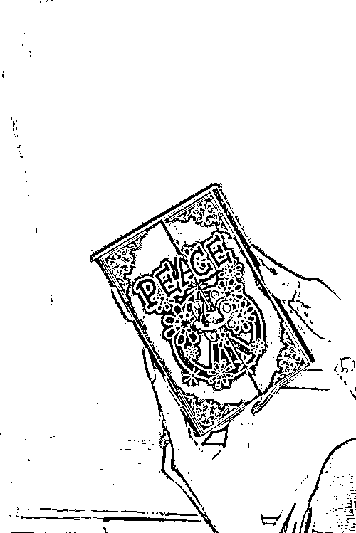

**阻碍成功的方式****12 宫也被称为自我毁灭之宫。这是搬起石头砸自己脚的旧式说法。**12 宫的职业征象可以象征**你妨害自己成功的方式**。前面说过，这些模式及其动机通常是无意识的，所以有必要了解和改变它们。如上所述，占星学可以帮你辨识它们，但还需要其他的治疗手段克服它们。 假设你的金星在 12 宫，和中天成四分相。你可能觉得对于 12 宫的职业来说，金星十分有利，会带来热心、慈悲、关爱他人的特性。这都很好。然而，金星 12 宫的配置因秘密恋情而臭名昭著。这个位置的金星作为职业征象，在工作场所的秘密恋情可能为你的职业生涯招致严重后果，尤其当外行星（天王星、海王星、冥王星）行进与其成硬相位（合相、对分相、四分相）时。金星和中天成四分相的配置可能意味着你和老板有些风流韵事，会伤害你在行业中的名誉。如果金星和 6 宫的行星成对分相，当这个配置和行进行星成硬相位时，和同事的恋情会变成一场灾难。更糟的是，如果你在服务行业，和客户的性关系被曝光，不仅你栽了个大跟头，也会对你的客户造成巨大的伤害。因此，服务型行业，包括占星机构，有规章禁止这类关系发生。职业征象落 12 宫的人要学到的最重要的一课是，**直到你能为你的行为负责之前（不找借口），你很可能会不断重复自我挫败的行为。**觉察到这些模式是改变的开始，如果看起来近期的外行星行进会带来麻烦的话，那最好赶快开始行动。**虽然这不容易，但是 12 宫的配置，如果用得好，也可以带来很多快乐和满足。**如果你走在 12 宫的道路上，这不是诅咒，而是你的与生俱来的权利。和许多占星师一样，我相信，在我们的灵魂回到地球以前，我们选择了何时出生，选择了自己的星图。
继续前世今生的话题，许多在服务行业的 12 宫人的转世历史中有许多世献身宗教，在那些世，他们可能发誓保持贫穷，而这些誓言被无意识地带到此生。**他们可能对收费提供服务抱有罪恶感，甚至一点都不收费，也不愿意推销自我。**如果这些描述在你内心引发共鸣，**进行仪式解除贫穷的誓言会很有帮助。**另一件对你或某位忙于应付 12 宫问题的人很有帮助的事，是阅读崔西·马克写的占星自助书：《你的秘密自我：揭露十二宫的神秘》（宜必思出版社，2010 年）。这本富有洞见和充满治愈能力的书使我肃然起敬。书会教你如何体会 12 宫配置的美好和正当，以及如何摆脱这些能量的负面表达。12 宫不适合胆小鬼，在此宫有重要配置的人似乎是由神赐予天命。他们通常是已经历练无数人世的老灵魂，现在踏上最具有挑战性的人生道路。可能他们的任务就是终结业力，结清生生世世的债务。

**版权声明：**本文由若道翻译，欢迎转发，反对抄袭。友号转载请申请白名单。

**唐娜·坎宁安**

一位在国际上都广受尊敬的占星师，她已有超过 45 年的从业经验。她已撰有数十本占星著作以及上百篇占星学和其他形而上学类的文章。

**学习占星学**

**点击下图了解课程详情**

************

****

****

****

**微信又双叒叕改版啦，不想错过若道君的推送？**

**就把若道设为星标吧！**

**▼**

**就是这个“在看”，戳一下☟**

******报名直达入口******

# 缺少水象能量的贝多芬，为何音乐有如此激情？

> 原文：[`mp.weixin.qq.com/s?__biz=MzA5NjA0NTAxNg==&mid=2651459956&idx=2&sn=ab9d3ab27f558d29c30e92861f0ebe95&chksm=8b48a3c3bc3f2ad588735af1a115e66e74da331ff110c9f7608ad3df1c13a38d994f51cb865c&scene=126&sessionid=1692737903#rd`](http://mp.weixin.qq.com/s?__biz=MzA5NjA0NTAxNg==&mid=2651459956&idx=2&sn=ab9d3ab27f558d29c30e92861f0ebe95&chksm=8b48a3c3bc3f2ad588735af1a115e66e74da331ff110c9f7608ad3df1c13a38d994f51cb865c&scene=126&sessionid=1692737903#rd)

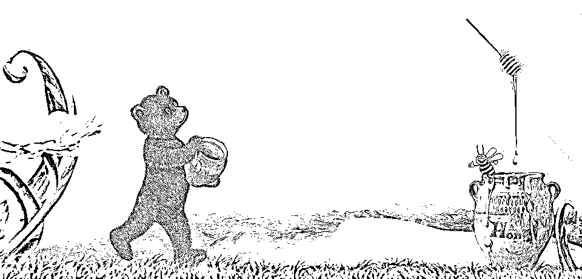

作者/埃莉诺·布克沃特

翻译/李含 编辑/翀子 图片/网络

我们常常关注星图上被强调的信息，忽略了“劣势能量”其实也很重要，它可能以让人不舒服的形式展现，同时也可以表现出巨大的创造力。

**星图上的优势与劣势能量**

星图中的基本因素无非是星体、星座、宫位和相位几种；观察的要点除了看出生星图里有什么，还要看看缺什么，**缺乏的能量是与优势能量一样重要的信息。**

在这么多信息中，怎么能确定哪一颗行星更具影响力呢？怎么能确定**星图中的强势力量**将主要影响生活的哪个领域呢？

**优势能量**（Dominant Function）是我们能量的聚集所在，**劣势能量**（Inferior Function）是能量的最低点，甚至是完全缺乏。

**优势能量**是我们觉得舒服、自然、有归宿感的地方；这部分能量赋予我们的才华与能力都是与生俱来的，来得容易却也缺乏动力。

**劣势能量**往往是在我们面临压力时，当我们面对竞争，当我们处于不适宜的环境之中时表现出来，这将是一个巨大的源动力，也促进了创造力的表现。

但是这里往往蕴藏着某种诡异的特质，会带来最意想不到的事情。这是暗藏于优势能量之下的潜流。突然间，所以的天赋、才干、成就都被折腾得精疲力竭。舒服的摊子被掀开了，**劣势能量总是以不适当、让人不舒服的形式展现。**

**劣势能量的分类**

**单体（Singleton）就是劣势能量的一种**，不论哪个星体成为了单体都有十分重要的意义，次数越多越强调了这个星体的重要性，这个星体就越能影响个人心理状况和人生际遇。**单体星所落的星座、宫位，所掌管的宫位都被强调了。**

我们面对劣势能量往往有以下几种心理防御机制：**否认、压抑、突出表现、升华、过度补偿。**西方的文化是奖励过度补偿和升华的，这样的人往往能够获得世俗意味上的成功。而普通人则更倾向于否认、压抑或突出表现这个劣势能量的问题，直到某天危机到来才不得不面对这个问题。

**另一种劣势能量就是缺项**（Absent Function），像是没有风象星座，没有基本星座等。

如果缺乏某种元素（风、火、水、土）就类似于一个隐形的大三角；如果是缺乏某个形态的星座（基本、固定、变动）就类似于一个隐形的 T 三角。不论是大三角还是 T 三角，隐形的还是可见的，**都是一种封闭的能量流动系统。**

这样的人**活在自我创造的世界里**，他人难以接近，具体如何表现出来要根据所缺星座的信息。他会在潜意识之下将感情关系封闭在这个主要的格局之中。

例如，一个火象的大三角，不管是可见的还是隐藏的，都可能在创造力和远见卓识方面带来巨大的幸运和天赋。作为一个封闭的系统，别人无法进入这个人的世界，在这个领域里，这个人不需要任何的情感关系，他可以自我满足。

这个大三角是真实存在还是因缺项而成的隐形大三角区别就是，大三角是自然的能量表达，浑然天成；**而隐形的大三角则带来急迫感、紧张感和激情。**例如，贝多芬缺水象，他的音乐是发自灵魂的激情迸发；李斯特（注：著名匈牙利作曲家）有一个水象的大三角，他的音乐充满浑然天成的浪漫气息。

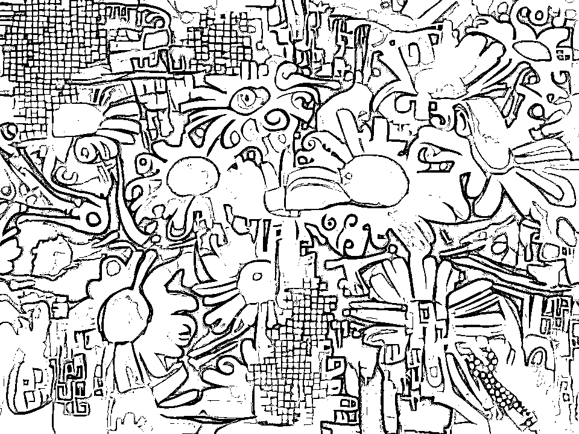

**缺项往往表现为两种方式**，一种是**巨大的创造力资源**，也会造成过度补偿的结果。这个人会执迷于他缺失的这部分能量，过于投入到这部分事务中，反而取得超乎常人的成就。另一些人的表现方式是**让这种缺失变成了阴影**，这部分自我的缺失在与他人的相处中变成了巨大的烦恼。

**所以缺项总是体现为大有或全无，绝对或是零。**

**如果缺项出现在上升点或中天，往往会出现过度补偿的现象，**表现出来其实不是真实的。例如玛丽莲·梦露缺土象，中天落在金牛座，她在公众眼里是性感女神，但是骨子里其实全是水象和风象，所有的思想、情感都不现实。

在我的经验看来，**如果缺项表现在上升点**，**案主往往会很挫败、不稳定；**他们对于在上升点表现出的性格觉得底气不足，内心空虚，那不是真实的内在性格，也缺乏这部分的能量，所以很难表现出真实的自我。

**有缺项的人需要注意次限推进和外行星行进的情况，**例如一个人要是缺风象，而推进太阳在风象，与此同时行进外行星走到了风象，这时此人可以运用隐形大三角的力量，展现人际交流、写作、演讲等与风象有关的天赋。这时也适合处理情感关系，特别是潜意识之下忽略的亲情关系。

**版权声明：**原创文章由若道翻译发布，欢迎转发，反对抄袭。友号转载请申请白名单。

****学习占星学****

****点击下图了解课程详情**** 

**

**

**

**微信又双叒叕改版啦，不想错过若道君的推送？**

**就把若道设为星标吧！**

**▼**

**喜欢记得点一下在看哦☟**

****报名直达入口****

# 好物推荐 | 从"麻瓜"进化成占星师的自我觉察工具（插班中）

> 原文：[`mp.weixin.qq.com/s?__biz=MzA5NjA0NTAxNg==&mid=2651459956&idx=3&sn=f99ade53e28c6b39976621357a639060&chksm=8b48a3c3bc3f2ad5e35fb726a8a3aeebf21e63ac55f897c812b6c079198f718ccc702339b19e&scene=126&sessionid=1692737903#rd`](http://mp.weixin.qq.com/s?__biz=MzA5NjA0NTAxNg==&mid=2651459956&idx=3&sn=f99ade53e28c6b39976621357a639060&chksm=8b48a3c3bc3f2ad5e35fb726a8a3aeebf21e63ac55f897c812b6c079198f718ccc702339b19e&scene=126&sessionid=1692737903#rd)

1

**自我觉察，是智慧的基础**

每个人都有自己的内在冰山，自我觉察能够帮助我们觉察自己的行为、情绪等，然后向内深层探索，探索自己的行为、情绪背后的深层渴望、期待。学习和应用占星学的过程，就是慢慢掌握自我觉察工具的过程，当你熟练掌握了占星学，也就具备了帮助引导他人觉察到自身生命议题的能力。**往外张望的人在做梦，向内审视的人才是清醒的。**只有真正向内看，只有当觉察开始由外向内时，改变才会发生，才能够知行合一。

# | 插画师：古戈力

以情绪来举例说明，每个人的情况不同，觉察的程度也不同，觉察有四个层次：***1.*** **不知不觉：**没有觉察情况，当情绪来了，会被情绪控制，做出很多不计后果的事情。而且每次都是同样的状况，反反复复；***2.***** 后知后觉：**情绪过后，自己能够反应过来，自己做的对与错，但是很难避免同样的情况再次发生；***3*****. 当知当觉：**当情绪来的时候，你已经知道在这个当下，正在发生什么。当达到这个层次，你就可以自己控制情绪，从而影响后事的发展；***4*****. 先知先觉：**当事情还没发生，就可以预知它要发生了。因为你对情绪的觉察已经越来越熟练，所以情绪还没来，你就知道它要来了。所以，你也就有了更好的选择和处理方法。所以，我们要自我觉察，向内探索，觉察是为了接纳，然后做出改变，成长，迭代，升级。**那么要如何练习自我觉察，掌握先知先觉的能力呢？**

2

**每日觉察的工具推荐**

**今日天象&近期行进**

若道 APP 中的今日天象功能，罗列展示每一天的具体天象，你当天的行进和行进周期：

作为占星师，可以这样使用这个自我觉知工具：

**记录梦境**如果你有醒来记录梦境的习惯，每天早上看一下睡梦中的天象和行进，对应联想，你会惊喜地发现一些神奇的对应，能够更敏锐的捕捉到日常被压抑的情绪和需求。能够帮助你在白天的工作生活中先知先觉的关注身心状态。**规划生活**每月月初，周初都可以参考天象和行进进行日程规划，预估可能的助力和阻力，在对的时间做对的事，会发现平平无奇的日常也可以有不一样的色彩。根据月相的变化感知情绪的起伏，更好的自我关爱。**感知环境**当身边发生了引起你注意和好奇的事情，或者网络上层出不穷的新闻热点，都可以在天象中寻找对应的能量。从更大的格局视角去思考你的个人观点。通过环境的共振，更深入地理解自己的出生星图。以上都是很好的学习深化占星知识的方法，只需要系统掌握以下知识，就可以开始使用以上方法去提升自我觉知。**第*1*阶 黄道星座&个人行星****概要介绍占星学与星图**

**四元素与三形态**

**黄道 12 星座**

**太阳、月亮及其他个人行星**

**第*2*阶 行星&宫位****木星&土星****天王星&海王星&冥王星**

**练习组合所有行星**

**四轴**

**十二宫位**

**组合宫位、行星、星座****第*3*阶 月亮交点、相位以及初步解读星图**

**了解灵魂进化的路径：月亮交点**

**相位概论**

**相位&行为模式**

**困难相位**

**柔和相位**

**容许度，出入相位**

**渐盈渐亏相位**

**空相**

**宫主星&定位星**

**相位模式**

**组合相位、星座、行星、宫位**

**解读的基本原则，权重，失衡**

3

**课程安排是怎样的呢？**

**第*1*阶**2021 年 9 月 15 日开课，每周一天晚上 20:00-22:00 上课，共 6 次课**第*2*阶**2021 年 11 月 11 日开课，每周四晚上 20:00-22:00 上课，共 6 次课**第*3*阶**2022 年 1 月 6 日开课，每周四晚上 20:00-22:00 上课，共 15 次课 2022 年 4 月 30 日、5 月 1 日**L3 北京两日线下工作坊**

****

4

**授课老师**

**艾德里安·罗斯·邓肯**

**（AdrianRoss Duncan）**

**· **1971 年在印度游学时开始学习占星学，1985 年开始成为全职占星师，迄今执业已超过 33 年，是人本主义占星学、卜卦占星学和经世占星学领域的知名占星师。他还开发了占星软件 AstroClock 和多款占星报告；**·** 哥本哈根占星学院院长；**·** 他在日常咨询中经常运用卜卦，咨询图（卜卦的一种运用方式，即根据客户来访时间制作星图，从星图中获得大量信息）也是他特别擅长的领域；**· **艾德里安·罗斯·邓肯从 1971 年开始研习佛学，受佛学影响很深，他相信占星学和佛学观点一致，转化的一个基础是在于对现实感知的改变。而卜卦很容易与佛教融合，因为它只关乎当下。

**大卫·瑞雷**

**（David Railey）**

**·** 若道联合创始人，致力于在中国教授和推广西方占星学；**·** 曾任 ISAR 全球副主席，CAPISAR（ISAR 职业占星师资质认证机构）主席；**·** 1976 年，通过亚特兰大职业占星师考试，成为全职占星师，随后通过 AFAN 和 ISAR 职业测试；**·** 1980 年，与杰夫·焦耳一起在亚特兰大创建“每日行星”占星学中心。此后在亚特兰大占星协会担任 4 年考官，并且两次担任亚特兰大地区占星协会主席。1979-1992 年，作为占星师活跃于美国社会媒体，向不了解现代占星学变化的大众宣传专业占星学知识。在 1989-1992 年期间，他在 WRGG 电台 12 频道每周主持个人电视秀“今日占星学”，早先他还在 WRFG 的广播节目中播讲宇宙天气节目；**·** 2010-2014 年，任全美占星师联盟监督委员会委员；**·** 2010 年，其著作《灵魂的目标》中国版出版，和蒋颖一起创办若道占星学校和其官网 www.nodoor.com；**·** 2017 年，被选为 ISAR 委员会成员。ISAR 是世界最大的国际占星机构，会员遍布 45 个国家，2017-2020 年曾任 ISAR 全球副主席、CAPISAR（ISAR 职业占星师资质认证机构）主席。

**克里斯蒂娜·罗登贝克**

**（Christina Rodenbeck）**

**· **克里斯蒂娜·罗登贝克（Christina Rodenbeck）是一名全职职业占星师，在牛津大学城生活和工作，深受周围知识和文化氛围影响；她拥有伦敦大学（University of London）的人文荣誉学位，曾在伦敦占星学馆（AstrologicalLodge of London）、心理占星中心和占星研究学院学习；**·** 作为一名占星师，在过去的 20 年里，克里斯蒂娜在她的网站“牛津占星师”上写了大量关于时事、艺术和文化的文章；她每月主持一个占星播客：“与克里斯蒂娜和萨莉一起占星”，并定期在《占星杂志》(Astrological Journal)上撰写时尚专栏；她定期在英国授课，并保持着蓬勃发展的专业实践。

**琳恩·贝尔**

**（Lynn Bell）**

**·** 世界最受欢迎的占星学演讲者、作家和老师之一。定居巴黎，研究心理占星学和家族模式数十年；

**·** 著名的心理占星学中心（Centre for Psychological Astrology）的长期导师。2016 年，获得查尔斯·哈维（Charles Harvey）杰出的占星学服务奖；

**·** 作为一个从多个层面进行工作的占星咨询大师，琳恩的工作结合了心理学的观点。她对家族模式的兴趣首先来自与客户的合作。通过在分析领域所做的个人工作，她所受的埃里克森催眠训练将她引领至家族系统。后来，她组织研究小组在家族星图上进行了数年的研究。她写的《家族占星学》就是这项研究的结果；

**·** 法国心理占星学协会的会长。除了占星学，她在法国沙特尔的新沙特尔学校任教 8 年，还 5 次获得了在《纽约时报》畅销书作者卡罗琳·迈斯（Caroline Myss）的卡罗琳·迈斯教育学院（Caroline MyssEducational Institute）合作教学的机会。**课程助教：**

**熊鹰老师**

**（天空的空）**

**·** 2008 年接触严肃占星学，至此爱不释手；**·** 2013 年师从大卫·瑞雷，研习现代占星学核心课程，并于 2014 年起担任该课程的助教，之后于 2017 年与 2020 年两次与大卫老师合作讲授完整核心课程（Level 1-5）；**·** 期间也跟随格伦·佩里、诺·泰尔、理查德·塔纳斯、罗伯特·汉德、苏·汤普金斯、斯蒂芬·弗里斯特、琳恩·贝尔、艾德里安·邓肯等多位国际占星大师进行学习，进行定向占星主题研究；**·** 2014 年末，通过国际占星研究协会（ISAR）资质认证并获得证书；**· **在若道占星任职六年余，以“传播系统、专业、实效的占星学”为职业使命，执教与助教已累计超过 700 小时。在业余期间也提供占星咨询服务；**·** 目前正着眼于占星学与中国文化之互参，以当代中国人的身心成长为目标，力求落到实处。

5

**此次课程适合哪些人？**

**·** 对占星学感兴趣，想要入门的零基础者**· **占星学小白，想通过星图学习识人之术**· **有一定占星学基础，但不知道该如何整合星图复杂碎片的人**· **想要师从更多殿堂级占星导师学习占星心法的人**· **走在自我探索和个人成长道路上的人

6

**课程价格**

**L1-3 价格**：15000 元

其他各阶段课程单报价格，请咨询课程顾问：**Maggie 老师**（微信：18510107057，请备注**“核心课”**）

长按二维码添加 Maggie 老师

7

**退转课程**

****· 退款原则请详看《教学协议》，如有疑问请咨询课程顾问****

****名师汇集金牌核心课程****

**授课老师：**琳恩·贝尔、艾德里安·罗斯·邓肯、克里斯蒂娜·罗登贝克、大卫·瑞雷

**授课时间：**2021 年 9 月 15 日起

**授课方式：**网络课程**，**英文授课，中文翻译

**费用：**L1-2 价格：4800 元**；**L1-3 价格：12000 元

**课程负责人：****Maggie 老师**（微信：18510107057，请备注“核心课”）

长按二维码添加课程负责人咨询~

****报名请点击“阅读原文”****

# 11 月宇宙天气丨天蝎座能量爆棚，确立 2022 年目标的关键时刻到了！

> 原文：[`mp.weixin.qq.com/s?__biz=MzA5NjA0NTAxNg==&mid=2651459819&idx=1&sn=07fcaafae6814e23d7ec7bf3f10898a1&chksm=8b48a25cbc3f2b4a13cb401bc509a2e8e12f5f0da00dc3a7842586dcaa36135513315dbeff5d&scene=126&sessionid=1692737903#rd`](http://mp.weixin.qq.com/s?__biz=MzA5NjA0NTAxNg==&mid=2651459819&idx=1&sn=07fcaafae6814e23d7ec7bf3f10898a1&chksm=8b48a25cbc3f2b4a13cb401bc509a2e8e12f5f0da00dc3a7842586dcaa36135513315dbeff5d&scene=126&sessionid=1692737903#rd)

****************☆ 后台回复“今日”，给你一句生命态度****************

作者/傅莎珈 ISAR 认证占星师
编辑/翀子 封面/书君 图片/网络 11 月宇宙天气的主题是探索人生意义，寻找突破当下困境的途径。人们渴望得到指引，但更需要看清内在的深层信息。我们正走在去除旧有欲望、创造新生命角色的时期，一起加油吧！

进入 11 月，天蝎座的能量逐渐浓重起来。伴随各地疫情的再度加重，西北、北京等地的防疫措施又严格起来。华东地区一夜从夏季跨入初冬，体感从开空调转向开地暖，搞得妈妈们开始担心孩子的免疫能力。这些外在世界的混乱和反复，再次加重了人们内心的疑虑：**前途如何？2022 年会如何？**

金星在太阳进入天蝎座之前换座射手座，引领了这次天蝎月的主题：**探索人生意义，寻找突破当下困境的途径。**

前两天和朋友们聊年度运势的活动，一个 30 岁左右的女性说：女性真难啊，各种社会角色都对你有很多要求：母亲、妻子、员工，唯独留给自己的时间特别少，到底要跟随大流，还是做自己呢？到底什么才是真实的自己？我想不出来。 

相信这也是很多人的问题。随大流惯了，并不知道自己到底要什么，听谁说的有道理就跟谁走。内在的困惑并没有真正的解决，反而变得更加迷糊。

B 站上最流行的塔罗牌预测，有关未来的提问越来越多：2023 年在干嘛？明年中秋节和谁一起过？此刻正在显化什么？未来十年的事业把握？如何能换到人生的新钥匙，以及最热门的情感趋势：TA 对你的真实想法和下一步行动 ……

人们在通过各种手段搜集未来，确定未来。这也是塔罗、命理、占星学、风水等越来越热门的原因之一。无论理智的科学家们、傲慢的公知分子如何劝告这是迷信，都是胡说八道，依然架不住从 80 后到 00 后，甚至 10 后们的沦陷。

**人们渴望得到指引。**但另一方面，**这些求问的行为，最终都会回到自己的决策选择上**：你是跟随这些建议，还是决定迎难而上。大部分情况下人们会跟随自己的“执念”走，这些执念，有的是恐惧，有的是渴望，有的固执，有的是贪婪，有的是回避……**并没有认真去看见这些“执念”背后的信息。**

另一部分人是先驱，已经走在自我更新的道路上，在茫然之间怀抱着一种前行的信念，但又时时被周围的信息骚扰，不确定性时隐时现。

**这些都构成了天蝎月的主题：深入进内在的阴影，转化旧有的心理、行为模式，更新人生信念。**在这个深入进入阴影的过程中，我们需要关闭一些信息通道，不听不看，只是专注在内在生命需要的探索中。

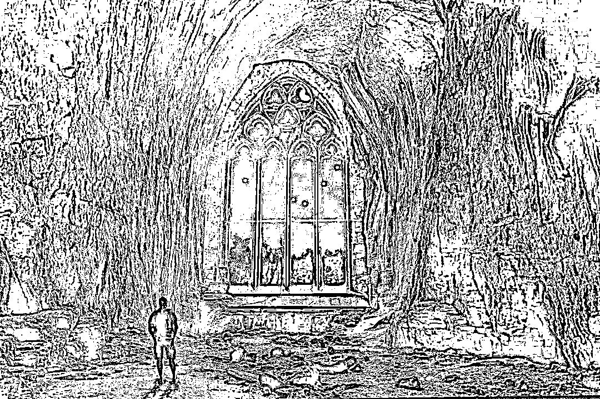

**11 月上旬**

11 月上旬天象

**11 月 01 日 ** 

*   天秤座水星三分水瓶座木星

**11 月 02 日**  

*   天秤座水星四分摩羯座冥王星

**11 月 05 日**  

*   天蝎座太阳对分金牛座天王星（逆行）

*   天蝎座新月

*   金星换座摩羯座

**11 月 06 日 ** 

*   水星换座天蝎座

*   天蝎座水星六分摩羯座金星

**上旬开篇就是重磅的天蝎座新月和天蝎座太阳对分金牛座天王星。**这个新月将会开启很多人的社会公众身份改变、事业转型、家庭角色转变、合作关系大震荡、人生观重启。**这些都属于心理大变动，要求个体能全然打破旧有的自我认知，愿意抛弃旧有的身份。**

很多人会在这个新月前后烦躁不安，特别想要找人确认一下潜意识里若隐若现的信号究竟是什么。新月也会激发起人们原生家庭、家族中一直存在的存在焦虑。有些人和父亲、家庭、管理者、领导之间出现对峙或者冲突，感受到被打压、被否定的愤怒。

人们需要一个客观，第三方的，智慧存在的肯定：这么做没错。而且不分年龄段，跨越 18-50 岁。

**越是在这种箭弩拔张的时候，越需要金星的平衡、协调和斡旋。**

金星在同一天从射手座换座摩羯座。意味着一些我们将会与一些女性长辈、权威、智者的沟通交谈，获取自我突破的启发。

请回想一下金星在处女座的那段日子，也就是 2021 年 7 月 22 日-8 月 16 日期间，你立了什么旗帜吗？有没有任何关于生活目标，自我认知的感悟与启发？此刻金星进入摩羯座，这些旗帜、自我发现到了发展壮大的时候——**将这些目标和自我感悟通过 2022 年全面落实。**你的个体身份，以及社会身份的种子，在那个时候就种下啦。

给你一个提示：7 月 22 日前后郑州特大暴雨。在这个事件前后，你有任何感受吗？

在这个新月构成的合作、关系，都是长期和持久的，**如果能打好信任基础，做好持久投入的准备**，那么半年后到天蝎座满月的时候，有**些切实的成果会在生活中呈现出来！**尤其是个体身份的转变，现在可能根本意识不到是什么，Big surprise!

水星在 11 月 6 日换座天蝎座，需要我们更深的探索这个转变需要完成哪些思维方式的梳理和升级。

学业、事业、情感上的发展，都带有万事开头难，需要**带着长久经营的态度**去面对结合。

**企业和社会环境里**，年轻人的创新趋势正在愈演愈烈，引发权力斗争、新老交替的剧烈气氛。

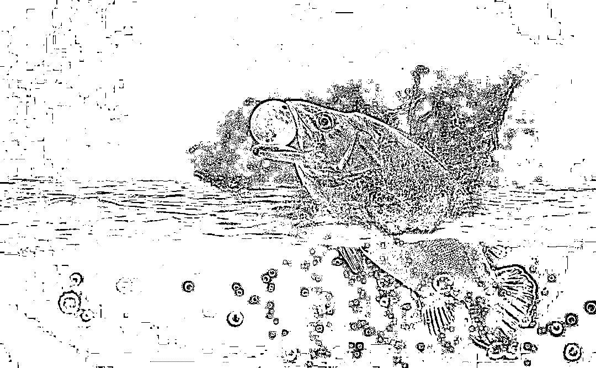

**11 月中旬**

11 月中旬天象

**11 月 10 日**  

*   天蝎座火星四分水瓶座土星

*   天蝎座水星合相天蝎座火星

**11 月 11 日**  

*   天蝎座水星四分水瓶座土星

**11 月 13 日**  

*   天蝎座太阳三分双鱼座海王星（逆行）

**11 月 14 日**  

*   天蝎座水星对分金牛座天王星（逆行）

*   摩羯座金星四分白羊座凯龙星

**11 月 16 日**  

*   天蝎座太阳四分水瓶座木星

**11 月 17 日**  

*   天蝎座太阳六分摩羯座冥王星

*   天蝎座火星对分金牛座天王星（逆行）

**11 月 19 日**  

*   金牛座月食

*   天蝎座水星三分双鱼座海王星（逆行）

*   摩羯座金星三分金牛座天王星（逆行）

**11 月中旬开始，太阳、水星、火星都位于天蝎座，和土星、木星所在的水瓶座、天王星所在的金牛座形成能量上的张力。**

这种张力尤其通过社群、职场、合作、婚恋关系中的震荡性事件，**促使个体去探索自己的创造力、生命力、个体价值、需要承担的人生责任究竟是什么。**

11 月 10 日有火星四分土星，11 月 14 日有金星四分凯龙星，11 月 17 日有火星对分天王星，这几天可能会出现身体伤害、情绪抑郁、突发的冲突等，目的只有一个：**促使我们面对自己心知肚明、却因为害怕改变的不确定性而一再拖延的行动。**

天蝎座的原型能量带有蜕变、死而复生的主题。11 月中旬，太阳、火星、水星都在天蝎座。**提醒我们进入潜意识和超意识状态之中完成生命重构工作。**

赫拉克勒斯的天蝎座任务是斩杀九头蛇希特拉，这条九头蛇有九个能不断重生的蛇头，象征着**人类的欲望和恐惧**，而第十个头，意味着**不朽与永生**。当赫拉克勒斯斩掉第十个头，九头蛇也彻底死亡。为此他需要进入腥臭的沼泽洞穴，克服恐惧，徒手和九头蛇战斗，直到砍掉第十只头。

这个与九头蛇搏斗的过程，寓意着我们**不要否认自己不喜欢的部分**，才能体会生命的不朽，如果我们不愿意去认识和处理生命中令我们僵化的嫉妒、羡慕、欺骗、背叛、暴力、性欲、贪婪等情绪，我们将无法活出生命的完整性。如果我们不断遇见别人的背信弃义、愤怒、嫉妒、限制、吞噬，**我们就要低头看看自己，是否自己压抑了这些部分，导致了这部分能量被周围人展现出来。**

完整性是生命的本质，我们需要通过这些外在的破坏性事件，直面自己内在被深深压抑的部分，理解它们、觉察它们。**那些人类身上天生的、原始的、本能的部分，光明和黑暗构成了生命的完整，也是生命进化不朽的动力。**

当你能够接受和理解这些生命最根本的东西，不去逃避和压抑，那么自我边界就会被拓宽，面对压力的勇气和力量也会增加。

11 月 13 日天蝎座太阳三分双鱼座海王星，太阳与海王星的三分相会带来梦想、渴望活出理想、超越痛苦和障碍的勇气。

11 月 14 日和 11 月 17 日请特别注意语言和交通意外，以及突然爆发的意外伤害事件。但另一方面，这 2 天，尤其是 11 月 14 日，又可能在事业，合作，亲密关系、家庭领域因为分歧而发现新的合作点，事业和家庭格局瞬间被打开。正所谓福兮，祸之所倚；祸兮，福之所倚。

11 月 19 日金牛座月食，金星三分天王星，照耀了改变的方向。天蝎座火星对分天王星，导致有些人会在这个月食前后表现出一种冒险的冲动，不顾一切的抓到什么是什么。这同样是一种不理智的行为，**摩羯座和金牛座都强调了可持续性发展，**更具有大局观的调整。请特别注意此刻需要的务实精神：

**在这个调整的月食里，请想象未来 3 年里，你可能得到的物质回报和最理想的社会服务状态是怎样的。**我会用社会服务的状态而不是社会地位来描述这种改变。因为物质收获只有和社会服务相平衡，物质领域的获得疆域才会被不断扩大。

**11 月中旬**要求我们在思维方式上达成突破和平衡，小我的旧有习性会一次次遭遇挤压，提醒你**做内在觉察和转化。**

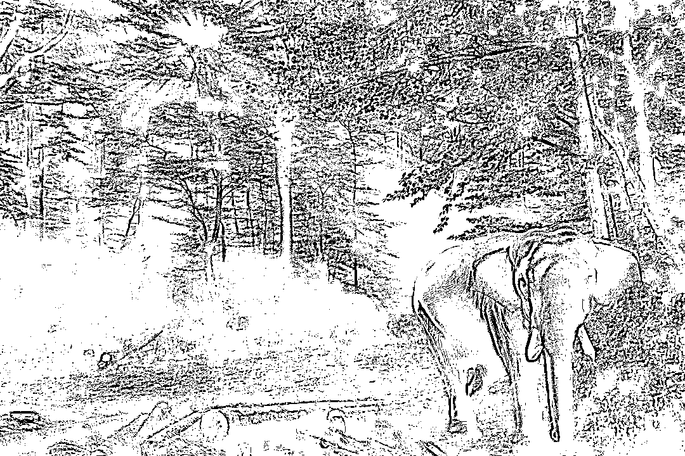

**11 月下旬**

11 月下旬天象

**11 月 21 日**  

*   天蝎座水星四分水瓶座木星

*   天蝎座水星六分摩羯座冥王星

**11 月 22 日**  

*   太阳换座射手座

**11 月 23 日**  

*   太阳和月亮南交点在射手座合相

**11 月 24 日**  

*   水星换座射手座

**11 月 25 日**  

*   射手座水星合相月亮南交点

**11 月 28 日**  

*   射手座水星合相太阳

**11 月 29 日**  

*   天蝎座火星三分双鱼座海王星（逆行）

**11 月 30 日**  

*   射手座太阳三分白羊座凯龙星

11 月下旬，太阳换座射手座。射手座和凯龙有着类似的渊源。当他克服自己的兽性和欲望，就是超然的哲人。如同凯龙，当克服了出生的创伤，它会成为人类英雄们的导师。

射手座有着预测未来的能力，凯龙象征着人性和神性之间的彩虹桥。**当太阳进入射手座，有关未来的信息种子正在飞快成长。**

射手座位于天蝎座和摩羯座之间，代表着穿越家族的阴影，建立起个人的生活哲学，昂然踏入社会之中打造成熟的社会人格。**这是一种开放的，采纳多种意见，同时保有自我主张的双赢思考方式。**

月亮南北交点在射手座-双子座轴线已然进入尾声。**到 2022 年 1 月 18 日，月亮南北交点就要换座天蝎座-金牛座轴线了。**

**比较一下 2002-2003 年 3 月前后，那时候也是月亮南北交点在射手座-双子座，你有什么进步吗？**那时候土星在双子座，我们在适应互联网世界，这完全是个新奇的天地。现在是土星在水瓶座，我们已经开始要在互联网世界里建立更多律法和界限帮着这个体系健康发展。

太阳、水星依次合相射手座南交点，在**哪些领域唯我独尊、拒绝接纳多种意见的态度正在影响你客观的理解现实？**

11 月下旬，将有些关于性、职场霸权、高科技公司的道德规范、政府介入科技垄断信息泄密方面的丑闻再度爆发，让人们再度开始反思有关科技对公平商业竞争的摧毁、舆论的盲从和狂热导致社会秩序混乱等的问题。这些问题一次次让我们认真思考：**在信息和科技战争中，国家和个体如何保护自己的安全和利益。有很多行为和思维方式都需要改变了。**

11 月下旬可能会涌现很多有关捍卫理想、探讨生存平等、反对霸权的热搜。

如果 11 月中旬，每个人都在体验心理阴影的穿越，**到下旬，就是社会价值观的震荡。**这些震荡促使我们在大环境的信息海啸中，**意识到保有自我主见、不被潮流裹挟有多么重要。**到 12 月，金星换座水瓶座，太阳、水星陆续和金星、土星、木星形成六分相位，有关未来的信息会越来越清晰的展现出来。**同时，土星与天王星的最后一次四分相也会继续震荡社会秩序、文化和经济。**

在这个创造的开始时期，唯有不变是持续的。请放宽心量，迎接改变。

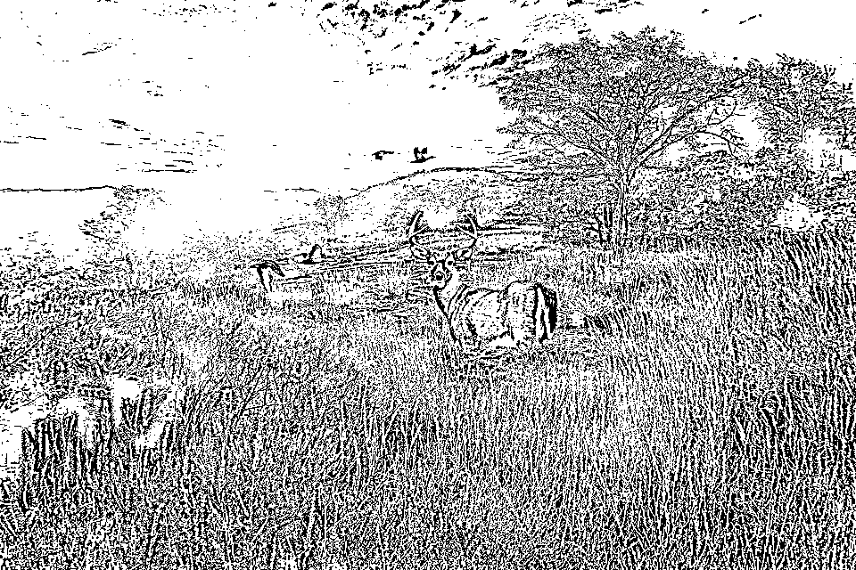

**尾声**

写月运稿子的时候，把《魔戒 1：护戒使者》当作背景播放。这部电影刚好对应了天蝎月的欲望和恐惧，以及对永恒和幸福的渴望。最终，护戒小队经历各种危险，战胜了小我，登上了去往仙境的大船。**我们也正走在这场护戒之旅中，焚毁旧有欲望，进入新的生命角色。**我们也会赢的。如果你保持了足够的真实和勇气，远见和信念。

**学会热爱这个世界，不再以某种欲愿与臆想出来的世界，某种虚构的完整的幻想来与之比拟。学会接受这个世界的本来面目，热爱它，以归属于它而心存欣喜。**

**——黑塞《悉达多》**

愿大家天蝎月过得精彩。

**本月重要天象一览表**

| **日期** | **星象** |
| **2021.11.1** | **天秤座水星三分水瓶座木星** |
| **2021.11.2** | **天秤座水星四分摩羯座冥王星** |
| **2021.11.5** | **天蝎座太阳对分金牛座天王星（逆行）****天蝎座新月****金星换座摩羯座** |
| **2021.11.6** | **水星换座天蝎座****天蝎座水星六分摩羯座金星** |
| **2021.11.10** | **天蝎座火星四分水瓶座土星****天蝎座水星合相天蝎座火星** |
| **2021.11.11** | **天蝎座水星四分水瓶座土星** |
| **2021.11.13** | **天蝎座太阳三分双鱼座海王星（逆行）** |
| **2021.11.14**  | **天蝎座水星对分金牛座天王星（逆行）****摩羯座金星四分白羊座凯龙星** |
| **2021.11.16** | **天蝎座太阳四分水瓶座木星** |
| **2021.11.17** | **天蝎座太阳六分摩羯座冥王星****天蝎座火星对分金牛座天王星（逆行）** |
| **2021.11.19** | **金牛座月食****天蝎座水星三分双鱼座海王星（逆行）****摩羯座金星三分金牛座天王星（逆行）** |
| **2021.11.21**  | **天蝎座水星四分水瓶座木星****天蝎座水星六分摩羯座冥王星** |
| **2021.11.22** | **太阳换座射手座** |
| **2021.11.23** | **太阳和月亮南交点在射手座合相** |
| **2021.11.24** | **水星换座射手座** |
| **2021.11.25** | **射手座水星合相月亮南交点** |
| **2021.11.28** | **射手座水星合相太阳** |
| **2021.11.29** | **天蝎座火星三分双鱼座海王星（逆行）** |
| **2021.11.30** | **射手座太阳三分白羊座凯龙星** |

**版权声明**：原创文章由作者授权首发于若道平台，欢迎转发，反对抄袭。友号转载请申请白名单。

****

****傅莎珈****

ISAR 认证占星师（2015 年获得）

心理占星师/内观书写带领者/冥想带领者

国际著名传播集团工作 20 年

**微信公众号**：Helloshajia

长按打赏

**学习占星学**

**点击下图了解课程详情** 

************

****

****

****

**微信又双叒叕改版啦，不想错过若道君的推送？**

**就把若道设为星标吧！**

**▼**

**就是这个“在看”，戳戳戳 ☟**

********报名直达入口********

# 雷蒙德·梅里曼金融占星周运 | 如何应对接下来这三周？

> 原文：[`mp.weixin.qq.com/s?__biz=MzA5NjA0NTAxNg==&mid=2651459819&idx=2&sn=04d6a1c93fdbc8a82228a6b8e7f538c7&chksm=8b48a25cbc3f2b4a919afbdd7bc2493953feb2d41f87b03c08a00f4e00d4419d9292a94132c5&scene=126&sessionid=1692737903#rd`](http://mp.weixin.qq.com/s?__biz=MzA5NjA0NTAxNg==&mid=2651459819&idx=2&sn=04d6a1c93fdbc8a82228a6b8e7f538c7&chksm=8b48a25cbc3f2b4a919afbdd7bc2493953feb2d41f87b03c08a00f4e00d4419d9292a94132c5&scene=126&sessionid=1692737903#rd)

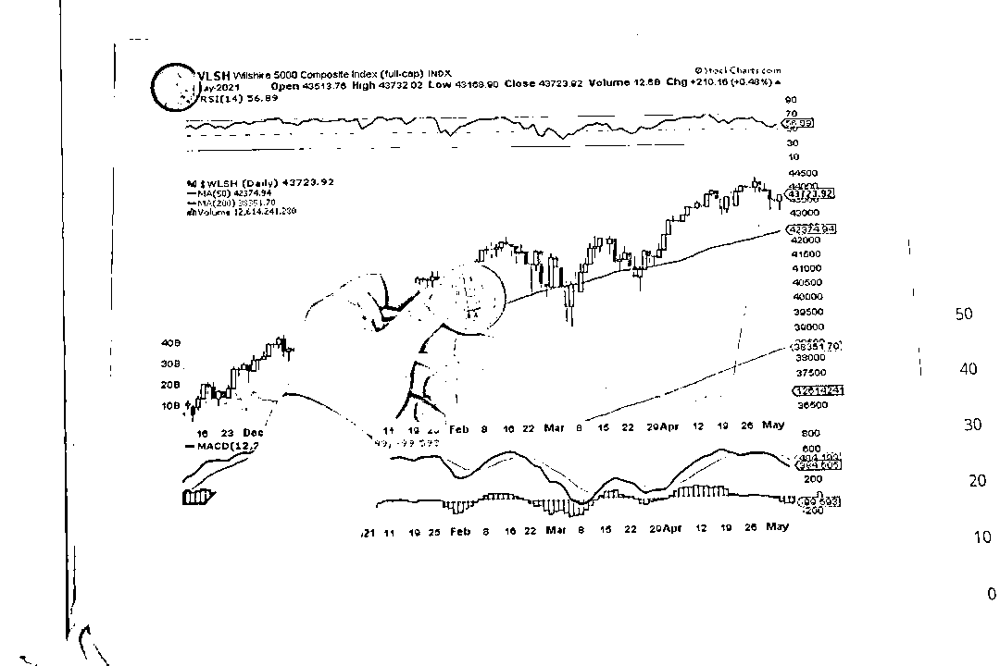

作者/雷蒙德·梅里曼 译者/Luke
编辑/玫瑰 图片/pexels

雷蒙德·梅里曼是在金融占星学界稳坐第一把交椅的占星师，同时他也是若道签约的金融占星课老师，我们引进了雷蒙德·梅里曼老师的《[上证指数月度报告](http://mp.weixin.qq.com/s?__biz=MzA5NjA0NTAxNg==&mid=2651457358&idx=2&sn=7f9716283aa45202cac373edc975a3b9&chksm=8b48b5f9bc3f3cef6942c2670605563f932623c1ef13b686cd99fe8a8160d392160c9a9fdac6&scene=21#wechat_redirect)》及《[黄金报告](http://mp.weixin.qq.com/s?__biz=MzA5NjA0NTAxNg==&mid=2651457358&idx=2&sn=7f9716283aa45202cac373edc975a3b9&chksm=8b48b5f9bc3f3cef6942c2670605563f932623c1ef13b686cd99fe8a8160d392160c9a9fdac6&scene=21#wechat_redirect)》。我们经老师的授权，将每周刊登梅里曼老师的周运，供大家参考和学习。于是，这是本周的周运（11.1-11.5）。

**说明：以下时间采用纽约证券交易所所在地美国东部标准时间。**

**展望与回顾**

****

**财政部长珍妮特·耶伦表示，她希望本届政府的基建一揽子计划能很快获得批准，同时表示，她不认为这会加剧美国正在经历的通胀问题。“它会推动经济增长的潜力，经济供给的潜力，那通常会压低而不是抬高通胀。”耶伦说。****——杰西·庞德、云蕾****《股市创纪录收高，尽管科技股下滑，市场仍迎来今年最好的一个月》****www.cnbc.com****2021 年 10 月 29 日****欧洲央行行长克里斯蒂娜·拉加德在周四的新闻发布会上，未能回击市场对更高利率的预期，这引发了看空。丹麦银行策略师预计欧元将在未来 12 个月跌至 1.10 美元。 ****——《随着通胀为高利率打下基础，美元上涨》****路透社****2021 年 10 月 29 日**大多数世界股票指数上周开盘强势，于 10 月 26 日触顶，然后周四-周五回撤。然而，一些指数再次上涨，于周五创下历史新高。在亚洲和环太平洋地区，上涨持续到 10 月 26 日，这包括澳大利亚、中国和日本股市。之后周五股市回落。这些上涨仅构成了次高点，未能创历史新高。随后的下跌目前看来只是调整性的，除了中国之外，那里的跌幅看起来更加严重。印度 Nifty 指数 10 月 19 日触顶，但到 10 月 29 日，已经创下三周来的新低。在欧洲，荷兰 AEX 指数于 10 月 26 日创下另一个历史新高，伦敦富时指数也创下疫情流行崩盘以来的新高点。德国 DAX 指数那天创下次高点，苏黎世 SMI 指数也出现了第二轮上涨，持续到 10 月 28 日。但大多数股指下跌至周五，因为欧洲正面对欧元走弱的可能性，这使得相对于其他地区，欧洲股票市场吸引力略微下降。欧元走弱的好处就是美元及以美元计价的资产将走强。在美国，我们追踪的所有三大主要股票指数都创了历史新高，道琼斯工业平均指数在 10 月 26 日完成了这一壮举，标准普尔指数和纳斯达克综合指数则在 10 月 29 日达成。其他市场上，欧元的突然下跌和美元的走强，导致黄金和白银在 10 月 22 日创下数周来的高点后，于周五被抛售。原油于 10 月 25 日创下多年来的新高，然后上周余下时间在 5 美元波动范围内盘整。比特币在 10 月 20 日的满月后创下历史新高，然后回撤持续到 10 月 28 日，跌幅 14%。另一方面，以太坊于 10 月 29 日飙升至历史新高 4460。

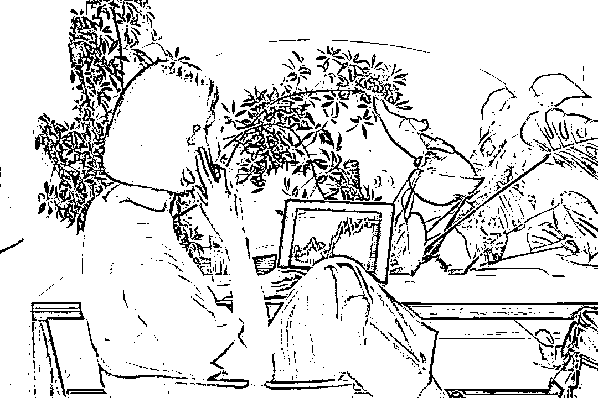

**短期占星趋势和长期考量**

****

**白宫新闻秘书詹·普萨基说，“谈判中的替代方案不是原始方案，而是什么也不做”，警告立法者不要“让完美成为历史的敌人”。**

**——安德鲁·杜伦、娜塔莉·安德鲁斯**

**《民主党人在开支法案上发生分歧》**

**《华尔街日报》**

**2021 年 10 月 27 日**

美国股票市场仍在上涨的一个原因是，几乎每个人都在期待美国正在商谈的历史性开支法案，最终将会通过。提案的规模已经减半，这一迹象表明立法者正在努力审查提案，确保它满足社会的真实需要，让支出变得更有效率，而不仅是“更大”。由于木星处在与人道主义相关的水瓶座，即将很快于 2021 年 12 月 28-29 日到 2022 年 5 月 10 日期间进入与社会慈善和慈悲相关的星座双鱼座，看起来很有可能这项法案最终会通过。法案的规模可能不像起初设想的那样大，但仍然将会是历史上最大的开支法案。事实上，那些要求更大开支法案的人愿意妥协，这对木星-土星周期的早期阶段来说是个好兆头。历史上来看，当妥协或中间立场的政策被采用，木星-土星周期最为成功。木星和土星在极端要求下运作不好，当然那是土星四分天王星的性质，该相位直到 2021 年 12 月 24 日都会发挥效力。然而，该使用什么措施仍在谈判中，尽管许多截止日期已经过去了。新的截止日期可能也会遭到同样命运，因为接下来三周将展开多个天王星的困难相位。从上周末开始，太阳和火星将与土星-天王星四分相形成 T 三角，直到 11 月 17 日。这些相位表明谈判各方不容易找到共同点，因为天王星根本不在乎什么“共同点”。看起来我们将见证更多的新提案，让讨论更加难以达成共识。天王星代表原创思维和发明创造的原则，但常常那些想法被视为太激进或过分。涉及天王星，思想可能超越了时代，但如果不小心处理，可能导致谈判的激烈动荡，甚至掀翻桌子。就世俗事务来讲，**这一时期可能对应着地震、强风、电力中断、网络攻击和恐怖主义威胁，尤其在火星和天王星对分的 11 月 17 日。**从积极的一面来看，这也可能是**灵感迸发**的时期。但多数情况下，这不利于轻易达成共识。就金融市场行为来看，它通常对应着**价格的剧烈波动**。**预期的事情突然脱轨，导致金融市场剧烈反应。**所以，我们应如何应付接下来这三周？第一个建议是，**试图保持准时，在截止日期以前完成工作。**第二个建议是，**留有备用计划，以防延迟或突然的干扰打断了事情进度。**

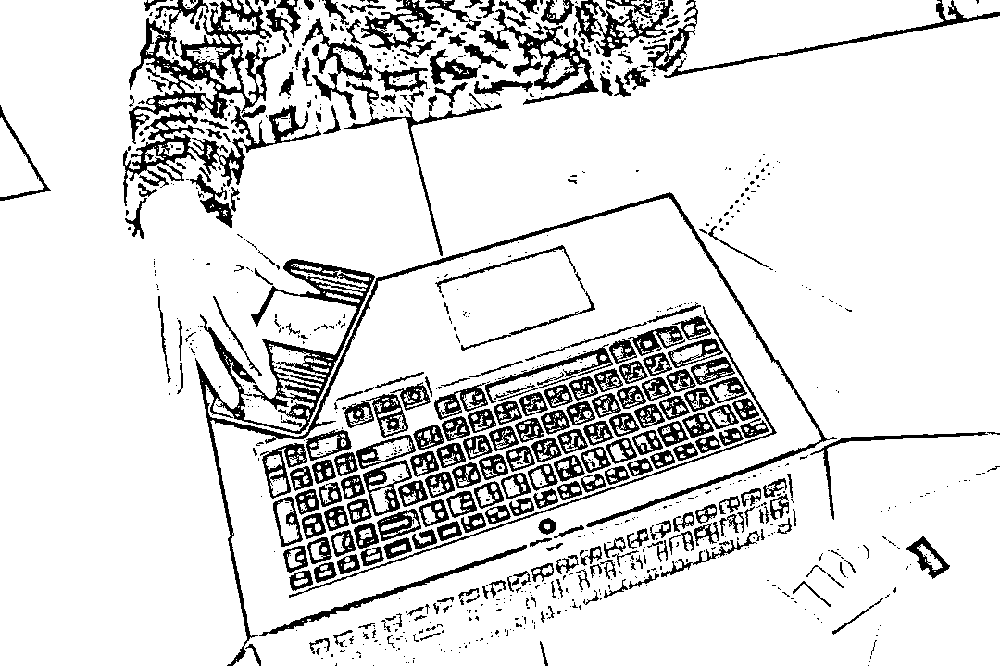

由于太阳、火星与土星的四分相从现在持续到 11 月 17 日，**一个项目拖延得越久，积累的压力就越大，然后赶工的压力就越大**。由于太阳和火星对分天王星，**越多的新想法在最后一分钟被加上去，就越有可能遭到拒绝。有时某人也会提出一些新想法，但不能融入别人正在做的项目，也不符合之前同意的协议。**每件事似乎都在现在分崩离析，没有时间有效利用这些新想法。如果你处在这种情况中，可能需要**关注与你一起工作的同事，确保他们不会偏离已经确定的目标**。有人脱轨的话，就会影响到每个试图坚持原先道路的人。在这些宇宙天象下，保持良好的判断和时机感是很难的。在这段时间，想要为了“多数人的福利”达成协议，推进社会和经济项目，妥协就是必须的。然而火星和天王星似乎带来了一些捣蛋鬼，与“多数人的福利”目标不一致。他们有不同的议程，更关心“自身的福利”。那可不太好。但是，**这可能对黄金是有利的。****说明：以上日期基于纽约证券交易所所在的美国东部标准时间，由于存在时差，中国地区可能需要加一天。****版权声明：**本文由若道翻译发布，欢迎转发，反对抄袭。友号转载请申请白名单。

**雷蒙德·梅里曼（Raymond Merriman）**

若道签约老师。著名金融占星师，ISAR（国际占星研究协会）前主席，梅里曼市场分析公司的总裁。他由于“提升了占星学的职业形象”，在 1995 年国际占星大会上被授予轩辕十四奖；在 2012 年国际占星大会上，被授予轩辕十四终身成就奖。

1“中国上证指数月度报告”发售

**若道推出了****中文版****的雷蒙德·梅里曼中国上证指数月度报告，并持续发行该报告！**

当把金融市场的周期和占星学的周期相结合时，雷蒙德·梅里曼老师的金融占星学研究**为投资者应对金融市场的周期波动，并随之调整投资策略提供了极大的价值参考**。

**11 月中英文报告已上线！**

2“黄金价格周期月度报告”发售

**若道推出****中文版****的雷蒙德·梅里曼黄金价格周期月度报告！**不仅仅为广大读者在中国股市的投资出谋划策，更将视角放眼黄金市场。

**每当世界经济形式不明朗的时候，有一个地方是保值的港湾，那就是****黄金**。自 1982 年雷蒙德·梅里曼出版第一本研究《地球宇宙学征象与黄金价格的关联》的著作以来，**他一直作为最重要的黄金市场时机预测者之一享誉国际**。

11 月黄金报告已上线，梅里曼老师将会告诉你他对这个关键时期如何操作的想法。也可以按照季度和一年期订阅，有更多优惠。季度和年度的好处是，你可以持续了解梅里曼老师对于不断在变化的市场的看法。即便他某一次看法和市场不一致，你也看到在下一期他如何调整自己的看法，并看到金融占星在一个长期时间段内对你把控风险的帮助。而能够长期控制风险、尽量找到安全的投资时机才是投资的长久之计。

**11 月中英文报告已上线！**

**购买套餐**，买得越多越优惠

中国上证指数月度报告套餐价

*   **单月报告**：280 元

*   **3 个月套餐**：780 元（260 元/月）

*   **12 个月套餐价**：2400 元（200 元/月）

**长按下图识别二维码**

**购买金融报告****套餐**

**▼**

黄金周期月度报告优惠

*   **双报告年度套餐更优惠（直降 900 元）**
*   **12 个月黄金报告+12 个月上证指数报告：仅需 3900 元**

**长按下图识别二维码购买黄金报告套餐**

▼

3 中国金融市场特别网络研讨讲座

面对年底几个影响金融市场的重要天象，该如何把握下半年的投资，为跨年做准备？我们特意邀请雷蒙德·梅里曼老师为大家带来了**3 个小时的金融讲座——雷蒙德·梅里曼中国金融市场特别网络研讨讲座。**

这场为期 3 小时的在线讲座探讨了**这些长期行星周期如何影响世界经济的长期周期和趋势，特别是如何影响上证综指和黄金市场**。并描述**在 2021 年剩下的时间里市场反转关键时间点，特别是 12 月 19 日至 25 日金星逆行，以及土星-天王星最后一次渐亏四分相、金星与冥王星合相的重要时期。**

**长按下图识别二维码购买讲座视频**

▼

**点击阅读原文购买金融报告**

# 周末好呀，月亮在狮子座，你准备做些什么开心快乐的事呢？

> 原文：[`mp.weixin.qq.com/s?__biz=MzA5NjA0NTAxNg==&mid=2651459681&idx=1&sn=012f8d569e0c1d53052ab35a30f934f6&chksm=8b48a2d6bc3f2bc0d683f5f82f95fc11cd0fb5dcbc78b0f413a305dc2e5b1876ded7f8f13e9d&scene=126&sessionid=1692737908#rd`](http://mp.weixin.qq.com/s?__biz=MzA5NjA0NTAxNg==&mid=2651459681&idx=1&sn=012f8d569e0c1d53052ab35a30f934f6&chksm=8b48a2d6bc3f2bc0d683f5f82f95fc11cd0fb5dcbc78b0f413a305dc2e5b1876ded7f8f13e9d&scene=126&sessionid=1692737908#rd)

**2021 年 10 月 30 日天象：**

*   **月亮在狮子座**

*   ******22:20 火星进入天蝎座******

*   ******太阳四分土星******

*   ******水星与海王星呈梅花相******

月亮在狮子座的一天，你准备做点什么让自己开心快乐的事情呢？不过，今天太阳和土星呈四分相，意味着人们与长辈/领导/权威间的矛盾显现，管理、管控和批评增多。然而，外界变化常是内在能量的投射，我们如果没意识到对自己的严格要求，这种需求可能向外投射，与外界充当权威的人产生冲突。另外，水星与海王星的梅花相，也容易在表达和沟通中出现“错位”情况。

今晚 10 点 20 分，火星进入天蝎座并在此行进至 12 月 13 日。天蝎座火星提示我们，要带着激情去穿越类似生死的体验。想知道火星在天蝎座的这段时间有什么重要的宇宙天气值得我们关注，可以点击[【火星进天蝎座】](http://mp.weixin.qq.com/s?__biz=MzA5NjA0NTAxNg==&mid=2651459675&idx=1&sn=aea2d48563ec20d2cbaa38c0a900185f&chksm=8b48a2ecbc3f2bfa6d5d5f598f9d8888c639ff671604de9cadf7b7036b5de34f11beb34b98a2&scene=21#wechat_redirect)查看。

周六快乐！周一，若道君将奉上 11 月月运文章，敬请期待！ **了解每日天象，可****下载“若道”APP 查看****还有更多精彩等着你哦**

# 神话塔罗之大阿卡纳牌｜力量

> 原文：[`mp.weixin.qq.com/s?__biz=MzA5NjA0NTAxNg==&mid=2651459675&idx=3&sn=ebac312745895402e187ccd8700f3674&chksm=8b48a2ecbc3f2bfa134c6b364d828b6b0e77a4c3c05054ff44d97ccc75eec4f7958f77f92605&scene=126&sessionid=1692737908#rd`](http://mp.weixin.qq.com/s?__biz=MzA5NjA0NTAxNg==&mid=2651459675&idx=3&sn=ebac312745895402e187ccd8700f3674&chksm=8b48a2ecbc3f2bfa134c6b364d828b6b0e77a4c3c05054ff44d97ccc75eec4f7958f77f92605&scene=126&sessionid=1692737908#rd)

作者/朱丽叶·沙曼-伯克 丽兹·格林

译者/闫东升 编辑/玫瑰 图片/神话塔罗 网络

本文节选自《神话塔罗》

神话塔罗牌根据文艺复兴时期艺术家和作家们喜爱的希腊诸神，通过重新设计牌面，让塔罗牌恢复其原始的质朴性和普及性。力量牌的设计就源自于大力士赫拉克勒斯征服猛狮的希腊神话。今天就来解读大阿卡纳牌——力量。

[🔈 神话塔罗·力量](https://res.wx.qq.com/voice/getvoice?mediaid=MzA5NjA0NTAxNl8yNjUxNDU5Njc0)

**｜**朗读者小巫

**书名：**

神话塔罗 

**作者：**

朱丽叶·沙曼-伯克   丽兹·格林 

**出版日期：**

2011-08-02

力量对应的希腊神祗

**赫拉克勒斯·大力士**

**所向披靡的大力士**力量牌描绘的是一个强壮有力的男人，长着一头栗色卷发，身上只围了一条红色的腰布。他正在和一头雄狮搏斗，用他强壮的手臂紧紧夹住它的喉咙，画面显示出这个男人此时正处于赢得角逐的关键时刻。搏斗现场的四周是一个布满岩石的黑暗山洞，从远处的洞口望去，外面是棕色的山峦，贫瘠而荒凉。

> **赫拉克勒斯（*Heracles*）赤手空拳和雄狮搏斗**：没有使用任何工具，也没有任何辅助，只有他自身的资源。 **赫拉克勒斯身穿的腰布是血红色的**：血红色属于战神阿瑞斯，我们在战车牌中遇见过他，这说明愚人已经学会了运用侵略性，因此可以有创造性地利用它了。 **阴暗的山洞**：象征着潜意识的黑暗，其中隐含着原始的本能，日常的意识无法看到它。

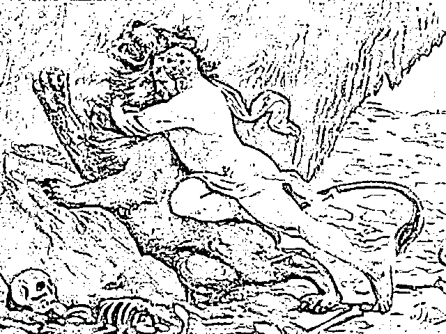

**征服刀枪不入的尼米亚巨狮**力量牌中的勇士是赫拉克勒斯，罗马人称他为海格力斯（*Hercules*），是神话中所向披靡的英雄人物。他是众神之王宙斯（*Zeus*）和人类女性阿尔克墨涅（*Alcmene*）的儿子。和往常一样，宙斯的妻子赫拉（*Hera*）对于丈夫和阿尔克墨涅通奸并生出儿子的事情妒火中烧，决定给予这个孩子非常严重的惩罚。 她用手段逼疯了赫拉克勒斯，疯狂的赫拉克勒斯又在无意间杀死了自己的妻子和孩子。他清醒以后极度悔恨，祈求神灵给予他赎罪的机会，来自特尔斐的神谕命令他去给邪恶的国王欧律斯透斯（*Eurystheus*）完成十二个艰苦的任务，这也是赫拉最想看到的结果。就这样，所向无敌的英雄心甘情愿地成为了女神的仆人，而这个女神却是他所犯罪行的始作俑者。国王欧律斯透斯要求赫拉克勒斯去完成的第一个（也是最著名的）任务是征服尼米亚猛狮（*Nemean Lion*），这头巨狮身上的皮毛是刀枪不入的，它几乎吃光了附近的人们，所以赫拉克勒斯找不到人询问它的老巢在哪里。经过很长时间的寻觅，他终于找到了身上还沾满猎物血迹的狮子。赫拉克勒斯先是对着它射出一箭，却没有对巨狮造成分毫的伤害。他又尝试用刀剑和棍棒攻击，结果自然也是铩羽而归。巨狮躲进了一个有两个出口的山洞里，赫拉克勒斯用网堵住了其中一个洞口，自己则从另一个洞口钻了进去，搏斗中巨狮咬掉了他的一个手指头，而他则成功地用双手牢牢地掐住巨狮的喉咙，直到它死去。赫拉克勒斯利用狮子锋利的爪子剥掉了它的皮，制作了一套盔甲穿戴在身上，于是他获得了巨狮刀枪不入的能力。

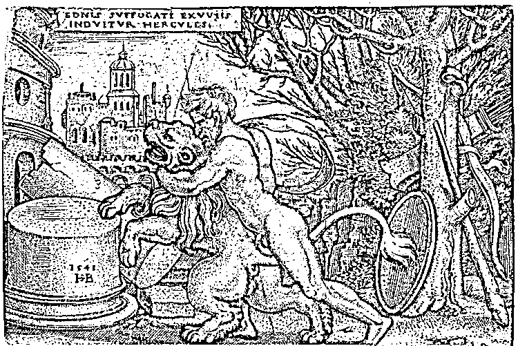

**与原始的动物性同行****从内在的层面来看，赫拉克勒斯和尼米亚巨狮搏斗的意象，反映出每个人内在强大和原始的动物性一面带来的问题，但是我们不能消灭它，因为它也是我们的创造力和生命力。**狮子是一种特别的动物，它象征的心理面相和战车牌中顽固的战马并不相同。狮子在神话中一直和皇权有关，即使在它最有破坏性的时候，也反映着人们独特个体性中幼稚的、原始的自我中心特质。尼米亚巨狮并不完全是邪恶的，它刀枪不入的皮毛能够让人们战无不胜，这种特质反映出人们内在的某种恒久性，它来自于一个稳固的“我（*me*）”的感觉。当我们披上被我们征服的巨狮的皮毛时，外界的一切都会变得渺小，因为我们内在拥有了坚不可摧的自我身份认同。 当巨狮的力量还处于原始和邪恶的动物性状态时，它的正面力量就还是潜在的，没有被发挥出来。“唯我独尊”的这一面驱动着人们毫不留情地摧毁着欲望之路上的所有事物，从而获得自我的满足。暴怒是它的一种表现形式，在很多人生境遇中，怒火都带来负面的结果，它不管是非对错，只是不顾一切地摧毁满足欲望的任何阻碍。自大也是它的一种表现形式，自大和自尊不同，它夸大和膨胀了自我的重要性，使我们失去该有的明智，幼稚和冷酷地对待那些我们必须依赖的事物。巨狮的意象在很多层面上都像我们内在那个愤怒的婴儿，要求世界围着我们打转，只要碰到任何反对和阻抗就盲目地攻击和破坏。如果我们征服了这头巨狮，就会获得它神奇的皮毛，用心理学的术语说，**就是把动物性的生命力整合到意识中，让它为有意识和负责任的自我服务。****因此，赫拉克勒斯和巨狮搏斗的目的是征服，而不是杀戮，这是一个转化的过程，使动物性的力量和欲望以人类的方式表达出来**。这就是力量牌所象征的矛盾性，赫拉克勒斯不能杀死巨狮，因为杀戮并不会带来任何好处。我们每个人内在都有赫拉克勒斯的黑暗面，意即一味压抑动物性的本能，而不是去转化它，这样做的后果就是在我们心灵的外面形成了一个坚硬的壳子，没有了愤怒，没有了热情，也没有了真正的自我身份。**力量，内在的勇士****从解牌的角度来看，力量牌出现的时候，暗示着当事人需要和内在的狮子正面交锋，他（她）要用创造性的方式面对自己内在的愤怒和自大**。勇气、力量和自律在这时都是非要必要的。通过此时的人生境遇，当事人可以和自己内在的动物性相遇，同时也能看到内心的赫拉克勒斯，他是每个人都拥有的内在勇士，认同他就可以征服巨狮。愚人在发展出理智和情感的能力后，现在要学习面对自己凶猛的自我主义了，如果赢得了这场搏斗，他就能够用信任和正直去面对自己和他人。

**版权声明：**本文由《自在园》授权发布，欢迎转发，反对抄袭。友号转载请申请白名单。

**神话塔罗系列**

[开篇](http://mp.weixin.qq.com/s?__biz=MzA5NjA0NTAxNg==&mid=2651451590&idx=2&sn=41c1083542bcf098de303e29a028ff20&chksm=8b4b4271bc3ccb67d5d53c143cd5a17c24b7b60e5b1051949fa9f086f90b4ab04877976c47e5&scene=21#wechat_redirect)丨[愚人](http://mp.weixin.qq.com/s?__biz=MzA5NjA0NTAxNg==&mid=2651452189&idx=2&sn=f4cc6e768e367fbdb0f69b9c6382443d&chksm=8b4b41aabc3cc8bcdbd952d91d8408014a799224d3f67ab50bb5cbe88ee0090afc92869de1a6&scene=21#wechat_redirect)丨[魔术师](http://mp.weixin.qq.com/s?__biz=MzA5NjA0NTAxNg==&mid=2651453528&idx=2&sn=3ca9b35e1736168eef1856274635224a&chksm=8b4b4aefbc3cc3f965f2531f8c0d37da2e66a2b47139d445df1ea35eeb74bdf3b6827236741a&scene=21#wechat_redirect) | [女祭司](http://mp.weixin.qq.com/s?__biz=MzA5NjA0NTAxNg==&mid=2651455871&idx=2&sn=15ae629e1b35f1371b81868f5bfdd2aa&chksm=8b48b3c8bc3f3ade0175d0e03bfe496711801614273e7fe98b6435fafe0de5daf3a8d7c1312f&scene=21#wechat_redirect)

[皇后](http://mp.weixin.qq.com/s?__biz=MzA5NjA0NTAxNg==&mid=2651453921&idx=2&sn=4d1efea03b2b9f940be7a6aadf553dec&chksm=8b4b4b56bc3cc2405fe562b8ef48f335699f57c12d5d817e24aeeb84f6306092de2ae55becc7&scene=21#wechat_redirect) | [皇帝](http://mp.weixin.qq.com/s?__biz=MzA5NjA0NTAxNg==&mid=2651455083&idx=2&sn=d12546b67c830055f37b147f41c7641f&chksm=8b4b4cdcbc3cc5cad2def85451c3a7ddbb31ba5b9a01febb8a9fb18991d3e1263d9371ac212f&scene=21#wechat_redirect) | [导师](http://mp.weixin.qq.com/s?__biz=MzA5NjA0NTAxNg==&mid=2651456482&idx=2&sn=153b4ca2f69f6745425525773616455d&chksm=8b48b155bc3f384322115b0b94621662ba562a2a252fd244a0a3fc84a664408b2311014e8db5&scene=21#wechat_redirect)丨[恋人](http://mp.weixin.qq.com/s?__biz=MzA5NjA0NTAxNg==&mid=2651457110&idx=2&sn=b4f6a1e93475b39df8f6c80a7409c59c&chksm=8b48b4e1bc3f3df721f206e899272c01bf324355f649fe0fd0dd8363c5b58683daa38e8cf648&scene=21#wechat_redirect)

[战车](http://mp.weixin.qq.com/s?__biz=MzA5NjA0NTAxNg==&mid=2651457444&idx=2&sn=75e9cc378abfefb59ebe7f12357c1b4b&chksm=8b48b513bc3f3c051bf2bb4be018694ca47996a193c0a92d5003c47dc384a2b07f9b9f9806ed&scene=21#wechat_redirect) | [正义](http://mp.weixin.qq.com/s?__biz=MzA5NjA0NTAxNg==&mid=2651458133&idx=3&sn=e37f69e34bc33afe6c0935e32ad0b786&chksm=8b48b8e2bc3f31f465dee7a4595d44620d93e58ca37eeab785724f5a92a9ec3bbb85c3d34f17&scene=21#wechat_redirect)| [节制](http://mp.weixin.qq.com/s?__biz=MzA5NjA0NTAxNg==&mid=2651458981&idx=3&sn=8858e451980859e86b87571128e4f115&chksm=8b48bf12bc3f3604c1ef97c0a818f501fc28c84a4ef19e25521527e162d2d2c6bdded6238ea8&scene=21#wechat_redirect)

**朱丽叶·沙曼·伯克**从 20 世纪 70 年代早期开始，就对塔罗牌产生了兴趣，并踏入了塔罗的世界。后来，在丽兹·格林的鼓励下，开始研习心理占星学和塔罗。1984 年，第一本书《塔罗全书》（The Complete Book ofTarot）出版。之后，与丽兹·格林合作设计并撰写了《神话塔罗》（The Mythic Tarot）。朱丽叶写了十本塔罗和占星学书，包括一本名为《众星的传说》（Stories from the Stars）的儿童读物，以及与丽兹·格林合著的《神话之旅》（The Mythic Journey），这是一本详细讲述如何运用神话来指导生活的书。

**点击下图了解课程详情** 

**微信又双叒叕改版啦，不想错过若道君的推送？**

**就把若道设为星标吧！**

**▼**

**喜欢记得点一下在看哦☟**

************报名直达入口************

# 重磅 | 火星进入天蝎座！2021 年将以这样的“战斗”收尾！

> 原文：[`mp.weixin.qq.com/s?__biz=MzA5NjA0NTAxNg==&mid=2651459675&idx=1&sn=aea2d48563ec20d2cbaa38c0a900185f&chksm=8b48a2ecbc3f2bfa6d5d5f598f9d8888c639ff671604de9cadf7b7036b5de34f11beb34b98a2&scene=126&sessionid=1692737908#rd`](http://mp.weixin.qq.com/s?__biz=MzA5NjA0NTAxNg==&mid=2651459675&idx=1&sn=aea2d48563ec20d2cbaa38c0a900185f&chksm=8b48a2ecbc3f2bfa6d5d5f598f9d8888c639ff671604de9cadf7b7036b5de34f11beb34b98a2&scene=126&sessionid=1692737908#rd)

******************☆ 后******************台******************回复“今日”，给你一句生命态度******************

作者/郑玮玲 ISAR 认证占星师
编辑/玫瑰 封面/书君 图片/pexels

北京时间 10 月 30 日 22:20，火星进入天蝎座，此次火星将在天蝎座行进至 12 月 13 日。可能会发生什么呢？一起来看看。

**金星与火星的共舞****火星在太阳系所处的位置也意味着个体的边防线，它必须在个人与更大的集体意识之间设立火线提供捍卫，也随时需要为着太阳的精神、意志力而迎战。**火星在天蝎座历来被看作是**守护、有力**的位置，**火星守护的白羊座是率真、热情与果敢的行动力，天蝎座则代表着激情与炼狱般的体验**。在天蝎座的领地，火星代表的行动与意志力加诸了强烈的情绪、情感于其中，相对白羊座来说，这里的火星更为深刻，也更强劲。
无论在希腊神话里，还是在太阳系的舞池中，金星总是与火星呈现出“伴侣”特质，表达着天然相对的原型。金星让我们享受物质世界的美好并相信它是值得的。而火星则让每个人明白**我们生存的世界里有着天然的竞争，认识到美好的世界危险也同在**。金火这一对“天生配偶”般的行星向我们展示着经典的配偶原型：**柔美——刚毅、和平——战争、女人——男人、平静——愤怒。**唯有一个语境能贯穿金、火的两极性表达它们的高度统一，那就是：**性的吸引力。**天蝎座的深邃、神秘、激越令火星在此的阳性吸引力更为突显。

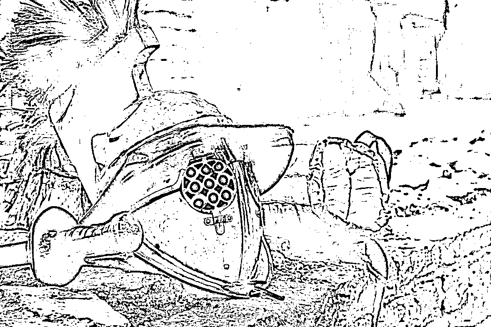

**从神到人的火星神力**谈到天蝎座，有两点不得不提：**性和死亡。**在占星学的语境中，性和死亡也都被**八宫**所囊括，它们都将到达同一个终点：**小我的消亡，进而生出新的个体、意识，过入更深一层意识和体验。**而火星在天蝎座强烈提示着：**带着激情去穿越性与生死的体验，而不仅仅是去想、去看或是没有心灵活跃度的生理体验。**战神阿瑞斯的名字是火星守护的白羊座，战神就是火星的化身。实际上这位代表纯阳性能量的男神是天后赫拉单性生殖的儿子。原因是赫拉妒嫉宙斯从自己头颅中生出了女神雅典娜，愤怒的力量使赫拉诞下了自己的阳性子嗣。这可视为婚姻之神赫拉向配偶宙斯的“宣战”，宙斯单性生殖践踏了赫拉守护的神圣的婚姻，也挑畔了女性生殖的本能。

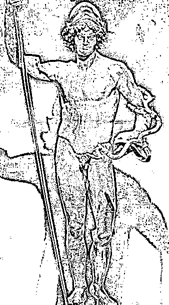

| 战神阿瑞斯阿瑞斯象征着每个人**内在阳性本能**，也象征着**物质层面阳性能量的死亡**——赫拉单性生殖的行为即在物质层面“杀死”了宙斯的阳性生殖力，她用自己的怒火重生了全新的阳性个体阿瑞斯，女神的怒气如同天蝎座的火星转化为重生的力量。**愤怒、无理性的冲动**是阿瑞斯最为显著的力量——阿瑞斯以此作战，屡战屡败，却无碍他的战神之名。反而是宙斯单性生殖的女神用理性作战，战无不胜，却以智慧为名。因此，火星对我们而言**有危险、牺牲的可能性，生理层面的直觉力和行动要适当地与思维合作才能安全、取胜，**太阳系中的火星需要与内行星所代表的智慧能量协作，才能司职捍卫与攻击，为太阳的雄心壮志提供动能和力量。天蝎座的火星不仅带来了强烈的性与死亡重生的意味，还有值得追溯的炼金术。天蝎座的火星代表了**重重锤炼的毅力与行动，**七层物质的死亡与重生才能炼出黄金，无论在心灵还是物质层面的炼金，都是人生极尽珍贵的历练与成就。人类文明的进程几千年来都在父系社会的传承下，时至今日，我们都能在许多古老文明中看到流传下来的阳具崇拜——这是典型的火星原型在人类文明中的显化，如同宙斯单性生殖带来的智慧结晶的象征。阳具崇拜是人类对自己的阳性力量（火星）的赞颂，古老集体意识里阴茎也被认为有“生出智慧”的寓意。

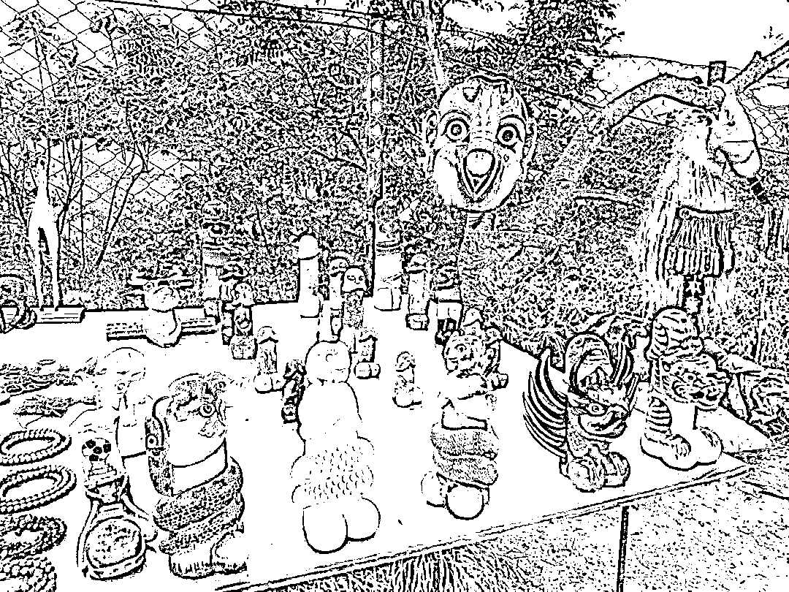

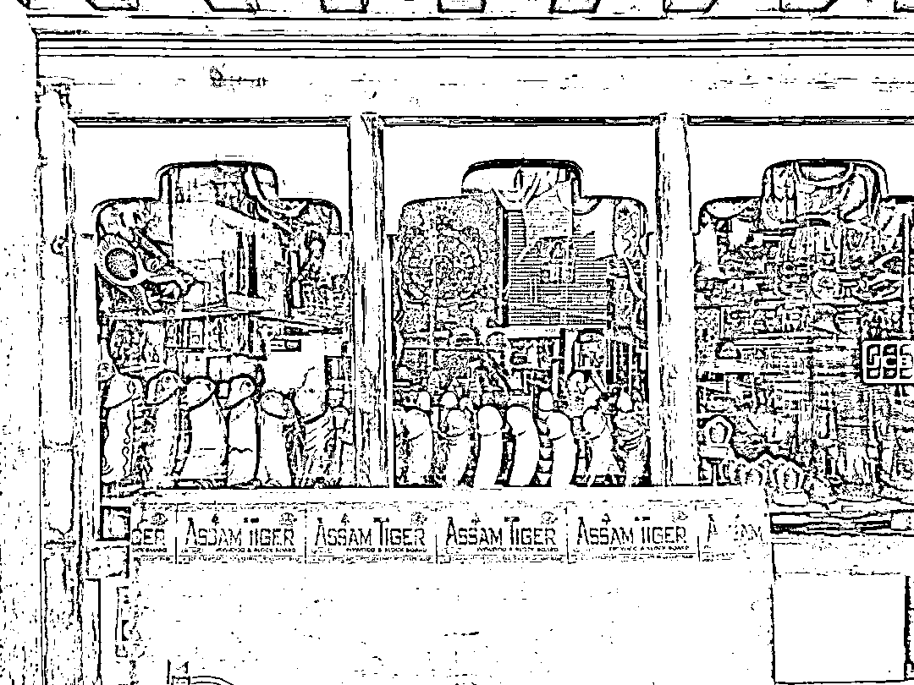

| 木质阳具，作者摄于不丹

在不丹，无论是庙宇还是村落建筑的墙上，都常见被描绘得艳丽多彩的“飞天阳具”（艳丽的阴茎形态和如喷泉状的精液），栩栩如生的木制阳具挂在民房下，在街市、商店里也随处可见。相传这是 15 世纪倍受民众爱戴的“疯颠圣僧”竹巴衮列用阴茎吓跑恶魔的故事，他还有很多令人震惊的行为：用歌唱、诗歌、黄段子来传教，却引起了人们对佛教精髓的真正关注。在这个隐秘的佛教的国度里，火星的原型显化恰恰保护了集体的信仰，也唤起了万千个体的智慧。**火星在天蝎座的重点影响人群**火星行进在天蝎座期间，重点影响的是有**个人行星、轴点、交点位于天蝎座、水瓶座、金牛座、狮子座、双鱼座和巨蟹座**的人。**天蝎座是生死、轮回、转化，火星在此必然超然发挥，转化的力量必然通过激烈的现实事件呈现，在历经黑暗的过程中，重生。**火星在天蝎座带来的现实必然有些黑暗、残酷，竞争与暗斗同在，若想与天神之力合作，必然释放我们心中的愤怒、仇恨，让狂潮与烈火穿越身心意识，通过绝地复苏的行动拯救个人的命运。在我们的星图里，只有火星是作为个体的捍卫之力，它无可替代。无论是外界的风波、险阻，还是内在的情绪激流，都需由火星的力量为我们划清界限，捍卫我们的精神和意志。天蝎座的火星更多受到情感的引动，而这里的情感必如赫拉的怒火般具有毁灭性的力量。如果说白羊座的火星总是在冲动下行事的话，天蝎座的火星则更多受**怒火、妒嫉**的牵引。现实的残酷会展现给我们无可避免的竞争，有意无意的攀比，人性的黑暗总是与我们的光明之处同在，但是**承认内在的阴影胜过压抑与无视。看向黑暗的人们终将穿越到黎明，而背向黑暗的人们仍将被黑暗吞噬。**

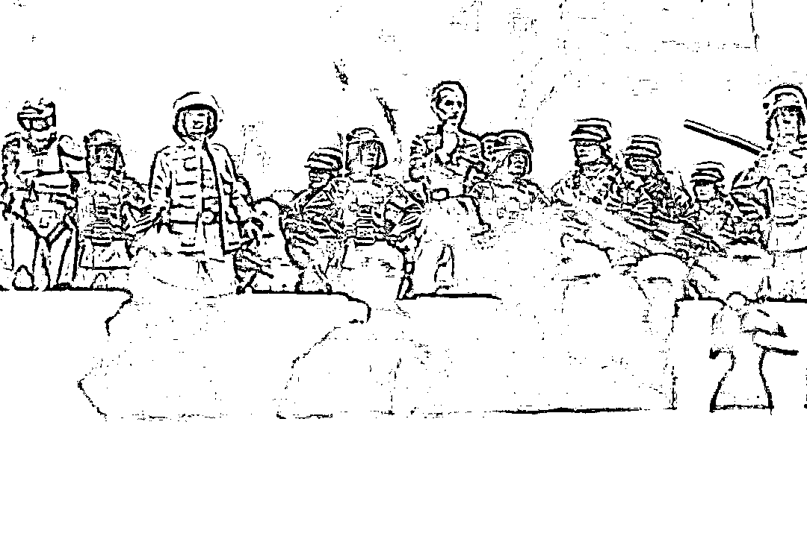

**火星在天蝎座期间的天象**

**火星四分土星**

**时间：10 月 30 日-11 月 24 日**

**重点影响人群：个人行星、轴点、交点位于天蝎座、水瓶座、金牛座、狮子座 0°-16°的人。** 

**土星作为老旧、限制与权威之震摄力，永远给我们出各种现实难题。**天蝎座与水瓶座都是如此坚挺，火土四分期间，我们很容易**碰触现实壁垒，强攻不得，软磨也难耐。**火土相位始终带来**“穿着紧身衣的战士”**的意象，四分相带来**长久的紧绷、受制感**。解决方案是：保持你制衡的力量。不要被现实所压跨，困难会维持一段时间，咬牙坚持是为必要，等待的过程可能经历一次至数次的绝境般的体验，这样天蝎座的火星才能从短暂的“轮回”中挖掘出力量与勇气。**因此，选择深陷、放弃、冒险一搏可能都是当下必要或在所难免。**火土之间短兵相接是帮助我们整合两颗行星的力量，既完成了勇气的历练又拿回了思想与理念的权威之力，这一程，我们值得为了理性的权力而战。

**火星四分木星**

**时间：11 月 24 日-12 月 24 日****重点影响人群：个人行星、轴点、交点位于天蝎座、水瓶座、金牛座、狮子座 15°-29°，以及射手座、双鱼座、双子座、处女座 0°-7°的人。**
火木四分恰好发生于木星在水瓶座的最后 6°区间，此时的火星如同疾速追赶真理的斗士，如同黑夜里高举火炬寻觅前路的探险者。将生死置之度外是所有勇士胸口的烙印，每一个遍洒热血奋力迎向高远的信念、信仰、真理的身影，都将化作长空里的烟火，深渊中的烈焰，深黑海面的灯塔。信仰者的行动照亮的不仅是属于英雄的前路，还有穿越火线、绝境那无所畏惧的心灵。宇宙给予的这般烈焰热情，值得用来**扛起最艰难的工作，抵达最远也最不易的目标，也适宜在强压之下完成极限突破。**世间所有的艰难都不敌信念的火光，火光淬炼出苦痛危机中不言放弃的决绝之心，燃烧的激情会铺垫更加壮美、开阔的人生路。

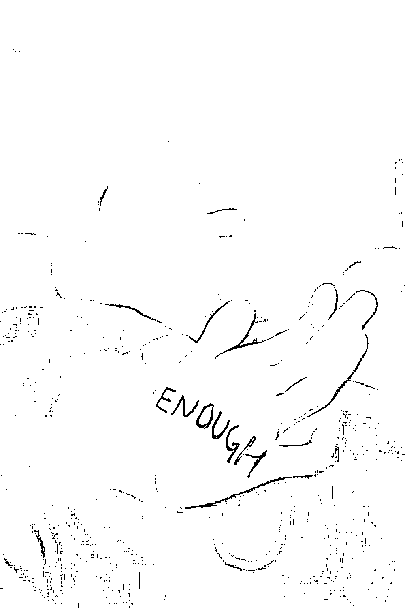

**火星对四分天王星**

**时间：11 月 7 日—11 月 30 日****重点影响人群：个人行星、轴点、交点位于天蝎座、水瓶座、金牛座、狮子座 3°-20°的人。**天王星还在逆行之中，这一轮火天对分，火星会占据较为明显的优势，我们可以理解为：**内在深化的革新意识能为自我力量的稳定与激发带来有利条件。**金牛座的天王星总是引导我们看向价值、资源，**如何用彻底的行动焕新我们的意识与价值观**是这个季节值得深化的的议题。天王星带来的意外与不测与火星的激烈对分可能引发现实诸多的**不稳定、危险、意外事件，**然而**有意识的冒险运动和体能、意识训练可以帮助我们获得更新的生命能量。**在此期间适合**在有专业指导和保护措施下开展有意识的探险活动和工作**，去探索我们不曾涉及的领域，迈出前所未有的脚步。在有一定积累的前提下发起创造性的行动会让我们的精神、意志更加充盈。但缺乏防犯意识的行为可能带来意外伤害，**在公共场合也要小心疏忽大意、冒失妄为造成的意外事故。**

**火星三分海王星**

**时间：11 月 18 日-12 月 11 日**

**重点影响人群：个人行星、轴点、交点位于天蝎座、水瓶座、金牛座、狮子座 12°-28°度的人。**

**此时的海王星已进入顺行前的停滞状态。**火海三分较大程度**缓解了火天对分的紧张、对峙，并能协助我们在火木四分的天象中深化理想的进程。**双鱼座的海王星引导我们进入更大的梦与冥想之中，静坐，或是尽情地想象，去相信，脚下的路会在清明的意识中无限接近目标。海王星鼓励我们通过灵性的道路去实践与整合，天蝎座的火星因为“相信”的而获得令人神往的力量。这个相位支持我们**投入灵性的实践中，将所有庙堂之上的教导放诸行动中，尽可能地利用灵性法则去实践。**敏锐的感受力会帮助我们轻松抵达目标，此刻的我们再无需过度用力，只需要更多的相信，相信，再多一些的相信。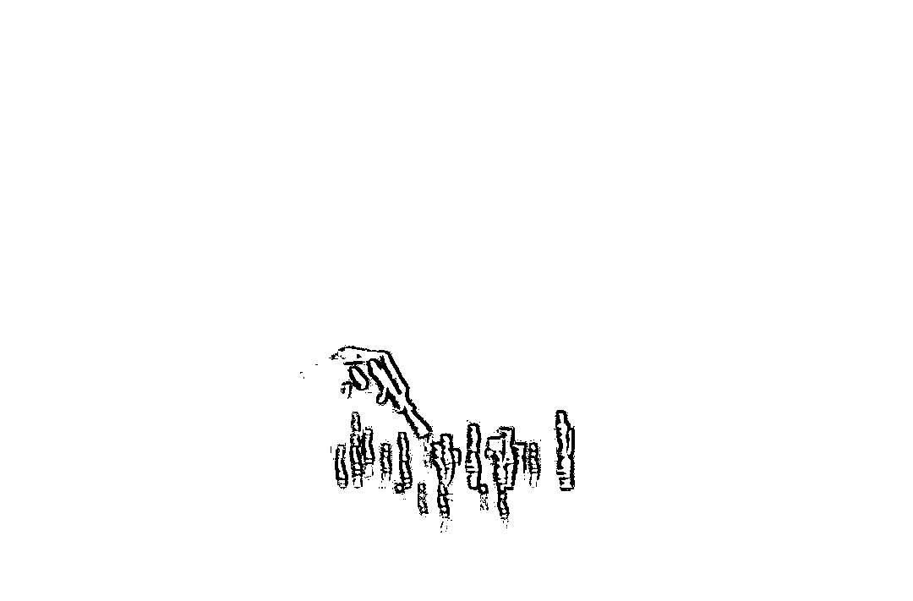

**火星六分冥王星**

**时间：11 月 28 日-12 月 14 日****重点影响人群：个人行星、轴点、交点位于天蝎座、水瓶座、金牛座、狮子座 19°-29°的人。**火冥六分与火木四分的周期重叠在一起，火星的能量将在年末之前被最大化的激励着。恰好，这是每一个奋斗者、拼搏者必要的年终冲刺阶段，无论你对自己或对他人、集体曾许诺了什么目标，宇宙的力量都开始在帮助你完成最终的冲刺。冥王星更积极地鼓励着斗志，在寒冬开始的时候，我们的双眼已习惯了更长的黑夜，更能在深黑的凝视中发掘、稳定，更能聚焦，更有力量去深化，这便是火星积极配合冥王星所带来的效应。而**一切的转化在此都将加速，如果你已经经历了漫长的寒冬，在火冥六分结束时，很多的结果必将呈现，收获与宝藏也会因你而来。**

**版权声明：**原创文章由作者授权首发于若道平台，欢迎转发，反对抄袭。友号转载请申请白名单。

**郑玮玲**

ISAR（国际占星研究协会）认证占星师（2016 年获得）

若道占星专栏作者

将占星咨询、教学与音乐、舞蹈相结合的疗愈者

**微信号**：zhengviolin

**新浪微博**：@郑玮玲

**微信公众号**：Sampriya-Astrology

长按打赏

**学习占星学**

**点击下图了解课程详情** 

************

****

****

****

**微信又双叒叕改版啦，不想错过若道君的推送？**

**就把若道设为星标吧！**

**▼**

就是这个“在看”，戳戳戳 ☟

******报名直达入口******

# 今日牌阵推荐 | 爱之缘：去见你的路上，阳光温热，云朵可爱

> 原文：[`mp.weixin.qq.com/s?__biz=MzA5NjA0NTAxNg==&mid=2651459675&idx=2&sn=1ce410ab369ace67a3b22e2e1adfba33&chksm=8b48a2ecbc3f2bfa3a1b342ea3adf1f85560606c1bbfe1819249d6df2d164a2039d67091d2ae&scene=126&sessionid=1692737908#rd`](http://mp.weixin.qq.com/s?__biz=MzA5NjA0NTAxNg==&mid=2651459675&idx=2&sn=1ce410ab369ace67a3b22e2e1adfba33&chksm=8b48a2ecbc3f2bfa3a1b342ea3adf1f85560606c1bbfe1819249d6df2d164a2039d67091d2ae&scene=126&sessionid=1692737908#rd)

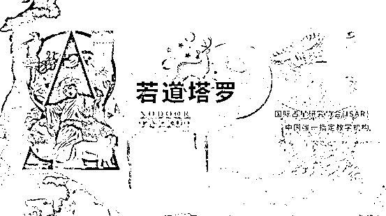

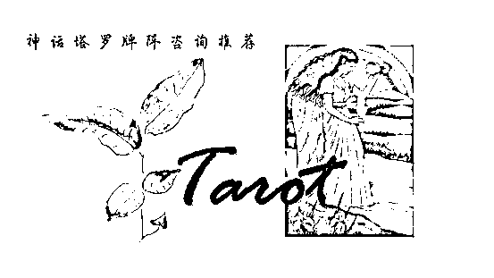

旧日恋情已成往事，而生活仍要继续。这个牌阵也许能够帮助你走出失恋阴霾，找回爱笑的自己，就让爱之缘牌阵和你一起回忆和整理，该结束的结束了，该开始的就会开始，让爱情的未来更加美好。

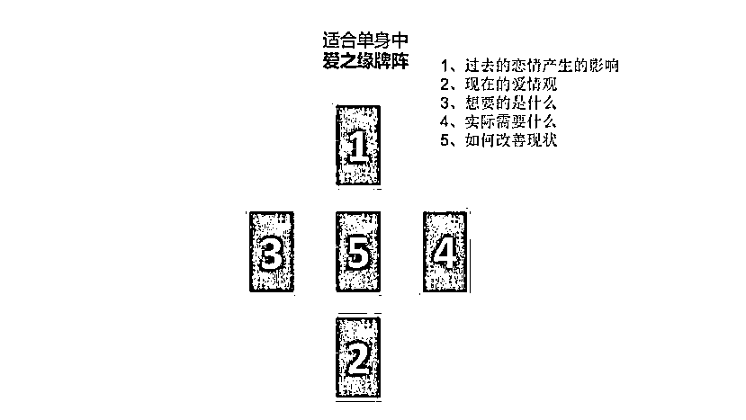

★

**爱之缘牌阵案例解读**

案主是一位刚结束了感情的女生，想尽快走出阴霾，期待新的恋爱关系，并且想在进入关系之前了解自己，寻求建议。

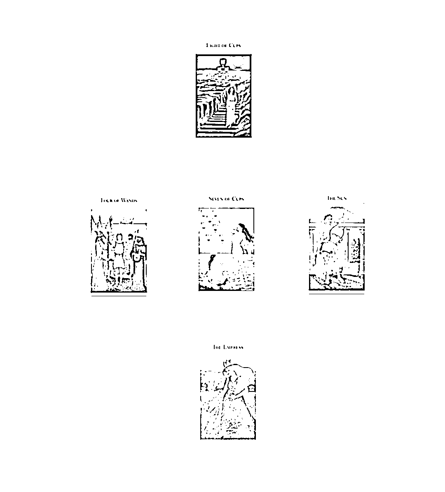

**1、过去的恋情产生的影响：圣杯 8**

圣杯 8 呈现的是普绪克在关系之旅中最艰难的一个阶段，意即自愿放弃对将来的希望。过去的感情中的某些阶段，或者结束关系后，案主可能感受到了很深的孤独感，有孤立无援，无计可施的感受，身后排列的整整齐齐的圣杯，其实就是需要整理的感情过往，当下的孤独和无助不一定是未来的常态，圣杯 8 预示着放弃某种东西或执念的必要性和必然性，要放下身后的这些感情过往才有机会挣脱过往感情带给你的孤独感。**2、现在的爱情观：皇后**大地之母德墨忒尔掌管着自然界规律性的循环和万物的生长，还主宰着生命的孕育和新生，以及福佑着婚姻——这个承载着自然界循环往复、生生不息的力量的容器。能感受到案主对于婚姻和做母亲的期待和向往，想要好好的滋养一段成熟稳定的感情，就像养育孩子或者创造作品一样。案主现在的感情观是具有耐心、包容、滋养力量的，比较成熟的状态，但是遇到怎样的伴侣就更为关键，因为这种全情的付出需要更多的观察，走得慢一些，确定了解清楚彼此有相近的爱情观和情感需求再展现这样的特质会比较好，避免吸引了不够成熟的潜在对象。**3、想要的是什么：权杖 4**权杖 4 预示着付出的努力获得奖赏的阶段到了，但是案主刚结束感情不久，她目前想要比较快地开始新的关系会有不那么现实的层面，这种开花结果的状态是需要一个过程的，就像第一张圣杯 8 要先彻底整理放下一些东西，第二张皇后牌要思考清楚自己想要创造和滋养的感情是怎样的，在这些过程之后，实现这样的状态是没有问题的，而且这张牌里杰森知道他自己无法完成这么危险的航程，于是找来一群好朋友，帮助他完成目标。所以想要实现目标，让周围的亲朋好友提供信息和帮助也很重要。**4、实际需要什么：太阳**

案主实际需要的是一位非常阳光、乐观的伴侣，对方可能热爱音乐或其他艺术，你们之间可能拥有相似的爱好，能够一起享受这些乐趣，太阳牌描绘的是一个英俊潇洒、身材匀称的经典美男子形象，智识上也是具有远见的，能看到很多事情背后的原因和目的，有驱散黑暗带来光明的能量，温暖人心。案主实际需要的是一位能够给你提供积极能量和情绪价值的伴侣。

**5、如何改善现状：圣杯 7**

圣杯 7 描绘的是女神阿弗洛狄忒 现身于普绪克面前，告诉她如果要赢回厄洛斯的爱，就必须完成一些任务。阿弗洛狄忒从海中升起，指着面前漂浮在云端的七个圣杯。普绪克跪在岩石上，看着眼前的阿弗洛狄忒 ，接受爱之女神给予她关于爱的神圣教诲。

这张牌隐喻着“空中楼阁”，案主内心的直觉会意识到将来有很多可能性，但是这些可能如果落实，就需要付出许多艰苦的努力。也代表着要清晰地梳理出自己期待的伴侣和感情具有哪些特质，在自己内心绘制出一张“灵魂伴侣寻宝图”，这张寻宝图也是一张自我精进的计划书，期许越清晰，努力越精准，吸引来的伴侣才有可能越匹配当下的情感需求。祝好运！

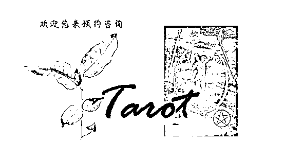

**如何预约塔罗师咨询？**

最后，一起再来复习一下

如何在塔罗 app 上预约咨询服务

去若道塔罗 app 上选择咨询师预约咨询时间

具体咨询方式如下图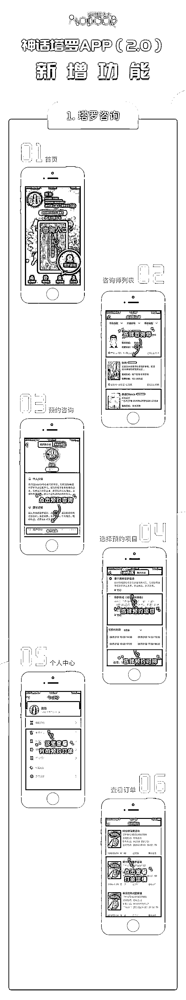**最后的最后
如何更新神话塔罗 APP？**快去应用市场更新神话塔罗 APP，抽牌&咨询吧～还没有下载或更新的小伙伴赶紧来看看如何下载和更新吧！

**iPhone 苹果 IOS 系统下载**

****❶** **长按识别二维码下载****

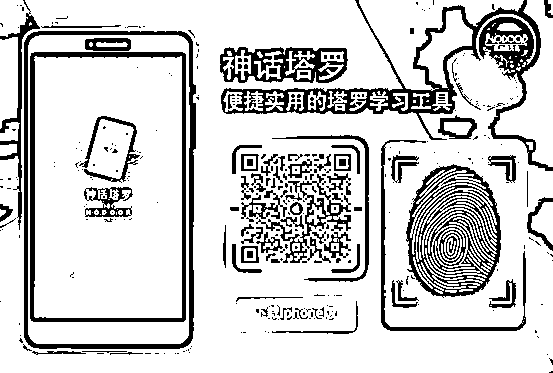

******❷**** 或在 App Store 里搜索“神话塔罗”**

**安卓系统下载****❶** **长按识别二维码下载**

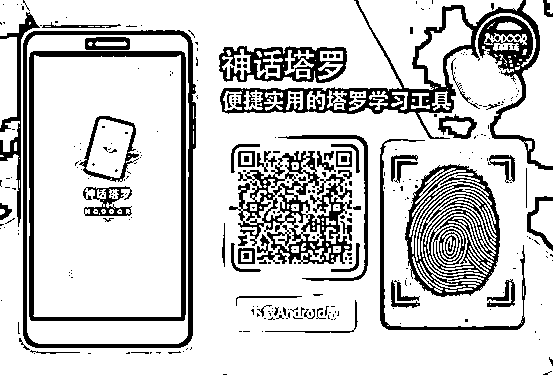

**❷ 或在各大应用市场里搜索“神话塔罗”**

各位亲人小伙伴，每天有事没事都可以去 app 里转转。抽取专属于你的今日塔罗如果感到快乐你就用用**神话塔罗 app**，如果你感到不快乐，更要使用由专业人本主义塔罗师团队全程陪伴的**神话塔罗 app**哦！**想入驻若道塔罗平台成为职业神话塔罗师？****2021 年最新《神话塔罗认证课程》正在报名中**

******报名直达入口******

# 深度干货 | 日返图里的九大行星，如何告诉你未来一年要发生什么？

> 原文：[`mp.weixin.qq.com/s?__biz=MzA5NjA0NTAxNg==&mid=2651459449&idx=1&sn=cb2e15ad05d3bb242b332b1da2b462a1&chksm=8b48bdcebc3f34d867870a94a2e77e64c71bf7de8d0c7aa77dab4890b565c109cc2f9193d0e9&scene=126&sessionid=1692737908#rd`](http://mp.weixin.qq.com/s?__biz=MzA5NjA0NTAxNg==&mid=2651459449&idx=1&sn=cb2e15ad05d3bb242b332b1da2b462a1&chksm=8b48bdcebc3f34d867870a94a2e77e64c71bf7de8d0c7aa77dab4890b565c109cc2f9193d0e9&scene=126&sessionid=1692737908#rd)

************☆********************后台回复“今日”，给你一句生命态度************

作者/萨拉·希普曼 译者/李含 校对/江艺

编辑/翀子 封面.书君图片/网络

太阳返照星图是特殊的占星学预测工具，它的作用只持续一年。星图上的行星描绘出在这一年里“将要发生什么”，而行星所落宫位则告诉我们“在哪里”发生。作者在文中分别讨论了十颗行星在太阳返照星图中的作用和意义，帮助我们更好的了解这一预测工具。**太阳返照星图是我们可以运用的最好的预测占星学工具之一**。然而，因为星图是短暂的，只持续一年，所以解释太阳返照星图中太阳（和其他行星）的宫位落点将会不同于你出生星图中熟悉的意义。因此，在解释这一年的太阳返照星图时，**了解行星在太阳返照星图中的功能非常有用。**你的太阳返照星图中的**行星描绘出“将要发生什么”**，而**宫位落点则告诉你“在哪里”**，所以这会对你解读自己的太阳返照星图很有帮助。我建议你们在分析时记下你的宫位关键词。****若道君温馨提示：想查看自己的太阳返照图，可在 app store 或应用商城，搜索“若道”，查看“日返单”中行星所落星座宫位即可。也可使用其他星图 app，查看日返盘即可。**********例如下图是比尔·盖茨 2021 年-2022 年的太阳返照图。******

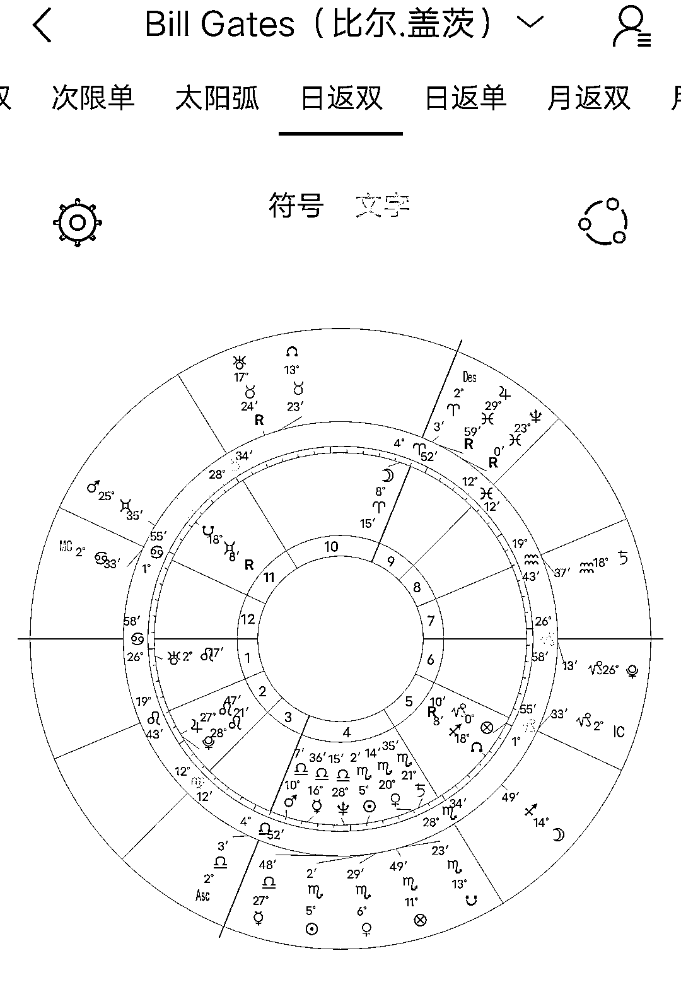

**太阳返照星图中的*****太阳***

太阳返照星图中，你会发现自己投入了大量的精力在太阳所落的宫位，并被该宫位相关的活动所吸引，因为那将是你优先考虑的事情。所以，太阳会告诉你**这一年的重心**，也会告诉你生活中**哪些部分**是你真正需要关注的。它照亮了你需要做的事情，你可能会感到**不得不表达你的星图中太阳落点所凸显的部分**。一般来说，**太阳也象征着男性和一般意义上的男子气概**，有人认为，在女性的星图中尤其如此。我不认为宇宙有性别偏见，但可能是你星图中的太阳照亮了你生命中的男人（不管你自己是什么性别），或者点亮了你生命中需要以某种方式明显展示你**个人权威**的一个部分。

**太阳返照星图中的*****月亮***

太阳返照星图中的月亮，就像出生月亮一样，都是关于情绪反应。然而，太阳返照星图的月亮**描绘了在你的世界里一年中感觉最舒适的地方**。这可能是一个物理位置，让你联想到一个情感问题，因为月亮也掌管着家，家庭和你深层次的情感安全感。这些事情经常要求我们处理跨越情感谱系的问题，这些问题对我们来说可能很难处理。因此，**月亮的宫位**可能会向你展示你生活中**需要学习更好地“处理”事情的领域**。太阳返照星图的月亮会在不知不觉中把你吸引到**需要“照顾”**的地方，或者你觉得**受到照顾**的地方——双向的解释都是可能的，而且在你的太阳返照星图中尤为可能，因为月亮在其变幻无常中有其可靠性。随着月盈月亏，月亮也可能表明你的生活中处于**过渡状态的领域**。无论月亮落在哪里，你的感觉都会发挥作用。

**太阳返照星图中的*****水星***

在太阳返照星图中，水星是关于想法及其传播的。在水星翅膀降落的地方，你会在太阳返照星图对应的这一年大部分时间里（如果不是全部时间的话）**思考与该宫位相关的活动**。而且很有可能你也会在**写作和谈论**中提到这些内容。**水星也会告诉你自己的精神状态，并描绘出你的感知是如何受到影响的。**确切地说，你的心智状态、思想和想法如何与你生活的其他部分**关联**，如何与你的行为和情感的联系，将取决于水星与其他行星的联系，因为水星毕竟是关于连接和交流的行星。水星作为“中间人”的概念是非常重要的，因为水星依靠它的关联点让你的思维过程完全整合到一个完整的信息包中。这使你能够制定计划，做出决定，采取的行动，影响到这一年乃至你以后的生活。因此，想法、演讲、书面交流、短途旅行、调解都将是这个信息包里的一部分。为什么？因为辩论、讨论、联系和交流是水星的意义所在。水星是一个充满活力的行星，所以不断动起来吧，**无论水星在哪里，他都会让你忙个不停**。

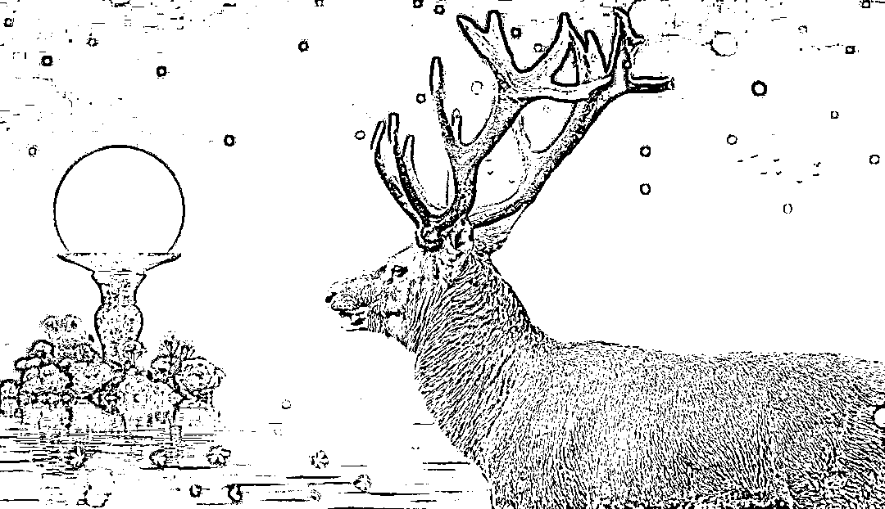

**太阳返照星图中的*****金星***

啊，金星，每个人最喜欢的行星——谁会不喜欢她呢？毕竟，她是充满爱和吸引力的行星。在你的太阳返照星图中，**金星可以象征几件事情，而且不全是关于爱情的**。金星还**象征着金钱**，因为这个行星是一位物质女孩。在你的太阳返照星图中，在金星代表的生活部分中，你可能希望通过某种方式来进行一番改善，无论是从**审美**上还是在你自己的**价值体系**方面。金星也是你**找到快乐和享受生活的地方**，是的，这通常涉及到花钱。然而，金星也可能显示出你可能因为过度消费而面临财务压力的地方，尽管金星可能会为你**吸引到资源**，但你也同样可能屈服于金星的欲望，**过度追求**生活中的美好事物。生活中的美好事物通常是社会性和关系性的，金星象征着我们与所爱的人一起度过的时光和参与社会活动享乐的时间。她也可以被解读为**你重要的另一半**，或者象征着**其他重要的人际关系和职业关系**，因为金星会出现在家里，在商业活动中，也会在美容院。

**太阳返照星图中的*****火星***

你的太阳返照星图上的火星是关于行动的，**在火星所落的地方，你将会从起跑线上被发射出去，不得不奔跑。**如果你不能继续比赛，你会迅速变得沮丧和愤怒。很简单，火星要求你继续做它的落点告诉你做的任何事情。**这个动作可能是身体上的，心智上的，甚至是精神上的**——不管你需要做什么，对火星来说“行动”是很重要的。因此，你的太阳返照火星可以作为一个指示器，告诉你今年你可能会在哪里感到心烦意乱，并且失去常序，但是——这是非常重要的——如果你不运用自己的火星能量去完成你生命中火星告诉你急需关注的领域的事情时，才会发生这种情况。在太阳返照的这一年里，**与火星有关的事情将立即出现在火星所在的宫位**。所以也就是，身体动作，运动，速度，性，能量，争论，暴力，勇敢，手术，年轻男子，主动性，积极主动，红色。明白了吗？

**太阳返照星图中的*****木星***

在你的太阳返照星图中，木星作为带来好运、机会、（各种形式的）财富的使者，当然还有随之而来的无限乐观，张开双臂欢迎进入他所在的宫位是常有的事情。然而，这种欢乐是合理的吗？正如谚语所说，你可能拥有过多的好东西，而木星同样以各种形式的过度而闻名。过度乐观，感觉全世界都欠你，过度热情和放纵，就像遥远彼岸的木星一样，带着积极的心境，你可能会忍不住去探索。无论木星在你的太阳返照星图中落在哪里，他都以积极的和不那么积极的方式进行扩张，诀窍（如果有的话）依然是倾听木星对你说的话，**找出你的机会，然后努力工作抓住机遇**，只有那时，你才会收获木星的报酬。“工作？”我听到你说，‘我以为那是土星的领地？’是的，的确是这样，但是**木星也要求你努力工作**——即使你不喜欢。懒惰在很大程度上是木星的特征，但是，唉，它会让你一事无成，**木星的目标是让你有所成就，让你继续前进，开阔你的眼界**。

**太阳返照星图中的*****土星***

在你的太阳返照星图中，**土星所落的地方真的要求努力工作**。土星的作用是**告诉你什么地方需要务实**，什么地方只要你再努力一点就能做得更好，什么地方你需要保持冷静的头脑，培养更成熟的态度，保持耐心，有责任心，脚踏实地。事实上，由土星落点所指示的事件将不可避免地要求你做出那样的回应。换句话说，**土星是木星的补充——是我们努力审视自己，意识到自己需要负起责任的那一刻。**忽视土星，你将生活在恐惧中——害怕改变，害怕推动自己更进一步，事实上，你对几乎所有的事情都感到恐惧。恐惧是土星负面能量的核心，因为正是恐惧让你陷入对自己不利的境地。记住这一点并克服它——你所需要的一切帮助土星都会给你。

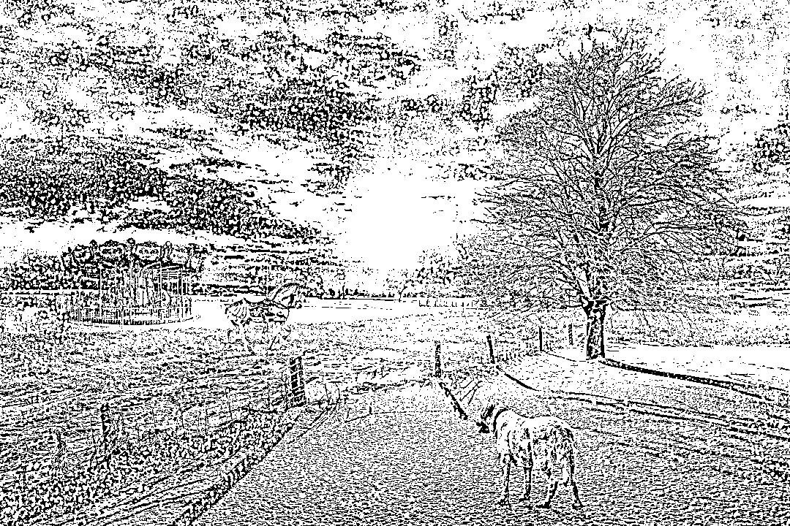

**太阳返照星图中的*****天王星***

无论天王星落在你的太阳返照星图的哪个位置，你都可以预期，天王星的出乎意料都是关于变化的，作为一个完全没有人情味的行星，天王星真的不在乎那个变化是什么，只要它是变化就行。我们不是在这里谈论调整边界，外行星的变化是“真刀真枪”的。这听起来可能很疯狂和可怕——有时候确实如此——但是请用这个想法来安慰自己。**在你的太阳返照星图中，天王星会帮助你摆脱天王星宫位落点所显示一切陈腐桎梏。****天王星希望你以一种不同于以前的方式来思考问题。**天王星希望你能接受新事物的概念，有时这将需要某些不常见的、不受欢迎的或其他奇怪事物让你警觉和留心。这可能是夜深人静时“惊喜发现”的时刻！或者你的外部生活中发生了一件意想不到的事情，让你突然停下来。或两者兼而有之。天王星是不可知的，因为你只可能经历其中一种，或者两者都经历。天王星就是这样，不可预测。

**太阳返照星图中的*****海王星***

在所有的行星中，海王星是在象征世界中运作最好的一个，在你的太阳返照星图中，海王星的象征意义突出。这样来看，海王星不再是困惑的源头，而变成了一个更有用的存在，一个指针，**指向你需要停下来的地方，深呼吸，比平常更多地反思生活**。然而，这不仅仅是一次冥想练习。海王星掌管视野，这开辟了一个解释可能性的广阔领域。海王星会**告诉你哪些地方你看得不够清楚**，哪些地方你可能会经历误解，哪些地方你需要更加稳扎稳打，哪些地方你可能会经历错位的事情 ——从你的情绪到你的家门钥匙。海王星也会告诉你在哪里你可以**更有创造力**，在哪里找到**灵感和内心的平静**。永远不要怀疑海王星在不那么精神的层面上表达其象征意义的能力。在你的太阳返照星图中，就像其他行星一样，你会发现**海王星的影响力作用于许多层面**，包括世俗和物质领域。它的影响范围对应了水、石油和天然气。还有脚和眼睛。电影和舞蹈。毒品，酗酒，还有深层的睡眠。困惑？你会有的。

**太阳返照星图中的*****冥王星***

在你太阳返照星图中发现冥王星的地方，**有必要丢弃一些东西**——字面意思或隐喻意义的，因为冥王星代表着不可逆转的从一种存在状态转变到另一种存在状态。冥王星告诉你放弃那些你认为很宝贵的东西，并让新的东西取而代之。因此，**冥王星在你的太阳返照星图中所落的宫位就是你被要求以某种方式改变生活的地方。**这种转变可以通过要求你掌控一个你以前觉得无法维护自己的领域来实现。相反，冥王星也可以要求你放下你的防御，让自己屈服于你最大的恐惧——不管它们是什么——从而使你在这个过程中成长和更新自己。**冥王星的主题是扔掉你生活中的垃****圾**，我们知道如果你囤积垃圾会发生什么……冥王星不希望你的生活最终成为真人秀节目中的一间房子，从地板到天花板都堆满了恶臭的垃圾。危险在于，如果你没有定期清理垃圾（至少在隐喻上），你积累的垃圾将远远超出你的处理能力。正如你在电视上看到的那样，处理这个问题的唯一方法就是请一些认真的人来帮你收拾残局。来见见冥王星。他就是地狱来的强迫症清洁工。

**版权声明：**本文由若道翻译发布，欢迎转发，反对抄袭。友号转载请申请白名单。

**莎拉·希普曼**

英国牛津的一位占星师。从孩提时代起莎拉就对占星学充满兴趣，现在她已经学习和实践占星学三十多年了。莎拉·希普曼是作者的笔名和执业名。

**学习占星学**

**点击下图了解课程详情** 

************

****

****

****

**微信又双叒叕改版啦，不想错过若道君的推送？**

**就把若道设为星标吧！**

**▼**

**就是这个“在看”，戳戳戳 ☟**

****************报名直达入口****************

# 非暴力沟通丨愤怒是问题吗？不，受控的思想才是！

> 原文：[`mp.weixin.qq.com/s?__biz=MzA5NjA0NTAxNg==&mid=2651459449&idx=2&sn=127ea9492c5b9008a8ada71080378183&chksm=8b48bdcebc3f34d8df0d856308a23a890603f51a1bf76b9f4dbc50a5a1d4908f32066d22ed45&scene=126&sessionid=1692737908#rd`](http://mp.weixin.qq.com/s?__biz=MzA5NjA0NTAxNg==&mid=2651459449&idx=2&sn=127ea9492c5b9008a8ada71080378183&chksm=8b48bdcebc3f34d8df0d856308a23a890603f51a1bf76b9f4dbc50a5a1d4908f32066d22ed45&scene=126&sessionid=1692737908#rd)

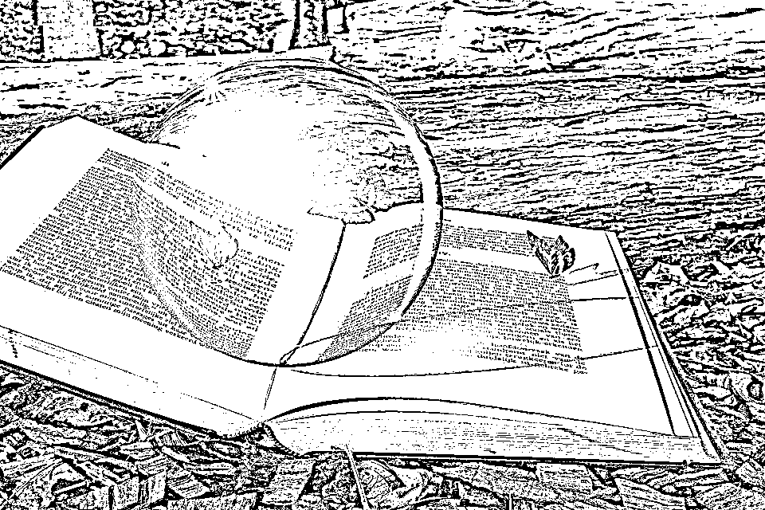

作者/马歇尔·B·罗森博格博士

翻译/李含 校对/江艺

编辑/翀子 图片/网络

以下是罗森博格博士 1999 年 5 月在英国主持的愤怒问题研讨会的一部分内容。罗森博格博士是非暴力交流中心的创始人，也是教育服务部的主任。他是《非暴力交流：生活的语言》（Puddle Dancer 出版社，2003）的作者。

**前言**

**马歇尔有时用豺狼来比喻疏离生活的语言，这种语言导致对自己和他人的暴力，而长颈鹿则用来比喻他创建的非暴力沟通模式。**注：CNVC 使用的意象和术语“长颈鹿”与长颈鹿项目毫无关联，那是一个完全独立的组织，制作自己的培训和教育材料。

**愤怒是问题吗？**

对我来说，愤怒的主题在很大程度上是一个政治问题。**在我看来愤怒不是一个核心问题，我担心将愤怒视为一个问题。**将愤怒视为一个问题，就像一个人习惯在床上抽烟并让房子着火，他注意到这个该死的火警警报总是响起。

他真的很生气，不停地换房子，因为他不喜欢处理火警警报。我认为从许多方面看，**愤怒就是火警警报。**为什么要担心火灾警报呢？所以在我看来**愤怒不是问题。**我认为**问题在于制造愤怒的思想。**支持控制系统的是某种思维特质。我所说的系统是指管理人类事务的政府、组织和机构。

神学家沃尔特·温克在其著作《统治者》与《与权力交锋》（*The Powers That Be/Engage The Power*）中谈到了控制系统，即少数人为了自身利益而控制（大众）的系统。在控制系统中，你必须训练人们以支持系统的方式思考，这样他们才能适应系统。

**控制系统要求：**

*   **抑制自我**

*   **道德评判**

*   **Amtssprache（纳粹官员用这个词来描述一种否认选择的官僚语言，比如：“应该”、“不得不”、“必须”。）**

*   **关键概念：应得**

**现在愤怒是一个结果，它是一个火灾警报，告诉我们我们正在以一种支持控制系统的方式思考**；你的思维方式助长了压迫性的世界秩序，你是其中的一员。

所以我不想摆脱它，我不想成为那种因为警报而不停搬家的人。**我想从我自己的思想上做一个根本性的转变，**这样我就不会按照世界控制体系的框架方式思考。所以系统训练人们以支持系统的方式思考。

**我们被训练出的交流方式显然会影响我们人类的发展。**我们被训练成善良的死人或恶霸。当你处于权威地位时，你就有理由成为一个恃强凌弱的人。你不认为自己是恶霸，你称自己为权威。

**在控制系统中，权威人士通过应得的体系被赋予欺凌的合法权力，在这种体系中，惩罚、奖励和其他形式的胁迫促使你去做事。**人类如何发展显然将影响我们对人类本质的理解，我们认为什么是人类的本质。

这就是我们创造这种系统的原因。这就是为什么我这么喜欢沃尔特·温克的书。他考察了过去五千年里关于人类是什么样子的一种观念。例如，如果你认为人类是邪恶的、卑鄙的、可怕的东西——这种观点已经被广泛传播了几千年，人类被一种邪恶的能量所污染——那么显然你需要建立一个由更有道德的人—— 比如你和我——控制的系统！我很担心你，所以告诉你真相！

**麻烦在于，这个系统在决定谁是更有道德的人以及谁知道如何控制其他人方面存在问题。**已经有一些实验——君权神授说和其他各种各样的实验——但这个系统关于人类的本质有一种设定，认为他们必须被控制。**主要的手段是强制控制人类，让他们认为自己是一无是处的小兵。**

**使用的基本系统是什么？**

惩罚——让人们痛苦——忏悔的整个想法是**让人们改变。**首先，你必须让人们看到自己是多么可怕的怪物。这就是为什么必须首先教孩子会说并说好“对不起”。

我们来看一个豺狼儿童傀儡。

豺狼父母：说对不起。

豺狼小孩：对不起。

豺狼父母：你不是真的很抱歉。从你的脸上我可以看出你并不是真的很抱歉。

豺狼小孩：（开始哭）对不起。

豺狼父母：我原谅你。

这是你必须要做的，你必须让人们自我感觉不好，并感到忏悔。

这就是为什么在美国我们称这些机构为教养所。这一整套理念中，你必须让人们意识到自己是邪恶的，所以你需要一种语言来做到这一点，你需要一种暗示邪恶或坏的道德评断，用诸如：好、坏、对、错、反常、无能等词语。

各种各样给你治罪的词汇。

**有些文化完全没有这样发展，整个文化中几乎没有暴力。他们没有这种语言。**

提问：“这些文化在哪里？”

马歇尔：“每个人都想搬到那里去！幸运的是，这种文化有很多。”

幸运的是，人类学家鲁思·本尼迪克特在这方面做了大量研究。1970 年 6 月《今日心理学》（*Psychology Today*）上发表了一篇题为《良好文化的协同模式》（*Synergy Patterns of the good Culture）*的文章，这是一个很好的起点。自 20 世纪 20 年代以来，她就撰写了许多关于这个主题的著作。她在世界各地找到了它们。

当她开始这项工作时，她不确定自己是否能有所收获。我接触过的部落是马来西亚的原住民部落 Orang Asilie 。我永远不会忘记我的翻译在我们开始之前所说的话。他正在考虑如何翻译。他指出他的语言没有动词 to be，比如（你是）好、坏、错、对。如果你去掉动词 to be，你就不能对人进行分类。你要怎么骂人？你剥夺了我百分之九十的词汇！所以我说，如果我说“你很自私”，你会怎么说？

他回答说：“这是一道难题。我会这样翻译：马歇尔说，他看到你在关心自己的需要，而不是别人的需要。”他说，**“在我的语言中，你告诉人们他们在做什么，你希望他们做什么不同的，我们不会想到告诉人们他们是什么。”**然后他停了下来，真诚地看着我说：“你为什么要叫一个人名字？”

我说，你必须知道该惩罚谁。惩罚在这些部落和文化中是一个完全陌生的概念。他看着我说，“如果你有一棵植物，它的生长方式不是你想要的，你会惩罚它吗？”**惩罚的整个理念在我们心中根深蒂固，我们很难想象其他的选择。**

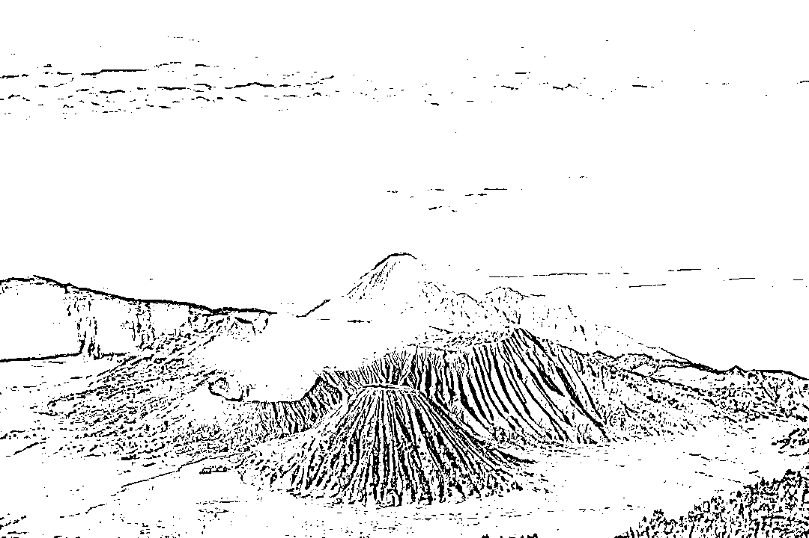

对于那些没有受过控制系统文化教育的人来说，这是完全陌生的。在许多这样的文化中，他们以这样的方式看待伤害他人的人：**他们并不坏，他们只是忘记了自己的本性。**他们把这些人围在圈中，提醒他们自己的真实本性，成为真正的人类是什么样的。他们变得疏远了，要让他们重回生命。

提问：能再说一遍部落叫什么名字吗？

马歇尔：Orang Asilie。这很有趣。这不是他们的名字，而是周围文化对他们的称呼，意思是“原始人”。

人们通常会问，当他们有自己的长颈鹿语言时，你在那里教他们长颈鹿语言做什么？这是可悲的；他们做得很好。他们生活在森林里，那里的树木在外界有着巨大的经济价值，所以现在伐木公司正在侵入他们的空间。他们不知道如何和说豺狼语言的人说长颈鹿语。他们有一个代表 6 万人的参议员。

在马来西亚，他们听说了我的工作，问我是否可以做些什么。他说：“你知道，有顾问教我们如何使用枪支来夺回我们的土地，我们不缺这枪支。”参议员希望有另一种方法。

回到愤怒问题上来。我希望你开始明白**愤怒不是问题所在。**对我来说，**问题在于思维。**沃尔特·温克非常深刻地指出，控制系统需要让暴力变得有趣。

你必须让暴力变得有趣，这样控制系统才能运作。来自塞拉利昂的鲍勃·坎德知道。你可以让塞拉利昂的年轻人享受砍掉其他年轻人手臂的乐趣，因为他们认为你给了人们他们应得的东西。那些人支持那样的政府。当你真的有理由指责某人为坏人时，他们的痛苦让你快乐。

在美国，孩子们看电视最多的时候是晚上 7 点到 9 点，在 75%的节目中，英雄式的主人公要么杀人，要么打人。因此，当孩子平均 15 岁时，他们已经观察到 3 万起好人的打打杀杀。

这对我们的意识有什么影响？殴打和谋杀什么时候发生？在极度兴奋的高潮时；我们从暴力中获得性高潮的喜悦。现在这可能不是电视；根据沃尔特·温克的说法，这已经持续了五千年。

当我们以如此快的速度向孩子们展示这一点时，这会产生什么影响？如果他们每周去一次教堂或犹太教堂，听一个豺狼思维的神学家用好书为暴力和惩罚邪恶辩护，那就够糟糕的了。每周看一次已经够糟糕的了，但是在孩子们成长的岁月里，当它以艺术的姿态闪现在屏幕上，会发生什么呢？

你看，你已经开始让暴力变得有趣了。因此，愤怒只是由此产生的人类情感。我很高兴我们在这里研究它，因为在这里把**我们自己从愤怒中解放出来意味着把自己从这些系统中解放出来。**

**这需要我们的思维发生根本性的转变。**我们让自己复活，因为适应愤怒意味着我们的死亡。人们听到这种说法都很惊讶，因为（提高声音）“我生气的时候感觉充满活力”。你不是！你的肾上腺素分泌过多。我不会说我们充满活力，我会说**当我们充满活力的时候，我们就与生命相连。当我们被训练以一种服务于生命的方式思考时，我们就能与生命相连。**

**版权声明：**原创文章由若道翻译发布，欢迎转发，反对抄袭。友号转载请申请白名单。

**鲍勃·温特沃斯**

CNVC 认证培训师，也是“家庭心理训练营”（Family HEART Camp）的联合创始人，这里会为父母和孩子提供的 NVC 浸入式体验。鲍勃拥有斯坦福大学应用物理学博士学位。

**学习 NVC**

**点击或长按下图了解课程详情**

**

**微信又双叒叕改版啦，不想错过若道君的推送？**

**就把若道设为星标吧！**

**▼**

**喜欢记得点一下在看哦☟**

********报名直达入口********

# NVC 线上训练营丨别让“暴力沟通”毁掉真挚的关系（插班中）

> 原文：[`mp.weixin.qq.com/s?__biz=MzA5NjA0NTAxNg==&mid=2651459449&idx=3&sn=1309ec9d65e6a60505ffd163e0f82091&chksm=8b48bdcebc3f34d8a0bd032a471f79215af1c07925c75f6e0c677248ff0094c7ccc43f07a97b&scene=126&sessionid=1692737908#rd`](http://mp.weixin.qq.com/s?__biz=MzA5NjA0NTAxNg==&mid=2651459449&idx=3&sn=1309ec9d65e6a60505ffd163e0f82091&chksm=8b48bdcebc3f34d8a0bd032a471f79215af1c07925c75f6e0c677248ff0094c7ccc43f07a97b&scene=126&sessionid=1692737908#rd)

**为什么我们要学 NVC？**

（向上滑动查看内容）

**蒋颖**

若道联合创始人

2016 年，我在新西兰参加一个 Hakomi 亲密关系治疗的治疗工作坊。参加这个工作坊的都是治疗师。在这个工作坊中，有一位女性让我特别印象深刻，因为她身上有种特别的气质，某种既温柔又坚定的东西，充满力量，充满对这个世界充满关怀，她身上表现出的让人惊讶的真实也让我有很多思索。她叫托尼·麦克尔兰（Toni McErlane）。

我知道她从小学习武术，也是一个悬挂式滑翔运动的运动员，曾经背着滑翔机在世界各地的上空飞行和比赛。她完成了北美非暴力传播（NVC）领导计划，是一个非暴力沟通（Nonviolent Communication，简写 NVC）培训师和注册的家庭纠纷调解人，也是生态心理学的培训师。她有多年的内观经验，在身体创伤治疗方面的经验，还有她在有机种植、景观设计、园艺治疗都有专长……我看到她到印度去，帮助印度乡村做有机耕种。在这次疫情之前，她已经买了一艘帆船，准备和丈夫开着他们的船环游世界。所有这些都让我感叹，一个女性可以活得如此勇敢和丰富。现在她而她对中国也充满了某种关切。多年前就一个人在藏区徒步旅行，后来又骑自行车穿越西藏。

但喜欢户外冒险的 Toni 说， NVC 比武术更管用。

2019 年，我终于请 Toni 到中国来，请她给若道做了基础和中级的 NVC 培训，也请她对外做了一次工作坊。

怎么说呢，培训和工作坊棒极了，更棒的是，我觉得人人都爱她。

**Toni McErlane**

我来自新西兰，拥有社区和人类服务—咨询康复学士学位，是 Aminz 的注册家庭纠纷调解人，也是 NVC Aotearoa 的 NVC 培训师。

在我的生命中，我一直对真诚、充满活力、自我负责的沟通和有意识的选择充满激情。而我的人生旅程为我提供了充足的机会，让我去探索、研究、反思和完善这在沟通中是什么样的。

在我的工作坊中，我的原则和实践都是建立在非暴力沟通和正念的哲学基础之上。非暴力沟通是由美国心理学家马歇尔·卢森堡博士所开发的。马歇尔的目标是发展出一种语言，这种语言受到印度巴利语中的“非暴力主义”（Ahimsa）一词的启发，它的意思是“没有伤害”。我们怎样才能在与他人沟通时不造成伤害呢？这不仅需要非暴力沟通的技巧，还需要在训练中融入正念。正念是受小乘佛教内观传统的启发，发展觉知和接纳，关注和允许。在我们的工作坊中 ，我们将非暴力沟通和正念编织在一起。

我致力于以这种沟通和处世方式作为我日常与人互动的基础。我曾经学习了为期一年的北美非暴力沟通领导者项目，在加州湾区非暴力沟通的全年浸入式项目中做了两年协助工作，然后在索诺马县女子监狱推动非暴力沟通培训。同时，多年来我持续参加内观静修，致力于继续和发展这种实践，并把它融入自己的工作坊中。

2020 年疫情期间，我与丈夫和我们的猫在游艇上休了一年假。现在，我和丈夫还有 15 岁的侄女在新西兰南岛的达尼丁生活。我在那里从事心理咨询、冥想和生态心理疗法。我们还正在那里慢慢建立一个治疗静修中心和生态冥想社区。

过去四年，我曾两次来中国，与若道及其友好而充满活力的团队分享非暴力沟通，并参观了一些绝佳风景。我期待继续与若道合作，在网上分享我的知识和技能。

向上滑动可查看更多

**Toni 老师有话对你说**<mpvideosnap class="js_uneditable custom_select_card channels_iframe" data-pluginname="videosnap" data-id="export/UzFfAgtgekIEAQAAAAAABNIXkZitzgAAAAstQy6ubaLX4KHWvLEZgBPEtIMEEEUxZvj-zNPgMIuM7PVi1oMK5fdX4B-DAnh3" data-url="https://findermp.video.qq.com/251/20304/stodownload?encfilekey=RBfjicXSHKCOONJnTbRmmlD8cOQPXE48ibrgo6T80SM1b4QSoxiaa7xblfRvMCU22ricO1icL5GdBOSmzhG7mbaLtSLg4xqYaTLicapWwCV45Axx8QGaozqH7OpxicjibYzN1icWtyuIibCRyZInILWhIGRG1ILicWtib8H3XUMxBW2rZO2GMmc&amp;adaptivelytrans=0&amp;bizid=1023&amp;dotrans=0&amp;hy=SH&amp;idx=1&amp;m=3d7ca9d191932d16f6faa80b9364d1f9&amp;token=AxricY7RBHdVzFXjPCFncbbQSWL8x8x2YeR1VX1JKDza8JFxFfuEYeFkqjygt392VxqY7mdlmzAc" data-headimgurl="http://wx.qlogo.cn/finderhead/PiajxSqBRaEJYnVsqWfEX9qA0sI6hNVKsDfyzfPZ92WZMZyBpZWU5NA/0" data-username="v2_060000231003b20faec8c4e68a1ec2d4ca07e434b07755bbf47e7053a3059defd2c9d6c68a20@finder" data-nickname="若道" data-desc="#非暴力沟通 NVC  在面临一个两难处境时，如何运用 NVC 促进合作的开展？
" data-nonceid="1620007045275601581" data-type="video"></mpvideosnap>

**福利！**

**最后 2 名！**

**报名课程即赠送 NVC 情绪-需求卡一套**

**NVC 情绪-需求卡****课程内容**

**第*****1*****模块 区分感受和想法**

*   学习区分想法、感受和故事感受。

*   体会为什么在表达中分享自己对某一情境的感受很重要，而不仅仅是想法和判断。

*   学习辨识和认同身体传递的感受和情感，将它们作为自我觉知和自我联结的资源。

*   理解感受是重要的信息媒介，支持你与自身的需求建立联结。

*   认识关注感受、探索联结需求的重要性，而不是对感受做出反应。

**第*****2*****模块 将感受与需求、需求与策略关联起来**

*   了解并理解满足一个人需求的策略可能无法满足另一个人相同的需求。

*   学习理解需求的概念，学习区分需求和策略。

*   体验如何用多种不同的策略来满足一种需求，以及如何通过选择一种特定的策略满足或不满足其他需求。

**第*****3*****模块 倾听和共情**

*   学习倾听他人话语中透露出的情绪和需求。

*   体验受到共情和受到其他形式的有意识的支持之间的差别，比如同情、安慰、分散注意力、陪伴等等……

*   学习认可别人的体验和情感，而不必认同对方的策略，认识这种技能所能带来的力量和解脱。

**第*****4*****模块 观察与评价**

*   学习在表达中运用观察而非评价的重要性。

*   体验两者之间的差异，自己去领会为何有此差异。

*   学习区分对情境的解读和事实。

**第*****5*****模块 自我共情**

*   学习认识和观察自己的评判和评价，并用它们与自身感受和需求建立联结，借此更深入、更清晰地理解自己。

*   学习识别自己赋予情境的意义，并探求其中的事实。

**第*****6*****模块 ****提出请求**

*   学习请求是表达中重要的一部分。

*   学习如何提出满足自身需求和他人需求的请求。

*   分辨请求和要求之间的区别。

*   学习如何倾听拒绝，如何表达拒绝。

**第*****7*****模块 ****练习坦诚地表达**

*   在一个支持性的框架中，综合运用之前所学, 练习相互联结、清晰有效、对自己负责的沟通。

**第*****8*****模块 ****接受和表达感激和谢意**

*   运用之前所学，练习表达感激和谢意。

*   学习表达感激之情，远不止一句随口说出的“谢谢”。

**工作坊学员这么说**

非暴力沟通带给我的最大的收获是：通过课堂的学习和大量互动练习提升了觉察力，提升了沟通技能，非暴力沟通并不仅仅停留在语言的表达，非暴力沟通的核心是同理心。通过倾听对方的感受，帮助我将情绪转化为解决问题的动力。

我过去和其他人沟通时，常常陷在自己的思维中，通过练习我才发现，原来别人说话的时候我常常其实并没有听到对方说什么，都是在自己的想法里打转，现在我起码学习到当对方说话的时候，能够去尽量不想自己的想法。

过去我不会留意到原来自己的某种表达方式会让别人不舒服，而且其实也无助于解决问题，对于我想达到的完全无效，NVC 的学习能够让我更能觉察哪些表达会让别人不舒服，让我的沟通更有效，更能帮助我达到我的需求。我学完后，才觉察到过去在沟通中，如果对方有情绪，我也是情绪化地回应，现在，我能够和自己和对方的情绪都拉开一些距离。过去我对于对方情绪化的表达，会有情绪化的回应或不知所措，现在我更能去感受他们情绪下的需求是什么，因此就更从容，不那么容易被他人的情绪影响，能够更有效地回应那些有负面情绪的人。我是一个比较理性的人，在练习中发现原来对一个在我用理性分析如此很明显的画面，每个人竟然有如此截然不同的看法，这还是挺让我吃惊的，这个发现好像打开了一扇门。

我是一个比较感性的人，过去有什么事情，常常是情绪化的沟通；NVC 的学习让我能够更理性一些，能够更客观去看问题。

这个培训让我非常感动，这是我没有想到的，一个关于沟通的培训如此让人感动。在那些常见的表面事件呈现之下，是如此脆弱、温柔的人性。我们如此绝望地想要被理解、被爱，想要与他人联结，然而我们常常用非常错误的沟通方式去做，这时我们离我们的目标就越来越远。

**什么人适合学习 NVC？**

**老实说，NVC 真的是一门人生必修课。**

**NVC 可以非常有效地帮助提高沟通能力，提高觉察力、自我同理心和他人同理心，进而减轻童年创伤对成年生活的影响，帮助有效改善亲密关系、与父母的关系、亲子关系、职场关系。**

*   如果你正被低效的沟通方式困扰或正经历沟通暴力，想**提升觉察，避免伤害的话**，NVC 培训是个不错的选择；

*   如果想结束“相爱相杀”恶性循环的相处模式，**享受一段真诚而愉快的亲密关系**，NVC 培训是个不错的练习途径（可以拉着你的 Ta 一起来哦）；

*   如果你的**工作、求学、生活和“表达”息息相关**，想更理解自己，想改善你的人际关系，改进工作，NVC 培训可以体验到一种更有力量的表达。

**训练营时间与价格**

**课程时间：**10 月 24 日-12 月 12 日，每周日下午 2 点-6 点。共 8 周，每周 4 小时

**课程价格：**6800 元

**购买须知**

❶ **本课程一旦报名，不接受退转课。**

****非暴力沟通线上训练营****

**授课老师：**Toni McErlane

**授课时间：**2021 年 10 月 24 日起

**授课方式：**网络课程**，**英文授课，中文翻译

**费用：**6800 元

**课程负责人：****Maggie 老师**（微信：18510107057，请备注“非暴力沟通”，**获取优惠价信息**）

长按二维码添加课程负责人咨询~

****报名请点击“阅读原文”****

# 读懂这个宫位，就知道为什么太多伴侣变成了“公开的敌人”

> 原文：[`mp.weixin.qq.com/s?__biz=MzA5NjA0NTAxNg==&mid=2651459377&idx=1&sn=61a17f870df185fe4ccef59330df6b06&chksm=8b48bd86bc3f3490eaaaddac05c3eb7aa81a43c25cb065a6b31462d20423f0274aca6f086a5e&scene=126&sessionid=1692737908#rd`](http://mp.weixin.qq.com/s?__biz=MzA5NjA0NTAxNg==&mid=2651459377&idx=1&sn=61a17f870df185fe4ccef59330df6b06&chksm=8b48bd86bc3f3490eaaaddac05c3eb7aa81a43c25cb065a6b31462d20423f0274aca6f086a5e&scene=126&sessionid=1692737908#rd)

**************☆ ************************后台************************回复“今日”，给你一句生命态度**************

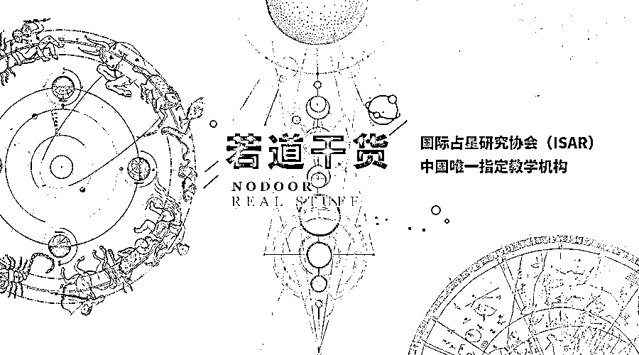

作者/达娜·格哈特
译者/葡萄园的女巫编辑/玫瑰 图片/pexels

提到第七宫，你会想到什么？第七宫除了伴侣，还有怎样更为深入的意义？一起来看看达娜和她的朋友关于七宫的信吧，你会有很大收获哦。

**给 April 的信**亲爱的 April：在写关于第七宫这一篇时，我有点不自信。亲爱的朋友，这就是为什么我请你阅读我的专栏。不仅仅是因为你有幸福的婚姻，而且你还有一个在七宫的月亮。如果有人能平衡我的方式，那就是你。要知道，咨询者问我关系指数时我是多么不安，我试图将他们从关系合盘的迷局中拉出来，如果他们坚持，我就推荐他们向你求助。第七宫暴露了我一个罪恶的秘密，我并不相信灵魂伴侣。找一个注定与我完美结合的人就像找一只麒麟或者是格里芬。 你现在知道我为什么不自信了。这是一个危险的观点。大多数人咨询占星师是希望听到关于他们灵魂伴侣的好的信息，（例如，我是不是就要遇到我生命中的挚爱了？）我担心在一点上观点是错误的。但是我能理解为什么人们寻找灵魂伴侣。这归咎于第七宫。这是我们渴望并接纳其他人的地方。**这促使我们进行二重奏，我们争取和谐，一对一的，不仅仅是和一个人，而是和很多的重要的其他人，就像老师、辅导员、同事、爱人。**我们可以和这些人共舞一会儿，一季，或者永远。但是通过他们，我们活出自己。他们驱使我们成长。通过第七宫我们变得更加完整。听起来是不错，但是实践中往往伴随痛苦，因为**七宫不仅仅是一个舞台，更是一个剃刀，磨平了我们性格边缘的棱角。**在占星学中，伴侣宫七宫正好与自我宫一宫相对。这也就是为什么**七宫同时象征公开的敌人和我的“真爱”。**（很不幸，很多真爱最后都变成了公开的敌人。）如果那个所谓的像田园诗歌一般的伴侣恰好和我们一样，喜欢鳀鱼三明治讨厌《指环王》，赞赏意大利大理石，不畏惧我的情绪，了解我，没有别的人能做到，接着这样的追求对立和统一变成了一个危险的命题。不幸的是，我们结束这浪漫的童话爱情，开始憎恨我们的伴侣时，往往也是因为这同样的原因。 但是为什么会这样呢？

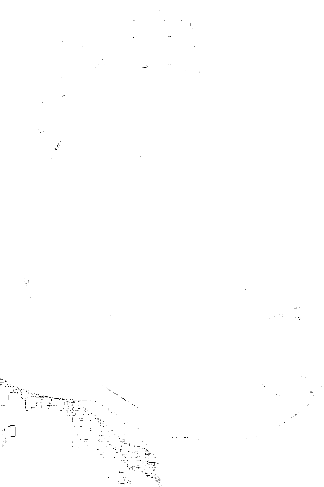

**这都要从上升星座说起，我们的最初的面具。这是在初期的环境中，我们扮演的最好的角色。他代表了我们的一部分，但不是全部的潜能，他划出了一个有益的边界。**（我就是那种做这件事，绝不做那件事的人。）当我们构建自己的故事时，对于那些不符合上升神话的素质也需要做些什么。我们把这些放在了第七宫，在人生的稍后时间满足这个需要。这样的安排让我们深深地渴望重新找回那些曾经在不经意间失去的一切。**当具有被压抑的这部分特质的人出现时，我们便感到了不可思议的强大吸引。但更多地了解他们时，他们又不可思议地变得不那么有魅力了。**固有的阻力开始出现。在任何一间商场里闲逛，你可以听到无休止的关于七宫和上升之间的争吵。 金牛座先生最初被天蝎座爱人的神秘和深沉吸引，现在却惧怕她们骇人的黑暗；摩羯座小姐为他的巨蟹座王子深深心动，直到有天她发现，王子变成了一只贫困而幼稚的青蛙。哎呀，我怎么跟这么个穷光蛋在一起。我的处女座不可救药地爱上了双鱼座，我变成了诗人，精神追求者，音乐家，我们住在了一起，巨大的改变。突然，完美先生变成了一个失败的空想家，混乱、不切实际、模糊不清。当你查看每一对伴侣的星图，会发现每一个人都会有一些行星或者是符号与另一个的七宫有关。这就是吸引。我承认，这才是我对于比较图的关注焦点。我比较不在乎杰克的金星拱了苏的火星。出生星图上通常就已经预示了感情关系的问题以及破裂。拿掉那玫瑰色的眼镜，杰克也许是一个很可爱的男人，但是如果苏不能放弃她固有的预设条件，他们的爱情将是注定的悲剧。一个很好的经验法则就是，**一旦某个人和我们之间有了强烈的感情吸引，对我们产生了影响，那么他就是在无意识地与自己的第七宫的**影子共舞。**运用你的智慧，收起你的牢骚，学习解决这些问题，他们会激活你内心的特质**。当然这样就没有了愤怒的乐趣，但值得努力。你可以为你更深层的苦难——内心的平衡而做出努力。回到我自己的问题，我在双鱼座的身上看不到任何共同点，我是处女座，善于分析、有组织、有效率。但是透过伴侣各式各样的缺点，我也看到了我隐藏的一面。想象一下，我发现我也可以是健忘的、虚假的、逃避现实的。现在接受我的伴侣就变得容易了。而且接受我自己内在的双鱼座一面也一切变得更积极。我现在变得更轻松自在，更平和。或许，我的伴侣罗伯特就是我最终的灵魂伴侣。**如果有灵魂伴侣，或许是指一些驱使我们与自己遗忘了的那一部分灵魂结合的人。 ****第七宫还有很多信息，比如宫主星。宫主星的落点往往显示了这个人的感情生活的中心或者反复出现的主题。**如果一个人的七宫主落入掌管事业的十宫，他也许通过他的婚姻中获得工作的邀约，或者与伴侣合伙工作，或者一直单身嫁给了她的终身事业。我的七宫主海王星天秤座落在了掌管金钱的二宫，我倾向于将我的财务关系私人化，或者私人关系金融化。当我遇到浪漫的婚姻时，我喜欢说：“亲爱的，我们可以一起存钱买房子了！”这个梦想中我的两段长期的感情关系飞速发展然后瓦解。海王星像一个魔术师，他像变魔术一样增加了我的存款，却瓦解了我合作伙伴的资金，现在三个人都濒临破产。金钱曾经是我父母婚姻的中心问题，他们经常为此争吵。我父亲花钱如流水，我母亲却能妙手生金。直到最近我才发现，我的七宫头与我父母的星图有六颗行星是对分的。一直以来，我都像一只小鱼，被我父母这一对捕鱼者扔进了迷茫的海里。难道我们不是都从婚姻的神话中获益么？我这里指的婚姻的神话是我父母的配对。这些早期的神（父母）在我们无意识的国度里的影响力就像宙斯夫妇。我们可以从出生故事中窥探上升的密码，或许我们可以从婚姻的神话中阐述下降点的秘密。 这是我父母婚姻的故事。海王星声称他们已经知道爱情的快乐。他们结婚、离婚又复婚，在我八岁时，我父亲离开我母亲；在我 14 岁时，我母亲离开我父亲。在那之后他们就又在一起了，一起购房，时常住在一起，最近又一起进行奇怪的商业合作，在同一个城市里分居两屋。

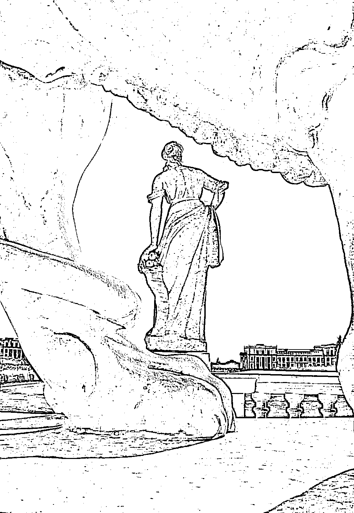

我绝对不愿意去重复他们的不快乐，但是我的感情关系也同样不稳定。关系终结事件不时的发生，与我父母的关系一样。第一次在八年以后，第二次在十四年以后，和我母亲一样，第一次是我被抛弃，第二次是我离开。现在，我拥有一段‘LAT’的感情关系，这是我的朋友给欧洲人的建议——“living apart together”，分开住的感情关系。她说这是欧洲的新时尚，事实上我更了解，这就是我父母在后来这些年的关系模式。谢天谢地，七宫不仅仅只是告诉我们感情关系的问题。有趣的是，它**一样能描述任何我们有兴趣的旧的其他关系人。**这一点不论是现代还是古典的占星师都同意。比如对我来说，那些潜在的咨询客户就是很重要的“关系人”。很少有占星师把开发客户与七宫联系起来。这更偏向于是关于十宫的市场营销的挑战内容。但这不也是人与人之间关系的一种么？这些年，我听到很多不成功的占星师说，他们的潜在客户都抱怨这城里都没有像样的占星师。April，这三年多你在三个城市开始了你全新的占星实践。你怎么觉得呢？ 我从事占星的第一年是非常冷清的，如果六周内电话响了一次，那就算繁忙的一个月了。我一个月就收到一个咨询请求。我做了广告，但是做的不是地方。现在想想，问题就出在我的第七宫。我还没有准备好去面对这样的合作关系。表面上我希望有客户上门，内心里我却感到害怕，我不知道他们会需要咨询一些什么内容。不管是什么，我都觉得我不能满足他们的需求。我的抵抗心理大于我的渴望。与此相同，占星师预言会有一段新的恋情出现，但是客户却抱怨根本不准。我知道这有点像给失败的预测找借口，但是我敢打赌，这位客户在他的七宫上挂了一个牌子写着“禁止入内”。我决定只为那些我认为能像朋友一样相处的人做占星咨询，一旦做了这个关键的决定，我就开始吸引越来越多的客户了。这看起来只是减弱了我的恐惧，但是事实上，这表明了谁的出现时正确的。这些年来，我发现了另一个很奇怪的现象，大部分委托人们都具有很强的直觉。这正好符合了海王星的特质（我的七宫主星）。**七宫显示了我们吸引的人群的类型，还有我们会面的目的。**我逐渐调整了我的做法，以帮助这些具有很强直觉的客户们找出他们已经知道的。我们一起探究他们的感受、下意识的行为和他们丰富的想象力。总而言之，我们进行了一个海王星方式的茶会。我准备好杯子，他们带来了茶叶。 关于我的 7 宫就说到这里，期待你的回复！

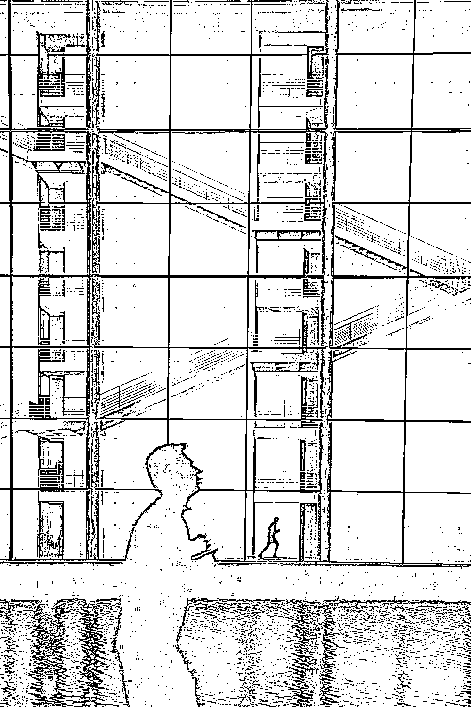

**April 的回信**
亲爱的达娜：OK，我承认我爱死七宫了！你精彩的假设（虽然目前还只是假设），我非常赞同这个理论——我的七宫并没有装满我喜欢的那些特质。哲学家、小丑、假装无所不知的人，诚然，我的上升在射手座。记者、八卦消息、传媒工作者，我要求的这些与我七宫双子有关的特质，很高兴我在身边亲爱的人身上看到了。 然而，我曾经对你关于“婚姻神话”的理论很好奇，它也影响到了我们对婚姻的期望。在我查看自己的星图时，它提供了很多的见解。水星是我七宫的宫主星，所以第三宫、水星、双子座描述了我婚姻的主要情况。父亲在我很小的时候就去世了，我对于父母共处的记忆只有一点点。但是我记得那些抚慰我入睡的从楼下传来的声音，那是双子座最美妙的催眠曲。他们坐在楼下厨房的桌边，轻松地交谈，并时时传来笑声。有一个夏天，妈妈带着我和兄弟姐妹去度假，爸爸留下来看庄稼！很多年以后，我偶然发现了那个夏天爸爸写给妈妈的信，美好的，充满感情、有趣的信。就是那种你写给你最好朋友的信。我落在七宫头下降点的双子座意味着我对婚姻的期望是，我的伴侣要是我最好的朋友和知己。我和我丈夫的关系就是建立在长时间的喝咖啡聊天之上。事实上，**所有生活中重要的关系都可以追溯到双子座的特质——交谈。**但是最终神话还是终结于不幸，（我七宫的月亮同冥王星有紧张相位），有一天，宙斯弄来了一堆乌云，他离开了他最好的朋友伴侣 Hera（或者死于车祸，就像我父亲）。当你还年轻并且敏感，遇到这样的状况该怎样面对呢？我选择将这些浪漫的关系设定一个内置的时限。“Oh，他要去坐牢了。”“他比我老很多岁，所以会先我而去。”你看，我可以掌握离开的计划。我感到一种控制。（这同样是月亮和冥王星的紧张相位带来的影响）。我浪漫的计划很轻易的就实现了——因为我父母就是这样的状况，这些人的离开都是你计划内的。当我最终遇到挚友知己，我马上就陷入困境，因为我不愿意他离开，但是另一方面，他却没有一个确定的离去的时限。我被这失控的状态吓坏了。为了幸福的婚姻，我必须学会战胜我对于分离的恐惧，学着相信并爱着没有确定离开时间的人。 然而你的方式——只选择那些能和你像朋友一样相处的人作为客户，听起来很英明也完全适合你。下降点在双鱼座最显著的优势就是能让你全心投入。这很好，但是也很疲惫，我确信。所以你明智地辨识客户（得益于你在处女座的上升），因为你尊重事实，每一次咨询都巧妙地以深刻的方式改变了你的宇宙 DNA。你的每一个客户都是出色的、充满热情的、像艺术家一样的精美宝石——听起来很像双鱼人吧？然而，我的下降点在双子座，每一次咨询都可以扮演 Barbara Walters（美国知名主播主持人）——“让我们来谈谈你的故事吧！”我发现这些人不可置信地有趣。我倾听他们的故事，然后换个更有希望方式将故事再回述一遍，站在他们角度帮助他们获得更深刻透彻的观点。但我没必要成为其中一员。 说实话，我与客户的交流就是有预计结束时间的关系（在 90 分钟的咨询完成后他们会离开，当然再出现是 OK 的）。将“婚姻神话”的七宫理论应用在客户合作关系问题上，我可以清楚地知道为什么我时常会和客户发生权利争斗，而且经常还超过了议事的时间。我没办法忍受客户迟到、不出现、不按时付款。我觉得有点失控，以至于接下来的权利斗争以提醒我，为了能让别人影响我，我必须超越用截止日期来保护自己安全感的行为。这是一个历史悠久的占星学难题，有理论称七宫描述了我们的伴侣，但我并不完全赞同这一点。我认为七宫还有另一层的含义——**它描述了当其他人进入我们的生活，不论是亲密的关系还是敌人，我们提供给他人的关系互动的环境。 **例如，尽管你专注于你处女座上升的强烈的感情实用主义，但我并没有经历你的这些感觉。我可以看到你的这些行为，如果我仔细观察你的个性，我会看到一丝不苟、朴实无华，但这不是你在人际关系里的那一面。我感觉到，走近你的海王星七宫是永恒的。说到你，我亲爱的朋友，我进入了一个有趣的花园，充满想象，自由的想象，而且十分地、非常地浪费时间。和你长时间的聊天或者读你的信就像一次迷你的假期。这就是剧本。这就是总是被忽略的海王星部分的特质——**沉醉其中，享受这过程。**

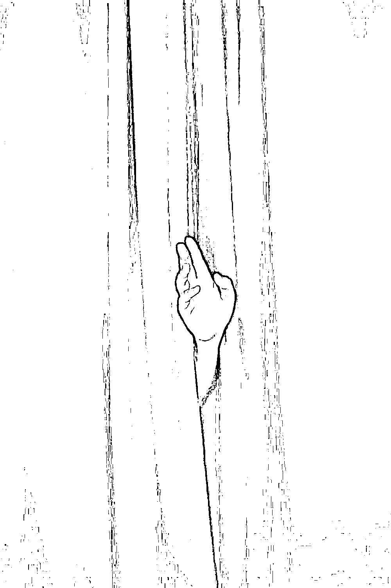

**一旦有人进入了我们的第七宫（不论是伴侣、生意伙伴、致命的敌人），他们就将体验到我们与平时十分不一样的特质，与我们上升星座表现出的不同的个人特质。**细细研究那些被我们丢弃的梦想、激情和人格特质，七宫就像一面镜子告诉了我们这些。**我们的伴侣就像彼得潘的温迪，将彼得的影子拼凑起来（就是七宫），然后将这和我们自己（就是上升一宫）拼合才是完整的我们。 **我把下降点看做一个屏幕，通过这个屏幕可以看到我们在人际交往关系中需要超越的所有被我们带入的问题。寻找潜在的伴侣，我们以下降点指出的特质“面试”他们，选择少数进入我们的第七宫。也许我们甚至收取了门票，期望我们的伴侣在七宫来扮演一个或更多的行星以值回票价。最后，难道这就意味着我们会选择一个合适的伴侣然后跟他扮演同样的关系模式一遍又一遍么？也许，又或者我们学着去和平的与我们的下降点共处！**古典占星里，土星在七宫是擢升的位置，这表示我们要为创造一个我们想要的七宫环境负责任。**但是沮丧的是，**我们总是一次又一次地撞向同一个设在制定满足关系的道路上的阻碍**。如果你觉得不论你多么努力的改变，将会注定重复那些以往的不成功的关系模式，那你真是疯了。当感到沮丧和愤怒的时候，我们想听到的关于过去的事是，我们仅仅是负责改变令人不满意的现状。取代那些我们已经认可的看法，接受那些挑战，调和我们与七宫影子的关系，我们坚信，其他人验证了我们的信念，宇宙正在赐予我们力量。 我星图中处在七宫的月亮让我的一生都在致力于学习如何处理人际关系，然后把我放在了占星界的“Dea rAbby”的位置比我想象的要多得多。即便如此，我对于七宫一点也没有明确的收获。但是我觉得你会赞同，**七宫并不是简单地解读为去寻找另一半，更合理的是，透过这个宫位让我们通过他人的眼睛找到我们自己。但是如果你认为七宫是一个难题……**

**版权声明：**本文由若道翻译发布，欢迎转发，反对抄袭。友号转载请申请白名单。

**达娜·格哈特**一位国际范围内受尊敬的占星师。她为众多占星学网站和出版物讲课、写稿。她在十二宫的月亮激励她对这颗发光体进行了深刻而持久的探索研究。

****学习占星学****

****点击下图了解课程详情**** 

********************

****

****

****

**微信又双叒叕改版啦，不想错过若道君的推送？**

**就把若道设为星标吧！**

**▼**

就是这个“在看”，戳戳戳 ☟

******报名直达入口******

# 好物推荐 | 从"麻瓜"进化成占星师的自我觉察工具（插班中）

> 原文：[`mp.weixin.qq.com/s?__biz=MzA5NjA0NTAxNg==&mid=2651459377&idx=2&sn=a62bef32990ad6ac66d1f78a58b70902&chksm=8b48bd86bc3f34901944df414383a7523e0632a528c81986062570f07d757da4fa79e5b17578&scene=126&sessionid=1692737908#rd`](http://mp.weixin.qq.com/s?__biz=MzA5NjA0NTAxNg==&mid=2651459377&idx=2&sn=a62bef32990ad6ac66d1f78a58b70902&chksm=8b48bd86bc3f34901944df414383a7523e0632a528c81986062570f07d757da4fa79e5b17578&scene=126&sessionid=1692737908#rd)

1

**自我觉察，是智慧的基础**

每个人都有自己的内在冰山，自我觉察能够帮助我们觉察自己的行为、情绪等，然后向内深层探索，探索自己的行为、情绪背后的深层渴望、期待。学习和应用占星学的过程，就是慢慢掌握自我觉察工具的过程，当你熟练掌握了占星学，也就具备了帮助引导他人觉察到自身生命议题的能力。**往外张望的人在做梦，向内审视的人才是清醒的。**只有真正向内看，只有当觉察开始由外向内时，改变才会发生，才能够知行合一。

# | 插画师：古戈力

以情绪来举例说明，每个人的情况不同，觉察的程度也不同，觉察有四个层次：***1.*** **不知不觉：**没有觉察情况，当情绪来了，会被情绪控制，做出很多不计后果的事情。而且每次都是同样的状况，反反复复；***2.***** 后知后觉：**情绪过后，自己能够反应过来，自己做的对与错，但是很难避免同样的情况再次发生；***3*****. 当知当觉：**当情绪来的时候，你已经知道在这个当下，正在发生什么。当达到这个层次，你就可以自己控制情绪，从而影响后事的发展；***4*****. 先知先觉：**当事情还没发生，就可以预知它要发生了。因为你对情绪的觉察已经越来越熟练，所以情绪还没来，你就知道它要来了。所以，你也就有了更好的选择和处理方法。所以，我们要自我觉察，向内探索，觉察是为了接纳，然后做出改变，成长，迭代，升级。**那么要如何练习自我觉察，掌握先知先觉的能力呢？**

2

**每日觉察的工具推荐**

**今日天象&近期行进**

若道 APP 中的今日天象功能，罗列展示每一天的具体天象，你当天的行进和行进周期：

作为占星师，可以这样使用这个自我觉知工具：

**记录梦境**如果你有醒来记录梦境的习惯，每天早上看一下睡梦中的天象和行进，对应联想，你会惊喜地发现一些神奇的对应，能够更敏锐的捕捉到日常被压抑的情绪和需求。能够帮助你在白天的工作生活中先知先觉的关注身心状态。**规划生活**每月月初，周初都可以参考天象和行进进行日程规划，预估可能的助力和阻力，在对的时间做对的事，会发现平平无奇的日常也可以有不一样的色彩。根据月相的变化感知情绪的起伏，更好的自我关爱。**感知环境**当身边发生了引起你注意和好奇的事情，或者网络上层出不穷的新闻热点，都可以在天象中寻找对应的能量。从更大的格局视角去思考你的个人观点。通过环境的共振，更深入地理解自己的出生星图。以上都是很好的学习深化占星知识的方法，只需要系统掌握以下知识，就可以开始使用以上方法去提升自我觉知。**第*1*阶 黄道星座&个人行星****概要介绍占星学与星图**

**四元素与三形态**

**黄道 12 星座**

**太阳、月亮及其他个人行星**

**第*2*阶 行星&宫位****木星&土星****天王星&海王星&冥王星**

**练习组合所有行星**

**四轴**

**十二宫位**

**组合宫位、行星、星座****第*3*阶 月亮交点、相位以及初步解读星图**

**了解灵魂进化的路径：月亮交点**

**相位概论**

**相位&行为模式**

**困难相位**

**柔和相位**

**容许度，出入相位**

**渐盈渐亏相位**

**空相**

**宫主星&定位星**

**相位模式**

**组合相位、星座、行星、宫位**

**解读的基本原则，权重，失衡**

3

**课程安排是怎样的呢？**

**第*1*阶**2021 年 9 月 15 日开课，每周一天晚上 20:00-22:00 上课，共 6 次课**第*2*阶**2021 年 11 月 11 日开课，每周四晚上 20:00-22:00 上课，共 6 次课**第*3*阶**2022 年 1 月 6 日开课，每周四晚上 20:00-22:00 上课，共 15 次课 2022 年 4 月 30 日、5 月 1 日**L3 北京两日线下工作坊**

****

4

**授课老师**

**艾德里安·罗斯·邓肯**

**（AdrianRoss Duncan）**

**· **1971 年在印度游学时开始学习占星学，1985 年开始成为全职占星师，迄今执业已超过 33 年，是人本主义占星学、卜卦占星学和经世占星学领域的知名占星师。他还开发了占星软件 AstroClock 和多款占星报告；**·** 哥本哈根占星学院院长；**·** 他在日常咨询中经常运用卜卦，咨询图（卜卦的一种运用方式，即根据客户来访时间制作星图，从星图中获得大量信息）也是他特别擅长的领域；**· **艾德里安·罗斯·邓肯从 1971 年开始研习佛学，受佛学影响很深，他相信占星学和佛学观点一致，转化的一个基础是在于对现实感知的改变。而卜卦很容易与佛教融合，因为它只关乎当下。

**大卫·瑞雷**

**（David Railey）**

**·** 若道联合创始人，致力于在中国教授和推广西方占星学；**·** 曾任 ISAR 全球副主席，CAPISAR（ISAR 职业占星师资质认证机构）主席；**·** 1976 年，通过亚特兰大职业占星师考试，成为全职占星师，随后通过 AFAN 和 ISAR 职业测试；**·** 1980 年，与杰夫·焦耳一起在亚特兰大创建“每日行星”占星学中心。此后在亚特兰大占星协会担任 4 年考官，并且两次担任亚特兰大地区占星协会主席。1979-1992 年，作为占星师活跃于美国社会媒体，向不了解现代占星学变化的大众宣传专业占星学知识。在 1989-1992 年期间，他在 WRGG 电台 12 频道每周主持个人电视秀“今日占星学”，早先他还在 WRFG 的广播节目中播讲宇宙天气节目；**·** 2010-2014 年，任全美占星师联盟监督委员会委员；**·** 2010 年，其著作《灵魂的目标》中国版出版，和蒋颖一起创办若道占星学校和其官网 www.nodoor.com；**·** 2017 年，被选为 ISAR 委员会成员。ISAR 是世界最大的国际占星机构，会员遍布 45 个国家，2017-2020 年曾任 ISAR 全球副主席、CAPISAR（ISAR 职业占星师资质认证机构）主席。

**克里斯蒂娜·罗登贝克**

**（Christina Rodenbeck）**

**· **克里斯蒂娜·罗登贝克（Christina Rodenbeck）是一名全职职业占星师，在牛津大学城生活和工作，深受周围知识和文化氛围影响；她拥有伦敦大学（University of London）的人文荣誉学位，曾在伦敦占星学馆（AstrologicalLodge of London）、心理占星中心和占星研究学院学习；**·** 作为一名占星师，在过去的 20 年里，克里斯蒂娜在她的网站“牛津占星师”上写了大量关于时事、艺术和文化的文章；她每月主持一个占星播客：“与克里斯蒂娜和萨莉一起占星”，并定期在《占星杂志》(Astrological Journal)上撰写时尚专栏；她定期在英国授课，并保持着蓬勃发展的专业实践。

**琳恩·贝尔**

**（Lynn Bell）**

**·** 世界最受欢迎的占星学演讲者、作家和老师之一。定居巴黎，研究心理占星学和家族模式数十年；

**·** 著名的心理占星学中心（Centre for Psychological Astrology）的长期导师。2016 年，获得查尔斯·哈维（Charles Harvey）杰出的占星学服务奖；

**·** 作为一个从多个层面进行工作的占星咨询大师，琳恩的工作结合了心理学的观点。她对家族模式的兴趣首先来自与客户的合作。通过在分析领域所做的个人工作，她所受的埃里克森催眠训练将她引领至家族系统。后来，她组织研究小组在家族星图上进行了数年的研究。她写的《家族占星学》就是这项研究的结果；

**·** 法国心理占星学协会的会长。除了占星学，她在法国沙特尔的新沙特尔学校任教 8 年，还 5 次获得了在《纽约时报》畅销书作者卡罗琳·迈斯（Caroline Myss）的卡罗琳·迈斯教育学院（Caroline MyssEducational Institute）合作教学的机会。**课程助教：**

**熊鹰老师**

**（天空的空）**

**·** 2008 年接触严肃占星学，至此爱不释手；**·** 2013 年师从大卫·瑞雷，研习现代占星学核心课程，并于 2014 年起担任该课程的助教，之后于 2017 年与 2020 年两次与大卫老师合作讲授完整核心课程（Level 1-5）；**·** 期间也跟随格伦·佩里、诺·泰尔、理查德·塔纳斯、罗伯特·汉德、苏·汤普金斯、斯蒂芬·弗里斯特、琳恩·贝尔、艾德里安·邓肯等多位国际占星大师进行学习，进行定向占星主题研究；**·** 2014 年末，通过国际占星研究协会（ISAR）资质认证并获得证书；**· **在若道占星任职六年余，以“传播系统、专业、实效的占星学”为职业使命，执教与助教已累计超过 700 小时。在业余期间也提供占星咨询服务；**·** 目前正着眼于占星学与中国文化之互参，以当代中国人的身心成长为目标，力求落到实处。

5

**此次课程适合哪些人？**

**·** 对占星学感兴趣，想要入门的零基础者**· **占星学小白，想通过星图学习识人之术**· **有一定占星学基础，但不知道该如何整合星图复杂碎片的人**· **想要师从更多殿堂级占星导师学习占星心法的人**· **走在自我探索和个人成长道路上的人

6

**课程价格**

**L1-3 价格**：15000 元

其他各阶段课程单报价格，请咨询课程顾问：**Maggie 老师**（微信：18510107057，请备注**“核心课”**）

长按二维码添加 Maggie 老师

7

**退转课程**

****· 退款原则请详看《教学协议》，如有疑问请咨询课程顾问****

****名师汇集金牌核心课程****

**授课老师：**琳恩·贝尔、艾德里安·罗斯·邓肯、克里斯蒂娜·罗登贝克、大卫·瑞雷

**授课时间：**2021 年 9 月 15 日起

**授课方式：**网络课程**，**英文授课，中文翻译

**费用：**L1-2 价格：4800 元**；**L1-3 价格：12000 元

**课程负责人：****Maggie 老师**（微信：18510107057，请备注“核心课”）

长按二维码添加课程负责人咨询~

****报名请点击“阅读原文”****

# 10.30 厦门线下沙龙丨发挥土星和木星的联动效应，构建满足人生

> 原文：[`mp.weixin.qq.com/s?__biz=MzA5NjA0NTAxNg==&mid=2651459377&idx=3&sn=379cdacff614e30dca3f524648f6d1a3&chksm=8b48bd86bc3f34903da85cf4ab115e500d0ad9879684d06d196271a779c9ec98f00c1b3faf51&scene=126&sessionid=1692737908#rd`](http://mp.weixin.qq.com/s?__biz=MzA5NjA0NTAxNg==&mid=2651459377&idx=3&sn=379cdacff614e30dca3f524648f6d1a3&chksm=8b48bd86bc3f34903da85cf4ab115e500d0ad9879684d06d196271a779c9ec98f00c1b3faf51&scene=126&sessionid=1692737908#rd)

运用好土星和木星是非常重要的。**我们用土星和木星支撑建构起我们的人生。**如何让理想照进现实、如何靠信念支撑前行的艰难、如何让责任与自由相互成就、如何让取舍帮助成长、如何运用目标与规则、如何活出你想要的成就、如何现实与内心都丰盛踏实，**这些问题的答案都在你如何发展土星和木星的联动效应，让它们互相合作，充分运用起来。**

**本期沙龙主题**

**10 月 30 日，若道厦门下午茶沙龙在疫情解封后再次启动。**我们在厦门若道办公室再次一起喝茶聊占星。滴答老师会以**“如何联动土星和木星构建满足的人生”**为主题，为到场的同学们做星图解读，也以此为主题，和大家一起探讨、交流、并答疑解惑。

**我们会看看你的出生星图中的土星和木星，探讨你在现实生活中是如何运用它们的，又如何更好地运用它们。**

此外，**我们还会看看行进的土星和木星**（12 月 30 日木星换座到双鱼座），看看如何切实把握行进的土星和木星带来的课题及机会，同时也结合出生星图上的土星和木星，将它们一起运用，争取发挥最大效应，确确实实的成就眼前小目标，享受当下福利，累积成就未来。

**适合人群**

在这个沙龙上，你既有机会获得个人的迷你咨询，又可以加深对相关占星学知识的了解和运用，同时还可以学习滴答老师的解读星图之道。不仅如此，你还可以结交厦门的占星爱好者，大家相聚交流，享受美好的下午茶时光。

在沙龙中，你可以解读到场同学自己的星图，也可以解读自己家人孩子的星图，但请注意，你只有解读一个星图的机会，报名时请提交要解读的星图资料。

**参与方式**

*   **沙龙地点：**厦门市集美区璀璨天城二期 3-A 2904 室（世贸广场边上）

*   **沙龙时间：**2021 年 10 月 30 日（本周六） 14:00-17:00

*   **参与人数：**场地限制，仅限 6 人，报满即止，先到先得

*   **活动费用：**268 元/人

*   **报名方式：**添加客服微信 di2019da（备注“厦门沙龙”）

或扫描下方二维码添加微信

# 人物访谈丨若道创始人大卫·瑞雷：占星学是另一种看待生命的方式

> 原文：[`mp.weixin.qq.com/s?__biz=MzA5NjA0NTAxNg==&mid=2651459310&idx=1&sn=1317fb48365509e463aa225feaab2ac5&chksm=8b48bc59bc3f354fe63e40528afe83e8f0dfb2747383aec38fdc5fc7865a03acdb20c50e8555&scene=126&sessionid=1692737908#rd`](http://mp.weixin.qq.com/s?__biz=MzA5NjA0NTAxNg==&mid=2651459310&idx=1&sn=1317fb48365509e463aa225feaab2ac5&chksm=8b48bc59bc3f354fe63e40528afe83e8f0dfb2747383aec38fdc5fc7865a03acdb20c50e8555&scene=126&sessionid=1692737908#rd)

☆****************后台回复“今日”，给你一句生命态度****************

********************************

作者/大卫·瑞雷 访问/若道君
译者/Christy 校对/江艺编辑/玫瑰 图片/若道提供

他是若道的创始人之一；他接触占星学 47 年，进行占星咨询已 40 年；他是美国首位在电视上主持占星节目的职业占星师……他就是大卫·瑞雷。来看看大卫老师向我们展示的占星学从业心路历程吧。另外，大卫老师参与授课的[四大名师核心课](http://mp.weixin.qq.com/s?__biz=MzA5NjA0NTAxNg==&mid=2651458519&idx=3&sn=0c2a5ccab0f8eab99d96aa7118d55f91&chksm=8b48b960bc3f3076287c79fddabc239b040c20a986c0d4bdf88d1f437c8f8f49f48898ac4372&scene=21#wechat_redirect)（点击链接可阅读），也欢迎你来了解更多详情！

**我是如何开始学习占星学的？****提问：首先，请您用一句话给自己下一个定义。****大卫老师：**富有灵感的（无论好坏）！**提问：你是多少岁开始学习占星？是什么因素促使你接触占星学？****大卫老师：**19 岁。我的冥想课老师和他的妻子向我介绍了占星学，并借了些书给我。

 

| 青年时期的大卫·瑞雷

**提问：听说你曾因为家庭原因做过心理治疗，你小时候其实是比较艰辛的，可以聊一聊那个阶段你是怎么走出来的吗？**

**大卫老师：**许多受到心理学或占星学等咨询领域吸引的人，都是在寻找他们自身问题的解决方案。尽管我在成长过程中有很好的照料者——我的姑姥姥、祖母、母亲和她的女佣欧拉，但是我童年生活围绕的中心是母亲的残疾带来的创伤。

由于神经外科医生的疏忽，我的母亲在我 14 个月大的时候就残疾了。虽然进行了数年的物理治疗，但在后来的 53 年里（她当时 27 岁），她依旧没能从轮椅上站起来。我一直和姑姥姥住在一起，4 岁时才和母亲团聚。从那时起，一直到我十几岁的时候，她的挣扎、抑郁和愤怒都占据着我的生活。

| 少年时期的大卫·瑞雷

我很早就对所有与灵性和宗教有关的事物感兴趣，虽然在 14、15 岁的时候，我曾短暂地信仰过不可知论。然而，在我 20 岁出头时，**我意识到，有许多情感问题是我在逃避的，即便在强大的灵性体验中，我也没有面对这些问题。**

于是，我开始了长达 16 年的治疗探索，包括心理疗法、原始尖叫疗法、再生疗法/身体疗法和全息呼吸法。这些治疗方法的所有阶段都有极大的帮助，让我得以将我的情绪体与精神、肉体整合起来。

自那时起，我一直在不定期地为个人成长寻求咨询或参与工作坊，比如 2015 年 6 月斯坦·格罗夫的全息呼吸法工作坊，以及随后的创伤及压力释放训练。**如果我们敞开胸怀接纳疗愈，生活本身就能带来惊人的疗愈效果**，但是，致力于疗愈常常需要采用一些过程将我们带入**内在的宁静、接纳之地**，让我们更大程度**实现潜能**，以更开放的态度**享受生活**。

**占星学在整个过程中也给了我帮助，它是一名向导，为我的生活经历和疗愈过程提供参考坐标。**

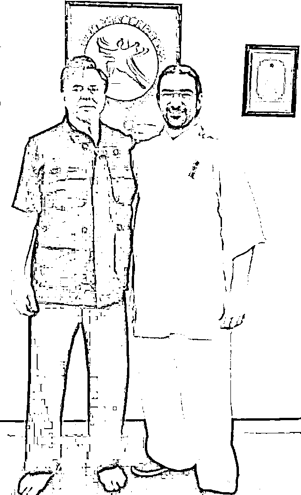
|大卫·瑞雷与其太极老师

提问：你学习占星学的历程是什么？遇见过哪些有意思的老师？

大卫老师：1970 年我刚开始学习占星学时，我把能找到的书都读了，**从中我学会了如何构建星图**。我会把我熟悉的**家人、朋友**拿来与他们的**出生星图进行比照**，发现其中有着**惊人的关联**。

我还参加了许多占星师的工作坊，比如**比尔·蒂尔尼**和**伊莎贝尔·希基**，以及后来的**丹恩·鲁伊尔**和**马克·E-琼斯**，但是我的主要老师是**罗斯玛丽·琼斯**（我在 1971-1974 年间跟随她学习）和维姬·格林（我在 1974 年跟随她学习了一年）。自那以后，我也一直参加其他占星师的工作坊和讲座，或许在 1976 年我拿到职业资格证之后参加得更多。

**我的职业生涯故事**

**提问：据说你曾经去监狱里为犯人咨询，可以说一说那段经历吗？**

**大卫老师：**这只在我做占星师的时候发生过两次，是同一名犯人。我认为我们的咨询对他很有帮助，因为咨询完之后，他就做出了改变命运的重大决定——参与到 FBI 提供的一项证人保护计划中。（有趣的是，我在二十几岁时是一名业余足球运动员，在亚特兰大联邦监狱做咨询时，我们球队主动提出与犯人球队进行比赛，作为社区服务。两场比赛我们都输了，他们的球队真棒！）提问：你在占星师的职业生涯中取得了哪些成就？

**大卫老师：****我做专业咨询已经 40 年了**，其中有 38 年我没有其他收入来源。我与许多企业、名人、政客、政府官员等合作过，奥斯卡影后朱利安·摩尔也是我的客户之一。我为一家名为 A.W. Hutchison and Associates 的建筑有限公司做了 25 年的占星顾问（1980-2005 年），这家公司后来成为了行业最大的公司，并在 2005 年以 2300 万美元的价格被收购。

**提问：听说你有些客户都超过了 30 年，甚至他们的孩子、孙子都找你咨询，那是一种什么样的感觉呢？**

大卫老师：事实上，一些客户与我认识已经 40 年了。是的，包括他们的孩子，有时候甚至是孙子也成为了我的客户。**人本主义占星师要与客户建立关系，成为他们的可靠顾问，引导他们走过生命中诸多困难重重的荆棘之路和充满喜悦的成功之路**。我很荣幸能够有机会为我的客户服务，成为他们生命中的一部分。我与许多客户都非常亲近，在我来中国期间，他们中有许多人依旧每天在 Skype 上向我咨询。

 | 大卫·瑞雷在工作坊

提问：你的星图上哪些特质利于你成为占星师、老师？

**大卫老师：****出生星图的确反映了一个人的潜能**。从出生星图的角度看，我会说，是我星图中强烈的海王星和 12 宫主题暗示我要发展我的共情和直觉潜能，帮助我成为一名占星师。

提问：除了占星师，你还做过其他什么职业？

**大卫老师：**在高中和大学时期，我通过做园林绿化工作和建筑工作来赚外快。在我发现占星学的时候，我正在美联社（美国最大的通讯社）工作，我大学主修的是**新闻学**。作为一名占星师，我成为了 WSB 电视台一档早间电视新闻节目**《早安亚特兰大》**的常驻嘉宾，该电视台隶属于美国广播公司 ABC，而我是**首位受邀上节目的职业占星师**。

| 该时期的大卫·瑞雷

1982 年至 1985 年，我在 WRFG 广播电台主持了一档节目，叫作**《每周宇宙天气预报》**。在 1985 年至 1988 年之间，我获得了电视与影像制作资格证，并在 1989 年制作主持了一档每周 30 分钟的直播节目**《今日占星》**，这档节目持续了**4 季**（1989-1992 年）。 虽然作为占星师我生活得还不错，但我还在 1993 年至 1998 年间担任了**剧作家和编剧顾问**。1994 年至 2000 年，我住在洛杉矶，写了**六部剧本**，其中一部**《米兰达峡谷》**在 1997 年被派拉蒙选中，但没能投入制作。**关于若道的那些事**提问：你和蒋颖创办的若道占星在中国主要提供哪些服务？

**大卫老师：**若道本质上说是一个**提供占星教育的平台**，当然也出售**占星报告**。我们开办了**工作坊、讲座、课程**，尤其是**在线教育课程**。我们有 9 名正式教员，其中**理查德•塔纳斯和诺•泰尔**两名老师都毕业于**哈佛**。

 

| 大卫·瑞雷在工作坊

 **提问：自 2010 年 10 月您第一次来到中国，您已经在中国教授占星学近 11 年了。你对这 11 年有怎样的感受?** 

**大卫老师：**这 11 年改变了我作为一名教师的角色，因为中国学生的要求与西方学生不同。一般来说，中国学生学习更系统，逻辑与灵感和案例同等重要。**提问：****您的学生总是被您教授占星学的热情所鼓舞，您怎么能保持这样的热情呢？您有没有为工作而感到无聊的时刻？****大卫老师：**我在教授占星时从不感到无聊，从来没有，因为占星学始终引人入胜，而且教学很有趣！我的学生给予我激励和挑战，促使我成为最好的老师。 我唯一感到挫败的时候是当我觉得我未能正确传达占星学概念或方法的时候。**提问****：作为一名占星师，您在这 10 年里学到了什么？作为一名教师，您在这 10 年里学到了什么？****大卫老师：**作为一名占星师，过去 10 年的实践让我更加认识到“咨询”对客户的重要性，以及职业占星师遵循“最佳实践咨询指南”的重要性。在过去 10 年中，我认为我的中国学生促使我成为了一名更好的老师。我学会了使用“知识点”来强化学习过程。灵感和热情很重要，但如果不以合乎逻辑的方式将这些点联系起来，学生可能会怀疑自己是否有能力获得和老师引证的相同的结果。**提问：若道是国际占星研究协会 ISAR 在中国唯一的附属学校。ISAR 拥有职业占星师的认证计划。作为认证计划的前任总裁，您能否详细介绍一下？它与其他占星学校的认证有何不同？**
**大卫老师：**ISAR 是一个非营利性国际组织，在 47 个国家促进职业占星学的标准和伦理。ISAR 是 ISAR 职业占星师资格认证机构（CAPISAR）的伞式组织。ISAR 还指定了 22 所占星学校（包括若道）作为 ISAR 附属学校，为寻求 ISAR CAP 认证的学生和毕业生提供伦理培训、咨询技能培训和能力考试。ISAR 认识到全球职业占星师面临的挑战，通过 ISAR 的明星俱乐部和在线密集研讨会提供专业支持网和持续的教育平台。ISAR 为其 400 多个 ISAR 中国成员和中国的 127 个 ISAR 认证占星师感到自豪，这些都是自 2012 年第一批中国成员加入我们之后的成果。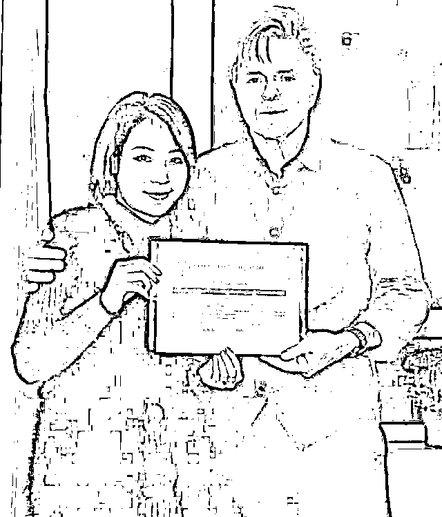 | 大卫·瑞雷与若道学员**提问：我们知道这是第一次在若道的核心课程中安排四位老师。是什么让您有这样的想法，把这些老师聚集在一起教授核心课程？**
**大卫老师：**老实说，**这就是将“西方最好的占星师”带来若道教授占星学的另一种方式，这一点正是我们初创若道的目标。**我很高兴能将四位教师的经验结合起来，他们每一位都是具有专业素养且受人尊敬的教师，相当于将 190 年的占星学经验纳入一个为期 2 年的课程。**提问：我们知道，在新课程中，若道有 3 名 ISAR 认证的占星师作为助教，并为所有希望在课程毕业后成为职业占星师的学生制定了执业占星师发展计划。能告诉我更多信息吗？****大卫老师：**若道的两年核心课程实际上是一个“强化课程”，若道的支持系统会为我们的学生提供服务。**我们的学生在他们的微信学生群中相互学习，助教也会监督这个群，参与讨论、提供每周测验并回答问题。**此外，**助教还负责监督学生学习小组，这些小组按照占星学科目划分，包括研究项目和作业。**最令人眼前一亮的是，**助教每两周会为学生提供一次在线沙龙。**助教是学生向老师提问的主要渠道。在每周一次的网络研讨会之后，助教都会收集学生的问题并对其进行优先排序，然后发送给所有四位老师。**提问：您对未来 10 年的占星学和您自己的愿景是什么？****大卫老师：**我对中国和其他地方的现代占星学的愿景是，看到这个领域发展成为一个更受尊重的领域，作为一门整体科学的地位被更好地理解和接受，成为一种有助于个人成长，有助于和谐社会的咨询选择。在未来 10 年里，我希望我能为实现这一愿景做出我的贡献。**提问：继《灵魂的目标》之后，您在中国还撰写了两本著作，您能介绍一下这两本书，以及您写这两本书的灵感来源吗？****大卫老师：**在《灵魂的目标》之后，我还撰写了《一生的旅程》，从个人成长的角度介绍了 12 星座。我写这本书是为了帮助人们真正理解 12 个星座，因为这是学习占星学的基础。此外，我还写了一本科幻小说《2121》，也是出于占星学的动机，在这本书中，我想象了一个未来，在那里占星学将成为中国复杂人工智能发展的一个重要方面，为人工智能个性发展提供基本算法。这本书本来是一个有趣的故事，但它也引发了关于生命本质和进化中固有的宇宙模式的问题。***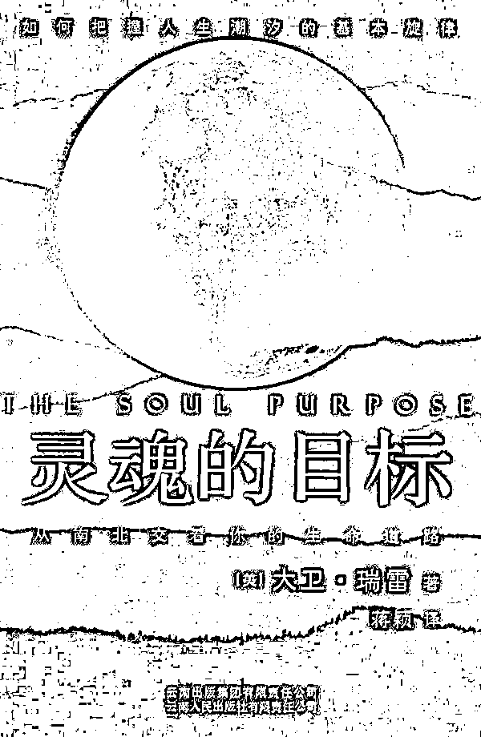***| 《灵魂的目标》**提问：在中国，大多数人在 60 岁退休。您现在已经 70 岁了。我们看到许多占星师，例如雷·梅里曼、斯蒂芬·弗里斯特、苏·汤普金斯、琳恩·贝尔、格伦·佩里、阿德里安·邓肯，都在 70 岁左右。但它们仍然像您一样工作。是因为你们都热爱工作还是占星学是一个独特的行业还是其他什么原因呢？职业占星师与其他职业相比有什么不同？****大卫老师：**占星学是一个非常激发理性的领域，它的吸引力不会随着年龄的增长而减弱。你列出的所有占星师都会同意占星学让我们保持年轻和“谦逊”，因为我们每周甚至每天都能从占星的角度学到一些新东西。正如我一位从未学过占星学的朋友曾经说过的：“占星学就是用另一种方式看待生命。”**占星学是另一种看待生命的方式，是的，它是一种人生观，不断教育我们“敬畏一种意义深远的生命”。**谁会想退出这个行业呢？占星学会随着年龄的增长变得越来越有趣！**提问：请告诉想要认真学习占星学的人为什么要参加这一课程？** **大卫老师：**我所能告诉你的是，若道的核心课程为认真学习占星学的学生提供了有力的支持体系，有“西方最好的”、经验丰富的老师——还有获得 ISAR 认证的中国老师和助教，以及一个支持 ISAR 资质认证的项目。

**版权声明：**原创文章由作者授权发布于若道平台，欢迎转发，反对抄袭。友号转载请申请白名单。

****想阅读更多作者的文章，请在后台回复******大卫****** 即可。****

**喜欢文章请长按下方二维码打赏**

**给大卫老师加杯咖啡呗~**

**▼**

每个人都有自己的内在冰山，自我觉察能够帮助我们觉察自己的行为、情绪等，然后向内深层探索，探索自己的行为、情绪背后的深层渴望、期待。学习和应用占星学的过程，就是慢慢掌握自我觉察工具的过程，当你熟练掌握了占星学，也就具备了帮助引导他人觉察到自身生命议题的能力。**往外张望的人在做梦，向内审视的人才是清醒的。**只有真正向内看，只有当觉察开始由外向内时，改变才会发生，才能够知行合一。所以，我们要自我觉察，向内探索，觉察是为了接纳，然后做出改变，成长，迭代，升级。**那么要如何练习自我觉察，掌握先知先觉的能力呢？****只需要系统掌握以下知识，就可以开始使用以上方法去提升自我觉知。****名师汇聚核心课程 L1-L3 报名中****点击下图了解更多信息**********

**学习占星学**

**点击或长按下图了解其他课程详情** 

********

****

****

**微信又双叒叕改版啦，不想错过若道君的推送？**

**就把若道设为星标吧！**

**▼**

**喜欢记得点一下在看哦☟**

****报名直达入口****

# ISAR 选修课丨行星交点在集体进化中的作用（今日开课！）

> 原文：[`mp.weixin.qq.com/s?__biz=MzA5NjA0NTAxNg==&mid=2651459310&idx=2&sn=d6a3b8dd642dc649229cb323c64cec16&chksm=8b48bc59bc3f354f5a7ef5542a68a9f8be7afa1b93766d80f8611634d2ca2bba462395bc5fc4&scene=126&sessionid=1692737908#rd`](http://mp.weixin.qq.com/s?__biz=MzA5NjA0NTAxNg==&mid=2651459310&idx=2&sn=d6a3b8dd642dc649229cb323c64cec16&chksm=8b48bc59bc3f354f5a7ef5542a68a9f8be7afa1b93766d80f8611634d2ca2bba462395bc5fc4&scene=126&sessionid=1692737908#rd)

这是一门专门为若道开设的课程！**马克·琼斯**将于今年秋天教授**八节关于行星交点的深度在线课程**，他将通过我们集体进化中的一些重大事件来阐释这一主题。

1

**什么是行星交点？**

**交点是一个天体轨道与另一个天体轨道延伸平面的交点。**任何沿轨道运行的天体都有交点。月亮有月亮交点，每颗行星、小行星、卫星和微小行星也都有交点。

2

**课程教授什么？**

马克老师**首先会讲解基础知识，**介绍行星交点是什么、行星交点运转的动力（包括日心视角和地心视角），然后他会**论述丹恩·鲁伊尔晚期工作中关于月亮交点和行星交点重要性的洞见**，以及它们如何在个人生活和事件中创造一个动态的意义轴，**超越个人出生星图的静态画面。**

马克老师还将简要**介绍自己的一些开创性研究**，并通过精选一些反映我们共同的**集体进化的现代历史事件**，分享他最近的著作《行星交点与集体进化》中的洞见。

**我们将学习木星往外的行星交点**，看到木星交点如何向我们揭示文化和宗教意识形态的集体历史进化，正如我们的文明结构所表现出来的那样。例如，土星和冥王星的交点也在摩羯座，清楚地描绘了我们所有人在这个时期试图进化所面临的挑战，因为在我们生活的世界根本结构的变化中，游戏规则正在升级。

**我们还将学习近期历史中行星交点的影响**，包括最近木星、土星和冥王星在摩羯座的大合相，开始真正意识到当前这个时期在文明进化本身中的集体重要性。理解这些盛衰周期，我们至少可以在这些困难时期仍然抱有希望：我们不会失去一切！

**在整个课程中，马克老师将通过多个历史案例动态地研究这些强有力的交点配置可能如何运作。**

3

**课程安排**

**第*****1*****讲** **介绍行星交点**

我们将学习行星周期如何形成行星交点，并了解日心视角和地心视角之间的区别。

**第*****2*****讲** **什么是行星交点**

我们将深入学习丹恩·鲁伊尔的成熟思想，这是启发马克老师研究行星交点的灵感之源，也是他最近出版的《行星交点与集体进化》一书的灵感来源。

**第*****3*****讲** **双子座-射手座的天王星交点**

我们将学习人类认知和技术如何通过天王星交点的透镜进化。

**第*****4*****讲**** 巨蟹座-摩羯座行星交点**

我们将进一步学习行星交点对社会和文化的影响，深入探讨落在摩羯座-巨蟹座的木星、土星和冥王星交点，并了解它们在过去 1000 年里对我们的全球社会、政治和文化思潮起着怎样至关重要的影响。

**第*****5*****讲** **海王星及其狮子座-水瓶座交点**

我们将学习落在狮子座-水瓶座的海王星交点影响的不同显化，及其在疗愈中的作用；灵性意识形态的发展，及其促使事件结束的倾向。

**第*****6*****讲** **作家案例**

通过原创研究，我们将学习行星交点如何影响了世界上一些最伟大的作家的人生。

**第*****7*****讲** **研究 2020 年**

我们将了解 2020 年的重要意义。

**第*****8*****讲** **回顾**

我们将回顾前面的课程，并探索如何通过行星交点的意涵理解月亮交点。

4

**授课老师**

**马克·琼斯（**Mark Jones**）**

马克·琼斯是一名**占星师、心理整合治疗师和催眠治疗师**，为世界各地的客户和学生提供服务。

马克的第一本书《**疗愈灵魂:冥王星，天王星和月亮交点》**，详细解释他的占星方法论。

他的第二本书**《灵魂的表达:占星学的治疗潜力》**，融合了马克作为超个人心理治疗师和占星学的经验，概述了占星学解读的变革性潜力。

此外，马克还联合其他作者**共同撰写了一些占星书籍**：《占星学:新一代》、《超个人的占星学》以及《进化占星学的洞见》。

**而《行星交点和集体进化》则是他将他对交点研究的集大成之作。**

5

**课程信息**

*   **课程时间：**2021 年 10 月 26 日开始，每周二晚上 8 点，每周一次，共 8 次课。

*   **授课方式：**线上直播，英文授课，中文翻译

*   **课程价格：****6800 元****（课程不分组写走心推荐语转发朋友优惠价：5800 元）**

*   **行星交点名人案例和问答免费试听：**添加课程顾问王老师，发送“行星交点试听”，即可获得免费试听内容。

*   **课程咨询：**王老师（微信：18510107057，请备注“行星交点”）

长按二维码添加王老师

6

**退转课程**

*   **退款原则请详看《教学协议》，如有疑问请咨询课程顾问。**

****行星交点****

**授课老师：**马克·琼斯

**授课时间：**2021 年 10 月 26 日起

**授课方式：**网络课程**，**英文授课，中文翻译

**费用：****6800 元****（课程不分组写走心推荐语转发朋友优惠价：5800 元）**

**课程负责人：****王老师**（微信：18510107057，请备注“行星交点”）

长按二维码添加课程负责人咨询~

****报名请点击“阅读原文”****

# 深度｜当“三王星”经过人生的根基之处：苦痛也在说话，别害怕！跟随生命的召唤

> 原文：[`mp.weixin.qq.com/s?__biz=MzA5NjA0NTAxNg==&mid=2651459222&idx=1&sn=834918be98ec1a15764a362a89965fa0&chksm=8b48bc21bc3f353701d1e148fc93428fe17e55a121139e34cf6f2cf14a5bbe5fda15d4f160a9&scene=126&sessionid=1692737908#rd`](http://mp.weixin.qq.com/s?__biz=MzA5NjA0NTAxNg==&mid=2651459222&idx=1&sn=834918be98ec1a15764a362a89965fa0&chksm=8b48bc21bc3f353701d1e148fc93428fe17e55a121139e34cf6f2cf14a5bbe5fda15d4f160a9&scene=126&sessionid=1692737908#rd)

****☆ **后台回复“今日”，给你一句生命态度**

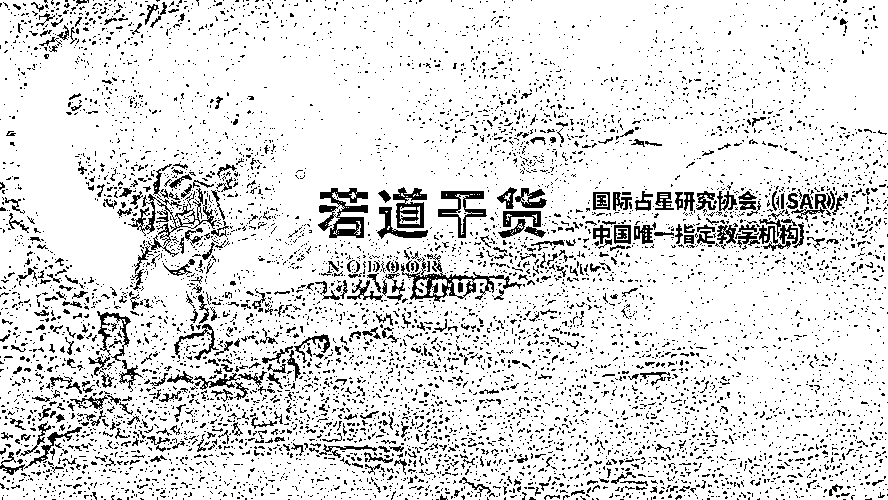

作者/安尼·惠特克
译者/Leisha 校对/江艺编辑/玫瑰 图片/pexels 天王星、海王星、冥王星，统称三王星。当这三颗行星经过轴点，尤其是代表根基的下中天时，是福是祸？很多人可能会感到害怕，事实上，尽管三王星的确会带来一些痛苦的经历，但其中也蕴藏着巨大的宝藏。看看作者的感受吧。**当行星经过下中天**丽兹·格林曾在她的一场讲座中提到过一个具有讽刺性的观察：如果你想要一个相对安宁平和的人生，你应该安排自己在外行星尽可能远离个人行星和四轴的时候出生。许多人看到这里会说：我倒是想！我本人也是如此，但我的所有个人行星与所有外行星都拴在了一起，过得也绝不是什么安宁的人生。（顺便鼓励一下受到类似挑战的人：我不再年轻了，但至少仍然健在！而且对迄今为止我能够利用自己在地球上的时间去做事感到很快乐。）同样，根据每个人的具体出生日期、时间和地点，许多人甚至一辈子也不会经历到哪怕一颗外行星（天王星、海王星、冥王星）经过下中天的行进（给非占星师的读者解释一下，**下中天象征一个人人生的起源点、根基点、核心点**）。不过，我曾经历过非常多次外行星经过下中天的行进，而且还依然在这儿讲述这些故事。故事是这样的……

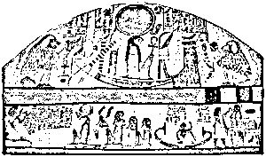

| 冥界——古埃及风格

在我的星图中，下中天与南交点在天蝎座 28°合相。天蝎座的守护星冥王星落在第十二宫，与水星、土星、金星、月亮和太阳合相在狮子座。小时候，我会躺在床上，看墙纸上的玫瑰随着日光渐暗变成凶恶的人脸；我要与他们谈判一番，他们才放我入睡。我如饥似渴地看书，尤其能回想起维多利亚时代小说家亨利·赖德·哈格德的作品，他以极富神秘性的笔触描绘了书中人物在上世纪非洲的冒险经历，让我着迷不已。但书中描写了荷兰探险家达·席尔瓦去世几个世纪后，他冰冻的尸体在乞力马扎罗山高处的一个洞穴被人发现，他时常从《所罗门王的宝藏》转移到我卧室的衣柜里，并持续了好几年。想象力像我这么丰富的人，要入睡绝非易事！

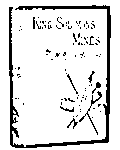

| 《所罗门王的宝藏》第一版

我的“真实”生活——吃饭、睡觉、上学只是我内心生活的附属品，我的内心生活充满了各种我认为非常有趣的问题：我们为什么活着？我们死后会去哪里？我们是否同时活在好几个存在层面上？其他星系在发生些什么？是否有几百万的天主教徒，以及更多的佛教徒和印度教徒？为什么他们都是错的而且该下地狱，而苏格兰自由教会的几千名教徒就是对的而且得到了救赎？如果把木乃伊拆开会怎么样？我可以像印第安希瓦罗人那样缩制人头吗？为什么几千年前的人要在洞穴墙壁上作画？这些都是困扰我多年的问题。除了外公之外，没人知道这些问题的存在。第一次世界大战之前，我的外公曾独自在阿根廷中部生活过一段时间，驯养野马，后来他不顾自由教会的反对，成为唯一一个在当地岛屿医院不分宗教信仰地探望生病或受伤的外国水手的苏格兰教会传教士。他会坚定地对批评他的人说——也对我说：“我们都是上帝的孩子”。从他在我 11 岁那年去世后，一直到我长大离开家之前，我都再没和任何人谈论过对我真正重要的话题。随着冥王星四分我第十二宫的金星、月亮、太阳，随后在 1993-1995 年经过下中天和南交点的合相，我所剩无几的原生家庭以一种极其痛苦和悲惨的方式分崩离析了。为了保护自己免受其他家人破坏性冲动的伤害，我必须做出选择，其中涉及到要与亲人分离，也许是永久的分离。那些年间，我做出的一个重大决定是，**血缘关系并不能为其他人赋予摧毁你人生的权力。**我的确很幸运，拥有占星学这个参考框架，帮助我在一种有意义的背景下理解这些痛苦。为了努力应对当时的境况，我决定编纂家族史，我回到出生的岛屿，从几代人都与我家相熟的老人那里收集一些口述材料。我坐下来写作的那一天，行进冥王星正好合相南交点，离下中天不超过半度。同一周，我回顾了一些自己的旧作，找到了两篇未发表的文章。

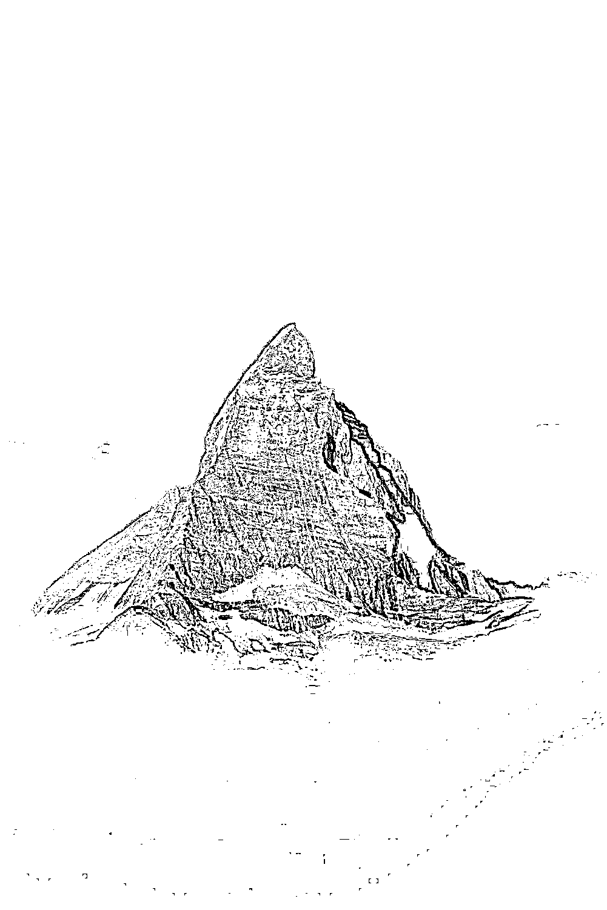

**两篇文章**第一篇文章写于 1970 年 7 月，是海王星行进开始经过下中天的六个月后。我当时完全不懂占星学……**“……姐姐和我决定带着狗从我们家步行到城外一个比海港更靠外、离海非常近的海滩。步行距离很长，但这是风和日丽的一天——在赫布里底群岛惯常阴雨不断的 7 月着实不易见到。****我们沿着一条弯曲的路穿过城镇，然后经过一个可以俯瞰航标的偏远地区。从我记事起，这个航标就一直在海港入口处令人安心地闪烁着电光。接近地区公墓时，姐姐径直向前走，但我放慢了脚步，因为我从未进去过。在我成长过程中，外赫布里底群岛只有男人参加葬礼。****“今天阳光照耀在墓地上！”我对姐姐喊道:“我们进去致个敬吧。”她不是很感兴趣。“你去看过爷爷奶奶的墓地吗？”我问。****“没有，”她说:“也许我们可以去看看。”****我们推开嘎吱作响的沉重大门。墓地被打理得很漂亮，斜坡缓缓向下延伸至离海几百码的位置。我意识到自己不知道爷爷奶奶葬在何处。****“我记得爸爸说过墓地的位置，” 姐姐说:“跟我走。我们的英国名字应该不难找。”****我们的爷爷在第一次世界大战之前被派往外赫布里底群岛，他第一次上岛时遇见了奶奶。英国绅士在这些地区十分少见，对奶奶这样胸怀大志的小岛女孩来说是非常理想的“对象”，奶奶当时也是一位美貌、坚强、倔强的年轻女性。他被深深地吸引了；除了服兵役的时期之外，他漫长的余生都在外赫布里底群岛度过。****他的死让奶奶深受打击。他们共度了 52 年的婚姻生活。我记得和奶奶一起坐在她的卧室里，原本总是衣着优雅得体的她靠在床上，爷爷的一件旧背心没能遮盖住她胸前那对在年轻的我看来是下垂萎缩的乳房。那时，我才终于体会到无法安慰别人有多凄凉——终于知道老人也会哭。她啜泣、痛哭、呜咽，反复说：“我不想活了。有什么用，他走了我活着还有什么用？”****她还是顽强地继续活了 9 年，只有后来家中添了新成员的时候才让她快乐起来。弟弟出生时，我 15 岁，奶奶 82 岁，已属年迈。弟弟名叫弗雷德里克，和爷爷一样；随着新鲜感消退，奶奶垂垂老矣，变成了一个爱发牢骚、性情乖张的躯壳，最后就只剩下躯壳，还成了医学奇迹，她在 86 岁因第四次肺炎发作而离世。****她去世时我在上大学，当时已和她十分疏远，因此我只隐约感到松了一口气……****“我找到了！”**

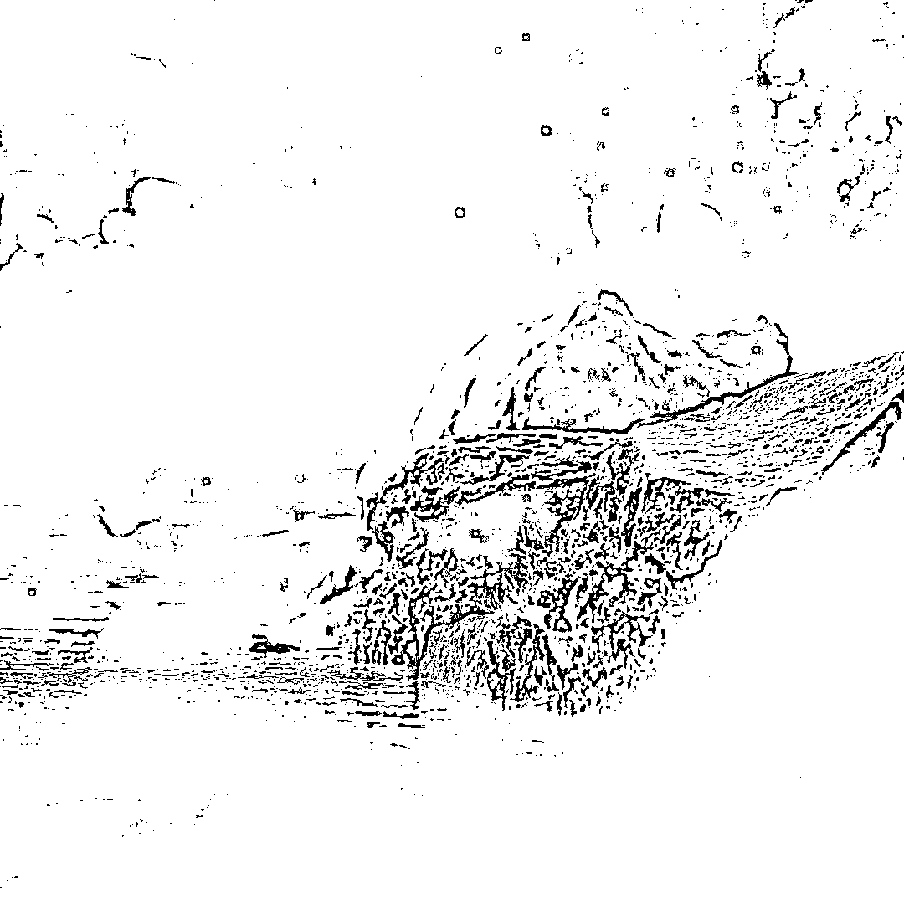

**走神中，姐姐走到了我前面。她站在离我约二十码的地方；我赶紧走了过去。那是个简单朴素的坟墓，周围环绕一圈低矮的栅栏。墓碑是砂岩做的，碑上仅用金色的字刻上了他们的出生和死亡信息。我很满意地注意到碑上没有“花哨的诗文”，奶奶也不喜欢那些东西，我站起来看着坟墓。****没有任何征兆，因为我感觉安宁镇定，但我平静的内心深处传来一阵激烈的情感和轰鸣，孤寂和悲痛的洪流翻涌。我一直哭一直哭，不能自已。****他们躺在里面，与我血脉相连。一切都去哪了？他们早年爱的激情；他们爱的结晶；她推我父亲进入世界时的血汗与痛苦；他们的争吵、沉默、爱、欢笑、寂寞、悲伤；他们携手和分开度过的人生时光，去哪了？都在这了。在这炎热美好的一天，浪花拍打海岸，海鸟盘旋飞行，又急扑入水，地下埋着几块衣物和人骨，一圈铁栅栏围着，上竖一块石碑。****我不仅仅是因他们而哭。全然地意识到死亡是必然，我自己乃至所有的先人和后生终难逃一死，这让我不知所措，我感到一种前所未有的不安、脆弱和孤独。”**但是，第二篇文章写于 1971 年秋天，是海王星行进经过下中天的末期，而海王星当时在射手座 0°，表明还有另外一些东西正从冥界中浮现出来，将要带给我启发和支持：（文中提到的“风笛曲”是一种用苏格兰风笛演奏的哀乐）**“这是一个晴朗的秋日傍晚。彼得刚过 7 点就给我打电话；他要出门练习演奏风笛曲。我要一起去吗？难得的天时地利——天气好，工作的新鲜感仍然让我兴奋、让我满足，而且彼得和我正陷在爱河中。****彼得驱车，向城外开出几英里，缓缓地沿着荒芜蜿蜒的乡间小路行驶到一个小村庄上方的小山上。他拿出风笛开始试吹，调了一会儿音之后开始吹奏乐曲。为了不分散他的注意力，我慢慢地沿路往山下溜达。彼得站在山顶的草堆上，左边有一块小木头。路的另一边是一条长满荆豆灌木丛的沟渠。****沟渠外是一道生锈松脱的栅栏；栅栏另一边是长满苔藓的光滑荒地，荆豆点缀其间，荆豆花鲜亮的黄色随黄昏的深入渐暗。远处，我只能看见高地的山丘，紫色与赭色，暗影在秋日暮色中聚拢。**

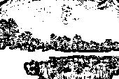

| 金星升起**无数星辰，在金星的带领下，变得越来越亮。一轮柔和的秋分满月缓缓升起，在山丘上投下清光。空气中有一丝凉意。我能感觉风笛演奏的忧伤乐曲像有魔力的水流一样流经我的身体。****到了山脚下，我让自己完全臣服于这一刻的澎湃情感，躺在路中间，张开双臂，凝视星空。****一阵轻柔的微风拂过我的身体，吹得芦苇丛飒飒作响。随着音乐在夜空中飘荡，脱离对自我或当下的觉知，我成了空中一个不受时间限制的灵魂，乘着风笛曲的音符穿行于浩瀚的太空。一种不显眼的节奏、一个节拍开始跳动；越来越平稳，变成了我脑海中的一句耳语：****‘没什么可畏惧的，’我说:‘没什么可畏惧的。’****我死后躺在地下的画面出现在我眼前。这种画面在其他时刻出现时，曾让我倍感恐慌和厌恶，但现在一点也没有。那一刻，我会欣然死去；我的肉体会回归并滋养大地，我的灵魂会飞向无垠之地。节拍继续跳动，它的光将我淹没：****‘没什么可畏惧的，没什么可畏惧的，没什么可畏惧的……’****在那一刻的灵魂狂喜中，我感觉到了灵魂的绝对实相。那一瞬间可能持续了一秒、一小时或十万年；但音乐停止了，那种逐渐控制了我身体的颤栗感轻柔地将我拉回现实……****”**

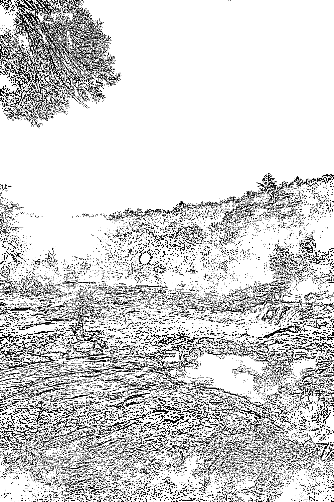

从上述经历中，我瞥见这种激发活力的联结感可能真实存在，这种认识帮我度过了漫长的斗争，最终相信了生命有其整体意义所在，并在之后的几年间找到了自己的方式来创造性地贡献出我的能量。天王星在 1980-1981 年经过南交点、下中天时，我开始学习占星学，由此应验了 20 世纪 70 年代我在英国巴斯一间自助洗衣店偶遇的占星师对我做的预测。我还遇见了我的伴侣，我们搬到一起住，后来结了婚——他的天蝎座月亮合相我的下中天和南交点，他的太阳和金星在水瓶座。这些都非常符合天王星行进经过下中天时期的象征意义！他对我坚定不移的支持，加上多年占星学实践使他深刻地理解了目的论，对我在天王星经过下中天直到现在这段时期中（1995 年末-1996 年初）的个人和职业成长和发展极其重要，而冥王星现正在离开下中天。当冥王星行进仍在经过下中天，但已到了射手座，我申请了一个重要的占星学研究课程，而且被录取了。冥王星精准合相南交点，即将最后一次经过下中天的那一天，我开始了第一年的学习。历经过去几年的动荡和创伤后，我感到一种强大的内心安稳感——在正确的时间来到了正确的地方，已经尽我目前所能为家族传承做了些事——我感觉自己已准备好要进入下一个成长周期。现在外行星都已经过了我的下中天，并进入我星图中的西半球，我感觉自己从过去的许多病态中解脱了出来，更有能力在世界上直接运用从过往继承而来的无可置疑的创造力。我也不再需要与日光渐暗时出现的虚幻人影谈判……

**版权声明：**本文由若道翻译发布，欢迎转发，反对抄袭。友号转载请申请白名单。

**安尼·惠特克**

现居苏格兰格拉斯哥。背景是成人教育、普通和精神病治疗社会工作，并且私人从事咨询、咨询督导和导师工作。从 1983 年开始做占星师、教师和作家。

****学习占星学****

****点击下图了解课程详情**** 

**

**

**

****

**微信又双叒叕改版啦，不想错过若道君的推送？**

**就把若道设为星标吧！**

**▼**

**就是这个“在看”，戳戳戳 ☟**

**********报名直达入口**********

# 雷蒙德·梅里曼金融占星周运 | 10 月 30 日-11 月 5 日，走着瞧

> 原文：[`mp.weixin.qq.com/s?__biz=MzA5NjA0NTAxNg==&mid=2651459222&idx=2&sn=459c4248464b9794d48ae9488c4c4bbe&chksm=8b48bc21bc3f3537af04ddb27c94869ba5bb72a7598ef89e5cb2d045d9365c81b8d965a0ceff&scene=126&sessionid=1692737908#rd`](http://mp.weixin.qq.com/s?__biz=MzA5NjA0NTAxNg==&mid=2651459222&idx=2&sn=459c4248464b9794d48ae9488c4c4bbe&chksm=8b48bc21bc3f3537af04ddb27c94869ba5bb72a7598ef89e5cb2d045d9365c81b8d965a0ceff&scene=126&sessionid=1692737908#rd)

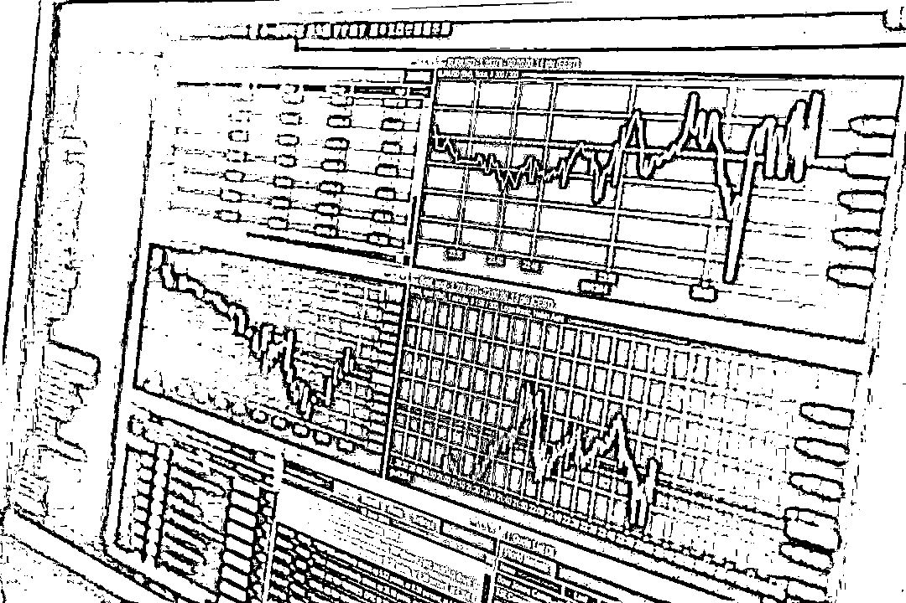

作者/雷蒙德·梅里曼 译者/Luke
编辑/玫瑰 图片/pexels

雷蒙德·梅里曼是在金融占星学界稳坐第一把交椅的占星师，同时他也是若道签约的金融占星课老师，我们引进了雷蒙德·梅里曼老师的《[上证指数月度报告](http://mp.weixin.qq.com/s?__biz=MzA5NjA0NTAxNg==&mid=2651457358&idx=2&sn=7f9716283aa45202cac373edc975a3b9&chksm=8b48b5f9bc3f3cef6942c2670605563f932623c1ef13b686cd99fe8a8160d392160c9a9fdac6&scene=21#wechat_redirect)》及《[黄金报告](http://mp.weixin.qq.com/s?__biz=MzA5NjA0NTAxNg==&mid=2651457358&idx=2&sn=7f9716283aa45202cac373edc975a3b9&chksm=8b48b5f9bc3f3cef6942c2670605563f932623c1ef13b686cd99fe8a8160d392160c9a9fdac6&scene=21#wechat_redirect)》。我们经老师的授权，将每周刊登梅里曼老师的周运，供大家参考和学习。于是，这是本周的周运（10.25-10.29）。

**说明：以下时间采用纽约证券交易所所在地美国东部标准时间。**

**展望与回顾**

****

**随着投资者从科技股转向蓝筹股，道琼斯指数周四得到提振。尽管科技股出现偏离，整体的盈利季表现非常出色，在两个月的沉寂后，大盘回到历史高点。****——塔纳亚·马谢尔和汉纳·缪****《道琼斯指数以破纪录的价格收盘》****2021 年 10 月 22 日**

尽管 10 月 18 日水星结束逆行，在 9 月 27 日水星开始逆行前后或 10 月 7-8 日水星逆行中点前后开始的全球股市上涨却没有结束。这轮上涨也没有在 10 月 15-19 日的三次强有力的木星行进时结束。然而，数个全球股指确实在 10 月 20-21 日暂停上涨，其他几个股指则持续上涨至周末。总的来说，上周的市场行为是非常木星化的。也就是说，股票市场是看涨的，其中一些甚至创下历史新高。然而，全球股票指数的表现不是均衡的，各主要地区的指数表现也不均衡。 

在亚洲和环太平洋地区，印度 NIFTY 指数于 10 月 19 日飙升至另一个历史新高。澳大利亚 ASX 指数、日本日经指数、中国香港恒生指数和上证指数出现了修正性反弹，但远低于 9 月中旬的高点。在欧洲，荷兰 AEX 指数于 10 月 22 日暴涨至历史新高。德国 DAX 指数和苏黎世 SMI 指数也上涨了，但迄今为止，它们的上涨仅构成了对近期下跌的修正性反弹。伦敦富时指数在一周以前的 10 月 15 日创下疫情流行崩盘后的最高点。在美国，道琼斯工业平均指数和标准普尔指数均于 10 月 22 日创下历史新高。然而，纳斯达克指数持续上涨至 10 月 21 日，但离历史高点仍相距甚远。其他市场再次出现引人注目的表现。比特币于 10 月 20 日满月时飙升至历史新高，但以太坊却未能创下新高，形成了市场间看跌背离。截至周五，比特币已经跌破 60000，2 天内跌幅超过 10%。原油飙升至另一个多年高点，周五到达 8422。白银的表现亮眼，于周五再次测试 25.00，自 9 月 29 日来增值超过 16%。黄金也是表现不错的一周，周五达到 1815.50，是自 9 月 7 日来的最高价位。随着我们进入关键的 11 月-12 月和火星影响力的加强，我们在 9 月初举行的中国专场金融讲座上提出的黄金价格目标仍然有效。

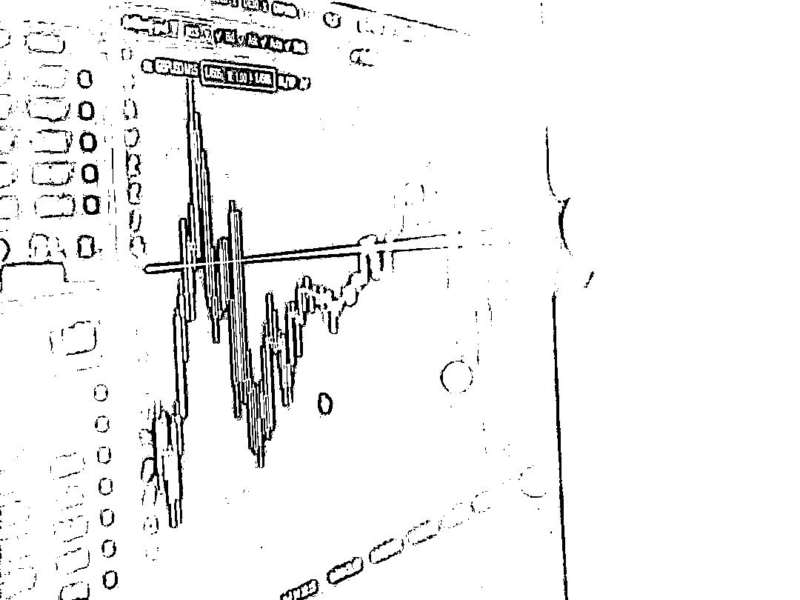

**短期占星趋势和长期考量**

****

**随着新型冠状病毒肺炎封锁松动，供应瓶颈和能源原材料价格上涨无法满足激增的需求。由此引发的通胀上升导致了全球焦虑。****——保罗·汉农、瑞安·杜伯、斯特拉·伊凡****《通胀触发世界范围的警报》****《华尔街日报》****10 月 16-17 日****财政部想要窥探银行账户，以触发更多的审计。本周参议院民主党人在拜登财政部的支持下发布了一项修订议案，将金融机构向美国国税局报告个人账户的门槛从之前的 600 美元提高到 10000 美元。****——《10000 美元的国税局税收大网》****《华尔街日报》社论版****2021 年 10 月 22 日**你可能认为股票指数的历史新高标志着世界经济的未来看起来很伟大，公司和个体户的前景很美好。然而，随着太阳离开讲策略和愿意妥协的天秤座，进入不那么具有外交手腕、更喜欢刺探和要求行动的天蝎座，仍然有相当多的担忧浮出水面。各国政府要求税收机构侵入个人银行账户。可能会发生另一轮有关债务、赤字和新税收的紧急事件。这些活动都由天蝎座及其守护星冥王星所掌管。恰好美国也即将进入其 248 年的冥王星回归，所以这个国家很可能在接下来一个月在这些问题上获得新的关注。作为投资者、交易者和市场分析师，我们为什么要关心这些事呢？很简单，如果你也学习了历史及其与地球宇宙学周期的关联。比如说，我们知道土星-天王星将在今年 12 月 24 日最后一次形成 45 年一次的精准的渐亏四分相，就在金星开始逆行并合相冥王星的一周之后。历史上来看，（所有的）土星-天王星四分之一周期与随后 1-3 年的经济和市场低迷关联度很高。事实上，每隔一次的土星-天王星渐亏四分相周期（相距 90 年），对应着美国历史上两次最严重的衰退（1930-1931 年和 1840 年）。2021-2022 年会再度出现这一 90 年一次的宇宙现象。其次，当我写《2021 年金融预报》时，我发现严重的市场和经济衰退与 20 年木星-土星周期（最近的是 2020 年 12 月 21 日）的头两年存在关联。并不是说这种类型的冲击一定会发生，因为毕竟，它们要不是缺乏准备和超出控制的自然事件引起的，要不就是实施了极端政策和糟糕判断（木星的缺点）导致的。想想 2001 年的 9 月 11 日，以及当时的互联网投机泡沫的破灭，或那以前创纪录的通胀和利率，或更早以前的古巴猪湾危机，或更早以前的第二次世界大战。此外，木星将从 2021 年 12 月 29 日至 2022 年 5 月 10 日重新进入双鱼座。这一组合历史上与剧烈和突发的金融市场反转有关，包括原油和白银。从积极的一面来看，木星将于 2022 年 4 月 12 日与海王星在双鱼座合相。这是一个非常仁慈、慈悲的组合，很多人和领导者们可能会在一场峰会或会议上聚集在一起，分享伟大的愿景，引发对未来的强烈兴奋感。那不全是坏消息或令人失望的消息，反而可能是提出伟大的想法，带来了“让梦想成真“的挑战。这将是一个相信奇迹、放下怨恨的好时机，起码那一周内如此。没人想要听到负面的警告或令人沮丧的预测。那更多像是一场爱的盛宴。有趣的是，它发生在复活节附近。尤其是年轻人，将会在那个春天特别有聚会的心情。关注佛罗里达和沿海地区。尽管这个相位为众人带来祝福，却也可能造成粗心大意。但我承诺了不提出警告，所以忘掉我刚刚所写的吧。（除非你关心你的健康）。短期来看，**天蝎座的太阳将于 10 月 30 日-11 月 5 日激活土星-天王星四分相，紧随其后的是火星于 11 月 10-17 日激活同样的相位。**这些相位不像明年 4 月的木星-海王星合相那样，有利于金融市场或社会-政治事务的平稳航行。然而，**它们可能会激发市场上涨的活力，因为人人都希望在动荡时期拥有一个安全港。如果你做好了准备，就能利用这些突发和剧烈的市场波动获利。****说明：以上日期基于纽约证券交易所所在的美国东部标准时间，由于存在时差，中国地区可能需要加一天。****版权声明：**本文由若道翻译发布，欢迎转发，反对抄袭。友号转载请申请白名单。

**雷蒙德·梅里曼（Raymond Merriman）**

若道签约老师。著名金融占星师，ISAR（国际占星研究协会）前主席，梅里曼市场分析公司的总裁。他由于“提升了占星学的职业形象”，在 1995 年国际占星大会上被授予轩辕十四奖；在 2012 年国际占星大会上，被授予轩辕十四终身成就奖。

1“中国上证指数月度报告”发售

**若道推出了****中文版****的雷蒙德·梅里曼中国上证指数月度报告，并持续发行该报告！**

当把金融市场的周期和占星学的周期相结合时，雷蒙德·梅里曼老师的金融占星学研究**为投资者应对金融市场的周期波动，并随之调整投资策略提供了极大的价值参考**。

**10 月中英文报告已上线！**

2“黄金价格周期月度报告”发售

**若道推出****中文版****的雷蒙德·梅里曼黄金价格周期月度报告！**不仅仅为广大读者在中国股市的投资出谋划策，更将视角放眼黄金市场。

**每当世界经济形式不明朗的时候，有一个地方是保值的港湾，那就是****黄金**。自 1982 年雷蒙德·梅里曼出版第一本研究《地球宇宙学征象与黄金价格的关联》的著作以来，**他一直作为最重要的黄金市场时机预测者之一享誉国际**。

11 月黄金报告已上线，梅里曼老师将会告诉你他对这个关键时期如何操作的想法。也可以按照季度和一年期订阅，有更多优惠。季度和年度的好处是，你可以持续了解梅里曼老师对于不断在变化的市场的看法。即便他某一次看法和市场不一致，你也看到在下一期他如何调整自己的看法，并看到金融占星在一个长期时间段内对你把控风险的帮助。而能够长期控制风险、尽量找到安全的投资时机才是投资的长久之计。

**11 月中英文报告已上线！**

**购买套餐**，买得越多越优惠

中国上证指数月度报告套餐价

*   **单月报告**：280 元

*   **3 个月套餐**：780 元（260 元/月）

*   **12 个月套餐价**：2400 元（200 元/月）

**长按下图识别二维码**

**购买金融报告****套餐**

**▼**

黄金周期月度报告优惠

*   **双报告年度套餐更优惠（直降 900 元）**
*   **12 个月黄金报告+12 个月上证指数报告：仅需 3900 元**

**长按下图识别二维码购买黄金报告套餐**

▼

3 中国金融市场特别网络研讨讲座

面对年底几个影响金融市场的重要天象，该如何把握下半年的投资，为跨年做准备？我们特意邀请雷蒙德·梅里曼老师为大家带来了**3 个小时的金融讲座——雷蒙德·梅里曼中国金融市场特别网络研讨讲座。**

这场为期 3 小时的在线讲座探讨了**这些长期行星周期如何影响世界经济的长期周期和趋势，特别是如何影响上证综指和黄金市场**。并描述**在 2021 年剩下的时间里市场反转关键时间点，特别是 12 月 19 日至 25 日金星逆行，以及土星-天王星最后一次渐亏四分相、金星与冥王星合相的重要时期。**

**长按下图识别二维码购买讲座视频**

▼

**点击阅读原文购买金融报告**

# 刚过去的白羊座满月，你们都经历了什么？

> 原文：[`mp.weixin.qq.com/s?__biz=MzA5NjA0NTAxNg==&mid=2651459195&idx=1&sn=95002ad73c46afb7f20d37174aaa9af0&chksm=8b48bcccbc3f35da19d460d71bed041c42bb34c9db4ac02d66f36a9a9f5399a78569e93a46bf&scene=126&sessionid=1692737908#rd`](http://mp.weixin.qq.com/s?__biz=MzA5NjA0NTAxNg==&mid=2651459195&idx=1&sn=95002ad73c46afb7f20d37174aaa9af0&chksm=8b48bcccbc3f35da19d460d71bed041c42bb34c9db4ac02d66f36a9a9f5399a78569e93a46bf&scene=126&sessionid=1692737908#rd)

**2021 年 10 月 24 日天象：**

*   **月亮在双子座**

*   ******水星与天王星呈梅花相******

*   ******金星与海王星呈宽泛四分相******

太阳昨天进入天蝎座（点击[【太阳进天蝎座】](http://mp.weixin.qq.com/s?__biz=MzA5NjA0NTAxNg==&mid=2651459033&idx=1&sn=d75e77fd23624c63d9c8d006435d234b&chksm=8b48bf6ebc3f3678f0fcb5e8b56abe33270771b130b4b8c520b23a639f294e969ca0a2a23503&scene=21#wechat_redirect)查看文章），转眼间 2021 年只剩下 2 个多月了。本周刚刚经历了充满张力的白羊座满月（点击[【白羊座满月】](http://mp.weixin.qq.com/s?__biz=MzA5NjA0NTAxNg==&mid=2651458755&idx=1&sn=88e10883e46be3e5035b20fbbed52f5a&chksm=8b48be74bc3f376256bf88335a58e4932ba96277a6b2b78057886c20931759b909ed7ab911ae&scene=21#wechat_redirect)查看文章），着重关注“自我与关系的整合”。在这个紧绷的能量氛围里，你们都经历了什么呢？有哪些感受愿意和我们分享？欢迎留言呀~

今天月亮在忙碌的双子座，而双子座的守护星水星，与天王星形成梅花相。和朋友聊天八卦的过程中，没准有灵感出现，或者 TA 的想法给了你一些小小“冲击”，让你看到事物的不同面向。金星逐渐进入和海王星的四分相范围，把精力投入到艺术氛围浓厚的事情上，让人心生喜悦。

周日快乐！我们明天见！ **了解每日天象，可****下载“若道”APP 查看****还有更多精彩等着你哦**

# 天冥时代研究报告丨大时代是如何影响下一代孩子？（内含新一轮招募计划）

> 原文：[`mp.weixin.qq.com/s?__biz=MzA5NjA0NTAxNg==&mid=2651459194&idx=1&sn=a4d7090919c7edaea5bdcd946395ab86&chksm=8b48bccdbc3f35db29afa768704d7593a1b9267d579f97213244375def9ff193d37becf7a56c&scene=126&sessionid=1692737908#rd`](http://mp.weixin.qq.com/s?__biz=MzA5NjA0NTAxNg==&mid=2651459194&idx=1&sn=a4d7090919c7edaea5bdcd946395ab86&chksm=8b48bccdbc3f35db29afa768704d7593a1b9267d579f97213244375def9ff193d37becf7a56c&scene=126&sessionid=1692737908#rd)

****************************☆ **************后台回复“今日”，给你一句生命态度**************

**大时代如何影响一代儿童？**第一次发布亲子访谈招募计划时，我们收到 32 份报名星图。从中发现，有十几位孩子是在天冥四分的时代天象下出生的，也就是**2011 年-2019 年**间。这些孩子目前大都处于**3 岁半到 10 岁**之间，正是我们研究的主要年龄段。这一点引发了我们“亲子占星研究小组”的兴趣。一般来说，外行星的周期主要是观察社会和集体的发展，从历史层面去做研究的。但我们也常说：**一代人有一代人的命运，时代的洪流定会影响到个人。**举个最简单的例子，之前做经世占星研究时，我们就发现新文化运动的领军人物星图中基本都有外行星周期的影响，比如：胡适、周作人的出生星图里都有精准的**海冥合相**；鲁迅星图中有**土海合相、三分天王星**；陈独秀则是在**木天对分+精准的天海三分**时期出生的。胡适、鲁迅们经历的时代无疑是中国历史上一个巨大的转折期，一个旧时代的结束和新时代的开端。他们也直接或间接地参与推动了时代的变迁。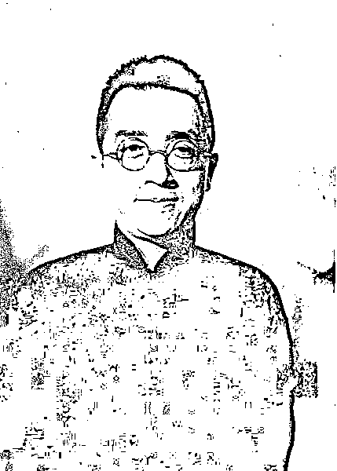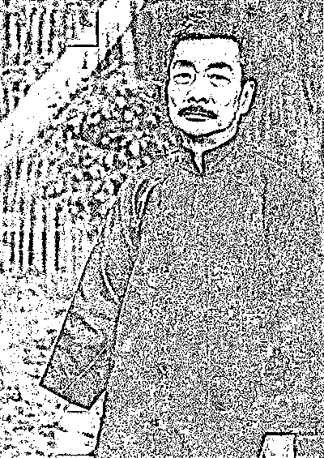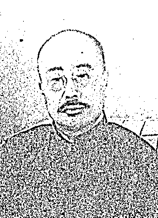

**丨**胡适（左）、鲁迅（中）、周作人（右） 

**回过头来看我们这些孩子的星图里，都有天冥四分，那这一代人会有怎样的共同议题呢？**我们尤其想要探究，**当天冥四分与孩子的个人行星或四轴形成托勒密相位（合相、对分相、三分相、六分相、四分相）时，又会对孩子形成怎样的个体影响？**因此我们决定 9 月、10 月的亲子访谈，都以“天冥四分”为主题进行。但目前案例仍然远远不够，在接下来的几个月，这个主题仍然会持续进行，**欢迎更多的孩子和家长报名，参与我们的访谈计划。**

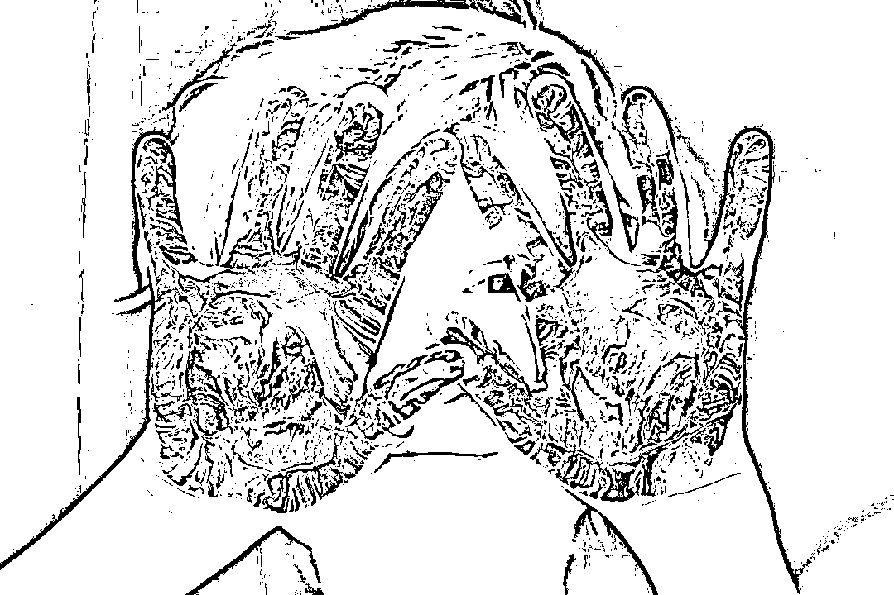

**天冥四分与时代特点**

现在先做一个很初步的小结。

我们先看看天冥周期的特点：**上一次天王星和冥王星在处女座发生合相是在 1965 年前后（1962-1969），当时的历史背景包括美国越战、反战运动、性解放运动、黑人解放运动等，中国也经历了动荡。**

**天王星所代表的解放、革命、自由、叛逆；冥王星代表的摧毁旧事物，彻底打倒重建，浴火重生，都有非常鲜明的体现。**天冥结合起来，具有一种很强的**打破、巨变与重建**的力量。而我们研究的天冥四分相是从**2011 年 3 月，天王星落白羊座 0°与冥王星落摩羯座 7°构成上弦月四分相开始的，直至 2019 年 3 月，天王星第二次入金牛座 0°与冥王星摩羯构成 9°内的四分相位**为止。时间跨度长达 9 年，产生的作用力和影响力更是深远。我们可以看到这个四分相的主题是：**“推陈出新”**——**· 冥王星摩羯座，**不再适合发展的老旧体系将消亡，传统与规范中有价值的部分将被提炼和传承下去；**· 天王星白羊座，**打破和背离旧体制的束缚，创新实验，追求能立足社会、遵守社会公约下的自我独立与发展空间。回忆这 9 年之间的社会和生活变迁，可以帮助我们更好地理解这个天象下出生的孩子们：**他们肩负了怎样的时代使命，将如何演绎他们的一生。我们又该如何伴随和支持他们的成长。**首先时代的变迁是有数字为证的：**·** 2011-2012 年是我国社会经济的一个转折点，2011 年左右长期两位数的经济增长速度下滑，变成一位数，进入长期缓慢增长的“新常态”时期；**·** 2012 年之后，我们也目睹了曾经盛极一时的媒体业的崩塌，互联网公司的转型，移动互联网的盛行，全民创业潮，互联网金融崛起等等。

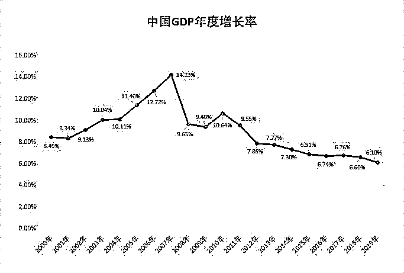

2011-2019 年，整个天冥四分的时期，我们和周边的很多朋友，都经历了人生颠覆和再造般的洗礼。冥王星摩羯座，代表着我们**长期建构的人生舞台、赖以生存的依靠、背负的责任、累积的资源财富，要经历涅槃般的转化**。这个转化被天王星的突发性和不按常理出牌的风格，被白羊座勇往无前的冲击力，迅速地，甚至让人猝不及防地撞开了。剥离发生了。**有些人感觉到被抛弃被冷落的痛楚，有些人为不得已选择抛弃和背离而愧疚，但抬头回望，发现自己从过去的桎梏中解脱了，呼吸到自由新鲜的空气。** 我们研究小组的几个占星师，也都在这个时期经历了彻底的转变，告别了原来的人生舞台和生活方式，以不同的形式结束了自己奋斗多年的事业。从经营企业或做媒体记者，最后都不约而同走上了占星和灵性发展的道路。我们身边的大多数朋友也都经历了生活跑道的转换。有的从事业的高台，选择回归家庭，落实北交四宫的灵魂安处；有的从媒体人转型为作家，专心在家写作；有的结束曾经风头无两的企业，从大老板蜕变成一名华德福老师，沉潜于书法和音乐，发展出与北交点合相的金星海王星；还有从没工作过的家庭主妇，走向事业舞台，成为自成一派的身心灵导师；有的从西藏来到红尘滚滚的大都会，独创出自己的艺术疗愈体系。在这次的访谈案例中，我们也听到了很多父母遇到公司重组、合并、破产、失业、创业失败、换城市、搬家等等曲折的际遇。有的父母中断了晋升渠道，有的创立了新事业，有的开启了另类的学习探索，比如学习占星学或其他身心成长系统，还有的父母从权威的掌控和压迫中抽身。**这样的时代大环境以及父母家庭的变动，对孩子会有怎样的影响呢？**

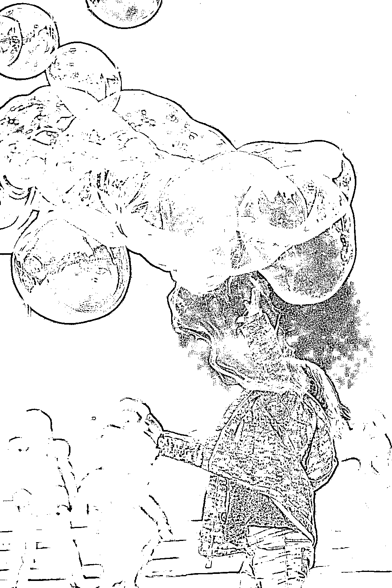

**老陈的故事**时代会如何影响个人，我们想讲一个身边朋友的故事。需要说明的是，这个故事没有涉及天冥相位，涉及的是另一个外行星周期：**土天周期**。但我们可以借由这个案例来说明外行星周期可能如何影响一个人的生命轨迹。暂且叫这个朋友老陈。他出生在精准的土天四分时，正是粉碎四人帮，文革刚结束，即将改革开放的前夕。老陈的星图中，月亮紧密合相了天王星，形成月天四分土星的相位。

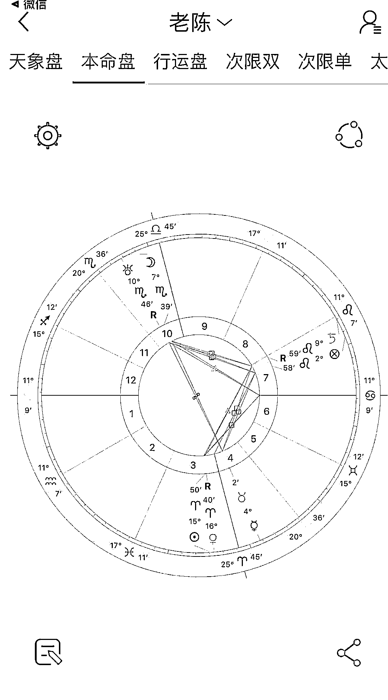

月亮代表着母亲和家庭，代表故土的根。在老陈出生前，他的父亲在林场做工人，母亲在农村务农。突然因为中国三线建设政策的调整，那块林场被整个划给了隔壁的一个发达省，于是老陈父亲被安置到发达省份的一个工厂做工人。这很像是土天四分带来的一种时代变革的红利。虽然只是在一个三线的工业城市，但比起老陈老家一个落后省份的偏远农村已然是一个巨大的跃升。接下来国家改革开放经济建设，父亲的工厂建设旺盛，工资涨了很多。因为家乡太贫苦，一家人忍受了长期两地分居的生活。在老陈四五岁时，作为家中唯一的男孩，父亲把他带到了工业城市上学——老陈星图里的水星也参与到了土天四分这组相位中，他的求学生涯打上了很深的土天的烙印。从此老陈一直远离农村的母亲，远离家乡，跟父亲在工厂里住单身宿舍，寒暑假才能回家。无论在工厂还是农村老家，父母都非常俭省，生活艰苦而恪守传统，而且对老陈的学业要求非常严格。这里也有非常鲜明的土星和天王星的体现。因为这段在发达地区求学的经历，老陈在初中回到故乡后就一直占据学霸的优势，头脑、视野都比家乡同龄人开阔。最后他考上北京大学，彻底改变了人生。他经常感慨，以他的家庭环境和出身（父亲高小学历，母亲不识字）能够走到今天，完全拜时代所赐。这个故事是一个比较典型的例子。**时代的变化首先影响到家庭（月亮），然后改变了孩子的早期教育和学习环境（水星），影响了孩子的性格和意识（老陈在朋友圈子里出名的勤奋自律，又特别有创造力敢冒险），改变了人生轨迹，最终改变命运。**回到我们研究的在天冥周期出生的孩子。与土天代表的变革与发展相比，**天冥的转折可能更加剧烈，更有颠覆性，有彻底打破重建的含义。**我们在想，如果天冥四分与孩子的个人行星或四轴发生紧密的联系，这些孩子可能天然就会有天冥的**独立、革新、反权威、打破重建的个性驱动力。**我们的访谈对象——思思的妈妈说，根据她的观察，感觉这代孩子不好带，因为他们**更勇于表达自我，而不是盲目追随父母或者社会标准的权威，个性都比较强。**在我们的访谈对象中，也确实可以观察到一些迹象。

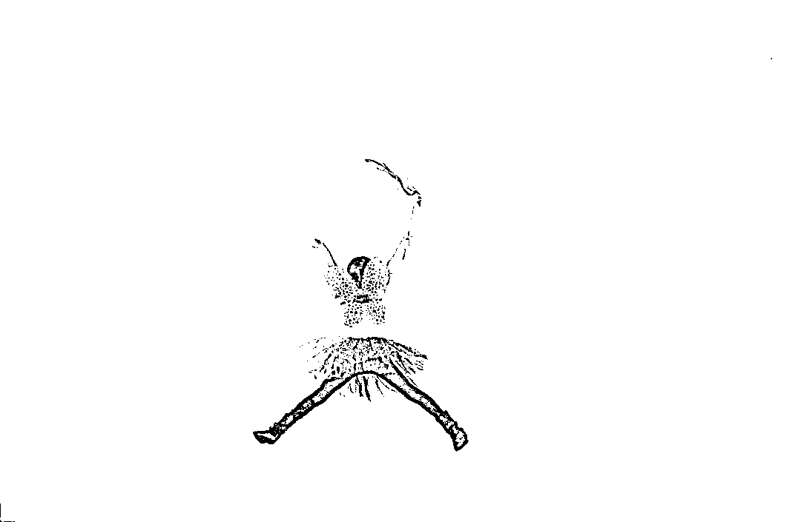

**蓝蓝的故事**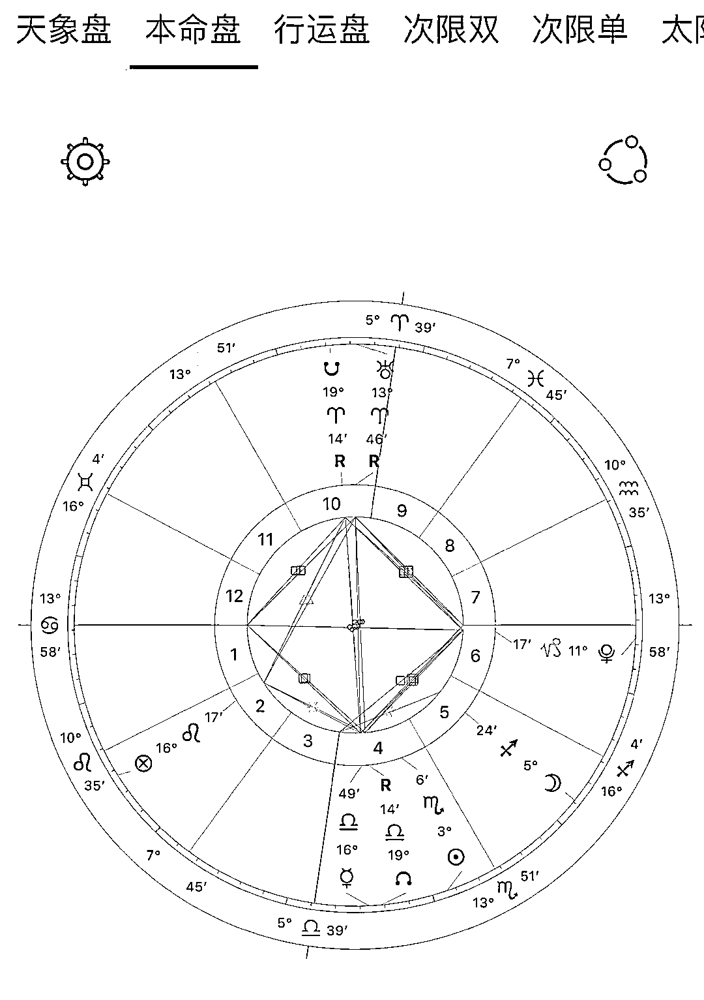7 岁的女孩蓝蓝，是我们的访谈对象之一。在她的星图中，天冥四分不仅与水星、南北交点关联，还与她的中天和下降点紧密合相，它们与上升巨蟹座构成了一个大十字。天王星合相南交点在 10 宫。在蓝蓝出生前后，父母的事业都经历了很大的变化。妈妈因为怀孕中断了自己在事业上的晋升空间，从一个业务能力很强，很有晋升前途的外企采购，回归四宫的家庭生活。这令同事们都十分惋惜；爸爸辞去原本的工作，但新从事的股票投资（冥王星）却获得了很好的收益，带给家庭的财富增长非比寻常，并且在蓝蓝一岁前买了新房子。这里是天冥带来的是另一个角度的反转。蓝蓝被天冥四分影响的首先是**水星**：水天相位，她表现出很强的学习能力，头脑很聪明，三岁起就认得很多字。她说话非常直接，坚持己见，会激烈地反驳大人，有时让妈妈感到尴尬；而水冥相位，据妈妈表述，蓝蓝不高兴的时候说话不友好，比如会对弟弟语言攻击。另外，蓝蓝还会隐藏自己的想法，学校里发生了什么，她常不愿意讲。但在访谈中我们发现，天冥对于蓝蓝的影响，最明显的不是水星，而是**四轴**，尤其是上升-下降轴。这体现在蓝蓝**对外的人际关系方面**。并且，与冥王星合相蓝蓝的下降点，天王四分上升下降，南北交点在白羊座-天秤座均有关联。蓝蓝的议题体现在与父母关系上：**天王星的疏离感，跟父母拥抱时她会比较生硬不自然，反抗外婆的管教，坚持己见；冥王星的情感激烈与不信任，妈妈会感到自己接不住孩子的情绪，很难处理。**这个议题，更鲜明地体现在蓝蓝和小朋友的关系上。**她非常很在意朋友，很容易受同伴的影响而导致情绪不稳定。**跟小朋友聚会时发生一点小事，其他孩子不觉得什么，但她非常伤心，认为朋友背叛了自己，情绪很激烈，会说：“我心都碎了”。**另一方面，蓝蓝在公共场合，又会表现出一些奇怪的、不合适的举动。**比如不分场合，主动和他人亲近，对陌生人特别热情，做鬼脸，爬到别人腿上。显示出北交天秤座既想与人做朋友又不太擅长的特质，以及天王星让人觉得奇怪的独特与勇敢。

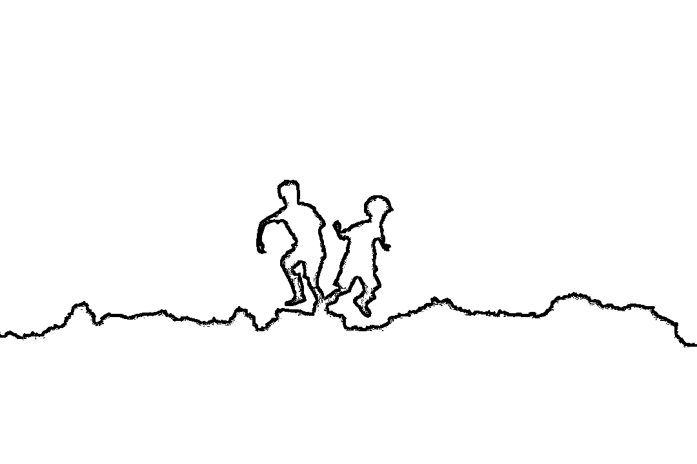

我行我素，坚持己见，不听管教；同时又很重视朋友，对别人的态度非常敏感，情感激烈。这些都是天冥四分在蓝蓝个性层面施加的影响。她需要**学习如何平衡自我与他人之间的关系，以及在对人际交往中对于“社会边界”的认知。**同时蓝蓝**鲜明的个性、充沛的情感和创造力**也给我们留下了深刻的印象，感受到大时代下的一种强烈的能量。作为父母，也需要学习理解这代孩子身上独特的个性。通过观察多个我们访谈的孩子 ，都有着类似蓝蓝的特点：随着长辈或成长环境中的变动，他们需要学习**适应天冥四分这个变动能量带来的情感分离和信任议题，学习打破依赖，培养独立性。**同时**在自我独立与群体规范、在自我与他人、与权威的互动中不断试错，探寻新的平衡点。**但具体到每个孩子，呈现的具体境遇和议题又各个不同。占星师滴答感慨地说：“天冥带来的社会变革与动荡，由大到小，每个组织体，如套娃一般，从社会—企业—家庭—个体，一一产生联动效应。这个课题值得我们持续跟进和观察，去了解每个孩子被大时代影响的不同层面，并帮助孩子更好的发展出进化的使命，也欢迎更多的孩子和家长参与到我们的访谈计划中来。”

**亲子研究访谈招募计划·第三期**

若道亲子研究小组继续招募宝宝父母加入我们的访谈项目中。现阶段的研究主题依旧延续天冥时代出生的宝宝们，同时也关注行星合相上升的宝宝，多胞胎（含双胞胎）宝宝也是我们长期关注的。因此**我们不再要求爸爸妈妈们查看宝宝星图是否符合我们的研究主题，而是会根据阶段的研究主题，查阅已提交报名的宝宝星图档案，从中找出满足当期研究主题的访谈名单，并一对一通知邀约访谈**（前两期报名的 50 位宝宝，目前已有 38 位宝宝完成了一对一访谈）**。**从前几期的报名情况来看，基本上都是妈妈参与访谈的居多，我们也热忱欢迎爸爸们的加入，从**父亲的视角**与我们一起探讨宝宝的成长故事。**招募对象：购买过《幼儿报告》，2-14 岁宝宝（还没购买报告的，可以点击文末阅读原文或识别下图二维码直接购买）。**

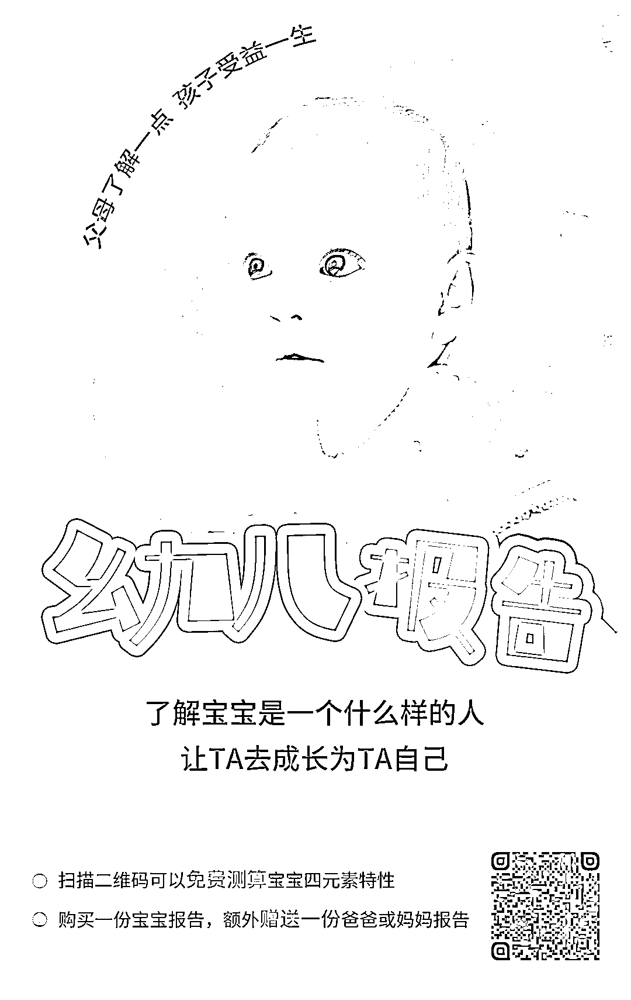

**报名方式：**添加客服微信（nodoor201705),并提供《幼儿报告》购买的支付截图和宝宝的出生信息。

报名扫码添加客服微信

（备注“亲子访谈”）

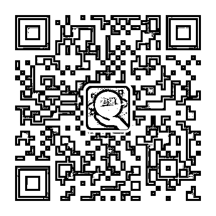

**招募人数：**不限。每月确立访谈人选时，都会从历次报名累积的资料库中筛选，因此，即使报名的当月没有被邀约访谈，后期研究中如果有合适的主题，也有被邀约访谈的机会。**访谈内容：**根据统一设计的研究大纲，和研究主题的侧重点，综合观察宝宝星图，和父母探讨孩子在健康、心智、养育、人格形成、社会适应性等各方面的表现，以及养育环境和养育者的变动状况对孩子产生的影响。

**版权声明：**原创文章由作者授权发布于若道平台，欢迎转发，反对抄袭。友号转载请申请白名单。

**学习占星学**

**点击下图了解课程详情**

****

****

****

****

**微信又双叒叕改版啦，不想错过若道君的推送？**

**就把若道设为星标吧！**

**▼**

**就是这个“在看”，戳戳戳 ☟**

****购买报告直达入口****

# 非暴力沟通丨面对“丧偶式育儿”，如何解决困境？

> 原文：[`mp.weixin.qq.com/s?__biz=MzA5NjA0NTAxNg==&mid=2651459033&idx=2&sn=ee013be81980f631b13001d8ba6edf12&chksm=8b48bf6ebc3f367844ac823433928e86d716fbe3ff343eb7d98e877f8f9ed81b96c1da902d0d&scene=126&sessionid=1692737908#rd`](http://mp.weixin.qq.com/s?__biz=MzA5NjA0NTAxNg==&mid=2651459033&idx=2&sn=ee013be81980f631b13001d8ba6edf12&chksm=8b48bf6ebc3f367844ac823433928e86d716fbe3ff343eb7d98e877f8f9ed81b96c1da902d0d&scene=126&sessionid=1692737908#rd)

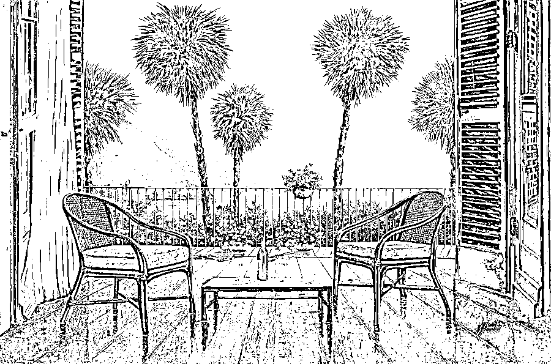

作者/王嘉祺

编辑/翀子 图片/网络

作者的话

我相信大家都遇到过各种各样的沟通困难，与父母的、与爱人的、与同事和领导的，以及与不讲理的客户的等等。遇到沟通不顺的时候，我相信很多人都是比较憋屈的。那种憋闷很不适合藏在心里，我们希望找个关系比较近的人倾诉出来。

**朋友的困境**

最近我有朋友就跟我吐槽一件事。她的孩子还小，还不理解为什么妈妈那么晚还要在单位工作不回家陪他。但孩子的语言能力已经足够给我这位朋友造成困扰了。于是就发生了什么事情呢？某天她晚上在单位不得不加班的时候，她的孩子给她打了七八个电话，“妈妈，妈妈，妈妈，妈妈，妈妈，为什么别的阿姨都回家了，你还在工作不回来陪我？”

我这位朋友就非常郁闷，因为显然孩子的认知还不足以理解为什么社会上有一种现象叫做加班，他只知道这个“加班”夺走了陪他的妈妈。于是她跟她的老公去沟通，希望自己不在的时候她老公能够陪陪孩子。

然而不幸的是，现在很多已婚的女性都遇到了一种很无奈的状况，叫做“丧偶式育儿”。我的这位朋友也是这种状况，于是她就遇到了老公的百般推脱。你说你最近很忙，对方会说，“我也很忙，也需要加班啊”。你说孩子需要家长陪伴，对方会说“小孩子嘛~不用把话太当真的”，你开始埋怨对方怎么不负责任，对方直接把球踢回来“孩子需要的是你这个母亲啊”。

当对方想逃避你的说教和大道理的时候，无论你怎么说，都有千百个借口在等着你。

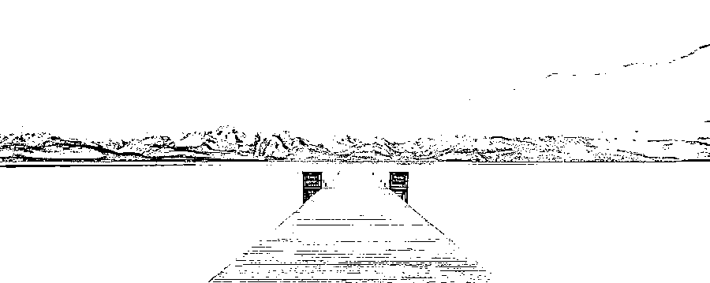

**如何解困？**

**因此当通常的沟通方式、说教和讲道理都不起作用的时候，就到了“非暴力沟通”这种技巧出场的时候了。**非暴力沟通，其实这几个字乍一看，好像在强调我们在沟通的时候不要用暴力语言。这个名字本身看上去，确实有点说教“不要使用暴力语言”的意味。以至于很多人对这门技巧有误会。

那到底什么是非暴力沟通呢？以我一个接受过非暴力沟通训练的人来理解，简单来说，就是**让对方更理解你，也让你更理解对方的沟通技巧。**

在这个艰难的社会中摸爬滚打，相信大家都明白，**在沟通中达成共识的基础，其实就是互相理解。**因为相互理解，就意味着我们彼此对对方当下的境遇能够感同身受，然后能对对方说一句“我理解你”。

**所以非暴力沟通，绝不仅仅是强调不用暴力的词汇，而是同时兼顾双方的情感和现实状况，来沟通出双方都能够接受的方法。**

我们每个人在做事情的时候，都是基于自己的某些实际需求。比如我们去加班，是有赚钱养家，或者是成就自我的需求。孩子找妈妈，是天然的想要获得安全感的需求。甚至是伴侣逃避带孩子，其实也有某种需求，比如他可能觉得带孩子很难，他不擅长；他觉得儿女情长就英雄气短；他工作很累，在家就想清静……虽然这些听起来都很想让当母亲的骂人，但我们已经知道说教没用，甚至会把关系弄得更糟。

一个人不论做一件事，或者不做一件事背后的需求是什么样的，只要得不到满足，就会产生负面情绪。而情绪不被理解就得不到消化，只能越积越多，直到爆发……而**非暴力沟通的方法和技巧，教大家如何面对自己和对方情绪和需求，并且让大家感受到，每一种情绪和需求，其实都可以消化和满足。**

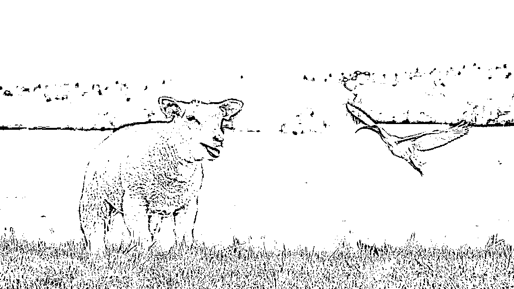

**达成共识**

非暴力沟通里面有一句非常经典的话：个人情绪和需求的不同不可怕，可怕的是人们基于自己的情绪和需求所采取的**冲突策略**。冲突策略，也就是会产生冲突的行为。

回到我那位朋友的例子。如果她的情况一直持续下去，结果只能是越来越糟。直到她被孩子烦透了，对老公也失去信心。觉得孩子怎么哄也哄不好，老公是不可能理解自己的。人一旦给别人贴了这种标签，那么距离否定自己的生活也就不远了……

所以对她来说，理想的沟通策略是什么呢？非暴力沟通会教给我们，主动体会和理解孩子的情绪，让孩子得到舒缓，然后解决孩子需要陪伴的需求。在平时的生活中，就让孩子意识到自己是正在被陪伴的。而不是让孩子一直不停地处于陪伴中，只要一离开，就是世界出问题了……

与伴侣的沟通与共情其实也不难，可能难的是首先要抑制自己吐槽对方的心理。其实我们冷静下来想象就能明白，一味的说教和要求对方，不管在道德和道理上多么站得住，对方也是很有压力的，而感受到压力就会令人想要逃避。

所以我们需要做的，其实是给对方不断地卸下压力。**首先解决情绪，然后沟通需求，接着制定策略。**最后还可以对对方表示“亲爱的，我需要你的帮助。”

人在被需要的时候，往往是很慷慨的，因为这凸显了自己的强大。

**非暴力沟通的技巧，其实就是人与人之间更容易达成共识的沟通技巧。**所以知道与对方语言是相通的，就可以运用上这种方法，来达到双方共赢的目的。甚至是自己与自己，都可以来这样沟通。结果是你会更加体察到自己的细微情绪，以及了解自己内在真正的需求究竟是什么。

**这样的沟通技巧，你想要了解一下吗？**

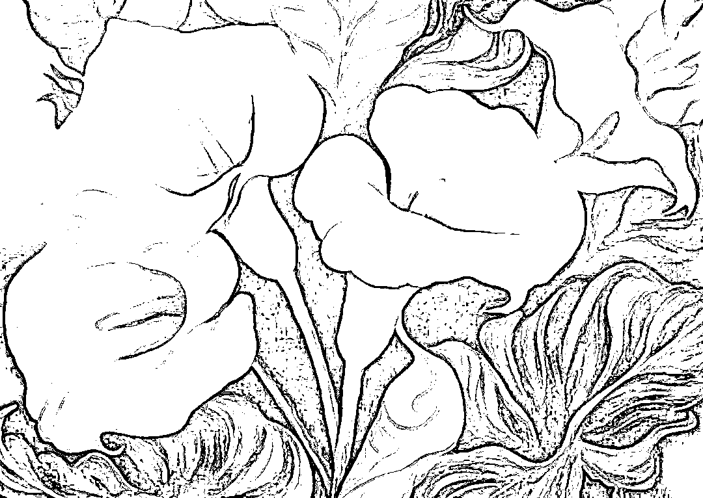

**为什么我们要学 NVC？**

（向上滑动查看内容）

**蒋颖**

若道联合创始人

2016 年，我在新西兰参加一个 Hakomi 亲密关系治疗的治疗工作坊。参加这个工作坊的都是治疗师。在这个工作坊中，有一位女性让我特别印象深刻，因为她身上有种特别的气质，某种既温柔又坚定的东西，充满力量，充满对这个世界的关怀，她身上表现出的让人惊讶的真实也让我有很多思索。她叫托尼·麦克尔兰（Toni McErlane）。

我知道她从小学习武术，也是一个悬挂式滑翔运动的运动员，曾经背着滑翔机在世界各地的上空飞行和比赛。她完成了北美非暴力传播（NVC）领导计划，是一个非暴力沟通（Nonviolent Communication，简写 NVC）培训师和注册的家庭纠纷调解人，也是生态心理学的培训师。她有多年的内观经验，在身体创伤治疗方面的经验，还有她在有机种植、景观设计、园艺治疗都有专长……我看到她到印度去，帮助印度乡村做有机耕种。在这次疫情之前，她已经买了一艘帆船，准备和丈夫开着他们的船环游世界。所有这些都让我感叹，一个女性可以活得如此勇敢和丰富。现在她而她对中国也充满了某种关切。多年前就一个人在藏区徒步旅行，后来又骑自行车穿越西藏。

但喜欢户外冒险的 Toni 说， NVC 比武术更管用。

2019 年，我终于请 Toni 到中国来，请她给若道做了基础和中级的 NVC 培训，也请她对外做了一次工作坊。

怎么说呢，培训和工作坊棒极了，更棒的是，我觉得人人都爱她。

**Toni McErlane**

我来自新西兰，拥有社区和人类服务—咨询康复学士学位，是 Aminz 的注册家庭纠纷调解人，也是 NVC Aotearoa 的 NVC 培训师。

在我的生命中，我一直对真诚、充满活力、自我负责的沟通和有意识的选择充满激情。而我的人生旅程为我提供了充足的机会，让我去探索、研究、反思和完善这在沟通中是什么样的。

在我的工作坊中，我的原则和实践都是建立在非暴力沟通和正念的哲学基础之上。非暴力沟通是由美国心理学家马歇尔·卢森堡博士所开发的。马歇尔的目标是发展出一种语言，这种语言受到印度巴利语中的“非暴力主义”（Ahimsa）一词的启发，它的意思是“没有伤害”。我们怎样才能在与他人沟通时不造成伤害呢？这不仅需要非暴力沟通的技巧，还需要在训练中融入正念。正念是受小乘佛教内观传统的启发，发展觉知和接纳，关注和允许。在我们的工作坊中 ，我们将非暴力沟通和正念编织在一起。

我致力于以这种沟通和处世方式作为我日常与人互动的基础。我曾经学习了为期一年的北美非暴力沟通领导者项目，在加州湾区非暴力沟通的全年浸入式项目中做了两年协助工作，然后在索诺马县女子监狱推动非暴力沟通培训。同时，多年来我持续参加内观静修，致力于继续和发展这种实践，并把它融入自己的工作坊中。

2020 年疫情期间，我与丈夫和我们的猫在游艇上休了一年假。现在，我和丈夫还有 15 岁的侄女在新西兰南岛的达尼丁生活。我在那里从事心理咨询、冥想和生态心理疗法。我们还正在那里慢慢建立一个治疗静修中心和生态冥想社区。

过去四年，我曾两次来中国，与若道及其友好而充满活力的团队分享非暴力沟通，并参观了一些绝佳风景。我期待继续与若道合作，在网上分享我的知识和技能。

向上滑动可查看更多

**课程内容**

**第*****1*****模块 区分感受和想法**

**第*****2*****模块 将感受与需求、需求与策略关联起来**

**第*****3*****模块 倾听和共情**

**第*****4*****模块 观察与评价**

**第*****5*****模块 自我共情**

**第*****6*****模块 ****提出请求**

**第*****7*****模块 ****练习坦诚地表达**

**第*****8*****模块 ****接受和表达感激和谢意**

**工作坊学员这么说**

非暴力沟通带给我的最大的收获是：通过课堂的学习和大量互动练习提升了觉察力，提升了沟通技能，非暴力沟通并不仅仅停留在语言的表达，非暴力沟通的核心是同理心。通过倾听对方的感受，帮助我将情绪转化为解决问题的动力。

我过去和其他人沟通时，常常陷在自己的思维中，通过练习我才发现，原来别人说话的时候我常常其实并没有听到对方说什么，都是在自己的想法里打转，现在我起码学习到当对方说话的时候，能够去尽量不想自己的想法。

过去我不会留意到原来自己的某种表达方式会让别人不舒服，而且其实也无助于解决问题，对于我想达到的完全无效，NVC 的学习能够让我更能觉察哪些表达会让别人不舒服，让我的沟通更有效，更能帮助我达到我的需求。我学完后，才觉察到过去在沟通中，如果对方有情绪，我也是情绪化地回应，现在，我能够和自己和对方的情绪都拉开一些距离。过去我对于对方情绪化的表达，会有情绪化的回应或不知所措，现在我更能去感受他们情绪下的需求是什么，因此就更从容，不那么容易被他人的情绪影响，能够更有效地回应那些有负面情绪的人。我是一个比较理性的人，在练习中发现原来对一个在我用理性分析如此很明显的画面，每个人竟然有如此截然不同的看法，这还是挺让我吃惊的，这个发现好像打开了一扇门。

我是一个比较感性的人，过去有什么事情，常常是情绪化的沟通；NVC 的学习让我能够更理性一些，能够更客观去看问题。

这个培训让我非常感动，这是我没有想到的，一个关于沟通的培训如此让人感动。在那些常见的表面事件呈现之下，是如此脆弱、温柔的人性。我们如此绝望地想要被理解、被爱，想要与他人联结，然而我们常常用非常错误的沟通方式去做，这时我们离我们的目标就越来越远。

**什么人适合学习 NVC？**

**老实说，NVC 真的是一门人生必修课。**

**NVC 可以非常有效地帮助提高沟通能力，提高觉察力、自我同理心和他人同理心，进而减轻童年创伤对成年生活的影响，帮助有效改善亲密关系、与父母的关系、亲子关系、职场关系。**

*   如果你正被低效的沟通方式困扰或正经历沟通暴力，想**提升觉察，避免伤害的话**，NVC 培训是个不错的选择；

*   如果想结束“相爱相杀”恶性循环的相处模式，**享受一段真诚而愉快的亲密关系**，NVC 培训是个不错的练习途径（可以拉着你的 Ta 一起来哦）；

*   如果你的**工作、求学、生活和“表达”息息相关**，想更理解自己，想改善你的人际关系，改进工作，NVC 培训可以体验到一种更有力量的表达。

**训练营时间与价格**

**课程时间：**10 月 24 日-12 月 12 日，每周日下午 2 点-6 点。共 8 周，每周 4 小时

**课程价格：**6800 元

**购买须知**

❶ **本课程一旦报名，不接受退转课。**

****非暴力沟通线上训练营****

**授课老师：**Toni McErlane

**授课时间：**2021 年 10 月 24 日起

**授课方式：**网络课程**，**英文授课，中文翻译

**费用：**6800 元

**课程负责人：****Maggie 老师**（微信：18510107057，请备注“非暴力沟通”，**获取优惠价信息**）

长按二维码添加课程负责人咨询~

****报名请点击“阅读原文”****

‍‍‍‍‍‍‍‍‍‍‍‍‍‍‍‍‍‍

# 太阳进天蝎座丨在“失去”的恐惧之下，是你的丰饶之地

> 原文：[`mp.weixin.qq.com/s?__biz=MzA5NjA0NTAxNg==&mid=2651459033&idx=1&sn=d75e77fd23624c63d9c8d006435d234b&chksm=8b48bf6ebc3f3678f0fcb5e8b56abe33270771b130b4b8c520b23a639f294e969ca0a2a23503&scene=126&sessionid=1692737908#rd`](http://mp.weixin.qq.com/s?__biz=MzA5NjA0NTAxNg==&mid=2651459033&idx=1&sn=d75e77fd23624c63d9c8d006435d234b&chksm=8b48bf6ebc3f3678f0fcb5e8b56abe33270771b130b4b8c520b23a639f294e969ca0a2a23503&scene=126&sessionid=1692737908#rd)

******************************☆ **************后台****************************回复“今日”，给你一句生命态度****************

作者/杰夫·焦耳

译者/轩轩 舒晓非 校对/江艺 轩轩

编辑/翀子 封面/书君 图片/网络 10 月 23 日 12 点 51 分，太阳进天蝎座。这是一篇角度独特的天蝎座文章，作者认为每个星座并不是一座孤岛，它们是一个循环周期的不同阶段，因此，天蝎座就是走向射手座的天秤座。而通过与天蝎座呈重要角度关系的狮子座、水瓶座和金牛座，我们也能了解更多和天蝎座有关的信息。没有任何一个星座是一座孤岛。**每个星座都是对前一个星座的继承，对后一个星座的准备。**它们是一个循环周期中的 12 个阶段，而不是完全独立的片段。当我们将星座看成一个更大的进程中的一部分时，我们就更容易克服对星座的偏见。**为什么天蝎座与生死有关？**

当太阳进入天蝎座，对星座的理解变得格外有趣。你可能已经知道天蝎座和万圣节以及亡灵节（墨西哥传统节日）的关系。**这两个节日就像落叶一样，是关于失去的，但是失去会带来来年春天的重生。**

天蝎座引发的反响之大其他任何星座都比不上，可能这会让很多敏感、低调的天蝎座人大为震惊。天蝎座的人可不觉得自己阴暗神秘，或者像意大利政治理论家马基雅维利一样具有掌控性。可人们脑海中的印象，总觉得天蝎座位于仲秋之时，树叶飘零，万物空落，收割后的大地呈现一片衰败与终结的景象。

不错，生死两界之间的距离的确在太阳行进到这个星座时最短。这期间我们会碰上万圣前夜、万圣节和亡灵节，接连提醒我们这个意境。**失去与对失去的恐惧，**是人们对这个季节阴沉之日的自然反应。然而，假如自十月下旬至十一月下旬，**饥饿、渴望与丧失**屡屡占据你的脑海，那么**在激情四溢的天蝎座的情绪混合物之下，往往蕴藏着丰饶之物。**

**搞清楚我们正在失去什么，能够让我们明白自己需要的是什么。**当我们强烈地渴望爱、金钱、关注、休假或强烈的情感时，就会更容易分清眼前任务的轻重缓急。**正是天蝎座对最深层欲望的聚焦，**使得我们可以扫除杂念，专注于对自己来说如同生死存亡般重要的需求。**这种专注将能量聚集起来，指引着我们带着坚定的使命感去行动。**

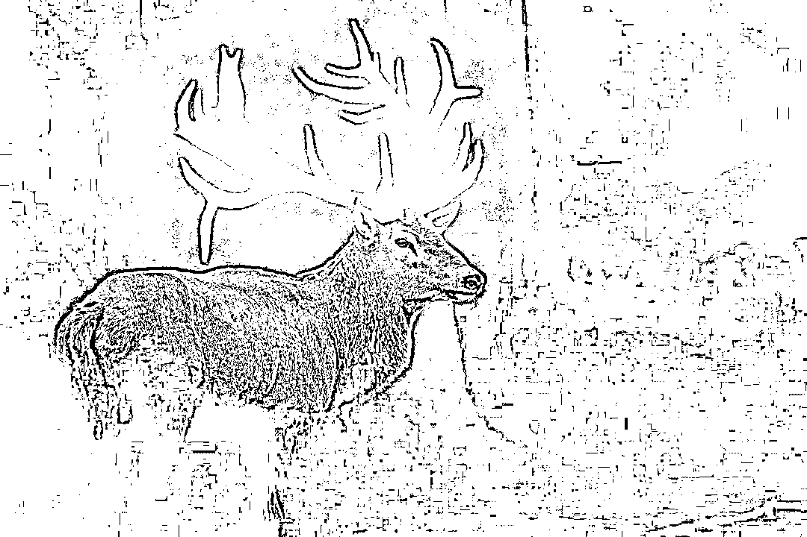

**天蝎座：走向射手座的天秤座**

天蝎座紧接在天秤座之后，是秋天的第一个星座（对于南半球来说是春天的第一个星座）。天秤座是黄道下半段的第一个星座，它将自己和他人视为平等的个体。天秤座象征着内在自我和外在世界的平衡点。**天秤座的礼貌和社交礼仪是为了吸引他人，维持和平的关系。**

**而之后的天蝎座开始将关系带向另一个阶段。它超越了友善，走向更加深刻的情感**，而这种深刻的情感自然也会引发**更深层次的恐惧**。从某种程度上来说，我们可以将天秤座描绘成关系中可见的外在形式，而天蝎座则是关系的隐藏内核。

跟天蝎座联系的这种恐惧还伴随着**死亡的主题**（比如说落叶）。**然而，这个星座代表的真正的“死亡”是我们为换取亲密关系而失去的自我。**靠近一个人，会打破分隔两人的那面墙，让心灵、思绪和身体紧紧相连。

当我们与某人愈加亲密，我们便放弃了曾经轮廓分明的自我的界限，这当然会让人觉得可怕。**当我们将自己的生活与他人融合时，也会失去一部分自主。**天秤座的公平和理智就这样被**天蝎座强烈的欲望和恐惧**所替代。

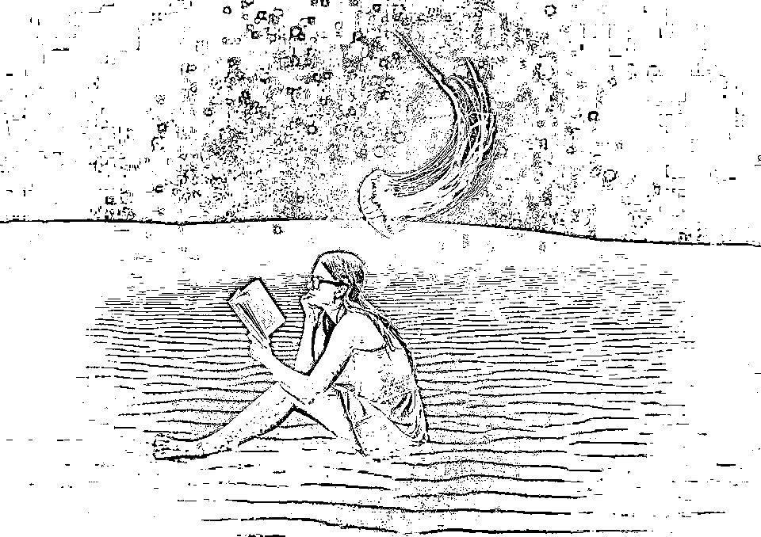

轻盈的天秤座被压缩成湿乎乎的天蝎座，这个过程是黄道旅途上的一步。它完成了关系形成中重要的一步，也是走向下一个阶段——射手座——的必经之路。富有远见的、喜爱冒险的射手座让我们升华此刻的思绪，将之投向未来。

天蝎座和其他人或者和深层次自我的融合，让我们凝聚力量，这是开启射手座身体和灵魂之旅所必须的。**天蝎座能够集中专注力，积聚力量，让我们做好准备迎接伟大的旅程。**

天蝎座，是占星学里**疑心较重**的星座之一，夹在黄道上两个满怀希望的星座之间。这个对比表现了扩张、压缩、再扩张、再压缩的持续过程。**而这种过程也正是生命的节奏。**天秤座呼气，和别人建立联系，紧接着**天蝎座深深地吸一口气，让关系更亲密**，这才造就了射手座的火龙之焰。

**将星座视为一个拥有 12 个阶段的过程，**能够打破禁锢住星座的盒子，揭示来龙去脉，告诉我们更多的信息。**将天蝎座视为走向射手座的天秤座**，能够丰富我们对占星学和对自身的理解。**它反映了一个更大的进程，**而我们都是其中的一个部分。

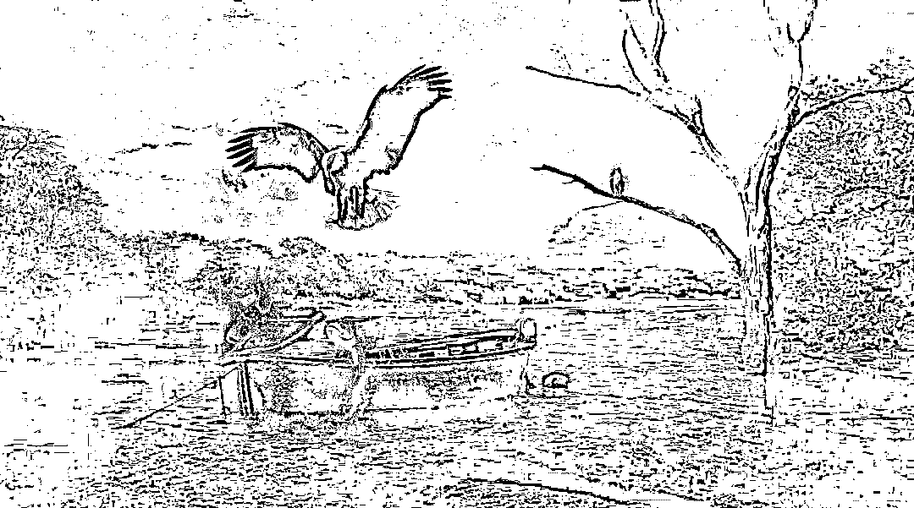

**天蝎座与其他星座的关系**

我们谈起每个星座时，常常将它们视为彼此分离的个体，它们是一个连续周期里不同的发展阶段。除了按照先后顺序去看，**我们还可以通过研究它们与其他星座之间的角度关系（相位）得到更多的信息。**

**四分相，代表着有挑战性但决定性的关系，体现了建立与架构的周期。**

**★****天蝎座与*****狮子座***

天蝎座与狮子座成四分相，说明**天蝎座承担着将狮子座的创造力转化为具体形式的责任。**狮子座大胆的承诺与纯真的期盼遭遇到天蝎座资源有限的现实。正是通过**天蝎座对管理能力的关注**，使得狮子座的梦想得到滋养，能够扎下根来，否则这些梦想会因寻觅不到燃料而中途夭折。

**★****天蝎座与*****水瓶座***

天蝎座同时还和理想化的、前卫的水瓶座成四分相。天蝎座内心充斥的**激情**与水瓶座的**冷淡抽离**相比，看似是天壤之别。然而，**天蝎座为了寻找自身在世界中的位置，它们深刻的情感恰恰需要水瓶座特有的社会意识与群体观念。**

**★****天蝎座与*****金牛座***

与天蝎座成对分相（两个四分相之隔）的是迷恋感官享受的土象星座金牛座，这种物质享受代表了自然的固有财富。**如果没有天蝎座开发资源的欲望与能力，这些恩赐也是空中楼阁。**

我们习惯于将财富与满足联系起来，这正是金牛座的特点。可是，生命中很多的财富（物质上的、身体上的、情感上的及创造性的）恰恰是从人类灵魂的焦躁不安的本性中激发出来的。

深陷不安的天蝎座，常常面临着**生存的挣扎**，渴望**最深层的联结**，正是这些需求增强了我们的欲望，推动着个人和集体的成长，让我们变得富足。**这一天赋可能有时候看起来令人害怕，但却常常能给我们带来极大的回报。**

**版权声明：**本文由若道翻译发布，欢迎转发，反对抄袭。友号转载请申请白名单。

**杰夫·焦耳**

国际占星大会（UAC）和全美占星师联盟（AFAN）创始人，美国著名占星网 www.stariq.com 创始人。曾任亚特兰大协会主席和亚特兰大占星考试委员会委员。世界第一个手持占星计算器的发明者， 4 本占星书的合著者。2015 年逝世。

**学习占星学**

**点击下图了解课程详情** 

**

**

****

**微信又双叒叕改版啦，不想错过若道君的推送？**

**就把若道设为星标吧！**

**▼**

**就是这个“在看”，戳戳戳 ☟**

********报名直达入口********

# 12 星座必读丨你的星座是个人视角、社会视角还是宇宙视角？

> 原文：[`mp.weixin.qq.com/s?__biz=MzA5NjA0NTAxNg==&mid=2651458981&idx=1&sn=efa48c4b5da0ce6bb47346d7e3eab6e9&chksm=8b48bf12bc3f3604f8239824af27564cb749be4e09f1f591aee1f38f6f53af93a138874055f0&scene=126&sessionid=1692737908#rd`](http://mp.weixin.qq.com/s?__biz=MzA5NjA0NTAxNg==&mid=2651458981&idx=1&sn=efa48c4b5da0ce6bb47346d7e3eab6e9&chksm=8b48bf12bc3f3604f8239824af27564cb749be4e09f1f591aee1f38f6f53af93a138874055f0&scene=126&sessionid=1692737908#rd)

**☆ 后台回复“今日”，给你一句生命态度 **

作者/格伦·佩里 译者/若道翻译团队
  编辑/翀子 封面/书君 图片/网络

格伦老师用视角将 12 星座划分为 3 种不同的类型：个人星座、社会星座和宇宙星座。从出生到死亡，每组星座都对应个人发展的一段时期，并表现出不同的关注点、价值观与需求。快来看看你的星座属于哪一种吧！

**个体星座和集体星座**

最笼统的划分黄道星座的方式，是前 6 个星座和后 6 个星座。**黄道星座的前半部分关注个体与集体的差异，后半部分关注个体与集体的融合**。从白羊座到处女座是一个个体化的过程，更强调部分而不是整体。更关注短期而非长期。从发展的角度来看，前 6 个星座代表了**自我从幼年到成年的阶段**，**处女座学徒阶段的结束意味着个体掌握了一种技能，足以支撑他步入成年阶段，成为社会的一员。**

黄道星座的后半部分**首先关注社交需求，最终还是落脚于整个人生**。如上所述，这些星座有**更宽广的视野，能够认识到各个部分最终会如何被融合到整体之中**。这里更重视长期而非短期。出于部分服从整体的必要性和正确性的考虑，可以推迟个人的满足。**关系、分享、伦理、责任、利他主义和牺牲**是此处的关注重点。从发展的角度来看，黄道星座的后半部分代表的是**从 27 岁左右开始直至晚年死亡的阶段。**每一个个体星座与一个集体星座成**两极互补**的关系。心灵的目标是**将自我与他人整合，个体与集体整合，以达到心灵的平衡与完整。**

| **个体星座** | **集体星座** |
| **个体化、差异化** | **整合、协作** |
| **关注局部、区别** | **关注整体、联合** |
| **短期利益** | **长期利益** |
| **个人利益、关注自我** | **群体利益**  |

视角

黄道星座可以进一步被划分为**3 种视角**，或者说是时间和空间的定位：**个人、社会和宇宙**。有时候，这种划分指的是**个人、人际关系、超个人**。前面 4 个星座（白羊座、金牛座、双子座、巨蟹座）为个人星座，中间 4 个星座（狮子座、处女座、天秤座、天蝎座）为社会星座，最后 4 个星座（射手座、摩羯座、水瓶座、双鱼座）为宇宙星座。从出生到死亡，每一组星座都对应着个人发展的一段时期。如上所述，每一段时期都显著地表现出不同的关注点、价值观与需求。

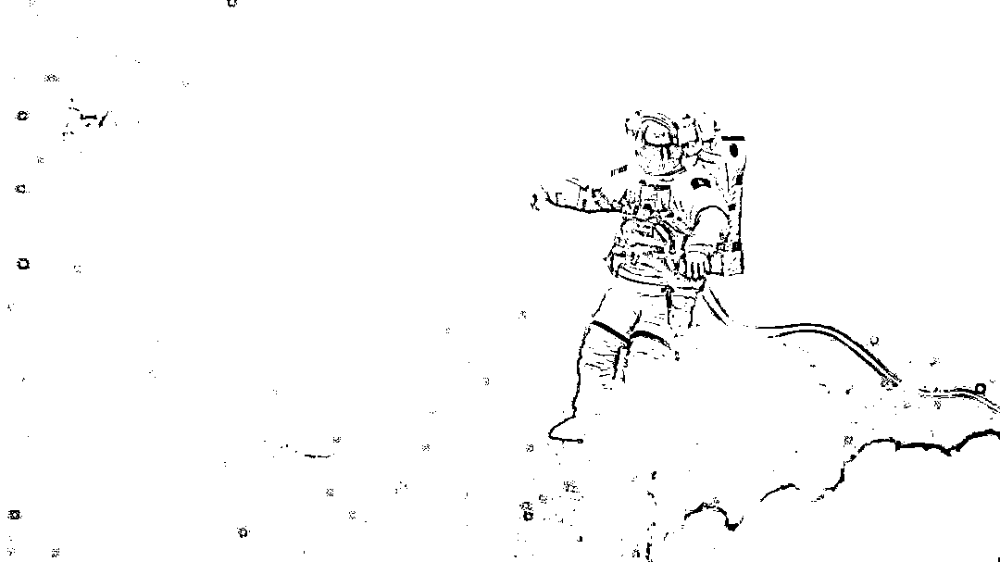

**个人星座**

关键词

**利己 纯真质朴 原生态 **

**基础 根本 早期**

**单纯 简单 **

**关注当下 狭窄的视角**

**自我中心 个人的**

** 此时此地的意识**

**个人星座**对应的时期是：**从出生到青春期，也就是 0 岁-大约 12 岁时**。这几个星座——白羊座、金牛座、双子座、巨蟹座相对**关注自我、纯真质朴、原生态**。他们代表的是一些只有在关注自我时才能满足的需求，比如**生存、食物、衣服、语言习得和保护需求**。这种需求是基本的或根本的，在一个人进入更广阔的世界之前就需要得到满足。

在这段时期，**对他人或者他人所关心的事情都缺乏觉知**。一个儿童或多或少都会觉得**自己是宇宙的中心。**他们关注的是**当下短期利益的满足**。个人星座从特征上来说，**相对缺乏辨别力或分化**；**自由、愉悦、知识和归属感**才是他们追求的目的，而不是那些为他们规划好的特定历程。

*   **白羊座**代表的是**立刻、自由的行动**（我的冲动、我的愿望）；
*   **金牛座**代表的是**当下此刻未分化的感官满足**（我的愉悦、我的安全感、我拥有的）；
*   **双子座**象征着**追求未分化的信息**（我的兴趣、我的思考、我的认知）；
*   **巨蟹座**代表了**未分化的爱**（我的感受、我的母亲、我的家、我的家人）。

**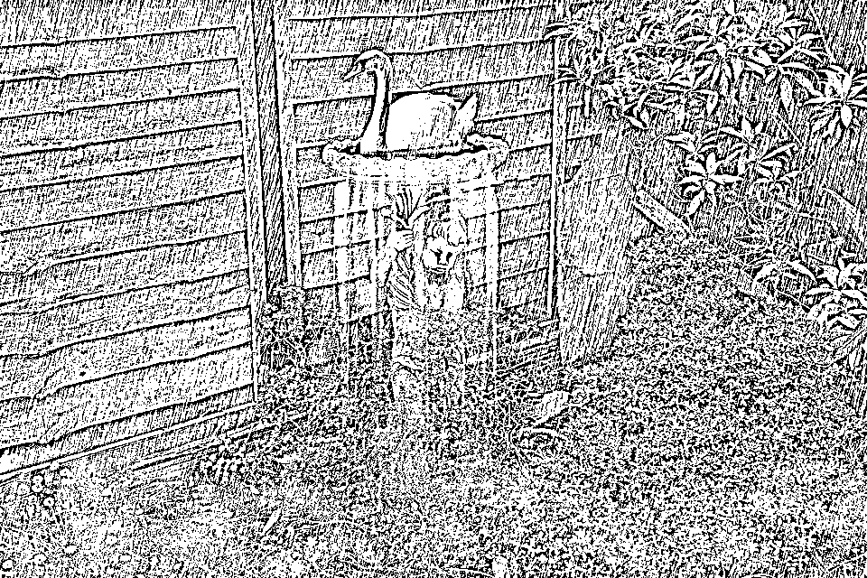**

**社会星座**

关键词

**他人导向  相互的 互惠**

**人际关系 给予 互相依赖**

**分享 参与 社交 **

**关联 合作 党派 派系**

**以群体为中心 地方性**

当孩子到了青春期，会发现**社会关系的重要性**，以及**除了自己之外，其他人也有正当的需求**。社会星座——狮子座、处女座、天秤座、天蝎座的本质是**需要与他人互动**。社会星座体现了**相互关系、互相依赖、互惠**的原则。他们意识到，**他人无法得到满足时，自身也无法得到满足。**因此，从某种程度上来说，社会星座是**以他人为导向**的；他们期待着**分享快乐，相互满足。**因为社会星座**需要获得他人的认可**，所以他们倾向于**党派价值观和“党派政治”**。他们需要**获得所属集体的接纳和认可**，而不是无偏见地关心全人类的普世利益，这样的观点主导着社会星座的政治行为和政治原则。社会星座让我们与他人的交往越来越深入，更加富有意义，并在天蝎座达到极致——**彻底地融合**，**之后重生，进入宇宙层面的射手座**。每一个社会星座对他人的需求呈现出不同的方式。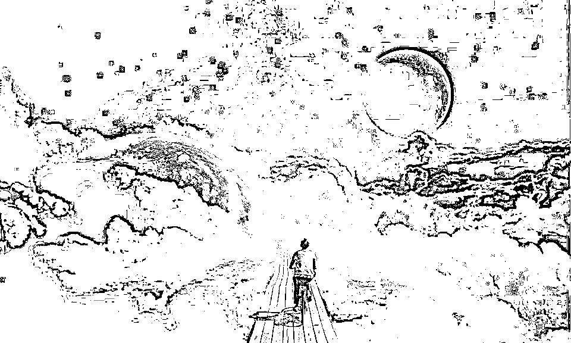

*   **狮子座**需要其他人关注自己，满足自尊心的需求，也就是**被认可、赞成和确认**的需求。狮子座象征着**与他人相比时产生的与众不同和重要感**。狮子座的角色是**表演者、英雄、有创造力的艺术家、老板（一种占据优势的角色）**。

    狮子座还代表着**欣赏他人、赞美他人、让别人也感觉到特别**的需求。这种“互相赞美的社交”构成了**爱与被爱、表演者与观众、最好的朋友与伙伴**之间的关系。狮子座会问：**“我该如何吸引眼球，感受自己的与众不同？我该如何让你也感觉到自己的重要性、特殊性，并享受快乐？”** 

*   **处女座**需要他人，是为了能感到**自我有用、有能力**。处女座会问：**“我能为你做些什么？我怎样才能有所帮助？”**他们的角色是**问题解决者、解决麻烦的人、维护者和修理者**。这里关系的主题是**主-仆、师-徒、合作者-同事、商人-顾客**。处女座说：**“我愿意为您效劳。”** 

*   **天秤座**需要其他人保持**平衡和联结**。天秤座的本质是**互补**，需要**伙伴关系**，需要**与他人平等分享**。他们的角色是**外交官、商务合作伙伴、配偶、公关人、仲裁者（中间人）、魅力十足的主人**。天秤座问：**“我该如何呈现出和谐美好的状态呢？”**

*   **天蝎座**需要其他人是为了获得**联合、结合**的感觉。这里的需求是**将各种独立分散的元素结合起来构成一个完整的整体**，**消除分歧，通过结合实现转化**。

    这里的**角色和关系**是危机调停者、冒险者（消防员、急救卫生员和紧急救援者）、权力掮客（老板、专制君主、独裁者）、治疗者（医生、牧师、萨满），包括共同的组织、共享财务的关系、性关系以及一切与阴影人物相关的关系，比如罪犯、黑社会成员。天蝎座问：**“我该如何做才能感觉到深刻、结合与力量？”**

**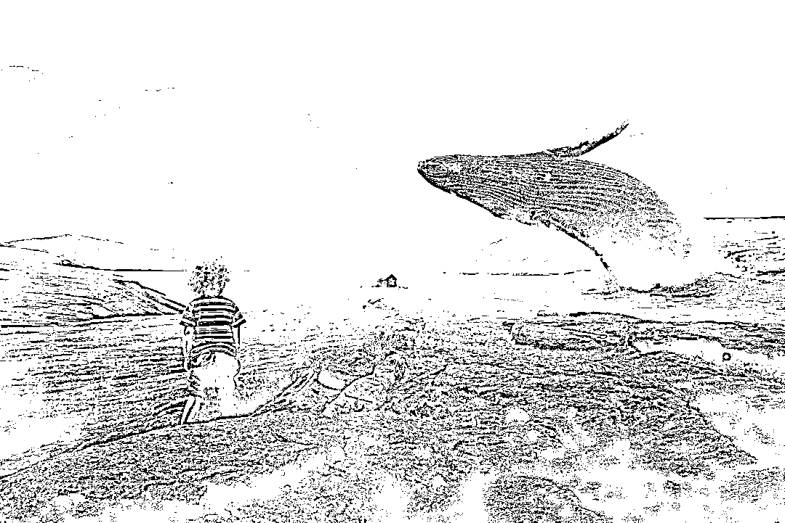**

**宇宙星座**

关键词

**终极的价值和理念 群体关注**

**空想家 乌托邦 无党派人士 人道主义者**

**非自我中心 利他主义 仁慈 无私**

**整体 超越自我 宽容博爱 慷慨**

**非个人 理想主义 只见森林不见树木**

当**步入不惑之年**，到了**度过中年危机**的年龄之时，我们已经很幸运地到达了能够开始**以更超然的视角看待世界、看待自身地位**的高度。宇宙星座——射手座、摩羯座、水瓶座、双鱼座的本质关心的是**整个人类**。这些星座**纵观全局**，审视这个超越个体、群体、文化和任何单一族群的整体是如何由不同部分形成的。

个人星座和社会星座的关注点是**有限的视角**。个人星座说：“我，此地，此时。”社会星座说：“我和你在一起，直到死亡把我们分开。”宇宙星座说：“每个人，每个地方，永恒。”从这方面看，宇宙星座是**人道主义者、理想主义者、空想家。**他们**关心人权，关心世间正义、世界秩序、万物平等、全人类的和平。****终极目标和价值**是宇宙星座的职责。然而，如果一个人过于投入、执迷于理想，就会有**极端主义**的危险——**独裁者（摩羯座）、煽动家（射手座）、革命者（水瓶座）或是殉道者（双鱼座）**。当然，这些人物的出现在极端时期是必要的。但一般来说，如果将我们本性中的这些部分整合起来，就可以为无限时空的前进做出自己微小的贡献。我们不必只靠自己或是在有生之年实现理想。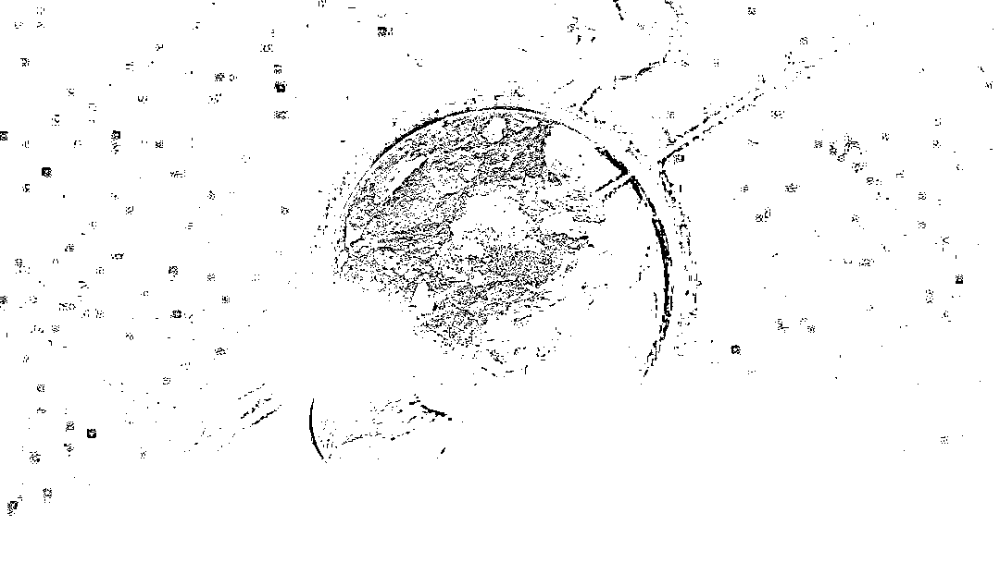

宇宙星座非常关注**群体层面**的事情，也就是**事物的原则**，而不是相对渺小的个人层面或社会层面。因此，**个人的安全或财富、个人的婚姻和子女，都可以为追求更高的目标而牺牲。**

浓墨重彩地强调了一番宇宙星座，可能会因此呈现出**不掺杂个人情感的残酷无情**，有一些人对个体和所爱之人比较缺乏感受性，因为超然的理想取代了对个人和人际关系的注意力。此人非常**着迷于事物的规则性或可能性，从而缺失了事物中个人、人性的方面。**这类人可能为了政治理念。炸毁俄克拉荷马州的政府大楼，或抛下怀孕中的妻子，跑到非洲去传教。

*   **射手座**希望去**教导人类，激发出他们更高阶的人性**，比如**道德、公正和智慧**。因此，射手座是**哲人、教师、传道者、煽动者、卫道士、宣传者或理论家。**

*   **摩羯座**希望**将射手座的宇宙真知与公正理念付诸现实**。因此，摩羯座**创造必要的架构，去实施执行射手座设想的规章制度**。以这种方式组织现实社会，将理念付诸实践，覆盖尽可能多的人群。摩羯座**实用主义**的视角正是**管理者、主管、总裁、领导层或官僚主义者的形象。**

*   **水瓶座**希望**丢掉摩羯座的旧秩序，以平等、民主、自由、博爱的准则建立新的秩序**。水瓶座更推崇**无为而治的自由主义**，对于秩序的态度更为激进。其典型的角色是**自由论者、反传统主义者、革命者、无政府主义者、乌托邦的空想家。**

*   **双鱼座**希望**融入整体之中，放下自我的追逐，散播无私的爱，关怀那些流离失所、受苦受难的人们。**在这里，我们体会到**普世的慈悲之心，无分别的爱，**于是产生了**圣人、救世主、殉道者或神秘主义者**。然而，如果一个人过度执迷于此，可能会完全丢开自我利益，成为悲惨的牺牲者，精神异常，耽溺于一个理想化（但有破坏性）的对象之中——食物、酒精、毒品，或是某人某事。

**版权声明：**本文由若道翻译发布，欢迎转发，反对抄袭。友号转载请申请白名单。

**格伦·佩里**

若道签约老师，著名占星师，前 ISAR 董事会成员，共出版 8 本占星著作；心理/意识研究专业博士；占星心理学学院（Academy of AstroPsychology）的创办人；康涅狄格州研究生院（the Graduate Institute of Connecticut）原型宇宙学与意识进化项目的负责人。

**学习占星学**

**点击下图了解课程详情** 

**

**

**

**微信又双叒叕改版啦，不想错过若道君的推送？**

**就把若道设为星标吧！**

**▼**

**就是这个“在看”，戳戳戳 ☟**

********报名直达入口********

# 今日牌阵推荐 | 关于复合，再往前一步是落空还是转折？

> 原文：[`mp.weixin.qq.com/s?__biz=MzA5NjA0NTAxNg==&mid=2651458981&idx=2&sn=ef83703f464f48322c8c9c30df534757&chksm=8b48bf12bc3f36045547ccea108f03c5351700a863fc64d46aae978a06e6517176897c842c8e&scene=126&sessionid=1692737908#rd`](http://mp.weixin.qq.com/s?__biz=MzA5NjA0NTAxNg==&mid=2651458981&idx=2&sn=ef83703f464f48322c8c9c30df534757&chksm=8b48bf12bc3f36045547ccea108f03c5351700a863fc64d46aae978a06e6517176897c842c8e&scene=126&sessionid=1692737908#rd)

如果你处于分手阶段，总想起或梦见前任，心中有些许意难平，想你推荐这个牌阵：

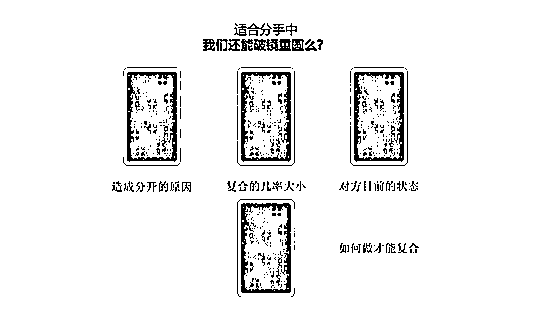

★

**复合牌阵案例解读**

案主是一位 26 岁女生，在谈婚论嫁的过程中，双方家庭产生一些分歧，对分提出分手，女方内心会有一些不甘心，寻求建议。

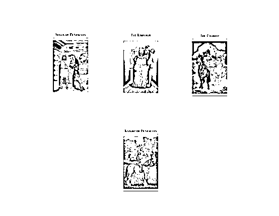

**1：造成分开的原因：星币 7 正位**星币 7 呈现的是**需要做出一个艰难的决定时的处境**。对方应该是经历了不少挣扎，和权衡利弊才做出了提出分手的决定，在已经构建出来的安全感和一个无法预计后果的、全新的方向之间做出选择。可能生活中出现了某些新的诱惑和可能性，也可能是考虑到经济物质层面的因素，包括他自身的后续职业发展的选择，同时做好了承受后果的准备。**2：复合几率大小：皇帝牌正位**

皇帝牌预示着我们要面对**父性原则**的议题了，当然它可能以正面或负面的形式出现。在双方家庭的矛盾中，可能彼此父亲的态度和做法起到了比较重要的影响，也对能否复合的关键，如果能够协调彼此的想法，可能会有转机，如果态度坚定不可撼动，复合会比较困难。从内在层面看，皇帝牌也代表着**内在的父亲，也就是彼此的自尊心，检视彼此是否以顽固和自大的态度打压情感。放下这些情绪会提升复合的可能性。**

****3：******对方目前的状态：战车牌正位**

战车牌出现的时候意味着对方经历了冲突和挣扎，在之前双方的矛盾中激发了他的竞争性，冲突无法避免，结果是个性变得更为强大、冲动、具有侵略性。可能内在有分开和不分开两种不同的想法在交战，也可能现实生活中出现了其他的感情选择，处于**挣扎和选择的阶段。**

******4：********如何做才能复合：星币骑士正位**星币骑士牌反映的是土元素**勤劳、多才多艺和善变**的面向，它总是处于运动的状态中。需要反思自身的状态，在这些方面有没有值得改善的地方。你需要从不甘心和自尊心过强的怪圈中跳脱出来，尝试安稳和沉静地扎根于日常生活的具体事务中，从中发展出满足、谦卑和淡定的人格特质，让对方感受到你们曾经安逸美好的满足感，而不是进一步激发对分的竞争意识。慢慢恢复稳定的沟通和相处，从而重新思考这段感情的走向。

**下载神话塔罗 APP**

**抽取专属于你的“复合牌阵”**

**预约专业神话塔罗师语音解读**

**如何预约塔罗师咨询？**

最后，一起再来复习一下

如何在塔罗 app 上预约咨询服务

去若道塔罗 app 上选择咨询师预约咨询时间

具体咨询方式如下图**最后的最后
如何更新神话塔罗 APP？**快去应用市场更新神话塔罗 APP，抽牌&咨询吧～还没有下载或更新的小伙伴赶紧来看看如何下载和更新吧！

**iPhone 苹果 IOS 系统下载**

****❶** **长按识别二维码下载****

******❷**** 或在 App Store 里搜索“神话塔罗”**

**安卓系统下载****❶** **长按识别二维码下载**

**❷ 或在各大应用市场里搜索“神话塔罗”**

各位亲人小伙伴，每天有事没事都可以去 app 里转转。抽取专属于你的今日塔罗如果感到快乐你就用用**神话塔罗 app**，如果你感到不快乐，更要使用由专业人本主义塔罗师团队全程陪伴的**神话塔罗 app**哦！**想入驻若道塔罗平台成为职业神话塔罗师？****2021 年最新《神话塔罗认证课程》正在报名中**

******报名直达入口******

# 神话塔罗之大阿卡纳牌｜节制

> 原文：[`mp.weixin.qq.com/s?__biz=MzA5NjA0NTAxNg==&mid=2651458981&idx=3&sn=8858e451980859e86b87571128e4f115&chksm=8b48bf12bc3f3604c1ef97c0a818f501fc28c84a4ef19e25521527e162d2d2c6bdded6238ea8&scene=126&sessionid=1692737908#rd`](http://mp.weixin.qq.com/s?__biz=MzA5NjA0NTAxNg==&mid=2651458981&idx=3&sn=8858e451980859e86b87571128e4f115&chksm=8b48bf12bc3f3604c1ef97c0a818f501fc28c84a4ef19e25521527e162d2d2c6bdded6238ea8&scene=126&sessionid=1692737908#rd)

作者/朱丽叶·沙曼-伯克 丽兹·格林

译者/闫东升 编辑/玫瑰 图片/神话塔罗 网络

本文节选自《神话塔罗》

十九世纪中叶，法国神秘主义者艾利冯斯·里维借鉴了三世纪犹太人的魔法测试——Sefer Yetsirah（形成之书），发展出一套塔罗解牌体系，通过不同牌面的组合反应出的意义变化来解读。这一创造性的发明，预示着现代塔罗牌的诞生。走过了正义女神雅典娜，迎接我们的伊瑞斯会是一个怎样的女神呢？今天就来解读大阿卡纳牌——节制。

、

[🔈 神话塔罗·节制](https://res.wx.qq.com/voice/getvoice?mediaid=MzA5NjA0NTAxNl8yNjUxNDU4OTgw)

**｜**朗读者小巫

**书名：**

神话塔罗 

**作者：**

朱丽叶·沙曼-伯克   丽兹·格林 

**出版日期：**

2011-08-02

节制对应的希腊神祗

**伊瑞斯·彩虹女神**

**彩虹女神**这张牌的牌面描绘的是一位拥有一头黑色长发的美丽年轻女子，穿着彩虹般七彩的长袍，背上的一对翅膀也是七彩的。她站在一条清澈的河流旁，一只脚站在岸上，一只脚踏在河流中，身边的河床上紫色的鸢尾花正在盛放。有一条美丽的彩虹在她身后伸展开去。她的双手握着两个杯子，一个是金色的，一个是银色的，她正在把一个杯子的水倾倒入另一个杯子中。

> **雨过天晴后阳光下的彩虹**：象征着关系中的承诺和重生。彩虹也是尘世和天堂之间的桥梁，因此也反映着它们的关系。 
> 
> **水和土的不同特质以及盛开的鸢尾花**：反映出她有能力在个体的内在整合这两者。 
> 
> **金色和银色的杯子**：象征着太阳和月亮、阴性和阳性、意识和潜意识，它们被流动的情感结合在了一起。

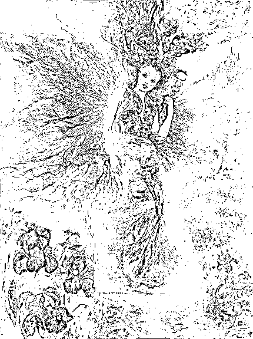

**天堂与尘世的桥梁**在这里我们遇到了彩虹女神伊瑞斯（*Iris*），她也是神界皇后赫拉（*Hera*）的信使。神话中和伊瑞斯相对应的是宙斯的使者赫尔墨斯（*Hermes*），众神和人类都因为伊瑞斯的友好和爱心而喜欢她。如果赫拉或宙斯希望人类知道他们的某些想法，伊瑞斯就会飘然飞入尘世，化作人形或以她原本的女神面貌现身，她的原貌是长着一对翅膀的美丽女神。有时候她就像其配偶——西风之神塞菲勒斯（*Zephyrus*）一样，转瞬消失在空气中；有时候她又沿着彩虹翩然而下，在天空和大地之间架起一道桥梁。即使在水中，伊瑞斯也和在空气中一样穿行无碍。当宙斯要求她传递讯息的时候，地狱的大门也会为她打开，她用冥河之水盛满金色的圣杯，意即把冥河之水象征的被恐怖的诅咒缠绕的不朽神性纳入其中。当众神从旅程中返回到奥林匹斯山的时候，伊瑞斯会帮他们从战车上解下战马，并奉上芬芳的甘露和甜美的食物。伊瑞斯不仅是赫拉的信使，还经常帮助赫拉实施复仇的计划（虽然她在大部分时候给予的都是帮助和关怀）。她在赫拉身边无微不至地照顾她的衣食住行，没事的时候就夜以继日地在她的宝座旁悄然而立。有一些版本的神话中认为伊瑞斯孕育了爱神埃洛斯（*Eros*），而不是阿弗洛狄忒（*Aphrodite*）。**两极间不断变动的情感****从内在的层面来看，彩虹女神伊瑞斯的意象是愚人要成长为稳定的个体所必须学会的第二种特质或才能：适度和均衡。正义之神雅典娜（*Athene*）代表的是公平和客观，而伊瑞斯呈现出来的是节制，以友好和仁慈的态度面对一切，伊瑞斯的同情心里面没有脆弱、痛苦和多愁善感的部分。**伊瑞斯的意象和情感（*feeling*）有关，不是人们常说的情绪（*emotion*），情绪是对境遇的本能反映，而情感则意味着一种活跃的、明晰的选择能力。**情感能够在矛盾的两极之间架起一道不断变化的桥梁，可以敏锐地呈现出某种境遇中想要达成最终的关联与和谐的需求**。神话中伊瑞斯不断地把水在金色和银色的圣杯之间倒来倒去，这意味着情感必须根据每时每刻的需求不断地流动和更新。雅典娜的道德戒律是普世性的，而且要非常稳固，而伊瑞斯均衡和谐的目标则需要情感上不断地变动和调整，有时候是积极的，有时候是消极的。**但是最终伊瑞斯所服务的领域属于阴性而非阳性，无论情感变动的状态如何，即使是愤怒和冲突，其目标都是和谐、合作和更好的联结。**我们通常不认为情感和理性思维一样属于智力范畴。正义牌和节制牌的关系是对立又互补的。雅典娜和伊瑞斯是一对矛盾的意象，雅典娜从父亲的头部出生并为他服务，而伊瑞斯则是属于皇后的阵营；前者高举抽象真理的大旗，为此宁可舍弃个人的情感，而后者则可以为了个人的情感而放弃抽象的真理。这两位女神在神话中并不是敌人，因为伊瑞斯不是任何人的敌人，但是她们可能在我们的内心对抗着彼此，因为她们常常在一个问题上给予我们对立的解决方案。我们到底是根据理性的思维做决定，还是根据情感的需要去维护关系？这两个意象在大阿卡纳牌中出现的顺序告诉愚人——也就是我们每个人，必须要整合两者。我们需要通过雅典娜去学习理性的思考，然后遇到彩虹女神伊瑞斯时，必须学会体味细微的情感变化和它的目的，同时还要记得它并不等同于狂暴的情绪反应和做作的多愁善感。即使是彩虹女神伊瑞斯，也有其矛盾的两面性。不断在两极间变动的情感，其目的是为了保护关系，但它有时候也可能会造成淤塞，因为完全由强烈的情感主导时，关系中的人们就没有了喘息的机会。没有不同的观点、没有冲突、不能对等的交谈都会破坏关系，太过想要和谐就失去了成长的空间。只有和谐的关系中是没有分离的空间的，因为分离需要独立的状态。伊瑞斯作为众神和人类的朋友，忙碌于生活的方方面面，她必须为别人提供服务，所以失去了自己的权利。**因此，节制牌如果没有正义牌的制衡，就会终将变为一潭死水，没有变化和冲突的地方，百无聊赖就会把智力扼杀。****节制，和谐与合作的力量****从解牌的角度来看，节制牌的出现暗示着一段关系中需要情感的流动。**彩虹女神伊瑞斯意味着和谐与合作的力量，其结果是良好的关系（包括婚姻）。我们都需要发展出均衡与和谐的心性，当然通过这个挑战并不意味着完满，愚人不可以和美丽的女神伊瑞斯永远在一起，下一个“美德”的挑战还在等待着他。

**版权声明：**本文由《自在园》授权发布，欢迎转发，反对抄袭。友号转载请申请白名单。

**神话塔罗系列**

[开篇](http://mp.weixin.qq.com/s?__biz=MzA5NjA0NTAxNg==&mid=2651451590&idx=2&sn=41c1083542bcf098de303e29a028ff20&chksm=8b4b4271bc3ccb67d5d53c143cd5a17c24b7b60e5b1051949fa9f086f90b4ab04877976c47e5&scene=21#wechat_redirect)丨[愚人](http://mp.weixin.qq.com/s?__biz=MzA5NjA0NTAxNg==&mid=2651452189&idx=2&sn=f4cc6e768e367fbdb0f69b9c6382443d&chksm=8b4b41aabc3cc8bcdbd952d91d8408014a799224d3f67ab50bb5cbe88ee0090afc92869de1a6&scene=21#wechat_redirect)丨[魔术师](http://mp.weixin.qq.com/s?__biz=MzA5NjA0NTAxNg==&mid=2651453528&idx=2&sn=3ca9b35e1736168eef1856274635224a&chksm=8b4b4aefbc3cc3f965f2531f8c0d37da2e66a2b47139d445df1ea35eeb74bdf3b6827236741a&scene=21#wechat_redirect)

[女祭司](http://mp.weixin.qq.com/s?__biz=MzA5NjA0NTAxNg==&mid=2651455871&idx=2&sn=15ae629e1b35f1371b81868f5bfdd2aa&chksm=8b48b3c8bc3f3ade0175d0e03bfe496711801614273e7fe98b6435fafe0de5daf3a8d7c1312f&scene=21#wechat_redirect) | [皇后](http://mp.weixin.qq.com/s?__biz=MzA5NjA0NTAxNg==&mid=2651453921&idx=2&sn=4d1efea03b2b9f940be7a6aadf553dec&chksm=8b4b4b56bc3cc2405fe562b8ef48f335699f57c12d5d817e24aeeb84f6306092de2ae55becc7&scene=21#wechat_redirect) | [皇帝](http://mp.weixin.qq.com/s?__biz=MzA5NjA0NTAxNg==&mid=2651455083&idx=2&sn=d12546b67c830055f37b147f41c7641f&chksm=8b4b4cdcbc3cc5cad2def85451c3a7ddbb31ba5b9a01febb8a9fb18991d3e1263d9371ac212f&scene=21#wechat_redirect)

[导师](http://mp.weixin.qq.com/s?__biz=MzA5NjA0NTAxNg==&mid=2651456482&idx=2&sn=153b4ca2f69f6745425525773616455d&chksm=8b48b155bc3f384322115b0b94621662ba562a2a252fd244a0a3fc84a664408b2311014e8db5&scene=21#wechat_redirect)丨[恋人](http://mp.weixin.qq.com/s?__biz=MzA5NjA0NTAxNg==&mid=2651457110&idx=2&sn=b4f6a1e93475b39df8f6c80a7409c59c&chksm=8b48b4e1bc3f3df721f206e899272c01bf324355f649fe0fd0dd8363c5b58683daa38e8cf648&scene=21#wechat_redirect) | [战车](http://mp.weixin.qq.com/s?__biz=MzA5NjA0NTAxNg==&mid=2651457444&idx=2&sn=75e9cc378abfefb59ebe7f12357c1b4b&chksm=8b48b513bc3f3c051bf2bb4be018694ca47996a193c0a92d5003c47dc384a2b07f9b9f9806ed&scene=21#wechat_redirect)

[正义](http://mp.weixin.qq.com/s?__biz=MzA5NjA0NTAxNg==&mid=2651458133&idx=3&sn=e37f69e34bc33afe6c0935e32ad0b786&chksm=8b48b8e2bc3f31f465dee7a4595d44620d93e58ca37eeab785724f5a92a9ec3bbb85c3d34f17&scene=21#wechat_redirect)

**朱丽叶·沙曼·伯克**从 20 世纪 70 年代早期开始，就对塔罗牌产生了兴趣，并踏入了塔罗的世界。后来，在丽兹·格林的鼓励下，开始研习心理占星学和塔罗。1984 年，第一本书《塔罗全书》（The Complete Book ofTarot）出版。之后，与丽兹·格林合作设计并撰写了《神话塔罗》（The Mythic Tarot）。朱丽叶写了十本塔罗和占星学书，包括一本名为《众星的传说》（Stories from the Stars）的儿童读物，以及与丽兹·格林合著的《神话之旅》（The Mythic Journey），这是一本详细讲述如何运用神话来指导生活的书。

**点击下图了解课程详情** 

**微信又双叒叕改版啦，不想错过若道君的推送？**

**就把若道设为星标吧！**

**▼**

**喜欢记得点一下在看哦☟**

************报名直达入口************

# 认证体系课程丨神话塔罗创始人亲自授课，从小白进化到专业塔罗师

> 原文：[`mp.weixin.qq.com/s?__biz=MzA5NjA0NTAxNg==&mid=2651458981&idx=4&sn=c5e7802e62a30f500a174eb59a9cdd18&chksm=8b48bf12bc3f36046c2d19cdc5776051efd00ea5ac3954f476e2d24c5ce61fbef5aa44824432&scene=126&sessionid=1692737908#rd`](http://mp.weixin.qq.com/s?__biz=MzA5NjA0NTAxNg==&mid=2651458981&idx=4&sn=c5e7802e62a30f500a174eb59a9cdd18&chksm=8b48bf12bc3f36046c2d19cdc5776051efd00ea5ac3954f476e2d24c5ce61fbef5aa44824432&scene=126&sessionid=1692737908#rd)

**时隔三年，****超高含金量的神话塔罗认证课程强势回归****经过多次打磨的课程内容体系****让你直观精准的感受到****神话塔罗的魅力，****扎实的建构****神话塔罗思维，****系统****学习****最地道的塔罗知识。****中高阶课程中老师传授****将神话、占星、心理学完美融合进塔罗****的****人本主义咨询体系，****并进行****学员案例督导，****让你更自信的开展咨询工作，****学以致用。****本期认证课程采取****初中阶****即报即学的录播课****+高阶****案例督导直播课****的形式，****录播课：****精编剪辑，随来随学，助教答疑，学练结合。****直播课：****大师融合，神话心理，塔罗占星，咨询技巧。****若道为学员开发了****“神话塔罗”APP，****是随身的工具，****更是接咨询的平台，****中阶****学成入驻平台****即可链接更多塔罗个案，****发展壮大你的塔罗咨询事业。**

**如果你想学习塔罗，什么样的老师会让你怦然心动呢？她是三副塔罗牌的设计者，写了 6 本塔罗书籍。她研习塔罗四十余年，教授塔罗三十余年，是丽兹·格林的密友。还有****谁会比塔罗牌设计者更了解塔罗的历史、灵魂与精髓？****所以，这将是你开启塔罗之旅最坚实的一步。**

1

**这位塔罗大师是谁？**

**朱丽叶·沙曼-伯克** 

**· **她是**3 副塔罗牌**的**设计者****——**神话塔罗牌、沙曼–卡塞利塔罗牌、“自己着色”塔罗牌；**· **她出版了**6 本塔罗书****——**《塔罗全书》、《新塔罗全书》、《众星的传说》、《理解塔罗牌》、《精通塔罗牌》、《塔罗初学者指南》；**· **她研习塔罗**四十余年；****· **她教授塔罗**三十余年**；******· **她是**丽兹·格林**的密友，两人合著了**《神话之旅》**，共同设计了**神话塔罗牌。**

**· **她是认证的**心理治疗医师；****· **她深谙**塔罗、占星学、心理学和神话学**如果你想成为拥有英国神话塔罗认证的塔罗师那么她，就是你**最好的老师人选**

2

**塔罗牌有什么用？**

**· **塔罗牌是一种**古老的疗愈工具**，同时也是**直观的解惑工具****；****· **塔罗牌绕过逻辑思维，**和潜意识联结**，通过图像的方式生动地将隐藏在人类潜意识中的画面浮出水面，**揭示心灵的状况和运作****；****· **塔罗牌**帮助我们和潜意识对话**，可以和现代的心理治疗联系在一起，帮助我们**看清心灵的冲突来源、本质和可以选择的道路；****· **塔罗牌又和更广阔的**宇宙生命原型**联结，彰显**个人生命发展的阶段**，将**个人生命挣扎、内在冲突**放在生命进化的道途上，让更广大的生命智慧为个人成长照亮道路。

3

**为什么学习神话？**

神话通过**图像和故事**描绘人类生活的**原型模式**。通过瑰丽的想象、诗意的语言、栩栩如生的人物和故事描绘出我们内心的世界，表达出我们经历的那些实现人性的过程，帮助我们将**个体的生活与人类古老且永恒的故事**建立联结。从而在更深处**理解生命**，并学习**古老而长青的生命智慧**。**神话塔罗**取材于**希腊神话**的无尽沃土，通过故事提供一种**记忆辅助**，在心理和预见层面提升解读的**丰富度**。因为这样更符合塔罗牌的性质，符合人类的想象。**按照故事思考，而不是简单的记忆关键词和固定的意义。**

4

**塔罗预测是什么？**

塔罗牌预测的运作就像是**照向心灵的一面镜子**。在塔罗牌解读时，图像的原型性质穿透隐藏的潜意识脉络，反应出与个人境遇相关但又未被了知的知识与洞见，因此**揭示出按照任何理性方式都无法发现的事情。**如果你对生命好奇，塔罗学习会帮你**打开一扇通往未来的门****，**让你了解**心灵运作和显化的秘密**，同时赋予你更多关于生命成长的支持和指引的能力！

5

**我们将学习什么？**

**☆****初阶：神话塔罗详解**

**神话故事和预测意涵**

**第一讲 **

**介绍塔罗牌，讲述它的历史**

**第二讲 **

**星座三形态、四元素和宫廷牌**

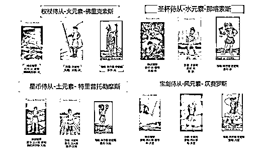

**第三讲 **

**基本星座与基本国王**

**第四讲 **

**固定星座与固定女王**

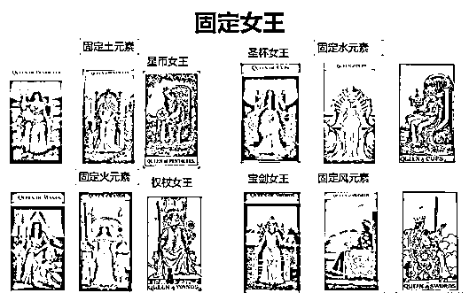

**第五讲 **

**变动星座与变动骑士**

**第六讲 **

**小阿尔卡纳数字牌**

**第七讲 **

**小阿尔卡那数字牌-圣杯**

**第八讲 **

**小阿尔卡那数字牌-宝剑**

**第九讲 **

**小阿尔卡那数字牌-权杖**

**第十讲 **

**牌阵&案例解读**

**☆****中阶：神话塔罗排阵应用**

**排阵解读和咨询技巧**

**第一讲 ****大阿尔卡纳-开启神话塔罗愚人之旅：****愚人、魔术师、女皇、皇帝****第二讲 ****女祭司、教皇、恋人、战车、正义、节制****第三讲 ****力量、隐士、命运之轮、倒吊人、死神、恶魔****第四讲 ****高塔、星星、月亮、太阳、审判、世界******

**第五讲 **

**塔罗牌的原型、占星原型**

**第六讲 ****引导式冥想、荣格的四种意识功能** **第七讲 ****引导式冥想与马蹄牌阵**

**第八讲 **

**六芒星牌阵、凯尔特十字牌阵**

**第九讲 ****咨询案例演示：为一位年轻女性所做的四次解读****第十讲 ****神话塔罗咨询督导案例样例****☆****高阶：神话塔罗直播督导课**

**大阿尔卡纳的心理原型和学员督导**

**第一讲** **愚人**：永恒的少年；儿童的原型

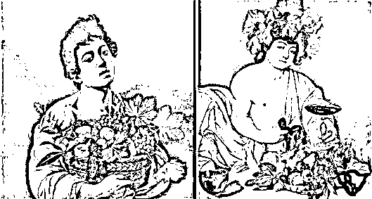

**魔术师：****恶**作剧者、老师、向导、沟通者的原型；行星：水星

**女王**：母亲、养育者、丰产的原型；行星：金星在金牛座；小行星：谷神星

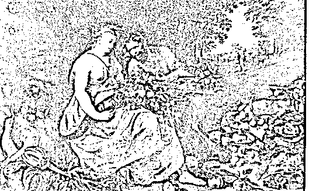

答疑与讨论，学员们分享对自己或客户的塔罗解读，对神话塔罗牌进行更多探讨。**第二讲** **皇帝：**父亲、供养者、计划者的原型；行星：木星

**女祭司：**处女——等待被实现的潜力原型；行星：新月

**教皇：**疗愈者、受伤的疗愈者、牧师的原型，牧师是神与人之间的灵性桥梁；行星：凯龙星

答疑与讨论，学员们分享对自己或客户的塔罗解读，对神话塔罗牌进行更多探讨

**第三讲** 

**恋人：**爱、爱人、所爱之人的原型；行星：金星在天秤座

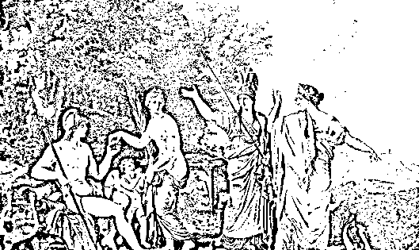

**战车：**战争、冲突、战士、斗士的原型；行星：火星

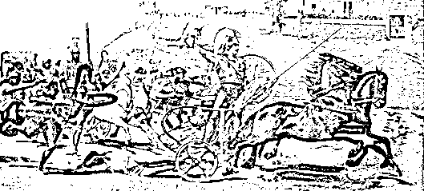

**正义：**智慧、兵不血刃的胜利的原型；星座：处女座；小行星：智神星

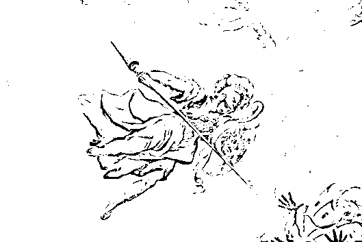

答疑与讨论，学员们分享对自己或客户的塔罗解读，对神话塔罗牌进行更多探讨。

**第四讲** 

**节制：**关系、合作的原型；星座：巨蟹座、双鱼座

**力量：**力量的原型；星座：太阳在狮子座

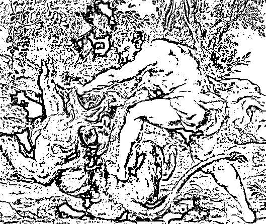

**隐士：**晚年、耐心的原型；行星：土星

答疑与讨论，学员们分享对自己或客户的塔罗解读，对神话塔罗牌进行更多探讨。

**第五讲** 

**命运之轮：**命运女神与命运的原型

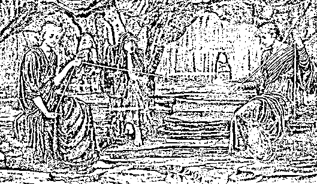

**倒吊人**：牺牲与有意识的牺牲的原型；行星：海王星

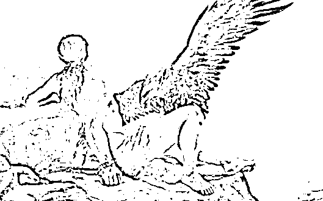

**死神：**死亡、终点和起点的原型；行星：冥王星

答疑与讨论，学员们分享对自己或客户的塔罗解读，对神话塔罗牌进行更多探讨。

**第六讲** **恶魔：**阴影、人类不文明的面向、本能、欲望天性；行星：火星在天蝎座

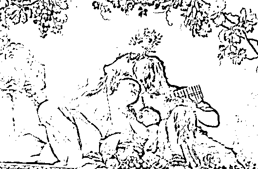

**高塔：**改变、分裂瓦解的原型；行星：天王星

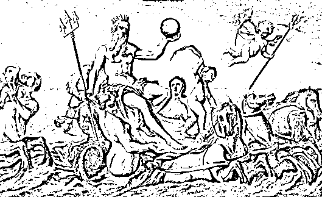

**星星：**希望的原型

答疑与讨论，学员们分享对自己或客户的塔罗解读，对神话塔罗牌进行更多探讨。

**第七讲** 

**月亮：**无意识的原型；行星：暗月

**太阳：**意识、创造力和文明的原型；行星：太阳

**审判：**复活、新生的原型；行星：水星作为灵魂向导普绪科蓬波斯

答疑与讨论，学员们分享对自己或客户的塔罗解读，对神话塔罗牌进行更多探讨。

**第八讲** 

**世界：**整体、完成和个性化的原型

答疑与讨论，学员们分享对自己或客户的塔罗解读，对神话塔罗牌进行更多探讨。

**认证阶段：考试论文**

**入驻塔罗平台**

6

**适合人群**

**· **塔罗初学者，完全没有塔罗基础；**· **塔罗自学者，也曾上过塔罗工作坊，但仍不懂如何使用塔罗牌；**· **塔罗进阶学习者，有塔罗基础，了解 78 张塔罗牌含义；**· **不知如何解决遇到的情感困惑、职业选择、人际问题，对人生感到迷茫；**· **想要学习深入解读塔罗牌、牌阵的使用、咨询技巧等将塔罗运用于咨询实践；**· **想要深入了解和学习塔罗，希望成为专业的塔罗师；**· **想要借助塔罗进行心灵、灵性成长。

7

**导师简介**

**朱丽叶·沙曼-伯克**

**朱丽叶·沙曼-伯克**从 20 世纪 70 年代早期开始，就对塔罗牌产生了兴趣，并踏入了塔罗的世界。后来，在丽兹·格林的鼓励下，开始研习心理占星学和塔罗。1984 年，第一本书《**塔罗全书**》（*The Complete Book ofTarot*）出版。之后，与丽兹·格林合作设计并撰写了《**神话塔罗**》（*The Mythic Tarot*），在这本书中，她们将古希腊神话与传统塔罗解读结合起来。朱丽叶写了**十本塔罗和占星学书**，包括一本名为《众星的传说》（*Stories from the Stars*）的儿童读物，以及与丽兹·格林合著的《神话之旅》（*The Mythic Journey*），这是一本详细讲述如何运用神话来指导生活的书。

8

**课程价格**

**初阶正价：**5800 元**中阶正价：**5800 元**高阶正价：**7800 元**考试认证费用：****3000 元****认证课程总价：****22400 元****联报优惠价：****18000 元**

长按二维码添加客服 Echo 老师

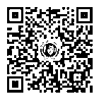

9

**退转课程**

*   **退款原则请详看《教学协议》，如有疑问请咨询课程顾问。**

**神话塔罗认证课程**

**授课老师：****朱丽叶·沙曼-伯克**

**授课时间：2021 年 11 月 3 日起**

**授课方式：**网络课程**，**英文授课，中文翻译

**费用：****初阶正价：**5800 元；**中阶正价：**5800 元；**高阶正价：**7800 元；**考试认证费用：****3000 元；****认证课程总价：****22400 元；****联报优惠价：****18000 元；**

**课程负责人：Echo 老师**（微信/手机：nodoor18518412824，请备注“神话塔罗”）

长按二维码添加课程负责人咨询~

****报名请点击“阅读原文”****

# 白羊座满月 | 这个充满张力的满月，“自我与关系”该如何整合？

> 原文：[`mp.weixin.qq.com/s?__biz=MzA5NjA0NTAxNg==&mid=2651458755&idx=1&sn=88e10883e46be3e5035b20fbbed52f5a&chksm=8b48be74bc3f376256bf88335a58e4932ba96277a6b2b78057886c20931759b909ed7ab911ae&scene=126&sessionid=1692737913#rd`](http://mp.weixin.qq.com/s?__biz=MzA5NjA0NTAxNg==&mid=2651458755&idx=1&sn=88e10883e46be3e5035b20fbbed52f5a&chksm=8b48be74bc3f376256bf88335a58e4932ba96277a6b2b78057886c20931759b909ed7ab911ae&scene=126&sessionid=1692737913#rd)

**☆ 后台回复“今日”，给你一句生命态度**

作者/王芝桦 编辑/玫瑰 图片/pexels

**白羊座满月****北京时间 2021 年 10 月 20 日 22:56 迎来白羊座满月，天秤座太阳与白羊座月亮于 27°26′精准对分。**9 月和 10 月，水星逆行天秤座，我们正处天秤月生活，故而，“天秤座”成为最彰显和最耀眼的星座，“平衡”也成为大家最敏感的一件事，而随着各种人与人、人与物、人与金钱、人与环境的“关系”揭开旧伤，我们开始遇见更多的“自我”真相……此次白羊座满月，就发生在“自我与关系”充满张力又渴望整合的现实背景之下。那么，宇宙为什么如此安排呢？我们将会从中收获哪些洞见呢？

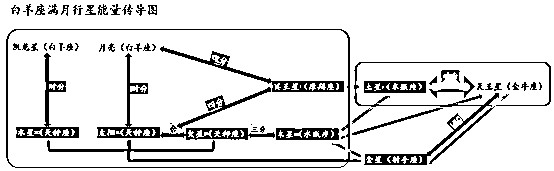

**白羊座满月重点影响人群**

参考满月峰值影响期间各个行星的行进度数，以及逆行行星的轨迹影响；常规容许度，个人行星入相位 3°，出相位 1°；非个人行星入相位和出相位均为 3°。

**·** 出生星图中，有**行星、四轴、南北交点落入固定星座（金牛座、狮子座、天蝎座、水瓶座）3°-17°，19°-30°**的人群； 

**· **出生星图中，有**行星、四轴、南北交点落入基本星座（白羊座、巨蟹座、天秤座、摩羯座）7°-14°，20°-30°**的人群；

**·** 出生星图中，有**行星、四轴、南北交点落入变动星座（双子座、射手座、处女座、双鱼座）11**°-26****°********的人群。

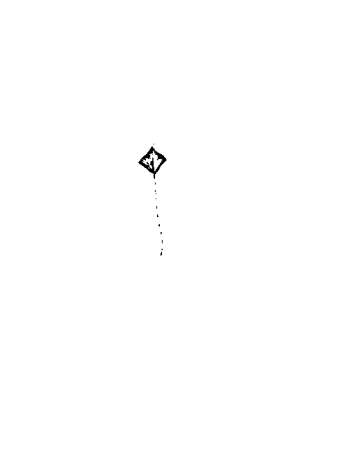

**唯有“真实自我”才能给出的答案**

****

**对于人生的选择，无所谓对与错。只是，当有那么一天，面对自己内心的喝问时，你是否会因为没有发出一个与安稳世界相反、但的确是真正自己渴望的声音而后悔。**

**——维罗尼卡·罗斯《分歧者》**

**天象：**

**·水凯对分：**天秤座水星对分白羊座凯龙星；

**·火木三分：**天秤座火星三分水瓶座木星。10 月 1 日一天之内，宇宙安排了三组天象结构：天蝎座金星与水瓶座木星的“金木四分”，天秤座水星与摩羯座冥王星的“水冥四分”，天秤座火星与白羊座凯龙星的“火凯对分”。当时，这三组结构之中：水星、木星和冥王星都在逆行状态（逆行期：水星 9 月 27 日-10 月 18 日，木星 6 月 20 日-10 月 18 日，冥王星 4 月 28 日-10 月 7 日）；天蝎座金星与天秤座火星正打造着“金火互容”的宇宙背景（9 月 15 日-10 月 6 日），而这颗金星也同时接纳着水星逆行天秤座、天秤座火星的能量（金星守护天秤座）。我们可以这样解读以上三组结构：一些关系的旧伤旧痛再次呈现眼前，曾经的隐忍、妥协和退让并没有换得相应的尊重、理解和平等，现实状况令人失望，曾经的选择令人羞愧，不公的待遇令人愤怒，故而，不可逃避，必须解决……但是，**我们还没有准备好，还不知道如何做出选择。**没关系，10 月初的这一小波高潮，只是为后面的生活种下一个锚点。时间的脚步向前迈进。**10 月 7 日，冥王星恢复顺行；10 月 11 日，土星恢复顺行；10 月 18 日，木星和水星双双恢复顺行。**10 月，行至此次白羊座满月之前，四颗行星先后恢复顺行，打破了群星集体逆行的局面。此次白羊座满月，10 月 18 日刚刚恢复顺行的水星和木星分别形成“水凯对分”和“火木三分”结构。于是，10 月 1 日种下的锚点再次发问：**旧日伤痛如何处理？关系问题如何选择？**一切都是最好的安排，如果说行星逆行蕴藏着回溯、检视和反思的时机，那么行星恢复顺行就是纠偏、校准和修正的时间。而此次白羊座满月，行星和我们都已行进到纠偏、校准和修正的时间。

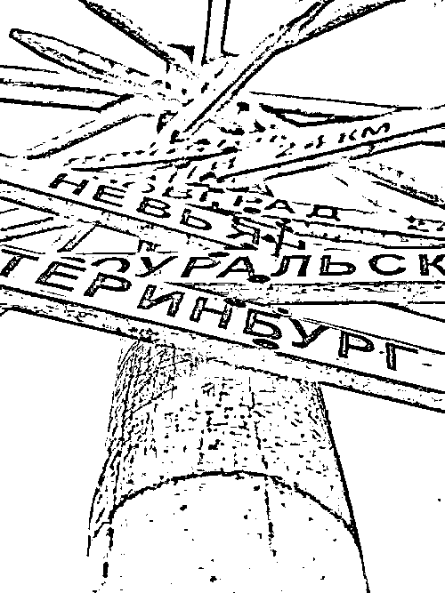

***1. *****水星的教导：对自己诚实**

水星的神话原型是希腊神话中的赫尔墨斯（罗马神话中的墨丘利）。 

赫尔墨斯**聪明机智、精通商业且善于雄辩，**作为“神的信使”为众神传递信息，作为“指路的神”为世人指点迷津。但同时，赫尔墨斯也**无比滑头、狡诈多端且善于说谎**，这似乎与“神的完美”并不相符，但真性情也令赫尔墨斯变得活生生，距离人间更近，与人类那么相像。是的，行星所对应的“神话原型”并不在天上，行星就在每个人的出生星图之中，“神”更在我们的生命之内——我们会在生命之内遇见不同侧面的赫尔墨斯，**我们具有聪明的头脑和智慧的洞见，但有时我们也会很有头脑地逃避真相，很有技巧地自欺欺人。**2021 年的 3 波水星逆行均在“风元素星座”，水瓶座-双子座-天秤座，在全新的“风元素周期”向我们传递全新的“认知与智性”——**升级全新的意识，接纳全新的可能，调试全新的平衡。**9 月 27 日-10 月 18 日水星逆行天秤座，引领我们透过人与人、人与物、人与金钱、人与环境的各种“关系”，检视自我的诚实，反思生命的功课，重建生活的平衡。此次白羊座满月，“水凯对分”结构引领我们——**只有与过去的挫败和内在的伤痛诚实相对，才能重新构建自我的平衡与关系的平等。****·** 一切关系的基础都是“自己和自己的关系”；**·** 一个自知、自洽和自信的人，首先是一个会对自己说真话的人：保持自我的独立，才不会为了得到认同而丢失自我或随意妥协；坚守自我的边界，才不会为了证明价值而委曲求全或肆意讨好；**·** 给与自己诚实、尊重和信任，才能给予他人诚实、尊重和信任。

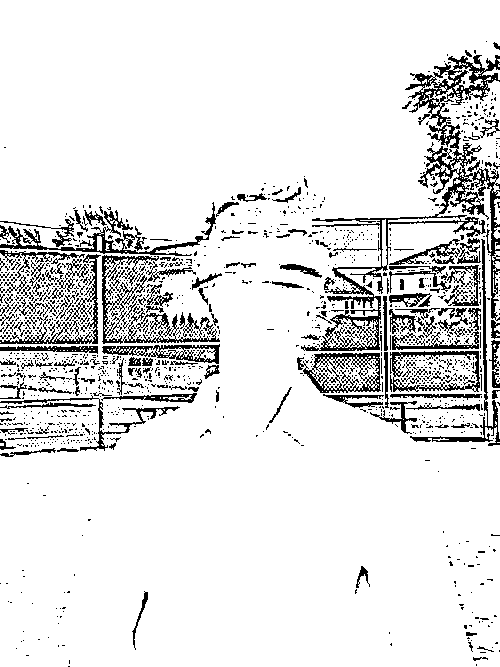

***2. *****木星的教导：重新评估理想目标**

2020 年的一场疫情，减缓了很多速度，搁置了很多计划；好不容易盼到了 2021 年，却发现疫情的影响已逐渐下沉到经济、市场、行业、企业和个人的各个方面，我们必须做出全新的成长与改变。 

于是，2021 年我们首先面临着“即使冒险也要去做想做的事”的木星所带来的考验——用力过猛的激进，不辨真伪的盲目。木星 12 年行进黄道一周天，1 年行进一个星座，而这一年之中，木星会发生 5 个月左右的逆行。故而，很多年份中，木星都会暂时迈入下一个星座“试水”，然后又逆行回到年度行进的星座之内。2021 年是木星行进水瓶座的“木水瓶”年，其中，**5 月 14 日-7 月 27 日，木星曾短暂“试水”双鱼座，并与双鱼座海王星形成“木海互容”结构——这既是迸发希望和带来机会的一段时间，也是制造幻觉和隐藏陷阱的一段时间。**遇见哪种情况，取决于两点：**· 辨别：**信念坚定就有希望，脚不着地就成幻觉；**· 准备：**实力稳扎就有机会，好高骛远就遇陷阱。**6 月 20 日，木星于双鱼座 2°开始逆行，7 月 28 日，木星逆行回水瓶座，10 月 18 日，木星于水瓶座 22°恢复顺行。**木星一系列脚步，提示我们对理想愿景和目标达成做出检视和反思——**是否为理想目标准备了经得起摔打的坚定信念？是否为实现理想目标，准备了匹配得起的稳健实力？**此次白羊座满月，“火木三分”结构引领我们对自己、对理想、对目标进行重新评估——**我们是否已经寻获能够为自我生命带来意义、对未来生活带来建设性的理想目标？是否愿意为此全情投入并奋力一搏？**无论成败，无谓对错，只求当有那么一天，面对自己内心的喝问时，不会因为没有发出自己渴望的声音、没有去做内心想做的事而后悔。

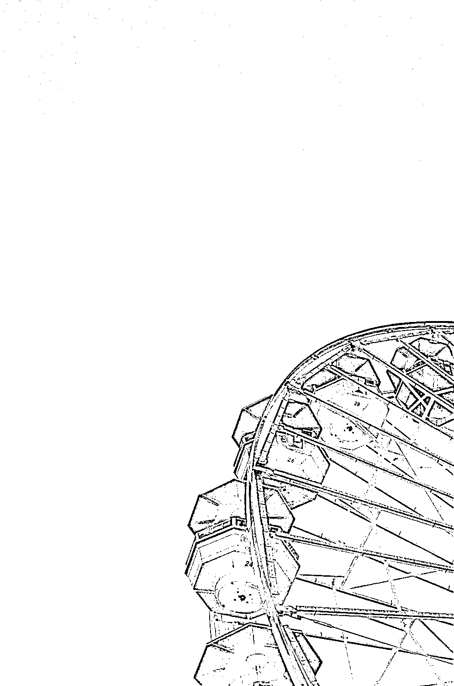

**让该结束的结束，该来临的来临**

****

**人生最大的挑战，就是在一个试图将你定型的世界里，诚实地做自己。****——维罗尼卡·罗斯《分歧者》**

**天象**

**· 火冥四分：**天秤座火星四分摩羯座冥王星；

**· 火星介入满月：**宽泛容许度下，天秤座火星合相天秤座太阳，对分白羊座月亮；

**· 冥王星介入满月：**宽泛容许度下，摩羯座冥王星四分“日火合相天秤座”，四分白羊座月亮，形成 T 三角格局；

**· 金天梅花：**射手座金星与金牛座天王星形成 150°梅花结构。这颗火星还挺忙。**9 月 15 日，火星换座进入天秤座，直至 10 月 30 日换座进入天蝎座。**天秤座是火星并不舒适的位置：火星的神话原型是“战神”，战神自然要无往不胜；天秤座却是称量善恶的那柄秤，遵循道德，热爱和平。**·** 天秤座对火星说：“请不要这么好斗，这么残酷嘛。”**·** 战神对天秤座说：“我都要憋出内伤了！”9 月 15 日-10 月 30 日的一个半月，战神过得很不容易；而**9 月 15 日-10 月 6 日**，天秤座火星与天蝎座金星形成“金火互容”结构期间，“战神”更是在天蝎座金星触礁**“关系的信任议题”**并一再掏出“记账小本本”的情况下，差点原地爆炸——**想出手却还要权衡三姑六婆的感受，不出手简直就是“战神”的耻辱。**此次白羊座满月，本就憋屈的“战神“火星接纳了白羊座满月的能量（火星守护白羊座），焦躁和愤怒的情绪达到爆发的临界点，即使穿着天秤座的优雅衣服，也要不顾一切地疯狂入局，势要拿到想要的结果；而“火冥四分”结构则是这一场“争斗”的关键性、两极性按钮。

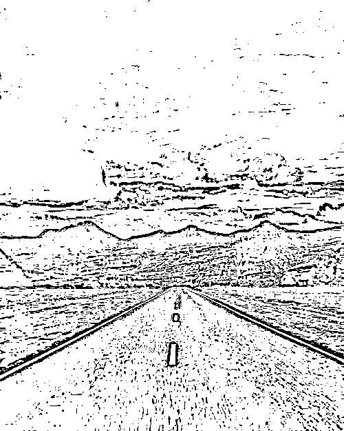

***1. *****冥王星的教导：与其“成”一时，不如“成长”一世**

此次白羊座满月，宽泛容许度下，天秤座火星介入满月的“日月对分”轴线；而通过“火冥四分”结构，冥王星也间接地与满月的“日月对分”轴线形成“基本星座 T 三角”格局。 

此次白羊座满月，那颗带着“不可谈判”的力量、揭示“业力执着”、10 月 7 日恢复顺行的宇宙超级大 BOSS 冥王星，站在“日月对分”轴线的中间位置说：**“争斗很简单，赢了就真能获得你们想要的生活吗？”**当下这一轮的摩羯座冥王星周期（**2008 年-2024 年**），是人们对现实的成果、成绩、成功、成就野心勃勃的一个周期——**一个“成”字，尽显执念。**2020 年-2021 年，一场席卷全球的疫情，将这个世界推入降速、洗牌和转化的进程，也将我们每个人心底最深层的恐惧和欲望彻底激发——“不成”可不成！只能更好，不能后退！摩羯座冥王星提示我们对这个“成”字慢下来，放下一些野心，松开一些执着，但我们并不想听。问题是，我们说了算吗？冥王星的神话原型“冥王哈迪斯”掌管冥界地府，那可是不能谈判且有去无回的地方，只有希腊神话中“神的信使赫尔墨斯”、中国神话中“齐天大圣孙悟空”能够随意进出，凡人只能臣服。冥王星每年逆行 5 个月之久，引领我们直面内在阴影，转化业力功课；但如果我们不听、不看、不改，就只能在“业力”的大石头上循环往复地摔跤，直至转化完成。还有比这更惨的魔咒吗？**如是“轮回”，想要“超脱”，唯有“转化”，从意识到行为。**此次白羊座满月，“基本星座 T 三角”格局提示我们——**与其因为争斗两败俱伤，不如寻求更有建设性、更能缔造共赢的方式，“成”只是一时，而“成长”却是一世。**当然，我们仍然会在此次白羊座满月的前后 5 天，无论是从个人层面，还是从集体层面，看到一些表面的平静被打破：**一些关系在一时冲动之下一拍两散，一些谈判在不如人意之下倒戈反向，而全球范围内的自然灾害、极端事件和暴力冲突将会改变很多人的生活。**此次白羊座满月，我们需要带着觉察进行反思和自问——**这真是我想要的结果吗？这真能带来我想要的生活吗？如果你的答案是“不能”，那么不如等等，宇宙会安排好“一切都是最好的安排”。**

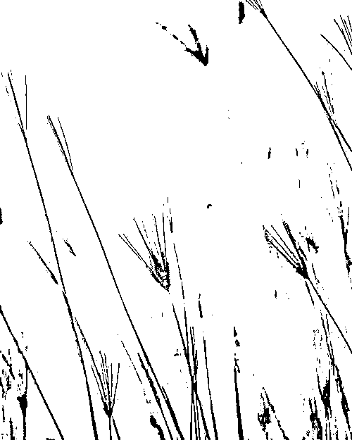

***2. *****土天四分的启示：透过现实困境，诚实面对自己**

2021 年每一步的天象趋势，最终都指向年度重磅天象“土天四分”结构。此次白羊座满月也不例外。2021 年是全新“风元素周期”的起始年，“土天四分”结构是 2021 年的宇宙天象大背景，指向“新旧转化”的进程——**只有清算了过去的陈旧与弊端，才能重建和开创全新的未来。**“土天四分”结构中的土星，代表着现实的考核，通往成熟的方向。

10 月 11 日，逆行了 5 个多月的土星于水瓶座恢复顺行（逆行期 5 月 23 日-10 月 11 日），提示我们回溯过去 5 个月的旅途：

**· 破碎的理想：**检视自己是否准备好实力，反思自己是否承担了责任。现实只是照见出我们内在没有准备好的“不自信”，未经磨练的“不可能”。但是，不要自我否定，更不要随意躺平，我们只是宇宙的孩子，我们还年轻，我们正走在通往“自信与成熟”的道路上。

**· 挫败的经验：**真正的理想，永远不会轻易放手；能够因挫败放手的，并不是真正的理想。对自己说真话，找到你愿意为之“一步一个脚印地磨练意志，一点又一滴地沉淀实力”的生命目标。土星老人有他自己一套“严格却有效”的训练体系——不要借助任何工具，不要试图走捷径，不要奢望外界帮助，不要恐惧孤立无援，凭借自律的态度和持续的努力磨练，跟随时间，沉淀实力，将不能变成可能，收获谁也拿不走的成熟与力量。

那些破碎的理想和挫败的经验之中蕴藏着土星老人的礼物，我们一定要去用心寻找。

此次白羊座满月，“金天梅花”结构则提示我们：当下，我们能为自己做的最有意义、最有建设性的事情就是——**解放自己对于意外和失败的恐惧，突破试图将你定型的安稳和习惯，只要你能诚实而勇敢地做自己，就能拥抱一切未知的可能性。**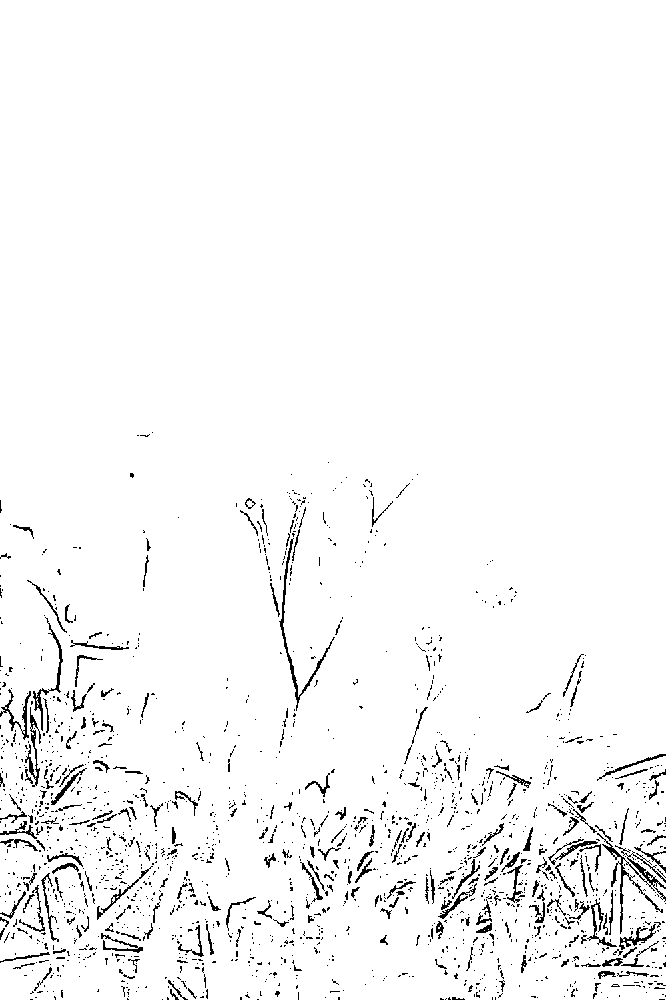**寄语**

****

**时间就是救赎。**

**——维罗尼卡·罗斯《分歧者》**

2021 年即将走到年末，无论我们一路沉淀下来的是什么，时间确实一直在呈现答案并给与安抚。虽然我们需要对生活做出主动的选择，但当我们没有准备好的时候，就先不要急于选择或盲目出手。未来的空隙，还是留给时间吧，这也是对自己的一种接纳、允许与救赎。祝愿每一个灵魂安好。祝福大家。

**版权声明**：原创文章由作者授权首发于若道平台，欢迎转发，反对抄袭。友号转载请申请白名单。

****

****想阅读更多作者的文章，****

****请在后台回复******王芝桦****** 即可。****

****王芝桦****

心理占星师，统合疗愈师，占星专栏作者

若道占星“新月和满月”专栏作者，腾讯视频特约占星师

全职于个案咨询与占星教学工作 17 年

**个案预约咨询微信号**：zhihua0621 

**微信公众号**：daoxi-life

**长按打赏**

****

**学习占星学**

**点击下图了解课程详情** 

**

**

**

**微信又双叒叕改版啦，不想错过若道君的推送？**

**就把若道设为星标吧！**

**▼**

**喜欢记得点一下在看哦☟**

****报名直达入口****

# 10.24NVC 线上训练营丨别让“暴力沟通”毁掉真挚的关系

> 原文：[`mp.weixin.qq.com/s?__biz=MzA5NjA0NTAxNg==&mid=2651458755&idx=2&sn=0927fceeaf8ffdad0371975c7970085b&chksm=8b48be74bc3f3762a57297f5fe393989f35672ed1a2257eb97b6d8b690238a4e4232de9be4a3&scene=126&sessionid=1692737913#rd`](http://mp.weixin.qq.com/s?__biz=MzA5NjA0NTAxNg==&mid=2651458755&idx=2&sn=0927fceeaf8ffdad0371975c7970085b&chksm=8b48be74bc3f3762a57297f5fe393989f35672ed1a2257eb97b6d8b690238a4e4232de9be4a3&scene=126&sessionid=1692737913#rd)

**为什么我们要学 NVC？**

（向上滑动查看内容）

**蒋颖**

若道联合创始人

2016 年，我在新西兰参加一个 Hakomi 亲密关系治疗的治疗工作坊。参加这个工作坊的都是治疗师。在这个工作坊中，有一位女性让我特别印象深刻，因为她身上有种特别的气质，某种既温柔又坚定的东西，充满力量，充满对这个世界充满关怀，她身上表现出的让人惊讶的真实也让我有很多思索。她叫托尼·麦克尔兰（Toni McErlane）。

我知道她从小学习武术，也是一个悬挂式滑翔运动的运动员，曾经背着滑翔机在世界各地的上空飞行和比赛。她完成了北美非暴力传播（NVC）领导计划，是一个非暴力沟通（Nonviolent Communication，简写 NVC）培训师和注册的家庭纠纷调解人，也是生态心理学的培训师。她有多年的内观经验，在身体创伤治疗方面的经验，还有她在有机种植、景观设计、园艺治疗都有专长……我看到她到印度去，帮助印度乡村做有机耕种。在这次疫情之前，她已经买了一艘帆船，准备和丈夫开着他们的船环游世界。所有这些都让我感叹，一个女性可以活得如此勇敢和丰富。现在她而她对中国也充满了某种关切。多年前就一个人在藏区徒步旅行，后来又骑自行车穿越西藏。

但喜欢户外冒险的 Toni 说， NVC 比武术更管用。

2019 年，我终于请 Toni 到中国来，请她给若道做了基础和中级的 NVC 培训，也请她对外做了一次工作坊。

怎么说呢，培训和工作坊棒极了，更棒的是，我觉得人人都爱她。

**Toni McErlane**

我来自新西兰，拥有社区和人类服务—咨询康复学士学位，是 Aminz 的注册家庭纠纷调解人，也是 NVC Aotearoa 的 NVC 培训师。

在我的生命中，我一直对真诚、充满活力、自我负责的沟通和有意识的选择充满激情。而我的人生旅程为我提供了充足的机会，让我去探索、研究、反思和完善这在沟通中是什么样的。

在我的工作坊中，我的原则和实践都是建立在非暴力沟通和正念的哲学基础之上。非暴力沟通是由美国心理学家马歇尔·卢森堡博士所开发的。马歇尔的目标是发展出一种语言，这种语言受到印度巴利语中的“非暴力主义”（Ahimsa）一词的启发，它的意思是“没有伤害”。我们怎样才能在与他人沟通时不造成伤害呢？这不仅需要非暴力沟通的技巧，还需要在训练中融入正念。正念是受小乘佛教内观传统的启发，发展觉知和接纳，关注和允许。在我们的工作坊中 ，我们将非暴力沟通和正念编织在一起。

我致力于以这种沟通和处世方式作为我日常与人互动的基础。我曾经学习了为期一年的北美非暴力沟通领导者项目，在加州湾区非暴力沟通的全年浸入式项目中做了两年协助工作，然后在索诺马县女子监狱推动非暴力沟通培训。同时，多年来我持续参加内观静修，致力于继续和发展这种实践，并把它融入自己的工作坊中。

2020 年疫情期间，我与丈夫和我们的猫在游艇上休了一年假。现在，我和丈夫还有 15 岁的侄女在新西兰南岛的达尼丁生活。我在那里从事心理咨询、冥想和生态心理疗法。我们还正在那里慢慢建立一个治疗静修中心和生态冥想社区。

过去四年，我曾两次来中国，与若道及其友好而充满活力的团队分享非暴力沟通，并参观了一些绝佳风景。我期待继续与若道合作，在网上分享我的知识和技能。

向上滑动可查看更多

**Toni 老师有话对你说**<mpvideosnap class="js_uneditable custom_select_card channels_iframe" data-pluginname="videosnap" data-id="export/UzFfAgtgekIEAQAAAAAABNIXkZitzgAAAAstQy6ubaLX4KHWvLEZgBPEtIMEEEUxZvj-zNPgMIuM7PVi1oMK5fdX4B-DAnh3" data-url="https://findermp.video.qq.com/251/20304/stodownload?encfilekey=RBfjicXSHKCOONJnTbRmmlD8cOQPXE48ibrgo6T80SM1b4QSoxiaa7xblfRvMCU22ricO1icL5GdBOSmzhG7mbaLtSLg4xqYaTLicapWwCV45Axx8QGaozqH7OpxicjibYzN1icWtyuIibCRyZInILWhIGRG1ILicWtib8H3XUMxBW2rZO2GMmc&amp;adaptivelytrans=0&amp;bizid=1023&amp;dotrans=0&amp;hy=SH&amp;idx=1&amp;m=3d7ca9d191932d16f6faa80b9364d1f9&amp;token=AxricY7RBHdVzFXjPCFncbbQSWL8x8x2YeR1VX1JKDza8JFxFfuEYeFkqjygt392VxqY7mdlmzAc" data-headimgurl="http://wx.qlogo.cn/finderhead/PiajxSqBRaEJYnVsqWfEX9qA0sI6hNVKsDfyzfPZ92WZMZyBpZWU5NA/0" data-username="v2_060000231003b20faec8c4e68a1ec2d4ca07e434b07755bbf47e7053a3059defd2c9d6c68a20@finder" data-nickname="若道" data-desc="#非暴力沟通 NVC  在面临一个两难处境时，如何运用 NVC 促进合作的开展？
" data-nonceid="1620007045275601581" data-type="video"></mpvideosnap>

**福利！**

**最后 2 名！**

**报名课程即赠送 NVC 情绪-需求卡一套**

**NVC 情绪-需求卡****课程内容**

**第*****1*****模块 区分感受和想法**

*   学习区分想法、感受和故事感受。

*   体会为什么在表达中分享自己对某一情境的感受很重要，而不仅仅是想法和判断。

*   学习辨识和认同身体传递的感受和情感，将它们作为自我觉知和自我联结的资源。

*   理解感受是重要的信息媒介，支持你与自身的需求建立联结。

*   认识关注感受、探索联结需求的重要性，而不是对感受做出反应。

**第*****2*****模块 将感受与需求、需求与策略关联起来**

*   了解并理解满足一个人需求的策略可能无法满足另一个人相同的需求。

*   学习理解需求的概念，学习区分需求和策略。

*   体验如何用多种不同的策略来满足一种需求，以及如何通过选择一种特定的策略满足或不满足其他需求。

**第*****3*****模块 倾听和共情**

*   学习倾听他人话语中透露出的情绪和需求。

*   体验受到共情和受到其他形式的有意识的支持之间的差别，比如同情、安慰、分散注意力、陪伴等等……

*   学习认可别人的体验和情感，而不必认同对方的策略，认识这种技能所能带来的力量和解脱。

**第*****4*****模块 观察与评价**

*   学习在表达中运用观察而非评价的重要性。

*   体验两者之间的差异，自己去领会为何有此差异。

*   学习区分对情境的解读和事实。

**第*****5*****模块 自我共情**

*   学习认识和观察自己的评判和评价，并用它们与自身感受和需求建立联结，借此更深入、更清晰地理解自己。

*   学习识别自己赋予情境的意义，并探求其中的事实。

**第*****6*****模块 ****提出请求**

*   学习请求是表达中重要的一部分。

*   学习如何提出满足自身需求和他人需求的请求。

*   分辨请求和要求之间的区别。

*   学习如何倾听拒绝，如何表达拒绝。

**第*****7*****模块 ****练习坦诚地表达**

*   在一个支持性的框架中，综合运用之前所学, 练习相互联结、清晰有效、对自己负责的沟通。

**第*****8*****模块 ****接受和表达感激和谢意**

*   运用之前所学，练习表达感激和谢意。

*   学习表达感激之情，远不止一句随口说出的“谢谢”。

**工作坊学员这么说**

非暴力沟通带给我的最大的收获是：通过课堂的学习和大量互动练习提升了觉察力，提升了沟通技能，非暴力沟通并不仅仅停留在语言的表达，非暴力沟通的核心是同理心。通过倾听对方的感受，帮助我将情绪转化为解决问题的动力。

我过去和其他人沟通时，常常陷在自己的思维中，通过练习我才发现，原来别人说话的时候我常常其实并没有听到对方说什么，都是在自己的想法里打转，现在我起码学习到当对方说话的时候，能够去尽量不想自己的想法。

过去我不会留意到原来自己的某种表达方式会让别人不舒服，而且其实也无助于解决问题，对于我想达到的完全无效，NVC 的学习能够让我更能觉察哪些表达会让别人不舒服，让我的沟通更有效，更能帮助我达到我的需求。我学完后，才觉察到过去在沟通中，如果对方有情绪，我也是情绪化地回应，现在，我能够和自己和对方的情绪都拉开一些距离。过去我对于对方情绪化的表达，会有情绪化的回应或不知所措，现在我更能去感受他们情绪下的需求是什么，因此就更从容，不那么容易被他人的情绪影响，能够更有效地回应那些有负面情绪的人。我是一个比较理性的人，在练习中发现原来对一个在我用理性分析如此很明显的画面，每个人竟然有如此截然不同的看法，这还是挺让我吃惊的，这个发现好像打开了一扇门。

我是一个比较感性的人，过去有什么事情，常常是情绪化的沟通；NVC 的学习让我能够更理性一些，能够更客观去看问题。

这个培训让我非常感动，这是我没有想到的，一个关于沟通的培训如此让人感动。在那些常见的表面事件呈现之下，是如此脆弱、温柔的人性。我们如此绝望地想要被理解、被爱，想要与他人联结，然而我们常常用非常错误的沟通方式去做，这时我们离我们的目标就越来越远。

**什么人适合学习 NVC？**

**老实说，NVC 真的是一门人生必修课。**

**NVC 可以非常有效地帮助提高沟通能力，提高觉察力、自我同理心和他人同理心，进而减轻童年创伤对成年生活的影响，帮助有效改善亲密关系、与父母的关系、亲子关系、职场关系。**

*   如果你正被低效的沟通方式困扰或正经历沟通暴力，想**提升觉察，避免伤害的话**，NVC 培训是个不错的选择；

*   如果想结束“相爱相杀”恶性循环的相处模式，**享受一段真诚而愉快的亲密关系**，NVC 培训是个不错的练习途径（可以拉着你的 Ta 一起来哦）；

*   如果你的**工作、求学、生活和“表达”息息相关**，想更理解自己，想改善你的人际关系，改进工作，NVC 培训可以体验到一种更有力量的表达。

**训练营时间与价格**

**课程时间：**10 月 24 日-12 月 12 日，每周日下午 2 点-6 点。共 8 周，每周 4 小时

**课程价格：**6800 元

**购买须知**

❶ **本课程一旦报名，不接受退转课。**

****非暴力沟通线上训练营****

**授课老师：**Toni McErlane

**授课时间：**2021 年 10 月 24 日起

**授课方式：**网络课程**，**英文授课，中文翻译

**费用：**6800 元

**课程负责人：****Maggie 老师**（微信：18510107057，请备注“非暴力沟通”，**获取优惠价信息**）

长按二维码添加课程负责人咨询~

****报名请点击“阅读原文”****

# ISAR 星空俱乐部第 36 场沙龙丨星体原型串起的艺术史中“隐形的 Z 轴”

> 原文：[`mp.weixin.qq.com/s?__biz=MzA5NjA0NTAxNg==&mid=2651458755&idx=3&sn=d54069ec9eb2c84e2941e38541e23fae&chksm=8b48be74bc3f3762e282b32870d2be628c1e65b90f414e03cdfd802cf76decb0c3eb73547554&scene=126&sessionid=1692737913#rd`](http://mp.weixin.qq.com/s?__biz=MzA5NjA0NTAxNg==&mid=2651458755&idx=3&sn=d54069ec9eb2c84e2941e38541e23fae&chksm=8b48be74bc3f3762e282b32870d2be628c1e65b90f414e03cdfd802cf76decb0c3eb73547554&scene=126&sessionid=1692737913#rd)

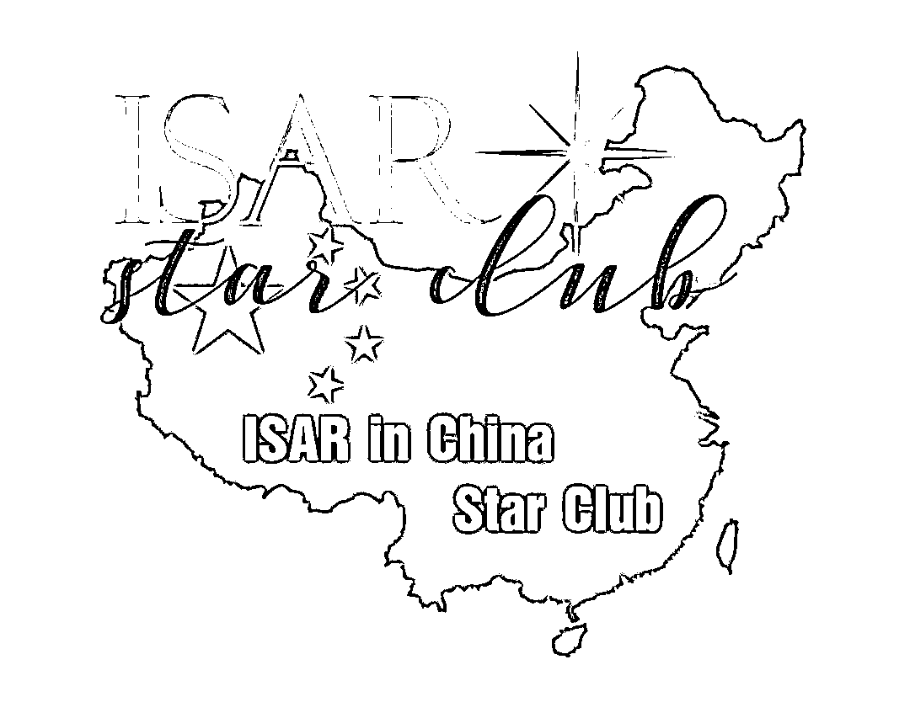

**10 月 22 号星期五晚上 8 点**，国际占星研究协会（ISAR）中国星空俱乐部沙龙由中国艺术家**朱剑辰**来一场讲座！

**星体映射出人类的心智，而艺术则是人类心性、智性、神性的投射。**从古神的图像到当代艺术，作者剑辰基于**荣格艺术心理学，符号学和星体文化**，梳理出《星体艺术史》。该书打破时间轴 X 和地区轴 Y，揭示星体原型下艺术史中隐形的 Z 轴。并试图减少西方中心论的影响。 

*   **“我们是不是都在朋友圈或微博扮演着另一个人？”**

*   **“人工智能会不会取代艺术家？”**

*   **“苹果公司代表的‘扁平化’潮流还能吹多久？”**

**书中作者将从这些触手可及的生活议题出发，探讨艺术和人性。**

本书由著名艺术家徐冰作序，并评价道：“本书作者试图避开社会、政治等陷阱，从自然、人的原本出发，借助星体理论对‘艺术’做细致的比对，寻其‘法像’与‘真像’像是给看似有序的文化生态输入了一个新的序列。”

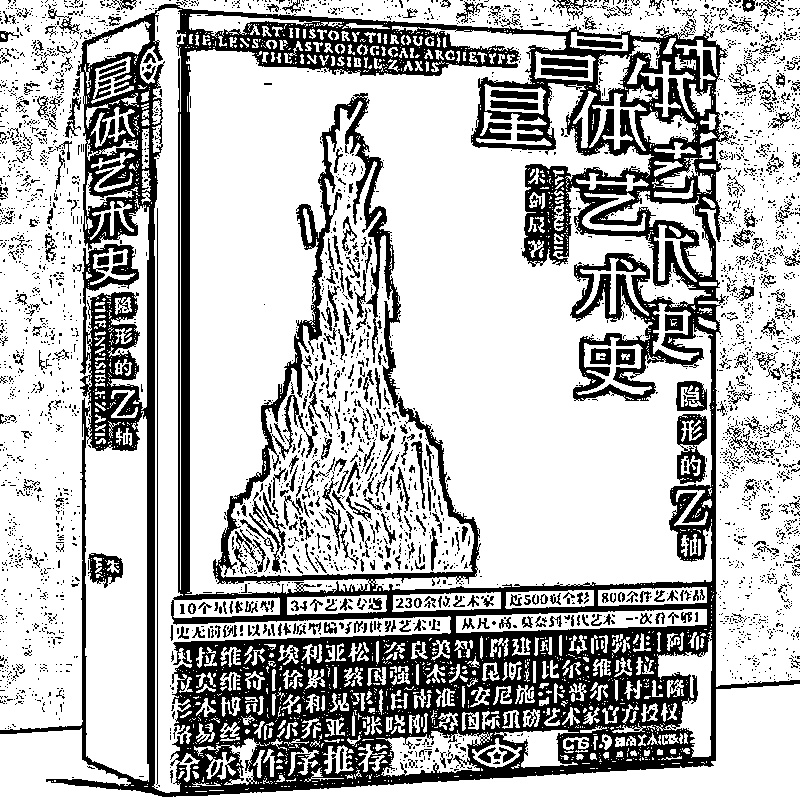

**沙龙主题****沙龙主题：**星体原型串起的艺术史中****“****隐形的****Z****轴****”——****《星体艺术史》导读******主讲人：朱剑辰**

**沙龙时间：2021 年 10 月 22 日 星期五 **

**                北京时间 20:00-21:30（有英文翻译）**

**沙龙方式：线上沙龙****主讲嘉宾**

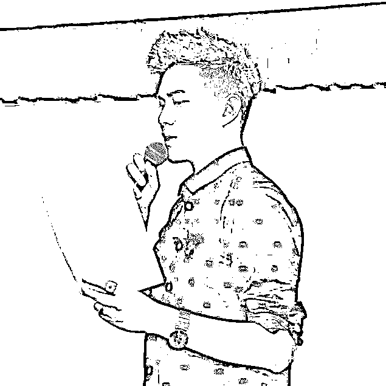

****朱剑辰****

朱剑辰，艺术家、艺术史作家。

毕业于日本武藏野美术大学。剑辰的作品擅长使用新媒介与象征性的符号展现技术未来、自然与人性的思辨。作品涉及影像、装置等多元媒介，曾展出于日本国立新美术馆、北京 X 美术馆、阿那亚候鸟 300 等。

出版独创理论《星体艺术史：隐形的 Z 轴》，由著名艺术家徐冰作序。将荣格艺术心理学、星体文化与艺术史结合，具有开拓意义。全书试图减少西方中心论的影响，并获得 70 余位国际重磅艺术家的授权。曾获得日本 HAC 财团新锐艺术家奖，IF 奖、红点奖、金点奖、意大利 A 奖最高铂金奖、美国 Graphis 金奖等奖项。

**如何参加本次沙龙？**

本讲座也是本月的国际占星研究协会（ISAR）星空俱乐部讲座。**ISAR 会员可以免费收看。**请注意邮件通知，具体参与方式见邮件。

❶ 如果你**已经是 ISAR 会员**，请注意邮件通知，告知如何参加。

❷ 如果你**不是 ISAR 会员**，非 ISAR 会员价格：98 元。如有任何问题请咨询工作人员

yiyi（微信：YY18513802156）

**非 ISAR 会员报名请长按下图**

**▼**

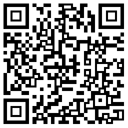

**ISAR 明星俱乐部**

2019 年，ISAR 在主席亚历山大·因舍阿吉克的带领下，成立了 ISAR 明星俱乐部，每月为全球 ISAR 会员提供在线直播讲座，邀请全球著名占星师开讲，学习和分享新的理念。讲座时长一小时，涉及占星学的不同领域、不同观点，每个会员都可以参与其中，每次讲座之后还有 20-30 分钟问答时间向老师们提问。

每一场在线讲座都会记录下来，ISAR 除了提供视频，还会提供相关的讲座资料，以及单独的问答录音，自动发送到专门的 ISAR 明星俱乐部页面存档，每位 ISAR 会员可以在 ISAR 网站上自己的会员主页俱乐部页面找到。在 2018 年最初几个月，ISAR 明星俱乐部会每月举办一场在线演讲。之后，两周举办一场演讲，最终每周举办一场演讲。

但是，过去明星俱乐部讲座只有英文沙龙，因此，中国会员只有懂英文才能受益。为了使得更多不懂英文的中国会员能够受益，我们特别和 ISAR 总部协商，今后会安排有中文翻译的明星俱乐部占星沙龙，作为给中国 ISAR 会员的福利！

**如何成为 ISAR 会员？**

**如果你也想成为 ISAR 会员，请复制链接在浏览器打开**

http://www.nodoor.com/isarcert.do?contentId=3588（仅支持网站支付）

**或直接长按下方二维码，微信购买会员：**

**ISAR 会员有什么福利？**

一年期会员仅需支付**人民币 420 元**，即可享受：

**☆ 星空俱乐部免费沙龙**

**☆每年出版 3 次的《国际占星师》（目前只有英文）；**

**☆每周电子邮件交流汇总杂志（目前只有英文）；**

**☆专项研究基金和奖学金资格；**

**☆ISAR 主办的会议和论坛的会员折扣，包括国际占星大会（UAC）、ISAR 的会议和研讨会等会员权益。**

**有疑问怎么办？**

关于 ISAR 星空会员俱乐部以及我们的讲座，如果你还有任何疑问，**请联系工作人员**：

**yiyi**

**微信：YY18513802156**

**若道 Conrad**

**微信：nodoor2016**

****非 ISAR 会员报名请点击“阅读原文”****

# 深度解析丨这对充满争议的“存在主义”情侣，是如何融入彼此生命的？

> 原文：[`mp.weixin.qq.com/s?__biz=MzA5NjA0NTAxNg==&mid=2651458521&idx=1&sn=c6b51e37029d2220f89c7363b587608e&chksm=8b48b96ebc3f30785850a528381a55e88a624bcab8a0eb5c46741d49e0512aceb138c64719d7&scene=126&sessionid=1692737913#rd`](http://mp.weixin.qq.com/s?__biz=MzA5NjA0NTAxNg==&mid=2651458521&idx=1&sn=c6b51e37029d2220f89c7363b587608e&chksm=8b48b96ebc3f30785850a528381a55e88a624bcab8a0eb5c46741d49e0512aceb138c64719d7&scene=126&sessionid=1692737913#rd)

**********************☆ ****************************后台****************************回复“今日”，给你一句生命态度**********************

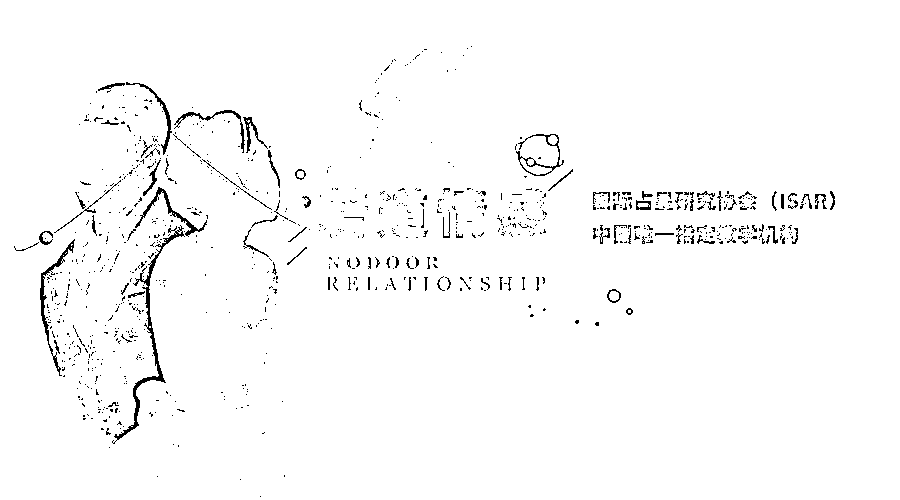

作者/苏汤核心课学员

编辑/翀子 封面/书君 图片/网络

苏汤老师的核心课中，同学们分成小组学习并实践占星学（如果你也想加入，可以点击[【核心课】](http://mp.weixin.qq.com/s?__biz=MjM5MjQwNjAyMQ==&mid=2649438843&idx=2&sn=167c83ec8a0723867b7ed9dccdfc2805&chksm=beb9551189cedc07caf6a6ca0a5c1bf6b8bd393669be47721daee900a3c03254c7286131be36&scene=21#wechat_redirect)了解详情哦）。萨特和波伏娃是二十世纪著名的存在主义哲学家，他们也是一对充满争议的传奇情侣。同学们是如何从二人的星图入手，剖析他们的生命故事和情感纠葛的呢？来看文章吧！

蒋颖老师的导语

这篇文章来自于 L3 同学的名人星图夜谈。这是若道核心课程占星师养成计划的一部分，L3 的学员在开课后分成一些个小组，我和咔咔老师、Conrad 老师也会参与在线指导。在讨论了组员的个人星图后，进入了名人星图的讨论。

这篇稿件就出自 1 个月前的那次讨论，据说大家从 8 点一直聊，咔咔老师也在组内，后来同学们聊嗨了到深夜。很感谢同学们整理了出来，咔咔老师付出心力进一步辅导。

波伏娃和萨特都是非常有趣的人，也是非常有趣的关系，L3 的同学在学占星 5 个月之后，能够根据星图对这两位名人有这些深刻和生动的理解，作为学校来说，还是有一点点小的自豪。

**人物背景小传**

**作者：yami**

萨特和波伏娃是法国二十世纪著名的存在主义哲学家，同时又是一对充满争议的传奇情侣。**萨特曾被誉为二十世纪最重要要的哲学家之一**，其哲学代表作《存在与虚无》是当时法国存在主义的巅峰作品，同时他还曾获得诺贝尔文学奖。**波伏娃是法国著名的存在主义作家，女权运动的创始人之一。**其创作的《第二性》被奉为具有全球性影响力的“女权主义的圣经”，奠定了她在哲学和妇女研究上的地位。

这对情侣最著名的事件是在他们二十几岁初识时签订了**“爱情契约”**，并在其中约定：他们之间是“本质的爱”，但也有享受“偶发爱情”的权利。互相之间绝不欺骗和隐瞒。最后，两人虽然都终生没有结婚和生育后代，但爱情契约约定的情人关系维持了一生。虽然没有世俗的婚姻关系，但死后他们俩如愿合葬在了一起。

随着最新的传记作品《成为波伏娃》的问世，作为波伏娃的专业研究者，传记作者在书中极具挑战性的推翻了以往人们对波伏娃的种种偏见与毁谤。如：

*   萨特才是两人关系中站在浪漫情事顶峰上的神；

*   波伏娃不具备哲学原创性，只是萨特思想的应用者；

*   波伏娃认为克服性别问题的最好办法是忽略它，并拒绝承认是女权主义者，因而被指控“厌女”；

*   ……

**那么事实到底是怎样的呢？**

若道相位研究项目的月土小组，在咔咔老师的指导下，**以“波-萨”两人星图的共振分析为研究的切入点，寻找并分析他们出生星图的共振关系。**尝试利用苏汤老师课 1-3 阶所学的占星知识，同时结合苏汤老师推崇的利用人物自传或传记材料，分析和挖掘出隐藏在复杂人性背后的关系真相。

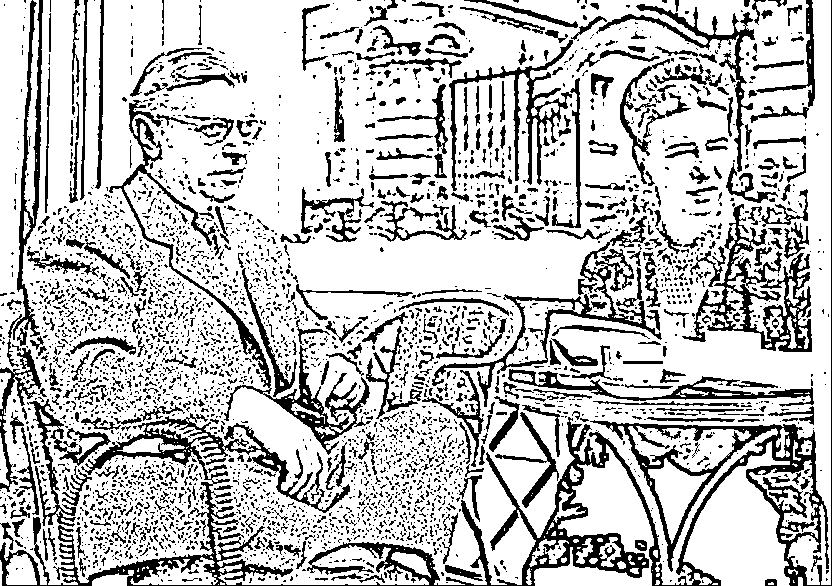

| 萨特与波伏娃

**两人的家庭背景**

**作者：Kelly**

**★****波伏娃**

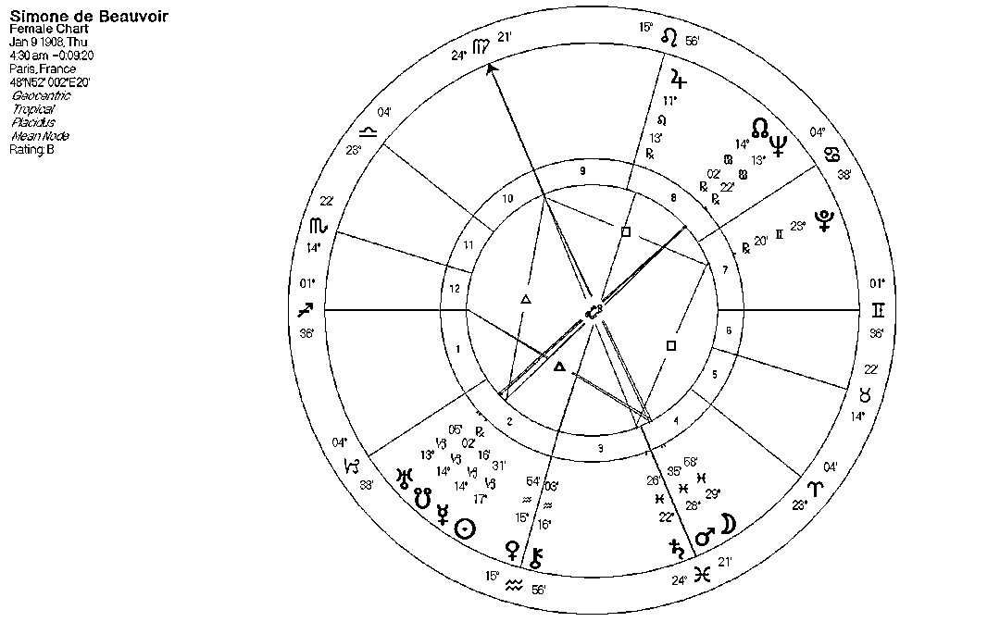

  | 波伏娃的出生星图

波伏娃的母亲是一位富有银行家的女儿，出身于中产阶级家庭。波伏娃的外祖父在第一次世界大战后不久，因破产而使银行倒闭，也使得波伏娃一家名誉扫地并家产散尽。

她沉重和阴郁的原生家庭背景，在**月亮土星合相在 4 宫**呈现了出來，因为物质上的匮乏而目睹父母之间的关系日渐恶化，潜意识里有可能出现对亲密情感关系的不信任，也渴望生活里有永恒具体、安全的东西，也许这也是她日後对萨特長年不离不弃的表达。

波伏娃的**月亮和火星紧密合相并四分冥王星**，早年原生家庭经历了家里破产和二战的阴影，在潜意识里，认为家庭是充满危险与威胁的。波伏娃的一生也许从原生家庭感受到了沉重和危机四伏，逐渐在自己的内心建立起自己的独立自主和安全感，以及透过冥王星 7 宮的亲密关系，习得对对危机的转化力量和生存勇气。

波伏娃的**双鱼座土星和日海对分相**，也可能描述了比较理想化但虚弱又逃避现实的父亲。波伏娃的父亲原本一心指望靠着太太的丰厚身家过上优越的生活，但这个希望最终成了泡影，这和萨特的太阳与海王星的合相产生了共振。

母亲为家庭付出了很多，但还是不能让丈夫享有丰盛生活，她感到愧疚绝望。这影响了波伏娃对于亲密关系带有的双鱼座月亮、土星、火星缺乏边界、愧疚、承担很多责任，却感到绝望的议题。建设性的表达也许是要波伏娃分辨出什么是虚弱、无法承诺和逃避责任，以及什么是双鱼座无条件的爱的表达。

波伏娃的母亲也是个虔诚的天主教徒，遵循严格的道德常规主义**（四宫的月亮合相三宫的双鱼座土星）**。

在波伏娃青年时代撰写的《一个乖女孩的回忆录》中，她说：

“我父亲的个人主义与异教徒的道德标准，跟我母亲所教导的严格的道德常规主义形成了鲜明的对比。这种失衡使我的生活陷入无休止的争论中，这是我成为知识分子的主要原因。”

**（父亲是太阳、海王星、天王星相位的代表，母亲是月亮与土星相位的代表）。**

在她的潜意识里，也在找寻像父亲一样的个人主义异教徒者，这共振了萨特的自由与独特性（太阳、海王星、天王星），並且从传统的母亲对女性牺牲奉献、愧疚、严谨的宗教道德常规的桎梏中（月土合相在双鱼座），找到真正能够滋养自己的、什么是无条件的爱的灵性真相。（北交点与海王星合相在巨蟹座 ）。

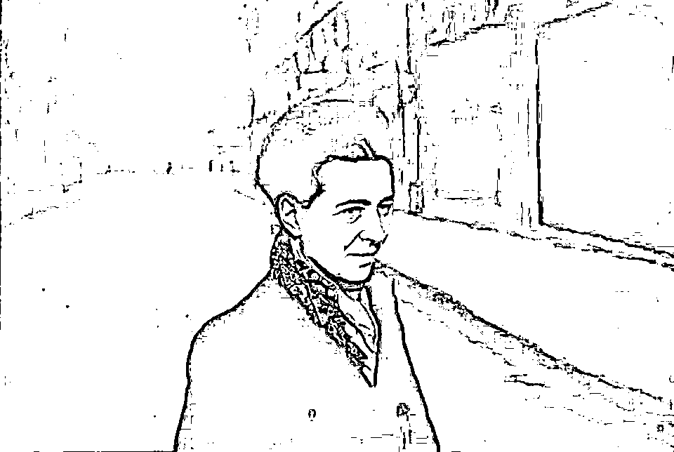

| 波伏娃

**★****萨特**

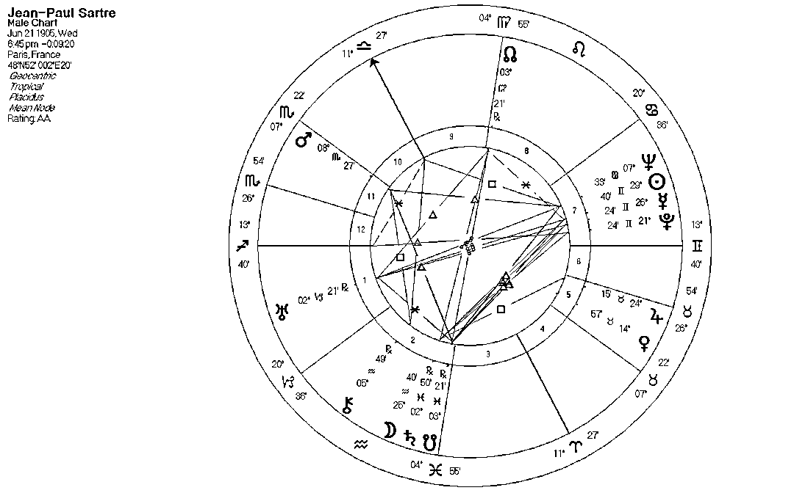

  | 萨特的出生星图

萨特的父亲在他一岁三个月的时候早逝（**太阳与海王星合相、太阳与冥王星合相**）。

他母亲再婚后，嫁给了一个萨特不喜欢的男人，他们搬去了拉罗谢尔，在那里，他常常会被强壮和粗野的男孩们欺负。这是他童年里一次巨大的危机，他后来说，“**对于偶然性、暴力和事物存在方式”**，他所需要知道的一切，在拉罗谢尔的孤独生活都学会了。

**“他人即地狱“**是萨特的名言。（太阳、水星、冥王星合相在双子座七宫）

萨特自己本身非常重视自由与革命的原创性（天王星在 1 宫）。和这与波伏娃合相在摩羯座的太阳、水星和天王星共振。

萨特的海王星、太阳、水星在七宫，这在亲密关系中会受到活化。萨特对于七宫亲密关系的需求有很强的能量。他投射的亲密伴侣是有太阳般的活力、创造力、能进入冥王星式的深入思想沟通，并一起经历转化重生的人。这个人也必须是具有灵性滋养、牺牲救赎能量的巨蟹座海王星人。萨特曾说，波伏娃成了他最中意的对话者，也是他作品的第一个读者和最佳读者。

他们考虑过结婚，但两人都不想要一场中产阶级的婚姻或者孩子，因为波伏娃决心不再重演她和母亲不愉快的关系。**早期童年与父母的经验，的确对波伏娃和萨特的亲密关系产生了影响。**

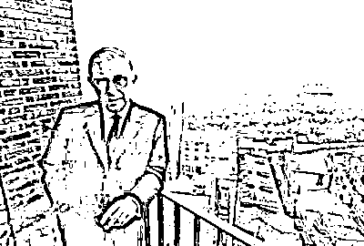

| 萨特

**两个人的自我**

**作者：Keira**

**★****波伏娃**

*   **太阳、水星、天王星、月亮南交点合相在 2 宫的摩羯座：****她的自我英雄形象，是一个能在社会上展现自我价值的业内专家**，她有非常**严谨可靠**的专业态度，虽然有时候因过于较真而显得有些**古板**，她也希望在遵循传统的基础上能有所**突破。**比如她希望区别于她的母亲，区别于传统法国女性。她需要彻底的尊重，她需要经济人格的强烈独立，她想要向世界证明女性并不是生来就是现在的女性。

*   **摩羯座太阳与水瓶座金星**：**超然抽离的爱情价值观**，让她在混乱的关系里获得喜怒哀乐激发了她的创作灵感，促进且支持着她成为一个业内专家。

*   **摩羯座太阳六分双鱼座土星**：用无私开放的态度面对萨特；使用避开，不世俗的态度面对社会规则；意志不够清晰，幼年被表哥性引导。这些开放性的点滴，促使了波伏娃想要成为一个被人尊重的人。

*   **摩羯座太阳对分巨蟹座海王星：**这是重视家族的时代。巨蟹座海王是 1901-1915 年，家族凝聚力很强，人们极重视、渴望家庭生活，讲究教养、传统，并掀起一股收藏手工艺及骨董的风潮。海王星在巨蟹座的末尾（1914.7），一战开始。

*   **太阳对分海王星，土星在 4 宫的双鱼座：****消失的父亲。**波伏娃的父亲在她成长的时候不在身边，退伍后没有工作，没有钱承担波伏娃的嫁妆，需要波伏娃自己赚取；萨特初次找她约会的时候，萨特提出与波伏娃的父亲像绅士一样决斗，她的父亲退缩了；在波伏娃的意识里，父亲是无能软弱的。

    **敏感的自己：**对个人而言可能非常具有同情心，敏感而且情绪化。在亲密关系和性上有强烈融合的需求；在性上有牺牲自己、拯救或满足爱人的倾向，比如她有“淫媒”的称号，介绍自己的学生给萨特，也臣服于和爱人间的开放关系等。

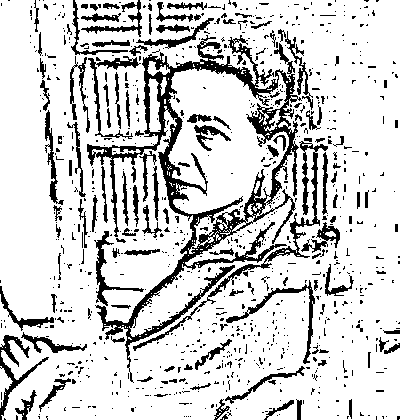

| 波伏娃

**★****萨特**

*   **7 宫的双子座太阳对分 1 宫的摩羯座天王星**：自我的英雄之旅是**在多样化的亲密关系中，将创造性的能量应用于领悟知识、获知事实、提问和寻找想法与想法之间的联系**。尽管萨特所处的摩羯座天王星时代，让他不断卷入战争、革命、社会冲突关系之中，特别是在第二次世界大战期间，从军队作战中死里逃生，但这也升华了他在 20 世纪 50 年代**积极维护世界和平**的理念，因而被选为世界和平理事会理事。

    这些广泛多样的社交接触，释放了萨特本性中的多变，锻炼了心智上的能量，也让他在 59 岁时从容的拒绝了诺贝尔文学奖。

*   **双子座太阳三分 2 宫的水瓶座月亮、双鱼座土星、双鱼座月亮南交点：**天生的**悲悯**让他在混乱多样的关系中如鱼得水，同时**多变**和**保持理智疏离**的自我，让他有充分的自我关系满足的同时，还能追寻这些关系中的真相。他在“万花丛中”不断分析和表达，最终形成了现象学的存在主义、人学的存在主义和存在主义的马克思三个哲学思想阶段。特别是他存在主义的文学作品，对存在主义在西方社会的普遍流行起了巨大的推动作用。

*   **7 宫的双子座太阳合相双子座水星、巨蟹座海王星：**灵活的自我 、畅快的沟通、保护性融合的超我，都汇集在萨特的精神世界中。**关系**是萨特生活的主线，思考并分享观念是主导他的生命活力。他会在相互理解、发现某个理念或理论的现实性和重要性这样的活动中直接感受自我。

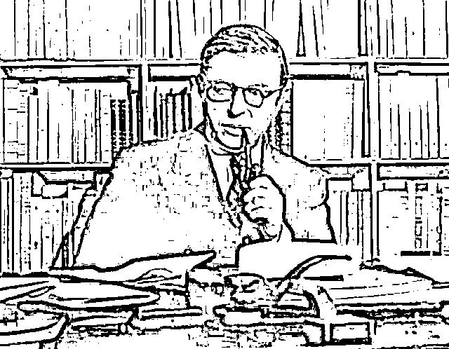

| 萨特

**（未完，请见今日二条）**

**版权声明：**原创文章由作者授权首发于若道平台，欢迎转发，反对抄袭。友号转载请申请白名单。

**学习占星学**

**点击或长按下图了解课程详情** 

**

**

**

**微信又双叒叕改版啦，不想错过若道君的推送？**

**就把若道设为星标吧！**

**▼**

**喜欢记得点一下在看哦☟**

****报名直达入口****

# 他们既相爱，又彼此自由独立

> 原文：[`mp.weixin.qq.com/s?__biz=MzA5NjA0NTAxNg==&mid=2651458521&idx=2&sn=64f2ad7c9b09f6fcf81aa6ea4e37fd33&chksm=8b48b96ebc3f3078342083220501677f15c96c6fe33a9e4edfeece86bab4be0cfeabd7c24554&scene=126&sessionid=1692737913#rd`](http://mp.weixin.qq.com/s?__biz=MzA5NjA0NTAxNg==&mid=2651458521&idx=2&sn=64f2ad7c9b09f6fcf81aa6ea4e37fd33&chksm=8b48b96ebc3f3078342083220501677f15c96c6fe33a9e4edfeece86bab4be0cfeabd7c24554&scene=126&sessionid=1692737913#rd)

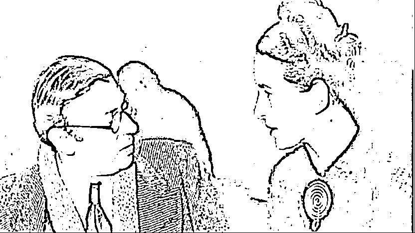

作者/苏汤核心课学员 编辑/翀子 图片/网络

今日头条中，我们看到波伏娃和萨特两人各自的家庭成长背景和个性分析，那么在他们的星图中，又有什么共振呢？

**两个人的星图共振**

**作者：yami**

★ **相位分布上表现出互补性**

**在相位分布上，波伏娃没有三分相，而萨特有很多三分相，**还有大三角，二人互补性很强。苏汤老师的书上说过，没有三分相，很容易觉得事情困难，到最后这就真的变成了困难。而三分相很多的人，会给人一种幸运感，会感觉做什么事情都非常的顺利，当然也可能因此而增加自负感，认为所有的获得都是理所当然的。

波伏娃在早期的一篇哲学作品《波洛士与息涅阿斯》里写到：**“生命中没有那种一切都被和解的瞬间。”** （摘自《成为波伏娃》）和萨特在一起，会让波伏娃很享受这种伴侣关系给她带来的顺畅感。

★ **隐藏在水星紧密相位中的真相**

**波伏娃的水星与海王星紧密对分**（1 度不到）。她的水星在 2 宫摩羯座，象征头脑的组织力和效率都很高、沟通和表达时非常谨慎，渴望自己的作品和思想被世人认可。

她的海王星在 8 宫的巨蟹座，象征她拥有敏感度非常高的灵性直觉，同时可能还夹杂着自我保护和恐惧，以及歪曲和隐藏（海王星）。而对分相位的投射作用，使得她向外投射了自己 8 宫巨蟹座海王星的心理征象。因此公众对自己的负责面评论，她会过度敏感，恐惧负面评论可能会带来的伤害。

所以她在写作日记和传记时（水星），通过刻意隐瞒事情的真像（如她与其他情人的关系、原创的哲学观点等等），而达到歪曲掩盖的目的（海王星）。弗吉尼亚伍尔夫说过：“每一代人都有自己的故事要讲述。“**但波伏娃有很多故事都被隐藏在了黑暗中，等待着被讲述。**（摘自《成为波伏娃》）

波伏娃和萨特都有水星与天王星的相位，但波伏娃的水星和天王星是容许度非常紧密的合相。**水天相位象征思想上的原创能力。**

**而萨特是水星对分天王星。**萨特的天王星落于 1 宫的摩羯座，自我的独特性刻入了他的基因里，而水星落于对面的双子座 7 宫，对分了天王星。他的自我独特性，极有可能是透过心理投射的方式，通过一个思维敏捷、知识渊博的交流对象（水星双子座 7 宫）来实现。他在与对手的思维交锋中的不断碰撞，在对分相的来回拉扯中，逐渐形成自我思想的独特星（天王星 1 宫）。

贝尔胡克斯认为，**波伏娃被动地接受了萨特挪用她的哲学灵感而不承认出处的作法。**（摘自《成为波伏娃》） （波伏娃水天紧密合相，象征她拥有原创哲学思想的能力）

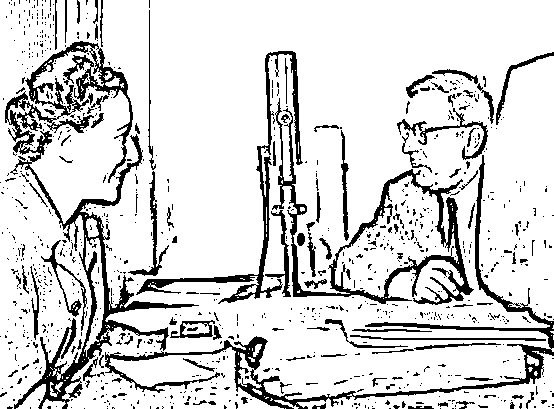

| 萨特与波伏娃

**作者：妮妮**

★ **波伏娃有火海定位星链条，萨特有火海相位**

**萨特的火星四分海王星，**火星在天蝎座入庙，落在 10 宫尾，差 1°进入 11 宫。根据 5°原则，也可以具备 11 宫特质。巨蟹座海王星，代表救赎、混乱的海王星，**又加强了水元素（巨蟹座）的能量。**

他在伴侣、事业、朋友这些关系的处理上，**很容易模糊，关系界限混乱。**但他可以通过与伴侣的相处得到灵感、滋养，并促进他的事业成就。他与别人发生关系，也是控制不住自己的，三个人相处，也相当于 11 宫的感觉。萨特的巨蟹座海王星在 7 宫，对伴侣的滋养永不满足。在学校期间，他虚构了很多女朋友，贴切的反应出这个相位。

**波伏娃，火星在 4 宫的双鱼座，海王星在 8 宫的巨蟹座，火海形成定位星链条，**她因为原生家庭的压抑（月亮与土星合相）和愤怒（月亮与火星合相）想去对抗，同时她也代表有同样遭遇的人抗争。

海王星在巨蟹座，渴望家庭的滋养，她需要在 8 宫的领域寻找救赎，这种救赎也许是逃避的、自己的幻想出来的，因为这类人可能在亲密关系上不会那么希望回到现实层面。

**两人都是存在主义者**（月亮和土星的相位），2 宫的能量很多，萨特的月亮与土星、月亮南交合相在 2 宫。月亮是我们重视的，土星则有坚持的议题。波伏娃群星 2 宫，也有南交点在。**所以他们的价值观是心照不宣的。波伏娃的月亮、土星合相在双鱼座，萨特的双鱼座土星合相了月亮南交点。**他们彼此加重了土星的力量。

土星代表权威、父亲、责任、限制，哪里被否定，双鱼座的土星便在这种能量上有所缓和减弱，或者做出自我牺牲而让对方感觉到责任。

我个人认为，波伏娃的月亮，对萨特也有一种被温暖的权威的感受在。萨特的水瓶座月亮，在情感层面，相比波伏娃而言，没有那么容易受到影响，更理性一些。这也是为什么在萨特与波伏娃的感情里，波伏娃会对萨特这么不离不弃。

波伏娃群星（太阳、水星、天王星、月亮南交点）在魔羯座，又对分了巨蟹座海王星，萨特的天王星在魔羯座，用天王星自由独立、反叛、反传统的严谨态度去追求真相，这会让波伏娃本来混乱的海王星，有了方向。

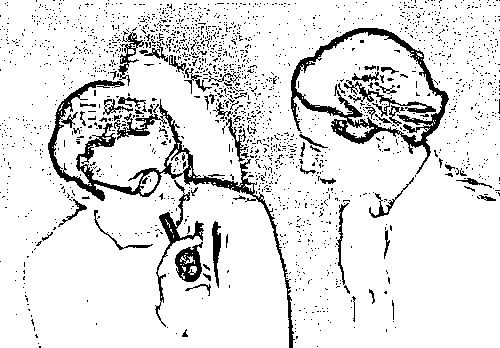

| 萨特与波伏娃

**作者：陈小 C**

★ **太阳相位的共振**

萨特的太阳与海王星合相、与天王星对分，和波伏娃的太阳与天王星的合相、与海王星的对分相，**呈现出一种巧合的交叉共振。**这种相似性及错位体验，**共鸣与互补并存，**他们在彼此身上看到自己可能活出的理想的样子。

萨特的太阳落在双子座 29°41′，海王星落在巨蟹座 7°34′，太阳与海王星在不同星座上形成合相。在**自我价值观**（双子座太阳）和**灵性目标**（巨蟹座海王星）上，萨特有一种**天然的统一**。与波伏娃相比，他天生就更懂得将生命力与情感相结合，对自己的感受更为笃信。但他也可能存在**自欺行为**，一种缺乏客观的、经过社会性的“超我”检验的中立。

他人即地狱。

——萨特

相比波伏娃摩羯座式的理性成熟以及对自我的压抑，萨特更像一个需要关系的孩童**（7 宫的双子座太阳）**，却同时拥有特立独行的基因**（1 宫的摩羯座天王星）**。这组对分相，使得萨特在自我与关系的议题上产生冲突。

**他对关系有本能的需要**（太阳、水星、海王星、冥王星在 7 宫），**但反叛性**（天王星在 1 宫）又让自我与他人永远存在**一种对抗的张力**。

在他的哲学思想中，“自体”与“他者”的意识是对立的，他认为：**“人要么胜过他者，要么必须允许自己被他者胜过。两个意识的关系的本质不是共在，而是冲突。”**（太阳对分天王星）。接受冲突的代价及必然性，可以保留自我选择的绝对自由（1 宫的摩羯座天王星）。

我绝不让我的生命屈从于他人的意志。

——19 岁的波伏娃

**在自我价值观和个性追求上**，波伏娃有一种**理念上的统一**（太阳与天王星合相于 2 宫的摩羯座）。她很早就明白自己要超越当时社会（摩羯座）对于女性的定义，**她是先锋理念的拥有者和执行者，**这是她很年轻时就自然而然发生的。她在“自我”**（太阳）**之上又生出了自己独特的“个性”**（天王星）**，先锋理念和她的自我价值本就为一体。

但在个人感受层面，她是矛盾的**（太阳对分海王星）**：她的自我理性而坚硬**（摩羯座太阳）**，她用一种严厉的方式对待自己，在自律的建造中获得成功。但这种自律式的攀登带来的成就感，**无法满足她更深层次的情感和灵性需求。**她除了“达到”什么，也需要“感受”什么，**需要用真情实感的方式和这个世界进行深层次的互动。**

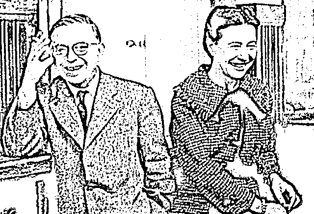

| 萨特与波伏娃

★ **月亮相位的共振**

萨特的月亮与土星合相在 2 宫的水瓶座，波伏娃的月亮与土星合相在 4 宫的摩羯座。土星带来稳定、克制的情绪，带来踏实的生活态度和工作做风，但同时也给自己和他人带来严苛。**他们也许有相似的压抑的情绪反应。**

**月亮和冥王星的相位，带来高密度的情绪，敏感、**不断地自我挖掘（冥王星），月亮与冥王星的三分相使得萨特的情绪（2 宫的水瓶座月亮）和个人意志力（7 宫的双子座冥王星）可以很好统合。**情绪虽然强烈，但在个人意志的高度掌控下，意志能吸收情绪的感受力，然后带领情绪克服困难。**

**波伏娃的情绪同样是高密度的，但这种情绪状态是紧张的**（月亮四分冥王星）。月亮在 4 宫的双鱼座，需要的是被感知、被安抚的情绪环境，但冥王星又不断的试图摧毁月亮的温情、突破情感的限制。意志对情绪感受的态度是粗鲁的，**她期待能拥有安全被滋养的情绪体验（**4 宫的双鱼座月亮），却又强求自己能接受关系的灵活性（7 宫的双子座冥王星）**，意志和本能的冲突让她显得愤怒，但同时带来了关于情感的深刻思考。**

**版权声明：**原创文章由作者授权首发于若道平台，欢迎转发，反对抄袭。友号转载请申请白名单。

****若道名师汇集金牌核心课程****每个人都有自己的内在冰山，自我觉察能够帮助我们觉察自己的行为、情绪等，然后向内深层探索，探索自己的行为、情绪背后的深层渴望、期待。学习和应用占星学的过程，就是慢慢掌握自我觉察工具的过程，当你熟练掌握了占星学，也就具备了帮助引导他人觉察到自身生命议题的能力。**往外张望的人在做梦，向内审视的人才是清醒的。**只有真正向内看，只有当觉察开始由外向内时，改变才会发生，才能够知行合一。**那么，你会在课程中学习到什么内容呢？**

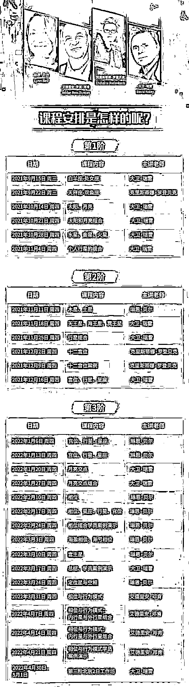

**学习占星学**

**也可以点击或长按下图了解课程详情**

**

**

**

**微信又双叒叕改版啦，不想错过若道君的推送？**

**就把若道设为星标吧！**

**▼**

**喜欢记得点一下在看哦☟**

****报名直达入口****

# 插班中丨核心课程 L1-2，四位国际导师领你入门占星学！

> 原文：[`mp.weixin.qq.com/s?__biz=MzA5NjA0NTAxNg==&mid=2651458521&idx=3&sn=db19dfd6341b64557b149b75aa10220f&chksm=8b48b96ebc3f3078b4b1e2f41202879dd70fcbabe73e7ee53446813ce10d49e844394bc823b1&scene=126&sessionid=1692737913#rd`](http://mp.weixin.qq.com/s?__biz=MzA5NjA0NTAxNg==&mid=2651458521&idx=3&sn=db19dfd6341b64557b149b75aa10220f&chksm=8b48b96ebc3f3078b4b1e2f41202879dd70fcbabe73e7ee53446813ce10d49e844394bc823b1&scene=126&sessionid=1692737913#rd)

近几年，线上剧本杀兴起，线下风靡，因其剧情丰富，逻辑推理，沉浸体验，引无数人上头。你可能还不知道的是，从占星学角度，你的出生星图中也蕴涵着琳琅满目的剧本，一幕幕剧情有的跌宕起伏、有的动人温馨、有的神秘莫测……

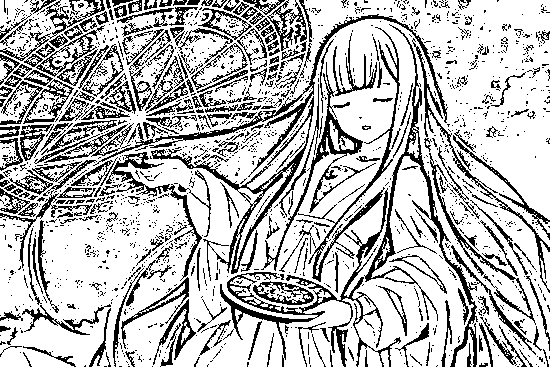

如果你想要学习占星学，想研究一下严肃占星学和之前看到的娱乐占星有什么区别，这个思路绝对会为你打开新世界的大门，用专业的占星语言讲述生动的人生故事，千变万化，其乐无穷。当你学会了占星的语言，也就结识了星图中的一位位生动的角色，也就是你的一个个人生面向，TA 们各自拥有个性鲜明的特质，你会在生活中有意无意的表现出 TA 们的个性。TA 们在不同场景下的表现也会有不同，彼此之间还可能有着微妙的联系。**准备好开启真正属于你的沉浸式剧本了么？**

先让我向你简单介绍一下出生星图剧本中的主要角色：**行星是演员和角色**行星是剧情当中的演员，它不仅是内在的角色，也可能是我们实实在在碰到的一些人物。★**太阳**：自豪、自信、亲切的角色，善于自我表达、有创造力、喜欢玩耍和表演……★**月亮**：脆弱、敏感、温柔的角色，渴望归属感和亲密感，习惯养育与依赖……★**水星**：好奇、有趣、聪明的角色，有着不知满足的求知欲，善于沟通……★**金星**：爱美、舒适、愉快的角色，喜欢美食、爱情以及各种伙伴关系……★**火星**：果断、鲁莽、冲动的角色，热爱运动，特别是向着他们的愿望进发……★**木星**：乐观、慷慨、智慧的角色，心怀希望、热忱，坚守着对宇宙智慧的信任……★**土星**：耐心、坚毅、谦虚的角色，追求任务达成，做好工作，获得成功的感觉……★**天王星**：博爱、反叛、变革的角色，设法带来突破、彻底的洞见或自我实现……★**海王星**：艺术、共情、慈悲的角色，目标状态是极乐，对生命统一性的超验觉知……★**冥王星**：深刻、透彻、蜕变的角色，高峰体验、精神宣泄、摧毁重建、净化……当然除了十大行星，还有也很重要的、月亮交点、四轴：上升、下降、上中天、下中天也都扮演不可或缺的角色等待你来解锁。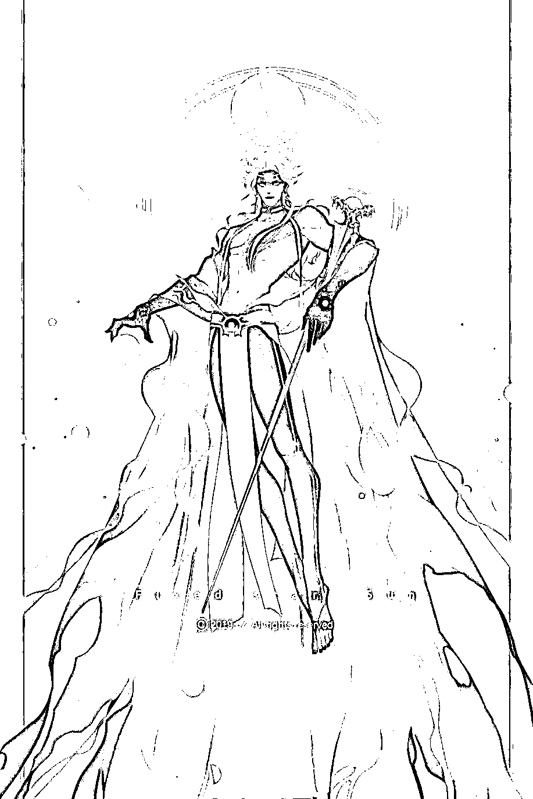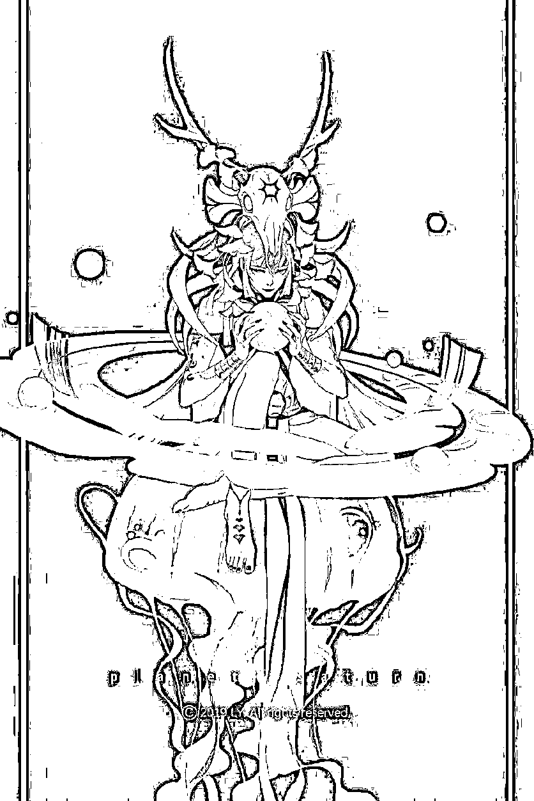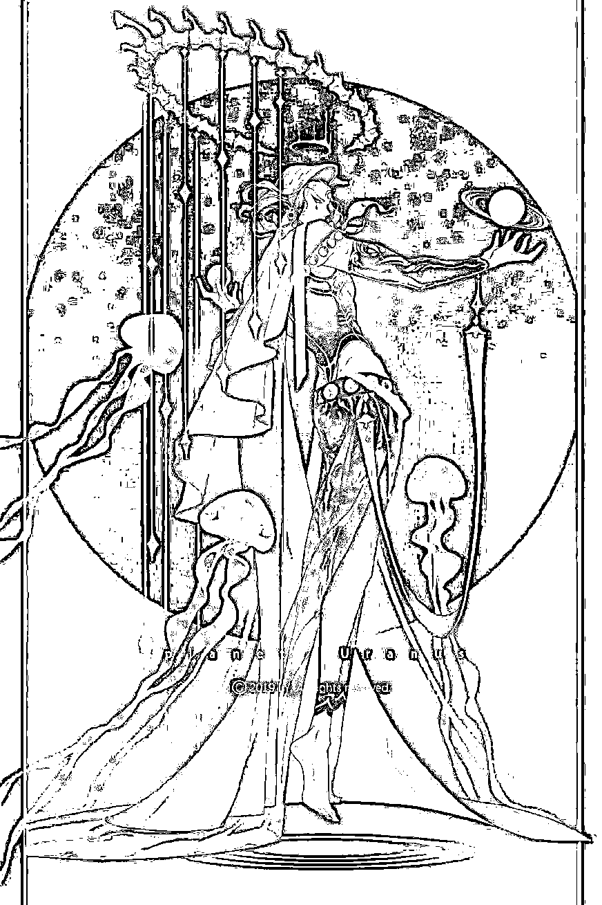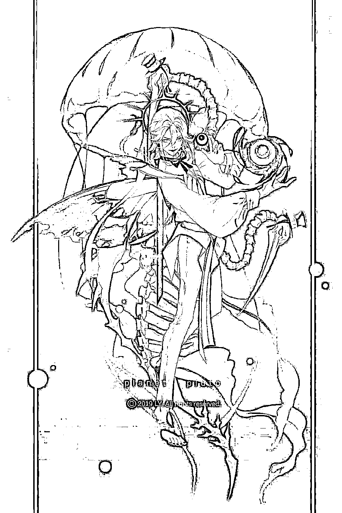

**向左滑动，可依次查看行星卡牌**

**版权归属于插画师炼妖 LY 所有**

**星座是表演的风格**行星所落的星座就会为这个角色赋予一种风格。也可能是他会吸引到的人的样子。每个不同风格的角色，可能说出这样的台词：★**白羊座：**“想做就做！去做吧！这是你的权利。”★**金牛座：**“如果感觉好，享受它吧。让自己快乐，放松。”★**双子座：**“这很有趣，给它下个定义分个类。发挥你的思维。”★**巨蟹座：**“倾听，转内向在，你现在感觉怎么样?”★**狮子座：**“宝贝，闪现你的光芒。表达自己！”★**处女座：**“小心，这里有一个问题。解决它。”★**天秤座：**“展现魅力，建立关系。思考、妥协、合作。”★**天蝎座：**“面对你的恐惧，将它推向极限。决一死战，全心投入。”★**射手座：**“保持信心，宝贝。上帝是好的，做对的事就好。”★**摩羯座：**“全力以赴，专心致志。集中精神，控制自己。”★**水瓶座：**“期待意料之外的事，保持开放和超然的态度”。★**双鱼座：**“放手，顺其自然。屈服，相信宇宙。”当然每一位角色也偶尔会展现出一些破坏性的特质，可能是 TA 的某些核心需求没有得到满足，这就更需要学习更多占星语言，来倾听出生星图中的“心声”。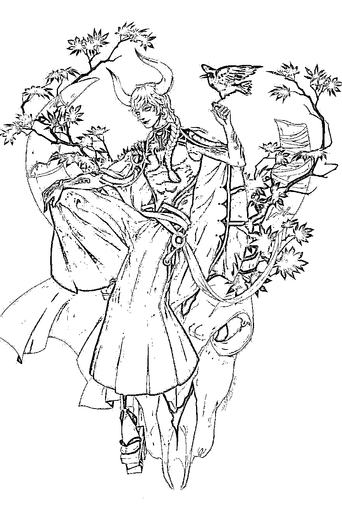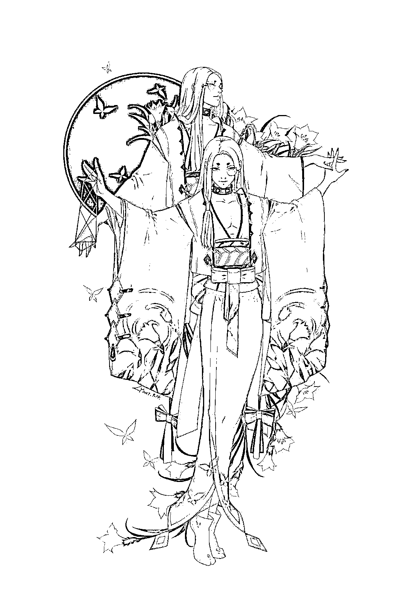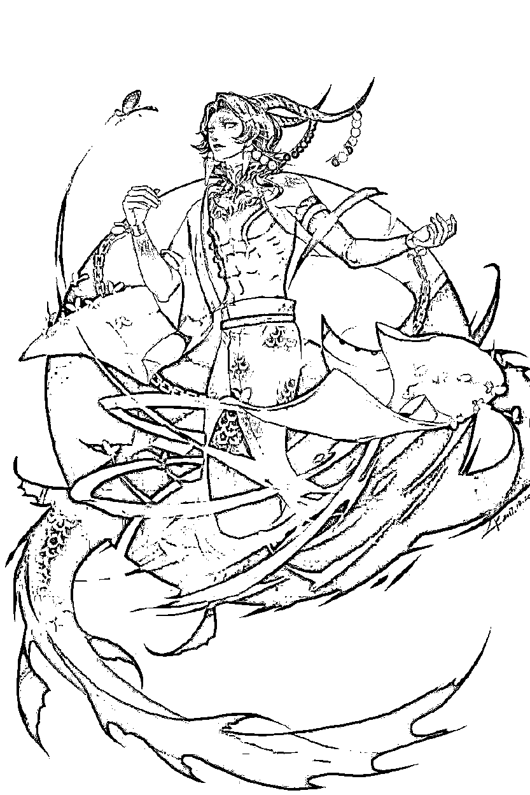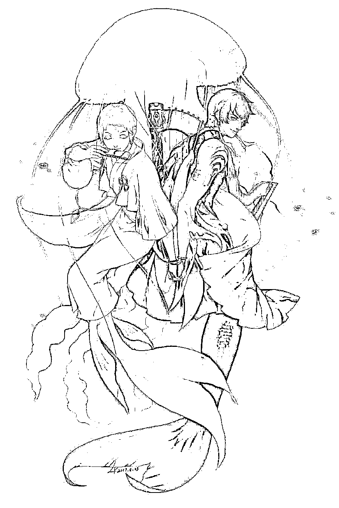

**向左滑动，可依次查看星座卡牌**

**版权归属于插画师炼妖 LY 所有**
**宫位是舞台和布景****宫位是戏剧上演的地方。**就好比我们去剧院，可以看到各种道具和场景：卧室、图书馆或银行。宫位就像是各种场景。你的行星演员也可能在各个场景中遇到其中的专属 NPC。★**第一宫**：你自己的空间，可能还包括那些帮你保持漂亮外表的那些人……★**第二宫**：银行、有金钱往来的场所，可能还包括客户、供货商……★**第三宫**：学校、各种媒体中，可能还包括兄弟姐妹邻居、同学同伴……★**第四宫**：家里、老家，可能还包括父母、长辈、祖先、家装维护人员……★**第五宫**：娱乐场所、约会场所，可能还包括孩子、你内在的小孩、你迷恋的明星……★**第六宫**：工作场所、提供服务的场所，可能还包括雇员和同事、医护人员……★**第七宫**：婚礼教堂，可能还包括你的配偶、人生伴侣、商业伙伴、公开的敌人……★**第八宫**：葬礼，可能还包括性伴侣、和你分享共同财产和资源的人……★**第九宫**：大学、海外、法院，可能还包括大学教授、精神导师、律师……★**第十宫**：职场、公众场合，可能还包括老板、监督者、“权威”……★**第十一宫**：团体组织，可能还包括朋友、伙伴、你的社交圈、团队中的成员……★**第十二宫**：医院、监狱、修行道场，可能还包括你生命中秘密的人、酒友……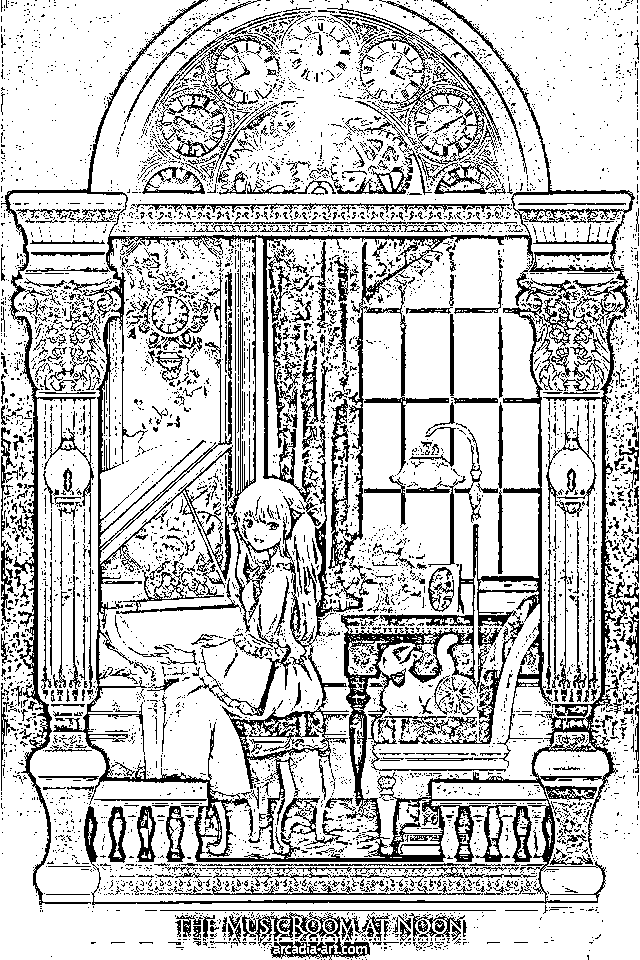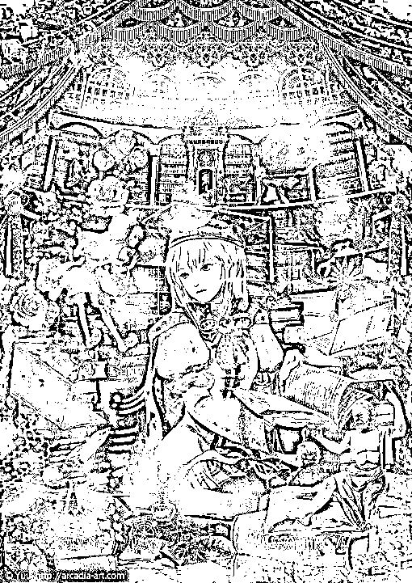**向左滑动，可依次查看宫位卡牌****版权归属于插画师憂所有****怎样将行星、星座、宫位三者串联成剧本呢？**举个例子：**金星**总是象征我们所爱的人或者象征我们去关联、去建立关系的那种能力。**金星落在金牛座**，这个人的次人格就会比较喜欢舒适的生活、享受美食、热爱大自然。它不仅仅是这个人的行事风格，也可能是他会吸引到的人的样子。比如这个人可能也喜欢旅游、喜欢异国文化、美食和风光——**第九宫金牛座**。这个人可能会在旅行中和旅伴或当地偶遇的旅行者结伴而行，一起在海边看日出日落，分享同一份路边美食，骑着摩托在森林公园兜风，畅聊旅行中的见闻和感受，以至于可能由此建立了亲密关系。当然这个配置还有其他剧本的可能性，因为每个人看待世界的方式都不一样，诠释的方式也不相同。占星师的任务就是从更大的视野来理解事情，把星图看成是一张生命地图，占星师就是解图者。地图可以让我们注意到以往忽略的事情，也能帮助我们看到自己与一切事物的关系，或者帮我们发现属于自己的道路。通过对于星图剧本的构想，你会更清晰，人生各个领域自己真实的需求是什么，有迹可循的为自己亲手构建理想生活。出生星图就是这样讲述着一个个故事：蕴涵着无数人生剧本，更映射着天体时钟。**正所谓“Asabove, so below，天上如是，地上亦然。”**

行星、星座、宫位并不代表力量，而是作为天体时钟的一部分，它们发出信号、而非引起变化。但这信号，可以让我们更真切的了解自己，从而拥有更多的觉知，**事情也会因为我们有了觉知而改变——能量永远会随着想法的改变而起变化。**一个人对自己的了解与他真实的样子越接近，他就越拥有智慧。学习占星学，在了解自己的同时，还可以观察他人，才是真正的体味人生百态。

以上文中的关键词介绍只是入门课程的冰山一角，文中的……也代表着每一个行星、星座、宫位的配置还有着更多的含义和可能性，想要更全面的学习占星语言，有一门集结了三位国际名师的核心课入门课程向你推荐：

**为庆祝若道成立 10 周年，我们精心策划，汇集顶级占星学大师资源和教学经验，结合占星学知识体系和不同老师的教学专长，首次推出****由四位国际导师联合授课的占星核心课程。**

**其中**新一期 L1-2 核心课程由**大卫·瑞雷、克里斯蒂娜·罗登贝克、琳恩·贝尔**三位国际大师联合教学，老师们会专业、系统、全面的教授星座、行星、宫位知识，并讲述如何将三者串联成占星语言，人生故事，用三个月的时间带领你系统入门占星学。有请克里斯蒂娜·罗登贝克老师跟大家打个招呼：<mpvideosnap class="js_uneditable custom_select_card channels_iframe" data-pluginname="videosnap" data-id="export/UzFfAgtgekIEAQAAAAAARAcrwoZd0gAAAAstQy6ubaLX4KHWvLEZgBPE7IMkHHpHIan-zNPgMIt3rFoQPG1r9ocB2sRik5Ps" data-url="https://findermp.video.qq.com/251/20304/stodownload?encfilekey=XGocBFxVWK5dcyOOqpEU47RpBHQIvlhnPGdrgZ1vqc6a5xdgIzc2MciabYCyta5Oh5UNVAVqfTCTX48nEibvYibib3F8jlrCZ8ibWXIIJYQYsdlhYywxmI6AaDbnBVHFfezqP8QaFM5F7f6vFzPcVfnuib6p04xvR9P7o0mjMgVU66Sxx6fVFia1Do0IPq7jIDkOyOE&amp;adaptivelytrans=0&amp;bizid=1023&amp;dotrans=0&amp;hy=SH&amp;idx=1&amp;m=16cb9ce99387ef781ee6c1eac70a74ce&amp;token=x5Y29zUxcibAeBWYF7VqUUWDicYTcsEv0t7SBv3EXG4mkdpwiazcVfv9FoSkibKrudsu6lvwCUS8tn0" data-headimgurl="http://wx.qlogo.cn/finderhead/PiajxSqBRaEJYnVsqWfEX9qA0sI6hNVKsDfyzfPZ92WZMZyBpZWU5NA/0" data-username="v2_060000231003b20faec8c4e68a1ec2d4ca07e434b07755bbf47e7053a3059defd2c9d6c68a20@finder" data-nickname="若道" data-desc="#四位导师联合教授 2021 核心课 克里斯蒂娜老师将按照她的教学理念教授星座、宫位、行进、比对图、亲密关系咨询等部分。" data-nonceid="15165203225426773444" data-type="video"></mpvideosnap>**课程安排** **第*****1*****阶**2021 年 9 月 15 日开课，每周一天晚上 20:00-22:00 上课，共 6 次课**第*****2*****阶**2021 年 11 月 11 日开课，每周四晚上 20:00-22:00 上课，共 6 次课

**第*****1*****阶 黄道星座&个人行星****· 概要介绍占星学与星图**

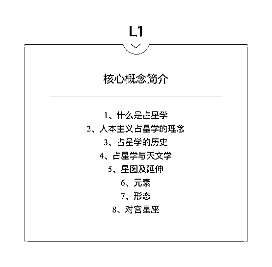

**· 四元素与三形态**

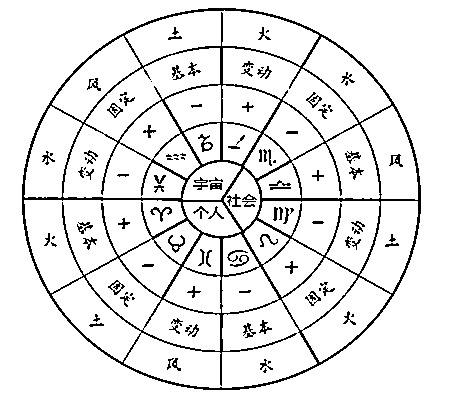

**· 黄道 12 星座**

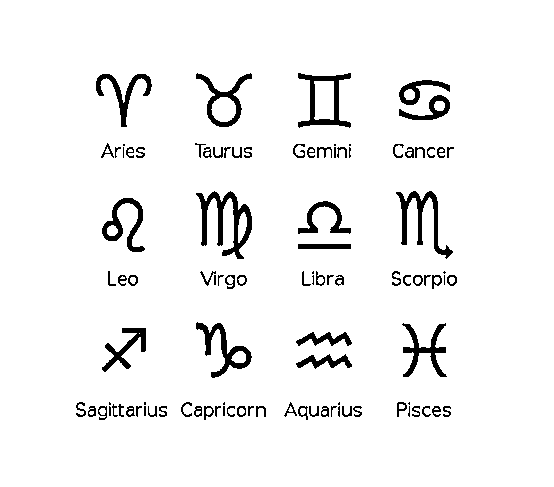

**· 太阳、月亮及其他个人行星**

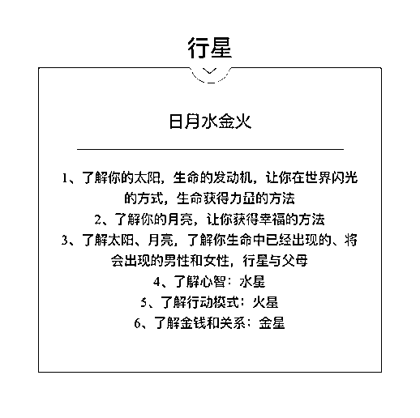

**第*2*阶 行星&宫位****· 木星&土星****· 天王星&海王星&冥王星**

**· 练习组合所有行星**

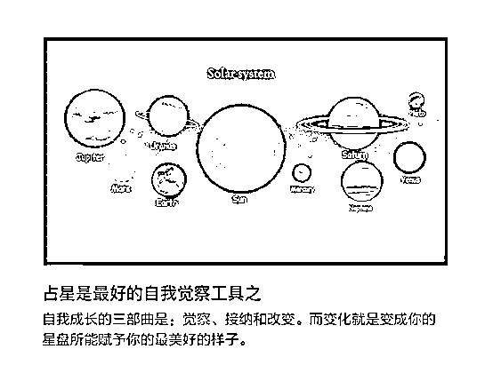

**· 四轴****· 十二宫位**

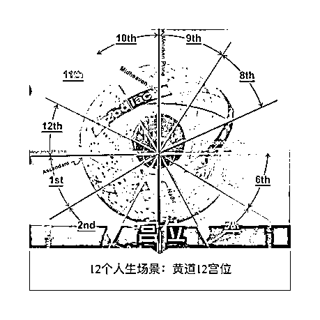

**· 组合宫位、行星、星座**

**授课老师** 

**琳恩·贝尔**

**（Lynn Bell）**

**· **世界最受欢迎的占星学演讲者、作家和老师之一。定居巴黎，研究心理占星学和家族模式数十年；**· **著名的心理占星学中心（Centre for Psychological Astrology）的长期导师。2016 年，获得查尔斯·哈维（Charles Harvey）杰出的占星学服务奖；**· **作为一个从多个层面进行工作的占星咨询大师，琳恩的工作结合了心理学的观点。她对家族模式的兴趣首先来自与客户的合作。通过在分析领域所做的个人工作，她所受的埃里克森催眠训练将她引领至家族系统。后来，她组织研究小组在家族星图上进行了数年的研究。她写的《家族占星学》就是这项研究的结果；**· **法国心理占星学协会的会长。除了占星学，她在法国沙特尔的新沙特尔学校任教 8 年，还 5 次获得了在《纽约时报》畅销书作者卡罗琳·迈斯（Caroline Myss）的卡罗琳·迈斯教育学院（Caroline Myss Educational Institute）合作教学的机会。

**艾德里安·罗斯·邓肯**

**（AdrianRoss Duncan）**

**· **1971 年在印度游学时开始学习占星学，1985 年开始成为全职占星师，迄今执业已超过 33 年，是人本主义占星学、卜卦占星学和经世占星学领域的知名占星师。他还开发了占星软件 AstroClock 和多款占星报告；**· **哥本哈根占星学院院长；**· **他在日常咨询中经常运用卜卦，咨询图（卜卦的一种运用方式，即根据客户来访时间制作星图，从星图中获得大量信息）也是他特别擅长的领域；**· **艾德里安·罗斯·邓肯从 1971 年开始研习佛学，受佛学影响很深，他相信占星学和佛学观点一致，转化的一个基础是在于对现实感知的改变。而卜卦很容易与佛教融合，因为它只关乎当下。

**克里斯蒂娜·罗登贝克**

**（Christina Rodenbeck）**

**· **克里斯蒂娜·罗登贝克（Christina Rodenbeck）是一名全职职业占星师，在牛津大学城生活和工作，深受周围知识和文化氛围影响；她拥有伦敦大学（University of London）的人文荣誉学位，曾在伦敦占星学馆（AstrologicalLodge of London）、心理占星中心和占星研究学院学习；

**· **作为一名占星师，在过去的 20 年里，克里斯蒂娜在她的网站“牛津占星师”上写了大量关于时事、艺术和文化的文章；她每月主持一个占星播客：“与克里斯蒂娜和萨莉一起占星”，并定期在《占星杂志》(Astrological Journal)上撰写时尚专栏；她定期在英国授课，并保持着蓬勃发展的专业实践。

**大卫·瑞雷**

**（David Railey）**

**· **若道联合创始人，致力于在中国教授和推广西方占星学；

**·** 曾任 ISAR 全球副主席，CAPISAR（ISAR 职业占星师资质认证机构）主席；

**· **1976 年，通过亚特兰大职业占星师考试，成为全职占星师，随后通过 AFAN 和 ISAR 职业测试；

**· **1980 年，与杰夫·焦耳一起在亚特兰大创建“每日行星”占星学中心。此后在亚特兰大占星协会担任 4 年考官，并且两次担任亚特兰大地区占星协会主席。1979-1992 年，作为占星师活跃于美国社会媒体，向不了解现代占星学变化的大众宣传专业占星学知识。

**·** 1989-1992 年期间，他在 WRGG 电台 12 频道每周主持个人电视秀“今日占星学”，早先他还在 WRFG 的广播节目中播讲宇宙天气节目；

**· **2010-2014 年，任全美占星师联盟监督委员会委员；

**· **2010 年，其著作《灵魂的目标》中国版出版，和蒋颖一起创办若道占星学校和其官网 www.nodoor.com；

**· **2017 年，被选为 ISAR 委员会成员。ISAR 是世界最大的国际占星机构，会员遍布 45 个国家，2017-2020 年曾任 ISAR 全球副主席、CAPISAR（ISAR 职业占星师资质认证机构）主席。

**熊鹰老师**

**（天空的空）**

**·** 2008 年接触严肃占星学，至此爱不释手；**· **2013 年师从大卫·瑞雷，研习整套现代占星学核心课程，并于 2014 年起至今连续三年担任该课程的主助教；**·** 期间也跟随格伦·佩里、诺·泰尔、理查德·塔纳斯、罗伯特·汉德、苏·汤普金斯、斯蒂芬·弗里斯特等多位国际占星大师进行学习，进行定向占星主题研究；**·** 2015 年初，通过国际占星研究协会（ISAR）资质认证并获得证书。同年，进一步跟随大卫·瑞雷老师进修“生时校正”技术，通过最终考核并获得证书；**·** 目前在若道占星任职，将传播系统、严谨、真实的占星学作为职业使命。任专职助教期间，进行沙龙与答疑等辅助教学工作已累计超过 200 小时；**·** 在业余期间也提供占星咨询与生时校正服务。目前正致力于占星学与个人成长的整合。**此次课程适合哪些人？****· **对占星学感兴趣，想要入门的零基础者**· **占星学小白，但有志成为职业占星师的人**· **有一定占星学基础，但不知道该如何整合星图复杂碎片的人**· **希望成为优秀的占星师，想要借鉴国际大师解读思路并融入自己的体系的人**· **想要师从更多殿堂级占星导师学习占星心法的人**· **走在自我探索和个人成长道路上的人**课程价格****L1-2 价格**：4800 元其他各阶段课程单报价格，请咨询课程顾问：**Maggie 老师**（微信：18510107057，请备注**“核心课”**）

长按二维码添加 Maggie 老师

**退转课程**

**· 退款原则请详看《教学协议》，如有疑问请咨询课程顾问**

****名师汇集金牌核心课程****

**授课老师：**琳恩·贝尔、艾德里安·罗斯·邓肯、克里斯蒂娜·罗登贝克、大卫·瑞雷

**授课时间：**2021 年 9 月 15 日起

**授课方式：**网络课程**，**英文授课，中文翻译

**费用：**L1-2：4800 元

**课程负责人：****Maggie 老师**（微信：18510107057，请备注“核心课”）

长按二维码添加课程负责人咨询~

****报名请点击“阅读原文”****

# 好物推荐 | 从"麻瓜"进化成占星师的自我觉察工具（插班中）

> 原文：[`mp.weixin.qq.com/s?__biz=MzA5NjA0NTAxNg==&mid=2651458519&idx=3&sn=0c2a5ccab0f8eab99d96aa7118d55f91&chksm=8b48b960bc3f3076287c79fddabc239b040c20a986c0d4bdf88d1f437c8f8f49f48898ac4372&scene=126&sessionid=1692737913#rd`](http://mp.weixin.qq.com/s?__biz=MzA5NjA0NTAxNg==&mid=2651458519&idx=3&sn=0c2a5ccab0f8eab99d96aa7118d55f91&chksm=8b48b960bc3f3076287c79fddabc239b040c20a986c0d4bdf88d1f437c8f8f49f48898ac4372&scene=126&sessionid=1692737913#rd)

1

**自我觉察，是智慧的基础**

每个人都有自己的内在冰山，自我觉察能够帮助我们觉察自己的行为、情绪等，然后向内深层探索，探索自己的行为、情绪背后的深层渴望、期待。学习和应用占星学的过程，就是慢慢掌握自我觉察工具的过程，当你熟练掌握了占星学，也就具备了帮助引导他人觉察到自身生命议题的能力。**往外张望的人在做梦，向内审视的人才是清醒的。**只有真正向内看，只有当觉察开始由外向内时，改变才会发生，才能够知行合一。

# | 插画师：古戈力

以情绪来举例说明，每个人的情况不同，觉察的程度也不同，觉察有四个层次：***1.*** **不知不觉：**没有觉察情况，当情绪来了，会被情绪控制，做出很多不计后果的事情。而且每次都是同样的状况，反反复复；***2.***** 后知后觉：**情绪过后，自己能够反应过来，自己做的对与错，但是很难避免同样的情况再次发生；***3*****. 当知当觉：**当情绪来的时候，你已经知道在这个当下，正在发生什么。当达到这个层次，你就可以自己控制情绪，从而影响后事的发展；***4*****. 先知先觉：**当事情还没发生，就可以预知它要发生了。因为你对情绪的觉察已经越来越熟练，所以情绪还没来，你就知道它要来了。所以，你也就有了更好的选择和处理方法。所以，我们要自我觉察，向内探索，觉察是为了接纳，然后做出改变，成长，迭代，升级。**那么要如何练习自我觉察，掌握先知先觉的能力呢？**

2

**每日觉察的工具推荐**

**今日天象&近期行进**

若道 APP 中的今日天象功能，罗列展示每一天的具体天象，你当天的行进和行进周期：

作为占星师，可以这样使用这个自我觉知工具：

**记录梦境**如果你有醒来记录梦境的习惯，每天早上看一下睡梦中的天象和行进，对应联想，你会惊喜地发现一些神奇的对应，能够更敏锐的捕捉到日常被压抑的情绪和需求。能够帮助你在白天的工作生活中先知先觉的关注身心状态。**规划生活**每月月初，周初都可以参考天象和行进进行日程规划，预估可能的助力和阻力，在对的时间做对的事，会发现平平无奇的日常也可以有不一样的色彩。根据月相的变化感知情绪的起伏，更好的自我关爱。**感知环境**当身边发生了引起你注意和好奇的事情，或者网络上层出不穷的新闻热点，都可以在天象中寻找对应的能量。从更大的格局视角去思考你的个人观点。通过环境的共振，更深入地理解自己的出生星图。以上都是很好的学习深化占星知识的方法，只需要系统掌握以下知识，就可以开始使用以上方法去提升自我觉知。**第*1*阶 黄道星座&个人行星****概要介绍占星学与星图**

**四元素与三形态**

**黄道 12 星座**

**太阳、月亮及其他个人行星**

**第*2*阶 行星&宫位****木星&土星****天王星&海王星&冥王星**

**练习组合所有行星**

**四轴**

**十二宫位**

**组合宫位、行星、星座****第*3*阶 月亮交点、相位以及初步解读星图**

**了解灵魂进化的路径：月亮交点**

**相位概论**

**相位&行为模式**

**困难相位**

**柔和相位**

**容许度，出入相位**

**渐盈渐亏相位**

**空相**

**宫主星&定位星**

**相位模式**

**组合相位、星座、行星、宫位**

**解读的基本原则，权重，失衡**

3

**课程安排是怎样的呢？**

**第*1*阶**2021 年 9 月 15 日开课，每周一天晚上 20:00-22:00 上课，共 6 次课**第*2*阶**2021 年 11 月 11 日开课，每周四晚上 20:00-22:00 上课，共 6 次课**第*3*阶**2022 年 1 月 6 日开课，每周四晚上 20:00-22:00 上课，共 15 次课 2022 年 4 月 30 日、5 月 1 日**L3 北京两日线下工作坊**

****

4

**授课老师**

**艾德里安·罗斯·邓肯**

**（AdrianRoss Duncan）**

**· **1971 年在印度游学时开始学习占星学，1985 年开始成为全职占星师，迄今执业已超过 33 年，是人本主义占星学、卜卦占星学和经世占星学领域的知名占星师。他还开发了占星软件 AstroClock 和多款占星报告；**·** 哥本哈根占星学院院长；**·** 他在日常咨询中经常运用卜卦，咨询图（卜卦的一种运用方式，即根据客户来访时间制作星图，从星图中获得大量信息）也是他特别擅长的领域；**· **艾德里安·罗斯·邓肯从 1971 年开始研习佛学，受佛学影响很深，他相信占星学和佛学观点一致，转化的一个基础是在于对现实感知的改变。而卜卦很容易与佛教融合，因为它只关乎当下。

**大卫·瑞雷**

**（David Railey）**

**·** 若道联合创始人，致力于在中国教授和推广西方占星学；**·** 曾任 ISAR 全球副主席，CAPISAR（ISAR 职业占星师资质认证机构）主席；**·** 1976 年，通过亚特兰大职业占星师考试，成为全职占星师，随后通过 AFAN 和 ISAR 职业测试；**·** 1980 年，与杰夫·焦耳一起在亚特兰大创建“每日行星”占星学中心。此后在亚特兰大占星协会担任 4 年考官，并且两次担任亚特兰大地区占星协会主席。1979-1992 年，作为占星师活跃于美国社会媒体，向不了解现代占星学变化的大众宣传专业占星学知识。在 1989-1992 年期间，他在 WRGG 电台 12 频道每周主持个人电视秀“今日占星学”，早先他还在 WRFG 的广播节目中播讲宇宙天气节目；**·** 2010-2014 年，任全美占星师联盟监督委员会委员；**·** 2010 年，其著作《灵魂的目标》中国版出版，和蒋颖一起创办若道占星学校和其官网 www.nodoor.com；**·** 2017 年，被选为 ISAR 委员会成员。ISAR 是世界最大的国际占星机构，会员遍布 45 个国家，2017-2020 年曾任 ISAR 全球副主席、CAPISAR（ISAR 职业占星师资质认证机构）主席。

**克里斯蒂娜·罗登贝克**

**（Christina Rodenbeck）**

**· **克里斯蒂娜·罗登贝克（Christina Rodenbeck）是一名全职职业占星师，在牛津大学城生活和工作，深受周围知识和文化氛围影响；她拥有伦敦大学（University of London）的人文荣誉学位，曾在伦敦占星学馆（AstrologicalLodge of London）、心理占星中心和占星研究学院学习；**·** 作为一名占星师，在过去的 20 年里，克里斯蒂娜在她的网站“牛津占星师”上写了大量关于时事、艺术和文化的文章；她每月主持一个占星播客：“与克里斯蒂娜和萨莉一起占星”，并定期在《占星杂志》(Astrological Journal)上撰写时尚专栏；她定期在英国授课，并保持着蓬勃发展的专业实践。

**琳恩·贝尔**

**（Lynn Bell）**

**·** 世界最受欢迎的占星学演讲者、作家和老师之一。定居巴黎，研究心理占星学和家族模式数十年；

**·** 著名的心理占星学中心（Centre for Psychological Astrology）的长期导师。2016 年，获得查尔斯·哈维（Charles Harvey）杰出的占星学服务奖；

**·** 作为一个从多个层面进行工作的占星咨询大师，琳恩的工作结合了心理学的观点。她对家族模式的兴趣首先来自与客户的合作。通过在分析领域所做的个人工作，她所受的埃里克森催眠训练将她引领至家族系统。后来，她组织研究小组在家族星图上进行了数年的研究。她写的《家族占星学》就是这项研究的结果；

**·** 法国心理占星学协会的会长。除了占星学，她在法国沙特尔的新沙特尔学校任教 8 年，还 5 次获得了在《纽约时报》畅销书作者卡罗琳·迈斯（Caroline Myss）的卡罗琳·迈斯教育学院（Caroline MyssEducational Institute）合作教学的机会。**课程助教：**

**熊鹰老师**

**（天空的空）**

**·** 2008 年接触严肃占星学，至此爱不释手；**·** 2013 年师从大卫·瑞雷，研习现代占星学核心课程，并于 2014 年起担任该课程的助教，之后于 2017 年与 2020 年两次与大卫老师合作讲授完整核心课程（Level 1-5）；**·** 期间也跟随格伦·佩里、诺·泰尔、理查德·塔纳斯、罗伯特·汉德、苏·汤普金斯、斯蒂芬·弗里斯特、琳恩·贝尔、艾德里安·邓肯等多位国际占星大师进行学习，进行定向占星主题研究；**·** 2014 年末，通过国际占星研究协会（ISAR）资质认证并获得证书；**· **在若道占星任职六年余，以“传播系统、专业、实效的占星学”为职业使命，执教与助教已累计超过 700 小时。在业余期间也提供占星咨询服务；**·** 目前正着眼于占星学与中国文化之互参，以当代中国人的身心成长为目标，力求落到实处。

5

**此次课程适合哪些人？**

**·** 对占星学感兴趣，想要入门的零基础者**· **占星学小白，想通过星图学习识人之术**· **有一定占星学基础，但不知道该如何整合星图复杂碎片的人**· **想要师从更多殿堂级占星导师学习占星心法的人**· **走在自我探索和个人成长道路上的人

6

**课程价格**

**L1-3 价格**：15000 元

其他各阶段课程单报价格，请咨询课程顾问：**Maggie 老师**（微信：18510107057，请备注**“核心课”**）

长按二维码添加 Maggie 老师

7

**退转课程**

****· 退款原则请详看《教学协议》，如有疑问请咨询课程顾问****

****名师汇集金牌核心课程****

**授课老师：**琳恩·贝尔、艾德里安·罗斯·邓肯、克里斯蒂娜·罗登贝克、大卫·瑞雷

**授课时间：**2021 年 9 月 15 日起

**授课方式：**网络课程**，**英文授课，中文翻译

**费用：**L1-2 价格：4800 元**；**L1-3 价格：12000 元

**课程负责人：****Maggie 老师**（微信：18510107057，请备注“核心课”）

长按二维码添加课程负责人咨询~

****报名请点击“阅读原文”****

# 重磅天象丨木星顺行啦！辛苦大半年，你将在何处收获宇宙的礼物？

> 原文：[`mp.weixin.qq.com/s?__biz=MzA5NjA0NTAxNg==&mid=2651458519&idx=1&sn=dd71a35581bd5dc4d3c286b848a55c92&chksm=8b48b960bc3f3076d346c5c8ffc2871161bbe3ef2aed1476bcc9720e3fc3408615efd35860d4&scene=126&sessionid=1692737913#rd`](http://mp.weixin.qq.com/s?__biz=MzA5NjA0NTAxNg==&mid=2651458519&idx=1&sn=dd71a35581bd5dc4d3c286b848a55c92&chksm=8b48b960bc3f3076d346c5c8ffc2871161bbe3ef2aed1476bcc9720e3fc3408615efd35860d4&scene=126&sessionid=1692737913#rd)

**☆ 后台回复“今日”，给你一句生命态度**

****

作者/Anastasia 编辑/翀子 封面/书君 图片/网络

木星将于 10 月 18 日下午 1 点 29 分恢复顺行，它将快速通过水瓶座的最后一段，于 12 月 29 日进入自己守护的双鱼座。我们每个人会从木星那里获得什么样的礼物呢？来看文章吧！另外，水星也将于 10 月 18 日恢复顺行，大家也可以回顾一下[水逆（点击可阅读）](http://mp.weixin.qq.com/s?__biz=MzA5NjA0NTAxNg==&mid=2651457358&idx=1&sn=f60ca98a82da2b886e36c80d26c25ea2&chksm=8b48b5f9bc3f3cefb6849180ad0552bb32bf8d8e74338d723f499cfad910a0faae615a7cf01f&scene=21#wechat_redirect)期间的感受哦。

9 月底，木星就在水瓶座 22°停滞了，并将于本月 18 日下午 1 点 29 分恢复顺行。本次木星逆行于 6 月 20 日，双鱼座 2°开始，7 月 28 日木星逆行回到水瓶座，直至现在。**木星恢复顺行后，将快速通过水瓶座的最后一段，于 12 月 29 日彻底离开水瓶座，进入自己的曜升星座双鱼座，正式开启木星双鱼座之旅。**

**木星“面面观”**

*****天文学***上的木星**

木星是太阳系中的第五颗行星，距离太阳约四亿八千三百五十万英里。它也是**太阳系中最大的行星，**直径大约八万九千英里，比其他所有行星加起来都还要大。木星如此庞大，**质量是太阳的千分之一，是地球的三百多倍。**

木星巨大的引力场吸引了许多小行星、流星和其他太空物质。如果没有木星，它们就可能撞上地球，摧毁地球。至 2019 年 12 月人们已经发现它有 79 颗卫星，木卫三是其中最大的一颗，直径比水星还大。

*****神话学***上的木星**

古人早已认识木星，在古巴比伦，木星代表他们的神马尔杜克；而罗马人以主神**朱庇特**命名这颗行星。罗马神话中的朱庇特也就是希腊神话中的**宙斯**，主宰万神殿，是众神之神。

在古代中国称木星为**岁星**，对应其 12 年的周期，与地支（十二生肖）相同。西汉时期，司马迁观测发现岁星呈青色，于是与“五行”学说联系在一起，为其命名为“木星”。

*****占星学***上的木星**

木星绕黄道一圈略小于 12 年（0.988 年），每个星座停留差不多一年（11.86 年，4333 日）。它是太阳系最大的吉星（金星是小吉星）。**在占星学中，木星守护射手座和第九宫，**它永远带来好运，**象征扩张、幸运、乐观、成功和欢乐**，它守护的射手座和第九宫也是目光高远，运气超好。

木星喜欢**追求真理、探索宇宙真相、追寻更高的智慧，**它与扩张、乐观、慷慨、信念和信仰相关，是与**更宏大的秩序**或是比自己**更宏大的事物**联结，有一种恩宠的意味在里面，这也非常符合它胖胖的体型。出生星图中木星落入的位置能够带来**机会和信心**。木星强调自由、不受约束，需要很大的空间、高远的理想，不断探索和不安于室。

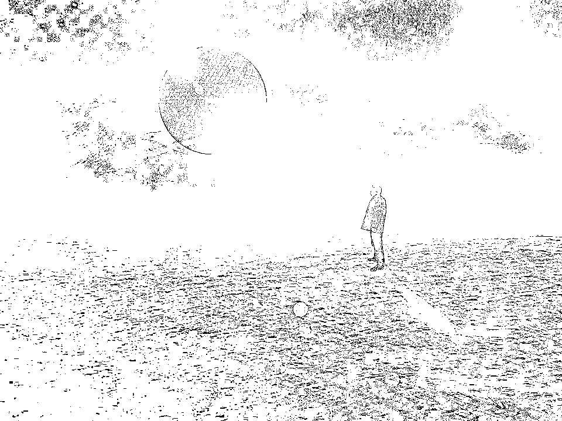

**木星的逆行**

**木星每年逆行一次，每次约四个月。**木星逆行期间，意味着人们的形而上能量受到了干扰。**我们在道德、价值观、人生观的判断上会产生摇摆和反复，不断地追问和质疑：**什么是对？什么是错？道德和法律的关系如何界定？个人真理和主流价值观之间的冲突如何协调？我们之前坚信的东西还值得吗？这些问题会困扰我们，并且，影响到我们做判断和决定。

**逆行意味着反复和修正。**木星是在**双鱼座 2 度**开启了本次逆行之旅，**水瓶座 22 度到双鱼座 2 度**这个区间已经经过了木星的两次洗礼。这个区间如果落入有个人行星或者轴点，个人感受就会更加明显。**它除了给我们带来好运，也会考验我们的信心，试炼那些我们曾经相信的东西。**

木星的逆行提示我们要去**诚实地面对自己的内心**，澄清自己的**信仰和信念**，从芜杂的线索中找到真正适合自己的方向。**怀疑是智慧的开始，而不是结束。**

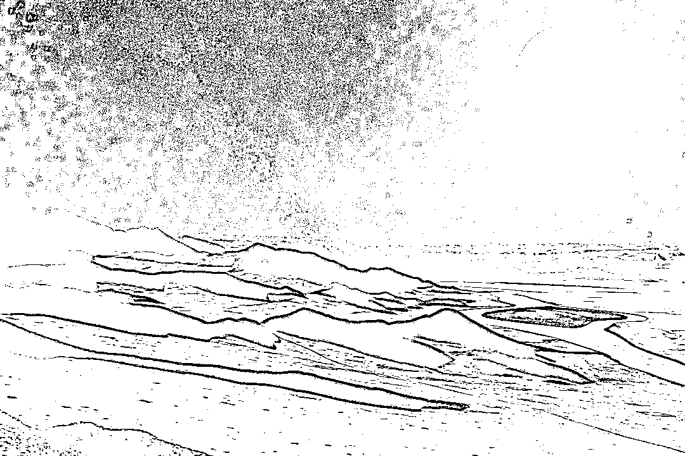

**木星顺行的影响**

**木星的关键词包括乐观的、信任的、夸张的、过度的、纵容的。**如果木星和金星有链接，我们对待金钱的态度就会很慷慨，花钱也会比较大手大脚。如果木星和太阳或月亮有链接，那么木星的作用就会令人快乐，我们会感觉很受鼓舞，很乐观，很正能量。

木星在水瓶座 22 度恢复顺行，水瓶座 22 度到双鱼座 2 度这个区间将会接收到木星的第三次眷顾，好运挡不住，我们更加明确前进的方向，一直向前。**查看出生星图上这个区间对应的宫位，就会知道我们会在哪个领域感受到木星的恩宠。**

**若道君：****你可以在 app store 或者应用商店搜索“若道”下载 app，输入个人档案，查看行运盘（也可以使用其他星图软件），找到行运木星落在出生星图的第几宫，然后对照下文查看木星顺行的影响。**

**例如下图中，行运木星在美国总统拜登个人星图的第 3 宫。**

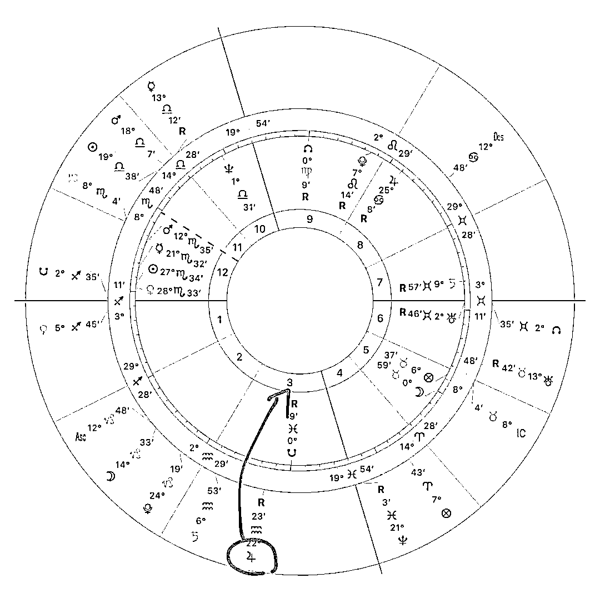

**第一宫和上升点**是我们生命中的重要生活课题所在，是我们面对世界的窗口，当木星通过上升点进入到一宫，会让我们感受到很明显的轻松和愉悦。我们会得到一些好消息，可能是拖延已久的事情得到了解决，也可能有机会重新认识到自己的能力，或者新认识一些对我们有帮助的贵人。但也要小心心宽体胖，**不能忽视对于身体的自律。**

**第二宫**的关键词是金钱收入和资源，木星进入到这里，就会**提升我们的财富机会和自我价值感。**我们会有更多的赚钱机会，掌握一些新的谋生技能，并且获得更多的自我价值感。

**第三宫**的关键词是兄弟姐妹、亲朋好友、短程旅行、沟通学习等，木星在这里顺行，就会与上述领域产生互动关系。我们会**拥有更多交流和学习的机会**，获取大量的信息，更频繁第与亲朋互动，或者进行短途旅行。

**第四宫**的关键词是父母、原生家庭、房子住所、童年、安全感等等。木星在这里会**给我们的家庭生活带来好运和资源**。我们可能会搬家，住到更大的房子里；也可能得到来自父母或家族的资助，彼此关系更加亲近。

**第五宫**的关键词是恋爱、才艺、娱乐、投机和孩子等，木星在这里为我们**提供的更多的个人才华展示的机会**，更多的恋爱桃花，当然也可能是更多的孩子。我们会在创作过程中得到极大的愉悦和满足。

**第六宫**的关键词是日常生活和工作的结构，个人健康、工作和服务特质等，木星进入到六宫，**会帮助我们更好地平衡生活和工作的关系**，获得日常轻松感，以及更好的健康体验。和同事的相处也会变得更加轻快，没有摩擦。

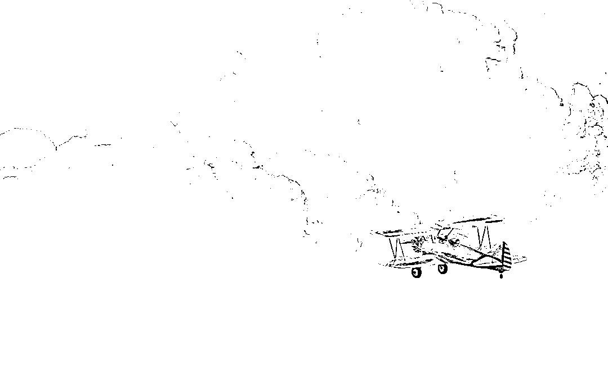

**第七宫**的关键词是一对一关系、婚姻和敌对状况等，木星在这里提示我们**在关系中拥有了更多的机会和好运**，紧张的关系会得到缓解，我们也会在关系中获得更大的自由度和掌控感。也可能遇到非常合适的合作机会与人选。

**第八宫**的关键词是资源、死亡、性、秘密、神秘学等，木星进入到八宫，会激发我们对于上述领域的探索热情。我们会变得安静，**更深入地探索内心世界**，被一些禁忌话题吸引，一些常年困扰我们的心理问题也有机会获得关注和疗愈。

**第九宫**的关键词是异国文化、长途旅行、高等教育、道德信仰等，木星回到自己守护的宫位，更加如鱼得水。我们会拥有出国的机会、深造的机会、拓展视野的机会。**我们会在这个期间提升自己的眼界和格局，确定信念，拥有不同往日的信心。**

**第十宫**是星图的最高点，关键词是事业、名声、地位和权力等，木星进入到中天，**会给我们的事业带来很多机会。**当然不仅仅限于事业，十宫也是我们的**个人身份认同感**，我们会更加明确我们人生的目的和方向。

**第十一宫**的关键词是团体生活、志同道合的朋友、希望和愿景、人道主义活动等等，木星会扩展我们的朋友圈和社交活动，我们会加入不同的团体或兴趣小组，进行一些集团活动，**认识更多志同道合的人，找到归属感。**

**第十二宫**的关键词是隐私、逃避、灵性、业力和不幸等等，木星照亮十二宫，我们会在**灵性疗愈**方面获得极大的进展，在心灵上得到极大的抚慰。

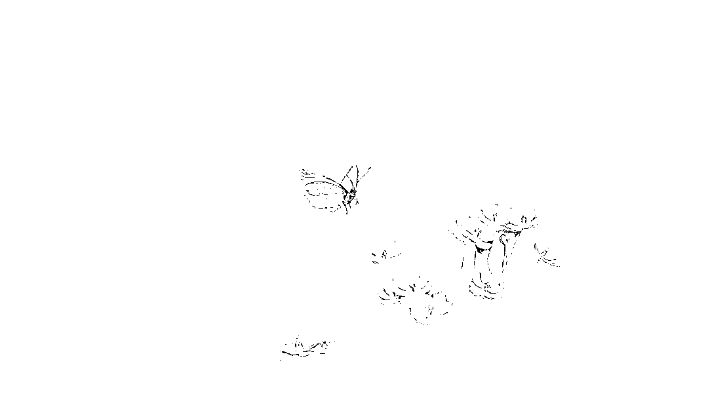

**木星在双鱼座**

木星曾在 5 月 14 日首次进入双鱼座，停留了两个多月，算是木双鱼之年的序幕。**对于个人来说，尝试回想五六七月期间发生的事情，**结合木星所落的宫位和相位，对于接下来一年的发展会大有帮助。

**木星在双鱼座曜升，利于艺术、影视、医学、灵性疗愈等行业的发展。**木星会激发人们的情绪，突出智慧和想象力，以及对崇高的理想的追求。木星顺行后，就会加速后面的行程，快速通过水瓶座，**于 12 月 29 日彻底进入双鱼座。**

**如果有个人行星或者轴点落在风象星座后十度的个体，**将会感受到木星的最后一波红利，**其次是固定星座后十度，**因为是硬相位，要小心过度膨胀。

**明年四月，木星将会在双鱼座与海王星汇合。**两大守护星聚首，会掀起怎样的巨大风潮，可以小小期待一下。人们会变得敏锐、富有同情心、充满想象力和奉献精神，整个社会情感流动，爱心爆棚。但这到底是巨大的迷雾、虚幻和泡沫，还是伟大的理想和艺术浪潮？大浪淘沙，风起云涌，曲终酒醒后是乱世靡音一场空，还是百世流芳居庙堂，端看个体和集体之前的积累和功夫。

**总之，占星学永远在告诉我们，我们有机会、有选择。**无论命运之手如何翻云覆雨，或者超出我们的掌控，**我们始终能够通过改变自己的观点，调整自己的态度，充分运用想象力和创造力来改变现实。**这就是木星带给我们的最大礼物，帮助我们成为自己的神。

**版权声明：**文章由作者授权在若道平台发布，欢迎转发，反对抄袭。友号转载请申请白名单。

**Anastasia**

职业占星师/专栏作者/策展人

ISAR 认证占星师（2016 年获得）

若道认证生时校正资质（2015 年获得）

**微信公众号**：KairosMoment

长按打赏

**学习占星学**

**点击或长按下图了解课程详情**

******

******

******

**微信又双叒叕改版啦，不想错过若道君的推送？**

**就把若道设为星标吧！**

**▼**

**喜欢记得点一下在看哦☟**

**********报名直达入口**********

# 雷蒙德·梅里曼金融占星周运 | 水星、木星顺行，市场走向如何？

> 原文：[`mp.weixin.qq.com/s?__biz=MzA5NjA0NTAxNg==&mid=2651458519&idx=2&sn=0786b9b164b8f25feb5e18eb6d2b8757&chksm=8b48b960bc3f30760d1c56ab0368d26a11d7ce8efc8bf3837498415b8a5b602f11be16aa2133&scene=126&sessionid=1692737913#rd`](http://mp.weixin.qq.com/s?__biz=MzA5NjA0NTAxNg==&mid=2651458519&idx=2&sn=0786b9b164b8f25feb5e18eb6d2b8757&chksm=8b48b960bc3f30760d1c56ab0368d26a11d7ce8efc8bf3837498415b8a5b602f11be16aa2133&scene=126&sessionid=1692737913#rd)

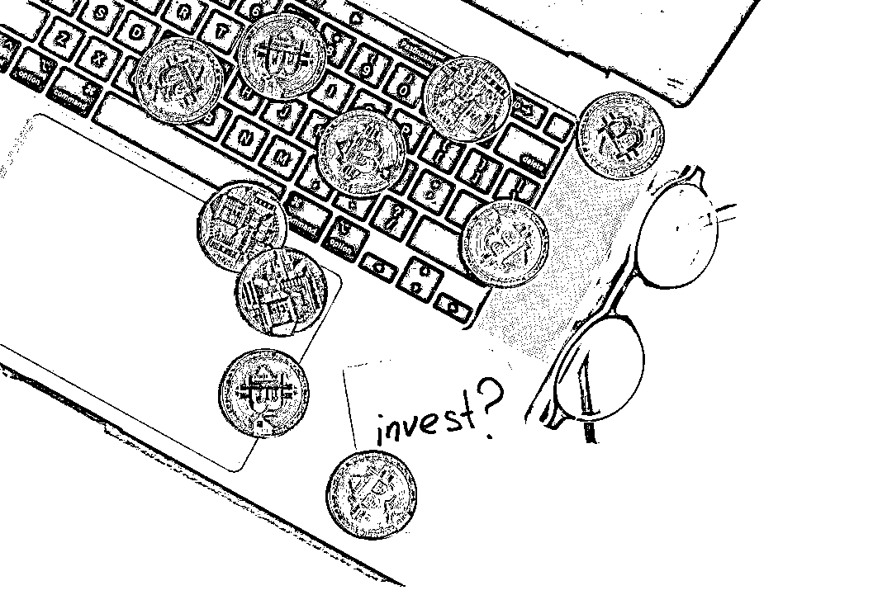

作者/雷蒙德·梅里曼 译者/Luke 编辑/玫瑰 图片/pexels

雷蒙德·梅里曼是在金融占星学界稳坐第一把交椅的占星师，同时他也是若道签约的金融占星课老师，我们引进了雷蒙德·梅里曼老师的《[上证指数月度报告](http://mp.weixin.qq.com/s?__biz=MzA5NjA0NTAxNg==&mid=2651457358&idx=2&sn=7f9716283aa45202cac373edc975a3b9&chksm=8b48b5f9bc3f3cef6942c2670605563f932623c1ef13b686cd99fe8a8160d392160c9a9fdac6&scene=21#wechat_redirect)》及《[黄金报告](http://mp.weixin.qq.com/s?__biz=MzA5NjA0NTAxNg==&mid=2651457358&idx=2&sn=7f9716283aa45202cac373edc975a3b9&chksm=8b48b5f9bc3f3cef6942c2670605563f932623c1ef13b686cd99fe8a8160d392160c9a9fdac6&scene=21#wechat_redirect)》。我们经老师的授权，将每周刊登梅里曼老师的周运，供大家参考和学习。于是，这是本周的周运（10.18-10.22）。

**说明：以下时间采用纽约证券交易所所在地美国东部标准时间。**

**展望与回顾**

****

**美国证券交易委员会下周允许第一支比特币期货基金开始交易。这对于一直在寻求华尔街最高监管机构许可的加密货币行业，是一个里程碑式的胜利。比特币周五在 60000 美元以上交易，是自 4 月 17 日的最高价位，部分是因为有猜测称，证券交易委员会将为比特币期货基金开绿灯。****——托马斯·弗兰克****《美国证券交易委员会即将允许第一支比特币期货基金开始交易》****www.cnbc.com****2021 年 10 月 15 日****自 12 月来，不断上升的疫苗接种率和接近 2.8 万亿美元的联邦支出已经带来了前所未有的复苏。通货膨胀飙升，很大程度上反映了供应链的中断以及经济重启伴随的短缺。**** ——尼克·蒂米拉奥斯****《美联储缩减回购规模的计划正步入正规》****《华尔街日报》****2021 年 10 月 13 日**全球股票指数上周飙升，稍早前它们在 9 月 29 日水星开始逆行，或水星逆行周期的中点 10 月 7-8 日附近创下低点。但是现在**从 10 月 15 日到 18 日，我们正处于三个重要的木星行进期间。**水星也会在 10 月 18 日结束逆行，木星也是如此。尽管水星仍在逆行，但是在多重木星行进期间，市场出现良好的上涨，并不罕见。但是当木星的影响力削弱，此轮上涨还能持续下去，直到下周之后吗？水星逆行时开始的上涨，会在 3 周后水逆结束时也来到终点吗？是的，这些都有可能发生。但是目前来说，图表形态和技术分析看起来非常看涨。值得注意的是，**在水星逆行期间常常技术指标和图表形态看起来是一个样子，但现实发展又是另外一个样子。**

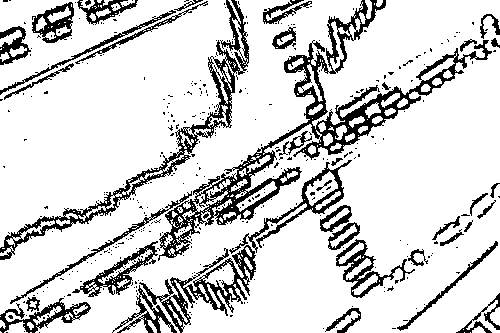

在亚洲和环太平洋地区，印度 NIFTY 指数上周表现瞩目。它于 10 月 15 日上涨至历史新高。澳大利亚 ASX 指数和日本日经指数也在 9 月 29 日和 10 月 6 日的周期低点后，出现了一轮良好的上涨。中国香港恒生指数和上证指数涨势一般。在欧洲，伦敦富时指数于周五飙升至疫情后的新高。荷兰 AEX 指数、德国 DAX 指数和苏黎世 SMI 指数也从 10 月 6 日近期的低点强势上涨。在美国，道琼斯工业平均指数、标准普尔指数和纳斯达克指数都以强势的上涨结束上周。其他市场上这几周的表现也值得一提。原油在周五上涨到了 7 年来的新高，到达 82.49。随着上周走向尾声，比特币在挑战历史新高。美元/日元爆发性上涨到 3 年来的最高点。白银的表现也很强劲，在周五飙升至 23.64。在两周前的 9 月 29 日，它刚刚创下了年度新低 21.41。黄金周四突破 1800，自 9 月 15 日以来首次突破此价位。但是在周五，它下跌了接近 30 美元，重回 1770 以下。回顾之下，看起来许多市场都结束了其在水星逆行或者水逆中点时开始的逆势走向。它们看起来又重回之前的趋势。然而，由于从 10 月 6 日到 18 日期间，四颗行星从逆行转向顺行，那两周的时期最终可能也仅是构成了一轮逆势走向。这就是在短期内多颗行星转为逆行和顺行的自然表现。**短期占星趋势和长期考量**在这 12 天里有四颗行星结束逆行转为顺行，让你感觉如何？你是否感觉有某些事发生了改变？你是否见证了这一时期金融市场的突然转向，始于 10 月 6 日的冥王星顺行（同时还是新月、水星逆行周期的中点，以及第二天的太阳合相火星），紧接着是 10 月 11 日上周一土星顺行？这些行星改变运行方向将于 10 月 18 日结束，届时水星和木星也将恢复顺行。这会为这一轮令人印象深刻的涨势画上句号吗？还是说 10 月 6 日开始的这轮上涨将持续到下周以后？这些问题是金融占星师试图回答的。

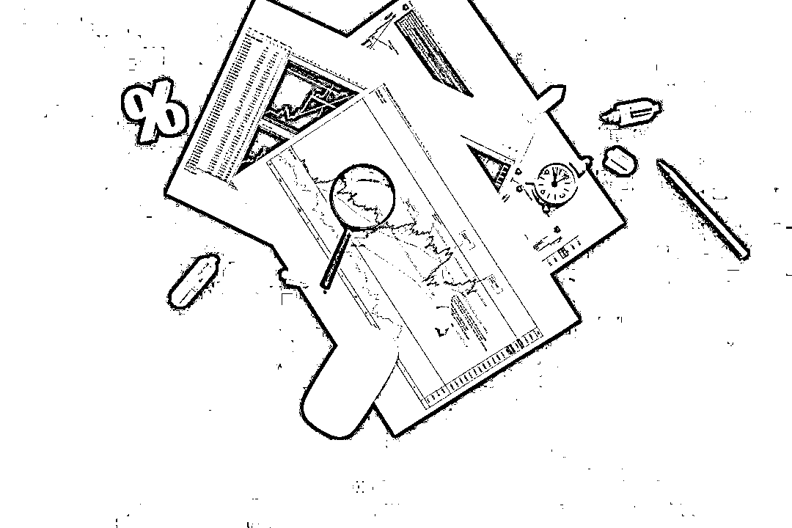

不仅是冥王星、土星、水星和冥王星从逆行转为顺行。正如开始所说的，这也是三个木星行进影响力最大的时段。周五，太阳和木星彼此形成三分相，全球股票市场剧烈上涨。**10 月 18 日，木星将恢复顺行，这也有着看涨的含意。10 月 19 日，火星将三分木星，是另一个多数情况下看涨的信号。**这些和谐相位将带领我们迎来更具挑战性的四分相和对分相。也就是从**10 月 22 日到 11 月 17 日**这段时期，始于 10 月 22 日严酷的火星-冥王星四分相，终于 11 月 17 日强有力的火星-天王星对分相。在此期间，**火星将于 11 月 10 日四分土星。**当然，我们愿意认为**看跌的逆势走向趋于结束，看涨的趋势会继续**。有可能是如此。甚至纽约证券交易所星图（1792 年 5 月 17 日）的行进也支持这一观点，因为行进火星将于 10 月 15-29 日合相交易所星图中的木星-海王星合相。随后行进的木星将于 11 月 2 日-12 月 20 日合相交易所星图中的木星-海王星合相。或许全球股票指数将继续上涨，但是世界领导人们面对的挑战还没有结束。我们仍然要面临**12 月 24 日土星-天王星最后一轮四分相，以及之前在 12 月 19 日却同样有力的金星逆行（合相冥王星）。**历史上来看，**上涨进入土星-天王星四分之一周期（合相、四分相或对分相）的股票市场，会在最后一次精准成相前至少 1-2 个月触顶。**这很像上周全球股票市场上发生的事。但仍然有许多值得担心的。人们可能通过经济和股市正在赚钱。但是世界领导人和他们的政府仍然难以就社会和经济的前进方向达成一致，与此同时消费者商品价格比工资上涨得更快。在对抗通胀还是继续刺激经济的问题上，美联储已经被逼至角落。必须放弃某些事，我的观点是，正如上面所讨论的，当这些宇宙巨型天体在 12 月份相撞，审判日即将到来。碰撞是土星-天王星的本性。通常有一些痛苦和冲突与之相伴。关于冲突的事实是，通过拥抱和化解它们，最终会让一个人受益。为了做到这点，他必须拥有成长的意愿。重要的是，要为了冲突的益处，而不是它们带来的感受而拥抱它们。经历这些冲突令人不舒服，甚至使人痛苦。但这就是要为糟糕决定付出的代价。也是社会成长必须付出的代价。**说明：以上日期基于纽约证券交易所所在的美国东部标准时间，由于存在时差，中国地区可能需要加一天。****版权声明：**本文由若道翻译发布，欢迎转发，反对抄袭。友号转载请申请白名单。

**雷蒙德·梅里曼（Raymond Merriman）**

若道签约老师。著名金融占星师，ISAR（国际占星研究协会）前主席，梅里曼市场分析公司的总裁。他由于“提升了占星学的职业形象”，在 1995 年国际占星大会上被授予轩辕十四奖；在 2012 年国际占星大会上，被授予轩辕十四终身成就奖。

1“中国上证指数月度报告”发售

**若道推出了****中文版****的雷蒙德·梅里曼中国上证指数月度报告，并持续发行该报告！**

当把金融市场的周期和占星学的周期相结合时，雷蒙德·梅里曼老师的金融占星学研究**为投资者应对金融市场的周期波动，并随之调整投资策略提供了极大的价值参考**。

**10 月中英文报告已上线！**

2“黄金价格周期月度报告”发售

**若道推出****中文版****的雷蒙德·梅里曼黄金价格周期月度报告！**不仅仅为广大读者在中国股市的投资出谋划策，更将视角放眼黄金市场。

**每当世界经济形式不明朗的时候，有一个地方是保值的港湾，那就是****黄金**。自 1982 年雷蒙德·梅里曼出版第一本研究《地球宇宙学征象与黄金价格的关联》的著作以来，**他一直作为最重要的黄金市场时机预测者之一享誉国际**。

11 月黄金报告已上线，梅里曼老师将会告诉你他对这个关键时期如何操作的想法。也可以按照季度和一年期订阅，有更多优惠。季度和年度的好处是，你可以持续了解梅里曼老师对于不断在变化的市场的看法。即便他某一次看法和市场不一致，你也看到在下一期他如何调整自己的看法，并看到金融占星在一个长期时间段内对你把控风险的帮助。而能够长期控制风险、尽量找到安全的投资时机才是投资的长久之计。

**11 月中英文报告已上线！**

**购买套餐**，买得越多越优惠

中国上证指数月度报告套餐价

*   **单月报告**：280 元

*   **3 个月套餐**：780 元（260 元/月）

*   **12 个月套餐价**：2400 元（200 元/月）

**长按下图识别二维码**

**购买金融报告****套餐**

**▼**

黄金周期月度报告优惠

*   **双报告年度套餐更优惠（直降 900 元）**
*   **12 个月黄金报告+12 个月上证指数报告：仅需 3900 元**

**长按下图识别二维码购买黄金报告套餐**

▼

3 中国金融市场特别网络研讨讲座

面对年底几个影响金融市场的重要天象，该如何把握下半年的投资，为跨年做准备？我们特意邀请雷蒙德·梅里曼老师为大家带来了**3 个小时的金融讲座——雷蒙德·梅里曼中国金融市场特别网络研讨讲座。**

这场为期 3 小时的在线讲座探讨了**这些长期行星周期如何影响世界经济的长期周期和趋势，特别是如何影响上证综指和黄金市场**。并描述**在 2021 年剩下的时间里市场反转关键时间点，特别是 12 月 19 日至 25 日金星逆行，以及土星-天王星最后一次渐亏四分相、金星与冥王星合相的重要时期。**

**长按下图识别二维码购买讲座视频**

▼

**点击阅读原文购买金融报告**

# 月亮在双鱼座，你如何度过这个浪漫的周末？

> 原文：[`mp.weixin.qq.com/s?__biz=MzA5NjA0NTAxNg==&mid=2651458399&idx=1&sn=e8484948f5348a16c987f7653ce64574&chksm=8b48b9e8bc3f30feeb32002a57fbbbf2fc0777bfdff13a293caf23c539bbf5e663f27bfad707&scene=126&sessionid=1692737913#rd`](http://mp.weixin.qq.com/s?__biz=MzA5NjA0NTAxNg==&mid=2651458399&idx=1&sn=e8484948f5348a16c987f7653ce64574&chksm=8b48b9e8bc3f30feeb32002a57fbbbf2fc0777bfdff13a293caf23c539bbf5e663f27bfad707&scene=126&sessionid=1692737913#rd)

**2021 年 10 月 16 日天象：**

*   **10:21 月亮进双鱼座**

*   ******太阳三分木星、四分冥王星******

*   ******水星对分凯龙星、金星三分凯龙星，水星六分金星******

*   ******火星与海王星呈梅花相******

今天是周六，月亮在上午应景的进入双鱼座。怎么样，这个周末要如何慵懒文艺的度过呢？长假后的这一周，你是否已经适应了紧张、快节奏的生活？或者，你精力满满的进入了新状态？如果你度过了忙碌的一周，不如允许自己放空片刻、休息一下吧~火星与海王星形成精准梅花相，也提醒我们不要“用力过猛”，顺势而为或是去看看艺术展、电影，在家做做冥想或是和水亲近一下，都有助于我们调整身心。

太阳与木星、冥王星形成相位，水星、金星与凯龙星之间也有能量互动。生活中还是有紧绷的张力存在，口无遮拦容易引起矛盾与冲突，不过只要我们在考虑自己立场的同时，学会换位思考、和对方进行积极沟通，还是可以“化干戈为玉帛”的。

周六快乐！我们周一见！ **了解每日天象，可****下载“若道”APP 查看****还有更多精彩等着你哦**

# 冷知识丨行星交点：揭示了超越感知的宇宙事实

> 原文：[`mp.weixin.qq.com/s?__biz=MzA5NjA0NTAxNg==&mid=2651458393&idx=1&sn=49c836c24212a45e4d295ea225ff7011&chksm=8b48b9eebc3f30f830240bc587fcdee58d6a214e9a107c771077022151863f0a1aa3cea99ca3&scene=126&sessionid=1692737913#rd`](http://mp.weixin.qq.com/s?__biz=MzA5NjA0NTAxNg==&mid=2651458393&idx=1&sn=49c836c24212a45e4d295ea225ff7011&chksm=8b48b9eebc3f30f830240bc587fcdee58d6a214e9a107c771077022151863f0a1aa3cea99ca3&scene=126&sessionid=1692737913#rd)

****************************☆ **************后台回复“今日”，给你一句生命态度**************

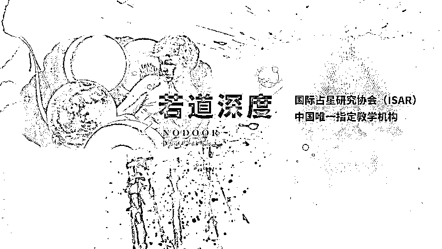

作者/马克·琼斯
译者/李含 校对/Leisha 编辑/翀子 封面/书君 图片/网络

马克·琼斯老师即将在若道开设关于[行星交点的 ISAR 选修课](http://mp.weixin.qq.com/s?__biz=MzA5NjA0NTAxNg==&mid=2651457616&idx=2&sn=d4895e9f7afd96bee81c134f033be295&chksm=8b48bae7bc3f33f16d19be8e383182f97e2d417247fff257404e8cdeba0a1b309bde5ffabcec&scene=21#wechat_redirect)（点击可阅读）。作为对行星交点有深入研究的占星师，他如何看待行星交点与人类社会、个人生活的联系呢？他又有哪些独到的见解？除了我们熟悉的月亮交点，其他外行星交点都有哪些意义呢？让我们来看文章吧~

**行星交点的动力**

鲁伊尔的一个核心假设是行星运动的动力。交点在太空中的视点实际是一个代表实时动力运动的静止点。**行星交点**既能表达行星的**整体运动**，也能表达**行星运动与地球和太阳的关系**。

鲁伊尔这样描述：

太阳系的结构不仅源于行星在任何时候所占据的位置之间的相互关系，更重要的是源于行星轨道之间的**相互关系**。由太阳的视角来看，所有行星都是椭圆轨道。这些轨道围绕太阳有很好的间隔。它们构成了一系列近乎同心的圆环……然而，**这些轨道的平面并不重合**。并非所有行星都在同一平面内围绕太阳旋转。所有这些轨道的平面都会相交。**这些相交处形成的线称为交点线或交点轴。**

鲁伊尔认为，交点是行星运动和地球生命活动的一个横截面。它们是十字路口或交汇点，**当它们进入地球的影响范围时，其原型意义的力量就会被解锁。**

这些交点的意义源于它们将行星运动交织在黄道带故事和地球演化的叙事中。这些交点远不止它们各部分的总和：这些看起来的静止点实际上是复杂轨道运动的浓缩精髓。

它们代表了轨道运动的漫长历史，并整合到它们穿过地球平面的那一刻。

**行星交点表达了地球作为一个共同体与行星体的原型意义之间不断进化的关系。**

这个交叉点及其形成的交点象征着行星和地球之间的基本关系，行星和地球被认为是太阳系的两个组成部分。这种关系对于太阳系这个巨大的动力存在的宇宙场具有重要意义。

因此，当我们把它应用到人类个体的星图时，很明显这种关系——**也就是行星南北交点**——在星图中的意义应该是**指向了个人的最基本因素，即个人的基本命运中所固有的因素。**

——丹恩·鲁伊尔

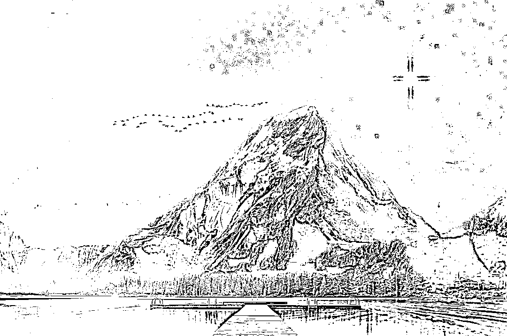

**我将月亮交点称为“命运线”**，工作坊的具体内容基于知识点密集的本文中所包含的愈显激进的观点。第一个是与关系相关的观点。鲁伊尔认为交点就像一个人思考物理声学中的波节一样：波形之间相互作用，某些相交点变成越来越复杂的意义联结点，既被囊括在波形中，又以某种方式超越了波形。

因此，它们是包含关系意义和复杂性的点。在这些点可以找的信息通常比包含在波本身中的信息更多。

当交点在黄道的每个交叉点被重新创建时，它们代表的是**行星运行的整体**（它的历史、现在和未来的运动），以及**整个运行弧线与地球和太阳关系的本质关联**。

这是鲁伊尔在他晚年描述的行星交点意义的宇宙观。我们需要仔细阅读他的著作才能完全理解他描述的多层面意义，但他确实明确地陈述了他的观点，**他认为行星交点实际上在某些关键方面比行星本身的位置更重要，**对此他写道，“**这些因素比行星在出生图上通常所代表的天然生物心理功能更为深远……”**

这一观点认为，在星图分析中，经常被忽视的行星交点在某些关键方面比出生时的行星位置更重要，这一观点是如此激进，以至于很容易被认为是夸大其词而被忽略。

**月亮和行星交点是鲁伊尔对占星学理解的核心。**在他职业生涯的最后阶段，他越来越关注占星学的传承；**占星学有可能孕育出一种新的心理和精神动力，**他认为这种动力在当代社会是非常缺乏的。

**行星交点体现了整个行星动力轨迹的潜在意义，**在他看来，似乎是表达占星学所能提供的更大的宇宙意义视角的清晰途径。他觉得这可能是占星学给一个越来越不认为自己具有宇宙意义的文明的礼物。

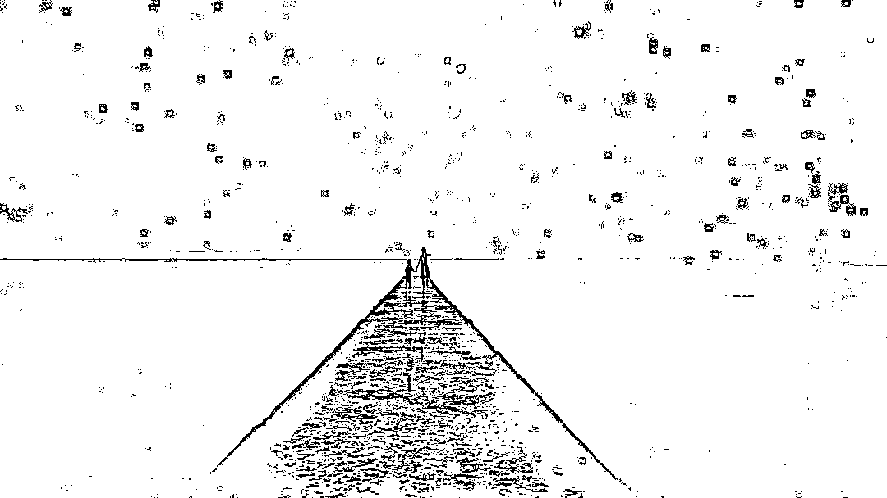

**行星交点与集体无意识**

虽然鲁伊尔没有明确表达这种关联性，但他认为整个行星运动轨道比行星在星图中的线性位置具有更重要的意义，我认为他为这一观点赋予的许多重要性与轨道运动的象征能力有关，与**轨道运动能够在人类集体无意识中形成更大的一致性趋势**有关。

荣格认为无意识的本质类似于地质学家探索岩石表面。苏格兰地质学家的先驱詹姆斯 · 赫顿，在悬崖表面看到了历经千年的活动记录。在一次旅行中，他的同事约翰 · 普莱费尔记录了这些最初侵入所谓的“深度时间”的影响，“看到如此遥远的时间深渊，我的头脑似乎变得眩晕。”

就像赫顿开始探索岩层形成的长期过程一样，**荣格开始探索无意识中凝结时间的深层结构。**荣格从多维角度探讨了这一点。

因此，**集体无意识**包含了关于心灵如何从对捕食者的恐惧开始进化的多层面生物信息，以及这些信息如何影响对我们对未来的观点，如何影响我们处理信息的方式，正如集体无意识可能包含重要的跨文化叙事一样，如文化起源神话或英雄理念。

理查德·塔纳斯在**《宇宙与心灵》**一书第一章标题页引用了荣格的一段话：

我们的心灵是根据宇宙的结构建立起来的，在宏观世界发生的事情同样发生在心灵的无限小和最主观的范围内。

如果行星交点体现行星运动的整个轨道，那么它们指向的是占星学意义的深远潜力之一。它们总结了行星范围内最远距离运动的历史，并通过与地球叙事的交叠来做到这一点。要将这些最遥远、最抽象层面的意义从“遥不可及”带到“眼前”，**需要一种原型方法，**而且还需要一种能够随时间顺畅流动的方法。

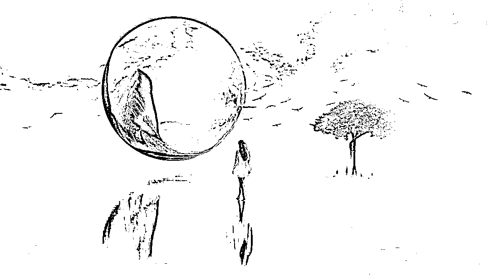

**行星交点是集体意义的指征**

物理学家戴维·玻姆在《整体性与隐缠序》，将整个空间和时间的显序——宇宙本身——视为嵌入或编码入在显序信息中的隐序信息。玻姆认为，意义的显秩序是在显化中可以被观察到的一切：空间中构成宇宙的明显分散和独立的物体组成的环环相扣的网络。

与此相对的是，隐秩序是一个不可见的非线性信息维度（意义） ，是已知和可观测世界的不可见架构。

当鲁伊尔说“……虽然那颗行星的整个轨道是一个超越感官感知的宇宙事实”，他在技术意义上应用了“宇宙”一词，**因为他正在思考行星运行的整个轨道而不是一个固定点所呈现的潜在意义。**

**交点就暗示着这种轨道运动**；也就是说，它们可以与黄道一起用来计算行星的轨道运动。因此，**行星交点带有意义的隐秩序。**作为空间中的抽象点，交点也处于隐式层面；他们实际上并不存在。它们只是作为一个交叉点存在，**作为关系线的注释。**

这种关系至关重要；它是通过穿越地球绕太阳运行的平面而揭示的隐性轨道——**这是在地球演化的特定时间揭示的行星运动的复杂历史。** 从这个意义上说，行星交点是一种意义的隐秩序（行星原型穿越时间的缩影），当它穿过黄道时就在显秩序中呈现出来。

行星的交点代表着浓缩的时间或嵌入的历史：在空间的两个简单点内具有高水平的隐含意义。作为一种观察整个行星轨道的工具，**它们代表了探索行星原型**（鲁伊尔所说的行星“存在特质”）**如何随时间演化的棱镜。**

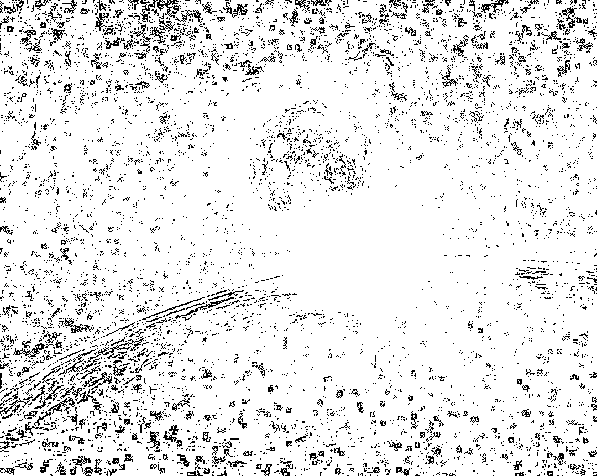

**这个想法很简单，但意义深远：土星本身作为一个原型，可能会随着时间而演化。**当然，土星原型在人类历史和文化中的表达就在不断演化。**行星交点可能是我们研究和探索这种演化的一种方式。**

例如，我们可以通过观察行星交点自身随着时间的推移是如何演化的来思考行星交点的本质。外行星的行星交点移动缓慢，但它们确实在移动。比如，我们可以思考海王星或土星自身随时间的演变：海王星的交点，现在是北交点在狮子座、南交点在水瓶座，在公元 001 年，交点分别落在巨蟹座-摩羯座。

事实上，**冥王星和土星的交点现在的位置与海王星交点在基督时代的位置相同，也就是在过去两千年来塑造了文明发展的基督教叙事的起源期间。**

土星和冥王星的交点位于海王星交点在基督的生与死期间的历史位置，**这说明了丰富的原型意义。**我们看到的是，原本真正的灵性冲动（海王星的交点）现在变成了一种强迫性执念（冥王星的交点），抑或更是一种权威（土星的交点）和力量（土星和冥王星的交点）的议题。

曾经强大到足以塑造上一个时代的**集体理想（海王星交点）**现在是否正在蜕变为社会和**政治结构（土星交点）**和深刻的**无意识心理因素（冥王星交点）**，它们改变了我们与最初冲动意义的关系吗？这是对这个过程的神秘注释吗？

在这个过程中，一个源于**牺牲意义的宗教（海王星）**与受压迫和奴役的人们秘密相遇，随着时间的推移发展成为一个如此庞大的基础结构，千年来主导了西方的文化和政治生活（土星，冥王星）。

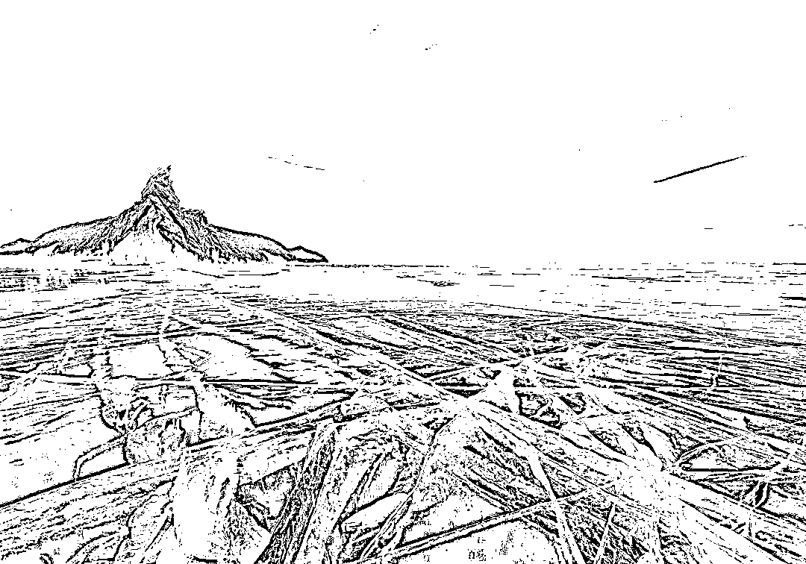

**波函数的坍塌**

请记住，人文学科的学者倾向于采纳科学的观点，并将其修改以适应他们的需要，这是有问题的，让我们在这种背景下从相对论的研究中比喻性地考虑波函数的坍缩。 

在一系列著名的实验中，一束光穿过一系列的孔，人们发现光具有既是波又是粒子的神秘特性——有些人称之为波粒二象性。在某些条件下，光保持其流体势的波动状态。在其他情况下，通过观察，光变成了粒子并对某个分散实体表现出特定反应。**这被称为“波函数的坍缩”**。在一定的观察条件下，波的非线性势变成了离散的线性形式。

行星交点代表信息点，**其中更大的原型波或集体意义波通过个人或事件星图变得特殊。**这是行星轨道运动（意义的大主线）象征意义的显现，或者说因为它与地球的轨道平面相交，所以刚刚被发现。

从这个角度而言，**行星交点就成为了让超个人或原型影响力以特殊形式进入世界的网络。**它们揭示了非线性信息场进入并干扰、扩展或转化线性领域的意义之门。

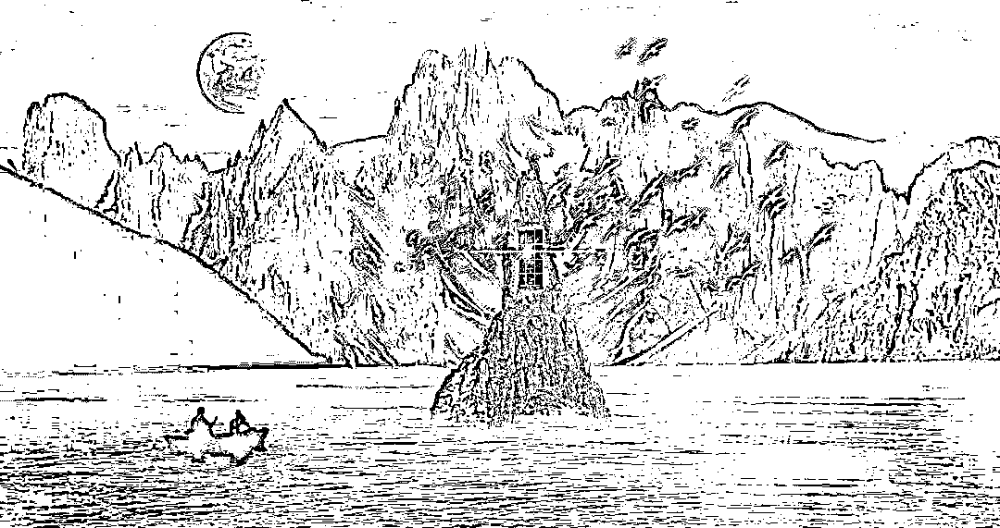

**集体意义与盛名或恶名的关键区别**

在使用“集体意义”一词时，我试图抓住一种超个人或集体意义的主题渗透到个人生活中的感觉。这并不意味着个人本身将在集体中产生重大意义——更重要的是，**他们星图中的问题或主题具有集体意义，一种微妙但至关重要的区别。**

**木星和土星实际上具有社会性或集体性的本质；具有更长周期的外行星代表的是集体和超个人潜能。**这些行星的行星交点延续了这一超越个人范畴的意义主题：**它们指的是具有集体或超个人意义的问题和主题。**这与说它们本身向个体传达意义是大相径庭的。这与认为它们以某种方式揭示盛名或恶名更不是一回事。

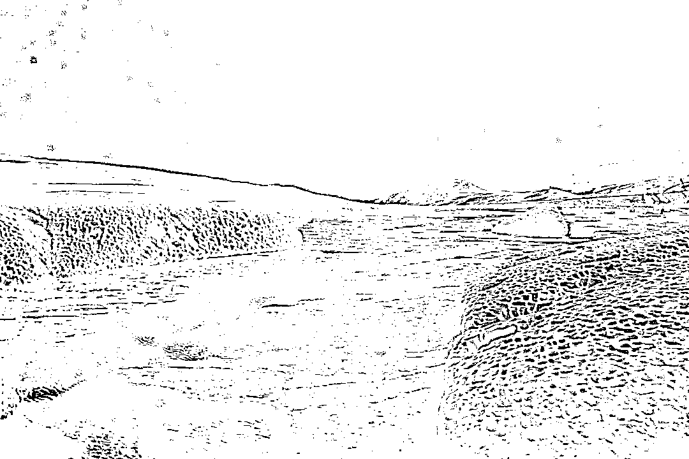

**理解行星交点意义的有效假说**

我把这一部分关于如何理解行星交点的有效模式的所有研究都加上了一个重要的附带条件，这是我在这个问题上成熟思考的一部分（经过十八年的思考和实践），即基本上不可能把两个交点的意义明确地分离开来。

它们不是独立的，因此在任何宏大的意义上都没有对其独立意义的描述。讲完这些最重要的警示，让我们回到鲁伊尔的方法：

**思考交点的最重要方式之一是将它们视为两个‘门’**。当一颗行星处于其**北交点**时，它在太阳系中的基本功能和特质就集中在我们的地球空间上，而地球空间是最能够吸收和同化它的。当行星位于其**南交点**时，被释放为“实质性”因素的是行星的特征性质与地球空间中吸收其能量的任何事物之间关系的结果。

如果这种关系是**积极的**，那么被吸收的内容也被“同化”整合到地球意识中，并产生了新的“种子”，即新的经验和价值观。如果关系被证明是**负面的**，那么被释放或外部化的是崩溃瓦解的物质，或者是负面的存在结果。

在杰弗瑞·格林关于月亮和行星交点的著作中，他将交点位置象征时间的潜力加入到解释性的意义中。许多作家将月亮交点描述为一个进化发展的过程，这对解释月亮交点是有用的。在这种方法中重点是**将月亮交点视为个人进化潜力或发展曲线。**

在我研究了格林关于天王星和冥王星的著作之后，我发现，当我广泛地与我的众多客户探讨占星学观点时，**蕴含在月亮交点轴内的个人进化的含义显然是受到影响的，**这种影响有时是有问题的，影响来源于与月亮交点形成关系的外行星的系统性或超个人性质，以及任何与交点形成四倍泛音相位的行星的系统性或超个人性质。

作为一个有效的模型，为了让这样一个抽象且难驾驭的话题（历史上的行星交点）获得一些牵引力，我开始将月亮交点这个时间概念融合到鲁伊尔关于行星交点意义之门的概念中。在我的第一本书《治愈灵魂：冥王星、天王星和月亮交点》中，**我探索了这个月亮交点模型以及外行星的超个人影响因素。**

根据这个模型，由于篇幅的限制此处进行了浓缩和简化，**月亮南交点（通过宫位、星座和相位）象征着过去。**“过去”被定义为包括个人的出身，尚未学会说话的童年时期，在子宫的时期，系统性的家庭问题，祖先，其他存在的早前记忆，以及包含在集体无意识中的原型经验的性质。荣格写道，这个信息宝库经历了几千年，而我们可能只经历了几年。

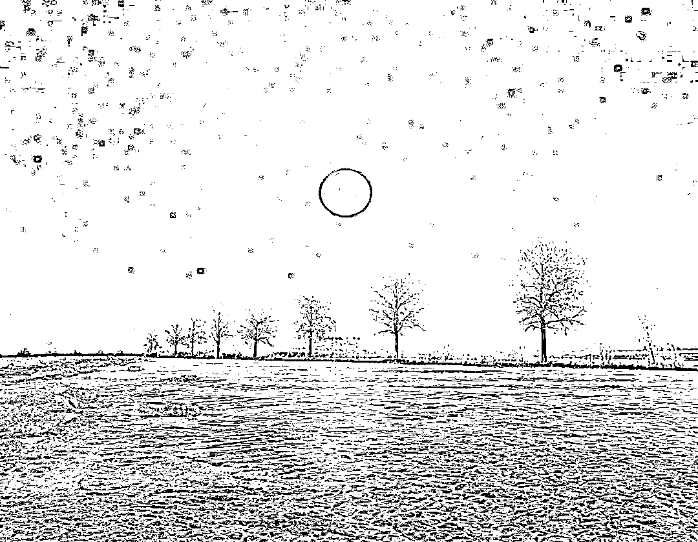

**月亮的出生落点（通过宫位、星座和相位）代表个人的自我。**将这些星座作为发展历程的象征，我们可以看到白羊座的初生和对生命的本能反应，金牛座的自我恒常性发展和对个人需求的意识，以及双子座的语言发展和通过模仿和游戏的早期概念化过程。所有这些都在巨蟹座（月亮）联合起来形成了个人的自我认同。这一形成发展事件大致呼应第一个土星四分相。

**月亮北交点象征着未来**——或者更准确地说，是现在的前沿，它可能通向未来。它表达了一种**新经历的潜力**——一种自然会平衡过去身份认同的经历。

尽管如此，这整个概念还是过于简单化和线性化。从灵性的角度来看，这一点尤其如此，我经常想这样做，从这种角度看，**真实的本性可能被体验为更类似于永恒的当下/存在。**这个有点抽象的层面（对某些人来说——对我来说是一个神秘的层面而不是一个抽象的层面）先撇开不谈——鲁伊尔的学说认为交点的意义主要在于其描述整个轨道运动周期的能力，这个观点打破了偏线性方法中一些有问题的性质。

我说的有问题是什么意思？ **占星师正在使用月亮交点中发现的这种个人意义的进化发展曲线来做出对个人不利的有问题的判断。 **

在利用这种月亮交点进化模型的方法中**经常有一种暗示**，例如，南交点在某种程度上是“坏的”，因为它是“过去”，是你在追求自己北交点“礼物”的过程中要抛弃的东西。我发现**这是对实际上非常微妙和复杂的领域的一个有问题的简化。**

从最简单的层面上来说，过去怎么可能本质上就是坏的？很明显，一个人的过去可能会有非常具有挑战性的经历，同样也可能会有真正伟大的经历。将“坏”与“过去”直接联系起来在哲学上是幼稚的，**这种混为一谈也会导致占星学解释上的缺陷。**

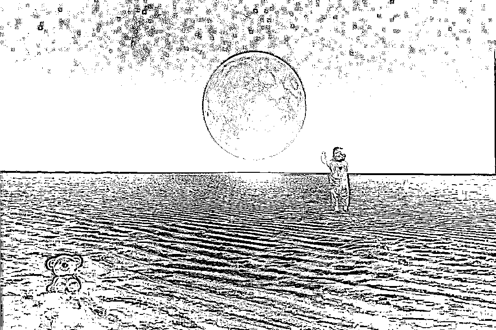

鲁伊尔的天才之处在于，他认识到了交点的真正力量，他认为交点暗示了行星体的整个运动发展轨迹，这清楚地证明了两个交点协同工作的本质要求。如果不能同时认可两个交点，就无法理解交点的真正力量。

因此，将这两个交点分离开来进行解释本身就是有问题的。把它们分离开来，然后对表达过去的那个交点做评判，这是简化，因为**交点意义的真正力量包含在它们描述运动发展轨迹的能力中。**

出于实用的原因，有一种观点认为，只要将行星运动的概念分解为可管理的部分，就可以将时间分类对应交点。因此，将行星的南交点归为“过去”，而将北交点归为不断演变的“未来”是有道理的。

我们注意到，这些时间概念是抽象的，总是与观察者当前的视角相关。**它们不是固定不变的状态，**当然也不能被赞颂为“真理”。用南交点指代过去，将北交点描述成正在演变的现在或未来，更准确地说，是一种管理难以想象的时间复杂性的方法，也就是**将时间看作行星和个人进化的周期**。因此，交点有一个目的：**允许大脑追踪超个人现实的个人经验。**

我一直在努力精确地描述这些哲学和实践方面的问题——说到实践是因为它们会影响解读。**在星图解读中，我们的解读可能会影响到某人的生活。**经过多年的实践，我最关切的问题之一就是从道德上认识到我们如何影响人们的生活以及要达到什么目的。

**版权声明：**本文由若道翻译发布，欢迎转发，反对抄袭。友号转载请申请白名单。

**马克·琼斯**

拥有超过数十年的治疗师和占星师经验，专注于过往生活分析和心理咨询，并为世界各地的客户提供占星咨询。作为一名认证进化占星师，Mark 每年在美国授课，也多次受邀参与北美各类占星大会和主题工作坊。著有《灵魂治疗：冥王星，天王星，和月亮交点》、《灵魂说：占星学的治疗力量》，探讨出生星图中隐藏的转化力量。

这是一门专门为若道开设的课程！**马克·琼斯**将于今年秋天教授**八节关于行星交点的深度在线课程**，他将通过我们集体进化中的一些重大事件来阐释这一主题。

**交点是一个天体轨道与另一个天体轨道延伸平面的交点。**任何沿轨道运行的天体都有交点。月亮有月亮交点，每颗行星、小行星、卫星和微小行星也都有交点。

**我们将学习木星往外的行星交点**，看到木星交点如何向我们揭示文化和宗教意识形态的集体历史进化，正如我们的文明结构所表现出来的那样。例如，土星和冥王星的交点也在摩羯座，清楚地描绘了我们所有人在这个时期试图进化所面临的挑战，因为在我们生活的世界根本结构的变化中，游戏规则正在升级。

**我们还将学习近期历史中行星交点的影响**，包括最近木星、土星和冥王星在摩羯座的大合相，开始真正意识到当前这个时期在文明进化本身中的集体重要性。理解这些盛衰周期，我们至少可以在这些困难时期仍然抱有希望：我们不会失去一切！

**在整个课程中，马克老师将通过多个历史案例动态地研究这些强有力的交点配置可能如何运作。**

**点击下图了解课程详情** 

******

**其他精彩课程**

******

******

******

******

**微信又双叒叕改版啦，不想错过若道君的推送？**

**就把若道设为星标吧！**

**▼**

**就是这个“在看”，戳戳戳 ☟**

******报名直达入口******

# ISAR 选修课丨行星交点在集体进化中的作用

> 原文：[`mp.weixin.qq.com/s?__biz=MzA5NjA0NTAxNg==&mid=2651458393&idx=2&sn=69e20fc6e9b6699148f781d118bf703f&chksm=8b48b9eebc3f30f8a5dc33a30d269efdad0889cb53b8949ff4bb71eb83ebc84d06a186a30c77&scene=126&sessionid=1692737913#rd`](http://mp.weixin.qq.com/s?__biz=MzA5NjA0NTAxNg==&mid=2651458393&idx=2&sn=69e20fc6e9b6699148f781d118bf703f&chksm=8b48b9eebc3f30f8a5dc33a30d269efdad0889cb53b8949ff4bb71eb83ebc84d06a186a30c77&scene=126&sessionid=1692737913#rd)

这是一门专门为若道开设的课程！**马克·琼斯**将于今年秋天教授**八节关于行星交点的深度在线课程**，他将通过我们集体进化中的一些重大事件来阐释这一主题。

1

**什么是行星交点？**

**交点是一个天体轨道与另一个天体轨道延伸平面的交点。**任何沿轨道运行的天体都有交点。月亮有月亮交点，每颗行星、小行星、卫星和微小行星也都有交点。

2

**课程教授什么？**

马克老师**首先会讲解基础知识，**介绍行星交点是什么、行星交点运转的动力（包括日心视角和地心视角），然后他会**论述丹恩·鲁伊尔晚期工作中关于月亮交点和行星交点重要性的洞见**，以及它们如何在个人生活和事件中创造一个动态的意义轴，**超越个人出生星图的静态画面。**

马克老师还将简要**介绍自己的一些开创性研究**，并通过精选一些反映我们共同的**集体进化的现代历史事件**，分享他最近的著作《行星交点与集体进化》中的洞见。

**我们将学习木星往外的行星交点**，看到木星交点如何向我们揭示文化和宗教意识形态的集体历史进化，正如我们的文明结构所表现出来的那样。例如，土星和冥王星的交点也在摩羯座，清楚地描绘了我们所有人在这个时期试图进化所面临的挑战，因为在我们生活的世界根本结构的变化中，游戏规则正在升级。

**我们还将学习近期历史中行星交点的影响**，包括最近木星、土星和冥王星在摩羯座的大合相，开始真正意识到当前这个时期在文明进化本身中的集体重要性。理解这些盛衰周期，我们至少可以在这些困难时期仍然抱有希望：我们不会失去一切！

**在整个课程中，马克老师将通过多个历史案例动态地研究这些强有力的交点配置可能如何运作。**

3

**课程安排**

**第*****1*****讲** **介绍行星交点**

我们将学习行星周期如何形成行星交点，并了解日心视角和地心视角之间的区别。

**第*****2*****讲** **什么是行星交点**

我们将深入学习丹恩·鲁伊尔的成熟思想，这是启发马克老师研究行星交点的灵感之源，也是他最近出版的《行星交点与集体进化》一书的灵感来源。

**第*****3*****讲** **双子座-射手座的天王星交点**

我们将学习人类认知和技术如何通过天王星交点的透镜进化。

**第*****4*****讲**** 巨蟹座-摩羯座行星交点**

我们将进一步学习行星交点对社会和文化的影响，深入探讨落在摩羯座-巨蟹座的木星、土星和冥王星交点，并了解它们在过去 1000 年里对我们的全球社会、政治和文化思潮起着怎样至关重要的影响。

**第*****5*****讲** **海王星及其狮子座-水瓶座交点**

我们将学习落在狮子座-水瓶座的海王星交点影响的不同显化，及其在疗愈中的作用；灵性意识形态的发展，及其促使事件结束的倾向。

**第*****6*****讲** **作家案例**

通过原创研究，我们将学习行星交点如何影响了世界上一些最伟大的作家的人生。

**第*****7*****讲** **研究 2020 年**

我们将了解 2020 年的重要意义。

**第*****8*****讲** **回顾**

我们将回顾前面的课程，并探索如何通过行星交点的意涵理解月亮交点。

4

**授课老师**

**马克·琼斯（**Mark Jones**）**

马克·琼斯是一名**占星师、心理整合治疗师和催眠治疗师**，为世界各地的客户和学生提供服务。

马克的第一本书《**疗愈灵魂:冥王星，天王星和月亮交点》**，详细解释他的占星方法论。

他的第二本书**《灵魂的表达:占星学的治疗潜力》**，融合了马克作为超个人心理治疗师和占星学的经验，概述了占星学解读的变革性潜力。

此外，马克还联合其他作者**共同撰写了一些占星书籍**：《占星学:新一代》、《超个人的占星学》以及《进化占星学的洞见》。

**而《行星交点和集体进化》则是他将他对交点研究的集大成之作。**

5

**课程信息**

*   **课程时间：**2021 年 10 月 26 日开始，每周二晚上 8 点，每周一次，共 8 次课。

*   **授课方式：**线上直播，英文授课，中文翻译

*   **课程价格：****6800 元****（课程不分组写走心推荐语转发朋友优惠价：5800 元）**

*   **行星交点名人案例和问答免费试听：**添加课程顾问王老师，发送“行星交点试听”，即可获得免费试听内容。

*   **课程咨询：**王老师（微信：18510107057，请备注“行星交点”）

长按二维码添加王老师

6

**退转课程**

*   **退款原则请详看《教学协议》，如有疑问请咨询课程顾问。**

****行星交点****

**授课老师：**马克·琼斯

**授课时间：**2021 年 10 月 26 日起

**授课方式：**网络课程**，**英文授课，中文翻译

**费用：****6800 元****（课程不分组写走心推荐语转发朋友优惠价：5800 元）**

**课程负责人：****王老师**（微信：18510107057，请备注“行星交点”）

长按二维码添加课程负责人咨询~

****报名请点击“阅读原文”****

# 12 星座必看丨幻想过你的老年生活吗？它隐藏在上升星座与这个宫位之中

> 原文：[`mp.weixin.qq.com/s?__biz=MzA5NjA0NTAxNg==&mid=2651458256&idx=1&sn=8ef18597f26fb15abc18db212ba51d25&chksm=8b48b867bc3f3171aef7e338cd04c6cb99b96d546e7051b01e2f656c9dee7b22577d5ae15119&scene=126&sessionid=1692737913#rd`](http://mp.weixin.qq.com/s?__biz=MzA5NjA0NTAxNg==&mid=2651458256&idx=1&sn=8ef18597f26fb15abc18db212ba51d25&chksm=8b48b867bc3f3171aef7e338cd04c6cb99b96d546e7051b01e2f656c9dee7b22577d5ae15119&scene=126&sessionid=1692737913#rd)

****************☆ 后台回复“今日”，给你一句生命态度****************

作者/Anastasia 编辑/玫瑰 图片/pexels

又是一年重阳节，登高赏秋与感恩敬老是重阳节日的两大重要主题。今天，让我们来聊聊"老"这个话题，我们每个人都无可避免地要面临变老、器官老化，由对事情终于有所掌握，而变得连些小事都做不好。当然，从占星学的角度来看，这并不是一个悲伤的话题。只要我们意识到现在的我们发展下去，年老时可能会出现的问题，从现在开始进化的话，也许就可以拥有一个平和且快乐的晚年。
**你愿意给父母更多的爱吗？**老父亲八十多岁了，有一天儿子带回家一盆花，他问：“这是什么花？”儿子回答：“铃兰。”过了一会儿，老父亲又问：“这是什么花？”儿子不耐烦了：“都说了是铃兰，记不住吗？”晚上，上幼儿园的孙子回来了，问了同样的问题，父亲告诉他：“这是铃兰”。不一会儿，小家伙又问了同样的问题，一而再再而三，同一个问题，父亲耐心地回答了三次。这就是我们的人生轨迹。小的时候，父母抱着我们，喂饭喂水，教我们说话走路；念书时，父母为我们做饭洗衣，等我们放学回家；成年后，父母盼着我们回家，替我们收拾房间抚育小孩。终于有一天，当父母垂垂老去，他们又重新变回孩童。那个时候，我们会不会承担起父母的责任，反过来照顾和陪伴他们呢？当父母被不断流逝的时间和高速发展的科技抛在后面，我们要像父母当年对待我们一样，慢下来，给他们时间和耐心，给他们更多的关爱。

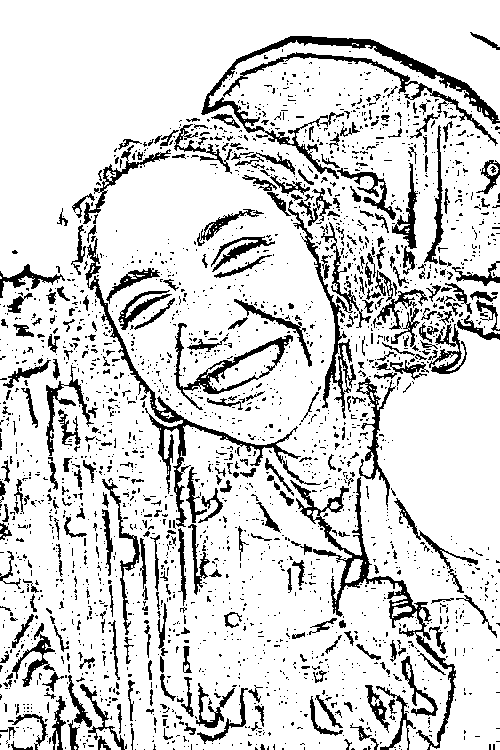

**你要如何才能获得未来的安稳？**生命的两端是平等的，都是那么幼小、需要陪伴和保护。那么，想知道十二星座都会有一个什么样的晚年生活，我们需要先来看看我们星图上的上升星座。**上升星座是星图上第一宫的开始：**· 定义了我们的长相和外在的气质；· 定义了我们和外界环境打交道时表现出来的气质；· 也决定了我们为自己的人生剧情选择了一个什么样的舞台。我们有什么样的童年、什么样的家庭环境、什么样的职场氛围、什么样的灵性追求以及什么样的晚年生活，都可以从上升星座看到端倪。**第四宫：**· 象征我们的内在安全感；· 是我们对待生命的态度；· 它既象征了我们的童年环境；· 也象征了我们的晚年生活。回到开头的那个小故事，我们会看到，当我们变老变虚弱，我们就又回到了童年的状态。**四宫的主题，就是告诉我们什么事情会让我们觉得真正的安稳和满足。**人生如道场，四宫的事情是我们真正要为自己做的事情。我们需要用一生的时间来处理好四宫的功课，才会产生真正的自我觉察。在晚年的时候，我们才会获得内心的安宁与和谐。

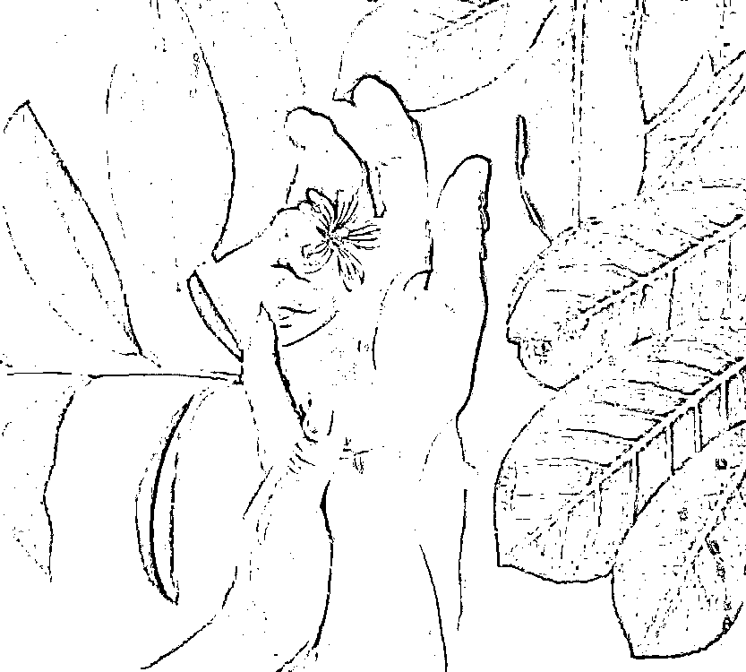

**12 上升星座的现在和未来**下面让我们看看，十二上升星座老了以后，需要去面对什么样的人生功课。**若道君：如果出现上升和四宫头星座与下面分类不一致的情况，上升、宫头星座和宫内星座都要看哟~****上升****白羊座****，****四宫****巨蟹座**上升白羊座是一个战士，童年的时候往往是一个被忽视的小孩，能够提供给他们的资源非常少。这导致他们**从小就非常自我，具有强烈的竞争意识。他们很懂得为自己争取利益，这一点常常会让他人感觉不适而和他们保持距离。**他们的下中天落在了巨蟹座。**上升白羊座的内心其实非常脆弱，重视自己的家庭领域和家人。**他们只有去正视自己的敏感和不安，允许自己展示脆弱，不再为了自保而自私自利斤斤计较侵犯他人，才会在老年过上温柔滋养的生活，而不是一再陷入孤军奋战的模式轮回。**上升****金牛座****，****四宫****狮子座**上升金牛座往往**出生在一个富裕的、让人很有安全感的家庭环境中**。他们不缺资源，从小就拥有很多东西，也会得到家人的无比宠爱和温暖持久的关注，这让他们往往有一个骄傲和自尊的内心世界。**他们的四宫在狮子座，这意味着他们从小就是家里的焦点和荣光，这也容易让他们变得骄横、固执、不可一世。**上升金牛座害怕变化和失控，他们需要克服的是**对家人情感上的控制，**如果他们能够放下自己的傲慢和过度的自尊，能够听进去家人的建议和劝告，在人生晚期，他们就会成为真正的一家之主。**上升****双子座****，****四宫****处女座**上升双子座很聪明，他们小时候的环境往往充满变化，这会让他们接触到各种各样的人和事，从而学会察言观色，随机应变的能力。但这让他们变得**疲于应对，在面对社会的时候往往会采取一种逃避的态度。**上升双子回到家里就不像在外面那么活泼和机智，也许是在和外界互动的过程中耗尽了他们的能量，他们回到家里往往会变得**严肃而挑剔**。他们会为家人做很多事情，但也会对家人提出很高的要求。他们把所有的不安都放在了自己的潜意识、自己的内在和自己的家庭中。**如果他们没有处理好这种缺乏安全感的紧绷状态，就会在老年变得挑剔、焦虑和不可理喻。**

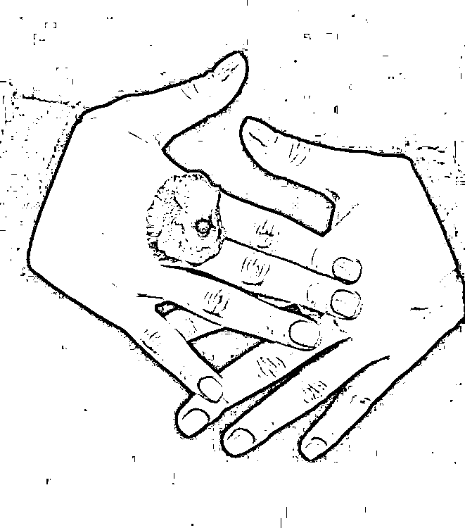

**上升****巨蟹座****，****四宫****天秤座**上升巨蟹座的小孩很乖巧，性格温和，内心温柔，常常会处于一种顺从、自我保护的状态。他们通常也会**出生在一个经济条件比较好的家庭中，和父母的情感联接很紧密。**上升巨蟹的第四宫在天秤座，这意味着他们的**童年成长环境通常友善和谐，这也使得他们对家人非常依恋，有足够的安全感**。在年老的时候，他们也会是家庭中**非常友好、公正而优雅的老人，讲道理好说话，不会给家人添麻烦。****上升****狮子座****，****四宫****天蝎座****上升狮子座是自带光环的小孩，会出生在一个有地位的家庭中。**他们**性格开朗、热情、充满自信，在童年时就会受到很多人的期待**。他们从小就是家里人关注的中心，父母也会他们寄予厚望，给予他们很多的资源。这样的成长环境会造成他们**习惯于主宰家里的一切**。四宫落在天蝎座，往往也意味着他们在家里要有绝对的控制权。上升狮子座最重要的一点是要学会自律，否则当他们老了以后，容易为了自己的利益而搞出一些家庭纠纷，勾心斗角，引发家人的愤怒和憎恨。**上升****处女座****，****四宫****射手座****上升处女座也是很听话的小孩，会习惯性地压抑自己，以得到父母的肯定和赞许。**他们通常会有严厉的父母，对他们提出很高的要求。这会造成**上升处女座个过度在意细节，追求完美，在外人面前通常会很紧张。**上升处女座的四宫头在射手座，他们内心世界**需要很大的自由空间**。年老之后，当他们不再需要和社会、他人有更多的联结和应酬，往往成为一个老顽童，智慧风趣，受人欢迎。他们可能会过上一种非常自得其乐，充满享受的生活。

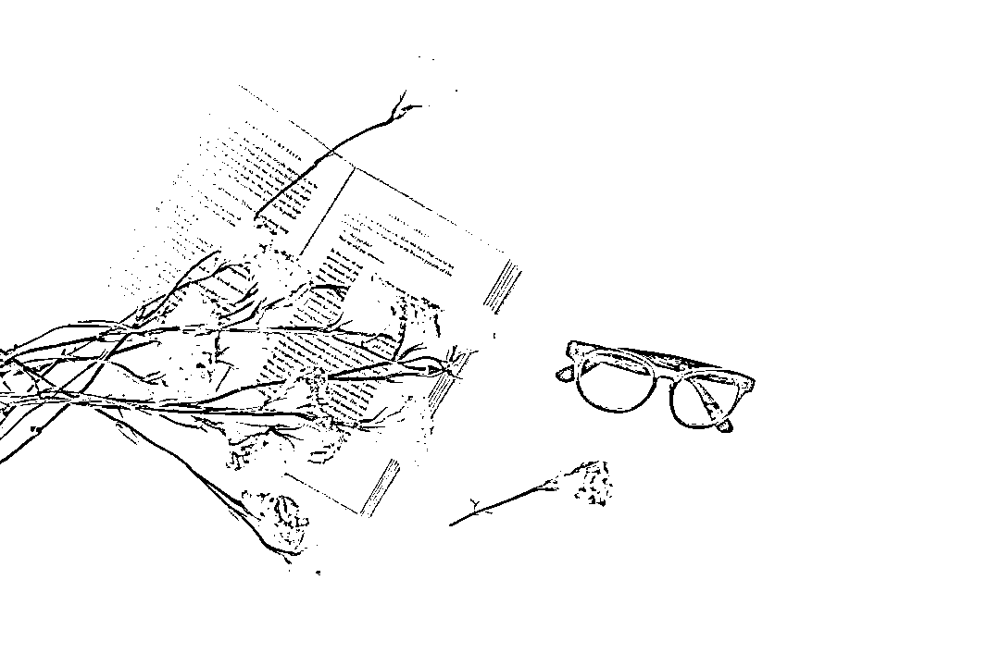

**上升****天秤座****，****四宫****摩羯座****上升天秤座的孩子喜欢和人打交道，从小就具有很好的社交能力。**他们童年的环境也很单纯，家里条件往往也不会差，从小就养成了他们礼貌友好的待人接物能力。天秤座是黄道上的第七个星座，这意味着上升天秤座的宫位会和黄道上十二宫位天然的位置完全相反。也就是说，他们的一生都要在和他人的互动中完成。**如果他们处理不好自我和他人之间的关系平衡，老年生活往往会很孤独。****上升****天蝎座****，****四宫****水瓶座****上升天蝎座的小孩往往有很强的意志力，这是因为他们童年的环境往往非常艰难。**他们**表面上沉默寡言，内心却隐藏着强烈的情感态度**。他们往往很小就会接触到复杂的环境和情感冲突，甚至会被暴力对待，这也让他们**具有非常强烈的自保意识。**上升天蝎座在青春期之后，就会逐渐发展出自己的太阳意志。但童年的痛苦经验会让他们有很大的人际关系问题，他们讨厌被人控制和干涉。如果他们不去处理童年时期积累下来的，对环境和对他人的敌意，在老年的时候，就会变得很难相处，独来独往、孤独不合群。**上升****射手座****，****四宫****双鱼座****上升射手座的小孩通常很有活力，也非常幸运。**他们**喜欢到处跑，喜欢冒险，喜欢体验各种丰富的生活经历**。他们往往拥有爱玩又心大的父母，对他们管教很少，还喜欢带着他们到处游玩见世面。上升射手座的四、八、十二宫宫头星座都是水象星座（巨蟹座、天蝎座、双鱼座），这意味着他们**需要去学习如何处理自己的情绪。**如果他们不是一味贪玩，而是深入探索，处理好自己的情绪出口，在他们年纪大了之后会发展出深刻的慈悲心，他们的怀抱会成为疗愈的安全港湾，而不是单方面的牺牲和付出。

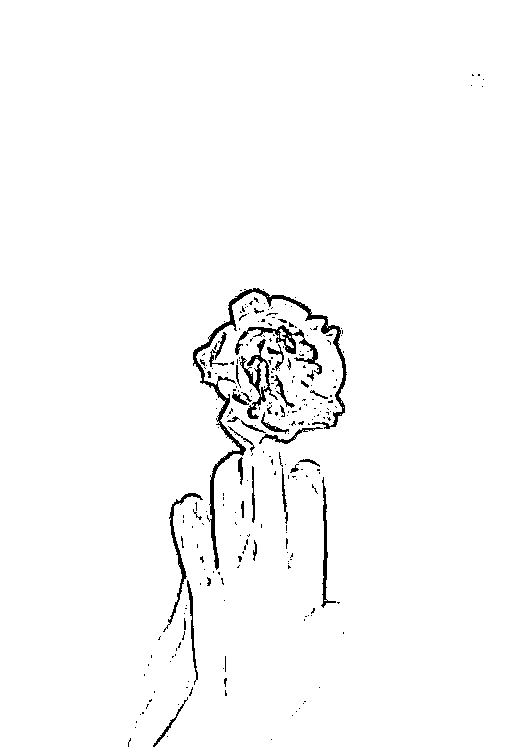

**上升****摩羯座****，****四宫****白羊座****上升摩羯座从小就是个小大人，需要承担很多不属于他们的责任。**他们不爱笑，和人交往也小心翼翼，他们的父亲对待他们往往都很严厉，关系不够亲密。**上升摩羯座往往不喜欢待在家里，他们更喜欢在社会上打拼、表现自己。**在家里，他们往往会比较自我，脾气暴躁。这也意味着，他们会勇于去探索自己的内心世界。当他们年老的时候，他们仍然会充满斗志，老骥伏枥，永远年轻。**上升****水瓶座****，****四宫****金牛座****上升水瓶座的童年往往会很孤独，这也让他们从小就很独立，喜欢和朋友在一起。**他们待人平等友善，会交到三教九流各种各样的朋友。他们也很聪明，从小就具有理性的、抽象的思考能力，喜欢学习和钻研。上升水瓶座的四宫头在金牛座，也就是说当他们老了以后，会逐渐变得温和柔软，不再那么锋芒毕露，特立独行。他们变得保守固执，看重家庭的舒适程度，喜欢宅在家里。**上升****双鱼座****，****四宫****双子座****上升双鱼座的小孩通常会很迷糊，不够有活力，容易受到他人的影响。**他们爱幻想、爱哭，分不清楚现实和梦幻，是很难带的小孩子。他们有很强的同情心，但是做事情的时候往往动力不足，喜欢逃避，本质上他们并不喜欢现实生活。上升双鱼的四宫是双子座，这说明他们**喜欢变换住所，常常会阶段性地隐居起来，让家人找不到他们。**当他们老了以后，喜欢到处跑，往往会有多个居身之所。他们的家也会成为谈天说地、交流信息的聚会场所。

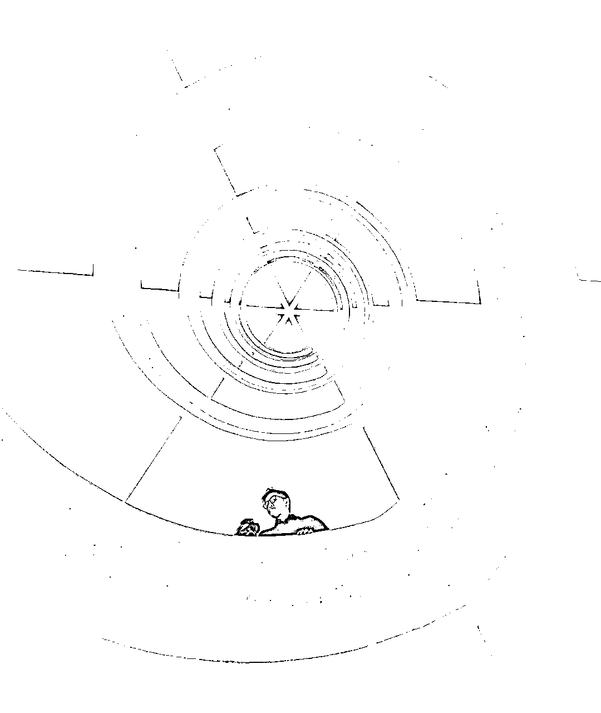

上升星座是我们人生的起点，决定了星图上的宫位安排，这就是说上升星座的特质是我们必须去承担和经历的人生经验。一个人也许终其一生都不能发展出自己星图上的太阳特质，但是他无论如何逃不过自己上升星座的功课。

我现在的理解是：**我们的童年、中年和老年之间并不是一个种瓜种豆的因果关系，并不是你的童年环境或者你的父母造成了你的现在和未来。它们之间更可能的是一种不断地重复验证关系，我们会重复经历十二个宫位存在的课题。**童年时期我们要去面对的环境和事件，不过是一场练兵，一次对未来人生之路上所有会遇到的艰难险阻的初次试炼。所有这一切这都是自我命运的体现，我们会在漫长的人生中一再遇到同样的议题。同样议题的不断重复，会让我们变得更有力量，更有觉知，从而更好地整合我们的人生信念，把握自己的人生，拥有一个夕阳无限好的晚年生活。

**版权声明：**原创文章由作者授权发布于若道平台，欢迎转发，反对抄袭。友号转载请申请白名单。

**Anastasia**

职业占星师/专栏作者/策展人

于 2015 年通过 ISAR 占星能力考试

若道认证生时校正资质

**微信公众号**：KariosMoment

长按打赏

**学习占星学**

**点击下图了解课程详情** 

******

******

******

******

**微信又双叒叕改版啦，不想错过若道君的推送？**

**就把若道设为星标吧！**

**▼**

**就是这个“在看”，戳戳戳 ☟**

****报名直达入口****

# 10.24 NVC 线上训练营丨非暴力沟通的人愿意探索自己的内在需求

> 原文：[`mp.weixin.qq.com/s?__biz=MzA5NjA0NTAxNg==&mid=2651458256&idx=2&sn=2828ca4a8a85bf1c42fbd0a9dcc3513f&chksm=8b48b867bc3f3171020a68fae8eda5e4209a08cc4090ac54c1ad342f887a8ebb7428978527ce&scene=126&sessionid=1692737913#rd`](http://mp.weixin.qq.com/s?__biz=MzA5NjA0NTAxNg==&mid=2651458256&idx=2&sn=2828ca4a8a85bf1c42fbd0a9dcc3513f&chksm=8b48b867bc3f3171020a68fae8eda5e4209a08cc4090ac54c1ad342f887a8ebb7428978527ce&scene=126&sessionid=1692737913#rd)

**为什么我们要学 NVC？**

（向上滑动查看内容）

**蒋颖**

若道联合创始人

2016 年，我在新西兰参加一个 Hakomi 亲密关系治疗的治疗工作坊。参加这个工作坊的都是治疗师。在这个工作坊中，有一位女性让我特别印象深刻，因为她身上有种特别的气质，某种既温柔又坚定的东西，充满力量，充满对这个世界充满关怀，她身上表现出的让人惊讶的真实也让我有很多思索。她叫托尼·麦克尔兰（Toni McErlane）。

我知道她从小学习武术，也是一个悬挂式滑翔运动的运动员，曾经背着滑翔机在世界各地的上空飞行和比赛。她完成了北美非暴力传播（NVC）领导计划，是一个非暴力沟通（Nonviolent Communication，简写 NVC）培训师和注册的家庭纠纷调解人，也是生态心理学的培训师。她有多年的内观经验，在身体创伤治疗方面的经验，还有她在有机种植、景观设计、园艺治疗都有专长……我看到她到印度去，帮助印度乡村做有机耕种。在这次疫情之前，她已经买了一艘帆船，准备和丈夫开着他们的船环游世界。所有这些都让我感叹，一个女性可以活得如此勇敢和丰富。现在她而她对中国也充满了某种关切。多年前就一个人在藏区徒步旅行，后来又骑自行车穿越西藏。

但喜欢户外冒险的 Toni 说， NVC 比武术更管用。

2019 年，我终于请 Toni 到中国来，请她给若道做了基础和中级的 NVC 培训，也请她对外做了一次工作坊。

怎么说呢，培训和工作坊棒极了，更棒的是，我觉得人人都爱她。

**Toni McErlane**

我来自新西兰，拥有社区和人类服务—咨询康复学士学位，是 Aminz 的注册家庭纠纷调解人，也是 NVC Aotearoa 的 NVC 培训师。

在我的生命中，我一直对真诚、充满活力、自我负责的沟通和有意识的选择充满激情。而我的人生旅程为我提供了充足的机会，让我去探索、研究、反思和完善这在沟通中是什么样的。

在我的工作坊中，我的原则和实践都是建立在非暴力沟通和正念的哲学基础之上。非暴力沟通是由美国心理学家马歇尔·卢森堡博士所开发的。马歇尔的目标是发展出一种语言，这种语言受到印度巴利语中的“非暴力主义”（Ahimsa）一词的启发，它的意思是“没有伤害”。我们怎样才能在与他人沟通时不造成伤害呢？这不仅需要非暴力沟通的技巧，还需要在训练中融入正念。正念是受小乘佛教内观传统的启发，发展觉知和接纳，关注和允许。在我们的工作坊中 ，我们将非暴力沟通和正念编织在一起。

我致力于以这种沟通和处世方式作为我日常与人互动的基础。我曾经学习了为期一年的北美非暴力沟通领导者项目，在加州湾区非暴力沟通的全年浸入式项目中做了两年协助工作，然后在索诺马县女子监狱推动非暴力沟通培训。同时，多年来我持续参加内观静修，致力于继续和发展这种实践，并把它融入自己的工作坊中。

2020 年疫情期间，我与丈夫和我们的猫在游艇上休了一年假。现在，我和丈夫还有 15 岁的侄女在新西兰南岛的达尼丁生活。我在那里从事心理咨询、冥想和生态心理疗法。我们还正在那里慢慢建立一个治疗静修中心和生态冥想社区。

过去四年，我曾两次来中国，与若道及其友好而充满活力的团队分享非暴力沟通，并参观了一些绝佳风景。我期待继续与若道合作，在网上分享我的知识和技能。

向上滑动可查看更多

**Toni 老师有话对你说**<mpvideosnap class="js_uneditable custom_select_card channels_iframe" data-pluginname="videosnap" data-id="export/UzFfAgtgekIEAQAAAAAABNIXkZitzgAAAAstQy6ubaLX4KHWvLEZgBPEtIMEEEUxZvj-zNPgMIuM7PVi1oMK5fdX4B-DAnh3" data-url="https://findermp.video.qq.com/251/20304/stodownload?encfilekey=RBfjicXSHKCOONJnTbRmmlD8cOQPXE48ibrgo6T80SM1b4QSoxiaa7xblfRvMCU22ricO1icL5GdBOSmzhG7mbaLtSLg4xqYaTLicapWwCV45Axx8QGaozqH7OpxicjibYzN1icWtyuIibCRyZInILWhIGRG1ILicWtib8H3XUMxBW2rZO2GMmc&amp;adaptivelytrans=0&amp;bizid=1023&amp;dotrans=0&amp;hy=SH&amp;idx=1&amp;m=3d7ca9d191932d16f6faa80b9364d1f9&amp;token=AxricY7RBHdVzFXjPCFncbbQSWL8x8x2YeR1VX1JKDza8JFxFfuEYeFkqjygt392VxqY7mdlmzAc" data-headimgurl="http://wx.qlogo.cn/finderhead/PiajxSqBRaEJYnVsqWfEX9qA0sI6hNVKsDfyzfPZ92WZMZyBpZWU5NA/0" data-username="v2_060000231003b20faec8c4e68a1ec2d4ca07e434b07755bbf47e7053a3059defd2c9d6c68a20@finder" data-nickname="若道" data-desc="#非暴力沟通 NVC  在面临一个两难处境时，如何运用 NVC 促进合作的开展？
" data-nonceid="1620007045275601581" data-type="video"></mpvideosnap>

**福利！**

**最后 2 名！**

**报名课程即赠送 NVC 情绪-需求卡一套**

**NVC 情绪-需求卡****课程内容**

**第*****1*****模块 区分感受和想法**

*   学习区分想法、感受和故事感受。

*   体会为什么在表达中分享自己对某一情境的感受很重要，而不仅仅是想法和判断。

*   学习辨识和认同身体传递的感受和情感，将它们作为自我觉知和自我联结的资源。

*   理解感受是重要的信息媒介，支持你与自身的需求建立联结。

*   认识关注感受、探索联结需求的重要性，而不是对感受做出反应。

**第*****2*****模块 将感受与需求、需求与策略关联起来**

*   了解并理解满足一个人需求的策略可能无法满足另一个人相同的需求。

*   学习理解需求的概念，学习区分需求和策略。

*   体验如何用多种不同的策略来满足一种需求，以及如何通过选择一种特定的策略满足或不满足其他需求。

**第*****3*****模块 倾听和共情**

*   学习倾听他人话语中透露出的情绪和需求。

*   体验受到共情和受到其他形式的有意识的支持之间的差别，比如同情、安慰、分散注意力、陪伴等等……

*   学习认可别人的体验和情感，而不必认同对方的策略，认识这种技能所能带来的力量和解脱。

**第*****4*****模块 观察与评价**

*   学习在表达中运用观察而非评价的重要性。

*   体验两者之间的差异，自己去领会为何有此差异。

*   学习区分对情境的解读和事实。

**第*****5*****模块 自我共情**

*   学习认识和观察自己的评判和评价，并用它们与自身感受和需求建立联结，借此更深入、更清晰地理解自己。

*   学习识别自己赋予情境的意义，并探求其中的事实。

**第*****6*****模块 ****提出请求**

*   学习请求是表达中重要的一部分。

*   学习如何提出满足自身需求和他人需求的请求。

*   分辨请求和要求之间的区别。

*   学习如何倾听拒绝，如何表达拒绝。

**第*****7*****模块 ****练习坦诚地表达**

*   在一个支持性的框架中，综合运用之前所学, 练习相互联结、清晰有效、对自己负责的沟通。

**第*****8*****模块 ****接受和表达感激和谢意**

*   运用之前所学，练习表达感激和谢意。

*   学习表达感激之情，远不止一句随口说出的“谢谢”。

**工作坊学员这么说**

非暴力沟通带给我的最大的收获是：通过课堂的学习和大量互动练习提升了觉察力，提升了沟通技能，非暴力沟通并不仅仅停留在语言的表达，非暴力沟通的核心是同理心。通过倾听对方的感受，帮助我将情绪转化为解决问题的动力。

我过去和其他人沟通时，常常陷在自己的思维中，通过练习我才发现，原来别人说话的时候我常常其实并没有听到对方说什么，都是在自己的想法里打转，现在我起码学习到当对方说话的时候，能够去尽量不想自己的想法。

过去我不会留意到原来自己的某种表达方式会让别人不舒服，而且其实也无助于解决问题，对于我想达到的完全无效，NVC 的学习能够让我更能觉察哪些表达会让别人不舒服，让我的沟通更有效，更能帮助我达到我的需求。我学完后，才觉察到过去在沟通中，如果对方有情绪，我也是情绪化地回应，现在，我能够和自己和对方的情绪都拉开一些距离。过去我对于对方情绪化的表达，会有情绪化的回应或不知所措，现在我更能去感受他们情绪下的需求是什么，因此就更从容，不那么容易被他人的情绪影响，能够更有效地回应那些有负面情绪的人。我是一个比较理性的人，在练习中发现原来对一个在我用理性分析如此很明显的画面，每个人竟然有如此截然不同的看法，这还是挺让我吃惊的，这个发现好像打开了一扇门。

我是一个比较感性的人，过去有什么事情，常常是情绪化的沟通；NVC 的学习让我能够更理性一些，能够更客观去看问题。

这个培训让我非常感动，这是我没有想到的，一个关于沟通的培训如此让人感动。在那些常见的表面事件呈现之下，是如此脆弱、温柔的人性。我们如此绝望地想要被理解、被爱，想要与他人联结，然而我们常常用非常错误的沟通方式去做，这时我们离我们的目标就越来越远。

**什么人适合学习 NVC？**

**老实说，NVC 真的是一门人生必修课。**

**NVC 可以非常有效地帮助提高沟通能力，提高觉察力、自我同理心和他人同理心，进而减轻童年创伤对成年生活的影响，帮助有效改善亲密关系、与父母的关系、亲子关系、职场关系。**

*   如果你正被低效的沟通方式困扰或正经历沟通暴力，想**提升觉察，避免伤害的话**，NVC 培训是个不错的选择；

*   如果想结束“相爱相杀”恶性循环的相处模式，**享受一段真诚而愉快的亲密关系**，NVC 培训是个不错的练习途径（可以拉着你的 Ta 一起来哦）；

*   如果你的**工作、求学、生活和“表达”息息相关**，想更理解自己，想改善你的人际关系，改进工作，NVC 培训可以体验到一种更有力量的表达。

**训练营时间与价格**

**课程时间：**10 月 24 日-12 月 12 日，每周日下午 2 点-6 点。共 8 周，每周 4 小时

**课程价格：**6800 元

**购买须知**

❶ **本课程一旦报名，不接受退转课。**

****非暴力沟通线上训练营****

**授课老师：**Toni McErlane

**授课时间：**2021 年 10 月 24 日起

**授课方式：**网络课程**，**英文授课，中文翻译

**费用：**6800 元

**课程负责人：****Maggie 老师**（微信：18510107057，请备注“非暴力沟通”，**获取优惠价信息**）

长按二维码添加课程负责人咨询~

****报名请点击“阅读原文”****

# “让人渴望、着迷又疯狂”丨看这两颗行星如何“修炼爱情”

> 原文：[`mp.weixin.qq.com/s?__biz=MzA5NjA0NTAxNg==&mid=2651458133&idx=1&sn=83a4a717bd9052efc8c09d79da60b236&chksm=8b48b8e2bc3f31f419d1089a89ab8a08d06be2f349544af32597c5257fae437576b5e7fca2db&scene=126&sessionid=1692737913#rd`](http://mp.weixin.qq.com/s?__biz=MzA5NjA0NTAxNg==&mid=2651458133&idx=1&sn=83a4a717bd9052efc8c09d79da60b236&chksm=8b48b8e2bc3f31f419d1089a89ab8a08d06be2f349544af32597c5257fae437576b5e7fca2db&scene=126&sessionid=1692737913#rd)

******☆ ****后台回复“今日”，给你一句生命态度******

作者/杰夫·焦耳 译者/凤影焰

编辑/翀子 封面/书君 图片/网络

爱情与婚姻是人们最关心的主题之一，随着时代的发展，人们对亲密关系的需求也以前复杂。星图上的金星和月亮如何影响我们的情感倾向和内在需求？第七宫和第八宫又与爱情婚姻有什么关联？让我们一起来看文章吧~

爱情与婚姻无疑是人们最关心的主题之一。虽然也有不少习惯于独立的灵魂不需要伴侣也可以保有优质的生活品质，但大多数人还是因为各种不同原因而选择追求亲密的伴侣关系。

找到深爱的另一半可以帮你驱走寒冷，不仅可以帮你在寒冷的冬天温暖床铺，更可以支持你的梦想和倾听你的恐惧。**封闭的伴侣关系曾经是社会的主流选择，但随着现代社会的发展，如何进入伴侣关系也成了极其复杂的过程。** 在传统文化中，男人与女人扮演的角色都更加纯粹(虽然可能不够平等)，社会和家族都会给予夫妻帮助。但在当今社会，我们中的许多人都居住在远离原生家庭的地方。即便距离很近，真正的大家族生活也很少发生，而社会对于夫妻的帮助也几乎消失。

**现代伴侣比前工业化时期的夫妻对伴侣关系有着更多期待。**他们不再仅仅是爱人或是共同养育子女的人，他们也是商业伙伴和最好的朋友。仅仅爱你的伴侣或是帮助对方分担家务活已经远远不够，**你们必须相互了解，跨越传统的性别界限找到逐渐显现的新性别角色。**同性伴侣也需要面临相关主题，个人特质开始变得比性别更加重要。 **仅仅有爱情是不够的。**当两人住在一起，亲密关系也将遭受其他标准的考验。事实上，不同的人对爱情也有着不同的解释。**火象星座的爱情**意味着当我想起你时感觉非常棒。就好像狮子座的爱情其实是对自我的投射，他们通过爱情获取荣耀。我对你的爱发自内心。你也许可以触动它，但却依旧是我的创造。倾听在他们的爱情中并不是重点。

**水象星座的爱情**更像月亮，他们关注怎样对他人的需求给予更好的回应，甚至那些不确定的对象。火象的情人也许会对发现他人并不开心而感到惊讶。我也许会说“但是，亲爱的，我真的很爱你”，意味着我的心门已经对你敞开，能量从我身上流到了你身上。但是你也必须去倾听、感受和接受他人的需求，就好像月亮一般关怀。

**金星是爱情之神吗？**

**占星师通常认为金星是爱情之神。从某种程度上而言，这是一种误导。**金星描述了每个人对爱情不同的认知模式。出生星图金星所落的星座、宫位和相位可以体现出一个人通过什么从家庭结构中获得赞赏。

所以金星落在摩羯座的人可能因为她的纪律性而受到赏识，而金星落在巨蟹座的人却是因为个人的敏感以及照顾他人的天性而获得嘉奖。**金星，也是一颗高度社会化的行星，但金星的表达却与我们的深层需求没有必然联系，但依然值得参考。** 金星的认可是跨向亲密关系的开始，它带来最甜蜜的吸引力，把我们推向其他人(或是把其他人推向我们)。**但是，吸引力不意味着亲密，更不是爱情。**虽然它很重要，甚至极其重要，但一段有意义的关系必须不断发展。**而仅仅构建在金星的吸引力之上的感情却很难持久或是更加深入。**

金星是一颗“与地平线平行”的行星。它确实能够帮助我们找到吸引我们的人或物。但是，**它却不能反映我们最深层的需求。**这些需求，才是通往亲密关系的路径，实际上由月亮主宰。

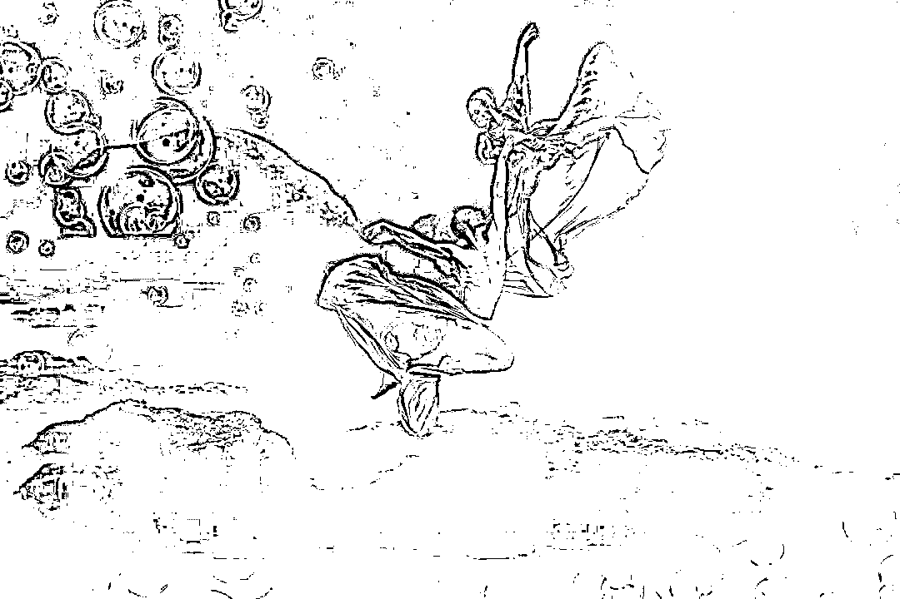

**月亮的作用**

**月亮是占星学中最基本的女性原型。**与母亲的关系也是所有未来关系的基础，因为这是一段完全依赖性的关系，是生命中唯一一段完全由身体决定的必要关系。一个人的存在决不能缺少了母亲的出席(至少在出生以前)。父亲对怀孕而言也非常重要，但在此之后却变成了可选项，尽管他依然值得拥有。

**等我们相互靠近，月亮的作用将会显现。月亮会把人们心底最深处的需求连接起来，认识到自身的需求，然后冒着风险与那些我们所爱的人分享。**这是构成亲密关系的元素之一。如果我们不能让自己的伴侣了解内心的需求，两个人将更像是生活在平行世界中而非真正的亲密关系。

但是，**每个人的需求也会有所不同。**月亮落在巨蟹座的人与月亮落在水瓶座的人对亲密有着完全不同的概念。每个人都有来自月亮的需求，需要被抚育，需要被倾听，但是每个人的模式却可能相距甚远。

**对月亮巨蟹座来说，**归属感以及水象元素的**熟悉感**和在同一个圈子内都非常重要。**月亮水瓶座却需要空间和自由，**可以通过不算太紧密的捆绑关系获得安全感。不论如何，**月亮让我们可以进入更深刻的感情境界。**

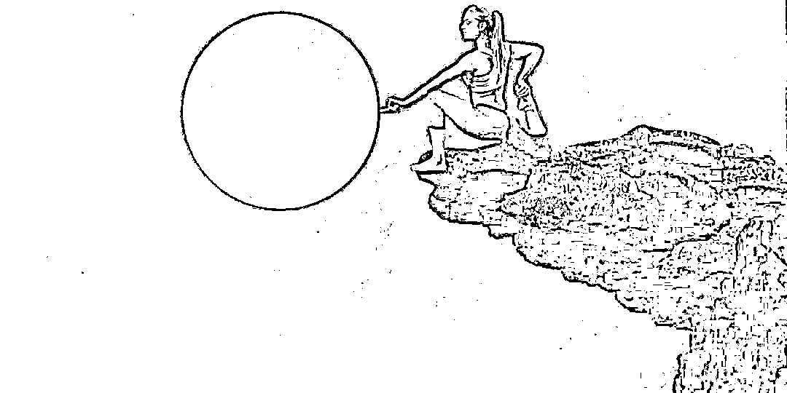

**金星与月亮：两种需求**

当我们停留在金星层面时，**被喜欢的需求凌驾于被倾听的需求之上。**而亲密关系需要跨越过去传统层面的意愿，然后触摸到灵魂。当我们开始分享内心最深处的感觉、恐惧和秘密，我们才能真正的放开自己。

让他们真正进入自己的内心是一种挑战，尤其对于那些出生图中拥有强大火元素的男人和女人。接受与给予同样是一门艺术，**敞开自己的月亮意味着允许变化，**本身就是矛盾。我们谈论的并非某一种理想关系的固定模式，我们是在寻找可以帮助成长与改变的生动关系。

我们可以理解**金星描述了我们喜欢的东西，**哪一些东西更对味，金星带来的愉悦感非常舒服，但却未必能令人满足。**月亮描述了什么可以“喂饱”我们。**因此，了解出生图中金星与月亮关系非常重要。

**如果金星与月亮相位不良，**就必须额外注意这些愉悦感是否真的可以满足我们，而不是让我们感觉营养不良。

举例来说，如果某人的金星落在巨蟹座，也许会喜欢爱情中惬意与关怀的一面。但如果月亮却落在了白羊座，自己的空间必须被满足。这个人在大多数时候（星图中其他元素可以进行调整）对伴侣的需求非常敏感，但却会突然缩回并开始重申自己的私人空间。这些行为可能会让双方都感到困惑。

**这种情况根本就是面对两个不同的需求。**困难就在于金星与月亮的性质非常相似，非常容易误导我们对两者混淆。**喜欢不同于需要。****爱情的模式（金星）和感情的本质（月亮）对不同的人来说也许相似也许不同。** 

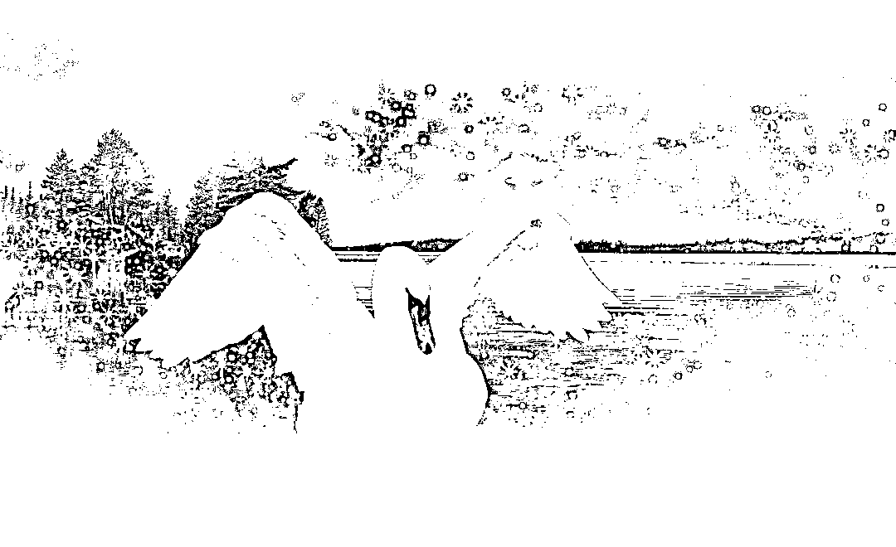

**融合不同的需求**

星图中的冲突也就是生活中的冲突，并非一定要两者选其一。**如果将月亮的亲密需求凌驾于金星的愉悦需求之上，我们将无法获得愉快的亲密关系，**就好像一对被残酷的生存舞蹈紧紧锁在一起的爱人。

如果被过多的肤浅金星相位主导，我们可能在醉生梦死的同时却任然感到内心空虚。**问题的关键在于了解和接受我们矛盾的需求。**明白在特定的时刻谁才是合适的人才对自己有所助益。

这意味着在公共场合把你的天蝎座月亮从对激烈情感的需求中拖出来也许并非最佳选择。又或者在你的伴侣正处于情感危机时显而易见地表现出你的白羊座金星对独立的偏好也许时机不对。每件事情都有其合适的时机和位置，**想要克服许多占星学中的矛盾其实就是要你在恰当的时间做恰当的事情。** 另一个需要考虑的矛盾，假设一个人的金星落在白羊座，月亮落在天蝎座时，两个看似相似的位置却失之毫厘差以千里。我们经常会发现自己卡在两个选择中无法动弹。**但是，每个人都是一个整体，宇宙也是一个整体，任何两个存在的元素之间都有关联。**从矛盾的焦点之间找出许多细微的步骤也就意味着为完全不同的两部分搭建起一座桥梁。

占星学确实可以帮助我们把自己分解成许多行星、星座与宫位，但是我们需要记住**没有任何一个碎片可以完全从其他部分独立出来。**即便是看上去似乎独立的空相位行星也与出生图上其他行星同处在一个人的星图上并分享着共同的黄道系统。

行星之间只是看上去缺乏联系，并非真实状况。你可以拨开空相位行星，然后想象其他行星之间的对话。他们有什么共同的兴趣爱好吗？如果你没有任何发现，那你就需要去扩充一下你的占星词汇表，因为潜藏在行星和星座的明显区别之下的是一种可以连接每一个部分的统一模式。**实际上，学习如何融合然后再分解也是获得亲密关系的本质。**  **亲密关系带来的好处充满诱惑，但对于亲密关系的恐惧对许多人来说同样强烈。**因为亲密意味着靠近另一个人，融合相互之间的领域与感觉，对个人的特性构成威胁。

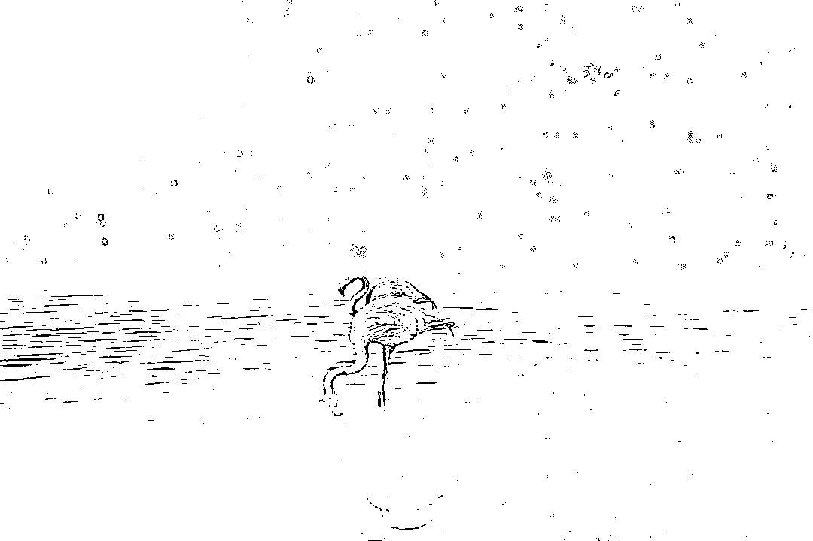

正如我们极其渴望靠近，却又自然而然地抵触。我是不是应该容忍你进入我最核心的领域？我的原生家庭在哪里？潜意识开始剧烈作用试图保持现状，即便现状不是那么令人满意。**害怕失去自我是拒绝亲密关系的强有力动机。但只要学会有意识的处理，这点同样可以成为爱情的某一个分子存在。**

**爱情，是一种动态的模式，并非恒久不变。**我们可以每天都有不同的感受，因为我们对自己的看法也在变化。现在，我将开始讨论强烈的情绪波动，因为自然界的潮汐作用同样会影响到个人的吸引力。

**金星的魅力与火星试图保持个人主义的斗争相平衡。**这也是情人们需要争斗的原因，他们需要推开对方以保持自己的独立性。如果这些已经被意识到，就可以成为爱情的一部分，一件不需要为之感到羞耻的正常过程。我经常发现情人们在撩开各自的面纱后关系却变得更亲密了，也对中间出现的距离感反应强烈。

**我们需要吸收伙伴关系中的深层部分。**我们需要保证自己正在爱人广义的亲密关心的最核心区域。如果这种感觉得到满足，我们也不用再将个人的需求戏剧化，而且双方的情绪也让我们在下一次可以靠得更近。

**第七宫与第八宫**

正如金星与月亮成为围绕亲密关系主题的一对不可分割的关键因素，**星图中的第七宫与第八宫则是另一对主题。**星图中的**第七宫**是传统的婚姻或合作宫位。而**第八宫**则是关系的“实体”，一个令开始于第七宫的关系完美结束的位置。

如果一个伴侣触动了第七宫的象征，却无关第八宫，就好像一段关系并没有深入。开始的时候也许很好，但核心却无法完满。如果与第八宫产生优质联系，但第七宫却没有动静，你也许根本不会遇见这个人。

因为第七宫和第八宫的宫头通常落在不同的星座，而且往往是紧密相邻而并非自然联结(譬如说三分相或是六分相)，**想要令亲密关系更加深入需要一些不同的特质才能发生作用。**产生更深层次的联结并不是简单地把一把钥匙塞进一把锁里然后直接拧开，**而更像是一把复合保密锁，需要许多不同的数字组成密码才能真正开启。**  因为**第七宫**与**第八宫**与那些适合投射的“其他人”相关。这意味着在星图中的这些领域，**我们需要的并不是表现自我，而是寻找可以为我们填满这些特质的伴侣。**如果你的火星落在第七宫，你也许需要寻找一位充满活力且独立的主动型伴侣。这是一种个人需求的投射，将我们自己的某个部分放到别人身上。

第七宫与第八宫(以及星图中其他的相关宫位)与你有关。**它们是你需要在任何伙伴/伴侣关系中需要表达的特质。**理想的伴侣会给予你这些特质的支持。如果达不到这点，这段关系将难以成长。**第七宫与第八宫与你自己有关，千万别直接丢给其他人。**

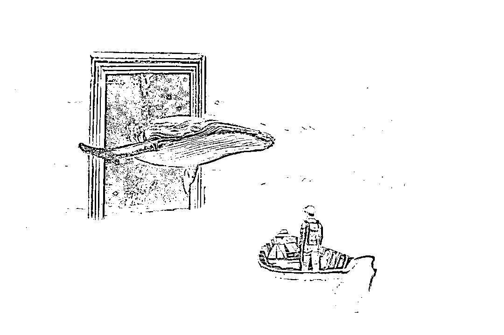

**伴侣间的互容性**

什么是互容性？传统占星学认为星图中的和谐相位是优质关系的重要因素。诚然，某种程度上的和谐(或相似)确实有助于成功的伴侣关系。但是，**拥有一系列的挑战和轻松相位也有可能带来良好的结果。**

举例来说，**金星和火星对是否拥有和谐的性关系影响匪浅。**和谐的三分相和六分相可以令能量流动更加轻松，但也可能导致一段时期后的厌倦。**但如果是一些和谐相位混合着挑战相位，**譬如说你的金星三分对方的火星，对方的金星对分你的火星，这会令你们的性关系保持长时间的活力。

爱人们喜欢创造自己的小宇宙。如果大家都认同一件事情，那这必然是真实的。**但如果两个人的星图在某方面过于相似，就有可能限制双方个人的发展。**

所谓的容纳性可能变成简单的分享共同特性。如果这样是有益的，那么情人们也无需让他们的行星保持和谐。一点小小紧张不仅可以为生活增添乐趣，同时也可以给伴侣关系带来更好的未来。

著名神秘学家 Dion Fortune 认为一段完美的伴侣关系会在七个不同的脉轮中显现出交互的相似性和相异性。这种模式也许可以通过在新旧之间寻找平衡并帮助关系成长而令两人的关系更加深刻。

不过，**确实有一些人不想要或需要传统的互容性。**如果天王星落在你的第七宫或第八宫，你会需要在伴侣关系中获得一些与众不同的经验，或是尝试一些新的关系模式。被与自己完全不同的人吸引并非一场灾难。你需要的也许是那种只需要少量关键正面相位联结的关系。

**这些关键因素大多与月亮、太阳、一/七宫轴线或是北交点有关。**它们都是一些可以帮助两人求同存异的粘合剂，并使得两人关系可以保持成长。有时，你可能会在星图中发现强烈的金星/火星相位，但如果星图中的关键因素都没有受到影响，这段关系也很难持续下去。

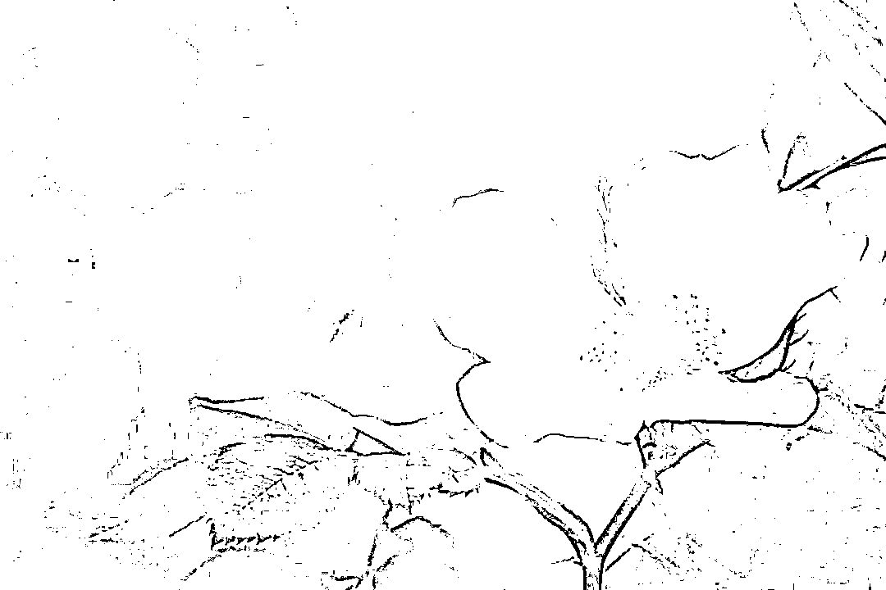

当然，一段关系持续时间的长短只是衡量这段关系(或是伴侣的倔强程度)是否成功的指标之一。只要能从中有所收获，我们依然可以认为自己拥有过一段短暂而成功的亲密关系。我们中的每个人都在用自己的标准衡量投入的时间、努力和情感是否值得。我们也可以遇见某个将会帮助我们敞开心房的人，即便这段关系在某个层面失败了也不失其重要性。

当我开始为一对情人做组合图分析，我并不会从参考两人的比较图开始。**我总是先检查每个人自己的出生星图。**个人的出生图是理解这对情侣关系的基础，因为它会告诉我们个人的特质。**个人出生星图才是通往亲密关系的关键。**举例来说，如果你无法先爱自己，那也将非常难从他人那里获得爱。

帮助爱人们做好占星咨询的基本工作就是帮助他们意识到他们自身的主题和需求。**当一个人对自己有健康的期待，通往敏感的亲密关系的意愿才会帮你打开那扇大门。**良好的伴侣关系的基础是两个人都拥有健康的心态。这里的健康并不意味着完美或是完全明了、脱离无知。健康的心态是一种学习的意愿，放开自己，学会述说与倾听。

当你显现出这样的活力时，亲密关系就会不知不觉的到来。然后，只要小心呵护和滋养，这段关系就可以长时间地保持繁荣。

**版权声明：**本文由若道翻译发布，欢迎转发，反对抄袭。友号转载请申请白名单。

杰夫·焦耳

国际占星大会（UAC）和全美占星师联盟（AFAN）创始人，美国著名占星网 www.stariq.com 创始人。曾任亚特兰大协会主席和亚特兰大占星考试委员会委员。4 本占星书的联合作者，在全世界的 4 个大洲开办过工作坊。2015 年逝世。

**学习占星学**

**点击下图了解课程详情** 

**

**

**

**

**微信又双叒叕改版啦，不想错过若道君的推送？**

**就把若道设为星标吧！**

**▼**

**喜欢记得点一下在看哦☟**

********报名直达入口********

# 今日牌阵推荐 | 你既可以爱，又可以被爱，这是世界上最美好的事情

> 原文：[`mp.weixin.qq.com/s?__biz=MzA5NjA0NTAxNg==&mid=2651458133&idx=2&sn=ce56e42b7716e705cd77f965f03b1ab6&chksm=8b48b8e2bc3f31f4c7391d8ac57c994b8f2057d6c83ed1e052ad5ed337f5555ac9da3107e6e7&scene=126&sessionid=1692737913#rd`](http://mp.weixin.qq.com/s?__biz=MzA5NjA0NTAxNg==&mid=2651458133&idx=2&sn=ce56e42b7716e705cd77f965f03b1ab6&chksm=8b48b8e2bc3f31f4c7391d8ac57c994b8f2057d6c83ed1e052ad5ed337f5555ac9da3107e6e7&scene=126&sessionid=1692737913#rd)

当你孤身于人潮之中，总有那么一瞬间，想要被爱拥抱。这个牌阵能帮助向往爱情的你评估自己的现状，做好准备，迎接新恋情的到来。

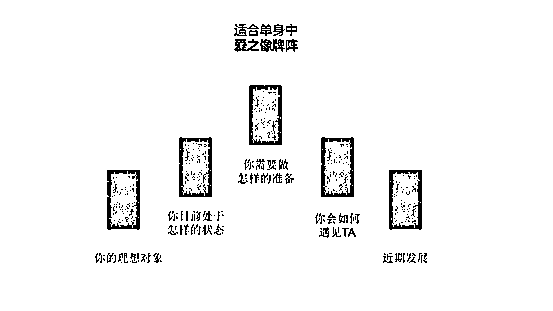

★

**爱之像牌阵咨询案例解读**

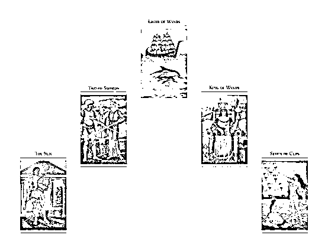

**1：理想对象：太阳****2：目前状态：宝剑二****3：需要的准备：权杖八****4：如何遇见：权杖国王****5：近期发展：圣杯七****理想对象：**是非常阳光、乐观的人，热爱音乐或其他艺术，太阳牌描绘的是一个英俊潇洒、身材匀称的经典美男子形象，智识上也是具有远见的，能看到很多事情背后的原因和目的，有驱散黑暗带来光明的能量，温暖人心。还有一个好消息：阿波罗每年秋天都会离开他的圣殿德尔斐，游历到神秘的北方净土，要好好把握这个秋天。**目前状态：**宝剑 2 反映着案主一种瘫痪的状态，两股对立的力量制造出了一种停顿，可能是期待爱情又享受单身的矛盾心态，不愿意打破现状，宁可闭上眼睛和捂上耳朵，无视渴望的存在。可能是过往感情中的一些创伤还没有完全愈合，或者原生家庭中父母的情感模式带来的顾虑，可以先尝试解决或接纳这些影响，再迎接新的感情。**需要的准备：**权杖 8 象征着创造性能量克服了焦虑和挣扎之后，进入了释放的状态中。矛盾和冲突能够激发创造性想象力，如果能够面对冲突并看透它，就会进入一段平稳前行的状态，计划能够朝向目标顺利并快速地进行，带来乐观和自信的感觉。画面中船航行在风平浪静的海面上，船上是众人拾柴火焰高的景象，鱼跃而出的海豚也是成双成对，除了需要用创造性能量面对冲突克服焦虑以外，也可以告知并留意身旁亲朋好友的支持和帮助，权杖 8 也可能暗示着旅行，多安排一些出行游玩也是不错的准备。**如何遇见：**权杖国王牌中的忒修斯象征着热情如火的精神，它能够让一个男人或者女人成为真正的领袖。这张牌也对应这白羊能量，具有火热的精神，忒修斯不是一个鲁莽的年轻男人，他是一个战略家，一个世间大事的掌控者，这是因为他不仅拥有愿景，还拥有稳定的力量去呈现它们，他热情并有影响力的人格特质能够使其他人信服。他不能够忍受限制和缺乏耐心，总是认为自己是正确的，所以他是一个输不起的人。可以多参与一些竞争性的活动，比如体育活动、竞技游戏，留意活动中表现出火象特质的潜在对象，或者激发出自身的白羊能量。**近期发展：**圣杯 7 描绘的是女神阿弗洛狄忒现身于普绪克面前，告诉她如果要赢回厄洛斯的爱，就必须完成一些任务。阿弗洛狄忒从海中升起，指着面前漂浮在云端的七个圣杯。普绪克跪在岩石上，看着眼前的阿弗洛狄忒 ，接受爱之女神给予她关于爱的神圣教诲。这张牌隐喻着“空中楼阁”，案主内心的直觉会意识到将来有很多可能性，但是这些可能如果落实，就需要付出许多艰苦的努力。也代表着要清晰的梳理出自己期待的伴侣和感情具有哪些特质，在自己内心绘制出一张“灵魂伴侣寻宝图”，这张寻宝图也是一张自我精进的计划书，期许越清晰，努力越精准，吸引来的伴侣才有可能越匹配当下的情感需求。祝好运！

**下载神话塔罗 APP****抽取专属于你的”爱之像“牌阵****预约专业神话塔罗师语音解读**

**如何预约塔罗师咨询？**

最后，一起再来复习一下

如何在塔罗 app 上预约咨询服务

去若道塔罗 app 上选择咨询师预约咨询时间

具体咨询方式如下图**最后的最后
如何更新神话塔罗 APP？**快去应用市场更新神话塔罗 APP，抽牌&咨询吧～还没有下载或更新的小伙伴赶紧来看看如何下载和更新吧！

**iPhone 苹果 IOS 系统下载**

****❶** **长按识别二维码下载****

******❷**** 或在 App Store 里搜索“神话塔罗”**

**安卓系统下载****❶** **长按识别二维码下载**

**❷ 或在各大应用市场里搜索“神话塔罗”**

各位亲人小伙伴，每天有事没事都可以去 app 里转转。抽取专属于你的今日塔罗如果感到快乐你就用用**神话塔罗 app**，如果你感到不快乐，更要使用由专业人本主义塔罗师团队全程陪伴的**神话塔罗 app**哦！**想入驻若道塔罗平台成为职业神话塔罗师？****2021 年最新《神话塔罗认证课程》正在报名中**

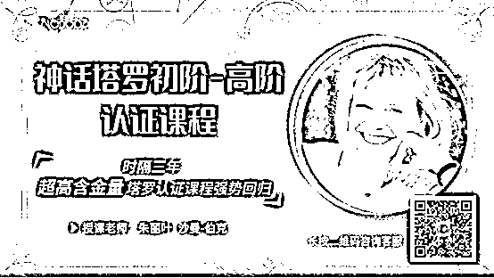

# 神话塔罗之大阿卡纳牌｜正义

> 原文：[`mp.weixin.qq.com/s?__biz=MzA5NjA0NTAxNg==&mid=2651458133&idx=3&sn=e37f69e34bc33afe6c0935e32ad0b786&chksm=8b48b8e2bc3f31f465dee7a4595d44620d93e58ca37eeab785724f5a92a9ec3bbb85c3d34f17&scene=126&sessionid=1692737913#rd`](http://mp.weixin.qq.com/s?__biz=MzA5NjA0NTAxNg==&mid=2651458133&idx=3&sn=e37f69e34bc33afe6c0935e32ad0b786&chksm=8b48b8e2bc3f31f465dee7a4595d44620d93e58ca37eeab785724f5a92a9ec3bbb85c3d34f17&scene=126&sessionid=1692737913#rd)

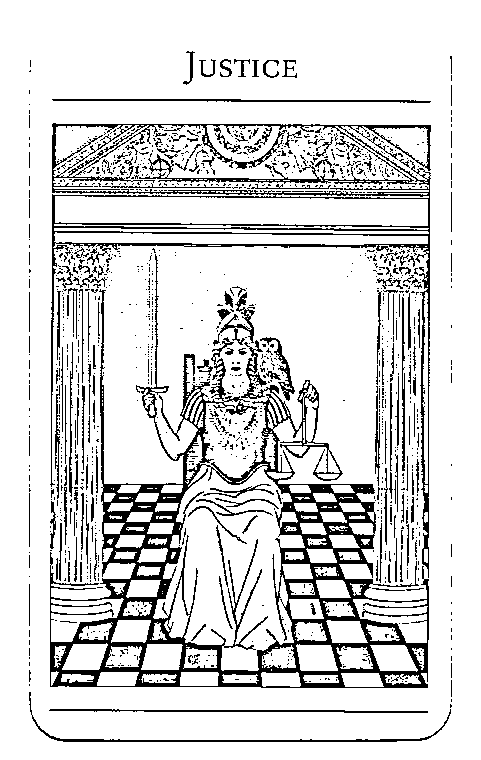

作者/朱丽叶·沙曼-伯克 丽兹·格林

译者/闫东升 编辑/玫瑰 图片/神话塔罗 网络

本文节选自《神话塔罗》

在十九世纪中叶，法国神秘主义者艾利冯斯·里维使塔罗牌重新流行了起来。里维认为塔罗是古代宗教的遗迹，从埃及人传到了摩西和所罗门；他将 22 张大阿卡纳牌与 22 个希伯来字母联系起来，为每张牌赋予对应的卡巴拉（犹太教的神秘哲学）意义。今天《神话塔罗》作者将为我们道来正义牌背后的故事。

[🔈 神话塔罗·正义](https://res.wx.qq.com/voice/getvoice?mediaid=MzA5NjA0NTAxNl8yNjUxNDU4MTMy)

**｜**朗读者小巫

**书名：**

神话塔罗 

**作者：**

朱丽叶·沙曼-伯克   丽兹·格林 

**出版日期：**

2011-08-02

正义对应的希腊神祗

**雅典娜·正义女神**

**正义女神**正义牌呈现的是一位表情严肃、年轻美丽的女人，头戴银色战盔，身着银色铠甲，正义凛然地端坐在王座上。她的右手握着一把指向上方的宝剑，左手拎着一架天平。她白色的头发和长袍，与两侧白色的石柱和头顶白色的门廊交相辉映。她的脚下是黑白相间的大理石块铺就的地板。一只猫头鹰栖息于她的左肩。

> **陪伴着雅典娜（*Athene*）的猫头鹰**：反映了这位女神拥有清晰的洞见，因为猫头鹰能够在夜间扑食。 **黑白相间的地板**：反映出头脑能够把黑白两面紧密且有秩序地整合在一起。 **天平**：象征着通过一种事物来衡量另外一种事物，从而达成公平判决的力量。据说神话中的雅典娜为人类创建了第一个陪审团。

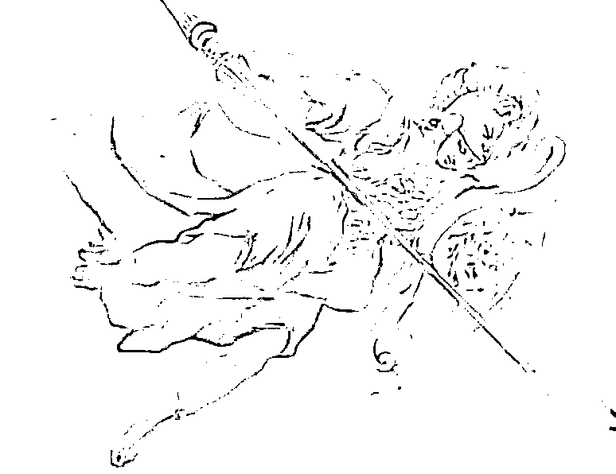

**维护和平与文明的战略家**在这张牌中我们遇到了正义女神雅典娜，她曾经在前面的恋人牌中出现过。神话中雅典娜的父亲是众神之王宙斯（*Zeus*），乌拉诺斯（*Uranus*）曾经警告过宙斯说， 如果他和第一个妻子——智慧之神墨提斯（*Metis*）生了第一个孩子，那么孩子的能力将会超越他。为了防止这个预言发生，宙斯在墨提斯怀孕的时候把她吞进了肚子。不久以后，宙斯就开始被剧烈的头痛折磨到无法忍受。为了治疗他的头疼，铁匠之神赫菲斯托斯（*Hephaistos*）用青铜斧劈开了宙斯的头颅，全副武装的雅典娜从裂开的伤口中一跃而出，并发出胜利者的欢呼。在场的众神都被这种场景震慑，心生敬畏。雅典娜变成了宙斯最喜欢的孩子，他对她的偏爱太过明显，引起了其他众神的嫉妒。从她出生的方式就可以看出雅典娜有好战的倾向。在战争的艺术方面，她与战神阿瑞斯（*Ares*）有很多不同。雅典娜引发的战争都不是基于爱的冲突和杀戮，而是基于宇宙更高的律则，其目的是为了支持和保护真理，都具有冷静、严肃和深思熟虑的特质。她是一个战略家，而不是一个冲动的战士，她平衡了阿瑞斯象征的本能的侵略性，非常善于利用逻辑、策略和技巧。雅典娜是勇士的保护神，所以很多英雄人物都在她的羽翼之下。她为珀尔修斯（*Perseus*）、奥德修斯（*Odysseus*）和其他英雄们提供的武器和帮助，都需要有足够的智力、远见和计划才能够运用。雅典娜的贞洁是奥林匹斯众神中一个明显的例外。她还给人类提供了许多非常有价值的服务，例如她教授人类如何驯服和养育战马，还有编织和刺绣等等。她传授的东西不仅仅只是在应用层面，还是艺术创作，因此她是推动人类文明的女神，尽管必要  的时候她也是一个战神，但她一直培育和保护着人类的和平与文明。

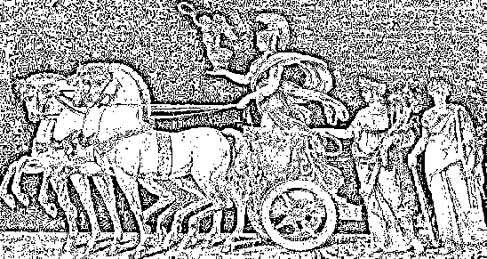

**思考的意义，人之所以为人****从内在的层面来看，正义之神雅典娜的意象反映着自然界中人类独有的才能——理性思考和反思判断（*reflective judgement*）。**对于当时的希腊人来说，这种才能是神圣的，因为它使人类和动物有了区别，因此他们构思让雅典娜从众神之王宙斯的脑袋中出生，没有和任何母性的身体联系在一起，也就是说没有了母亲所蕴含的本能和物质性（意即动物性）。**雅典娜的正义并不是基于个人的感受，而是根据事物当时的境遇，对所有相关因素进行正义和客观地评估，并以道德准则为基础而做出的选择。**雅典娜的贞洁可以看做是反思能力的完整性和纯洁性的象征，它不会被个人的欲望所影响。她（象征的）在文明和艺术方面对人类的引导也反映出头脑能够驾驭狂野的自然本能，并通过客观的规划和洞察来转化它。**她的战争是为了某种原则，而不是激情，那是来自头脑反思后的选择，其中的本能力量被牢牢地掌控着。**在传统塔罗的大阿卡纳牌中，有四张牌反映着“四种美德”，其中第一张就是正义牌，另外三张分别是节制、力量和隐士，它们都和人们在生命之路上才能的发展有关。从心理学的角度看，它们有助于小我（*ego*）的形成和完善，而每个人的本我都需要通过小我去体验生命中的价值感，以及利用稳定的个体身份面对生命的挑战。愚人通过了情欲和本能侵略性这两个年轻阶段的巨大挑战之后，就必须要形成和完善他的人格和才能了，只有发展出健康完善的人格和才能［也就是个体（*individual*）的形成过程］，他才能在日后的人生之路上从容应对。所以当愚人遇到正义之神雅典娜的时候，他必须学会清晰地思考和培养出平衡、冷静的思维能力。在恋人牌的时候，他还没有举一反三和比较的能力，所以没办法做出公平的判断。如果我们不尊重和遵守公平、平等和服从真理这些道德原则，就无法通过正义之神雅典娜的考验，自然也无法获得他人的尊重和欣赏。**雅典娜带离我们走出了纯粹的自然本能，以人类独有的思想和精神之躯独立于天地之间。****正义，理性的双刃剑****从解牌的角度来看，正义牌的出现预示着当事人用冷静和客观的思考做出了公正的决定。**但是就像雅典娜手中的利剑一样，这张牌的意象也是一把双刃剑。在生活的很多层面上，雅典娜冷静的反思能力可能显得过于冷漠和理想主义，对于个人的关系领域缺乏应有的温情。她的利剑在某些情境下，可能会因为普世性的真理而伤害到心灵，所以正义牌和其它所有大阿卡纳牌一样，带有明显的矛盾性。愚人必须发展出雅典娜所代表的正义，但是却不能停留在她纯洁的圣殿中，因为还有下一个“美德”等着他去学习。

**版权声明：**本文由《自在园》授权发布，欢迎转发，反对抄袭。友号转载请申请白名单。

**神话塔罗系列**

[开篇](http://mp.weixin.qq.com/s?__biz=MzA5NjA0NTAxNg==&mid=2651451590&idx=2&sn=41c1083542bcf098de303e29a028ff20&chksm=8b4b4271bc3ccb67d5d53c143cd5a17c24b7b60e5b1051949fa9f086f90b4ab04877976c47e5&scene=21#wechat_redirect)丨[愚人](http://mp.weixin.qq.com/s?__biz=MzA5NjA0NTAxNg==&mid=2651452189&idx=2&sn=f4cc6e768e367fbdb0f69b9c6382443d&chksm=8b4b41aabc3cc8bcdbd952d91d8408014a799224d3f67ab50bb5cbe88ee0090afc92869de1a6&scene=21#wechat_redirect)丨[魔术师](http://mp.weixin.qq.com/s?__biz=MzA5NjA0NTAxNg==&mid=2651453528&idx=2&sn=3ca9b35e1736168eef1856274635224a&chksm=8b4b4aefbc3cc3f965f2531f8c0d37da2e66a2b47139d445df1ea35eeb74bdf3b6827236741a&scene=21#wechat_redirect)

[女祭司](http://mp.weixin.qq.com/s?__biz=MzA5NjA0NTAxNg==&mid=2651455871&idx=2&sn=15ae629e1b35f1371b81868f5bfdd2aa&chksm=8b48b3c8bc3f3ade0175d0e03bfe496711801614273e7fe98b6435fafe0de5daf3a8d7c1312f&scene=21#wechat_redirect) | [皇后](http://mp.weixin.qq.com/s?__biz=MzA5NjA0NTAxNg==&mid=2651453921&idx=2&sn=4d1efea03b2b9f940be7a6aadf553dec&chksm=8b4b4b56bc3cc2405fe562b8ef48f335699f57c12d5d817e24aeeb84f6306092de2ae55becc7&scene=21#wechat_redirect) | [皇帝](http://mp.weixin.qq.com/s?__biz=MzA5NjA0NTAxNg==&mid=2651455083&idx=2&sn=d12546b67c830055f37b147f41c7641f&chksm=8b4b4cdcbc3cc5cad2def85451c3a7ddbb31ba5b9a01febb8a9fb18991d3e1263d9371ac212f&scene=21#wechat_redirect)

[导师](http://mp.weixin.qq.com/s?__biz=MzA5NjA0NTAxNg==&mid=2651456482&idx=2&sn=153b4ca2f69f6745425525773616455d&chksm=8b48b155bc3f384322115b0b94621662ba562a2a252fd244a0a3fc84a664408b2311014e8db5&scene=21#wechat_redirect)丨[恋人](http://mp.weixin.qq.com/s?__biz=MzA5NjA0NTAxNg==&mid=2651457110&idx=2&sn=b4f6a1e93475b39df8f6c80a7409c59c&chksm=8b48b4e1bc3f3df721f206e899272c01bf324355f649fe0fd0dd8363c5b58683daa38e8cf648&scene=21#wechat_redirect) | [战车](http://mp.weixin.qq.com/s?__biz=MzA5NjA0NTAxNg==&mid=2651457444&idx=2&sn=75e9cc378abfefb59ebe7f12357c1b4b&chksm=8b48b513bc3f3c051bf2bb4be018694ca47996a193c0a92d5003c47dc384a2b07f9b9f9806ed&scene=21#wechat_redirect)

**朱丽叶·沙曼·伯克**从 20 世纪 70 年代早期开始，就对塔罗牌产生了兴趣，并踏入了塔罗的世界。后来，在丽兹·格林的鼓励下，开始研习心理占星学和塔罗。1984 年，第一本书《塔罗全书》（The Complete Book ofTarot）出版。之后，与丽兹·格林合作设计并撰写了《神话塔罗》（The Mythic Tarot）。朱丽叶写了十本塔罗和占星学书，包括一本名为《众星的传说》（Stories from the Stars）的儿童读物，以及与丽兹·格林合著的《神话之旅》（The Mythic Journey），这是一本详细讲述如何运用神话来指导生活的书。

**点击下图了解课程详情** 

**微信又双叒叕改版啦，不想错过若道君的推送？**

**就把若道设为星标吧！**

**▼**

**喜欢记得点一下在看哦☟**

************报名直达入口************

# 3 年认证体系课程丨神话塔罗创始人亲自授课，从小白进化到专业塔罗师

> 原文：[`mp.weixin.qq.com/s?__biz=MzA5NjA0NTAxNg==&mid=2651458133&idx=4&sn=3d5854502efeffd4e7b9cbc7c55af61e&chksm=8b48b8e2bc3f31f4798118064f5ae37098b21a45a17a0e0a5690e4d943811fefd31b6d4714d3&scene=126&sessionid=1692737913#rd`](http://mp.weixin.qq.com/s?__biz=MzA5NjA0NTAxNg==&mid=2651458133&idx=4&sn=3d5854502efeffd4e7b9cbc7c55af61e&chksm=8b48b8e2bc3f31f4798118064f5ae37098b21a45a17a0e0a5690e4d943811fefd31b6d4714d3&scene=126&sessionid=1692737913#rd)

**时隔三年，****超高含金量的神话塔罗认证课程强势回归****经过多次打磨的课程内容体系****让你直观精准的感受到****神话塔罗的魅力，****扎实的建构****神话塔罗思维，****系统****学习****最地道的塔罗知识。****中高阶课程中老师传授****将神话、占星、心理学完美融合进塔罗****的****人本主义咨询体系，****并进行****学员案例督导，****让你更自信的开展咨询工作，****学以致用。****本期认证课程采取****初中阶****即报即学的录播课****+高阶****案例督导直播课****的形式，****录播课：****精编剪辑，随来随学，助教答疑，学练结合。****直播课：****大师融合，神话心理，塔罗占星，咨询技巧。****若道为学员开发了****“神话塔罗”APP，****是随身的工具，****更是接咨询的平台，****中阶****学成入驻平台****即可链接更多塔罗个案，****发展壮大你的塔罗咨询事业。**

**如果你想学习塔罗，什么样的老师会让你怦然心动呢？她是三副塔罗牌的设计者，写了 6 本塔罗书籍。她研习塔罗四十余年，教授塔罗三十余年，是丽兹·格林的密友。还有****谁会比塔罗牌设计者更了解塔罗的历史、灵魂与精髓？****所以，这将是你开启塔罗之旅最坚实的一步。**

1

**这位塔罗大师是谁？**

**朱丽叶·沙曼-伯克** 

**· **她是**3 副塔罗牌**的**设计者****——**神话塔罗牌、沙曼–卡塞利塔罗牌、“自己着色”塔罗牌；**· **她出版了**6 本塔罗书****——**《塔罗全书》、《新塔罗全书》、《众星的传说》、《理解塔罗牌》、《精通塔罗牌》、《塔罗初学者指南》；**· **她研习塔罗**四十余年；****· **她教授塔罗**三十余年**；******· **她是**丽兹·格林**的密友，两人合著了**《神话之旅》**，共同设计了**神话塔罗牌。**

**· **她是认证的**心理治疗医师；****· **她深谙**塔罗、占星学、心理学和神话学**如果你想成为拥有英国神话塔罗认证的塔罗师那么她，就是你**最好的老师人选**

2

**塔罗牌有什么用？**

**· **塔罗牌是一种**古老的疗愈工具**，同时也是**直观的解惑工具****；****· **塔罗牌绕过逻辑思维，**和潜意识联结**，通过图像的方式生动地将隐藏在人类潜意识中的画面浮出水面，**揭示心灵的状况和运作****；****· **塔罗牌**帮助我们和潜意识对话**，可以和现代的心理治疗联系在一起，帮助我们**看清心灵的冲突来源、本质和可以选择的道路；****· **塔罗牌又和更广阔的**宇宙生命原型**联结，彰显**个人生命发展的阶段**，将**个人生命挣扎、内在冲突**放在生命进化的道途上，让更广大的生命智慧为个人成长照亮道路。

3

**为什么学习神话？**

神话通过**图像和故事**描绘人类生活的**原型模式**。通过瑰丽的想象、诗意的语言、栩栩如生的人物和故事描绘出我们内心的世界，表达出我们经历的那些实现人性的过程，帮助我们将**个体的生活与人类古老且永恒的故事**建立联结。从而在更深处**理解生命**，并学习**古老而长青的生命智慧**。**神话塔罗**取材于**希腊神话**的无尽沃土，通过故事提供一种**记忆辅助**，在心理和预见层面提升解读的**丰富度**。因为这样更符合塔罗牌的性质，符合人类的想象。**按照故事思考，而不是简单的记忆关键词和固定的意义。**

4

**塔罗预测是什么？**

塔罗牌预测的运作就像是**照向心灵的一面镜子**。在塔罗牌解读时，图像的原型性质穿透隐藏的潜意识脉络，反应出与个人境遇相关但又未被了知的知识与洞见，因此**揭示出按照任何理性方式都无法发现的事情。**如果你对生命好奇，塔罗学习会帮你**打开一扇通往未来的门****，**让你了解**心灵运作和显化的秘密**，同时赋予你更多关于生命成长的支持和指引的能力！

5

**我们将学习什么？**

**☆****初阶：神话塔罗详解**

**神话故事和预测意涵**

**第一讲 **

**介绍塔罗牌，讲述它的历史**

**第二讲 **

**星座三形态、四元素和宫廷牌**

**第三讲 **

**基本星座与基本国王**

**第四讲 **

**固定星座与固定女王**

**第五讲 **

**变动星座与变动骑士**

**第六讲 **

**小阿尔卡纳数字牌**

**第七讲 **

**小阿尔卡那数字牌-圣杯**

**第八讲 **

**小阿尔卡那数字牌-宝剑**

**第九讲 **

**小阿尔卡那数字牌-权杖**

**第十讲 **

**牌阵&案例解读**

**☆****中阶：神话塔罗排阵应用**

**排阵解读和咨询技巧**

**第一讲 ****大阿尔卡纳-开启神话塔罗愚人之旅：****愚人、魔术师、女皇、皇帝****第二讲 ****女祭司、教皇、恋人、战车、正义、节制****第三讲 ****力量、隐士、命运之轮、倒吊人、死神、恶魔****第四讲 ****高塔、星星、月亮、太阳、审判、世界******

**第五讲 **

**塔罗牌的原型、占星原型**

**第六讲 ****引导式冥想、荣格的四种意识功能** **第七讲 ****引导式冥想与马蹄牌阵**

**第八讲 **

**六芒星牌阵、凯尔特十字牌阵**

**第九讲 ****咨询案例演示：为一位年轻女性所做的四次解读****第十讲 ****神话塔罗咨询督导案例样例****☆****高阶：神话塔罗直播督导课**

**大阿尔卡纳的心理原型和学员督导**

**第一讲** **愚人**：永恒的少年；儿童的原型

**魔术师：****恶**作剧者、老师、向导、沟通者的原型；行星：水星

**女王**：母亲、养育者、丰产的原型；行星：金星在金牛座；小行星：谷神星

答疑与讨论，学员们分享对自己或客户的塔罗解读，对神话塔罗牌进行更多探讨。**第二讲** **皇帝：**父亲、供养者、计划者的原型；行星：木星

**女祭司：**处女——等待被实现的潜力原型；行星：新月

**教皇：**疗愈者、受伤的疗愈者、牧师的原型，牧师是神与人之间的灵性桥梁；行星：凯龙星

答疑与讨论，学员们分享对自己或客户的塔罗解读，对神话塔罗牌进行更多探讨

**第三讲** 

**恋人：**爱、爱人、所爱之人的原型；行星：金星在天秤座

**战车：**战争、冲突、战士、斗士的原型；行星：火星

**正义：**智慧、兵不血刃的胜利的原型；星座：处女座；小行星：智神星

答疑与讨论，学员们分享对自己或客户的塔罗解读，对神话塔罗牌进行更多探讨。

**第四讲** 

**节制：**关系、合作的原型；星座：巨蟹座、双鱼座

**力量：**力量的原型；星座：太阳在狮子座

**隐士：**晚年、耐心的原型；行星：土星

答疑与讨论，学员们分享对自己或客户的塔罗解读，对神话塔罗牌进行更多探讨。

**第五讲** 

**命运之轮：**命运女神与命运的原型

**倒吊人**：牺牲与有意识的牺牲的原型；行星：海王星

**死神：**死亡、终点和起点的原型；行星：冥王星

答疑与讨论，学员们分享对自己或客户的塔罗解读，对神话塔罗牌进行更多探讨。

**第六讲** **恶魔：**阴影、人类不文明的面向、本能、欲望天性；行星：火星在天蝎座

**高塔：**改变、分裂瓦解的原型；行星：天王星

**星星：**希望的原型

答疑与讨论，学员们分享对自己或客户的塔罗解读，对神话塔罗牌进行更多探讨。

**第七讲** 

**月亮：**无意识的原型；行星：暗月

**太阳：**意识、创造力和文明的原型；行星：太阳

**审判：**复活、新生的原型；行星：水星作为灵魂向导普绪科蓬波斯

答疑与讨论，学员们分享对自己或客户的塔罗解读，对神话塔罗牌进行更多探讨。

**第八讲** 

**世界：**整体、完成和个性化的原型

答疑与讨论，学员们分享对自己或客户的塔罗解读，对神话塔罗牌进行更多探讨。

**认证阶段：考试论文**

**入驻塔罗平台**

6

**适合人群**

**· **塔罗初学者，完全没有塔罗基础；**· **塔罗自学者，也曾上过塔罗工作坊，但仍不懂如何使用塔罗牌；**· **塔罗进阶学习者，有塔罗基础，了解 78 张塔罗牌含义；**· **不知如何解决遇到的情感困惑、职业选择、人际问题，对人生感到迷茫；**· **想要学习深入解读塔罗牌、牌阵的使用、咨询技巧等将塔罗运用于咨询实践；**· **想要深入了解和学习塔罗，希望成为专业的塔罗师；**· **想要借助塔罗进行心灵、灵性成长。

7

**导师简介**

**朱丽叶·沙曼-伯克**

**朱丽叶·沙曼-伯克**从 20 世纪 70 年代早期开始，就对塔罗牌产生了兴趣，并踏入了塔罗的世界。后来，在丽兹·格林的鼓励下，开始研习心理占星学和塔罗。1984 年，第一本书《**塔罗全书**》（*The Complete Book ofTarot*）出版。之后，与丽兹·格林合作设计并撰写了《**神话塔罗**》（*The Mythic Tarot*），在这本书中，她们将古希腊神话与传统塔罗解读结合起来。朱丽叶写了**十本塔罗和占星学书**，包括一本名为《众星的传说》（*Stories from the Stars*）的儿童读物，以及与丽兹·格林合著的《神话之旅》（*The Mythic Journey*），这是一本详细讲述如何运用神话来指导生活的书。

8

**课程价格**

**初阶正价：**5800 元**中阶正价：**5800 元**高阶正价：**7800 元**考试认证费用：****3000 元****认证课程总价：****22400 元****联报优惠价：****18000 元**

长按二维码添加客服 Echo 老师

9

**退转课程**

*   **退款原则请详看《教学协议》，如有疑问请咨询课程顾问。**

**神话塔罗认证课程**

**授课老师：****朱丽叶·沙曼-伯克**

**授课时间：2021 年 11 月 3 日起**

**授课方式：**网络课程**，**英文授课，中文翻译

**费用：****初阶正价：**5800 元；**中阶正价：**5800 元；**高阶正价：**7800 元；**考试认证费用：****3000 元；****认证课程总价：****22400 元；****联报优惠价：****18000 元；**

**课程负责人：Echo 老师**（微信/手机：nodoor18518412824，请备注“神话塔罗”）

长按二维码添加课程负责人咨询~

****报名请点击“阅读原文”****

# 进化占星学中，我们是教练，不是先知 | 对话斯蒂芬·弗里斯特

> 原文：[`mp.weixin.qq.com/s?__biz=MzA5NjA0NTAxNg==&mid=2651458041&idx=1&sn=87fbfc63b12ba4516081926fd2e2ec68&chksm=8b48bb4ebc3f32586650eadfb5cc969f2dd3d4c2e6cd6b2fdabcf4bbb0888e1c46dfd0f43c11&scene=126&sessionid=1692737913#rd`](http://mp.weixin.qq.com/s?__biz=MzA5NjA0NTAxNg==&mid=2651458041&idx=1&sn=87fbfc63b12ba4516081926fd2e2ec68&chksm=8b48bb4ebc3f32586650eadfb5cc969f2dd3d4c2e6cd6b2fdabcf4bbb0888e1c46dfd0f43c11&scene=126&sessionid=1692737913#rd)

******************☆ 后******************台******************回复“今日”，给你一句生命态度******************

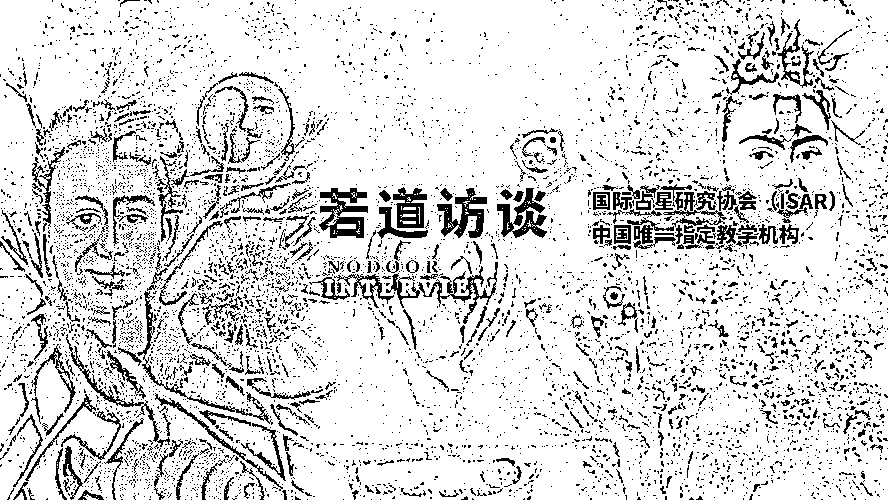

作者/斯蒂芬·弗里斯特
译者/李含  校对/江艺编辑/玫瑰 图片/pexels

2009 年元旦，重回 Matrix 软件公司的创办人迈克尔·厄尔瓦恩（Michael Erlewine）对进化占星学创始人之一斯蒂芬·弗里斯特进行了采访。这么多年来，这么多占星师，也只有斯蒂芬·弗里斯特和杰夫·格林被 Matrix 网站采访过两次。本文是在这次采访中，斯蒂芬对自己是如何接触并学习占星学的，以及在人生探索过程中占星学起了什么作用等问题做出的回答。斯蒂芬老师的[三日线上工作坊](http://mp.weixin.qq.com/s?__biz=MzA5NjA0NTAxNg==&mid=2651457754&idx=2&sn=bd13bfaba47bf4c51ef990b32368593a&chksm=8b48ba6dbc3f337be43eb7ee39ccac37c0c4ced5cbdb339ac538a3e4b6b4bfc4b9f57b6a8816&scene=21#wechat_redirect)正在报名中，有兴趣的小伙伴点击链接了解一下吧。

**天文学与手相学“交汇”****迈克尔·厄尔瓦恩：首先，您是否愿意向读者透露您的出生资料呢？** **斯蒂芬·弗里斯特：**我是 1949 年 1 月 6 日凌晨 3:22，在纽约州的弗农山（威彻斯特郡）出生的。我的星图的上升点落在天蝎座 22°多一点。**迈克尔·厄尔瓦恩：您是如何对占星学产生兴趣的？** **斯蒂芬•弗里斯特：**这是两条线索相互交融的结果。我记得自己小时候特别想要一个望远镜。到了大约 12 岁左右，我就成为一名活跃的天文爱好者了。第二条线索是手相学，那是 13 岁时，一位德国女孩儿教给我的。在 17 岁以前，这两个兴趣都是独立发展的，直到我翻开了第一本占星书，两条线索才就此交汇到一起：通过望远镜瞭望的浩瀚星光，遇到了手相学中隐含的古老心理学。**迈克尔·厄尔瓦恩：您是如何学习占星学的呢，读过哪些占星书籍或是曾在哪所占星学校求过学呢？****斯蒂芬•弗里斯特：**我完全是从书本上学习占星学的。直到我在矮脚鸡出版社（Bantam）成功出版了两本占星书籍之后才认识了其他的职业占星师。这就是土星落在中天带来的礼物！其中对我影响最深的是一群英国神秘学家——特别是查尔斯 E.O.卡特（Charles E.O. Carter）和罗纳德·戴维森（Ronald Davison）。对我影响最大的书籍是罗德尼·科林（Rodney Colin）所著的《天体影响理论》（*The Theory of Celestial Influence*）一书。

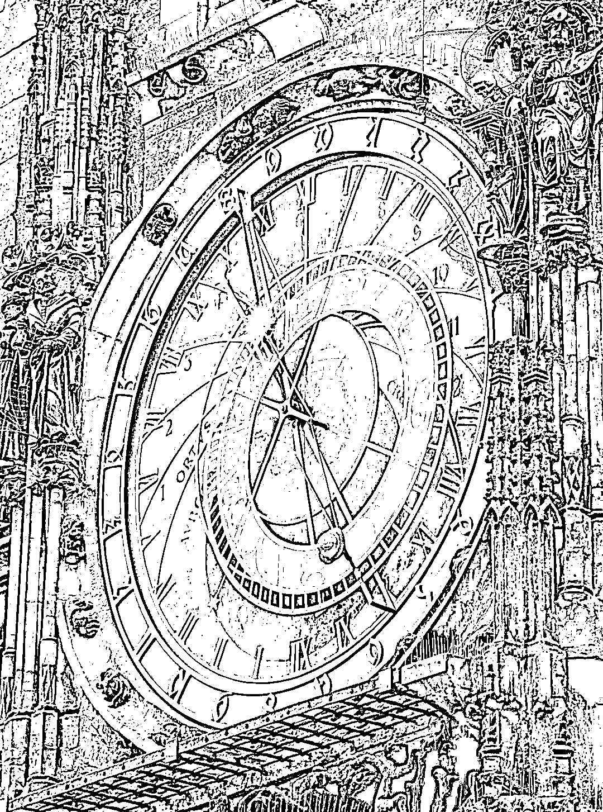

**目标不是”预言“，是”治愈“****迈克尔•厄尔瓦恩：您是否向哪位占星老师或者导师学习过呢？如果有的话，能否给我们介绍一下他们是谁，对您有什么影响？您的占星知识有什么传承关系吗？****斯蒂芬•弗里斯特：**真遗憾，都没有。如果要说到传承，我觉得自已继承了金刚乘佛教（即藏传佛教，又称密宗）和爱德加·凯西的“灵异”传统——并不是说我认为自己是灵媒，而是说我沿袭了他们的观念，以灵魂进化轮回的角度来观察这个世界。我花了许多时间与这两方面的大师们探讨。二十多岁时，我也有自己的心灵导师，她对我影响颇深——她是一位深具智慧的女士，玛丽安·斯塔恩斯（Marian Starnes）。她是我的精神之母。我将一直尊敬她。**迈克尔•厄尔瓦恩：您从事哪一个类别的占星学？您使用哪些技巧，您认为哪些技巧行之有效？****斯蒂芬•弗里斯特：**我研究的是进化占星学，本质上是古代形而上学与荣格个体心理学的结合。在技巧上，关注于前世未解的动力及其对今生和心理体验的影响。这里的目标并不是“预言”或是“描述”，而是治愈和释放。实际的技巧可以阅读我所著的《昨日的天空：占星与轮回》（*Yesterday’s Sky: Astrology and Reincarnation*）一书。我用了 300 多页才完全介绍完这些方法。**迈克尔•厄尔瓦恩：您是否有自创的占星技术呢，能否为我们介绍一下？其他人是否了解或是使用这些技术呢？****斯蒂芬•弗里斯特：**我为进化占星学领域增添了许多占星技术和阐释方法——这也在《昨日的天空》一书中有详细介绍。在一项占星学学徒计划中，我已经教授这些技巧十多年了。约有四百多学生学过了这门课程，所以，绝对有其他的占星师在使用这些技巧并从中获益。一些学生逐步进入职业占星师的领域，这让我很自豪。这些方法和那些在占星学大会上学到的不同，但它们运用于实际生活中确实非常有效，非常有生命力。当占星师们听说进化占星学与灵魂转世相关时，他们通常都认为这必定是一种神秘学说。实际上，它是心理占星学的一种强有力的表现形式：热烈而慈悲，并且能在人们的此生生活中立刻得到证实。

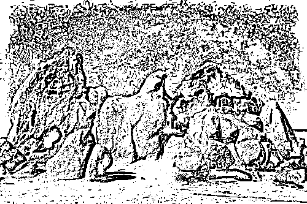

**占星学：照耀归途的明灯****迈克尔•厄尔瓦恩：在您自己的生活中，您在什么情况下会使用占星学呢，多久用上一次呢？****斯蒂芬•弗里斯特：**我会一直关注自己生活中的重大行进和推进主题，还会注意到自己的反应。有时候，我会去散散步，然后在脑中与自己展开对话，就像在同样的占星情境下和客户交流那样。我总是惊叹于这些词语带给我的震动！这很有力！有时候会让我大吃一惊。同样，我也非常注意每一天的月亮变化，在有重要行为时会以此参考——比如签订合约、订机票、启动重要的事业变动，等等。不问问月亮，我是绝不会轻举妄动的，要确保月亮没有落入空亡，月亮最近的一次成相是柔和相位。**迈克尔•厄尔瓦恩：您认为占星学是一项预测工具吗？如果是，是怎样运作的？****斯蒂芬•弗里斯特：**占星学非常适用于预测人生难题的本质和时机。预测的“结果”更适合不动脑子的笨蛋，一个人一旦开始探索意识的潜能，就跳脱了令人沮丧的宿命未来，拥有更为多元的可能性。我没有怎么研究过占星师们技巧的差异，但我相信，**“铁口直断”潜藏着危害，甚至是一件不道德的事。**话说得比较重，是因为我认为**这样的预测会影响个人追求更高的目标和可能性，这样做就真的很像黑魔法。在进化占星学中，我们是教练，不是先知。**我的观点只适用于自我成长与发展型的占星学说，顺便说一句，别预测股票市场和棒球比赛的结果。**迈克尔•厄尔瓦恩：在深刻的个人问题和人生探索领域，占星学帮助您找到答案了吗？**
**斯蒂芬•弗里斯特：**这的确是个很难的问题。感谢你的提问。简单回答是：“对。”展开来说就是，每一个人，不管你多么坚定地支持不可知论，都将他们的个人哲学和理念带到了占星学中。**完全摒弃价值观、完全客观中立的占星学是不太可能的，因为即使你摒弃价值观、坚持客观和中立，这本身就是一种哲学态度！**

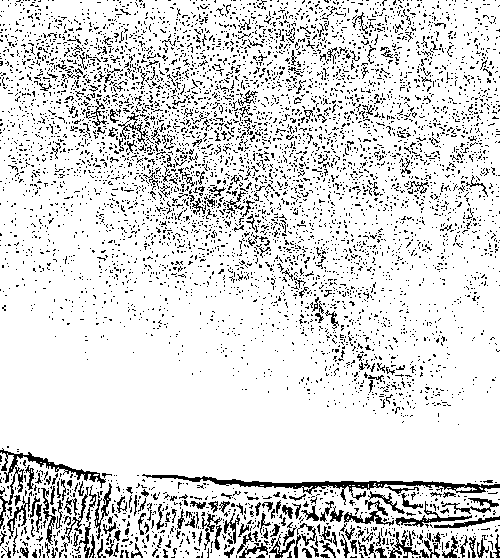

对我而言，占星学已经融入到世界观之中，不可分割。我现在已经正式皈依佛教，尽管差不多在 19 岁时，我就开始信奉佛教。我成长于健康的基督教文化环境之中，现在仍有基督教的情怀，在心灵层面上，它与我的佛教信仰完全不冲突。我相信，我们都是神秘世界中的神秘存在，经历了数世轮回，回归到难以言喻的一些事情，我们称之为“神”。我相信，**人生中发生的每一个事件，外在世界遇到的每一件事，内心体验到的每一分痛苦和纠结，都是回归家园漫漫旅途中的一部分。**我没办法证明这一切，但是我能够真诚、坦率地表明我的立场。这样的理念完全渗透在我的占星风格之中。这就是行星告诉我的信息。因此“在深刻的个人问题和人生探索领域”，占星学的确向我反馈了重要的答案，就像一盏明灯照耀着我的归途。**社交型占星师 vs 一匹孤狼****迈克尔•厄尔瓦恩：您是否为他人做咨询？如果是的话，哪些技巧会比较有效，你多久做一次咨询？您现在还欢迎客户咨询吗？****斯蒂芬•弗里斯特：**从 1978 年开始，我就是职业咨询占星师了。我的咨询时间比较长，通常会持续 2.5-3 个小时，所以一般我一天只能做两次咨询，上午下午各一次，周一到周五工作。我不常休假。做了 30 年职业占星师，此前做过 7 年兼职占星师。我的日程表总是满满的。你大概可以估算出我见过多少客户了吧。现在，我仍然继续做咨询工作，并始终欢迎新客户的光临。**迈克尔•厄尔瓦恩：您自我介绍时会说自己是占星师吗，对方作何反应呢？****斯蒂芬•弗里斯特：**现在是的。但在年轻的时候，我对这个身份也会缺乏安全感，因为害怕受到苛责，我也学会避开这个话题。如今，占星师的角色已经让我如鱼得水般自在了。我发现，似乎我的轻松，也影响到了其他人，给予我温和的回应。一般情况下，其他人都会表示感兴趣，很好奇。我想，很显然，我看起来不是个笨蛋，人们从我的其他占星信念中也可以获得更宽广的延伸！**迈克尔•厄尔瓦恩：您参加占星学界的聚会或是学术会议这类活动么？您是一位社交型的占星师，还是一匹孤狼呢？****斯蒂芬•弗里斯特：**第一个问题的答案显而易见。我在许许多多的占星学术会议中做过演讲。我个人认为，除了交流之外，这并没有特别重要，特别有益的作用。这种短小的座谈，只能关注一种独立、特殊的占星方法，这在实际的咨询中起不了什么重要。第二个问题，可是个难题。我想说，我是一匹孤狼，但又过着社交型占星师的生活。**与占星群体建立联系是一种伦理需求，同时也有利于这种实践性的职业导向。**但一次接触一两个人，我觉得是非常快乐的事。老实说，占星会议让我有压迫感。在那样的环境下，我并不觉得自己如鱼得水。

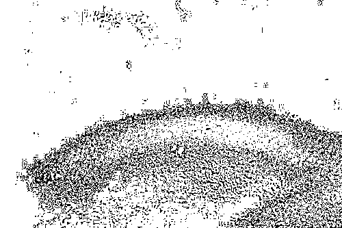

**迈克尔•厄尔瓦恩：您与职业占星师们如何联系呢？您是哪些占星学组织的成员吗？****斯蒂芬•弗里斯特：**我是国际占星研究协会（ISAR）和美国地球宇宙协会（NCGR）的成员。我在 ISAR 的道德委员会任职多年了。为此我感到很自豪。我帮助 ISAR 起草了职业道德规范。我也是 NCGR 董事会的顾问。到现在为止，我已经担任开普勒大学咨询委员会主席多年，虽然这只是一个虚衔。他们没有采纳过我的任何建议！**迈克尔•厄尔瓦恩：您如何看待现代占星学和占星师？****斯蒂芬•弗里斯特：**作为一个社会团体，我们正处以一个混乱的时期，百花齐放，流派众多。现在有许多活跃的风格和传统——进化占星学、心理占星学、印度吠陀占星学、文艺复兴时期的占星学、希腊风格的占星学、日心学派、宇宙生物学派、汉堡学派占星学、玛雅星相学，侧重点有小行星、中点、海王星外行星（trans-Neptunians，太阳系中运行轨道在海王星之外的行星）、泛音图等。 一方面来说，这种多样性棒极了！另一方面，也造就了完美的巴别塔现象，占星师们不再说同一种语言。想来一场富于智慧的争辩都不可能了！现在只有两个选择，要么保持和平，要么愚蠢地争吵。后一种似乎比较流行。**咨询、教学、写作“三位一体”****迈克尔•厄尔瓦恩：您的占星业务发展如何？顺利吗？占星学收入占到您总收入的百分之多少？**
**斯蒂芬•弗里斯特：**1978 年开始，我的收入就全部来自于占星。朱迪和我都没有什么家族遗产，也没有其他的收入。我做得还不错，和一个优秀勤勉的心理医生收入差不多。主要收入直接来自于咨询的客户。我同时也做些一些教学工作，写写书，同时也从我和朱迪一起创造的报告写作器上获取一些版税。 我们有个非常漂亮的家，在南加州的沙漠里，在北卡罗来纳州也拥有居所。70 出头我就可以舒舒服服地退休了，不过我想自己会不愿意退休。这份工作带来的回报绝不仅仅是金钱！吹嘘自己的收入实在是件很傻很荒唐的事！另一方面来看，现代占星师能为占星学做的最有益的一件事，就是向大众宣传一种激进的理念，即占星师确实是正当职业——可以作为谋生的手段。如果你能够走出占星技巧的孤立狭隘的小天地，用占星学为人们提供重要的帮助和服务，你就可以凭借这一行业过上相当不错的中产阶级生活。如果普通大众普遍意识到这一点，那么占星团体将会发生巨大而有益的改善。

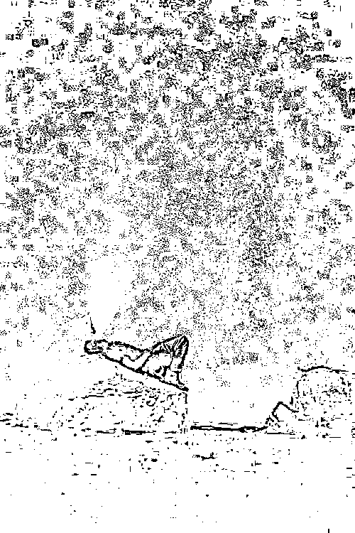

金钱是走出贫民区的主要途径，占星学是一个贫民区，然而它却不应当走那条路。我们必须打破在这一领域内反对说出专业现实真相（即财务状况）的“精神”禁忌。有许多著名的占星师，无法以此谋生，这让我很惊讶。出了什么问题呢？这里的确事出有因，但潜在的学生们也有权质疑，这样的老师是否“货真价实”。**如果你所使用的占星学意义深刻，能够行之有效地帮助别人，那你一定可以吸引到足够的客户，以此谋生。**如果你能坚持工作一段时间，你的声名会在这一领域内口耳相传。**迈克尔•厄尔瓦恩：您能跟我们介绍一下您的占星商务计划么？****斯蒂芬•弗里斯特：**这一方面事务的实际运作是由朱迪负责的。她启动了一个七爪出版社（Seven Paws），自助出版一本奇幻小说，她厌倦了向主流出版社推销作品了。这一计划出人意料非常成功，所以我们也开始出版占星书籍了。这时候才真正是我们自己的书，虽然之前我们已经出过不少书，还与杰夫·格林合作著书，发行了拉斐尔·纳赛尔编纂的“同一天空下（*Under One Sky*）”系列丛书。顺便说一句，前面这些经验真是感觉棒极了！有 12 位占星师，每一个人都代表了不同的传统流派。拉斐尔给出一位女士的出生信息，还有一些钱，然后说：“拿出你们的看家本领来给我看看吧！”我们都尽力写出自己的解读，纯粹的占星解读——我们对这位女士一无所知，连名字都不知道。这就是传说中的“要么行动，要么闭嘴”时刻！最后，拉斐尔没有能够找到出版商，所以朱迪将书稿纳入了七爪出版社的计划中。在这里自吹自擂一下，克里斯·劳伦斯（Chris Lorenz）在《戴尔占星》（*Dell HOROSCOPE*，著名占星专业杂志）上，给予“同一天空下”系列丛书极高的评价，“学海无涯就是我的态度，我想要知道哪一位占星师是最棒的 …… 这个问题，每一位读者都有自己心目中的第一名，而我总是毫不犹豫的把奖杯颁给斯蒂芬·弗里斯特。”（译者注：克里斯 • 劳伦斯，荷兰阿姆斯特丹大学哲学和历史方法论教授，曾是澳大利亚和德国的访问学者。出版有论论历史哲学、近代史学编纂和教育政策等有关的著作。）这段评语让我非常自豪。这也是对进化占星学的肯定。能够与罗伯特·汉德（Rob Hand）、德梅特拉·乔治（Demetra George）、罗伯特·施密特（Robert Schmidt），这些我无比尊敬的占星大师们共同参与这项出版计划，我深感荣幸，能够与他们成为同事，的确与有荣焉。除了七爪出版社以外，我们还出品了一些软件、讲座的光盘、电脑报告、视频和一些细微的服务，这些在我们的网站上都可以找到。

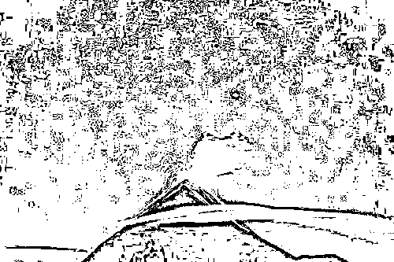

**迈克尔•厄尔瓦恩：您能跟我们具体分享一些占星事业发展过程中的故事吗，个中曲折，还有您对这一工作的未来展望？****斯蒂芬•弗里斯特：**总的来说，前面谈到的那些业务都是我工作的重要部分，单独运营任何一项，收益都不大，但将它们密切配合起来，却能发挥协同增效的作用。对我来说，金钱来源于客户咨询、教学、专业写作，而占星学的灵魂同样通过这中“三位一体”的形式得以展现。朱迪也做咨询，但她不像我，这么天生喜欢与客户们交流，所以她在这方面的发展要少一些。因此，她就负责其他所有的事务。她才华横溢，不知疲倦地努力，让我十分感激。她满足了自己的需要，还给予我有力的支持，让我能够开设讲座、运营网站，给我们提供信用卡支持，最重要的是，她还是我的出版商，我偶尔冒出的多音节词也不会让她感到惊讶和困惑。

**版权声明：**本文由若道翻译发布，欢迎转发，反对抄袭。友号转载请申请白名单。

斯蒂芬·弗里斯特

若道签约老师。进化占星学的创始人之一，当今世界最有影响力的占星大师之一；1985 年，他凭借《内在的天空》一书获得职业占星师协会奖（Professional Astrologers Incorporated Award）。他四次获得占星界最高的占星学联合协会奖（United Astrology Congress Regulus Award）提名，2018 年获得轩辕十四教育奖。

****学习占星学****

****点击下图了解课程详情**** 

**

**

**

****

**微信又双叒叕改版啦，不想错过若道君的推送？**

**就把若道设为星标吧！**

**▼**

就是这个“在看”，戳戳戳 ☟

******报名直达入口******

# 斯蒂芬 10.15 三日线上工作坊丨如何进行一场有效的占星咨询？（倒计时 3 天！）

> 原文：[`mp.weixin.qq.com/s?__biz=MzA5NjA0NTAxNg==&mid=2651458041&idx=2&sn=3460c66371aba3bf7155551f31f228a0&chksm=8b48bb4ebc3f32580ddb75505b0fca1be53ea2b4abfc4bf66ae0e71545d160db135d1382f92c&scene=126&sessionid=1692737913#rd`](http://mp.weixin.qq.com/s?__biz=MzA5NjA0NTAxNg==&mid=2651458041&idx=2&sn=3460c66371aba3bf7155551f31f228a0&chksm=8b48bb4ebc3f32580ddb75505b0fca1be53ea2b4abfc4bf66ae0e71545d160db135d1382f92c&scene=126&sessionid=1692737913#rd)

**喜大普奔，斯蒂芬要来教占星咨询了！**

占星咨询对于很多占星学生和兼职占星师而言，都是考验自己到底能否成为职业占星师，建立欣欣向荣职业生涯的最关键一环。

一个坏消息是，当你辛辛苦苦学习完所有的占星技术后，你可能仍会有些沮丧地发现，自己还是做不好一场咨询。

**比如：**

对咨询的问题

*   我可以怎样迅速和客户建立信任？

*   我如何描述星图中我看到的困难配置，或者如何描述我看到的即将到来的富有挑战的行进？

*   如果客户在咨询中滔滔不绝，我该怎么办？

*   如果客户在咨询中一言不发，我又该怎么办？

*   如果客户否认我所描述的他/她明显存在的问题怎么办？

*   如果客户存在明显的心理问题怎么办？

*   如果我讨厌这个客户怎么办？

*   如果我被这个客户吸引怎么办？

*   如果我的性能量被客户激发怎么办？

*   ……

**这么多问题怎么办？！**

别着急。

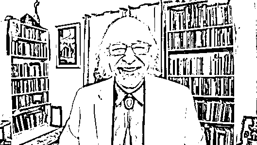

好消息是，这是每一个占星学生和新手占星师都会遇到的问题，也是每个占星师必走之路。**其中一些问题是可以用占星技能所解决的，而另一些又是在占星技巧之外，需要进入心理学的领域。**不论怎样，归根到底，我们要能在咨询与客户建立并且维持**良好的咨询关系**，甚至与那些跟我们性情截然相反的客户。

1

**授课内容**

如果你听过斯蒂芬·弗里斯特的占星咨询，你会看到客户被他润物细无声的咨询所打动，又感到自己被他深沉的慈悲所懂得。那些娓娓道来的故事在客户面前展开生命时空的画卷，在咨询结束时，又充满希望的力量。

**而****今年****10****月****，在斯蒂芬到中国教学 10 年后，他将****第一次****与所有热爱他的学员分享如何做好一场占星咨询。**

在这个网络课程中，占星大师斯蒂芬·弗里斯特将会和你分享他几十年来一对一面对面的**占星咨询经验**；他也会分享如何提前规划好**接近客户心灵**的占星技巧。**客户个人星图**为我们提供一个最迅速，也最可依赖地建立信任和自然连接的地图，他还会分享如何运用个人星图建立这个连接。

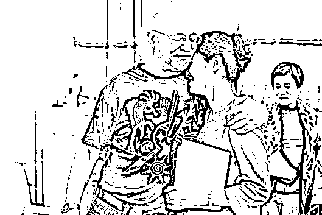

2

**斯蒂芬的占星著作**

*   **1984-1988 年间**，斯蒂芬写作出版了《内在的天空》（已有中文版）、《变化的天空》和《天空的伴侣》三本占星经典著作，奠定了早期在占星学界的地位。

*   **2002-2005 年间**，他与朱迪·弗里斯特共同创作了两本经典的关系占星学著作《天空的伴侣 I：爱、性、和进化占星学》《天空的伴侣 II：组合图》。　

*   **2008 年**，斯蒂芬出版了一本非常重要的著作《昨日的天空》，此书是至今为止关于轮回转世跟星图的清晰对应最详尽的著作之一。 斯蒂芬前后一共出版了 12 部占星著作，在世界占星学界拥有很高的声誉。

3

**斯蒂芬获得的荣誉**

**1985 年**，他凭借《内在的天空》一书获得**职业占星师协会奖**（Professional Astrologers Incorporated Award）。

**1992、1995、2008 年、2018 年**，他四次获得占星界最高的占星学联合协会奖（UnitedAstrology Congress Regulus Award）提名，**2018 年获得轩辕十四教育奖**。

4

**斯蒂芬的占星哲学观**

斯蒂芬的占星风格以自由和选择为中心，他的解读不是以下定论的方式来“预测”未来，他强调如何**改善生命**，而不是宿命式的论断。他以心理占星学的语言来解读星图上的人格部分，但是通过**南北交点及其相位和守护星**来探索星图所揭示的前世业力与今生方向，在灵魂进化的背景里来整体解读星图。

他认为进化占星学的目的在于鼓励人们做出更符合进化方向的智慧选择，我们学习去了解前世的时侯，关注点应该集中在**如何通过意识来疗愈自己**。

5

**这些名人怎么说？**

斯蒂芬让我们停止了玩责备命运的游戏，而开始看到自己是一个走在进化路途上的勇士。 ——**奥普拉杂志***“O: THE OPRAH MAGAZINE”*

斯蒂芬和杰夫这两位著名占星师创造性地相互应和，展现出他们出色的教师才华，发展并弘扬了占星这门艺术。（对《测量天空：进化占星学和灵魂的钥匙》的书评） ——著名心理占星师 现代占星学之父 **诺·泰尔**（Noel Tyl）

请享用斯蒂芬和朱迪这两个博大的灵魂在此书中所提供的洞见大餐吧。（对《天空的伴侣》的书评） ——进化占星学的创始人之一 **杰夫·格林**（Jeff Green）

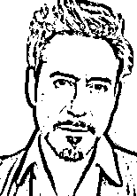

我为斯蒂芬解读的精准感到惊叹，他强调没有一件事是坏得无法挽回的，也没有一件事是如此之好，以至于它不会因为现在的错误判断而消失的。我怎样推荐他都不为过！ ——好莱坞著名影星“钢铁侠”男主角 **小罗伯特·唐尼**（Robert Downey Jr）

6

**上过课的占星师怎么说？**

他关于我星图的解读，让几乎所有在场的人掉泪，我也从此开启了一段灵魂追寻的旅程。我很惊讶他透过星图可以如此深入一个人的灵魂。很多东西你自己都不知道，但是他讲出来你会发现，啊，这是真的，这是占星学的神奇。——**《心探索》创始人孟想**每个来参加老师课程的同学，都会被老师深深的慈悲心感动。这种慈悲心，并不是表面上说的一些什么话，而是一种从意识层次上发出的能量。每个来上课的人，都能感受到老师的爱。这种爱，并不是盲目的爱，而是深刻地洞悉真相后的慈悲。——**斯蒂芬老师工作坊翻译逸月**斯蒂芬老师的一对一咨询已经排期到两年之后，我特别幸运，曾在课堂上被老师抽中分析过我的星图，老师充满爱与智慧的指引让我更加清晰的认识了自我。内在的潜能、需求和矛盾被老师娓娓道来。——**禄丽荣**斯蒂芬老师是位非常非常值得推荐的大师，很粉他，这位进化占星学的创始人，对人的理解是那么的全面完整、深刻洞见、慈悲和温暖，就这方面而言足可以媲美我无比崇敬的荣格和史坦纳（这两位去天堂里玩了），如果你对西洋占星感兴趣，或者对人的所有角度、各个层次的真相和可能性感兴趣，推荐斯蒂芬老师的书和课程，特别是他的课程，数倍的功力大增的好机会，错过真是占星粉丝的莫大损失。——**仁华**

7

**2020 年斯蒂芬线上工作坊学员感悟**

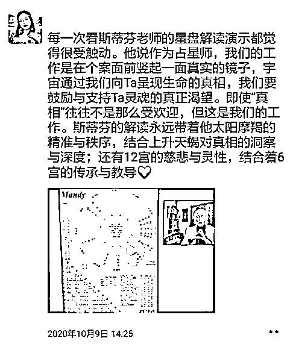

8

**什么人适合这门课程？**

*   占星师或渴望成为占星师的人群。    

*   课程会涉及综合解读高阶内容，不了解相关知识的同学，请提前学习相关内容。

9

**老师简介**

**斯蒂芬·弗里斯特(Steven Forrest)**

*   进化占星学的创始人之一，当今世界最有影响力的占星大师之一；

*   毕业于美国北卡罗莱纳大学宗教学专业；

*   1984-1988 年间，写作出版了《内在的天空》、《变幻的天空》和《天空的伴侣》三本占星经典著作，奠定了早期在占星学界的地位。前后一共出版了 12 部占星著作，在世界占星学界拥有很高的声誉。

*   1985 年，他凭借《内在的天空》一书获得职业占星师协会奖（*Professional Astrologers IncorporatedAward*）。1992、1995、2008 年、2018 年，他四次获得占星界最高的占星学联合协会奖（*United Astrology Congress Regulus Award*）提名，2018 年获得轩辕十四教育奖。

*   斯蒂芬将自己的绝大部分时间都花在教学以及个人咨询上，他于 1998 年创立了占星学徒计划（*Astrological Appretice Program*），这个计划致力于培养职业占星师；

*   至今为止已经有 600 余位学员完成了培训，其中很多都成为了优秀的职业占星师；

*   他是一位脚踏实地的导师，充满快乐和活力，亲和幽默同时又充满了智慧；他的课程不仅仅是一次占星知识和经验的学习，也是一次与智者的相遇。

10

**课程费用**

**正价：****4800 元**

11

**授课时间、方式和退转**

**授课时间：**

****2021 年 10 月 15 日-10 月 17 日（周五、周六、周日）****

****每天 7:00-13:00****

7:00 AM - 9:30 AM

**（1 小时休息）**

10:30 AM - 12:30 PM

**授课方式：**线上直播课，英文授课，中文翻译**退转课程：**

退款原则请详看《教学协议》，如有疑问请咨询课程顾问。

****斯蒂芬三日线上工作坊****

**授课老师：斯蒂芬·弗里斯特**

**授课时间：****2021 年 10 月 15 日-10 月 17 日**

**授课方式：**线上直播课，英文授课，中文翻译

**费用：****4800 元**

**课程负责人：****王老师**（微信：18510107057，请备注“斯蒂芬工作坊”）

长按二维码添加课程负责人咨询~

****报名请点击“阅读原文”****

# 雷蒙德·梅里曼金融占星周运 | 密切注意周一的行情变化！

> 原文：[`mp.weixin.qq.com/s?__biz=MzA5NjA0NTAxNg==&mid=2651457921&idx=2&sn=5918aee14623e0d6c4f6d09bffdd06e6&chksm=8b48bb36bc3f322076bdbac447a6c5bb98601db0550e5ac27aa47139ef6abcf0b95024a3b380&scene=126&sessionid=1692737913#rd`](http://mp.weixin.qq.com/s?__biz=MzA5NjA0NTAxNg==&mid=2651457921&idx=2&sn=5918aee14623e0d6c4f6d09bffdd06e6&chksm=8b48bb36bc3f322076bdbac447a6c5bb98601db0550e5ac27aa47139ef6abcf0b95024a3b380&scene=126&sessionid=1692737913#rd)

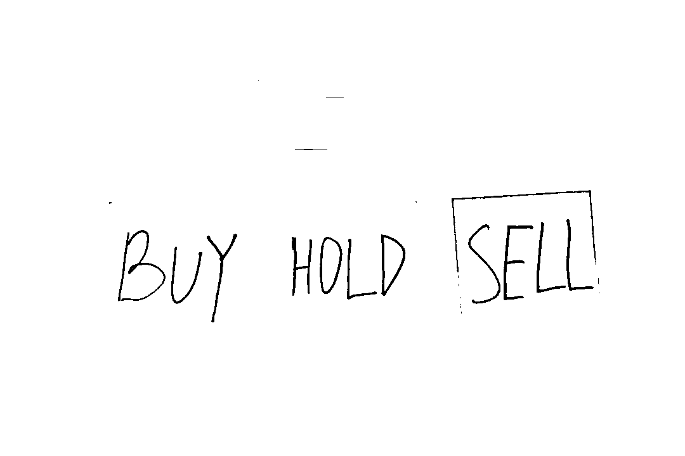

作者/雷蒙德·梅里曼 译者/Luke 编辑/玫瑰 图片/pexels

雷蒙德·梅里曼是在金融占星学界稳坐第一把交椅的占星师，同时他也是若道签约的金融占星课老师，我们引进了雷蒙德·梅里曼老师的《[上证指数月度报告](http://mp.weixin.qq.com/s?__biz=MzA5NjA0NTAxNg==&mid=2651457358&idx=2&sn=7f9716283aa45202cac373edc975a3b9&chksm=8b48b5f9bc3f3cef6942c2670605563f932623c1ef13b686cd99fe8a8160d392160c9a9fdac6&scene=21#wechat_redirect)》及《[黄金报告](http://mp.weixin.qq.com/s?__biz=MzA5NjA0NTAxNg==&mid=2651457358&idx=2&sn=7f9716283aa45202cac373edc975a3b9&chksm=8b48b5f9bc3f3cef6942c2670605563f932623c1ef13b686cd99fe8a8160d392160c9a9fdac6&scene=21#wechat_redirect)》。我们经老师的授权，将每周刊登梅里曼老师的周运，供大家参考和学习。于是，这是本周的周运（10.11-10.15）。

**说明：以下时间采用纽约证券交易所所在地美国东部标准时间。**

**展望与回顾**

****

**美国劳工部周五报告，美国经济在 9 月创造就业的速度远远低于预期，这是经济状况的悲观信号……与道琼斯预估的 50 万相比，非农就业人数当月仅增加 19.4 万。失业率下跌至 4.8%，好于预期的 5.1%，但也是 2020 年 2 月以来的最低。****——杰夫·考克斯****《9 月份的新增就业不足，仅增加 19.4 万人》****www.cnbc.com****2021 年 10 月 8 日****9 月份的工资增长率进一步助长了一种观点，那就是当前通货膨胀可能会比很多经济学家预期的持续更久。****——杰夫·考克斯****《强势的工资增长令人怀疑通货膨胀是否会很快消失》****www.cnbc.com****2021 年 10 月 8 日**很难说哪个因素与全球股票指数上周的剧烈波动有最强的关联：天秤座新月，太阳合相火星，还是水星逆行周期的中点。天秤座新月与全球股票指数的高点有更大的关联。但是上周当新月发生时，出现的是 10 月 6 日的低点。或许那是因为水星也在逆行，导致很多技术指标或图表形态展示出与过去历史趋势相反的情形，或给出了虚假的很快被否定的买入和卖出信号。**水星持续三周的逆行周期中点是 10 月 7 日-8 日。**然后是太阳-火星的 25 个月会合周期。历史上这一地球宇宙学征象在 8°容许度内，与股票指数 8%-20%的反转有很强的关联。这覆盖了从 9 月 13 日到 11 月 1 日的时间段。在美国，合相发生的准确日期是 10 月 7 日。无论是什么样的关联，全球股票指数仿佛变戏法一边，突然在上周中旬从持续数周的下跌趋势中反转，然后开始了强势的上涨。回顾过去，我们发现并非所有的股票指数都从近期的高点下跌了 8%或更大跌幅。或许最令人震惊的案例发生在日本，日经指数在二星级关键反转日 9 月 14 日飙升至 31 年来的高点 30795。三周以后，在 10 月 6 日，它暴跌至 27295，跌幅为 11.37%。香港恒生指数也下跌了 10.8%，同时苏黎世 SMI 指数下跌 9.6%至上周低点。在美国，最近的纳斯达克期货从 9 月 7 日的历史高点下跌 8.5%至 10 月 6 日的低点。但随后一件有趣的事在股票市场上发生了。每个股票指数突然在 10 月 6 日新月时从低点反转，接下来两天出现了良好的上涨。这是否代表太阳-火星合相对应的下跌已经结束？可能是这样，因为好几个技术指标都已经切换到看涨模式。然而，**由于恶作剧者水星的逆行将持续到 10 月 18 日，误导和前后矛盾的信号仍然可能发生。在恶作剧者水星逆行时，没有什么是确定的。**其他市场上，原油自 2014 年 11 月以来终于首次在 10 月 8 日达到 80 美元/桶的价位。比特币爆炸性上涨，在 10 月 8 日达到 56141 的高点，开始挑战历史高点 65000。仅在 3 个月前，它还徘徊在 28800 的低位。对这位加密货币的老大哥来说，这是接近 100%的涨幅。对于那些“稳定”的货币，欧元上周在 10 月 6 日下跌至 1.1527，是一年多来的最低点。然而，这看起来并没影响到黄金和白银，两者周五时都达到了自 9 月 29 日近期低点以来的最高价位。白银从两周前的年度低点 21.41 之后的走势，看起来尤其有趣。

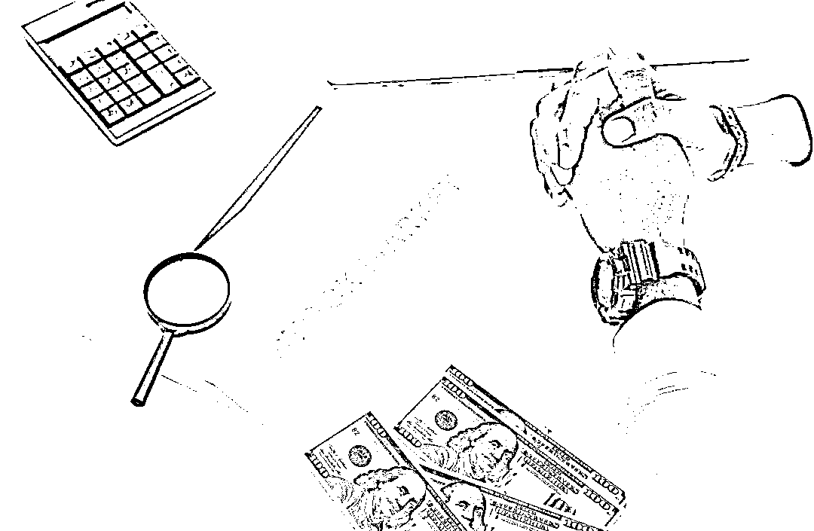

**短期占星趋势和长期考量**

****

**房价以破纪录的速度上涨，但收入却跟不上，这使得人们买房子变得越来越难。**

**——奥拉·麦卡弗雷**

**《住房购买力达到多年来的最低点》**

**《华尔街日报》**

**2021 年 10 月 4 日**

**国际货币基金组织总裁克里斯塔莉娜·乔治艾娃指出通货膨胀和债务的风险正在不断上升，而且那些拥有新型冠状病毒肺炎疫苗和缺少疫苗的国家之间增长前景的差异正变得越来越大。**

**——马丁·克拉辛格**

**《国际货币基金组织下调全球经济复苏预测》**

**美联社**

**2021 年 10 月 8 日**

我总是期盼着每年的这一时间到来，因为这标志着我闭门不出专心撰写《年度金融预报》大部分内容的时刻。正在此时我才有机会研究和回顾当前的地球宇宙学模式，以及它们与历史事件的关联，尤其是和世界经济和金融市场周期的关联。我感觉这让我更有信心撰写明年的前景展望，并且还帮我组织了想法，理清了投资和头寸交易的思路。在许多情况下，我从这探索发现的过程中获得了灵感。上周有个有趣的经历，是我自大学后再也未经历过的。我遇到了写作方面“才思枯竭”的情况。通常，我早上起来时就对自己想要研究或写作的内容有了大体的想法，然后花一整天写作，或至少市场收盘后开始为订阅者们写日报。但上一周，甚至之前一周，这都没有发生。我没有任何灵感。关于 2022 年，我的研究并没有显示出任何“有洞见”或“值得关注”的信息。就像一潭死水；我摸不着头绪。我变得有点焦虑，因为写《年度金融预报》的日子一天天过去，我却什么都写不出。所以，我想不如改变我的生活习惯。我不再早起写作，开始改为在深夜写作。哈！这就是了！我突然发现自己变成了午夜作家，想法和洞见开始涌来。“为什么会这样？”我问自己。或许是因为水星逆行。毕竟，水星是我星图的守护星，也是掌管写作的行星，而且它在我星图中位于与写作相关的第三宫。或许不仅是市场趋势在水星这样的行星逆行时改变了，或许人们的日常惯例在这一时期也受到了干扰。当你想到人生中的阻碍时，比如写作方面“才思枯竭”，你常常把它与土星关联起来。所以毫不令人意外的是，**下一个即将展开的一级地球宇宙学征象将是 10 月 11 日的土星停滞，转为顺行。**那是一个一级（最强的）征象，因为它在 9 个交易日内，与美国股票市场基本周期或更大的周期有着非常高的关联（70%）。**上周三在多个全球股市出现的低点，可能是基本周期的波谷或对波谷的重新测试，因为它距离土星停滞只有 3 个交易日。**土星的主题是压抑、收缩和限制。它掌管墙壁。或许它也掌管着写作方面“才思枯竭”。毕竟，这次土星在我星图中与创造力相关的第五宫停滞，而且还正好与我星图中的狮子座的土星精确对分。

很容易把任何出错的事归咎于恶作剧者水星的逆行。是的，我的电脑和软件程序上周也出了问题，更不要提我的门铃失灵了，汽车钥匙锁的电池也没电了。上帝啊，真高兴刚才发现土星将在周一停滞。因为我可以停止把写作方面“才思枯竭”和从晨型人变成夜猫子，归咎到水星逆行头上了。那让我感到又回到了大学年代。但是等一下：难道土星不应该让你感觉自己变老了吗？或许这是另一个水星逆行改变现实的案例，把我们预期会发生的事变成完全不同的事情。至于本周的市场走向，**10 月 11 日的土星顺行，不是一周内改变运行方向的唯一行星。冥王星也在 10 月 6 日停止了逆行。**而且**在 10 月 18 日，水星和木星都将结束逆行。**那意味着在 10 月 11 日的一周内，总共有四颗行星从逆行变成顺行。这是一件罕见的大事！倘若金融市场也改变了趋势，那也毫不奇怪。由于地球宇宙学反映了人类活动的变化，所有这一切的原因可能是人类集体意识焦点的改变。之前看起来重要的事（比如债务上限、政府关门、德尔塔毒株病例增加），可能转变成了其他事情，随之而来的是人类想法和市场行为的新趋势。**说明：以上日期基于纽约证券交易所所在的美国东部标准时间，由于存在时差，中国地区可能需要加一天。****版权声明：**本文由若道翻译发布，欢迎转发，反对抄袭。友号转载请申请白名单。

**雷蒙德·梅里曼（Raymond Merriman）**

若道签约老师。著名金融占星师，ISAR（国际占星研究协会）前主席，梅里曼市场分析公司的总裁。他由于“提升了占星学的职业形象”，在 1995 年国际占星大会上被授予轩辕十四奖；在 2012 年国际占星大会上，被授予轩辕十四终身成就奖。

1“中国上证指数月度报告”发售

**若道推出了****中文版****的雷蒙德·梅里曼中国上证指数月度报告，并持续发行该报告！**

当把金融市场的周期和占星学的周期相结合时，雷蒙德·梅里曼老师的金融占星学研究**为投资者应对金融市场的周期波动，并随之调整投资策略提供了极大的价值参考**。

**10 月中英文报告已上线！**

2“黄金价格周期月度报告”发售

**若道推出****中文版****的雷蒙德·梅里曼黄金价格周期月度报告！**不仅仅为广大读者在中国股市的投资出谋划策，更将视角放眼黄金市场。

**每当世界经济形式不明朗的时候，有一个地方是保值的港湾，那就是****黄金**。自 1982 年雷蒙德·梅里曼出版第一本研究《地球宇宙学征象与黄金价格的关联》的著作以来，**他一直作为最重要的黄金市场时机预测者之一享誉国际**。

10 月黄金报告已上线，梅里曼老师将会告诉你他对这个关键时期如何操作的想法。也可以按照季度和一年期订阅，有更多优惠。季度和年度的好处是，你可以持续了解梅里曼老师对于不断在变化的市场的看法。即便他某一次看法和市场不一致，你也看到在下一期他如何调整自己的看法，并看到金融占星在一个长期时间段内对你把控风险的帮助。而能够长期控制风险、尽量找到安全的投资时机才是投资的长久之计。

**10 月中英文报告已上线！**

**购买套餐**，买得越多越优惠

中国上证指数月度报告套餐价

*   **单月报告**：280 元

*   **3 个月套餐**：780 元（260 元/月）

*   **12 个月套餐价**：2400 元（200 元/月）

**长按下图识别二维码**

**购买金融报告****套餐**

**▼**

黄金周期月度报告优惠

*   **双报告年度套餐更优惠（直降 900 元）**
*   **12 个月黄金报告+12 个月上证指数报告：仅需 3900 元**

**长按下图识别二维码购买黄金报告套餐**

▼

3 中国金融市场特别网络研讨讲座

面对年底几个影响金融市场的重要天象，该如何把握下半年的投资，为跨年做准备？我们特意邀请雷蒙德·梅里曼老师为大家带来了**3 个小时的金融讲座——雷蒙德·梅里曼中国金融市场特别网络研讨讲座。**

这场为期 3 小时的在线讲座探讨了**这些长期行星周期如何影响世界经济的长期周期和趋势，特别是如何影响上证综指和黄金市场**。并描述**在 2021 年剩下的时间里市场反转关键时间点，特别是 12 月 19 日至 25 日金星逆行，以及土星-天王星最后一次渐亏四分相、金星与冥王星合相的重要时期。**

**长按下图识别二维码购买讲座视频**

▼

**点击阅读原文购买金融报告**

# 好物推荐 | 从"麻瓜"进化成占星师的自我觉察工具（插班中）

> 原文：[`mp.weixin.qq.com/s?__biz=MzA5NjA0NTAxNg==&mid=2651457921&idx=3&sn=5edcfd4098525b8a7d72df9b683c0ebc&chksm=8b48bb36bc3f3220173ffc4f9a600048f4853da39c5dca4f1b421599ab5126b9bef2cddf2b3c&scene=126&sessionid=1692737913#rd`](http://mp.weixin.qq.com/s?__biz=MzA5NjA0NTAxNg==&mid=2651457921&idx=3&sn=5edcfd4098525b8a7d72df9b683c0ebc&chksm=8b48bb36bc3f3220173ffc4f9a600048f4853da39c5dca4f1b421599ab5126b9bef2cddf2b3c&scene=126&sessionid=1692737913#rd)

1

**自我觉察，是智慧的基础**

每个人都有自己的内在冰山，自我觉察能够帮助我们觉察自己的行为、情绪等，然后向内深层探索，探索自己的行为、情绪背后的深层渴望、期待。学习和应用占星学的过程，就是慢慢掌握自我觉察工具的过程，当你熟练掌握了占星学，也就具备了帮助引导他人觉察到自身生命议题的能力。**往外张望的人在做梦，向内审视的人才是清醒的。**只有真正向内看，只有当觉察开始由外向内时，改变才会发生，才能够知行合一。

# | 插画师：古戈力

以情绪来举例说明，每个人的情况不同，觉察的程度也不同，觉察有四个层次：***1.*** **不知不觉：**没有觉察情况，当情绪来了，会被情绪控制，做出很多不计后果的事情。而且每次都是同样的状况，反反复复；***2.***** 后知后觉：**情绪过后，自己能够反应过来，自己做的对与错，但是很难避免同样的情况再次发生；***3*****. 当知当觉：**当情绪来的时候，你已经知道在这个当下，正在发生什么。当达到这个层次，你就可以自己控制情绪，从而影响后事的发展；***4*****. 先知先觉：**当事情还没发生，就可以预知它要发生了。因为你对情绪的觉察已经越来越熟练，所以情绪还没来，你就知道它要来了。所以，你也就有了更好的选择和处理方法。所以，我们要自我觉察，向内探索，觉察是为了接纳，然后做出改变，成长，迭代，升级。**那么要如何练习自我觉察，掌握先知先觉的能力呢？**

2

**每日觉察的工具推荐**

**今日天象&近期行进**

若道 APP 中的今日天象功能，罗列展示每一天的具体天象，你当天的行进和行进周期：

作为占星师，可以这样使用这个自我觉知工具：

**记录梦境**如果你有醒来记录梦境的习惯，每天早上看一下睡梦中的天象和行进，对应联想，你会惊喜地发现一些神奇的对应，能够更敏锐的捕捉到日常被压抑的情绪和需求。能够帮助你在白天的工作生活中先知先觉的关注身心状态。**规划生活**每月月初，周初都可以参考天象和行进进行日程规划，预估可能的助力和阻力，在对的时间做对的事，会发现平平无奇的日常也可以有不一样的色彩。根据月相的变化感知情绪的起伏，更好的自我关爱。**感知环境**当身边发生了引起你注意和好奇的事情，或者网络上层出不穷的新闻热点，都可以在天象中寻找对应的能量。从更大的格局视角去思考你的个人观点。通过环境的共振，更深入地理解自己的出生星图。以上都是很好的学习深化占星知识的方法，只需要系统掌握以下知识，就可以开始使用以上方法去提升自我觉知。**第*1*阶 黄道星座&个人行星****概要介绍占星学与星图**

**四元素与三形态**

**黄道 12 星座**

**太阳、月亮及其他个人行星**

**第*2*阶 行星&宫位****木星&土星****天王星&海王星&冥王星**

**练习组合所有行星**

**四轴**

**十二宫位**

**组合宫位、行星、星座****第*3*阶 月亮交点、相位以及初步解读星图**

**了解灵魂进化的路径：月亮交点**

**相位概论**

**相位&行为模式**

**困难相位**

**柔和相位**

**容许度，出入相位**

**渐盈渐亏相位**

**空相**

**宫主星&定位星**

**相位模式**

**组合相位、星座、行星、宫位**

**解读的基本原则，权重，失衡**

3

**课程安排是怎样的呢？**

**第*1*阶**2021 年 9 月 15 日开课，每周一天晚上 20:00-22:00 上课，共 6 次课**第*2*阶**2021 年 11 月 11 日开课，每周四晚上 20:00-22:00 上课，共 6 次课**第*3*阶**2022 年 1 月 6 日开课，每周四晚上 20:00-22:00 上课，共 15 次课 2022 年 4 月 30 日、5 月 1 日**L3 北京两日线下工作坊**

****

4

**授课老师**

**艾德里安·罗斯·邓肯**

**（AdrianRoss Duncan）**

**· **1971 年在印度游学时开始学习占星学，1985 年开始成为全职占星师，迄今执业已超过 33 年，是人本主义占星学、卜卦占星学和经世占星学领域的知名占星师。他还开发了占星软件 AstroClock 和多款占星报告；**·** 哥本哈根占星学院院长；**·** 他在日常咨询中经常运用卜卦，咨询图（卜卦的一种运用方式，即根据客户来访时间制作星图，从星图中获得大量信息）也是他特别擅长的领域；**· **艾德里安·罗斯·邓肯从 1971 年开始研习佛学，受佛学影响很深，他相信占星学和佛学观点一致，转化的一个基础是在于对现实感知的改变。而卜卦很容易与佛教融合，因为它只关乎当下。

**大卫·瑞雷**

**（David Railey）**

**·** 若道联合创始人，致力于在中国教授和推广西方占星学；**·** 曾任 ISAR 全球副主席，CAPISAR（ISAR 职业占星师资质认证机构）主席；**·** 1976 年，通过亚特兰大职业占星师考试，成为全职占星师，随后通过 AFAN 和 ISAR 职业测试；**·** 1980 年，与杰夫·焦耳一起在亚特兰大创建“每日行星”占星学中心。此后在亚特兰大占星协会担任 4 年考官，并且两次担任亚特兰大地区占星协会主席。1979-1992 年，作为占星师活跃于美国社会媒体，向不了解现代占星学变化的大众宣传专业占星学知识。在 1989-1992 年期间，他在 WRGG 电台 12 频道每周主持个人电视秀“今日占星学”，早先他还在 WRFG 的广播节目中播讲宇宙天气节目；**·** 2010-2014 年，任全美占星师联盟监督委员会委员；**·** 2010 年，其著作《灵魂的目标》中国版出版，和蒋颖一起创办若道占星学校和其官网 www.nodoor.com；**·** 2017 年，被选为 ISAR 委员会成员。ISAR 是世界最大的国际占星机构，会员遍布 45 个国家，2017-2020 年曾任 ISAR 全球副主席、CAPISAR（ISAR 职业占星师资质认证机构）主席。

**克里斯蒂娜·罗登贝克**

**（Christina Rodenbeck）**

**· **克里斯蒂娜·罗登贝克（Christina Rodenbeck）是一名全职职业占星师，在牛津大学城生活和工作，深受周围知识和文化氛围影响；她拥有伦敦大学（University of London）的人文荣誉学位，曾在伦敦占星学馆（AstrologicalLodge of London）、心理占星中心和占星研究学院学习；**·** 作为一名占星师，在过去的 20 年里，克里斯蒂娜在她的网站“牛津占星师”上写了大量关于时事、艺术和文化的文章；她每月主持一个占星播客：“与克里斯蒂娜和萨莉一起占星”，并定期在《占星杂志》(Astrological Journal)上撰写时尚专栏；她定期在英国授课，并保持着蓬勃发展的专业实践。

**琳恩·贝尔**

**（Lynn Bell）**

**·** 世界最受欢迎的占星学演讲者、作家和老师之一。定居巴黎，研究心理占星学和家族模式数十年；

**·** 著名的心理占星学中心（Centre for Psychological Astrology）的长期导师。2016 年，获得查尔斯·哈维（Charles Harvey）杰出的占星学服务奖；

**·** 作为一个从多个层面进行工作的占星咨询大师，琳恩的工作结合了心理学的观点。她对家族模式的兴趣首先来自与客户的合作。通过在分析领域所做的个人工作，她所受的埃里克森催眠训练将她引领至家族系统。后来，她组织研究小组在家族星图上进行了数年的研究。她写的《家族占星学》就是这项研究的结果；

**·** 法国心理占星学协会的会长。除了占星学，她在法国沙特尔的新沙特尔学校任教 8 年，还 5 次获得了在《纽约时报》畅销书作者卡罗琳·迈斯（Caroline Myss）的卡罗琳·迈斯教育学院（Caroline MyssEducational Institute）合作教学的机会。**课程助教：**

**熊鹰老师**

**（天空的空）**

**·** 2008 年接触严肃占星学，至此爱不释手；**·** 2013 年师从大卫·瑞雷，研习现代占星学核心课程，并于 2014 年起担任该课程的助教，之后于 2017 年与 2020 年两次与大卫老师合作讲授完整核心课程（Level 1-5）；**·** 期间也跟随格伦·佩里、诺·泰尔、理查德·塔纳斯、罗伯特·汉德、苏·汤普金斯、斯蒂芬·弗里斯特、琳恩·贝尔、艾德里安·邓肯等多位国际占星大师进行学习，进行定向占星主题研究；**·** 2014 年末，通过国际占星研究协会（ISAR）资质认证并获得证书；**· **在若道占星任职六年余，以“传播系统、专业、实效的占星学”为职业使命，执教与助教已累计超过 700 小时。在业余期间也提供占星咨询服务；**·** 目前正着眼于占星学与中国文化之互参，以当代中国人的身心成长为目标，力求落到实处。

5

**此次课程适合哪些人？**

**·** 对占星学感兴趣，想要入门的零基础者**· **占星学小白，想通过星图学习识人之术**· **有一定占星学基础，但不知道该如何整合星图复杂碎片的人**· **想要师从更多殿堂级占星导师学习占星心法的人**· **走在自我探索和个人成长道路上的人

6

**课程价格**

**L1-3 价格**：15000 元

其他各阶段课程单报价格，请咨询课程顾问：**Maggie 老师**（微信：18510107057，请备注**“核心课”**）

长按二维码添加 Maggie 老师

7

**退转课程**

****· 退款原则请详看《教学协议》，如有疑问请咨询课程顾问****

****名师汇集金牌核心课程****

**授课老师：**琳恩·贝尔、艾德里安·罗斯·邓肯、克里斯蒂娜·罗登贝克、大卫·瑞雷

**授课时间：**2021 年 9 月 15 日起

**授课方式：**网络课程**，**英文授课，中文翻译

**费用：**L1-2 价格：4800 元**；**L1-3 价格：12000 元

**课程负责人：****Maggie 老师**（微信：18510107057，请备注“核心课”）

长按二维码添加课程负责人咨询~

****报名请点击“阅读原文”****

# 10 月重磅天象 | 土星顺行！！！

> 原文：[`mp.weixin.qq.com/s?__biz=MzA5NjA0NTAxNg==&mid=2651457921&idx=1&sn=68995cc5774805d1a0b146ff486b1c51&chksm=8b48bb36bc3f3220fa51b4eb275d677540e9fc4aea9af7a2c6ddcbcb939ec2ddc35b1bfcd523&scene=126&sessionid=1692737913#rd`](http://mp.weixin.qq.com/s?__biz=MzA5NjA0NTAxNg==&mid=2651457921&idx=1&sn=68995cc5774805d1a0b146ff486b1c51&chksm=8b48bb36bc3f3220fa51b4eb275d677540e9fc4aea9af7a2c6ddcbcb939ec2ddc35b1bfcd523&scene=126&sessionid=1692737913#rd)

**********☆ ****后台回复“今日”，给你一句生命态度**********

作者/梅勒妮·格林伯格（美国心理学家） 罗伯特·汉德 

翻译/轩轩 校对/Leisha 编辑/玫瑰

封面制图/书君 图片/网络

10 月 11 日，土星恢复顺行。当我们在谈论土星的时候很容易生出畏惧的心理，它否定、控制、压抑、限制的法则，也许会让我们在生命中的某些领域经历失败或失望，那一刻你甚至以为全世界都在拒绝你，让你感到沮丧、悲伤、抑郁……可这并不是土星的全部。一起来了解一下吧。

**失败，是土星带给我们的功课**

人生中，失败和失望是不可避免的，但是应对起来又很困难，极具挑战。不管我们付出怎样的努力，都有无法达到目标的时候。可能是找不到理想的工作或是适合的伴侣；又或者岁数太大了，无法再生育；抑或者买房的梦想遥不可及；不管我们如何尽力，关系都无法挽回；朋友或爱人可能会背叛我们；辛苦工作却也得不到提升；孩子们也不如我们希望的那样有上进心……

我们生命中的种种失败与失望是土星带给我们的功课。土星带来的是否定、延迟、制约与压抑，让我们看到了人生最冷酷的一面。土星是查看行进时需要考虑的最重要的行星之一，因为它代表了你会如何看待和经验那个被你结构出来的宇宙。**行进土星在你星图中的位置，指出了你生活中的哪个部分正在经受****考验和检视。土****星所在的宫位代表了你的生命中最具张力的区域，你必须最密切地关注那里的情况。被行进土星触动的出生行星，反映了你生命中的哪些能量正在遭遇挑战，以及哪些行为模式需要接受检验。**

**大部分人在经历土星行进时，经验到的似乎是一种完全不可控的外部力量，并且常常是令人不那么愉快的。**但是你必须明白，土星代表你在最深层、最根本的意义上对你的宇宙进行“编程”的方式。所以，土星行进的能量绝不是真的来自外界。但是如果你的头脑和意识逃避对正在发生的事负起责任，那么无意识就会来接手，以无意识的方式来编程那些事件。你经验不到那个结果，直到外在世界给出反应——“不可抗拒的”事件发生，而那不过是宇宙对你自己的所作所为的一个回应。 

**不论土星行进似乎在哪个当下造成了多大的不快，它都代表了你在生命中真正想要的，并且它是在帮助你获得那些你真正想要的。**大部分人其实难以了解自己真正想要的到底是什么。如果你能彻底地了解你需要什么以及你想要什么，你会发现土星只是简单地将它们呈现了出来。**土星让你“失去”的，都不是你真正想要或需要的。无论你认为你是多么想要得到它们，要做的就****是放手，****特别是土星带来的关系的终结。**

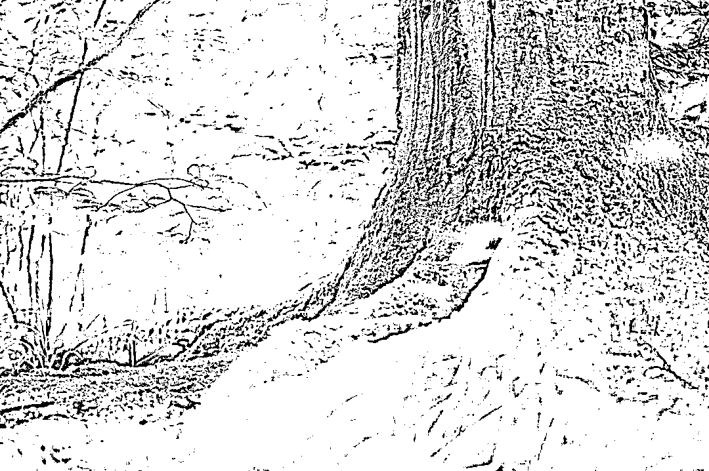

**土星行经的宫位，是我们需要巩固的领域**

**当土星行进到一个宫位时，你应该对这个宫位的事务投入大量注意。**并不是说这个宫位相关的事都会出岔子，但你应该把你的意识导入那个方向，并且搞清楚你应该如何跟这些事建立关系。如果你处于一个不错的位置，即是说，在你人生的这个阶段，你所处的位置是恰如其分的，那么这个行进会帮助你巩固那个宫位。如果你的位置不对，土星会带来巨大的改变，如果你抗拒它们的话，这些改变会令人不快。

**沮丧、悲伤，身体或情感上的损失，都意味着你没有很好地调整自己去应对土星所掌控的星座和宫位的议题。但如果你有这些感觉也不要气馁，这些都是很正常的反应。**只有很少的人能够那么深入地了解自己，从而对土星行进做出积极的回应。在非常真实的意义上，土星是一位老师，教导我们认识自己到底是谁。

**应对土星功课的 8 种方式**“

**面对失败，不在于你摔得多重，而在于你反弹得有多高。** 

**——吉格·金克拉**

”

**土星并非剥夺的代理人，事实上，它是一个试炼场**，证明一个人的成熟度和负责对待生活的能力，以及处理扩展意识的职责。当你得不到梦寐以求的幸福和成功，被生活打倒面对失败时，你可以尝试以下 8 种应对方法：

***1.*****直面真相**

**否认糟糕情况的现实，完全逃避、不去想它，这只会让一切变得更糟，或者阻碍你去解决问题。觉察是改变的第一步。愿意去直面问题，但不要一天 24 小时都沉浸其中。**这只会让你感觉更糟。思考问题，是要让你理解自己的感受，知道回应的最佳方式，然后聚焦在更积极的事情上。研究表明，逃避思考或解决问题，其实会造成更多的压力源，这就是所谓的“压力生成”。

***2.*****允许自己哀悼破碎的梦想**

你想要事情变成什么样子，以及事情最终变成什么样子，这二者之间所存在的差异会带来哀伤和后悔。**哀悼是放手的一个步骤**。富有同情心地，花些时间与自己的感受慢慢联结起来。写下你的感受，或是和信任的朋友倾诉，这都会带来帮助。一项研究表明，当人们写下自己关于分手最深层的想法和感受时，他们恢复得会更快，在之后的几个月中，身体状况也会更好。

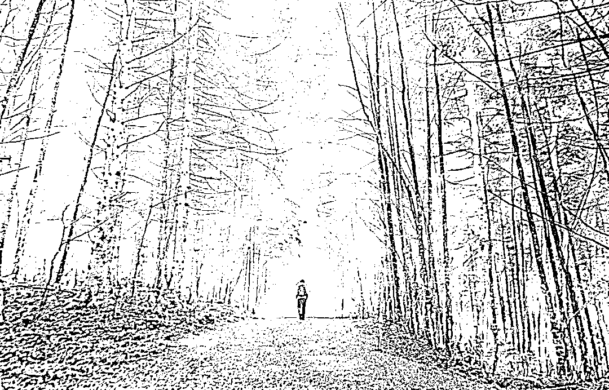

***3.*****不要像受害者一样陷在情绪中**

**不管情况如何，你总能做出选择和运用技能去应对。**想想你已经成功解决过的其他情况，也想想如何将相同的技能应用到当下的情境中。如果你正遭遇不公待遇，说出来，或者走开。如果你无法立刻走开，那么就努力变得更加独立，或者找到其他机遇。

***4.*****检验自己的期待是否实际**

21 世纪给我们带来一些新的现实情况，比如新增工作更少，被优质大学录取的竞争更激烈。**没有什么能保证一定会实现**，你可能需要采取其他途径来达成目标。你可能要花费数月甚至数年的时间，才能得到你想要的工作，或是挣到你应得的工资。而且，即使是最好的关系，也会存在低谷的时刻，即便是你的“灵魂伴侣”也会有缺点。

***5.*****善待自己**

**当事情不顺利时，并不一定是因为你做错了什么。**你没有得到想要的工作，可能是因为你和公司的需求不完全匹配。你喜欢的人，可能是逃避爱情的类型，或者已经有恋人了，又或者是自恋型人格。虽然从情境中学习很重要，但是与其严厉地评判自己，不如对自己抱以同情心，这样你才不会陷在羞愧中难以自拔。

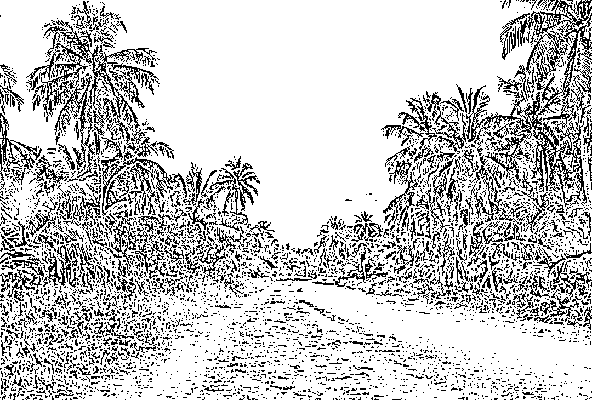

***6.*****寻找一线希望**

当下的情境给我们提供了怎样的新机遇呢？是否有机会让我们学习新技能、改变自己的优先级、深化关系，或实现个人成长？**试着不要以非黑即白的方式去看待情境，也不要让情境来定义自己。这只是一个坏的时刻，不是糟糕的一生。**电话发明者贝尔曾说：“当一扇门关上时，另一扇门便会敞开；但是我们总是带着遗憾一直盯住那扇已经关闭的门，以至于看不见已经为我们敞开的另一扇门。”

***7. *****愿意尝试不同方式**

**如果你正在做的没有效果，那么你可能需要做些改变。**要成为成功的企业家，你可能需要改善自己的产品或服务、你的市场营销策略，或者是你的人际沟通技巧。如果你的服务没有市场，那么你可能需要重塑自我。如果你总是遇不到合适的恋人，你可能需要试试参加不同的活动或去不同的地方。为了得到你想要的，常常意味着走出自己的舒适区，忍受失去、风险和不确定性。

***8.*****找到你的坚毅**

研究显示，**对于成功而言，毅力、决心的重要性不低于智商**。虽然坚持下去很难，但是如果你这样做，你就能赢得其他人的尊重，自我感觉也会更好。坐着不动空想问题，只会让事情变得更糟，也会影响你采取积极行动的动力。研究员安杰拉·达克沃思使用“**坚毅**”（grit）这个词，来描述那些致力于实现目标的人们，那些充满热情、认真尽责，长期坚持不懈的人们。在对不同人群的研究中，不管是中小学生还是军校学员，坚毅的特质都比才华或智商更预示着成功。

**参考文献**

罗伯特·汉德《行进土星：你被迫失去的，不过是你不需要的》

阿兰·欧肯《怎样才能让土星不再“跟着你”？| 科学面对人生挑战》

苏·汤普金斯《当代占星研究》

霍华德·萨司波塔斯《人生的十二个面向》

**版权声明：**本文由若道翻译、改编发布，欢迎转发，反对抄袭。友号转载请申请白名单。

**学习占星学**

**点击或长按下图了解课程详情**

**

**

**

****

**微信又双叒叕改版啦，不想错过若道君的推送？**

**就把若道设为星标吧！**

**▼**

**喜欢记得点一下在看哦☟**

****报名直达入口****

# 来聊聊吧~这个长假，你被水星“逆”了吗？

> 原文：[`mp.weixin.qq.com/s?__biz=MzA5NjA0NTAxNg==&mid=2651457841&idx=1&sn=6afff32f4f7d3640ce04678e5aca3af1&chksm=8b48bb86bc3f3290df5e0d970f7fdddc08de0d190deca1deb4c2e224ca24cca902f5a92af08e&scene=126&sessionid=1692737913#rd`](http://mp.weixin.qq.com/s?__biz=MzA5NjA0NTAxNg==&mid=2651457841&idx=1&sn=6afff32f4f7d3640ce04678e5aca3af1&chksm=8b48bb86bc3f3290df5e0d970f7fdddc08de0d190deca1deb4c2e224ca24cca902f5a92af08e&scene=126&sessionid=1692737913#rd)

**2021 年 10 月 10 日天象：**

*   **月亮在射手座**

*   ******太阳、火星、逆行水星合相在天秤座******

*   ******金星合相月亮南交点******

国庆长假结束，大家过得还好吗？全国有部分地区出现较大雨水、降温显著，水星逆行正在进行中，不知道你的行程是否受到影响？如果在这几天恰好被“水逆”，那你遇到了什么情况呢？如何解决的？在这个过程中有什么感受？欢迎留言分享呀。

如果患上“假期综合症”，今天的休息日正好可以做个缓冲，月亮在射手座运行，抓紧时间再“自由”一把，然后就认真迎接新的一周吧！太阳、火星、逆行水星在天秤座合相，金星合相射手座的月亮南交点，如果因为理念不同而内心犹豫不决、甚至产生冲突，不如先静下来想想自己和对方的需求都是什么，然后，好好沟通。（想学习如何沟通得当？可点击[【非暴力沟通线上训练营】](http://mp.weixin.qq.com/s?__biz=MjM5MjQwNjAyMQ==&mid=2649438843&idx=5&sn=6bb5dfad5f0f05a8b0c9f90f59f9f91a&chksm=beb9551189cedc0725aa0ace9a1149581ae1a7f579dca29ea57a0b3e7a5dfaa3285839f1d97d&scene=21#wechat_redirect)）

周日快乐！我们明天见！ **了解每日天象，可****下载“若道”APP 查看****还有更多精彩等着你哦**

# “天生”不合拍的恋人只能分手吗？你还可以来这里抢救一下

> 原文：[`mp.weixin.qq.com/s?__biz=MzA5NjA0NTAxNg==&mid=2651457754&idx=1&sn=3f5f9b7a2559122c3a8bde15de2b4912&chksm=8b48ba6dbc3f337b9a958775498eac5f70f005860e4a4a1706fe1c80d010c5788613c5dd0209&scene=126&sessionid=1692737918#rd`](http://mp.weixin.qq.com/s?__biz=MzA5NjA0NTAxNg==&mid=2651457754&idx=1&sn=3f5f9b7a2559122c3a8bde15de2b4912&chksm=8b48ba6dbc3f337b9a958775498eac5f70f005860e4a4a1706fe1c80d010c5788613c5dd0209&scene=126&sessionid=1692737918#rd)

******☆ ****后台回复“今日”，给你一句生命态度******

作者/斯蒂芬·弗里斯特 译者/逸月编辑/玫瑰 图片/pexels

身边有朋友抱怨，哪怕是曾经贴近过你灵魂的伴侣，日子消磨得久了，就开始变得无法懂得对方了。这大概是关系中的常态，只有我们足够靠近的时候，那些矛盾和互相不能理解的地方才会出现。我们该如何面对这个问题呢？另外，斯蒂芬老师的[三日线上工作坊](http://mp.weixin.qq.com/s?__biz=MzA5NjA0NTAxNg==&mid=2651455738&idx=2&sn=1e9424e455fac6ad14a2871d2ac00337&chksm=8b48b24dbc3f3b5bdad7a3afc0c25f51c922fd4ef0e41da958c983342a71831b539b5499b8bc&scene=21#wechat_redirect)正在报名中，有兴趣的小伙伴点击链接了解一下吧。

**第七宫：一个人不错，两个人更好****七宫是传统上关于婚姻的宫位，当然，七宫的含义不只是婚姻。**当我们尝试去了解星图中的个人性格的时候，专注太阳、月亮和上升点是非常重要的。与这三个象征运作有个很好用的技巧：我会鼓励大家首先扔掉相位的知识。如果我的太阳在双子座 0°，而你的月亮在双鱼座 20°，那么在我们之间的能量交互就有四分相的特质了。太阳是与我的身份相关的，以及我如何搭建生活的一些基本准则，双子座意味着我很容易对那些想法与视角产生兴奋感，我想要沟通，想要每件事都有趣，不想生活得无聊。**这里的太阳和月亮四分相不是在容许度范围内的四分相，大多数人对四分相会用 7°-10°的容许度，而在这里我们可以想象更宽泛的联结。**想象这样的概念，在占星学中，你需要把内在的直觉带进来，而不是你头脑中所想的东西。你应该去想：双子座与双鱼座如何相处呢？在你的内在，马上就能感觉到两者相处的张力了。

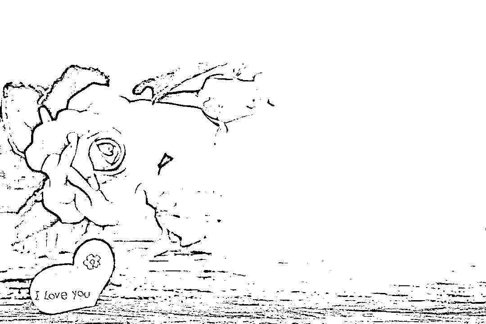

**· 对于太阳双子座来说** 

上帝把我带到这个世界来之前给我建议：“千万不要让你的生活变得无聊，人生苦短，你有那么多东西要学习，你的灵魂在这样一个旅程中到达一定程度，你现在以爆炸性的速度去学习，所以无论你做什么请保持变化，千万不要静止在那里，当你死的时候才可以睡觉。”这是上帝给双子座的建议，对双子座来说是非常好的建议。

**· 对于月亮双鱼座来说**

而我的伴侣的月亮在双鱼座，我们先想一想月亮的特质，**月亮是一个人一生中的情绪，他们带着一种态度来到世间，月亮很大程度上是与我们如何照顾自己联系在一起的。** **·** 人生是充满苦难的，有时候我们经历失望，如何从中修复呢？**·** 基于生命的这种现实，为什么有人会微笑呢？但确实有人是微笑的。我们有那种从生命的苦难中复原的能力，这与月亮的基本功能是非常相关的。**如果你倾听月亮的能量，你就会照顾你自己，你从生命的苦难中复原了，你会保持快乐。**我们会说，**照顾好你月亮的能量就是快乐的秘密，而照顾好太阳的能量是保持理智。**虽然是简单的陈述，但帮助我们更好地理解太阳与月亮。这样的伴侣相处画面会是怎么样的呢？我的伴侣的月亮在双鱼座，她能够更好地照顾自己，她需要更多安静的时间，需要坐在那里凝视广袤的天空；也许她在冥想，也许只是坐在那里看着太阳西下，也许她是位画家，凝视着空白的画布而下一幅作品的画面在她脑海中渐渐成型。她在一个空无的状态，这是对双鱼座非常重要的时刻。我的伴侣安静地坐在那，有些疗愈的能量在她内心中产生了。我问她，“你还好吗？”她从冥想中出来，说“是的，我很好”，然后继续安静地坐着。然后我说，“想看电视吗？”大家都看到问题在哪了。作为太阳双子座，我对自己是真实的，她也在照顾自己月亮双鱼座的能量。但是，这两种能量却不是融洽相处的。

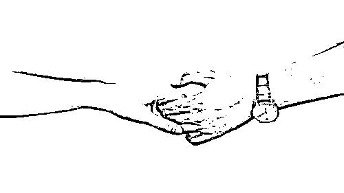

**占星师如何引导这对情侣？**想象你是占星师，与这对日月四分的夫妻在咨询，你会用什么样的语言和他们交谈？**·** 首先，语言需要尊重他们两个人，我们不让那个双子座的人看起来是错的，也不让那个月亮双鱼座的人看上去是更高级、更灵性的，我们也不让那个双鱼座的人看上去是错误的；**·** 我们也不会让自己神游，以至于让这两个人看上去非常可笑，也不会让我们看上去不像双子座那么机智；**·** 我们需要非常小心，需要尊重两个人；**·** 我们需要帮助那个双子座的太阳去理解月亮双鱼座的能量，也帮助月亮双鱼座去了解太阳双子座。我们需要产生对两个人相处过程的理解与慈悲心。我们会发现在他们内心都有善良，任何一个人都不会去干涉另一人内心中那种灵性的健康。但是，我们会帮助他们去认识到，**每一天他们确实都在干扰对方灵性的健康，他们需要在日常生活中尽可能减低那种干扰。**

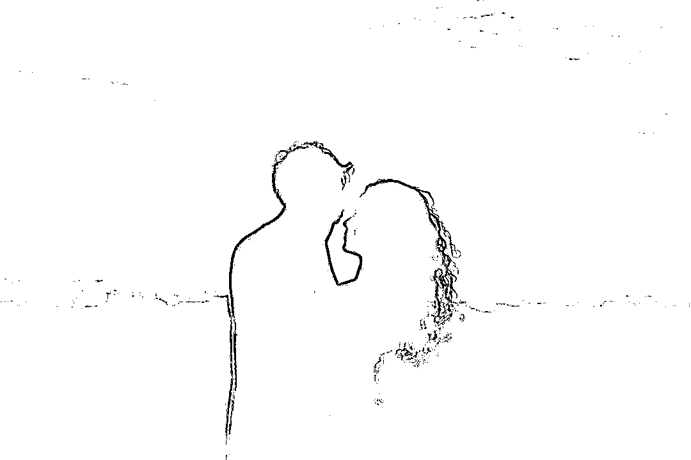

**从太阳和月亮看相处模式**在我用的这些例子中，可以了解到太阳和月亮的要义。**太阳就是你的头脑，月亮是你的心；太阳是你的价值以及自我展现的方式，月亮是你的情绪、你对生活的态度以及我们所需要的让我们变得快乐的因素；太阳是理智的，而月亮不那么理性。**在某些传统中说，大家会说，太阳是男性、阳性的；而月亮是女性、阴性的。我认为那种语言的时代已经结束了。我不太喜欢那样的语言，因为男人也有月亮，女人也有太阳，人类已经到了这样的时代我们理解这样的和谐，让男人和女人都成为完整的人。但是在那个古老的传统中，认为太阳代表男性能量，月亮代表女性能量，确实也传达了一些真理，我认为那是好的，但是它也带来了一些毒药。有些人说，每个人都有一些男性的、阳性的面向，每个人也都有一些女性的、阴性的面向，那个语言我认为是有效的。我倾向于说每个人都有太阳星座也有月亮星座，我们把这些去性别化。不论我们是谁，不论我们是什么，我们都需要把那些转化成行为性的语言，需要把那些转化为行为方式。行为方式可能会把我们限制住，就像情绪化也会把我们限制住一样。

**版权声明：**本文由若道翻译发布，欢迎转发，反对抄袭。友号转载请申请白名单。

斯蒂芬·弗里斯特

若道签约老师。进化占星学的创始人之一，当今世界最有影响力的占星大师之一；1985 年，他凭借《内在的天空》一书获得职业占星师协会奖（Professional Astrologers Incorporated Award）。他四次获得占星界最高的占星学联合协会奖（United Astrology Congress Regulus Award）提名，2018 年获得轩辕十四教育奖。

****学习占星学****

****点击下图了解课程详情****

**

**

**

****

**微信又双叒叕改版啦，不想错过若道君的推送？**

**就把若道设为星标吧！**

**▼**

就是这个“在看”，戳戳戳 ☟

******报名直达入口******

# 斯蒂芬三日线上工作坊丨如何进行一场有效的占星咨询？

> 原文：[`mp.weixin.qq.com/s?__biz=MzA5NjA0NTAxNg==&mid=2651457754&idx=2&sn=bd13bfaba47bf4c51ef990b32368593a&chksm=8b48ba6dbc3f337be43eb7ee39ccac37c0c4ced5cbdb339ac538a3e4b6b4bfc4b9f57b6a8816&scene=126&sessionid=1692737918#rd`](http://mp.weixin.qq.com/s?__biz=MzA5NjA0NTAxNg==&mid=2651457754&idx=2&sn=bd13bfaba47bf4c51ef990b32368593a&chksm=8b48ba6dbc3f337be43eb7ee39ccac37c0c4ced5cbdb339ac538a3e4b6b4bfc4b9f57b6a8816&scene=126&sessionid=1692737918#rd)

**喜大普奔，斯蒂芬要来教占星咨询了！**

占星咨询对于很多占星学生和兼职占星师而言，都是考验自己到底能否成为职业占星师，建立欣欣向荣职业生涯的最关键一环。

一个坏消息是，当你辛辛苦苦学习完所有的占星技术后，你可能仍会有些沮丧地发现，自己还是做不好一场咨询。

**比如：**

对咨询的问题

*   我可以怎样迅速和客户建立信任？

*   我如何描述星图中我看到的困难配置，或者如何描述我看到的即将到来的富有挑战的行进？

*   如果客户在咨询中滔滔不绝，我该怎么办？

*   如果客户在咨询中一言不发，我又该怎么办？

*   如果客户否认我所描述的他/她明显存在的问题怎么办？

*   如果客户存在明显的心理问题怎么办？

*   如果我讨厌这个客户怎么办？

*   如果我被这个客户吸引怎么办？

*   如果我的性能量被客户激发怎么办？

*   ……

**这么多问题怎么办？！**

别着急。

好消息是，这是每一个占星学生和新手占星师都会遇到的问题，也是每个占星师必走之路。**其中一些问题是可以用占星技能所解决的，而另一些又是在占星技巧之外，需要进入心理学的领域。**不论怎样，归根到底，我们要能在咨询与客户建立并且维持**良好的咨询关系**，甚至与那些跟我们性情截然相反的客户。

1

**授课内容**

如果你听过斯蒂芬·弗里斯特的占星咨询，你会看到客户被他润物细无声的咨询所打动，又感到自己被他深沉的慈悲所懂得。那些娓娓道来的故事在客户面前展开生命时空的画卷，在咨询结束时，又充满希望的力量。

**而****今年****10****月****，在斯蒂芬到中国教学 10 年后，他将****第一次****与所有热爱他的学员分享如何做好一场占星咨询。**

在这个网络课程中，占星大师斯蒂芬·弗里斯特将会和你分享他几十年来一对一面对面的**占星咨询经验**；他也会分享如何提前规划好**接近客户心灵**的占星技巧。**客户个人星图**为我们提供一个最迅速，也最可依赖地建立信任和自然连接的地图，他还会分享如何运用个人星图建立这个连接。

2

**斯蒂芬的占星著作**

*   **1984-1988 年间**，斯蒂芬写作出版了《内在的天空》（已有中文版）、《变化的天空》和《天空的伴侣》三本占星经典著作，奠定了早期在占星学界的地位。

*   **2002-2005 年间**，他与朱迪·弗里斯特共同创作了两本经典的关系占星学著作《天空的伴侣 I：爱、性、和进化占星学》《天空的伴侣 II：组合图》。　

*   **2008 年**，斯蒂芬出版了一本非常重要的著作《昨日的天空》，此书是至今为止关于轮回转世跟星图的清晰对应最详尽的著作之一。 斯蒂芬前后一共出版了 12 部占星著作，在世界占星学界拥有很高的声誉。

3

**斯蒂芬获得的荣誉**

**1985 年**，他凭借《内在的天空》一书获得**职业占星师协会奖**（Professional Astrologers Incorporated Award）。

**1992、1995、2008 年、2018 年**，他四次获得占星界最高的占星学联合协会奖（UnitedAstrology Congress Regulus Award）提名，**2018 年获得轩辕十四教育奖**。

4

**斯蒂芬的占星哲学观**

斯蒂芬的占星风格以自由和选择为中心，他的解读不是以下定论的方式来“预测”未来，他强调如何**改善生命**，而不是宿命式的论断。他以心理占星学的语言来解读星图上的人格部分，但是通过**南北交点及其相位和守护星**来探索星图所揭示的前世业力与今生方向，在灵魂进化的背景里来整体解读星图。

他认为进化占星学的目的在于鼓励人们做出更符合进化方向的智慧选择，我们学习去了解前世的时侯，关注点应该集中在**如何通过意识来疗愈自己**。

5

**这些名人怎么说？**

斯蒂芬让我们停止了玩责备命运的游戏，而开始看到自己是一个走在进化路途上的勇士。 ——**奥普拉杂志***“O: THE OPRAH MAGAZINE”*

斯蒂芬和杰夫这两位著名占星师创造性地相互应和，展现出他们出色的教师才华，发展并弘扬了占星这门艺术。（对《测量天空：进化占星学和灵魂的钥匙》的书评） ——著名心理占星师 现代占星学之父 **诺·泰尔**（Noel Tyl）

请享用斯蒂芬和朱迪这两个博大的灵魂在此书中所提供的洞见大餐吧。（对《天空的伴侣》的书评） ——进化占星学的创始人之一 **杰夫·格林**（Jeff Green）

我为斯蒂芬解读的精准感到惊叹，他强调没有一件事是坏得无法挽回的，也没有一件事是如此之好，以至于它不会因为现在的错误判断而消失的。我怎样推荐他都不为过！ ——好莱坞著名影星“钢铁侠”男主角 **小罗伯特·唐尼**（Robert Downey Jr）

6

**上过课的占星师怎么说？**

他关于我星图的解读，让几乎所有在场的人掉泪，我也从此开启了一段灵魂追寻的旅程。我很惊讶他透过星图可以如此深入一个人的灵魂。很多东西你自己都不知道，但是他讲出来你会发现，啊，这是真的，这是占星学的神奇。——**《心探索》创始人孟想**每个来参加老师课程的同学，都会被老师深深的慈悲心感动。这种慈悲心，并不是表面上说的一些什么话，而是一种从意识层次上发出的能量。每个来上课的人，都能感受到老师的爱。这种爱，并不是盲目的爱，而是深刻地洞悉真相后的慈悲。——**斯蒂芬老师工作坊翻译逸月**斯蒂芬老师的一对一咨询已经排期到两年之后，我特别幸运，曾在课堂上被老师抽中分析过我的星图，老师充满爱与智慧的指引让我更加清晰的认识了自我。内在的潜能、需求和矛盾被老师娓娓道来。——**禄丽荣**斯蒂芬老师是位非常非常值得推荐的大师，很粉他，这位进化占星学的创始人，对人的理解是那么的全面完整、深刻洞见、慈悲和温暖，就这方面而言足可以媲美我无比崇敬的荣格和史坦纳（这两位去天堂里玩了），如果你对西洋占星感兴趣，或者对人的所有角度、各个层次的真相和可能性感兴趣，推荐斯蒂芬老师的书和课程，特别是他的课程，数倍的功力大增的好机会，错过真是占星粉丝的莫大损失。——**仁华**

7

**2020 年斯蒂芬线上工作坊学员感悟**

8

**什么人适合这门课程？**

*   占星师或渴望成为占星师的人群。    

*   课程会涉及综合解读高阶内容，不了解相关知识的同学，请提前学习相关内容。

9

**老师简介**

**斯蒂芬·弗里斯特(Steven Forrest)**

*   进化占星学的创始人之一，当今世界最有影响力的占星大师之一；

*   毕业于美国北卡罗莱纳大学宗教学专业；

*   1984-1988 年间，写作出版了《内在的天空》、《变幻的天空》和《天空的伴侣》三本占星经典著作，奠定了早期在占星学界的地位。前后一共出版了 12 部占星著作，在世界占星学界拥有很高的声誉。

*   1985 年，他凭借《内在的天空》一书获得职业占星师协会奖（*Professional Astrologers IncorporatedAward*）。1992、1995、2008 年、2018 年，他四次获得占星界最高的占星学联合协会奖（*United Astrology Congress Regulus Award*）提名，2018 年获得轩辕十四教育奖。

*   斯蒂芬将自己的绝大部分时间都花在教学以及个人咨询上，他于 1998 年创立了占星学徒计划（*Astrological Appretice Program*），这个计划致力于培养职业占星师；

*   至今为止已经有 600 余位学员完成了培训，其中很多都成为了优秀的职业占星师；

*   他是一位脚踏实地的导师，充满快乐和活力，亲和幽默同时又充满了智慧；他的课程不仅仅是一次占星知识和经验的学习，也是一次与智者的相遇。

10

**课程费用**

**正价：****4800 元**

11

**授课时间、方式和退转**

**授课时间：**

****2021 年 10 月 15 日-10 月 17 日（周五、周六、周日）****

****每天 7:00-13:00****

7:00 AM - 9:30 AM

**（1 小时休息）**

10:30 AM - 12:30 PM

**授课方式：**线上直播课，英文授课，中文翻译**退转课程：**

退款原则请详看《教学协议》，如有疑问请咨询课程顾问。

****斯蒂芬三日线上工作坊****

**授课老师：斯蒂芬·弗里斯特**

**授课时间：****2021 年 10 月 15 日-10 月 17 日**

**授课方式：**线上直播课，英文授课，中文翻译

**费用：****4800 元**

**课程负责人：****王老师**（微信：18510107057，请备注“斯蒂芬工作坊”）

长按二维码添加课程负责人咨询~

****报名请点击“阅读原文”****

# 冥王星顺行啦！“大 BOSS”的 4 种困难相位，送上 3 份“解毒秘籍”！

> 原文：[`mp.weixin.qq.com/s?__biz=MzA5NjA0NTAxNg==&mid=2651457720&idx=1&sn=18f905237d80ac8cb041098aeec14a29&chksm=8b48ba0fbc3f33192aeb068b9f048f38fef41b7c5a6fe80ae2754f1638646d4ec5611b2464a6&scene=126&sessionid=1692737918#rd`](http://mp.weixin.qq.com/s?__biz=MzA5NjA0NTAxNg==&mid=2651457720&idx=1&sn=18f905237d80ac8cb041098aeec14a29&chksm=8b48ba0fbc3f33192aeb068b9f048f38fef41b7c5a6fe80ae2754f1638646d4ec5611b2464a6&scene=126&sessionid=1692737918#rd)

****☆ **后台回复“今日”，给你一句生命态度**

作者/诺·泰尔 乔纳森·凯斯
译者/李含 周恩 轩轩 校对/珊珊编辑/玫瑰 图片/pexels**作者的话**10 月 7 日，冥王星恢复顺行。小伙伴们都有怎样的感觉呢？当冥王星被发现，并纳入占星学范畴之时（1930 年），它被赋予了强大的力量和权力的原型意义。大约 30 年后，我进入占星学领域，在一些灵感启发下，对这个问题有了不同的看法：凭我的观察，以及我对心理动力学中的发展张力的深刻认知，我认为冥王星的功能主要是提供“深度视角”以及构成“即将面临的挑战”。 很久以前，我在占星实践中就是这样理解它的：在冥王星这个象征符号之下，探索我们是谁，我们能开发出多少潜能，这一类能带来成长的挑战性命题。付出之后能得到什么？这的确跟“我们赋予自身多少权力”有关。冥王星为人所知之时心理学正处于其发展史的“青春期”。如果你感受到了冥王星的影响，我想，如果你愿意的话，就可以将所有的努力、所有的付出和抗争都磨炼成成长的收获。真实的我们就是我们后来变成的那个人。 在这一理论框架下，我们该如何帮助客户面对冥王星的挑战呢？ **冥王星的困难相位****困难相位：主要指合相、四分相、165 度相位、对分相；主要相位用 6°容许度， 165 度相位推荐用 3°容许度；根据经验， 45 度相位、135 度相位也建议用较小的容许度。 **

**冥王星与*****太阳*****的困难相位**

最初占星师们认为，拥有这些相位的个体拥有巨大的能量。但事实并非如此。这里或许潜藏着能量，但如同上文所提到的那样：**面对挑战，开发潜能之后，才能从冥府浴火重生（想想凤凰），最终获得巨大的能量。 **在社会架构中，这些相位则代表着**对“同质”和“平等”的迫切需求，社会的发展可并不欢迎“（社会）等级破坏者”和出风头的人。**各方面的压力都迫使人们“安守本分”。这和本文的议题如出一辙，象征压力的冥王星与象征生命力和自我意识的太阳成困难相位。 对此，我的解读通常是，“在你年轻的时候，这种情况特别明显，感觉就像是一颗被毯子盖着的手榴弹。”压力重重，我相信 99.99%有此类相位的人对这个比喻都能心领神会，对西方社会的人来说更是如此。这就带来了挑战。勇敢抗争吧，在抗争中获得力量。有时候真的是生命不息，抗争不止。查尔斯王子、美国前总统尼克松、葛丽泰·嘉宝、杜鲁门·卡波特、马龙·白兰度、英格兰安妮公主、罗伯特·舒曼和阿诺德·施瓦辛格等人都了解这种抗争和力量。疗愈这类客户的方法是，**帮助他们意识到这种压抑，找出它的根源以及它引发的防御行为，还有这种惯性又是如何延续至成年以后的；**并意识到**他们也许已经不需要这种习惯性的防御行为了。卸下防备之时就能拥抱焕然一新的能量（和习性）。**

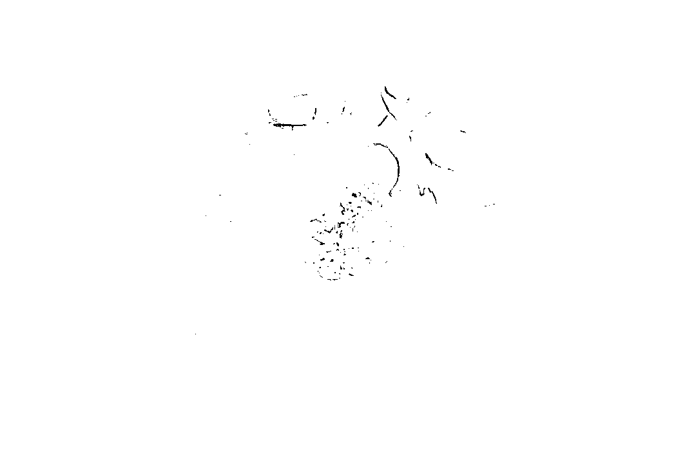

**冥王星与*****月亮*****的困难相位**

这是一个新的层面：**受到母亲方面的重要影响，个人观念会发生改变。母爱可能是带有干涉性质的；也可能是一种令人窒息的溺爱。**关键是**人们很难面对母亲方面的掌控和影响带来的成长挑战。 **

**与父母的关系可能会不平衡，只与一方较亲密。 **解决这一相位的问题，第一步当然是**要认识到这种压力，审视一下这种压力与自己的习惯性行为之间的关联，找到清除负面影响（防御行为及偏见）、重获自由的方法。 **亨利·福特、埃德加·胡佛（译注：历经 8 任总统的 FBI 前局长，知晓众多秘密，极富争议）、凯瑟琳·赫本等人都有这一困难相位。 

**冥王星与*****土星*****的困难相位**

**辛苦的工作。**这个说法最能体现这一特质：**个人认知聚焦于无休无尽的自我要求及抱负的实现上；这是一个埋头苦干的相位。**事实上，因为特别惧怕失败和失去，就会建造特别坚固的城堡取得战斗的胜利。 
这样的客户在成长方面可以做些什么呢？是全力以赴还是三心二意？你制定的发展计划背后的动力是什么？它反映的是：**远景与雄心壮志，深度与勤奋程度。绝大部分情况下，占星师必须与客户时时处处存在的悲观情绪作斗争。 **琼·贝兹（译注：美国著名民歌手）、尤里·盖勒（译注：以色列魔术师）、克里斯敦·伯纳德（译注：南非心脏科医生，成功进行全球首例心脏移植手术）、肖邦、摩西·达扬（译注：“独眼将军”，以色列军事家）、希区柯克、苏格兰玛丽女王、沃尔特·惠特曼（译注：创造自由体诗歌的美国诗人）、李·哈维·奥斯瓦尔德（译注：暗杀肯尼迪的凶手或替罪羊）、乌比·戈德堡（译注：好莱坞为数不多的著名黑人女星）、卡夫卡、基辛格等人都有这一挑战相位。

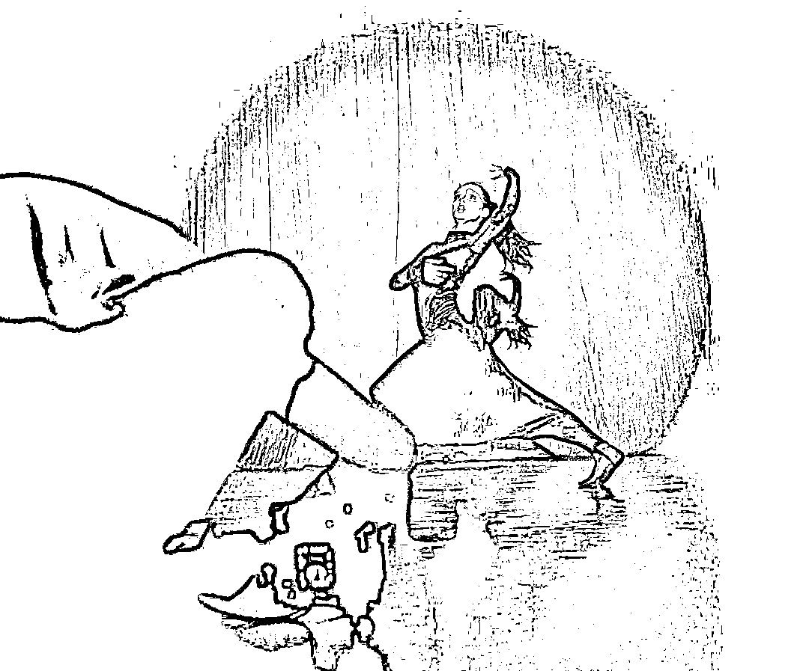

**冥王星与*****天王星*****的困难相位**

这个相位给让我想到的是“耶稣在神殿里掀翻了桌子！”这一点在太阳弧推进和行进中绝对正确。如果这个相位出现在出生星图中呢，这股潜能将会促使我们**在成长的道路上经历叛逆、破坏，打破现状以建立于更有利的个人地位。**我们吸取经验教训做出改变。（注意出生于冥王星与天王星合相在处女座时期的一代人，他们中有不少人的新陈代谢、营养吸收功能面临挑战，比如营养的吸收转化发生了改变，出了问题。） 
我们必须注意到，这些慢行星的相位要比太阳或者月亮的相位少见得多。有这样相位的人会**在社会中成为一个小的族群，他们的特点就是推进社会的改变。**作为个体，在个人层面上，你的客户多多少少都会表现出他们对改变的需求。 有效的疗愈方法是，**意识到这种需求，并审视和评估它会带来什么后果。**改变带来的是破坏还是有益的成长？你的客户该如何摆脱急躁，发挥创造力，从而强有力地推动积极转变？寻求正确的、有建设性的转变经验。 查理曼大帝（译注：罗马帝国奠基人）、埃德加·凯西（译注：20 世纪著名灵性解读大师）、奥利弗·克伦威尔（译注：英国资产阶级革命领袖、军事家）、玛丽·贝克·艾迪（译注：基督教科学派创始人）、罗斯·佩罗（译注：80 年代 IT 业超级富人、92 年参选总统获佳绩）、查尔顿赫·斯顿（译注：著名影星）等人都有这一困难相位。**冥王星行进中的智慧**在希腊神话中，冥王将年轻少女珀尔塞福涅从地面绑架到冥府。通过众神的努力，珀尔塞福涅终于从冥府逃脱，但是作为交换，每年有 6 个月她要回到冥府（有些版本说的是 3 个月）。在这段时间里，大地上万物停止生长，冬天就这样来临。这个故事描述了很多冥王星的本质和特点，以及它是如何影响我们的健康和幸福的。在这个关于绑架和最终被释放的故事里，存在一种转化的过程。很多人都体验过艰难的转化过程，比如说，失去朋友或挚爱的人，经历人际关系和经济上的困难时期。这些经历带来的情绪紧张会直接影响我们的身体健康，我们也许会觉得疲惫、沮丧、焦虑。虽然这些经历有时候似乎令人恐惧，但我们也能从中学到一些重要的东西。通过不同的治疗方式，我们能够触碰到事件的核心，发现隐藏的根本原因。**在我们意识到核心和原因时，我们能体验到心灵的转化，以及一种更博大的同理心。**接下来我想谈谈能帮我们从冥王星经历中获得智慧的活动。

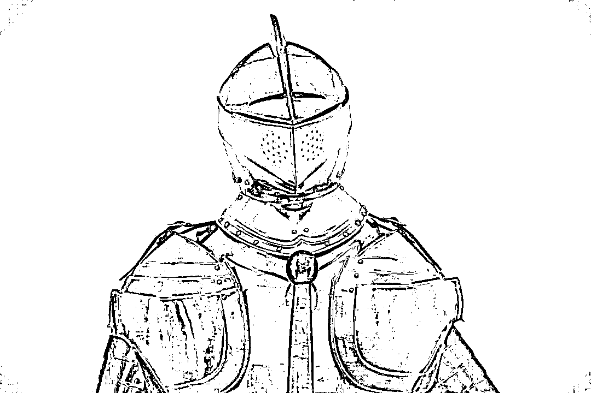

**艺术创作：冥王星式转变的媒介**

要想从困难中走出，一个强有力的办法，就是**用一种非线性、艺术的方式应对困难。**很多艺术家和音乐家都能轻而易举地通过某种表达媒介释放根深蒂固的情感。你不需要才华横溢，你只需要**有欲望来通过文字和油笔释放情感**就好了。 

我喜欢音乐，而且觉得写歌词或演奏音乐能很好地表达我自己。这样会有助于触及情感深处，那些可是平时在主观层面意识不到的感情。**如果我正在经历某种困境，我就可以通过文字和表达去理解困境存在的意义，并且释放情感。**我还经常达到更深层次的自我接受，对那些正在挣扎的人抱以更深切的同情心。也许我还没能完全消除正在历经的痛苦，但是我更加意识和感受到了这种经历的意义。

**咨询：潜入无意识之中**

另外还有一个强有力的方法能帮助我们在困境中保持清醒并获得智慧，那就是去**找咨询师**。好的咨询师善于找出问题的根源，以及导致当前处境的动因。我曾经经历过一段非常艰难的时光，那时，我向一名荣格学派的咨询师寻求了帮助，他尤其擅长梦境分析。 

梦境通常能非常好地表现我们无意识中的心理过程。**通过解析梦境，咨询师能帮助我们通过这些画面，更深切地意识到并理解自己的心理。**我们会经常尘封那些一时难以处理的痛苦记忆和经历。这时咨询就能帮我们唤醒这些经历，从而让痛苦得到释放。

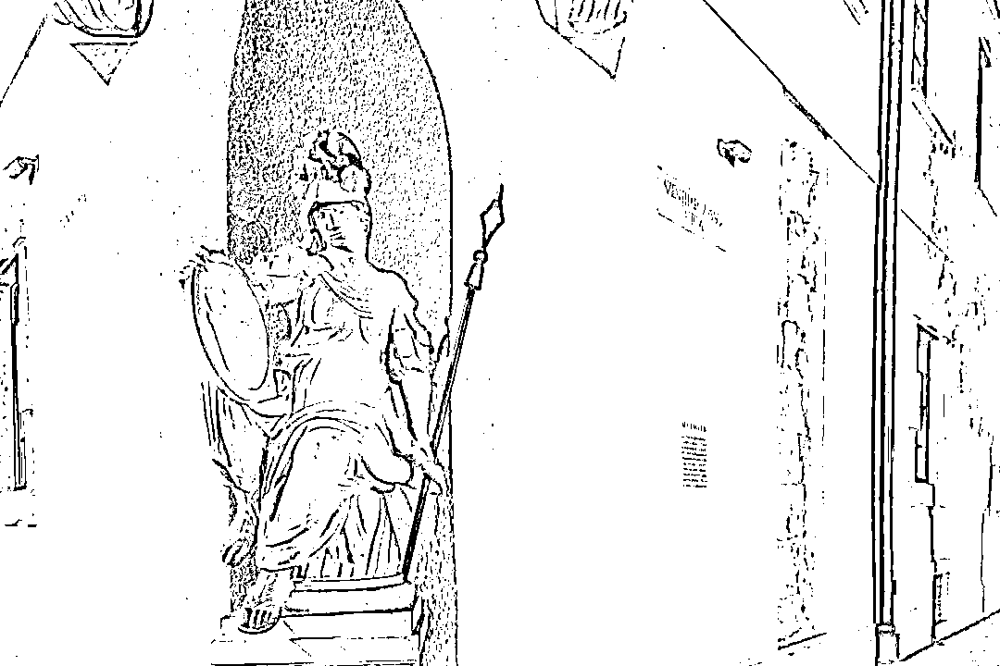

**锻炼身体**

**要想解决冥王星问题，就需要抓住事件的核心。**就身体而言，肌肉和韧带会储存起由痛苦经历带来的大部分紧张和痛苦。为了缓解这一影响，不妨**找一位受过训练的健身大师，这应该能帮助我们减轻身体的紧张和僵硬。**

当身体的特定部位被按摩时，深度组织锻炼，比如说罗尔夫按摩治疗法或色彩能量疗法，能够激发我们的情感反应。例如，按摩腹部能激发安全感问题。按摩颈部能激发交流和自我表达的问题。通过训练有素的治疗师的帮助，我们能在身心之间建立更有意识的联结，这种意识能将深深隐藏在身体中的情感问题激发出来，从而得到释放。

我们更熟悉的是压制痛苦和抑制情绪混乱。我们身边充斥着的各种工具和设备，但它们只能帮我们遗忘经历，让痛苦麻木。药物和酒精也让我们失去与自我的联结。虽然困境会更加痛苦，但却丰富多彩、精彩纷呈，不仅如此，它还可以教会我们有价值的事，让自己认识那个包含这些生命黑暗因子的自我。做到这一点，冥王星就会成为我们觉醒时的同盟和助手。**冥王星不是一股令人害怕的黑暗力量，而是一个转化工具，帮我们变得更有同理心，更有爱，更真实。**

**版权声明：**本文由若道翻译发布，欢迎转发，反对抄袭。友号转载请申请白名单。

**诺·泰尔**现代占星学鼻祖，世界众多著名西方占星师的占星老师。当今世界上最重要的占星师之一，占星联盟协会（AFAN）的创始人及原主席。著有三十三本占星教科书，引领了整整两代占星师的占星学习与教育，1998 年国际占星大会（UAC）授予其占星界最高奖项 “轩辕奖”。诺·泰尔对于占星界的最大贡献在于发现和整理了太阳弧推运的方法。

**乔纳森·凯斯**

占星师，从事草药研究和植物疗法。他的作品曾刊登于《大占星师》（The Mountain Astrologer）以及卢埃林（Llewellyn）的众多年鉴中。乔纳森的曾写过一本书，叫做《占星学：天然健康指南，通往古典疗愈的钥匙》（Guide to Natural Health, The Horoscope as a key to Ancient Healing Practices）

****学习占星学****

****点击下图了解课程详情**** 

**

**

**

****

**微信又双叒叕改版啦，不想错过若道君的推送？**

**就把若道设为星标吧！**

**▼**

**就是这个“在看”，戳戳戳 ☟**

**********报名直达入口**********

# 非暴力沟通丨把“痛苦激光器”变成“爱的激光器”

> 原文：[`mp.weixin.qq.com/s?__biz=MzA5NjA0NTAxNg==&mid=2651457720&idx=2&sn=87cba09fc3f54c98cab6514fd44c19a7&chksm=8b48ba0fbc3f331923dcf687140ee1c508ee88ceed9c8502d37cb40942b7cb17fd72aadef84f&scene=126&sessionid=1692737918#rd`](http://mp.weixin.qq.com/s?__biz=MzA5NjA0NTAxNg==&mid=2651457720&idx=2&sn=87cba09fc3f54c98cab6514fd44c19a7&chksm=8b48ba0fbc3f331923dcf687140ee1c508ee88ceed9c8502d37cb40942b7cb17fd72aadef84f&scene=126&sessionid=1692737918#rd)

作者/鲍勃·温特沃斯

翻译/李含 校对/江艺

编辑/翀子 图片/网络

我们可以用激光器比喻心灵的运作方式，人们会自主放大内心痛苦，也可以通过改变思考模式，打开“爱的激光器”。

**激光器的运作方式**

在研究生院时，我成为了激光器的专家，激光器是一种能够产生非常纯净的强光束的设备。所以很自然，**我有时用激光器来比喻我们心灵的运作方式。**我发现这个比喻有助于理解**为什么我们中的一些人会遭受如此多的痛苦，也有助于绘制一条道路，通向更令人愉快的生活方式。**

要制造激光，你要采用一种透明的物质，设计来放大光线，然后在它周围安装镜子。能够放大光的材料也会自发地产生少量光线。当一小束光出现时，如果它沿着正确的方向行进，就会遇到镜子。在镜子之间来回反射，随着每次通过放大性的材料，它变得越来越强烈。

通常情况下，其中一个反射镜设计为仅部分反射，因此一些光线会漏出，这样就可以用来做一些有用的事情。有些激光器产生的光非常强烈，以至于漏出的光可以切割钢铁，或者传播到月球然后返回。

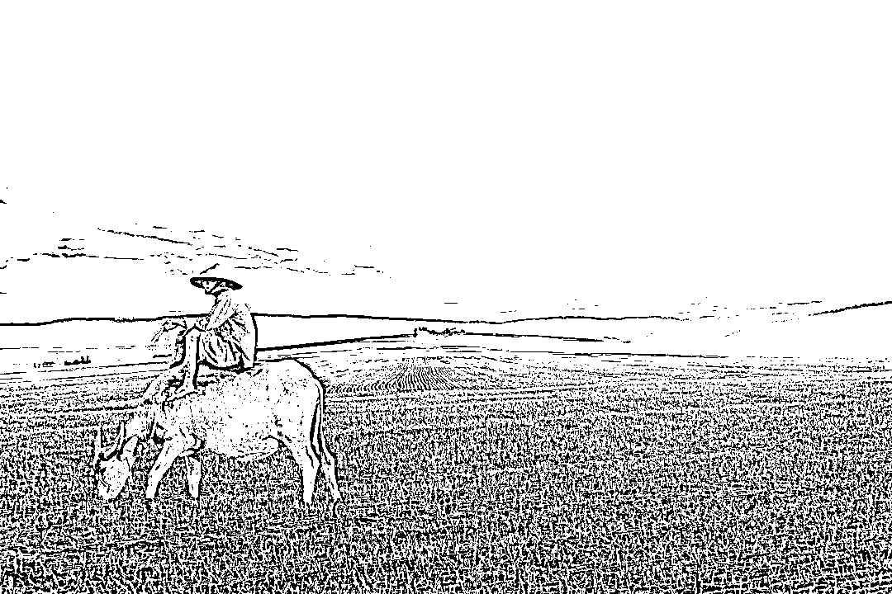

**我的心灵运作**

我注意到我的心灵运作方式与此有点类似。我会不由自主地体验到一些有一点点不愉快或痛苦的事情。我留意到这种不适或疼痛，如果它是某种类型（射向我的精神镜子），我就会对此做出反应。

也许它让我想起了一些过去**未治愈的痛苦**，而那些过往的痛苦开始**涌入我的身心**。或者我可能会想：“糟糕！我不想感觉痛苦——为什么我总是要忍受这些不愉快的感觉！？”**我这样想，痛苦和难过就会增加，变得更强烈。**

在这两种情况下，最初小小的不愉快被放大了，现在出现了更强烈的不愉快。通常情况下，我对这种更强烈的体验的反应会**进一步放大它**，直到它达到一种强烈的痛苦，尽管我已太习以为常，但还是**觉得难以忍受。**

这就是疼痛激光（或者更准确地说，痛苦激光）的感觉。**不需要太多的外部环境就可以产生痛苦**——我非常善于放大自然产生的痛苦气息，以至于我的大部分时间都伴随着持续而强烈的内在痛苦感受，我感到无所适从。

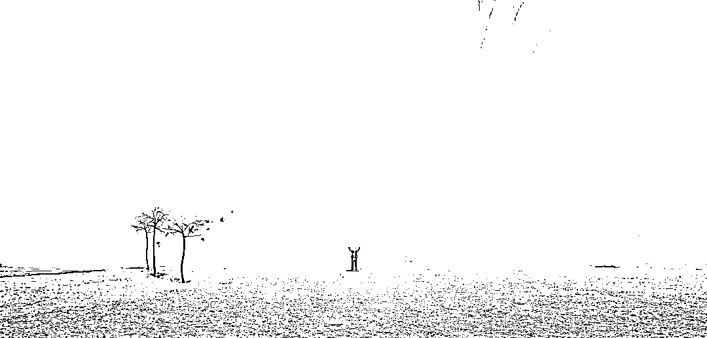

**如何改变？**

这些年来，我已经改变了这种模式，使它不那么明显，但它仍然经常存在。所以，不久前，当我在思考如何通过行动让我的生活变得更好时，我突然意识到，**改变我的外部环境永远不会创造出我想要的生活体验，除非我改变这种内在模式。**

这个模式是否生效的关键在于：**当痛苦和折磨发生时，我会以一种增加（放大）自己痛苦的方式来应对，还是以一种减轻（减少）自己痛苦的方式应对呢？**由于“镜像”效应，即我对自己的反应做出反应的反应（次数叠加），**适度地改变我的模式**——从轻微放大到轻微缓解——如果应用于反应的每个层面，就会在我的最终体验上产生戏剧性的效果。

通常最有害的反应是那些我最少关注到的反应，因为我认同它们——**它们看起来就像“我自己”**。所以，我的身体里可能累积了很多肌肉紧张和一些焦虑。当我把注意力集中在这种紧张和焦虑上时，我可能会不自觉地皱起鼻子，好像闻到了一股恶臭，并对这种紧张和焦虑产生一种反对的感觉，默默地想着“不应该是这样的！”

这种反对的作用就像是**痛苦的放大器**，加深了原有的紧张和焦虑，使它们更加强烈。注意到这种反对对我来说很重要。**但仅仅注意是不够的。**如果我反对这种反对，事情只会变得更糟。

但是，如果我能够简单地注意到它，并且**相信它是在表达我对幸福的美好渴望**（这就是运用 NVC 原因，它洞察到，**一切都只是为了满足美好的人类需求**），那么这种反对的力量开始消失，一些紧张和焦虑开始缓解。

**通过改变我对自己内心发生的事情的思考方式，**我可以做得更多。我可以相信，发生的一切事情都是出于我的某个部分对我的关心，表达它对我的爱。我可以认为，任何受伤的迹象都不是惩罚，而是需要滋养。

即使在我努力消除痛苦的放大效应的同时，**我也可以转而寻找一些方式，**去放大更多服务生命的体验。我身体的任何地方有感觉到一点幸福吗？甚至一点快乐、喜悦、欣赏或爱？我愿意让我的注意力停留在那里吗？当我所目睹的事情没有任何负面反应，我的注意力就像在余烬上轻轻吹一口气，让它散发出更明亮的光芒。

**如果我经常这样做，那些肯定生活的情绪和内心体验就会开始习惯性地加强。**也许不久的将来，我将成为一个“**爱的激光器”**，捕捉自然升起的爱的微光，并养成习惯去强化它，直到我被爱浸透，我的“爱之光”强烈地照耀到世界。那不是很了不起吗?

如果我们都能把“痛苦激光器”关掉，变成“爱的激光器”，这难道不是一件了不起的事情吗？你喜欢吗？你有一点相信这是可能的吗？为了更接近这样一个世界，你能迈出怎样的一小步呢?

**版权声明：**原创文章由若道翻译发布，欢迎转发，反对抄袭。友号转载请申请白名单。

**鲍勃·温特沃斯**

CNVC 认证培训师，也是“家庭心理训练营”（Family HEART Camp）的联合创始人，这里会为父母和孩子提供的 NVC 浸入式体验。鲍勃拥有斯坦福大学应用物理学博士学位。

**学习 NVC**

**点击或长按下图了解课程详情**

**

**微信又双叒叕改版啦，不想错过若道君的推送？**

**就把若道设为星标吧！**

**▼**

**喜欢记得点一下在看哦☟**

********报名直达入口********

# 有福利！NVC 线上训练营丨非暴力沟通，有效提升沟通能力

> 原文：[`mp.weixin.qq.com/s?__biz=MzA5NjA0NTAxNg==&mid=2651457720&idx=3&sn=3a79051ca4682107aa38c5ebac5f5736&chksm=8b48ba0fbc3f33199b7dbf31409d857de2c29e5bbe04374323118b460fcc813d6e01d97e6d6c&scene=126&sessionid=1692737918#rd`](http://mp.weixin.qq.com/s?__biz=MzA5NjA0NTAxNg==&mid=2651457720&idx=3&sn=3a79051ca4682107aa38c5ebac5f5736&chksm=8b48ba0fbc3f33199b7dbf31409d857de2c29e5bbe04374323118b460fcc813d6e01d97e6d6c&scene=126&sessionid=1692737918#rd)

**为什么我们要学 NVC？**

（向上滑动查看内容）

**蒋颖**

若道联合创始人

2016 年，我在新西兰参加一个 Hakomi 亲密关系治疗的治疗工作坊。参加这个工作坊的都是治疗师。在这个工作坊中，有一位女性让我特别印象深刻，因为她身上有种特别的气质，某种既温柔又坚定的东西，充满力量，充满对这个世界充满关怀，她身上表现出的让人惊讶的真实也让我有很多思索。她叫托尼·麦克尔兰（Toni McErlane）。

我知道她从小学习武术，也是一个悬挂式滑翔运动的运动员，曾经背着滑翔机在世界各地的上空飞行和比赛。她完成了北美非暴力传播（NVC）领导计划，是一个非暴力沟通（Nonviolent Communication，简写 NVC）培训师和注册的家庭纠纷调解人，也是生态心理学的培训师。她有多年的内观经验，在身体创伤治疗方面的经验，还有她在有机种植、景观设计、园艺治疗都有专长……我看到她到印度去，帮助印度乡村做有机耕种。在这次疫情之前，她已经买了一艘帆船，准备和丈夫开着他们的船环游世界。所有这些都让我感叹，一个女性可以活得如此勇敢和丰富。现在她而她对中国也充满了某种关切。多年前就一个人在藏区徒步旅行，后来又骑自行车穿越西藏。

但喜欢户外冒险的 Toni 说， NVC 比武术更管用。

2019 年，我终于请 Toni 到中国来，请她给若道做了基础和中级的 NVC 培训，也请她对外做了一次工作坊。

怎么说呢，培训和工作坊棒极了，更棒的是，我觉得人人都爱她。

**Toni McErlane**

我来自新西兰，拥有社区和人类服务—咨询康复学士学位，是 Aminz 的注册家庭纠纷调解人，也是 NVC Aotearoa 的 NVC 培训师。

在我的生命中，我一直对真诚、充满活力、自我负责的沟通和有意识的选择充满激情。而我的人生旅程为我提供了充足的机会，让我去探索、研究、反思和完善这在沟通中是什么样的。

在我的工作坊中，我的原则和实践都是建立在非暴力沟通和正念的哲学基础之上。非暴力沟通是由美国心理学家马歇尔·卢森堡博士所开发的。马歇尔的目标是发展出一种语言，这种语言受到印度巴利语中的“非暴力主义”（Ahimsa）一词的启发，它的意思是“没有伤害”。我们怎样才能在与他人沟通时不造成伤害呢？这不仅需要非暴力沟通的技巧，还需要在训练中融入正念。正念是受小乘佛教内观传统的启发，发展觉知和接纳，关注和允许。在我们的工作坊中 ，我们将非暴力沟通和正念编织在一起。

我致力于以这种沟通和处世方式作为我日常与人互动的基础。我曾经学习了为期一年的北美非暴力沟通领导者项目，在加州湾区非暴力沟通的全年浸入式项目中做了两年协助工作，然后在索诺马县女子监狱推动非暴力沟通培训。同时，多年来我持续参加内观静修，致力于继续和发展这种实践，并把它融入自己的工作坊中。

2020 年疫情期间，我与丈夫和我们的猫在游艇上休了一年假。现在，我和丈夫还有 15 岁的侄女在新西兰南岛的达尼丁生活。我在那里从事心理咨询、冥想和生态心理疗法。我们还正在那里慢慢建立一个治疗静修中心和生态冥想社区。

过去四年，我曾两次来中国，与若道及其友好而充满活力的团队分享非暴力沟通，并参观了一些绝佳风景。我期待继续与若道合作，在网上分享我的知识和技能。

向上滑动可查看更多

**Toni 老师有话对你说**<mpvideosnap class="js_uneditable custom_select_card channels_iframe" data-pluginname="videosnap" data-id="export/UzFfAgtgekIEAQAAAAAABNIXkZitzgAAAAstQy6ubaLX4KHWvLEZgBPEtIMEEEUxZvj-zNPgMIuM7PVi1oMK5fdX4B-DAnh3" data-url="https://findermp.video.qq.com/251/20304/stodownload?encfilekey=RBfjicXSHKCOONJnTbRmmlD8cOQPXE48ibrgo6T80SM1b4QSoxiaa7xblfRvMCU22ricO1icL5GdBOSmzhG7mbaLtSLg4xqYaTLicapWwCV45Axx8QGaozqH7OpxicjibYzN1icWtyuIibCRyZInILWhIGRG1ILicWtib8H3XUMxBW2rZO2GMmc&amp;adaptivelytrans=0&amp;bizid=1023&amp;dotrans=0&amp;hy=SH&amp;idx=1&amp;m=3d7ca9d191932d16f6faa80b9364d1f9&amp;token=AxricY7RBHdVzFXjPCFncbbQSWL8x8x2YeR1VX1JKDza8JFxFfuEYeFkqjygt392VxqY7mdlmzAc" data-headimgurl="http://wx.qlogo.cn/finderhead/PiajxSqBRaEJYnVsqWfEX9qA0sI6hNVKsDfyzfPZ92WZMZyBpZWU5NA/0" data-username="v2_060000231003b20faec8c4e68a1ec2d4ca07e434b07755bbf47e7053a3059defd2c9d6c68a20@finder" data-nickname="若道" data-desc="#非暴力沟通 NVC  在面临一个两难处境时，如何运用 NVC 促进合作的开展？
" data-nonceid="1620007045275601581" data-type="video"></mpvideosnap>

**福利！**

**前 20 位报名学员赠送 NVC 情绪-需求卡一套**

**NVC 情绪-需求卡****课程内容**

**第*****1*****模块 区分感受和想法**

*   学习区分想法、感受和故事感受。

*   体会为什么在表达中分享自己对某一情境的感受很重要，而不仅仅是想法和判断。

*   学习辨识和认同身体传递的感受和情感，将它们作为自我觉知和自我联结的资源。

*   理解感受是重要的信息媒介，支持你与自身的需求建立联结。

*   认识关注感受、探索联结需求的重要性，而不是对感受做出反应。

**第*****2*****模块 将感受与需求、需求与策略关联起来**

*   了解并理解满足一个人需求的策略可能无法满足另一个人相同的需求。

*   学习理解需求的概念，学习区分需求和策略。

*   体验如何用多种不同的策略来满足一种需求，以及如何通过选择一种特定的策略满足或不满足其他需求。

**第*****3*****模块 倾听和共情**

*   学习倾听他人话语中透露出的情绪和需求。

*   体验受到共情和受到其他形式的有意识的支持之间的差别，比如同情、安慰、分散注意力、陪伴等等……

*   学习认可别人的体验和情感，而不必认同对方的策略，认识这种技能所能带来的力量和解脱。

**第*****4*****模块 观察与评价**

*   学习在表达中运用观察而非评价的重要性。

*   体验两者之间的差异，自己去领会为何有此差异。

*   学习区分对情境的解读和事实。

**第*****5*****模块 自我共情**

*   学习认识和观察自己的评判和评价，并用它们与自身感受和需求建立联结，借此更深入、更清晰地理解自己。

*   学习识别自己赋予情境的意义，并探求其中的事实。

**第*****6*****模块 ****提出请求**

*   学习请求是表达中重要的一部分。

*   学习如何提出满足自身需求和他人需求的请求。

*   分辨请求和要求之间的区别。

*   学习如何倾听拒绝，如何表达拒绝。

**第*****7*****模块 ****练习坦诚地表达**

*   在一个支持性的框架中，综合运用之前所学, 练习相互联结、清晰有效、对自己负责的沟通。

**第*****8*****模块 ****接受和表达感激和谢意**

*   运用之前所学，练习表达感激和谢意。

*   学习表达感激之情，远不止一句随口说出的“谢谢”。

**工作坊学员这么说**

非暴力沟通带给我的最大的收获是：通过课堂的学习和大量互动练习提升了觉察力，提升了沟通技能，非暴力沟通并不仅仅停留在语言的表达，非暴力沟通的核心是同理心。通过倾听对方的感受，帮助我将情绪转化为解决问题的动力。

我过去和其他人沟通时，常常陷在自己的思维中，通过练习我才发现，原来别人说话的时候我常常其实并没有听到对方说什么，都是在自己的想法里打转，现在我起码学习到当对方说话的时候，能够去尽量不想自己的想法。

过去我不会留意到原来自己的某种表达方式会让别人不舒服，而且其实也无助于解决问题，对于我想达到的完全无效，NVC 的学习能够让我更能觉察哪些表达会让别人不舒服，让我的沟通更有效，更能帮助我达到我的需求。我学完后，才觉察到过去在沟通中，如果对方有情绪，我也是情绪化地回应，现在，我能够和自己和对方的情绪都拉开一些距离。过去我对于对方情绪化的表达，会有情绪化的回应或不知所措，现在我更能去感受他们情绪下的需求是什么，因此就更从容，不那么容易被他人的情绪影响，能够更有效地回应那些有负面情绪的人。我是一个比较理性的人，在练习中发现原来对一个在我用理性分析如此很明显的画面，每个人竟然有如此截然不同的看法，这还是挺让我吃惊的，这个发现好像打开了一扇门。

我是一个比较感性的人，过去有什么事情，常常是情绪化的沟通；NVC 的学习让我能够更理性一些，能够更客观去看问题。

这个培训让我非常感动，这是我没有想到的，一个关于沟通的培训如此让人感动。在那些常见的表面事件呈现之下，是如此脆弱、温柔的人性。我们如此绝望地想要被理解、被爱，想要与他人联结，然而我们常常用非常错误的沟通方式去做，这时我们离我们的目标就越来越远。

**什么人适合学习 NVC？**

**老实说，NVC 真的是一门人生必修课。**

**NVC 可以非常有效地帮助提高沟通能力，提高觉察力、自我同理心和他人同理心，进而减轻童年创伤对成年生活的影响，帮助有效改善亲密关系、与父母的关系、亲子关系、职场关系。**

*   如果你正被低效的沟通方式困扰或正经历沟通暴力，想**提升觉察，避免伤害的话**，NVC 培训是个不错的选择；

*   如果想结束“相爱相杀”恶性循环的相处模式，**享受一段真诚而愉快的亲密关系**，NVC 培训是个不错的练习途径（可以拉着你的 Ta 一起来哦）；

*   如果你的**工作、求学、生活和“表达”息息相关**，想更理解自己，想改善你的人际关系，改进工作，NVC 培训可以体验到一种更有力量的表达。

**训练营时间与价格**

**课程时间：**10 月 24 日—12 月 12 日，每周日下午 2 点-6 点。共 8 周，每周 4 小时

**课程价格：**6800 元

**购买须知**

❶ **本课程一旦报名，不接受退转课。**

****非暴力沟通线上训练营****

**授课老师：**Toni McErlane

**授课时间：**2021 年 10 月 24 日起

**授课方式：**网络课程**，**英文授课，中文翻译

**费用：**6800 元

**课程负责人：****Maggie 老师**（微信：18510107057，请备注“非暴力沟通”，**获取优惠价信息**）

长按二维码添加课程负责人咨询~

****报名请点击“阅读原文”****

# 10.7 金星进射手座丨未来三周，是诗与远方的“放荡不羁爱自由”

> 原文：[`mp.weixin.qq.com/s?__biz=MzA5NjA0NTAxNg==&mid=2651457712&idx=1&sn=907839ec6bea3397cb9b2a3c73b3cedb&chksm=8b48ba07bc3f3311051e652e67462ffea17f8590a4d69c53ba3cfd4976986e4cb26b1bcca34a&scene=126&sessionid=1692737918#rd`](http://mp.weixin.qq.com/s?__biz=MzA5NjA0NTAxNg==&mid=2651457712&idx=1&sn=907839ec6bea3397cb9b2a3c73b3cedb&chksm=8b48ba07bc3f3311051e652e67462ffea17f8590a4d69c53ba3cfd4976986e4cb26b1bcca34a&scene=126&sessionid=1692737918#rd)

**********************☆ ****************************后台****************************回复“今日”，给你一句生命态度**********************

作者/MaryChan 玛丽

编辑/翀子 封面/书君 图片/网络

2021 年 10 月 7 日 19 点 20 分，金星进入射手座并在此停留至 11 月 5 日。象征爱与美的金星来到射手座掌管的广阔天地时，会有哪些表现？在这段日子里，又有哪些重要的宇宙天气可以助力金星的能量发挥呢？让我们一起来看文章吧~

**10 月 7 日 19:20 金星由天蝎座进入射手座，并在这里一直待到 11 月 5 日。**从水元素到火元素，在生命幽暗复杂的海底洞穴，完成深层的试炼和净化后，新生的自我将升出水面，向着广阔的天空前进，寻找一份希望、开阔与光明。

金星象征着爱与美，一般来说，在每个星座待三周半左右，再进入下一个星座。**金星与阴性能量有关**，是除了月亮的滋养、照料、养育面向之外的另一种阴性能量展现。根据运行位置不同，金星看起来的形状也在变化，当离地球很近的时候形似明亮的月牙，离地球很远的时候形似银盘。

在金星的律动中，与之持续地连接，寻求理解，邀请金星所象征的神圣美好的能量与我们同在，这就仿佛做了一个与金星女神（品质）融合的仪式。有助于个体连接生命中的**愉悦感**，开发提升个**人魅力**，带来自然而然的**吸引力**，创造良性的**人际互动**，开启或维护**有品质的感情**，创造**价值、财富与丰盛。**

**金星属于内行星，是“自我”的具体面向。**有别于外行星所象征的超然面向，金星非常具有**“烟火气”**，与触手可及的美好有关。其守护星座天秤座——带来平衡、和谐与优雅；金牛座——带来自然、价值与安稳。

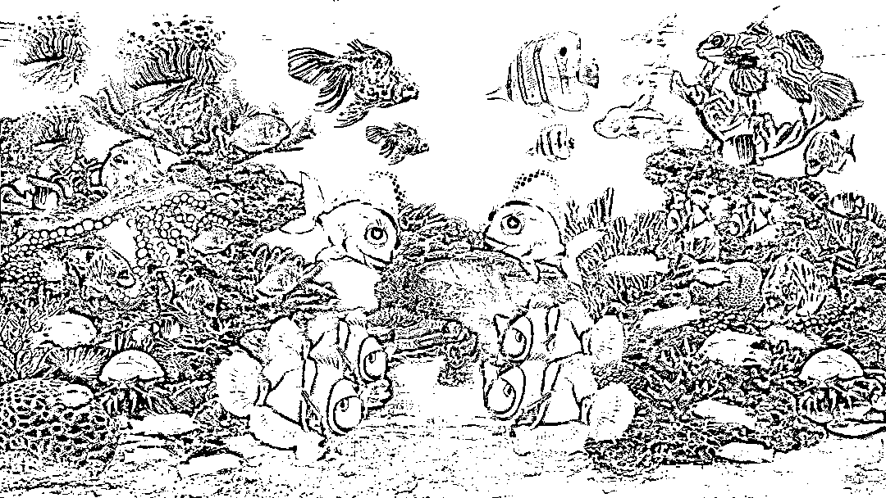

**射手座的法则**

射手座，是火元素的变动星座，其守护星木星，与扩展、成长、乐观、自由、幸运有关。如果按照发展阶段来将十二星座分组，**白羊座到巨蟹座**代表着个人自身的发展；**狮子座到天蝎座**，体现着个人发展臻至完美，以及展开一对一的关系；**射手座到双鱼座**，就是个人融入社会（更大群体）的过程。最后一个阶段，也是生命的升华版，与宏观、秩序、理念、法则、消融等抽象概念有关。

**射手座作为最后一个阶段的开端，是先进的、高级的意识火焰，超越了纯粹的个体自我表达。**其符号是一支射向天空的箭，隐含着向上发展的渴望，透过生命的广角镜去观察人事物，因而从碎片到整合，获得某种世界观、价值观以及人生哲理。

**射手座更关心原则和模式，而非实施的细节。**射手座意味着在空中俯瞰整片森林，而非关注具体的某一棵树木。在火元素中升起的意志，需要靠接下来的土元素去具体实现。例如白羊座与金牛座，白羊座是初生的、不具形的意志火焰，在接下来的金牛座，物质得以具体凝聚成形。同样，射手座探索与社会议题相关的原则，然后摩羯座寻找实现这些原则的方法。

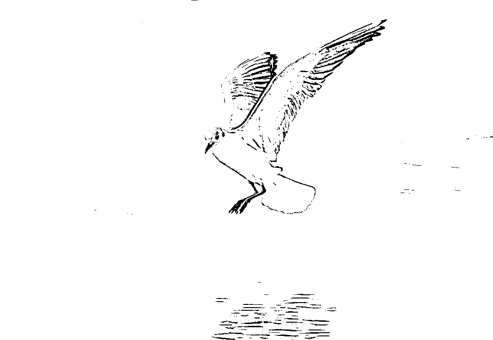

**金星在射手座**

**金星进入射手座，令人看到生命中的阳光面，人容易被热情、积极、乐观的品质吸引和感染。**例如偶然看到一部剧，女主与男主在学校相遇，女主角阳光、乐天、正直，虽然看起来大大咧咧，但总能幸运地化险为夷。心中有光，才能保持乐观，不论顺境、逆境，都能从内在有一个向上的动能。

有时候我们羡慕、欣赏、喜欢这种特质，同时又会怀疑这种特质是否过于**理想化**了，如何存在于现实中，又如何永远保持一份对生命纯粹的热忱与信心呢？

**至少有两种乐观**，**一种是未经世事、“可疑”的天真；一种是历经世事还保有一份赤子之心的智慧，**心中有一份淡然与成熟，能透过现象看到本质，从而知晓有些事可能无法避免，有些习惯确实需要改变，有些人可能需要放手。当身处困境、疑虑、挑战中，学习“飞”到高处，看清全局，便能更快地走出阴霾。

最近的真人秀《披荆斩棘的哥哥》中，李承炫受到很多关注，也收获了许多粉丝。其金星就在射手座。戚薇说“喜欢他的**真诚、简单和直接**。”他在美国出生，于韩国、中国发展，**不同地域的文化**让其人生变得丰富，个性也更立体。他也**喜欢旅行**，这都符合射手座的特质。

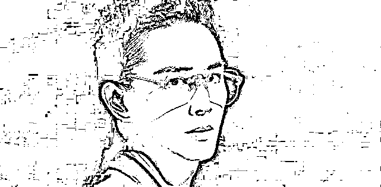

| 李承铉

**金星在射手座，令人欣赏那些“远方”的东西，能开阔我们眼界的东西。**所以钱可能花销在买书、上课、旅行，以及有异域风情的事物上面。我们也能对自己或他人更加打开和慷慨，愿意善意地分享、给与。所以如果你想送礼物给他人，不要抑制自己，行动起来吧。做一些让别人快乐的事，快乐的能量也会回流和滋养你自己，这就是幸运的钥匙。

金星在射手座，空气中充斥更多的“好奇因子”，吸引着人们去向外探索。**射手座热爱天空一般广阔无垠而又明媚的自由。**只要个人愿意向外伸展，就可以打破陈旧的藩篱，与更宽广的世界相遇。

**金星在射手座的时候，人容易不安于室，**或对例行公事感到乏味。这时**旅行**是个好主意，无论是背起行囊在真实世界中向外的游历，还是拿起书本在内心世界向内的旅程，都是某种意义上从日常生活的约束中解放出来，扩展眼界、意识，让思想与感觉变得更敏锐的过程。

**金星在射手座，让人更加追求知识、真理和生命的意义。**个人很可能被科学、哲学、宗教或任何揭示事物运行规律的学问所吸引。通过学习研究，看到更大的秩序与结构，将单独的部分与部分联系起来，建立更大的画面和图景，最终获得智慧。

智慧并非单纯的知识，知识是有局限的，智慧永远是鲜活的。智慧可以从对摆脱已知的探索中，流淌出来。智慧与自由地学习有关，当你说“我不知道”时，你就正在学习。如果我们能从各种事物学习，不仅仅是书本，还有天空、落叶、微笑以及各种关系去学习，从意识到我们自己头脑的活动中去学习，那么将看到一个不一样的、充满乐趣与领悟的世界。

**金星在射手座，带来轻松和幽默的风格。**今年的生活充满意外和改变，许多人体会到世事无常的压力与无力。这时我们更需要某种轻盈与滋养。幽默帮助缓和气氛，带给人欢乐，也有助于拉近人际的距离，消除敌意，赢得好感和信赖。幽默感也让自己在面对困难的时候，更加豁达，富有弹性，缓解紧绷和焦虑。

**上乘的幽默，来自于开明的人生哲学，丰富的智慧，**并闪耀着心灵的光辉。罗温·艾金森，著名喜剧《憨豆先生》的扮演者，其金星就在射手座。虽然憨豆看起来幼稚，但艾金森本人拥有牛津大学的电机工程学位，是一位学习力和创造力很强的人。

**金星在射手座，为关系带来诚实、正直的品质。**高阶的射手座不喜欢卑劣的小动作，希望所思、所言、所行是一致的，不虚假。这是基于对生命和爱有一份深深的了解与信任，所以虚伪变得毫无必要，浪费时间，幼稚可笑不成熟。

自知者明，而无知的人意识不到自己的矛盾，活在各种造作中，蹉跎人生。人若丧失了**精神上的清晰视角**，就会过度依附于生命中的有形物质，于是欲望当道、恐惧盛行。当人看到生命更加整体的画面，才会真正明白沧海一粟的渺小，放下个人的傲慢、谎言、空虚，让生命中的矫饰自然脱落。

**金星在射手座的爱情**

关系中需要某种**开放性、探索性，**能够令人有新的、**更拓展的体验**，或者能够相互学习、探讨、取长补短。真诚、阳光、睿智、豁达的态度，会为你加分。关系中足够的自由和空间是重要的，但也可能出现因为希望探索关系的种种，而不轻易付出承诺的情况。

**可能吸引到的伴侣状况：**异地（远距离），不同的文化背景，不同的信仰背景，网络、旅途、研习组织中相遇，教育状况良好或有国外背景，充满阳光或喜欢运动。

约会空间可以选择**大而敞亮**的地方，光线明媚充裕的地方，体现知性美和创造力的地方（例如书店、校园、创意社区、艺术馆等）。自然、松弛地交流，不必隐藏，兼具**热情和内涵**。聊阅读、聊感悟、聊世界、聊人生和理想，让彼此在关系中成长，也彼此治愈。

**金星在射手座的性爱**

这就像一次冒险和探索，带着率真、直接、开明和热情。幽默感可以让身心更加放松。过程中的诚实很重要。最好不要忽略对方的感受和情绪。

**金星在射手座的装扮**

容貌并不是最重要的，需要体现个人的**内涵和主张**。用智慧的头脑把自己打扮得精致而有品，体现独一无二的文化、修养、气质、韵味。

**金星在射手座的阴影**

**狂热地增进头脑中的知识**，而忘记了在生命的实践中去感受，渐渐失去了与心的连接，忽略了灵动的生活。

关系上，用**道德标准**去要求他人，评判他人，却合理化自己的不适当行为。

**说话分寸不足**，或夸大不实，挂碍面子，却没有里子，生命变成一个空壳。脚不沾地，难以兑现自己的承诺。

**盲目乐观**的赌徒心理，因为暂时的幸运而沾沾自喜、自大傲慢，却没有踏实耕耘的长远能力。德不配位，灾不远矣。

在感情上，**过度注重个人自由和自我表达**，总是想着别处的青草更绿，缺乏享受和安住于当下的能力，不愿形成有约束力的关系，当感觉受到牵绊，可能选择逃离，难以负责。

**金星在射手座，带来希望和信心。**由于本月水逆，凯龙星对分太阳、火星，以及冥王星停滞并顺行，对某些人来说，**关系层面正经历着很大的冲击**，内心仿佛在经历着天人交战。在射手座的金星，默默地协助人们，在混乱低气压的乌云中，于缝隙瞥见阳光，忆起并看到自己所拥有的一切美好事物。无论现实如何惨淡，**对未来保持一份敞开的态度，**生命终将朝向新的契机和光明面流动。

金星在射手座，温柔地提醒人们幸运和丰盛的法则。我们都希望获得某种程度的“丰盛”，丰盛就是不缺乏，丰厚、富裕、充足，不仅指物质上，也包括情感上、精神上的满足状态。

人在满足的时候，就会有一种安全感，人在安全的状态下会自动朝着正向发展。要获得丰盛，就需要释放自私、批判、抗拒、痛苦、敌意、恐惧等阻碍因素。虽然很难做到彻底，但常常主动地整理和厘清自己，回归纯真、清澈的状态，爱与喜悦才可以更多地滋润心灵。

**金星在射手座，**令人接触教育、法律、旅行有关的事情，或海外有关的事情，透过大机构或品牌以及推广、营销类别的事情获利，也可以从研究科学、宗教、哲学、灵性中得到满足。

**金星在射手座的重要相位**

**金星在射手座期间与其他天象的结合以及相位（容许度 1°）：**

**★ **10 月 6 日 天秤座新月****

在金星换座的前夕，与自己达成新的和解。关系是修行道场，无论是美满顺遂，还是一地鸡毛，走过千山万水，我们终究不孤单，只要不失落了最真实的自己。

**★ **10 月 7 日 02:28 冥王星在摩羯座 24°18′顺行****

这是金星换座当天的重磅天象，是重生的征象和契机。跟着私欲走，就会越来越狭窄、恐惧，“如人入暗，即无所见”，因为想要不断地占有、抓取、比较、证明。跟着真实走，就会越来越敞亮，如日光明照，令人豁然开朗、清晰明辨。看得清晰，便能即刻改变。不接纳“死亡”，是痛苦之源。无论何时，你都有选择站在光明中的权利，不纠缠，不纠结。

★ **10 月 11 日 10:16 土星在水瓶座 6°52′开始顺行**

10 月是大批行星由逆行转顺行的时候，包括冥王星、土星、木星、水星，这带来能量的集中释放，也让个人感受到某种压力，某些事情或项目终于可以推进、重启，或做出某个重要决定。接纳责任，勇敢地为所当为，便会发现一份新的自由，存在于责任之中。

★ **10 月 13-14 日 金星六分土星**

**重点影响人群：有重要行星/四轴/月亮交点落在射手座、水瓶座、狮子座、双子座、天秤座、白羊座 2°-12°。**

稳定中夹杂着轻快，思考如何在关系中落实富有创造力的责任。结交值得信赖与可靠的朋友，为关系带来一些新意。此相位带走轻率，留下适当的稳重和认真。

★ **10 月 16-17 日 金星三分凯龙星**

**重点影响人群：有重要行星/四轴/月亮交点落在射手座、白羊座、狮子座、水瓶座、天秤座、双子座 5°-15°。**

更清楚地理解自己的存在及意义，看到自以为是的虚幻，与真实连接。找到与精神层面连接的方式，例如阅读、散步、静坐、祈祷，领悟一份更深切和稳定的存在感和归属感。

★ **10 月 18 日 13:29 木星于水瓶座 22°19′顺行 、23:16 水星于天秤座 10°顺行**

仿佛一场小考结束，带着满满的对于关系的讯息，以及如何整合这些讯息的思考。释放不确定感，让徘徊的人看到下一步的落脚处。

★ **10 月 26-27 日 金星四分海王星**

**重点影响人群：有重要行星/四轴/月亮交点落在射手座、双鱼座、双子座、处女座 13°-27°。**

这时，我们更能打开自己的心胸，去感受美的事物。透过理想、浪漫以及精神层面的共振，寻找自己失落的完整性。也可能在关系中做出某种牺牲，放弃自己的需求，而成全另一方。或因为看到某些事实，而感到幻灭和失落。这也是让我们的心灵更加成熟的时候，而成熟意味着代价。

★ **10 月 28-29 日 金星六分木星**

**重点影响人群：有重要行星/四轴/月亮交点落在射手座、水瓶座、狮子座、双子座、天秤座、白羊座 17°-27°。**

木星本是射手座的守护星，与金星连接，激发新奇的心智火花，充满活力，接纳变化。有利于学习、了解新的知识、理念，遇到资优的导师或引领者，获得对人生提升的、整合的看法和见解，更新价值观。

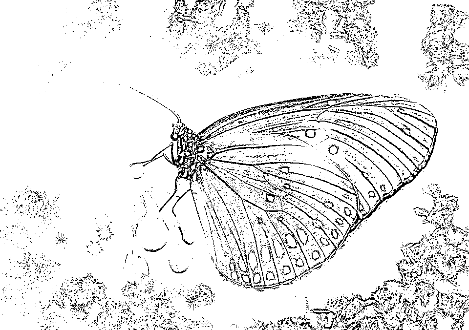

**结语**

生命就是一场旅程，在生命的巨大织锦中每个人既是主角，也是过客，来来去去，唯有永恒的天空俯瞰大地。旅行团乐队的单曲《她在哪，家在哪》中唱到：

她在哪，家就在哪，她在哪；天上看地上，心魔归顺天空之王；眼底的森林过滤，我的心狂；并行的飞机坐着另一个我，熟悉又陌生，隔着玄天眺望。

其主唱（及作词作曲）孔阳的金星恰好就在射手座。我们都在进行各种形式的旅行，在音乐中、在城市中、在生命里。然而，心安处，即归处。一颗安住之心，扎根于内在爱与丰盛的泉源，因而不会害怕未知。恐惧来自于害怕丧失已有的东西，未知意味着全新的可能性和机会，向着明天前行吧。

**版权声明：**原创文章由作者授权首发于若道平台，欢迎转发，反对抄袭。友号转载请申请白名单。

**MaryChan 玛丽**

人本主义占星师、花精咨询师

于成都创办工作室，从事咨询、组织相关活动 8 年

咨询预约号：MaryChen336

微信公众号：ZhanXing336

长按打赏

**学习占星学**

**点击或长按下图了解课程详情** 

**

**

**

****

**微信又双叒叕改版啦，不想错过若道君的推送？**

**就把若道设为星标吧！**

**▼**

**喜欢记得点一下在看哦☟**

****报名直达入口****

# 天秤座新月 | 真正富有的人，从不计较付出

> 原文：[`mp.weixin.qq.com/s?__biz=MzA5NjA0NTAxNg==&mid=2651457678&idx=1&sn=ac78152acc470696d90f8d8a894da071&chksm=8b48ba39bc3f332f6978e00404f5a2c081f44d7d1b91dd6f04accc947c9ff51684a38aba7fbb&scene=126&sessionid=1692737918#rd`](http://mp.weixin.qq.com/s?__biz=MzA5NjA0NTAxNg==&mid=2651457678&idx=1&sn=ac78152acc470696d90f8d8a894da071&chksm=8b48ba39bc3f332f6978e00404f5a2c081f44d7d1b91dd6f04accc947c9ff51684a38aba7fbb&scene=126&sessionid=1692737918#rd)

****☆ **后台回复“今日”，给你一句生命态度**

作者/王芝桦 编辑/玫瑰 图片/pexels

**天秤座新月****北京时间 2021 年 10 月 6 日 19:05 迎来天秤座新月，太阳与月亮精准合相于天秤座 13°24′。**2021 年天秤月生活从 9 月 23 日开始，但随着水星 8 月 30 日换座进入天秤座、9 月 7 日进入逆行前影响期、9 月 27 日开始逆行天秤座，天秤座主导的“平衡的道德与艺术”早已渲染了整个 9 月。此次天秤座新月，再度点亮天秤座的主题——透过“关系”的议题，重建“平衡”的生活。

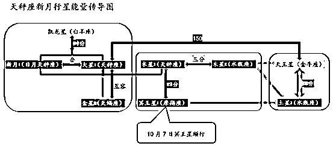

> **天秤座新月重点影响人群**
> 
> **参考新月峰值影响期间各个行星的行进度数，以及逆行行星的轨迹影响；常规容许度，个人行星入相位 3°，出相位 1°；非个人行星入相位和出相位均为 3°。**
> 
> *   出生星图中，有**行星、四轴、南北交点**落入**固定星座（金牛座、狮子座、天蝎座、水瓶座）3°-30°**的人群。
>     
>     
> *   出生星图中，有**行星、四轴、南北交点**落入**变动星座（双子座、射手座、处女座、双鱼座）0°-3°，17°-26°**的人群。
>     
>     
>     
>     
> *   出生星图中，有**行星、四轴、南北交点**落入**基本星座（白羊座、巨蟹座、天秤座、摩羯座）7°-30°**的人群。

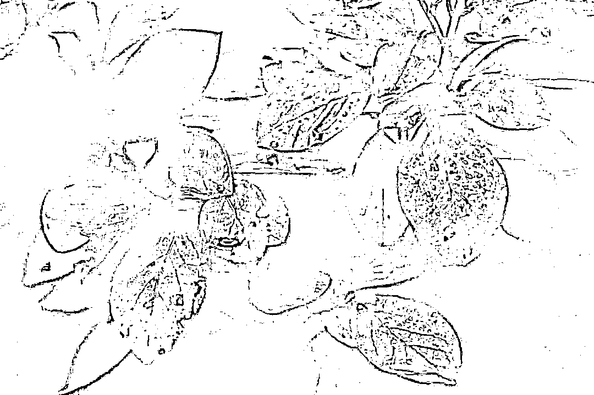

**纷乱生活中，回归内心平静**

****

**我害怕的是，当爱无所不在时，或者在我们视为理所应当的爱中，却丧失了爱的感觉。****——简·韦伯斯特《长腿叔叔》**9 月 25 日，孟晚舟女士在等待了 1028 个日夜之后，终于回归祖国的怀抱；同天，东北三省实施限电措施，无论原因是什么，但一定不是随意的决定。这两则新闻之中都蕴藏着“过去”的味道。那么，是什么拨动了时间线的方向，令等待已久的结果终于出现，令过往的缘由备受关注——9 月 27 日，水星于天秤座开始逆行，“神的信使”墨丘利（水星的神话原型）送来一封迟到的信件，提示我们：**直至 10 月 18 日水星恢复顺行之前，都是回溯过去、反思错漏和修正遗憾的宝贵时间。****9 月 15 日-10 月 6 日**期间，接纳天秤座水星能量的天蝎座金星（金星守护天秤座）与天秤座火星形成“金火互容”结构——**水星、金星和火星三星联手，“平衡”一词随着各种关系议题进入我们的意识，人们对“平等与尊重”变得异常敏感，一句话或一件小事都可能触动过去的记忆，翻开记账的小本本。**

**1. 新月前的“战斗”号角**

进入 10 月，天秤座新月的前一周：10 月 1 日，天蝎座金星与逆行的水瓶座木星形成“金木四分”结构，逆行的天秤座水星与逆行的摩羯座冥王星第二次形成“水冥四分”结构（第一次在 9 月 22 日），天秤座火星与逆行的白羊座凯龙星形成“火凯四分”结构；10 月 3 日，天蝎座金星与逆行的摩羯座冥王星形成“金冥六分”结构；10 月 4 日，天秤座太阳与逆行的白羊座凯龙星形成“日凯对分”结构。

逆行能量太多，不翻旧账都难。但是，10 月初的这几组结构，却将一份“成长的礼物”蕴藏在旧账之中。**两方面影响****关系：****·** 关系是自我的镜子，我们在关系之中投射自我的功课。这里所说的“关系”。除了人与人的关系，也包含我们与万物（市场，金钱，资源，环境）的关系；**·** 为求认同的妥协与讨好，为证价值的索取与付出，无一不在掩饰着自我的匮乏与脆弱；然而，当所求得不到回应，当所证掏空了耐性，关系的天平便开始倾斜，自我的感受便开始失衡，对“我做的和你做的”开始称量，对“回应和结果”开始计较；**·** 一个人的自知、自洽和自信，是所有关系的“平衡支点”——没有“自我”，哪来的“关系”？一个对自我尊重、允许和信任的人，才能给与他人同等的尊重、允许和信任。

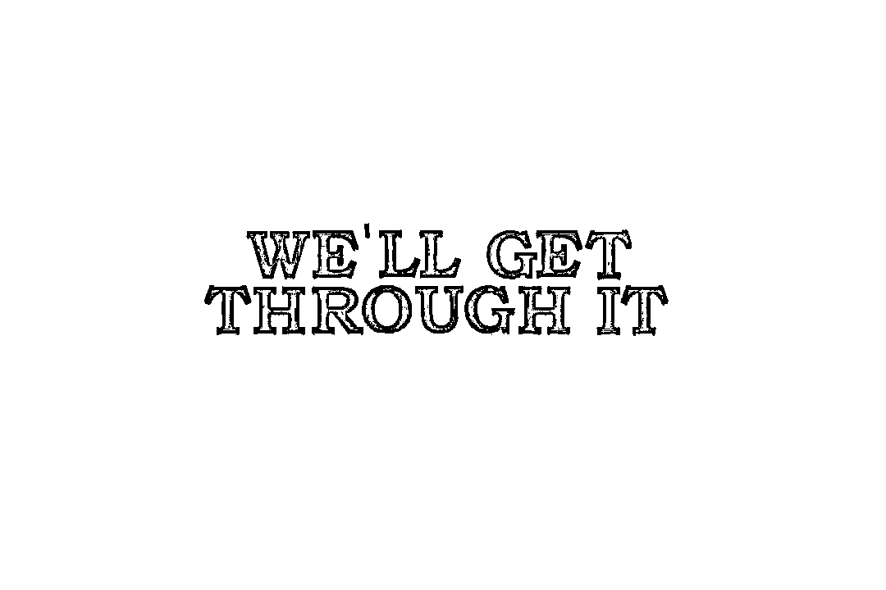

**价值：**

**· **金星也同时守护金牛座。自 2019 年天王星进入金牛座之后，金星便成为金牛座天王星“现实变革”的风向标；**· **自 2019 年至今，金牛座天王星颠覆着我们过去的生存模式，那些在疫情震荡之下瓦解的安全根基，那些在市场洗牌之下转换的生存土壤，那些在职场沉浮之下显现的竞争实力，无一不在揭示着我们的价值真相，刷新着我们的价值观念；**· **“水星逆行+金火互容”触发我们再次忆起曾经安稳的生活，曾经损失的金钱，曾经满意的价值；但既然是“曾经”，那么就自然意味着已经失去；**· **命运的曲线为何如此流转？那些贪婪欲望的背后，隐藏着自我价值的匮乏；那些自以为是的背后，隐藏着安于现状的惰性。荣格说“潜意识如果没有进入意识，就会引导你的人生而成为你的命运”，这些事件正在提醒我们——对潜意识中的动心起念保持一份觉察。**“翻旧账”并不是坏事。如果能够透过对旧账的回溯，洞悉因果并照见自我，“翻旧账”将会带来生命从内向外的成长与收获；但如果一边痛苦地翻着旧账，一边愤恨地向外指责，便会又一次完美逃脱“自我负责”的责任，遗憾错过“意识觉醒”的机会。**但是，此次天秤座新月的前一周，只是吹响了“战斗”的号角，而此次天秤座新月才是“战斗”开始的时间。

**2. 新月的两面性——在战斗中学会选择**

**天象**

**· 新月合相火星：**太阳、月亮和火星合相于天秤座；

**· 火天梅花：**天秤座火星与金牛座天王星形成精准的 150°梅花结构。

10 月初的水星逆行、水冥四分、火凯四分和日凯对分 4 组天象结构，均指向“过去”的时间点。

**·** 原生家庭中没有得到的认同，一对一关系中曾经受到的贬损，我们的潜意识深处留下了“我不好，我不值，我不配”的伤痛与羞愧，驱动我们在“与他人的关系、与金钱的关系、与环境的关系”之中投射需求并渴望弥补；

**· **依赖关系而丢失的自我，恐惧失去而模糊的边界，为求认同而违心的妥协，为证价值而过度的牺牲，或许能暂时维持一段表面的和谐，但内在的伤痛与羞愧却并未得到疗愈；

**· **现实的失望，内心的委屈，期待的落空，终于在这个彰显“道德与平衡”的天秤座新月压垮了最后的忍耐力。

此次天秤座新月，“金火互容”结构绝对是整体天象中的重点：“新月合相火星”激化了战争性和破坏性的能量，接纳“火天梅花”能量的金星已经行进到天蝎座 29°的位置（金星守护金牛座和天秤座）。新月开启了个体之间、集体之间和国际之间“立场和权益”的争夺之战，而那些谈不妥的协商和讨不回的公平也变得剑拔弩张。这些事件的起因依然来自“过去”，而经过 9 月和 10 月第一周的酝酿，人们的情绪已经变得相当的激进和暴躁，急了！怒了！甚至不惜毁灭一切和两败俱伤。

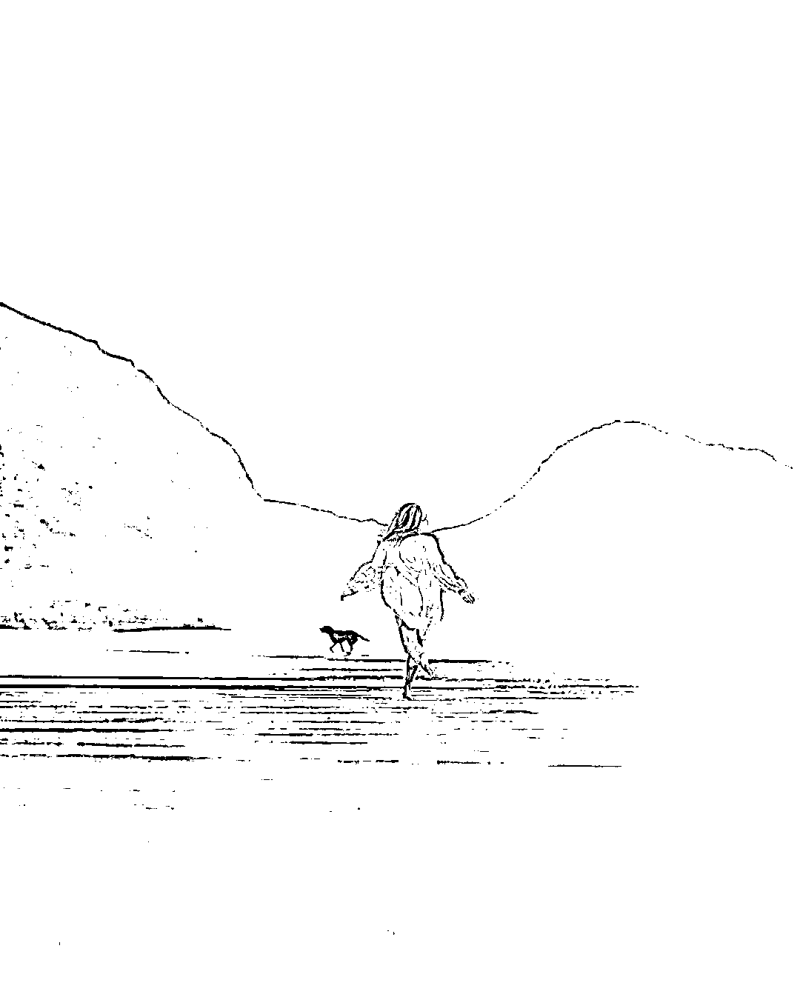

但是，凡事都有两面！**此次天秤座新月转天的 10 月 7 日，金星换座进入射手座，“金火互容”结构解散，冥王星于摩羯座恢复顺行——一段探索“平衡的艺术，爱的意义”的时间就此开启。****·** 如果我们能透过现实的痛苦与纷争，看见过去的伤痛，直面内心的羞愧，就会遇见真实的自己。谁还没有些故事？谁还不是个宝宝？而谁的智慧不是经验后才获得的呢？**·** 重建自我的原则与边界，重拾自我的自信与自由——我的家园，我可以邀请那些并肩作战的伙伴进入，也可以驱逐那些肆意攻击的家伙离开。酷吗？很多时候，看似冷酷的人，往往内心更具真情，因为懂得珍贵，所以甘心取舍。**此次天秤座新月，在纷乱的生活之中回归内心的平静，与自己共处，给自己呵护，就像——在学会一段双人舞之前，先学会自己独舞。**

**3. 宇宙的深意——清算与重建**

2021 年，我们肯定不止一次地发问：老天究竟是要干什么呢？

如果你看过每篇新月文和满月文开头部分的“行星能量传导图”，就会发现，**2021 年的所有旋涡都围绕着年度重磅天象“土天四分”运作。**2020 年 12 月 22 日，木星和土星精准合相于水瓶座，开启了主张“平等和文明”、彰显“科技和创新”的全新“风元素周期”。全新周期的起始年 2021 年，“新旧转化”的进程中始终飘荡着“清算”的旋律——**清算一切偏离初衷、制造损害的遗留问题，才能走出陈旧并升级未来。**往往，无所不在的“爱”，渐渐让我们将“爱”视为理所应当，不但丧失了爱的感觉，更是丧失了爱的挚诚——那么，宇宙就会收回“爱”的礼物；但是，宇宙依然赐予着修正的机会——**9 月 27 日-10 月 18 日水星逆行天秤座，引领我们透过“失衡”的关系与状态，重遇真实的自我，重建平衡的生活。**此次天秤座新月，让我们以一个哲学问题回敬宇宙的深意——我们为什么走到这里，我们又将去往哪里？

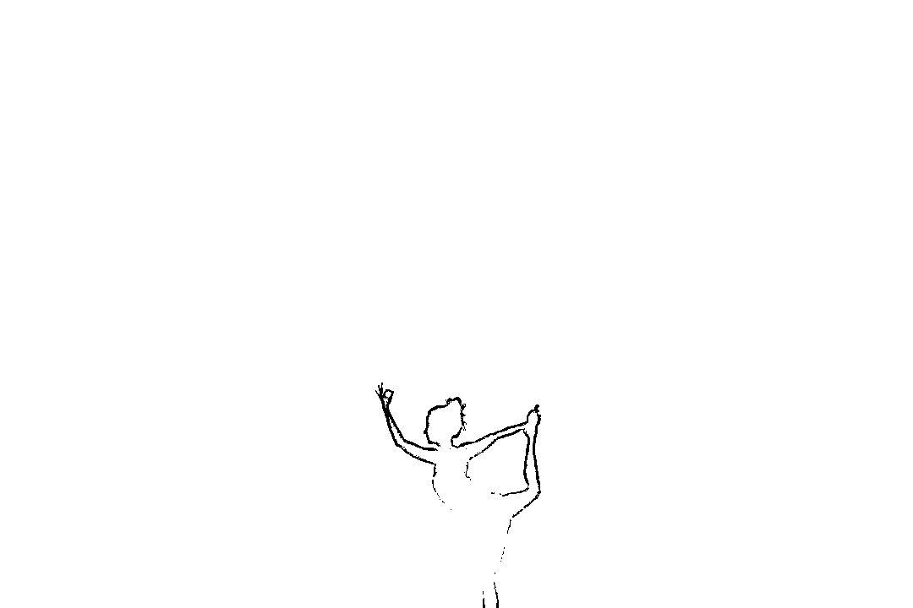

**寄语**

****

**两个人在一起，最糟糕的是幽默感不一致。****——简·韦伯斯特《长腿叔叔》****一个具有道德感的人，才会具有幽默感——充分感受他人的渴望与痛苦的能力，优雅化解他人的窘困与尴尬的智慧，并且，深具慷慨之情，富有慈悲之心——一个真正富有的人，才会拥有幽默感。**两个人的幽默感一致，确实很难。因为，每个人都在自己的幽默感中投射自己，又在他人的幽默感中看见自己，而很多的幽默感只不过满足了自己的演技，却根本不顾观众的感受。细细想想，生活中的很多事情都在揭示一个真理——**自己拥有的，才能分享给别人，并且不会翻旧账和撕破脸。为什么？因为真正的富有的人，永远富有。**孩子喜欢将自己的彩虹糖分享给小伙伴，不会抱怨对方没给自己什么；不会指责对方没按自己的期待品尝；不会想尽办法将剩下的糖豆装进自己的口袋；不会嘲笑对方“你吃糖的样子真丑”，他们只会挂着分享秘密的笑容与快乐。有人可能会说“那只是一颗彩虹糖”，但对于一个孩子来说，那颗彩虹糖就是生活的全部。让我们做个“富有”的孩子吧——此次天秤座新月最好的愿景。祝福大家，愿每个灵魂安好。**新月如何许愿？**

**许愿时间**：2021 年 10 月 6 日北京时间 19:05 后，48 小时内有效、8 小时内最佳。 

**许愿人群**：所有人。

**许愿数量**：每人最多 10 个。

**许愿方式**：静心冥想，身心祈祷或记录收藏。

**许愿格式**：请万能的宇宙赐予我能量，我将以我的能量吸引**（什么）来到生命中……

**许愿原则**：发心诚善利人。

**版权声明**：原创文章由作者授权首发于若道平台，欢迎转发，反对抄袭。友号转载请申请白名单。

****

****想阅读更多作者的文章，请在后台回复******王芝桦****** 即可。****

****王芝桦****

心理占星师，统合疗愈师，占星专栏作者

全职于个案咨询与占星教学工作 16 年

**个案预约咨询微信号**：zhihua0621 

**微信公众号**：daoxi-life

**长按打赏**

****

**学习占星学**

**点击或长按下图了解课程详情** 

**

**

**

****

**微信又双叒叕改版啦，不想错过若道君的推送？**

**就把若道设为星标吧！**

**▼**

**福利来啦**

**点击**

**“阅读原文”**

**获取最好用的免费**

**新月报告**

**获取免费新月报告，请点击文末“阅读原文”**

# 这一次新月，你的愿望一定会实现哟（免费报告快来领）

> 原文：[`mp.weixin.qq.com/s?__biz=MzA5NjA0NTAxNg==&mid=2651457678&idx=2&sn=6216b977dba38d9be756a7f2dacbae17&chksm=8b48ba39bc3f332fde454019f7970c8bb8e52b82cc5370379dc83bfa20464132904725b094f2&scene=126&sessionid=1692737918#rd`](http://mp.weixin.qq.com/s?__biz=MzA5NjA0NTAxNg==&mid=2651457678&idx=2&sn=6216b977dba38d9be756a7f2dacbae17&chksm=8b48ba39bc3f332fde454019f7970c8bb8e52b82cc5370379dc83bfa20464132904725b094f2&scene=126&sessionid=1692737918#rd)

北京时间 10 月 6 日 19:05，新月发生在天秤座 13°24′。每到新月时分，若道君都会为你奉上根据你出生星图量身打造的免费新月报告。可是新月为什么要许愿？新月报告该如何领取？让若道君来教你。

　**什么是新月？**　

从占星学看，新月是月亮周期的一种相位。新月是开始，又称为朔，对应中国农历初一，太阳、月亮在此时合相。此时月亮运行到太阳与地球之间时，月亮以黑暗的一面对着地球，并且与太阳同升同落，地球上看不见月亮。

本次新月时间

**10 月 6 日 19:05，新月发生在天秤座 13°24′。**

为什么新月要许愿？新月是一个周期的开始，新月发生的时候，太阳与月亮合相，能量很强。当新月出现时，你也许会发现灵感忽现，非常适宜开启新领域、项目与行动，缔结一段新的关系或合作。许愿会加强新月的能量，也有助于你了解自己现阶段适合开启的方向。 本次新月最佳许愿时间

从新月开始到其后的 48 小时内，许愿的力量最强。

**最佳许愿时间：10 月 6 日 19:05-10 月 8 日 19:05**

属于你的免费新月报告

每到新月时刻，看着占星文章里写着：看看你新月的宫位，如果新月在第 X 宫，你可以许愿的方向是……

是不是常常一头雾水？新月的宫位？我到底该看哪里啊？

而有时，那些标注上升星座的文章也会让你忍不住想：虽然我的上升星座是这个，可是我的新月好像并不落在你说的宫位啊？你是不是写错了？

虽然这些文章都没有写错，可是好像对你而言都太不友好了。

**Don't Worry！**别着急，让博学又体贴的若道君来帮你！

我们推出了一份**免费**又**好用**的新月报告！

而且是专门为你设计的哦，**根据你出生星图为你量身打造的，只****属于你的独家新月报告**。

报告有哪些内容？

**新月时间****最佳许愿时间**

**如何许愿 **属于你的**许愿关键词**

本次新月给你的**建议**

你会有怎样的**感受 **

****机会****

********

如何许愿？

许愿方式也很简单。

你可以把愿望写下来，或者双手合十后交叉，闭上眼睛来祈祷。 

报告中会为你提供**祈祷词示例**，可以多多参考哦～ 

你还可以适当添加自己的语言，创造属于你自己的祈祷文！

如果报告拿到手了，快对照着许愿吧！

**这份好用又暖心的报告，点击****阅读原文****即可领取！**

****

****点击“阅读原文”即可获取新月报告****

# 雷蒙德·梅里曼金融占星周运 | 10 月 8 日可能是个关键转折点

> 原文：[`mp.weixin.qq.com/s?__biz=MzA5NjA0NTAxNg==&mid=2651457616&idx=1&sn=16d301701d0a0156aeb47659d2e49e45&chksm=8b48bae7bc3f33f1552eba31ffe28211bf9cecdd903111d0e9d5a91a6fb5ed09e8f2da7036b3&scene=126&sessionid=1692737918#rd`](http://mp.weixin.qq.com/s?__biz=MzA5NjA0NTAxNg==&mid=2651457616&idx=1&sn=16d301701d0a0156aeb47659d2e49e45&chksm=8b48bae7bc3f33f1552eba31ffe28211bf9cecdd903111d0e9d5a91a6fb5ed09e8f2da7036b3&scene=126&sessionid=1692737918#rd)

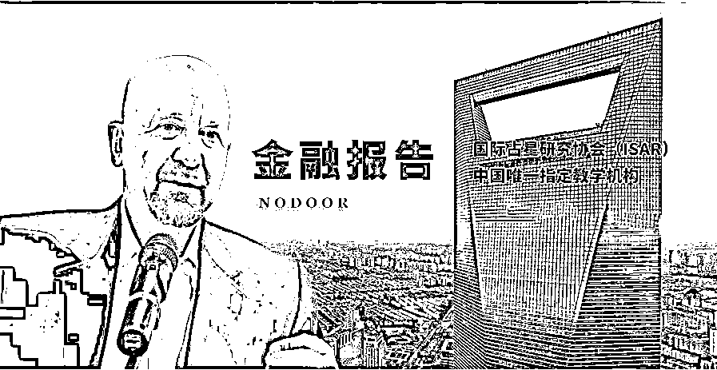

作者/雷蒙德·梅里曼 译者/Luke
编辑/玫瑰 图片/pexels

十一国庆快乐呀，今天是假期的第三天，继续享受假期美好生活吧~雷蒙德·梅里曼是在金融占星学界稳坐第一把交椅的占星师，同时他也是若道签约的金融占星课老师，我们引进了雷蒙德·梅里曼老师的《[上证指数月度报告》及《黄金报告](http://mp.weixin.qq.com/s?__biz=MzA5NjA0NTAxNg==&mid=2651457358&idx=2&sn=7f9716283aa45202cac373edc975a3b9&chksm=8b48b5f9bc3f3cef6942c2670605563f932623c1ef13b686cd99fe8a8160d392160c9a9fdac6&scene=21#wechat_redirect)》。我们经老师的授权，将每周刊登梅里曼老师的周运，供大家参考和学习。于是，这是本周的周运（10.4-10.9）。PS：中国股市在国庆期间休市七天。

**说明：以下时间采用纽约证券交易所所在地美国东部标准时间。**

**展望与回顾**

**迅速发展公司的股票，刚刚经历了自 2020 年 3 月疫情流行大抛售以来最糟糕的一个月。与此同时，美国国债收益率接近 6 月来的最高。之前预测第四季度强势经济增长的策略分析师，现在正在降低他们的预测，因为供应链出现了瓶颈，具高度感染力的德尔塔新冠病毒变异毒株也在肆虐。**

**——阿卡内·奥塔尼****《股票在动荡中结束了一个季度，是自 20 年 3 月以来最糟糕的一个月》****《华尔街日报》****2021 年 10 月 1 日****“我已经向总统和民主党领导人表明，”曼钦先生在一份声明中说，“在新的和扩大的政府项目上花费数万亿美元，与此同时我们甚至无力支付基本社会项目，比如社保和医保，这是财政疯狂的定义。”****——《曼钦干预》****《华尔街日报》社论版****2021 年 10 月 1 日**

全球股市上周开盘强势，从 9 月 20 日的低点大幅上涨。但随后当**恶作剧者水星**于 9 月 27 日周一逆行，8 月份和 9 月初从历史高点和多年高点开始的下跌趋势就又恢复了，持续到上周末。

在亚洲和环太平洋地区，股市表现有好有坏。中国和日本股市大幅下跌持续到上周末，上证指数和日经指数从 9 月 14 日的多年高点算起，分别下跌 5.5%和 6.9%。9 月 14 日是一个梅里曼市场时机学院二星地球宇宙学关键反转日期。澳大利亚 ASX 指数上周也下跌到 6 月 2 日以来的最低价位。但是印度 Nifty 指数保持在 9 月 24 日前一周创下的历史高点附近。

在欧洲，荷兰 AEX 指数从 9 月 17 日的历史高点下跌 5.3%，同时德国 DAX 指数从 8 月 13 日的历史高点下跌 6.47%。苏黎世 SMI 指数是上周下跌最多的指数，从梅里曼市场时机学院三星地球宇宙学关键反转日期 8 月 18 日创下的历史高点跌幅接近 9%。伦敦富时指数仍接近 9 月 20 日的近期低点。

美国三大股指上周大部分时间也处于低位，直到周五大幅反弹。纳斯达克指数跌幅最大，从 9 月 7 日的历史高点算起跌幅达 7%。在这相当紧张的交易周中，三大股指的每一个都测试了 6 月和 7 月的低点，这是因为在国会拜登的大规模支出法案陷入僵局，此外还有德尔塔变种毒株阴魂不散，加上政府关门的威胁。他们设法避免了政府关门的情况发生，将其推迟了两个月，但他们在提高债务上限方面仍然不能达成一致，所以如果不对此做些什么的话，美国的信用状态仍然有可能被降级。由于水星逆行将持续到 10 月 18 日，有理由怀疑是否可以“很快”采取有效措施。

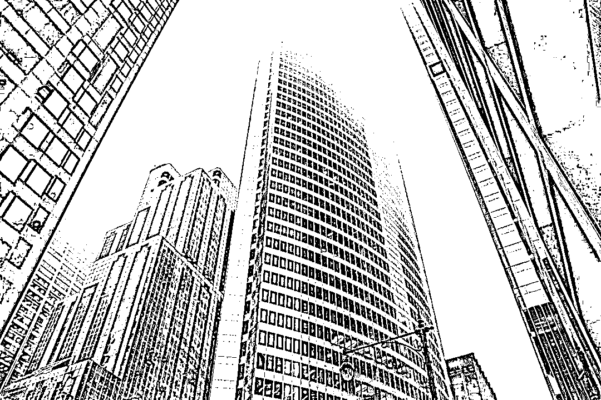

贵金属市场上周值得关注，因为白银于 9 月 29 日周三下跌到了 21.41。自 9 月 3 日测试 25.00 起，跌幅超过 14%。那是一个新的 3 个月低点。黄金守住了 8 月份基本周期的起点价位。随着两者都在 9 月 30 日周四大幅上涨，这构成了市场间看涨背离的情况。正如我们在 9 月 4 日的中国专场在线讲座上所说，我们预期**10 月是黄金的转折点**。贵金属（和美国中期国债）下跌如此严重的原因之一，是由于人们担心美联储将很快缩减资产购买规模，导致美元强势上涨。正如之前所述，我们不认为这会在木星重新进入双鱼座，并与美联储成立星图的太阳-冥王星出相位之前发生。也就是不会在 1 月中旬前发生。有趣的是，尽管美元上涨了，比特币和以太坊也上涨了。在 9 月 22 日跌到主要周期低点后，这两种加密货币上涨超过 20%到达周五的高点。我们的加密货币客户都非常高兴，因为我们在今年保持了对比特币和以太坊的出色分析水准。

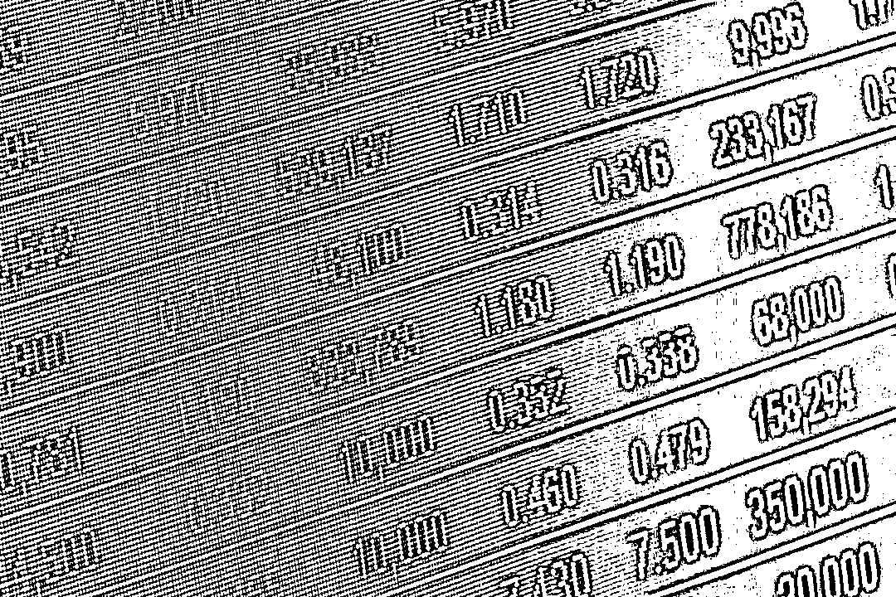

**短期占星趋势和长期考量**

根据我们的市场时机研究，**接下来的一周将是很重要的**。它也带来了好几个极好的交易机会，尽管恶作剧者水星从 9 月 27 日到 10 月 18 日逆行，可能对此持有异议。我不认为水星在天秤座的逆行周期很容易驾驭，但是当前正在展开的地球宇宙学周期，**仍然可能对应着一些金融市场上有意义的反转**。

**让我们首先关注 25 个月的太阳-火星会合周期，合相将在 10 月 8 日的天秤座中段发生**。我们的研究已经显示，**这一合相在 8°容许度内与大幅反转有很强的关联**。反转可能在这一时段开始或结束。当前的太阳-火星合相期始于 9 月 13 日前后的市场高点（一些始于 8 月中旬的高点），将于 11 月 1 日结束。

历史上来看，当高点在稍早于这一时间段或在这一时间段形成时，许多股票指数下跌了 8%-20%。大多数世界股指已经下跌了 5%-7%，除了苏黎世 SMI 指数，它已经满足了最小的价格下跌目标，从 8 月 18 日的近期高点下跌接近 9%。这就是我们认为股票指数在本月中还有更多下跌空间的原因。

从占星学来看，太阳和火星在天秤座不是强势的配置。火星在天秤座入陷。然而，在太阳-火星合相的前一天，（从 10 月 8 日开始）金星将进入射手座并逗留一个月。**金星在射手座与股票价格呈正相关，所以倘若股票指数在近期触底也不会令人感到惊讶**。此外，另一个与市场反转有关的因素是冥王星在 10 月 6 日改变运行方向，同一天出现的新月，以及水星逆行的中点是 10 月 7-8 日。这些都是重要的市场时机指标。

**与****上面几个地球宇宙学反转征象同样有力的，是土星在 10 月 11 日顺行停滞**。这也是一级地球宇宙学征象，在 9 个交易日内与基本周期或更大周期有 70%的关联。土星所强调的心理学主题是**小心谨慎和防御心理**。在这一宇宙事件的几天之内，**一种对未来的担忧和焦虑常常会占据主导**。

所以，我们作为交易者和个体，应该如何应对这些情况，在疫情期间和政治纷争的时代中谋生存呢？我们每天醒来，试图做到我们的最好。土星的要点是展示纪律性，执行深思熟虑的长期计划。在水星逆行时，这并不总是一件容易的事，因为在这种让人分心和混乱的气氛中最有利于恶作剧者的戏法，尤其当与此同时土星（纪律性）还与天王星（混乱、动荡和分裂）仍处于渐亏的四分相中。

在交易者当中，水星逆行可是声名狼藉，因为它倾向于带来许多虚假的突破和技术型买入/卖出信号。它也对应着较往常更多的沟通不良、误解和技术失误（“为什么我的文档、邮箱和视频网站 Youtube 突然打不开了？”）然而，它有利于回顾和纠正过去的错误，以及扫清当前情境中妨碍进步的障碍。计划需要被调整，那些心态开放和灵活的个体（和交易员）可以在这段时间中获利。

这里也给政府和社会上那些无惧的领导人一个提醒，他们正在把温和派（大多数美国人）变成国家的恶棍和叛徒。他们弄反了。但是别忘了，我们开始了新的一个月，有六颗行星（如果算上凯龙星就是七颗行星）正在逆行，看起来宇宙也在反向移动。

**这么多颗行星在逆行，是时候回顾、修正和重新开始了。**

**说明：以上日期基于纽约证券交易所所在的美国东部标准时间，由于存在时差，中国地区可能需要加一天。****版权声明：**本文由若道翻译发布，欢迎转发，反对抄袭。友号转载请申请白名单。

**雷蒙德·梅里曼（Raymond Merriman）**

若道签约老师。著名金融占星师，ISAR（国际占星研究协会）前主席，梅里曼市场分析公司的总裁。他由于“提升了占星学的职业形象”，在 1995 年国际占星大会上被授予轩辕十四奖；在 2012 年国际占星大会上，被授予轩辕十四终身成就奖。

1“中国上证指数月度报告”发售

**若道推出了****中文版****的雷蒙德·梅里曼中国上证指数月度报告，并持续发行该报告！**

当把金融市场的周期和占星学的周期相结合时，雷蒙德·梅里曼老师的金融占星学研究**为投资者应对金融市场的周期波动，并随之调整投资策略提供了极大的价值参考**。

**10 月中英文报告已上线！**

2“黄金价格周期月度报告”发售

**若道推出****中文版****的雷蒙德·梅里曼黄金价格周期月度报告！**不仅仅为广大读者在中国股市的投资出谋划策，更将视角放眼黄金市场。

**每当世界经济形式不明朗的时候，有一个地方是保值的港湾，那就是****黄金**。自 1982 年雷蒙德·梅里曼出版第一本研究《地球宇宙学征象与黄金价格的关联》的著作以来，**他一直作为最重要的黄金市场时机预测者之一享誉国际**。

10 月黄金报告已上线，梅里曼老师将会告诉你他对这个关键时期如何操作的想法。也可以按照季度和一年期订阅，有更多优惠。季度和年度的好处是，你可以持续了解梅里曼老师对于不断在变化的市场的看法。即便他某一次看法和市场不一致，你也看到在下一期他如何调整自己的看法，并看到金融占星在一个长期时间段内对你把控风险的帮助。而能够长期控制风险、尽量找到安全的投资时机才是投资的长久之计。

**10 月中英文报告已上线！**

**购买套餐**，买得越多越优惠

中国上证指数月度报告套餐价

*   **单月报告**：280 元

*   **3 个月套餐**：780 元（260 元/月）

*   **12 个月套餐价**：2400 元（200 元/月）

**长按下图识别二维码**

**购买金融报告****套餐**

**▼**

黄金周期月度报告优惠

*   **双报告年度套餐更优惠（直降 900 元）**
*   **12 个月黄金报告+12 个月上证指数报告：仅需 3900 元**

**长按下图识别二维码购买黄金报告套餐**

▼

3 中国金融市场特别网络研讨讲座

面对年底几个影响金融市场的重要天象，该如何把握下半年的投资，为跨年做准备？我们特意邀请雷蒙德·梅里曼老师为大家带来了**3 个小时的金融讲座——雷蒙德·梅里曼中国金融市场特别网络研讨讲座。**

这场为期 3 小时的在线讲座探讨了**这些长期行星周期如何影响世界经济的长期周期和趋势，特别是如何影响上证综指和黄金市场**。并描述**在 2021 年剩下的时间里市场反转关键时间点，特别是 12 月 19 日至 25 日金星逆行，以及土星-天王星最后一次渐亏四分相、金星与冥王星合相的重要时期。**

**长按下图识别二维码购买讲座视频**

▼

**点击阅读原文购买金融报告**

# ISAR 选修课丨行星交点在集体进化中的作用

> 原文：[`mp.weixin.qq.com/s?__biz=MzA5NjA0NTAxNg==&mid=2651457616&idx=2&sn=d4895e9f7afd96bee81c134f033be295&chksm=8b48bae7bc3f33f16d19be8e383182f97e2d417247fff257404e8cdeba0a1b309bde5ffabcec&scene=126&sessionid=1692737918#rd`](http://mp.weixin.qq.com/s?__biz=MzA5NjA0NTAxNg==&mid=2651457616&idx=2&sn=d4895e9f7afd96bee81c134f033be295&chksm=8b48bae7bc3f33f16d19be8e383182f97e2d417247fff257404e8cdeba0a1b309bde5ffabcec&scene=126&sessionid=1692737918#rd)

这是一门专门为若道开设的课程！**马克·琼斯**将于今年秋天教授**八节关于行星交点的深度在线课程**，他将通过我们集体进化中的一些重大事件来阐释这一主题。

1

**什么是行星交点？**

**交点是一个天体轨道与另一个天体轨道延伸平面的交点。**任何沿轨道运行的天体都有交点。月亮有月亮交点，每颗行星、小行星、卫星和微小行星也都有交点。

2

**课程教授什么？**

马克老师**首先会讲解基础知识，**介绍行星交点是什么、行星交点运转的动力（包括日心视角和地心视角），然后他会**论述丹恩·鲁伊尔晚期工作中关于月亮交点和行星交点重要性的洞见**，以及它们如何在个人生活和事件中创造一个动态的意义轴，**超越个人出生星图的静态画面。**

马克老师还将简要**介绍自己的一些开创性研究**，并通过精选一些反映我们共同的**集体进化的现代历史事件**，分享他最近的著作《行星交点与集体进化》中的洞见。

**我们将学习木星往外的行星交点**，看到木星交点如何向我们揭示文化和宗教意识形态的集体历史进化，正如我们的文明结构所表现出来的那样。例如，土星和冥王星的交点也在摩羯座，清楚地描绘了我们所有人在这个时期试图进化所面临的挑战，因为在我们生活的世界根本结构的变化中，游戏规则正在升级。

**我们还将学习近期历史中行星交点的影响**，包括最近木星、土星和冥王星在摩羯座的大合相，开始真正意识到当前这个时期在文明进化本身中的集体重要性。理解这些盛衰周期，我们至少可以在这些困难时期仍然抱有希望：我们不会失去一切！

**在整个课程中，马克老师将通过多个历史案例动态地研究这些强有力的交点配置可能如何运作。**

3

**课程安排**

**第*****1*****讲** **介绍行星交点**

我们将学习行星周期如何形成行星交点，并了解日心视角和地心视角之间的区别。

**第*****2*****讲** **什么是行星交点**

我们将深入学习丹恩·鲁伊尔的成熟思想，这是启发马克老师研究行星交点的灵感之源，也是他最近出版的《行星交点与集体进化》一书的灵感来源。

**第*****3*****讲** **双子座-射手座的天王星交点**

我们将学习人类认知和技术如何通过天王星交点的透镜进化。

**第*****4*****讲**** 巨蟹座-摩羯座行星交点**

我们将进一步学习行星交点对社会和文化的影响，深入探讨落在摩羯座-巨蟹座的木星、土星和冥王星交点，并了解它们在过去 1000 年里对我们的全球社会、政治和文化思潮起着怎样至关重要的影响。

**第*****5*****讲** **海王星及其狮子座-水瓶座交点**

我们将学习落在狮子座-水瓶座的海王星交点影响的不同显化，及其在疗愈中的作用；灵性意识形态的发展，及其促使事件结束的倾向。

**第*****6*****讲** **作家案例**

通过原创研究，我们将学习行星交点如何影响了世界上一些最伟大的作家的人生。

**第*****7*****讲** **研究 2020 年**

我们将了解 2020 年的重要意义。

**第*****8*****讲** **回顾**

我们将回顾前面的课程，并探索如何通过行星交点的意涵理解月亮交点。

4

**授课老师**

**马克·琼斯（**Mark Jones**）**

马克·琼斯是一名**占星师、心理整合治疗师和催眠治疗师**，为世界各地的客户和学生提供服务。

马克的第一本书《**疗愈灵魂:冥王星，天王星和月亮交点》**，详细解释他的占星方法论。

他的第二本书**《灵魂的表达:占星学的治疗潜力》**，融合了马克作为超个人心理治疗师和占星学的经验，概述了占星学解读的变革性潜力。

此外，马克还联合其他作者**共同撰写了一些占星书籍**：《占星学:新一代》、《超个人的占星学》以及《进化占星学的洞见》。

**而《行星交点和集体进化》则是他将他对交点研究的集大成之作。**

5

**课程信息**

*   **课程时间：**2021 年 10 月 26 日开始，每周二晚上 8 点，每周一次，共 8 次课。

*   **授课方式：**线上直播，英文授课，中文翻译

*   **课程价格：****6800 元****（课程不分组写走心推荐语转发朋友优惠价：5800 元）**

*   **行星交点名人案例和问答免费试听：**添加课程顾问王老师，发送“行星交点试听”，即可获得免费试听内容。

*   **课程咨询：**王老师（微信：18510107057，请备注“行星交点”）

长按二维码添加王老师

6

**退转课程**

*   **退款原则请详看《教学协议》，如有疑问请咨询课程顾问。**

****行星交点****

**授课老师：**马克·琼斯

**授课时间：**2021 年 10 月 26 日起

**授课方式：**网络课程**，**英文授课，中文翻译

**费用：****6800 元****（课程不分组写走心推荐语转发朋友优惠价：5800 元）**

**课程负责人：****王老师**（微信：18510107057，请备注“行星交点”）

长按二维码添加课程负责人咨询~

****报名请点击“阅读原文”****

# 若道有声阅读 NVC 专辑推荐丨水逆期间，听书学习非暴力沟通

> 原文：[`mp.weixin.qq.com/s?__biz=MzA5NjA0NTAxNg==&mid=2651457581&idx=1&sn=9de74e71cf02c8b33668a977fb7cd082&chksm=8b48ba9abc3f338c0d2b1db1ec0023c9cdecf4577af745f3a1ee8fec8b23810efccd466e3d8b&scene=126&sessionid=1692737918#rd`](http://mp.weixin.qq.com/s?__biz=MzA5NjA0NTAxNg==&mid=2651457581&idx=1&sn=9de74e71cf02c8b33668a977fb7cd082&chksm=8b48ba9abc3f338c0d2b1db1ec0023c9cdecf4577af745f3a1ee8fec8b23810efccd466e3d8b&scene=126&sessionid=1692737918#rd)

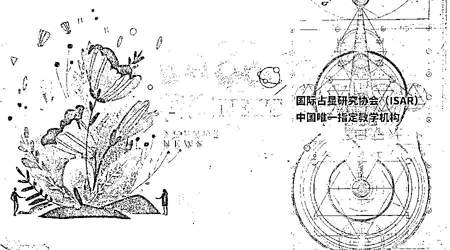

“

**非暴力沟通向我们展示了一种非常诚实的方式，不带任何批评、侮辱或奚落，也没有任何暗示错误的理智诊断。**

**——马歇尔·B·罗森堡博士**

”**非暴力沟通，也被称为 NVC（Nonviolent Communication），****通常被称为“富有同情心的沟通”——帮助你建立高质量的联结，在这种联结中，人们自然而然地喜欢为彼此的幸福做出贡献。**马歇尔·B·罗森堡博士在世界各地游历近 50 年，通过训练人们以及调解冲突来教授什么是非暴力沟通。他说，在世界各地，在每种文化中，人们都在玩两种游戏中的一种。一种游戏叫做“**谁对谁错？**”另一种游戏叫“**我怎样才能让生活更美好？**”当人们体验到高质量的联结时，他们自然想要玩后一种游戏，并自发地感到有动力去创造互利的结果。当我们感到彼此联结时，我们可以建立“共享权力”的关系，而不是“用权力控制”的关系，我们可以利**用我们的非暴力沟通技巧促进相互理解，从而让我们达成双赢的结果**。

**若道有声阅读 NVC 专辑推荐**

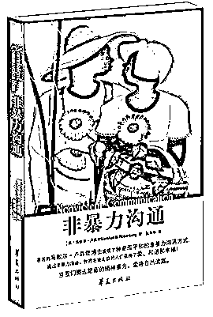

图书信息

*   作者:  [美] 马歇尔·卢森堡 

*   出版社: 华夏出版社

*   原作名: Nonviolent Communication: A Language of Life

*   译者: 阮胤华 

**【内容简介】**

做为一个遵纪守法的好人，也许我们从来没有把谈话和“暴力”扯上关系。不过如果稍微留意一下现实生活中的谈话方式，并且用心体会各种谈话方式给我们的不同感受，我们一定会发现，有些话确实伤人！言语上的指责、嘲讽、否定、说教以及任意打断、拒不回应、随意出口的评价和结论给我们带来的情感和精神上的创伤甚至比肉体的伤害更加令人痛苦。这些无心或有意的语言暴力让人与人变得冷漠、隔膜、敌视。

**著名的马歇尔·卢森堡博士发现了一种沟通方式，依照它来谈话和聆听，能使人们情意相通，和谐相处，这就是“非暴力沟通”。**

**非暴力沟通能够：**

*   **疗愈内心深处的隐秘伤痛；**

*   **个人心智和情感的局限性；**

*   **突破那些引发愤怒、沮丧、焦虑等负面情绪的思维方式；**

*   **用不带伤害的方式化解人际间的冲突；**

*   **学会建立和谐的生命体验。**

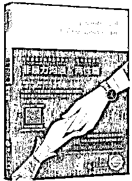

图书信息

*   作者: （美）马歇尔·卢森堡（Marshall B.Rosenberg）

*   译者：崔天 

*   出版社: 华夏出版社

**【内容简介】**

马歇尔·卢森堡非暴力沟通研讨班内部资料，带给非暴力沟通世界的又一份厚礼！让语言暴力在两性相处间停止！《非暴力沟通·两性篇》会帮助我们在保持自我的同时，与自己的爱人创建亲密和谐的相处方式。

**教你把非暴力沟通应用在两性相处之中，**用非暴力沟通让你和另一半不再吵架，构建你和另一半的非暴力沟通亲密关系。

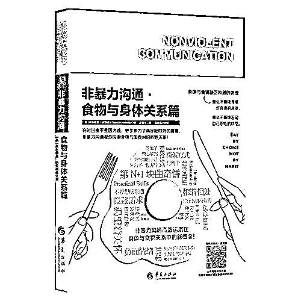

图书信息

*   作者: （美）希尔薇亚.哈茨威兹（Sylvia E.Haskvitz） 

*   译者：颜雅琴

*   出版社: 华夏出版社

**【内容简介】**

这是非暴力沟通高效运用在身体与食物关系中的一本书！扭转你明明不饿却总想吃的状态！它将告诉你：完全顺服于对食物的渴求，或强迫自己否认这些欲望，都是身体与食物零沟通的表现。当你的进食不是因为饿，更多是为了满足吃以外的需要的时候，例如释缓焦虑、避免无聊、甚至是庆祝或放松……此时食物背后藏着你的需要，非暴力沟通帮你探索食物与需要间的奇妙关系！

**它将带你找到自己独有的身体与食物的沟通方式，最终获得身心合一的平和与美好身型。**

**如何听书？**

**下载若道 APP-有声读物栏目**

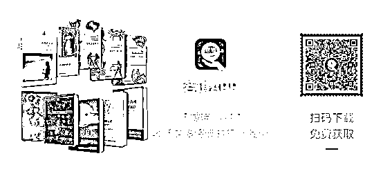

**彩蛋：10 月 10 日之前 在评论区分享听（du）后感，或点赞前 3 的同学可以获得我们送出 nvc 情绪觉察卡。**

**NVC 情绪-需求卡**

**（后台回复 nvc 还可以了解非暴力沟通文集）**

**最后的最后，若道君非常感谢所有参加朗读的同学们，以及一直以来支持我们的粉丝朋友们！**

# 有福利！NVC 线上训练营丨非暴力沟通，有效提升沟通能力

> 原文：[`mp.weixin.qq.com/s?__biz=MzA5NjA0NTAxNg==&mid=2651457581&idx=2&sn=fa548d8a2e93a2f3ad93ca397e08894a&chksm=8b48ba9abc3f338c84e598ae201af0b866b80c164d6097d2621c1ecc72555cc4781b82659a08&scene=126&sessionid=1692737918#rd`](http://mp.weixin.qq.com/s?__biz=MzA5NjA0NTAxNg==&mid=2651457581&idx=2&sn=fa548d8a2e93a2f3ad93ca397e08894a&chksm=8b48ba9abc3f338c84e598ae201af0b866b80c164d6097d2621c1ecc72555cc4781b82659a08&scene=126&sessionid=1692737918#rd)

**为什么我们要学 NVC？**

（向上滑动查看内容）

**蒋颖**

若道联合创始人

2016 年，我在新西兰参加一个 Hakomi 亲密关系治疗的治疗工作坊。参加这个工作坊的都是治疗师。在这个工作坊中，有一位女性让我特别印象深刻，因为她身上有种特别的气质，某种既温柔又坚定的东西，充满力量，充满对这个世界充满关怀，她身上表现出的让人惊讶的真实也让我有很多思索。她叫托尼·麦克尔兰（Toni McErlane）。

我知道她从小学习武术，也是一个悬挂式滑翔运动的运动员，曾经背着滑翔机在世界各地的上空飞行和比赛。她完成了北美非暴力传播（NVC）领导计划，是一个非暴力沟通（Nonviolent Communication，简写 NVC）培训师和注册的家庭纠纷调解人，也是生态心理学的培训师。她有多年的内观经验，在身体创伤治疗方面的经验，还有她在有机种植、景观设计、园艺治疗都有专长……我看到她到印度去，帮助印度乡村做有机耕种。在这次疫情之前，她已经买了一艘帆船，准备和丈夫开着他们的船环游世界。所有这些都让我感叹，一个女性可以活得如此勇敢和丰富。现在她而她对中国也充满了某种关切。多年前就一个人在藏区徒步旅行，后来又骑自行车穿越西藏。

但喜欢户外冒险的 Toni 说， NVC 比武术更管用。

2019 年，我终于请 Toni 到中国来，请她给若道做了基础和中级的 NVC 培训，也请她对外做了一次工作坊。

怎么说呢，培训和工作坊棒极了，更棒的是，我觉得人人都爱她。

**Toni McErlane**

我来自新西兰，拥有社区和人类服务—咨询康复学士学位，是 Aminz 的注册家庭纠纷调解人，也是 NVC Aotearoa 的 NVC 培训师。

在我的生命中，我一直对真诚、充满活力、自我负责的沟通和有意识的选择充满激情。而我的人生旅程为我提供了充足的机会，让我去探索、研究、反思和完善这在沟通中是什么样的。

在我的工作坊中，我的原则和实践都是建立在非暴力沟通和正念的哲学基础之上。非暴力沟通是由美国心理学家马歇尔·卢森堡博士所开发的。马歇尔的目标是发展出一种语言，这种语言受到印度巴利语中的“非暴力主义”（Ahimsa）一词的启发，它的意思是“没有伤害”。我们怎样才能在与他人沟通时不造成伤害呢？这不仅需要非暴力沟通的技巧，还需要在训练中融入正念。正念是受小乘佛教内观传统的启发，发展觉知和接纳，关注和允许。在我们的工作坊中 ，我们将非暴力沟通和正念编织在一起。

我致力于以这种沟通和处世方式作为我日常与人互动的基础。我曾经学习了为期一年的北美非暴力沟通领导者项目，在加州湾区非暴力沟通的全年浸入式项目中做了两年协助工作，然后在索诺马县女子监狱推动非暴力沟通培训。同时，多年来我持续参加内观静修，致力于继续和发展这种实践，并把它融入自己的工作坊中。

2020 年疫情期间，我与丈夫和我们的猫在游艇上休了一年假。现在，我和丈夫还有 15 岁的侄女在新西兰南岛的达尼丁生活。我在那里从事心理咨询、冥想和生态心理疗法。我们还正在那里慢慢建立一个治疗静修中心和生态冥想社区。

过去四年，我曾两次来中国，与若道及其友好而充满活力的团队分享非暴力沟通，并参观了一些绝佳风景。我期待继续与若道合作，在网上分享我的知识和技能。

向上滑动可查看更多

**Toni 老师有话对你说**<mpvideosnap class="js_uneditable custom_select_card channels_iframe" data-pluginname="videosnap" data-id="export/UzFfAgtgekIEAQAAAAAABNIXkZitzgAAAAstQy6ubaLX4KHWvLEZgBPEtIMEEEUxZvj-zNPgMIuM7PVi1oMK5fdX4B-DAnh3" data-url="https://findermp.video.qq.com/251/20304/stodownload?encfilekey=RBfjicXSHKCOONJnTbRmmlD8cOQPXE48ibrgo6T80SM1b4QSoxiaa7xblfRvMCU22ricO1icL5GdBOSmzhG7mbaLtSLg4xqYaTLicapWwCV45Axx8QGaozqH7OpxicjibYzN1icWtyuIibCRyZInILWhIGRG1ILicWtib8H3XUMxBW2rZO2GMmc&amp;adaptivelytrans=0&amp;bizid=1023&amp;dotrans=0&amp;hy=SH&amp;idx=1&amp;m=3d7ca9d191932d16f6faa80b9364d1f9&amp;token=AxricY7RBHdVzFXjPCFncbbQSWL8x8x2YeR1VX1JKDza8JFxFfuEYeFkqjygt392VxqY7mdlmzAc" data-headimgurl="http://wx.qlogo.cn/finderhead/PiajxSqBRaEJYnVsqWfEX9qA0sI6hNVKsDfyzfPZ92WZMZyBpZWU5NA/0" data-username="v2_060000231003b20faec8c4e68a1ec2d4ca07e434b07755bbf47e7053a3059defd2c9d6c68a20@finder" data-nickname="若道" data-desc="#非暴力沟通 NVC  在面临一个两难处境时，如何运用 NVC 促进合作的开展？
" data-nonceid="1620007045275601581" data-type="video"></mpvideosnap>

**福利！**

**前 20 位报名学员赠送 NVC 情绪-需求卡一套**

**NVC 情绪-需求卡****课程内容**

**第*****1*****模块 区分感受和想法**

*   学习区分想法、感受和故事感受。

*   体会为什么在表达中分享自己对某一情境的感受很重要，而不仅仅是想法和判断。

*   学习辨识和认同身体传递的感受和情感，将它们作为自我觉知和自我联结的资源。

*   理解感受是重要的信息媒介，支持你与自身的需求建立联结。

*   认识关注感受、探索联结需求的重要性，而不是对感受做出反应。

**第*****2*****模块 将感受与需求、需求与策略关联起来**

*   了解并理解满足一个人需求的策略可能无法满足另一个人相同的需求。

*   学习理解需求的概念，学习区分需求和策略。

*   体验如何用多种不同的策略来满足一种需求，以及如何通过选择一种特定的策略满足或不满足其他需求。

**第*****3*****模块 倾听和共情**

*   学习倾听他人话语中透露出的情绪和需求。

*   体验受到共情和受到其他形式的有意识的支持之间的差别，比如同情、安慰、分散注意力、陪伴等等……

*   学习认可别人的体验和情感，而不必认同对方的策略，认识这种技能所能带来的力量和解脱。

**第*****4*****模块 观察与评价**

*   学习在表达中运用观察而非评价的重要性。

*   体验两者之间的差异，自己去领会为何有此差异。

*   学习区分对情境的解读和事实。

**第*****5*****模块 自我共情**

*   学习认识和观察自己的评判和评价，并用它们与自身感受和需求建立联结，借此更深入、更清晰地理解自己。

*   学习识别自己赋予情境的意义，并探求其中的事实。

**第*****6*****模块 ****提出请求**

*   学习请求是表达中重要的一部分。

*   学习如何提出满足自身需求和他人需求的请求。

*   分辨请求和要求之间的区别。

*   学习如何倾听拒绝，如何表达拒绝。

**第*****7*****模块 ****练习坦诚地表达**

*   在一个支持性的框架中，综合运用之前所学, 练习相互联结、清晰有效、对自己负责的沟通。

**第*****8*****模块 ****接受和表达感激和谢意**

*   运用之前所学，练习表达感激和谢意。

*   学习表达感激之情，远不止一句随口说出的“谢谢”。

**工作坊学员这么说**

非暴力沟通带给我的最大的收获是：通过课堂的学习和大量互动练习提升了觉察力，提升了沟通技能，非暴力沟通并不仅仅停留在语言的表达，非暴力沟通的核心是同理心。通过倾听对方的感受，帮助我将情绪转化为解决问题的动力。

我过去和其他人沟通时，常常陷在自己的思维中，通过练习我才发现，原来别人说话的时候我常常其实并没有听到对方说什么，都是在自己的想法里打转，现在我起码学习到当对方说话的时候，能够去尽量不想自己的想法。

过去我不会留意到原来自己的某种表达方式会让别人不舒服，而且其实也无助于解决问题，对于我想达到的完全无效，NVC 的学习能够让我更能觉察哪些表达会让别人不舒服，让我的沟通更有效，更能帮助我达到我的需求。我学完后，才觉察到过去在沟通中，如果对方有情绪，我也是情绪化地回应，现在，我能够和自己和对方的情绪都拉开一些距离。过去我对于对方情绪化的表达，会有情绪化的回应或不知所措，现在我更能去感受他们情绪下的需求是什么，因此就更从容，不那么容易被他人的情绪影响，能够更有效地回应那些有负面情绪的人。我是一个比较理性的人，在练习中发现原来对一个在我用理性分析如此很明显的画面，每个人竟然有如此截然不同的看法，这还是挺让我吃惊的，这个发现好像打开了一扇门。

我是一个比较感性的人，过去有什么事情，常常是情绪化的沟通；NVC 的学习让我能够更理性一些，能够更客观去看问题。

这个培训让我非常感动，这是我没有想到的，一个关于沟通的培训如此让人感动。在那些常见的表面事件呈现之下，是如此脆弱、温柔的人性。我们如此绝望地想要被理解、被爱，想要与他人联结，然而我们常常用非常错误的沟通方式去做，这时我们离我们的目标就越来越远。

**什么人适合学习 NVC？**

**老实说，NVC 真的是一门人生必修课。**

**NVC 可以非常有效地帮助提高沟通能力，提高觉察力、自我同理心和他人同理心，进而减轻童年创伤对成年生活的影响，帮助有效改善亲密关系、与父母的关系、亲子关系、职场关系。**

*   如果你正被低效的沟通方式困扰或正经历沟通暴力，想**提升觉察，避免伤害的话**，NVC 培训是个不错的选择；

*   如果想结束“相爱相杀”恶性循环的相处模式，**享受一段真诚而愉快的亲密关系**，NVC 培训是个不错的练习途径（可以拉着你的 Ta 一起来哦）；

*   如果你的**工作、求学、生活和“表达”息息相关**，想更理解自己，想改善你的人际关系，改进工作，NVC 培训可以体验到一种更有力量的表达。

**训练营时间与价格**

**课程时间：**10 月 24 日—12 月 12 日，每周日下午 2 点-6 点。共 8 周，每周 4 小时

**课程价格：**6800 元

**购买须知**

❶ **本课程一旦报名，不接受退转课。**

****非暴力沟通线上训练营****

**授课老师：**Toni McErlane

**授课时间：**2021 年 10 月 24 日起

**授课方式：**网络课程**，**英文授课，中文翻译

**费用：**6800 元

**课程负责人：****Maggie 老师**（微信：18510107057，请备注“非暴力沟通”，**获取优惠价信息**）

长按二维码添加课程负责人咨询~

****报名请点击“阅读原文”****

# 国庆节快乐！你的长假安排是什么？

> 原文：[`mp.weixin.qq.com/s?__biz=MzA5NjA0NTAxNg==&mid=2651457563&idx=1&sn=248e2c0e94834938909ff2f75449d80c&chksm=8b48baacbc3f33baefd90aae3b062df5bd41fcb99dc6b025d2ae1c29cf0cbd7ab3b5bf639d86&scene=126&sessionid=1692737918#rd`](http://mp.weixin.qq.com/s?__biz=MzA5NjA0NTAxNg==&mid=2651457563&idx=1&sn=248e2c0e94834938909ff2f75449d80c&chksm=8b48baacbc3f33baefd90aae3b062df5bd41fcb99dc6b025d2ae1c29cf0cbd7ab3b5bf639d86&scene=126&sessionid=1692737918#rd)

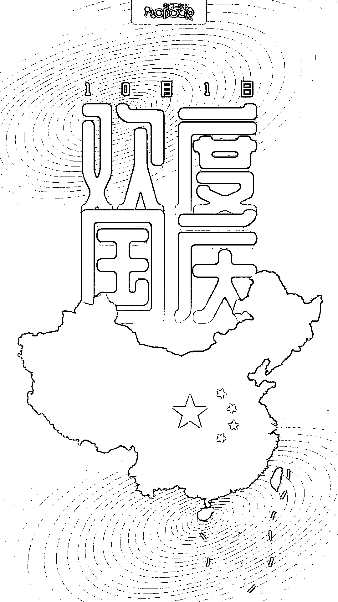

**2021 年 10 月 1 日天象：**

*   **08:53 月亮进狮子座**

*   ******太阳对分凯龙星、合相火星******

*   ******逆行水星四分冥王星、三分木星******

*   ******金星六分冥王星、四分木星******

国庆节快乐！十一长假开始了，月亮也在今早非常应景的进入了狮子座。你开心吗？快乐吗？是不是决定要嗨起来了？那么，这个假期里，你都打算做什么呢？如果有旅行计划，你的目的地是哪里呢？如果有聚会，又和哪些朋友见面呢？还是说，你打算避开人潮，安安静静的宅在家里、完成自己的小目标？

还等什么，快来和我们分享吧！

不过别光顾着开心，水星正在逆行中，它还与冥王星处在四分相的位置。最近你可能对某些问题进行了更深刻的思考，或是发现了某些事情的真相，当我们处在假期中时，也要对出行安排做好规划，准备好应对通讯、交通出行引起的阻碍和延误的预案哦。金星与冥王星、木星的和谐相位，看上去也很适合安排玩乐，并从中享受愉悦的氛围。

十月开启，你可以在[【10 月月运】](http://mp.weixin.qq.com/s?__biz=MzA5NjA0NTAxNg==&mid=2651457530&idx=1&sn=cf88ce166059bd74d0daba93f6a9d87f&chksm=8b48b54dbc3f3c5b97440d3cdd4e887f46632dbc994256dd7baa8b971b3e460ca4536fc95810&scene=21#wechat_redirect)中（点击可查看文章）查看本月的宇宙天气。 

长假快乐！若道君也会不定期更新，敬请关注~还有，出门在外，要注意防疫哦！ **了解每日天象，可****下载“若道”APP 查看****还有更多精彩等着你哦**

# 斯蒂芬三日线上工作坊丨如何进行一场有效的占星咨询？

> 原文：[`mp.weixin.qq.com/s?__biz=MzA5NjA0NTAxNg==&mid=2651457530&idx=3&sn=7d578d6dc695d65f093602dd822ba0a7&chksm=8b48b54dbc3f3c5bf5109ef17e285c4ffdddfef47e26d7fa25f6109bfad2e441bcd77eb7c701&scene=126&sessionid=1692737918#rd`](http://mp.weixin.qq.com/s?__biz=MzA5NjA0NTAxNg==&mid=2651457530&idx=3&sn=7d578d6dc695d65f093602dd822ba0a7&chksm=8b48b54dbc3f3c5bf5109ef17e285c4ffdddfef47e26d7fa25f6109bfad2e441bcd77eb7c701&scene=126&sessionid=1692737918#rd)

**喜大普奔，斯蒂芬要来教占星咨询了！**

占星咨询对于很多占星学生和兼职占星师而言，都是考验自己到底能否成为职业占星师，建立欣欣向荣职业生涯的最关键一环。

一个坏消息是，当你辛辛苦苦学习完所有的占星技术后，你可能仍会有些沮丧地发现，自己还是做不好一场咨询。

**比如：**

对咨询的问题

*   我可以怎样迅速和客户建立信任？

*   我如何描述星图中我看到的困难配置，或者如何描述我看到的即将到来的富有挑战的行进？

*   如果客户在咨询中滔滔不绝，我该怎么办？

*   如果客户在咨询中一言不发，我又该怎么办？

*   如果客户否认我所描述的他/她明显存在的问题怎么办？

*   如果客户存在明显的心理问题怎么办？

*   如果我讨厌这个客户怎么办？

*   如果我被这个客户吸引怎么办？

*   如果我的性能量被客户激发怎么办？

*   ……

**这么多问题怎么办？！**

别着急。

好消息是，这是每一个占星学生和新手占星师都会遇到的问题，也是每个占星师必走之路。**其中一些问题是可以用占星技能所解决的，而另一些又是在占星技巧之外，需要进入心理学的领域。**不论怎样，归根到底，我们要能在咨询与客户建立并且维持**良好的咨询关系**，甚至与那些跟我们性情截然相反的客户。

1

**授课内容**

如果你听过斯蒂芬·弗里斯特的占星咨询，你会看到客户被他润物细无声的咨询所打动，又感到自己被他深沉的慈悲所懂得。那些娓娓道来的故事在客户面前展开生命时空的画卷，在咨询结束时，又充满希望的力量。

**而****今年****10****月****，在斯蒂芬到中国教学 10 年后，他将****第一次****与所有热爱他的学员分享如何做好一场占星咨询。**

在这个网络课程中，占星大师斯蒂芬·弗里斯特将会和你分享他几十年来一对一面对面的**占星咨询经验**；他也会分享如何提前规划好**接近客户心灵**的占星技巧。**客户个人星图**为我们提供一个最迅速，也最可依赖地建立信任和自然连接的地图，他还会分享如何运用个人星图建立这个连接。

2

**斯蒂芬的占星著作**

*   **1984-1988 年间**，斯蒂芬写作出版了《内在的天空》（已有中文版）、《变化的天空》和《天空的伴侣》三本占星经典著作，奠定了早期在占星学界的地位。

*   **2002-2005 年间**，他与朱迪·弗里斯特共同创作了两本经典的关系占星学著作《天空的伴侣 I：爱、性、和进化占星学》《天空的伴侣 II：组合图》。　

*   **2008 年**，斯蒂芬出版了一本非常重要的著作《昨日的天空》，此书是至今为止关于轮回转世跟星图的清晰对应最详尽的著作之一。 斯蒂芬前后一共出版了 12 部占星著作，在世界占星学界拥有很高的声誉。

3

**斯蒂芬获得的荣誉**

**1985 年**，他凭借《内在的天空》一书获得**职业占星师协会奖**（Professional Astrologers Incorporated Award）。

**1992、1995、2008 年、2018 年**，他四次获得占星界最高的占星学联合协会奖（UnitedAstrology Congress Regulus Award）提名，**2018 年获得轩辕十四教育奖**。

4

**斯蒂芬的占星哲学观**

斯蒂芬的占星风格以自由和选择为中心，他的解读不是以下定论的方式来“预测”未来，他强调如何**改善生命**，而不是宿命式的论断。他以心理占星学的语言来解读星图上的人格部分，但是通过**南北交点及其相位和守护星**来探索星图所揭示的前世业力与今生方向，在灵魂进化的背景里来整体解读星图。

他认为进化占星学的目的在于鼓励人们做出更符合进化方向的智慧选择，我们学习去了解前世的时侯，关注点应该集中在**如何通过意识来疗愈自己**。

5

**这些名人怎么说？**

斯蒂芬让我们停止了玩责备命运的游戏，而开始看到自己是一个走在进化路途上的勇士。 ——**奥普拉杂志***“O: THE OPRAH MAGAZINE”*

斯蒂芬和杰夫这两位著名占星师创造性地相互应和，展现出他们出色的教师才华，发展并弘扬了占星这门艺术。（对《测量天空：进化占星学和灵魂的钥匙》的书评） ——著名心理占星师 现代占星学之父 **诺·泰尔**（Noel Tyl）

请享用斯蒂芬和朱迪这两个博大的灵魂在此书中所提供的洞见大餐吧。（对《天空的伴侣》的书评） ——进化占星学的创始人之一 **杰夫·格林**（Jeff Green）

我为斯蒂芬解读的精准感到惊叹，他强调没有一件事是坏得无法挽回的，也没有一件事是如此之好，以至于它不会因为现在的错误判断而消失的。我怎样推荐他都不为过！ ——好莱坞著名影星“钢铁侠”男主角 **小罗伯特·唐尼**（Robert Downey Jr）

6

**上过课的占星师怎么说？**

他关于我星图的解读，让几乎所有在场的人掉泪，我也从此开启了一段灵魂追寻的旅程。我很惊讶他透过星图可以如此深入一个人的灵魂。很多东西你自己都不知道，但是他讲出来你会发现，啊，这是真的，这是占星学的神奇。——**《心探索》创始人孟想**每个来参加老师课程的同学，都会被老师深深的慈悲心感动。这种慈悲心，并不是表面上说的一些什么话，而是一种从意识层次上发出的能量。每个来上课的人，都能感受到老师的爱。这种爱，并不是盲目的爱，而是深刻地洞悉真相后的慈悲。——**斯蒂芬老师工作坊翻译逸月**斯蒂芬老师的一对一咨询已经排期到两年之后，我特别幸运，曾在课堂上被老师抽中分析过我的星图，老师充满爱与智慧的指引让我更加清晰的认识了自我。内在的潜能、需求和矛盾被老师娓娓道来。——**禄丽荣**斯蒂芬老师是位非常非常值得推荐的大师，很粉他，这位进化占星学的创始人，对人的理解是那么的全面完整、深刻洞见、慈悲和温暖，就这方面而言足可以媲美我无比崇敬的荣格和史坦纳（这两位去天堂里玩了），如果你对西洋占星感兴趣，或者对人的所有角度、各个层次的真相和可能性感兴趣，推荐斯蒂芬老师的书和课程，特别是他的课程，数倍的功力大增的好机会，错过真是占星粉丝的莫大损失。——**仁华**

7

**2020 年斯蒂芬线上工作坊学员感悟**

8

**什么人适合这门课程？**

*   占星师或渴望成为占星师的人群。    

*   课程会涉及综合解读高阶内容，不了解相关知识的同学，请提前学习相关内容。

9

**老师简介**

**斯蒂芬·弗里斯特(Steven Forrest)**

*   进化占星学的创始人之一，当今世界最有影响力的占星大师之一；

*   毕业于美国北卡罗莱纳大学宗教学专业；

*   1984-1988 年间，写作出版了《内在的天空》、《变幻的天空》和《天空的伴侣》三本占星经典著作，奠定了早期在占星学界的地位。前后一共出版了 12 部占星著作，在世界占星学界拥有很高的声誉。

*   1985 年，他凭借《内在的天空》一书获得职业占星师协会奖（*Professional Astrologers IncorporatedAward*）。1992、1995、2008 年、2018 年，他四次获得占星界最高的占星学联合协会奖（*United Astrology Congress Regulus Award*）提名，2018 年获得轩辕十四教育奖。

*   斯蒂芬将自己的绝大部分时间都花在教学以及个人咨询上，他于 1998 年创立了占星学徒计划（*Astrological Appretice Program*），这个计划致力于培养职业占星师；

*   至今为止已经有 600 余位学员完成了培训，其中很多都成为了优秀的职业占星师；

*   他是一位脚踏实地的导师，充满快乐和活力，亲和幽默同时又充满了智慧；他的课程不仅仅是一次占星知识和经验的学习，也是一次与智者的相遇。

10

**课程费用**

**正价：****4800 元**

11

**授课时间、方式和退转**

**授课时间：**

****2021 年 10 月 15 日-10 月 17 日（周五、周六、周日）****

****每天 7:00-13:00****

7:00 AM - 9:30 AM

**（1 小时休息）**

10:30 AM - 12:30 PM

**授课方式：**线上直播课，英文授课，中文翻译**退转课程：**

退款原则请详看《教学协议》，如有疑问请咨询课程顾问。

****斯蒂芬三日线上工作坊****

**授课老师：斯蒂芬·弗里斯特**

**授课时间：****2021 年 10 月 15 日-10 月 17 日**

**授课方式：**线上直播课，英文授课，中文翻译

**费用：****4800 元**

**课程负责人：****王老师**（微信：18510107057，请备注“斯蒂芬工作坊”）

长按二维码添加课程负责人咨询~

****报名请点击“阅读原文”****

# 10 月宇宙天气丨四星恢复顺行，然而能量却并不稳定？！

> 原文：[`mp.weixin.qq.com/s?__biz=MzA5NjA0NTAxNg==&mid=2651457530&idx=1&sn=cf88ce166059bd74d0daba93f6a9d87f&chksm=8b48b54dbc3f3c5b97440d3cdd4e887f46632dbc994256dd7baa8b971b3e460ca4536fc95810&scene=126&sessionid=1692737918#rd`](http://mp.weixin.qq.com/s?__biz=MzA5NjA0NTAxNg==&mid=2651457530&idx=1&sn=cf88ce166059bd74d0daba93f6a9d87f&chksm=8b48b54dbc3f3c5b97440d3cdd4e887f46632dbc994256dd7baa8b971b3e460ca4536fc95810&scene=126&sessionid=1692737918#rd)

****************☆ 后台回复“今日”，给你一句生命态度****************

作者/傅莎珈 ISAR 认证占星师
编辑/翀子 封面/书君 图片/网络 10 月，冥王星、土星、木星和水星都将恢复顺行，这也是宇宙能量不稳定的时候，而天秤座的月份提醒我们要在混乱中体会平衡，并在震荡环境中形成新思维。

10 月是天秤月。**这个 10 月，冥王星、土星、木星和水星分别恢复顺行。**每次行星改变运行轨道，都是能量最不稳定的时候。所以这个 10 月对应了天秤座原型中的“平衡” 主题：**如何在混乱中慢慢体会平衡。**

本月冥王星顺行后，和新月、火星、水星产生硬相位。这是冥王星在摩羯座的最后 5º, 是土冥合相之后重建万物秩序中必须经历的一步，也是土木水瓶合相之后的第一个周期的小结。**各种和摩羯座有关的阴影——制度、父权、政治、经济、法律上的不公与冷酷之处，会更鲜明的呈现出来，**而土木换座水瓶座所展现的水瓶座的阴影面也开始呈现出来：大众层面的狂热失智、吞噬、独裁…… **伴随行星能量从土象转换到风象，大环境锻炼了每个人的平衡能力**：在暴风眼里，寻找美与正义的秩序。土星克洛诺斯和天王星乌拉诺斯之间的战争诞生了金星阿弗洛狄忒。**金星的原型与生俱来带有战争的阴影，但她所呈现出来的却是战争的反面：爱、美、丰盛。**愿我们每个人在最后一个季度里，遇到各种挑战的时候，记得金星的诞生和伴随。她始终走在最前面，带领着我们穿越黑暗。

这个 10 月除了火星在天蝎座、冥王星在摩羯座之外，群星云集在天秤座、水瓶座，**强大的风象能量，象征着活跃的思维能量。**天秤座和水瓶座的古典守护星都是土星，如果天王星代表高等意识、土星象征思维的框架，那么**这个 10 月是一个通过社会/自然环境的震荡形成新思维的一个月**：

**很多意识能量经过处女座的消化整理，正在从能量转变成思维结构。而土木顺行，使这些思维结构通过法律、文化作品、商品开始在人间传递流通。**

水星在天秤座逆行。我们需要在各种合作/关系中学习在多种观点中跳转，找到公平、公正和真实的东西，直到这个关系达成真正的“平衡”。**而到底怎样才算平衡呢？**

**天秤座是 12 星座中唯一一个无生命的星座：**用来称量东西的物体：天秤。苏美尔人称这个星座为 Zib-ba An-na，意思是 “天堂的天秤"。天秤的功能是平衡。

埃及人将这杆秤称为神圣的 Ma'at（天平）。Ma'at 是**平衡、正义、真理和秩序**的女神。她维持着宇宙生死秩序：人死时，她会用她的天平对着一根羽毛测量人的心脏，以确定这个人是否与自然法则和谐相处、并能进入下一个境界。太重的灵魂会立即被恶魔吞噬。

衡量像灵魂和羽毛这样微妙东西的能力意味着天秤座拥有不寻常的敏感性，**这种敏感性是天秤座保持平衡的中心支柱。**群星进入天秤座，尤其是水星在天秤座，提醒我们在生活中保持敏感，认识到周遭人事物的特殊性。

只有你觉察到了关系/合作的另一方特别稀有的部分，你才会真正重新审视这个人，这段关系，这个合作，这个团体……这种挖掘和敏锐会让你开始感受到**想要创造亲密、美、和谐、自然秩序的渴望。** 天秤座新月在这种感受里，伴随着土木顺行，将推动一些新律法的诞生，这有助于平衡不同的族群，维护公正、正义的秩序。

**10 月上旬**

10 月上旬天象

**10 月 01 日 ** 

*   天秤座水星（逆行）四分摩羯座冥王星（逆行）

*   天秤座火星对分白羊座凯龙星

**10 月 02 日**  

*   天蝎座金星六分摩羯座冥王星（逆行）

**10 月 03 日**  

*   天秤座太阳对分白羊座凯龙星

**10 月 04 日 ** 

*   天秤座水星（逆行）三分水瓶座木星（逆行）

**10 月 06 日 ** 

*   天秤座新月

**10 月 07 日 ** 

*   金星换座射手座

*   冥王星在摩羯座 24º18'恢复顺行

**10 月 08 日 ** 

*   太阳和火星在天秤座合相

**10 月 09 日 ** 

*   金星合相月亮南交点

**10 月 10 日 ** 

*   水星（逆行）和太阳在天秤座合相

10 月上旬冥王星顺行、金星换座射手座以及天秤座新月是重点。

9 月 27 日开始的水星逆行，开启了修复、整理的功课。天秤座是有关关系、合作、契约的回溯：**在这段关系/合作里**是否过度在意正确与否，忽略了**平衡的基础是深入关系/合作中看见彼此与生俱来的美**，以及那种映射：**关系好坏映射了自己的心灵状态。**当你把这种投射收回来，转向内在功课的探索，然后再去连接关系，可能会出现全新视角。

**金星在天蝎座，火星在天秤座**会导致各种权利斗争和争纷，其实这种纷争可以回溯到童年时代的一些体验，尤其是和性能量、个体存在感、和父母之间的情感体验。因此这个**水逆功课的核心指向修复内在的自我价值。**

10 月 1 日水星四分冥王星、10 月 2 日金星六分冥王星、10 月 7 日冥王星在摩羯座 24º18′恢复顺行，有些和政治、管理、权威、家族有关的新闻曝光，**可能会因此诞生一些新的律法、联盟，新的利益结盟。**

**此时的合作、联盟、关系充满了不稳定性，**沟通双方的地位悬殊、意志力不坚定，各种立场此起彼伏，有些关键信息被隐瞒，难以达成一致。这场全新合作的底子是长远经济政治互惠以及信任的构建，**需要商讨的地方极多。**

个体生活中，特别需要重新思考职场和生活的长远规划。新月将会造成一些人突然裸辞。请相信，**伴随新月的展开，新生活也在展开。**放手吧。

一般在冥王星逆行与顺行前后，容易造成地壳变动，10 月 7 日冥王星顺行，需谨防某些地区地震。加上之前的水木三分，这次国庆旅行归来的时候恐怕在交通上容易遇到各种麻烦和意外，请保持耐心。

火星、太阳都在天秤座，对分白羊座凯龙星，特别会在合作关系、亲密关系、伴侣关系中呈现出某些原生家庭特有的创伤：**有关自我价值、自我存在感。**尤其是女性，特别深入探索一下自己作为女孩出生的体验。而现在我们需要经由自己的婚姻、关系，合作的冲击，**认真对待这些创伤，不要再回避、屈就。**

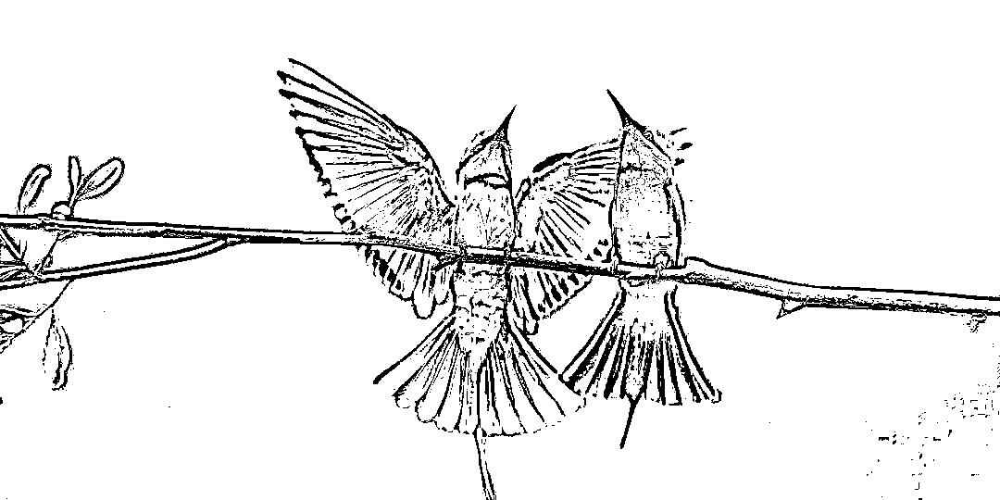

天秤座的平衡，来自于知晓自己的力量与脆弱。特别想提醒女性读者们：每个人都拥有阴性能量和阳性能量，**当你真正接纳自己的女性身体、女性身份、女性智慧、女性力量，**你在向外展示自己的存在，追逐自己想要的目标时，**才会有源源不断的支持力**：稳定的，满足的身份和性别认同。

有关女性身份和性别认同部分可以写很多很多，我只能简单提示：**没有根本的性别和身份认同，你是无法真正对取得的社会成就和财务收获感到发自内心的满足的。**而对男性来说，知晓和连接内在的阴性力量，会让你的安全感和创造力有神奇的转化。

10 月 6 日是天秤座新月。天王星与新月呈梅花相，太阳、月亮、水星、火星聚集天秤座，外加金星在天蝎座 29º ，**让这个新月充满了战斗和纷争的气息**。因为无法在利益上达成平衡，情感上的贪婪执着于权力、固执保守的关系，这个新月形成了看得见未来、但走过去非常艰难的状态。

**你需要有勇气彻底结束一些事情**，然后才能跨越小我和局部地区经济集团的利益，将目光转向更大群体的联盟以及思考如何成就自己在这个大集体的贡献。

10 月 7 日金星换座射手座，结束了金火互融的格局。至少在关系合作合约上的纠缠不清，暂时告一段落。**亲密关系、合作中开始探索意义、目标，而不仅仅是利益。**社会环境里有很多对外商贸，高等学历深造方面的好消息陆续到来。

金星换座射手座，有关阴性智慧的创造，然而金星首先会合相月亮南交点。如同雅典娜诞生于宙斯的脑袋，她本人的智慧也受制于她的父亲：父权制文明。在现实环境里，**有关女性地位、地球生态的保护、贸易平等等话题将会在此引发争议。**

**在个人生活里，问自己一些问题：**

*   **事业和家庭，哪个是你更擅长的，而不是社会要求你去做到的？**

*   **早就失去意义的事业为何不愿意放下？是否有着某些家族和社会由来已久的稳定意识阻止你自由活出自己？**

*   **再一次，请看一下什么事情真正令你感受到创作的激情，工作的热情，生活的自由？**

*   **婚姻情感关系中我们感到枯竭吗？枯竭的源头你知道的对么，为何无法行动？**

*   **在情感领域，有哪些地方其实有些好高骛远过度理想主义？**

*   **财务领域的紧绷感，是否因为某种由来已久的家族理念？而实际上你是极其丰盛的？**

10 月 8 日-10 月 10 日期间，火星、逆行水星以及太阳在天秤座紧密合相。这两组相位一方面带来密集的情感沟通交流、教学、商业互动，同时也可能伴随着一些身体伤害。**请特别注意头脑和身体的平衡。**

**10 月中旬**

10 月中旬天象

**10 月 11 日**  

*   土星在水瓶座 6°52′恢复顺行

**10 月 13 日**  

*   射手座金星六分水瓶座土星

**10 月 16 日**  

*   天秤座水星（逆行）对分白羊座凯龙星

*   太阳三分水瓶座木星（逆行）

**10 月 17 日**  

*   射手座金星三分白羊座凯龙星

**10 月 18 日**  

*   水星在天秤座 10º07′ 顺行

*   木星在水瓶座 22º19’′恢复顺行

**10 月 19 日**  

*   天秤座火星三分水瓶座木星

**10 月 20 日**  

*   白羊座满月

10 月中旬有 3 颗行星顺行，会造成很大的行星能量混乱。

10 月 11 日，土星在水瓶座 6º52′再度顺行。这个顺行加强了摩羯座冥王星的力量：双重的律法约束来了：

*   **文化娱乐行业可能进一步被规整，尤其和教育、娱乐创作有关的领域，将面临更苛刻的信息管制；**

*   **自媒体、直播、电商平台面临一轮整改。**

其次，这个顺行的位置，正好是 2021 年 2 月 14 日前后土星第一次四分天王星的附近，开启了今年第三次土天四分相的进程。**2021 年 2 月刚好有一轮股市波动，所以这次顺行也不例外，继续会产生这样一次置换性的轮动。**

某些行业比如医美、农业、餐饮、珠宝、酒类等可能值得看一下。加上射手座金星和木星顺行的加持，10 月份某些时候的金融市场颇有小阳春的感觉。但到 12 月土天精确四分相时，可能又会反转。

10 月 8 日是农历霜降。**今年气候异常，**北方或者南方可能会突发寒流。所以这组相位也意味着入冬的电力供应问题会特别突出。恐怕某些地区会在严寒天气下突然经历用电困难或突发的用电事故。请提前做好预防措施，准备好非电力启动的取暖设备、准备好足够的充电宝。

**创新的力量同样在蓬勃发展：**10 月 18 日木星在水瓶座 22º19′顺行前后，刚好遇到太阳与木星的三分相，火星与木星的三分相。这是一股让人意气风发，充满幸运的能量。

人们在生活中特别容易兴奋和充满渴望，感觉生活充满幸运。出生星图上，**狮子座/水瓶座/金牛座/天蝎座**能量重的案主，在生活中很容易遇到事业、求学、婚恋、投资方面的幸运。只是在情感上容易出现混战局面，身在局中，好好体验。

电影行业的十一国庆档可能十分旺盛。娱乐圈可能上演一波大新闻，让吃瓜群众目瞪口呆。

木星顺行，遭遇太木相位、火木相位的同时，也加剧了战争阴影。太阳、火星在天秤座意味着人们愿意为正义而战，而正义有时候只有利益的一个借口。尤其是太木相位过度自信，火木相位操之过急，再遇到接下来火星进天蝎座，水星在天秤逆行时没有谈拢的事情，下旬翻起旧帐来会相当激烈。

**水星在 10 月 18 日顺行。**顺行前触发了白羊座凯龙星。作为一个 Ending（结束）， **再次强调了独立性和勇气的意识培养。** 因为接下来生活将变得越来越忙碌、紧张、充满压力。意志力和体力缺一不可。

10 月 20 日白羊座满月，冥王星四分满月，10 月 22 日火星精确四分冥王星。

**这是个充满张力的满月。**全球范围内可能爆发武力冲突，或者遭遇极端的天气灾害导致停电事故。个人生活上有些冲突、激烈紧张的情绪出现，推动你进一步去感受自己的存在的价值和意义。很多人经过这个满月，会在毫无准备的情况下，突然改变生活方式和社会形象。或者以为自己一定能忍耐，结果最终拍案而起。

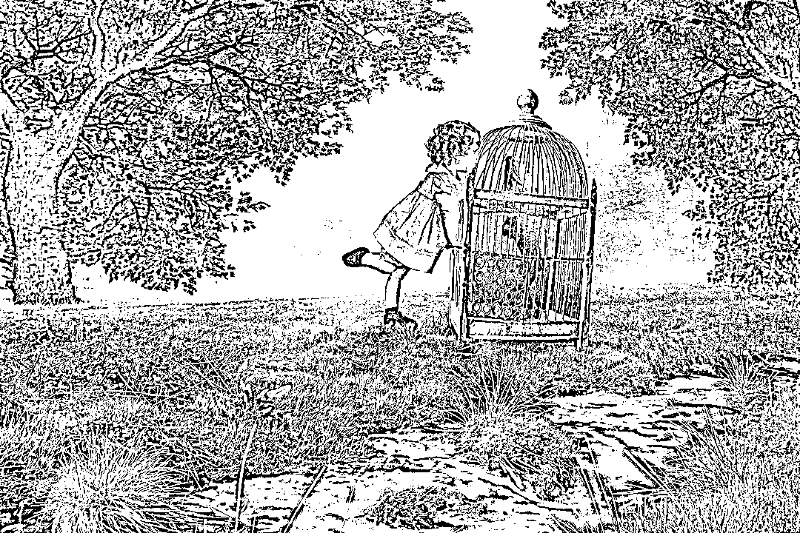

**10 月下旬**

10 月下旬天象

**10 月 22 日**  

*   天秤座火星四分摩羯座冥王星

**10 月 23 日**  

*   太阳换座天蝎座

**10 月 26 日**  

*   射手座金星四分双鱼座海王（逆行）

*   射手座金星六分水瓶座木星

**10 月 30 日**  

*   火星换座天蝎座

*   天蝎座太阳四分水瓶座土星

10 月下旬金火两重天。

太阳和火星分别进入天蝎座，这是非常紧张充满压力的地方。**生活工作节奏可能突然加快。**尤其是 10 月 30 日火星换座天蝎座，天蝎座太阳四分水瓶座土星，可能会出现暴力统治引发群体对抗的有关新闻。

个体在生活中会遭遇一些来自职场、男性权威的打压，需要沉着应战。

天蝎座-金牛座负责毁灭和生产。所以**当太阳进入天蝎座并四分水瓶座土星**，意味着商业体系需要转换观念，进入再次的结构调整。对管理者、打工者都是剧烈震荡。

如果你在水星逆行期间对自己的根基、归属有一定的觉察，那么这种震荡就是一种推动力，让你进入更符合此刻使命的状态里。如果你死守稳定，这个月就会非常有压力。

当你需要指引，把目光转向射手座金星：射手座金星四分双鱼座海王星、六分水瓶座木星，显示出困境中的乐观精神和突破的勇气。**需要跳出现状看未来：无论失去的是什么，都会以另一种方式再次回到你的生活里。**

射手座和水瓶座都是有关未来的星座。当这两个星座落在金星和木星，**请不要拘泥当下的得失，**直接奔向某些现在看起来不成形的状况，该裸辞裸辞，该学习学习。此时正是为未来 3-5 年奠定基础的时期。**如果过于沉缅失去、失败，你不仅失去当下，也在和未来失之交臂。**

**尾声**

最后一季度，颠簸忙碌一点不减，反而更增加了压力。压力和不测也许不是我们能掌控的，**但如何看待它们，却永远在你我的掌控之下。** 祝福你在激荡之中，以天秤座特有的敏感性，体会到乌云背后那张太阳微笑的脸：爱与祝福。

灵魂此时体验的各种功课，都引领我们走在回家的路上，那条充满光的道路上。**请试着保持这种自制、顺从和谦卑的心态，必然会安然度过这个震荡激烈的年末岁月。**

祝福大家。

**本月重要天象一览表**

| **日期** | **星象** |
| **2021.10.1** | **天秤座水星（逆行）四分摩羯座冥王星（逆行）** 
**天秤座火星对分白羊座凯龙星**

 |
| **2021.10.2** | **天蝎座金星六分摩羯座冥王星（逆行）** |
| **2021.10.3** | **天秤座太阳对分白羊座凯龙星** |
| **2021.10.4** | **天秤座新月** |
| **2021.10.6** | **天秤座新月**  |
| **2021.10.7** | **金星换座射手座****冥王星在摩羯座 24º18'恢复顺行** |
| **2021.10.8** | **太阳和火星在天秤座合相** |
| **2021.10.9**  | **金星合相月亮南交点** |
| **2021.10.10** | **水星（逆行）和太阳在天秤座合相** |
| **2021.10.11** | **土星在水瓶座 6°52′恢复顺行** |
| **2021.10.13** | **射手座金星六分水瓶座土星** |
| **2021.10.16**  | **天秤座水星（逆行）对分白羊座凯龙星****太阳三分水瓶座木星（逆行）** |
| **2021.10.17** | **射手座金星三分白羊座凯龙星** |
| **2021.10.18** | **水星在天秤座 10º07′顺行****木星在水瓶座 22º19′恢复顺行** |
| **2021.10.19** | **天秤座火星三分水瓶座木星** |
| **2021.10.20** | **白羊座满月** |
| **2021.10.22** | **天秤座火星四分摩羯座冥王星** |
| **2021.10.23** | **太阳换座天蝎座** |
| **2021.10.26** | **射手座金星四分双鱼座海王（逆行）** 
**射手座金星六分水瓶座木星**

 |
| **2021.10.30** | **火星换座天蝎座** 
**天蝎座太阳四分水瓶座土星**

 |

**版权声明**：原创文章由作者授权首发于若道平台，欢迎转发，反对抄袭。友号转载请申请白名单。

****

****傅莎珈****

ISAR 认证占星师（2015 年获得）

心理占星师/内观书写带领者/冥想带领者

国际著名传播集团工作 20 年

**微信公众号**：Helloshajia

长按打赏

**学习占星学**

**点击或长按下图了解课程详情**

**

**

**

****

**微信又双叒叕改版啦，不想错过若道君的推送？**

**就把若道设为星标吧！**

**▼**

**就是这个“在看”，戳戳戳 ☟**

********报名直达入口********

# 疗愈与技术的完美结合丨听斯蒂芬讲课是怎样一种感受？

> 原文：[`mp.weixin.qq.com/s?__biz=MzA5NjA0NTAxNg==&mid=2651457530&idx=2&sn=a0ffd06af89a55ec26d04ec482436d77&chksm=8b48b54dbc3f3c5ba6010a2a8d42286ce5ca03e5e62c06b4cc4b07b67e97eaa97e05adf9f32e&scene=126&sessionid=1692737918#rd`](http://mp.weixin.qq.com/s?__biz=MzA5NjA0NTAxNg==&mid=2651457530&idx=2&sn=a0ffd06af89a55ec26d04ec482436d77&chksm=8b48b54dbc3f3c5ba6010a2a8d42286ce5ca03e5e62c06b4cc4b07b67e97eaa97e05adf9f32e&scene=126&sessionid=1692737918#rd)

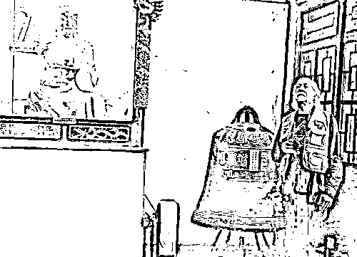

作者/Cora ISAR 认证占星师 编辑/翀子 图片/网络斯蒂芬老师即将于 10 月 15 日-17 日在若道开设[【线上工作坊】](http://mp.weixin.qq.com/s?__biz=MjM5MjQwNjAyMQ==&mid=2649438843&idx=4&sn=564e179c91e964e2d6376c9a3a92f8ec&chksm=beb9551189cedc077c0739ecc1409283eba754ed7797faefc18730f27bb3ace16c366b7ebaf4&scene=21#wechat_redirect)（点击了解详情），教你如何进行一场有效的占星咨询。斯蒂芬是若道最受欢迎的老师之一，他的话语打动人心，也是实战型的占星老师。参与过工作坊的占星师对他有什么感受？这篇文章告诉你。**印象 1：既会疗愈也是实战派**

**斯蒂芬老师被大家熟知，通常是因为“进化占星学”代表人物的身份。**但我总觉得这种说法容易造成一些对他的方法的误解，或某种刻板印象。因为毕竟，在我们当下的社会，大部分人对于“轮回转世”的说法很难持信任态度，而“进化占星学”，通常被认为是以“轮回转世”的观点为基础的。

“进化占星学”的标签是一把双刃剑，在突出斯蒂芬老师最具风格的前世业力解读（星图背后的星图）的同时，也容易让人忽略了一个事实，那就是，**他的的确确是一个有着坚实占星学基础的、实战型的专业占星师**——这意味着，他的工作不在于“讲故事”，而是实实在在地帮助客户处理他们在生活中遇到的问题。 　　

现在的占星学圈子里似乎存在一种普遍的印象，那就是，“疗愈”和“技术”是难以共存的。当我们说一个占星师能带来很多疗愈，似乎也是在有意无意地暗示他/她在技术上的水平并不值得称道。而技术流的占星师通常散发出一种“铁血判官”的气质，好像咨询中一旦有情感的流动就显得不够专业。 　　

这个问题在这里无法细论，绕了这么个圈子只是想表达**，斯蒂芬是我见过的极少数的、能够将过硬的技术和强大的情感疗愈能量结合起来的占星师。**这或许印证了他南交点 12 宫、北交点 6 宫的灵魂主题，实现了**灵性/疗愈和现实规则/技术的完美结合。**

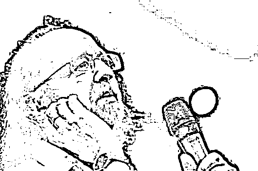

**印象 2：逻辑严谨调理清晰**

看过斯蒂芬的《内在的天空》，或上过他课程的朋友，对他的情绪感染力和疗愈力量应该并不陌生，简单地说，**他是非常擅长“打动人心”的。**对于一个占星师来讲，这是一种令人羡慕的天赋。 　　

而如果对他的著作有更细致的研究，便会发现，**他对于逻辑和条理的要求，也达到了一种令人发指的地步。**在翻译《变幻的天空》这本书时，我常常感叹他为了方便读者学习，考虑之细致，书写之严谨、精确、有条理。毕竟，他可是太阳合相水星在摩羯座的人呢。 　　

在我个人的学习和实践经验中，以月亮南北交点为核心来进行星图解读，也是屡试不爽的星图解读利器。南北交点所引出的灵魂议题，可以直指一个人生命中的终极困境，**而斯蒂芬老师在南北交点的灵魂议题的解读方面，充满洞见，自成一派，**说震撼人心毫不夸张。最关键的是，它并不难学！ 　　

还有朋友跟我说，她看斯蒂芬的《昨日的天空》直接学会了解读出生星图，足见他的体系的**条理清晰**及**实用有效**（《昨日的天空》是一本重点讲解如何解读前世故事与今生灵魂发展主题的书，也是斯蒂芬老师的进化占星学体系的代表作）。当然，这位朋友之前是有基础占星学知识的，即懂得基本的行星、星座、宫位、相位的含义。

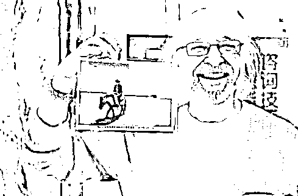

**个人体会：南北交点的运用**

另外要补充的一点经验是，由于**南北交点所指出的灵魂议题是很深层的人生主题，**所以通常在有一定人生经历之后，对之的感受才会更加深刻、明显。故而在咨询中，我并不总是会从南北交点开始，除非南北交点的议题明显与客户目前需要了解、解决的问题在现实层面上紧密相关。

比如，一个南交点在 1 宫或 7 宫的人，想要咨询伴侣关系方面的事。**南北交点的问题通常会“渗透”在一个人人生中的各个方面的大小事务上**，因为那是一种内在的“习惯/习性”，但却不一定会在事件层面被明显标识（主要是跟一些正在占据客户注意力的实际问题相比）。

我之前参加了斯蒂芬老师在北京的“进阶学徒四日工作坊”，期间的收获和感动还历历在目。我记得大卫·瑞雷说过，在占星学习的路上，他永远是一个学生（当然他永远是我的老师）。我觉得这是对“进化占星学”这一名词的一个很好的注解。

占星的学习应该是一生的进行时，因为对自我的认识和个人成长的过程处于不断的发展变化之中，对于星图中那些“固定不变”的占星符号的解读也总会有新的惊喜出现。进化不在这一世与另一世的缝隙间，**进化就在此生，是生活中最真实的，每个片刻。**

**版权声明：**本文由作者授权发布于若道平台，欢迎转发，反对抄袭。友号转载请申请白名单。

**聆宇 Cora**

ISAR 认证占星师（2014 年获得）

斯蒂芬·弗里斯特《变幻的天空》译者，大卫·瑞雷《一生的旅程》译者

全职占星师，从事占星个案咨询及教学工作

**个人微信号**：CoraAstro

**微信公众号**：聆宇 FM

长按二维码，给作者打赏

**喜大普奔，斯蒂芬要来教占星咨询了！**

**今年****10****月 15 日-17 日****，在斯蒂芬到中国教学****10****年后，他将****第一次****与所有热爱他的学员分享如何做好一场占星咨询。**

**在为期三天的线上工作坊中**，占星大师斯蒂芬·弗里斯特将会和你分享他几十年来一对一面对面的占星**咨询经验**；他也会分享如何提前规划好**接近客户心灵的占星技巧**。客户个人星图为我们提供一个最迅速，也最可依赖地建立信任和自然连接的地图，**他还会分享如何运用个人星图建立这个连接。**

**点击下图了解工作坊详情**

**微信又双叒叕改版啦，不想错过若道君的推送？**

**就把若道设为星标吧！**

**▼**

**就是这个“在看”，戳戳戳 ☟**

****************报名直达入口****************

# 我跟 TA 匹配吗？丨比对图的这颗行星，让你“难以脱身”或走向成熟

> 原文：[`mp.weixin.qq.com/s?__biz=MzA5NjA0NTAxNg==&mid=2651457444&idx=1&sn=9954dbf192c5f5faec366dabde4fa7fa&chksm=8b48b513bc3f3c053d9007bda542479715ed7e226755dc8e0c1bf60832a11b8ee53636d5a932&scene=126&sessionid=1692737918#rd`](http://mp.weixin.qq.com/s?__biz=MzA5NjA0NTAxNg==&mid=2651457444&idx=1&sn=9954dbf192c5f5faec366dabde4fa7fa&chksm=8b48b513bc3f3c053d9007bda542479715ed7e226755dc8e0c1bf60832a11b8ee53636d5a932&scene=126&sessionid=1692737918#rd)

****☆ ****后台回复“今日”，给你一句生命态度****

作者/比尔·赫布斯特 

翻译/Jun 校对/Chang

编辑/翀子 封面/书君 图片/网络

学习占星学，除了了解自己，还可以了解我们和他人的关系。比对图便是这样一种技术，揭示二者间的互动情况。作者积累大量案例后发现，土星在一段关系里有非常重要的作用。

**什么是比对图？**

**比对图（Synastry）是一种用多种方式比较两个星图的做法，可以揭示出两者如何自然互动的信息。**

最常见的应用是**通过比较两个人的出生星图**来探索亲密关系或社会关系——如爱人、婚姻伴侣、家庭成员、同事、朋友等。这些关系可能是平级关系(恋人、婚姻、朋友)或者等级关系(父母/子女、雇主/雇员)。

**这些关系可以是真实的**，也就是说这些关系已经存在并且正在进行，**或者可以只是两人之间可能的关系，**他们可能认识，也可能不认识，但还没有处在一段关系中。

**任何两个星图都可以进行比较。**我可以将我的星图和和亚伯拉罕·林肯的星图进行比对。如果我在写林肯的传记，我肯定会这么做，因为这会让我洞察到我对林肯的性格和生活会有何反应。

**比对图不一定只涉及人与人之间的互动。**我们可以分析两个国家之间的关系(用两个国家出生星图) ，或者一个国家和一个人之间的关系。然而，作为一名执业占星师，我可以保证，在我 50 年的职业生涯中，从来没有人要求我给他与一个国家做比对图。

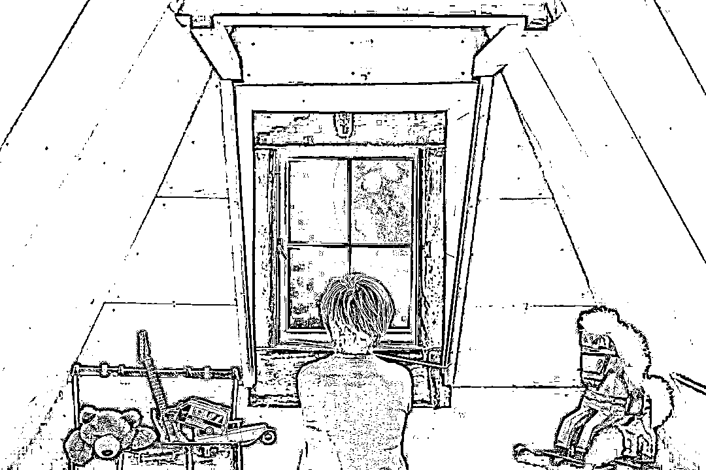

**比对图与“匹配度”**

**比对图中使用了两种主要技术。第一种是“客观的”**，意思是对两个星图中的落位进行技术比较，这就是我将在本文中讨论的。**第二个技巧是“主观的”**。先解读一张星图，感受其生命的整体意义。再对第二张星图做同样处理，然后考虑一下这两种生命如何可能(或可能不)融合在一起。这两个故事放在一起合理吗？这并不“科学”，但占星学更多是艺术而非科学。我喜欢第二种方法，但这不是本文的主题。

在主流占星学中，公众期望比对图能够(或者应该能够)评估两个人之间的“匹配度”。甚至许多占星师也是从这个角度来对待这项技术的。而我不这么认为。虽然我知道传统比对法的“规则”会表明两张星图之间的能量流动或冲突，**但采用任何公式化的方法来评估亲密关系的成功或满足，我对此持怀疑态度。**

“优势和劣势”也是如此。我把这种说法归入与“好还是坏”同样的可疑类别。人们希望占星学用小我的语言来表达，但并非如此。他们也希望占星学简单明了，但也并非如此。**占星学复杂而微妙，有多个面向，就像生活一样。**简单、轻易的判断不仅难以捉摸，而且常常是错误的。如果客户不再问我对他们星图的评价是“好还是坏”，我就欢天喜地了。但他们不会不问我……

**“匹配度”比人们想象的要复杂得多。**鉴于此，我有两个基本假设，都是从长期的经验中得出的：一个是星图中**关联多的比关联少更合适**，另一个是**温和与刺激相平衡的关联更好**。

**这个一部分指的是相位。**许多人认为三分相或六分相(温和相位)是“好的”，而四分相或对分相(刺激/冲突相位)是“坏的”。这就大错特错了。**过多的和谐就是无聊**。什么都不会发生。**过多的冲突则会让人精疲力尽，变得疯狂。**我们既需要热情又需要冷静，既需要激情又需要灵性之爱，但是没有一个完美融合的公式。

比对图作为一种技术，是如何实现的呢？我们用一个数学(实际上是几何学)的比例尺**将一个星图中的所有符号位置(行星、角度等)与另一个星图中的所有符号位置进行比较。**参照系几乎总是黄道——黄道星座。

我们可以用宫位作参照系，但那样很难做到精确，虽然有时候那甚至能揭示更多内容。**两个人如果被强调宫位相同，通常有很多共同点，但这并不一定意味着他们会处得来或喜欢对方。**

**在实践中，黄道是比对图最常用的参照系。**我们在每张星图中寻找在黄道同一位置（合相）的符号，或在圆周上相隔主要角度的符号——180°（半圆或对分) ，90° (四分之一圆或四分相)，120° (三分之一圆或三分相)等等。**角度越精确，两者的联系就越有力。**如果两个符号恰好相距 180° ，那么这个联系就比 175°更有力。

在这篇文章中，我将完全省略容许度，只讨论“困难相位”——合相、四分相、对分相——因为这些是最具活力的联系。**所有的相位关系都具有潜在的意义，但是困难相位会突出表现为对应关系中最具活力的品质。**

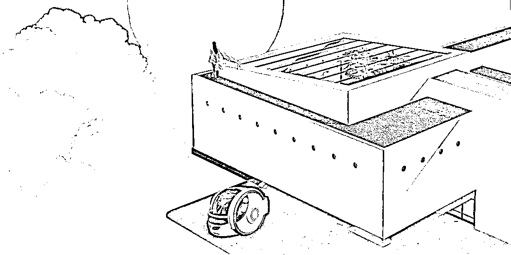

**筛选重要信息**

计算相位关系可以用计算机(占星软件)或手工计算，用眼睛看。软件是最快最彻底的方法。专业的占星软件可以立即计算并列出两个星图之间的每一个相位关系。很棒吧？其实没有听起来那么好。

**若道君：****你可以在 app store 或者应用商店搜索“若道”下载 app，输入个人档案，查看比较盘（也可以使用其他星图软件），输入另一个人的出生信息，查看两个人的比对图。**

所有这些信息的列表或图表往往过于夸张。我们不得不从堆积如山的数据中**筛选出最重要的相位关系，**这是一件很麻烦的事情。我对两张星图之间的 114 个联系并不感兴趣。我只想知道最重要的五个。

所以，我强烈偏好通过观察两张星图进行手动比较。当然，这样做的风险是我可能会错过某个重要的相位关系，但是在我开始之前，我就知道如何缩小寻找范围，**只找那些为了后续咨询谈话我可能想知道的相位关系。**

你看，并不是所有的事情在占星解读中都同等重要。**重要性有自然排序，每个占星师会选择自己的排序。**就我而言，我在比对图中寻找的东西相对简单，所以我用眼睛找。

**比较行星对是一个快速而简单的方法，可以揭示有意义的连接。**

*   如果**两个星图中的太阳有联系**，那么两个人对对方**基本品质**的理解就相关了。这可以是容易或者困难的、和谐或者冲突的，取决于相位的角度。

*   **当月亮有联系时****，就意味着与脾气有关。**想知道你是否能够舒适地和某人同居吗？看看月亮。

*   **水星的联系**有关每个人如何思考和说话。沟通是这一关系中的重要因素吗？水星显示了这一点。

*   **火星和金星之间的联系**有关性的化学反应。几十年前，我开发了一个包含 28 种不同的性联系组成的系统，只要看一两分钟的星图，就可以直观地做出评估。

然而，**一般来说，比对图要注意到星图中任意两个位置之间的联系，**而不仅仅是相同的符号对之间的联系。两个太阳不一定要互相有联系，只要与星图中的另一个元素有联系也是一样的。如果一个人的太阳没有整合到另一个人的星图中，那就是个问题。**更多的联系意味着更大的意义和更强的纽带。**

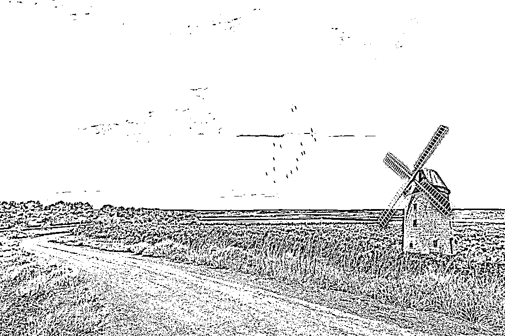

**比对图中的土星**

所有这些都是序言。在这篇文章的剩余部分，我想写的基本上是一件事——**一张星图中的土星与另一张星图中任何符号点的联系方式。**对我来说，这是比对图中唯一最具启发性的因素，也是最重要的。**一个人的土星是否与对方星图中的行星的位置或轴线有联系？**

**1****引发冲突的重要关系**

所以，这里是启示一：**任何两张星图之间如果没有至少一、两个重要的土星联系，**那么他们彼此只是在黑夜中驶过的船。

**如果没有土星的整合，**这种关系几乎肯定会被证明是无足轻重的。这一见解与“大众”占星相悖，后者通常认为任何与土星的联系都是“坏事”，甚至可能是一段关系的死亡之吻。

好吧，朋友们，这是不对的。我超过 12,000 次的咨询和大量的比对图的经验，显示得一清二楚：**两张星图之间土星的联系，对有意义而持久的长期关系来说是必不可少。**

与土星的关联容易吗？不，不容易。而是有点困难，有点麻烦，有点混乱的，而且**经常使两个人感到痛苦**（顺便说一下，涉及的总是两个人，即使只有一个人的土星与另一个人的星图紧密相连）。

**如果我的出生土星合相你的出生太阳或金星，我们的体验是不一样的。**你对此的感觉和我对此的感觉会很不一样，但我们两个人的体验在这段关系中都很重要。我们如何处理各自的反应并调和差异，对我们作为一对伴侣的满足感和共同幸福感至关重要——或者，如果事情变糟，这对我们在一起对满足感和幸福感的明显缺乏也至关重要。

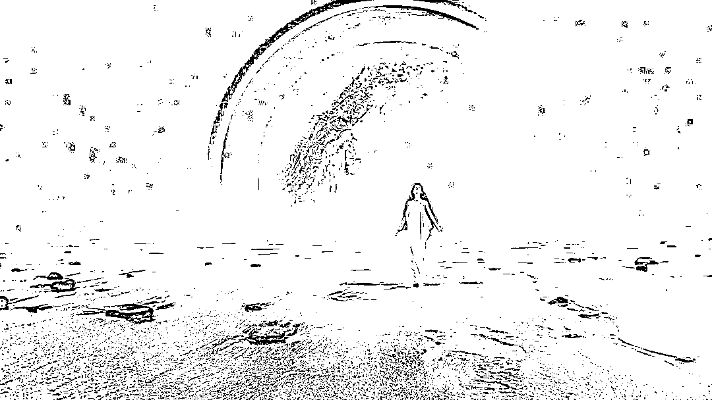

如果我的**出生土星与你的出生火星**有相位(合相或对分相) ，那么每当你在态度或行为上表达欲望时，我的土星就会被“谐波共振”激活。然而，如果你的土星和我的火星是四分相，那么它们就是相互排斥的。激活一个就会关闭另一个。**对于这对行星，任何一种相位都是困难的。**

当你用欲望、紧迫感或尖锐感来表达你的火星时，我会感受到恐惧和抵抗。相反，当我表达我的土星——担忧、焦虑、犹豫、谨慎、野心，甚至是权威时——也会影响你的火星。你会变得热烈，想要穿透或挑战我。

现在，如果你完全有意识、成熟又充满爱，你的火星反应是会推动我前进，帮助我克服恐惧，帮助我爬上山峰，实现我的目标。而你可能会经常这样做。

但是要记住，在任何持续的日常关系中，比如恋人或者婚姻伴侣，**这种土星和火星的化学反应在一个月内会触发上千次。**没有人能在所有这些时候保持足够的意识。**这些触发中的大部分都会在无意识中表达出来。**这时，双方都会大为心烦。他们可能都不想激起沮丧或愤怒，但这就是化学反应。

所以，你可能会觉得我在不断向你的欲望泼冷水，基本上就是在批评或者阻止它们。我可能会觉得你不断在威胁我，挑战我的野心，或者削弱我的权威。不，并不是“总是”，但感觉就是这样。是的，我明白，这很糟糕。

为什么会有两个人都想要处在缺点如此明显的关系里呢？我是说，好处在哪里？**两个人之间的火星-土星关系的“积极”意义在于**，它培养并促进了他们的内在工作，至少有潜在可能，**会带来成熟。**

以小我为基础的人类希望一切都很简单，但生活并不是这样的。生活中大部分事情都困难得要命，**但困难并不等于毫无价值。**我们通过勤奋工作和持续努力所获得的东西，本质上比我们免费得到的东西更有价值。

这是比对图中每一种不同的土星连接的基本意义——土星-太阳、土星-月亮、土星-水星、土星-金星等等。**每种连接都表明了引发冲突的共同特殊经历，**但它们都是为了在同一条灵性之路上走下去。这条道路说：**“这并不容易，但它可能真的很重要。”**

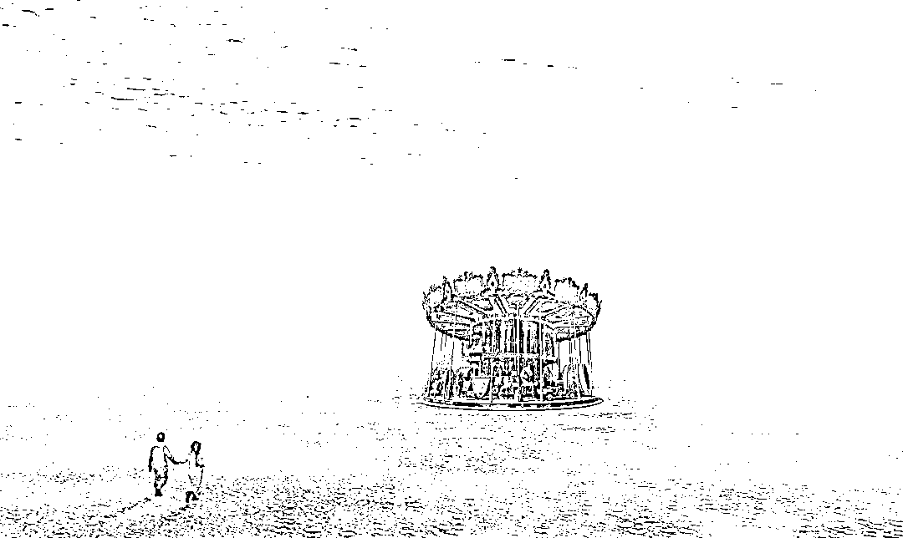

**2****难以脱身的关系**

关于比对图中土星的连接，我想提到的另一个因素是，它们就像胶水一样。这就是启示二。**重要的土星连接使两个人在一起，让他们努力改善自己以及他们的关系，**否则他们可能会渐行渐远或放弃彼此。

诚然，人们有时会觉得被困在一段永远不会产生任何好结果的关系中，持续痛苦，直到关系结束，但这并不是土星的错。这只是意味着，由于这样或那样的原因，参与其中的人们无法实现土星所揭示的内心工作。

当我在客户的比对图中看到重要的土星连接时，我会这样告诉他们：**如果你不想被套上犁，那就不要进入这段关系。**在你做出承诺之前就离开，因为**一旦你真的陷入其中，要想脱身会非常困难，**代价很大。

我最不喜欢的情况是，当我看到两个最近刚认识的人之间有很强的土星连接，并请我比对一下他们的星图，来评估这段萌芽期恋情未来的可能性。我有责任告诉他们我刚刚写的那些东西，但是从来没有人听我的。真的，一个都没有。

他们为什么不听？在某种程度上，我认为这是因为**在有强大土星连接的关系早期，土星人往往非常有热情。**他们的恐惧可能已经压制了他们很长时间，但是突然之间，他们感觉自己克服并超越了自己的焦虑，精力充沛，好像遇到这个新人给他们注入了神奇的勇气。就好像他们正在向山峰奔跑，令人兴奋。

**与此同时，对方还没有体验过一头撞上土星砖墙一千次的挫败感。**他们认为自己能够应付即将到来的事情，而且他们往往被土星伴侣早期的兴奋所愚弄。但这种兴奋不会持续太久。

我们不可能跑着上山。这不是短跑，而是长途攀登。我们必须计划，调整节奏。我们可能不得不等待其他人不需要等待的有利条件。**这就是土星的特点。**

我们看到其他人根本没有在我们挣扎的东西上挣扎，我们想知道为什么对他们来说如此容易，对我们来说如此困难。答案是，他们不是我们。然而，**我们都有土星在我们星图上的某处，因此我们每个人都有我们自己的山峰**——在我们的生活中，某个令人畏惧的可怕地方。

这在许多方面揭示了**土星的精神教导**：**活在我们自己的现实中，不与他人比较，并随着时间的推移而进化。**

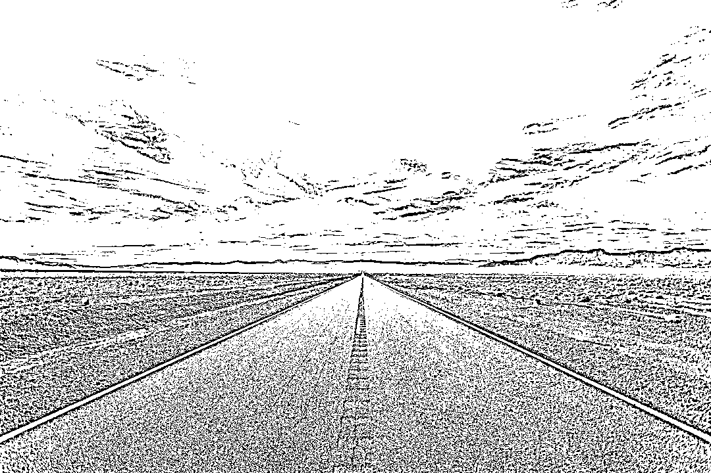

**土星的意义**

对我们每个人来说，我们星图中的土星显示了，我们在何处，要以何种方式通过持续、重复的努力，通过逐步解决我们的疑虑和恐惧，通过减少我们严重的过度敏感，来**慢慢成长。**

土星揭示了**进取心和毅力**在哪些地方会有长远回报。它揭示了我们**如何以及在何处会不可避免地失败**——可能会以不同的方式多次失败——**但我们仍然会重新开始**。

在我们的星图中，**土星象征着失败可以真的带来成功的地方。**对我们来说困难的事情可能永远不会变得容易，但是我们仍然可以实现许多野心，同时学会欣赏、尊重和接受我们固有的局限。**做好土星所规定的内在工作会带来真正的谦卑，而拒绝则会导致精神崩溃以及难以根治的不成熟。**

**我们可以对比对图中的每一颗行星进行这种分析。**我选择写土星，是因为它是伟大的导师。相比太阳和土星(也许还有月亮)，占星学中的其他一切都显得苍白。有些人痴迷于月亮交点的所谓“灵性”含义。好吧，朋友们，**星图上的一切都是灵性的，**和太阳与土星相比，月亮交点只不过是个脚注而已。

这是非常基本的占星学。这有点像棒球。打好棒球需要掌握四项基本技能——击球、跑步、投球和接球。不断练习这些，你就会成为一名优秀的棒球运动员。你可能不会成为棒球明星，但你会赢得尊重。

同样地，**熟练掌握占星学需要反复学习并思考基础知识，从而更好地、更深入地、更彻底地理解底层基础，使得细微的差别都会显露无疑。**

**版权声明：**原创文章由若道翻译发布，欢迎转发，反对抄袭。友号转载请申请白名单。

**比尔·赫布斯特**

比尔·赫布斯特，1973 年起任全职占星师。目前，他的撰稿专注分析 2010 年代前半段发生的重大事件，及其对后半段和 2020 年代产生的广泛性变革。

**学习占星学**

**点击或长按下图了解课程详情**

**

**

**

****

**微信又双叒叕改版啦，不想错过若道君的推送？**

**就把若道设为星标吧！**

**▼**

**喜欢记得点一下在看哦☟**

********报名直达入口********

# 神话塔罗之大阿卡纳牌｜战车

> 原文：[`mp.weixin.qq.com/s?__biz=MzA5NjA0NTAxNg==&mid=2651457444&idx=2&sn=75e9cc378abfefb59ebe7f12357c1b4b&chksm=8b48b513bc3f3c051bf2bb4be018694ca47996a193c0a92d5003c47dc384a2b07f9b9f9806ed&scene=126&sessionid=1692737918#rd`](http://mp.weixin.qq.com/s?__biz=MzA5NjA0NTAxNg==&mid=2651457444&idx=2&sn=75e9cc378abfefb59ebe7f12357c1b4b&chksm=8b48b513bc3f3c051bf2bb4be018694ca47996a193c0a92d5003c47dc384a2b07f9b9f9806ed&scene=126&sessionid=1692737918#rd)

作者/朱丽叶·沙曼-伯克 丽兹·格林

译者/闫东升 编辑/玫瑰 图片/神话塔罗 网络

本文节选自《神话塔罗》

古老的神话、塔罗牌等象征系统用各种象征与类比的方式，勾画出意识的演化之路，而希腊诸神的形象则以象征的方式表达着人类最原始的本性。阿瑞斯驾着战车，一路驰骋，这天生因流血与冲突狂热而的男人，又有着怎样一番身世？今天就来解读大阿卡纳牌——战神。

[🔈 神话塔罗·战车](https://res.wx.qq.com/voice/getvoice?mediaid=MzA5NjA0NTAxNl8yNjUxNDU3NDQz)

**｜**朗读者小巫

**书名：**

神话塔罗 

**作者：**

朱丽叶·沙曼-伯克   丽兹·格林 

**出版日期：**

2011-08-02

战车对应的希腊神祗 

**阿瑞斯·战神**

**驾驭战车的神**战车牌描绘的是一个潇洒阳刚的男人，拥有一头赤褐色卷发和一双蓝色的眼睛，红润的肌肤透着鲜亮的光泽，英武地驾驶着一辆青铜战车。他身穿一件血红色的束腰外衣，外套青铜色的铠甲和头盔。他坐在战车的青铜座位上，旁边插着一根锋利的长矛，双手紧握着两匹战马的缰绳，其中一匹战马是红色的，另一匹是黑色的，它们奔向相反的两个方向。战车走过的一路尘土飞扬，四周是微红色的荒漠，阴暗的天空预示着一场风暴即将来临。

> **阿瑞斯（*Ares*）驾驶着战车经过一片荒漠**：那里明显缺水，这个意象反映出侵略性冲动的成长中缺乏了情感和关系的元素。然而阿瑞斯和阿弗洛狄忒（Aphrodite）在神话中关系密切，这似乎反映出本能的冲突和关系以某种方式紧密相连。 **阿瑞斯的长矛**：男性气概的传统象征，它代表着男人和女人心中的阳物崇拜。 **黑色和红色的战马**：就像是女祭司牌面中的代表二元性的石柱，反映出侵略性本能冲动中包含着善与恶的两面。

**禁忌的爱**在这张牌中我们遇到了战神阿瑞斯，神话中他是皇后赫拉（*Hera*）单独孕育出来的，并没有任何男神的力量参与其中。作为战神，阿瑞斯非常享受纷繁的战火。他的两个侍从德莫斯（*Deimos*，代表惊慌）和浮柏斯（*Phobos*，代表恐怖）（也有的神话故事中说二人是他的儿子），在战场上始终陪伴左右。女神雅典娜（*Athene*）是代表战争的女神，她所反映的特质是深思熟虑和从容淡定，而阿瑞斯则喜欢战争本身的热烈和荣耀，在战争中他通过挑战对手的过程，兴奋地表达着自己的力量。阿瑞斯在大部分人的眼中都没有什么吸引力，因为他和流血与冲突联系在一起。奥林匹斯的君王宙斯（*Zeus*）和雅典娜都不喜欢他，觉得他粗鲁和暴力，但是爱之女神阿弗洛狄忒的口味和他们不同。和她其貌不扬的丈夫铁匠之神赫菲斯托斯（*Hephaistos*）比起来，活力四射的战神深深吸引着阿弗洛狄忒 ，他们坠入了爱河，趁着赫菲斯托斯不在的时候开始偷情。赫菲斯托斯很快发现了他们的奸情，并做出复仇的计划。他秘密地锻造出一张隐形而且牢不可破的网，然后把这张网放在卧榻的上方。阿弗洛狄忒和阿瑞斯再次一起睡在床上的时候，那张隐形的网牢牢地罩住了他们，赫菲斯托斯这时叫来所有的神，一起见证了他们偷情的丑行。但是阿瑞斯的热情并没有被这次尴尬的捉奸经历扑灭，他还是继续和阿弗洛狄忒交往，并且生了一个女儿哈尔莫尼亚（*Harmonia*），她的特质和她的名字一样，能够和谐地平衡爱与冲突。

**整合内在或外在引发的愤怒与冲突****从人们内在的层面来看，驾驭着战车的阿瑞斯象征着来自意识的意愿指挥和引导下的侵略性本能。**拉着战车跑向相反方向的战马反映出我们内在动物性驱力的冲突，它们充满活力但却不愿意和谐共处。只有通过坚定的意志和强大的力量才能很好地驾驭它们，如果一味压抑或破坏，就会使我们失去生存的能力，无法走完生命的旅程。阿瑞斯没有父亲，所以他只反映着身体本能的侵略性和竞争性，缺乏原型的精神之父，也就是没有愿景和意义的给予者。但是他钢铁般的意志和巨大的勇气是人类个性中所必需的面向，因为精神的愿景无法独自在艰难和充满竞争的尘世中生存。阿瑞斯的爱情之路上充满了冲突，也就是说愚人在这里要面对人生之路上的第二个巨大的挑战（经验）——为激烈和狂暴的本能驱力披上盔甲。通过阿瑞斯这个战车驾驭者的意象之旅后，愚人开始成熟了。**在恋人牌中，愚人还处于青春期，被本能的浪漫之梦驱使着，渴望拥有一个美丽的目标。但是通过战车牌的经验，他学会了像一个真正的男人那样为自己行为的结果负责，勇于面对他自己内在或者外在引发的愤怒和冲突。**就像此时的愚人一样，**我们（男人或女人）如果想要生存，就必须学会和本能的侵略性以及矛盾的双方面做斗争**。在神话故事里，阿瑞斯永远陷入各种麻烦的境遇中，或者是因为愤怒与他人冲突，或者是义无反顾地追求着美丽的心爱之物。但是羞辱和失败都没有让他倒下，反而变得更为强壮。最终他得到了一个女儿，她象征着通过创造性的手段解决了冲突后的和谐与平静。阿瑞斯象征的冲突和争斗是人生所必需经验的。无论我们尝试要变成怎样的大爱无疆或仙风道骨，内在侵略性的驱力都不会消失。我们可能会否认它们，或者把它们压抑到潜意识中，但它们会以疾病或投射（到别人身上）的方式重新出现。如果我们能够通过阿瑞斯的挑战，就会诚实地面对这股内在的生命力，挣扎着学会包容和引导它进入整体人格发展的和谐之路。**战车，意志与冲突的较量****从解牌的角度来看，战车牌出现的时候意味着当事人会经历冲突和挣扎，其结果是个性变得更为强大。**在这个时候，当事人不仅可能要面对来自他人的侵略性，也要面对自己内在的竞争性和侵略性的驱力。冲突无法避免，但是当事人需要用勇气和肚量去面对。愚人在处理内在矛盾的时候学会了协调和平衡，这样就可以通过青春期的考验，走入下一个全新的阶段。

**版权声明：**本文由《自在园》授权发布，欢迎转发，反对抄袭。友号转载请申请白名单。

**神话塔罗系列**

[开篇](http://mp.weixin.qq.com/s?__biz=MzA5NjA0NTAxNg==&mid=2651451590&idx=2&sn=41c1083542bcf098de303e29a028ff20&chksm=8b4b4271bc3ccb67d5d53c143cd5a17c24b7b60e5b1051949fa9f086f90b4ab04877976c47e5&scene=21#wechat_redirect)丨[愚人](http://mp.weixin.qq.com/s?__biz=MzA5NjA0NTAxNg==&mid=2651452189&idx=2&sn=f4cc6e768e367fbdb0f69b9c6382443d&chksm=8b4b41aabc3cc8bcdbd952d91d8408014a799224d3f67ab50bb5cbe88ee0090afc92869de1a6&scene=21#wechat_redirect)丨[魔术师](http://mp.weixin.qq.com/s?__biz=MzA5NjA0NTAxNg==&mid=2651453528&idx=2&sn=3ca9b35e1736168eef1856274635224a&chksm=8b4b4aefbc3cc3f965f2531f8c0d37da2e66a2b47139d445df1ea35eeb74bdf3b6827236741a&scene=21#wechat_redirect)

[女祭司](http://mp.weixin.qq.com/s?__biz=MzA5NjA0NTAxNg==&mid=2651455871&idx=2&sn=15ae629e1b35f1371b81868f5bfdd2aa&chksm=8b48b3c8bc3f3ade0175d0e03bfe496711801614273e7fe98b6435fafe0de5daf3a8d7c1312f&scene=21#wechat_redirect) | [皇后](http://mp.weixin.qq.com/s?__biz=MzA5NjA0NTAxNg==&mid=2651453921&idx=2&sn=4d1efea03b2b9f940be7a6aadf553dec&chksm=8b4b4b56bc3cc2405fe562b8ef48f335699f57c12d5d817e24aeeb84f6306092de2ae55becc7&scene=21#wechat_redirect) | [皇帝](http://mp.weixin.qq.com/s?__biz=MzA5NjA0NTAxNg==&mid=2651455083&idx=2&sn=d12546b67c830055f37b147f41c7641f&chksm=8b4b4cdcbc3cc5cad2def85451c3a7ddbb31ba5b9a01febb8a9fb18991d3e1263d9371ac212f&scene=21#wechat_redirect)

[导师](http://mp.weixin.qq.com/s?__biz=MzA5NjA0NTAxNg==&mid=2651456482&idx=2&sn=153b4ca2f69f6745425525773616455d&chksm=8b48b155bc3f384322115b0b94621662ba562a2a252fd244a0a3fc84a664408b2311014e8db5&scene=21#wechat_redirect)丨[恋人](http://mp.weixin.qq.com/s?__biz=MzA5NjA0NTAxNg==&mid=2651457110&idx=2&sn=b4f6a1e93475b39df8f6c80a7409c59c&chksm=8b48b4e1bc3f3df721f206e899272c01bf324355f649fe0fd0dd8363c5b58683daa38e8cf648&scene=21#wechat_redirect)

**朱丽叶·沙曼·伯克**从 20 世纪 70 年代早期开始，就对塔罗牌产生了兴趣，并踏入了塔罗的世界。后来，在丽兹·格林的鼓励下，开始研习心理占星学和塔罗。1984 年，第一本书《塔罗全书》（The Complete Book ofTarot）出版。之后，与丽兹·格林合作设计并撰写了《神话塔罗》（The Mythic Tarot）。朱丽叶写了十本塔罗和占星学书，包括一本名为《众星的传说》（Stories from the Stars）的儿童读物，以及与丽兹·格林合著的《神话之旅》（The Mythic Journey），这是一本详细讲述如何运用神话来指导生活的书。

**点击下图了解课程详情** 

**微信又双叒叕改版啦，不想错过若道君的推送？**

**就把若道设为星标吧！**

**▼**

**喜欢记得点一下在看哦☟**

************报名直达入口************

# 3 年认证体系课程丨神话塔罗创始人亲自授课，从小白进化到专业塔罗师

> 原文：[`mp.weixin.qq.com/s?__biz=MzA5NjA0NTAxNg==&mid=2651457444&idx=3&sn=bd02728f63f8aa267bf31ac0dc194253&chksm=8b48b513bc3f3c0554c398cbac5961d4fc2b0987904d3b941455daa7b9e83882bda02ea295c8&scene=126&sessionid=1692737918#rd`](http://mp.weixin.qq.com/s?__biz=MzA5NjA0NTAxNg==&mid=2651457444&idx=3&sn=bd02728f63f8aa267bf31ac0dc194253&chksm=8b48b513bc3f3c0554c398cbac5961d4fc2b0987904d3b941455daa7b9e83882bda02ea295c8&scene=126&sessionid=1692737918#rd)

**时隔三年，****超高含金量的神话塔罗认证课程强势回归****经过多次打磨的课程内容体系****让你直观精准的感受到****神话塔罗的魅力，****扎实的建构****神话塔罗思维，****系统****学习****最地道的塔罗知识。****中高阶课程中老师传授****将神话、占星、心理学完美融合进塔罗****的****人本主义咨询体系，****并进行****学员案例督导，****让你更自信的开展咨询工作，****学以致用。****本期认证课程采取****初中阶****即报即学的录播课****+高阶****案例督导直播课****的形式，****录播课：****精编剪辑，随来随学，助教答疑，学练结合。****直播课：****大师融合，神话心理，塔罗占星，咨询技巧。****若道为学员开发了****“神话塔罗”APP，****是随身的工具，****更是接咨询的平台，****中阶****学成入驻平台****即可链接更多塔罗个案，****发展壮大你的塔罗咨询事业。**

**如果你想学习塔罗，什么样的老师会让你怦然心动呢？她是三副塔罗牌的设计者，写了 6 本塔罗书籍。她研习塔罗四十余年，教授塔罗三十余年，是丽兹·格林的密友。还有****谁会比塔罗牌设计者更了解塔罗的历史、灵魂与精髓？****所以，这将是你开启塔罗之旅最坚实的一步。**

1

**这位塔罗大师是谁？**

**朱丽叶·沙曼-伯克** 

**· **她是**3 副塔罗牌**的**设计者****——**神话塔罗牌、沙曼–卡塞利塔罗牌、“自己着色”塔罗牌；**· **她出版了**6 本塔罗书****——**《塔罗全书》、《新塔罗全书》、《众星的传说》、《理解塔罗牌》、《精通塔罗牌》、《塔罗初学者指南》；**· **她研习塔罗**四十余年；****· **她教授塔罗**三十余年**；******· **她是**丽兹·格林**的密友，两人合著了**《神话之旅》**，共同设计了**神话塔罗牌。**

**· **她是认证的**心理治疗医师；****· **她深谙**塔罗、占星学、心理学和神话学**如果你想成为拥有英国神话塔罗认证的塔罗师那么她，就是你**最好的老师人选**

2

**塔罗牌有什么用？**

**· **塔罗牌是一种**古老的疗愈工具**，同时也是**直观的解惑工具****；****· **塔罗牌绕过逻辑思维，**和潜意识联结**，通过图像的方式生动地将隐藏在人类潜意识中的画面浮出水面，**揭示心灵的状况和运作****；****· **塔罗牌**帮助我们和潜意识对话**，可以和现代的心理治疗联系在一起，帮助我们**看清心灵的冲突来源、本质和可以选择的道路；****· **塔罗牌又和更广阔的**宇宙生命原型**联结，彰显**个人生命发展的阶段**，将**个人生命挣扎、内在冲突**放在生命进化的道途上，让更广大的生命智慧为个人成长照亮道路。

3

**为什么学习神话？**

神话通过**图像和故事**描绘人类生活的**原型模式**。通过瑰丽的想象、诗意的语言、栩栩如生的人物和故事描绘出我们内心的世界，表达出我们经历的那些实现人性的过程，帮助我们将**个体的生活与人类古老且永恒的故事**建立联结。从而在更深处**理解生命**，并学习**古老而长青的生命智慧**。**神话塔罗**取材于**希腊神话**的无尽沃土，通过故事提供一种**记忆辅助**，在心理和预见层面提升解读的**丰富度**。因为这样更符合塔罗牌的性质，符合人类的想象。**按照故事思考，而不是简单的记忆关键词和固定的意义。**

4

**塔罗预测是什么？**

塔罗牌预测的运作就像是**照向心灵的一面镜子**。在塔罗牌解读时，图像的原型性质穿透隐藏的潜意识脉络，反应出与个人境遇相关但又未被了知的知识与洞见，因此**揭示出按照任何理性方式都无法发现的事情。**如果你对生命好奇，塔罗学习会帮你**打开一扇通往未来的门****，**让你了解**心灵运作和显化的秘密**，同时赋予你更多关于生命成长的支持和指引的能力！

5

**我们将学习什么？**

**☆****初阶：神话塔罗详解**

**神话故事和预测意涵**

**第一讲 **

**介绍塔罗牌，讲述它的历史**

**第二讲 **

**星座三形态、四元素和宫廷牌**

**第三讲 **

**基本星座与基本国王**

**第四讲 **

**固定星座与固定女王**

**第五讲 **

**变动星座与变动骑士**

**第六讲 **

**小阿尔卡纳数字牌**

**第七讲 **

**小阿尔卡那数字牌-圣杯**

**第八讲 **

**小阿尔卡那数字牌-宝剑**

**第九讲 **

**小阿尔卡那数字牌-权杖**

**第十讲 **

**牌阵&案例解读**

**☆****中阶：神话塔罗排阵应用**

**排阵解读和咨询技巧**

**第一讲 ****大阿尔卡纳-开启神话塔罗愚人之旅：****愚人、魔术师、女皇、皇帝****第二讲 ****女祭司、教皇、恋人、战车、正义、节制****第三讲 ****力量、隐士、命运之轮、倒吊人、死神、恶魔****第四讲 ****高塔、星星、月亮、太阳、审判、世界******

**第五讲 **

**塔罗牌的原型、占星原型**

**第六讲 ****引导式冥想、荣格的四种意识功能** **第七讲 ****引导式冥想与马蹄牌阵**

**第八讲 **

**六芒星牌阵、凯尔特十字牌阵**

**第九讲 ****咨询案例演示：为一位年轻女性所做的四次解读****第十讲 ****神话塔罗咨询督导案例样例****☆****高阶：神话塔罗直播督导课**

**大阿尔卡纳的心理原型和学员督导**

**第一讲** **愚人**：永恒的少年；儿童的原型

**魔术师：****恶**作剧者、老师、向导、沟通者的原型；行星：水星

**女王**：母亲、养育者、丰产的原型；行星：金星在金牛座；小行星：谷神星

答疑与讨论，学员们分享对自己或客户的塔罗解读，对神话塔罗牌进行更多探讨。**第二讲** **皇帝：**父亲、供养者、计划者的原型；行星：木星

**女祭司：**处女——等待被实现的潜力原型；行星：新月

**教皇：**疗愈者、受伤的疗愈者、牧师的原型，牧师是神与人之间的灵性桥梁；行星：凯龙星

答疑与讨论，学员们分享对自己或客户的塔罗解读，对神话塔罗牌进行更多探讨

**第三讲** 

**恋人：**爱、爱人、所爱之人的原型；行星：金星在天秤座

**战车：**战争、冲突、战士、斗士的原型；行星：火星

**正义：**智慧、兵不血刃的胜利的原型；星座：处女座；小行星：智神星

答疑与讨论，学员们分享对自己或客户的塔罗解读，对神话塔罗牌进行更多探讨。

**第四讲** 

**节制：**关系、合作的原型；星座：巨蟹座、双鱼座

**力量：**力量的原型；星座：太阳在狮子座

**隐士：**晚年、耐心的原型；行星：土星

答疑与讨论，学员们分享对自己或客户的塔罗解读，对神话塔罗牌进行更多探讨。

**第五讲** 

**命运之轮：**命运女神与命运的原型

**倒吊人**：牺牲与有意识的牺牲的原型；行星：海王星

**死神：**死亡、终点和起点的原型；行星：冥王星

答疑与讨论，学员们分享对自己或客户的塔罗解读，对神话塔罗牌进行更多探讨。

**第六讲** **恶魔：**阴影、人类不文明的面向、本能、欲望天性；行星：火星在天蝎座

**高塔：**改变、分裂瓦解的原型；行星：天王星

**星星：**希望的原型

答疑与讨论，学员们分享对自己或客户的塔罗解读，对神话塔罗牌进行更多探讨。

**第七讲** 

**月亮：**无意识的原型；行星：暗月

**太阳：**意识、创造力和文明的原型；行星：太阳

**审判：**复活、新生的原型；行星：水星作为灵魂向导普绪科蓬波斯

答疑与讨论，学员们分享对自己或客户的塔罗解读，对神话塔罗牌进行更多探讨。

**第八讲** 

**世界：**整体、完成和个性化的原型

答疑与讨论，学员们分享对自己或客户的塔罗解读，对神话塔罗牌进行更多探讨。

**认证阶段：考试论文**

**入驻塔罗平台**

6

**适合人群**

**· **塔罗初学者，完全没有塔罗基础；**· **塔罗自学者，也曾上过塔罗工作坊，但仍不懂如何使用塔罗牌；**· **塔罗进阶学习者，有塔罗基础，了解 78 张塔罗牌含义；**· **不知如何解决遇到的情感困惑、职业选择、人际问题，对人生感到迷茫；**· **想要学习深入解读塔罗牌、牌阵的使用、咨询技巧等将塔罗运用于咨询实践；**· **想要深入了解和学习塔罗，希望成为专业的塔罗师；**· **想要借助塔罗进行心灵、灵性成长。

7

**导师简介**

**朱丽叶·沙曼-伯克**

**朱丽叶·沙曼-伯克**从 20 世纪 70 年代早期开始，就对塔罗牌产生了兴趣，并踏入了塔罗的世界。后来，在丽兹·格林的鼓励下，开始研习心理占星学和塔罗。1984 年，第一本书《**塔罗全书**》（*The Complete Book ofTarot*）出版。之后，与丽兹·格林合作设计并撰写了《**神话塔罗**》（*The Mythic Tarot*），在这本书中，她们将古希腊神话与传统塔罗解读结合起来。朱丽叶写了**十本塔罗和占星学书**，包括一本名为《众星的传说》（*Stories from the Stars*）的儿童读物，以及与丽兹·格林合著的《神话之旅》（*The Mythic Journey*），这是一本详细讲述如何运用神话来指导生活的书。

8

**课程价格**

**初阶正价：**5800 元**中阶正价：**5800 元**高阶正价：**7800 元**考试认证费用：****3000 元****认证课程总价：****22400 元****联报优惠价：****18000 元**

长按二维码添加客服 Echo 老师

9

**退转课程**

*   **退款原则请详看《教学协议》，如有疑问请咨询课程顾问。**

**神话塔罗认证课程**

**授课老师：****朱丽叶·沙曼-伯克**

**授课时间：2021 年 11 月 3 日起**

**授课方式：**网络课程**，**英文授课，中文翻译

**费用：****初阶正价：**5800 元；**中阶正价：**5800 元；**高阶正价：**7800 元；**考试认证费用：****3000 元；****认证课程总价：****22400 元；****联报优惠价：****18000 元；**

**课程负责人：Echo 老师**（微信/手机：nodoor18518412824，请备注“神话塔罗”）

长按二维码添加课程负责人咨询~

****报名请点击“阅读原文”****

# 天秤座居然还分这么多种！你身边有哪一种呢？

> 原文：[`mp.weixin.qq.com/s?__biz=MzA5NjA0NTAxNg==&mid=2651457391&idx=1&sn=25fc4b7cc72791266457dc782cc83205&chksm=8b48b5d8bc3f3cce642c828f359a2eee193f0837eab97d16d7786bec8e2fbd74bd5a0fd8620d&scene=126&sessionid=1692737918#rd`](http://mp.weixin.qq.com/s?__biz=MzA5NjA0NTAxNg==&mid=2651457391&idx=1&sn=25fc4b7cc72791266457dc782cc83205&chksm=8b48b5d8bc3f3cce642c828f359a2eee193f0837eab97d16d7786bec8e2fbd74bd5a0fd8620d&scene=126&sessionid=1692737918#rd)

******☆ ****后台回复“今日”，给你一句生命态度******

作者/大卫·瑞雷 若道占星创始人
译者/若道翻译团队编辑/玫瑰 封面/书君 图片/pexels 大卫老师的 12 星座系列文章精彩又有趣，今天更新到天秤座啦！一起来看看各种不同类型的天秤座吧！另外，大卫老师参与授课的[四大名师核心课](http://mp.weixin.qq.com/s?__biz=MjM5MjQwNjAyMQ==&mid=2649438843&idx=3&sn=2cbf0877b823c6a95a180247077febe0&chksm=beb9551189cedc07713de06c6c94b9009ba88463508affd2943e8495e63c272eae9bd9d644ac&scene=21#wechat_redirect)（点击链接可阅读），也欢迎你来了解更多详情！**天秤座**随着黄道列车向着地平线之上移动，你的旅途已经过半。你瞅瞅身旁的旅伴，你们友好地相视一笑。你意识到你开始喜欢上这个人，心里揣度着他们是不是已经名花有主。直接问实在有些失礼，你开始回想你们之前的谈话，你不记得除了父母和同事他们提到过其他人。然后你注意到他们似乎正在用 iPad 上交友网站。“抱歉，”你有些犹豫地问，“这是交友网站吗？”他们笑了，有点困惑，“不，这是校友论坛，我正在看他们发的帖子。”“哦！原来如此。”你说，有点不好意思。“你用过交友网站吗？”他们问。“有一次，一个朋友推荐我用，但好像不太适合我。”说完你便后悔了。不过，他们似乎也没在意。“我跟一些朋友之前也上过交友网站，不过都没什么用。你懂的，爸妈希望你一出校门就结婚，他们就爱念叨那些。所以呢，我也想过试试看，不过我还是觉得缘分到了最重要，当那个人出现的时候我会认出来。”“我也这么想，”你说。就在那一刻，空气中有些东西发出微微的颤动。你们两个都感觉到了，你们都不确定这种感觉会把你们引向哪里——或许这就是一段有意义的关系的开始。从那一刻开始，你们的交谈变得不一样了。你们踏上了构筑关系的道路，至少是关系的最初阶段。这就是天秤座。**关系——特别是伴侣关系以及亲近紧密的关系是天秤座首要关注的议题。**是否能有效地建立关系，决定了人生的满意度，同时相比其他星座，他们也会**在关系中投入更多时间、思考和能量**。**培养对于他人的意识，会帮助天秤座在谈判中获得更多成功或取得双赢。**同样，发展外交才能，可以让他们成功扮演“人际润滑油”的角色。**很多天秤座天生就有一种亲和力，在多种不同的人际角色中都能令人愉悦。**十二星座当中，要数天秤座**最关心合作，以及和谐的关系。**很多太阳、月亮、上升落在天秤座，或有许多个人行星落在这个社交型的风象星座中的人，都是出了名的**“处事圆滑”或“和事佬”**。

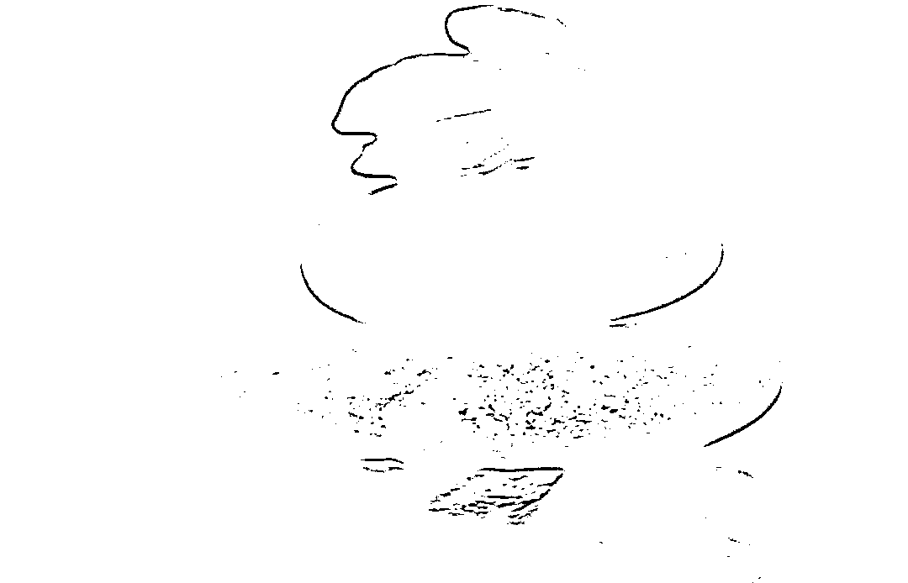

圣雄甘地或许是天秤座中最著名也最受尊敬的例子。他在印度独立战争动乱爆发后，以绝食抗议，拿自己的健康和生命做赌注来要求和平。前美国总统、诺贝尔奖获得者吉米·卡特是另一个天秤座代表，他在卸任之后依然持续通过外交上的努力来促进世界和平。流行娱乐界中，有前披头士乐队主唱约翰·列侬，他的那首圣歌一般的《给和平一个机会》，成为 20 世纪 60 年代末 70 年代初西方年轻人为之狂热的真言。

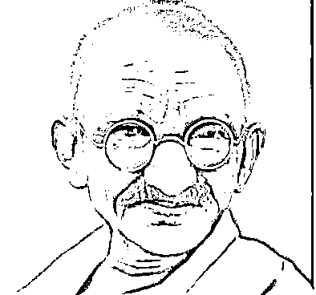

| 甘地当然，即便是希望人们和谐相处，也**并不意味着所有天秤座都会从事跟和平有关的事业。**我曾经在一篇文章中写过：“天秤座只不过是礼貌的白羊座。”这在另一位上世纪 50 年代的美国总统身上得到应验，那就是德怀特·戴维·艾森豪威尔。在他当选总统之前，作为二战时盟军最高指挥官的经历为他赢得了良好声望。

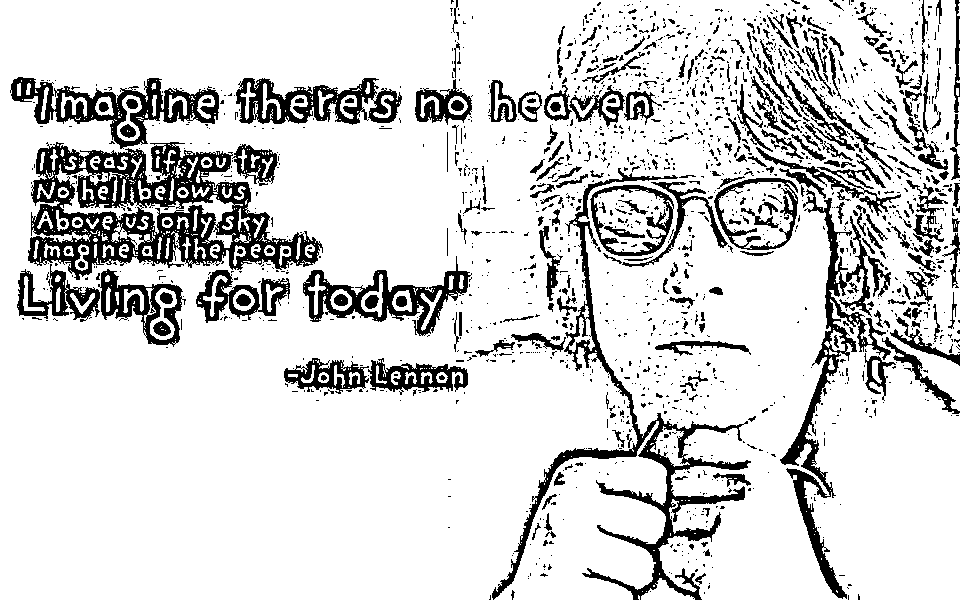

| 约翰·列侬白羊座更多与战士的角色共振，不过，这位天秤座军事领袖却因成功维持了盟军中多国将领之间的和平共处而受到极大拥戴，这些暴躁的将军之间的争吵摩擦会削弱盟军的力量，进而大大影响与纳粹德国的交战。在艾森豪威尔任职总统的早期，他在南朝鲜和北朝鲜达成休战协议后，便结束了美国在朝鲜的军事行动。并且在他任职总统的八年里，他都没有对朝鲜发起任何军事行动或干预。“和平与繁荣”成了艾森豪威尔在位时的口令，美国人提到这一点对他都会非常怀念。

| 艾森豪威尔**很多天秤座都非常善于倾听，并表现得易于合作，有时会给人一种比较被动的印象。**不过，**天秤座可不是一个“被动”的星座，它是一个社交型的星座，并且是非常“主动”的社交。**天秤座会主动与人建立关系，言谈中惯于使用“我们”或“你”这样的字眼，以示礼貌。“不如我们去看电影吧？你想看吗？”“我们应该去看看，你觉得呢？”你们会很乐意为他人提供建议，同时也常常向他人征求建议。**如果出生星图中与天秤座共振的元素被强调，这些人很有可能从事咨询相关的职业，比如心理咨询师，或至少是一个心理爱好者，或是商业顾问。**大部分天秤座信奉**“以人为本”**，不管从事何种职业，都会对身边的人表现出一种真实的关注和兴趣。也因**能够以公平、公正的态度面对相反的观点**而闻名，经常**在冲突和谈判中扮演调停者的角色**。这种不偏不倚的态度有时也会给人造成困惑，因为人们不知道天秤座到底是站哪边的。不过，他们的目的就是达到皆大欢喜的结局，相信自己的好意终究能够被他人理解。**天秤座也以良好的审美品味著称，有时这也被称为艺术天分或创造力。**不过，创造力不被哪个星座独揽，每个星座都有自己表达创造力的方式。**天秤座对于美的敏感，更多根源于想要取悦他人、创造和谐环境的欲望。**所以要把墙上歪歪扭扭的画摆正，把家具安排得当，在意物品的配色和美感的搭配，放舒缓的、令人愉悦的音乐，所有这一切都是为了创造一个和谐的氛围，将出现混乱和不一致的可能性降到最低，让每个人都能感到放松和愉快。

高阶的占星学学生会懂得，要想了解一个天秤座的创造力表现方式，需要去参考星图中的其他因素。

**· 如果星图中的冥王星/天蝎座/第八宫被强调，**那么他们的“作品”很可能激发出人们内心强烈的激情，或试图探索人与人之间更深层极致的情感联结；

**· 如果是受海王星/双鱼座/第十二宫影响重，**或许会成为天秤座中创作灵感最易被激发的那一类，或许会想要和大众分享那些为人生指引方向的神秘体验或启迪；

**· 如果是天王星/水瓶座/第十一宫在起作用，**可能会以给人带来震惊的方式进行表达，或提供一种全新的看待生活的方式——往往是更加“超前”或颇具现代实验性的方式。

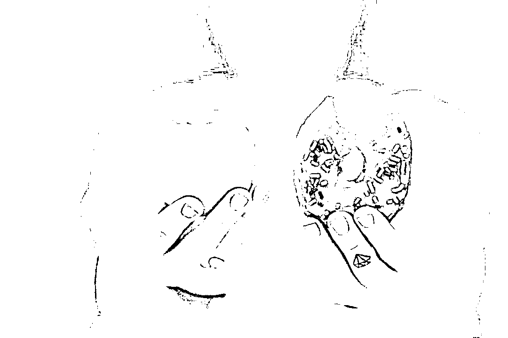

**个人成长的主题和故事**想象有一个天秤座的孩子画了一幅画，然后迫不及待地向老师或父母展示。如果他们的画得到表扬，他们会继续画很多跟这幅画一样的画；如果他们的画不被喜欢，那他们会转而尝试做其他的事看看能不能获得赞许。如果老师或家长无视或者嘲笑小天秤座的努力，那他们很可能就此舍弃所有艺术追求。这类现象强调了一个贯穿天秤座人一生的核心议题：**取悦他人会成为你们的自我驱动力。**天秤座可能因为太想令他人满意而忽视了个人利益。但很多人不了解的是，对于大部分天秤座来说，**看到别人快乐，自己也会体验到巨大的满足感——特别是伴侣或密友的快乐。**所以，天秤座的“个人利益”，存在于那个因和谐美好的关系而感到快乐的“自己”身上。天秤座想要的是**“共享体验”**。不过，就像前面说到的，有许多不同种类的天秤座。如果出生星图中双鱼座/海王星/第十二宫被强调，天秤座会拥有这样一种能力，可以**通过幻想、想象、创造性的活动来让自己快乐，或是通过灵性上的实践来寻求解脱或感受圆满。****他们也会很享受与人互动的时光，但有独处的时间也非常重要。**如果牺牲掉太多独处的时间，那么**面对现实可能很容易想要逃避。怨愤会不断积累，直到最后变得暴躁易怒。**这样的天秤座必须**在独处和与他人交往之间找到平衡。**在我的客户档案里有很多这种“海王星上的天秤座”。他们中的有些需要独处的时间来进行灵性上的修行，还有各种各样的艺术家，包括音乐家、画家、电影工作者，等等。他们的创作需求太强烈，欲罢不能，这可能会占用他们太多时间，而影响到日常生活中的人际交往。有些人找到了某种方式来跟伴侣分享他们的灵感或创作。然而**在共享的时间和独自创作之间找到平衡的过程，可能会制造很大压力。这类天秤座或许需要回溯一下在成长过程中，有多少时间是独自度过的，以及为什么会那样。**

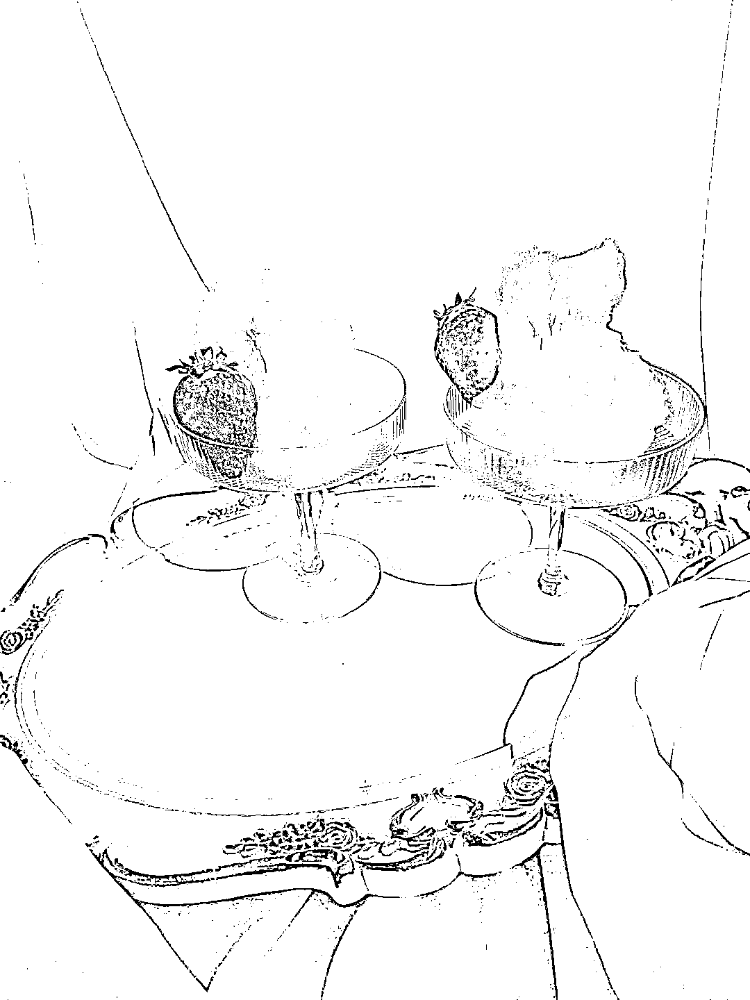

父母工作太忙的时候，可能会把小时候很听话的孩子单独丢在家里。父母或许很高兴孩子这么让人省心，可以自己玩自己的，不需要人陪。或许把课后时间都放在画画、写作或弹吉他上。他们所学到的就是，**别人不想被打扰，他们可以通过创作来让自己快乐。**如果你是这样的天秤座，那么**这种“习得的模式”就很可能在你后面的人生中留有余波。**当然也有非常不像天秤座的天秤座。一个例子就是俄罗斯总统弗拉基米尔·普京。他属于受**冥王星/天蝎座/第八宫**影响重的天秤座，在他身上，天秤座的主题与天蝎座的控制需求是融合在一起的。天蝎座/冥王星的激烈和强度与天秤座的外交魅力混合在一起。**这种天秤座的根本议题是信任。**他们不容易信任他人。童年的一些经历或许传递了这样的信息：**人世险恶，没人可以相信。**普京的父母在他出生之前失去了两个儿子，一个死于疾病，一个在列宁格勒战役中牺牲。他的父亲在二战中受到重伤。所有这些事件带给普京的信息就是，生活是残酷的，成为幸存者不容易。在 12 岁时普京开始练武，虽然他在大学学的是法律——非常天秤座的专业。他后来加入了克格勃，在 23 岁时成为一名间谍。

| 普京撒切尔夫人是另一个天蝎座/冥王星被强调的天秤座。她是连任时间最长的英国首相，也是英国第一位女性首相。她因其处理政事的强硬作风而被称为“铁娘子”，这当然不是典型的天秤座。在她学习法律并成为一名律师之前，她做过研发药剂师，拥有理学学士学位，专业是 X 射线结晶学——这是天蝎座会感兴趣的。

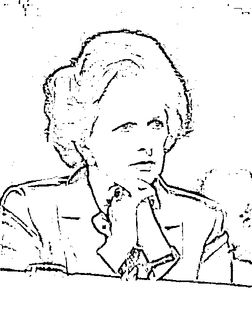

| 撒切尔夫人**结合了天蝎座/冥王星特质的天秤座还是会有和普通天秤座一样的建立关系的渴望，只是想要的关系会更有强度。**他们会有某种**强迫性地渴望与人发生激烈碰撞的欲望，想要去深挖别人到底想要什么，他们的真实想法是什么**。有意识地培养这些天蝎座的能力将有能力更加深入地洞穿人心，揭示别人内心的强大和软弱。这样的洞察力可以**帮助天秤座建立更多稳固持久的关系，或在谈判中达到目的，从人生的艰难考验中存活下来**。**他们倾向于与人建立更深层的联结，是天秤座里最不愿意终结一段关系的人。**下面，我们来看一些常见的关于天秤座的负面评价，大家一定都很熟悉。这些负面特质常常根源于童年或青春期时的成长问题：**· 优柔寡断****· 意志薄弱****· 老好人**这三种负面特质是互相关联的。天秤座的犹豫不决简直要把朋友逼疯了！这样优柔寡断是因为他们总在考虑，自己的决定会给生活中那些重要的关系带来怎样的影响。“如果我接受了这份工作，我还有足够的时间陪男朋友或其他朋友吗？”想要让每个人都开心，会把自己也逼疯！所以，**很多天秤座会在需要做决定时，不停咨询其他人的意见，直到最后自己也无法忍受那股想要“赶紧做”的冲动了，自己对自己恼火得不行。**

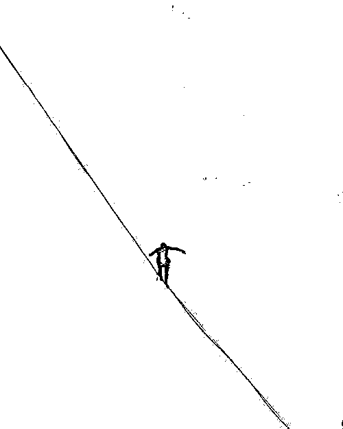

比较极端的长期选择困难的情况，往往根源于成长过程中的家庭动力；**因为某种原因，自己做选择的能力被损坏了。**或许从小父母就包揽了他们的所有决定，甚至是在青春期时，而自己只是扮演想方设法取悦他们的角色。父母或许会为小天秤座的乖巧听话感到高兴，丝毫不会想到他们成年后可能面临选择困难的挑战。**即便是在由父亲或母亲一方独揽大权的家庭，天秤座小孩也会很努力地调和父母双方的意见。**在这样的环境中成长起来的成年天秤座，要想卸下过度依赖的模式，或在做决定时改变犹豫不决的惯性，都将面临困难。对大部分天秤座来说，要在个人成长方面取得突破，无意外地，要通过关系来进行——**关系的终结！被拒绝，分手或离婚，会给天秤座的生活带来天翻地覆的改变。**分手之后，所有的事情都受到质疑，所有一切！有了这些痛苦不堪、伤痕累累的经历，他们才会意识到自己对每一段感情所付出的时间、努力和能量，觉得生活不公平，并开始感到愤怒！**一个愤怒的天秤座会暂时地向白羊的方向靠拢，这是非常健康的。天平的两端会倾斜摇摆，最终又会恢复平衡。****天秤座的事业线索****在事业方面，天秤座最明显的特质是搭建关系的能力。****公共关系**是天秤座人的理想职业领域之一。天秤座知道如何取悦于人，也有兴趣了解他人的需求。从字面意义上看，他们的“外交技巧”真的可以让他们在外交领域一展所长，**外交使节与领事馆人员**中天秤座人的比例比其他星座的人都高，这毫不让人感到意外，特别是那些**需要面对公众或涉及约定、协商的工作岗位**。事实上，**他们的谈判技巧在商业领域非常受欢迎，特别是在高风险谈判或销售行业——建立关系的才能会为他们带来许多回头客。**的确，一些天秤座需要注意，**不要在上谈判桌之前就先妥协了，**这对他们来说或许有点难。试图取悦所有人是一个问题，而且会带来很大压力！这是近期我经常从天秤座客户那儿听到的抱怨和体会。同样，犹豫不决和拖延症也困扰着很多天秤座，所有这些问题都根源于天秤座总是**试图揣测自己的决定和行为会给他人造成怎样的影响**。然而，最终他们会**成为协商的能手，找到双方都满意的途径来实现双赢**，很多天秤座能凭借这种能力在事业上取得成功。作为律师，天秤座可以在谈判桌上一展身手，毫无疑问，**天秤座会非常胜任公司律师的角色。**其他适合的领域有**营销和广告，特别是那些跟发现大众需求有关的职位。**除此之外，一些天秤座也擅长**以某种能为他人带来快乐的方式，发展自己的创造天分。**他们的审美品味通常颇受赞赏，不过秘密是，**他们很清楚别人会觉得怎样是好的。**

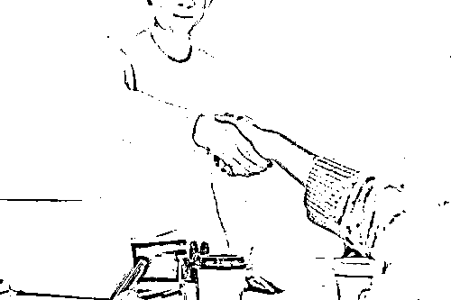

**天秤座天生对人性感兴趣，有一些人会倾向于从事与心理学相关的工作。**作为**天生的咨询师和良好的倾听者**，他们在这一领域有所建树便顺理成章。同样，他们也适合在公司里承担**人力资源**的工作。不管怎样，在那些人们会带着问题来找天秤座的领域，他们都会有出色的专业表现！在偏向个人创业的情况里，他们或许会**在一个喜欢的领域扮演“咨询顾问”的角色，与那些寻求洞见和建议的人建立客户关系。**另外，天秤座也可能会**找到生意上或咨询上的“合作伙伴”，来组建专业的机构。**天秤座和善的性情在所有的领域都是一种资本。**一个“愤怒的”天秤座得问问自己，症结何在？**很有可能**愤怒是一种防御。**幼年遭遇拒绝的经历伤害了天秤座，他们不愿面对未来的风险，依旧沉溺在对过去的愤怒当中。讽刺的是，这样的行为会招致更多的拒绝，结果愈加阻碍天秤座在事业上获得成功。关键是要**面对早年被拒绝的创伤，这会有助于放下伤痛，化解愤怒。****天秤座的爱情线索****大多数天秤座是有魅力的，脾气好，通常长相不错，还有一个吸引人的优点是能够认真聆听他人。**天秤座是真的对别人要说什么感兴趣，并且在认真倾听之后可能会给出非常善意的建议。**他们是天生的心理学家。会琢磨很多跟人有关的事，去想一个人为什么会成为现在这样，并且会努力跟上关于人类行为和动机研究的前沿理论。**他们最想要的就是**和平**，一段和平的婚姻，一个和平的家庭，一个和平的世界。没有哪个星座比天秤座更加关心如何处理关系。这不仅适用于结婚，也适用于离婚。我的很多天秤座客户为如何能够和平地离婚，以及跟前配偶保持和平相处的关系伤透了脑筋。**天秤座就是希望跟每个人都好好的，他们不知道有什么理由要停止对一个人的关心，哪怕和这个人之间的“协议”已经发生了变化。**关系是天秤座的地盘。**浪漫情事、求爱、约会、婚姻，这些事会占用许多的精力和能量，优先成为生活的重心。**天秤座的合作天性会给人一种错觉，似乎处理关系对于他们来说比其他星座的人都要容易，这对很多天秤座来说或许是真的，但我也十分确定对更多天秤座人来说，事实并不是这样。部分原因恰恰在于**关系对天秤座实在太重要了。****很多天秤座最终会选择围绕身边的关系来建构自己的生活，或是婚姻关系或是商业上的合作关系。**因此，**关系中的选择或决定**会让他们深受其扰**。出了名的拖延根本上是对可能做出错误选择的恐惧。****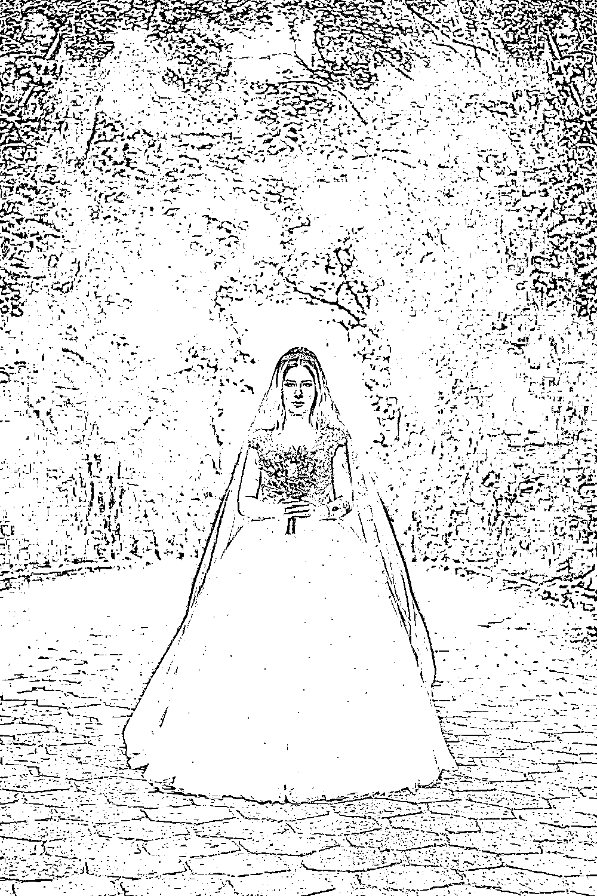**“如果这样行不通呢？”“万一一年后我发现我不是真的爱他（她）呢？”“如果他（她）不爱我了呢？”“如果他们不是我想象的那样，其实跟我设想的大相径庭呢？”他们也可能会想，“毕竟人总会变化，就算分了又怎样呢！”**对于可能在关系中行差踏错的恐惧，几乎和天秤座建立关系的能力一样强。****年轻时他们会四处约会。有些天秤座会非常擅长同时脚踏几条船。**大部分天秤座会为自己协调关系的能力感到骄傲。所以在年轻时，可能会很享受同时搞定两个男朋友或女朋友的感觉！**当这样的努力最终宣告失败时，他们很有可能回到某位前任的身边，想要和他（她）步入婚姻。**更糟糕的情况是，**约会对象不再理天秤座了，他们会非常困惑，不知道自己之前的努力都是为了什么。**很有可能天秤座只是**想要去建立一些自信**。建立自信意味着向对方证明，自己是多么擅长给他们带来快乐！**随着经验的增多，天秤座会认识到盲目取悦别人的不成熟行为会有什么危害，开始带着更多智慧和成熟去行动**。一旦可以带着更多自信经营关系，他们会**更为专一，把目光放到最主要的那段关系中。**天秤座会阅读很多探索人际和关系的书，虽然他们并不希望朋友知道这一点。当天秤座头头是道地分析某两个人在一起配或不配时，身边的人可能听得头都炸了。他们会这么激烈地讨论这件事是因为，他们真的很希望能促成别人关系的顺利进行。**婚姻对天秤座来说是人生大事。某些天秤座会因为害怕这件事带来太大消耗而有意回避，不过大部分会选择结婚。**大多数天秤座认为结婚是一件非常自然的事，他们不知道为什么人们会为这件事有那么多困扰。事实上，**拥有幸福婚姻的天秤座真的是非常幸福的人。**当然，相应地，婚姻不幸的天秤座也是比较悲惨的，所以要怎么选择呢？首先，**天秤座需要一个愿意跟自己好好商量事情的伴侣。**如果他们说话声音很大，总是跟天秤座吵吵，或者总是想要以“他们的”方式来处理问题，或者他们不够精致——所有这些都会让天秤座觉得很倒胃口。天秤座也喜欢**讨论或智力上的交流**，如果意中人头脑聪明、博览群书，可以跟天秤座进行“友好的”辩论，那么他们或许会成为好伴侣。不过，**总是情绪化地争辩，说话不过脑的人，是完全不会吸引天秤座的。****天秤座也会希望你的伴侣不要那么戏剧化。**一点点的戏剧化是刺激的，但过度戏剧化则会让人筋疲力尽。**天秤座希望伴侣是准备好，并且有能力进入一段关系的。**他们也**不能太过缺乏主见或消极被动**，那也会熄灭天秤座的热情！如果太过顺从，则可能会将天秤座置于与他们竞争的位置，关系变成比赛“谁比谁更好”的游戏。**最适合天秤座的伴侣应该是能够平等相处的人，可以互相配合；一方面能清楚地意识到个人的利益所在，同时也真心实意地为天秤座的幸福着想。**这样的组合对天秤座来说是一个正确的婚姻选项。

**版权声明：**原创文章由作者授权发布于若道平台，欢迎转发，反对抄袭。友号转载请申请白名单。

****想阅读更多作者的文章，请在后台回复******大卫****** 即可。****

**喜欢文章请长按下方二维码打赏**

**给大卫老师加杯咖啡呗~**

**▼**

**学习占星学**

**点击或长按下图了解课程详情**

****

**

**

****

**微信又双叒叕改版啦，不想错过若道君的推送？**

**就把若道设为星标吧！**

**▼**

**喜欢记得点一下在看哦☟**

****报名直达入口****

# 新课首发丨 ISAR 选修课：行星交点在集体进化中的作用

> 原文：[`mp.weixin.qq.com/s?__biz=MzA5NjA0NTAxNg==&mid=2651457391&idx=2&sn=c90ebbf77eef4a50af20fca423f58c11&chksm=8b48b5d8bc3f3cce496e6c6be46ec86d6b28441544514842963dad9dd539709b643c65a27699&scene=126&sessionid=1692737918#rd`](http://mp.weixin.qq.com/s?__biz=MzA5NjA0NTAxNg==&mid=2651457391&idx=2&sn=c90ebbf77eef4a50af20fca423f58c11&chksm=8b48b5d8bc3f3cce496e6c6be46ec86d6b28441544514842963dad9dd539709b643c65a27699&scene=126&sessionid=1692737918#rd)

这是一门专门为若道开设的课程！**马克·琼斯**将于今年秋天教授**八节关于行星交点的深度在线课程**，他将通过我们集体进化中的一些重大事件来阐释这一主题。

1

**什么是行星交点？**

**交点是一个天体轨道与另一个天体轨道延伸平面的交点。**任何沿轨道运行的天体都有交点。月亮有月亮交点，每颗行星、小行星、卫星和微小行星也都有交点。

2

**课程教授什么？**

马克老师**首先会讲解基础知识，**介绍行星交点是什么、行星交点运转的动力（包括日心视角和地心视角），然后他会**论述丹恩·鲁伊尔晚期工作中关于月亮交点和行星交点重要性的洞见**，以及它们如何在个人生活和事件中创造一个动态的意义轴，**超越个人出生星图的静态画面。**

马克老师还将简要**介绍自己的一些开创性研究**，并通过精选一些反映我们共同的**集体进化的现代历史事件**，分享他最近的著作《行星交点与集体进化》中的洞见。

**我们将学习木星往外的行星交点**，看到木星交点如何向我们揭示文化和宗教意识形态的集体历史进化，正如我们的文明结构所表现出来的那样。例如，土星和冥王星的交点也在摩羯座，清楚地描绘了我们所有人在这个时期试图进化所面临的挑战，因为在我们生活的世界根本结构的变化中，游戏规则正在升级。

**我们还将学习近期历史中行星交点的影响**，包括最近木星、土星和冥王星在摩羯座的大合相，开始真正意识到当前这个时期在文明进化本身中的集体重要性。理解这些盛衰周期，我们至少可以在这些困难时期仍然抱有希望：我们不会失去一切！

**在整个课程中，马克老师将通过多个历史案例动态地研究这些强有力的交点配置可能如何运作。**

3

**课程安排**

**第*****1*****讲** **介绍行星交点**

我们将学习行星周期如何形成行星交点，并了解日心视角和地心视角之间的区别。

**第*****2*****讲** **什么是行星交点**

我们将深入学习丹恩·鲁伊尔的成熟思想，这是启发马克老师研究行星交点的灵感之源，也是他最近出版的《行星交点与集体进化》一书的灵感来源。

**第*****3*****讲** **双子座-射手座的天王星交点**

我们将学习人类认知和技术如何通过天王星交点的透镜进化。

**第*****4*****讲**** 巨蟹座-摩羯座行星交点**

我们将进一步学习行星交点对社会和文化的影响，深入探讨落在摩羯座-巨蟹座的木星、土星和冥王星交点，并了解它们在过去 1000 年里对我们的全球社会、政治和文化思潮起着怎样至关重要的影响。

**第*****5*****讲** **海王星及其狮子座-水瓶座交点**

我们将学习落在狮子座-水瓶座的海王星交点影响的不同显化，及其在疗愈中的作用；灵性意识形态的发展，及其促使事件结束的倾向。

**第*****6*****讲** **作家案例**

通过原创研究，我们将学习行星交点如何影响了世界上一些最伟大的作家的人生。

**第*****7*****讲** **研究 2020 年**

我们将了解 2020 年的重要意义。

**第*****8*****讲** **回顾**

我们将回顾前面的课程，并探索如何通过行星交点的意涵理解月亮交点。

4

**授课老师**

**马克·琼斯（**Mark Jones**）**

马克·琼斯是一名**占星师、心理整合治疗师和催眠治疗师**，为世界各地的客户和学生提供服务。

马克的第一本书《**疗愈灵魂:冥王星，天王星和月亮交点》**，详细解释他的占星方法论。

他的第二本书**《灵魂的表达:占星学的治疗潜力》**，融合了马克作为超个人心理治疗师和占星学的经验，概述了占星学解读的变革性潜力。

此外，马克还联合其他作者**共同撰写了一些占星书籍**：《占星学:新一代》、《超个人的占星学》以及《进化占星学的洞见》。

**而《行星交点和集体进化》则是他将他对交点研究的集大成之作。**

5

**课程信息**

*   **课程时间：**2021 年 10 月 26 日开始，每周二晚上 8 点，每周一次，共 8 次课。

*   **授课方式：**线上直播，英文授课，中文翻译

*   **课程价格：****6800 元****（课程不分组写走心推荐语转发朋友优惠价：5800 元）**

*   **行星交点名人案例和问答免费试听：**添加课程顾问王老师，发送“行星交点试听”，即可获得免费试听内容。

*   **课程咨询：**王老师（微信：18510107057，请备注“行星交点”）

长按二维码添加王老师

6

**退转课程**

*   **退款原则请详看《教学协议》，如有疑问请咨询课程顾问。**

****行星交点****

**授课老师：**马克·琼斯

**授课时间：**2021 年 10 月 26 日起

**授课方式：**网络课程**，**英文授课，中文翻译

**费用：****6800 元****（课程不分组写走心推荐语转发朋友优惠价：5800 元）**

**课程负责人：****王老师**（微信：18510107057，请备注“行星交点”）

长按二维码添加课程负责人咨询~

****报名请点击“阅读原文”****

# 重大天象｜2021 年最后一波水逆来袭！！！

> 原文：[`mp.weixin.qq.com/s?__biz=MzA5NjA0NTAxNg==&mid=2651457358&idx=1&sn=f60ca98a82da2b886e36c80d26c25ea2&chksm=8b48b5f9bc3f3cefb6849180ad0552bb32bf8d8e74338d723f499cfad910a0faae615a7cf01f&scene=126&sessionid=1692737923#rd`](http://mp.weixin.qq.com/s?__biz=MzA5NjA0NTAxNg==&mid=2651457358&idx=1&sn=f60ca98a82da2b886e36c80d26c25ea2&chksm=8b48b5f9bc3f3cefb6849180ad0552bb32bf8d8e74338d723f499cfad910a0faae615a7cf01f&scene=126&sessionid=1692737923#rd)

******☆ ****后台回复“今日”，给你一句生命态度******

作者/苏黎 ISAR 认证占星师
编辑/翀子 封面/书君 图片/网络

2021 年 9 月 27 日下午 1 点 10 分，水星在天秤座开始它本年度的最后一次逆行。学习分辨真相、学习沟通、洞悉背后隐藏的真实，是此次天秤座水逆的重点。当天秤座水星在星图的不同宫位逆行时，它们都意味着什么呢？让我们来看文章吧~

**语言是窗户，或者是墙，**

**它们审判我们，或者让我们自由。**

**在我说与听的时候，**

**请让爱照耀我。**

**                              ——鲁斯·贝本梅尔**

**本年度最后的水星逆行，于 9 月 27 日的 13:10 分发生在天秤座 25°28'。**历经半个月时间，于天秤座 10°07'恢复顺行。本次逆行，处于土天四分相第二次和第三次中间的暂停段落。

天秤座是人际关系的星座，水星落入天秤座，**我们会在社交关系中更关注公平和公正原则。**天秤座也代表了人与人之间的吸引力法则，我们会吸引来什么样的人和能量呢？我们在关系沟通中，如何尊重他人的客观实际，也遵从自我主观的想法，超越二元对立出发，打开沟通中的真诚呢？水星落入天秤座**合适学习沟通和表达，打造良好的社交关系。**

**当水星逆行时，**宇宙意识能量让我们更近距离接触到水星，**让我们有更多时间学会反思，**确保在关系中自己有足够临在的能量，重新评估生命中重要关系，生活目标的进展程度，我们的价值感主题。

**水星逆行期间重要阻力是**水星四分冥王星，水星和天王星形成困难的梅花相。我们要**学习分辨事情的真相，穿越迷雾，洞悉背后隐藏的真实。**如果陷入迷茫，不切实际状态，可以适当放空头脑。沟通中不可能有绝对真实的公平，理解自己真实情感和想法更重要。过度敏感在意他人，会让自己陷入精神紧张的状态。**我们可能无法客观表达自己的感受和情绪，**要不会过度隐藏，要不会冲动下说出伤人的话语。

这段时期，**适合学习如何与他人合作和沟通中表达，**我们的语言有时会引发自己或他人的痛苦，**学会倾听和表达，**学会在通过你信任的渠道表达，你会感受到爱是心灵疗愈创伤最好的解药。

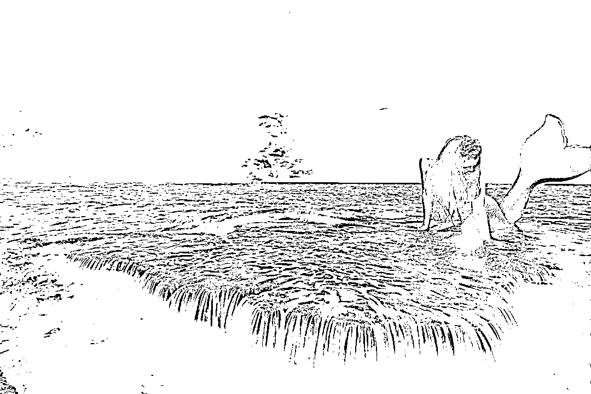

**此次水逆的关键点**

*   **9 月 14 日 水星在天秤座 18°03' 进入水逆阴影期**

*   **9 月 27 日 水星在天秤座 25°28'开始逆行**

*   **10 月 7 日 冥王星在摩羯座顺行**

*   **10 月 11 日 土星在水瓶座恢复顺行**

*   **10 月 18 日 木星在水瓶座恢复顺行，水星在天秤座 10°07′ 恢复顺行**

*   **11 月 2 日 水星运行速度完全恢复正常**

水星在逆行的前两周与恢复顺行后的两周，都是水逆阴影期，此次**水星逆行区间在天秤座 10°—26°。**

**重点影响人群：星图内行星/四轴在开创星座（白羊座、巨蟹座、天秤座、摩羯座） 9—26º，或者个人星图中命主星是水星（上升双子座或处女座）的人群可能有生活影响。**

**水逆的社会大天象**

*   当下整个世界因为资源的重建和分配过程，政治联盟体也在**重新物色合作伙伴**，竞争火药味在疫情后被强调；

*   **健康和疫情反复情况**，在双鱼座满月渲染上土星严肃色彩；

*   科技互联网企业**数据隐私的安全性，平台开放性**，大型企业**瘦身转型**问题被强调；

*   股市的震荡引发人们在投资理财上趋于保守和慎重，**对财务的紧张感加剧**；

*   文娱行业中对**饭圈文化、资本势力**的整顿和清理；

*   国家对**保险行业、税种**的调控；

*   女性在社会的**价值和平等**问题上的觉醒，如何客观看待自我学习的过程；

*   在重建新秩序、企业转型过程中，**个体如何改善自身适应当下的变化。**

在这样逆行大天象下，资源和资本市场重新整合和重建过程中，**个人价值稳定性如何体现呢？女性如何在职场中，家庭关系，社会关系中真实的认识自我定位呢？**

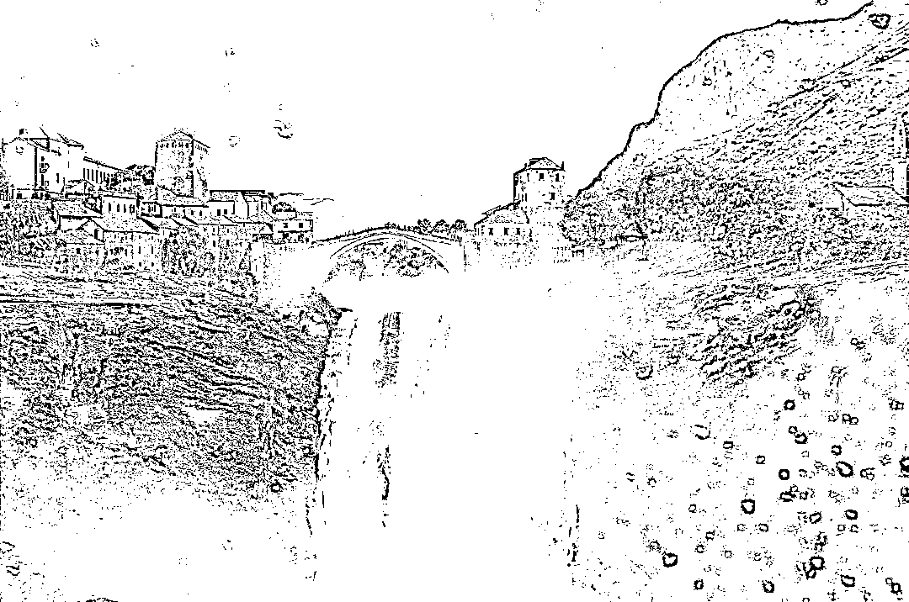

**水逆期间的重要天象**

本次水星逆行主题：天秤座定位星是金星，**本次水逆会强调我们关系中过去的议题再次浮现，**尤其是分手后回忆旧日的情感，婚姻中沟通，谈判签约方面尤为凸显。

天秤座的水星逆行会**触动我们关系中的阴影**，在此期间，火星也在天秤座行进中，金星在天蝎座停留。我们会**探索情感中的禁忌议题或隐藏的内在强烈情绪需求，渴望体验深入骨髓的爱，也可能会被复杂的情感吸引。**

但金星天蝎座带着强烈的控制阴影，有直面真相的议题，人们害怕真相，既渴望带刺的玫瑰，又觉得这是一种致命吸引力。我们会在行动中追求天秤座的法则，但容易过度追求关系的表面平和。

此次水星逆行的议题是让我们**意识到内在情绪和需求，**整合身心。当我们犹豫不决时，就无法做决定，也无法在关系里对自己产生信心。

**★** **水星和冥王星四分相，冥王星顺行**

*   **重要影响时间段：9 月 22 日-10 月 2 日。**

*   **冥王星在 10 月 7 日的 2:28 分恢复顺行。**

**这组相位与过去的阴影意识有关，代表了我们的人际关系、商业合作关系，以及亲密关系中的阴影和秘密。**天秤座水星需要和谐的关系，为了维系表面和谐，无法展露内在的真实情感。而冥王星想要揭露关系里的阴影和秘密。这组四分相在社会层面上，包括投资交易、物流管理等存在的议题可能被曝光。

冥王星顺行，会渴望通过揭露真相，来看到残酷的真实。我们**渴望深入探讨内在阴影**，希望通过学习了解自我。当下的知识和资源可能被限制，但也能通过其他途径获取。

水星在天秤座逆行，是摇摆不定的，而冥王星与权利和控制有关。当冥王星恢复顺行，权力人物或大型机构会谋求建立合作和联盟的方式。但水星在逆行期间，**建立联盟、**合并与合作里存在紧张的冲突和挑战。

面对强势且带有强烈控制欲的冥王星，水星逆行让我们保持缄默，对他人产生猜忌或不信任，并不想说出真心话。这组相位在社交上容易产生紧张与尴尬。**当我们**无法表达**真实的情绪，就容易对他人造成心灵上的伤害。**

但我们其实很想了解对方，却刻意隐藏想法，装作毫不在乎的样子，在这种状态也伤害了自己。我们脱口说出的真心话，可能对方却觉得内心受了伤。**学会真诚表达自我很重要，**朴素的语言远比纠结如何说更关键。懂你的人自然选择理解与包容，不懂你的人永远不懂你。

**★****水星梅花天王星，土星恢复顺行**

*   **影响时间段：10 月 11 日——10 月 13 日**

10 月 11 日，土星水瓶座在 6°52 恢复顺行，水瓶座土星在这两个多月的逆行中，我们看到了社会层面对青少年游戏、教育培训、饭圈文化的各种规范措施的推出，科技+资源的新型商业模式在逐渐成长。水瓶座土星的定位星是天王星，而水星和天王星的困难相位，我们在沟通中可能**语出惊人，让人无法接受。**我们会展现彬彬有礼的水星特质，但也会因为某些意外情境的触发，打破表面的平衡。

水星与天王星的梅花相位，提醒我们**要调整表达的方式**，如果内在阴影无法清理和消化（冥王星），我们唐突说出的话就会引起纠纷。日常生活中，我们需要学习天秤座诚实真诚的表达沟通方式，而原创的观点则给人机智与聪明的感受。

当下数字化的表达是冷漠疏离的，**我们通过微信、视频与远方的陌生人建立关系，却无法与身边人建立真实的关系。**社恐在年轻人里普遍存在，我们与自己的父母，长辈之间也产生沟通障碍，缺乏耐心的倾听和沟通能力。

B 站播出了一个原创综艺《屋檐之夏》，邀请年轻人入住独居老人的家，这些老人中，有曾经红极一时的明星，有曾经呼风唤雨的大佬，也有桃李满天下的名师……但在节目里，当暮年、荣光已去，传奇已尽，他们只剩一个共同的身份：老人。我看了描述节目的文章，百感交集。

人不是一个孤岛，年轻人渴望在数字时代里乘风破浪，年长者渴望人与人之间的亲密。我们**如何在这个时代与生命**建立**深度连接？**调整表达的方式，克服沟通障碍就显得尤为重要。

**★** **水星三分木星（10 月 4 日）；太阳合相水星、火星（10 月 7 日）**

水木之间的积极相位带来清晰的洞见与思维，它会拓展我们心智的活动，从更宏观的角度看待问题。木星的扩展能量也会让商业贸易更顺畅。但三分相的能量流动我们是不太容易察觉到的，水星逆行期间，我们仍需要避免在签署商业文件时粗心大意。

**如果水星逆行触动你出生星图的 3 宫或 9 宫，**当你乘坐交通工具出行，请为旅途预留富裕的时间。对任何不确定性**保持敞开性，保持耐心。**

太阳与火星、水星合相，兴奋与冲突，激情与矛盾，积极表达和纷争共存。太阳与火星合相在天秤座，前期隐藏的想法和沟通也许会一触即发，我们会热烈探讨，但需要保持觉知和边界感。

这三颗行星的合相，让我们从自我目标出发，但也容易引发暴力、争论或身体上的伤害，**我们需要学习尊重他人。**同时也需要注意交通事故。

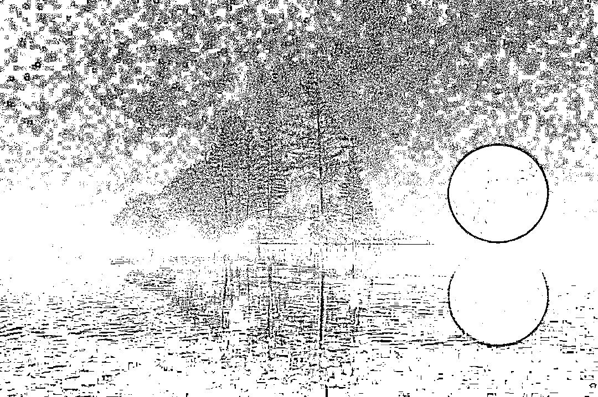

**12 星座如何应对水逆**

水星在天秤座逆行，我们需要如何应对和处理呢？这是简单的日常小 TIPS：

*   本次水逆期间，**关系或合作容易产生沟通问题**，如果生活中离开的人物再次出现，我们需要问问内在的金星：这是我内在真实需要的情感吗？**请在沟通中学会耐心和尊重。**

*   **水星与文件签署、电子设备、交通出行有关，**请在处理合作文件、签署协议前仔细审核文字信息，避免笔误。为了防止电脑故障、数据丢失，需要做好文件备份工作。交通出行给自己预留足够时间，如果可以，请携带一本你喜欢的读物作为消遣。

*   **学习沟通的艺术，**当我们接纳自我的阴影，学会用爱的表达方式与他人沟通，我们的语言才有温柔的力量。请深入理解天秤座的宇宙法则。

*   网络购物如果出现包裹延迟和乌龙事件，请和商家协商解决问题，毕竟商家谋生不易，对他人保持一份关怀和体恤。**购物需要慎重，避免后悔。**

*   数字化重新理解我们如何定义时尚和美，**美的出发点是取悦他人还是取悦自己呢？**我们在生活中如何展现自我形象呢？

*   **水星逆行与内省有关，**合适我们深刻反思关系议题，参加那些吸引你的社交活动，克服社交恐惧症，享受美好时光。**真实和真诚的关系会让我们更加理解他人和自我。**

**12 星座在水星逆行期间，该如何应对呢？**

**若道君：****你可以在 app store 或者应用商店搜索“若道”下载 app，输入个人档案，查看行运盘（也可以使用其他星图软件），找到行运水星落在出生星图的第几宫，然后对照下文查看水星逆行的影响。**

**例如下图中，行运水星在美国总统拜登个人星图的第 11 宫。**

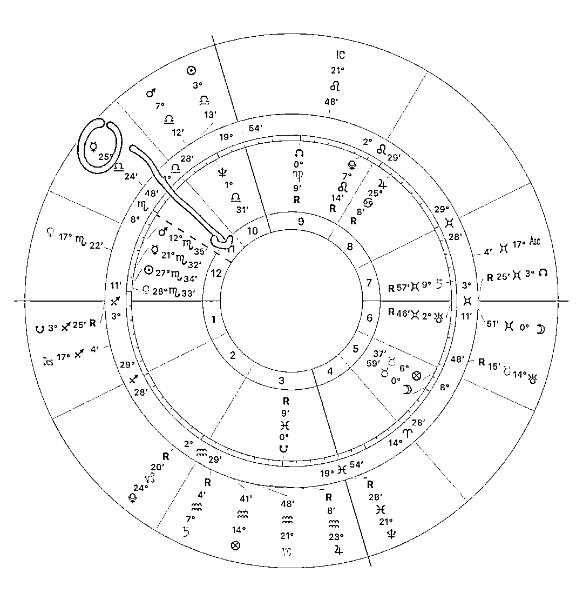

**太阳或上升在*****白羊座***

**水逆发生在你的第 7 宫（合作伙伴）**，**这是学习关系课题最佳时机，**我们在关系中需要捍卫的是什么？你行动力很强，关系中有主动意识，你希望自己是主角和掌控者。你最近对关系有一些疑惑，TA 会是一个公正的合作伙伴吗？你会斟酌权衡梦想的实现过程中，如何在同伴关系中保持利益的公平性。

你也会在情感关系中回顾过往的经历，思考自己的选择是否正确，一对一的关系对你是一个挑战功课，**学会不带评判的倾听很重要。**同时，请留意生活中一触即爆的纷争，避免身体的伤害。

**太阳或上升在*****金牛座***

**水逆发生在你的第 6 宫（职场工作环境，健康作息）**，今年土天四分相的变动是否对你职业环境造成了影响？你不太习惯变动职场环境，如果发生了职业危机和变动，不提早做准备，你会对收入与价值缺乏安全感，但是寻找工作又不容易，如果遇到延迟还请给自己足够耐心。

金牛座喜欢舒适的生活和有节奏的生活，逆行水星会让你关注健康与生活的资讯，**关注平衡身心健康、如何调节工作与作息是你调整的重点。**

**太阳或上升在*双子座***

**水逆发生在你的第 5 宫（娱乐、创造力和子女）**，双子座是沟通中的百变达人，兴趣爱好广泛，表现力爆棚。如果你想通过写作、绘画或者自媒体传播分享自己的知识，**表达并展现自我魅力，这是最佳的时机。**你的社交生活非常丰富，老友重逢沟通，谈话滔滔不绝，沟通欲望很强烈，但需要避免沟通中误解，避免友谊小船说翻就翻。

如果你是网络博主，直播达人，也许你需要注意大众沟通，**平衡自己想说的话和他人价值观，**留意主流社会的声音，**避免过度表达，祸从口出，因为你的语言容易被听到。**

**太阳或上升在*巨蟹座***

**水逆发生在你的第 4 宫（家庭住所和真实心理世界）**，巨蟹座对关系和沟通很敏感，日常生活中他人对你的语言伤害，你也许会装出毫不在意的样子，但内心却充满沮丧和挫折感。第四宫与我们的自我对话有关，也和家庭成员关系有关，**你如何处理和家人关系，如何真实表达你的情绪感受，而不是选择隐藏呢？**

建议你看看 B 站原创综艺《屋檐之夏》，巨蟹座的人非常在意家人的感受，渴望在亲人的情感支持中获得力量，当他们觉得外面世界不安全，就会选择进入自己的世界，逃避外界的伤害。

《红楼梦》里有一句话：“本是亲近之心，偏生疏远之意”，**我们不是一个孤岛，学会接纳自我情绪，才能与他人建立关系。**

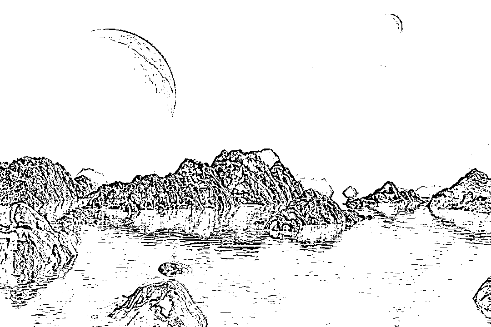

**太阳或上升在*****狮子座***

**水逆发生在你第 3 宫（日常交流、短途出行、写作沟通）**，你也许通过写作或和朋友倾诉表达自我，但是你发现自己最近思维延迟，或在沟通中与朋友产生了误会。狮子座人很担心丢脸或失败，如何缓解面子问题是他们担心的事情，请保持孩子般的热忱和童真，**学会在沟通中敞开。**这是锻炼沟通能力的最佳时机，**如何温和有力的表达出你的观点、在坚持自我的同时尊重他人，是此期间的重点。**

水星也和出行有关，如果近段时间有短途出行计划，请及早做准备，接纳逆行过程中发生的任何不确定性，不要因为无法把控全局而焦躁不安。

**太阳或上升在*****处女座***

**水逆发生在你第 2 宫（金钱和生活态度），水星逆行会让你对物质财富与价值议题有更更深刻的反思。**处女座关注既定的目标、技能，你也许会思考如何通过构建良好的人际关系，帮助你实现财务计划。你关注务实的生活，当下天象变动很大，**你是否有足够精力和活力健康面对生活的挑战呢？**

水星在金钱宫逆行时，你在财富的使用上会更慎重，**收入平衡是你关注重点，**如果行进水星与出生星图的水星、木星有困难相位，需要避免金钱过度流动。你渴望通过合适的社交关系展现你熟练专业技能并增加收入，**但需要保持足够旺盛的精力**（土木在星图第六宫），你的逻辑思维才更清晰。

**太阳或上升在*****天秤座***

**水逆发生在你的第 1 宫（个人形象）**，天秤座是关注外在气质，喜欢享受的星座。水星逆行期间，你也许会更在意护肤美容，在意自我优雅气质和形象。这段时间，你很受欢迎，旧时老友、爱人想和你重拾见面机会。但水逆发生在第 1 宫时候，我们也容易犯错、搞砸关系，**学会适当调整沟通策略很重要。**

天秤座是很容易吸引他人眼球的星座，你们对自身魅力深信不疑，水逆有时让他们感觉到被限制，无法理清关系中的自我，不懂如何建立真实亲密关系。**以诚相待，将自己打开，才能彼此接纳和建立连接。**

**太阳或上升在*****天蝎座***

**水逆发生在你的第 12 宫（潜意识和灵性）**，你可能有一些内在的愤怒和创伤不被他人意识到。你对陌生环境和群体充满防备心，对**他人语言可能会过度敏感和脆弱。**如果在团队或群体中觉得不被认同，你的情绪可能会失控，爆发出火星的愤怒让人觉得不可理喻。

水逆是对关系反思和调整期间，你需要理解关系里的安全感和信任感来源哪里？你渴望被他人理解吗？你在沟通中内在阴影是什么呢？**学会不带伤害的方式化解人际间的冲突很重要。**

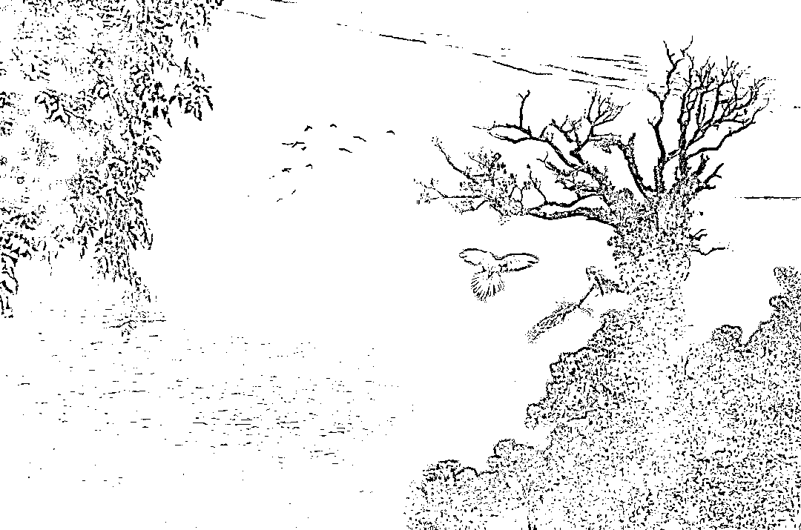

**太阳或上升在*****射手座***

**水逆发生在你的第 11 宫（社团组织），这也是锻炼口才最佳时机。**射手座们面对困难喜欢乐观面对，大事化小，小事化了，但又很坚持自己信念和原则。水逆会让你反思，**你在团队中如何权衡自己的信念与集体目标的差异。**你会觉得如果认同集体的目标是一味的妥协，忽略了天秤座沟通和谈判特质。

11 宫也和网络科技有关，对于网络的传播信息，**不要着急站队表态，**需要耐心等待事件进展，从更客观，务实角度看待网络热搜事件。

**太阳或上升在*****摩羯座***

**水逆发生在你的第 10 宫（事业宫），这是事业调整最佳时期。**摩羯座关注事业的成就，公众的评价，但逆行的水星会让你觉得和老板沟通不容易达成共识。学会天秤座的调和沟通方法，有助于你在事业上的关系游刃有余，避免产生工作中挫折感。

10 宫也和公众对我们期待有关，我们是否会为了满足他人的期待委屈自我呢？当你明白坦诚是沟通最好法宝，**诚实会让你在沟通中学会柔和的说话，他人也会接纳你的真实。**

**太阳或上升在*****水瓶座***

**水逆发生在你的第 9 宫（长途旅行与进修学习）**。你想成为专业的行家，而当下的土天四分让你感受到压力，你渴望尝试通过阅读、旅行或学习掌握宇宙更高等的法则。你的独立性很强，**学习合作和沟通对你很重要，**如何在坚持自我和理想中寻找折衷的方案，**避免理想主义和过度清高，**在关系中学习适当妥协很重要。

你也许对将来会做长远的规划，但规划需要慎重和细心，**避免给自己太高目标。**你对被束缚、目标挫败感到痛苦，有时学会接受水星挑战自己的乌托邦理想、理解现实和理想差异很重要。

**太阳或上升在*****双鱼座***

**水逆发生在你的第 8 宫（心理阴影、亲密关系和投资合作）**，你是否对亲密关系缺乏安全感？当面对关系的纷争，你会选择脑补各种场景，这让你容易在追求情感安全性时**摇摆不定**，无法确定自我需求。双鱼座渴望自己梦幻的情感，有时面对真相会选择逃避。

如果你最近在金钱投资上有计划，建议放缓，或慎重考虑并评估资金风险，**避免生活中的失控和意外发生。**

**版权声明**：原创文章由作者授权首发于若道平台发布，欢迎转发，反对抄袭。友号转载请申请白名单。

****

**苏黎（Sulis）**

ISAR 国际认证占星师（2019 年获得）/塔罗咨询师

现代占星融合古典解读

20 多年跨行业领域职场经历

**咨询微信**：liuzq26

**公众号**：Sulis_1975

长按打赏

**学习占星学**

**点击或长按下图了解课程详情**

****

**

**

****

**微信又双叒叕改版啦，不想错过若道君的推送？**

**就把若道设为星标吧！**

**▼**

**喜欢记得点一下在看哦☟**

**报名直达入口**

# 上证综指和黄金的调整快结束了吗？梅里曼 10 月上证+黄金报告来啦！

> 原文：[`mp.weixin.qq.com/s?__biz=MzA5NjA0NTAxNg==&mid=2651457358&idx=2&sn=7f9716283aa45202cac373edc975a3b9&chksm=8b48b5f9bc3f3cef6942c2670605563f932623c1ef13b686cd99fe8a8160d392160c9a9fdac6&scene=126&sessionid=1692737923#rd`](http://mp.weixin.qq.com/s?__biz=MzA5NjA0NTAxNg==&mid=2651457358&idx=2&sn=7f9716283aa45202cac373edc975a3b9&chksm=8b48b5f9bc3f3cef6942c2670605563f932623c1ef13b686cd99fe8a8160d392160c9a9fdac6&scene=126&sessionid=1692737923#rd)

自 8 月 25 日发布上期报告以来，上证综指在《上证报告》中提到的一个二星关键反转日 9 月 14 日反弹至新的周期高点 3723，这也与迄今为止 2021 年 2 月 18 日的年度高点形成了双顶，而当时土星与天王星首次形成渐亏四分相。而这是自 2015 年 8 月以来 6 年间上证的最高点。

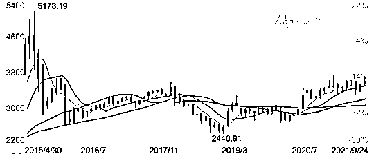

上证指数月 K 线

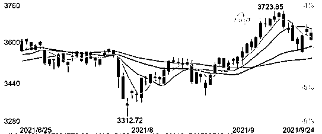

上证指数日 K 线
在 8 月报告里梅里曼老师提到：**“尽管如此严重的下跌可能会引起小型恐慌，但它实际上提供了一个绝佳的中周期买入机会，特别如果这只是更大的 16-19 年周期中的第二个 5.5 年周期阶段。”**在 9 月报告里梅里曼老师还指出：**“8 月 19 日看起来成功地再次下探了低点，由于这是新一轮基本周期，而且可能是新一轮 33 个月周期的早期阶段，交易者可以考虑现在买入。****”**在 9 月报告发出后，上证反弹如梅里曼老师所预测，涨至新的周期高点 3723，在 9 月 10 日形成这个高点后，上证开始了为期 1 周的调整。那么调整结束了吗？金融占星大师雷蒙德·梅里曼的《2021 年 10 月上证指数报告》已上线，欢迎购买。投资有收益，投资有风险，希望金融占星学的研究帮助你更好地评估你的投资。雷蒙德·梅里曼中国金融市场特别网络研讨沙龙也在售卖中。这场为期 3.5 小时的在线沙龙探讨长期行星周期如何影响世界经济的长期周期和趋势，特别是如何影响上证综指、黄金市场、比特币市场，并描述在 2021 年剩下的时间里市场反转关键时间点。

**长按下图识别二维码购买讲座视频**

▼

**10 月上证报告上线**

**上证指数月度报告价格**

**单月报告**：280 元/月 

**季度套餐价格**：780 元（260 元/月）

**年度套餐价格**：2400 元（200 元/月）

**双报告年度套餐更优惠（直降 900 元）**

**12 个月黄金报告+12 个月上证指数报告：仅需 3900 元**

**长按下图识别二维码购买上证报告**

▼

“**黄金是金钱。其他的只是信贷。**

**——约翰·皮尔庞特·摩根**

”

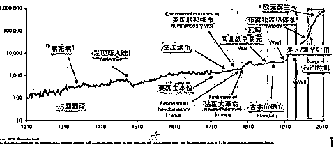

这是过去 800 年的一张通货膨胀图。战争、疫病、革命、工业革命都不是让通胀率发生大幅上升的原因，直到法币出现、金本位废除后，我们看到了通货膨胀斜率陡升。当法币发行不再与黄金白银挂钩，当中央银行发行货币不再有约束，通胀就成了一头没有链子套头的野兽。通货膨胀最终还是一个货币现象，2020 年全球央行的大放水的后果在全球房地产市场、美国股票市场、大宗商品市场上已经又显著体现，而其后果的完全展现还远远没有到来。**10 月份，我们将看到一个重要的 25 个月周期的天象——火星和太阳的合相，这次合相在天秤座。**

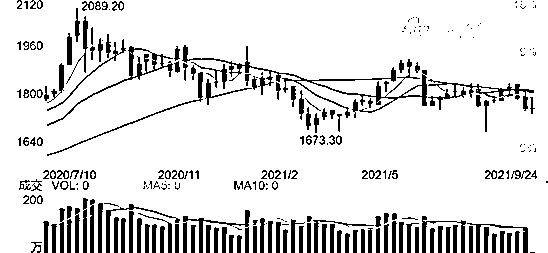

**在 8 月 13 日，我们看到黄金下探到 1677.90，但没有跌破 3 月 12 日的最低价 1673，这意味着 8 月 13 日是更大的 31.33 个月周期的起点。**正如我们在过去所说，一般而言，在一个周期的开始阶段，趋势通常是牛市。而在经历了 4 周的上涨后，黄金走势开始调整。10 月黄金报告已经上线，上证报告也已上线。欢迎了解。也可以按照季度和 1 年期订阅，有更多优惠。季度和年度的好处是，你可以持续了解梅里曼老师对于不断在变化的市场的看法。即便他某一次看法和市场不一致，你也看到在下一期他如何调整自己的看法，并看到金融占星在一个长期时间段内对你把控风险的帮助。而能够长期控制风险、尽量找到安全的投资时机才是投资的长久之计。点击阅读原文，雷蒙德·梅里曼黄金周期 10 月度报告带来有 40 年黄金市场研究经验的世界著名金融占星大师雷蒙德·梅里曼对当前黄金市场的研究。

**10 月黄金报告上线**

**黄金月度报告价格**

**单月报告**：280 元/月 

**季度套餐价格**：780 元（260 元/月）

**年度套餐价格**：2400 元（200 元/月）

**双报告年度套餐更优惠（直降 900 元）**

**12 个月黄金报告+12 个月上证指数报告：仅需 3900 元**

**长按下图识别二维码购买黄金报告**

▼

**购买者需知**

**① **梅里曼市场时机学院《中国上证指数月度研究报告》是梅里曼市场时机学院（以下简称 MMA）的研究“预报”，而不是市场“预测”，是梅里曼老师及 MMA 金融占星分析师对人类活动周期历史与行星周期之间相关性的研究，二者在大部分情况下具有 80%或更高的相关性，而不是因果关系。报告中的研究完全存在错误的可能性。即便是非常认真的研究和几十年的研究经验，金融占星师无法总是正确地解读出各种征象在实际层面上会如何相互作用，并显化为事件结果。所以请将报告看作一个研究参考，务必结合其他市场研究和你个人对市场的理解，根据你的自由意志做决策。**②** 此报告一旦售出，**即不接受退款。**

**③** 上证、黄金月度报告每月固定 1 期，**并非都是在每月相同日期发布。**

**④** **我们收到英文报告的当天，即发布该英文报告。3 天后，上线报告中文版。此报告仅支持手机网页阅读，不支持电脑阅读和下载。**

**以上须知，请仔细阅读。一旦付款，即视为已了解并接受所有须知内容。**

在过去的 39 年中，唯有梅里曼逐渐完善，并在梅里曼市场时机学院月度周期报告中阐释了将地球宇宙学与周期相结合的研究方法，以惊人的精确性预报了黄金价格发生重大变化的时间。

**黄金购买 Tip**各大银行均可购买黄金或黄金 EFT 基金，也可以在诸如天天基金或者支付宝购买黄金及黄金相关产品。不明白的可以百度搜索。**购买后如何查看报告？**

**购买后有疑问怎么办？**

请联系技术客服

**微信：nodoor201705**

**购买黄金+上证报告直达入口**

# 雷蒙德·梅里曼金融占星周运 | 后市行情将如何发展？

> 原文：[`mp.weixin.qq.com/s?__biz=MzA5NjA0NTAxNg==&mid=2651457358&idx=3&sn=139f350d3246576cbb53584b0f67841a&chksm=8b48b5f9bc3f3cef1983524fe8fe4079410e2082447c9a06dfa4802d3d4c53ac0430d42d8be8&scene=126&sessionid=1692737923#rd`](http://mp.weixin.qq.com/s?__biz=MzA5NjA0NTAxNg==&mid=2651457358&idx=3&sn=139f350d3246576cbb53584b0f67841a&chksm=8b48b5f9bc3f3cef1983524fe8fe4079410e2082447c9a06dfa4802d3d4c53ac0430d42d8be8&scene=126&sessionid=1692737923#rd)

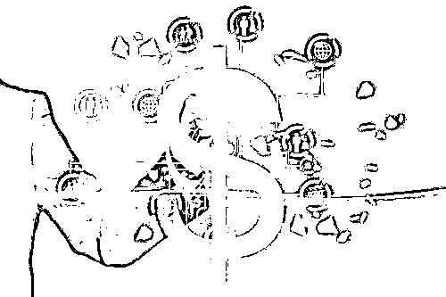

作者/雷蒙德·梅里曼 译者/Luke 编辑/玫瑰 图片/pexels

雷蒙德·梅里曼是在金融占星学界稳坐第一把交椅的占星师，同时他也是若道签约的金融占星课老师，我们引进了雷蒙德·梅里曼老师的《[上证指数月度报告](http://mp.weixin.qq.com/s?__biz=MzA5NjA0NTAxNg==&mid=2651451728&idx=4&sn=170853f20000e2be55f0d9e59252c104&chksm=8b4b43e7bc3ccaf12de32acabd6f31048ff8a341973afaa88f9e8f84239093df106ea1de8b63&scene=21#wechat_redirect)》及《[黄金报告](http://mp.weixin.qq.com/s?__biz=MzA5NjA0NTAxNg==&mid=2651452512&idx=2&sn=a4e0b91e1c2cfc1e024fe12fbb7c2bcc&chksm=8b4b46d7bc3ccfc102a9da4c97530fe72cd8be15a2c6880780d7bf23d5d6f16e67defcf1bfe6&scene=21#wechat_redirect)》。我们经老师的授权，将每周刊登梅里曼老师的周运，供大家参考和学习。于是，这是本周的周运（9.27-9.30）。

**说明：以下时间采用纽约证券交易所所在地美国东部标准时间。**

**展望与回顾**

**标准普尔 500 指数和道琼斯工业平均指数周五走势几乎持平，为华尔街动荡的一周画上句号。中国禁止加密货币的举措，打压了科技板块。耐克股价下跌，是由于疫情引发的供应链问题打击了这家运动鞋巨头。**

**——塔纳亚·马谢尔、李云****《道琼斯指数走势持平，结束了市场动荡的一周》****www.cnbc.com****2021 年 9 月 24 日****中国人民银行周五发出公告，控诉比特币、以太坊和其他数字货币扰乱了金融系统，被用于洗钱和其他犯罪活动。“虚拟货币衍生品交易是违法金融活动，被严格禁止”，中国人民银行在其网站上说。****——卢卡斯·曼弗雷迪****《比特币、以太坊、瑞波币在中国打击中暴跌》****www.foxbusiness.com****2021 年 9 月 24 日**多么大的转变啊！它正好发生在金星与土星-天王星四分相形成 T 三角的时段，也就是 9 月 17-23 日。用占星学的说法，这被称为**“金星传递了土星-天王星四分相的光线”。****占星学上“光线传递”发生在当一颗运行较快的行星，与另一长期行星相位形成相位。**”光线传递强调了更大的行星相位原则。正如我们今年一直所说的，**土星-天王星周期的 11.25 年 1/4 周期阶段是今年最强有力和周期最长的地球宇宙学事件。**上一次土星-天王星四分之一周期期间出现了 2009 年 3 月的 72 年周期低点，当时正值大萧条的高峰。在那之前的一次四分之一周期，对应当时的（2000 年 1 月-3 月）历史高点，随后而至的是互联网泡沫的破裂，引发了一场衰退，持续到 2002 年底。今年土星-天王星再次来到四分之一周期，从 2021 年 2 月直至 12 月。因此，当行进的太阳、金星或火星与土星-天王星四分相形成困难相位，金融市场容易产生突发和剧烈的波动。这一次也没有什么不同，上周全球股指、贵金属、美国国债、外汇和加密货币全都出现了突发的反转和大幅的波动，对应着各国政府领导人和央行发布的公告，以及一些公司命运出人意料的转变，比如恒大。在美国，正如我们前一周所期待的那样，上周一开始就上演了“黑色星期一”。道琼斯工业平均指数 9 月 20 日下跌接近 1000 点，这是因为人们担心恒大无法向债权人支付款项和违约。但是，看起来这正在发生。但随着道琼斯工业平均指数那天跌至 6 月 21 日以来的最低点，人们的注意力转向联邦公开市场委员会会议，其中美联储将宣布缩减资产购买和提高利率的计划，以对抗通胀。

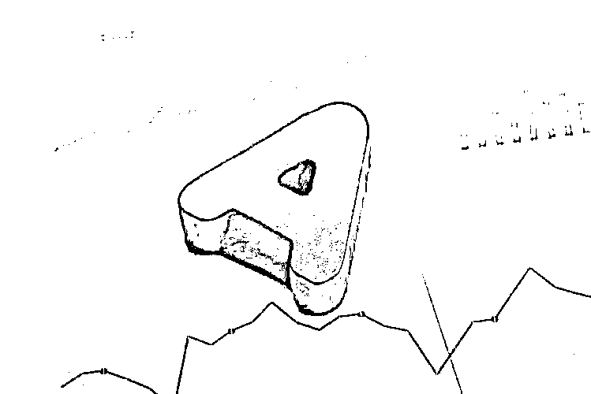

我们的观点是，美联储不会在今年提高利率或开始缩减资产购买，可能直到木星重新进入双鱼座，并与美联储成立星图的太阳-冥王星对分相形成有利相位，也就是今年的 12 月 29 日到明年 1 月中旬，情况才会发生改变。确实，在 9 月 22 日，美联储的确做出了这样的声明。股票市场将因此获益。美联储宣布不会立刻缩减资产购买，也不会在今年提高利率。但是他们确实指望在 2022 年 5 月前至少提高一次利率。那很完美，因为我们预计提高利率将在木星双鱼座期间，也就是 2022 年 5 月之前（它会在 2022 年 10 月末再次进入双鱼座）发生。在这一新闻发布后，股票市场飙升，贵金属市场和美国国债价格下跌。**短期占星趋势和长期考量****银行正在反对拜登政府的一项提议。这项提议可能迫使他们将客户账户信息移交给国税局。****——梅根·亨利****《拜登的国税局银行账户窥探计划正在遭遇越来越多的反对》****www.foxbusiness.com****2021 年 9 月 24 日**恶作剧者水星回来了。正好赶上美国国会面对美国政府即将资金不足的状况。做出决定的截止日期是这一周，9 月 30 日。随着恶作剧者水星在 9 月 27 日开始逆行，同时月亮落在水星守护的双子座，那只是美国国会和白宫面临的诸多危机之一。此外还有边境混乱的升级，基建法案的不确定性，以及数额更加巨大的国内支出项目。进步的民主党人想要将这些支出项目合并成一个庞大的支出法案，但是温和的民主党人和共和党人在进行抵抗。这些情况以及许多其他决定，都必须在水星逆行结束的 10 月 18 日之前完成。当水星逆行时，很难达成共识。**在水星逆行期间做出的决定往往需要被修改、调整，或被放弃掉，因为这些决策带来的行动被证明是无效的。**当然，并不总是如此。但是这种情况经常发生，所以值得注意。此外，水星逆行期也是沟通中误解和错误高发的时段，所以如果事关重大的话，最好把你从别人那里听到的事情复述一遍，也让别人复述你说的话，以确保正确理解了彼此。然而，甚至当前还将出现一些更强有力的宇宙天象，可能对金融市场造成重大影响。比如说，**强有力的太阳-火星合相将于 10 月 7-8 日发生，就在 10 月 6 日的天秤座新月和冥王星顺行的一天之后。**正如之前指出的，太阳-火星会合周期常常对应着全球股票指数的大幅下跌，前提是高点在该相位的 8°容许度之内发生。我们从 9 月 13 日起已经进入这个时间段了，它将持续到 10 月底。

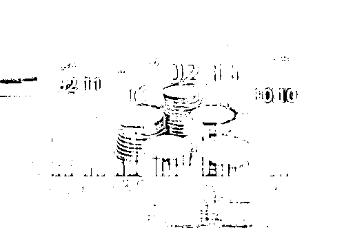

太阳在天秤座期间发生的新月和满月，也与股票指数的主要反转有很强的关联。冥王星改变运行方向，意味着一段债务、赤字、降级、违约和税收在新闻中出现的时间，这对投资者们来说几乎从来都不是好消息。我们已经看到这些主题的浮现，体现在恒大即将违约，推动美国国税局加强武器装备、扩大权力，提高美国国家债务上限的截止日期快速逼近，以及拜登总统在巨额支出和税改计划上的挣扎。因为他承诺要降低税率，而不是提高税率（哈？他是认真的吗？他说这话的时候，听起来是认真和真诚的，但是……真的吗？）。然而，这些强有力的地球宇宙学周期，在土星-天王星渐亏四分相最后一轮精准成相面前，都显得相形见绌。**这次四分相将在 12 月 24 日发生，紧随 12 月 19 日的摩羯座金星逆行合相冥王星。这是另一轮可能发生改变和改革的时间段，更不要提市场反转了。**现在，人们可以将今年年底视为一个机会，去做出那些真正受广泛人民群众支持，并符合他们利益的改革，无论是在美国国内，还是在世界范围。或者，这也可能是一个专制的领导人未经人民同意，将政策强加给他们的时期，引发了极大的愤怒和危险。涉及金星，每个人都希望在决策中表达意见。涉及冥王星，通常情况并非如此。对于土星四分天王星，没有人知道将发生什么，陷入混乱的可能性也很大，除非各方团结一致，有勇气以真诚的态度，推进那些符合全人类利益的事情。带着团结和勇气去改变世界，是一个崇高的愿景。让我们以个体和领导者的身份，去努力实践这些行为。因为此时世界需要如此，宇宙也将其视为当前危机的解药。**说明：以上日期基于纽约证券交易所所在的美国东部标准时间，由于存在时差，中国地区可能需要加一天。****版权声明：**本文由若道翻译发布，欢迎转发，反对抄袭。友号转载请申请白名单。

**雷蒙德·梅里曼（Raymond Merriman）**

若道签约老师。著名金融占星师，ISAR（国际占星研究协会）前主席，梅里曼市场分析公司的总裁。他由于“提升了占星学的职业形象”，在 1995 年国际占星大会上被授予轩辕十四奖；在 2012 年国际占星大会上，被授予轩辕十四终身成就奖。

1“中国上证指数月度报告”发售

**若道推出了****中文版****的雷蒙德·梅里曼中国上证指数月度报告，并持续发行该报告！**

当把金融市场的周期和占星学的周期相结合时，雷蒙德·梅里曼老师的金融占星学研究**为投资者应对金融市场的周期波动，并随之调整投资策略提供了极大的价值参考**。

**10 月中英文报告已上线！**

2“黄金价格周期月度报告”发售

**若道推出****中文版****的雷蒙德·梅里曼黄金价格周期月度报告！**不仅仅为广大读者在中国股市的投资出谋划策，更将视角放眼黄金市场。

**每当世界经济形式不明朗的时候，有一个地方是保值的港湾，那就是****黄金**。自 1982 年雷蒙德·梅里曼出版第一本研究《地球宇宙学征象与黄金价格的关联》的著作以来，**他一直作为最重要的黄金市场时机预测者之一享誉国际**。

10 月黄金报告已上线，梅里曼老师将会告诉你他对这个关键时期如何操作的想法。也可以按照季度和一年期订阅，有更多优惠。季度和年度的好处是，你可以持续了解梅里曼老师对于不断在变化的市场的看法。即便他某一次看法和市场不一致，你也看到在下一期他如何调整自己的看法，并看到金融占星在一个长期时间段内对你把控风险的帮助。而能够长期控制风险、尽量找到安全的投资时机才是投资的长久之计。

**10 月中英文报告已上线！**

**购买套餐**，买得越多越优惠

中国上证指数月度报告套餐价

*   **单月报告**：280 元

*   **3 个月套餐**：780 元（260 元/月）

*   **12 个月套餐价**：2400 元（200 元/月）

**长按下图识别二维码**

**购买金融报告****套餐**

**▼**

黄金周期月度报告优惠

*   **双报告年度套餐更优惠（直降 900 元）**
*   **12 个月黄金报告+12 个月上证指数报告：仅需 3900 元**

**长按下图识别二维码购买黄金报告套餐**

▼

3 中国金融市场特别网络研讨讲座

面对年底几个影响金融市场的重要天象，该如何把握下半年的投资，为跨年做准备？我们特意邀请雷蒙德·梅里曼老师为大家带来了**3 个小时的金融讲座——雷蒙德·梅里曼中国金融市场特别网络研讨讲座。**

这场为期 3 小时的在线讲座探讨了**这些长期行星周期如何影响世界经济的长期周期和趋势，特别是如何影响上证综指和黄金市场**。并描述**在 2021 年剩下的时间里市场反转关键时间点，特别是 12 月 19 日至 25 日金星逆行，以及土星-天王星最后一次渐亏四分相、金星与冥王星合相的重要时期。**

**长按下图识别二维码购买讲座视频**

▼

**点击阅读原文购买金融报告**

# 月亮在双子座的上班日，今天你忙碌吗？

> 原文：[`mp.weixin.qq.com/s?__biz=MzA5NjA0NTAxNg==&mid=2651457279&idx=1&sn=5fa09d7dd6e267dd6944f461b7e53506&chksm=8b48b448bc3f3d5ee6799f81e43a886aa3d65a7e07f6a9d93962758843bd0f9c1ad40ccf0b0b&scene=126&sessionid=1692737923#rd`](http://mp.weixin.qq.com/s?__biz=MzA5NjA0NTAxNg==&mid=2651457279&idx=1&sn=5fa09d7dd6e267dd6944f461b7e53506&chksm=8b48b448bc3f3d5ee6799f81e43a886aa3d65a7e07f6a9d93962758843bd0f9c1ad40ccf0b0b&scene=126&sessionid=1692737923#rd)

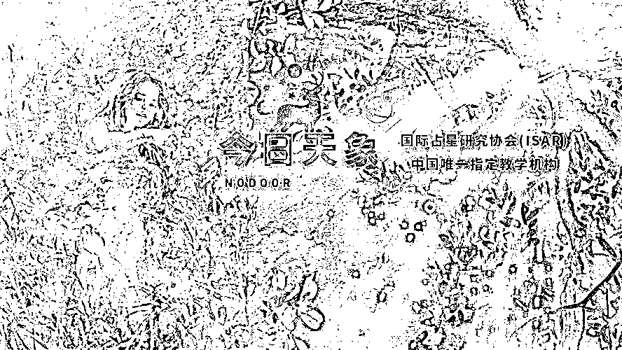

**2021 年 9 月 26 日天象：**

*   **08:36 月亮进双子座**

*   ******太阳三分月亮北交点******

*   ******水星四分冥王星******

*   ******火星三分土星******

今天又是个上班日，你们还好吗？打起精神来！今天月亮一早进入双子座，还会和月亮北交点形成合相，很可能是非常忙碌的一天哦！当事情细碎沟通频繁的时候，要记得保持耐心，戒骄戒躁。尤其是水星马上逆行了，说话做事谨慎为上~不过，在头脑忙碌的时候，我们也有很多机会学习吸收到很多信息，如何消化、理解和运用，就要好好想一想啦。双子座的守护星水星，和冥王星形成四分相，我们有机会“一针见血”的理解到语言背后的真相，如果你正好要做一些深入分析与调研的工作，好好利用今天的时间吧！

除此之外，天秤座太阳和双子座月亮北交点呈和谐三分相，天秤座火星和水瓶座土星也呈和谐三分相，看来，今天真是好好工作、团结协作的一天。

在这个看起来需要头脑兴奋起来的上班日，你都要忙些什么呢？欢迎分享呀。 

周日快乐！我们明天见！敬请期待水星逆行的文章哦~~ **了解每日天象，可****下载“若道”APP 查看****还有更多精彩等着你哦**

# 冥王星在 2 宫丨低价值感人群，如何于内在的殷实之处躺平？

> 原文：[`mp.weixin.qq.com/s?__biz=MzA5NjA0NTAxNg==&mid=2651457278&idx=1&sn=7c15e5b4982c87dc687d915579145b69&chksm=8b48b449bc3f3d5f1cf9a24c857f1c249d51fd8ed0f989952c27f20ab9ffb02f697886144854&scene=126&sessionid=1692737923#rd`](http://mp.weixin.qq.com/s?__biz=MzA5NjA0NTAxNg==&mid=2651457278&idx=1&sn=7c15e5b4982c87dc687d915579145b69&chksm=8b48b449bc3f3d5f1cf9a24c857f1c249d51fd8ed0f989952c27f20ab9ffb02f697886144854&scene=126&sessionid=1692737923#rd)

**☆ 后台回复“今日”，给你一句生命态度**

作者/蓝女巫 ISAR 认证占星师
编辑/翀子 封面/书君 图片/音乐/作者提供**引言**

**“一八四五年，近三月末，我借了一把斧头，进入瓦尔登湖畔的林间......”**

《瓦尔登湖》记载了梭罗在湖畔林间的独居生活，梭罗是北交金牛座。本文也适合南北交金牛座/2 宫，金冥相位，凯龙星在金牛座一代，及各种金牛座/天蝎座对宫人。以及每个人都关心的金钱财富问题。继上篇【[冥王星 6 宫](http://mp.weixin.qq.com/s?__biz=MzA5NjA0NTAxNg==&mid=2651453130&idx=1&sn=7a1f4956aca064e20d6dd35a12dcb966&chksm=8b4b447dbc3ccd6bd06e06aec73c625820caf753697c2bc13e48d07041da3aa555d07aacfcb2&scene=21#wechat_redirect)】（点击查看文章）之后，我将更进一步深挖自我价值感议题。低自我价值感是诸多疾病的主因，包括抑郁。故让其归位，刻不容缓！故本文尤其适用于冥王星 2 宫人，却不限于冥王星 2 宫人。在秋分，送给所有人。

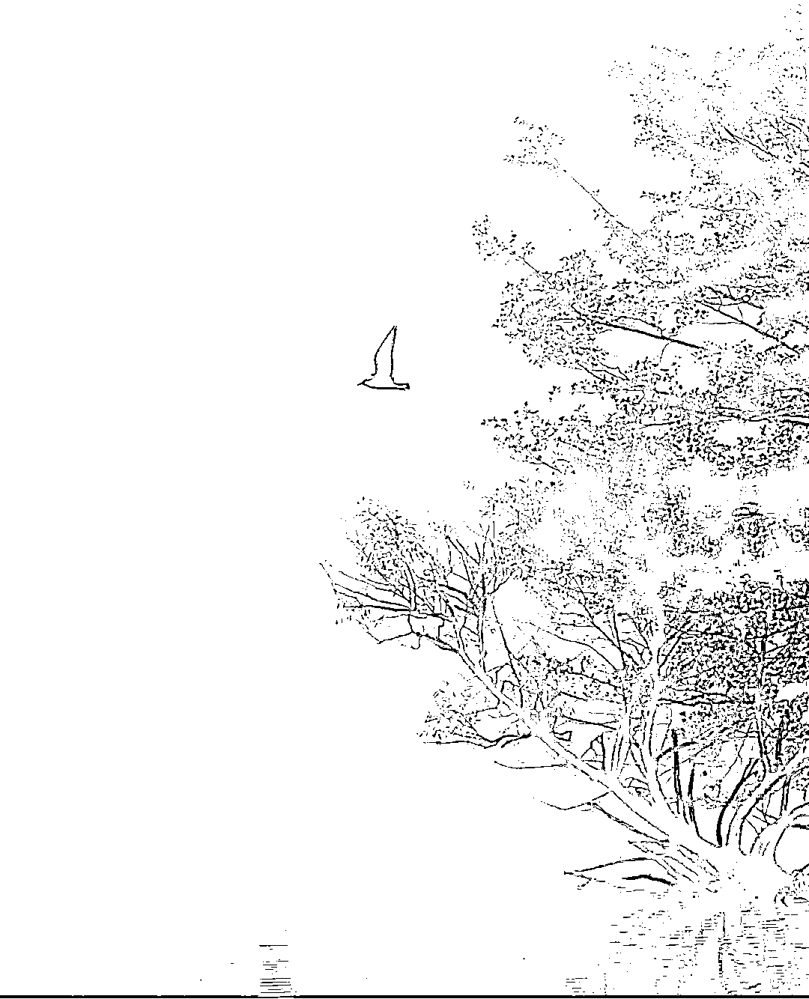

**你在恐惧些什么？**

**“接近饿死和成为亿万富翁，本质上都是人类生活的困境。它们都是思考的障碍。”**

冥王星所落之处，总象征着此宫位的极端情况。冥王落 2 宫，**赤贫 vs 巨富？**不要那么轻松地脱口而出你的选择。首先便从冥王星 2 宫人那些**布满创伤的“幻想”（灵魂记忆）**切入……

**赤贫**

难道我们不该向这些友好人士上交那些财产吗？也许有一天他们会报答我们。

此刻，我们知道，**除了赤裸裸的身躯之外自己真的是一无所有了。**淋浴时，我们尽情地开玩笑，既取笑自己也取笑别人，**也为真正的水从浴室的喷头里流出来而深感庆幸。**

我也一直确信有些事情我做不到；没有这个我不能入睡，没有那个或别的什么我不能生存。

是的，**人可以习惯任何事物**，但请不要问我们是如何习惯的。

有些东西能使你失去理智或变得一无所有，**直到再也没有什么可以失去。**

——《man's search for meaning》

冥王星 2 宫人遥远的过去世记忆中，那些创伤而久远的噩梦中有什么……**物质重创，饥寒交迫，家道中落，顿失所依。**到头来，都是白茫茫大地真干净！

 2 宫，代表基础的物质安全感，**为你提供生命物资的真正源头。**事关自给自足的能力，没有就会深感不安。而冥王星的祭坛，落在 2 宫，便会时刻担忧被潜伏黑暗倾吞了万顷良田。惶恐生存基础遭遇破坏，瞬间又变得**一无所有**。得与失，都会极度牵动冥王星 2 宫人的安全感。断舍离的声音，撕心裂肺？故要以累积金钱去抵抗失物的风险，守住拥有。坚信唯有物质保障才能带来安全，却总害怕不足够，尽管其实从来就不少。对资源财产占有掌控的强烈执念，无可厚非，那是一种**根植于灵魂底端的求生本能。**

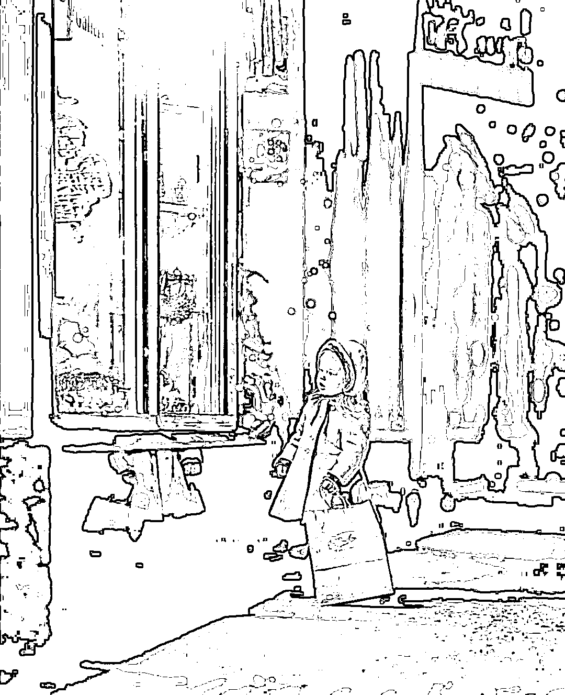

**巨富**

**而“一贫如洗”的集中营之反面，或许却是更可怕的世界？亿万富翁们，则有着严重的高级问题。当如何掌控财富，作为冥王星 2 宫人的永恒主题。在“不安”的问题面前，似乎人人平等......** 

坐拥巨大财富，首先保证的，却并不是心安，而是被害妄想。**因为你拥有的越多，你能失去的就越多。**超级富豪们生活在高度警觉中，过度敏感于潜在威胁，信任危机如影随形。巨大财富更需要驾驭打理，他们肩负着常人难以想象的责任。对于亿万富翁，钱也是不够花的，因富人之间有着更激烈的竞争较量，需要花更多的钱。他们最怕不再是超级富豪了......因此，他们从没能真正放松过。

 聚居在能将穷人阻隔于外的富人区安全城堡中，不但没有高枕无忧，反而变得**夜夜难寐**。看了一个剧集，讲伦敦富人区比拼挖豪宅地下室。一家装修给整个街区造成多年的不便。淹没在噪音中的富人邻居们，等待着房屋随时塌方，被埋入废墟的命运。而恶邻的工期仍是个未知数，因欲望从未休止，随时可能拆掉重来，因这些人更急于摆脱旧物，追逐最新流行。尽管并不需要，仅仅为了证明，亦为让房产不断增值，热衷于给人印象深刻的设计......这黑色幽默令我不禁心想：如果坐拥财富，仍不能保证你拥有心底的安宁，连睡个好觉都成了奢侈，then what’s the point?

 抬头看完视频，低头看到书里，梭罗正写道：**与其说我们是居住在里面，不如说我们是被关押在里面，而我们所要规避的邻民，正是我们自己。 **

“Bigger is better and Biggest is the best of all. like comparing penis sizes in boarding school.”**你有，我也要有。**像幼稚的男孩们比拼着玩具的大小。镀金的笼子，巨大的茧，暂住感的家，泡沫中的孤独。拥有的只是房产，却并不拥有着真正的生活。当财富的象征，只是为了让人敬畏......

梭罗又说：

貌似大多数人都不曾考虑过**房子是做什么用的**，他们原本**不必受穷**，**实际上却穷困了一生**，因为他们**认为邻居家那样的房子,他们必须也得有一座**。这就好像一个人必须得穿裁缝给他缝制的衣服，款式还得悉听尊便。

但是，**一个人和他房子的建筑风格之间**没多大关系，就好像**乌龟和龟壳的风格之间没多大关系**一样。

**大多数建筑装饰品都是中空的**，九月的狂风会把它们**吹落**，就好像吹落借来的**羽毛。 **

Are the super rich happy? Probably happier than the super poor. 片头反复重播着一句话：超级富豪快乐吗？可能比穷光蛋要快乐吧......的确，他们有钱去做选择。然而**钱越多，选择也就越多，生命更加不够用了。**人生是多么短暂啊，与层出不穷的欲望相比。当生活变得如此复杂，难道不是另一种负担？富人不懂穷人平淡的幸福，穷人也不懂富人高级的烦恼。隔笼对望时产生的隔阂，缺乏的只是想象力而已。原来，**忙于生计，与逐鹿奢华，同样烦恼。只要是 2 宫物质的奴隶，便没有人幸福。**因金钱本身并不能创造幸福。我觉得，**幸福藏在珍惜的感觉之中。当兴致皆变得转瞬即逝，珍惜又将何去何从？**

这一切的意义和价值何在呢？在表面的光鲜和富有下，芸芸众生都过着一份平静而绝望的生活。

一百多年前，梭罗如是说。

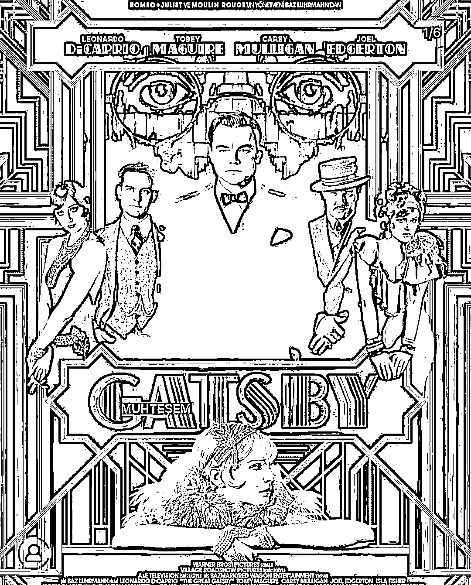

what sense of worthlessness are they feeding by the accumulation of valuables. 至此，我看到了一个**镀着金的大问号**：当累积财富成为生命的主要动力，人们究竟在填补着什么？

**价值匮乏**

**2 宫核心功课**是 self-worth，**自信—我有多少价值**？进化之路通往**“相信”“我”“有”。即向自己去证明：我值得拥有！**冥王星 2 宫人，即要**用冥王星的方式，向自己证明自己。**故会有**与生俱来的自信创伤**，根深蒂固的自我怀疑，因价值感匮乏而极度焦虑，甚至恐惧去实现价值。

 8 宫人的力量来自于关系中的价值，2 宫人的力量却来自于你自己所拥有的。冥王星 2 宫人渴望拥有自己的东西，认清自我价值与需求。却总不相信已拥有的东西有价值，故拥有再多也不够。**冥王星 2 宫人普遍有伴随一生的低价值感问题**。我身边充斥着这样的金牛座/天蝎座对宫人群，看似无懈可击的优秀，却如出一辙的，深深的无价值感，**像一个被掏空的洞，**靠拼命抓取外物来补偿。永远觉得自己不够好，不配得，不被爱，出于一种内在核心信念。

 耳边响起那些冥王星 2 宫式的呼喊：**“总想靠自己的能力做点事，赚自己的钱。”** “我想在我**自己身上寻找到我真正认为是属于我价值**的地方。”**“究竟要如何成为一个真正有用的人？”**

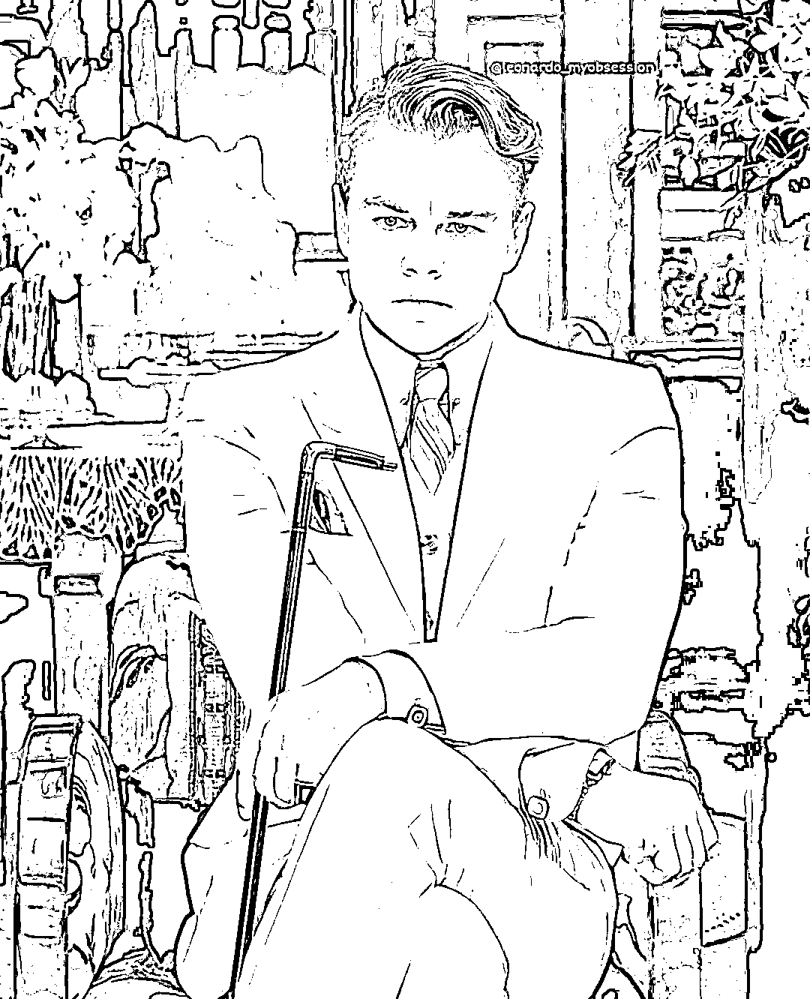

**建筑学上的美，是由内而外逐渐生发的，美正是来自居住者的需求和性格**——来自一种**不自觉的真实和高贵，**根本不曾考虑外在；而如果这种**外在附加的美必然产生，**那么一种类似的不自觉的生命之美则必然先于它而产生。**画家们都知道，这个国家最耐看的住宅，往往是穷人们那些最朴实、简陋的木屋、农舍**；它们是**居住者的贝壳**，所以**如诗似画**，并非单凭外在的风姿，实在是因为居民们的生活；

**农民殷实与否，看的仍是他的粮仓在多大程度上超过了他的房子。**

只要他们的生活如想象中的那般**简单、惬意,且不竭力追求住房的风格效果。**

——《瓦尔登湖》

**你在补偿些什么？**

**你被不断易手。**金子不能掌握自己的意志，但它能够支配整体、被蔑视和强烈要求的事物，是无情的统治者：它躺在那里等待。看到它的人都想得到它。它并不会跟着人走，而是**默默地躺在那里，闪耀着光茫，极为自负，像一位国王，它的权利无需证明。每个人都在追求它**，但没有人能够找到它，但即使它最小的一片都非常贵重。它既不给予也不自我挥霍。每个人都急切地确保自己不会丢失它最小的一块。每个人都拒绝承认他们对它的依赖，但他们都秘密地向它伸出贪婪的手。**金子必须证明自己的必要性吗？它通过人类的渴望得到了证明。金子没有去搅动。它睡在那里发光。它的光芒迷惑感官。一句话都不用说，它可以给人们想要的一切。它将那些要被摧毁的摧毁，帮助那些想要上升的人上升。**

炽热在不断累积，它在等待能够带走它的人。为了金子，人们不会把什么磨难置于自己身上？它在等待，也没有缩减人们的磨难，**磨难越大，麻烦越多，它就越受到尊重。**它从地下长出来，从熔岩中长出来。它缓慢渗出，藏在岩脉和岩石中。**人们费劲心机将它挖出来，并提炼它。**

——荣格《红书》

**金钱的本质，**是对资源所有权和使用权的度量，它反映了你能**调动社会资源**的总量。**钱是一个人的能量**，也常作为衡量自我价值的工具。虽说幸福并非金钱能买到，但自由确能因金钱而卖掉。

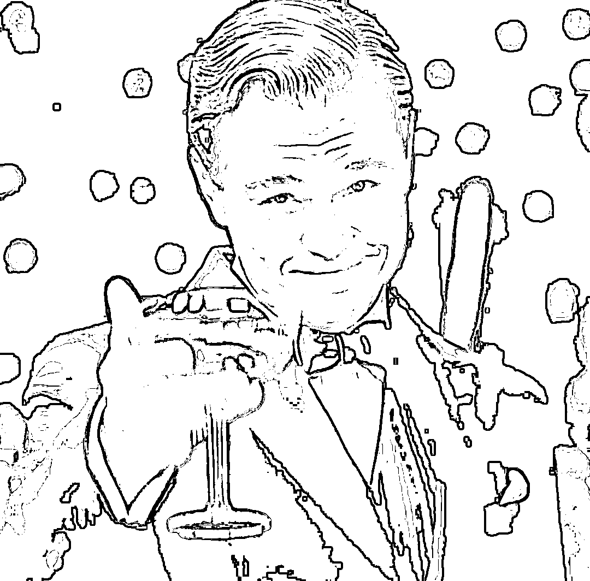

**何谓冥王星 2 宫？金钱就是力量！冥王星 2 宫人不会不在乎金钱，**但并非“数钱睡觉”那么单一直白的体现。因冥王星所在宫位，必然带来**相当复杂的心态**，比如冥王星的怨恨之毒，会造成**仇富**；冥王星蛇吞象的欲望，反倒可能显得**“轻乎”金钱**；抑或仍在不自知地遮蔽欲望，遏制赚钱行动力，以致终日为保障打拼，却只能勉强糊口，这可能归因于**复仇式地恶意失败**。应检视你面对财务问题的所有消极想法，挖掘你对金钱态度的深层动机，**这至关重要，因它将直抵你灵魂功课的核心。**所以，冥王星 2 宫人必须用尽一生去学习管理金钱的知识，建立良好的理财习惯。**即必须重视（正视）金钱，但又不为其所操纵。**

 **占有欲，**包含**防守与掠夺**。冥王星 2 宫人执迷于拥有，如同其恐惧失去。冥王星 2 宫收藏家，搜罗全世界艺术品于自家仓库，神情难以餍足，强迫式地占有美好事物，仿佛**拥有即是掌控**。而对人有我无之物，犹有相当复杂的情结。当你**所需之物正为别人所有，**便是掌控的对立面。恐惧便会滋长，仿佛某种黑暗的力量正在对你暗中威胁......正所谓，金钱并非万恶之源，只是邪恶常因金钱而显露出来。

**冥王星 2 宫人，会终其一生地凝视着，那个象征价值匮乏的黑色漩涡，思忖要如何来“填满”这个洞：心理代偿式地花钱？挑战极限式地赚钱？还是干脆依靠他人供养？**

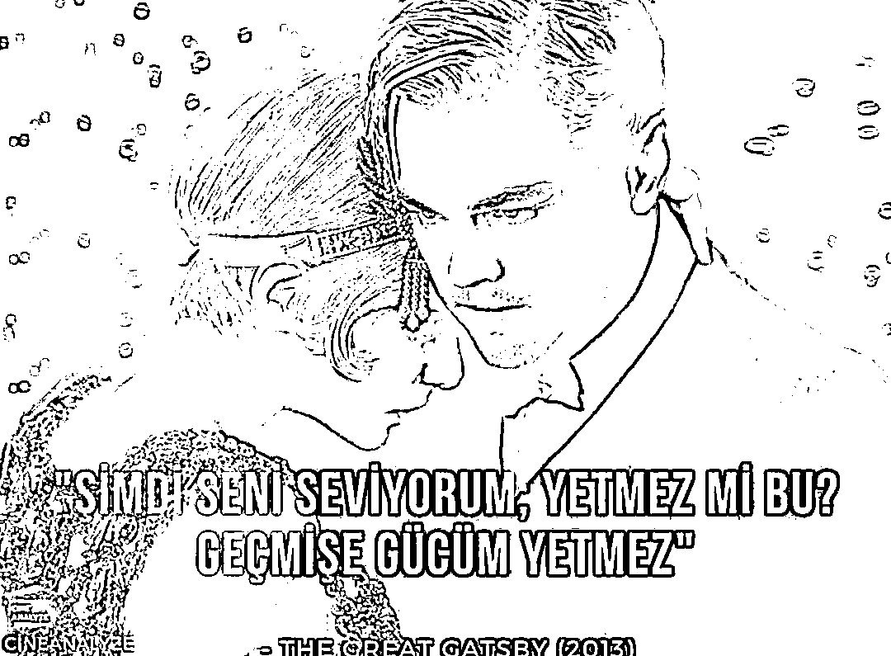

**共生**

2 宫本是自给自足之地，但掺杂了冥王星的野心，便会呈现出**依赖与操控。权力斗争的剧情**是辗转于冥王星 2 宫关系人之间的永恒脚本。

 **供给方：**认同物质等于权力，金钱力量决定生杀大权。积累财富视为操纵情感的手段，花钱买来各种爱。家庭地位也仰仗着资源的天平，恨不得能全盘说了算。**强大的控制方，背后所掩藏的却可能是为避免被抛弃的恐惧......**

 **依赖方：**惰性驱使，不愿意靠自己创造，成为资源拥有者的价值附庸。获得资助，却丧失力量，因缺乏被需要感。当资源供给来自于父母或伴侣，却倍感操纵控制，因不得不牺牲自己的价值观，向供给者妥协听命。坐享其成的感觉并不好，但见富豪的孩子们会因自我价值损伤而空虚。**弱小的被施与者，却似乎永远充满着不被尊重的怨恨和愠怒！** 

**挣钱**

相比之下，Stand on your own feet（自给自足）的最大好处是，当靠自己能力去挣得所需时，会升腾出强大的内在力量，这就是**自我价值之光。冥王星 2 宫人，一定不要忽视自身赚钱的能力！**我总能听到冥王星 2 宫人们对金钱的豪言壮语。即使未经历练过，也会在谈及此话题时，瞬间流露出一股强大的意志，能让人听见那呼之欲出的野心......

 **强迫式挣钱。**自给自足的冥王星 2 宫人们，在提高物质安全感的道路上，都会上了发条般不懈努力。我见过家中堆满金山银山的冥王星 2 宫前任，却终日埋头工作，根本没空恋爱或享用生活本身，连旅行都全全寄托于未来，财富对他似乎是永远不够的。冥王星 2 宫式执着，表现在即使物资已超过 99%的人类了，还是会天天嚷着匮乏。冥王星 2 宫也会**迷恋生产**，但要当心，在**贪大扩张**时，洞越补越多，入不敷出，迫使你不得不更加疲于奔命。而**成本高企**，以牺牲当下生活为**代**价，这究竟是否**值得**？正所谓：**一件东西的成本，就是被用以与之交换的那部分称为生命的东西的量，不论即时支付还是长期支付。**

我发现**最自主的工作就是做日**工，尤其这种工作一年**只需做三四十天，就能养活自己太阳西沉**，日工天的工作便结束了，这时他便**获得了自由**，**可以从事任何他钟情的追求**，与他的劳动毫不相干；而他的**雇主**呢，则要月复一月地做着投机的营生，**一年到头缓口气儿都不行。**

——《瓦尔登湖》

冥王星 2 宫人**从不屑于赚小钱，不想贱卖自己**。善价而沽的前提是，你别永远停留在了无止境累积价值的路上，却仍未曾去现实中实践，你在等什么？是因总觉得不够吗？还是对实现价值本身心存恐惧？到底该如何将你抽象的才能，转化为实物和金钱？又要如何提升挣钱的效率？冥王星魄力所到之处，本能地会想去优化价值。时间资源商品化时，应努力提升单位时间的收入，而非只靠延长工时。于是你就需要独具稀缺不可替代的能力。而如何将自我价值作价交换，也恰恰折射出了你自尊的程度。

 一个冥王星 2 宫妹妹曾说我市场价值严重低估。作为异曲同工的月亮北交点在 2 宫的人，我确有一种赠送服务的本能，总恨不得多塞，想想每当那时，往往都是恐于匮乏？被深深的不值得驱使。而情感的多给，也都是因自我轻视的补偿吧。转念一想，如此犀利的视角，或许也正来自于她们自己所担忧的问题——**冥王星 2 宫人的价值也常是被低估的？**如何能实现价值与收入之匹配？这意义深远！因价值能否被正确对待，将作为你自尊心的基石。核心步骤应包括，**清醒地定义价值，及准确地传达价值。**首先要对自身收入潜力了如执掌。列出你所有的特长绝技，评估其价值，**关键要肯让自己相信，你值得拥有！**然后，去勇敢传达出你所承载的价值。须立足对方实际需求，阐明你所能提供的有用服务，他人才会愿为你真正的价值买单。即**贡献真实价值，收获应得报偿，不再自轻，也不再允许被轻视。**

他认为把篮子编好就算完成了任务，接下来就应该是白人邻居把篮子买下来。他不明白，他**还需要使他的篮子值得购买，至少得让别人认为值得，如若不然，就做些别的，使那件东西值得买。**我也曾编过一种精巧的篮子，不过没使它们值得购买。但在我而言，一点儿也不觉得编它们不值得。我从没研究过如何使我的篮子值得购买，相反，**我研究的是怎么避免不得不出售它们……**

——《瓦尔登湖》

**花钱**

对于冥王星 2 宫人，**超级购物狂 vs 极简侘寂风**的两极，或许只是个时间的问题。冥王星代表操控，那么冥王星 2 宫的双刃剑指向你的问题：**掌控金钱？还是被金钱所掌控？掌控金钱**的冥王星 2 宫人，用它维持安全发展与节省时间精力。冥王星能量代表**投资意识**，会利用金钱去繁衍更多资产。而**被金钱所掌控**的冥王星 2 宫人，则以**非理性消费**来宣泄欲壑难填的野心。冥王星能量演变成一种浓烈情绪的起伏，通往债务……

如果一个人想简单地生活，以自己种的粮食为生，那么吃多少种多少便好，也不必拿这些粮食去交换数量永远不足的奢侈品、昂贵货。

**他们总是挨饿，不是因为缺少必需品，而是因为缺少奢侈品。**确实，这类东西你拥有的越多，就越贫穷。**花钱最多的事，从来不是最迫切的需要。**

——《瓦尔登湖》

 我见过极富犹太人精神的冥王星 2 宫人，自幼就有储蓄习惯，从小学习购买债券。**敢赚也敢花**；我也见到更多冥王星 2 宫人，**对金钱没概念**，并不会理财。常是**能花也能赚**。他们共识之处，**钱是靠挣出来的，不是靠省出来的，**只有花出去的才算是真正拥有了。却皆因过度执迷欲望，大手大脚，冲动消费，刷爆信用卡，**只买最贵的。潜台词，我值得拥有！**潜意识仿佛在补偿着什么？觉得都是应得的。而过着超出自己所能负担的生活，负债累累。**岁月终教会你对金钱的谨慎**……被炫耀消费拖累生活，并不值当。要提醒自己，过度消费或不当投资，迅速挥霍掉的，正是你利用资源进步的机遇与权力。 

应认清自身真实的物欲需求，学会掌握自己的财富。如何**高效运用金钱来调度更多社会资源？**这才是冥王星 2 宫人最重要的深省。其实，**冥王星 2 宫人独具慧眼**，最擅长对价值的甄选，最能将钱花在刀刃上，投资有**收藏价值**之物。相对于 8 宫人的抽象价值观——钱，就是个数字。冥王星 2 宫人在囤积珠宝和奢侈品时，很有眼光。敏锐于性价比，懂得选择高质面料的简单款，也能从一堆瓦砾中拣选出稀世珍宝。执迷于价值最大化，以最少博取最多。**他们可以成为最有花钱智慧的人。**相比之下，积攒着“无用”财产，却不知如何使用或摆脱的，则只能算是贫瘠的富有者了。

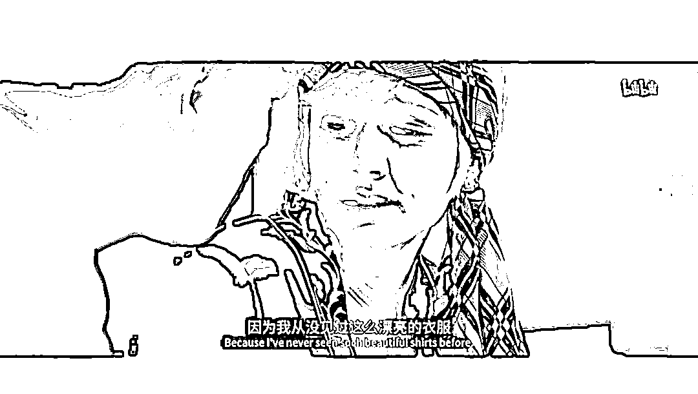

或许，不论衣服多破、多脏，我们**都不该添置新衣，除非我们已经像个新人那般做事、经营、航行，有一种“衣旧人新”的感觉**；那时节，留着旧衣服，就好像把新酒装在旧瓶子里。**我们去旧迎新的时刻，就如同鸟类的褪羽换毛，一定是生命中关键的时刻。**潜鸟换毛，会躲到无人的湖边。蛇类蜕皮、蛹虫出茧，也是如此，**所依赖的，不过是身体的孜孜延展。**于我们而言，**衣服不过是最外层的材质，或俗世的缠绕。**

**而我们的衣服，却一天天地与我们更为相融，带上了穿衣人性格的烙印，直到我们一再拖延，缝缝补补，最后才面色凝重、犹豫不舍地将它们收起，就仿佛在处理我们的身体。**

——《瓦尔登湖》

**（余下请见今日二条）**

**版权声明：**本文由作者授权在若道平台发布，欢迎转发，反对抄袭。

**蓝女巫**

英国伯明翰大学 市场营销学硕士

职业占星师/专栏作者/芳疗师/珠宝设计师

中国首批 ISAR 英文认证占星师（2012 届）

**微信公众号**：cecilia_sui

长按打赏

**学习占星学**

**点击或长按下图了解课程详情**

****

**

**

****

**微信又双叒叕改版啦，不想错过若道君的推送？**

**就把若道设为星标吧！**

**▼**

**就是这个“在看”，戳一下☟**

********报名直达入口********

# 物欲无底深渊，该靠慌张填满，还是从核心长出希望？

> 原文：[`mp.weixin.qq.com/s?__biz=MzA5NjA0NTAxNg==&mid=2651457278&idx=2&sn=dc951a366f5f2393b2d3f40571399e14&chksm=8b48b449bc3f3d5f38cabeae6b603ee51f6ad82345b4ca957d029e33cc021531300b2fa014c8&scene=126&sessionid=1692737923#rd`](http://mp.weixin.qq.com/s?__biz=MzA5NjA0NTAxNg==&mid=2651457278&idx=2&sn=dc951a366f5f2393b2d3f40571399e14&chksm=8b48b449bc3f3d5f38cabeae6b603ee51f6ad82345b4ca957d029e33cc021531300b2fa014c8&scene=126&sessionid=1692737923#rd)

作者/蓝女巫 ISAR 认证占星师
编辑/翀子 封面/书君 图片/音乐/作者提供

**(接今日头条）** 

**你将在何处崩塌？**

**冥王星 2 宫人所面对的物欲无底深渊，真的只是要靠“填满”的动作吗？还是有什么东西本应该从内部“长出”......**

**囤积**

人啊，总是陷入困局！

——《瓦尔登湖》

物质过剩的生活背后，是否志在填满虚掩的心慌？美好，要占有多少才够？多多益善，超量满满，才会心安？**宁愿放坏，也不少买？内在空虚就会向外堆积，**无论是过度饮食，还是无节制购物。放眼望去，你所堆满的空间，无不在宣称着你**对爱的渴望**。积聚爱，因为匮乏爱。一个冥王星 2 宫人告诉我：关系不好时，就会食量增大，以食物代偿，然后发胖，正所谓“恨一个人，就想要去咬他”；而**拼命积累，不舍得用？或许对应着德不配位的感觉。**应有的能力还不够，下意识地在**等待自己**。比如在囤积纸笔时，我应该明白，原因是自觉画技配不上画纸吧。**故首先需要发展的恰是你的能力本身，而非那继续向外盲目延展的欲望......**

**如果物质依赖，成了情感代偿。这种占有欲将是无穷无尽的。**just can’t stop it......买买买的欲望根植于你始终遍寻不获的**满足感**。之所以停不下来，因填的是你心中的无底洞，**匮乏感**所在地。然而填充之物却是错误的垃圾食品，故永不满足。人们常常都在**舍近求远**，没先满足和发展那个**最力所能及的根本**，反而在无明贪婪恶补着各种**想象中的外在力量。**

**得到温暖之后，接下来他要做什么呢**？肯定不是再多些同样的温暖，就好像无需更多、更丰盛的食物，更宽敞、奢华的住所，更精美、丰富的衣服或者更旺盛、持久的炉火等一样。在获得生命的必需后，**除了获取多余物之外**，人还另有一种选择，即无须卑微操劳，**放个假，开始面向生命本身的历险。**

——《瓦尔登湖》

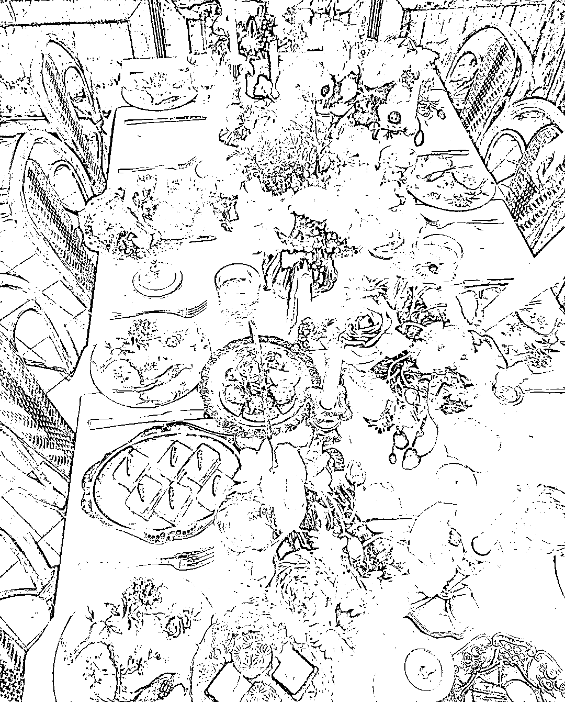

**负累**

拥有是一种负累。心为物役的悲哀，当人已成了工具的工具。而这一切的所有权，终其一生，还不都是付之一炬.......

我想到了我的邻居，那些康科德的农夫，已经辛苦劳作了几十年了，为的就是成为他们农场真正的主人。通常，他们的**农场是通过抵押才继承下来，或者是借钱买来的，而欠款大多没有还清。抵押所需的款项的确超过了农场本身的价值，所以农场成了一个大累赘，但仍会有人继承它的。**

在我看来，继承农田、房舍、谷仓、牛羊、农具是年轻人和我镇上同胞的不幸。因为这些东西得来容易，**想要摆脱它们的束缚却要艰难得多。**他们还不如生在空旷的草场里，由野狼喂养长大，这样反倒眼目清明，**辨得清是什么样的土地在召唤他们劳作躬耕。谁使他们成为土地的奴隶？当人命中注定只需寸土为生计，为何他们却要种植六十英亩的土地？为何自呱呱坠地他们就开始自掘坟墓？他们不得不推着眼前之物前行，尽可能让一切进展顺利。** 

农夫获得了房屋，但很可能他并**没有变得富有，反而更贫穷了，因为那座房子占有了他。农夫们一直努力解决生计问题，用的办法却比问题本身还复杂，结果在转身离开的当口，却把自己的脚陷了进去。**这就是他日子穷困的原因。

**看来只有死亡才能恢复他们的自由了。**

——《瓦尔登湖》

被缚于农场，和被囚于县牢，其实并无区别。我常想，**与其说人在看管着牛群，不如说是牛群在看管着人，**因为牛群要自在得多。

和康科德的任何农民相比，我都更为独立，**因为我不是把生命的锚固定在哪一栋房子或哪一家农场上，而是遵循自身天性的趋向生活，**而这趋向又是不断变化的。除了生活好过他们之外，**即使我的房子失火了，或者粮食歉收了，和之前相比,我也会过得几乎一样好。**

如此一来，到了夏天，利用零散时间就能轻松地干完必要的农活，也不会被一头公牛或一匹马、一头母牛、一头猪之类的拴住。尽可能长久地自由生活，了无挂碍。**我从未真正占有这些农场，免得烧了手。**

——《瓦尔登湖》

**断舍离**

眼下，我们的房子里满是家具，弄得房间又脏又乱。**这个世界上什么才应该成为人类的晨工呢？我的书桌上放着三块石灰石，发现它们需要每天擦拭，我惊惧了：我心灵的灰尘还未来得及拂拭呢，于是厌恶地把它们扔到了窗外。**既然如此，我怎么能要一个带家具的房子呢？我宁愿坐在旷野，因为除非人类已经破坏了植被，否则草叶之上是不会积攒灰尘的。

——《瓦尔登湖》

断舍离，即是切断一切外寻的安全感，以获更清醒的内视。**外物所赋予的，从来谈不上真正的安全感。**你需要的越少，你的不安与焦虑就越少。你放下的越多，你就因重获自由而越富有。要对不真诚喜爱的，超出管理能力的，不契合你生活方式的事物，统统放手。无法放手过去，就是抗拒进化向前。**害怕失物，**即是缺乏安全感，说明**你的安全重心都在外部，**因能失去的只有外物。惟有**源于自身的核心品质**，才不会因无常失去，也无法被谁夺走。**找到它们，你的安全，便有了真正的归属。**

 你的**外在价值**，由你拥有了什么而度量；你的**内在价值**，却可由你放弃了什么而明朗。其实，**你需要扔掉的不过是恐惧与贪婪，然后才能汲取真正的幸福感。**正如荣格说：贪婪地向外追寻一切可以让你继续生活下去的东西，那么没有任何东西能满足你的快乐。**因此我注视着死亡（断舍离），因为它教会我如何生活。**

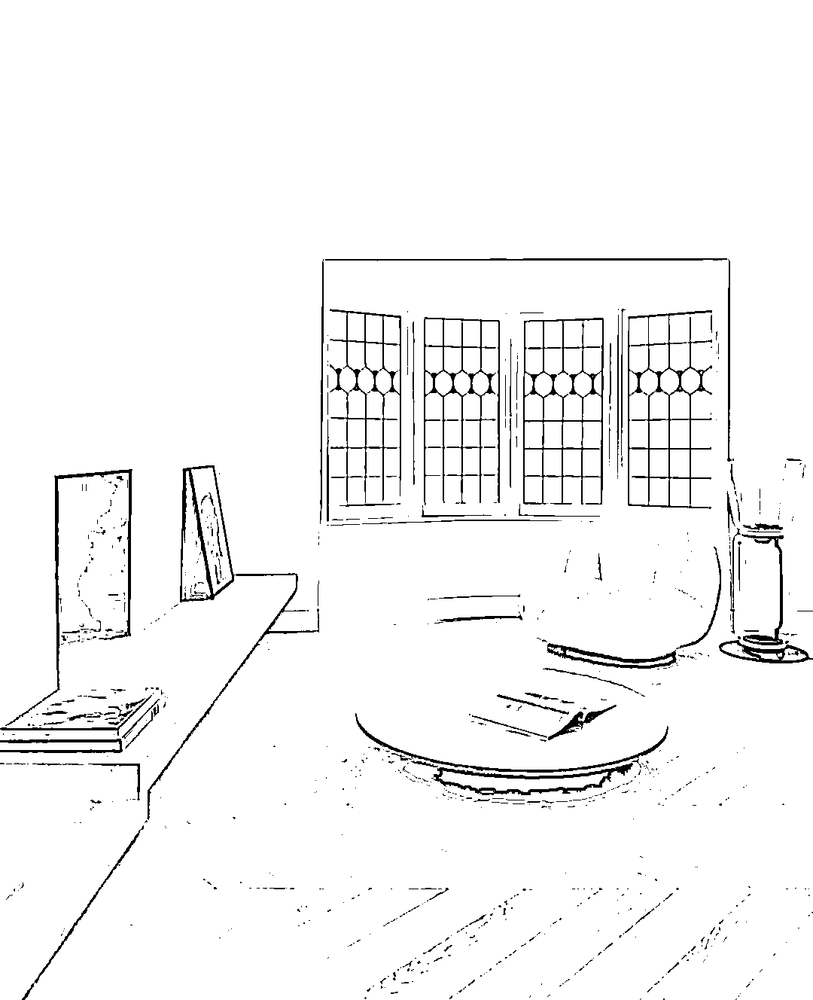

**必需**

我把目光投向森林，这次比以往都更为专注，**因为那里的一切我都更为熟悉。我决定马上开工，不再等筹措到通常所谓的资金，**就用我已有的微薄积蓄。我去瓦尔登湖，并非为了过简朴或奢华的生活，而是尽可能减少干扰，去从事一些私密事。

要开业之时我并没有备足通常所谓的资金，**所以哪里能获得从事这行所不可或缺的那些东西呢？直接涉及问题的实际部分。**

——《瓦尔登湖》

**幸福，就是少而精的必需之物吧。**冥王星的口号是，**减至最核心。**将物欲降到最低，旨在照见你真正不可或缺的需求，相关你最稳固的内在安全感。然后全力以赴去发展它，只发展它。梭罗定义了极简生活的**基本必需品：**

先要考虑一下，**真正必要的那点儿栖居面积究竟该有多大？**

就本地的气候条件而言，**人类生存的必需品**可归入以下几类:**食物、住所、衣服、燃料。**这种划分已经足够准确。**只有这些得到保障，**我们才算做好了自由地面对真正的人生问题的准备，并有望获得成功。

据我自己的经验，目前在我们国家，只需要一把刀、一柄斧头、一把铁锹和一辆手推车等少数工具**就足够生活了；**对于好学之人，还要再加上灯和文具，以及能读上几本书。这些东西仅次于必需品，花一点点钱就能得到。”**总之，只要生活得简单而智慧，维持一个人在世间的生命并不是一件苦差，而是一种消遣。**

**因为我最大的本事就是需求甚少。**

而且，凡**得到的东西，我都入了账。**

——《瓦尔登湖》

**外部瓦解**

人们总是于**错误之中盲目劳作，人之较好的部分也很快被犁进土壤，成为肥料。**一种似是而非的命运，通常我们**称为“必然”的东西，支配了人们去积累财富。财富或者被飞蛾和锈斑腐蚀，或者被闯入的盗贼窃取。**这是蠢人的生活，即便他们之前不曾明白，**在接近生命终点的那刻则必然醒悟。**

——《瓦尔登湖》

当你过于认同外在物质生活时，冥王星的冲突震撼便会到来。抽地毯般剥夺一切附加物，让你顿时无法站稳脚跟。通过外部瓦解，摧毁一切你以外在形式所定义的自我。用被迫失去，提示你其实身无一物。通过对旧观念的强力压榨，来转化你对物质世界的态度，迫你检视内心底端的所有力量，看清内在价值。

于是，**种种无常发生。**用慢性财务困境，让物质欠缺或依赖他人者，学会自给自足；用债台高筑，让强迫性消费之人，重审强迫花销的动机；用收回财产的震撼，让已累积巨大财富之人，见不宜之财随因果而去，醒悟承担，以待重生。也认知到物质富足并不等同于安全快乐，开始着眼更可珍惜的事物。这一切都不过是**为了价值观的重生，逼向内求安全感的过程。**

当你想置办个农场的时候，**就在脑子里多想想它，不要贪婪地把它买下**；也别嫌麻烦,多去看看它，不要以为转上一圈便够了；如果那农场还不赖，你去得越勤，就越会感到愉快。

**我是一切我所测量过的君主，我在这里的权利不容置疑。**我经常看见一位**诗人，在欣赏了田园风光最宝贵的部分后离开**：诗人已把他的农场放入了诗歌——放入了那最可赞赏、肉眼不见的藩篱。

——《瓦尔登湖》

**动机**

想想那片土地上为抵御世界末日而不停地编织梳妆台坐垫的妇女，对自己的命运竟无丝毫关心！**仿佛消磨度日竟能无损于永恒！ **

——《瓦尔登湖》

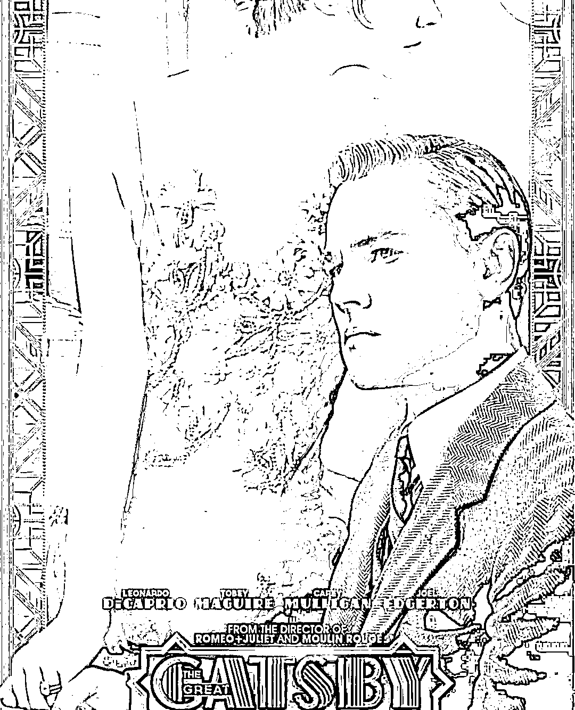

冥王星 2 宫人，即是要**以绝对的诚实来面对自己与金钱的关系。**是时候停下手中的执迷，花点时间，去望向你强迫式追求保障的内在深层动机了。或许只须问一下，你的**自我价值，为谁认可？**便可找到它。想象站在物欲终点的你，真正满足了吗，仍在期待什么，你本想与谁分享这一切？还是说，你**不过是把创伤活了出来？**即对自己的种种不认可，弥补着心底那些**一无是处**的感觉......

 我们终其一生的目标，究竟要**为了掩盖创伤而战，**假装自己没有恐惧？**还是它应该反映出希望，**为内在向往的幸福感所激励？这就要看，你所选择追求的，究竟是受**焦虑驱动的外在价值？**还是**受多巴胺驱动的内在价值？**

有超过五年的时间，我**仅凭双手的劳动维持生活。**每年大约工作六周，**就足够我应付生活中的全部开销**。我把整个的冬天和大部分夏天**都空出来，用于读书学习。**我也曾悉心地尝试过办所学校，可发现只能做到收支相抵，甚至入不敷出，因为我必须据此着装和训练，更别说还得有相应的思考和观点，结果**在这件生计上空耗了时间。**我从教并非是为了让同胞受益，**而纯粹是为了谋生，所以失败了。**

——《瓦尔登湖》

**外在价值**

冥王星 2 宫人，财富动机的最大陷阱，便是受迫于冥王星的**焦虑驱动，**即对物资匮乏的恐惧。这种压力激素，目的就是趋利避苦，出于大脑自远古艰困环境所遗留下来的防御机制：若不拥有，就会死掉。可这最低沉的嘶吼，却是最大骗局，它仅是灵魂的记忆，为唤醒你的绝望，而非鼓舞你去追求真实所需的自由。所以，**冥王星 2 宫人最关键，就是破除这一层受恐惧焦虑驱动的束缚。**

 **与焦虑驱动相匹配的金钱动机，**例举：

 **是为了得到爱。**用金钱满足爱的需求，换取爱人的在乎。根源于对童年缺失宠爱的弥补。却并不知，金钱只能买来享乐，而非幸福。

**是为了证明。**用财富地位向全世界证明你并不渺小，要倍受尊重，你值得活着——骄傲地存在！归因于从小被欺负被打败过的阴影。

**是为了控制**。认为金钱能赋予你非凡能力，操控他人听命于自己，赢得选择与决策的权力；以克服某种深深的无力感，比如灵魂记忆中饥寒交迫时分的失控感。 

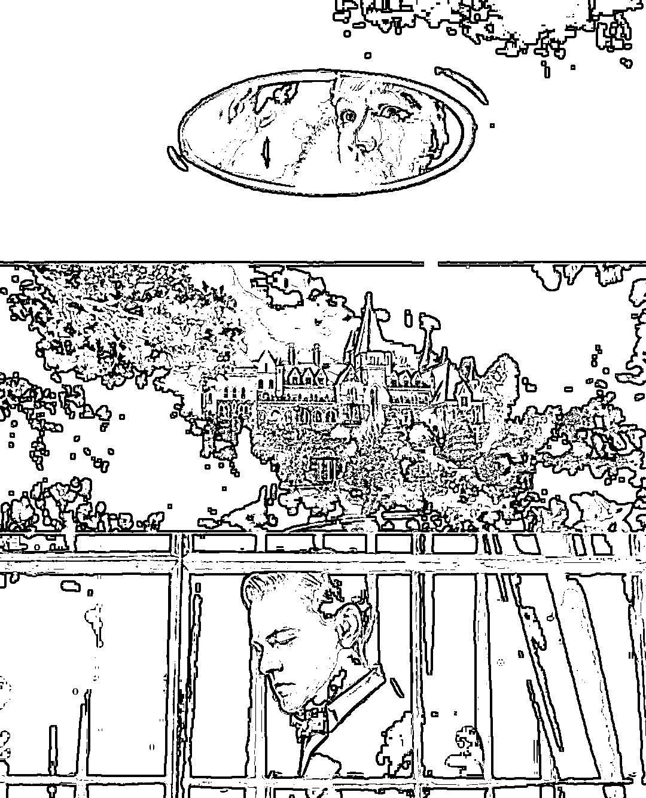

当然,挣够了路费的人最终仍然是可以乘车的，**只要他们仍然幸存，**但到那个时候，他们**可能已经失去了旅游的兴致和愿望。**耗费人生最美好的时光去挣钱，只为在人生最没有价值的时光享受可疑的自由。

——《瓦尔登湖》

当我们把自信建立在**外部坐标系的计分牌和里程碑**上，被社会媒体的价值观所诱导着。只因生而具足的内在瓶子空了，才变得开始向外索爱。将自我价值的决定权拱手让人，一旦缺乏外界支持，就丧失了自我价值感。一被疏忽，就颓废。一不被爱，就感受不到了存在。过于依赖外物带来的安全感，便是内在扰动的乱源。因这些外部价值，汲汲可危，变化无常。**当剥离了一切外部条件，还有什么，能撑起你的价值？自我价值从来不是靠外界“赢”得。**幸福总是最简朴的东西，**它本就在那里。**

我们的发明往往不过是漂亮的玩具，影响了我们对严肃事情的专注。它们仅仅是被改进的手段，却服务于未经改善的目的，**一个早已达成且非常容易达成的目的。**

——《瓦尔登湖》

你要如何说服自己，**你的存在本身即是价值？**

**内在价值**

而足以抵抗外在焦虑的，正是期待快乐的**多巴胺驱动**。它指向**幸福感**，那是一股众念归一的内在河流，出于每个人最天真的使命，通往浑然一体，而非内外割裂。能令你不再挣扎着向外依赖，而是赤手空拳，亦能面无惧色。基于自身独特核心，全神贯注地投入灵魂目标，**去完成那些最能体现自身价值的工作。人终究应该归于自己。方得心安！**

**所以，自我价值到底是什么？我觉得，它是你真心喜欢做的事，你最可能做好的事，及可于外部实现并供养自己的事，三者的交叠之处。一切由你的多巴胺而非焦虑驱动的事。**

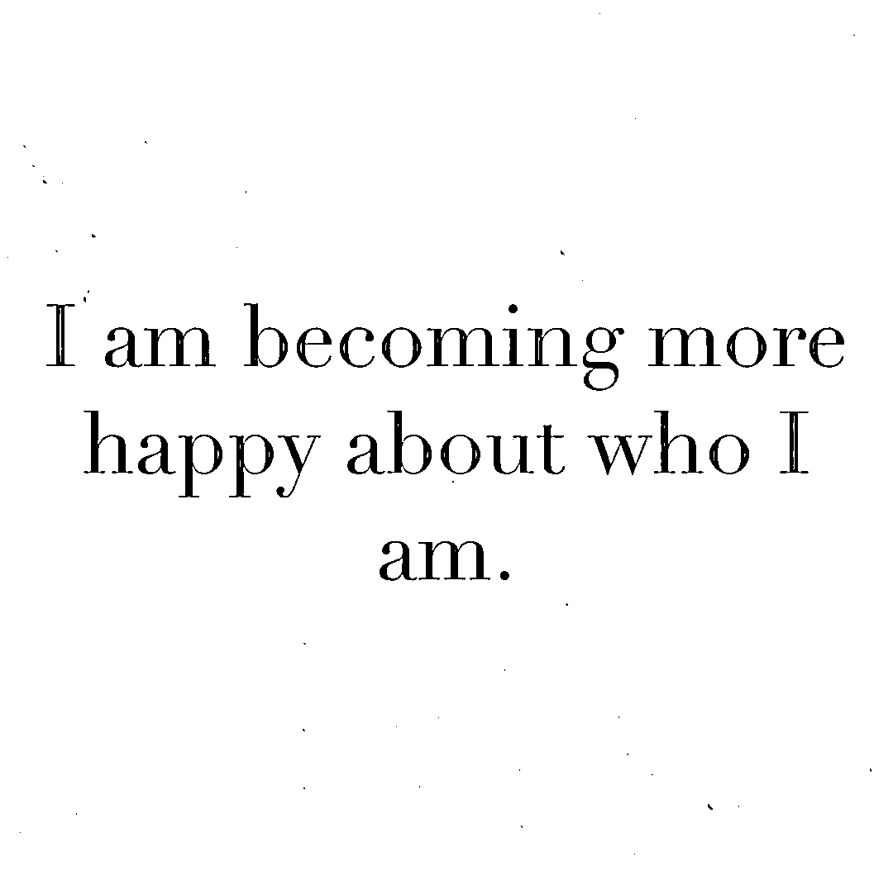

首先需要了解自己，辨认出那些**与生俱来的，能赖以维生的，独特的内在价值。即你能用以供养自己的本事。**内在自我价值感是人的灵魂，生命活力之源，是你的最核心本质，**找到它，定义它，实现它。成为你真正想要成为的那种人。**

 当然，找到它，太难了......而找到它又很简单。当你沉睡香甜，把每天升起的太阳当作礼物时。真正的**自我价值感是发自内心的。**即深深地感到自己是有价值的，**自我感觉很好。**值得活着，值得被爱。自信的根基，就是去相信，**真实的你，最有力量！**我拥有着我本身，已是俱足，作为一个存有本身的价值，散发着来源于人性的力量，那些人类最温暖的品质！**做一个真实而完整的你，那就是最有价值的你。**

自卑，则是无视自己的存在价值，而去夸大别人的。所以内在价值的关键是，**不作比较！**一旦充分认识了自我价值，自然就会放下外部比较。因它已为你提供了充足的价值感。**先像自己，然后就不必像别人了，**不再那么生怕错过他人身上的优秀品质了。让价值观不再依附外界和他人，**建立坚如磐石的内在价值体系。**找到你所认同的，能从内部验证的，特定的固有价值。让你的渴望，始终能够在自身得到满足。像金牛那般不受外界噪音影响及成败起伏，**始终与那片内在的殷实稳定相伴。**它来得自发而自然，朴素而简单，淡定而满足。

 从此，就在有自我价值之处生活。只做你最向往的事，致力发展那些最能令你愉悦满足的个人特质，哪怕是些无用之用的兴趣爱好，只要它能让你回归心底的自在与静好。记住：除了自己外，你再无其他更珍贵的东西。**你最珍贵！**

**我喜欢去衡量、确定、投向那些最强烈而正当地吸引着我的东西。**绝不拽住天秤的秤杆，以求减少读数。**绝不假设一个情境，而是进入必然的情境，旅行在唯有我能走的路线。最快的旅行者都是徒步旅行的。**

——《瓦尔登湖》

**无条件的自我价值感**

**外在价值，是有条件的爱趋之若鹜之处。**人们追捧崇拜着强大的你，爱的却只是你身上种种附加的条件。这种爱令人惶恐不安，你下意识担心着，一无所有之日，还有谁会留在那里？**而无条件的爱，才是爱你的本来面目，即内在价值。**（此处，我想了想）爱一个人，不是为他外在的功勋，而是因它本身的样子，比如他认真又萌呆的模样，总能令我会心一笑。一旦爱上，便扎根了......**任由外在条件起伏，不增不减。**爱你作为一个单纯的人的本真存在，这就是**世间最弥足珍贵的爱！可以在那些无条件爱你的亲朋们闪着星星的眼中，寻觅到它。**那些从未因你的世俗起落，而离开过你的人。**而你的自我价值，便恰恰可从由这种关系的镜中映照出来。**

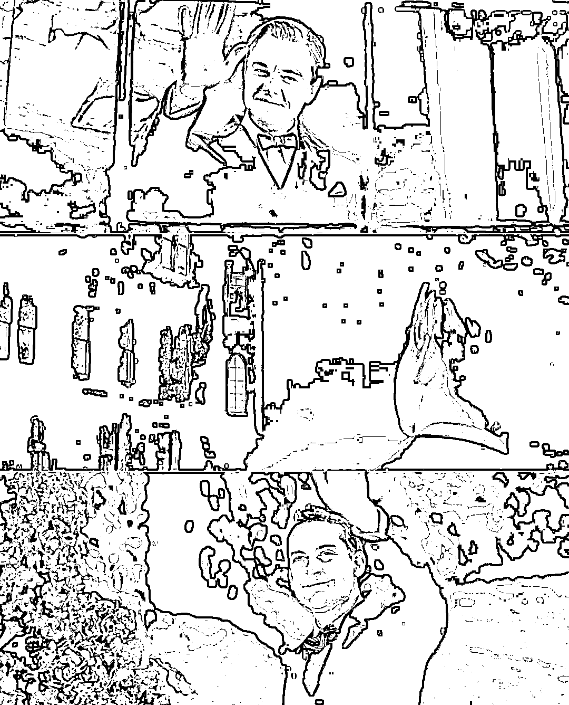

**而对自己无条件的爱，也是同理。**你必须有发自内心对自己的认可和喜爱，不跟自己讲条件地去爱，爱自己的独一无二和完整真实。如此方能**气定神闲**。这种安全感的**建立又需以无条件的自我接纳为基础。**（自我接纳，参照上一篇[《冥 6》](http://mp.weixin.qq.com/s?__biz=MzA5NjA0NTAxNg==&mid=2651453130&idx=1&sn=7a1f4956aca064e20d6dd35a12dcb966&chksm=8b4b447dbc3ccd6bd06e06aec73c625820caf753697c2bc13e48d07041da3aa555d07aacfcb2&scene=21#wechat_redirect)）所以，**无条件的自我价值感，**是你剥落一切外部价值，剩下本真的存在价值。从此，笃定的你，便会有勇气开始做什么，也会去选择不再做什么。将你的本真与万物的本真相连，便可从焦虑内卷的世界抽身，**在自我价值处躺平。冥王星 2 宫人**，在自我价值感摔倒的地方，重新站起来吧！却不再是为了身外，而只是为了自己！

**智慧是把砍刀**。它洞悉隐秘，切开覆肉，直达秘密的内核。**我希望我的双手只忙必要的事。我的头脑就是挖掘的工具，我凭借头脑开采、挖掘，穿过这些山脉。我认为最丰富的矿脉就在附近某处；**我将在这里开始开采。

我们的**智慧，就体现在通过计算而得到的那个精确的点，**就好比**水手或者逃跑的奴隶的眼睛总要盯着北极星；**这种方法足以指导我们一生。或许我们**不能在可预测的时间内到达预定的港口，但仍会保持正确的航向。**

——《瓦尔登湖》

**你将回归于何方？**

对应点，8 宫......

**向内回归**

**向外追寻，徒劳无功**。当用以炫耀的价值，经证明皆是匮乏者的试探，不如凝视生而为人最安宁的根基，聆听内在深处更浑厚的终极价值：**赤手空拳，面无惊慌。**

如果一个人的**衣着非常简单，即使暗黑无光，一伸手也能摸到自己，且在各个方面均会生活得简单紧凑，筹备万全，**即便敌人攻城，也能像古代的哲人一样，赤手空拳，面无惊慌，信步出城。如果穿上这样一套用自己的劳动赚来的衣服，又哪里会沦落到没有聪明人向他表示尊敬呢？

——《瓦尔登湖》

我见过的冥王星 2 宫人，都自带一股沉静的气质，常看上去很乖，少了点突破性。常见正做着稳定的公务员工作，或金融财经银行类，或操持些传统生意，或身心灵从业。他们似乎**对“安”字，有一种强迫式的渴望？**恰因缺乏安全感的根基。深知心若不安稳时，会难以坚持去做任何事。故**心中都有一首去往田园的牧歌？**渴望去寻觅到最平静的真我，体验自身最现实的本质。向往安宁，**然后就这么囿于安宁？**

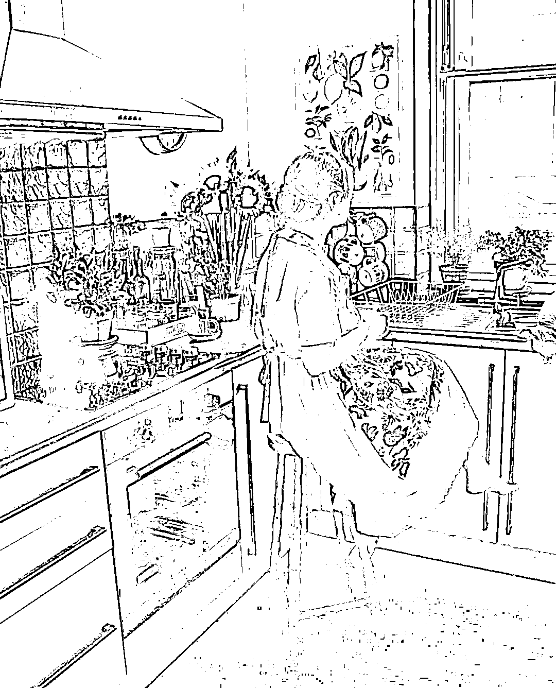

**向外融合**

当冥王星 2 宫的人们，从外向内求，**驶向最核心，认清了自我价值之后；**还有更重要的一步，**他们仍需要向外寻求融合！**即在找到个人价值之后，又能充分**实现它。**让和谐有序的内在意识之流，又再回炉到外在环境中融为一体。当以自我真诚实现了自身价值之后，也将能为世界带来更加珍贵的价值。他们**本身像艺术品**那样，有着离开了市场仍然具足的审美价值，**却不要心止于此，**还要学习纸币那样能够**去流通出相应的市场价值。**而他们的态度往往是这样的：

我宁愿坐在一只南瓜上，将它完全据为己有，也不愿和众人拥挤着坐在天鹅绒软垫上。

**我还是更喜欢单独的居所。**自己建整栋房子，要**比劝服另一个人相信共建墙的好处来得便宜；**即便你少花了钱建成了**共建墙，那墙也一定很薄，**而且事实还有可能证明那人是个**坏邻居，不会好好维护他那面墙壁。**

——《瓦尔登湖》

当金牛座原型的安宁，走向了极端的**自我防卫**，便会极度抗拒对应点 8 宫。常因过度解离，而对天蝎座/8 宫的**“负能量”深怀恐惧，**不相信与邻人同行“共同生活”会有什么好事发生。因意识焦点过于内化，而显出对 8 宫关系的退缩钝感，必须学习发展亲密链接。而冥王星 2 宫的字面意思，反倒刚好在说，可以心理学及疗愈为业，通过洞悉探索人性，建构自我价值。

 自我隔离，离群索居，只滋养自己，会导致视野受限，通往井蛙的狭隘。依赖熟悉安全，对外面的天空心怀不屑，抗拒进化。周遭改变时，仍坚持自我，显得保守僵固，迟缓懒散。此时，**受限之处，就出在了价值本身：**那些可用来自给自足的物质基础或天赋才华，都成了画地为牢的障碍。如继续拒绝开放分享，宇宙就会停止供养其生存所需，让价值核心枯死，而陷入因自我隔离引发的内外界冲击震撼。这都是为了逼你看到现有价值系统的限制，及时调整到全新视角，以寻求蜕变。

 尽管明白了自身本质和需求，但又要如何靠才华能力养活自己？你需要把内在力量整合应用在自身之外，到外界去落实转化，用符合他人及社会需求的方式呈现出来，以具备市场价值。冥王星 2 宫的人们其实不乏钻营的头脑，及与人合作链接的潜能。但或许仍像金牛座原型般对合作背后的利我损它，尔虞我诈，心生抗拒。**须敞开心胸，发展魄力。**学会付出，分享心灵资源。与他人融合的功课，必能让你突破局限，而拥有更多。

 所以，归纳总结冥 2 的核心思路：学会**把个人资源与他人资源相结合。同时，还能不依赖别人，始终保有自给自足的能力。向内回归，向外融合。**所谓**“共同富裕”**......

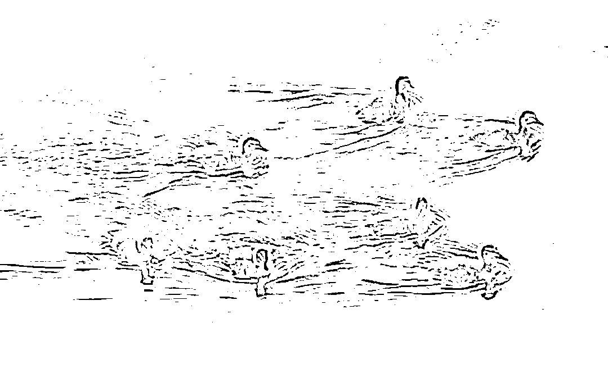

我独自生活在林间，距任何邻居都有一英里。我自己建了一座房子，在马萨诸塞州康科德市的瓦尔登湖畔，**靠双手劳动养活自己。我在那儿生活了两年零两个月。如今则又成了“文明社会”的寄居客......**

——《瓦尔登湖》

**结语****归去来兮，田园将芜胡不归？**既自以心为形役，奚惆怅而独悲？悟已往之不谏，知来者之可追。实迷途其未远，觉今是而昨非。舟遥遥以轻飏，风飘飘而吹衣。问征夫以前路，恨晨光之熹微。

——陶渊明

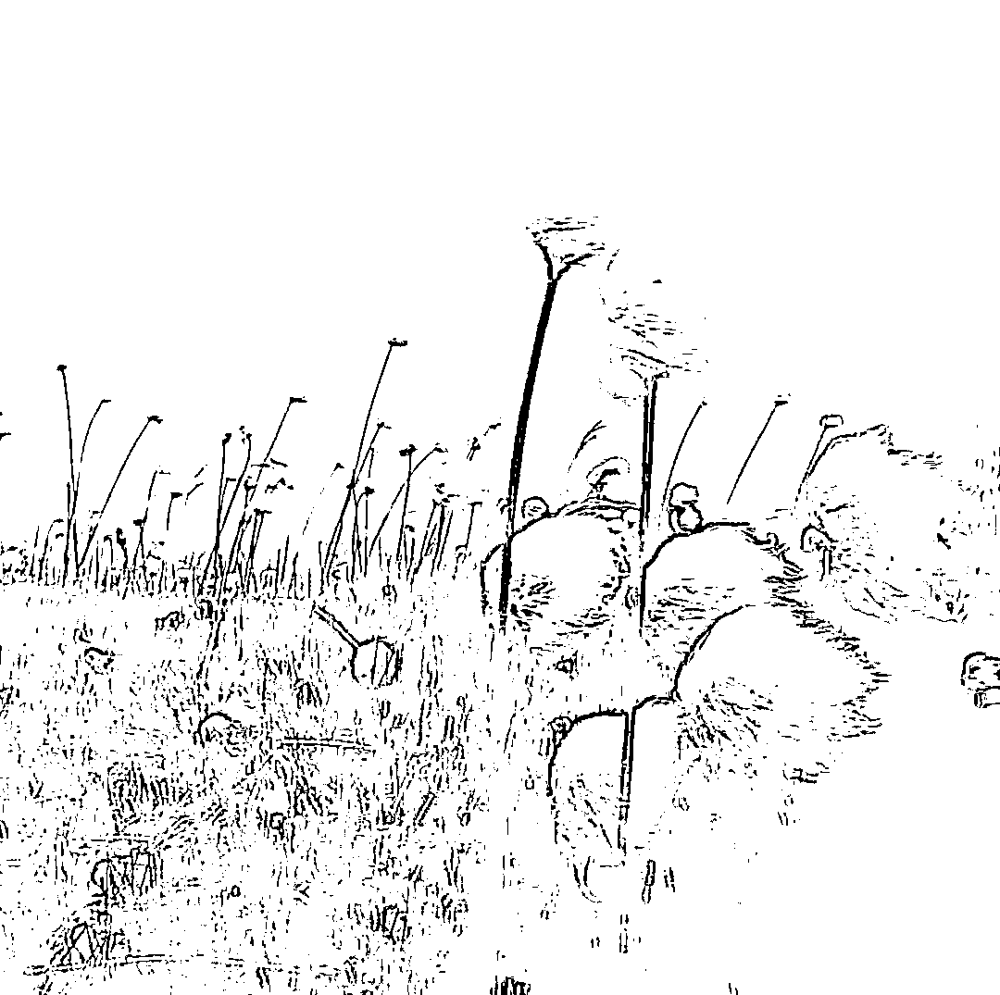

**自我价值，为谁认可？**

 伟大的盖茨比的悲剧，恰好诠释了这个问题。他的终极认可，指向一个女人。富可敌国，都没能换来真正的爱。而是一片漠视和一颗子弹。人类最大的虚妄，就是误以为我们要的只是金钱本身。穿透追求金钱虚妄的外表，**背后是每个灵魂最悠远的脆弱。金钱能买来的快乐，总是很短暂！但见他如此骄傲地活成了自身的创伤......**

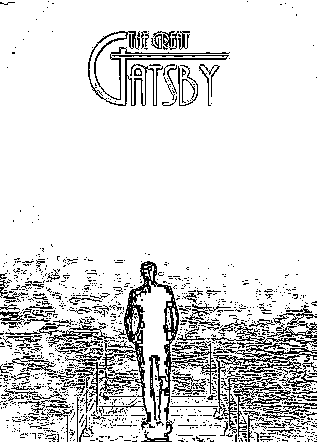

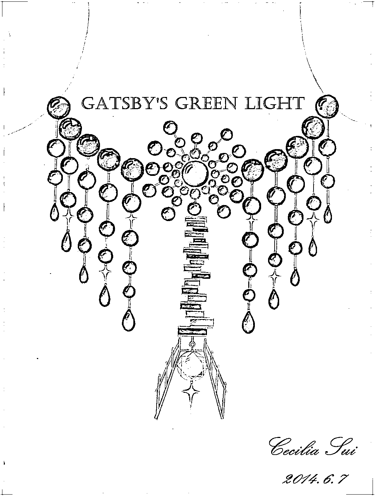

如果人们的衣**服尽被除去，**还能在多大程度上保留他们相应的**社会等级**呢？如此情况之下，你又能不能在任意一群文明人中间，肯定地指出谁属于**最尊贵的阶层**？ 

——《瓦尔登湖》

直到看见**马斯克眼里闪动的光**（像是能瞬间点燃我的芒），我才突然明白**存在本身的价值**，是如何令财富瞬间变成了配角的......**拥有一个无限诚挚的 1**（与真我相连的力量），比后缀**那数不清的 0**，要令人**印象深刻**太多。**它让一个人显得，在穷与富时，无差！**果然，他选择**卖掉房产，奔向太空**。月亮天蝎座的我立刻写下一句话：Does it mean, man who desires for luxurious living has no ambition at all？

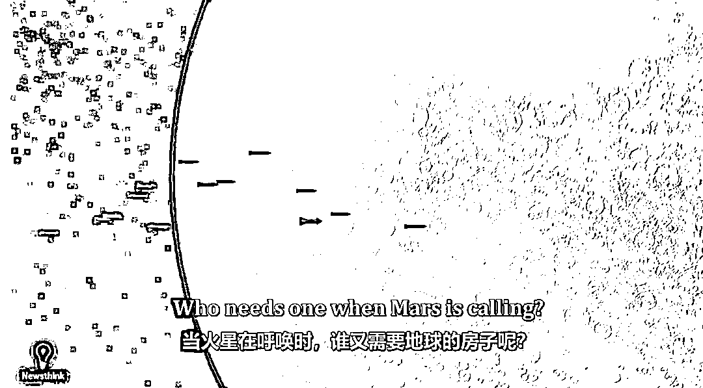

**版权声明：**本文由作者授权在若道平台发布，欢迎转发，反对抄袭。

**来自作者的其它冥王星文章**

[冥王星 4 宫](http://mp.weixin.qq.com/s?__biz=MzA5NjA0NTAxNg==&mid=2651430468&idx=1&sn=1c785ed2023d1b0f50e66364bbf29e13&chksm=8b4b2cf3bc3ca5e526e87f041575af18bf825df47e0cb60bbdbfc537b9ac536cfa54a134e74f&scene=21#wechat_redirect)（上）丨[冥王星 4 宫](http://mp.weixin.qq.com/s?__biz=MzA5NjA0NTAxNg==&mid=2651430468&idx=2&sn=a902f973afba98106792f92c3f503285&chksm=8b4b2cf3bc3ca5e51ef8b2e9ac2647916e7a859721d06b398016e5f00ff02046931d543d354d&scene=21#wechat_redirect)（下）

[冥王星 5 宫](http://mp.weixin.qq.com/s?__biz=MzA5NjA0NTAxNg==&mid=2651424933&idx=2&sn=2e60c0253f46f1f995c923abb14eec45&chksm=8b4b3a12bc3cb304ec3cd3757251af7e62c4b0b92cd119c24c067af1548bb1aa01da071d66a9&scene=21#wechat_redirect)丨[冥王星 6 宫](http://mp.weixin.qq.com/s?__biz=MzA5NjA0NTAxNg==&mid=2651453130&idx=1&sn=7a1f4956aca064e20d6dd35a12dcb966&chksm=8b4b447dbc3ccd6bd06e06aec73c625820caf753697c2bc13e48d07041da3aa555d07aacfcb2&scene=21#wechat_redirect)

[冥王星 10 宫](http://mp.weixin.qq.com/s?__biz=MzA5NjA0NTAxNg==&mid=2651412808&idx=1&sn=57012d1806a6776cc8556b7c79f0e30b&chksm=8b4bebffbc3c62e9a33bfbdcd736cf91077048ac889936318ba4cf575de4a7d4409eeca1373f&scene=21#wechat_redirect)丨[冥王星 12 宫](http://mp.weixin.qq.com/s?__biz=MzA5NjA0NTAxNg==&mid=2651443520&idx=1&sn=d2f1b6b4e8b41bee0ae6071dab6d280b&chksm=8b4b63f7bc3ceae154d6bf8570b7966d9f5899b5f3ea9dda47c8996168c8512a61f7688186f0&scene=21#wechat_redirect)（上）

[冥王星 12 宫](http://mp.weixin.qq.com/s?__biz=MzA5NjA0NTAxNg==&mid=2651443520&idx=2&sn=e3bca13b228a5fd75f7715ef152871e3&chksm=8b4b63f7bc3ceae123d2088fdf65f7451dfe438b1cafb66db1d848dff9123982abfa857709c9&scene=21#wechat_redirect)（下）

**蓝女巫**

英国伯明翰大学 市场营销学硕士

职业占星师/专栏作者/芳疗师/珠宝设计师

中国首批 ISAR 英文认证占星师（2012 届）

**微信公众号**：cecilia_sui

长按打赏

**学习占星学**

**点击或长按下图了解课程详情**

****

**

**

****

**微信又双叒叕改版啦，不想错过若道君的推送？**

**就把若道设为星标吧！**

**▼**

**就是这个“在看”，戳一下☟**

********报名直达入口********

# 这位“占星天后”说，土星行进能让我们品尝到喜悦，你信吗？

> 原文：[`mp.weixin.qq.com/s?__biz=MzA5NjA0NTAxNg==&mid=2651457163&idx=2&sn=142b32b862519597e31fcc216d4372df&chksm=8b48b43cbc3f3d2a7561b950b18e4a5a15775f5b5d229ff0a201940584e3cb566d26c2d47952&scene=126&sessionid=1692737923#rd`](http://mp.weixin.qq.com/s?__biz=MzA5NjA0NTAxNg==&mid=2651457163&idx=2&sn=142b32b862519597e31fcc216d4372df&chksm=8b48b43cbc3f3d2a7561b950b18e4a5a15775f5b5d229ff0a201940584e3cb566d26c2d47952&scene=126&sessionid=1692737923#rd)

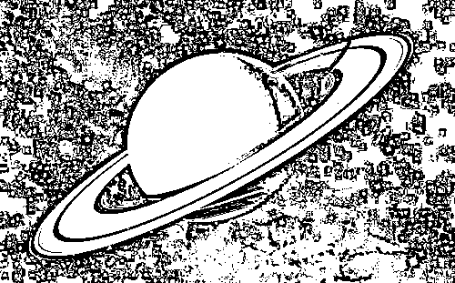

作者/丽兹·格林 译者/周恩编辑/玫瑰 图片/pexels 本文摘自丽兹·格林的著作《土星：对老式魔鬼的新版解读》（Saturn: A New Look at an Old Devil）诸多事物都是一体两面，从阴暗面和光明面的不同解读不仅可以改变我们对事物的心态，甚至可以转化事物本身。土星这颗传统意义上的“恶星”（相比金星和木星都被视作“吉星”）在“占星天后”丽兹·格林眼里，另有一番正面意义的新天地。**野兽和王子**土星的象征意义除了关于品质和经验，还关于心灵和精神变化的过程。**它代表痛苦、限制、纪律的同时，也是人类与生俱来的精神转变过程的象征——经过痛苦、限制、纪律的淬炼，人们可以通往更大的精神觉醒和社会成就。**心理学告诉我们，**个体由某种动机或者冲动推动着，向往事务的完成和圆满**。这种“全然”的状态在原型中的象征即是“自我”；其意义并非是“完美”，因为完美只囊括人性中好的一面。**所谓的“全然”是指人性的方方面面都各得其所，并浑然一体。**土星象征的心理过程跟个体觉知到的内在的全然有关，它掌管着人生痛苦的教育意义，并为我们区分出**外在价值（来自于他人）和内在价值（需努力挖掘的自我）之间的差别**。作为“野兽”的土星是它不可或缺的一面，就像童话中所说的那样，只有当野兽因他本来的面貌而被爱的时候，诅咒才会失效，他才会得到解放并蜕变为王子。

传统占星学中，土星被视作恶星，连它带来的美德都显得枯燥乏味：**自制、老练、节俭、谨慎；**它的缺点就更显得讨厌了，因为**土星总是通过我们称之为“恐惧”的那种情绪起作用**。它既不像其他外行星那样带来魅力，也不像内行星那样人性化。

在大众看来土星简直是毫无幽默感可言；它带来的无非是局限、挫败、艰苦和自我否定，即便它带来的好的一面，明智和自律，也只会让人埋头苦干、无法笑看人生。**星图中土星所在的星座和宫位指向的是个体在自我表达上易于遭受到阻挠的人生板块，在这些方面最容易遇到挫折和困顿**。

土星对应的往往是**让人痛苦的环境，而非个体本身的缺陷或弱点**；这些痛苦的经历就这么“发生”在人们身上了，更像是一种**强加**。这也解释了土星的另一项恶名，**“业力之王”**——尽管古老的训导已经持续教给我们土星同时也是“守门人”和“钥匙保管者”：**通往“自由之门”的秘诀掌握在土星手里，只有突破了它的把关，我们才能握着“自我了解”这把钥匙，得到最终的自由。**

**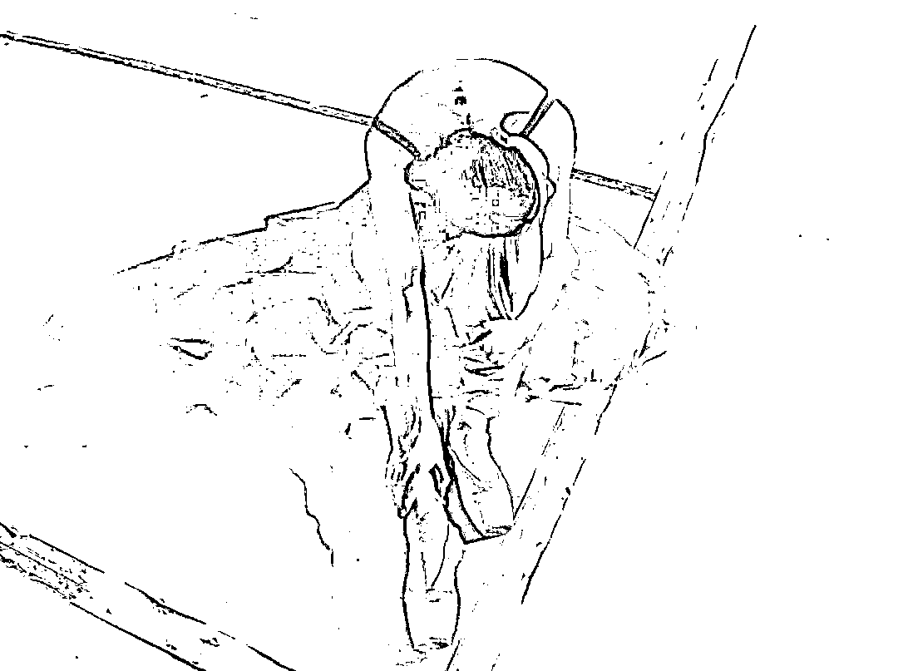**

**土星的幸福光环**土星带来的挫折体验很明显是必要的，不管在心理意义上还是现实运用中，这类经验都是具有教育意义的。不管在心理学还是神秘学上，这个说法都是成立的：**人类除了通过自我发现来获得自由之外，别无他法；而在身受痛苦折磨、别无选择之前，人们也并不会追寻自我。**尽管没有占星师会把土星看做让人愉快的好伴儿，土星式生命体验的必要性还是得到了不情不愿的认可。鲜有人能认识到，**土星式体验中确实可以尝到喜悦。**会享受业力之痛的人可能也太受虐狂了，不过土星喂给我们的并不是对痛苦的享受，而是心理自由带来的幸福——因为品味过的人少之又少，所以这一点尚未广受认可。**每个人都在某些时期经历过反复发生或感受的延迟、失望、恐惧，这些通常发生在土星的影响下。**然而，至于这些经历究竟意味着什么、以及如何将之转化成机遇，很少有人去回答上述的疑问——人们对此的寻常回答是，这些经历反应着个人的业力，跟过去世的因缘有关，所以受苦者得咬牙忍受，什么也做不了；只得保持着“一旦孽债还清、便可通往光明大道”的信念。即便是考虑到土星体验在个人发展和体悟自由上有益的占星咨询师，也提不出除了忍耐、淡定、正面思考之外的建议。一个可能的答案是，**这每一次的延迟、失望、恐惧都可以被用来洞察人类心灵的神秘机制，这些经历会逐渐教会我们体察自身生命的意义所在。****你有过怎样通过刻苦磨练，通过土星考验后，品尝到幸福时刻的经历吗？评论区分享给我们把！**

**版权声明：**本文由若道翻译发布，欢迎转发，反对抄袭。友号转载请申请白名单。

**丽兹**·**格林**

英国占星师，毕生贡献于心理占星学，与备受尊崇的美国占星师霍华德**·**萨司波塔斯共同创办伦敦心理占星学中心（*The Centre for Psychological Astrology*），并拥有一家出版专业占星书的 CPA 出版公司。格林是二十世纪最受欢迎的占星师之一，著作等身。

**学习占星学**

**点击下图了解课程详情**

****

**

**

****

**微信又双叒叕改版啦，不想错过若道君的推送？**

**就把若道设为星标吧！**

**▼**

**就是这个“在看”，戳戳戳 ☟**

****报名直达入口****

# 有福利！NVC 线上训练营丨非暴力沟通，有效提升沟通能力

> 原文：[`mp.weixin.qq.com/s?__biz=MzA5NjA0NTAxNg==&mid=2651457163&idx=3&sn=b578b15a7dd8968a51b1c575a067e162&chksm=8b48b43cbc3f3d2a4356a0c745fc7ab51e529dc6f1da15c784b52c519d8719aee4f3d7845bda&scene=126&sessionid=1692737923#rd`](http://mp.weixin.qq.com/s?__biz=MzA5NjA0NTAxNg==&mid=2651457163&idx=3&sn=b578b15a7dd8968a51b1c575a067e162&chksm=8b48b43cbc3f3d2a4356a0c745fc7ab51e529dc6f1da15c784b52c519d8719aee4f3d7845bda&scene=126&sessionid=1692737923#rd)

**为什么我们要学 NVC？**

（向上滑动查看内容）

**蒋颖**

若道联合创始人

2016 年，我在新西兰参加一个 Hakomi 亲密关系治疗的治疗工作坊。参加这个工作坊的都是治疗师。在这个工作坊中，有一位女性让我特别印象深刻，因为她身上有种特别的气质，某种既温柔又坚定的东西，充满力量，充满对这个世界充满关怀，她身上表现出的让人惊讶的真实也让我有很多思索。她叫托尼·麦克尔兰（Toni McErlane）。

我知道她从小学习武术，也是一个悬挂式滑翔运动的运动员，曾经背着滑翔机在世界各地的上空飞行和比赛。她完成了北美非暴力传播（NVC）领导计划，是一个非暴力沟通（Nonviolent Communication，简写 NVC）培训师和注册的家庭纠纷调解人，也是生态心理学的培训师。她有多年的内观经验，在身体创伤治疗方面的经验，还有她在有机种植、景观设计、园艺治疗都有专长……我看到她到印度去，帮助印度乡村做有机耕种。在这次疫情之前，她已经买了一艘帆船，准备和丈夫开着他们的船环游世界。所有这些都让我感叹，一个女性可以活得如此勇敢和丰富。现在她而她对中国也充满了某种关切。多年前就一个人在藏区徒步旅行，后来又骑自行车穿越西藏。

但喜欢户外冒险的 Toni 说， NVC 比武术更管用。

2019 年，我终于请 Toni 到中国来，请她给若道做了基础和中级的 NVC 培训，也请她对外做了一次工作坊。

怎么说呢，培训和工作坊棒极了，更棒的是，我觉得人人都爱她。

**Toni McErlane**

我来自新西兰，拥有社区和人类服务—咨询康复学士学位，是 Aminz 的注册家庭纠纷调解人，也是 NVC Aotearoa 的 NVC 培训师。

在我的生命中，我一直对真诚、充满活力、自我负责的沟通和有意识的选择充满激情。而我的人生旅程为我提供了充足的机会，让我去探索、研究、反思和完善这在沟通中是什么样的。

在我的工作坊中，我的原则和实践都是建立在非暴力沟通和正念的哲学基础之上。非暴力沟通是由美国心理学家马歇尔·卢森堡博士所开发的。马歇尔的目标是发展出一种语言，这种语言受到印度巴利语中的“非暴力主义”（Ahimsa）一词的启发，它的意思是“没有伤害”。我们怎样才能在与他人沟通时不造成伤害呢？这不仅需要非暴力沟通的技巧，还需要在训练中融入正念。正念是受小乘佛教内观传统的启发，发展觉知和接纳，关注和允许。在我们的工作坊中 ，我们将非暴力沟通和正念编织在一起。

我致力于以这种沟通和处世方式作为我日常与人互动的基础。我曾经学习了为期一年的北美非暴力沟通领导者项目，在加州湾区非暴力沟通的全年浸入式项目中做了两年协助工作，然后在索诺马县女子监狱推动非暴力沟通培训。同时，多年来我持续参加内观静修，致力于继续和发展这种实践，并把它融入自己的工作坊中。

2020 年疫情期间，我与丈夫和我们的猫在游艇上休了一年假。现在，我和丈夫还有 15 岁的侄女在新西兰南岛的达尼丁生活。我在那里从事心理咨询、冥想和生态心理疗法。我们还正在那里慢慢建立一个治疗静修中心和生态冥想社区。

过去四年，我曾两次来中国，与若道及其友好而充满活力的团队分享非暴力沟通，并参观了一些绝佳风景。我期待继续与若道合作，在网上分享我的知识和技能。

向上滑动可查看更多

**Toni 老师有话对你说**<mpvideosnap class="js_uneditable custom_select_card channels_iframe" data-pluginname="videosnap" data-id="export/UzFfAgtgekIEAQAAAAAABNIXkZitzgAAAAstQy6ubaLX4KHWvLEZgBPEtIMEEEUxZvj-zNPgMIuM7PVi1oMK5fdX4B-DAnh3" data-url="https://findermp.video.qq.com/251/20304/stodownload?encfilekey=RBfjicXSHKCOONJnTbRmmlD8cOQPXE48ibrgo6T80SM1b4QSoxiaa7xblfRvMCU22ricO1icL5GdBOSmzhG7mbaLtSLg4xqYaTLicapWwCV45Axx8QGaozqH7OpxicjibYzN1icWtyuIibCRyZInILWhIGRG1ILicWtib8H3XUMxBW2rZO2GMmc&amp;adaptivelytrans=0&amp;bizid=1023&amp;dotrans=0&amp;hy=SH&amp;idx=1&amp;m=3d7ca9d191932d16f6faa80b9364d1f9&amp;token=AxricY7RBHdVzFXjPCFncbbQSWL8x8x2YeR1VX1JKDza8JFxFfuEYeFkqjygt392VxqY7mdlmzAc" data-headimgurl="http://wx.qlogo.cn/finderhead/PiajxSqBRaEJYnVsqWfEX9qA0sI6hNVKsDfyzfPZ92WZMZyBpZWU5NA/0" data-username="v2_060000231003b20faec8c4e68a1ec2d4ca07e434b07755bbf47e7053a3059defd2c9d6c68a20@finder" data-nickname="若道" data-desc="#非暴力沟通 NVC  在面临一个两难处境时，如何运用 NVC 促进合作的开展？
" data-nonceid="1620007045275601581" data-type="video"></mpvideosnap>

**福利！**

**前 20 位报名学员赠送 NVC 情绪-需求卡一套**

**NVC 情绪-需求卡****课程内容**

**第*****1*****模块 区分感受和想法**

*   学习区分想法、感受和故事感受。

*   体会为什么在表达中分享自己对某一情境的感受很重要，而不仅仅是想法和判断。

*   学习辨识和认同身体传递的感受和情感，将它们作为自我觉知和自我联结的资源。

*   理解感受是重要的信息媒介，支持你与自身的需求建立联结。

*   认识关注感受、探索联结需求的重要性，而不是对感受做出反应。

**第*****2*****模块 将感受与需求、需求与策略关联起来**

*   了解并理解满足一个人需求的策略可能无法满足另一个人相同的需求。

*   学习理解需求的概念，学习区分需求和策略。

*   体验如何用多种不同的策略来满足一种需求，以及如何通过选择一种特定的策略满足或不满足其他需求。

**第*****3*****模块 倾听和共情**

*   学习倾听他人话语中透露出的情绪和需求。

*   体验受到共情和受到其他形式的有意识的支持之间的差别，比如同情、安慰、分散注意力、陪伴等等……

*   学习认可别人的体验和情感，而不必认同对方的策略，认识这种技能所能带来的力量和解脱。

**第*****4*****模块 观察与评价**

*   学习在表达中运用观察而非评价的重要性。

*   体验两者之间的差异，自己去领会为何有此差异。

*   学习区分对情境的解读和事实。

**第*****5*****模块 自我共情**

*   学习认识和观察自己的评判和评价，并用它们与自身感受和需求建立联结，借此更深入、更清晰地理解自己。

*   学习识别自己赋予情境的意义，并探求其中的事实。

**第*****6*****模块 ****提出请求**

*   学习请求是表达中重要的一部分。

*   学习如何提出满足自身需求和他人需求的请求。

*   分辨请求和要求之间的区别。

*   学习如何倾听拒绝，如何表达拒绝。

**第*****7*****模块 ****练习坦诚地表达**

*   在一个支持性的框架中，综合运用之前所学, 练习相互联结、清晰有效、对自己负责的沟通。

**第*****8*****模块 ****接受和表达感激和谢意**

*   运用之前所学，练习表达感激和谢意。

*   学习表达感激之情，远不止一句随口说出的“谢谢”。

**工作坊学员这么说**

非暴力沟通带给我的最大的收获是：通过课堂的学习和大量互动练习提升了觉察力，提升了沟通技能，非暴力沟通并不仅仅停留在语言的表达，非暴力沟通的核心是同理心。通过倾听对方的感受，帮助我将情绪转化为解决问题的动力。

我过去和其他人沟通时，常常陷在自己的思维中，通过练习我才发现，原来别人说话的时候我常常其实并没有听到对方说什么，都是在自己的想法里打转，现在我起码学习到当对方说话的时候，能够去尽量不想自己的想法。

过去我不会留意到原来自己的某种表达方式会让别人不舒服，而且其实也无助于解决问题，对于我想达到的完全无效，NVC 的学习能够让我更能觉察哪些表达会让别人不舒服，让我的沟通更有效，更能帮助我达到我的需求。我学完后，才觉察到过去在沟通中，如果对方有情绪，我也是情绪化地回应，现在，我能够和自己和对方的情绪都拉开一些距离。过去我对于对方情绪化的表达，会有情绪化的回应或不知所措，现在我更能去感受他们情绪下的需求是什么，因此就更从容，不那么容易被他人的情绪影响，能够更有效地回应那些有负面情绪的人。我是一个比较理性的人，在练习中发现原来对一个在我用理性分析如此很明显的画面，每个人竟然有如此截然不同的看法，这还是挺让我吃惊的，这个发现好像打开了一扇门。

我是一个比较感性的人，过去有什么事情，常常是情绪化的沟通；NVC 的学习让我能够更理性一些，能够更客观去看问题。

这个培训让我非常感动，这是我没有想到的，一个关于沟通的培训如此让人感动。在那些常见的表面事件呈现之下，是如此脆弱、温柔的人性。我们如此绝望地想要被理解、被爱，想要与他人联结，然而我们常常用非常错误的沟通方式去做，这时我们离我们的目标就越来越远。

**什么人适合学习 NVC？**

**老实说，NVC 真的是一门人生必修课。**

**NVC 可以非常有效地帮助提高沟通能力，提高觉察力、自我同理心和他人同理心，进而减轻童年创伤对成年生活的影响，帮助有效改善亲密关系、与父母的关系、亲子关系、职场关系。**

*   如果你正被低效的沟通方式困扰或正经历沟通暴力，想**提升觉察，避免伤害的话**，NVC 培训是个不错的选择；

*   如果想结束“相爱相杀”恶性循环的相处模式，**享受一段真诚而愉快的亲密关系**，NVC 培训是个不错的练习途径（可以拉着你的 Ta 一起来哦）；

*   如果你的**工作、求学、生活和“表达”息息相关**，想更理解自己，想改善你的人际关系，改进工作，NVC 培训可以体验到一种更有力量的表达。

**训练营时间与价格**

**课程时间：**10 月 24 日—12 月 12 日，每周日下午 2 点-6 点。共 8 周，每周 4 小时

**课程价格：**6800 元

**购买须知**

❶ **本课程一旦报名，不接受退转课。**

****非暴力沟通线上训练营****

**授课老师：**Toni McErlane

**授课时间：**2021 年 10 月 24 日起

**授课方式：**网络课程**，**英文授课，中文翻译

**费用：**6800 元

**课程负责人：****Maggie 老师**（微信：18510107057，请备注“非暴力沟通”，**获取优惠价信息**）

长按二维码添加课程负责人咨询~

****报名请点击“阅读原文”****

# 注意！当这个星座出现在你面前，其他人都会失去光彩

> 原文：[`mp.weixin.qq.com/s?__biz=MzA5NjA0NTAxNg==&mid=2651457163&idx=1&sn=bf39a518d7c1321811dc3fc06d293173&chksm=8b48b43cbc3f3d2a1253e4874ba9e046189bda76881d317d453e8fe566435a36a305fd6f7446&scene=126&sessionid=1692737923#rd`](http://mp.weixin.qq.com/s?__biz=MzA5NjA0NTAxNg==&mid=2651457163&idx=1&sn=bf39a518d7c1321811dc3fc06d293173&chksm=8b48b43cbc3f3d2a1253e4874ba9e046189bda76881d317d453e8fe566435a36a305fd6f7446&scene=126&sessionid=1692737923#rd)

******☆ ****后台回复“今日”，给你一句生命态度******

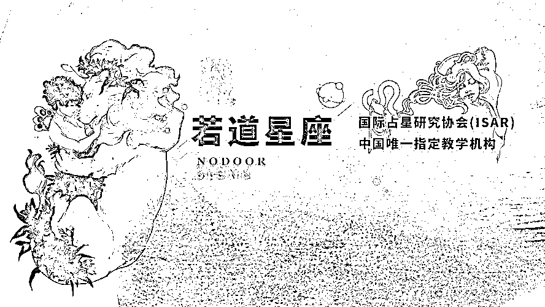

作者/大卫·瑞雷 若道占星创始人
译者/若道翻译团队编辑/玫瑰 封面/书君 图片/pexels 大卫老师的 12 星座系列文章精彩又有趣，今天更新到狮子座啦！一起来看看这个明星一样耀眼的星座吧！另外，大卫老师参与授课的[四大名师核心课](http://mp.weixin.qq.com/s?__biz=MzA5NjA0NTAxNg==&mid=2651454929&idx=3&sn=41b813c6f31f090a587e3107c344637f&chksm=8b4b4f66bc3cc6703aaffae98f2d54405038740fba7d608be43671b8336c982a847924de47ce&scene=21#wechat_redirect)（点击链接可阅读），也欢迎你来了解更多详情！**狮子座**漫游于黄道列车之上，你打盹醒来，又感到元气满满。列车缓缓驶入一个镇子，你看着窗外，每一盏街灯上都挂着五彩斑斓的饰物，就像飞舞的蝴蝶，又像原始部落的奇幻面具。随着音乐声越来越响，列车驶入车站。整个镇子都在庆祝节日！你与刚刚和你交谈的陌生旅客交换下眼神，相视而笑，一起走出站台。乐队的演奏声盖过了你们说话的声音，你们几乎都听不到对方了。你们笑着穿过人群时，不知道谁丢的花环飞到你怀里。舞者在靠近镇子中心的舞台上表演，旋转，跳跃，像优美的体操。你和你的新朋友手拉着手穿过盛装的人群。突然一声爆竹的声响，两匹马受到惊吓一跃而起，疯狂地冲到街上。人们尖叫着躲开那两匹马，人群中发生骚动，推推搡搡地逃跑。你看到一个小孩子似乎和大人走散了，就要被马踢到！你冲出人流，一把将孩子揽过来，你要是再晚一秒你和那孩子都要被马踢飞。人群发出惊呼，在人们的掌声中，你将孩子交回到他妈妈手上。在那一小时里你成了大英雄，受到镇子里官员的表彰。你的朋友看你时眼睛放光，你也笑着朝他挥挥手。你成了所有人注意的焦点，这是你人生中最棒的一天。**这就是一个狮子座和他的不错的一天。**即便碰到了坏日子，做英雄失败了，你也依然是个英雄——你依然是你自己的戏剧中的主角，无论那是一部恐怖片还是一出悲剧。对你来说，生命就是用来庆祝的，日子必须华丽丽地过。**你擅长展现个人风格，用衣装行头来让自己看起来有范儿，你的角色没人能够替代。**

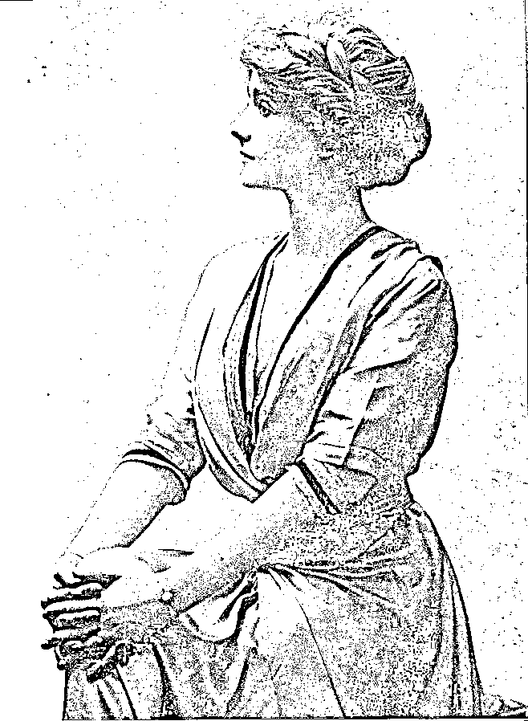

| 可可·香奈儿

**时尚业**几乎就是由狮子座创造的，可可·香奈儿说过：**“人生中最好的东西或许是免费的，但第二好的东西则要花很多钱才能拥有。”**这是传说中**狮子座的奢华品味**的概括。**你们也常常在其他人的生活中扮演令人难忘的角色，没有你们的故事是不完整的。**你们是戏剧和娱乐的生产者。狮子座的电影导演、制片人阿尔弗雷德·希区柯克说过：“戏剧就是将所有无趣的片段切掉后的生活。”**不过你们的生活无论是好是坏，总是很少有无趣的时候。**当然你也用一生的时间需要时间来打磨你的表演。在这条路上，你们中的很多人会发现，**坚强面对日常生活中的每一天所需的勇气，可能远多于成就英雄事迹所需的勇气。**发展勇气和力量是一个要努力一生的事，有多少胜利就有多少心碎。杰奎琳·肯尼迪·奥纳西斯像所有狮子座一样学到了这点。她在丈夫遭遇可怕的刺杀后表现出了强大的勇气和镇定，并作为遗孀承担起了对个人、对家庭和对哀痛中的国家的职责。由娜塔莉·波特曼主演的传记电影《第一夫人》（2016）记述了这个过程。杰奎琳会因他的勇气和力量而被铭记在人们心中。不过，杰奎琳·肯尼迪的勇气也有不同的发展阶段。杰奎琳小的时候就是个小大人，被父亲宠爱。她的父亲是股票经纪人约翰·布维尔三世，因为肤色黑而被人戏称为“黑杰克”。作为“爸爸最爱的小女孩”，杰奎琳的第一次心碎是在父母分居后，那时她七岁，四年后，她的父母离婚了。她的生父在 1929 年美国股市大崩盘之后，再也没能在经济上爬起来。他的酗酒和婚外情引发了很多家庭内部的冲突，直到他和杰奎琳的母亲离婚。虽然杰奎琳的母亲再婚嫁给了有钱有权的人，但父母离婚，生父又声名狼藉，这让那个时候的杰奎琳感到自己是上流社会的局外人。**她后来发展出了勇气，用她个性中独有的自信和尊严战胜了那些拒绝和冷眼。**在童话故事一般的罗曼史之后，她和约翰·F·肯尼迪的婚姻中出现了一系列的挑战。约翰被阿狄森氏病折磨，从战场上留下的背伤也常常让他受疼痛之苦。他们刚结婚两年，约翰就做了两次几乎致命的脊椎手术，杰奎琳不得不在他床边日夜照顾。不到一年，杰奎琳遭遇了第一次流产，紧接着下一年，女儿胎死腹中，在那之后，她第一次患上严重的抑郁。

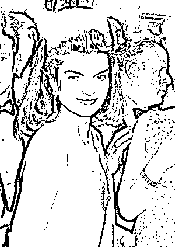

| 杰奎琳·肯尼迪·奥纳西斯终于，她在 1957 年生下了卡罗琳，然后又在 1960 年 11 月，丈夫成功当选总统的两周后，生下了小约翰。约翰·F·肯尼迪在总统任职期间的风流韵事现在已经广为人知了，但那个时候是对公众隐瞒的，这无疑要求杰奎琳有巨大的勇气和决心，来面对这样的处境。然而，人们不太了解的是，杰奎琳和约翰·F·肯尼迪在第二个儿子出生后的 1963 年亲密了许多，那个儿子早产了五周，生下来两天后就死了。具知情人士讲，这个打击令他们的关系比以往都更加紧密，虽然三个月后，约翰·F·肯尼迪就遇刺了。所以杰奎琳的尊严、自信和勇气不是在约翰·F·肯尼迪遇刺的那个可怕的时刻突然出现的，她一生都在发展这样的品质。她在第一夫人时期对白宫所做的翻新，以及她引领的华盛顿的时尚潮流，也将被长久铭记。她在电视节目中带领观众参观焕然一新的白宫，成为唯一一个获得艾美奖的第一夫人，我当时就是电视机前的五千四百万观众之一。即使处于丈夫遇刺的悲痛和震惊中，她也以林肯的葬礼为模板，全权操持了丈夫的葬礼。一个对这位狮子座女性的恰如其分的描述，来自《伦敦标准晚报》的报道，他们称“杰奎琳·肯尼迪给了美国人……一个他们向来缺乏的东西：庄重。”**跟勇气一样，信心也是必须通过发展来得到的。**就算是你们中那些从小就看起来信心满满的人，也会担心在别人眼中自己是不是只是纸老虎。一个面对大孩子的恫吓表现出蔑视和不服的狮子座小孩，可能发现自己要“吃不了兜着走”了，但更多时候，他们的姿态能为他们赢得回报。**其他人会对你们刮目相看，视你们为领袖，无论你们是有意还是无意为之。**无论是哪种情况，伴随着领导地位而来的是个人责任上的压力，然后你们中的很多人可能表现得有些不情愿：“好吧，总要有人负责的，那就我来吧。”**对那些太阳或上升在狮子座的人来说，进入一个房间而不被人关注到是很困难的。**我相信当阿德诺·施瓦辛格还是个小男孩时，他就懂得如何享受同学们注视的目光了，那时他还没有开始练举重，离他七次摘下“奥林匹克先生”的桂冠，成为好莱坞动作巨星以及加州州长，则还有更长的路。同样，前美国总统克林顿也在很早的时候便显露出狮子座的特质。在克林顿青少年时的一张照片里，他和当时的总统约翰·F·肯尼迪亲切握手，他光彩照人、自信满满的样子给人留下极其深刻的印象。**他人的关注对于狮子座人来说，既是祝福，又是诅咒。****狮子座的丑闻可以和他们的胜利一样精彩，富有戏剧性。**施瓦辛格的丑闻，和克林顿与白宫实习生莱温斯基之间的性丑闻没有什么不同，巧的是莱温斯基也是狮子座。克林顿的性丑闻在他任期的最后一段时间内悲剧地占据了所有报纸的头版头条。另一个狮子座丑闻的例子是台北市议员、前电视台记者璩美凤，2001 年她的性爱光碟被曝出，2002 年她利用此事出版了相关主题的自传。当然，丑闻不是狮子座的专利，任何星座都不承包丑闻，但**狮子座就是有一种能够引发关注的特质，很容易给人留下印象**。即便有些狮子座可能在一对一的交往中表现得很低调，但当他们面对人群时，你会被他们的王者之风所震慑，他们的声音变得更加响亮，让人们不禁抬头仰视，想知道正在说话的人是谁。

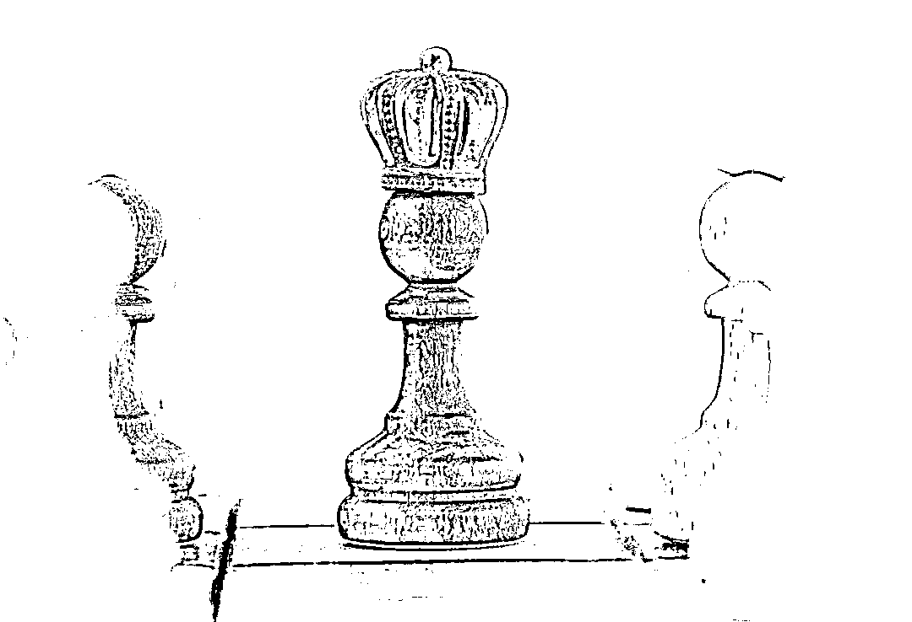

**个人成长的主题和故事**

没错，狮子座也许霸道、傲慢、恃宠而骄，他们总是希望被特殊对待，充满自豪甚至是狂妄自负。不过，这些表现也常常是**对于自我的不安全感**的反映，有些未处理的基于恐惧的评判，让他们怀疑是不是“其实我一点都不特别”。

受伤的自我以非常狮子座的方式表现出来。有些人扮演着忍辱负重的英雄，勇敢承受着生命中戏剧化的动荡，坚信如果想达到目标就必须主动推动事情的发生。是的，就算是低调的狮子座也习惯于对事情负责，即使他们表现得没那么明显，但他们内在会对自己所做的工作有强大的自豪感。不过，**狮子座很容易感到孤独，他们内在有一个“未被赞颂的英雄”的剧本，这会让他们即使在不被承认或不被欣赏时，也勇敢地展示出与众不同的那一面。**

如果你的太阳或上升在狮子座，又或者出生星图中有重要的狮子座配置，而你感觉自己有上述的特质或人生主题，那么你应该去想想这是为什么**。在狮子座的成长过程中，会对他们的成长带来影响的最常见的负面评价是：“你并不特别。”**父母最经典的说法通常是：“你凭什么觉得自己那么与众不同呢？”不过，**比这更糟糕的是受到忽视，哪怕你用尽全力都得不到认可或关注。**于是发展出这样的信念，“我怎样都不够好。”

更让自我受挫的是，**当家庭因为社会、经济或家人上瘾的恶习而遇到问题时，这个孩子想要像个英雄一样竭尽全力照料家庭，但却最终无法阻止家的分崩离析，于是他（她）成了一个失败的英雄。**我有一个客户跟我说，她竭尽全力想要让母亲和兄弟姐妹们获得幸福和安宁，但她的酒鬼父亲总是有本事让她的心愿泡汤。她年纪轻轻就要靠做模特来贴补家用，可是父亲有一次偷光了她攒的钱，后来又放火烧了他们的公寓。

另一位狮子座客户眼睁睁看着父母的离婚大戏葬送了她求学的机会。“他们把本应供我上大学的钱都拿去打官司了，等他们折腾完了，妈妈也负担不起我的学费了……”

这些挫折并不能阻挡狮子座前进的脚步。有些狮子座能够克服极大的困难，比如前面提到的 J·K·罗琳，当她开始写作“哈利·波特”系列故事时，她是一位只能靠社会救济生存的单身妈妈。

**真正会把狮子座压垮的，是负面的信念系统带来的恐惧，“你想要的永远不会发生。”**你有必要深入自己的情感内核，去处理这种基于老旧恐惧的程序模式。因为你是一只狮子，**康复和疗愈的过程“就应该”是戏剧化的。**属于你的人生大戏会缓缓展开，等待你站到舞台中央，你需要把你自己的角色演好。无需为你所经历的感到抱歉。闪亮登场吧！释放你的创造力，聚光灯将追随你的身影。

**不过，很多狮子座也正是因为站到了舞台中央，才无时无刻不感到孤独。**你们的强大和醒目，会吸引别人的追随，但这也让你们很难遇到一个势均力敌的人，来为你们提供客观的视角。事实上，**你们最需要的密友，不是“粉丝”，而是那些强大到可以告诉你他们的真实想法的人！**你会很重视这种理性的支持，但同时也要认识到，无论怎样你仍是那个必须为他人树立典范的人。

因为你们通常都表现得十分自信，所以当别人发现你们原来也和其他人一样有不安全感时，常常会感到很吃惊。你们感到焦虑的一个原因是，**对于私人生活和家庭生活有太多掌控欲。**在极端的情况下，你们可能**陷入强迫性的恐惧，认为别人在暗中算计你——特别是如果你真的有什么见不得人的事的话！**

想想施瓦辛格所经历的毁灭性的丑闻，他和家里的女管家有了私生子。这是狮子座最坏的剧本。尽管这个秘密被隐藏了许多年，但最终他试图控制一切的努力还是失败了。**想要控制或操纵家庭成员也会出问题，这里面需要学习的一个功课是，如何放下那些你确实无法控制的东西。**

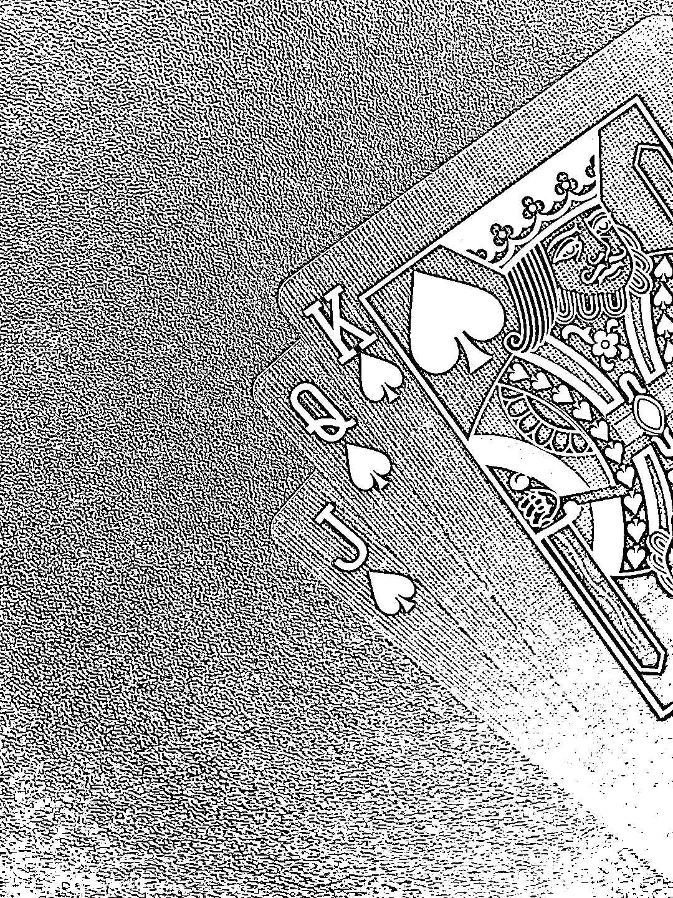

**·** 如果你是狮子座，看看你的出生星图中有没有如下的额外线索：**如果你星图中的海王星、第十二宫、双鱼座被强调，那么你所表现出的狮子座特质或许没有那么过火或戏剧化，这可能与成长过程中被忽视的经历有关。****你可能发展出了一种对于戏剧化的多彩人生的想象，来抵挡现实生活中的空洞和缺失。**但童年被忽视或家庭生活混乱所带来的影响，是可以被克服的。当狮子座主题与第十二宫、海王星、双鱼座的议题同时出现时，说明你**拥有重要的创造天赋，你在艺术、音乐或电影领域会有无穷的潜力。****· 如果你是一个冥王星、第八宫、天蝎座特质很强的狮子座，你的功课更多是要恢复你对于自己人生的控制感，或是克服由于被虐待或被操纵而产生的阴影。**对你来说，负责也意味着有控制力，你会**很容易卷入与其他人的权力斗争，直到你拥有更多内在的信心，让你能够放下那种把任何事都看成一场战斗的执念**。**· 如果你是一个土星、第十宫、摩羯座被强调的狮子座，**那么你的信念系统里可能时常播放着这些句子：“没有什么是容易的！”“吃得苦中苦，方为人上人！”“天将降大任于斯人也，必先苦其心志，劳其筋骨，饿其体肤……”你需要去处理头脑里的这些声音。**· 如果你是天王星、第十一宫、水瓶座特质强的狮子座，你可能对自己容易引人注目的能力产生抵触。****对于身份认同的贬低令你们成为非典型的狮子座。**这样的行为通常是一种**自我防御，是人生早年未修复的创伤或带来震惊的巨变所造成的“依恋障碍”**。典型的情况是，**成长过程中充满动荡，无法安定，比如经常搬家、换邻居、换学校**。于是你开始**用保持疏离来对抗依恋**。那些你选择与之保持一定距离的，可能是某些好友，可能是舞台中央的快乐与荣耀，也可能是老师家里的宠物小狗，总之**你将那些会让你感受到分离痛苦的人、事、物抛在脑后**。新学校与新群体总是带来挑战，你开始把自己视为异类，抗拒那种要受到关注的渴望，潜意识里仿佛在说：“何必呢”。**狮子座的事业线索****你的领袖风范很难被忽视，没有足够安全感的老板，会很难掩饰对你的嫉妒，和他们害怕被你取代的恐惧。**你的风格和气度常常能**吸引高层管理人员或前辈领导的注意，他们会栽培你，给你更多抛头露脸的机会**。同样，你也可能陪同上司去参加展会、行业会议或公司的重要活动，你的上司会在同行或竞争对手面前对你大加夸赞，让你作为公司代表去介绍新产品或新业务，这也是你大放异彩的机会。如果你确实如你表现出来的那样“有料”，那将没有什么能够阻挡你。有才如此，在任何领域都能崭露头角，成为领导者。 **吸引你的职业可能是表演、电影制作以及其他娱乐相关的行业，也可能是广告、销售或宣传推广。**不过，假设你感兴趣的是**科学，甚至微生物学，或医学研究**，在这些领域你也很有可能成为团队领导者或树立榜样的人，成为在学术会议或其他重要场合展示团队的研究成果的那个人。你不是那种默默无闻不被注意的人，你的鲜明个性会吸引他人的关注。**对于那些你重视的工作，你会非常敏感，有将事情戏剧化的倾向。**如果你认为你所在的公司做出了错误的决策，你会非常介意——因为这让你感到难为情，**你不想和任何让你觉得蒙羞的事扯上关系。**

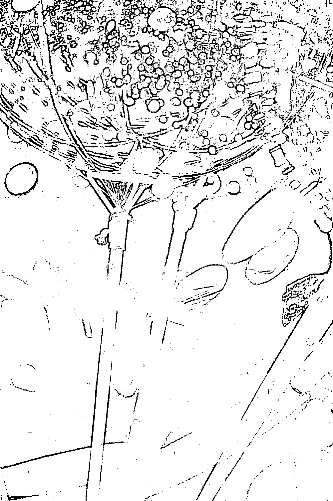

当然狮子座的骄傲对你来说是“成也萧何败萧何”。**在正面意义上，你会全心投入工作，对自己能把一件事做好感到非常自豪。消极的一面是，一旦你付出的努力不被重视，或你对某个重大项目的成功所做的贡献不被认可，那么你的自我就会展开强烈的反攻。**你们很难在感到被冒犯时一笑而过，你双唇紧闭，夸张地做出嫌恶的动作，没有谁会看不出你的不满。在更糟糕的情况下，你会跟人较起劲来，这场斗争没有赢家，你可能会耗尽所有人的力气，也驱走别人对你的善意。**不够客观也往往是引爆这类事件的一个关键因素**。你要学着听取那些你所信赖的同事的意见，当他们指出你将铸成大错时，认真对待或许能使你避免许多麻烦。既然你很重视亲密同事和员工对你的忠诚，那么在你做出重大决定之前，考虑一下他们的意见会是明智之举。**保持对自己事业的所有权**是另一个你们关注的问题。对你来说，名誉就像是银行里的存款。任何人若是从你搭建的好名声中获利，那他最好给你慷慨的回报。如果可能的话，你们中的很多人希望自己**不仅仅是做秀的人，还能拥有公司，或至少是拿到数量可观的股票期权。****老板慧眼识珠，你拿到丰厚回报，这是最皆大欢喜的情况。**一般你会非常留意那些试图模仿你、抢你风头的人。通常那不过是东施效颦。当你为别人打工时，舒服地待在一个你擅长的职位上会让你感觉很好，无论怎样你会**抗拒变化**。你喜欢对你所做的事有完全的统领权，即便是羡煞旁人的晋升，如果你感到那对你已经确立起来的威信和控制权不利，你也可能拒绝。在负面意义上，你可能**非常固执，适应变化的速度很慢。**当你来到一个不熟悉的新位置，准备重建事业，你可能要暂时忍受，那些才能不如你的人比你更受宠或更有话语权。不过，一旦你重振雄风，你的价值便能再次闪现光芒。

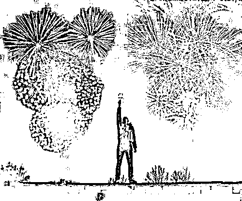

**狮子座的爱情线索**你是那个最终要说了算的人，你们的霸道让其他星座的人望尘莫及。有些狮子座的男人会让女人嗤之以鼻，不是因为她们不喜欢这个男人，而是她们觉得这个人**太难驾驭**。**狮子座的女人，则常常因为太耀眼而让男人望而却步。**要追求一个狮子座女人是需要勇气的。很多狮子座男人会让人联想到“超级英雄”的形象，即使你们的身体并不强壮，但那种自信的气度能够让人忽略你们的缺点。  **一方面，你享受约会和爱情追逐中的浪漫华丽。**优雅的烛光晚餐、美酒佳肴，能够为你创造一种舒适的氛围，你在其中会显得格外光彩照人。看演出、参加电影首映、参加舞会，或是任何带有庆祝性质的活动，都会让你感到轻松自如，在这样的场合你可以从容地展示个人魅力，顺带将你的优质伴侣炫耀一番。不过，在浮华背后，**你也喜欢伴侣能成为你的知心好友**。并不是说你不享受伴侣的崇拜，你当然是喜欢的！只不过这并不是你追求的全部。是的，**吸引你的是有品味、外表有吸引力的人——这些都管用，但如果他们也很聪明那就再好不过了！**或许应该是，聪明绝顶才好。并且，如果他们还**知道怎么制造快乐，怎么享受生活，**那么这就是你的理想型了。不过，最关键的还是，这个人真的**是你最好的朋友**。如果你做了蠢事，他们会像最好的朋友那样对你直言不讳，他们是真心为你着想。他们也可能在你并不知情的情况下默默为你打算，哪怕当你被骄傲蒙蔽了双眼而忽略他们对你的付出。

**版权声明：**原创文章由作者授权发布于若道平台，欢迎转发，反对抄袭。友号转载请申请白名单。

****想阅读更多作者的文章，请在后台回复******大卫****** 即可。****

**喜欢文章请长按下方二维码打赏**

**给大卫老师加杯咖啡呗~**

**▼**

**学习占星学**

**点击或长按下图了解课程详情**

****

**

**

****

**微信又双叒叕改版啦，不想错过若道君的推送？**

**就把若道设为星标吧！**

**▼**

**喜欢记得点一下在看哦☟**

****报名直达入口****

# 神话塔罗作者亲自授课的认证体系，错过了优惠价的你，别再犹豫啦

> 原文：[`mp.weixin.qq.com/s?__biz=MzA5NjA0NTAxNg==&mid=2651457110&idx=3&sn=27b51407558d2fa02fea7f14ed39bc74&chksm=8b48b4e1bc3f3df75e36ee0f5f207574f268230b96512df13cfd108734c743229072f9a40afe&scene=126&sessionid=1692737923#rd`](http://mp.weixin.qq.com/s?__biz=MzA5NjA0NTAxNg==&mid=2651457110&idx=3&sn=27b51407558d2fa02fea7f14ed39bc74&chksm=8b48b4e1bc3f3df75e36ee0f5f207574f268230b96512df13cfd108734c743229072f9a40afe&scene=126&sessionid=1692737923#rd)

**时隔三年，****超高含金量的神话塔罗认证课程强势回归****经过多次打磨的课程内容体系****让你直观精准的感受到****神话塔罗的魅力，****扎实的建构****神话塔罗思维，****系统****学习****最地道的塔罗知识。****中高阶课程中老师传授****将神话、占星、心理学完美融合进塔罗****的****人本主义咨询体系，****并进行****学员案例督导，****让你更自信的开展咨询工作，****学以致用。****本期认证课程采取****初中阶****即报即学的录播课****+高阶****案例督导直播课****的形式，****录播课：****精编剪辑，随来随学，助教答疑，学练结合。****直播课：****大师融合，神话心理，塔罗占星，咨询技巧。****若道为学员开发了****“神话塔罗”APP，****是随身的工具，****更是接咨询的平台，****中阶****学成入驻平台****即可链接更多塔罗个案，****发展壮大你的塔罗咨询事业。**

**如果你想学习塔罗，什么样的老师会让你怦然心动呢？她是三副塔罗牌的设计者，写了 6 本塔罗书籍。她研习塔罗四十余年，教授塔罗三十余年，是丽兹·格林的密友。还有****谁会比塔罗牌设计者更了解塔罗的历史、灵魂与精髓？****所以，这将是你开启塔罗之旅最坚实的一步。**

1

**这位塔罗大师是谁？**

**朱丽叶·沙曼-伯克** 

**· **她是**3 副塔罗牌**的**设计者****——**神话塔罗牌、沙曼–卡塞利塔罗牌、“自己着色”塔罗牌；**· **她出版了**6 本塔罗书****——**《塔罗全书》、《新塔罗全书》、《众星的传说》、《理解塔罗牌》、《精通塔罗牌》、《塔罗初学者指南》；**· **她研习塔罗**四十余年；****· **她教授塔罗**三十余年**；******· **她是**丽兹·格林**的密友，两人合著了**《神话之旅》**，共同设计了**神话塔罗牌。**

**· **她是认证的**心理治疗医师；****· **她深谙**塔罗、占星学、心理学和神话学**如果你想成为拥有英国神话塔罗认证的塔罗师那么她，就是你**最好的老师人选**

2

**塔罗牌有什么用？**

**· **塔罗牌是一种**古老的疗愈工具**，同时也是**直观的解惑工具****；****· **塔罗牌绕过逻辑思维，**和潜意识联结**，通过图像的方式生动地将隐藏在人类潜意识中的画面浮出水面，**揭示心灵的状况和运作****；****· **塔罗牌**帮助我们和潜意识对话**，可以和现代的心理治疗联系在一起，帮助我们**看清心灵的冲突来源、本质和可以选择的道路；****· **塔罗牌又和更广阔的**宇宙生命原型**联结，彰显**个人生命发展的阶段**，将**个人生命挣扎、内在冲突**放在生命进化的道途上，让更广大的生命智慧为个人成长照亮道路。

3

**为什么学习神话？**

神话通过**图像和故事**描绘人类生活的**原型模式**。通过瑰丽的想象、诗意的语言、栩栩如生的人物和故事描绘出我们内心的世界，表达出我们经历的那些实现人性的过程，帮助我们将**个体的生活与人类古老且永恒的故事**建立联结。从而在更深处**理解生命**，并学习**古老而长青的生命智慧**。**神话塔罗**取材于**希腊神话**的无尽沃土，通过故事提供一种**记忆辅助**，在心理和预见层面提升解读的**丰富度**。因为这样更符合塔罗牌的性质，符合人类的想象。**按照故事思考，而不是简单的记忆关键词和固定的意义。**

4

**塔罗预测是什么？**

塔罗牌预测的运作就像是**照向心灵的一面镜子**。在塔罗牌解读时，图像的原型性质穿透隐藏的潜意识脉络，反应出与个人境遇相关但又未被了知的知识与洞见，因此**揭示出按照任何理性方式都无法发现的事情。**如果你对生命好奇，塔罗学习会帮你**打开一扇通往未来的门****，**让你了解**心灵运作和显化的秘密**，同时赋予你更多关于生命成长的支持和指引的能力！

5

**我们将学习什么？**

**☆****初阶：神话塔罗详解**

**神话故事和预测意涵**

**第一讲 **

**介绍塔罗牌，讲述它的历史**

**第二讲 **

**星座三形态、四元素和宫廷牌**

**第三讲 **

**基本星座与基本国王**

**第四讲 **

**固定星座与固定女王**

**第五讲 **

**变动星座与变动骑士**

**第六讲 **

**小阿尔卡纳数字牌**

**第七讲 **

**小阿尔卡那数字牌-圣杯**

**第八讲 **

**小阿尔卡那数字牌-宝剑**

**第九讲 **

**小阿尔卡那数字牌-权杖**

**第十讲 **

**牌阵&案例解读**

**☆****中阶：神话塔罗排阵应用**

**排阵解读和咨询技巧**

**第一讲 ****大阿尔卡纳-开启神话塔罗愚人之旅：****愚人、魔术师、女皇、皇帝****第二讲 ****女祭司、教皇、恋人、战车、正义、节制****第三讲 ****力量、隐士、命运之轮、倒吊人、死神、恶魔****第四讲 ****高塔、星星、月亮、太阳、审判、世界******

**第五讲 **

**塔罗牌的原型、占星原型**

**第六讲 ****引导式冥想、荣格的四种意识功能** **第七讲 ****引导式冥想与马蹄牌阵**

**第八讲 **

**六芒星牌阵、凯尔特十字牌阵**

**第九讲 ****咨询案例演示：为一位年轻女性所做的四次解读****第十讲 ****神话塔罗咨询督导案例样例****☆****高阶：神话塔罗直播督导课**

**大阿尔卡纳的心理原型和学员督导**

**第一讲** **愚人**：永恒的少年；儿童的原型

**魔术师：****恶**作剧者、老师、向导、沟通者的原型；行星：水星

**女王**：母亲、养育者、丰产的原型；行星：金星在金牛座；小行星：谷神星

答疑与讨论，学员们分享对自己或客户的塔罗解读，对神话塔罗牌进行更多探讨。**第二讲** **皇帝：**父亲、供养者、计划者的原型；行星：木星

**女祭司：**处女——等待被实现的潜力原型；行星：新月

**教皇：**疗愈者、受伤的疗愈者、牧师的原型，牧师是神与人之间的灵性桥梁；行星：凯龙星

答疑与讨论，学员们分享对自己或客户的塔罗解读，对神话塔罗牌进行更多探讨

**第三讲** 

**恋人：**爱、爱人、所爱之人的原型；行星：金星在天秤座

**战车：**战争、冲突、战士、斗士的原型；行星：火星

**正义：**智慧、兵不血刃的胜利的原型；星座：处女座；小行星：智神星

答疑与讨论，学员们分享对自己或客户的塔罗解读，对神话塔罗牌进行更多探讨。

**第四讲** 

**节制：**关系、合作的原型；星座：巨蟹座、双鱼座

**力量：**力量的原型；星座：太阳在狮子座

**隐士：**晚年、耐心的原型；行星：土星

答疑与讨论，学员们分享对自己或客户的塔罗解读，对神话塔罗牌进行更多探讨。

**第五讲** 

**命运之轮：**命运女神与命运的原型

**倒吊人**：牺牲与有意识的牺牲的原型；行星：海王星

**死神：**死亡、终点和起点的原型；行星：冥王星

答疑与讨论，学员们分享对自己或客户的塔罗解读，对神话塔罗牌进行更多探讨。

**第六讲** **恶魔：**阴影、人类不文明的面向、本能、欲望天性；行星：火星在天蝎座

**高塔：**改变、分裂瓦解的原型；行星：天王星

**星星：**希望的原型

答疑与讨论，学员们分享对自己或客户的塔罗解读，对神话塔罗牌进行更多探讨。

**第七讲** 

**月亮：**无意识的原型；行星：暗月

**太阳：**意识、创造力和文明的原型；行星：太阳

**审判：**复活、新生的原型；行星：水星作为灵魂向导普绪科蓬波斯

答疑与讨论，学员们分享对自己或客户的塔罗解读，对神话塔罗牌进行更多探讨。

**第八讲** 

**世界：**整体、完成和个性化的原型

答疑与讨论，学员们分享对自己或客户的塔罗解读，对神话塔罗牌进行更多探讨。

**认证阶段：考试论文**

**入驻塔罗平台**

6

**适合人群**

**· **塔罗初学者，完全没有塔罗基础；**· **塔罗自学者，也曾上过塔罗工作坊，但仍不懂如何使用塔罗牌；**· **塔罗进阶学习者，有塔罗基础，了解 78 张塔罗牌含义；**· **不知如何解决遇到的情感困惑、职业选择、人际问题，对人生感到迷茫；**· **想要学习深入解读塔罗牌、牌阵的使用、咨询技巧等将塔罗运用于咨询实践；**· **想要深入了解和学习塔罗，希望成为专业的塔罗师；**· **想要借助塔罗进行心灵、灵性成长。

7

**导师简介**

**朱丽叶·沙曼-伯克**

**朱丽叶·沙曼-伯克**从 20 世纪 70 年代早期开始，就对塔罗牌产生了兴趣，并踏入了塔罗的世界。后来，在丽兹·格林的鼓励下，开始研习心理占星学和塔罗。1984 年，第一本书《**塔罗全书**》（*The Complete Book ofTarot*）出版。之后，与丽兹·格林合作设计并撰写了《**神话塔罗**》（*The Mythic Tarot*），在这本书中，她们将古希腊神话与传统塔罗解读结合起来。朱丽叶写了**十本塔罗和占星学书**，包括一本名为《众星的传说》（*Stories from the Stars*）的儿童读物，以及与丽兹·格林合著的《神话之旅》（*The Mythic Journey*），这是一本详细讲述如何运用神话来指导生活的书。

8

**课程价格**

**初阶正价：**5800 元**中阶正价：**5800 元**高阶正价：**7800 元**考试认证费用：****3000 元****认证课程总价：****22400 元****联报优惠价：****18000 元**

长按二维码添加客服 Echo 老师

9

**退转课程**

*   **退款原则请详看《教学协议》，如有疑问请咨询课程顾问。**

**神话塔罗认证课程**

**授课老师：****朱丽叶·沙曼-伯克**

**授课时间：2021 年 11 月 3 日起**

**授课方式：**网络课程**，**英文授课，中文翻译

**费用：****初阶正价：**5800 元；**中阶正价：**5800 元；**高阶正价：**7800 元；**考试认证费用：****3000 元；****认证课程总价：****22400 元；****联报优惠价：****18000 元；**

**课程负责人：Echo 老师**（微信/手机：nodoor18518412824，请备注“神话塔罗”）

长按二维码添加课程负责人咨询~

****报名请点击“阅读原文”****

# 太阳进天秤座丨从“我”走向“你”，在眼神交汇和身体舞动中学会旋转

> 原文：[`mp.weixin.qq.com/s?__biz=MzA5NjA0NTAxNg==&mid=2651457110&idx=1&sn=8c7624f4eb25faab0d98b587e77f550f&chksm=8b48b4e1bc3f3df734cd3133bca9c6a6b5875da2d848acef996461587f54428b952647fbd9ce&scene=126&sessionid=1692737923#rd`](http://mp.weixin.qq.com/s?__biz=MzA5NjA0NTAxNg==&mid=2651457110&idx=1&sn=8c7624f4eb25faab0d98b587e77f550f&chksm=8b48b4e1bc3f3df734cd3133bca9c6a6b5875da2d848acef996461587f54428b952647fbd9ce&scene=126&sessionid=1692737923#rd)

****************☆ 后台回复“今日”，给你一句生命态度****************

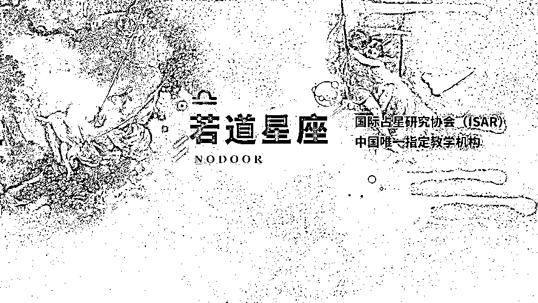作者/Iris ISAR 认证占星师
编辑/翀子 封面/书君 图片/网络 9 月 23 日凌晨 3 点 20 分，太阳进入天秤座，我们迎来了秋分。天秤座象征和谐与公正的原型能量，是与白羊座相距 180 度的星座。在白羊座-天秤座轴线，人从“我”走向“我们”，成为关系议题的主线。

暑气渐消，冬风未起。9 月 23 日秋分这一天，北半球迎来了一年中气候最舒适的季节，太阳也在这一天凌晨 3:20 于黄道开始了天秤座之旅。

占星学中的星座（sign）是基于季节的划分，“标注”了太阳在黄道上的位置，并且每一个星座都对应一个原型能量。**与秋分这个节气对应的，就是天秤座。**

“秋分者，阴阳相半也，故昼夜均而寒暑平。”从中国古籍《春秋繁露、阴阳出入上下篇》的这个描述就可以看出，这一天昼夜等分、阴阳平衡。正如这个节气平衡了夏的炽热和冬的严寒，**天秤座在占星学中象征均衡与和谐，也与平等、公正这个原型能量呼应。**

另外一个昼夜等分的节气是在春分这一天，每年 3 月 21 日前后太阳进入黄道的第一个星座——白羊座。**从春分到秋分、从白羊座到天秤座，太阳在黄道走了刚好 180 度。**连结这两个星座，会形成一条 180 度的水平线，将黄道 12 宫的圆周一分为二，形成占星学中的“对分相位”。

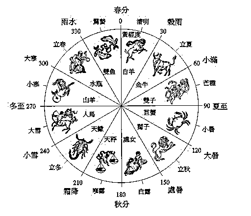

可以说，这个两级的**二元对立**，构建出我们**存在的基础**：光明与黑暗、黑与白、善与恶、阴与阳、男人与女人、内与外、上与下、意识与无意识……人类故事的戏剧也由这个极富张力的两级粉墨登场。

**白羊座**

白羊座是黄道第一宫的开始，从无始无终的混沌宇宙中，意识诞生，**大声宣告“我”的存在**。白羊座的季节春回大地，万物复苏，“玄鸟至、雷乃发声、始电”。天地自然间洋溢着**创生**的能量。

**火象星座白羊座是第一个创始星座，彰显着热情如火、一往无前的勇士精神。**这个星座在对世界宣告：“我是”、“我要”，以及“我现在就要”。白羊座被火星守护，这个星座的原型是：**战士、先锋、勇士、无畏的人。**

**天秤座**

而它对面的天秤座的季节，暑气收，天气转凉，“雷始收声、蛰虫坯户、水始涸。”天地间能量内收。

风象星座天秤座有着冷静客观的态度，可以抽离地看到任何事物的两面。秋季色彩最为丰富，天高云淡、澄明静美。很多人都觉得这是四季中最美丽的季节。

**天秤座被金星守护**，是十二星座中对美的觉知最为敏感的星座。在天秤座心中，**有着对和谐、平衡和宁静的渴求**，不喜欢冲突和粗鲁。因而这个星座善于处理关系，长于社交。如同一座桥梁，天秤座是朋友间和团体里不可或缺的“中间人”或“调停人”。

与它对面的以“我”为中心的白羊座不同，天秤座的典型问题是：你要什么？在关系里，我是谁？**这个星座的原型是：艺术家、恋人、咨询师、协调人。**

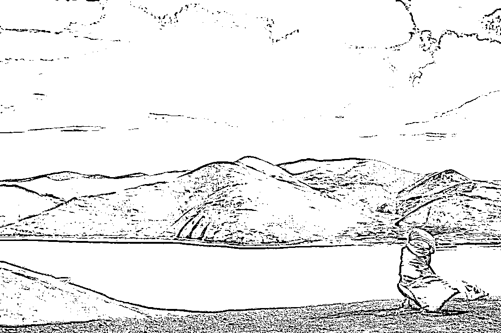

**白羊座-天秤座轴线**

**白羊座-天秤座的轴线，是人类的意识从“我”走向“你”，从“我”走向“我们”的发展历程。**它是人类“关系议题”的主线。如果说白羊座是“在我中寻找你”，那么天秤座则是“在你中发现我”。这条轴线也是我们常说的关系中的“投射”的来源。

如同所有的两极都寻求整合，白羊座和天秤座也都相互渴求着将自己所不具备的对方的特质纳入进来。即天秤座寻求白羊座的果决和勇气；白羊座欣赏天秤座的优雅和理智。

下面，就让我们从 6 位重量级文艺大咖的人生和作品中，进一步了解这两个星座，一窥白羊座-天秤座这两极的有趣游戏。

**1****导演：黑泽明 VS 李安**

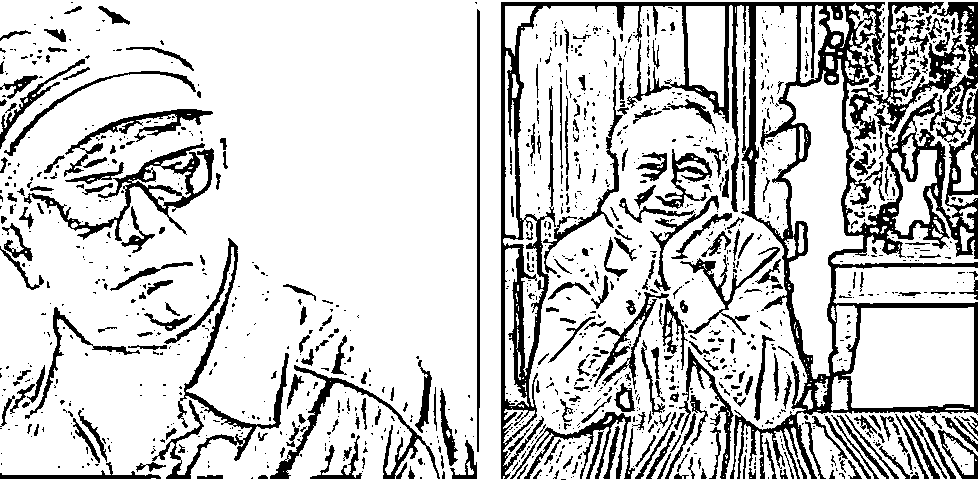

**丨**黑泽明（图左），李安（图右）

白羊座和天秤座都属于基本星座（创始星座），所以**都有着非常强的创造能量。**这两位导演在电影行业不仅堪称翘楚，更是开创了很多行业内的先河。

被称作“电影天皇”的日本导演黑泽明是亚洲第一个打破欧美电影垄断的导演，他引领了上世纪五六十年代的电影潮流，美国著名导演乔治•卢卡斯（代表作《星球大战》）、弗朗西斯•科波拉（代表作《教父》）、斯蒂芬•斯皮尔伯格（代表作《侏罗纪公园》）均是他的拥趸。

黑泽明的电影充满硬派的**阳刚之气**，“武士道”是其最偏爱、也是出现得最多的主题。仅从电影片名《七武士》、《乱》、《影武者》等就能看出**白羊座“战士”的原型**在他的作品中轰然作响。

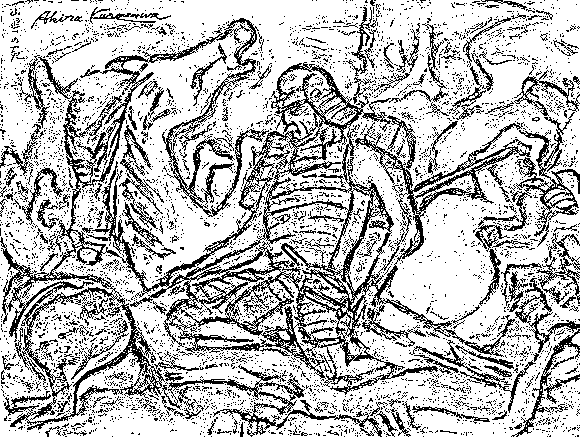**丨**黑泽明的画作：《影子武士》的分镜头，白羊座火之能量

在电影圈，黑泽明的火爆脾气和他的才华一样出名，在剧组里，他是“说一不二”的霸王，还被同事称为“脾气暴躁的孩子”。他曾经为了让剧组人员吃上一顿顺口的饭菜把盒饭直接砸到制作科的科长脸上，也为了捍卫电影艺术而公然与审片机构的头目对抗。白羊座的黑泽明正如他的星座原型那样**刚烈、暴躁、自我坚持。**

而到了对宫星座天秤座的导演李安这里，画风突变。白羊座的刚猛止息了，取而代之的是和煦的春风拂面。导演李安为人**温良谦和**，面对镜头总是面带微笑。然而他的创造力绝对不容小觑，他是历史上唯一位能够于奥斯卡奖、英国电影学院奖以及金球奖三大世界性电影颁奖典礼上斩获最佳导演的华人导演。

在李安的身上，你很容易感受到天秤座的能量——**关于合作、关于把自己融入他人。**他曾经在一次采访中说到：“我希望把自己放在不同的情状、戏剧和角色里去体验人生，去学习这个世界。拍电影对我不仅是工作，它是我的生活。”

单打独斗是白羊座的自然倾向，如同一个英雄面对整个世界。而天秤座寻求的**合作，权衡，以及在与他人的关系中定义自己。**合作伙伴、亲密关系、家人，都是天秤座非常看重的部分。

李安曾讲过这样的话：“很多跟我一起工作的人，在我拍片那段时间是我最亲密的伙伴，他们对我的影响也非常大。不只是照顾我，他们的生活跟我的概念，跟我要拍的内容都融合到了一起。”

天秤座在团队中，经常像粘合剂一样把不同的特质联结在一起，完成一个人不能完成的事情。他的电影在细腻中蕴含的强大的情感能量，充满哲思。如《理智与情感》、《断背山》、《推手》，还有著名的改编自天秤座女座家张爱玲的《色戒》。

正如前面提到的**白羊座和天秤座都寻求对宫的能量帮助自己达至“圆熟”**。我们可以在黑泽明的代表作《罗生门》中看到他巧妙地揭示真理的相对性和主观性，也可以在李安的性格和作品中看到永无止境的好奇和探索，以及温情中的激情澎湃。

**白羊座的武士能量是个体的突出，天秤座的爱的能量是 “我与你在一起”。**

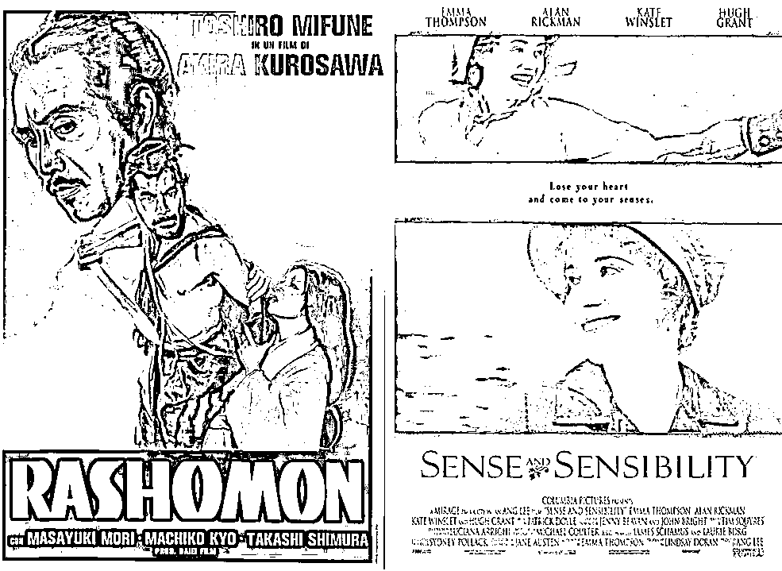

**丨**黑泽明的《罗生门》海报（左）与李安的《理智与情感》海报（右）

**2****作家：三毛 VS 张爱玲**

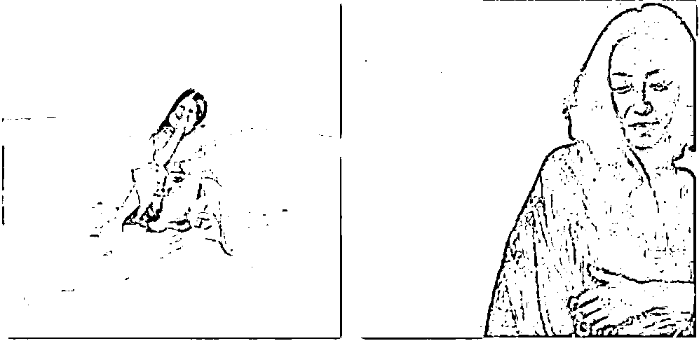

**丨**三毛（左）与张爱玲（右）

这两位蜚声文坛的奇女子可谓性格迥异，作品风格也呈现出宛如“两个世界”般的截然不同。从这两位女作家的人生和作品来看白羊座和天秤座的两级对立和整合，尤其有趣。

**白羊座的三毛**对生命有着**火一般的热情**，大漠黄沙中的一袭红裙如花朵般灿烂。她有着所有白羊座女子的**纯真、好奇、大胆与奔放。**对于爱情、对于梦想，她想到，就行动。白羊座要**在行动中实现自我**。然而火焰来势迅猛，强烈却不长久，她终于还是早早地离开了这个世界，留给世人无数的唏嘘和感慨。

**天秤座的张爱玲**一生在爱的关系里浮浮沉沉，写尽世间情的沧桑和无望。她尽管孤傲，却在面对爱人时，要“低到尘埃里”。天秤座的她**寻求在关系中实现自我**。她的文字如同拿了根绣花针细细秀出人生的“华袍”，尽管上面爬满了“虱子”。

她有段著名的文字：“也许每一个男子全都有过这样的两个女人，至少两个。娶了红玫瑰，久而久之，红的变了墙上的一抹蚊子血，白的还是‘床前明月光’；娶了白玫瑰，白的便是衣服上的一粒饭粘子，红的却是心口上的一颗朱砂痣。”很有天秤座“纠结”的特质。

说到天秤座最为人诟病的**“选择困难”**，在我看来，可能是源于**天秤座对“平衡”的深层需求和对二元对立的透彻的理解和真正接纳**，对于天秤座来说，无论站在哪一端，他们都可以看到另外的一端，没有绝对的对与错、好与坏。

回到两位女作家，非常有趣的是，如同白羊座“我的视角”和天秤座“关系的视角”之对比，三毛的文字从来都以第一人称来写作。而张爱玲的作品，都是要把自己隐藏起来，以第三人称来书写，仿佛把自己置于故事之外看尽悲欢离合。

既然是作家，就让我们从她们的文字感受白羊座独立的灵魂和天秤座对情感的执着吧。

每一日的生活和挑战，在那笔墨无以形容的荒凉里，烧出一个全新的灵魂。在生与死的极限里，为自己存活，找出了真正的意义。

……

沙漠的至美，更是那一棵棵手臂张向天空的枯树。是一朵在干地上挣扎着开尽生之喜悦的小紫花。是一只孤鸟的哀鸣划破长空。是夕阳西下时，化入一轮红日中的那个单骑的人。

——三毛《撒哈拉之心》

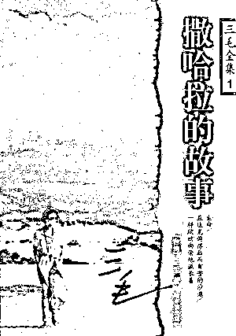

我要你知道，在这个世界上总有一个人是等着你的，不管在什么时候，不管在什么地方，反正你知道，总有这么个人。

——张爱玲《半生缘》

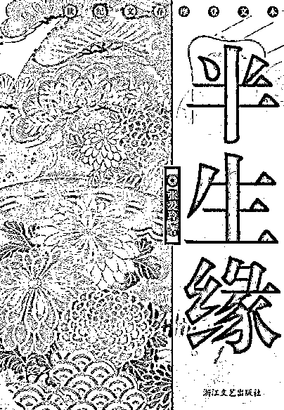

**3****诗人：波德莱尔 VS 鲁米**

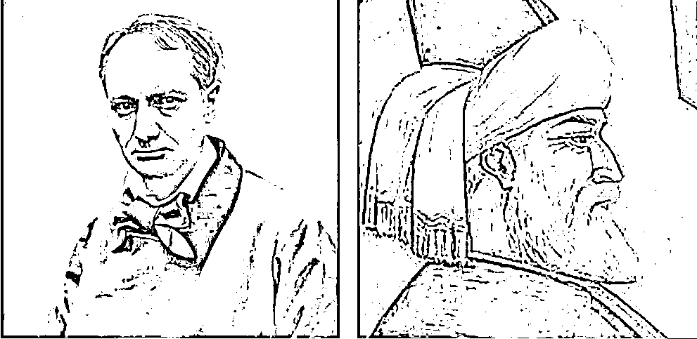

**丨**波德莱尔（左）与鲁米（右）

我是谁？我与你是什么关系？我如何遇到我爱的人？在我们之间，哪些戏剧在上演？“关系”在每个人的生活里，都是极为重要的主题。**孤独的白羊座战士寻找人群， 爱中沉醉的天秤座恋人寻找自己。**

以《恶之花》成名的法国象征派诗歌先驱，**夏尔·皮埃尔·波德莱尔是一位出生在 4 月 9 日的白羊座诗人，**他身上充溢着一种**大胆的反叛精神**。诗人兰波尊他为“最初的洞察者，诗人中的王者，真正的神”。

在这位诗人身上，你可以看到“白羊座-天秤座”轴线的两极性和思辩。波德莱尔认为：在每个人身上，时刻都有两种要求，一种趋向上帝，一种向往撒旦。对上帝的祈求或是对灵性的祈求是向上的愿望，对撒旦的祈求或是对兽行的祈求是堕落的快乐。”

另一位古波斯的神秘主义诗人**鲁米**，出生在一个**天秤座**的新月之夜。他的一生，在爱中寻觅，在爱中圆满。**他的诗作和一生彰显出天秤座对美与爱的迷醉，以及公平看待万物的精神。**对于鲁米来讲，神秘主义者的生活是一个“爱人的集结，不分高低、慧痴、儒丁。”

在文章最后，就让我们波德莱尔和鲁米的诗句中，从两级走向中间，在你与我的面对面中，遇见生命。

并不是每一个人都可以在人群的海洋里漫游。要知道享受人群的美味是一门艺术。而只有这样的人才能做到：与所有同类人不同，他生机勃勃、食欲旺盛，在襁褓中，神仙就使他染上了乔装改扮、戴纱掩面的癖好，又为他造就了厌烦家世、喜欢出游的毛病。

人群与孤独，对于一个活跃而多产的诗人来说，这是两个同义词，它们可以互相代替。谁不会使孤独充满人群，谁就不会在繁忙的人群中独立存在。

——波德莱尔《巴黎的忧郁》

如果你爱上爱情，那就寻找你自己。

我不了解爱者与被爱者。

我只是在这条路上罢了，

一直走就是了。

我得到了温柔地对待，

也要以温柔对待他人。

万物生而有翼

你生而有翼，

为何竟愿匍匐一生

形如虫蚁？

——鲁米《万物生而有翼》

****版权声明：****原创文章由作者授权发布于若道平台，欢迎转发，反对抄袭。友号转载请申请白名单。

**Iris**职业占星师 / 塔罗师 / 摄影师
若道 2014 届核心课程毕业生 ISAR 认证占星师（2014 年获得）国家广电媒体工作 10 年，现定居大理**咨询微信号**：Sun_Song69**微信公众号**：possibility_in_you

长按打赏

****学习占星学****

****点击下图了解课程详情**** 

****

**

**

****

**微信又双叒叕改版啦，不想错过若道君的推送？**

**就把若道设为星标吧！**

**▼**

就是这个“在看”，戳戳戳 ☟

******报名直达入口******

# 神话塔罗之大阿卡纳牌｜恋人

> 原文：[`mp.weixin.qq.com/s?__biz=MzA5NjA0NTAxNg==&mid=2651457110&idx=2&sn=b4f6a1e93475b39df8f6c80a7409c59c&chksm=8b48b4e1bc3f3df721f206e899272c01bf324355f649fe0fd0dd8363c5b58683daa38e8cf648&scene=126&sessionid=1692737923#rd`](http://mp.weixin.qq.com/s?__biz=MzA5NjA0NTAxNg==&mid=2651457110&idx=2&sn=b4f6a1e93475b39df8f6c80a7409c59c&chksm=8b48b4e1bc3f3df721f206e899272c01bf324355f649fe0fd0dd8363c5b58683daa38e8cf648&scene=126&sessionid=1692737923#rd)

作者/朱丽叶·沙曼-伯克 丽兹·格林

译者/闫东升 编辑/玫瑰 图片/神话塔罗 网络

本文节选自《神话塔罗》

塔罗牌中许多版本的大阿卡纳牌都有编号，但朱丽叶·沙曼-伯克与丽兹·格林并没有给神话塔罗中的大阿卡纳牌编号。而早在十五世纪出现的维斯康提塔罗牌中，牌面图案既没有名字也没有编号，这或许反映了一个重要的心理学洞见——人类发展的原型阶段并不是人人相同，而是代表着每个人独特的“成长经历”，这在任何个体的生命中都可能以不同次序发生。今天就来解读大阿卡纳牌——恋人。

[🔈 神话塔罗·恋人](https://res.wx.qq.com/voice/getvoice?mediaid=MzA5NjA0NTAxNl8yNjUxNDU3MTA5)

**｜**朗读者小巫

**书名：**

神话塔罗 

**作者：**

朱丽叶·沙曼-伯克   丽兹·格林 

**出版日期：**

2011-08-02

恋人对应的希腊神祗

**帕里斯·特洛伊王子**

**三个女神一台戏**恋人牌描绘的是一个年轻俊秀、金发碧眼的年轻男子，他身着牧羊人的简单装束，右手握着一个顶端弯曲的木杖，左手紧握着一个金苹果。三个女人并列站在他的面前，这是一个选美比赛，而金苹果就是冠军的奖赏。左边的女性成熟而庄重，拥有一头赤褐色长发和一双蓝色的双眼，身穿皇室的紫色长袍，头戴金色王冠，手里握着一个类似地球仪的圆球。中间的女子非常年轻而且魅力十足，拥有一头黑色秀发，身穿玫红色半透明长裙，玲珑的身材隐约可见。右边的女性气质沉静高雅，身着战士的盔甲，浅色的头发被钢盔遮住了一半，手里握着一把宝剑。牌面中远处的背景是连绵起伏的山峦，远远望去苍翠繁茂。

> **女神赫拉（*Hera*）**：是宙斯（*Zeus*）的配偶和代言人，她掌握着整个物质世界，代表着皇帝宙斯在人世间的威信和伦理道德的规范。 **女神阿弗洛狄忒（*Aphrodite*）**：能够给予人们的是爱之圣杯，我们会在后面小阿卡纳牌的圣杯系列中再次看到，爱之圣杯是关系的象征。**雅典娜（*Athene*）**：能够给予的是一把宝剑，我们会在后面小阿卡纳牌的宝剑系列中再次看到，宝剑象征着思维的力量、决断力和敏锐的观察力，这都是属于头脑的领域。

**特洛伊，一个苹果引发的战争**在这张牌中我们遇到了特洛伊（*Trojan*）的王子帕里斯（*Paris*），他奉宙斯之命在赫拉、阿弗洛狄忒和雅典娜之间选择出最美丽的女神。帕里斯出生的时候，有一位神灵预言他会使其父亲的王国衰败。他的父亲——特洛伊的国王布莱姆（*Priam*），命令手下把帕里斯遗弃在荒山野岭，后来一位善良的牧羊人救了他。帕里斯在照料羊群的岁月里慢慢长大成人，他喜欢在闲暇的时候用浪漫的方式追求女性，而他本身也是一个既英俊又充满魅力的小伙子。有一天，奥林匹斯山的众神为了赫拉（神界的皇后）、阿弗洛狄忒（感官之爱的女神）和雅典娜（正义女神）谁是最美丽的女神的问题而争论不休，宙斯决定让帕里斯作为裁判，因为他对于女性有着非常丰富的经验。宙斯派赫尔墨斯（*Hermes*）去通知帕里斯，并告诉他这是一份殊荣。 帕里斯一听到这个要求就立刻回绝了，因为他知道无论选择了哪位女神，另外两位都不会原谅他的。但是赫尔墨斯威胁他说，如果他不接受，宙斯就会非常愤怒，那后果就非常糟糕了。帕里斯把一个苹果分了三份，他的意思是说自己无法从三位光彩夺目的女神之间做出选择，但是赫尔墨斯并不接受这个结果。这时，三位女神同时现身在帕里斯面前。赫拉说如果帕里斯选择她，就给予他统治尘世的权利。阿弗洛狄忒解开了身上的长袍，拿出了爱之圣杯，承诺他如果选择自己，就赐予他尘世最美的女人作为奖赏。结果当然不言自明，帕里斯还非常年轻，并不了解自己内在真正的价值，自然毫不犹豫地选择了阿弗洛狄忒。他得到的奖赏是闻名于世的美女海伦（Helen），她当时已是斯巴达（Sparta）国王的王后了。赫拉和雅典娜听到结果后微微一笑，告诉帕里斯她们不会对他的选择抱有成见，然后就转身挽着彼此的手臂离开了，但她们回去后立即密谋颠覆特洛伊王国。特洛伊战争就这样拉开了帷幕，起因是海伦的丈夫因为妻子的不忠而异常愤怒，一把大火把特洛伊城烧成灰烬，雄伟的皇宫也被全部毁掉。帕里斯出生时候的预言变成了现实。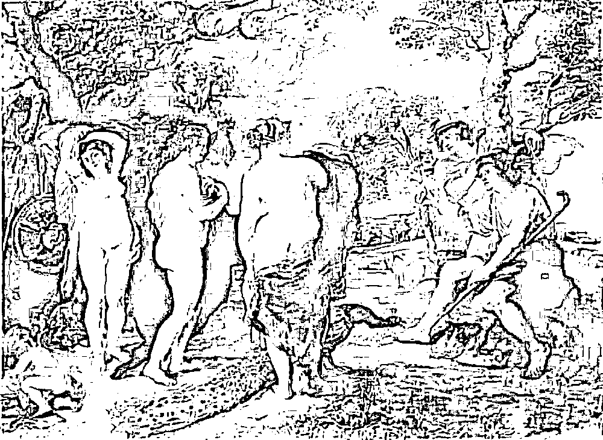**自由意志 vs 本能****从人们内在的层面来看，神话中帕里斯的评判象征着生命中第一个最重要的挑战，那就是发展成为独立个体（individual）的过程中爱之选择的问题。**这个进退两难的局面不仅仅是在两个女性（或男性）中选择哪一个的问题，它还反映出我们自己的价值，因为我们的选择映射出我们想要变成怎样的一个人。因为帕里斯的幼稚和性需求的驱力，他没办法真正从一个成熟的视角做出选择。他的选择是由欲望决定的，而不他真正的自己。**这里呈现的是关于自由意志（free will）和本能冲动这一对力量的较量。****爱之选择的结果对于接下来发生的一切影响巨大，它可以说影响了整个人生的方方面面。**帕里斯根据本能冲动做出的选择，最终导致了惊天动地的特洛伊战争。不能说他做了“错误的”选择，因为他还没有足够的定力去平衡阿弗洛狄忒的情欲吸引力，最终做出了和别人妻子偷情的决定。当然他也不了解自己，无法懂得统治尘世的权利和作为维护正义而战的重要性。选美之争是他不得不面对的宿命，就像我们有时候还没有准备好时，却必须要面对生命中的挑战一样，从某种意义上来说，他“错误的”选择是必要的，也是必然的。对他人的渴望迫使我们去发展自己的个体价值和对自我的了解，这势必根植于每个人的选择过程中所出现的混乱和冲突。如此的境遇无可避免，因为它属于人类内在的原型。帕里斯是人类内在的意象，反映着对于满足欲望的无意识需求，以及无法看到我们势必要为选择的后果负责。没有通过战火的洗礼，我们不能理解如何去开创自己的将来，只能一味地责怪命运、机遇或者他人，自我反省是我们必须学会的课题。**恋人，选择的意义****从解牌的角度来看，恋人牌出现的时候，预示着需要做出某种选择的时刻到了，这通常与爱情有关。**愚人在刚刚学习了自己身上的二元性之后，现在必须要测试他的价值了。有时候，这张牌意味着**当事人要面对三角恋情，也可能意味着一段轻率的婚姻所带来的问题，或者是在爱情、事业与创造性活动之间的选择问题。**这张牌意味着**个人做出选择时深思熟虑的必要性，盲目的本能驱力和创造性的自由意志之间，人们要学会辨识，才能避免走上帕里斯的灾难之路。**

**版权声明：**本文由《自在园》授权发布，欢迎转发，反对抄袭。友号转载请申请白名单。

**神话塔罗系列**

[开篇](http://mp.weixin.qq.com/s?__biz=MzA5NjA0NTAxNg==&mid=2651451590&idx=2&sn=41c1083542bcf098de303e29a028ff20&chksm=8b4b4271bc3ccb67d5d53c143cd5a17c24b7b60e5b1051949fa9f086f90b4ab04877976c47e5&scene=21#wechat_redirect)丨[愚人](http://mp.weixin.qq.com/s?__biz=MzA5NjA0NTAxNg==&mid=2651452189&idx=2&sn=f4cc6e768e367fbdb0f69b9c6382443d&chksm=8b4b41aabc3cc8bcdbd952d91d8408014a799224d3f67ab50bb5cbe88ee0090afc92869de1a6&scene=21#wechat_redirect)丨[魔术师](http://mp.weixin.qq.com/s?__biz=MzA5NjA0NTAxNg==&mid=2651453528&idx=2&sn=3ca9b35e1736168eef1856274635224a&chksm=8b4b4aefbc3cc3f965f2531f8c0d37da2e66a2b47139d445df1ea35eeb74bdf3b6827236741a&scene=21#wechat_redirect)

[女祭司](http://mp.weixin.qq.com/s?__biz=MzA5NjA0NTAxNg==&mid=2651455871&idx=2&sn=15ae629e1b35f1371b81868f5bfdd2aa&chksm=8b48b3c8bc3f3ade0175d0e03bfe496711801614273e7fe98b6435fafe0de5daf3a8d7c1312f&scene=21#wechat_redirect) | [皇后](http://mp.weixin.qq.com/s?__biz=MzA5NjA0NTAxNg==&mid=2651453921&idx=2&sn=4d1efea03b2b9f940be7a6aadf553dec&chksm=8b4b4b56bc3cc2405fe562b8ef48f335699f57c12d5d817e24aeeb84f6306092de2ae55becc7&scene=21#wechat_redirect) | [皇帝](http://mp.weixin.qq.com/s?__biz=MzA5NjA0NTAxNg==&mid=2651455083&idx=2&sn=d12546b67c830055f37b147f41c7641f&chksm=8b4b4cdcbc3cc5cad2def85451c3a7ddbb31ba5b9a01febb8a9fb18991d3e1263d9371ac212f&scene=21#wechat_redirect)

[导师](http://mp.weixin.qq.com/s?__biz=MzA5NjA0NTAxNg==&mid=2651456482&idx=2&sn=153b4ca2f69f6745425525773616455d&chksm=8b48b155bc3f384322115b0b94621662ba562a2a252fd244a0a3fc84a664408b2311014e8db5&scene=21#wechat_redirect)

**朱丽叶·沙曼·伯克**从 20 世纪 70 年代早期开始，就对塔罗牌产生了兴趣，并踏入了塔罗的世界。后来，在丽兹·格林的鼓励下，开始研习心理占星学和塔罗。1984 年，第一本书《塔罗全书》（The Complete Book ofTarot）出版。之后，与丽兹·格林合作设计并撰写了《神话塔罗》（The Mythic Tarot）。朱丽叶写了十本塔罗和占星学书，包括一本名为《众星的传说》（Stories from the Stars）的儿童读物，以及与丽兹·格林合著的《神话之旅》（The Mythic Journey），这是一本详细讲述如何运用神话来指导生活的书。

**点击下图了解课程详情** 

**

**微信又双叒叕改版啦，不想错过若道君的推送？**

**就把若道设为星标吧！**

**▼**

**喜欢记得点一下在看哦☟**

************报名直达入口************

# 斯蒂芬三日线上工作坊丨如何进行一场有效的占星咨询（早鸟价最后 1 天）

> 原文：[`mp.weixin.qq.com/s?__biz=MzA5NjA0NTAxNg==&mid=2651457018&idx=3&sn=11c9d4ca0d12d3dc2790f80870226fb6&chksm=8b48b74dbc3f3e5b28bebd2bcf76e0cbdb8ad422569f3927adddb3db9e40b90686f731bf6cb3&scene=126&sessionid=1692737923#rd`](http://mp.weixin.qq.com/s?__biz=MzA5NjA0NTAxNg==&mid=2651457018&idx=3&sn=11c9d4ca0d12d3dc2790f80870226fb6&chksm=8b48b74dbc3f3e5b28bebd2bcf76e0cbdb8ad422569f3927adddb3db9e40b90686f731bf6cb3&scene=126&sessionid=1692737923#rd)

**喜大普奔，斯蒂芬要来教占星咨询了！**

占星咨询对于很多占星学生和兼职占星师而言，都是考验自己到底能否成为职业占星师，建立欣欣向荣职业生涯的最关键一环。

一个坏消息是，当你辛辛苦苦学习完所有的占星技术后，你可能仍会有些沮丧地发现，自己还是做不好一场咨询。

**比如：**

对咨询的问题

*   我可以怎样迅速和客户建立信任？

*   我如何描述星图中我看到的困难配置，或者如何描述我看到的即将到来的富有挑战的行进？

*   如果客户在咨询中滔滔不绝，我该怎么办？

*   如果客户在咨询中一言不发，我又该怎么办？

*   如果客户否认我所描述的他/她明显存在的问题怎么办？

*   如果客户存在明显的心理问题怎么办？

*   如果我讨厌这个客户怎么办？

*   如果我被这个客户吸引怎么办？

*   如果我的性能量被客户激发怎么办？

*   ……

**这么多问题怎么办？！**

别着急。

好消息是，这是每一个占星学生和新手占星师都会遇到的问题，也是每个占星师必走之路。**其中一些问题是可以用占星技能所解决的，而另一些又是在占星技巧之外，需要进入心理学的领域。**不论怎样，归根到底，我们要能在咨询与客户建立并且维持**良好的咨询关系**，甚至与那些跟我们性情截然相反的客户。

1

**授课内容**

如果你听过斯蒂芬·弗里斯特的占星咨询，你会看到客户被他润物细无声的咨询所打动，又感到自己被他深沉的慈悲所懂得。那些娓娓道来的故事在客户面前展开生命时空的画卷，在咨询结束时，又充满希望的力量。

**而****今年****10****月****，在斯蒂芬到中国教学 10 年后，他将****第一次****与所有热爱他的学员分享如何做好一场占星咨询。**

在这个网络课程中，占星大师斯蒂芬·弗里斯特将会和你分享他几十年来一对一面对面的**占星咨询经验**；他也会分享如何提前规划好**接近客户心灵**的占星技巧。**客户个人星图**为我们提供一个最迅速，也最可依赖地建立信任和自然连接的地图，他还会分享如何运用个人星图建立这个连接。

2

**斯蒂芬的占星著作**

*   **1984-1988 年间**，斯蒂芬写作出版了《内在的天空》（已有中文版）、《变化的天空》和《天空的伴侣》三本占星经典著作，奠定了早期在占星学界的地位。

*   **2002-2005 年间**，他与朱迪·弗里斯特共同创作了两本经典的关系占星学著作《天空的伴侣 I：爱、性、和进化占星学》《天空的伴侣 II：组合图》。　

*   **2008 年**，斯蒂芬出版了一本非常重要的著作《昨日的天空》，此书是至今为止关于轮回转世跟星图的清晰对应最详尽的著作之一。 斯蒂芬前后一共出版了 12 部占星著作，在世界占星学界拥有很高的声誉。

3

**斯蒂芬获得的荣誉**

**1985 年**，他凭借《内在的天空》一书获得**职业占星师协会奖**（Professional Astrologers Incorporated Award）。

**1992、1995、2008 年、2018 年**，他四次获得占星界最高的占星学联合协会奖（UnitedAstrology Congress Regulus Award）提名，**2018 年获得轩辕十四教育奖**。

4

**斯蒂芬的占星哲学观**

斯蒂芬的占星风格以自由和选择为中心，他的解读不是以下定论的方式来“预测”未来，他强调如何**改善生命**，而不是宿命式的论断。他以心理占星学的语言来解读星图上的人格部分，但是通过**南北交点及其相位和守护星**来探索星图所揭示的前世业力与今生方向，在灵魂进化的背景里来整体解读星图。

他认为进化占星学的目的在于鼓励人们做出更符合进化方向的智慧选择，我们学习去了解前世的时侯，关注点应该集中在**如何通过意识来疗愈自己**。

5

**这些名人怎么说？**

斯蒂芬让我们停止了玩责备命运的游戏，而开始看到自己是一个走在进化路途上的勇士。 ——**奥普拉杂志***“O: THE OPRAH MAGAZINE”*

斯蒂芬和杰夫这两位著名占星师创造性地相互应和，展现出他们出色的教师才华，发展并弘扬了占星这门艺术。（对《测量天空：进化占星学和灵魂的钥匙》的书评） ——著名心理占星师 现代占星学之父 **诺·泰尔**（Noel Tyl）

请享用斯蒂芬和朱迪这两个博大的灵魂在此书中所提供的洞见大餐吧。（对《天空的伴侣》的书评） ——进化占星学的创始人之一 **杰夫·格林**（Jeff Green）

我为斯蒂芬解读的精准感到惊叹，他强调没有一件事是坏得无法挽回的，也没有一件事是如此之好，以至于它不会因为现在的错误判断而消失的。我怎样推荐他都不为过！ ——好莱坞著名影星“钢铁侠”男主角 **小罗伯特·唐尼**（Robert Downey Jr）

6

**上过课的占星师怎么说？**

他关于我星图的解读，让几乎所有在场的人掉泪，我也从此开启了一段灵魂追寻的旅程。我很惊讶他透过星图可以如此深入一个人的灵魂。很多东西你自己都不知道，但是他讲出来你会发现，啊，这是真的，这是占星学的神奇。——**《心探索》创始人孟想**每个来参加老师课程的同学，都会被老师深深的慈悲心感动。这种慈悲心，并不是表面上说的一些什么话，而是一种从意识层次上发出的能量。每个来上课的人，都能感受到老师的爱。这种爱，并不是盲目的爱，而是深刻地洞悉真相后的慈悲。——**斯蒂芬老师工作坊翻译逸月**斯蒂芬老师的一对一咨询已经排期到两年之后，我特别幸运，曾在课堂上被老师抽中分析过我的星图，老师充满爱与智慧的指引让我更加清晰的认识了自我。内在的潜能、需求和矛盾被老师娓娓道来。——**禄丽荣**斯蒂芬老师是位非常非常值得推荐的大师，很粉他，这位进化占星学的创始人，对人的理解是那么的全面完整、深刻洞见、慈悲和温暖，就这方面而言足可以媲美我无比崇敬的荣格和史坦纳（这两位去天堂里玩了），如果你对西洋占星感兴趣，或者对人的所有角度、各个层次的真相和可能性感兴趣，推荐斯蒂芬老师的书和课程，特别是他的课程，数倍的功力大增的好机会，错过真是占星粉丝的莫大损失。——**仁华**

7

**2020 年斯蒂芬线上工作坊学员感悟**

8

**什么人适合这门课程？**

*   占星师或渴望成为占星师的人群。    

*   课程会涉及综合解读高阶内容，不了解相关知识的同学，请提前学习相关内容。

9

**老师简介**

**斯蒂芬·弗里斯特(Steven Forrest)**

*   进化占星学的创始人之一，当今世界最有影响力的占星大师之一；

*   毕业于美国北卡罗莱纳大学宗教学专业；

*   1984-1988 年间，写作出版了《内在的天空》、《变幻的天空》和《天空的伴侣》三本占星经典著作，奠定了早期在占星学界的地位。前后一共出版了 12 部占星著作，在世界占星学界拥有很高的声誉。

*   1985 年，他凭借《内在的天空》一书获得职业占星师协会奖（*Professional Astrologers IncorporatedAward*）。1992、1995、2008 年、2018 年，他四次获得占星界最高的占星学联合协会奖（*United Astrology Congress Regulus Award*）提名，2018 年获得轩辕十四教育奖。

*   斯蒂芬将自己的绝大部分时间都花在教学以及个人咨询上，他于 1998 年创立了占星学徒计划（*Astrological Appretice Program*），这个计划致力于培养职业占星师；

*   至今为止已经有 600 余位学员完成了培训，其中很多都成为了优秀的职业占星师；

*   他是一位脚踏实地的导师，充满快乐和活力，亲和幽默同时又充满了智慧；他的课程不仅仅是一次占星知识和经验的学习，也是一次与智者的相遇。

10

**课程费用**

**正价：****4800 元**

**早鸟价：****3800 元****（9 月 22 日截止）**

11

**授课时间、方式和退转**

**授课时间：**

****2021 年 10 月 15 日-10 月 17 日（周五、周六、周日）****

****每天 7:00-13:00****

7:00 AM - 9:30 AM

**（1 小时休息）**

10:30 AM - 12:30 PM

**授课方式：**线上直播课，英文授课，中文翻译**退转课程：**

退款原则请详看《教学协议》，如有疑问请咨询课程顾问。

****斯蒂芬三日线上工作坊****

**授课老师：斯蒂芬·弗里斯特**

**授课时间：****2021 年 10 月 15 日-10 月 17 日**

**授课方式：**线上直播课，英文授课，中文翻译

**费用：**4800 元；**早鸟价：3800 元****（9 月 22 日截止）**

**课程负责人：****王老师**（微信：18510107057，请备注“斯蒂芬工作坊”）

长按二维码添加课程负责人咨询~

****报名请点击“阅读原文”****

# “你要的爱，不只是依赖”丨这五种金星式的关系，你属于哪一种？（值得收藏）

> 原文：[`mp.weixin.qq.com/s?__biz=MzA5NjA0NTAxNg==&mid=2651457018&idx=1&sn=7bb0dc4dcbfcba0546f5351cb08b67e3&chksm=8b48b74dbc3f3e5bfbd1e6963d796250ca77370b3e0e8347f2d069f67d8cd767fedf031b8653&scene=126&sessionid=1692737923#rd`](http://mp.weixin.qq.com/s?__biz=MzA5NjA0NTAxNg==&mid=2651457018&idx=1&sn=7bb0dc4dcbfcba0546f5351cb08b67e3&chksm=8b48b74dbc3f3e5bfbd1e6963d796250ca77370b3e0e8347f2d069f67d8cd767fedf031b8653&scene=126&sessionid=1692737923#rd)

☆****************后台回复“今日”，给你一句生命态度****************

作者/艾德里安·邓肯

译者/Jun 校对/Chang 

编辑/翀子 封面/书君 图片/网络

金星是什么吸引我们、什么不吸引我们的标尺，也是我们判断自己是否有价值的标尺，而我们也在亲密关系中实践自己金星的运作模式。星图中金星与不同行星形成相位时，都代表什么意涵？这是邓肯老师撰写的一篇精彩文章，而他也将作为[【核心课】](https://mp.weixin.qq.com/s?__biz=MjM5MjQwNjAyMQ==&mid=2649438826&idx=6&sn=2021d0992c95fe8a036fe1e29b199365&exportkey=Abkc%20IAmMg1yNo%20wVFmAOvo=&pass_ticket=6HVjjkRKhWCqVCqjvzp0SOpHi8gc%20q5av6iuAzrG%20vf2nNbSWf0OQAMJ4JU3BO9F&wx_header=0&scene=21&token=1273665179&lang=zh_CN#wechat_redirect)授课老师（点击查看详情），参与教学。
**金星的意涵**

如果说太阳代表着耀眼的意识之光，月亮代表着无意识的舒适摇篮，水星是无休止的思想游戏创造着从内到外的联系——那么**金星则是存在的舞台，在对生命力的和谐表达中，形状和形式在这舞台上被创造出来。**

每当我们接收到感官刺激，我们就会本能地形成判断，判断我们是不是喜欢某样东西，是不是不喜欢，或者对它漠不关心。这一切发生得很快，而且是无意识的……我们给人和事物贴上标签，然后根据我们的好恶来对待它们。

**金星是我们衡量什么吸引我们，什么不吸引我们的标尺。它也是我们判断自己是否有价值的标尺。**但实际上，人和事物就是他们本来的样子，评判事物、给事物分配价值的是我们。**这种价值不是内秉的，而是与体验者和其处境相关的。**例如，如果你独自一人身处广袤的沙漠，水就比黄金更有价值。

**金星的星座与宫位，及其相位，精确地显示了我们的价值判断是如何运作的。**随着生活在我们周围展开，我们不停地用我们的金星标尺来看别人和我们是如何作衡量的。

**处女座的金星**会看到地板上的灰尘和堆积的盘子，并据此作出评判，而**白羊座的金星**则不会。**金星/土星**的组合以安全的标尺来衡量一段关系，**金星/天王星**则以兴奋为标尺来衡量。

这种对周围环境的持续评估创造了一种磁场或光环，它会过滤事件、物件和人，实际上会阻止我们看到它们本身。但这是一个自然的过程，**我们根据金星过滤器，被特定的环境和社交圈吸引，**精确地选择了挂在墙上的那张照片、这双鞋、这个伴侣等等。

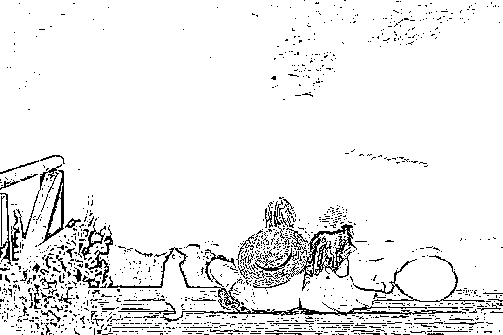

**金星在我们星图中的影响，**描述了我们小时候是**如何体验了爱**，以及这如何影响我们的**自我价值**和**对他人的评价**。金星尤其与姐妹有关……对金星的解读往往描述了如何体验到了姐妹，或在没有姐妹的情况下，**女性朋友**。金星也会讲述孩童时代的爱或缺乏爱的情况，特别是**父母如何表达爱**。

金星显示了我们**如何让爱进入生命**：如果**金星与木星**有配置，就是快乐地爱；**金星/土星**，就是谨慎地爱；**金星/天王星**，是断断续续地爱；**金星/海王星**，在我们的梦中去爱；**金星/冥王星**，将生命放在天平上去爱。

**爱的早年经历自然会影响我们今天给予和接受爱的方式，小时候形成的价值观和习惯也会影响我们今天的选择**。

**一个受到严重挑战的金星**将导致特定的爱情体验，而这些经验几乎完全是由生命最初几年的价值观和做出的决定所造成的。如果对被抛弃的恐惧或对欣赏的渴望影响了我们在关系中的行为，那对伴侣将会产生适得其反的效果。当今社会，不再对婚姻和分居有任何避讳，有些夫妻一直在一起是很不可思议的，毕竟有这么多困难的金星落位。

今天，**要想拥有一段有益的关系，就必须了解金星在星图中所扮演的角色，并有意识地努力完善其积极的一面，尽量减少其消极的一面。**

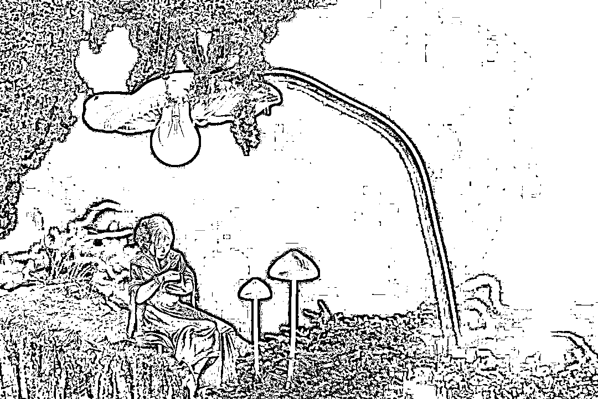

**男人的金星与女人的金星**

**男人星图的金星与女人星图中的金星之间有着深刻的差异。**比我大一岁的姐姐曾认真地告诉我，男孩是“鼻涕虫、蜗牛、小狗尾巴”做的，而她作为女孩是“糖、香料，还有所有美好的东西”做的。

在孩子们成长的社会中，性别传统占据着主导地位。小男孩和小女孩的价值观截然不同，或者说变得截然不同。我的姐姐很少花力气修我的自行车，而我就是办不到给她的娃娃穿衣服。男孩认同于火星，女孩认同于金星……

这就是今天的文化图景，尽管与前几个世纪相比，男性和女性有了更多交叉的地方。**因此，女性星图中的金星相位直指她心中女性身份的核心，而且这些相位影响了她是否会感到有吸引力。**

**在男性的星图中，**金星确实显示了一些他的自我价值，但是他会担心这在意识层面不太男人，**这种自我价值往往就会被投射出来。**

因此，**在男性的星图中，对金星的描述看来会反映了他受哪类女性吸引**——例如，金星在狮子座意味着他想要一个能创造出好印象的女性伴侣。这并不意味着这位女性真的像该男性所感受到的一样，而是说明他在她身上唤起了什么样的行为——他让什么通过了金星的过滤器，又把什么拒之门外。

**在所有的关系中，我们都倾向于表现出伴侣认可的行为**，因此，我们可能在这个伴侣面前是这样一个人，在下一位面前是另一个人。

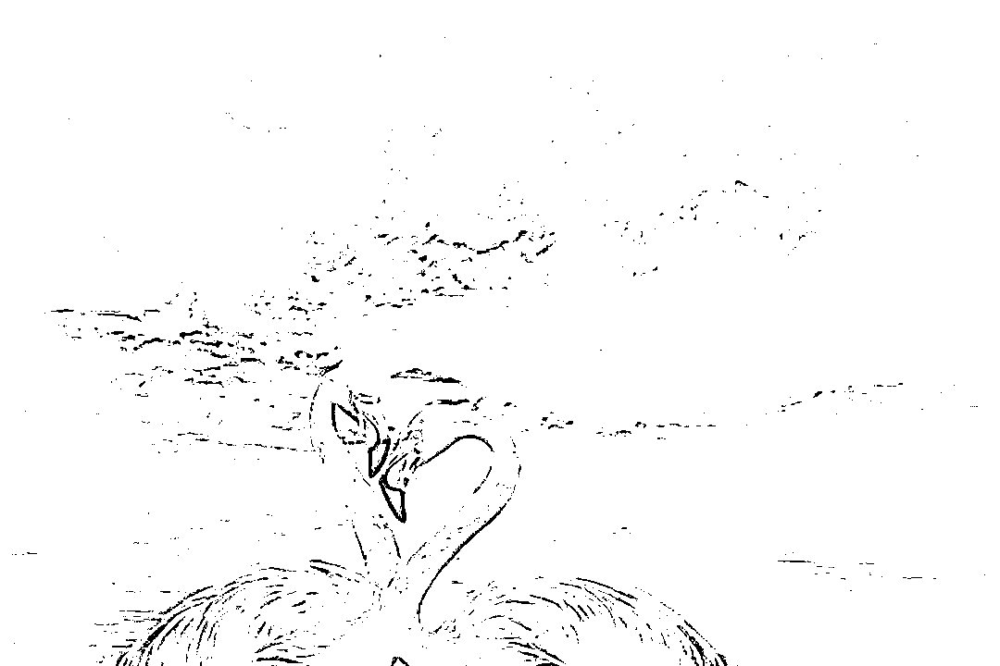

**在咨询中解读金星**

**在咨询中解读金星，**比解读太阳、月亮或水星要容易一些，因为金星的影响**相当明显地体现在人际关系中**，客户可以很容易地识别出占星师描述的那些爱情中的重复经历。

自我价值的问题虽然非常敏感，但还是隐藏在表面之下，**如果与客户建立了良好的关系，那么他就会愿意把任何恐惧带到台面上来。**一旦识别了关系中那些适得其反的行为，就不难让客户参与到能带来积极结果的新行为模式中来。

**金星/冥王星**可以很容易地学到，在一段生活关系中，对感情进行事后剖析是一个糟糕的策略。**金星/海王星**可以买账必须爱眼前人，等等。

**解读金星时，占星师要在唤感受上下功夫。**水星与内心的对话有关，而金星则与内心的感受有关——**通常是身体上一种相当强烈的物理感受，而且往往在喉部。**这是储存与爱和伤害有关的感觉的地方，也是在咨询中需要进入处理的地方。

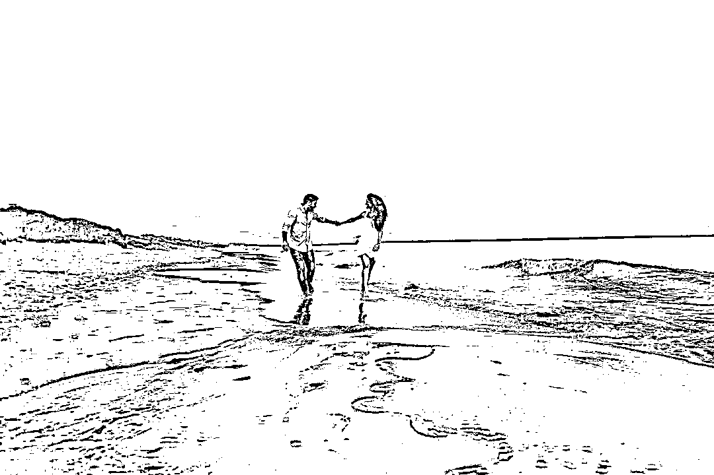

**金星与木星：丰饶的号角**

**这种组合在快乐和幸福方面可能是最幸运的，特别是六分相、三分相和合相，而且两颗行星的落位都不错的情况下。**

从金牛座的角度来看，金星给人感官愉悦和满足的可能；从天秤座的角度来看，金星带给人的则是社交互动与审美的乐趣，或是文化刺激的乐趣。即使是四分相和对分相也不一定会导致痛苦的体验，除非两者的落位都不好。

**金星这个配置最受智慧的吸引，**所以会有一种强烈的需求，想要找到一位因为有文化、有影响力而备受倾佩的伴侣。金星/木星会受**外国人**的吸引——通常是邻国的人——以及具有**开明哲学观点**的人。对分相比任何相位都更能表明从远方而来的关系，带有明显的文化差异。

**合相、四分相、对分相的一个困难点就是放纵过度。对爱情和快乐有着相当大的胃口。**这会导致多角关系，当一个伴侣满足了此人对爱的渴望，又渴望更多爱的出现。**这也会反映在饮食习惯上。**当木星对金星有不利影响时，道德问题也会显现出来。

吠陀占星师将金星描绘成“恶魔”并非没有道理，同样还有火星、土星和交点，而木星则与太阳和月亮一起，被列入众神的万神殿。**金星本身并不是“精神的”，与金星相关的爱也不一定是精神上的爱，而是填补了快乐和满足相关的需求。**

在咨询中很难将道德层面摆明了说……占星师只能指出结果，看看客户能否识别出它们，并投入到改变行为中。**如果金星/木星确实表现为多角关系，而客户希望改变这一点，那么他们必须解决自己对浪漫刺激的内在需求，并观察自己渴望伴侣有东西可以教他们的冲动。**

在一段关系的早期，金星/木星人对伴侣身上的**博学多才**而肃然起敬，因为他们觉得自己不拥有这些。随着时间的推移，他们会从伴侣那里吸收**文化和审美价值观**，然后也许会有这样一种感觉：没有什么可学的了。与此同时，随着关系的稳定，高档餐厅、异国假期和扩大社交圈带来的浪漫时光也会逐渐消退。

正是在这个时候，他们会被新恋情的禁果所诱惑。他们的伴侣只能在有限的时间内满足他们的智力需求，**理想情况下，金星/木星人应该自己的主动追求文化和智力发展，而不是将需求投射到伴侣身上。**

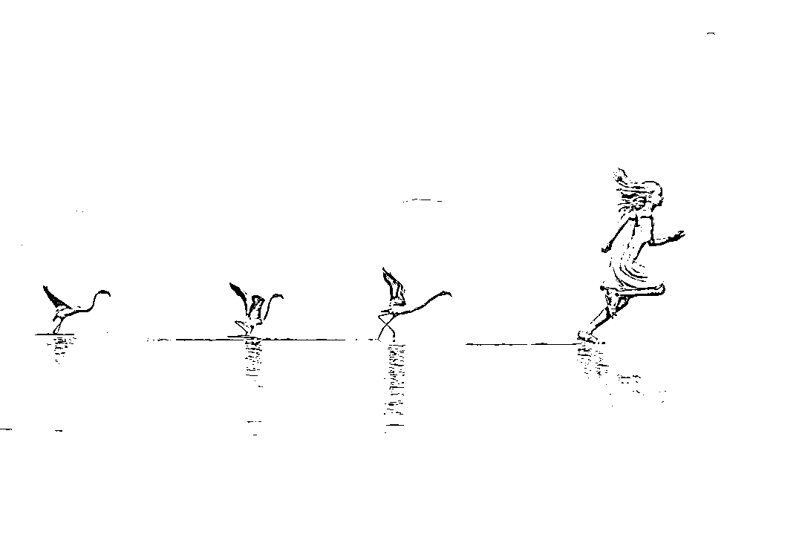

金星/木星对于一段关系所能提供的东西有着**最高的期望**。这些人**在恋爱时会轻易付出**，因此也会唤起伴侣的慷慨和浪漫行为。对他们来说，不会选择丑陋的行为，**当困难时期来临**，出现有愤怒、残忍或争吵时，他们会觉得自己的核心价值观被玷污了，并对自己慷慨的行为得到如此不公平的回报而感到愤慨。

但是如果拒绝面对不愉快的事实——比如奢侈导致贫穷，放纵导致过度，滥交导致损失——那么他们的伴侣最终可能会迫不得已地来破坏掉关系，而浪漫的梦想以粗暴的觉醒告终。**伴侣的心胸如此狭隘，可能不会被原谅。**

同样地，金星/木星具有**很高的审美价值**，对他们来说，环境中的丑陋或无知几乎是无法忍受的。**品味问题上的分歧**，在其他类型的关系中可能是一个小问题，但是会威胁到金星/木星关系的存在。这些人在品味上必须有自己的方式，**而且他们没空与庸人为伍。**

如果这些客户有关系或经济困难，那么至少部分是由上述行为造成的。对于这些客户来说，期望在爱情中得到持续的满足是不现实的，如果伴侣看上去粗鲁或表现得不浪漫，那可能是因为这个人在关系中努力保持现实，并且在经济上负责任。

**事实上，伴侣这样做就可能在关系中提供了必要的平衡，**是对客户有利的。如果伴侣不能履行这个让金星/木星不屑一顾的角色，还有谁会去呢？换个人难道金星/木星人就不会唤起对方类似的行为了吗？

尽管有上述可能的困难，金星/木星人还是会给他们所爱的人带来许多美好的祝福。**对他们有效的方法是，与他们可以仰视和寻求指导的人建立一种激励人心的智力关系。**他们需要承认的是，快乐是有代价的。爱情中的幸福并不是与生俱来的权利，生活不是芭芭拉⋅卡特兰的小说，**而失望往往源于他们自己被宠坏的行为。**

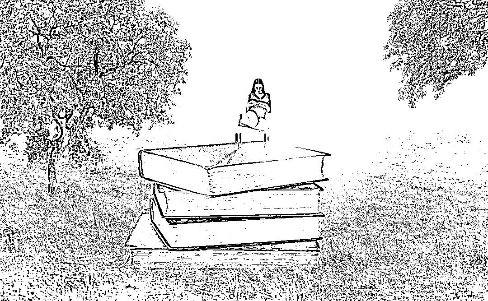

**金星与土星：渴望爱情**

金星和土星之间的接触会给关系带来一种**正式**的氛围，通常以礼貌和关切的方式表现出来。**金星/土星人发出的信息是，他们准备履行对关系的承诺。**

在社交聚会上，他们会给人留下良好的印象，但是当所有的客人都离开了，他们独自和伴侣在一起时，他们会感到更加笨拙和不自在。**这些人遇到的很多困难，都是由于他们极力避免在爱情中受伤所导致的结果。**

可以打包票的是，金星/土星人会在**15 岁左右**发生一个关键的插曲，就是感到遭遇初恋的拒绝。部分是因为正是在这个年纪，浪漫的触角开始伸出，亲密的关系开始了，**也是因为土星在这个年纪对分与它的出生位置，触发了金星/土星相位。**

其他年轻人可能会平静地接受拒绝，而金星/土星人则会得出结论，做出可能影响他们余生的决定。他们下定决心，永远不再脆弱。这意味着在以后的关系中，金星/土星人**对感情的回应很慢，**潜在的伴侣可能会断定他们对自己不感兴趣，然后另寻他人。

有时候，金星/土星人选择一段关系是**为了安全**，**而不是为了爱情，**这意味着**他们会选择一个爱他们的人，但他们很少感受到了爱意**……这种情况在以后可能会产生后果。

这些关系中似乎牵涉到业力因素，可能包括承担一些沉重的责任。在某种意义上，业力就是解药。一位女性客户的金星在上升点对分土星，她的孩子患有罕见的铜缺乏症（金星！），这意味着她必须一直护理她的女儿以保持她的健康。这唤起里她巨大的爱和关心，这是她生活中的一个净化因素。

一个金星/土星有困难相位的男人，经常会抱怨他的伴侣是个不快乐、抑郁的人，**事实上他们的关系可能确实会非常困难。**然而，有时候妻子的悲伤是因为她**感到缺乏爱**。

这可能是由于这种关系像是一种保险措施，而不是爱情的结合，也可能是因为男人无法以一种温暖和自发的方式表达爱意。在没有安全降落伞的情况下，此人非常不愿意“投出”爱的宣言。

如果男性客户对他的伴侣表示不满，关键是他要明白，**自己能够通过将吝啬转化为慷慨来影响对方，即使这意味要拥抱遭到拒绝的可能性。**

有这一相位的女性会从经验中确信自己没有吸引力，即使她看起来真的很棒。即使当她听到并感受到爱的宣言时，也不足以说服她相信自己的魅力。**问题在于内心的感受，这是任何外部经验都无法改变的。**

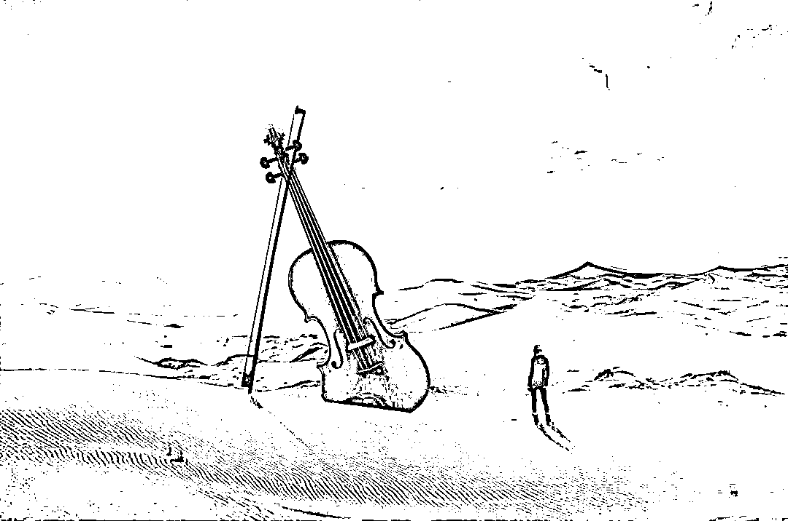

这些感受的根源，**来自于从小时候就觉得自己不被爱的感觉。**造成这种情况的原因可能有很多: 父母可能婚姻不和；母亲可能对孩子寄予厚望，而孩子无法实现；在学校可能有过痛苦的经历；与姐妹相处不好的经历等等。

然而，问题的关键在于，金星/土星过滤器会确保，**对与爱有关的事件的解释是相当悲观的。**金星/土星人能感受到父母之间的冷淡，但是也许会错过他们之间的温暖。

**值得做的是质疑他们对童年的解释，从而消除着他们关于自我价值感的错误信念，**而这些信念可能是基于对情况的错误评估。

例如，客户可能会说，母亲从来没有表现出温情，她太忙了。例如金星/土星显示了一位努力工作的单身职业母亲。这是什么差事啊！得赚钱，还要照顾孩子。这也是一种表达爱的方式。而且——正如金星/土星确实展示了一个重视专业精神的客户——这对孩子来说是多么好的榜样啊！

**重新定义事件，会让客户从一个完全不同的角度看待它们，**这可以有效地让客户摆脱可能有的丧失力量的信念。欣赏别人不畏困难作出的努力，是迈向自我欣赏的一大步，**自我欣赏也是解决该相位缺乏自爱的一剂良药。**

金星/土星的痛苦教训是，如果要求爱，爱就会被拒绝。**自给自足必须建立在对自身价值的内在信念之上。**从这个基础上，爱可以被给予而不用担心被拒绝。**对金星/土星客户有效的方法**是拥有一个有价值的职业生涯和一个稳定的承诺关系。**他们需要承认是的，他们害怕受到伤害，因为他们对爱很吝啬。**

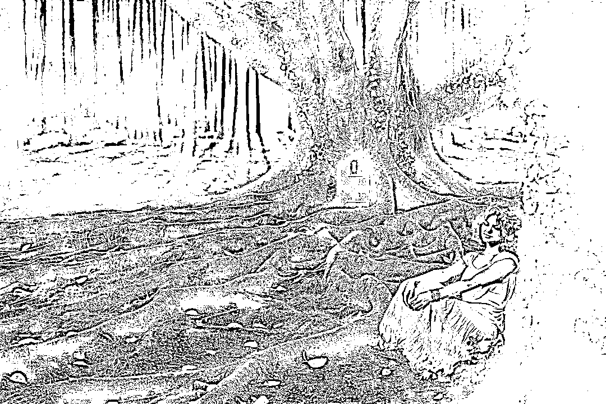

**金星与天王星：飞翔之鸟**

金星/天王星相位给人一种**不安分的社交能力**以及一种**对他人的好奇心**，尤其对不寻常之人和来自异国文化背景的人。金星是一种力量，与一个人周围的吸引力光环有关，与天王星的结合产生了一种**非凡的电力和磁力**，相当迷人。

这在传统关系中可能令人不安，因为传统关系的价值观是建立在家庭生活和排他性的基础上的。**通常，金星/天王星人会通过在传统关系中拥有非常活跃的社交生活，**来满足他们对刺激和互动的需求。如果他们被迫做出选择，他们不会想要放弃他们的朋友。

在咨询中，金星/天王星客户往往会给人留下良好的印象——活泼、机敏，对占星学话题抱有浓厚兴趣，对改变持开放态度。

他们可能会聊起很多段关系，**没有一段安分下来成为长期的承诺，**虽然他们可能会想念亲密关系，但它似乎不在最高优先级。他们可能已经被自己的兴趣带到了国外，而且很有可能与另一个国家的人交往，也许这个人来自完全不同的文化。

在这种情况下，对刺激、独创性的需求，以及对每都有新事物的需求，被一位非常异国情调的伴侣所满足，以至于过上多年才会把这段关系视为常态。**当一段关系进入常规，伴侣变得可预测时，危险信号就会出现。**如果这样的话，金星/天王星人就会变得焦躁不安，还伴有挑衅的倾向——为了能挑事而做任何事情。

**在金星和天王星的紧张相位中，往往会出现在生命早期失去朋友的情况。**有时候是失去兄弟姐妹，很可能是姐妹，比方说她去了寄宿学校，或者和分居的父亲住在一起。令人惊讶的是，母亲经常在孩子出生前或出生后一年左右的时间里堕胎或失去孩子。有时是好朋友离开了，或者是父母分开了。

**有这个相位的男性**通常是以一种相当兼具两性的方式被抚养长大的，而且可能会对性别认同产生一些困惑，特别是当太阳与金星有相位时。如果是后一种情况，男孩可能被当作女孩对待，也许是因为父母之前失去了一个孩子。

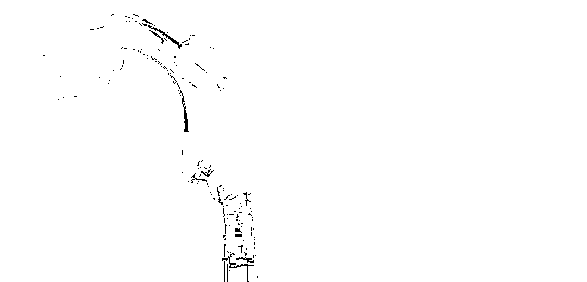

对于金星/天王星的客户来说，童年时期的分离是个突然的提醒，**牵绊是可能会被打破的，亲密的关系是可能会被撕裂的。**在他们看来，这些人际关系的破裂似乎是用一种实事求是和理性的态度来处理的，这使得极端的情况看起来几乎是正常的。

理性的官能将情感置于安全的距离之外，这样就产生了一种关系模式，**让他们默默地接受一段关系是可以结束的，而且，嘿，这没有关系。**

与金星/天王星人关系密切的人来说，这可能会让他们感到愤怒。金星/天王星发出的信息是，如果情绪会被搅得一团糟，那么也许就不值得继续下去了，无论如何，**如果会有那么多麻烦，那么让我们冷静下来**……我们总是可以做朋友的。

这都是甜蜜的理由，金星/天王星人更有一种控制力的感觉，比现在已经不讲道理、口吐白沫的伴侣更开朗。但最大的问题是，金星/天王星人的感觉是什么？情绪可能已经被烧灼，这可能导致感觉的缺失……冰冷的感觉，即使对于金星/天王星人来说也是阴森可怕的。这是一种再熟悉不过的感觉，仿佛飞到了平流层，从很远的地方体验着一切。**他们在这里感受到的是孤立或疏远。**

因此，尽管金星/天王星的客户可能会觉得是由于伴侣的情绪化而产生的问题，但他们将能够识别出自己的情绪反应，也就是**距离感和极度冷静。**这是占星师在他们转化过程中的切入点。一旦触碰到了这种感觉，**就可以通过后面讲的技术来把它分离出来并改善它。**

这种感觉是永恒的，与之接触意味着客户可以很容易地触碰到早期的事件，在这些事件中，精神在极度情绪化的情况下崩溃了。重点是，**金星/天王星客户确实有非常强烈的情绪，**就像其他人一样，但他们**通过闪电般的分离过程来避免伤害。**

如果他们无法与自己的情绪接触，那么他们可以预见金星/天王星表现出意料之中的关系模式: **突然的吸引、强烈的兴奋、无聊和不安，然后最终分离。**

**对于金星/天王星起作用的是，从事那些能让他们在白天与人们有许多突发的、兴奋接触的工作，**最好是在有国际联系的不同寻常的环境中。他们可能会在与来自不同环境的人交往中获得更大的成功，有旅行或短暂分离的关系会适合他们。

**他们需要承认的是，在友好和理性的外表下，他们与伴侣或自己没有在情感上保持联系。**

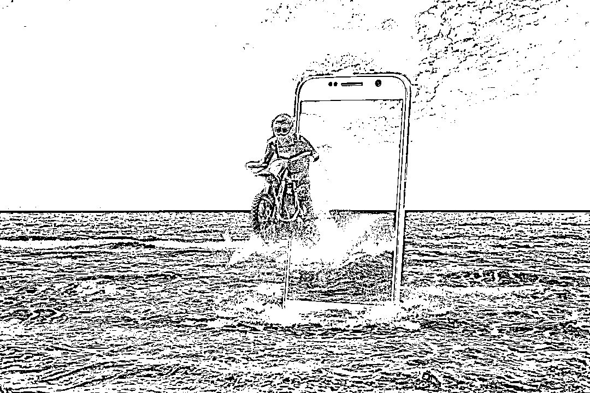

**金星与海王星：渴望纯洁之爱**

金星和海王星的结合带来了一种**灵性品质**以及内心深处**对合一的渴望。**金星/海王星人往往会散发出一种**爱的氛围**，笼罩着一圈令人神往的光环。

他们被**理想主义**的群体所吸引，力图通过**艺术和其他创造性的事业**来表达难以言喻的东西。他们有天赋在自己的作品中**捕捉爱情和浪漫的普遍面向，**他们也能唤起他人身上的这些原型。由于金星与爱情和吸引力有关，而海王星利用不满足作为灵性成长过程的工具，使得这些人**很难接受关系的本来面目**……**他们总是梦想完美的关系会出现。**

事实上，如果占星师向他们提出，完美的关系永远不会出现，(由于金星/海王星的特殊动力) ，客户会以完全不相信的态度对待这一说法。**你无法剥夺他们的这个梦想。**

金星/海王星的客户特别喜欢富有**创造力和音乐天赋**，并在作品中表现出**爱的普遍品质**的人。然而，关系中的典型模式是——在坠入爱河和灵魂融合的美好乌托邦之后——**失望和幻灭出现了。**

**海王星相位有一种非凡的完美主义，**可能几个月之后，金星/海王星会开始关注所爱之人的任何不完美之处……人性就是这样，有很多可以选择。

如果占星师仔细观察，就会发现一些金星/海王星的客户**会在一个秘密的幻想世界中滋养出一种理想的关系。**他们非常不愿透露这个珍贵的梦，但是我们必须了解它。即使他们处于一段长期关系中，他们也可能会梦到一段失去已久的爱情或是一段潜在的完美未来关系。

**他们拥有强大的想象力，**会为对方创造一个非常清晰（但完全不切实际）的画像，并花相当长时间生活在这个梦中。这会成为衡量其伴侣缺点的标准。

当然，伴侣不会不注意到这点，即便只在潜意识的层面上。有金星/海王星相位的男性经常会抱怨他们的伴侣太伤心或太沮丧，但是他们无法把这些和他们自己的行为联系起来。

**他们在不知不觉中传递出了对伴侣不满的信息，**这自然会削弱伴侣的自信和自我价值。即使是一个自信满满的女人，过了一年也会充满自我怀疑，尤其是如果这段关系开始于对不朽精神之爱的美妙宣言。

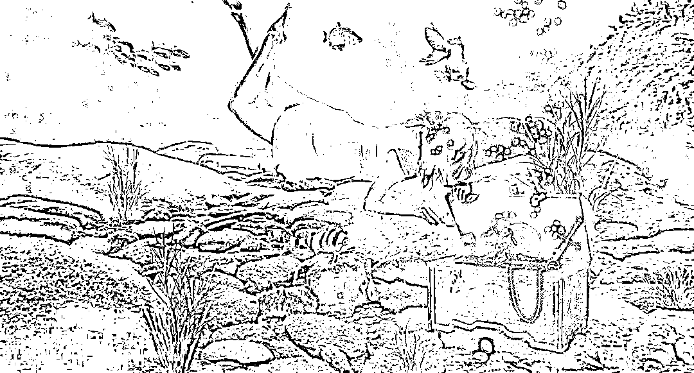

如果在咨询中发现客户确实沉溺于对另一个人的幻想，那么占星师应该说明后果。**虽然他们不是故意的，但他们完全是在伤害现有的伴侣。**而且，如果那个理想的人真的出现了，他们会满意吗？几乎无一例外的是，**金星/海王星的客户会在自己的行为中表现出伴侣让他们失望的缺点，**这通常可以通过切中要害的沟通技巧来意识到。

金星/海王星的渴望之情源于童年早期的经历。**当金星的位置特别沉重时，童年可能有一场真正的悲剧或丧失，这深深地影响了他们对爱和依恋的看法。**

然而更多的时候，**这个相位与对父母关系的看法有关。**父母中的一方，**通常是母亲，给人一种不满对方的印象。**通常孩子了解到一个母亲的秘密……她曾经拥有但是失去了的爱。**这传达出的信息是，你所拥有的关系并不如你本可拥有的那么好。**

金星/海王星**倾向于过滤掉家庭中美满的迹象，把注意力集中在未实现的浪漫幻想上，专门寻找一种悲伤的光环。**这种感官状态变得熟悉起来，并且被不断滋养，因为它持有完美的承诺。

这就是为什么当占星师指出永远不会有一段完美的关系时，客户会有如此强烈的反应……就像被剥夺了人格的一部分。但是，**除非客户看穿了幻觉的面纱，否则真正的幸福怎么可能出现呢？**

当金星与外行星有相位时，爱之中总有一个因素，只能在一对一的关系之外得到满足。因为这个相位让人对普世的不快乐有一种强烈的意识，客户感知到这一点并误以为这是个人的不快乐，所以他也会对与自己没有特别联系的人或群体有一种认同和同情。

**这些感觉往往会引导金星/海王星人进入灵性、音乐或艺术领域，从而获得巨大的满足感。如果他们能在这些领域得到满足，那么个人关系方面就不再有这种压力。**

因此，对金星/海王星来说起作用的，是拥有一个他们**可以独自发展创造性的兴趣领域**，并且拥有一个**同样富有创造力并且尽可能满足最高浪漫标准的伴侣**。

**他们需要承认的是，虽然他们宣扬着最高的理想，但他们在关系中并不真实。**

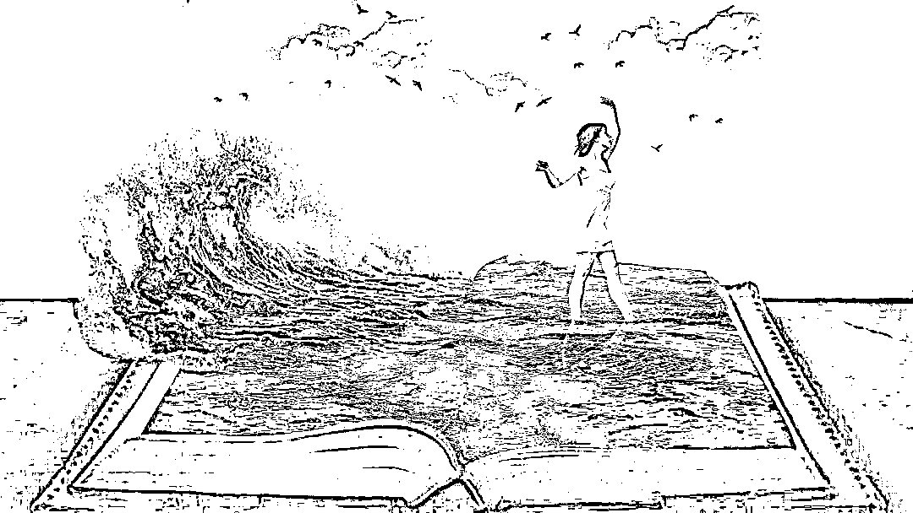

**金星与冥王星：爱与生存**

这些相位给人以**强烈的磁力和性感的光环**，让人深深的迷恋。金星/冥王星人关心他们给别人留下的印象，**有时会为了被喜欢而投入巨大的精力。**一般来说，他们通过一种持续强烈的魅力，成功地吸引人们喜欢上他们，而作为占星师，你将接收到这种魅力。

在短期内，这可能是非常愉快的，**但长期的伴侣将学会识别隐藏在努力被爱背后的焦虑。**嫉妒可能会折磨他们的早期关系，因为他们觉得自己是受别人爱的怜悯，无法控制爱是否会被给予或收走。**这些人浓烈地奉献自己，他们的关系不可能是肤浅的，但同时他们从别人那里吸取情感能量，让对方疲惫不堪。**

金星/冥王星客户的一般模式是，他们会卷入**高情感要求**的关系中，并带有**强烈的性元素**。他们**对被拒绝非常焦虑**，因此通常会在心理强度巨大的极端情况下与伴侣坚守下去。

他们的长期关系在很长一段时间里可能相当令人满意，然后他们的关系逐渐升温，达到危机的程度，一切似乎都失去了。然而他们驾驭了风暴，宣扬永恒的爱情，在情色的结合中相互弥补，于是关系继续下去。

在这个过程中，**人们倾向于用无情的诚实来揭示内在的心理状态**……魅力的外表被撕掉，他们的**“真实”本性**就像斯特林堡的戏剧一样展现出来。问题是，这种心理上的脱衣舞慢慢地破坏了这种关系，每一次危机都是爱情棺材上的又一颗钉子。揭露这种阴影面是非常不明智的，客户应该避免这样做，因为从长远来看，没有一种伴侣关系能够承受得住。

**权力问题**对金星/冥王星的相位是至关重要的，尤其是四分相。通常情况下，**男人会试图通过施加控制来获得安全感，**通过根据伴侣行为来关闭和开启爱情的能力。如果男性客户说，伴侣或前伴侣一直表现出偏执倾向和心理不稳定，可能是这种权力策略的直接结果。

**处于一段在极端激情和贫瘠冰冷之地间摇摆的关系之中，足以使任何人变成不再是自己的一具躯壳。**

**有该相位的女性**往往会陷入单向的爱情关系，她要么不爱一个拼命爱她的人，要么真正爱一个对她不感兴趣的人。如果是后一种情况，那么这个女人会受到完全的羞辱，尽管她可能是很有趣的性对象，但她经常面临被甩的风险。为了避免这种情况发生，她可能会发展出一些行为，而这些行为实际上会招致被当作门垫般随意对待。自我价值感如此之低，唤起了伴侣的轻视。

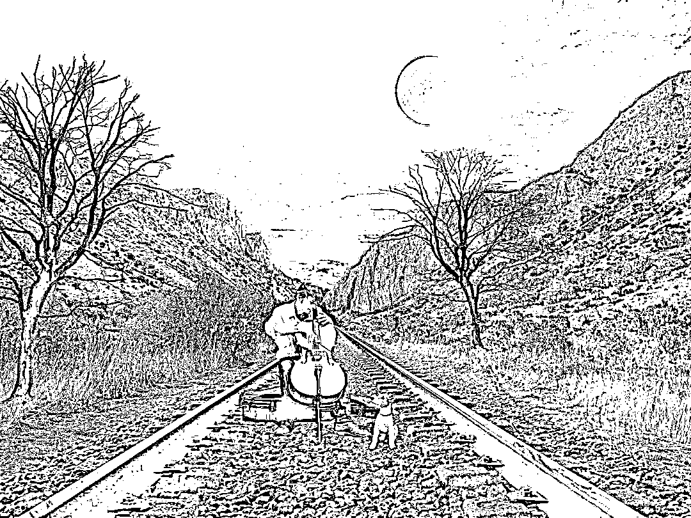

金星/冥王星人**必须特别避免在关系中对经济妥协，**因为这之后会成为权力游戏的战场。两性都被这个禁忌所吸引，然而一段随意开始的关系会释放冥王星的破坏性力量，导致没有人能够预料到的复杂情况。

金星/冥王星的能量核心是**爱与生存**之间的关系。**不被爱在潜意识里被认为是危及生命的**，这远远超出了记忆的范畴，甚至可以追溯到在子宫里的时候，母亲因为这样或那样的原因想要摆脱孩子。对爱的迫切需求正是源于这个深层次的原因。

其他极端的情况很可能发生在童年，包括感情被残酷地作为操纵工具。孩子对爱的渴望不会逃脱家人的注意，于是给予爱和收回爱，就自然而然地成为确保孩子顺从的步骤。**作为保护，孩子学会了有效的情感截断术，在他们自己的游戏中击败他或她所爱的人。**这就是为什么在以后的关系中，金星/冥王星人会突然从深情满满变成无爱之人。

在这种空虚中，他们什么都感觉不到。伴侣根本察觉不到爱，想知道自己一直以来都和谁在一起。**但是金星/冥王星客户感觉到内心的死寂，痛苦不堪。**这种死寂的能量是可以在占星咨询中有效利用的感官状态。

在这种能量波的带动下，客户能识别出一系列使他们与别人截断关系的事件，并了解到这种行为背后是有原因的。**这里有一种内在的变革力量，**能够赋能当事人，并产生一种新的连接方式。**他们必须学会降低情感强度，**调低魅力。

经验表明，就算他们没被爱，也不会死，如果他们放轻松，那么会因为自己的深度而被重视，而不是因为他们的嫉妒、权力或控制而让人害怕。

对金星/冥王星起作用的是**参与转化或涉足心理类的事**，并**与忠诚可靠的伴侣**建立深厚的关系。**他们需要承认的是，他们私下里怀疑伴侣会离开自己，他们的爱和性是用来控制这段关系的。**

**版权声明：**本文由若道翻译发布，欢迎转发，反对抄袭。友号转载请申请白名单。

**艾德里安·罗斯·邓肯**

若道签约老师，哥本哈根占星学院院长 1985 年开始成为全职占星师，是人本主义占星、卜卦占星和经世占星学领域的知名占星师。开发了占星软件 AstroClock 和多款占星报告。

**学习占星学**

**点击下图了解课程详情** 

****

**

****

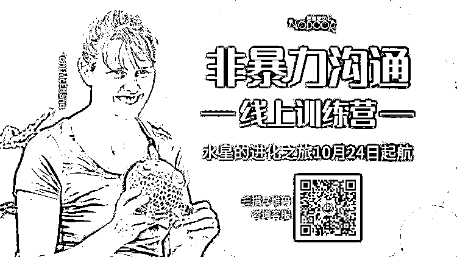

**微信又双叒叕改版啦，不想错过若道君的推送？**

**就把若道设为星标吧！**

**▼**

**喜欢记得点一下在看哦☟**

************报名直达入口************

# 听了这位智者的课，才知道占星学还可以这么有意思，这么深刻

> 原文：[`mp.weixin.qq.com/s?__biz=MzA5NjA0NTAxNg==&mid=2651457018&idx=2&sn=feef709e7b62261d0af737a9775845fd&chksm=8b48b74dbc3f3e5bee1cfd84133d729c25b315d6ee803a7fb0e039e0f30a2581de76d84c947f&scene=126&sessionid=1692737923#rd`](http://mp.weixin.qq.com/s?__biz=MzA5NjA0NTAxNg==&mid=2651457018&idx=2&sn=feef709e7b62261d0af737a9775845fd&chksm=8b48b74dbc3f3e5bee1cfd84133d729c25b315d6ee803a7fb0e039e0f30a2581de76d84c947f&scene=126&sessionid=1692737923#rd)

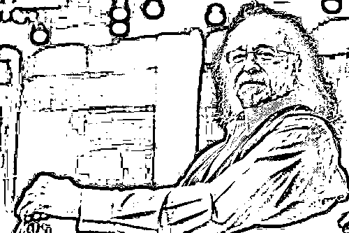 

作者/逸月 编辑/玫瑰 图片/作者提供

斯蒂芬老师即将于 10 月 15 日-17 日在若道开设[【线上工作坊】](https://mp.weixin.qq.com/s?__biz=MjM5MjQwNjAyMQ==&mid=2649438836&idx=3&sn=bc1f863fbc9386bce2a4d8e10a43afd3&scene=21&token=1273665179&lang=zh_CN#wechat_redirect)（点击了解详情），教你如何进行一场有效的占星咨询。本文作者听过斯蒂芬老师的工作坊后，才知道占星学还可以这么有意思，这么深刻。这是怎样一种体验呢？一起来看看吧。**缘起：被他的气场深深吸引**记得第一次参加斯蒂芬老师的课，我发现了一个很神奇的现象：在两天的课程中，我感觉自己仿佛被一种气场所吸引，同学们也纷纷被精彩纷呈的故事所吸引，整个教室鸦雀无声，大家都浑然为一体沉浸在老师的能量场中……斯蒂芬老师的课程超越了占星学本身的含义。我觉得，**他更像是一个传播宇宙真理和终极之爱的使者，他使用了一种叫做“进化占星学”的语言来传递宇宙的真谛。****折服：天才、勤奋、智慧、谦卑**熟识了老师以后，更是对他佩服得五体投地。**进化占星学，是****一门人类发展中因灵魂需要应运而生的独特的占星学分支。**老师独创了占星学这条洪流中一股独特的分支，所有进化占星学的内容几乎都是老师内在生发的智慧。我曾经问老师，这些与众不同而深刻慈悲的智慧源自于哪里？老师指着他的心口笑了笑，我明白了老师的意思，所有的智慧，都源自于他内心清明的境地。这些智慧的获取，不仅在于老师精湛的修行——冥想是他生活中不可或缺的部分，更因为他离宇宙星际非常接近——他居住的地方，是世界三大观测银河系最佳地点之一。他曾对我说，如果他有什么迷思，他会仰望星空，有时候甚至还可以用肉眼看到带环土星，土星给他的忠告，可比书本上丰富多了。除了独创进化占星学，老师在国际占星学上也拥有非常殊胜的地位和荣誉。不到三十岁，就因完成占星界非常畅销的“天空系列”书籍而一举成名。之后不断有经典著作问世，到目前为止已经撰写了几十本经典且畅销的占星学书籍。在中国，被翻译成中文的有《内在的天空》《昨日的天空》《变幻的天空》，都深受国内占星爱好者喜爱。获得这样卓越的成就，除了天分以外，绝对靠的是自律和勤奋。据我所知，老师的每年的日程都非常紧凑，工作排满了他的生活。他的工作包含全世界各国的教学、工作坊、一对一的占星咨询（目前已经排期到两年以后），同时还要兼顾写作以及网站运营等日常工作。这样的成功，在国外占星界也非常少见。

**深深地臣服于老师的慈悲心**每个来参加老师课程的同学，都会被老师深深的慈悲心感动。这种慈悲心，并不是表面上说的一些什么话，而是一种从意识层次上发出的能量。每个来上课的人，都能感受到老师的爱。**这种爱，并不是盲目的爱，而是深刻地洞悉真相后的慈悲。**课上在讲述同学案例的时候，老师说：**“我要看着对方的眼睛，只有看着对方眼睛的时候，有一些无法用语言表达的东西，才能通过灵魂的窗户投射到对方的心湖。”**听到老师这么说的时候，我真的很想流泪。课程结束的时候，相信也是大家最喜欢的环节之一——拥抱，这是一个古老的灵魂对另一个灵魂的拥抱、包容和理解，好像在说，感谢你也在这里，感谢你勇敢地探索自己的灵魂，在这里我会给你输送光输送爱。每一次深深地拥抱，大家就好像充满了能量一般，感受到满满的爱。**归一，像溪流归入大海**寻到了进化占星学，就好像加入了一个灵魂的大家族，对我来说，就好像一条小小的溪流，不停流淌啊流淌，终于归入了大海。在大海里，我们得到了归属、感受到了温暖和疗愈，感受到了集体的力量。然后，小小的溪流还是要继续旅程，踏上自己的道路，带着满满的爱和滋润万物的能量，流淌到田野里去，流淌到干枯的大地上。而你问我，这条小小的溪流有没有改变。我想说，**当溪流看过大海的境界，这条溪流就不再是曾经的溪流，这条小小的溪流，见识过大海的深厚、包容、滋养、容纳之后，也渴望能够成长为大海的境界。**这是多么美好的一件事，这一切，都缘起于一次偶然的相遇。现在，我邀请你，进行一场生命中重要而美好的相遇！在我心里，斯蒂芬老师就是宇宙光与爱的化身，时刻给我们希望和勇气。

**版权声明：**原创文章由作者授权发布于若道平台，欢迎转发，反对抄袭。友号转载请申请白名单。

**逸月**

学习并整合了各大主流派别的人本占星体系，尤其对进化占星有持续的钻研。在多位国际名师的栽培下，已经成为独立的职业占星师，并受邀担任私人占星师和顾问。

长按打赏

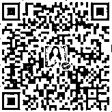

**喜大普奔，斯蒂芬要来教占星咨询了！**

**今年****10****月 15 日-17 日****，在斯蒂芬到中国教学****10****年后，他将****第一次****与所有热爱他的学员分享如何做好一场占星咨询。**

**在为期三天的线上工作坊中**，占星大师斯蒂芬·弗里斯特将会和你分享他几十年来一对一面对面的占星**咨询经验**；他也会分享如何提前规划好**接近客户心灵的占星技巧**。客户个人星图为我们提供一个最迅速，也最可依赖地建立信任和自然连接的地图，**他还会分享如何运用个人星图建立这个联结。**

**长按下图识别二维码**

**了解更多工作坊信息**

**

**微信又双叒叕改版啦，不想错过若道君的推送？**

**就把若道设为星标吧！**

**▼**

**就是这个“在看”，戳戳戳 ☟**

**********报名直达入口**********

# 双鱼座满月 | 虽有沮丧，但不要绝望，疗愈的月夜已经来临

> 原文：[`mp.weixin.qq.com/s?__biz=MzA5NjA0NTAxNg==&mid=2651457010&idx=1&sn=038a3cc3e7243a89d828b97866d91edc&chksm=8b48b745bc3f3e53ec469d4aadff25b083637fa2282ded9e7b8ea48648c11ce090f453158060&scene=126&sessionid=1692737923#rd`](http://mp.weixin.qq.com/s?__biz=MzA5NjA0NTAxNg==&mid=2651457010&idx=1&sn=038a3cc3e7243a89d828b97866d91edc&chksm=8b48b745bc3f3e53ec469d4aadff25b083637fa2282ded9e7b8ea48648c11ce090f453158060&scene=126&sessionid=1692737923#rd)

**☆ 后台回复“今日”，给你一句生命态度**

作者/王芝桦 编辑/玫瑰 图片/pexels

**双鱼座满月****北京时间 2021 年 9 月 21 日 7:55 迎来双鱼座满月，处女座太阳与双鱼座月亮于 28°14′精准对分。****我不知道我想要什么****当爱的离去的时候****痛苦，说出实话****让我知道我想要什么**

人生就像一根橡皮绳，总是走着走着又突然弹回到曾经远离的地方，回忆和追溯，怀念和感伤。伴随中秋佳节的双鱼座满月，在“千里共婵娟”的情怀中共振，在“低头思故乡”的情感中独处，我们带着现实生活的起伏流转跳进双鱼座的意识之海，穿越时间的长廊，寻获内在的源头，凝视和对话，疗愈和微笑。

在此，祝福各位读者朋友中秋佳节快乐！愿我们的心和天上的月亮都感受到“爱”！

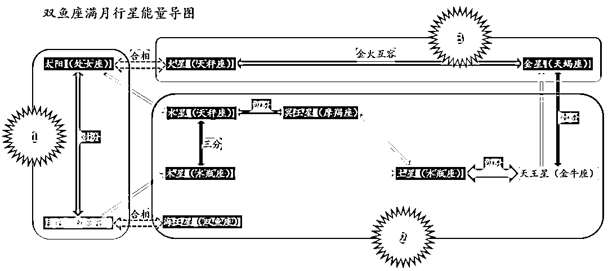

**双鱼座满月重点影响人群**

参考满月峰值影响期间各个行星的行进度数，以及逆行行星的轨迹影响；常规容许度，个人行星入相位 3°，出相位 1°；非个人行星入相位和出相位均为 3°。

**·** 出生星图中，有**行星、四轴、南北交点落入固定星座（金牛座、狮子座、天蝎座、水瓶座）3°-30°**的人群； 

**· **出生星图中，有**行星、四轴、南北交点落入基本星座（白羊座、巨蟹座、天秤座、摩羯座）0°-7°，21°-30°**的人群；

**·** 出生星图中，有**行星、四轴、南北交点落入变动星座（双子座、射手座、处女座、双鱼座）17**°-30****°********的人群。

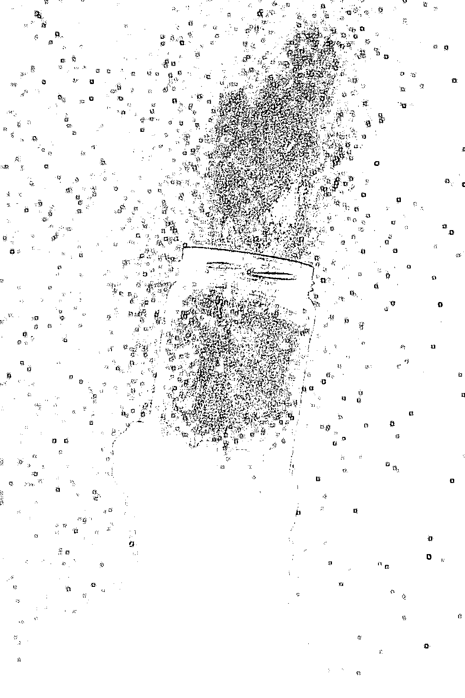

**梦想时分，“我执”的显露与转化**

****

**成长岁月中的艰难：我们在内心深处油然升起种种理想、美梦和希望，到头来好像只是为了让它们破灭，让它们迎接可怕的真实。** **——安妮·弗朗克《安妮日记》****天象：**

**· 月海合相：**宽泛容许度下，月亮与海王星合相于双鱼座；

**· 日火合相：**宽泛容许度下，处女座太阳合相天秤座火星。月亮大约每 2 个小时行进 1°。9 月 20 日，满月前的夜晚，双鱼座月亮快速地与“逃避性人格”的双鱼座海王星形成“月海合相”，又快速地与“揭露性人格”的摩羯座冥王星形成“月冥六分”结构，一颗心被两种不同人格搅动，就像是吃了火锅又吃了冰淇淋的肚子，难免出现一些狂潮。此次双鱼座满月的前后三天，一些隐藏的真相开始暴露，一些虚幻的伪饰开始破灭：**· 梦醒时分：**你会选择勇敢面对，还是选择脆弱逃避？**· 重要的是：**这些情况为什么会发生？**· 宇宙揭示：**“虚假”渴望得到救赎，“错误”渴望得到修正。

***1. *****看见“我执”**

9 月 21 日清晨，双鱼座月亮终于走到处女座太阳的对岸，双鱼座满月来临。**“处女座-双鱼座”这一组对宫星座，联结着“理想与现实”的两端。**一切唯心造，我们在内心深处构画理想，依内在意识创造现实；但往往，同一个人构画的理想、创造的现实之间却充满着张力，现实与理想不符，理想对现实不满。双鱼座满月，精准对分的“处女座太阳-双鱼座月亮”轴线，将“理想与现实”之间的张力清晰呈现。无论是现实的事件与结果，还是内在的感悟与经验，双鱼座满月的月光照见出一切的“实相”——**“理想与现实”融合的过程，亦是“我执”转化的过程。**我看到，我认为，我期待，我评判……一个“我”字，既是制造痛苦的源头，更是成长岁月中的艰难。此次双鱼座满月，宇宙赐予我们“疗愈”能量——**看见“我”的局限与执着。**

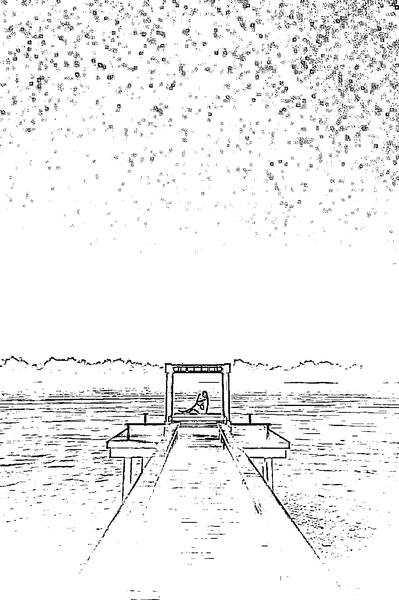

***2\.*** **转化“我执”**

此次双鱼座满月，宽泛容许度下，处女座太阳与天秤座火星形成的“日火合相”结构，揭示着未来 20 天的现实走向：双鱼座满月发生后的 9 月 23 日，太阳换座进入天秤座，然后一路追赶火星，并在 10 月 8 日-10 月 10 日形成精准的“日火合相”结构。故而，此次双鱼座满月直至 10 月上旬的这段时间，将会展开一段“自我内在调试，重新构建平衡”的旅程——我们在各种关系之中努力，展现友善，争取好评，很多时候甚至需要掩藏内心的真实，不顾一切地牺牲——“我执”，有时穿着“我很 OK”的外衣，但有时也会换上“从你的眼中看到我很 OK”的外衣。**总而言之，“我”需要 OK。**

依然是“我”的执着。此次双鱼座满月似乎要照见“我”构画的种种理想、美梦和希望，在“我”创造的现实面前那么的不堪一击，就像瞬间被茫茫大海吞没一般，毫无声息，而“我”却无能为力，只看到虚妄破灭之后的可怕真实。

满月能量具有“完结”的意味，而此次双鱼座满月则寓意着“完结过程的开始”——**“结束或死亡”的过程，亦是“转化与重生”进程的开始。**

请坐下来冥想，与自己的内在世界在一起。如果我们愿意面对生命之内的执着、恐惧与伤痛，那么双鱼座满月的疗愈能量和转化契机便会照进我们的心灵深处。

**翻旧帐，做反思，亦能带来“觉醒”**

****

**只有在争吵后，才能真正看清一个人的真实性格。****——安妮·弗朗克《安妮日记》**

**天象**

**· 水木三分：**天秤座水星三分水瓶座木星；**· 水冥四分：**天秤座水星四分摩羯座冥王星；**· 金火互容：**天蝎座金星与天秤座火星形成互容结构；**· 金星介入“土天四分”：**天蝎座金星四分水瓶座土星，对分金牛座天王星。此次双鱼座满月周期，即将于 9 月 27 日开始逆行的天秤座水星相当的忙碌：满月当天，接纳处女座太阳能量的天秤座水星（水星守护处女座）与接纳双鱼座月亮能量的水瓶座木星（木星守护双鱼座）形成“水木三分”结构；满月转天，天秤座水星与摩羯座冥王星形成“水冥四分”结构。

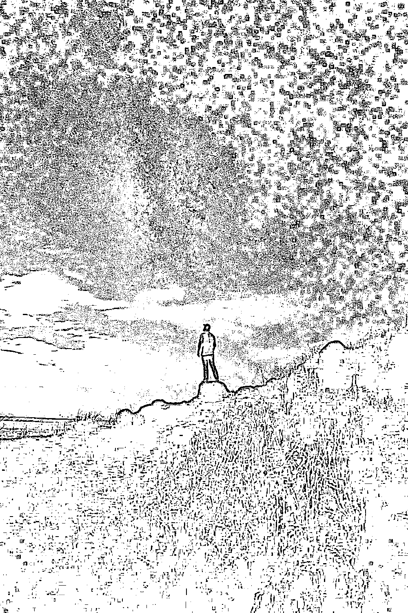

这两组结构形成了一个非常有趣的画面：**一边儿“翻旧账”，一边儿“做反思”。****· 翻旧账：**“水冥四分”结构令那些“不平等”的关系、“不道德”的事儿、“不尊重”的感受变得敏感和微妙起来，而“水冥四分”结构影响之下的我们也变得洞察敏锐和言辞犀利起来，就像从随身的口袋里掏出记账的小本本，戳破谎言并随时清算。但这也未必就是一件坏事，因为往往只有在争吵后，才能真正看清一个人的真实性格。**· 做反思：**水星与木星是与“认知发展过程”相关的两颗行星，“水木三分”结构将会促发更多的“觉悟与思考”——已经进入逆行前影响期并即将开始逆行的水星，提示我们“反复”的可能性和“反思”的必要性；曾经“试水”双鱼座两个多月时间、目前正在水瓶座逆行的木星，则提示我们再次对 5 月 14 日-7 月 27 日期间开启的理想、美梦和希望，反复斟酌或重新评估。写到这里，就要提到 9 月 15 日- 10 月 7 日期间，天蝎座金星与天秤座火星组成“金火互容”结构（当两颗行星分别行进在对方守护的星座之内，即形成互容）。此次双鱼座满月能量覆盖周期内，接纳天秤座水星能量的天蝎座金星（金星守护天秤座）将会介入年度重磅天象“土天四分”结构之中：9 月 17 日天蝎座金星四分水瓶座土星；9 月 23 日，天蝎座金星对分金牛座天王星。爱恨情仇，如何决断？当我们决断不了的时候，宇宙便会出手。此次双鱼座满月，宇宙透过几组天象结构编织出一张“在黑暗中觉醒”的大网——督**促我们对生活中的混乱做出处理，对关系中的无序做出选择！****你可以做的****· 看见“我执”：**无论你再爱一个人，无论你再渴望一件事物，都要坚守自己的真实，踩稳自己的根基，而不是自欺欺人地粉饰一份“太平”，牺牲自我去换取一份“美好”。因为，在所有“过度投入”的背后，都隐藏着“投资回报”的好处。只是，这份源自“我”的执着，外界并不会配合。**· 说“Yes”和说“No”：**真正诚挚相爱的人，真正并肩战斗的伙伴，将会陪伴彼此更开心地前行，更坚定地走向成熟。生活是选择的艺术，如果我们想收获“真诚”与“建设性”，那么首先需要学会对“虚幻”和“消耗”说 NO！此次双鱼座满月，集体层面将会围绕**医疗、疫情、慈善和公益**几方面呈现一波热议，一些新的经济政策正在向我们走来，而一些重磅人物可能悄然隐退；而个人层面，**当 9 月 23 日太阳进入天秤座，开启为期 30 天的天秤月生活之后，各种关系的处理也将进入更为关键的阶段。**

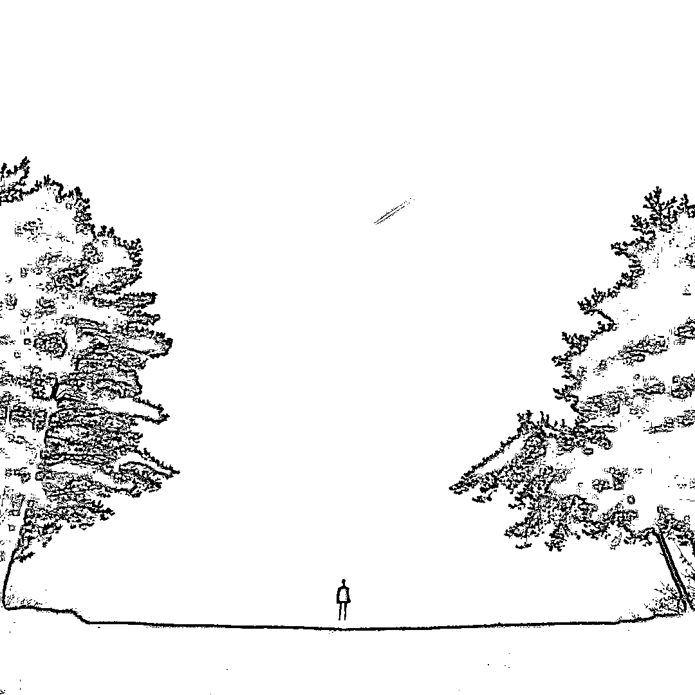

**寄语**

****

**我常常沮丧，但从不绝望。****——安妮·弗朗克《安妮日记》**在写这篇满月文的过程中，我彻底进入了双鱼座的茫茫大海之中，踩不到一块可以承载逻辑的木板，只有漫无边际的漂浮。天津没完没了地下着雨，寂静的夜晚，雨水敲打着玻璃，也敲打着我的心。不知道这篇文章将会写成什么样子，我感觉有些沮丧。 若道的主编特别有爱，她建议我去寺院走一走，但我没有时间完成这份建议，因为交稿的时间越来越近，而我必须完成这项工作。于是，一会儿坐着，一会儿站着，一会儿趴着，把这篇文章写完。我想对读者朋友们说声“抱歉”，这篇文章难以令人满意。但是，我还是选择原谅了自己，因为我想对自己宽容一点，不想对那个“好”执着。

此次双鱼座满月，如果你有和我一样的感受和际遇，那么一定要记得对自己宽容一点——双鱼座满月的月光一定会看到并抚慰我们的心，然后将疗愈的能量注满我们的心间，顺便赐予一份海上的航行地图，只要我们从不绝望。

祝愿每一个灵魂安好。祝福大家。

**版权声明**：原创文章由作者授权首发于若道平台，欢迎转发，反对抄袭。友号转载请申请白名单。

****

****想阅读更多作者的文章，****

****请在后台回复******王芝桦****** 即可。****

****王芝桦****

心理占星师，统合疗愈师，占星专栏作者

若道占星“新月和满月”专栏作者，腾讯视频特约占星师

全职于个案咨询与占星教学工作 17 年

**个案预约咨询微信号**：zhihua0621 

**微信公众号**：daoxi-life

**长按打赏**

****

**学习占星学**

**点击下图了解课程详情** 

****

**

**

****

**微信又双叒叕改版啦，不想错过若道君的推送？**

**就把若道设为星标吧！**

**▼**

**喜欢记得点一下在看哦☟**

****报名直达入口****

# 雷蒙德·梅里曼金融占星周运 | 这周会触底反弹吗？

> 原文：[`mp.weixin.qq.com/s?__biz=MzA5NjA0NTAxNg==&mid=2651457010&idx=2&sn=81132c72bc5ebd5d2bbe6e9923ef66fb&chksm=8b48b745bc3f3e533314864663150cbd155d13ede3f815178cdc29eca7c94589ee710ed23784&scene=126&sessionid=1692737923#rd`](http://mp.weixin.qq.com/s?__biz=MzA5NjA0NTAxNg==&mid=2651457010&idx=2&sn=81132c72bc5ebd5d2bbe6e9923ef66fb&chksm=8b48b745bc3f3e533314864663150cbd155d13ede3f815178cdc29eca7c94589ee710ed23784&scene=126&sessionid=1692737923#rd)

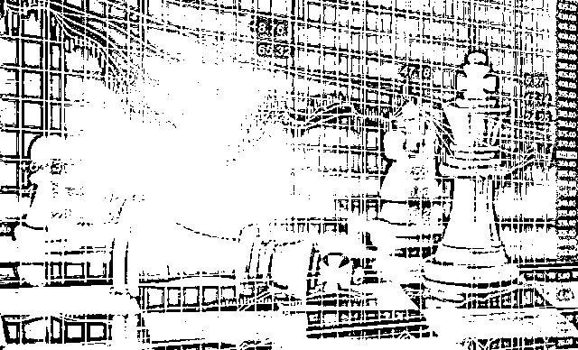

作者/雷蒙德·梅里曼 译者/Luke

编辑/玫瑰 图片/pexels

雷蒙德·梅里曼是在金融占星学界稳坐第一把交椅的占星师，同时他也是若道签约的金融占星课老师，我们引进了雷蒙德·梅里曼老师的《[上证指数月度报告](http://mp.weixin.qq.com/s?__biz=MzA5NjA0NTAxNg==&mid=2651451728&idx=4&sn=170853f20000e2be55f0d9e59252c104&chksm=8b4b43e7bc3ccaf12de32acabd6f31048ff8a341973afaa88f9e8f84239093df106ea1de8b63&scene=21#wechat_redirect)》及《[黄金报告](http://mp.weixin.qq.com/s?__biz=MzA5NjA0NTAxNg==&mid=2651452512&idx=2&sn=a4e0b91e1c2cfc1e024fe12fbb7c2bcc&chksm=8b4b46d7bc3ccfc102a9da4c97530fe72cd8be15a2c6880780d7bf23d5d6f16e67defcf1bfe6&scene=21#wechat_redirect)》。我们经老师的授权，将每周刊登梅里曼老师的周运，供大家参考和学习。于是，这是本周的周运（9.22-9.24）。

**说明：以下时间采用纽约证券交易所所在地美国东部标准时间。**

**展望与回顾**

**双线资本(Doubleline Capital)首席执行官兼首席投资官杰弗里·冈德拉赫在周二晚上的一次电话会议上表示，库存保持在“非常非常低的水平”。该公司位于洛杉矶，管理着 1370 亿美元的资产。“这意味着通货膨胀可能不是暂时现象。”**

**今年早些时候，为了控制新型冠状病毒肺炎疫情，工厂关闭，导致原材料短缺和供应链断裂，使得客户库存跌至历史最低点。较低的客户库存，尤其在通胀上升的时期，导致更高的商品价格，因为零售商必须为这些商品支付更高的费用。这些较高的价格随后会转嫁给消费者。消费者已经在与 13 年来的最高通胀率作斗争。****——乔纳森·加伯****《亿万富翁投资经理冈德拉赫抨击“暂时性”通胀的说法》****www.foxbusinessnews.com****2021 年 9 月 16 日**随着太阳在 10 月 7-8 日接近与火星的强有力合相，投资现在变得越来越有风险。前一周的抛售过后，全球股市试图反弹。9 月 14 日时，随着太阳与海王星发生一年一度的对分相，确实出现了一些欣快情绪。同一天，日经指数飙升至 31 年来的最高价位，中国上证综合指数也测试了多年来的高点。荷兰 AEX 指数和印度 Nifty 指数于 9 月 17 日继续冲击新高。但是随着海王星的欣快情绪退潮，金星接近其与土星和天王星形成的 T 三角，其他市场开始下跌。金星与土星的四分相发生在 9 月 17 日，与天王星的对分相将于下周 9 月 23 日发生。正如上周所述，“金星-土星四分相经常对应着极好的买入机会。任何下跌至此相位的市场，都可能出现一波像样的反弹。”全球多个股指确实下跌至 9 月 17 日。**随着金星对分天王星相位的接近，我们很快就可以见证它们是否触底并反弹。**其他市场上，黄金和白银遭遇另一轮打击。白银跌至 8 月 9 日的低点 22.30，黄金跌至 9 月 16 日的低点 1745.50，但仍远高于 8 月 9 日的基本周期底部 1677.90。因此随着天蝎座金星接近其与土星和天王星形成的 T 三角，黄金和白银即将形成市场间看涨背离信号。除了黄金和白银以外，欧元和瑞士法郎兑美元也剧烈下跌。这是因为市场相信美联储很快会结束货币的紧缩政策，利率上升。也许这的确会发生。对这一变化的恐惧，对应了上周 9 月 15 日火星入座天秤座，与美联储成立星图中的太阳-冥王星对分相形成 T 三角。火星进入基本星座会激活这一对分相，引发人们对美联储及其意图的怀疑。但是要记住 2021 年 12 月 30 日，木星将重新进入双鱼座。木星已经于今年 5 月 13 日-7 月 28 日进入过双鱼座了。当时每个人也都认为美联储会提高利率，或停止回购债券，并启动货币紧缩政策。

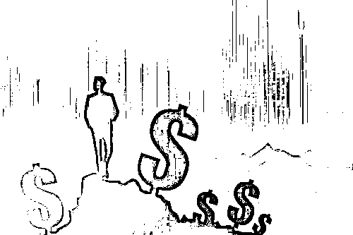

但出乎意料的是，美联储主席鲍威尔重申了保持稳定和低利率的承诺，而且不会停止购买国债。这类事件可能于今年 12 月-明年 1 月再次发生，届时每个人都指望美联储收紧货币政策。木星的行进表示情况可能并非如此。因此，投资者再次倾尽全力找出什么是真实的，什么是没有根据的谣言。与此同时，市场也在寻找可持续的趋势。我们将继续报道金融市场、机构、政府与宇宙天象周期之间的关联。**短期占星趋势和长期考量****高盛表示，高税收是美国股市面临的最大风险。****——托马斯·弗兰克****www.cnbc.com****2021 年 9 月 13 日****国会将在下个月面临两项严峻的任务：为美国政府提供资金和增加债务上限。立法者必须在本月底前为政府提供资金。财政部部长珍妮特·耶伦警告说，避免债务上限的非常规手段将在 10 月份用尽。****——托马斯·弗兰克****“债务上限还是政府关门”****www.cnbc.com****2021 年 9 月 17 日****当前发挥影响力的主要地球宇宙学相位是金星与土星-天王星形成的固定星座 T 三角。**金星将在天蝎座逗留至 10 月 7 日，同一天太阳将与火星在金星守护的天秤座合相。这是一个复杂的设置，金星在天蝎座入陷，火星在天秤座也入陷。**金星与金钱和信贷相关，而天蝎座与债务和税收相关，两者都引起对未来经济健康的关切。**火星在天秤座，是**每个人都在争辩，却无法达成任何协议**的时间。这就像一个吵吵闹闹的大家庭。**当太阳在 10 月 7-8 日进入与火星的合相，对达成协议的需求很强烈。但每个人都想把未能达成协议的责任推给别人。**民主党人无法就下一份刺激计划达成一致，共和党人甚至认为连额外的开支也是不必要的。在这一时期里，时钟滴答滴答地接近最后的截止日期，债务上限必须被提高，否则美国就会陷入金融违约，最终导致政府不得不关门。有人认为他们会在这之前达成协议吗？尤其是在水星在犹豫不决的天秤座逆行期间（9 月 27 日-10 月 18 日）？除此之外，当美股的周期高点发生在太阳-火星合相周期的三周之内时，这一合相与美国股市的剧烈下跌有着强烈的关联。当然，我们不能忘记土星仍处于与天王星的渐亏四分相内，这是今年最强有力的地球宇宙学征象，同时也是预示动荡和意外的征象。

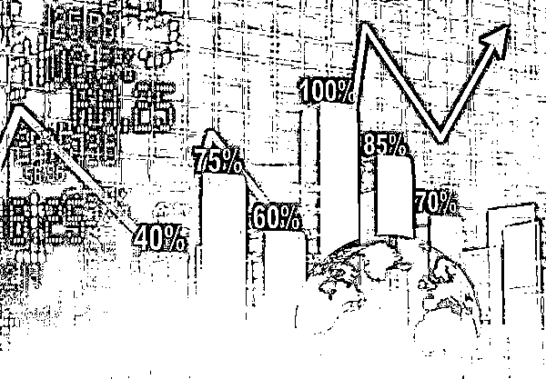

没有人相信美国将会违约。但是，除了正在阅读本专栏的你们之外，也几乎没有人相信行星周期与金融市场周期的关联。你们知道行星周期与人类活动的关联是相当准确的。也许将发生的事不是违约。占星师并不总能说对行星周期对应具体事件的细节。但某些事总是会发生的——事件、政策改变、出乎意料的公告，其主题通常符合相关的地球宇宙学征象原则。

因此，这就是我们当下的处境。好几个重要的行星相位正在发挥影响力，许多难以解决的问题摆在世界政府和经济（银行）领导人面前。他们将怎么做？考虑到水星即将在天秤座逆行，太阳-火星将在天秤座合相，而天秤座总是试图找到中庸之道，看起来犹豫不决，所以我不知道将发生什么。不幸的是，他们或其他人也不知道。

我怀疑，随着必须采取行动和决策的截止日期逼近，我们将看到很多互相指责和推卸责任的情况。然而，这将对社评节目和板块的主持人们提供很多谈资。在这些天象下，每个人都有自己的意见。但很少有人能提出解决方案，或有能力和勇气做出必要的决策。因为无论做出什么决策，都会有批评的声音浮现，却没有对应的解决方案。天秤座能量，当积极的一面发挥时，可以显得很有外交手段和支持性。尽管他们不喜欢被人批评，自己却能发表尖锐的批评。

因此，当每个人都犹豫不决时，股票市场就会萎缩。

**说明：以上日期基于纽约证券交易所所在的美国东部标准时间，由于存在时差，中国地区可能需要加一天。****版权声明：**本文由若道翻译发布，欢迎转发，反对抄袭。友号转载请申请白名单。

**雷蒙德·梅里曼（Raymond Merriman）**

若道签约老师。著名金融占星师，ISAR（国际占星研究协会）前主席，梅里曼市场分析公司的总裁。他由于“提升了占星学的职业形象”，在 1995 年国际占星大会上被授予轩辕十四奖；在 2012 年国际占星大会上，被授予轩辕十四终身成就奖。

1“中国上证指数月度报告”发售

**若道推出了****中文版****的雷蒙德·梅里曼中国上证指数月度报告，并持续发行该报告！**

当把金融市场的周期和占星学的周期相结合时，雷蒙德·梅里曼老师的金融占星学研究**为投资者应对金融市场的周期波动，并随之调整投资策略提供了极大的价值参考**。

**9 月中英文报告已上线！**

2“黄金价格周期月度报告”发售

**若道推出****中文版****的雷蒙德·梅里曼黄金价格周期月度报告！**不仅仅为广大读者在中国股市的投资出谋划策，更将视角放眼黄金市场。

**每当世界经济形式不明朗的时候，有一个地方是保值的港湾，那就是****黄金**。自 1982 年雷蒙德·梅里曼出版第一本研究《地球宇宙学征象与黄金价格的关联》的著作以来，**他一直作为最重要的黄金市场时机预测者之一享誉国际**。

9 月黄金报告已上线，梅里曼老师将会告诉你他对这个关键时期如何操作的想法。也可以按照季度和一年期订阅，有更多优惠。季度和年度的好处是，你可以持续了解梅里曼老师对于不断在变化的市场的看法。即便他某一次看法和市场不一致，你也看到在下一期他如何调整自己的看法，并看到金融占星在一个长期时间段内对你把控风险的帮助。而能够长期控制风险、尽量找到安全的投资时机才是投资的长久之计。

**9 月中英文报告已上线！**

**购买套餐**，买得越多越优惠

中国上证指数月度报告套餐价

*   **单月报告**：280 元

*   **3 个月套餐**：780 元（260 元/月）

*   **12 个月套餐价**：2400 元（200 元/月）

**长按下图识别二维码**

**购买金融报告****套餐**

**▼**

黄金周期月度报告优惠

*   **双报告年度套餐更优惠（直降 900 元）**
*   **12 个月黄金报告+12 个月上证指数报告：仅需 3900 元**

**长按下图识别二维码购买黄金报告套餐**

▼

3 中国金融市场特别网络研讨讲座

面对年底几个影响金融市场的重要天象，该如何把握下半年的投资，为跨年做准备？我们特意邀请雷蒙德·梅里曼老师为大家带来了**3 个小时的金融讲座——雷蒙德·梅里曼中国金融市场特别网络研讨讲座。**

这场为期 3 小时的在线讲座探讨了**这些长期行星周期如何影响世界经济的长期周期和趋势，特别是如何影响上证综指和黄金市场**。并描述**在 2021 年剩下的时间里市场反转关键时间点，特别是 12 月 19 日至 25 日金星逆行，以及土星-天王星最后一次渐亏四分相、金星与冥王星合相的重要时期。**

**长按下图识别二维码购买讲座视频**

▼

**点击阅读原文购买金融报告**

# 好物推荐 | 从"麻瓜"进化成占星师的自我觉察工具（插班中）

> 原文：[`mp.weixin.qq.com/s?__biz=MzA5NjA0NTAxNg==&mid=2651457010&idx=3&sn=a39a290685ea5a21b9421beea7fa0014&chksm=8b48b745bc3f3e535f879e3096e8572b2fc49ca20a71e3ec06f8d540c8b032f97d1e805f04cd&scene=126&sessionid=1692737923#rd`](http://mp.weixin.qq.com/s?__biz=MzA5NjA0NTAxNg==&mid=2651457010&idx=3&sn=a39a290685ea5a21b9421beea7fa0014&chksm=8b48b745bc3f3e535f879e3096e8572b2fc49ca20a71e3ec06f8d540c8b032f97d1e805f04cd&scene=126&sessionid=1692737923#rd)

1

**自我觉察，是智慧的基础**

每个人都有自己的内在冰山，自我觉察能够帮助我们觉察自己的行为、情绪等，然后向内深层探索，探索自己的行为、情绪背后的深层渴望、期待。学习和应用占星学的过程，就是慢慢掌握自我觉察工具的过程，当你熟练掌握了占星学，也就具备了帮助引导他人觉察到自身生命议题的能力。**往外张望的人在做梦，向内审视的人才是清醒的。**只有真正向内看，只有当觉察开始由外向内时，改变才会发生，才能够知行合一。

# | 插画师：古戈力

以情绪来举例说明，每个人的情况不同，觉察的程度也不同，觉察有四个层次：***1.*** **不知不觉：**没有觉察情况，当情绪来了，会被情绪控制，做出很多不计后果的事情。而且每次都是同样的状况，反反复复；***2.***** 后知后觉：**情绪过后，自己能够反应过来，自己做的对与错，但是很难避免同样的情况再次发生；***3*****. 当知当觉：**当情绪来的时候，你已经知道在这个当下，正在发生什么。当达到这个层次，你就可以自己控制情绪，从而影响后事的发展；***4*****. 先知先觉：**当事情还没发生，就可以预知它要发生了。因为你对情绪的觉察已经越来越熟练，所以情绪还没来，你就知道它要来了。所以，你也就有了更好的选择和处理方法。所以，我们要自我觉察，向内探索，觉察是为了接纳，然后做出改变，成长，迭代，升级。**那么要如何练习自我觉察，掌握先知先觉的能力呢？**

2

**每日觉察的工具推荐**

**今日天象&近期行进**

若道 APP 中的今日天象功能，罗列展示每一天的具体天象，你当天的行进和行进周期：

作为占星师，可以这样使用这个自我觉知工具：

**记录梦境**如果你有醒来记录梦境的习惯，每天早上看一下睡梦中的天象和行进，对应联想，你会惊喜地发现一些神奇的对应，能够更敏锐的捕捉到日常被压抑的情绪和需求。能够帮助你在白天的工作生活中先知先觉的关注身心状态。**规划生活**每月月初，周初都可以参考天象和行进进行日程规划，预估可能的助力和阻力，在对的时间做对的事，会发现平平无奇的日常也可以有不一样的色彩。根据月相的变化感知情绪的起伏，更好的自我关爱。**感知环境**当身边发生了引起你注意和好奇的事情，或者网络上层出不穷的新闻热点，都可以在天象中寻找对应的能量。从更大的格局视角去思考你的个人观点。通过环境的共振，更深入地理解自己的出生星图。以上都是很好的学习深化占星知识的方法，只需要系统掌握以下知识，就可以开始使用以上方法去提升自我觉知。**第*1*阶 黄道星座&个人行星****概要介绍占星学与星图**

**四元素与三形态**

**黄道 12 星座**

**太阳、月亮及其他个人行星**

**第*2*阶 行星&宫位****木星&土星****天王星&海王星&冥王星**

**练习组合所有行星**

**四轴**

**十二宫位**

**组合宫位、行星、星座****第*3*阶 月亮交点、相位以及初步解读星图**

**了解灵魂进化的路径：月亮交点**

**相位概论**

**相位&行为模式**

**困难相位**

**柔和相位**

**容许度，出入相位**

**渐盈渐亏相位**

**空相**

**宫主星&定位星**

**相位模式**

**组合相位、星座、行星、宫位**

**解读的基本原则，权重，失衡**

3

**课程安排是怎样的呢？**

**第*1*阶**2021 年 9 月 15 日开课，每周一天晚上 20:00-22:00 上课，共 6 次课**第*2*阶**2021 年 11 月 11 日开课，每周四晚上 20:00-22:00 上课，共 6 次课**第*3*阶**2022 年 1 月 6 日开课，每周四晚上 20:00-22:00 上课，共 15 次课 2022 年 4 月 30 日、5 月 1 日**L3 北京两日线下工作坊**

****

4

**授课老师**

**艾德里安·罗斯·邓肯**

**（AdrianRoss Duncan）**

**· **1971 年在印度游学时开始学习占星学，1985 年开始成为全职占星师，迄今执业已超过 33 年，是人本主义占星学、卜卦占星学和经世占星学领域的知名占星师。他还开发了占星软件 AstroClock 和多款占星报告；**·** 哥本哈根占星学院院长；**·** 他在日常咨询中经常运用卜卦，咨询图（卜卦的一种运用方式，即根据客户来访时间制作星图，从星图中获得大量信息）也是他特别擅长的领域；**· **艾德里安·罗斯·邓肯从 1971 年开始研习佛学，受佛学影响很深，他相信占星学和佛学观点一致，转化的一个基础是在于对现实感知的改变。而卜卦很容易与佛教融合，因为它只关乎当下。

**大卫·瑞雷**

**（David Railey）**

**·** 若道联合创始人，致力于在中国教授和推广西方占星学；**·** 曾任 ISAR 全球副主席，CAPISAR（ISAR 职业占星师资质认证机构）主席；**·** 1976 年，通过亚特兰大职业占星师考试，成为全职占星师，随后通过 AFAN 和 ISAR 职业测试；**·** 1980 年，与杰夫·焦耳一起在亚特兰大创建“每日行星”占星学中心。此后在亚特兰大占星协会担任 4 年考官，并且两次担任亚特兰大地区占星协会主席。1979-1992 年，作为占星师活跃于美国社会媒体，向不了解现代占星学变化的大众宣传专业占星学知识。在 1989-1992 年期间，他在 WRGG 电台 12 频道每周主持个人电视秀“今日占星学”，早先他还在 WRFG 的广播节目中播讲宇宙天气节目；**·** 2010-2014 年，任全美占星师联盟监督委员会委员；**·** 2010 年，其著作《灵魂的目标》中国版出版，和蒋颖一起创办若道占星学校和其官网 www.nodoor.com；**·** 2017 年，被选为 ISAR 委员会成员。ISAR 是世界最大的国际占星机构，会员遍布 45 个国家，2017-2020 年曾任 ISAR 全球副主席、CAPISAR（ISAR 职业占星师资质认证机构）主席。

**克里斯蒂娜·罗登贝克**

**（Christina Rodenbeck）**

**· **克里斯蒂娜·罗登贝克（Christina Rodenbeck）是一名全职职业占星师，在牛津大学城生活和工作，深受周围知识和文化氛围影响；她拥有伦敦大学（University of London）的人文荣誉学位，曾在伦敦占星学馆（AstrologicalLodge of London）、心理占星中心和占星研究学院学习；**·** 作为一名占星师，在过去的 20 年里，克里斯蒂娜在她的网站“牛津占星师”上写了大量关于时事、艺术和文化的文章；她每月主持一个占星播客：“与克里斯蒂娜和萨莉一起占星”，并定期在《占星杂志》(Astrological Journal)上撰写时尚专栏；她定期在英国授课，并保持着蓬勃发展的专业实践。

**琳恩·贝尔**

**（Lynn Bell）**

**·** 世界最受欢迎的占星学演讲者、作家和老师之一。定居巴黎，研究心理占星学和家族模式数十年；

**·** 著名的心理占星学中心（Centre for Psychological Astrology）的长期导师。2016 年，获得查尔斯·哈维（Charles Harvey）杰出的占星学服务奖；

**·** 作为一个从多个层面进行工作的占星咨询大师，琳恩的工作结合了心理学的观点。她对家族模式的兴趣首先来自与客户的合作。通过在分析领域所做的个人工作，她所受的埃里克森催眠训练将她引领至家族系统。后来，她组织研究小组在家族星图上进行了数年的研究。她写的《家族占星学》就是这项研究的结果；

**·** 法国心理占星学协会的会长。除了占星学，她在法国沙特尔的新沙特尔学校任教 8 年，还 5 次获得了在《纽约时报》畅销书作者卡罗琳·迈斯（Caroline Myss）的卡罗琳·迈斯教育学院（Caroline MyssEducational Institute）合作教学的机会。**课程助教：**

**熊鹰老师**

**（天空的空）**

**·** 2008 年接触严肃占星学，至此爱不释手；**·** 2013 年师从大卫·瑞雷，研习现代占星学核心课程，并于 2014 年起担任该课程的助教，之后于 2017 年与 2020 年两次与大卫老师合作讲授完整核心课程（Level 1-5）；**·** 期间也跟随格伦·佩里、诺·泰尔、理查德·塔纳斯、罗伯特·汉德、苏·汤普金斯、斯蒂芬·弗里斯特、琳恩·贝尔、艾德里安·邓肯等多位国际占星大师进行学习，进行定向占星主题研究；**·** 2014 年末，通过国际占星研究协会（ISAR）资质认证并获得证书；**· **在若道占星任职六年余，以“传播系统、专业、实效的占星学”为职业使命，执教与助教已累计超过 700 小时。在业余期间也提供占星咨询服务；**·** 目前正着眼于占星学与中国文化之互参，以当代中国人的身心成长为目标，力求落到实处。

5

**此次课程适合哪些人？**

**·** 对占星学感兴趣，想要入门的零基础者**· **占星学小白，想通过星图学习识人之术**· **有一定占星学基础，但不知道该如何整合星图复杂碎片的人**· **想要师从更多殿堂级占星导师学习占星心法的人**· **走在自我探索和个人成长道路上的人

6

**课程价格**

**L1-3 价格**：15000 元

其他各阶段课程单报价格，请咨询课程顾问：**Maggie 老师**（微信：18510107057，请备注**“核心课”**）

长按二维码添加 Maggie 老师

7

**退转课程**

****· 退款原则请详看《教学协议》，如有疑问请咨询课程顾问****

****名师汇集金牌核心课程****

**授课老师：**琳恩·贝尔、艾德里安·罗斯·邓肯、克里斯蒂娜·罗登贝克、大卫·瑞雷

**授课时间：**2021 年 9 月 15 日起

**授课方式：**网络课程**，**英文授课，中文翻译

**费用：**L1-2 价格：4800 元**；**L1-3 价格：12000 元

**课程负责人：****Maggie 老师**（微信：18510107057，请备注“核心课”）

长按二维码添加课程负责人咨询~

****报名请点击“阅读原文”****

# 秋分牌阵开放预约丨未来 3 个月，你的整体走向会如何？快来预约塔罗师！

> 原文：[`mp.weixin.qq.com/s?__biz=MzA5NjA0NTAxNg==&mid=2651456953&idx=1&sn=b96382b5c7e456342614d846c197059e&chksm=8b48b70ebc3f3e181400787406d21be02b039198fe526edcc2c3f0bd4bb6a438ec4f6f3a9fc6&scene=126&sessionid=1692737923#rd`](http://mp.weixin.qq.com/s?__biz=MzA5NjA0NTAxNg==&mid=2651456953&idx=1&sn=b96382b5c7e456342614d846c197059e&chksm=8b48b70ebc3f3e181400787406d21be02b039198fe526edcc2c3f0bd4bb6a438ec4f6f3a9fc6&scene=126&sessionid=1692737923#rd)

2021 年 9 月 23 日我们将正式迎来**秋分**，

**这一天太阳进入天秤座**，

阴阳相伴，昼夜均长，

寒暑平分，故名“秋分”。

这一天最适合来神话塔罗 APP，

抽取万众期待、应时应景的牌阵——

**四季牌阵(The Four Seasons Spread )**

**一年只能使用四次的牌阵**

此牌阵最早出现在塔罗师 Marcia Masino 的 

一本叫《*Best Tarot Practices*》 的书中，

此牌阵只能在一年里的 4 天进行占卜：

分别是**春分**、**夏至、****秋分**和**冬至**。

这 4 天蕴藏着四季的秘密，

小小的节气，有大大的能量。

是绝佳的日子，

让自己看看接下来一个季度的能量趋势。

**秋分牌，****展示的是**

**你从秋分到冬至这一个季度的整体能量趋势，**

**TA 会告诉你当季的主题，**

**你的思维计划、行动决策、**

**人际情感、财务发展。**

如果你想要获悉一个季度的整体概况，

**把握事业方向**，

**感情状况的走向**，

**提前了解财务如何发展**，

那么四季牌阵能够满足你，

它会对你整体的状态有一个相对清晰的展望。

当你觉得对目前的状况不甚满意，

又不知道该从哪个方向入手去做改变的时候，

四季牌阵也可以给你相当多的指引。

**四季牌阵会从五个方面做出能量预报：**

**感情状况、工作财务、**

**拥有的行动力量、思维计划的警示、**

**精神状态与心灵成长。**

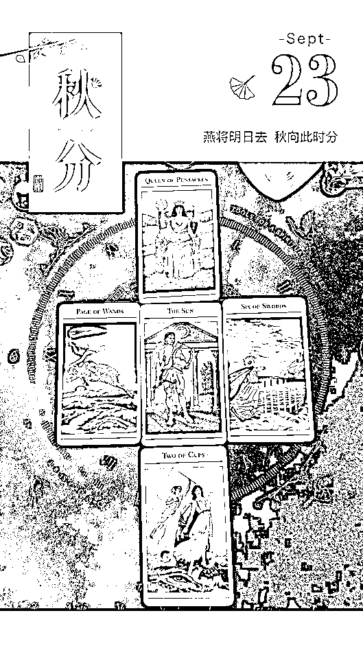

同时占星学中，

这四个节气是太阳换座到

四个基本星座

（白羊座、巨蟹座、天秤座、摩羯座）

的时间点，意义重大。

因此，无论通过占星还是塔罗，

都是适合做下一个季度能量趋势预报，

完善中短期规划与展望的好时机。

**塔罗作为直觉的能量预报与灵性指引工具，**

**是对占星理性逻辑的分析方法的完美补充。**

用神话塔罗，让包围你的宇宙能量一目了然，

对着四季塔罗冥想，

让自己度过有意义的秋分这一天。

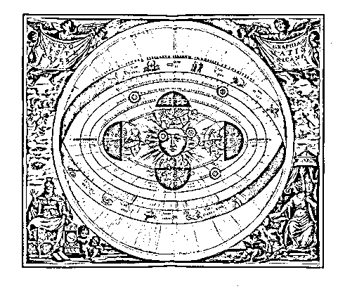

**秋分日 限量优惠咨询活动**

**预约靠手速，限量****30****人。**

**活动地点**

线上——**若道神话塔罗 app**

**活动主题**

“秋分日—冬至日” 3 个月个人趋势的四季牌阵解读

**公益价格**

**150-400 元/四季牌阵解读**不等 

拼手速

******本次四季牌阵活动，****参与咨询的塔罗师名单目录****（排名不分先后）****：**

**王小闲**

2018 年神话塔罗资质认证班毕业并获得认证证书

2019 年苏·汤普金斯若道核心占星课程学员

*****“塔罗可以带领我们去俯瞰心灵的迷宫，带领我们找到属于自己的那条路。”*****

**源乐**

2018 年神话塔罗资质认证班毕业并获得认证证书

六年的塔罗之旅深度觉照、践行经历，

伴我一次又一次从更高的视野中醒来，

从我以为的“问题”中解套，领悟与道同行的喜悦。

*****“以神话塔罗阿尔卡纳之旅契入，助你拨云见日，开拓新季度新视野。”*****

* * *

**RUO**

2018 年神话塔罗资质认证班毕业并获得认证证书

擅长处理亲密关系、职业发展、个人成长等议题。

帮助客户了解自己当下处境，理清思路。

***“透过一个个有趣的神话故事和生动鲜活的人物照见真实的自己。”***

* * *

**Hazel**

2018 年神话塔罗资质认证班毕业并获得认证证书

咨询经验丰富个案过千例

擅长爱情，事业类塔罗咨询

*****“塔罗占卜的意义往往不仅仅是一个答案，我会和你一起探讨你真正的心之所想。”*****

* * *

* * *

**妖妖**

2018 年神话塔罗资质认证班毕业并获得认证证书

个案类型多样，咨询与持续学习一直是正在进行时

***“神秘的塔罗与希腊神话的结合，揭示了不一样的高阶的人生秘密。”***

**Jinn**

2018 年神话塔罗资质认证班毕业并获得认证证书

ISAR 国际占星研究协会认证占星师

占星+塔罗，私人定制式咨询方案

***“******占星是逻辑的艺术，塔罗是感受的艺术、**星盘指引路的方向，牌面折射心之所在。”***

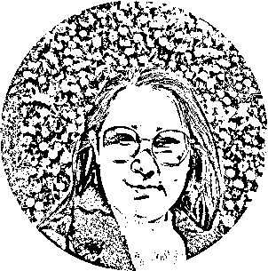

**Lisa**

2018 年神话塔罗资质认证班毕业并获得认证证书

丰富的塔罗咨询经验

帮助个案了解自己，解决困惑，

与个案一起深入分析探讨不同的人主题

***“神话塔罗，通过神话故事与个案产生共鸣，引发深思，从而照见内心，听见自己灵魂深处的声音。”***

**Silence**

2018 年神话塔罗资质认证班毕业并获得认证证书

7 年塔罗使用者

咨询风格兼具心理探索和灵性启示

***“塔罗讲述我们内心的故事，理解塔罗就是理解自己。”***

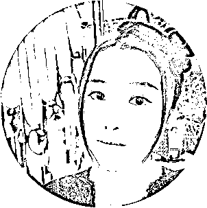

**陈漫**

瑞士库尔酒店管理硕士。

2018 年神话塔罗资质认证班毕业并获得认证证书

专注于塔罗及占星能量分析，个人成长及疗愈。

***“塔罗是一种能量语言，也是一种看待事件和人物的另一个角度。”*** 

**Wenny**

2018 年神话塔罗资质认证班毕业并获得认证证书

擅长亲密关系、职业发展、个人成长等议题的解读。

***“在人生分岔路口，能用塔罗牌为我们当下的每个选择作出指引，成为更好的自己。”***

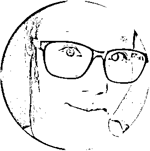

**Maggie**

2018 年神话塔罗资质认证班毕业并获得认证证书

信息传递者，表述清晰

善于帮助来访者基于塔罗提示深入挖掘背后寓意

***“神话塔罗帮助我们与潜意识对话，透由塔罗牌的寓意指引，我们能够深入探索自己并智慧的去做每一个决定。”***

* * *

**Echo**

2018 年神话塔罗资质认证班毕业并获得认证证书

2021 年神话塔罗认证课程助教

帮你根据当下具体困惑分析下一季度的各个主题

***“神话塔罗通过神话故事投射出案主的个人神话原型，让你通过内在的声音，找到最适合你的洞见。”***

**如何预约塔罗师咨询？**

最后，一起再来复习一下

如何在塔罗 app 上预约咨询服务

去若道塔罗 app 上找到**上述咨询师的名字**

打开**“四季牌阵”**塔罗服务项目

就有机会拍到优惠咨询哦~

具体咨询方式如下图

（轻击可放大）

最后的最后

**如何更新神话塔罗 APP？**

快去应用市场更新神话塔罗 APP，抽牌&咨询吧～ 

还没有下载或更新的小伙伴

赶紧来看看如何下载和更新吧！

**iPhone****苹果 IOS 系统下载**

**❶ ****苹果系统长按识别二维码下载**

**▼**

**❷** **或在 App Store 里搜索“神话塔罗”**

**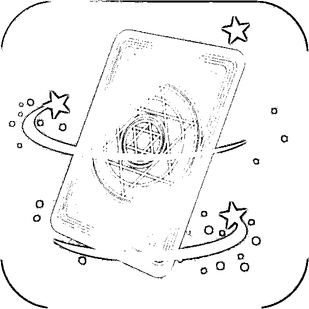**

**Android****安卓系统下载**

**❶**** 安卓系统长按识别二维码下载**

**▼**

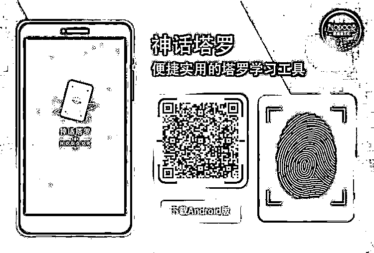

**❷ 或在各大应用市场里搜索“神话塔罗”**

各位亲人小伙伴，

一手资讯分享就先到这里吧， 

每天有事没事都可以去 app 里转转。

如果感到快乐你就用用**神话塔罗 app**，

如果你感到不快乐，

更要使用由专业人本主义塔罗师团队

全程陪伴的**神话塔罗 app**哦！

**我们在秋分日**

**与你不见不散**

# 插班中丨核心课程 L1-2，四位国际导师领你入门占星学！

> 原文：[`mp.weixin.qq.com/s?__biz=MzA5NjA0NTAxNg==&mid=2651456953&idx=2&sn=e1606925926f3886e196721b28753261&chksm=8b48b70ebc3f3e188973b78c0b9a51eca8ea8043ba4ba8611427c62ef2dae05feab5a38dddf4&scene=126&sessionid=1692737923#rd`](http://mp.weixin.qq.com/s?__biz=MzA5NjA0NTAxNg==&mid=2651456953&idx=2&sn=e1606925926f3886e196721b28753261&chksm=8b48b70ebc3f3e188973b78c0b9a51eca8ea8043ba4ba8611427c62ef2dae05feab5a38dddf4&scene=126&sessionid=1692737923#rd)

近几年，线上剧本杀兴起，线下风靡，因其剧情丰富，逻辑推理，沉浸体验，引无数人上头。你可能还不知道的是，从占星学角度，你的出生星图中也蕴涵着琳琅满目的剧本，一幕幕剧情有的跌宕起伏、有的动人温馨、有的神秘莫测……

如果你想要学习占星学，想研究一下严肃占星学和之前看到的娱乐占星有什么区别，这个思路绝对会为你打开新世界的大门，用专业的占星语言讲述生动的人生故事，千变万化，其乐无穷。当你学会了占星的语言，也就结识了星图中的一位位生动的角色，也就是你的一个个人生面向，TA 们各自拥有个性鲜明的特质，你会在生活中有意无意的表现出 TA 们的个性。TA 们在不同场景下的表现也会有不同，彼此之间还可能有着微妙的联系。**准备好开启真正属于你的沉浸式剧本了么？**

先让我向你简单介绍一下出生星图剧本中的主要角色：**行星是演员和角色**行星是剧情当中的演员，它不仅是内在的角色，也可能是我们实实在在碰到的一些人物。★**太阳**：自豪、自信、亲切的角色，善于自我表达、有创造力、喜欢玩耍和表演……★**月亮**：脆弱、敏感、温柔的角色，渴望归属感和亲密感，习惯养育与依赖……★**水星**：好奇、有趣、聪明的角色，有着不知满足的求知欲，善于沟通……★**金星**：爱美、舒适、愉快的角色，喜欢美食、爱情以及各种伙伴关系……★**火星**：果断、鲁莽、冲动的角色，热爱运动，特别是向着他们的愿望进发……★**木星**：乐观、慷慨、智慧的角色，心怀希望、热忱，坚守着对宇宙智慧的信任……★**土星**：耐心、坚毅、谦虚的角色，追求任务达成，做好工作，获得成功的感觉……★**天王星**：博爱、反叛、变革的角色，设法带来突破、彻底的洞见或自我实现……★**海王星**：艺术、共情、慈悲的角色，目标状态是极乐，对生命统一性的超验觉知……★**冥王星**：深刻、透彻、蜕变的角色，高峰体验、精神宣泄、摧毁重建、净化……当然除了十大行星，还有也很重要的、月亮交点、四轴：上升、下降、上中天、下中天也都扮演不可或缺的角色等待你来解锁。

**向左滑动，可依次查看行星卡牌**

**版权归属于插画师炼妖 LY 所有**

**星座是表演的风格**行星所落的星座就会为这个角色赋予一种风格。也可能是他会吸引到的人的样子。每个不同风格的角色，可能说出这样的台词：★**白羊座：**“想做就做！去做吧！这是你的权利。”★**金牛座：**“如果感觉好，享受它吧。让自己快乐，放松。”★**双子座：**“这很有趣，给它下个定义分个类。发挥你的思维。”★**巨蟹座：**“倾听，转内向在，你现在感觉怎么样?”★**狮子座：**“宝贝，闪现你的光芒。表达自己！”★**处女座：**“小心，这里有一个问题。解决它。”★**天秤座：**“展现魅力，建立关系。思考、妥协、合作。”★**天蝎座：**“面对你的恐惧，将它推向极限。决一死战，全心投入。”★**射手座：**“保持信心，宝贝。上帝是好的，做对的事就好。”★**摩羯座：**“全力以赴，专心致志。集中精神，控制自己。”★**水瓶座：**“期待意料之外的事，保持开放和超然的态度”。★**双鱼座：**“放手，顺其自然。屈服，相信宇宙。”当然每一位角色也偶尔会展现出一些破坏性的特质，可能是 TA 的某些核心需求没有得到满足，这就更需要学习更多占星语言，来倾听出生星图中的“心声”。

**向左滑动，可依次查看星座卡牌**

**版权归属于插画师炼妖 LY 所有**
**宫位是舞台和布景****宫位是戏剧上演的地方。**就好比我们去剧院，可以看到各种道具和场景：卧室、图书馆或银行。宫位就像是各种场景。你的行星演员也可能在各个场景中遇到其中的专属 NPC。★**第一宫**：你自己的空间，可能还包括那些帮你保持漂亮外表的那些人……★**第二宫**：银行、有金钱往来的场所，可能还包括客户、供货商……★**第三宫**：学校、各种媒体中，可能还包括兄弟姐妹邻居、同学同伴……★**第四宫**：家里、老家，可能还包括父母、长辈、祖先、家装维护人员……★**第五宫**：娱乐场所、约会场所，可能还包括孩子、你内在的小孩、你迷恋的明星……★**第六宫**：工作场所、提供服务的场所，可能还包括雇员和同事、医护人员……★**第七宫**：婚礼教堂，可能还包括你的配偶、人生伴侣、商业伙伴、公开的敌人……★**第八宫**：葬礼，可能还包括性伴侣、和你分享共同财产和资源的人……★**第九宫**：大学、海外、法院，可能还包括大学教授、精神导师、律师……★**第十宫**：职场、公众场合，可能还包括老板、监督者、“权威”……★**第十一宫**：团体组织，可能还包括朋友、伙伴、你的社交圈、团队中的成员……★**第十二宫**：医院、监狱、修行道场，可能还包括你生命中秘密的人、酒友……**向左滑动，可依次查看宫位卡牌****版权归属于插画师憂所有****怎样将行星、星座、宫位三者串联成剧本呢？**举个例子：**金星**总是象征我们所爱的人或者象征我们去关联、去建立关系的那种能力。**金星落在金牛座**，这个人的次人格就会比较喜欢舒适的生活、享受美食、热爱大自然。它不仅仅是这个人的行事风格，也可能是他会吸引到的人的样子。比如这个人可能也喜欢旅游、喜欢异国文化、美食和风光——**第九宫金牛座**。这个人可能会在旅行中和旅伴或当地偶遇的旅行者结伴而行，一起在海边看日出日落，分享同一份路边美食，骑着摩托在森林公园兜风，畅聊旅行中的见闻和感受，以至于可能由此建立了亲密关系。当然这个配置还有其他剧本的可能性，因为每个人看待世界的方式都不一样，诠释的方式也不相同。占星师的任务就是从更大的视野来理解事情，把星图看成是一张生命地图，占星师就是解图者。地图可以让我们注意到以往忽略的事情，也能帮助我们看到自己与一切事物的关系，或者帮我们发现属于自己的道路。通过对于星图剧本的构想，你会更清晰，人生各个领域自己真实的需求是什么，有迹可循的为自己亲手构建理想生活。出生星图就是这样讲述着一个个故事：蕴涵着无数人生剧本，更映射着天体时钟。**正所谓“Asabove, so below，天上如是，地上亦然。”**

行星、星座、宫位并不代表力量，而是作为天体时钟的一部分，它们发出信号、而非引起变化。但这信号，可以让我们更真切的了解自己，从而拥有更多的觉知，**事情也会因为我们有了觉知而改变——能量永远会随着想法的改变而起变化。**一个人对自己的了解与他真实的样子越接近，他就越拥有智慧。学习占星学，在了解自己的同时，还可以观察他人，才是真正的体味人生百态。

以上文中的关键词介绍只是入门课程的冰山一角，文中的……也代表着每一个行星、星座、宫位的配置还有着更多的含义和可能性，想要更全面的学习占星语言，有一门集结了三位国际名师的核心课入门课程向你推荐：

**为庆祝若道成立 10 周年，我们精心策划，汇集顶级占星学大师资源和教学经验，结合占星学知识体系和不同老师的教学专长，首次推出****由四位国际导师联合授课的占星核心课程。**

**其中**新一期 L1-2 核心课程由**大卫·瑞雷、克里斯蒂娜·罗登贝克、琳恩·贝尔**三位国际大师联合教学，老师们会专业、系统、全面的教授星座、行星、宫位知识，并讲述如何将三者串联成占星语言，人生故事，用三个月的时间带领你系统入门占星学。有请克里斯蒂娜·罗登贝克老师跟大家打个招呼：<mpvideosnap class="js_uneditable custom_select_card channels_iframe" data-pluginname="videosnap" data-id="export/UzFfAgtgekIEAQAAAAAARAcrwoZd0gAAAAstQy6ubaLX4KHWvLEZgBPE7IMkHHpHIan-zNPgMIt3rFoQPG1r9ocB2sRik5Ps" data-url="https://findermp.video.qq.com/251/20304/stodownload?encfilekey=XGocBFxVWK5dcyOOqpEU47RpBHQIvlhnPGdrgZ1vqc6a5xdgIzc2MciabYCyta5Oh5UNVAVqfTCTX48nEibvYibib3F8jlrCZ8ibWXIIJYQYsdlhYywxmI6AaDbnBVHFfezqP8QaFM5F7f6vFzPcVfnuib6p04xvR9P7o0mjMgVU66Sxx6fVFia1Do0IPq7jIDkOyOE&amp;adaptivelytrans=0&amp;bizid=1023&amp;dotrans=0&amp;hy=SH&amp;idx=1&amp;m=16cb9ce99387ef781ee6c1eac70a74ce&amp;token=x5Y29zUxcibAeBWYF7VqUUWDicYTcsEv0t7SBv3EXG4mkdpwiazcVfv9FoSkibKrudsu6lvwCUS8tn0" data-headimgurl="http://wx.qlogo.cn/finderhead/PiajxSqBRaEJYnVsqWfEX9qA0sI6hNVKsDfyzfPZ92WZMZyBpZWU5NA/0" data-username="v2_060000231003b20faec8c4e68a1ec2d4ca07e434b07755bbf47e7053a3059defd2c9d6c68a20@finder" data-nickname="若道" data-desc="#四位导师联合教授 2021 核心课 克里斯蒂娜老师将按照她的教学理念教授星座、宫位、行进、比对图、亲密关系咨询等部分。" data-nonceid="15165203225426773444" data-type="video"></mpvideosnap>**课程安排** **第*****1*****阶**2021 年 9 月 15 日开课，每周一天晚上 20:00-22:00 上课，共 6 次课**第*****2*****阶**2021 年 11 月 11 日开课，每周四晚上 20:00-22:00 上课，共 6 次课

**第*****1*****阶 黄道星座&个人行星****· 概要介绍占星学与星图**

**· 四元素与三形态**

**· 黄道 12 星座**

**· 太阳、月亮及其他个人行星**

**第*2*阶 行星&宫位****· 木星&土星****· 天王星&海王星&冥王星**

**· 练习组合所有行星**

**· 四轴****· 十二宫位**

**· 组合宫位、行星、星座**

**授课老师** 

**琳恩·贝尔**

**（Lynn Bell）**

**· **世界最受欢迎的占星学演讲者、作家和老师之一。定居巴黎，研究心理占星学和家族模式数十年；**· **著名的心理占星学中心（Centre for Psychological Astrology）的长期导师。2016 年，获得查尔斯·哈维（Charles Harvey）杰出的占星学服务奖；**· **作为一个从多个层面进行工作的占星咨询大师，琳恩的工作结合了心理学的观点。她对家族模式的兴趣首先来自与客户的合作。通过在分析领域所做的个人工作，她所受的埃里克森催眠训练将她引领至家族系统。后来，她组织研究小组在家族星图上进行了数年的研究。她写的《家族占星学》就是这项研究的结果；**· **法国心理占星学协会的会长。除了占星学，她在法国沙特尔的新沙特尔学校任教 8 年，还 5 次获得了在《纽约时报》畅销书作者卡罗琳·迈斯（Caroline Myss）的卡罗琳·迈斯教育学院（Caroline Myss Educational Institute）合作教学的机会。

**艾德里安·罗斯·邓肯**

**（AdrianRoss Duncan）**

**· **1971 年在印度游学时开始学习占星学，1985 年开始成为全职占星师，迄今执业已超过 33 年，是人本主义占星学、卜卦占星学和经世占星学领域的知名占星师。他还开发了占星软件 AstroClock 和多款占星报告；**· **哥本哈根占星学院院长；**· **他在日常咨询中经常运用卜卦，咨询图（卜卦的一种运用方式，即根据客户来访时间制作星图，从星图中获得大量信息）也是他特别擅长的领域；**· **艾德里安·罗斯·邓肯从 1971 年开始研习佛学，受佛学影响很深，他相信占星学和佛学观点一致，转化的一个基础是在于对现实感知的改变。而卜卦很容易与佛教融合，因为它只关乎当下。

**克里斯蒂娜·罗登贝克**

**（Christina Rodenbeck）**

**· **克里斯蒂娜·罗登贝克（Christina Rodenbeck）是一名全职职业占星师，在牛津大学城生活和工作，深受周围知识和文化氛围影响；她拥有伦敦大学（University of London）的人文荣誉学位，曾在伦敦占星学馆（AstrologicalLodge of London）、心理占星中心和占星研究学院学习；

**· **作为一名占星师，在过去的 20 年里，克里斯蒂娜在她的网站“牛津占星师”上写了大量关于时事、艺术和文化的文章；她每月主持一个占星播客：“与克里斯蒂娜和萨莉一起占星”，并定期在《占星杂志》(Astrological Journal)上撰写时尚专栏；她定期在英国授课，并保持着蓬勃发展的专业实践。

**大卫·瑞雷**

**（David Railey）**

**· **若道联合创始人，致力于在中国教授和推广西方占星学；

**·** 曾任 ISAR 全球副主席，CAPISAR（ISAR 职业占星师资质认证机构）主席；

**· **1976 年，通过亚特兰大职业占星师考试，成为全职占星师，随后通过 AFAN 和 ISAR 职业测试；

**· **1980 年，与杰夫·焦耳一起在亚特兰大创建“每日行星”占星学中心。此后在亚特兰大占星协会担任 4 年考官，并且两次担任亚特兰大地区占星协会主席。1979-1992 年，作为占星师活跃于美国社会媒体，向不了解现代占星学变化的大众宣传专业占星学知识。

**·** 1989-1992 年期间，他在 WRGG 电台 12 频道每周主持个人电视秀“今日占星学”，早先他还在 WRFG 的广播节目中播讲宇宙天气节目；

**· **2010-2014 年，任全美占星师联盟监督委员会委员；

**· **2010 年，其著作《灵魂的目标》中国版出版，和蒋颖一起创办若道占星学校和其官网 www.nodoor.com；

**· **2017 年，被选为 ISAR 委员会成员。ISAR 是世界最大的国际占星机构，会员遍布 45 个国家，2017-2020 年曾任 ISAR 全球副主席、CAPISAR（ISAR 职业占星师资质认证机构）主席。

**熊鹰老师**

**（天空的空）**

**·** 2008 年接触严肃占星学，至此爱不释手；**· **2013 年师从大卫·瑞雷，研习整套现代占星学核心课程，并于 2014 年起至今连续三年担任该课程的主助教；**·** 期间也跟随格伦·佩里、诺·泰尔、理查德·塔纳斯、罗伯特·汉德、苏·汤普金斯、斯蒂芬·弗里斯特等多位国际占星大师进行学习，进行定向占星主题研究；**·** 2015 年初，通过国际占星研究协会（ISAR）资质认证并获得证书。同年，进一步跟随大卫·瑞雷老师进修“生时校正”技术，通过最终考核并获得证书；**·** 目前在若道占星任职，将传播系统、严谨、真实的占星学作为职业使命。任专职助教期间，进行沙龙与答疑等辅助教学工作已累计超过 200 小时；**·** 在业余期间也提供占星咨询与生时校正服务。目前正致力于占星学与个人成长的整合。**此次课程适合哪些人？****· **对占星学感兴趣，想要入门的零基础者**· **占星学小白，但有志成为职业占星师的人**· **有一定占星学基础，但不知道该如何整合星图复杂碎片的人**· **希望成为优秀的占星师，想要借鉴国际大师解读思路并融入自己的体系的人**· **想要师从更多殿堂级占星导师学习占星心法的人**· **走在自我探索和个人成长道路上的人**课程价格****L1-2 价格**：4800 元其他各阶段课程单报价格，请咨询课程顾问：**Maggie 老师**（微信：18510107057，请备注**“核心课”**）

长按二维码添加 Maggie 老师

**退转课程**

**· 退款原则请详看《教学协议》，如有疑问请咨询课程顾问**

****名师汇集金牌核心课程****

**授课老师：**琳恩·贝尔、艾德里安·罗斯·邓肯、克里斯蒂娜·罗登贝克、大卫·瑞雷

**授课时间：**2021 年 9 月 15 日起

**授课方式：**网络课程**，**英文授课，中文翻译

**费用：**L1-2：4800 元

**课程负责人：****Maggie 老师**（微信：18510107057，请备注“核心课”）

长按二维码添加课程负责人咨询~

****报名请点击“阅读原文”****

# “你一开口，就知道你是哪类人”丨这五种水星式的表达，你属于哪一种？（值得收藏）

> 原文：[`mp.weixin.qq.com/s?__biz=MzA5NjA0NTAxNg==&mid=2651456951&idx=1&sn=b6b2c08f90679f5e48c8bb9468b14139&chksm=8b48b700bc3f3e16ac89a46cbffe724934f53719504b1949b162bc734b9baea38a3ac6f7197b&scene=126&sessionid=1692737923#rd`](http://mp.weixin.qq.com/s?__biz=MzA5NjA0NTAxNg==&mid=2651456951&idx=1&sn=b6b2c08f90679f5e48c8bb9468b14139&chksm=8b48b700bc3f3e16ac89a46cbffe724934f53719504b1949b162bc734b9baea38a3ac6f7197b&scene=126&sessionid=1692737923#rd)

******************************☆ **************后台回复“今日”，给你一句生命态度****************

作者/艾德里安·邓肯

译者/Luke 校对/江艺

编辑/翀子 封面/书君 图片/网络

水星和各种形式的心理活动有关，我们的音调、节奏和话题都显示出水星特质。当星图中水星与不同行星形成相位时，都代表什么意涵？这是邓肯老师撰写的一篇精彩文章，而他也在我们的[【核心课】](http://mp.weixin.qq.com/s?__biz=MjM5MjQwNjAyMQ==&mid=2649438836&idx=6&sn=d35619fa717b3f8bde19e0115dc0f897&chksm=beb9551e89cedc0897af0b73c1a5565e79356034d973ab12ab6b141d341ca47335d50639cb48&scene=21#wechat_redirect)里出任授课老师（点击查看详情），参与教学。
**水星的意涵**

如果我们闭上眼睛，试着将心智放空一分钟，我们将发现这几乎是不可能完成的任务......思想是不请自来的，心智永远不能静止。甚至对于一般的冥想练习者，心智也只能短暂地安静下来。

用“心智”这样的词汇来描述思想过程是很不适当的。比如说，在佛教中，心智的每一个面向都有一个特定的表达——而它有许多面向——就像爱斯基摩人据说有无数个词来形容雪一样。那么，请意识到语言的局限性。

**水星被认为与各种形式的心理活动有关。**你思考的方式，你思考的内容，你说话的方式和你说的内容，你倾听的方式，你想象的内容......这些都是星图里水星的相位、星座和宫位所表达的。**只要你一开口，水星就溜出来。**

声调、节奏、语气和音量的细微差别，十分精确地体现了水星的配置类型。任何自由联想练习，都可以作为揭示一个人水星本质的绝佳途径。

**在研究水星时，最关键的是注意到音调、节奏和话题。**

*   **水星/火星****在射手座**可能上气不接下气，气冲冲地谈论正义的话题。

*   **水星/冥王星****在处女座**可能精确、激烈、急促，忧虑地谈论效率的话题。

*   **水星/金星在巨蟹座**可能夸大其词，怀有爱意地谈论家庭和家人的话题。

耳朵灵敏的占星师可以识别出思想和情绪如何渲染沟通，他们可以充当一面镜子，向客户呈现一种新的觉知，关于自己的思想如何受到星图影响。

**思想是主观的，**我们可能确信自己说的是真理，但这件事至多只对我们为真。**我们对现实的心理表现反映了我们自身心智的许多内容，却与所谓的客观现实相差甚远。**

**星图上的水星**

**我们星图中的水星位置，揭示了童年时期的形成性心理影响。**这主要和**兄弟姐妹**（或缺少兄弟姐妹），他们的行为，以及我们与他们行为的关系有关。

我们的**学校经历**也反映了水星，既反映在**学术成就**上，也反映在**和教师的关系上**。更重要的是**我们和同学的关系**，以及在**教室内外的友谊**——或缺少友谊。这通常既是十一宫，也是第三宫的事宜。被戏弄和取笑，短时间或长期被排挤，参加特定的小集团或群体......所有这些都对日后的发展有深远的影响。

**水星/土星**对嘲弄特别敏感，尤其是智力方面的。**水星/海王星**在没和人说话时会感到疏远。**水星/天王星**会挑衅无聊的老师—**根据我们的水星配置，我们都曾经验过，或引起过特定的经历。**

**这些早期的经验会影响我们现在的沟通和兴趣，以及我们对真相和现实的态度。**当水星严重受克，会引起痛苦的心理困扰，因为正是这个行星将我们和现实连结。如果我们说出的话语，严重地歪曲了现实，那么人生将充满误解，也不可能达成任何长远的成功。

**水星和我们的生活方式息息相关。**理清沟通问题，是成功的必要前提，事实上，现今有许多关于企业市场营销的优秀课程，也反映了这点。

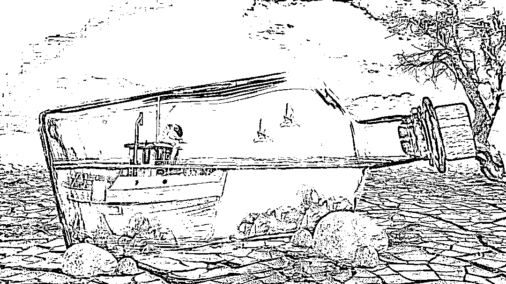

**水星的议题**

**幸运的是，处理水星和沟通问题，对占星师来说是相对容易的。**因为这些问题直接表现在客户的用词和态度上。

太阳和存在本身有关，月亮和无意识有关，水星和意识的内容有关，而与其相关的议题可能是在沟通的双向过程中被渲染的目标。内在的对话甚至比外在的更加重要......

正是在大脑的回响室里，我们内心的对话占据了至高无上的地位，展示了我们的真面目。也正是通过指引客户穿越这些内在的密室，持久的改变才可能发生。

**下文描述旨在帮助那些以强烈负面的形式显化相位的人。**相信不少拥有压力相位的人，已经克服了该相位指示的许多问题。

**水星与木星：正确和错误**

没有哪个相位像水星/木星一样，给予人对知识和理解的渴求。学习过程可以持续一生......不只局限于传统教育年限。**聪明才智是这个行星组合的最高标准。**倘若他们智力受到质疑，常常引发各种问题。

**通常这是一个温和的组合，**木星有足够的尊严，在讨论中保持宽容和交际手腕。运气好的话，水星/木星客户已经学会了在对正确的需求和获取更多信息之间保持平衡。然而，如果任一行星处于不幸的位置，那么会导致很多争论，使得水星/木星人展示**相当强的说服力**来传达观点。

一个强有力的天蝎座水星，能够发表相当一针见血的言论，并可能怀有旧怨。一个强有力的水瓶座水星对任何争论都无动于衷，等等。

与水星/木星相位相关的受克，**与一种不公正的感觉深深关联**，尤其体现在兄弟姐妹，或学校教育上。通常感觉一位兄弟姐妹受到优待，这可能成为大量愤恨感的来源。哪怕是小小的辩护，不公正的感受也很容易产生。

更复杂的问题是，水星/木星**往往会大声指出任何感受到的不公正**，而且不会轻易妥协。在这种情况下，木星所渴望的无非是成为正确的一方，尤其当火象星座或火星也涉及其中。

在咨商过程中，如果怨恨和朋友、老师、同事或兄弟姐妹有关，这可能是水星/木星的作用。占星师遇到的第一个难题是为这个情况建立恰当的视角。这个相位的能量**，会显化为非常有说服力的内在声音，**为水星/木星人为什么是对的，提供了强有力的论据。

我记得一位 70 岁的客户，水星在天蝎座上升，对分金牛座的木星，她多年来一直怀恨在心，因为她的姐妹得到的遗产比她多。

在检视遗产事件时，两个因素浮现了：姐妹穷得多，以及客户此前对继承父母遗产表现得漠不关心。尽管如此，她仍然把这事件作为辩护，指称姐妹间的不公正，一直是她的人生宿命。这些客户能够回应聪明的论证，尽管这些论证必须以巧妙的方式呈现，否则占星师将处于失败的境地。毕竟，**水星/木星在保持正确上受过很多训练。**

上述的例子证明了，**客户的观点和态度**，决定了她从负面的水星/木星相位那里吃了多少苦头。由于这一相位赋予了**天生的智慧**，常常有可能将客户引向新的视角，将他们从暴虐的内在声音中解脱出来。正是这一声音不断地告诉他们忍受了多少不公正。

他们特别容易接受好的“框架重构”，意味着**把整个事件放到另一个角度解读，可以从根本上改变他们的观点。**正如这个客户引以为豪的是，她在人生中凭借自己的努力获取了财富，那么大额的遗产有什么用呢？她宁愿看到姐妹在没有钱的情况下挣扎一生吗？无论兄弟姐妹之间的怨恨有多深，血总是浓于水。

四分相和对分相比合相带来更多困难（合相赋予更多的智力和天赋）。困境在于相互冲突的内在对话。**木星根据其星座和宫位表达强有力的信念，而水星不断地提出新的论点，挑战这些信念。**

水星在水瓶座 11 宫可能想要为心理发展课程花钱；木星在金牛座 2 宫则告诫要脚踏实地，乱花钱不明智等等。在更尖锐的案例中，水星/木星人士的内在对话就可以耗尽自己......当他们终于鼓足勇气采取某种行动时，新的想法立刻抬起头来，使他们在思想上精疲力尽、不知所措。**关键点是，思想不等于行动，思想等于不行动。**

过度的心理活动仅是内在精神动力的表达。在意义只是主观概念的世界中，**水星/木星人士把意义和公正的观念提升到了不合理的高度，以至于难以出于辩证的考量作出简单的决定。**

如果你没有生命的蓝图（谁有？），世界上的事件是缺少意义的。是个体的思想赋予了生命以意义，归根结底，个体是他们现实的精神建造者。关键是，水星/木星客户明白他们赋予事物什么“意义”，并且**重新组织他们的信念，使得他们从事件解读中获得的意义赋予他们力量，**而不是削弱他们。

最适合水星/木星人士的，**是参与传播知识的活动。**承认他们的内心对话是自以为是和主观的，会有宣泄作用。

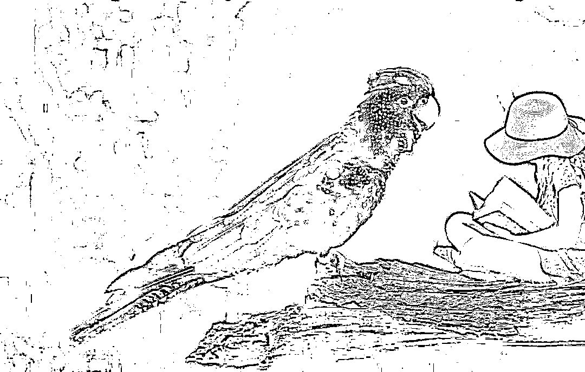

**水星与土星：恐惧和流畅**

**这个相位在沟通和智力方面引起了匮乏和不自信的感觉。**土星/水星人士有些克制和怯懦，或许迂腐，小心翼翼不暴露出任何无知的迹象。因此，当他们感觉自己的心理盔甲上出现了裂缝，就变得很有防备心。

土星/水星与实际智力关系不大，却在很大程度上**与主观上对智力匮乏的恐惧关联。**心理发展的最大障碍在于这一主观恐惧，以及为了隐藏这一点所浪费掉的能量。无论何时当遭遇难以逾越的智力挑战，土星/水星就像一道闸门沉重地落下。久而久之，这就真正成了难以理解的奢望，还要花费很大心力隐瞒假想的缺乏理解力。

**水星/土星相关的学习和沟通难题，基本上可以归结于心理机制，并且可以通过重构进程来解决。**往往在人生早期就意识到了**沟通障碍**的出现。这可能和一位哥哥或姐姐坚持要打压客户的智力有关，或一位弟弟妹妹比客户更聪明。家庭中的某些事情激活了水星/土星**对智力的不安全感。**

然而，真正的困难始于学校，通常由于在学校被认定表现不佳，而秘密地经历了很多羞愧感。总有某一位老师，让客户的人生变得悲惨......就像闻名遐迩的德国老师。客户本应毫无困难地提供他/她的名字，可能有某一特定的事件发生，让孩子在班上成为了嘲笑的对象，引发了强烈的羞愧感。

正是在这关键的时刻，内心作出了改变一生的决定，严重影响了智力发展的整个进程。决定加倍努力，决定放弃，决定避免任何与智力有关的情境，决定隐身，关于智力自卑的决定。

在咨商过程中，占星师将意识到水星/土星在交流中的一些变化。**假装理解却没有真的理解，为缓慢找借口，自我贬低，或摆出高傲、矜持、不屑的态度，从而有效地阻止了深度沟通。**在这一时刻，占星师需要介入，找出客户内心对话里发生了什么。这个过程机制通常是：

*   **突然间直觉地感到自己的智力被揭露，伴随着自我批评的内在声音。**

*   **心理障碍防止进一步吸纳信息以促进理解。**

*   **防御机制启动......伪装，卖弄，虚伪。**

*   **摆脱威胁，但随后感到错失了本可以丰富知识的机会。**

所有这些都可以避免，前提是水星/土星承认自己的理解有困难。“你能重复一遍吗？”或“我很抱歉，我没理解你说的......”或“抱歉，但我反应有点慢......你能一字一句地说吗？”但问题是，他们已经花了多年的努力来掩盖自认为的自卑。

**客户需要知道，不理解不是什么严重的问题**——人们不那么关心。**但是假装理解，或培养心理防御机制，则是个严重的问题。**土星/水星的对策比问题本身还糟糕。

占星师必须能够体谅和理解客户在这方面的敏感，逐渐引导客户承认和描绘他们内在对话的图景。这个相位对训练有良好反应，首先要做的是**创造积极的内在对话，取代消极的内在对话。**与其让水星/土星斥责自己愚蠢，必须引导内在对话的语气和方向去赏识其可能达成的潜力。

大多数土星相位最好的地方在于，**问题随着年龄而改善，**尤其在**29 到 30 岁**的第一次土星回归后。青少年或 20 多岁时放弃的教育又被重新拾起，曾经制造心理障碍的土星，现在致力于于长期的学术修炼。然而，必须避免持续把教育当作拐杖......在某一时刻，客户**必须抛弃权威，发展自发性。**

对水星/土星客户来说，**他们适合从事那些需要专注和小心谨慎的活动**，因为他们倾向于反复检查，确保正确。他们的内心对话充满自我轻视和恐惧，对外投射出假装理解的表象，害怕自己被揭露。承认这些会有宣泄作用。

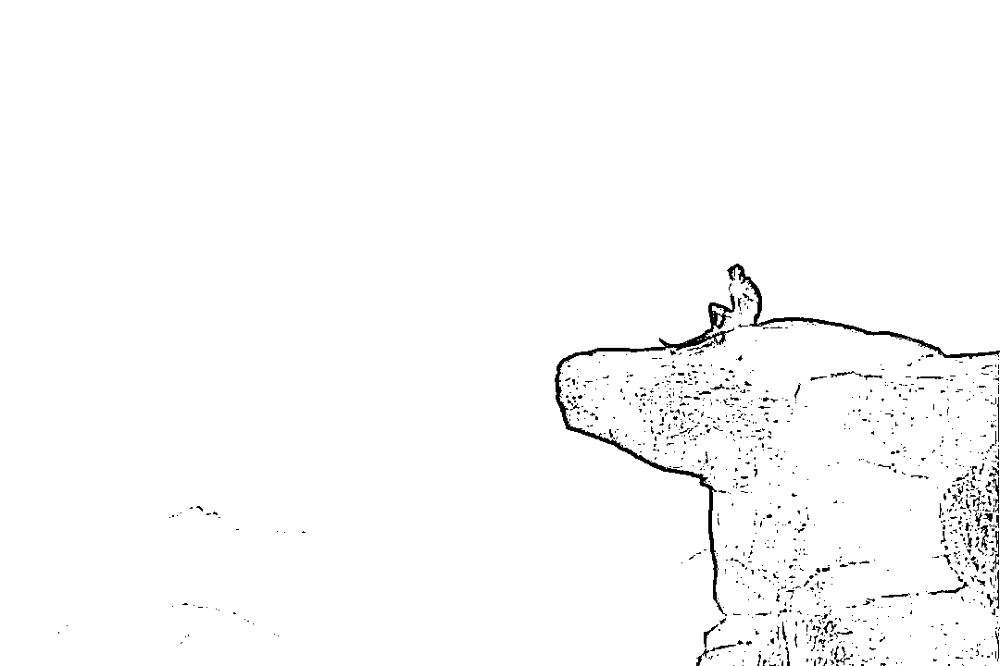

**水星与天王星：与众不同**

当这些行星合作良好时，会在某些领域表现出显著的天赋，尤其是与**发明创造、实验、和未来有关的领域**。当相位困难时，仍然有相当大的创造力，尽管说服其他人所需的沟通技巧可能没有得到很好的发展。

水星/天王星人士的特点是**对周遭事物的慢节奏感到不耐烦。**当他们沟通时，常常试图活跃周围人的气氛，哪怕这意味着挑衅。他们**可能对别人的敏感无动于衷**，尽管他们新奇且不同寻常的沟通模式使人着迷，他们仍可能遭到疏远或在社交中迷失。

这一类型的客户**通常对占星咨商特别开放和好奇，渴望通过不同寻常的方式了解自己。**由于具有超前性，他们可能倾向于打断，或替你说完你的句子。通常对于天王星相位，并不会感觉有任何问题。不过，一些行为模式可能会产生负面后果。其中之一就是**干扰了沟通过程**。

在儿童期，水星/天王星常常表现为**通过直言不讳来获取注意力**。能够从非常出其不意的角度发表言论，是水星/天王星儿童争取父母关爱和注意力的手段之一。

通常在儿童期发生了关键的剧变，让儿童手足无措。这可能是改换班级、改换学校、一位兄弟姐妹的离去等等。在极端的案例中，会有严重的事件，使认知进程崩溃。我的一位学生，射手座水星在第 2 宫，对分第 8 宫的天王星。第 8 宫的环境往往是创伤性的。

尽管针对儿童期的记忆做了大量调查，但她想不起来什么重要的事情。在午休时，她路过有轨电车看到飞溅的火花，这唤醒了最不同寻常的回忆，这段回忆自 16 岁起就完全埋藏在无意识里。

那时，她被收入精神病院，接受电击治疗，却错误地没有被给予常规麻醉来移除疼痛......引起了巨大的创伤。只有在课堂上，40 岁的她才回忆起了这一事件。

这个案例，尽管极端，却证明了水星/天王星相位**可能引发精神短路。**这就好像记忆中出现了空洞，尤其当还有冥王星的影响力介入。

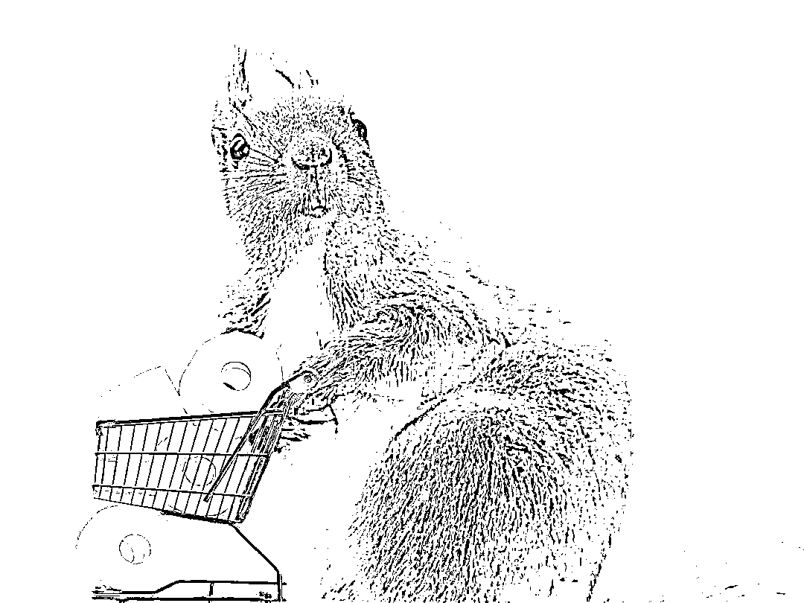

这个相位的一个特点是，**倾向于在谈话中偏离正题。**他们相信其他话题更有意思，比正在谈论的正题更令人兴奋。时断时续的沟通让对方很难理解。**不可预测性**可能是控制谈话的一种手段，也可能是害怕“无聊”的表现。

传统和可预测性是水星/天王星的大敌，这就是这些人具有发明天赋的原因之一。然而无聊是个诱导性的词，用来掩盖隐藏的恐惧。水星/天王星客户有着**天马行空的心智，**他们的世界充满**令人兴奋的想法**，却没有扎根此时此地的现实。

活在身体里，与感官合一，**亲密接触物质实相对他们是很难的，结果是导致了难以言述的疏远感，感觉孤立无援。**这是他们沟通习惯带来的必然后果，这种沟通并不连贯，而是断开的。

占星师或许能够在咨商中指出这些沟通模式，如果它们很明显的话。需要关注的迹象包括**不安、不耐烦和被打断说话。**当水星/天王星客户打断别人说话时，这可能是个信号，他们试图将话题从不舒适的领域中引开，这将让占星师不能发挥作用。

这是进行干预的绝佳机会。“那么，我刚才想要说什么？”**如果客户打断占星师，这说明他或她肯定也常常打断别人说话，而这会在关系中制造不和谐。**

对水星/天王星客户来说，他们适合处于**前线**，处于不**断变化和充满精神刺激的环境中**，最好是国际或新时代层面。承认他们几乎无法控制乱窜的内心对话，这分散他们的注意力，扰乱他们与人的交流，会有宣泄作用。

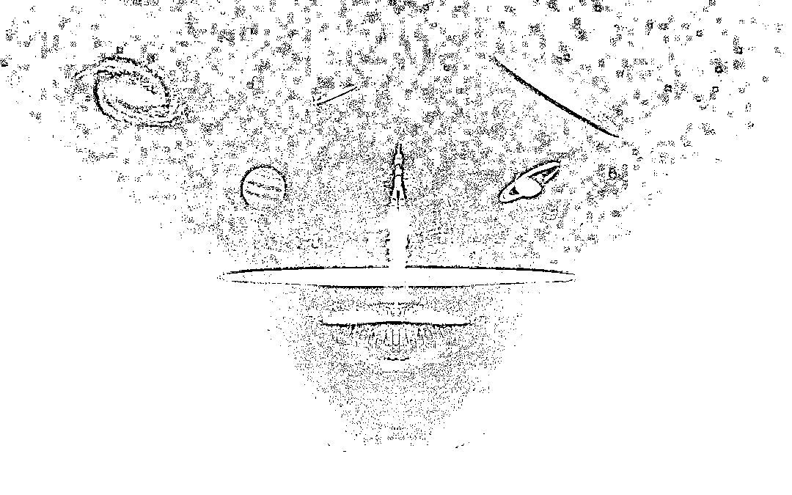

**水星与海王星：雾镜**

无论是和谐还是不和谐相位，**感应潜意识信息**都是水星/海王星最有力的天赋之一。在沟通中有巨大的**想象力和敏感度。**在很小的时候，真实和想象之间的界限就是模糊的，因此**混淆了什么是真实，什么不是**。

沟通中，他们对另一方的想法有**很强的觉察力**，并且倾向于据此调整沟通。水星/海王星敏锐地倾听对方说了什么，没有说什么，而且**很难区分自己的和别人的想法**。他们就像海绵一样，吸收周围环境的气氛。

在咨商中，水星/海王星客户通过自由联想吸收所说的话，让话语在脑海中回荡，激活思想和回忆。**他们是“读心者”，在话没说完前就猜出了它的意思，常常形成一种先入为主的理解。**因此，有必要检查你所说的和客户认为你说的是不是同一件事。这常常是不同的。

这个习惯——再加上不愿意说任何可能造成不良气氛的话语——自然而然导致了生活中的许多误解。**他们实际所说的，和他们事实上所想的，是存在差异的。**这种差异导致他们的话语缺乏真正的力量，他们常常感觉在隔着一层棉花说话，或其他人对他们说的话没有付出足够注意力。有压力时，他们很难表达自己，也很难遣词造句，恰当地表述内心的想法。

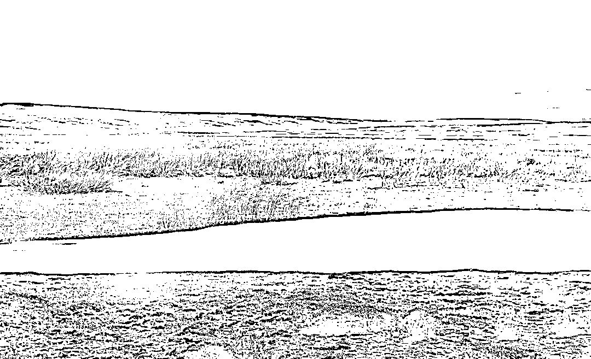

**在幼儿时期，客户往往就创造了一个秘密的虚幻世界。**这个孩子可能早早认识到，最好是模糊其词，而不是坦率直接。**孩子喜欢通过说谎来避免不愉快，**或让生活变得可以忍受。

长远来看，这创造了一个让孩子游刃有余地驾驭的环境，但必须维持一个他或她能够完全相信的虚假世界。不可思议的是，在之后的人生中，水星/海王星人士确实相信他们现实的版本，尽管有大量与此相左的证据。

在内心对话中，**他们避免那些难以接受的真相，只相信他们愿相信的。**这有时表现为不诚实，不是出于恶意，而是因为他们相信自己织就的现实是客观真实的。另一方面，童年存在一种孤立感，无论在家庭还是学校，或遭受了被忽略或置之不理的情况。这刺激他们**退回想象的内在世界。**

在咨商中这个相位的迹象之一是占星师忘了发生了什么，或变得困惑。**水星/海王星客户本能地制造出一面雾镜，躲在后面准备编造新的令人信服的故事。**这使占星师迷失了方向，事实上任何进入水星/海王星亲密圈的人都不可避免会这样。

正如之前所说的那样，重要的是**非常精确地使用语言**，从而让这些客户无处闪躲，并鼓励他们**清楚阐释**。随着他们更深地探索自身话语和思想的涵义，他们开始在自身之中感到一种无法言明的悲伤。可能是被误解、被忽略，或与人产生隔阂的悲伤。

海王星寻求化解心智之间、人与人之间的界限。然而，为了在世界上正常生活，精神界限是必须的。**水星/海王星需要与内在的孤独感和解，并从此发展出对他人的理解。**

水星/海王星的客户**适合参与需要直觉敏锐性的领域**，在那里他们不受噪音和喧嚣的干扰。承认自己感到孤独和被忽视，承认自己掩盖了真相，而且害怕自己的想法没有分量，会有宣泄作用。

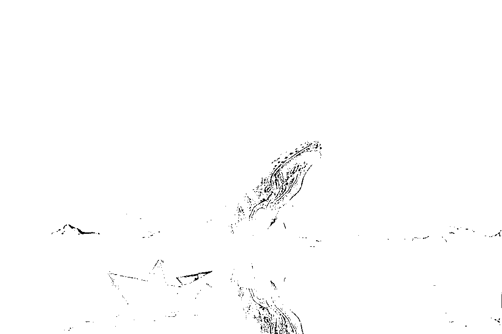

**水星与冥王星：秘密和谎言**

有这个相位的人是**天生的侦探**——**他们有能力洞察表象背后的事情，渴望探索别人的秘密。**有一种特别的精神机制在起作用，使他们质疑所说的话，因为他们怀疑有某些更重要的事情没说出来。

在咨商中，水星/冥王星人士常常感到你在隐瞒某些黑暗的真相——并且敦促你全都说出来。随着他们深入地调查别人的秘密动机，他们常常发现某些重要的事实和事件被隐瞒了，这证实了他们的信念，即你不能太相信别人。

**和他们有亲密接触的人常常感觉受到审问，埋怨自己的动机受到质疑。**矛盾的是，这反而致使他们隐藏信息，尤其当他们感到水星/冥王星人士听到真相后会做出负面的反应。

水星/冥王星客户本身**非常擅长隐藏他们自己的想法**，甚至是那些暴露内心想法的潜意识信号，比如眼神和身体语言。他们倾向于用**眼神**接触把你定住，获得**心灵的控制权**。

他们的音调可以是单调乏味的，**有催眠作用**。许多有这个相位的人喋喋不休，**让听者精疲力尽**。当这发生时，听者会感到有中断交流的冲动，却不敢这么做。在极端情境下，其他人会避免和水星/冥王星人士的沟通，正是因为他们感到被支配，精疲力尽，或沟通中没有双向的流动。

实际发生的是，**水星/冥王星在沟通中感到焦虑。**他们把听者定住，是因为**害怕沟通中断**，却发现人们避免和他们谈话，这是他们最不希望发生的事情。他们不断地说话，是因为**害怕停下来时的寂静。**

这是占星师可以进行干预的关键点。如果水星/冥王星客户喋喋不休，占星师应指出这点，尽管这样会激发强烈的反应。在这里，**转化的秘密就在当客户停止用语言填满空气时，**那寂静的深渊。这些客户必须学会说出一句话，然后暂停和等待回应。

暂停期间，焦虑涌动，这就是水星/冥王星的能量。在这个空间中停驻，可以让客户接近转化的能量，尽管在一开始这很不舒服。

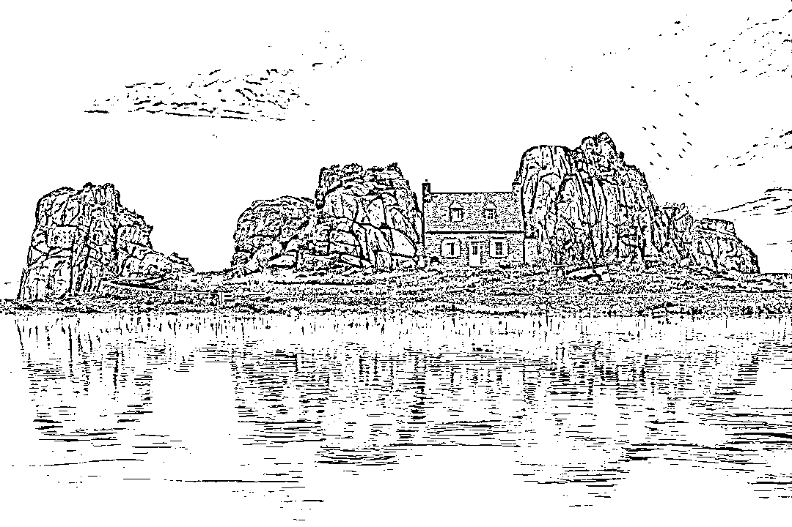

童年时期的特点之一是，紧张的气氛中有未能说出的话语。**童年时几乎总有一些关键的秘密，这些秘密毒害了未来多年的感知。**有时这些秘密直到晚年才被揭露。通常存在同母异父(或同父异母)的兄弟或姐妹，有时孩子对此一无所知，或者——如果知道的话——在特定环境中也不允许谈论。

然而，出于水星/冥王星的**侦查天赋**，这个孩子感觉某些东西被**隐藏**了，某些领域是**禁忌**的，某些话题绝对不能提起。非同寻常的是，那些被隐藏的事物，比能够说出口的事物有着大得多的力量。除了充满秘密的氛围外，儿童也常常在交流中遭遇残酷的对待，特别是当某一位家庭成员长期故意对儿童不理不睬，一个词也不说，通常以此作为惩罚。

另一个特点是喜欢忧思，或更精确地说，**忙于精疲力竭的内在对话，连最微小的细节也要深度分析**，却未能达成任何结论。在亲密关系中，这种内在对话常常被投射出来，以至于让伴侣卷入审问式的对谈，持续到夜深。

**水星/冥王星希望找到“答案”，不达目的不会罢休。**然而没有答案。伴侣面对这种喋喋不休的审问，不得不寻找一种生存策略。两件事可能发生：要么伴侣被卷入长长的争吵，要么完全闭嘴。占星师几乎总会发现，客户抱怨有时他们的爱人几乎不对他们说话，或维持很长时期的沉默。

水星/冥王星客户**必须学会传递信息，**然后闭嘴。追根究底没有任何好处，只有坏处。一切都可以归结为一种内心感受，那就是某些**真相浮现，带来释放**，但是——由于这种感受源自有记忆以来的幼年时期——带来释放的想法是一种幻觉。

水星/冥王星客户**适合从事需要分析和侦探能力的领域，**尤其是心理学、电脑和任何需要深入研究的领域。让他们承认对别人说的话抱有怀疑，会有宣泄作用。他们觉得别人在隐瞒事实，但实际上这么做的是自己。

**版权声明：**本文由若道翻译发布，欢迎转发，反对抄袭。友号转载请申请白名单。

**艾德里安·罗斯·邓肯**

若道签约老师，哥本哈根占星学院院长 1985 年开始成为全职占星师，是人本主义占星、卜卦占星和经世占星学领域的知名占星师。开发了占星软件 AstroClock 和多款占星报告。

**学习占星学**

**点击或长按下图了解课程详情** 

**微信又双叒叕改版啦，不想错过若道君的推送？**

**就把若道设为星标吧！**

**▼**

**喜欢记得点一下在看哦☟**

****报名直达入口****

# 水星在天秤座，有哪些“祸从口出”让你至今难忘？

> 原文：[`mp.weixin.qq.com/s?__biz=MzA5NjA0NTAxNg==&mid=2651456865&idx=1&sn=cc2c69bc566a4318b43593aa1854a3cb&chksm=8b48b7d6bc3f3ec01c231b48e602a58983610c4f92f737e1574ead33b09524900263bc30e8b3&scene=126&sessionid=1692737923#rd`](http://mp.weixin.qq.com/s?__biz=MzA5NjA0NTAxNg==&mid=2651456865&idx=1&sn=cc2c69bc566a4318b43593aa1854a3cb&chksm=8b48b7d6bc3f3ec01c231b48e602a58983610c4f92f737e1574ead33b09524900263bc30e8b3&scene=126&sessionid=1692737923#rd)

**2021 年 9 月 18 日天象：**

*   **月亮在水瓶座**

*   ******水星三分木星、和海王星呈梅花相******

火星在本周进入天秤座（点击[【天秤座火星】](http://mp.weixin.qq.com/s?__biz=MzA5NjA0NTAxNg==&mid=2651456582&idx=1&sn=9028b5166a2394ba27c2d1bf1f831588&chksm=8b48b6f1bc3f3fe75d1dfd98ceef7560286df33b5572e42989727c8f8152f0d98f759b402d09&scene=21#wechat_redirect)查看文章），和天蝎座金星形成互容。我们有机会可以在沟通中更好地倾听对方的心声，建立更深的情感联结。这对马上就要到来的天秤座水逆来说，是个好消息。

今天是上班日，打起精神来！水星和海王星形成精准梅花相，注意在工作中要清晰表达自己的想法哦~尤其水星还和木星呈三分相，我们对自己的表达很可能非常自信，忽略了其中被模糊的信息。月亮一整天都在水瓶座，在中午到下午的时间里，和天秤座水星呈三分相、与水瓶座木星呈合相。在这个时间进行团建活动，是不错的选择哦！读一读和沟通有关的书籍，也很应景！或者，来参加若道即将开设的[【NVC 线上训练营】](http://mp.weixin.qq.com/s?__biz=MjM5MjQwNjAyMQ==&mid=2649438836&idx=4&sn=96ec7a896565f256c3bdf7160234527e&chksm=beb9551e89cedc0875846b48e6318bfc2e866fdc0c92508f420eeed0d2cbd7b018d404a50c69&scene=21#wechat_redirect)（点击查看信息）吧，一起好好说话，解密爱的语言~

水星在天秤座的日子里，你有哪些“祸从口出”的难忘经历呢？欢迎分享呀~

周六快乐！我们明天见！ **了解每日天象，可****下载“若道”APP 查看****还有更多精彩等着你哦**

# 斯蒂芬三日线上工作坊丨如何进行一场有效的占星咨询（早鸟价最后 6 天）

> 原文：[`mp.weixin.qq.com/s?__biz=MzA5NjA0NTAxNg==&mid=2651456858&idx=3&sn=c478ae99f38489c95b54f7f44d89e1c7&chksm=8b48b7edbc3f3efb7d3677288dc95a547cc73f684b908198a7c522c2dc855fc4fd70ed023b10&scene=126&sessionid=1692737928#rd`](http://mp.weixin.qq.com/s?__biz=MzA5NjA0NTAxNg==&mid=2651456858&idx=3&sn=c478ae99f38489c95b54f7f44d89e1c7&chksm=8b48b7edbc3f3efb7d3677288dc95a547cc73f684b908198a7c522c2dc855fc4fd70ed023b10&scene=126&sessionid=1692737928#rd)

**喜大普奔，斯蒂芬要来教占星咨询了！**

占星咨询对于很多占星学生和兼职占星师而言，都是考验自己到底能否成为职业占星师，建立欣欣向荣职业生涯的最关键一环。

一个坏消息是，当你辛辛苦苦学习完所有的占星技术后，你可能仍会有些沮丧地发现，自己还是做不好一场咨询。

**比如：**

对咨询的问题

*   我可以怎样迅速和客户建立信任？

*   我如何描述星图中我看到的困难配置，或者如何描述我看到的即将到来的富有挑战的行进？

*   如果客户在咨询中滔滔不绝，我该怎么办？

*   如果客户在咨询中一言不发，我又该怎么办？

*   如果客户否认我所描述的他/她明显存在的问题怎么办？

*   如果客户存在明显的心理问题怎么办？

*   如果我讨厌这个客户怎么办？

*   如果我被这个客户吸引怎么办？

*   如果我的性能量被客户激发怎么办？

*   ……

**这么多问题怎么办？！**

别着急。

好消息是，这是每一个占星学生和新手占星师都会遇到的问题，也是每个占星师必走之路。**其中一些问题是可以用占星技能所解决的，而另一些又是在占星技巧之外，需要进入心理学的领域。**不论怎样，归根到底，我们要能在咨询与客户建立并且维持**良好的咨询关系**，甚至与那些跟我们性情截然相反的客户。

1

**授课内容**

如果你听过斯蒂芬·弗里斯特的占星咨询，你会看到客户被他润物细无声的咨询所打动，又感到自己被他深沉的慈悲所懂得。那些娓娓道来的故事在客户面前展开生命时空的画卷，在咨询结束时，又充满希望的力量。

**而****今年****10****月****，在斯蒂芬到中国教学 10 年后，他将****第一次****与所有热爱他的学员分享如何做好一场占星咨询。**

在这个网络课程中，占星大师斯蒂芬·弗里斯特将会和你分享他几十年来一对一面对面的**占星咨询经验**；他也会分享如何提前规划好**接近客户心灵**的占星技巧。**客户个人星图**为我们提供一个最迅速，也最可依赖地建立信任和自然连接的地图，他还会分享如何运用个人星图建立这个连接。

2

**斯蒂芬的占星著作**

*   **1984-1988 年间**，斯蒂芬写作出版了《内在的天空》（已有中文版）、《变化的天空》和《天空的伴侣》三本占星经典著作，奠定了早期在占星学界的地位。

*   **2002-2005 年间**，他与朱迪·弗里斯特共同创作了两本经典的关系占星学著作《天空的伴侣 I：爱、性、和进化占星学》《天空的伴侣 II：组合图》。　

*   **2008 年**，斯蒂芬出版了一本非常重要的著作《昨日的天空》，此书是至今为止关于轮回转世跟星图的清晰对应最详尽的著作之一。 斯蒂芬前后一共出版了 12 部占星著作，在世界占星学界拥有很高的声誉。

3

**斯蒂芬获得的荣誉**

**1985 年**，他凭借《内在的天空》一书获得**职业占星师协会奖**（Professional Astrologers Incorporated Award）。

**1992、1995、2008 年、2018 年**，他四次获得占星界最高的占星学联合协会奖（UnitedAstrology Congress Regulus Award）提名，**2018 年获得轩辕十四教育奖**。

4

**斯蒂芬的占星哲学观**

斯蒂芬的占星风格以自由和选择为中心，他的解读不是以下定论的方式来“预测”未来，他强调如何**改善生命**，而不是宿命式的论断。他以心理占星学的语言来解读星图上的人格部分，但是通过**南北交点及其相位和守护星**来探索星图所揭示的前世业力与今生方向，在灵魂进化的背景里来整体解读星图。

他认为进化占星学的目的在于鼓励人们做出更符合进化方向的智慧选择，我们学习去了解前世的时侯，关注点应该集中在**如何通过意识来疗愈自己**。

5

**这些名人怎么说？**

斯蒂芬让我们停止了玩责备命运的游戏，而开始看到自己是一个走在进化路途上的勇士。 ——**奥普拉杂志***“O: THE OPRAH MAGAZINE”*

斯蒂芬和杰夫这两位著名占星师创造性地相互应和，展现出他们出色的教师才华，发展并弘扬了占星这门艺术。（对《测量天空：进化占星学和灵魂的钥匙》的书评） ——著名心理占星师 现代占星学之父 **诺·泰尔**（Noel Tyl）

请享用斯蒂芬和朱迪这两个博大的灵魂在此书中所提供的洞见大餐吧。（对《天空的伴侣》的书评） ——进化占星学的创始人之一 **杰夫·格林**（Jeff Green）

我为斯蒂芬解读的精准感到惊叹，他强调没有一件事是坏得无法挽回的，也没有一件事是如此之好，以至于它不会因为现在的错误判断而消失的。我怎样推荐他都不为过！ ——好莱坞著名影星“钢铁侠”男主角 **小罗伯特·唐尼**（Robert Downey Jr）

6

**上过课的占星师怎么说？**

他关于我星图的解读，让几乎所有在场的人掉泪，我也从此开启了一段灵魂追寻的旅程。我很惊讶他透过星图可以如此深入一个人的灵魂。很多东西你自己都不知道，但是他讲出来你会发现，啊，这是真的，这是占星学的神奇。——**《心探索》创始人孟想**每个来参加老师课程的同学，都会被老师深深的慈悲心感动。这种慈悲心，并不是表面上说的一些什么话，而是一种从意识层次上发出的能量。每个来上课的人，都能感受到老师的爱。这种爱，并不是盲目的爱，而是深刻地洞悉真相后的慈悲。——**斯蒂芬老师工作坊翻译逸月**斯蒂芬老师的一对一咨询已经排期到两年之后，我特别幸运，曾在课堂上被老师抽中分析过我的星图，老师充满爱与智慧的指引让我更加清晰的认识了自我。内在的潜能、需求和矛盾被老师娓娓道来。——**禄丽荣**斯蒂芬老师是位非常非常值得推荐的大师，很粉他，这位进化占星学的创始人，对人的理解是那么的全面完整、深刻洞见、慈悲和温暖，就这方面而言足可以媲美我无比崇敬的荣格和史坦纳（这两位去天堂里玩了），如果你对西洋占星感兴趣，或者对人的所有角度、各个层次的真相和可能性感兴趣，推荐斯蒂芬老师的书和课程，特别是他的课程，数倍的功力大增的好机会，错过真是占星粉丝的莫大损失。——**仁华**

7

**2020 年斯蒂芬线上工作坊学员感悟**

8

**什么人适合这门课程？**

*   占星师或渴望成为占星师的人群。    

*   课程会涉及综合解读高阶内容，不了解相关知识的同学，请提前学习相关内容。

9

**老师简介**

**斯蒂芬·弗里斯特(Steven Forrest)**

*   进化占星学的创始人之一，当今世界最有影响力的占星大师之一；

*   毕业于美国北卡罗莱纳大学宗教学专业；

*   1984-1988 年间，写作出版了《内在的天空》、《变幻的天空》和《天空的伴侣》三本占星经典著作，奠定了早期在占星学界的地位。前后一共出版了 12 部占星著作，在世界占星学界拥有很高的声誉。

*   1985 年，他凭借《内在的天空》一书获得职业占星师协会奖（*Professional Astrologers IncorporatedAward*）。1992、1995、2008 年、2018 年，他四次获得占星界最高的占星学联合协会奖（*United Astrology Congress Regulus Award*）提名，2018 年获得轩辕十四教育奖。

*   斯蒂芬将自己的绝大部分时间都花在教学以及个人咨询上，他于 1998 年创立了占星学徒计划（*Astrological Appretice Program*），这个计划致力于培养职业占星师；

*   至今为止已经有 600 余位学员完成了培训，其中很多都成为了优秀的职业占星师；

*   他是一位脚踏实地的导师，充满快乐和活力，亲和幽默同时又充满了智慧；他的课程不仅仅是一次占星知识和经验的学习，也是一次与智者的相遇。

10

**课程费用**

**正价：****4800 元**

**早鸟价：****3800 元****（9 月 22 日截止）**

11

**授课时间、方式和退转**

**授课时间：**

****2021 年 10 月 15 日-10 月 17 日（周五、周六、周日）****

****每天 7:00-13:00****

7:00 AM - 9:30 AM

**（1 小时休息）**

10:30 AM - 12:30 PM

**授课方式：**线上直播课，英文授课，中文翻译**退转课程：**

退款原则请详看《教学协议》，如有疑问请咨询课程顾问。

****斯蒂芬三日线上工作坊****

**授课老师：斯蒂芬·弗里斯特**

**授课时间：****2021 年 10 月 15 日-10 月 17 日**

**授课方式：**线上直播课，英文授课，中文翻译

**费用：**4800 元；**早鸟价：3800 元****（9 月 22 日截止）**

**课程负责人：****王老师**（微信：18510107057，请备注“斯蒂芬工作坊”）

长按二维码添加课程负责人咨询~

****报名请点击“阅读原文”****

# “当关系变得真实，我就想要放弃” | 五宫的爱情陷阱怎么破？

> 原文：[`mp.weixin.qq.com/s?__biz=MzA5NjA0NTAxNg==&mid=2651456858&idx=1&sn=45b510f5b6e7fdb6bab609fefbaa7b82&chksm=8b48b7edbc3f3efb2a60f20bbb721cd1799580afb5e3e1fcbbf50988d96b2626cd566012096d&scene=126&sessionid=1692737928#rd`](http://mp.weixin.qq.com/s?__biz=MzA5NjA0NTAxNg==&mid=2651456858&idx=1&sn=45b510f5b6e7fdb6bab609fefbaa7b82&chksm=8b48b7edbc3f3efb2a60f20bbb721cd1799580afb5e3e1fcbbf50988d96b2626cd566012096d&scene=126&sessionid=1692737928#rd)

******************☆ 后******************台******************回复“今日”，给你一句生命态度******************

作者/斯蒂芬·弗里斯特译者/逸月 编辑/玫瑰 图片/pexels 有些人的恋爱总是又甜又虐，且很难走出情伤。这到底是是怎么一回事呢？来看看斯蒂芬老师的解读吧。另外，斯蒂芬老师的[三日线上工作坊](http://mp.weixin.qq.com/s?__biz=MzA5NjA0NTAxNg==&mid=2651455738&idx=2&sn=1e9424e455fac6ad14a2871d2ac00337&chksm=8b48b24dbc3f3b5bdad7a3afc0c25f51c922fd4ef0e41da958c983342a71831b539b5499b8bc&scene=21#wechat_redirect)正在报名中，有兴趣的小伙伴点击链接了解一下吧。**五宫的爱情陷阱**

**在占星学中，五宫是关于追逐爱情和陷入爱河的宫位**。陷入爱河是多么美妙而神秘的过程啊！这里有太阳的印记，陷入爱河是人类自我的天堂。在这里，你感受到的一切都那么完美，你会爱上那种感觉。

人类的自我认知是完全不可抗拒的。基本的概念就是：我们陷入爱河，然后建立基本的亲密关系，之后就是承诺的关系，而承诺的关系则更为困难。所以很多人更倾向于不停地陷入爱河。
**不断重复陷入爱河，是五宫的陷阱：****这些人的模式是：当关系变得真实的时候，他们就开始寻找他人，再次寻求坠入天堂的感觉。而这就是五宫的陷阱。**我不想让五宫听上去可怕。**五宫包含了几乎所有超人类的直觉，这是一个选择伴侣的宫位。如果这个宫位健康运作，我们在选择伴侣的事情上就拥有灵媒式的信息整合能力**，这对于自我来说是天堂，这也是一个完全魔法的宫位。但有时候我们与一个人陷入爱河，也会是一个大错误，这段关系使我们心碎了。这种选择伴侣的功能并不是完美的，就好像有时候一些东西使之变得更复杂。在这里，我们进入一些非常深的领域。

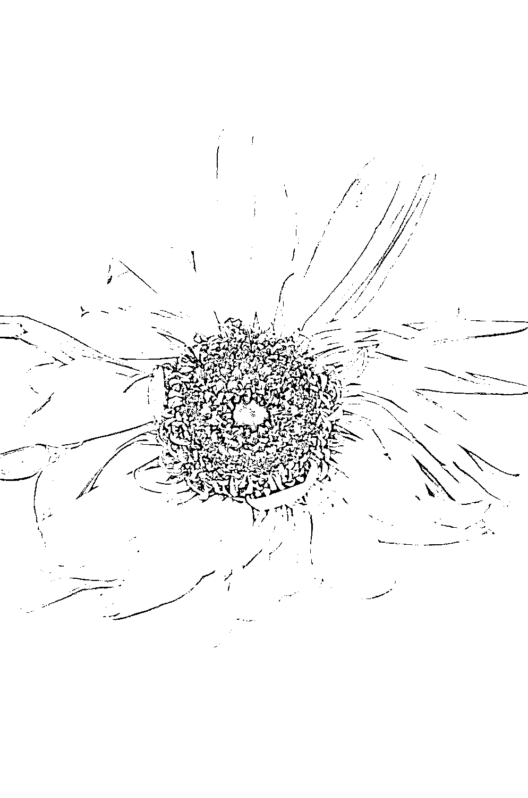

**我们彼此似曾相识**我们用另一个层面来解释：**两个独立的自由身，他们陷入爱河并发生性关系，他们是否会进入婚姻还不清晰，但他们在探索他们的关系，这也是一个爱的关系。**我想要给大家一个非常精准的关于五宫爱的关系的描述，要达成五宫爱的关系，需要符合以下三个标准：**1、两个人相遇，他们很快认出对方，“我感觉过去认识你”。**如果我们相信转世轮回，这就是我们通常用到的语言：“我相信在过去某一世认识你”。有些人并不相信转世，但他们仍然可以有五宫的爱的能量展现，也许他们这样说：“好奇怪，我们刚刚相遇，你给我的感觉却这么熟悉！”**所以五宫的第一个维度就是**迅速的熟悉感。******2、在这样的关系中有一种紧迫感。****这就好像说我们能够相遇是非常重要的一件事情，在我们的关系中有一种不可抗拒的力量。我们的相遇好像是有某种目的，我不知道那是什么，但是我能感觉到它的存在。**这是一个非常重要的注解，当我们完全理解五宫的意义，我们会了解到五宫的关系中也许不会发生任何性关系。**但是当五宫出现了性关系，这种性的能量会很有紧迫感，此刻，爱的关系会倾向于非常迅速地向性关系前进。五宫的第二个维度就是那种紧迫感**，它可以是性的能量，也可以不是性的能量。**3、并不会持续很长时间。****我们可能会很快速地去经验我们需要经历的这些东西，然后我们会感觉到关系的完结。**所以，**熟悉感、紧迫感、短暂性，这三点是五宫基本的逻辑**，至少是某一个维度上的逻辑。在这三条中的第一条为我们带来最深的洞见，那种奇怪的、熟悉的感觉：“我对你似曾相识，你也对我似曾相识。”关于灵魂转世的比喻，可能听上去会比较抽象，但是我们会看到所有基本的象征，在我们此生此世中都会进行演化。我会去做关于你人生的一些假设，这样的假设并不一定对所有人都是真实、管用的，但是对大多数人都管用。

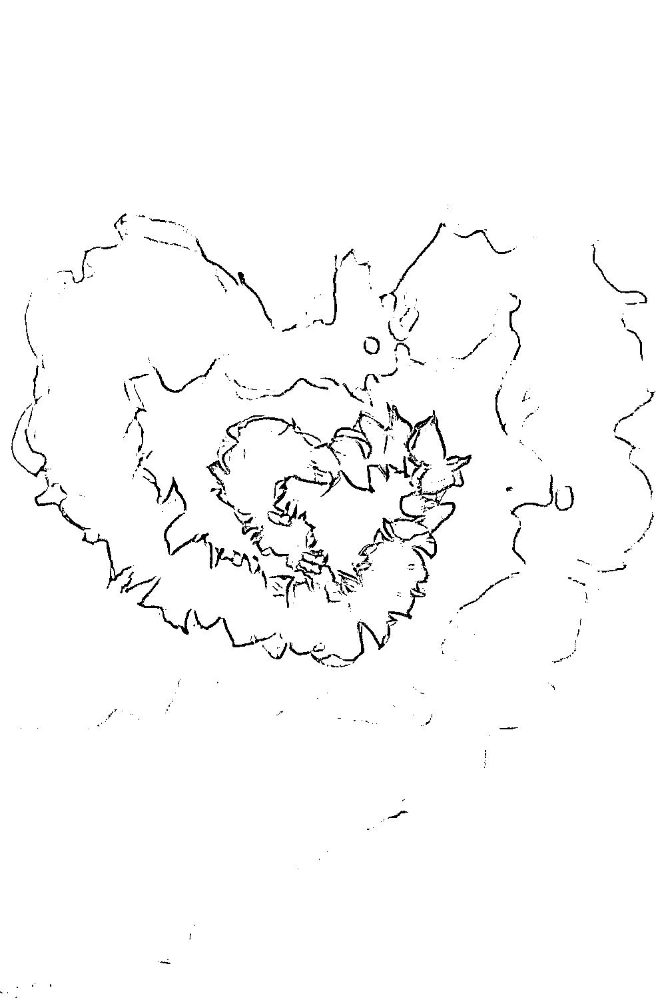

**该放手就放手**这一生中，你有些关系结束得非常糟糕，你和一些人产生关联，但是事情进展太快了，有些人撒谎了或者对你不忠，那个人在你决定结束关系之前就离开了你，这会让你感觉受到伤害。这是人类一种非常常见的现象。**让我们想象，你就在那一个非常戏剧化的故事当中。**你们的关系正在坍塌，你感受到痛苦，当然你也会有怒。也许你有一些朋友对神秘学很感兴趣，他们给你一些建议：你与这个人的故事需要有个了结，不然你在将来的一世还会遇到同样的人。在这样一个建议中，确实有一些正确性——当我们对一个人有这样的感受与情绪的话，如果我们在这一世并没有把它处理好，我们当然会与那个人在未来世再遇见，然后在那一世再做同样的功课。这是业力运作的原则，在这个宇宙中没有未被解决的议题，所有的行为都有它的后果，没有人可以逃离任何的后果。**但是你朋友的建议也有一个缺陷，他鼓励你解决与那个人的议题，但是他没有看到这样一个事实：你已经尽自己全部的力量，最好地去化解这个事情，那个人也尽了全力去做，但是不论你们如何努力，你们似乎永远无法理解对方。****如果无论你们如何努力，都只能伤害对方的话，试试放手吧。**在这样一个时刻，你们似乎都无法继续下去了，**你们越是努力为这段关系做工作，就越是伤害对方。这就是人类的现实，你在尽全力做，而你所做的只是产生更多的业力和痛苦。所以有时候我们能做的最有智慧的行为就是：与对方说再见。我们让它成为业力。**我们拿出宇宙钱包，对上帝说，把我这个业力放在我的信用卡上。有时候这是个好主意，虽然你知道信用卡会带来的麻烦，迟早你都会收到账单。我不想让业力听起来像一个惩罚，这并不是惩罚，但是迟早你还是会遇到那个人，希望在那个时候你们双方都会是更进化的人类，**也许在那个时候你们都可以更安静下来，然后更好地去面对这个业力。**也许这一次会做得更好，也许会放过彼此。**过去世的你并没有这么智慧，没关系** 你知道**在此生中这种业力所带来的复杂性，当然代表在过去世中也有同样的问题存在。**我会在链条中再加一个环节：在过去世中你会比现在世更加愚蠢。这听起来不太美妙，换一个表达就是演化与进步。如果我说现在的你是在意识发展过程中更聪明、更有智慧的进化，这听上去不错，对吗？我相信这也是真实的。所以逻辑上的推导就是：在过去世中你的灵魂不是这么进步与智慧的。想象一下，在这一世中你曾经制造的麻烦与困难，再想像你曾经在过去世中犯下的错误、制造的麻烦。如果我们想这些的话，它们都会有一些逻辑存在。**解脱和释放也是五宫的一个面向****有些灵魂来到这一世的目的，就是支付业力的账单。他们的目的是遇到那些还未解决议题的灵魂。这种现象带来的占星学象征是被激发的五宫。在大多数情况下，这样的碰面是要去结束这种关系。****我说的结束这种关系，并不是要讲关系切断，而是真实地去释放、去解脱那个人，去祝福对方，不再去要求他们给予他们无法付出的东西，不再假装他们是那些他们不是的人。**这是我们对另外一个灵魂所能做到的最真实的友善与慈悲。**当我们释放了、解脱了一个人，也就解脱了自己内在的那种冲突能量，这是五宫非常重要的一个方面。**

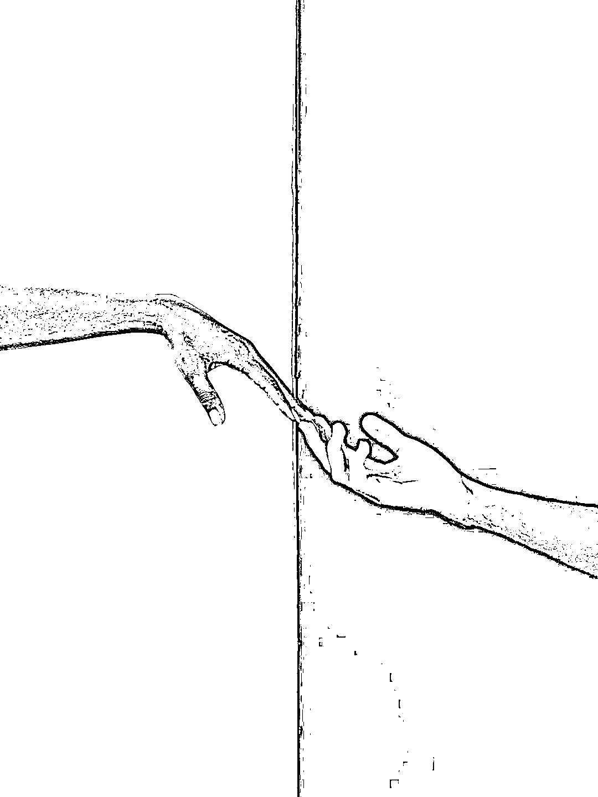

**你需要多久才能跨越痛苦的关系？**

**我们在五宫的领域讨论我们选择伴侣的能力，以及认出伴侣的能力。有行星的地方，也是有问题的地方。**更深入学习的最好方法也许是在五宫放入一颗行星，比如说海王星。那么你跟哪些带有海王星特质的人有未曾解决的议题与事务？

现在你的海王星在五宫，它会如何发挥能量呢？在过去世中，你与他有过失败的、或者未曾完成的恋爱故事，那些业力的法则代表你们这一世还会遇见。我们想想海王星，那种神秘的联结，在关系中会产生的深刻的、内在的、精神性的、灵性的联结。**海王星的能量是很有吸引力的，这种关系是具有灵性基础的。**每个人都是一个灵魂，每个人都是一个意识，一个深刻的人与人之间的关系，确实需要基于这种灵性。**想要进入一段关系，光有灵性的联结是不够的。**我们还要在其他的维度做工作，**我们需要喜欢对方，需要有信任基础，我们需要对关系有一些实际的、可以维持下去的面向。**但是那种在灵性层面上的联结是多么具有诱惑力，这是一个可能的海王星的过去世故事。在我们找到一个合适的伴侣之前，我们需要去经历一些事情。所以你坐在桌子边，桌上有一壶茶，然后你问自己以下的问题：**· 如果我顺从心中的欲望跟这个人进入关系，我会经历什么样的困难呢？****· 所以你会让直觉去推导一个可能发生的困难；****· 在我们之间有很深的灵性联结，但是是否有一个现实的联结，即我们是否真的可以信任对方？****· 这个人是不是在物质世界中真实存在的、属于我的人呢？****· 在我经历生命低潮时，他是否能为我抗争呢？****· 在我遇到困难时，可以向他寻求帮助吗？****· 或者此人会不会在我面前突然消失呢？**

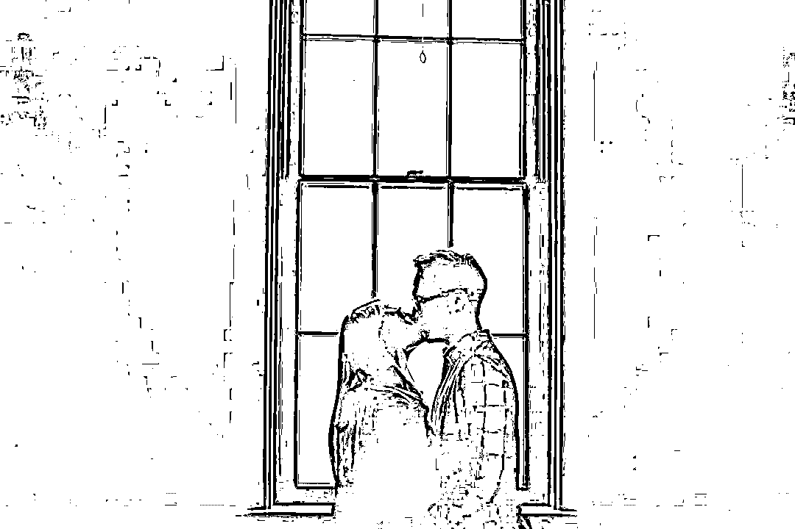

**这些问题之后，可能会有两种情况。****第一种**可能的发展**：**如果你的直觉告诉你：不，我和这个人在一起，会经历灾难。那么在此刻就发生了一件非常有趣的事：你好像是看到了未来，你也好像看到了过去，你好像想起了过去世发生的事情，并不是你想起了过去世那人的名字或者你经历的场景，而是让你想起了过去世的核心。**因为业力的运作是重复的，想起了过去，会帮助你看到可能的未来是怎样的。一旦你意识到了这一点，你对那个人的渴望在那一刻就倒下了，你不再渴望拥有那个人。**这时，非常美妙的事发生了，你好像**打破了业力的模式，此刻你产生了过去世不曾产生的意识，这个业力已经结束了。**也许你看了看表，你意识到我们 47 分钟前开始喝茶，而我在 47 分钟之内就解决了我的业力。这些事情可以非常快地发生，**意识会帮助我们去打破业力的模式。****第二种可能的发展：**但是这个故事还有另一个版本，你并没有自发地产生这种意识，你还是顺从了诱惑的驱使。在一段时间之内你们成为了爱人，并发生了性关系，也许 18 周以后他因为别人而离开了你，或者他第 17 次醉倒在你面前，或许他又忘记了一个很重要的承诺。然后你两年后觉得受够了，也许你通过那样的方式去终结了业力。也许你更爱那个两年的解决方案，超过那个 47 分钟的解决方案。也许你是在愤怒的状态中与对方分手，你还是重复了那个业力，在将来的一世中，在你的五宫会有一颗海王星，然后你还是会尝试同样一个业力故事。在这个层面来说，**宇宙是非常有耐心的。**所以我还是建议大家尝试那个 47 分钟的解决方案。

**版权声明：**本文由若道翻译发布，欢迎转发，反对抄袭。友号转载请申请白名单。

斯蒂芬·弗里斯特

若道签约老师。进化占星学的创始人之一，当今世界最有影响力的占星大师之一；1985 年，他凭借《内在的天空》一书获得职业占星师协会奖（Professional Astrologers Incorporated Award）。他四次获得占星界最高的占星学联合协会奖（United Astrology Congress Regulus Award）提名，2018 年获得轩辕十四教育奖。

****学习占星学****

****点击下图了解课程详情**** 

****

**

**

****

**微信又双叒叕改版啦，不想错过若道君的推送？**

**就把若道设为星标吧！**

**▼**

就是这个“在看”，戳戳戳 ☟

******报名直达入口******

# 这一组交点的进化之路，是从牺牲的痛苦到奉献的快乐

> 原文：[`mp.weixin.qq.com/s?__biz=MzA5NjA0NTAxNg==&mid=2651456858&idx=2&sn=e266c8553d19fd4bba33c8c2ce36b57d&chksm=8b48b7edbc3f3efb2db6ce71f5d4a210fbba03760c393cd9433fad566d4b9e87c1e7d4632e1d&scene=126&sessionid=1692737928#rd`](http://mp.weixin.qq.com/s?__biz=MzA5NjA0NTAxNg==&mid=2651456858&idx=2&sn=e266c8553d19fd4bba33c8c2ce36b57d&chksm=8b48b7edbc3f3efb2db6ce71f5d4a210fbba03760c393cd9433fad566d4b9e87c1e7d4632e1d&scene=126&sessionid=1692737928#rd)

作者/王施霁 编辑/玫瑰 图片/pexels

斯蒂芬老师即将于 10 月 15 日-17 日在若道开设[【线上工作坊】](http://mp.weixin.qq.com/s?__biz=MjM5MjQwNjAyMQ==&mid=2649438741&idx=1&sn=36c3e47ed085698588c5e001166fc2e6&chksm=beb9557f89cedc693368d5758571562aca202b20e11bb6ed796882b895d67220760517350be7&scene=21#wechat_redirect)（点击了解详情），教你如何进行一场有效的占星咨询。在往期长达四天的学徒工作坊，斯蒂芬老师现场解读了数名学员的出生星图。他栩栩如生的讲解，深切动人的情绪，给我们带来了不一样的占星体验。本文作者王施霁全程参加了工作坊，有感而发，写下了下面这篇文章。

> 南交双鱼座，北交处女座的月亮交点大致出生范围：1941 年 5 月 24 日-1942 年 11 月 21 日 1959 年 12 月 15 日-1961 年 6 月 10 日 1978 年 7 月 5 日-1980 年 1 月 12 日 1997 年 1 月 24 日-1998 年 10 月 20 日

**刚刚旅行回来的父亲**通常，去上一个尚未谋面的老师的工作坊，我往往会事先整合各种线索，去勾勒这个人的样子。可是上斯蒂芬老师的课，一切显得如此平静、水到渠成，没有好奇和惊讶，就像已经熟识了很久的故人。当我第一次看到斯蒂芬老师，他正站在门口和蔼地迎接每位学生，仿佛“Father is just coming back from a trip”（刚刚旅行回来的父亲），连过分的亲昵和问候都显得多余。佛教里的诸大菩萨，两手都会拿着代表法的宝器，来表法和度众生。而站在讲堂上的斯蒂芬，就像左手拿着代表爱与光的水晶球，右手拿着代表觉察和自省的星图一般，为我们宣讲着宇宙的真相和人生的真谛。他反复强调，在解读星图时，要让心融入其中，用 “爱与直觉”（intuition）去整合线索。在持续四天的案例解读中，一个个过去世的灵魂栩栩如生地站在我们眼前，他们的悲伤、哀痛和无奈，清清楚楚地被呈现出来。而进化占星则带着我们站在超越前世的角度去看前世。具体的事件和所涉及的对象都不重要，重要的是那一事件留下了怎样难以愈合的创伤，以及形成了怎样的创伤心理机制和行为模式（由月亮南交点及其守护星的配置象征）。如果不改变这种受创伤的模式，那么在今生，甚至来世，仍然会遇到类似的事件来重新让你面对。解药就在月亮北交点及其守护星的配置之中。很多时候，星图会指示你回到过去世的情境事件中，通过重新经历类似事件，继续呈现旧有的那套心理机制和行为模式，从而获得心灵的成长和灵性的跨越，在痛苦中得到蜕变。就像斯蒂芬说的“回到那匹把你摔下来的马上”。当经历了成长，回过头来看待曾经的挫折时，会发现那简直就是上帝赐予的礼物和恩典。从佛教上来讲，业力被愿力转化了。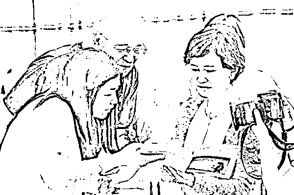**南交双鱼座的前世体验**
在斯蒂芬老师的引导下，我也渐渐拨开笼罩在星图上的层层迷雾。重新审视自己的星图，忽然之间，它不再只是一堆人格的碎片，而是一个有连续性、相关性的，逻辑性很强的灵魂轮回转世的故事。而且最让人震撼的是，它与我的前世体验、今生的习气和行为模式完全吻合。我的南交点落在双鱼座 6 宫，守护星海王星位于射手座，合相下中天，与中天的金星对分。这条线索告诉我，我是个关系中的牺牲者、受害者、被欺骗者，因为这种牺牲是在奴仆宫产生的，这种牺牲可能是出于权威的逼迫、社会道德的限制而产生，多半是不情愿的，是觉得自己“应该”如此，所以充满了很多怨恨的情绪。我的前世体验中，有一世被活埋进一座很大的中世纪陵墓的地下宫殿之中——是带着“我不入地狱谁入地狱”的情结而自愿进去的。当墓门在身后关闭的那一刻，地下宫殿里面还是灯火辉煌的壮观。一开始我并不感到恐惧，因为那是自己的选择；紧接着，豪迈的心情很快变成了因不被人理解和同情而产生的无奈和哀伤；再后面，因为知道宫殿里很快会因缺氧而一片黑暗，自己马上要死在这里，不安和恐惧迅速升起。我开始在无人的长长走廊里慌乱地寻找出口。我脚步凌乱、心慌意乱，却连呼吸的缝也找不到。跑了一圈又一圈，又回到同一个地点，那种绝望和紧张的心情，今生的梦里还重现过。除了这一世，还有很多世，都沦为政治背景下的牺牲品，比如辛亥革命中失去丈夫的年轻寡妇（丈夫参加革命一去不返）、在中英殖民地战争中失去母亲的未成年孩子（母亲救助伤员被急性传染病夺去生命）、服务于皇室而不能真正修行的宗教傀儡……所有这些牺牲都带着同一特征，因为认同最高利益，出于责任和义务而做出了巨大牺牲，几乎都是以付出生命的代价或者牺牲身边最亲近的人的方式体现出来。**所以这一世，我就带着巨大的伤痛情绪出生——月亮和土星合相在上升。**而那种会为了某个目的、某种责任，甚至是自己设置的价值标准而选择牺牲自己的行为模式，也一直固留在内心深处。今生在婚姻和家庭中，在所有的关系中，我也常常沦为一个出于责任和义务的牺牲者，似乎作为一个服务者或者附属物的地位，就得这么做，否则就违背了人生原则，因此我很难活出自己。斯蒂芬的工作坊让我彻底看清了这一点。

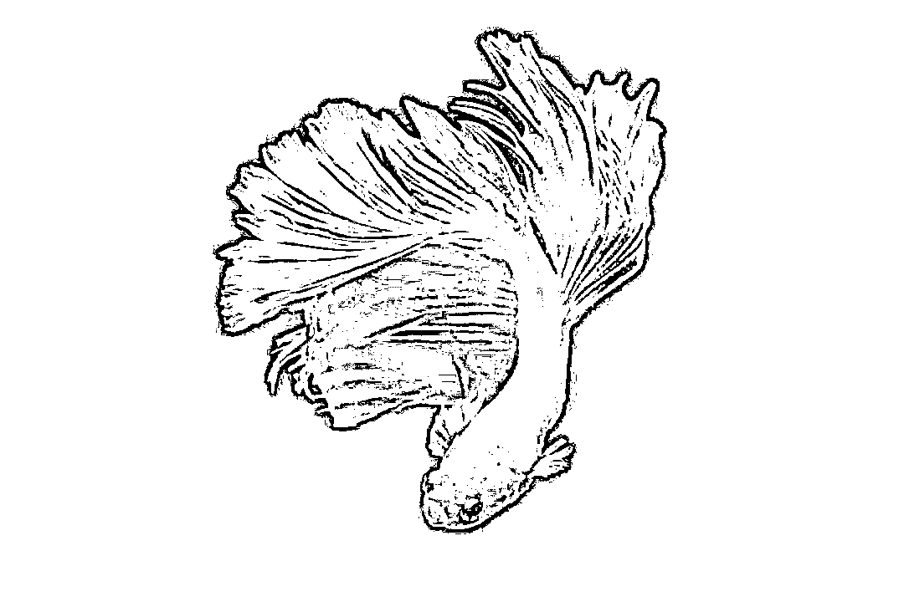

**北交处女座的进化之路**
星图上我的北交点落在 12 宫处女座，合相土星和月亮以及上升点。处女座的守护星水星在 11 宫狮子座，合相南交点守护星之一木星。我要“重新回到那匹让我受伤的马上”。今生我要彻底明白牺牲的真正含义，我仍然要去做服务于他人的事，但是要明白，服务他人的本质并不等同于无条件地牺牲，而是以发自内心的爱为基础，让自己和他人同时获得丰盛。
这种感悟也正在我的生活中慢慢发酵。自我调整是个艰难的过程：首先以婚姻的危机和矛盾为导火索，我的牺牲者情绪彻底全面地爆发出来。接着，我渐渐从慈善义工的经历中学会什么叫真正的付出——在没有大爱的前提下，去牺牲自己成全别人就是一种不平衡的表现，因为我们的内心必然包含着索取回报的企图心，得不到回报时必然充满愤怒和怨恨。所以要允许自己得到应得的报偿，允许自己拒绝不想承担的义务，忠实于自己的感受。之后，通过学习弹古琴（寻找到了内心的弦声），参加各种沙龙、音乐会、聚会，体会到什么叫活出自我。我需要把自己在过去世累积起来的怨恨和焦虑，全部都释放出来——用观照的力量，以及正面的行动力去释放。我们不一定真的相信前世，但使用前世这个概念更有利于寻找到自己人生的脉络。

> 问一问自己：
> 
> 为什么出生时，就注定了你是这样的人？
> 
> 为什么在关系中会出现各种问题，而别人没有遇到？
> 
> 为什么你会以这种方式处理事情，而不是那种？

许许多多的为什么，都可以通过出生星图的前世解读获得。这种前世可以理解为某种错误的固有模式，也可以说是习气，它导致我们一而再、再而三地碰壁，只有正向地改变这种模式，才可能获得解脱。有时候，我觉得从大师身上受益最多的，不是星图解读的技巧，而是感受他的内在能量。斯蒂芬老师已经超越了任何宗教和占星学本身，他内心的爱与智慧的能量非常强大，或许正因为此，他才能呈现出来如此高超的解读技巧。这不是一般的老师所能教导的，也不是仅凭文字就可以感受到的，一定去现场，才可以体会那份精彩。

**版权声明：**本文由作者授权发布于若道平台，欢迎转发，反对抄袭。友号转载请申请白名单。

**喜大普奔，斯蒂芬要来教占星咨询了！**

**今年****10****月 15 日-17 日****，在斯蒂芬到中国教学****10****年后，他将****第一次****与所有热爱他的学员分享如何做好一场占星咨询。**

**在为期三天的线上工作坊中**，占星大师斯蒂芬·弗里斯特将会和你分享他几十年来一对一面对面的占星**咨询经验**；他也会分享如何提前规划好**接近客户心灵的占星技巧**。客户个人星图为我们提供一个最迅速，也最可依赖地建立信任和自然连接的地图，**他还会分享如何运用个人星图建立这个连接。**

**点击下图了解工作坊详情**

**微信又双叒叕改版啦，不想错过若道君的推送？**

**就把若道设为星标吧！**

**▼**

**就是这个“在看”，戳戳戳 ☟**

**********报名直达入口**********

# 别总用“老者”形容这颗行星，它的女性力量是被忽视的进化之路

> 原文：[`mp.weixin.qq.com/s?__biz=MzA5NjA0NTAxNg==&mid=2651456731&idx=1&sn=2b820ddbfc11a01a1bc12f7636b4311e&chksm=8b48b66cbc3f3f7a06cd9e7f2e8cec292d8c17a2a39a80663b51d169548d7dbefee322447a3d&scene=126&sessionid=1692737928#rd`](http://mp.weixin.qq.com/s?__biz=MzA5NjA0NTAxNg==&mid=2651456731&idx=1&sn=2b820ddbfc11a01a1bc12f7636b4311e&chksm=8b48b66cbc3f3f7a06cd9e7f2e8cec292d8c17a2a39a80663b51d169548d7dbefee322447a3d&scene=126&sessionid=1692737928#rd)

********************☆ 后台回复“今日”，给你一句生命态度********************

作者/杰西卡·卡巴拉

译者/Luke 校对/Christy

编辑/翀子 封面/书君 图片/网络

星图上土星所在的位置，常常被视为“关键业力挑战”，它表明我们在生命中可能遭受的困难与挫折，我们也用老者的原型描述它。但这会带来片面化视角，土星也有它的女性力量，一直被我们忽略，但那是通往进化的重要路径。**灵魂故事、业力的显现**

**占星学记录了灵魂的旅途和召唤。**灵魂不断轮回转生，活过了数不清的出生星图，每次转世都要在新出生星图独特的原型结构下生活、成长和创造。**出生星图反映了灵魂的业力、故事，以及显化和表达的潜力，**但灵魂活出星图的方式，即原型，也受到了个体出生的历史和文化背景（在任何特定时刻人类的共业）的影响。

每位占星师都听过这句话：在某一特定时刻出生的生命体或所做的事，都携带了这一刻的特质。**每张星图所代表的人物、地点或事件，都带有那一刻行星位置相应的原型特质。**

如果我们把好奇求知的目光投向原型的众神殿堂，对熟悉女性主义的人来说，不难发现十颗行星中有八颗都是以希腊罗马的男性神明命名的。这简直令人震惊，因为**深度心理学早已指出，原型、神灵和人都有男性和女性的面向。**

简单说来，**男性和女性原则存在于我们每个人之中，**不能单纯地把男性原则仅仅与男性相关联，把女性原则仅仅与女性关联，但我们很容易就犯这个错误。

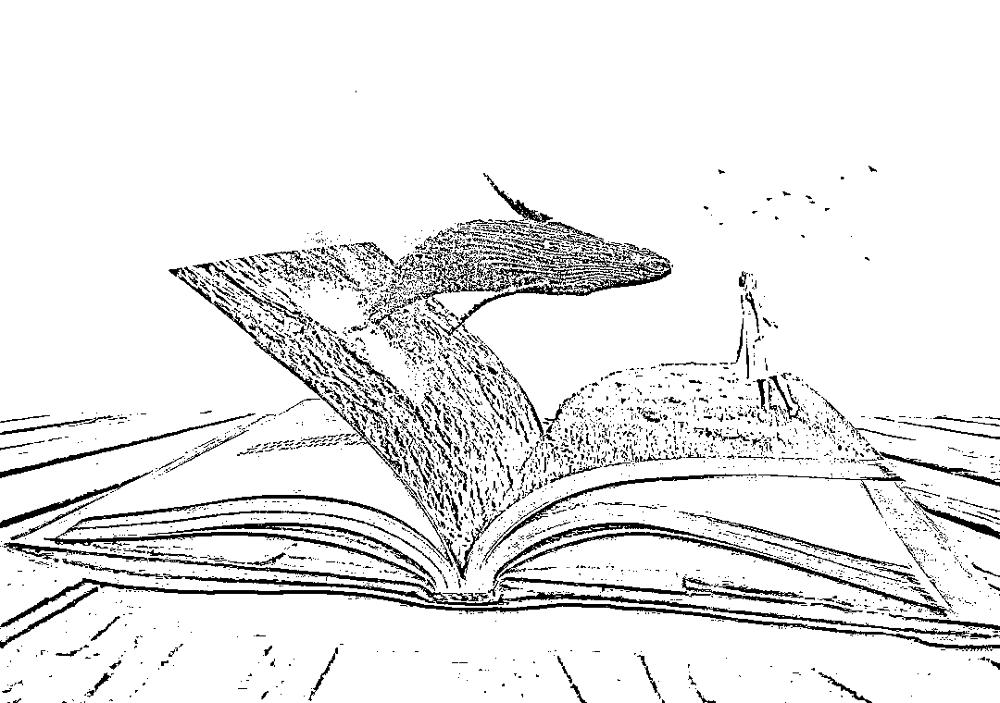

**让我们一起思考土星的意象**

因为**土星掌管地球的现象世界，**而且占星学是建立在地心说的基础上的，所以重估这个原型需要特别小心谨慎。在探索的过程中，我想要对这个孕育我们的传统（父系传统）保持尊重和敬意，因为我知道它有**深刻的智慧和功绩**，但也有**破坏性的盲点和阴影**。

接下来我将从**女性面**重新审视西方宇宙学中的土星，以及和它有关的死亡和苦难的角色。

**文化传统**是通过不断重复的法律、规范和制度而建立的，它反映了我们**想象中的创世故事**，以及我们在其中扮演了什么**角色**。我们想象中神灵的模样和我们相互互动的方式是紧密相连的。一个文明对神灵和时间的理解决定了它有什么样的家庭结构、教育机构、科学、政府和宗教。

詹姆斯·希尔曼（James Hillman）在他具有分水岭意义的文献《论老者的意识》（*On Senex Consciousness*）中为西方文明阐述了这一现象：

上帝在我们文化中的形象是这样的：无所不知，无所不能，永远存在，一把胡子，坐在椅子上，有不言自明的威信，通过**抽象的正义、道德和秩序原则**领导人民。他天性仁慈，但是当意志遭到侵犯时会发怒。他没有女性特质（没有妻子）和性面向。

这幅图描述了一位老者式的上帝，衍生自**老者的原型**。我们文化最高的上帝就是老者式的，我们都是在这个形象之下创造出来的，我们的意识也反映了这一构架。

希尔曼描述的，是占星家眼中的土星原型，以及我们西方的意识结构是如何反映这位神明形象的。但老者就是土星的本质吗？还是说，像希尔曼暗示的那样，老者意识只是以某种偶然的方式，而非从本质上反映我们时代的文化规范？

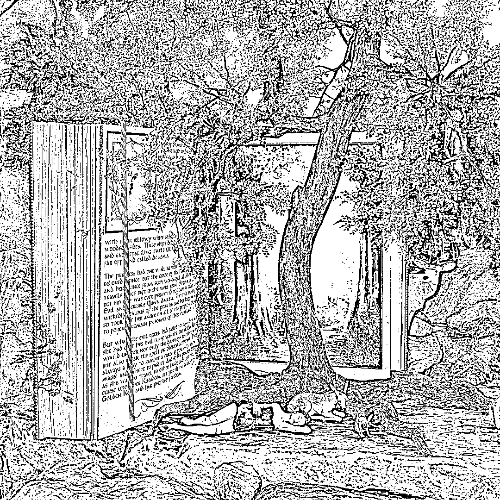

**从母亲分娩的角度理解土星**

每个原型产生的问题，都在该原型之内有顺势疗法。在不脱离土星本身的前提下，我们必须要找到它的其他面貌，来制约发展过度的老者原型。我们需要**更深入地探寻一个多元化土星的本质和潜能，**而不是为父权制和我们过度强调的阶级制度寻找解决方法。

过度发展的老者意识给人类之间带来了分裂和隔离，**治疗这个问题的药方在于找到土星作为女性和母亲的一面。**

**我们可以通过母亲生产的过程认识土星的女性特质。**希尔曼指出，老者原型是没有女性特质和性面向的，但我们最原始的共生关系是和母亲在一起的。我们的身体成长于她赋予生命的子宫，那是我们物质身体的起源，时空生命的始点。胎儿成功长大会给母亲带来极度痛苦的宫缩，毫不夸张地说，就像成千上万磅压力在挤压胎儿通过产道。

我们在子宫海洋中的水生生命之旅结束了，重生后变成了呼吸空气的哺乳动物。**从婴儿的角度来看，母亲的子宫是它们唯一的家，却被赶出家门走向死亡。**

**但从母亲的角度来看，她们在历经艰辛，给予一个伟大的生灵以生命。**斯坦·格罗夫（Stanislav Grof）多次谈到他的发现和研究——基本出生母轴是和出生阶段相对应的，他说，**死亡和出生是同一枚硬币的两面。**

一个人出生时刻的本质含义，即他的创世故事，从根本上形成并引导了他的身心结构，通过这个身体（一个土星式容器）他将体验生命中发生的种种事件。从母亲的子宫中排出，来到土星掌管的空间和时间的领域，**这是一个残酷的惩罚，还是神圣的礼物？**

母亲的子宫是我们投胎到物质世界所乘坐的神圣的船只。我们能否看出，我们以肉体形式存在于地球上的生命，实际上是灵魂和心灵生命的神圣围地呢？我们能否看出，我们所面临的那些困境和阻碍，实际上对我们的成长和创造力是有益的呢？

我认为，通过**爱我们的问题**，贴近我们的**伤口**，发现**困境**中的美，我们就会意识到，我们应对挑战的方式，塑造了今天的我们。**土星使我们变得真实，为我们带来生命中最珍贵的事物。**

理查德·塔纳斯在文章《原型占星学入门》中这样描述土星原型：

从某种重要的意义上来讲，土星掌管了出生星图本身，因为土星克罗诺斯是时间之主，它将时间中的一瞬间凝固，透过出生创造了一个独立的现实化身，然后用一生的时间来支撑那个原型时刻的全部意义，完成它所带来的全部挑战。

这段描述介绍了土星的女性面向。在出生的时刻，我们和母体分离。我们的身体来自母亲，出生的时间是我们宣告脱离母亲的时刻，也带有该时刻独有的原型特质。**正是在离开母亲子宫的时刻我们被打上陪伴我们一生的原型印记。**

我们出生星图上的行星描述了专属于我们的创世故事，随着时间的推移，这些故事情节将按照经过计算的、定性的行星运动逐渐在我们的人生中展开。**因此，土星似乎既是时间之母，也是时间之父。**

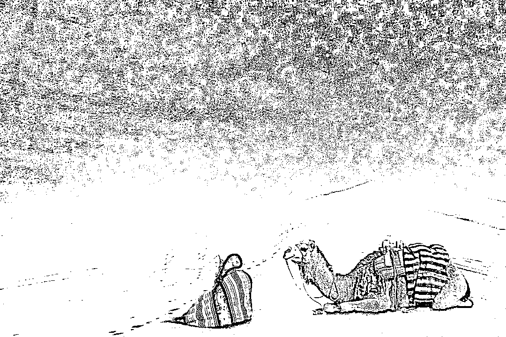

**别抗拒土星的女性面**

很大程度上，占星学对我们和我们灵魂成长的启迪是：**时间也有女性化的一面，它开启了时间质的维度。**虽然不能单纯地把量化时间定义为有男性色彩，质化时间定义为有女性色彩，但就这么想也无妨，因为现代人们已经忽略了时间概念的内在性质，而这需要纠正。

数千年来，土星的原型表达已经被老者原则所挟持。老者意识中女性面的缺失反映了一种特定的原型附体状态，一种处于控制和等级制度中的状态。希尔曼写道：

我们生活所依存的原则、自设的限制、周围的世界、我们价值的天平（等级制度超越了价值本身），最重要的是，由控制所带来的秩序，包括自控和控制他人。这些都反映了老者的性质。

女性面的缺失在心理层面显化为各种不同的形式。超级男性化的土星在心灵之内显化为喜好惩罚的超我，内化的父权制声音，过度膨胀的父亲的声音，却听不到母亲或女性的声音。

**吃掉自己孩子的父亲会想办法让孩子保持渺小、害怕的状态，这样孩子就会因为恐惧和耻辱而无法成长成熟。**这种现象普遍存在于西方人对生命和日常秩序安排的心理取向中。深度心理学家芭芭拉·史蒂文斯·沙利文（Barbara Stevens Sullivan）描述道：

我们极其抗拒女性化倾向。在各种场合下，我们都被教导，要掌控自己的生活，如果我们掌控得当，生活就会朝着积极的方向前进。我们被督促，不对抑郁和绝望屈服，要正面地思考。有清晰一致的证据表明，我们的文化否认黑暗和死亡，哪怕它们无处不在，没法逃避。就好像如果我们恰当地掌控自己的生活，就能永远开心幸福地活下去。这种态度并没有提高人们的幸福指数，反而使人们对自己的绝望和消沉感到罪恶，加剧了他们的痛苦。因为人生本来就有受苦的成分，只有对痛苦臣服，最后才能带来智慧。

从苦难中获得智慧，从混乱痛苦的生产过程中转世，化身于物质世界（物质的英文 matter 源自拉丁语 mater，指母亲），**这些都属于土星的女性元素。**

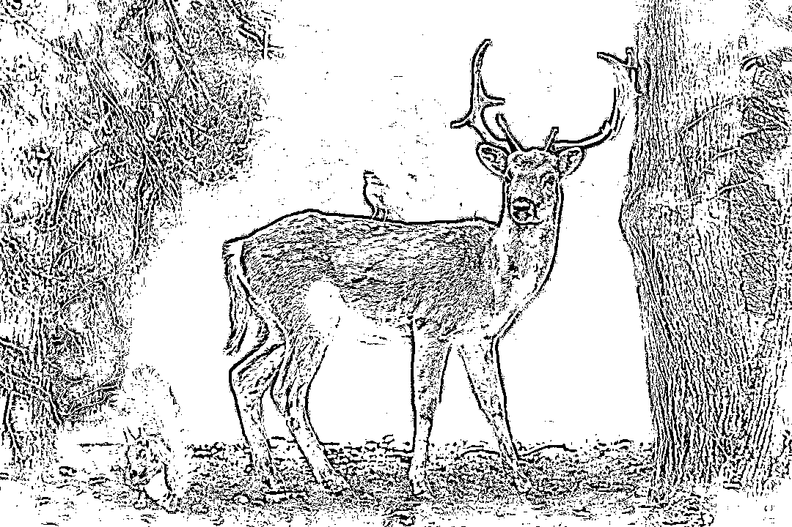

**土星的女性神灵**

这些土星原型衍生的女神告诉我们，希腊的神明克罗诺斯不是土星原型唯一的面孔。不过，我们的思想还要继续超越这些女性神明形象，因为在历史的长河中，这些形象早已在父权制的镜头下遭到了扭曲：因为这些希腊-罗马传统中的女神们向女性诉说的更多的，是她们在父权制下应该成为的样子，而不是她们原本的样子。

荣格派分析家西尔维亚·布林顿·佩雷拉（Sylvia Brinton Perera）在她的大师级作品《下降到女神：女性觉醒的方式》中写道：

在西方世界，上界女神的大部分特质要不是被神圣化了，要不是就被男性神明取代。这些特质被父系社会制的道德和美学法典过度压缩、或过度理想化，失去了本色。因此大多数的希腊女神都被她们的父亲吞噬，希伯莱的女神失去了力量，只剩下的缩减版或定制版的女神。女神曾经拥有的大多数神力也和今日女性的生活失去了联系：真实、爱玩、充满激情欲望的女性特质；强大、独立、任性的女性特质；野心勃勃，尊贵，多面的女性特质。

**土星原型的女性面向是尊贵、有情欲、强大和多面的。**老者意识的阴影面是分裂，隔离，失联和孤立：和人际关系分离，因此也和爱与目标分离。

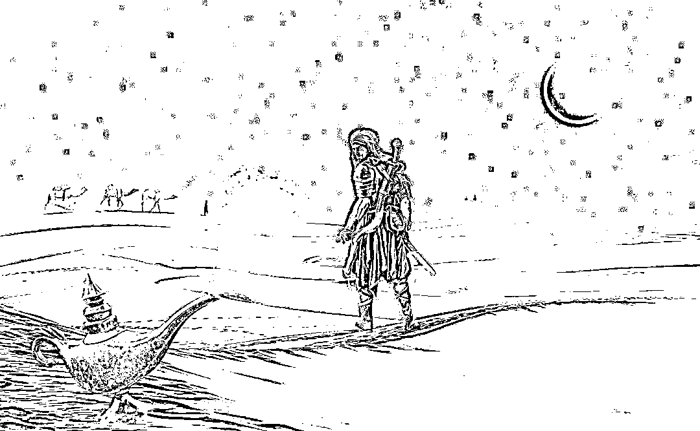

**通过女性智慧理解死亡**

我们如何书写自己人生的故事，很大程度上来自我们对土星角色的宇宙论理解。**如果我们认为世界是分裂的、无意义的，是缺乏精神目标的物质，那么我们的苦难、痛苦和死亡就失去了神圣的光辉。**痛苦、苦难和死亡变成了我们要征服和控制的目标，我们会不惜一切代价去避免它们。

**女性的智慧在尊重死亡的生命轮回中扮演中心角色。**和死亡相伴的至关重要的过程，是悲痛——即感受、承认和放手已经发生的事情的能力。悲痛是一套净化的过程，通过尊重过去，我们可以更充分地体会当下。无法悲痛实际上阻止了我们充分体验当下，因为我们还没有释放过去。

悲痛我们所失去的，驱使我们更加感激现在所拥有的。通过承认死亡带来阴阳两隔，我们又重新与周围的世界产生联结。

**时间的女性化观念提醒我们，生命有自己的周期，而且死亡无法避免。**史蒂文斯·沙利文写道：

从女性视角来看，怀孕、生长、出生、萎缩、衰败和死亡都是周期循环的一部分。每种时间段都同样具有效力，同样是固有存在的，是生命整体不可或缺的一部分。女性视角承认，死亡对于生命永续是必须的，因此接纳生命中各式各样象征性的死亡：希望之死、婚姻之死、计划之死。

我们生命体验中的象征性死亡——受伤、失败、判断错误、过去的决定导致的负面后果——**帮助我们逐渐成熟，变得真实。**

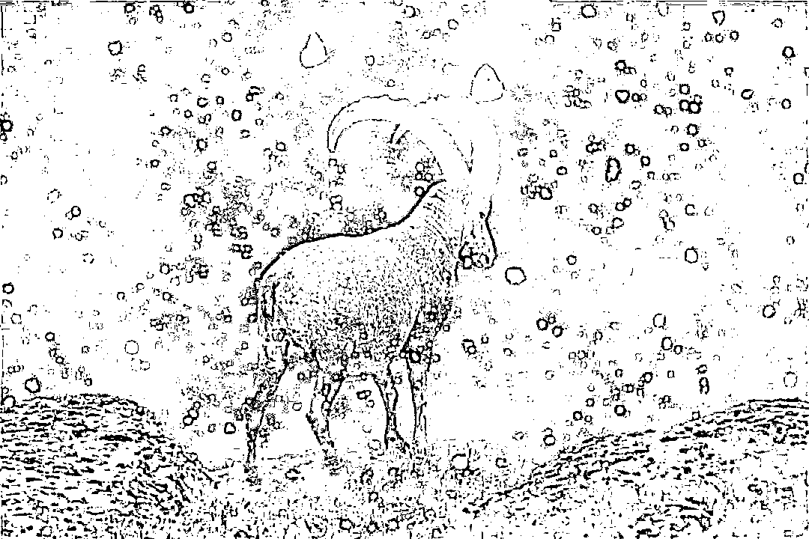

**你在何处经历“象征性死亡”？**

**出生星图中土星的位置暗示了，我们为了灵魂成长，会在何处一次又一次地经历象征性死亡。**我们越能对这个过程臣服，土星就越能起到积极的作用。从一个切断我们潜能的消极的土星，转变为帮助我们接纳自己本来的面貌，成为多元多维度的生命。

塔纳斯转述道：**“土星暗示了我们一生都要克服的难题，目的是达到高层次的灵性觉醒。”**

如果我们允许自己体验象征性死亡，接受它们的教导，就能让自我变得审慎、成熟、坚定和深刻，开启自身最大的潜力和创造力，理解生命中的收缩和失去。不试图减少痛苦和苦难，相反，**接纳和尊重悲痛与失落**。

我们必须给予自己时间和空间，感受悲痛过程带来的每一丝情绪和意象。

土星是原型万神殿的守门人，不仅守卫着三颗超个人领域的外行星（海王星、天王星、冥王星），还守卫着每个行星原型最深层的表达。土星也是门槛的守卫者，我们必须在土星的试炼中经历死亡，才能接触原型的多元表达宽度，激活我们深藏的潜力，疗愈我们的个人和集体历史。

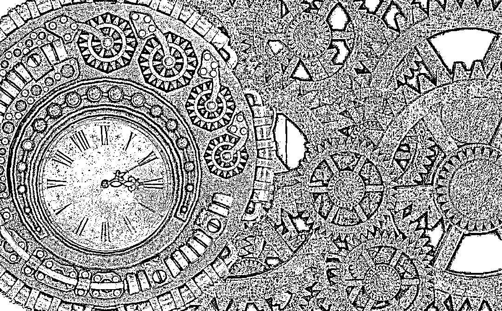

**死亡不是终点**

死亡必将发生，生命总有尽头，事物必将终结，女性智慧深深了解这些。死亡和痛苦是我们活着的代价。正如荣格所言：“没有一种觉醒是不带着痛苦的。”人都在受苦，这一核心的真理赋予我们慈悲，而“慈悲”的字面意思就是“一起受苦”。

**从女性视角诠释死亡加深了我们对土星的理解，不断在我们经历的象征性死亡中找寻意义，直到我们的肉体真正死亡。**

克里斯多夫·M.·巴赫（Christopher M. Bache）是一位意识状态的深层探索者，他为我们分享了如下观点：

在一个人经历了多次死亡和重生后，最终死亡的概念也失去了意义。通过重复地学习，他在内心最深处理解了，死亡是不可能发生的。一个人的身体可以破碎，全部的生活现实可以反复被毁灭，但最深的本质总是会重现，凤凰涅槃，浴火重生。死亡仅仅是检验净化程度的标尺。

**死亡不再是终点，而是必然和自然的转化过程，**最终通向更加复杂和多样的生命体验，但是在转化过程中，感受痛苦、失落和悲痛也是必不可少的。

**重新审视土星的女性面，对于我们经历痛苦和苦难，以及从中找寻意义有直接影响。**这种重新审视属于每一个人，因为女性面和男性面一样，一直并且还将继续存活在我们每个人体内，无论男女。我们每个人对死亡的看法会直接影响到我们生活的方式。

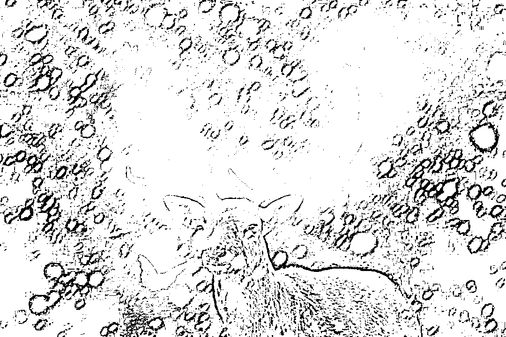

**跟随土星一起进化**

**土星原型和我们祖先的根源有关，**它是**塑造和维持自我**的无形结构，是我们从过去有意识或无意识之中**继承**来的。

**一位占星师解读土星的方式**，从本质上透露出这位占星师对苦难、挣扎、业力、成长过程、天命和个体创造性等与生命境遇共处的深层能力的看法。**从心理层面上讲，**对土星的诠释直接透露出一个人的命运感和宿命感、自由程度，以及与其他原型之间的共同创造力。

土星的本质不是囚禁人类的僵固牢笼，老者意识带来的挑战也不会通过逃往某些新原型就得到解决。**一方面，**占星传统带有一种结构上的决定性谬误，将土星完全等同于老者，这一思想是目光短浅的，没有重新审视和进化的能力。**另一方面，**它也带有自生性谬误，不耐烦地飞去膜拜我们还一知半解的新神。

其实，解决问题的顺势疗法药方就在土星本身。**通过揭露土星的女性面**——经验性的知识变成智慧，苦难是有意义的，死亡起净化作用，时间有质量，存在投胎转世和心灵生命的显化——这样我们既没有偏离土星原型，同时还发展了它。

**这就是参与的本质：由我们自己，创造有益生命的新思想形式和形态场。**

**当我们不再害怕土星时，我们就能开始与命运合作，信任它并且爱上它。**我们不再被压迫和暴政所产生的恐惧控制。耐心、奉献、慎重、成熟、智慧、转世和化身，都是土星珍贵的教导和无价的礼物。

正是在土星的结构下，**我们日复一日，通过练习、重复、坚持不懈和积累经验，**得到来之不易的能力，共同创造和展现我们的生活。

通过持续的艰苦工作，我们可以**将旧传统转变为新的道德架构和伦理系统，**帮助人们提升生活品质与活力，拆下上帝的旧面貌，树立重生的新形象，对生命每时每刻不断进化的复杂多样性满怀敬畏之心。

**版权声明：**本文由若道翻译发布，欢迎转发，反对抄袭。友号转载请申请白名单。

**杰西卡·卡巴拉**

占星师，心理咨询师，注册的婚姻与家庭治疗实习医师。从 2007 年开始实践原型占星学，提供占星咨询服务。2014 年，杰西卡在帕西菲卡研究生院获得咨询心理学硕士学位，研究方向为深度心理学。她的理论基础主要来源于理查德·塔纳斯、斯坦尼斯拉夫·格罗夫，以及原型占星学和超个人心理学。杰西卡教授原型占星学和深度心理学，也积极进行深度心理治疗方面的实践，将原型占星学的智慧和洞见同深度心理学整合起来。

****学习占星学****

****点击下图了解课程详情**** 

****

****

**

****

**微信又双叒叕改版啦，不想错过若道君的推送？**

**就把若道设为星标吧！**

**▼**

就是这个“在看”，戳戳戳 ☟

******报名直达入口******

# 这是什么样的神仙课程，让全场所有人为之动容

> 原文：[`mp.weixin.qq.com/s?__biz=MzA5NjA0NTAxNg==&mid=2651456731&idx=2&sn=685a4c52db0186de6eaf627ec803917a&chksm=8b48b66cbc3f3f7a3144124521b3571f88c9bab4a43811132919fb150a261035b24fd644a053&scene=126&sessionid=1692737928#rd`](http://mp.weixin.qq.com/s?__biz=MzA5NjA0NTAxNg==&mid=2651456731&idx=2&sn=685a4c52db0186de6eaf627ec803917a&chksm=8b48b66cbc3f3f7a3144124521b3571f88c9bab4a43811132919fb150a261035b24fd644a053&scene=126&sessionid=1692737928#rd)

作者/杨浠 Vera ISAR 认证占星师
 编辑/玫瑰 图片/NVC 工作坊

作者的话

记得在工作坊最后的发言中，翻译 Vera 说到：“Toni 老师就像一部行走的 NVC 教科书，她的一言一行都践行着 NVC 的理念，同时也正如我们体验和经验到的那样， NVC 从本质上触碰着生命的品质。”这段话大概是每一位参加这次工作坊的学员的心声，因为这次课程不仅让我们学到了实实在在的技能，更让我们感受到了彼此间真切的联结和接纳，这既是 NVC 本身的魅力，也归功于由 Toni 老师带领的所有参与者的临在品质。**非暴力沟通的练习**

在工作坊最后一天里，我们要在过去两天所学的基础上（识别自己感受和需求），学习提出请求（也就是寻找策略去满足自己的需求）。每位学员都要拿出一件自己亲身经历的事件去和小组成员进行练习。

我的事件是这样的：19 岁那年上大学的时候，有一次和我几个女孩朋友一起出去玩，我们到了一家美容院，大家叽叽喳喳地聊天，其中一个我第一次见面的女孩不停描述着她是怎样运用计谋让男友给她买了一条金项链，在大家聊天嬉笑玩闹的过程中，我几乎从头到尾一直默默坐在旁边没有说话，后来不知为何，这个女孩忽然看着我说：“你怎么看着那么窝囊？”语气中带着不易察觉的轻视和嫌弃。当时的我愣在那里，什么都没说。

*   在练习中，我们第一步要做的是**观察事实**，那就是，这个女孩对我说：**“你怎么看着那么窝囊？”**
*   第二步是**做出主观的评价和判断**，我的判断是**她在欺辱我**；
*   第三步是**识别感受**，我的感受是**震惊、愤怒和羞耻**；
*   第四步，**做出解读，我不知道如何应对**。

接下来，我们需要用非暴力的方式和对方沟通，第一步是要**共情**，即**猜测对方的感受和想法，然后去和对方澄清，也就是问对方自己的猜测是否正确**。这一步中，我的猜测是**对方并不喜欢我，并想通过这样的方式去显得自己很强大**，那么这句话就变成了：**“所以你这么说我，是因为这会让你觉得自己很厉害吗？”**显然，这句话更像是挑衅，所以我不知道应该怎样回应。

| NVC 工作坊现场花絮

我的南交点合相上升点在天秤座，火星和水星也在天秤座，从小就**不知道怎样处理冲突**。不过妙的是，目前行进冥王星和土星正在第四宫四分我落在出生星图一宫的火星，看来学习的时间到了。

在示范环节，老师问：“哪位同学愿意贡献自己的案例？”话音还没落，我就已经举手。老师问我：“你愿意扮演那个说你的女孩吗？”我说可以，老师再次确认：“如果你不愿意，可以拒绝，没有关系。”我再次确认愿意。

教室的地面上铺了所有步骤的标示纸张，老师从第一步观察事实开始——女孩说了那句话；然后是第二步，做出判断，老师冷静又略带愠怒地说：“Oh, such a bitch.”第三步，感受，老师说：“我感到非常糟糕，并且愤怒”；第四步，解读：“我不明白她为什么忽然这么说”。然后老师走到了自我表达的一边，自言自语到：“我感到非常不舒服，并且不明白她为什么要这么说，所以我需要先找她搞明白。”老师走到与对方共情的位置，也就是我扮演的那个女孩，对我说：“我不懂你的意思，你能告诉我你为什么说那句话吗？”我站在原地想了半天（我想也许是内在的防御机制让我无法在第一时间表达出我理解到的对方恶意），说：“可能就是看着你那个样子，就想欺负你一下吧。”在场的同学们发出笑声（就像斯蒂芬说的那样：**冥王星引起的发笑，当我们对某些真相感到不舒服时，就会发展出一种“幽默感”**），老师很无语地扭头回到第一步，重新判断，她说：“我认为她不喜欢我”；第二步感受，“我感到很不安，并觉得受到威胁”；第三步，解释，“我需要知道她是否不喜欢我。”老师走到我面前，说到：“所以你不喜欢我是么？”我说：“是的，没有喜欢的感觉。”老师回到自我表达的位置，说：“我很看重关系，但看起来你和我想的不一样，那么我们以后没有交往的必要了。”老师问我会有什么感觉，会怎样回应，我说：“我觉得自己做错了，但我也的确不想和你交往，同时感到你并不好欺负。”老师点点头，练习结束。                   

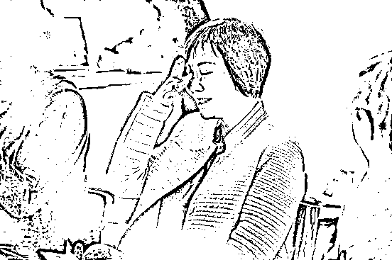

| NVC 工作坊现场花絮

**对自己的接纳**练习过程中我就意识到，这个女孩是我的阴影，也就是我内在明明有，却把她压抑在无意识中的那个面向。想到这里，我更沮丧了，我真的无法接纳自己内在有这样一个形象：**靠欺压别人去获得觉得很有力量的感觉**。想到这，我已经想骂脏话了。课程继续进行着，我努力让自己集中注意力在当下的学习中，但下课后我无法停止地思考着，怎样接纳自己的这个阴影。终于到了提问环节，我把自己才的所思所想全说了出来，并向老师提问：“怎样才能接纳这样的自己？这简直是不可能完成的任务！”翻译可能有一个不明白的地方，她问我：“所以你曾经的确欺负过别人？”我回答：“不，我从小都是被欺负的那个。”说完这句话，我更确定这就是我的阴影。老师问我：“所以你的意思是，你能理解她为什么这么做是吗？”我说：“是的，她想通过这样的方式显得自己很厉害、很强大。”

老师点点头，用一种无法形容的慈悲看着我说：**“所以，你只需要知道，你自我的核心部分是善良和有爱的，这就够了。”**

这一刻像是有什么事情发生了。

在课程结束的分享环节，每个人都要发言，我拿着 NVC 的吉祥物长颈鹿玩偶（Toni 老师说用长颈鹿当吉祥物，是因为长颈鹿是陆地上心脏最大的动物，而且它的长脖子让它能够拥有宽广的视野）说：“刚才对我来说像是发生了一个奇迹，我认为我被老师的意识震频影响了，一瞬间，我忽然可以接纳自己里面有那样一个女孩了，因为她和我一样渴望能自己拥有力量，只是她那时太年轻，用了一个不那么合适的方式。”我有点哽咽……我相信，这份自我接纳来自于那一刻老师对我的接纳。后来旁边的同学眼睛湿润地对我说，你刚才说的那一瞬间好像特别动情，老师的眼睛也红了。最后，用 Toni 老师在第一天开始上课前的一首诗作为结尾。**语言是窗户，或者是墙** /鲁斯·贝本梅尔听了你的话，我仿佛受了审判，无比委屈，又无从分辨，在离开前，我想问，那真的是你的意思吗？在自我辩护前，在带着痛苦或恐惧质问前，在我用言语筑起心灵之墙前，告诉我，我听明白了吗？语言是窗户，或者是墙，它们审判我们，或者让我们自由。在我说与听的时候，请让爱照耀我。我心里有话要说，那些话对我如此重要，如果言语无法传达我的心声，请你帮我获得自由好吗？如果你以为我想羞辱你，如果你认定我不在乎你，请透过我的言语，倾听我们共有的感情。

**你有过被别人的言语伤害的经历吗？**

**留言区分享给大家把。**

**版权声明：**原创文章由作者授权发布于若道平台，欢迎转发，反对抄袭。友号转载请申请白名单。

**杨浠 Vera**

ISAR 认证占星师（2017 年获得）

全职心理占星师，若道 COAC 高阶学员（2012 届）

咨询时长已达 400 小时

**占星咨询微信号：**haloace（请注名占星咨询）

**微信公众号：**verandu

长按打赏

**长按下图了解更多课程详情吧！**

**▼**

****

**微信又又又改版啦，不想错过若道的推送？**

**就把若道设为星标吧！**

**▼**

****报名直达入口****

# 有福利！NVC 线上训练营丨非暴力沟通，有效提升沟通能力

> 原文：[`mp.weixin.qq.com/s?__biz=MzA5NjA0NTAxNg==&mid=2651456731&idx=3&sn=a7499a837002f6da30e5c61059feef54&chksm=8b48b66cbc3f3f7a004a2234373c8b2e0a7231af12c18922f12b0988956964580b86a17c1207&scene=126&sessionid=1692737928#rd`](http://mp.weixin.qq.com/s?__biz=MzA5NjA0NTAxNg==&mid=2651456731&idx=3&sn=a7499a837002f6da30e5c61059feef54&chksm=8b48b66cbc3f3f7a004a2234373c8b2e0a7231af12c18922f12b0988956964580b86a17c1207&scene=126&sessionid=1692737928#rd)

**为什么我们要学 NVC？**

（向上滑动查看内容）

**蒋颖**

若道联合创始人

2016 年，我在新西兰参加一个 Hakomi 亲密关系治疗的治疗工作坊。参加这个工作坊的都是治疗师。在这个工作坊中，有一位女性让我特别印象深刻，因为她身上有种特别的气质，某种既温柔又坚定的东西，充满力量，充满对这个世界充满关怀，她身上表现出的让人惊讶的真实也让我有很多思索。她叫托尼·麦克尔兰（Toni McErlane）。

我知道她从小学习武术，也是一个悬挂式滑翔运动的运动员，曾经背着滑翔机在世界各地的上空飞行和比赛。她完成了北美非暴力传播（NVC）领导计划，是一个非暴力沟通（Nonviolent Communication，简写 NVC）培训师和注册的家庭纠纷调解人，也是生态心理学的培训师。她有多年的内观经验，在身体创伤治疗方面的经验，还有她在有机种植、景观设计、园艺治疗都有专长……我看到她到印度去，帮助印度乡村做有机耕种。在这次疫情之前，她已经买了一艘帆船，准备和丈夫开着他们的船环游世界。所有这些都让我感叹，一个女性可以活得如此勇敢和丰富。现在她而她对中国也充满了某种关切。多年前就一个人在藏区徒步旅行，后来又骑自行车穿越西藏。

但喜欢户外冒险的 Toni 说， NVC 比武术更管用。

2019 年，我终于请 Toni 到中国来，请她给若道做了基础和中级的 NVC 培训，也请她对外做了一次工作坊。

怎么说呢，培训和工作坊棒极了，更棒的是，我觉得人人都爱她。

**Toni McErlane**

我来自新西兰，拥有社区和人类服务—咨询康复学士学位，是 Aminz 的注册家庭纠纷调解人，也是 NVC Aotearoa 的 NVC 培训师。

在我的生命中，我一直对真诚、充满活力、自我负责的沟通和有意识的选择充满激情。而我的人生旅程为我提供了充足的机会，让我去探索、研究、反思和完善这在沟通中是什么样的。

在我的工作坊中，我的原则和实践都是建立在非暴力沟通和正念的哲学基础之上。非暴力沟通是由美国心理学家马歇尔·卢森堡博士所开发的。马歇尔的目标是发展出一种语言，这种语言受到印度巴利语中的“非暴力主义”（Ahimsa）一词的启发，它的意思是“没有伤害”。我们怎样才能在与他人沟通时不造成伤害呢？这不仅需要非暴力沟通的技巧，还需要在训练中融入正念。正念是受小乘佛教内观传统的启发，发展觉知和接纳，关注和允许。在我们的工作坊中 ，我们将非暴力沟通和正念编织在一起。

我致力于以这种沟通和处世方式作为我日常与人互动的基础。我曾经学习了为期一年的北美非暴力沟通领导者项目，在加州湾区非暴力沟通的全年浸入式项目中做了两年协助工作，然后在索诺马县女子监狱推动非暴力沟通培训。同时，多年来我持续参加内观静修，致力于继续和发展这种实践，并把它融入自己的工作坊中。

2020 年疫情期间，我与丈夫和我们的猫在游艇上休了一年假。现在，我和丈夫还有 15 岁的侄女在新西兰南岛的达尼丁生活。我在那里从事心理咨询、冥想和生态心理疗法。我们还正在那里慢慢建立一个治疗静修中心和生态冥想社区。

过去四年，我曾两次来中国，与若道及其友好而充满活力的团队分享非暴力沟通，并参观了一些绝佳风景。我期待继续与若道合作，在网上分享我的知识和技能。

向上滑动可查看更多

**Toni 老师有话对你说**<mpvideosnap class="js_uneditable custom_select_card channels_iframe" data-pluginname="videosnap" data-id="export/UzFfAgtgekIEAQAAAAAABNIXkZitzgAAAAstQy6ubaLX4KHWvLEZgBPEtIMEEEUxZvj-zNPgMIuM7PVi1oMK5fdX4B-DAnh3" data-url="https://findermp.video.qq.com/251/20304/stodownload?encfilekey=RBfjicXSHKCOONJnTbRmmlD8cOQPXE48ibrgo6T80SM1b4QSoxiaa7xblfRvMCU22ricO1icL5GdBOSmzhG7mbaLtSLg4xqYaTLicapWwCV45Axx8QGaozqH7OpxicjibYzN1icWtyuIibCRyZInILWhIGRG1ILicWtib8H3XUMxBW2rZO2GMmc&amp;adaptivelytrans=0&amp;bizid=1023&amp;dotrans=0&amp;hy=SH&amp;idx=1&amp;m=3d7ca9d191932d16f6faa80b9364d1f9&amp;token=AxricY7RBHdVzFXjPCFncbbQSWL8x8x2YeR1VX1JKDza8JFxFfuEYeFkqjygt392VxqY7mdlmzAc" data-headimgurl="http://wx.qlogo.cn/finderhead/PiajxSqBRaEJYnVsqWfEX9qA0sI6hNVKsDfyzfPZ92WZMZyBpZWU5NA/0" data-username="v2_060000231003b20faec8c4e68a1ec2d4ca07e434b07755bbf47e7053a3059defd2c9d6c68a20@finder" data-nickname="若道" data-desc="#非暴力沟通 NVC  在面临一个两难处境时，如何运用 NVC 促进合作的开展？
" data-nonceid="1620007045275601581" data-type="video"></mpvideosnap>

**福利！**

**前 20 位报名学员赠送 NVC 情绪-需求卡一套**

**NVC 情绪-需求卡****课程内容**

**第*****1*****模块 区分感受和想法**

*   学习区分想法、感受和故事感受。

*   体会为什么在表达中分享自己对某一情境的感受很重要，而不仅仅是想法和判断。

*   学习辨识和认同身体传递的感受和情感，将它们作为自我觉知和自我联结的资源。

*   理解感受是重要的信息媒介，支持你与自身的需求建立联结。

*   认识关注感受、探索联结需求的重要性，而不是对感受做出反应。

**第*****2*****模块 将感受与需求、需求与策略关联起来**

*   了解并理解满足一个人需求的策略可能无法满足另一个人相同的需求。

*   学习理解需求的概念，学习区分需求和策略。

*   体验如何用多种不同的策略来满足一种需求，以及如何通过选择一种特定的策略满足或不满足其他需求。

**第*****3*****模块 倾听和共情**

*   学习倾听他人话语中透露出的情绪和需求。

*   体验受到共情和受到其他形式的有意识的支持之间的差别，比如同情、安慰、分散注意力、陪伴等等……

*   学习认可别人的体验和情感，而不必认同对方的策略，认识这种技能所能带来的力量和解脱。

**第*****4*****模块 观察与评价**

*   学习在表达中运用观察而非评价的重要性。

*   体验两者之间的差异，自己去领会为何有此差异。

*   学习区分对情境的解读和事实。

**第*****5*****模块 自我共情**

*   学习认识和观察自己的评判和评价，并用它们与自身感受和需求建立联结，借此更深入、更清晰地理解自己。

*   学习识别自己赋予情境的意义，并探求其中的事实。

**第*****6*****模块 ****提出请求**

*   学习请求是表达中重要的一部分。

*   学习如何提出满足自身需求和他人需求的请求。

*   分辨请求和要求之间的区别。

*   学习如何倾听拒绝，如何表达拒绝。

**第*****7*****模块 ****练习坦诚地表达**

*   在一个支持性的框架中，综合运用之前所学, 练习相互联结、清晰有效、对自己负责的沟通。

**第*****8*****模块 ****接受和表达感激和谢意**

*   运用之前所学，练习表达感激和谢意。

*   学习表达感激之情，远不止一句随口说出的“谢谢”。

**工作坊学员这么说**

非暴力沟通带给我的最大的收获是：通过课堂的学习和大量互动练习提升了觉察力，提升了沟通技能，非暴力沟通并不仅仅停留在语言的表达，非暴力沟通的核心是同理心。通过倾听对方的感受，帮助我将情绪转化为解决问题的动力。

我过去和其他人沟通时，常常陷在自己的思维中，通过练习我才发现，原来别人说话的时候我常常其实并没有听到对方说什么，都是在自己的想法里打转，现在我起码学习到当对方说话的时候，能够去尽量不想自己的想法。

过去我不会留意到原来自己的某种表达方式会让别人不舒服，而且其实也无助于解决问题，对于我想达到的完全无效，NVC 的学习能够让我更能觉察哪些表达会让别人不舒服，让我的沟通更有效，更能帮助我达到我的需求。我学完后，才觉察到过去在沟通中，如果对方有情绪，我也是情绪化地回应，现在，我能够和自己和对方的情绪都拉开一些距离。过去我对于对方情绪化的表达，会有情绪化的回应或不知所措，现在我更能去感受他们情绪下的需求是什么，因此就更从容，不那么容易被他人的情绪影响，能够更有效地回应那些有负面情绪的人。我是一个比较理性的人，在练习中发现原来对一个在我用理性分析如此很明显的画面，每个人竟然有如此截然不同的看法，这还是挺让我吃惊的，这个发现好像打开了一扇门。

我是一个比较感性的人，过去有什么事情，常常是情绪化的沟通；NVC 的学习让我能够更理性一些，能够更客观去看问题。

这个培训让我非常感动，这是我没有想到的，一个关于沟通的培训如此让人感动。在那些常见的表面事件呈现之下，是如此脆弱、温柔的人性。我们如此绝望地想要被理解、被爱，想要与他人联结，然而我们常常用非常错误的沟通方式去做，这时我们离我们的目标就越来越远。

**什么人适合学习 NVC？**

**老实说，NVC 真的是一门人生必修课。**

**NVC 可以非常有效地帮助提高沟通能力，提高觉察力、自我同理心和他人同理心，进而减轻童年创伤对成年生活的影响，帮助有效改善亲密关系、与父母的关系、亲子关系、职场关系。**

*   如果你正被低效的沟通方式困扰或正经历沟通暴力，想**提升觉察，避免伤害的话**，NVC 培训是个不错的选择；

*   如果想结束“相爱相杀”恶性循环的相处模式，**享受一段真诚而愉快的亲密关系**，NVC 培训是个不错的练习途径（可以拉着你的 Ta 一起来哦）；

*   如果你的**工作、求学、生活和“表达”息息相关**，想更理解自己，想改善你的人际关系，改进工作，NVC 培训可以体验到一种更有力量的表达。

**训练营时间与价格**

**课程时间：**10 月 24 日—12 月 12 日，每周日下午 2 点-6 点。共 8 周，每周 4 小时

**课程价格：**6800 元

**购买须知**

❶ **本课程一旦报名，不接受退转课。**

****非暴力沟通线上训练营****

**授课老师：**Toni McErlane

**授课时间：**2021 年 10 月 24 日起

**授课方式：**网络课程**，**英文授课，中文翻译

**费用：**6800 元

**课程负责人：****Maggie 老师**（微信：18510107057，请备注“非暴力沟通”，**获取优惠价信息**）

长按二维码添加课程负责人咨询~

****报名请点击“阅读原文”****

# 火星进天秤座 | 未来 45 天，最适合做这些事情啦！（星象指南）

> 原文：[`mp.weixin.qq.com/s?__biz=MzA5NjA0NTAxNg==&mid=2651456582&idx=1&sn=9028b5166a2394ba27c2d1bf1f831588&chksm=8b48b6f1bc3f3fe75d1dfd98ceef7560286df33b5572e42989727c8f8152f0d98f759b402d09&scene=126&sessionid=1692737928#rd`](http://mp.weixin.qq.com/s?__biz=MzA5NjA0NTAxNg==&mid=2651456582&idx=1&sn=9028b5166a2394ba27c2d1bf1f831588&chksm=8b48b6f1bc3f3fe75d1dfd98ceef7560286df33b5572e42989727c8f8152f0d98f759b402d09&scene=126&sessionid=1692737928#rd)

******************☆ 后******************台******************回复“今日”，给你一句生命态度******************

作者/郑玮玲 ISAR 认证占星师
编辑/玫瑰 封面/书君 图片/pexels

北京时间 9 月 15 日 8:15，火星进入天秤座，直到 10 月 30 日离开。火星行进在天秤座的 45 天对我们的现实生活带来什么启示和影响呢？我们可以如何运用火星在天秤座的能量来支持生活与工作呢？

**从天文角度看火星****火星是地球的近邻，而它在黄道上绕太阳的周期接近地球绕日周期的 2 倍。**自古以来，人类都将日月视作“天造的一对”，在现实生活中它们确实“主宰”着人间的昼夜，如父与母，如阴与阳。而在占星学的意涵里，地球的两位邻居：**金星与火星更单纯、直接地表达着人类天然的两性关系，比起日月更进一步诉说着人与人之间的吸引力、欲望和激情。****金星与火星在太阳系隔着地球围绕太阳起舞旋转，两者在太阳系中行进时保持的最近距离与最远距离之比是 3:11，换算成百分比是 27.27%。而一个交点月（Draconic Month）周期即是 27.21 天，242 个交点月便是一个完整的沙罗周期。**这些唯妙的太阳系的数字似乎在向人类诉说着类似巧合，胜似巧合的宇宙的意图，等待着人类去开解博大、深藏着秩序的智慧。从火星与金星在客观宇宙的关系开始切入，因为我们要谈起火星落在金星守护的天秤座。这有助于在主观意识与客观世界之间搭起一座桥梁，运用天秤座的能量去深入火星的意图。**火星行进在天秤座的重点影响人群****火星行进在天秤座的重点影响人群：****个人行星、四轴、交点位于天秤座、摩羯座、水瓶座、白羊座、双子座、巨蟹座的人。**火星在天秤座的行进会引发**抉择、平衡与公正**的议题，令人身陷难以平衡的争端、观点与两难中，也会**带来创造性行动，对美与艺术的极致表达与追寻，以及考验人们在社交、关系中对于自我内心的真诚度。**火星的能量是激越、勇猛、冒险，也带有粗糙感的，而天秤座是出了名的优雅绅士，注重外表美，追求极致的平衡，精致的细节。黄道上每一个星座都是前一个星座的进化模式，当火星在处女座时，会追求不断的调试，精细打磨，是为着肉眼可见的细节的致臻完美，让一切物、相均适合当下时空。而天秤座的火星则更进一步在完美的标准上再加入了审美式的平衡感——这是来自人们头脑的标准，此时对细节，尤其是精致的追求就无限提高了，天秤座的标准可以说是完美之中的完美。这就是为什么很多天秤座热衷社交与关系，却很难待在长期恒定的关系中，矫枉过正的平衡永远难以平衡，在客观世界难寻一个绝对的完美。

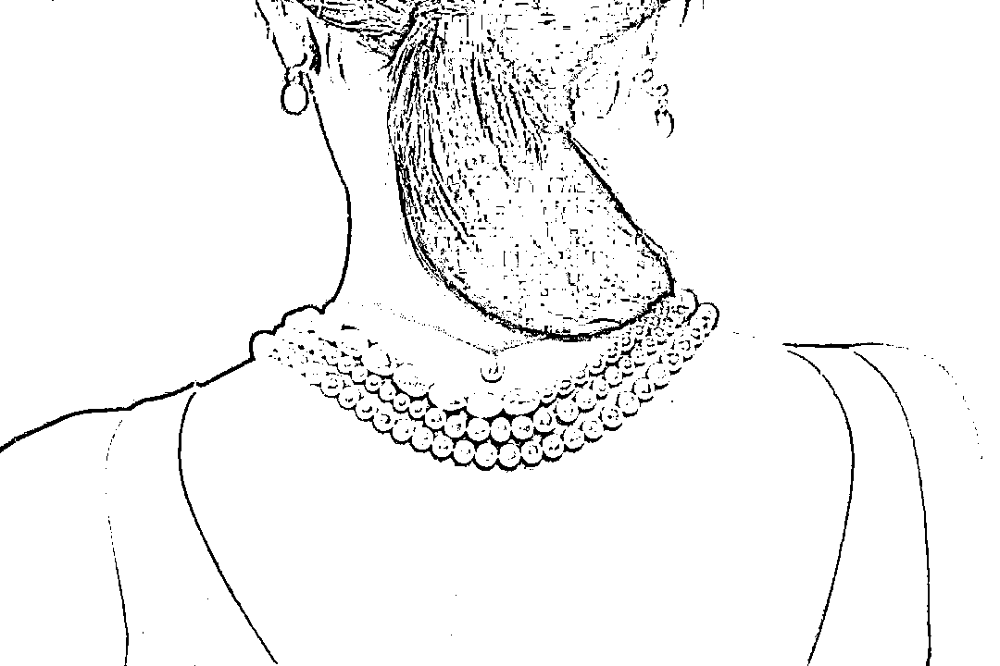

**火星行进在天秤座的时期，在现实中会令人遭遇因失衡，失去公平、正义而被激怒和发起行动的过程。**无论是否与己相关的公平议题，都会引发现实中的不满、争端、攻击与防御的行为。火星本是活力涌动的行星，如同战士、运动员一样热爱冲劲与爆发力，它非常需要**通过冒险、行动、自我捍卫，表达愤怒、攻击与防卫来焕新自我的活力与动力**——这也是**火星用自己的方式去服务太阳（真我）的工作。**而天秤座的被动，一定程度上消减了火星的动能。**思考、谈判与辩解必然令快速发起的动力减缓，甚至退缩，无法与身体的直觉取得联系，进而对自我的行动不断权衡，甚至是犹豫不定。**传统占星学中，火星在天秤座落陷。**天秤座的火星必然为着良善之心，正义与公理去对抗那些所谓的邪恶、丑陋、不公，最终目的是重回内在的平衡与秩序，保卫心中的完美、和平的城池。**金星守护的天秤座必然关系着我们的审美与价值观，金星所落的星座也必然影响着天秤座的火星所代表的平衡与公理源自于哪儿，那层最深的价值与美的标准是金星在说话。当我们在出生星图上看到火星在天秤座时，也需要去看一看金星的落位。而当下金星行进在天蝎座，则将金星与火星之间能量联接得更为紧密了，因为它们互相守护了对方的星座。**金星将天蝎座的深度资源、转化的动能交付给了火星，而火星则会采用优雅、和平与退省的方式去解决争端。****火星在天秤座最有利的事**

**深层的联结**

火星在传统的医疗占星中掌管了左耳，而身体的左半侧是我们右脑所控制的，由此我们可否理解为：左耳的倾听更倾向情感与心灵。因此，在接下来一个半月里，我们能够**在沟通中更好地倾听到对方的心声，支持建立更深层的情感联结。**天秤座的火星非常有助于我们进行深度资源合作、谈判，支持深度的情感交流与联结，有社交恐惧的人或是对激烈的情感有所畏惧的人能遇到缓冲的空间与机会。

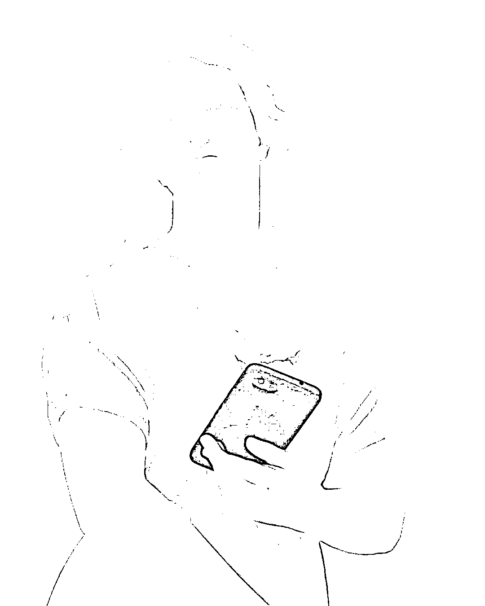

**优雅的运动**

火星当然也关乎于运动的技能，最符合火星天秤座的运动方式有二：**· “格斗中的芭蕾”——击剑；****· 体育舞蹈（国标舞）。****任何一项双人共同进行的，需要在关系中配合或者博弈、竞争的优雅的运动均属于火星天秤座的表达方式。**对于任何一位遭受火星行进冲击的人来说，**选择其中一项运动都会大大緩解可能因火星行进带来的外伤、流血、或是争端事件**。因为能量无法被消除，但可以被有意识地转化。

**完美的合作**

天秤座是风象星座，必然带来思维与头脑的高强度能量。火星天秤座是充分联结他人意志。火星在天秤座的人们常常能用自己的欲望推动他人，促使他人顺服、执行自己的意志，他们的方法是**让双方达成默契或是结为利益共同体，进而让他人发起有利于个体的行动。**这在工作合作中是非常了不起的火星动力。火星天秤座必然是非常有利于合作的火星落位，有利于那些需要通过与他人产生联结而共同完成目标的情况。**火星在天秤座需要注意的事**天秤座给予了艺术与欣赏美好事物的氛围和需要，火星在这里的行动方式会是**投入艺术创作之中，或是做任何舒解自己压力的，令心灵感受平和、稳定的事情**、**活动中，**当然也包括**做一切让自己看起来更美、更善意的事——基于他人的出发点去做的任何事**。这是火星在此位置困难的一面，因为当你拥有了这样一颗火星，并缺少自我赋权的意识时，它便总是用为他人的方式运作。**让人处在事物、观点的两端不断寻求平衡，一旦这样的行动并非出自内心，便永远无法服务于自我意志，无法令我们得到真正的满足，哪怕内心深入的满足是为了得到他人的赞许。**这样的行为似乎令人巧妙地不必为自己的观点、行为负责，因为行动目的不是自己而他人，实际上令我们**陷入虚伪与自我欺骗当中。**

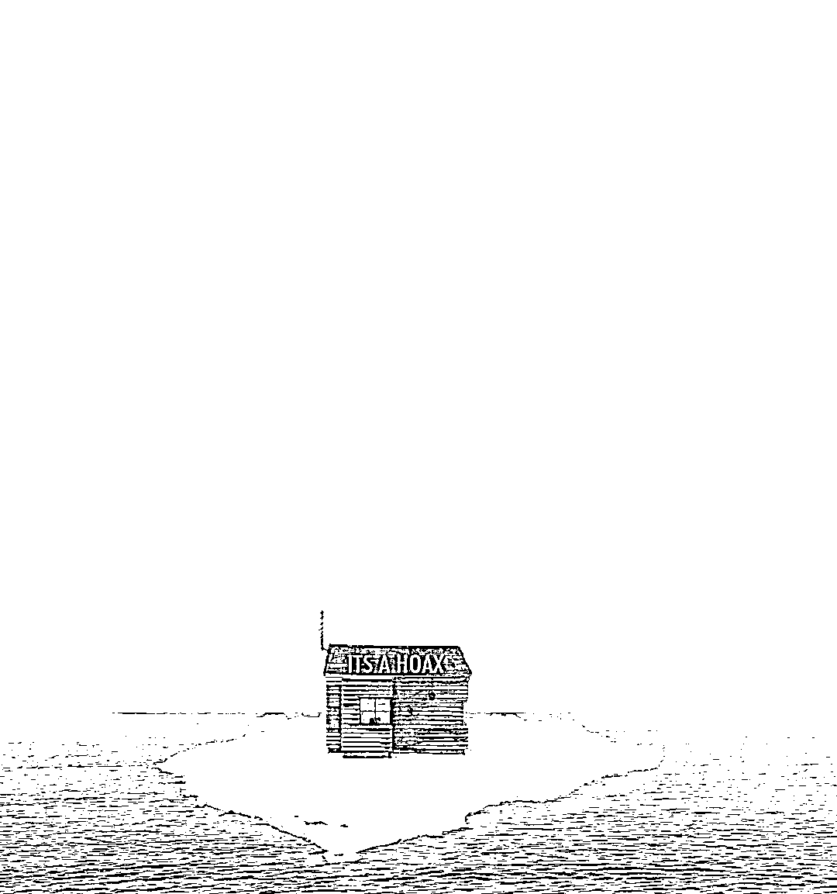

**火星天秤座的人**

火星在天秤座的男性不乏优雅、风度翩翩的绅士，最典型的便是从 8 岁到 48 岁女性都爱嗑的一对 CP：王一博、肖战。不夸张地说，两人都完美展现了火星天秤座集优雅性感于一身的特质。在工作中达成完美的共同目标，相互成长、成就彼此，用行为诠释出了“君子合而不同”的风范，在鱼龙混杂的娱乐圈里实属难得。

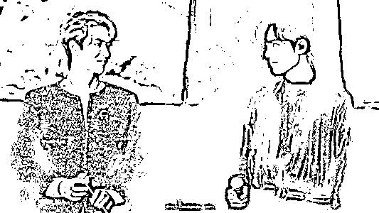

| 王一博、肖战**火星在天秤座行进期间的重要相位**

**火星三分北交点**

**9 月 11 日-10 月 2 日**

**重点影响人群：有个人行星、四轴、交点位于天秤座、摩羯座、水瓶座、白羊座、双子座、巨蟹座 0°-11°的人。**无论在出生星图上还是在行进的时空中，月亮北交点都在默默牵引着我们的灵魂意图，那是我们灵魂深入在学习的功课，一次次在内心深处整合的潜能与愿力。当火星在行进中三分了北交点，便为每个人带来了**前进的机会和动力**——这一次关于**学习协商、交流、沟通与表达**。**当我们能真诚勇敢地表达自己内心的见解，也许会有纷争、辩解，但火星对我们的试炼便已轻松过关。**实际上，天秤座的火星会**帮助我们更为客观地采取意见与行动**，我们大可利用这段时间去**做那些最困难的沟通，包括内在与自己的对话**，相信我们能快速突破内心的难关，找到真诚与公正的最佳平衡点。

**火星三分土星**

**9 月 15 日-10 月 8 日**

**重点影响人群：有个人行星、四轴、交点位于天秤座、摩羯座、水瓶座、白羊座、双子座、巨蟹座 0°-15°的人。**
火土相遇，其能量如同身着紧身衣的战士，但被土星三分相的联结给予了“战士”绝佳的发挥空间，令我们**行动力密集、紧凑、稳定又高效。**在水瓶座逆行中的土星的能量会因为火星带来的三分相引致短**期的注意力转移——自然是被外界关系或美好事物所转移**。令那些**沉浸在长期低沉、深化、内收状态的人们获得一些外在的舒解机会，**给自己一点喘息的空间，**从担当责任和承担一些力所能及的压力中释放掉长期以来的积郁**。火土的三分相还能**帮助那些有着周全计划的人们去完成周期性的建构工作，帮助落实那些具有创造性的想法，稳定合作关系和工作模式。**

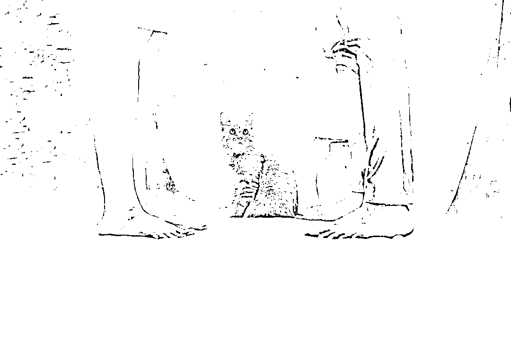

**火星三分木星**

**10 月 8 日-10 月 30 日**

**重点影响人群：有个人行星、四轴、交点位于天秤座、摩羯座、水瓶座、白羊座、双子座、巨蟹座 14°-29°的人。**这个相位紧接着火土三分来到，大大鼓舞着我们去**采取更具扩张性、有意义的行动，最大限度地把内在真理和创造性的想法带到现实行动中去，完美支持了那些为着真理、未来而工作的人们。**火木的相遇必然是声势浩大的、携带着内在真理的行动，水瓶座的木星会将走在共同道路上，有着共同真理追寻的人们联结在一起。这个相位也支持我们**向外分享真理，传播真理，找到未来真正能支持自己成长的团体。**

**火星四分冥王星**

**10 月 10 日-11 月 4 日**

**重点影响人群：有个人行星、四轴、交点位于天秤座、摩羯座、水瓶座、白羊座、双子座、巨蟹座 16°-29°的人。**热爱冒险的火星与冥王星的四分提示了**冒险与深藏的价值、机遇之间的张力**，这里有些不可忽视的吸引力：**金钱、关系、欲望、前途、理想……但凡能视为价值、资源的，也可能制造危机与高压。**火星是我们的行动，冥王星预示着转放、释放与蜕变，而四分相告诉了我们这是绝对的挑战。迎难而上或是谨慎前行都各有所利，重要的是：**发出的行动需要出自内心的真实。**如若违背真心，即便发心富有良知的行动也必然在这一轮行进中跌入深渊，冥王星的清洗与净化是终级不可逆的，但其目的是**带我们来到绝对真实的境地，复原深层的火星——自我之力。**最后，愿每一位见字的你经由火星在天秤座的平衡艺术来获取宇宙精微的智慧：天秤座的一端是爱，另一端是美，用你的行动去得到它们，平衡它们，整合它们。任何一颗行星行进的时空都可视作成长与祝福的机遇，它们穿越我们身心年华才算流年，在我们身心意识之外，只能叫时空。每一个流年为你而过，时空的韵律才拥有了意义。

**版权声明：**原创文章由作者授权首发于若道平台，欢迎转发，反对抄袭。友号转载请申请白名单。

**郑玮玲**

ISAR（国际占星研究协会）认证占星师（2016 年获得）

若道占星专栏作者

将占星咨询、教学与音乐、舞蹈相结合的疗愈者

**微信号**：zhengviolin

**新浪微博**：@郑玮玲

**微信公众号**：Sampriya-Astrology

长按打赏

****学习占星学****

****点击下图了解课程详情**** 

****

****

**

****

**微信又双叒叕改版啦，不想错过若道君的推送？**

**就把若道设为星标吧！**

**▼**

就是这个“在看”，戳戳戳 ☟

******报名直达入口******

# 女性星图中的太阳与火星丨你喜欢的异性拥有怎样的特质？

> 原文：[`mp.weixin.qq.com/s?__biz=MzA5NjA0NTAxNg==&mid=2651456582&idx=2&sn=1d65c233f9a2fe57a2b860578487651d&chksm=8b48b6f1bc3f3fe714ea3083b9630068164bb11e7cd1cf9e84f17ba4f6f3b634e9ec0ee57396&scene=126&sessionid=1692737928#rd`](http://mp.weixin.qq.com/s?__biz=MzA5NjA0NTAxNg==&mid=2651456582&idx=2&sn=1d65c233f9a2fe57a2b860578487651d&chksm=8b48b6f1bc3f3fe714ea3083b9630068164bb11e7cd1cf9e84f17ba4f6f3b634e9ec0ee57396&scene=126&sessionid=1692737928#rd)

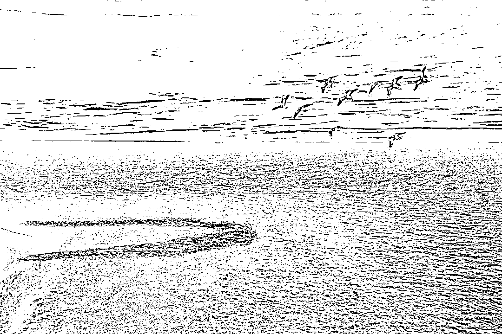

作者/大卫·瑞雷 若道占星创始人
译者/若道翻译团队编辑/翀子 图片/网络大卫老师认为，当讨论一个女性的星图时，我们要特别留意她星图中的太阳和火星，当它们的运作越健康，她和男性之间的关系也就越健康，他还用案例详细讨论了这个观点。如果你想跟着大卫老师一起学习占星，可以了解【[四大名师核心课](http://mp.weixin.qq.com/s?__biz=MjM5MjQwNjAyMQ==&mid=2649438741&idx=6&sn=ee13e6b5f9be26541cb32b3070d1e1d9&chksm=beb9557f89cedc6932d525d989152c69cbc50a7ee87074d6288ee1cc6e7a6ad632f1aafa4cab&scene=21#wechat_redirect)】（点击链接可阅读）相关详情~**女性星图中的太阳与火星**

**在讨论一个女性的星图时，你要特别留意她星图中的太阳和火星。如果这是一个男性的星图，则要关注月亮和金星。**

这并不是说对于女性来说星图中的月亮和金星就不重要了，月亮和金星在讨论关系时始终是很重要的。只是**如果你是女性，要想了解你在生命中会吸引来的与男性相关的问题，你就必须去观察你的太阳和火星，看它们落在什么星座、什么宫位，跟哪些行星形成相位。**

由此你可以知道自己会吸引到什么样的男性，以及自己在与男性相处过程中会出现的问题。

一个核心的理解方式是，对一个女性来说，她星图中的太阳和火星**，代表了如果她是一个男人的话，这个男人是怎样的。**作为一个女性，如果你能够对自己身上男性的那一部分有充分的觉察，并且接纳自己男性的那一面，进而改变、改善自己身上男性的那部分，那么你在现实生活中与男性的互动、跟男性的关系也会获得改善。

换句话说，你越能处理好自己的太阳和火星，**你自己身上太阳和火星的部分越健康，你和男性之间的关系就越健康。**如果女性可以觉察到自己身上男性的部分，并与之建立起良好的关系，那么她们与生活中的男性的关系也一定会发生变化。

这当然不是一个容易的过程。**要记住，那个男性的你也是你的一部分，**你所经历的一切他也都在经历。他是无条件地爱你的，因为他就是你。**当你接受了这一点，并敞开心扉去接纳，你与生命中的男性的关系会发生变化。**

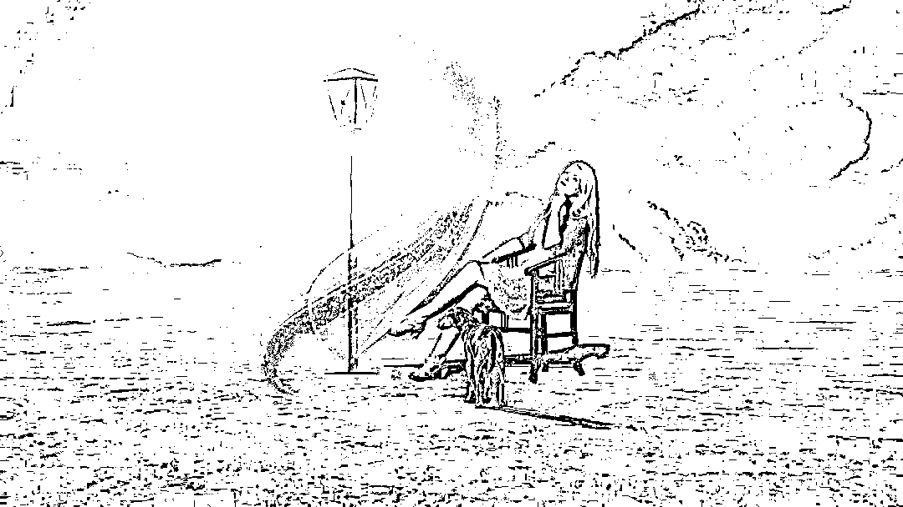

**举个例子**

我来举些例子。

**假设一位女士的出生图中太阳四分火星，**那么她也会比较容易吸引来一个出生图中太阳四分火星，或是有类似情况的男士。另外**这也提供了一些关于她的父亲的信息。**

假设这位女士的太阳在狮子座，火星在天蝎座。那么在她很可能有一个喜欢掌管一切的父亲。虽然这位女士可能并不喜欢父亲的样子，但她在成长过程中**习惯了与男性的这种互动模式**，所以也会吸引到一个像她父亲一样爱掌控的男人。

**假如是太阳与冥王星的四分、对分相，**那么这位女性与她的父亲之间，或与其他生命中的**重要男性**之间，会有很**激烈的权力争斗**问题，同时也暗示了与**抛弃**有关的主题。但是进一步看，**这也是你自身的男性那一部分的问题。**

假如出生图中太阳对分冥王星，南交狮子第 8 宫，这就使得这个相位更加重要。因为狮子座与太阳相关，第 8 宫与冥王星相关。本来日冥对分就是一个非常重要的相位，而现在南交点的位置令它更加重要了。

**如果把太阳想象成这个女性身上的男性部分，**那么这个男性他经历了什么呢？**冥王星**可能让他经历暴力、战争、缺失、分离，他可能是暴力之下的受害者也可能是暴力的实施者。

假设这个女性的太阳是在双鱼座，冥王星在处女座。这个男性可能在前世遇到了**生存危机**，在想方设法度过险境。然而他没有做成一个英雄，狮子座/太阳跟英雄相关。他会觉得，虽然我赌上了性命，为了拯救他人（双鱼座），但是我还是失败了。这会带来很多自责。这是一个被愧疚感折磨的男性。**所以，这位女性的男性部分，是一个在如何成功度过危机方面有困扰的人。**

**如果不从转世的方面讲，**这位女性的父亲很有可能曾经抛弃了她或她的母亲。而她父亲这样做可能是因为他在他的生命中遭遇到了危机。

对于这位客户，我在引导她进行冥想时会让他想象她父亲的样子，让她在冥想中问她的父亲，为什么他要离开你。让他向你解释这一切，跟他进行对话。这是治愈关系的开始。当你成功通过了考验，你会觉得自己升华了、转化了、重生了，这就是冥王星的课题。

我在这里提到冥王星是因为冥王星是一颗会引发非常激烈情境和情绪的行星，**如果女性星图中太阳与冥王星有负面相位**，她很可能与生命中的重要男性有**激烈冲突**，这将给她的**两性关系**带来很大影响。

下面举个不这么激烈的例子。假如一位女性的太阳在天秤座，与水瓶座的土星成 120 度。她会吸引来非常和善又踏实沉稳的男性，她的父亲也可能是这样的人。如果她的星图中还有太阳四分海王星，那么她的父亲除了对家庭尽职尽责，还会非常有同情心，非常善良，但是他可能过于敏感，以至于在家庭中处于弱势，让人觉得无法依靠。

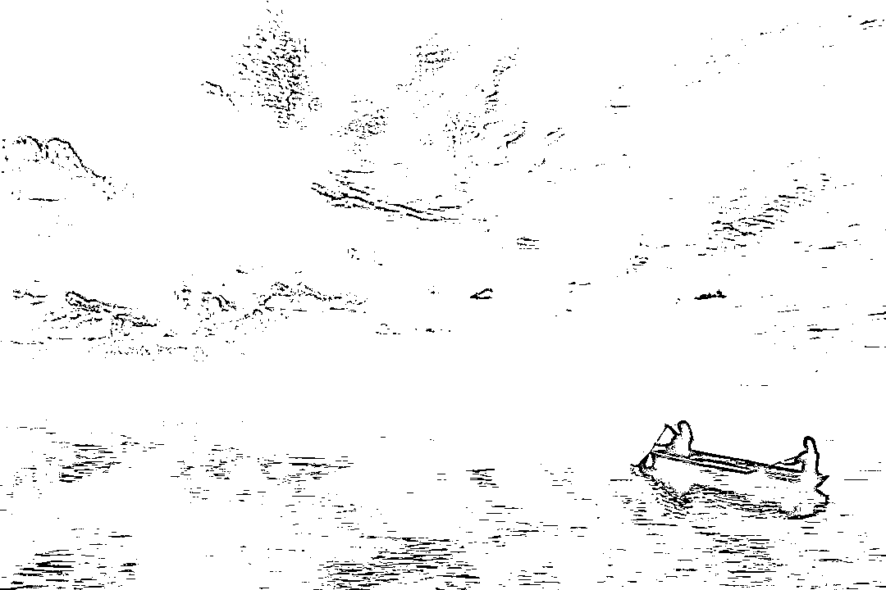

**学员案例**

太阳合相冥王星，太阳在处女座 28 度，冥王星在天秤座 4 度。太阳四分土星，土星在巨蟹座 4 度。土星合南交点在巨蟹。太阳三分木星，木星水瓶座 2 度。（北交点守护星土星合南交、四分太阳）太阳和冥王星的合相暗示着与父亲的权力争斗。而太阳与土星的四分相位让情况更加复杂。

在你的成长过程中，你的父亲在生活中遭遇了一些挣扎。即便他没有离开你，但工作上的职责和义务可能影响了他跟你的父女关系。虽然在一些情况下，他试图给你一些东西，希望能够对你有所帮助，**但冥王星和土星毕竟暗示了控制与限制的主题。**比如在你小时候，父亲可能常常在出门前给你安排一些“任务”，要你在他回来之前完成。

**这就是一个跟限制与控制有关的表现。**在这样的环境下成长起来的一个女性可能总是想**向父亲证明一些什么**，觉得如果不这样做的话就**有被抛弃的危险。**这样的状况也会出现在她跟男性的相处过程中。她会觉得必须努力向丈夫证明自己有能力掌管一个家庭，有能力对自己的家人负责，否则就会被抛弃。虽然丈夫会给予她很多支持，为她提供很多便利，但是同时**她还是会感到压力与危机感。**

你需要做的是，**首先去观察你星图中的南北交点，确定星图中的哪些部分是最重要的。**如果北交点在摩羯座，那么土星就非常重要。而她的土星在巨蟹座合相南交点，这说明在家庭责任方面有从过去世遗留下来的未解决的问题。你在今生依然想要向他人证明你有能力获得成功，而你对成功的需求是否获得满足将直接影响你与男性的关系。

**向自己证明你能够成功，可以提升你的自尊，进而改善你与男性的关系。**只要你还觉得自己不够成功，你就会觉得你的丈夫可能抛弃你、不够尊重你，而这其实是因为你自己对自己缺乏尊重。

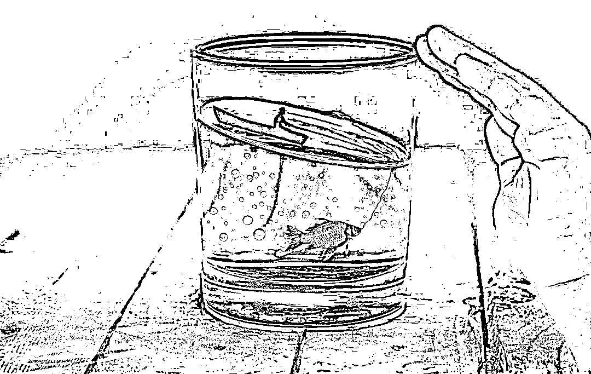

**学员提问**

**如果女性星图中太阳和火星都代表男性，那么这两颗星有什么不同？**

太阳和火星的不同，就在于这两颗星体本身含义的不同。正如月亮代表你需要的，金星代表你想要的。**太阳代表意志，而火星代表行动。**

**女性星图中的火星，代表了她喜欢的男人的行为方式、肢体语言。**火星与行动的动作和风格方式相关，这有点类似于上升星座的含义。如果一位女性的火星在摩羯座，她会希望她的伴侣在举手投足间让人感到有尊严。

**太阳与意志、意愿相关。**太阳在白羊座的女性，希望从男性身上找到非常直接的阳性能量、属于当下的力量。太阳在天秤座的女性会喜欢友好和善、喜欢为他人着想的男性。

**版权声明：**原创文章由作者授权发布于若道平台，欢迎转发，反对抄袭。友号转载请申请白名单。

****想阅读更多作者的文章，请在后台回复******大卫****** 即可。****

**喜欢文章请长按下方二维码打赏**

**给大卫老师加杯咖啡呗~**

**▼**

****学习占星学****

****点击下图了解课程详情**** 

****

****

****

****

**微信又双叒叕改版啦，不想错过若道君的推送？**

**就把若道设为星标吧！**

**▼**

**喜欢记得点一下在看哦☟**

****报名直达入口****

# 好物推荐 | 从"麻瓜"进化成占星师的自我觉察工具（今日开课）

> 原文：[`mp.weixin.qq.com/s?__biz=MzA5NjA0NTAxNg==&mid=2651456582&idx=3&sn=095f49dd93cdb9d8f12aeb1a90ccef67&chksm=8b48b6f1bc3f3fe72026df45ed461c2834cd14337efc7108841c79524908b4b5921c720b59b5&scene=126&sessionid=1692737928#rd`](http://mp.weixin.qq.com/s?__biz=MzA5NjA0NTAxNg==&mid=2651456582&idx=3&sn=095f49dd93cdb9d8f12aeb1a90ccef67&chksm=8b48b6f1bc3f3fe72026df45ed461c2834cd14337efc7108841c79524908b4b5921c720b59b5&scene=126&sessionid=1692737928#rd)

1

**自我觉察，是智慧的基础**

每个人都有自己的内在冰山，自我觉察能够帮助我们觉察自己的行为、情绪等，然后向内深层探索，探索自己的行为、情绪背后的深层渴望、期待。学习和应用占星学的过程，就是慢慢掌握自我觉察工具的过程，当你熟练掌握了占星学，也就具备了帮助引导他人觉察到自身生命议题的能力。**往外张望的人在做梦，向内审视的人才是清醒的。**只有真正向内看，只有当觉察开始由外向内时，改变才会发生，才能够知行合一。

# | 插画师：古戈力

以情绪来举例说明，每个人的情况不同，觉察的程度也不同，觉察有四个层次：***1.*** **不知不觉：**没有觉察情况，当情绪来了，会被情绪控制，做出很多不计后果的事情。而且每次都是同样的状况，反反复复；***2.***** 后知后觉：**情绪过后，自己能够反应过来，自己做的对与错，但是很难避免同样的情况再次发生；***3*****. 当知当觉：**当情绪来的时候，你已经知道在这个当下，正在发生什么。当达到这个层次，你就可以自己控制情绪，从而影响后事的发展；***4*****. 先知先觉：**当事情还没发生，就可以预知它要发生了。因为你对情绪的觉察已经越来越熟练，所以情绪还没来，你就知道它要来了。所以，你也就有了更好的选择和处理方法。所以，我们要自我觉察，向内探索，觉察是为了接纳，然后做出改变，成长，迭代，升级。**那么要如何练习自我觉察，掌握先知先觉的能力呢？**

2

**每日觉察的工具推荐**

**今日天象&近期行进**

若道 APP 中的今日天象功能，罗列展示每一天的具体天象，你当天的行进和行进周期：

作为占星师，可以这样使用这个自我觉知工具：

**记录梦境**如果你有醒来记录梦境的习惯，每天早上看一下睡梦中的天象和行进，对应联想，你会惊喜地发现一些神奇的对应，能够更敏锐的捕捉到日常被压抑的情绪和需求。能够帮助你在白天的工作生活中先知先觉的关注身心状态。**规划生活**每月月初，周初都可以参考天象和行进进行日程规划，预估可能的助力和阻力，在对的时间做对的事，会发现平平无奇的日常也可以有不一样的色彩。根据月相的变化感知情绪的起伏，更好的自我关爱。**感知环境**当身边发生了引起你注意和好奇的事情，或者网络上层出不穷的新闻热点，都可以在天象中寻找对应的能量。从更大的格局视角去思考你的个人观点。通过环境的共振，更深入地理解自己的出生星图。以上都是很好的学习深化占星知识的方法，只需要系统掌握以下知识，就可以开始使用以上方法去提升自我觉知。**第*1*阶 黄道星座&个人行星****概要介绍占星学与星图**

**四元素与三形态**

**黄道 12 星座**

**太阳、月亮及其他个人行星**

**第*2*阶 行星&宫位****木星&土星****天王星&海王星&冥王星**

**练习组合所有行星**

**四轴**

**十二宫位**

**组合宫位、行星、星座****第*3*阶 月亮交点、相位以及初步解读星图**

**了解灵魂进化的路径：月亮交点**

**相位概论**

**相位&行为模式**

**困难相位**

**柔和相位**

**容许度，出入相位**

**渐盈渐亏相位**

**空相**

**宫主星&定位星**

**相位模式**

**组合相位、星座、行星、宫位**

**解读的基本原则，权重，失衡**

3

**课程安排是怎样的呢？**

**第*1*阶**2021 年 9 月 15 日开课，每周一天晚上 20:00-22:00 上课，共 6 次课**第*2*阶**2021 年 11 月 11 日开课，每周四晚上 20:00-22:00 上课，共 6 次课**第*3*阶**2022 年 1 月 6 日开课，每周四晚上 20:00-22:00 上课，共 15 次课 2022 年 4 月 30 日、5 月 1 日**L3 北京两日线下工作坊**

****

4

**授课老师**

**艾德里安·罗斯·邓肯**

**（AdrianRoss Duncan）**

**· **1971 年在印度游学时开始学习占星学，1985 年开始成为全职占星师，迄今执业已超过 33 年，是人本主义占星学、卜卦占星学和经世占星学领域的知名占星师。他还开发了占星软件 AstroClock 和多款占星报告；**·** 哥本哈根占星学院院长；**·** 他在日常咨询中经常运用卜卦，咨询图（卜卦的一种运用方式，即根据客户来访时间制作星图，从星图中获得大量信息）也是他特别擅长的领域；**· **艾德里安·罗斯·邓肯从 1971 年开始研习佛学，受佛学影响很深，他相信占星学和佛学观点一致，转化的一个基础是在于对现实感知的改变。而卜卦很容易与佛教融合，因为它只关乎当下。

**大卫·瑞雷**

**（David Railey）**

**·** 若道联合创始人，致力于在中国教授和推广西方占星学；**·** 曾任 ISAR 全球副主席，CAPISAR（ISAR 职业占星师资质认证机构）主席；**·** 1976 年，通过亚特兰大职业占星师考试，成为全职占星师，随后通过 AFAN 和 ISAR 职业测试；**·** 1980 年，与杰夫·焦耳一起在亚特兰大创建“每日行星”占星学中心。此后在亚特兰大占星协会担任 4 年考官，并且两次担任亚特兰大地区占星协会主席。1979-1992 年，作为占星师活跃于美国社会媒体，向不了解现代占星学变化的大众宣传专业占星学知识。在 1989-1992 年期间，他在 WRGG 电台 12 频道每周主持个人电视秀“今日占星学”，早先他还在 WRFG 的广播节目中播讲宇宙天气节目；**·** 2010-2014 年，任全美占星师联盟监督委员会委员；**·** 2010 年，其著作《灵魂的目标》中国版出版，和蒋颖一起创办若道占星学校和其官网 www.nodoor.com；**·** 2017 年，被选为 ISAR 委员会成员。ISAR 是世界最大的国际占星机构，会员遍布 45 个国家，2017-2020 年曾任 ISAR 全球副主席、CAPISAR（ISAR 职业占星师资质认证机构）主席。

**克里斯蒂娜·罗登贝克**

**（Christina Rodenbeck）**

**· **克里斯蒂娜·罗登贝克（Christina Rodenbeck）是一名全职职业占星师，在牛津大学城生活和工作，深受周围知识和文化氛围影响；她拥有伦敦大学（University of London）的人文荣誉学位，曾在伦敦占星学馆（AstrologicalLodge of London）、心理占星中心和占星研究学院学习；**·** 作为一名占星师，在过去的 20 年里，克里斯蒂娜在她的网站“牛津占星师”上写了大量关于时事、艺术和文化的文章；她每月主持一个占星播客：“与克里斯蒂娜和萨莉一起占星”，并定期在《占星杂志》(Astrological Journal)上撰写时尚专栏；她定期在英国授课，并保持着蓬勃发展的专业实践。

**琳恩·贝尔**

**（Lynn Bell）**

**·** 世界最受欢迎的占星学演讲者、作家和老师之一。定居巴黎，研究心理占星学和家族模式数十年；

**·** 著名的心理占星学中心（Centre for Psychological Astrology）的长期导师。2016 年，获得查尔斯·哈维（Charles Harvey）杰出的占星学服务奖；

**·** 作为一个从多个层面进行工作的占星咨询大师，琳恩的工作结合了心理学的观点。她对家族模式的兴趣首先来自与客户的合作。通过在分析领域所做的个人工作，她所受的埃里克森催眠训练将她引领至家族系统。后来，她组织研究小组在家族星图上进行了数年的研究。她写的《家族占星学》就是这项研究的结果；

**·** 法国心理占星学协会的会长。除了占星学，她在法国沙特尔的新沙特尔学校任教 8 年，还 5 次获得了在《纽约时报》畅销书作者卡罗琳·迈斯（Caroline Myss）的卡罗琳·迈斯教育学院（Caroline MyssEducational Institute）合作教学的机会。**课程助教：**

**熊鹰老师**

**（天空的空）**

**·** 2008 年接触严肃占星学，至此爱不释手；**·** 2013 年师从大卫·瑞雷，研习现代占星学核心课程，并于 2014 年起担任该课程的助教，之后于 2017 年与 2020 年两次与大卫老师合作讲授完整核心课程（Level 1-5）；**·** 期间也跟随格伦·佩里、诺·泰尔、理查德·塔纳斯、罗伯特·汉德、苏·汤普金斯、斯蒂芬·弗里斯特、琳恩·贝尔、艾德里安·邓肯等多位国际占星大师进行学习，进行定向占星主题研究；**·** 2014 年末，通过国际占星研究协会（ISAR）资质认证并获得证书；**· **在若道占星任职六年余，以“传播系统、专业、实效的占星学”为职业使命，执教与助教已累计超过 700 小时。在业余期间也提供占星咨询服务；**·** 目前正着眼于占星学与中国文化之互参，以当代中国人的身心成长为目标，力求落到实处。

5

**此次课程适合哪些人？**

**·** 对占星学感兴趣，想要入门的零基础者**· **占星学小白，想通过星图学习识人之术**· **有一定占星学基础，但不知道该如何整合星图复杂碎片的人**· **想要师从更多殿堂级占星导师学习占星心法的人**· **走在自我探索和个人成长道路上的人

6

**课程价格**

**L1-3 价格**：15000 元

其他各阶段课程单报价格，请咨询课程顾问：**Maggie 老师**（微信：18510107057，请备注**“核心课”**）

长按二维码添加 Maggie 老师

7

**退转课程**

****· 退款原则请详看《教学协议》，如有疑问请咨询课程顾问****

****名师汇集金牌核心课程****

**授课老师：**琳恩·贝尔、艾德里安·罗斯·邓肯、克里斯蒂娜·罗登贝克、大卫·瑞雷

**授课时间：**2021 年 9 月 15 日起

**授课方式：**网络课程**，**英文授课，中文翻译

**费用：**L1-2 价格：4800 元**；**L1-3 价格：12000 元

**课程负责人：****Maggie 老师**（微信：18510107057，请备注“核心课”）

长按二维码添加课程负责人咨询~

****报名请点击“阅读原文”****

# 深度｜未完成的灵魂功课是什么？来看这 8 颗逆行的行星（值得收藏）

> 原文：[`mp.weixin.qq.com/s?__biz=MzA5NjA0NTAxNg==&mid=2651456482&idx=1&sn=9bd8bd5374c5281b400e128cdf4dafd4&chksm=8b48b155bc3f3843c001b9eb4f99717497655b57ed6fc3c779575d98f0e8a58bd79e16cb2e99&scene=126&sessionid=1692737928#rd`](http://mp.weixin.qq.com/s?__biz=MzA5NjA0NTAxNg==&mid=2651456482&idx=1&sn=9bd8bd5374c5281b400e128cdf4dafd4&chksm=8b48b155bc3f3843c001b9eb4f99717497655b57ed6fc3c779575d98f0e8a58bd79e16cb2e99&scene=126&sessionid=1692737928#rd)

****************☆ 后台回复“今日”，给你一句生命态度****************

作者/曼迪·洛克利

译者/Jun 校对/Arrow

编辑/翀子 封面/书君 图片/网络出生星图中逆行的行星，可以帮助我们深刻地理解我们的过去的生活/业力问题和挑战，但这并不意味着我们在过去的生活中是“坏的”或“失败的”，所以不要苛刻地评判自己。一起来看看，那些逆行的行星都想要向我们传递些什么吧！**灵魂的功课**

我相信每个灵魂来到这个世界，都有自己的天命，自愿学习的一系列功课，以及选择接受的一系列挑战。这些都是为了帮助灵魂成长和学习而设计的。然而，在地球这里，**我相信我们有自由意志来决定是否接受这些挑战，或如何应对它们。**

**当你阅读我列出的每一个逆行行星的“意义”时，请记住这仅仅是符合每颗行星的传统象征意义的建议。**不要把它们当作“解读”，而是把它们当作提示你的启发，然后让你自己的经验和直觉引导你发现你的逆行行星对你个人意味着什么。**答案没有对错。**

同样值得考虑的是，**有些前世的问题需要释然，这样灵魂才能继续前进。**例如，那些在前世因自己的思想和观点而受到迫害的灵魂，今生可能需要释放对自由言论的恐惧，这样他们才能完成自己的使命。那些前世过着修行生活、发过贞洁或贫穷誓言的灵魂，可能需要在这一世从那些誓言中解脱出来，以便放下对财富和性行为的负面恐惧和情绪。

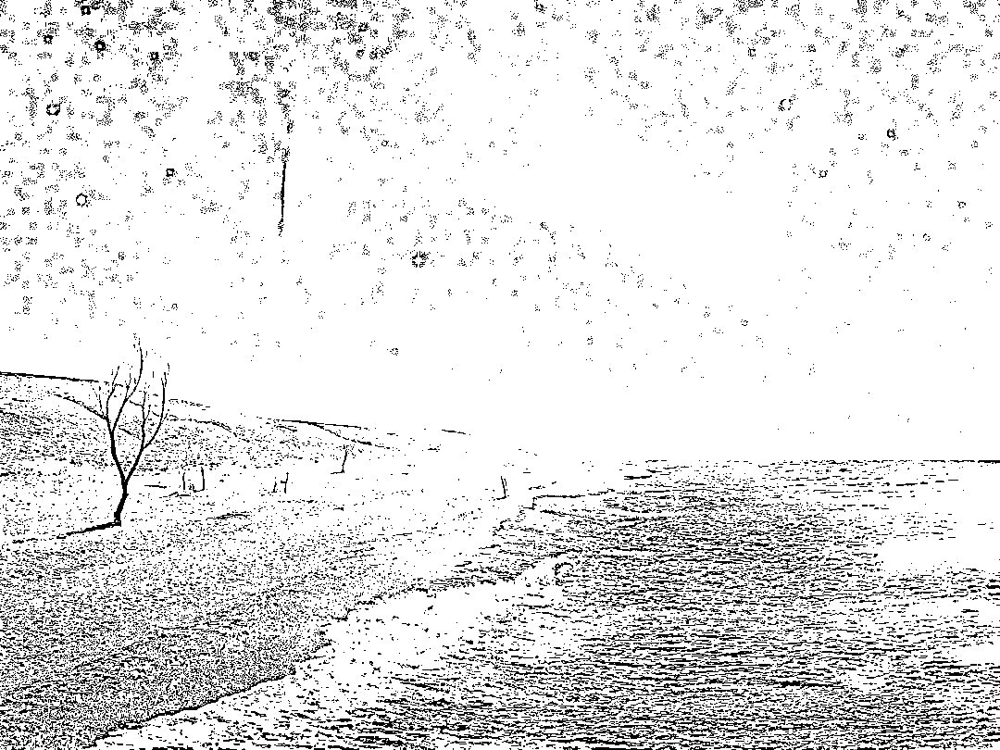

**出生星图中逆行行星的意义**

**所有的行星（除了太阳和月亮）都会逆行一段时间，大多数人在他们的出生星图上都有一颗或多颗逆行行星。**当一颗行星逆行时，你可能会从**内部和主观**上体验到它的能量。在早年生活中，你可能会在这颗行星所代表的生活领域遇到困难，但是在以后的生活中你会得到第二次机会。

业力占星师认为我们出生星图上逆行的行星代表:

*   **前世的未尽事宜。**

*   **通过解决前世问题来平衡业力的第二次机会。**

*   **有机会放下那些一直在今生阻碍你的前世问题。**

*   **可以帮助你的灵魂在这一世成长的前世能量。**

*   **可以找到前世被剥夺的满足感和成就感的机会。**

**如何知道自己出生星图中哪颗行星逆行？**

**你可以在 app store 或者应用商店搜索“若道”下载 app，输入个人档案，查看本命盘（也可以使用其他星图软件），找到行星逆行符号 ********R********所在星座，然后对照下文查看。**

**例如下图中，美国总统拜登的木星、土星、天王星、冥王星逆行。**

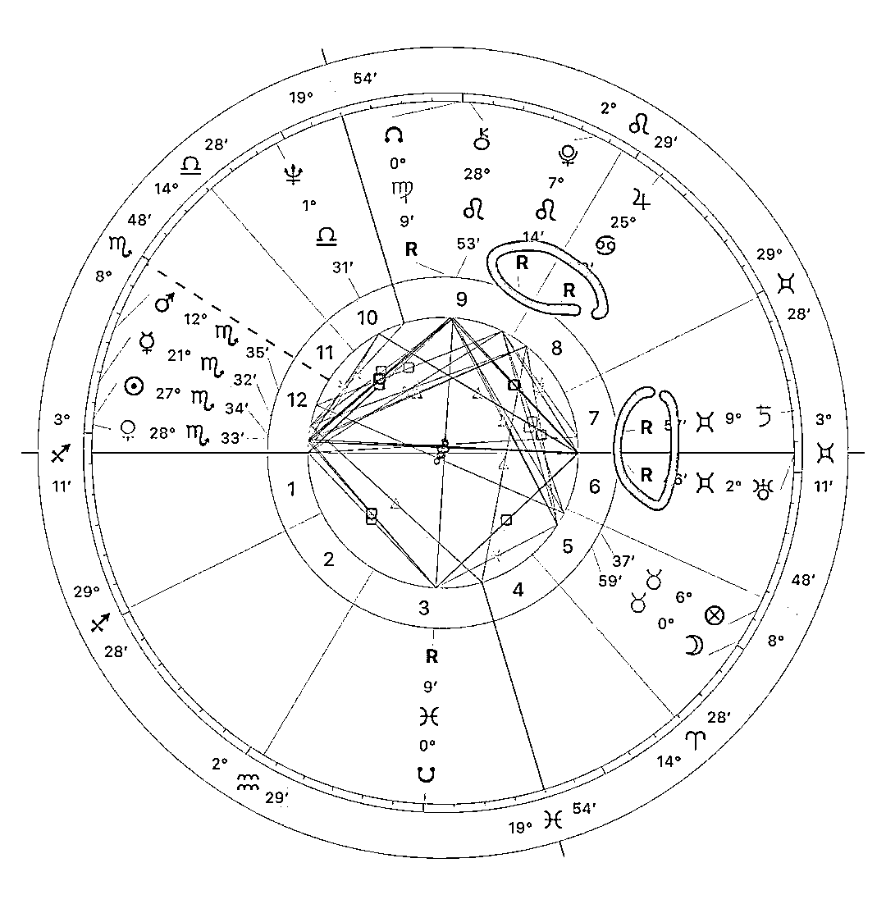

**1****水星逆行**

*   前世关于**沟通和自我表达**的未尽事宜。
*   克服前世对**批评**的恐惧的第二次机会。
*   释放前世对**畅所欲言**的恐惧的机会。也许你在前世因为你的观点而受害，但是现在你有机会说出来并且被听到。
*   通过学习**倾听他人的观点**，或通过学习保持灵活并接受新思想来使灵魂成长的机会。
*   通过**学习和教育**获得满足感和成就感的机会。如果你前世没有受过教育，今生可以弥补。

**2****金星逆行**

*   前世在**关系**中的未尽事宜。

*   有第二次机会去体验前世被**拒绝或失去**的爱和感情。

*   通过**建立人际关系**，有机会摆脱无益的情绪化行为和恐惧。例如，学会信任他人并敞开心扉。

*   释放并治愈前世**低自尊**问题的机会。

*   通过学习在关系中**给予和接受**来使灵魂成长的机会。

*   有机会通过**人际关系和亲密关系**、或者通过**重视自己和他人**来获得满足感和成就感。

**3****火星逆行**

*   前世关于**竞争和自我主张**未尽事宜。
*   有第二次机会来平衡过去**不义之行**的业力，你的潜意识仍因此感到内疚。
*   释放前世遗留下来的**愤怒和沮丧**的机会。
*   通过学习积极和健康地**坚持自我**来使灵魂成长的机会。
*   有机会通过**积极行动**来获得你真正想要的和需要的，以此来获得满足感和成就感。
*   学习如何跟随你的**激情和欲望**的机会。

**4****木星逆行**

*   有机会通过深入审视自己，找到**真理和意义**，从而完结前世的议题。

*   有机会放下来自前世不值得拥有**奖励和财富**的感觉。

*   通过解决**精神和宗教信仰**的问题来使灵魂成长的机会。例如，你可能在前世因为宗教信仰而受到迫害，或者你被迫信仰一个你并不相信的宗教。

*   有第二次机会通过以下方式找到**满足感和成就感**：深度学习和高等教育；体验不同的国家和文化；学会对生活、对自己和对世界有信心。

**5****土星逆行**

*   前世那些让你感到**不足、悲观或受阻**的未尽事宜。这些问题可以通过直面它们并采取积极措施来解决。

*   有第二次机会通过解决你过去难以**承担责任**或设定**健康界限**的问题来平衡业力。

*   有机会放下前世可能阻碍你前进的**恐惧**。

*   通过成为**父母或权威**来使灵魂成长的机会。

*   通过成功并用自己的**努力**赢得尊重来获得灵魂成长，而不是走捷径。

*   有机会通过**耐心和勤奋**地朝着长期目标努力而获得满足感和成就感。

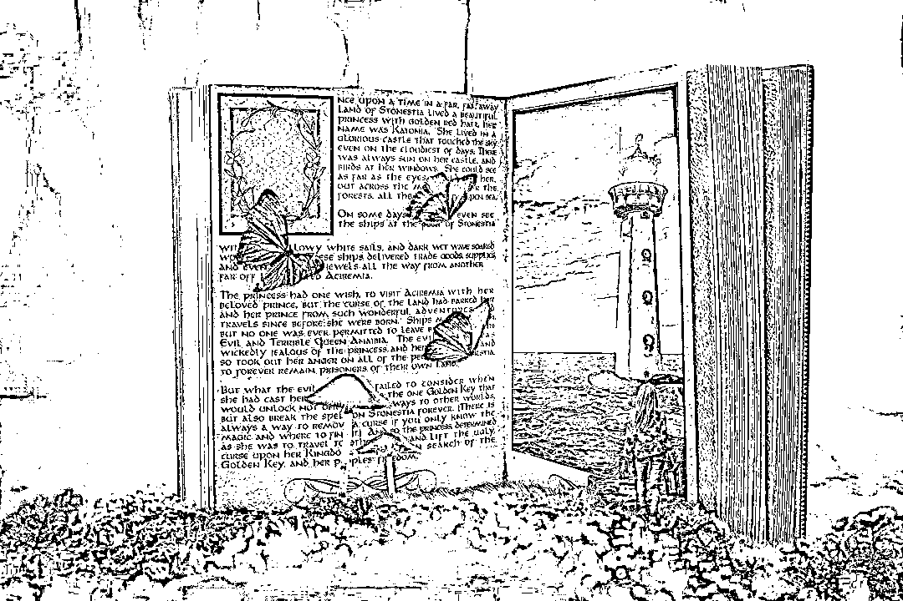

**6****天王星逆行**

*   前世你拒绝改变的未尽事宜。在这一生中，你学会**改变**可能是一件好事。

*   有机会通过敢于**按照自己的方式**行事来平衡前世业力，即使这会打破现状。

*   放下前世恐惧的机会，前世害怕因为**与众不同**而受到迫害。

*   追求**独立和自由**的机会，这在过去的生活中被剥夺了。

*   通过拥抱你的**个性和独创性**来使灵魂成长的机会。

*   通过真实的生活、做**真实的自己**获得到满足感和成就感的机会。

**7****海王星逆行**

*   前世让你极度**敏感**的未尽事宜。今生，你可以学会用你的敏感去帮助别人，同时学会设定健康的**个人界限**。

*   通过拥抱你的**创造力和想象力**来平衡业力的机会，特别是如果你在前世未曾培养这些。

*   让你放弃那些**无益幻想和逃避现实**倾向的机会，这些东西前世一直阻碍着你。

*   认识到生活中除了你用五官能看到的和摸到的，还有**更多的东西**，以此使灵魂成长。

*   通过培养对自己和所有生命的**慈悲心**来获得满足感和成就感的机会。

**8****冥王星逆行**

*   前世围绕**权力和控制权**问题未尽事宜。也许你在前世没有能力或控制力，或者你拥有太多而滥用它。今生，你认识到可以健康地、有建设性地使用权力和控制力，而不是以破坏性的方式。你可能还需要认识到，生活中有些事情是你无法控制的。
*   有机会通过清除**无益的、自我毁灭**的行为和情绪去平衡业力和重生。
*   有机会通过探寻旧（前世）问题的新视角而获得**解脱**，由此平衡业力。
*   有机会通过学习**更冷静、更有控制**地处理生活的起起伏伏，从而放下前世对危机和动荡生活的沉迷。
*   通过学习相信你的**直觉**来使灵魂成长的机会。
*   认识到当你不能总是控制发生在你身上的事情时，你可以**控制你的反应和反应**，以此来使灵魂成长。
*   通过学习**诚实和宽容**来获得满足感和成就感的机会。

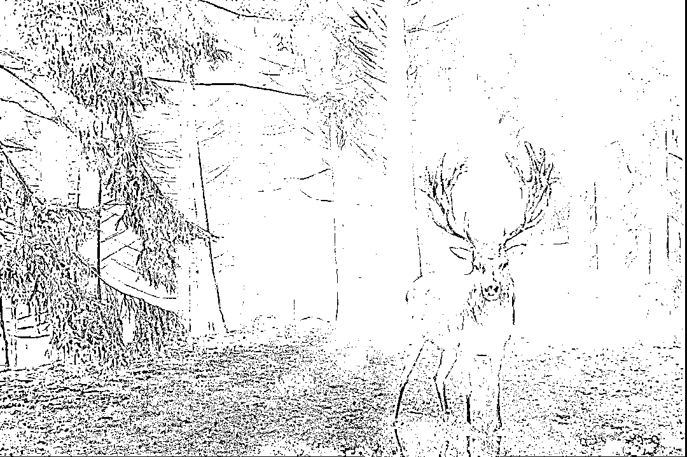

## **你需要注意的是，外行星（天王星、海王星、冥王星）有很长时间在逆行，大多数灵魂来到这个世界上至少有一颗外行星逆行。**

这些是世代行星，所以如果你的星图中有一个或多个外行星逆行，你就是有集体业力需要解决的一代人中的一份子。因此，逆行的外行星可能在个人/个体层面上与你没有太多的业力共振。

然而，如果你逆行的外行星在**轴点上**（如上升或中天），或者与你的**个人行星**（太阳、月亮、水星、金星、火星）呈紧密相位，那么它可能对你有一些业力意义。如果你太不确定，就听从你的直觉和经验。

**版权声明：**本文由若道翻译发布，欢迎转发，反对抄袭。友号转载请申请白名单。

**曼迪·洛克利**

伦敦的一位占星师、作家。2012 年，她出版了电子书《天蝎座土星：穿越黑暗的指南》(*Saturn in Scorpio: Your Guide Through the Dark*)，还以小说作家的身份出版了作品。

**学习占星学**

**点击下图了解课程详情** 

**微信又双叒叕改版啦，不想错过若道君的推送？**

**就把若道设为星标吧！**

**▼**

**喜欢记得点一下在看哦☟**

****报名直达入口****

# 神话塔罗之大阿卡纳牌｜导师

> 原文：[`mp.weixin.qq.com/s?__biz=MzA5NjA0NTAxNg==&mid=2651456482&idx=2&sn=153b4ca2f69f6745425525773616455d&chksm=8b48b155bc3f384322115b0b94621662ba562a2a252fd244a0a3fc84a664408b2311014e8db5&scene=126&sessionid=1692737928#rd`](http://mp.weixin.qq.com/s?__biz=MzA5NjA0NTAxNg==&mid=2651456482&idx=2&sn=153b4ca2f69f6745425525773616455d&chksm=8b48b155bc3f384322115b0b94621662ba562a2a252fd244a0a3fc84a664408b2311014e8db5&scene=126&sessionid=1692737928#rd)

作者/朱丽叶·沙曼-伯克 丽兹·格林

译者/闫东升 编辑/玫瑰 图片/pexels

本文节选自《神话塔罗》

塔罗牌中大阿卡纳牌的图像和数字序列依不同的人们根据不同的信仰系统做了各种改变，从 20 世纪初的亚瑟·爱德华·韦特和亚利斯特·克劳利，到如今诸多塔罗牌人士都贡献了卓越智慧。因此，现在众多版本的塔罗牌都是创意的混合物，保持了塔罗的传统结构，但绘图与序列上又纷繁各异。 

今天半人半马的导师又会讲述一个怎样的神话故事呢？

[🔈 神话塔罗·导师](https://res.wx.qq.com/voice/getvoice?mediaid=MzA5NjA0NTAxNl8yNjUxNDU2NDgx)

**｜**朗读者小巫

导师对应的希腊神祗 

**凯龙·智慧贤者**

**人马族之王**导师牌描绘的是一个奇怪的形象——人马，他的上半身包括双臂和头是一个男人，下半身则完全是马的样子。他的头发和胡子是褐色的，成熟的脸和仁慈的表情反映出他是一个教师或牧师。他的左手握着一卷书，书的寓意是表达成文的智慧。他的右手举起，做出古人表达赐福的手势。他的两侧都是石柱，身后是粗糙的巨石构成的岩洞，那是他的家，也是他的神殿。岩洞的顶部有一个环形的开口，光芒从那里倾泻进来，沐浴着他带着皇冠的头部。 **· 岩洞：**凯龙（*Chiron*）的神殿，它是天然的结构，不是人造的圣地，因为只有通过灵性的教诲，尘世的生命才有存在的价值和意义；****· **两棵石柱支撑起知识的殿堂：**在这里学生们得以获得凯龙的教诲；****· **凯龙手中的书卷：**里面记录着宇宙的律则，神圣的意愿通过文字揭露并传递出去。**疗愈世人却无法拯救自己**凯龙是神话中的人马族之王、疗愈者、牧师和年轻英雄们的老师。凯龙的诞生是非常神秘的，他的父亲是战神阿瑞斯（*Ares*）的儿子伊瑞西翁（*Ixion*），母亲是宙斯（*Zeus*）依照赫拉（*Hera*）的样子仿造的一片云，宙斯当时的目的是防止伊瑞西翁去骚扰赫拉。凯龙从太阳神阿波罗（*Apollo*）和月亮女神阿提米斯（*Artemis*）那里了获得了良好的教育，进而以他伟大的智慧和灵性被选为人马族之王，后来又被委任成为希腊皇室中年轻王子们的老师，教导他们灵性的价值和学会遵从神的律则，学会这些以后他们才可以学习统治人民的艺术和战斗的技能。凯龙还是一位伟大的疗愈者，掌握着植物和草药的秘密，但是他却不能疗愈自己。某一天他的朋友——英雄赫拉克勒斯（*Heracles*）杀死了九头蛇怪之后，到岩洞去探望他，无意间用曾经侵染过九头蛇怪鲜血的箭头擦伤了凯龙的大腿。九头蛇怪的血液中含有剧毒，因此无论凯龙用什么方法，都无法疗愈好那个伤口。因为凯龙是永生的神，他就不得不一直活在伤口带来的痛苦中，为此他牺牲了自己所有世间的欢乐，把所有的时间都献身于灵性智慧的教导。**联结人与神的灵性之父****从人们内在的层面来看，凯龙－导师的意象是我们内在一种灵性渴望的象征，其目的是想要了解神所赋予我们的使命。他是内在的精神导师和牧师，帮助我们在日常世界的意识和反映神的律则的直觉知识之间建立联结。****波赛凤（*Persephone*）－女祭司**的世界是黑暗和难以捉摸的，无法通过智力去理解；而**凯龙**的世界能够通过思维去诠释和阐述。牧师一词的古文是*pontifex*，意为“创建桥梁的人”，牧师在人类内部和外部世界的角色就是作为灵性之父服务众生，在人与上帝之间建立联结，通过订制自然的律则，保持人们与神性之间正确的关系。**皇帝的律则**呈现的是尘世间的父性原则，使人们在世间的一切行为都保持正确性。但是**导师的律则**是从神的角度出发，让人们的行为禁得住神的检测。凯龙象征的并不是任何传统的宗教系统。他本身就是一种狂野的生物——半人半马，他的神殿并非人为修建，而是纯粹天然的岩洞。因此凯龙传达的精神律则并不是集体意识中蒸馏出来的教条，而是在每个人与自己内在牧师的关系中产生的。**不同的人们对神的体验都不一样，我们通过自己内在独有的感受去理解精神和灵性的内涵，这是每个人心目中“神”的真正含义。**凯龙身上的伤痕使他成为了一名受伤的疗愈者，通过自身的痛苦，他理解了别人的痛苦并升起慈悲心，也因此比盲目的伤者看的更高和高远。**因此凯龙－导师反映出我们内在受伤的部分，在那里有一些尚未解决的问题或制约，它使我们变得深刻和慈悲**，如果没有这内在的创伤，我们就只会说一些肤浅的陈腔滥调，无法感受其中真正的意义。真正的牧师会对全世界的痛苦和渴望敞开自己，因为他曾经或正在经受苦难。**凯龙的形象反映了我们内在的伤痛或无法超越的局限所带来的价值，尽管它可能使我们在日常生活必须忍受苦难，却在另一方促使我们去敞开自己，探寻并了解生命的更高律****则。**

人马族反映了这种悖论，他们一半是马，一半是神灵，所以同时承载着本能和灵性，这和我们人类二元性的特质如出一辙。我们的生命是动物性和神性的混合体，也必须学习在生命中活出两者。人马族在两者的混合体中找到伟大的智慧，了解神的知识和自然的律则之间的关系——意即神通过现象界呈现了自己。

**导师，命运的指引者****从解牌的角度来看，凯龙－导师牌预示着当事人将要开始积极地为生命的意义寻找哲学性的答案，可能通过对某种信仰系统或哲学的学习，或者全身心地投入到对于生命意义的寻求当中。**导师可能会以精神分析师、心理治疗师、牧师或者灵性指引者的外在形式出现，他们能够提供给当事人需要的安慰和帮助。愚人在这里走出了地下世界和对潜意识中隐藏力量的探索过程，开始寻找生命的意义和关于生命之谜的答案。当他遇到导师的时候，他就遇到了自己内在的个人哲学家，以此可以明确地规整并在   生命中表达自己的个人哲学、愿景和灵性，此时他在导师的指引下走出了童年，以更成熟的姿态进入充满生命挑战的冒险之旅。

**版权声明：**本文由《自在园》授权发布，欢迎转发，反对抄袭。友号转载请申请白名单。

**神话塔罗系列**

[开篇](http://mp.weixin.qq.com/s?__biz=MzA5NjA0NTAxNg==&mid=2651451590&idx=2&sn=41c1083542bcf098de303e29a028ff20&chksm=8b4b4271bc3ccb67d5d53c143cd5a17c24b7b60e5b1051949fa9f086f90b4ab04877976c47e5&scene=21#wechat_redirect)丨[愚人](http://mp.weixin.qq.com/s?__biz=MzA5NjA0NTAxNg==&mid=2651452189&idx=2&sn=f4cc6e768e367fbdb0f69b9c6382443d&chksm=8b4b41aabc3cc8bcdbd952d91d8408014a799224d3f67ab50bb5cbe88ee0090afc92869de1a6&scene=21#wechat_redirect)丨[魔术师](http://mp.weixin.qq.com/s?__biz=MzA5NjA0NTAxNg==&mid=2651453528&idx=2&sn=3ca9b35e1736168eef1856274635224a&chksm=8b4b4aefbc3cc3f965f2531f8c0d37da2e66a2b47139d445df1ea35eeb74bdf3b6827236741a&scene=21#wechat_redirect)

[女祭司](http://mp.weixin.qq.com/s?__biz=MzA5NjA0NTAxNg==&mid=2651455871&idx=2&sn=15ae629e1b35f1371b81868f5bfdd2aa&chksm=8b48b3c8bc3f3ade0175d0e03bfe496711801614273e7fe98b6435fafe0de5daf3a8d7c1312f&scene=21#wechat_redirect) | [皇后](http://mp.weixin.qq.com/s?__biz=MzA5NjA0NTAxNg==&mid=2651453921&idx=2&sn=4d1efea03b2b9f940be7a6aadf553dec&chksm=8b4b4b56bc3cc2405fe562b8ef48f335699f57c12d5d817e24aeeb84f6306092de2ae55becc7&scene=21#wechat_redirect) | [皇帝](http://mp.weixin.qq.com/s?__biz=MzA5NjA0NTAxNg==&mid=2651455083&idx=2&sn=d12546b67c830055f37b147f41c7641f&chksm=8b4b4cdcbc3cc5cad2def85451c3a7ddbb31ba5b9a01febb8a9fb18991d3e1263d9371ac212f&scene=21#wechat_redirect)

**朱丽叶·沙曼·伯克**从 20 世纪 70 年代早期开始，就对塔罗牌产生了兴趣，并踏入了塔罗的世界。后来，在丽兹·格林的鼓励下，开始研习心理占星学和塔罗。1984 年，第一本书《塔罗全书》（The Complete Book ofTarot）出版。之后，与丽兹·格林合作设计并撰写了《神话塔罗》（The Mythic Tarot）。朱丽叶写了十本塔罗和占星学书，包括一本名为《众星的传说》（Stories from the Stars）的儿童读物，以及与丽兹·格林合著的《神话之旅》（The Mythic Journey），这是一本详细讲述如何运用神话来指导生活的书。

**点击下图了解课程详情** 

**微信又双叒叕改版啦，不想错过若道君的推送？**

**就把若道设为星标吧！**

**▼**

**喜欢记得点一下在看哦☟**

************报名直达入口************

# 神话塔罗作者亲自授课的认证体系，错过了优惠价的你，别再犹豫啦

> 原文：[`mp.weixin.qq.com/s?__biz=MzA5NjA0NTAxNg==&mid=2651456482&idx=3&sn=2b0b5c4a37e19de3a344cf77090afb36&chksm=8b48b155bc3f3843b29e61f8c6c7d4c1923112b6cdf365459091a105578a0ace32af3621f81c&scene=126&sessionid=1692737928#rd`](http://mp.weixin.qq.com/s?__biz=MzA5NjA0NTAxNg==&mid=2651456482&idx=3&sn=2b0b5c4a37e19de3a344cf77090afb36&chksm=8b48b155bc3f3843b29e61f8c6c7d4c1923112b6cdf365459091a105578a0ace32af3621f81c&scene=126&sessionid=1692737928#rd)

**时隔三年，****超高含金量的神话塔罗认证课程强势回归****经过多次打磨的课程内容体系****让你直观精准的感受到****神话塔罗的魅力，****扎实的建构****神话塔罗思维，****系统****学习****最地道的塔罗知识。****中高阶课程中老师传授****将神话、占星、心理学完美融合进塔罗****的****人本主义咨询体系，****并进行****学员案例督导，****让你更自信的开展咨询工作，****学以致用。****本期认证课程采取****初中阶****即报即学的录播课****+高阶****案例督导直播课****的形式，****录播课：****精编剪辑，随来随学，助教答疑，学练结合。****直播课：****大师融合，神话心理，塔罗占星，咨询技巧。****若道为学员开发了****“神话塔罗”APP，****是随身的工具，****更是接咨询的平台，****中阶****学成入驻平台****即可链接更多塔罗个案，****发展壮大你的塔罗咨询事业。**

**如果你想学习塔罗，什么样的老师会让你怦然心动呢？她是三副塔罗牌的设计者，写了 6 本塔罗书籍。她研习塔罗四十余年，教授塔罗三十余年，是丽兹·格林的密友。还有****谁会比塔罗牌设计者更了解塔罗的历史、灵魂与精髓？****所以，这将是你开启塔罗之旅最坚实的一步。**

1

**这位塔罗大师是谁？**

**朱丽叶·沙曼-伯克** 

**· **她是**3 副塔罗牌**的**设计者****——**神话塔罗牌、沙曼–卡塞利塔罗牌、“自己着色”塔罗牌；**· **她出版了**6 本塔罗书****——**《塔罗全书》、《新塔罗全书》、《众星的传说》、《理解塔罗牌》、《精通塔罗牌》、《塔罗初学者指南》；**· **她研习塔罗**四十余年；****· **她教授塔罗**三十余年**；******· **她是**丽兹·格林**的密友，两人合著了**《神话之旅》**，共同设计了**神话塔罗牌。**

**· **她是认证的**心理治疗医师；****· **她深谙**塔罗、占星学、心理学和神话学**如果你想成为拥有英国神话塔罗认证的塔罗师那么她，就是你**最好的老师人选**

2

**塔罗牌有什么用？**

**· **塔罗牌是一种**古老的疗愈工具**，同时也是**直观的解惑工具****；****· **塔罗牌绕过逻辑思维，**和潜意识联结**，通过图像的方式生动地将隐藏在人类潜意识中的画面浮出水面，**揭示心灵的状况和运作****；****· **塔罗牌**帮助我们和潜意识对话**，可以和现代的心理治疗联系在一起，帮助我们**看清心灵的冲突来源、本质和可以选择的道路；****· **塔罗牌又和更广阔的**宇宙生命原型**联结，彰显**个人生命发展的阶段**，将**个人生命挣扎、内在冲突**放在生命进化的道途上，让更广大的生命智慧为个人成长照亮道路。

3

**为什么学习神话？**

神话通过**图像和故事**描绘人类生活的**原型模式**。通过瑰丽的想象、诗意的语言、栩栩如生的人物和故事描绘出我们内心的世界，表达出我们经历的那些实现人性的过程，帮助我们将**个体的生活与人类古老且永恒的故事**建立联结。从而在更深处**理解生命**，并学习**古老而长青的生命智慧**。**神话塔罗**取材于**希腊神话**的无尽沃土，通过故事提供一种**记忆辅助**，在心理和预见层面提升解读的**丰富度**。因为这样更符合塔罗牌的性质，符合人类的想象。**按照故事思考，而不是简单的记忆关键词和固定的意义。**

4

**塔罗预测是什么？**

塔罗牌预测的运作就像是**照向心灵的一面镜子**。在塔罗牌解读时，图像的原型性质穿透隐藏的潜意识脉络，反应出与个人境遇相关但又未被了知的知识与洞见，因此**揭示出按照任何理性方式都无法发现的事情。**如果你对生命好奇，塔罗学习会帮你**打开一扇通往未来的门****，**让你了解**心灵运作和显化的秘密**，同时赋予你更多关于生命成长的支持和指引的能力！

5

**我们将学习什么？**

**☆****初阶：神话塔罗详解**

**神话故事和预测意涵**

**第一讲 **

**介绍塔罗牌，讲述它的历史**

**第二讲 **

**星座三形态、四元素和宫廷牌**

**第三讲 **

**基本星座与基本国王**

**第四讲 **

**固定星座与固定女王**

**第五讲 **

**变动星座与变动骑士**

**第六讲 **

**小阿尔卡纳数字牌**

**第七讲 **

**小阿尔卡那数字牌-圣杯**

**第八讲 **

**小阿尔卡那数字牌-宝剑**

**第九讲 **

**小阿尔卡那数字牌-权杖**

**第十讲 **

**牌阵&案例解读**

**☆****中阶：神话塔罗排阵应用**

**排阵解读和咨询技巧**

**第一讲 ****大阿尔卡纳-开启神话塔罗愚人之旅：****愚人、魔术师、女皇、皇帝****第二讲 ****女祭司、教皇、恋人、战车、正义、节制****第三讲 ****力量、隐士、命运之轮、倒吊人、死神、恶魔****第四讲 ****高塔、星星、月亮、太阳、审判、世界******

**第五讲 **

**塔罗牌的原型、占星原型**

**第六讲 ****引导式冥想、荣格的四种意识功能** **第七讲 ****引导式冥想与马蹄牌阵**

**第八讲 **

**六芒星牌阵、凯尔特十字牌阵**

**第九讲 ****咨询案例演示：为一位年轻女性所做的四次解读****第十讲 ****神话塔罗咨询督导案例样例****☆****高阶：神话塔罗直播督导课**

**大阿尔卡纳的心理原型和学员督导**

**第一讲** **愚人**：永恒的少年；儿童的原型

**魔术师：****恶**作剧者、老师、向导、沟通者的原型；行星：水星

**女王**：母亲、养育者、丰产的原型；行星：金星在金牛座；小行星：谷神星

答疑与讨论，学员们分享对自己或客户的塔罗解读，对神话塔罗牌进行更多探讨。**第二讲** **皇帝：**父亲、供养者、计划者的原型；行星：木星

**女祭司：**处女——等待被实现的潜力原型；行星：新月

**教皇：**疗愈者、受伤的疗愈者、牧师的原型，牧师是神与人之间的灵性桥梁；行星：凯龙星

答疑与讨论，学员们分享对自己或客户的塔罗解读，对神话塔罗牌进行更多探讨

**第三讲** 

**恋人：**爱、爱人、所爱之人的原型；行星：金星在天秤座

**战车：**战争、冲突、战士、斗士的原型；行星：火星

**正义：**智慧、兵不血刃的胜利的原型；星座：处女座；小行星：智神星

答疑与讨论，学员们分享对自己或客户的塔罗解读，对神话塔罗牌进行更多探讨。

**第四讲** 

**节制：**关系、合作的原型；星座：巨蟹座、双鱼座

**力量：**力量的原型；星座：太阳在狮子座

**隐士：**晚年、耐心的原型；行星：土星

答疑与讨论，学员们分享对自己或客户的塔罗解读，对神话塔罗牌进行更多探讨。

**第五讲** 

**命运之轮：**命运女神与命运的原型

**倒吊人**：牺牲与有意识的牺牲的原型；行星：海王星

**死神：**死亡、终点和起点的原型；行星：冥王星

答疑与讨论，学员们分享对自己或客户的塔罗解读，对神话塔罗牌进行更多探讨。

**第六讲** **恶魔：**阴影、人类不文明的面向、本能、欲望天性；行星：火星在天蝎座

**高塔：**改变、分裂瓦解的原型；行星：天王星

**星星：**希望的原型

答疑与讨论，学员们分享对自己或客户的塔罗解读，对神话塔罗牌进行更多探讨。

**第七讲** 

**月亮：**无意识的原型；行星：暗月

**太阳：**意识、创造力和文明的原型；行星：太阳

**审判：**复活、新生的原型；行星：水星作为灵魂向导普绪科蓬波斯

答疑与讨论，学员们分享对自己或客户的塔罗解读，对神话塔罗牌进行更多探讨。

**第八讲** 

**世界：**整体、完成和个性化的原型

答疑与讨论，学员们分享对自己或客户的塔罗解读，对神话塔罗牌进行更多探讨。

**认证阶段：考试论文**

**入驻塔罗平台**

6

**适合人群**

**· **塔罗初学者，完全没有塔罗基础；**· **塔罗自学者，也曾上过塔罗工作坊，但仍不懂如何使用塔罗牌；**· **塔罗进阶学习者，有塔罗基础，了解 78 张塔罗牌含义；**· **不知如何解决遇到的情感困惑、职业选择、人际问题，对人生感到迷茫；**· **想要学习深入解读塔罗牌、牌阵的使用、咨询技巧等将塔罗运用于咨询实践；**· **想要深入了解和学习塔罗，希望成为专业的塔罗师；**· **想要借助塔罗进行心灵、灵性成长。

7

**导师简介**

**朱丽叶·沙曼-伯克**

**朱丽叶·沙曼-伯克**从 20 世纪 70 年代早期开始，就对塔罗牌产生了兴趣，并踏入了塔罗的世界。后来，在丽兹·格林的鼓励下，开始研习心理占星学和塔罗。1984 年，第一本书《**塔罗全书**》（*The Complete Book ofTarot*）出版。之后，与丽兹·格林合作设计并撰写了《**神话塔罗**》（*The Mythic Tarot*），在这本书中，她们将古希腊神话与传统塔罗解读结合起来。朱丽叶写了**十本塔罗和占星学书**，包括一本名为《众星的传说》（*Stories from the Stars*）的儿童读物，以及与丽兹·格林合著的《神话之旅》（*The Mythic Journey*），这是一本详细讲述如何运用神话来指导生活的书。

8

**课程价格**

**初阶正价：**5800 元**中阶正价：**5800 元**高阶正价：**7800 元**考试认证费用：****3000 元****认证课程总价：****22400 元****联报优惠价：****18000 元**

长按二维码添加客服 Echo 老师

9

**退转课程**

*   **退款原则请详看《教学协议》，如有疑问请咨询课程顾问。**

**神话塔罗认证课程**

**授课老师：****朱丽叶·沙曼-伯克**

**授课时间：2021 年 11 月 3 日起**

**授课方式：**网络课程**，**英文授课，中文翻译

**费用：****初阶正价：**5800 元；**中阶正价：**5800 元；**高阶正价：**7800 元；**考试认证费用：****3000 元；****认证课程总价：****22400 元；****联报优惠价：****18000 元；**

**课程负责人：Echo 老师**（微信/手机：nodoor18518412824，请备注“神话塔罗”）

长按二维码添加课程负责人咨询~

****报名请点击“阅读原文”****

# 雷蒙德·梅里曼金融占星周运 | 注意 15 日和 17 日的行情

> 原文：[`mp.weixin.qq.com/s?__biz=MzA5NjA0NTAxNg==&mid=2651456351&idx=2&sn=1b5b4424bf160a8b019bee4c2caef71f&chksm=8b48b1e8bc3f38fefab2af5b7e723f893abeb205accf8a4e1ec3413b58e0054e684153bdb096&scene=126&sessionid=1692737928#rd`](http://mp.weixin.qq.com/s?__biz=MzA5NjA0NTAxNg==&mid=2651456351&idx=2&sn=1b5b4424bf160a8b019bee4c2caef71f&chksm=8b48b1e8bc3f38fefab2af5b7e723f893abeb205accf8a4e1ec3413b58e0054e684153bdb096&scene=126&sessionid=1692737928#rd)

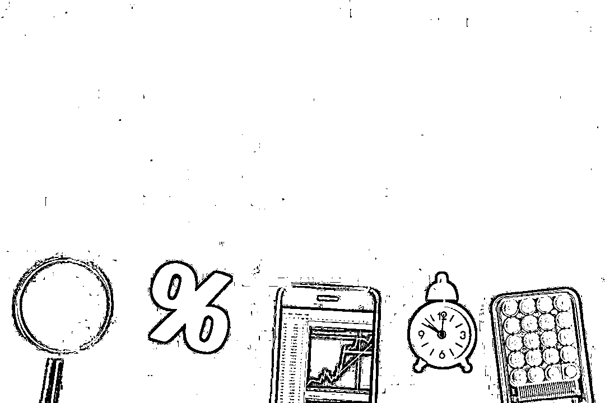

作者/雷蒙德·梅里曼 译者/Luke
编辑/玫瑰 图片/pexels

雷蒙德·梅里曼是在金融占星学界稳坐第一把交椅的占星师，同时他也是若道签约的金融占星课老师，我们引进了雷蒙德·梅里曼老师的《[上证指数月度报告](http://mp.weixin.qq.com/s?__biz=MzA5NjA0NTAxNg==&mid=2651451728&idx=4&sn=170853f20000e2be55f0d9e59252c104&chksm=8b4b43e7bc3ccaf12de32acabd6f31048ff8a341973afaa88f9e8f84239093df106ea1de8b63&scene=21#wechat_redirect)》及《[黄金报告](http://mp.weixin.qq.com/s?__biz=MzA5NjA0NTAxNg==&mid=2651452512&idx=2&sn=a4e0b91e1c2cfc1e024fe12fbb7c2bcc&chksm=8b4b46d7bc3ccfc102a9da4c97530fe72cd8be15a2c6880780d7bf23d5d6f16e67defcf1bfe6&scene=21#wechat_redirect)》。我们经老师的授权，将每周刊登梅里曼老师的周运，供大家参考和学习。于是，这是本周的周运（9.13-9.17）。

**说明：以下时间采用纽约证券交易所所在地美国东部标准时间。**

**展望与回顾**

**劳工部数据显示，8 月份最终需求生产价格指数同比上涨 8.3%。这一数据高于路孚特调查分析家预估的 8.2%增长，也高于 7 月份记录的 7.8%。这一数据是 2010 年 11 月以来的最大同比涨幅。**

**——乔纳森·加伯****《生产者价格指数年增长 8.3%，连续第五次创下历史新高》****www.foxbusiness.com****2021 年 9 月 10 日**在一周的空档期后回来真是太好了。在 9 月第一个周末，我举办了一场关于中国股市、黄金和比特币的专场讲座。一切进展顺利。不幸的是，我不能对美国政府及其近期在阿富汗的撤军说同样的话，我也不能对近期通胀数据对美国和欧洲股指的影响说同样的话。正如上面的引文指出的，生产者价格达到了 11 年来创记录的最大增速。在美国，标准普尔指数 9 月 2 日创下历史新高，纳斯达克综合指数在 9 月 7 日创下历史新高，随后股指下跌持续至周末收盘。这很重要，因为 9 月 3-7 日是一个二星级地球宇宙学关键反转日期，由 9 月 2 日的火星-海王星对分相和 9 月 6 日的金星-冥王星四分相所锚定。标准普尔指数和纳斯达克指数的高点就在这个时间段内出现。对于道琼斯工业平均指数，它的历史最高点在 8 月 16 日出现。相对于上周纳斯达克指数的高点以及标准普尔指数的高点，构成了三组市场间看跌背离。不出所料的是，所有主要美国股票指数在上周剩余时间下跌，现在人们担心另一个“黑色星期一”的出现。这是因为人们观察到，当美国股市整周下跌时，下个星期一往往跌幅更加惨重。这可以追溯到 1987 年 10 月 19 日的股市崩盘，当时——根据 Investopedia.com 的说法，“黑色星期一发生在 1987 年 10 月 19 日，当时道琼斯工业平均指数一天之内跌幅达 22%。这一事件标志着全球股市下跌的起点，也使得黑色星期一成为了金融历史上最臭名昭著的一天。”欧洲发生了类似的情况。上周 9 月 6 日荷兰 AEX 指数创下历史新高。但是德国 DAX 指数和苏黎世 SMI 指数未能突破 8 月 13-18 日的高点。然后所有指数，包括伦敦富时指数都开始下跌，直至周末，这是因为对通胀的担忧开始吓坏了投资者们。这可能是许多金融占星师一直在期待的土星-天王星抛售的起点，历史显示这轮抛售倾向于发生在土星-天王星的第三次也是最后一次精准成相之前。就这一回而言，最后一次精准成相会在 2021 年 12 月 24 日发生。然而，在土星四分天王星的相位之下，没有什么是可预测的。亚洲股市展示出了完全不同的模式。上证综合指数和东京日经指数飙升，正在测试 2 月 16-18 日土星第一次精准四分天王星时创下的多年高点。这是一个分化的全球市场走势。中国和日本股市爆炸性上涨。世界其余地方的股票指数则在暴跌。印度 Nifty 指数可能是个例外，因为它上周初创下了历史新高，然后开始走低，只不过跌幅还不严重。9 月 3-7 日二星级地球宇宙学关键反转日期在其他市场上也很显著。黄金和白银于 9 月 3 日周五双双结束了令人印象深刻的上涨，然后在新的一周开盘时下跌。同样的事情发生在比特币和原油市场上。随着萨尔瓦多正式将比特币纳为国家加密货币，比特币于 9 月 7 日创下新周期高点 52948，但同一天内大幅下跌。以太坊也在前一周的 9 月 3 日触顶，构成一种市场间看跌背离。原油在 9 月 2 日触顶，同样在与 9 月 3-7 日二星级关键反转日期相距一天之内发生。

**短期占星趋势和长期考量**

**“根据我们最可靠和最新的信息，最可能的结果是，在 10 月的某个时间，将用尽现金和非常规措施。”（美国财政部长耶伦在写给国会领导人的信中说）**

**——梅根·亨利****《耶伦警告说财政部可能用尽非常规债务限制措施》****www.foxbusiness.com****2021 年 9 月 8 日****周四拜登总统采取了强硬姿态要求美国人接种疫苗，推出一项为数百万人接种新型冠状病毒肺炎疫苗的计划。联邦雇员将被要求接种新冠疫苗。总统也要求劳工部出台政策，要求超过 100 人的企业强制接种疫苗或每周核酸检测。****——汉纳·苗****《道琼斯、标准普尔 500 在连续下跌 4 天后进入盘整》****www.cnbc.com****2021 年 9 月 10 日**如果你在寻找为什么股市可能处于崩盘早期阶段的基本面原因，上述的两段引文可能会提供答案。事实上，美国的信贷账户所剩时日无多，可能只剩下几周时间来提出解决方案了。但是从长期来看，第二个问题要严重得多，因为这意味着由于官僚机构的繁文缛节和报告要求（以及遭到监管机构勒索的可能），美国的生产率将出现停滞。企业不得不顺从，否则就会面临严厉的惩罚——大多是经济上的。但如果他们真的顺从，就不得不让大量不愿接种疫苗或每周接受核酸检测的员工离职。他们会失去有生产力的员工。与此同时需要雇佣新的员工，这些员工将确保企业顺从繁文缛节的报告要求，这却对生产力没有好处。肯定有一种更好的方法，一种不会比新冠病毒肺炎对商业造成的伤害更大的方法。但是让我们回到宇宙天象以及它与金融市场关联的话题上来。本周有两个重要的地球宇宙学征象，第一个是**9 月 14 日的太阳-海王星对分相**，紧随其后的是**9 月 17 日金星-土星的渐亏四分相**。两者都是一级相位，也就是在 13 个交易日的容许范围内与基本周期有着最高度的关联。太阳-海王星相位一般对应世界领导人作出令人怀疑的决定，导致巨大的困惑。我们已经讨论过，那可能与强迫公司员工接种疫苗和（或）每周核酸检测有关。它也可能对应着**金融市场的狂欢或恐慌**。第二个相位——金星-土星四分相常常对应着**绝佳的买入机会。任何下跌至此相位的市场，都有可能出现一波像样的反弹。**

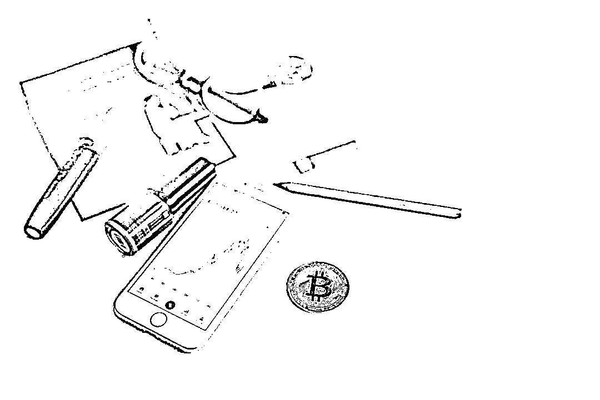

除了这些行星相位外，金星也将进入天蝎座（9 月 10 日-10 月 7 日），火星进入天秤座（9 月 15 日-10 月 30 日）。有趣的是，这两颗行星分别位于对方守护的星座，同时也是自身落陷的星座中。这有着天象上的意涵。火星想要做些什么，但是天秤座找不到一个不战而胜的方法。金星在天蝎座想要报仇和揭露真相，而且是整个真相，尽管它知道这么做会带来更多的问题而不是答案。所以矛盾在于，是对自己的家族忠诚，还是说出真相，尽管这真相最终无法使任何人获得自由。真相只会使那些被揭露的人采取报复的行为。所以，可能又一次，为了和平的缘故牺牲掉了真相，或为了真相而牺牲掉和平。当然，最好的办法是有策略地说实话，以维持局势的稳定。在个人层面上，金星在天蝎座可能引发强烈的激情或禁忌的活动。这与一个人内心“做正确的事”的良知有所冲突。尽管禁忌充满了诱惑，但其后果可能不令人愉快。到了最后，金星希望每件事都有好结局。带着这些想法，努力工作，置身于麻烦之外，度过充实的一周。**下一周太阳将进入天秤座，同时其守护星金星将三分天王星。这将是颠簸的旅程，但是也会出现一些乐观之处，以及一些获得收益的机会。****说明：以上日期基于纽约证券交易所所在的美国东部标准时间，由于存在时差，中国地区可能需要加一天。****版权声明：**本文由若道翻译发布，欢迎转发，反对抄袭。友号转载请申请白名单。

**雷蒙德·梅里曼（Raymond Merriman）**

若道签约老师。著名金融占星师，ISAR（国际占星研究协会）前主席，梅里曼市场分析公司的总裁。他由于“提升了占星学的职业形象”，在 1995 年国际占星大会上被授予轩辕十四奖；在 2012 年国际占星大会上，被授予轩辕十四终身成就奖。

1“中国上证指数月度报告”发售

**若道推出了****中文版****的雷蒙德·梅里曼中国上证指数月度报告，并持续发行该报告！**

当把金融市场的周期和占星学的周期相结合时，雷蒙德·梅里曼老师的金融占星学研究**为投资者应对金融市场的周期波动，并随之调整投资策略提供了极大的价值参考**。

**9 月中英文报告已上线！**

2“黄金价格周期月度报告”发售

**若道推出****中文版****的雷蒙德·梅里曼黄金价格周期月度报告！**不仅仅为广大读者在中国股市的投资出谋划策，更将视角放眼黄金市场。

**每当世界经济形式不明朗的时候，有一个地方是保值的港湾，那就是****黄金**。自 1982 年雷蒙德·梅里曼出版第一本研究《地球宇宙学征象与黄金价格的关联》的著作以来，**他一直作为最重要的黄金市场时机预测者之一享誉国际**。

9 月黄金报告已上线，梅里曼老师将会告诉你他对这个关键时期如何操作的想法。也可以按照季度和一年期订阅，有更多优惠。季度和年度的好处是，你可以持续了解梅里曼老师对于不断在变化的市场的看法。即便他某一次看法和市场不一致，你也看到在下一期他如何调整自己的看法，并看到金融占星在一个长期时间段内对你把控风险的帮助。而能够长期控制风险、尽量找到安全的投资时机才是投资的长久之计。

**9 月中英文报告已上线！**

**购买套餐**，买得越多越优惠

中国上证指数月度报告套餐价

*   **单月报告**：280 元

*   **3 个月套餐**：780 元（260 元/月）

*   **12 个月套餐价**：2400 元（200 元/月）

**长按下图识别二维码**

**购买金融报告****套餐**

**▼**

黄金周期月度报告优惠

*   **双报告年度套餐更优惠（直降 900 元）**
*   **12 个月黄金报告+12 个月上证指数报告：仅需 3900 元**

**长按下图识别二维码购买黄金报告套餐**

▼

3 中国金融市场特别网络研讨讲座

面对年底几个影响金融市场的重要天象，该如何把握下半年的投资，为跨年做准备？我们特意邀请雷蒙德·梅里曼老师为大家带来了**3 个小时的金融讲座——雷蒙德·梅里曼中国金融市场特别网络研讨讲座。**

这场为期 3 小时的在线讲座探讨了**这些长期行星周期如何影响世界经济的长期周期和趋势，特别是如何影响上证综指和黄金市场**。并描述**在 2021 年剩下的时间里市场反转关键时间点，特别是 12 月 19 日至 25 日金星逆行，以及土星-天王星最后一次渐亏四分相、金星与冥王星合相的重要时期。**

**长按下图识别二维码购买讲座视频**

▼

**点击阅读原文购买金融报告**

# 开课倒计时 3 天丨核心课程 L1-2，四位国际导师领你入门占星学！

> 原文：[`mp.weixin.qq.com/s?__biz=MzA5NjA0NTAxNg==&mid=2651456351&idx=3&sn=d34ff70ffaf89beed54a45b744b66ca8&chksm=8b48b1e8bc3f38fe702f7fedeb33844d1f3d53a4d9d23e220037c2812e7216e6358a61247c59&scene=126&sessionid=1692737928#rd`](http://mp.weixin.qq.com/s?__biz=MzA5NjA0NTAxNg==&mid=2651456351&idx=3&sn=d34ff70ffaf89beed54a45b744b66ca8&chksm=8b48b1e8bc3f38fe702f7fedeb33844d1f3d53a4d9d23e220037c2812e7216e6358a61247c59&scene=126&sessionid=1692737928#rd)

近几年，线上剧本杀兴起，线下风靡，因其剧情丰富，逻辑推理，沉浸体验，引无数人上头。你可能还不知道的是，从占星学角度，你的出生星图中也蕴涵着琳琅满目的剧本，一幕幕剧情有的跌宕起伏、有的动人温馨、有的神秘莫测……

如果你想要学习占星学，想研究一下严肃占星学和之前看到的娱乐占星有什么区别，这个思路绝对会为你打开新世界的大门，用专业的占星语言讲述生动的人生故事，千变万化，其乐无穷。当你学会了占星的语言，也就结识了星图中的一位位生动的角色，也就是你的一个个人生面向，TA 们各自拥有个性鲜明的特质，你会在生活中有意无意的表现出 TA 们的个性。TA 们在不同场景下的表现也会有不同，彼此之间还可能有着微妙的联系。**准备好开启真正属于你的沉浸式剧本了么？**

先让我向你简单介绍一下出生星图剧本中的主要角色：**行星是演员和角色**行星是剧情当中的演员，它不仅是内在的角色，也可能是我们实实在在碰到的一些人物。★**太阳**：自豪、自信、亲切的角色，善于自我表达、有创造力、喜欢玩耍和表演……★**月亮**：脆弱、敏感、温柔的角色，渴望归属感和亲密感，习惯养育与依赖……★**水星**：好奇、有趣、聪明的角色，有着不知满足的求知欲，善于沟通……★**金星**：爱美、舒适、愉快的角色，喜欢美食、爱情以及各种伙伴关系……★**火星**：果断、鲁莽、冲动的角色，热爱运动，特别是向着他们的愿望进发……★**木星**：乐观、慷慨、智慧的角色，心怀希望、热忱，坚守着对宇宙智慧的信任……★**土星**：耐心、坚毅、谦虚的角色，追求任务达成，做好工作，获得成功的感觉……★**天王星**：博爱、反叛、变革的角色，设法带来突破、彻底的洞见或自我实现……★**海王星**：艺术、共情、慈悲的角色，目标状态是极乐，对生命统一性的超验觉知……★**冥王星**：深刻、透彻、蜕变的角色，高峰体验、精神宣泄、摧毁重建、净化……当然除了十大行星，还有也很重要的、月亮交点、四轴：上升、下降、上中天、下中天也都扮演不可或缺的角色等待你来解锁。

**向左滑动，可依次查看行星卡牌**

**版权归属于插画师炼妖 LY 所有**

**星座是表演的风格**行星所落的星座就会为这个角色赋予一种风格。也可能是他会吸引到的人的样子。每个不同风格的角色，可能说出这样的台词：★**白羊座：**“想做就做！去做吧！这是你的权利。”★**金牛座：**“如果感觉好，享受它吧。让自己快乐，放松。”★**双子座：**“这很有趣，给它下个定义分个类。发挥你的思维。”★**巨蟹座：**“倾听，转内向在，你现在感觉怎么样?”★**狮子座：**“宝贝，闪现你的光芒。表达自己！”★**处女座：**“小心，这里有一个问题。解决它。”★**天秤座：**“展现魅力，建立关系。思考、妥协、合作。”★**天蝎座：**“面对你的恐惧，将它推向极限。决一死战，全心投入。”★**射手座：**“保持信心，宝贝。上帝是好的，做对的事就好。”★**摩羯座：**“全力以赴，专心致志。集中精神，控制自己。”★**水瓶座：**“期待意料之外的事，保持开放和超然的态度”。★**双鱼座：**“放手，顺其自然。屈服，相信宇宙。”当然每一位角色也偶尔会展现出一些破坏性的特质，可能是 TA 的某些核心需求没有得到满足，这就更需要学习更多占星语言，来倾听出生星图中的“心声”。

**向左滑动，可依次查看星座卡牌**

**版权归属于插画师炼妖 LY 所有**
**宫位是舞台和布景****宫位是戏剧上演的地方。**就好比我们去剧院，可以看到各种道具和场景：卧室、图书馆或银行。宫位就像是各种场景。你的行星演员也可能在各个场景中遇到其中的专属 NPC。★**第一宫**：你自己的空间，可能还包括那些帮你保持漂亮外表的那些人……★**第二宫**：银行、有金钱往来的场所，可能还包括客户、供货商……★**第三宫**：学校、各种媒体中，可能还包括兄弟姐妹邻居、同学同伴……★**第四宫**：家里、老家，可能还包括父母、长辈、祖先、家装维护人员……★**第五宫**：娱乐场所、约会场所，可能还包括孩子、你内在的小孩、你迷恋的明星……★**第六宫**：工作场所、提供服务的场所，可能还包括雇员和同事、医护人员……★**第七宫**：婚礼教堂，可能还包括你的配偶、人生伴侣、商业伙伴、公开的敌人……★**第八宫**：葬礼，可能还包括性伴侣、和你分享共同财产和资源的人……★**第九宫**：大学、海外、法院，可能还包括大学教授、精神导师、律师……★**第十宫**：职场、公众场合，可能还包括老板、监督者、“权威”……★**第十一宫**：团体组织，可能还包括朋友、伙伴、你的社交圈、团队中的成员……★**第十二宫**：医院、监狱、修行道场，可能还包括你生命中秘密的人、酒友……**向左滑动，可依次查看宫位卡牌****版权归属于插画师憂所有****怎样将行星、星座、宫位三者串联成剧本呢？**举个例子：**金星**总是象征我们所爱的人或者象征我们去关联、去建立关系的那种能力。**金星落在金牛座**，这个人的次人格就会比较喜欢舒适的生活、享受美食、热爱大自然。它不仅仅是这个人的行事风格，也可能是他会吸引到的人的样子。比如这个人可能也喜欢旅游、喜欢异国文化、美食和风光——**第九宫金牛座**。这个人可能会在旅行中和旅伴或当地偶遇的旅行者结伴而行，一起在海边看日出日落，分享同一份路边美食，骑着摩托在森林公园兜风，畅聊旅行中的见闻和感受，以至于可能由此建立了亲密关系。当然这个配置还有其他剧本的可能性，因为每个人看待世界的方式都不一样，诠释的方式也不相同。占星师的任务就是从更大的视野来理解事情，把星图看成是一张生命地图，占星师就是解图者。地图可以让我们注意到以往忽略的事情，也能帮助我们看到自己与一切事物的关系，或者帮我们发现属于自己的道路。通过对于星图剧本的构想，你会更清晰，人生各个领域自己真实的需求是什么，有迹可循的为自己亲手构建理想生活。出生星图就是这样讲述着一个个故事：蕴涵着无数人生剧本，更映射着天体时钟。**正所谓“Asabove, so below，天上如是，地上亦然。”**

行星、星座、宫位并不代表力量，而是作为天体时钟的一部分，它们发出信号、而非引起变化。但这信号，可以让我们更真切的了解自己，从而拥有更多的觉知，**事情也会因为我们有了觉知而改变——能量永远会随着想法的改变而起变化。**一个人对自己的了解与他真实的样子越接近，他就越拥有智慧。学习占星学，在了解自己的同时，还可以观察他人，才是真正的体味人生百态。

以上文中的关键词介绍只是入门课程的冰山一角，文中的……也代表着每一个行星、星座、宫位的配置还有着更多的含义和可能性，想要更全面的学习占星语言，有一门集结了三位国际名师的核心课入门课程向你推荐：

**为庆祝若道成立 10 周年，我们精心策划，汇集顶级占星学大师资源和教学经验，结合占星学知识体系和不同老师的教学专长，首次推出****由四位国际导师联合授课的占星核心课程。**

**其中**新一期 L1-2 核心课程由**大卫·瑞雷、克里斯蒂娜·罗登贝克、琳恩·贝尔**三位国际大师联合教学，老师们会专业、系统、全面的教授星座、行星、宫位知识，并讲述如何将三者串联成占星语言，人生故事，用三个月的时间带领你系统入门占星学。有请克里斯蒂娜·罗登贝克老师跟大家打个招呼：<mpvideosnap class="js_uneditable custom_select_card channels_iframe" data-pluginname="videosnap" data-id="export/UzFfAgtgekIEAQAAAAAARAcrwoZd0gAAAAstQy6ubaLX4KHWvLEZgBPE7IMkHHpHIan-zNPgMIt3rFoQPG1r9ocB2sRik5Ps" data-url="https://findermp.video.qq.com/251/20304/stodownload?encfilekey=XGocBFxVWK5dcyOOqpEU47RpBHQIvlhnPGdrgZ1vqc6a5xdgIzc2MciabYCyta5Oh5UNVAVqfTCTX48nEibvYibib3F8jlrCZ8ibWXIIJYQYsdlhYywxmI6AaDbnBVHFfezqP8QaFM5F7f6vFzPcVfnuib6p04xvR9P7o0mjMgVU66Sxx6fVFia1Do0IPq7jIDkOyOE&amp;adaptivelytrans=0&amp;bizid=1023&amp;dotrans=0&amp;hy=SH&amp;idx=1&amp;m=16cb9ce99387ef781ee6c1eac70a74ce&amp;token=x5Y29zUxcibAeBWYF7VqUUWDicYTcsEv0t7SBv3EXG4mkdpwiazcVfv9FoSkibKrudsu6lvwCUS8tn0" data-headimgurl="http://wx.qlogo.cn/finderhead/PiajxSqBRaEJYnVsqWfEX9qA0sI6hNVKsDfyzfPZ92WZMZyBpZWU5NA/0" data-username="v2_060000231003b20faec8c4e68a1ec2d4ca07e434b07755bbf47e7053a3059defd2c9d6c68a20@finder" data-nickname="若道" data-desc="#四位导师联合教授 2021 核心课 克里斯蒂娜老师将按照她的教学理念教授星座、宫位、行进、比对图、亲密关系咨询等部分。" data-nonceid="15165203225426773444" data-type="video"></mpvideosnap>**课程安排** **第*****1*****阶**2021 年 9 月 15 日开课，每周一天晚上 20:00-22:00 上课，共 6 次课**第*****2*****阶**2021 年 11 月 11 日开课，每周四晚上 20:00-22:00 上课，共 6 次课

**第*****1*****阶 黄道星座&个人行星****· 概要介绍占星学与星图**

**· 四元素与三形态**

**· 黄道 12 星座**

**· 太阳、月亮及其他个人行星**

**第*2*阶 行星&宫位****· 木星&土星****· 天王星&海王星&冥王星**

**· 练习组合所有行星**

**· 四轴****· 十二宫位**

**· 组合宫位、行星、星座**

**授课老师** 

**琳恩·贝尔**

**（Lynn Bell）**

**· **世界最受欢迎的占星学演讲者、作家和老师之一。定居巴黎，研究心理占星学和家族模式数十年；**· **著名的心理占星学中心（Centre for Psychological Astrology）的长期导师。2016 年，获得查尔斯·哈维（Charles Harvey）杰出的占星学服务奖；**· **作为一个从多个层面进行工作的占星咨询大师，琳恩的工作结合了心理学的观点。她对家族模式的兴趣首先来自与客户的合作。通过在分析领域所做的个人工作，她所受的埃里克森催眠训练将她引领至家族系统。后来，她组织研究小组在家族星图上进行了数年的研究。她写的《家族占星学》就是这项研究的结果；**· **法国心理占星学协会的会长。除了占星学，她在法国沙特尔的新沙特尔学校任教 8 年，还 5 次获得了在《纽约时报》畅销书作者卡罗琳·迈斯（Caroline Myss）的卡罗琳·迈斯教育学院（Caroline Myss Educational Institute）合作教学的机会。

**艾德里安·罗斯·邓肯**

**（AdrianRoss Duncan）**

**· **1971 年在印度游学时开始学习占星学，1985 年开始成为全职占星师，迄今执业已超过 33 年，是人本主义占星学、卜卦占星学和经世占星学领域的知名占星师。他还开发了占星软件 AstroClock 和多款占星报告；**· **哥本哈根占星学院院长；**· **他在日常咨询中经常运用卜卦，咨询图（卜卦的一种运用方式，即根据客户来访时间制作星图，从星图中获得大量信息）也是他特别擅长的领域；**· **艾德里安·罗斯·邓肯从 1971 年开始研习佛学，受佛学影响很深，他相信占星学和佛学观点一致，转化的一个基础是在于对现实感知的改变。而卜卦很容易与佛教融合，因为它只关乎当下。

**克里斯蒂娜·罗登贝克**

**（Christina Rodenbeck）**

**· **克里斯蒂娜·罗登贝克（Christina Rodenbeck）是一名全职职业占星师，在牛津大学城生活和工作，深受周围知识和文化氛围影响；她拥有伦敦大学（University of London）的人文荣誉学位，曾在伦敦占星学馆（AstrologicalLodge of London）、心理占星中心和占星研究学院学习；

**· **作为一名占星师，在过去的 20 年里，克里斯蒂娜在她的网站“牛津占星师”上写了大量关于时事、艺术和文化的文章；她每月主持一个占星播客：“与克里斯蒂娜和萨莉一起占星”，并定期在《占星杂志》(Astrological Journal)上撰写时尚专栏；她定期在英国授课，并保持着蓬勃发展的专业实践。

**大卫·瑞雷**

**（David Railey）**

**· **若道联合创始人，致力于在中国教授和推广西方占星学；

**·** 曾任 ISAR 全球副主席，CAPISAR（ISAR 职业占星师资质认证机构）主席；

**· **1976 年，通过亚特兰大职业占星师考试，成为全职占星师，随后通过 AFAN 和 ISAR 职业测试；

**· **1980 年，与杰夫·焦耳一起在亚特兰大创建“每日行星”占星学中心。此后在亚特兰大占星协会担任 4 年考官，并且两次担任亚特兰大地区占星协会主席。1979-1992 年，作为占星师活跃于美国社会媒体，向不了解现代占星学变化的大众宣传专业占星学知识。

**·** 1989-1992 年期间，他在 WRGG 电台 12 频道每周主持个人电视秀“今日占星学”，早先他还在 WRFG 的广播节目中播讲宇宙天气节目；

**· **2010-2014 年，任全美占星师联盟监督委员会委员；

**· **2010 年，其著作《灵魂的目标》中国版出版，和蒋颖一起创办若道占星学校和其官网 www.nodoor.com；

**· **2017 年，被选为 ISAR 委员会成员。ISAR 是世界最大的国际占星机构，会员遍布 45 个国家，2017-2020 年曾任 ISAR 全球副主席、CAPISAR（ISAR 职业占星师资质认证机构）主席。

**熊鹰老师**

**（天空的空）**

**·** 2008 年接触严肃占星学，至此爱不释手；**· **2013 年师从大卫·瑞雷，研习整套现代占星学核心课程，并于 2014 年起至今连续三年担任该课程的主助教；**·** 期间也跟随格伦·佩里、诺·泰尔、理查德·塔纳斯、罗伯特·汉德、苏·汤普金斯、斯蒂芬·弗里斯特等多位国际占星大师进行学习，进行定向占星主题研究；**·** 2015 年初，通过国际占星研究协会（ISAR）资质认证并获得证书。同年，进一步跟随大卫·瑞雷老师进修“生时校正”技术，通过最终考核并获得证书；**·** 目前在若道占星任职，将传播系统、严谨、真实的占星学作为职业使命。任专职助教期间，进行沙龙与答疑等辅助教学工作已累计超过 200 小时；**·** 在业余期间也提供占星咨询与生时校正服务。目前正致力于占星学与个人成长的整合。**此次课程适合哪些人？****· **对占星学感兴趣，想要入门的零基础者**· **占星学小白，但有志成为职业占星师的人**· **有一定占星学基础，但不知道该如何整合星图复杂碎片的人**· **希望成为优秀的占星师，想要借鉴国际大师解读思路并融入自己的体系的人**· **想要师从更多殿堂级占星导师学习占星心法的人**· **走在自我探索和个人成长道路上的人**课程价格****L1-2 价格**：4800 元其他各阶段课程单报价格，请咨询课程顾问：**Maggie 老师**（微信：18510107057，请备注**“核心课”**）

长按二维码添加 Maggie 老师

**退转课程**

**· 退款原则请详看《教学协议》，如有疑问请咨询课程顾问**

****名师汇集金牌核心课程****

**授课老师：**琳恩·贝尔、艾德里安·罗斯·邓肯、克里斯蒂娜·罗登贝克、大卫·瑞雷

**授课时间：**2021 年 9 月 15 日起

**授课方式：**网络课程**，**英文授课，中文翻译

**费用：**L1-2：4800 元

**课程负责人：****Maggie 老师**（微信：18510107057，请备注“核心课”）

长按二维码添加课程负责人咨询~

****报名请点击“阅读原文”****

# 这个星座必须幸运，否则他们根本活不下来！

> 原文：[`mp.weixin.qq.com/s?__biz=MzA5NjA0NTAxNg==&mid=2651456351&idx=1&sn=4fab7d32f248ba21121edf9d85ce19eb&chksm=8b48b1e8bc3f38fe1949a9df2def08d0684da9001f09e2a8662accadc2f6495fbf84cc63b540&scene=126&sessionid=1692737928#rd`](http://mp.weixin.qq.com/s?__biz=MzA5NjA0NTAxNg==&mid=2651456351&idx=1&sn=4fab7d32f248ba21121edf9d85ce19eb&chksm=8b48b1e8bc3f38fe1949a9df2def08d0684da9001f09e2a8662accadc2f6495fbf84cc63b540&scene=126&sessionid=1692737928#rd)

******☆ ****后台回复“今日”，给你一句生命态度******

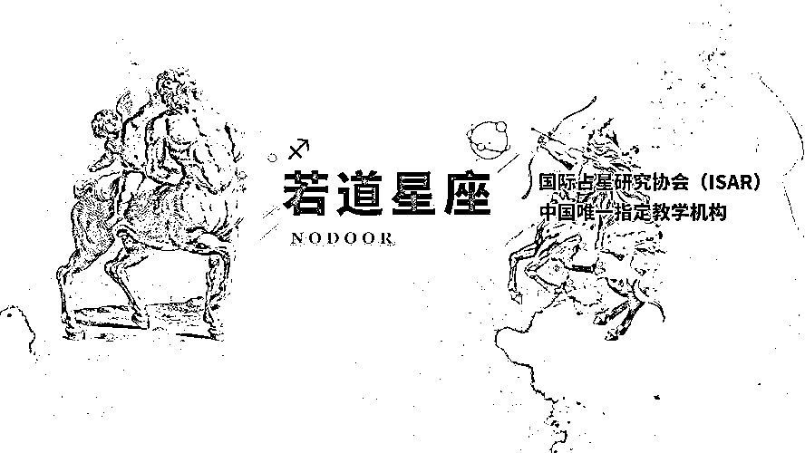

作者/大卫·瑞雷 若道占星创始人
译者/若道翻译团队编辑/玫瑰 封面/书君 图片/pexels 大卫老师的 12 星座系列文章精彩又有趣，今天更新到射手座啦！一起来看看这个爱自由的星座吧！另外，大卫老师参与授课的[四大名师核心课](https://mp.weixin.qq.com/s?__biz=MjM5MjQwNjAyMQ==&mid=2649438826&idx=6&sn=2021d0992c95fe8a036fe1e29b199365&exportkey=Abkc%20IAmMg1yNo%20wVFmAOvo=&pass_ticket=6HVjjkRKhWCqVCqjvzp0SOpHi8gc%20q5av6iuAzrG%20vf2nNbSWf0OQAMJ4JU3BO9F&wx_header=0&scene=21&token=553641847&lang=zh_CN#wechat_redirect)（点击链接可阅读），也欢迎你来了解更多详情！**射手座**你们从隧道走出，来到日光之下，你很吃惊地看着周围的一切。每一个人看上去都不错嘛！震惊之余，你笑了。你的同伴也笑了。你们无法控制想要大笑的冲动。列车长发出通知，说没有人受伤，但需要一些时间才能让列车回到正轨。你发现最近的村庄离你们只有几步路，并且附近有几座因适合徒步旅行而闻名的小山。你还了解到，其中一座山上还有一个寺庙。你冒险心切，加上现在又有空闲的时间，你决定立刻出发，走一条小路去山上的寺庙。你的同伴有些犹豫，但很快跟了上来。山路陡峭，沿途的风景看起来也惊险万分，但你好像充满了能量，你自己都觉得不可思议！你在一块山岩上驻足，朝山下看。列车变成一个遥远的小黑点。你不敢相信，现在你看到的一切都不一样了。你的同伴对你仍有吸引力，但你不再关心你是否可以相信他们。你感到自由而充满活力。现在换你的同伴打头阵了，你们爬山的一路笑声不断。你们看到了寺庙的指路牌，很快，寺庙近在眼前！深红色的柱子上方，是靛蓝色的镶板，还有装饰华丽的瓦片屋顶。沿着墙边，有一排古老的转经筒，你走过去，慢慢地将它们一个一个转起来。你在心里祈祷获得更多智慧。“但什么是智慧呢？”你也不知道。当你靠近最后一个转经筒时，一个老和尚出现在你面前，盯着你。“智慧总是伴着问题而来，”他笑着对你说：“那些心里都有了答案而没有疑问的人，已经听不到智慧。”他冲你点点头，与你擦身而过，留下你呆若木鸡地站在原地。你会永远记住他的话。这就是射手座。即便是在糟糕的日子里，列车抛锚了，但如果你能从中学到一些东西，这就是不错的一天。如果你好奇射手座的乐观和热情都是哪来的，只要去想想，它在黄道列车上可是紧接着天蝎座的下一站。射手座人就好像在很兴奋地呼喊，“天啊！我曾经死过一次但我现在又活过来了！我又站在这里了！”接着是，“这一切的意义到底是什么？！”**经历过天蝎座的危机与转化，很多射手座人的行为就像是刚刚有过濒死体验之后的样子**。他们会**将人生用于理解未知、寻求解答，以及发现深层的真相**。他们会**大量阅读、上课、周游世界——探索**。他们中的有些人会不断回到学校进修，甚至是自己写书或讲课。**射手座的不安分，其核心在于对意义的探索，哪怕这种探索是无意识的。****说射手座“热爱自由”是非常准确的。**射手座是十二星座中**最狂热而无节制**的，就像正在度假的游客一样。射手座的人看起来傻傻的，很爱笑，通常都非常无害。布拉德·皮特淘气的笑容和林志玲搞怪的表情，都是射手座风格的典型代表。这就是神经大条的射手座，活着本身就让人感到无比快乐，自己也不知道自己在乐什么。

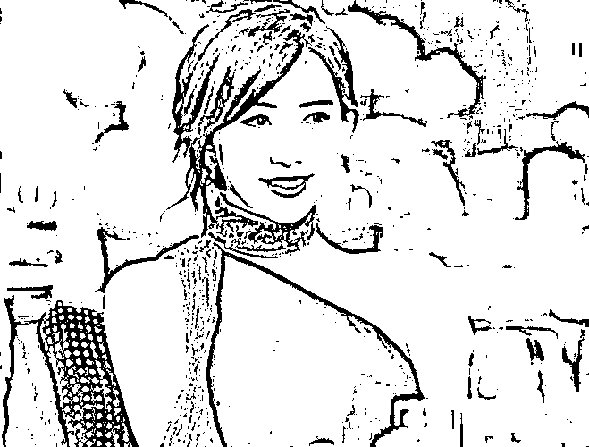

| 林志玲
**他们就好像暂时地失忆了，忘记了天蝎旅途中的凶险，单纯地相信自己无论如何都能活下来。**在长城边缘跳舞，俯视幽深的山谷，并不会让他们感到紧张。林志玲在坠马事件中被马踩踏后还活了下来！这是非常有射手座风格的事件。就像我的老师以前常常讲的：**“射手座人之所以幸运是因为他们必须幸运，否则他们根本活不下来！”**这并不是说射手座人可以避开不负责任的行为造成的后果，或是不用面对我们所有人都要在生活中面对的那些挑战。射手座人在经历了意外损失之后，虽然依旧奔放，却开始忧伤，过去无忧无虑的射手座人可能会被深刻的绝望所笼罩，他们一边探索答案，一边反复问自己：“为什么，为什么？”**在经历了悲剧之后，“无意识”的射手座人可能会开始觉醒。**失去的记忆开始复活，新的了解诞生。于是愚蠢变成了智慧。所以**射手座是“大智若愚”，比其他任何星座都更了解存在的“意义”。**然而，**在通往智慧的道路上，射手座也可能做出很多鲁莽的事，就好像要以一种显而易见的方式来测试现实。**很有趣的是，根据统计，因为偷车兜风（短暂地偷取他人的机动车用于兜风取乐）而被捕的人当中，射手座人的比例最高。想要“动起来”的欲望，也就是对自由的渴望，与游客度假一般觉得自己可以不受法律约束的心理，经常让他们被警察抓个现行！还没有相关数据显示有多少偷车兜风的射手座是惯犯，但是，因为这些射手座人中大部分都是年轻男性，所以我们可以假设随着年纪的增加，他们吸取了经验教训，从中学到了一些意义，所以不再犯错。

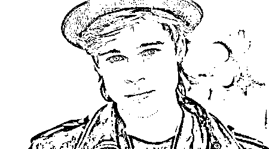

| 布拉德·皮特**对于意义的耿耿于怀并不会降低他们出了名的幽默感，反而会让他们制造出更为深刻的喜感，让他们的话更富真知灼见。**射手座人似乎比其他星座的人更擅长生产“名人名言”。作家马克·吐温（原名塞姆·克列门斯）就是他所在时代的智者。同为射手座的还有丘吉尔和喜剧演员、电影制作人伍迪·艾伦。伍迪·艾伦从高中时就开始创作喜剧故事了。他由编写笑话起步，到成为喜剧脱口秀演员，再到拍电影，他的创作史就是不断地与人类的野蛮性和人生的荒诞性缠斗的历史。在早年，他以这样的名句来嘲笑自己的射手座天性，“值得知道的事物都不能被心灵理解。”然而，这种对于知识的探索是一生的冒险。我的射手座祖父曾开玩笑说：“真相会令你自由，但诚实会给你和妻子的关系带来麻烦！”确实，他在面对他平凡的金牛座妻子时总是“太诚实”，极尽所能地捉弄她并以此为乐。我就是来自这样一个射手座家族。不仅我的祖父、母亲、舅舅都是太阳射手座，我的父亲、我最大的表兄、我的姐夫以及我的两个继子的上升点也都在射手座。我姐姐的女儿，也就是我的侄女的太阳、月亮和上升都在射手座。我自己是月亮与上升点落在射手座。以前每到家庭聚会时，我们的笑声会响彻天际，连太空中的宇航员都能听到。

****

**是的，要先弄清事实，然后你就可以随意篡改它们了！****——马克·吐温****是的，幽默和夸张是射手座的显著特征。**有学生曾经问我：“如果射手座追求的是真理的话，那为什么他们会夸大事实呢？”这个问题显然是将“真理”等同于“事实”了，在我们所接受的科学思维的学校教育下，有这样的想法再正常不过。举例来说，太阳在 2017 年 2 月 20 号，北京时间早上 7:00 升起，这是一个事实，但这个事实并不能决定这一天的“意义”。虽然对一段经历的意义每个人会有不同的看法，但有些意义是有普遍性的，这类能够达成共识的意义会让那些太阳、月亮、上升在射手座的人非常兴奋。**这种狂热会带来夸张，和幽默。**我们会觉得夸张很好笑，是因为它表现的东西“太真实了”！当射手座看到这些真相是如何在日常生活中运作，他们的脸上常常会浮现会心一笑。在拥挤的北京地铁里，在那些浮动着空虚、时而阴郁的表情里，偶尔你会看到某个人露出“会心一笑”，那个人可能就是射手座。

射手座人对意义的探寻其实也是对真理的追求，不管是在旅行和冒险中追寻，还是在高等教育中，尤其是在哲学、历史、法律和宗教领域中寻求真相。这样的追寻当然可能发展为对于找到最正确的“那一个”的执着。所以一些射手座人可能会变得自以为“无所不知”，甚至成为教条的狂热分子，认为他们所相信的真理才是唯一真理，如果从宗教角度说的话，也就是他们所相信的真理才是唯一获上帝首肯的！

**这种自我膨胀又固执己见的态度通常源于射手座的一个基本的不安全感——害怕自己是错的！**对于许多射手座人来说，**发现自己深信不疑的信仰是错的，会带来严重的身份危机**。相比其他星座，他们会更多地从信仰中获得身份认同。当心爱的理论被证明站不住脚，他们中的一些人会像气球被放了气一样虚脱无力。**经历过这样的困境之后，射手座通常会再度起航，寻找新的真理和意义，以此适应新的生存地形。**

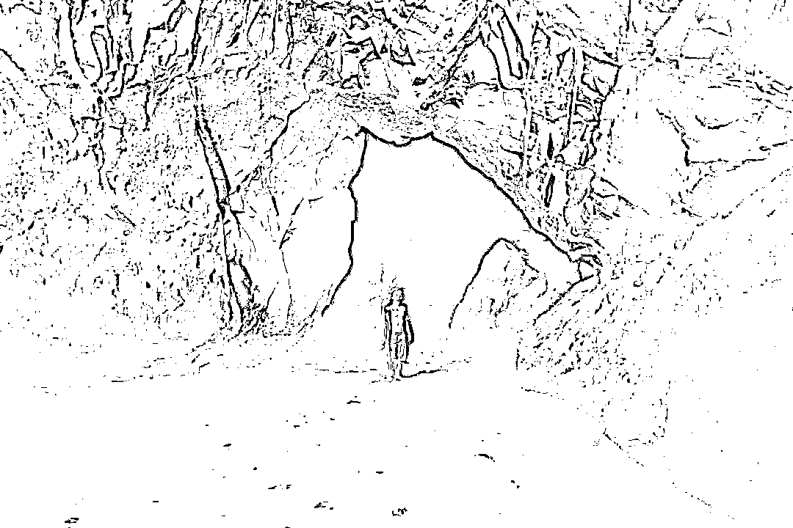

**个人成长的主题和故事****从个人成长的角度，射手座是那些狂野、鲁莽、无所不知、逍遥快活的年轻人的典型代表，他们是真正从错误中学习的人，**这个过程将一直持续，直到他们年老时，成为人们可以见到的最具智慧的那类人。在修炼成为智慧老人的道路上，许多射手座人会被驱使着去给别人提意见，他们可能是**老师、教练、律师，或其他形式的咨询师。**或许在十二星座中，射手座是最符合“意见提供者”这一职业设定的人，但不能错误地认为射手座人最适合做治疗师或心理咨询师。一对一咨询的角色更适合天秤座，甚至天蝎座或双鱼座也不比射手座差。与射手座相比，天秤座能更好地扮演“倾听者”的角色，并且他们也不像射手座那样热衷于用自己的哲学理念或观点影响他人。**当然，射手座的人生总是充满“事故”，他们因此美名远扬或臭名昭著。**当他们老了，这些不寻常的故事会成为他们的谈资，当他们想要指出一些事的意义时，就会把这些事拿出来说说。不过，在曲折的人生道路上，有三件事是射手座特别害怕的：**· 害怕出错；****· 害怕被误解；****· 害怕被困住。**我的一位射手座客户曾对我说：“我的父母从来都不理解我。对他们来说，我就是一个怪物，就像在葡萄园的葡萄藤上，从形状普通的葡萄中挑拣出来一串又大又饱满的葡萄。”他的父母是农民，不知道要怎么对待自己的儿子，因为这个儿子比别的孩子更早地学会了阅读，而且在四岁的时候就在教堂弹钢琴了。到了六岁的时候，在教堂音乐指挥的指导下，他已经能够弹奏莫扎特的曲子了，他还在学校的图书馆里看莎士比亚的作品，并在教堂里的主日学校（指星期日对儿童进行宗教教育的学校）讲课，与比他大好几岁的大孩子们一起打球——他说在同龄人中，他的体型算得上十分高大。我记得他非常淡然地说：“到了十岁的时候，我知道的比父母还多，他们也知道我懂的比他们多。吃饭的时候，为了打破沉默，我会编一些学校里的孩子的段子，用很搞笑的方式去讲一些很平常的事，逗得我们都大笑起来。只有当我们一起笑的时候，我们才都在一个频道上，哪怕只是很短暂的一会儿。”这位客户在 15 岁时便进了大学，后来成为一名非常有名望的神经外科医生，在一个大城市的医院里担任神经外科主治医生的职位。除此之外，他还会在一些大学和会议中做公开演讲，有很多粉丝。这位客户的例子是射手座特质的极端戏剧化的表达。当然，大部分射手座人不是神童，即使他们自认为是！不过，这位客户的父母在他的成长过程中似乎一直不理解他，虽然他们也知道或相信他比他们懂得多。他在一个没人比他懂得多的环境中成长起来，特别父母也不如他懂得多，这给他成年后的私人关系带来了一些影响。

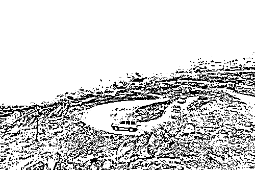

“我不是一个好相处的人，”他在找我咨询的初期这样说：“我太太说我总是希望所有人都听从我的建议，如果别人不听我的，我就会狠狠地批判他们。”“你觉得为什么你会这么做呢？”我试探地问。“哦，你已经和我太太结成统一战线了，我看出来了，”他开玩笑地说，然后他开始沉思。“好吧，其实是我会生他们的气。”他说。“为什么呢？”我进一步试探。“因为他们不听我的呀！”他说，然后叹了口气，好像意识到自己卡在了某种谜团里。我问他：“为什么你需要别人听从你的意见呢？”“我也不知道……”他回答，似乎有点懊恼。所以我决定进一步惹怒他。“如果他们听从了你的建议，对你来说意味着什么呢？”他稍微振作了一下，“这意味着他们真的理解了我在说什么。”“所以你就能被理解了？”“是！”“那这又意味着——？”“意味着我被理解了。”“也就是你一直期望你父母能做到的事？”“是，哦是的，完全正确……”就在这个时候，这个高大睿智的男人哽咽了，然后低声说道：“就是这么简单，对不对？”然后他向我讲述，多年以前，在他的父亲去世 8 个月后，他的母亲也去世了。在其他家人和朋友们到达之前，他一个人靠在棺材旁痛哭了好几个小时。“那天让我从悲恸中走出来的唯一理由是，我有了一个想法，我想也许，只是也许，现在，他们在另一个世界，或许会更理解我吧。也许现在他们能真的看到我，懂得我，或许会比我自己还了解自己。”他深深地叹了口气，“我愿意相信这是真的。”在后来的咨询中，我们处理的是他的婚姻问题。那是他的第二任妻子，他很震惊地发现，有段时间，他的妻子居然向他隐瞒了自己对处方药上瘾的事。“我怎么会这么傻呢？”他一遍又一遍地说，“我怎么会没发现这件事呢？”意识到自己错了，意识到自己对妻子经历的一切毫不知情，这让他在很多年里背负着痛苦，比帮助妻子摆脱药瘾还要痛苦。后来他还意识到为什么妻子会向他隐瞒这件事，因为她太想要努力赶上他。虽然他比她大 15 岁，但是他的能量就像年轻人一样，他的热情和天才的智力让她希望自己可以努力配得上他，做一个能令他满意的、让他感到“被理解”的伴侣。在跟妻子讨论这些事的过程中，他意识到自己有多么害怕不被理解，害怕因懂得太多而必须承受孤独或被孤立，这给他的妻子造成了压力，也给其他家庭成员，包括他第一次婚姻中的孩子们造成了压力。

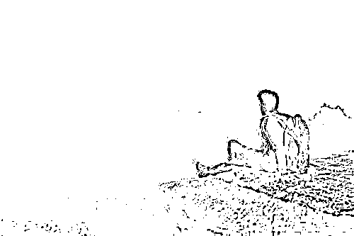

在充分意识到并接纳了自己对于被理解一事的全部需求之后，他发现自己和妻子的关系越来越好。他对被误解的恐惧，以及坚信自己“会一直被误解”的疯狂想法，不再给他造成痛苦，而这些恐惧情绪曾经给他的生活带来很多伤害。他所有的人际关系都变得更好了。他甚至休假了一段时间，暂时离开神经外科医生这个身份带来的压力。神经外科医生“必须一直是对的”，因为人们的性命掌握在他们手上。在之前的咨询中，他曾经向我描述过“将别人的脑子掌握在自己手中”是什么感觉，他也告诉过我，那些千钧一发的决定就是他日常生活的一部分。不过，他最终回到了他的岗位上，他和妻子的婚姻生活也越来越幸福美满。他学会了去承认自己也有可能犯错——并在承认的同时不让自我崩塌！他接受了他的妻子和其他人也有理解他的可能性，并且发现他们真的可以理解！他还是会在巡回演讲中大受欢迎，但他的语调放松了很多。他现在已经退休了，偶尔会在医学院校开设讲座，会去世界各地旅居、探险，同时也在世界各地的医学会议上分享他的经验见解。他和家人的关系也给他带来了快乐，而这种快乐不再伴随着孤独感和被所爱的人误解的感觉。**射手座的成长功课包括，当你并不是完全正确，或是之前没有了解到的一些真理的证据摆在眼前时，如何承认它们。**承认这些是困难的，但面对这种困难，和了解到一个新的真理或原理法则时的那种顿悟一样重要！我们都从射手座身上学到东西，并且没有哪个星座能带给我们更多笑声。我们笑，是因为你们说的话是“如此真实”！当然，没有哪个星座可以垄断所有真理。并且，每个人都会在某些方面有射手座特质，即使他们的星图中没有星落在射手座。去请教占星师或高阶的占星学学生，他们会告诉你在你的星图中第几宫落在射手座，这个宫位所代表的领域就是人生中最有可能表现出射手座特质的部分，也就是在这个领域，他们会通过冒险而获得智慧。

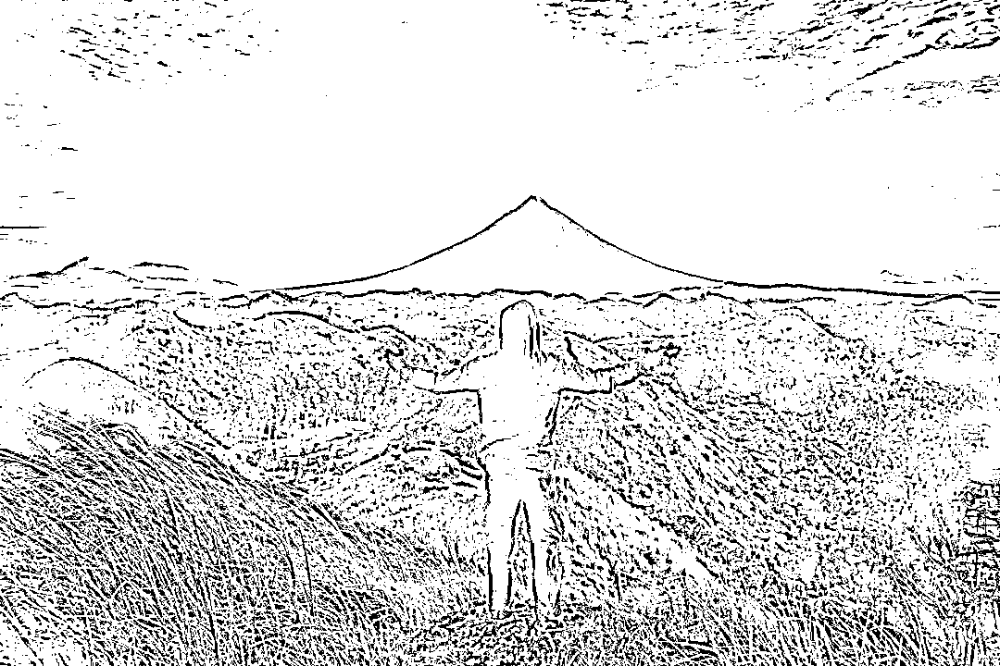

**射手座的事业线索**把冰卖给爱斯基摩人的故事，很可能最初讲的就是射手座。他们的推销能力，令其他星座的人望尘莫及。射手座在开支票、找现或递还信用卡的时候仍是满面笑容，大多数时候这是因为他们“相信”正在卖的东西。当然，如果相信蒙上了灰尘，他们依然可以继续卖，但会变得焦躁不安。很快会去刺探竞争对手，看他们卖的东西是不是比自己的更好，或开始物色其他的行业准备跳槽。焦躁不安可能会让射手座频繁换工作，一些原本可能雇佣射手座的人，或许会质疑他们的履历，怀疑聘用他们是否值得。 幸运的是，他们中的大部分人都能够说服新雇主给他们这次机会。事实上，射手座通常能指出当自己为某某公司工作的时候，他们的利润额都增长了。前雇主通常会给射手座好的推荐信和评价，却还是迷惑为什么他们会想要离开。射手座不用花太多时间就可以说服新老板相信，雇用自己将是他们做过的最明智的决定，而事实上通常也确实是这样。然而，确保新雇主和新公司明白，射手座需要一定程度的灵活性，也就是说，工作要有一定自由度才能使他们想要的“数字”直线上升。**射手座不喜欢规章制度；他们遵循的是“法的精神”——而不是“法的条令”。**不过，他们确实需要“相信”自己所做的事。同样，**公司的“宗旨”对射手座而言非常重要。**如果所在的公司一而再、再而三地违背公司手册或网站上信誓旦旦地描绘的那些原则和承诺，很多射手座会因此而感到幻灭。而如果公司的经营方针和产品很好地反映了他们想要传递的、射手座所认可的理念，而射手座知道自己可以坦荡荡地代表公司去推广这些产品，此时他们的状态是最好的。**在面对顾客和客户时，他们可能会表现得有点夸大其词，但总体上更喜欢在一种开放而坦诚的氛围下去公平竞争。**除了**推销、公关和市场营销**，涉及到**旅行、游历**的领域也是典型的适合射手座的领域——包括**交通运输业、出版业，网络出版也算。教育、培训、督导**，也是常见的射手座的职业，学术研究也会对射手座有一定吸引力。**国际法或国际商务，还有写作和新闻行业，也是射手座天生会感兴趣的领域。**宗教也会让他们很感兴趣，美国的射手座牧师或“传道者”或许比其他星座都多，虽然在其他地方未必是这样。他们的“宏观视野”和“乐观精神”是在任何领域的最大资本。那些涉及到太多细节分析或技术专长的领域就不太适合射手座，射手座也许在自己的领域“懂得很多”，并且最终会被视为公司里最博学多识的人，但他们更喜欢由他人来操作细节。

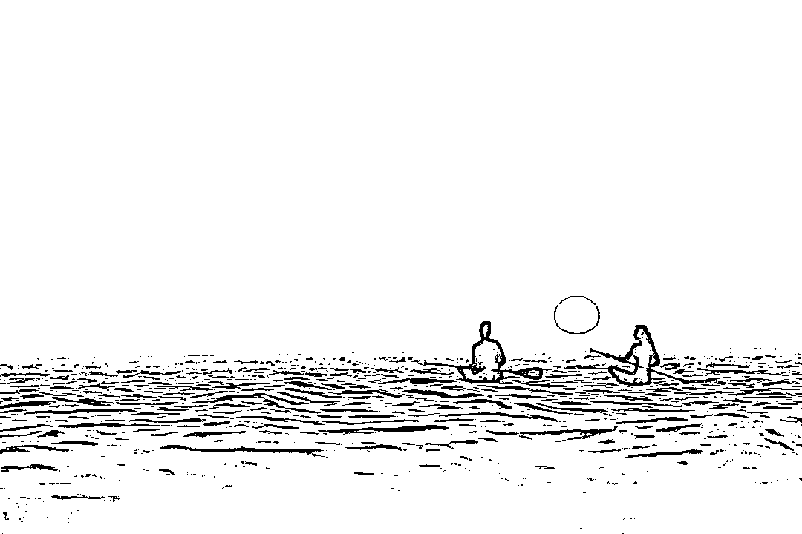

**射手座的爱情线索****射手座人很容易被当成不婚主义者。**接受这一点，他们中的大部分人就是有一种随遇而然的洒脱气质，这会让别人觉得他们并不真的需要一个伴侣——很多射手座确实觉得这样也不错。有时另一半会觉得跟他们在一起很孤单，因为他们总是更专注于自己的冒险之旅，不管这是否涉及到婚姻。这并不意味着他们最终只能和同为射手座的人结婚了，虽然从统计数据上看确实有点这样的倾向，但这确实意味着，中国父母要更多地为射手座何时能解决婚姻大事而忧心忡忡了。 **射手座是可以安定下来的，但需要花些时间，并且即便是已经拥有了美满的婚姻，他们的天性中始终有一些狂野的东西是很难被驯服的。**就像他们知道的，他们比其他星座的人需要更多的灵活性和自由空间。想想布拉德·皮特，他曾经在很多年里都放荡不羁，后来他和安吉丽娜·朱莉在一起后，收养了孩子，开始做爸爸，最后还结婚了。他“似乎”是非常幸福了。当然他不愿意被困在家和办公室的两点一线的生活里，除非他的办公室是在相邻的城市（事实正是如此），如果在其他国家或许就更好了。与安吉丽娜·朱莉的家庭生活对他来说是一场巨大的冒险！但后来布拉德·皮特野性的一面明显又出现了，他和安吉丽娜·朱莉在孩子的抚养问题上有了分歧，最后婚姻解体。野性和观念的不同，是典型的给射手座的婚姻或关系带来问题的原因。

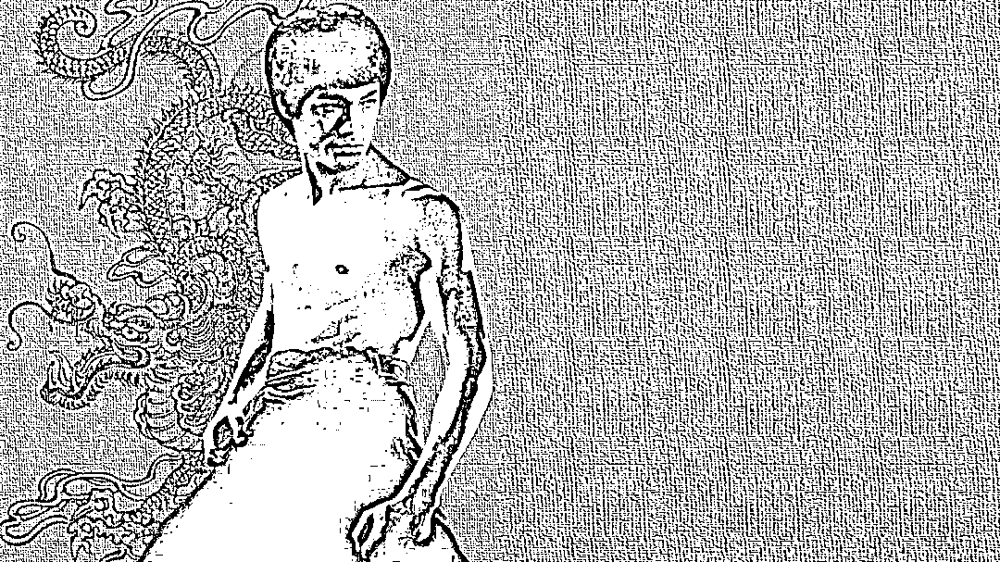| 李小龙

另一个例子是李小龙。据说李小龙非常爱他的美国妻子，但是她必须适应一种充满冒险的、极不稳定的生活，这对大多数女人来说都是一项挑战。因此**射手座的妻子或伴侣要么不介意射手座时常不在身边，要么能成为旅途中的好伙伴，要能够适应一种更自由的生活方式。**在我的客户中，那些婚姻最幸福的射手座男人，他们的妻子通常都和他们一样独立。**另一个需要考虑的重要因素是开放的思想和对学习的热情。**射手座厌烦思想封闭、观念传统的人，他们似乎缺乏自己原创性的想法。在智力上不断探寻的精神很重要。**头脑聪明、受教育程度高、或学识渊博的人，可能会让射手座爱不释手。**他们喜欢学习新事物，如果觉得对方的头脑很性感，而其他部分也是，那什么都有可能发生。**“幽默感”**或许会在他们的择偶条件列表上排第一位，当然不太可能真的有这样一张表。年轻的射手座喜欢肆无忌惮地开怀大笑，因此，能够跟他们一起笑的人，他们会愿意跟这些人待在一起更久。射手座年轻时做过的荒唐傻事在十二星座里称得上数一数二，但在给朋友的爱情指点江山时，又能给出很多真知灼见。可惜**给别人的高明建议，自己通常不会遵循，射手座在四十岁之前似乎更偏好“运气”而不是智慧。**然而，到了四十五岁左右时，射手座则渐渐能够更明智地对待爱情，尤其是环顾左右，发现自己是朋友当中唯一一个单身汉时。就在父母对射手座结婚生子的事已经不抱希望时，他们却开始以一种更加成熟的态度研究那些有发展可能的对象。此时寻找一个**没有过度的占有欲、有丰富的幽默感、思想卓尔不群**的女人，将不再只是一个有趣的概念。当然，还有其他一些情况，比如有些射手座男人觉得是时候该告诉父母了，其实他们已经有了一个孙子，住在一个很远的城市。当然如果他们可以也向未婚妻坦白这件事，而他们的未婚妻仍然愿意跟他们结婚的话，那也不错。有些射手座女人或许真的会选择不结婚，不过更加常见的情况是，在第一次婚姻或“漫长的冒险”之后，她们进入了更有意义的第二段婚姻，与那个她们愿意与之要小孩的人在一起。有很多不同的情况，但底线是，**在关系中要有“喘息的空间”，任何被困的感觉都会让射手座想要找一个出口逃跑。**

**版权声明：**原创文章由作者授权发布于若道平台，欢迎转发，反对抄袭。友号转载请申请白名单。

****想阅读更多作者的文章，请在后台回复******大卫****** 即可。****

**喜欢文章请长按下方二维码打赏**

**给大卫老师加杯咖啡呗~**

**▼**

**学习占星学**

**点击或长按下图了解课程详情** 

**微信又双叒叕改版啦，不想错过若道君的推送？**

**就把若道设为星标吧！**

**▼**

**喜欢记得点一下在看哦☟**

****报名直达入口****

# 月亮和金星都在天蝎座，你被“爱情的毒”击中过吗？

> 原文：[`mp.weixin.qq.com/s?__biz=MzA5NjA0NTAxNg==&mid=2651456292&idx=1&sn=6b18eaa3cc2cabf17c2ffb92890f29b1&chksm=8b48b193bc3f3885b6219259752720de3164ce4a08136ebe67e0d5642d133bdb2a1ccfc60f87&scene=126&sessionid=1692737928#rd`](http://mp.weixin.qq.com/s?__biz=MzA5NjA0NTAxNg==&mid=2651456292&idx=1&sn=6b18eaa3cc2cabf17c2ffb92890f29b1&chksm=8b48b193bc3f3885b6219259752720de3164ce4a08136ebe67e0d5642d133bdb2a1ccfc60f87&scene=126&sessionid=1692737928#rd)

**2021 年 9 月 12 日天象：**

*   **16:34 月亮进入射手座**

*   ******太阳对分海王星******

今天下午 4 点半之前，月亮都在天蝎座，我们的情绪是专注又强烈的，很适合去解决难题、攻克难关。但同时，隐藏的情感有极容易产生出明显的控制欲，想要“一切尽在掌控”之中。由于昨天凌晨 4 点 38 分，金星又刚刚进入天蝎座，更强调了爱情与关系的主题。揭开表象去往关系的深处，成为炽烈的渴望。（点击[【金星进天蝎座】](http://mp.weixin.qq.com/s?__biz=MzA5NjA0NTAxNg==&mid=2651456142&idx=1&sn=1b17e45b086a0fb2a087c99c007f9a46&chksm=8b48b039bc3f392f744168ced8482303ee7a5a3833d1f18b9e946f46d4928a3d516ad1f915f6&scene=21#wechat_redirect)查看文章）

面对如此明显的天蝎座能量，若道君八卦一下，大家这些年都中过什么样的“爱情之毒”？欢迎留言分享呀~

太阳还在今天与海王星形成对分相，自我意志可能正在和梦想、愿景产生拉扯，不如趁着今天给自己放个假，随性一点，享受周末。

周日快乐！我们明天见！ **了解每日天象，可****下载“若道”APP 查看****还有更多精彩等着你哦**

# 好好说话，解密爱的语言丨非暴力沟通线上体验讲座（限时免费）

> 原文：[`mp.weixin.qq.com/s?__biz=MzA5NjA0NTAxNg==&mid=2651456291&idx=1&sn=23fd808b481199b7748a2ef01ab792f0&chksm=8b48b194bc3f3882401d5efe0ed9876c2ce676050d095282f59453f5444377d613c4a24845cc&scene=126&sessionid=1692737928#rd`](http://mp.weixin.qq.com/s?__biz=MzA5NjA0NTAxNg==&mid=2651456291&idx=1&sn=23fd808b481199b7748a2ef01ab792f0&chksm=8b48b194bc3f3882401d5efe0ed9876c2ce676050d095282f59453f5444377d613c4a24845cc&scene=126&sessionid=1692737928#rd)

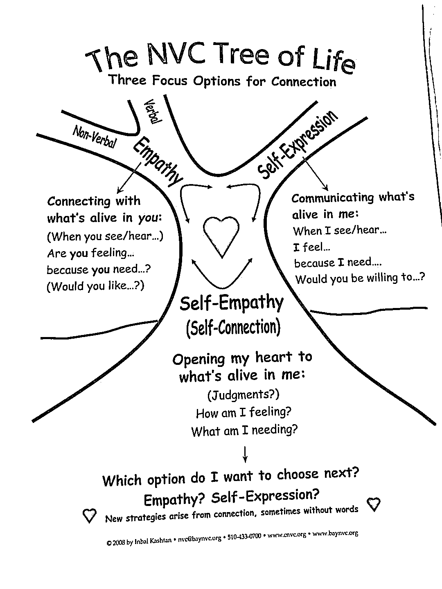

1

**为什么要学习 NVC？**

**老实说，NVC 真的是一门人生必修课。**

**NVC 可以非常有效地帮助提高沟通能力，提高觉察力、自我同理心和他人同理心，进而减轻童年创伤对成年生活的影响，帮助有效改善亲密关系、与父母的关系、亲子关系、职场关系。**

*   如果你正被低效的沟通方式困扰或正经历沟通暴力，想**提升觉察，避免伤害的话**，NVC 培训是个不错的选择；

*   如果想结束“相爱相杀”恶性循环的相处模式，**享受一段真诚而愉快的亲密关系**，NVC 培训是个不错的练习途径（可以拉着你的 Ta 一起来哦）；

*   如果你的**工作、求学、生活和“表达”息息相关**，想更理解自己，想改善你的人际关系，改进工作，NVC 培训可以体验到一种更有力量的表达。

2

**老师是谁？**

**Toni McErlane**

我来自新西兰，拥有社区和人类服务—咨询康复学士学位，是 Aminz 的注册家庭纠纷调解人，也是 NVC Aotearoa 的 NVC 培训师。

在我的生命中，我一直对真诚、充满活力、自我负责的沟通和有意识的选择充满激情。而我的人生旅程为我提供了充足的机会，让我去探索、研究、反思和完善这在沟通中是什么样的。

在我的工作坊中，我的原则和实践都是建立在非暴力沟通和正念的哲学基础之上。非暴力沟通是由美国心理学家马歇尔·卢森堡博士所开发的。马歇尔的目标是发展出一种语言，这种语言受到印度巴利语中的“非暴力主义”（Ahimsa）一词的启发，它的意思是“没有伤害”。我们怎样才能在与他人沟通时不造成伤害呢？这不仅需要非暴力沟通的技巧，还需要在训练中融入正念。正念是受小乘佛教内观传统的启发，发展觉知和接纳，关注和允许。在我们的工作坊中 ，我们将非暴力沟通和正念编织在一起。

我致力于以这种沟通和处世方式作为我日常与人互动的基础。我曾经学习了为期一年的北美非暴力沟通领导者项目，在加州湾区非暴力沟通的全年浸入式项目中做了两年协助工作，然后在索诺马县女子监狱推动非暴力沟通培训。同时，多年来我持续参加内观静修，致力于继续和发展这种实践，并把它融入自己的工作坊中。

2020 年疫情期间，我与丈夫和我们的猫在游艇上休了一年假。现在，我和丈夫还有 15 岁的侄女在新西兰南岛的达尼丁生活。我在那里从事心理咨询、冥想和生态心理疗法。我们还正在那里慢慢建立一个治疗静修中心和生态冥想社区。

过去四年，我曾两次来中国，与若道及其友好而充满活力的团队分享非暴力沟通，并参观了一些绝佳风景。我期待继续与若道合作，在网上分享我的知识和技能。

向上滑动可查看更多

3

**讲座内容**

*   **如何在亲密关系，职场，亲子沟通中运用非暴力沟通；**

*   **案例示范；**

*   **互动体验非暴力沟通四要素&答疑解惑。**

4

**讲座信息**

**讲座时间**：**2021 年 9 月 19 日 星期日 14:00-16:00****费用**：限时免费**主讲嘉宾**：Toni McErlane**参与方式**：**扫描下方二维码填写报名表，入群领取听课信息。**

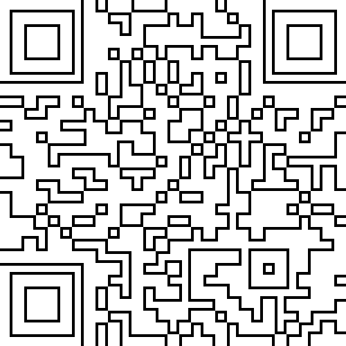

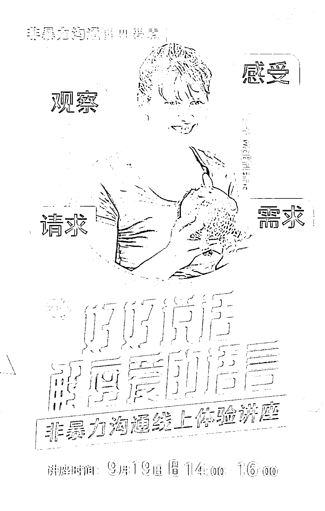

# 9.11 金星进入天蝎座丨未来 3 周，爱里潜藏的“毒”，既折磨又强烈

> 原文：[`mp.weixin.qq.com/s?__biz=MzA5NjA0NTAxNg==&mid=2651456142&idx=1&sn=1b17e45b086a0fb2a087c99c007f9a46&chksm=8b48b039bc3f392f744168ced8482303ee7a5a3833d1f18b9e946f46d4928a3d516ad1f915f6&scene=126&sessionid=1692737928#rd`](http://mp.weixin.qq.com/s?__biz=MzA5NjA0NTAxNg==&mid=2651456142&idx=1&sn=1b17e45b086a0fb2a087c99c007f9a46&chksm=8b48b039bc3f392f744168ced8482303ee7a5a3833d1f18b9e946f46d4928a3d516ad1f915f6&scene=126&sessionid=1692737928#rd)

**********************☆ ****************************后台****************************回复“今日”，给你一句生命态度**********************

作者/MaryChan 玛丽

编辑/翀子 封面/书君 图片/网络

2021 年 9 月 11 日 04 点 38 分，金星进入天蝎座并在此停留至 10 月 7 日。象征爱与美的金星深入天蝎座掌管的冥府时，会有哪些表现？在这段日子里，又有哪些重要的宇宙天气可以助力金星的能量发挥呢？让我们一起来看文章吧~

**9 月 11 日 04:38 金星由天秤座进入天蝎座，并在这里一直待到 10 月 7 日。**从风元素到水元素，在完成关系的搭建之后，**我们要揭开表象，去往关系的深处，一切将变得更加强烈，**那里有炽烈、执迷、怨愤、恐惧、疯狂与失落，还有底层的永恒不变的爱。

金星象征着爱与美。在正常顺行情形下，每三周半左右更换一个星座。金星与月亮类似，其可视形状根据相对位置不同而变化，当离地球很近的时候形似明亮的月牙，离地球很远的时候形似银盘。金星与阴性能量连接，是除了月亮的滋养、照料、养育面向之外的另一种阴性能量展现。

在一年的金星律动中，如果持续地与之连接，寻求对其理解，就仿佛做了一个连续的仪式——与金星女神（品质）连接的仪式。**金星带来自然而然的吸引力，**邀请金星所象征的神圣美好的能量与我们同在，有助于个体连接生命中的愉悦感，开发提升个人魅力，创造良性的人际互动，开启或维护有品质的感情，创造价值、财富与丰盛。

**金星属于内行星，是“自我”的具体面向。**有别于外行星所象征的超然面向，金星非常具有**“烟火气”**，与触手可及的美好有关。其守护星座天秤座——带来平衡、和谐与优雅；金牛座——带来自然、价值与安稳。

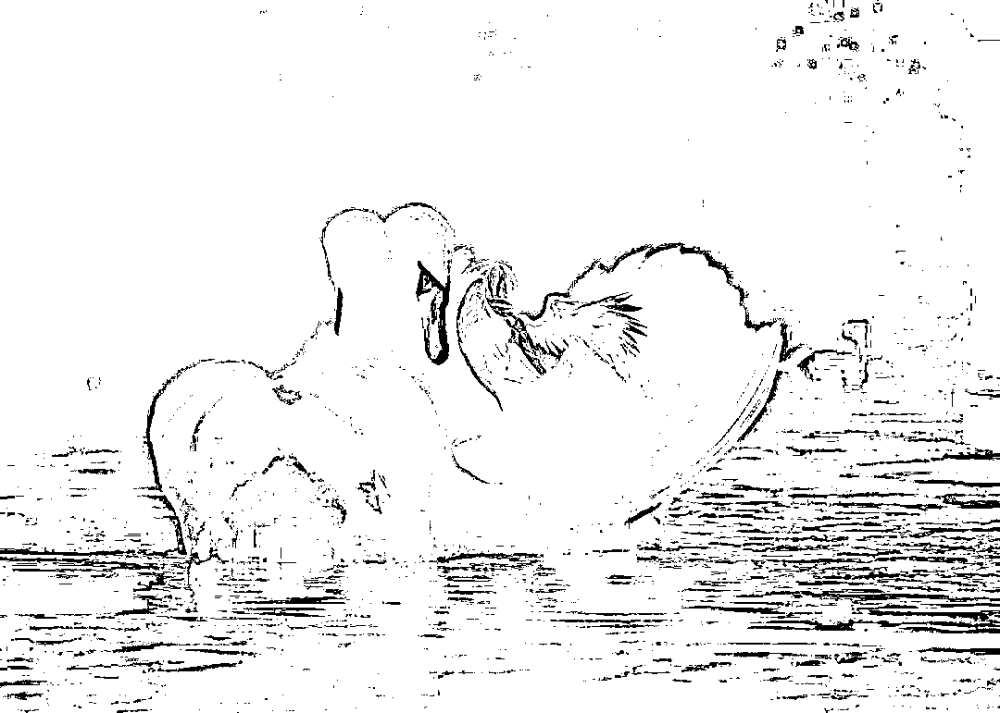

**天蝎座的法则**

天蝎座完成了从天秤座开始的过程。在天秤座那里，一个人与另一个人连接、对话，彼此建立关系。此时两个个体仍然分别是独立的。而在天蝎座，当关系中不仅仅是风元素的理性连接，还要引入水元素的深度情感时，**这就展开了关系中最为复杂的一面。**

“我”和“你”要在情感层面上完全融合为一，这意味着在某种程度上，**双方都需要放下和改变旧有的自己才能做到。**因此一定会遇到一个重要的关口——“死亡”，其显现方式可能是**改变、分离、背叛、放逐、拆解、破碎。**这让人意识到生命中有些事是无可避免的，有些人或习惯是不得不放手的。这是从白羊座开始的黄道十二星座的自然循环中，**自我第一次遇到“死亡”这一重大课题。**

**天蝎座象征着转化与重生，**往往与强烈的生命情境或深邃的情感相关，**勾起人们对“死亡”的恐惧和生存本能，**在危机中磨炼韧性和对生命本质的洞察，并进而显现对他人和世界的更深一层的接纳、包容、理解，寻获置之死地而后生的转机。

天蝎座的守护星是火星和冥王星，也是第一个出现外行星守护的星座。外行星总是带来高八度的超越性的功课和挑战，带来个体内在与外在的转化历程。**其目的是令人“从不再对心灵有用的形式及内容中解脱出来”。**

天蝎座仿佛很容易被诟病，或者令人有点害怕和躲避，源于其**强烈的情感**，其激烈的能量，其可能带来的**挑战与痛苦**。尽管人们渴望看清自己生命的地图，但当事情发生，也会本能地想要否认和逃避。痛苦那样的真实，而痛苦的价值总是无法一目了然。

**然而没有一种深刻的领悟是不带着痛苦的。“你的痛楚不过是因为束缚你的窠臼被打破了。”**

天蝎座也很容易被误读。人们会因为其表面的破坏性，或诱惑性（权力或性），而或害怕，或被蛊惑/引诱，而难以得见其最重要的意义——**死亡，其中包含着生命的奥秘、智慧与力量，**穿透层层表象而获得一种对生命之厚重与超脱同在的了解，从而生命变得通透而焕然一新。

天蝎座的象征动物是：蝎子、蛇、老鹰、凤凰。蝎子、蛇象征着人性的**阴影、欲望、诱惑，**老鹰象征着敏锐的**洞察力、觉知力**，凤凰象征着**浴火重生**。它们也象征着天蝎座带来的**成长三部曲**。

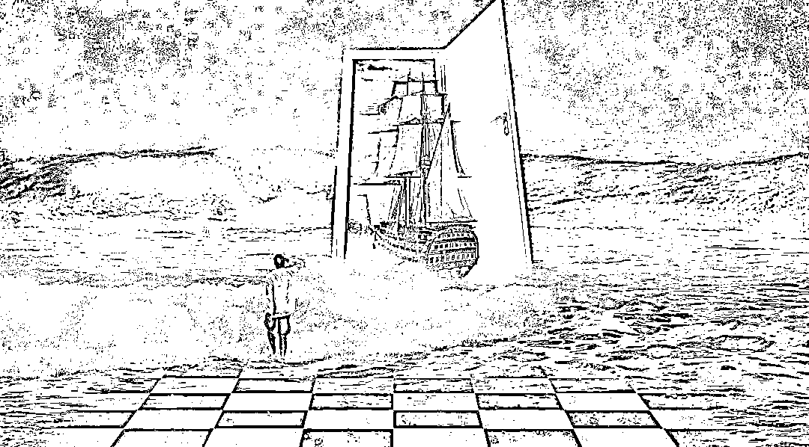

**金星在天蝎座**

金星在天蝎座，欣赏有态度的东西；有戏剧性张力，显示人性之强韧的东西；略带暗黑的东西；有诱惑力的东西，性感的东西；带着激情和火焰的东西。

这些你都可以在**莱昂纳多·迪卡普里奥**饰演的影片中找到。太阳、金星、火星均在天蝎座的他，其主演电影无论是《泰坦尼克号》、《盗梦空间》、《了不起的盖茨比》还是《荒野猎人》，均强烈地体现了天蝎座的特质与魅力。

**安妮•海瑟薇**，太阳、水星、金星都在天蝎座。其出演的电影《公主日记》、《穿普拉达的女王》都以某个角度去讲述一个女孩的蜕变过程。还有《断背山》里的奔放同妻、《历劫俏佳人》中与毒贩勾搭的豪情白富美、《爱情与灵药》中正面全裸出镜的帕金森痴情女、《悲惨世界》中几近光头、牙齿残缺的孤女芳汀。**天蝎座一贯与争议和禁忌的话题有关，也与大幅摆荡的角色变化（重塑身份认同）有关。**另外她还曾想当一名心理学者，这也折射着天蝎座的意涵。

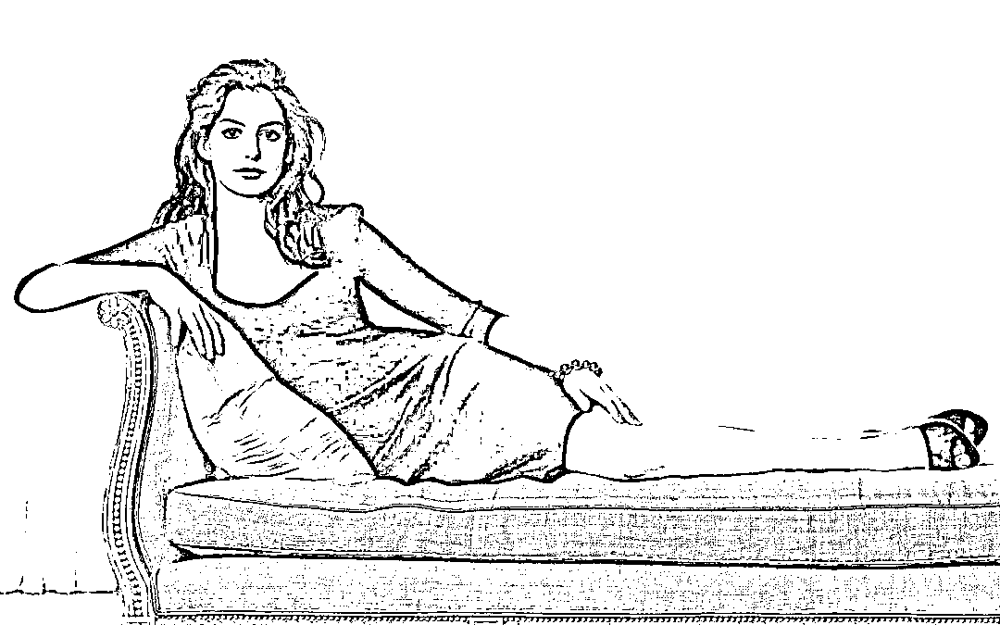

| 安妮·海瑟薇

**金星在天蝎座，带来探索的冲动，邀请人们关注内心的复杂和深度。**此时，人们对内在的感受有着更强烈的体验，渴望生命的融合经验。而正因为如此，向生命深处进发的过程中，我们会遇到自身内在的“怪兽”，就像电影《海王》中幽深海底洞穴中的巨兽卡拉森，象征着个人的原始情绪，比如恐惧，比如孤立。但同时也象征着巨大的力量，**这是来自心理和情绪的转化所迸发的巨大能量。**

如何与之共同创造，而非被其支配毁灭，**秘诀便是真实的意志力、爱与臣服。**

**金星在天蝎座，无法忍受肤浅地对待任何事。**在这里，每件事仿佛变得生死攸关，个人需要全神贯注地去应对。犹如行走在悬崖边缘，生死一线间，得以强烈地体验所有的事物。体验的品质变得重要，而非体验的数量，需要完全地深入地去体验，哪怕少，也胜过蜻蜓点水般的粗浅体验。

**金星在天蝎座，不由分说地让人看到人事物的阴影、破败、腐朽。**这诚然令人非常不舒服，但同时也有利于强化对一切事物相对性的感受——光明背后的黑暗，繁华背后的肮脏，面具之下的不堪，路面之下的暗渠，华宅之内尘封的地下室。“看到”才能开始转化，从而扩展个人的认知范畴，升级个人看待人事物的深度和成熟度。

金星在天蝎座的本质是**在关系中实现转化。**转化不是简单的变化，不是把一间房子刷上新漆就完事，它有着炼金术一般的神秘，经历过的人知道，看山还是山、看水还是水的不同心境。

死亡的过程是明显的，而重生的过程是幽微的。最终，我们将在平凡的现实中看到化茧成蝶、凤凰涅槃的非凡。金星在天蝎座的转化没有双鱼座那么“仙”，比较倾向于**将自己沉浸在物质世界中而得以超越它。**

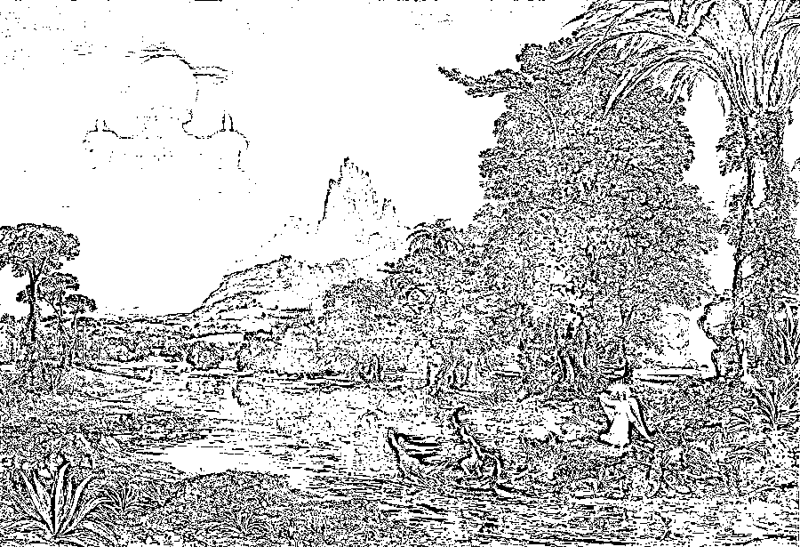

**金星在天蝎座，与付出代价、去除天真有关。**神话中，冥王掠夺了大地女神之女，女神陷入深深的忧郁，从而七年间世界变得寒冷荒芜。其女儿丧失处女之身，变成冥后。最终众神插手让她们母女每年有六个月可以见面，于是大地重回，而冬季象征着大地女神的哀伤，因为此时女儿回到了冥府。

**生命是一系列的死亡与重生，**深度与强度相连，深入地下，深入阴影，深入黑暗，你可能会发现骇人的**真相**。天蝎座带来超强的直觉和灵敏度，这能量引导或**引诱着个人想要去质疑，去探查真相。**不过能否接受真相，就是另一回事了。

金星在天蝎座，**背叛与忠诚**总是绕不开的话题。由于对关系独占的渴望，以及对失去和分离的恐惧，个人可能会怀疑、试探、诱惑、掌控，以获得安全感。

金星在天蝎座，人变得**敏感**，无形的天线总是能探测到什么不对劲。此时个人容易嗅到人们潜意识中的**“黑暗因子”**，感受到关系中的暗涌和操控，所以常常容易感到受威胁或怀疑他人，造成人际关系的隔阂或紧张。人也容易变得焦虑、脆弱，感觉被伤害，特别是亲密之人带来的痛苦情绪。

由于天蝎座强烈的**固定星座**特质，和像激光一样的**专注力**，有时候会误用为一种执迷，太专注于那一个人事物，而看不到周围其他东西，由此想要完全拥有和掌控。这里也就没有了爱，爱流失掉了，让位于掌控。

而掌控是**无情的，窒息的，单向的，是没有生机的**。无论是自身还是对方，在背叛中，将隐藏在深处的欲望和驱策力，以压倒性的感受呈现出来，有未被满足的渴望，有未被表达的需求，有突破禁忌的快感。到头来，个人仍需要面对和处理隐藏的愤怒、痛苦、抗拒、恐惧，以及对自我的否定。

**金星在天蝎座，意味着清理净化**。火焰有净化的功能，如果一份关系燃烧殆尽，还剩下什么？当我们将自我与另一个人或事物深度捆绑，我们也就丧失了自由。在纠缠中，忘记了我们的本质是不受限的。欲望让人不安，而爱让人心安。在燃烧的灰烬中，我们才能得到自己永远也无法被拿走的精华——我们自我的核心，那就是爱。直到这时，凤凰才能从灰烬中升起。

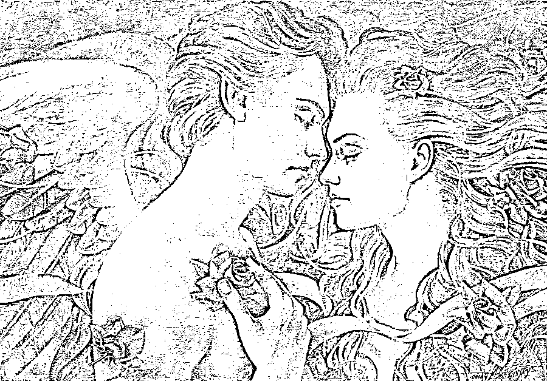

金星在天蝎座，并不一定意味着背叛，更进阶的呈现反而是**信守承诺、讲义气、情感忠诚。**金星是一种吸引力，有经验、有实力的人可以链接到最可靠的盟友，抑或生死搭档，一如电视剧《伪装者》里的明台和于曼丽，其扮演者胡歌，火星、木星天蝎座；宋轶，太阳、水星天蝎座。

金星在天蝎座为关系带来戏剧性，但不是狮子座那样招摇的戏剧性，那是一座活火山，充满着地下岩浆的暗涌。许多悬疑剧、警匪剧、心理剧、谍战剧、虐心剧的精彩恰恰是建立于其上的。**人们总被危险和神秘吸引，**想要深入了解，即使经历痛苦也总比什么都感觉不到要好。

金星在天蝎座带来某种执着，紧紧抓住财产、资源、某种情绪。无论是消极还是积极的感觉，都不会很快消失，不容易宽恕和妥协，这成为**内在潜藏的毒**（怨愤、苦楚）。若没有及时纾解，就可能攻击自己的内心和身体（特别是肝胆）。但凡事一体两面，只要掌握好程度，不盲目偏颇，良性的执着让人不会半途而废，反而是帮助人**彻底、深入而完全地去追寻自己生命的目标。**

金星在天蝎座，你会听到**一针见血**的话，也许是真话，但让人很受刺激。这点往往容易招致误会、嫌恶，大部分人喜欢粉饰后的美好，而反对看到或听到不留情面的事实。

金星在天蝎座失势，也就是位于它所守护星座的相对星座。在这里，金星本身优雅和谐的力量难以发挥。**极端，这是天秤座竭力避免的，却是天蝎座喜闻乐见的。**但天蝎座的极端带有隐蔽性，平常保持低调，直到发生冲突。

金星在天蝎座可能引发个人带有**尖锐、强迫、偏执的表现，**可以瞬间把危机指数拉高。金星在天蝎座，不畏惧开战，甚至会享受战斗，因为战斗是个人经历巅峰体验的另一种方式。它让人将状态调到最高，感觉到自我的力量与存在。

金星在天蝎座，这是揭示和启动我们最深沉情感习性的过程。**陈腐的东西会被带到表面来，**随着直觉和情感去体验，随后对不和谐的部分加以释放。意识被照亮了，并存有一份深刻的信心，即无论遇到什么挑战，你会通过的。

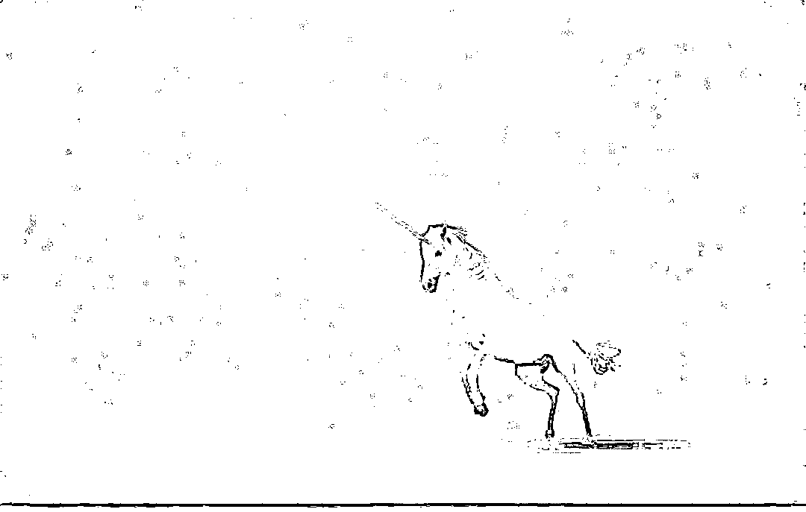

**金星在天蝎座的爱情**

**爱就投入全部，追求深入骨髓的体验与深深契合的感觉，**因此并不会轻松地进入一段感情，但也因体验深刻而精彩。你可能被表面平静而内在透着**复杂、神秘**的人吸引。对方可以非常性感，但并不仅止于此。无论对方在其他方面多么有吸引力，**没有情感强度和灵魂深度的爱情是无法持久的。**

**金星在天蝎座的性爱**

不需要外在太复杂的氛围营造，天蝎座本身内在无穷的激情就已经足够。**由深处散发的魅力，带着不动声色的强烈磁场，冥冥之中就已紧紧抓住对方的眼睛。**眼神可以很妩媚，也可以很深邃，端看要传递什么信息。带着克制的炽烈，细腻的感受，抛却自我的投入，感官和感知全然绽放，在美、力量、神秘的淋漓尽致中体验转化。

在这里，性并不仅仅是为了寻求欢愉，**更深的动力是为了寻求超越。**性高潮提供了一种在强烈的自我满足中，同时经验自我消融（小我死亡）和自我超越的体验。对于自我意识过强的人，在此过程中呈现的封闭性会阻碍这至高体验的发生，而仅仅局限于肉体层面的反应。

另外由于天蝎座的颠覆性，一个人可以完全沉迷于性，也可能与之相反。其对**生命强度**的热爱，不仅只体现在性爱上。

**金星在天蝎座的阴影**

害怕分离，当断不断反受其乱。执迷于掌控和操弄，难以信任他人。在嫉妒、怀疑、偏执、仇恨中迷失自我。冻结了自己的心，失去了与爱、灵动和自由的连接。得到了，却也失去了。活在天蝎座的低阶象征中，而没有意识去打开成长和扬升的通道。

**金星在天蝎座适合的颜色**

黑色、紫色、宝蓝色、深红色。

金星在天蝎座，**通过深入挖掘任何事物，以发现里面的东西。**因此与地下矿藏和寻宝有关，也与获得各种资源有关，特别是人脉资源、金融资源。此时也利于研究心理学和玄学，探索心灵和帮助个人实现自我转变。

金星在天蝎座，帮助人不被表象迷惑，突破僵局，通过对自己更完整的理解，重新发现自己生命热忱的根源，赋予它展现的机会。由此个人可以表现出**对目标相当的承诺、奉献和专一，并因而激励鼓舞他人。**

金星在天蝎座，强烈的、聚焦的能量与专注而纯粹的意图结合，可以转变实相，达成创造。所以金星在天蝎座也**适合各种艺术活动，**可以创作出直指人心的震撼作品。

塞尔维亚的著名行为艺术家玛丽亚·阿布拉莫维奇，太阳射手座，水星、金星在天蝎座且逆行，其作品以狂野大胆又动人心魄著称。她说：**“最好的作品从受苦中来，受苦带来转变，通过受苦艺术家超越他/她的精神。”**“艺术家为了寻找灵感需要深刻的自我挖掘，看待自己越深就越接近宇宙，艺术家就是宇宙。”其每一个作品《艺术家在场》、《休止的能量》、《海景房》、《无量之物》等都有着巨大的感染张力。

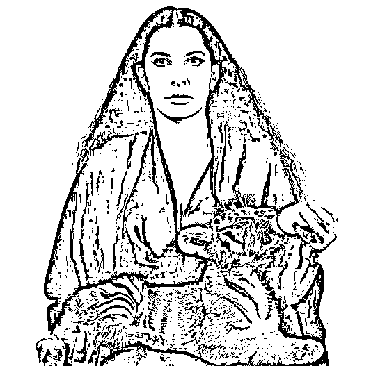

| 玛丽亚·阿布拉莫维奇

**金星在天蝎座的重要相位**

**金星在天蝎座期间与其他天象的结合以及相位（容许度 1°）：**

**★ **9 月 16-17 日 金星四分土星****

**重点影响人群：有重要行星/四轴/月亮交点落在天蝎座、水瓶座、金牛座、狮子座 0°-14°。**

一些**关系的问题**或挑战浮出水面，让人感到某种延迟和阻碍。我们可能想要退缩、自保，但关系不仅有激情，也有难过，这提醒我们**不要忘记承诺与责任**。如果我们勇敢一点，这将是一个认真面对和调整关系的机会。

**★ **9 月 23 日 金星对分天王星****

**重点影响人群：有重要行星/四轴/月亮交点落在天蝎座、金牛座、狮子座、水瓶座 7°-21°，以及落在双鱼座、巨蟹座、摩羯座、处女座 9°-19°的人。**

关键词：**刺激、改变、创造。**可能接触新的人事物、不同的观念。突然而至的消息或状况，可能会破坏事情原有的步调。不可预测的兴奋感又会带来什么？这可能是一份提醒，关系里有什么是被忽略的，有什么需要改变的，自由与承诺、独立性与依赖性如何平衡。新的总会变成旧的，旧的也会在别处变成新的。此相位也利于个人创造力的发挥，包括孕育。

★ **9 月 30 日-10 月 1 日 金星四分木星**

**重点影响人群：有重要行星/四轴/月亮交点落在天蝎座、水瓶座、金牛座、狮子座 15°-29°。**

在关系中，与占有欲相关的焦虑和痛苦被放大。心情不稳的时候，切忌冲动消费。可能过度沉溺于某事物而疲惫。被粉饰的问题可能曝光，背后是贪婪和虚荣。

★ **10 月 1-2 日 金星六分冥王星**

**重点影响人群：有重要行星/四轴/月亮交点落在天蝎座、摩羯座、金牛座、巨蟹座、双鱼座、处女座 19°-29°。**

这是关系得以清理和净化的机会。潜在的、对关系构成威胁的因素会被带到表面，以便个人加以洞察和检视。这让关系中多一份领悟和深刻，也让个体获得内在的资源。

另外，由于**水星于 9 月 27 日开始在天秤座逆行**，其停滞期与冥王星持续成相，9 月 21-10 月 2 日，水星四分冥王星。此天象强化了天蝎座守护星冥王星的影响。

**重点影响人群：有重要行星/四轴/月亮交点落在天秤座、摩羯座、白羊座、巨蟹座 17°-29°。**此时人容易因不信任、过度较真或质疑而失去平衡，也容易感受到来自内在或外在的攻击性。隐藏在潜意识中的破坏性的信念浮现出来，例如“我是不值得被爱的”，让人陷入焦虑、执着、抑郁或愤怒。

也许你会发现自己正热切地维护着自己的观点。这时可以借助客观的自我分析、心理咨询、占星咨询、冥想去观照自己，探究人事物的底层，当我们逐渐理解，就可以放下这些老旧信念。

另外，也可以借助一些工具来协助我们度过，例如自由书写、艺术疗愈、重生呼吸、运动（涉及手脚协调的）、花精等。此时心智被激发，变得活跃，适合学习理解深奥的道理，并整合到自己的生命中。

★ **10 月 5-10 日 太阳合相火星**

**重点影响人群：有重要行星/四轴/月亮交点落在天秤座、白羊座、巨蟹座、摩羯座 5°-23°；狮子座、射手座、双子座、水瓶座 7°-21°。 **

天秤座本身是金星的守护星座，这一相位会影响我们对关系的态度。这带来一枚新的种子，包含力量、勇气与活力。适合重新确立或校准目标，采取行动，并用过去的经验来提醒自己，什么行为可以带来真正的荣耀和平衡，切忌自以为是的冲动。

小贴士

金星在天蝎座期间，也是冥王星的停滞期，并且冥王星将在 10 月 7 日 02:28 于摩羯座 24°18′开始顺行。**这会强化前面所述的一切与天蝎座相关的象征，**包括死亡、重生与转化——在老旧经验中死去、在新的经验中醒来。

**重点影响人群：有重要行星/四轴/月亮交点落在摩羯座、巨蟹座、天秤座、白羊座 17°-29°；金牛座、处女座、双鱼座、天蝎座 19°-29°。**

**结语**

水元素的复杂是语言难以尽述的，**只有去经历，沉浸其中，才能深入地、充分地体验情感。**发现不和谐的部分，才能实现新的和谐。接纳情感的复杂性，并且愿意去了解和探索，在充沛的情感中得以洗涤身心，实现个人的净化和转化。在爱中，越想用力抓住，越容易让它窒息。

**摊开双手，懂得分享和舍弃，才能了解丰盛和富足**。去开启金星在天蝎座的旅程吧，无论那是什么。

**版权声明：**原创文章由作者授权首发于若道平台，欢迎转发，反对抄袭。友号转载请申请白名单。

**MaryChan 玛丽**

人本主义占星师、花精咨询师

于成都创办工作室，从事咨询、组织相关活动 8 年

咨询预约号：MaryChen336

微信公众号：ZhanXing336

长按打赏

**学习占星学**

**点击或长按下图了解课程详情** 

**微信又双叒叕改版啦，不想错过若道君的推送？**

**就把若道设为星标吧！**

**▼**

**喜欢记得点一下在看哦☟**

****报名直达入口****

# 开学啦！快来测试一下你的占星基础吧！

> 原文：[`mp.weixin.qq.com/s?__biz=MzA5NjA0NTAxNg==&mid=2651456142&idx=2&sn=9440ec51dfdc301e1c1a094a8ecdd78d&chksm=8b48b039bc3f392fe5c1f3c06b63840c7fe02be5482411bbeaebebcce5fa453a18b742e69d4c&scene=126&sessionid=1692737928#rd`](http://mp.weixin.qq.com/s?__biz=MzA5NjA0NTAxNg==&mid=2651456142&idx=2&sn=9440ec51dfdc301e1c1a094a8ecdd78d&chksm=8b48b039bc3f392fe5c1f3c06b63840c7fe02be5482411bbeaebebcce5fa453a18b742e69d4c&scene=126&sessionid=1692737928#rd)

大家好，转眼又到 9 月的开学季啦，在入学之际，若道君贴心地给大家准备了一系列入学小测试。 

你的占星学得怎么样？基础知识扎实吗？下面是关于宫位的小测试，让我们一起来看看自己掌握得如何吧~

**以下关于四轴描述正确的是：**

滑动查看答案

**A、尽管在星图中，上升点在左手边，但却代表东方**

**B、只要在同一时间，四轴在黄道星座上的位置就是相同的**

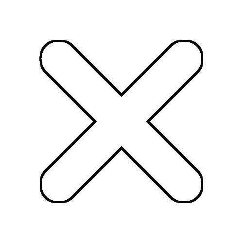

**C、上升和下降，中天和下中天的位置总是相对的**

**D、星图可以当作时钟来看，因为太阳在星图中每个时间点所在的宫位是不一样的**

**当时钟在不同日期、同一地点转动同样的分钟时：**

滑动查看答案

**A、上升点和中天移动的度数是一样的**

**B、中天移动的度数总是一样的**

**C、上升移动的度数总是一样的**

**D、以上都不对**

**小明 5 宫内有多颗个人行星落入天秤座**

滑动查看答案

**A、小明需要做一些有创意的事**

**B、小明会有不止一个小孩**

**C、小明有可能是一个有“赌性”的人**

**D、以上都不对**

01

（点击选项查看答案）

点击答题丨点击答题选项会有色块闪动丨快闪+淡入动画

**小明的 2 宫没有行星，宫头落在双鱼座**

滑动查看答案

**A、小明有可能做一个调酒师**

**B、小明很难挣到很多钱**

**C、金钱和财富完全不是小明关心的事情**

**D、小明可能会花很多钱看电影**

**小明 10 宫有多颗行星，且落在摩羯座**

滑动查看答案

**A、小明不可能是家庭主妇**

**B、小明对于为人父母这件事不太在意**

**C、小明总是感觉其他人对自己期望太高**

**D、很多人觉得小明做事一板一眼**

**以下关于下中天和第四宫描述正确的是：**

滑动查看答案

**A、代表家庭与根源，与继承的传统有关**

**B、因为父亲通常是一家之主，所以只代表父亲**

**C、代表不动产**

**D、与遗产有关**

**第 8 宫描述正确的是：**

滑动查看答案

**A、与他人的财产和投资有关**

**B、与出生和死亡有关**

**C、代表对抗与输赢**

**D、代表亲密关系和性**

**小明的 9 宫有多颗行星：**

滑动查看答案

**A、小明一定很喜欢聊与哲学、意义相关的事情**

**B、小明有可能是大学教授**

**C、小明有可能是推销员**

**D、小明的大嫂可能对小明的人生观有很大影响**

**以下关于第 12 宫描述正确的是：**

滑动查看答案

**A、与隐藏的力量、弱点、敌人有关**

**B、代表大型权力机构**

**C、代表医院和监狱等赎罪和救赎的地点**

**D、与灵性和灵感有关**

**以下关于宫头星说法正确的是：**

滑动查看答案

**A、是宫头线落入星座的守护星**

**B、一个宫位只有一个宫主星**

**C、宫主星只能考虑古典守护**

**D、宫主星比宫内星重要**

**以下关于定位星说法正确的是：**

滑动查看答案

**A、一张星图只有一个最终定位星**

**B、最终定位星一定是入庙的**

**C、一张星图可能存在多个定位链条**

**D、定位链的终点一定不会是互容**

**好了，测试完毕。**

**一共十一题，你做对了几道？**

**记得在评论区留言告诉我们喔~**

在若道核心课程中，听课只是学习的一小部分，对于掌握占星知识而言，我们非常强调**练习**。为了帮助同学们练习，即便在 L1-2 的学习中，我们也设计了三种练习方式：**测试、小组讨论和咨询练习：****· ****小组讨论**，我们会把有着相似配置的同学分在一个小组，同学们会根据我们设置的问题一步步分享人生经验，这样让我们的知识不再是书本上的程式化的描述，而是变成了有血有肉的真实的人生故事，也可以看到相似配置相同和不同及其丰富的含义；**· **而**咨询练习**则帮助同学们从 L1-2 开始即开始熟悉如何和陌生人讲述星图，这样一直练习 2 年，到 L5，做咨询就不再是一件让大家为难的事情。**重磅来啦**

**为庆祝若道成立 10 周年，我们精心策划，汇集顶级占星学大师资源和教学经验，结合占星学知识体系和不同老师的教学专长，首次推出由四位国际导师联合授课的占星核心课程。**

**其中**新一期 L1-2 核心课程由**大卫·瑞雷、克里斯蒂娜·罗登贝克、琳恩·贝尔**三位国际大师联合教学，老师们会专业、系统、全面的教授星座、行星、宫位知识，并讲述如何将三者串联成占星语言，人生故事，用三个月的时间带领你系统入门占星学。**课程安排：****授课老师** 

**琳恩·贝尔**

**（Lynn Bell）**

**· **世界最受欢迎的占星学演讲者、作家和老师之一。定居巴黎，研究心理占星学和家族模式数十年；**· **著名的心理占星学中心（Centre for Psychological Astrology）的长期导师。2016 年，获得查尔斯·哈维（Charles Harvey）杰出的占星学服务奖；**· **作为一个从多个层面进行工作的占星咨询大师，琳恩的工作结合了心理学的观点。她对家族模式的兴趣首先来自与客户的合作。通过在分析领域所做的个人工作，她所受的埃里克森催眠训练将她引领至家族系统。后来，她组织研究小组在家族星图上进行了数年的研究。她写的《家族占星学》就是这项研究的结果；**· **法国心理占星学协会的会长。除了占星学，她在法国沙特尔的新沙特尔学校任教 8 年，还 5 次获得了在《纽约时报》畅销书作者卡罗琳·迈斯（Caroline Myss）的卡罗琳·迈斯教育学院（Caroline Myss Educational Institute）合作教学的机会。

**艾德里安·罗斯·邓肯**

**（AdrianRoss Duncan）**

**· **1971 年在印度游学时开始学习占星学，1985 年开始成为全职占星师，迄今执业已超过 33 年，是人本主义占星学、卜卦占星学和经世占星学领域的知名占星师。他还开发了占星软件 AstroClock 和多款占星报告；**· **哥本哈根占星学院院长；**· **他在日常咨询中经常运用卜卦，咨询图（卜卦的一种运用方式，即根据客户来访时间制作星图，从星图中获得大量信息）也是他特别擅长的领域；**· **艾德里安·罗斯·邓肯从 1971 年开始研习佛学，受佛学影响很深，他相信占星学和佛学观点一致，转化的一个基础是在于对现实感知的改变。而卜卦很容易与佛教融合，因为它只关乎当下。

**克里斯蒂娜·罗登贝克**

**（Christina Rodenbeck）**

**· **克里斯蒂娜·罗登贝克（Christina Rodenbeck）是一名全职职业占星师，在牛津大学城生活和工作，深受周围知识和文化氛围影响；她拥有伦敦大学（University of London）的人文荣誉学位，曾在伦敦占星学馆（AstrologicalLodge of London）、心理占星中心和占星研究学院学习；

**· **作为一名占星师，在过去的 20 年里，克里斯蒂娜在她的网站“牛津占星师”上写了大量关于时事、艺术和文化的文章；她每月主持一个占星播客：“与克里斯蒂娜和萨莉一起占星”，并定期在《占星杂志》(Astrological Journal)上撰写时尚专栏；她定期在英国授课，并保持着蓬勃发展的专业实践。

**大卫·瑞雷**

**（David Railey）**

**· **若道联合创始人，致力于在中国教授和推广西方占星学；

**·** 曾任 ISAR 全球副主席，CAPISAR（ISAR 职业占星师资质认证机构）主席；

**· **1976 年，通过亚特兰大职业占星师考试，成为全职占星师，随后通过 AFAN 和 ISAR 职业测试；

**· **1980 年，与杰夫·焦耳一起在亚特兰大创建“每日行星”占星学中心。此后在亚特兰大占星协会担任 4 年考官，并且两次担任亚特兰大地区占星协会主席。1979-1992 年，作为占星师活跃于美国社会媒体，向不了解现代占星学变化的大众宣传专业占星学知识。

**·** 1989-1992 年期间，他在 WRGG 电台 12 频道每周主持个人电视秀“今日占星学”，早先他还在 WRFG 的广播节目中播讲宇宙天气节目；

**· **2010-2014 年，任全美占星师联盟监督委员会委员；

**· **2010 年，其著作《灵魂的目标》中国版出版，和蒋颖一起创办若道占星学校和其官网 www.nodoor.com；

**· **2017 年，被选为 ISAR 委员会成员。ISAR 是世界最大的国际占星机构，会员遍布 45 个国家，2017-2020 年曾任 ISAR 全球副主席、CAPISAR（ISAR 职业占星师资质认证机构）主席。

**熊鹰老师**

**（天空的空）**

**·** 2008 年接触严肃占星学，至此爱不释手；**· **2013 年师从大卫·瑞雷，研习整套现代占星学核心课程，并于 2014 年起至今连续三年担任该课程的主助教；**·** 期间也跟随格伦·佩里、诺·泰尔、理查德·塔纳斯、罗伯特·汉德、苏·汤普金斯、斯蒂芬·弗里斯特等多位国际占星大师进行学习，进行定向占星主题研究；**·** 2015 年初，通过国际占星研究协会（ISAR）资质认证并获得证书。同年，进一步跟随大卫·瑞雷老师进修“生时校正”技术，通过最终考核并获得证书；**·** 目前在若道占星任职，将传播系统、严谨、真实的占星学作为职业使命。任专职助教期间，进行沙龙与答疑等辅助教学工作已累计超过 200 小时；**·** 在业余期间也提供占星咨询与生时校正服务。目前正致力于占星学与个人成长的整合。

**点击下图** 

**马上了解核心课程 L1-L2 吧~**

****报名直达入口****

# 核心课程 L1-3 丨四位国际导师联合授课，掌握星图中的角色关系和场景转换

> 原文：[`mp.weixin.qq.com/s?__biz=MzA5NjA0NTAxNg==&mid=2651456142&idx=3&sn=e2915175b82071ab51127a5587e72c92&chksm=8b48b039bc3f392fc669cedbea87ad05fb865ed2a0fbf480e6164532639e838e8a9ebce5acb1&scene=126&sessionid=1692737928#rd`](http://mp.weixin.qq.com/s?__biz=MzA5NjA0NTAxNg==&mid=2651456142&idx=3&sn=e2915175b82071ab51127a5587e72c92&chksm=8b48b039bc3f392fc669cedbea87ad05fb865ed2a0fbf480e6164532639e838e8a9ebce5acb1&scene=126&sessionid=1692737928#rd)

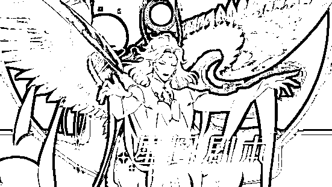

出生星图中的剧本是在讲述一个故事：行星是演员和角色；星座是他们表演的风格；宫位是表演的布景，他们之间的关系就是**相位**。**相位是角色之间的关系**相位是个人星图中最令人兴奋、最精准的要素。认识内行星、太阳和月亮与从木星到冥王星的外行星之间的相互作用，可以帮助我们深入理解案主的行为。内行星代表个人驱力：**太阳的驱力是自我实现，****月亮的驱力是依恋和安全感，****水星的驱力是连接，****金星会带来吸引力和关系的建立，****火星的驱力是满足欲望。**当个人行星与外行星结合起来时，就会表现出特定的行为，继而导致出现可预测的结果。例如，当金星（爱）与土星（抑制）形成相位，客户会戴上冷酷的面具，有效掩饰自身对爱的深切渴求，因此可能会吸引那种感觉客户不需要表露爱意的人。**“所有的关系和剧情都来自角度”****· 合相（0°）：统一、融合或合成**

**· 六分相（60°）：冷静的诱导表达**

**· 四分相（90°）：抑制与控制**

**· 三分相（120°）：轻松的创造性表达**

**· 对分相（180°）：适度与克制的合作**

**· 其他的相位**

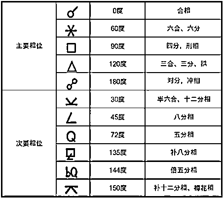

在 L3 课程中，艾德里安老师将演示如何揭示与行星相位相关的行为，如何获取相位表达的核心能量，以及如何调整行为，以收获成果丰硕、具有满足感的人生。<mpvideosnap class="js_uneditable custom_select_card channels_iframe" data-pluginname="videosnap" data-id="export/UzFfAgtgekIEAQAAAAAAtakEfdih7QAAAAstQy6ubaLX4KHWvLEZgBPEmoM0HxEzM6b-zNPgMItHNMH0WxOQbPKCwYedue2j" data-url="https://findermp.video.qq.com/251/20304/stodownload?encfilekey=RBfjicXSHKCOONJnTbRmmlD8cOQPXE48ibRWXLFcIlibqx9mRkYw34bBeCo0H0HHs5dFtBpd2Niasksb7JBibamiaQVjBPUqYwzcmcCPicXEQNiaBbCtqxV7aByibs5zlYaX2IYQ82kHXbzrzOFibVsASvPooz9athm4Ynr7BYh7Yo6ricQvSg&amp;adaptivelytrans=0&amp;bizid=1023&amp;dotrans=0&amp;hy=SH&amp;idx=1&amp;m=abdc824fd82a4e1729ea192059d1b238&amp;token=x5Y29zUxcibAeBWYF7VqUUZYVTyzHMUZdVTApTHeic60kOLZAR4CYrbeWSRz0CAwibWNVcYhlzjUicU" data-headimgurl="http://wx.qlogo.cn/finderhead/PiajxSqBRaEJYnVsqWfEX9qA0sI6hNVKsDfyzfPZ92WZMZyBpZWU5NA/0" data-username="v2_060000231003b20faec8c4e68a1ec2d4ca07e434b07755bbf47e7053a3059defd2c9d6c68a20@finder" data-nickname="若道" data-desc="#四位导师联合教授 2021 核心课 邓肯老师对于时事和占星学的结合非常有研究，课程内容中的行星周期、行进、推进、进阶预测技法由邓肯老师主讲教学。" data-nonceid="14383357701165399025" data-type="video"></mpvideosnap> 

**定位星列：场景的转换**

定位星列的运作方式是通过一些特定的行动和行为，以及逻辑的变化，进入下一个场景之中。就像是戏剧中场景的转换：第一幕结束，第二幕开启，会有一些之前没有见过的场景和角色出现。

**课程安排** **第*****1*****阶**2021 年 9 月 15 日开课，每周一天晚上 20:00-22:00 上课，共 6 次课**第*****2*****阶**2021 年 11 月 11 日开课，每周四晚上 20:00-22:00 上课，共 6 次课

**第*3*阶**

2022 年 1 月 6 日开课，每周四晚上 20:00-22:00 上课，共 15 次课

2022 年 4 月 30 日、5 月 1 日 L3 北京两日线下工作坊

**第*****1*****阶 黄道星座&个人行星****· 概要介绍占星学与星图**

**· 四元素与三形态**

**· 黄道 12 星座**

**· 太阳、月亮及其他个人行星**

**第*2*阶 行星&宫位****· 木星&土星****· 天王星&海王星&冥王星**

**· 练习组合所有行星**

**· 四轴****· 十二宫位**

**· 组合宫位、行星、星座**

**第*****3*****阶 月亮交点、相位以及初步解读星图****· 了解灵魂进化的路径：月亮交点**

**· 相位概论****· 相位&行为模式**

**· 困难相位****· 柔和相位**

**· 容许度，出入相位****· 渐盈渐亏相位****· 空相****· 宫主星&定位星**

**· 相位模式****· 组合相位、星座、行星、宫位****· 解读的基本原则，权重，失衡****授课老师** 

**琳恩·贝尔**

**（Lynn Bell）**

**· **世界最受欢迎的占星学演讲者、作家和老师之一。定居巴黎，研究心理占星学和家族模式数十年；**· **著名的心理占星学中心（Centre for Psychological Astrology）的长期导师。2016 年，获得查尔斯·哈维（Charles Harvey）杰出的占星学服务奖；**· **作为一个从多个层面进行工作的占星咨询大师，琳恩的工作结合了心理学的观点。她对家族模式的兴趣首先来自与客户的合作。通过在分析领域所做的个人工作，她所受的埃里克森催眠训练将她引领至家族系统。后来，她组织研究小组在家族星图上进行了数年的研究。她写的《家族占星学》就是这项研究的结果；**· **法国心理占星学协会的会长。除了占星学，她在法国沙特尔的新沙特尔学校任教 8 年，还 5 次获得了在《纽约时报》畅销书作者卡罗琳·迈斯（Caroline Myss）的卡罗琳·迈斯教育学院（Caroline Myss Educational Institute）合作教学的机会。

**艾德里安·罗斯·邓肯**

**（AdrianRoss Duncan）**

**· **1971 年在印度游学时开始学习占星学，1985 年开始成为全职占星师，迄今执业已超过 33 年，是人本主义占星学、卜卦占星学和经世占星学领域的知名占星师。他还开发了占星软件 AstroClock 和多款占星报告；**· **哥本哈根占星学院院长；**· **他在日常咨询中经常运用卜卦，咨询图（卜卦的一种运用方式，即根据客户来访时间制作星图，从星图中获得大量信息）也是他特别擅长的领域；**· **艾德里安·罗斯·邓肯从 1971 年开始研习佛学，受佛学影响很深，他相信占星学和佛学观点一致，转化的一个基础是在于对现实感知的改变。而卜卦很容易与佛教融合，因为它只关乎当下。

**克里斯蒂娜·罗登贝克**

**（Christina Rodenbeck）**

**· **克里斯蒂娜·罗登贝克（Christina Rodenbeck）是一名全职职业占星师，在牛津大学城生活和工作，深受周围知识和文化氛围影响；她拥有伦敦大学（University of London）的人文荣誉学位，曾在伦敦占星学馆（AstrologicalLodge of London）、心理占星中心和占星研究学院学习；

**· **作为一名占星师，在过去的 20 年里，克里斯蒂娜在她的网站“牛津占星师”上写了大量关于时事、艺术和文化的文章；她每月主持一个占星播客：“与克里斯蒂娜和萨莉一起占星”，并定期在《占星杂志》(Astrological Journal)上撰写时尚专栏；她定期在英国授课，并保持着蓬勃发展的专业实践。

**大卫·瑞雷**

**（David Railey）**

**· **若道联合创始人，致力于在中国教授和推广西方占星学；

**·** 曾任 ISAR 全球副主席，CAPISAR（ISAR 职业占星师资质认证机构）主席；

**· **1976 年，通过亚特兰大职业占星师考试，成为全职占星师，随后通过 AFAN 和 ISAR 职业测试；

**· **1980 年，与杰夫·焦耳一起在亚特兰大创建“每日行星”占星学中心。此后在亚特兰大占星协会担任 4 年考官，并且两次担任亚特兰大地区占星协会主席。1979-1992 年，作为占星师活跃于美国社会媒体，向不了解现代占星学变化的大众宣传专业占星学知识。

**·** 1989-1992 年期间，他在 WRGG 电台 12 频道每周主持个人电视秀“今日占星学”，早先他还在 WRFG 的广播节目中播讲宇宙天气节目；

**· **2010-2014 年，任全美占星师联盟监督委员会委员；

**· **2010 年，其著作《灵魂的目标》中国版出版，和蒋颖一起创办若道占星学校和其官网 www.nodoor.com；

**· **2017 年，被选为 ISAR 委员会成员。ISAR 是世界最大的国际占星机构，会员遍布 45 个国家，2017-2020 年曾任 ISAR 全球副主席、CAPISAR（ISAR 职业占星师资质认证机构）主席。

**熊鹰老师**

**（天空的空）**

**·** 2008 年接触严肃占星学，至此爱不释手；**· **2013 年师从大卫·瑞雷，研习整套现代占星学核心课程，并于 2014 年起至今连续三年担任该课程的主助教；之后于 2017 年与 2020 年两次与大卫老师合作讲授完整核心课程（Level 1-5）。

**·** 期间也跟随格伦·佩里、诺·泰尔、理查德·塔纳斯、罗伯特·汉德、苏·汤普金斯、斯蒂芬·弗里斯特、琳恩·贝尔、艾德里安·邓肯等多位国际占星大师进行学习，进行定向占星主题研究；

**·** 2014 年末，通过国际占星研究协会（ISAR）资质认证并获得证书；

**·** 在若道占星任职六年余，以“传播系统、专业、实效的占星学”为职业使命，执教与助教已累计超过 700 小时。在业余期间也提供占星咨询服务；

· 目前正着眼于占星学与中国文化之互参，以当代中国人的身心成长为目标，力求落到实处。**此次课程适合哪些人？****· **对占星学感兴趣，想要入门的零基础者**· **占星学小白，但有志成为职业占星师的人**· **有一定占星学基础，但不知道该如何整合星图复杂碎片的人**· **希望成为优秀的占星师，想要借鉴国际大师解读思路并融入自己的体系的人**· **想要师从更多殿堂级占星导师学习占星心法的人**· **走在自我探索和个人成长道路上的人**课程价格****L1-2 价格**：4800 元

**L1-3 价格**：15000 元

其他各阶段课程单报价格，请咨询课程顾问：**Maggie 老师**（微信：18510107057，请备注**“核心课”**）

长按二维码添加 Maggie 老师

**退转课程**

**· 退款原则请详看《教学协议》，如有疑问请咨询课程顾问**

****名师汇集金牌核心课程****

**授课老师：**琳恩·贝尔、艾德里安·罗斯·邓肯、克里斯蒂娜·罗登贝克、大卫·瑞雷

**授课时间：**2021 年 9 月 15 日起

**授课方式：**网络课程**，**英文授课，中文翻译

**费用：**L1-2 价格：4800 元**；**L1-3 价格：12000 元

**课程负责人：****Maggie 老师**（微信：18510107057，请备注“核心课”）

长按二维码添加课程负责人咨询~

****报名请点击“阅读原文”****

# 12 星座勇敢度测试｜你是不是生活的勇者，敢来测测吗？

> 原文：[`mp.weixin.qq.com/s?__biz=MzA5NjA0NTAxNg==&mid=2651455871&idx=1&sn=f2cf85dec100efcc13dc0340e1f3cf62&chksm=8b48b3c8bc3f3ade6dca524daefb2bd275b4043ed326840449b287b105bab05c7bf8d23704da&scene=126&sessionid=1692737928#rd`](http://mp.weixin.qq.com/s?__biz=MzA5NjA0NTAxNg==&mid=2651455871&idx=1&sn=f2cf85dec100efcc13dc0340e1f3cf62&chksm=8b48b3c8bc3f3ade6dca524daefb2bd275b4043ed326840449b287b105bab05c7bf8d23704da&scene=126&sessionid=1692737928#rd)

******☆ ****后台回复“今日”，给你一句生命态度******

作者/大卫·瑞雷 若道占星创始人
译者/李含 校对/江艺编辑/翀子 封面/书君 图片/网络大卫老师的 12 星座系列文章精彩又有趣，今天让我们来看看 12 星座的勇敢度测试吧！你够勇敢自信吗？同时，大卫老师参与授课的[四大名师核心课](http://mp.weixin.qq.com/s?__biz=MjM5MjQwNjAyMQ==&mid=2649438813&idx=6&sn=00533180adfecdbc17bbf7f2de744874&chksm=beb9553789cedc213dd80a9a77005bb4f592cb0d1497511820949ed08c363147d2cc8e26b478&scene=21#wechat_redirect)（点击链接可阅读），也欢迎你来了解更多详情！**测试时间**

找到自己的**太阳星座**，浏览答案**a-c**，想一想当你遇到测试题里的情境时，你会做出什么样的选择？ 

**白羊座**

你的公司希望你在一个新的领域中开拓一个新项目。

**a **你立刻开始了解新的领域。     

**b **你要求与老板面谈，讨论你的顾虑。

**c **你认为这是一个机会，可以按照你的方式去做事。

**金牛座**

你在一家稳定的公司有一份安逸的工作，但你有时候感到不被赏识，没有人尽其才。同行向你伸出橄榄枝，在一家更新的公司里有一个更高的职位，比你现在的收入略高，并能够让你施展才华。

**a **回复那个同行“非常感谢，但抱歉我不去了”。

**b **接受职位，一句解释都没有就辞去目前的工作。

**c **与你现在的老板谈谈这个工作机会，向他们解释你为何有兴趣接受这份新工作。

**双子座**

你目击了一次暴力犯罪，警察询问你是否看到了什么，是否愿意出庭作证。 

**a **告诉警察你看到了什么，同意出庭作证。     

**b **拒绝警察的要求，并走开。          

**c **告诉警察你看到的，但谢绝出庭作证。

**巨蟹座**

你的母亲在照顾你的孩子时，与孩子说话的方式让你感到不悦。 

**a **坐下来与母亲谈谈你对此的感受。      

**b **推迟与母亲摊牌，希望母亲能够猜到你的感受。 

**c **寻找一家可以负担得起的课后托管中心。

**狮子座**

你负责为公司组织一项商务会议，但有个团队成员并不合作。这个团队成员正好是老板的密友。 

**a **给老板发邮件汇报情况，但对你的队友不置一词。

**b **找到一种变通的工作方式，可以不受这名团队成员的影响。    

**c **将这名团队成员拉到一边，坚定地提醒他，你对他的预期要求。

**处女座**

你刚刚以创纪录的时限为你的部门完成了一项艰难的任务，但你看到你的老板将你的功劳占为己有。 

**a **你向自己发誓再也不要为这份工作如此卖力了。

**b **要求与老板面谈，让他们知道你希望自己额外的努力获得认可。      

**c **继续专注于目前的任务，接受现实。

**天秤座**

你在家中配偶的桌上看到一张本地酒店的收据，巧的是，上面的时间是你不在城里的时候。 

**a **在接下来数周仔细留意配偶，是否有任何异常的行为。

**b **到酒店去，拿出配偶的照片询问。          

**c **与配偶坐下来谈谈，拿出收据，希望得到坦诚的解释。

**天蝎座**

你最好的朋友被你们共同的老板残酷对待了，你的朋友受到指责，但这件事并不是他的错。 

**a **你安慰好友，同情你们可怕的老板。       

**b **鼓励好友捍卫自己。         

**c **找到老板，为你的好友辩护。

**射手座**

旅行到一个陌生的城市时，你看到一个男人偷一位老太太的钱包，并飞窜出人群。 

**a **不经摇摇头感叹“有时候人类就是这么残忍”。    

**b **一边大声喝止，一边指着小偷在人群中追赶他。 

**c **匆忙挤过去看看老太太是否无恙。

**摩羯座**

你参与的一项重要项目失败了，没有达成目标。你知道你犯下的错误是这次失败的一部分原因，但是在公司会议中你的项目领导承担了责任。 

**a **你拒绝让你的领导负上全责，说明你在这次失败中所扮演的角色，以及你从中学到的教训。

**b **保持沉默，让你的领导为此承担全部责任。

**c **在会后安慰你的领导，并且为你的错误道歉。

**水瓶座**

作为一名教育工作者，你有一些关于早教的新想法，虽然并不是主流，但你非常看重。 

**a**你怀疑这个世界是否能够做出充分的改变来接纳你的理念。        

**b**决定租用一个地方，开办一间小学校来检验你的理念。      

**c **决定参加一个关于早教的国际会议。

**双鱼座**

你楼下的邻居常常大声殴打老婆。他们的孩子很小。你常常在电梯里看到他们一脸惊恐。 

**a **你拜访政府的儿童与家庭服务机构，递交一份报告，向案件经办人强调孩子和母亲都处于危险中。

**b **为母亲和孩子祈祷。

**c **在她的孩子去学前班的时候，约母亲出来喝茶或吃午餐。

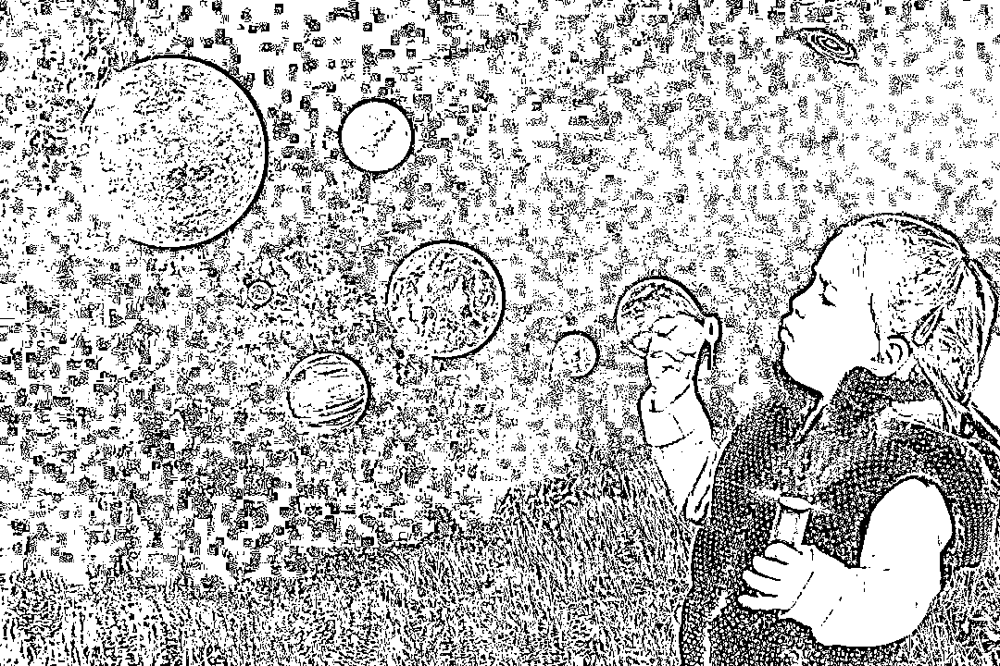

**你要的答案在这里**

答案按照胆量值递减的顺序排列

**★****白羊座 （c > a > b)** ****★** 金牛座 (b > c > a）******★** 双子座 (a > c > b)******★** 巨蟹座 (a > c > b)******★** 狮子座 (c > a > b)   ******★** 处女座 (b > c > a)******★** 天秤座 (c > b > a)******★** 天蝎座 (c > b > a)******★** 射手座 (b > c > a)       ******★** 摩羯座 (a > c > b)    ******★** 水瓶座 (b > c > a)     ******★** 双鱼座 (a > c > b)**

*   如果你选择括号里的**第一个**选项，说明你是勇敢而自信的，请继续保持；
*   如果你选择了**第二个**选项，说明你有一定的胆量和自信，不过还有提升的空间，你可以参照第一个选项，变得更为勇敢、自信；
*   如果你选择了**最后一个**选项，说明你还不够勇敢和自信，再遇到类似的情境时，你可以尝试前一个选项和第一个选项，变得越来越勇敢、自信。

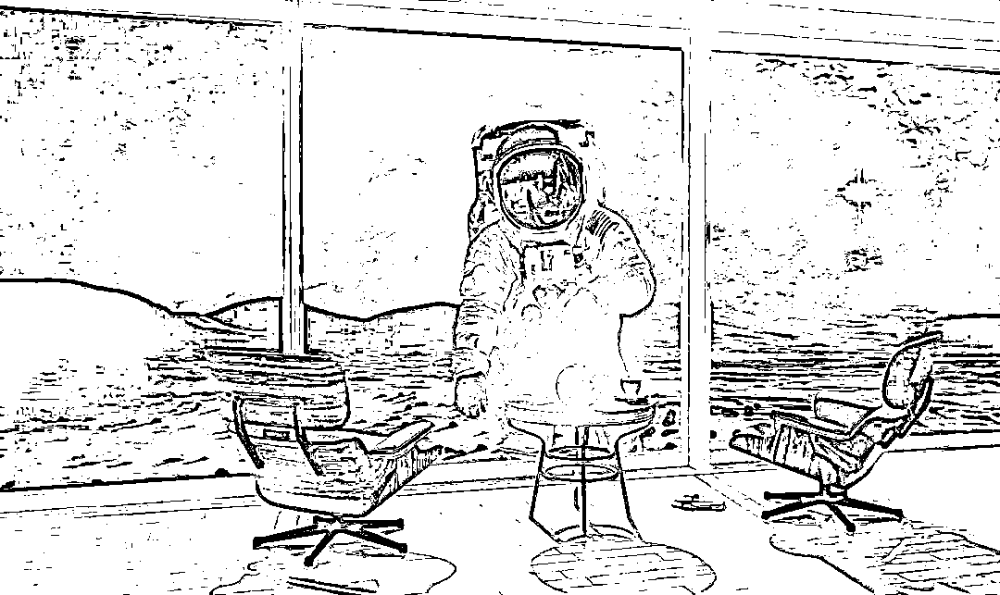

**怎样的 12 星座才算大胆？****白羊座**当你**自信满满**时，你会把握住这个机会按照你自己的方式去做，而与你的老板谈谈你的顾虑是最不自信的选项。**金牛座**

需要勇气才能离开舒适的“任何事物”，去展现出你的**价值**，而你的价值反映出你的自信。

**双子座**

你是一位**信使**，但是在这个案子中说出实情，并担任目击证人需要拿出勇气和信心。

**巨蟹座**

**家庭**挑战对我们所有人都并非易事，尤其是对大部分巨蟹座人而言，与你的**母亲**坦诚地讨论这件事需要勇气和自信。

**狮子座**

谁才是领导，对吧？你才是。但是面对你的**领导**需要拿出勇气和自信。

**处女座**

你并不是那种经常寻求认可的人，所以拿出勇气和自信来要求获得**认可**，即使这显然是你应得的。

**天秤座**

在你人生的重要**关系**中，这样的对峙需要勇气和自信，尤其是可能要面对欺骗的情况下。

**天蝎座**

你通常善于应对**危机**，这样的局面要求拿出自信和勇气，忠诚地捍卫一位朋友，即使这需要与老板对峙，可能让你丢掉工作。

**射手座**

这是一次戏剧性的事件，需要勇气和自信来**“大声喝止”**，让人们去关注这件显然不正当的行为。

**摩羯座**

成功还是失败是你衡量自身存在的标尺，但是在这里你拿出了勇气和自信为自己的行为承担充分的**责任**，即使这让人注意到你犯下的错误。

**水瓶座**

这些选择反映出你按照自己**独创的理念**去行动的勇气和信心，同时这也是分辨你在人生中是否获得成就感的关键点。

**双鱼座**

**同情**不仅仅需要祈祷和友善，而更需要勇气去帮助那些暂时被生活压倒的人。

**版权声明：**原创文章由作者授权发布于若道平台，欢迎转发，反对抄袭。友号转载请申请白名单。

****想阅读更多作者的文章，请在后台回复******大卫****** 即可。****

**喜欢文章请长按下方二维码打赏**

**给大卫老师加杯咖啡呗~**

**▼**

**学习占星学**

**点击或长按下图了解课程详情** 

**微信又双叒叕改版啦，不想错过若道君的推送？**

**就把若道设为星标吧！**

**▼**

**喜欢记得点一下在看哦☟**

****报名直达入口****

# 神话塔罗之大阿卡纳牌｜女祭司

> 原文：[`mp.weixin.qq.com/s?__biz=MzA5NjA0NTAxNg==&mid=2651455871&idx=2&sn=15ae629e1b35f1371b81868f5bfdd2aa&chksm=8b48b3c8bc3f3ade0175d0e03bfe496711801614273e7fe98b6435fafe0de5daf3a8d7c1312f&scene=126&sessionid=1692737928#rd`](http://mp.weixin.qq.com/s?__biz=MzA5NjA0NTAxNg==&mid=2651455871&idx=2&sn=15ae629e1b35f1371b81868f5bfdd2aa&chksm=8b48b3c8bc3f3ade0175d0e03bfe496711801614273e7fe98b6435fafe0de5daf3a8d7c1312f&scene=126&sessionid=1692737928#rd)

[🔈 神话塔罗·女祭司](https://res.wx.qq.com/voice/getvoice?mediaid=MzA5NjA0NTAxNl8yNjUxNDU1ODcw)

**冥府女王**女祭司牌描绘的是一位身材修长、姿态翩然的年轻女性，她的皮肤略显苍白，衬着深色的双眼以及一头乌黑的长发，身上穿了一件简洁的白色长袍，头戴金色的王冠。她的右手握着一颗裂开的石榴，里面显现出很多的石榴籽；左手抓着一束白色的水仙，随意地垂着手臂，任凭几支水仙散落下去。她站在台阶上，两边各有一根高大粗壮的石柱，左边的是黑色的，右边的是白色的。在她身后台阶的顶端有一扇门，门外是生机盎然的风景，这片风景在皇后牌中也出现过。

> **石榴**：象征着婚姻之爱和死亡，因为它有很多种籽。由此可见，珀尔塞福涅（*Persephone*）的隐形世界是丰饶的，拥有很多还没有发展的创造性潜能。**珀尔塞福涅左手的水仙**：是哈迪斯（*Hades*）绑架她后给予她的，水仙和死亡有关，因为它每年都从冬天的大地中长出，颜色如同传说中的幽灵。**黑色和白色的石柱**：反映出地下世界包涵的二元性。创造性的潜能和破坏性的冲动，都隐藏在潜意识的黑暗世界中。

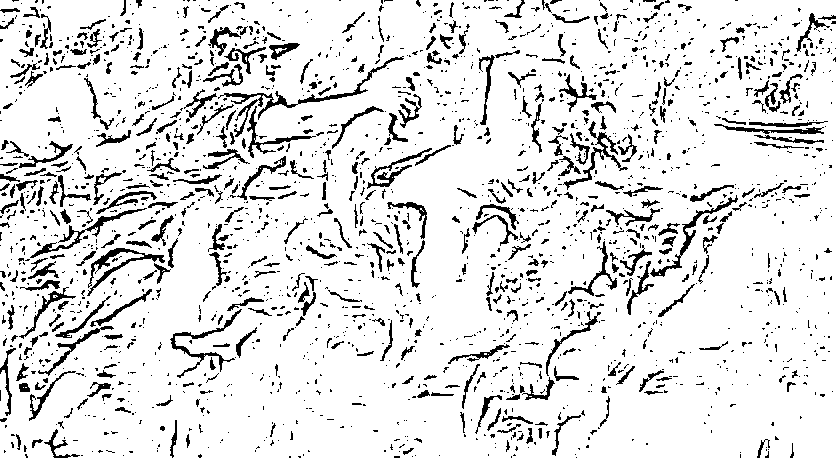

**死亡的守密人**我们在这里遇到了珀尔塞福涅（*Persephone*），她是冥府的女王；是大地之母德墨忒尔（*Demeter*）的女儿；是死亡之秘密的保护者。在皇后牌中，我们看到了神话中冥王哈迪斯（*Hades*）由于不能控制对处女的渴望，从地下世界中奔出，绑架了正在花丛中散步的珀尔塞福涅。回到冥府之后，哈迪斯给了珀尔塞福涅一个石榴，让她吃掉。吃下死亡之果后，珀尔塞福涅和哈迪斯就永远地结合在一起了。珀尔塞福涅和丈夫哈迪斯每年共同管辖冥府三个月的时间。尽管她在剩下的九个月里都和母亲德墨忒尔生活在尘世，却永远也不能说出冥府中关于死亡的秘密。哈迪斯的领土非常富足和神秘，被一条令人恐惧的冥河环绕着，如果没有哈迪斯的允许，任何活着的男女都不能穿越它，只有神界的信使和灵魂向导赫尔墨斯（*Hermes*），可以引导一些经过上帝允许的英雄们获得通行的特许权。即使鬼魂到了冥河，也要支付给冥河摆渡人卡戎（*Charon*）一枚硬币，才能踏上他的小舟。任何违背冥府律则的人，无论生死，都会被冥府守门的三头犬科尔伯罗（*Cerberus*）吞噬。通过吃了石榴果，珀尔塞福涅脱离了纯真的少女时代，成为黑暗世界的女王并保管着它的秘密。**潜意识，灵魂深处的律则****从人们内在的层面来看，珀尔塞福涅——女祭司的意象和我们内在的神秘世界有关，深度心理学称它为“潜意识（或无意识）”**。好像在我们日常生活的现实世界之外，还有一个隐藏的世界，其中蕴含着丰富的潜能，如果我们没有获得它的掌管者的许可，就不能了解其中的秘密。这个世界中包含着我们没有被发展出来的潜能和人格中原始的、黑暗的面向。同时它还掌握着每个人命运的秘密，在黑暗中孕育并在时机成熟时展现。**珀尔塞福涅——女祭司象征着了解我们内在世界之秘密的力量**，她也是我们自己的一部分，但是清醒的意识只能隐约地感觉到她，有时候通过支离破碎稍纵即逝的梦境，有时候通过一些同时性发生的“巧合”事件，这些都使我们开始讶异并猜测是否有一些隐藏的力量，秘密并强烈地影响着我们的生活。

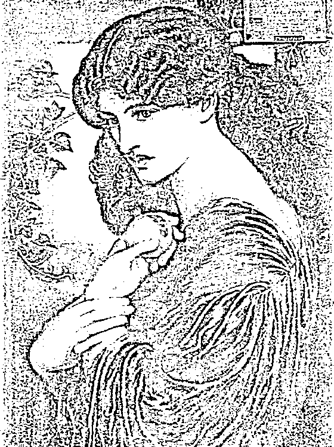

| 珀尔塞福涅
珀尔塞福涅是一个诱惑的、令人着迷的形象，但是她从来不说出她的秘密。同样地，**潜意识的黑暗世界，偶尔通过梦境、幻想或直觉灵光乍现，强烈地吸引着人们想去窥探，但是当我们试图用理智去了解它和利用它，以达到我们的某些目标的时候，它就会默然逝去毫无踪影**。珀尔塞福涅的黑暗世界在无形中秘密地运作着，影响着每个人的生活，只有通过足够的耐心等到时机成熟，它才会在日光下显现出结果。珀尔塞福涅的神话强调了时间的周期循环，暗示着一种恒常不变的力量在神秘的节奏下，以循环往复的运动模式运行着。改变的种子和新的潜力在地下世界的子宫中静候，某天它们会破土而出投入大地母亲的怀抱，在现实世界中茁壮成长。**珀尔塞福涅——女祭司象征着在灵魂深处运作的律则**，掌管着那个不可见的世界里还尚未成熟的宿命，只有通过**直觉、感受和黑夜里的梦境**，才有机会揭示出它的秘密。**女祭司，启动命运的隐藏模式****从解牌的角度来看，女祭司的牌面预示着直觉和感受力的增强，当事人以此去了解内在世界里**，珀尔塞福涅所掌管的领域。当事人可能被莫名其妙又无法抗拒的好奇心牵引着，通过某些密教的内容、强烈的梦境或奇怪的感觉了解和意识到自己生命中某些隐藏的运作模式。就这样，愚人在通过父母（皇帝和皇后）了解了他的自然属性、生存需求和在尘世生活中的位置之后，在这里走入了黑暗世界，带着潜意识中的混乱和迷惑（伟大母亲的另一个面向），去探寻自己命运的模式和真正的目的，这些秘密就隐藏在潜意识这个子宫的某个角落中。

**版权声明：**本文由《自在园》授权发布，欢迎转发，反对抄袭。友号转载请申请白名单。

**神话塔罗系列**

[开篇](http://mp.weixin.qq.com/s?__biz=MzA5NjA0NTAxNg==&mid=2651451590&idx=2&sn=41c1083542bcf098de303e29a028ff20&chksm=8b4b4271bc3ccb67d5d53c143cd5a17c24b7b60e5b1051949fa9f086f90b4ab04877976c47e5&scene=21#wechat_redirect)丨[愚人](http://mp.weixin.qq.com/s?__biz=MzA5NjA0NTAxNg==&mid=2651452189&idx=2&sn=f4cc6e768e367fbdb0f69b9c6382443d&chksm=8b4b41aabc3cc8bcdbd952d91d8408014a799224d3f67ab50bb5cbe88ee0090afc92869de1a6&scene=21#wechat_redirect)丨[魔术师](http://mp.weixin.qq.com/s?__biz=MzA5NjA0NTAxNg==&mid=2651453528&idx=2&sn=3ca9b35e1736168eef1856274635224a&chksm=8b4b4aefbc3cc3f965f2531f8c0d37da2e66a2b47139d445df1ea35eeb74bdf3b6827236741a&scene=21#wechat_redirect)丨[皇帝](http://mp.weixin.qq.com/s?__biz=MzA5NjA0NTAxNg==&mid=2651455083&idx=2&sn=d12546b67c830055f37b147f41c7641f&chksm=8b4b4cdcbc3cc5cad2def85451c3a7ddbb31ba5b9a01febb8a9fb18991d3e1263d9371ac212f&scene=21#wechat_redirect)

**朱丽叶·沙曼·伯克**从 20 世纪 70 年代早期开始，就对塔罗牌产生了兴趣，并踏入了塔罗的世界。后来，在丽兹·格林的鼓励下，开始研习心理占星学和塔罗。1984 年，第一本书《塔罗全书》（The Complete Book ofTarot）出版。之后，与丽兹·格林合作设计并撰写了《神话塔罗》（The Mythic Tarot）。朱丽叶写了十本塔罗和占星学书，包括一本名为《众星的传说》（Stories from the Stars）的儿童读物，以及与丽兹·格林合著的《神话之旅》（The Mythic Journey），这是一本详细讲述如何运用神话来指导生活的书。

**点击下图了解课程详情** 

**微信又双叒叕改版啦，不想错过若道君的推送？**

**就把若道设为星标吧！**

**▼**

**喜欢记得点一下在看哦☟**

************报名直达入口************

# 神话塔罗作者亲自授课的认证体系，错过了优惠价的你，别再犹豫啦

> 原文：[`mp.weixin.qq.com/s?__biz=MzA5NjA0NTAxNg==&mid=2651455871&idx=3&sn=ce8068db2a12a7f82be239dad8041862&chksm=8b48b3c8bc3f3ade4434cf234ef910e41909831203d51adeb71100843848def90bc4994b0b64&scene=126&sessionid=1692737928#rd`](http://mp.weixin.qq.com/s?__biz=MzA5NjA0NTAxNg==&mid=2651455871&idx=3&sn=ce8068db2a12a7f82be239dad8041862&chksm=8b48b3c8bc3f3ade4434cf234ef910e41909831203d51adeb71100843848def90bc4994b0b64&scene=126&sessionid=1692737928#rd)

**时隔三年，****超高含金量的神话塔罗认证课程强势回归****经过多次打磨的课程内容体系****让你直观精准的感受到****神话塔罗的魅力，****扎实的建构****神话塔罗思维，****系统****学习****最地道的塔罗知识。****中高阶课程中老师传授****将神话、占星、心理学完美融合进塔罗****的****人本主义咨询体系，****并进行****学员案例督导，****让你更自信的开展咨询工作，****学以致用。****本期认证课程采取****初中阶****即报即学的录播课****+高阶****案例督导直播课****的形式，****录播课：****精编剪辑，随来随学，助教答疑，学练结合。****直播课：****大师融合，神话心理，塔罗占星，咨询技巧。****若道为学员开发了****“神话塔罗”APP，****是随身的工具，****更是接咨询的平台，****中阶****学成入驻平台****即可链接更多塔罗个案，****发展壮大你的塔罗咨询事业。**

**如果你想学习塔罗，什么样的老师会让你怦然心动呢？她是三副塔罗牌的设计者，写了 6 本塔罗书籍。她研习塔罗四十余年，教授塔罗三十余年，是丽兹·格林的密友。还有****谁会比塔罗牌设计者更了解塔罗的历史、灵魂与精髓？****所以，这将是你开启塔罗之旅最坚实的一步。**

1

**这位塔罗大师是谁？**

**朱丽叶·沙曼-伯克** 

**· **她是**3 副塔罗牌**的**设计者****——**神话塔罗牌、沙曼–卡塞利塔罗牌、“自己着色”塔罗牌；**· **她出版了**6 本塔罗书****——**《塔罗全书》、《新塔罗全书》、《众星的传说》、《理解塔罗牌》、《精通塔罗牌》、《塔罗初学者指南》；**· **她研习塔罗**四十余年；****· **她教授塔罗**三十余年**；******· **她是**丽兹·格林**的密友，两人合著了**《神话之旅》**，共同设计了**神话塔罗牌。**

**· **她是认证的**心理治疗医师；****· **她深谙**塔罗、占星学、心理学和神话学**如果你想成为拥有英国神话塔罗认证的塔罗师那么她，就是你**最好的老师人选**

2

**塔罗牌有什么用？**

**· **塔罗牌是一种**古老的疗愈工具**，同时也是**直观的解惑工具****；****· **塔罗牌绕过逻辑思维，**和潜意识联结**，通过图像的方式生动地将隐藏在人类潜意识中的画面浮出水面，**揭示心灵的状况和运作****；****· **塔罗牌**帮助我们和潜意识对话**，可以和现代的心理治疗联系在一起，帮助我们**看清心灵的冲突来源、本质和可以选择的道路；****· **塔罗牌又和更广阔的**宇宙生命原型**联结，彰显**个人生命发展的阶段**，将**个人生命挣扎、内在冲突**放在生命进化的道途上，让更广大的生命智慧为个人成长照亮道路。

3

**为什么学习神话？**

神话通过**图像和故事**描绘人类生活的**原型模式**。通过瑰丽的想象、诗意的语言、栩栩如生的人物和故事描绘出我们内心的世界，表达出我们经历的那些实现人性的过程，帮助我们将**个体的生活与人类古老且永恒的故事**建立联结。从而在更深处**理解生命**，并学习**古老而长青的生命智慧**。**神话塔罗**取材于**希腊神话**的无尽沃土，通过故事提供一种**记忆辅助**，在心理和预见层面提升解读的**丰富度**。因为这样更符合塔罗牌的性质，符合人类的想象。**按照故事思考，而不是简单的记忆关键词和固定的意义。**

4

**塔罗预测是什么？**

塔罗牌预测的运作就像是**照向心灵的一面镜子**。在塔罗牌解读时，图像的原型性质穿透隐藏的潜意识脉络，反应出与个人境遇相关但又未被了知的知识与洞见，因此**揭示出按照任何理性方式都无法发现的事情。**如果你对生命好奇，塔罗学习会帮你**打开一扇通往未来的门****，**让你了解**心灵运作和显化的秘密**，同时赋予你更多关于生命成长的支持和指引的能力！

5

**我们将学习什么？**

**☆****初阶：神话塔罗详解**

**神话故事和预测意涵**

**第一讲 **

**介绍塔罗牌，讲述它的历史**

**第二讲 **

**星座三形态、四元素和宫廷牌**

**第三讲 **

**基本星座与基本国王**

**第四讲 **

**固定星座与固定女王**

**第五讲 **

**变动星座与变动骑士**

**第六讲 **

**小阿尔卡纳数字牌**

**第七讲 **

**小阿尔卡那数字牌-圣杯**

**第八讲 **

**小阿尔卡那数字牌-宝剑**

**第九讲 **

**小阿尔卡那数字牌-权杖**

**第十讲 **

**牌阵&案例解读**

**☆****中阶：神话塔罗排阵应用**

**排阵解读和咨询技巧**

**第一讲 ****大阿尔卡纳-开启神话塔罗愚人之旅：****愚人、魔术师、女皇、皇帝****第二讲 ****女祭司、教皇、恋人、战车、正义、节制****第三讲 ****力量、隐士、命运之轮、倒吊人、死神、恶魔****第四讲 ****高塔、星星、月亮、太阳、审判、世界******

**第五讲 **

**塔罗牌的原型、占星原型**

**第六讲 ****引导式冥想、荣格的四种意识功能** **第七讲 ****引导式冥想与马蹄牌阵**

**第八讲 **

**六芒星牌阵、凯尔特十字牌阵**

**第九讲 ****咨询案例演示：为一位年轻女性所做的四次解读****第十讲 ****神话塔罗咨询督导案例样例****☆****高阶：神话塔罗直播督导课**

**大阿尔卡纳的心理原型和学员督导**

**第一讲** **愚人**：永恒的少年；儿童的原型

**魔术师：****恶**作剧者、老师、向导、沟通者的原型；行星：水星

**女王**：母亲、养育者、丰产的原型；行星：金星在金牛座；小行星：谷神星

答疑与讨论，学员们分享对自己或客户的塔罗解读，对神话塔罗牌进行更多探讨。**第二讲** **皇帝：**父亲、供养者、计划者的原型；行星：木星

**女祭司：**处女——等待被实现的潜力原型；行星：新月

**教皇：**疗愈者、受伤的疗愈者、牧师的原型，牧师是神与人之间的灵性桥梁；行星：凯龙星

答疑与讨论，学员们分享对自己或客户的塔罗解读，对神话塔罗牌进行更多探讨

**第三讲** 

**恋人：**爱、爱人、所爱之人的原型；行星：金星在天秤座

**战车：**战争、冲突、战士、斗士的原型；行星：火星

**正义：**智慧、兵不血刃的胜利的原型；星座：处女座；小行星：智神星

答疑与讨论，学员们分享对自己或客户的塔罗解读，对神话塔罗牌进行更多探讨。

**第四讲** 

**节制：**关系、合作的原型；星座：巨蟹座、双鱼座

**力量：**力量的原型；星座：太阳在狮子座

**隐士：**晚年、耐心的原型；行星：土星

答疑与讨论，学员们分享对自己或客户的塔罗解读，对神话塔罗牌进行更多探讨。

**第五讲** 

**命运之轮：**命运女神与命运的原型

**倒吊人**：牺牲与有意识的牺牲的原型；行星：海王星

**死神：**死亡、终点和起点的原型；行星：冥王星

答疑与讨论，学员们分享对自己或客户的塔罗解读，对神话塔罗牌进行更多探讨。

**第六讲** **恶魔：**阴影、人类不文明的面向、本能、欲望天性；行星：火星在天蝎座

**高塔：**改变、分裂瓦解的原型；行星：天王星

**星星：**希望的原型

答疑与讨论，学员们分享对自己或客户的塔罗解读，对神话塔罗牌进行更多探讨。

**第七讲** 

**月亮：**无意识的原型；行星：暗月

**太阳：**意识、创造力和文明的原型；行星：太阳

**审判：**复活、新生的原型；行星：水星作为灵魂向导普绪科蓬波斯

答疑与讨论，学员们分享对自己或客户的塔罗解读，对神话塔罗牌进行更多探讨。

**第八讲** 

**世界：**整体、完成和个性化的原型

答疑与讨论，学员们分享对自己或客户的塔罗解读，对神话塔罗牌进行更多探讨。

**认证阶段：考试论文**

**入驻塔罗平台**

6

**适合人群**

**· **塔罗初学者，完全没有塔罗基础；**· **塔罗自学者，也曾上过塔罗工作坊，但仍不懂如何使用塔罗牌；**· **塔罗进阶学习者，有塔罗基础，了解 78 张塔罗牌含义；**· **不知如何解决遇到的情感困惑、职业选择、人际问题，对人生感到迷茫；**· **想要学习深入解读塔罗牌、牌阵的使用、咨询技巧等将塔罗运用于咨询实践；**· **想要深入了解和学习塔罗，希望成为专业的塔罗师；**· **想要借助塔罗进行心灵、灵性成长。

7

**导师简介**

**朱丽叶·沙曼-伯克**

**朱丽叶·沙曼-伯克**从 20 世纪 70 年代早期开始，就对塔罗牌产生了兴趣，并踏入了塔罗的世界。后来，在丽兹·格林的鼓励下，开始研习心理占星学和塔罗。1984 年，第一本书《**塔罗全书**》（*The Complete Book ofTarot*）出版。之后，与丽兹·格林合作设计并撰写了《**神话塔罗**》（*The Mythic Tarot*），在这本书中，她们将古希腊神话与传统塔罗解读结合起来。朱丽叶写了**十本塔罗和占星学书**，包括一本名为《众星的传说》（*Stories from the Stars*）的儿童读物，以及与丽兹·格林合著的《神话之旅》（*The Mythic Journey*），这是一本详细讲述如何运用神话来指导生活的书。

8

**课程价格**

**初阶正价：**5800 元**中阶正价：**5800 元**高阶正价：**7800 元**考试认证费用：****3000 元****认证课程总价：****22400 元****联报优惠价：****18000 元**

长按二维码添加客服 Echo 老师

9

**退转课程**

*   **退款原则请详看《教学协议》，如有疑问请咨询课程顾问。**

**神话塔罗认证课程**

**授课老师：****朱丽叶·沙曼-伯克**

**授课时间：2021 年 11 月 3 日起**

**授课方式：**网络课程**，**英文授课，中文翻译

**费用：****初阶正价：**5800 元；**中阶正价：**5800 元；**高阶正价：**7800 元；**考试认证费用：****3000 元；****认证课程总价：****22400 元；****联报优惠价：****18000 元；**

**课程负责人：Echo 老师**（微信/手机：nodoor18518412824，请备注“神话塔罗”）

长按二维码添加课程负责人咨询~

****报名请点击“阅读原文”****

# 深度丨想在金星的功课上获得进化，你需要知道这六个真理！

> 原文：[`mp.weixin.qq.com/s?__biz=MzA5NjA0NTAxNg==&mid=2651455738&idx=1&sn=11b9e22577bab6924801fd9b265c2905&chksm=8b48b24dbc3f3b5b6ab2cba7e584c157bbe9cef087a971824ea1f1d698ea8daaec26eda3cc59&scene=126&sessionid=1692737928#rd`](http://mp.weixin.qq.com/s?__biz=MzA5NjA0NTAxNg==&mid=2651455738&idx=1&sn=11b9e22577bab6924801fd9b265c2905&chksm=8b48b24dbc3f3b5b6ab2cba7e584c157bbe9cef087a971824ea1f1d698ea8daaec26eda3cc59&scene=126&sessionid=1692737928#rd)

**************☆ ************************后台************************回复“今日”，给你一句生命态度**************

 作者/斯蒂芬·弗里斯特

译者/Chang 校对/Leisha

编辑/翀子  封面/书君 图片/网络斯蒂芬老师对爱情的阐述常让占星学子们着迷，他这篇文章里告诉我们，金星的主要功能是学会拒绝别人，找到个人化的爱的道路。另外，斯蒂芬老师马上要在若道开设[【占星咨询线上工作坊】](http://mp.weixin.qq.com/s?__biz=MjM5MjQwNjAyMQ==&mid=2649438813&idx=1&sn=17d232524255c1e5d1c2bcaabf8476f6&chksm=beb9553789cedc2176a4fcc9b2e28c38ccef5d31c3896192926829d162ce7aaa1ec1b2a135c5&scene=21#wechat_redirect)（点击查看课程），如果想跟这位占星大师学习，快来了解详情吧~
**金星的功能：拒绝别人**

有一次在教关于金星的课程时，我吓到了学生——也吓到了我自己，一点点。**我听到自己说，金星的主要功能在于拒绝别人。**这当然与我们通常认为的金星相去甚远！我们想象着“爱之女神”睁着朦胧的双眼迎接我们，张开双臂，将我们接纳入怀中，没有哪怕一丝批评、犹豫或条件。

有时，人们终其一生都在寻找那种完美的爱情。他们是人类中的悲情浪漫主义者。他们大多孤独地死去。四十年前，谁人（The Who）乐队的皮特·汤申德发行了一首歌曲，似乎说明了一切——《大海不拒绝任何一条河流》。对我来说，那句词代表了摇滚诗歌的一大亮点，但它实际上与金星关系不大。实际上，他的歌词纯粹是海王星的，不仅因为提到了海洋。

**会无条件爱人的是海王星，而不是金星。**正如我们大多数人很快发现的那样，我们想象的上帝爱我们的方式与我们的父母或伴侣爱我们的方式之间存在巨大差异。父母和伴侣的话，虽然可能会有真诚的拥抱和亲吻，但套餐中还包括一些翻白眼和不赞成的表情，以及我们可以改善自己的无数方法的“帮助”清单。

金星并不“爱所有人”——那是海王星的工作。**金星会挑拣和选择，**这意味着某些拒绝的因素必须始终是过程的一部分。**金星的爱是个人的。**它关于“我和你”，而不是“我和人类”。性上面金星往往是二元的，或者至少它渴望这种情况。

例如，一生中你会说多少次“你愿意和我结婚吗？”

反射性地回答“只有一次”的日子已经一去不复返了——但我们大多数选择结婚的人至少试着把这个数字控制在一只手能数得过来的次数。这一观察将我们直接引向了弗里斯特 376 号定理——我们中的大多数人亲吻的人比结婚的人多得多。而亲吻不就是更深层亲密关系可能性的初步调查？即使在世界上最真诚的人中，这些调查也更有可能揭示出不在一起的原因，而不是终生结合的原因。

看？那是拒绝！**对人说不**——用智慧和辨别力——**是一种基本的金星艺术。**

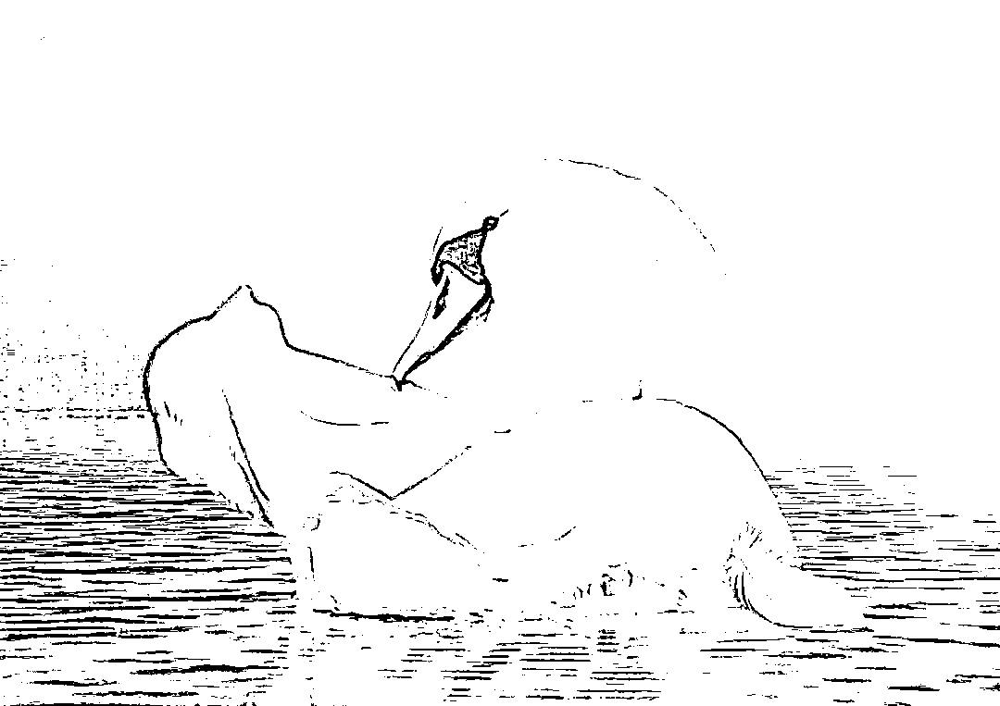

在倾向于结成伴侣的人中，以下是我们实际经历的脚本：不是你、不是你、不是你、不是你......你？给我一个吻......不，你也不是......不是你，不是你......你？吻我......真的是你吗？再吻我一次。你！是你！我找到你了！

可能听起来很轻率，但用现实来检验一下。如果它通不过检验，我会很惊讶。我们这里所做的考虑的基础，是关于金星的一个关键点。**金星所做的是辨别我们与另一个人之间深刻、具体的互补性。**

**说金星是关于“拒绝人”是足够准确的，**尽管老实说，这种朗朗上口的措辞无法包含这颗行星的热情。也许我们可以“爱每一个人”，或者至少渴望这样。但是每个人都可以成为“你最好的朋友”吗？每个人都可以成为你的伴侣吗？向任何人提供那种深厚的个人亲密感是一份丰厚的礼物，**我们不能把这份礼物送给太多人。**生命太短暂，加上我们都太个性化，无法在每个街角找到那种灵魂的和谐。

爱是一个狡猾的字眼，有许多不同的合理含义。这可能是它如此受流氓欢迎的原因之一。正如我们所看到的，你对人类的爱——人类善良的乳汁——是在海王星的无边领域中的。**你对伴侣或亲密朋友的特别的、非常人性化的爱是金星之爱。**一个人要想有资格获得它，他或她必须通过很多考验——并还要继续通过考验。

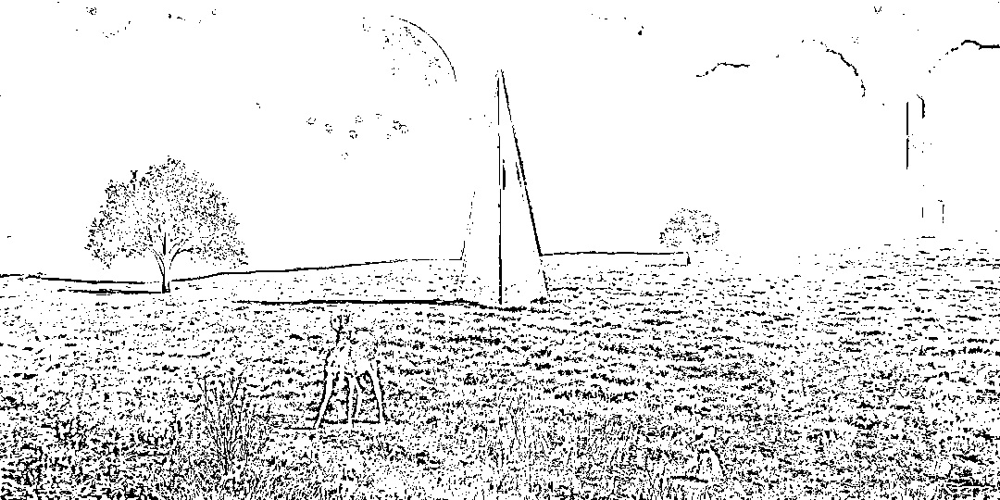

**金星的功课**

所有这一切的基础是关于在**金星维度**的人类灵魂进化的**六个基本真理：**

*   金星的功课不能独自一人学习。它们是关于**爱和信任**的，没有人能独自一人学到太多关于爱和信任的东西。
*   只有某些**特定的人**可以帮助你学习你要学的亲密课程。在当地咖啡馆随意拍拍陌生人的肩膀搭讪并不是可靠的策略。
*   如果你真的**倾听你的内心**，你实际上有一些很好的直觉，知道谁可以帮助你——谁不能。
*   这些本能被占星学编码在你出生星图金星中，**它会被那些真正可以帮助你成长的人所吸引——并拒绝那些不能帮助你成长的人。**
*   不拒绝那些不能对你有积极帮助的人，是人类痛苦海洋的根源。
*   **认出那些可以帮助你的人**并与他们共度人生也许是这个世界所能提供的最大财富。

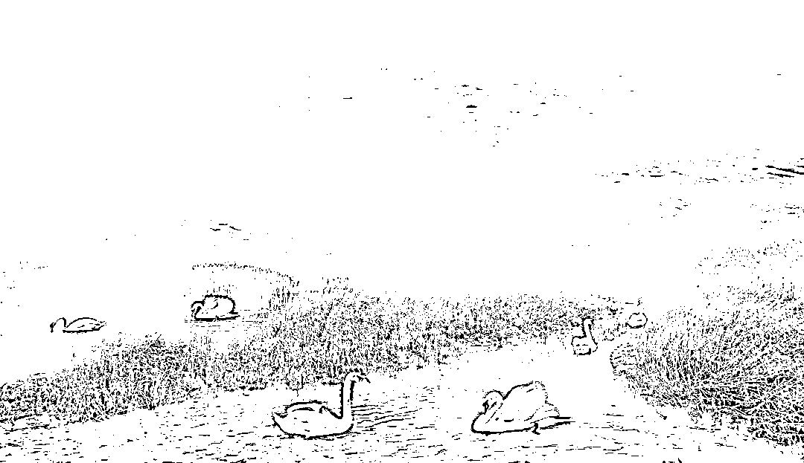

**金星的功课**

让我们快速浏览一下金星位于**双子座、巨蟹座和狮子座**的情况，把前面探索的一切落到现实。在阅读这些文字时，你会看到一条信息，关于金星在每个星座的人正在学习什么，谁能帮助他们学习，以及如果他们不能同时掌握——**诚实的自我认识和辨别对他们不利要拒绝的人**——这两门艺术，会是什么样子。

**金星在*****双子座***

**亲密进化议程**

**良好的沟通**对我的亲密体验至关重要。将灵魂状态清晰地翻译成词汇和句法总是具有挑战性的。我决心掌握这项技能，既要能**表达自己的情感**，也要能**深入倾听对方所言**而不被自己的先入之见蒙蔽。一段关系让我感到无聊的话，我的表现会不太好；我决心在我所有的关系中，尽自己的一份力量，让它**保持有趣、成长和变化。**

**天然伴侣的重要品质**

开放的头脑、好奇心、渴望新的体验和学习的机会、倾听技巧、口齿伶俐——或者至少是愿意口头自我表达。天生喜欢谈话。愿意讨论任何事情。

**策略**

我决定做到两件事：**认真倾听伴侣，**并从我的内心做出明确而坦率的回应。

我尽自己的一份力量来**保持一段有趣的关系**：我建议旅行，我读书并谈论学到的东西，为了获得新鲜感带来的纯粹乐趣，我会炸毁亲密关系中死气沉沉的惯例。我提出问题并听取答案。

**工具**

我喜欢**说话和倾听**，至少在与爱的人的亲密关系中是这样。我天然对很多事情感兴趣。我真的很好奇其他人的观点，尤其是那些与我分享生活的人。

**处理阴影**

世界上有很多有趣和有吸引力的人，但一旦我承诺于一段关系，我就会小心翼翼地不被其他人分心。我将**使用语言**作为与我关心的人建立桥梁的一种方式；我会热切地监控自己是否倾向于将自己的心隐藏在言语和精心设计的合理化背后。

**金星在*****巨蟹座***

**亲密进化议程**

与其他人形成**牢固、持久、坚定**的纽带。关系的稳定和持久并不是唯一的目的——更深层的是，我的目标是为自己创造一个**亲密的环境**，让我最脆弱的部分感到**足够安全**，可以被揭露。在内心层面，我正在寻找家，以及某种意义上的**家庭感**。

**天然伴侣的重要品质**

愿意对我做出彻底的承诺。可信、可靠和忠诚。一个不会太害怕“永远”这样有力的词的人。培育的冲动——无论是培育孩子、宠物、花园还是关系本身。

**策略**

我必须在以下两方面之间保持一种创造性的张力，**一方面**是我天生怕受伤的谨慎，**另一方面**是自愿冒着真正敞开心扉的风险。我不会谨慎到遥不可及。

**工具**

本着**家庭奉献和终生承诺**，而去爱另一个人的深刻而基本的能力。一种近乎无限的只是关心另一个人的能力。我的性欲与单纯感情的自然的内在结合。

**处理阴影**

我决心对我可能会**过度谨慎**和**自我保护**保持觉知。我不会在“父母亲”般照顾的面具后隐藏我的**真实感受或需求**。

**金星在*****狮子座***

**亲密进化议程**

在我的亲密生活中，我决心只有被我自己珍视的人珍惜，我才会停留。没有人必须是完美的——这不是重点。这里的议程是完美地去爱——**为彼此庆祝，互相支持，**并始终将关系的幸福放在所有其他问题之上。我需要感到足够自由才能变得脆弱。

**天然伴侣的重要品质**

表现力。充满柔情、情感外露的性格。提供支持。说我爱你的能力。体贴，自然流畅地赞美。自尊——以及对我的尊重——体现在愿意维持最佳的外貌和行为举止。

**策略**

首先，我决不勉强接受我并不真正珍惜的伴侣。我宁愿独自一人也不愿那样自贬。一旦找到这样的人，我就会积极投身于一条**活跃的、终生的道路**，致力于维护和培养我们之间**持久的浪漫**。

**工具**

我对**有风格和丰富多彩的自我表达**有一定的天赋。能够以有影响力的方式说出我的感受，因此可以被深切地听到。一定程度的**健康的自豪感、自尊和尊严**——所有这些都支持我不要在任何关系中退而求其次。

**处理阴影**

我提醒自己，没有人的生活需要围绕着我。在健康的关系中，我们就像一对双星，围绕着我们**共同创造的重心**运行。不是“都关于我”。我坦率地表达自己的需求——但我也会腾出空间来倾听我的朋友和伴侣的需求并庆祝他们的胜利。

**版权声明：**本文由若道翻译发布，欢迎转发，反对抄袭。友号转载请申请白名单。

**斯蒂芬·弗里斯特**

若道签约老师。进化占星学的创始人之一，当今世界最有影响力的占星大师之一；1985 年，他凭借《内在的天空》一书获得职业占星师协会奖（Professional Astrologers Incorporated Award）。他四次获得占星界最高的占星学联合协会奖（United Astrology Congress Regulus Award）提名，2018 年获得轩辕十四教育奖。

**学习占星学**

**点击或长按下图了解课程详情** 

**微信又双叒叕改版啦，不想错过若道君的推送？**

**就把若道设为星标吧！**

**▼**

**就是这个“在看”，戳戳戳 ☟**

****************报名直达入口****************

# 斯蒂芬三日线上工作坊丨如何进行一场有效的占星咨询

> 原文：[`mp.weixin.qq.com/s?__biz=MzA5NjA0NTAxNg==&mid=2651455738&idx=2&sn=1e9424e455fac6ad14a2871d2ac00337&chksm=8b48b24dbc3f3b5bdad7a3afc0c25f51c922fd4ef0e41da958c983342a71831b539b5499b8bc&scene=126&sessionid=1692737928#rd`](http://mp.weixin.qq.com/s?__biz=MzA5NjA0NTAxNg==&mid=2651455738&idx=2&sn=1e9424e455fac6ad14a2871d2ac00337&chksm=8b48b24dbc3f3b5bdad7a3afc0c25f51c922fd4ef0e41da958c983342a71831b539b5499b8bc&scene=126&sessionid=1692737928#rd)

**喜大普奔，斯蒂芬要来教占星咨询了！**

占星咨询对于很多占星学生和兼职占星师而言，都是考验自己到底能否成为职业占星师，建立欣欣向荣职业生涯的最关键一环。

一个坏消息是，当你辛辛苦苦学习完所有的占星技术后，你可能仍会有些沮丧地发现，自己还是做不好一场咨询。

**比如：**

对咨询的问题

*   我可以怎样迅速和客户建立信任？

*   我如何描述星图中我看到的困难配置，或者如何描述我看到的即将到来的富有挑战的行进？

*   如果客户在咨询中滔滔不绝，我该怎么办？

*   如果客户在咨询中一言不发，我又该怎么办？

*   如果客户否认我所描述的他/她明显存在的问题怎么办？

*   如果客户存在明显的心理问题怎么办？

*   如果我讨厌这个客户怎么办？

*   如果我被这个客户吸引怎么办？

*   如果我的性能量被客户激发怎么办？

*   ……

**这么多问题怎么办？！**

别着急。

好消息是，这是每一个占星学生和新手占星师都会遇到的问题，也是每个占星师必走之路。**其中一些问题是可以用占星技能所解决的，而另一些又是在占星技巧之外，需要进入心理学的领域。**不论怎样，归根到底，我们要能在咨询与客户建立并且维持**良好的咨询关系**，甚至与那些跟我们性情截然相反的客户。

1

**授课内容**

如果你听过斯蒂芬·弗里斯特的占星咨询，你会看到客户被他润物细无声的咨询所打动，又感到自己被他深沉的慈悲所懂得。那些娓娓道来的故事在客户面前展开生命时空的画卷，在咨询结束时，又充满希望的力量。

**而****今年****10****月****，在斯蒂芬到中国教学 10 年后，他将****第一次****与所有热爱他的学员分享如何做好一场占星咨询。**

在这个网络课程中，占星大师斯蒂芬·弗里斯特将会和你分享他几十年来一对一面对面的**占星咨询经验**；他也会分享如何提前规划好**接近客户心灵**的占星技巧。**客户个人星图**为我们提供一个最迅速，也最可依赖地建立信任和自然连接的地图，他还会分享如何运用个人星图建立这个连接。

2

**斯蒂芬的占星著作**

*   **1984-1988 年间**，斯蒂芬写作出版了《内在的天空》（已有中文版）、《变化的天空》和《天空的伴侣》三本占星经典著作，奠定了早期在占星学界的地位。

*   **2002-2005 年间**，他与朱迪·弗里斯特共同创作了两本经典的关系占星学著作《天空的伴侣 I：爱、性、和进化占星学》《天空的伴侣 II：组合图》。　

*   **2008 年**，斯蒂芬出版了一本非常重要的著作《昨日的天空》，此书是至今为止关于轮回转世跟星图的清晰对应最详尽的著作之一。 斯蒂芬前后一共出版了 12 部占星著作，在世界占星学界拥有很高的声誉。

3

**斯蒂芬获得的荣誉**

**1985 年**，他凭借《内在的天空》一书获得**职业占星师协会奖**（Professional Astrologers Incorporated Award）。

**1992、1995、2008 年、2018 年**，他四次获得占星界最高的占星学联合协会奖（UnitedAstrology Congress Regulus Award）提名，**2018 年获得轩辕十四教育奖**。

4

**斯蒂芬的占星哲学观**

斯蒂芬的占星风格以自由和选择为中心，他的解读不是以下定论的方式来“预测”未来，他强调如何**改善生命**，而不是宿命式的论断。他以心理占星学的语言来解读星图上的人格部分，但是通过**南北交点及其相位和守护星**来探索星图所揭示的前世业力与今生方向，在灵魂进化的背景里来整体解读星图。

他认为进化占星学的目的在于鼓励人们做出更符合进化方向的智慧选择，我们学习去了解前世的时侯，关注点应该集中在**如何通过意识来疗愈自己**。

5

**这些名人怎么说？**

斯蒂芬让我们停止了玩责备命运的游戏，而开始看到自己是一个走在进化路途上的勇士。 ——**奥普拉杂志***“O: THE OPRAH MAGAZINE”*

斯蒂芬和杰夫这两位著名占星师创造性地相互应和，展现出他们出色的教师才华，发展并弘扬了占星这门艺术。（对《测量天空：进化占星学和灵魂的钥匙》的书评） ——著名心理占星师 现代占星学之父 **诺·泰尔**（Noel Tyl）

请享用斯蒂芬和朱迪这两个博大的灵魂在此书中所提供的洞见大餐吧。（对《天空的伴侣》的书评） ——进化占星学的创始人之一 **杰夫·格林**（Jeff Green）

我为斯蒂芬解读的精准感到惊叹，他强调没有一件事是坏得无法挽回的，也没有一件事是如此之好，以至于它不会因为现在的错误判断而消失的。我怎样推荐他都不为过！ ——好莱坞著名影星“钢铁侠”男主角 **小罗伯特·唐尼**（Robert Downey Jr）

6

**上过课的占星师怎么说？**

他关于我星图的解读，让几乎所有在场的人掉泪，我也从此开启了一段灵魂追寻的旅程。我很惊讶他透过星图可以如此深入一个人的灵魂。很多东西你自己都不知道，但是他讲出来你会发现，啊，这是真的，这是占星学的神奇。——**《心探索》创始人孟想**每个来参加老师课程的同学，都会被老师深深的慈悲心感动。这种慈悲心，并不是表面上说的一些什么话，而是一种从意识层次上发出的能量。每个来上课的人，都能感受到老师的爱。这种爱，并不是盲目的爱，而是深刻地洞悉真相后的慈悲。——**斯蒂芬老师工作坊翻译逸月**斯蒂芬老师的一对一咨询已经排期到两年之后，我特别幸运，曾在课堂上被老师抽中分析过我的星图，老师充满爱与智慧的指引让我更加清晰的认识了自我。内在的潜能、需求和矛盾被老师娓娓道来。——**禄丽荣**斯蒂芬老师是位非常非常值得推荐的大师，很粉他，这位进化占星学的创始人，对人的理解是那么的全面完整、深刻洞见、慈悲和温暖，就这方面而言足可以媲美我无比崇敬的荣格和史坦纳（这两位去天堂里玩了），如果你对西洋占星感兴趣，或者对人的所有角度、各个层次的真相和可能性感兴趣，推荐斯蒂芬老师的书和课程，特别是他的课程，数倍的功力大增的好机会，错过真是占星粉丝的莫大损失。——**仁华**

7

**2020 年斯蒂芬线上工作坊学员感悟**

8

**什么人适合这门课程？**

*   占星师或渴望成为占星师的人群。    

*   课程会涉及综合解读高阶内容，不了解相关知识的同学，请提前学习相关内容。

9

**老师简介**

**斯蒂芬·弗里斯特(Steven Forrest)**

*   进化占星学的创始人之一，当今世界最有影响力的占星大师之一；

*   毕业于美国北卡罗莱纳大学宗教学专业；

*   1984-1988 年间，写作出版了《内在的天空》、《变幻的天空》和《天空的伴侣》三本占星经典著作，奠定了早期在占星学界的地位。前后一共出版了 12 部占星著作，在世界占星学界拥有很高的声誉。

*   1985 年，他凭借《内在的天空》一书获得职业占星师协会奖（*Professional Astrologers IncorporatedAward*）。1992、1995、2008 年、2018 年，他四次获得占星界最高的占星学联合协会奖（*United Astrology Congress Regulus Award*）提名，2018 年获得轩辕十四教育奖。

*   斯蒂芬将自己的绝大部分时间都花在教学以及个人咨询上，他于 1998 年创立了占星学徒计划（*Astrological Appretice Program*），这个计划致力于培养职业占星师；

*   至今为止已经有 600 余位学员完成了培训，其中很多都成为了优秀的职业占星师；

*   他是一位脚踏实地的导师，充满快乐和活力，亲和幽默同时又充满了智慧；他的课程不仅仅是一次占星知识和经验的学习，也是一次与智者的相遇。

10

**课程费用**

**正价：****4800 元**

**早鸟价：****3800 元****（9 月 22 日截止）**

11

**授课时间、方式和退转**

**授课时间：**

****2021 年 10 月 15 日-10 月 17 日（周五、周六、周日）****

****每天 7:00-13:00****

7:00 AM - 9:30 AM

**（1 小时休息）**

10:30 AM - 12:30 PM

**授课方式：**线上直播课，英文授课，中文翻译**退转课程：**

退款原则请详看《教学协议》，如有疑问请咨询课程顾问。

****斯蒂芬三日线上工作坊****

**授课老师：斯蒂芬·弗里斯特**

**授课时间：****2021 年 10 月 15 日-10 月 17 日**

**授课方式：**线上直播课，英文授课，中文翻译

**费用：**4800 元；**早鸟价：3800 元****（9 月 22 日截止）**

**课程负责人：****王老师**（微信：18510107057，请备注“斯蒂芬工作坊”）

长按二维码添加课程负责人咨询~

****报名请点击“阅读原文”****

# 处女座新月 | 燃爆的新月，最好的许愿就是接受挑战，迎接变化！

> 原文：[`mp.weixin.qq.com/s?__biz=MzA5NjA0NTAxNg==&mid=2651455663&idx=1&sn=2f06c89d0dccfcc1cfaea62e96e0466c&chksm=8b48b218bc3f3b0e748a8994ca7839ea9dd5bfd2bb389b74cbec4a5cbc33e41af753c4300f73&scene=126&sessionid=1692737933#rd`](http://mp.weixin.qq.com/s?__biz=MzA5NjA0NTAxNg==&mid=2651455663&idx=1&sn=2f06c89d0dccfcc1cfaea62e96e0466c&chksm=8b48b218bc3f3b0e748a8994ca7839ea9dd5bfd2bb389b74cbec4a5cbc33e41af753c4300f73&scene=126&sessionid=1692737933#rd)

****☆ **后台回复“今日”，给你一句生命态度**

作者/王芝桦 编辑/玫瑰 图片/pexels

**处女座新月****北京时间 2021 年 9 月 7 日 8:51 迎来处女座新月，太阳与月亮精准合相于处女座 14°38′。**最近这段时间，不同的新闻热点轮番登场：美国通货膨胀、阿富汗硝烟弥漫、阿里屡次上榜、娱乐行业整顿、校外培训规范、房产交易新规……这“一天一个样”的集体事件，悄无声息地冲刷着我们的认知，多多少少地影响着我们的生活，你是否感觉有些眼花缭乱和消化疲惫？**处女座擅长制定计划和落实细节，处女座新月自然也是许下愿景和开启计划的好时机。此次处女座新月，我们需要抓住处女座的关键词——完善！**此次处女座新月首先必备的态度——**现实生活正以“随时变化”的方式打开，而应对“随时变化”的最好策略便是“不变应万变”，即不断地完善认知，完善计划，完善方法。**

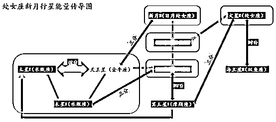

> **处女座新月重点影响人群**
> 
> **参考新月峰值影响期间各个行星的行进度数，以及逆行行星的轨迹影响；常规容许度，个人行星入相位 3°，出相位 1°；非个人行星入相位和出相位均为 3°。**
> 
> *   出生星图中，有**行星、四轴、南北交点**落入**固定星座（金牛座、狮子座、天蝎座、水瓶座）3°-17°，19°-30°**的人群。
>     
>     
> *   出生星图中，有**行星、四轴、南北交点**落入**变动星座（双子座、射手座、处女座、双鱼座）11°-27°**的人群。
>     
>     
>     
>     
> *   出生星图中，有**行星、四轴、南北交点**落入**基本星座（白羊座、巨蟹座、天秤座、摩羯座）7°-14°，22°-30°**的人群。

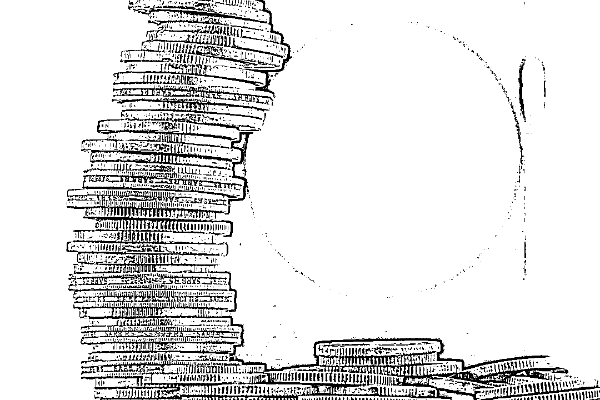

**最好的许愿：“迎接挑战，接受变化！”**

****

**放下负担，让它过去，这样才能继续前进。**

**——电影《风雨哈佛路》**

9 月的第一周并不那么好过。**9 月 3 日，处女座火星与双鱼座海王星形成“火海对分”结构，可能令我们发现自己坚持很久的努力还是“溃散”了。**或是没有达到预期的目标，或是出现不该有的错误，令人不敢直视，令人不知所措，这就像花了很大的力气却一拳打在海绵上，挫败感和无力感顷刻将能量吞没。**9 月 6 日**一天之内，处女座火星再与摩羯座冥王星形成**“火冥三分”**结构，天秤座金星与摩羯座冥王星形成**“金冥四分”**结构，天秤座金星与水瓶座木星形成**“金木三分”**结构。金星、火星同时将冥王星激活，再加上木星的联手，令**前几天打在海绵上、火气无处释放的拳头，将某些关系的深层议题打出一个“窟窿”。****主要影响的两个方面****· 职场关系：**个人之间，团队之间，容易出现权位、名利和资源之争，容易发生架构重组、人事变动和权责调整。虽有内耗，但也不是坏事，毕竟有竞争才有进步；**· 情感关系：**当猜忌心和占有欲在心底“噌噌噌”地窜出火焰，这个时候的亲密爱人也会披上“泼辣”的外衣，明明心里想听的是“我的世界只有你”，但脸上表现出来的却是呲牙咧嘴的河东狮吼“不在意就别回来了”。哎呀！霸道总裁是需要自信的，如果气场不够又想彰显主权，那么就很可能演绎成没事找事和不可理喻的矫情。希望这一次能够顺利地解决矛盾和平息战火，嗯，希望！终于来到此次处女座新月，新月的开启能量让我们寄予希望，阴霾快快退散，愿景迅速展开……等等，别急，此次处女座新月的开启能量，同时伴随着强劲的“变量”，切不可草率，请细细思量。

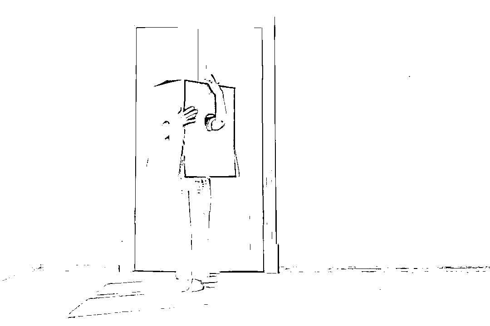

**1. 拥抱变化，从当下做出改变**

****

**我做出改变的时间要么是现在，要么就永远不可能。**

**——电影《风雨哈佛路》****天象****· 新月三分天王星：**合相于处女座的太阳与月亮，三分金牛座天王星。此次处女座新月发生时刻，合相于处女座的太阳和月亮，仅以 1 分之差，与金牛座天王星形成精准的三分结构。随着 8 月 20 日天王星于金牛座开始逆行，2021 年度重磅天象“土天四分”结构中的水瓶座土星和金牛座天王星便进入双双逆行的局面：**“新旧转化”的进程进入更加深化的阶段，反思将会更加彻底，清算将会更加具体，唯有将过去的问题清理，将过去的负担放下，全新的世界才能逐渐展开。**金牛座天王星主导现实世界中“生存根基、经济结构和资源条件”的全新变革。此次处女座新月与金牛座天王星的三分结构，两个土象星座和谐联手，将金牛座天王星“现实世界的全新变革”彻底激活。**可能经历的****· 职场：**行业整顿和企业变更都将会带来一波裁员消息。正在跳槽和求职的朋友，一方面可能得到全新的工作机会或面试机会，另一方面原本确定的入职时间或约见时间可能发生变动；**· 工作：**工作的计划、内容和流程可能被打乱，临时增减的项目和临时调整的人事，可能造成加班赶工或重新对接的状况；**· 身体：**工作压力、生活作息和食品安全需要特别关注，提醒我们提升“健康”意识；**· 集体：**迎来一波关乎民生的社会福利、税收政策和医疗新规的颁布。另外，此次处女座新月借由与金牛座天王星的三分结构，间接介入年度重磅天象“土天四分”结构。2021 年度重磅天象“土天四分”结构的“新旧转化”进程，颠覆着我们原有的认知与经验，常常让我们惊叹不已也措手不及。比如最近一连串的娱乐行业、培训行业和房地产行业的整改，过去很多年的行业规则与市场序列被一一打断，但更有利于公众利益的全新规则与全新秩序也正在被一一重建。只是，还需要时间去逐渐成熟和持续沉淀。作为集体环境中的我们，适应是必须的，顺应是必要的，而改变则是必然的。**逐渐深入的“新旧转化”进程，虽然瞬息万变，尽管前途未卜，但也意味着一切皆有可能。**此次处女座新月的“开启”能量，提示我们做出选择——改变的时间要么是现在，要么就永远不可能；那么，就**从此刻开始，拿出适应性的态度，做出具体性的计划，迎接挑战并拥抱变化吧。**

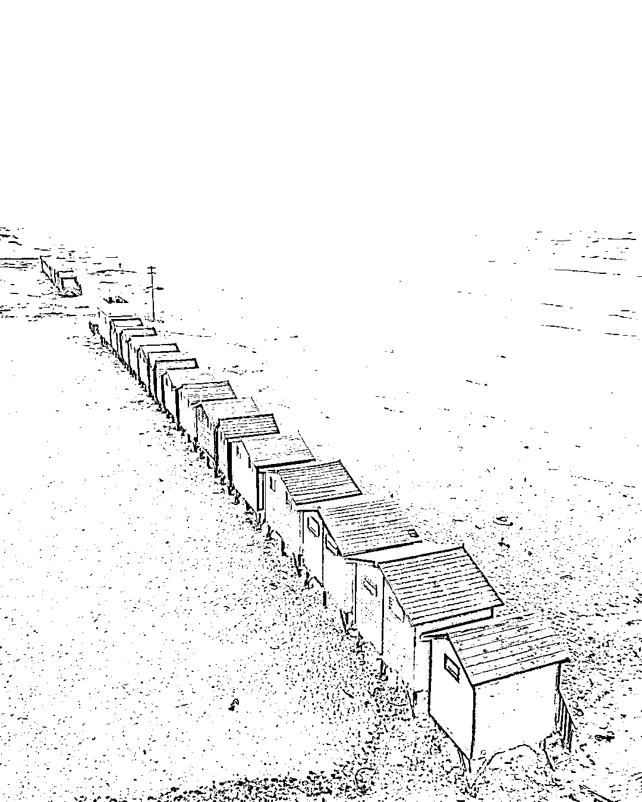

**2. 火大？冷静！选择的时刻到了**

****

**就在那一刻，我明白了，我得做出选择。我可以为自己寻找各种借口对生活低头，也可以迫使自己创造更好的生活。**

**——电影《风雨哈佛路》**

**天象****· 水星进入逆行前影响期：**9 月 7 日处女座新月当天，水星进入逆行前影响期。此次处女座新月的能量由处女座守护行星“水星”接纳。而这颗水星对整个 9 月都是非常重要的一颗行星。**8 月 30 日，水星换座进入天秤座，9 月 7 日，天秤座水星进入逆行的前影响期，9 月 27 日-10 月 18 日，天秤座水星逆行，11 月 3 日，天秤座水星逆行的后影响期结束，11 月 6 日，水星换座进入天蝎座。**2021 年第三波水星逆行将水星行进天秤座的时间拉长至两个多月（正常情况下，水星行进一个星座大约在 20 天左右），而 9 月大部分的时间被覆盖在水星逆行的前影响期之中（9 月 7 日-9 月 26 日），**此次处女座新月正是“水逆”影响的起点。****· 水星**代表着流动性的能量，人流、物流、交流和信息流的各种流通性事物均与水星相关；**· 天秤座**象征着建立在集体道德之上的平衡支点，构建出平等、友善、和谐的关系状态。水星行进天秤座时期，人们**关注各种关系中的平等性、道德感和尊重度。**故而，未来两个多月的时间里，**商务合作的合约诚信，人际关系的平等交流，将是集体和个人两个层面都非常敏感、非常在意的事情。**此次处女座新月当天，恰逢天秤座水星进入逆行前影响期，而这个时间也是整个水逆周期在商务合作和人际关系方面开始“暴雷”的时间。比如：**计划好的事情临时变化，承诺过的条件突然反悔，约定好的见面被放鸽子，安排好的行程意外延误，准备好的文书不慎损坏等等。**这里我们要将这篇文章前面写到的两个天象做个“加法”：处女座新月三分金牛座天王星+天秤座水星进入逆行前影响期= **意外+变化+问题= 火大！**9 月初心底“噌噌噌”窜出的火焰烧得更旺！

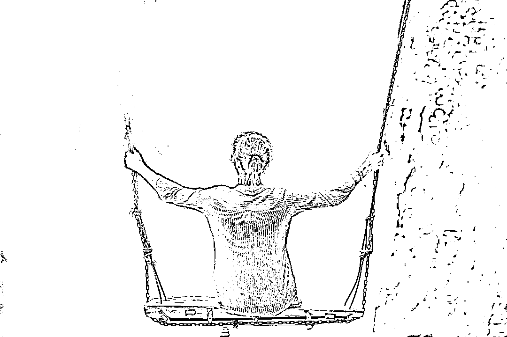

**需要注意的****· 个人层面：**还能好好说话吗？至少，要听别人把话说完。无论是亲密关系，还是人际关系，沟通都是一件允许彼此敞开表达观点、真诚交换意见的过程，如果只想听好听的，只能听顺耳的，恐怕没有人愿意进行这样的交往，因为累，更因为假。但同时，也要注意沟通时的边界问题和尊重态度，亲近不代表有权利越界，真诚不代表可以肆无忌惮；**· 集体层面：**经济趋势和商业环境，真正的“调控”刚刚开始。集体巨轮的行进需要给与更多的时间，很多事件并不会马上看到进展或得到结果，但周期的更替将会推动时代向着更好的方向发展，而每个人的“相信”就是最有建设性的助力。或许，当下的我们正卡在现实的困境之中，压力重重，倍感焦虑，但真正卡住我们的并不是现实的阻碍，而是陈旧意识和过往经验的禁锢，现实考验正在推动我们对未来做出选择——**是为自己寻找各种借口对生活低头，还是迫使自己做出转化并创造更好的生活？****最好的战斗是：为自己加大杠杆**

****

**绝不要让你不能做的事妨碍你能做的事。**

**——电影《风雨哈佛路》**

**天象****· 金火互容：**天蝎座金星与天秤座火星形成互容结构。此次处女座新月发生后的一周之内， 9 月 11 日，金星换座进入天蝎座，9 月 15 日，火星换座进入天秤座。于是，**9 月 15 日开始，金星与火星形成“金火互容”结构（当两颗行星分别行进在对方守护的星座之内，即形成互容），该组结构的影响直至 10 月 7 日金星换座进入射手座结束。**这里面，我们要说说“金火互容”结构中的金星。被誉为“爱与美的化身”，代表着价值审美和爱欲交互的金星守护金牛座和天秤座。当下天象中，金星接纳着金牛座天王星的能量，也接纳着正处于逆行前影响期的天秤座水星的能量，故而：**· 9 月 11 日，**金星进入天蝎座之后，便将金牛座天王星主导的“现实结构的变革”、天秤座水星逆行主导的“分配不公的清算”这两股能量做了一场整合：那些一直隐藏在不平等的关系模式、不被尊重的内在感受、不合理的资源分配中的内在情绪开始浮出水面；**· 9 月 15 日，**火星进入天秤座，“金火互容“结构形成之后，亲密关系和商业伙伴之间心机暗藏，一旦意见相左，一个言语不和，就容易令愤怒的情绪、竞争的本能和征服的欲望冒然行动，甚至不顾后果。于是，一些信任出现裂痕，一些关系分道扬镳。**自信是最好的“解药”。**自信，来自于实力，别人有的你有，别人没有的你还有。这种长在自己身上、别人抢不走的核心竞争力，令一个人了然自我价值并安于自我根基，而不需要别人的认同和衬托，故而无需较量和竞争。

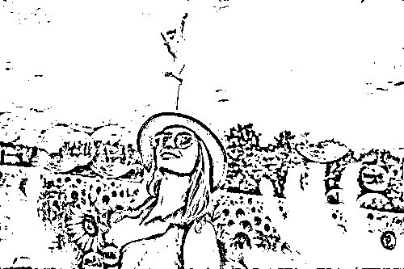

9 月中旬，确实是有点“艰难”的时间，不自信的匮乏感和恐惧感，容易令人陷入信任的割裂和关系的考验之中。但是，**那个激怒我们的人，也是能够激发我们的人，因为那个人就是我们的镜子。**当我们从镜子中看到在伤痛中颤抖、在恐惧中愤怒的自己的时候，记得最好的战斗是——**为自己的“核心竞争力”加大杠杆！**不要去盯着自己不能做的事，去盯着自己能做的事；不要去执着所谓的不公平，去为自己创造赢得公平的实力！**绝不要让不能做的事妨碍能做的事。**此次处女座新月，在你的愿景之中，记得为 9 月中旬的考验做出一点准备——为自己加大杠杆。**寄语**

****

**没有人可以和生活讨价还价，所以只要活着，就一定要努力。**

**——电影《风雨哈佛路》**

确实。如果我们和生活讨价还价，那么生活就会让我们委曲求全。问题是，谁愿意？这个 9 月，现实关系将会帮助我们听到内心的声音——**我不愿意委曲求全！**既然受不得委曲求全，那么就不要和生活讨价还价了。借助此次处女座新月的能量，许下愿景并开始努力吧！祝福大家，愿每个灵魂安好。**新月如何许愿？**

**许愿时间**：2021 年 9 月 7 日北京时间 8:51 后，48 小时内有效、8 小时内最佳。 

**许愿人群**：所有人。

**许愿数量**：每人最多 10 个。

**许愿方式**：静心冥想，身心祈祷或记录收藏。

**许愿格式**：请万能的宇宙赐予我能量，我将以我的能量吸引**（什么）来到生命中……

**许愿原则**：发心诚善利人。

**版权声明**：原创文章由作者授权首发于若道平台，欢迎转发，反对抄袭。友号转载请申请白名单。

****

****想阅读更多作者的文章，请在后台回复******王芝桦****** 即可。****

****王芝桦****

心理占星师，统合疗愈师，占星专栏作者

全职于个案咨询与占星教学工作 16 年

**个案预约咨询微信号**：zhihua0621 

**微信公众号**：daoxi-life

**长按打赏**

****

**学习占星学**

**点击或长按下图了解课程详情** 

**微信又双叒叕改版啦，不想错过若道君的推送？**

**就把若道设为星标吧！**

**▼**

**福利来啦**

**点击**

**“阅读原文”**

**获取最好用的免费**

**新月报告**

**获取免费新月报告，请点击文末“阅读原文”**

# 一份精致详细的免费新月报告，最适合处女座许愿的你！

> 原文：[`mp.weixin.qq.com/s?__biz=MzA5NjA0NTAxNg==&mid=2651455663&idx=2&sn=a36fba0ac0e8b9b04dddacd44287253a&chksm=8b48b218bc3f3b0e92e878ae41a19b63b238895540f203052cbead4f380f48332f687d117839&scene=126&sessionid=1692737933#rd`](http://mp.weixin.qq.com/s?__biz=MzA5NjA0NTAxNg==&mid=2651455663&idx=2&sn=a36fba0ac0e8b9b04dddacd44287253a&chksm=8b48b218bc3f3b0e92e878ae41a19b63b238895540f203052cbead4f380f48332f687d117839&scene=126&sessionid=1692737933#rd)

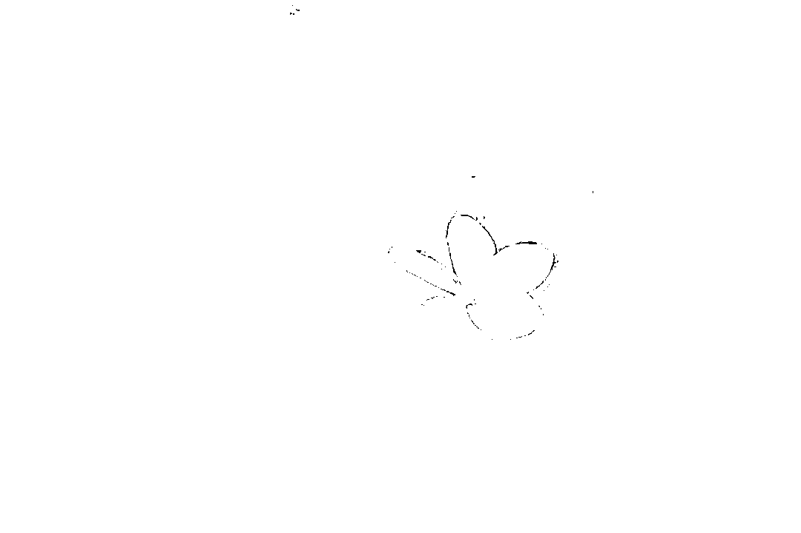

北京时间 9 月 7 日 8:51，新月发生在处女座 14°38′。每到新月时分，若道君都会为你奉上根据你出生星图量身打造的免费新月报告。可是新月为什么要许愿？新月报告该如何领取？让若道君来教你。

　**什么是新月？**　

从占星学看，新月是月亮周期的一种相位。新月是开始，又称为朔，对应中国农历初一，太阳、月亮在此时合相。此时月亮运行到太阳与地球之间时，月亮以黑暗的一面对着地球，并且与太阳同升同落，地球上看不见月亮。

本次新月时间

**9 月 7 日 8:51，新月发生在处女座 14°38′。**

为什么新月要许愿？新月是一个周期的开始，新月发生的时候，太阳与月亮合相，能量很强。当新月出现时，你也许会发现灵感忽现，非常适宜开启新领域、项目与行动，缔结一段新的关系或合作。许愿会加强新月的能量，也有助于你了解自己现阶段适合开启的方向。 本次新月最佳许愿时间

从新月开始到其后的 48 小时内，许愿的力量最强。

**最佳许愿时间：9 月 7 日 8:51-9 月 9 日 8:51**

属于你的免费新月报告

每到新月时刻，看着占星文章里写着：看看你新月的宫位，如果新月在第 X 宫，你可以许愿的方向是……

是不是常常一头雾水？新月的宫位？我到底该看哪里啊？

而有时，那些标注上升星座的文章也会让你忍不住想：虽然我的上升星座是这个，可是我的新月好像并不落在你说的宫位啊？你是不是写错了？

虽然这些文章都没有写错，可是好像对你而言都太不友好了。

**Don't Worry！**别着急，让博学又体贴的若道君来帮你！

我们推出了一份**免费**又**好用**的新月报告！

而且是专门为你设计的哦，**根据你出生星图为你量身打造的，只****属于你的独家新月报告**。

报告有哪些内容？

**新月时间****最佳许愿时间**

**如何许愿 **属于你的**许愿关键词**

本次新月给你的**建议**

你会有怎样的**感受 **

****机会****

********

如何许愿？

许愿方式也很简单。

你可以把愿望写下来，或者双手合十后交叉，闭上眼睛来祈祷。 

报告中会为你提供**祈祷词示例**，可以多多参考哦～ 

你还可以适当添加自己的语言，创造属于你自己的祈祷文！

如果报告拿到手了，快对照着许愿吧！

**这份好用又暖心的报告，点击****阅读原文****即可领取！**

****

****点击“阅读原文”即可获取新月报告****

# 有福利！NVC 线上训练营丨非暴力沟通，有效提升沟通能力

> 原文：[`mp.weixin.qq.com/s?__biz=MzA5NjA0NTAxNg==&mid=2651455663&idx=3&sn=0c405f59ec691a2fee2df72ab5cd9c80&chksm=8b48b218bc3f3b0e5bd71788638a31d96fcf04397fba2cf6b57b63791bb3c1f9e52542fcc7de&scene=126&sessionid=1692737933#rd`](http://mp.weixin.qq.com/s?__biz=MzA5NjA0NTAxNg==&mid=2651455663&idx=3&sn=0c405f59ec691a2fee2df72ab5cd9c80&chksm=8b48b218bc3f3b0e5bd71788638a31d96fcf04397fba2cf6b57b63791bb3c1f9e52542fcc7de&scene=126&sessionid=1692737933#rd)

**为什么我们要学 NVC？**

（向上滑动查看内容）

**蒋颖**

若道联合创始人

2016 年，我在新西兰参加一个 Hakomi 亲密关系治疗的治疗工作坊。参加这个工作坊的都是治疗师。在这个工作坊中，有一位女性让我特别印象深刻，因为她身上有种特别的气质，某种既温柔又坚定的东西，充满力量，充满对这个世界充满关怀，她身上表现出的让人惊讶的真实也让我有很多思索。她叫托尼·麦克尔兰（Toni McErlane）。

我知道她从小学习武术，也是一个悬挂式滑翔运动的运动员，曾经背着滑翔机在世界各地的上空飞行和比赛。她完成了北美非暴力传播（NVC）领导计划，是一个非暴力沟通（Nonviolent Communication，简写 NVC）培训师和注册的家庭纠纷调解人，也是生态心理学的培训师。她有多年的内观经验，在身体创伤治疗方面的经验，还有她在有机种植、景观设计、园艺治疗都有专长……我看到她到印度去，帮助印度乡村做有机耕种。在这次疫情之前，她已经买了一艘帆船，准备和丈夫开着他们的船环游世界。所有这些都让我感叹，一个女性可以活得如此勇敢和丰富。现在她而她对中国也充满了某种关切。多年前就一个人在藏区徒步旅行，后来又骑自行车穿越西藏。

但喜欢户外冒险的 Toni 说， NVC 比武术更管用。

2019 年，我终于请 Toni 到中国来，请她给若道做了基础和中级的 NVC 培训，也请她对外做了一次工作坊。

怎么说呢，培训和工作坊棒极了，更棒的是，我觉得人人都爱她。

**Toni McErlane**

我来自新西兰，拥有社区和人类服务—咨询康复学士学位，是 Aminz 的注册家庭纠纷调解人，也是 NVC Aotearoa 的 NVC 培训师。

在我的生命中，我一直对真诚、充满活力、自我负责的沟通和有意识的选择充满激情。而我的人生旅程为我提供了充足的机会，让我去探索、研究、反思和完善这在沟通中是什么样的。

在我的工作坊中，我的原则和实践都是建立在非暴力沟通和正念的哲学基础之上。非暴力沟通是由美国心理学家马歇尔·卢森堡博士所开发的。马歇尔的目标是发展出一种语言，这种语言受到印度巴利语中的“非暴力主义”（Ahimsa）一词的启发，它的意思是“没有伤害”。我们怎样才能在与他人沟通时不造成伤害呢？这不仅需要非暴力沟通的技巧，还需要在训练中融入正念。正念是受小乘佛教内观传统的启发，发展觉知和接纳，关注和允许。在我们的工作坊中 ，我们将非暴力沟通和正念编织在一起。

我致力于以这种沟通和处世方式作为我日常与人互动的基础。我曾经学习了为期一年的北美非暴力沟通领导者项目，在加州湾区非暴力沟通的全年浸入式项目中做了两年协助工作，然后在索诺马县女子监狱推动非暴力沟通培训。同时，多年来我持续参加内观静修，致力于继续和发展这种实践，并把它融入自己的工作坊中。

2020 年疫情期间，我与丈夫和我们的猫在游艇上休了一年假。现在，我和丈夫还有 15 岁的侄女在新西兰南岛的达尼丁生活。我在那里从事心理咨询、冥想和生态心理疗法。我们还正在那里慢慢建立一个治疗静修中心和生态冥想社区。

过去四年，我曾两次来中国，与若道及其友好而充满活力的团队分享非暴力沟通，并参观了一些绝佳风景。我期待继续与若道合作，在网上分享我的知识和技能。

向上滑动可查看更多

**Toni 老师有话对你说**<mpvideosnap class="js_uneditable custom_select_card channels_iframe" data-pluginname="videosnap" data-id="export/UzFfAgtgekIEAQAAAAAABNIXkZitzgAAAAstQy6ubaLX4KHWvLEZgBPEtIMEEEUxZvj-zNPgMIuM7PVi1oMK5fdX4B-DAnh3" data-url="https://findermp.video.qq.com/251/20304/stodownload?encfilekey=RBfjicXSHKCOONJnTbRmmlD8cOQPXE48ibrgo6T80SM1b4QSoxiaa7xblfRvMCU22ricO1icL5GdBOSmzhG7mbaLtSLg4xqYaTLicapWwCV45Axx8QGaozqH7OpxicjibYzN1icWtyuIibCRyZInILWhIGRG1ILicWtib8H3XUMxBW2rZO2GMmc&amp;adaptivelytrans=0&amp;bizid=1023&amp;dotrans=0&amp;hy=SH&amp;idx=1&amp;m=3d7ca9d191932d16f6faa80b9364d1f9&amp;token=AxricY7RBHdVzFXjPCFncbbQSWL8x8x2YeR1VX1JKDza8JFxFfuEYeFkqjygt392VxqY7mdlmzAc" data-headimgurl="http://wx.qlogo.cn/finderhead/PiajxSqBRaEJYnVsqWfEX9qA0sI6hNVKsDfyzfPZ92WZMZyBpZWU5NA/0" data-username="v2_060000231003b20faec8c4e68a1ec2d4ca07e434b07755bbf47e7053a3059defd2c9d6c68a20@finder" data-nickname="若道" data-desc="#非暴力沟通 NVC  在面临一个两难处境时，如何运用 NVC 促进合作的开展？
" data-nonceid="1620007045275601581" data-type="video"></mpvideosnap>

**福利！**

**前 20 位报名学员赠送 NVC 情绪-需求卡一套**

**NVC 情绪-需求卡****课程内容**

**第*****1*****模块 区分感受和想法**

*   学习区分想法、感受和故事感受。

*   体会为什么在表达中分享自己对某一情境的感受很重要，而不仅仅是想法和判断。

*   学习辨识和认同身体传递的感受和情感，将它们作为自我觉知和自我联结的资源。

*   理解感受是重要的信息媒介，支持你与自身的需求建立联结。

*   认识关注感受、探索联结需求的重要性，而不是对感受做出反应。

**第*****2*****模块 将感受与需求、需求与策略关联起来**

*   了解并理解满足一个人需求的策略可能无法满足另一个人相同的需求。

*   学习理解需求的概念，学习区分需求和策略。

*   体验如何用多种不同的策略来满足一种需求，以及如何通过选择一种特定的策略满足或不满足其他需求。

**第*****3*****模块 倾听和共情**

*   学习倾听他人话语中透露出的情绪和需求。

*   体验受到共情和受到其他形式的有意识的支持之间的差别，比如同情、安慰、分散注意力、陪伴等等……

*   学习认可别人的体验和情感，而不必认同对方的策略，认识这种技能所能带来的力量和解脱。

**第*****4*****模块 观察与评价**

*   学习在表达中运用观察而非评价的重要性。

*   体验两者之间的差异，自己去领会为何有此差异。

*   学习区分对情境的解读和事实。

**第*****5*****模块 自我共情**

*   学习认识和观察自己的评判和评价，并用它们与自身感受和需求建立联结，借此更深入、更清晰地理解自己。

*   学习识别自己赋予情境的意义，并探求其中的事实。

**第*****6*****模块 ****提出请求**

*   学习请求是表达中重要的一部分。

*   学习如何提出满足自身需求和他人需求的请求。

*   分辨请求和要求之间的区别。

*   学习如何倾听拒绝，如何表达拒绝。

**第*****7*****模块 ****练习坦诚地表达**

*   在一个支持性的框架中，综合运用之前所学, 练习相互联结、清晰有效、对自己负责的沟通。

**第*****8*****模块 ****接受和表达感激和谢意**

*   运用之前所学，练习表达感激和谢意。

*   学习表达感激之情，远不止一句随口说出的“谢谢”。

**工作坊学员这么说**

非暴力沟通带给我的最大的收获是：通过课堂的学习和大量互动练习提升了觉察力，提升了沟通技能，非暴力沟通并不仅仅停留在语言的表达，非暴力沟通的核心是同理心。通过倾听对方的感受，帮助我将情绪转化为解决问题的动力。

我过去和其他人沟通时，常常陷在自己的思维中，通过练习我才发现，原来别人说话的时候我常常其实并没有听到对方说什么，都是在自己的想法里打转，现在我起码学习到当对方说话的时候，能够去尽量不想自己的想法。

过去我不会留意到原来自己的某种表达方式会让别人不舒服，而且其实也无助于解决问题，对于我想达到的完全无效，NVC 的学习能够让我更能觉察哪些表达会让别人不舒服，让我的沟通更有效，更能帮助我达到我的需求。我学完后，才觉察到过去在沟通中，如果对方有情绪，我也是情绪化地回应，现在，我能够和自己和对方的情绪都拉开一些距离。过去我对于对方情绪化的表达，会有情绪化的回应或不知所措，现在我更能去感受他们情绪下的需求是什么，因此就更从容，不那么容易被他人的情绪影响，能够更有效地回应那些有负面情绪的人。我是一个比较理性的人，在练习中发现原来对一个在我用理性分析如此很明显的画面，每个人竟然有如此截然不同的看法，这还是挺让我吃惊的，这个发现好像打开了一扇门。

我是一个比较感性的人，过去有什么事情，常常是情绪化的沟通；NVC 的学习让我能够更理性一些，能够更客观去看问题。

这个培训让我非常感动，这是我没有想到的，一个关于沟通的培训如此让人感动。在那些常见的表面事件呈现之下，是如此脆弱、温柔的人性。我们如此绝望地想要被理解、被爱，想要与他人联结，然而我们常常用非常错误的沟通方式去做，这时我们离我们的目标就越来越远。

**什么人适合学习 NVC？**

**老实说，NVC 真的是一门人生必修课。**

**NVC 可以非常有效地帮助提高沟通能力，提高觉察力、自我同理心和他人同理心，进而减轻童年创伤对成年生活的影响，帮助有效改善亲密关系、与父母的关系、亲子关系、职场关系。**

*   如果你正被低效的沟通方式困扰或正经历沟通暴力，想**提升觉察，避免伤害的话**，NVC 培训是个不错的选择；

*   如果想结束“相爱相杀”恶性循环的相处模式，**享受一段真诚而愉快的亲密关系**，NVC 培训是个不错的练习途径（可以拉着你的 Ta 一起来哦）；

*   如果你的**工作、求学、生活和“表达”息息相关**，想更理解自己，想改善你的人际关系，改进工作，NVC 培训可以体验到一种更有力量的表达。

**训练营时间与价格**

**课程时间：**10 月 24 日—12 月 12 日，每周日下午 2 点-6 点。共 8 周，每周 4 小时

**课程价格：**6800 元

**购买须知**

❶ **本课程一旦报名，不接受退转课。**

****非暴力沟通线上训练营****

**授课老师：**Toni McErlane

**授课时间：**2021 年 10 月 24 日起

**授课方式：**网络课程**，**英文授课，中文翻译

**费用：**6800 元

**课程负责人：****Maggie 老师**（微信：18510107057，请备注“非暴力沟通”，**获取优惠价信息**）

长按二维码添加课程负责人咨询~

****报名请点击“阅读原文”****

# 核心课程 L1-2 丨一起来玩星图剧本杀吗？萌新入门的保姆式教程

> 原文：[`mp.weixin.qq.com/s?__biz=MzA5NjA0NTAxNg==&mid=2651455379&idx=3&sn=edbdd62e6eb1336e474be75a472868d6&chksm=8b4b4d24bc3cc4323ac6bf60eb88606900c3fc3bb6899cc2a430d7d306f8933c4e9285afa1a5&scene=126&sessionid=1692737933#rd`](http://mp.weixin.qq.com/s?__biz=MzA5NjA0NTAxNg==&mid=2651455379&idx=3&sn=edbdd62e6eb1336e474be75a472868d6&chksm=8b4b4d24bc3cc4323ac6bf60eb88606900c3fc3bb6899cc2a430d7d306f8933c4e9285afa1a5&scene=126&sessionid=1692737933#rd)

近几年，线上剧本杀兴起，线下风靡，因其剧情丰富，逻辑推理，沉浸体验，引无数人上头。你可能还不知道的是，从占星学角度，你的出生星图中也蕴涵着琳琅满目的剧本，一幕幕剧情有的跌宕起伏、有的动人温馨、有的神秘莫测……

如果你想要学习占星学，想研究一下严肃占星学和之前看到的娱乐占星有什么区别，这个思路绝对会为你打开新世界的大门，用专业的占星语言讲述生动的人生故事，千变万化，其乐无穷。当你学会了占星的语言，也就结识了星图中的一位位生动的角色，也就是你的一个个人生面向，TA 们各自拥有个性鲜明的特质，你会在生活中有意无意的表现出 TA 们的个性。TA 们在不同场景下的表现也会有不同，彼此之间还可能有着微妙的联系。**准备好开启真正属于你的沉浸式剧本了么？**

先让我向你简单介绍一下出生星图剧本中的主要角色：**行星是演员和角色**行星是剧情当中的演员，它不仅是内在的角色，也可能是我们实实在在碰到的一些人物。★**太阳**：自豪、自信、亲切的角色，善于自我表达、有创造力、喜欢玩耍和表演……★**月亮**：脆弱、敏感、温柔的角色，渴望归属感和亲密感，习惯养育与依赖……★**水星**：好奇、有趣、聪明的角色，有着不知满足的求知欲，善于沟通……★**金星**：爱美、舒适、愉快的角色，喜欢美食、爱情以及各种伙伴关系……★**火星**：果断、鲁莽、冲动的角色，热爱运动，特别是向着他们的愿望进发……★**木星**：乐观、慷慨、智慧的角色，心怀希望、热忱，坚守着对宇宙智慧的信任……★**土星**：耐心、坚毅、谦虚的角色，追求任务达成，做好工作，获得成功的感觉……★**天王星**：博爱、反叛、变革的角色，设法带来突破、彻底的洞见或自我实现……★**海王星**：艺术、共情、慈悲的角色，目标状态是极乐，对生命统一性的超验觉知……★**冥王星**：深刻、透彻、蜕变的角色，高峰体验、精神宣泄、摧毁重建、净化……当然除了十大行星，还有也很重要的、月亮交点、四轴：上升、下降、上中天、下中天也都扮演不可或缺的角色等待你来解锁。

**向左滑动，可依次查看行星卡牌**

**版权归属于插画师炼妖 LY 所有**

**星座是表演的风格**行星所落的星座就会为这个角色赋予一种风格。也可能是他会吸引到的人的样子。每个不同风格的角色，可能说出这样的台词：★**白羊座：**“想做就做！去做吧！这是你的权利。”★**金牛座：**“如果感觉好，享受它吧。让自己快乐，放松。”★**双子座：**“这很有趣，给它下个定义分个类。发挥你的思维。”★**巨蟹座：**“倾听，转内向在，你现在感觉怎么样?”★**狮子座：**“宝贝，闪现你的光芒。表达自己！”★**处女座：**“小心，这里有一个问题。解决它。”★**天秤座：**“展现魅力，建立关系。思考、妥协、合作。”★**天蝎座：**“面对你的恐惧，将它推向极限。决一死战，全心投入。”★**射手座：**“保持信心，宝贝。上帝是好的，做对的事就好。”★**摩羯座：**“全力以赴，专心致志。集中精神，控制自己。”★**水瓶座：**“期待意料之外的事，保持开放和超然的态度”。★**双鱼座：**“放手，顺其自然。屈服，相信宇宙。”当然每一位角色也偶尔会展现出一些破坏性的特质，可能是 TA 的某些核心需求没有得到满足，这就更需要学习更多占星语言，来倾听出生星图中的“心声”。

**向左滑动，可依次查看星座卡牌**

**版权归属于插画师炼妖 LY 所有**
**宫位是舞台和布景****宫位是戏剧上演的地方。**就好比我们去剧院，可以看到各种道具和场景：卧室、图书馆或银行。宫位就像是各种场景。你的行星演员也可能在各个场景中遇到其中的专属 NPC。★**第一宫**：你自己的空间，可能还包括那些帮你保持漂亮外表的那些人……★**第二宫**：银行、有金钱往来的场所，可能还包括客户、供货商……★**第三宫**：学校、各种媒体中，可能还包括兄弟姐妹邻居、同学同伴……★**第四宫**：家里、老家，可能还包括父母、长辈、祖先、家装维护人员……★**第五宫**：娱乐场所、约会场所，可能还包括孩子、你内在的小孩、你迷恋的明星……★**第六宫**：工作场所、提供服务的场所，可能还包括雇员和同事、医护人员……★**第七宫**：婚礼教堂，可能还包括你的配偶、人生伴侣、商业伙伴、公开的敌人……★**第八宫**：葬礼，可能还包括性伴侣、和你分享共同财产和资源的人……★**第九宫**：大学、海外、法院，可能还包括大学教授、精神导师、律师……★**第十宫**：职场、公众场合，可能还包括老板、监督者、“权威”……★**第十一宫**：团体组织，可能还包括朋友、伙伴、你的社交圈、团队中的成员……★**第十二宫**：医院、监狱、修行道场，可能还包括你生命中秘密的人、酒友……**向左滑动，可依次查看宫位卡牌****版权归属于插画师憂所有****怎样将行星、星座、宫位三者串联成剧本呢？**举个例子：**金星**总是象征我们所爱的人或者象征我们去关联、去建立关系的那种能力。**金星落在金牛座**，这个人的次人格就会比较喜欢舒适的生活、享受美食、热爱大自然。它不仅仅是这个人的行事风格，也可能是他会吸引到的人的样子。比如这个人可能也喜欢旅游、喜欢异国文化、美食和风光——**第九宫金牛座**。这个人可能会在旅行中和旅伴或当地偶遇的旅行者结伴而行，一起在海边看日出日落，分享同一份路边美食，骑着摩托在森林公园兜风，畅聊旅行中的见闻和感受，以至于可能由此建立了亲密关系。当然这个配置还有其他剧本的可能性，因为每个人看待世界的方式都不一样，诠释的方式也不相同。占星师的任务就是从更大的视野来理解事情，把星图看成是一张生命地图，占星师就是解图者。地图可以让我们注意到以往忽略的事情，也能帮助我们看到自己与一切事物的关系，或者帮我们发现属于自己的道路。通过对于星图剧本的构想，你会更清晰，人生各个领域自己真实的需求是什么，有迹可循的为自己亲手构建理想生活。出生星图就是这样讲述着一个个故事：蕴涵着无数人生剧本，更映射着天体时钟。**正所谓“Asabove, so below，天上如是，地上亦然。”**

行星、星座、宫位并不代表力量，而是作为天体时钟的一部分，它们发出信号、而非引起变化。但这信号，可以让我们更真切的了解自己，从而拥有更多的觉知，**事情也会因为我们有了觉知而改变——能量永远会随着想法的改变而起变化。**一个人对自己的了解与他真实的样子越接近，他就越拥有智慧。学习占星学，在了解自己的同时，还可以观察他人，才是真正的体味人生百态。

以上文中的关键词介绍只是入门课程的冰山一角，文中的……也代表着每一个行星、星座、宫位的配置还有着更多的含义和可能性，想要更全面的学习占星语言，有一门集结了三位国际名师的核心课入门课程向你推荐：

**为庆祝若道成立 10 周年，我们精心策划，汇集顶级占星学大师资源和教学经验，结合占星学知识体系和不同老师的教学专长，首次推出****由四位国际导师联合授课的占星核心课程。**

**其中**新一期 L1-2 核心课程由**大卫·瑞雷、克里斯蒂娜·罗登贝克、琳恩·贝尔**三位国际大师联合教学，老师们会专业、系统、全面的教授星座、行星、宫位知识，并讲述如何将三者串联成占星语言，人生故事，用三个月的时间带领你系统入门占星学。有请克里斯蒂娜·罗登贝克老师跟大家打个招呼：<mpvideosnap class="js_uneditable custom_select_card channels_iframe" data-pluginname="videosnap" data-id="export/UzFfAgtgekIEAQAAAAAARAcrwoZd0gAAAAstQy6ubaLX4KHWvLEZgBPE7IMkHHpHIan-zNPgMIt3rFoQPG1r9ocB2sRik5Ps" data-url="https://findermp.video.qq.com/251/20304/stodownload?encfilekey=XGocBFxVWK5dcyOOqpEU47RpBHQIvlhnPGdrgZ1vqc6a5xdgIzc2MciabYCyta5Oh5UNVAVqfTCTX48nEibvYibib3F8jlrCZ8ibWXIIJYQYsdlhYywxmI6AaDbnBVHFfezqP8QaFM5F7f6vFzPcVfnuib6p04xvR9P7o0mjMgVU66Sxx6fVFia1Do0IPq7jIDkOyOE&amp;adaptivelytrans=0&amp;bizid=1023&amp;dotrans=0&amp;hy=SH&amp;idx=1&amp;m=16cb9ce99387ef781ee6c1eac70a74ce&amp;token=x5Y29zUxcibAeBWYF7VqUUWDicYTcsEv0t7SBv3EXG4mkdpwiazcVfv9FoSkibKrudsu6lvwCUS8tn0" data-headimgurl="http://wx.qlogo.cn/finderhead/PiajxSqBRaEJYnVsqWfEX9qA0sI6hNVKsDfyzfPZ92WZMZyBpZWU5NA/0" data-username="v2_060000231003b20faec8c4e68a1ec2d4ca07e434b07755bbf47e7053a3059defd2c9d6c68a20@finder" data-nickname="若道" data-desc="#四位导师联合教授 2021 核心课 克里斯蒂娜老师将按照她的教学理念教授星座、宫位、行进、比对图、亲密关系咨询等部分。" data-nonceid="15165203225426773444" data-type="video"></mpvideosnap>**课程安排** **第*****1*****阶**2021 年 9 月 15 日开课，每周一天晚上 20:00-22:00 上课，共 6 次课**第*****2*****阶**2021 年 11 月 11 日开课，每周四晚上 20:00-22:00 上课，共 6 次课

**第*****1*****阶 黄道星座&个人行星****· 概要介绍占星学与星图**

**· 四元素与三形态**

**· 黄道 12 星座**

**· 太阳、月亮及其他个人行星**

**第*2*阶 行星&宫位****· 木星&土星****· 天王星&海王星&冥王星**

**· 练习组合所有行星**

**· 四轴****· 十二宫位**

**· 组合宫位、行星、星座**

**授课老师** 

**琳恩·贝尔**

**（Lynn Bell）**

**· **世界最受欢迎的占星学演讲者、作家和老师之一。定居巴黎，研究心理占星学和家族模式数十年；**· **著名的心理占星学中心（Centre for Psychological Astrology）的长期导师。2016 年，获得查尔斯·哈维（Charles Harvey）杰出的占星学服务奖；**· **作为一个从多个层面进行工作的占星咨询大师，琳恩的工作结合了心理学的观点。她对家族模式的兴趣首先来自与客户的合作。通过在分析领域所做的个人工作，她所受的埃里克森催眠训练将她引领至家族系统。后来，她组织研究小组在家族星图上进行了数年的研究。她写的《家族占星学》就是这项研究的结果；**· **法国心理占星学协会的会长。除了占星学，她在法国沙特尔的新沙特尔学校任教 8 年，还 5 次获得了在《纽约时报》畅销书作者卡罗琳·迈斯（Caroline Myss）的卡罗琳·迈斯教育学院（Caroline Myss Educational Institute）合作教学的机会。

**艾德里安·罗斯·邓肯**

**（AdrianRoss Duncan）**

**· **1971 年在印度游学时开始学习占星学，1985 年开始成为全职占星师，迄今执业已超过 33 年，是人本主义占星学、卜卦占星学和经世占星学领域的知名占星师。他还开发了占星软件 AstroClock 和多款占星报告；**· **哥本哈根占星学院院长；**· **他在日常咨询中经常运用卜卦，咨询图（卜卦的一种运用方式，即根据客户来访时间制作星图，从星图中获得大量信息）也是他特别擅长的领域；**· **艾德里安·罗斯·邓肯从 1971 年开始研习佛学，受佛学影响很深，他相信占星学和佛学观点一致，转化的一个基础是在于对现实感知的改变。而卜卦很容易与佛教融合，因为它只关乎当下。

**克里斯蒂娜·罗登贝克**

**（Christina Rodenbeck）**

**· **克里斯蒂娜·罗登贝克（Christina Rodenbeck）是一名全职职业占星师，在牛津大学城生活和工作，深受周围知识和文化氛围影响；她拥有伦敦大学（University of London）的人文荣誉学位，曾在伦敦占星学馆（AstrologicalLodge of London）、心理占星中心和占星研究学院学习；

**· **作为一名占星师，在过去的 20 年里，克里斯蒂娜在她的网站“牛津占星师”上写了大量关于时事、艺术和文化的文章；她每月主持一个占星播客：“与克里斯蒂娜和萨莉一起占星”，并定期在《占星杂志》(Astrological Journal)上撰写时尚专栏；她定期在英国授课，并保持着蓬勃发展的专业实践。

**大卫·瑞雷**

**（David Railey）**

**· **若道联合创始人，致力于在中国教授和推广西方占星学；

**·** 曾任 ISAR 全球副主席，CAPISAR（ISAR 职业占星师资质认证机构）主席；

**· **1976 年，通过亚特兰大职业占星师考试，成为全职占星师，随后通过 AFAN 和 ISAR 职业测试；

**· **1980 年，与杰夫·焦耳一起在亚特兰大创建“每日行星”占星学中心。此后在亚特兰大占星协会担任 4 年考官，并且两次担任亚特兰大地区占星协会主席。1979-1992 年，作为占星师活跃于美国社会媒体，向不了解现代占星学变化的大众宣传专业占星学知识。

**·** 1989-1992 年期间，他在 WRGG 电台 12 频道每周主持个人电视秀“今日占星学”，早先他还在 WRFG 的广播节目中播讲宇宙天气节目；

**· **2010-2014 年，任全美占星师联盟监督委员会委员；

**· **2010 年，其著作《灵魂的目标》中国版出版，和蒋颖一起创办若道占星学校和其官网 www.nodoor.com；

**· **2017 年，被选为 ISAR 委员会成员。ISAR 是世界最大的国际占星机构，会员遍布 45 个国家，2017-2020 年曾任 ISAR 全球副主席、CAPISAR（ISAR 职业占星师资质认证机构）主席。

**熊鹰老师**

**（天空的空）**

**·** 2008 年接触严肃占星学，至此爱不释手；**· **2013 年师从大卫·瑞雷，研习整套现代占星学核心课程，并于 2014 年起至今连续三年担任该课程的主助教；**·** 期间也跟随格伦·佩里、诺·泰尔、理查德·塔纳斯、罗伯特·汉德、苏·汤普金斯、斯蒂芬·弗里斯特等多位国际占星大师进行学习，进行定向占星主题研究；**·** 2015 年初，通过国际占星研究协会（ISAR）资质认证并获得证书。同年，进一步跟随大卫·瑞雷老师进修“生时校正”技术，通过最终考核并获得证书；**·** 目前在若道占星任职，将传播系统、严谨、真实的占星学作为职业使命。任专职助教期间，进行沙龙与答疑等辅助教学工作已累计超过 200 小时；**·** 在业余期间也提供占星咨询与生时校正服务。目前正致力于占星学与个人成长的整合。**此次课程适合哪些人？****· **对占星学感兴趣，想要入门的零基础者**· **占星学小白，但有志成为职业占星师的人**· **有一定占星学基础，但不知道该如何整合星图复杂碎片的人**· **希望成为优秀的占星师，想要借鉴国际大师解读思路并融入自己的体系的人**· **想要师从更多殿堂级占星导师学习占星心法的人**· **走在自我探索和个人成长道路上的人**课程价格****L1-2 价格**：4800 元其他各阶段课程单报价格，请咨询课程顾问：**Maggie 老师**（微信：18510107057，请备注**“核心课”**）

长按二维码添加 Maggie 老师

**退转课程**

**· 退款原则请详看《教学协议》，如有疑问请咨询课程顾问**

****名师汇集金牌核心课程****

**授课老师：**琳恩·贝尔、艾德里安·罗斯·邓肯、克里斯蒂娜·罗登贝克、大卫·瑞雷

**授课时间：**2021 年 9 月 15 日起

**授课方式：**网络课程**，**英文授课，中文翻译

**费用：**L1-2：4800 元

**课程负责人：****Maggie 老师**（微信：18510107057，请备注“核心课”）

长按二维码添加课程负责人咨询~

****报名请点击“阅读原文”****

# 当你和这个星座相处久了，会发现他们成了“离不开的人”

> 原文：[`mp.weixin.qq.com/s?__biz=MzA5NjA0NTAxNg==&mid=2651455379&idx=1&sn=01452b93d1bc70e210a580d5c8353c6e&chksm=8b4b4d24bc3cc432c9d6daccdfbb63f7dc8e408b33e9e63b248d7a90cf53dcf0840faa2132cd&scene=126&sessionid=1692737933#rd`](http://mp.weixin.qq.com/s?__biz=MzA5NjA0NTAxNg==&mid=2651455379&idx=1&sn=01452b93d1bc70e210a580d5c8353c6e&chksm=8b4b4d24bc3cc432c9d6daccdfbb63f7dc8e408b33e9e63b248d7a90cf53dcf0840faa2132cd&scene=126&sessionid=1692737933#rd)

******☆ ****后台回复“今日”，给你一句生命态度******

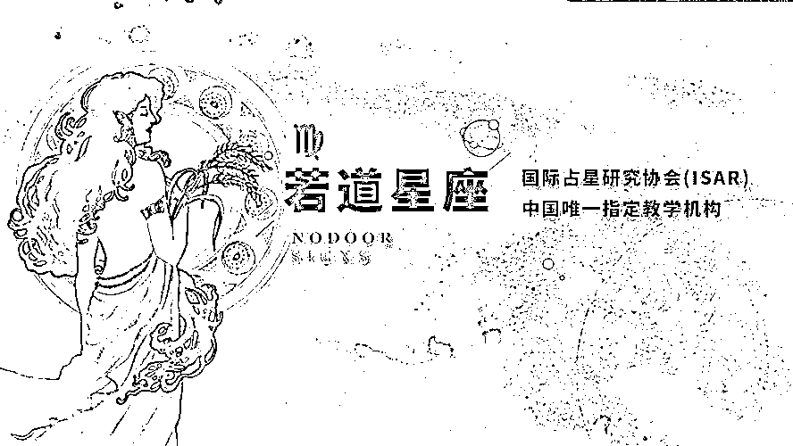

作者/大卫·瑞雷 若道占星创始人
译者/若道翻译团队编辑/玫瑰 封面/书君 图片/pexels 大卫老师的 12 星座系列文章精彩又有趣，今天更新到处女座啦！一起来看看这个勤勉的星座吧！另外，大卫老师参与授课的[四大名师核心课](http://mp.weixin.qq.com/s?__biz=MjM5MjQwNjAyMQ==&mid=2649438813&idx=6&sn=00533180adfecdbc17bbf7f2de744874&chksm=beb9553789cedc213dd80a9a77005bb4f592cb0d1497511820949ed08c363147d2cc8e26b478&scene=21#wechat_redirect)（点击链接可阅读），也欢迎你来了解更多详情！**处女座**黄道列车离开刚才的小镇，锣鼓声渐渐隐去，你的头脑开始试图消化刚刚发生了什么。“如果我抱起那个小孩的时候迟了一秒呢？”你寻思，“我应该已经和那个孩子一起躺在医院里了。我当时在想什么啊？我根本不知道自己在做什么。”朋友打断你的思绪，“想什么呢？刚才你可太酷炫了。”“嗯，应该是吧……”“有什么不好意思的，那是很英勇的行为。”“真的吗，我不知道，”你叹了口气，“我不知道刚才我做了什么，你明白吗？我从来没有练习过，如果我搞砸了，结果是难以想象的。”你的朋友有些疑惑，“你不觉得你对自己太挑剔了吗？现在结果很好，只要为它开心就可以了，不要想太多。”“好吧。”你回答得勉勉强强。接着是沉默。在沉默中，你的朋友拿出了 iPad，开始忙些什么。你用手机查看邮件，发现有很多邮件等着你回复。你从包里拿出笔记本电脑，开始干活。你注意到你的朋友好像有些焦虑。“出什么事了？”你问。“我的 iPad 坏了，死机了。”“给我看看？”“拿去吧。”你用了不到三分钟就把他的 iPad 修好了。“哇，太好用了！”他笑着打趣你，“能修电脑也能保护小孩，不错嘛。”你有点脸红，“修电脑我很有经验，我在苹果公司的客服部负责技术支持，已经干了三年了。”“不管怎么说，我觉得很棒。”“很高兴为你服务。”你的担忧暂时平息了。这就是处女座。处女座会更容易在这样的剧本里发挥功能。当然，你们也是对占星学持最多怀疑的星座，我知道有处女座的人曾充满讥讽地说：“我当然不相信占星学了，我可是处女座，我们是怀疑论者。”所以，既然你喜欢那就带着你的怀疑往下读吧。看过这章之后，如果你觉得自己有某些特质或议题符合这里的描述的话，你可以仔细分析之后，再做判断。**面对日常生活中的压力，你总是那个会积极寻求解决办法的人。**有时你低调谦逊的态度会掩盖了你救人于水火或化解危机的事实，让你的英雄光芒被遮盖。但人们会记得你搞定了死机的电脑，帮忙整顿了公司财务，或只是帮他们打扫了混乱的厨房。过一段时间之后，人们才开始注意到你的其他能力，发现你被低估了。**即便你是少数那种很耀眼的处女座，你也倾向于以一种精打细算的态度来处理你的名声，真实的你比你表现出来的要内向许多。****“业精于勤”**是对于处女座的做事方法的最佳诠释——这个词很可能就是处女座发明的。不管怎样，你们中的大多数是**完美主义者**。我们应该不会吃惊，出版了《引爆点》、《决断 2 秒间》、《异类》的畅销书作者马尔科姆·格拉德威尔就是处女座（生于 1963 年 9 月 3 号）。他最有名的“一万小时定律”是，“练习一万小时就可以成为专家，也就是每周 20 小时或每天 3 小时地坚持十年。”马尔科姆概括了处女座的核心——“练习过了？好，现在再做一遍。”没有哪个星座会像处女座这样，**对于自己对常识和逻辑的信赖，有着一种“谦虚的骄傲”**。既然你们处女座都喜欢有条理，下面我会用加粗的小标题列出你们的一些关键议题。

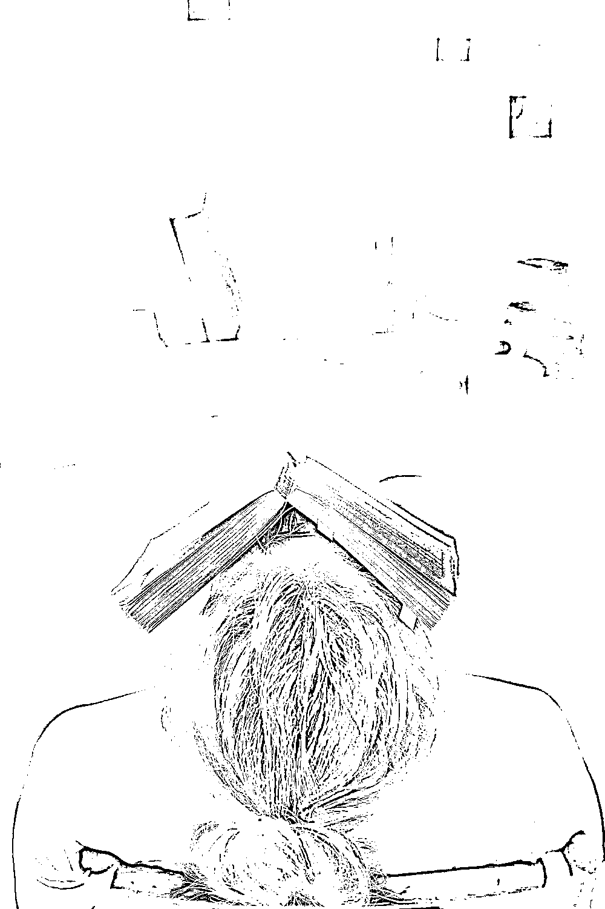

**当心把“合理化”当成逻辑**

**完美主义的说法适用于太阳处女座、上升处女座、月亮处女座，也符合水星处女座的一些行为特征。**没错，这种“脚踏实地”的星座，注重实干和实效。与其他星座相比，你们更依赖**对可收集到的事实进行系统化的编辑与删节**。**你们进行大部分考虑的根本依据是理智而非情感。**感受，这个每个人都有的东西，可以为处女座提供有帮助的信息，也可能成为偏见的来源。假设有一个月亮在金牛座的处女座厨师，在积极的意义上，他可以借着信赖他关于味道（金牛座）的直觉（月亮），来调配美味的配方。但同样这个厨师，也可能在餐厅老板打算更换厨具设备时异常抗拒（金牛座）——他给出了一堆所谓逻辑的理由，来说明为什么不该这么做，但其实抗拒改变的情绪（月亮在金牛座）才是推动他的判断和行为的深层真相。 

**都是小事**

**你的理性思维可能会让你钻牛角尖，有时甚至是“因小失大”——特别是当需要看到全局时。**一些处女座可能因为电卡里的一元钱的错误而打数小时的电话争执不休。有这个时间干正经事儿能赚好几倍的钱呢。部分原因是处女座太专注于细节，或说是“为小事烦恼”。关于这点还有其他一些内容值得注意。2016 年我与福布斯杂志合作了一篇文章，他们选取了有生日资料的全球前 613 位亿万富翁来做研究，其中太阳在处女座的人占了 12%。许多专家认为“注重细节”是富人的共有品质之一。当然，大部分这样说的“专家”或许也是处女座吧！

| 沃伦·巴菲特没错，这份亿万富翁的名单里就有沃伦·巴菲特。巴菲特展现了处女座的另一个特点：**低调**。他一直住在内布拉斯加州、奥巴哈市的一幢房子里，那是他在 1958 年花 31500 美金购买的。他有做一些增建和装修，但在邻里之间并不显眼。一位奥马哈市的房屋中介如此描述巴菲特的宅邸：“这房子不是最贵的……风格守旧，但保养得无可挑剔。”

**混乱的处女座真的存在！**

在最善着装的富豪名单上，巴菲特依然榜上有名。当然了，难道就没有邋邋遢遢、困顿潦倒的处女座吗，那些跟“无可挑剔”丝毫不沾边的人？有没有迷迷糊糊的处女座，会把事情搞得一团糟呢？有没有缺乏逻辑、感情用事、总爱胡思乱想的处女座呢？肯定是有的！并不是每一个处女座都是完美员工，或都能把公寓收拾得井井有条。但这种例外，和处女座本身的星座特质无关，从占星学的角度说，这是受到星图中其他要素的影响而有的表现，比如**海王星、双鱼座、巨蟹座、天王星，亦或是木星和射手座**。这些因素的共同作用，会带来许多矛盾和复杂性。

**处女座是当专家的料**

一个年轻的处女座女孩可能是乒乓球职业运动员。她夜以继日地练习，磨练技艺，也尝试新技巧。或许她穿戴得十分干净整洁，但她的房间却是一团糟！衣服扔得遍地都是，翻开的书上面搭着湿毛巾！但这可不是处女座！这里面有别的因素在起作用，或许是**双鱼座或一个海王星的困难相位。**学习占星学的人都知道，会有不同的星落在不同的星座。上面所说的这位处女座女孩，可能她的月亮落在双鱼座，或者太阳四分海王星，或是星图中有任何“非处女座的”因素在起作用。这种情况十分常见。但即便是这样，**某些方面的混乱，可能也是必须在另外一个领域极度专注的反作用力，这被称作“补偿行为”，也就是为了补偿一个极端，而在另一个相反的极端上找到平衡。**

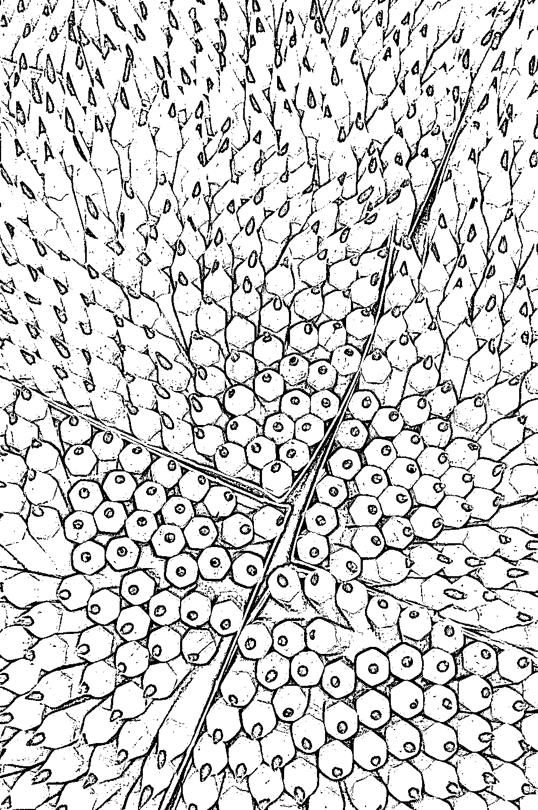

**个人成长的主题和故事**当然，处女座和其他星座一样有自己的个人成长议题。或许处女座最常见的议题就是**将他们的身份认同于他们的工作、他们的职业或他们掌握了专业技能的领域**。他们会说“我是一个软件设计师”，而不是“我是做软件设计工作的”。这也就是在说，“我是专家”而不是“我有这项技能”。表面上看这两者间似乎没什么明显差别，但**当他们失去了工作甚或更糟——他们的专业技能过时了，这其中的意义便突显出来。**许多年前，我有一个客户在 IBM 公司的主机研发部门工作。对付这种巨型怪兽计算机，他是专家，和如今的个人电脑和手机相比，那玩意儿简直是恐龙。当他失去了在 IBM 的工作，他经历了一次重大的“身份危机”。他不再知道自己是谁，甚至不知道该如何面对妻子、孩子、朋友、邻居。他说他觉得自己就好像“一个陌生人来到了陌生的大陆”。他失去了对自己的身份认同，这很严重。后来他的妻子也成了我的客户，她通过他来约我的咨询。 来找我咨询的时候，他刚刚开始参加一个进修培训，那是解雇补偿的一部分。他看起来有些忧虑，又有些紧张。他的目光在搜寻焦点。我把他的星图推到他面前。“看看这个，”我说：“你看到了吗？这就是你出生时太阳所落的位置，处女座，这里我们称之为第八宫。”他面无表情地点点头。“你十六岁的时候发生了什么事吗？”我问。他深深地叹了口气，我的话引起了他的注意。“那时，我父亲失业了……”沉默过后，他接着说：“六个月后，他死于动脉瘤……我大学的学费都是靠父亲的保险金支付的。”在后面的对话中，他开始把一些事串联起来。他记起了父亲曾经说过的一句话：**“没有工作的男人最没用了。”**我在他的占星档案上记下了这句话。在随后的咨询中，他开始意识到，他的身份“不仅仅是他的职业”。我们每个人都有内在固有的价值，那不能仅仅用工作来衡量。他面对了内心根深蒂固的信念：男人没有工作还不如死了算了，或者离死也不远了。这就是他父亲的想法。他开始意识到自己对家人的意义，不仅仅在于他是那个挣钱养家的人，更重要的是，**他是那个无论怎样都会得到家人的爱和欣赏的人**。他依然是一个完美主义者。她妻子说，他都快把老婆孩子逼疯了，总是告诉他们怎样可以做得更好，并用揪出每一个小错误的方式来“帮助”他们，但她只是一笑置之。看到他的改变，她高兴极了。他完成了进修，最终又回到计算机行业工作。他度过了他的身份认同危机，并脱胎换骨，获得重生。在我的占星实践中，我见过这一主题的多种变调。特别有挑战的一类身份危机出现在一些非常有才能的处女座青少年身上，他们从记事起就开始努力发展某种体育方面的特长技能，可能是足球、棒球或体操。在他们过去的人生中，每个人都视其为一个棒球手，下一届学校比赛的风云人物，甚至是将来的职业运动员。这就是他们的身份，或他们以为如此。对这些年轻的处女座来说，找到一个可以专注投入的新领域是必要的，那些他们已经为之付出大量练习和准备的事，是必须要放弃了。**然而在他们找到新方向之前，很重要的是让他们明白，自己是被爱、被欣赏的——仅仅是因为他们本来的样子，而不是因为他们拥有什么专业技能。**的确，**处女座希望自己是不可或缺的，他们想要在计划中扮演有用的角色。不过也因爱挑毛病而声名狼藉，关键是连自己的毛病也挑**。其实没有人比处女座更不喜欢批评，因为这些批评的声音充满了头脑让他们无法安宁。**太阳落在处女座的人往往有一位严格的父亲，月亮落在处女座的人则常常有严厉的母亲。**一般来讲，这些父母不断传递给你们的信息就是，“你还有很多不足。要达到完美还有很长的路要走！只要勤加练习你就会越来越优秀！真不明白你怎么就不能少犯点错误！”对于很多处女座而言，似乎无论你多么努力地取悦父母，都还是难以达标。**因担忧带来的压力对他们来说分外沉重，他们会仔细检视那些觉得不对劲的地方——即使是努力不去想也不行。**

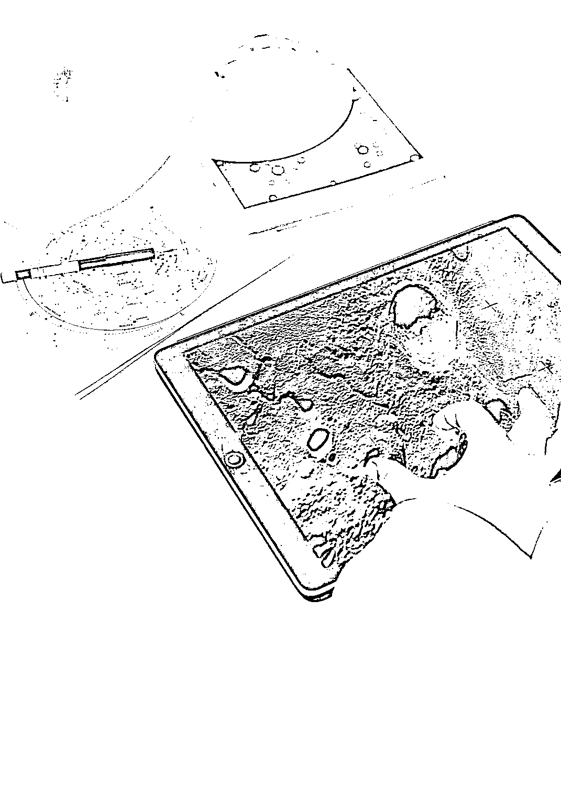

**事业线索**

****

**“聪明的人会从任何事物中发现荒谬，明智的人则不。”****——歌德**

**分析能力是事业上的重要资本**

**在科学和技术领域，这样的天赋会发挥突出的作用**。处女座可能会在那些**对逻辑和归纳能力有要求**的领域一展所长。有些处女座也会充分利用自己在**化学、数学、生物学和园艺学**方面的专业技能，在**工业或商业领域**谋职。其他事业领域包括：**效率管理、图书编辑、电影剪辑（许多电影导演都曾表示，电影制作 90%的工作都在剪辑上）、文艺批评、美食评论、校对、目录管理、货品清点、医疗科技、牙医、木匠木工、钟表匠、眼镜配镜、机械修理、水管工、工艺品的制作加工。**
**计算机和编程行业是典型的处女座工种。**不过，在数据分析上精益求精，也会在**医药、心理学、精神病学以及其他特殊的心理治疗领域**的诊断中发挥重要作用。处女座很可能**成为健康领域的专家，或发展出专业技能**。在身体治疗方面，他们会不断地精进技巧方法，让自己出类拔萃。在商业领域，他们分析数字的天赋将对金融市场的工作大有助益，在那里有大量的数据要被以不同的方式进行系统分析。沃伦·巴菲特为人所熟知的就是，用他自己发展出的一套公式来进行商业资产的价值评估。

**谦虚是祝福也是诅咒**

**对于自己的成就和名望的低估，是典型的处女座反应。**通常，**他们对于“被认可”本身并不特别在意，只是希望在工作或技巧手艺上尽善尽美。**然而**这种天生的谦逊品质，可能导致被忽视而错过晋升机会。**同样，他人也可能视处女座的贡献为理所应当。不过至少，处女座通常都会保持着不错的业绩记录，这会让处女座在一些更加比拼能力的情况中胜出。然而，**善于自我批评的特质，似乎也会吸引别人来批评处女座，这会削弱自己的立场，即便已经通过努力工作取得了相当不错的成果。**

**专业细化和身份危机**

就像前面讨论过的，处女座比较容易将身份认同于职业或工作，特别如果还是某领域的专家人士的话。**失业的感觉就是一次尖锐的身份危机，这点上他们比其他星座都甚。**过于精专的最大危险是，**当这个技术或职业被淘汰时，阿门可能不知何去何从**。**大多数处女座有能力通过了解市场，学习新的技巧，来完成自我更新，重新适应环境，但同时也要做好暂时经历迷失的心理准备。**就像前面提到的 16 岁的处女座棒球手，他之前 9 年持之以恒的练习，因为身体受伤而毁于一旦，此时他要面对的身份危机是非常沉痛的。**这里的挑战在于，找到一个可以让自己重新成为专家的新领域。**不过，即使专业细化可能带来一些问题，但**成为工业、技术、医疗、工程或身体治疗等方面的专家，还是可以让处女座在人才市场上更为抢手，更有能力获得高薪。**

**聘用处女座！**

有一件老生常谈的事儿，占星师们经常建议经商的客户，在招聘中，**“如果拿不准雇佣谁比较好，那就选处女座的人吧！”**虽然大部分雇主不会真的以此行事，但确实，处女座对于工作的认真专注，会让他们更容易成为老板们想要的人。**没有哪个星座像他们这样专注于把事情“做对”。一旦明确了工作任务，并提供合理的时间去操作，他们基本不会让人失望。事实上，最后交出的成绩单往往高过预期。**

**挑战自己对现有能力的设定，找到合适的位置**

**当分派给处女座的任务超出了自己的能力时，他们可能会崩溃。因为他们很需要在逻辑的确认下找到解决问题的方法，找不到便会觉得愤怒或沮丧，甚而自怨自艾或责备他人。**这种情况下，处女座可能会要求将自己分配到另一个岗位上，如果感到自己面对的要求或期待太高根本不可能满足，他们甚至会干脆离开公司。找到一个能将事情做对的行使有效的方法，对处女座非常重要。**职位和工作要求必须与技能和经验相匹配，匹配度越高越好。**我认识一些处女座，在离职后又回到原公司就职，就是因为他们离开后再也找不到那种跟自己的工作完美契合的感觉。比如，我知道一个处女座，他来到一家新公司做销售经理，他对于老板为他制定的新的业绩目标感到非常无力。在他做了充分的市场调查，也对公司之前的销售数字做了详尽分析之后，发现无论如何也找不到实现目标的方案。于是，他批评老板的计划并声称那是“不可能”的，不久后他就离开了那家公司，回到了原来的公司去做市场工作——在那里，他的技能和那边老板对他的期待，与他自身的情况是更匹配的。有趣的是，那家他离开的公司后来在那一年里实现了营业目标，不仅实现还超出了。这个例子说明了对于处女座来说，**找到一个对的位置是多么重要。**
**下面是一些跟事业/工作相关的特质的正反两面：****· 专注：**对待工作十分专注，但有时候容易只见树木不见森林；**· 完美主义：**在细节上的精益求精让人惊叹不已，但习惯性的对结果不满意可能让共事的人感到恼火或挫败，进而影响职场关系；**· 批判性思维与吹毛求疵：**批判性思维能让处女座比他人更善于发现瑕疵，但对别人有太多批评，和对自己太挑剔而“吸引批评”，都很有问题。过度批判和“自我抹杀”的作风会令他们在工作上的一片苦心适得其反；**· 优先次序：**处女座擅长对工作进行有效的排序，信息应该被怎样归类，任务应该以什么顺序完成，但有时对于优先性的考虑可能忽略了人类天性中情感的因素。处女座需要学会将他人的感受纳入考量；**· 组织性：**处女座的组织规划能力是极其出众的，可以非常好地利用时间和空间。但需要向他人阐释自己体系，让别人也有机会参与其中或提出问题。

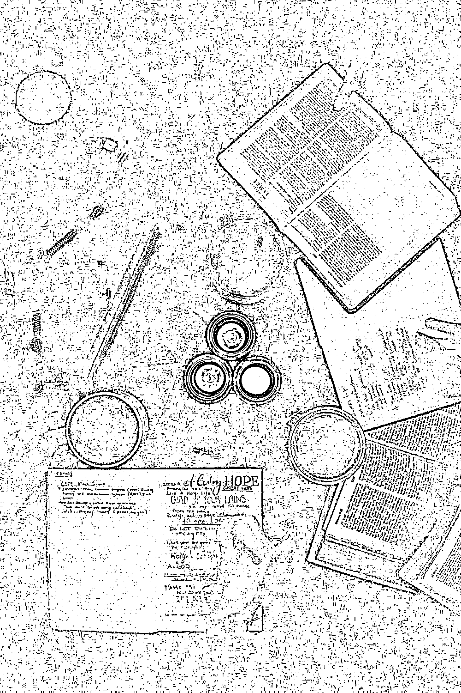

**爱情线索**

****

**有些人被三种麻烦困扰——他们过去的麻烦，他们现在的麻烦，以及他们预期未来将要出现的麻烦。****——赫伯特·乔治·威尔斯****对很多人来说，处女座的吸引力在于，他们最终会成为那个别人“离不开的人”。**很多处女座擅长成为别人生活中不可或缺的角色，因为**算好了别人需要什么，然后步步为营，让自己呈现出的一切就好像是为那个人量身打造一样**。抛开恋情中的浪漫游戏，处女座的真命天子得是那种**注重实际**的人，而脚踏实地正是处女座的重要优势。不过，在恋爱阶段，他们或许也会信奉“业精于勤”。在年轻时，初涉情场的他们很可能没什么存在感。他们会穿得非常干净整洁，但风格也偏于保守，很多人可能会觉得他们不太显眼而将他们略过。**不过，他们是特别善于观察总结的人。会关注细节，是一个很好的学习者。**“瞄上”了谁，就会对他们的风格和喜好处处留心。如果是在同个公司工作，或是在同个写字楼上班，可能还会在午饭时间去观察他们喜欢吃什么。如果需要的话，处女座会攒钱，以备有一天“恰好”买了他们最喜欢的东西给他们。当然了，处女座也很“好用”，能修理坏了的东西或是为他们出谋划策。随着年龄的增长，处女座的时尚触觉也会越来越好，有可能精通低调简约风，穿得一丝不苟无可挑剔，从那些原本跟自己同样不善打扮的人中脱颖而出。事实上，经过时间的考验之后，别人会开始把处女组当成完美的伴侣，并奇怪从前怎么没有发现他们的好。其实这是因为**处女座总是“勤于练习，时刻准备”**。甚至在男欢女爱方面，即使初尝禁果时可能青涩又笨拙，但总会慢慢找到“技巧”。一旦学会了就可能成为个中专家，他们对于细节的精道处理一定会让伴侣久久难忘。有时人们会说：“小心那些默不出声的人”，他们是指那些看起来低调不张扬，似乎对眼前的事漠不关心，不知道脑子里在想什么的人。这很可能就是在说处女座。其实**处女座只是需要静静观察一会儿，先在心里默默分析，等到时机成熟再给出独到见解。**低调的性感，说话时轻声轻语的样子，以及脚踏实地的作风，很容易给人留下深刻印象。或许现在还没有掌握门道，但等处女座真的想的时候，他们自会有办法。

**版权声明：**原创文章由作者授权发布于若道平台，欢迎转发，反对抄袭。友号转载请申请白名单。

****想阅读更多作者的文章，请在后台回复******大卫****** 即可。****

**喜欢文章请长按下方二维码打赏**

**给大卫老师加杯咖啡呗~**

**▼**

**学习占星学**

**点击或长按下图了解课程详情** 

**微信又双叒叕改版啦，不想错过若道君的推送？**

**就把若道设为星标吧！**

**▼**

**喜欢记得点一下在看哦☟**

****报名直达入口****

# 周三开讲｜若道创始人亲讲：如何通过太阳培养个性与自我意识？（限时免费）

> 原文：[`mp.weixin.qq.com/s?__biz=MzA5NjA0NTAxNg==&mid=2651455379&idx=2&sn=a22f3d611af850f3a8b62714d0c0a9b8&chksm=8b4b4d24bc3cc432ca2e9f4f0daaec8d0c9fb7e20cce086cfcecc67ab42fa21f6c1592dfd452&scene=126&sessionid=1692737933#rd`](http://mp.weixin.qq.com/s?__biz=MzA5NjA0NTAxNg==&mid=2651455379&idx=2&sn=a22f3d611af850f3a8b62714d0c0a9b8&chksm=8b4b4d24bc3cc432ca2e9f4f0daaec8d0c9fb7e20cce086cfcecc67ab42fa21f6c1592dfd452&scene=126&sessionid=1692737933#rd)

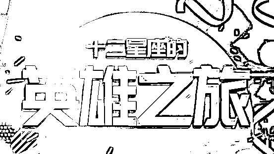

1

**太阳，成为自己的英雄**

**你必须踏上哪条道路才能培养你的个性意识和健康的自我意识？**占星学中的太阳指向父亲的原型、自我和英雄。作为英雄的象征，它代表了你必须有意识地去争取的东西，最大化表达它所在的星座，无论是光明面还是黑暗面。太阳的体验构成了个人满足、自我决断和意志的重要建设性因素，它代表了有意识的自我。太阳是自我感知之路上的一种心理冲动。**· 它的光明面可以表达为：**自信、决心、健康的抱负、独立、魅力、创造力、吸引力和领导力；**· 它的黑暗面可以表达为：**做作、专制、自私、炫耀、害羞、无能和不安全感。
黄道十二星座反映了英雄人生的原型轨迹，他披着以下外衣经历了个人发展的 12 个阶段：**战士、坚持者、信使、保护者、统治者、分析者、恋人、重生者、冒险者、攀登者、改革者和启蒙者。**9 月 8 日（周三），大卫·瑞雷老师将为大家带来一场关于十二星座英雄之旅的知识讲座，大卫老师还会就参与者在学习与实践占星的过程中遇到的种种问题进行互动问答！

2

**讲座简介**

**12 个太阳星座案例解读，诠释如何活出自我，实现英雄之旅**

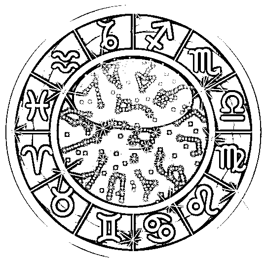

3

**讲师是谁？**

**大卫·瑞雷（David Railey）**

**·** 若道联合创始人，致力于在中国教授和推广西方占星学；  **·** 曾任 ISAR 全球副主席，CAPISAR（ISAR 职业占星师资质认证机构）主席；**·** 1976 年，通过亚特兰大职业占星师考试，成为全职占星师，随后通过 AFAN 和 ISAR 职业测试；**·** 1980 年，与杰夫·焦耳一起在亚特兰大创建“每日行星”占星学中心。此后在亚特兰大占星协会担任 4 年考官，并且两次担任亚特兰大地区占星协会主席。1979-1992 年，作为占星师活跃于美国社会媒体，向不了解现代占星学变化的大众宣传专业占星学知识。在 1989-1992 年期间，他在 WRGG 电台 12 频道每周主持个人电视秀“今日占星学”，早先他还在 WRFG 的广播节目中播讲宇宙天气节目；**·** 2010-2014 年，任全美占星师联盟监督委员会委员；**·** 2010 年，其著作《灵魂的目标》中国版出版，和蒋颖一起创办若道占星学校和其官网 www.nodoor.com；**·** 2017 年，被选为 ISAR 委员会成员。ISAR 是世界最大的国际占星机构，会员遍布 45 个国家，2017-2020 年曾任 ISAR 全球副主席、CAPISAR（ISAR 职业占星师资质认证机构）主席。 

4

**讲座详情**

**讲座时间**：**2021 年 9 月 8 日 星期三 20:00-22:00****参课方式**：网络直播**讲座价格**：200 元（**想获得免费资格？往下看**）**报名方式**：**务必点击文末“阅读原文”，在报名链接进行报名****报名截止**：2021 年 9 月 7 日 中午 12:00**人数限制**：200 人**特别提醒**❶ 不接收空降，请提前报名付款确认名额❷ 报名成功后，会在 9 月 8 日下午统一发送参课方式，请耐心等候❸ 由于个人原因无法出席沙龙，不提供开课后退款，敬请谅解

**转发上方海报到朋友圈**

**截图发给客服**

**即可获取免费参加讲座资格**

**长按二维码添加客服，抢占优惠价名额~**

****报名直达入口****

# 崩塌的“高塔”、结婚的“皇后”......故事背后隐藏着塔罗牌预测的秘密

> 原文：[`mp.weixin.qq.com/s?__biz=MzA5NjA0NTAxNg==&mid=2651455374&idx=1&sn=4f4cc16af59ce13d99de51bcd26a3bf6&chksm=8b4b4d39bc3cc42fd011fc3a537a01a511248f9169019b39799369fee450098250cda02c16ec&scene=126&sessionid=1692737933#rd`](http://mp.weixin.qq.com/s?__biz=MzA5NjA0NTAxNg==&mid=2651455374&idx=1&sn=4f4cc16af59ce13d99de51bcd26a3bf6&chksm=8b4b4d39bc3cc42fd011fc3a537a01a511248f9169019b39799369fee450098250cda02c16ec&scene=126&sessionid=1692737933#rd)

******☆ ****后台回复“今日”，给你一句生命态度******

作者/蒋颖 若道创始人

编辑/翀子 封面/书君 图片/网络

塔罗牌的预测就像心灵的镜子，映照出我们的内在体验与外在事件，从中我们能以更有觉知的、带着创造性的方式回应它。如果你对塔罗牌感兴趣，若道开始的[【神话塔罗】](http://mp.weixin.qq.com/s?__biz=MjM5MjQwNjAyMQ==&mid=2649438813&idx=4&sn=d29e2e323495b3ac82af612f93078d97&chksm=beb9553789cedc21f230c3bf0de332cb9e39fd04ed6d36c27f9df7cdc5f62ea032a71be9ffbc&scene=21#wechat_redirect)课程（点击可查看详情）将和你一起走进心灵之镜的世界。

外在生活中的事件和塔罗牌图像之间的关联并不是因为字面意义上的魔法，而是因为它们有着共同的意义。这就是我们所说的，出生、死亡和青春期**既是内在的也是外在的体验**。

我们一次又一次，在不同的层面，在人生不同的时期经历这些体验，因此会有相应的塔罗牌来描述这些体验，这张牌会在我们内心经历这类原型事件时，在摊开牌的那一刻，神秘地，似乎毫无“理由”地出现。因此，**塔罗牌的预测就像是照向心灵的一面镜子。**

——摘自《神话塔罗》

**我自己的故事**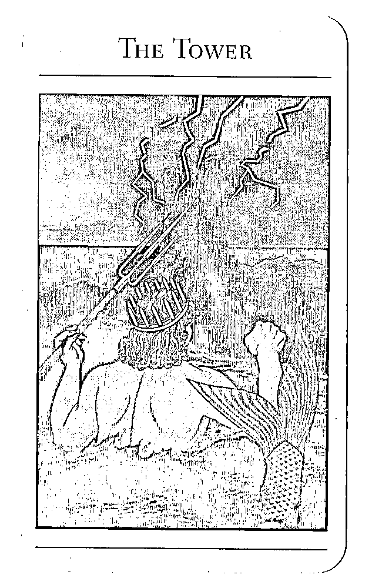

The Tower

高塔

**高塔牌出现的时候，预示着当事人身上某种老旧的存在模式正在瓦解。**和死神牌以及恶魔牌一样，判断这张牌的**“好”与“坏”取决于当事人的态度以及对相应事件的感受。**

2008 年，我在一个软件公司工作。当时，公司高层处于各种复杂的关系斗争中，因此，我没有太多事情可做。我已经开始对占星学感兴趣，这种兴趣和对于新发现的身心灵知识的兴奋联系在一起。不过我丝毫没有计划自己未来会从事此种类型的工作。**当时的工作是一个舒适的岗位，**虽然既没钱也没有成就感，**但我有大把时间探索自己新发现的爱好。**

后来有一个周日，一位朋友知道我在学习塔罗，就想让我帮助他用塔罗牌看一下事业上的一个挣扎。**我顺便对于自己的职业也抽了一张牌。那是一张高塔牌。**我记得自己坐在那里，明媚的 4 月，阳光遍洒，我盯着这张牌，竭力在朋友面前掩饰不安。能发生什么呢？事业要陷入崩塌？虽然我对目前的工作有很多失望，也对当时高层斗争的结果有一些想象，**但是崩塌仍不在我想象的情景中。**我对自己的职业能力还是有相当的信心。

当时我刚学习塔罗和占星不久，正处于不明就里、将信将疑、既期待了解又害怕真有这么一回事的情况之中。对一个新入门的学习者，塔罗与占星都和“命运”这个词紧密相连。而“命运”这词就像北京的臭豆腐，让我既抗拒它又被它吸引。

我过去所受的所有教育都告诉我鄙视这个词的存在，这不过是懦弱又无知的人给自己无法掌控的人生的借口；而我与这两个学问的赤身接触，又让我惊讶，因为它的确如猜谜一样猜到了我和我的部分人生。**和这样一个既陌生又新鲜的家伙的对弈，让我既好奇又有些害怕。**

不过，当我想了解我职业的“命运”的那个时刻，我却抽到了高塔，塔罗牌 22 张大阿卡那中最令人不悦的牌之一。老实说吧，**我不喜欢崩塌，即便自己处在并不让人愉快的职业之中，**我也不喜欢崩塌。我不知道谁喜欢它。

崩塌很快就到来了。直接分管的副总裁带领部门最核心成员离开了公司，**一切发生得迅速极了。**副总裁邀请我加入离开的部队，但在这场激烈的权力斗争中，我发现我们的职业道德观非常不同，因此没有接受他的邀请；而作为他的嫡系部队，我被要求要么接受换岗去做培训，要么必须离职。我无法接受换岗，只能选择离职。更让我尴尬的是，这个职业选择本来是我人生的一次重大冒险，而这场冒险以失败告终。

当时的我并不知道，未来到底什么在等着我。一场职业冒险失败了，伴随着崩塌的还有职业梦想。**高塔倒下，我发现自己处在一片废墟之中。**

这不是一个容易的过程。当时的我，对生命必然的起伏过程没有太多了解，只想“趋吉避凶”**，虽然塔罗牌给了我一个先见之明的机会，不过我并没有了解它的含义。**当然站在废墟中的我，自然也经历了很多复杂情感。我在高塔之中时，尽管我知道那个地方岌岌可危，尽管我内心充满不甘，但是我仍然守在塔内，不愿离开。

回顾过去，用后见之明来看，**崩塌是必然的过程。崩塌也令人庆幸，**让我把自己从传统的职业道路中解放了出来，尽管解放发生时是一场没有计划的令人忧惧的崩塌。

**我看到的故事**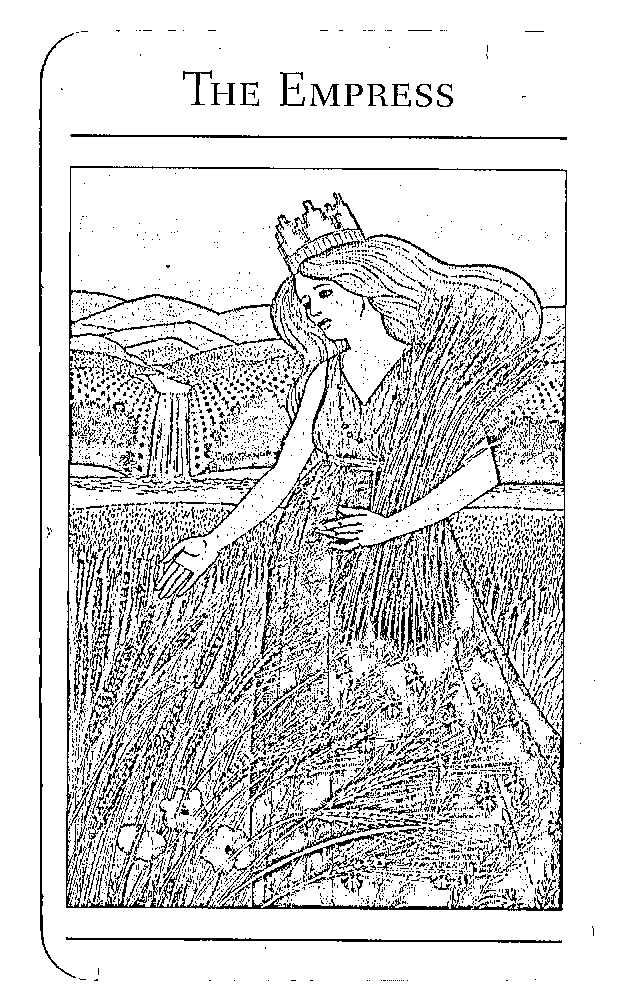

The Empress

皇后

**皇后牌表明当事人要更多地涉入生命中现实的领域，可能是婚姻的结合、孕育孩子、艺术创作或者某种创造性结果的获得**，因为这些都需要伟大母亲的耐心和滋养。

H 姑娘是我的好友，很多年前，我陪她一起去找一个塔罗解读师。她是为婚姻问题去的。她有一个要好的男友很多年，但是两人一直没有结婚。**两人无法下定决心进入婚姻，因为彼此对承诺这个事情都没有安全感。**那时我们也都不懂所谓潜意识、童年关系模式、家族动力等等这一切对成人亲密关系的影响。H 姑娘只知道她不想结婚。

可是事情到了一个必须要决定的地步了。双方父母都在催婚，双方年纪也要到 30 岁了。和大多数人一样，30 岁像一个青春的墓碑，你必须要对它致意。致意过后，岁月的流逝就没有那么可怕了。

于是，H 姑娘决定请一位塔罗师帮助她看一下这段关系的未来，这当然是胆颤心惊的过程。我至今清楚地记得，在一连串的金币牌之后，**最后一张牌为皇后牌。**我看到 H 姑娘大舒一口气。看图说话，谁都能看到图中的惬意和幸福。H 姑娘决定结婚了。他们本来在一起就挺快乐的，虽然也有一些物质生活中的矛盾，但两人精神生活很融洽。

“我要一个外在的确信。” H 姑娘说，“以给我一些安全感” 。**塔罗大阿卡纳那皇后牌提供了安全感，给了一个幸福婚姻的背书。她进入了婚姻。**

10 年之后，她离婚了。**不过，他们在一起经历了很多的成长。有很多快乐时光，**可能比仍然处于婚姻中的许多人都有更多快乐时光。“我没有后悔过结婚那个决定”，H 姑娘对我说，“那是生命的一个过程”。

“我期望每位姑娘在想要结婚的时候都抽到那张皇后牌，像我当年一样。这样在生命某个时刻，在大脑中的怀疑腐蚀我们的时刻，我们都可以投入那个承诺给我们的幸福，哪怕并不永恒。”

**我听到的故事**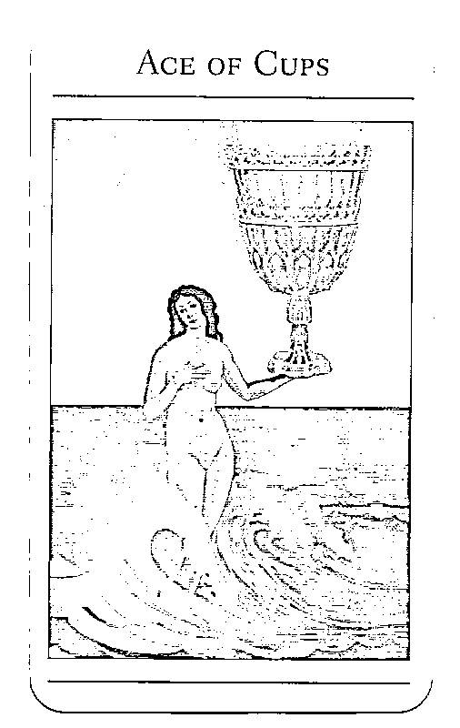

Ace of Cups

圣杯 1

**圣杯 1 预示着情感的流露，但此时的情感还没有分化，处于最原始的状态中，它充满了活力，常常把人们淹没。**

有三个女性，同时拿到一张圣杯 1。这是同样一张牌，她们看到同样的画面：一个赤裸的维纳斯从海中升起，一只手举着一个大大的圣杯。

**这三位女性被要求，看着那张牌，讲一个他们看到的故事。**

**★****第 1 位女性看到**

维纳斯并不快乐，特别是这个圣杯对她来说非常**沉重**，托着它似乎是一个**责任**，这个责任包含很多人的期盼，而她因此感觉无比**疲惫**。她很想把圣杯扔入大海之中，虽然它在其他人眼里也许非常宝贵，但对于她而言似乎只是一个**负担**，托着这个圣杯，她就**被束缚着，无法获得自由。**

**★****第 2 位女性看到**

维纳斯对于自己的赤裸有一丝**羞耻感**，她不知道如何应对这种羞耻感。同时，她又有一些**兴奋和力量**，好像她刚刚从海中升起，马上要到一个新的世界。圣杯似乎是她所**创造**出来的东西的一个部分，她就站在自己的**羞耻感和新鲜的创造力**之中。

**★****第 3 位女性看到**

这个圣杯是维纳斯所搜集的无数珍宝之一。维纳斯搜集了很多珍贵宝物，她因此感到**富有**；同时她又觉得自己是一个无比**孤单**的人，孤单地带着自己的珍宝。维纳斯甚至觉得自己是一个怪物。

当然，也许你已经知道，三位女性看到的都是那一时刻她们对自己和自己生活的看法，这个和旁人所看到的他们的生活的表象大不相同。虽然三位看到的都是同样一张牌，**但她们看到的是完全不同的故事。**每个人的故事如此**真实地反映了当下她们的内心世界。**一个有经验的治疗师可以深入下去，一起去谈论她们的生活。

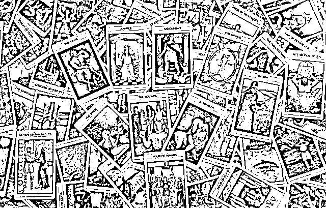

**| **神话塔罗

**塔罗：世俗意义与修行意义**

这五个故事，是五个人的生命与塔罗相遇的故事。

最后让我再次引述《神话塔罗》 中一段话：

**塔罗图像是一种古老的、****引起共鸣的符号象征**，它所象征的人生经历与我们人类的状况和人类的命运有关。这样的象征赋予生命尊严，因为我们发现，其他人曾经先于我们，寻觅到一条道路，他们曾获得成长，变得充实丰富。牌面的象征**栩栩如生的描绘出了人类发展的原型阶段**，它不仅针对每一个个体，也代表着人类独有的仪式过程……..在塔罗图像中，**事件预测与心理觉悟相伴随行**，因为我们外部发生的事件与内在发生的状况是有关联的。用我们平常的因果关系，无法解释为什么某一张塔罗牌似乎‘偶然’出现在牌阵中，却无比神奇地，**不仅与询问者的心理状况关联，而且还与他/她在那个时候的境遇关联。**在某种程度上，认识某种经历的内在意义，可以帮助我们更好地应对这种经历，**以一种更丰富、更有创造性的方式来回应它，**因为你不再视其为偶然或是倒霉或不可逆转的天命。我们可以在身边发生的每一件事情上看到自己个性的痕迹。

借由理解意义，**我们有机会和生命中的痛苦遭遇和解。**

借由理解意义，**我们有机会超越个人心智，和更大的人类智慧相连。**

借由理解意义，**我们有可能拥有先见之明的智慧。**

**版权声明：**原创文章由作者授权发布于若道平台，欢迎转发，反对抄袭。友号转载请申请白名单。

**蒋颖**

若道创始人，中国首批 ISAR 英文认证占星师（2012 届）

长江商学院 MBA，厦门大学经济学硕士，化学学士

国际占星研究协会（ISAR）中国区副主席

《灵魂的目标》译者

**学习占星学**

**点击下图了解课程详情** 

**微信又双叒叕改版啦，不想错过若道君的推送？**

**就把若道设为星标吧！**

**▼**

**就是这个“在看”，戳戳戳 ☟**

****报名直达入口****

# 2021 年只剩下三个月，你对自己有什么期待？

> 原文：[`mp.weixin.qq.com/s?__biz=MzA5NjA0NTAxNg==&mid=2651455294&idx=1&sn=576d41d3fee6c855222674dfa1abedb0&chksm=8b4b4d89bc3cc49f5c7cf8d552876bd9c94fd5de4256d559ac6081d8f85cd0af15cf9d2aa86a&scene=126&sessionid=1692737933#rd`](http://mp.weixin.qq.com/s?__biz=MzA5NjA0NTAxNg==&mid=2651455294&idx=1&sn=576d41d3fee6c855222674dfa1abedb0&chksm=8b4b4d89bc3cc49f5c7cf8d552876bd9c94fd5de4256d559ac6081d8f85cd0af15cf9d2aa86a&scene=126&sessionid=1692737933#rd)

**2021 年 9 月 4 日天象：**

*   **月亮在狮子座**

*   ******水星三分土星******

*   **金星四分冥王星**

*   **火星三分冥王星**

今天月亮在狮子座，还等什么，开心起来！不管这周过得如何，今天都是让自己找到愉悦的日子~水星三分土星的天象，让你有机会把本周吸收学习的信息与想法落实下来，如果你正好和朋友聚会，除了享受周末时光，也是与他们一起构想未来计划的好时机。火星三分冥王星，让我们可以精力满满、行动力十足的完成既定事情。不过，今天在和亲密朋友/爱人的互动中，容易出现和信任相关的议题，金星四分冥王星提醒我们：你的恐惧是什么？

2021 年的最后四个月开始了，而 9 月也是处女座的月份（点击[【9 月月运】](http://mp.weixin.qq.com/s?__biz=MzA5NjA0NTAxNg==&mid=2651454929&idx=1&sn=b98867092d970dd0c6f2f924f7b1eb40&chksm=8b4b4f66bc3cc6709cf3f3ebb92a55cd52d2bd8bca993f488f1ca0c258f7c9d6c54eec6f5215&scene=21#wechat_redirect)查看文章），它是我们在日常中体验自愈、学习身心协调的黄金时期。面对今年剩下的 4 个月，你对自己有什么期待？欢迎跟我们分享哦~

周六快乐！我们明天见！ **了解每日天象，可****下载“若道”APP 查看****还有更多精彩等着你哦**

