# 若道 202104-202111 PT2

# 金海相位丨从“在爱里迷失”的低阶状态，走向更高的精神维度

> 原文：[`mp.weixin.qq.com/s?__biz=MzA5NjA0NTAxNg==&mid=2651455258&idx=1&sn=37caaaee7f11195e4e8dcc0d03c9fe6c&chksm=8b4b4dadbc3cc4bb4a74d1f0085556fe050d76be8963c001ec9e0bf5f973209fbfc878f17441&scene=126&sessionid=1692737933#rd`](http://mp.weixin.qq.com/s?__biz=MzA5NjA0NTAxNg==&mid=2651455258&idx=1&sn=37caaaee7f11195e4e8dcc0d03c9fe6c&chksm=8b4b4dadbc3cc4bb4a74d1f0085556fe050d76be8963c001ec9e0bf5f973209fbfc878f17441&scene=126&sessionid=1692737933#rd)

**************☆ 后台回复“今日”，给你一句生命态度**************

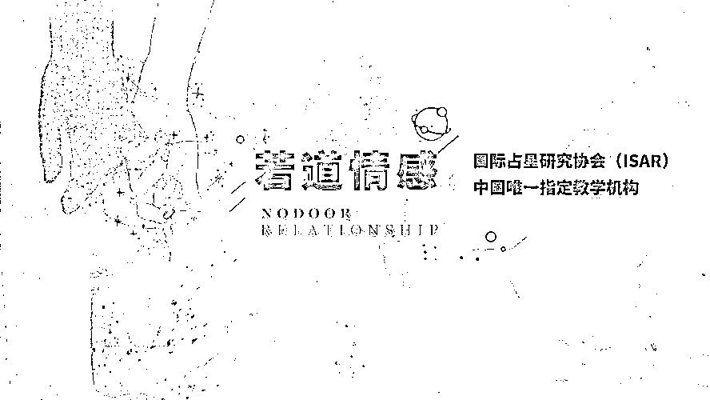

作者/朵三三三 ISAR 认证占星师
编辑/玫瑰 封面/书君 图片/pexels

对于金海相位的负面影响，相信大家已经了解太多，以至于现在只要提到这个相位，大部分人就会出现刻板印象：混乱、迷失、受虐倾向、恋爱脑、欺骗、依赖上瘾等等，那么今天，我想从另外的角度来谈谈这个相位能够给生命带来的意义。

除了品尝到爱情的苦滋味之外，金海相位还会为我们创造什么，提供怎样的可能性？

**金星与海王星的曼妙舞蹈**

**1. 金星**

****

**金星象征全然的爱自己与自我价值，金星能够显示我们的价值与渴望，象征能够替我们带来欢愉、让我们感觉更完整的物品。”****“金星代表我们在爱里的选择，是我们对于美好事物的渴望，并由此连结到自己的价值。金星寻找的是一面镜子，这样才能在情人眼底看到反映出来的自己。****——丽兹·格林****金星代表了我们内在的价值感和自尊，我们的审美与品味，与我们的身份认同息息相关**。是我们渴望得到的东西，我们想要的东西。它让我们拥有享受人生以及快乐的能力，也是我们给予和接受情感的方式。当然**金星还代表着关系**，是我们选择的爱人和朋友，一个拥抱、一个关怀、一个鼓励，就会让我们明白，自己从来都不是一座孤岛，我们与生俱来需要与他人联结，我们随时都有能力，也有权利去接受他人的爱与帮助。

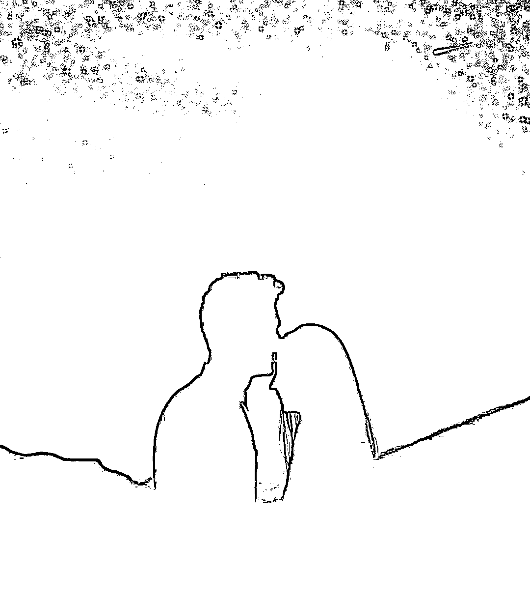

**2. 海王星**

而提到海王星，往往会让人想到**灵性**这个词，它总是那么复杂又难以言说，忽明忽灭，难以捉摸，是神秘主义、理想主义和浪漫主义的象征和代表，是我们内在的神性。**海王星会打破边界感，带来万物归一的超越式体验。会让一个人放下对自我的执念，与神圣源头融合，但是在个人认知的层面上可能带来迷失感和焦虑感。**或让我们的心灵格外脆弱，无法面对日常生活的粗鄙和痛苦，不断麻醉自己，活在梦境和想象中的世界中。

****

**海王星如同大海一般无边无际，难以捉摸。海水是孕育生命的源泉，也带着泯灭个体的威胁，当我们沉浸在海王星之中，如同进入了集体无意识的底层，人我之分消除，众生一体，与生命之源无界限的融合。****——丽兹·格林**沉入生命之海中，可能会走上救赎之路，也可能身陷晦暗不明的迷宫。

**2. 金星+海王星**

**金星与海王星的联结带来了天然鉴赏力、超越的审美、想象力、爱心与慈悲、灵感与浪漫，还有对美的幻想，无止境追寻。**当我们能够与超越自身的世界发生关系并从中感受到自己的存在时，我们感到宁静。当然，一切的天赋都有代价，所有的礼物也都带来了潜在的危险。**一颗健康的金星可以自然地接纳爱与真实的降临，而它与任何另外行星的角度都会影响一个人会如何表达爱，用怎样的方式对待亲密关系。**那海王星如何塑造它所触及的行星呢？**净化和提升，渴望去除不完美和有缺陷的部分。它追求的完美不是处女座执着的细节完美，而是近乎神的完美。**所以宇宙之爱和黑暗面总是相伴而生。当金星关系由真诚主导时，双方都会获益，有所帮助，而海王星很容易让这个过程发生折射，扭曲了关系建立的自然过程：**看到某一部分，然后打造一个关于他人的幻象；或者抓住对方的需求，树立对方心中理想人设的一个幻象。**如此一来，我们会获得表面和谐的关系，却失去了真实的关系所带来的更深刻的满足。我们会不自觉在逃避中自我欺骗、放逐，依赖上瘾，进入自毁式的情感和关系纠葛。

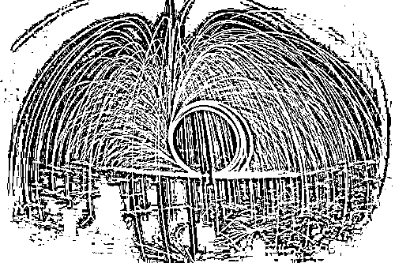

**金海人的迷宫与成长之门**

****

**海王星倾向于长期的不幸，因为世界上一切美丽，也无法弥补失去的天堂水域。**

**                                                        ——丽兹·格林**

**金海人自从降生世间，与生命源头分离之后，就会在人生路上以各种方式体验孤寂感。**他们不断寻找失落的完整，以各种方式想要回归在子宫的海洋中感受到的合一性。然而，这样遥远而完美的影像并不存在于这个人世间，这个世界里存在的只是关于完美的碎片。这些闪闪发光的碎片散落四处，唾手可得，不断吸引着金海人的靠近，可一旦靠近，就会发现它们只是碎片，并不完整，更不完美。

**1. 金海相位的低阶表现**

**金海相位低阶的表现是从关系与爱恋中追寻完美而不确定的自我价值，爱带来“神性的不满足”，也带来了对追求幸福能力的干扰。**
有很多金海相位的人，一直迷失在**牺牲式的爱**之中，要么**自己成为拯救者，带着强烈的同情和怜悯去爱“迷途的羔羊”；**要么**追随一些看上去能够为自己提供救赎的人**。现实世界失去吸引力，只有宗教般献祭和赎罪的爱情让他们感觉真实。这次我采访到了金海族群中的一员 E。她星图中有金星白羊座与海王星摩羯座的同度精准四分相，而她的经历中几乎集齐了所有金海相位最典型的元素。“中学的时候，爸爸查出患有抑郁症，在医院住了很多年。后来交往的一个男朋友也是抑郁症，照顾他很累。在其他很多关系中都是因为同情对方付出关心，承担责任，不断牺牲。”“跟老师谈过恋爱，后来渐渐走向一段被 PUA 的关系中。当自己清醒过来想要离开的时候，对方开始强制性洗脑、说教、挽留，甚至是物理手段的拘禁。那时有一些时刻，自己是不想再活下去的。后来反省被 PUA 的原因是在于，那时自己分不清喜欢的是这个人，还是他拥有的学识。”

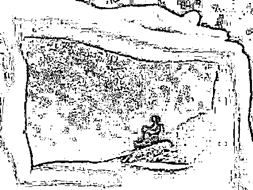

这样的爱情中，幻灭自然是如影随形的。**当幻灭发生时，一切梦境都化为泡沫。旧的桃花源不能再令金海人沉醉其中，他们会匆忙编织新的梦幻。**还好这种理想典范的框架总是可以任意转移到另外一个人身上，如同寄生虫一般，不断在找寻下一个宿主。你可以看到**很多金海人在每段感情中，都能够奋不顾身，全情投入地爱上对方，而在结束后马上投入下一段轰轰烈烈的情爱之中。**深层原因就在于**他们爱的并不是眼前这个人，他们根本没有能力看见眼前这个真实的人**。他们眼中只有一个代表，一个模糊形象。所以只要金海人愿意，他们可以爱上每一个人，可以在所有人身上找出优点，却无法爱上有血有肉的个体。**所以金海人才会经历不断失望的关系，因为没有人能满足他们对关系的预设。**E 说：“我谈过很多男朋友，每次都是别人追我，但到头来总是自己付出了很多。在感情里从来没有过真正的选择，不知道自己想要一个什么人。关系崩溃的时候才发现内在的幻灭感，是源于自己潜意识中不断构筑的那个幻想。”而**另一些金海人根本不会投身现实，他们极度渴望某个无法拥有的遥远对象，因为无法拥有便是完美的，不会接近便不会失望**。例如某个偶像、明星，或是一个优秀到闪闪发光，让自己只能躲在暗恋中甜蜜的人。沉浸于脑补的各种情节，但现实却什么都不会发生，对方甚至不知道你是谁。但如此一来，就可以活在想象而非真实的关系里面，但对他们而言，想象的世界就是现实。危险在于，**久而久之，金海人很可能完全模糊掉幻想与现实的界限，再也分不清两者的区别**。追星女孩杨丽娟的悲剧便是很好的例子。

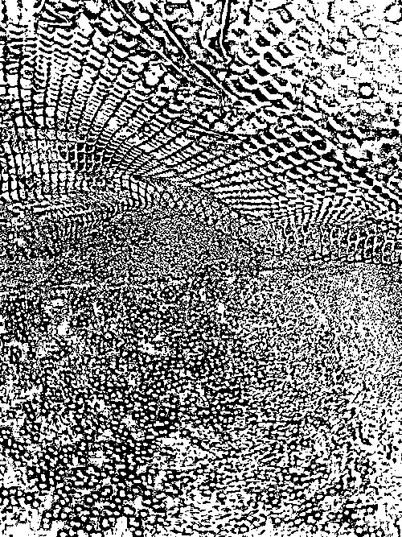

**2. 金海相位更高的见地**

有一些金海人，在情感、人际关系上承受多次失落与幻灭的重复轮回后，收获了更高的见地。他们开始明白**自己最初看到的完美只是幻象，在日常中回归到凡人的肉身和价值感中，转而寻求其他的救赎之门，继而能够体验并接纳当下不完美的生活和关系。**E 说：“慢慢地，我开始理解人的全面性，不再是单独被某一点吸引。即便还是被某个人吸引的时候，心里很清楚距离是欣赏对方的原因。如果太接近会丢掉滤镜，对方也就不再具备吸引力。”她开始改变与人的相处模式。“经历过这么多之后，我不想要人世间的这些情感纠葛，觉得很麻烦。现在已经结婚，感情稳定，很珍惜现在的伴侣。感情并不是越多越好，不再因为自己身上有能够吸引到别人的东西欣喜。我开始建立边界感，控制自己不要被别人爱上。当然前提是自我定义清晰，明白自己想要做什么，意识到自己有更大的使命感。”**金海人的异想世界和解放之路**“泉源从一个眼里能发出甜苦两种水吗？”当然可以。**金星是艺术女神，可以通过美来帮助我们自我疗愈。**去看一场话剧，边沐浴边听音乐，黄昏带着狗狗在树林里散步，或者周末试着去做陶艺、上绘画课，学习插花。年轻的时候我们更需要炙热的爱恋，而随着年龄增长，更需要学会跟自身相处，需要美丽的事物激发灵感，满足我们对于创造力和艺术的需求，喂饱饥饿的灵魂。海王星的重要礼物之一就是让我们与内在联结，让我们有机会走到自我的深处，不断探索，从一片虚无中看见希望，听见内心的声音；让我们渴望不断超越平凡的生活，突破日常的限制和疆界；让我们变得超越尘世，跟随指引，经历高峰体验，到达在我们之上的世界。

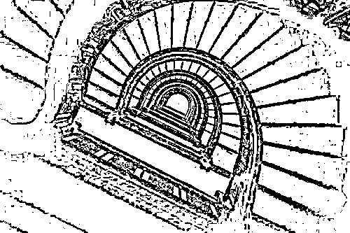

这里要感谢 E，她向我讲述了**柏拉图的洞穴理论**。在一个黑暗的山洞里，几个人被绑在凳子上背对着洞口，无法动弹。在他们的后面是一堵墙，墙外有一堆火，火发出的光将一些事物的影子投射在洞底的墙壁上，而被绑着的人只能看到墙壁上的影子。他们以为事物的样子就像洞壁上的影子一样——那就是真实的世界。直到有一天，有一个人挣脱了束缚，逃出山洞。他看到了外面的世界，恍然大悟。马上跑回去告诉那些仍然被绑在凳子上的人：真实的世界在外面，这里只有虚假，只有影子。然而，当这个人将那些被绑着的人解绑之后，那些人却把那个人当成疯子，用石头砸死了。但是，他们也看到了身后的墙，墙外的火，以及通往洞外的洞口，他们终于鼓起勇气走出去！这是意义重大的一刻！结果是，有人害怕接受这种沉重的真实，逃回洞里去了；而幸运的是，有人留了下来，接着去探索崭新的世界！这就是举世闻名的洞穴囚徒比喻。而这个情境也非常适用于形容金海人的困境。最初，金海人只是被对方身上的某一个部分吸引，就如同囚徒刚开始在山洞的墙壁上看到的影子。这一个个微型世界，让金海人在错综复杂的情爱关系中流连忘返，每一个影子都不同，都有着自己的代表性，但却没有一个完美到能够令金海人停下追寻的脚步。直到有一天，**金海人发现了更高的精神维度，发现了脆弱而易碎的男欢女爱之外，亦有其他能够通向高层世界的途径。**此时的金海人就爬出了洞穴，来到了更高的理念世界。这时回过头才发现，那所有羁绊自己的不过是一个幻象世界。这些山洞上的影子，甚至连实体都没有。自己被深深吸引的对象，不过是一个又一个理想模型的仿体。或许你会有疑问：明明我们肉身所处的世界才是现实的，金海人脑中的理想世界才是幻觉。No.对金海人来讲，这个自然世界不过是光与影的洞穴。也或许，庄生梦蝶，蝶梦庄生。重要的是，对于金海人来说，**分化出这样的上层世界**非常重要。这样，他们才会明白**精神寄托不可放在个体模型上，具象世界中找不到自己灵魂所渴望的东西，但满足感永远可在更高的维度之中寻得。**然后，用金星才华和海王星浪漫精神来创作，将在洞外高层世界看见的一切记录、描绘、演绎出来，他们不会被当作疯子，而会被叫做艺术家。文人汤显祖的星图之中，有着金星处女座与海王星的三分相。他写出了杜丽娘为梦中情人患相思病，为那不曾见过面的心上人郁郁而终的著名桥段。

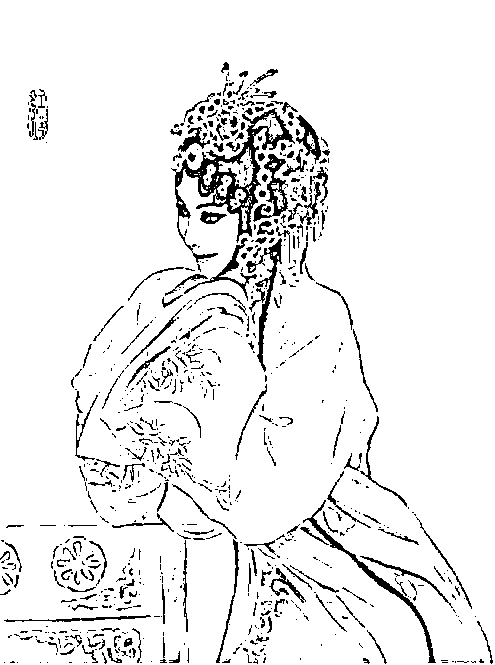

| 杜丽娘

杜丽娘就是汤显祖的化身，他可以为了一个完美的梦想至死不渝，为了一个理想中的爱人生而复死，死而复生。“情不知所起，一往而深。”无来由的起心动念，迷朦的爱也是爱。“生者可以死，死者可以生。生而不可与死，死而不可复生者，皆非情之至也。”人间红尘与阴曹地府的距离并不能阻挡金海之人对完美之爱的渴求，只要有情，他们可以穿越生死的藩篱自在行走，不断寻觅能够带自己前往狂喜国度的爱侣，期待通过与对方的深度融合，到达更宏大的神圣之所。**金海人永远可以回归到自身无限的创造力之中，从个体到集体之中，从自我到大我之中，将海王星的超越能量用来消弭一切现实中的边界限制，打破所有的不自由。**他们可以在艺术中一窥自己毕生追求的完美，也可以发挥最丰富的资源，创造非凡的魔力和极致的美感，最终享受天赋，享受精致与和谐，将平平无奇的琐碎日常都变为艺术的殿堂。E 说：“音乐很重要，近些年我开始热爱所有形式的音乐，我发现在这个世界之上还有另外一个世界，而音乐为我打开了这样一扇门，我像是一个突然进入新世界的小孩，新奇的四处探索。哲学也很重要，它让我在更普遍意义上抓住了世界的奥义和本质。现在我研究的方向是宇宙论，它让我进入到异于自己所熟悉世界的另一领域，提供更多元的视角，帮助我建立对于人类和整个世界的全新认知。我渐渐开始获得了一个视角，可以很慈悲的看着所有人，在这些不完美的代表和影子身上，我看到了最完美的那一面。”这就是她之前提到的“更大的使命感”。

**金海人可以自然地感受到集体对于精神和超越的热望，成为集体意象和幻想的表达管道，并以艺术的形式表现出来，影响更深层次的集体潜意识。**不是将自己宏大的能量消耗在无休止的情感纠葛中，而是加以引导，物尽其用，做出你真正想要的对人类世界的贡献。将艺术和美由上至下的具象化，不逃避真实，不否认生活，带给洞穴哪怕一丝微光。这是金海人的使命，也是金海之人的解放之路。在平行方向上保持清晰的人我界限，在垂直方向上有分化的自觉意识。**向内探索——求真我；****向外探索——求界限；****向上探索——求超越；****向下探索——求落地。**如此，便是立体、完整而多元的系统结构了。

**版权声明**：原创文章由作者授权首发于若道平台，欢迎转发，反对抄袭。友号转载请申请白名单。

****

****朵三三三****

ISAR 认证占星师

全职占星师/塔罗师/国家三级心理咨询师 

人大文学学士/德国慕尼黑大学文学硕士

**微博/微信公众号**：朵三三三

长按打赏

**学习占星学**

**点击下图了解课程详情** 

**微信又双叒叕改版啦，不想错过若道君的推送？**

**就把若道设为星标吧！**

**▼**

**就是这个“在看”，戳戳戳 ☟**

****报名直达入口****

# 斯蒂芬三日线上工作坊丨如何进行一场有效的占星咨询

> 原文：[`mp.weixin.qq.com/s?__biz=MzA5NjA0NTAxNg==&mid=2651455258&idx=2&sn=8c7e1d1b157c63813addc2a25b9e79da&chksm=8b4b4dadbc3cc4bb190d7f811f4d6a8ba1bb5348eaa2516b3c0892adcb58a3fea622780582a0&scene=126&sessionid=1692737933#rd`](http://mp.weixin.qq.com/s?__biz=MzA5NjA0NTAxNg==&mid=2651455258&idx=2&sn=8c7e1d1b157c63813addc2a25b9e79da&chksm=8b4b4dadbc3cc4bb190d7f811f4d6a8ba1bb5348eaa2516b3c0892adcb58a3fea622780582a0&scene=126&sessionid=1692737933#rd)

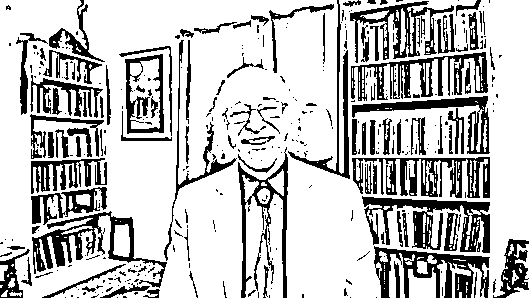

**喜大普奔，斯蒂芬要来教占星咨询了！**

占星咨询对于很多占星学生和兼职占星师而言，都是考验自己到底能否成为职业占星师，建立欣欣向荣职业生涯的最关键一环。

一个坏消息是，当你辛辛苦苦学习完所有的占星技术后，你可能仍会有些沮丧地发现，自己还是做不好一场咨询。

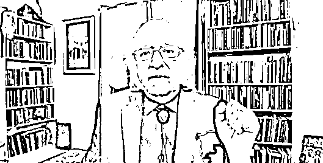

**比如：**

对咨询的问题

*   我可以怎样迅速和客户建立信任？

*   我如何描述星图中我看到的困难配置，或者如何描述我看到的即将到来的富有挑战的行进？

*   如果客户在咨询中滔滔不绝，我该怎么办？

*   如果客户在咨询中一言不发，我又该怎么办？

*   如果客户否认我所描述的他/她明显存在的问题怎么办？

*   如果客户存在明显的心理问题怎么办？

*   如果我讨厌这个客户怎么办？

*   如果我被这个客户吸引怎么办？

*   如果我的性能量被客户激发怎么办？

*   ……

**这么多问题怎么办？！**

别着急。

好消息是，这是每一个占星学生和新手占星师都会遇到的问题，也是每个占星师必走之路。**其中一些问题是可以用占星技能所解决的，而另一些又是在占星技巧之外，需要进入心理学的领域。**不论怎样，归根到底，我们要能在咨询与客户建立并且维持**良好的咨询关系**，甚至与那些跟我们性情截然相反的客户。

1

**授课内容**

如果你听过斯蒂芬·弗里斯特的占星咨询，你会看到客户被他润物细无声的咨询所打动，又感到自己被他深沉的慈悲所懂得。那些娓娓道来的故事在客户面前展开生命时空的画卷，在咨询结束时，又充满希望的力量。

**而****今年****10****月****，在斯蒂芬到中国教学 10 年后，他将****第一次****与所有热爱他的学员分享如何做好一场占星咨询。**

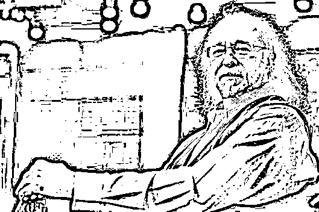

在这个网络课程中，占星大师斯蒂芬·弗里斯特将会和你分享他几十年来一对一面对面的**占星咨询经验**；他也会分享如何提前规划好**接近客户心灵**的占星技巧。**客户个人星图**为我们提供一个最迅速，也最可依赖地建立信任和自然连接的地图，他还会分享如何运用个人星图建立这个连接。

2

**斯蒂芬的占星著作**

*   **1984-1988 年间**，斯蒂芬写作出版了《内在的天空》（已有中文版）、《变化的天空》和《天空的伴侣》三本占星经典著作，奠定了早期在占星学界的地位。

*   **2002-2005 年间**，他与朱迪·弗里斯特共同创作了两本经典的关系占星学著作《天空的伴侣 I：爱、性、和进化占星学》《天空的伴侣 II：组合图》。　

*   **2008 年**，斯蒂芬出版了一本非常重要的著作《昨日的天空》，此书是至今为止关于轮回转世跟星图的清晰对应最详尽的著作之一。 斯蒂芬前后一共出版了 12 部占星著作，在世界占星学界拥有很高的声誉。

3

**斯蒂芬获得的荣誉**

**1985 年**，他凭借《内在的天空》一书获得**职业占星师协会奖**（Professional Astrologers Incorporated Award）。

**1992、1995、2008 年、2018 年**，他四次获得占星界最高的占星学联合协会奖（UnitedAstrology Congress Regulus Award）提名，**2018 年获得轩辕十四教育奖**。

4

**斯蒂芬的占星哲学观**

斯蒂芬的占星风格以自由和选择为中心，他的解读不是以下定论的方式来“预测”未来，他强调如何**改善生命**，而不是宿命式的论断。他以心理占星学的语言来解读星图上的人格部分，但是通过**南北交点及其相位和守护星**来探索星图所揭示的前世业力与今生方向，在灵魂进化的背景里来整体解读星图。

他认为进化占星学的目的在于鼓励人们做出更符合进化方向的智慧选择，我们学习去了解前世的时侯，关注点应该集中在**如何通过意识来疗愈自己**。

5

**这些名人怎么说？**

斯蒂芬让我们停止了玩责备命运的游戏，而开始看到自己是一个走在进化路途上的勇士。 ——**奥普拉杂志***“O: THE OPRAH MAGAZINE”*

斯蒂芬和杰夫这两位著名占星师创造性地相互应和，展现出他们出色的教师才华，发展并弘扬了占星这门艺术。（对《测量天空：进化占星学和灵魂的钥匙》的书评） ——著名心理占星师 现代占星学之父 **诺·泰尔**（Noel Tyl）

请享用斯蒂芬和朱迪这两个博大的灵魂在此书中所提供的洞见大餐吧。（对《天空的伴侣》的书评） ——进化占星学的创始人之一 **杰夫·格林**（Jeff Green）

我为斯蒂芬解读的精准感到惊叹，他强调没有一件事是坏得无法挽回的，也没有一件事是如此之好，以至于它不会因为现在的错误判断而消失的。我怎样推荐他都不为过！ ——好莱坞著名影星“钢铁侠”男主角 **小罗伯特·唐尼**（Robert Downey Jr）

6

**上过课的占星师怎么说？**

他关于我星图的解读，让几乎所有在场的人掉泪，我也从此开启了一段灵魂追寻的旅程。我很惊讶他透过星图可以如此深入一个人的灵魂。很多东西你自己都不知道，但是他讲出来你会发现，啊，这是真的，这是占星学的神奇。——**《心探索》创始人孟想**每个来参加老师课程的同学，都会被老师深深的慈悲心感动。这种慈悲心，并不是表面上说的一些什么话，而是一种从意识层次上发出的能量。每个来上课的人，都能感受到老师的爱。这种爱，并不是盲目的爱，而是深刻地洞悉真相后的慈悲。——**斯蒂芬老师工作坊翻译逸月**斯蒂芬老师的一对一咨询已经排期到两年之后，我特别幸运，曾在课堂上被老师抽中分析过我的星图，老师充满爱与智慧的指引让我更加清晰的认识了自我。内在的潜能、需求和矛盾被老师娓娓道来。——**禄丽荣**斯蒂芬老师是位非常非常值得推荐的大师，很粉他，这位进化占星学的创始人，对人的理解是那么的全面完整、深刻洞见、慈悲和温暖，就这方面而言足可以媲美我无比崇敬的荣格和史坦纳（这两位去天堂里玩了），如果你对西洋占星感兴趣，或者对人的所有角度、各个层次的真相和可能性感兴趣，推荐斯蒂芬老师的书和课程，特别是他的课程，数倍的功力大增的好机会，错过真是占星粉丝的莫大损失。——**仁华**

7

**2020 年斯蒂芬线上工作坊学员感悟**

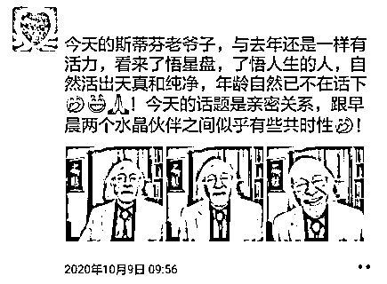

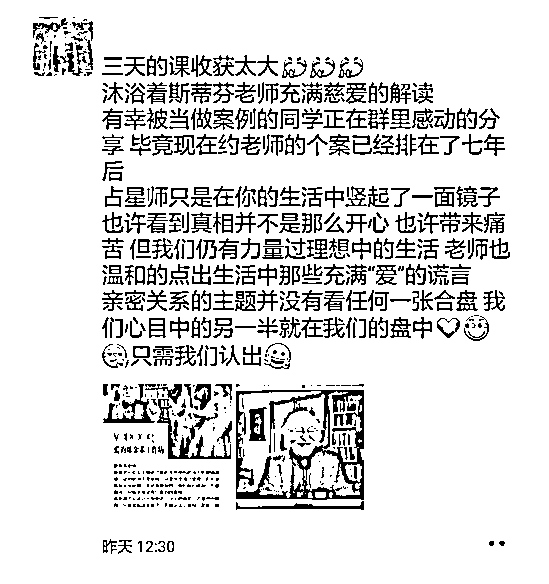

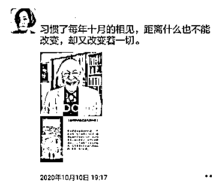

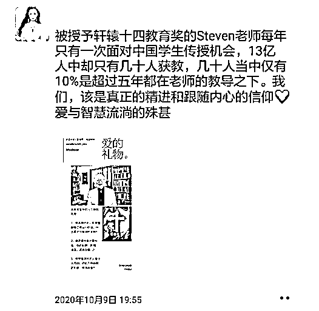

8

**什么人适合这门课程？**

*   占星师或渴望成为占星师的人群。    

*   课程会涉及综合解读高阶内容，不了解相关知识的同学，请提前学习相关内容。

9

**老师简介**

**斯蒂芬·弗里斯特(Steven Forrest)**

*   进化占星学的创始人之一，当今世界最有影响力的占星大师之一；

*   毕业于美国北卡罗莱纳大学宗教学专业；

*   1984-1988 年间，写作出版了《内在的天空》、《变幻的天空》和《天空的伴侣》三本占星经典著作，奠定了早期在占星学界的地位。前后一共出版了 12 部占星著作，在世界占星学界拥有很高的声誉。

*   1985 年，他凭借《内在的天空》一书获得职业占星师协会奖（*Professional Astrologers IncorporatedAward*）。1992、1995、2008 年、2018 年，他四次获得占星界最高的占星学联合协会奖（*United Astrology Congress Regulus Award*）提名，2018 年获得轩辕十四教育奖。

*   斯蒂芬将自己的绝大部分时间都花在教学以及个人咨询上，他于 1998 年创立了占星学徒计划（*Astrological Appretice Program*），这个计划致力于培养职业占星师；

*   至今为止已经有 600 余位学员完成了培训，其中很多都成为了优秀的职业占星师；

*   他是一位脚踏实地的导师，充满快乐和活力，亲和幽默同时又充满了智慧；他的课程不仅仅是一次占星知识和经验的学习，也是一次与智者的相遇。

10

**课程费用**

**正价：****4800 元**

**早鸟价：****3800 元****（9 月 22 日截止）**

11

**授课时间、方式和退转**

**授课时间：**

****2021 年 10 月 15 日-10 月 17 日（周五、周六、周日）****

****每天 7:00-13:00****

7:00 AM - 9:30 AM

**（1 小时休息）**

10:30 AM - 12:30 PM

**授课方式：**线上直播课，英文授课，中文翻译**退转课程：**

退款原则请详看《教学协议》，如有疑问请咨询课程顾问。

****斯蒂芬三日线上工作坊****

**授课老师：斯蒂芬·弗里斯特**

**授课时间：****2021 年 10 月 15 日-10 月 17 日**

**授课方式：**线上直播课，英文授课，中文翻译

**费用：**4800 元；**早鸟价：3800 元****（9 月 22 日截止）**

**课程负责人：****王老师**（微信：18510107057，请备注“斯蒂芬工作坊”）

长按二维码添加课程负责人咨询~

****报名请点击“阅读原文”****

# NVC 八周线上训练营 | 大部分冲突能通过好好说话来避免，想学吗？

> 原文：[`mp.weixin.qq.com/s?__biz=MzA5NjA0NTAxNg==&mid=2651455258&idx=3&sn=5152684dcb10815061dc5c158c1b82ff&chksm=8b4b4dadbc3cc4bb38d44d967e096332cf536a1972711e206e9c9f2d9999a856a0dec1aa25da&scene=126&sessionid=1692737933#rd`](http://mp.weixin.qq.com/s?__biz=MzA5NjA0NTAxNg==&mid=2651455258&idx=3&sn=5152684dcb10815061dc5c158c1b82ff&chksm=8b4b4dadbc3cc4bb38d44d967e096332cf536a1972711e206e9c9f2d9999a856a0dec1aa25da&scene=126&sessionid=1692737933#rd)

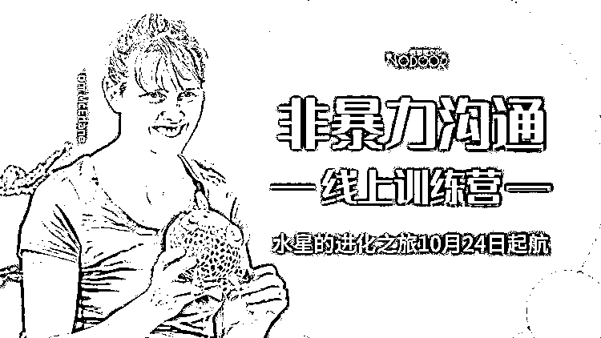

世上的人都在玩两种游戏，一种叫**“谁对谁错”**，一种游戏叫**“我怎样才能让生活更美好”。**

我们常见的游戏是前者，我们在爱情中、亲情中、同事中、朋友中、上下级中、陌生人之中玩。

现在，我要跟你做这个游戏，请你想一想，最近两周周多（或者，你可以留着这篇文章，注意你本周和下周中）有没有类似的事情发生，哪怕只是很小的一件事，哪怕只是在你的脑海里，**如果有，请给自己加 1 分，算算你得多少分（类似即可，不必是完全相同）：**

小测试

*   “我要是这么说，他会不会不高兴？算了，不说算了。”

*   “我要提出这样的需求，她会不会拒绝我？我该怎么张嘴呢？”

*   “我可以直说吗？算了，暗示一下吧，或者说得委婉一些。”

*   “他怎么听不出来我的意思！”

*   “我该用什么办法让她答应我？”

*   “我想拒绝，想说‘不’，但是我还是答应了，我就是有些讨好型人格。”

*   “他想这样做，我不想这样做，但是我还是听他的了。”

*   “哎呀，她好像看起来不高兴了，好吧，就这样吧，我就是特别害怕冲突的人。”

*   “我又被骂了，我能怎么样，忍着呗。”

*   “这事让我不开心，但怎么说呢，说出来可能也没用，激化矛盾，想想还是算了吧。”

*   “我时不时会撒谎。”

*   “不骂，就没用。”

*   “摆个脸，给谁看呢。”

*   “他凭什么指责我？！”

*   “我总是被欺负的。”

*   “我是讲道理的人，但跟他/她说不通道理，她太情绪化。”

*   “这事说了多少遍，但怎么说都没用 。”

*   “每次类似的事情，我们都大吵一通。”

*   “我控制不了自己的脾气。”

*   “到底你对还是我对。”

*   “为什么总得听他的。”

*   “你不用说了，这事，我说了算！”

*   “他说这种话，到底什么意思啊！”

*   “他这么做事，什么意思啊！”

*   “我好像生气也不管用，大吼大叫也不管用，说好话也不管用，怎么说都不管用，他改不了。”

*   “他真的是挺难沟通的人。”

*   “我本周和人吵架了。”

*   “他的期望太高，我根本达不到，但我怎么说呢？”

*   “他让我头痛，我不知道怎么跟他说我的期望。”

*   “我们两个的期望和条件相差很远，这个合作怎么谈下去？”

*   “投诉又来了，这种刺头怎么处理？”

*   “他怎么这么多要求！”

*   “他问我需要什么，我说不清楚。我问自己，也想不清楚。”

*   “我觉得我挺矛盾的，又想要这个，又想要那个。”

*   “我不知道如何接受赞美，也不知怎样表达感激，虽然我知道这两者都重要。”

你都不必做完这个列表，你跳着看都行，不过记得打分，**欢迎你在评论区留言你的分值，也欢迎你把曾经经历的、现在在经历的沟通难题放在评论区。**

不管怎样，如果你想学习解决这些问题中的任何一个，你就不妨看下去，**因为这个非暴力沟通基础课程，就是为用实战的方法学习应对所有类似的问题准备的。**

**我们有 8 周的时间，每周 4 小时，**一边学习非暴力沟通的方法，一边把你家庭工作社交中真实遇到的问题提给 Toni 老师，而她会**一对一**指导你该怎么做。

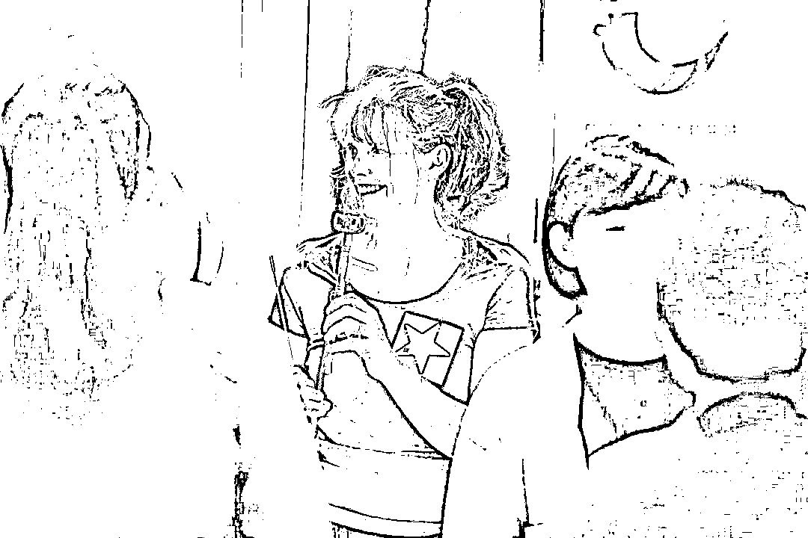

1

**谁是 Toni McErlane？**

<mpvideosnap class="js_uneditable custom_select_card channels_iframe" data-pluginname="videosnap" data-id="export/UzFfAgtgekIEAQAAAAAABNIXkZitzgAAAAstQy6ubaLX4KHWvLEZgBPEtIMEEEUxZvj-zNPgMIuM7PVi1oMK5fdX4B-DAnh3" data-url="https://findermp.video.qq.com/251/20304/stodownload?encfilekey=RBfjicXSHKCOONJnTbRmmlD8cOQPXE48ibrgo6T80SM1b4QSoxiaa7xblfRvMCU22ricO1icL5GdBOSmzhG7mbaLtSLg4xqYaTLicapWwCV45Axx8QGaozqH7OpxicjibYzN1icWtyuIibCRyZInILWhIGRG1ILicWtib8H3XUMxBW2rZO2GMmc&amp;adaptivelytrans=0&amp;bizid=1023&amp;dotrans=0&amp;hy=SH&amp;idx=1&amp;m=3d7ca9d191932d16f6faa80b9364d1f9&amp;token=cztXnd9GyrGhE2iaHGOXDiaBqxtNSwMjqwEHeHo7udOdlvqreLK6fg4eT1y2hGL595" data-headimgurl="http://wx.qlogo.cn/finderhead/PiajxSqBRaEJYnVsqWfEX9qA0sI6hNVKsDfyzfPZ92WZMZyBpZWU5NA/0" data-username="v2_060000231003b20faec8c4e68a1ec2d4ca07e434b07755bbf47e7053a3059defd2c9d6c68a20@finder" data-nickname="若道" data-desc="#非暴力沟通 NVC  在面临一个两难处境时，如何运用 NVC 促进合作的开展？
" data-nonceid="1620007045275601581" data-type="video"></mpvideosnap>

**她自己说**

我来自新西兰，拥有社区和人类服务—咨询康复学士学位，是 Aminz 的注册家庭纠纷调解人，也是 NVC Aotearoa 的 NVC 培训师。

在我的生命中，我一直对真诚、充满活力、自我负责的沟通和有意识的选择充满激情。而我的人生旅程为我提供了充足的机会，让我去探索、研究、反思和完善这在沟通中是什么样的。

在我的工作坊中，我的原则和实践都是建立在非暴力沟通和正念的哲学基础之上。非暴力沟通是由美国心理学家马歇尔·卢森堡博士所开发的。马歇尔的目标是发展出一种语言，这种语言受到印度巴利语中的“非暴力主义”（Ahimsa）一词的启发，它的意思是“没有伤害”。我们怎样才能在与他人沟通时不造成伤害呢？这不仅需要非暴力沟通的技巧，还需要在训练中融入正念。正念是受小乘佛教内观传统的启发，发展觉知和接纳，关注和允许。在我们的工作坊中 ，我们将非暴力沟通和正念编织在一起。

我致力于以这种沟通和处世方式作为我日常与人互动的基础。我曾经学习了为期一年的北美非暴力沟通领导者项目，在加州湾区非暴力沟通的全年浸入式项目中做了两年协助工作，然后在索诺马县女子监狱推动非暴力沟通培训。同时，多年来我持续参加内观静修，致力于继续和发展这种实践，并把它融入自己的工作坊中。

2020 年疫情期间，我与丈夫和我们的猫在游艇上休了一年假。现在，我和丈夫还有 15 岁的侄女在新西兰南岛的达尼丁生活。我在那里从事心理咨询、冥想和生态心理疗法。我们还正在那里慢慢建立一个治疗静修中心和生态冥想社区。

过去四年，我曾两次来中国，与若道及其友好而充满活力的团队分享非暴力沟通，并参观了一些绝佳风景。我期待继续与若道合作，在网上分享我的知识和技能。

**若道创始人蒋颖说**

2016 年，我在新西兰参加一个 Hakomi 亲密关系治疗的治疗工作坊。参加这个工作坊的都是治疗师。在这个工作坊中，有一位女性让我特别印象深刻，因为她身上有种特别的气质，某种既温柔又坚定的东西，充满力量，充满对这个世界充满关怀，她身上表现出的让人惊讶的真实也让我有很多思索。她叫托尼·麦克尔兰（Toni McErlane）。

我知道她从小学习武术，也是一个悬挂式滑翔运动的运动员，曾经背着滑翔机在世界各地的上空飞行和比赛。她完成了北美非暴力传播（NVC）领导计划，是一个非暴力沟通（Nonviolent Communication，简写 NVC）培训师和注册的家庭纠纷调解人，也是生态心理学的培训师。她有多年的内观经验，在身体创伤治疗方面的经验，还有她在有机种植、景观设计、园艺治疗都有专长……我看到她到印度去，帮助印度乡村做有机耕种。在这次疫情之前，她已经买了一艘帆船，准备和丈夫开着他们的船环游世界。所有这些都让我感叹，一个女性可以活得如此勇敢和丰富。现在她而她对中国也充满了某种关切。多年前就一个人在藏区徒步旅行，后来又骑自行车穿越西藏。

但喜欢户外冒险的 Toni 说， NVC 比武术更管用。

2019 年，我终于请 Toni 到中国来，请她给若道做了基础和中级的 NVC 培训，也请她对外做了一次工作坊。

怎么说呢，培训和工作坊棒极了，更棒的是，我觉得人人都爱她。

**工作坊学员这么说**

非暴力沟通带给我的最大的收获是：通过课堂的学习和大量互动练习提升了觉察力，提升了沟通技能，非暴力沟通并不仅仅停留在语言的表达，非暴力沟通的核心是同理心。通过倾听对方的感受，帮助我将情绪转化为解决问题的动力。

我过去和其他人沟通时，常常陷在自己的思维中，通过练习我才发现，原来别人说话的时候我常常其实并没有听到对方说什么，都是在自己的想法里打转，现在我起码学习到当对方说话的时候，能够去尽量不想自己的想法。

过去我不会留意到原来自己的某种表达方式会让别人不舒服，而且其实也无助于解决问题，对于我想达到的完全无效，NVC 的学习能够让我更能觉察哪些表达会让别人不舒服，让我的沟通更有效，更能帮助我达到我的需求。我学完后，才觉察到过去在沟通中，如果对方有情绪，我也是情绪化地回应，现在，我能够和自己和对方的情绪都拉开一些距离。过去我对于对方情绪化的表达，会有情绪化的回应或不知所措，现在我更能去感受他们情绪下的需求是什么，因此就更从容，不那么容易被他人的情绪影响，能够更有效地回应那些有负面情绪的人。我是一个比较理性的人，在练习中发现原来对一个在我用理性分析如此很明显的画面，每个人竟然有如此截然不同的看法，这还是挺让我吃惊的，这个发现好像打开了一扇门。

我是一个比较感性的人，过去有什么事情，常常是情绪化的沟通；NVC 的学习让我能够更理性一些，能够更客观去看问题。

这个培训让我非常感动，这是我没有想到的，一个关于沟通的培训如此让人感动。在那些常见的表面事件呈现之下，是如此脆弱、温柔的人性。我们如此绝望地想要被理解、被爱，想要与他人联结，然而我们常常用非常错误的沟通方式去做，这时我们离我们的目标就越来越远。

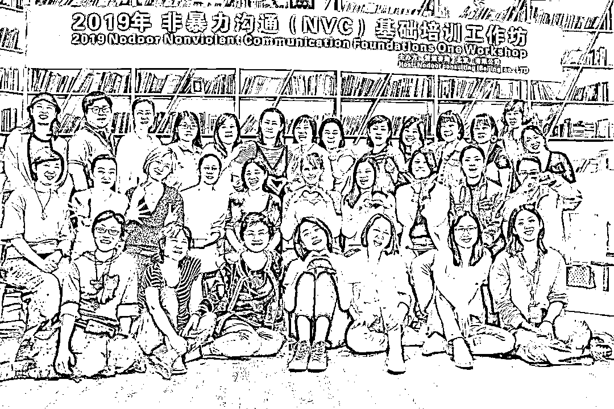、

2

**训练营内容**

**第*****1*****模块 区分感受和想法**

*   学习区分想法、感受和故事感受。

*   体会为什么在表达中分享自己对某一情境的感受很重要，而不仅仅是想法和判断。

*   学习辨识和认同身体传递的感受和情感，将它们作为自我觉知和自我联结的资源。

*   理解感受是重要的信息媒介，支持你与自身的需求建立联结。

*   认识关注感受、探索联结需求的重要性，而不是对感受做出反应。

**第*****2*****模块 将感受与需求、需求与策略关联起来**

*   了解并理解满足一个人需求的策略可能无法满足另一个人相同的需求。

*   学习理解需求的概念，学习区分需求和策略。

*   体验如何用多种不同的策略来满足一种需求，以及如何通过选择一种特定的策略满足或不满足其他需求。

**第*****3*****模块 倾听和共情**

*   学习倾听他人话语中透露出的情绪和需求。

*   体验受到共情和受到其他形式的有意识的支持之间的差别，比如同情、安慰、分散注意力、陪伴等等……

*   学习认可别人的体验和情感，而不必认同对方的策略，认识这种技能所能带来的力量和解脱。

**第*****4*****模块 观察与评价**

*   学习在表达中运用观察而非评价的重要性。

*   体验两者之间的差异，自己去领会为何有此差异。

*   学习区分对情境的解读和事实。

**第*****5*****模块 自我共情**

*   学习认识和观察自己的评判和评价，并用它们与自身感受和需求建立联结，借此更深入、更清晰地理解自己。

*   学习识别自己赋予情境的意义，并探求其中的事实。

**第*****6*****模块** **提出请求**

*   学习请求是表达中重要的一部分。

*   学习如何提出满足自身需求和他人需求的请求。

*   分辨请求和要求之间的区别。

*   学习如何倾听拒绝，如何表达拒绝。

**第*****7*****模块** **练习坦诚地表达**

*   在一个支持性的框架中，综合运用之前所学, 练习相互联结、清晰有效、对自己负责的沟通。

**第*****8*****模块** **接受和表达感激和谢意**

*   运用之前所学，练习表达感激和谢意。

*   学习表达感激之情，远不止一句随口说出的“谢谢”。

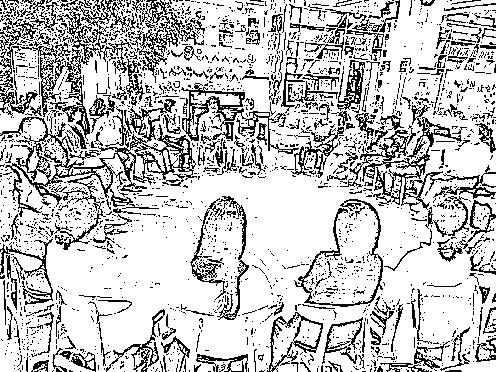

3

**训练营价格**

**课程时间：**10 月 24 日—12 月 12 日，每周日下午 2 点-6 点。共 8 周，每周 4 小时

**课程价格：**6800 元

详情请咨询课程顾问：Maggie 老师（微信：18510107057，请备注“非暴力沟通”）

长按二维码添加 Maggie 老师

我们每天都在说话，也都在倾听和回应他人，沟通充满了我们整个生活，就像我们每天都吃饭、睡觉一样基本。

**这个课程，让你不去再玩 “谁对谁错”的游戏，而是开启“我怎样才能让生活更美好”的历程。**

****非暴力沟通线上训练营****

**授课老师：**Toni McErlane

**授课时间：**2021 年 10 月 24 日起

**授课方式：**网络课程**，**英文授课，中文翻译

**费用：**6800 元

**课程负责人：****Maggie 老师**（微信：18510107057，请备注“非暴力沟通”）

长按二维码添加课程负责人咨询~

****报名请点击“阅读原文”****

# 对性侵、家暴选择“不原谅”的她们，在敲开全新时代的大门

> 原文：[`mp.weixin.qq.com/s?__biz=MzA5NjA0NTAxNg==&mid=2651455083&idx=1&sn=f9205bbb55f693af19c5ef08279cab13&chksm=8b4b4cdcbc3cc5ca8069d518e708a58789cfd7e9198e9b14050c3a23fd4eb86aa64f30860b9d&scene=126&sessionid=1692737933#rd`](http://mp.weixin.qq.com/s?__biz=MzA5NjA0NTAxNg==&mid=2651455083&idx=1&sn=f9205bbb55f693af19c5ef08279cab13&chksm=8b4b4cdcbc3cc5ca8069d518e708a58789cfd7e9198e9b14050c3a23fd4eb86aa64f30860b9d&scene=126&sessionid=1692737933#rd)

** 后台回复“今日”，给你一句生命态度 **

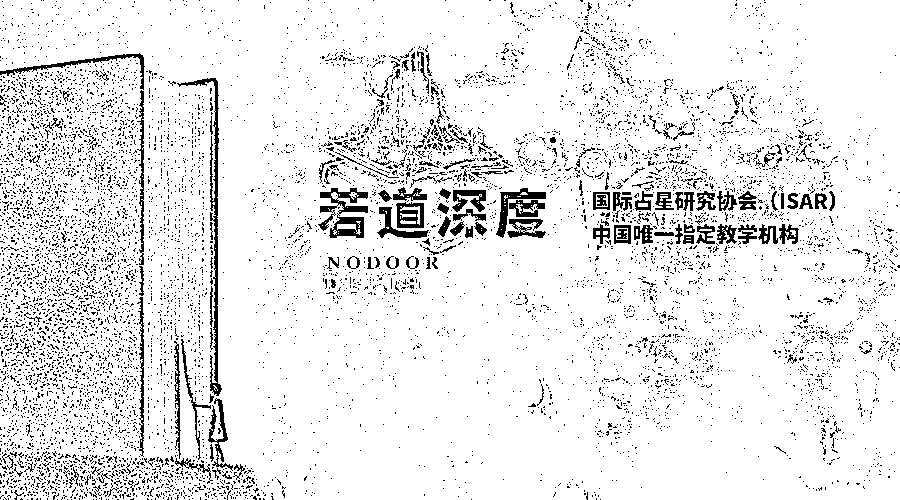

**作者/编辑/玫瑰  图片/网络**

**《中华人民共和国反家庭暴力法》是为了预防和制止家庭暴力，保护家庭成员的合法权益，维护平等、和睦、文明的家庭关系，促进家庭和谐、社会稳定而制定。于 2015 年 12 月 27 日第十二届全国人民代表大会常务委员会第十八次会议通过，2016 年 3 月 1 日起施行。****性侵犯泛指一切种类与性相关、且违反他人意愿，对他人作与性有关的行为。包括强奸、强制猥亵在内都可算是一种性侵犯，像露体、窥淫等也可算是性侵犯的一种。2021 年 2 月，《最高人民法院最高人民检察院关于执行确定罪名的补充规定（七）》规定了负有照护职责人员性侵罪罪名。****——百度百科****这个夏天，惊雷滚滚**
2021 年的夏天，惊天炸雷此起彼伏，从都美竹曝光吴亦凡性侵，到阿里女员工曝光领导及商家灌酒猥亵，再到网友小艺曝光知名主持人钱枫性侵……而就在 8 月 29 日晚，“疯狂英语”创始人李阳的前妻 Kim 在微博发布一段李阳殴打女儿的视频，并指出：**“我希望所有的疯狂英语的人了解现在中国有国际反对家庭暴力法律，你们是在崇拜一个犯罪的人。”**

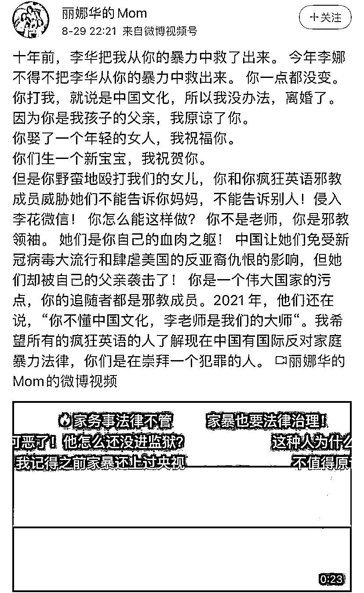

| Kim 的微博声明
在事件不断发酵的过程中，随着更多幕后信息被披露，这些女性也都受到了来自四面八方的质疑。都美竹被说成是情色交易；阿里女员工被指文章撒谎，更因为犯罪嫌疑人周某文的妻子发声，被说成同涉案嫌疑人有不正当男女关系；小艺则被扒出疑似“外围女”，欠债的“内情”；对于 Kim，也有人认为李阳曾多次家暴，而她一直在选择因为爱而原谅的方式令人无法同情……2021 年，土星将 3 次同天王星精准四分，目前尚在这个相位的影响当中。**当天王星出其不意拷问土星所构建的社会规则、法制规范，这颗以不稳定著称的行星必将带来偏激、极端和毫无方向的反转；**如同船只在海上航行时忽然遭遇晴天霹雳，罗盘飞速旋转，已经骤然失去航行的方向。

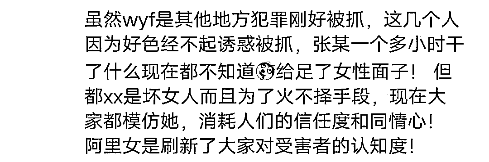

| 不少网友质疑发声女性的动机，上图为一例

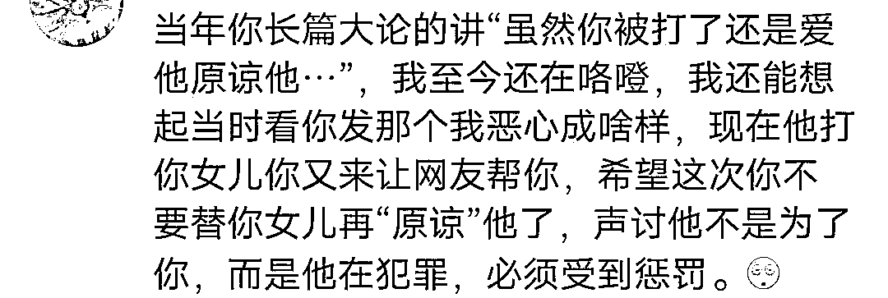

| 网友对 Kim 遭受的暴力却选择原谅的行为表示“恶心”

是否要站队？该如何站队？什么才是真相？这恐怕是近两个月来，所有人心中最大的疑问。土天四分大背景下，大规模、全方位的女性被侵害案接二连三地被放到公众面前，**女性从开始的隐忍、谅解、自我背负到开始激烈反抗并曝光施害者，这是怎样一种宇宙能量的转化？又想让我们从中领悟到什么？**让我们先回到希腊神话中天王星、土星和地母盖亚的故事一探究竟。

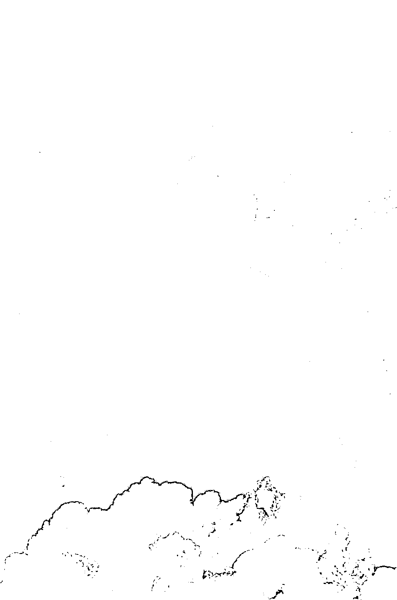

**乌拉诺斯、克洛诺斯和盖亚****天地还是一片混沌时，产生了大地之母盖娅，盖娅产生了乌拉诺斯。乌拉诺斯躺卧在大地（盖娅）身上，他们完全叠合。乌拉诺斯不停地在盖娅的怀抱中发泄淫威。原始的乌拉诺斯除了与盖娅生育之外什么都不做。****乌拉诺斯把盖娅与他的孩子束缚在盖娅体内，最终盖娅再也无法忍受了，她内心悲伤，她对孩子们说：“听我说，你们的父亲侮辱我们，他让我们忍受他的可怕力量，再也不能这样下去了。你们应该起来反抗你们的父亲。”****盖娅肚子里泰坦们都吓坏了，只有最小的儿子克洛诺斯答应帮助母亲推翻父亲。盖亚把一柄弯刀放在小克洛诺斯的手中。就在乌拉诺斯在盖亚身上发泄淫威的时刻，他用左手抓住父亲的性器官，紧紧一握，然后右手挥动弯刀，割了下来。****乌拉诺斯回到天空之前，诅咒克洛诺斯也会被她的孩子们推翻。为此担忧的克洛诺斯也将自己的孩子悉数吞到肚子里，而最终他还是被自己的儿子宙斯推翻了。****——节选自百度百科**这个故事很好地诠释了当下土星-天王星四分相的能量交织。**在占星学中，乌拉诺斯代表天王星。作为第一代天神，他拥有绝对权利；地母盖亚则带有人类动物性的，饱含情绪的阴性能量**。乌拉诺斯同盖亚交合并无视其无法孕育的痛苦，代表着**每个人身上都有脱离动物性的神性，如冷静、客观、脱离事物本身的观察能力，同时也有着这部分的负面发挥：冷酷、无法共情、“理中客”。**天王星不在意，甚至不希望自己繁衍，因为他是独一无二的，惧怕被复制出同他相似的个体。而盖亚阴性能量中无法释放的的痛苦强烈到一定程度之后，会绝地反击，即委托土星克洛诺斯推翻了乌拉诺斯。**土星掌管社会秩序和规范，是有形世界的统领者。**他代表着男性权威，给予人类，尤其是阴性能量保护和庇佑。然而，克洛诺斯为了维护其统治地位，会将子女吞食。这种吞食对于盖亚而言，依旧是莫大的伤害，也因此激起了同样的反抗剧情。**觉醒与压制**从乌拉诺斯到克洛诺斯的两代神的演变，意味着**要在现实世界上建立规则，需要去掉部分神性，遵守人类的社会属性，建立社会权威**。同时，**衰老的社会权威不肯放弃统治，使新生力量无法超越和挣脱传统桎梏和束缚（被吞食，永远无法超越父权）**。在占星学中，这代表**从天王星到土星，从天空到地面，从神性到人类社会的降维。**而 2021 年，我们所面临的是从土星的现实社会象更高的天王星能量超越的进程。这样的过程必然伴随着新旧交替的权力斗争，今年发生的侵害事件，都围绕着**性和暴力**，像极了乌拉诺斯对盖亚施加的侵害。这些事件中所包含的：**· 天王星的觉醒：**女性意识的崛起和解放、越来越多的女性愿意站出来声讨和曝光罪恶；**· 土星的压制：**这些女性也在接受来自社会公俗良序、传统观念的审判、鞭挞、质疑、羞辱。从舆情中，我们能够明显地看到土星、天王星的剧烈斗争，投射在社会群体中，有一部分人在无意识地发挥着这两颗行星的负面能量：**·** 大肆对当事人“人肉”、网暴，甚至道听途说的造谣，无视女性当事人的痛苦，公然讨论“是否插入”、“是否外射”等性行为，并认为自己是在冷静地分析案情；**· **带着土星的绝对权威强行站队，并对于持不同意见的人言语攻击、辱骂；甚至雇佣水军刷屏；**·** 对于受害者荡妇羞辱，“怒其不争”的诟病苛责，其中包含带着有色眼镜看待“女权”的男性，也不乏停留在旧有土星认知中，无意识拥戴畸形的男权，而对女性进行攻击的女人。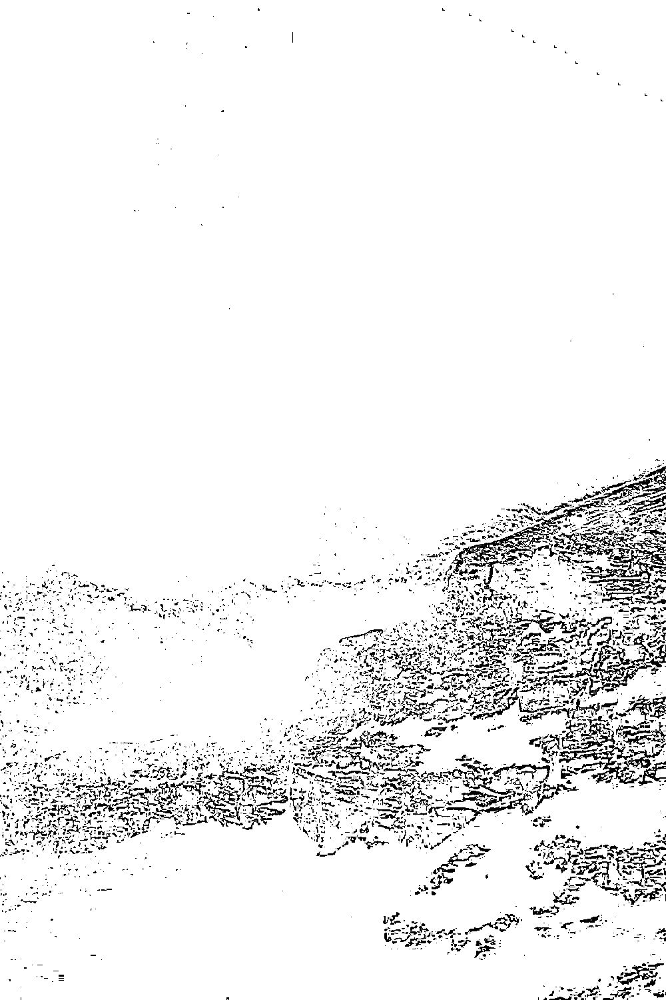**如何破局？听听自己心里的声音**极端动荡混乱的时期，如何破局？想必是大家最为关心的。社会的变革，每个人都将贡献自己的一份力量。关键当口，是朝向更为高阶的创新，还是无序的分裂甚至倒退，每个人都需要安静下来，去倾听自己内心那个声音。**·** 我们的心中，是什么被刺痛，被唤起了？是什么让我们失去公允和客观，不自觉地引起了两性对立，彼此攻击？**· 是曾经被侵害、被控制的羞辱和愤怒？是曾经遭遇不公正甚至冤屈而无法申诉的痛苦？是信任被颠覆、情感被欺骗的无奈？是曾经被暴力镇压的恐惧？是女性对男性的愤怒，男性对女性的压制？****·** 又有那些是属于天王星的**无情、冷酷，对伤害无法共情**，及哪些属于土星的**陈腐、守旧**？**对于女性受害者的 360°拷问和“完美”要求是否仍在影响我们的判断？**· 我们是否无意识中认为自己拥有了评断的权利，而变得极端，试图批判当事人，并镇压与自己不同的声音？· 看似反转的事件，是否只因我们内心无法立定而不断左右摇摆的土星（保守）和天王星（突破）的砝码在反转？

📹 [`v.qq.com/iframe/preview.html?width=500&height=375&auto=0&vid=c0972qippx5`](https://v.qq.com/iframe/preview.html?width=500&height=375&auto=0&vid=c0972qippx5)

| 李阳参加的节目片段，表示家暴的行为“家丑不可外扬”
**从李阳家暴事件中，可以清楚地观察到天王星、土星的能量运作：**李阳曾在一档节目中谈及家暴，他轻描淡写地说：**“我认为家暴的错误并不是多严重的错误，道歉一次就够了。”**甚至当场威胁女嘉宾，声称要打她。这种态度激怒了现场所有人，引发激烈的争执，一度发展到人身威胁。**解读：****·** 李阳身上**暴虐、冷酷、自负，利用性别优势通过暴力制服女性，并无视对方的痛苦**，这部分像极了乌拉诺斯的负面发挥；**·** 在采访环节，部分观众支持和声援李阳，“打就打了，错就错了，还要怎样？”避重就轻的无所谓态度，像极了遵从旧时代男权思想的土星克洛诺斯负面发挥；**·** 当 Kim 在曾经的家暴中选择原谅时，另一部分主张制裁家暴者的看客对其施以攻击，**将革新演化成暴力**的行为，依旧脱不开乌拉诺斯的阴影；**·** 节目现场的气氛到了最后也变得剑拔弩张，重演**盖亚联合土星（公俗良序）推翻天王星（冷酷霸凌）的模式。****情绪是把双刃剑**然而，这样的斗争真的能够疗愈阴性能量的痛吗？谁能看到盖亚需要的是什么呢？是推翻谁吗？是制造战争和阉割吗？就像那些被侵害，被暴力的女人们需要的是什么呢？是钱吗？是攻击吗？是凶手被法办吗？都是，又都不是。**在看得见的制裁和反抗背后，最需要被化解和疗愈的，是无法被量化的情绪和痛苦，被深深地理解、共情，抱持，和改善。**那些痛苦深藏于腹中，是**阴性能量代代相传的，孕育的恐惧，被权力压制，被凌辱的痛苦交织混杂的产物。**

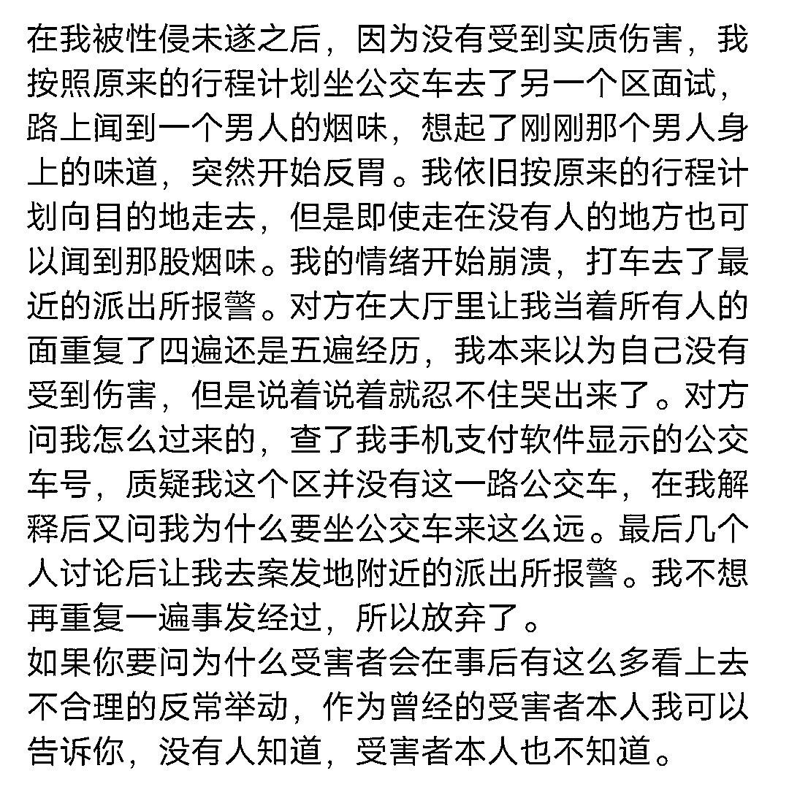

| 在微博上描述自己被侵害经过的女性网友

当一个女人，将自己最赤裸、最羞辱的部分公之于众，等同于将盖亚最深的痛苦翻到地面，那是她面对绝对权力欺凌绵长的无助和绝望。真正看到这些，便懂得她们为什么开始不反抗，为什么看不出难受，为什么不马上报案，为什么接受了被侵害的结果之后两年又要继续追讨，为什么被暴力时一再选择原谅……就像她们自己也并不知道，而血淋淋的伤害何时才能停止，噩梦何时才能结束，人生何时才能重见阳光。她还需要把痛苦的经历说给一个一个人听，直到这痛苦将她盘剥得退无可退，求生的欲望足以令她忘记恐惧，而恨不得手刃对方。

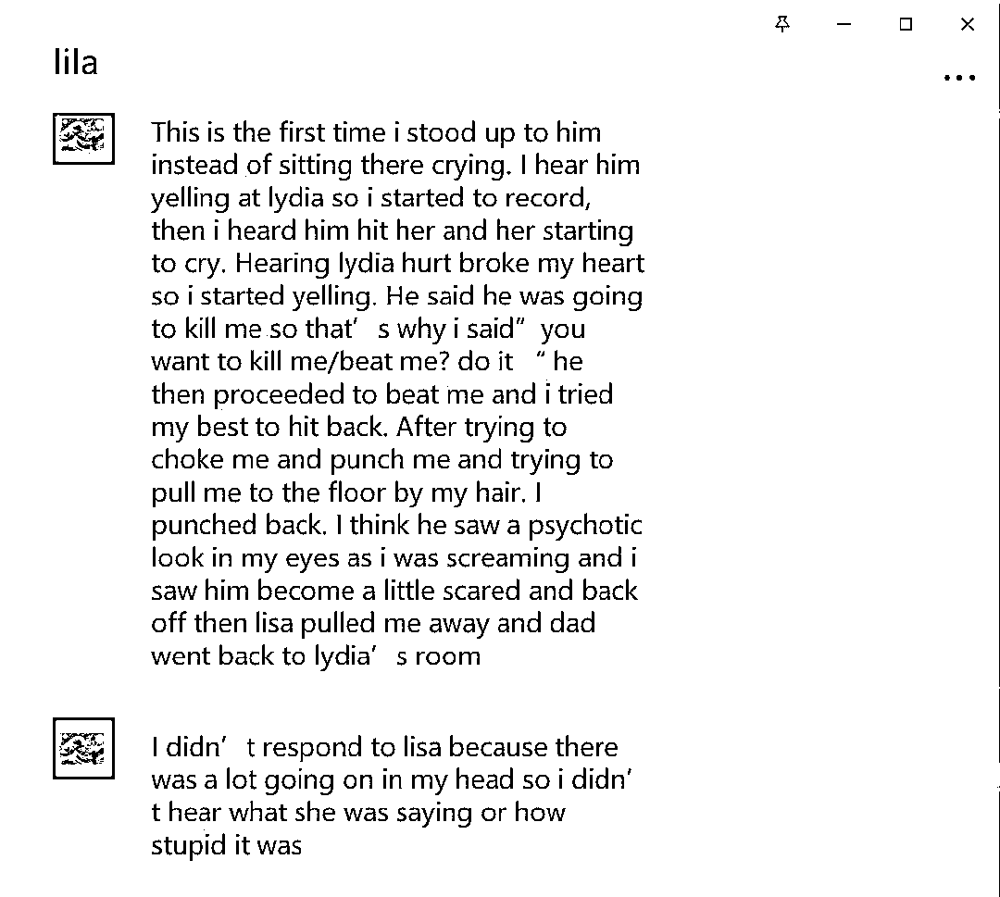

| Kim 女儿 Lila 的短信：这是我第一次站在他（李阳）面前，而不是坐在那儿哭泣。我听见他朝着 Lydia 大吼，于是我开始录视频。接着听见他打她，她开始哭。她的哭声把我的心弄碎了，于是我开始喊叫。他说他要杀了我，于是我说：“你要杀了我/打我？那就来吧！”于是他过来打我，我尽最大力气反击。他试图掐我，捶我，拉着我的头发把我甩在地上，我打了回去。我想他看到了我歇斯底里的样子，我一直在吼叫，然后发现他有一些害怕，接着 Lisa 拉开了我，爸爸回到了 Lydia 的房间。

Kim 的女儿 Lila 面对父亲的暴力行为，奋起反抗，令 Kim 最终改变了一再谅解的态度，将女儿救回自己身边。**当自己的孩子被施暴时的愤怒和无惧被点燃，这一点，像极了盖亚。**我们看到了盖亚的反抗，一直在这些勇敢的女性身上上演。同时，我们也应该看到，被盖亚的痛苦带来的情绪狂流淹没，只会失去理性，挑起更多争端。如同**女性在维权过程中的过度渲染和夸大自身所受伤害，又或者看客占据法律和道德制高点的时候便从言语和精神各方面对当事人进行攻击，也会失去冷静及彼此的尊重。**

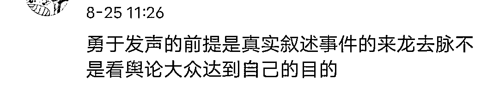

| 部分网友带着理性的态度，提出维权需要真实客观，而非煽动情绪

**情绪是一把双刃剑，当你被它蛊惑，也会被它反噬。**因此，盖亚无法统领世界，只有依仗更为冷静、更富有框架的乌拉诺斯和克洛诺斯。这隐喻着，**社会的发展需要天王星的抽离和客观，也需要土星的严谨和稳重。****土星、天王星的正面发挥**值得高兴的是，我们也能从这些事件中看到，越来越多的人开始支持土星、天王星的正面发挥：**天王星的正面发挥：****·** 越来越多的人认同并支持涉事女性站出来维权，促使整个社会采用更为平等、友善的态度对待她们，实现被侵害者无差别化；**·** 更多的人认同人人拥有维护自己的权利，站在灵魂平等的角度，不再苛求“完美受害者”，能带着理性的态度，去理解性犯罪的定义在于违背妇女意志对其进行性侵害，这同她是否有勾引行为、个人作风和个人身份等都无关系；**· **舆论不再一边倒地声援受害的女性，而是本着男女平等和追求公正真相的态度，对被指控的男性以及嫌疑人的妻子申诉和呼吁采取一定支持的态度；**·** 更多的声音被听见，在彼此讨论的时候，能够尊重并接受不同意见，不再支持两性对立，而是针对事件本身做出观察者的中立判断；**·** 更多的新型话题被讨论，例如，猥亵是否仅仅针对男性实施于女性？**·** 陈旧过时的传统文化中关于女性迫害的部分将有望被重新审视。**土星的正面发挥：****· **不带有过度情绪导向，而是稳重地评估整个事态的发展；**·** 尊重所有涉事人的人权，不采用暴力的手段“惩恶扬善”；**·** 比起“微博断案”，更加支持将裁决权交给土星所代表的法律条款，理解并接受真相的不断呈现，并信任国家的法律终将做出公正的裁决；**·** 更多的人愿意学习和发展两性关系中的尊重和界限，通过树立边界达成对男女双方的保护；**·** 在舆论的良性推动下，有望看到更完善的法律准则被修订和制定。已经颁布的妇女保护法律有望得到更好的执行。

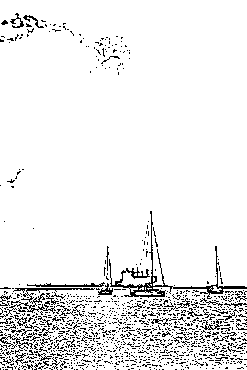

**一起准备着，迎接全新的时代**神话中，天神之间的战争，导火索也还是人性深藏的痛苦。**如果整个社会对于阴性能量的痛苦看不见，抚慰不了，无法加以改善，不稳定的因素便仍旧存在。****反抗的意义不在反抗本身，而是通过激荡的革新，达到进步和融合，使整个社会回到彼此尊重、相互关爱的阴阳平衡中。若对于罪恶的鞭挞变成了新一轮的罪恶，我们将被裹挟在土天混战中，无法解脱。**想要破局，唯有**带着天王星更为广阔的视角，推动土星做出更与时俱进的变革，实现这一点，需要整个社会对于阴性能量更多的理解、包容和尊重。**其中包括但不限于：**·** 从天王星的放浪和离经叛道转向土星的自律，不将暧昧的两性行为作为常态化；**·** 女性明白，自己拥有性自由和人身自由，不必对于骚扰、猥亵、侵犯、暴力等行为感觉到“不好意思拒绝”、“不敢发声”，又或者认为自己失去了“贞洁”而背负巨大的心理包袱，在此基础上的两性关系，才不会给女人制造更多的桎梏；**·** 男性需要明白，“女人幻想被强暴”、“女人说‘不’就是要”、“女人答应约会就是想要”、“女人答应共处一室，甚至在一张床上就是想要”……等等想法均是错误。尊重女性说“不”的权利，清楚彼此的界限，才不会被卷入说不清道不明的桃色新闻中；**·** 男女都不应拿性作为砝码，以及要挟的工具；**·** 家暴是犯罪，发觉自己有无法控制的暴力倾向，请寻找专业机构的帮助。如果乌拉诺斯能够带着更为平等、友善的态度对待盖亚，如果克洛诺斯能够理解物种多样化和权利更替的规律，如果他们都能发自内心地尊重、热爱和拥戴同他们有亲密关系的女人，或许整个神话会被改写；而人类不断进化的意义，就在于不把悲剧的过去发展成未来。回忆起 2021 年这个夏天，也许印象深刻的会是寂寂无名的“她们”，撕开阴暗的一角，让我们有机会从土星的墙里破出天王星的口子。然而，之所以能够出现“她们”，是因为**我们的社会已经准备好了去迎接真正平等、尊重、彼此独立又互相依靠的两性关系**。这样的新型社会，是每一个善于反思，愿意创新，对他人痛苦感同身受，又保有冷静和智慧的你、我、他，共同建立起来的。让盖亚所受的伤从我们这里开始好起来吧，一起期待一个全新的时代。

**版权声明：**原创文章由作者授权首发于若道平台，欢迎转发，反对抄袭。友号转载请申请白名单。

****

**玫瑰**

英国 Cass Business School 管理学硕士

若道 2015 届核心课程毕业生，若道微信公众号兼职编辑

占星师，咨询时长超过 800 小时

**个人微信号：**stillrosy

**公众号**：一个娘娘 

长按二维码，给作者打赏

**学习占星学**

**点击或长按下图了解课程详情** 

**微信又双叒叕改版啦，不想错过若道君的推送？**

**就把若道设为星标吧！**

**▼**

就是这个“在看”，戳戳戳 ☟

******报名直达入口******

# 神话塔罗之大阿卡纳牌｜皇帝

> 原文：[`mp.weixin.qq.com/s?__biz=MzA5NjA0NTAxNg==&mid=2651455083&idx=2&sn=d12546b67c830055f37b147f41c7641f&chksm=8b4b4cdcbc3cc5cad2def85451c3a7ddbb31ba5b9a01febb8a9fb18991d3e1263d9371ac212f&scene=126&sessionid=1692737933#rd`](http://mp.weixin.qq.com/s?__biz=MzA5NjA0NTAxNg==&mid=2651455083&idx=2&sn=d12546b67c830055f37b147f41c7641f&chksm=8b4b4cdcbc3cc5cad2def85451c3a7ddbb31ba5b9a01febb8a9fb18991d3e1263d9371ac212f&scene=126&sessionid=1692737933#rd)

作者/朱丽叶·沙曼-伯克 丽兹·格林

译者/闫东升 编辑/玫瑰 图片/神话塔罗 网络

本文节选自《神话塔罗》

有时候我们无比诧异于为何某张牌会如此“偶然”的出现，击中了我们内心的隐秘，抑或精准地预见了未来。因此许多人对塔罗牌充满恐惧，认为它们是某种魔法或超自然的事物。但事实上，这不过是人类的心理与外部世界通过某种意义的关联，只是目前我们对此知之甚少。塔罗的意义在于帮助我们更好地应对某种经历，以一种更丰富、更有创造性的方式来回应它，而不是盲目地听天由命或手足无措。今天来解读大阿卡纳牌——皇帝。

[🔈 神话塔罗·皇帝](https://res.wx.qq.com/voice/getvoice?mediaid=MzA5NjA0NTAxNl8yNjUxNDU1MDgy)

**｜**朗读者小巫

**书名：**

神话塔罗 

**作者：**

朱丽叶·沙曼-伯克   丽兹·格林 

**出版日期：**

2011-08-02

皇帝对应的希腊神祗 

**宙斯·天神**

**万神之王**皇帝牌描绘的是一个成熟的男人，拥有宽厚的双肩和结实的胸膛。他的胡子和头发是黑褐色的，非常浓密并散发着健康的光泽，一双眼睛是明亮的浅蓝色。他坐在位于山顶的黄金宝座上，直视着我们，身着一袭紫色并镶有金边的长袍，头顶金色的皇冠。他的右手抓着三道光芒四射的闪电，左手托着象征世界的球体。一头雄鹰栖息在他的肩头。他身后的远方是连绵的山巅，覆盖着白雪皑皑。

> **光芒四射的闪电**：宙斯（*Zeus*）所拥有的力量的象征，这不仅仅因为闪电散发着令人敬畏的威力，而且它还能照亮天空。宙斯是给人带来鼓舞、灵感和创造性愿景的神祗，其手中闪电的光芒象征着他对真相的揭示。
> 
> **宙斯选择居住在山巅**：因为他代表着智力和灵性的高度，他的意愿超越了身体的束缚和自然的限制。
> 
> **雄鹰**：是宙斯的象征，因为它飞翔的高度和眼力都远远超过其它鸟类。作为一种靠扑食为生的飞禽，它还表达着一种对于本能之神的攻击性和征服能力。

**｜**宙斯和妻子赫拉

**颠覆众生的弑父之子****我们在这里遇到了伟大的宙斯，他是万神之王，在希腊被称为主神（众生之父），是世界的创造者和众神以及人类的君主**。在神话中，宙斯是泰坦巨神克罗诺斯（*Titans Cronos*）和瑞亚（*Rhea*）最小的孩子。克罗诺斯某天听到了一个预言，说他的某一个儿子会颠覆并取代他的地位。为了自保，他决定杀死所有的孩子，接下来每当瑞亚生出一个儿子或者女儿，克罗诺斯就在孩子还没睁开眼睛之前把他（她）抢走并吞噬掉，一共有五个孩子就这样进了他的肚子。瑞亚当然对此非常不满，所以当她要生第六个孩子的时候，就偷偷地逃跑到了阿卡狄亚（*Arcadia*），在山洞中生出了宙斯，然后她把一块大石头包成孩子的模样拿给了克罗诺斯，说是她刚生出来的儿子。当然克罗诺斯又吞噬了它。

当宙斯成年之后，他扮作献酒人来到父亲面前，给他服用了自己准备好的毒药，克罗诺斯喝了后就开始恶心呕吐，吐出了被他吞噬的五个孩子，他们还都完好如初，当然也包括那块被当作宙斯的大石头。宙斯于是联合他的哥哥姐姐们推翻了克罗诺斯，取而代之成为了新的众神之王。

这位新的君主选择了奥林匹斯山（*The mountain of Olympus*）作为家园，创建了新的律则并以此统辖众神。他的权利象征就是手中的武器——雷霆（由雷和闪电构成）。雷霆和他众多的情人以及孩子，反映出宙斯所具有的狂暴、放荡和易变的特质。

他的孩子中包括了正义女神雅典娜（*Athene*）、自然律则女神狄克（*Dike*）、命运女神摩伊莱（*Moria*）和九位缪斯（*Muses*，掌管文学、音乐等艺术）。他的妻子是赫拉（*Hera*），掌管婚姻和生育的女神。**宙斯根据他所建立的律则来定义善良与邪恶。**同时他也是火炉和友谊之神，还是所有男人的保护神。

**｜**宙斯和妻子赫拉

**阳性的律则**从人们内在的层面来看，**宙斯——皇帝的意象是人们对于父亲的经验**。父亲的形象承载了人们的灵性典范、道德规范、在世界中生存所需的自给自足的能力、想要实现的**抱负和权威性**，以及为了达成目标而必须拥有的**自律和远见**。这种男人和女人内在都拥有的阳性律则，不同于皇后牌所蕴含的母亲形象中的滋养和无条件之爱，皇帝牌反映的是精神，不是和自然界为一体的身体（本能），精神意味着更高的价值和行动，而身体则是我们的本能需求。我们内在的父亲也一手培养着我们的自尊，因为我们要依靠它作为立足点之一来面对生命的挑战。宙斯也可以很慈悲，保护弱者和被剥削的人。但是一旦有人挑战他的权威或者违背他的律则，他就会变得非常愤怒或升起复仇之意，因此宙斯的黑暗面表现为刻板、苛刻或者自以为是。与内在的父亲联结意味着能够了解并激发自己的潜能和才智，并在现实中以某种形式表达出来。而被内在的父亲掌控，则意味着被某些观念（或信仰）所奴役，以顽固和自大的态度打压情感。就像宙斯的经历一样，我们必须颠覆旧有的规则，创建更有创造力的秩序，以免自己内在的独裁者掌控全局，或者被现实生活中某种独裁者奴役。在发现了身体的需求和愉悦背后的丰饶世界后，愚人必须学会伦理道德，因为没有了内在的皇帝，我们就变成了生活中的行尸走肉，被盲目的本能驱动，把所有一切的困难和问题都推卸（或投射）到社会或他人身上。**皇帝，疆土的开拓与秩序的建立****从解牌的角度来看，宙斯——皇帝牌预示着我们要面对父性原则的议题了，当然它可能以正面或负面的形式出现。**我们的挑战是要把某种力量具体呈现出来，把创造性的想法落实到现实中，例如可能是建立家庭、开创事业或创作某种作品等等。这个时候我们需要采取某种立场，让自己变得强大并有效地落实符合自己道德准则的愿景。同时我们还要时时检视内在的皇帝是否在哪里表现出了顽固、自大和独裁的理念，它会严重阻碍生命的成长。当愚人迈出本能世界的时候，就遇见了强大威严的皇帝，这时他必须学会利用自己的资源，根据伦理道德的约束去独立开创自己的尘世生活。只有这样他才能够有走下去的能力、信心和勇气，并相信生命中一定有某种更高的力量，通过他的才智和努力在世界精彩绽放。

**版权声明：**本文由《自在园》授权发布，欢迎转发，反对抄袭。友号转载请申请白名单。

**朱丽叶·沙曼·伯克**从 20 世纪 70 年代早期开始，就对塔罗牌产生了兴趣，并踏入了塔罗的世界。后来，在丽兹·格林的鼓励下，开始研习心理占星学和塔罗。1984 年，第一本书《塔罗全书》（The Complete Book ofTarot）出版。之后，与丽兹·格林合作设计并撰写了《神话塔罗》（The Mythic Tarot）。朱丽叶写了十本塔罗和占星学书，包括一本名为《众星的传说》（Stories from the Stars）的儿童读物，以及与丽兹·格林合著的《神话之旅》（The Mythic Journey），这是一本详细讲述如何运用神话来指导生活的书。

**点击下图了解课程详情** 

**微信又双叒叕改版啦，不想错过若道君的推送？**

**就把若道设为星标吧！**

**▼**

**喜欢记得点一下在看哦☟**

************报名直达入口************

# 神话塔罗作者亲自授课的认证体系，错过了优惠价的你，别再犹豫啦

> 原文：[`mp.weixin.qq.com/s?__biz=MzA5NjA0NTAxNg==&mid=2651455083&idx=3&sn=a5fe96eba5815b77982508f01275f833&chksm=8b4b4cdcbc3cc5caf03ee5a6a90a43f2a94bcd33d5fd1729afd7ccab84bf3f1a5a8d3bfdd610&scene=126&sessionid=1692737933#rd`](http://mp.weixin.qq.com/s?__biz=MzA5NjA0NTAxNg==&mid=2651455083&idx=3&sn=a5fe96eba5815b77982508f01275f833&chksm=8b4b4cdcbc3cc5caf03ee5a6a90a43f2a94bcd33d5fd1729afd7ccab84bf3f1a5a8d3bfdd610&scene=126&sessionid=1692737933#rd)

**时隔三年，****超高含金量的神话塔罗认证课程强势回归****经过多次打磨的课程内容体系****让你直观精准的感受到****神话塔罗的魅力，****扎实的建构****神话塔罗思维，****系统****学习****最地道的塔罗知识。****中高阶课程中老师传授****将神话、占星、心理学完美融合进塔罗****的****人本主义咨询体系，****并进行****学员案例督导，****让你更自信的开展咨询工作，****学以致用。****本期认证课程采取****初中阶****即报即学的录播课****+高阶****案例督导直播课****的形式，****录播课：****精编剪辑，随来随学，助教答疑，学练结合。****直播课：****大师融合，神话心理，塔罗占星，咨询技巧。****若道为学员开发了****“神话塔罗”APP，****是随身的工具，****更是接咨询的平台，****中阶****学成入驻平台****即可链接更多塔罗个案，****发展壮大你的塔罗咨询事业。**

**如果你想学习塔罗，什么样的老师会让你怦然心动呢？她是三副塔罗牌的设计者，写了 6 本塔罗书籍。她研习塔罗四十余年，教授塔罗三十余年，是丽兹·格林的密友。还有****谁会比塔罗牌设计者更了解塔罗的历史、灵魂与精髓？****所以，这将是你开启塔罗之旅最坚实的一步。**

1

**这位塔罗大师是谁？**

**朱丽叶·沙曼-伯克** 

**· **她是**3 副塔罗牌**的**设计者****——**神话塔罗牌、沙曼–卡塞利塔罗牌、“自己着色”塔罗牌；**· **她出版了**6 本塔罗书****——**《塔罗全书》、《新塔罗全书》、《众星的传说》、《理解塔罗牌》、《精通塔罗牌》、《塔罗初学者指南》；**· **她研习塔罗**四十余年；****· **她教授塔罗**三十余年**；******· **她是**丽兹·格林**的密友，两人合著了**《神话之旅》**，共同设计了**神话塔罗牌。**

**· **她是认证的**心理治疗医师；****· **她深谙**塔罗、占星学、心理学和神话学**如果你想成为拥有英国神话塔罗认证的塔罗师那么她，就是你**最好的老师人选**

2

**塔罗牌有什么用？**

**· **塔罗牌是一种**古老的疗愈工具**，同时也是**直观的解惑工具****；****· **塔罗牌绕过逻辑思维，**和潜意识联结**，通过图像的方式生动地将隐藏在人类潜意识中的画面浮出水面，**揭示心灵的状况和运作****；****· **塔罗牌**帮助我们和潜意识对话**，可以和现代的心理治疗联系在一起，帮助我们**看清心灵的冲突来源、本质和可以选择的道路；****· **塔罗牌又和更广阔的**宇宙生命原型**联结，彰显**个人生命发展的阶段**，将**个人生命挣扎、内在冲突**放在生命进化的道途上，让更广大的生命智慧为个人成长照亮道路。

3

**为什么学习神话？**

神话通过**图像和故事**描绘人类生活的**原型模式**。通过瑰丽的想象、诗意的语言、栩栩如生的人物和故事描绘出我们内心的世界，表达出我们经历的那些实现人性的过程，帮助我们将**个体的生活与人类古老且永恒的故事**建立联结。从而在更深处**理解生命**，并学习**古老而长青的生命智慧**。**神话塔罗**取材于**希腊神话**的无尽沃土，通过故事提供一种**记忆辅助**，在心理和预见层面提升解读的**丰富度**。因为这样更符合塔罗牌的性质，符合人类的想象。**按照故事思考，而不是简单的记忆关键词和固定的意义。**

4

**塔罗预测是什么？**

塔罗牌预测的运作就像是**照向心灵的一面镜子**。在塔罗牌解读时，图像的原型性质穿透隐藏的潜意识脉络，反应出与个人境遇相关但又未被了知的知识与洞见，因此**揭示出按照任何理性方式都无法发现的事情。**如果你对生命好奇，塔罗学习会帮你**打开一扇通往未来的门****，**让你了解**心灵运作和显化的秘密**，同时赋予你更多关于生命成长的支持和指引的能力！

5

**我们将学习什么？**

**☆****初阶：神话塔罗详解**

**神话故事和预测意涵**

**第一讲 **

**介绍塔罗牌，讲述它的历史**

**第二讲 **

**星座三形态、四元素和宫廷牌**

**第三讲 **

**基本星座与基本国王**

**第四讲 **

**固定星座与固定女王**

**第五讲 **

**变动星座与变动骑士**

**第六讲 **

**小阿尔卡纳数字牌**

**第七讲 **

**小阿尔卡那数字牌-圣杯**

**第八讲 **

**小阿尔卡那数字牌-宝剑**

**第九讲 **

**小阿尔卡那数字牌-权杖**

**第十讲 **

**牌阵&案例解读**

**☆****中阶：神话塔罗排阵应用**

**排阵解读和咨询技巧**

**第一讲 ****大阿尔卡纳-开启神话塔罗愚人之旅：****愚人、魔术师、女皇、皇帝****第二讲 ****女祭司、教皇、恋人、战车、正义、节制****第三讲 ****力量、隐士、命运之轮、倒吊人、死神、恶魔****第四讲 ****高塔、星星、月亮、太阳、审判、世界******

**第五讲 **

**塔罗牌的原型、占星原型**

**第六讲 ****引导式冥想、荣格的四种意识功能** **第七讲 ****引导式冥想与马蹄牌阵**

**第八讲 **

**六芒星牌阵、凯尔特十字牌阵**

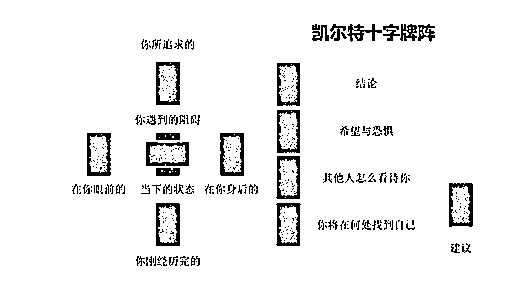

**第九讲 ****咨询案例演示：为一位年轻女性所做的四次解读****第十讲 ****神话塔罗咨询督导案例样例****☆****高阶：神话塔罗直播督导课**

**大阿尔卡纳的心理原型和学员督导**

**第一讲** **愚人**：永恒的少年；儿童的原型

**魔术师：****恶**作剧者、老师、向导、沟通者的原型；行星：水星

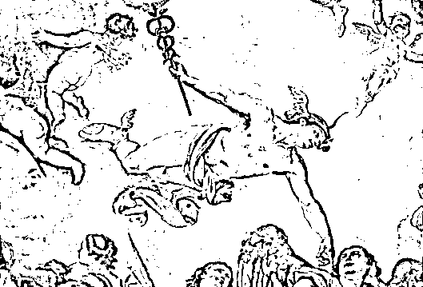

**女王**：母亲、养育者、丰产的原型；行星：金星在金牛座；小行星：谷神星

答疑与讨论，学员们分享对自己或客户的塔罗解读，对神话塔罗牌进行更多探讨。**第二讲** **皇帝：**父亲、供养者、计划者的原型；行星：木星

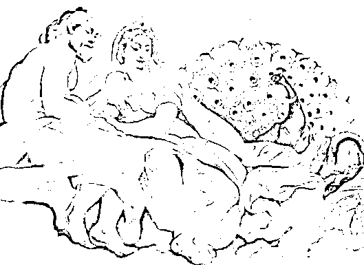

**女祭司：**处女——等待被实现的潜力原型；行星：新月

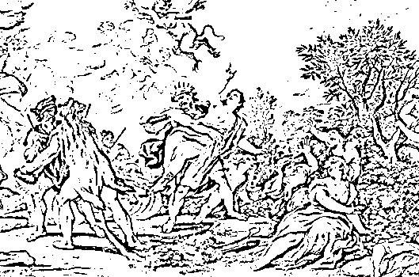

**教皇：**疗愈者、受伤的疗愈者、牧师的原型，牧师是神与人之间的灵性桥梁；行星：凯龙星

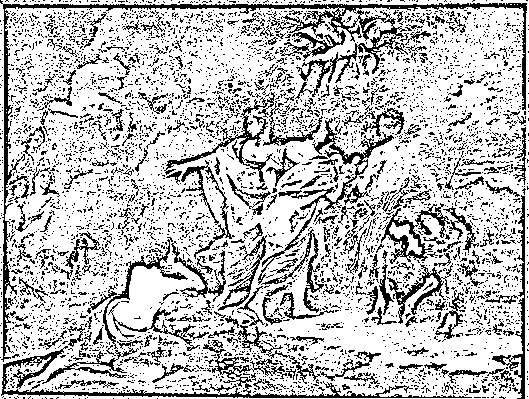

答疑与讨论，学员们分享对自己或客户的塔罗解读，对神话塔罗牌进行更多探讨

**第三讲** 

**恋人：**爱、爱人、所爱之人的原型；行星：金星在天秤座

**战车：**战争、冲突、战士、斗士的原型；行星：火星

**正义：**智慧、兵不血刃的胜利的原型；星座：处女座；小行星：智神星

答疑与讨论，学员们分享对自己或客户的塔罗解读，对神话塔罗牌进行更多探讨。

**第四讲** 

**节制：**关系、合作的原型；星座：巨蟹座、双鱼座

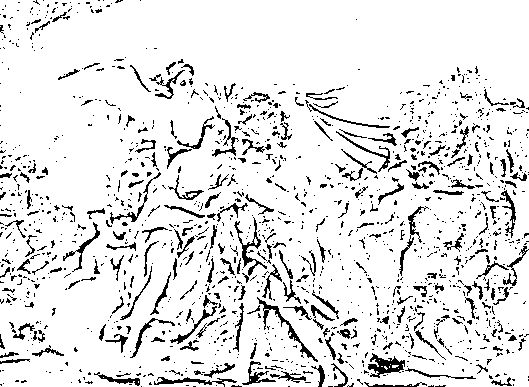

**力量：**力量的原型；星座：太阳在狮子座

**隐士：**晚年、耐心的原型；行星：土星

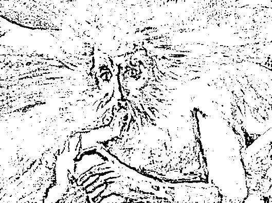

答疑与讨论，学员们分享对自己或客户的塔罗解读，对神话塔罗牌进行更多探讨。

**第五讲** 

**命运之轮：**命运女神与命运的原型

**倒吊人**：牺牲与有意识的牺牲的原型；行星：海王星

**死神：**死亡、终点和起点的原型；行星：冥王星

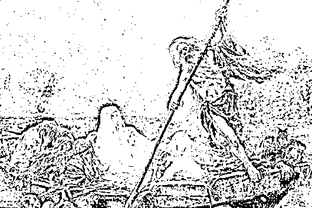

答疑与讨论，学员们分享对自己或客户的塔罗解读，对神话塔罗牌进行更多探讨。

**第六讲** **恶魔：**阴影、人类不文明的面向、本能、欲望天性；行星：火星在天蝎座

**高塔：**改变、分裂瓦解的原型；行星：天王星

**星星：**希望的原型

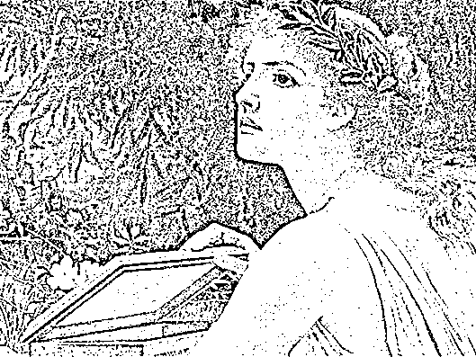

答疑与讨论，学员们分享对自己或客户的塔罗解读，对神话塔罗牌进行更多探讨。

**第七讲** 

**月亮：**无意识的原型；行星：暗月

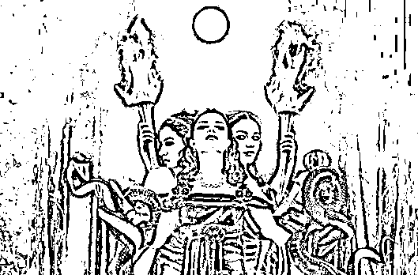

**太阳：**意识、创造力和文明的原型；行星：太阳

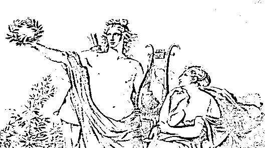

**审判：**复活、新生的原型；行星：水星作为灵魂向导普绪科蓬波斯

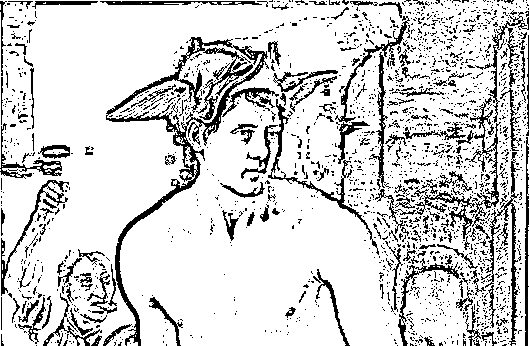

答疑与讨论，学员们分享对自己或客户的塔罗解读，对神话塔罗牌进行更多探讨。

**第八讲** 

**世界：**整体、完成和个性化的原型

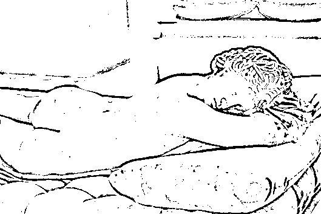

答疑与讨论，学员们分享对自己或客户的塔罗解读，对神话塔罗牌进行更多探讨。

**认证阶段：考试论文**

**入驻塔罗平台**

6

**适合人群**

**· **塔罗初学者，完全没有塔罗基础；**· **塔罗自学者，也曾上过塔罗工作坊，但仍不懂如何使用塔罗牌；**· **塔罗进阶学习者，有塔罗基础，了解 78 张塔罗牌含义；**· **不知如何解决遇到的情感困惑、职业选择、人际问题，对人生感到迷茫；**· **想要学习深入解读塔罗牌、牌阵的使用、咨询技巧等将塔罗运用于咨询实践；**· **想要深入了解和学习塔罗，希望成为专业的塔罗师；**· **想要借助塔罗进行心灵、灵性成长。

7

**导师简介**

**朱丽叶·沙曼-伯克**

**朱丽叶·沙曼-伯克**从 20 世纪 70 年代早期开始，就对塔罗牌产生了兴趣，并踏入了塔罗的世界。后来，在丽兹·格林的鼓励下，开始研习心理占星学和塔罗。1984 年，第一本书《**塔罗全书**》（*The Complete Book ofTarot*）出版。之后，与丽兹·格林合作设计并撰写了《**神话塔罗**》（*The Mythic Tarot*），在这本书中，她们将古希腊神话与传统塔罗解读结合起来。朱丽叶写了**十本塔罗和占星学书**，包括一本名为《众星的传说》（*Stories from the Stars*）的儿童读物，以及与丽兹·格林合著的《神话之旅》（*The Mythic Journey*），这是一本详细讲述如何运用神话来指导生活的书。

8

**课程价格**

**初阶正价：**5800 元**中阶正价：**5800 元**高阶正价：**7800 元**考试认证费用：****3000 元****认证课程总价：****22400 元****联报优惠价：****18000 元**

长按二维码添加客服 Echo 老师

9

**退转课程**

*   **退款原则请详看《教学协议》，如有疑问请咨询课程顾问。**

**神话塔罗认证课程**

**授课老师：****朱丽叶·沙曼-伯克**

**授课时间：2021 年 11 月 3 日起**

**授课方式：**网络课程**，**英文授课，中文翻译

**费用：****初阶正价：**5800 元；**中阶正价：**5800 元；**高阶正价：**7800 元；**考试认证费用：****3000 元；****认证课程总价：****22400 元；****联报优惠价：****18000 元；**

**课程负责人：Echo 老师**（微信/手机：nodoor18518412824，请备注“神话塔罗”）

长按二维码添加课程负责人咨询~

****报名请点击“阅读原文”****

# 9 月宇宙天气丨这个处女月不容小觑，会为 10 个月后的生命播下种子！

> 原文：[`mp.weixin.qq.com/s?__biz=MzA5NjA0NTAxNg==&mid=2651454929&idx=1&sn=b98867092d970dd0c6f2f924f7b1eb40&chksm=8b4b4f66bc3cc6709cf3f3ebb92a55cd52d2bd8bca993f488f1ca0c258f7c9d6c54eec6f5215&scene=126&sessionid=1692737933#rd`](http://mp.weixin.qq.com/s?__biz=MzA5NjA0NTAxNg==&mid=2651454929&idx=1&sn=b98867092d970dd0c6f2f924f7b1eb40&chksm=8b4b4f66bc3cc6709cf3f3ebb92a55cd52d2bd8bca993f488f1ca0c258f7c9d6c54eec6f5215&scene=126&sessionid=1692737933#rd)

****************☆ 后台回复“今日”，给你一句生命态度****************

作者/傅莎珈 ISAR 认证占星师
编辑/翀子 封面/书君 图片/网络处女座执掌疗愈，也关乎孕育。当太阳进入处女座，我们要为以后的生命播下种子，并带着耐性寻找内在自我，并且今年的最后一次水逆也将在 9 月出现。宇宙天气在这个月，会是怎样的情况呢？让我们来看文章吧~

**水瓶座满月是一个重要的告别，**尤其和关系/合作的结束与开启有关；这种结束和开始，提示了个体自我价值的苏醒。

**太阳进入处女座很意味深长。** 在奥义占星里，处女座事关孕育，被月亮守护，代表圣母玛丽亚。**意识形态上**，处女座太阳进入处女座意味着纯粹的肉身被光点燃，逆时针 9 个月后，当太阳进入摩羯座 0º, 基督诞生。

**处女座和摩羯座的关系是“爱的化身只诞生于净化后的物质”。**摩羯座 0º 在远古玄学教义上被称为“始发度数”。这里的圣母玛利亚，也可以是你自己的阴性力量，月亮的能量；这里的基督，是你的太阳能量中的精神核心：真正的自我。  

**处女座执掌疗愈。**处女座守护的第六宫要求我们**运用技术、方法和准则**从杂乱无章的业力和个性中得以自愈：将个体与环境，整合成一个**互相融合彼此支持的有机体**；让身体和思维，**更灵动的协调起来**；将工作技能和事业使命调试成和谐的**共振**……这是赫耳墨斯炼金术中的“合成”。

**赫耳墨斯执掌两个星座：双子座和处女座。**双子座是阳性能量，执掌搜集、拆解：还有什么还有什么……;  **处女座是阴性能量，执掌吸引、整合，关联融合与治愈。**

太阳进入处女座的这个月，**我们要为 10 个月后的生命播下种子**。这亦是一个阶段，在灵性修炼层面提醒我们：成熟的灵性是一种耐性，这种耐性不是我们的等待某件事情变得更好或者等待某个更好的事情出现。**耐性是一种坚定**，在每个当下中坚定地了解：**我们寻找的是我们自己的本来面目，而她一直都在，我们只是在学习自然的绽放她。**

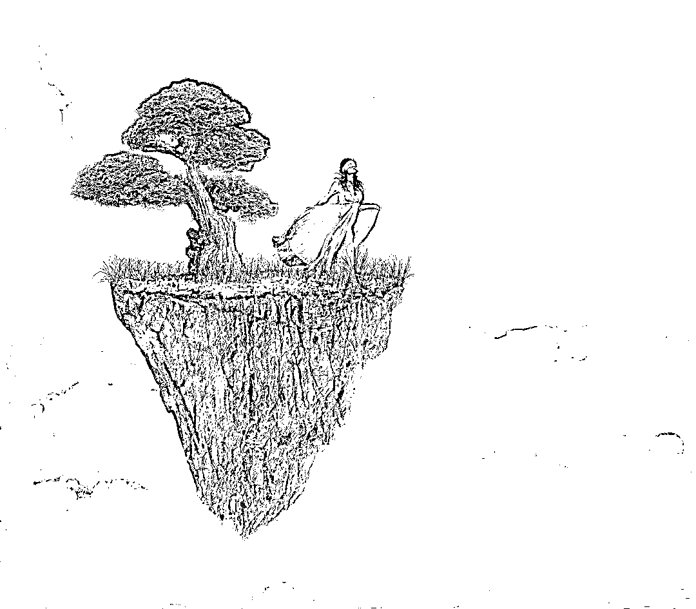

社会环境里发生的事情，有一种混乱感。净化之战未艾方兴。

一方面，再次和性暴力有关的新闻出现，阿富汗撤军让当地女性陷入黑暗中、杨澜在脱口秀大会上双标性别导向的段子，男性嘲笑女友被认为是勇敢，女性幽默男友让她感觉不礼貌、夫妻双方协议去流产如果没有街道证明就不能做……意识形态和文化中**有关女性生存价值**的拉锯战方兴未艾。看上去女性正面临着一种**更高压、严苛的生存环境**。

**另一方面，**是女性活出自己光彩的社群、**女性开始探索真实自我的渴望越来越普遍。**

其实在根本上，女性们正在前所未有的活出自己的生命力。同时需要打破普遍的低自尊，对力量和完美的误解。

我的观察是，相比“普通而自信”的男性们，很多女性总觉得自己伤得太深，需要更多的疗愈，暂时没有力量为世界做贡献或者去帮助他人。

很多女性谈及自己的优势，会觉得不好意思，一带而过，甚至觉得这没什么。但聊起自己的缺点不足，那叫一个滔滔不绝。

在感情中，不断付出是应该的，但别人对自己好却各种不自在。不敢游戏，不敢拒绝……

**比起外界的评判，女性对自己更苛刻。**这种苛刻导致了很多女性失去力量，总在等待，或者依赖权威，觉得没有准备好必须依附什么才安全。其实，你唯一要做的是站起来走出去，**在独立过程中看见自己的力量，寻求支持与帮助。**

**当太阳在处女座，是我们在日常之中，体验自愈，学习身心协调的黄金时期。**你本来就是完整的，你只是需要把这些能力唤醒，绽放她而已。无论曾经经历过什么，你都能自动修复、完整，重新焕发生命力。

为什么这么说呢？有一个最显而易见的例子：月经。女性的身体每个月都要经历这个特殊时期。月经是女性身体自我排毒，自我净化的特有功能。月经过后，身体产生了一颗卵子，子宫排出了碎片，变得干净澄澈，等待精子的到来，完成生命的创造，然后开始孕育、延续生命。

这种自我净化、制造生命空间的能力，是女性身体的天然能力。**你天生具有自愈、合成的能力！你本来就是完整的！** 你要做的只是去荣耀和尊重月经，子宫，身体以及你的性别！

**不要只把身体当作是你的皮囊。**当你意识到自己身体的神圣性，性别的神圣性，是否会让你对自己身为女性产生陌生的爱与自信呢？  

带着这样一种全新的眼光看待自己，你是否能对自己的事业、情感、生活、财富有**新的认识**？

以这样一种自我完整性进入关系，社群，是否会不再那么渴求关注，不再抓取认同，转向**谦逊的服务与奉献**？对自身的魅力**充满自信与认同？**

处女座位于狮子座和天秤座中间。在美索不达米亚时期的神话里，狮子关联女性权威。女神 Innana 站在狮子驾驶的马车上征战四方。狮子代表激情、力量和欲望。处女座的任务是将这些无意识，本能和力量调理顺畅，以智慧、远见、节制、谦逊的方式展现出来。然后在这种力量与智慧的基础上，**诞生爱：**金星阿芙罗狄忒， 吸引来各种渴慕与连接。

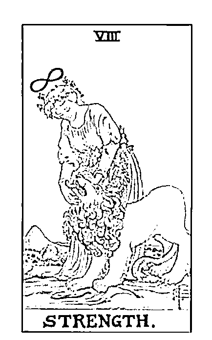

| 韦特塔罗里的力量牌

这个处女月，我们在学习的，**是唤醒内在的自愈和整合能力。**这样当太阳进入天秤座，你有机会在照金星这面镜子的时候，看见一个容光焕发的自己。

这个处女月不仅在唤醒女性们的阴性力量，**也在修复男性们内在的阴性力量：**感受到自己的脆弱，痛苦，僵硬，通过处女座新月，双鱼座满月以及水星在天秤座的逆行，完成转化。

阴性力量的修复，意味着当我们想要后退、休息、回归的时候，有稳稳的大地般的力量承接着。**这是让我们可以走得更远，更高的基础。**阴性文明，农耕文明基调里成长起来的中国人，根深蒂固对大地和归属感有着永恒的渴望。此时，正是我们重建家园的阶段。归来，为了星辰大海的自由展翅。

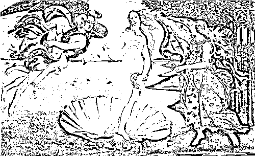

| 阿芙罗狄忒的诞生

**9 月上旬**

9 月上旬天象

**9 月 03 日 ** 

*   天秤座水星三分双子座月亮北交点

*   处女座火星对分双鱼座海王星（逆行）

**9 月 04 日**  

*   天秤座水星三分水瓶座土星（逆行）

**9 月 06 日**  

*   天秤座金星三分水瓶座木星（逆行）

*   天秤座金星四分摩羯座冥王星（逆行）

*   处女座火星三分摩羯座冥王星（逆行）

**9 月 07 日 ** 

*   处女座新月

*   处女座太阳三分金牛座天王星（逆行）

**9 月上旬的三分相位很多**。在思维上给我们打开很多全新视角。

**9 月 3 日**水星三分月亮北交点的时候，特别适合讨论未来的发展与合作。年轻人和长者之间的交流变得很顺畅，合约也更容易谈下来。但需要注意火星正在对分海王星，要防止饼画得很美但难以实现。**9 月 4 日**水星和土星的三分相，带来多元化的思考和快速的行动落地。

**9 月 6 日是个分水岭**，金星和木星在水瓶座相遇，水瓶座的金木能量是理想化的、友好的。同时也带来有关情感、自我价值、财务方面的好课程、好关系、好合作。

但另一方面，金木有过度的含义，在水瓶座可能导致情感的奢靡，以及无节制的购买。

代表阳性力量的火星与冥王星的三分相显露出野蛮的、侵略的攻击性行为，或者同时触发了你想要对抗到底的意志力。火星的这种张力，可能会导致在合作/婚恋的进程中，会遇到这样一种情况：我的低价值感阻止我得到满足和成长，我去攀附一个更强大的力量，羡慕依赖这样理想化的强大，同时无意识的嫉妒这样的强大，不自觉的去吞噬 TA，摧毁 TA。

**9 月 7 日的处女座新月**三分金牛座天王星，这是一个神奇的新月：**一个整合能量非常强的新月。**很多碎片被一条无形的线穿起来，一条命运线路，英雄之路完整的出现了！

这个新月带有强烈的土相和风相能量，我们正在将接收到智慧，转化孕育成全新的思维、价值观。

在合作、社群、事业前景上旧有的**阴影面到了转化的时刻。**什么阴影面？看对面双鱼座。你星图上的双鱼座落在哪里？里面有什么行星么？去探索这方面的故事，这是这次处女座新月整合的主题。双鱼座守护的 12 宫象征着集体意识。这个主题不仅仅是你的，也是整个人类社会，**探索集体无意识中的牺牲、吞噬、死亡主题。现在到了转化的时刻。**

*   **你害怕事业成功吗？**

*   **你时常渴望被赏识，同时又抗拒被赋予责任吗？**

*   **你特别想要归属于某个群体，某种关系，可是又害怕被吞噬，失去自由吗？**

*   **你总是有意无意的觉得只有牺牲才能得到幸福吗？**

*   **你受困于某种吞噬/死亡的感觉，真正走向独立的时候反而觉得无所依靠吗？**

**这个处女座新月，将开启这个意识层次的全面转化：把向外抓起的力量转回自己身上：你本身完整，请唤醒自己沉睡的天赋。**

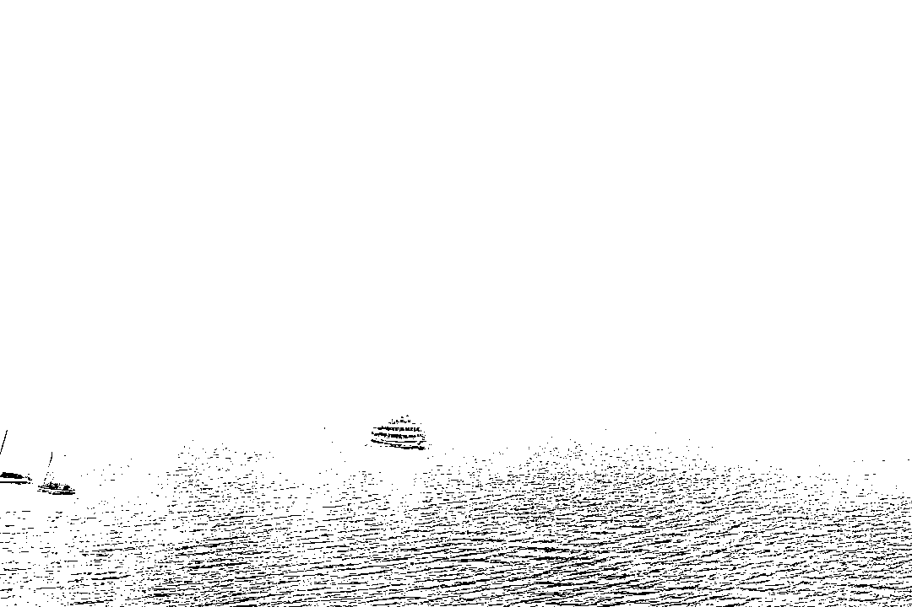

**9 月中旬**

9 月中旬天象

**9 月 11 日**  

*   金星换座天蝎座

**9 月 14 日**  

*   处女座太阳对分双鱼座海王星（逆行）

**9 月 15 日**  

*   火星换座天秤座

**9 月 17 日**  

*   处女座太阳三分摩羯座冥王星（逆行）

*   天蝎座金星四分水瓶座土星（逆行）

**中旬金星换座天蝎座。**金星天蝎座的主题是更深的潜入内在世界、死亡领域，**进行有关情感、性、权利、财富主题的释放与培育时期。**

所谓的释放与培育指的是经由形体/物质的死亡/枯萎，进入能量转化阶段，开启能量转化成新的意识与思想，进一步完成新的物质创造的过程。**这是一场化作污泥孕育莲花种子的旅程，这是生命之旅中必经一步。**

**在天蝎座金星相关的神话传说里，有一个著名的故事是伊南娜下冥界（改编自苏美尔神话）。**

**伊南娜象征丰盛，富饶和战争，与金星有关；**她跑到冥界去看望妹妹艾瑞舒淇高被杀。她的仆人找尹南娜的父亲和祖父帮忙，但两人都拒绝，父亲和祖父这两个神象征的是武力和征服无法战胜死亡与痛苦，反而会引来地狱女王艾瑞舒淇高的反扑和攻击。仆人又去找伊南娜的外祖父恩基。恩基执掌智慧、炼金术和魔法，也管理冥界，代表星是水星。他在楔形文字里的符号是一只山羊和一条鱼，后来合成为摩羯座。恩基作为水神是没有性别的，雌雄同体。

恩基用指甲盖里的泥垢变成仆人的样子，将他们命名为送葬者，进入地府去拯救伊南娜。两个送葬者对艾瑞舒淇高的痛苦和疼痛表示无限接纳与哀悼。**恩基告诉他们：你们要去肯定生命的力量，即使生命以死亡痛苦受难的方式呈现，在黑暗和负面中依然有一些东西值得被敬仰，也总有一些东西等待我们去弥补。**艾瑞舒淇高感到被接纳和理解，更惊讶与送葬者对她的敬仰，同意让这两个仆人带走伊南娜的尸体，并且把新的生命洒在她身上。**金星和天界女王复生了。**

这个故事提示我们，**当我们有足够的智慧去肯定死亡本身，我们就会死亡里遇见生命之光。**

**处女座新月，金星换座天蝎座，带领我们进入到这个黑暗转化中。**当金星进入天蝎座，逐渐和金牛座天王，水瓶座的土星和木星、摩羯座冥王分别产生紧张相位，不管发生什么，请后退一步去理解它带来的启示：

*   **哪些信念已经腐朽，并且让你感到僵化，需要释放？**

*   **哪些创伤未被看见，需要勇敢的去面对？**

*   **哪些爱的力量与智慧一直陪伴在我们身边，需要我们去连接？**

*   **哪些生命领域闪耀着炙热的吸引力，唤醒了我们的实践、创造激情？**

9 月 15 日火星换座天秤座。9 月 15 日到 10 月 7 日，金星在天蝎座，火星在天秤座，金火互融。天蝎座金星没有那么热烈决绝，带上了天秤座火星的平和、礼貌、抽离；天秤座火星没有那么退缩，染上了天蝎座金星的激烈而深刻，在温文之余冒出来各种欲望。

**我们将在亲密关系中，体验到和以往非常不同的亲密感与融合的体验。**一些以往没有什么感觉的人，突然彼此之间产生好感：**你在对方身上看见自己没有的特质，渴望亲近。**

但也有可能是一场灾难，再次重复了一个错位的虐恋关系。就看你的执念和抽离能力了。

回想一下 2019 年 10 月 9 日-11 月 1 日期间，同样的金星、火星在天秤座/天蝎座互融，你发生了哪些事情？现在再来一遍，有任何不同的收获/体验么？

**天蝎座金星和天秤座火星时期，**试着参与一些有关生命奥秘、死亡体验的活动。这段时间如果做疗愈的话，不妨以身体舞动加心智对话的方式进行整合。让身体和头脑统合起来工作。

**9 月 17 日金星四分土星**。可能在社会环境里继续爆发和性有关的丑闻，以及排斥女性、打压女性的新闻。这些新闻会激发人们战斗和抗争的勇气。处女座太阳在同一天三分摩羯座冥王星，很可能在企业/司法领域，有一些针对员工的保护措施颁布。

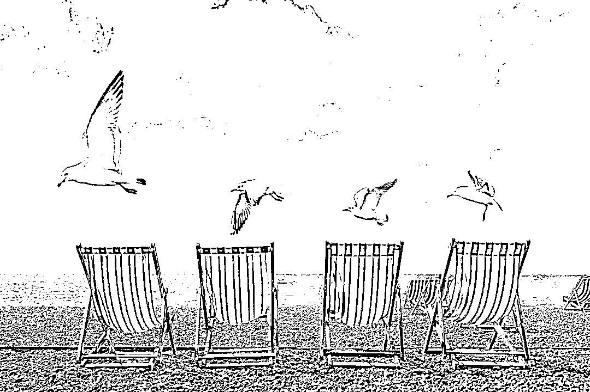

**9 月下旬**

9 月下旬天象

**9 月 21 日**  

*   双鱼座满月

*   天秤座水星三分水瓶座木星（逆行）

*   天秤座火星三分双子座月亮北交点

**9 月 22 日**  

*   天秤座水星四分摩羯座冥王星（逆行）

**9 月 23 日**  

*   太阳进入天秤座

*   天蝎座金星对分金牛座天王星（逆行）

**9 月 26 日**  

*   天秤座太阳三分双子座月亮北交

*   天秤座火星三分水瓶座土星（逆行）

**9 月 27 日**  

*   水星在天秤座 25º23’开始逆行

**9 月 30 日**

*   天秤座太阳三分水瓶座土星（逆行）

*   天蝎座金星三分双鱼座海王星（逆行）

**9 月 21 日的双鱼座满月**非常激烈。环境里可能有些令人悲伤的社会性事件发生，比如难民危机、年轻人和权威之间的冲突殃及妇孺, 或者孟晚舟事件令人失望的走向等等。

满月也会触发一些人的低价值感，以及身体上的不适。一些充满牺牲感的关系在这个满月后结束。

这个满月有些金融政策和技术管控出台，对互联网企业以及一些国际事务产生重大影响。

**下旬的关键节点是水星在天秤座逆行。这是本年度最后一次水星逆行。**这个逆行发生在天秤座，因此和合作、婚姻、契约有关。涉及签约的事情，往后推一下，否则很容易反悔。情感上有些秘密曝光，再次和牺牲、幻灭有关。**本次水星逆行的阴影期从 9 月 7 日开始。**那前后金星和火星有很多紧张相位，留意 9 月处女座新月的事件发生，将在水逆期间深入解决。

**9 月 23 日太阳进入天秤座。**秋季正式拉开序幕。这个天秤月因为水星逆行，火星入天秤座，金星在天蝎座，会有些平静水面下波澜起伏的样子。需要我们站在一年后想要成就怎样生活的方式审视现今的生活各方面。很多人会在生命中出现一个水瓶座土星式的导师，或者加入一个共创成长的群体。**这是个特别适合探索人生方向的天秤月。**

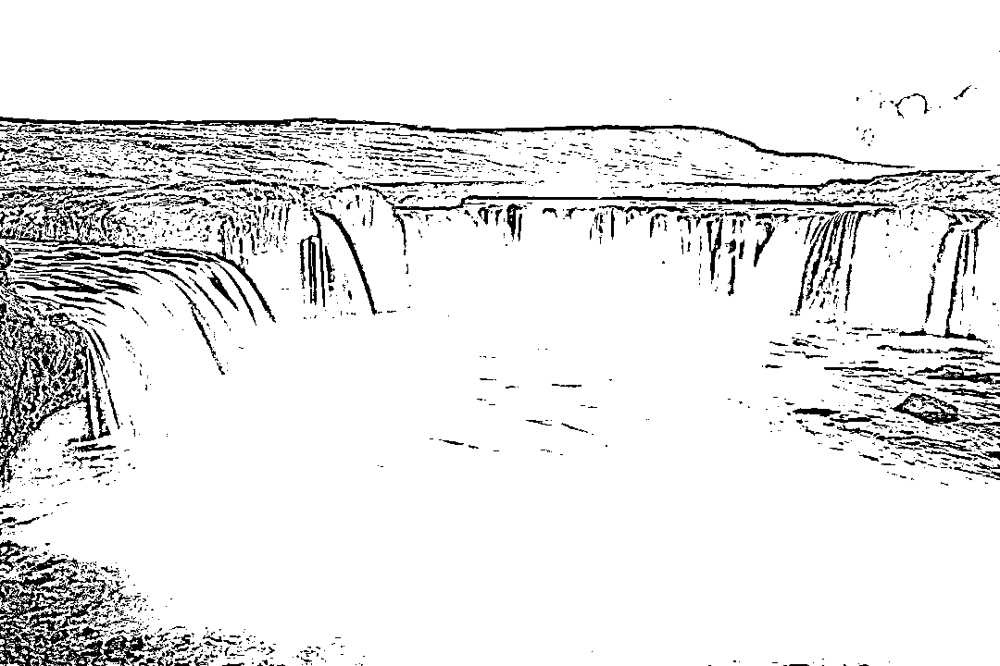

**尾声**

整个 9 月，发生在外在环境里的事件，都在引导我们向内看见祖辈的女性们如何一次次承受着牺牲、痛苦、死亡，推动整个族群的发展。这些痛楚以 DNA 的方式在我们的身体里自动复制。而我们这一代的使命，是在感受深切的悲伤与愤怒之中，看见对家园的渴望，看见生命不息的火光，致敬这样坚韧的生命力。然后向这样坚韧的生命力致敬，并且开始从天蝎座走向金牛座的转变：**有关丰盛、满足、宁静的开创。**

这是天王星在金牛座的 7 年里所致力的改变。这种改变最终推动的，是两性关系的平等、家庭定义、婚姻和育儿理念的变革，是土木水瓶座时代的社会文明基石。这是很漫长的路。**这需要男性和女性的携手共创，并不只是某一个性别族群的事情，这是个让男性和女性都得到自由和生命力的道路。**

有时候你得有耐心一点，好好等待，做足自己该做的功课，让渴望成为一股更大的力量。就像种子发芽，长成它该有的模样。

**深深的祝福。**

**本月重要天象一览表**

| **日期** | **星象** |
| **2021.9.3** | **天秤座水星三分双子座月亮北交点****处女座火星对分双鱼座海王星（逆行）** |
| **2021.9.4** | **天秤座水星三分水瓶座土星（逆行）** |
| **2021.9.6** | **天秤座金星三分水瓶座木星（逆行）****天秤座金星四分摩羯座冥王星（逆行）****处女座火星三分摩羯座冥王星（逆行）** |
| **2021.9.7** | **处女座新月****处女座太阳三分金牛座天王星（逆行）** |
| **2021.9.11** | **金星换座天蝎座**  |
| **2021.9.14** | **处女座太阳对分双鱼座海王星（逆行）** |
| **2021.9.15** | **火星换座天秤座** |
| **2021.9.17**  | **处女座太阳三分摩羯座冥王星（逆行）****天蝎座金星四分水瓶座土星（逆行）** |
| **2021.9.21** | **双鱼座满月****天秤座水星三分水瓶座木星（逆行）****天秤座火星三分双子座月亮北交点** |
| **2021.9.22** | **天秤座水星四分摩羯座冥王星（逆行）** |
| **2021.9.23** | **太阳进入天秤座****天蝎座金星对分金牛座天王星（逆行）** |
| **2021.9.26**  | **天秤座太阳三分双子座月亮北交****天秤座火星三分水瓶座土星（逆行）** |
| **2021.9.27** | **水星在天秤座 25º23’开始逆行** |
| **2021.9.30** | **天秤座太阳三分水瓶座土星（逆行）****天蝎座金星三分双鱼座海王星（逆行）** |

**版权声明**：原创文章由作者授权首发于若道平台，欢迎转发，反对抄袭。友号转载请申请白名单。

****

****傅莎珈****

ISAR 认证占星师（2015 年获得）

心理占星师/内观书写带领者/冥想带领者

国际著名传播集团工作 20 年

**微信公众号**：Helloshajia

长按打赏

**学习占星学**

**点击下图了解课程详情** 

**微信又双叒叕改版啦，不想错过若道君的推送？**

**就把若道设为星标吧！**

**▼**

**就是这个“在看”，戳戳戳 ☟**

********报名直达入口********

# 若道创始人亲讲：如何通过太阳培养个性与自我意识？（限时免费）

> 原文：[`mp.weixin.qq.com/s?__biz=MzA5NjA0NTAxNg==&mid=2651454929&idx=2&sn=9d915c6d2b52c043b8347abad96654ae&chksm=8b4b4f66bc3cc67064fe32d83c782b2fb17d70e903ccb38e0825f7c7e9211cdef27783587a1a&scene=126&sessionid=1692737933#rd`](http://mp.weixin.qq.com/s?__biz=MzA5NjA0NTAxNg==&mid=2651454929&idx=2&sn=9d915c6d2b52c043b8347abad96654ae&chksm=8b4b4f66bc3cc67064fe32d83c782b2fb17d70e903ccb38e0825f7c7e9211cdef27783587a1a&scene=126&sessionid=1692737933#rd)

1

**太阳，成为自己的英雄**

**你必须踏上哪条道路才能培养你的个性意识和健康的自我意识？**占星学中的太阳指向父亲的原型、自我和英雄。作为英雄的象征，它代表了你必须有意识地去争取的东西，最大化表达它所在的星座，无论是光明面还是黑暗面。太阳的体验构成了个人满足、自我决断和意志的重要建设性因素，它代表了有意识的自我。太阳是自我感知之路上的一种心理冲动。**· 它的光明面可以表达为：**自信、决心、健康的抱负、独立、魅力、创造力、吸引力和领导力；**· 它的黑暗面可以表达为：**做作、专制、自私、炫耀、害羞、无能和不安全感。
黄道十二星座反映了英雄人生的原型轨迹，他披着以下外衣经历了个人发展的 12 个阶段：**战士、坚持者、信使、保护者、统治者、分析者、恋人、重生者、冒险者、攀登者、改革者和启蒙者。**9 月 8 日（周三），大卫·瑞雷老师将为大家带来一场关于十二星座英雄之旅的知识讲座，大卫老师还会就参与者在学习与实践占星的过程中遇到的种种问题进行互动问答！

2

**讲座简介**

**12 个太阳星座案例解读，诠释如何活出自我，实现英雄之旅**

3

**讲师是谁？**

**大卫·瑞雷（David Railey）**

**·** 若道联合创始人，致力于在中国教授和推广西方占星学；  **·** 曾任 ISAR 全球副主席，CAPISAR（ISAR 职业占星师资质认证机构）主席；**·** 1976 年，通过亚特兰大职业占星师考试，成为全职占星师，随后通过 AFAN 和 ISAR 职业测试；**·** 1980 年，与杰夫·焦耳一起在亚特兰大创建“每日行星”占星学中心。此后在亚特兰大占星协会担任 4 年考官，并且两次担任亚特兰大地区占星协会主席。1979-1992 年，作为占星师活跃于美国社会媒体，向不了解现代占星学变化的大众宣传专业占星学知识。在 1989-1992 年期间，他在 WRGG 电台 12 频道每周主持个人电视秀“今日占星学”，早先他还在 WRFG 的广播节目中播讲宇宙天气节目；**·** 2010-2014 年，任全美占星师联盟监督委员会委员；**·** 2010 年，其著作《灵魂的目标》中国版出版，和蒋颖一起创办若道占星学校和其官网 www.nodoor.com；**·** 2017 年，被选为 ISAR 委员会成员。ISAR 是世界最大的国际占星机构，会员遍布 45 个国家，2017-2020 年曾任 ISAR 全球副主席、CAPISAR（ISAR 职业占星师资质认证机构）主席。 

4

**讲座详情**

**讲座时间**：**2021 年 9 月 8 日 星期三 20:00-22:00****参课方式**：网络直播**讲座价格**：200 元（**想获得免费资格？往下看**）**报名方式**：**务必点击文末“阅读原文”，在报名链接进行报名****报名截止**：2021 年 9 月 7 日 中午 12:00**人数限制**：200 人**特别提醒**❶ 不接收空降，请提前报名付款确认名额❷ 报名成功后，会在 9 月 8 日下午统一发送参课方式，请耐心等候❸ 由于个人原因无法出席沙龙，不提供开课后退款，敬请谅解

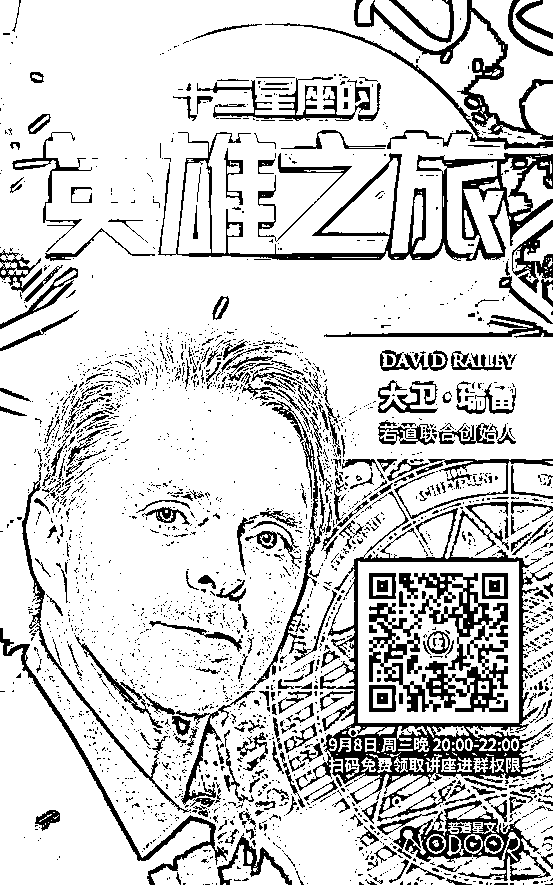

**转发上方海报到朋友圈**

**截图发给客服**

**即可获取免费参加讲座资格**

**长按二维码添加客服，抢占优惠价名额~**

****报名直达入口****

# 核心课程 L1-3 丨四位国际导师联合授课，掌握星图中的角色关系和场景转换

> 原文：[`mp.weixin.qq.com/s?__biz=MzA5NjA0NTAxNg==&mid=2651454929&idx=3&sn=41b813c6f31f090a587e3107c344637f&chksm=8b4b4f66bc3cc6703aaffae98f2d54405038740fba7d608be43671b8336c982a847924de47ce&scene=126&sessionid=1692737933#rd`](http://mp.weixin.qq.com/s?__biz=MzA5NjA0NTAxNg==&mid=2651454929&idx=3&sn=41b813c6f31f090a587e3107c344637f&chksm=8b4b4f66bc3cc6703aaffae98f2d54405038740fba7d608be43671b8336c982a847924de47ce&scene=126&sessionid=1692737933#rd)

出生星图中的剧本是在讲述一个故事：行星是演员和角色；星座是他们表演的风格；宫位是表演的布景，他们之间的关系就是**相位**。**相位是角色之间的关系**相位是个人星图中最令人兴奋、最精准的要素。认识内行星、太阳和月亮与从木星到冥王星的外行星之间的相互作用，可以帮助我们深入理解案主的行为。内行星代表个人驱力：**太阳的驱力是自我实现，****月亮的驱力是依恋和安全感，****水星的驱力是连接，****金星会带来吸引力和关系的建立，****火星的驱力是满足欲望。**当个人行星与外行星结合起来时，就会表现出特定的行为，继而导致出现可预测的结果。例如，当金星（爱）与土星（抑制）形成相位，客户会戴上冷酷的面具，有效掩饰自身对爱的深切渴求，因此可能会吸引那种感觉客户不需要表露爱意的人。**“所有的关系和剧情都来自角度”****· 合相（0°）：统一、融合或合成**

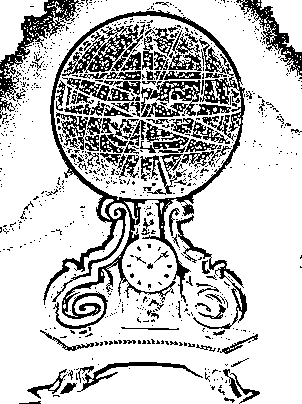

**· 六分相（60°）：冷静的诱导表达**

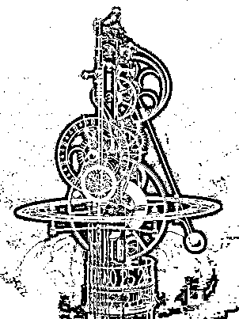

**· 四分相（90°）：抑制与控制**


**· 三分相（120°）：轻松的创造性表达**


**· 对分相（180°）：适度与克制的合作**


**· 其他的相位**

在 L3 课程中，艾德里安老师将演示如何揭示与行星相位相关的行为，如何获取相位表达的核心能量，以及如何调整行为，以收获成果丰硕、具有满足感的人生。<mpvideosnap class="js_uneditable custom_select_card channels_iframe" data-pluginname="videosnap" data-id="export/UzFfAgtgekIEAQAAAAAAtakEfdih7QAAAAstQy6ubaLX4KHWvLEZgBPEmoM0HxEzM6b-zNPgMItHNMH0WxOQbPKCwYedue2j" data-url="https://findermp.video.qq.com/251/20304/stodownload?encfilekey=RBfjicXSHKCOONJnTbRmmlD8cOQPXE48ibRWXLFcIlibqx9mRkYw34bBeCo0H0HHs5dFtBpd2Niasksb7JBibamiaQVjBPUqYwzcmcCPicXEQNiaBbCtqxV7aByibs5zlYaX2IYQ82kHXbzrzOFibVsASvPooz9athm4Ynr7BYh7Yo6ricQvSg&amp;adaptivelytrans=0&amp;bizid=1023&amp;dotrans=0&amp;hy=SH&amp;idx=1&amp;m=abdc824fd82a4e1729ea192059d1b238&amp;token=x5Y29zUxcibAeBWYF7VqUUZYVTyzHMUZdVTApTHeic60kOLZAR4CYrbeWSRz0CAwibWNVcYhlzjUicU" data-headimgurl="http://wx.qlogo.cn/finderhead/PiajxSqBRaEJYnVsqWfEX9qA0sI6hNVKsDfyzfPZ92WZMZyBpZWU5NA/0" data-username="v2_060000231003b20faec8c4e68a1ec2d4ca07e434b07755bbf47e7053a3059defd2c9d6c68a20@finder" data-nickname="若道" data-desc="#四位导师联合教授 2021 核心课 邓肯老师对于时事和占星学的结合非常有研究，课程内容中的行星周期、行进、推进、进阶预测技法由邓肯老师主讲教学。" data-nonceid="14383357701165399025" data-type="video"></mpvideosnap> 

**定位星列：场景的转换**

定位星列的运作方式是通过一些特定的行动和行为，以及逻辑的变化，进入下一个场景之中。就像是戏剧中场景的转换：第一幕结束，第二幕开启，会有一些之前没有见过的场景和角色出现。


**课程安排** **第*****1*****阶**2021 年 9 月 15 日开课，每周一天晚上 20:00-22:00 上课，共 6 次课**第*****2*****阶**2021 年 11 月 11 日开课，每周四晚上 20:00-22:00 上课，共 6 次课

**第*3*阶**

2022 年 1 月 6 日开课，每周四晚上 20:00-22:00 上课，共 15 次课

2022 年 4 月 30 日、5 月 1 日 L3 北京两日线下工作坊


**第*****1*****阶 黄道星座&个人行星****· 概要介绍占星学与星图**

**· 四元素与三形态**

**· 黄道 12 星座**


**· 太阳、月亮及其他个人行星**


**第*2*阶 行星&宫位****· 木星&土星****· 天王星&海王星&冥王星**


**· 练习组合所有行星**

**· 四轴****· 十二宫位**

**· 组合宫位、行星、星座**

**第*****3*****阶 月亮交点、相位以及初步解读星图****· 了解灵魂进化的路径：月亮交点**


**· 相位概论****· 相位&行为模式**

**· 困难相位****· 柔和相位**


**· 容许度，出入相位****· 渐盈渐亏相位****· 空相****· 宫主星&定位星**


**· 相位模式****· 组合相位、星座、行星、宫位****· 解读的基本原则，权重，失衡****授课老师** 


**琳恩·贝尔**

**（Lynn Bell）**

**· **世界最受欢迎的占星学演讲者、作家和老师之一。定居巴黎，研究心理占星学和家族模式数十年；**· **著名的心理占星学中心（Centre for Psychological Astrology）的长期导师。2016 年，获得查尔斯·哈维（Charles Harvey）杰出的占星学服务奖；**· **作为一个从多个层面进行工作的占星咨询大师，琳恩的工作结合了心理学的观点。她对家族模式的兴趣首先来自与客户的合作。通过在分析领域所做的个人工作，她所受的埃里克森催眠训练将她引领至家族系统。后来，她组织研究小组在家族星图上进行了数年的研究。她写的《家族占星学》就是这项研究的结果；**· **法国心理占星学协会的会长。除了占星学，她在法国沙特尔的新沙特尔学校任教 8 年，还 5 次获得了在《纽约时报》畅销书作者卡罗琳·迈斯（Caroline Myss）的卡罗琳·迈斯教育学院（Caroline Myss Educational Institute）合作教学的机会。

**艾德里安·罗斯·邓肯**

**（AdrianRoss Duncan）**

**· **1971 年在印度游学时开始学习占星学，1985 年开始成为全职占星师，迄今执业已超过 33 年，是人本主义占星学、卜卦占星学和经世占星学领域的知名占星师。他还开发了占星软件 AstroClock 和多款占星报告；**· **哥本哈根占星学院院长；**· **他在日常咨询中经常运用卜卦，咨询图（卜卦的一种运用方式，即根据客户来访时间制作星图，从星图中获得大量信息）也是他特别擅长的领域；**· **艾德里安·罗斯·邓肯从 1971 年开始研习佛学，受佛学影响很深，他相信占星学和佛学观点一致，转化的一个基础是在于对现实感知的改变。而卜卦很容易与佛教融合，因为它只关乎当下。

**克里斯蒂娜·罗登贝克**

**（Christina Rodenbeck）**

**· **克里斯蒂娜·罗登贝克（Christina Rodenbeck）是一名全职职业占星师，在牛津大学城生活和工作，深受周围知识和文化氛围影响；她拥有伦敦大学（University of London）的人文荣誉学位，曾在伦敦占星学馆（AstrologicalLodge of London）、心理占星中心和占星研究学院学习；

**· **作为一名占星师，在过去的 20 年里，克里斯蒂娜在她的网站“牛津占星师”上写了大量关于时事、艺术和文化的文章；她每月主持一个占星播客：“与克里斯蒂娜和萨莉一起占星”，并定期在《占星杂志》(Astrological Journal)上撰写时尚专栏；她定期在英国授课，并保持着蓬勃发展的专业实践。

**大卫·瑞雷**

**（David Railey）**

**· **若道联合创始人，致力于在中国教授和推广西方占星学；

**·** 曾任 ISAR 全球副主席，CAPISAR（ISAR 职业占星师资质认证机构）主席；

**· **1976 年，通过亚特兰大职业占星师考试，成为全职占星师，随后通过 AFAN 和 ISAR 职业测试；

**· **1980 年，与杰夫·焦耳一起在亚特兰大创建“每日行星”占星学中心。此后在亚特兰大占星协会担任 4 年考官，并且两次担任亚特兰大地区占星协会主席。1979-1992 年，作为占星师活跃于美国社会媒体，向不了解现代占星学变化的大众宣传专业占星学知识。

**·** 1989-1992 年期间，他在 WRGG 电台 12 频道每周主持个人电视秀“今日占星学”，早先他还在 WRFG 的广播节目中播讲宇宙天气节目；

**· **2010-2014 年，任全美占星师联盟监督委员会委员；

**· **2010 年，其著作《灵魂的目标》中国版出版，和蒋颖一起创办若道占星学校和其官网 www.nodoor.com；

**· **2017 年，被选为 ISAR 委员会成员。ISAR 是世界最大的国际占星机构，会员遍布 45 个国家，2017-2020 年曾任 ISAR 全球副主席、CAPISAR（ISAR 职业占星师资质认证机构）主席。


**熊鹰老师**

**（天空的空）**

**·** 2008 年接触严肃占星学，至此爱不释手；**· **2013 年师从大卫·瑞雷，研习整套现代占星学核心课程，并于 2014 年起至今连续三年担任该课程的主助教；之后于 2017 年与 2020 年两次与大卫老师合作讲授完整核心课程（Level 1-5）。

**·** 期间也跟随格伦·佩里、诺·泰尔、理查德·塔纳斯、罗伯特·汉德、苏·汤普金斯、斯蒂芬·弗里斯特、琳恩·贝尔、艾德里安·邓肯等多位国际占星大师进行学习，进行定向占星主题研究；

**·** 2014 年末，通过国际占星研究协会（ISAR）资质认证并获得证书；

**·** 在若道占星任职六年余，以“传播系统、专业、实效的占星学”为职业使命，执教与助教已累计超过 700 小时。在业余期间也提供占星咨询服务；

· 目前正着眼于占星学与中国文化之互参，以当代中国人的身心成长为目标，力求落到实处。**此次课程适合哪些人？****· **对占星学感兴趣，想要入门的零基础者**· **占星学小白，但有志成为职业占星师的人**· **有一定占星学基础，但不知道该如何整合星图复杂碎片的人**· **希望成为优秀的占星师，想要借鉴国际大师解读思路并融入自己的体系的人**· **想要师从更多殿堂级占星导师学习占星心法的人**· **走在自我探索和个人成长道路上的人**课程价格****L1-2 价格**：4800 元

**L1-3 价格**：15000 元

其他各阶段课程单报价格，请咨询课程顾问：**Maggie 老师**（微信：18510107057，请备注**“核心课”**）

长按二维码添加 Maggie 老师

**退转课程**

**· 退款原则请详看《教学协议》，如有疑问请咨询课程顾问**

****名师汇集金牌核心课程****

**授课老师：**琳恩·贝尔、艾德里安·罗斯·邓肯、克里斯蒂娜·罗登贝克、大卫·瑞雷

**授课时间：**2021 年 9 月 15 日起

**授课方式：**网络课程**，**英文授课，中文翻译

**费用：**L1-2 价格：4800 元**；**L1-3 价格：12000 元

**课程负责人：****Maggie 老师**（微信：18510107057，请备注“核心课”）

长按二维码添加课程负责人咨询~

****报名请点击“阅读原文”****

# 来，测试一下你真实的占星水平！

> 原文：[`mp.weixin.qq.com/s?__biz=MzA5NjA0NTAxNg==&mid=2651454838&idx=2&sn=7ee3587347b6cec9d795d10040ef6ce3&chksm=8b4b4fc1bc3cc6d76f45ae14675c6667e154cb918146fc95b23a69e1bd05d9dd869b9289f766&scene=126&sessionid=1692737933#rd`](http://mp.weixin.qq.com/s?__biz=MzA5NjA0NTAxNg==&mid=2651454838&idx=2&sn=7ee3587347b6cec9d795d10040ef6ce3&chksm=8b4b4fc1bc3cc6d76f45ae14675c6667e154cb918146fc95b23a69e1bd05d9dd869b9289f766&scene=126&sessionid=1692737933#rd)


在若道核心课程中，听课只是学习的一小部分。在若道的学习体系中，对于掌握占星知识而言，我们非常强调**练习**。为了帮助同学们练习，即便在 L1-2 的学习中，我们也设计了三种练习方式：**测试、小组讨论和咨询练习。**每种练习都有其目的。测试的目的是为了让同学们自己检查对于一些知识点的掌握程度；**·** 小组讨论，我们会把有着相似配置的同学分在一个小组，同学们会根据我们设置的问题一步步分享人生经验，这样让我们的知识不再是书本上的程式化的描述，而是变成了有血有肉的真实的人生故事，也可以看到相似配置相同和不同及其丰富的含义；**·** 而咨询练习则帮助同学们从 L1-2 开始即开始熟悉如何和陌生人讲述星图，这样一直练习 2 年，到 L5，做咨询就不再是一件让大家为难的事情。今天，我们抽取 L1 同学所做小测试的一小部分分享给大家，这些测试都是根据每堂课所涉及的知识点设计出来的，以帮助同学们自己检验对于已经听完的课程中的知识的掌握程度。这些答案都可以非常容易通过复习和回听上课内容做出来。以下是有关星座知识和占星学的基础知识的测试，均为不定项选择题，也就是可能是单选，也可能是多选。***1.*** **以下符合双子座关键词的选项是（  ）。****A.**积极乐观**B.** 轻快敏捷**C.** 犹豫不决**D.** 反复无常***2. *****本题请按照顺序逐一选择填写，注意选项与前后描述和对比是否通顺合理：狮子座是一个固定星座，所以更加在意（ ）；天蝎座同样是固定星座，但天蝎座更加在意（ ）；处女座是一个土象的变动星座，相对于狮子座，处女座更加（ ），而相对于天蝎座，处女座又更加（ ）；天秤座作为风象的基本星座，与处女座又不一样，它更加地（ ），而与天蝎座相比，它比较（ ）；但无论如何，与其他三个星座相比，狮子座是更（ ）；而与另外三个星座相比，天蝎座更（ ）。****A.** 谦虚谨慎**B.** 情感**C.** 有创造力又有戏剧性**D.** 有危机意识**E.** 在意日常与细节**F.** 注重公正与和谐**G.** 注重品味与审美**H.** 自尊心***3. *****以下关于三个火象星座的描述，正确的是（ ）。****A.** 白羊座是忠诚的**B.** 狮子座慷慨热心，但也可能妄自尊大**C.** 射手座与远方有关，不那么安分**D.** 都比较有自信，也十分夸张***4.*** **以下关于白羊座，巨蟹座和天秤座三个基本星座的描述，正确的是（ ）。****A.** 巨蟹座更在乎过去与历史**B.** 白羊座是最激进最自我的**C.** 天秤座是收敛的**D.** 白羊座开创自我，巨蟹座开创家庭，天秤座开创关系***5. *****从选项中找出与星座的典型职业与显著特征最对应的，按顺序逐一选择填写：****白羊座：（ ）****金牛座：（ ）****双子座：（ ）****巨蟹座：（ ）****狮子座：（ ）****处女座：（ ）****天秤座：（ ）****天蝎座：（ ）****射手座：（ ）****A.** 导游，视野开阔又寻求远方**B.** 歌唱家，与喉咙和感官相关**C.** 古董收藏家，与历史和照料相关**D.** 护士，需要专业技术与服务精神**E.** 记者，客观收集信息的人**F.** 金融家，有危机意识以及善于分析**G.** 赛车手，与速度和激情相关**H.** 戏剧演员，需要创造力以及被舞台关注**I.** 外交官，圆融得体以及追求和平***6.*** **占星学使用的星图是基于（ ）。****A.** 日心模式，因为宇宙中实际运行的样子**B.** 地心模式，因为基于人们的实际体验，就是从地球上来观测的**C.** 占星学自创的模式，因为占星学独有其规律。***7.  *****阴性星座不会是开创星座。这个陈述是：****A.** 对的**B.** 错的***8.  *****处女座、天蝎座、天秤座、狮子座四个星座相比：****A.**天蝎座更多变**B.** 狮子座比天秤座更善于提供稳定性，比处女座更可预知**C.** 天秤座更喜欢交流**D.** 处女座比较顽固，难于改变***9.*** **从元素角度讲，以下哪个陈述是正确的？****A. **摩羯座比巨蟹座更内向**B.** 射手座比双子座更客观**C.** 天蝎座比双鱼座更复杂**D.** 白羊座有理想主义和远见**E.** 以上都不对***10.*** **选出符合巨蟹座的性质的选项：****A. **不善于开拓**B.** 比较现实**C.** 抗拒改变**D. **关心内在的主观体验做完了吗？如果你想要知道自己做的怎么样，答对了多少题，可以找我们的课程顾问领取答案。课程顾问：**Maggie 老师**（微信：18510107057，请备注**“测试答案”**）

长按二维码添加 Maggie 老师

下周，我们还会放一些其他的测试内容，别错过哦~

****

**为庆祝若道成立 10 周年，我们精心策划，汇集顶级占星学大师资源和教学经验，结合占星学知识体系和不同老师的教学专长，首次推出****由四位国际导师联合授课的占星核心课程。**

**其中**新一期 L1-2 核心课程由**大卫·瑞雷、克里斯蒂娜·罗登贝克、琳恩·贝尔**三位国际大师联合教学，老师们会专业、系统、全面的教授星座、行星、宫位知识，并讲述如何将三者串联成占星语言，人生故事，用三个月的时间带领你系统入门占星学。**课程安排：**

**点击下图** 

**马上了解核心课程 L1-L2 吧~**

****报名直达入口****

# 一起来玩星图剧本杀吗？萌新入门的保姆式教程，等你哦

> 原文：[`mp.weixin.qq.com/s?__biz=MzA5NjA0NTAxNg==&mid=2651454838&idx=3&sn=3fa20905c29d602dd87442417cf26d10&chksm=8b4b4fc1bc3cc6d78502c32f7e3b8fe52764295f9f74383a3e322050186e9afe25510644e44e&scene=126&sessionid=1692737933#rd`](http://mp.weixin.qq.com/s?__biz=MzA5NjA0NTAxNg==&mid=2651454838&idx=3&sn=3fa20905c29d602dd87442417cf26d10&chksm=8b4b4fc1bc3cc6d78502c32f7e3b8fe52764295f9f74383a3e322050186e9afe25510644e44e&scene=126&sessionid=1692737933#rd)

近几年，线上剧本杀兴起，线下风靡，因其剧情丰富，逻辑推理，沉浸体验，引无数人上头。你可能还不知道的是，从占星学角度，你的出生星图中也蕴涵着琳琅满目的剧本，一幕幕剧情有的跌宕起伏、有的动人温馨、有的神秘莫测……

如果你想要学习占星学，想研究一下严肃占星学和之前看到的娱乐占星有什么区别，这个思路绝对会为你打开新世界的大门，用专业的占星语言讲述生动的人生故事，千变万化，其乐无穷。当你学会了占星的语言，也就结识了星图中的一位位生动的角色，也就是你的一个个人生面向，TA 们各自拥有个性鲜明的特质，你会在生活中有意无意的表现出 TA 们的个性。TA 们在不同场景下的表现也会有不同，彼此之间还可能有着微妙的联系。**准备好开启真正属于你的沉浸式剧本了么？**

先让我向你简单介绍一下出生星图剧本中的主要角色：**行星是演员和角色**行星是剧情当中的演员，它不仅是内在的角色，也可能是我们实实在在碰到的一些人物。★**太阳**：自豪、自信、亲切的角色，善于自我表达、有创造力、喜欢玩耍和表演……★**月亮**：脆弱、敏感、温柔的角色，渴望归属感和亲密感，习惯养育与依赖……★**水星**：好奇、有趣、聪明的角色，有着不知满足的求知欲，善于沟通……★**金星**：爱美、舒适、愉快的角色，喜欢美食、爱情以及各种伙伴关系……★**火星**：果断、鲁莽、冲动的角色，热爱运动，特别是向着他们的愿望进发……★**木星**：乐观、慷慨、智慧的角色，心怀希望、热忱，坚守着对宇宙智慧的信任……★**土星**：耐心、坚毅、谦虚的角色，追求任务达成，做好工作，获得成功的感觉……★**天王星**：博爱、反叛、变革的角色，设法带来突破、彻底的洞见或自我实现……★**海王星**：艺术、共情、慈悲的角色，目标状态是极乐，对生命统一性的超验觉知……★**冥王星**：深刻、透彻、蜕变的角色，高峰体验、精神宣泄、摧毁重建、净化……当然除了十大行星，还有也很重要的、月亮交点、四轴：上升、下降、上中天、下中天也都扮演不可或缺的角色等待你来解锁。

**向左滑动，可依次查看行星卡牌**

**版权归属于插画师炼妖 LY 所有**

**星座是表演的风格**行星所落的星座就会为这个角色赋予一种风格。也可能是他会吸引到的人的样子。每个不同风格的角色，可能说出这样的台词：★**白羊座：**“想做就做！去做吧！这是你的权利。”★**金牛座：**“如果感觉好，享受它吧。让自己快乐，放松。”★**双子座：**“这很有趣，给它下个定义分个类。发挥你的思维。”★**巨蟹座：**“倾听，转内向在，你现在感觉怎么样?”★**狮子座：**“宝贝，闪现你的光芒。表达自己！”★**处女座：**“小心，这里有一个问题。解决它。”★**天秤座：**“展现魅力，建立关系。思考、妥协、合作。”★**天蝎座：**“面对你的恐惧，将它推向极限。决一死战，全心投入。”★**射手座：**“保持信心，宝贝。上帝是好的，做对的事就好。”★**摩羯座：**“全力以赴，专心致志。集中精神，控制自己。”★**水瓶座：**“期待意料之外的事，保持开放和超然的态度”。★**双鱼座：**“放手，顺其自然。屈服，相信宇宙。”当然每一位角色也偶尔会展现出一些破坏性的特质，可能是 TA 的某些核心需求没有得到满足，这就更需要学习更多占星语言，来倾听出生星图中的“心声”。

**向左滑动，可依次查看星座卡牌**

**版权归属于插画师炼妖 LY 所有**
**宫位是舞台和布景****宫位是戏剧上演的地方。**就好比我们去剧院，可以看到各种道具和场景：卧室、图书馆或银行。宫位就像是各种场景。你的行星演员也可能在各个场景中遇到其中的专属 NPC。★**第一宫**：你自己的空间，可能还包括那些帮你保持漂亮外表的那些人……★**第二宫**：银行、有金钱往来的场所，可能还包括客户、供货商……★**第三宫**：学校、各种媒体中，可能还包括兄弟姐妹邻居、同学同伴……★**第四宫**：家里、老家，可能还包括父母、长辈、祖先、家装维护人员……★**第五宫**：娱乐场所、约会场所，可能还包括孩子、你内在的小孩、你迷恋的明星……★**第六宫**：工作场所、提供服务的场所，可能还包括雇员和同事、医护人员……★**第七宫**：婚礼教堂，可能还包括你的配偶、人生伴侣、商业伙伴、公开的敌人……★**第八宫**：葬礼，可能还包括性伴侣、和你分享共同财产和资源的人……★**第九宫**：大学、海外、法院，可能还包括大学教授、精神导师、律师……★**第十宫**：职场、公众场合，可能还包括老板、监督者、“权威”……★**第十一宫**：团体组织，可能还包括朋友、伙伴、你的社交圈、团队中的成员……★**第十二宫**：医院、监狱、修行道场，可能还包括你生命中秘密的人、酒友……**向左滑动，可依次查看宫位卡牌****版权归属于插画师憂所有****怎样将行星、星座、宫位三者串联成剧本呢？**举个例子：**金星**总是象征我们所爱的人或者象征我们去关联、去建立关系的那种能力。**金星落在金牛座**，这个人的次人格就会比较喜欢舒适的生活、享受美食、热爱大自然。它不仅仅是这个人的行事风格，也可能是他会吸引到的人的样子。比如这个人可能也喜欢旅游、喜欢异国文化、美食和风光——**第九宫金牛座**。这个人可能会在旅行中和旅伴或当地偶遇的旅行者结伴而行，一起在海边看日出日落，分享同一份路边美食，骑着摩托在森林公园兜风，畅聊旅行中的见闻和感受，以至于可能由此建立了亲密关系。当然这个配置还有其他剧本的可能性，因为每个人看待世界的方式都不一样，诠释的方式也不相同。占星师的任务就是从更大的视野来理解事情，把星图看成是一张生命地图，占星师就是解图者。地图可以让我们注意到以往忽略的事情，也能帮助我们看到自己与一切事物的关系，或者帮我们发现属于自己的道路。通过对于星图剧本的构想，你会更清晰，人生各个领域自己真实的需求是什么，有迹可循的为自己亲手构建理想生活。出生星图就是这样讲述着一个个故事：蕴涵着无数人生剧本，更映射着天体时钟。**正所谓“Asabove, so below，天上如是，地上亦然。”**


行星、星座、宫位并不代表力量，而是作为天体时钟的一部分，它们发出信号、而非引起变化。但这信号，可以让我们更真切的了解自己，从而拥有更多的觉知，**事情也会因为我们有了觉知而改变——能量永远会随着想法的改变而起变化。**一个人对自己的了解与他真实的样子越接近，他就越拥有智慧。学习占星学，在了解自己的同时，还可以观察他人，才是真正的体味人生百态。

以上文中的关键词介绍只是入门课程的冰山一角，文中的……也代表着每一个行星、星座、宫位的配置还有着更多的含义和可能性，想要更全面的学习占星语言，有一门集结了三位国际名师的核心课入门课程向你推荐：

**为庆祝若道成立 10 周年，我们精心策划，汇集顶级占星学大师资源和教学经验，结合占星学知识体系和不同老师的教学专长，首次推出****由四位国际导师联合授课的占星核心课程。**

**其中**新一期 L1-2 核心课程由**大卫·瑞雷、克里斯蒂娜·罗登贝克、琳恩·贝尔**三位国际大师联合教学，老师们会专业、系统、全面的教授星座、行星、宫位知识，并讲述如何将三者串联成占星语言，人生故事，用三个月的时间带领你系统入门占星学。有请克里斯蒂娜·罗登贝克老师跟大家打个招呼：<mpvideosnap class="js_uneditable custom_select_card channels_iframe" data-pluginname="videosnap" data-id="export/UzFfAgtgekIEAQAAAAAARAcrwoZd0gAAAAstQy6ubaLX4KHWvLEZgBPE7IMkHHpHIan-zNPgMIt3rFoQPG1r9ocB2sRik5Ps" data-url="https://findermp.video.qq.com/251/20304/stodownload?encfilekey=XGocBFxVWK5dcyOOqpEU47RpBHQIvlhnPGdrgZ1vqc6a5xdgIzc2MciabYCyta5Oh5UNVAVqfTCTX48nEibvYibib3F8jlrCZ8ibWXIIJYQYsdlhYywxmI6AaDbnBVHFfezqP8QaFM5F7f6vFzPcVfnuib6p04xvR9P7o0mjMgVU66Sxx6fVFia1Do0IPq7jIDkOyOE&amp;adaptivelytrans=0&amp;bizid=1023&amp;dotrans=0&amp;hy=SH&amp;idx=1&amp;m=16cb9ce99387ef781ee6c1eac70a74ce&amp;token=x5Y29zUxcibAeBWYF7VqUUZAPYxjD7IpZD3NNvOZSwicBiayWRiayrmhdj2D1bib7JUYasA936VnLHsg" data-headimgurl="http://wx.qlogo.cn/finderhead/PiajxSqBRaEJYnVsqWfEX9qA0sI6hNVKsDfyzfPZ92WZMZyBpZWU5NA/0" data-username="v2_060000231003b20faec8c4e68a1ec2d4ca07e434b07755bbf47e7053a3059defd2c9d6c68a20@finder" data-nickname="若道" data-desc="#四位导师联合教授 2021 核心课 克里斯蒂娜老师将按照她的教学理念教授星座、宫位、行进、比对图、亲密关系咨询等部分。" data-nonceid="15165203225426773444" data-type="video"></mpvideosnap>**课程安排** **第*****1*****阶**2021 年 9 月 15 日开课，每周一天晚上 20:00-22:00 上课，共 6 次课**第*****2*****阶**2021 年 11 月 11 日开课，每周四晚上 20:00-22:00 上课，共 6 次课

**第*****1*****阶 黄道星座&个人行星****· 概要介绍占星学与星图**

**· 四元素与三形态**

**· 黄道 12 星座**

**· 太阳、月亮及其他个人行星**

**第*2*阶 行星&宫位****· 木星&土星****· 天王星&海王星&冥王星**

**· 练习组合所有行星**

**· 四轴****· 十二宫位**

**· 组合宫位、行星、星座**

**授课老师** 

**琳恩·贝尔**

**（Lynn Bell）**

**· **世界最受欢迎的占星学演讲者、作家和老师之一。定居巴黎，研究心理占星学和家族模式数十年；**· **著名的心理占星学中心（Centre for Psychological Astrology）的长期导师。2016 年，获得查尔斯·哈维（Charles Harvey）杰出的占星学服务奖；**· **作为一个从多个层面进行工作的占星咨询大师，琳恩的工作结合了心理学的观点。她对家族模式的兴趣首先来自与客户的合作。通过在分析领域所做的个人工作，她所受的埃里克森催眠训练将她引领至家族系统。后来，她组织研究小组在家族星图上进行了数年的研究。她写的《家族占星学》就是这项研究的结果；**· **法国心理占星学协会的会长。除了占星学，她在法国沙特尔的新沙特尔学校任教 8 年，还 5 次获得了在《纽约时报》畅销书作者卡罗琳·迈斯（Caroline Myss）的卡罗琳·迈斯教育学院（Caroline Myss Educational Institute）合作教学的机会。

**艾德里安·罗斯·邓肯**

**（AdrianRoss Duncan）**

**· **1971 年在印度游学时开始学习占星学，1985 年开始成为全职占星师，迄今执业已超过 33 年，是人本主义占星学、卜卦占星学和经世占星学领域的知名占星师。他还开发了占星软件 AstroClock 和多款占星报告；**· **哥本哈根占星学院院长；**· **他在日常咨询中经常运用卜卦，咨询图（卜卦的一种运用方式，即根据客户来访时间制作星图，从星图中获得大量信息）也是他特别擅长的领域；**· **艾德里安·罗斯·邓肯从 1971 年开始研习佛学，受佛学影响很深，他相信占星学和佛学观点一致，转化的一个基础是在于对现实感知的改变。而卜卦很容易与佛教融合，因为它只关乎当下。

**克里斯蒂娜·罗登贝克**

**（Christina Rodenbeck）**

**· **克里斯蒂娜·罗登贝克（Christina Rodenbeck）是一名全职职业占星师，在牛津大学城生活和工作，深受周围知识和文化氛围影响；她拥有伦敦大学（University of London）的人文荣誉学位，曾在伦敦占星学馆（AstrologicalLodge of London）、心理占星中心和占星研究学院学习；

**· **作为一名占星师，在过去的 20 年里，克里斯蒂娜在她的网站“牛津占星师”上写了大量关于时事、艺术和文化的文章；她每月主持一个占星播客：“与克里斯蒂娜和萨莉一起占星”，并定期在《占星杂志》(Astrological Journal)上撰写时尚专栏；她定期在英国授课，并保持着蓬勃发展的专业实践。

**大卫·瑞雷**

**（David Railey）**

**· **若道联合创始人，致力于在中国教授和推广西方占星学；

**·** 曾任 ISAR 全球副主席，CAPISAR（ISAR 职业占星师资质认证机构）主席；

**· **1976 年，通过亚特兰大职业占星师考试，成为全职占星师，随后通过 AFAN 和 ISAR 职业测试；

**· **1980 年，与杰夫·焦耳一起在亚特兰大创建“每日行星”占星学中心。此后在亚特兰大占星协会担任 4 年考官，并且两次担任亚特兰大地区占星协会主席。1979-1992 年，作为占星师活跃于美国社会媒体，向不了解现代占星学变化的大众宣传专业占星学知识。

**·** 1989-1992 年期间，他在 WRGG 电台 12 频道每周主持个人电视秀“今日占星学”，早先他还在 WRFG 的广播节目中播讲宇宙天气节目；

**· **2010-2014 年，任全美占星师联盟监督委员会委员；

**· **2010 年，其著作《灵魂的目标》中国版出版，和蒋颖一起创办若道占星学校和其官网 www.nodoor.com；

**· **2017 年，被选为 ISAR 委员会成员。ISAR 是世界最大的国际占星机构，会员遍布 45 个国家，2017-2020 年曾任 ISAR 全球副主席、CAPISAR（ISAR 职业占星师资质认证机构）主席。

**熊鹰老师**

**（天空的空）**

**·** 2008 年接触严肃占星学，至此爱不释手；**· **2013 年师从大卫·瑞雷，研习整套现代占星学核心课程，并于 2014 年起至今连续三年担任该课程的主助教；**·** 期间也跟随格伦·佩里、诺·泰尔、理查德·塔纳斯、罗伯特·汉德、苏·汤普金斯、斯蒂芬·弗里斯特等多位国际占星大师进行学习，进行定向占星主题研究；**·** 2015 年初，通过国际占星研究协会（ISAR）资质认证并获得证书。同年，进一步跟随大卫·瑞雷老师进修“生时校正”技术，通过最终考核并获得证书；**·** 目前在若道占星任职，将传播系统、严谨、真实的占星学作为职业使命。任专职助教期间，进行沙龙与答疑等辅助教学工作已累计超过 200 小时；**·** 在业余期间也提供占星咨询与生时校正服务。目前正致力于占星学与个人成长的整合。**此次课程适合哪些人？****· **对占星学感兴趣，想要入门的零基础者**· **占星学小白，但有志成为职业占星师的人**· **有一定占星学基础，但不知道该如何整合星图复杂碎片的人**· **希望成为优秀的占星师，想要借鉴国际大师解读思路并融入自己的体系的人**· **想要师从更多殿堂级占星导师学习占星心法的人**· **走在自我探索和个人成长道路上的人**课程价格****L1-2 价格**：4800 元其他各阶段课程单报价格，请咨询课程顾问：**Maggie 老师**（微信：18510107057，请备注**“核心课”**）

长按二维码添加 Maggie 老师

**退转课程**

**· 退款原则请详看《教学协议》，如有疑问请咨询课程顾问**

****名师汇集金牌核心课程****

**授课老师：**琳恩·贝尔、艾德里安·罗斯·邓肯、克里斯蒂娜·罗登贝克、大卫·瑞雷

**授课时间：**2021 年 9 月 15 日起

**授课方式：**网络课程**，**英文授课，中文翻译

**费用：**L1-2 价格：4800 元

**课程负责人：****Maggie 老师**（微信：18510107057，请备注“核心课”）

长按二维码添加课程负责人咨询~

****报名请点击“阅读原文”****

# 一会儿像孩子，一会儿像父（母）亲，这个星座真的神奇！

> 原文：[`mp.weixin.qq.com/s?__biz=MzA5NjA0NTAxNg==&mid=2651454838&idx=1&sn=af209b98a63f2bbb59536ce04aed30da&chksm=8b4b4fc1bc3cc6d755ca1bb75f72607d1d7e4248202cf29c08948a036caddb9f77cd206dbbc7&scene=126&sessionid=1692737933#rd`](http://mp.weixin.qq.com/s?__biz=MzA5NjA0NTAxNg==&mid=2651454838&idx=1&sn=af209b98a63f2bbb59536ce04aed30da&chksm=8b4b4fc1bc3cc6d755ca1bb75f72607d1d7e4248202cf29c08948a036caddb9f77cd206dbbc7&scene=126&sessionid=1692737933#rd)

******☆ ****后台回复“今日”，给你一句生命态度******


作者/大卫·瑞雷 若道占星创始人
译者/若道翻译团队编辑/玫瑰 封面/书君 图片/pexels 大卫老师的 12 星座系列文章精彩又有趣，今天更新到巨蟹座啦！一起来看看这个奇奇怪怪的情绪化的星座吧！另外，大卫老师参与授课的[四大名师核心课](http://mp.weixin.qq.com/s?__biz=MzA5NjA0NTAxNg==&mid=2651454235&idx=4&sn=de0353b1454685f8643c79f410e62a7c&chksm=8b4b49acbc3cc0bae0ccf1975ad8f92302db657b2035ae48d8a1e2e145f98e777e7cbb3315ed&scene=21#wechat_redirect)（点击链接可阅读），也欢迎你来了解更多详情！**巨蟹座**你在黄道之旅上的感受如何呢？是的，感受。你对刚刚跟你聊天的那些人感觉怎么样？他们会让你有家人般的感觉吗？你会不会有些情绪化？还是饿了？或许你有点累，有点困。不管你感觉怎么样，你来到了旅途中需要补充能量的一站。现在你可以打开乘务员给你的盒饭，或是去餐车转转看看有什么吃的。如果从家里带了便当那就更棒了。也许你会把你的食物与刚认识的伙伴一起分享？分给他们一些东西会让你感觉很好。你看着车窗外的风景，津津有味地吃着盒饭，童年的画面闪过脑海。你想起奶奶给你做的茶叶蛋，她的厨房飘出的气味总是那么好闻。不一会儿你就困了，是时候裹上毯子，好好打个盹儿了。如果你是巨蟹座，你天生就有丰富的情绪感受力，能将每一刻的时间碎片渲染成一幅未完成的画，或一首不完整的歌。**你们的情绪化和丰富感受，是起伏不定的安全感需求的反映，但不仅限于此**。或许你们是十二星座里**最富“人性”**的星座，会**从一个纯感受的层面去回应周遭的世界。**你们对于所处环境中的情绪氛围的敏感度非常高，就像气压计能够测量大气压一样。对于你们来讲，你们测量的是情绪的气压，是对任何有可能威胁到安全感的事物的本能关注。当然你也会有非常崩溃的时候，但这通常就像暴风雨一样来去匆匆。阴转晴，晴转阴，眼泪与欢笑，都来自同一口井。**你可以既像孩子，又像父母，因为你需要被照料和渴望照料他人的心情会随需要来回转换。**没有哪个星座会比你们更加**关心食物和住宿，或更多地回应筑巢本能**，正是在它的驱使下我们想要找到一个适合休息、睡觉或做饭的地方，让我们能够养精蓄锐，获得给养。众所周知，**巨蟹座是一个情绪反复的星座**，时而害羞时而任性，时而伤感时而愤怒，情绪化成为你的重要特征。这是那个会骂你一通然后给你做饭吃的母亲，或是那个在杂货店辛苦排队只为到家那一刻开心地将好吃的拿给家人的父亲。如果房间太热，你会想要马上开空调，肚子饿了会等不及找吃的，累了你就想立刻躺下。如果你的室友把电视机的声音开得太大吵到了你睡觉，你会恨不得大喊“把那破玩意儿关上！”如果你的室友把你留在冰箱里的剩饭吃了，你可能也会火冒三丈。**你的居家空间是你的“私人地带”**，即便你是跟你的父母一起住，你的房间也是一个禁地！**你在情感上的生命力要胜过大多其他星座的人。**只有同为水象星座的天蝎座和双鱼座有类似的感受能力。所以，你可以学着**信赖直觉的牵引，相信你本能的感觉。**相比那些无法凭直觉知道周围正在发生什么的人，你是有优势的。“客观”或“抽离”对你而言是陌生的，甚至在你的生活中完全不存在，除非你出生于一个受风象星座影响很大的环境，比如有月亮在水瓶座或天秤座的至亲。不过，**只要你学着信任你的感觉，你也就不需要“客观”了，因为你会发展出你的直觉。****拥有敏感度作为一种能力，也对情商有利。**没有哪个星座会比巨蟹座更加多愁善感了。美国演员约翰·库萨克关于“抓着回忆”的那段话，或许是他对于一个演员如何保持银幕生命力的感悟，但也反映了**巨蟹座的恋旧特质——这种羁绊感常常表现为怀旧或是收集旧东西。**巨蟹座的记忆就像是一本由情绪碎片装订在一起的书，每一页都饱含着来自过去的丰富的画面、声音和气息。即便是痛苦的记忆也被贮存着，就像落满尘埃的旧书，有些书页已经毁坏、遗失，还有一些则黏在一起揭不开。


**个人成长的主题和线索**巨蟹座在成长过程中所面临的最大挑战，或许是**因丰富的情绪而受到评判甚至责罚**。巨蟹特质重的人是典型的容易被朋友和家人揶揄的类型，因为人家知道他们很容易受到刺激而做出反应。“嘿，小明，你怎么脸拉那么长，谁偷吃你的糖了吗哈哈哈！”巨蟹座特质强的人，很容易把情绪写在脸上，特别是上升落在巨蟹座时，哪怕他们已经努力掩饰了。**巨蟹座人常常因不够坚强而被批评，特别是男孩子**。如果一个巨蟹座的小男孩因为他养的金鱼死了而难过，父母很可能说他太软弱、太多愁善感了，特别是他还从杂志上撕下了一张金鱼的照片，将它贴在空空的玻璃鱼缸上。我的儿子诺亚的月亮在巨蟹座，有一次我们去钓鱼，他原本很开心，直到我钓上来一条三磅重的肥虹鳟。他央求我把这条鱼放掉，不要用它做晚餐，甚至在我将鱼放回河里之前，他已经为它起好了名字，叫“鲍勃”。“你不能杀死鲍勃！”诺亚抗议。我只好小心翼翼地将我们的晚餐从鱼钩上拿下来，看着它溜回水中，嗖嗖游走。**巨蟹座的纪律意识也比较弱，除非星图中土星的能量很强。**不过，对于巨蟹座的小孩和年轻人，可以通过**调动他们的情绪和情感中的积极元素，来激发他们的上进心。**巨蟹座几乎都是通过**“浸透”**的方式来学习，他们**从周围的环境中吸收体验和印象，就像收集生动的回忆一般**。如果受到惩罚，巨蟹座不会记得那个“教训”到底是什么，留在他们心里的只有父母脸上伤人的表情，或是“这个老师不喜欢我”的印象。他们如果跟某一个科目的老师情感融洽，他们就能学好这个科目，如果老师对他们严厉苛刻，凶神恶煞，他们就学不下去。**巨蟹座不是一个天生就有很强竞争心的星座。**一个巨蟹特质很强的运动员，常常需要一个懂得如何与他们的情绪工作的教练，来为他们提供持续的、定期的“重新激励”，以确保他们不会偏离目标。**有些巨蟹座男人会出于一种补偿心理，故意去做一些能够证明自己男子汉气概的事。**这类体现巨蟹式英勇的例子可以列出一串惊人的名单，包括现在仍在动作片中大展绝技的汤姆·克鲁斯，还有中国的“三冠王”运动员刘翔，他是中国田径史上第一个集奥运会冠军、世锦赛冠军、国际田联大奖赛总决赛冠军等诸多荣誉于一身的运动员，并是世界纪录的保持者。


| 迈克尔·菲尔普斯其他杰出的巨蟹座运动员还包括奥运会金牌获得者、游泳健将迈克尔·菲尔普斯，以喜怒无常而闻名于世的重量级拳王迈克·泰森，还有或许是有史以来最伟大的足球运动员齐内丁·齐达内，他那情绪驱动的风格也同等程度地引发了球迷们情感上的骚动。


| 齐内丁·齐达内

文学巨匠海明威，以喜欢狩捕大猎物和钓大鱼的男子气概而广为人知。海明威经常效仿极简主义的写作风格，编织紧密的叙事中蕴含着极具爆发力的情绪，让人读后心惊。《弗兰西斯·麦康伯的短暂幸福生活》的最后一章读起来是如此有代入感，让人没法不为那段惊险旅程捏一把汗。

不管你是男是女，如果你是巨蟹座，你可能对自己的巨蟹座天性有这样的偏见，**“太多愁善感”“太情绪化”或“太感情用事”**等等。然而，更糟的是，**太阳在巨蟹座或巨蟹座特质重的男性，似乎更容易受到来自父亲的负面影响。**我有一些这样的客户，他们的父亲要不就是对儿子太过严厉——这类客户通常有太阳或火星与土星或冥王星的困难相位；要不就是忽视儿子的存在——这些人通常有太阳或火星和海王星的硬相位，或是太阳或火星落在第十二宫。**那些严厉的父亲不是过于严肃（土星）就是控制欲过强（冥王星）。**冥王型的父亲会灌输的负面信息有“你太软弱了，会无法生存”或是“如果你继续怎样怎样的话，是没法在这个世界上立足的。”**暴力、虐待、恐吓，或是被抛弃、丧失亲人，会更加强化这些负面信息。****事业线索****无论从事什么职业，你对于安全感的直觉都是你最宝贵的财富。**如果事情有什么不对劲你会立刻感觉到，然后就不会在合约上签字，或是等你感觉对了再说。我记得在我早期的占星实践中，我曾问过一位巨蟹座客户，她是怎么做到对生意的情形做出有效判断的。“我只是看看就知道了，”她说，然后又补充道，“或者说，如果我感到我的胃有些不舒服时，我就知道情况不对了。”用这种非常自然主义的方式来做生意，并不能确保成功，但巨蟹座中的很多人确实更倾向于**依靠“预感”来指引行动**。他们能够敏锐地感知到什么才是对个人或公司的安全更有利的，你们的“预感”或行动上的直觉通常跟这方面的敏锐感觉有关。他们会将同事或雇员视为家庭的一份子，并对他们怀有某种不易察觉的依恋。**在公司的社交活动或外出聚会中，巨蟹座总是会成为对食物和饮品的供应有更多关心的那个**人。任何人只要被他们发现一点可能对公司或工作环境带来威胁的迹象，都会被当成可疑分子盯上。工作环境对巨蟹座非常重要。**最好的工作环境应该是像第二个家一样，能够让他们感到熟悉又舒适。**只要可能，他们会在工作场所制造家的感觉，比如摆上家人的照片或是其他纪念品，甚至一些对有特殊的情感意义的收藏。**巨蟹座擅长的领域包括但不限于：房地产、物业管理、商业收购、酒店业、饮食服务、餐饮业、食品业、超市、美食烹饪及其相关产品和器具。**此外他们也可以**从事与房屋或公寓的建造相关的行业，或是与家居生活相关的行业，比如家具制造、家用电器、室内设计**——尤其是厨房设计，还有与儿童相关的产品包括玩具，以及与做母亲相关的产品或母婴行业。**还有些巨蟹座特质强的人最后把因怀旧而有的嗜好发展成了严肃的事业，比如成为职业收藏家或是古董商。**我的一位巨蟹座客户在一家生产吸尘器的公司当了多年的销售代表，这期间他成功地将自己收藏钱币的爱好发展成了一份事业，创立了相关的公司并获得成功。**巨蟹座的丰富情感也可能通过作品表达出来。**巨蟹座作家很擅长**在情感上给人触动，特别是在那些跟家庭相关的题材上。**作家杨绛谈到女儿钱瑗时涌动的深情，像极了一位巨蟹座母亲。她用一种混合了幽默、悲伤和喜悦的方式，抓住了读者的心，并提供了对人性的生动见解。


| 杨绛

读者对她笔下的生活中的考验和磨难感同身受，被她所传递出来的情绪的变化牵着走。在《我们仨》中，她以诗意的虚实结合的方式描述了她在女儿病重住院期间的经历。那些日子里她奔波往返于“船”“客栈”和医院之间，她想象自己在一条荒凉、古老的道路上独行蹒跚，那条路漫长而令人疲惫，但她依然希望这条路没有尽头，可以一直走下去。她的白日梦让许多读者落泪。许多巨蟹座人，比如作家中的海明威，又如演员中的梁朝伟、周星驰，就是有这样的能力，可以通过情绪的传达，来打动我们。事实上，对那些为自己的情绪化和强烈情感而纠结的巨蟹座人来说，**为自己的情绪找到一个“创造性的出口”**是一个不错的选择。有时候你们也可能想要像海明威那样，通过一些冒险或有危险的尝试，来证明自己阳刚的那一面。巨蟹座的卡夫卡有一句名言，“我们需要的书，应该是一把能击破我们心中冰海的利斧。”在文学史上，恐怕没有哪位作家比卡夫卡更执着于唤起人们心中的激烈情绪了。你的感受会告诉你该怎么做，无论是成是败，你们都在提醒世人作为一个活生生的人意味着什么。**爱情线索**情绪化？没错，但当人们想要结婚成家时，你才是他们真正想要的对象。不过，你可能藏得太好了。即便你迫于情面来参加派对，你也会默默地躲在角落里独自啜饮，心里想着我应该在别处待着——比如在家里。当然了，如果刚刚跟你打了个照面的女神或男神向你走来，你会觉得身体的每一个细胞都在受挤压——就好像他（她）再靠近你一步，你就会爆炸。你心里想，如果你对他们说些什么，那一定会出现冷场和尴尬，所以你继续保持沉默，并愈发局促不安。但另一方面你又知道，如果你什么都不说，那么接下来的一个月你都会为此刻的沉默而后悔，于是你很笨拙地蹦出一句，“这身不错啊”，赞美一下他们穿的衣服。“我恨死这件衣服了”，他们回答，“要不是这个派对的发起人上个月把它送给我作生日礼物，我才不穿呢！”于是你就只能报以同情的目光了。但如果他们跟你在一起时觉得像在家里一样舒适轻松，那就什么都有可能发生。当然，后续如何，取决于他们是否准备好了结婚或生儿育女，也取决于**你是否在自己的人生中有足够的安全感——甚至是在跟他们讲话的那一刻是否有安全感！**


**作为巨蟹座，你们的日常心境涵盖了人类情绪的各个波段，从怒不可遏到多愁善感。**巨蟹座男人可以既是熊又是泰迪熊，你们身上有种让人愿意亲近的特质，因为你们是所有星座中**“最富人性”**的星座，能轻松自如地在小男孩和父亲的状态间任意切换。同样，巨蟹座的女人可以一会儿是小姑娘，一会儿又成为能够给人很好照料的母亲，这会让男人觉得**你是他们遇到过的最“女人”的女人。****你温柔敏感的一面是极具吸引力的。**即便沉默不语，你身上也散发着一种**充满滋养和照料**的气息，能让你身边的人感到安全舒适。人们会觉得能够跟你袒露心中的感受，因为你不会对他们的情绪妄下断语，或急着给出一些理性意见。如果有人在你面前哭泣，你会递给他们一张纸巾，用眼神表示你的理解。然后你会带着他们去共进午餐并深情凝视他们的双眼。当他们微笑，你也笑了。你们中的很多人有很好的幽默感，知道如何逗别人笑，有时只是选对了某种有趣的表达方式，来让自己和对方都感到放松。**只有当你生气或闹脾气时，其他人才会避开你，因为你的情绪很容易写在脸上。当你感到悲伤时，你很容易引发别人对你的关心和抚慰，但那并不代表这个人对你有意思。**巨蟹座男性对于居家生活的关注，特别容易获得女性的青睐。当她们到你家做客时，你也许会给她们做饭，或显示你对于家具和室内设计装修的热情。女人们跟你在一起会感到很舒服，她们可能会蜷在沙发里想象你们的婚后生活会有多甜蜜。同样，**巨蟹座的女人甚至可以让最工作狂的男人想要花更多时间待在家里，享受生活，闻闻花香。**

**版权声明：**原创文章由作者授权发布于若道平台，欢迎转发，反对抄袭。友号转载请申请白名单。

****想阅读更多作者的文章，请在后台回复******大卫****** 即可。****

**喜欢文章请长按下方二维码打赏**

**给大卫老师加杯咖啡呗~**

**▼**

**学习占星学**

**点击下图了解课程详情** 

**微信又双叒叕改版啦，不想错过若道君的推送？**

**就把若道设为星标吧！**

**▼**

**喜欢记得点一下在看哦☟**

****报名直达入口****

# 雷蒙德·梅里曼金融占星周运 | 注意 9 月 1 日-2 日的行情

> 原文：[`mp.weixin.qq.com/s?__biz=MzA5NjA0NTAxNg==&mid=2651454565&idx=3&sn=c7f3147dd5ab10ff68553cda646e920d&chksm=8b4b4ed2bc3cc7c450f53821260d7af54bc1d918eb493cc87d39bc4eff3d1cb623fbc2b95938&scene=126&sessionid=1692737933#rd`](http://mp.weixin.qq.com/s?__biz=MzA5NjA0NTAxNg==&mid=2651454565&idx=3&sn=c7f3147dd5ab10ff68553cda646e920d&chksm=8b4b4ed2bc3cc7c450f53821260d7af54bc1d918eb493cc87d39bc4eff3d1cb623fbc2b95938&scene=126&sessionid=1692737933#rd)


作者/雷蒙德·梅里曼 译者/Luke
编辑/玫瑰 图片/pexels

雷蒙德·梅里曼是在金融占星学界稳坐第一把交椅的占星师，同时他也是若道签约的金融占星课老师，我们引进了雷蒙德·梅里曼老师的《[上证指数月度报告](http://mp.weixin.qq.com/s?__biz=MzA5NjA0NTAxNg==&mid=2651451728&idx=4&sn=170853f20000e2be55f0d9e59252c104&chksm=8b4b43e7bc3ccaf12de32acabd6f31048ff8a341973afaa88f9e8f84239093df106ea1de8b63&scene=21#wechat_redirect)》及《[黄金报告](http://mp.weixin.qq.com/s?__biz=MzA5NjA0NTAxNg==&mid=2651452512&idx=2&sn=a4e0b91e1c2cfc1e024fe12fbb7c2bcc&chksm=8b4b46d7bc3ccfc102a9da4c97530fe72cd8be15a2c6880780d7bf23d5d6f16e67defcf1bfe6&scene=21#wechat_redirect)》。我们经老师的授权，将每周刊登梅里曼老师的周运，供大家参考和学习。于是，这是本周的周运（8.30-9.3）。

由于 9 月 4 日将举办中国金融专场在线讲座“黄金、比特币与中国市场回顾”，下周不会发布金融周报专栏。金融和期货市场将在 9 月 6 日闭市，以纪念劳工日假期。9 月 4 日中国金融专场在线讲座详情，请点击[这里](http://mp.weixin.qq.com/s?__biz=MzA5NjA0NTAxNg==&mid=2651454543&idx=1&sn=f2b48a2534372dbebdfa2ac5ce7aeda7&chksm=8b4b4ef8bc3cc7ee21bdfdf4100f4db4a48688aa898fc30cff89afac9b4258ff01196b81046d&scene=21#wechat_redirect)。

**说明：以下时间采用纽约证券交易所所在地美国东部标准时间。**

**展望与回顾**

**美联储主席杰罗姆·鲍威尔周五指出，央行可能在年底前撤销部分货币宽松政策，尽管他仍然认为加息遥遥无期。**

**——杰夫·考克斯**

**《鲍威尔认为年底前会收紧货币政策》**

**www.cnbc.com**

**2021 年 8 月 27 日**

**自新型冠状病毒肺炎疫情以来，南韩成了亚洲第一个加息的经济体。这表明政策制定者认为上升的家庭债务和通货膨胀带来的威胁，比德尔塔毒株驱动的疫情更加严重……像世界上很多其他地区一样，破纪录的家庭借贷是疫情期间住房价格飙升导致的。**

**——斯特拉·伊凡·谢与达萨尔·尤恩**

**《南韩在通货膨胀和债务上升期间加息》**

**《华尔街日报》**

**2021 年 8 月 27 日**

在 8 月 19-20 日的低点后，全球许多股票指数继续上升。然而，此轮上涨不是全球性的，也不是没有顾虑的，顾虑主要围绕着阿富汗撤军的危险局势，新冠病毒肺炎德尔塔变种毒株病例增加导致国家和社区再次进入封锁，飓风和洪水的袭击导致了生命和财产损失。尽管如此，流动性仍然非常高，许多资金继续流入全球各地的股票市场。在欧洲，荷兰 AEX 指数于 8 月 27 日创下另一个历史新高。但是 DAX 指数和 SMI 指数的历史最高点，以及伦敦富时指数在疫情崩盘前创下的高点，截至 2 周前的 8 月 13 日仍然维持完好。这表示市场间看跌背离正在形成。在亚洲和环太平洋地区，印度 Nifty 指数也在 8 月 27 日上涨到了另一个历史新高。中国的上证指数在 8 月 25 日上涨到了 3540，与 8 月 13 日的周期高点构成了双顶。但是澳大利亚 ASX 指数，日本日经指数和香港恒生指数还没有从 8 月 19-20 日的低点恢复过来。这个地区也形成了市场间看跌背离。


看跌背离也在美国市场出现了，标准普尔指数和纳斯达克指数在 8 月 27 日上涨至历史新高，但是道琼斯工业平均指数仍然低于 8 月 16 日的历史高点。总结来说，上周笼罩在人们心头的担忧又加了一层（实际上，加了好几层），由于土星-天王星四分相对应一个又一个不确定事件，没人知道未来会怎么样。无忧无虑的时光总是无法持续。但这就是天王星所喜欢的。计划总赶不上变化。你制定了一个计划，但你最好也制定一个“B 计划”。黄金上周表现良好，于周五上涨至 1821.9，爬升至 8 月 9 日低点 1677.90 以来的最高点。白银此前一周于 8 月 20 日三星级关键反转日俯冲至 22.83 点，重新测试了 8 月 9 日的低点 22.29。但上周五，白银自 8 月 9 日崩盘以来，首次上涨至 24.00 以上。比特币也在我们的三星级关键反转日 8 月 23 日前后创下了崩盘后的一个新高。比特币自五月初起开始崩盘，直到 6 月 22 日跌至 30000 点以下。自那以后，它首次上涨至 50000 以上。但是，它无法守住 50000 大关，已经开始接近 10%幅度的回撤。原油再次有着亮眼的表现。在 8 月 23 日（又是那个三星级关键反转日）完成了 61.74 的重要低点后，它在周五前重回 69.00 以上，仅在 4 天内上涨了 11%以上。**短期占星趋势和长期考量**

**民主党的外交政策将授权专家提前规划冲突后的重建工作，而不是仓促进行。**

**——乔·拜登****《民主党的外交政策》****《华尔街日报》****2004 年 9 月 9 日****大局观。这是火星和海王星形成困难相位期间常常消失不见的东西。这个相位即将在 9 月 2 日出现，紧随其后的是 9 月 6 日的金星-冥王星四分相。**这两个地球宇宙学征象不仅与市场（尤其是与能源、货币和利率相关的市场）反转存在很大关联，而且它们也提供了对当今世上发生之事的洞见，以及我们这一周可能会发生什么的洞见。首先，在处女座的火星对分在双鱼座的海王星。这个相位特别值得关注，因为它激活了美国建国星图中分别在双子座和处女座 19°-22°的火星-海王星四分相。占星学研究者会认出这是一个“变动星座 T 三角”格局，其中行进的火星合相美国建国星图中的海王星，行进的海王星对分美国建国星图中的海王星。这里有很多火星和海王星的能量。海王星爱好和平和内向的特质，受到火星强烈要求的侵扰。


战争之神火星想要面对面的冲突和对抗。你可能认为由于火星在处女座，会有一个精心设计的行动策略，因为处女座掌管细节。但是海王星在爱双鱼座更喜欢抽象思维和“信念”。它不擅长解决细节问题。毕竟，如果有着良好的意图，每件事最后都能顺利收尾，不是吗？这就是信念的含义。但是无论海王星还是变动星座，都对于同时爆发的多个危机感到措手不及和晕头转向。对于目前存在的多个不确定因素，没有容易的解决方案。比如说当前的事件，本来的意图是，和平地从阿富汗撤军，并且相信每个人都各司其职，确保一切顺利。但是倘若他们没有这么做呢？然后灾难发生了，指责开始了。海王星想要找到一个替罪羊，否则自己就可能会成为替罪羊。本该顺利执行的计划全部搞砸（火星-海王星的完美象征），其他人变得受伤和生气。他们要求你辞职，因为你缺少战略和远见。正如世界正在见证的，这些行星能量混合着危险的成分。火星是侵略甚至轻蔑的能量。（“没人能命令我们。我们是美国。”）海王星包含着撤退、被动甚至否认的能量。（“我绝对相信自己做了正确的事，是别人让我失望”）**当这两颗行星成相，关于什么是真实发生的，以及什么是当下正确的行动，出现了互相矛盾的说法。**火星和海王星对分相不仅有潜在的危险性，这场戏剧甚至还没达到高潮。对分相直到周四才精准发生，意味着当前还处在“入相位”阶段。相位的影响力正在加强，也就是说主要角色们正在失控，焚烧女巫的呼声不太可能在周末平息。换句话说，**这一组合可以高度非理性（海王星），而对于发生了什么和应该做什么（火星）缺乏一种平衡的视角**。与此同时，随着我们接近 8 月 31 日的撤军截至日期和 9 月 2 日行进的火星-海王星对分相激活美国建国星图中的火星-海王星四分相，对人类生命的威胁可能升级到一个高点。在这一时期，或以后一段时间中，任何失望（海王星与四分相）可能都会反映在全球股票指数上。第二个即将形成的相位的是天秤座金星四分摩羯座冥王星。金星在天秤座是强有力的，天秤座是它守护的星座。它想要达成协议，只要这一协议对各方公平。金星掌管爱（关系、伴侣、同盟）和金钱。冥王星掌管赤字、债务、违约和降级。它也掌管税收和拒绝。美国政府迟迟无法通过提高债务上限的法案，在国库枯竭之前所剩的时间不多了。随着金星接近与冥王星的四分相，两党间的争议将更加激烈，摊牌不可避免。一方想要借数万亿美元，另一方相信这么做不负责任，会给未来几代人带来巨大的财政负担。哪怕当前正处于美国的冥王星回归时期也无济于事，冥王星回归每 248 年+/-3 年发生一次。从现在到 2024 年，随着每次行进冥王星形成困难相位，美国正越来越接近赤字、债务、违约和降级，而且非常可能影响到美元的地位。另外值得一件担心的事情是，行进冥王星正在对分拜登总统出生星图中位于第八宫（其他人的钱）的木星。由于木星也是拜登上升点的守护行星（他的上升点在射手座），这对于他的政治遗产是极关键的一个时期。正如本专栏过去多次说的那样，没有人能毫发无损地逃过行进冥王星与出生星图行星形成的困难相位。在我看来，从占星学的角度来看，当解读某人的人生道路时，没有哪颗行星比一个人上升点的守护行星更加重要。是的，这一切都听起来有点可怕。所有外行星（土星、天王星、海王星和冥王星）的困难相位，通常都对应着一种不详和焦虑的感受。但是宇宙天象只描述了我们面对的挑战和状况，却不一定注定了结果。甚至最具有挑战性的地球宇宙学征象，也可能对应着人生中做出的最重大的决定。做出决策的过程可能很有压力。对大多数人来说都很有压力。我相信这对拜登总统是一个非常艰难的时刻。但是结果可能是令人惊讶的。如果一个人能全盘考虑可能采取行为的各种后果，就有可能让事情朝好的方向转变。当深思熟虑地考察过各种选项后，“正确”的决定通常就变得明显。当采取了正确行动，它所导致的人生道路的转折往往在事后看来，是人生中所做的“最好的决定”。**说明：以上日期基于纽约证券交易所所在的美国东部标准时间，由于存在时差，中国地区可能需要加一天。****版权声明：**本文由若道翻译发布，欢迎转发，反对抄袭。友号转载请申请白名单。

**雷蒙德·梅里曼（Raymond Merriman）**

若道签约老师。著名金融占星师，ISAR（国际占星研究协会）前主席，梅里曼市场分析公司的总裁。他由于“提升了占星学的职业形象”，在 1995 年国际占星大会上被授予轩辕十四奖；在 2012 年国际占星大会上，被授予轩辕十四终身成就奖。

1“中国上证指数月度报告”发售

**若道推出了****中文版****的雷蒙德·梅里曼中国上证指数月度报告，并持续发行该报告！**

当把金融市场的周期和占星学的周期相结合时，雷蒙德·梅里曼老师的金融占星学研究**为投资者应对金融市场的周期波动，并随之调整投资策略提供了极大的价值参考**。

**9 月中英文报告已上线！**

2“黄金价格周期月度报告”发售

**若道推出****中文版****的雷蒙德·梅里曼黄金价格周期月度报告！**不仅仅为广大读者在中国股市的投资出谋划策，更将视角放眼黄金市场。

**每当世界经济形式不明朗的时候，有一个地方是保值的港湾，那就是****黄金**。自 1982 年雷蒙德·梅里曼出版第一本研究《地球宇宙学征象与黄金价格的关联》的著作以来，**他一直作为最重要的黄金市场时机预测者之一享誉国际**。

7 月黄金报告已上线，梅里曼老师将会告诉你他对这个关键时期如何操作的想法。也可以按照季度和一年期订阅，有更多优惠。季度和年度的好处是，你可以持续了解梅里曼老师对于不断在变化的市场的看法。即便他某一次看法和市场不一致，你也看到在下一期他如何调整自己的看法，并看到金融占星在一个长期时间段内对你把控风险的帮助。而能够长期控制风险、尽量找到安全的投资时机才是投资的长久之计。

**9 月中英文报告已上线！**

**购买套餐**，买得越多越优惠

中国上证指数月度报告套餐价

*   **单月报告**：280 元

*   **3 个月套餐**：780 元（260 元/月）

*   **12 个月套餐价**：2400 元（200 元/月）

**长按下图识别二维码**

**购买金融报告****套餐**

**▼**


黄金周期月度报告优惠

*   **双报告年度套餐更优惠（直降 900 元）**
*   **12 个月黄金报告+12 个月上证指数报告：仅需 3900 元**

**长按下图识别二维码购买黄金报告套餐**

▼

3 中国金融市场特别网络研讨讲座

面对年底几个影响金融市场的重要天象，该如何把握下半年的投资，为跨年做准备？我们特意邀请雷蒙德·梅里曼老师在**9 月 4 日早上 9:30**为大家带来**3 个小时的金融讲座——雷蒙德·梅里曼中国金融市场特别网络研讨讲座。**

这场为期 3 小时的在线讲座将探讨**这些长期行星周期如何影响世界经济的长期周期和趋势，特别是如何影响上证综指和黄金市场**。并描述**在 2021 年剩下的时间里市场反转关键时间点，特别是 12 月 19 日至 25 日金星逆行，以及土星-天王星最后一次渐亏四分相、金星与冥王星合相的重要时期。**

**长按下图识别二维码了解详情**

▼

**点击阅读原文购买金融报告**

# 土星在 12 星座丨你与“业力”相遇之地，便是取得成就所在

> 原文：[`mp.weixin.qq.com/s?__biz=MzA5NjA0NTAxNg==&mid=2651454565&idx=1&sn=15844992085c868721e8f5e96d35d898&chksm=8b4b4ed2bc3cc7c465ff71a78ee85616a53b9a6f666508f4a4a722d1460175580765411d5e32&scene=126&sessionid=1692737933#rd`](http://mp.weixin.qq.com/s?__biz=MzA5NjA0NTAxNg==&mid=2651454565&idx=1&sn=15844992085c868721e8f5e96d35d898&chksm=8b4b4ed2bc3cc7c465ff71a78ee85616a53b9a6f666508f4a4a722d1460175580765411d5e32&scene=126&sessionid=1692737933#rd)

********************☆ 后台回复“今日”，给你一句生命态度********************

作者/雷·格拉斯 译者/王宏 校对/Arrow

编辑/翀子 封面/书君 图片/网络

星图上土星所在的位置，被视为“关键业力挑战”的地方，它表明我们在生命中可能遭受的困难与挫折，同时也显示出我们在哪里能取得人生最大成就。现在，让我们看看土星的这种效应是如何展现在 12 星座中的吧！**土星，关键业力挑战所在**

很多年前，我听过一位占星师漫不经心的评论，认为星图中的土星表明“你关键的业力挑战”何在。**星图中可能存在着与“业力”相关的各种因素**，而非仅仅一个因素——冥王星、第十二宫、月亮交点、个人最紧密的困难相位，还有其他因素。整张星图可能都是“业力”，所有这一切都在某种程度上源自于命运之中所产生的动力。

尽管如此，自从第一次听到那位占星师的评论之后，我琢磨了一番，我逐渐相信，**土星作为某人挑战的一个特别聚焦的征象，确实有独特之处。**它通常被占星师称为**行星“监工”**，这种称呼还不错。毫无疑问，无论土星在星图中位于何处，命运在那里都不会让你轻易逃脱错误！

但是在我所理解的那位占星师的评论的表面意义之外，我还想加上一层细微的差别，那就是：**土星的配置不仅只是表明格外强烈的困难或挫折，还指出了我们可能在何处取得人生中最大的成功和成就。**

有几个可能的原因。一个原因是，土星可能显示出我们**在过去经验中积压得最多的地方**，随之而来的自然还有**相当大量的习得技能**——尽管在展现时可能看起来很缓慢！

土星包含巨大潜力的另一个原因实际上围绕着它让我们面临的困难。换句话说，正是因为该行星迫使我们在处理其问题时付出巨大的努力，最终的结果也可能是一定程度的精通。但是所有这些高度的关注也带来了更高程度的学习和专长。作为星图中最主要的监工，**土星在它所代表的生活领域中不断鞭策我们，直到我们最终把事情做好！**

****

**土星在 12 星座**

土星小百科

土星是太阳系中第二大行星，绕黄道一圈需 29.5 年，在每个星座停留 2.5 年左右，一年逆行 5 个月左右。在占星学上，用 **♄ **代表土星，它守护摩羯座和水瓶座。

**若道君：****你可以在 app store 或者应用商店搜索“若道”下载 app，输入个人档案，查看本命盘（也可以使用其他星图软件），找到土星符号 **♄**所在星座，然后对照下文查看。**

**例如下图中，美国总统拜登的土星在双子座。** 


**土星在*****白羊座***

**★**** 消极**

**在最困难的情况下，土星在该星座所带来的艰难功课往往围绕着自信、愤怒或以自我为中心的问题。**个体很可能发觉，命运有办法让他/她为生活中涉及冲动或不耐烦的错误举动付出格外沉重的代价。也可能存在人生早年关于自信的根深蒂固的议题，包括一个人对于“我”的感觉，以及克服恐惧方面的重大挑战。过度的竞争冲动可能给这类案主带来痛苦的结果。

****★** 积极**

然而，当掌握时，白羊座的土星能在表达勇气和 “内在战士”方面时精于此道、严于律己。在面对生活的挑战和冒险时，早年与恐惧或自信的挣扎可能最终转变为**领导力**和相当**无畏的勇气。**

****★** 举个例子**

此处一个典型的例子就是乔治·华盛顿，对于他落入白羊座的土星，他体验到了大起大落的学习曲线。尽管他最为著名的是他在美国独立战争中非凡的威望和荣耀，但他之前在战场上也经历了一些屈辱性的失败，例如在奈谢西提堡战役中的失败。但是这为他之后的成就，以及美国认可他是一位成功的将军奠定了基础。

|  乔治·华盛顿

**土星在*****金牛座***

****★** 消极**

对这些案主来说，**最具挑战性的课题往往涉及物质主义、安全感、实用主义，当然还有金钱。**感觉不被爱的不安全感可能导致这些案主通过物质所得或世俗成就来弥补。

****★** 积极**

**在最好的情况下，土星在金牛座让人逐步获得对自然、财富和普遍的物质世界深刻的敏感度（以及意识）。**当土星形成和谐相位时，带有该配置的个体凭本能就理解如何在现实世界中生存。它还可以表明某人是伟大的建设者，无论是物理结构、机构，还是艺术作品。这些人通常能对遗产以及他们想留存于世的痕迹有清晰的认识。

****★** 举个例子**

希腊军事人物亚历山大大帝出生时土星位于金牛座，他除了是让人印象深刻的建设者（例如，亚历山大市），在他短暂的一生中，他还因积极征服大片土地而闻名。

|  亚历山大大帝

**土星在*****双子座***

****★** 消极**

**此处最困难的课题往往围绕沟通和个人思维模式。**土星在双子座的个体不仅可能经历表达和阐明其想法与感受方面的挣扎，他们在与他人打交道时，还不得不格外留意措辞的选择，因为错误的言论或言语失礼可能导致问题。如果他们不当心，消极的思维模式也可能导致沮丧和愤世嫉俗，对生活抱有悲观的态度。

****★** 积极**

另一方面，此处的土星可以**赋予用言语构建和表达自己想法的真正才能，无论是通过写作、教学，抑或只是普通的对话。**它可以让人形成深邃而有思想的头脑，有能力将深刻的想法用相对简单的说法表达出来。该配置提供了一种纪律感和能力，得以深度关注智性和创造性工作。

****★** 举个例子**

维基解密的联合创始人朱利安·阿桑奇起初因其在万维网上发布政府机密信息而名声大噪，但之后由于他这样做而激怒的许多高层人士，他经受了相当大的影响和限制。

|  朱利安·阿桑奇

**土星在*****巨蟹座***

****★** 消极**

**拥有该配置之人最痛苦的功课往往集中在家庭或家的问题上，或是给予或接受养育的情感能力上。**这可能包括失去某位家人、与家族遗传的重负抗争，或不被爱的感觉。这些人必须提防被忧虑和恐惧所吞噬。

****★** 积极**

**家庭事务可能成为非常有意义的经历领域，而祖先传承和家庭传统可能蕴含深厚的财富和回报。**即便仍可能存在养育或为人父母方面的挫折，但该配置也可以通过培养对他人的深切关怀，来推动个人在这些领域中取得卓越成就。

****★** 举个例子**

女演员安吉丽娜·朱莉的生活展示了该能量积极和消极的方面。积极的一面是，她在第三世界国家从事人道主义工作，她是宠爱孩子的母亲，有一大堆子女；另一方面，是她与身为演员的父亲乔恩·沃伊特广为人知的激烈关系，以及她与演员布拉德·皮特更众所周知的动荡的结合与离异。


|  安吉丽娜·朱莉和她的孩子们

**土星在*****狮子座***

****★** 消极**

**这些案主艰难的功课可能集中在有关自我、滥用权力，甚至是肆无忌惮地追求快乐的问题上。**在最糟糕的情况下，该配置让案主具有独裁的倾向，并有可能借遭受公众对自我的重创，而屈辱地跌下宝座。

****★** 积极**

**在最好的情况下，土星的纪律和激光一般的聚焦可以通过全然地应用意志以及卓越地表现创造性冲动的能力，带来非凡的成功。**就像土星落入白羊座或摩羯座一样，该配置也可能表明领导潜质。

****★** 举个例子**

这样的土星所能赋予的原始意志力的品质在阿诺德·施瓦辛格的生活中极为明显，尽管他面临一系列令人怯步的障碍——不好发音的姓氏、非传统的外表，以及浓重的口音。他仍设法在许多不同领域中取得了成功，包括房地产、健身、表演和政治。

狮子座是王权的原型星座，因此落于此处的土星可以暗示一飞冲天的状态，以及从权力和名望上重重跌落。阿诺德·施瓦辛格可能在各个专业领域中都取得了成功，但当他与自己孩子的保姆发生婚外情，导致妻子玛利亚·施莱沃与他公开离婚时，他也被当众蒙羞。


|  阿诺德·施瓦辛格

**土星在*****处女座***

****★** 消极**

处女座代表一个人批判的和分析的功能，因此土星落入此处的案主必须小心，**不要过度关注于消极或不完美，无论是他们自己身上的，还是他们周围世界中的。**如果不加以控制，这可能导致个人因担忧、怀疑和消极而麻痹，或只是被细节淹没。

****★** 积极**

**在最好的情况下，该配置可以赋予深刻的洞察力和对学习的由衷承诺。**这些案主能够轻松集中注意力，并有能力掌握书籍、哲学或一般生活更深层的意义。他们并非肤浅的思考者！尽管该配置可能狂热追求自我批评，但它也会带来**谦虚**和**谦逊**，以及为自己的社区和更大的世界**服务**的冲动。如果有困难相位，该配置有时会指向重大的健康问题，但有时也会带来健康相关领域的专业性，甚至是权威。

****★** 举个例子**

约翰·塞巴斯蒂安·巴赫的出生星图中有该配置，其影响不仅体现在他惊人的作品产量和职业道德上，还可以在他音乐作品的纷繁复杂中可见一斑。


|  约翰·塞巴斯蒂安·巴赫

**土星在*****天秤座***

****★** 消极**

在该星座中，**艰难的业力课题集中在一般的人际关系和社交互动上。**婚姻或爱情关系中可能存在限制性的经历，但这也可能包括在被大众欣赏或喜爱的感觉中沉浮挣扎。该配置不平衡时，可能导致痛苦的社会排斥感，或互动中极度的尴尬感和羞怯感。通过多年或几十年的反复试验，案主可能不得不学会与他人妥协和公平的艺术。

****★** 积极**

土星在天秤座擢升，因此该配置所带来的抗争**最终可能导致在社交互动和外交的事务方面相当程度的掌控。**个人发展出敏锐的感觉，对于生活情境中什么是公平的或不公平的，哪些是专业的或是个人的。公正至上。由于金星是与天秤座相关联的行星，这也可能导致艺术或表演方面取得令人惊叹的成就，在创造力中拥有敏锐的结构感和平衡感。

****★** 举个例子**

声名狼藉的电影制片人哈维·韦恩斯坦出生时土星落入天秤座，从他在艺术方面取得的非凡成功和在人际关系中严重的罪行与不端行为，以及几段失败的婚姻中，我们看到了该配置积极和消极的方面。


|  哈维·韦恩斯坦

**土星在*****天蝎座***

****★** 消极**

这些人艰难的课题**往往集中在愤怒、操控和权力的问题上。**这些领域中的错误或过失呈指数级放大，可能导致严重的反责或悔恨。一般来说，性是这些案主主要学习的领域。可能对于早期的情感创伤的愤恨日益恶化，还有与无法愈合的创伤，并紧守着秘密。在最糟糕的情况下，该配置可能意味着残酷，无论是表现得残酷或者接受残酷。

****★** 积极**

当该土星的紧张能量被成功驾驭时，它会产生**非凡的力量感和决心，**并真正掌握了“战士”精神。如果能平衡，它可以深入洞察性的运作。

****★** 举个例子**

休·海夫纳是极具影响力的《花花公子》帝国的创始人，他反映了土星在天蝎座的两面，因基于性的事业而享受无数性越轨行为和巨额财富，还苦于应付无数丑闻和正义，比如强奸指控、猥亵控诉和以及前情人们大嘴巴的抹黑。

|  休·海夫纳和美女们

**土星在*****射手座***

****★** 消极**

这些案主面临的艰难挑战通常**集中在自由的问题以及他们拓展视野的冒险愿望上。**根深蒂固的“不羁”冲动往往受到实际限制的约束，无论是社会、物质还是法律属性的限制。而在某些情况下，在应对他们生活中严格保守的宗教或政治人物时，还面临着挫折。

对某些人来说，该配置可以表现为对冒险的深度恐惧。因为错误估计他们真实的限制通常会导致严重的问题。在探寻意义的过程中，可能存在强烈的挣扎，有时甚至是痛苦。教条主义和“正确的”内在需求可能引起严重的问题。这些个人甚至可能发觉自己在为相信（或不相信）上帝的存在而较劲。

****★** 积极**

在最好的情况下，该配置可以**在哲学或政治问题上带来真正的智慧或洞察。**与哲学或宗教理想的斗争甚至可以促使这些人成为这些领域中受人尊敬的权威。他们对于道德和原则问题的关注可能驱使他们为正义而奋斗，并成为世界变革的推动者。

****★** 举个例子**

小说家、记者欧内斯特·海明威出生时土星落入射手座，他因自己的“丑闻”故事而遭到保守权威人物的抨击，但他也在试图平衡婚姻的限制与责任和他对于自由根深蒂固的需求时，经历了挫折。他一生中四处旅行，他以远方为背景的大量故事为他带来了赞美和批评。

他也在许多次旅途中遇到了大问题，从旅行时手稿丢失，到战场上严重受伤，还有几次几乎致命的飞机失事。尽管他的故事表面上看起来更像是存在主义的，抑或甚至带有愤世嫉俗的语气，但许多故事经常会有更深层次的哲学或神话暗示。

|  欧内斯特·海明威

**土星在*****摩羯座***

****★** 消极**

这些案主的痛苦教训通常**涉及滥用权威、原始野心的消极影响，**以及**地位和名望的负面效应。**当土星在此处有困难相位时，可能会一落千丈，且名誉受损。

****★** 积极**

该配置也可以让人**直观地理解现实世界中权力的动态，并赋予驾驭权力阶层的天赋。**野心可以世界带来巨大的生产力和成就，并让人在自己的团体中得到相当的尊重。

****★** 举个例子**

戴安娜王妃出生时土星落入摩羯座，她体验到了该配置积极的方面和消极的方面。由于她与查尔斯王子结婚，她四海闻名，但同样受到莫大的屈辱。

|  戴安娜王妃

**土星在*****水瓶座***

****★** 消极**

出生时土星落入该星座的人遇到的**最大难题与群体或他们的团体有关，或是学习如何融入整个社会。**在最糟糕的情况下，可能会有疏离或被社会拒绝的感觉，对于同事之间，甚至是朋友之间的等级问题也可能感到沮丧。这些案主在调和他们的保守倾向和进步倾向方面，也可能面临重大挑战。

****★** 积极**

尽管在一般的社会互动中可能遇到困难和挫折，但这些人**有时会在群体达到备受尊崇或权威的位置。**他们往往倾向于组织或管理集体组织，无论是涉及商界，还是政治运动，或者只是普通的社交聚会或派对。

****★** 举个例子**

猫王埃尔维斯·普雷斯利最出名的身份是独唱表演家，但他一生都与团体有着不可分割的关系——既有建设性的，也有破坏性的。除了他的备用音乐家和大批歌迷之外，他在整个职业生涯中还被各种各样的不良分子包围着，他们在很大程度上导致了他不健康的（最终致命的）生活方式。

|  猫王埃尔维斯·普雷斯利

**土星在*****双鱼座***

****★** 消极**

对于这些案主来说，艰难的课题可能**集中在学习恰当地平衡自私和无私上。**“逃避”或避免责任的冲动可能导致痛苦的后果。未能设定适当的界限或未能抑制自己的轻信也可能导致严酷的结果。

在星图中受土星影响的那些领域中，也可能存在相当大的幻灭感，这些人在那些领域中可能抱有不切实际的期望。人们有时在这些人身上感受到“承受生活沉重负担”的感觉，就好像他们一直受到命运的制约，或不得不以某种方式偿还业力债。与土星在射手座一样，该配置可能会与宗教或宗教人物展开激烈的斗争。

****★** 积极**

土星的约束力可以帮助**结构化双鱼座固有的精神和想象冲动，在最好的情况下会赋予个人精神上的深度，其会带来深刻的洞察，有时甚至是启发。**尽管该配置通常可以表明一种受难的品质或感觉，但它也能因其深切的同情，同时对他人的痛苦或不幸之人的需求保持高度敏感。

****★** 举个例子**

演员小罗伯特·唐尼利用土星在双鱼座的能量，在电影中创造出许多非凡的表演，但他也通过早年与酗酒（幸运的是，是成功的）抗争，体验到了这种负面的行星影响。


|  小罗伯特·唐尼

**土星落在四元素星座**

**在更为简单的层面上，我们也可以查看土星在不同元素中的位置，找到有关它在星图中运作的重要见解。**

*   当落入**水象星座**时（巨蟹座、天蝎座和双鱼座），土星带来的潜在挑战和成就往往在本质上更为情绪化；

*   在**土象星座中**（金牛座、处女座、摩羯座），它们主要集中在实际的或世俗的担忧上；

*   在**风象星座中**（双子座、天秤座、水瓶座），它们本质上更具社会性和知识性；

*   而在**火象星座**中（白羊座、狮子座、射手座），它们往往涉及自信、勇气或自我的问题。

**版权声明：**本文由若道翻译发布，欢迎转发，反对抄袭。友号转载请申请白名单。

**雷·格拉斯**

来自芝加哥的作家、音乐家、摄影师和占星师。他在《探索之书》和《探索》杂志做了十年编辑工作，并自 1998 年以来一直担任《大占星师》杂志的副编辑。他的讲座话题广泛，涵盖了占星学、共时性和神话学，同时他还保持着积极的占星实践，客户遍布美国国内外。

**学习占星学**

**点击下图了解课程详情** 

**微信又双叒叕改版啦，不想错过若道君的推送？**

**就把若道设为星标吧！**

**▼**

**就是这个“在看”，戳戳戳 ☟**

********报名直达入口********

# 转发优惠明日截止 | 神话塔罗作者亲自授课的认证体系

> 原文：[`mp.weixin.qq.com/s?__biz=MzA5NjA0NTAxNg==&mid=2651454565&idx=2&sn=7addcea4ad3b5134bb109f3d20f5ce6b&chksm=8b4b4ed2bc3cc7c4dc7062f078912056cf2138df9270551cc3fecafde4acd16687bffde6ec04&scene=126&sessionid=1692737933#rd`](http://mp.weixin.qq.com/s?__biz=MzA5NjA0NTAxNg==&mid=2651454565&idx=2&sn=7addcea4ad3b5134bb109f3d20f5ce6b&chksm=8b4b4ed2bc3cc7c4dc7062f078912056cf2138df9270551cc3fecafde4acd16687bffde6ec04&scene=126&sessionid=1692737933#rd)

**时隔三年，****超高含金量的神话塔罗认证课程强势回归****经过多次打磨的课程内容体系****让你直观精准的感受到****神话塔罗的魅力，****扎实的建构****神话塔罗思维，****系统****学习****最地道的塔罗知识。****中高阶课程中老师传授****将神话、占星、心理学完美融合进塔罗****的****人本主义咨询体系，****并进行****学员案例督导，****让你更自信的开展咨询工作，****学以致用。****本期认证课程采取****初中阶****即报即学的录播课****+高阶****案例督导直播课****的形式，****录播课：****精编剪辑，随来随学，助教答疑，学练结合。****直播课：****大师融合，神话心理，塔罗占星，咨询技巧。****若道为学员开发了****“神话塔罗”APP，****是随身的工具，****更是接咨询的平台，****中阶****学成入驻平台****即可链接更多塔罗个案，****发展壮大你的塔罗咨询事业。**

**如果你想学习塔罗，什么样的老师会让你怦然心动呢？她是三副塔罗牌的设计者，写了 6 本塔罗书籍。她研习塔罗四十余年，教授塔罗三十余年，是丽兹·格林的密友。还有****谁会比塔罗牌设计者更了解塔罗的历史、灵魂与精髓？****所以，这将是你开启塔罗之旅最坚实的一步。**

1

**这位塔罗大师是谁？**

**朱丽叶·沙曼-伯克** 

**· **她是**3 副塔罗牌**的**设计者****——**神话塔罗牌、沙曼–卡塞利塔罗牌、“自己着色”塔罗牌；**· **她出版了**6 本塔罗书****——**《塔罗全书》、《新塔罗全书》、《众星的传说》、《理解塔罗牌》、《精通塔罗牌》、《塔罗初学者指南》；**· **她研习塔罗**四十余年；****· **她教授塔罗**三十余年**；******· **她是**丽兹·格林**的密友，两人合著了**《神话之旅》**，共同设计了**神话塔罗牌。**

**· **她是认证的**心理治疗医师；****· **她深谙**塔罗、占星学、心理学和神话学**如果你想成为拥有英国神话塔罗认证的塔罗师那么她，就是你**最好的老师人选**

2

**塔罗牌有什么用？**

**· **塔罗牌是一种**古老的疗愈工具**，同时也是**直观的解惑工具****；****· **塔罗牌绕过逻辑思维，**和潜意识联结**，通过图像的方式生动地将隐藏在人类潜意识中的画面浮出水面，**揭示心灵的状况和运作****；****· **塔罗牌**帮助我们和潜意识对话**，可以和现代的心理治疗联系在一起，帮助我们**看清心灵的冲突来源、本质和可以选择的道路；****· **塔罗牌又和更广阔的**宇宙生命原型**联结，彰显**个人生命发展的阶段**，将**个人生命挣扎、内在冲突**放在生命进化的道途上，让更广大的生命智慧为个人成长照亮道路。

3

**为什么学习神话？**

神话通过**图像和故事**描绘人类生活的**原型模式**。通过瑰丽的想象、诗意的语言、栩栩如生的人物和故事描绘出我们内心的世界，表达出我们经历的那些实现人性的过程，帮助我们将**个体的生活与人类古老且永恒的故事**建立联结。从而在更深处**理解生命**，并学习**古老而长青的生命智慧**。**神话塔罗**取材于**希腊神话**的无尽沃土，通过故事提供一种**记忆辅助**，在心理和预见层面提升解读的**丰富度**。因为这样更符合塔罗牌的性质，符合人类的想象。**按照故事思考，而不是简单的记忆关键词和固定的意义。**

4

**塔罗预测是什么？**

塔罗牌预测的运作就像是**照向心灵的一面镜子**。在塔罗牌解读时，图像的原型性质穿透隐藏的潜意识脉络，反应出与个人境遇相关但又未被了知的知识与洞见，因此**揭示出按照任何理性方式都无法发现的事情。**如果你对生命好奇，塔罗学习会帮你**打开一扇通往未来的门****，**让你了解**心灵运作和显化的秘密**，同时赋予你更多关于生命成长的支持和指引的能力！

5

**我们将学习什么？**

**☆****初阶：神话塔罗详解**

**神话故事和预测意涵**

**第一讲 **

**介绍塔罗牌，讲述它的历史**

**第二讲 **

**星座三形态、四元素和宫廷牌**

**第三讲 **

**基本星座与基本国王**

**第四讲 **

**固定星座与固定女王**

**第五讲 **

**变动星座与变动骑士**

**第六讲 **

**小阿尔卡纳数字牌**

**第七讲 **

**小阿尔卡那数字牌-圣杯**

**第八讲 **

**小阿尔卡那数字牌-宝剑**

**第九讲 **

**小阿尔卡那数字牌-权杖**

**第十讲 **

**牌阵&案例解读**

**☆****中阶：神话塔罗排阵应用**

**排阵解读和咨询技巧**

**第一讲 ****大阿尔卡纳-开启神话塔罗愚人之旅：****愚人、魔术师、女皇、皇帝****第二讲 ****女祭司、教皇、恋人、战车、正义、节制****第三讲 ****力量、隐士、命运之轮、倒吊人、死神、恶魔****第四讲 ****高塔、星星、月亮、太阳、审判、世界******

**第五讲 **

**塔罗牌的原型、占星原型**

**第六讲 ****引导式冥想、荣格的四种意识功能** **第七讲 ****引导式冥想与马蹄牌阵**

**第八讲 **

**六芒星牌阵、凯尔特十字牌阵**

**第九讲 ****咨询案例演示：为一位年轻女性所做的四次解读****第十讲 ****神话塔罗咨询督导案例样例****☆****高阶：神话塔罗直播督导课**

**大阿尔卡纳的心理原型和学员督导**

**第一讲** **愚人**：永恒的少年；儿童的原型

**魔术师：****恶**作剧者、老师、向导、沟通者的原型；行星：水星

**女王**：母亲、养育者、丰产的原型；行星：金星在金牛座；小行星：谷神星

答疑与讨论，学员们分享对自己或客户的塔罗解读，对神话塔罗牌进行更多探讨。**第二讲** **皇帝：**父亲、供养者、计划者的原型；行星：木星

**女祭司：**处女——等待被实现的潜力原型；行星：新月

**教皇：**疗愈者、受伤的疗愈者、牧师的原型，牧师是神与人之间的灵性桥梁；行星：凯龙星

答疑与讨论，学员们分享对自己或客户的塔罗解读，对神话塔罗牌进行更多探讨

**第三讲** 

**恋人：**爱、爱人、所爱之人的原型；行星：金星在天秤座

**战车：**战争、冲突、战士、斗士的原型；行星：火星

**正义：**智慧、兵不血刃的胜利的原型；星座：处女座；小行星：智神星

答疑与讨论，学员们分享对自己或客户的塔罗解读，对神话塔罗牌进行更多探讨。

**第四讲** 

**节制：**关系、合作的原型；星座：巨蟹座、双鱼座

**力量：**力量的原型；星座：太阳在狮子座

**隐士：**晚年、耐心的原型；行星：土星

答疑与讨论，学员们分享对自己或客户的塔罗解读，对神话塔罗牌进行更多探讨。

**第五讲** 

**命运之轮：**命运女神与命运的原型

**倒吊人**：牺牲与有意识的牺牲的原型；行星：海王星

**死神：**死亡、终点和起点的原型；行星：冥王星

答疑与讨论，学员们分享对自己或客户的塔罗解读，对神话塔罗牌进行更多探讨。

**第六讲** **恶魔：**阴影、人类不文明的面向、本能、欲望天性；行星：火星在天蝎座

**高塔：**改变、分裂瓦解的原型；行星：天王星

**星星：**希望的原型

答疑与讨论，学员们分享对自己或客户的塔罗解读，对神话塔罗牌进行更多探讨。

**第七讲** 

**月亮：**无意识的原型；行星：暗月

**太阳：**意识、创造力和文明的原型；行星：太阳

**审判：**复活、新生的原型；行星：水星作为灵魂向导普绪科蓬波斯

答疑与讨论，学员们分享对自己或客户的塔罗解读，对神话塔罗牌进行更多探讨。

**第八讲** 

**世界：**整体、完成和个性化的原型

答疑与讨论，学员们分享对自己或客户的塔罗解读，对神话塔罗牌进行更多探讨。

**认证阶段：考试论文**

**入驻塔罗平台**

6

**适合人群**

**· **塔罗初学者，完全没有塔罗基础；**· **塔罗自学者，也曾上过塔罗工作坊，但仍不懂如何使用塔罗牌；**· **塔罗进阶学习者，有塔罗基础，了解 78 张塔罗牌含义；**· **不知如何解决遇到的情感困惑、职业选择、人际问题，对人生感到迷茫；**· **想要学习深入解读塔罗牌、牌阵的使用、咨询技巧等将塔罗运用于咨询实践；**· **想要深入了解和学习塔罗，希望成为专业的塔罗师；**· **想要借助塔罗进行心灵、灵性成长。

7

**导师简介**

**朱丽叶·沙曼-伯克**

**朱丽叶·沙曼-伯克**从 20 世纪 70 年代早期开始，就对塔罗牌产生了兴趣，并踏入了塔罗的世界。后来，在丽兹·格林的鼓励下，开始研习心理占星学和塔罗。1984 年，第一本书《**塔罗全书**》（*The Complete Book ofTarot*）出版。之后，与丽兹·格林合作设计并撰写了《**神话塔罗**》（*The Mythic Tarot*），在这本书中，她们将古希腊神话与传统塔罗解读结合起来。朱丽叶写了**十本塔罗和占星学书**，包括一本名为《众星的传说》（*Stories from the Stars*）的儿童读物，以及与丽兹·格林合著的《神话之旅》（*The Mythic Journey*），这是一本详细讲述如何运用神话来指导生活的书。

8

**课程价格**

**初阶正价：**5800 元**中阶正价：**5800 元**高阶正价：**7800 元**考试认证费用：****3000 元****认证课程总价：****22400 元****联报优惠价：****18000 元****限时转发优惠价：17000 元（8 月 31 日前）****（联系 Echo 老师，获取限时转发优惠价）**

长按二维码添加客服 Echo 老师

9

**退转课程**

*   **退款原则请详看《教学协议》，如有疑问请咨询课程顾问。**

**神话塔罗认证课程**

**授课老师：****朱丽叶·沙曼-伯克**

**授课时间：2021 年 11 月 3 日起**

**授课方式：**网络课程**，**英文授课，中文翻译

**费用：****初阶正价：**5800 元；**中阶正价：**5800 元；**高阶正价：**7800 元；**考试认证费用：****3000 元；****认证课程总价：****22400 元；****联报优惠价：****18000 元；****限时转发优惠价：17000 元（8 月 31 日前）；联系 Echo 老师，获取限时转发优惠价**

**课程负责人：Echo 老师**（微信/手机：nodoor18518412824，请备注“神话塔罗”）

长按二维码添加课程负责人咨询~

****报名请点击“阅读原文”****

# 优惠倒计时 2 天 | NVC 八周线上训练营：国际导师教你如何对重要的人“好好说话”？

> 原文：[`mp.weixin.qq.com/s?__biz=MzA5NjA0NTAxNg==&mid=2651454543&idx=2&sn=827742b136922ebe47489b92f3a57f1e&chksm=8b4b4ef8bc3cc7ee261d7e6db3c3d047713cd9052387efd02ebc080618529d35c0a9f7519b9c&scene=126&sessionid=1692737933#rd`](http://mp.weixin.qq.com/s?__biz=MzA5NjA0NTAxNg==&mid=2651454543&idx=2&sn=827742b136922ebe47489b92f3a57f1e&chksm=8b4b4ef8bc3cc7ee261d7e6db3c3d047713cd9052387efd02ebc080618529d35c0a9f7519b9c&scene=126&sessionid=1692737933#rd)

世上的人都在玩两种游戏，一种叫**“谁对谁错”**，一种游戏叫**“我怎样才能让生活更美好”。**

我们常见的游戏是前者，我们在爱情中、亲情中、同事中、朋友中、上下级中、陌生人之中玩。

现在，我要跟你做这个游戏，请你想一想，最近两周周多（或者，你可以留着这篇文章，注意你本周和下周中）有没有类似的事情发生，哪怕只是很小的一件事，哪怕只是在你的脑海里，**如果有，请给自己加 1 分，算算你得多少分（类似即可，不必是完全相同）：**

小测试

*   “我要是这么说，他会不会不高兴？算了，不说算了。”

*   “我要提出这样的需求，她会不会拒绝我？我该怎么张嘴呢？”

*   “我可以直说吗？算了，暗示一下吧，或者说得委婉一些。”

*   “他怎么听不出来我的意思！”

*   “我该用什么办法让她答应我？”

*   “我想拒绝，想说‘不’，但是我还是答应了，我就是有些讨好型人格。”

*   “他想这样做，我不想这样做，但是我还是听他的了。”

*   “哎呀，她好像看起来不高兴了，好吧，就这样吧，我就是特别害怕冲突的人。”

*   “我又被骂了，我能怎么样，忍着呗。”

*   “这事让我不开心，但怎么说呢，说出来可能也没用，激化矛盾，想想还是算了吧。”

*   “我时不时会撒谎。”

*   “不骂，就没用。”

*   “摆个脸，给谁看呢。”

*   “他凭什么指责我？！”

*   “我总是被欺负的。”

*   “我是讲道理的人，但跟他/她说不通道理，她太情绪化。”

*   “这事说了多少遍，但怎么说都没用 。”

*   “每次类似的事情，我们都大吵一通。”

*   “我控制不了自己的脾气。”

*   “到底你对还是我对。”

*   “为什么总得听他的。”

*   “你不用说了，这事，我说了算！”

*   “他说这种话，到底什么意思啊！”

*   “他这么做事，什么意思啊！”

*   “我好像生气也不管用，大吼大叫也不管用，说好话也不管用，怎么说都不管用，他改不了。”

*   “他真的是挺难沟通的人。”

*   “我本周和人吵架了。”

*   “他的期望太高，我根本达不到，但我怎么说呢？”

*   “他让我头痛，我不知道怎么跟他说我的期望。”

*   “我们两个的期望和条件相差很远，这个合作怎么谈下去？”

*   “投诉又来了，这种刺头怎么处理？”

*   “他怎么这么多要求！”

*   “他问我需要什么，我说不清楚。我问自己，也想不清楚。”

*   “我觉得我挺矛盾的，又想要这个，又想要那个。”

*   “我不知道如何接受赞美，也不知怎样表达感激，虽然我知道这两者都重要。”

你都不必做完这个列表，你跳着看都行，不过记得打分，**欢迎你在评论区留言你的分值，也欢迎你把曾经经历的、现在在经历的沟通难题放在评论区。**

不管怎样，如果你想学习解决这些问题中的任何一个，你就不妨看下去，**因为这个非暴力沟通基础课程，就是为用实战的方法学习应对所有类似的问题准备的。**

**我们有 8 周的时间，每周 4 小时，**一边学习非暴力沟通的方法，一边把你家庭工作社交中真实遇到的问题提给 Toni 老师，而她会**一对一**指导你该怎么做。

1

**谁是 Toni McErlane？**

<mpvideosnap class="js_uneditable custom_select_card channels_iframe" data-pluginname="videosnap" data-id="export/UzFfAgtgekIEAQAAAAAABNIXkZitzgAAAAstQy6ubaLX4KHWvLEZgBPEtIMEEEUxZvj-zNPgMIuM7PVi1oMK5fdX4B-DAnh3" data-url="https://findermp.video.qq.com/251/20304/stodownload?encfilekey=RBfjicXSHKCOONJnTbRmmlD8cOQPXE48ibrgo6T80SM1b4QSoxiaa7xblfRvMCU22ricO1icL5GdBOSmzhG7mbaLtSLg4xqYaTLicapWwCV45Axx8QGaozqH7OpxicjibYzN1icWtyuIibCRyZInILWhIGRG1ILicWtib8H3XUMxBW2rZO2GMmc&amp;adaptivelytrans=0&amp;bizid=1023&amp;dotrans=0&amp;hy=SH&amp;idx=1&amp;m=3d7ca9d191932d16f6faa80b9364d1f9&amp;token=cztXnd9GyrGhE2iaHGOXDiaBqxtNSwMjqwEHeHo7udOdlvqreLK6fg4eT1y2hGL595" data-headimgurl="http://wx.qlogo.cn/finderhead/PiajxSqBRaEJYnVsqWfEX9qA0sI6hNVKsDfyzfPZ92WZMZyBpZWU5NA/0" data-username="v2_060000231003b20faec8c4e68a1ec2d4ca07e434b07755bbf47e7053a3059defd2c9d6c68a20@finder" data-nickname="若道" data-desc="#非暴力沟通 NVC  在面临一个两难处境时，如何运用 NVC 促进合作的开展？
" data-nonceid="1620007045275601581" data-type="video"></mpvideosnap>

**她自己说**

我来自新西兰，拥有社区和人类服务—咨询康复学士学位，是 Aminz 的注册家庭纠纷调解人，也是 NVC Aotearoa 的 NVC 培训师。

在我的生命中，我一直对真诚、充满活力、自我负责的沟通和有意识的选择充满激情。而我的人生旅程为我提供了充足的机会，让我去探索、研究、反思和完善这在沟通中是什么样的。

在我的工作坊中，我的原则和实践都是建立在非暴力沟通和正念的哲学基础之上。非暴力沟通是由美国心理学家马歇尔·卢森堡博士所开发的。马歇尔的目标是发展出一种语言，这种语言受到印度巴利语中的“非暴力主义”（Ahimsa）一词的启发，它的意思是“没有伤害”。我们怎样才能在与他人沟通时不造成伤害呢？这不仅需要非暴力沟通的技巧，还需要在训练中融入正念。正念是受小乘佛教内观传统的启发，发展觉知和接纳，关注和允许。在我们的工作坊中 ，我们将非暴力沟通和正念编织在一起。

我致力于以这种沟通和处世方式作为我日常与人互动的基础。我曾经学习了为期一年的北美非暴力沟通领导者项目，在加州湾区非暴力沟通的全年浸入式项目中做了两年协助工作，然后在索诺马县女子监狱推动非暴力沟通培训。同时，多年来我持续参加内观静修，致力于继续和发展这种实践，并把它融入自己的工作坊中。

2020 年疫情期间，我与丈夫和我们的猫在游艇上休了一年假。现在，我和丈夫还有 15 岁的侄女在新西兰南岛的达尼丁生活。我在那里从事心理咨询、冥想和生态心理疗法。我们还正在那里慢慢建立一个治疗静修中心和生态冥想社区。

过去四年，我曾两次来中国，与若道及其友好而充满活力的团队分享非暴力沟通，并参观了一些绝佳风景。我期待继续与若道合作，在网上分享我的知识和技能。

**若道创始人蒋颖说**

2016 年，我在新西兰参加一个 Hakomi 亲密关系治疗的治疗工作坊。参加这个工作坊的都是治疗师。在这个工作坊中，有一位女性让我特别印象深刻，因为她身上有种特别的气质，某种既温柔又坚定的东西，充满力量，充满对这个世界充满关怀，她身上表现出的让人惊讶的真实也让我有很多思索。她叫托尼·麦克尔兰（Toni McErlane）。

我知道她从小学习武术，也是一个悬挂式滑翔运动的运动员，曾经背着滑翔机在世界各地的上空飞行和比赛。她完成了北美非暴力传播（NVC）领导计划，是一个非暴力沟通（Nonviolent Communication，简写 NVC）培训师和注册的家庭纠纷调解人，也是生态心理学的培训师。她有多年的内观经验，在身体创伤治疗方面的经验，还有她在有机种植、景观设计、园艺治疗都有专长……我看到她到印度去，帮助印度乡村做有机耕种。在这次疫情之前，她已经买了一艘帆船，准备和丈夫开着他们的船环游世界。所有这些都让我感叹，一个女性可以活得如此勇敢和丰富。现在她而她对中国也充满了某种关切。多年前就一个人在藏区徒步旅行，后来又骑自行车穿越西藏。

但喜欢户外冒险的 Toni 说， NVC 比武术更管用。

2019 年，我终于请 Toni 到中国来，请她给若道做了基础和中级的 NVC 培训，也请她对外做了一次工作坊。

怎么说呢，培训和工作坊棒极了，更棒的是，我觉得人人都爱她。

**工作坊学员这么说**

非暴力沟通带给我的最大的收获是：通过课堂的学习和大量互动练习提升了觉察力，提升了沟通技能，非暴力沟通并不仅仅停留在语言的表达，非暴力沟通的核心是同理心。通过倾听对方的感受，帮助我将情绪转化为解决问题的动力。

我过去和其他人沟通时，常常陷在自己的思维中，通过练习我才发现，原来别人说话的时候我常常其实并没有听到对方说什么，都是在自己的想法里打转，现在我起码学习到当对方说话的时候，能够去尽量不想自己的想法。

过去我不会留意到原来自己的某种表达方式会让别人不舒服，而且其实也无助于解决问题，对于我想达到的完全无效，NVC 的学习能够让我更能觉察哪些表达会让别人不舒服，让我的沟通更有效，更能帮助我达到我的需求。我学完后，才觉察到过去在沟通中，如果对方有情绪，我也是情绪化地回应，现在，我能够和自己和对方的情绪都拉开一些距离。过去我对于对方情绪化的表达，会有情绪化的回应或不知所措，现在我更能去感受他们情绪下的需求是什么，因此就更从容，不那么容易被他人的情绪影响，能够更有效地回应那些有负面情绪的人。我是一个比较理性的人，在练习中发现原来对一个在我用理性分析如此很明显的画面，每个人竟然有如此截然不同的看法，这还是挺让我吃惊的，这个发现好像打开了一扇门。

我是一个比较感性的人，过去有什么事情，常常是情绪化的沟通；NVC 的学习让我能够更理性一些，能够更客观去看问题。

这个培训让我非常感动，这是我没有想到的，一个关于沟通的培训如此让人感动。在那些常见的表面事件呈现之下，是如此脆弱、温柔的人性。我们如此绝望地想要被理解、被爱，想要与他人联结，然而我们常常用非常错误的沟通方式去做，这时我们离我们的目标就越来越远。

、

2

**训练营内容**

**第*****1*****模块 区分感受和想法**

*   学习区分想法、感受和故事感受。

*   体会为什么在表达中分享自己对某一情境的感受很重要，而不仅仅是想法和判断。

*   学习辨识和认同身体传递的感受和情感，将它们作为自我觉知和自我联结的资源。

*   理解感受是重要的信息媒介，支持你与自身的需求建立联结。

*   认识关注感受、探索联结需求的重要性，而不是对感受做出反应。

**第*****2*****模块 将感受与需求、需求与策略关联起来**

*   了解并理解满足一个人需求的策略可能无法满足另一个人相同的需求。

*   学习理解需求的概念，学习区分需求和策略。

*   体验如何用多种不同的策略来满足一种需求，以及如何通过选择一种特定的策略满足或不满足其他需求。

**第*****3*****模块 倾听和共情**

*   学习倾听他人话语中透露出的情绪和需求。

*   体验受到共情和受到其他形式的有意识的支持之间的差别，比如同情、安慰、分散注意力、陪伴等等……

*   学习认可别人的体验和情感，而不必认同对方的策略，认识这种技能所能带来的力量和解脱。

**第*****4*****模块 观察与评价**

*   学习在表达中运用观察而非评价的重要性。

*   体验两者之间的差异，自己去领会为何有此差异。

*   学习区分对情境的解读和事实。

**第*****5*****模块 自我共情**

*   学习认识和观察自己的评判和评价，并用它们与自身感受和需求建立联结，借此更深入、更清晰地理解自己。

*   学习识别自己赋予情境的意义，并探求其中的事实。

**第*****6*****模块** **提出请求**

*   学习请求是表达中重要的一部分。

*   学习如何提出满足自身需求和他人需求的请求。

*   分辨请求和要求之间的区别。

*   学习如何倾听拒绝，如何表达拒绝。

**第*****7*****模块** **练习坦诚地表达**

*   在一个支持性的框架中，综合运用之前所学, 练习相互联结、清晰有效、对自己负责的沟通。

**第*****8*****模块** **接受和表达感激和谢意**

*   运用之前所学，练习表达感激和谢意。

*   学习表达感激之情，远不止一句随口说出的“谢谢”。

3

**训练营价格**

**课程时间：**10 月 24 日—12 月 12 日，每周日下午 2 点-6 点。共 8 周，每周 4 小时

**课程价格：**6800 元

**8 月 30 日之前 2 人同行优惠价 5800 元/人**

详情请咨询课程顾问：Maggie 老师（微信：18510107057，请备注“非暴力沟通”）

长按二维码添加 Maggie 老师

我们每天都在说话，也都在倾听和回应他人，沟通充满了我们整个生活，就像我们每天都吃饭、睡觉一样基本。

**这个课程，让你不去再玩 “谁对谁错”的游戏，而是开启“我怎样才能让生活更美好”的历程。**

****非暴力沟通线上训练营****

**授课老师：**Toni McErlane

**授课时间：**2021 年 10 月 24 日起

**授课方式：**网络课程**，**英文授课，中文翻译

**费用：**6800 元**（2021 年 8 月 30 日前，2 人同行优惠价 5800/人）**

**课程负责人：****Maggie 老师**（微信：18510107057，请备注“非暴力沟通”）

长按二维码添加课程负责人咨询~

****报名请点击“阅读原文”****

# 9 月 4 日金融占星投资讲座 | 为年底的金星逆行和土天四分做准备

> 原文：[`mp.weixin.qq.com/s?__biz=MzA5NjA0NTAxNg==&mid=2651454543&idx=1&sn=f2b48a2534372dbebdfa2ac5ce7aeda7&chksm=8b4b4ef8bc3cc7ee21bdfdf4100f4db4a48688aa898fc30cff89afac9b4258ff01196b81046d&scene=126&sessionid=1692737933#rd`](http://mp.weixin.qq.com/s?__biz=MzA5NjA0NTAxNg==&mid=2651454543&idx=1&sn=f2b48a2534372dbebdfa2ac5ce7aeda7&chksm=8b4b4ef8bc3cc7ee21bdfdf4100f4db4a48688aa898fc30cff89afac9b4258ff01196b81046d&scene=126&sessionid=1692737933#rd)


时间转眼已经过了半年。你的投资还好吗？


| 上证指数日 K 线图


| 沪深 300 日 K 线图


| 黄金日线图

在上半年，我们迎来了两次土天四分（分别在 2 月 18 日和 6 月 15 日），第一次土天四分的时候，如果梅里曼老师的预测，出现了一个重大的转折点——上证涨到今年的高点，随后下跌，至今没有恢复到土天四分前的点位。而黄金，则如梅里曼老师在他的 2021 年度预报的报告中所述：“黄金的 31.33 个月周期波谷将在 2021 年 9 月之前出现，理想情况是 2020 年 12 月-2021 年 6 月，价格目标是 1628+/-109 或 1768+/-76，重叠范围（理想情况）是 1692-1737”。黄金在 2021 年 3 月出现双底，价格是 1673。随后，黄金开始上涨，但是在第二次土天四分的附近涨势被打断，有一个近 10%的回落。而到了下半年，我们将在 12 月份面临两个重要的天象：金星逆行和土天的最后一次四分相。12 月 19 日金星逆行，紧接着是圣诞前夜 12 月 24 日最后一次土天精准四分。而第二天 25 日，金星还将和冥王星合相。面对年底这几个影响金融市场的重要天象，该如何把握下半年的投资，为跨年做准备？我们特意邀请雷蒙德·梅里曼老师在**9 月 4 日早上 9:30**为大家带来**3 个小时的金融讲座——雷蒙德·梅里曼中国金融市场特别网络研讨讲座。**这场为期 3 小时的在线讲座将探讨**这些长期行星周期如何影响世界经济的长期周期和趋势，特别是如何影响上证综指和黄金市场**。并描述**在 2021 年剩下的时间里市场反转关键时间点，特别是 12 月 19 日至 25 日金星逆行，以及土星-天王星最后一次渐亏四分相、金星与冥王星合相的重要时期。****老师简介：**

**雷蒙德·梅里曼**

*   雷蒙德·梅里曼（Raymond Merriman），**著名金融占星师**，ISAR（国际占星研究协会）前主席，**梅里曼市场分析公司的总裁**。
*   1981 年以来，他的每月、每周、每日市场报告帮助了世界各地的交易员。2013 年，他创办了梅里曼市场择时学院（MMTA），提供 2 年制的教学项目，整合了金融占星学、周期分析、趋势预测和技术分析的原理，目标是培养交易择时的专业人士。
*   他曾任 1994~2000 年、2002~2008 年、2015~2017 年 ISAR 主席。他由于“提升了占星学的职业形象”，在 1995 年国际占星大会上被授予轩辕十四奖；在 2012 年国际占星大会上，被授予轩辕十四终身成就奖。
*   他撰写过**金融市场和宇宙学之间关联的数本著作**，包括耗费 15 年完成的 5 卷《股票市场择时终极宝典》（**The Ultimate Book on Stock Market Timing**）（1997~2011 年）、《黄金之书：黄金周期的宇宙关联》（**The Gold Book: Geocosmic Correlation to  Gold Cycles**）（1982 年）、《太阳、月亮和白银市场：一个白银操盘手的秘密》（**The Sun, Moon and Silver Market: Secrets of a Silver Trader**）（2006 年）、《太阳/月亮与黄金价格的重要关联》（**Solar/Lunar Keys to Gold Prices**）（2015 年）等等。
*   他也写过《太阳回归预测书》（**The Solar Return Book of Prediction**）（1977 年）和《进化占星学：星图中的灵魂历程》（**Evolutionary Astrology: The Journey of the Soul Through the Horoscope**）（1977 年、1992 年），开启了研究占星学全新的灵性方法。

**长按下图识别二维码了解详情**

▼

**讲座价格：**420 元**讲座时间：**9 月 4 日 9:30-12:30**报名咨询老师：**李老师

**长按下图识别二维码咨询**

▼

****点击阅读原文直接报名****

# 深度丨当一个生命遇上充满觉知力的母亲，将会如何成长？

> 原文：[`mp.weixin.qq.com/s?__biz=MzA5NjA0NTAxNg==&mid=2651454539&idx=1&sn=0801ab35fcb43ee7f5eaa18d4c01b6be&chksm=8b4b4efcbc3cc7eafe203616ed019782da02abf0bb5c02a54e95226b4c48dd5bbf654557a329&scene=126&sessionid=1692737938#rd`](http://mp.weixin.qq.com/s?__biz=MzA5NjA0NTAxNg==&mid=2651454539&idx=1&sn=0801ab35fcb43ee7f5eaa18d4c01b6be&chksm=8b4b4efcbc3cc7eafe203616ed019782da02abf0bb5c02a54e95226b4c48dd5bbf654557a329&scene=126&sessionid=1692737938#rd)

********************☆ 后台回复“今日”，给你一句生命态度********************


作者/Christy

编辑/翀子 封面/书君 图片/网络

这是一篇妈妈讲述自己运用占星学了解孩子、陪伴孩子成长的文章。孩子的星图能量是如何在生活里展现的？父母又是怎样带着觉知、站在孩子的视角理解世界的？如何引导孩子去完成自己的灵魂功课，这篇文章给我们很多启发。

占星，带着历史赋予它的神秘色彩，在当今社会已得到主流社会的关注。如今的占星学可谓百花齐放，各流派占星师们正将宇宙智慧应用在人类社会和个人生活的方方面面。我从小就对占星产生了浓厚的兴趣。2019 年，我报名了若道核心课程学习，并获得了毕业证书。这几年中，在我和女儿身上发生的故事，让我一次次亲身见证了占星学的神奇和魅力。同时，占星的理念已经深深刻进我的灵魂里，这也使我更加有意识的将占星能量运用在女儿的哺育和教育过程中。接下来，我将给大家分享我个人在这方面的心路历程。


**备孕是场有计划的行动，但…...**

我的女儿于 2016 年出生。怀孕前，我和老公就认真考虑过是否要孩子这个问题，因为我们一方面渴望二人世界的自由与纯粹，一方面担心会在多年之后，与那些孩子已经能打酱油的挚友们失去共同话题。最终我们还是遵循了传统家庭观念，决定还是要个孩子。

那时候，我还没有开始系统的学习占星，根据自学的“半瓶子”经验，我一心想要个天秤座的宝宝，寓意和谐完美。结果第一个月没有命中，错失良机！之后，我马上调整策略，认定天蝎座宝宝也很不错，寓意执着专注。终于，第二个月成功了！**（****若道君：不建议大家模仿此类行为，还是要顺其自然哦）**

2019 年开始，我接受了若道专业课程的学习，并开始有意识的在生活中实践占星知识和技能。**我竟然惊喜的发现这一段备孕的经历，与女儿出生星图中 12 宫（出生前）的征象不谋而合。**12 宫头星水星落在射手座，并且紧密合相土星，宽泛四分海王星。

**射手座水星**代表着我和老公心向未来，渴望自由的想法，但即便怀揣这样的想法，最终落地还是遵循了**射手座土星**对传统道德观念的认同。整个备孕过程中的严格计划，也体现了**水土合相**的一丝不苟和严肃认真。

此外，第一个月错过了怀孕的最佳时机，计划（水星）延迟（土星）的失落（水土海四分，期待天秤座宝宝美好理想的幻灭）也是颇为精准的契合了女儿星图的**12 宫征象**。


**生产，准时降生的月处女！**

2016 年深秋，孩子足月。常规来说，医院大夫都会推算一个孩子出生的日期，作为预产期，但这个日子只是个估算。预产期前一天晚上，我看了动画片《奇幻森林》。第二天一大早，起床后我忽然有种异样的感受，子宫里面有仿佛有个泡泡“嘭”的一声破开了，原来是羊水破了！

随后，我在家人的陪同下住进了医院待产室。午饭后，助产护士给我打了催产针，于是规律的宫缩开始了。不知为何，宫缩的疼痛程度比我预期的要温和多了。每次宫缩来临时，我只要做几次拉玛泽呼吸法就过去了。接生大夫来查看了我的宫缩记录后，略带惊讶的说：“这就是你的宫缩啊？这么不明显，孩子自己不主动往下走。到时候生的时候就要靠你自己使劲儿了，不然还得顺转剖。”

我心中默默对孩子说：“宝宝，现在就只有靠咱们俩努力了，你要乖乖配合妈妈哦。”接下来的一切环节，都如计划般顺利展开…预产期当天晚上，我的女儿降生了，**她再次“完美的”错过了期待中的天蝎座，出生在了射手座第一天，**也许正如我看到的动画片一样，她注定是要将人生看成一场奇幻的旅程吧。

现在，每每回忆起这段生产经历，我都能感受到星图的妙不可言：**预产期准时出生的女儿，星图中代表母亲、生育的月亮落在了精确细致的处女座**；羊水像轻柔的泡泡般破裂、温和的宫缩、心中无缘由升起的保护欲、以及整个生产过程中我切实体会到的那种宁静、祥和、与宇宙融为一体的温暖，**都契合着女儿南交双鱼座合相海王星、上升巨蟹座的配置。**我仿佛被一种无边且坚定、无形却有力的水元素的力量安抚着、托举着，静静迎来女儿的降生。

至今，我依然记得女儿出生时的第一次啼哭。这哭声，仿佛是睡梦中突然被叫起，黏黏糊糊、不情不愿，**颇有上升巨蟹座，南交双鱼座合相海王星的不舍和依恋以及梦醒时的被动和慵懒。**


**月处女的喂养，用心良苦 **

出生后前三个月，女儿极少睡长觉，喝奶量不多，**对周围环境很敏感，**小便大便换个尿不湿也要哭上好一阵子。后来她能吃饭了，但饭量依然不大，还挑食，着实让我和家人头疼无奈。小儿推拿的大夫告诉我们，女儿口不壮的根本原因是脾胃敏感，运化能力较弱，如果吃得不合适，还容易积食。因此，女儿的作息和喂养方面，我都是多长一份心，及时关注。

**月亮对应人身体的消化器官。**女儿脾胃敏感，吃东西挑剔，在我知道她的**月亮处女座**之后，便对这个问题豁然开朗了。为了让女儿获取营养，我经常搜集书籍和有经验妈妈的意见，哪些食物可以多吃，哪些尽量不吃，自己都会事无巨细的去甄别挑选。我猜想，在女儿心中，大概我的确是个有些处女座特质的妈妈吧。


**水土射手四分南交海王，我的悲伤你永远不懂**

人类的学习和认知方式，通常在育儿早期就可以被识别出来。**女儿星图中水星的配置也经常被我反复分析验证。**

女儿很小的时候就呈现出一种**不愿意被人开玩笑**的特质。有时候，当大人们被她可爱的行动或童贞的话语逗得哄堂大笑的时候，她都会不高兴，甚至大哭起来，这场面多少会让大人脸上的笑容有些挂不住。女儿会说话后，当她再次遇到类似的事情时，她就会边哭边说：“你们都笑话我。”原来她从小就误认为别人是笑话她，而不是因为喜欢她，小时候的她不会说话表达，只能哇哇大哭罢了。

我意识到，女儿的自尊心强，对别人的评价很敏感，这跟她的**太阳射手座 5 宫，月亮处女座 3 宫，以及南交双鱼座合相海王星**都是有关联的。但是我还想知道，为什么偏偏表现出来是对“笑”有误解呢？

当看到女儿的**射手座的水星和土星宽泛四分海王星**，我尝试着对她的内心做出了理解：她希望自己直接的（射手座）的表达（水星）可以受到重视、得到尊重（土星），而土星的严苛和海王星的迷惑让她对别人做出了批判和曲解，她无意识的预期自己会被别人批评，不被认可。于是，“笑”就被当成了“严肃对待”的反义词，也被扭曲成了“嘲笑”。

我将这些假设以一种易懂的方式向女儿询问，结果得到了她的确认，她说：“反正他们笑我就是不行。”接下来的解决方案，则是个缓慢的影响过程了。我和爸爸经常当着她的面，互开对方的玩笑，用一些无伤大雅的玩笑来自嘲，将“笑”与“幽默”（射手座特质）做了关联。虽然，现在女儿还会冒出一股批判劲儿，**但她的表达方式似乎多了些轻松和幽默的意味。**

射手座的水星和土星，**在她身上发展出一种冷笑话的特质，**她总是近乎冷静（土星）的说出（水星）非常逗比（射手座）的话语。今年暑假的一天晚上，她和爸爸一边吃西瓜一边观看奥运会赛事。爸爸半开玩笑似的说：“桃桃，你看这些射击的运动员，性格非常沉着冷静，你看看你，遇事一惊一乍的，一点都不淡定。”带着一丝冷静和不屑，女儿边抠掉瓜种（月亮处女座特质）边回答：“生下来就这样。”


女儿现在已经快 5 岁了。去年，**我在她的英语学习中，还发现了她非常有代表性的水土四分海王星的特质。**在英语绘本阅读中，会偶尔有些超纲的句子，她读了几遍读不下去，就会出现畏难情绪。这是非常正常的情绪。但女儿的反应似乎更大一些，她会崩溃到哭得说不出话来。

直到有一次，在我的追问下，她抽泣的说道：“现在读不好，就永远也读不好了。”她的话深深的触动了我，**我听到了她那南交双鱼座合相海王星从无意识深处发出的浓浓的悲伤和自我失望感。**不仅如此，与南交点、海王星四分的水土合相，让她在自我认知中有**一种预设的否定和批评**，换句话说，她有多渴望自己在学习上获得成功，就有多害怕自己会遭遇失败。

因此，她的外在表现就是：不轻易去尝试超出自己能力范围之外的事情，在尝试一两次失败后，就一味悲观的认为自己再也没有能力做好了。其实，她的表现并没有她自己想象得那样糟糕。所以我始终坚持给她鼓励和支持。

此外，我还经常跟家里人解释女儿的心理成因，避免他们无意识的言行对女儿造成二次误解。我还潜移默化的实践着水星和土星的正向能量，**即通过刻苦的练习，让她看到自己的进步和成功，**希望她意识到，自己是可以克服那无由来的恐惧感和失望感的。

正如格伦·佩里老师在心理占星学中所言，**解释一个人表达星图某个主题的方式始终是个变量，需要将其从程度较低版本整合到程度较高版本，支持新信念的出现。**

读绘本时，我会陪她放慢速度，以做游戏的形式进行阅读（水土射手座在 5 宫），你一句我一句，或者做填空游戏，总之就是让她感受到轻松愉快，保持对英语学习的兴趣。每过一段时间，我还会让她重新读一读之前的句子，然后装作很惊讶的表扬她：“你看你现在都可以读 5 个单词的句子了呢！那之前的 3 个单词的句子，现在读起来是不是也没有那么难过了呢？”每当这时，她就会兴奋的笑弯了眼睛，大声说：“对呀，也没什么难的，我都会读了！”

当然，水土射手座 5 宫的配置，也让女儿拥有了一些**得天独厚的优势**。比如，她在舞台上像个有丰富演出经验的老演员。无论唱歌还是跳舞，台下是怎么练习的，在台上都可以稳定的发挥出来，丝毫看不出紧张。

她有一次在临上台前，小声跟我说：“妈妈，我现在既高兴又紧张。”还有一次，她彩排节目下场后，跟我说：“妈妈，你要是上了台，会有灯光打到你身上，你肯定会瑟瑟发抖。”这话从一个太阳、水土合相 5 宫的孩子嘴里说出来，着实让我忍俊不禁。


**让孩子完成自己的灵魂功课**

**女儿的白羊座天王星精准四分上升点，火星水瓶座，火天互容。**所以不难想象，为什么爸爸会评价她“一惊一乍”了。**她发起脾气就像随时被引爆的鞭炮，说响就响，速度令人措手不及。**

天王星是星图中 T 三角的组成部分，另外的两个点是摩羯座的金星、冥王星，天秤座木星，顶点在摩羯座的金星和冥王星。根据我的观察，**这个 T 三角在女儿成长阶段已经有了不同层次的表现，**包括她的喜好、与老人相处模式等。

**先来看看她的喜好。金星摩羯座**本来就是个分量很重的落座了，**再加上与冥王星的合相**，仿佛是个外面裹着黑色脆皮、坚硬果仁做内核的黑金费列罗巧克力。作为一个 4 岁多的小女孩，她不喜欢被人评价为“可爱的”，而是“优雅的”。幼儿园即将升中班，她非常高兴，说她不再是最小的学生了，就要成为大姐姐了。在她身上，与美、爱、价值相关的金星被蒙上了沉甸甸的感觉。

她最喜欢的玩具是恐龙，远古时期有着坚硬皮肤的（摩羯座）的具有极强威慑力（冥王星）的动物。此外，她还对蛇、昆虫、蜘蛛、怪兽充满浓厚兴趣，**喜好方面绝对是个十足的重口味。**上幼儿园第一天要填写志愿，她说要当考古学家。嗯，敲敲石头，挖挖骨头，妥妥的金冥摩羯座，没毛病。

**摩羯座的金星和冥王星虽在 6 宫，但宽泛合相了 7 宫头**。女儿有几个从小一起长到大的同龄好朋友，她对这些好朋友的情感忠诚度非常高。肢体运动方面，她的四肢比较硬，这或许也是金冥摩羯座在生理特征的体现。尽管这样，她还是很喜欢舞蹈，在中国舞和芭蕾之间选择了后者，据她自己的说法是“因为芭蕾优雅”。

有一天，不知是受了什么启发，她忽然跟我说：“妈妈，我 8 岁那年，给我报个班吧，我要和小哥哥跳拉丁舞。”拉丁舞，充满着射手座的热情洋溢和异域风情，这其中彰显着由关系带来的致命魅力和创造力。**女儿太阳射手座、水土合相射手座 5 宫，金冥摩羯座。**从她无意识的一句话中，我有幸窥探到博大的宇宙智慧是如何在一个生命个体上精妙的发挥着作用。

**金冥摩羯座四分天王木星的 T 三角，还体现在女儿与老人的相处模式中。**我和老公是双职工，基本上，姥姥和奶奶是交替轮流照顾女儿的。姥姥沿袭了她那一代严格的育儿理念，注重养成优良生活作息习惯。奶奶对孩子则更加宽松和容忍，没有严格的规范和限制。

举个小例子，姥姥在看孩子的时候，绝对不允许她长时间在床上蹦跳玩耍，除了睡觉，很少是有活动在床上进行的；奶奶在的时候，女儿就会经常爬上床肆无忌惮的蹦跳，直到自己玩累了才作罢。

金星代表了生命中的女性角色，摩羯座指向老人，即姥姥、奶奶，6 宫是与日常生活、饮食起居、习惯养成相关的宫位，**姥姥和奶奶在女儿的喂养中扮演了金星摩羯座的角色，两人带孩子的方式也从 T 三角的冥王星和木星上得以体现，**姥姥是一种冥王星式的专注和控制，奶奶是一种木星式的松散和宽容，天王星的参与则体现了两位老人在时间和空间上的交替轮流，最终在女儿身上形成了一张一弛、时而严格、时而放松的陪伴模式。


更值得去思考的是，**在女儿爆裂式的愤怒情绪背后，这个强关联的 T 三角又是怎样运作的呢？**导致女儿突然情绪失控的原因通常有两类，一类是因为别人过度代劳了女儿的事情，二类是因为被强制性要求做事情。比如，奶奶要帮她穿外套，她会不耐烦的抗议：“我自己穿！”她认为奶奶打心眼里不相信她能够自己把衣服穿好，还在以原来对待小宝宝的方式来看待她，让她金星摩羯座的自重感受到了挑战（冥王星）。

又比如，姥姥催促女儿洗刷，女儿正一心扑在自己的玩具上，虽然嘴上答应着，但并没有行动，姥姥催了三四遍后失去了耐心，大为恼火的威胁（冥王星）道：“怎么这么不听话？再不过来明天上幼儿园又起不来了！”女儿会愤怒的大喊：“我知道了！”如果这时候姥姥继续坚持原则，她的暴怒就会随即转化成悲伤，哭到不能自已。

**天王星四分冥王星是一个世代相位，与个人行星形成相位，或许代表着灵魂的功课，它需要用其一生去体会、探索和完成。**当金星与天王星、冥王星形成相位，代表家中女性长者的固有惯性模式需要被打破、被改变，这一矛盾又被 T 三角的木星放大。

当愤怒以火天（互容）的方式爆发后，火星的愤怒也会传导至与其呈 135°相位的处女座月亮，月亮对分双鱼座凯龙星，她就像是触碰到了累世无法疗愈的伤痛，难过悲伤。每到这时，旁人再怎么哄、怎么讲道理都无济于事了，用她自己的话来说是“哭得控制不住”。

我深深理解，对于一个南交合相海王星，上升巨蟹，月亮对分凯龙星的小女孩来说，**面对金木天冥 T 三角的压力，**需要承受并打破家中女性长者的固有模式，“哭”也许是她最本能的发泄方式了。我内心其实并不想看到她被哄好，被转移聚焦点、被呵斥住，被说教，被要求变坚强…...就仿佛我小时候经历过的一样，虽然这看上去会让事情不再如此糟糕，但这并未让她真正学会情绪管理。

我尝试着带女儿坐下来，以便给女儿创造出一个安全的空间。**不管我是否知道原因，我都会问，为什么悲伤？为什么愤怒？不管怎样她都要说出来。**在女儿连哭带嚎的控诉完成后，我会让她多做几次深呼吸，这可以把她从糟糕的情绪中带回来一点点。

我还给她做过一个联想，把眼睛想象成水龙头，开关坏了，泪水一直流不停，哭啊哭。她需要自己去修好这个水龙头，这样就不会一直哭了。第一次这样做，她完全不能理解，依然控制不住的哭，于是我就不说话了，只是陪着她，偶尔轻声对她说：“你自己调整一下吧。”第二次，她从嚎啕大哭到自己抽泣着停下来的时间变短了。第三次，第四次，坚持这样训练下来，效果越来越明显。

现在，女儿似乎对自己失控的情绪有了更多感受和觉知，**她知道哭一会儿是很正常的，但最终还是应该去“把流水的龙头拧上”。**

好在家里人都很支持我占星的兴趣，有时候我还会将自己在女儿星图看到的议题，分析给老公和姥姥听。比如，我会让老人理解女儿发脾气的原因，是因为老人总想让孩子按照自己认为对的方式去做，但孩子有自己的想法。**我们不必非要按照自己的方式去改造孩子，为她创造条件，让她完成自己的灵魂功课才是更重要的。**


**爸爸，富有创造力的玩伴**

在我们家，**女儿如果说到“玩儿”，会第一个想到爸爸。**她的太阳射手座在 5 宫，宽泛四分双鱼座海王星。在女儿心中，爸爸就是“好玩”（5 宫）的代名词。爸爸会陪她画画，还会给她读动物绘本和神话故事。累了的时候，爸爸就带着女儿玩游戏，看电影。

总之，就像星图中显示的那样，**爸爸带给她的是一段段幽默、充满创造力和想象力的时光。**这样一种轻松氛围（日海四分），缓冲了女儿在生活习惯养成方面形成的紧绷感（金冥摩羯座 6 宫）和焦虑感（月亮处女座）。

刚生下女儿的那两年，爸爸对教育孩子没有经验，现实的责任感让他对未来感到迷茫和困惑。最近，我又跟他聊起这个话题，他说出了他的感受：前几年，自己呈现出来的更多是一种焦虑，仿佛进入了一个山洞，找不到出来的路；这些年经过调整，现在心里面放松了许多，更像是站在海边的悬崖边上，**看似无路，但只要潜入海里就会发现更广阔的天地。**

爸爸的一番话引起了我的思考，**也许这就是学会接受现实，保持谦逊和臣服，才有可能深潜到意识之下，发现生活的真谛。**


**结语**

以上，就是近两年占星智慧在育儿路上带给我的启发，但这篇文章还不足以涵盖占星学在每一个灵光乍现的时刻带给我的惊叹。占星有一种化腐朽为神奇的力量，它是一张人生的地图，时常在生活的一地鸡毛中带给我指点迷津；但它更是一门古老的语言，需要不断的学习才能破解宇宙的智慧。

我觉得自己和女儿非常幸运，可以通过这样一种**客观又独特**的角度看待世界，**发现更多可能性**，进而活出”顺逆皆宜的人生”。因此，我会继续探索下去，爱我所爱，做一个有觉知的占星妈咪。

（PS：感谢滴答老师的推荐和鼓励，使我有机会在若道公众号发表这篇文章。）

**版权声明：**原创文章由作者授权首发于若道平台，欢迎转发，反对抄袭。友号转载请申请白名单。

**Christy**

2019 届若道核心课程毕业生

80 后人本主义占星师

国内重点 211 英语硕士研究生学位

10 余年世界 500 强全球市场运营经历

咨询微信：astropia

长按打赏


**购买报告**

**扫描下图二维码了解详情** 

**学习占星学**

**点击下图了解课程详情**

**微信又双叒叕改版啦，不想错过若道君的推送？**

**就把若道设为星标吧！**

**▼**

**就是这个“在看”，戳戳戳 ☟**

********报名直达入口********

# 厦门线下沙龙｜2021 天象如何影响你的个人星图？线下面对面解读来了！

> 原文：[`mp.weixin.qq.com/s?__biz=MzA5NjA0NTAxNg==&mid=2651454539&idx=2&sn=e32f4c5d5bfd178388658dd60472edf9&chksm=8b4b4efcbc3cc7eaa8ab02d19407e227b9b5b5b73c28827bf1f035636d5847ccb37085630bd7&scene=126&sessionid=1692737938#rd`](http://mp.weixin.qq.com/s?__biz=MzA5NjA0NTAxNg==&mid=2651454539&idx=2&sn=e32f4c5d5bfd178388658dd60472edf9&chksm=8b4b4efcbc3cc7eaa8ab02d19407e227b9b5b5b73c28827bf1f035636d5847ccb37085630bd7&scene=126&sessionid=1692737938#rd)


每月一期若道厦门线下主题沙龙，将于**8 月 29 日（本周日）**如期开展。

**本期沙龙主题**

看 2021 年下半场的**关键天象**，在**个人星图**中的作用力和影响力，以及我们的**因应之道**。我们会先看大背景：**天象搭建的时代底色和推进的浪潮是什么？**

*   **2021 年初土木合相水瓶座**，对你个人而言，意味着什么？该天象落在你星图的什么位置，触发启动了你的哪个生命主题？

*   **2021-2022 年的天象主角——土天四分**：始于 1988 年的土天射手合相，该周期从今年开始进入最后的四分之一进程——土天渐亏四分相。这又意味着什么？该天象和土木合相又是一个怎样的联动和推演关系？该天象在已经过去的 2021 年上半场，带给你怎样的变化？你又将如何看待和把握这个变化？它又将如何演绎下去？或者这个天象对你而言的关键期是在今年的年末或者明年？我们一起看看。

*   如果时间来得及，我会再和你交流一下，**双子座的月亮北交点**到目前带给你的影响。

看完背景看近景。在上述的主题架构下，**2021 年下半场还有哪些关键星象**协同助力推演上述主题。

*   我们从今年的处女座新月看到中国虎年春节的水瓶座新月，**找出对你最有影响的那次月相**；我们会看到**立春**那天，也就是 2022 年 2 月 4 日，大年初四，因为在那天之前水星还有两次逆行在风向星座；我们再看看过年前，**金星在摩羯座的逆行**。

*   如果时间来得及，我会再提醒你一下，**圣诞节前月亮北交点落入了金牛座**，看似很巧，也是那个时候，土星和天王在今年度的**最后一次紧密四分成相**。

上述所有天象，我都会结合你的出生星图，一一对应，**拉出每个关键时间点，诠释关键议题，提供应有的心态和认知建议，**以帮助你，有备而去，观天象，应天时，知人和，把握时机，扬长避短，与天时和谐共舞，面对来来去去，愿得个安然自在。

趁五大行星皆在逆行期，起承转合间，顺应处女座新月即将到来，**我们反观各自的上半年，我们积极地看看，每个“我”，还能切切实实地做点什么。**

**一起来吧。**

**参加活动**

*   **活动时间：**2021 年 8 月 29 日 14:00-17:00

*   **活动费用：**289 元/人，由于是一对一星图解读，受场地和时间限制，本场活动仅开放 6 个预约名额，报满即止。

*   **活动地点：**厦门市集美区璀璨天城二期 3-A 2904 室（世贸广场边上）

*   **报名添加微信：**di2019da（备注“厦门沙龙”）

或扫描下方二维码添加微信


# 是什么让 12 星座对你“一见倾心”？粉色小泡泡是这样绽放的！

> 原文：[`mp.weixin.qq.com/s?__biz=MzA5NjA0NTAxNg==&mid=2651454298&idx=1&sn=eaee71cb5310ebbc4fe8de0f8a6d37a2&chksm=8b4b49edbc3cc0fbd1c772beb00f3ebd074f11e3c58b8ba427c3c6ad61dfa9c1ce05ea8e8afd&scene=126&sessionid=1692737938#rd`](http://mp.weixin.qq.com/s?__biz=MzA5NjA0NTAxNg==&mid=2651454298&idx=1&sn=eaee71cb5310ebbc4fe8de0f8a6d37a2&chksm=8b4b49edbc3cc0fbd1c772beb00f3ebd074f11e3c58b8ba427c3c6ad61dfa9c1ce05ea8e8afd&scene=126&sessionid=1692737938#rd)

******************************☆ **************后台****************************回复“今日”，给你一句生命态度****************作者/聆宇 Cora ISAR 认证占星师

编辑/翀子 封面/书君 图片/网络

在 12 星座的眼里，哪些人会特别具有吸引力？你又对哪些人有好感？本文将 12 星座的特点和他们喜欢的类型，描绘得生动又具体。**1****白羊座**

**白羊座是个人英雄主义者，**在他们眼中，勇敢无畏的人都自带光环。他们最看不上的就是怂包，最欣赏的是那些勇于追逐自己的渴望，有行动力的人。本质上，他们崇敬火星能量。**面对挑战，不服输不低头，**仰着脖子正面刚，会让他们觉得魅力非凡。

**白羊座的原型是战士**，他们也欣赏战士。逃兵不在此列，他们欣赏的是“能打”的人。那些体格超能的男人或女人，常常能够吸引他们的注意。他们并不是喜欢健壮的肌肉，而是在集体潜意识里，体格的强壮与“攻击力强”存在原始的关联。

无论是多么不爱运动的白羊座，看到那些在运动场上挥汗搏命的人，也会感到热血沸腾。潜意识里，他们可能觉得用拳头解决问题是最有效的；**在现代社会生活中，这可能表现为快速、直接的攻击，明确追求自己想要的东西，并愿意为此克服任何挑战。**

白羊座会被“第一名”折服，第一名并不特指比赛的冠军，它还有一层意思是，“冲在最前面的人”。白羊座当然想要赢，但那跟狮子座想要站在“C 位”受人瞩目的荣耀感不同，和摩羯座希望凭能力树立权威、有所成就的自重也不同。**他们想要当“第一”的心理特别简单，只是单纯地——不喜欢有任何东西挡在自己和自己的目标之间，碍眼。**

**所以他们也会特别追求速度，喜欢干净利落、行事麻利的人。**拖泥带水黏黏糊糊的人，会让他们觉得烦透了。

**2****金牛座**

从外貌上来说，金牛座喜欢散发着健康的“自然美”的人，身体有点“肉感”，皮肤细腻透着微光，可以有点小麦色，因为那是阳光的印记。如同西方传统油画中，希腊神话里的健壮的男人，和丰腴的女人——**是那种看上去就活得饱满圆润的人。**

金牛座不爱折腾，**他们喜欢简单实在、稳定可靠的人。**从容淡定、举重若轻、泰山压顶而不乱的人，会获得他们的由衷赞叹。**他们渴望“岁月静好”的生活，**喜欢跟那些让他们感到宁静、放松的人待在一起。

金牛座**重视感官享受****，**他们也欣赏那些在物质生活上有品味的人。吃穿用度未必奢华，但要有品质。而对金牛座来说，**“有品质”常常意味着未经加工的天然，以及能带来感官上的舒适。**

所以他们会特别喜欢那些对物质的自然品质有敏感度的人，可能是做得一手好菜的美食达人，也可能是对茶、花、香、精油、木料、宝石等自然好物有鉴赏力的“生活家”，或者就是简单地比较“识货”，**很容易辨别出事物的真实价值的人。**

如果上面的都没有，但有钱，那也会管用——越多越好。**但仅仅有钱，却不会合理地使用金钱和享受金钱，金牛座也不会太喜欢。**


**3****双子座**

聪明，聪明，聪明，重要的事要说三遍！双子座无法忍受脑袋不灵光的人。因为**他们太需要头脑上的刺激，需要在智力上能够跟他们相匹敌的对手。**如果不够聪明，就要尽可能**有趣**，因为他们对愚钝和无聊的忍耐度极低。他们喜欢**新鲜好玩**的东西，**特别是在沟通交流中，**比如在微信聊天时使用一些搞笑小表情来生动、快速地表达某些微妙的含义。

双子座太需要有话聊，“最怕空气突然安静”，就是他们的心情写照。**他们欣赏懂得多、反应快、会说话的人。**如果你有丰富的信息渠道，总是能为他们提供一些重要的消息或八卦秘事，你会成为他们心中的 VIP！

**他们非常欣赏能为他们提供信息或建议的人，同时也希望自己的心声能够被听到，被理解。**所以当他们滔滔不绝时，你最好能够有来有往，get 到他们的点。否则他们可能很快在心里给你贴上“愚笨”的标签，迅速将注意力转移到别处。

双子座宝宝非常有好奇心，这也是他们会广泛接触各类信息的原因。**好奇心也驱动了学习，**双子座是以学习和模仿能力著称的，他们也会特别仰慕那些学习能力强的人，特别是语言方面的学习能力。

**4****巨蟹座**

巨蟹座喜欢情绪感受力强，能够敏感地体察到他人的情绪，能够关心照顾别人的人。**他们重视情感上的滋养，**这常常体现为**对“自家人”的照顾和保护。**身上有“母性”的人会吸引他们的注意，他们会本能地欣赏那些擅长照顾人或小动物，能将基础生活的衣食住行打理得舒适、安全的人。

**他们也喜欢有家庭意识、重视亲情的人。**哪怕是再追求自由与独立的巨蟹座，或是巨蟹座中的丁克们，**也会天然地被那些对家人用心、与家人亲近的行为所打动。**如果一个妈妈为了让自己的孩子不挨饿而去偷盗，那一定不会受到巨蟹座的谴责，他们可能会觉得有更好的方式，但面对这样的事他们第一时间肯定是理解大于评判——除非，被偷的是自己的孩子的东西。

**巨蟹座很需要安全感。**如果你是巨蟹座身边的人，那么获得他们青睐的很重要的一点是，你要在他们需要你的时候保持“在场”。在他们看来，满足需求，并且最好立刻满足，才是关系够铁的表现。这种需求可能只是在他们有烦心事想要倾诉的时候，静静听着；**重点不在于你做了什么，而是你为他们提供了情绪上的安全感。**


**5****狮子座**

**狮子座是王或女王。**“大女主”这种词汇简直就是为狮子座设计的。**他们享受被当成明星般的重视和优待，他们也喜欢“有光芒”的人。**能入狮子座法眼的，都不是等闲之辈，至少看上去不是。

他们喜欢“自带 BGM”、出场有气势、衣着打扮或行为表现带点戏剧性的人。懂点时尚，知道最高档的餐厅在哪，对名牌和奢侈品有一定见解，会去看最潮的演唱会会，常常是吸引狮子座关注的最简单的方式。

“王霸之气”这个词同样也非常狮子座，**狮子座喜欢带点霸气、有领导力的人**。但“一山难容二虎”，两只狮子在一起，常常会上演抢风头的戏码。**所以很多时候狮子座需要一些能够配合到他们的“自恋”的人，**毕竟国王需要臣民，明星需要崇拜者。

有些狮子座会比较贪玩，他们天生觉得**生命是一场庆祝**，开心最重要。所以，会玩，并且能和他们“玩到一起”，也是狮子座眼里重要的加分项。

**6****处女座**

**处女座是非常低调务实的星座，**就像某个男装广告词说的，“简约不简单”。**他们会被看起来低调谦逊，但有“内秀”、注重细节的人吸引。**在着装打扮上，处女座偏爱中性风的、设计简洁、颜色素淡的服饰，“格子衫”是很典型的处女座标配。

**处女座是完美主义的**。完美不是一个结果，完美是一个不断精进的过程。他们喜欢工作时**专注认真、就事论事**地解决问题、不断追求卓越的人。**他们也欣赏分析能力强、逻辑严谨的人。**

处女座是非常有要求的星座，但其实他们更想看到的，是一种态度。因为他们其实知道，绝对的完美是达不到的，但有了追求完美的态度和目标，就可以不断趋于完美。

处女座常常因为太过挑剔而被吐槽，其实会导致别人不满的，不是他们“指出问题”这件事本身，而是**他们太过关注他们眼中的问题，而没有考虑到他们的言行给别人带来的心理感受。**换句话说，他们太“就事论事”了。

所以，那些可以理解他们的良苦用心，也把注意力单纯地放到“解决问题”上，而不在情绪上闹别扭的人，会得到他们由衷的欣赏和感激。


**7****天秤座**

希望天秤座看你顺眼吗，只要够美就可以了！如同金牛座对钱的热爱，**天秤座对美的热爱，是一种本能。**所有人都爱美，但天秤座会比其他星座更爱一点，“头可断，发型不能乱”说的就是他们了。

天秤座的审美口味是比较主流的，他们喜欢的人的形象，是那种大多数人第一眼看到都会觉得美或帅的类型，通常不会存在异议，但可能也没有很鲜明的特点。因为**天秤座十分重视“平衡”与“和谐”，**会导致两极化评价的人事物，不会是他们的首选。

天秤座重视颜值，但也不是只看颜。**他们欣赏的，是一个人整体散发出的美感，**这常常也包括举手投足间的优雅，行为举止的得体。所以天秤座也是很重视**礼貌和礼仪**的星座，做人做事要“体面”。

对形象的重视，反映了深层的社交需求。**天秤座是象征关系的星座，**是黄道十二星座中开启社会化功能的星座。**他们天生就有做“外交工作”的才能，**能够在复杂的人事环境中快速感知到不同人的立场和需要，是很好的调节者和润滑油。他们也喜欢这方面“开窍”的人，不识趣、没有眼力价，或没有合作精神的人，会让他们很反感——但他们也不会表现出来。

**8****天蝎座**

天蝎座容易吸引来相爱相杀、爱恨交织的关系，这是因为，无论是什么关系，但凡他们选择要跟一个人走得更近，就不可能不去深挖关系中那些危险复杂的主题。**所以天蝎座，会被带有危险气息、有些神秘的人吸引，**皆因他们骨子里就有刺穿幽暗的渴望。

而深入关系中的危险地带，恰恰是为了**锻造真正深刻的、牢不可破的关系。**这就是天蝎座的逻辑。如果我们看透了彼此的阴暗和弱点，依然能够选择携手向前；如果我们经历了大风大浪关系都还没散，那才说明这段关系是可信任的，是有价值的。

所以，天蝎座虽然**情感激烈，容易戳到别人的痛处，**但反过来说，他们自己也不介意被戳，因为如果能换来对关系中的真相的确认，那一切都是值得的。

说到底，天蝎座喜欢真实又勇敢的人，这点和同被火星守护的白羊座稍有相似。**他们可能会用危机和冲突来试探，看你是不是能“共患难”的人。**他们会逼你直面惨淡的人生，正视淋漓的鲜血。你说你不想看？那你们的关系就完了。不敢正视真相，不能穿越痛苦的人，无法真正走进天蝎座的心。

或者他们会选择一直“作”，直到要到他们想要的答案。粉饰出的美丽，不如真实的残酷黑暗——**他们是要真相的。**如果在疼痛中可以收获真实，也会让他们舒服。

其实说起来，天蝎座对一个人各方面的条条框框的要求可能是最少的，**因为他们真正想要的东西非常纯粹——是一种足以性命相托的灵魂感。**但这也是最难的。

在较为通俗的方面，他们喜欢性感、坚韧、有谋略的人。他们会被有权力和有资源的人吸引，因为**他们渴望价值的交换和能量的整合。**


**9****射手座**

“天空飘来五个字儿，那都不是事儿。”这句话生动描绘了射手座的蜜汁乐观。如果说天蝎座看到的是“杯子里只剩半杯水”，那么射手座代表的就是“还有半杯呢……而且，其他地方肯定还有水，虽然我现在还不知道它在哪！”

射手座不喜欢沉重、苦情的角色，**他们天然会被那些积极乐观、充满天真的理想主义热忱的人吸引。**有**幽默感**也非常重要，因为幽默可以瓦解痛苦和限制，带来**开阔感**——哪怕那只是暂时的麻醉。

**射手座欣赏有智慧的人，重视对人生意义的探寻。**他们也容易被宗教人士吸引。

**追求智慧和成长，是他们重要的人生目标，**如果有人能在这方面引领他们，做他们的“老师”，他们会心甘情愿追随。所以射手座也非常重视精神共鸣，如果不能做他们的老师，就做他们的学生或同学（道友）吧。

射手座是天生的“传道者”，**他们非常乐意将自己认同的理念和价值观传递出去，来帮助到他人的成长。**只要你们在精神的道路上有交集，你就在他的朋友圈里占有了一个重要的位置。

在实际生活层面，**射手座热衷旅行、求学和探险。**如果你精通异域文化，或是在某些方面可以帮他们开阔眼界，射手座也会很愿意和你交朋友。

**10****摩羯座**

十二星座中，摩羯座可能是最崇尚强者的。摩羯座**强烈的成功欲**和**对社会阶层划分的敏感**，会让他们对社会层级中排位靠前的人有种本能的尊重和仰慕。

**简单说，他们喜欢成功人士。**“有多少钱”或许可以成为一个简单的衡量指标，但这不是最重要的。**摩羯座欣赏的，是凭专业能力在行业中受到尊重、树立了某种权威，获得相应的社会认同和“身份感”的成功者。**摩羯座需要被尊重，他们也希望别人通过自己的实力来赢得他们的尊重。

在公认的成功人士之外，**摩羯座喜欢敬业、勤奋、自律、负责、脚踏实地的人。**靠谱是特别重要的。能力强当然最好，能力不够也不要紧，但要诚实表达自己可以承担的范围，以及做出承诺就认真履行。摩羯座喜欢**信守承诺、有责任心**的人，这跟他们非常重视规则、有计划性有关。他们自己也是非常守信的人，并且认为责任是互相的。

外在打扮上，摩羯座可能比其他星座都更喜欢职业套装，他们喜欢看上去就很专业、干练、有效率的人。他们骨子里有种职场精英情结，**不管他们外在表现得多么随意、不修边幅，在他们内心，都有一部分渴望“出人头地”，并无时无刻不在以外人难以想象的严苛标准要求自己。**


**11****水瓶座**

水瓶座喜欢“外星人”，这个地球人都知道。他们对于传统的、规范的、大部分人都认同的东西，总是怀着本能的质疑和反叛。**他们喜欢与众不同的人，会被身上有某种“边缘气质”的人吸引。**他们也很欣赏那些能够在集体狂热中冷眼旁观、以抽离客观的态度理性思考的人。

虽然水瓶座倡导自由平等博爱，但他们潜意识里可能有点**“精英情结”**，因为他们常常站在**社会改革家**的位置上来思考，很容易有“众人皆醉我独醒”的孤独感。这种孤独，是智力上的。

他们心里始终有一个**人道主义的宏观图景，有为群体带来改革和进步的意愿**，所以他们喜欢“公益”。能在这些方面跟他们产生碰撞，有共鸣或交流的人，在他们心中会有种“革命战友”的分量。要革命的人，可以没有亲人，但不能没有战友。

不是所有水瓶座都热衷于推动社会进步，但基本上，**他们都很重视在团体中的归属感，以及友谊。**对于水瓶座来说，朋友关系或许就是最好的关系。而比起生活上的照顾和情感上的陪伴，他们更珍视“志同道合”的精神交流。

彰显个性的外表，“酷酷的”神情或打扮，或许可以在第一时刻吸引一个水瓶座的目光，**但水瓶座喜欢的是真正的个性和思想的独立，而不是为了叛逆而叛逆。**

**12****双鱼座**

双鱼座有悲天悯人的情怀，也多少有拯救者情结，他们容易被敏感脆弱的人吸引。说句玩笑话，面对双鱼座，扮可怜，博同情，会迅速吸引他们的注意。**他们通常都充满爱心，容易被感动，对人间疾苦充满同情，渴望与无条件的爱的感觉融为一体。**他们经常被诟病的“没原则”、“暧昧”，跟他们太容易爱心泛滥、**缺乏界限感**有关。

同样，他们也喜欢有**包容心**、**善良慈悲**的人——或者说，佛系。那些真正能够放下小我，追求大爱，能够为他人的利益无私奉献的人，会令他们感动并心有向往。从事慈善活动的人会吸引他们的注意，尤其是那些跟“帮助弱小”、“救苦救难”相关的慈善事业。

**双鱼座喜欢带有“梦幻感”，能激发他们的想象力的人，**比如有艺术气质的人，从事创作工作的人。

因为这样的人可以帮助他们从庸常的世俗生活中走出来，去体验人类情感与想象力世界的丰富与无限。他们希望看到很多不同的可能性，这跟射手座有点像。**双鱼座是需要做梦的，他们需要的是能够跟他们一起在梦中徜徉的人，或是愿意帮助他们梦想成真的人。**如果你不理解双鱼座的梦，那么他们早晚会从你身边游开。

**版权声明：**原创文章由作者授权发布于若道平台，欢迎转发，反对抄袭。友号转载请申请白名单。

**聆宇 Cora**

ISAR 认证占星师（2014 年获得）

斯蒂芬·弗里斯特《变幻的天空》译者，大卫·瑞雷《一生的旅程》译者

全职占星师，从事占星个案咨询及教学工作

**个人微信号**：CoraAstro

**微信公众号**：聆宇 FM

长按二维码，给作者打赏

**学习占星学**

**点击下图了解课程详情** 

**微信又双叒叕改版啦，不想错过若道君的推送？**

**就把若道设为星标吧！**

**▼**

**就是这个“在看”，戳戳戳 ☟**

********报名直达入口********

# 非暴力沟通丨想“拒绝”却不容易？其实可以真实做自己

> 原文：[`mp.weixin.qq.com/s?__biz=MzA5NjA0NTAxNg==&mid=2651454298&idx=2&sn=129d1732aedcf72e4024e9ccb39433a5&chksm=8b4b49edbc3cc0fb1db12fc0fdc7ede900590c0d43c2c4ef8ad2d75723ae47842ed6ccf70df2&scene=126&sessionid=1692737938#rd`](http://mp.weixin.qq.com/s?__biz=MzA5NjA0NTAxNg==&mid=2651454298&idx=2&sn=129d1732aedcf72e4024e9ccb39433a5&chksm=8b4b49edbc3cc0fb1db12fc0fdc7ede900590c0d43c2c4ef8ad2d75723ae47842ed6ccf70df2&scene=126&sessionid=1692737938#rd)


作者/莎拉·西姆斯·威廉姆斯 翻译/Jessica 校对/Arrow 编辑/Tang 图片/网络

很多时候，我们都会觉得开口说“不”很难，可能是不好意思，同样，当我们被别人拒绝的时候，也会感到不快。现在，NVC（非暴力沟通）想要告诉我们，这两者其实远没有我们想象中的那么难。一起来看看吧！

**为什么我们很难开口说“不”？**

**你是否觉得很难拒绝你在乎的人的请求？**

**你是否希望他们不曾开口？**

对我来说，拒绝可能很难，我有时会答应我所爱之人的要求，这会让自己付出代价！

为什么我会答应他们，却忽略自己的需求呢？也许：

*   **我害怕他们的反应——他们的失望、愤怒、批评的言论等等**

*   **我害怕失去他们的爱、赞同或我们的关系；**

*   **如果我拒绝，会让自己感到不安或内疚……**

并且，我更没有完全清楚地意识到自己的需求—— 

*   **“他们的要求看似简单、容易……”**

*   **我希望他们知道我真的在乎他们。如果我拒绝，我觉得难以表达出我的在乎。**

*   **我认为自己的需求不如他们的重要。**

有时，你是不是明明想拒绝，却答应了？


**其实，我们可以不妥协！****我喜欢****NVC（非暴力沟通）的一点是，它鼓励我认真对待自己的需求，而且对自己抱有同情心**。所以在这种情况下，我想确认自己是**真心答应**，而不是出于担忧或想要取悦的心态，也想确认自己足以帮忙。**我****越是学会在答应别人之前确认自己的需求，就越容易在我想要拒绝时说不**。此外，当我拒绝的同时，我是答应了自己的某些需求。我也意识到，当我被别人拒绝时，他们是在应允自己的需求——听到他们的需求让我不会介怀他们的拒绝，或者帮助我去联结他们。**有时拒绝可以变成答应，而且不用妥协。**让我举一个简单的例子，来表达得更清楚：艾米丽邀请约翰明天来参加一个野餐。约翰说：“不行。对不起，我很忙。”也许艾米丽会感到不安，她甚至可能臆想约翰不喜欢她或不在乎她。如果约翰改成这么说：“不，我想去，但是我必须要整理我的房屋，否则我之后的一周都没法放松。”说明他的需求，接下来可能发生的两件事：艾米丽可以获悉约翰的现状，知道拒绝与她无关，并且很欣慰他在照顾自己。如果约翰表达了怎样可以让他去野餐，艾米丽可以为满足这些需求出力。收到艾米丽的提议后，约翰可以确认他现在是否不用妥协也可以答应了；又或者约翰还是有更多未满足的需求，因此依然无法答应。这段推动他们走向目标的对话，说明了拒绝未必是结束。**因为****我们所做的一切都是为了满足需求，**约翰的“不行”等于“满足他需求后的行”。**如果能满足所有这些需求，他的拒绝就会转变成答应**。这多么神奇！


**学会拒绝也很重要**如果我拒绝，该如何与对方保持关系？**我在拒绝时会包括这些内容**：表达对他们想到我的**感谢**；让他们知道，因为他们对我**很重要**，我很乐意为他们的需求出力；**解释**我现在照顾自己需求的重要性，而无法顾及他们。**如果我面对自己的担忧，并对自己抱有同情心，那么，我更容易按照自己的意愿拒绝。**很多次我这样做了之后，当我对他人的反应做出**共情的回应**时，我发现自己的担忧消失了; 认可他们的需求和感受，而不是让步。然后，令人惊讶的是，他们不再需要我说“行”。**此外，即使我拒绝，也能增进关系。这比我通过答应竭尽全力讨好来保持关系要好得多。**而且如果我的需求能以某种方式得到满足，我发现可能会容易从拒绝变为答应，也不用让步。如果我不想这么做，那必然还有一个未满足的需求。当我们听到拒绝，有时别人会说他们很忙，也没有解释具体情况。我可能认为他们不在乎我，或不想和我在一起。**NVC（非暴力沟通）向我展示了如何通过倾听自己的感受和需求来表达对自己的同情心，或者猜测对方还需要什么才能同意。**为什么大多数人都在写对生活说“行”，而我对“不行”这么感兴趣？这是因为我热衷于赋予所有人权力。我意识到，在还未确认我的需求也被考虑到的时候就去答应别人某事，这种状况已经对我的人生产生了不利的影响，所以我想为自己和他人做一些改变。当你上次欲拒还迎的时候——如果你拒绝了，是否自己的某些需求本可以被满足？你能想到你当时可以要求的事情吗？这样你就可以在不放弃自己需求的情况下答应了。在那件事中，是什么阻止了你说“不”呢？**当我们实践 NVC（非暴力沟通）时，我们的目标是通过深度反省我们自己的需求并旨在了解他人的需求来建立关系。由此，我们可以看到双方的需求，并对所有这些需求感同身受。双方都知道自己的需求很重要时，关系会面目一新！**

**版权声明：**本文由若道翻译发布，欢迎转发，反对抄袭。友号转载请申请白名单。

**学习非暴力沟通**

**点击下图了解课程详情**

**微信又双叒叕改版啦，不想错过若道君的推送？**

**就把若道设为星标吧！**

**▼**

****直达报名通道**** 

# 优惠倒计时 4 天 | NVC 八周线上训练营：国际导师教你如何对重要的人“好好说话”？

> 原文：[`mp.weixin.qq.com/s?__biz=MzA5NjA0NTAxNg==&mid=2651454298&idx=3&sn=2f0478361f4c28c3756cee1864bcb429&chksm=8b4b49edbc3cc0fbc619e5b5dc65aecbe5b61d095849ed22f70aac48e57b34b83a7e1c46662a&scene=126&sessionid=1692737938#rd`](http://mp.weixin.qq.com/s?__biz=MzA5NjA0NTAxNg==&mid=2651454298&idx=3&sn=2f0478361f4c28c3756cee1864bcb429&chksm=8b4b49edbc3cc0fbc619e5b5dc65aecbe5b61d095849ed22f70aac48e57b34b83a7e1c46662a&scene=126&sessionid=1692737938#rd)

世上的人都在玩两种游戏，一种叫**“谁对谁错”**，一种游戏叫**“我怎样才能让生活更美好”。**

我们常见的游戏是前者，我们在爱情中、亲情中、同事中、朋友中、上下级中、陌生人之中玩。

现在，我要跟你做这个游戏，请你想一想，最近两周周多（或者，你可以留着这篇文章，注意你本周和下周中）有没有类似的事情发生，哪怕只是很小的一件事，哪怕只是在你的脑海里，**如果有，请给自己加 1 分，算算你得多少分（类似即可，不必是完全相同）：**

小测试

*   “我要是这么说，他会不会不高兴？算了，不说算了。”

*   “我要提出这样的需求，她会不会拒绝我？我该怎么张嘴呢？”

*   “我可以直说吗？算了，暗示一下吧，或者说得委婉一些。”

*   “他怎么听不出来我的意思！”

*   “我该用什么办法让她答应我？”

*   “我想拒绝，想说‘不’，但是我还是答应了，我就是有些讨好型人格。”

*   “他想这样做，我不想这样做，但是我还是听他的了。”

*   “哎呀，她好像看起来不高兴了，好吧，就这样吧，我就是特别害怕冲突的人。”

*   “我又被骂了，我能怎么样，忍着呗。”

*   “这事让我不开心，但怎么说呢，说出来可能也没用，激化矛盾，想想还是算了吧。”

*   “我时不时会撒谎。”

*   “不骂，就没用。”

*   “摆个脸，给谁看呢。”

*   “他凭什么指责我？！”

*   “我总是被欺负的。”

*   “我是讲道理的人，但跟他/她说不通道理，她太情绪化。”

*   “这事说了多少遍，但怎么说都没用 。”

*   “每次类似的事情，我们都大吵一通。”

*   “我控制不了自己的脾气。”

*   “到底你对还是我对。”

*   “为什么总得听他的。”

*   “你不用说了，这事，我说了算！”

*   “他说这种话，到底什么意思啊！”

*   “他这么做事，什么意思啊！”

*   “我好像生气也不管用，大吼大叫也不管用，说好话也不管用，怎么说都不管用，他改不了。”

*   “他真的是挺难沟通的人。”

*   “我本周和人吵架了。”

*   “他的期望太高，我根本达不到，但我怎么说呢？”

*   “他让我头痛，我不知道怎么跟他说我的期望。”

*   “我们两个的期望和条件相差很远，这个合作怎么谈下去？”

*   “投诉又来了，这种刺头怎么处理？”

*   “他怎么这么多要求！”

*   “他问我需要什么，我说不清楚。我问自己，也想不清楚。”

*   “我觉得我挺矛盾的，又想要这个，又想要那个。”

*   “我不知道如何接受赞美，也不知怎样表达感激，虽然我知道这两者都重要。”

你都不必做完这个列表，你跳着看都行，不过记得打分，**欢迎你在评论区留言你的分值，也欢迎你把曾经经历的、现在在经历的沟通难题放在评论区。**

不管怎样，如果你想学习解决这些问题中的任何一个，你就不妨看下去，**因为这个非暴力沟通基础课程，就是为用实战的方法学习应对所有类似的问题准备的。**

**我们有 8 周的时间，每周 4 小时，**一边学习非暴力沟通的方法，一边把你家庭工作社交中真实遇到的问题提给 Toni 老师，而她会**一对一**指导你该怎么做。

1

**谁是 Toni McErlane？**

<mpvideosnap class="js_uneditable custom_select_card channels_iframe" data-pluginname="videosnap" data-id="export/UzFfAgtgekIEAQAAAAAABNIXkZitzgAAAAstQy6ubaLX4KHWvLEZgBPEtIMEEEUxZvj-zNPgMIuM7PVi1oMK5fdX4B-DAnh3" data-url="https://findermp.video.qq.com/251/20304/stodownload?encfilekey=RBfjicXSHKCOONJnTbRmmlD8cOQPXE48ibrgo6T80SM1b4QSoxiaa7xblfRvMCU22ricO1icL5GdBOSmzhG7mbaLtSLg4xqYaTLicapWwCV45Axx8QGaozqH7OpxicjibYzN1icWtyuIibCRyZInILWhIGRG1ILicWtib8H3XUMxBW2rZO2GMmc&amp;adaptivelytrans=0&amp;bizid=1023&amp;dotrans=0&amp;hy=SH&amp;idx=1&amp;m=3d7ca9d191932d16f6faa80b9364d1f9&amp;token=cztXnd9GyrGhE2iaHGOXDiaBqxtNSwMjqwEHeHo7udOdlvqreLK6fg4eT1y2hGL595" data-headimgurl="http://wx.qlogo.cn/finderhead/PiajxSqBRaEJYnVsqWfEX9qA0sI6hNVKsDfyzfPZ92WZMZyBpZWU5NA/0" data-username="v2_060000231003b20faec8c4e68a1ec2d4ca07e434b07755bbf47e7053a3059defd2c9d6c68a20@finder" data-nickname="若道" data-desc="#非暴力沟通 NVC  在面临一个两难处境时，如何运用 NVC 促进合作的开展？
" data-nonceid="1620007045275601581" data-type="video"></mpvideosnap>

**她自己说**

我来自新西兰，拥有社区和人类服务—咨询康复学士学位，是 Aminz 的注册家庭纠纷调解人，也是 NVC Aotearoa 的 NVC 培训师。

在我的生命中，我一直对真诚、充满活力、自我负责的沟通和有意识的选择充满激情。而我的人生旅程为我提供了充足的机会，让我去探索、研究、反思和完善这在沟通中是什么样的。

在我的工作坊中，我的原则和实践都是建立在非暴力沟通和正念的哲学基础之上。非暴力沟通是由美国心理学家马歇尔·卢森堡博士所开发的。马歇尔的目标是发展出一种语言，这种语言受到印度巴利语中的“非暴力主义”（Ahimsa）一词的启发，它的意思是“没有伤害”。我们怎样才能在与他人沟通时不造成伤害呢？这不仅需要非暴力沟通的技巧，还需要在训练中融入正念。正念是受小乘佛教内观传统的启发，发展觉知和接纳，关注和允许。在我们的工作坊中 ，我们将非暴力沟通和正念编织在一起。

我致力于以这种沟通和处世方式作为我日常与人互动的基础。我曾经学习了为期一年的北美非暴力沟通领导者项目，在加州湾区非暴力沟通的全年浸入式项目中做了两年协助工作，然后在索诺马县女子监狱推动非暴力沟通培训。同时，多年来我持续参加内观静修，致力于继续和发展这种实践，并把它融入自己的工作坊中。

2020 年疫情期间，我与丈夫和我们的猫在游艇上休了一年假。现在，我和丈夫还有 15 岁的侄女在新西兰南岛的达尼丁生活。我在那里从事心理咨询、冥想和生态心理疗法。我们还正在那里慢慢建立一个治疗静修中心和生态冥想社区。

过去四年，我曾两次来中国，与若道及其友好而充满活力的团队分享非暴力沟通，并参观了一些绝佳风景。我期待继续与若道合作，在网上分享我的知识和技能。

**若道创始人蒋颖说**

2016 年，我在新西兰参加一个 Hakomi 亲密关系治疗的治疗工作坊。参加这个工作坊的都是治疗师。在这个工作坊中，有一位女性让我特别印象深刻，因为她身上有种特别的气质，某种既温柔又坚定的东西，充满力量，充满对这个世界充满关怀，她身上表现出的让人惊讶的真实也让我有很多思索。她叫托尼·麦克尔兰（Toni McErlane）。

我知道她从小学习武术，也是一个悬挂式滑翔运动的运动员，曾经背着滑翔机在世界各地的上空飞行和比赛。她完成了北美非暴力传播（NVC）领导计划，是一个非暴力沟通（Nonviolent Communication，简写 NVC）培训师和注册的家庭纠纷调解人，也是生态心理学的培训师。她有多年的内观经验，在身体创伤治疗方面的经验，还有她在有机种植、景观设计、园艺治疗都有专长……我看到她到印度去，帮助印度乡村做有机耕种。在这次疫情之前，她已经买了一艘帆船，准备和丈夫开着他们的船环游世界。所有这些都让我感叹，一个女性可以活得如此勇敢和丰富。现在她而她对中国也充满了某种关切。多年前就一个人在藏区徒步旅行，后来又骑自行车穿越西藏。

但喜欢户外冒险的 Toni 说， NVC 比武术更管用。

2019 年，我终于请 Toni 到中国来，请她给若道做了基础和中级的 NVC 培训，也请她对外做了一次工作坊。

怎么说呢，培训和工作坊棒极了，更棒的是，我觉得人人都爱她。

**工作坊学员这么说**

非暴力沟通带给我的最大的收获是：通过课堂的学习和大量互动练习提升了觉察力，提升了沟通技能，非暴力沟通并不仅仅停留在语言的表达，非暴力沟通的核心是同理心。通过倾听对方的感受，帮助我将情绪转化为解决问题的动力。

我过去和其他人沟通时，常常陷在自己的思维中，通过练习我才发现，原来别人说话的时候我常常其实并没有听到对方说什么，都是在自己的想法里打转，现在我起码学习到当对方说话的时候，能够去尽量不想自己的想法。

过去我不会留意到原来自己的某种表达方式会让别人不舒服，而且其实也无助于解决问题，对于我想达到的完全无效，NVC 的学习能够让我更能觉察哪些表达会让别人不舒服，让我的沟通更有效，更能帮助我达到我的需求。我学完后，才觉察到过去在沟通中，如果对方有情绪，我也是情绪化地回应，现在，我能够和自己和对方的情绪都拉开一些距离。过去我对于对方情绪化的表达，会有情绪化的回应或不知所措，现在我更能去感受他们情绪下的需求是什么，因此就更从容，不那么容易被他人的情绪影响，能够更有效地回应那些有负面情绪的人。我是一个比较理性的人，在练习中发现原来对一个在我用理性分析如此很明显的画面，每个人竟然有如此截然不同的看法，这还是挺让我吃惊的，这个发现好像打开了一扇门。

我是一个比较感性的人，过去有什么事情，常常是情绪化的沟通；NVC 的学习让我能够更理性一些，能够更客观去看问题。

这个培训让我非常感动，这是我没有想到的，一个关于沟通的培训如此让人感动。在那些常见的表面事件呈现之下，是如此脆弱、温柔的人性。我们如此绝望地想要被理解、被爱，想要与他人联结，然而我们常常用非常错误的沟通方式去做，这时我们离我们的目标就越来越远。

、

2

**训练营内容**

**第*****1*****模块 区分感受和想法**

*   学习区分想法、感受和故事感受。

*   体会为什么在表达中分享自己对某一情境的感受很重要，而不仅仅是想法和判断。

*   学习辨识和认同身体传递的感受和情感，将它们作为自我觉知和自我联结的资源。

*   理解感受是重要的信息媒介，支持你与自身的需求建立联结。

*   认识关注感受、探索联结需求的重要性，而不是对感受做出反应。

**第*****2*****模块 将感受与需求、需求与策略关联起来**

*   了解并理解满足一个人需求的策略可能无法满足另一个人相同的需求。

*   学习理解需求的概念，学习区分需求和策略。

*   体验如何用多种不同的策略来满足一种需求，以及如何通过选择一种特定的策略满足或不满足其他需求。

**第*****3*****模块 倾听和共情**

*   学习倾听他人话语中透露出的情绪和需求。

*   体验受到共情和受到其他形式的有意识的支持之间的差别，比如同情、安慰、分散注意力、陪伴等等……

*   学习认可别人的体验和情感，而不必认同对方的策略，认识这种技能所能带来的力量和解脱。

**第*****4*****模块 观察与评价**

*   学习在表达中运用观察而非评价的重要性。

*   体验两者之间的差异，自己去领会为何有此差异。

*   学习区分对情境的解读和事实。

**第*****5*****模块 自我共情**

*   学习认识和观察自己的评判和评价，并用它们与自身感受和需求建立联结，借此更深入、更清晰地理解自己。

*   学习识别自己赋予情境的意义，并探求其中的事实。

**第*****6*****模块** **提出请求**

*   学习请求是表达中重要的一部分。

*   学习如何提出满足自身需求和他人需求的请求。

*   分辨请求和要求之间的区别。

*   学习如何倾听拒绝，如何表达拒绝。

**第*****7*****模块** **练习坦诚地表达**

*   在一个支持性的框架中，综合运用之前所学, 练习相互联结、清晰有效、对自己负责的沟通。

**第*****8*****模块** **接受和表达感激和谢意**

*   运用之前所学，练习表达感激和谢意。

*   学习表达感激之情，远不止一句随口说出的“谢谢”。

3

**训练营价格**

**课程时间：**10 月 24 日—12 月 12 日，每周日下午 2 点-6 点。共 8 周，每周 4 小时

**课程价格：**6800 元

**8 月 30 日之前 2 人同行优惠价 5800 元/人**

详情请咨询课程顾问：Maggie 老师（微信：18510107057，请备注“非暴力沟通”）

长按二维码添加 Maggie 老师

我们每天都在说话，也都在倾听和回应他人，沟通充满了我们整个生活，就像我们每天都吃饭、睡觉一样基本。

**这个课程，让你不去再玩 “谁对谁错”的游戏，而是开启“我怎样才能让生活更美好”的历程。**

****非暴力沟通线上训练营****

**授课老师：**Toni McErlane

**授课时间：**2021 年 10 月 24 日起

**授课方式：**网络课程**，**英文授课，中文翻译

**费用：**6800 元**（2021 年 8 月 30 日前，2 人同行优惠价 5800/人）**

**课程负责人：****Maggie 老师**（微信：18510107057，请备注“非暴力沟通”）

长按二维码添加课程负责人咨询~

****报名请点击“阅读原文”****

# 早鸟价最后 1 天丨一起来玩星图剧本杀吗？萌新入门的保姆式教程

> 原文：[`mp.weixin.qq.com/s?__biz=MzA5NjA0NTAxNg==&mid=2651454235&idx=3&sn=8bf7f36d67b28ba54769fd0a7fd295f8&chksm=8b4b49acbc3cc0ba741a6c6fe2b864b90d87c4abad5fbd167efa6578278fab885919d2f4f186&scene=126&sessionid=1692737938#rd`](http://mp.weixin.qq.com/s?__biz=MzA5NjA0NTAxNg==&mid=2651454235&idx=3&sn=8bf7f36d67b28ba54769fd0a7fd295f8&chksm=8b4b49acbc3cc0ba741a6c6fe2b864b90d87c4abad5fbd167efa6578278fab885919d2f4f186&scene=126&sessionid=1692737938#rd)

近几年，线上剧本杀兴起，线下风靡，因其剧情丰富，逻辑推理，沉浸体验，引无数人上头。你可能还不知道的是，从占星学角度，你的出生星图中也蕴涵着琳琅满目的剧本，一幕幕剧情有的跌宕起伏、有的动人温馨、有的神秘莫测……

如果你想要学习占星学，想研究一下严肃占星学和之前看到的娱乐占星有什么区别，这个思路绝对会为你打开新世界的大门，用专业的占星语言讲述生动的人生故事，千变万化，其乐无穷。当你学会了占星的语言，也就结识了星图中的一位位生动的角色，也就是你的一个个人生面向，TA 们各自拥有个性鲜明的特质，你会在生活中有意无意的表现出 TA 们的个性。TA 们在不同场景下的表现也会有不同，彼此之间还可能有着微妙的联系。**准备好开启真正属于你的沉浸式剧本了么？**

先让我向你简单介绍一下出生星图剧本中的主要角色：**行星是演员和角色**行星是剧情当中的演员，它不仅是内在的角色，也可能是我们实实在在碰到的一些人物。★**太阳**：自豪、自信、亲切的角色，善于自我表达、有创造力、喜欢玩耍和表演……★**月亮**：脆弱、敏感、温柔的角色，渴望归属感和亲密感，习惯养育与依赖……★**水星**：好奇、有趣、聪明的角色，有着不知满足的求知欲，善于沟通……★**金星**：爱美、舒适、愉快的角色，喜欢美食、爱情以及各种伙伴关系……★**火星**：果断、鲁莽、冲动的角色，热爱运动，特别是向着他们的愿望进发……★**木星**：乐观、慷慨、智慧的角色，心怀希望、热忱，坚守着对宇宙智慧的信任……★**土星**：耐心、坚毅、谦虚的角色，追求任务达成，做好工作，获得成功的感觉……★**天王星**：博爱、反叛、变革的角色，设法带来突破、彻底的洞见或自我实现……★**海王星**：艺术、共情、慈悲的角色，目标状态是极乐，对生命统一性的超验觉知……★**冥王星**：深刻、透彻、蜕变的角色，高峰体验、精神宣泄、摧毁重建、净化……当然除了十大行星，还有也很重要的、月亮交点、四轴：上升、下降、上中天、下中天也都扮演不可或缺的角色等待你来解锁。

**向左滑动，可依次查看行星卡牌**

**版权归属于插画师炼妖 LY 所有**

**星座是表演的风格**行星所落的星座就会为这个角色赋予一种风格。也可能是他会吸引到的人的样子。每个不同风格的角色，可能说出这样的台词：★**白羊座：**“想做就做！去做吧！这是你的权利。”★**金牛座：**“如果感觉好，享受它吧。让自己快乐，放松。”★**双子座：**“这很有趣，给它下个定义分个类。发挥你的思维。”★**巨蟹座：**“倾听，转内向在，你现在感觉怎么样?”★**狮子座：**“宝贝，闪现你的光芒。表达自己！”★**处女座：**“小心，这里有一个问题。解决它。”★**天秤座：**“展现魅力，建立关系。思考、妥协、合作。”★**天蝎座：**“面对你的恐惧，将它推向极限。决一死战，全心投入。”★**射手座：**“保持信心，宝贝。上帝是好的，做对的事就好。”★**摩羯座：**“全力以赴，专心致志。集中精神，控制自己。”★**水瓶座：**“期待意料之外的事，保持开放和超然的态度”。★**双鱼座：**“放手，顺其自然。屈服，相信宇宙。”当然每一位角色也偶尔会展现出一些破坏性的特质，可能是 TA 的某些核心需求没有得到满足，这就更需要学习更多占星语言，来倾听出生星图中的“心声”。

**向左滑动，可依次查看星座卡牌**

**版权归属于插画师炼妖 LY 所有**
**宫位是舞台和布景****宫位是戏剧上演的地方。**就好比我们去剧院，可以看到各种道具和场景：卧室、图书馆或银行。宫位就像是各种场景。你的行星演员也可能在各个场景中遇到其中的专属 NPC。★**第一宫**：你自己的空间，可能还包括那些帮你保持漂亮外表的那些人……★**第二宫**：银行、有金钱往来的场所，可能还包括客户、供货商……★**第三宫**：学校、各种媒体中，可能还包括兄弟姐妹邻居、同学同伴……★**第四宫**：家里、老家，可能还包括父母、长辈、祖先、家装维护人员……★**第五宫**：娱乐场所、约会场所，可能还包括孩子、你内在的小孩、你迷恋的明星……★**第六宫**：工作场所、提供服务的场所，可能还包括雇员和同事、医护人员……★**第七宫**：婚礼教堂，可能还包括你的配偶、人生伴侣、商业伙伴、公开的敌人……★**第八宫**：葬礼，可能还包括性伴侣、和你分享共同财产和资源的人……★**第九宫**：大学、海外、法院，可能还包括大学教授、精神导师、律师……★**第十宫**：职场、公众场合，可能还包括老板、监督者、“权威”……★**第十一宫**：团体组织，可能还包括朋友、伙伴、你的社交圈、团队中的成员……★**第十二宫**：医院、监狱、修行道场，可能还包括你生命中秘密的人、酒友……**向左滑动，可依次查看宫位卡牌****版权归属于插画师憂所有****怎样将行星、星座、宫位三者串联成剧本呢？**举个例子：**金星**总是象征我们所爱的人或者象征我们去关联、去建立关系的那种能力。**金星落在金牛座**，这个人的次人格就会比较喜欢舒适的生活、享受美食、热爱大自然。它不仅仅是这个人的行事风格，也可能是他会吸引到的人的样子。比如这个人可能也喜欢旅游、喜欢异国文化、美食和风光——**第九宫金牛座**。这个人可能会在旅行中和旅伴或当地偶遇的旅行者结伴而行，一起在海边看日出日落，分享同一份路边美食，骑着摩托在森林公园兜风，畅聊旅行中的见闻和感受，以至于可能由此建立了亲密关系。当然这个配置还有其他剧本的可能性，因为每个人看待世界的方式都不一样，诠释的方式也不相同。占星师的任务就是从更大的视野来理解事情，把星图看成是一张生命地图，占星师就是解图者。地图可以让我们注意到以往忽略的事情，也能帮助我们看到自己与一切事物的关系，或者帮我们发现属于自己的道路。通过对于星图剧本的构想，你会更清晰，人生各个领域自己真实的需求是什么，有迹可循的为自己亲手构建理想生活。出生星图就是这样讲述着一个个故事：蕴涵着无数人生剧本，更映射着天体时钟。**正所谓“Asabove, so below，天上如是，地上亦然。”**

行星、星座、宫位并不代表力量，而是作为天体时钟的一部分，它们发出信号、而非引起变化。但这信号，可以让我们更真切的了解自己，从而拥有更多的觉知，**事情也会因为我们有了觉知而改变——能量永远会随着想法的改变而起变化。**一个人对自己的了解与他真实的样子越接近，他就越拥有智慧。学习占星学，在了解自己的同时，还可以观察他人，才是真正的体味人生百态。

以上文中的关键词介绍只是入门课程的冰山一角，文中的……也代表着每一个行星、星座、宫位的配置还有着更多的含义和可能性，想要更全面的学习占星语言，有一门集结了三位国际名师的核心课入门课程向你推荐：

**为庆祝若道成立 10 周年，我们精心策划，汇集顶级占星学大师资源和教学经验，结合占星学知识体系和不同老师的教学专长，首次推出****由四位国际导师联合授课的占星核心课程。**

**其中**新一期 L1-2 核心课程由**大卫·瑞雷、克里斯蒂娜·罗登贝克、琳恩·贝尔**三位国际大师联合教学，老师们会专业、系统、全面的教授星座、行星、宫位知识，并讲述如何将三者串联成占星语言，人生故事，用三个月的时间带领你系统入门占星学。有请克里斯蒂娜·罗登贝克老师跟大家打个招呼：<mpvideosnap class="js_uneditable custom_select_card channels_iframe" data-pluginname="videosnap" data-id="export/UzFfAgtgekIEAQAAAAAARAcrwoZd0gAAAAstQy6ubaLX4KHWvLEZgBPE7IMkHHpHIan-zNPgMIt3rFoQPG1r9ocB2sRik5Ps" data-url="https://findermp.video.qq.com/251/20304/stodownload?encfilekey=XGocBFxVWK5dcyOOqpEU47RpBHQIvlhnPGdrgZ1vqc6a5xdgIzc2MciabYCyta5Oh5UNVAVqfTCTX48nEibvYibib3F8jlrCZ8ibWXIIJYQYsdlhYywxmI6AaDbnBVHFfezqP8QaFM5F7f6vFzPcVfnuib6p04xvR9P7o0mjMgVU66Sxx6fVFia1Do0IPq7jIDkOyOE&amp;adaptivelytrans=0&amp;bizid=1023&amp;dotrans=0&amp;hy=SH&amp;idx=1&amp;m=16cb9ce99387ef781ee6c1eac70a74ce&amp;token=x5Y29zUxcibAeBWYF7VqUUZAPYxjD7IpZD3NNvOZSwicBiayWRiayrmhdj2D1bib7JUYasA936VnLHsg" data-headimgurl="http://wx.qlogo.cn/finderhead/PiajxSqBRaEJYnVsqWfEX9qA0sI6hNVKsDfyzfPZ92WZMZyBpZWU5NA/0" data-username="v2_060000231003b20faec8c4e68a1ec2d4ca07e434b07755bbf47e7053a3059defd2c9d6c68a20@finder" data-nickname="若道" data-desc="#四位导师联合教授 2021 核心课 克里斯蒂娜老师将按照她的教学理念教授星座、宫位、行进、比对图、亲密关系咨询等部分。" data-nonceid="15165203225426773444" data-type="video"></mpvideosnap>**课程安排** **第*****1*****阶**2021 年 9 月 15 日开课，每周一天晚上 20:00-22:00 上课，共 6 次课**第*****2*****阶**2021 年 11 月 11 日开课，每周四晚上 20:00-22:00 上课，共 6 次课

**第*****1*****阶 黄道星座&个人行星****· 概要介绍占星学与星图**

**· 四元素与三形态**

**· 黄道 12 星座**

**· 太阳、月亮及其他个人行星**

**第*2*阶 行星&宫位****· 木星&土星****· 天王星&海王星&冥王星**

**· 练习组合所有行星**

**· 四轴****· 十二宫位**

**· 组合宫位、行星、星座**

**授课老师** 

**琳恩·贝尔**

**（Lynn Bell）**

**· **世界最受欢迎的占星学演讲者、作家和老师之一。定居巴黎，研究心理占星学和家族模式数十年；**· **著名的心理占星学中心（Centre for Psychological Astrology）的长期导师。2016 年，获得查尔斯·哈维（Charles Harvey）杰出的占星学服务奖；**· **作为一个从多个层面进行工作的占星咨询大师，琳恩的工作结合了心理学的观点。她对家族模式的兴趣首先来自与客户的合作。通过在分析领域所做的个人工作，她所受的埃里克森催眠训练将她引领至家族系统。后来，她组织研究小组在家族星图上进行了数年的研究。她写的《家族占星学》就是这项研究的结果；**· **法国心理占星学协会的会长。除了占星学，她在法国沙特尔的新沙特尔学校任教 8 年，还 5 次获得了在《纽约时报》畅销书作者卡罗琳·迈斯（Caroline Myss）的卡罗琳·迈斯教育学院（Caroline Myss Educational Institute）合作教学的机会。

**艾德里安·罗斯·邓肯**

**（AdrianRoss Duncan）**

**· **1971 年在印度游学时开始学习占星学，1985 年开始成为全职占星师，迄今执业已超过 33 年，是人本主义占星学、卜卦占星学和经世占星学领域的知名占星师。他还开发了占星软件 AstroClock 和多款占星报告；**· **哥本哈根占星学院院长；**· **他在日常咨询中经常运用卜卦，咨询图（卜卦的一种运用方式，即根据客户来访时间制作星图，从星图中获得大量信息）也是他特别擅长的领域；**· **艾德里安·罗斯·邓肯从 1971 年开始研习佛学，受佛学影响很深，他相信占星学和佛学观点一致，转化的一个基础是在于对现实感知的改变。而卜卦很容易与佛教融合，因为它只关乎当下。

**克里斯蒂娜·罗登贝克**

**（Christina Rodenbeck）**

**· **克里斯蒂娜·罗登贝克（Christina Rodenbeck）是一名全职职业占星师，在牛津大学城生活和工作，深受周围知识和文化氛围影响；她拥有伦敦大学（University of London）的人文荣誉学位，曾在伦敦占星学馆（AstrologicalLodge of London）、心理占星中心和占星研究学院学习；

**· **作为一名占星师，在过去的 20 年里，克里斯蒂娜在她的网站“牛津占星师”上写了大量关于时事、艺术和文化的文章；她每月主持一个占星播客：“与克里斯蒂娜和萨莉一起占星”，并定期在《占星杂志》(Astrological Journal)上撰写时尚专栏；她定期在英国授课，并保持着蓬勃发展的专业实践。

**大卫·瑞雷**

**（David Railey）**

**· **若道联合创始人，致力于在中国教授和推广西方占星学；

**·** 曾任 ISAR 全球副主席，CAPISAR（ISAR 职业占星师资质认证机构）主席；

**· **1976 年，通过亚特兰大职业占星师考试，成为全职占星师，随后通过 AFAN 和 ISAR 职业测试；

**· **1980 年，与杰夫·焦耳一起在亚特兰大创建“每日行星”占星学中心。此后在亚特兰大占星协会担任 4 年考官，并且两次担任亚特兰大地区占星协会主席。1979-1992 年，作为占星师活跃于美国社会媒体，向不了解现代占星学变化的大众宣传专业占星学知识。

**·** 1989-1992 年期间，他在 WRGG 电台 12 频道每周主持个人电视秀“今日占星学”，早先他还在 WRFG 的广播节目中播讲宇宙天气节目；

**· **2010-2014 年，任全美占星师联盟监督委员会委员；

**· **2010 年，其著作《灵魂的目标》中国版出版，和蒋颖一起创办若道占星学校和其官网 www.nodoor.com；

**· **2017 年，被选为 ISAR 委员会成员。ISAR 是世界最大的国际占星机构，会员遍布 45 个国家，2017-2020 年曾任 ISAR 全球副主席、CAPISAR（ISAR 职业占星师资质认证机构）主席。

**熊鹰老师**

**（天空的空）**

**·** 2008 年接触严肃占星学，至此爱不释手；**· **2013 年师从大卫·瑞雷，研习整套现代占星学核心课程，并于 2014 年起至今连续三年担任该课程的主助教；**·** 期间也跟随格伦·佩里、诺·泰尔、理查德·塔纳斯、罗伯特·汉德、苏·汤普金斯、斯蒂芬·弗里斯特等多位国际占星大师进行学习，进行定向占星主题研究；**·** 2015 年初，通过国际占星研究协会（ISAR）资质认证并获得证书。同年，进一步跟随大卫·瑞雷老师进修“生时校正”技术，通过最终考核并获得证书；**·** 目前在若道占星任职，将传播系统、严谨、真实的占星学作为职业使命。任专职助教期间，进行沙龙与答疑等辅助教学工作已累计超过 200 小时；**·** 在业余期间也提供占星咨询与生时校正服务。目前正致力于占星学与个人成长的整合。**此次课程适合哪些人？****· **对占星学感兴趣，想要入门的零基础者**· **占星学小白，但有志成为职业占星师的人**· **有一定占星学基础，但不知道该如何整合星图复杂碎片的人**· **希望成为优秀的占星师，想要借鉴国际大师解读思路并融入自己的体系的人**· **想要师从更多殿堂级占星导师学习占星心法的人**· **走在自我探索和个人成长道路上的人**课程价格****L1-2 正价**：4800 元**早鸟价：3800 元（2021 年 8 月 26 日截止）**其他各阶段课程单报价格，请咨询课程顾问：**Maggie 老师**（微信：18510107057，请备注**“核心课”**）

长按二维码添加 Maggie 老师

**退转课程**

**· 退款原则请详看《教学协议》，如有疑问请咨询课程顾问**

****名师汇集金牌核心课程****

**授课老师：**琳恩·贝尔、艾德里安·罗斯·邓肯、克里斯蒂娜·罗登贝克、大卫·瑞雷

**授课时间：**2021 年 9 月 15 日起

**授课方式：**网络课程**，**英文授课，中文翻译

**费用：**L1-2 正价：4800 元**（早鸟价：3800 元，2021 年 8 月 26 日截止）**

**课程负责人：****Maggie 老师**（微信：18510107057，请备注“核心课”）

长按二维码添加课程负责人咨询~

****报名请点击“阅读原文”****

# 早鸟价最后 1 天 | 如何跳出内卷？请查收这份身心舒展的副业指南

> 原文：[`mp.weixin.qq.com/s?__biz=MzA5NjA0NTAxNg==&mid=2651454235&idx=4&sn=de0353b1454685f8643c79f410e62a7c&chksm=8b4b49acbc3cc0bae0ccf1975ad8f92302db657b2035ae48d8a1e2e145f98e777e7cbb3315ed&scene=126&sessionid=1692737938#rd`](http://mp.weixin.qq.com/s?__biz=MzA5NjA0NTAxNg==&mid=2651454235&idx=4&sn=de0353b1454685f8643c79f410e62a7c&chksm=8b4b49acbc3cc0bae0ccf1975ad8f92302db657b2035ae48d8a1e2e145f98e777e7cbb3315ed&scene=126&sessionid=1692737938#rd)


**“副业”有时候，不只是一份收入，更是一种寄托、一种安全感，以及，原来在常规的工作和生活以外，还有其他可能性的期待。**


近期疫情反复，在提心吊胆的通勤路程中，在沟通低效的线上会议中，在环境动荡的行业变革中，你有没有想过：**如果能安稳地在家办公，又不需要过多协作的技能，通过线上咨询助人，拥有成熟客户群体，稳定的咨询收入，在家中开辟出安逸的个人工作室，会是一种什么体验？**<mpvideosnap class="js_uneditable custom_select_card channels_iframe" data-pluginname="videosnap" data-id="export/UzFfAgtgekIEAQAAAAAAzIoopIvzTwAAAAstQy6ubaLX4KHWvLEZgBPEk4MEYmIGeqP-zNPgMIscG0GQn2yGPHTzJQTCpafL" data-url="https://findermp.video.qq.com/251/20304/stodownload?encfilekey=jEXicia3muM3GjTlk1Z3kYCefzc4VU4EASuOQjHniaDv6khGPmbXH1BmM8QOGbkgibeCqQCGRSbCV5ddevN6qwzM1APh3WGGMD30iaPZQ84LTYKn0xMzUf18EtTNKTiaGxBxibqrZZ0x16n34ob1NINOUdpJbDy5CcG22mVoKR7OpsIF64&amp;adaptivelytrans=0&amp;bizid=1023&amp;dotrans=0&amp;hy=SH&amp;idx=1&amp;m=4cd04b94eb57690990f764924a4ba352&amp;token=x5Y29zUxcibCpjAiafRxDc9RhopkffIJLj22WEzLydF1lk5ic0T0wa0PzliblOXHOTJb5EsD7yticjFw" data-headimgurl="http://wx.qlogo.cn/finderhead/PiajxSqBRaEJYnVsqWfEX9qA0sI6hNVKsDfyzfPZ92WZMZyBpZWU5NA/0" data-username="v2_060000231003b20faec8c4e68a1ec2d4ca07e434b07755bbf47e7053a3059defd2c9d6c68a20@finder" data-nickname="若道" data-desc="#四位导师联合教授 2021 核心课 大卫老师现身说法当职业占星师有什么的体验和感受？" data-nonceid="12211600333382123781" data-type="video"></mpvideosnap>**大卫老师视频**
**在新的水瓶座时代，发展新的水瓶座特征的职业技能是最好的开启新时代的投资。**副业要趁早，成功要趁小，思想觉悟越早越好。占星咨询师，不仅具有水瓶座的特征，而且会随着占星师人生经历和个人探索的丰富越来越有经验，所以这是一个**越老越值钱，可以做一辈子并一直在增值**的职业。


当今社会，社会快速发展和变化使得人们压力山大，抚慰心灵的咨询市场需求巨大。但目前占星学的市场鱼龙混杂，能给人带来真正助益的严肃占星从业者十分稀缺。巨大的市场需求，和有限的职业占星者供给给占星从业者提供了很好的机会。**只要你认真努力，目标清晰，在社会进入水瓶座的时代，就完全有可能抓住市场给与占星师的机会。**


**· 融入中国顶尖的职业占星师群体 若道是中国职业占星师的“黄埔军校”。**职业占星师的培养从若道开始，进入若道，你就**走进了中国顶尖的职业占星师群体**，和一群志同道合的师兄、师姐联谊，获得经验，共同成长。
**· 加入高质量的圈子打破圈层屏障** 优秀的人往往是扎堆的，加入占星核心课的学习也是加入了**占星领域的高质量圈层**，在这个过程中不断学习进步，让自己变得优秀。**越优秀，你才会遇见更优秀的人，不断打破圈层屏障。 ****· 给各行各业的精英提供占星咨询** 当你开始占星咨询，你吸引到的客户会来自各行各业，他们认可你和占星学的价值，他们带着各自的困惑来寻求你的帮助，同时也带着他们的经历和见识，一次次的交流与碰撞，也是你打破圈层壁垒、认知世间百态、感知宇宙法则的好机会。


**“As above,so below 天上如是，地上亦然”**占星学是一门古老的、象征性的语言，它是关于自然天体循环和个体关系的研究，是用于探索生命、理解内在和外在世界的一个工具。**占星学本身就是一种研究上下一致法则的学问。**你不需要走出屋外，只要观察世上的活动和天上的行星，就会了解万物之间的关联性。每个人看待世界的方式都不一样，诠释的方式也不相同。占星师的任务就是从更大的视野来理解事情，把星图看成是一张生命地图，占星师就是解图者。地图可以让我们注意到以往忽略的事情，也能帮助我们看到自己与一切事物的关系，或者帮我们发现属于自己的道路。占星师的工作能让我们寻找人生方向的过程变得比较容易一些。这并不意味专业占星师应该告诉个案往哪个方向走，而是要帮助个案看到自己目前所处的状态为何。此外，**事情也会因为我们有了觉知而改变——能量永远会随着想法的改变而起变化。****人生的成功就是一系列正确决策执行的结果，占星学可以帮助你在了解自己和他人的基础上，选择在对的时间，做对的事。**


**选择若道占星，收获品牌力、大局观、快车道，打造自己在占星领域的核心价值****· 若道十年占星学教育中国本土化教学经验**根据中国学生的学习习惯不断优化占星教学体系，让学员学成后能够更自如地应对本土咨询市场的需求。教好占星学不仅仅需要邀请一、两位老师教学，更需要对教学难点有充分了解，且提供持续的教学服务。10 年来多次核心课程和各种专题课程的教学，让若道非常了解中国学生学习占星学的难点和卡点，合理有效地拆分、提炼课程知识点，同时也积累了丰富的国外老师和中国老师、助教紧密合作以及课程顾问密切配合教学的经验。若道还专门开发了有助于占星学习的“若道”APP，每门课程都设有答疑版块，学员能够方便快捷地提交问题，助教及时答疑解惑和批改作业。**· 2021 年若道占星核心课全面升级，推出职业占星师养成计划**

若道研发了“职业占星师养成计划”，报名核心课程，即可参与该计划。


· 进入国际权威职业占星师认证的快车道 占星界的“联合国”ISAR（国际占星研究协会），是具有全世界影响力的占星教学和研究组织和职业占星师全球认证机构，认证占星师遍布 45 个国家。在 ISAR 的 19 所附属学校中，大中华地区的附属学校只有若道一家。若道在中国确立西方占星学的标准，引入世界顶级的占星大师进行教学，传播人本主义的占星学智慧，在国际化的教学理念大纲指导下，若道毕业生在 ISAR 认证占星师的考试通过率多次位居全球首位。


**赚钱本身就是一件有意义的事**，从经济学的角度，每个人赚钱的多少其实从某种意义上就能衡量他对这个世界的贡献。 赚钱无非两点：**看得比别人远，跑得比别人快。**想要用占星赚钱，那本质上就是一门生意，生意的底层逻辑是一个**赚钱公式：销售额=流量×转化率×客单价×购买次数**写文章，创作占星内容是为了**引流**，但你需要影响力专业平台发布。个人品牌是为了帮助**转化**，需要国际名师，国际认证的加持。占星咨询产品的设计和迭代可以提升**客单价**，你需要成熟体系的训练。占星咨询技术过硬，能为个案解决问题，自然可以增加复购，提升**购买次数**。 为了帮助学员实现以上四要素，**若道为核心课毕业生开启占星咨询的职业规划和支持**若道为占星学员搭建了占星问答平台和占星咨询平台，并提供严肃占星学影响力最大的媒体平台，全力为毕业生提供宣传渠道，帮助你吸引和积累咨询生涯初期的种子客户。若道为学员开发了适用于占星学习的“若道”APP，并不断更新完善。**① 微信平台**若道微信平台作为业内颇具影响力专业平台，为擅长写作的若道毕业生提供传播占星学并免费宣传自己的机会。有的学员因为文章深入浅出获得众多粉丝喜爱，在 3 年多时间积累起 2000 多人的潜在客户。**② 问答平台**若道问答平台帮助学员接触客户的实际问题，并在毕业前就进行演练答题。自问答平台 2016 年上线运营以来，学员接触到 3200 多个问题， 回答问题最多的学员在问答平台收入达五万多元。**③ 咨询平台**若道咨询平台是我们为优秀毕业生搭建的平台，帮助毕业生拓展客户。自咨询平台 2017 年 8 月上线运营以来，收入最高者达三十万元。 此处所列学员收入仅供参考，收入高的学员和其专业水准、努力程度密切相关。若道平台将自己定位为辅助学员开展职业生涯的桥梁，竭尽所能支持和帮助学员成长。 **· 财富偏爱勇敢，认准目标，并为之努力的人。**如果你准备好开启占星副业，想要开始占星学习，成功是一系列正确决策执行的结果，选择好的老师正是正确决策的第一步：


**2021 年，若道成立 10 周年了。10 年来，我们的目标始终是提供最好的占星教育与服务。10 年来，我们一直在探索、调整与改进，**根据学员和用户的需求设计和完善若道的课程与服务**。今年，汇集顶级占星学大师资源和教学经验，结合占星学知识体系和不同老师的教学专长，我们首次推出由四位国际导师联合授课的占星核心课程。****课程安排** **第*****1*****阶**2021 年 9 月 15 日开课，每周一天晚上 20:00-22:00 上课，共 6 次课**第*****2*****阶**2021 年 11 月 11 日开课，每周四晚上 20:00-22:00 上课，共 6 次课**第*****3*****阶**2022 年 1 月 6 日开课，每周四晚上 20:00-22:00 上课，共 15 次课 2022 年 4 月 30 日、5 月 1 日 L3 北京两日线下工作坊**第*****4*****阶**2022 年 5 月 12 日开课，每周四晚上 20:00-22:00 上课，共 10 次课 2022 年 7 月 30 日、31 日 L4 北京两日线下工作坊**第*****5*****阶**2022 年 8 月 11 日开课，每周四晚上 20:00-22:00 上课，共 28 次课 2023 年 4 月 8 日、9 日 L5 北京两日线下工作坊


**第*****1*****阶 黄道星座&个人行星****· 概要介绍占星学与星图**

**· 四元素与三形态**

**· 黄道 12 星座**

**· 太阳、月亮及其他个人行星**

**第*2*阶 行星&宫位****· 木星&土星****· 天王星&海王星&冥王星**

**· 练习组合所有行星**

**· 四轴****· 十二宫位**

**· 组合宫位、行星、星座**

**第*****3*****阶 月亮交点、相位以及初步解读星图**

**· 了解灵魂进化的路径：月亮交点**


**· 相位概论****· 相位&行为模式**


**· 困难相位****· 柔和相位**


**· 容许度，出入相位****· 渐盈渐亏相位****· 空相****· 宫主星&定位星**

**· 相位模式****· 组合相位、星座、行星、宫位****· 解读的基本原则，权重，失衡****第*****4*****阶 出生星图解读（进阶）以及关系与职业议题****· 综合星图解读，把知识串联起来****· 比对图****· 亲密关系解读**


**· 职业占星解读**


**· 儿童职业发展**


**· 丰富的案例，包括学员案例****第*****5*****阶 预测、关系、咨询、为执业和考试做准备****· 行进**


**· 周期&重置星图**


**· 次限推进和其他推进**


**· 太阳弧**


**· 太阳返照、月亮返照和其他行星回归星图**


**· 将预测技法结合起来**

**· 原理和时机；食相和其他月相**


**· 亲密关系中的时机****· 组合图****· 职业周期****· 进阶的预测技巧****· 心理学、咨询模式及技巧（主要是精神动力、人本主义和超个人心理学方面）****· 当代心理学倾向、“以人为本”的占星师核心思想****· 倾听技巧，咨询，道德议题****· 占星历史和不同流派****· ISAR CAP 介绍&考试复习**


**授课老师** 

**琳恩·贝尔**

**（Lynn Bell）**

**· **世界最受欢迎的占星学演讲者、作家和老师之一。定居巴黎，研究心理占星学和家族模式数十年；**· **著名的心理占星学中心（Centre for Psychological Astrology）的长期导师。2016 年，获得查尔斯·哈维（Charles Harvey）杰出的占星学服务奖；**· **作为一个从多个层面进行工作的占星咨询大师，琳恩的工作结合了心理学的观点。她对家族模式的兴趣首先来自与客户的合作。通过在分析领域所做的个人工作，她所受的埃里克森催眠训练将她引领至家族系统。后来，她组织研究小组在家族星图上进行了数年的研究。她写的《家族占星学》就是这项研究的结果；**· **法国心理占星学协会的会长。除了占星学，她在法国沙特尔的新沙特尔学校任教 8 年，还 5 次获得了在《纽约时报》畅销书作者卡罗琳·迈斯（Caroline Myss）的卡罗琳·迈斯教育学院（Caroline Myss Educational Institute）合作教学的机会。

**艾德里安·罗斯·邓肯**

**（AdrianRoss Duncan）**

**· **1971 年在印度游学时开始学习占星学，1985 年开始成为全职占星师，迄今执业已超过 33 年，是人本主义占星学、卜卦占星学和经世占星学领域的知名占星师。他还开发了占星软件 AstroClock 和多款占星报告；**· **他在日常咨询中经常运用卜卦，咨询图（卜卦的一种运用方式，即根据客户来访时间制作星图，从星图中获得大量信息）也是他特别擅长的领域；**· **艾德里安·罗斯·邓肯从 1971 年开始研习佛学，受佛学影响很深，他相信占星学和佛学观点一致，转化的一个基础是在于对现实感知的改变。而卜卦很容易与佛教融合，因为它只关乎当下。

**克里斯蒂娜·罗登贝克**

**（Christina Rodenbeck）**

**· **克里斯蒂娜·罗登贝克（Christina Rodenbeck）是一名全职职业占星师，在牛津大学城生活和工作，深受周围知识和文化氛围影响；她拥有伦敦大学（University of London）的人文荣誉学位，曾在伦敦占星学馆（AstrologicalLodge of London）、心理占星中心和占星研究学院学习；

**· **作为一名占星师，在过去的 20 年里，克里斯蒂娜在她的网站“牛津占星师”上写了大量关于时事、艺术和文化的文章；她每月主持一个占星播客：“与克里斯蒂娜和萨莉一起占星”，并定期在《占星杂志》(Astrological Journal)上撰写时尚专栏；她定期在英国授课，并保持着蓬勃发展的专业实践。

**大卫·瑞雷**

**（David Railey）**

**· **若道联合创始人，致力于在中国教授和推广西方占星学；

**·** 曾任 ISAR 全球副主席，CAPISAR（ISAR 职业占星师资质认证机构）主席；

**· **1976 年，通过亚特兰大职业占星师考试，成为全职占星师，随后通过 AFAN 和 ISAR 职业测试；

**· **1980 年，与杰夫·焦耳一起在亚特兰大创建“每日行星”占星学中心。此后在亚特兰大占星协会担任 4 年考官，并且两次担任亚特兰大地区占星协会主席。1979-1992 年，作为占星师活跃于美国社会媒体，向不了解现代占星学变化的大众宣传专业占星学知识。

**·** 1989-1992 年期间，他在 WRGG 电台 12 频道每周主持个人电视秀“今日占星学”，早先他还在 WRFG 的广播节目中播讲宇宙天气节目；

**· **2010-2014 年，任全美占星师联盟监督委员会委员；

**· **2010 年，其著作《灵魂的目标》中国版出版，和蒋颖一起创办若道占星学校和其官网 www.nodoor.com；

**· **2017 年，被选为 ISAR 委员会成员。ISAR 是世界最大的国际占星机构，会员遍布 45 个国家，2017-2020 年曾任 ISAR 全球副主席、CAPISAR（ISAR 职业占星师资质认证机构）主席。

**熊鹰老师**

**（天空的空）**

**·** 2008 年接触严肃占星学，至此爱不释手；**· **2013 年师从大卫·瑞雷，研习整套现代占星学核心课程，并于 2014 年起至今连续三年担任该课程的主助教；**·** 期间也跟随格伦·佩里、诺·泰尔、理查德·塔纳斯、罗伯特·汉德、苏·汤普金斯、斯蒂芬·弗里斯特等多位国际占星大师进行学习，进行定向占星主题研究；**·** 2015 年初，通过国际占星研究协会（ISAR）资质认证并获得证书。同年，进一步跟随大卫·瑞雷老师进修“生时校正”技术，通过最终考核并获得证书；**·** 目前在若道占星任职，将传播系统、严谨、真实的占星学作为职业使命。任专职助教期间，进行沙龙与答疑等辅助教学工作已累计超过 200 小时；**·** 在业余期间也提供占星咨询与生时校正服务。目前正致力于占星学与个人成长的整合。**此次课程适合哪些人？****·** 对占星学感兴趣，想要入门的零基础者**· **占星学小白，但有志成为职业占星师的人**· **有一定占星学基础，但不知道该如何整合星图复杂碎片的人**· **希望成为优秀的占星师，想要借鉴国际大师解读思路并融入自己的体系的人**· **想要师从更多殿堂级占星导师学习占星心法的人**· **走在自我探索和个人成长道路上的人**课程价格****L1-2 正价**：4800 元**早鸟价：3800 元（2021 年 8 月 26 日截止）****L1-3 正价**：15000 元**早鸟价：12000 元（2021 年 8 月 26 日截止）****L1-5 正价：**50000 元**早鸟价：36000 元（2021 年 8 月 26 日截止）**全阶段学习后，可参与若道占星毕业认证考试，考试费用为：580 元其他各阶段课程单报价格，请咨询课程顾问：**Maggie 老师**（微信：18510107057，请备注**“核心课”**）

长按二维码添加 Maggie 老师

**退转课程**

**· 退款原则请详看《教学协议》，如有疑问请咨询课程顾问**

****名师汇集金牌核心课程****

**授课老师：**琳恩·贝尔、艾德里安·罗斯·邓肯、克里斯蒂娜·罗登贝克、大卫·瑞雷

**授课时间：**2021 年 9 月 15 日起

**授课方式：**网络课程**，**英文授课，中文翻译

**费用：**L1-2 正价：4800 元**（早鸟价：3800 元，2021 年 8 月 26 日截止）**；L1-3 正价：15000 元**（早鸟价：12000 元，2021 年 8 月 26 日止）**；L1-5 正价：50000 元**（早鸟价：36000 元，2021 年 8 月 26 日止）**

**课程负责人：****Maggie 老师**（微信：18510107057，请备注“核心课”）

长按二维码添加课程负责人咨询~

****报名请点击“阅读原文”****

# ISAR 星空俱乐部第 35 场沙龙丨星际空间：你了解神奇的行星交点吗？

> 原文：[`mp.weixin.qq.com/s?__biz=MzA5NjA0NTAxNg==&mid=2651454235&idx=2&sn=b95b641ecaf9185fc86bb40dc972f9d7&chksm=8b4b49acbc3cc0bab47987b11d9d1eb4f48b01799e84a8144e907e1e197656a12aadfe614e96&scene=126&sessionid=1692737938#rd`](http://mp.weixin.qq.com/s?__biz=MzA5NjA0NTAxNg==&mid=2651454235&idx=2&sn=b95b641ecaf9185fc86bb40dc972f9d7&chksm=8b4b49acbc3cc0bab47987b11d9d1eb4f48b01799e84a8144e907e1e197656a12aadfe614e96&scene=126&sessionid=1692737938#rd)

**8 月 27 号星期五晚上 8 点**，国际占星研究协会（ISAR）中国星空俱乐部沙龙由著名占星**师马克·琼斯**来一场讲座！

**讲座内容：**

*   **什么是行星交点?**

*   **它们比行星更重要么？**

*   **它们主要与集体主题相关么？**

*   **它们与我这样的个体有关么?**

*   **它们是个人成长的指南么？**

*   **如何使用这些交点?**

*   **我如何开始使用这些行星交点和客户一起工作呢？**

你们大多数人已经知道月亮交点有多重要，现在你们可以了解行星交点的重要性。小心! 这篇关于行星交点的介绍会让你们想了解更多。


**沙龙主题****沙龙主题：星际空间——行星交点的性质和功能介绍****主讲人：马克·琼斯**

**沙龙时间：2021 年 8 月 27 日 星期五 **

**                北京时间 20:00-21:30**

**沙龙方式：线上沙龙****主讲嘉宾**

****马克·琼斯****

马克·琼斯是一名**占星师、教师、心理整合治疗师和催眠治疗师**，为世界各地的客户和学生提供服务。

马克的第一本书**《疗愈灵魂:冥王星，天王星和月亮交点》**，详细解释他的占星方法论。

他的第二本书**《灵魂的表达:占星学的治疗潜力》**，融合了马克作为超个人心理治疗师和占星学的经验，概述了占星学解读的变革性潜力。

此外，马克还联合其他作者**共同撰写了一些占星书籍**：《占星学:新一代》;《超个人的占星学》;以及《进化占星学的洞见》。

**如何参加本次沙龙？**

本讲座也是本月的国际占星研究协会（ISAR）星空俱乐部讲座。**ISAR 会员可以免费收看。**请注意邮件通知，具体参与方式见邮件。

❶ 如果你**已经是 ISAR 会员**，请注意邮件通知，告知如何参加。

❷ 如果你**不是 ISAR 会员**，非 ISAR 会员价格：98 元。如有任何问题请咨询工作人员

yiyi（微信：YY18513802156）

**非 ISAR 会员报名请长按下图**

**▼**


**ISAR 明星俱乐部**

2019 年，ISAR 在主席亚历山大·因舍阿吉克的带领下，成立了 ISAR 明星俱乐部，每月为全球 ISAR 会员提供在线直播讲座，邀请全球著名占星师开讲，学习和分享新的理念。讲座时长一小时，涉及占星学的不同领域、不同观点，每个会员都可以参与其中，每次讲座之后还有 20-30 分钟问答时间向老师们提问。

每一场在线讲座都会记录下来，ISAR 除了提供视频，还会提供相关的讲座资料，以及单独的问答录音，自动发送到专门的 ISAR 明星俱乐部页面存档，每位 ISAR 会员可以在 ISAR 网站上自己的会员主页俱乐部页面找到。在 2018 年最初几个月，ISAR 明星俱乐部会每月举办一场在线演讲。之后，两周举办一场演讲，最终每周举办一场演讲。

但是，过去明星俱乐部讲座只有英文沙龙，因此，中国会员只有懂英文才能受益。为了使得更多不懂英文的中国会员能够受益，我们特别和 ISAR 总部协商，今后会安排有中文翻译的明星俱乐部占星沙龙，作为给中国 ISAR 会员的福利！

**如何成为 ISAR 会员？**

**如果你也想成为 ISAR 会员，请复制链接在浏览器打开**

http://www.nodoor.com/isarcert.do?contentId=3588（仅支持网站支付）

**或直接长按下方二维码，微信购买会员：**

**ISAR 会员有什么福利？**

一年期会员仅需支付**人民币 420 元**，即可享受：

**☆ 星空俱乐部免费沙龙**

**☆每年出版 3 次的《国际占星师》（目前只有英文）；**

**☆每周电子邮件交流汇总杂志（目前只有英文）；**

**☆专项研究基金和奖学金资格；**

**☆ISAR 主办的会议和论坛的会员折扣，包括国际占星大会（UAC）、ISAR 的会议和研讨会等会员权益。**

**有疑问怎么办？**

关于 ISAR 星空会员俱乐部以及我们的讲座，如果你还有任何疑问，**请联系工作人员**：

**yiyi**

**微信：YY18513802156**

**若道 Conrad**

**微信：nodoor2016**

****非 ISAR 会员报名请点击“阅读原文”****

# 深度丨我们存在的核心，还得看闪闪发光的太阳！（值得收藏）

> 原文：[`mp.weixin.qq.com/s?__biz=MzA5NjA0NTAxNg==&mid=2651454235&idx=1&sn=d9e571122f31fe967f5a56704eba281e&chksm=8b4b49acbc3cc0bafbb9ca26272de3fb01b78c9ff3ecc9708064539bfcfcd96c99cf5f93a425&scene=126&sessionid=1692737938#rd`](http://mp.weixin.qq.com/s?__biz=MzA5NjA0NTAxNg==&mid=2651454235&idx=1&sn=d9e571122f31fe967f5a56704eba281e&chksm=8b4b49acbc3cc0bafbb9ca26272de3fb01b78c9ff3ecc9708064539bfcfcd96c99cf5f93a425&scene=126&sessionid=1692737938#rd)

******☆ ****后台回复“今日”，给你一句生命态度******

作者/艾德里安·邓肯

译者/亚麻林恩 校对/Chang 编辑/玫瑰 封面/书君 图片/pexels

‍

**太阳相位影响着我们存在的核心**任何与太阳相关的相位都影响着我们存在的核心。困难相位会在生活中的某些时候表现为身份危机，并对我们每时每刻的自我投射产生深远的影响。疗愈性的处理太阳的困难相位，也许是所有工作中最具挑战的，因为需要精神层面或核心层面的改变。

对身份性的追根溯源，几乎总令占星师把客户带回与父亲、或童年时期有影响力的导师的关系当中。对太阳及其相位的描述，通常会构建一幅相当精确的父亲画像。原因有两个，且相互关联。

**· 首先，很可能个体会转世到最适合它未来发展的完美环境中，因而会被最适合这种发展的父亲所吸引。**从业力的角度来看，也可能他们之间还有未了结的事务，双方都需要在和这个特定父亲共同渡过的童年阶段里进步。

**· 其次，孩子会唤起父亲身上的某些特质，当孩子还未出生时，这些特质可能并不显现。以下文的太阳-木星为例，孩子会把父亲当成导师和向导，问很多关于这个世界的问题，**激发父亲看上去很健谈、睿智的一面。父亲可能实际上并不是这样的，但孩子就是会这么认为。无论如何，这两种情况可能都是对的……父亲是睿智的，而孩子唤起了他自身的智慧。

这两者的区分至关重要，因为许多客户都苦涩地抱怨他们的父母，并把相当大的责任归咎于他们。但事实是，父母是无条件地爱自己的孩子的……他们可能会搞砸养育过程，可能表现的不成熟，他们可能会做糟糕的事情，甚至可能不喜欢自己的孩子，但爱是存在的，因血缘关系而深沉，这意味着他们可以为自己的孩子献出生命。

孩子和父母一样，也要对双方的关系负责，如果不是行为上的，那么肯定是业力上的。只有停止抱怨，承担起个人责任，一段关系才能变得更好。**没有什么比和父母的和解更能治愈孩子的了，当你用正确的视角来看待，真的没有什么能阻挡它的发生。**

**外行星与太阳的困难相位（合相、对分相、四分相），体现了孩子感受父亲时所戴的滤镜。**太阳代表着个体化，而父亲是其第一标志。在被母亲抱着喂奶的小小空间里，孩子经验到父亲的闯入，和随后的消失。这种情况在传统家庭中时有发生，而每当这种情况发生时，气氛的变化或好或坏，母亲的情绪会随之波动，大地在颤抖。孩子能感觉到一种干扰性和力量感……谁或是什么有如此大的影响力呢？有些人在非传统关系中长大，父亲进行养育，或者在同性恋家庭长大，但重要的是，对孩子来说，童年的一切在当下都有对应的深刻结果。**关键是顺着结果去童年追根溯源，显示出同样的能量是如何既渗透过去、又遍及现在。**父亲就是英雄，孩子的生命之光；童年，是一场认识到（父亲）这个上帝是一个有缺陷的人的漫长旅程。**个体化的进程，就是取代父亲成为了自己的生命之光，具有内在独立的力量感和认同感。**太阳和它的相位生动地显示出这一进程中会有哪些阻碍。这种体验对儿子和女儿来说些微有些不同。对儿子来说，父亲是英雄，但是在青少年时期会被推翻。女儿则深爱着父亲。对一个小女孩来说，2 到 7 岁之间，父亲都是一个穿着闪亮盔甲的骑士。父亲在女儿幼年时期的所作所为会对她后来的所有关系产生深远的影响。如果父亲在这个阶段通过分居或离婚离开了家，影响是极其深远的。克服它们将成为此后余生的一项重大挑战，而这一冲突会很清晰的体现在星图中。分开的状况至关重要。女儿能常常见到父亲么，还是不能？……分开不一定会造成很大的伤害。我们可以离开彼此，只是做朋友。父亲切断了所有的联系吗？……我的伴侣会离开我，并且再也不会回来。新继父进门了吗？……我一生中会有两个男人。父亲为了另一个女人离开了母亲？……那么，做妻子多愚蠢啊——做另一个女人好多了。以下对太阳相位的描述肯定是很概括性的，然而每个相位都有一个独特的辨识基调，描述着客户的身份认同。有成百上千的排列组合，但核心能量是相同的，正是通过这个核心能量，改变才得以实现。


**太阳-木星：正确的重要性**

这个相位对占星师来说是个有趣的挑战，因为**客户强烈认同于他（她）自己对“生命意义”的解释，并确信这是正确的**。基本上，这类人觉得他们自有答案，并通过他们自己的理解来感知你所说的一切。这种态度在火星-木星型人中也非常明显，而在水星-木星型人中相对较弱。

他们很聪明，其他人可不一定。他们欲寻找证据，证明占星师没有赞誉说的那么聪明，而且打赌占星师会在某些点上暴露出他们缺乏对客户预期的洞察和理解。这是治疗性干预的关键时刻。一位有这个相位的客户在我说完后插嘴：“是的，但是……”。基本翻译过来就是：“好吧，那是你对事件的看法，但现在听听这个，正确的说法”。我的干预非常简明直接：

占星师：你知道吗，每次我试图向你解释某些东西的时候，你都会打断我说“是的，但是……”？你看，这让我觉得我没什么可提供给你。

客户：是的，但是……他又说了一遍，完全无意识地。他沉默了，我们彼此对视，了解开始了。

刨去这一点，**太阳-木星型人可能相当有学问，并且为了加强他们的理解而做过深入的研究。**你很可能处于这样一种状态，觉得自己的智力水平被远远超过，这会唤醒你潜在的自卑情结。记住，这是太阳-木星型人的标准技术……他们很难抵挡优越感的诱惑，周围的人往往感到低一等。

这可能是他们行为习惯的核心，体现在环境中就是，**周围的人都变成马屁精，不会或不敢给他们智力上的打压，而这恰恰是他们的发展所需要的**。因为智力打压是太阳-木星型人最不想要的，所以让他们看到小小的智力谦逊是一种美德，相对来说会简单一些。

如果你的太阳-木星型客户是“聪明”和优秀的，那么很重要的一点，就是摊出你的底牌，明确说明这让你感觉如何。他是来咨询你的，但似乎他自己都有答案。你能为他做些什么呢？一定有什么东西是他没有破解的，否则他就不来了。**是什么，是什么让他很难解决？**某些情况下，困惑中的人却看上去智力超群，那么最好将他的“智力”纳入到解决问题的进程中来。

**太阳-木星型人还存在一个更深层次的问题，在合相的相位尤为突出。**由于木星象征深刻的精神领悟——与上帝相遇，而太阳是存在的中心，两者的结合会有一种**极强的空间感或无边感，造成相当大的焦虑**。有时这会导致**所谓的“躁狂”行为，如同身份溢出了边界。**这是**狂妄**的典型特征。

如果客户的领悟和经验背后没有灵性或哲学的结构来支撑，就会产生一种**被浸没**的感觉**。一股强大的土星力量，以某种严谨的思想、精神行为准则的方式出现，可能会有所帮助。**信仰系统毕竟是为了应对这种挑战而发展起来的。事实上，**太阳-木星型人总是在寻找一个可以信任和学习的导师，且大多在遭遇精神危机的时候找到。**


有时太阳-木星型人会觉得自己**处于一场深刻的灵性战争的漩涡之中**，毫不夸张地说，**那些有太阳-木星对分相位的人甚至会和上帝对阵，或者要求一些“上帝”的东西。**这些人可能觉得上帝对他们的要求太多了，或总是在不断地揭露他们。有时这会被更多投射为**社会中的“权力”**。

**对于有太阳-木星的对分相，尤其是四分相位的人，在社会中与道德权威的冲突可能一直是痛苦的来源。**这些人可以肩上扛着枪四处晃荡，内心做着自我对话，让自己相信他们所处的社会中，道德权威是多么的愚蠢。然而，在这种内心谴责的过程中，他们一不小心就有可能像他们批判的权威一样，变得**令人讨厌和教条**。例如，**教会、政治制度、教育界和媒体界有影响力的人士都可以是这样的权威。**

一般来说，**父亲是很有影响力的，见多识广，对各种各样的事情都强烈地表达他的观点。**木星经常带有**强烈的道德色彩，孩子难免产生被批判了的感觉**。和木星所落星座的位置和其他相位相关，**这种批判有时也会很严厉，尽管木星也有关宽容和理解。**可是孩子也有非常强烈的观点（太阳-木星相位可以证明），所以会与父亲或导师发生智力上的冲突。

孩子在很小的时候，就被框定住了，并且形成一种认知，即**权威在智力上或道德上会进行控制。**他们制定法律……这太不公平了！一种内在的对话开始发展，**孩子开始确信自己的判断、结论和信仰是正确的。**

就这样，体验被一个智力化的、精神性的、道德性的过滤器所过滤，这个过滤器微妙地改变着现实。在外在世界获取了权威地位的人被视为是有缺陷的人，而且存在一个内在的自我辩护过程，其特点往往是对他人的负面评判。当然这里有智慧，通常对这一普遍情景的简单描述就足以使这类人调整行为，并且创造一个更好的社会环境。对于这类客户来说，遵从他们的见解是一个很好的做法，避免让他们觉得你已经找到了答案。他们需要参与到治疗的过程中。

**让太阳-木星型人起到宣泄效果的，是承认他们暗自知道自己是对的，并且相信自己是优秀的。**


**太阳-土星：尊重的需求****有太阳-土星相位的人在专业领域往往会相当成功，一部分基于想要自我证明的强大驱动力。**然而，比起对成功的信念，他们的动机更多来源于**对失败的恐惧**。**即使他们实现了目标，也很难感到满意。他们渴望得到承认，但矛盾的是，当得到承认时，他们却拒绝接受。**一般来说，**太阳-土星型人会发挥强大的自制力，或努力做到这一点**。虽然表面上有时他们看上去散发着自信，特别是在商业场合，但内心里却感到**与世界的对立，担心失去地位。**追根溯源，**低自信和低自尊几乎都会回到与父亲的关系**。感觉到的是，**父亲不够温暖，没有给予客户认可或表扬。**这一类型的人似乎总是能够回忆起这样一个场景：自己带着学校的考试成绩自豪地回家，父亲却冷冷地看着他或她说：“就这，你能做得更好吗？”解读是：“我怎么做，父亲都觉得不够好。”有可能父亲非常严厉，要求很高，但关键是**孩子只是在等待关于他（她）自己不够好的确认。**这类人有一个特别的过滤器，**滤出被“轻视”，并设法将许多来自他人的无辜行为解读为贬损。**
一种处理这个过载的感知过滤器的方法，是**要求客户对另一个人的行为给出不同的解释和动机。**父亲问孩子能否做得更好的背后是否有其他动机呢？客户会茫然地看着你，好像没有其他可能的解释。你可以让客户假装……想象一下还有另一个动机。勉为其难地，客户会找到其他一些笨拙的解释。实际上在这个例子中，父亲的动机可能非常简单。但肯定不是要让孩子感觉到渺小，不管正确与否，父亲认为过多的鼓励会让孩子自满。其余的部分都在孩子的意识里。**太阳-土星型人将严格投射到权威者身上，并因此而受苦。**但无情的法官是在心里。在与上帝的关系中——这是最终极的投射，上帝是旧约中的耶和华，要求自律、不倦的工作、自我克制，但即便这些已经做到了，上帝仍不满足。就如同爱从精神综合体中消失了。从存在的核心层面上讲，**很少有自爱或自我欣赏，这种态度会明显影响环境，吸引事件来证实内心画面。人们即使赞美太阳-土星型人，次数也屈指可数，因为他们觉得赞美被拒绝了**。鼓掌也要看是否有回应，否则他们会停下。你必须能够**先接受爱才能给予爱**。因此，有意识地努力去接受赞美和回报，对太阳-土星型人是很重要的，即使这种努力一开始会有些笨拙。**基于女性可能在整合她的太阳相位上有困难——就像许多男性和他们的月亮有困难一样，****太阳/土星的相位经常被投射到男性身上，从而吸引权威人物为这位女性设下相当严格的条条框框。**有**太阳-土星对分相位**的女性，不可思议的是有这么多会**和年龄相当大的、看上去像父亲那样的男性建立亲密关系**。当然，无论是**对分相还是四分相**，都有一种倾向性，**欲否认土星要求的内在纪律性，并将其投射给其他人**。然后那些人则要承担吃力不讨好的任务，试图让这个人履行他（她）自己的责任（然后因为独裁而受到指责）。与年长的人建立亲密关系当然没有错，但**如果客户实际上在指责对方太专断，或强加限制，那么改变自己的态度则更明智。**


从能量层面来处理这一相位，意味着**让客户进入内心，去接触权威那沉闷的声音，或沉重而缺爱的心……**内心的评判倾向于惩罚而不是鼓励。内心的评判可能认为用大棒激励客户做自我提升更有效，但这可以被证明是无效的，而土星毕竟也喜欢有效性。**一个对强大土星很棒的解毒剂是一颗强大的木星，理想状态下他们应该携手合作。**如果与木星有关的资源先于土星被激活……这意味着**获得希望、远见、信仰和信念，**那么土星就可以参与到更具建设性的行为。当胡萝卜多于大棒时，结果总是更可靠的，因为**基于对失败的恐惧会产生一种消极动力，而它会破坏成功。**总有一种内心的画面、内心的对话或内心的感觉是太阳-土星型人试图逃避的，正因为这样，失败才总是如影随形。**让客户通过关注内心的评判，说出内心的评判，与土星相关的、根深蒂固的身体感觉相联结，就有可能利用土星本身来开创一个战略性的改变。**让太阳-土星型人起到宣泄效果的，是**承认他们暗自确信自己低人一等，并且他们围绕自己建立起的优秀的结构都是假的。****太阳-天王星：访问地球**在天王星的处理上总是很棘手，因为这个行星与**理性和思想**有着密切的联系。当面对那些令人眩晕的情绪时，这个行星组合的个体有一种能力，可以**突然抽离于手头的事务，从望远镜的另一端来看待事物。**他们倾向于放远视野，冷静地看待事物，就像他们是来自外太空一样（……有人会抱怨说他们觉得自己就是外星人！）奇怪的是，**一些具有强水瓶座能量或天王星特质的人，或者风元素（双子座、天秤座、水瓶座）很强的人，会有颈部问题，因为他们习惯性地将头微微向后，使自己与关注对象的距离略大于大多数人。**试试看，你会明白。其次，这类人**很有觉知、非常重视，他们可能对自己的问题有相当清晰的“认知”**。占星师在解释他们的行星动态时，所说的对他们来说没有任何新的东西，并且他们很可能对其中的机制表现出极大的兴趣。占星师被哄得相信一切都很好，然而咨询却显得诡异的平淡。客户熟练地引导占星师绕着一个情感核心走了很长的弯路，似乎这个核心并不存在。有时童年可能发生过相当骇人的事件，但诡异的是客户似乎并不受其影响。事实上，**太阳-天王星型人激烈的抽离性防御方法意味着情感被麻痹了，发展出一种强烈的分析特质，取代情感上的脆弱。**


**太阳-天王星相位的特征之一——特别是对分相和四分相是感到自己是社会的局外人。**在某些情况下，这可能导致**极端的社会功能失调**。占星师专注于这块是值得的，它是一种**防御模式**的结果，在这种模式中，**个体试图保护个人身份的完整性，但做过了头**。**社会疏离感是长期习惯性游离的结果。为了解决这个问题，找出最初的“原因”会很有帮助，这个“原因”在大多数情况下，都是和父亲有关的事件。**有这样几种可能性。**缺乏和父亲真正的亲密，尽管很可能有很多开心都与他有相关。**在某些情况下，**父亲会与孩子的关系相当友好——甚至是朋友关系**，但深入探查后，会发现**这种友谊不够牢固，无法阻止父亲在其他时候消失或疏远**。孩子习惯了不知道父亲是否在那里，习惯了不知道他是友好还是疏离。因为任何事都可能发生，情感的分离产生了。当对方完全忽视你的情感时，你就无法再炫耀自己的情感。另一种情况是，**父亲不接受惯常的家庭规划，明确表示拒绝成为权威，或行为上完全违背传统的期望**。**孩子被训练得不会仰视英雄人物，不接受或不信任传统模式。**在这个阶段已然可以感受到，孩子在**反抗一个充满敌意的社会**。没有传统的原则或父亲的指导。但也有可能是这样的，**太阳-天王星型的孩子很叛逆，当受到管束时会制造相当多的麻烦，所以父亲无论如何都难以行使一切传统的权威性**。众所周知，让一个天王星能量强的孩子做你想做的事情的方法，就是命令他做相反的事情。**天王星的特质是惊讶和意外。**因此，**过去的伤痛记忆往往与伤害情绪的突发事件有关，而非一个漫长的过程。**父亲的突然消失，一次意外，一段在国外度过的时间，突然的国内暴动……所有的这些事情都会引发行为模式反应的产生，这都可能是日后生活困境的根源。在处理这些议题时，占星师会逐渐明白，太阳-天王星型人冷静超然的风格是他们处理事件的一种方式，否则他们可能会非常不安。当客户熟稔这些议题后，可能会触发他们**从理性超然到情绪失控的突然转变**，而占星师应为此做好准备。**有这个相位的女性往往会拒绝传统的关系，而且不适合那些掌控型的男人。**很多人会选择**来自非传统文化（比如伊斯兰教）的伴侣，既因为受到新鲜事物的吸引和挑战，也作为一种社会声明**。矛盾的是，这些文化中的男人往往期望一定程度的顺从或服从，这就导致了极为有趣的紧张局面。我遇到过许多困惑的伊朗人、印度人、或以色列人，他们无法理解他们的太阳-天王星型欧洲伴侣复杂又矛盾的需求。让太阳-天王星型人起到宣泄效果的，是**承认他们暗自里知道自己是局外人，他们所认识的人会发现自己感觉有多遥远。**

**太阳-海王星：我是真的吗？**太阳代表身份的内在核心，而海王星有一种超然的影响力，主要作用是**消融对具体事物的依恋，所以这两者的结合会对个人身份产生一种不真实感。**尽管很多人从不质疑他们是谁，为什么在地球上，但有太阳-海王星相位的人却会**不可避免且自然地提出存在主义的问题**。这种类型的人**很难保持个人的自豪感或自尊感，因为身份体验越强烈，身份感越强烈，就越觉得它，某种程度上，不真实。**太阳-海王星型客户有一种神奇的能力，他们**几乎可以成为自己选择成为的任何事或任何人——关键是要做出一个从长远来看会令人满意的选择**。一切都充满了无常感……就好像客户已经意识到，**任何累积起来的东西都终将消逝在时间的沙子里**。那何必费心呢？这种核心意识使他们**大多很难坚持自我，因为有一种与生俱来的感觉，即身份的根基就是幻觉。**也许客户这里真的说中了，他认识到了大多数人都不愿去面对的、基础的灵性议题。例如，佛教教义教导我们，认同感来自一个不断自我创造的过程，一个人的业力在这一过程中能创造一种持续的能量。就是这种能量构建了自我，我们的性格和生活就建立于这个构建出的”自我”之上。**越来越深的冥想会使修行者越来越回归到一种存在（或不存在）的状态，这种状态先于构建出的自我，而事实上，这通常被教导为我们死后才会经历的过程。**对于太阳-海王星型客户来说，**用一个灵性的视角来处理生命是空虚和无意义的感觉**是非常有帮助的。生命也许的确如此，但周遭还有很多人，在现实中苦苦挣扎。客户可以**从对他人的深切认同感和同情中寻求意义**。这可能让他们**进入社会意识极其重要的职业领域。**许多受到这种影响的人**在他们生命的某个阶段转向内在，会用瑜伽或冥想这一类的灵性练习，去体验日益微妙的存在状态。**太阳-海王星型人有可能以这种方式获得强烈的自我意识——而强烈的自我意识是在生活中拥有力量的先决条件。**被太阳-海王星相位过滤后感受到的父亲形象，通常有一种强大的理想化。****即使是四分相或对分相，也有一种强烈的认同感，甚至与父亲融为一体，有一种完全理解他最深本质的感觉。**有可能父亲对被太阳-海王星的孩子理想化所做出的回应，是**表现出他本质中更多美好的面向，并引导孩子进入自己的内心世界。**孩子会倾向于**滤掉父亲性格或行为中那些与早期理想状态不符的面向，就像父亲会本能地倾向表现让孩子满意的品质一样**。


在理想化父亲的同时，也可能会**认为父亲是外部世界的受害者，或者以某种方式被误解了。父亲和孩子串通一气指责母亲的无情行为并不罕见。**当然，这种美好无法持久，但往往直到到成年早期，客户才意识到**父亲的形象不是父亲本身，他只是一个凡人，与其他人一样，有好的品质也有坏的品质。**事实上，可能会发现，**父亲由于自己的性格弱点而歪曲了这个世界**——这给我们客户的世界带来了种种后果。**当这种认知出现时，可能是一个重大的转机。**当然重要的是，占星师需要确定**是否存在理想化父亲，而客户是否清楚这种投射，并已准备好为此承担责任。****如果女性客户无法意识到这种投射机制，那么很可能她会选择一个体现自己理想的伴侣，但伴侣本身却觉得自己是被世界误解或挫败的。**可能是这样的，也由于**客户本身无法实现她自己的梦想和愿景，这些梦想和愿景就被投射到了伴侣身上，继而伴侣又会被认为是无法将自己的愿景变为现实的人**。这一生的经历给了客户很高的理想，却只有很低的期待，这通常会转化为一种**顺从感**（尤其如果土星参与到太阳-海王星的相位）或**愤世嫉俗感**（如果火星有参与）。最后分析下，外部世界和内在意识是两个完全不同的东西：世界存在的样子基于行星如何过滤它所经验到的东西。太阳-海王星型人比大多数人都更能理解这一点，因而给体会到的存在的主义怀疑提供了一剂解药。**这些人往往会被吓倒，因为世界和他们希望的并不一样。**然而，他们往往会把注意力聚焦在外部世界的事务上，但这会加剧失望，他们需要**把注意力放在“自己能做什么”上面。**也许所有被自我驱动的人类努力都会消融，但**被更高层次的理想所驱动的努力可以成为人类未来的灯塔。**让太阳-海王星型人起到宣泄效果的，是**承认他们做自我投射的对象是空虚和无意义的，而人们会看穿他们的行为。**


**太阳-冥王星：焦虑与支配****太阳-冥王星型人给人以强有力的印象。**他们通常会拥有不同寻常的有魔力的技能，那些成功转变和整合了冥王星影响的人，能**将相当丰富的心理技巧与巨大的人格魅力融为一体，让人格外印象深刻。**然而，与有其他冥王星相位的人一样，他们有着**对无法控制的焦虑感——在咨询过程中也是这样**。有太阳-冥王星相位，意味着他们**倾向于强烈地将自我投射到自己所处的环境中。**这样做的结果，是**其他人会觉得他们来势汹汹**。**太阳-冥王星型人担心别人可能会支配他们，因而做出补偿行为，最终自己进行支配，且对这一事实毫无意识。他们关心的是如何在既定情况下生存，因而往往忽视了他们对旁人的影响。**内在核心似乎有一个真空带，从感受上说，仿佛心脏周围有个黑洞，吸走了生命力。就好像**太阳-冥王星型人只是为了简简单单做自己，就必须投入双倍的能量**。极端情况下，他们**害怕自己是透明的、空虚的或灰飞烟灭**。这种恐惧可能源于**妊娠期或童年早期的濒死经历**。通常也可能找不到根源，但在生活中**找到一系列感觉会威胁生命的事件**却并不难。其后果是，这些人会**夸大解读所处环境中的事件对他们身份的实际威胁，并且反应过度，从而形成一种实际上能引发权力之争的危机气氛。**这种行为的核心，是**在成长过程中感受到的父亲的影响。**一般来说，好像父**亲不在场**。**他可能真的消失了，或者虽然在场却似乎忽视了这个孩子。**可能感觉是，父亲隐藏在报纸后面，每隔一段时间出现，只为了试图让孩子符合自己的意愿。有时会有一种感觉，**父亲不是生父（他可能不是）——冥王星有一种替代效应，用不正常代替正常。**这个孩子**从一出生就感到的疏离感，是贯穿一生的主线。父亲的拒绝会造成精神上的后果，这让孩子很难触碰到自我的根基。**当然，有可能**父亲曾尝试与孩子接触，但由于孩子的天性而困难重重……**这是一个很好的初阶治疗方法。就好像孩子只是在**等待机会切断与父亲的联系，任何借口都可以。**在某个时刻，孩子会**对父亲的行为产生关键性误解，并用它为随后的拒绝做辩护。**识别童年时期的这个时刻非常有用。几乎可以肯定的是，太阳-冥王星型的孩子**从第一天起就被驱动着想推翻父亲的权威。**这反过来又可能**引发极端行为、最后通牒和意志之争，最终只能以孩子的羞辱告终**。对父亲来说，这也是输定的局面：**如果他允许自己被孩子威胁，那么孩子会认为父亲是因为软弱而失败**——这是太阳-冥王星一个非常常见的表现。而**如果父亲坚持维护自己的权威，那么童年就是一场漫长的战争，孩子和父亲双输。**占星师从太阳-冥王星型人进门的那刻起，可能就开始体会**权力和无力的二元对立。**如果**占星师在咨询中含糊其辞或让顾客掌控局面（他们很可能尝试如此），太阳-冥王星型人会对这个占星师毫不尊重**。在某个时刻占星师必须重演上面描述的父亲-孩子场景。**占星师有机会撕开影响客户所有关系的面纱，那就是重演与父亲的权力斗争，因为在他的根源处存在着深刻的焦虑。**当客户误会占星师，导致占星师-客户之间的关系力量失衡时，却是与童年时和父亲所发生的事情进行类比的好时机。


太阳-冥王星是一个非常感恩的相位，因为它**自带转化的种子，藏于与生俱来的心灵智慧中。**当客户了解到焦虑存在的后果是导致权力游戏，使其他人不安，他们便能自发地转变。关注的焦点需要**从关注个人生存，转变为意识到他人的困境。****拥有太阳-冥王星相位的女性可能会发现她们将自己强大的阴影投射到了男性伴侣和权威人物身上。**太阳-冥王星所代表的权力和权威，可能一开始在女性的性格中并不明显，但确实存在。其根源是**认为父亲是一个疏远的、专制的人，或者是软弱、有严重缺陷的，有时是心理上的。****这样的人会被那些有魅力和权力的神秘男人所吸引——这些男人，也许能够保护她躲开世上的危险。**但是，太阳-冥王星的相位也意味着**任性和深层次的权力——被选中的这个男人开始发现他的力量和权威从长远看被削弱了，一种无力感甚至绝望感悄然而至。**由于过度关注这个男人的弱点，这位女性探究调查了他的个性缺陷……他们**神奇地打开了彼此之间的裂痕，让这段感情坠入深渊。**每个人都有缺点，但**成功的关系关注关系中的优点，而对缺点给予支持。**太阳-冥王星型人倾向于**聚焦结构上薄弱的部分，然后啃掉它，加速这令人恐惧的坠落。**这位女性需要明白，**是她自己的行为导致了男人的逐渐弱化，以及接踵而至的她对他失去的尊重，这就是童年的重演。**因而，这位女性需要**面对这种行为背后的焦虑，承认它，并改变它。**

**最后分析的焦虑、权力&无力、控制&意志的主题，与空洞感或虚空感有关，客户不断地回避，从未真正面对内心的恶魔。**使用本书中描述的感官技能——**一旦早期问题这个因被识别，并与当下问题这个果相关联，占星师就可以引导客户进入太阳-冥王星真实能量的深刻感官体验之中。**

这个黑洞已经吸光了漫长的时间，所以它是一个极棒的转化能量的储藏库。黑暗会变成光明，客户也有可能完全改变自我认知，重生为一个强大而有意识的个体。

让太阳/冥王星型人起到宣泄效果的，是**承认他们感到无能为力，和害怕失去控制。**

**版权声明：**本文由若道翻译、整理发布，欢迎转发，反对抄袭。友号转载请申请白名单。

**艾德里安·罗斯·邓肯**

若道签约老师，哥本哈根占星学院院长 1985 年开始成为全职占星师，是人本主义占星、卜卦占星和食宿占星领域的知名占星师。开发了占星软件 AstroClock 和多款占星报告。

**学习占星学**

**点击下图了解课程详情** 

**微信又双叒叕改版啦，不想错过若道君的推送？**

**就把若道设为星标吧！**

**▼**

**喜欢记得点一下在看哦☟**

************报名直达入口************

# 核心课程 L1-3 丨四位国际导师联合授课，掌握星图中的角色关系和场景转换（早鸟价最后两天）

> 原文：[`mp.weixin.qq.com/s?__biz=MzA5NjA0NTAxNg==&mid=2651454048&idx=2&sn=4e658ff61b6d6cd3b2b3dc3687ab3ffc&chksm=8b4b48d7bc3cc1c17b3b190801e6372b5dc16fb8e2cbe5ed86c8a0115a2a9a8a7d4c50547a54&scene=126&sessionid=1692737938#rd`](http://mp.weixin.qq.com/s?__biz=MzA5NjA0NTAxNg==&mid=2651454048&idx=2&sn=4e658ff61b6d6cd3b2b3dc3687ab3ffc&chksm=8b4b48d7bc3cc1c17b3b190801e6372b5dc16fb8e2cbe5ed86c8a0115a2a9a8a7d4c50547a54&scene=126&sessionid=1692737938#rd)

出生星图中的剧本是在讲述一个故事：行星是演员和角色；星座是他们表演的风格；宫位是表演的布景，他们之间的关系就是**相位**。**相位是角色之间的关系**相位是个人星图中最令人兴奋、最精准的要素。认识内行星、太阳和月亮与从木星到冥王星的外行星之间的相互作用，可以帮助我们深入理解案主的行为。内行星代表个人驱力：**太阳的驱力是自我实现，****月亮的驱力是依恋和安全感，****水星的驱力是连接，****金星会带来吸引力和关系的建立，****火星的驱力是满足欲望。**当个人行星与外行星结合起来时，就会表现出特定的行为，继而导致出现可预测的结果。例如，当金星（爱）与土星（抑制）形成相位，客户会戴上冷酷的面具，有效掩饰自身对爱的深切渴求，因此可能会吸引那种感觉客户不需要表露爱意的人。**“所有的关系和剧情都来自角度”****· 合相（0°）：统一、融合或合成**

**· 六分相（60°）：冷静的诱导表达**

**· 四分相（90°）：抑制与控制**

**· 三分相（120°）：轻松的创造性表达**

**· 对分相（180°）：适度与克制的合作**

**· 其他的相位**

在 L3 课程中，艾德里安老师将演示如何揭示与行星相位相关的行为，如何获取相位表达的核心能量，以及如何调整行为，以收获成果丰硕、具有满足感的人生。<mpvideosnap class="js_uneditable custom_select_card channels_iframe" data-pluginname="videosnap" data-id="export/UzFfAgtgekIEAQAAAAAAtakEfdih7QAAAAstQy6ubaLX4KHWvLEZgBPEmoM0HxEzM6b-zNPgMItHNMH0WxOQbPKCwYedue2j" data-url="https://findermp.video.qq.com/251/20304/stodownload?encfilekey=RBfjicXSHKCOONJnTbRmmlD8cOQPXE48ibRWXLFcIlibqx9mRkYw34bBeCo0H0HHs5dFtBpd2Niasksb7JBibamiaQVjBPUqYwzcmcCPicXEQNiaBbCtqxV7aByibs5zlYaX2IYQ82kHXbzrzOFibVsASvPooz9athm4Ynr7BYh7Yo6ricQvSg&amp;adaptivelytrans=0&amp;bizid=1023&amp;dotrans=0&amp;hy=SH&amp;idx=1&amp;m=abdc824fd82a4e1729ea192059d1b238&amp;token=x5Y29zUxcibAeBWYF7VqUUZYVTyzHMUZdVTApTHeic60kOLZAR4CYrbeWSRz0CAwibWNVcYhlzjUicU" data-headimgurl="http://wx.qlogo.cn/finderhead/PiajxSqBRaEJYnVsqWfEX9qA0sI6hNVKsDfyzfPZ92WZMZyBpZWU5NA/0" data-username="v2_060000231003b20faec8c4e68a1ec2d4ca07e434b07755bbf47e7053a3059defd2c9d6c68a20@finder" data-nickname="若道" data-desc="#四位导师联合教授 2021 核心课 邓肯老师对于时事和占星学的结合非常有研究，课程内容中的行星周期、行进、推进、进阶预测技法由邓肯老师主讲教学。" data-nonceid="14383357701165399025" data-type="video"></mpvideosnap> 

**定位星列：场景的转换**

定位星列的运作方式是通过一些特定的行动和行为，以及逻辑的变化，进入下一个场景之中。就像是戏剧中场景的转换：第一幕结束，第二幕开启，会有一些之前没有见过的场景和角色出现。

**课程安排** **第*****1*****阶**2021 年 9 月 15 日开课，每周一天晚上 20:00-22:00 上课，共 6 次课**第*****2*****阶**2021 年 11 月 11 日开课，每周四晚上 20:00-22:00 上课，共 6 次课

**第*3*阶**

2022 年 1 月 6 日开课，每周四晚上 20:00-22:00 上课，共 15 次课

2022 年 4 月 30 日、5 月 1 日 L3 北京两日线下工作坊

**第*****1*****阶 黄道星座&个人行星****· 概要介绍占星学与星图**

**· 四元素与三形态**

**· 黄道 12 星座**

**· 太阳、月亮及其他个人行星**

**第*2*阶 行星&宫位****· 木星&土星****· 天王星&海王星&冥王星**

**· 练习组合所有行星**

**· 四轴****· 十二宫位**

**· 组合宫位、行星、星座**

**第*****3*****阶 月亮交点、相位以及初步解读星图****· 了解灵魂进化的路径：月亮交点**

**· 相位概论****· 相位&行为模式**

**· 困难相位****· 柔和相位**

**· 容许度，出入相位****· 渐盈渐亏相位****· 空相****· 宫主星&定位星**

**· 相位模式****· 组合相位、星座、行星、宫位****· 解读的基本原则，权重，失衡****授课老师** 

**琳恩·贝尔**

**（Lynn Bell）**

**· **世界最受欢迎的占星学演讲者、作家和老师之一。定居巴黎，研究心理占星学和家族模式数十年；**· **著名的心理占星学中心（Centre for Psychological Astrology）的长期导师。2016 年，获得查尔斯·哈维（Charles Harvey）杰出的占星学服务奖；**· **作为一个从多个层面进行工作的占星咨询大师，琳恩的工作结合了心理学的观点。她对家族模式的兴趣首先来自与客户的合作。通过在分析领域所做的个人工作，她所受的埃里克森催眠训练将她引领至家族系统。后来，她组织研究小组在家族星图上进行了数年的研究。她写的《家族占星学》就是这项研究的结果；**· **法国心理占星学协会的会长。除了占星学，她在法国沙特尔的新沙特尔学校任教 8 年，还 5 次获得了在《纽约时报》畅销书作者卡罗琳·迈斯（Caroline Myss）的卡罗琳·迈斯教育学院（Caroline Myss Educational Institute）合作教学的机会。

**艾德里安·罗斯·邓肯**

**（AdrianRoss Duncan）**

**· **1971 年在印度游学时开始学习占星学，1985 年开始成为全职占星师，迄今执业已超过 33 年，是人本主义占星学、卜卦占星学和经世占星学领域的知名占星师。他还开发了占星软件 AstroClock 和多款占星报告；**· **哥本哈根占星学院院长；**· **他在日常咨询中经常运用卜卦，咨询图（卜卦的一种运用方式，即根据客户来访时间制作星图，从星图中获得大量信息）也是他特别擅长的领域；**· **艾德里安·罗斯·邓肯从 1971 年开始研习佛学，受佛学影响很深，他相信占星学和佛学观点一致，转化的一个基础是在于对现实感知的改变。而卜卦很容易与佛教融合，因为它只关乎当下。

**克里斯蒂娜·罗登贝克**

**（Christina Rodenbeck）**

**· **克里斯蒂娜·罗登贝克（Christina Rodenbeck）是一名全职职业占星师，在牛津大学城生活和工作，深受周围知识和文化氛围影响；她拥有伦敦大学（University of London）的人文荣誉学位，曾在伦敦占星学馆（AstrologicalLodge of London）、心理占星中心和占星研究学院学习；

**· **作为一名占星师，在过去的 20 年里，克里斯蒂娜在她的网站“牛津占星师”上写了大量关于时事、艺术和文化的文章；她每月主持一个占星播客：“与克里斯蒂娜和萨莉一起占星”，并定期在《占星杂志》(Astrological Journal)上撰写时尚专栏；她定期在英国授课，并保持着蓬勃发展的专业实践。

**大卫·瑞雷**

**（David Railey）**

**· **若道联合创始人，致力于在中国教授和推广西方占星学；

**·** 曾任 ISAR 全球副主席，CAPISAR（ISAR 职业占星师资质认证机构）主席；

**· **1976 年，通过亚特兰大职业占星师考试，成为全职占星师，随后通过 AFAN 和 ISAR 职业测试；

**· **1980 年，与杰夫·焦耳一起在亚特兰大创建“每日行星”占星学中心。此后在亚特兰大占星协会担任 4 年考官，并且两次担任亚特兰大地区占星协会主席。1979-1992 年，作为占星师活跃于美国社会媒体，向不了解现代占星学变化的大众宣传专业占星学知识。

**·** 1989-1992 年期间，他在 WRGG 电台 12 频道每周主持个人电视秀“今日占星学”，早先他还在 WRFG 的广播节目中播讲宇宙天气节目；

**· **2010-2014 年，任全美占星师联盟监督委员会委员；

**· **2010 年，其著作《灵魂的目标》中国版出版，和蒋颖一起创办若道占星学校和其官网 www.nodoor.com；

**· **2017 年，被选为 ISAR 委员会成员。ISAR 是世界最大的国际占星机构，会员遍布 45 个国家，2017-2020 年曾任 ISAR 全球副主席、CAPISAR（ISAR 职业占星师资质认证机构）主席。

**熊鹰老师**

**（天空的空）**

**·** 2008 年接触严肃占星学，至此爱不释手；**· **2013 年师从大卫·瑞雷，研习整套现代占星学核心课程，并于 2014 年起至今连续三年担任该课程的主助教；之后于 2017 年与 2020 年两次与大卫老师合作讲授完整核心课程（Level 1-5）。

**·** 期间也跟随格伦·佩里、诺·泰尔、理查德·塔纳斯、罗伯特·汉德、苏·汤普金斯、斯蒂芬·弗里斯特、琳恩·贝尔、艾德里安·邓肯等多位国际占星大师进行学习，进行定向占星主题研究；

**·** 2014 年末，通过国际占星研究协会（ISAR）资质认证并获得证书；

**·** 在若道占星任职六年余，以“传播系统、专业、实效的占星学”为职业使命，执教与助教已累计超过 700 小时。在业余期间也提供占星咨询服务；

· 目前正着眼于占星学与中国文化之互参，以当代中国人的身心成长为目标，力求落到实处。**此次课程适合哪些人？****· **对占星学感兴趣，想要入门的零基础者**· **占星学小白，但有志成为职业占星师的人**· **有一定占星学基础，但不知道该如何整合星图复杂碎片的人**· **希望成为优秀的占星师，想要借鉴国际大师解读思路并融入自己的体系的人**· **想要师从更多殿堂级占星导师学习占星心法的人**· **走在自我探索和个人成长道路上的人**课程价格****L1-2 正价**：4800 元**早鸟价：3800 元（2021 年 8 月 26 日截止）**

**L1-3 正价**：15000 元

**早鸟价：12000 元（2021 年 8 月 26 日截止）**

其他各阶段课程单报价格，请咨询课程顾问：**Maggie 老师**（微信：18510107057，请备注**“核心课”**）

长按二维码添加 Maggie 老师

**退转课程**

**· 退款原则请详看《教学协议》，如有疑问请咨询课程顾问**

****名师汇集金牌核心课程****

**授课老师：**琳恩·贝尔、艾德里安·罗斯·邓肯、克里斯蒂娜·罗登贝克、大卫·瑞雷

**授课时间：**2021 年 9 月 15 日起

**授课方式：**网络课程**，**英文授课，中文翻译

**费用：**L1-2 正价：4800 元**（早鸟价：3800 元，2021 年 8 月 26 日截止）；**L1-3 正价：12000 元**(2021 年 8 月 26 日截至）**

**课程负责人：****Maggie 老师**（微信：18510107057，请备注“核心课”）

长按二维码添加课程负责人咨询~

****报名请点击“阅读原文”****

# 插班丨 ISAR 选修课：两年一次的生时校正已开课！独家软件首公开！

> 原文：[`mp.weixin.qq.com/s?__biz=MzA5NjA0NTAxNg==&mid=2651454048&idx=3&sn=bea8d0b8fdf26b5461933328f3e7a2de&chksm=8b4b48d7bc3cc1c1d2b9445b99f4aa409c42e11abffaec1cbb07928e6b71d2973364558d9f2e&scene=126&sessionid=1692737938#rd`](http://mp.weixin.qq.com/s?__biz=MzA5NjA0NTAxNg==&mid=2651454048&idx=3&sn=bea8d0b8fdf26b5461933328f3e7a2de&chksm=8b4b48d7bc3cc1c1d2b9445b99f4aa409c42e11abffaec1cbb07928e6b71d2973364558d9f2e&scene=126&sessionid=1692737938#rd)

在这门课的学习过程中，你将成为一名“宇宙侦探”，**学习如何构建恰当的问卷，综合运用行进（Transit）、次限（Progression）和太阳弧（Solar Arc）等技术**，比对客户生命中**重大的事件发生时间**，揭示**真正的出生时间**。

**简单来说，就是：那些出生时间不准确的客户，你可以直接搞定啦！**

**此课程可作为 ISAR 选修课。**

1

**师资阵容：名师&高徒**

**这次的师资阵容也是很强大。**

参加过若道线下工作坊的学员，有一个身影一定不会陌生。


海星程老师是占星圈里名副其实的“**学术技术流**”，早期研习东方传统文化融合多年的占星研习和咨询教学经验，沉淀出了**理性、严谨、有灵性**的占星风格和底蕴。

*   **海星程老师在 2015 年若道首次“生时校正考核”中精准计算出大卫老师真实案例的出生时间而以满分成绩获得****第一名****，生时校正案例累积 800+。**

*   **在 2019 年作为若道金牌中文讲师和大卫老师联袂教授了《生时校正》课程。**

*   **2019 年开始海星程老师结合精湛的占星技术和缜密的逻辑体系设计出了专业的生时校正工具，配合若道专业的技术开发团队，即将为生时校正毕业生们提供一款省时省力精确高效的工具。**


**福利：**

课后通过生时校正考试的同学将获得若道颁发的**生时校正认证占星师证书**，并在若道官网“推荐占星师”栏目进行推荐。

2

**为什么学习生时校正？**

*   **很多中国人的出生时间都不准确，生时校正是国内占星咨询中最常见的客户需求。**
*   生时校正需要**高超的技术、极大的耐心、浓厚的兴趣 ，是一个术业专攻的领域，**是对占星综合知识的整合实战应用机会。

*   星图中四轴的精准性直接影响了预测时间，1 度的相差可能会让预测偏离 1 年，因此，注重预测的占星师需要了解这门技术。
*   深入理解本命星图的意义以及三种预测技法在人生经历中的呈现。

3

**课程目标**

生时校正是一个**严谨而又细腻**的工作，需要校正占星师同时具备熟练掌握出生星图解读和预测技能（三种主要预测方法：行运、太阳弧、次限）的基础上，整合这两项技能，通过系统培训和训练达到准确分析和计算出客户的四轴度数，从而确定客户的准确出生时间。

**课程中会提供多个校正案例供学员练习。**

**授课方式：****原理方法讲解+案例演示+作业练习**

4

**课程内容**

**此次课程内容由 4 个部分组成，每个部分两次课，共 8 次课，每两周一节课：**

**第一部分：生时校正原理和概括**

（主讲老师：大卫老师）


**课程内容：****整体介绍生时校正的原理，讲解校正主要工具“问卷表”的设计原则和用途，如何根据表中内容线索应用到生时校正的分析中，并演示一个完整校正案例，让学员体验校正的全过程。**

**学习目标：****通过这部分学习对校正有个整体的认知和了解。**

**案例讲解：**1 个案例讲解（具体案例个数根据学员掌握程度而定）

**第二部分：四轴星座的分析**

（主讲老师：海星程老师）

**课程内容：****讲解如果根据“问卷表”中的相关描述信息，运用出生星图解读技能和占星原型理论，通过逻辑分析判断出****四轴星座**。如果我们把星图解读看做是演绎推理过程（根据星图已知信息得出个人特质），那么我们也可以通过溯源推理（根据占星原型关系和充分条件的假言命题的逻辑性，从已知个人特质推溯星图对应信息的非演绎推理）分析出四轴星座。

**学习目标：****通过这部分学习和练习，掌握如果通过客户提供的已知信息和星图中确定因素，推理出星图的不确定因素，得出我们需要的四轴星座。**

**案例讲解：**2 个的上升星座分析案例作业练习和讲解（具体案例个数根据学员掌握程度而定）

**第三部分：四轴度数的计算**

（主讲老师：海星程老师）


**课程内容：****讲解如何根据“问卷表”中人生重大事件，运用行运、太阳弧、次限预测手段，计算中****四轴落入星座的度数****。**如果我们根据出生星图用占星预测技术可以做相关预测的话，那么反过来，如果我们已知过往发生的对个人影响重大的事件，那么我们就可以通过事件发生时间的流年行星位置推测出本命相关四轴度数。

**学习目标：****通过这部分的学习和练习，了解最基础和普遍应用的“枚举法”（单点分析方式）以及可以结合人工智能 AI 发展趋势的“筛选法”（全谱扫描分析方式），掌握如果在计算过程中合理应用每个时间点的“事件数”、“相位数”、“匹配度”做最后判断。**

**案例讲解：**2 个四轴度数计算案例作业练习和讲解（具体案例个数根据学员掌握程度而定）

**第四部分：完整生时校正案例练习**

（主讲老师：海星程老师）

**课程内容：****演示综合运用“上升星座分析”和“上升度数计算”进行完整生时校正过程，通过课后作业练习以及讲解的方式，让学员进行实践生时校正的分析和计算，最后介绍生时校正考核的标准和要求。**

**学习目标：****通过这部分的学习和练习，掌握生时校正分析和计算，理解四轴和出生时间地点的关联。**

**案例讲解：**2 次完整校正案例作业练习和讲解（具体案例个数根据学员掌握程度而定）。

**补充知识：开普勒占星软件讲解（视频）**

*   **介绍专业占星软件在生时校正中的辅助作用（重点了解四轮盘和星图旋转功能）。**

*   **补充讲解手工绘制星图计算方法和过程。**


**课后软件购买使用培训：BirthTimeFinder 生时校正软件讲解**生时校正是一门非常严谨的学科，占星师需要对比不同出生时间，行进、次限、太阳弧三种技法的各自变化；每一个人生大事件对应本命星图、行进、次限、太阳弧的不同征象的比较；过程中需要细致、认真、严谨、有耐心地处理大量的星图数据。没有趁手的工具，确实让很多过往的生时校正的学员对于生时校正工作望洋兴叹。而本次生时校正课程的最大亮点就是即将开发完成的：**Birth Time Finder 生时校正软件。****Birth Time Finder 生时校正软件**可以帮助实现，本命星图、行进、次限、太阳弧四轮图的数据化对比，节省制图、对比、初步筛选的复杂工作。**本次课程包含软件的讲解和训练，欢迎往期生时校正学员参与复训。**


5

**讲师介绍**

**大卫·瑞雷（**David Railey**）**

‍‍


‍‍

*   曾为 ISAR 全球副主席、ISAR 考试委员会主席；若道创始人；
*   被称为占星界的“马可·波罗”，第一位将西方严肃占星学系统教学和多位西方占星学大师引入中国的西方占星师；
*   第一位在美国用电视和广播媒体推广严肃占星学的职业占星师；
*   培养最多中国职业占星师的老师；
*   《灵魂的目标》、《一生的旅程》作者；
*   研究占星 48 年，拥有三十多年的占星咨询的执业经验，其服务客户包括学生、工人、市长、州长、议会议员、企业家、心理咨询师、工程师、艺术家、演员、知名企业家等，客户年龄跨度从襁褓婴儿到耄耋老人（大卫老师的老客户常常是一家三代人）；
*   2010 年 6 月，大卫的书《灵魂的目标》中文版出版。在 2011 年春季的北京之行期间，大卫接受了《南方周末》记者的采访。

**海星程（****Hastro****）**

*   国家咨询协会工商管理高阶注册咨询师；

*   ISAR 国际占星研究协会职业资质认证占星师、若道认证授课老师；

*   早期研习东方传统文化；后跟多名国际著名占星师研习现代占星学；

*   2014 年通过 ISAR 职业占星师考试，获得职业占星师资质认证；

*   2015 年若道首次“生时校正考核”中精准计算出大卫老师真实案例的出生时间而以满分成绩获得第一名；

*   2016 年和 2017 年连续两年若道核心课程高阶助教；

*   2017 年若道生时校正课程助教；

*   2019 年若道生时校正课程主讲老师；

*   2020 年开始尝试使用计算机工具辅助生时校正计算；

*   2021 年和若道软件团队一起开发生时校正专业软件；

*   生时校正案例 800+。

**往期生时校正学员对海星程老师的评价？**

老师对待工作的认真程度、细心、耐心以及不厌其烦的回答我们的问题的专业度及好性格，真的让我很庆幸参加老师的课程，收获很大。我个人喜欢占星学，是我觉得占星是一门科学，是人生非常有用的工具，老师的课也是我非常喜欢的风格。最吸引我的是占星也是一门有证可考的实用工具，度数计算，经度纬度的知识等，都很吸引我。

 ——NX181896

理性，逻辑思维清晰，拥有人道主义大爱一样的精神在帮助我们每一个人。清晰的思路和海大师的耐心，讲解真的很务实很有耐力。可能我月亮南交水瓶，就是喜欢这一款太阳水瓶的讲解方式。

——NX192795

海大师有条理，技术高，脾气好，觉得上升星座的判断方法很神奇，每次判断对了就觉得很有成就感。校正的时候需要各种复习预测的知识和方法，感觉很有收获。

 ——NX171629

海大师严密系统的逻辑观给我印象很深刻。按照海大师教授的方法，可以科学得出数据范围，提高了校正的正确率。

 ——E729

严谨的推演体系，用大量数据来反复论证结果，非常处女式的老师，条理、逻辑、数据，每个步骤都那么清晰。还有印象深刻的胶片，美观又简洁，佩服之至。

 ——NX171050

学习完生时校正课程对星座特性和推运技法学习更深入！非常优秀耐心和专业老师，做到授人予鱼不如授人予渔！

——NX171281

课程节奏合适，老师技术强，练习机会充足，注重实操，对海大师印象最深的是超强的逻辑性，很严谨。

 ——NX171338

专业、有料、逻辑清晰且干货丰富。美观生动的 PPT 绝对是老师讲课的神器 有效提升学渣理解力，学习了星图制作原理，复习星座特质和推运技法。

——NX191736

**生时校正课程助教**

**小鹿花花**

*   若道 2016 届核心课程毕业生；‍‍‍‍‍‍‍‍‍‍‍‍‍‍

*   ISAR 认证占星师（2017 年获得）；

*   生时校正师（2019 年若道认证）；

*   上海大学 MBA；

*   国家心理咨询师。

6

**此次课程适合哪些人？**

*   **对生时校正有浓厚兴趣的占星师；**

*   **细致、认真、有耐心的占星高阶学生和职业占星师；**

*   **想要服务出生时间不准确的咨询个案的职业占星师；**

*   **想要学习生时校正软件操作方法的占星师；**

*   **想要获得生时校正认证证书的职业占星师；**

*   **想要入驻若道生时校正咨询平台的占星师。**

7

**课程价格**

价格：7500 元（包含考试费，考试费应届弃考、逾期作废）

往期学员复训价：3500 元（包含考试费）

往期学员单独报名认证考试：1000 元

**课程负责人：Maggie 老师**（微信/手机：18510107057，请备注“生时校正”）

长按二维码添加 Maggie 老师

‍‍‍‍

8

**开课时间**

**2021 年 7 月 23 日（周五）20:00-22:00** 网络课程

**共 8 次网络课，每两周一次**

9

**退转课程**

*   **退款原则请详看《教学协议》，如有疑问请咨询课程顾问。**

****ISAR 选修课：生时校正****

**授课老师：大卫·瑞雷&海星程**

**授课时间：**2021 年 7 月 23 日起，周五 20:00-22:00（共 8 次）

**授课方式：**网络课程**，**英文授课，中文翻译

**费用：**7500 元

**课程负责人：Maggie 老师**（微信/手机：18510107057，请备注“生时校正”）

长按二维码添加课程负责人咨询~

****报名请点击“阅读原文”****

# “我只不过是从男人那里，拿回他们夺走我的东西”丨“土匪女王”的传奇人生

> 原文：[`mp.weixin.qq.com/s?__biz=MzA5NjA0NTAxNg==&mid=2651454048&idx=1&sn=baa83ed18b286b52b9c08115b3911b0a&chksm=8b4b48d7bc3cc1c1496391bd6aa90c79895c862bcf4b7d96cf950c0e96229fddfb6b53b86f41&scene=126&sessionid=1692737938#rd`](http://mp.weixin.qq.com/s?__biz=MzA5NjA0NTAxNg==&mid=2651454048&idx=1&sn=baa83ed18b286b52b9c08115b3911b0a&chksm=8b4b48d7bc3cc1c1496391bd6aa90c79895c862bcf4b7d96cf950c0e96229fddfb6b53b86f41&scene=126&sessionid=1692737938#rd)

**☆ 后台回复“今日”，给你一句生命态度**


作者/Anastasia  

编辑/翀子 封面/书君 图片/网络

这是一篇从占星学角度描绘印度“土匪女王”普兰·黛维人生的文章，从出生星图展开，到震惊世界的“情人节屠杀”，再到她的整个人生故事，你会看到她如何面对愤怒、释放愤怒、转化愤怒，并呈现她的星图故事。

我们总是想要勇气，不想要愤怒。越有勇气越好，披荆斩棘，所向无敌，睚眦必报，恩怨分明。但勇气和这世间的所有事物一样，并不是无源之水。愤怒会带来勇气，但当愤怒超过了一个临界点，勇气也会凶多吉少。**太少的勇气**固然会令人懦弱可欺、受尽欺凌，**太多的勇气**也会变成痛苦和折磨，带来无妄之灾，这二者有时候还真的是难以衡量好坏。

**一张“英姿飒爽”的星图**

我们先来看一张出生星图（具体出生时间不准确，请忽略上升星座和宫位）。


| 当事人的出生星图

在了解当事人的性格特点和人生经历之前，单单从这张星图中，我们会感受到什么呢？**第一眼无疑是满满的火象元素，**狮子座的太阳合相金星，三分白羊座的月亮和木星，非常耀眼。另一颗定位星水星落在自己守护的处女座，并且关联三颗外行星，合相冥王星和天王星，六分海王星。

当事人是一名女性，我们都知道落在狮子座的太阳，意味着热情、阳光和活力四射；金星也落在狮子座，并且合相太阳，光彩夺目；水星入庙，聪明理性，还融合了三颗外行星的力量；**我们的脑海里马上就会浮现出一个英姿飒爽的女性形象，**敢想敢做，敢做敢当。她非常有魅力，又富有创造力，享受人们的欢呼和关注。

**事情显然不会这么简单。**这张星图的水元素很弱，只有海王星落在天蝎座。仔细观察后，我们会发现狮子座的金星精准四分天蝎座的海王星，对分水瓶座的土星。看起来，这颗光彩夺目的金星伤痕累累。在自我价值感和人际关系方面，她一定遭受了来自土星的打压和迫害，遭遇了海王星的无助和幻灭。

金星六分火星，金火这两颗象征本能欲望的行星链接在一起，赋予这位女性更多的魅力。但这颗火星本身也很无力，火星在天秤座落陷，对于火星这颗代表自我主张的阳性行星来说，是个相当不利的位置，**它充满愤怒，却无法释放熊熊的烈焰。**金星又处于古典占星所描述的燃烧状态，行星被燃烧时会有一种受到压制的感觉，这是一颗受限的金星，并和多颗外行星形成挑战相位。

**金星和火星才是这张星图的重点。**金星想要闪亮，但太阳（男性象征）会命令金星去做自己不喜欢的事。金星想要体现自我价值，但太阳不希望金星这么做，而是希望金星依附于自己，为自己服务。金星是火星的定位星，却没有力量完成火星渴望的和平崛起，理性抗争，冲突不可避免。

更进一步，我们发现**金星和火星**同时与双鱼座的**凯龙星**形成了梅花相位，构成了一个上帝手指（YOD）的格局。**这更为金火增添了伤痛的色彩，而伤痛似乎来自于某种超出个人力量的信仰（双鱼座）。**


**“土匪女王”的故事**

下面，我们听听当事人的故事。

**这是普兰·黛维（Phoolan Devi），江湖人称“土匪女王**”的出生星图。光从这个名字我们就能够感受到星图呈现出来的那种既压抑又闪亮的能量。

18 岁那年，她在 2 月 14 日情节人当天，在印度一个偏僻的小村庄里，下令枪击了 22 个成年男人，制造了举世震惊的情人节屠杀。在随后的几年里，入狱、出狱、从政，她成了举国膜拜的英雄，完成了从土匪到议员的华丽转身，又在政治巅峰时遇袭身亡。

| 普兰·黛维

普兰·黛维的家乡，是印度人口最多、最贫穷、最落后的地区之一。种姓制度横行，女性毫无地位。众所周知，印度的种姓制度将人分为四个等级，虽然法律上已经废除了种姓制度，但在农村，种姓间的歧视依然根深蒂固。**这让我们联想到在双鱼座的凯龙星。**

普兰·黛维一家属于最末等的首陀罗，从未受过教育。祖父去世后，堂哥抢占了她家的财物，她与堂哥产生了激烈的冲突，并叫了几个小姑娘和她一起静坐抗议。最终她被堂哥殴打，并强行许配给一个脾气很坏、大她很多的男人。那一年，她才 11 岁。

**她不堪忍受丈夫的殴打和虐待，逃回了家，**并把自己的堂哥告上法庭，结果反被堂哥诬陷，遭到了警察的关押，受尽了殴打和强奸。从监狱出来后，她又被父母送回了婆家。不久之后，遭到了土匪绑架。

此时，她 16 岁。**她不喜欢暴力，心中却充满愤怒。**她选择保护自己的方式，无论是童年时代的静坐示威，还是后来的对簿公堂，都非常有节制。她不想采取激烈的反抗方式，她想通过正规的方式讨回公道，却事与愿违。

**在这里，我们看到火星天秤座六分金星的影子，**她遭受暴力和欺辱，极度愤怒（火星），但她还是非常理智地选择了一定的妥协（天秤座和金星）。

**凯龙星双鱼座是上帝手指的顶点星。**这意味着，金狮子需要的自尊和认可，火天秤需要的公平和正义，本来是互相支撑的特质，在遭遇了双鱼座的凯龙星（不平等的阶级—低种姓、不平等的性别—女性）之后，却以无尽的欺骗、操弄和伤痛来收尾。想要在这个社会找到安身立命的基础，以自己的方式活出自己，太痛苦了。


| 少女时代的普兰·黛维

**接下来的故事开始有了传奇的味道。**绑架普兰的土匪头子强暴、虐待了普兰整整三天。第三天的夜里，土匪头子被二当家维克拉姆一枪爆头。维克拉姆救了普兰，自立为王。维克拉姆是普兰一生中最重要的男人。

普兰在自传中说道，维克拉姆“是第一个既不将我视为所有财产、也不将我视为发泄欲望的肉体，而是把我作为一个人来看待的人。”**他就是普兰星图上那颗合相婚神星、落在天秤座的火星。**

火星携手金星（火星天秤座六分狮子座的太阳和金星），生龙活虎起来。维克拉姆为她剪头发，给她放音乐，教她使用来福枪，她成了匪帮中唯一的女匪。**普兰开始复仇。**他们洗劫高种姓的村庄，绑架富裕的地主，抢劫豪车的车主。普兰带领土匪们报复了普兰的丈夫，给了他一刀，还在他身旁立上了一块“老夫莫娶少妻”的警告牌。

维克拉姆告诉普兰：“如果你打算杀人，那么就一次杀 20 个，而不是 1 个。因为如果你就杀 1 个，他们只会把你当作谋杀犯绞死，而如果你杀了 20 个，那么就会声名远播。”

好景不长，帮派原先的头目，属于高种姓的拉姆兄弟刑满出狱，**他们杀死了维克拉姆，并将普兰·黛维绑架回了老家贝麦村。**普兰又被囚禁了三个星期，被轮奸、殴打、羞辱、裸体游街。这一次，是维克拉姆原先的手下曼·辛格，在一个低种姓村民的帮助下，救出了遍体鳞伤的普兰。**伤势痊愈后，普兰和曼·辛格一起，重建了一个低种姓的帮派，**维克拉姆那些出走的手下，也纷纷来投奔他们。这位曼·辛格后来成了普兰的情人，直到她向警方缴械投降，他一直都在她身边。

她的队伍不断壮大，**普兰·黛维终于拿回了自己的火星，走向自己的太阳。**她在额间佩戴一条红色的头巾，红唇娇艳似火。她穿行在山谷和丛林中，红色头巾在长发中飘扬。她带领队伍进行暴力抢劫，袭击的高种姓男子祭祀难近母女神（印度的复仇女神）。她开始相信，唯一的正义就是血债血偿。

**水星在天王星一次又一次的锤击之下，完成了冥王式的黑化。**每次做案之后，普兰都会前往附近的难近母女神庙中，感谢复仇女神的保佑。


| 电影《土匪女王》中的维克拉姆和普兰

**“情人节大屠杀”的愤怒释放**

1981 年 2 月 14 日，普兰和她的手下回到了贝麦村，为普兰和她的爱人维克拉姆复仇。他们彻底搜查了村子，抓到了两名当时轮奸她的男人。最后，所有的男性（约 30 人）都被驱赶到中央广场。普兰拷问拉姆兄弟的去向，在没有得到满意的回答之后，普兰下令开枪，一共打死了 22 个人。**这次复仇被当时的媒体称为“情人节大屠杀”。**

我们看一下当时的行运星图。


| “情人节大屠杀”行运图

行运木星和土星合相，一起处于逆行状态，并且精准合相在普兰的火星上。**这就如打开了潘多拉的盒子，将无尽的愤怒和力量释放出来。**同时，次限月亮六分火星。一面是愤怒，一面是力量，普兰的火星彻底燃烧了。火星的愤怒通过木星的意义找到了行动的方向，火星的勇气通过土星的组织找到了行动的力量。我们知道，火星也是土匪、武器和枪的征象星。**所有的一切都在现实层面得以呈现。**

**普兰在一次采访中承认，自己所作所为的唯一动机，就是愤怒**。

“当了土匪之后，我就把所有折磨过我、虐待过的人全都列成名单，知道自己拥有报复他们的能力，仅仅是这点，就让我非常、非常高兴。当他们被带到我面前，瘫软在我脚前，对我顶礼求饶，这时我是主人。对枪的恐惧，是多么强大的力量，让那些曾经虐待过我的人，对我敬若神明——所以大部分的土匪生涯里，我都感到很快乐。”

在印度的种族歧视传统下，低种姓刽子手甚至不允许对高种姓罪犯行刑，而普兰，一个低种姓的女人，命令她的低种姓手下，枪杀了 22 名高种姓男人，空前绝后。她彻底出名了。**在此之前，从未有人以这种极端而激烈的方式，挑战高种姓的权力和统治地位。**

此后两年，警方一直在悬赏捉拿普兰，却一无所获。被激发的暴力终究不能长久，**普兰还是渴望回归到正常的生活中。**1983 年 2 月，普兰决定接受英迪拉·甘地政府的提议，向中央邦警察投降。她的投降仪式，就像一场盛大的加冕仪式，围观的人群犹如潮涌，欢呼声震耳欲聋，闪光灯此起彼伏，**她披着红色的披风，带着红色的头巾，劈开人群浪涌，登上女王的宝座。**

此时，行运的木星精准合相天王星，三分普兰的金星，六分火星。次限月亮精准三分她的天王星。她在万众瞩目中登场，她是复仇女神，是将力量掌握在自己手中的低种姓女性。她颠覆了整个社会对于低种姓女性的认知，女性不是被欺辱的，低种姓也不是被压迫的。**此时此刻，她就是女王。**

“我不认为我是好人，但我也不是罪犯。我只不过从男人那里，拿回他们从我身上夺走的东西。”


**受害者与施暴者：力量的两面**

我们快速地过一下她之后的人生。1994 年，普兰被假释出狱。1996 年，她顺利地当选国会议员**（次限月亮四分火星，在她竞选过程中，遭遇到了受害者家属的抗议和示威）**，并于 1999 年再度当选**（次限月亮合相太阳，此时，她已经坚定了自己的从政理念）。**

“……我希望政府能给女性预留职位。女性应该在学校接受教育。不会有人强迫她们过早结婚……最重要的是平等。如今女性的地位，如同鞋底一样低！她们应该受到平等对待，就像其他进步幸福的国家一样，我也希望我的国家，能和人民一同进步。”

**她是低种姓民众心目中的英雄。**

2001 年 7 月 26 日，下午 1 点 30 分（行运海王星三分她的火星，行运火星三分她的太阳，次限火星六分她的天王星），**普兰在新德里的家门前遇袭身亡，结束了自己短暂、苦难却波澜壮阔的一生。**凶手据说是为了贝麦村的被枪杀的男人报仇。普兰·黛维的人生结束了，**但不平等的对待从来没有在这个世界消失过。**

在印度的文化传统里，低种姓女性意味着消失，无声无息的存在，没有声音，没有地位，只剩下无下限的卑微和无条件的服从，**普兰·黛维用她自己的愤怒、勇气和力量，完全推翻了这些。**但是，世界因此发生改变了吗？不平等的阶级，不平等的性别至今仍在很多地方存在。她的人生被搬上荧幕，再一次地被粉饰、被曲解、被剥夺。**她说，“那根本不是我的人生。”**

我们可以看到在她的出生星图上，太阳作为最终定位星定位了金星，金星定位了火星，火星定位了月亮和木星。同时，太阳合相金星落在狮子座，三分了落在白羊座的月亮合相木星组合，**她从愤怒走向勇气，从压抑走向力量，背叛自我的东西最终创造出了自我，**点燃了星图上的火象火炬，在所有的低种姓民众心中，普兰·黛维是永远的英雄。

人们会如何评价普兰·黛维，如何评价她受尽苦难却又高光加持的一生？她是受害者，也是施暴者；她被骂做土匪，也被视为英雄；她是下贱的低种姓，也是高高在上的政府议员；她的人生从一个极端宕向另一个极端。

在她的出生星图上几乎没有水象行星，只有一颗海王星落在天蝎座。在她的故事里，她很少流露出情绪，也从来没有人关注她的情绪。**也许只有这样，她才能从无尽的愤怒中淬炼出纯粹的勇气和力量，**这种力量不会被自己的泪水消融，也不会被他人的口水淹没。这种力量拉扯她，支撑她从悲苦的遭遇中站了起来，呐喊出自己的声音。也是这种力量，让千千万万的女性在被贬抑的处境中找到自己，做回自己。

**我们每个人内在都埋藏着这种无形的力量，**它扫描着我们内心每个最细小、最卑微的角落。当世界背叛我们的时候，它就会被创造出来，改变我们的人生。布朗宁写过一首诗，用它来做结尾最合适不过了。

“

**来自女人内心深处的诅咒，非常咸、非常苦、非常好……**

”

**版权声明：**文章由作者授权在若道平台发布，欢迎转发，反对抄袭。友号转载请申请白名单。

**想阅读更多作者的文章**

**请在后台回复 ****Anastasia****即可**

**Anastasia**

职业占星师/专栏作者/策展人

ISAR 认证占星师（2016 年获得）

若道认证生时校正资质（2015 年获得）

**微信公众号**：KairosMoment

长按打赏

**学习占星学**

**点击下图了解课程详情** 

**微信又双叒叕改版啦，不想错过若道君的推送？**

**就把若道设为星标吧！**

**▼**

**喜欢记得点一下在看哦☟**

**********报名直达入口**********

# 对话神话塔罗创始人 | 神话塔罗的背后，藏着整个人生的故事

> 原文：[`mp.weixin.qq.com/s?__biz=MzA5NjA0NTAxNg==&mid=2651453921&idx=1&sn=d2eca5121c4d417692f1643e2a3601aa&chksm=8b4b4b56bc3cc2407da1670480324149d5ed0859828f24d5efab32c1503093482f45f7512082&scene=126&sessionid=1692737938#rd`](http://mp.weixin.qq.com/s?__biz=MzA5NjA0NTAxNg==&mid=2651453921&idx=1&sn=d2eca5121c4d417692f1643e2a3601aa&chksm=8b4b4b56bc3cc2407da1670480324149d5ed0859828f24d5efab32c1503093482f45f7512082&scene=126&sessionid=1692737938#rd)

********☆ ****后台回复“今日”，给你一句生命态度********


受访者/朱丽叶·沙曼-伯克

采访者/蒋颖 安妮‧邓洛普 翻译/轩轩 

校对/江艺 编辑/玫瑰 图片/pexels

关于塔罗与占星，也许你有着许多疑惑。为什么我们学了占星之后，还要再去学习塔罗，占星和塔罗有什么区别……让我们一起来听听既擅长占星又精通塔罗的若道签约老师朱丽叶·沙曼-伯克，关于这些的看法吧。

[🔈 《神话塔罗》作者朱丽叶介绍](https://res.wx.qq.com/voice/getvoice?mediaid=MzA5NjA0NTAxNl8yNjUxNDUzOTE5)

**｜**让我们一起来了解一下《神话塔罗》的作者朱丽叶老师吧

**朱丽叶是谁？**

**朱丽叶·沙曼-伯克**

**·** 朱丽叶·沙曼-伯克从 20 世纪 70 年代早期开始，就对塔罗牌产生了兴趣，并踏入了塔罗的世界。后来，在丽兹·格林的鼓励下，开始研习心理占星学和塔罗；**·** 1984 年，第一本书《塔罗全书》（*The Complete Book of Tarot*）出版。之后，与丽兹·格林合作设计并撰写了《神话塔罗》（*The Mythic Tarot*），在这本书中，她们将古希腊神话与传统塔罗解读结合起来；**·** 朱丽叶写了 10 本塔罗和占星学书，包括一本名为《众星的传说》（*Stories from the Stars*）的儿童读物，以及与丽兹·格林合著的《神话之旅》（*The Mythic Journey*），这是一本详细讲述如何运用神话来指导生活的书。**对话塔罗大师**

**塔罗与占星，那些不得不说的事儿**

**Q ****你是心理咨询师，也是占星师、塔罗师。我的一些朋友，当他们成为心理咨询师后，就比较少再用塔罗和占星了。是什么吸引你一直保持对塔罗的热情呢？** 

**A**我发现塔罗牌和占星学仍然是自我探索的绝佳工具。作为心理咨询师，长期的治疗是一种工作，但是**通过一次塔罗解读或者占星解读就可以获得的指导和方向可以给来访者带来很大的好处**。

我还发现，塔罗牌和占星学为咨询展现出此时此刻的能量，与之工作非常有用。即使我在心理治疗期间不使用塔罗牌，我仍然会做塔罗牌的解读，而且我发现**这些图像在心理治疗中可以作为非常有用的参考**。

**Q****我们很多同学都是学习占星的，他们很想了解，塔罗和占星有什么不同，和占星相比，塔罗有什么特殊的特性？换句话说，如果我已经学了占星，学习塔罗对我自己，对我的客户来说会有什么益处呢？**

**A**占星学是一门基于科学或现实的艺术，通过解释行星及其运动的位置来探索人事，但没有占星师能够绝对确认一个事件：例如，当土星合相太阳或金星时对不同的人意味着不同的事情。

**塔罗牌是以解读意象和象征为基础的艺术，试图了解表面之下或之外的东西**（或者说它作为占卜的古代艺术的意图是理解上帝的意愿并使自己与之相符），**这两种方式可以是互补的**。

两者不同之处是，由于图像的直观性，客户可以直接被塔罗牌上图像吸引，并在情感上引起共鸣，而占星学上的复杂符号必须由占星师解释，客户看不懂。因此在塔罗的解读过程中，客户情感很容易被调动，可能感觉自己可以更多参与在整个解读过程中。**在一个咨询中，同时做占星解读和塔罗牌解读是很常见的，它们通常会以不同的方式提供相同的信息**。


**Q****曾经有一位占星师也是塔罗师说，一个星图就好像一个问卷，而塔罗有点像此时此刻你对这个问卷的回答和你的分数，你觉得这个说法合适吗？**

**A**这个我从来没有听说过，我认为这种说法很有趣，而且确实有一定的价值！

**Q****在心理咨询，或者在占星咨询中，你在什么情况下会想用一下塔罗牌？或者你的塔罗咨询都是客户要求用塔罗。对于那些对于使用哪种工具并不清楚，只是想了解和解决他们问题的客户而言，你会说，让我们用塔罗来看看，或者，你这种情况，我们可能用占星更了解吗？**

**A****我认为塔罗牌和占星可以分开或一起使用，它完全取决于客户，咨询本身和当下的“时刻”，所以没有硬性规定**。学习塔罗牌鼓励的一件事就是具有创造性的灵活性，因为这些图像如此令人回味和强大。

**Q****塔罗牌有没有像占星学一样通览整个生命的用途？ **

**A**没有。**根据我的经验，塔罗牌的解读更限于目前的情况——不远的过去、现在和不远的将来**。我个人不会试图用塔罗牌解读很远的未来。无论在何种情况下，我认为想要解读从现在开始 5 年之后的状况，我看不到会有任何好处。即使有人告诉你“5 年后你会很开心”，这对今天的不快乐并没有什么帮助。

**这些“有意义的巧合”，带给你一些人生的洞见**

**Q ****抽塔罗牌时，非常令人惊讶的是，随意选出的牌常常描述了当下、过去的状况，也对未来的可能性也有所描述，有时甚至准确描述了事情的发展，这就是荣格所说的共时性原理吗？**

**A**荣格说：“我们出生在特定的时刻，在特定的地方，像葡萄酒年份一样，我们具有年份和出生季节的特质。” 

我认为**塔罗牌的解读也具有解读特定时刻的品质**。解读以画面和符号的形式描述了解读时的一些问题。这可能是荣格所说的共时性的结果，这个概念意味着如果事件发生时没有因果关系，但似乎彼此有意义的联系，那它们即是“**有意义的巧合**”。

尽管塔罗牌的选择和放置是随机的，但它看起来总是如此准确反应了客户的相关信息，这总是令人吃惊！我无法解释它，但我知道它的工作原理！塔罗牌解读可以通过符号来提供见解，这些符号可以帮助客户做出选择，做出决定，或者只是看到塔罗牌的牌阵，就可以让客户反思。


**Q****我们人生中经常碰到各种各样的问题，期望对这个问题获得一些洞见，塔罗牌擅长探索什么样的问题，还是所有的问题都可以获得塔罗牌的帮助？**

**A****我认为所有问题都值得与塔罗牌讨论，但我不使用这些塔罗牌做出具体预测，而是将它们用作跳板来帮助揭示表面之下真正发生的事情**。有时候，解读可能会澄清客户已经知道的内容，其他时候它可以揭示无意识中发生了什么，并将这些内容带入意识中，从而为客户提供选择的机会 ，毕竟，知识就是力量！

我认为像“我能否换工作”这样的问题需要更深入的探寻，而不是简单回答“是，换吧”或是“不，别换”。因此，仅仅需要“是”或“否”答案的问题不会得到很好的回答。

**当面临人生困惑，也许你需要塔罗**

**Q****当人们想要为自己或他人用塔罗牌时，他们通常是遇到一个问题，比如，不知道选哪个工作，不知道选哪个人谈恋爱，或者做了某个选择，想知道结果会怎么样，或者遇到了某个状况，想知道该怎么办等等，塔罗是如何帮助这些人的，你可以用一个例子解释一下吗？**

**A ****我认为塔罗牌的解读是帮助一个人识别当下包围他/她的能量的好方法，我们每个人都是与自己的潜意识和周围的能量场在一起。如果一个人对当下自己的潜意识和包围自己的能量有更多的了解，就更可能做出更好的决定。**

牌的图案可以帮助告知客户，他们周围有什么。我认为它们是一种灵性天气预报。天气预报可以帮助我们了解未来的天气期望的是什么，是阳光、雨水还是雷暴，虽然它绝对不会 100％准确，但肯定能给我们提供一个好方法，比如今天出门应该带一顶太阳帽。塔罗牌就是这样 ，它提供了关于情绪/灵性天气的线索：比如这是应该开拓进取和作出决定的时间，或者这段时间应该停下来并把事情仔细考虑清楚。

举个例子，如果月亮、女祭司、隐士的牌在解读中出现很多，它表明此刻的能量是等待的能量，允许这个等待，接受此时此刻“不知道”也许就是最好的答案，这会不同于当解读中出现很多像“太阳、国王、魔术师”这样的牌，因为这些牌表达出可能是积极的能量，是采取决策和行动的好时机。不同的牌描述了这个时刻的特质，它可以给出一些关于该怎么做的指导。

同时，**我相信没有人有任何权力来为另一个人做出确定的决定**。我绝不会对客户说：“接受北方的工作”，或“不要嫁给那个人，嫁给这个人”。我永远不会忘记，一位客户来看我，因为另一位塔罗牌咨询师告诉她，她如果结婚，她的丈夫会死，而且她会再次结婚，并会很开心。客户说：“我怎么能知道这个人会死还结婚？这不让我成为凶手嘛。”

首先，我无法想象一个能给出类似这种信息的解读是什么样子，另一个我看不出告诉某人这样的东西对此人能有什么哪怕一丁点的帮助。**塔罗牌可以通过研究图像及其含义帮助客户确定他们对情况的真实感受，然后帮助他们在生活中前行。**


**结缘塔罗**

**Q****塔罗什么时候进入你的生活？**

**A****我的第一副塔罗牌和塔罗书是和一位朋友度假时在一家书店里偶然发现的。**我们被书名吸引了，名字类似《用牌卡知晓你的未来！》那时候我才 19 岁，我渴望知道自己是否会嫁给当时的男朋友，以及我的未来是什么样的，所以我们买了那本书和那副牌，那是马赛塔罗牌，我们试图用它来了解我们的未来。那时候我们并不怎么会解牌，我的朋友失去了兴趣，就让我留着那副牌了。 

我自己坚持了下来，发现虽然我在解读自己的牌时不算很好，但在解读别人时却意外成功。我便开始阅读更多，同时也学习占星学，但那时并没有很多书或塔罗牌，很多旧书都很复杂。我从找到的书中整理了一些笔记，然后我偶然发现了韦特塔罗牌，我觉得那比我拥有的马赛塔罗牌或者维斯康提塔罗牌简单。

**我决定用我整理的笔记为自己写本书，并慢慢开始先给朋友做更多解读，然后扩展到陌生人。**有位客户写了篇关于我的杂志文章，读者在对文章的反馈中问我是否愿意教授函授课程，这激励了我去开设课程，最后讲课内容整理成了我的第一本书《塔罗全书》（*The Complete Book of Tarot*）。

**神话塔罗**


**Q ****如果你可以带任何一副塔罗牌到荒岛上去，会是你自己的塔罗牌吗？**

**A **是的，我会带**神话塔罗牌**，因为神话故事永远会让我开心。

**Q****神话塔罗牌中对神话的使用给韦特塔罗牌传统添加了额外的意义层面。你当初开始这个项目时，是否意识到阐释和神话的关联会带来如此大的成功和影响呢？**

**A**我完全不知道。我从儿时就热爱童话和神话故事，当我首次听到丽兹·格林从神话和心理学角度谈论星图、行星时，我很兴奋。**我感到神话可以给每张牌赋予富有想象力的占卜意义，为它增添其他的维度，所以丽兹和我决定设计一副更好理解的塔罗牌。**

人们通常认为小阿卡纳牌比大阿卡纳牌更难学，即使通过韦特牌的图卡也不容易理解。**我觉得用故事贯穿 1 到 10，会让人们更容易记住每张小阿卡纳牌的意义。宫廷牌，也是很多人纠结的，似乎从占星学角度使用特质、元素，以及黄道视角，同时用神话人物来进一步诠释牌卡的意义，会变得容易理解。**

我认为也许神话塔罗牌激起了人们的想象力，因为人们爱神话（它们是原型的，因此对所有人有效），而近来学校中并不常教授神话，因此很多人将它们遗忘了，塔罗牌给我们提供了机会去接触它们，有时候是第一次去学习它们。

**Q****你对神话的认识和理解都如此深刻；你对它的热情源于何处？** 

**A**故事可以描述或说明用其他方式可能难以理解的事物，这样的故事总是会触动我。**神话故事的影响遍及许多层面，并且可以从很多不同的角度去看，因此极为深刻和复杂的事物以故事的形式讲出来以后，很容易为人们所理解。神话的原型性质在对我们说话，这让我们能够理解它。**


**Q****在神话塔罗中，你把每一张塔罗牌都和希腊神话中一个人物的故事相对应，我能够感觉到这样对记忆每张塔罗牌的意思很有帮助。因为故事是特别容易比较容易记住的。特别是小阿卡纳牌，从 1 到 10 的一组牌是一个特定的神话人物的生命旅程，这样整个牌组之间的联系好像就比原来清晰多了。**

**你觉得这些希腊神话人物的故事，如何和中国人的精神和日常生活相关联呢？**

**A**这是一个非常有趣的问题，我不能真正回答你，因为我不熟悉中国人的精神和日常生活。然而，**我知道中国人也会分享人类生活模式的原型体验**——出生、童年、父母影响力、青春期、爱情、工作、家庭、孩子、事业，寻找生活中的意义、老年和最终死亡 。

**我们所有的人类无论是东方还是西方，描述这些原型时刻的希腊神话可能是有意义的，尽管它们对中国人来说可能不像中国古代的众神和女神那么熟悉。**我对中国神话和神灵知之甚少，但我猜想他们和希腊人之间还是有一些相似之处。神话故事既有趣又迷人，但也具有很大的心理深度。**每张塔罗牌或每个牌组都有一个故事，这使得牌的含义更容易学习，并且增加了解释的深度**。

**Q ****我们知道塔罗牌界有上百种塔罗牌，牌的名字也不同，比如马赛塔塔罗、韦特塔罗、透特塔罗、神话塔罗等，不过都是 78 张牌，每张牌的名字都一样，但画面不同，我们想了解，当用不同塔罗牌时，塔罗界对于每张牌的意义有共识吗？如果我学习了神话塔罗，但我日后发现有一副塔罗牌的画面非常吸引我，那么我可以将神话塔罗学到的知识，同时用到另外一副牌吗？**

**A **图像的美妙之处在于它可以用来说明或描绘相同的事物。**塔罗牌画面是不同的，但意义是相同的，所以你可以选择自己喜欢的塔罗牌风格**。现在有很多不同的塔罗牌可供选择，我认为**非常重要的是，每个人应选择最吸引他们的牌**，选择那些吸引他们的图像、颜色，因为塔罗牌将成为每个人的一种心灵记忆系统，并且，所有人类共有的事件和人生阶段都被塔罗牌上的图像封装起来。

**丨**神话塔罗牌中的愚人

例如，[**愚人**](http://mp.weixin.qq.com/s?__biz=MzA5NjA0NTAxNg==&mid=2651398453&idx=2&sn=00fc1f9bb73bb925751692038e0bc332&chksm=8b4b9382bc3c1a9439d099605171d3cea977149d7a7748b5e41f59b9d9130c67cd7de7516e62&scene=21#wechat_redirect)代表了一个新的开始，一些东西的开始，传统的图像来描述这个时刻的画面是一个年轻人即将跳下悬崖边缘，象征着开始进入未知的旅程，在某些情况下，他的肩膀上扛着代表着他的过去的包袱。这幅图像描述了愚人的兴奋、愚蠢、灵感、被探索欲望所吸引等，所有的愚人牌都是如此。

但是当你学习神话中的狄奥尼索斯（酒神）的神话时，看到神话塔罗牌上他的形象，并且更深入进入他的神话故事，这幅图像具有更大的深度和意义。**你学习神话塔罗后，将塔罗牌换成你更喜欢的图像根本不是问题。所有牌的解读都将继续有效，神话部分仅仅是一个更深入和更深刻理解的工具。**

**朱丽叶老师的塔罗课程**

**Q****几十年来你用这样或那样的形式教授塔罗课，课程内容有什么改变吗？**

**A**我想内容随着我生活经验的改变、我对生活复杂性了解程度的加深而改变。我的心理学知识能帮助我更好地解读塔罗牌，塔罗牌的丰富意象也给我的疗愈工作带来了灵感。

**Q****在你的课程中，有一部分是探讨荣格的人格类型、荣格原型理论和塔罗牌的联系，请问在课程设计中，这个部分的用意是什么？**

**A****我认为荣格的原型理论和他的人格类型理论——基于土、水、火、风的古代元素 ，对于理解小阿卡纳的星币、圣杯、权杖、宝剑的牌组是有用的，这也有助于研究占星学。**例如，你越能通过诸如杰森和阿贡诺，忒修斯和米诺陶等伟大的神话般的英雄故事理解火象本质，在你解释塔罗牌和星图的能力就越强。

**Q****塔罗牌经常摆牌阵，来对过去、当下、未来的当事人潜意识状况、事情状况、环境状况等进行探索。我知道有一些传统牌阵，比如凯尔特十字。我们在学习后，是否可以自由摆牌阵，自由定义某个位置代表什么呢？**

**A****可以自行设计牌阵** 。有一些像凯尔特十字（Celtic Cross）这样的传统牌阵，但是每个人都可以设计和使用自己的最适合他们的牌阵。**塔罗牌有很大的灵活性和创造性**。


**课后，学习塔罗的方法**

**Q****我们为学员设计了****神话塔罗 APP。****在神话塔罗 APP 中，我们可以每天抽一张塔罗，然后记塔罗日记，看看这天发生了什么，然后和塔罗牌的意义相对应，用以练习熟悉每一张牌。除了每日塔罗日记，老师有没有其他适合初学塔罗的学生日常练习的方式？**

**A****练习，练习，练习！**为自己和其他人抽牌，讨论意义，思考图像，思考故事，看看这些故事如何与人生有关，甚至可以自己画这些图像，与这些形象更亲密的接触。

**Q****国际塔罗界有什么重要的组织吗? 或者有没有什么研讨会？重要的杂志和刊物？**

**A**国际上有许多不同的组织召开会议。我正和一个考虑明年在意大利举办塔罗牌节的意大利协会谈话，该节日将在城镇举行，那是 1440 年第一个塔罗牌注册的城市。

**以下是一些塔罗牌的国际组织**：

tarotconference.co.uk

TABI.org.uk

ata-tarot.com

www.eomega.org/workshops/the-never-ending-tarot

www.tarotschool.com/RS18/index.html

www.arnellart.com/frm-main.htm

www.tarotguild.org.au

版权声明：本文部分内容是澳洲塔罗协会主席安妮‧邓洛普为《魔法师》杂志对朱丽叶‧沙曼-伯克进行的采访（已获得转载许可）。

**朱丽叶·沙曼·伯克**从 20 世纪 70 年代早期开始，就对塔罗牌产生了兴趣，并踏入了塔罗的世界。后来，在丽兹·格林的鼓励下，开始研习心理占星学和塔罗。1984 年，第一本书《塔罗全书》（The Complete Book ofTarot）出版。之后，与丽兹·格林合作设计并撰写了《神话塔罗》（The Mythic Tarot）。朱丽叶写了十本塔罗和占星学书，包括一本名为《众星的传说》（Stories from the Stars）的儿童读物，以及与丽兹·格林合著的《神话之旅》（The Mythic Journey），这是一本详细讲述如何运用神话来指导生活的书。

**学习占星学**

**点击下图了解课程详情** 

**微信又双叒叕改版啦，不想错过若道君的推送？**

**就把若道设为星标吧！**

**▼**

**喜欢记得点一下在看哦☟**

**********报名直达入口**********

# 神话塔罗之大阿卡纳牌｜皇后

> 原文：[`mp.weixin.qq.com/s?__biz=MzA5NjA0NTAxNg==&mid=2651453921&idx=2&sn=4d1efea03b2b9f940be7a6aadf553dec&chksm=8b4b4b56bc3cc2405fe562b8ef48f335699f57c12d5d817e24aeeb84f6306092de2ae55becc7&scene=126&sessionid=1692737938#rd`](http://mp.weixin.qq.com/s?__biz=MzA5NjA0NTAxNg==&mid=2651453921&idx=2&sn=4d1efea03b2b9f940be7a6aadf553dec&chksm=8b4b4b56bc3cc2405fe562b8ef48f335699f57c12d5d817e24aeeb84f6306092de2ae55becc7&scene=126&sessionid=1692737938#rd)

作者/朱丽叶·沙曼-伯克 丽兹·格林

译者/闫东升 编辑/玫瑰 图片/神话塔罗 网络

本文节选自《神话塔罗》

塔罗是什么？这 78 张彩色画片又能够告诉我们什么？塔罗 TA 可以探寻过去、解读未来，但更重要的是明晰当下，洞察自我。为我们厘清眼前这纷繁杂乱的思绪，回归最真实的自己。今天来解读大阿卡纳牌——皇后。

[🔈 神话塔罗·皇后](https://res.wx.qq.com/voice/getvoice?mediaid=MzA5NjA0NTAxNl8yNjUxNDUzOTIw)

**｜**朗读者小巫

**书名：**

神话塔罗 

**作者：**

朱丽叶·沙曼-伯克   丽兹·格林 

**出版日期：**

2011-08-02

皇后对应的希腊神祗 

**德墨忒尔·谷物之神**

**孕育万物的女子**皇后牌的图像描绘的是一位拥有一头褐色长发的（带有明显土元素特质的）美丽女人，她从容地站在成熟的麦田中，从微微隆起的小腹上看明显怀有身孕。她身穿印着各种植物图案的长袍，不同种类的绿色叶子层叠渐进。镶嵌着 12 颗珍贵宝石的项链环绕着她优雅的颈部，头上高耸的皇冠像一个城堡。她身后的背景是一片肥沃的土地，一条玉带般的河流从山上倾泻而下，流进距离她不远处的水潭中。**· 德墨忒尔（*Demeter*）头戴城堡形状的皇冠：**象征了她掌管着用石头和木材建造的家园，用以获得和平与安全之处所的本能；**· 从山上倾泻而下的瀑布**：反映了德墨忒尔的世界中滋养的力量和情感之流。她掌管着婚姻与结合的赐福；**·** **12 颗宝石镶嵌而成的项链**：象征着黄道 12 星座。作为自然界的主宰，德墨忒尔掌管着季节的循环和宇宙的律则。**凛冬将至，只因她**在这里我们遇到了伟大的女神德墨忒尔，她是地球之母，主宰自然律则和保护没有防御能力的幼小生物的女性神灵。希腊神话中，德墨忒尔能够带来每年的丰收，每年夏末的时候人们都会对她的慷慨表达感恩之情。**德墨忒尔掌管着自然界规律性的循环和万物的生长**，因此她身穿着由各种植物织就的长袍。**她还主宰着生命的孕育和新生，以及福佑着婚姻——这个承载着自然界循环往复、生生不息的力量的容器。**德墨忒尔是一个典型的象征母系氏族的女神，是地球所拥有的力量的意象，她并不需要来自天国的灵性授权。据说她能够教会男人耕种的艺术，教会女人研磨小麦和烘烤面包的技巧。 德墨忒尔和女儿波西凤（*Persephone*）住在一起，她庇护着女儿，避开外界的一切纷乱和争斗。但是某天，这种和平与宁静被打碎了，幸福的生活忽然彻底地改变了。波西凤出去散步以后，就再也没有回来。极度痛苦的德墨忒尔搜遍了世界的各个角落，但是波西凤就像凭空消失了一般毫无踪迹。最后经过很多年绝望地追寻，她终于得到了女儿的消息。原来是居于地府的冥王哈迪斯（*Hades*），因为无法压抑对处女的渴望，驾着由两匹黑色战马拉着的双轮战车升出地面，绑架了正在散步的波西凤。德墨忒尔盛怒之下令大地限于贫瘠，往日的富足繁茂一去不返。在哈迪斯的威逼利诱之下，波西凤自愿吃了地府世界的石榴果，成为了哈迪斯的皇后，但德墨忒尔无法接受女儿身上发生的这一切，所以大地上生存的所有人类都跟着忍受饥饿之苦，面临着灭亡的危机。


|德墨忒尔和波西风
最后幸亏聪明伶俐和无所不知的赫密士（*Hermes*）出面调节，德墨忒尔和哈迪斯才达成了妥协。此后每年的九个月，波西凤都回来和母亲生活在一起，另外三个月则在冥府中陪伴在丈夫哈迪斯身边。德墨忒尔虽然妥协了，但一直没有对这个协议完全释怀，每年波西凤离开她的日子，这位地球之母都痛苦万分，这个阶段花儿凋谢、落叶飘零，大地变得冰冷且毫无生机。当波西凤回来探望她的时候，春天就又一次翩然而至。**大自然的智慧 vs 灵性的匮乏**从人们内在的层面来看，**德墨忒尔－皇后的意象，反映出母性的特质**。这并不是仅仅意味着现实中的孕育、分娩和滋养（无助的）婴幼儿的过程。它也反映出每个人内在**伟大母亲（*Great Mother*）**的体验：**发现身体的价值并珍惜它；懂得身体是自然界的一部分并一直根植于自然；感恩每天与身体同在的感受和它所带来的最简单的快乐**。如果没有内在的伟大母亲，我们就不能孕育出任何成果，因为她能够使我们用耐心去温柔地等待适当的时机，为自己的目标付诸行动。没有了她的存在，我们就不会对现实的自我怀有感恩之情，只活在纯粹智力的层面上，失去对现实世界的尊重和与它的联结。**孩子对母亲的经验与对生命的安全感和信任紧密相关，因此皇后的意象就反映出了人们内在的防卫能力和安全感。**她是非常有智慧的，但并非属于头脑层面，她拥有的是自然的智慧，明白万物都要循环往复，成熟需要等待恰当的时机。但是和所有塔罗牌的形象一样，德墨忒尔也有她的黑暗面。**只有自然属性就意味着灵性力量的匮乏或阻滞，从而破坏了改变的可能性。**德墨忒尔不仅仅是孕育和滋养的伟大母亲，她也是一个非常哀伤的母亲，不愿意放弃自己所拥有的东西，对于任何导致生命改变的外力都很排斥，就像伊甸园的世界一样。哀伤的母亲可能会常常被酸楚和痛苦纠缠，因为生命需要改变，需要经历分离，死亡（结束）是必然的。因此当愚人在他的原型旅程中遇到德墨忒尔－皇后的时候，他就要去信任自己本能属性中的黑暗和光明两个面向。**皇后，母性的滋养**从解牌的角度来看，**翻出皇后的牌面表明当事人要更多地涉入生命中现实的领域，可能是婚姻的结合、孕育孩子、艺术创作或者某种创造性结果的获得，因为这些都需要伟大母亲的耐心和滋养**。通过这张牌我们进入了身体和本能的领域，那里可能有和平但也有瘀滞，可能给予生命也可能扼杀生命。愚人这个来自天国的孩子，在这里发现了自己居住在物质性的身体中，开始知道自己不仅仅是灵性的，也是物质性的。

**版权声明：**本文由《自在园》授权发布，欢迎转发，反对抄袭。友号转载请申请白名单。

**神话塔罗系列**

[开篇](http://mp.weixin.qq.com/s?__biz=MzA5NjA0NTAxNg==&mid=2651451590&idx=2&sn=41c1083542bcf098de303e29a028ff20&chksm=8b4b4271bc3ccb67d5d53c143cd5a17c24b7b60e5b1051949fa9f086f90b4ab04877976c47e5&scene=21#wechat_redirect)丨[愚人](http://mp.weixin.qq.com/s?__biz=MzA5NjA0NTAxNg==&mid=2651452189&idx=2&sn=f4cc6e768e367fbdb0f69b9c6382443d&chksm=8b4b41aabc3cc8bcdbd952d91d8408014a799224d3f67ab50bb5cbe88ee0090afc92869de1a6&scene=21#wechat_redirect)丨[魔术师](http://mp.weixin.qq.com/s?__biz=MzA5NjA0NTAxNg==&mid=2651453528&idx=2&sn=3ca9b35e1736168eef1856274635224a&chksm=8b4b4aefbc3cc3f965f2531f8c0d37da2e66a2b47139d445df1ea35eeb74bdf3b6827236741a&scene=21#wechat_redirect)

**朱丽叶·沙曼·伯克**从 20 世纪 70 年代早期开始，就对塔罗牌产生了兴趣，并踏入了塔罗的世界。后来，在丽兹·格林的鼓励下，开始研习心理占星学和塔罗。1984 年，第一本书《塔罗全书》（The Complete Book ofTarot）出版。之后，与丽兹·格林合作设计并撰写了《神话塔罗》（The Mythic Tarot）。朱丽叶写了十本塔罗和占星学书，包括一本名为《众星的传说》（Stories from the Stars）的儿童读物，以及与丽兹·格林合著的《神话之旅》（The Mythic Journey），这是一本详细讲述如何运用神话来指导生活的书。

**点击下图了解课程详情** 

**微信又双叒叕改版啦，不想错过若道君的推送？**

**就把若道设为星标吧！**

**▼**

**喜欢记得点一下在看哦☟**

************报名直达入口************

# 神话塔罗认证课程丨时隔 3 年，超高含金量塔罗认证课程强势回归！

> 原文：[`mp.weixin.qq.com/s?__biz=MzA5NjA0NTAxNg==&mid=2651453921&idx=3&sn=d8d203339a163ec3c43a065ea6824e8d&chksm=8b4b4b56bc3cc240154de70459c1996619fd01c64f918a3a999bc0d80e125975ac7924472cbd&scene=126&sessionid=1692737938#rd`](http://mp.weixin.qq.com/s?__biz=MzA5NjA0NTAxNg==&mid=2651453921&idx=3&sn=d8d203339a163ec3c43a065ea6824e8d&chksm=8b4b4b56bc3cc240154de70459c1996619fd01c64f918a3a999bc0d80e125975ac7924472cbd&scene=126&sessionid=1692737938#rd)

**时隔三年，****超高含金量的****神话塔罗认证课程****强势回归！****经过多次打磨的课程内容体系****让你直观精准地感受****神话塔罗的魅力，**

**扎实地建构****神话塔罗思维，系统学习最地道的塔罗知识。**

**中高阶课程中，**

**老师传授****将神话、占星、心理学完美融合进塔罗****的人本主义咨询体系，**

**并进行****学员案例督导****，让你更自信地开展咨询工作，学以致用。**

**本期认证课程采取**

**初中阶即报即学的录播课+高阶案例督导直播课****的形式，**

**录播课：****精编剪辑，随来随学，助教答疑，学练结合。**

**直播课：****融会贯通，神话心理，塔罗占星，咨询技巧。**

**若道为塔罗学员开发了****“神话塔罗”APP****，是随身的工具，更是接咨询的平台，**

**中阶学成入驻平台****即可链接更多塔罗个案，**

**发展壮大你的塔罗咨询事业。**

**如果你想学习塔罗，什么样的老师会让你怦然心动呢？她是三副塔罗牌的设计者，写了 6 本塔罗书籍。她研习塔罗四十余年，教授塔罗三十余年，是丽兹·格林的密友。还有****谁会比塔罗牌设计者更了解塔罗的历史、灵魂与精髓？****所以，这将是你开启塔罗之旅最坚实的一****步。**

1

**这位塔罗大师是谁？**

**朱丽叶·沙曼-伯克** 

**·** 她是**3 副塔罗牌**的**设计者****——**神话塔罗牌、沙曼–卡塞利塔罗牌、“自己着色”塔罗牌；**· **她出版了**6 本塔罗书****——**《塔罗全书》、《新塔罗全书》、《众星的传说》、《理解塔罗牌》、《精通塔罗牌》、《塔罗初学者指南》；**·** 她研习塔罗**四十余年；****·** 她教授塔罗**三十余年**；******·** 她是**丽兹·格林**的密友，两人合著了**《神话之旅》**，共同设计了**神话塔罗牌。**

**·** 她是认证的**心理治疗医师；****·** 她深谙**塔罗、占星学、心理学和神话学**如果你想成为拥有英国神话塔罗认证的塔罗师那么她，就是你**最好的老师人选**

2

**塔罗牌有什么用？**

**· **塔罗牌是一种**古老的疗愈工具**，同时也是**直观的解惑工具****；****· **塔罗牌绕过逻辑思维，**和潜意识联结**，通过图像的方式生动地将隐藏在人类潜意识中的画面浮出水面，**揭示心灵的状况和运作****；****· **塔罗牌**帮助我们和潜意识对话**，可以和现代的心理治疗联系在一起，帮助我们**看清心灵的冲突来源、本质和可以选择的道路；****·** 塔罗牌又和更广阔的**宇宙生命原型**联结，彰显**个人生命发展的阶段**，将**个人生命挣扎、内在冲突**放在生命进化的道途上，让更广大的生命智慧为个人成长照亮道路。

3

**为什么学习神话？**

神话通过**图像和故事**描绘人类生活的**原型模式**。通过瑰丽的想象、诗意的语言、栩栩如生的人物和故事描绘出我们内心的世界，表达出我们经历的那些实现人性的过程，帮助我们将**个体的生活与人类古老且永恒的故事**建立联结。从而在更深处**理解生命**，并学习**古老而长青的生命智慧**。**神话塔罗**取材于**希腊神话**的无尽沃土，通过故事提供一种**记忆辅助**，在心理和预见层面提升解读的**丰富度**。因为这样更符合塔罗牌的性质，符合人类的想象。**按照故事思考，而不是简单的记忆关键词和固定的意义。**

4

**塔罗预测是什么？**

塔罗牌预测的运作就像是**照向心灵的一面镜子**。在塔罗牌解读时，图像的原型性质穿透隐藏的潜意识脉络，反应出与个人境遇相关但又未被了知的知识与洞见，因此**揭示出按照任何理性方式都无法发现的事情。**如果你对生命好奇，塔罗学习会帮你**打开一扇通往未来的门****，**让你了解**心灵运作和显化的秘密**，同时赋予你更多关于生命成长的支持和指引的能力！

5

**我们将学习什么？**

**初阶：神话塔罗详解**

**神话故事和预测意涵**

**1. 介绍塔罗牌，讲述它的历史**

**2. 星座三形态、四元素和宫廷牌**

**3. 基本星座与基本国王**

**4. 固定星座与固定女王**

**5. 变动星座与变动骑士**

**6. 小阿尔卡纳数字牌**

**7. 大阿尔卡纳-开启神话塔罗愚人之旅：****愚人、魔术师、女皇、皇帝****8. 女祭司、教皇、恋人、战车、正义、节制****9. 力量、隐士、命运之轮、倒吊人、死神、恶魔****10. 高塔、星星、月亮、太阳、审判、世界**

**中阶：神话塔罗排阵应用**

**排阵解读和咨询技巧**

**1. 塔罗牌的原型、占星原型****2. 引导式冥想、荣格的四种意识功能** **3. 引导式冥想与马蹄牌阵**

**4. 六芒星牌阵、凯尔特十字牌阵**

**5. 咨询案例演示：为一位年轻女性所做的四次解读**

**6\. 神话塔罗咨询督导案例样例**

**7. 神话塔罗咨询督导案例样例**

**8. 神话塔罗咨询督导案例样例**

**高阶：神话塔罗直播督导课****大阿尔卡纳的心理原型和学员督导****第一讲** 2021 年 11 月 3 日（周三）20:00-22:00 直播**愚人**：永恒的少年；儿童的原型

**魔术师：****恶**作剧者、老师、向导、沟通者的原型；行星：水星

**女王**：母亲、养育者、丰产的原型；行星：金星在金牛座；小行星：谷神星

答疑与讨论，学员们分享对自己或客户的塔罗解读，对神话塔罗牌进行更多探讨。**第二讲** 2021 年 11 月 10 日（周三）20:00-22:00 直播**皇帝：**父亲、供养者、计划者的原型；行星：木星

**女祭司：**处女——等待被实现的潜力原型；行星：新月

**教皇：**疗愈者、受伤的疗愈者、牧师的原型，牧师是神与人之间的灵性桥梁；行星：凯龙星

答疑与讨论，学员们分享对自己或客户的塔罗解读，对神话塔罗牌进行更多探讨

**第三讲** 

2021 年 11 月 17 日（周三）20:00-22:00 直播

**恋人：**爱、爱人、所爱之人的原型；行星：金星在天秤座

**战车：**战争、冲突、战士、斗士的原型；行星：火星

**正义：**智慧、兵不血刃的胜利的原型；星座：处女座；小行星：智神星

答疑与讨论，学员们分享对自己或客户的塔罗解读，对神话塔罗牌进行更多探讨。

**第四讲** 

2021 年 11 月 24 日（周三）20:00-22:00 直播

**节制：**关系、合作的原型；星座：巨蟹座、双鱼座

**力量：**力量的原型；星座：太阳在狮子座

**隐士：**晚年、耐心的原型；行星：土星

答疑与讨论，学员们分享对自己或客户的塔罗解读，对神话塔罗牌进行更多探讨。

**第五讲** 

2022 年 1 月 5 日（周三）20:00-22:00 直播

**命运之轮：**命运女神与命运的原型

**倒吊人**：牺牲与有意识的牺牲的原型；行星：海王星

**死神：**死亡、终点和起点的原型；行星：冥王星

答疑与讨论，学员们分享对自己或客户的塔罗解读，对神话塔罗牌进行更多探讨。

**第六讲** 2022 年 1 月 12 日（周三）20:00-22:00 直播**恶魔：**阴影、人类不文明的面向、本能、欲望天性；行星：火星在天蝎座

**高塔：**改变、分裂瓦解的原型；行星：天王星

**星星：**希望的原型

答疑与讨论，学员们分享对自己或客户的塔罗解读，对神话塔罗牌进行更多探讨。

**第七讲** 

2022 年 1 月 19 日（周三）20:00-22:00 直播

**月亮：**无意识的原型；行星：暗月

**太阳：**意识、创造力和文明的原型；行星：太阳

**审判：**复活、新生的原型；行星：水星作为灵魂向导普绪科蓬波斯

答疑与讨论，学员们分享对自己或客户的塔罗解读，对神话塔罗牌进行更多探讨。

**第八讲** 

2022 年 1 月 26 日（周三）20:00-22:00 直播

**世界：**整体、完成和个性化的原型

答疑与讨论，学员们分享对自己或客户的塔罗解读，对神话塔罗牌进行更多探讨。

**认证阶段：考试论文**

**中阶毕业，即可入驻若道神话塔罗 APP，以实习塔罗师获得推广流量，对接塔罗咨询个案。****高阶毕业，考试、论文通过即可获得获得英国神话塔罗认证证书，升级为认证咨询师。**

6

**适合人群**

**·** 塔罗初学者，完全没有塔罗基础；**· **塔罗自学者，也曾上过塔罗工作坊，但仍不懂如何使用塔罗牌；**· **塔罗进阶学习者，有塔罗基础，了解 78 张塔罗牌含义；**· **不知如何解决遇到的情感困惑、职业选择、人际问题，对人生感到迷茫；**· **想要学习深入解读塔罗牌、牌阵的使用、咨询技巧等将塔罗运用于咨询实践；**· **想要深入了解和学习塔罗，希望成为专业的塔罗师；**· **想要借助塔罗进行心灵、灵性成长。

7

**导师简介**

**朱丽叶·沙曼-伯克**

**朱丽叶·沙曼-伯克**从 20 世纪 70 年代早期开始，就对塔罗牌产生了兴趣，并踏入了塔罗的世界。后来，在丽兹·格林的鼓励下，开始研习心理占星学和塔罗。1984 年，第一本书《**塔罗全书**》（*The Complete Book ofTarot*）出版。之后，与丽兹·格林合作设计并撰写了《**神话塔罗**》（*The Mythic Tarot*），在这本书中，她们将古希腊神话与传统塔罗解读结合起来。朱丽叶写了**十本塔罗和占星学书**，包括一本名为《众星的传说》（*Stories from the Stars*）的儿童读物，以及与丽兹·格林合著的《神话之旅》（*The Mythic Journey*），这是一本详细讲述如何运用神话来指导生活的书。

8

**课程价格**

**初阶正价：**5800 元**中阶正价：**5800 元**高阶正价：**7800 元**考试认证费用：****3000 元****认证课程总价：****22400 元****联报优惠价：****18000 元****限时转发优惠价：17000 元（8 月 31 日前）****（联系 Echo 老师，获取限时转发优惠价）**

长按二维码添加 Echo 老师

9

**退转课程**

*   **退款原则请详看《教学协议》，如有疑问请咨询课程顾问。**

**神话塔罗认证课程**

**授课老师：****朱丽叶·沙曼-伯克**

**授课时间：2021 年 11 月 3 日起**

**授课方式：**网络课程**，**英文授课，中文翻译

**费用：****初阶正价：**5800 元；**中阶正价：**5800 元；**高阶正价：**7800 元；**考试认证费用：****3000 元；****认证课程总价：****22400 元；****联报优惠价：****18000 元；****限时转发优惠价：17000 元（8 月 31 日前）**

**课程负责人：Echo 老师**（微信/手机：nodoor18518412824，请备注“神话塔罗”）

长按二维码添加课程负责人咨询~

****报名请点击“阅读原文”****

# 处女座在 12 个宫头丨在这个月里，你可以在生活的哪些领域让自己更完美？

> 原文：[`mp.weixin.qq.com/s?__biz=MzA5NjA0NTAxNg==&mid=2651453869&idx=1&sn=a1e373851d0c4f8b8a71f380c0f494d7&chksm=8b4b4b1abc3cc20c357842aafd8630b0f020925bd62ccd0529f12b734db0612dcf22e99b15c1&scene=126&sessionid=1692737938#rd`](http://mp.weixin.qq.com/s?__biz=MzA5NjA0NTAxNg==&mid=2651453869&idx=1&sn=a1e373851d0c4f8b8a71f380c0f494d7&chksm=8b4b4b1abc3cc20c357842aafd8630b0f020925bd62ccd0529f12b734db0612dcf22e99b15c1&scene=126&sessionid=1692737938#rd)

****************************☆ **************后台回复“今日”，给你一句生命态度**************


作者/阿兰·欧肯
译者/Leisha 校对/Arrow 编辑/翀子 封面/书君 图片/网络

8 月 23 日凌晨 5 点 34 分，太阳进入处女座，它象征丰收女神，也代表完善自我的“提纯”能量。当处女座落在星图上 12 个宫的宫头时，是什么意涵呢？让我们来读文章吧~

**处女座的实际意涵**

处女座是一个非常复杂而且常被误解的星座。出生时受其影响的人们常被诟病为过度挑剔和抱怨，这个星座中富饶而肥沃的真正本质部分被忽略了。处女座其实是圣母玛利亚，隐藏着真正的宝藏，直到适当的时间才会揭开她的轻丝面纱。

处女座手持一束麦穗，这象征着她是一位**丰收女神**，是一位照看和守护大自然馈赠的神圣母亲。一束麦穗代表无数的谷粮，代表等待收获的无限养料。

**这个星座最重要的是象征了体内孕育着基督圣婴的圣母****。**建议读者穿过星座看到处女座的对宫，那里是双鱼座，是一条鱼。所以是说，圣母玛利亚带着她的圣鱼（耶稣的基督符号）从双鱼海洋中出来滋养世界。

从处子之身受孕并生育的谜团中，处女座保住了自己的秘密和力量。这个谜远比基督纪元的历史悠久，可以追溯到亿万年前的人类历史和史前时期。这个谜植根于古老的教义中，教导我们每个人都可以由自身孕育出无尽之爱的内在圣婴，无论性别我们的性别为何。

**处女座代表一种净化的过程****，**使我们解放自己任何及所有个性的障碍，迎接一个更高的自我和灵魂的到来。**它描述了一个人为了实现自我完善和全面净化的冲动，必须使用哪些方法，经历哪些过程，以及获得哪些技能。**从更实际的层面上，这意味着出生于处女座的人们一直在积累这些自我发展的工具，从而产生更完美的自我意识。

这些行为可能体现为无止尽地参加各种课程和工作坊去提升自己的教育资历，或者是无止尽地购买各种瓶瓶罐罐的化妆品来提升自己的美貌。

尽管在其最高阶的表达中，处女座的确代表着人类达到完美的载体，然而大部分人类（包括大部分处女座的人）并没有生活在如此崇高的计划和领域中。**这就是为什么处女座的挑剔和爱抱怨也是实至名归。**

**处女座知道她可以制作出一个“改进版”的自我****。**而且也不是只有自己需要改进——处女座认为每件事和每个人都可以被重新检修。但是这些肤浅的抱怨，这些针对生活中出岔子的微小细节发出的咆哮，这些总是不合时宜的批判，都代表着更大、更深刻的现实。

这就是处女座的需求，要去提醒自己和其他每个人，**生活可以更好，世界可以更完美，**你和我都可以去寻觅并找到一种方法去改善自己和周围人的生活。

**处女座也掌管了一个非常重要的进化过程——合成。**古老的教义说，灵魂通过合成来展现其真实。合成要求抓大放小。它教导我们要放弃生活中不再需要的事物，而去拥抱生活中的真正所需：**舍多求精。**这意味着通过意识的净化，人类可以在自身找到爱与智慧的中心。

| 处女座的符号**处女座落在 12 个宫头的意涵**

**第 1 宫宫头**（上升点）******落处女座**

处女座在上升点使个体**对周围环境中发生的各种细节产生独特的认知。**这个人会特别讲究自己向世界呈现的形象，希望这个形象是纯洁而完美的。

然而，还有其他很多上升处女座的人迷失在这些细节中，发现自己被周遭的“应该做”和“不应该做”淹没。这样的人可能会认为整洁有序的理想最重要，但是几乎不可能实现，因为他们周围的物质环境过于频繁地出现混乱。

处女座在第一宫宫头通常表示这个人**非常实际，**在生活的各种要求和挑战面前，他们首要考虑自己的工作和财务状况。这个星座的变动特质**要么会带来不断变化的混乱，要么令他们足智多谋，**几乎对任何问题都能提出正确的解决方案。

**第 2 宫宫头****落处女座**

这个星座和宫头的组合通常会使人**有条理、有逻辑地利用个人的才能和资源来获取金钱。**这个人在生活中有明确的务实倾向，认为“万物皆有其所，万物皆归其所”。

然而处女座在第二宫宫头**也可能是一个经济上完全混乱的人**，一个似乎永远无法达到收支平衡或管理自己账户的人。

一般来说，这个配置表明一个人要么持续担心财务状况，要么已经找到那些利用个人资源的手段和方法，能轻松地获取实际收益。这通常由水星在出生星图中的配置所决定。例如，水星与海王星之间的困难相位会体现为前者，而水星和土星的良好相位会体现为后者。

**第 3 宫宫头****落处女座**

这个人容易看到周围环境中哪些需要修理、治疗或改善。由于处女座是个土象星座，这个配置会表现出**非常务实的关联和沟通方式**。处女座在三宫头会努力寻找最好和最有效的方法，来完成所有那些必须处理的情况、任务以及各种日常生活琐事。

这个人可能在其孩童时期，就需要确保自己的兄弟姐妹获得了适当的监督、衣食和照料，水星和月亮之间的良好相位可以使这个人相对自然和容易地做出这些举动。然而，如果水星与土星形成困难相位，那么这些任务可能会是负担。


**第 4 宫宫头****落处女座**

处女座在第四宫宫头会产生一种强烈的冲动，要**将疗愈、完整和精致带到自己的家庭生活中。**如果这个人的心理基础是健康的，那么面对生活挑战时，也许可以指望此人带来帮助。如果这个人的性格倾向于分裂和过度区分的话，第四宫落处女座则表明这个人生活中有太多未了结的烂摊子。

**每当你考虑下中天的性质时，总是应该审视一下月亮的配置。**在这种情况下，占星学子应该要判断月亮和水星的关系，这会告诉你很多信息，关于此人的心理基础，以及把此人的母亲和背景作为实践知识和常识的来源是多么有用。

**第 5 宫宫头****落处女座**

兴趣爱好可能是这个人生活中重要的组成部分，头脑与双手协作可以做出可爱的作品。**务实的态度主导了对娱乐的渴望：**赌博和投机在其“十大娱乐项目清单”上一定不是他/她的最爱。

**恋情的目标通常是清晰而简单的，因为这样的人会避免“迷失在爱中”。**当涉及恋人时，这个人个性中现实的一面往往比理想主义更强大。孩子被视为亲密关系的天然产物，然而作为父母，这个人可能对于如何抚养孩子的细节相当挑剔。经常也会发现第五宫落处女座的人从事与年轻人密切相关的工作。

**第 6 宫宫头****落处女座**

由于处女座天然掌管第六宫，处女座在第六宫宫头表明这个人**往往非常注重个人健康、工作、宠物以及积累自我改进的方法和手段。**在工作中**对完美的渴望**往往非常明显。

这个星座和宫位的组合可能揭示这个人对于自己所做的事**过度挑剔**。然而这种完美主义如果得以平衡，可以成就一个高度成功的个体，擅长自己要做的每一件事。

水星/土星/火星之间紧密积极的相位，以及水星与火星的四分相都有助于获得这样的成功。一般来说，这个人会**喜欢健身**。这个人的**消化系统，尤其是肠道比较敏感，**应该注意身体吸收和消化营养的速度。


**第 7 宫宫头**（下降）******落处女座**

我们会发现这个配置的人真的是在寻找“助手/伴侣”。**他/她需要在“另一半”身上找到自认为欠缺的才华和能力。**由于双鱼座在这个星图中的上升点，“这条鱼”的本质越梦幻，就会去寻求与越务实的处女座特质相融合。

事实上，这个宫位和宫头的组合表明这个人**即使在伴侣关系中，也必须融合理想和现实才能实现自我。**

下降处女座**需要在关系中为别人服务。**为了在生活中实现这个目标，通常需要获得必要的教育和实用工具。这个人必须要注意，帮助别人不能是出于一种过于理想化的冲动去疗愈或“拯救”他人。当这种理想化倾向被夸大时，很容易会陷入相互依赖的各种困境。

**第 8 宫宫头****落处女座**

这基本上是一个非常好的星座/宫位组合，带来转化和发展个人天赋和才能的潜力；事实上，这个配置表达**一种对于个人净化的渴望。**

**这个配置可能让个体在性伴侣的选择上极为讲究和挑剔。可能极端地表达为夸张的保守拘谨。**

如果水星落入土象星座，与冥王星或金星形成良好的相位，那么第八宫落处女座的人可能相当擅长处理他人的财务资源，并且通常在这方面相当务实和敏锐。这个配置非常适合成为**记账员、会计师、财务顾问或经济学家。**

**第 9 宫宫头****落处女座**

正如前面提到的，处女座收集实用的工具、方法、流程和技能。第九宫落处女座**倾向于追求教育经历，用以在世俗世界中增强自己的智谋。**他/她会一直**渴望改进和提高自己的学识，**所以我们通常会看到这个人在学校选修额外的课程，来提升自己在现实世界中取得成功的机会。

这个人**可能强烈地批判宗教和哲学，**尤其是那些似乎很抽象或“超世俗”的信仰体系。掌管第九宫的处女座说：“我要检验这个老师说的话，如果奏效我才会相信它。”

第九宫落处女座的人，如果天生有灵性的倾向，那么他们**会利用自己的知识和技能为他人服务。**

**第 10 宫宫头**（中天）******落处女座**

当出生星图的中天落在处女座时，**工作可能很容易成为其人生的中心。**这个人以自己的表现水平为荣，在任何事业成就中都力臻完美。服务意识必须在其个人职业道德中发挥重要的作用，**而其职业会自然倾向于在环境中创造更大的疗愈和完整。**

这个星座和宫位的组合**更青睐于医疗职业**，比如：各类治疗师、私人助理、导游和辅导员。这个人的父亲通常本性务实，工作勤奋，可能也是个非常挑剔的人，从来不易取悦。要判断第九宫落处女座的父亲本性如何，可以看看水星与土星、土星与太阳之间的关系。

**第 11 宫宫头****落处女座**

**这个配置的人****真诚地渴望为人类或其所属的团体组织服务。**这个人擅长在任何团体或协会中担任秘书或会计师的工作，他/她的务实最能帮助到团体活动的实际细节规划。**这个人非常需要知道自己在所有朋友和熟人的群体中都有明确的定位。**

处女座在第十一宫宫头的人说：“我需要知道自己的作用在社会中得到明确地界定。知道了自己独特的定位，我才能最好地为集体服务。”

如果水星和天王星形成良好的相位，那么第十一宫落处女座常会赋予一种极佳的能力，可以成为将不同团体和组织的人联系在一起的纽带。也可能表明这个人特别具备电脑和其他高科技的才能。

**第 12 宫宫头****落处女座**

如果水星的相位良好，尤其与土星相位良好的话，这个星座和宫头组合的人可能具备各种实用的知识、才能和技术，可以为任何需求提供帮助。**这个配置提供了一种天生的冲动，要去服务于医院和其他需要长期支持的机构。**

如果水星与海王星，或水星与月亮形成良好的相位，那么这种人生冲动会尤为强烈。这个配置的积极表达是能够拨乱反正。

如果水星在星图中相位不佳，尤其是与海王星或木星产生困难相位，那么这个人的生活会常被混乱主导，并且很难在生活中做到务实。在这种情况下，这个人必须注意不能胡思乱想，陷入散漫思维的一团乱麻之中。

**版权声明：**本文由若道翻译发布，欢迎转发，反对抄袭。友号转载请申请白名单。

**阿兰·欧肯**

若道签约老师，1944 年出生于纽约，毕业于纽约大学罗曼语言及语言学专业。著有包括《灵魂占星》、《星图中的守护关系》、《阿兰·欧肯完全占星》等数十部著作。他还为《戴尔星运杂志》以及其他许多国内外评论与期刊撰写过数百篇文章。他是译者、老师、环球旅行家和国际导游。

**学习占星学**

**点击下图了解课程详情** 

**微信又双叒叕改版啦，不想错过若道君的推送？**

**就把若道设为星标吧！**

**▼**

**就是这个“在看”，戳戳戳 ☟**

******报名直达入口******

# 免费讲座，周三开讲！ | 了解星图中 22 个神秘符号的原型法则

> 原文：[`mp.weixin.qq.com/s?__biz=MzA5NjA0NTAxNg==&mid=2651453869&idx=2&sn=2418617149306077c45524cfcd5114a0&chksm=8b4b4b1abc3cc20cf8f3abefaa3dd7dc2471cf000a6242c14e1701a5d228e703abae94414105&scene=126&sessionid=1692737938#rd`](http://mp.weixin.qq.com/s?__biz=MzA5NjA0NTAxNg==&mid=2651453869&idx=2&sn=2418617149306077c45524cfcd5114a0&chksm=8b4b4b1abc3cc20cf8f3abefaa3dd7dc2471cf000a6242c14e1701a5d228e703abae94414105&scene=126&sessionid=1692737938#rd)

有多少想要学习占星的萌新，打开一张星图的第一个关卡就是散落满图的符号到底是什么意思哦？只能望图兴叹。有些小机灵鬼打开了文字模式，但多多少少有点儿像小时候在英语单词下面标记中文音译的感觉，显得不够专业。甚至有些已经开始学习占星学的同学，对于这些符号的由来和含义了解不够深入，想要从占星原型的角度进阶学习。


为了解决大家的不同学习困扰，我们邀请到熊鹰老师为大家带来一场关于占星学符号的知识讲座，**从原型的角度更好地帮助你理解记忆这 22 个符号，更有这 22 个知识点的延伸解读在其中，熊鹰老师还会就参与者在学习与实践占星的过程中遇到的种种问题进行互动问答~****讲座简介** 

**10 大行星的符号与原型讲解**


**12 星座的符号与原型讲解**


**讲座详情** **讲座时间**：**2021 年 8 月 25 日 星期三 20:00-21:30** **参课方式**：网络直播（有视频回放）**讲座价格**：200 元（**想获得免费资格？往下看**）**报名方式**：**务必点击“阅读原文”，在报名链接进行报名****报名截止**：2021 年 8 月 24 日 中午 12:00**人数限制**：200 人

**特别提醒**

❶ 不接收空降，请提前报名付款确认名额❷ 报名成功后，会在 8 月 25 日下午统一发送参课方式，请耐心等候❸ 由于个人原因无法出席沙龙，不提供开课后退款，敬请谅解**讲座讲师** 


**熊鹰老师（天空的空）**

**· **2008 年接触严肃占星学，至此爱不释手；**· 2013****年师从大卫·瑞雷**，研习现代占星学核心课程，并于 2014 年起担任该课程的助教，之后于**2017 年与 2020 年两次与大卫老师合作讲授完整核心课程（Level 1-5）；****· **期间也跟随格伦·佩里、诺·泰尔、理查德·塔纳斯、罗伯特·汉德、苏·汤普金斯、斯蒂芬·弗里斯特、琳恩·贝尔、艾德里安·邓肯等多位国际占星大师进行学习，进行定向占星主题研究；**· 2014****年末，通过国际占星研究协会（ISAR）资质认证并获得证书；****· **在若道占星任职六年余，以“传播系统、专业、实效的占星学”为职业使命，执教与助教已累计超过 700 小时。在业余期间也提供占星咨询服务；**· **目前正着眼于占星学与中国文化之互参，以当代中国人的身心成长为目标，力求落到实处。


转发上面海报到朋友圈

截图发给客服

获取免费参加讲座资格

**长按二维码添加客服**


****报名请点击“阅读原文”****

# 雷蒙德·梅里曼金融占星周运 | 重点关注周一到周二的行情

> 原文：[`mp.weixin.qq.com/s?__biz=MzA5NjA0NTAxNg==&mid=2651453869&idx=3&sn=691edcb2c65c3b0c721a22b9f3e34ece&chksm=8b4b4b1abc3cc20c6365d10af4a4ea2be4ceacca3ad54e8a1d2dfe59d5f375f215017c8377f3&scene=126&sessionid=1692737938#rd`](http://mp.weixin.qq.com/s?__biz=MzA5NjA0NTAxNg==&mid=2651453869&idx=3&sn=691edcb2c65c3b0c721a22b9f3e34ece&chksm=8b4b4b1abc3cc20c6365d10af4a4ea2be4ceacca3ad54e8a1d2dfe59d5f375f215017c8377f3&scene=126&sessionid=1692737938#rd)


作者/雷蒙德·梅里曼 译者/Luke
编辑/玫瑰 图片/pexels

雷蒙德·梅里曼是在金融占星学界稳坐第一把交椅的占星师，同时他也是若道签约的金融占星课老师，我们引进了雷蒙德·梅里曼老师的《[上证指数月度报告](http://mp.weixin.qq.com/s?__biz=MzA5NjA0NTAxNg==&mid=2651451728&idx=4&sn=170853f20000e2be55f0d9e59252c104&chksm=8b4b43e7bc3ccaf12de32acabd6f31048ff8a341973afaa88f9e8f84239093df106ea1de8b63&scene=21#wechat_redirect)》及《[黄金报告](http://mp.weixin.qq.com/s?__biz=MzA5NjA0NTAxNg==&mid=2651452512&idx=2&sn=a4e0b91e1c2cfc1e024fe12fbb7c2bcc&chksm=8b4b46d7bc3ccfc102a9da4c97530fe72cd8be15a2c6880780d7bf23d5d6f16e67defcf1bfe6&scene=21#wechat_redirect)》。我们经老师的授权，将每周刊登梅里曼老师的周运，供大家参考和学习。于是，这是本周的周运（8.23-8.27）。

**说明：以下时间采用纽约证券交易所所在地美国东部标准时间。**

**展望与回顾**

**在季节性因素和技术型因素不利的情况下，市场叙事可能因此变得更加保守，因为对于利率飙升，德尔塔变种病毒和政策失误的担忧可能形成阻力。**

**——巴克莱股票策略师**

**《道琼斯指数反弹 200 点，但周末收跌》**

**www.cnbc.com**

**2021 年 8 月 20 日**

**周六上午，海地发生 7.2 级强烈地震，对于刚刚经历了总统遇刺身亡，还未从 11 年前那次灾难性地震中恢复过来的这个贫穷国家，无异于又一次重大打击。**

**——《强烈地震袭击海地，导致数百人丧生》**

**《纽约时报》**

**2021 年 8 月 18 日**

8 月 1-10 日，狮子座的太阳与土星-天王星四分相形成 T 三角，这又是一个固定星座 T 三角。这意味着**更多的动荡不安、不可预料的事件和变化，可能还有恶劣天气造成的困难（飓风、龙卷风、强风、地震、电力故障、互联网中断和恐怖活动）**。然而，当天王星在美国东部时间 8 月 19 日逆行，以及第二天 8 月 20 日太阳对分木星时，另一轮不可预料的事件和动荡可能发生。在这一时期的一周以内，自然灾害可能会发生，这同时也是**股市的强烈反转信号。**对于金融市场和全球地缘政治格局来说，这又是典型的**天王星动荡不安的一周。**我们正处于今年最壮观的天象之中，也就是周六-周日晚上肉眼可见的的满月木星合相。它的发生距离 8 月 19-20 日强有力的天王星逆行和太阳-木星对分相，仅仅过去了 2 天而已。在 8 月 19 日这两个最强有力的天象汇聚后发生了什么？美国和其他世界股票指数在 8 月 16 日周一创下历史新高后，突然间从大幅下跌中反弹。这次反转发生时，金融和政治领导人对塔利班迅速占领阿富汗感到十分惊愕，对美国的缺乏准备和反应不当感到十分失望。


同样无能为力的是，另一轮新冠病毒肺炎疫情正在世界范围内大肆传播，各国央行和政府领导人担忧另一轮经济衰退的可能性。这一周另一桩灾难是 8 月 14 日，一场毁灭性的地震袭击了海地，以及紧随其后的人道危机。尽管如此，**大多数全球股票市场在周四触底，并开始大幅反弹。**然而，**对于巴西、中国香港和日本的股市情况不是如此，那些股市整周都在下跌，并且跌到了几个月来的最低水平。**这对于原油和白银，又是困难的一周。对于前者，价格周五跌至 61.82，是 4 月以来的最低位。一个月前，原油还在 76.98 的高位交易。现在价格已经下跌了 25%。人们不禁猜测，太阳-木星对分相是否对应了原油的一个低点，因为木星是原油的共同守护星。这周对于比特币和以太坊的持有者来说运气好得多。比特币正在测试 50000 美元价位，远远超过了 6 月 22 日水星转向顺行时所创下的低点 28800。木星和海王星当周也改变了运行方向。上周，天王星改变了运行方向。**当行星改变运行方向时，金融市场也会如此。****短期占星趋势和长期考量**

**“塔利班到处走动，占领整个国家（阿富汗）的可能性极低。根本不可能发生人们逃离大使馆的事。”上个月，乔·拜登如是说。**

**——麦克·彭斯，《拜登破坏了我们与塔利班的协议》**

**《华尔街日报》**

**2021 年 8 月 18 日**

**乔·拜登在周日变成了吉米卡特。在周一的讲话中他加倍下注了这个为我们带来阿富汗大溃败的决定。**

**——威廉·麦格恩**

**《总统的所有弱点》**

**《华尔街日报》**

**2021 年 8 月 17 日**

本专栏的目的，是提供以下知识：地球宇宙学征象与世俗事件和金融市场的关联。上周是经典的经世占星学发挥案例的作用，再一次。我说“再一次”，是因为本专栏常常提到 2021 年和 1976 年的相似之处，以及乔·拜登和吉米·卡特的相似之处，依据是 45 年的土星-天王星周期。正是 45 年前，这两颗行星展开了上一轮渐亏四分相。吉米·卡特在 1976 年赢得了总统选举，就在共和党总统里查德·尼克松（因丑闻）辞职后不久。在吉米·卡特任期初期，他很受欢迎，经济突然变得繁荣起来（就像乔·拜登执政的前 5 个月一样）。但是与此同时，通货膨胀开始抬起丑陋的头，却没有人愿意相信（就像乔·拜登）。


在吉米·卡特上任几年之后，伊朗被颠覆了政权，美国人被劫持为人质。卡特试图去拯救他们——将他们从伊朗撤走——却悲惨地失败了。（听起来熟悉吗？）美国的国际领导力，无论是经济，还是军事，都开始走下坡路。与此同时，美国人对领导者的信心也开始动摇。在 1980 年他任期结束时，通货膨胀和利率接近 20%，国家处于连绵不断的衰退之中，国际声望遭到严重损害。现在，45 年之后，是自那之后土星和天王星首次形成渐亏四分相，现在的情况看起来就像 1976-1977 年。但 2021 年的故事更加精彩。除了土星和天王星的渐亏四分相之外，还有其他强有力的征象在同时发生。行进冥王星正在合相美国建国星图（1776 年 7 月 2 日）中位于摩羯座 25°的月亮。冥王星代表转化和动荡。月亮代表集体的情绪，从而影响着国家领导者的支持率。月亮守护巨蟹座，那也是美国的太阳星座。因此，月亮是太阳的定位星，这意味着太阳所守护的人士，比如国家总统，也受到行进冥王星与月亮形成相位的影响。拜登的支持率刚刚大幅下跌，因为他（错误地）处理阿富汗撤军，缺乏深思熟虑的计划，酿成严重的后果。换句话说，他所呈现出来的能力和理解力，和富兰克林·罗斯福根本不在一个水平上，尽管他的支持者（和他自己）是那么想的。他的能力更接近于吉米·卡特的水平，甚至可以说还要差些。至少没有人怀疑卡特的智商。和美国有关的占星学课程还没有结束。在 1776 年 7 月 2 日美国建国星图中，在双子座 19°的火星四分在处女座 22°的海王星。行进的海王星当前正在双鱼座 22°逆行，与美国建国星图中的火星-海王星四分相形成 T 三角。火星守护一个国家的军事力量。海王星与软弱和失去力量有关（也有一些积极的含义，比如关爱和同理心）。它也和一些含混不清的信息有关，比如会说 “责任我来承担”，然后又把责任甩到别人身上，就仿佛是悲剧中的受害者。不止如此，美军的装备和武器也被塔利班夺走，这是海王星缺乏纪律和清晰战略的又一个体现。因为海王星，常常使人忘记重要的事情。关键的事情在迷雾中迷失，良好的判断荡然无存，这是因为那些在你眼前的清晰迹象，对其他人来说是显而易见，而在你眼中却模糊不清。是的，每个人都希望战争结束。但没有人希望它像这样结束。最后，我们可以关注拜登总统的星图，看看这一系列破绽百出的决策，是如何降低他的支持率的。行进的冥王星不仅合相 1776 年 7 月 2 日美国建国星图中的月亮，它也对分拜登出生星图中在巨蟹座 25° 的木星。木星是他星图的守护星，因为它守护射手座，他的上升星座。我们常常在这个专栏中说，当冥王星与出生星图中的重要配置形成困难相位时，没有人能完好无损地逃脱。占星学中，没有什么比一个人的守护星更重要了。这一切不会像拜登先生和他的幕僚所希望的那样，很快烟消云散。对于冥王星，伤口不会很快愈合。它不是一次性很快结束的痛苦，然后我们就可以回到“一切照旧”的生活了。


冥王星行进更像是一段蛰伏期的开始。伤口愈合的唯一方式是投降，而不是摆出轻蔑的姿态，坚持“我是对的，我全心全意相信这点”。冥王星不在乎谁是对的。通过冥王星考验的唯一方式是赎罪。转化和疗愈只会发生在一个人自我臣服，真正从错误中吸取教训后，以重生的姿态重新开始后。为了防止有人认为我有政治或党派偏见，唐纳德·特朗普也在经历冥王星行进，并且自选举前就已经开始了。他出生星图的土星和金星分别在巨蟹座 23° 和 25°，与拜登的木星在同一个位置。这两个人都会因发生在阿富汗的事情承担批评。怪不得双方都在指责对方。除非那种行为翻转过来，否则双方都会因缺少谦卑，为自己致命的失误辩护，而承受冥王星的鄙视。这将如何影响金融市场，仍有待观察。但是对于土星四分天王星来说，动能可能会突然反转。我们今年已经在金融市场中经历了好几次突然的反转。上周只是另一个案例而已。**这种情况可能会持续整年，只要土星-天王星四分相仍然在容许度内。****我们发现这周在 8 月 22 日和 23 日，火星三分天王星，金星三分土星，这可能有助于许多股指和金融市场的恢复，直到下周末的节日（美国的劳工节）。**但目前仍然处于天王星逆行和太阳-木星对分相发挥影响力的时期，它们是与**市场反转**相关的较强地球宇宙学征象。对于三分相，可能会有一段窗口期，出现一些好消息，减缓了天王星逆行带来的压力。由于太阳即将离开与派对相关的星座狮子座，进入与工作相关的星座处女座，是时候开始关注于职业目标、工作任务，并发展出深思熟虑的交易策略，并帮助那些有需要的人。是时候发扬人道主义，对那些不是因为自己的原因而受苦受难的人表现关爱。**说明：以上日期基于纽约证券交易所所在的美国东部标准时间，由于存在时差，中国地区可能需要加一天。****版权声明：**本文由若道翻译发布，欢迎转发，反对抄袭。友号转载请申请白名单。

**雷蒙德·梅里曼（Raymond Merriman）**

若道签约老师。著名金融占星师，ISAR（国际占星研究协会）前主席，梅里曼市场分析公司的总裁。他由于“提升了占星学的职业形象”，在 1995 年国际占星大会上被授予轩辕十四奖；在 2012 年国际占星大会上，被授予轩辕十四终身成就奖。

1“中国上证指数月度报告”发售

**若道推出了****中文版****的雷蒙德·梅里曼中国上证指数月度报告，并持续发行该报告！**

当把金融市场的周期和占星学的周期相结合时，雷蒙德·梅里曼老师的金融占星学研究**为投资者应对金融市场的周期波动，并随之调整投资策略提供了极大的价值参考**。

**8 月中英文报告已上线！**

2“黄金价格周期月度报告”发售

**若道推出****中文版****的雷蒙德·梅里曼黄金价格周期月度报告！**不仅仅为广大读者在中国股市的投资出谋划策，更将视角放眼黄金市场。

**每当世界经济形式不明朗的时候，有一个地方是保值的港湾，那就是****黄金**。自 1982 年雷蒙德·梅里曼出版第一本研究《地球宇宙学征象与黄金价格的关联》的著作以来，**他一直作为最重要的黄金市场时机预测者之一享誉国际**。

7 月黄金报告已上线，梅里曼老师将会告诉你他对这个关键时期如何操作的想法。也可以按照季度和一年期订阅，有更多优惠。季度和年度的好处是，你可以持续了解梅里曼老师对于不断在变化的市场的看法。即便他某一次看法和市场不一致，你也看到在下一期他如何调整自己的看法，并看到金融占星在一个长期时间段内对你把控风险的帮助。而能够长期控制风险、尽量找到安全的投资时机才是投资的长久之计。

**9 月中英文报告已上线！**

**购买套餐**，买得越多越优惠

中国上证指数月度报告套餐价

*   **单月报告**：280 元

*   **3 个月套餐**：780 元（260 元/月）

*   **12 个月套餐价**：2400 元（200 元/月）

**长按下图识别二维码**

**购买金融报告****套餐**

**▼**

黄金周期月度报告优惠

*   **双报告年度套餐更优惠（直降 900 元）**
*   **12 个月黄金报告+12 个月上证指数报告：仅需 3900 元**

**长按下图识别二维码购买黄金报告套餐**

▼

3 中国金融市场特别网络研讨讲座

面对年底几个影响金融市场的重要天象，该如何把握下半年的投资，为跨年做准备？我们特意邀请雷蒙德·梅里曼老师在**9 月 4 日早上 9:30**为大家带来**3 个小时的金融讲座——雷蒙德·梅里曼中国金融市场特别网络研讨讲座。**

这场为期 3 小时的在线讲座将探讨**这些长期行星周期如何影响世界经济的长期周期和趋势，特别是如何影响上证综指和黄金市场**。并描述**在 2021 年剩下的时间里市场反转关键时间点，特别是 12 月 19 日至 25 日金星逆行，以及土星-天王星最后一次渐亏四分相、金星与冥王星合相的重要时期。**

**长按下图识别二维码了解详情**

▼

**点击阅读原文购买金融报告**

# 水瓶座满月，是什么束缚了你？你又准备如何“破圈”？

> 原文：[`mp.weixin.qq.com/s?__biz=MzA5NjA0NTAxNg==&mid=2651453851&idx=1&sn=05c282f8e93a0d076978eeea7e6d14dc&chksm=8b4b4b2cbc3cc23acf4d9a15c412aa797a90fdd9f4947fa56fb31a2b4d050f29a0106b6f4a4a&scene=126&sessionid=1692737938#rd`](http://mp.weixin.qq.com/s?__biz=MzA5NjA0NTAxNg==&mid=2651453851&idx=1&sn=05c282f8e93a0d076978eeea7e6d14dc&chksm=8b4b4b2cbc3cc23acf4d9a15c412aa797a90fdd9f4947fa56fb31a2b4d050f29a0106b6f4a4a&scene=126&sessionid=1692737938#rd)


**2021 年 8 月 22 日天象：**

*   **20:01 水瓶座满月**

*   ******20:42 月亮进双鱼座******

*   **金星三分土星**

*   **火星三分天王星**

本周的宇宙天气真忙碌。首先，进入天秤座的金星激活我们对连接彼此的渴望（点进[【金星进天秤座】](http://mp.weixin.qq.com/s?__biz=MzA5NjA0NTAxNg==&mid=2651452844&idx=1&sn=ec461c64af35d0fa70c3a028896827c2&chksm=8b4b471bbc3cce0d92fc46ebc9438b84fd1d8f923e081e6526f0fe9f78ff3fa58c07a9d61e21&scene=21#wechat_redirect)查看文章）；前天，天王星开启 5 个月的逆行，它会激发我们深入未知的勇气，以及对自由的向往（点击[【天王星逆行】](http://mp.weixin.qq.com/s?__biz=MzA5NjA0NTAxNg==&mid=2651453528&idx=1&sn=60a8c1bec2a1a112517ac8fc9c9461ce&chksm=8b4b4aefbc3cc3f907bac4f02a20bde77349319a7013fa4a53c99deb3a70245f8dd69504aa11&scene=21#wechat_redirect)查看文章）；今晚 8 点 01 分，我们迎来天王星守护的水瓶座满月，这是今年在水瓶座的第二次满月，强调了冷静和理性，让我们对事物保持放松和敞开，打破局限（点击[【第 2 次水瓶座满月】](http://mp.weixin.qq.com/s?__biz=MzA5NjA0NTAxNg==&mid=2651453849&idx=1&sn=a3e00f44db2314bd10b9160dd477d453&chksm=8b4b4b2ebc3cc238b9773018f4976f3ea5a7ab9f5e72adf8bb1cd68f417fc1c51130536ff177&scene=21#wechat_redirect)查看文章）。

观察当下的生活，是什么束缚了你？你又准备如何“破圈”？欢迎跟我们分享呀~

而在今天白天，金星和土星呈三分相，火星和天王星呈三分相。前者提醒我们认真思考一段关系的责任和义务，将美好的设想与现实生活结合起来，后者激发了我们渴望自由和创新的动力。去做点突破自我的事情吧！

周日快乐！我们明天见！ **了解每日天象，可****下载“若道”APP 查看****还有更多精彩等着你哦**

# 本年度第 2 次水瓶座满月 | 任何变化都是冒险，也会带来更大的希望

> 原文：[`mp.weixin.qq.com/s?__biz=MzA5NjA0NTAxNg==&mid=2651453849&idx=1&sn=a3e00f44db2314bd10b9160dd477d453&chksm=8b4b4b2ebc3cc238b9773018f4976f3ea5a7ab9f5e72adf8bb1cd68f417fc1c51130536ff177&scene=126&sessionid=1692737938#rd`](http://mp.weixin.qq.com/s?__biz=MzA5NjA0NTAxNg==&mid=2651453849&idx=1&sn=a3e00f44db2314bd10b9160dd477d453&chksm=8b4b4b2ebc3cc238b9773018f4976f3ea5a7ab9f5e72adf8bb1cd68f417fc1c51130536ff177&scene=126&sessionid=1692737938#rd)

**☆ 后台回复“今日”，给你一句生命态度**

作者/王芝桦 编辑/玫瑰 图片/pexels

**水瓶座满月****北京时间 2021 年 8 月 22 日 20:01 迎来 2021 年度第二次水瓶座满月，狮子座太阳与水瓶座月亮于 29°36′精准对分。**大多数情况下，每一年的每个月之中，都会发生一次新月和一次满月，依照十二星座的排位次第循环。故而，**当一年内，连续发生两次同一个星座的新月或满月的时候，那个星座所相应的心理机制、情绪诉求和现实时事就会被大大地凸显。****2021 年的两次水瓶座满月：****· 7 月 24 日的第一次水瓶座满月**：太阳与月亮正行进在“狮子座太阳-水瓶座月亮”对分轴线的 1°26′；**· 8 月 22 日的第二次水瓶座满月：**太阳与月亮正行进在“狮子座太阳-水瓶座月亮”对分轴线的 29°36′。（PS：由于这两次水瓶座满月并没有发生在同一月中，故而此次水瓶座满月并不是“蓝月亮”。）一个月的时间，太阳从狮子座 1°行进到狮子座 29°，月亮则在水瓶座 1°与太阳精准对分之后，行进了黄道一周天，然后在水瓶座 29°再次与太阳精准对分。**一个星座“0 度-30 度”的进程，亦是“初始-成熟”的旅途。一个月的时间，两次水瓶座满月，无论是这个世界，还是个人生活，“成长”了什么呢？**此次水瓶座满月“行星能量传导图”：


**水瓶座满月重点影响人群**

参考满月峰值影响期间各个行星的行进度数，以及逆行行星的轨迹影响；常规容许度，个人行星入相位 3°，出相位 1°；非个人行星入相位和出相位均为 3°。

**·** 出生星图中，有**行星、四轴、南北交点落入固定星座（金牛座、狮子座、天蝎座、水瓶座）3°-17°，19°-30°**的人群； 

**· **出生星图中，有**行星、四轴、南北交点落入基本星座（白羊座、巨蟹座、天秤座、摩羯座）4°-12°，21°-30°**的人群；

**·** 出生星图中，有**行星、四轴、南北交点落入变动星座（双子座、射手座、处女座、双鱼座）0°-9，12°-26°**的人群。


**跌宕起伏，峰回路转**

****

**无论前方的道路多么崎岖并充满荆棘，可是，总会峰回路转。****——露西·莫德·蒙格马利《绿山墙的安妮》****天象：****· 天王星逆行：**8 月 20 日，天王星于金牛座开始逆行；**· 日木对分：**8 月 20 日，狮子座太阳对分逆行的水瓶座木星；**· 水天三分：**8 月 20 日，处女座水星三分逆行的金牛座天王星。这一次天王星的逆行时间是**2021 年 8 月 20 日-2022 年 1 月 18 日**。我们先来看看天王星的逆行脚步是如何“起步”的。7 月 24 日第一次水瓶座满月周期，天王星正处于逆行前的减速和停滞状态；8 月 22 日第二次水瓶座满月，刚刚开始逆行的天王星正处于逆行后的停滞状态。故而，这一次天王星逆行的“起步”过程，覆盖了两次水瓶座满月的周期。不按常理出牌、被誉为“疯子”、酷爱制造意外的天王星，在“抬腿转向”的过程里，联动了两次满月的“完结能量”，向我们释放出强大的信号——那些逐渐习以为常、认为不会有问题、但其实已经腐朽的事物，必然要告一段落并退出舞台；**历史的车轮总是要走过陈旧性的过去，才能进入超越性的未来，故而，历史进程亦是“不断突破”的进程。****天王星的逆行，开启了 2021 年度“木、土、天、海、冥”五大行星集体逆行的状态，标志着年度重磅天象“土天四分”结构“新旧磨合”的进程进入更为深化的阶段。**8 月 20 日金牛座天王星逆行的当天，“日木对分”和“水天三分”两组结构带来支持性的能量——**过去没有解决的问题，当下必须做出处理，但请相信，一切的呈现与发生都将帮助我们超越过去的限制与束缚。****需要注意两点：****·** 2021 年“变革与创新”的时代巨轮正在轰隆隆地向前行驶，但这个时候更要注意**在时代洪流之下的盲从与激进，为了变而变，为了做而做，这些“预设”的目标容易令人用力过猛，反而容易导致混乱和制造矛盾；****·** 未来是过去的演化，过去是未来的基础。**只有不再执著于“改造”过去，开始“接纳”过去的时候，真正的“转化”才能由内而外地发生。**故而，我们首先要**对过去的选择和过去的旅途报以慈悲，对人对己，少点批判，多点尊重。**没有任何一种“变革与创新”是能简单通关或一蹴而就的，跌宕起伏在所难免，但峰回路转就在其中。我们需要**带着独立的视角和思辨的能力，回顾、接纳并整合过去一年的快速变化，无论是外在世界的现实变革，还是内在世界的意识觉醒。**


**两个视角，一个选择**

****

**任何世间所取，必付出代价，雄心虽值得拥有，却非廉价之物。****——露西·莫德·蒙格马利《绿山墙的安妮》****天象****· 木星介入“日月对分”轴线：**逆行的水瓶座木星合相水瓶座月亮，对分狮子座太阳；**· 金土三分：**天秤座金星三分逆行的水瓶座土星；**· 火天三分：**处女座火星三分逆行的金牛座天王星。2021 年度重磅天象“土天四分”结构是当下一轮“土天周期”（1988 年-2032 年）的最后一个敏感触发点，且 2021 年也恰恰是全新“风元素周期”的起始年。故而，2021 年的“新旧磨合”进程，注定是凌厉彻底的，但也一定是落地生根的——**对过去清算，对未来升级。**这里我们要说说此次水瓶座满月，合相水瓶座月亮、对分狮子座太阳的木星。木星几乎在 2021 全年都行进在水瓶座，激发着创新未来的理想，也扩张着释放天性的渴望；但其中，**5 月 14 日-7 月 27 日**，木星行进双鱼座的两个多月时间，**还未做好准备就开始“试水”的木星，则令我们的理想与渴望变得模糊而混乱，并“放大”显现着基于过去多年序列发展出来的问题和危机。**随着 7 月 28 日木星逆行回到水瓶座，年度重磅天象“土天四分”结构又一次被点燃（土星和天王星守护水瓶座）。故而，自进入 8 月以来，我们从集体层面看到了很多**金融、地产、教育、互联网和娱乐圈等领域，相关的政策颁布和事件处理**；而个人层面，很多朋友也做出了比较重大的决定，比如**职业的规划与转换，关系的梳理与选择，金钱的考量与运用等等。**8 月的旅途似乎并不那么简单。


***1. *****两个视角**

****

**要一直不断地去思索，然后决定怎样做才是正确的。** **——露西·莫德·蒙格马利《绿山墙的安妮》**8 月的狮子月（7 月 22 日-8 月 22 日）时光，狮子座太阳强大的能量和耀眼的光芒无时无刻地照耀着我们；但是，8 月的两次水瓶座满月，也让我们**在集体环境的不断洗牌和剧烈震荡之中，意识到个人的渺小和未来的不确定性。****这种来自“个人-集体”两个视角的意识觉察，时常令我们在“勇敢成就自我”和“冷静观望局势”之间游离，在“创造未来”和“恐惧选错”之间撕扯，渴望但又质疑，热情有志难伸，但冷水却又浇不灭火焰。**此次水瓶座满月，逆行的水瓶座木星介入“日月对分”轴线，合相水瓶座月亮，对分狮子座太阳：一方面**将游离和撕扯的情绪“放大”，令我们感受到孤立无援的脆弱，感受到渴望共鸣的需求**；另一方面也**引领我们用更宏大的视角去理解当下的时代进程，重新评估过去的决定，重新规划未来的生活。****任何一种选择都是冒险。如果因为恐惧失败而放弃希望，那么我们至少会失去一半的机会与快乐。**此次水瓶座满月的能量，依旧被年度重磅天象“土天四分”结构接纳，向我们强调——**“任何世间所取，必付出代价，雄心虽值得拥有，却非廉价之物”**，**要实现远大抱负，不但要付出辛苦的努力和持续的自律，更要通过现实的重重考验和时间的慢慢沉淀。**此次水瓶座满月同期，“火天三分”和“金土三分”两组结构，则提示我们：**· 关系：**如果你正受到某位孤立你、挑剔你的人的困扰，是让对方知道你的原则和边界的时候了；你不建立好原则和边界，别人就不会知道应该止于哪里。这个世界，不是所有人都能有效地管理“肆无忌惮”，因此需要我们自己及时止损；**· 职场：**一些企业出现股权变化和人事变更，一些行业迎来整顿洗牌和政策调整，如果涉及到你所在的企业和岗位，一定要看清趋势，及早做出规划；**· 集体：**未来一个半月是非常关键的时期，与民生息息相关的行业整顿和规范政策将被进一步推行，**金融、教育、地产和医美等行业值得关注，而“女性意识觉醒”也将又一次成为热议焦点。**


***2\.*** **一个选择**

****

**这趟旅途开启了我生命里的新时代。但整个旅途最让我喜欢的部分，就是回家。****——露西·莫德·蒙格马利《绿山墙的安妮》**

此次水瓶座满月，现实未必能够如人所愿，但也正是反思过去和创新未来的时机。想要稳住未来的航行，就要不断思索再做出决定，不断完善再重新启航，才能距离“正确”更近一点。 

此次水瓶座满月发生时刻，太阳正行进在象征着“自我英雄之旅”的狮子座 29°36′；满月的转天，太阳进入处女座。

**狮子座的尾度是“自我英雄之旅”最为成熟的时刻。**成熟，并不是辉煌与否或赞赏多少，而是无论当下的自己“成熟或不成熟”，都会勇敢地走上自己的人生舞台，真实展现，自信绽放——英雄，不是一种形态或一个概念，而是一个过程和一段旅途，看似向外创造，实则向内回归——**回家！回到本就属于我们的英雄本色。**

在这场巨大的时代洪流之中，我们应该如何把握未来的航向？此次水瓶座满月发生时刻，就让我们**在最成熟的狮子座太阳的光芒之中，将那些恐惧的情绪、压抑的状态和冷酷的评判丢到一边儿去吧，将时间、精力和热情投入到生命的律动之中，用快乐滋养自己，用自信荣耀生命，用勇敢照亮旅途。**

**寄语**

****

**要是所有的事都搞得一清二楚了，那这个世界就失去一半的乐趣了。****——露西·莫德·蒙格马利《绿山墙的安妮》**仔细想想，2021 年的狮子月，我们真的遗失了很多的乐趣，太多的新闻热点令人应接不暇，太多的人设崩塌跌破了眼镜。确实，搞得一清二楚了，就失去一半的乐趣；更何况，很多时候，看得多了，好像明白了，其实更迷茫了。其实，宇宙的整体进程和发展趋势，都在推动这个世界向着更高阶的意识行进，未来的世界必须为“公众利益”提供更好的服务。只是，无论这个世界，还是我们个人，都需要时间。还是将关注拉回到自己身上，从一点一滴做起吧。这不，满月的第二天，“千里之行始于足下”的处女月来啦（PS：先留个悬念）。祝愿每一个灵魂安好。祝福大家。

**版权声明**：原创文章由作者授权首发于若道平台，欢迎转发，反对抄袭。友号转载请申请白名单。

****

****想阅读更多作者的文章，****

****请在后台回复******王芝桦****** 即可。****

****王芝桦****

心理占星师，统合疗愈师，占星专栏作者

若道占星“新月和满月”专栏作者，腾讯视频特约占星师

全职于个案咨询与占星教学工作 17 年

**个案预约咨询微信号**：zhihua0621 

**微信公众号**：daoxi-life

**长按打赏**

****

**学习占星学**

**点击下图了解课程详情** 

**微信又双叒叕改版啦，不想错过若道君的推送？**

**就把若道设为星标吧！**

**▼**

**喜欢记得点一下在看哦☟**

****报名直达入口****

# 12 星座自画像丨金牛座：创造美与和谐的艺术家

> 原文：[`mp.weixin.qq.com/s?__biz=MzA5NjA0NTAxNg==&mid=2651453849&idx=2&sn=7f5ada7b667fcd56f09c2a4bffadab67&chksm=8b4b4b2ebc3cc2386cc5ee12e45ac147964723803ce5714b7c612caf6bf0436652a82e0eaf9a&scene=126&sessionid=1692737938#rd`](http://mp.weixin.qq.com/s?__biz=MzA5NjA0NTAxNg==&mid=2651453849&idx=2&sn=7f5ada7b667fcd56f09c2a4bffadab67&chksm=8b4b4b2ebc3cc2386cc5ee12e45ac147964723803ce5714b7c612caf6bf0436652a82e0eaf9a&scene=126&sessionid=1692737938#rd)

作者/克里斯蒂娜·罗登贝克

译者/亚麻林恩 校对/江艺

编辑/翀子 文章图片及注释/作者提供

本系列是克里斯蒂·罗登贝克老师撰写的艺术中的 12 星座自画像，角度独特，语句生动。本文是该系列第二篇：金牛座自画像。

多年前，我曾和诸多平面设计师一起工作。当然，这个群体中什么太阳星座都有，但最常出现的还是金牛座。

| 莱昂纳多·达芬奇，他的太阳在金牛座 3 度，这是根据公历调整的。

**金牛座由金星守护，众所周知，金星是关于艺术、爱与美的行星。金星的天赋在于创造和谐。**

我注意到这些金牛座艺术家很有天赋。**莱昂纳多·达芬奇**可能仍是迄今为止最著名的艺术家。他非常博学——发明家、科学家和艺术家。但我们中的大多数人，还是因为他非凡的绘画才华而记得他。

| 约瑟夫·马洛德·威廉·透纳，生于 4 月 23 日

透纳，生活于 19 世纪，伦敦人，很有意思的是，他选择画这样一幅深色的自画像，他因在画布上体现光线的独特方式而闻名。他不擅长形体绘画，但却用颜料和色调弥补了这一点，那份流畅和活力，即使现在看起来，也仍旧让人耳目一新、兴奋不已。

**他对赚钱也很感兴趣，这也是公牛的特点之一。**

另一位对赚钱很感兴趣的金牛座艺术家是**萨尔瓦多·达利**，他以在空白纸上签名让别人完成绘画而闻名。他的签名比作品本身更有价值。真可惜，因为他是真的会画画。

| 萨尔瓦多·达利，生于 5 月 11 日

另一位加泰罗尼亚的超现实主义艺术家胡安·米罗也出生在金牛座，尽管只是刚换座到金牛座。当然，米罗更为人所知的是他那奇怪的、扭曲的画风，充满小人物和大胆的用色。

| 胡安·米罗，生于 4 月 20 日

在欧洲另一边的德国，表现主义艺术家恩斯特·基什内尔尝试用不同的服装和场景来刻画自己。他大胆的、感性的作品被纳粹标记为“堕落”，他在二战爆发前自杀。

| 恩斯特·基什内尔，生于 5 月 6 日

****版权声明：**本文由若道翻译发布，欢迎转发，反对抄袭。友号转载请申请白名单。**

****

**克里斯蒂娜·罗登贝克**

克里斯蒂娜·罗登贝克，若道签约老师。全职职业占星师，从业 20 余年，在其网站长期撰写时事、艺术和文化的文章；定期在英国授课，并保持蓬勃发展的专业实践。

**学习占星学**

**点击下图了解课程详情** 

**微信又双叒叕改版啦，不想错过若道君的推送？**

**就把若道设为星标吧！**

**▼**

**喜欢记得点一下在看哦☟**

********报名直达入口********

# 神话塔罗之大阿卡纳牌｜魔术师

> 原文：[`mp.weixin.qq.com/s?__biz=MzA5NjA0NTAxNg==&mid=2651453528&idx=2&sn=3ca9b35e1736168eef1856274635224a&chksm=8b4b4aefbc3cc3f965f2531f8c0d37da2e66a2b47139d445df1ea35eeb74bdf3b6827236741a&scene=126&sessionid=1692737938#rd`](http://mp.weixin.qq.com/s?__biz=MzA5NjA0NTAxNg==&mid=2651453528&idx=2&sn=3ca9b35e1736168eef1856274635224a&chksm=8b4b4aefbc3cc3f965f2531f8c0d37da2e66a2b47139d445df1ea35eeb74bdf3b6827236741a&scene=126&sessionid=1692737938#rd)


作者/朱丽叶·沙曼-伯克   丽兹·格林

译者/闫东升 编辑/玫瑰 图片/神话塔罗 网络

本文节选自《神话塔罗》

塔罗是面心灵的镜子，照映出我们最真实的模样。就算我们还未察觉，不肯承认，不愿面对，不想知道……抽出牌的那一刹那，所有谎言与自欺欺人终将褪去，触碰到我们赤裸的灵魂。

[🔈 神话塔罗·魔术师](https://res.wx.qq.com/voice/getvoice?mediaid=MzA5NjA0NTAxNl8yNjUxNDUzNTI3)

**｜**朗读者小巫

**书名：**

神话塔罗 

**作者：**

朱丽叶·沙曼-伯克   丽兹·格林 

**出版日期：**

2011-08-02

魔术师对应的希腊神祗 

**赫尔墨斯·信使之神**

**万事俱备，只欠出发**魔术师牌的牌面呈现的是一个修长结实的年轻人，长着一头卷曲浓密的黑发，站在十字路口上正视着每一个看着他的塔罗玩家。他身穿一件利于远行的束腰白色外衣，披着一件深红色的斗篷。他的左手向上指着天空，右手向下指着面前那块位于十字路口正中间的平整的岩石。岩石上有四样东西，分别是一个杯子、一把宝剑、一根燃烧的权杖（或雕刻着两条缠绕之蛇的赫尔墨斯手杖）和一个印着五角星形的钱币。在他的身后是一片贫瘠的土地，布满灰色和褐色的岩石，这片不毛之地是愚人牌中同样风景的延续。两条道路一左一右向他身后蔓延开去，在最远处的岩石中失去踪迹。

> **杯子**：代表着幸运之杯，尤其是在爱方面的运气，因为赫尔墨斯（Hermes）的才智是关于心的知识。**蛇**：赫尔墨斯的权杖被两条蛇缠绕着，这代表着所有的两极性——好与坏；男人与女人；黑暗和光明等等。**宝剑**：代表着智力（头脑）的力量、前瞻性和危险性，那是父亲宙斯送给赫尔墨斯的礼物。**五角星形钱币**：代表着赫尔墨斯是商人和实业家的守护神，同时也能带给人们意外的好运。 （注：赫尔墨斯、墨丘利和赫密士是同一神祗在不同时代和地区的不同称呼）

**巧舌如簧的信使**赫尔墨斯是个很有趣的神灵形象，他是**旅行者的向导、骗子和盗贼的庇护者、魔法和占卜的掌门人、以及带来意外惊喜的幸运之神。**虽然他常会施展魔术、骗术和传递出一些暧昧不明的信息，但他却是**众神之间值得信赖的信使和灵魂在黑暗中的领航者**。希腊神话中，赫尔墨斯是众神之王宙斯（Zeus）和神秘的夜之女神美亚（Maia）的儿子。因此他是神圣之光和宇宙原初暗夜的孩子，他的本性中包含了**属于尘世的激情欲望和属于神圣的智慧之光这两个部分**。当赫尔墨斯还是个幼儿的时候，就蹒跚着走出了摇篮，从他的哥哥太阳之神阿波罗（Apollo）那里偷了一群牛。为了欺骗阿波罗，他把鞋子倒着穿上，愤怒的阿波罗因此便向相反的方向追了过去。后来阿波罗再次碰到他的时候，询问他是谁偷走了牛，他便送了阿波罗一个龟壳做的竖琴，又巧舌如簧地称赞阿波罗的音乐才华，说只有他才能配上这个竖琴发出的美妙声音。阿波罗听后飘飘然地忘记了牛的事情，还把自己的占卜能力作为礼物回赠给了赫尔墨斯。赫尔墨斯就这样获得了宇宙四元素的法则，最后他又传授给了人类关于地理方面的技能（土元素）、光和热方面的技能（火元素）、液体方面的技能（水元素）和气候方面的技能（风元素）。**赫尔墨斯的雕像大都被放在十字路口，用以祈求他的赐福，庇护那些流浪、旅行和无家可归的人们**。


**暗夜中的灵魂摆渡人**从人们内在的层面来看，魔法之神赫尔墨斯是一个向导，这意味着**无论我们在生命旅途中的哪一处迷失或困扰，内心的某个地方总是存在着预见性和指导性的力量，告诉我们该如何做出选择，只是它常常没有被意识到而已**。当人们呼唤魔术师的时候，他通常并不会立刻出现，因为赫尔墨斯是一个顽皮和狡猾的神，并不会根据人们自我判定的重要时刻现身。他常常在夜里才悄然而来，以令人迷惑的梦境传递讯息，或者装扮成某个夜色中偶遇的旅人，“**不经意地**”成为人们旅途中的导航者。有时候赫尔墨斯也会以**灵光乍现**的方式在人们的脑海中闪现，使我们猛然发现自己知道的事情远远多过以前的自我认知。我们“偶然间”读到的书，或者造访的朋友，亦或改变人生的大小际遇，都是内在这个魔术师的妙手为之。

**｜**赫尔墨斯与小酒神狄奥尼索斯

从某种意义上说，魔术师是愚人的心灵导师和守护者，就像神话中赫尔墨斯把还未出生的狄奥尼索斯缝入宙斯的大腿中，又一直照看着他到出生为止一样。**他是每个人潜意识中的力量，虽然我们无法看到他，却在生命的某些关键时刻或艰难境遇中得到他的指引和赋予的智慧**。**人们无法在日常生活中的日常事务中仰赖赫尔墨斯的赐福**。他可能是狡猾甚至奸诈的，常常把人们带入暗夜般的迷途，让人们莫名其妙地走上了一条坎坷的道路，也看不到远方的曙光，所以跟随内在的指引并不一定就给我们带来安全和保障，甚至常常让自我觉得到南辕北辙。这可能是因为赫尔墨斯是四元素的大师，他的智慧能够穿透生命的所有层面（意识、想象力、身体和心灵）。如果没有他，我们就失去了内在所有的资源，只能像迷糊的羔羊一样在每天刻板的旧路上循环往复，找不到任何新的方向。愚人只有勇敢地跃入断崖之后，才能碰到魔术师，因为他在安全的山洞中时，赫尔墨斯是不会去探望他的。**魔术师，等待爆发的潜力股**从解牌的角度来看，**赫尔墨斯——魔术师意味着潜在的技能和创造力还没有呈现出来。他可能以突发的旺盛精力或全新的灵感方式出现，预示着某种洞见的产生和对未知事物的有意识察觉**。愚人是盲目的，只是本能地感觉到某种意义以某种形式存在于某个地方。但是通过与赫尔墨斯这个魔术师的相遇，他明白了旅途的目的地，并知道自己还有很多尚未发展出来的潜力。

**版权声明：**本文由《自在园》授权发布，欢迎转发，反对抄袭。友号转载请申请白名单。

**朱丽叶·沙曼·伯克**从 20 世纪 70 年代早期开始，就对塔罗牌产生了兴趣，并踏入了塔罗的世界。后来，在丽兹·格林的鼓励下，开始研习心理占星学和塔罗。1984 年，第一本书《塔罗全书》（The Complete Book ofTarot）出版。之后，与丽兹·格林合作设计并撰写了《神话塔罗》（The Mythic Tarot）。朱丽叶写了十本塔罗和占星学书，包括一本名为《众星的传说》（Stories from the Stars）的儿童读物，以及与丽兹·格林合著的《神话之旅》（The Mythic Journey），这是一本详细讲述如何运用神话来指导生活的书。

**点击下图了解课程详情** 

**微信又双叒叕改版啦，不想错过若道君的推送？**

**就把若道设为星标吧！**

**▼**

**喜欢记得点一下在看哦☟**

************报名直达入口************

# 神话塔罗认证课程丨时隔 3 年，超高含金量塔罗认证课程强势回归！

> 原文：[`mp.weixin.qq.com/s?__biz=MzA5NjA0NTAxNg==&mid=2651453528&idx=3&sn=7375e55a03d3d48780908374367c68ef&chksm=8b4b4aefbc3cc3f9e2d1b9ad9473a198bf679a8d460fe467afe30759f872600d0286697e6f4a&scene=126&sessionid=1692737938#rd`](http://mp.weixin.qq.com/s?__biz=MzA5NjA0NTAxNg==&mid=2651453528&idx=3&sn=7375e55a03d3d48780908374367c68ef&chksm=8b4b4aefbc3cc3f9e2d1b9ad9473a198bf679a8d460fe467afe30759f872600d0286697e6f4a&scene=126&sessionid=1692737938#rd)

**时隔三年，****超高含金量的****神话塔罗认证课程****强势回归！****经过多次打磨的课程内容体系****让你直观精准地感受****神话塔罗的魅力，**

**扎实地建构****神话塔罗思维，系统学习最地道的塔罗知识。**

**中高阶课程中，**

**老师传授****将神话、占星、心理学完美融合进塔罗****的人本主义咨询体系，**

**并进行****学员案例督导****，让你更自信地开展咨询工作，学以致用。**

**本期认证课程采取**

**初中阶即报即学的录播课+高阶案例督导直播课****的形式，**

**录播课：****精编剪辑，随来随学，助教答疑，学练结合。**

**直播课：****融会贯通，神话心理，塔罗占星，咨询技巧。**

**若道为塔罗学员开发了****“神话塔罗”APP****，是随身的工具，更是接咨询的平台，**

**中阶学成入驻平台****即可链接更多塔罗个案，**

**发展壮大你的塔罗咨询事业。**

**如果你想学习塔罗，什么样的老师会让你怦然心动呢？她是三副塔罗牌的设计者，写了 6 本塔罗书籍。她研习塔罗四十余年，教授塔罗三十余年，是丽兹·格林的密友。还有****谁会比塔罗牌设计者更了解塔罗的历史、灵魂与精髓？****所以，这将是你开启塔罗之旅最坚实的一****步。**

1

**这位塔罗大师是谁？**

**朱丽叶·沙曼-伯克** 

**·** 她是**3 副塔罗牌**的**设计者****——**神话塔罗牌、沙曼–卡塞利塔罗牌、“自己着色”塔罗牌；**· **她出版了**6 本塔罗书****——**《塔罗全书》、《新塔罗全书》、《众星的传说》、《理解塔罗牌》、《精通塔罗牌》、《塔罗初学者指南》；**·** 她研习塔罗**四十余年；****·** 她教授塔罗**三十余年**；******·** 她是**丽兹·格林**的密友，两人合著了**《神话之旅》**，共同设计了**神话塔罗牌。**

**·** 她是认证的**心理治疗医师；****·** 她深谙**塔罗、占星学、心理学和神话学**如果你想成为拥有英国神话塔罗认证的塔罗师那么她，就是你**最好的老师人选**

2

**塔罗牌有什么用？**

**· **塔罗牌是一种**古老的疗愈工具**，同时也是**直观的解惑工具****；****· **塔罗牌绕过逻辑思维，**和潜意识联结**，通过图像的方式生动地将隐藏在人类潜意识中的画面浮出水面，**揭示心灵的状况和运作****；****· **塔罗牌**帮助我们和潜意识对话**，可以和现代的心理治疗联系在一起，帮助我们**看清心灵的冲突来源、本质和可以选择的道路；****·** 塔罗牌又和更广阔的**宇宙生命原型**联结，彰显**个人生命发展的阶段**，将**个人生命挣扎、内在冲突**放在生命进化的道途上，让更广大的生命智慧为个人成长照亮道路。

3

**为什么学习神话？**

神话通过**图像和故事**描绘人类生活的**原型模式**。通过瑰丽的想象、诗意的语言、栩栩如生的人物和故事描绘出我们内心的世界，表达出我们经历的那些实现人性的过程，帮助我们将**个体的生活与人类古老且永恒的故事**建立联结。从而在更深处**理解生命**，并学习**古老而长青的生命智慧**。**神话塔罗**取材于**希腊神话**的无尽沃土，通过故事提供一种**记忆辅助**，在心理和预见层面提升解读的**丰富度**。因为这样更符合塔罗牌的性质，符合人类的想象。**按照故事思考，而不是简单的记忆关键词和固定的意义。**

4

**塔罗预测是什么？**

塔罗牌预测的运作就像是**照向心灵的一面镜子**。在塔罗牌解读时，图像的原型性质穿透隐藏的潜意识脉络，反应出与个人境遇相关但又未被了知的知识与洞见，因此**揭示出按照任何理性方式都无法发现的事情。**如果你对生命好奇，塔罗学习会帮你**打开一扇通往未来的门****，**让你了解**心灵运作和显化的秘密**，同时赋予你更多关于生命成长的支持和指引的能力！

5

**我们将学习什么？**

**初阶：神话塔罗详解**

**神话故事和预测意涵**

**1. 介绍塔罗牌，讲述它的历史**

**2. 星座三形态、四元素和宫廷牌**

**3. 基本星座与基本国王**

**4. 固定星座与固定女王**

**5. 变动星座与变动骑士**

**6. 小阿尔卡纳数字牌**

**7. 大阿尔卡纳-开启神话塔罗愚人之旅：****愚人、魔术师、女皇、皇帝****8. 女祭司、教皇、恋人、战车、正义、节制****9. 力量、隐士、命运之轮、倒吊人、死神、恶魔****10. 高塔、星星、月亮、太阳、审判、世界**

**中阶：神话塔罗排阵应用**

**排阵解读和咨询技巧**

**1. 塔罗牌的原型、占星原型****2. 引导式冥想、荣格的四种意识功能** **3. 引导式冥想与马蹄牌阵**

**4. 六芒星牌阵、凯尔特十字牌阵**

**5. 咨询案例演示：为一位年轻女性所做的四次解读**

**6\. 神话塔罗咨询督导案例样例**

**7. 神话塔罗咨询督导案例样例**

**8. 神话塔罗咨询督导案例样例**

**高阶：神话塔罗直播督导课****大阿尔卡纳的心理原型和学员督导****第一讲** 2021 年 11 月 3 日（周三）20:00-22:00 直播**愚人**：永恒的少年；儿童的原型

**魔术师：****恶**作剧者、老师、向导、沟通者的原型；行星：水星

**女王**：母亲、养育者、丰产的原型；行星：金星在金牛座；小行星：谷神星

答疑与讨论，学员们分享对自己或客户的塔罗解读，对神话塔罗牌进行更多探讨。**第二讲** 2021 年 11 月 10 日（周三）20:00-22:00 直播**皇帝：**父亲、供养者、计划者的原型；行星：木星

**女祭司：**处女——等待被实现的潜力原型；行星：新月

**教皇：**疗愈者、受伤的疗愈者、牧师的原型，牧师是神与人之间的灵性桥梁；行星：凯龙星

答疑与讨论，学员们分享对自己或客户的塔罗解读，对神话塔罗牌进行更多探讨

**第三讲** 

2021 年 11 月 17 日（周三）20:00-22:00 直播

**恋人：**爱、爱人、所爱之人的原型；行星：金星在天秤座

**战车：**战争、冲突、战士、斗士的原型；行星：火星

**正义：**智慧、兵不血刃的胜利的原型；星座：处女座；小行星：智神星

答疑与讨论，学员们分享对自己或客户的塔罗解读，对神话塔罗牌进行更多探讨。

**第四讲** 

2021 年 11 月 24 日（周三）20:00-22:00 直播

**节制：**关系、合作的原型；星座：巨蟹座、双鱼座

**力量：**力量的原型；星座：太阳在狮子座

**隐士：**晚年、耐心的原型；行星：土星

答疑与讨论，学员们分享对自己或客户的塔罗解读，对神话塔罗牌进行更多探讨。

**第五讲** 

2022 年 1 月 5 日（周三）20:00-22:00 直播

**命运之轮：**命运女神与命运的原型

**倒吊人**：牺牲与有意识的牺牲的原型；行星：海王星

**死神：**死亡、终点和起点的原型；行星：冥王星

答疑与讨论，学员们分享对自己或客户的塔罗解读，对神话塔罗牌进行更多探讨。

**第六讲** 2022 年 1 月 12 日（周三）20:00-22:00 直播**恶魔：**阴影、人类不文明的面向、本能、欲望天性；行星：火星在天蝎座

**高塔：**改变、分裂瓦解的原型；行星：天王星

**星星：**希望的原型

答疑与讨论，学员们分享对自己或客户的塔罗解读，对神话塔罗牌进行更多探讨。

**第七讲** 

2022 年 1 月 19 日（周三）20:00-22:00 直播

**月亮：**无意识的原型；行星：暗月

**太阳：**意识、创造力和文明的原型；行星：太阳

**审判：**复活、新生的原型；行星：水星作为灵魂向导普绪科蓬波斯

答疑与讨论，学员们分享对自己或客户的塔罗解读，对神话塔罗牌进行更多探讨。

**第八讲** 

2022 年 1 月 26 日（周三）20:00-22:00 直播

**世界：**整体、完成和个性化的原型

答疑与讨论，学员们分享对自己或客户的塔罗解读，对神话塔罗牌进行更多探讨。

**认证阶段：考试论文**

**中阶毕业，即可入驻若道神话塔罗 APP，以实习塔罗师获得推广流量，对接塔罗咨询个案。****高阶毕业，考试、论文通过即可获得获得英国神话塔罗认证证书，升级为认证咨询师。**

6

**适合人群**

**·** 塔罗初学者，完全没有塔罗基础；**· **塔罗自学者，也曾上过塔罗工作坊，但仍不懂如何使用塔罗牌；**· **塔罗进阶学习者，有塔罗基础，了解 78 张塔罗牌含义；**· **不知如何解决遇到的情感困惑、职业选择、人际问题，对人生感到迷茫；**· **想要学习深入解读塔罗牌、牌阵的使用、咨询技巧等将塔罗运用于咨询实践；**· **想要深入了解和学习塔罗，希望成为专业的塔罗师；**· **想要借助塔罗进行心灵、灵性成长。

7

**导师简介**

**朱丽叶·沙曼-伯克**

**朱丽叶·沙曼-伯克**从 20 世纪 70 年代早期开始，就对塔罗牌产生了兴趣，并踏入了塔罗的世界。后来，在丽兹·格林的鼓励下，开始研习心理占星学和塔罗。1984 年，第一本书《**塔罗全书**》（*The Complete Book ofTarot*）出版。之后，与丽兹·格林合作设计并撰写了《**神话塔罗**》（*The Mythic Tarot*），在这本书中，她们将古希腊神话与传统塔罗解读结合起来。朱丽叶写了**十本塔罗和占星学书**，包括一本名为《众星的传说》（*Stories from the Stars*）的儿童读物，以及与丽兹·格林合著的《神话之旅》（*The Mythic Journey*），这是一本详细讲述如何运用神话来指导生活的书。

8

**课程价格**

**初阶正价：**5800 元**中阶正价：**5800 元**高阶正价：**7800 元**考试认证费用：****3000 元****认证课程总价：****22400 元****联报优惠价：****18000 元****限时转发优惠价：17000 元（8 月 31 日前）****（联系 Echo 老师，获取限时转发优惠价）**

长按二维码添加 Echo 老师

9

**退转课程**

*   **退款原则请详看《教学协议》，如有疑问请咨询课程顾问。**

**神话塔罗认证课程**

**授课老师：****朱丽叶·沙曼-伯克**

**授课时间：2021 年 11 月 3 日起**

**授课方式：**网络课程**，**英文授课，中文翻译

**费用：****初阶正价：**5800 元；**中阶正价：**5800 元；**高阶正价：**7800 元；**考试认证费用：****3000 元；****认证课程总价：****22400 元；****联报优惠价：****18000 元；****限时转发优惠价：17000 元（8 月 31 日前）**

**课程负责人：Echo 老师**（微信/手机：nodoor18518412824，请备注“神话塔罗”）

长按二维码添加课程负责人咨询~

****报名请点击“阅读原文”****

# 重大天象丨天王星要开启逆行模式了，直到明年 1 月中旬！你准备好接招了吗？

> 原文：[`mp.weixin.qq.com/s?__biz=MzA5NjA0NTAxNg==&mid=2651453528&idx=1&sn=60a8c1bec2a1a112517ac8fc9c9461ce&chksm=8b4b4aefbc3cc3f907bac4f02a20bde77349319a7013fa4a53c99deb3a70245f8dd69504aa11&scene=126&sessionid=1692737938#rd`](http://mp.weixin.qq.com/s?__biz=MzA5NjA0NTAxNg==&mid=2651453528&idx=1&sn=60a8c1bec2a1a112517ac8fc9c9461ce&chksm=8b4b4aefbc3cc3f907bac4f02a20bde77349319a7013fa4a53c99deb3a70245f8dd69504aa11&scene=126&sessionid=1692737938#rd)

********************☆ 后**********************台**********************回复“今日”，给你一句生命态度********************

作者/郑玮玲 ISAR 认证占星师编辑/翀子 封面/书君 图片/网络

作者的话

**天王星于 8 月 20 日 9:40 开始逆行**，这一年在土天四分的大背景之下，世局的动荡、激变已不断瓦解、重塑我们所身处的现实，**眼下土天同逆的行进又将带给我们哪些挑战和机遇呢？**

**逆行的天王星**

**天王星此番逆行从金牛座 14 度 47 分开始，**历经 151 天在黄道上退行 4 度，并将于**2022 年 1 月 18 日从金牛座 10 度 49 分重新恢复顺行。**

天王星逆行之前，已有 44 天停滞在金牛座 14 度。所有行星在停滞期的能量都是强效聚积，关于天王星的停滞带给我们最多的是：**对现实的破坏力，甚至是前所未有的强度，会有对旧有模式的强效突破，破坏力和创造力也会共同呈现。**

天王星的不稳定能量通过逆行的触发让人经验到突变后的沉寂空无，甚至感到身心能量被抽空，现实构建、努力化为乌有，曾经火热的激情突然熄灭......你可能因此而沉寂、伤痛、震惊、激愤、怨恨——恨不得一切都没有发生过，怀疑过去的投入、付出、创建、连接和变迁是否值得。

人生就是一轮幻变无常，当天王星行进来临时，必是这场幻变中最声势浩大的巨浪。**这巨大的震动留下的回响是否激起了你深入未知的勇气，或是鼓舞了你对更大自由的向往？**这便是逆行时期的天王星带给每个人的讯息。


**重点影响人群**

**此轮天王星逆行的重点影响人群是有个人行星、四轴、月亮交点位于金牛座、狮子座、天蝎座、水瓶座 8-17 度的人。**

经由天王星退省、内化、独立的行径，**你们会在现实中感受到强烈的个性化驱力，**在叛逆、对峙、独立、创造性能量的涌动与冲击之下强烈追求内在价值体系，会专注于如何重塑全新的身份感。**在现实层面**可能会突然对高科技事物有了兴趣，甚至为之买单，搬迁，变更住所、工作，买房置产，买车换车，新旧关系转换都会积聚在未来半年时间内发生。

天王星属于精微心智的**创造性能量**是被我们**有意识**地用于生活、理想的建构还是**无意识**地投入生活的波澜，才是面对天王星行进时所需具备的进化意识。

进化的驱力将你与内在精微心智的创伤联结在一起，勇于突破、打破现有的意识瓶颈才能催生出创新与独立的行动：**敢于对每一个违背真实自我意愿的人事物说不，敢于深入肯定内心的不安、躁动与出格的意图。**

经历过内在革新的人们，更清楚自己是谁，要什么，并努力去实践、追求、拥有着。当一个人走在自我实现，独立完善的道路上时，天王星的触碰必然**支持、深化个体的赋权意识**——成为那个因坚守自我信念而影响、改变世界的人。


**经由古老创伤寻回灵魂至宝**

天王星的原型包含：雷电、地震、革命者、叛变、创新、高科技、觉醒、解放，**所有这些迹象都意味着：剧烈变动。**因为天王星的能量是属于**超个人**的层面，其震频超越个体的意识，也回荡在生命周期——轮回之中。

在天王星的神话原型里还包括了那被藏在潜意识深处被我们拒绝的一切，因为不被接纳、承认，我们内在看似丑陋、奇异的珍珠、宝石便无法浮出黑暗水面，而是成为了永恒黑夜中的星辰。只待我们去往心灵与意识幽暗处探寻时，才会用夺目的光芒与真实自我对话、联接。而在走向你内在的珍宝之前，**你必经历的是：撕裂、呐喊、破碎、剧变、荆棘、野兽、地震、闪电、狂风骤雨。**当然也有人会选择按压、回避住这些内在的野兽和险境，让轮回虚度。而相信占星学的人们则会尝试勇敢进入生命的幽暗密林，一次次掀开命运的天幕。

在更深入的天王星意涵里，我们须谈及来自灵魂久远的心智。在宇宙无限的能量场之中，那个可被我们称之为源头、爱、唯一的能量之中，保存着我们灵魂的精微心智。它不由我们头脑、意志掌控，乃是我们生生世世修行、积累的法宝，但只能经由灵魂的裂缝——**久远的创伤去探及、重逢、整合、取用。**

在很多占星学的研习中，大家常常深受冥王星的蜕变转化吸引，也迷恋海王星的爱与慈悲，天王星的精微能量显而易见地被忽略了。**天王星作为高八度的水星其能量运作于我们无意识头脑，**甚至是心灵未知空白的空间，但精微心智不因身体、心灵的迟钝而停止活跃，而是**通过一次次强有力的心灵的撕裂，命运的撞击，现实的破碎来触发一个人探寻真我，创造新生的勇气与行动。**

**天王星是极端的，因此带来了危险性，同时也带来了刺激与新鲜涌动的创意之举。**因为不同，所以需要坚持有意义的执著。当我们投入到追寻真理、愿景的行动中去时，才会体验到经由缺憾到完整的丰美、豪情。借由创造与冒险的冲动抵达平静与满足，也正是亲身实践古老神话的寓意——当乌拉诺斯的阴茎被克罗诺斯抛入大海，泛起了泡沫，从泡沫中诞生了阿芙洛狄忒，爱与美的女神正是我们心中的和平与爱，一切破坏与纷争于此终了。


**土天四分的激荡与革新**

**2021 年全年我们都处在土天四分的激荡之下，土星与天王星的下弦月时期，我们见证了现实种种的瓦解与令人震惊的突变：**新冠病毒在印度的变种、肆虐、大面积感染，全球疫情并没有停止的苗头，病毒拉开了国与国之间的距离，曾经自由无束的跨国旅行成为了切切实实的不可能，没有了远方还好有诗。

约瑟将会重返迦南，请别悲哀

棚屋将会回到玫瑰花园，请别悲哀

如果洪水即将来临，吞没所有的生命

诺亚方舟是你们在风暴中心的指引，请别悲哀”

——哈菲兹

这首波斯诗人的诗歌曾在阿富汗裔美籍作者卡德勒·胡赛尼的小说《灿烂千阳》中被引用，**而当下的现实确如小说般魔幻而伤痛**：“塔利班已经重整旗鼓，而且世界将会再次忘记阿富汗。”

那片曾叫作美索不达米亚的古老土地已是满目苍夷，留下难以辨认的千年遗迹，国破山河都不在。很多人曾为《追风筝的人》和《灿烂千阳》的情节而哭泣，而在那片古老文明养育的土地上已天天年年上演了千千万万次同样的悲剧。但悲伤终究掩埋了创伤，当漫长的抗争揭晓，世界除了哗然、叹息以外也只能意识到：**这是新一轮的难民潮。**

而对于身处和平的我们，与病毒的长期共存的现实显然改变了未来数年甚至一生的生活方式。而今更多人只是陷入了对病毒的恐惧中，而非充满意识的有效防御。**土天四分的进程中，我们非常需要保持清醒、客观的头脑，**放弃对外在权威的盲目追捧，冷静识别疫情数据，纵观中西方自古以来的疫情应变和疗愈方式。

说到底，无论是病毒还是其它任何一种对生命的威胁情境下，只有自己才能为自己的生命安全负责。**金牛座的天王星在强烈撼动每个人为生命安全筑围的意识和能力。**全新的意识就是不同于旧有、主流的意识，全新的意识就是更符合个体，自我赋权的意识。而主动的防范在于自身免疫力的全面强健，而不是被动地激发。


**天王星逆行在 12 宫位****若道君：****你可以在 app store 或者应用商店搜索“若道”下载 app，输入个人档案，查看行运盘（也可以使用其他星图软件），找到行运天王星落在出生星图的第几宫，然后对照下文查看天王星逆行的影响。**

**例如下图中，行运天王星在美国总统拜登个人星图的第 6 宫。**


**天王星逆行在第*****1*****宫**

天王星在你的一宫逆行，**叛逆、破坏、创造的能量会积聚内收、强化，**此时的你不愿再接受那些“默认选项”，而是主动思考、反证、寻找新的答案，你会感兴趣其它未知的、更好的、陌生的选择。**逆行的天王星也带来强烈的外境变迁**，如：搬家、换工作。

**在变动的周期里新的规律和方式建立，也是激化自我更新的进程，支持你更独立、主动的行为。**一宫也与身体有关，很可能你正想换个从未尝试的发型、发色，或是在身体某个部位打洞、纹身，配戴个人图腾般的饰品。**因为此时的你必须要向周围的人声明：你是谁。**

**天王星逆行在第*****2*****宫**

天王星在此逆行，**会带来价值感的强震，你感到被抽空的生存基石，沉寂的自我探寻最终迎向旧有创伤。**你深思更真实、符合内心深处的价值与意义，这会与身处的现实有冲突、不匹配，想要挣脱现实，切断令你不安的一切联接：**工作、职业、关系**。然而不安也会随着闭锁而加剧，需要意识到：**这是内在创造性的冲动，渴望强烈变迁的生之意图——只有改变了，才能活下来。**

逆行内化了与你工作、收入和财务有关的议题，二宫、金牛座共同提示你而在所拥有的一切才华、资源、物质便是你可以重新定义自己的土壤，只是**用新的眼光、意识与行动去使用，便能破土新生。**

**天王星逆行在第*****3*****宫**

天王星在此逆行会促使你回顾、检视生活、学习与工作中的环境，**你更敏锐地感知到与你格格不入的因素，或是面对这些因素时你无意识为自己制造的麻烦。**这些都阻碍了你的创造性冲动，令你陷入自我怀疑，不敢尝试、探索那些真正吸引你的事物，因而无法真正去学习、成长。

天王星的逆行会强力催醒，校正这一偏差，也许你感觉内在长出一个不听话的孩子，拼命要往另一个看似危险的方向跑去。无论是对是错，你都会与旧有的现实、环境、熟悉的圈子拉开距离，裂开缝隙。**你无需畏惧，此刻正在蕴酿的重大变迁、转折意味着新的联接，新的归属。**

**天王星逆行在第*****4*****宫**

天王星在四宫逆行，你正在经历或是在不久前已经历了一轮重大搬迁：**你的家或你的心灵搬了家，你有了新的归属地，新的家人、族群。**新的所属会让生命感受到鲜活，从不适中诞生出新的意识与互动方式，而对过去的告别，甚至是强力推离却也留下创伤或是唤起了久远的印记。

于是天王星逆行时，**你需要为此而深思、沉淀，做那些心灵需要的工作：**拥抱脆弱，抚平伤痛，为着温暖去重建地震之后的残骸、遗迹，用你鲜活的创意重建你心中温暖熟悉、坚实有质感的家园。

**天王星逆行在第*****5*****宫**

天王星逆行在此会强烈提醒你背离主流、大众，开创你的风格和道路。五宫是让我们享受生命快乐的领域，**天王星会触发所有个性化的机制，反对从众的意图。**无论你此刻在经历新的恋爱，新的艺术创造，新的运动方式，新的享乐方式，新的竞争模式，必然的只是你需要体验到与旧有完全不同。而这部分是你不曾允许的自己，此刻终于走出了黑夜的森林，在阳光下展现自由的身姿。

也许你还没有办法让一切自然呈现，没有关系，**在逆行的进程中，也是你慢慢走向真实自我的过程。**

**天王星逆行在第*****6*****宫**

天王星的逆行会**促使你用陌生的、崭新的眼光审视现有的生活规律、模式和日常已熟悉的工作**，你会对自身发展出新的期待、创想和愿景。而这一切会更符合理想也同时更支持你未来的现实，因为天王星触动你深入内心创造性的动能而跳出了旧有的局限。在工作团队中的人也会**发展出更多的特立独行**，或是极力表达个人主见，争取更大自由和更多的空间。

**天王星逆行在第*****7*****宫**

在此行进的天王星必然引动亲密关系的地震，无论你是否更换了伴侣，你对于亲密的认知必然有了不同，**关系对你而言也有了新的价值和意义。**执著于一段旧有不再有生命力的关系还是放弃关系的旧有形式，追寻更有生机的生活关系？这可能是天王星逆行在此提出的必然问题。

天王星是不受约束的行星，而更真实、有生命力的关系也会经由天王星的激发在逆境与陷落中发展出新颖、不受约束的模式。**金牛座的天王星会鼓励我们更多看向现实，无论有没有人，无论和谁在一起，宁静与欢乐是最重要的。**

**天王星逆行在第*****8*****宫**

当天王星行经八宫，我们已然经历过亲密关系的变迁、更新过程，而当下需要更深入一步，去看看灵魂之间的联接是否被松动，重新稳固或是彻底切断了。**天王星的创造性动能在两性亲密的关系中再次浮出，**对于一段关系的活力、激情正是此时衡量取舍的关键。

逆行的天王星会给你时间去感受和创造新生。同时，八宫的天王星也会摧毁、重建我们的资产合作模式，但需意识到：**创新有时无需风险，而是能更好地规避风险，寻找到更安全高效的路径和解决方案，也是给自己留了后路。**


**天王星逆行在第*****9*****宫**

当下，没有人可以肆意飞跃地平线去寻找远方的真理，当我们脚步被限制时，意识可能更加活跃。**如果你正在经历天王星逆行在九宫，**远行的意图可能令你难受到发狂，但也时不时让你清醒理智地思考出过去与未来是如何将当下切断又再度联接的，那是因为你正在创造一些新的可能。

航线的切断带来了新的意识与方向，**逆行的天王星鼓励我们拥有自己的真理道路，去践行、播种你内在的真理，**把种子洒在更广阔的乐土上。毕竟，网络不曾断裂，你与真理的距离更真实地在靠近。

**天王星逆行在第*****10*****宫**

如果你正经历天王星触碰中天，那可谓创造正当时，但变动也更剧烈，**逆行的能量会支持那些正在创建全新事业的人们积蓄能量，斟酌发力。**天王星经过我们的十宫，每个人都会看到我们的变化、不同，你真实的个性，你对自由的声明、诠释都会强烈地表现出来。在现实中你会经由震撼心灵的启发回应内在的渴望与理想。

**这是生命中散发力量的时期，**当你是一个已自我赋权的人，所有你曾握住、拿在手中的权力、力量都将支持到你在世界上去做任何你想要创造的事。

**天王星逆行在第*****11*****宫**

十一宫与天王星的原型天然共振，这是属于未来、愿景和团体的领域，天王星在此行进的时年会让我们**更新朋友圈，投身更专注于未来的领域，与志同道合的盟友共创共建理想生活。**而逆行时期我们可能不再活跃于社交，也难以落地更高的创想，而沉浸于现有的资源、脉络中。有些不可控的变化在影响着创造的进程。

**这段时间适宜更深入地为愿景、理想去梳理现实资源，**在暂时的中断与停歇中尝试更多可能的构建模式，会支持更有个性，更独立的想法呈现与表达。

**天王星逆行在第*****12*****宫**

天王星在你的十二宫行进时，如果你已经是在灵性道路上成长许久的人，现在的你会意识到正走在个性化的灵性道路上：笃定坚持你的真理和信仰，果决放弃对你灵魂意图不符的价值观、取向，也尝试去筑就、打造自己的灵性的庙宇。

**但十二宫饱含未知与不可知，**天王星的逆行会触动你古老的创伤心智，启动灵魂久远未圆的梦与理想，或是带来类似殉道的牺牲感，但这一切也只有完成、经历才能抵达你的源头与归属。孤独、与世隔绝的感受时不时将你吞噬，创造性冲动不断消融在无意识的海洋里无法施展。在天王星逆行中经历逆浪而行的冲刷，**在此期间也许要放弃挣扎和无谓的努力，但不放弃理想和愿景。**

**写在最后**

最后，用神话学家约瑟夫·坎贝尔的话来总结这段天王星的逆行意图再合适不过：

在情感上献身于我们在这个时空交织的世界中刹那的光阴，这是认识到，把重点转移到普遍生命的震动，庆祝它在我们自身的毁灭中取得的胜利，这就是对命运的爱，对必然死亡的命运的爱，这构成了悲剧艺术的体验：纵情欢乐，救赎的狂喜。

**愿我们在对命运付出爱的过程中，都能经由悲苦抵达狂喜。**

**版权声明：**原创文章由作者授权首发于若道平台，欢迎转发，反对抄袭。友号转载请申请白名单。

**郑玮玲**

ISAR（国际占星研究协会）认证占星师（2016 年获得）

若道占星专栏作者

将占星咨询、教学与音乐、舞蹈相结合的疗愈者

**微信号**：zhengviolin

**新浪微博**：@郑玮玲

**微信公众号**：Sampriya-Astrology

长按打赏

**学习占星学**

**点击下图了解课程详情** 

**微信又双叒叕改版啦，不想错过若道君的推送？**

**就把若道设为星标吧！**

**▼**

**就是这个“在看”，戳戳戳 ☟**

********报名直达入口********

# 12 星座进化之旅丨你是身披战袍的哪类英雄？群英会上有你一席！

> 原文：[`mp.weixin.qq.com/s?__biz=MzA5NjA0NTAxNg==&mid=2651453257&idx=1&sn=a08f8c247eaecf43c6134b4baf22c126&chksm=8b4b45febc3ccce8b84f5224ae8c7a833aa08a7a839a88988ae79bc3609f38c8a3eadf978184&scene=126&sessionid=1692737938#rd`](http://mp.weixin.qq.com/s?__biz=MzA5NjA0NTAxNg==&mid=2651453257&idx=1&sn=a08f8c247eaecf43c6134b4baf22c126&chksm=8b4b45febc3ccce8b84f5224ae8c7a833aa08a7a839a88988ae79bc3609f38c8a3eadf978184&scene=126&sessionid=1692737938#rd)

******☆ ****后台回复“今日”，给你一句生命态度******


作者/克劳迪亚·拉贝罗

译者/Arrow 校对/Jun

编辑/翀子 封面/书君 图片/网络

占星学中的太阳，是英雄的象征。本文透过对 12 个太阳星座寻求各自身份的进化路径的描述，与大家一同探索 12 星座英雄人生的原型轨迹。**太阳，成为自己的英雄**

你必须踏上哪条道路才能培养你的个性意识和健康的自我意识？

占星学中的**太阳指向父亲的原型、阿尼姆斯（女性的阳性面）、自我和英雄。**作为英雄的象征，它代表了你**必须有意识地去争取的东西**，最大化表达它所在的星座，无论是光明面还是黑暗面。

太阳的体验构成了个人满足、自我决断和意志的重要建设性因素，它代表了**有意识的自我。**太阳是自我感知之路上的一种心理冲动，它的**光明面**可以表达为：自信、决心、健康的抱负、独立、魅力、创造力、吸引力和领导力；它**黑暗面**可以表达为：做作、专制、自私、炫耀、害羞、无能和不安全感。

**黄道十二星座反映了英雄人生的原型轨迹，他披着以下外衣经历了个人发展的 12 个阶段：**战士、坚持者、信使、保护者、统治者、分析者、恋人、重生者、冒险者、攀登者、改革者和启蒙者。几个世纪以来，太阳的星座一直在讲述我们探索意识发展的故事（历史）。

接下来我们将逐一描述英雄的十二张脸谱，**对应 12 星座寻求各自身份的进化路径，**星座的元素帮助我们理解英雄致力于融入其个性的**精神（火元素）、物质（土元素）、理智（风元素）和情感（水元素）视角。**


**12 星座的进化之旅****★****战士—太阳在*****白羊座*****（火元素）**

英雄受到了召唤，**开始了他勇敢的旅程。**他超越了自己的生活。原始能量显现，他撒下了他的种子。他不知道自己的极限，表现出年轻人的**独创性**。天生的冲动会让位于急躁和侵略性。他一开始有动力，但是很多项目会因为失去了最初的热情和寻求下一个挑战而半途而废。

**★****坚持者—太阳在*****金牛座*****（土元素）**

英雄现在需要**坚持不懈**地将他的计划进行到底。战士分散的冲动需要一个方向。大地需要得到照料，这样种子才能生长。在这个阶段，他是一个企业家，**坚定而务实**。他相信，生活的自然秩序总是带来好结果，耐心是他的美德。然而，**安全与保守的必要性会限制或减缓英雄的发展。**

**★****信使—太阳在*****双子座*****（风元素）**

现在，**英雄需要接触并了解他的环境，他敏捷地走出他个人信念的世界。**他设法整合大量的信息，同时发展许多兴趣，他周围的世界唤醒了他的好奇心，引起了他的注意。他对周围的世界产生头脑的感知，他合理化一切，而失去了一些深度。他非常关注外部世界，太多的客观威胁到了他的平衡。

**★****保护者—太阳在*****巨蟹座*****（水元素）**

**英雄需要退回到他深层和安全的内心世界。**个人的发展经由内心的寂静来体验。他通过联结自己的感觉强大起来，他开始了解和理解它们。他成为了一位优秀的保护者，因为他知道如何为自我关爱和内心稳定打开一个空间。一旦有了自我意识的人格，英雄就无法继续隐居了，他需要在社会舞台上考验自己。


**★****统治者—太阳在*****狮子座*****（火元素）**

英雄觉得他有很多东西可以贡献，他知道自己的力量，**他散发着活力和创造力。**他完全相信他的个性和他的统治权利，似乎没有什么能把他从他的地盘赶走。**英雄的伟大稳定性可以带来决心和勇气，**把他变得：善良、礼貌、迷人和勇敢。然而，这个阶段的傲慢可能是有害的危险，如果英雄成为自己幻想的受害者，他就会被压垮。

**★****分析者—太阳在*****处女座*****（土元素）**

现在，英雄体验到自己的弱点，**学会了调查和认识自己的错误。在这一阶段，自我完善和自我批评很重要。**他以高超的分析技巧详细地研究自己。对完美的渴望与对自己的不确定感密切相关，这有助于他的成长。英雄的**批判能力**使他准备好与一位伴侣一起进入世俗生活。

**★****恋人—太阳在*****天秤座*****（风元素）**

**英雄现在找到了伴侣，这是他成长中的一个关键点**。他/她面对的是他/她的影子，他的阴性面或她的阳性面。他或她可以通过与对立面的相遇和张力来深刻地反省自己的内心世界。**这个阶段强调对比，寻求表现为冲突的平衡。**主人公犹豫、合理化一切，但最终还是屈服于命运的安排，屈服于亲密和融合。

**★****重生者—太阳在*****天蝎座*****（水元素）**在强烈的性体验和情感危机中，英雄完全加深和扩展了这种关系。在此，英雄知道，**伴有痛苦情绪的冲突会导向成长和转化的道路。**他经历了多次象征性的死亡，并由此重生。他可能在对立的张力中被撕裂，但如果他完成了对超越表象的根本的探索，这类经验的扩展会在旅途中等待着他。


**★****冒险者—太阳在*****射手座*****（火元素）**

**英雄希望投身世界，发现普遍的法则。**他现在把自己引向两个方向：内在的和外在的。他超越了个人领域的限制。英雄现在有必要成为一名**宣传者**，他想宣告他的真理，以此巩固自己的精神基础。他感觉自己是一个更大整体的一部分，并挑战自己在这个整体中找到一个自己的新位置。英雄不能建造空中楼阁，他需要一片可以安放他热情理想的坚实土地。

**★****攀登者—太阳在*****摩羯座*****（土元素）**

**英雄必须证明他有能力在严冬生存下来，并登上山顶。**他获得了很多技能，他找到了平衡，他重生了，他充满热情地投身于这个世界，现在他在这里，攀登着他的进化之路，准备登上顶峰。他耐心地反抗限制、必要性和挫折，实现他切实可行的目标。他依靠**计****划、纪律，坚持有效的方法。**然而，任何无用的东西或没有经受住考验的东西都必须放弃。

**★****改革者—太阳在*****水瓶座*****（风元素）**

**英雄是自由的，超越了表象，他努力从形式中解脱出来，超越界限。**在为坚忍和稳定而战之后，我们会对心理进行调查和分析，剔除那些变得无用和过时的东西。改革对于英雄来说很重要，每一次淘汰都伴随着重建的提议。此处的英雄是一位**世界公民**，他不偏袒任何一方，他是普遍主义者、利他主义者和人道主义者。他把自己与人类的理想联系起来。然而，这个过程会变得**理性，强调思想。**

**★****启蒙者—太阳在*****双鱼座*****（水元素）**

**这里累积了最终的智慧，形式的缺失蕴含了英雄之旅中获得的全部知识的集合。**此处出现了一种沉思的精神，一种微妙的智慧，在欣然敞开的奉献中与宇宙一起脉动。英雄准备开始一个新的周期，他内心成熟了很多，掌握了个人和非个人的对立的张力，他溶解在潜意识的海洋中，以慈悲冥想者的形态重新与宇宙联结。他在身后留下了一片沃土，新的种子将会播撒在那里，**周期重新开始。**

**版权声明：**本文由若道翻译、整理发布，欢迎转发，反对抄袭。友号转载请申请白名单。

**克劳迪亚·拉贝罗**

占星学老师和咨询师，躯体精神治疗师，针灸师，理疗师和荣格心理学专家。她为荣格心理学网站撰写宣传占星学的文章。

**学习占星学**

**点击下图了解课程详情** 

**微信又双叒叕改版啦，不想错过若道君的推送？**

**就把若道设为星标吧！**

**▼**

**喜欢记得点一下在看哦☟**

************报名直达入口************

# 不吵架了才是分手的前兆？ | NVC（非暴力沟通）帮你建立有效沟通

> 原文：[`mp.weixin.qq.com/s?__biz=MzA5NjA0NTAxNg==&mid=2651453257&idx=2&sn=69a54278c9f6a3ff4f4b0ced11dc0183&chksm=8b4b45febc3ccce8d4473c4e4ae39a9b27b17480d35297ccae4a1a8f6eaff7ccd7f239dc4322&scene=126&sessionid=1692737938#rd`](http://mp.weixin.qq.com/s?__biz=MzA5NjA0NTAxNg==&mid=2651453257&idx=2&sn=69a54278c9f6a3ff4f4b0ced11dc0183&chksm=8b4b45febc3ccce8d4473c4e4ae39a9b27b17480d35297ccae4a1a8f6eaff7ccd7f239dc4322&scene=126&sessionid=1692737938#rd)


作者/韦兰·迈尔斯博士

译者/空气 校对/Arrow

编辑/玫瑰 图片/pexels

**作者的话**

愤怒，是我见到夫妻之间最常见的情绪。以下是经常发生的情形：夫妻俩有人生气了（通常是因为他们受到伤害或感到害怕），他们一起试图去化解愤怒。直到这里都还正常。但紧接着问题就来了：他们的对话中充斥着容易让事情变本加厉的说话和思考方式，比如指责、羞辱、控诉、批评、谩骂、自我防卫，甚至是沉默。最初的伤口上又增添了新的伤痕，制造出一个迅速增长的痛苦旋涡。多“好”的结果啊。但令人欣慰的是，希望还是有的。

**停止这个循环**当伴侣关系陷入痛苦的漩涡时，一些伴侣会选择**不再进行任何沟通**。这样，最初的问题将无法得到解决。而如果这个问题不解决，它很有可能会变成一根关系里随时出现的“刺”，不断在未来双方的对话中重复出现。随着未解决问题的堆积，解决新问题的难度也会变得越来越高。**而非暴力沟通可以帮助我们从一开始就阻止这种恶性循环。** 马歇尔·卢森堡对于愤怒的理解非常有洞见，他相信当我们生气时，以下三点是真实的：
**❶**** 我们会感到一种强烈的需求，并迫切地渴望这些需求可以得到满足**。(我们可能想要得到安全感、价值感或与他人的联结。我们可能想要自己做出选择，相信自己很重要，被听到等等。)
**❷**因为我们的需求对自己来说是如此重要，所以不希望别人在满足这些需求时是可以有选择的。所以当谈论自己的需求时，用**道德准则**来迫使别人满足我们的需求。(这些评判听上去是：**“我值得……你应该……正确的方法是……这不公平，你本应该……”**)**❸**因为我们**确信自己的准则是正确的，就认为自己完全有理由可以用令人不快的方式去对待他人**。但实际上，这往往预示了“他人不会满足我们要求”的结局。这是一个可悲的循环，但它其实揭示了我们如何将愤怒转化为理解和联结。首先，我们可以认识到，**伴侣对我们“应该怎样或不应该怎样”的道德准则，只是他们强迫别人满足自身需求的手段。准则本身并不重要，真正重要的是去发现这些准则中包含的未被满足的需求。**


**那究竟该怎么办？超越准则****如果可以的话，可以**先**试着把自己对别人言语的自然反应放一边；然后，开始从中寻找他们未被满足的需求**。我会这样问：**“当我听到你对此不开心，这告诉我，你想要我用另一种方式对待你，但却并没有发生，我说的对吗？”**通常会收到对方的肯定和另一轮的倾诉宣泄。然后，我通过问以下问题来加深我对他人未被满足的需求的进一步探索：**“如果之前是用你觉得需要的方式来对待你，那会是怎样的方式？又会发生什么？”**
**触及“愿望”**这会引导他们进行一个**积极想象**，他们会触及到自己“**期待被如何对待**”的愿望。**大部人都习惯知道他们不想要什么，而不知道自己想要什么**。所以我时常不得不去帮助人们丰盈这个愿望的细节。接下来我会试着问这个问题：**“如果你愿望中的场景实现了，如果你得到了想要的对待，你会感觉好一些吗？你为什么觉得这种对待的方式让你感到更满意、更有价值、更舒服？”**这样的问题通常会带来类似的反应：“那样我会知道我的感觉很重要”、“我就不会被吼了”、“那样我就会觉得受到尊重”、“我就不会那么害怕了”……他们的需求从此处开始显现。**运用线索找到需求**幸运的是，**他们的答案是真正的线索**。我可以**用这些线索来猜测他们未满足的需求是什么**。就像展示给一个人不同的衣服让他来试穿一样，我给出我的猜测，让他们去决定什么是适合的。**我们不断尝试不同的可能性，将搜索范围缩小，直到我们有一个感觉，是的，就是它了**。举个例子：对方说：“我想要我的感受也跟其他人一样重要。”我回答：“所以你觉得‘被听到’很重要?”“是啊，为什么其他人都有发言权而我没有？”我回答：“你是说你也想在做决定的时候有发言权？”“是的。”“好的，我能理解。就和其他人一样，你想拥有影响决定的权力”“是呀，不然我是什么？一个透明人吗？”“你当然不是，我很抱歉你会有这样的想法。”“谢谢你这么说。”


**从争吵中寻找潜力**

在上述对话中，你可以看到我从他们讲述自己的诉求开始，然后一路挖掘，直到我们谈到一些基本的需求，例如**被听到、被重视**的需求。我知道当我们都深深觉得宽慰和放松时，我们就能触及他们愤怒的核心。**这是我所知道的最深层的同理心，它将愤怒的疏离转化为联结的喜悦**。虽然我花了一段时间来学习如何做到这一点，但我发现自己的害怕、愤怒减少了，同时对于这项研究可以揭示出的内容以及创造的亲密感充满渴望。

**版权声明：**本文由若道翻译发布，欢迎转发，反对抄袭。友号转载请申请白名单。

**韦兰·迈尔斯博士**

心理学家，著有关于非暴力沟通和其他应用同理心的书籍和文章。1986 年，他从非暴力沟通法的创始人马歇尔·罗森伯格博士处了解到这一理论，并广泛应用在他个人和职业生活中，取得了深远和极其宝贵的成果。

**长按下图了解更多课程详情吧！**

**▼**

**微信又双叒叕改版啦，不想错过若道君的推送？**

**就把若道设为星标吧！**

**▼**

****直达报名通道**** 

# NVC 八周线上训练营 | 国际导师教你如何对重要的人“好好说话”？

> 原文：[`mp.weixin.qq.com/s?__biz=MzA5NjA0NTAxNg==&mid=2651453257&idx=3&sn=66d79ebda274e0a320386fbc56d1d0a9&chksm=8b4b45febc3ccce81f54a181021782074373d64ab10be9a30273839c045054998879bb65b9a0&scene=126&sessionid=1692737938#rd`](http://mp.weixin.qq.com/s?__biz=MzA5NjA0NTAxNg==&mid=2651453257&idx=3&sn=66d79ebda274e0a320386fbc56d1d0a9&chksm=8b4b45febc3ccce81f54a181021782074373d64ab10be9a30273839c045054998879bb65b9a0&scene=126&sessionid=1692737938#rd)

世上的人都在玩两种游戏，一种叫**“谁对谁错”**，一种游戏叫**“我怎样才能让生活更美好”。**

我们常见的游戏是前者，我们在爱情中、亲情中、同事中、朋友中、上下级中、陌生人之中玩。

现在，我要跟你做这个游戏，请你想一想，最近两周周多（或者，你可以留着这篇文章，注意你本周和下周中）有没有类似的事情发生，哪怕只是很小的一件事，哪怕只是在你的脑海里，**如果有，请给自己加 1 分，算算你得多少分（类似即可，不必是完全相同）：**

小测试

*   “我要是这么说，他会不会不高兴？算了，不说算了。”

*   “我要提出这样的需求，她会不会拒绝我？我该怎么张嘴呢？”

*   “我可以直说吗？算了，暗示一下吧，或者说得委婉一些。”

*   “他怎么听不出来我的意思！”

*   “我该用什么办法让她答应我？”

*   “我想拒绝，想说‘不’，但是我还是答应了，我就是有些讨好型人格。”

*   “他想这样做，我不想这样做，但是我还是听他的了。”

*   “哎呀，她好像看起来不高兴了，好吧，就这样吧，我就是特别害怕冲突的人。”

*   “我又被骂了，我能怎么样，忍着呗。”

*   “这事让我不开心，但怎么说呢，说出来可能也没用，激化矛盾，想想还是算了吧。”

*   “我时不时会撒谎。”

*   “不骂，就没用。”

*   “摆个脸，给谁看呢。”

*   “他凭什么指责我？！”

*   “我总是被欺负的。”

*   “我是讲道理的人，但跟他/她说不通道理，她太情绪化。”

*   “这事说了多少遍，但怎么说都没用 。”

*   “每次类似的事情，我们都大吵一通。”

*   “我控制不了自己的脾气。”

*   “到底你对还是我对。”

*   “为什么总得听他的。”

*   “你不用说了，这事，我说了算！”

*   “他说这种话，到底什么意思啊！”

*   “他这么做事，什么意思啊！”

*   “我好像生气也不管用，大吼大叫也不管用，说好话也不管用，怎么说都不管用，他改不了。”

*   “他真的是挺难沟通的人。”

*   “我本周和人吵架了。”

*   “他的期望太高，我根本达不到，但我怎么说呢？”

*   “他让我头痛，我不知道怎么跟他说我的期望。”

*   “我们两个的期望和条件相差很远，这个合作怎么谈下去？”

*   “投诉又来了，这种刺头怎么处理？”

*   “他怎么这么多要求！”

*   “他问我需要什么，我说不清楚。我问自己，也想不清楚。”

*   “我觉得我挺矛盾的，又想要这个，又想要那个。”

*   “我不知道如何接受赞美，也不知怎样表达感激，虽然我知道这两者都重要。”

你都不必做完这个列表，你跳着看都行，不过记得打分，**欢迎你在评论区留言你的分值，也欢迎你把曾经经历的、现在在经历的沟通难题放在评论区。**

不管怎样，如果你想学习解决这些问题中的任何一个，你就不妨看下去，**因为这个非暴力沟通基础课程，就是为用实战的方法学习应对所有类似的问题准备的。**

**我们有 8 周的时间，每周 4 小时，**一边学习非暴力沟通的方法，一边把你家庭工作社交中真实遇到的问题提给 Toni 老师，而她会**一对一**指导你该怎么做。

1

**谁是 Toni McErlane？**

<mpvideosnap class="js_uneditable custom_select_card channels_iframe" data-pluginname="videosnap" data-id="export/UzFfAgtgekIEAQAAAAAABNIXkZitzgAAAAstQy6ubaLX4KHWvLEZgBPEtIMEEEUxZvj-zNPgMIuM7PVi1oMK5fdX4B-DAnh3" data-url="https://findermp.video.qq.com/251/20304/stodownload?encfilekey=RBfjicXSHKCOONJnTbRmmlD8cOQPXE48ibrgo6T80SM1b4QSoxiaa7xblfRvMCU22ricO1icL5GdBOSmzhG7mbaLtSLg4xqYaTLicapWwCV45Axx8QGaozqH7OpxicjibYzN1icWtyuIibCRyZInILWhIGRG1ILicWtib8H3XUMxBW2rZO2GMmc&amp;adaptivelytrans=0&amp;bizid=1023&amp;dotrans=0&amp;hy=SH&amp;idx=1&amp;m=3d7ca9d191932d16f6faa80b9364d1f9&amp;token=cztXnd9GyrGhE2iaHGOXDiaBqxtNSwMjqwEHeHo7udOdlvqreLK6fg4eT1y2hGL595" data-headimgurl="http://wx.qlogo.cn/finderhead/PiajxSqBRaEJYnVsqWfEX9qA0sI6hNVKsDfyzfPZ92WZMZyBpZWU5NA/0" data-username="v2_060000231003b20faec8c4e68a1ec2d4ca07e434b07755bbf47e7053a3059defd2c9d6c68a20@finder" data-nickname="若道" data-desc="#非暴力沟通 NVC  在面临一个两难处境时，如何运用 NVC 促进合作的开展？
" data-nonceid="1620007045275601581" data-type="video"></mpvideosnap>

**她自己说**

我来自新西兰，拥有社区和人类服务—咨询康复学士学位，是 Aminz 的注册家庭纠纷调解人，也是 NVC Aotearoa 的 NVC 培训师。

在我的生命中，我一直对真诚、充满活力、自我负责的沟通和有意识的选择充满激情。而我的人生旅程为我提供了充足的机会，让我去探索、研究、反思和完善这在沟通中是什么样的。

在我的工作坊中，我的原则和实践都是建立在非暴力沟通和正念的哲学基础之上。非暴力沟通是由美国心理学家马歇尔·卢森堡博士所开发的。马歇尔的目标是发展出一种语言，这种语言受到印度巴利语中的“非暴力主义”（Ahimsa）一词的启发，它的意思是“没有伤害”。我们怎样才能在与他人沟通时不造成伤害呢？这不仅需要非暴力沟通的技巧，还需要在训练中融入正念。正念是受小乘佛教内观传统的启发，发展觉知和接纳，关注和允许。在我们的工作坊中 ，我们将非暴力沟通和正念编织在一起。

我致力于以这种沟通和处世方式作为我日常与人互动的基础。我曾经学习了为期一年的北美非暴力沟通领导者项目，在加州湾区非暴力沟通的全年浸入式项目中做了两年协助工作，然后在索诺马县女子监狱推动非暴力沟通培训。同时，多年来我持续参加内观静修，致力于继续和发展这种实践，并把它融入自己的工作坊中。

2020 年疫情期间，我与丈夫和我们的猫在游艇上休了一年假。现在，我和丈夫还有 15 岁的侄女在新西兰南岛的达尼丁生活。我在那里从事心理咨询、冥想和生态心理疗法。我们还正在那里慢慢建立一个治疗静修中心和生态冥想社区。

过去四年，我曾两次来中国，与若道及其友好而充满活力的团队分享非暴力沟通，并参观了一些绝佳风景。我期待继续与若道合作，在网上分享我的知识和技能。

**若道创始人蒋颖说**

2016 年，我在新西兰参加一个 Hakomi 亲密关系治疗的治疗工作坊。参加这个工作坊的都是治疗师。在这个工作坊中，有一位女性让我特别印象深刻，因为她身上有种特别的气质，某种既温柔又坚定的东西，充满力量，充满对这个世界充满关怀，她身上表现出的让人惊讶的真实也让我有很多思索。她叫托尼·麦克尔兰（Toni McErlane）。

我知道她从小学习武术，也是一个悬挂式滑翔运动的运动员，曾经背着滑翔机在世界各地的上空飞行和比赛。她完成了北美非暴力传播（NVC）领导计划，是一个非暴力沟通（Nonviolent Communication，简写 NVC）培训师和注册的家庭纠纷调解人，也是生态心理学的培训师。她有多年的内观经验，在身体创伤治疗方面的经验，还有她在有机种植、景观设计、园艺治疗都有专长……我看到她到印度去，帮助印度乡村做有机耕种。在这次疫情之前，她已经买了一艘帆船，准备和丈夫开着他们的船环游世界。所有这些都让我感叹，一个女性可以活得如此勇敢和丰富。现在她而她对中国也充满了某种关切。多年前就一个人在藏区徒步旅行，后来又骑自行车穿越西藏。

但喜欢户外冒险的 Toni 说， NVC 比武术更管用。

2019 年，我终于请 Toni 到中国来，请她给若道做了基础和中级的 NVC 培训，也请她对外做了一次工作坊。

怎么说呢，培训和工作坊棒极了，更棒的是，我觉得人人都爱她。

**工作坊学员这么说**

非暴力沟通带给我的最大的收获是：通过课堂的学习和大量互动练习提升了觉察力，提升了沟通技能，非暴力沟通并不仅仅停留在语言的表达，非暴力沟通的核心是同理心。通过倾听对方的感受，帮助我将情绪转化为解决问题的动力。

我过去和其他人沟通时，常常陷在自己的思维中，通过练习我才发现，原来别人说话的时候我常常其实并没有听到对方说什么，都是在自己的想法里打转，现在我起码学习到当对方说话的时候，能够去尽量不想自己的想法。

过去我不会留意到原来自己的某种表达方式会让别人不舒服，而且其实也无助于解决问题，对于我想达到的完全无效，NVC 的学习能够让我更能觉察哪些表达会让别人不舒服，让我的沟通更有效，更能帮助我达到我的需求。我学完后，才觉察到过去在沟通中，如果对方有情绪，我也是情绪化地回应，现在，我能够和自己和对方的情绪都拉开一些距离。过去我对于对方情绪化的表达，会有情绪化的回应或不知所措，现在我更能去感受他们情绪下的需求是什么，因此就更从容，不那么容易被他人的情绪影响，能够更有效地回应那些有负面情绪的人。我是一个比较理性的人，在练习中发现原来对一个在我用理性分析如此很明显的画面，每个人竟然有如此截然不同的看法，这还是挺让我吃惊的，这个发现好像打开了一扇门。

我是一个比较感性的人，过去有什么事情，常常是情绪化的沟通；NVC 的学习让我能够更理性一些，能够更客观去看问题。

这个培训让我非常感动，这是我没有想到的，一个关于沟通的培训如此让人感动。在那些常见的表面事件呈现之下，是如此脆弱、温柔的人性。我们如此绝望地想要被理解、被爱，想要与他人联结，然而我们常常用非常错误的沟通方式去做，这时我们离我们的目标就越来越远。

、

2

**训练营内容**

**第*****1*****模块 区分感受和想法**

*   学习区分想法、感受和故事感受。

*   体会为什么在表达中分享自己对某一情境的感受很重要，而不仅仅是想法和判断。

*   学习辨识和认同身体传递的感受和情感，将它们作为自我觉知和自我联结的资源。

*   理解感受是重要的信息媒介，支持你与自身的需求建立联结。

*   认识关注感受、探索联结需求的重要性，而不是对感受做出反应。

**第*****2*****模块 将感受与需求、需求与策略关联起来**

*   了解并理解满足一个人需求的策略可能无法满足另一个人相同的需求。

*   学习理解需求的概念，学习区分需求和策略。

*   体验如何用多种不同的策略来满足一种需求，以及如何通过选择一种特定的策略满足或不满足其他需求。

**第*****3*****模块 倾听和共情**

*   学习倾听他人话语中透露出的情绪和需求。

*   体验受到共情和受到其他形式的有意识的支持之间的差别，比如同情、安慰、分散注意力、陪伴等等……

*   学习认可别人的体验和情感，而不必认同对方的策略，认识这种技能所能带来的力量和解脱。

**第*****4*****模块 观察与评价**

*   学习在表达中运用观察而非评价的重要性。

*   体验两者之间的差异，自己去领会为何有此差异。

*   学习区分对情境的解读和事实。

**第*****5*****模块 自我共情**

*   学习认识和观察自己的评判和评价，并用它们与自身感受和需求建立联结，借此更深入、更清晰地理解自己。

*   学习识别自己赋予情境的意义，并探求其中的事实。

**第*****6*****模块** **提出请求**

*   学习请求是表达中重要的一部分。

*   学习如何提出满足自身需求和他人需求的请求。

*   分辨请求和要求之间的区别。

*   学习如何倾听拒绝，如何表达拒绝。

**第*****7*****模块** **练习坦诚地表达**

*   在一个支持性的框架中，综合运用之前所学, 练习相互联结、清晰有效、对自己负责的沟通。

**第*****8*****模块** **接受和表达感激和谢意**

*   运用之前所学，练习表达感激和谢意。

*   学习表达感激之情，远不止一句随口说出的“谢谢”。

3

**训练营价格**

**课程时间：**10 月 24 日—12 月 12 日，每周日下午 2 点-6 点。共 8 周，每周 4 小时

**课程价格：**6800 元

**8 月 30 日之前 2 人同行优惠价 5800 元/人**

详情请咨询课程顾问：Maggie 老师（微信：18510107057，请备注“非暴力沟通”）

长按二维码添加 Maggie 老师

我们每天都在说话，也都在倾听和回应他人，沟通充满了我们整个生活，就像我们每天都吃饭、睡觉一样基本。

**这个课程，让你不去再玩 “谁对谁错”的游戏，而是开启“我怎样才能让生活更美好”的历程。**

****非暴力沟通线上训练营****

**授课老师：**Toni McErlane

**授课时间：**2021 年 10 月 24 日起

**授课方式：**网络课程**，**英文授课，中文翻译

**费用：**6800 元**（2021 年 8 月 30 日前，2 人同行优惠价 5800/人）**

**课程负责人：****Maggie 老师**（微信：18510107057，请备注“非暴力沟通”）

长按二维码添加课程负责人咨询~

****报名请点击“阅读原文”****

# 处女月谈冥王星丨挣脱完美羁绊，方得自由之魂

> 原文：[`mp.weixin.qq.com/s?__biz=MzA5NjA0NTAxNg==&mid=2651453130&idx=1&sn=7a1f4956aca064e20d6dd35a12dcb966&chksm=8b4b447dbc3ccd6bd06e06aec73c625820caf753697c2bc13e48d07041da3aa555d07aacfcb2&scene=126&sessionid=1692737943#rd`](http://mp.weixin.qq.com/s?__biz=MzA5NjA0NTAxNg==&mid=2651453130&idx=1&sn=7a1f4956aca064e20d6dd35a12dcb966&chksm=8b4b447dbc3ccd6bd06e06aec73c625820caf753697c2bc13e48d07041da3aa555d07aacfcb2&scene=126&sessionid=1692737943#rd)

**☆ 后台回复“今日”，给你一句生命态度**

作者/蓝女巫 ISAR 认证占星师
编辑/翀子 封面/书君 图片/音乐/作者提供**引言**

冥王星第 6 宫，本篇送给**所有处女座特质者**，尤其南交点在处女座或第 6 宫，和行运冥王星在第 6 宫的上升狮子座们，以及**低自尊，低价值感人群**。作为北交点，堪称写作过程最痛苦的一篇，但庆幸随之完成了一场意义深远的身心排毒……行运冥王星在 6 宫，被穿行的土木 6 宫加强，尤在土星离开 6 宫前的逆行期，花了大半年，集中磨砺整顿 6 宫中鸡零狗碎的熵，南交双鱼座已升华，为 7 宫前行之路奠基！

 关于冥王星 6 宫，我心中最鲜明的画面，来自杰夫·格林这一句：**“蜈蚣忙着分析第 46 只脚时，使前面的脚不觉之中都停了下来，整个不动了。”**

无独有偶，铃木大拙竟刚好也写到了这个？有人问百足虫：**“怎样才能使你那众多的脚在同一时间一起运动呢？”**这个问题使百足虫停下来思考，由于**心止于此**，所有的脚都失去了和谐，每个脚都要随意运动，百足虫因此丧命。

 冥王星 6 宫，百足虫，**陷入一个“凝想”的时间，**就是一个世纪......


**你在恐惧些什么？**

**外在的控制**

从上一篇（【[冥 12](http://mp.weixin.qq.com/s?__biz=MzA5NjA0NTAxNg==&mid=2651443520&idx=1&sn=d2f1b6b4e8b41bee0ae6071dab6d280b&chksm=8b4b63f7bc3ceae154d6bf8570b7966d9f5899b5f3ea9dda47c8996168c8512a61f7688186f0&scene=21#wechat_redirect)】点击可查看）移向此处冥王星 6 宫的步履，叫作**致广大而至精微**......冥王星 12 宫忙着强迫式地**留白**时，冥王星 6 宫正忙着强迫式地**收纳**。因为，冥王星 6 宫的权力体现在，对生活每一个细部的掌握。当无法控制他人，或是无法掌控自己的人生时，他们就去扫地了……**一屋不扫，何以扫天下？**从把控人生的最小单位开始，从每分每秒的呼吸，到每一根头发的安放。将冥王星的强迫性运用到各种 6 宫的日常事务上：日程计划，修行养生，衣食住行。但见，冥王星 6 宫的**主妇**宣称她对厨房拥有着绝对的权力，冥王星 6 宫的设计师对**服化道**挥舞着鬼斧神工，冥王星 6 宫的修行者则在**生活仪式感**中贯注着极度深刻的意义......

 冥王星 6 宫的安全感来自于**严丝合缝**的完美。疯狂到发指的秩序感，也反衬出其对失序的恐惧。而外人眼中，能让每一个零件都精密契入生活的大神们，他们自己却正为此深受着折磨？**日出日没，永远也整理不完的庭除**……day in and day out, feed the dog，feed the dog……**剪不断，理还乱。越控制，越失控？**像一种反噬，焦虑紧绷的神经，却更加令人失眠，甚至忧郁。

**心理的洁癖**

担当着护手霜大户，永远都在洗手的路上。不停地**洗手消毒**，然后反复洗刷 6 宫场域，又须再洗手……在他们的清洗中，甚至能听出一种**情绪的宣泄**：我就曾因冥王星 6 宫妈妈的疯狂洗碗，而直接导致皮肤过敏。刺耳恼人的厨房交响乐中，着实能共情到某种至深的焦虑......而绝望主妇们自己却不明所以地，只顾抱怨被鸡毛蒜皮的琐细，柴米油盐的重负，占据了所有时间。这种强迫式地**不肯让自己停下来，无意识擦拭打扫**的动作背后，究竟掩藏了怎样的**心理动机**？

 **那是一种源自深层次的对于“不洁”之物的罪恶感。**仿佛肮脏恶心会演变为巨大的麻烦，它通往失控，**细思恐极！**于是，永远生怕不洁净，恨不得洗到透明，佐证了**自我净化的深刻动机**。洁癖的焦虑，是出于对不完美的深层担忧。认为不完美会被人讨厌，会滋生出细菌般的羞耻感，这又会加重自我感觉的不良好，卷入无休止自责的恶性循环。


**完美的剧毒**

对**正确**之美，欲罢不能。因正确是多么的逼近完美。清爽整洁，可真让人安全。于是只认定僵死的正确，让质检成为了日常的自觉。你有一套**严苛**的行为**准则**和生活**流程**，如产品说明书般（还是日式的）。 

**错误**是罪恶的，势必通往混乱。**小失误即是大毁灭，**零容忍！当以开动碎纸机般的爽烈感，无情消灭之。冥 6 怀着一种坏机器人亟待被修正的迫切，活在**永远都觉得自己不够好**的恶梦中。


当有人问道“禅是什么”时，禅者回答“是禅”、“非禅”。

因为山不是山，山是山。因为水不是水，水是水。因为人不是人，人是人。

因为诚为谎言，乃是诚。

般若非般若，故般若。

——《铃木大拙说禅》

每一宫位的冥王星，都有一种专属的欲壑难填，**对于冥王星 6 宫，即是对完美的渴望。**神一般的满分，**虐待性的超我，**无法企及的标杆，mission impossible......以不切实际的高期待要求自己时，势必造成无尽的自我怀疑，自我低估，自我谴责。因**每个人心中的完美自我，注定永远无法抵达！**碾压你的完美幻像，其实是心中尚未完成真实回落的过度理想化父母。破坏性完美主义思维，令你在上帝般非人类的审视中分裂，饱尝绝望的**卑怯感：存在即羞耻。**

 “见了他，她变得很低很低，低到尘埃里。但她心里是欢喜的，从尘埃里开出花来”......冥王星 6 宫也常将心中最**理想化的完美**全全**投射给特定他人**。令他们更高上，令我们更低下。以此来彰显**自身的卑微**！以此来加重**对自我的拒绝！**并通过这份向他人的仰仗与依赖，寻求自我的完整，以此续命。而你的价值并不在别人身上，应时刻提醒自己，**回归内在圆心！**

（在天王星行运过四轴的当下，狮子座新月合相上升之前，月亮在巨蟹座 12 宫那晚的一个梦：天王星 4 宫人，原生家里装修，重调了空间格局。一个声音响起：哇，一下子宽敞多了！快去把那个大圆桌，摆到房间正中央吧......）

 当你太在乎别人时，就应该警惕了。冥王星 6 宫，请审视你的**强迫服务症。**出于卑微，你也就丝毫看不起自己的付出，却会因仰观而去夸大别人的......这便是强迫性的成因。而那些委屈自我的份外付出，皆因自我价值感的残缺，下意识在用给予的方式来获得被需要的肯定。而过度服务所换来的，迟早只有“恩将仇报”，正所谓，人性是复杂的......**其实，你的存在本身即是付出，对于真正喜欢你的人而言。 **

遗憾的是，你竟忙得没有时间抬头去看一眼那条幅：**You don’t need to be perfect to be loved.（你并不需要非常完美，才值得被爱）** 

**行动的麻痹**

惯性地剥洋葱般无情**自我剖析**，令你陷入自我折磨的内耗——**只分析，不行动。**追求完美精进的期待，也会带来行动力的缺失。当你执着于无止境地分析与自责，强迫式**只见不完美**，把所有时间耽误在**纠结：我到底做错了什么**的追问中，却并不曾起身去建设性地改变。如此**只盯住了错误本身**，却忽略了更大蓝图，任潜能天赋统统搁浅，造成了百足虫式的身心麻痹。这就好像在调钟表时，缺失了最关键的一步，即让改变及时完美地嵌入流动的时间，避免在患得患失的顾虑中，与精准再度失之交臂。 


禅认为：要依靠那些形式不完全、不充分的事物，更充分地表现精神。形式的完全容易把人的注意力引向形式，这样就难以趋于内部的真实。

——《铃木大拙说禅》

**抗拒批评**

冥王星 6 宫，是**最最敏感于被批评**的人类，最难以接受被指摘与挑错。常会把别人的“客观指出”，解读为“负面评价”（的攻击信号）。因为他们会本能地去下意识放大这个污点，仿佛瞬间就不配被爱了。安全感，皆关于完美，而它正被威胁......天都塌了！不洁净意味着最恐怖的失控。因此才会**拒绝看到自己的不够好**，以此权力姿态来**不承认不被爱。**

可是，为什么他人一句评价，便能让你良好的自我感觉全军覆没？因为那些积极的自我评价，都是用透明胶粘起来的......“我好不容易刚粘好千疮百孔的自己，转瞬间却又因你而碎成了一摊瓦砾！”这听起来，真让人心疼？ 

所以，冥王星 6 宫的人们要谨防被贴标签的陷阱。从人本主义角度，事情没做好，并不能代表人就不好。**人不应被其过错所全全定义，**人是因丰富多面而鲜活。**只揪住过失不放**，带着**自我厌恶**的偏见而活。如此以偏盖全的思维定式，仿佛**因某个环节的故障**，就不值得拥有其它？脑海中浮现出，理工男**紧盯程序 Bug 之恶，而对其余正常之好**，一概忽略的画面……同时，也忆起冥王星处女座的 ex 鱼，在指摘我事关秩序感的问题后（画蛇添足）的一句话：“see?**这就是你！**”连同他说那句话时的态度和神情一并浮现。当时我对这个句式还挺陌生，且觉得很好笑。而写冥王星 6 宫时，才算是深深地理解了他…… 

**不认同你的，究竟是自己，还是他人？**

尽管特别害怕别人批评，但他们却常常显得丝毫不打算改正错误？这可能是因为已深陷在了对批评的防御里，视觉焦点正在**与批评本身较劲。**出于**权力斗争的态度**而拒绝调整。并在**受害者心理中**内耗着，恶性循环。最憎恨被指摘的你，其实也迷恋着**被指责**吗？下意识地总想要引诱别人来批评自己？（知道吗？别人也真心累...）所吸来的批评与挑剔声，不过是印证了**冥王星 6 宫无意识中对危机的渴望**。基于内在消极自我评价，似乎负面评价对其才更真实吧。 

**你不认同的，究竟是他人，还是自己？**

评判与被评判，是双刃剑。自我批评的同时，也就必然会去挑剔他人。当自我感觉严重不适时，整个世界看起来都不好了。谁才是你真正的敌人？是外部的**替罪羊们**吗？这都是在将缺陷的焦虑向外投射，都是对自我批判的伪装。若你自身没有的问题，又怎会在别人身上如此鲜明地看到？尤当它混杂了一些不明的情绪时。

其实，当冥王星 6 宫批评别人的当下，往往是**如坐针趈**正经历自身最焦虑折磨的暗夜之时。即**自我苛责的外化**（当我们看懂了这点，便会对其生出慈悲）。当因过错而弃他人而去时，心中升起的恰是对不完美自己的绝决！归咎他人，就是不够爱自己。不能接纳自己，又怎会懂得无条件地爱别人？**嗔怪，把我们与自他都分开......它源于缺乏接纳。**


**自我接纳**

于是，你常常不敢去追求好东西？总觉得不该得到一些东西？尽管那本都是自己应得的。也经常不去做那些最应该为自己做的事，总不敢把能量留给自己。因为觉得自己不重要？出于低廉感，觉得不配得？出于罪恶感，而不停去赎罪？

 洁癖，是控制狂的表现。而**控制的核心，是出于对完美的渴望。**不完美，通往无能的失控，令人焦虑，生出憎恶。而自我残缺感底层的**原始恐惧，却是对于不被爱，被抛弃的恐惧......**怎么破？识别并改写那个极具冥王星 6 宫色彩的**死循环录音带**：“不洁净，真恶心！不完美，最讨厌！因为不够好，就会配不上爱，结果就会被抛弃！而这真让人自卑，真让人羞耻，我得藏好自己，因为......”（单曲循环。1 infinity loop~）

 **自我批判，**催生出**自我逼迫式的优秀**。而这出于防御批评的驱动，只是饮鸩止渴，效果短暂。**羞耻感，**是人类最负面的情感。它如紧身衣般隐秘，故内耗巨大！它剥夺力量，令人虚弱，通往冥王星 6 宫式的毁灭。于是，更加羞于呈现真实的自己，这就是一种最大的不接纳！**若你自己都不接纳自己，又怎么会相信别人接纳你？**不缓解这最深层的紧绷感，你又如何能够真正放松？**疗愈自卑，方能生出自在。**

 而以**自我关怀**作为内部动机，才能获得**自发的成长**，方能经久不衰。**自尊**，即是对自我的全面评价，事关你如何看待自己，是否喜欢自己。**自爱**，从不建立于身外，从不能以外在成就的勋章来获证明。试图用某种“优秀”来换取爱，那是最大的谎言！因你换来的可能根本不是爱......

**其实，世间那些最本质的东西，都总能来得特别简单而且自然，**你只须明白：每个人都值得被爱，配得上美好的东西（当然，那取决于你对“美好”的定义）。因人人**生而珍贵，本自具足，**每个人都是造物的**完美**产物，美在独一无二，即是**完整**。所谓**残缺**，都不过是**外在功利**世界所强加的评判。

 当以积极的人生叙事来修复核心信念，重建你生而为人的**自知之明**：接受人无完人的残酷现实。作为一个凡人，我们只须**基本上是好的，就够了**。冥王星 6 宫要戒除**完美之毒**，因你永无法将那些本不属于你的美，都集于一身。去尝试从自身内部汲取价值感吧，想想你现有最**独特**的力量，它是什么？**全然接纳自己，对自己慈悲。**接纳缺点，肯定优点，照单全收。宽容对待失败时的自己，也才能学会去共情他人苦难。先放过自己，才能善待他人。关掉那个“录音机”，静寂中，才会听见**你所最需要的那片“自由”。**

 每当精神失和之时，冥王星 6 宫的最好去处，就是**冥想**。而正念的核心，也完美吻合了你本质的功课：**专注，觉察，接纳，不评判**。开放地去觉察所有自我消极情绪，仅仅是安详慈悲地端看它们，不作任何评判，便不再被其束缚。如实面对并敞开体验，全然接纳它们皆属必要。任奔流不息的念头经过，而你已不在其中。待到思维的猴子纷纷散去，你将发现，**惟有最忠实的“呼吸”始终与你同在，**那才是伴随你短暂生命的最永恒之**“清”**，那里是你在人世间唯一能得以实现的微型净土。

一呼一吸之间，便是生命的海浪。潮起潮落，ups and downs，要教给你的道理，即是**破除二元对立**，方才是**完整**人生。然后，将这种觉知，去带入生活的每一件琐细。**活在当下，此时此地。才是自由！**

所谓“柔软心”，就是慈祥之心，意味着精神之和。顽固的反抗心，不能按事物存在的本来面目，也不能按事物到来时的本来面目理解事物。反抗意味着摩擦，摩擦是所有麻烦的源泉。无我则心柔。

——《铃木大拙说禅》


**你在补偿些什么？**

**日常**

从来的神秘主义倾向，都是远离日常实在的生活，禅从根本上转换了这种倾向。随着禅的发展，神秘主义已经变得不神秘了。禅绝不离开这个存在着具体事实的世界，禅经常生长在种种事实之中。远离各种名与形的世界，并不是禅的所在。因为禅承认我们生存在现时的、原原本本的生活之中，它从一个市井之人的最不显眼的、最常见的生活中启示其自身。禅通过有组织的训练，使人发现这些。禅打开了人间之眼，使人直视日日、时时、刻刻演示的最大神秘。

——《铃木大拙说禅》

第 6 宫和第 12 宫，作为入世与出世的桥梁枢纽，究竟该要如何切换？真正的出世即是入世。出世其实并不是远离尘嚣，反而是安住于人间烟火。冥王星 6 宫是修行控，而 6 宫的高阶，要像少林寺扫地僧那般，**身怀绝技，低入尘埃。**修行最重要的是**不离日常**。修行，就是尘世生活的劳役，置身于世俗角色中，守心如玉，保持觉醒。且真理要经**亲身去体验**，而非诉诸智力学说。在每一个最生动活泼的当下，便是**禅心的日常**：

青蛙跳水中，蜗牛眠蕉叶，彩蝶舞花上，月影伫水中，百合遍原野，雨打茅屋顶……禅深切地关心季节嬗变中自然的一草一木。

——《铃木大拙说禅》


**工作**

**职业：**冥王星 6 宫的凝想，保障你有潜力成为卓越导师，研究专家，技术高手。而冥王星 6 宫源于焦虑自责的深层孤独，亦可以通过做手工来获得疗愈，如匠人，服装/平面设计，影视制作。且尤其拥有转化他人的魔法，医疗保健，营养学家，健身教练，身心灵治疗师。他们的身影，见诸五花八门的修行与服务产业，通过在身体上建立秩序，转化自他的心灵：**“健康，比什么都重要！”**

 **传承：**6 宫的高阶，也是个传承的宫位，所谓师徒关系。你会在此遇见冥王式的导师，然后去继续传递衣钵。而冥王式的激烈能量，则是师徒关系的底色。比如导师危机，或在研究领域经历权力斗争和心理防卫，饱尝复杂情境。

 **勤勉：**勤快，是冥王星 6 宫的美德。**工作，是其日常修行的道场。**最擅长**配置工具**，提升工作效率。也具有**连续打卡**重复的能力。**在日常工作每一个有力的当下，感受充实，实现进化。**作为回报，职能也必然为其赋予权力。与 10 宫建功立业的诉求相比，6 宫人则是**执着于工作本身的满足感。 **

**专注：**作为太阳处女座月亮天蝎座，我似乎很懂冥王星 6 宫—**行至处女座极致之处，坐看冥王星执着色彩。匠人精神**的偏执中，尤能看到这种指向细节的，冥王星激光般的专注。比如，寿司之神小野二郎，90 岁高龄，仍以**专注的重复**来寻求精进，**占据技术巅峰，一骑绝尘！**且他每天例行着不变的流程，连上地铁车门都在同一处。如此职人精神，令人肃然起敬。


**服务**

6 宫的低阶，存在不平等，即相关一种奴性。奴隶是怎么炼成的？**听从指派，成了棋子。**为工作而工作，一个平凡生命的平凡目的。做有用的人，服务于社会大机器，是**作为一枚螺丝钉的执迷。**

 因冥王所在的宫位，都充满折磨。于 6 宫中，则喻示工作转换的流离颠沛，或是不见天日地被厌恶的工作所榨取。在堆积如山的外部职责背后，**过劳与勤快**的你，究竟在逃避些什么？你似乎无暇也从不想去追问。推开那道门吧，看看通往至深处的恐惧，揭穿那些压抑的怨恨与深切的犹疑。**自问你因何而空虚？** 
行至 6 宫的星，仿佛就是要跟“自己”过不去？**出于无意识地想要否定掉自己，那个 1-5 宫所代表的“自己”**。出于一种自我伤害？**就是不让自己如愿。**于是，才会不留时间给自己，没敢把能量放在己身，从不去做些最该为自己做的事。暗中仿佛在说，**你真正想做的一点都不重要**……如此，时刻充满**自我责罚**的动机。

 既然 6 宫注定是要让你耗尽生命之处，故应在全情投入之前，先为自己选择好**更高阶的职能方向**，如何在社会整体中发挥你**最擅长的功能**，**找到你最贴切的属性，**这便是一种双向的**效率最大化**。而非直接受控于他人指令，被奴役被压榨。愿你在**履行服务的天职中，能找到两全的归宿。**


**你将在何处崩塌？**

**身心症**

在这个**象征身心镜像**的宫位，一切必有映照。比如，许多皮肤问题，常可归因免疫力内分泌的失调。皮肤像一面体表的镜子，呈现了一切内在的错综复杂。比如，从冥王星进我 6 宫开始，我就出现了皮肤屏障的问题。究竟是什么，令你的免疫系统草木皆兵？ 

而 6 宫也印证着**身心与环境之间的映照**。冥王星的怨恨之毒，作用于此处，可导致工作环境暗藏伤害，职场斗争亦暗流涌动。生病时，可能是你潜意识想要逃离现有错误工作，而间接施展的报复。除此，日常环境也易成为乱源，似乎环境一失序，你就会不健康。可通过打扫庭除，安放内在焦虑。而周遭场域中的焦虑也会通过你的身心来呈现，比如父母焦虑的应激反应，可投射为孩子的各种皮疹与肠胃问题。甚至人与宠物间，也总相互映照着冥王星 6 宫式的问题，比如，猫咪一进冥王星 6 宫的家，就开始拉肚子。

 其实健康问题对你只是个触媒。最终意图无不指向觉醒之后，**身心转化**的生命进程。冥王星 6 宫应该去放眼焕然新生之处，而非卡在疑病症式的负面思维中死循环。而你必经的进化之路，就是**一场自觉身心不洁的大扫除，一场全方位无死角的净化排毒。**比如，你可吃个红心火龙果，来考验一下心理，非常冥王星 6 宫。

 而且，冥王星 6 宫的毛病，一定要跳出**头痛医头，脚痛医脚**的思路，取用一种全息视角。去刺穿表象背后的心理成因，才能从创伤的源头根治问题。而诠释 6-12 宫，最好的方法，即**归纳**（专注于整体，让其中每部分自然呈现出）与**演绎**（将所有部分整合起来，建立完整）。

以中西医根本差异为例论证，如果说西医算是 6 宫，割裂诊断，治标不治本。那么中医相对更似 12 宫，侧重探索背后成因。西医基于 6 宫解剖学，以可眼见的硬件结构建立系统，个体之间缺乏联系；而中医更具 12 宫玄秘气质，认为人体是一个完整系统，器官间非独立存在，且各自亦成系统，包含器官本体及对应的经络和穴位。即从四肢五官的症状分析，去读出深在五脏六腑之病的“辨证论治”。治疗方向不在于直接终止症状的纠错，而是协助人体去完成它本该完成的工作。即首先基于 12 宫的臣服，去相信身体是具有极高智慧的机体，出错必有其道理。应通过提升整体能量，并排除维修系统障碍，来提升人体自身修复能力。

总之，从演绎到归纳的思路，即是冥王星 6 宫应对各方面问题的重要**“出口 EXIT”**。


**形式与直觉**

**道理是分别，是无明**。无明进入了我们的内心深处，因此必须**要有自觉**。禅的教义在于**超越形态，把握精神。**禅把焦点放在精神方面，结果使它**无视形式**。禅在任何形式中，都探求精神的俨然的存在。

——《铃木大拙说禅》

冥王星 6 宫，你有着令人望而生畏的的分析能力，足以从一切极端的繁杂混乱中，梳理出秩序和焦点，化腐朽为神奇。但你的精确却更像是来自冰冷的仪表盘？而没有**失控**，就没有生机。所有的僵化，急需**震荡**。执迷俗套程式，终将趋同普遍。深陷平均状态，只会沦为庸常。这便是让你的**心智常摆荡于清晰与困惑的周期之间**的意义。可见，明智与精算，并不足以让帮你看清自己......

 耽于技术末节，只能碰触表浅，而远不能抵达中心的事实。娴熟技艺虽有必要，但对于早已精通此道的你，更应学习**以直觉去创造绵延**。用超越理性的内在光辉，消除心智的屏障，激活内在生命的核心转化力。套路干瘪无味，最终只能让人**麻痹而机械地卡住**。不作**形式主义**的奴隶，而去体味贯穿于整体的精神。正如在日式**秩序之美**的“微、并、气、间、秘、素、假”之后，真正的“美”却仍要在**“破”**中诞生。以侘寂之心，追求**外表单纯而无造作，**存在于**古朴的不完全与无修饰**之中的美......


禅者认为：禅寺中的佛、菩萨、天人和其他的神像，也只不过是若干木材、石料、金属的合成而已，和我们庭园里的椿树、杜鹃、石灯笼都是一样的。禅者会说：**“随心所欲地拜那满开的椿树吧！”**

——《铃木大拙说禅》

**整体和谐**

冥王星 6 宫的**偏狭**，是个死穴。**只见树木，不见森林。**应培养整体觉知，超出个体意识。“除非**与神性建立关系**，否则没有任何事能填满你心中的空虚。”向超越个体之上的宇宙力量，寻求联结**。真实谦卑，而非虚假臣服。**需要退后几步，以更大视野重审世界。才能以更完整角度来理解自己，而非总为某一孤立瑕疵而焦虑不休。也就会自我宽恕，亦包容他人。

 学习一体化的心境，赏天地自然之和气，**回归生命本身的体验。**以内在之“和”作为支配全程的精神，不再陷于分解动作的泥沼里，以充分感受**整体和谐**。当不用头脑逻辑去想（不动智），但凭身体自然而动（只体验），便会领悟到，原来一切都可以这么水到渠成，顺理成章。毕竟，向神来之笔敞开，才会有浑然天成。

 所以，冥王星 6 宫的最高境界，是保持**放松的专注**……心既不可太紧，也不能太松。疏密有致。就像在冥想中，别像盯贼般盯呼吸，而要像**盯画**一样......意识远眺而不近视，别老盯着那一个点。这便是**冥王星 6 宫你所到之处皆可应用的状态。**如海边僧侣，静观万象。


**美不在于形式，而在于所表现的意味。**这个意味，只有在观察者将自己的全人格投入到具有这意味的事物中，并与之一起跃动的时候才能被感觉到。感到美的时候，就是存在着活动的自由和表现的自由时。

——《铃木大拙说禅》

**你将回归于何方？**

**解梦**

冥王星 6 宫，当你如此用力地活在世间，却无法想像，转瞬即逝的**梦，才是生命真相的入口。**这远比日常勤勉辛劳，更能缓解你深层的焦虑。热爱分析的你，可尝试以梦去通往 12 宫无意识海洋，像冥 6 的弗洛伊德那样，**从精神分析到梦的解析，**勇敢地拾阶而下，不再回避那个令你恐慌不安的自己，不再试图遮蔽那些本能的幽深愿望。

去直面**自我的终极谜题，**去揭开起心动念的源头，以卸载深埋的羞耻感和被抑制的冲动。冥 12 与冥 6 的区别，从某种角度上，亦是**荣格与弗洛伊德的区别......**


**留白**

超越的孤高，亦绝对的孤绝，就是清贫主义和禁欲主义的精神。**它毫不保留没有必要的东西的所有痕迹。**

——《铃木大拙说禅》

像对应点 12 宫那般，**做个闲人，应该是你最恐惧又最向往的画面吧。**要知道，你也特别需要闲余，需要减熵，需要断舍离。冥王星 6 宫**常因近忧，而耽搁远虑。**管窥效应，使人目光局限。惯性地埋头眼前琐细，钻进牛角尖。以致于没空抬头看天，而天早都变了；稀缺心态，用忙碌占领带宽。将注意力榨取到，完全看不到更多机会，腾不出空去为自己做出更有价值的选择。

 你总是事必躬亲，全力以赴，力求把每一件事做好，而质量的精度，也会牺牲格局，即战术勤劳相对于战略懒惰。每逢细节，面面俱到，才有全面掌控的安全感。然而却常因此将能量消耗在很多无效行为上，却往往在最后关键的环节到来时，力竭而弃权，这真的值得吗？比如，你没有力气标题党了，那后果是严重的。我几乎总是这样。

 与其无休止地劳碌奔忙，或许你首先最需要反省的是你**忙碌的价值**。究竟用忙碌逃避了什么？该留时间给**更重要的问题**了，更绝决地取舍。否则，即使成为再强大的时间管理高手，也是徒劳**。因为冥王星 6 宫你注定永远也忙不完！**不识庐山真面目，只缘身在此山中。学习对应点 12 宫人的视野……那个最让你焦虑的视野，因为广大意味着失控！


如何从冥王星 6 宫的复杂精密大船，走向 12 宫的**泛若无系之舟**？化繁为简，**渔舟的美德**。我知道，这是离你最远的境界，引以为鉴吧：

立在水上的一介渔舟，让人感到海的茫漠与广阔，在人心中充分唤醒一种**平和与满足**的感觉——**“孤绝”的禅的感觉**。小船正在那里无依无靠地漂浮，它的构造极其原始，没有保持船之安定的机械装置，没有乘风破浪的强有力的船舵，也没有凌驾于所有种类气候之上的科学工具。它和**号称万吨的现代客轮**形成鲜明的**对照**。然而，**正是这无依无靠，才是这渔舟的美德。**以它为参照，我们感到了**包围小舟和所有一切的“绝对之物”的无限。**这种自由是无孤独的，因为它是一条**向宇宙生命认同的道路**。冲破了孤独、僵硬的自我限界。

——《铃木大拙说禅》

**修禅**

冥王星 6 宫，但见你在与**生活的格斗**中，始终被塞满的思虑杂念，扰乱了心。**而冥王星在 6 宫，也确实意味着决战......**

世人好像做梦一样看这朵“花”……

“佛是什么？”

“佛。”

“道是什么？”

“道。”

“禅是什么？”

 “禅。”

——《铃木大拙说禅》


因为，你需要“清”，所以，你最需要禅。因为，禅是一种**人间精神**，又能助你去汲于无底之心。**冥王星 6 宫的转化重生，即是出淤泥而不染的过程！**从五根的染污中解脱出来，得到**“心灵的自由”**。穿越一切繁杂，洞穿更深层本性，还原本来清净无垢的善，以抵达“空”。

所谓自由，就是**从不自然的羁绊中解放**出来。虚妄的附加和不当的取舍，都将损害精神之健全。而冥王星 6 宫，**总是过于意识到互相排斥的对立事物，执着于孰是孰非，**被过多的反对物和限制物**阻塞**了身心，亦阻塞了自然流动之美。去找到那些存在于其深层的原本状态，并将其提高到一个**更高秩序**中。禅的“超世界”中，**一切互相排斥的对立事物都不存在。**

真的自由，是**照着事物本来的样子去看它们**，是去**体会**万有的**‘本来面目’**。那才是**自由**。从思想与感情中**完全解放出来的自由之魂**，虎之爪牙也无插入的余地。

——《铃木大拙说禅》

人间的极限，是神的机缘，穷则通。信与疑，方能生出动的愤志，而获超越。**没有无明，也就没有悟。**迷与悟，觉与不觉，如永久和变化......**二元化一而动，无所动之动。**写完这篇，我也悟了：

**结语**

古池啊，青蛙跳水的声音……

——《铃木大拙说禅》


**版权声明：**本文由作者授权在若道平台发布，欢迎转发，反对抄袭。

**蓝女巫**

英国伯明翰大学 市场营销学硕士

职业占星师/专栏作者/芳疗师/珠宝设计师

中国首批 ISAR 英文认证占星师（2012 届）

**微信公众号**：cecilia_sui

长按打赏

**学习占星学**

**点击下图了解课程详情** 

**微信又双叒叕改版啦，不想错过若道君的推送？**

**就把若道设为星标吧！**

**▼**

**就是这个“在看”，戳一下☟**

********报名直达入口********

# 免费讲座 | 星图中 22 个神秘符号，它们的原型法则是什么？

> 原文：[`mp.weixin.qq.com/s?__biz=MzA5NjA0NTAxNg==&mid=2651453130&idx=2&sn=0b84d323e7144e8bc791a015731ad6e6&chksm=8b4b447dbc3ccd6b72cf95d8dd2c8bc951acc99ef39437d971cfbcf04bf115d217afc6f9ddbf&scene=126&sessionid=1692737943#rd`](http://mp.weixin.qq.com/s?__biz=MzA5NjA0NTAxNg==&mid=2651453130&idx=2&sn=0b84d323e7144e8bc791a015731ad6e6&chksm=8b4b447dbc3ccd6b72cf95d8dd2c8bc951acc99ef39437d971cfbcf04bf115d217afc6f9ddbf&scene=126&sessionid=1692737943#rd)

有多少想要学习占星的萌新，打开一张星图的第一个关卡就是散落满图的符号到底是什么意思哦？只能望图兴叹。有些小机灵鬼打开了文字模式，但多多少少有点儿像小时候在英语单词下面标记中文音译的感觉，显得不够专业。甚至有些已经开始学习占星学的同学，对于这些符号的由来和含义了解不够深入，想要从占星原型的角度进阶学习。

为了解决大家的不同学习困扰，我们邀请到熊鹰老师为大家带来一场关于占星学符号的知识讲座，**从原型的角度更好地帮助你理解记忆这 22 个符号，更有这 22 个知识点的延伸解读在其中，熊鹰老师还会就参与者在学习与实践占星的过程中遇到的种种问题进行互动问答~****讲座简介** 

**10 大行星的符号与原型讲解**

**12 星座的符号与原型讲解**

**讲座详情** **讲座时间**：**2021 年 8 月 25 日 星期三 20:00-21:30** **参课方式**：网络直播（有视频回放）**讲座价格**：200 元（**想获得免费资格？往下看**）**报名方式**：**务必点击“阅读原文”，在报名链接进行报名****报名截止**：2021 年 8 月 24 日 中午 12:00**人数限制**：200 人

**特别提醒**

❶ 不接收空降，请提前报名付款确认名额❷ 报名成功后，会在 8 月 25 日下午统一发送参课方式，请耐心等候❸ 由于个人原因无法出席沙龙，不提供开课后退款，敬请谅解**讲座讲师** 

**熊鹰老师（天空的空）**

**· **2008 年接触严肃占星学，至此爱不释手；**· 2013****年师从大卫·瑞雷**，研习现代占星学核心课程，并于 2014 年起担任该课程的助教，之后于**2017 年与 2020 年两次与大卫老师合作讲授完整核心课程（Level 1-5）；****· **期间也跟随格伦·佩里、诺·泰尔、理查德·塔纳斯、罗伯特·汉德、苏·汤普金斯、斯蒂芬·弗里斯特、琳恩·贝尔、艾德里安·邓肯等多位国际占星大师进行学习，进行定向占星主题研究；**· 2014****年末，通过国际占星研究协会（ISAR）资质认证并获得证书；****· **在若道占星任职六年余，以“传播系统、专业、实效的占星学”为职业使命，执教与助教已累计超过 700 小时。在业余期间也提供占星咨询服务；**· **目前正着眼于占星学与中国文化之互参，以当代中国人的身心成长为目标，力求落到实处。

转发上面海报到朋友圈

截图发给客服

获取免费参加讲座资格

**长按二维码添加客服**

****报名请点击“阅读原文”****

# 插班丨 ISAR 选修课：两年一次的生时校正已开课！独家软件首公开！

> 原文：[`mp.weixin.qq.com/s?__biz=MzA5NjA0NTAxNg==&mid=2651453130&idx=3&sn=5e8376866d25f9b040a539a882ee6a4e&chksm=8b4b447dbc3ccd6b6a0970484efb67c9a4b72094c9a82a9443dd0357cc34a95d2eaf781c3745&scene=126&sessionid=1692737943#rd`](http://mp.weixin.qq.com/s?__biz=MzA5NjA0NTAxNg==&mid=2651453130&idx=3&sn=5e8376866d25f9b040a539a882ee6a4e&chksm=8b4b447dbc3ccd6b6a0970484efb67c9a4b72094c9a82a9443dd0357cc34a95d2eaf781c3745&scene=126&sessionid=1692737943#rd)

在这门课的学习过程中，你将成为一名“宇宙侦探”，**学习如何构建恰当的问卷，综合运用行进（Transit）、次限（Progression）和太阳弧（Solar Arc）等技术**，比对客户生命中**重大的事件发生时间**，揭示**真正的出生时间**。

**简单来说，就是：那些出生时间不准确的客户，你可以直接搞定啦！**

**此课程可作为 ISAR 选修课。**

1

**师资阵容：名师&高徒**

**这次的师资阵容也是很强大。**

参加过若道线下工作坊的学员，有一个身影一定不会陌生。

海星程老师是占星圈里名副其实的“**学术技术流**”，早期研习东方传统文化融合多年的占星研习和咨询教学经验，沉淀出了**理性、严谨、有灵性**的占星风格和底蕴。

*   **海星程老师在 2015 年若道首次“生时校正考核”中精准计算出大卫老师真实案例的出生时间而以满分成绩获得****第一名****，生时校正案例累积 800+。**

*   **在 2019 年作为若道金牌中文讲师和大卫老师联袂教授了《生时校正》课程。**

*   **2019 年开始海星程老师结合精湛的占星技术和缜密的逻辑体系设计出了专业的生时校正工具，配合若道专业的技术开发团队，即将为生时校正毕业生们提供一款省时省力精确高效的工具。**

**福利：**

课后通过生时校正考试的同学将获得若道颁发的**生时校正认证占星师证书**，并在若道官网“推荐占星师”栏目进行推荐。

2

**为什么学习生时校正？**

*   **很多中国人的出生时间都不准确，生时校正是国内占星咨询中最常见的客户需求。**
*   生时校正需要**高超的技术、极大的耐心、浓厚的兴趣 ，是一个术业专攻的领域，**是对占星综合知识的整合实战应用机会。

*   星图中四轴的精准性直接影响了预测时间，1 度的相差可能会让预测偏离 1 年，因此，注重预测的占星师需要了解这门技术。
*   深入理解本命星图的意义以及三种预测技法在人生经历中的呈现。

3

**课程目标**

生时校正是一个**严谨而又细腻**的工作，需要校正占星师同时具备熟练掌握出生星图解读和预测技能（三种主要预测方法：行运、太阳弧、次限）的基础上，整合这两项技能，通过系统培训和训练达到准确分析和计算出客户的四轴度数，从而确定客户的准确出生时间。

**课程中会提供多个校正案例供学员练习。**

**授课方式：****原理方法讲解+案例演示+作业练习**

4

**课程内容**

**此次课程内容由 4 个部分组成，每个部分两次课，共 8 次课，每两周一节课：**

**第一部分：生时校正原理和概括**

（主讲老师：大卫老师）

**课程内容：****整体介绍生时校正的原理，讲解校正主要工具“问卷表”的设计原则和用途，如何根据表中内容线索应用到生时校正的分析中，并演示一个完整校正案例，让学员体验校正的全过程。**

**学习目标：****通过这部分学习对校正有个整体的认知和了解。**

**案例讲解：**1 个案例讲解（具体案例个数根据学员掌握程度而定）

**第二部分：四轴星座的分析**

（主讲老师：海星程老师）

**课程内容：****讲解如果根据“问卷表”中的相关描述信息，运用出生星图解读技能和占星原型理论，通过逻辑分析判断出****四轴星座**。如果我们把星图解读看做是演绎推理过程（根据星图已知信息得出个人特质），那么我们也可以通过溯源推理（根据占星原型关系和充分条件的假言命题的逻辑性，从已知个人特质推溯星图对应信息的非演绎推理）分析出四轴星座。

**学习目标：****通过这部分学习和练习，掌握如果通过客户提供的已知信息和星图中确定因素，推理出星图的不确定因素，得出我们需要的四轴星座。**

**案例讲解：**2 个的上升星座分析案例作业练习和讲解（具体案例个数根据学员掌握程度而定）

**第三部分：四轴度数的计算**

（主讲老师：海星程老师）

**课程内容：****讲解如何根据“问卷表”中人生重大事件，运用行运、太阳弧、次限预测手段，计算中****四轴落入星座的度数****。**如果我们根据出生星图用占星预测技术可以做相关预测的话，那么反过来，如果我们已知过往发生的对个人影响重大的事件，那么我们就可以通过事件发生时间的流年行星位置推测出本命相关四轴度数。

**学习目标：****通过这部分的学习和练习，了解最基础和普遍应用的“枚举法”（单点分析方式）以及可以结合人工智能 AI 发展趋势的“筛选法”（全谱扫描分析方式），掌握如果在计算过程中合理应用每个时间点的“事件数”、“相位数”、“匹配度”做最后判断。**

**案例讲解：**2 个四轴度数计算案例作业练习和讲解（具体案例个数根据学员掌握程度而定）

**第四部分：完整生时校正案例练习**

（主讲老师：海星程老师）

**课程内容：****演示综合运用“上升星座分析”和“上升度数计算”进行完整生时校正过程，通过课后作业练习以及讲解的方式，让学员进行实践生时校正的分析和计算，最后介绍生时校正考核的标准和要求。**

**学习目标：****通过这部分的学习和练习，掌握生时校正分析和计算，理解四轴和出生时间地点的关联。**

**案例讲解：**2 次完整校正案例作业练习和讲解（具体案例个数根据学员掌握程度而定）。

**补充知识：开普勒占星软件讲解（视频）**

*   **介绍专业占星软件在生时校正中的辅助作用（重点了解四轮盘和星图旋转功能）。**

*   **补充讲解手工绘制星图计算方法和过程。**

**课后软件购买使用培训：BirthTimeFinder 生时校正软件讲解**生时校正是一门非常严谨的学科，占星师需要对比不同出生时间，行进、次限、太阳弧三种技法的各自变化；每一个人生大事件对应本命星图、行进、次限、太阳弧的不同征象的比较；过程中需要细致、认真、严谨、有耐心地处理大量的星图数据。没有趁手的工具，确实让很多过往的生时校正的学员对于生时校正工作望洋兴叹。而本次生时校正课程的最大亮点就是即将开发完成的：**Birth Time Finder 生时校正软件。****Birth Time Finder 生时校正软件**可以帮助实现，本命星图、行进、次限、太阳弧四轮图的数据化对比，节省制图、对比、初步筛选的复杂工作。**本次课程包含软件的讲解和训练，欢迎往期生时校正学员参与复训。**

5

**讲师介绍**

**大卫·瑞雷（**David Railey**）**

‍‍

‍‍

*   曾为 ISAR 全球副主席、ISAR 考试委员会主席；若道创始人；
*   被称为占星界的“马可·波罗”，第一位将西方严肃占星学系统教学和多位西方占星学大师引入中国的西方占星师；
*   第一位在美国用电视和广播媒体推广严肃占星学的职业占星师；
*   培养最多中国职业占星师的老师；
*   《灵魂的目标》、《一生的旅程》作者；
*   研究占星 48 年，拥有三十多年的占星咨询的执业经验，其服务客户包括学生、工人、市长、州长、议会议员、企业家、心理咨询师、工程师、艺术家、演员、知名企业家等，客户年龄跨度从襁褓婴儿到耄耋老人（大卫老师的老客户常常是一家三代人）；
*   2010 年 6 月，大卫的书《灵魂的目标》中文版出版。在 2011 年春季的北京之行期间，大卫接受了《南方周末》记者的采访。

**海星程（****Hastro****）**

*   国家咨询协会工商管理高阶注册咨询师；

*   ISAR 国际占星研究协会职业资质认证占星师、若道认证授课老师；

*   早期研习东方传统文化；后跟多名国际著名占星师研习现代占星学；

*   2014 年通过 ISAR 职业占星师考试，获得职业占星师资质认证；

*   2015 年若道首次“生时校正考核”中精准计算出大卫老师真实案例的出生时间而以满分成绩获得第一名；

*   2016 年和 2017 年连续两年若道核心课程高阶助教；

*   2017 年若道生时校正课程助教；

*   2019 年若道生时校正课程主讲老师；

*   2020 年开始尝试使用计算机工具辅助生时校正计算；

*   2021 年和若道软件团队一起开发生时校正专业软件；

*   生时校正案例 800+。

**往期生时校正学员对海星程老师的评价？**

老师对待工作的认真程度、细心、耐心以及不厌其烦的回答我们的问题的专业度及好性格，真的让我很庆幸参加老师的课程，收获很大。我个人喜欢占星学，是我觉得占星是一门科学，是人生非常有用的工具，老师的课也是我非常喜欢的风格。最吸引我的是占星也是一门有证可考的实用工具，度数计算，经度纬度的知识等，都很吸引我。

 ——NX181896

理性，逻辑思维清晰，拥有人道主义大爱一样的精神在帮助我们每一个人。清晰的思路和海大师的耐心，讲解真的很务实很有耐力。可能我月亮南交水瓶，就是喜欢这一款太阳水瓶的讲解方式。

——NX192795

海大师有条理，技术高，脾气好，觉得上升星座的判断方法很神奇，每次判断对了就觉得很有成就感。校正的时候需要各种复习预测的知识和方法，感觉很有收获。

 ——NX171629

海大师严密系统的逻辑观给我印象很深刻。按照海大师教授的方法，可以科学得出数据范围，提高了校正的正确率。

 ——E729

严谨的推演体系，用大量数据来反复论证结果，非常处女式的老师，条理、逻辑、数据，每个步骤都那么清晰。还有印象深刻的胶片，美观又简洁，佩服之至。

 ——NX171050

学习完生时校正课程对星座特性和推运技法学习更深入！非常优秀耐心和专业老师，做到授人予鱼不如授人予渔！

——NX171281

课程节奏合适，老师技术强，练习机会充足，注重实操，对海大师印象最深的是超强的逻辑性，很严谨。

 ——NX171338

专业、有料、逻辑清晰且干货丰富。美观生动的 PPT 绝对是老师讲课的神器 有效提升学渣理解力，学习了星图制作原理，复习星座特质和推运技法。

——NX191736

**生时校正课程助教**

**小鹿花花**

*   若道 2016 届核心课程毕业生；‍‍‍‍‍‍‍‍‍‍‍‍‍‍

*   ISAR 认证占星师（2017 年获得）；

*   生时校正师（2019 年若道认证）；

*   上海大学 MBA；

*   国家心理咨询师。

6

**此次课程适合哪些人？**

*   **对生时校正有浓厚兴趣的占星师；**

*   **细致、认真、有耐心的占星高阶学生和职业占星师；**

*   **想要服务出生时间不准确的咨询个案的职业占星师；**

*   **想要学习生时校正软件操作方法的占星师；**

*   **想要获得生时校正认证证书的职业占星师；**

*   **想要入驻若道生时校正咨询平台的占星师。**

7

**课程价格**

价格：7500 元（包含考试费，考试费应届弃考、逾期作废）

往期学员复训价：3500 元（包含考试费）

往期学员单独报名认证考试：1000 元

**课程负责人：Maggie 老师**（微信/手机：18510107057，请备注“生时校正”）

长按二维码添加 Maggie 老师

‍‍‍‍

8

**开课时间**

**2021 年 7 月 23 日（周五）20:00-22:00** 网络课程

**共 8 次网络课，每两周一次**

9

**退转课程**

*   **退款原则请详看《教学协议》，如有疑问请咨询课程顾问。**

****ISAR 选修课：生时校正****

**授课老师：大卫·瑞雷&海星程**

**授课时间：**2021 年 7 月 23 日起，周五 20:00-22:00（共 8 次）

**授课方式：**网络课程**，**英文授课，中文翻译

**费用：**7500 元

**课程负责人：Maggie 老师**（微信/手机：18510107057，请备注“生时校正”）

长按二维码添加课程负责人咨询~

****报名请点击“阅读原文”****

# 深度访谈丨星图上的“好相位”，蕴藏着难以置信的幸福力量

> 原文：[`mp.weixin.qq.com/s?__biz=MzA5NjA0NTAxNg==&mid=2651452934&idx=1&sn=65be65be22d2c955ad817a87365b7271&chksm=8b4b44b1bc3ccda7789567c53bab8a116be118cd13fb2b5c22943270e2a326a44f128a16e5dc&scene=126&sessionid=1692737943#rd`](http://mp.weixin.qq.com/s?__biz=MzA5NjA0NTAxNg==&mid=2651452934&idx=1&sn=65be65be22d2c955ad817a87365b7271&chksm=8b4b44b1bc3ccda7789567c53bab8a116be118cd13fb2b5c22943270e2a326a44f128a16e5dc&scene=126&sessionid=1692737943#rd)

******************************☆ **************后台回复“今日”，给你一句生命态度****************

采访对象/艾德里安·邓肯

译者/李含 校对/Leisha 

编辑/翀子 封面/书君 图片/网络

编者按

在即将到来的四位占星学大师联合教学的核心课程中，阿德里安邓肯老师是一位有着佛教信仰，又把他的信仰和占星学整合在一起的老师。他在核心课程中将主要教授相位和预测部分。

这是一篇 90 年代的采访，在这篇采访中，你将会看到他的一些很有趣的个人特色。

**关于占星学**** 问 **

你最初是怎样进入占星学世界的？

** 答 **

在印度第一次感受到占星学，当时我在德里，每天晚上都坐在德里的屋顶上，欣赏美丽的星星。我偶然发现了艾伦·里奥的《给所有人的占星学》，被这本书吸引，如饥似渴地阅读。一天晚上，我经历了一个只能用冥王星日出来形容的事件。我不知道发生了什么，总之我看到了新的颜色……这听起来很荒谬。而且当时我有一侧鼻腔堵塞。冥王星实际上与鼻子和阻塞有关。当我把注意力集中在我鼻子的阻塞上时，我周围的景致完全改变了。我鼻塞已经几年了，还有耳鸣问题。突然间，这些问题都消失了，就像冥王星来了一样。那天晚上我大声喊出，“冥王星”！事情就是这样开始的——有点疯狂！一种非常强大的超自然体验。后来我发现，当时我的次限太阳正好与冥王星合相，而且我的出生图太阳落在天王星/冥王星的中点，因此太阳弧天王星同时合相我的太阳；这是一次水瓶座的初体验。

那次我异常强烈地感知到了水瓶座时代，令人难以置信。我在意识中发现的第一颗行星是冥王星，然后我发现了海王星，然后是天王星——这些都是当今现实世界中活生生的，有形的力量。这是一次令人惊叹的经历。于是我开始试着学习占星学！这个过程非常缓慢。我学了，但没有学得很好。十年后，我搬到了丹麦。一件奇怪的事情发生了：当时在丹麦很难找到房子，但我们在报纸上找到了一间房屋出租。我租下了这栋房子，碰巧刚搬出的那一位是丹麦占星协会的主席，我在五年后成为了该协会的主席。所以对我来说，占星之旅的每个阶段都有一种命中注定的感觉。知道有一股引领的力量真是令人鼓舞！

** 问 **

你网站上有一篇文章，文章里说：“占星师把对其有效性的怀疑放在一边，全心全意地接受这个假设，就会得到这个智慧宇宙的回报……从事物的本质来看，事件通常会证实信念”。我看到了佛教的影响，在我看来，你所说的是信仰——对宇宙的信仰，对自己意图的信仰。

** 答 **

我不确定我会用“信仰”这个词。**我认为“信念”更好，**因为信仰有一种骤变的预设。我不认为在看待占星学有效性的问题上有任何骤变。

** 问 **

我知道你在说什么——信仰可能被视为暗示“不知”，而在这里真正的问题是不怀疑。

** 答 **

是的，当然。怀疑越多，有效性就越差。所以这太不专业了！我并不反对怀疑。**我在教学过程中会鼓励大家尽可能地质疑。**我想让人们问，“这真的有效吗？”；然后他们具体体验过一次后，就会说，“是的，它是有效的。”

** 问 **

在“不怀疑”这一点你会走多远？我认为一旦超过了临界点，信仰就会变得毫无用处——例如，那些相信自己能飞、能从五层楼上跳下的人。这确实需要与自然规律有一定的协同合作。

** 答 **

我不能回答一个人一般应该做到什么程度。我只是说，如果你坚信占星学能够有效地代表现实，并且 100% 地坚持下去，你会得到的回报将是对任何时刻正在发生的一切拥有巨大的洞察力。

那么我会做到什么程度呢？我只会说，**“这是否提升了你的体验？这个过程是有益的，还是无益的？”**因为如果它对你和他人都有提升、也有益，为什么不直接去做呢？客户的体验是试金石。

我非常喜欢身心语言程式学（NLP）的观点，即沟通的意义在于你得到的回应。如果你告诉别人某件他们不理解的事情是正确的，这并没有什么帮助；**问题不在于你是否正确，而在于他们是否理解。**有效的沟通技巧，让人们理解你所说的话，这样他们就可以拥有丰富的体验——我认为这是至关重要的。

**我想这就是我对教学的看法：这个人理解了还是没有理解？因为如果他们没有理解，你就得换一种说法。**

** 问 **

我知道你长期信奉佛教，你如何把佛教和占星学整合在一起？

** 答 **

整合佛教和占星学的一个哲学基础是“现实观”——即我们对现实的感知。这也是占星学有效性的哲学基础。拥有这样的基础至关重要。佛教和占星学都给我们带来改变，**我认为，归根结底，创造转变的能力在很大程度上是基于对现实的认知。**从这个意义上说，佛教对我所发展的、与行星的能量有关转化技巧产生了深远的影响。


**积极相位的意义**** 问 **

所以当星图上有一些挑战的领域时，你会怎么帮助客户改变？

** 答 **

**所有的占星师都倾向于关注星图中困难的领域，因为当他们这样做时，他们会从客户那里得到良好的回应。**客户通常会确认你的解读，然后你就进入了这个人生活中沉重议题的领域——看起来你真的在做一些事情。

但从 90 年代我就开始质疑这一点。**细究困难的经历不一定会帮助这个人，甚至可能会对其造成破坏。**我发现积极相位蕴藏着难以置信的力量；不可思议的力量，我认为这在现代教学中长期被忽视了。并不是说它被完全忽略了，但是用来描述它的方法影响很小，以至于人们不再关注它。如果你向客户描述一个好的相位，甚至是在课堂上，人们会打呵欠说：“好吧，告诉我们一些沉重的内容吧。”但是有一些方法可以完全改变这一点，从而让好相位的力量就是纯粹的快乐和幸福的力量。

** 问 **

你说的“积极”相位是指三分相和六分相吗？

** 答 **

是的，三分相、六分相，相位配置良好，行星配置良好（比如金星在金牛座，木星在巨蟹座）。它们会成为纯粹的幸福能量源泉。相比讨论创伤的深洞而言，将时间花在这些相位领域要好得多。

就像比尔·克林顿曾经说过的那样（不确定这个年代还能不能引用他的话！）“没有什么美国做得不好的地方是不能用美国做得好的地方来解决的”。**一个人的星图中没有什么不好的地方是好相位不会给予资源去克服的。**

** 问 **

你在工作中有采取这种方法的例子吗？

** 答 **

哦，是的，我有很多例子。问题是，当你作为一个占星师成功地使用它时，你将会感受到和客户一样的能量——否则它不会起作用。所以你将会有一些美妙的经历。**运用星图中的积极能量完全是调整接纳的问题。**

**举个例子：**我记得有一个人太阳与冥王星在处女座合相。她的父亲在她十二岁时就去世了，基本上她一直没有走出来。她接受了心理治疗。她前来咨询时一身黑衣。她是一个非常漂亮和时髦的女人；真的很时髦的黑色衣服。黑色；全是黑色；一丝不苟——表明这个人没有任何资源。

如果一个人全身漆黑，他就会吸收所有的光。很明显，她觉得自己没有资源。但她有最奇妙的水星-天王星，落在火元素，第三宫，三分木星。原来，每天晚上她的父亲都会给她读一个激动人心的故事（所以有水星在第三宫，有冒险故事因此对应天王星)。他总是在没讲完之前就停下来，所以她非常期待第二天晚上的到来，迫不及待地上床想把故事听完。

**这是一种能量状态，**她一直处于激动的兴奋和喜悦之中。当我提醒她与她父亲的这些经历时——这足以彻底改变太阳-冥王星的能量。六个月后，她摆脱了丧父之痛。

** 问 **

她是否开始自己做一些表达三分相能量的事情？

** 答 **

我在咨询中做了一些特别的工作，是在非常基本的能量层面上。我其实移动了三分相的能量和太阳-冥王星合相的能量。我让她把能量想象成光，并将这光注入她的生命。这就是最有必要的做法，**她不需要以任何特定的方式训练，这是自然发生的**。

据我所知，太阳-冥王星的合相让她非常担心失去她的伴侣。所以每当她坠入爱河时，她立刻就感觉很糟糕。但六个月后，当我和她交谈时，她已经完全走出了这一切，再也没有那种感觉了。


**困难相位的转化**** 问 **

那么困难的相位呢？你是否认为这些是可以转化并建设性地使用的能量？

** 答 **

当然。这是下一个阶段，因为**我认为在处理消极面之前掌握积极面是很重要的。**这样，当你应对消极面时，积极面总是可以让你有所依托。因为如果你真的应对一个人星图中的消极能量，他们会在某个时候感觉非常糟糕。仅仅认为，“困难的相位很好”没有帮助他。

困难相位可能是“好”的，是因为**它们是你努力解决的问题**，你学会改变，你可以有益地使用它们。但是挑战相位的基本体验在开始时总是消极的。

因此，困难相位显化时就会造成创伤。即使是像水星四分火星这样的小坏相位，也可能会表现出像兄弟姐妹竞争这样的情况，这真的会带来痛苦。问题是很多人并不真正接受他们有行为问题——即如果你有挑战相位，就会有这种问题。

**除非你接受自己有这样的困难相位，否则你就无法去影响它，**就常常认为这是别人的问题，并不承认自己有问题。

**所以占星师必须让他们全然窘迫地接受，**是的，他们就是个样子。迈出这一步是一种美妙的体验，因为当人们接受他们有一种令人尴尬的行为模式时，**当他们承认它时，你就到达了咨询的新阶段，**他们会说，“天哪，我就是这么做的吗？”然后他们问，“对此，我能做些什么呢？”

在你到达这个阶段之前，你什么都做不了。**一旦他们承认，他们就能做点什么。**我必须说，搞清楚如何帮助人们改变这样的行为——我从没想过我会做到现在的这个程度。多年来，我一直在诊断问题，然后找到问题。人们意识到了这个问题，说：“哦，不要啊！”我只能说，“嗯，反正，你不能那样做”。

**占星学是一个非常棒的诊断工具，但据我所知，它作为一个治疗工具的发展尚在早期。在过去的五年里，我一直在开发一些我认为有效的技术来转化困难相位的能量，**尤其是在过去的三年里，那时候我在布鲁塞尔参加一个佛教心理学课程，这门课程正是运用了转化技巧。

不过，这是一个更加微妙的领域。**如果你不想这样做，那么一种有效的良好做法就是专注于好相位，并将它们作为一种资源来获取对问题的新观点。**所以现在，不管怎样，我已经学会了一系列的方法，我认为这些方法确实非常有效，而且是可以学习的。

在我看来，你不必花十年时间接受治疗。我非常关注于开发专门的占星学工具作为咨询中的治疗技术。我想摆脱那种认为占星学到某种程度就没有办法了，然后你必须寻求心理学或其他类似学科的帮助的看法。**我关注的是在占星学里找到答案。**

** 问 **

在我看来，人们经常用占星学作为保持现状的借口，而不是作为改变的动因。你会听到人们说，“哦，那是我的金星四分木星，所以……”

** 答 **

是的，自我接纳有不同的形式！**星图中没有任何借口可以为不良行为辩解。**话虽如此，我还是认为**人们应该学会原谅自己。**如果愤怒是一个问题，他们应该学会说:“就是这样；愤怒是我要处理的问题之一。我不完美……”

**一种自我接纳真的很重要。**在转化不好的相位时，说“我有这个问题，其他人也有类似的问题，我正在努力解决它”是至关重要的——这样就能使问题减半，而不是贬损自己。

**占星学的预测****问 **

你怎么看待预测？我知道你在你的著作《地球上的时间》一书中预测了戴安娜王妃的离婚（或者用你的话来说是“身份地位的改变”）……

** 答 **

这并不难。不过，如何在不冒犯别人的情况下表达将要发生的事情是个棘手的问题。所以我喜欢这个表达，“身份地位的改变”。我在咨询中做出了很多正确的预测。我可能也做了很多错误的预测。但正确预测的本质有时是绝对惊人的。

**我使用咨询星图，强烈推荐使用，它把咨询从一个模糊的，旁征博引的解释变成了激光一般的灵敏。**研究传统卜卦占星的人会说的一句话是，“集中注意力在问题上。”在咨询星图中，你不需要。你可以问任何关于这个星图的问题。**星图会说话，它想告诉你什么？**

有一位男士前来咨询，他的女儿不能生育。在咨询星图中，月亮在巨蟹座的第五宫，他说他的女儿不能生育！星图中月亮即将三分双鱼座的太阳；我说：“她会有孩子的。”他说，“不，生理上，她不能生育”。我说，“她一年后就要有个孩子了。”——因为这相位并不遥远。他在丹麦是个大商人。这件事实现了，他很惊讶——这对占星师的业务很有好处。这是绝对肯定的；如果你在咨询星图上观察到这种情况，不管次限或其他，都是如此。真正确定的是咨询星图。

** 问 **

按照客户走进你办公室的那一刻绘制星图吗？

** 答 **

是的，见到客户的那一刻。这并不令人意外。占星学的全部意义在于它一直有效。**在任何时候，环境中的一切都在向你尖叫，告诉你现在正在发生什么；接下来会发生什么，**你活在当下。****

** 问 **

有些占星师不喜欢预测，听起来你对预测很有热情？

** 答 **

我真的很喜欢预测，我认为预测是一门艺术和技能，但这已经被完全边缘化了，这是一个危险的领域，但有一些方法是非常有效的。**我对占星学的传统领域很感兴趣，你无需得到任何信息就可以描述人们的人生，以此来证明占星学的有效性。**

但是人们也需要占星学中的惊喜元素，这又把我们带回了整合的主题。占星学让人们看到他们的人生与宇宙的和谐，看到生命是一种整体体验，这是一种意识提升带来的震惊。


**关于占星教学和其他****问 **

在占星教学中你觉得什么是重要的？

** 答 **

完全基于体验的教学。不是教授行星在理论上的运作方式，而是通过到场者生动的证词来唤起人对行星的体验。

显然，这是最有趣的教学方法；这样人们永远不会感到无聊，你不会感到疲倦，**每个人都会受到鼓舞，**作为一名教师你总会学到些什么。只讲述你知道的。**例如，你描述火星与土星成相位的影响，**那么任何拥有这个相位的人都可以通过他们自己的语言唤起对它的体验。它对在场的每个人来说都是一清二楚的，不可能是任何人发明出来的。我喜欢看占星学被人们的证词所证实的每一刻。**这就是我教学的基本方式——基于体验。**

** 问 **

什么人影响了你当下为客户做咨询的方式？

** 答 **

我尽量避免被其他人影响。同时，一个人受到了所有伟大占星师的影响……**但最深远的影响其实是那些在我的学校学习了七年的人，以及客户。**我认为佛教比占星学更有影响力。这个观点确实来源于我所有的经历，我只是不知道如果不是这些的话，那么我所受的影响来自哪里。

** 问 **

在你的咨询工作中，你是否需要重复见同一个客户？

** 答 **

嗯，很多客户会再次前来，但也有很多客户不会。我不喜欢和人重复工作的人。**如果我觉得某人真的有问题，我会让他们去看心理医生。**所以我更像是一个天王星人，因为我想看看在一个半到两个小时的咨询里能产生多少魔法。如果人们想再次前来咨询——我至少三个月都不想见到他们，这是肯定的。我把自己看作是催化剂，我想我可以在这一个半小时内改变一些事情。

所以，**虽然我认为重复咨询是个不错的主意，但这不是我的风格。**我应该说，我也不是与所有客户的咨询都能达到那个层面。你不能与所有人都咨询得很好，但我会尽力。

** 问 **

你是否认为占星学本身就包含了灵性成长的途径，还是认为占星师需要参与某种体系？

** 答 **

**我绝对不认为占星学本身包含了能够帮助你的必要的灵性课程和根基。**我不这么认为，而且认为这么想也是有危险的。特别是当人们进入深奥的领域和灵性级系，那么我认为他们进入真正危险的领域。

** 问 **

你真的相信占星学在未来的一百年左右会经历一次重大的地位变化吗？

** 答 **

我选择相信这一展望！

** 问 **

你觉得会到什么程度呢？

** 答 **

我的预计很乐观**；我想人们会理所当然地认为他们的生活与行星运动和谐共鸣。**我知道对此有很多好的和坏的观点，但是我认为它会比流行的科学/唯物主义的观点带来更好的结果，当下盛行的科学/唯物主义的观点非常不符合生态学，对环境有非常坏的后果。**占星学的核心，以及与自然和行星和谐相处的理念，在于它是生态的，因此危害较小。**

**版权声明：**本文由若道翻译发布，欢迎转发，反对抄袭。友号转载请申请白名单。

**艾德里安·罗斯·邓肯**

若道签约老师，哥本哈根占星学院院长 1985 年开始成为全职占星师，是人本主义占星、卜卦占星和食宿占星领域的知名占星师。开发了占星软件 AstroClock 和多款占星报告。

**学习占星学**

**点击下图了解课程详情** 

**微信又双叒叕改版啦，不想错过若道君的推送？**

**就把若道设为星标吧！**

**▼**

**喜欢记得点一下在看哦☟**

************报名直达入口************

# 一起来玩星图剧本杀吗？萌新入门的保姆式教程

> 原文：[`mp.weixin.qq.com/s?__biz=MzA5NjA0NTAxNg==&mid=2651452934&idx=2&sn=808e606e2e27afb1ab48330126af3814&chksm=8b4b44b1bc3ccda75e76a36aca86b4b539d6a61ea0c248ce8c3df17ae74046ec05a30a693fae&scene=126&sessionid=1692737943#rd`](http://mp.weixin.qq.com/s?__biz=MzA5NjA0NTAxNg==&mid=2651452934&idx=2&sn=808e606e2e27afb1ab48330126af3814&chksm=8b4b44b1bc3ccda75e76a36aca86b4b539d6a61ea0c248ce8c3df17ae74046ec05a30a693fae&scene=126&sessionid=1692737943#rd)

近几年，线上剧本杀兴起，线下风靡，因其剧情丰富，逻辑推理，沉浸体验，引无数人上头。你可能还不知道的是，从占星学角度，你的出生星图中也蕴涵着琳琅满目的剧本，一幕幕剧情有的跌宕起伏、有的动人温馨、有的神秘莫测……

如果你想要学习占星学，想研究一下严肃占星学和之前看到的娱乐占星有什么区别，这个思路绝对会为你打开新世界的大门，用专业的占星语言讲述生动的人生故事，千变万化，其乐无穷。当你学会了占星的语言，也就结识了星图中的一位位生动的角色，也就是你的一个个人生面向，TA 们各自拥有个性鲜明的特质，你会在生活中有意无意的表现出 TA 们的个性。TA 们在不同场景下的表现也会有不同，彼此之间还可能有着微妙的联系。**准备好开启真正属于你的沉浸式剧本了么？**

先让我向你简单介绍一下出生星图剧本中的主要角色：**行星是演员和角色**行星是剧情当中的演员，它不仅是内在的角色，也可能是我们实实在在碰到的一些人物。★**太阳**：自豪、自信、亲切的角色，善于自我表达、有创造力、喜欢玩耍和表演……★**月亮**：脆弱、敏感、温柔的角色，渴望归属感和亲密感，习惯养育与依赖……★**水星**：好奇、有趣、聪明的角色，有着不知满足的求知欲，善于沟通……★**金星**：爱美、舒适、愉快的角色，喜欢美食、爱情以及各种伙伴关系……★**火星**：果断、鲁莽、冲动的角色，热爱运动，特别是向着他们的愿望进发……★**木星**：乐观、慷慨、智慧的角色，心怀希望、热忱，坚守着对宇宙智慧的信任……★**土星**：耐心、坚毅、谦虚的角色，追求任务达成，做好工作，获得成功的感觉……★**天王星**：博爱、反叛、变革的角色，设法带来突破、彻底的洞见或自我实现……★**海王星**：艺术、共情、慈悲的角色，目标状态是极乐，对生命统一性的超验觉知……★**冥王星**：深刻、透彻、蜕变的角色，高峰体验、精神宣泄、摧毁重建、净化……当然除了十大行星，还有也很重要的、月亮交点、四轴：上升、下降、上中天、下中天也都扮演不可或缺的角色等待你来解锁。

**向左滑动，可依次查看行星卡牌**

**星座是表演的风格**行星所落的星座就会为这个角色赋予一种风格。也可能是他会吸引到的人的样子。每个不同风格的角色，可能说出这样的台词：★**白羊座：**“想做就做！去做吧！这是你的权利。”★**金牛座：**“如果感觉好，享受它吧。让自己快乐，放松。”★**双子座：**“这很有趣，给它下个定义分个类。发挥你的思维。”★**巨蟹座：**“倾听，转向内在，你现在感觉怎么样?”★**狮子座：**“宝贝，闪现你的光芒。表达自己！”★**处女座：**“小心，这里有一个问题。解决它。”★**天秤座：**“展现魅力，建立关系。思考、妥协、合作。”★**天蝎座：**“面对你的恐惧，将它推向极限。决一死战，全心投入。”★**射手座：**“保持信心，宝贝。上帝是好的，做对的事就好。”★**摩羯座：**“全力以赴，专心致志。集中精神，控制自己。”★**水瓶座：**“期待意料之外的事，保持开放和超然的态度”。★**双鱼座：**“放手，顺其自然。屈服，相信宇宙。”当然每一位角色也偶尔会展现出一些破坏性的特质，可能是 TA 的某些核心需求没有得到满足，这就更需要学习更多占星语言，来倾听出生星图中的“心声”。

**向左滑动，可依次查看星座卡牌**

**宫位是舞台和布景****宫位是戏剧上演的地方。**就好比我们去剧院，可以看到各种道具和场景：卧室、图书馆或银行。宫位就像是各种场景。你的行星演员也可能在各个场景中遇到其中的专属 NPC。★**第一宫**：你自己的空间，可能还包括那些帮你保持漂亮外表的那些人……★**第二宫**：银行、有金钱往来的场所，可能还包括客户、供货商……★**第三宫**：学校、各种媒体中，可能还包括兄弟姐妹邻居、同学同伴……★**第四宫**：家里、老家，可能还包括父母、长辈、祖先、家装维护人员……★**第五宫**：娱乐场所、约会场所，可能还包括孩子、你内在的小孩、你迷恋的明星……★**第六宫**：工作场所、提供服务的场所，可能还包括雇员和同事、医护人员……★**第七宫**：婚礼教堂，可能还包括你的配偶、人生伴侣、商业伙伴、公开的敌人……★**第八宫**：葬礼，可能还包括性伴侣、和你分享共同财产和资源的人……★**第九宫**：大学、海外、法院，可能还包括大学教授、精神导师、律师……★**第十宫**：职场、公众场合，可能还包括老板、监督者、“权威”……★**第十一宫**：团体组织，可能还包括朋友、伙伴、你的社交圈、团队中的成员……★**第十二宫**：医院、监狱、修行道场，可能还包括你生命中秘密的人、酒友……

**向左滑动，可依次查看宫位卡牌**

**怎样将行星、星座、宫位三者串联成剧本呢？**举个例子：**金星**总是象征我们所爱的人或者象征我们去关联、去建立关系的那种能力。**金星落在金牛座**，这个人的次人格就会比较喜欢舒适的生活、享受美食、热爱大自然。它不仅仅是这个人的行事风格，也可能是他会吸引到的人的样子。比如这个人可能也喜欢旅游、喜欢异国文化、美食和风光——**第九宫金牛座**。这个人可能会在旅行中和旅伴或当地偶遇的旅行者结伴而行，一起在海边看日出日落，分享同一份路边美食，骑着摩托在森林公园兜风，畅聊旅行中的见闻和感受，以至于可能由此建立了亲密关系。当然这个配置还有其他剧本的可能性，因为每个人看待世界的方式都不一样，诠释的方式也不相同。占星师的任务就是从更大的视野来理解事情，把星图看成是一张生命地图，占星师就是解图者。地图可以让我们注意到以往忽略的事情，也能帮助我们看到自己与一切事物的关系，或者帮我们发现属于自己的道路。通过对于星图剧本的构想，你会更清晰，人生各个领域自己真实的需求是什么，有迹可循的为自己亲手构建理想生活。出生星图就是这样讲述着一个个故事：蕴涵着无数人生剧本，更映射着天体时钟。**正所谓“Asabove, so below，天上如是，地上亦然。”**

行星、星座、宫位并不代表力量，而是作为天体时钟的一部分，它们发出信号、而非引起变化。但这信号，可以让我们更真切的了解自己，从而拥有更多的觉知，**事情也会因为我们有了觉知而改变——能量永远会随着想法的改变而起变化。**一个人对自己的了解与他真实的样子越接近，他就越拥有智慧。学习占星学，在了解自己的同时，还可以观察他人，才是真正的体味人生百态。

以上文中的关键词介绍只是入门课程的冰山一角，文中的……也代表着每一个行星、星座、宫位的配置还有着更多的含义和可能性，想要更全面的学习占星语言，有一门集结了三位国际名师的核心课入门课程向你推荐：

**为庆祝若道成立 10 周年，我们精心策划，汇集顶级占星学大师资源和教学经验，结合占星学知识体系和不同老师的教学专长，首次推出****由四位国际导师联合授课的占星核心课程。**

**其中**新一期 L1-2 核心课程由**大卫·瑞雷、克里斯蒂娜·罗登贝克、琳恩·贝尔**三位国际大师联合教学，老师们会专业、系统、全面的教授星座、行星、宫位知识，并讲述如何将三者串联成占星语言，人生故事，用三个月的时间带领你系统入门占星学。有请克里斯蒂娜·罗登贝克老师跟大家打个招呼：<mpvideosnap class="js_uneditable custom_select_card channels_iframe" data-pluginname="videosnap" data-id="export/UzFfAgtgekIEAQAAAAAARAcrwoZd0gAAAAstQy6ubaLX4KHWvLEZgBPE7IMkHHpHIan-zNPgMIt3rFoQPG1r9ocB2sRik5Ps" data-url="https://findermp.video.qq.com/251/20304/stodownload?encfilekey=XGocBFxVWK5dcyOOqpEU47RpBHQIvlhnPGdrgZ1vqc6a5xdgIzc2MciabYCyta5Oh5UNVAVqfTCTX48nEibvYibib3F8jlrCZ8ibWXIIJYQYsdlhYywxmI6AaDbnBVHFfezqP8QaFM5F7f6vFzPcVfnuib6p04xvR9P7o0mjMgVU66Sxx6fVFia1Do0IPq7jIDkOyOE&amp;adaptivelytrans=0&amp;bizid=1023&amp;dotrans=0&amp;hy=SH&amp;idx=1&amp;m=16cb9ce99387ef781ee6c1eac70a74ce&amp;token=AxricY7RBHdUlPaR0wxKdlF9nEIBXLibgicrx9pn7Afr61qaiaicTVBSJQ3kJ6d7piaoxxN3GicM2aYmjk" data-headimgurl="http://wx.qlogo.cn/finderhead/PiajxSqBRaEJYnVsqWfEX9qA0sI6hNVKsDfyzfPZ92WZMZyBpZWU5NA/0" data-username="v2_060000231003b20faec8c4e68a1ec2d4ca07e434b07755bbf47e7053a3059defd2c9d6c68a20@finder" data-nickname="若道" data-desc="#四位导师联合教授 2021 核心课 克里斯蒂娜老师将按照她的教学理念教授星座、宫位、行进、比对图、亲密关系咨询等部分。" data-nonceid="15165203225426773444" data-type="video"></mpvideosnap>**课程安排** **第*****1*****阶**2021 年 9 月 15 日开课，每周一天晚上 20:00-22:00 上课，共 6 次课**第*****2*****阶**2021 年 11 月 11 日开课，每周四晚上 20:00-22:00 上课，共 6 次课

**第*****1*****阶 黄道星座&个人行星****· 概要介绍占星学与星图**

**· 四元素与三形态**

**· 黄道 12 星座**

**· 太阳、月亮及其他个人行星**

**第*2*阶 行星&宫位****· 木星&土星****· 天王星&海王星&冥王星**

**· 练习组合所有行星**

**· 四轴****· 十二宫位**

**· 组合宫位、行星、星座**

**授课老师** 

**琳恩·贝尔**

**（Lynn Bell）**

**· **世界最受欢迎的占星学演讲者、作家和老师之一。定居巴黎，研究心理占星学和家族模式数十年；**· **著名的心理占星学中心（Centre for Psychological Astrology）的长期导师。2016 年，获得查尔斯·哈维（Charles Harvey）杰出的占星学服务奖；**· **作为一个从多个层面进行工作的占星咨询大师，琳恩的工作结合了心理学的观点。她对家族模式的兴趣首先来自与客户的合作。通过在分析领域所做的个人工作，她所受的埃里克森催眠训练将她引领至家族系统。后来，她组织研究小组在家族星图上进行了数年的研究。她写的《家族占星学》就是这项研究的结果；**· **法国心理占星学协会的会长。除了占星学，她在法国沙特尔的新沙特尔学校任教 8 年，还 5 次获得了在《纽约时报》畅销书作者卡罗琳·迈斯（Caroline Myss）的卡罗琳·迈斯教育学院（Caroline Myss Educational Institute）合作教学的机会。

**艾德里安·罗斯·邓肯**

**（AdrianRoss Duncan）**

**· **1971 年在印度游学时开始学习占星学，1985 年开始成为全职占星师，迄今执业已超过 33 年，是人本主义占星学、卜卦占星学和经世占星学领域的知名占星师。他还开发了占星软件 AstroClock 和多款占星报告；**· **哥本哈根占星学院院长；**· **他在日常咨询中经常运用卜卦，咨询图（卜卦的一种运用方式，即根据客户来访时间制作星图，从星图中获得大量信息）也是他特别擅长的领域；**· **艾德里安·罗斯·邓肯从 1971 年开始研习佛学，受佛学影响很深，他相信占星学和佛学观点一致，转化的一个基础是在于对现实感知的改变。而卜卦很容易与佛教融合，因为它只关乎当下。

**克里斯蒂娜·罗登贝克**

**（Christina Rodenbeck）**

**· **克里斯蒂娜·罗登贝克（Christina Rodenbeck）是一名全职职业占星师，在牛津大学城生活和工作，深受周围知识和文化氛围影响；她拥有伦敦大学（University of London）的人文荣誉学位，曾在伦敦占星学馆（AstrologicalLodge of London）、心理占星中心和占星研究学院学习；

**· **作为一名占星师，在过去的 20 年里，克里斯蒂娜在她的网站“牛津占星师”上写了大量关于时事、艺术和文化的文章；她每月主持一个占星播客：“与克里斯蒂娜和萨莉一起占星”，并定期在《占星杂志》(Astrological Journal)上撰写时尚专栏；她定期在英国授课，并保持着蓬勃发展的专业实践。

**大卫·瑞雷**

**（David Railey）**

**· **若道联合创始人，致力于在中国教授和推广西方占星学；

**·** 曾任 ISAR 全球副主席，CAPISAR（ISAR 职业占星师资质认证机构）主席；

**· **1976 年，通过亚特兰大职业占星师考试，成为全职占星师，随后通过 AFAN 和 ISAR 职业测试；

**· **1980 年，与杰夫·焦耳一起在亚特兰大创建“每日行星”占星学中心。此后在亚特兰大占星协会担任 4 年考官，并且两次担任亚特兰大地区占星协会主席。1979-1992 年，作为占星师活跃于美国社会媒体，向不了解现代占星学变化的大众宣传专业占星学知识。

**·** 1989-1992 年期间，他在 WRGG 电台 12 频道每周主持个人电视秀“今日占星学”，早先他还在 WRFG 的广播节目中播讲宇宙天气节目；

**· **2010-2014 年，任全美占星师联盟监督委员会委员；

**· **2010 年，其著作《灵魂的目标》中国版出版，和蒋颖一起创办若道占星学校和其官网 www.nodoor.com；

**· **2017 年，被选为 ISAR 委员会成员。ISAR 是世界最大的国际占星机构，会员遍布 45 个国家，2017-2020 年曾任 ISAR 全球副主席、CAPISAR（ISAR 职业占星师资质认证机构）主席。

**熊鹰老师**

**（天空的空）**

**·** 2008 年接触严肃占星学，至此爱不释手；**· **2013 年师从大卫·瑞雷，研习整套现代占星学核心课程，并于 2014 年起至今连续三年担任该课程的主助教；**·** 期间也跟随格伦·佩里、诺·泰尔、理查德·塔纳斯、罗伯特·汉德、苏·汤普金斯、斯蒂芬·弗里斯特等多位国际占星大师进行学习，进行定向占星主题研究；**·** 2015 年初，通过国际占星研究协会（ISAR）资质认证并获得证书。同年，进一步跟随大卫·瑞雷老师进修“生时校正”技术，通过最终考核并获得证书；**·** 目前在若道占星任职，将传播系统、严谨、真实的占星学作为职业使命。任专职助教期间，进行沙龙与答疑等辅助教学工作已累计超过 200 小时；**·** 在业余期间也提供占星咨询与生时校正服务。目前正致力于占星学与个人成长的整合。**此次课程适合哪些人？****· **对占星学感兴趣，想要入门的零基础者**· **占星学小白，但有志成为职业占星师的人**· **有一定占星学基础，但不知道该如何整合星图复杂碎片的人**· **希望成为优秀的占星师，想要借鉴国际大师解读思路并融入自己的体系的人**· **想要师从更多殿堂级占星导师学习占星心法的人**· **走在自我探索和个人成长道路上的人**课程价格****L1-2 正价**：4800 元**早鸟价：3800 元（2021 年 8 月 26 日截止）**其他各阶段课程单报价格，请咨询课程顾问：**Maggie 老师**（微信：18510107057，请备注**“核心课”**）

长按二维码添加 Maggie 老师

**退转课程**

**· 退款原则请详看《教学协议》，如有疑问请咨询课程顾问**

****名师汇集金牌核心课程****

**授课老师：**琳恩·贝尔、艾德里安·罗斯·邓肯、克里斯蒂娜·罗登贝克、大卫·瑞雷

**授课时间：**2021 年 9 月 15 日起

**授课方式：**网络课程**，**英文授课，中文翻译

**费用：**L1-2 正价：4800 元**（早鸟价：3800 元，2021 年 8 月 26 日截止）**

**课程负责人：****Maggie 老师**（微信：18510107057，请备注“核心课”）

长按二维码添加课程负责人咨询~

****报名请点击“阅读原文”****

# 8.16 金星进天秤座丨最近过得太炸裂？未来 3 周，让金星疗愈一下

> 原文：[`mp.weixin.qq.com/s?__biz=MzA5NjA0NTAxNg==&mid=2651452844&idx=1&sn=ec461c64af35d0fa70c3a028896827c2&chksm=8b4b471bbc3cce0d92fc46ebc9438b84fd1d8f923e081e6526f0fe9f78ff3fa58c07a9d61e21&scene=126&sessionid=1692737943#rd`](http://mp.weixin.qq.com/s?__biz=MzA5NjA0NTAxNg==&mid=2651452844&idx=1&sn=ec461c64af35d0fa70c3a028896827c2&chksm=8b4b471bbc3cce0d92fc46ebc9438b84fd1d8f923e081e6526f0fe9f78ff3fa58c07a9d61e21&scene=126&sessionid=1692737943#rd)

**********************☆ ****************************后台****************************回复“今日”，给你一句生命态度**********************

作者/MaryChan 玛丽

编辑/翀子 封面/书君 图片/网络

2021 年 8 月 16 日 12 点 28 分，金星进入天秤座并在此停留至 9 月 11 日。象征爱与美的金星来到自己的地盘时，会有哪些表现？在这段日子里，又有哪些重要的宇宙天气可以助力金星的能量发挥呢？让我们一起来看文章吧~

**8 月 16 日 12:28 金星由处女座进入天秤座，并在这里一直待到 9 月 11 日。**从土元素到风元素，对现实的精雕细琢让位于自由流动的连接渴望。在这里，我的眼中有你，也在你眼中看到了我。我们看到彼此，并希望被涌动的爱平等地泽被。

金星象征着爱与美。在正常顺行情形下，每三周半左右更换一个星座。金星与月亮类似，其可视形状根据相对位置不同而变化，当离地球很近的时候形似明亮的月牙，离地球很远的时候形似银盘。**金星与阴性能量连接，是除了月亮的滋养、照料、养育面向之外的另一种阴性能量展现。**

在一年的金星律动中，如果持续地与之连接，寻求对其理解，就仿佛做了一个连续的仪式——与金星女神（品质）连接的仪式。**金星带来自然而然的吸引力**，邀请金星所象征的神圣美好的能量与我们同在，有助于个体连接生命中的愉悦感，开发提升个人魅力，创造良性的人际互动，开启或维护有品质的感情，创造价值、财富与丰盛。

金星属于内行星，是“自我”的具体面向。有别于外行星所象征的超然面向，**金星非常具有“烟火气”，与触手可及的美好有关。**其守护星座**天秤座——带来平衡、和谐与优雅**；金牛座——带来自然、价值与安稳。


**天秤座的法则**

天秤座代表宇宙和谐的法则，**它是平衡及关系的原型。**其象征符号就是一座天秤，不偏不倚地居于中正之平衡位置。同时其符号也像一座桥梁，**连通彼此，让此岸与彼岸的双方能够沟通、交流，进而达成理解与合作。**

从黄道十二星座的个体发展之旅来说，白羊座到狮子座，是从初生之个体主张逐步发展出闪耀之个体光芒，然后在处女座使自我臻于完善。进入天秤座，个人开始将自我与更大的社会联系起来。天秤座意味着最简单也最复杂的关系——**一对一的关系****，**在这里我们与另一个人相遇、互动，进而发展出一份连接。

在处女座，一个人会意识到外部世界的现实性，以及有必要与这种现实相适应，通过服务，尽可能有效地发挥自己的作用，去完善现实。**在天秤座，个体与另一个人相遇，双方在平等的基础上相互依赖，而非单向地一方服务于另一方。**


**金星在天秤座**

金星在天秤座入庙，此时金星回到了其守护的星座，就像回到了自己的神殿一般。由此，爱与美的女神能量得以加倍地散发其魅力和影响力。

**金星在天秤座，人们得以欣赏优雅之美，在其中获得愉悦的享受。**优雅始于和谐，包含美丽，却不仅仅是美丽。正如天秤座与白羊座相对，优雅远离原始、粗糙、生猛，而与文化陶冶息息相关。天秤座是第二个风象星座，与人文、教化、礼仪的传播有关。优雅中自然带着美丽、端庄、礼貌与教养。

被天秤座能量所明显影响的人，**含蓄又不失光芒，内敛又不失爆发力。**例如：太阳、金星均在天秤座的周迅、高圆圆、赵又廷，均有着独特的美感和气质。

另外还有，太阳天蝎座、金星天秤座的两位璀璨夺目的女星——**费雯·丽与格蕾丝·凯利****，**虽然她们都活跃于上世纪，但其魅力穿越时空，沉淀为经典。

**费雯·丽**出演《乱世佳人》的郝思嘉，带着英伦贵族的气质与风范，其古典精质的容貌，美得如油画里走出来一般。她凭此片获得奥斯卡最佳女主角奖，也是第一位获此殊荣的英国女演员。当时评委说：“有如此美貌何须如此演技，有如此演技何须如此美貌。”无论戏里戏外，其天秤座特质都散发着迷人的吸引力。良好的英国式教养赋予她善解人意、殷勤好客的性格，她终其一生都广交朋友、关心他人。


| 费雯·丽

**格蕾丝·凯利**也拥有举世无双的秀丽面庞，凭借《乡下姑娘》一片获得奥斯卡最佳女主角奖，之后成为传奇的摩纳哥王妃而息影。时光网评论说：“但等到一切喧嚣散尽，她铭刻在人们记忆中最多的，还是那不曾在时光中陨灭的优雅以及时尚。她成为了很多人灵感的来源，也是很多人模仿的偶像 。”


| 格蕾丝·凯利

**金星在天秤座，是发展审美的标志，此时空气中弥漫着对美与和谐的渴望。**金星在天秤座并不一定意味着艺术能力，但金星在天秤座也许比其他星座更需要生活中充满艺术感。在此期间，利于展开对美与艺术的关注，得到精神的享受和灵感的启发。

天秤座的风元素是透着理性的，就像古典音乐是具有规则性本质的音乐，平衡、明晰，**注重形式的美感，追求理性地表达情感。**又如古典雕塑所蕴含的几何结构以及严谨性，都向我们揭示了美之所以为美，其中隐含着数学的精准性和规律性，由此传达出协调的整体美感。大自然中精巧的几何韵律令人惊叹和着迷，稍微留意，也许你就可以在家中发现斐波那契数列（黄金分割数列）的例子，一朵菊花、一棵松果、一串绿叶、一颗羽衣甘蓝……

金星在天秤座，让我们自然地**筛选和谐的事物，**美的鉴赏力由此而来。万事万物都在某种频率中表达自己，调和的频率——例如音声和结构，令人愉悦、放松、平和，营造舒适的场域。金星在天秤座很难去欣赏类似重金属这样的音乐形式。

**金星在天秤座，利于建立关系，或处理关系中出现的矛盾。**天秤座强调一对一的关系，它看到的是双方，我和你，这个人和那个人。金星在天秤座无法在真空中想象自我，自我只有在与另一个自我的联系中才能发展。这时候，人仿佛更能意识到，不能像孤岛一般存在，**只要愿意，连通双方的桥梁总在转身不远处，静待个人去发现。**

金星在天秤座，**让我们学习与人相处的艺术****。**金星在天秤座会强化我们对关系的需求，我们需要一个可以对话的人，得到某种回应和确认。我们不希望自己像是一个只有寂寞回音的空贝壳。但是也要知道，对关系的渴望并不意味着在关系中失去自我而屈从于别人。

**金星在天秤座，利于合作，但合作并非顺从，关系中的平等很重要。**如果关系的和平是基于关系中的高下尊卑之分，那这其中的矛盾张力迟早会让关系中的问题浮出水面。因为这虚假的和平之下，是早已存在的失衡。

关系中可以有矛盾、分歧甚至对抗，这些展示了双方存在盲点或需要协调之处，**反而提供了一个进一步改善关系的窗口契机。**金星在天秤座并非意味着懦弱，或害怕战斗，有时候为了达成更高层次的和平，需要允许暂时的对抗模式。


**金星在天秤座并非是软弱的，**其对面的白羊座象征着其隐性战斗性的一面。智慧女神雅典娜与天秤座有关。雅典娜是一个斗士，且极善谋略（与风元素有关），不畏惧战斗，且往往可以取胜。雅典娜也与小行星智神星相关，四小行星意味着更高层面的阴阳平衡法则，平常看来的困境和矛盾，若能跳脱开来，在超越性的新层面上，相反相成，矛盾融合为统一体，又何尝不可？

事实上，金星在天秤座可以让你以某种形式占据主导地位。别忘了，天秤座是阳性的开创星座，其实善于采取主动，别人都没有意识到的时候，也许天秤座已经采取了行动。**金星在天秤座可以通过明显的让步来得到自己想要的东西，前提是没有丧失自我。**一个丧失自我，被关系挟持的人，很难知道自己真正想要的是什么。

所以关系中可以妥协，**但需要先找到自己。**就像某电视剧里，男主告诉女主，他会为了她而在爱情中妥协。而女主说：“为什么要妥协？如果你不是你，我还是我吗？”

金星在天秤座的妥协，是在没有丧失彼此独立性和内在力量的前提下，矛盾的双方，彼此退让部分的意见，以消除争端，谋求融洽，为彼此找到稳妥适当的新平衡点。妥协中带有某种体谅的力量和洞察力的智慧。**真正满意的结果带来平衡的心理感受，**衡量双方的内心，是苦涩的，委曲求全的，还是流畅、柔和且带着爱的。

在整个过程中，沟通很重要，**而如何沟通则是一门艺术。**鲁思·贝本梅尔说“语言是窗户，或者是墙。它们审判我们，或者让我们自由。”语言及表达方式有巨大的影响力，常常引发自我和他人的痛苦。


**马歇尔·卢森堡博士**是《非暴力沟通》一书的作者，谈到良好的沟通过程是：首先观察，并清楚表达观察的结果，不评判。接着表达感受，例如受伤、生气、开心等。然后说出哪些需要导致了那样的感受。最后客观冷静清晰地说出自己的请求。

**金星在天秤座，带来善解人意的品质。**天秤两端之所以能够出现平衡，除了势均力敌之外，还有柔性的理解。理解的关键在于善于倾听，倾听意味着全然地临在，全身心地体会他人的信息，这为他人提供了充分表达的包容空间，也更能让我们意识到他人语言背后的需要，引领我们得到更大的领悟，带来某种清明的客观性，更懂得对方，也让双方的沟通变得更容易。

金星在天秤座**协助人们看到并考量相反的观点，**从而让人走出“我”的小世界，看到一件事情更大的全貌，因此在某种程度上愿意接受他人的影响。

**金星在天秤座，与选择、抉择有关。**一个决定，引发一系列行动，导致某个结果。有时候，一个选择可以引发一场战争。神话中，赫拉、雅典娜、阿芙洛狄忒三位女神为了争夺一颗“给最美女神”的金苹果，各自使出浑身解数贿赂帕里斯。赫拉承诺他统治权，雅典娜给他战争的胜利，阿芙洛狄忒则给他全世界最美的女人。帕里斯最终选择阿芙洛狄忒，由此引发特洛伊战争。

**天秤座也与土星相关**（土星在天秤座擢升），代表对责任、秩序与因果的重视。一个不容忽略的事实是——当前的状况是过去的决定和行动的结果。一个均衡的决定需要结合同情、理解、智慧与责任。但具体做到其实挺难的。这时候通常我们已经失衡，而需要为自己重新决定一个合适的生命位置，从而移动到新的平衡状态。

衡量各种因素，总想仔细分析利弊，容易令人纠结，如果犹豫不决，也许一切会变得更加令人难受。你害怕因做出错误的决定而陷入失衡中，但忽略或轻视了当下已存在的失衡。如果内在冲突加剧，人容易感到沮丧，因为我们无法为自己做出选择，陷入了僵局。

我们也许不能在每次做决定的时候，都非常明智，特别是一些重要决定，下决定的过程很不容易，心中仿佛在天人交战。但我们可以在做任何决定的时候更加小心，寻求对人事物更全面的了解，更加客观。并且当出现问题的时候，也愿意重新反观这段关系以及原先的决定。综合所有要素，你不一定能选择最轻松的那条路，但你一定可以选择一条自己可以负起责任的路。

**金星在天秤座渴望公正、正直与真诚。**要尽力做到公平、不偏不倚，这需要极大的诚实。诚实有时候意味着对自己“无情”，风元素总是客观冷静清晰地去剖析，它只尊重真理。而真理就像自由的风遍布整个天空一般，带来轻快、舒适、无忧无虑，让心和脑旅行到更广阔的层次，由此让烦恼一扫而光，看到生活是简单的，并保持这样的简单。


**金星在天秤座的装扮**

**金星在天秤座，就是要美美的！**美丽的服饰能取悦自己，让自己眼前一亮，心情舒畅。简约、时尚、知性、优雅的装扮能为你增添独特的典雅魅力，就像千鸟纹、小香风，经典风格永远也不会过时。黑色高领修身针织衫，优雅沉着又不失神秘性感，适合天鹅颈的女孩们。船形领（一字领）最能凸显锁骨线条，尤其适合小骨架的女子。

尝试行动起来，做出稍许变化，就可以让你重新发掘自己独特的美。这个世界没有丑女人，只有不愿意打理自己的懒女人。也许只是换一双鞋子，就可以惊艳到自己和旁人。尖头细高跟鞋，带来挺拔的身姿和气场；芭蕾鞋，传达优雅，且舒适百搭；一字带凉鞋，拉长腿型、完美控场；玛丽珍鞋，甜美、活泼又恰到好处；乐福鞋，经典单品，可咸可甜，舒适又不会太休闲。

**金星在天秤座的爱情**

当金星在天秤座，空气中的“磁性”吸引力开始蔓延，单身的人们想要开启一段美好的姻缘，已经有伴侣的人希望更多的陪伴和相处。人与人之间的粘性增加，依赖性也增加。金星在天秤座，典雅的妆容，得体的着装，有教养的谈吐，考究而不俗气的约会场所，想得周到一些，做得自然一点，可增加感情运。相处时，端庄而不做作，甜美而不柔弱，热情而不浮躁，美好的气质会让你脱颖而出。

**金星在天秤座的性爱**

烘托一个美好和谐的氛围，浪漫在鲜花、红酒、烛光中满溢开来。空气中漂浮淡淡古龙水的香味，干净明媚的人，收拾妥帖而精质，有着帅气或浪漫的发型，从外到内精质的衣着自不必说，金星在天秤座带来令人愉悦的品味。一段悠扬浪漫的以竖琴为基调的夜曲，或一曲 Kelly Sweet 的《*We are one*》，再来一支双人舞就完美了。

温柔、真诚、体贴的方式，会让对方愿意打开自己的心。然后只需靠近对方的耳朵，温柔告诉他/她你愿意被很好对待的部位。施与受需要互惠平衡，总是关注对方的感受，需要让对方感觉安全，对方才会开始绽放和享受，而粗鄙、鲁莽只会带来厌恶、冷淡和拒绝。


金星在天秤座需要将自己和他人比肩并置，以发展对自我的理解，以及进行自我实现。在这里，发展关系是必不可少的成功要素。**金星在天秤座利于通过令人印象深刻的社交技能**创造价值，吸引合作，拿到机会，协调纷争，避免损失。在此期间，也可能会接触到代表天秤座能量的人和领域，例如各类顾问，以及法律、心理学和其他咨询领域。

**金星在天秤座的阴影**

由于这是一个以关系和谐、平衡为导向的加强型组合，当自我发展不足的时候，也容易在这方面遇到挑战——关系中往往出现的不是平衡，而是失衡。

就像天秤座对宫的白羊座代表个人内在的力量，虚弱的内心无法真正关怀他人，只是想从他人眼中不断获取个人重要感的证明而已。为了吸引或留住一段关系，营造表面的愉悦氛围，过度取悦他人，而失去自己的立场，隐藏自己真实的想法，而内心是苦涩的。苦涩的内心没有爱，也无法给与爱。过度依赖、没有主见的人，可能吸引到过于自我的另一半，他们很难真正去意识到另一半的需求。

**施与受的不平衡，反而会吸引来冲突。过度轻视自己的价值，反而难以维持长久稳定的关系。**

金星在天秤座，在与外界的接触中，带有一种风元素固有的较为轻快的理性节奏，**可能导致个人过度重视头脑中的理想关系形式，与现实中的关系，也许是有距离的。**有时候会觉得缺少一点人情味，只对表面的美丽和谐有品味，而未能深入其中蕴含的情感内容。无论是在艺术方面还是在人际关系方面，走得更深入后，我们都会与强烈复杂的感情相遇。天秤座维护了平衡的形式，而下一个星座天蝎座处理具有强烈张力的情绪。

在做事的时候，**容易受到他人或外境影响，**不断去衡量，拖沓、犹豫不决、模棱两可，难于做出一个明晰的决定。无法或不愿为自己的行为负责，总是把“错事”归咎于他人。对“自我”的不确信，可能导致个人无法真正单独行事。


**金星在天秤座的重要相位**

**金星在天秤座期间与其他天象的结合以及相位（容许度 1°）：**

**★ **8 月 20 日 09:40 天王星于金牛座 14°47′开始逆行 ****

这是一个重磅天象，几乎金星在天秤座期间，都处于天王星能量强烈的时段。金牛座是金星的另一个守护星座，今年天王星在这里，并与土星反复精准四分，带来诸多意外、变故、揭露、瓦解。在关系中，有的人在学习更深入地配合，而有的人在学习如何保有一份单独。

**无论如何，能被保留下来的，只有真实。**这是一段目不暇给的时间，**可获得对自己生命更深的洞见，以及更懂得自由之真意。**

**★ **8 月 21-22 日 金星三分月亮北交点****

通过他人、新闻或书籍文本，得到某个讯息或点子，利于学习新知或语言沟通。

★ **8 月 22 日 20:01 水瓶座满月**

处于水瓶座末度的满月合相逆行中的木星，与 8 月 8 日强烈的狮子座新月相呼应，带来不稳定与变化。

★ **8 月 23 日 金星三分土星**

**重点影响人群：有重要行星/四轴/月亮交点落在天秤座、水瓶座、双子座、射手座、白羊座、狮子座的 3°-13°。**土星在天秤座擢升，且守护水瓶座。它提醒一个人与更大的社会联系，思考一段关系的义务和责任。此相位带走轻率，留下严肃和认真。

★ **8 月 26 日 金星对分凯龙星**

**重点影响人群：有重要行星/四轴/月亮交点落在天秤座、白羊座、巨蟹座、摩羯座的 5°-19°。**凯龙星与遗憾和伤痛有关。在一份关系中，是否感觉孤单，不被重视？也许应该思考，真实的自我与关系中的自我，二者存在何种差距。此时关于自我存在、自我认同的核心伤痛可能被揭露出来。你的独特是因为你拥有这份关系，还是因为你是你？

★ **9 月 5-6 日 金星四分冥王星**

**重点影响人群：有重要行星/四轴/月亮交点落在天秤座、摩羯座、白羊座、巨蟹座的 17°-29°。**冥王星与人性复杂而激烈的情感有关。此时，关系中的情绪张力变强，暗潮涌动，人与人之间可能试探、质疑，或失去信任。关系中也容易出现权力斗争与想要掌控的戏码。

★ **9 月 6 日 金星三分木星**

**重点影响人群：有重要行星/四轴/月亮交点落在天秤座、水瓶座、双子座、射手座、白羊座、狮子座 20°-29°。**站得越高，看得越远。木星带来对事物更扩展的看法，由此带来新的视野和看问题的不同角度，更乐观地预期未来。此天象为关系注入信心、包容和智慧。

★ **9 月 7 日 08:51 处女座新月**

让生活环境回归秩序和整洁，是调整心情的好方法，在整理中获得内心的宁静和平衡，并开启新一轮月亮周期的好运吧。


**结语**

**金星在天秤座，带着智慧的和平之道，让我们了解和平的真谛。**在托尔斯泰的《战争与和平》中写道“没有痛苦，人就不会了解他的局限，也不会了解自己。”任何外在的矛盾必有一个内在的肇因，我们需要先得到内在的和平，才能将和平带入自己周围的世界。**和平与美相伴而行，只有当心灵非常安静时，你才理解美，而这美通向爱。**

**版权声明：**原创文章由作者授权首发于若道平台，欢迎转发，反对抄袭。友号转载请申请白名单。

**MaryChan 玛丽**

人本主义占星师、花精咨询师

于成都创办工作室，从事咨询、组织相关活动 8 年

咨询预约号：MaryChen336

微信公众号：ZhanXing336

长按打赏

**学习占星学**

**点击下图了解课程详情** 

**微信又双叒叕改版啦，不想错过若道君的推送？**

**就把若道设为星标吧！**

**▼**

**就是这个“在看”，戳戳戳 ☟**

********报名直达入口********

# 雷蒙德·梅里曼金融占星周运 | 8 月 18 日或对应大反转

> 原文：[`mp.weixin.qq.com/s?__biz=MzA5NjA0NTAxNg==&mid=2651452844&idx=2&sn=e83eef7ed0caaf054d365da0a1e3aa3c&chksm=8b4b471bbc3cce0d70ddd8775af9b7ba469055b535fe70498ceec504616e4d36a9273b6db294&scene=126&sessionid=1692737943#rd`](http://mp.weixin.qq.com/s?__biz=MzA5NjA0NTAxNg==&mid=2651452844&idx=2&sn=e83eef7ed0caaf054d365da0a1e3aa3c&chksm=8b4b471bbc3cce0d70ddd8775af9b7ba469055b535fe70498ceec504616e4d36a9273b6db294&scene=126&sessionid=1692737943#rd)


作者/雷蒙德·梅里曼 译者/Luke
编辑/玫瑰 图片/pexels

雷蒙德·梅里曼是在金融占星学界稳坐第一把交椅的占星师，同时他也是若道签约的金融占星课老师，我们引进了雷蒙德·梅里曼老师的《[上证指数月度报告](http://mp.weixin.qq.com/s?__biz=MzA5NjA0NTAxNg==&mid=2651451728&idx=4&sn=170853f20000e2be55f0d9e59252c104&chksm=8b4b43e7bc3ccaf12de32acabd6f31048ff8a341973afaa88f9e8f84239093df106ea1de8b63&scene=21#wechat_redirect)》及《[黄金报告](http://mp.weixin.qq.com/s?__biz=MzA5NjA0NTAxNg==&mid=2651452512&idx=2&sn=a4e0b91e1c2cfc1e024fe12fbb7c2bcc&chksm=8b4b46d7bc3ccfc102a9da4c97530fe72cd8be15a2c6880780d7bf23d5d6f16e67defcf1bfe6&scene=21#wechat_redirect)》。我们经老师的授权，将每周刊登梅里曼老师的周运，供大家参考和学习。于是，这是本周的周运（8.16-8.20）。

**说明：以下时间采用纽约证券交易所所在地美国东部标准时间。**

**展望与回顾**

**美国消费品需求激增，因为消费者们被迫花掉积累的储蓄。一旦这些储蓄消失，美国消费需求将基于收入，以及可获取的信贷。但是随着整体通胀率超越收入增长，美国的实际消费能力正在下降。这限制了未来商品价格上涨的潜力。**

**——保罗·多诺万博士**

**《幻想通胀的时刻》**

**瑞银晨间评论**

**www.ubs.com/pauldonovan**

**2021 年 8 月 13 日**

全球股票指数维持上涨趋势，直到下周末 8 月 20-21 日迎来壮观的满月合相木星。让我们看看木星带来的欣喜若狂过后将发生什么，届时天王星也转向逆行停滞。多个全球股票指数上周创下历史新高。在欧洲，德国 DAX 指数、荷兰 AEX 指数和苏黎世 SMI 指数都飙涨至历史新高。伦敦富时指数也上涨到 2020 年 3 月，新冠病毒肺炎疫情崩盘以来的最高价位。在亚洲和环太平洋地区，澳大利亚普通股指数和印度 NIFTY 指数争相冲向历史新高。日本日经指数、中国上证指数和香港恒生指数表现良好，但仍远低于 2021 年的高点。道琼斯工业平均指数和标准普尔指数上周飙升至历史新高。但是美国的纳斯达克指数未能创新高。经过周五另一轮加息后，巴西 Bovespa 指数实际跌向三个月来的低点。这生动地表明为什么其他央行不愿意说任何反对货币宽松政策的话。市场对免费金钱以外的任何东西都太敏感了。对于黄金和白银，上周是令人喘不过气来的一周。在 8 月 8 日-9 日的周一开市前市场中，黄金和白银受到重创。开盘后不久，黄金下跌接近 90 美元，至 1677.90，测试 3 月 8 日的低点 1673.30。这符合梅里曼市场时机学院月度周期报告的预测。在黄金特刊中，我们提出 1677.90 是一个重要的支撑位，可能成为黄金 31.33 个月市场周期的上涨起点。我们建议交易者在 1700-1725 买进，那也正是黄金第二天下跌到的地方。白银跌至 22.29，是自 11 月以来的最低价位。截至周五以前，黄金突破 1780，白银上涨至 23.80。相似的走势也在原油市场出现，它于周一触底后，大幅反弹直至周末。比特币上周也有不错的上涨，支持我们认为这是新一轮基本周期的观点。所有周期的初期阶段都是看涨的。正如本周专栏一开始提到的，一切关注的焦点，都在本周的太阳-木星对分相，以及同一天中的天王星转向逆行。这些都会在 8 月 19 日发生。那将是今年最震撼和最醒目的天体现象：**周六晚间的满月合相木星。**随着太阳落下，月亮和木星一起在东方升起。记得去外面看一下。**也要记得它可能对应着金融市场上的显著反转。**当木星突显时，市场的乐观情绪可能会到达顶峰，甚至到了夸大的程度。但是当天王星突显时，股票市场剧烈波动的可能性也会到达顶峰。


**短期占星趋势和长期考量**

**年纪这事儿心态重于事实。你要是不在意,它就不重要。**

**——传奇棒球投手萨克尔·佩奇，他的真实年龄没人知道****消除偏见比分裂原子还难。****——阿尔伯特·爱因斯坦**上周欧洲之旅的最后几天，我一直在思考一些自相矛盾的想法。
我意识到有一些既成事实是我无法改变的，而且歧视仍然存在于社会的各个层面。比如说，我不能改变我的年龄。我不能改变我的身高。我不能改变我皮肤的颜色。我不能改变我的性别。然而人们因这些既成的事实，而遭受歧视。是的，我知道有些人相信你可以得到某种启示，或个人开悟，然后把出生日期改到那个时间，然后用这个“新的出生时间”替代你实际的出生时间。那可能是一种信念，但却不是一个事实。我也不知道有任何改变身高的方法，除非穿高跟鞋或鞋底很高的靴子。但那只是一种短暂的假象。我也不相信一个人能改变皮肤的颜色，从而改变种族。尽管一些人可以通过医学手段做到，但却不是自然的。某些人也试图通过医学手段改变性别，或内心里自认为“我是男性或女性”或别的什么，以为这样就能改变性别。我不能确定这是科学，还是一种信念，还是一些人操纵语言的诡辩。（他们是谁？在这件事上，我有投票权或选择权吗？我有没有这些权利有关系吗？谁来决定？）**这些无法改变的“事实”，代表土星（科学、传统）和天王星（改变、变异、新觉知、意识中革命性的愿景）之间的冲突。**它可能也与**木星和土星 2020 年 12 月 21 日以及往后 140 年在风象星座合相的“大变革”**相关。之前这两颗行星自 1802 年起每隔 20 年在土象星座合相。


**土象星座与科学相关；而风象星座，尤其是木星在风象星座，与信念和新发明或新应用的知识概念相关。**考虑到当前处于 200 年宇宙周期的起始阶段，可能预示着**世界各地社会的重大变化。**关键是，我们确实生活在变化的时代。但有一件事看起来是不变的：**歧视往往建立在无法被轻易改变或人为改变的因素之上**。源于年龄和长期生活经验的智慧，与年轻人的理想主义和信念发生冲突，后者往往不是建立在事实的基础上。这种分歧被加剧，因为有些人永远不会长大，永远不懂得欣赏事实、怀疑主义或科学，总是怀抱着歧视性的信念，认为那是他们的权力或真理。这反过来抑制了集体的成长，因为整体（人类）的进步受到最薄弱链条的牵制。你不能强迫人们改变，你也不能强迫人们接受改变，哪怕他们的认知与信念或科学冲突也不行。但是改变确实是通过进化发生的，改变的起点是知识。从这方面来看，风象星座的大变革提供了希望，因为风象星座守护知识和新的发现。现在，如果我们能**学会分辨知识、事实和信念之间的区别，并且理解信念和事实不是一码事，那么可能会出现一种趋势，更加容忍和接纳那些看起来“不同”的人**。这方面的迹象已经出现。因此，我们有可能共同生活在这样一个世界，其中**多样性是一种祝福，多样性被视为一种奇迹，而不是让我们彼此分离、漠视和不尊重的元凶**。我们可以做得更好。我们可以变得更好。我们中的许多人确实在进化，因为这正是当前时代宇宙天象对我们的召唤。**说明：以上日期基于纽约证券交易所所在的美国东部标准时间，由于存在时差，中国地区可能需要加一天。****版权声明：**本文由若道翻译发布，欢迎转发，反对抄袭。友号转载请申请白名单。

**雷蒙德·梅里曼（Raymond Merriman）**

若道签约老师。著名金融占星师，ISAR（国际占星研究协会）前主席，梅里曼市场分析公司的总裁。他由于“提升了占星学的职业形象”，在 1995 年国际占星大会上被授予轩辕十四奖；在 2012 年国际占星大会上，被授予轩辕十四终身成就奖。

1“中国上证指数月度报告”发售

**若道推出了****中文版****的雷蒙德·梅里曼中国上证指数月度报告，并持续发行该报告！**

当把金融市场的周期和占星学的周期相结合时，雷蒙德·梅里曼老师的金融占星学研究**为投资者应对金融市场的周期波动，并随之调整投资策略提供了极大的价值参考**。

**8 月中英文报告已上线！**

2“黄金价格周期月度报告”发售

**若道推出****中文版****的雷蒙德·梅里曼黄金价格周期月度报告！**不仅仅为广大读者在中国股市的投资出谋划策，更将视角放眼黄金市场。

**每当世界经济形式不明朗的时候，有一个地方是保值的港湾，那就是****黄金**。自 1982 年雷蒙德·梅里曼出版第一本研究《地球宇宙学征象与黄金价格的关联》的著作以来，**他一直作为最重要的黄金市场时机预测者之一享誉国际**。

7 月黄金报告已上线，梅里曼老师将会告诉你他对这个关键时期如何操作的想法。也可以按照季度和一年期订阅，有更多优惠。季度和年度的好处是，你可以持续了解梅里曼老师对于不断在变化的市场的看法。即便他某一次看法和市场不一致，你也看到在下一期他如何调整自己的看法，并看到金融占星在一个长期时间段内对你把控风险的帮助。而能够长期控制风险、尽量找到安全的投资时机才是投资的长久之计。

**9 月中英文报告已上线！**

**购买套餐**，买得越多越优惠

中国上证指数月度报告套餐价

*   **单月报告**：280 元

*   **3 个月套餐**：780 元（260 元/月）

*   **12 个月套餐价**：2400 元（200 元/月）

**长按下图识别二维码**

**购买金融报告****套餐**

**▼**

黄金周期月度报告优惠

*   **双报告年度套餐更优惠（直降 900 元）**
*   **12 个月黄金报告+12 个月上证指数报告：仅需 3900 元**

**长按下图识别二维码购买黄金报告套餐**

▼

3 中国金融市场特别网络研讨讲座

面对年底几个影响金融市场的重要天象，该如何把握下半年的投资，为跨年做准备？我们特意邀请雷蒙德·梅里曼老师在**9 月 4 日早上 9:30**为大家带来**3 个小时的金融讲座——雷蒙德·梅里曼中国金融市场特别网络研讨讲座。**

这场为期 3 小时的在线讲座将探讨**这些长期行星周期如何影响世界经济的长期周期和趋势，特别是如何影响上证综指和黄金市场**。并描述**在 2021 年剩下的时间里市场反转关键时间点，特别是 12 月 19 日至 25 日金星逆行，以及土星-天王星最后一次渐亏四分相、金星与冥王星合相的重要时期。**

**长按下图识别二维码了解详情**

▼

**点击阅读原文购买金融报告**

# 9 月 4 日金融占星投资讲座 | 为年底的金星逆行和土天四分做准备

> 原文：[`mp.weixin.qq.com/s?__biz=MzA5NjA0NTAxNg==&mid=2651452826&idx=1&sn=4d2ad236c6d6ead93a6a99df308a023f&chksm=8b4b472dbc3cce3b31902ebd1098afecaf08bbe9f33c58e8d4aa567044b72824ddba53bee91d&scene=126&sessionid=1692737943#rd`](http://mp.weixin.qq.com/s?__biz=MzA5NjA0NTAxNg==&mid=2651452826&idx=1&sn=4d2ad236c6d6ead93a6a99df308a023f&chksm=8b4b472dbc3cce3b31902ebd1098afecaf08bbe9f33c58e8d4aa567044b72824ddba53bee91d&scene=126&sessionid=1692737943#rd)

时间转眼已经过了半年。你的投资还好吗？

| 上证指数日 K 线图

| 沪深 300 日 K 线图

| 黄金日线图

在上半年，我们迎来了两次土天四分（分别在 2 月 18 日和 6 月 15 日），第一次土天四分的时候，如果梅里曼老师的预测，出现了一个重大的转折点——上证涨到今年的高点，随后下跌，至今没有恢复到土天四分前的点位。而黄金，则如梅里曼老师在他的 2021 年度预报的报告中所述：“黄金的 31.33 个月周期波谷将在 2021 年 9 月之前出现，理想情况是 2020 年 12 月-2021 年 6 月，价格目标是 1628+/-109 或 1768+/-76，重叠范围（理想情况）是 1692-1737”。黄金在 2021 年 3 月出现双底，价格是 1673。随后，黄金开始上涨，但是在第二次土天四分的附近涨势被打断，有一个近 10%的回落。而到了下半年，我们将在 12 月份面临两个重要的天象：金星逆行和土天的最后一次四分相。12 月 19 日金星逆行，紧接着是圣诞前夜 12 月 24 日最后一次土天精准四分。而第二天 25 日，金星还将和冥王星合相。面对年底这几个影响金融市场的重要天象，该如何把握下半年的投资，为跨年做准备？我们特意邀请雷蒙德·梅里曼老师在**9 月 4 日早上 9:30**为大家带来**3 个小时的金融讲座——雷蒙德·梅里曼中国金融市场特别网络研讨讲座。**这场为期 3 小时的在线讲座将探讨**这些长期行星周期如何影响世界经济的长期周期和趋势，特别是如何影响上证综指和黄金市场**。并描述**在 2021 年剩下的时间里市场反转关键时间点，特别是 12 月 19 日至 25 日金星逆行，以及土星-天王星最后一次渐亏四分相、金星与冥王星合相的重要时期。****老师简介：**

**雷蒙德·梅里曼**

*   雷蒙德·梅里曼（Raymond Merriman），**著名金融占星师**，ISAR（国际占星研究协会）前主席，**梅里曼市场分析公司的总裁**。
*   1981 年以来，他的每月、每周、每日市场报告帮助了世界各地的交易员。2013 年，他创办了梅里曼市场择时学院（MMTA），提供 2 年制的教学项目，整合了金融占星学、周期分析、趋势预测和技术分析的原理，目标是培养交易择时的专业人士。
*   他曾任 1994~2000 年、2002~2008 年、2015~2017 年 ISAR 主席。他由于“提升了占星学的职业形象”，在 1995 年国际占星大会上被授予轩辕十四奖；在 2012 年国际占星大会上，被授予轩辕十四终身成就奖。
*   他撰写过**金融市场和宇宙学之间关联的数本著作**，包括耗费 15 年完成的 5 卷《股票市场择时终极宝典》（**The Ultimate Book on Stock Market Timing**）（1997~2011 年）、《黄金之书：黄金周期的宇宙关联》（**The Gold Book: Geocosmic Correlation to  Gold Cycles**）（1982 年）、《太阳、月亮和白银市场：一个白银操盘手的秘密》（**The Sun, Moon and Silver Market: Secrets of a Silver Trader**）（2006 年）、《太阳/月亮与黄金价格的重要关联》（**Solar/Lunar Keys to Gold Prices**）（2015 年）等等。
*   他也写过《太阳回归预测书》（**The Solar Return Book of Prediction**）（1977 年）和《进化占星学：星图中的灵魂历程》（**Evolutionary Astrology: The Journey of the Soul Through the Horoscope**）（1977 年、1992 年），开启了研究占星学全新的灵性方法。

**长按下图识别二维码了解详情**

▼

本次讲座参与者可以提前告诉我们的工作人员你对于这些市场投资方面的问题，以提交给梅里曼老师。**提问收集终止：8 月 15 日。****讲座价格：**420 元**讲座时间：**9 月 4 日 9:30-12:30**报名咨询老师：**李老师

**长按下图识别二维码咨询**

▼

****点击阅读原文直接报名****

# 每年异地 364 天，相见 1 天，这颗星支撑着牛郎织女的异地恋情

> 原文：[`mp.weixin.qq.com/s?__biz=MzA5NjA0NTAxNg==&mid=2651452779&idx=1&sn=f32b8ea654a42858fda59d79a5502fca&chksm=8b4b47dcbc3ccecadc50ad00a9edf3232ffb5c4a616571d0235c6fac705cb2bc99d49f73a8b4&scene=126&sessionid=1692737943#rd`](http://mp.weixin.qq.com/s?__biz=MzA5NjA0NTAxNg==&mid=2651452779&idx=1&sn=f32b8ea654a42858fda59d79a5502fca&chksm=8b4b47dcbc3ccecadc50ad00a9edf3232ffb5c4a616571d0235c6fac705cb2bc99d49f73a8b4&scene=126&sessionid=1692737943#rd)

**☆ 后台回复“今日”，给你一句生命态度**


作者/Anastasia 编辑/玫瑰 图片/pexels

七夕到啦，先祝所有有情人甜甜蜜蜜！说起来，牛郎织女的故事虽然美，却是太不容易了！到底是什么力量支撑着他们的爱呢？这就要提到独特而真实的天王星了。此文送给所有还在坚持各种不为世俗接受的爱情的人们。

**洁净真实，天王星之爱恋**历代歌咏七夕的诗里面，我最喜欢杜牧的那一首：
“**银烛秋光冷画屏，轻罗小扇扑流萤。
天街夜色凉如水，卧看牵牛织女星。**”诗如此美。读出声来，心头总会升起冷的、洁净的、遥远的爱的感觉。默默在心里，有一个思之念之的人。溯游从之，道阻且长，溯洄从之，宛在水中央。如同恋爱中的天王星，如脱缰野马，飞向宇宙深处。 **天王星向来和反抗传统、特立独行联系在一起，是一种自由表达自己的渴望。**关于爱情的小说浩浩汤汤，我却独独忘不了岩井俊二的《情书》，像爱情故事中的一股清流，婉转曲折，别有洞天。故事讲女生渡边博子和恋人藤井树一见钟情。订婚后，男友滑雪时遇难过世。在两年后的祭日上，博子突发奇想给亡者写信，却因此邂逅了与其恋人同名的中学同学女藤井树，揭开了一段暗藏在少年往事中、尘封已久的感情故事，并发现恋人喜欢自己，其实是因为自己像他的初恋情人。博子对恋人藤井树天人两隔的追思；男藤井树青春时期特立独行的遥遥的爱；女藤井树最终看到借书卡背后的画像时的震动，都让人想起天边的流星。


书中有一个动人的细节，思想起总是回味无穷。彼时男藤井树和女藤井树同是学校图书馆的管理员。女藤井树总是默默地工作，而男藤井树不但不去帮忙，反而总是来捣乱：找一些生僻的、无人借阅的书籍，在空白的借阅卡上恶作剧地写下自己的名字：藤井树。 博子在得知这一细节后，在信中说：“他写的真的是他自己的名字吗？”“那个人肯定喜欢学姐。”“啊？”“所以他才写下这么多学姐的名字。”一语惊醒梦中人。藤井树想都没有想过，她给自己的母校留下了一段爱情传奇，代代相传。男藤井树选择用一种奇特的方式来表达爱，如此别具一格，如此充满力量。那不应该是爱情本来的面目吗？**单纯，真实，洁净，独一无二**。正如划过天际的流星，照亮的那一瞬间，昙花一现，如画如诗。在爱情中，我们不都做过这样因爱而起、巧思流转的事情吗？我们能够给予这个世界的，能够穿越时空流传的，不是只有爱吗？**天王星的爱，感情而友善的距离**闪烁的灵光是天王星的传奇。**在土星用秩序架构的世界中，天王星带给我们的是自由的力量。**它告诉我们，所有的制度、所有的体系都是可以突破的。它并不保证给我们带来好运或者成功，它带给我们的是一个开始。**凡真实的，必会相遇。**这是天王星带给我们的最伟大的礼物，因为它独特，因为它真实，因为它美。


小野洋子写过一首《星星说》：天王星是：
蓝的。红的。银的。绿的。白的。彩虹色。红色、绿色、白色、粉色，爱情有太多种。爱可以是短暂的、可以是现实的、可以是无条件的、可以是充满欲望的、可以是柏拉图式的、也可以是惊世骇俗的、可以是喜悦的、也可以是悲伤的、可以是因同情而获得救赎、也可以因为罪恶而变得悲伤、可以因为时间流逝而变得平淡、可以因为默默相守而变得深厚、也可以因为求之不得因爱生恨……谱系广泛，神秘莫测。 小说里反复出现的风雪，诗歌中不断歌咏的星辰，这些冷硬的颗粒感，都在为感情打上现实的阴影。而**恋爱中天王星代表着真实和洁净，以及友善的距离**。**金星碰到天王星：无可复制的爱情****出生星图中金星和海王星有相位往往会让当事人渴望和另外一个人融合，很容易痴迷地爱一个人，忘掉自己，把对方过度美化。而本命星图中金星和天王星有相位的人，在感情中会抽离、理智的多。他们往往带有实验性质的开放精神，会吸引来各种不同类型的人，也会喜欢上完全不同寻常的恋爱对象。**在我的客户中，金星于天王星相位能量突出的当事人，往往会**经历一些异与常人的感情考验**，比如**异地恋、同性恋、周末夫妻**……他们要的是**爱与自由，自然刺激新鲜****，**却往往也**不容易长久。**经验一段真正的感情，我们要穿过的不是银河的距离，而是现实的迷宫。也许人是现实的，生存的世界是现实的，但爱从来不是。能够突破土星的这种稳固、现实、僵化和限制，也唯有天王星。如果我们的情感需要经过现实世界的证实才可以去相信，我们就失去了认识它本来面目的力量。这正是天王星带来的唤醒的力量，因为新，因为远，所以洁净。爱情从尘土中醒了过来，坐了起来，打一个喷嚏，惊醒了多少梦中人。与其说我们在七夕纪念牛郎织女，不如说我们是借古人酒杯，浇自己块垒。当弯月一勾，银河清浅；流萤飞舞，双星相逢，我们向往的，并不是劫波历尽后的大团圆结局，带着面纱，带着花环，带着忍耐，带着回忆……不不不，不是这样。我们向往的，始终是真实洁净的爱。那真的是，太天王星了。


**天王星特质强烈的人如何说爱情**天王星特质强的人在爱情里的表现是容易发生一见钟情然而维系长久关系并不简单来看看大家怎么说**@悍娇**金星射手座，七宫主月亮四分天王星，每一段感情都是一见钟情。**@夜要有光**我相信意见钟情但是只是一见钟情的人越来越少了**@Simple**刚经历了一段一见钟情，从认识到断联三个月。一见钟情不容易，经营更是难上加难。然而还是要相信自己能够遇到传奇般的爱情能够遇到那个彩虹一般的人因为天王星纯净的爱情世界就是在不断追寻和试错中成长起来的啊

**版权声明：**文章由作者授权在若道平台发布，欢迎转发，反对抄袭。友号转载请申请白名单。

**想阅读更多作者的文章**

**请在后台回复 ****Anastasia****即可**

**Anastasia**

职业占星师/专栏作者/策展人

ISAR 认证占星师（2016 年获得）

若道认证生时校正资质（2015 年获得）

**微信公众号**：KairosMoment

长按打赏

**七夕了，谁是你的灵魂伴侣呢？**

**扫码了解详情吧~**


**学习占星学**

**点击下图了解课程详情** 

**微信又双叒叕改版啦，不想错过若道君的推送？**

**就把若道设为星标吧！**

**▼**

**喜欢记得点一下在看哦☟**

**********报名直达入口**********

# 12 星座自画像丨白羊座：凡事先尝试一下的实干者

> 原文：[`mp.weixin.qq.com/s?__biz=MzA5NjA0NTAxNg==&mid=2651452779&idx=2&sn=38a345623020cadc4ed4f42904d29926&chksm=8b4b47dcbc3cceca0fbf3e66149382c065ff3dbc2f61c881cdba2807e9e4c0c8f9ec71f1e245&scene=126&sessionid=1692737943#rd`](http://mp.weixin.qq.com/s?__biz=MzA5NjA0NTAxNg==&mid=2651452779&idx=2&sn=38a345623020cadc4ed4f42904d29926&chksm=8b4b47dcbc3cceca0fbf3e66149382c065ff3dbc2f61c881cdba2807e9e4c0c8f9ec71f1e245&scene=126&sessionid=1692737943#rd)


作者/克里斯蒂娜·罗登贝克

译者/亚麻林恩 校对/江艺

编辑/翀子 文章图片及注释/作者提供

本系列是克里斯蒂·罗登贝克老师撰写的艺术中的 12 星座自画像，角度独特，语句生动。本文是该系列第一篇：白羊座自画像。

为什么当占星师谈及最有创造力的星座时，很少脱口说出白羊座呢？

公羊的星座是**开始、源头、起点、种子，**因此蕴含着巨大的**创造力**。尤其是当**太阳**，这个生命源泉，落在白羊座时，当然，这是**曜升**的位置。

| 文特森·梵高，生于 1895 年 3 月 30 日

白羊座的守护星是火星（Mars）——战争之星，由此我们得到了“战争的”（martial）这个词。火星也是行动之星。火星或太阳白羊座落位好的人**大多**是**“实干家****”**。其他人可能会谈论、分析、幻想、好奇、或者是服从命令，而火星之人先试了再说。他们可能并不总是成功，**也不知道为什么要这样做，**但通常他们对生活的态度，是尝试一下。


绘画也是如此，这样说是因为我们可以来看看一些很棒的自画像。

我必须从**梵高**开始——不仅因为他的作品如此之棒，又如此之多的自画像，还因为他就是这样的一个白羊座。**显然，白羊座主宰头部，他的自画像大多从颈部向上。**他的作品有来自初始星座的未驯服的、原始的能量，有一种时尚或流行式样所不能传达的纯粹。梵高是**自学成才**，他的画自然都关乎**自我表达**。他把自己的灵魂抛在画布上，沉浸在它**原始的荣耀和痛苦**之中。

他创作的速度也很快，这是白羊式的另一特质，他常常用（近代发明的）软管中的**纯颜料**。

有趣的是他仍然很受欢迎。你可能会认为我们都厌倦了那些向日葵和那顶草帽，但事实上，看到他作品的感官冲击，仍然几乎和第一次见到时一样的新鲜和令人激动。

| 安东尼·范戴克生于 1599 年 3 月 22 日

这是另一位**和向日葵一起的白羊座。安东尼·范戴克爵士**是他那个时代最伟大的肖像画家，当下他的作品仍旧让人一见倾心。看着那双 17 世纪的眼睛，你会觉得，或许你可以跨时空交流。

| 拉斐尔，生于 1483 年 4 月 6 日或 3 月 28 日

**另一位伟大的画家拉斐尔，**他创作的柔美的圣母像是**罗马文艺复兴时期**众人争抢的宠儿，他留下了一个谜。据说这幅素描画的肯定是他，但还有其他几幅自画像，可能是也可能不是他。他的宗教绘画有一个突出的特点，即他对（尤其是）圣母有着强烈清晰的想象力。他的圣母像既超凡美丽，又非常真实。


| 马克斯·恩斯特，生于 1891 年 4 月 2 日

****版权声明：**本文由若道翻译发布，欢迎转发，反对抄袭。友号转载请申请白名单。**

****

**克里斯蒂娜·罗登贝克**

克里斯蒂娜·罗登贝克，若道签约老师。全职职业占星师，从业 20 余年，在其网站长期撰写时事、艺术和文化的文章；定期在英国授课，并保持蓬勃发展的专业实践。

**学习占星学**

**点击下图了解课程详情** 

**微信又双叒叕改版啦，不想错过若道君的推送？**

**就把若道设为星标吧！**

**▼**

**喜欢记得点一下在看哦☟**

********报名直达入口********

# NVC 八周线上训练营 | 国际导师教你如何对重要的人“好好说话”？

> 原文：[`mp.weixin.qq.com/s?__biz=MzA5NjA0NTAxNg==&mid=2651452771&idx=3&sn=f4071d8650158f81a895cf8a64cdc35e&chksm=8b4b47d4bc3ccec20519c2460db729088166982c164bda39fdc5d6af3016612be161759f1594&scene=126&sessionid=1692737943#rd`](http://mp.weixin.qq.com/s?__biz=MzA5NjA0NTAxNg==&mid=2651452771&idx=3&sn=f4071d8650158f81a895cf8a64cdc35e&chksm=8b4b47d4bc3ccec20519c2460db729088166982c164bda39fdc5d6af3016612be161759f1594&scene=126&sessionid=1692737943#rd)

世上的人都在玩两种游戏，一种叫**“谁对谁错”**，一种游戏叫**“我怎样才能让生活更美好”。**

我们常见的游戏是前者，我们在爱情中、亲情中、同事中、朋友中、上下级中、陌生人之中玩。

现在，我要跟你做这个游戏，请你想一想，最近两周周多（或者，你可以留着这篇文章，注意你本周和下周中）有没有类似的事情发生，哪怕只是很小的一件事，哪怕只是在你的脑海里，**如果有，请给自己加 1 分，算算你得多少分（类似即可，不必是完全相同）：**

小测试

*   “我要是这么说，他会不会不高兴？算了，不说算了。”

*   “我要提出这样的需求，她会不会拒绝我？我该怎么张嘴呢？”

*   “我可以直说吗？算了，暗示一下吧，或者说得委婉一些。”

*   “他怎么听不出来我的意思！”

*   “我该用什么办法让她答应我？”

*   “我想拒绝，想说‘不’，但是我还是答应了，我就是有些讨好型人格。”

*   “他想这样做，我不想这样做，但是我还是听他的了。”

*   “哎呀，她好像看起来不高兴了，好吧，就这样吧，我就是特别害怕冲突的人。”

*   “我又被骂了，我能怎么样，忍着呗。”

*   “这事让我不开心，但怎么说呢，说出来可能也没用，激化矛盾，想想还是算了吧。”

*   “我时不时会撒谎。”

*   “不骂，就没用。”

*   “摆个脸，给谁看呢。”

*   “他凭什么指责我？！”

*   “我总是被欺负的。”

*   “我是讲道理的人，但跟他/她说不通道理，她太情绪化。”

*   “这事说了多少遍，但怎么说都没用 。”

*   “每次类似的事情，我们都大吵一通。”

*   “我控制不了自己的脾气。”

*   “到底你对还是我对。”

*   “为什么总得听他的。”

*   “你不用说了，这事，我说了算！”

*   “他说这种话，到底什么意思啊！”

*   “他这么做事，什么意思啊！”

*   “我好像生气也不管用，大吼大叫也不管用，说好话也不管用，怎么说都不管用，他改不了。”

*   “他真的是挺难沟通的人。”

*   “我本周和人吵架了。”

*   “他的期望太高，我根本达不到，但我怎么说呢？”

*   “他让我头痛，我不知道怎么跟他说我的期望。”

*   “我们两个的期望和条件相差很远，这个合作怎么谈下去？”

*   “投诉又来了，这种刺头怎么处理？”

*   “他怎么这么多要求！”

*   “他问我需要什么，我说不清楚。我问自己，也想不清楚。”

*   “我觉得我挺矛盾的，又想要这个，又想要那个。”

*   “我不知道如何接受赞美，也不知怎样表达感激，虽然我知道这两者都重要。”

你都不必做完这个列表，你跳着看都行，不过记得打分，**欢迎你在评论区留言你的分值，也欢迎你把曾经经历的、现在在经历的沟通难题放在评论区。**

不管怎样，如果你想学习解决这些问题中的任何一个，你就不妨看下去，**因为这个非暴力沟通基础课程，就是为用实战的方法学习应对所有类似的问题准备的。**

**我们有 8 周的时间，每周 4 小时，**一边学习非暴力沟通的方法，一边把你家庭工作社交中真实遇到的问题提给 Toni 老师，而她会**一对一**指导你该怎么做。

1

**谁是 Toni McErlane？**

<mpvideosnap class="js_uneditable custom_select_card channels_iframe" data-pluginname="videosnap" data-id="export/UzFfAgtgekIEAQAAAAAABNIXkZitzgAAAAstQy6ubaLX4KHWvLEZgBPEtIMEEEUxZvj-zNPgMIuM7PVi1oMK5fdX4B-DAnh3" data-url="https://findermp.video.qq.com/251/20304/stodownload?encfilekey=RBfjicXSHKCOONJnTbRmmlD8cOQPXE48ibrgo6T80SM1b4QSoxiaa7xblfRvMCU22ricO1icL5GdBOSmzhG7mbaLtSLg4xqYaTLicapWwCV45Axx8QGaozqH7OpxicjibYzN1icWtyuIibCRyZInILWhIGRG1ILicWtib8H3XUMxBW2rZO2GMmc&amp;adaptivelytrans=0&amp;bizid=1023&amp;dotrans=0&amp;hy=SH&amp;idx=1&amp;m=3d7ca9d191932d16f6faa80b9364d1f9&amp;token=cztXnd9GyrGhE2iaHGOXDiaBqxtNSwMjqwEHeHo7udOdlvqreLK6fg4eT1y2hGL595" data-headimgurl="http://wx.qlogo.cn/finderhead/PiajxSqBRaEJYnVsqWfEX9qA0sI6hNVKsDfyzfPZ92WZMZyBpZWU5NA/0" data-username="v2_060000231003b20faec8c4e68a1ec2d4ca07e434b07755bbf47e7053a3059defd2c9d6c68a20@finder" data-nickname="若道" data-desc="#非暴力沟通 NVC  在面临一个两难处境时，如何运用 NVC 促进合作的开展？
" data-nonceid="1620007045275601581" data-type="video"></mpvideosnap>

**她自己说**

我来自新西兰，拥有社区和人类服务—咨询康复学士学位，是 Aminz 的注册家庭纠纷调解人，也是 NVC Aotearoa 的 NVC 培训师。

在我的生命中，我一直对真诚、充满活力、自我负责的沟通和有意识的选择充满激情。而我的人生旅程为我提供了充足的机会，让我去探索、研究、反思和完善这在沟通中是什么样的。

在我的工作坊中，我的原则和实践都是建立在非暴力沟通和正念的哲学基础之上。非暴力沟通是由美国心理学家马歇尔·卢森堡博士所开发的。马歇尔的目标是发展出一种语言，这种语言受到印度巴利语中的“非暴力主义”（Ahimsa）一词的启发，它的意思是“没有伤害”。我们怎样才能在与他人沟通时不造成伤害呢？这不仅需要非暴力沟通的技巧，还需要在训练中融入正念。正念是受小乘佛教内观传统的启发，发展觉知和接纳，关注和允许。在我们的工作坊中 ，我们将非暴力沟通和正念编织在一起。

我致力于以这种沟通和处世方式作为我日常与人互动的基础。我曾经学习了为期一年的北美非暴力沟通领导者项目，在加州湾区非暴力沟通的全年浸入式项目中做了两年协助工作，然后在索诺马县女子监狱推动非暴力沟通培训。同时，多年来我持续参加内观静修，致力于继续和发展这种实践，并把它融入自己的工作坊中。

2020 年疫情期间，我与丈夫和我们的猫在游艇上休了一年假。现在，我和丈夫还有 15 岁的侄女在新西兰南岛的达尼丁生活。我在那里从事心理咨询、冥想和生态心理疗法。我们还正在那里慢慢建立一个治疗静修中心和生态冥想社区。

过去四年，我曾两次来中国，与若道及其友好而充满活力的团队分享非暴力沟通，并参观了一些绝佳风景。我期待继续与若道合作，在网上分享我的知识和技能。

**若道创始人蒋颖说**

2016 年，我在新西兰参加一个 Hakomi 亲密关系治疗的治疗工作坊。参加这个工作坊的都是治疗师。在这个工作坊中，有一位女性让我特别印象深刻，因为她身上有种特别的气质，某种既温柔又坚定的东西，充满力量，充满对这个世界充满关怀，她身上表现出的让人惊讶的真实也让我有很多思索。她叫托尼·麦克尔兰（Toni McErlane）。

我知道她从小学习武术，也是一个悬挂式滑翔运动的运动员，曾经背着滑翔机在世界各地的上空飞行和比赛。她完成了北美非暴力传播（NVC）领导计划，是一个非暴力沟通（Nonviolent Communication，简写 NVC）培训师和注册的家庭纠纷调解人，也是生态心理学的培训师。她有多年的内观经验，在身体创伤治疗方面的经验，还有她在有机种植、景观设计、园艺治疗都有专长……我看到她到印度去，帮助印度乡村做有机耕种。在这次疫情之前，她已经买了一艘帆船，准备和丈夫开着他们的船环游世界。所有这些都让我感叹，一个女性可以活得如此勇敢和丰富。现在她而她对中国也充满了某种关切。多年前就一个人在藏区徒步旅行，后来又骑自行车穿越西藏。

但喜欢户外冒险的 Toni 说， NVC 比武术更管用。

2019 年，我终于请 Toni 到中国来，请她给若道做了基础和中级的 NVC 培训，也请她对外做了一次工作坊。

怎么说呢，培训和工作坊棒极了，更棒的是，我觉得人人都爱她。

**工作坊学员这么说**

非暴力沟通带给我的最大的收获是：通过课堂的学习和大量互动练习提升了觉察力，提升了沟通技能，非暴力沟通并不仅仅停留在语言的表达，非暴力沟通的核心是同理心。通过倾听对方的感受，帮助我将情绪转化为解决问题的动力。

我过去和其他人沟通时，常常陷在自己的思维中，通过练习我才发现，原来别人说话的时候我常常其实并没有听到对方说什么，都是在自己的想法里打转，现在我起码学习到当对方说话的时候，能够去尽量不想自己的想法。

过去我不会留意到原来自己的某种表达方式会让别人不舒服，而且其实也无助于解决问题，对于我想达到的完全无效，NVC 的学习能够让我更能觉察哪些表达会让别人不舒服，让我的沟通更有效，更能帮助我达到我的需求。我学完后，才觉察到过去在沟通中，如果对方有情绪，我也是情绪化地回应，现在，我能够和自己和对方的情绪都拉开一些距离。过去我对于对方情绪化的表达，会有情绪化的回应或不知所措，现在我更能去感受他们情绪下的需求是什么，因此就更从容，不那么容易被他人的情绪影响，能够更有效地回应那些有负面情绪的人。我是一个比较理性的人，在练习中发现原来对一个在我用理性分析如此很明显的画面，每个人竟然有如此截然不同的看法，这还是挺让我吃惊的，这个发现好像打开了一扇门。

我是一个比较感性的人，过去有什么事情，常常是情绪化的沟通；NVC 的学习让我能够更理性一些，能够更客观去看问题。

这个培训让我非常感动，这是我没有想到的，一个关于沟通的培训如此让人感动。在那些常见的表面事件呈现之下，是如此脆弱、温柔的人性。我们如此绝望地想要被理解、被爱，想要与他人联结，然而我们常常用非常错误的沟通方式去做，这时我们离我们的目标就越来越远。

、

2

**训练营内容**

**第*****1*****模块 区分感受和想法**

*   学习区分想法、感受和故事感受。

*   体会为什么在表达中分享自己对某一情境的感受很重要，而不仅仅是想法和判断。

*   学习辨识和认同身体传递的感受和情感，将它们作为自我觉知和自我联结的资源。

*   理解感受是重要的信息媒介，支持你与自身的需求建立联结。

*   认识关注感受、探索联结需求的重要性，而不是对感受做出反应。

**第*****2*****模块 将感受与需求、需求与策略关联起来**

*   了解并理解满足一个人需求的策略可能无法满足另一个人相同的需求。

*   学习理解需求的概念，学习区分需求和策略。

*   体验如何用多种不同的策略来满足一种需求，以及如何通过选择一种特定的策略满足或不满足其他需求。

**第*****3*****模块 倾听和共情**

*   学习倾听他人话语中透露出的情绪和需求。

*   体验受到共情和受到其他形式的有意识的支持之间的差别，比如同情、安慰、分散注意力、陪伴等等……

*   学习认可别人的体验和情感，而不必认同对方的策略，认识这种技能所能带来的力量和解脱。

**第*****4*****模块 观察与评价**

*   学习在表达中运用观察而非评价的重要性。

*   体验两者之间的差异，自己去领会为何有此差异。

*   学习区分对情境的解读和事实。

**第*****5*****模块 自我共情**

*   学习认识和观察自己的评判和评价，并用它们与自身感受和需求建立联结，借此更深入、更清晰地理解自己。

*   学习识别自己赋予情境的意义，并探求其中的事实。

**第*****6*****模块** **提出请求**

*   学习请求是表达中重要的一部分。

*   学习如何提出满足自身需求和他人需求的请求。

*   分辨请求和要求之间的区别。

*   学习如何倾听拒绝，如何表达拒绝。

**第*****7*****模块** **练习坦诚地表达**

*   在一个支持性的框架中，综合运用之前所学, 练习相互联结、清晰有效、对自己负责的沟通。

**第*****8*****模块** **接受和表达感激和谢意**

*   运用之前所学，练习表达感激和谢意。

*   学习表达感激之情，远不止一句随口说出的“谢谢”。

3

**训练营价格**

**课程时间：**10 月 24 日—12 月 12 日，每周日下午 2 点-6 点。共 8 周，每周 4 小时

**课程价格：**6800 元

**8 月 30 日之前 2 人同行优惠价 5800 元/人**

详情请咨询课程顾问：Maggie 老师（微信：18510107057，请备注“非暴力沟通”）

长按二维码添加 Maggie 老师

我们每天都在说话，也都在倾听和回应他人，沟通充满了我们整个生活，就像我们每天都吃饭、睡觉一样基本。

**这个课程，让你不去再玩 “谁对谁错”的游戏，而是开启“我怎样才能让生活更美好”的历程。**

****非暴力沟通线上训练营****

**授课老师：**Toni McErlane

**授课时间：**2021 年 10 月 24 日起

**授课方式：**网络课程**，**英文授课，中文翻译

**费用：**6800 元**（2021 年 8 月 30 日前，2 人同行优惠价 5800/人）**

**课程负责人：****Maggie 老师**（微信：18510107057，请备注“非暴力沟通”）

长按二维码添加课程负责人咨询~

****报名请点击“阅读原文”****

# NVC（非暴力沟通）丨如何让你的工作和学习事半功倍？

> 原文：[`mp.weixin.qq.com/s?__biz=MzA5NjA0NTAxNg==&mid=2651452771&idx=2&sn=fbe8d9aba8ad3031bd1282677ffccb5c&chksm=8b4b47d4bc3ccec2a4e218576f2680ba584cd78d57f59bdf8aa772c13d06088e711537050765&scene=126&sessionid=1692737943#rd`](http://mp.weixin.qq.com/s?__biz=MzA5NjA0NTAxNg==&mid=2651452771&idx=2&sn=fbe8d9aba8ad3031bd1282677ffccb5c&chksm=8b4b47d4bc3ccec2a4e218576f2680ba584cd78d57f59bdf8aa772c13d06088e711537050765&scene=126&sessionid=1692737943#rd)


作者/德里斯翻译/俞一君 Jun 校对/Arrow 编辑/玫瑰 图片/pexels**影响工作效率的两个“杀手”**

采用传统管理方式的企业往往通过**强硬的手段**领导员工。员工需要遵守一系列严格的规章制度和行为准则，而犯了错的员工则会受到训斥或惩罚。这种管理方式的问题在于，它会造成压力，从而影响员工的工作效率。

**无聊**是另一个影响工作效率的隐形杀手。通常情况下，一名员工每个工作日会花 8 个小时在工作上，通常从待办事项清单开始，检查电子邮件，查看文档，很少有工作之外的交流。然而，员工会因为缺少人际互动、周而复始的日常工作而感到无聊，最终导致其工作效率的降低和创造力的匮乏。

那么，你在工作中如何处理这些问题呢？一些心理学家、思维教练和管理专家都倡议在工作场合中创造一种**富有同情心的文化**，其中一个方法就是**在工作中推广非暴力沟通（NVC）或善意沟通（Compassionate Communication）**。

**富有同情心的环境，让工作更有效率**

简单来说，**同情心是你理解自己或他人感受的能力，是帮助他人减轻痛苦的真诚愿望**。在工作场合或个人生活中缺乏同情心会让你感到被忽视，也会引起愤怒、焦虑和怨恨的情绪。在工作中，这会**增加职业倦怠和缺勤的情况**。

沃顿商学院管理学教授西格尔·巴萨德和乔治梅森大学管理学副教授奥利维亚·奥尼尔的一项研究表明，**工作场合中的同情心“不仅有感染力，而且对提高员工士气、增强团队合作和提升客户满意度也至关重要。”**

试想一下你是两个不同办公室的员工，都做着朝九晚五的工作。


1 在办公室 A

你的一天从接二连三的电子邮件开始，充斥经理和各个部门给你的大量工作任务。而这些电子邮件里，除了客套的寒暄、你的名字以及工作需求外，别无其他。你的经理从不多问一句你的工作量或者你是否有能力完成这些事情。你感觉自己更像是台执行指令的机器，而不是活生生的人。

2 在办公室 B

你依然会被工作任务狂轰滥炸，但从不觉得劳神苦心，因为你的经理总会关心你的工作量，他还会询问你如何帮到你完成任务。你的同事在找你干活之前，也会看看你有没有空，还会花时间在工作之余了解你。在这里，你感到被关心，同时享受工作。

那么，你情愿在哪个办公室工作呢？显而易见，大多数人都希望在办公室 B 工作，因为我们**希望获得关心、友善和尊重**。这种富有同情心的文化让你意识到别人的感受，并在跟他们打交道时也考虑进他们的感受，从而创造出一个**孕育成功的积极环境**。

同情心不仅在工作中有帮助，在人际关系中更是如此，富有同情心能帮你更好地了解自己和他人。在个人生活中，同情心会增加你的快乐和幸福感，因为它加深了人与人之间的联系。它能减少冲突和痛苦，还能改善健康状况，因为我们在关心他人和自己时才能真正地生活。向他人敞开心扉，既是一种释放，也让人受益匪浅。

现在的问题是，**如何真正地创造一种富有同情心的文化**？

**如何通过非暴力沟通培养同情心？**

**非暴力沟通是培养同情心最有效的方式之一，它可以应用于工作和个人生活中，因为它能帮助人们反思和重构自我表达和倾听他人的方式**。非暴力沟通是一项**沟通原则**，我们通过能被理解的方式，沟通我们的感受和需求。它的主要目的是**创建人际纽带**，建立一种政府和企业治理结构，倡导同情心的付出与接受。

**非暴力沟通主要集中在三个方面的沟通**:

*   **自我共情**——你对自己的内心体验有着深刻而富有同情心的觉察；

*   **共情**——你能够怀着强烈的同情心倾听他人；

*   **诚实的自我表达**——你能够真实地表达自己，从而激发他人的同情心。

遵循以下四个实践非暴力沟通的**基本步骤**（由非暴力沟通创始人马歇尔·卢森堡博士提出）:


1 客观观察情境

**在任何情境下，客观地观察，不要评价、指责或对自己或是他人进行道德评判，而只是用你的感官（视觉、听觉、触觉、味觉、嗅觉）去观察。**

例如，如果一个同事上班迟到了，你可以简单地观察“他上班迟到了”这个事实，避免在你观察到的内容中加入任何评价。如果你心想，“他因为懒又迟到了”，那就包含了一个评价。

人们可能无法在评价上取得共识，但他们可以在客观事实上达成统一。你无法对实际发生的、显而易见的事实进行争辩。

2 陈述观察带来的感受

感受和思考是不同的。不要在心里对自己或他人进行评判、批评或责备，而要**识别并表达你的观察给你带来什么样的感受**。这样做的目的不是为了羞辱别人，而是帮助你识别自己或他人在任何特定时刻有什么感受。

回到那个迟到员工的例子，如果一个人迟到了，而你想引起他对这个问题的注意，你可以说出你的观察和感受。比如说：“我发现你今天又迟到了，恐怕这会影响你的绩效评估打分哦。”或者，你也可以说：“我发现你今天和昨天都迟到了，最近还好吗？”

3 与需求联系在一起

接下来的一步要**把观察和感受与未被满足的需求联系在一起**。正在发生的事件以及我们的感受都是一些需求没有得到满足的结果，比如维持生计、互相信任或理解的需求。人们感到不愉快或不幸福的原因是有些需求没有得到满足。

当你把你的观察和感受与某个需求联系起来时，你可以讲出你的需求，或者试着猜想一下其他人想要什么。

同样，对那个习惯性迟到的员工，你可以说：“我注意到你每周要迟到三次，上周也是（观察）。这让我很焦虑（感受），因为我们必须在截止时间前完成工作（需求）。”

举个个人关系中的例子，你可以这样说：“我注意到你刚才对我提高了嗓门（观察），这让我很烦躁（感受）。你生气是因为我昨天没能打电话给你吗?（需求）”

4 提出请求

在说明了你的观察、感受和需求之后，是时候**具体而清晰地向对方说出你需要或想要什么了，记得避免说你不想要的内容**。这样做的目的是为了激励对方，让他心甘情愿、充满同情心地付出，而不是基于恐惧、内疚、羞愧或义务。

例如，你可以说：“我注意到你每周要迟到三次，上周也是（观察）。这让我很焦虑（感受），因为我们必须在截止时间前完成工作（需求）。你需要请几天假在家处理私事吗（请求）？”你也可以询问对方的建议或可能的解决方案。“你有什么主意能避免上班迟到吗?”


我们经常用道德判断、评价、批评、强烈要求或是非标签来沟通。以这种方式说话和思考往往会导致内心受伤，而这些伤口又会演变成悲伤和愤怒的情绪，甚至引发肢体暴力。所以，**在日常生活中实践非暴力交流将有助于消除这些负面情绪，轻松解决冲突，最终带来融洽的人际关系以及平和的工作与生活环境，帮助我们实现成长和满足**。

**版权声明：**本文由若道翻译发布，欢迎转发，反对抄袭。友号转载请申请白名单。

**点击下图了解更多课程详情吧！**

**▼**

**微信又双叒叕改版啦，不想错过若道君的推送？**

**就把若道设为星标吧！**

**▼**

就是这个“在看”，戳戳戳 ☟

****直达报名入口****

# 火星在 12 星座丨你内在性格中的“好斗性”该如何有效发挥？

> 原文：[`mp.weixin.qq.com/s?__biz=MzA5NjA0NTAxNg==&mid=2651452512&idx=1&sn=7a9a00a7ec518742df78f3b3ff80c563&chksm=8b4b46d7bc3ccfc1e5548d725001434df151b31cb9a001a7b7d6ccffee475af47c02ab143534&scene=126&sessionid=1692749617#rd`](http://mp.weixin.qq.com/s?__biz=MzA5NjA0NTAxNg==&mid=2651452512&idx=1&sn=7a9a00a7ec518742df78f3b3ff80c563&chksm=8b4b46d7bc3ccfc1e5548d725001434df151b31cb9a001a7b7d6ccffee475af47c02ab143534&scene=126&sessionid=1692749617#rd)

******☆ ****后台回复“今日”，给你一句生命态度******

作者/大卫·瑞雷 若道占星创始人译者/李含 校对/江艺编辑/翀子 封面/书君 图片/网络出生星图上的火星象征我们的行为方式和捍卫自己的风格，还揭示出让我们愤怒的原因以及发泄愤怒的方式。从世俗的意义来说，它会象征我们吸引的男性类型，或者说，提示我们性格中“男性的一面”的样子。现在来看看当火星在 12 星座时，它会如何运作吧！
在占星学中，火星在出生时的落点描绘出一个人的行为风格，它和上升点一起象征着人们**自我维护的方式**。火星，与出生星图中的太阳一样，与男人或男性关联，**预示着父亲或其他男性在成长发展中的阳性影响力。**在女人的出生星图中，太阳与火星的位置**同样预示着她可能吸引或与其结婚的男性类型。**

火星与男人的关联性一直以来深入人心，1992 年时，约翰·格雷博士写下了畅销书《男人来自火星，女人来自金星》。这本书中他给出的建议是，男人和女人应当理解对方的交流风格和情感需求，并以此来改善彼此关系。**格雷认为女人具有“社交天性”（金星），与此相对，男人的本性是“以行动为导向”（火星），**这听起来就很像占星学中火星与金星的关联。

除了你自我维护的方式以外，**火星的落点还揭示出什么会让你愤怒，你如何表达愤怒。**让我们看看火星落于十二星座给你的行为风格带来的利弊。


**火星在 12 星座****★****火星在白羊座**

**你率直、坚定自信，并希望马上得到结果。**从积极的意义来看，你是**自我激励**的人，非常适合创业型企业。你需要独立自主地去领导一个新的部门，或作为先锋者去开拓一个新的领域。从负面意义上看，你**缺乏耐心**，起初难以合作，甚至会粗鲁、无礼。**最终你会认识到，认清自己的行为对他人的影响符合“你的自身利益”。**你脾气急躁，但来得快也去得快。

**★****火星在金牛座****你能够在行动中保持放松，**让困难的任务看起来很轻松，所以其他人会依赖你。值得依靠的还有你**坚韧的毅力**。你不太可能在未经证实的价值上浪费精力。从负面意义上看，你会**抗拒改变**，可能会非常顽固。你从容不迫的风格可能看起来有点懒，你的努力可能未获得欣赏。你不轻易发怒，但是一旦生气你很可能掀起地震，余震不断，只能逐步平息。**★****火星在双子座**

**你多才多艺，适应性强，口头表达敏捷。**即使身兼数职，你也能从容应对。你可以获得或提供与局势直接相关的信息。你是伙伴、同事和友人的“智囊”。但是，**你很快会对简单任务感到厌倦，**因为你被太多兴趣弄得过度分心。你可能缺乏锁定目标所需的计划和组织能力。如果其他人无视你的想法，你会生气，偶尔会用不敬和尖锐伶俐的侮慢语言来回击。


**★****火星在巨蟹座****你的感觉指引着你的行动。**当你的直觉正确时，你的关怀会带给周围环境带来安全感。你致力于改进职场和家居的环境，包括情绪氛围。如果有同事或朋友觉得难过，你会想要去做些什么来安慰他们。不和谐的职场环境会带给你负面的影响。当你由主动转为被动，你的不安会渐渐破坏你的效率，你的努力可能被坏心情拖累。同时，**你的愤怒具有暴风雨的特质，**就像暴风雨一样让气氛变得沉闷。**★****火星在狮子座**

**你的行为传达出自豪与自信。**你是他人追随的榜样，展示出该如何去做。你具有领袖风范。从积极面看，**你可能展现出勇气和戏剧性天赋。**理想情况下，你就是拯救宇宙的“英雄”！但是，从消极面看，你过于**戏剧化**，太跋扈、傲慢。傲慢预示着有什么原因暂时破坏了你的自信。如果有人侮辱你的自尊，那就会激发出你强烈的戏剧性愤怒，吓得每个人都找掩护躲避，当然除了那些知道你是在做戏的人。

**★****火星在处女座****你的风格是务实和专注。**你默默地付出努力；即使你完美地解决了问题也并不寻求认可。**你能够处理细节，拥有组织能力。**从积极面看，你相信“熟能生巧”，所以你寻找提升技能的方法。从消极面看，你是一个完美主义者，常常对自己的努力感到紧张、焦虑。**非难苛责让你愤怒，**但你通常的回应是越来越烦躁易怒。其他人的无能会触怒你！


**★****火星在天秤座****你的风格是讲求策略。**你的行为表现出你对他人的觉察，你很想去**构建或改善关系。**你迷人的风度消除了他人的敌意，非常有助于在谈判协商中获得一个良好的开端。在商务上，**你通过合作获益**。但在消极意义上，你可能太过于迁就他人，答应一些对你不公平的事情。**如果其他人继续不公平地利用你善良的天性，你会生气，但若是别人遭到不公对待，反而会激起你更大的愤怒。****★****火星在天蝎座**

**你擅长隐藏，**当你发现别人的秘密时，你也不想直接去挑明，而是等待着他们自己去表露。只有当你想要去**诱惑或控制**他人时，你的行动才会揭露出某些信息。**你会保护那些你信任的人**，所以你的风格非常适合做各种安保人员。从负面意义上看，你并不轻易相信他人，这样的误解可能是相互的。你在**危机**或甚至是对抗中，会展现出自己的最佳状态。然而，**背叛会激发深层的愤怒**，迫切地想要报复。

**★****火星在射手座**

**你的行为风格开朗积极。你需要自由去实施你的目标。**在扮演促进推广角色时，你表现最佳。爱好冒险的你也喜欢去旅行，四处走走。从消极面看，你可能过度扩张自己，耗尽你的精力。你要么低估了做某事需要的时间，要么高估了自己的能力。虽然你们通常都精力充沛，但疲惫袭来时，你会生气大吵**。****不认同你的观点或信念的人，可能成为你愤怒发泄的对象。**


**★****火星在摩羯座**

你的行动麻利，**拥有以目标为驱动的行为风格。**你自律能力强，通常都能够按时完成目标。你求胜心切，会一步一步向着成功的巅峰攀登。从负面意义上看，你痛恨失败，那些习惯了你自制风格的人，**会被你失败后的愤怒吓一跳。**但是，愤怒过后，你迫切地想要扳回一城。

**★****火星在水瓶座**

**你具有冷静、友好但客观的风格。**你积极行动去支持一个好理念的落实，但你会以原创的方式去做。讽刺的是，你是高度个性化的团队一员，如果你的队友们已经安排得当，你会渴望重塑计划。但是，如果你被迫顺从，你会变得叛逆。从积极面看，你富于创新精神；从消极面看，你可能表现出反社会倾向。**你最大的愤怒对象是“体系”而不是任何个体。**

**★****火星在双鱼座**

**直觉与灵感指引着你的行动，**你能够以看起来不可能的方式行动。另外，那些处于危难之中的人会激起你的同情心。但是，你逃避推诿的风格，可能让有些人认为你是在骗人，而你只是想要避免冲突，适应局势。**你很少发怒，因为你的愤怒被压抑了，**但当你最终表达了自己的愤怒时，就会像海啸袭来，让你看起来就像是精神失常。

**版权声明：**原创文章由作者授权发布于若道平台，欢迎转发，反对抄袭。友号转载请申请白名单。

****想阅读更多作者的文章，请在后台回复******大卫****** 即可。****

**喜欢文章请长按下方二维码打赏**

**给大卫老师加杯咖啡呗~**

**▼**

**学习占星学**

**点击下图了解课程详情** 

**微信又双叒叕改版啦，不想错过若道君的推送？**

**就把若道设为星标吧！**

**▼**

**喜欢记得点一下在看哦☟**

********报名直达入口********

# 黄金市场暴跌，可以抄底了吗？| 雷蒙德·梅里曼黄金周期 9 月度报告！

> 原文：[`mp.weixin.qq.com/s?__biz=MzA5NjA0NTAxNg==&mid=2651452512&idx=2&sn=a4e0b91e1c2cfc1e024fe12fbb7c2bcc&chksm=8b4b46d7bc3ccfc102a9da4c97530fe72cd8be15a2c6880780d7bf23d5d6f16e67defcf1bfe6&scene=126&sessionid=1692737943#rd`](http://mp.weixin.qq.com/s?__biz=MzA5NjA0NTAxNg==&mid=2651452512&idx=2&sn=a4e0b91e1c2cfc1e024fe12fbb7c2bcc&chksm=8b4b46d7bc3ccfc102a9da4c97530fe72cd8be15a2c6880780d7bf23d5d6f16e67defcf1bfe6&scene=126&sessionid=1692737943#rd)

“**黄金是金钱。其他的只是信贷。**

**——约翰·皮尔庞特·摩根**

”在上期黄金周期报告中我们提到，8 月是基本周期低点和高点的又一个重要月份，因为有几个重要的天象：**·** 土星-天王星四分相仍然处于整个土天四分周期的中央时间段（2 月 17 日-12 月 24 日）；**·** 天王星将在 8 月 20 日转向逆行；**·** 当天，太阳对分木星；**·** 接着是 8 月 22 日的水瓶座满月。8 月 6 日，黄金开启暴跌模式，3 个交易日内，跌去 158 美元，跌幅达 8%，最低跌至 1677.90。看了 8 月黄金周期报告的朋友会了解，8 月 4-5 日恰巧是梅里曼黄金投资报告中的一个三星反转日。在三星反转日附近，我们一般会看到市场的一个高点或者低点的反转。上个月的报告提醒读者注意这种可能性，报告提到：“如果价格跌破 1750 点，也并不一定意味着市场看跌。”


| 黄金指数日 K 线

正如在过去的报告中提到的那样，黄金以 3 月 8 日和 31 日的 1673-1678 为起点，正在处于新的 31.33 个月周期的开始阶段。而 8 月 9 日下跌又至 1673-1677 附近。


| 黄金指数周 K 线一般而言，在一个周期的开始阶段，趋势通常是牛市。那么，8 月初的这个暴跌是表明，黄金的趋势已经逆转，还是给出了一个双底的图形？9 月黄金报告已经上线，上证报告也会在月底前上线。欢迎了解。也可以按照季度和 1 年期订阅，有更多优惠。季度和年度的好处是，你可以持续了解梅里曼老师对于不断在变化的市场的看法。即便他某一次看法和市场不一致，你也看到在下一期他如何调整自己的看法，并看到金融占星在一个长期时间段内对你把控风险的帮助。而能够长期控制风险、尽量找到安全的投资时机才是投资的长久之计。点击文末阅读原文，雷蒙德·梅里曼黄金周期 9 月度报告带来有 40 年黄金市场研究经验的世界著名金融占星大师雷蒙德·梅里曼对当前黄金市场的研究。同时，雷蒙德·梅里曼老师将在 9 月 4 日早上 9:30 为大家带来 3 个小时的金融讲座——雷蒙德·梅里曼中国金融市场特别网络研讨讲座。这场为期 3 小时的在线讲座将提探讨这些长期行星周期如何影响世界经济的长期周期和趋势，特别是如何影响上证综指和黄金市场，并描述在 2021 年剩下的时间里市场反转关键时间点。（[点击这里报名](http://mp.weixin.qq.com/s?__biz=MzA5NjA0NTAxNg==&mid=2651449399&idx=2&sn=caf625252a51a4dd920c50b1363e8b1a&chksm=8b4b5a80bc3cd396c9d35aecbaba10fa3d5a17c11b1a02324bd2e3a183d9cb77113ed37dbb59&scene=21#wechat_redirect)）投资有收益，投资有风险，希望金融占星学的研究帮助你更好地评估你的投资。

**9 月黄金报告上线**

**黄金月度报告价格**

**单月报告**：280 元/月 

**季度套餐价格**：780 元（260 元/月）

**年度套餐价格**：2400 元（200 元/月）

**双报告年度套餐更优惠（直降 900 元）**

**12 个月黄金报告+12 个月上证指数报告：仅需 3900 元**

**长按下图识别二维码购买黄金报告**

▼

**购买者需知**

**① **梅里曼市场时机学院《中国上证指数月度研究报告》是梅里曼市场时机学院（以下简称 MMA）的研究“预报”，而不是市场“预测”，是梅里曼老师及 MMA 金融占星分析师对人类活动周期历史与行星周期之间相关性的研究，二者在大部分情况下具有 80%或更高的相关性，而不是因果关系。报告中的研究完全存在错误的可能性。即便是非常认真的研究和几十年的研究经验，金融占星师无法总是正确地解读出各种征象在实际层面上会如何相互作用，并显化为事件结果。所以请将报告看作一个研究参考，务必结合其他市场研究和你个人对市场的理解，根据你的自由意志做决策。**②** 此报告一旦售出，**即不接受退款。**

**③** 上证、黄金月度报告每月固定 1 期，**并非都是在每月相同日期发布。**

**④** **我们收到英文报告的当天，即发布该英文报告。3 天后，上线报告中文版。此报告仅支持手机网页阅读，不支持电脑阅读和下载。**

**以上须知，请仔细阅读。一旦付款，即视为已了解并接受所有须知内容。**

在过去的 39 年中，唯有梅里曼逐渐完善，并在梅里曼市场时机学院月度周期报告中阐释了将地球宇宙学与周期相结合的研究方法，以惊人的精确性预报了黄金价格发生重大变化的时间。

**黄金购买 Tip**各大银行均可购买黄金或黄金 EFT 基金，也可以在诸如天天基金或者支付宝购买黄金及黄金相关产品。不明白的可以百度搜索。**购买后如何查看报告？**

**购买后有疑问怎么办？**

请联系技术客服

**微信：nodoor201705**

**购买黄金+上证报告直达入口**

# 插班丨 ISAR 选修课：两年一次的生时校正已开课！独家软件首公开！

> 原文：[`mp.weixin.qq.com/s?__biz=MzA5NjA0NTAxNg==&mid=2651452512&idx=3&sn=22d0e9daf20094fab30724be75f2ece2&chksm=8b4b46d7bc3ccfc1da4919eded0e66ace59b849baa65dad7609d72c377a9244076c51a7efeb8&scene=126&sessionid=1692737943#rd`](http://mp.weixin.qq.com/s?__biz=MzA5NjA0NTAxNg==&mid=2651452512&idx=3&sn=22d0e9daf20094fab30724be75f2ece2&chksm=8b4b46d7bc3ccfc1da4919eded0e66ace59b849baa65dad7609d72c377a9244076c51a7efeb8&scene=126&sessionid=1692737943#rd)

在这门课的学习过程中，你将成为一名“宇宙侦探”，**学习如何构建恰当的问卷，综合运用行进（Transit）、次限（Progression）和太阳弧（Solar Arc）等技术**，比对客户生命中**重大的事件发生时间**，揭示**真正的出生时间**。

**简单来说，就是：那些出生时间不准确的客户，你可以直接搞定啦！**

**此课程可作为 ISAR 选修课。**

1

**师资阵容：名师&高徒**

**这次的师资阵容也是很强大。**

参加过若道线下工作坊的学员，有一个身影一定不会陌生。

海星程老师是占星圈里名副其实的“**学术技术流**”，早期研习东方传统文化融合多年的占星研习和咨询教学经验，沉淀出了**理性、严谨、有灵性**的占星风格和底蕴。

*   **海星程老师在 2015 年若道首次“生时校正考核”中精准计算出大卫老师真实案例的出生时间而以满分成绩获得****第一名****，生时校正案例累积 800+。**

*   **在 2019 年作为若道金牌中文讲师和大卫老师联袂教授了《生时校正》课程。**

*   **2019 年开始海星程老师结合精湛的占星技术和缜密的逻辑体系设计出了专业的生时校正工具，配合若道专业的技术开发团队，即将为生时校正毕业生们提供一款省时省力精确高效的工具。**

**福利：**

课后通过生时校正考试的同学将获得若道颁发的**生时校正认证占星师证书**，并在若道官网“推荐占星师”栏目进行推荐。

2

**为什么学习生时校正？**

*   **很多中国人的出生时间都不准确，生时校正是国内占星咨询中最常见的客户需求。**
*   生时校正需要**高超的技术、极大的耐心、浓厚的兴趣 ，是一个术业专攻的领域，**是对占星综合知识的整合实战应用机会。

*   星图中四轴的精准性直接影响了预测时间，1 度的相差可能会让预测偏离 1 年，因此，注重预测的占星师需要了解这门技术。
*   深入理解本命星图的意义以及三种预测技法在人生经历中的呈现。

3

**课程目标**

生时校正是一个**严谨而又细腻**的工作，需要校正占星师同时具备熟练掌握出生星图解读和预测技能（三种主要预测方法：行运、太阳弧、次限）的基础上，整合这两项技能，通过系统培训和训练达到准确分析和计算出客户的四轴度数，从而确定客户的准确出生时间。

**课程中会提供多个校正案例供学员练习。**

**授课方式：****原理方法讲解+案例演示+作业练习**

4

**课程内容**

**此次课程内容由 4 个部分组成，每个部分两次课，共 8 次课，每两周一节课：**

**第一部分：生时校正原理和概括**

（主讲老师：大卫老师）

**课程内容：****整体介绍生时校正的原理，讲解校正主要工具“问卷表”的设计原则和用途，如何根据表中内容线索应用到生时校正的分析中，并演示一个完整校正案例，让学员体验校正的全过程。**

**学习目标：****通过这部分学习对校正有个整体的认知和了解。**

**案例讲解：**1 个案例讲解（具体案例个数根据学员掌握程度而定）

**第二部分：四轴星座的分析**

（主讲老师：海星程老师）

**课程内容：****讲解如果根据“问卷表”中的相关描述信息，运用出生星图解读技能和占星原型理论，通过逻辑分析判断出****四轴星座**。如果我们把星图解读看做是演绎推理过程（根据星图已知信息得出个人特质），那么我们也可以通过溯源推理（根据占星原型关系和充分条件的假言命题的逻辑性，从已知个人特质推溯星图对应信息的非演绎推理）分析出四轴星座。

**学习目标：****通过这部分学习和练习，掌握如果通过客户提供的已知信息和星图中确定因素，推理出星图的不确定因素，得出我们需要的四轴星座。**

**案例讲解：**2 个的上升星座分析案例作业练习和讲解（具体案例个数根据学员掌握程度而定）

**第三部分：四轴度数的计算**

（主讲老师：海星程老师）

**课程内容：****讲解如何根据“问卷表”中人生重大事件，运用行运、太阳弧、次限预测手段，计算中****四轴落入星座的度数****。**如果我们根据出生星图用占星预测技术可以做相关预测的话，那么反过来，如果我们已知过往发生的对个人影响重大的事件，那么我们就可以通过事件发生时间的流年行星位置推测出本命相关四轴度数。

**学习目标：****通过这部分的学习和练习，了解最基础和普遍应用的“枚举法”（单点分析方式）以及可以结合人工智能 AI 发展趋势的“筛选法”（全谱扫描分析方式），掌握如果在计算过程中合理应用每个时间点的“事件数”、“相位数”、“匹配度”做最后判断。**

**案例讲解：**2 个四轴度数计算案例作业练习和讲解（具体案例个数根据学员掌握程度而定）

**第四部分：完整生时校正案例练习**

（主讲老师：海星程老师）

**课程内容：****演示综合运用“上升星座分析”和“上升度数计算”进行完整生时校正过程，通过课后作业练习以及讲解的方式，让学员进行实践生时校正的分析和计算，最后介绍生时校正考核的标准和要求。**

**学习目标：****通过这部分的学习和练习，掌握生时校正分析和计算，理解四轴和出生时间地点的关联。**

**案例讲解：**2 次完整校正案例作业练习和讲解（具体案例个数根据学员掌握程度而定）。

**补充知识：开普勒占星软件讲解（视频）**

*   **介绍专业占星软件在生时校正中的辅助作用（重点了解四轮盘和星图旋转功能）。**

*   **补充讲解手工绘制星图计算方法和过程。**

**课后软件购买使用培训：BirthTimeFinder 生时校正软件讲解**生时校正是一门非常严谨的学科，占星师需要对比不同出生时间，行进、次限、太阳弧三种技法的各自变化；每一个人生大事件对应本命星图、行进、次限、太阳弧的不同征象的比较；过程中需要细致、认真、严谨、有耐心地处理大量的星图数据。没有趁手的工具，确实让很多过往的生时校正的学员对于生时校正工作望洋兴叹。而本次生时校正课程的最大亮点就是即将开发完成的：**Birth Time Finder 生时校正软件。****Birth Time Finder 生时校正软件**可以帮助实现，本命星图、行进、次限、太阳弧四轮图的数据化对比，节省制图、对比、初步筛选的复杂工作。**本次课程包含软件的讲解和训练，欢迎往期生时校正学员参与复训。**

5

**讲师介绍**

**大卫·瑞雷（**David Railey**）**

‍‍

‍‍

*   曾为 ISAR 全球副主席、ISAR 考试委员会主席；若道创始人；
*   被称为占星界的“马可·波罗”，第一位将西方严肃占星学系统教学和多位西方占星学大师引入中国的西方占星师；
*   第一位在美国用电视和广播媒体推广严肃占星学的职业占星师；
*   培养最多中国职业占星师的老师；
*   《灵魂的目标》、《一生的旅程》作者；
*   研究占星 48 年，拥有三十多年的占星咨询的执业经验，其服务客户包括学生、工人、市长、州长、议会议员、企业家、心理咨询师、工程师、艺术家、演员、知名企业家等，客户年龄跨度从襁褓婴儿到耄耋老人（大卫老师的老客户常常是一家三代人）；
*   2010 年 6 月，大卫的书《灵魂的目标》中文版出版。在 2011 年春季的北京之行期间，大卫接受了《南方周末》记者的采访。

**海星程（****Hastro****）**

*   国家咨询协会工商管理高阶注册咨询师；

*   ISAR 国际占星研究协会职业资质认证占星师、若道认证授课老师；

*   早期研习东方传统文化；后跟多名国际著名占星师研习现代占星学；

*   2014 年通过 ISAR 职业占星师考试，获得职业占星师资质认证；

*   2015 年若道首次“生时校正考核”中精准计算出大卫老师真实案例的出生时间而以满分成绩获得第一名；

*   2016 年和 2017 年连续两年若道核心课程高阶助教；

*   2017 年若道生时校正课程助教；

*   2019 年若道生时校正课程主讲老师；

*   2020 年开始尝试使用计算机工具辅助生时校正计算；

*   2021 年和若道软件团队一起开发生时校正专业软件；

*   生时校正案例 800+。

**往期生时校正学员对海星程老师的评价？**

老师对待工作的认真程度、细心、耐心以及不厌其烦的回答我们的问题的专业度及好性格，真的让我很庆幸参加老师的课程，收获很大。我个人喜欢占星学，是我觉得占星是一门科学，是人生非常有用的工具，老师的课也是我非常喜欢的风格。最吸引我的是占星也是一门有证可考的实用工具，度数计算，经度纬度的知识等，都很吸引我。

 ——NX181896

理性，逻辑思维清晰，拥有人道主义大爱一样的精神在帮助我们每一个人。清晰的思路和海大师的耐心，讲解真的很务实很有耐力。可能我月亮南交水瓶，就是喜欢这一款太阳水瓶的讲解方式。

——NX192795

海大师有条理，技术高，脾气好，觉得上升星座的判断方法很神奇，每次判断对了就觉得很有成就感。校正的时候需要各种复习预测的知识和方法，感觉很有收获。

 ——NX171629

海大师严密系统的逻辑观给我印象很深刻。按照海大师教授的方法，可以科学得出数据范围，提高了校正的正确率。

 ——E729

严谨的推演体系，用大量数据来反复论证结果，非常处女式的老师，条理、逻辑、数据，每个步骤都那么清晰。还有印象深刻的胶片，美观又简洁，佩服之至。

 ——NX171050

学习完生时校正课程对星座特性和推运技法学习更深入！非常优秀耐心和专业老师，做到授人予鱼不如授人予渔！

——NX171281

课程节奏合适，老师技术强，练习机会充足，注重实操，对海大师印象最深的是超强的逻辑性，很严谨。

 ——NX171338

专业、有料、逻辑清晰且干货丰富。美观生动的 PPT 绝对是老师讲课的神器 有效提升学渣理解力，学习了星图制作原理，复习星座特质和推运技法。

——NX191736

**生时校正课程助教**

**小鹿花花**

*   若道 2016 届核心课程毕业生；‍‍‍‍‍‍‍‍‍‍‍‍‍‍

*   ISAR 认证占星师（2017 年获得）；

*   生时校正师（2019 年若道认证）；

*   上海大学 MBA；

*   国家心理咨询师。

6

**此次课程适合哪些人？**

*   **对生时校正有浓厚兴趣的占星师；**

*   **细致、认真、有耐心的占星高阶学生和职业占星师；**

*   **想要服务出生时间不准确的咨询个案的职业占星师；**

*   **想要学习生时校正软件操作方法的占星师；**

*   **想要获得生时校正认证证书的职业占星师；**

*   **想要入驻若道生时校正咨询平台的占星师。**

7

**课程价格**

价格：7500 元（包含考试费，考试费应届弃考、逾期作废）

往期学员复训价：3500 元（包含考试费）

往期学员单独报名认证考试：1000 元

**课程负责人：Maggie 老师**（微信/手机：18510107057，请备注“生时校正”）

长按二维码添加 Maggie 老师

‍‍‍‍

8

**开课时间**

**2021 年 7 月 23 日（周五）20:00-22:00** 网络课程

**共 8 次网络课，每两周一次**

9

**退转课程**

*   **退款原则请详看《教学协议》，如有疑问请咨询课程顾问。**

****ISAR 选修课：生时校正****

**授课老师：大卫·瑞雷&海星程**

**授课时间：**2021 年 7 月 23 日起，周五 20:00-22:00（共 8 次）

**授课方式：**网络课程**，**英文授课，中文翻译

**费用：**7500 元

**课程负责人：Maggie 老师**（微信/手机：18510107057，请备注“生时校正”）

长按二维码添加课程负责人咨询~

****报名请点击“阅读原文”****

# 一堆行星扎堆一个宫位是喜是忧？ 戳这里，给你超全解读！

> 原文：[`mp.weixin.qq.com/s?__biz=MzA5NjA0NTAxNg==&mid=2651452189&idx=1&sn=cdce0d7243ec6ad6ca305cd09634ff9e&chksm=8b4b41aabc3cc8bccb64e910a2d581822469f3f2abe5fc36d2d0f123a5faa265567cef0e24ba&scene=126&sessionid=1692737943#rd`](http://mp.weixin.qq.com/s?__biz=MzA5NjA0NTAxNg==&mid=2651452189&idx=1&sn=cdce0d7243ec6ad6ca305cd09634ff9e&chksm=8b4b41aabc3cc8bccb64e910a2d581822469f3f2abe5fc36d2d0f123a5faa265567cef0e24ba&scene=126&sessionid=1692737943#rd)

**************后台回复“今日”，给你一句生命态度**************

作者/林恩·柯纳 译者/咔咔编辑/玫瑰 图片/pexels 这是一篇关于星群落在星图 12 个宫位会给我们带来的全面事项阐述，非常详尽也非常有趣，如果你的出生星图中有星群格局，一定不要错过。**星群多奇妙，看了就知道****Q1：什么是星群？****星群是指一个宫位里有 4 颗或 4 颗以上的行星**。**Q2：星群会给我们的人生怎样的影响？**星群给该宫位代表的活动带来过多的**强迫性能量**。这个配置的人会过度关注这一宫位的活动，从而占用自己全部的精力。**Q3：应该怎么做才能调和这些影响？****人们要学会离开这个宫位，走向对宫寻找解药**。星群的对宫提供给人们一个选择，让他们可以不必挤在这个逼仄的宫位里面。除了强迫性能量，如果遭遇到挑战行进，该宫位代表的事物就会长期纷乱，事情就全乱套了。 星群毫无疑问意味着天赋，但是我们需要求得平衡，走到星群的对宫去，那里有一道安全出口。例如群星 6 宫的人，要停下手上的工作，休息一会儿，到 12 宫获得片刻安宁。**星群在你的第几宫？**

**星群在****第*1*宫**

**由于巨大的能量聚焦于人格，人们可能会变化无常。**这股能量可能会导致**肢体残疾**。如果人们无法控制所有的行星能量，它们就会变得过于强烈。

星群在 1 宫带来的功课是**耐心和自控力**。对宫第 7 宫代表的合作、咨询和顾问工作会帮助缓解自我中心带来的问题。合作伙伴或者客户可以平衡这个人的性格特质，分散过于关注自我的能量。

**例子：**一个极为害羞的年轻男性，星群在天秤座 1 宫，非常不喜欢被关注，总是想把自己淹没在人群中。他加入了以色列军队最危险的部门。他妈妈说，你不能跟他说任何不入耳的话，他对批评非常敏感（只关心他自己）。他的态度就是，我怎么了？！！

**星群在****第*2*宫**

**星群在 2 宫不利于财务，即使人们挣的并不少。**星群带有过度的能量，带来太多的选择，人们在这里要学习**放开对物质的执念**。可以把财务交给专业理财顾问或伴侣代为管理。否则他们会**过度执着于管理自己的财产和财务，让这些事情支配自己的生活**。小到火星行进，大到外行星行进，触发在 2 宫的星群，引起财务混乱，导致健康受损。**例子：**我有一个客户星群在 2 宫，他在全国各地有多处房产。他当时出版了一本书，坚持亲力亲为，宣传推广自己作品的同时，还在全国巡回销售自己的房产。这自然极大地消耗了他的体力和精力。


**星群在****第*3*宫**

**星群在 3 宫的人会有很多想法和爱好。能量集中在 3 宫让大脑短路，太多的选择使得人们难以适应现实生活，头脑很难放松下来。**  这时应把**这些能量导入到 9 宫代表的领域，分享知识，把头脑中的东西提炼为理论和概念**。意识有机会得到扩展。正规教育是扩展意识的关键。我和许多客户探讨过他们星图中的这一配置。他们表示知道自己有写作和教学的能力，但是不知道要选择写什么和教什么。当他们专注在这上面的时候，又会思虑过度，反而有失客观，并且忽视了他们身边发生的事情。**停止思考，出去旅行，会有效助释放这种能量。****例子：**我客户的女儿（星群在 3 宫）是广告文案的自由撰稿，她每天都在思考新的创意，搞到自己心力交瘁。另外，她还代替妈妈照顾自己的弟弟妹妹（兄弟姐妹是 3 宫代表的领域）。她是一个对自己的想法很执着的人。**群星落于果宫（3、6、9、12 宫）的人像是沉思者，他们花了太多时间思考，实际却丧失了很多机会，好像总是踩不到最好的节奏**。这就像是你坐在公交车站想着去商场采购的清单，结果却误了所有的公交车次。坐而思不如起而行啊！有一条很老的占星学原理，**如果 2 宫主星是 3 宫星群中的一颗，这个人可能花了太多时间琢磨怎么赚钱，而实际上却分毫未得。******星群在****第*4*宫******星群在 4 宫的人需要把个人家庭的关注点转移到和 4 宫有关的职业和公众领域去。**他们的家庭生活通常动荡不安，任何一个微小的行进都有可能让家里乱成一锅粥。 这些人适合从事**房地产、建筑、考古学、人类学、历史、古迹保存或与“过去”相关的工作**，也适合做**环境保护和气象**有关的工作。**例子：**有一位星群在 4 宫的女性帮助被领养的儿童寻找亲生父母。另一位在殡葬业工作。他们把能量过多地关注于个人生活，沉迷于和自己的过去有关的事务。不管是否有 4 宫的星群，过去都是第 4 宫的主题。人们卡在了和过去有关的事情上。他们需要挥别昨天，耕种当下。我曾经看到一个从事环境保护工作的人因为过于执着反而失去了对什么事情值得做的客观判断。

****星群在****第*5*宫****

这是一个关于**创意**的宫位，同样的，星群带来过多的选择。人们可以通过**和团体一起工作**来发展自己的创作能力。**星群在 5 宫的感情生活可能有很多困惑。**社交活动能帮助人们把心中炽烈的情感火焰降温。他们**需要非个人化的关系，并保持这些关系的客观性**。可能**有些人没有小孩，有小孩的 5 宫人被孩子占用了太多精力。****他们喜欢做好玩的事情，非常的孩子气。****例子：**我认识两个这样的人。一个是戏剧老师，指导学生制作电影。她热爱自己的工作，把学生当做自己孩子，请他们来家里玩。她对学生的困难总是过度参与。5 宫还与心理学的一个特别领域相关，人格发展、心理戏剧、利用唱诵疗愈和培育人格。第二个星群 5 宫的人是一个研究唱诵疗法的心理咨询师，专门做儿童治疗方面的工作。她的疗程不会拖延太长，客户和她一起工作，康复后离开。


****星群在****第*6*宫****

**第 6 宫的星群带有强烈的处女座特质，即使这些行星并不落在处女座。**他们**沉迷于工作，是那个领域的专家。他们是完美主义者，很容易沉迷在日常工作的细节里。**由于过度关注细节，这些工作和服务性活动消耗了他们的大部分精力。这使他们**总在抱怨自己的工作，还时常怀疑身体出了各种问题**。他们的职业和个人生活都会和**服务他人**相关，比如**在生活里照顾别人**。他们**需要能掌控全局，也需要自给自足**（不会让别人靠得太近，批评他们的做法，对他们的工作指手画脚）。同时，他们还需要**学会把自己手上的这些琐事分配出去。****他们需要走向 12 宫的领域，远离工作，寻找安宁。**他们也需要理解，**工作是为了达成目标。没有满足感，琐事和例行公事会影响健康。** **出现疾病的部位和在该宫的行星星座有关。**星群在 6 宫的人根据落入的星座会有不同的疾病反应。混乱的职场关系会让群星天秤座感到下背部疼痛（与肾相关）；处女座可能会有皮肤瘙痒或者便秘（因为什么事情都想自己完成，抱着不肯放手）的症状；狮子座会因为负担过量工作而感到背部疼痛；巨蟹座会因缺少安全感或者恐惧引起胃部疾病，消化紊乱；双子座如果在工作场合感到无法“呼吸”或者被束缚，会过敏或者引发呼吸系统疾病。治疗这些病痛的重点在于**要去管理这些服务性工作，把琐事分配出去，控制自己的工作时间，每周不宜超过 40 个小时。****例子：**曾经有个凡事要求完美的群星处女座，因为得了狼疮，被迫改变她的强迫性工作的模式。

****星群在****第*7*宫****

**星群在 7 宫的人很有可能不会结婚，或者不会持续婚姻关系。**他们的关系承载了太多的能量，会感到自己**被亲密伴侣吞噬了**。他们**选择独来独往，可能会突然结束关系，让自己不再沉迷。**关系课题具有很强的天秤属性，特别是和别人打交道时犹豫不决。他们适合**从事非个人化的关系工作，比如咨询顾问**。他们 7 宫的星群显示了可能遇到的各式各样的客户。适合这个配置的工作包括**律师、仲裁人、心理学家和商业顾问**。他们总是**抱怨关系占用了他们太多的精力，失去自我，想当个独行侠**。不过当他们身处一段关系的时候，会**特别执迷于这个关系，毫不客观，对任何人任何事都视而不见。****例子：**我有一个星群在 7 宫的朋友来美国玩，探访我之前他先在巴尔的摩待了两周。当他和我在一起的时候，把巴尔的摩的朋友全抛在了脑后。再之后他和我的一个学生同住，他又把我抛在了脑后，也忘了曾经答应我的那些事。如果不是亲身经历这些，我可能永远不会理解这个现象。另一个非常独立的女性朋友，也是星群在 7 宫，当她进入一段关系的时候，完全失去自我，把所有的精力都关注在她的伴侣的需求上，毫不在意自己的需求。要想结束这种执着，她需要逃离这些关系。


****星群在****第*8*宫****

**星群在 8 宫的人要控制自己的资源和财务。**否则，事情超出他们的控制，改变会给生活带来困扰。他们可以通过**研究神秘学、死亡和重生、医药、整体医学、财务计划，学习如何控制生命中不可控的东西。**他们**想要自己管理数额庞大的资产**，会计或者其他财务策划人员只会把事情搞砸。8 宫和我们生活中那些不可控的事物有关，也和我们对这些事物的看法有关。人们需要知道什么时候把事情抓在手里，什么时候要把手放开。死死抓住那些你控制不了的东西只会让生活变复杂。**例子：**一个从事财务规划工作的男性，群星巨蟹座在 8 宫，他感觉自己在关系里总是失去控制。我发现他在关系里什么事都要管，所有的决定都要他来做，伴侣感觉无法独立。他的所作所为削弱了他们的关系。在这里他要学习的是知道何时要放手。疗愈的关键在于学会控制、应对变化，做出改变，然后放手（交给一位客户）。**星群在也可能涉及到解决性方面的问题，或者说是解决性与灵方面的矛盾。**

****星群在****第*9*宫****

星群在 9 宫的人很容易**落入思维的陷阱，脑子里想的太多，却对现实生活和世俗法则思考的过少**。这些人生活在一个理论和哲理的世界里。他们和射手座一样，**生活和关系的教条反而让他们远离了真实的世界。**要是不想成为一个满嘴说教的人，他们需要学习**去分享和传授自己学到的东西，然后鼓励学生去总结出自己的心得**。同时，他们要**避免陷入任何单一的宗教、灵性或者科学理论**，当然了，我觉得他们从来也不确定自己真正相信什么。与其不停追寻哲理、信念、生活的意义，不如去**分享传授自己的知识，出门旅游，向他人学习**。旅行可以扩宽眼界。**例子：**我接触过一些星群在固定星座的 9 宫人，总是想着说要旅行，但是其实一直呆在家里哪儿也没去！从 3 宫获得解药，要学习分享传授所知，获取资讯，而不是过度消耗。我有两个星群在 9 宫的学生，虽然个性上一个积极一个消极，但是两个人都有强烈的宗教和政治观，对此极其执着。如果有人向他们征询意见，却忽视或者没有按照他们给的建议做，他们就会极为受伤。


****星群在****第*10*宫******星群在 10 宫的困惑和职业选择有关，也和自己与权威之间的关系有关。**他们应该从事**与家庭或者物产有关**的工作，比如**酒店、日间看护，或者是家庭主妇，也可以选择在家里工作**。为自己工作可以减少与权威人物对峙的机会，这样的对峙可能会被任何一个微小的对 10 宫星群的行进触发。他们**可能曾经和父母的关系十分紧张，这也会导致了他们与职场管理者的紧张对峙，从而影响了自己的职业发展。********星群在****第*11*宫********星群在 11 宫的人可能感觉被团体事物、组织或者协会吞噬，失去了客观的判断（**在群体动机或价值体系里迷失，好像旅鼠义无反顾地投向大海）。他们好像是野兽在兽群中，遵循群体价值。他们可以**通过树立个人目标，确立个体价值，和小型创意团队一起工作，得到更多的有控制的感觉，感到稳定**。向 5 宫寻找解药，我建议他们**组成自己的学习小组、备考小组，或者互助小组**。**抚养和教育自己的孩子**也会带来极大的满足感。************星群在******************第*12*宫******
**12 宫的议题是服务或者受苦。**星群在 12 宫的人可能**前世在修道院中生活**。这一世，他们需要**走出来，服务大众，否则他们会非常神经质**。过去世生活在僻静环境，让他们习惯了**孤独封闭**，这一世，他们需要做出改变。他们需要**走到外面去，和其他人一起工作。**当然对他们来说，躲起来逃避比出来接触真实的世界要容易得多。**例子：**一个群星水瓶座在 12 宫的女性多年来照顾残疾儿童，这让她感到非常快乐。照顾病儿之前，她离群索居，过着一种孤立又神经兮兮的生活。当然 12 宫人不能永远在外部世界待着，他们要**静修，要感到孤独和安静**。24 小时待机对他们来说是不现实的。当他们身边有太多激进和坚定的能量时，他们就悄悄地失踪隐身和关机。我观察过我的星群在 12 宫的学生，当身边的人坚定表达自己的观点或者打断他们的时候，他们就会自动关机。

**版权声明：**本文由若道翻译发布，欢迎转发，反对抄袭。友号转载请申请白名单。

**林恩·柯纳**

自 1969 年 6 月起成为全职占星师。

诺·泰尔《占星学的具体度量》（*ASTROLOGY’S SPECIAL MEASUREMENTS* ）作者之一。

**学习占星学**

**点击下图了解课程详情** 

**微信又双叒叕改版啦，不想错过若道君的推送？**

**就把若道设为星标吧！**

**▼**

**喜欢记得点一下在看哦☟**

**报名直达入口**

# 神话塔罗之大阿卡纳牌｜愚人

> 原文：[`mp.weixin.qq.com/s?__biz=MzA5NjA0NTAxNg==&mid=2651452189&idx=2&sn=f4cc6e768e367fbdb0f69b9c6382443d&chksm=8b4b41aabc3cc8bcdbd952d91d8408014a799224d3f67ab50bb5cbe88ee0090afc92869de1a6&scene=126&sessionid=1692737943#rd`](http://mp.weixin.qq.com/s?__biz=MzA5NjA0NTAxNg==&mid=2651452189&idx=2&sn=f4cc6e768e367fbdb0f69b9c6382443d&chksm=8b4b41aabc3cc8bcdbd952d91d8408014a799224d3f67ab50bb5cbe88ee0090afc92869de1a6&scene=126&sessionid=1692737943#rd)

作者/朱丽叶·沙曼-伯克 丽兹·格林

译者/闫东升 编辑/玫瑰 图片/神话塔罗 网络

本文节选自《神话塔罗》

今天我们走进神话塔罗的 22 张大阿卡纳牌之旅，大阿卡纳牌用 22 张意味深长的图画，描绘了人生中从不止息的大小轮回，那是我们人生之旅的开始、过程与结束。站在悬崖边上手舞足蹈的愚人，便是这一趟旅程的启航。

## 时隔 3 年，[超高含金量塔罗认证课程](http://mp.weixin.qq.com/s?__biz=MzA5NjA0NTAxNg==&mid=2651449816&idx=2&sn=b38c26bb59c6c313022051d8adeb2c22&chksm=8b4b5b6fbc3cd2798ff7b28da00620709e42cb6ba00c9c35ed816e5e1d20f2c38a0f256a45db&scene=21#wechat_redirect)（点击了解详情）强势回归！快来了解一下吧！

[🔈 神话塔罗·愚人](https://res.wx.qq.com/voice/getvoice?mediaid=MzA5NjA0NTAxNl8yNjUxNDUyMTg4)

**｜**朗读者小巫

**书名：**

神话塔罗 

**作者：**

朱丽叶·沙曼-伯克   丽兹·格林 

**出版日期：**

2011-08-02

愚人对应的希腊神祗 

**狄奥尼索斯·酒神**

**出生牛犊不怕虎**愚人牌是大阿卡纳牌的第一张，描述的是一个荒野中的年轻人，穿着自然花色的蓬乱兽皮，心醉神秘地在悬崖边跳舞。他栗色的头发上戴着用藤叶编织的头环，看起来像额头上长了一对山羊的角。他的目光看向远方破晓的曙光，太阳已经在地平线上冒出了一点点。他身处贫瘠的荒野，四周都是褐色和灰色的石头。在他左边，是笼罩在渐退的黑夜阴影中的一个洞口，他就是从那里面走出来的。他的头顶上方是树木的枯枝，栖息着一只鹰。

> **鹰**：宙斯（Zeus）的象征，而宙斯是众神之王，他的目光注视着跃入未知的愚人。 **山洞**：愚人的来处，那里充满着黑暗和没有分化的力量，象征着个体的孕育之处和生命的起点。**愚人额头上像山羊角的头环和他所穿的兽皮**：意味着他的状态象是身强力壮的动物，被本能驱使着去经验生命，还没有发展出意识和理解能力。

**｜**《酒神》 意大利 卡拉瓦乔 布上油画  佛罗伦萨乌菲齐美术馆藏

**头上长角的孩子，他有两条命**在这里我们遇到了塔罗牌人生之旅的主角，他以神秘的狄奥尼索斯（Dionysos，希腊神话中的狂喜之神——酒神）形象出现，经历了两次出生。狄奥尼索斯是伟大的宙斯和塞墨勒（Semele）之子，塞墨勒并不是女神， 而是一个凡人，是底比斯国（Thebes）的公主。宙斯的妻子赫拉（Hera），对于宙斯的出轨大感愤怒，她伪装成一个奶妈接近塞墨勒并怂恿她去测试宙斯对她的爱，赫拉说塞墨勒应该要求宙斯现身并展示出神的光芒。宙斯承诺会满足塞墨勒所有的要求，因此他就被自己的誓言所束缚了，必须对其展示出神的光芒。虽然很不情愿，宙斯还是用雷电展示了神的力量，结果塞墨勒被烧死了。宙斯无法挽救她，但却救活了塞墨勒怀着的孩子。神界的信使和魔法之神赫尔墨斯（Hermes）在抢救孩子的过程中也给予了很大的帮助，他把婴儿先缝入宙斯的大腿中，直到足月后才取出来，狄奥尼索斯就这样来到了人世。赫拉的怒火并没有因此止息，她找到了这个头上长着角的孩子，并召唤来巨神泰坦（Titans），让泰坦把孩子撕成碎片。当宙斯赶到的时候，孩子已经被撕碎了，他只抢回了孩子还在跳动的心脏，宙斯把它放进了一剂石榴籽药水中。后来哈迪斯（Hades，希腊神话中的冥府之王）绑架珀尔塞福涅（Persephone）的时候，让她把这剂药水喝了下去，于是珀尔塞福涅就怀孕了，狄奥尼索斯就这样在冥府中再一次降生。因为这次经历， 狄奥尼索斯也被称为狄奥尼索斯-伊阿柯斯（Iacchos），是光和狂喜之神。宙斯让他活在人类的世界中，分担人们的苦难。赫拉一直没有放弃对狄奥尼索斯的追杀，因此他必须到处游荡，尾随他的是一群疯狂的女人、动物和好色之徒。他把美酒作为礼物带了人类，那些愿意弃绝权利和财富的人们可以享受它带来的狂喜和灵性的救赎。后来宙斯把狄奥尼索斯带到了奥林匹斯山（Olympus），他终于在众神之王的右手边安稳地享受着神的荣耀了。
**狂喜和灵性的救赎****从人们内在的层面来看，狄奥尼索斯——愚人这个神秘的意象，在每个人的内心驱动着我们去跃入未知的领域。**我们保守、谨慎和现实主义的一面不愿意接纳这种狂野的冲动，但是朝气蓬勃和渴望自由的精神是信仰天国的，它随时准备着行走于悬崖的边缘，没有一丝一毫的犹豫。狄奥尼索斯的疯狂对于每个人内在现实性的一面都是巨大的威胁，因为它不属于理性也没有任何逻辑和制约，但是从更深的层面上来说，它并不是疯狂，因为没有它就没有改变，也没有“青出于蓝而胜于蓝”的成功，**人生有很多事情是不可能通过计划或理性判断达成的，但这也是人生不可或缺的一部分。**愚人身上穿着的皮毛象征着人性里直觉的和感性的面向，我们常常把它归于第六感或动物本能的范畴，在这片领域中逻辑、规则、理性等具体形式还没有成型。狄奥尼索斯是万神之王的儿子，神圣的力量和精神造就并引领着他，虽然他注定要生活在凡间，但他的驱动力是人类很难去理解的；他也曾经在地狱里出生，那么究竟他会带着人们走向天国还是地狱，我们似乎永远无法清楚地判断。**狄奥尼索斯——愚人象征着人类内心想要改变的非理性冲动和敞开面对未知的驱动力**。愚人站在旅程的起点，当我们站在每一个旅程起点的时候，都能在内心体验到他所象征的神秘驱动力。这些非理性的冲动有时候是毁灭性的，有时候又极具创造性，通常两者皆然。**内心的狂野之神有时候会促使我们跃入危险和痛苦的境地，也可能带着我们走向某种创造性的开始，那种内心的冲动和渴望来时雷霆万钧又神秘莫测。**如果人们不回应它的召唤，在生命终结之时，就会因为错过和压抑而空虚和悔恨。由此可见，愚人是一个矛盾的形象，他在旅程开始之时不给出任何我们是否能安全抵达目的地的承诺，但是如果不开始就意味着否定神性的召唤，从内在的层面讲就是否定我们内心一直年轻的、极富创造力的、高于自我的力量。

**愚人，探险的意义**从解牌的角度来看，狄奥尼索斯——愚人的出现，预示着人生新旅程的开始。此时冒险的精神是非常必要的，要勇于和愿意踏上一条未知之路。愚人象征的不确定性就像狄奥尼索斯一样，我们不知道踏上的是一条通往神圣之地的道路，还是最后像个傻子一样盲目地跌入黑暗。**带着激动、恐惧和不确定踏上一段生命的全新之旅，就是愚人牌所描绘的境遇，无论它带着我们走向光明或者黑暗，都将是一次意义深远的伟大探险。**

**版权声明：**本文由《自在园》授权发布，欢迎转发，反对抄袭。友号转载请申请白名单。

**朱丽叶·沙曼·伯克**从 20 世纪 70 年代早期开始，就对塔罗牌产生了兴趣，并踏入了塔罗的世界。后来，在丽兹·格林的鼓励下，开始研习心理占星学和塔罗。1984 年，第一本书《塔罗全书》（The Complete Book ofTarot）出版。之后，与丽兹·格林合作设计并撰写了《神话塔罗》（The Mythic Tarot）。朱丽叶写了十本塔罗和占星学书，包括一本名为《众星的传说》（Stories from the Stars）的儿童读物，以及与丽兹·格林合著的《神话之旅》（The Mythic Journey），这是一本详细讲述如何运用神话来指导生活的书。

**点击下图了解课程详情** 

**微信又双叒叕改版啦，不想错过若道君的推送？**

**就把若道设为星标吧！**

**▼**

**喜欢记得点一下在看哦☟**

************报名直达入口************

# 神话塔罗认证课程丨时隔 3 年，超高含金量塔罗认证课程强势回归！

> 原文：[`mp.weixin.qq.com/s?__biz=MzA5NjA0NTAxNg==&mid=2651452189&idx=3&sn=ea57067fa8589057f2333036e740fb51&chksm=8b4b41aabc3cc8bc163fe1da04918a41277baf1806077d4f9b3b0535bf56f2d96f7ae130ff7c&scene=126&sessionid=1692737943#rd`](http://mp.weixin.qq.com/s?__biz=MzA5NjA0NTAxNg==&mid=2651452189&idx=3&sn=ea57067fa8589057f2333036e740fb51&chksm=8b4b41aabc3cc8bc163fe1da04918a41277baf1806077d4f9b3b0535bf56f2d96f7ae130ff7c&scene=126&sessionid=1692737943#rd)

**时隔三年，****超高含金量的****神话塔罗认证课程****强势回归！****经过多次打磨的课程内容体系****让你直观精准地感受****神话塔罗的魅力，**

**扎实地建构****神话塔罗思维，系统学习最地道的塔罗知识。**

**中高阶课程中，**

**老师传授****将神话、占星、心理学完美融合进塔罗****的人本主义咨询体系，**

**并进行****学员案例督导****，让你更自信地开展咨询工作，学以致用。**

**本期认证课程采取**

**初中阶即报即学的录播课+高阶案例督导直播课****的形式，**

**录播课：****精编剪辑，随来随学，助教答疑，学练结合。**

**直播课：****融会贯通，神话心理，塔罗占星，咨询技巧。**

**若道为塔罗学员开发了****“神话塔罗”APP****，是随身的工具，更是接咨询的平台，**

**中阶学成入驻平台****即可链接更多塔罗个案，**

**发展壮大你的塔罗咨询事业。**

**如果你想学习塔罗，什么样的老师会让你怦然心动呢？她是三副塔罗牌的设计者，写了 6 本塔罗书籍。她研习塔罗四十余年，教授塔罗三十余年，是丽兹·格林的密友。还有****谁会比塔罗牌设计者更了解塔罗的历史、灵魂与精髓？****所以，这将是你开启塔罗之旅最坚实的一****步。**

1

**这位塔罗大师是谁？**

**朱丽叶·沙曼-伯克** 

**·** 她是**3 副塔罗牌**的**设计者****——**神话塔罗牌、沙曼–卡塞利塔罗牌、“自己着色”塔罗牌；**· **她出版了**6 本塔罗书****——**《塔罗全书》、《新塔罗全书》、《众星的传说》、《理解塔罗牌》、《精通塔罗牌》、《塔罗初学者指南》；**·** 她研习塔罗**四十余年；****·** 她教授塔罗**三十余年**；******·** 她是**丽兹·格林**的密友，两人合著了**《神话之旅》**，共同设计了**神话塔罗牌。**

**·** 她是认证的**心理治疗医师；****·** 她深谙**塔罗、占星学、心理学和神话学**如果你想成为拥有英国神话塔罗认证的塔罗师那么她，就是你**最好的老师人选**

2

**塔罗牌有什么用？**

**· **塔罗牌是一种**古老的疗愈工具**，同时也是**直观的解惑工具****；****· **塔罗牌绕过逻辑思维，**和潜意识联结**，通过图像的方式生动地将隐藏在人类潜意识中的画面浮出水面，**揭示心灵的状况和运作****；****· **塔罗牌**帮助我们和潜意识对话**，可以和现代的心理治疗联系在一起，帮助我们**看清心灵的冲突来源、本质和可以选择的道路；****·** 塔罗牌又和更广阔的**宇宙生命原型**联结，彰显**个人生命发展的阶段**，将**个人生命挣扎、内在冲突**放在生命进化的道途上，让更广大的生命智慧为个人成长照亮道路。

3

**为什么学习神话？**

神话通过**图像和故事**描绘人类生活的**原型模式**。通过瑰丽的想象、诗意的语言、栩栩如生的人物和故事描绘出我们内心的世界，表达出我们经历的那些实现人性的过程，帮助我们将**个体的生活与人类古老且永恒的故事**建立联结。从而在更深处**理解生命**，并学习**古老而长青的生命智慧**。**神话塔罗**取材于**希腊神话**的无尽沃土，通过故事提供一种**记忆辅助**，在心理和预见层面提升解读的**丰富度**。因为这样更符合塔罗牌的性质，符合人类的想象。**按照故事思考，而不是简单的记忆关键词和固定的意义。**

4

**塔罗预测是什么？**

塔罗牌预测的运作就像是**照向心灵的一面镜子**。在塔罗牌解读时，图像的原型性质穿透隐藏的潜意识脉络，反应出与个人境遇相关但又未被了知的知识与洞见，因此**揭示出按照任何理性方式都无法发现的事情。**如果你对生命好奇，塔罗学习会帮你**打开一扇通往未来的门****，**让你了解**心灵运作和显化的秘密**，同时赋予你更多关于生命成长的支持和指引的能力！

5

**我们将学习什么？**

**初阶：神话塔罗详解**

**神话故事和预测意涵**

**1. 介绍塔罗牌，讲述它的历史**

**2. 星座三形态、四元素和宫廷牌**

**3. 基本星座与基本国王**

**4. 固定星座与固定女王**

**5. 变动星座与变动骑士**

**6. 小阿尔卡纳数字牌**

**7. 大阿尔卡纳-开启神话塔罗愚人之旅：****愚人、魔术师、女皇、皇帝****8. 女祭司、教皇、恋人、战车、正义、节制****9. 力量、隐士、命运之轮、倒吊人、死神、恶魔****10. 高塔、星星、月亮、太阳、审判、世界**

**中阶：神话塔罗排阵应用**

**排阵解读和咨询技巧**

**1. 塔罗牌的原型、占星原型****2. 引导式冥想、荣格的四种意识功能** **3. 引导式冥想与马蹄牌阵**

**4. 六芒星牌阵、凯尔特十字牌阵**

**5. 咨询案例演示：为一位年轻女性所做的四次解读**

**6\. 神话塔罗咨询督导案例样例**

**7. 神话塔罗咨询督导案例样例**

**8. 神话塔罗咨询督导案例样例**

**高阶：神话塔罗直播督导课****大阿尔卡纳的心理原型和学员督导****第一讲** 2021 年 11 月 3 日（周三）20:00-22:00 直播**愚人**：永恒的少年；儿童的原型

**魔术师：****恶**作剧者、老师、向导、沟通者的原型；行星：水星

**女王**：母亲、养育者、丰产的原型；行星：金星在金牛座；小行星：谷神星

答疑与讨论，学员们分享对自己或客户的塔罗解读，对神话塔罗牌进行更多探讨。**第二讲** 2021 年 11 月 10 日（周三）20:00-22:00 直播**皇帝：**父亲、供养者、计划者的原型；行星：木星

**女祭司：**处女——等待被实现的潜力原型；行星：新月

**教皇：**疗愈者、受伤的疗愈者、牧师的原型，牧师是神与人之间的灵性桥梁；行星：凯龙星

答疑与讨论，学员们分享对自己或客户的塔罗解读，对神话塔罗牌进行更多探讨

**第三讲** 

2021 年 11 月 17 日（周三）20:00-22:00 直播

**恋人：**爱、爱人、所爱之人的原型；行星：金星在天秤座

**战车：**战争、冲突、战士、斗士的原型；行星：火星

**正义：**智慧、兵不血刃的胜利的原型；星座：处女座；小行星：智神星

答疑与讨论，学员们分享对自己或客户的塔罗解读，对神话塔罗牌进行更多探讨。

**第四讲** 

2021 年 11 月 24 日（周三）20:00-22:00 直播

**节制：**关系、合作的原型；星座：巨蟹座、双鱼座

**力量：**力量的原型；星座：太阳在狮子座

**隐士：**晚年、耐心的原型；行星：土星

答疑与讨论，学员们分享对自己或客户的塔罗解读，对神话塔罗牌进行更多探讨。

**第五讲** 

2022 年 1 月 5 日（周三）20:00-22:00 直播

**命运之轮：**命运女神与命运的原型

**倒吊人**：牺牲与有意识的牺牲的原型；行星：海王星

**死神：**死亡、终点和起点的原型；行星：冥王星

答疑与讨论，学员们分享对自己或客户的塔罗解读，对神话塔罗牌进行更多探讨。

**第六讲** 2022 年 1 月 12 日（周三）20:00-22:00 直播**恶魔：**阴影、人类不文明的面向、本能、欲望天性；行星：火星在天蝎座

**高塔：**改变、分裂瓦解的原型；行星：天王星

**星星：**希望的原型

答疑与讨论，学员们分享对自己或客户的塔罗解读，对神话塔罗牌进行更多探讨。

**第七讲** 

2022 年 1 月 19 日（周三）20:00-22:00 直播

**月亮：**无意识的原型；行星：暗月

**太阳：**意识、创造力和文明的原型；行星：太阳

**审判：**复活、新生的原型；行星：水星作为灵魂向导普绪科蓬波斯

答疑与讨论，学员们分享对自己或客户的塔罗解读，对神话塔罗牌进行更多探讨。

**第八讲** 

2022 年 1 月 26 日（周三）20:00-22:00 直播

**世界：**整体、完成和个性化的原型

答疑与讨论，学员们分享对自己或客户的塔罗解读，对神话塔罗牌进行更多探讨。

**认证阶段：考试论文**

**中阶毕业，即可入驻若道神话塔罗 APP，以实习塔罗师获得推广流量，对接塔罗咨询个案。****高阶毕业，考试、论文通过即可获得获得英国神话塔罗认证证书，升级为认证咨询师。**

6

**适合人群**

**·** 塔罗初学者，完全没有塔罗基础；**· **塔罗自学者，也曾上过塔罗工作坊，但仍不懂如何使用塔罗牌；**· **塔罗进阶学习者，有塔罗基础，了解 78 张塔罗牌含义；**· **不知如何解决遇到的情感困惑、职业选择、人际问题，对人生感到迷茫；**· **想要学习深入解读塔罗牌、牌阵的使用、咨询技巧等将塔罗运用于咨询实践；**· **想要深入了解和学习塔罗，希望成为专业的塔罗师；**· **想要借助塔罗进行心灵、灵性成长。

7

**导师简介**

**朱丽叶·沙曼-伯克**

**朱丽叶·沙曼-伯克**从 20 世纪 70 年代早期开始，就对塔罗牌产生了兴趣，并踏入了塔罗的世界。后来，在丽兹·格林的鼓励下，开始研习心理占星学和塔罗。1984 年，第一本书《**塔罗全书**》（*The Complete Book ofTarot*）出版。之后，与丽兹·格林合作设计并撰写了《**神话塔罗**》（*The Mythic Tarot*），在这本书中，她们将古希腊神话与传统塔罗解读结合起来。朱丽叶写了**十本塔罗和占星学书**，包括一本名为《众星的传说》（*Stories from the Stars*）的儿童读物，以及与丽兹·格林合著的《神话之旅》（*The Mythic Journey*），这是一本详细讲述如何运用神话来指导生活的书。

8

**课程价格**

**初阶正价：**5800 元**中阶正价：**5800 元**高阶正价：**7800 元**考试认证费用：****3000 元****认证课程总价：****22400 元****联报优惠价：****18000 元****限时转发优惠价：17000 元（8 月 31 日前）****（联系 Echo 老师，获取限时转发优惠价）**

长按二维码添加 Echo 老师

9

**退转课程**

*   **退款原则请详看《教学协议》，如有疑问请咨询课程顾问。**

**神话塔罗认证课程**

**授课老师：****朱丽叶·沙曼-伯克**

**授课时间：2021 年 11 月 3 日起**

**授课方式：**网络课程**，**英文授课，中文翻译

**费用：****初阶正价：**5800 元；**中阶正价：**5800 元；**高阶正价：**7800 元；**考试认证费用：****3000 元；****认证课程总价：****22400 元；****联报优惠价：****18000 元；****限时转发优惠价：17000 元（8 月 31 日前）**

**课程负责人：Echo 老师**（微信/手机：nodoor18518412824，请备注“神话塔罗”）

长按二维码添加课程负责人咨询~

****报名请点击“阅读原文”****

# “阿里女员工被性侵”事件背后 | 小心！这些人也许在暗中欺负你

> 原文：[`mp.weixin.qq.com/s?__biz=MzA5NjA0NTAxNg==&mid=2651451981&idx=1&sn=c6c365bf568d1bf38eaa3ad8a4676ff7&chksm=8b4b40fabc3cc9ecc23965c48a6ee682cea31a7d3de3836038f4c07a5b90d9fa42c60e205aa4&scene=126&sessionid=1692737943#rd`](http://mp.weixin.qq.com/s?__biz=MzA5NjA0NTAxNg==&mid=2651451981&idx=1&sn=c6c365bf568d1bf38eaa3ad8a4676ff7&chksm=8b4b40fabc3cc9ecc23965c48a6ee682cea31a7d3de3836038f4c07a5b90d9fa42c60e205aa4&scene=126&sessionid=1692737943#rd)

******☆ ****后台回复“今日”，给你一句生命态度******

作者/唐娜·坎宁安 莎朗·米克鲁特翻译/Elle  校对/江艺编辑/玫瑰 图片/pexels**若道君说**8 月 8 日凌晨，阿里女员工被性侵事件爆发后，舆论顿时一片哗然。在一份长达 8000 字的爆料帖中，当事女员工详细叙述了事发经过，大致总结如下：受害者的领导王成文，让其在台风天出差，KTV 陪酒，过程中被客户强制猥亵。之后，王成文又在其醉酒之后 4 次进入其房间，对她实施性侵。

事件发生后，她本想通过正当途径来解决事情，尽可能减少对公司造成的影响，可是最后换来的却是从上至下的冷漠。当下，她已经报案，并重申了两点诉求：① 依据公司规章制度，开除相关领导， 且阿里系的公司对其永不录用；② 需要一段长假，调理身心健康。土天四分的 2021 年，揭露女性侵害，维护女性权益的巨浪席卷了整个中国。如果说都美竹事件撬动的是娱乐圈内部的侵害，那么，发生在狮子座新月当日的阿里事件，撬动的则是更容易贴近普通人生活的职场侵害。阿里方面也做出了回应，称将会在如下三方面进行整顿。① 开展对于包括性骚扰在内的员工权益保护的培训和调查，开通专门举报通道。员工的举报，将在确保隐私受到充分保护的前提下，由专人跟进。② 对性骚扰零容忍，由外部专家和员工代表共同制定《反性骚扰行动准则》。

③ 旗帜鲜明地反对丑陋的陪酒文化，不分性别，阿里巴巴无条件支持员工拒绝陪酒。

今天给大家送上一片关于欺凌的深度占星学文章。我们期待更多事件进展，也祈愿随着狮子座新月的到来，更多的黑暗无数遁形，愿所有人都能捍卫自己，走向光明！

**占星学的视角，谁在欺负你？**

在最近的几年中，欺凌是一个热点话题。自从冥王星进入摩羯座以后，这个话题似乎变得更受人关注了。很难说到底是因为在这样的相位格局下这个问题变得严重了，还是我们对这个问题的觉知日渐增长，故而越来越多的人勇于说出真相。也许，两者兼而有之。

冥王星的困难相位与各种类型、各种层面（从国际上的到个人的）的权力滥用相关联。无论欺凌发生在家庭、学校、公司还是网络社区，它显然是一种权力的滥用，因此我把其归类为与冥王星相关的问题。今天，我想着眼于星图中关于欺凌的指征，以及当你和你所爱的人受到欺凌时，可以去寻求哪些帮助。**在占星学的星图中，冥王星所在的宫位是我们观察欺凌最好的地方。如果一个宫位中有几颗落在天蝎座的行星，尤其当其中包含了土星和火星这种比较困难的行星，则可能意味着欺凌的存在。但如果仅仅是宫头落在天蝎座，则很可能并不意味着什么。**


以下是一些假设。请不要归结为在冥王星所落的宫位中，每个人都会曾遇到过或将会遇到这样的欺凌，因为要有欺凌的情况发生，必须**同时存在比较困难的相位**。**若道君：****你可以在 app store 或者应用商店搜索“若道”下载 app，输入个人档案，生成本命盘，找到冥王星落的宫位，然后对照下文查看给你的建议。****例如下图中，美国总统拜登个人星图中，冥王星落在****第 9 宫****。**


*   **冥王星在第二宫**

*   注意那些以各种方式问你要钱的人以及以各种方式贬低你的自我价值的人。

*   **冥王星在第三宫**

*   兄弟姐妹，堂、表兄妹，邻居，以及刻薄的叔叔婶婶、舅舅舅妈等。

*   **冥王星在第四宫**

*   与你生活在一起的人。父母，有时也可能是祖父母或外祖父母。

*   **冥王星在第五宫**

*   欺凌并不浪漫，也不让人兴奋。也别受自己孩子的欺凌。

*   **冥王星在第六宫**

*   同事，一起工作的人。也可能是有钱、有权势的客户。

*   **冥王星在第七宫**

*   亲爱的，你是不是需要找个人聊聊自己的婚姻呢？

*   **冥王星在第八宫**

*   不要允许“赞助人”或性伴侣虐待你！

*   **冥王星在第九宫**

*   别让我吐槽那些卑劣的牧师和老师。

*   **冥王星在第十宫**

*   父母、老板，以及其他滥用权力的权威人士。

*   **冥王星在第十一宫**

*   被学校的同龄人欺负。在社交网站中受到网络欺凌。

*   **冥王星在第十二宫**

*   不要总是默默忍受欺凌；不要成为一个长期的受害者。

*   噢，我忘了**第一宫**吗？

*   如果冥王星落在第一宫，那么最欺凌你的人可能就是你自己。如果你自己内心有一个总是欺负你的人，每次他欺负你的时候都要坚决地回应并让他闭嘴。如此一来，相信我，欺凌会停止，而忽然而至的宁静会让你感到如释重负。

**他们是怎么欺负你的？**

对于行星而言，一些与冥王星形成的相位可能与欺凌的经历有关。 

*   **月亮与冥王星的困难相位（合相、四分相、对分相）**可能说明此人有一位语言上或情感上有虐待倾向的母亲；

*   **太阳与冥王星的困难相位**则意味着，此人的自尊可能因为父亲忽略或贬低他的能力而受到打击；

*   **水星与冥王星的困难相位**，则可能意味着兄弟姐妹之间的竞争导致他喜欢通过取巧的伎俩来占上风。

再次强调，**并不是说所有这些相位都伴随着欺凌，而且这样的相位也不能明确说明此人究竟是欺负别人的那个人，还是受到欺凌的人。星图中有这些相位的人常常自己也会去欺负别人。众所周知，很多欺凌者和施虐者在他们很小、很脆弱的时候曾受到过欺凌，而后，他们为了保护自己以及宣泄他们的愤怒，于是选择了更具攻击性的角色。****四招应对欺凌**

 

如果你准备好与你生命中的欺凌抗争并战胜他们，你可以通过以下四个步骤来发展自尊，以确保你获取足够的自信和成功来应对将来的战斗。 

*   **爱自己**

*   第一个步骤是**学习通过列出自己独特的才能、天分、特质和技艺，提醒自己爱自己、欣赏自己**。每个人对世界都可以有所贡献，你也是一样。而且，你要明白没有人应该受到任何方式的虐待。我们都值得拥有幸福和爱，以及一个没有虐待的人生。做那些让你自我感觉良好的事情，和那些无条件爱你的人在一起。

*   **承担起责任**

*   第二个步骤是去理解，**你要为你人生中发生的一切负责**。你要么允许别人占你的便宜，把你踩在脚下，要么你可以制止这样的事情发生。只有你可以决定谁能占你的便宜，谁不能。一旦你停止抱怨他人，为别人如何对待你负责任，你会感到很有力量，而你的人生也会戏剧性地变得越来越好。

*   **制定一个切实的行动计划**

*   **一旦你为别人如何对待你负起责任，你的下一个步骤就是去探索并找到说“不”的方法和策略，不再允许别人用负面的方式来对待你，以及探索如何维护自己以不被他人利用。** 

    例如，如果有人让你去做你不愿意做的事情，你可以用一种中立的态度说不，并解释原因。一旦人们理解了你为什么说不，他们也许就更愿意放弃他们的要求，尤其当你态度坚定的时候。如果别人想要刻薄对待你，你可以告诉他们，你非常愿意和他们讨论他们遇到的难题，但你绝不接受任何形式的侮辱和不尊重。 

    如果你能用和平的态度坚持立场，这将会有助于缓和局面。通过不动怒地、坚定地表达出自己想要什么、期待什么、不允许什么，你就能学会怎样与欺凌你的人保持距离。为了发展自尊和自信，也别排除参加强化自身或自我防御课程的可能性。虽然自我防御课教的是如何在身体上保护自己，但它也能够帮助你建立自信。

*   **练习你的行动计划**

*   第四个步骤是**利用每一个机会来实践你的行动计划**。换言之，练习如何说不，如何坚定而自信地陈述你的需求和你希望被如何对待。从小事、小的问题开始，从那些不那么令人生畏的人开始。在你的朋友、家人身上练习。记得那句古老的格言：“熟能生巧。”你练习得越多、成功的经验越多（无论是多么小的事情），你就会变得越自信。而这会帮助你应对那些更困难的问题以及更大的欺凌者。

如果你厌倦了受人摆布和被人利用，你要知道你对别人如何对待你而负责；你可以制定一个行动计划，有策略地练习说不，变得坚定自信，掌控自己的人生；通过练习和实施你的策略，你可以在任何情况下自信、坚定地保卫自己。记住，从小的事情和问题开始，从那些不那么危险的人开始。观察哪一些方法有效，哪些无效。庆祝自己的成功，继续运用那些对你来说最有效的方法，并看着自己的人生越变越好。毕竟，没有人应该受到欺凌。开始吧，把握今天、驯服你生活中的欺凌者！

**版权声明：**本文由若道翻译，欢迎转发，反对抄袭。友号转载请申请白名单。

**唐娜·坎宁安**

一位在国际上都广受尊敬的占星师，她已有超过 45 年的从业经验。她已撰有数十本占星著作以及上百篇占星学和其他形而上学类的文章。

**学习占星学**

**点击下图了解课程详情** 

**微信又双叒叕改版啦，不想错过若道君的推送？**

**就把若道设为星标吧！**

**▼**

**就是这个“在看”，戳一下☟**

******报名直达入口******

# 财富生涯规划 | 如何跳出内卷？请查收这份身心舒展的副业指南

> 原文：[`mp.weixin.qq.com/s?__biz=MzA5NjA0NTAxNg==&mid=2651451981&idx=2&sn=d874c72e3275ea181211f2715c63c083&chksm=8b4b40fabc3cc9ec615e3302528acdcd3ddbe41b63aaee1f66e78564488c25bdcaa99054fa9d&scene=126&sessionid=1692737943#rd`](http://mp.weixin.qq.com/s?__biz=MzA5NjA0NTAxNg==&mid=2651451981&idx=2&sn=d874c72e3275ea181211f2715c63c083&chksm=8b4b40fabc3cc9ec615e3302528acdcd3ddbe41b63aaee1f66e78564488c25bdcaa99054fa9d&scene=126&sessionid=1692737943#rd)

**“副业”有时候，不只是一份收入，更是一种寄托、一种安全感，以及，原来在常规的工作和生活以外，还有其他可能性的期待。**

近期疫情反复，在提心吊胆的通勤路程中，在沟通低效的线上会议中，在环境动荡的行业变革中，你有没有想过：**如果能安稳地在家办公，又不需要过多协作的技能，通过线上咨询助人，拥有成熟客户群体，稳定的咨询收入，在家中开辟出安逸的个人工作室，会是一种什么体验？**<mpvideosnap class="js_uneditable custom_select_card channels_iframe" data-pluginname="videosnap" data-id="export/UzFfAgtgekIEAQAAAAAAzIoopIvzTwAAAAstQy6ubaLX4KHWvLEZgBPEk4MEYmIGeqP-zNPgMIscG0GQn2yGPHTzJQTCpafL" data-url="https://findermp.video.qq.com/251/20304/stodownload?encfilekey=jEXicia3muM3GjTlk1Z3kYCefzc4VU4EASuOQjHniaDv6khGPmbXH1BmM8QOGbkgibeCqQCGRSbCV5ddevN6qwzM1APh3WGGMD30iaPZQ84LTYKn0xMzUf18EtTNKTiaGxBxibqrZZ0x16n34ob1NINOUdpJbDy5CcG22mVoKR7OpsIF64&amp;adaptivelytrans=0&amp;bizid=1023&amp;dotrans=0&amp;hy=SH&amp;idx=1&amp;m=4cd04b94eb57690990f764924a4ba352&amp;token=x5Y29zUxcibCpjAiafRxDc9RhopkffIJLj22WEzLydF1lk5ic0T0wa0PzliblOXHOTJb5EsD7yticjFw" data-headimgurl="http://wx.qlogo.cn/finderhead/PiajxSqBRaEJYnVsqWfEX9qA0sI6hNVKsDfyzfPZ92WZMZyBpZWU5NA/0" data-username="v2_060000231003b20faec8c4e68a1ec2d4ca07e434b07755bbf47e7053a3059defd2c9d6c68a20@finder" data-nickname="若道" data-desc="#四位导师联合教授 2021 核心课 大卫老师现身说法当职业占星师有什么的体验和感受？" data-nonceid="12211600333382123781" data-type="video"></mpvideosnap>**大卫老师视频**
**在新的水瓶座时代，发展新的水瓶座特征的职业技能是最好的开启新时代的投资。**副业要趁早，成功要趁小，思想觉悟越早越好。占星咨询师，不仅具有水瓶座的特征，而且会随着占星师人生经历和个人探索的丰富越来越有经验，所以这是一个**越老越值钱，可以做一辈子并一直在增值**的职业。

当今社会，社会快速发展和变化使得人们压力山大，抚慰心灵的咨询市场需求巨大。但目前占星学的市场鱼龙混杂，能给人带来真正助益的严肃占星从业者十分稀缺。巨大的市场需求，和有限的职业占星者供给给占星从业者提供了很好的机会。**只要你认真努力，目标清晰，在社会进入水瓶座的时代，就完全有可能抓住市场给与占星师的机会。**

**· 融入中国顶尖的职业占星师群体 若道是中国职业占星师的“黄埔军校”。**职业占星师的培养从若道开始，进入若道，你就**走进了中国顶尖的职业占星师群体**，和一群志同道合的师兄、师姐联谊，获得经验，共同成长。
**· 加入高质量的圈子打破圈层屏障** 优秀的人往往是扎堆的，加入占星核心课的学习也是加入了**占星领域的高质量圈层**，在这个过程中不断学习进步，让自己变得优秀。**越优秀，你才会遇见更优秀的人，不断打破圈层屏障。 ****· 给各行各业的精英提供占星咨询** 当你开始占星咨询，你吸引到的客户会来自各行各业，他们认可你和占星学的价值，他们带着各自的困惑来寻求你的帮助，同时也带着他们的经历和见识，一次次的交流与碰撞，也是你打破圈层壁垒、认知世间百态、感知宇宙法则的好机会。

**“As above,so below 天上如是，地上亦然”**占星学是一门古老的、象征性的语言，它是关于自然天体循环和个体关系的研究，是用于探索生命、理解内在和外在世界的一个工具。**占星学本身就是一种研究上下一致法则的学问。**你不需要走出屋外，只要观察世上的活动和天上的行星，就会了解万物之间的关联性。每个人看待世界的方式都不一样，诠释的方式也不相同。占星师的任务就是从更大的视野来理解事情，把星图看成是一张生命地图，占星师就是解图者。地图可以让我们注意到以往忽略的事情，也能帮助我们看到自己与一切事物的关系，或者帮我们发现属于自己的道路。占星师的工作能让我们寻找人生方向的过程变得比较容易一些。这并不意味专业占星师应该告诉个案往哪个方向走，而是要帮助个案看到自己目前所处的状态为何。此外，**事情也会因为我们有了觉知而改变——能量永远会随着想法的改变而起变化。****人生的成功就是一系列正确决策执行的结果，占星学可以帮助你在了解自己和他人的基础上，选择在对的时间，做对的事。**

**选择若道占星，收获品牌力、大局观、快车道，打造自己在占星领域的核心价值****· 若道十年占星学教育中国本土化教学经验**根据中国学生的学习习惯不断优化占星教学体系，让学员学成后能够更自如地应对本土咨询市场的需求。教好占星学不仅仅需要邀请一、两位老师教学，更需要对教学难点有充分了解，且提供持续的教学服务。10 年来多次核心课程和各种专题课程的教学，让若道非常了解中国学生学习占星学的难点和卡点，合理有效地拆分、提炼课程知识点，同时也积累了丰富的国外老师和中国老师、助教紧密合作以及课程顾问密切配合教学的经验。若道还专门开发了有助于占星学习的“若道”APP，每门课程都设有答疑版块，学员能够方便快捷地提交问题，助教及时答疑解惑和批改作业。**· 2021 年若道占星核心课全面升级，推出职业占星师养成计划**

若道研发了“职业占星师养成计划”，报名核心课程，即可参与该计划。

· 进入国际权威职业占星师认证的快车道 占星界的“联合国”ISAR（国际占星研究协会），是具有全世界影响力的占星教学和研究组织和职业占星师全球认证机构，认证占星师遍布 45 个国家。在 ISAR 的 19 所附属学校中，大中华地区的附属学校只有若道一家。若道在中国确立西方占星学的标准，引入世界顶级的占星大师进行教学，传播人本主义的占星学智慧，在国际化的教学理念大纲指导下，若道毕业生在 ISAR 认证占星师的考试通过率多次位居全球首位。

**赚钱本身就是一件有意义的事**，从经济学的角度，每个人赚钱的多少其实从某种意义上就能衡量他对这个世界的贡献。 赚钱无非两点：**看得比别人远，跑得比别人快。**想要用占星赚钱，那本质上就是一门生意，生意的底层逻辑是一个**赚钱公式：销售额=流量×转化率×客单价×购买次数**写文章，创作占星内容是为了**引流**，但你需要影响力专业平台发布。个人品牌是为了帮助**转化**，需要国际名师，国际认证的加持。占星咨询产品的设计和迭代可以提升**客单价**，你需要成熟体系的训练。占星咨询技术过硬，能为个案解决问题，自然可以增加复购，提升**购买次数**。 为了帮助学员实现以上四要素，**若道为核心课毕业生开启占星咨询的职业规划和支持**若道为占星学员搭建了占星问答平台和占星咨询平台，并提供严肃占星学影响力最大的媒体平台，全力为毕业生提供宣传渠道，帮助你吸引和积累咨询生涯初期的种子客户。若道为学员开发了适用于占星学习的“若道”APP，并不断更新完善。**① 微信平台**若道微信平台作为业内颇具影响力专业平台，为擅长写作的若道毕业生提供传播占星学并免费宣传自己的机会。有的学员因为文章深入浅出获得众多粉丝喜爱，在 3 年多时间积累起 2000 多人的潜在客户。**② 问答平台**若道问答平台帮助学员接触客户的实际问题，并在毕业前就进行演练答题。自问答平台 2016 年上线运营以来，学员接触到 3200 多个问题， 回答问题最多的学员在问答平台收入达五万多元。**③ 咨询平台**若道咨询平台是我们为优秀毕业生搭建的平台，帮助毕业生拓展客户。自咨询平台 2017 年 8 月上线运营以来，收入最高者达三十万元。 此处所列学员收入仅供参考，收入高的学员和其专业水准、努力程度密切相关。若道平台将自己定位为辅助学员开展职业生涯的桥梁，竭尽所能支持和帮助学员成长。 **· 财富偏爱勇敢，认准目标，并为之努力的人。**如果你准备好开启占星副业，想要开始占星学习，成功是一系列正确决策执行的结果，选择好的老师正是正确决策的第一步：

**2021 年，若道成立 10 周年了。10 年来，我们的目标始终是提供最好的占星教育与服务。10 年来，我们一直在探索、调整与改进，**根据学员和用户的需求设计和完善若道的课程与服务**。今年，汇集顶级占星学大师资源和教学经验，结合占星学知识体系和不同老师的教学专长，我们首次推出由四位国际导师联合授课的占星核心课程。****课程安排** **第*****1*****阶**2021 年 9 月 15 日开课，每周一天晚上 20:00-22:00 上课，共 6 次课**第*****2*****阶**2021 年 11 月 11 日开课，每周四晚上 20:00-22:00 上课，共 6 次课**第*****3*****阶**2022 年 1 月 6 日开课，每周四晚上 20:00-22:00 上课，共 15 次课 2022 年 4 月 30 日、5 月 1 日 L3 北京两日线下工作坊**第*****4*****阶**2022 年 5 月 12 日开课，每周四晚上 20:00-22:00 上课，共 10 次课 2022 年 7 月 30 日、31 日 L4 北京两日线下工作坊**第*****5*****阶**2022 年 8 月 11 日开课，每周四晚上 20:00-22:00 上课，共 28 次课 2023 年 4 月 8 日、9 日 L5 北京两日线下工作坊

**第*****1*****阶 黄道星座&个人行星****· 概要介绍占星学与星图**

**· 四元素与三形态**

**· 黄道 12 星座**

**· 太阳、月亮及其他个人行星**

**第*2*阶 行星&宫位****· 木星&土星****· 天王星&海王星&冥王星**

**· 练习组合所有行星**

**· 四轴****· 十二宫位**

**· 组合宫位、行星、星座**

**第*****3*****阶 月亮交点、相位以及初步解读星图**

**· 了解灵魂进化的路径：月亮交点**

**· 相位概论****· 相位&行为模式**

**· 困难相位****· 柔和相位**

**· 容许度，出入相位****· 渐盈渐亏相位****· 空相****· 宫主星&定位星**

**· 相位模式****· 组合相位、星座、行星、宫位****· 解读的基本原则，权重，失衡****第*****4*****阶 出生星图解读（进阶）以及关系与职业议题****· 综合星图解读，把知识串联起来****· 比对图****· 亲密关系解读**

**· 职业占星解读**

**· 儿童职业发展**

**· 丰富的案例，包括学员案例****第*****5*****阶 预测、关系、咨询、为执业和考试做准备****· 行进**

**· 周期&重置星图**

**· 次限推进和其他推进**

**· 太阳弧**

**· 太阳返照、月亮返照和其他行星回归星图**

**· 将预测技法结合起来**

**· 原理和时机；食相和其他月相**

**· 亲密关系中的时机****· 组合图****· 职业周期****· 进阶的预测技巧****· 心理学、咨询模式及技巧（主要是精神动力、人本主义和超个人心理学方面）****· 当代心理学倾向、“以人为本”的占星师核心思想****· 倾听技巧，咨询，道德议题****· 占星历史和不同流派****· ISAR CAP 介绍&考试复习**

**授课老师** 

**琳恩·贝尔**

**（Lynn Bell）**

**· **世界最受欢迎的占星学演讲者、作家和老师之一。定居巴黎，研究心理占星学和家族模式数十年；**· **著名的心理占星学中心（Centre for Psychological Astrology）的长期导师。2016 年，获得查尔斯·哈维（Charles Harvey）杰出的占星学服务奖；**· **作为一个从多个层面进行工作的占星咨询大师，琳恩的工作结合了心理学的观点。她对家族模式的兴趣首先来自与客户的合作。通过在分析领域所做的个人工作，她所受的埃里克森催眠训练将她引领至家族系统。后来，她组织研究小组在家族星图上进行了数年的研究。她写的《家族占星学》就是这项研究的结果；**· **法国心理占星学协会的会长。除了占星学，她在法国沙特尔的新沙特尔学校任教 8 年，还 5 次获得了在《纽约时报》畅销书作者卡罗琳·迈斯（Caroline Myss）的卡罗琳·迈斯教育学院（Caroline Myss Educational Institute）合作教学的机会。

**艾德里安·罗斯·邓肯**

**（AdrianRoss Duncan）**

**· **1971 年在印度游学时开始学习占星学，1985 年开始成为全职占星师，迄今执业已超过 33 年，是人本主义占星学、卜卦占星学和经世占星学领域的知名占星师。他还开发了占星软件 AstroClock 和多款占星报告；**· **他在日常咨询中经常运用卜卦，咨询图（卜卦的一种运用方式，即根据客户来访时间制作星图，从星图中获得大量信息）也是他特别擅长的领域；**· **艾德里安·罗斯·邓肯从 1971 年开始研习佛学，受佛学影响很深，他相信占星学和佛学观点一致，转化的一个基础是在于对现实感知的改变。而卜卦很容易与佛教融合，因为它只关乎当下。

**克里斯蒂娜·罗登贝克**

**（Christina Rodenbeck）**

**· **克里斯蒂娜·罗登贝克（Christina Rodenbeck）是一名全职职业占星师，在牛津大学城生活和工作，深受周围知识和文化氛围影响；她拥有伦敦大学（University of London）的人文荣誉学位，曾在伦敦占星学馆（AstrologicalLodge of London）、心理占星中心和占星研究学院学习；

**· **作为一名占星师，在过去的 20 年里，克里斯蒂娜在她的网站“牛津占星师”上写了大量关于时事、艺术和文化的文章；她每月主持一个占星播客：“与克里斯蒂娜和萨莉一起占星”，并定期在《占星杂志》(Astrological Journal)上撰写时尚专栏；她定期在英国授课，并保持着蓬勃发展的专业实践。

**大卫·瑞雷**

**（David Railey）**

**· **若道联合创始人，致力于在中国教授和推广西方占星学；

**·** 曾任 ISAR 全球副主席，CAPISAR（ISAR 职业占星师资质认证机构）主席；

**· **1976 年，通过亚特兰大职业占星师考试，成为全职占星师，随后通过 AFAN 和 ISAR 职业测试；

**· **1980 年，与杰夫·焦耳一起在亚特兰大创建“每日行星”占星学中心。此后在亚特兰大占星协会担任 4 年考官，并且两次担任亚特兰大地区占星协会主席。1979-1992 年，作为占星师活跃于美国社会媒体，向不了解现代占星学变化的大众宣传专业占星学知识。

**·** 1989-1992 年期间，他在 WRGG 电台 12 频道每周主持个人电视秀“今日占星学”，早先他还在 WRFG 的广播节目中播讲宇宙天气节目；

**· **2010-2014 年，任全美占星师联盟监督委员会委员；

**· **2010 年，其著作《灵魂的目标》中国版出版，和蒋颖一起创办若道占星学校和其官网 www.nodoor.com；

**· **2017 年，被选为 ISAR 委员会成员。ISAR 是世界最大的国际占星机构，会员遍布 45 个国家，2017-2020 年曾任 ISAR 全球副主席、CAPISAR（ISAR 职业占星师资质认证机构）主席。

**熊鹰老师**

**（天空的空）**

**·** 2008 年接触严肃占星学，至此爱不释手；**· **2013 年师从大卫·瑞雷，研习整套现代占星学核心课程，并于 2014 年起至今连续三年担任该课程的主助教；**·** 期间也跟随格伦·佩里、诺·泰尔、理查德·塔纳斯、罗伯特·汉德、苏·汤普金斯、斯蒂芬·弗里斯特等多位国际占星大师进行学习，进行定向占星主题研究；**·** 2015 年初，通过国际占星研究协会（ISAR）资质认证并获得证书。同年，进一步跟随大卫·瑞雷老师进修“生时校正”技术，通过最终考核并获得证书；**·** 目前在若道占星任职，将传播系统、严谨、真实的占星学作为职业使命。任专职助教期间，进行沙龙与答疑等辅助教学工作已累计超过 200 小时；**·** 在业余期间也提供占星咨询与生时校正服务。目前正致力于占星学与个人成长的整合。**此次课程适合哪些人？****·** 对占星学感兴趣，想要入门的零基础者**· **占星学小白，但有志成为职业占星师的人**· **有一定占星学基础，但不知道该如何整合星图复杂碎片的人**· **希望成为优秀的占星师，想要借鉴国际大师解读思路并融入自己的体系的人**· **想要师从更多殿堂级占星导师学习占星心法的人**· **走在自我探索和个人成长道路上的人**课程价格****L1-2 正价**：4800 元**早鸟价：3800 元（2021 年 8 月 26 日截止）****L1-3 正价**：15000 元**早鸟价：12000 元（2021 年 8 月 26 日截止）****L1-5 正价：**50000 元**早鸟价：36000 元（2021 年 8 月 26 日截止）**全阶段学习后，可参与若道占星毕业认证考试，考试费用为：580 元其他各阶段课程单报价格，请咨询课程顾问：**Maggie 老师**（微信：18510107057，请备注**“核心课”**）

长按二维码添加 Maggie 老师

**退转课程**

**· 退款原则请详看《教学协议》，如有疑问请咨询课程顾问**

****名师汇集金牌核心课程****

**授课老师：**琳恩·贝尔、艾德里安·罗斯·邓肯、克里斯蒂娜·罗登贝克、大卫·瑞雷

**授课时间：**2021 年 9 月 15 日起

**授课方式：**网络课程**，**英文授课，中文翻译

**费用：**L1-2 正价：4800 元**（早鸟价：3800 元，2021 年 8 月 26 日截止）**；L1-3 正价：15000 元**（早鸟价：12000 元，2021 年 8 月 26 日止）**；L1-5 正价：50000 元**（早鸟价：36000 元，2021 年 8 月 26 日止）**

**课程负责人：****Maggie 老师**（微信：18510107057，请备注“核心课”）

长按二维码添加课程负责人咨询~

****报名请点击“阅读原文”****

# 深度 | 水瓶座：“我做了那么多改变，只是为了我心中不变"

> 原文：[`mp.weixin.qq.com/s?__biz=MzA5NjA0NTAxNg==&mid=2651451728&idx=1&sn=cfad95501bcbb2e712e61809c45d5471&chksm=8b4b43e7bc3ccaf1ed98b50ab4356dc7f1b81f33458753d3d2a1d8549b7659cfbfb68e345fc7&scene=126&sessionid=1692737943#rd`](http://mp.weixin.qq.com/s?__biz=MzA5NjA0NTAxNg==&mid=2651451728&idx=1&sn=cfad95501bcbb2e712e61809c45d5471&chksm=8b4b43e7bc3ccaf1ed98b50ab4356dc7f1b81f33458753d3d2a1d8549b7659cfbfb68e345fc7&scene=126&sessionid=1692737943#rd)

******☆ ****后台回复“今日”，给你一句生命态度******

来源/astrotheme.com
译者/李含 校对/Leisha 编辑/玫瑰 封面/书君 图片/全景网**水瓶座的性格**水瓶座对友谊的价值特别敏感，因为他们认为自己是链条中的一环，当然是一个与众不同、独创新颖的一环，但没有意愿去迎合水瓶座的自我意志或单独地维护自己。相反，他们的目标是**将自己沉浸在友好的关系中，并参与整个人类社会的事业和理想。**水瓶座享受不可预测和不可控制的蓬勃生长。更确切地说，他们需要**培养自己的独特性**。弄清楚他们的个性很难，因为有时他们可能古道热肠，受集体价值观的驱使；有时在不同的情况下，当感到对独立的渴望岌岌可危时，他们似乎显得唐突无礼。

自由对水瓶座来说不是一句空话。它意味着**在某些特定的问题上要遵守等级制度和既定的规则。**水瓶座会发现服从和适应这种模式几乎是难以忍受的，因为这阻碍了发挥创造天赋的全部潜力。

**水瓶座语录和关键词****“我们爱”**这句话概括了水瓶座的性格特征之一，这是一个愿意把自己的原创想法、自己对宏伟计划的判断、自己的人本主义以及对友谊的理解用于为社群服务的星座。
水瓶座是理想主义的、利他主义的、超然的、独立的、原创的、令人惊讶的、有天赋的、矛盾的、创新的、人本主义的、可爱的、友好的、自信的、冷漠的、安静的、富于直觉的、充满创造性的、仁慈的、难以捉摸的、令人不安的、慷慨的、宽容的、似是而非的，并且不能忍受任何形式的约束。但是有时候，他们是边缘的、听天由命的、疏离的、乌托邦式的、不适应环境的、古怪的和冷酷的。


**水瓶座的占星学属性**1 水瓶座的守护和擢升 每个占星星座的特征都与一些行星相似，与另一些行星相左。它们被称为行星尊贵。与一个星座相似性最强的行星被视作这个星座的守护星，这个星座被称作是行星的入庙位置，即回家了。它毫无保留地全力以赴地表达自己。当一颗行星与一个星座不太匹配，但仍然相容时，它就处于擢升的位置。它能从这个星座获得的力量和能量，尽管程度比入庙星座要低。**与水瓶座相似的行星是天王星。它与土星相处融洽，这是它的第二守护星。**因此，天王星的特征影响着这个充满复杂性的星座，即**创造性、独立性、改变事物的能量、对集体价值观的热情，但也有适应性问题、铺张浪费和在完全的个人层面上的迟钝。**水瓶座也表现出一些与土星相关的特质：**纪律、耐心、毅力、严谨、专注、责任心、野心、成熟和谨慎，但有时候也会表现出严厉苛刻、拖沓的姿态、内向、孤独、冷淡和缺乏无私精神。**必须指出的是，对黄道上每一个星座的解释都与其宫位的含义相呼应：第一个星座和第一个宫位，等等。因此，水瓶座，第十一星座，与第十一宫类似：它代表**一个人的计划，他的朋友和他的保护者。**它描绘了**他的朋友的性质，他的团体活动，以及他在团体中占据的地位，与其相对的是更个人主义的第五宫。**第十一宫与**各种各样的人道主义**主题有关。2 风元素的水瓶座 十二星座分成四个部分，对应四种元素：**火、土、风、水**。一种元素中包含有三个相容的星座（三分性），每个元素相互补充。**水瓶座和双子座、天秤座一起属于风象星座：这是关于沟通和交流的元素。**这一类元素的人**健谈、思绪纷繁、轻快、敏捷、好奇和充满了想法。**然而，风是摸不到的。因此，想法可能永远无法实现，这样的人可能思虑不集中，总是从右到左，再从左到右。他们同时对许多事情感兴趣，却不能专注于任何一件具体的事情，因此，他们总是不会完成任何自己已经开始的事情。**风象有利于智力、逻辑和头脑，而不利于敏感或情感。****受这种元素支配的人往往很肤浅，但他们又敏捷又聪颖。**


3 水瓶座的固定模式 

星座也被分为三种部类，每个部类包含四个星座。它们分别是**基本星座、固定星座和变动星座**。四分性也被称为模式：**基本模式、固定模式和变动模式**。和元素一样，它们掌管不同的价值，有自己的特征。

水瓶座和金牛座、狮子座、天蝎座都是固定星座。有显著固定星座能量的人通常**喜欢例行规则**。他们**固执，不灵活，很难适应新情况**。然而，他们表现出不屈不挠和道德的力量，对于自己的计划项目他们总是有始有终，尽管这需要一些时间才能开始。

水瓶座的观点是恒定不变的。他可能在心智上不宽容。他总是显得有点自相矛盾，因为他是一个独创性的人，但他发现很难顺利地改变主意。4 阳性的水瓶座 最后，黄道星座按极性可以划分为两组，每组六个星座。**极性指的是男性和女性、阴和阳，或主动和被动。**这些特征的星座在黄道中交替排列。**主动星座代表着性格外向，健谈开朗，体格健壮，容易表达自己的想法，精力旺盛，热情高涨。被动星座更内向、内化、理智、深刻和平静。水瓶座是主动的阳性星座。**5 水瓶座及其外表 即使这些可能不能完全符合你的外表特征，但如果你的上升点、太阳（或者在较小的程度上）落在水瓶座，你可能会有以下特点：**从身体上讲，水瓶座的人通常身材苗条颀长。**他们有匀称和令人愉快的特点，深色浓密的头发，他们的发型要么素雅，要么不寻常。面部表情很好，带有一丝严肃。眼睛闪烁着生命的光芒，似乎在寻找一切奇怪的东西。整个外表给人以活泼和新颖的印象。他们的外表可能是古怪或严肃的。在任何情况下，它总是令人惊讶的，这正是水瓶座的人喜欢的，因为这符合他们的天性。他们最喜欢的颜色是靛青色和各种深蓝色。


6 水瓶座及其健康**脚踝和腿是身体中与水瓶座呼应的部位。**水瓶座的健康状况是非常好的，相当苗条，活动灵敏，而且对食物不太感兴趣，而太热衷于食物是很多疾病的常见原因。他们在这个领域的行为也很不寻常。可能突然随心所欲地改变饮食习惯。事实上，在一段时间内，他们会经常品尝新的外国菜或异国菜肴，然后会连续几周都吃同样的食物。**由于水瓶座掌管着腿和脚踝，跌倒可能会造成严重后果。****水瓶座的大脑处于一种永久的警觉状态，因此，精疲力竭或紧张问题可能会影响他们。**他们的神经系统被过度地调用，问自己问题的能力过于紧张兴奋。因此，很容易出现**神经系统紊乱、脑瘤、癫痫或无法解释的痛苦期**。然而，他们完全有机会健康地活到老年。7 水瓶座及其爱好**水瓶座会被所有能刺激思维和交流的事物吸引。**他们热衷于一切与**尖端技术、信息学和****不同寻常或处于发展前沿的学科**相关的东西。因此，基于虚拟网络的角色扮演、电子学、占星学、天文学，以及我们现代世界中大量存在的一切设计精巧的小玩意，构成了他们主要的兴趣中心并带给他们满足。其中还包括家庭影院和普遍而言的电影、最新采样器和合成器的声学研究、数码相机、金属探测器、GPS 设备、无人机、最新流行的智能手机、虚拟现实和原创网站设计。水瓶座也喜欢智力游戏，如国际象棋、桥牌、阅读和填字游戏。如果环境引导他们进行运动练习，他们会觉得任何与风元素及其运动特性类似的练习都让他们感到舒适。水瓶座也擅长所有不寻常的活动，这些活动似乎充满吸引力，如航空、跳伞、悬挂式滑翔、攀岩、撑杆跳高或跳高、滑冰、滑雪和舞蹈等。8 水瓶座和爱 **太阳水瓶座的人应该记住的是，开始和维系一段关系可能是一项挑战，尽管矛盾的是，由于其守护星是天王星，所以他比其他人更容易一见钟情。**水瓶座极其渴望独立和自由，而每一次恋爱都不可避免地带来一些水瓶座的个性很难履行的责任。由于这个原因，他在某些场合可能会显得冷淡或不近人情。更重要的是，这个星座是理性的，相对来说缺乏感情色彩。这种趋势可能会被星图中月亮和金星的位置所改变，例如，如果它们形成了良好的相位。有时候，水瓶座会通过与生俱来的聪明才智来弥补自己的情感缺失，前提是伴侣不会给他们太多的情感压力，因为这个领域对他们来说不是很容易接近，所以可能会慌张。然后，水瓶座可能会巧妙地处理爱情故事，不管是由于原创气魅力还是他的幽默，这理应得到赞赏。


此外，**水瓶座讨厌例行公事。他们渴望找到一个不会感到厌烦的灵魂伴侣，和他们一起分享对刺激、更新、爱情、情欲和冒险的不断追求，他们就是万花筒般的人。**

## 如果是这样的话，尽管水瓶座喜欢改变，但也会和伴侣长期维系和谐的生活，因为他们的土星特性和固定模式使他们能够这样做。水瓶座不怕悖论。和双鱼座，可能还有天蝎座一样，水瓶座无疑是黄道十二星座中最复杂的星座。

9 水瓶座和工作 **水瓶座的命运和不可预测的本性是一致的。他们的生活充满了方向上的变化，这些变化是由独立和自由的突然涌动引起的。**它们能让水瓶座避免陷入单调乏味，重新创造不同的环境，让他们再次获得良好的感觉。**水瓶座不擅长执行太具体的项目。**社会发展可能会变化不定，因为他们不属于那些关心自身利益的人。水瓶座太理想化了，总是或多或少地超然于个人抱负之外。相反，这并不意味着他们对自己正在做的事情缺乏激情。例如，当他们从事创新和未来导向的事业时，或参与一个大规模的人道主义事业时，他们表现出巨大的能量，在他们的领域会成为先锋和模范。建议其他人从水瓶座的行为中汲取灵感，以提高自己的效率、天赋和创造力。**水瓶座太理想化了，不愿意从成就中得到物质上的利益。**他们真正看重的只有工作的氛围、友好关系、发现新想法的兴奋感，以及为比自我更宏大的事业做出贡献的极大成就感，就像蜂巢里的蜜蜂一样。他们很乐意贡献出自己独特的能量，这些能量和同事们完全不同，而且具有聪明、令人惊叹和天才般的特质。**水瓶座非常聪明，需要多样性来确保稳定性。**在这种情况下，他们友善且独特的一面将推动他们承担高水平的责任，前提是不会受到限制，而且对自由和独立不妥协的需求得到充分尊重。水瓶座可以在以下领域取得成功:飞行员、IT 专家、电子或网络工程师、宇航员、天文学家、占星师、神秘主义专家、神经外科医生、原子论研究者、科学家、电工、特技飞行员、摄影师、电影制作人、幽默作家、人道主义活动家、非政府组织管理者和哲学家。


**水瓶座的象征意义**1 与水瓶座相关的国家和城市 **代表国家：**俄罗斯、瑞典、波兰、以色列、伊朗、埃塞俄比亚。**城市：**莫斯科，萨尔茨堡，不来梅，汉堡，圣彼得堡。2 与水瓶座相关的动物、食物、草药和香料 与水瓶座类似的动物是长距离飞行的大鸟，如信天翁。与水瓶座类似的食物是柑橘类水果、苹果、酸橙、干果和易于保存的食物。草药和芳香剂：辣椒，红辣椒，杨桃，以及通常具有辛辣或不同寻常风味的草药。水瓶座的食量不会大得惊人。但是仍然是非常友善的客人，在生命中的某些时候，他们会在最有名的餐桌上饱食一顿。事实上，水瓶座的本性是如此不墨守成规，似乎养成了一种周期性的饮食模式。他们一时想吃亚洲、斯堪的纳维亚半岛、中欧等地的异国风味和原味菜肴，之后对它们的兴趣完全消失，然后，他们几乎什么都吃。在后面这一阶段，他们的膳食简单而清淡，因为兴趣肯定在别的地方。以下食物和调味品对水瓶座有益：高油脂鱼、水果和干果，如杏仁、榛子和坚果、椴树、甘草、薄荷、混合沙拉、欧芹、鼠尾草、葵花籽、绿色蔬菜和小麦胚芽。关于水瓶座的烹饪品味，由于细腻和健忘的天性，他们不总是记得按时吃饭。结果，他们会发现自己有什么吃什么。甜食是水瓶座的首选之一，因为它可以帮助水平走提高胰岛素水平。因此，他们会拿出一包杏仁新月卷或饼干吃了起来。一些让人垂涎欲滴的甜点，如奇异果花蜜、鱼子酱、红茶果冻或玫瑰味的鲜奶油，都是按照分子烹饪法制作的。重要的是，结果必须是轻松有趣的，或者至少是令人惊讶的。如果允许自己追随童年的喜好，他们会拿到颜色最鲜艳的糖果，比如哈瑞宝（Haribos）。它们充满了化学物质这件事并不重要。


3 与水瓶座有关的花草树木 **花与植物：**兰花，舞女，黄精。**树：**所有的果树。4 与水瓶座有关的石头、金属、盐类 与水瓶座相似的石头、金属和盐有绿玉、铝、氯化钠和磷酸镁。**水瓶座主导的著名人物**目前最受欢迎的太阳水瓶座是：尼古拉斯·萨科齐、詹妮弗·安妮斯顿、夏奇拉、哈里·斯泰尔斯、贾斯汀·汀布莱克、奥普拉·温弗里、克里斯蒂亚诺·罗纳尔多、罗比·威廉姆斯、阿什顿·库彻以及艾丽西亚·凯斯。
太阳落在水瓶座正好符合本文的主题。然而，观察星图中的主导势力可能会很有趣。事实上，有时发生的情况是，太阳是唯一落于水瓶座的行星，但其他行星或轴点，如上升点落在不同的星座。虽然星图的拥有者是水瓶座，但他的星图中可能表现出了一个比水瓶座更“有力”的星座。这就是所谓的“主导星座”。相反，有些人不是水瓶座，但水瓶座是他们的行星主导势力。在这种情况下，他们会表现出水瓶座的特征。在某些情况下，他们比太阳水瓶座的人拥有“更多水瓶座特质”。最受欢迎的水瓶座行星能量显著的人（但太阳并不是水瓶座）有：萨尔曼·汗（太阳摩羯座）、杰克·伦敦（太阳摩羯座）、穆罕默德·阿里（太阳摩羯座）、海恩德尔（太阳双鱼座）、劳拉里·贝尔（太阳摩羯座）、帕特里克·麦高汉（太阳双鱼座）或娜迪亚（太阳双子座）。

**版权声明：**本文由若道翻译发布，欢迎转发，反对抄袭。友号转载请申请白名单。

**学习占星学**

**点击下图了解课程详情** 

**微信又双叒叕改版啦，不想错过若道君的推送？**

**就把若道设为星标吧！**

**▼**

喜欢记得点一下在看哦☟

********报名直达入口********

# 四大名师合体沙龙 | 除了 190 年占星学经验，还有机会现场解读星图？!

> 原文：[`mp.weixin.qq.com/s?__biz=MzA5NjA0NTAxNg==&mid=2651451728&idx=2&sn=82e58b5419f2eb21c55b3ecc0c0c3860&chksm=8b4b43e7bc3ccaf12f93114861ed242c563af6966065df98c4571c195dc00122d8e5ad6fe4a6&scene=126&sessionid=1692737943#rd`](http://mp.weixin.qq.com/s?__biz=MzA5NjA0NTAxNg==&mid=2651451728&idx=2&sn=82e58b5419f2eb21c55b3ecc0c0c3860&chksm=8b4b43e7bc3ccaf12f93114861ed242c563af6966065df98c4571c195dc00122d8e5ad6fe4a6&scene=126&sessionid=1692737943#rd)


# **有一个学习占星学的机会，**

# **可以博采众长，兼收並蓄，**

# **在一场讲座中与 190 年的占星学经验相遇。**

**向大家隆重介绍：****常驻巴黎的法国心理占星学协会会长****琳恩·贝尔（Lynn Bell）****常驻丹麦的哥本哈根占星学院院长****艾德里安·罗斯·邓肯（Adrian Ross Duncan）****常驻英国的牛津占星师****克里斯蒂娜·罗登贝克（Christina Rodenbeck）****常驻中国的若道占星学院创始人****大卫·瑞雷（David Railey）**


**四位老师首次“合体”限定讲座****将在****2021 年 8 月 11 日****晚与大家见面****四位导师占星经验加起来超过 190 年，****将近两个世纪的占星智慧结晶****老师们会聊到****各自在占星学中学到了什么？****将会在联合教授的占星核心课程中****贡献怎样的个人教学特色？****用自身经验，** **给大家传授如何学好占星学的建议，****不容错过的****重磅讲座****，****期待计划踏上占星之旅的你~****讲座简介** 


**讲座彩蛋** 


**会抽取一名幸运参与者，在讲座尾声，四位老师就中奖星图进行解读，欢迎报名了讲座的同学们移步大卫老师微博参与抽奖。**

**讲座详情** **讲座时间**：**2021 年 8 月 11 日 星期三 20:00-22:00****参加方式**：网络直播（有视频回放）**讲座价格**：200 元（**想获得优惠价价格？往下看**）**报名方式**：**务必点击“阅读原文”，在报名链接进行报名****报名截止**：2021 年 8 月 10 日 中午 12:00**人数限制**：200 人**特别提醒**❶ 不接收空降，请提前报名付款确认名额❷ 报名成功后，会在 8 月 11 日下午统一发送参课方式，请耐心等候❸ 由于个人原因无法出席讲座，不提供开课后退款，敬请谅解**讲师是谁？** 

**琳恩·贝尔**

**（Lynn Bell）**

**· **世界最受欢迎的占星学演讲者、作家和老师之一。定居巴黎，研究心理占星学和家族模式数十年；**· **著名的心理占星学中心（Centre for Psychological Astrology）的长期导师。2016 年，获得查尔斯·哈维（Charles Harvey）杰出的占星学服务奖；**· **作为一个从多个层面进行工作的占星咨询大师，琳恩的工作结合了心理学的观点。她对家族模式的兴趣首先来自与客户的合作。通过在分析领域所做的个人工作，她所受的埃里克森催眠训练将她引领至家族系统。后来，她组织研究小组在家族星图上进行了数年的研究。她写的《家族占星学》就是这项研究的结果；**· **法国心理占星学协会的会长。除了占星学，她在法国沙特尔的新沙特尔学校任教 8 年，还 5 次获得了在《纽约时报》畅销书作者卡罗琳·迈斯（Caroline Myss）的卡罗琳·迈斯教育学院（Caroline Myss Educational Institute）合作教学的机会。

**艾德里安·罗斯·邓肯**

**（AdrianRoss Duncan）**

**· **1971 年在印度游学时开始学习占星学，1985 年开始成为全职占星师，迄今执业已超过 33 年，是人本主义占星学、卜卦占星学和经世占星学领域的知名占星师。他还开发了占星软件 AstroClock 和多款占星报告；**· **他在日常咨询中经常运用卜卦，咨询图（卜卦的一种运用方式，即根据客户来访时间制作星图，从星图中获得大量信息）也是他特别擅长的领域；**· **艾德里安·罗斯·邓肯从 1971 年开始研习佛学，受佛学影响很深，他相信占星学和佛学观点一致，转化的一个基础是在于对现实感知的改变。而卜卦很容易与佛教融合，因为它只关乎当下。

**克里斯蒂娜·罗登贝克**

**（Christina Rodenbeck）**

**· **克里斯蒂娜·罗登贝克（Christina Rodenbeck）是一名全职职业占星师，在牛津大学城生活和工作，深受周围知识和文化氛围影响；她拥有伦敦大学（University of London）的人文荣誉学位，曾在伦敦占星学馆（AstrologicalLodge of London）、心理占星中心和占星研究学院学习；

**· **作为一名占星师，在过去的 20 年里，克里斯蒂娜在她的网站“牛津占星师”上写了大量关于时事、艺术和文化的文章；她每月主持一个占星播客：“与克里斯蒂娜和萨莉一起占星”，并定期在《占星杂志》(Astrological Journal)上撰写时尚专栏；她定期在英国授课，并保持着蓬勃发展的专业实践。

**大卫·瑞雷**

**（David Railey）**

**· **若道联合创始人，致力于在中国教授和推广西方占星学；

**·** 曾任 ISAR 全球副主席，CAPISAR（ISAR 职业占星师资质认证机构）主席；

**· **1976 年，通过亚特兰大职业占星师考试，成为全职占星师，随后通过 AFAN 和 ISAR 职业测试；

**· **1980 年，与杰夫·焦耳一起在亚特兰大创建“每日行星”占星学中心。此后在亚特兰大占星协会担任 4 年考官，并且两次担任亚特兰大地区占星协会主席。1979-1992 年，作为占星师活跃于美国社会媒体，向不了解现代占星学变化的大众宣传专业占星学知识。

**·** 1989-1992 年期间，他在 WRGG 电台 12 频道每周主持个人电视秀“今日占星学”，早先他还在 WRFG 的广播节目中播讲宇宙天气节目；

**· **2010-2014 年，任全美占星师联盟监督委员会委员；

**· **2010 年，其著作《灵魂的目标》中国版出版，和蒋颖一起创办若道占星学校和其官网 www.nodoor.com；

**· **2017 年，被选为 ISAR 委员会成员。ISAR 是世界最大的国际占星机构，会员遍布 45 个国家，2017-2020 年曾任 ISAR 全球副主席、CAPISAR（ISAR 职业占星师资质认证机构）主席。

**转发本文到朋友圈****截图发给客服获得****以 100 元优惠价格****参加讲座资格**

长按二维码添加客服，抢占优惠价名额~

**购票直达入口**

# 雷蒙德·梅里曼金融占星周运 | 市场突然反转和拉锯或将持续两周

> 原文：[`mp.weixin.qq.com/s?__biz=MzA5NjA0NTAxNg==&mid=2651451728&idx=3&sn=2d69676896816418a830158070e97382&chksm=8b4b43e7bc3ccaf16118eb986fb48a14aa9f6a30dc3ecd860d7b19c388e0fcfe4e8c60b55704&scene=126&sessionid=1692737943#rd`](http://mp.weixin.qq.com/s?__biz=MzA5NjA0NTAxNg==&mid=2651451728&idx=3&sn=2d69676896816418a830158070e97382&chksm=8b4b43e7bc3ccaf16118eb986fb48a14aa9f6a30dc3ecd860d7b19c388e0fcfe4e8c60b55704&scene=126&sessionid=1692737943#rd)


作者/雷蒙德·梅里曼 译者/Luke
编辑/玫瑰 图片/pexels

雷蒙德·梅里曼是在金融占星学界稳坐第一把交椅的占星师，同时他也是若道签约的金融占星课老师，我们引进了雷蒙德·梅里曼老师的《[上证指数月度报告](http://mp.weixin.qq.com/s?__biz=MzA5NjA0NTAxNg==&mid=2651447695&idx=2&sn=51479c7b04c6b1b2bc19281309b07460&chksm=8b4b5338bc3cda2eaf8ce095ed9f968155b6dbb3c573ef6d4f96dc53034c9acab225025a244a&scene=21#wechat_redirect)》及《[黄金报告](http://mp.weixin.qq.com/s?__biz=MzA5NjA0NTAxNg==&mid=2651449680&idx=2&sn=2562b0ea7a03370411ab4d5bf5e3ee06&chksm=8b4b5be7bc3cd2f1a2ba649ab2c4c057bc7734e4caba7a81cbc20991c0bde5162e0456341566&scene=21#wechat_redirect)》。我们经老师的授权，将每周刊登梅里曼老师的周运，供大家参考和学习。于是，这是本周的周运（8.9-8.13）。

**说明：以下时间采用纽约证券交易所所在地美国东部标准时间。**

**展望与回顾**

**根据劳工部统计数据，当月非农就业人口增加 94.3 万人，失业率下降至 5.4%。本次非农数据增长，是 2020 年 8 月以来的最佳。道琼斯调查的经济学家预估增长 84.5 万个新岗位，总体失业率为 5.7%。然而，由于就业市场的风向时顺时逆，难以做出准确的估计，经济的前路也尚未确定。**

**——杰夫·考克斯****《7 月份非农增长 94.3 万人，就业率下滑至 5.4%》****www.cnbc.com****2021 年 8 月 6 日**随着这条新闻的播出，黄金、白银和外汇市场遭到碾压。强势的就业报告意味着通胀的威胁上升，美联储不得不降息或加息，以防止经济过热。高利率的幽灵也增加了美元的价值。在为期 2 周的回调后，美元正接近今年的高点。这符合我们《金融预报》中提出的政治周期，也就是在民主党人执政期间，美元上涨，共和党人入住白宫时，美元下跌。周三黄金创下新周期高点，随后下跌超过 70，同时白银下跌接近 2 美元。这份就业报告对于按美元计价的期货和外汇市场不是个好消息。但对于股票市场是好消息，尤其因为美联储今年还没宣布削减宽松货币政策。世界上好几个股票指数都创了历史新高，包括道琼斯工业平均指数、标准普尔指数、纳斯达克指数，欧洲的 AEX 指数和 SMI 指数、澳大利亚的 ASX 指数，以及印度的 NIFTY 指数。对于比特币和以太坊也是极好的一周，两者均上涨到了自 4-5 月大跌 50%以上以来的最高价位。但对于美国国债来说不太好，它和贵金属和外汇市场一样，受到周五强势就业报告的重创。上周全球股指创下历史新高，可不是一蹴而就的事。另一方面，对于持有者来说，贵金属和外汇是彻头彻尾的灾难。尽管截至 8 月 4 日（一个梅里曼市场时机关键反转日期），走势看起来还算乐观，却在周四-周五时回撤了上个月的全部涨幅。当天王星显著时，市场就是如此扑朔迷离。上周二金星与天王星形成三分相，8 月 7 日太阳与天王星形成四分相。**对金融市场来说，那可是一段疯狂的时期，彰显了天王星特立独行的特性**。


**在周六太阳-天王星四分相和周日狮子座新月后，可能出现一个暂停。**从统计数据来看，相对于满月，新月与波峰的关联度更高，所以可能对应着**另一个反转**。但是天王星也在 8 月 19 日停滞逆行，同一天太阳对分木星。因此，**市场的突然反转和拉锯可能会再持续两周，直至满月。如果这一轮四分天王星的新月不对应着反转，那么市场可能继续向新高突破**。一些技术分析尚未确认这是真正的突破，但是天王星可不在乎技术分析，或支持位/阻力位。它们只是等待被突破的目标。**短期占星趋势和长期考量**

**纽约联邦储备委员会在周二发布的季度报告中说，受信用卡支出和购房需求的激增，春季美国家庭债务以近年来最快的速度增长。4-6 月期间，总债务余额飙升至 3130 亿美元，是 2007 年以来最大的账面增幅，也是 2014 年以来最大的百分比增幅。截至 6 月底，美国消费者共欠下大约 14.96 万亿元的债务，是有史以来的最高峰。**

**——梅根·亨尼****《美国家庭债务在第二季度飙升至近 15 万亿美元，创了新纪录》****www.foxbusiness.com/economy****2021 年 8 月 4 日****参议院少数党领袖米奇·麦康奈尔周四明确表示，尽管国会正在逼近最后期限，共和党人不会帮助民主党人提升债务上限。肯塔基州的共和党人米奇·麦康奈尔，抨击民主党人计划在没有共和党支持的情况下，试图通过 3.5 万亿美元的预算协调法案。****他说，如果民主党人想要独自通过“不计后果”的支出法案，他们也必须靠自己提高债务上限。“让我明确一点：如果他们不需要或不想要我们的介入，他们就得不到我们的帮助。”麦康奈尔周四在参议院说：“我们不会帮助他们提高债务上限，以满足那不计后果的支出计划。”****——玛丽莎·舒尔茨****《麦康奈尔说共和党不会帮助民主党实施“不计后果”的债务计划》****www.foxbusiness.com/economy****2021 年 8 月 6 日**自从乔·拜登在 1 月 20 日就职总统以来，已经几乎一整年了，每件事看起来都很积极。这也是华盛顿特区的春分图和夏至图中的木星处于上升点所暗示的。这些幸运的天象将随着秋分的到来而改变，届时冥王星会在摩羯座上升，四分白羊座月亮。与此同时，美国建国星图冥王星回归所标志的债务危机进入了下一阶段。似乎没人对此太过担心，除了财政部长珍妮特·耶伦以外。政治家们或许更关心权力斗争，而不是债务违约对美国和世界经济的潜在后果。这不是一个可以轻易忽视的问题。解决方案需要妥协和协议，以避免经济灾难的发生。上面引用那篇文章还提到：“债务上限的暂缓已于上月到期，财政部长珍妮特·耶伦采取了非常手段，以保存现金……对于国会来说，提高债务上限的时间不多了……但是如果债务上限没有被提高或暂缓，美国政府将无法发行债券，并会很快耗尽手头的现金。”


在流动性耗尽之前，两党会达成提高债务上限的协议吗？还是说，冒着再次信用降级的风险政府关门，就像上次奥巴马总统和共和党人达成协议，却在最后一刻食言那样？由于土星正与天王星形成渐亏四分相，一个功能失调、无法达成妥协的政府（国会），由于没有采取必需的行动，可能对人们的日常生活造成严重干扰和破坏。土星是时间，比如截止日期。天王星对截止日期或任何形式的界限毫不在乎。界限就是用来打破的；或从界限施加的束缚中，将人们解放出来。问题是，在当前的情况中，“解放”和“打破界限”的想法，实施上会导致更少的自由和更多的束缚。要么民主党人与共和党人妥协，同意削减越来越大的支出（就是缩小举债规模）；要么共和党人不得不同意提高债务上限，尽管对这么大的经济体来说，长远看可能不是什么大问题。但是，没人知道最后结局怎样。但是一方愿意冒险，让未来几代人承担负面后果（可能当前这代人就要承担），另一方则不同意。双方都有道理。从占星学的角度来看，希望在于 8 月 16 日-9 月 10 日金星进入守护星座天秤座，届时可能会达成协议。倘若协议没有如期达成，使得美国政府被迫关闭，那么就可能导致员工休假，和暂时的信用降级，从而引发股票市场的大规模抛售。政府关闭和股市大规模抛售的可能性，也被 8 月 19 日天王星在与金钱相关的星座金牛座转向逆行所显示。就在同一天，太阳与木星对分，紧随其后是周末的满月事件（那将是一个壮观的夜景，因为随着太阳落山，月亮将与木星一同升起）。**天王星和木星同时变得显著（8 月 19 日），可能对应着前后日期价格的剧烈波动**。如果还涉及火星，波动可能会更加剧烈。接下来一周（8 月 23 日）火星三分天王星。但可能更重要的是，火星将于 8 月 23-30 日，行经“超级度数区域”处女座 15°-19°。顺便一提，这些星座的“超级度数区域”也和冠状病毒肺炎有关，现在新冠病毒肺炎又在世界范围内呈上升之势。进一步来看，行进的火星将激活 1776 年 7 月 2 日（或 7 月 4 日）美国建国星图的火星-海王星四分相。国会中的每个人都想当英雄，拯救局势。但是被营救的对象，不喜欢安全网的颜色或形状，所以还想要扔一个救生筏给他们。这就是火星-海王星：“我试图帮助你，但你不接受我的建议，所以我放弃尝试”。现在不是放弃努力的时候，拒绝真诚的帮助也不符合任何人的最佳利益。这个行进相位的积极表达是疗愈创伤，无论是情绪上的，还是心灵上的。你要不断地尝试，并记住：“我所做的每一个决定，不是引发奇迹，就是导致悲伤”。（迪帕克·乔普拉，2009 年）。在接下来两周，选择奇迹的道路，而且永远如此。**说明：以上日期基于纽约证券交易所所在的美国东部标准时间，由于存在时差，中国地区可能需要加一天。****版权声明：**本文由若道翻译发布，欢迎转发，反对抄袭。友号转载请申请白名单。

**雷蒙德·梅里曼（Raymond Merriman）**

若道签约老师。著名金融占星师，ISAR（国际占星研究协会）前主席，梅里曼市场分析公司的总裁。他由于“提升了占星学的职业形象”，在 1995 年国际占星大会上被授予轩辕十四奖；在 2012 年国际占星大会上，被授予轩辕十四终身成就奖。

1“中国上证指数月度报告”发售

**若道推出了****中文版****的雷蒙德·梅里曼中国上证指数月度报告，并持续发行该报告！**

当把金融市场的周期和占星学的周期相结合时，雷蒙德·梅里曼老师的金融占星学研究**为投资者应对金融市场的周期波动，并随之调整投资策略提供了极大的价值参考**。

**8 月中英文报告已上线！**

2“黄金价格周期月度报告”发售

**若道推出****中文版****的雷蒙德·梅里曼黄金价格周期月度报告！**不仅仅为广大读者在中国股市的投资出谋划策，更将视角放眼黄金市场。

**每当世界经济形式不明朗的时候，有一个地方是保值的港湾，那就是****黄金**。自 1982 年雷蒙德·梅里曼出版第一本研究《地球宇宙学征象与黄金价格的关联》的著作以来，**他一直作为最重要的黄金市场时机预测者之一享誉国际**。

7 月黄金报告已上线，梅里曼老师将会告诉你他对这个关键时期如何操作的想法。也可以按照季度和一年期订阅，有更多优惠。季度和年度的好处是，你可以持续了解梅里曼老师对于不断在变化的市场的看法。即便他某一次看法和市场不一致，你也看到在下一期他如何调整自己的看法，并看到金融占星在一个长期时间段内对你把控风险的帮助。而能够长期控制风险、尽量找到安全的投资时机才是投资的长久之计。

**8 月中英文报告已上线！**

**购买套餐**，买得越多越优惠

中国上证指数月度报告套餐价

*   **单月报告**：280 元

*   **3 个月套餐**：780 元（260 元/月）

*   **12 个月套餐价**：2400 元（200 元/月）

**长按下图识别二维码**

**购买金融报告****套餐**

**▼**

黄金周期月度报告优惠

*   **双报告年度套餐更优惠（直降 900 元）**
*   **12 个月黄金报告+12 个月上证指数报告：仅需 3900 元**

**长按下图识别二维码购买黄金报告套餐**

▼

3 中国金融市场特别网络研讨讲座

面对年底几个影响金融市场的重要天象，该如何把握下半年的投资，为跨年做准备？我们特意邀请雷蒙德·梅里曼老师在**9 月 4 日早上 9:30**为大家带来**3 个小时的金融讲座——雷蒙德·梅里曼中国金融市场特别网络研讨讲座。**

这场为期 3 小时的在线讲座将探讨**这些长期行星周期如何影响世界经济的长期周期和趋势，特别是如何影响上证综指和黄金市场**。并描述**在 2021 年剩下的时间里市场反转关键时间点，特别是 12 月 19 日至 25 日金星逆行，以及土星-天王星最后一次渐亏四分相、金星与冥王星合相的重要时期。**

**长按下图识别二维码了解详情**

▼

**点击阅读原文购买金融报告**

# 上证综指是否已经触底？ | 8 月上证+黄金报告出炉！

> 原文：[`mp.weixin.qq.com/s?__biz=MzA5NjA0NTAxNg==&mid=2651451728&idx=4&sn=170853f20000e2be55f0d9e59252c104&chksm=8b4b43e7bc3ccaf12de32acabd6f31048ff8a341973afaa88f9e8f84239093df106ea1de8b63&scene=126&sessionid=1692737943#rd`](http://mp.weixin.qq.com/s?__biz=MzA5NjA0NTAxNg==&mid=2651451728&idx=4&sn=170853f20000e2be55f0d9e59252c104&chksm=8b4b43e7bc3ccaf12de32acabd6f31048ff8a341973afaa88f9e8f84239093df106ea1de8b63&scene=126&sessionid=1692737943#rd)

上证综指自 2021 年 6 月 2 日出现基本周期波峰 3629 以来，一直呈现出高点和低点都走低的看跌趋势。在 8 月 2 日，上证综指跌至 3312，跌破了在 2021 年 3 月以来在 3328 附近形成的双底。


| 上证指数日 K 线

如此严重的下跌毫无疑问会引起一些恐慌。7 月份我们也看到了一些行业因为“地产去金融化、教育去资本化、医疗去市场化”的政策性变化而产生的剧烈的行业波动。在梅里曼老师的报告中，他一直提到，始于 2019 年 1 月 4 日的低点 2440 的 5.5 年周期历史范围是 55-77 个月。因此，它的下一个波谷（低点）要到 2024 年 7 月+/- 11 个月才会出现。而 5.5 年周期通常分为两个阶段，包括两个 33 个月的半周期，我们现在还在 33 个月周期的前半阶段。这 33 个月周期范围是 27-40 个月，上证综指目前处于这个时间段（第 31 个月）。**上证综指触底了吗？投资机会是否出现？还是我们应该继续观望，等待趋势更为明显？**金融占星大师雷蒙德·梅里曼的《2021 年 8 月上证指数报告》已上线，《2021 年 8 月黄金报告》也已上线，欢迎购买。同时，雷蒙德·梅里曼老师将在**9 月 4 日早上 9:30**为大家带来 3 个小时的金融讲座——**雷蒙德·梅里曼中国金融市场特别网络研讨讲座**。这场为期 3 小时的在线讲座将提探讨这些长期行星周期如何影响世界经济的长期周期和趋势，特别是如何影响上证综指和黄金市场，并描述在 2021 年剩下的时间里市场反转关键时间点。（[点击这里报名](http://mp.weixin.qq.com/s?__biz=MzA5NjA0NTAxNg==&mid=2651449399&idx=2&sn=caf625252a51a4dd920c50b1363e8b1a&chksm=8b4b5a80bc3cd396c9d35aecbaba10fa3d5a17c11b1a02324bd2e3a183d9cb77113ed37dbb59&scene=21#wechat_redirect)）

**8 月上证报告上线**

**上证指数月度报告价格**

**单月报告**：280 元/月 

**季度套餐价格**：780 元（260 元/月）

**年度套餐价格**：2400 元（200 元/月）

**双报告年度套餐更优惠（直降 900 元）**

**12 个月黄金报告+12 个月上证指数报告：仅需 3900 元**

**长按下图识别二维码购买上证报告**

▼

“**黄金是金钱。其他的只是信贷。**

**——约翰·皮尔庞特·摩根**

”今天，我们就要离开 2021 年第二个强有力的地球宇宙学征象时间段——土星四分天王星时间段。**这一时间段从 5 月 17 日持续到 7 月 22 日，精准成相在 6 月 14 日发生。**8 月似乎是基本周期低点和高点的又一个重要月份，因为有几个重要的天象：**· **土星-天王星四分相仍然处于整个土天四分周期的中央时间段（2 月 17 日-12 月 24 日）；**· **天王星将在**8 月 20 日**转向逆行；**· 8 月 20 日**当天，太阳对分木星；**· **接着是**8 月 22 日**的巨蟹座满月。所以，你也许可以在日历上标注一下，这是你可以关注的日子。正如我们在过去的报告中提到的那样，**黄金以 3 月 8 日和 31 日的双底 1673-1678 为起点，正在处于新的 31.33 个月周期的开始阶段。**


| 黄金价格 K 线图

自上期报告发布以来，黄金似乎已经在新一轮的 31.33 个月的长周期内完成了第一个基本周期低点——**6 月 29 日的 1750.10。****接下来，在 8 月份，黄金会怎么走？****8 月黄金报告和上证报告均已上线。**欢迎了解。也可以按照季度和 1 年期订阅，有更多优惠。季度和年度的好处是，你可以持续了解梅里曼老师对于不断在变化的市场的看法。即便他某一次看法和市场不一致，你也看到在下一期他如何调整自己的看法，并看到金融占星在一个长期时间段内对你把控风险的帮助。而能够长期控制风险、尽量找到安全的投资时机才是投资的长久之计。点击**阅读原文**，雷蒙德·梅里曼黄金周期 8 月度报告，带来有 40 年黄金市场研究经验的世界著名金融占星大师雷蒙德·梅里曼对当前黄金市场的研究。投资有收益，投资有风险，希望金融占星学的研究帮助你更好地评估你的投资。

**8 月黄金报告上线**

**黄金月度报告价格**

**单月报告**：280 元/月 

**季度套餐价格**：780 元（260 元/月）

**年度套餐价格**：2400 元（200 元/月）

**双报告年度套餐更优惠（直降 900 元）**

**12 个月黄金报告+12 个月上证指数报告：仅需 3900 元**

**长按下图识别二维码购买黄金报告**

▼

**购买者需知**

**① **梅里曼市场时机学院《中国上证指数月度研究报告》是梅里曼市场时机学院（以下简称 MMA）的研究“预报”，而不是市场“预测”，是梅里曼老师及 MMA 金融占星分析师对人类活动周期历史与行星周期之间相关性的研究，二者在大部分情况下具有 80%或更高的相关性，而不是因果关系。报告中的研究完全存在错误的可能性。即便是非常认真的研究和几十年的研究经验，金融占星师无法总是正确地解读出各种征象在实际层面上会如何相互作用，并显化为事件结果。所以请将报告看作一个研究参考，务必结合其他市场研究和你个人对市场的理解，根据你的自由意志做决策。**②** 此报告一旦售出，**即不接受退款。**

**③** 上证、黄金月度报告每月固定 1 期，**并非都是在每月相同日期发布。**

**④** **我们收到英文报告的当天，即发布该英文报告。3 天后，上线报告中文版。此报告仅支持手机网页阅读，不支持电脑阅读和下载。**

**以上须知，请仔细阅读。一旦付款，即视为已了解并接受所有须知内容。**

在过去的 39 年中，唯有梅里曼逐渐完善，并在梅里曼市场时机学院月度周期报告中阐释了将地球宇宙学与周期相结合的研究方法，以惊人的精确性预报了黄金价格发生重大变化的时间。

**黄金购买 Tip**各大银行均可购买黄金或黄金 EFT 基金，也可以在诸如天天基金或者支付宝购买黄金及黄金相关产品。不明白的可以百度搜索。**购买后如何查看报告？**

**购买后有疑问怎么办？**

请联系技术客服

**微信：nodoor201705**

**购买黄金+上证报告直达入口**

# 下周六是七夕节，你们有哪些难忘的爱情故事，快来分享吧~

> 原文：[`mp.weixin.qq.com/s?__biz=MzA5NjA0NTAxNg==&mid=2651451696&idx=1&sn=1162d8978eccf571593d050841a31633&chksm=8b4b4387bc3cca915a0ca1b1182d772681869f46efc10dd8df7d0ddf63165cfc54aed954e57d&scene=126&sessionid=1692737948#rd`](http://mp.weixin.qq.com/s?__biz=MzA5NjA0NTAxNg==&mid=2651451696&idx=1&sn=1162d8978eccf571593d050841a31633&chksm=8b4b4387bc3cca915a0ca1b1182d772681869f46efc10dd8df7d0ddf63165cfc54aed954e57d&scene=126&sessionid=1692737948#rd)


**2021 年 8 月 8 日天象：**

*   **月亮在狮子座**

*   **21:50 狮子座新月**

*   **太阳四分天王星**

*   **海王星对分金星、和水星呈梅花相**

*   **火星四分月亮交点**

今天月亮在狮子座，并且晚上我们还会迎来[【狮子座新月】](http://mp.weixin.qq.com/s?__biz=MzA5NjA0NTAxNg==&mid=2651451695&idx=1&sn=4fc4dae7a9b24bcf2c65b09ec6b06ab1&chksm=8b4b4398bc3cca8ec713b9cc599f6266bcd3bb8ce7f81661d51626d2f2e5b50f7fb067a667f4&scene=21#wechat_redirect)（点击查看新月文章）。狮子座象征我们内在的欢愉之地，是创造快乐的能量，在狮子座的光芒中，每个人都可以闪闪发光。因此对于这个狮子座新月，最重要的是，我们如何找到内在真正的“欢愉之地”，并且享受生命、欢庆生命？

狮子座也与快乐的恋爱有关。若道君看看日历，下周六就是中国传统的情人节——农历七月初七啦。在你的生命里，有哪一段让你至今回味不止、珍藏于心的爱情故事呢？有哪些浪漫暖心的细节一直逗留在你的心间呢？或者，你向往哪样的爱情关系呢？欢迎留言跟我们分享呀~今天金星与海王星呈对分相，若道君觉得，是谈论爱情的好日子没错了！

周日快乐！我们明天见！ **了解每日天象，可****下载“若道”APP 查看****还有更多精彩等着你哦**

# 免费新月报告，拿来吧你！

> 原文：[`mp.weixin.qq.com/s?__biz=MzA5NjA0NTAxNg==&mid=2651451695&idx=3&sn=352a9fb01fde90184cb1d9b87b574a5f&chksm=8b4b4398bc3cca8eba830226e9bd6d80b46f885428f98d56455179e3ce5b5d3e968300987369&scene=126&sessionid=1692737948#rd`](http://mp.weixin.qq.com/s?__biz=MzA5NjA0NTAxNg==&mid=2651451695&idx=3&sn=352a9fb01fde90184cb1d9b87b574a5f&chksm=8b4b4398bc3cca8eba830226e9bd6d80b46f885428f98d56455179e3ce5b5d3e968300987369&scene=126&sessionid=1692737948#rd)


北京时间 8 月 8 日 21:50，新月发生在狮子座 16°14′。每到新月时分，若道君都会为你奉上根据你出生星图量身打造的免费新月报告。可是新月为什么要许愿？新月报告该如何领取？让若道君来教你。

　**什么是新月？**　

从占星学看，新月是月亮周期的一种相位。新月是开始，又称为朔，对应中国农历初一，太阳、月亮在此时合相。此时月亮运行到太阳与地球之间时，月亮以黑暗的一面对着地球，并且与太阳同升同落，地球上看不见月亮。

本次新月时间

**8 月 8 日 21:50，新月发生在狮子座 16°14′。**

为什么新月要许愿？新月是一个周期的开始，新月发生的时候，太阳与月亮合相，能量很强。当新月出现时，你也许会发现灵感忽现，非常适宜开启新领域、项目与行动，缔结一段新的关系或合作。许愿会加强新月的能量，也有助于你了解自己现阶段适合开启的方向。 本次新月最佳许愿时间

从新月开始到其后的 48 小时内，许愿的力量最强。

**最佳许愿时间：8 月 8 日 21:50-8 月 10 日 21:50**

属于你的免费新月报告

每到新月时刻，看着占星文章里写着：看看你新月的宫位，如果新月在第 X 宫，你可以许愿的方向是……

是不是常常一头雾水？新月的宫位？我到底该看哪里啊？

而有时，那些标注上升星座的文章也会让你忍不住想：虽然我的上升星座是这个，可是我的新月好像并不落在你说的宫位啊？你是不是写错了？

虽然这些文章都没有写错，可是好像对你而言都太不友好了。

**Don't Worry！**别着急，让博学又体贴的若道君来帮你！

我们推出了一份**免费**又**好用**的新月报告！

而且是专门为你设计的哦，**根据你出生星图为你量身打造的，只****属于你的独家新月报告**。

报告有哪些内容？

**新月时间****最佳许愿时间**

**如何许愿 **属于你的**许愿关键词**

本次新月给你的**建议**

你会有怎样的**感受 **

****机会****

********

如何许愿？

许愿方式也很简单。

你可以把愿望写下来，或者双手合十后交叉，闭上眼睛来祈祷。 

报告中会为你提供**祈祷词示例**，可以多多参考哦～ 

你还可以适当添加自己的语言，创造属于你自己的祈祷文！

如果报告拿到手了，快对照着许愿吧！

**这份好用又暖心的报告，点击****阅读原文****即可领取！**

****

****点击“阅读原文”即可获取新月报告****

# 若道亲子专栏 ｜8 个孩子的上升故事和第 2 期亲子访谈招募计划

> 原文：[`mp.weixin.qq.com/s?__biz=MzA5NjA0NTAxNg==&mid=2651451695&idx=2&sn=12ca43f8084445ec06c0e7a66c265fda&chksm=8b4b4398bc3cca8e61e1410068ef5de86d81a871ffad8e546e11e2f1f1206f547596d2a81dd0&scene=126&sessionid=1692737948#rd`](http://mp.weixin.qq.com/s?__biz=MzA5NjA0NTAxNg==&mid=2651451695&idx=2&sn=12ca43f8084445ec06c0e7a66c265fda&chksm=8b4b4398bc3cca8e61e1410068ef5de86d81a871ffad8e546e11e2f1f1206f547596d2a81dd0&scene=126&sessionid=1692737948#rd)


**儿童星图的上升点观察**

作为星图三巨头“日月升”之一，上升点历来是占星师重点关注的对象。**那么在儿童的星图里，上升点是怎么体现的呢？**

**这个 7 月若道亲子研究项目的第一期，我们就以上升点作为研究主题，尤其关注行星合相上升点对儿童个性表现的影响。**

因为报名的家长很踊跃，我们从**35 个孩子的星图**中选出第一批 8 位父母作为访谈对象，通过 20 多个小时的访谈，每个孩子三四千字的访谈记录。

我们认识了很多可爱的孩子，了解到很多有趣的故事，有价值的占星观察，也遇到了让我们矛盾和困惑的细节，都在这里做一个简单的分享。

**1****平平：一个敏感“娇气”的小摩羯座**

根据我们的观察，**上升星座的特质在孩子早年表现得往往更明显，甚至会盖过太阳星座的表达。**

而且因为孩子的意识还懵懂，缺乏自我调节能力，**往往更容易表现出上升的负面特质。**

**我自己作为一个射手座，童年就是更明显地表现为上升天蝎座的特点。**回想小时候非常不喜欢与人打交道，喜欢隐藏自己的想法，而且容易紧张焦虑，危机意识很强。太阳射手座的乐观豁达，一直是我想要而不可得的状态，它在我小学毕业前后才突然“活出来”了。

我们的访谈对象之一，**四岁的小男生平平就是个典型的例子：**群星摩羯座 10 宫，包括太阳、土星、金星都在摩羯座，10 宫也是土星的宫位，星图中火土元素旺盛，这本来是一个非常坚强而稳定的配置。

然而平平的**上升点落在了双鱼座**，一个非常柔软、敏感的位置。而且月亮与海王星合相上升点，加倍放大了双鱼座与巨蟹座的敏感、情绪化的议题。尤其月亮是我们星图里最敏感的行星，它合轴会极大地强化一个人对外界的敏感性和情绪议题。

平平的妈妈就是因为孩子过分敏感和情绪化苦恼，才报名了这次访谈。**平平开心会情绪泛滥，伤心会情绪失控。当一件事物破坏了他心目中理想的秩序时，也会情绪崩溃。**

妈妈用“太娇气”来形容平平，他对味道非常敏感，一点异样都不能接受。肠胃差，瘦，非常抗拒药物。洗澡时耳朵进点水这样的小事，也会让他尖叫。他的身体抵抗力也不太好，妈妈说几乎每到月圆日就会发烧（月亮对他的影响真大）。

经过跟我们的占星师交流，平平妈妈终于明白孩子为什么那么情绪敏感。月海合相上升双鱼座，的确需要父母更多的耐心。**只要父母给予足够的耐心、爱和理解，相信平平会逐渐发展出环境的适应力，**发展出太阳摩羯座与群星摩羯座坚实稳定的一面，并学习与自己的敏感、直觉性和想象力很好地结合起来，成为一个更完善的自我。


**2****毛毛和小易：我们的性格有多少面向？**

事实上，**每个孩子的个性都是多面的，有些特质甚至是相互矛盾的**。很有趣，这一点我们通过星图也观察到了。

**5 岁的毛毛上升点落在摩羯座，**一个自律、守规矩、比较谨慎的位置。然而火星与冥王星合相了他的上升点，火星的度数更紧密。

根据妈妈的描述，毛毛完全是一个火星式的孩子：喜欢与人竞争，在幼儿园要当第一，精力旺盛，喜欢自主。毛毛的脾气也比较大，有攻击性，会挑衅爸爸，与小朋友起冲突。

有意思的是，**毛毛的太阳落在天秤座，**这一个爱好和平、优雅的星座，跟火星的斗争性形成了鲜明的反差。这样多重矛盾的配置会如何在一个孩子身上体现呢？

**毛毛的真实状况是：都存在，都会表现。只是在不同时间和环境下，表现不同。**

毛毛有很太阳天秤座的一面，他很喜欢朋友，为了跟其他孩子玩，会讨好人说好话，也懂得礼尚往来。但他在幼儿园也曾在生气时扔掉旁边小朋友的饭碗，显出很自我和攻击性的一面（火冥）。毛毛也会表现出上升摩羯座的谨慎、计划性的一面，比如从不参与游乐园的危险游戏，主动安排第二天的出行时间计划等等。

**1****0 岁的女孩小易是上升双鱼座，**木星、天王星合相上升，太阳射手座。用妈妈的话说，认识小易是一个逐步递进的过程：**小易在陌生人面前是乖乖女，**很有双鱼的温柔安静。但乖不了多久，一旦熟悉了就开始表现出**天王星式的我行我素**，会不理人，也会追求小众的爱好。跟她再熟一点，则能感受到她**射手座和木星式的自由无拘束**，乐观自信。

毛毛和小易的例子让我们看到个性的复杂多样。我们在星图里看到的，相互矛盾的特质会在一个人身上集合起来。**孩子会在不同的环境下作出不同的反应，尤其当他们感到安全时和感到不安全时，可能表现完全两样。**


**3****敏敏和阿宝：同样配置的相反表现**

我们也遇到了不少令人困惑的案例。比如说同样是上升天蝎座，土星合上升，8 岁的敏敏和 7 岁的阿宝的表现几乎是截然相反：

阿宝特别听话，胆子小，服从权威，不调皮不对抗，遇到困难喜欢哭。

敏敏却是脾气很大，喜欢尖叫，比较任性，会对抗，有激烈的情绪。

这两个孩子如果单看上升点的配置是完全一样的，只是一个群星天蝎座 12 宫（土星也在 12 宫），一个群星摩羯座 3 宫（土星 1 宫），以及其他元素配比的差异。**所以占星师们常有一句话：准确的占星分析是需要综合观察整张出生星图的。**

仔细分辨，还是会发现，阿宝和敏敏身上仍然有某些土星合上升的**共同特征**：都有谨慎的一面，都会害怕困难，担心做不好事情，容易自责。

我们还发现，**性别似乎也会影响上升的表达**。同样是火星合上升，毛毛很有运动天赋，琳琳却运动能力较弱。毛毛活泼好竞争，脾气不小，琳琳却很乖很安静。仔细分辨，毛毛的上升在摩羯座，琳琳的在巨蟹座，这当中已经有比较大的区别。

**年龄段也会影响上升的表现。**我们身边的一个孩子，土星合上升。但童年更多表现出他星图里群星白羊座和巨蟹座的特质，任性爱闹，情绪化。十多岁后才开始呈现出土星的表现，更严肃谨慎，不爱说话。

还有一个孩子，5 岁的小凯是上升白羊座，太阳白羊座，天王星合上升，按理说这是一个非常自我、冒进、大胆的配置。**然而我们却几乎没有发现任何白羊座与天王星的特质。**

按照妈妈的描述，小凯个性谨慎、敏感，有同情心，适应环境变化比较慢。而且小凯的运动与肢体发展一般，不喜欢冒险，却喜欢编故事，善于表达情感，想象力发达。这些都很不白羊座，也不天王星，倒是跟我们访谈的几个上升双鱼座的孩子表现很相似。

最终我们从小凯盘里的太阳、金星、水星群星 12 宫，南交双鱼座找到了答案。小凯是我们观察到的，**宫位与南交点的影响力甚至盖过了上升和太阳表现的一个突出案例。**

在月底的小组讨论会上，我们分享了各自的心得，最后得出一致意见是：**不妄下任何定论，我们还需要更多的案例研究，才有底气给出结论，关于上升点的研究也会持续进行。**8 个远远不够，我们希望未来能累积 80 个、800 个乃至更多的案例，来告诉我们关于孩子星图里各种配置的秘密。


**若道亲子占星研究招募计划·第 2 期****★****关于亲子研究项目的启动**

六一儿童节《若道幼儿报告》上线发布后，我们收到了很多购买用户的良好反馈，有不少用户还将《幼儿报告》推荐给了身边的亲朋好友，**让我们深切感受到了亲子占星研究的价值和意义。**

为此，我们在原有《幼儿报告》研究班底基础上，**成立了一个立足于长期跟踪研究亲子关系发展的占星研究项目。**目前该亲子占星研究小组，由三位核心研究成员构成，**均为资深的 ISAR 认证占星师**。随着研究项目的推进，届时我们也会根据研究发展需要，继续引入和吸纳新的研究成员。

在此，要非常感谢现有的亲子研究项目小组的三位研究成员，感谢她们利用各自的业余时间，饱含热情地启动的这项长期亲子研究项目，并在 7 月份出色地完成了对 8 位父母 10 位宝宝关于“行星合上升”主题的亲子研究访谈。

**★****第 1 期亲子研究招募计划访谈进展**

第一期亲子研究访谈招募计划 7 月 1 发布日后，**我们在一周的时间内收到了 32 位父母踊跃报名，成功采集到了 35 个宝宝的出生星图，**让我们非常惊喜的是在收集到的宝宝报名信息里，有兄妹组合、姐弟组合、姐妹组合，还有一对双胞胎，这为亲子研究访谈提供非常好的多样化的研究素材。

**在此要非常感谢这 32 位父母的积极参与，感谢他们愿意接受亲子研究访谈，协助亲子研究工作的开展。**

研究小组在对 35 个宝宝的出生星图进行了全量的研究分析后，从中提取相对集中并有共性的星图元素，作为 7 月和 8 月的研究主题。经过共同研究决定后，**研究小组挑选出了“行星合相上升”作为 7 月份的研究主题。**

考虑到研究人手、精力、时间方面的限制，研究小组开始的计划是每月访谈 2-5 名的研究对象，但是，在看到那么多踊跃报名的用户，以及在对研究主题深入探索的兴趣驱使下，**研究小组成员最终在 7 月份完成对 8 位父母的访谈，研究分析了包括两对兄弟姐妹在内的 10 个宝宝的出生星图。**

**7 月份的研究主题我们从“行星合相上升”入手，**根据事先讨论确定的访谈大纲，结合观察整张星图的所有元素，与父母一起了解并探讨宝宝们是如何表现和发展这些星图元素。

研究成员从每个宝宝的星图研究、与父母的访谈开展、到后期访谈纪要整理分析，一个完整的访谈研究下来，基本上需要投入**10 个小时**以上的时间和精力。**在此，非常感谢研究小组成员辛勤付出以及本期接受访谈的父母耐心的陪伴。**

**8 月的研究主题我们确定的是“天王星四分冥王星时代出生的宝宝”。**我们将选择星图中个人行星与天王星、冥王星呈四分相的宝宝，作为主要的研究对象。8 月份的研究对象，我们继续从 7 月份报名的资料中选出 8 位宝宝，并邀请宝宝的父母一起跟我们完成 8 月的研究主题。**届时我们也会在每月的若道亲子专栏中持续分享每月的研究心得、感悟和小故事。**


**★****第 2 期亲子研究招募计划**

为更好并有序地开展后续的亲子研究，在接下来的亲子研究招募计划里，我们会在当月提前发布下一期研究主题和招募计划，大家可以根据自己宝宝的出生星图的信息，来选择适合的研究主题，报名参与。

**★****研究主题**

**9 月份亲子研究的主题会延续 7 月份研究内容，还是“行星合上升“，**我们期待在 7 月份研究基础上，能够获得更多的访谈对象，以期对已有的研究内容做进一步的补充和完善。

**★****招募对象**

**购买过若道《幼儿报告》****（还没购买，可点击文末阅读原文购买）**，**2-14 岁“行星合相上升”的宝宝，**如果该宝宝有兄弟姐妹，报名时，可以一并提交兄弟姐妹的星图资料。

（如果父母不是很了解自己宝宝的出生星图，是否有“行星合上升“，  可以在各大手机电子市场搜索“若道”下载若道 app，打开宝宝的出生星图，点击右上角图标，查看相位配置信息是否有行星合上升）


**另外：我们持续欢迎多胞胎（含双胞胎）宝宝报名，即使不符合该主题选项，“多胞胎”是我们会持续关注和研究的主题。**我们现在访谈更多的是和宝妈们进行，我们也非常欢迎宝爸们也可以接受访谈。

**★****招募人数**

不限。每月确立访谈人选时，都会从历次报名累积的资料库中筛选，因此，即使报名当期没有被邀约访谈，后续有合适的研究主题也有被邀约访谈的机会。

**★****访谈内容**

研究成员会根据研究小组统一设计的研究大纲，从上升切入，观察宝宝星图，和父母探讨孩子在健康、心智、养育、人格形成、社会适应性等各方面的表现，以及养育环境和养育者的变动状况对孩子产生的影响等。

**★****报名须知**

*   为充分保护和尊重宝宝们的隐私，请报名时填写宝宝的昵称或化名。我们的访谈记录或内容发布，也会以尊重个人隐私为原则，隐去所有涉及个人隐私的相关信息。

*   第 1 期亲子招募计划里已经报名过的用户，无需重复报名。

**★****访谈方式**

微信语音通话，2 小时/次，在必要且父母同意的情况下，会做后续追踪访谈。

**★****收费方式**

免费（主要面向购买过《幼儿报告》的用户）


**★****采访人员**

“若道亲子专业占星研究小组”成员，也是《幼儿报告》开发和编写成员，均是 ISAR 认证专业占星师。

**★****报名方式**

扫码或添加客服微信（nodoor201705）,并提供《幼儿报告》购买截图和宝宝出生信息。


（请备注“幼儿报告访谈”）

****购买报告通道**** 

# 狮子座新月 | 在“长期战役”的万变尘世之中，保留赤子之心

> 原文：[`mp.weixin.qq.com/s?__biz=MzA5NjA0NTAxNg==&mid=2651451695&idx=1&sn=4fc4dae7a9b24bcf2c65b09ec6b06ab1&chksm=8b4b4398bc3cca8ec713b9cc599f6266bcd3bb8ce7f81661d51626d2f2e5b50f7fb067a667f4&scene=126&sessionid=1692737948#rd`](http://mp.weixin.qq.com/s?__biz=MzA5NjA0NTAxNg==&mid=2651451695&idx=1&sn=4fc4dae7a9b24bcf2c65b09ec6b06ab1&chksm=8b4b4398bc3cca8ec713b9cc599f6266bcd3bb8ce7f81661d51626d2f2e5b50f7fb067a667f4&scene=126&sessionid=1692737948#rd)

****☆ **后台回复“今日”，给你一句生命态度**


作者/王芝桦 编辑/玫瑰 图片/pexels

**狮子座新月****北京时间 2021 年 8 月 8 日 21:50 迎来狮子座新月，太阳与月亮精准合相于狮子座 16°14′。**8 月延续着 7 月的激烈和震荡。从 7 月下半月开始，直至 8 月上旬，一串串新闻犹如一记记重锤砸在我们的心上：牵动心绪的河南暴雨、万人瞩目的奥运赛程、跌破眼镜的触法明星、突然传播的德尔塔病毒……人间百态和宇宙天象就像互相辉映、互相照见的镜子，“如在其上，如在其上”地一体运作。此次狮子座新月，我们正处于繁杂尘世的跌宕起伏之中，那么，就让我们借助宇宙这面镜子一窥究竟吧。


> **狮子座新月重点影响人群**
> 
> **参考新月峰值影响期间各个行星的行进度数，以及逆行行星的轨迹影响；常规容许度，个人行星入相位 3°，出相位 1°；非个人行星入相位和出相位均为 3°。**
> 
> *   出生星图中，有**行星、四轴、南北交点**落入**固定星座（金牛座、狮子座、天蝎座、水瓶座）3°-30°**的人群。
>     
>     
> *   出生星图中，有**行星、四轴、南北交点**落入**变动星座（双子座、射手座、处女座、双鱼座）3°-10°,17°-26°**的人群。
>     
>     
>     
>     
> *   出生星图中，有**行星、四轴、南北交点**落入**基本星座（白羊座、巨蟹座、天秤座、摩羯座）21°-30°**的人群。


**“三代天王”联手布置“长期战役”**

****

**别踢屎，只会弄得到处都是。**

**——弗雷德里克·巴克曼《外婆的道歉信》**

2021 年的狮子月（7 月 22 日-8 月 22 日）非常特别：**· 水瓶座能量凸显：**在狮子月一首一尾两个时间点，我们迎来两次水瓶座满月，7 月 24 日的第一次水瓶座满月，8 月 22 日的第二次水瓶座满月；**· 狮子座新月从中插手****：**两次水瓶座满月的时间中点——8 月 8 日，我们迎来了此次狮子座新月。从 7 月下旬开始，年度重磅天象“土天四分”结构被接连触发，宣告着——“不破不立，新旧转换”的进程，即将进入更加具体、更加彻底的阶段。**· 第一次触发：****7 月 18 日-7 月 27 日**，木星逆行在“双鱼座 0 度”这个敏感的位置，**放大着“不稳定”**；其中，7 月 24 日第一次水瓶座满月的前后一周，一系列的集体性事件点燃“集体性情绪”，年度重磅天象“土天四分“结构接纳着水瓶座满月能量（土星和天王星守护水瓶座）；**· 第二次触发：****7 月 28 日**，木星从双鱼座逆行回到水瓶座，就像是“众神之神”宙斯（木星的主宰神）从天堂（双鱼座）下凡人间（水瓶座），再次叩响年度重磅天象“土天四分”结构的大门（土星和天王星守护水瓶座）。水瓶座让我们看到“真相”并坚守“真理”。无论是个体渴望坚持的独特天性，还是集体想要坚守的众生权益，都需要超越世俗视角的更高智慧做引领——**利他精神！**当个体用最高能量去服务集体的时候，集体才能为个体提供最高的支撑；当每一个人都成为集体的建设者，每一个人就都能成为集体的享受者。


2021 年，年度重磅天象“土天四分”推动着从“土元素周期”到“风元素周期”的转化进程——**只有超越过去的陈旧，才能创造全新的未来。**“走出舒适圈”不能只停留在大脑中和口头上，而是要**从内在意识层面真正的臣服和敬畏，从外在行动层面真正的自律和坚持**，才能将“新老转化”的进程落实到现实生活之中。如果说 “土天四分“结构是 2021 年的训练场，那么 7 月 28 日木星逆行回到水瓶座就是宙斯（木星）再次打开训练场大门的时刻。但是，宙斯的父亲（土星）和爷爷（天王星）两位老人家联手打造的这个训练场，可不是那么容易过关的：**· 土星老人说：**“一步一个脚印地磨练、落实、流深和沉淀，直到你在现实生活中变得成熟和坚稳为止。”**· 天王星老爷子补了一句：**“没有点意识觉醒，哪来的成熟？没有点脱胎换骨，又何谈坚稳？先扭转乱象，再谈回归正途。”于是，7 月底到 8 月上旬：教育领域的规范章程、房产市场的政策管控、明星劣迹的法不留情、玩忽职守的调查追责……一系列的重锤，将那些吞噬营养的毒瘤连根拔起，将那些虚伪矫饰的假面彻底撕掉。只要没踢屎，就不会弄得到处都是；但只要踢了屎，就逃不开“清算”的过程。个人层面而言，7 月底到 8 月上旬也是容易发生“理想跌回原处”的时间。是的，我们也要和过去、和自己做一场“清算”；那么，清算什么？**·  “只能更好，不能后退”的膨胀野心。****·  “准备不足，却迫不及待”的激进状态。****·  “禁不住诱惑，偏离了初心”的越界行为。**三代天王(木星、土星和天王星)布置出一场“长期战役”，不臣服不行，太急躁也不行。我们只有从内而外地“清算，清点，清除”那些已经对当下造成限制的陈旧，才能“归正，创新，重建”全新的未来。


**万变尘世之中，保留赤子之心**

****

**困难的不是戒掉，而是不要开始。**

**——弗雷德里克·巴克曼《外婆的道歉信》**

**1. 8 月初的伏笔**

**天象****·** **日水介入“土天四分”****：**狮子座太阳和狮子座水星分别对分水瓶座土星，四分金牛座天王星。**天王星的行进速度相当缓慢，84 年行进黄道一周天，7 年行进一个星座。**天王星即将于 8 月 20 日发生逆行，故而，整个 8 月，逆行前和逆行后的天王星减速到几乎停滞，意味着任何与天王星形成天象结构的行星，都可能被这位不按常理出牌、瞬息变化失常的“疯子”折腾到怀疑人生。8 月上旬，行进在狮子座的太阳和水星先后介入年度重磅天象“土天四分”结构，招惹了土星这位权威，也挑衅了天王星这位疯子。**可能经历的****·** **期待与结果****：**努力许久，付出很多，是不是“应该”看到理想的结果，得到相应的回报？但往往，当有这样“预设”的时候，现实并不会呈现出我们所“期待”的样子。问题是，**为什么认为现实会按照我们的认知、逻辑和期待而发展呢？****·** **坚持与放弃****：**我们一生都在和现实谈判。自由与责任之间如何选择？坚持与放弃之间如何取舍？其实，这本就是无法分割的一体两面。**责任不是压抑感受，自由也不是为所欲为；坚持不是顽固执着，放弃也不是扭头就走。**如果你现在正处于两难的选择时刻，那么反思一下**真正需要“戒掉”的是什么？是随意的开始，还是开始之后随意的结束？****·** **混乱与备案****：**容易发生**沟通不畅、行程延误、计划变动、电子设备损坏和信息出错**的一段时间。那么，**你的随身口袋里是装着一触即发的“情绪炮弹”，还是装着一掏就有的“备选方案”？**还是给自己准备点真正的实力吧。8 月初，作为此次狮子座新月的序幕，为新月的“开启能量”埋下伏笔——如何许愿？“天才在左，疯子在右”，在“疯子”面前，更需要“天才”的觉醒与智慧。


**2. 看清真假，再做出选择**

**天象****·** **水海冥之指****：**宽泛容许度下，双鱼座海王星六分摩羯座冥王星，并分别与狮子座水星形成 150 度梅花相位，三颗行星组成“上帝之指”结构；**·** **金海对分****：**处女座金星对分双鱼座海王星；**·** **金冥三分****：**处女座金星三分摩羯座冥王星；**·** **水木对分****：**狮子座水星对分水瓶座木星。此次狮子座新月，狮子座水星则在宽泛容许度下，与双鱼座海王星和摩羯座冥王星组成“上帝之指”结构。宇宙伸出一根手指，指向狮子座水星，说——**看清真假，再做出选择。**说到双鱼座海王星和摩羯座冥王星，我们必须谈谈此次狮子座新月周期内，颇为活跃的**处女座金星**：**8 月 10 日**，处女座金星与双鱼座海王星形成“金海对分”结构；**8 月 12 日**，处女座金星与摩羯座冥王星形成“金冥三分”结构。金星守护金牛座，接纳着金牛座天王星的能量，也连带承接着“土天四分”结构的指令。在这个赋予我们魅力、渴望追求快乐的狮子座新月，“金海对分”和“金冥三分”两组结构，将“土天四分”结构的“清算”进程延展到**“金钱与关系”**两个方面。**需要注意的****·** **关系****：**容易遇见桃花和迸发激情，但也容易因为识人不明和自欺欺人，连累日后陷入暧昧不清的纠缠和单相思的愁苦；另外，多角关系容易曝光，纯情人设容易倒塌，注意尺度，真实点，别玩火；**·** **金钱****：**投资和消费方面需要谨慎。往往，总是在掉进去之后，才知道那是“坑”；问题是，“坑”总是要填的。买自己真正需要的，投资自己真正懂的，眼睛就不会模糊。其实，无论是关系，还是金钱，我们每个人在这两个方面都会有自我功课和自我模式的投射，而规避这些雷点的两个关键词是——**自律和界限**。**困难的，不是戒掉，而是不要开始。**此次狮子座新月，宇宙要我们看清真假，再做出选择；而那个“真假”并不只在外界和他人身上，很多时候就在我们自己的生命深处——**不要对自己狡猾。**8 月 12 日，水星从狮子座换座进入处女座，但是在换座前的 8 月 11 日，狮子座水星与水瓶座木星组成“水木对分”结构。水星在狮子座留下一个华丽的转身，然后就去处女座干正事儿了——**一波有关行业整顿、市场规范和民生福利的经济政策和管理制度将会陆续出台；而一些企业的变化和团队的调整，也将牵动个人职业方面的重新评估和重新规划。**


**3. 用热爱之心选择“好料”**

**天象****·** **火星四分南北交点轴线****：**处女座火星四分“射手座南交点-双子座北交点”轴线。有些时候，看不见全貌、找不到归属的我们，就像疾风中的落叶一样，倍感飘摇无措，不知何去何从。此次狮子座新月周期内的 8 月 10 日，处女座火星四分“射手座南交点-双子座北交点”轴线，给我们扔出一道“选择题”——**在我们个人的价值体系中，什么是真正值得投入精力去做的？是拼命抓住过去，还是勇敢迎接未来？是执著于过往根深蒂固的“应该和正确”，还是敞开接纳不一样的观点，谦卑学习多元化的知识？**这正是“射手座南交点-双子座北交点”轴线最近一年多为我们揭示出来的“进化功课”。每个人都有自己的独特智慧，如果你愿意进入内心世界倾听，就能听到它一直在低诉——**选择那些更具开放性、更能带来建设性的东西。**此次狮子座新月，接纳双子座北交点和处女座火星能量的狮子座水星（水星守护双子座和处女座），为我们提供“选择题”的答案——在这个风云万变的尘世之中，记得保留自己的独立思辨，珍惜自己的赤子之心，因为《外婆的道歉信》中写着：**“如果你摆脱不了坏事，就必须用更多的‘好料’去盖过它”。****生命之内，自有奇迹**

****

**每个人的心中都应该拥有一位超级英雄，要大笑，要做梦，要与众不同。人生是一场伟大的冒险。****——弗雷德里克·巴克曼《外婆的道歉信》****天象****·** **“狮子座-水瓶座”对分阵营****：**狮子座上的“太阳、月亮和水星”对分水瓶座上的“土星和木星”这一组对分阵营，除了新月时刻精准合相的太阳与月亮，以及 8 月 11 日的“水木对分”结构，再没有其他的精准结构，但我们仍然不能忽视这一组站在两岸、互相凝视的对分阵营。**“水瓶座阵营”****·** 2020 年 12 月 22 日凌晨，木星和土星精准合相于水瓶座 0°，开启了影响未来 200 年的“风元素周期”；一场“新旧周期转化”的磨合大戏，在年度重磅天象“土天四分”结构的引领下唱响 2021 全年；**·** 土星倡导稳扎稳打，将全新周期的变革与创新一步一个脚印地落在实处；木星兴奋得不能自已，率先“试水”双鱼座两个多月，惹出一堆混乱与无序的同时，也令隐藏和逃避的问题放大显现。当 7 月 28 日木星逆行退回水瓶座，木星和土星再次共同站在水瓶座的时候，“清算”问题的时刻来临。那么，身处这股猛烈而震荡的狂风之中的我们，又该如何自处，又该如何稳航呢？


**“狮子座阵营”****·** 此次狮子座新月，狮子座水星接纳了双子座北交点、处女座金星和处女座火星的能量（水星守护双子座和处女座），该组能量最后被狮子座太阳定位（太阳守护狮子座）；**·** 古希腊神话中，狮子座神话是“大力神海格力斯和天界神狮”人兽交战的故事。历尽艰辛，海格力斯战胜神狮并将其皮毛穿在身上，象征着“人性与兽性”的合二为一，寓意着“神性”对“兽性”的降伏其心；**·** 狮子座象征着**生命“从不成熟走向成熟”的过程**：无论现实生活顺利或挫折，无论外界给予掌声或批评，不再因为不遂己愿而恼怒，不再为了粉饰强大而傲慢，不再恐惧，亦不再表演，因为在“自我个性发展”的道路上，只有真实展现和自信绽放，才能创造出生命最高的可能性。此次狮子座新月，发生在两次水瓶座满月的时间中点，带来一份希望，也带来一份提醒：我们正处于“新旧转换”的巨大时代洪流之中，那些不同以往的变化，那些彻底颠覆的清算，那些完全陌生的重组，时常令我们感到迷茫和不知所措；但是，**只要我们相信“生命之内，自有奇迹”，就能随时调动生命内在的果敢与力量！**我们身在红尘之中，亦是“宇宙矩阵”中的一个组成部分，那么，就让我们成为有贡献、有建设性的一部分吧。至少，做好自己，就是对这个世界最朴素的爱。


**寄语**

****

**我们每个人都有“内在之声”，低语着告诉我们应该做什么，而我们所要做的就是倾听。**

**——弗雷德里克·巴克曼《外婆的道歉信》**

这篇文章写到最后的时候，突然看到一则新闻事件：一名女士酒店入住，夜深，一位醉酒的男士赤身裸体地在酒店乱走，在敲遍了很多客房的房门之后，突然跑到她的房间……这位女士当然吓坏了。新闻无需赘述，我想说的是一则讽刺事件女主不漂亮的评论。评论这样写到：“你应该对自己的长相有信心，正常男人应该都不在乎。”女主回复：“所以我丑我活该么？”女主很冷静，但同为女性，我也能感受她内心的伤痛。隔着屏幕，他充满评判和傲慢，他说得出；进入现实，他还有多少的自信与体面，他站得住吗？我不知道，但我知道他对自己并不诚实，因为只敢隔着屏幕释放恶毒的人，往往并不敢面对真实的自己。我们在为这个世界散发什么？哪怕是一句话，一个微笑，一个表情。我想，这也正是此次狮子座新月提示我们思考的问题。我们的“内在之声”低语着告诉我们应该做什么——不要做现实的反应者，去做生命的选择者。那么，我们要为后辈留下一些什么？祝福大家，愿每个灵魂安好。**新月如何许愿？**

**许愿时间**：2021 年 8 月 8 日北京时间 21:50 后，48 小时内有效、8 小时内最佳。 

**许愿人群**：所有人。

**许愿数量**：每人最多 10 个。

**许愿方式**：静心冥想，身心祈祷或记录收藏。

**许愿格式**：请万能的宇宙赐予我能量，我将以我的能量吸引**（什么）来到生命中……

**许愿原则**：发心诚善利人。

**版权声明**：原创文章由作者授权首发于若道平台，欢迎转发，反对抄袭。友号转载请申请白名单。

****

****想阅读更多作者的文章，请在后台回复******王芝桦****** 即可。****

****王芝桦****

心理占星师，统合疗愈师，占星专栏作者

全职于个案咨询与占星教学工作 16 年

**个案预约咨询微信号**：zhihua0621 

**微信公众号**：daoxi-life

**长按打赏**

****

**学习占星学**

**点击下图了解课程详情** 

**微信又双叒叕改版啦，不想错过若道君的推送？**

**就把若道设为星标吧！**

**▼**

**福利来啦**

**点击**

**“阅读原文”**

**获取最好用的免费**

**新月报告**

**获取免费新月报告，请点击文末“阅读原文”**

# 神话塔罗认证课程丨时隔 3 年，超高含金量塔罗认证课程强势回归！

> 原文：[`mp.weixin.qq.com/s?__biz=MzA5NjA0NTAxNg==&mid=2651451590&idx=3&sn=c36c0db018ec8a6b549bfd32a3e0b82b&chksm=8b4b4271bc3ccb67c31b5013c62374b0a65818a4fddd594340057adc800065c72779ac6579dd&scene=126&sessionid=1692737948#rd`](http://mp.weixin.qq.com/s?__biz=MzA5NjA0NTAxNg==&mid=2651451590&idx=3&sn=c36c0db018ec8a6b549bfd32a3e0b82b&chksm=8b4b4271bc3ccb67c31b5013c62374b0a65818a4fddd594340057adc800065c72779ac6579dd&scene=126&sessionid=1692737948#rd)

**时隔三年，****超高含金量的****神话塔罗认证课程****强势回归！****经过多次打磨的课程内容体系****让你直观精准地感受****神话塔罗的魅力，**

**扎实地建构****神话塔罗思维，系统学习最地道的塔罗知识。**

**中高阶课程中，**

**老师传授****将神话、占星、心理学完美融合进塔罗****的人本主义咨询体系，**

**并进行****学员案例督导****，让你更自信地开展咨询工作，学以致用。**

**本期认证课程采取**

**初中阶即报即学的录播课+高阶案例督导直播课****的形式，**

**录播课：****精编剪辑，随来随学，助教答疑，学练结合。**

**直播课：****融会贯通，神话心理，塔罗占星，咨询技巧。**

**若道为塔罗学员开发了****“神话塔罗”APP****，是随身的工具，更是接咨询的平台，**

**中阶学成入驻平台****即可链接更多塔罗个案，**

**发展壮大你的塔罗咨询事业。**

**如果你想学习塔罗，什么样的老师会让你怦然心动呢？她是三副塔罗牌的设计者，写了 6 本塔罗书籍。她研习塔罗四十余年，教授塔罗三十余年，是丽兹·格林的密友。还有****谁会比塔罗牌设计者更了解塔罗的历史、灵魂与精髓？****所以，这将是你开启塔罗之旅最坚实的一****步。**

1

**这位塔罗大师是谁？**

**朱丽叶·沙曼-伯克** 

**·** 她是**3 副塔罗牌**的**设计者****——**神话塔罗牌、沙曼–卡塞利塔罗牌、“自己着色”塔罗牌；**· **她出版了**6 本塔罗书****——**《塔罗全书》、《新塔罗全书》、《众星的传说》、《理解塔罗牌》、《精通塔罗牌》、《塔罗初学者指南》；**·** 她研习塔罗**四十余年；****·** 她教授塔罗**三十余年**；******·** 她是**丽兹·格林**的密友，两人合著了**《神话之旅》**，共同设计了**神话塔罗牌。**

**·** 她是认证的**心理治疗医师；****·** 她深谙**塔罗、占星学、心理学和神话学**如果你想成为拥有英国神话塔罗认证的塔罗师那么她，就是你**最好的老师人选**

2

**塔罗牌有什么用？**

**· **塔罗牌是一种**古老的疗愈工具**，同时也是**直观的解惑工具****；****· **塔罗牌绕过逻辑思维，**和潜意识联结**，通过图像的方式生动地将隐藏在人类潜意识中的画面浮出水面，**揭示心灵的状况和运作****；****· **塔罗牌**帮助我们和潜意识对话**，可以和现代的心理治疗联系在一起，帮助我们**看清心灵的冲突来源、本质和可以选择的道路；****·** 塔罗牌又和更广阔的**宇宙生命原型**联结，彰显**个人生命发展的阶段**，将**个人生命挣扎、内在冲突**放在生命进化的道途上，让更广大的生命智慧为个人成长照亮道路。

3

**为什么学习神话？**

神话通过**图像和故事**描绘人类生活的**原型模式**。通过瑰丽的想象、诗意的语言、栩栩如生的人物和故事描绘出我们内心的世界，表达出我们经历的那些实现人性的过程，帮助我们将**个体的生活与人类古老且永恒的故事**建立联结。从而在更深处**理解生命**，并学习**古老而长青的生命智慧**。**神话塔罗**取材于**希腊神话**的无尽沃土，通过故事提供一种**记忆辅助**，在心理和预见层面提升解读的**丰富度**。因为这样更符合塔罗牌的性质，符合人类的想象。**按照故事思考，而不是简单的记忆关键词和固定的意义。**

4

**塔罗预测是什么？**

塔罗牌预测的运作就像是**照向心灵的一面镜子**。在塔罗牌解读时，图像的原型性质穿透隐藏的潜意识脉络，反应出与个人境遇相关但又未被了知的知识与洞见，因此**揭示出按照任何理性方式都无法发现的事情。**如果你对生命好奇，塔罗学习会帮你**打开一扇通往未来的门****，**让你了解**心灵运作和显化的秘密**，同时赋予你更多关于生命成长的支持和指引的能力！

5

**我们将学习什么？**

**初阶：神话塔罗详解**

**神话故事和预测意涵**

**1. 介绍塔罗牌，讲述它的历史**

**2. 星座三形态、四元素和宫廷牌**

**3. 基本星座与基本国王**

**4. 固定星座与固定女王**

**5. 变动星座与变动骑士**

**6. 小阿尔卡纳数字牌**

**7. 大阿尔卡纳-开启神话塔罗愚人之旅：****愚人、魔术师、女皇、皇帝****8. 女祭司、教皇、恋人、战车、正义、节制****9. 力量、隐士、命运之轮、倒吊人、死神、恶魔****10. 高塔、星星、月亮、太阳、审判、世界**

**中阶：神话塔罗排阵应用**

**排阵解读和咨询技巧**

**1. 塔罗牌的原型、占星原型****2. 引导式冥想、荣格的四种意识功能** **3. 引导式冥想与马蹄牌阵**

**4. 六芒星牌阵、凯尔特十字牌阵**

**5. 咨询案例演示：为一位年轻女性所做的四次解读**

**6\. 神话塔罗咨询督导案例样例**

**7. 神话塔罗咨询督导案例样例**

**8. 神话塔罗咨询督导案例样例**

**高阶：神话塔罗直播督导课****大阿尔卡纳的心理原型和学员督导****第一讲** 2021 年 11 月 3 日（周三）20:00-22:00 直播**愚人**：永恒的少年；儿童的原型

**魔术师：****恶**作剧者、老师、向导、沟通者的原型；行星：水星

**女王**：母亲、养育者、丰产的原型；行星：金星在金牛座；小行星：谷神星

答疑与讨论，学员们分享对自己或客户的塔罗解读，对神话塔罗牌进行更多探讨。**第二讲** 2021 年 11 月 10 日（周三）20:00-22:00 直播**皇帝：**父亲、供养者、计划者的原型；行星：木星

**女祭司：**处女——等待被实现的潜力原型；行星：新月

**教皇：**疗愈者、受伤的疗愈者、牧师的原型，牧师是神与人之间的灵性桥梁；行星：凯龙星

答疑与讨论，学员们分享对自己或客户的塔罗解读，对神话塔罗牌进行更多探讨

**第三讲** 

2021 年 11 月 17 日（周三）20:00-22:00 直播

**恋人：**爱、爱人、所爱之人的原型；行星：金星在天秤座

**战车：**战争、冲突、战士、斗士的原型；行星：火星

**正义：**智慧、兵不血刃的胜利的原型；星座：处女座；小行星：智神星

答疑与讨论，学员们分享对自己或客户的塔罗解读，对神话塔罗牌进行更多探讨。

**第四讲** 

2021 年 11 月 24 日（周三）20:00-22:00 直播

**节制：**关系、合作的原型；星座：巨蟹座、双鱼座

**力量：**力量的原型；星座：太阳在狮子座

**隐士：**晚年、耐心的原型；行星：土星

答疑与讨论，学员们分享对自己或客户的塔罗解读，对神话塔罗牌进行更多探讨。

**第五讲** 

2022 年 1 月 5 日（周三）20:00-22:00 直播

**命运之轮：**命运女神与命运的原型

**倒吊人**：牺牲与有意识的牺牲的原型；行星：海王星

**死神：**死亡、终点和起点的原型；行星：冥王星

答疑与讨论，学员们分享对自己或客户的塔罗解读，对神话塔罗牌进行更多探讨。

**第六讲** 2022 年 1 月 12 日（周三）20:00-22:00 直播**恶魔：**阴影、人类不文明的面向、本能、欲望天性；行星：火星在天蝎座

**高塔：**改变、分裂瓦解的原型；行星：天王星

**星星：**希望的原型

答疑与讨论，学员们分享对自己或客户的塔罗解读，对神话塔罗牌进行更多探讨。

**第七讲** 

2022 年 1 月 19 日（周三）20:00-22:00 直播

**月亮：**无意识的原型；行星：暗月

**太阳：**意识、创造力和文明的原型；行星：太阳

**审判：**复活、新生的原型；行星：水星作为灵魂向导普绪科蓬波斯

答疑与讨论，学员们分享对自己或客户的塔罗解读，对神话塔罗牌进行更多探讨。

**第八讲** 

2022 年 1 月 26 日（周三）20:00-22:00 直播

**世界：**整体、完成和个性化的原型

答疑与讨论，学员们分享对自己或客户的塔罗解读，对神话塔罗牌进行更多探讨。

**认证阶段：考试论文**

**中阶毕业，即可入驻若道神话塔罗 APP，以实习塔罗师获得推广流量，对接塔罗咨询个案。****高阶毕业，考试、论文通过即可获得获得英国神话塔罗认证证书，升级为认证咨询师。**

6

**适合人群**

**·** 塔罗初学者，完全没有塔罗基础；**· **塔罗自学者，也曾上过塔罗工作坊，但仍不懂如何使用塔罗牌；**· **塔罗进阶学习者，有塔罗基础，了解 78 张塔罗牌含义；**· **不知如何解决遇到的情感困惑、职业选择、人际问题，对人生感到迷茫；**· **想要学习深入解读塔罗牌、牌阵的使用、咨询技巧等将塔罗运用于咨询实践；**· **想要深入了解和学习塔罗，希望成为专业的塔罗师；**· **想要借助塔罗进行心灵、灵性成长。

7

**导师简介**

**朱丽叶·沙曼-伯克**

**朱丽叶·沙曼-伯克**从 20 世纪 70 年代早期开始，就对塔罗牌产生了兴趣，并踏入了塔罗的世界。后来，在丽兹·格林的鼓励下，开始研习心理占星学和塔罗。1984 年，第一本书《**塔罗全书**》（*The Complete Book ofTarot*）出版。之后，与丽兹·格林合作设计并撰写了《**神话塔罗**》（*The Mythic Tarot*），在这本书中，她们将古希腊神话与传统塔罗解读结合起来。朱丽叶写了**十本塔罗和占星学书**，包括一本名为《众星的传说》（*Stories from the Stars*）的儿童读物，以及与丽兹·格林合著的《神话之旅》（*The Mythic Journey*），这是一本详细讲述如何运用神话来指导生活的书。

8

**课程价格**

**初阶正价：**5800 元**中阶正价：**5800 元**高阶正价：**7800 元**考试认证费用：****3000 元****认证课程总价：****22400 元****联报优惠价：****18000 元****限时转发优惠价：17000 元（8 月 31 日前）****（联系 Echo 老师，获取限时转发优惠价）**

长按二维码添加 Echo 老师

9

**退转课程**

*   **退款原则请详看《教学协议》，如有疑问请咨询课程顾问。**

**神话塔罗认证课程**

**授课老师：****朱丽叶·沙曼-伯克**

**授课时间：2021 年 11 月 3 日起**

**授课方式：**网络课程**，**英文授课，中文翻译

**费用：****初阶正价：**5800 元；**中阶正价：**5800 元；**高阶正价：**7800 元；**考试认证费用：****3000 元；****认证课程总价：****22400 元；****联报优惠价：****18000 元；****限时转发优惠价：17000 元（8 月 31 日前）**

**课程负责人：Echo 老师**（微信/手机：nodoor18518412824，请备注“神话塔罗”）

长按二维码添加课程负责人咨询~

****报名请点击“阅读原文”****

# 深度干货丨你的一生，将与这 9 个行星周期密不可分！

> 原文：[`mp.weixin.qq.com/s?__biz=MzA5NjA0NTAxNg==&mid=2651451590&idx=1&sn=a495498d21592e85948347e2565175ea&chksm=8b4b4271bc3ccb6756a0ce8c4f54a209eb3730c695a62b7c2d07485f1ba1e14cff7d0b802894&scene=126&sessionid=1692737948#rd`](http://mp.weixin.qq.com/s?__biz=MzA5NjA0NTAxNg==&mid=2651451590&idx=1&sn=a495498d21592e85948347e2565175ea&chksm=8b4b4271bc3ccb6756a0ce8c4f54a209eb3730c695a62b7c2d07485f1ba1e14cff7d0b802894&scene=126&sessionid=1692737948#rd)

******☆ ****后台回复“今日”，给你一句生命态度******

作者/艾德里安·邓肯

译者/江艺 校对/Chang

编辑/翀子 封面/书君 图片/网络

在之前的文章（点击【[听说，最适合谈恋爱的年纪是 32 岁？！](http://mp.weixin.qq.com/s?__biz=MzA5NjA0NTAxNg==&mid=2651449943&idx=1&sn=7b782bcee401440aec8839e6919cec4e&chksm=8b4b58e0bc3cd1f678820ea714aa4bd6d65895b4dc758eb611c958253971d9a48d4706965bfe&scene=21#wechat_redirect)】）中，邓肯老师讲述了如何通过年龄、不看星图来预测一个人的生命变化。在这篇文章，他继续运用行星周期的概念剖析冥王星、凯龙星等其他行星周期对人的影响。

在关于这个主题的上一篇文章中，我考察了仅通过年龄而可预测的变化。知道一个人的年龄意味着你知道他的出生年份，并且——也许通过行星星历表的一点帮助——你就会知道外行星和交点的星座位置。**当这颗行星在一个特定的年龄与其自身形成相位时，变化就会根据这颗行星的星座和宫位而发生。**

例如，我的天王星在第 9 宫巨蟹座，当我 20-21 岁时，天王星四分它的出生位置，当时我在印度旅行，而我的未婚妻在那里生下了我们的儿子，在国外创造了一个家庭。

**重要的行星周期****★****冥王星的四分相**

上一篇文章特别关注土星和天王星周期，以及月亮交点。**冥王星和凯龙星也很重要，**但很难说它们在确切的什么年龄会产生共振，因为它们的轨道偏心率非常高。

出生在四十年代中期的人将在 43 岁左右经历冥王星四分相，而出生在六十年代中期的人将在 37 岁左右有这样的经历，与他们交点回归的时间同步。(所以，例如你可以预测 2002 年对 1965 年出生的人来说是一个重大的变化之年)。自然地，那些个人行星与冥王星有强大相位的人将在第一次四分相时经历剧变和心理宣泄。

**★****凯龙星回归**

凯龙星在一些星座匆匆而过，而在另一些星座中慢慢游荡，但确切的是，**它会在 50-51 岁时回到它的出生位置。**这时，人们在自己生活中或亲近之人生活中通常会面临与健康有关的情况，可能令人感到无助。**这是去真正处理健康和疗愈的好时候，**去帮助虚弱的人。

我的凯龙星在第三宫射手座，在我 50 岁的时候，我的妹妹从西班牙来伦敦和我一起住，她得了一种无法治疗的病。这确实教会了我很多。

**★****天王星/海王星周期**

有趣的是，海王星四分相发生在天王星对分相的时候——**大约 42 岁**——因为海王星的绕日轨道(165 年)花费的时间几乎是天王星的两倍。因此**从 41 岁到 43 岁的这段时间**是创造性能量的爆发的极其重要的年份，同样也包括在实际生活框架中迷失，直到 44 岁土星对分相时才会重新建立。

**54-55 岁同样是个人创造力繁盛的梦幻年，**因为天王星和海王星都与自身成三分相…但它仍然是一个迷失方向的时期。还有一种方法可以根据一个人的年龄来追踪可预测的变化，那就是与成对行星的合相周期有关。这是一个很大的主题，但这里有一些例子。

**★****土星/木星（20 年周期）**

**每 20 年，这两个行星时主会返回到同样的相对位置。**如果你出生时二者合相，也就是 1940 年、1960 年、1980 年等，那么每 20 年对你都非常重要，体现在你与权威和社会的关系，以及关于扩张和巩固方面。这种重复具有某种宿命性；例如约翰·列侬(1940 年出生)1960 年成立了披头士乐队，1970 年解散，他在 1980 年被枪杀。

对于出生在合相或每隔十年的对分相(1950、1970、1990 等)的任何人来说，可能为其预测结构变化，而这些变化可以通过出生时的星座位置精准阐释。

1980 年出生的人的这一合相在天秤座，因此 2000 年和 2020 年将是在关系中经历新周期的关键。**通常出生时有这一相位的人在他们所生活的社会中做出了重大和持久的贡献。**

**★****土星/天王星（约 45 年）**

**任何出生时有这两颗行星相位的人将在 43-47 年后经历相同的相位，**而对于出生在 1965-1966 年对分相的人来说，2008-2009 年是最重要的年份。

**这一组合是一个桥梁搭建者的相位，**出生时有这一相位的人注定会陷在新旧事物中间。2008 年 11 月，麦凯恩和奥巴马的选举发生在精准对分时，他们确实代表了新旧两派的对立。有趣的是，合相总是发生在星座开头——上一次 1988 年的合相发生在射手座/摩羯座交界处。

所以可以预测，出生在合相的年份的人在四十五岁左右时，困在新旧之间，**将努力在生活结构中做出革命性变革，努力切断传统的束缚，**以使他们能够运用所学到的知识来动摇现有制度。


**★****木星/冥王星（约 13 年）**

这些合相最近发生在 1956 年、1968 年、1981 年、1994 年和 2007 年，出生在这些合相年的人将在他/她的生命历程中**与强烈的意识形态和信念做斗争。**

因此，对于 1956 年出生的人来说，12 岁、25 岁、38 岁和 51 岁代表着一个与信念和信仰进行激烈斗争的时期，或者也代表放弃一种曾可能占据统治地位的强大意识形态。对于 2007 年将年满 51 岁的人来说，这一年不仅会带来信念和信仰的危机，而且——因为凯龙星回归——还会带来身心上的深切脆弱感。

由于 1956 年的合相发生在狮子座，而凯龙星在水瓶座，那么与具有类似异教身份的团体的联系可能带来存在主义的痛苦，通过挣扎来坚持自己的身份和创造力。

**★****土星/海王星（约 36 年）**

这个迷人的行星周期反映了**把理想具体化的冲动**，从历史上看，这一合相与社会主义有关，从 1848 年第一版共产党宣言到 1989 年柏林墙倒塌。最近的合相在 1952-1953 年发生在天秤座以及 1989 年在摩羯座，而对分相发生在 1971-1972 年和 2006-2007 年。

**在****个人层面上，****它常常反映出无助和沮丧，因为无法在实际成就中找到意义****。**再多的名望和地位也不能让海王星相信生活是有意义的。

对于出生在 1971 年底的人，当 36 岁(2007 年)，对分相发生在双子座/射手座时，将是一个寻找意义的时期，这时理性思维无法提供一个人生目的的解释，而当重要关系解体，将带来一个新的未来愿景，也许是通过一次改变人生的出国旅行或国外联系获得的。

**★****天王星/海王星（约 171 年）**

**这一罕见的合相在 1992 年发生在摩羯座，**此时发生了所谓的新世界秩序的诞生和苏联的解体。上一次合相发生在 1821 年，见证了许多南美国家通过革命而诞生。1992 年出生的这一代人，将成为这个新的高科技、低能源、互联社会的政治先锋。对于今天的人来说，重要的出生年份是 1955-1956 年，也就是 1821 年周期的最后一个四分相发生时。

这个四分相与媒体、品牌和广告的革命力量有关，也与通过技术改变视角(比如电视)关联。对于这个时候出生的人来说，37 岁(1992 年的合相)是具有惊人意义的一年，他们将被一个革命性的梦想攫住，并相应地改变他们的生活。


**★****天王星/冥王星（约 110-130 年）**

如果不考察合相周期，对这个主题的处理就不能完整，**这个周期往往与相当残酷的历史时期相对应。**

开始于 1966-1967 年的合相周期的渐盈四分相发生在 2012-2016 年，显然与全球经济危机造成的政府混乱相对应。在这个周期中，困难相位的重要日期是 1901-1902 年,1932-1934 年,1965-1966 年，2012-2015 年。

**三颗外行星与历史上的集体发展息息相关**，人们往往被卷入远远大于自身的力量中。天王星/冥王星背后的理念是，**革命性的变革是必不可少的。**

不考虑人类敏感性的意识形态，**往往被制造重大破坏的力量所控制。**为了达到目的，可以不择手段。20 世纪 30 年代，希特勒想要一个种族纯粹的德国。很明显，那些出生于 1965-1966 年的人将在 2012-2015 年扮演重要角色，这将是他们的转变之年。由于合相发生在处女座，与土星对分，那么就业和自动化是危机发生的领域，老年人和年轻人之间的鸿沟将是一个因素。也许这就是为什么当前年轻人的失业率如此之高的原因。

现在，所有将近 50 岁的人都将进入一个危机时期，特别是如果他们在出生时有个人行星与天王星/冥王星的合相成相。但同时，他们可能正是那些能够理解这一危机时期并做出必要的——可能是不妥协的——决定的人。

如今，这些将近 50 岁的人所面临的是一场权力斗争，它唤起了存在主义的问题，需要深入挖掘，以调动心理资源。**了解行星合相的意义是理解客户生命意义和使命的重要线索。出生在外行星合相发生之年的人，将在实现成对行星能量的过程中发现他们生命的意义。**

对于木星与天王星、海王星和冥王星成相位的人来说，实现他们使命的机会将每隔 13-14 年出现。对于土星/天王星相位，是大约 45 岁时(2008-2010 年)，对于土星/海王星相位或土星/冥王星相位，是 36 岁左右(例如 1989 年或 1982-1983 年)，天王星/冥王星大约是 47-49 岁(2012-2015 年)，天王星/海王星大约是 37 岁(1992-1993 年)。**这些周期还会有子周期，这些子周期也很重要。**

**尾声**

在这篇文章中，我只讨论了一些重要的行星周期。月亮交点也很重要，会与外行星形成关键合相，其意义我还有待探索。了解这些周期不仅对追踪政治和社会发展非常有帮助，同时也有助于客户了解他们的人生使命。

**有了这些知识，你就可以根据一个人的生日和年龄，与其交流关于个人生活变化和潜力的重要信息，甚至不用看出生星图。**

**版权声明：**本文由若道翻译、整理发布，欢迎转发，反对抄袭。友号转载请申请白名单。

**艾德里安·罗斯·邓肯**

若道签约老师，哥本哈根占星学院院长 1985 年开始成为全职占星师，是人本主义占星、卜卦占星和经世占星学领域的知名占星师。开发了占星软件 AstroClock 和多款占星报告。

**学习占星学**

**点击下图了解课程详情** 

**微信又双叒叕改版啦，不想错过若道君的推送？**

**就把若道设为星标吧！**

**▼**

**喜欢记得点一下在看哦☟**

************报名直达入口************

# 神话塔罗之开篇｜与希腊诸神来一场塔罗之旅

> 原文：[`mp.weixin.qq.com/s?__biz=MzA5NjA0NTAxNg==&mid=2651451590&idx=2&sn=41c1083542bcf098de303e29a028ff20&chksm=8b4b4271bc3ccb67d5d53c143cd5a17c24b7b60e5b1051949fa9f086f90b4ab04877976c47e5&scene=126&sessionid=1692737948#rd`](http://mp.weixin.qq.com/s?__biz=MzA5NjA0NTAxNg==&mid=2651451590&idx=2&sn=41c1083542bcf098de303e29a028ff20&chksm=8b4b4271bc3ccb67d5d53c143cd5a17c24b7b60e5b1051949fa9f086f90b4ab04877976c47e5&scene=126&sessionid=1692737948#rd)


作者/朱丽叶·沙曼-伯克   丽兹·格林

译者/闫东升 编辑/玫瑰 图片/pexels

本文节选自《神话塔罗》 由自在园授权

今天开始若道君会向大家持续推送《神话塔罗》书籍中节选的文章，让大家徜徉在神话的海洋里，一窥塔罗的奥义。塔罗，反应出我们当下内在的状态和外在的境遇，是我们成长与转化的工具。神话，是作者撰写这本书的出发点，根据文艺复兴时期艺术家们和作者们针对希腊诸神之形象的艺术创作，努力去还原塔罗牌最初的简易性。 

## 时隔 3 年，[超高含金量塔罗认证课程](http://mp.weixin.qq.com/s?__biz=MzA5NjA0NTAxNg==&mid=2651449816&idx=2&sn=b38c26bb59c6c313022051d8adeb2c22&chksm=8b4b5b6fbc3cd2798ff7b28da00620709e42cb6ba00c9c35ed816e5e1d20f2c38a0f256a45db&scene=21#wechat_redirect)（点击了解详情）强势回归！快来了解一下吧！

**书名：**

神话塔罗 

**作者：**

朱丽叶·沙曼-伯克   丽兹·格林 

**出版日期：**

2011-08-02

**塔罗，灵魂成长与转化的工具****塔罗具有心理揭示的力量，因为发生在我们生命外在的事件，和我们内在的状态紧密相连。**至于为什么参与者抽到的塔罗牌能够反应出他（她）当时内在的状态和外在的境遇，还是无法用常理解释的神秘之事。其实它就是关乎于人们的心理（心灵）的东西，又通过某种意义与外部境遇紧密相连，只是我们现在还对它所知甚少。**通过了解人类经验的内在意义，能帮助我们更好地应对内在的体验和外在的事件，发挥自己最有价值的创造力，而不是盲目地听天由命或手足无措。**塔罗牌的二十二张大阿卡纳牌通过一系列的意象，描绘了一次旅程的不同阶段。这个旅程对我们来说并不陌生，很多神话、传说、民间故事和世界上最伟大的宗教体系都表达过同样的内容。**它是所有人类都必须踏上的生命之旅**，从儿时被父母庇护也被他们影响，到青春期的叛逆、反抗和情感的挣扎，再到成年阶段社会伦理和道德的各种考验，每个人都不得不经历迷失、危机、绝望、转化和觉醒，步履艰难地走向自己的人生目标，而抵达目标处又是一段新旅程的起点。**它不仅仅是岁月的循环往复，更是人生中从不止息的大小轮回，因为我们经历的任何事件都有开始、过程和结束。**


**希腊诸神，来自西方神明的指引与洞见**

**希腊诸神是西方文化的基础**，人们都或多或少地熟悉他们的形象和故事，他们并不归属于任何一个特别的教派、团体或灵性道路，即无关道德又蕴含着深奥的道德真理；他们虽然在未知的远古，却又弥漫在现代西方的宗教象征符号、艺术和文化之中；**他们可能是描述人类心理各个层面的最基本最全面的意象**。

**希腊诸神的形象以象征的方式表达着人类最原始的本性**，包括身体和心灵之间很深的矛盾性，以及自我实现的渴望和潜意识中各种驱力之间的对立和冲突。**人类对于内在矛盾性的了解，通过当代的深度心理学开始和远古文明联系到了一起，因为我们必须追溯到生命的源头，才有机会看透其中复杂的玄机，从而理解人类行为背后的各种驱力。**因此在塔罗牌及其书籍中，我们必须仔细探究它们在十八到二十世纪发展过程中保留下来的传统意义，让那些深埋在象征背后的各路神明重新给予我们指引和洞见。

**神话，人类生命的原型**那么神话又是什么呢？字典里给出了一些定义，其中一条把神话定义为“不真实的故事”，这种解释在某种程度上来说是正确的，但可惜并不恰当。当然，没有哪个考古学家能够拿出俄狄浦斯（*Oedipus*）、赫丘利（*Hercules*）或亚瑟王（*King Arthur*）的遗骸，也没有哪个人能够找到圣杯。可是在现实物质层面的不真实，并不意味着内在层面的主观性经验也是同样。**“神话‟能够暗示着某种架构或者方案，这是我们在看塔罗牌的时候要牢记的。**神话的意象来自人类无以伦比的想象力，它以诗意的语言或原型描述着人类的经验和发展模式。原型意味着某种模式，我们可以从生活在各种不同时代、文化背景和社会结构的人们身上找到它们，这些模式并不受社会结构和文化的限制，似乎根植于人类最原始的体验，甚至它们看起来有着自己的生命周期和运作方式。神话通过图像和故事描述了人类生命中的原型模式，**希腊神话**尤其是个中楚翘，它源远流长又千变万化，构成了人类想象力中不可分割的一部分，驱使着我们用生命去展示并经验它。神话深深地吸引了文艺复兴的关注，于是天才们用塔罗牌的方式呈现了它，而且极大地影响了人类接下来四个世纪的文化和意识，就像其它那些古老的印象系统一样，它好像不断地提醒和驱使着人类去关注远古的存在和宇宙永恒的蓝图。**生命的外在事件和塔罗牌的意象之间的联系，不是塔罗牌本身拥有什么特别的魔力，而是因为两者共享着某种意义。**这就是为什么我们说出生、死亡和青春期即是人生外在的事件，又是内在的体验。我们一次又一次地在生命历程中的不同时期、不同层面与它们相遇，当我们内在正经验某个（些）原型事件的时候，通过某种神秘的方式它（们）也“毫无缘由”地显现于我们抽取的塔罗牌中。这就是塔罗牌能够预言的原因，它映射出了我们的心灵状态。

**版权声明：**本文由《自在园》授权发布，欢迎转发，反对抄袭。友号转载请申请白名单。

**朱丽叶·沙曼·伯克**从 20 世纪 70 年代早期开始，就对塔罗牌产生了兴趣，并踏入了塔罗的世界。后来，在丽兹·格林的鼓励下，开始研习心理占星学和塔罗。1984 年，第一本书《塔罗全书》（The Complete Book ofTarot）出版。之后，与丽兹·格林合作设计并撰写了《神话塔罗》（The Mythic Tarot）。朱丽叶写了十本塔罗和占星学书，包括一本名为《众星的传说》（Stories from the Stars）的儿童读物，以及与丽兹·格林合著的《神话之旅》（The Mythic Journey），这是一本详细讲述如何运用神话来指导生活的书。

**点击下图了解课程详情** 

**微信又双叒叕改版啦，不想错过若道君的推送？**

**就把若道设为星标吧！**

**▼**

**喜欢记得点一下在看哦☟**

************报名直达入口************

# 12 星座的“贪嗔痴” | 你该如何觉察自己，变得更智慧？

> 原文：[`mp.weixin.qq.com/s?__biz=MzA5NjA0NTAxNg==&mid=2651451477&idx=1&sn=321ba6c89aaee6230895f43fc0a0aed5&chksm=8b4b42e2bc3ccbf490c3ecb7cc5172ea7c964911e07bc854cec17d9c2138e4203d3d26ecb9e2&scene=126&sessionid=1692737948#rd`](http://mp.weixin.qq.com/s?__biz=MzA5NjA0NTAxNg==&mid=2651451477&idx=1&sn=321ba6c89aaee6230895f43fc0a0aed5&chksm=8b4b42e2bc3ccbf490c3ecb7cc5172ea7c964911e07bc854cec17d9c2138e4203d3d26ecb9e2&scene=126&sessionid=1692737948#rd)

********************************☆ 后台回复“今日”，给你一句生命态度********************************


作者/约翰·M·韦伦 译者/李含 校对/王宏

编辑/玫瑰 封面/书君 图片/pexels

贪、嗔、痴制造的麻烦，都源自心灵的错误受限，而星图可以作为冥想对象，成为我们发现问题缘由的工具。将占星学与禅结合起来，能帮助我们从受限的状态中解脱出来，表达出星座的积极能量。禅，可以是一种冥想的方式，抚慰心灵；禅，也可以是一盏生命的明灯，照料我们的灵魂。禅宗教导我们，由贪、嗔、痴，即贪婪、愤怒和无明这三只“恶魔”制造的麻烦，都源自心灵的错误受限。星图就像是一个曼陀罗，既可以作为冥想的对象，也可以作为发现我们问题缘由的工具。行星、星座和宫位清楚地描绘出那些扭曲我们的人生观并导致困境出现的心理状态。我们暂时就只考虑黄道十二星座，看看星座可能会如何为我们揭示个人的佛法或真理。正如我们所知，星座的能量可以有积极的表现方式，也可以有消极的表现方式。**当我们在受限的状态下做出行动或反应时，就会出现消极的表现方式。将占星学与禅结合起来，能够帮助我们从受限的状态中解脱出来，表达出星座的积极能量。****基本星座：愤怒**

在占星学中，**基本星座代表着我们本性扭曲所表现出的愤怒。**

**白羊座**

独断专行的白羊座是第一个基本星座，**求生是本能，坚持自我也是必要的，**但是**这转变成对他人的盲目愤怒时，白羊座就会带来许多痛苦。**禅是武士的精神，与白羊座并肩为正义而战，但它要求武士**克制私心与自负**。

**巨蟹座**

第二个基本星座是**巨蟹座**，人们不会轻易将这个星座看作愤怒或忿恨的理由。但仔细想一想。巨蟹座是代表家和爱国主义的星座，有多少战争是为了保家卫国而打响？人们在生活中遭受了多少苦恼，特别是源自儿时的问题所导致的苦恼？然而，禅宗认为，大地是万物之母，不分种族、国家和政治信仰地养育众生。


**天秤座**

**天秤座可以表现为以公开对抗已知敌人的形式迸发而出的怒火。**天秤座也是代表情感关系的星座，而除了在婚姻和亲密的个人伙伴关系中之外，我们还能在何处经历更多的愤怒呢？禅宗认为，**天秤座代表对于存在于万事万物之中的和谐的欲求——与我们的环境、我们的同伴之间的和谐，**以及与“道”的和谐。道是创造宇宙、维系宇宙的不可名状之物，创造万物便是它表现自身的方式。

**摩羯座**

摩羯座代表**雄心壮志，**在受控的情况下，雄心壮志会引领个人在社会中获得应有的地位。但若附加了一己私利，摩羯座的驱动力就会变成对地位和声望的无情追求。梁武帝问达摩祖师自己建造众多寺院有何功德，禅宗祖师答道：“并无功德。”梁武帝大惊。

禅宗认为，**治疗源自愤怒的心理疾病的良药便是慈悲。**我们大多数人都能够表现出形式有限的慈悲。我们对那些自己所爱或可以认同的人或事物富于慈悲之心。但禅宗呼吁普世对万物皆有慈悲之心。

**固定星座：贪婪**

**固定星座会指明一个人可能在何处被贪婪的触角以多种形式所捕获。**

**金牛座**

**金牛座与价值有关，**在以积极的方式表现时，会形成良好的价值判断，进而指引人做出好的决定，形成好的目标。禅颠覆了我们设定价值的惯有方式。有僧人问洞山禅师：“如何是佛（或最高价值）？”禅师立刻答道：“麻三斤（看似无价值之物）。”僧人的心理限定使其认为，佛性仅仅是增强其存在感的值得追求和拥有的事物，禅师对此了然于心。

**狮子座**

狮子座追求闪耀的光芒，尽其所能达到极致。但当狮子座人没能充分意识到自己的内在过程时，他们就可能过度贪婪地渴求爱、欣赏和认可。**而狮子座的守护星太阳也是自我救赎的关键**，自我救赎是每个人的必经之路。禅宗认为**，将自己全然交托给生命，让本性自然流露，你就是一只黄金鬃狮。**


**天蝎座**

说到与欲望有关的星座，天蝎座当仁不让地坐上黄道十二宫星座中的头把交椅。天蝎座最广为人知的便是其紧张程度及全然执迷于自己投入热情的对象中的欲望。在禅宗之中，这种深层交汇的专注被称为三摩地（亦称为三昧、禅定）——**在冥想中精神完全专注，心一境性。**

**水瓶座**

水瓶座代表了**叛逆和革新**，还代表那些追求与众不同、惊世骇俗、独一无二事物的人。水瓶座积极的表现方式是人道主义和觉知智慧。受限制的表达则会造就通过表现得过于特立独行而贪图关注的人。禅宗精神在本质上非常接近水瓶座，然而，顿悟会以典型天王星式的闪光形式出现。历史上的禅宗大师就不断利用“棒喝”的方式点醒学生。

**治疗源自贪婪的心理疾病的良药是爱。**有了无条件的爱，我们就不再执着于为自己占有和积累事物，更愿意关注我们可以为他人施与什么。

**变动星座：无知**

**无知或妄念，及其对立面——智慧，是变动星座的管辖范围。**

**双子座**

**双子座正是禅宗所谓的“猴子心性”。双子座认知主体和客体，但禅宗教导我们，这种二元认知方式正是一切问题的根源。**理性思维有其功用，但也有其肤浅性。它在真知灼见面前戛然止步。

**处女座**

处女座追求完美，想要更仔细地了解世界。但当处女座能量的关注面过于狭隘时，它就变成了**“挑剔的思维”**，而禅宗则倾向于更为先验性的视角，希望**颠覆挑剔的思维**。禅宗第三代祖师僧璨曾说：**“大道至简，惟嫌拣择。”**


**射手座**

射手座的远见卓识让其拓展知识面。其最终目的是寻求智慧，但某人在**过于执着于自己的世界观时，时常会陷入自大与偏见之中**。在形成我们自己的观点时，我们必须始终不抱成见。

**双鱼座**

双鱼座的能量是纯粹、无条件的爱。但没有星座比双鱼座更容易**迷失在幻想之中**。同样，和双鱼座相关的第十二宫，既是心灵寻求启迪的殿堂，也可能是心灵迷失于幻想之中的场所。双鱼座代表冥想、纯粹的意识，在这里可以体验到第六代禅宗祖师慧能（公元 638 年-713 年）所说的**“本来无一物”**的真谛。

**治愈无知的良药是培养智慧。**正如那句禅机：“知者不言，言者不知。”（译注：出自《老子·五十六章》）我们必须聆听内心的声音。

**禅的疗愈**

**禅宗认为，我们遭受痛苦是因为我们过于依赖我们的生活环境。顺境喜，逆境悲。禅的目的是让我们脱离境遇对心灵的影响，触及自己真实的本性。**

大卫·布拉齐尔（David Brazier）在他的《禅的疗愈——超越人类心灵的悲伤》（Zen Therapy, Transcending the Sorrows of the Human Mind）一书中说道：**“我们皆存在于同一个宇宙之中，都是宇宙的一部分，这就是我们的真实本性。宇宙中有我们，我们中有宇宙。”**他说，**“我们过着谨守道德的生活，并不是因为一些外部强加的规则，而是因为我们认识到，我们都是一个整体，希望与我们的世界和谐相处，不愿对其有所伤害。”**

出生星图可以用来帮助我们达成此目标。通过分析占星学所绘制的反映真实本性的蓝图，并钻研我们在其中找到的条件限制，我们就能够更好地了解自己，了解我们和宇宙本性的关系。

**版权声明：**本文由若道翻译，欢迎转发，反对抄袭。友号转载请申请白名单。

**学习占星学**

**点击下图了解课程详情** 

**微信又双叒叕改版啦，不想错过若道君的推送？**

**就把若道设为星标吧！**

**▼**

**就是这个“在看”，戳一下☟**

******报名直达入口******

# 若道 FM 有声电台丨朗读者招募活动，一起来读书吧！

> 原文：[`mp.weixin.qq.com/s?__biz=MzA5NjA0NTAxNg==&mid=2651451477&idx=2&sn=f1dab2b64fc8c36fb25e1d6e06762324&chksm=8b4b42e2bc3ccbf4b73955b28ba3b39d76e47ea66493a25be0771879ee8d6bde6ca7d114bb04&scene=126&sessionid=1692737948#rd`](http://mp.weixin.qq.com/s?__biz=MzA5NjA0NTAxNg==&mid=2651451477&idx=2&sn=f1dab2b64fc8c36fb25e1d6e06762324&chksm=8b4b42e2bc3ccbf4b73955b28ba3b39d76e47ea66493a25be0771879ee8d6bde6ca7d114bb04&scene=126&sessionid=1692737948#rd)


若道有声电台回归了，**这一次我们将共同朗读一本介绍 NVC 的书籍——《非暴力沟通》**；没有时间看书，就一起来听书吧。上下班，堵车的路上有若道 FM 陪伴大家！


**朗读者征集****★****参与流程****①** **添加若道星 F 微信；**

长按二维码添加若道星 F


**② 领取相应章节进行朗读；****③ 在三天内按要求返回录音文件至邮箱：freya.li@nodoor.com；****④ 等待审核，审核通过会在若道 APP 有声电台发布，还有意外礼物等派发。**

**~一起来玩呀~**

**贴心小提示**

**① 建议大家不要用喜马拉雅或者荔枝 FM 录音，源文件很难导出。**

**推荐软件**苹果 IOS：专业录音或苹果自带


安卓系统：录音机或手机自带


**② 输出文件格式应为：mp3**

**③ 你还可以选择用电脑或其他设备播放背景音乐一起录入。**

**④ 小伙伴们有更棒的设备或录音 APP 也欢迎推荐给我们。**

**下载若道 APP**

**收听若道 FM 有声阅读更多丰富内容**


# NVC 八周线上训练营 | 国际导师教你如何对重要的人“好好说话”？

> 原文：[`mp.weixin.qq.com/s?__biz=MzA5NjA0NTAxNg==&mid=2651451477&idx=3&sn=0f4240cc97c752a54d2ceba6e49d808d&chksm=8b4b42e2bc3ccbf40ea90e8aa4e508a56429bcdc9b8abe54da0f282b96d87c6ff02dd666c001&scene=126&sessionid=1692737948#rd`](http://mp.weixin.qq.com/s?__biz=MzA5NjA0NTAxNg==&mid=2651451477&idx=3&sn=0f4240cc97c752a54d2ceba6e49d808d&chksm=8b4b42e2bc3ccbf40ea90e8aa4e508a56429bcdc9b8abe54da0f282b96d87c6ff02dd666c001&scene=126&sessionid=1692737948#rd)

世上的人都在玩两种游戏，一种叫**“谁对谁错”**，一种游戏叫**“我怎样才能让生活更美好”。**

我们常见的游戏是前者，我们在爱情中、亲情中、同事中、朋友中、上下级中、陌生人之中玩。

现在，我要跟你做这个游戏，请你想一想，最近两周周多（或者，你可以留着这篇文章，注意你本周和下周中）有没有类似的事情发生，哪怕只是很小的一件事，哪怕只是在你的脑海里，**如果有，请给自己加 1 分，算算你得多少分（类似即可，不必是完全相同）：**

小测试

*   “我要是这么说，他会不会不高兴？算了，不说算了。”

*   “我要提出这样的需求，她会不会拒绝我？我该怎么张嘴呢？”

*   “我可以直说吗？算了，暗示一下吧，或者说得委婉一些。”

*   “他怎么听不出来我的意思！”

*   “我该用什么办法让她答应我？”

*   “我想拒绝，想说‘不’，但是我还是答应了，我就是有些讨好型人格。”

*   “他想这样做，我不想这样做，但是我还是听他的了。”

*   “哎呀，她好像看起来不高兴了，好吧，就这样吧，我就是特别害怕冲突的人。”

*   “我又被骂了，我能怎么样，忍着呗。”

*   “这事让我不开心，但怎么说呢，说出来可能也没用，激化矛盾，想想还是算了吧。”

*   “我时不时会撒谎。”

*   “不骂，就没用。”

*   “摆个脸，给谁看呢。”

*   “他凭什么指责我？！”

*   “我总是被欺负的。”

*   “我是讲道理的人，但跟他/她说不通道理，她太情绪化。”

*   “这事说了多少遍，但怎么说都没用 。”

*   “每次类似的事情，我们都大吵一通。”

*   “我控制不了自己的脾气。”

*   “到底你对还是我对。”

*   “为什么总得听他的。”

*   “你不用说了，这事，我说了算！”

*   “他说这种话，到底什么意思啊！”

*   “他这么做事，什么意思啊！”

*   “我好像生气也不管用，大吼大叫也不管用，说好话也不管用，怎么说都不管用，他改不了。”

*   “他真的是挺难沟通的人。”

*   “我本周和人吵架了。”

*   “他的期望太高，我根本达不到，但我怎么说呢？”

*   “他让我头痛，我不知道怎么跟他说我的期望。”

*   “我们两个的期望和条件相差很远，这个合作怎么谈下去？”

*   “投诉又来了，这种刺头怎么处理？”

*   “他怎么这么多要求！”

*   “他问我需要什么，我说不清楚。我问自己，也想不清楚。”

*   “我觉得我挺矛盾的，又想要这个，又想要那个。”

*   “我不知道如何接受赞美，也不知怎样表达感激，虽然我知道这两者都重要。”

你都不必做完这个列表，你跳着看都行，不过记得打分，**欢迎你在评论区留言你的分值，也欢迎你把曾经经历的、现在在经历的沟通难题放在评论区。**

不管怎样，如果你想学习解决这些问题中的任何一个，你就不妨看下去，**因为这个非暴力沟通基础课程，就是为用实战的方法学习应对所有类似的问题准备的。**

**我们有 8 周的时间，每周 4 小时，**一边学习非暴力沟通的方法，一边把你家庭工作社交中真实遇到的问题提给 Toni 老师，而她会**一对一**指导你该怎么做。

1

**谁是 Toni McErlane？**

<mpvideosnap class="js_uneditable custom_select_card channels_iframe" data-pluginname="videosnap" data-id="export/UzFfAgtgekIEAQAAAAAABNIXkZitzgAAAAstQy6ubaLX4KHWvLEZgBPEtIMEEEUxZvj-zNPgMIuM7PVi1oMK5fdX4B-DAnh3" data-url="https://findermp.video.qq.com/251/20304/stodownload?encfilekey=RBfjicXSHKCOONJnTbRmmlD8cOQPXE48ibrgo6T80SM1b4QSoxiaa7xblfRvMCU22ricO1icL5GdBOSmzhG7mbaLtSLg4xqYaTLicapWwCV45Axx8QGaozqH7OpxicjibYzN1icWtyuIibCRyZInILWhIGRG1ILicWtib8H3XUMxBW2rZO2GMmc&amp;adaptivelytrans=0&amp;bizid=1023&amp;dotrans=0&amp;hy=SH&amp;idx=1&amp;m=3d7ca9d191932d16f6faa80b9364d1f9&amp;token=cztXnd9GyrGhE2iaHGOXDiaBqxtNSwMjqwEHeHo7udOdlvqreLK6fg4eT1y2hGL595" data-headimgurl="http://wx.qlogo.cn/finderhead/PiajxSqBRaEJYnVsqWfEX9qA0sI6hNVKsDfyzfPZ92WZMZyBpZWU5NA/0" data-username="v2_060000231003b20faec8c4e68a1ec2d4ca07e434b07755bbf47e7053a3059defd2c9d6c68a20@finder" data-nickname="若道" data-desc="#非暴力沟通 NVC  在面临一个两难处境时，如何运用 NVC 促进合作的开展？
" data-nonceid="1620007045275601581" data-type="video"></mpvideosnap>

**她自己说**

我来自新西兰，拥有社区和人类服务—咨询康复学士学位，是 Aminz 的注册家庭纠纷调解人，也是 NVC Aotearoa 的 NVC 培训师。

在我的生命中，我一直对真诚、充满活力、自我负责的沟通和有意识的选择充满激情。而我的人生旅程为我提供了充足的机会，让我去探索、研究、反思和完善这在沟通中是什么样的。

在我的工作坊中，我的原则和实践都是建立在非暴力沟通和正念的哲学基础之上。非暴力沟通是由美国心理学家马歇尔·卢森堡博士所开发的。马歇尔的目标是发展出一种语言，这种语言受到印度巴利语中的“非暴力主义”（Ahimsa）一词的启发，它的意思是“没有伤害”。我们怎样才能在与他人沟通时不造成伤害呢？这不仅需要非暴力沟通的技巧，还需要在训练中融入正念。正念是受小乘佛教内观传统的启发，发展觉知和接纳，关注和允许。在我们的工作坊中 ，我们将非暴力沟通和正念编织在一起。

我致力于以这种沟通和处世方式作为我日常与人互动的基础。我曾经学习了为期一年的北美非暴力沟通领导者项目，在加州湾区非暴力沟通的全年浸入式项目中做了两年协助工作，然后在索诺马县女子监狱推动非暴力沟通培训。同时，多年来我持续参加内观静修，致力于继续和发展这种实践，并把它融入自己的工作坊中。

2020 年疫情期间，我与丈夫和我们的猫在游艇上休了一年假。现在，我和丈夫还有 15 岁的侄女在新西兰南岛的达尼丁生活。我在那里从事心理咨询、冥想和生态心理疗法。我们还正在那里慢慢建立一个治疗静修中心和生态冥想社区。

过去四年，我曾两次来中国，与若道及其友好而充满活力的团队分享非暴力沟通，并参观了一些绝佳风景。我期待继续与若道合作，在网上分享我的知识和技能。

**若道创始人蒋颖说**

2016 年，我在新西兰参加一个 Hakomi 亲密关系治疗的治疗工作坊。参加这个工作坊的都是治疗师。在这个工作坊中，有一位女性让我特别印象深刻，因为她身上有种特别的气质，某种既温柔又坚定的东西，充满力量，充满对这个世界充满关怀，她身上表现出的让人惊讶的真实也让我有很多思索。她叫托尼·麦克尔兰（Toni McErlane）。

我知道她从小学习武术，也是一个悬挂式滑翔运动的运动员，曾经背着滑翔机在世界各地的上空飞行和比赛。她完成了北美非暴力传播（NVC）领导计划，是一个非暴力沟通（Nonviolent Communication，简写 NVC）培训师和注册的家庭纠纷调解人，也是生态心理学的培训师。她有多年的内观经验，在身体创伤治疗方面的经验，还有她在有机种植、景观设计、园艺治疗都有专长……我看到她到印度去，帮助印度乡村做有机耕种。在这次疫情之前，她已经买了一艘帆船，准备和丈夫开着他们的船环游世界。所有这些都让我感叹，一个女性可以活得如此勇敢和丰富。现在她而她对中国也充满了某种关切。多年前就一个人在藏区徒步旅行，后来又骑自行车穿越西藏。

但喜欢户外冒险的 Toni 说， NVC 比武术更管用。

2019 年，我终于请 Toni 到中国来，请她给若道做了基础和中级的 NVC 培训，也请她对外做了一次工作坊。

怎么说呢，培训和工作坊棒极了，更棒的是，我觉得人人都爱她。

**工作坊学员这么说**

非暴力沟通带给我的最大的收获是：通过课堂的学习和大量互动练习提升了觉察力，提升了沟通技能，非暴力沟通并不仅仅停留在语言的表达，非暴力沟通的核心是同理心。通过倾听对方的感受，帮助我将情绪转化为解决问题的动力。

我过去和其他人沟通时，常常陷在自己的思维中，通过练习我才发现，原来别人说话的时候我常常其实并没有听到对方说什么，都是在自己的想法里打转，现在我起码学习到当对方说话的时候，能够去尽量不想自己的想法。

过去我不会留意到原来自己的某种表达方式会让别人不舒服，而且其实也无助于解决问题，对于我想达到的完全无效，NVC 的学习能够让我更能觉察哪些表达会让别人不舒服，让我的沟通更有效，更能帮助我达到我的需求。我学完后，才觉察到过去在沟通中，如果对方有情绪，我也是情绪化地回应，现在，我能够和自己和对方的情绪都拉开一些距离。过去我对于对方情绪化的表达，会有情绪化的回应或不知所措，现在我更能去感受他们情绪下的需求是什么，因此就更从容，不那么容易被他人的情绪影响，能够更有效地回应那些有负面情绪的人。我是一个比较理性的人，在练习中发现原来对一个在我用理性分析如此很明显的画面，每个人竟然有如此截然不同的看法，这还是挺让我吃惊的，这个发现好像打开了一扇门。

我是一个比较感性的人，过去有什么事情，常常是情绪化的沟通；NVC 的学习让我能够更理性一些，能够更客观去看问题。

这个培训让我非常感动，这是我没有想到的，一个关于沟通的培训如此让人感动。在那些常见的表面事件呈现之下，是如此脆弱、温柔的人性。我们如此绝望地想要被理解、被爱，想要与他人联结，然而我们常常用非常错误的沟通方式去做，这时我们离我们的目标就越来越远。

、

2

**训练营内容**

**第*****1*****模块 区分感受和想法**

*   学习区分想法、感受和故事感受。

*   体会为什么在表达中分享自己对某一情境的感受很重要，而不仅仅是想法和判断。

*   学习辨识和认同身体传递的感受和情感，将它们作为自我觉知和自我联结的资源。

*   理解感受是重要的信息媒介，支持你与自身的需求建立联结。

*   认识关注感受、探索联结需求的重要性，而不是对感受做出反应。

**第*****2*****模块 将感受与需求、需求与策略关联起来**

*   了解并理解满足一个人需求的策略可能无法满足另一个人相同的需求。

*   学习理解需求的概念，学习区分需求和策略。

*   体验如何用多种不同的策略来满足一种需求，以及如何通过选择一种特定的策略满足或不满足其他需求。

**第*****3*****模块 倾听和共情**

*   学习倾听他人话语中透露出的情绪和需求。

*   体验受到共情和受到其他形式的有意识的支持之间的差别，比如同情、安慰、分散注意力、陪伴等等……

*   学习认可别人的体验和情感，而不必认同对方的策略，认识这种技能所能带来的力量和解脱。

**第*****4*****模块 观察与评价**

*   学习在表达中运用观察而非评价的重要性。

*   体验两者之间的差异，自己去领会为何有此差异。

*   学习区分对情境的解读和事实。

**第*****5*****模块 自我共情**

*   学习认识和观察自己的评判和评价，并用它们与自身感受和需求建立联结，借此更深入、更清晰地理解自己。

*   学习识别自己赋予情境的意义，并探求其中的事实。

**第*****6*****模块** **提出请求**

*   学习请求是表达中重要的一部分。

*   学习如何提出满足自身需求和他人需求的请求。

*   分辨请求和要求之间的区别。

*   学习如何倾听拒绝，如何表达拒绝。

**第*****7*****模块** **练习坦诚地表达**

*   在一个支持性的框架中，综合运用之前所学, 练习相互联结、清晰有效、对自己负责的沟通。

**第*****8*****模块** **接受和表达感激和谢意**

*   运用之前所学，练习表达感激和谢意。

*   学习表达感激之情，远不止一句随口说出的“谢谢”。

3

**训练营价格**

**课程时间：**10 月 24 日—12 月 12 日，每周日下午 2 点-6 点。共 8 周，每周 4 小时

**课程价格：**6800 元

**8 月 30 日之前 2 人同行优惠价 5800 元/人**

详情请咨询课程顾问：Maggie 老师（微信：18510107057，请备注“非暴力沟通”）

长按二维码添加 Maggie 老师

我们每天都在说话，也都在倾听和回应他人，沟通充满了我们整个生活，就像我们每天都吃饭、睡觉一样基本。

**这个课程，让你不去再玩 “谁对谁错”的游戏，而是开启“我怎样才能让生活更美好”的历程。**

****非暴力沟通线上训练营****

**授课老师：**Toni McErlane

**授课时间：**2021 年 10 月 24 日起

**授课方式：**网络课程**，**英文授课，中文翻译

**费用：**6800 元**（2021 年 8 月 30 日前，2 人同行优惠价 5800/人）**

**课程负责人：****Maggie 老师**（微信：18510107057，请备注“非暴力沟通”）

长按二维码添加课程负责人咨询~

****报名请点击“阅读原文”****

# 当“大吉星”遇见太阳：如何看透它的来意，并抓住难得的“好运”？！

> 原文：[`mp.weixin.qq.com/s?__biz=MzA5NjA0NTAxNg==&mid=2651451387&idx=1&sn=83676d4aebff7c73c55e08a19c1287d3&chksm=8b4b5d4cbc3cd45a790f4f66c8a93191a805372f64e43ef5eca4bd0945608a5200cd8faf8d57&scene=126&sessionid=1692737948#rd`](http://mp.weixin.qq.com/s?__biz=MzA5NjA0NTAxNg==&mid=2651451387&idx=1&sn=83676d4aebff7c73c55e08a19c1287d3&chksm=8b4b5d4cbc3cd45a790f4f66c8a93191a805372f64e43ef5eca4bd0945608a5200cd8faf8d57&scene=126&sessionid=1692737948#rd)

********************☆ 后台回复“今日”，给你一句生命态度********************

作者/凯西·萝丝 

译者/Jun 校对/江艺 

编辑/翀子 封面/书君 图片/网络

木星是传统意义上的“大吉星”，当行进木星与星图上的太阳合相，我们常常认为自己会交到绝顶好运气。事实情况是这样的吗？木星—太阳周期在我们的生命中有什么更为深刻的含义？我们又如何利用这段时期丰满自己的生命？

**生命在幸福的不断扩张中找到它的目标和满足。** **                                                                                   ——玛哈里西·玛赫西**

我们不知道超觉静思（Transcendental Meditation）的开发者在分享这颗智慧之珠时是否受到了**木星-太阳周期**的启发，但是玛赫西的洞察力肯定与这个占星配置的能量相吻合。

**当我们处于个人扩张阶段时，生命确实感觉更有意义。**在这样一个充满活力的发展阶段，我们享受着令人兴奋的满足感和幸福感。成长的力量极其令人兴奋和振奋。在能量满满的前进周期中，**我们从安全舒适区离开，并明白我们可以在生活中拥有更多。**

**当经历一次木星行进时，**我们接收到的明显信号，就是这种**让我们去拥有、去成为、去做更多事情的召唤信号**——号角响亮而清晰。

**最令人期待的周期就是这颗巨大行星与我们出生太阳合相的时刻！**

在传统观点中，第五颗行星通常带有善意和丰厚回报的承诺——**轻松的时光、非凡的运气、丰厚的财富和惊人的意外发现。**在一个极其重视名誉、财产、富裕和物质丰盛的世界里，**木星行进**被看作一件轰动事件，珍贵事件，带来一些保证。

对这颗太阳系最大行星的预测有许多积极的结果，当这个行进与太阳联系在一起时，这对充满活力的搭档确实为自我增辉不少。**木星—太阳周期的外部体验**被特别地宣扬和炒作，主要是因为“更多”传达了一种地位感。在许多人看来，木星带着一种特别的品牌能力，可以轻松地进行夸张的营销！

然而，**木星—太阳行进还有更深层更复杂的一面**——它超越了简单的、表面上促进丰盛和繁荣的那一面。当我们的太阳沐浴在木星发出的扩张光芒中时，**会激活我们的内在过程**，这与**个人发展和对生命目标的意识**有关。这个错综复杂的内在过程，正是理解自我扩张过程中更广泛、更重要意义的关键。

**收缩与扩张**

当我写木星—太阳周期的扩张能量时，我个人充盈着轻松的心态，因为这颗巨大行星目前行进在我的太阳星座。老实说，我特别期待木星的振动，因为我刚经历了一个漫长而严肃的土星周期。在过去三年里，土星一直常伴我左右，因为它与我的四颗行星相继合相。像许多其他经历这个沉重阶段的人一样，我一直处于收缩和努力工作的强大周期之中。

这并不是说我对土星的结构化和纪律性能量有什么问题——只是我已经准备好迎接一位新访客了。想到这颗**充满热情又鼓舞人心的“激励大师”**要来拜访，我绝对是愉快的。是时候让土星教官去鞭策别人的生活了……让木星进来吧！

所以，我跳起快乐之舞，因为我知道**扩张的时候到了**。**木星的到来显然激发了我的积极性，**这种积极性已经让我的心态有了美妙的提升。

**我感觉很好！**

**行进木星与太阳合相时，最鲜明的感觉是积极乐观。**事实上，当我想到木星—太阳行进时，脑海中总会浮现一首歌: 詹姆斯·布朗的《有了你(我感觉很好)》(“I Got You (I Feel Good)”)。这首经典歌曲与这个扩张周期中提供的快乐氛围完美共鸣。

我建议你暂停阅读片刻，在手机或电脑上把这首歌名输入你最喜欢的搜索引擎。找到这首曲子，然后播放——如果你愿意的话，大声播放，跟着一起唱。吸收木星的波长。**让你身体的每一个细胞都充满这种快乐的频率。**

你在笑吗？你现在感觉好吗？如果是这样的话，你会感觉到木星行进所提供的能量，特别是当它与太阳合相的时候。

詹姆斯·布朗乐观、愉快、富有感染力的歌曲**让我们体验到木星的能量可以多么积极，**因为它充满个人的积极讯息。难怪我会把布朗这首金曲作为木星—太阳行进的主题曲: 他在 1964 年 9 月录制了这首歌——令人惊讶的是，仅仅三个月前，他经历了那一年木星唯一一次与他金牛座 12 度的太阳精确合相的行进。詹姆斯·布朗当时经历的行进，正是我多年来描绘木星与太阳合相的标志性频率。

**人本主义视角**

透过人本主义占星学的滤镜观察木星—太阳周期时，一个重要的考虑是**先要反思它在个人发展或灵魂成长方面提供了什么，而不是仅仅抓住对积极和幸运事件的承诺。**

人本主义方法的核心是要理解：**一个行进周期最重要的是代表一个人有潜力在心理上和精神上有意识地扩张。**主要的焦点是考虑**内在过程**，而**不仅仅是在外部世界“会发生什么?”**。

木星—太阳行进标志着**一个扩展并深化自信、自爱的机会。**扩张将特别集中在我们的自我发展和身份发展上，为我们带来成长，帮助我们实现人生目标。观察一下**太阳在我们星图中的宫位**，也观察一下**宫头是狮子座的宫位**，这可以帮助我们**从额外的维度了解**，在这个周期中**我们如何扩张，以及在什么生命领域里扩张。**

我们的**太阳星座**指明了我们选择在此世中的什么地方体验特定生命课程的道路。我们必须感激灵魂深处成长的潜力，这种潜力在这个周期中最终**与自爱的增长有关。**


**突破过去的界限**

来自木星的推动力**促使我们寻求生命中的一个新的层次**，并要求我们**走出目前熟悉和安全的界限**。木星的能量提供了一个愿景，那就是**可能存在更好的东西**，一种不安分的欲望在我们身上流动，想要变得更巨大，就像要与行星本身的大小保持一致。

然而，当我们考虑有目的地向外扩张时，往往会产生不确定性。超越我们经验的舒适圈，**要求我们对与生俱来的内在能力充满信任和信念。**因此，当我们开始探索那个扩张的自我时，**木星慷慨地提供了热情的支持，**为自我添加燃料，帮助我们面对可能阻碍我们经历新冒险的怀疑或恐惧**。****来自木星的乐观主义邀请我们，甚至激励我们张开双臂探索世界。**

类似于高强度运动后激增的内啡肽，积极的木星振动用自信填满了神经系统。这是强大的木星—太阳周期真正试图告诉我们的一点: **为了成长，我们必须决定要足够相信自己，去冒险暴露我们的弱点。**如果我们从这个强大行进中对乐观的自我支持敞开大门，那么**“我感觉很好”**的能量将帮助我们经历必要的风险，帮助我们达到一个新的生命水平。

让我们从木星的触发周期中探索有节奏的扩张日程。


**木星—太阳的 12 年周期**

**木星在每个星座会度过大约一年的时间，**差不多花 12 年行进穿过整个黄道带。当这颗巨大行星激活我们的太阳星座时，**一个新的“自我”周期就开始了。**当 12 年后木星回归到出生太阳的位置，该周期在某种程度上完成了，而一个新的成长之门打开了。木星与出生太阳的每一次合相都建立在前一个周期所积累的学习和进步之上的——就像一个三维螺旋——不断向上运动。

从合相开始，自我发展的曲线大约每三年左右按 90 度向前推进，也就是**木星与太阳呈四分、对分的相位，这会帮助个人成长的主题继续发展。**如果我们审视在木星—太阳行进期间发生的内在发现和自我进步，我们就会感激在这个 12 年周期中，第四泛音盘相位序列带来的惊人又持续的发展曲线。

我认为应该把整个 12 年周期考虑进去。从合相开始的过程通过渐盈四分相、对分相和渐亏四分相推进，理想情况下，**这些阶段应该被看作是相互联系的，而不是相互分离的。**个人成长的迷人主题可以从一个 90 度相位追溯到下一个相位。从合相开始的内容贯穿整个序列，然后在周期结束时被整合并稳固下来。

**合相、四分相、对分相：有益的垫脚石**

也许我们可以重新看待木星—太阳的各个 90 度相位——远离困难的概念——而是将它们看作是必要发展的一部分，**在获得自爱的过程中帮助我们完成和整合学习。**用现代占星的方法，对于 90 度的相位我喜欢中立的观点。与其给四分相、对分相贴上负面的含义，我宁愿简单地将其视为两颗行星之间的接触。

我看到许多占星学的学生被困在星图分析的仓鼠圈里，他们花了太多时间试图精准剖析具体的相位到底意味着什么。**我不会给四分相或对分相赋予正面或负面的同义词。**我只是欣赏这样一个事实，即这些强大的相位**通过带有强大冲击力的动态行动表现出来。**突出一个四分相或对分相会产生困难，我没发现这样做有什么帮助。**这种思维方式会让我们期待问题的出现。**

我更喜欢用**“发展张力”**这个术语来描述贯穿各个 90 度相位的行为类型。**四分相和对分相旨在帮助我们做出必要的过程修正，**它们提供压力来激励和鼓励我们采取行动，使得我们保持正轨。就像需要子宫收缩才能生下孩子一样，正是张力触发了前进的运动。

你可能已经注意到，我没有囊括任何木星三分相或六分相的内容。这是因为我发现**这两个主要的“流畅”相位往往没有足够的力量让任何重要的事情发生。**来自三分相和六分相的温和能量很容易不知不觉地从我们的意识中流走，**因为它们缺乏像合相、四分相和对分相带来的强势表达。**

我专注于那些能产生强大行动的相位，并以中立的态度看待它们。我觉得**我们需要从这些 90 度相位中获得更强劲的推动力，才能触发深层的成长。**木星与太阳的四分相和对分相会支持并帮助我们成长。


**木星：幸运的灵丹妙药**

**谈到运气，你可以自己创造。**

**——布鲁斯·斯普林斯廷**

木星传统上被称为**“大吉星”**，这颗巨大行星的行进通常与生命中显现的**运气和回报**有关。近来我们似乎被训练去相信，一个奇特的吉利能量之门打开了，我们被赋权在这些行进期间让生命中的一切都变得很容易解决。

“木星=幸运”的态度在社交媒体驱动的占星世界中被大力推广，还有许多与木星—太阳接触有关的聪明口号。“一年中最幸运的一天”这个短语经常被用来描述这个行进，尽管使用这个流行语可能是一种精明的营销手段，但它也会**产生一种不切实际的期望，认为一定会有出乎意料的好运气。**

用耸人听闻的言论来推销占星学总是会引起巨大的关注，而木星是一个很容易推销的行星，因为它的名声与幸运的能量有关。**这种关注引诱许多人去期待，木星行进会带来一个美妙的奖赏，而且几乎不需要任何工作或努力。**

预测并推广好运和巨大财富的概念可能是炒作占星学最有利可图的方式之一。与关注更深层次的内在发展潜力相比，用生活中可能发生的“事件”来满足饥饿的观众要简单得多。

这就是问题所在: 使用巧妙的、口号式的营销手段将木星和运气联系在一起，**这种做法造成了一种不幸的预期，即人们所需要做的就是等着天上掉馅儿饼。**事实上，许多热衷于太阳星座预测的人似乎认为木星行进有着近乎神奇的效果。

我想起了电影《哈利波特与混血王子》 中有一种叫做福灵剂或“幸运水”的药水。这种特殊的药水能让喝下它的人在一段时间内获得好运，在此期间，他们尝试的一切都会成功。在 J·K·罗琳的畅销小说中，哈利赢得了一小瓶这种神奇的灵药，并使用它创造了一个完美的途径来获取他迫切需要的信息。听起来很棒，对吧？如果我们能把木星的好运装进瓶子里然后喝一小口，就能保证有好运气，不是很好吗？

如果木星行进总是有这种魔药般的效果，那真是太好了，**但事实并非如此。**把好运想成完全是由行星接触带来的，而不是个人行为带来的，这种不切实际的幻想是诱惑又迷人的。**但它免去了我们动手创造个人现实的责任感，反而把我们的力量拱手给予了行星。**

我不断推广这样一种信念：“行星不行事，行事在人!“在我 35 年的占星职业生涯中，我为成千上万的客户提供过咨询，**确实听说过一些与木星行进完全同步的奇妙的幸运事件。**我总是期待着听到这些快乐的故事。

然而，我的档案中还有**同样数量的客户案例**，生命中出现了必要的过程修正，**可能是极具挑战性的，并且非常明确地呈现出来。**还有很多人在他们“一年中最幸运的一天”之后不久联系了我，他们非常沮丧，抱怨他们的生活没有任何改变。希望破灭了，他们想知道哪里出了问题。

在任何一次行进中，**行星的能量提供了一个频率，**我们可以有策略地用好这个频率，**但是我们需要参与进去，让事情发生。**如果没有我们的参与，**没有个人对扩张的承诺，木星行进根本不能保证获得运气。**


**奖励需要付出努力**

**我是一个非常相信运气的人，我发现我越努力工作就越有运气。
                                                                                       ——托马斯·杰弗逊**

事实上，**如果你把木星的符号倒过来，你会看到土星的符号；**我们在这里看到努力和回报一起运作的原则。当木星行进经过你的太阳时，机会和运气在生命中显现的可能性需要纪律、准备和提前计划来实现。**必须整合和拥抱土星的能量之后，才能从木星那里得到可能的有益回报。**

我们需要对自己的“善”做出承诺，对投入的工作做出承诺，并采取必要的行动步骤，以此建立一个坚实的基础，这样才能为祝福和运气显现创造一条道路。就这点，我最喜欢的一句话是: **“如果你做了土星的工作，你就会得到木星的奖励！”**

这就是为什么过分简单地将木星与“运气”和对祝福的期望自动联系起来，只是一种肤浅的占星学。**我们不能保证在木星—太阳行进期间展开的事情会是容易的、顺利的或者顺应天意的。**


**自由意志**自由意志在如何体验行进周期中扮演着重要的角色。**与木星的任何触碰都可能导致过度扩张、过度慷慨和过度投资，这些都可能超出正确的判断。**我曾给不少客户咨询过，他们在木星—太阳行进期间宣告破产，因为他们**过分热衷于一个大到难以维系的梦想**。对于那些对高风险感兴趣的人，以及那些天生热爱竞争和成就的人来说，木星的行进更可能让他们热情高涨，大肆行动起来。在这个周期中，特别增强的乐观精神可以帮助外向的人**觉得自己几乎是战无不胜的，并有可能扩张得太远。**

**当出生太阳在角宫**（一、四、七、十）时，昭告天下的大门似乎更容易打开，让扩张显现得更大胆、更明显。**如果太阳在出生星图中合轴，**那么向外的增长就会像装了涡轮增压器一样加速。木星行进经过一个合轴的太阳，会很容易地放大并加速这个位置自带的活跃而外向的能量。

如果星座中的所有轴线都与太阳处于同一模式，那么每当木星与它们形成 90 度系列相位时，**一股激活成长的强大波浪就会在星图中涌动。**在星图中，如果有多个行星或轴线在同一时间被激活，那么当木星与之接触时，可能会出现极大范围的发展。

当然，与那些矜持、内向、害羞的人相比，那些更外向、更强大的自我人格可能会在他们的太阳接收到木星的扩张振动时，表现出更多的激情和才华。然而，不管什么时候，对任何性格的人来说，**都可以运用自由意志来决定如何处理成长的振动。**

同样重要的是，要考虑到对于那些自我价值感受到严重伤害的人——或者那些可能长期存在焦虑、恐惧、不安全感或自我怀疑的人——**他们可能对来自木星的扩张推力非常谨慎甚至忧虑**。如果童年创伤带来的情感问题没有得到解决，可能存在根深蒂固的长期防御机制，目的是不惜一切代价避免个人成长的风险。

**木星可能会发射扩张信号，但受创伤的人不会采取行动，因为低成就和保持现状似乎是更安全的道路。**

**没有办法绝对预测一个人将如何利用行进周期，**因为他们有权利选择如何活出他们的星图！有很多事情需要考虑，当我们准备好成长的时候，**我们仍然保有与生俱来的神圣选择权。**

生命就是一系列的决定，即使什么都不做也会产生影响。每时每刻，我们都被赋予了自由意志，可以紧握旧的负面情绪，继续保持长期以来的限制性习惯——**或者我们可以反过来，做出有力的、变革性的壮丽飞跃。**


**木星行进与闪电**

值得记住的是，**有时候木星用闪电作为强大的刺激。**有些时候，为了让生活回到正轨，我们需要经历一次活跃的电击。

让我用一个客户的例子来说明这一点：我在 2014 年为“皮特”做过一次咨询，他的太阳在狮子座第 10 宫。那一年，木星在狮子座，就在它与皮特的太阳形成唯一一次合相的那天，他被解雇了，他原本的工作非常赚钱。这完全出乎意料，让他非常恼火！讽刺的是，**皮特因为这次震惊的经历从所谓的“他的笼子”中解脱了出来。**

皮特被解雇几天后就打电话向我咨询。我问的第一个问题是，他是否对那份工作感到满意，他的回答正是我所怀疑的: 他坦言，他已经感到停滞不前、厌倦了很长一段时间，并且害怕每天去上班。我问他是否已经在这份工作上工作了 12 年，我怀疑他是在木星上一次与他的太阳合相时开始这份工作的。他回答“是的”。**这是一个典型的周期完成的例子，紧接着是按下新事物的启动键。**

皮特的高我一直在给他一个持续的信息，说他已经偏离了轨道，他已经准备好迎接一个新的体验了。但是很多时候，要让太阳在固定星座的人拥抱改变需要的不仅仅是一个温和的推动，皮特在他的星图中有大量这种模式。

**固定模式的优势在于“坚持到底”**，有时这种显著的毅力可以顽固地将新方向拒之门外。**于是，木星用一道闪电帮助皮特走出了他的舒适区，**这道闪电是为了帮助他朝着正确的方向前进，帮助他从停滞不前的日常生活中解脱出来——**从牢笼中获得自由。**

令人着迷的是，当我回溯之前木星行进触及他太阳时的经历，我发现，他过去的职业生涯进步都与各个 90 度相位有关。每隔三年左右，他的辛勤工作就会得到晋升或大幅加薪的奖励。**每当木星提供扩张能量时，都有着长期积极的顺利成功的足迹。**

皮特在 2014 年接近 60 岁，所以他的心态更倾向于保证安全，而不是拥抱 30、40 岁时常常感受到的那种勃勃野心。尽管我的客户对自己的职位并不满意，但要他在那个年纪开始寻找新工作还是很犹豫不决的。

最后，失去工作与木星—太阳合相同时发生，确实触发了一个偶然的结果。皮特利用他工作中积累的技能和经验，在同一行业开始了自己的事业。他现在拥有一个兴旺的公司，不仅成功，而且他很快乐并感觉良好——**感谢木星的闪电！**

虽然乍一看，这种经历可能不被认为是“幸运的”或是与木星有关的“好运”，**但皮特找到了他的快乐结局，因为他做出了选择，对前进的信号作出了反应。**显然，他需要有人推他一把才能开始，但重点是，他没有陷入长期的抑郁，也没有接受受害者的心态。相反，他很自然地接受了这种打击，然后回去工作。在任何时候他都可能屈服并放弃，进入一种消极的模式，但他没有！突然失去工作并没有阻止他的自我能量再一次去冒险——这种能量与太阳相关——而这一切是值得的。


**木星日记**

建立一个木星日记是个不错的练习，它可以照亮你个人发展过程中的里程碑。为达成这个目标，**你可以回溯过去，列出木星与你太阳合相的月份和年份——然后追踪四分相和对分相的发展过程。**你可以记录不止一个 12 年周期，取决于你的年龄。

在星历表中寻找木星在你的太阳星座行进的年份，并写下有相位的月份。有些年份，你可能只查到一次木星精确触发你的太阳，而且这个扩张推动力会集中在一次大爆发。另外一些年份，在木星顺行、逆行，然后再顺行的过程中，可能会有三次精确触发。当有三次触发时，成长的推动力将持续作用约 9 个月。

很多时候，最简单的做法是首先思考你列出的时间范围内发生的事件。从这个思考开始: **回溯你的生活，记录“发生了什么”，特别是在合相时发生的事情。**我不建议花太多时间在细节上。不要试图将事情发生的确切日期与合相的确切时间相匹配——相反，你是在寻找一个大致的时间范围。

注意只有一次触发的木星进行，将它和有三次触发的木星行进比较（由于木星顺行、逆行、顺行）。你应该会认识到，**有时候一次触发的周期标志着一个特别强大的觉知时机。**

接下来，检查并回想你在这个合相时是如何看待自己的，**记住合相是一个新的内在意识周期开始的时刻。**一旦你回想起任何显现出来的事件，花时间想想你为什么做出导致事件发生或变化发生的决定。是什么激发了你的行动？

我有一位特别的精神导师，他说: **“永远用‘为什么’的眼光看待生活。”**当你仔细回顾过去木星与你太阳的合相时，思考一下你为什么要改变自己的生活。试着回忆你是如何参与改善你的自尊和身份的。**你以什么方式扩张自己？那时你有目的的成就集中在哪里？你是如何应对扩张的振动的？**

如果记起个人成长并为之赋予意义的重要步骤没有完成，那么我们就开始滑向只将占星行进等同于“事件”的谬误。记住，**在行进周期中发生的外部事件是与内在变化同步的外部显化。**

**考虑一下你的出生太阳位于哪一宫。同时也要考虑宫头是狮子座的宫位，因为那里将发生心理和生理的发展。**回想一下皮特的例子: 他的太阳在第 10 宫，而狮子座在他的中天。毫无疑问，每当木星触发他的星图时，他的职业生涯就会得到扩张。

从合相开始，然后在时间上向前推移，记录渐盈四分相、对分相和渐亏四分相发生的年月。**你会发现这些相位大约每三年形成一次。**花点时间去看，去感受，从合相开始的行为和决定是如何逐步升级的。

我们通常会发现，**木星—太阳周期的某些部分可能已经朝着宁静和反思的内在疗愈和成长方向发展，而这些从未作为一个可衡量的特定事件显化出来。**有时候，这与木星同太阳成相位时所处的特定星座和宫位有关。

如果只看重我们在外部世界能够衡量到的东西，那将是多么可惜啊！人生目的的重要性在于内在和外在维度之间的协同关系。**提升自我价值和无条件认可的幸运能量是来自木星的真正礼物，**它必须作为一种整全的体验来欣赏和评价。


**木星/太阳揭示的模式**

我之前提到过，当我开始写这篇文章的时候，我充盈着一种轻松愉快的心态。我已经有一段时间没有思考过我的《木星日记》了——事实上，已经很多年了(有时候忙碌的生活会妨碍我们)。所以，当我开始感受到木星进入我太阳星座时令人鼓舞的能量时，我意识到是时候回顾一下了。

令人惊奇的是，1982 年 12 月，当木星与我的太阳合相，我决定成为一名全职占星师，完美的契合。那时我只有 24 岁，我勇敢地迈出了信仰的一大步，投身于自己创业，没有储蓄，没有安全保障。**这需要原始的勇气和大胆的信心，而我的每一步都得到了木星的支持。**

记得当我开始占星执业时，我深刻地感觉到我的生活正在步入正轨。离开一份有保障的薪水确实让人害怕，但这与我的人生目标完美同步。在那个关键周期里，我开始对自己有了一种重要的新层次的信任，**利用木星的能量在这条新的道路上滋养我的成长。**

**每一次木星触发我的太阳都为我的成长和自我接纳创造了一个新的发展阶段，并且让我对我的灵魂在此生需要学习的东西有了更深刻的理解。**我在 1989 年的木星对分相时结婚，并在接下来 1991 年的木星四分相时有了我的第一个孩子。

我的下一个木星周期开始于 1994 年，合相期间我有了第二个孩子。从 1994 年到 2006 年这个周期，我是在为人母和家庭的考验中度过的。我仍然会去见客户，但是由于我把自己献给了我的孩子们，我的职业生涯绝对是退居二线。然而，在 2000 年的对分相时，我实现目标的驱动开始发挥作用，我兴致勃勃地开始了我的武术训练。

我在 2003 年获得了黑带，与木星的渐亏四分相完美连结。木星激发了我对运动能量的强烈热爱，在那三年里，我全力以赴地训练。回首往事，我现在可以看到，我对武术的热情为**我打开了展现木星阴影面的大门:** 由于我的过度训练，在我冲击二级黑带时不得不做了肩部手术。这次手术让我重新回到了以占星学为主要职业的轨道上。

(我当时并不知道，但是我在高强度、全接触的集中训练中造成的伤害，导致我之后需要做髋关节置换手术。2015 年，我的髋关节问题变得更加严重，正值木星的渐亏四分相。）

2006 年，在下一次木星与太阳合相时，我开始跟随诺·泰尔学习，很顺利，我从他身上学到的东西触发了我的职业成长。2009 年，我以最高荣誉毕业于他的课程，正值木星四分我的太阳。2012 年，木星对分我的太阳，我和丈夫制作并发行了一套诺·泰尔的大师课 DVD，这套 DVD 已销售给了世界各地的占星师。那一年，我还在诺·泰尔的硕士课程中被提任为他的助教。

2015 年，随着渐亏四分相，诺·泰尔大大增加了我的教学机会，我也开始为一年一度的大型学生研讨会做组织和行政工作。

在 2018 年，我要开始一个新木星—太阳合相周期——一轮新的有意义的成长浪潮开始了。

**木星/太阳全景图**

我们知道，仅仅以一个行星周期来检查我们的扩张和显化出来的相关事件，并不能得出整个画面。最大的变化发生在与太阳弧重叠的行进中。

**12 年的木星—太阳周期只是全景图中一个可见的特征****。**当然，如果你的木星—太阳行进发生时，冥王星、海王星、天王星或土星也与你的星图形成有意义的触发，那你在木星日记里要记下这一点。然而，**了解我们过去是如何回应木星的，如何能够向前投射，看看未来的扩张浪潮何时会出现在我们的灵魂发展中，这仍然具有巨大的价值。**

适用于我们出生太阳的增长原则激发了一个深刻而特殊的周期——**一个与我们内在力量和自我完善感有关的进步期**——充满了令人愉快的乐观主义美妙频率。我们需要记住，当木星触发太阳时真正扩张的是什么：**是我们的自我意识。**

在我看来，从这个强大而充满希望的自我扩张行进中学到的最重要的事情，**是与信仰和实现的过程合作。**相信自己。通过巨大的木星与其太阳伙伴合相的奇妙活力，**实现自信、接纳和爱的扩张。**这才是这一配置的真正好运。这是最终的回报。

**版权声明：**本文由若道翻译发布，欢迎转发，反对抄袭。友号转载请申请白名单。

**凯西·萝丝**

自 1984 年起就作为职业占星师为全世界的客户提供直觉式、富有洞见的占星咨询。

**学习占星学**

**点击下图了解课程详情** 

**微信又双叒叕改版啦，不想错过若道君的推送？**

**就把若道设为星标吧！**

**▼**

**就是这个“在看”，戳一下☟**

********报名直达入口********

# 重磅 | 四位大师“合体”讲座，与 190 年的占星学经验相遇！

> 原文：[`mp.weixin.qq.com/s?__biz=MzA5NjA0NTAxNg==&mid=2651451387&idx=2&sn=c881556f5949948140283264b93496f1&chksm=8b4b5d4cbc3cd45acb63863c79ee3295dc130ebc4e64ac6e160f73e7aacad40577446f6972b9&scene=126&sessionid=1692737948#rd`](http://mp.weixin.qq.com/s?__biz=MzA5NjA0NTAxNg==&mid=2651451387&idx=2&sn=c881556f5949948140283264b93496f1&chksm=8b4b5d4cbc3cd45acb63863c79ee3295dc130ebc4e64ac6e160f73e7aacad40577446f6972b9&scene=126&sessionid=1692737948#rd)


# **有一个学习占星学的机会，**

# **可以博采众长，兼收並蓄，**

# **在一场讲座中与 190 年的占星学经验相遇。**

**向大家隆重介绍：****常驻巴黎的法国心理占星学协会会长****琳恩·贝尔（Lynn Bell）****常驻丹麦的哥本哈根占星学院院长****艾德里安·罗斯·邓肯（Adrian Ross Duncan）****常驻英国的牛津占星师****克里斯蒂娜·罗登贝克（Christina Rodenbeck）****常驻中国的若道占星学院创始人****大卫·瑞雷（David Railey）**


**四位老师首次“合体”限定讲座****将在****2021 年 8 月 11 日****晚与大家见面****四位导师占星经验加起来超过 190 年，****将近两个世纪的占星智慧结晶****老师们会聊到****各自在占星学中学到了什么？****将会在联合教授的占星核心课程中****贡献怎样的个人教学特色？****用自身经验，** **给大家传授如何学好占星学的建议，****不容错过的****重磅讲座****，****期待计划踏上占星之旅的你~****讲座简介** 

**彩蛋**

**会抽取一名幸运参与者，在沙龙尾声，四位老师就参与者星图进行解读！**

**讲座详情** **讲座时间**：**2021 年 8 月 11 日 星期三 20:00-22:00****参加方式**：网络直播（有视频回放）**讲座价格**：200 元（**想获得优惠价价格？往下看**）**报名方式**：**务必点击“阅读原文”，在报名链接进行报名****报名截止**：2021 年 8 月 11 日 中午 12:00**人数限制**：200 人**特别提醒**❶ 不接收空降，请提前报名付款确认名额❷ 报名成功后，会在 8 月 11 日下午统一发送参课方式，请耐心等候❸ 由于个人原因无法出席讲座，不提供开课后退款，敬请谅解**讲师是谁？** 

**琳恩·贝尔（Lynn Bell）**

**·** 世界最受欢迎的占星学演讲者、作家和老师之一。定居巴黎，研究心理占星学和家族模式数十年；**·** 著名的心理占星学中心（Centre for Psychological Astrology）的长期导师。2016 年，获得查尔斯·哈维（Charles Harvey）杰出的占星学服务奖；**·** 作为一个从多个层面进行工作的占星咨询大师，琳恩的工作结合了心理学的观点。她对家族模式的兴趣首先来自与客户的合作。通过在分析领域所做的个人工作，她所受的埃里克森催眠训练将她引领至家族系统。后来，她组织研究小组在家族星图上进行了数年的研究。她写的《家族占星学》就是这项研究的结果；**·** 法国心理占星学协会的会长。除了占星学，她在法国沙特尔的新沙特尔学校任教 8 年，还 5 次获得了在《纽约时报》畅销书作者卡罗琳·迈斯（Caroline Myss）的卡罗琳·迈斯教育学院（Caroline Myss Educational Institute）合作教学的机会。

**艾德里安·罗斯·邓肯（AdrianRoss Duncan）**

**·** 1971 年在印度游学时开始学习占星学，1985 年开始成为全职占星师，迄今执业已超过 33 年，是人本主义占星学、卜卦占星学和经世占星学领域的知名占星师。他还开发了占星软件 AstroClock 和多款占星报告；**· **他在日常咨询中经常运用卜卦，咨询图（卜卦的一种运用方式，即根据客户来访时间制作星图，从星图中获得大量信息）也是他特别擅长的领域；**·** 艾德里安·罗斯·邓肯从 1971 年开始研习佛学，受佛学影响很深，他相信占星学和佛学观点一致，转化的一个基础是在于对现实感知的改变。而卜卦很容易与佛教融合，因为它只关乎当下。

**克里斯蒂娜·罗登贝克（Christina Rodenbeck）**

**·** 克里斯蒂娜·罗登贝克（Christina Rodenbeck）是一名全职职业占星师，在牛津大学城生活和工作，深受周围知识和文化氛围影响；她拥有伦敦大学（University of London）的人文荣誉学位，曾在伦敦占星学馆（AstrologicalLodge of London）、心理占星中心和占星研究学院学习；

**·** 作为一名占星师，在过去的 20 年里，克里斯蒂娜在她的网站“牛津占星师”上写了大量关于时事、艺术和文化的文章；她每月主持一个占星播客：“与克里斯蒂娜和萨莉一起占星”，并定期在《占星杂志》(Astrological Journal)上撰写时尚专栏；她定期在英国授课，并保持着蓬勃发展的专业实践。

**大卫·瑞雷（David Railey）**

**·** 若道联合创始人，致力于在中国教授和推广西方占星学；

**·** 曾任 ISAR 全球副主席，CAPISAR（ISAR 职业占星师资质认证机构）主席；

**· **1976 年，通过亚特兰大职业占星师考试，成为全职占星师，随后通过 AFAN 和 ISAR 职业测试；

**· **1980 年，与杰夫·焦耳一起在亚特兰大创建“每日行星”占星学中心。此后在亚特兰大占星协会担任 4 年考官，并且两次担任亚特兰大地区占星协会主席。1979-1992 年，作为占星师活跃于美国社会媒体，向不了解现代占星学变化的大众宣传专业占星学知识。在· **·** 1989-1992 年期间，他在 WRGG 电台 12 频道每周主持个人电视秀“今日占星学”，早先他还在 WRFG 的广播节目中播讲宇宙天气节目；

**· **2010-2014 年，任全美占星师联盟监督委员会委员；

**·** 2010 年，其著作《灵魂的目标》中国版出版，和蒋颖一起创办若道占星学校和其官网 www.nodoor.com；

**·** 2017 年，被选为 ISAR 委员会成员。ISAR 是世界最大的国际占星机构，会员遍布 45 个国家，2017-2020 年曾任 ISAR 全球副主席、CAPISAR（ISAR 职业占星师资质认证机构）主席。

**转发本文章到朋友圈****截图发给客服获得****以 100 元优惠价格****参加讲座资格**

长按二维码添加客服，抢占优惠价名额~

**购票直达入口**

# 插班丨 ISAR 选修课：两年一次的生时校正已开课！独家软件首公开！

> 原文：[`mp.weixin.qq.com/s?__biz=MzA5NjA0NTAxNg==&mid=2651451387&idx=3&sn=f892cd02ae8b4b1f39017cf7916e159f&chksm=8b4b5d4cbc3cd45aa32fd30a613ef1e0043516cda50bf2160af645bacb61149e6bc1fd17e969&scene=126&sessionid=1692737948#rd`](http://mp.weixin.qq.com/s?__biz=MzA5NjA0NTAxNg==&mid=2651451387&idx=3&sn=f892cd02ae8b4b1f39017cf7916e159f&chksm=8b4b5d4cbc3cd45aa32fd30a613ef1e0043516cda50bf2160af645bacb61149e6bc1fd17e969&scene=126&sessionid=1692737948#rd)

在这门课的学习过程中，你将成为一名“宇宙侦探”，**学习如何构建恰当的问卷，综合运用行进（Transit）、次限（Progression）和太阳弧（Solar Arc）等技术**，比对客户生命中**重大的事件发生时间**，揭示**真正的出生时间**。

**简单来说，就是：那些出生时间不准确的客户，你可以直接搞定啦！**

**此课程可作为 ISAR 选修课。**

1

**师资阵容：名师&高徒**

**这次的师资阵容也是很强大。**

参加过若道线下工作坊的学员，有一个身影一定不会陌生。

海星程老师是占星圈里名副其实的“**学术技术流**”，早期研习东方传统文化融合多年的占星研习和咨询教学经验，沉淀出了**理性、严谨、有灵性**的占星风格和底蕴。

*   **海星程老师在 2015 年若道首次“生时校正考核”中精准计算出大卫老师真实案例的出生时间而以满分成绩获得****第一名****，生时校正案例累积 800+。**

*   **在 2019 年作为若道金牌中文讲师和大卫老师联袂教授了《生时校正》课程。**

*   **2019 年开始海星程老师结合精湛的占星技术和缜密的逻辑体系设计出了专业的生时校正工具，配合若道专业的技术开发团队，即将为生时校正毕业生们提供一款省时省力精确高效的工具。**

**福利：**

课后通过生时校正考试的同学将获得若道颁发的**生时校正认证占星师证书**，并在若道官网“推荐占星师”栏目进行推荐。

2

**为什么学习生时校正？**

*   **很多中国人的出生时间都不准确，生时校正是国内占星咨询中最常见的客户需求。**
*   生时校正需要**高超的技术、极大的耐心、浓厚的兴趣 ，是一个术业专攻的领域，**是对占星综合知识的整合实战应用机会。

*   星图中四轴的精准性直接影响了预测时间，1 度的相差可能会让预测偏离 1 年，因此，注重预测的占星师需要了解这门技术。
*   深入理解本命星图的意义以及三种预测技法在人生经历中的呈现。

3

**课程目标**

生时校正是一个**严谨而又细腻**的工作，需要校正占星师同时具备熟练掌握出生星图解读和预测技能（三种主要预测方法：行运、太阳弧、次限）的基础上，整合这两项技能，通过系统培训和训练达到准确分析和计算出客户的四轴度数，从而确定客户的准确出生时间。

**课程中会提供多个校正案例供学员练习。**

**授课方式：****原理方法讲解+案例演示+作业练习**

4

**课程内容**

**此次课程内容由 4 个部分组成，每个部分两次课，共 8 次课，每两周一节课：**

**第一部分：生时校正原理和概括**

（主讲老师：大卫老师）

**课程内容：****整体介绍生时校正的原理，讲解校正主要工具“问卷表”的设计原则和用途，如何根据表中内容线索应用到生时校正的分析中，并演示一个完整校正案例，让学员体验校正的全过程。**

**学习目标：****通过这部分学习对校正有个整体的认知和了解。**

**案例讲解：**1 个案例讲解（具体案例个数根据学员掌握程度而定）

**第二部分：四轴星座的分析**

（主讲老师：海星程老师）

**课程内容：****讲解如果根据“问卷表”中的相关描述信息，运用出生星图解读技能和占星原型理论，通过逻辑分析判断出****四轴星座**。如果我们把星图解读看做是演绎推理过程（根据星图已知信息得出个人特质），那么我们也可以通过溯源推理（根据占星原型关系和充分条件的假言命题的逻辑性，从已知个人特质推溯星图对应信息的非演绎推理）分析出四轴星座。

**学习目标：****通过这部分学习和练习，掌握如果通过客户提供的已知信息和星图中确定因素，推理出星图的不确定因素，得出我们需要的四轴星座。**

**案例讲解：**2 个的上升星座分析案例作业练习和讲解（具体案例个数根据学员掌握程度而定）

**第三部分：四轴度数的计算**

（主讲老师：海星程老师）

**课程内容：****讲解如何根据“问卷表”中人生重大事件，运用行运、太阳弧、次限预测手段，计算中****四轴落入星座的度数****。**如果我们根据出生星图用占星预测技术可以做相关预测的话，那么反过来，如果我们已知过往发生的对个人影响重大的事件，那么我们就可以通过事件发生时间的流年行星位置推测出本命相关四轴度数。

**学习目标：****通过这部分的学习和练习，了解最基础和普遍应用的“枚举法”（单点分析方式）以及可以结合人工智能 AI 发展趋势的“筛选法”（全谱扫描分析方式），掌握如果在计算过程中合理应用每个时间点的“事件数”、“相位数”、“匹配度”做最后判断。**

**案例讲解：**2 个四轴度数计算案例作业练习和讲解（具体案例个数根据学员掌握程度而定）

**第四部分：完整生时校正案例练习**

（主讲老师：海星程老师）

**课程内容：****演示综合运用“上升星座分析”和“上升度数计算”进行完整生时校正过程，通过课后作业练习以及讲解的方式，让学员进行实践生时校正的分析和计算，最后介绍生时校正考核的标准和要求。**

**学习目标：****通过这部分的学习和练习，掌握生时校正分析和计算，理解四轴和出生时间地点的关联。**

**案例讲解：**2 次完整校正案例作业练习和讲解（具体案例个数根据学员掌握程度而定）。

**补充知识：开普勒占星软件讲解（视频）**

*   **介绍专业占星软件在生时校正中的辅助作用（重点了解四轮盘和星图旋转功能）。**

*   **补充讲解手工绘制星图计算方法和过程。**

**课后软件购买使用培训：BirthTimeFinder 生时校正软件讲解**生时校正是一门非常严谨的学科，占星师需要对比不同出生时间，行进、次限、太阳弧三种技法的各自变化；每一个人生大事件对应本命星图、行进、次限、太阳弧的不同征象的比较；过程中需要细致、认真、严谨、有耐心地处理大量的星图数据。没有趁手的工具，确实让很多过往的生时校正的学员对于生时校正工作望洋兴叹。而本次生时校正课程的最大亮点就是即将开发完成的：**Birth Time Finder 生时校正软件。****Birth Time Finder 生时校正软件**可以帮助实现，本命星图、行进、次限、太阳弧四轮图的数据化对比，节省制图、对比、初步筛选的复杂工作。**本次课程包含软件的讲解和训练，欢迎往期生时校正学员参与复训。**

5

**讲师介绍**

**大卫·瑞雷（**David Railey**）**

‍‍

‍‍

*   曾为 ISAR 全球副主席、ISAR 考试委员会主席；若道创始人；
*   被称为占星界的“马可·波罗”，第一位将西方严肃占星学系统教学和多位西方占星学大师引入中国的西方占星师；
*   第一位在美国用电视和广播媒体推广严肃占星学的职业占星师；
*   培养最多中国职业占星师的老师；
*   《灵魂的目标》、《一生的旅程》作者；
*   研究占星 48 年，拥有三十多年的占星咨询的执业经验，其服务客户包括学生、工人、市长、州长、议会议员、企业家、心理咨询师、工程师、艺术家、演员、知名企业家等，客户年龄跨度从襁褓婴儿到耄耋老人（大卫老师的老客户常常是一家三代人）；
*   2010 年 6 月，大卫的书《灵魂的目标》中文版出版。在 2011 年春季的北京之行期间，大卫接受了《南方周末》记者的采访。

**海星程（****Hastro****）**

*   国家咨询协会工商管理高阶注册咨询师；

*   ISAR 国际占星研究协会职业资质认证占星师、若道认证授课老师；

*   早期研习东方传统文化；后跟多名国际著名占星师研习现代占星学；

*   2014 年通过 ISAR 职业占星师考试，获得职业占星师资质认证；

*   2015 年若道首次“生时校正考核”中精准计算出大卫老师真实案例的出生时间而以满分成绩获得第一名；

*   2016 年和 2017 年连续两年若道核心课程高阶助教；

*   2017 年若道生时校正课程助教；

*   2019 年若道生时校正课程主讲老师；

*   2020 年开始尝试使用计算机工具辅助生时校正计算；

*   2021 年和若道软件团队一起开发生时校正专业软件；

*   生时校正案例 800+。

**往期生时校正学员对海星程老师的评价？**

老师对待工作的认真程度、细心、耐心以及不厌其烦的回答我们的问题的专业度及好性格，真的让我很庆幸参加老师的课程，收获很大。我个人喜欢占星学，是我觉得占星是一门科学，是人生非常有用的工具，老师的课也是我非常喜欢的风格。最吸引我的是占星也是一门有证可考的实用工具，度数计算，经度纬度的知识等，都很吸引我。

 ——NX181896

理性，逻辑思维清晰，拥有人道主义大爱一样的精神在帮助我们每一个人。清晰的思路和海大师的耐心，讲解真的很务实很有耐力。可能我月亮南交水瓶，就是喜欢这一款太阳水瓶的讲解方式。

——NX192795

海大师有条理，技术高，脾气好，觉得上升星座的判断方法很神奇，每次判断对了就觉得很有成就感。校正的时候需要各种复习预测的知识和方法，感觉很有收获。

 ——NX171629

海大师严密系统的逻辑观给我印象很深刻。按照海大师教授的方法，可以科学得出数据范围，提高了校正的正确率。

 ——E729

严谨的推演体系，用大量数据来反复论证结果，非常处女式的老师，条理、逻辑、数据，每个步骤都那么清晰。还有印象深刻的胶片，美观又简洁，佩服之至。

 ——NX171050

学习完生时校正课程对星座特性和推运技法学习更深入！非常优秀耐心和专业老师，做到授人予鱼不如授人予渔！

——NX171281

课程节奏合适，老师技术强，练习机会充足，注重实操，对海大师印象最深的是超强的逻辑性，很严谨。

 ——NX171338

专业、有料、逻辑清晰且干货丰富。美观生动的 PPT 绝对是老师讲课的神器 有效提升学渣理解力，学习了星图制作原理，复习星座特质和推运技法。

——NX191736

**生时校正课程助教**

**小鹿花花**

*   若道 2016 届核心课程毕业生；‍‍‍‍‍‍‍‍‍‍‍‍‍‍

*   ISAR 认证占星师（2017 年获得）；

*   生时校正师（2019 年若道认证）；

*   上海大学 MBA；

*   国家心理咨询师。

6

**此次课程适合哪些人？**

*   **对生时校正有浓厚兴趣的占星师；**

*   **细致、认真、有耐心的占星高阶学生和职业占星师；**

*   **想要服务出生时间不准确的咨询个案的职业占星师；**

*   **想要学习生时校正软件操作方法的占星师；**

*   **想要获得生时校正认证证书的职业占星师；**

*   **想要入驻若道生时校正咨询平台的占星师。**

7

**课程价格**

价格：7500 元（包含考试费，考试费应届弃考、逾期作废）

往期学员复训价：3500 元（包含考试费）

往期学员单独报名认证考试：1000 元

**课程负责人：Maggie 老师**（微信/手机：18510107057，请备注“生时校正”）

长按二维码添加 Maggie 老师

‍‍‍‍

8

**开课时间**

**2021 年 7 月 23 日（周五）20:00-22:00** 网络课程

**共 8 次网络课，每两周一次**

9

**退转课程**

*   **退款原则请详看《教学协议》，如有疑问请咨询课程顾问。**

****ISAR 选修课：生时校正****

**授课老师：大卫·瑞雷&海星程**

**授课时间：**2021 年 7 月 23 日起，周五 20:00-22:00（共 8 次）

**授课方式：**网络课程**，**英文授课，中文翻译

**费用：**7500 元

**课程负责人：Maggie 老师**（微信/手机：18510107057，请备注“生时校正”）

长按二维码添加课程负责人咨询~

****报名请点击“阅读原文”****

# "不要告诉她会倒霉，而是帮她寻找机会。” | 顶流占星师这样解读星图

> 原文：[`mp.weixin.qq.com/s?__biz=MzA5NjA0NTAxNg==&mid=2651451279&idx=1&sn=384c3d3ec1684a210d7e8eeaf7947aa8&chksm=8b4b5d38bc3cd42eb28e05b60427cbaa032c21e61b6b02dad9387e71a4c839b2399bf4efc001&scene=126&sessionid=1692737948#rd`](http://mp.weixin.qq.com/s?__biz=MzA5NjA0NTAxNg==&mid=2651451279&idx=1&sn=384c3d3ec1684a210d7e8eeaf7947aa8&chksm=8b4b5d38bc3cd42eb28e05b60427cbaa032c21e61b6b02dad9387e71a4c839b2399bf4efc001&scene=126&sessionid=1692737948#rd)

****************************☆ **************后台回复“今日”，给你一句生命态度**************


作者/琳恩·贝尔 凯·泰勒

译者/Jun 校对/Leisha

编辑/玫瑰 封面/书君 图片/pexels

提到琳恩·贝尔，想必我们的读者中没有人不知道这个名字。然而，这样一位优秀的占星师是如何走上这条道路，又如何看待占星学以及占星咨询？又怎样独特的视角可以给大家启发呢？今天，若道君就为你送上一篇琳恩·贝尔早 2018 年 4 月接受访谈的文字记录。

********

****琳恩·贝尔****

若道签约老师。法国 ISAR 副主席。目前在伦敦心理占星学中心（Center for Psychological Astrology）任教，是国际上非常受欢迎的占星学演讲者和老师。

**对话琳恩·贝尔**

 **凯·泰勒（以下简称 KT）**：**让我们一开始就说说你是如何成为一名占星师的？**

**琳恩·贝尔（以下简称 LB）**：我在很小的时候就知道了自己的星座。我拼命想找到一种方法来解释我周围人的行为！我认为占星学是我找到的第一个帮助了我的东西。一开始我只是看星座运势。到了十一、二岁的时候，我已经知道什么是星座，以及它们的含义。之后，我对占星学的兴趣更认真了。在我居住的社区里没有任何神秘学书店，而且直到我年纪更大后才遇到真正的占星师。我很矛盾，我会把我的书送人，又想知道某本书在哪里，然后把它要回来！但我又放不下。我从来没有想过要成为一个占星师。我并没有特别关注要不要成为占星师。这个念头只是对我来说太强烈了，我没法不去做。**KT**：**那时你知道占星师是做什么的吗？你有没有意识到有人以此为生？**

**LB**：可能不知道。当你还是个孩子的时候，你无论如何也不会明白这一点。我认为现在人们能够想象成为一名占星师，并以此谋生，但我觉得当时自己完全没有这种意识。

我第一次解读星图是 21 岁。当时是研究生毕业在俄勒冈州读博士，一年后退学了。然后我做了一些普通工作，当服务员、打零工，但我不会说我有过一份真正的工作  **KT**：**你有没有跟别人学习过占星？你说你是自学成才的。有谁影响了你？**  **LB**：我读过的每一本书都影响了我。那时还没有心理占星学这种东西。它还没有真正存在。我想鲁伊尔应该是我最接近的人，但我直到很久以后才找到他。读完研究生之后，我经历了一段我称之为“神秘时期”的阶段，我常去马萨诸塞州剑桥的一家书店。我会阅读书架上的所有书，偶尔也会买一些。我读过德国人的书、艾伯丁学派（the Ebertin school），还有像斯坦纳（Steiner）这样的神秘主义作家。当我读一本书时，我会在心里说：“没错，跟我想的一样”，“不，我不这么认为”。

从一开始，我在读这些书的时候就有一个内在的过滤器。我记得我早期为一个第五宫有很多行星的人解读星图，书上说第五宫有行星是快乐的，但这个人第五宫的行星是太阳在摩羯座，他没有享受到快乐。所以我想知道为什么这本书只说了一件事，却不符合这个人的经历。我通过思考这些矛盾来自学成才。


我在波士顿住了一段时间，参加了伊莎贝尔·希基（Isabel Hickey）教的一个班，但那对我来说真的不起作用。那时我对占星学知道很多了，而且我已经在做解读了。她的那种风格、那种语言，还有其他的一切，都不是我的菜。然而，我认为我们从读的每一本书中都无形地学到了东西，我当然也会把希基的课包括在内。然后，当我第一次读到**阿若优和利兹·格林**的时候，我感觉“是了！这就是我的占星学！”因为书上写的就是我所相信的，就是我的感受。我第一次研究荣格还是本科时参加的独立研究，那时我还是一名神话和文学专业的本科生，我的教授知道我对占星学很感兴趣。他布置给我荣格的《转化的象征》作为我独立研究的一部分。所以我读了荣格的书，在 20 岁左右开始研究我的梦。我通过个人经历和深入的内心工作与象征符号建立起了关系。我也记了很多年的日记。不过就算在那个时候，我也在读许多神秘主义的主题。**KT**：**听起来你既糅合了你当时正在读的内容，内心又有个强大的真理罗盘。****LB**：是的。一个内心罗盘，没错。我来回纠结了好几年，最后有人对我说：“我相信人一生要做自己热爱的事情。否则还有什么意义呢？所以你最爱的是什么？”我说，“我喜欢占星。当我做占星的时候，会发生一些在我生命中其他地方不会发生的事情。解读星图的体验是凌驾于其他任何事情之上的独立范畴。”这个问题确实帮助我认识到，占星学是一条有着别样内容的道路，它是从生命力中流淌出来的。一旦我决定自己是个占星师，我就扫遍了所有能找到的占星书。当然，占星在法国是完全不同的。那时的占星学更传统，更注重预测。心理占星学与鲁伊尔之后的人文主义占星师，是明显的少数派。所以一开始我在占星上几乎都在自己的角落，走自己的路。最终，我在亚历山大·鲁珀蒂（Alexander Ruperti）领导的人文主义者中找到了好朋友。另一方面，我发现了安德烈·巴尔博（André Barbault）在行星周期上的开创性著作。后来，心理占星学也在法国大放异彩。
在海王星的影响下，我经历了一段在梦中上学的时期。我记得有人给我看一些东西，比如几何图案。那段时间，占星学走出了我的头脑和思想，进入了一个更加完整的内部世界。


**KT**：**你觉得法国和北美的占星界有什么不一样吗？**
**LB**: 法国人更注重智力，受过笛卡尔思想的训练。也许最大的区别在于，他们被理论而不是实践所吸引。有像巴尔博（Barbault）或高奎林（Gauquelin）这样伟大的创新者，有像吕克·比格（Luc Bige）、乔尔·德·格雷夫莱恩（Joelle de Gravelaine）这样杰出的思想家。法国圈子很有深度，对周期、黑月莉莉丝很感兴趣，还对神话和符号做了大量的研究。在英国，占星学的传统在威廉·里利（William Lilly，17 世纪英国占星师）之后就失去了活力，而法国人则在更大程度上保留了他们与莫兰·德·维尔弗朗什（Morin de Villefranche）等作家之间的联系。一开始，我发现有一个差异特别令人惊讶，那就是人们辩论的方式。在这里，知识分子圈有辩论的传统，而同时学生对老师的质疑较少。多年来，一个充满活力的人文主义占星圈子每年在法国乡村和全国各地的城市举办工作坊，他们遵循鲁伊尔的方法。如果你读过鲁伊尔的书，就知道他出生在法国并用英语写作。亚历山大·鲁珀蒂（Alex Ruperti）、让·弗朗索瓦·贝里（Jean-Francois Berry）等人在法国各地建立起了人们对占星学的浓厚兴趣，作为一条通往意识的道路。身为美国人，人们觉得我更实际：什么有用，占星如何运作，现实中人的星图里发生了什么？在法国人注重智力的思想中，理论总是优于实践。所以这是一个巨大的差异。**KT**：**这真是一个巨大的差异。而你却建立起了自己的占星事业……****LB**：我不适应我成长的环境，作为第十二宫人，我实际上在一个不熟悉的环境中会茁壮成长，我会带来一些非主流的东西。我发现，在法国，人们从一开始就对我的工作反响很快。经常有比我年长很多的人前来咨询。我当时很年轻，也很幸运，我肯定带来了一些人文主义的东西。把占星看作一种意识的工具，当时这种想法在传统的法国占星师中并不常见。不知怎么的，为了增强意识，我总是把心理学和现实生活中的问题联系在一起，所有这些层面都参与其中。这取决于具体情况和个体在解读时实际出现的东西，如果那些讲得通的话。

**KT**：**我在一篇书评中读到“你对传统占星学中语言的心理暗示进行了反思”。****LB**：我喜欢把传统占星的发现整合到心理学的框架中。很早以前，我就开始对行星的喜乐宫感兴趣。它们对我来说是有道理的。同样，是那个内心的过滤器在说“是的，这是对的！”但我不明白为什么。在《行星的脉络》的一个章节里，我提到了月亮在第三宫喜乐，木星在第十一宫喜乐。从那以后，我进一步详细阐述了这些喜乐宫，它们影响了我对宫位的理解。这只是一个例子。还有其他的事情。在 2018 年的美国占星大会（UAC）上，我做了关于落陷行星的演讲。早期，在心理占星学中，我们抛弃了一些传统观点，也许把落陷行星贴上了标签，使人们对自己或对星图感觉不好，所以它可能就被掩盖了。这是一种政治正确。卜卦占星学的回归，以及随之而来的传统变革改变了这一切。虽然这些术语可能确实会把人们锁定在一种绝望中，这是我非常反对的，但它们也有重要意义。**我们如何解读一颗落陷的行星呢？**一个火星在巨蟹座的男人，可能不会以典型的男性风格使用火星，而且他如何看待作为一个男人意味着什么，很可能将与火星在白羊座的男人所有不同。这绝对是事实。但是在一些传统占星的圈子里，我听到人们说：“天啊，火星在巨蟹座，你会有麻烦的。”**我们在语言上需要使用一些技巧**。我听到学生们说：“我的金星在处女座，我完蛋了”这样的话。人们总是这样说。我会问：**“如果你的行星落陷，这意味着什么，你被赋予了什么？你的任务是什么？”**在 UAC 的演讲中，我谈到了落陷行星是如何带你走上一段通常与行星本身利益相左的旅程，为了与行星建立联系，你必须走这条路。这是灵魂要求你做的事。我对那种传统中非常具体、非常深思熟虑的东西很感兴趣。我们如何用语言表达它，使今天的人们能够理解它？我对来自传统占星学中的想法非常感兴趣，但我更感兴趣的是让这些概念对每个人都切实可行有用，而不仅仅对占星师而言。**KT**：**当我读到这段评论的时候，我在想，我们身为占星师，描述事物的方式，描绘星图所用的措辞和叙述，对人们有重要的心理影响，因为许多人确实会带着绝望和消极离开，而且觉得可怕的事情将永远发生在他们身上。****LB**：我相信任何占星师都遇到过这样的人，他们被其他不善使用语言的占星师所伤害。例如，我有一个天蝎座的客户，他当时正在经历冥王星行进在天蝎座。他去找了一个我认识并尊敬的占星师，占星师告诉他接下来的七年会非常困难。现在，我无法想象对一个客户说出这样的话。我很震惊，因为我的立场完全不同，**即使客户正处于困难时期，也要为客户寻找可以有所成就的机会。**但我也相信，要**帮助人们承认困难，就要深入到他们需要深入的地方**。我相信需要兼顾这两点。
我解读的时间跨度要短得多。我不为客户做十年的解读。**我可能会讲两年以后的事情，但我几乎从来没有超过这个跨度，因为我相信，我们会边走边做决定，并通过我们所做的决定创造我们的未来。**作为占星师，我们会忘记自己说过的话会把别人束缚住，比如说：“好吧，你知道，次限金星合相你的太阳要等到 10 年后，在那之前你是不会结婚的”，这话会把人们锁住。如果有人对你说了这句话，而你已经 20 岁了，这可能会产生难以置信的强烈影响。即使客户嘴上说“这是胡扯”，他们也不会忘记的。
**丽兹·格林曾经说过，她认为所有占星师都有必要接受一些心理学培训。**无论我们如何看待占星学，对我们应对的客户来说它仍然是神奇的。它的力量远远超出我们的想象。人们还是会来找我，说你预测了这样那样的事情。我说：“其实我是不预测的。你确定我说过吗？这听起来不像是我会说的话吗？”但即使你非常小心，人们也会听成这样。


**KT**：**是的，我同意这一点，在象征、无意识的层面工作，人们真的可以改变。****LB**：改变发生在此时此地，发生在当下。这点很重要。

有那么一刻，我们开始意识到，**不是我们的星图对我们的行为负责，也不是我们的过去对我们的行为负责，而是取决于我们此刻对星图的能量所做出的决定。**“我现在能对生活中的这种情况做些什么呢？”

所以对我来说，面对客户时，我可以选择解读哪里，客户需要什么。我是完全专注于当下，还是过去召唤了我，是否有需要挖掘的经历？**我从不提前做决定**。这取决于我跟客户之间充满活力的对话，取决于从解读中涌现的东西，对什么是重要的有一种直觉，但我能做到这一点，因为我有很多年的经验，我的工具箱里有很多东西……

我很早就开始做太阳返照了，这很适合法国，在那里广泛使用。我在早期的太阳返照工作中，发现了一些我从未看见别人写过的东西，而我因为在太阳返照方面的工作和教学在法国圈子里变得很有名气。这本书是以问答讨论的形式撰写的。是一本 CPA 的书，有很多提问和回答，但实际上我整合了很多年的经验，这本书就是多年研究的成果。

我在佛教教学中扎根了大约十年，我喜欢一行禅师。过去，我对各种形式的灵性信仰都感兴趣，除了天主教，我还通过每年在沙特尔的教学，对大教堂和黑色圣母玛利亚有一些强烈的体验。我所做的每件事都有一种非常强的灵性核心，甚至是神秘核心。我认为占星学是一种灵性修行。
让我换个角度来说说这个。2005 年，我和斯蒂芬·弗里斯特（Steven Forrest）一起在巴厘岛的第一次研讨会上授课，即“天堂与大地”工作坊。斯蒂芬总是引用上帝的话。他会说“上帝希望你这么做”，我会说：“斯蒂芬，你怎么知道？你怎么能代表上帝说话？”在场的人们非常震惊，因为我让他难堪了。我爱斯蒂芬，我们真的很友好，但他研究的是进化占星学，我当时意识到**美国占星学有一种更强烈的灵性语言，而占星学在法国和英国都演化为是灵性中立的。**我认为曾经有一段时间，占星学想成为心理学。现在心理学的价值在文化中已经被贬低了，被认同为心理学并不一定是件好事。
我的方法不同，是**将占星学传统与人文主义的意识范式、知识框架联系起来。**对我来说，灵性是更私人的东西。我现在仍然这么认为。占星学最伟大的礼物之一就是它让我们能够运用许多不同的灵性方法。我觉得让人们知道你工作时是从个人信仰出发的，这是很重要的，无论是转世轮回还是无神论，还是保守的基督教。然而，我自己发现，与斯蒂芬一起工作的经历让我感到自由，因为它让我能够更加公开地表达自己的灵性。**KT**：**你对占星学的总体方向有什么看法吗？****LB**：我刚从台北和香港回来，他们邀请我到台湾的鲁道夫（Rod Chang）和香港的朱庇特 · 赖（Jupiter Lai）创办的占星学校授课。在那里有很多 70 后、80 后的年轻人，甚至还有 90 后。看到他们的热情，看到新一代占星师的涌现，尤其是在亚洲文化中的占星师，这真的很美妙。我喜欢这种感觉，我喜欢很多占星师正在做的事情。我可以看到年轻一代的创造力，特别是他们在科技、网络、视频等各种技术形式上的创造力。20 年前，如果我要为一个演讲做研究，我必须去图书馆，复印图片，然后把它们印在透明胶片上。现在有了网络，获取信息的速度越来越快，也加速了创造力。那些我花了 20 年才学会的东西，年轻的占星师已经唾手可得。非常令人兴奋。那肯定是好事。当然，如你所知，即使有了科技的礼物，占星学实际上也需要时间和研究来整合。

**版权声明：**本文由若道翻译发布，欢迎转发，反对抄袭。友号转载请申请白名单。

**学习占星学**

**点击下图了解课程详情** 

**微信又双叒叕改版啦，不想错过若道君的推送？**

**就把若道设为星标吧！**

**▼**

**喜欢记得点一下在看哦☟**

**报名直达入口**

# 困难行进的挑战时期别沮丧，可能会有巨大的收获！

> 原文：[`mp.weixin.qq.com/s?__biz=MzA5NjA0NTAxNg==&mid=2651451279&idx=2&sn=aa3f3cd0bf26c05208e2a27892392aba&chksm=8b4b5d38bc3cd42ec3ae25e2722ffda210c8fadfbd64d167f295aee8d8b245efb95bd7be4693&scene=126&sessionid=1692737948#rd`](http://mp.weixin.qq.com/s?__biz=MzA5NjA0NTAxNg==&mid=2651451279&idx=2&sn=aa3f3cd0bf26c05208e2a27892392aba&chksm=8b4b5d38bc3cd42ec3ae25e2722ffda210c8fadfbd64d167f295aee8d8b245efb95bd7be4693&scene=126&sessionid=1692737948#rd)


作者/大卫·瑞雷 若道占星创始人译者/逸月 整理/海星程 轩轩编辑/玫瑰 图片/pexels 本文整理自 2015 年 3 月大卫.瑞雷老师《职业占星师之路（上海站）》工作坊**如何面对挑战的时期？**

我们每个人都有一张出生星图，这张图就是一幅地图，指引着我们去到达人生的目的地。如果我们想要去的是山顶上的神庙，这幅地图就会告诉我们路线。但是路线也仅仅是路线，要想到达目的地，地图的主人就必须活出自己的星图，付出自己的行动。

星图显示途中有一条小溪，溪流上的桥十分残破。可能土星或天王星的行进摧毁了这座桥，那么星图的主人就必须修复那座桥，才能跨过河流、继续上路——这就是占星师的工作，帮助客户修复那座桥，修复客户内在的深层问题，帮助他们走向寻找神庙的道路。要记得，解决问题的答案就在星图当中。

**我们每个人都会遇到非常挑战的时期，大多数人对此都会觉得沮丧，但是我们必须要知道，挑战是真正成长的机会。**作为占星师，我们能通过星图看到挑战会在何时来到，我们也有能力分辨健康的正向表达和不健康的负面表达。挑战可能会带来悲伤和痛苦，占星师虽然没有办法走进客户的生命中替其遮风挡雨，但却可以增加客户的觉知，让他们能以积极的方式去应对，化挑战为机遇。请大家设想，如果你是新闻播报员，但冷空气入侵即将下雪时，你也许会这么和观众交流：“如果下雪了天气很冷，你会做些什么准备呢？”人们会有不同的选择，有人会说：“我讨厌那个天气。”“那么你能搬到一座更温暖的城市下吗？”“不，我没办法，我没钱做那个事情。”“你可以买一件更暖和的衣服吗？”“可以啊，我可以这么做。”“你的房子温暖吗？”“没有。”“你可以买个加热器。”天气冷也是一个挑战，应对这个小挑战，我们会有一些解决方式，那么大挑战为什么就不可以呢？


**大卫老师的行进故事**中国有句谚语——“瑞雪兆丰年”，就好像你看到了一个艰难的土星或冥王星行进，但是庄稼依旧会长得很好。也许某些东西在地底下，在你内心深处已经成长了。当我们的根扎得很深时，内在已经发展出了某种觉知，那么我们就一定能看到成果，为我们带来新的生命力。**不管那个挑战的行进有多黑暗，你甚至会因为它而情绪崩溃，但那也是个成长的机会。**当行进冥王星合相我的太阳和金星时，同时次限金星四分了我出生星图中的冥王星。在同样的时刻，我的两个冥王星主题出现了。在这样的挑战下，却恰好是我的财务取得极大突破时！那个时候我第一次赚了超乎自己想象的钱。当时，我和杰夫·焦耳老师一起合作创办“每日行星”节目。此前我经历了一些挫败，但是最后我们成功了！我对杰夫说：“我们肯定是做对了某些事情。”确实我们做对了，因为那个时候我们已经准备好了接受丰盛——我们买了“每日行星”的那栋楼。虽然创办“每日行星”时，我经历的是冥王星行进，但是也有一些让我觉得温暖的人和事。我们雇佣了一个退休的人在我们的商店工作，他是个非常可爱和讨人喜欢的双鱼座。他退休了，上了年纪，也有些健康的问题，但他非常棒。每当有客户来的时候，他总是第一个去招待他们的人。他的名字叫波尼，我的《灵魂的目标》这本书就是献给波尼的。那几年波尼过世了，杰夫和我失去了我们最亲近的人。那是一个丰盛的时刻，但也是一个带来失去的时刻。喜悦和悲伤可以同时发生。就好像前一天北风凛冽雪纷纷，第二天太阳却出来了。所以，挑战的行进来了，不要害怕。只要你事先做好了准备，就可以将糟糕到头痛的行进转化成了不起的行进。也许客户会在行进当中学到非常深刻的东西，那些东西会让他们在接下来的生活中过得更好，带来积极的改变。**生活是非常复杂的，不能一味地害怕挑战，而丢失了可能的机会。**占星师所做的就是，通过星图提前看到机遇和挑战，并且帮助客户以最好的状态去应对——提升客户的觉知，扩大他们的潜能以沿着地图走向今生的目的地。

**版权声明：**原创文章由作者授权发布于若道平台，欢迎转发，反对抄袭。友号转载请申请白名单。

****想阅读更多作者的文章，请在后台回复******大卫****** 即可。****

**喜欢文章请长按下方二维码打赏**

**给大卫老师加杯咖啡呗~**

**▼**

**学习占星学**

**点击下图了解课程详情** 

**微信又双叒叕改版啦，不想错过若道君的推送？**

**就把若道设为星标吧！**

**▼**

****报名直达入口****

# 重磅 | 四位国际名师汇聚，召唤占星高徒集结！

> 原文：[`mp.weixin.qq.com/s?__biz=MzA5NjA0NTAxNg==&mid=2651451279&idx=3&sn=8b2b6d4c6100430686f8225abb022f46&chksm=8b4b5d38bc3cd42eadc7ab35650e43d0f71f21e5717c808634736d6514fc79c0135a5847a862&scene=126&sessionid=1692737948#rd`](http://mp.weixin.qq.com/s?__biz=MzA5NjA0NTAxNg==&mid=2651451279&idx=3&sn=8b2b6d4c6100430686f8225abb022f46&chksm=8b4b5d38bc3cd42eadc7ab35650e43d0f71f21e5717c808634736d6514fc79c0135a5847a862&scene=126&sessionid=1692737948#rd)


2021 年，若道成立 10 周年了。10 年来，我们的目标始终是提供最好的占星教育与服务。10 年来，我们一直在探索、调整与改进，根据学员和用户的需求设计和完善若道的课程与服务。今年，汇集顶级占星学大师资源和教学经验，结合占星学知识体系和不同老师的教学专长，我们首次推出由四位国际导师联合授课的占星核心课程。

1

**课程师资是怎样的呢？**

本次有幸邀请到全球目前**权威资深**的四位**占星大师**联合授课，下面有请大卫老师介绍本次核心课的导师团：

<mpvideosnap class="js_uneditable custom_select_card channels_iframe" data-pluginname="videosnap" data-id="export/UzFfAgtgekIEAQAAAAAA6MItjC_ZnQAAAAstQy6ubaLX4KHWvLEZgBPEioNQD2cJQuP-zNPgMIvtJga6Un96icpdeigBoyfL" data-url="https://findermp.video.qq.com/251/20304/stodownload?encfilekey=jEXicia3muM3GjTlk1Z3kYCefzc4VU4EASahc2KW8ztAIAcU8jjfh93AmfH1k47wkWCo4kIEU1DU0z0Cib8iclwkFWxd6hagcREBGMqKFKq9rsof9fLRcvFaeT5EXcwXVqZbD3UNw8buvRqN6Sebk1XDSsv9OUyfOVATibNJXW33Td8c&amp;adaptivelytrans=0&amp;bizid=1023&amp;dotrans=0&amp;hy=SH&amp;idx=1&amp;m=bbda6eaa71de460afca02a030a5d702c&amp;token=cztXnd9GyrFic3jndkicLXIHxXqMZlicriaF08TzRet5N8XWo5bfsrXkiafmQ2ib507rPw" data-headimgurl="http://wx.qlogo.cn/finderhead/PiajxSqBRaEJYnVsqWfEX9qA0sI6hNVKsDfyzfPZ92WZMZyBpZWU5NA/0" data-username="v2_060000231003b20faec8c4e68a1ec2d4ca07e434b07755bbf47e7053a3059defd2c9d6c68a20@finder" data-nickname="若道" data-desc="#占星课程  2021 年若道全新核心课程，四位国际占星大师联袂授课
" data-nonceid="8559412929050345840" data-type="video"></mpvideosnap>

本次核心课的课程内容，根据每位老师多年来在占星学研究和教学中的专长领域分工，来为学员提供最好的学习体验和收获。

毕业考试合格的学员，将获得**由四位老师联合签名颁发的若道认证毕业证书。**


**琳恩·贝尔（Lynn Bell）**老师研究心理占星学和家族模式数十年。对于占星学中的理论知识有着深刻独到的见解和专业的研究思路。

琳恩老师是法国心理占星学协会的会长。2016 年，获得查尔斯·哈维（Charles Harvey）杰出的**占星学服务奖**。

琳恩老师本次会抽丝剥茧地教授部分占星学基础知识，作为一个从多个层面进行工作的占星咨询大师，琳恩还会教授结合了心理学的观点的**职业占星咨询工作。**

2020 年琳恩老师在若道开设的 ISAR 选修课“太阳返照”课程中，学员们根据老师的技法体系和研究思路进行了小组研究和分享，思路顿开，收获满满。本次核心课中**太阳返照、月亮返照**部分将由琳恩老师教授。


**艾德里安·罗斯·邓肯（Adrian Ross Duncan）**老师是人本主义占星学、卜卦占星学和经世占星学领域的知名占星师。作为若道两次 ISAR 选修课“卜卦占星学”的主讲老师，**相位与行为模式、行星周期、行进、推进、进阶的预测技法**是邓肯老师特别擅长的领域。

**相位**是占星学习中的一个难点，也是占星学习的一个小分水岭，有经验丰富的老师教授带领非常重要，邓肯老师教学生动具体，对于**相位与行为模式**的研究非常深入，写作了大量的相关文章。若道独有的占星师养成计划中的研究小组助教还会带领大家吃透相位，帮助大家打下扎实的基础，为后续解读出生星图以及行进、推进做好准备。

邓肯老师对于时事和占星学的结合非常有研究，课程内容中的**行星周期、行进、推进、进阶预测技法**由邓肯老师主讲教学。


**克里斯蒂娜·罗登贝克（Christina Rodenbeck）**老师在牛津大学城生活和工作，深受周围知识和文化氛围影响，教学风格框架清晰且具有延展性。老师具有非常丰富的**亲密关系咨询**经验，在**比对图**领域也有诸多研究成果和教学经验。

现在正在授课的 ISAR 选修课“小行星”中，老师展现了对于神话学、心理学、占星学的深刻洞见，是集严谨与浪漫于一身的宝藏老师。

本次核心课程中克里斯蒂娜老师将按照她的教学理念教授**星座、宫位、行进、比对图、亲密关系咨询**等部分。


**大卫·瑞雷（David Railey）老师**是若道联合创始人，致力于在中国教授和推广西方占星学，十年来一直活跃在占星学教育前线，大卫老师深爱着他的中国占星学生们，不断根据中国学生的学习习惯优化核心课教学内容，本次课程中的**星座、行星、星图综合解读、行进、太阳弧、组合图、占星历史流派**等部分内容都是经过大卫老师不断淬炼的教学精华。

大卫老师对于**月亮交点**具有独树一帜的研究。2010 年，其著作《灵魂的目标》中文版出版，也是这个契机，大卫老师和蒋颖老师一起创办了若道占星学校。

大卫老师曾任 ISAR 全球副主席、CAPISAR（ISAR 职业占星师资质认证机构）主席，能向想要参加 ISAR 资质认证考试的占星学子传授最权威的经验。


本次核心课程的阵容之强大，从助教的级别就可以窥见一二，本次课程助教由若道的首位金牌中文讲师：**熊鹰老师**担任。帮助学员更好地**梳理知识架构，**了解学员的**学习进度和疑问**，补充丰富**占星咨询的中国案例。**

2

**课程安排是怎样的呢？**


**第*****1*****阶**

2021 年 9 月 15 日开课，每周一天晚上 20:00-22:00 上课，共 6 次课

**第*****2*****阶**

2021 年 11 月 11 日开课，每周四晚上 20:00-22:00 上课，共 6 次课

**第*****3*****阶**

2022 年 1 月 6 日开课，每周四晚上 20:00-22:00 上课，共 15 次课

2022 年 4 月 30 日、5 月 1 日 L3 北京两日线下工作坊

**第*****4*****阶**

2022 年 5 月 12 日开课，每周四晚上 20:00-22:00 上课，共 10 次课

2022 年 7 月 30 日、31 日 L4 北京两日线下工作坊

**第*****5*****阶**

2022 年 8 月 11 日开课，每周四晚上 20:00-22:00 上课，共 28 次课

2023 年 4 月 8 日、9 日 L5 北京两日线下工作坊

3

**选择若道学习占星学的优势**

**运用自由意志，扭转破坏性模式，绽放天赋潜能**

若道是人本主义占星学的旗手。因为我们相信，**人通过了解模式、觉察习性、积极疗愈、终将释放其潜能，与命运共舞**。

**进入国际权威职业占星师认证的快车道**

占星界的“联合国”ISAR（国际占星研究协会），是具有全世界影响力的占星教学和研究组织和职业占星师全球认证机构，认证占星师遍布 45 个国家。**在 ISAR 的 19 所附属学校中，大中华地区的附属学校只有若道一家**。在国际化的教学理念大纲标准下，**若道毕业生在 ISAR 国际认证占星师的考试通过率多次位居全球首位**。

**十年占星学教育中国本土化教学经验**

**根据中国学生的学习习惯不断优化占星教学体系，让学员学成后更自如地应对本土咨询市场的需求。**学好占星学不仅仅需要邀请一两位老师教学，更需要对教学难点有充分了解，且有持续的教学跟进服务。**10 年来多次核心课程和各种专题课程的教学，让若道非常了解中国学生学习占星学的难点和卡点，合理有效地拆分、提炼课程知识点，同时也积累了丰富的国外老师和中国老师、助教紧密配合以及课程顾问密切配合教学的经验**。若道还专门开发了有助于占星学习的“**若道**”APP，每门课程都设有答疑板块，学员能够方便快捷地提交问题，助教及时答疑解惑和批改作业。**融入中国顶尖的职业占星师群体**若道是中国职业占星师的“黄埔军校”。职业占星师的培养从若道开始，**进入若道，你就走进了中国顶尖的职业占星师群体，和一群志同道合的师兄师姐联谊，获得经验，共同成长**。**多种奖学金支持**为了鼓励学员不因为暂时的经济困难而放弃学习，我们特意设置了各种**技能交换和奖学金**。对于有一技之长的学员，我们推出的技能交换的项目包括**“笔译”、“笔记整理”、“平面设计”、“课本朗读”、“班级服务”**等技能交换项目；而对于努力学习、出勤率高、完成作业率高的学员，我们设置的**土星奖、木星奖**等各种奖学金在等着你。为了感谢帮助我们推荐学员的老学员们，我们设置了“**老学员推荐奖**”；对于通过问卷提建议，帮助我们提高服务的学员，我们也设置了相应的奖学金。当美好的知识遇上奖学金，你可以在学习旅途中乘风破浪，直挂云帆济沧海。**开启占星咨询的职业规划和支持**若道为占星学员搭建了占星问答平台和占星咨询平台，并提供严肃占星学影响力最大的媒体平台，全力为毕业生提供宣传渠道，帮助你吸引和积累咨询生涯初期的种子客户。若道为学员开发了适用于占星学习的“若道”APP，并不断更新完善。**①  微信平台**若道微信平台作为业内颇具影响力专业平台，为文笔好的若道毕业生提供传播占星学并免费宣传自己的机会。有的学员因为文笔获得众多粉丝喜爱，在 3 年多时间积累起 2000 多人的潜在客户。**②  问答平台**若道问答平台帮助学员接触客户的实际问题，并在毕业前就进行演练答题。自问答平台 2016 年上线运营以来，学员接触到 3200 多个问题， 回答问题最多的学员在问答平台收入达 5 万多元。**③  咨询平台**若道咨询平台是我们为优秀毕业生所搭建的平台，帮助毕业生在自己的咨询拓展之外，用若道提供的平台扩展咨询客户群。自咨询平台 2017 年 8 月上线运营以来，咨询平台共入驻 65 人，收入最高者达 32 万元。此处所列学员收入仅供参考，收入高的学员和其专业水准、努力程度密切相关。若道平台尽其所能将自己定位为辅助学员开展职业生涯的桥梁。


**值此若道成立十周年之际，我们重磅推出由四位殿堂级占星导师联合授课的占星学核心课程。**

4

**授课老师**

**琳恩·贝尔（**Lynn Bell**）**


*   世界最受欢迎的占星学演讲者、作家和老师之一。定居巴黎，研究心理占星学和家族模式数十年；

*   著名的心理占星学中心（Centre for Psychological Astrology）的长期导师。2016 年，获得查尔斯·哈维（Charles Harvey）杰出的占星学服务奖；

*   作为一个从多个层面进行工作的占星咨询大师，琳恩的工作结合了心理学的观点。她对家族模式的兴趣首先来自与客户的合作。通过在分析领域所做的个人工作，她所受的埃里克森催眠训练将她引领至家族系统。后来，她组织研究小组在家族星图上进行了数年的研究。她写的《家族占星学》就是这项研究的结果；

*   法国心理占星学协会的会长。除了占星学，她在法国沙特尔的新沙特尔学校任教 8 年，还 5 次获得了在《纽约时报》畅销书作者卡罗琳·迈斯（Caroline Myss）的卡罗琳·迈斯教育学院（Caroline Myss Educational Institute）合作教学的机会。

**艾德里安·罗斯·邓肯（Adrian Ross Duncan）**


*   1971 年在印度游学时开始学习占星学，1985 年开始成为全职占星师，迄今执业已超过 33 年，是人本主义占星学、卜卦占星学和经世占星学领域的知名占星师。他还开发了占星软件 AstroClock 和多款占星报告；

*   他在日常咨询中经常运用卜卦，咨询图（卜卦的一种运用方式，即根据客户来访时间制作星图，从星图中获得大量信息）也是他特别擅长的领域；

*   艾德里安·罗斯·邓肯从 1971 年开始研习佛学，受佛学影响很深，他相信占星学和佛学观点一致，转化的一个基础是在于对现实感知的改变。而卜卦很容易与佛教融合，因为它只关乎当下。

**克里斯蒂娜·罗登贝克**

**（Christina Rodenbeck）**


*   克里斯蒂娜·罗登贝克（Christina Rodenbeck）是一名全职职业占星师，在牛津大学城生活和工作，深受周围知识和文化氛围影响；她拥有伦敦大学（University of London）的人文荣誉学位，曾在伦敦占星学馆（Astrological Lodge of London）、心理占星中心和占星研究学院学习；

*   作为一名占星师，在过去的 20 年里，克里斯蒂娜在她的网站“牛津占星师”上写了大量关于时事、艺术和文化的文章；她每月主持一个占星播客：“与克里斯蒂娜和萨莉一起占星”，并定期在《占星杂志》(Astrological Journal)上撰写时尚专栏；她定期在英国授课，并保持着蓬勃发展的专业实践。

****大卫·瑞雷（David Railey）****

*   若道联合创始人，致力于在中国教授和推广西方占星学；

*   曾任 ISAR 全球副主席，CAPISAR（ISAR 职业占星师资质认证机构）主席；

*   1976 年，通过亚特兰大职业占星师考试，成为全职占星师，随后通过 AFAN 和 ISAR 职业测试；

*   1980 年，与杰夫·焦耳一起在亚特兰大创建“每日行星”占星学中心。此后在亚特兰大占星协会担任 4 年考官，并且两次担任亚特兰大地区占星协会主席。1979-1992 年，作为占星师活跃于美国社会媒体，向不了解现代占星学变化的大众宣传专业占星学知识。在 1989-1992 年期间，他在 WRGG 电台 12 频道每周主持个人电视秀“今日占星学”，早先他还在 WRFG 的广播节目中播讲宇宙天气节目；

*   2010-2014 年，任全美占星师联盟监督委员会委员；

*   2010 年，其著作《灵魂的目标》中国版出版，和蒋颖一起创办若道占星学校和其官网 www.nodoor.com；

*   2017 年，被选为 ISAR 委员会成员。ISAR 是世界最大的国际占星机构，会员遍布 45 个国家，2017-2020 年曾任 ISAR 全球副主席、CAPISAR（ISAR 职业占星师资质认证机构）主席。

**课程助教：**

****熊鹰老师（天空的空）****

*   2008 年接触严肃占星学，至此爱不释手；

*   2013 年师从大卫·瑞雷，研习整套现代占星学核心课程，并于 2014 年起至今连续三年担任该课程的主助教；

*   期间也跟随格伦·佩里、诺·泰尔、理查德·塔纳斯、罗伯特·汉德、苏·汤普金斯、斯蒂芬·弗里斯特等多位国际占星大师进行学习，进行定向占星主题研究；

*   2015 年初，通过国际占星研究协会（ISAR）资质认证并获得证书。同年，进一步跟随大卫·瑞雷老师进修“生时校正”技术，通过最终考核并获得证书；

*   目前在若道占星任职，将传播系统、严谨、真实的占星学作为职业使命。任专职助教期间，进行沙龙与答疑等辅助教学工作已累计超过 200 小时；

*   在业余期间也提供占星咨询与生时校正服务。目前正致力于占星学与个人成长的整合。

5

**此次课程适合哪些人？**

*   对占星学感兴趣，想要入门的零基础者

*   占星学小白，但有志成为职业占星师的人

*   有一定占星学基础，但不知道该如何整合星图复杂碎片的人

*   希望成为优秀的占星师，想要借鉴国际大师解读思路并融入自己的体系的人

*   想要师从更多殿堂级占星导师学习占星心法的人

*   走在自我探索和个人成长道路上的人

6

**课程价格**

**L1-2 正价：4800 元**

早鸟价：3800 元（2021 年 8 月 26 日截止）

**L1-3 正价：**15000 元

早鸟价：12000 元（2021 年 8 月 26 日截止）

**L1-5 正价：**50000 元 

早鸟价：36000 元（2021 年 8 月 26 日截止）

全阶段学习后，可参与若道占星毕业认证考试，考试费用为：580 元

其他各阶段课程单报价格，请咨询课程顾问：Maggie 老师（微信：18510107057，请备注“核心课”）

长按二维码添加 Maggie 老师

7

**退转课程**

*   **退款原则请详看《教学协议》，如有疑问请咨询课程顾问。**

****名师汇集金牌核心课程****

**授课老师：**琳恩·贝尔、艾德里安·罗斯·邓肯、克里斯蒂娜·罗登贝克、大卫·瑞雷

**授课时间：**2021 年 9 月 15 日起

**授课方式：**网络课程**，**英文授课，中文翻译

**费用：**L1-2 正价：4800 元**（早鸟价：3800 元，2021 年 8 月 26 日截止）**；L1-3 正价：15000 元**（早鸟价：12000 元，2021 年 8 月 26 日止）**；L1-5 正价：50000 元**（早鸟价：36000 元，2021 年 8 月 26 日止）**

**课程负责人：****Maggie 老师**（微信：18510107057，请备注“核心课”）

长按二维码添加课程负责人咨询~

****报名请点击“阅读原文”****

# 9 月 4 日金融占星投资讲座 | 为年底的金星逆行和土天四分做准备

> 原文：[`mp.weixin.qq.com/s?__biz=MzA5NjA0NTAxNg==&mid=2651451100&idx=3&sn=17d3696c0d8f046ff23638d8601bf507&chksm=8b4b5c6bbc3cd57d02952cc7718b4eae53992f4f01aadc05a341593d50556a15ad03ddc934f0&scene=126&sessionid=1692737948#rd`](http://mp.weixin.qq.com/s?__biz=MzA5NjA0NTAxNg==&mid=2651451100&idx=3&sn=17d3696c0d8f046ff23638d8601bf507&chksm=8b4b5c6bbc3cd57d02952cc7718b4eae53992f4f01aadc05a341593d50556a15ad03ddc934f0&scene=126&sessionid=1692737948#rd)

时间转眼已经过了半年。你的投资还好吗？

| 上证指数日 K 线图

| 沪深 300 日 K 线图

| 黄金日线图

在上半年，我们迎来了两次土天四分（分别在 2 月 18 日和 6 月 15 日），第一次土天四分的时候，如果梅里曼老师的预测，出现了一个重大的转折点——上证涨到今年的高点，随后下跌，至今没有恢复到土天四分前的点位。而黄金，则如梅里曼老师在他的 2021 年度预报的报告中所述：“黄金的 31.33 个月周期波谷将在 2021 年 9 月之前出现，理想情况是 2020 年 12 月-2021 年 6 月，价格目标是 1628+/-109 或 1768+/-76，重叠范围（理想情况）是 1692-1737”。黄金在 2021 年 3 月出现双底，价格是 1673。随后，黄金开始上涨，但是在第二次土天四分的附近涨势被打断，有一个近 10%的回落。而到了下半年，我们将在 12 月份面临两个重要的天象：金星逆行和土天的最后一次四分相。12 月 19 日金星逆行，紧接着是圣诞前夜 12 月 24 日最后一次土天精准四分。而第二天 25 日，金星还将和冥王星合相。面对年底这几个影响金融市场的重要天象，该如何把握下半年的投资，为跨年做准备？我们特意邀请雷蒙德·梅里曼老师在**9 月 4 日早上 9:30**为大家带来**3 个小时的金融讲座——雷蒙德·梅里曼中国金融市场特别网络研讨讲座。**这场为期 3 小时的在线讲座将探讨**这些长期行星周期如何影响世界经济的长期周期和趋势，特别是如何影响上证综指和黄金市场**。并描述**在 2021 年剩下的时间里市场反转关键时间点，特别是 12 月 19 日至 25 日金星逆行，以及土星-天王星最后一次渐亏四分相、金星与冥王星合相的重要时期。**

**长按下图识别二维码了解详情**

▼

本次讲座参与者可以提前告诉我们的工作人员你对于这些市场投资方面的问题，以提交给梅里曼老师。**提问收集终止：8 月 15 日。****讲座价格：**420 元**讲座时间：**9 月 4 日 9:30-12:30**报名咨询老师：**李老师

**长按下图识别二维码咨询**

▼

****点击阅读原文直接报名****

# 深度天蝎座 | 传说中的“转化”，需要经历怎样的痛苦？

> 原文：[`mp.weixin.qq.com/s?__biz=MzA5NjA0NTAxNg==&mid=2651451100&idx=1&sn=315a1ee58b64c92eaad656134f87719b&chksm=8b4b5c6bbc3cd57d0e57171ba92bd411189bdcca59249b068405d1c1a2a56c890187066ef538&scene=126&sessionid=1692737948#rd`](http://mp.weixin.qq.com/s?__biz=MzA5NjA0NTAxNg==&mid=2651451100&idx=1&sn=315a1ee58b64c92eaad656134f87719b&chksm=8b4b5c6bbc3cd57d0e57171ba92bd411189bdcca59249b068405d1c1a2a56c890187066ef538&scene=126&sessionid=1692737948#rd)

****☆ ****后台回复“今日”，给你一句生命态度****

作者/比尔·赫布斯特 翻译/李含 校对/Christy 编辑/玫瑰 图片/全景网稿件来源/《大占星师》杂志

天蝎座，传说中酷爱“挖掘”自己的星座，他们对自己非常感兴趣，而危险和恐惧也仿佛时刻在召唤着他们，令他们陷入想要更深东西的情境而无法自拔。他们想要欲望、想要黑暗的真相……这时候的天蝎座往往会失去意识，只剩下动物性的本能，这时候天蝎座该怎么做呢？

**与怪物战斗的人，应当小心自己不要成为怪物。当你远远凝视深渊时，深渊也在凝视你。****——尼采《善恶的彼岸》****深入黑暗，揭示真理**

**天蝎座的黑暗面**

**人类堕落的恐怖深渊，残忍而暴力。酷刑、暴力和谋杀；性变态；统治与服从；施虐狂与受虐狂；超出文明安全范围的领域；禁止与禁忌的领地。**

这些都是黄道星座天蝎座及其守护星冥王星的一部分。

**天蝎座的激情，就像是地下炽热、流动的岩浆，冒着沸腾的泡沫，一瞬间破裂，但常常又表现出强烈、冰冷的疏离。反应出对权力几乎病态地痴迷。**

天蝎座原型被磁力吸引到连天使都害怕踏足的领域，它不仅观察到这个致命的弱点，还认识到人类噩梦般的残忍破坏之力。不，天蝎座所做的远不止这些。**它让自己陷入恐惧中，然后反过来，揭示出曾因被亵渎而堕落、遗失、掩埋的神圣真理**。

天蝎座自然有其自身的黑暗面。万物亦相食。看着孩子们在潮汐池边嬉戏，他们对已经死去和快要死去的东西感到着迷。这时，天蝎座就出现了，让人意识到**腐朽和溃败是生命复苏更新的必不可少的一部分**。孩子们也可以是残酷的，就像天蝎座人一样。随着他们逐渐长大，有的人超越了这种残酷，而有的人只是将其埋葬在社会化的假面之下，要么遗忘，要么隐藏。**天蝎座训练自己的透射视角，穿过假面，揭露潜藏其中的内容**。男人在战争中流血，女人在月经时流血，这两者天蝎座都能够理解。在浩瀚的宇宙之躯中，**血就是生与死**。血是激情，就像人们常说的“他热血沸腾”。极端的发红、发热与脉动，血是联结光明与黑暗的通路。天蝎座徜徉在血色的河流。


**善恶包裹，掩藏其间**

**阴阳正是与天蝎座有关，它的原型对黑暗面敏感，对徒有其表、假装神圣，甚至对绝对的谎言与欺诈之类的道德困境，指明了一条出路。**当然，在天蝎座的意识中，善恶的界线并没有被抹去，不仅如此，有时候还会格外显著。但是道德评判的两个矛盾领域的大门被拓宽了，善恶之间的堤坝有了缺口。就像是道的符号，大阳之内包含小阴，反之亦然。 

天蝎座揭示出了隐藏的真理，即**显著的善常常包含着恶的种子，大恶之中有时会闪现善的光芒。**

作为一种行为规范，所有道德或伦理的框架都是理想化的。但是，天蝎座并不是理想主义者，而是**实用主义者**。**道德易受伪善的影响，而天蝎座讨厌伪善。由于认识到善恶之间常常相互转化，因而天蝎座认为无道德感的原型更舒服。**

天蝎座不用对和错的概念指引行为，**效力**才是天蝎座的道德准则。天蝎座希望获得力量，并保存和集中力量，然后运用这种强烈的力量将效力最大化。道德与此一点关系都没有。

**善、恶、欲望、权力，都是我眼中景象****天蝎座对黑暗面的敏锐感知蕴藏着巨大的价值**。那些拥抱天蝎座原型的人会深刻觉察到自身令人惊骇的能力。他们并不一定需要通过施虐或野蛮行为来屈服于或表现出自己扭曲的原始冲动，但他们能意识到自己内在这股疯狂的力量。当然，有少部分与天蝎座有所共鸣的人的确会抵挡不住，就像泔水里的猪一样在自己膨胀的黑暗面中狂欢。他们病了。这尤其是权力精英们的弱点，因为他们常常制造权力。**即使是最棒的天蝎座类型，在陷入无意识的傲慢、欺骗、怨恨、冷漠和侵略等特质时，也会变坏。**天蝎座依然不屈不挠地向下挖掘着被掩埋的一切，包括道德良知，它揭露出我们的确什么事都干的出来，借此提醒我们自己和他人最终的共性。它还揭露出我们心中有一整座人类潜力的万神殿：**从深刻的爱、对尊严的敬意到彻底的堕落和粗鲁好战**。天蝎座就像一块棱镜，透过它，善与恶的光谱清晰可见，从微妙的自我欺骗到公开的暴力。在这一点上，天蝎座处处流露出它的感同身受，**它充分理解了同情与包容之下的核心真理：“若非天恩眷顾，我也难幸免。”****与其他星座原型相比，天蝎座更少活在否认里，因此也更少踏入虚假投射的陷阱**。可能正是因为它很少否认，才能具备敏锐深刻，好似激光一般的洞察力。**天蝎座对他人动机具有难以置信的侦察和判断能力，也是因为它与人类善恶全貌有着关联性。**通过彻底窥伺自己的内心，观察自己心中住着或可能住着什么，天蝎座能够更准确地洞悉他人的内心，揭示和理解他们内心的欲求，不论好坏。


**我们都有内心的恶魔**不论年龄大小，不论地位高低，大部分人都被困在尚未成熟的青春期。在精神发展方面，你可以将马引到水边，却不能强要马饮水。不管怎样，水都在那里。天蝎座给我们每个人出了一个选择题，在与该星座神话故事有关的三种动物中选一个：**蝎子、鹰或鸽子**。我们做出选择。我们的选择反映出我们对自身黑暗面的认可和接纳程度。 

**·** 在占星原型里，**蝎子**代表天蝎座的低阶人格，它极度自我、贪恋、报复心强；

**· 鹰**代表天蝎座的中阶人格，它在意力量，让身边的力量都为自己所用；

**· 鸽子**代表天蝎座的高阶人格，完全超越自我欲望，吸收他人的苦难和痛，是天生的疗愈者。

我们都是恶魔。也就是说，我们所有人心中都蕴藏着成为恶魔的潜力，无论是在思想上、感受上，还是行为上。这个假设是天蝎座核心体验的一部分。那么接下来，我们该如何预防自己和他人真的变成恶魔？我们该如何安全地将黑暗面留在幻想层面而不引入现实中？我们该如何找到回归仁爱、友善和慈悲的路？如果我们压抑内心的恶魔，坚决认为我们已经将其困入笼中，甚至否认它在我们心中存在的可能性，那么我们很可能会将其投射到他人身上，实际上是微妙地操控他们变成恶魔，就像是我们自身否定的愿望实现。通常，**这种游戏的结果是我们以暴力惩罚他人，甚至通过释放自己内心的恶魔来碾压我们假象中的他们身上的恶魔**。**有时候我们通过报复真正的罪恶来做到这一点，但是其他时候我们只是基于一种想象中的威胁而“先发制人”。**这是终极的罪恶，它在过去的一个世纪里通过战争、肃清、屠杀和政治上所谓的种族净化破坏了成千上万人的生活，夺取了成千上万人的生命。这些动乱的爆发常常是因为我们对内心某部分的否定导致了对他人的恐惧与憎恨。Pogo 漫画中的名言说：“****我们遇见了敌人，他就是我们自己**。**”天蝎座深以为然。**若道君：Pogo 是韩国人气漫画家，作品脑洞很大，目前有一部《LESSA》正在连载，感兴趣的读者可以度娘一下。**一如往常，重要的问题是：我们该如何让自己从否定和投射的折磨炼狱中解脱出来？我们该如何培养自己和他人最人性的一面？我们如何创造一个免于无意义暴力的世界，不仅仅是战争的暴力，还有我们日常生活中人际交往的暴力？


**没有转变不含痛苦，但没有死亡就没有新生**

一些占星师常常将转变（transformation）这个词作为一种令人愉快的委婉表达，好像巨大的转变是轻松的或不带任何色彩的。**转变鲜见轻松，也绝不会不带任何色彩。转变的前兆是腐朽，过程是死亡，最终带来充满希望的结果——重生。**唤醒黑暗面是必须的，但不是通过憎恨和破坏他人，而是**通过驾驭这些危险的能量来改变自己。** 

如果人类的转变必须以某种东西的死亡为前提，我们不妨**杀死自己扭曲的潜意识**。在天蝎座鸽子路径的灵性传统中，这种死亡是**放弃自我意志、虚荣和傲慢，放下认为自己善，他人恶的否定和投射。**不论哪个层面的天蝎座都明白，我们每个人身上都有善恶共舞，不仅像光明与黑暗一般如影相随，还有无尽的灰色地带。

**属于天蝎座的性魅力归根到底是对于密宗结合或（更恰当）重聚的渴望——通过这种方式，我们得以超越深藏于人类社会的对自我和他人的恐惧。**

**版权声明：**原创文章由若道翻译发布，欢迎转发，反对抄袭。友号转载请申请白名单。

比尔·赫布斯特

比尔·赫布斯特，1973 年起任全职占星师。目前，他的撰稿专注分析 2010 年代前半段发生的重大事件，及其对后半段和 2020 年代产生的广泛性变革。

**学习占星学**

**点击下图了解课程详情** 

喜欢记得点一下在看哦☟

******报名直达入口******

# 雷蒙德·梅里曼金融占星周运 | 8 月 2 日-7 日，需要关注的日子

> 原文：[`mp.weixin.qq.com/s?__biz=MzA5NjA0NTAxNg==&mid=2651451100&idx=2&sn=8d7d8a467c40dc2971783c70110442ca&chksm=8b4b5c6bbc3cd57dcc54752c0b042ecbe627051214a755b9d7bf89808ae51ec539091efe154c&scene=126&sessionid=1692737948#rd`](http://mp.weixin.qq.com/s?__biz=MzA5NjA0NTAxNg==&mid=2651451100&idx=2&sn=8d7d8a467c40dc2971783c70110442ca&chksm=8b4b5c6bbc3cd57dcc54752c0b042ecbe627051214a755b9d7bf89808ae51ec539091efe154c&scene=126&sessionid=1692737948#rd)


作者/雷蒙德·梅里曼 译者/Luke
编辑/玫瑰 图片/pexels

雷蒙德·梅里曼是在金融占星学界稳坐第一把交椅的占星师，同时他也是若道签约的金融占星课老师，我们引进了雷蒙德·梅里曼老师的《[上证指数月度报告](http://mp.weixin.qq.com/s?__biz=MzA5NjA0NTAxNg==&mid=2651447695&idx=2&sn=51479c7b04c6b1b2bc19281309b07460&chksm=8b4b5338bc3cda2eaf8ce095ed9f968155b6dbb3c573ef6d4f96dc53034c9acab225025a244a&scene=21#wechat_redirect)》及《[黄金报告](http://mp.weixin.qq.com/s?__biz=MzA5NjA0NTAxNg==&mid=2651449680&idx=2&sn=2562b0ea7a03370411ab4d5bf5e3ee06&chksm=8b4b5be7bc3cd2f1a2ba649ab2c4c057bc7734e4caba7a81cbc20991c0bde5162e0456341566&scene=21#wechat_redirect)》《[2021 年金融预报](http://mp.weixin.qq.com/s?__biz=MzA5NjA0NTAxNg==&mid=2651436458&idx=3&sn=a7522c271761ef772fc91991ff11d965&chksm=8b4b071dbc3c8e0b452375ae3593028ab68b7b6157b45ee7c92943ff3396990d7748d7cd0967&scene=21#wechat_redirect)》。我们经老师的授权，将每周刊登梅里曼老师的周运，供大家参考和学习。于是，这是本周的周运（8.2-8.6）。

**说明：以下时间采用纽约证券交易所所在地美国东部标准时间。**

**展望与回顾**

**商务部周四公布报告显示，美国经济第二季度增速令人失望。这表明美国虽然已摆脱了新型冠状病毒肺炎疫情的束缚，但仍有更多工作要做。作为衡量所有商品和服务生产的指标，4-6 月国内生产总值年化增长率加速至 6.5%。这略好于第一季度 6.3%的涨幅，这一数字曾被略微修正调低。**

**——杰夫·考克斯****《美国国内生产总值上个季度涨至 6.5%，远低于预期》****www.cnbc.com****2021 年 7 月 29 日**又是一周的全球市场背离，发生在土星四分天王星相位的影响之下，这个相位的特点是**不遵循传统和不服从**。上周，世界上一些股票指数飙升至历史新高，另一些跌破了支撑，跌向数月来的低点。这不是一个公平的竞技场。天王星可能感觉良好，因为它喜欢混乱。但土星很不安，因为它喜欢控制和可预测，喜欢让一切都整齐划一。土星更加僵化，而天王星宁愿脱离“常轨”。目前，全球大部分市场走势都是各走各的，没达成统一。有种感觉，**事情没有按预期那样发展。**然而，美联储和其他世界央行继续鼓吹更多刺激和货币宽松。结果就是，全球许多股指在疫情后继续上涨。在美国，道琼斯工业平均指数、标准普尔指数和纳斯达克指数，分别在上周不同的几天里，创了历史新高。尽管创下的不是爆炸性的新高，更像是与 1-2 周前的高点形成双顶。在欧洲，荷兰 AEX 指数和苏黎世 SMI 指数于 7 月 30 日，上涨到了略高于前高点的历史新高。但是德国 DAX 指数仍低于两周前的历史高点。伦敦富时指数正在盘整，试图理清它是想要创新高，还是俯冲向下。在亚洲和环太平洋地区，情况大为不同。只有澳大利亚 ASX 指数创下历史新高。中国的上证指数、香港恒生指数和日本日经指数都跌到了今年的新低。这很有趣，因为这三个指数都在今年 2 月 17 日土星-天王星渐亏四分相第一次精准成相时创下今年高点。在 6 月 14 日的土星-天王星四分相第二次精准成相时，日经指数创下了最近的基本周期波峰，同时上证指数和香港恒生指数价格接近最近的基本周期波峰。对于这些国家，土星-天王星四分相与股指的高点有很强的关联，随后迎来大幅的下跌。印度 Nifty 指数仍然接近 6 月 28 日历史高点，但价格走势看起来正在构成一个派发顶部。**到 8 月 2-7 日期间，太阳与土星-天王星四分相形成 T 三角时，我们应该可以了解更多信息。**其他市场上，比特币和以太坊显示出新的活力，快速上涨测试最近 6 月 15 日的高点。黄金也显示了生机，于周五上涨至 1835.50，随后收跌于 1815 之下。另一方面，白银于 7 月 27 日跌至 24.51，创下基本周期当前阶段的新低。白银的新低和黄金的新周期高点，再一次反映了土星-天王星渐亏四分相期间市场背离的倾向。今年的金融市场中，背离比往常出现的次数要多。原油和外汇上周走势强势，上涨至月中止跌以来的最高点。


**短期占星趋势和长期考量**

**美国官员周四表示，由于震中位置偏远且深度较深，美国半个世纪以来最强烈的地震，几乎让阿拉斯加毫发无伤。阿留申群岛附近发生的奇尼克 8.2 级地震在当地时间周三晚上 10:15（格林威治标准时间周四 06:15）发生，是自 1965 年阿留申群岛西部的 8.7 级地震以来，美国感受最强烈的地震。**

**——舒巴姆·卡提雅、伦·罗森**

**《阿拉斯加遭受强震冲击》**

**路透社**

**2021 年 7 月 30 日**

我在华尔街的日子里有句老话，当重大自然灾害发生时（比如地震），股市会随后下跌。我们拭目以待。**接下来几天，宇宙会呈上各种潜在的反转信号。**上周结束前，有三颗行星改变了星座：**火星进入处女座，水星进入狮子座，木星逆行回到水瓶座**。一下子有不少行星改变了星座。在这个过程中间的 7 月 29 日，好战的（或者说具有攻击性的）火星对分了夸大其词却无忧无虑和乐观的木星。道琼斯工业平均指数和标准普尔指数创下新高。用市场术语来说，火星和木星对应放大的成交量，因此扩大了价格波动。这也是天王星喜欢的。**更大的价格波动和反转进一步地被下列相位所预示，行进的狮子座太阳对分土星（8 月 2 日）并四分天王星（8 月 7 日）。**这些都是强有力的一级反转信号（一级反转信号与市场反转有着最强的关联。它们也对应着俗世和自然世界的动荡。地震、酷热或严寒、大风和飓风可能发生。在美国的阿拉斯加，刚刚发生了半世纪以来最强的地震，震级 8.2。说到天王星……它不仅会在 8 月 7 日四分太阳，也会在 8 月 3 日三分金星。这是一个复杂的情况，因为首先，天王星处于挑战相位（与太阳）。但几天以前，它与金星形成有利的三分相，金星守护天王星当前所在的星座金牛座。这看起来也像是一个**突然的反转**。但是对于天王星，你永远都不知道它心意的改变会持续多久。**这可能是短暂而剧烈的反转，也可能会持续一段时间。**接下来几天里，天王星、火星和木星再次与太阳和金星形成相位，可能又带来“超级混乱”的感受。甚至海王星和冥王星也在 8 月 10 日和 11 日加入了这场游戏。一方面，出现了对和平与协议的呼声。另一方面，存在反对声音，无法达成妥协。问题在于，和平缔造者（金星）不知道如何安抚这些反叛者（火星和天王星）。


或许在 8 月 20-22 日以前能够达成妥协，届时随着太阳西落，壮丽的满月在东方伴随着木星升起。那将是今年最值得观赏的天象之一。作为额外的福利，太阳-木星对分相是排名前五对应市场反转的地球宇宙学征象之一。正常情况下，它对应着强烈的乐观心态和节日般的社交聚会。但是，天王星在前一天（8 月 19 日）转向逆行，所以这不是一个正常情况。市场可能通过在某个方向上夸张的波动反映那种宇宙能量，或在短时间内剧烈地上下震荡。对天王星来说，很难预测将会发生什么。它的存在对应着惊讶和突发的事件。对木星来说，无论发生了什么都容易被夸大，或者估价过高。不过，那也可能很有趣。但是明智的做法是参加聚会，或负责任地投机。顺便说一句，我在克罗地亚杜布罗夫尼克的假期是难以置信的。我喜欢温暖的地中海海风，柔和的夜晚，和光彩夺目的古城。它曾是世界上主要的贸易港口。我很高兴回来，并计划再次返回那里，也许每年夏天去一次。那真像做梦一般。说明：以上日期基于纽约证券交易所所在的美国东部标准时间，由于存在时差，中国地区可能需要加一天。**版权声明：**本文由若道翻译发布，欢迎转发，反对抄袭。友号转载请申请白名单。

**雷蒙德·梅里曼（Raymond Merriman）**

若道签约老师。著名金融占星师，ISAR（国际占星研究协会）前主席，梅里曼市场分析公司的总裁。他由于“提升了占星学的职业形象”，在 1995 年国际占星大会上被授予轩辕十四奖；在 2012 年国际占星大会上，被授予轩辕十四终身成就奖。

1“中国上证指数月度报告”发售

**若道推出了****中文版****的雷蒙德·梅里曼中国上证指数月度报告，并持续发行该报告！**

当把金融市场的周期和占星学的周期相结合时，雷蒙德·梅里曼老师的金融占星学研究**为投资者应对金融市场的周期波动，并随之调整投资策略提供了极大的价值参考**。

**8 月中英文报告即将上线！**

2“黄金价格周期月度报告”发售

**若道推出****中文版****的雷蒙德·梅里曼黄金价格周期月度报告！**不仅仅为广大读者在中国股市的投资出谋划策，更将视角放眼黄金市场。

**每当世界经济形式不明朗的时候，有一个地方是保值的港湾，那就是****黄金**。自 1982 年雷蒙德·梅里曼出版第一本研究《地球宇宙学征象与黄金价格的关联》的著作以来，**他一直作为最重要的黄金市场时机预测者之一享誉国际**。

7 月黄金报告已上线，梅里曼老师将会告诉你他对这个关键时期如何操作的想法。也可以按照季度和一年期订阅，有更多优惠。季度和年度的好处是，你可以持续了解梅里曼老师对于不断在变化的市场的看法。即便他某一次看法和市场不一致，你也看到在下一期他如何调整自己的看法，并看到金融占星在一个长期时间段内对你把控风险的帮助。而能够长期控制风险、尽量找到安全的投资时机才是投资的长久之计。

**8 月中英文报告已上线！**

**购买套餐**，买得越多越优惠

中国上证指数月度报告套餐价

*   **单月报告**：280 元

*   **3 个月套餐**：780 元（260 元/月）

*   **12 个月套餐价**：2400 元（200 元/月）

**长按下图识别二维码**

**购买金融报告****套餐**

**▼**

黄金周期月度报告优惠

*   **双报告年度套餐更优惠（直降 900 元）**
*   **12 个月黄金报告+12 个月上证指数报告：仅需 3900 元**

**长按下图识别二维码购买黄金报告套餐**

▼

**2021 年金融年报发售中**

**1976 年以来，由雷蒙德·梅里曼撰写的梅里曼市场时机学院每年一次的年度预报沙龙和每年一本的《年度预报》一直在应用占星学原理为投资者们服务，提供卓越洞见，从未间断。**过去两年，3 小时的年度预报讲座和长达 200 页左右对金融市场的分析报告，帮助许多若道读者做出正确的投资决策，降低了投资风险，并获得相当不菲的投资收益。在群星摩羯座的时候，我们和你一起提早规划自己今年的投资安排。2021 年年度预报发售中**2021 年金融年报价格**：1280 元**沙龙时间**：2021 年 1 月 9 日（视频已上线）**沙龙形式**：英文讲座，配有中文翻译**点击下图了解详情**

▼


3 中国金融市场特别网络研讨讲座

面对年底几个影响金融市场的重要天象，该如何把握下半年的投资，为跨年做准备？我们特意邀请雷蒙德·梅里曼老师在**9 月 4 日早上 9:30**为大家带来**3 个小时的金融讲座——雷蒙德·梅里曼中国金融市场特别网络研讨讲座。**

这场为期 3 小时的在线讲座将探讨**这些长期行星周期如何影响世界经济的长期周期和趋势，特别是如何影响上证综指和黄金市场**。并描述**在 2021 年剩下的时间里市场反转关键时间点，特别是 12 月 19 日至 25 日金星逆行，以及土星-天王星最后一次渐亏四分相、金星与冥王星合相的重要时期。**

**长按下图识别二维码了解详情**

▼

**点击阅读原文购买金融报告**

# 8 月第一天，月亮在金牛座，你准备做点什么呢？

> 原文：[`mp.weixin.qq.com/s?__biz=MzA5NjA0NTAxNg==&mid=2651451065&idx=1&sn=c7dac6cfeff225d946c94f1d376294ed&chksm=8b4b5c0ebc3cd5187276fdfbb7c46f5715f988cefe1937ddced8f102d8931707a1e2bb7107f7&scene=126&sessionid=1692737948#rd`](http://mp.weixin.qq.com/s?__biz=MzA5NjA0NTAxNg==&mid=2651451065&idx=1&sn=c7dac6cfeff225d946c94f1d376294ed&chksm=8b4b5c0ebc3cd5187276fdfbb7c46f5715f988cefe1937ddced8f102d8931707a1e2bb7107f7&scene=126&sessionid=1692737948#rd)

**2021 年 8 月 1 日天象：**

*   **月亮在金牛座**

*   **太阳、水星对分土星**

*   **金星三分天王星、和凯龙星呈梅花相**

**8 月的第一天，你准备做些什么？**（也可以先点击[【八月月运】](http://mp.weixin.qq.com/s?__biz=MzA5NjA0NTAxNg==&mid=2651451063&idx=1&sn=d7dd98bbac3df97f5f2e54a8d50d2729&chksm=8b4b5c00bc3cd5160a365fda8a23055838bbd0b92bf40e2bb65d80b9253f3e005744a0909887&scene=21#wechat_redirect)查看文章）今天一整天，**月亮都在金牛座**，是享受美食、购物、按摩、大自然氛围的好机会。去感受实实在在的触感，品尝舌尖上的味道，呼吸植物与泥土的香气，让身体和精神放松下来。或者你也可以做点和往常不同的事情，因为金牛座的守护星金星，和天王星形成和谐三分相。如果你正好和朋友出去聚会，选择一些不一样的活动形式让你们的互动充满新鲜感，或者邀请新朋友加入，注入有趣的灵魂吧~

不过，虽然太阳和水星都在享受欢乐的狮子座，但它们今天与土星形成对分相，代表了某些程度的限制与压力。疫情又反复了，出门的话，请戴好口罩并遵守防疫规定哦！

周日快乐！我们明天见！ **了解每日天象，可****下载“若道”APP 查看****还有更多精彩等着你哦**

# 8 月宇宙天气丨未来 1 个月，试着在务实和专注中体验神性的美好

> 原文：[`mp.weixin.qq.com/s?__biz=MzA5NjA0NTAxNg==&mid=2651451063&idx=1&sn=d7dd98bbac3df97f5f2e54a8d50d2729&chksm=8b4b5c00bc3cd5160a365fda8a23055838bbd0b92bf40e2bb65d80b9253f3e005744a0909887&scene=126&sessionid=1692737948#rd`](http://mp.weixin.qq.com/s?__biz=MzA5NjA0NTAxNg==&mid=2651451063&idx=1&sn=d7dd98bbac3df97f5f2e54a8d50d2729&chksm=8b4b5c00bc3cd5160a365fda8a23055838bbd0b92bf40e2bb65d80b9253f3e005744a0909887&scene=126&sessionid=1692737948#rd)

****************☆ 后台回复“今日”，给你一句生命态度****************

作者/傅莎珈 ISAR 认证占星师
编辑/翀子 封面/书君 图片/网络随着火星进入处女座，整个 8 月是我们历练务实和专注、体验日常生活细节展现的细节与美好的时期。这股力量是如此强大，激活我们的内在使命感。

今年大部分时候土星和天王星位于**10º-14º**的位置，每个月的内行星行进，**只要走到这 2 个区间就会触发土天相位**，提醒我们改变现有的价值观……

**10º-14º 如同上弦月到满月的阶段**，在发展、寻求更多发声与资源，创造、被看见，同时也被考评挑剔分析，寻找平衡。

7 月下旬开始，太阳进狮子座，木星回到水瓶座。太阳和木星逐渐形成对分相，**提出了这样一个拷问**：

*   **当个人不再成为群体的拯救者，当群体彻底失智的时候，个体的独善其身有何意义？**

*   **个体的清醒、真实、理智有何意义？ **

*   **集体作为一个“人” 犯了错，谁是那个纠错者、监督者、审判者？**

社会环境里的变化有些意味深长。**人们把鲜花和掌声给了身边既是普通人，又是英雄的那些奉献者：**

**管理者 vs 媒体 vs 民间声音和行动。三方的权威、专业、及时、行动力急剧偏移：**

*   郑州暴雨洪灾，民间机构和政府部门的紧密合作，所有新闻和进展看抖音、微信朋友圈；头七悼念，自发在地铁站放上鲜花。媒体有声音说为什么你们不指责政府职能失职？你们被心灵鸡汤麻醉了么？ 人们知道上纲上线问责并不能解决眼下转移群众抢救财产的实际问题，先做事，再论正义罪恶。民间变得越来越务实，理性。

*   河南泄洪地区的村民们，面对巨额财产损失可能无法获得政府渠道的合理补偿

 **权威和专业形象的进一步崩塌：**

*   替他人管理家族基金的律师试图侵吞基金，被法官否决

**失智的大众舆论和行为：**

*   东京奥运会的冠军们不仅被讨论成绩，更连私生活都成了攻击对象；

*   鸿星尔克捐赠五千万新闻的急剧反转，网络舆论瞬间的拥戴与攻击。

**人口失衡加速经济结构改变：**

*   教育、住房、加班三个限制人们生育的卡点正在成为国家重拳出击管理的对象，导致教育行业，加班最严重的电商行业、房地产领域的股票大幅下挫。


**传统标准里的成功楷模正在走下神坛，普通人身上，呈现着朴素动人耀眼的神性。**

群体狂热的制造神又瞬间推翻，暴戾无智的同时，群体又自发呈现了正义、仁慈、友爱、共创的美好。

赚钱为主无视资源平等的商业模式全面败退，**“科技+资源”**守恒的新商业模式正在逐渐成长。

一个新的时代正展现在我们面前：**在这个时代里，个人领导力正在衰退，集体开始领导自己。集体的声音正通过不同个体的文字、视频聚集起来，呈现出来，无论好坏。**

7 月底金火合相在狮子座，加上水瓶座满月，**唤醒了很多人的潜能与莫名的使命感：**工作有重大进展，更上一层楼、心性变得开阔自信、情感上变得坚定，愿意跟随自己的心意不委曲求全、经由死亡考验对生活充满期待……**一个全新的英雄之旅开启了。**

在这个基础上，金星、火星在处女座，以及 8 月水星进入处女座，带领着每个人历练务实、专注、明智，**领会到日常细节里的神性：爱、美好、幸福、宁静**……它以看似碎片的方式展现，其实聚集在一起，已经是一股不可阻挡的汹涌波涛。

在各种狂热群体的一边，也有很多冷静自律专注发展的群体，正在速度惊人的成长起来。

这个 8 月狮子月，**是内省和调整的一个月，**在不平衡中探索能达成平衡的各种元素。

8 月，天王星逆行，金星与火星在处女座，太阳换座处女座。**震荡和重建，喧嚣和谦卑，同时发生着。**金星在月底换座天秤座，带着爱的金光。宇宙永远是仁慈的。

**8 月上旬**

8 月上旬天象

**8 月 01 日 ** 

*   太阳与水星在狮子座合相

*   狮子座太阳六分双子座月亮北交点

*   狮子座水星六分双子座月亮北交点

**8 月 02 日**  

*   狮子座太阳对分水瓶座土星

*   处女座金星三分金牛座天王星

**8 月 03 日**  

*   狮子座水星三分白羊座凯龙星

**8 月 04 日 ** 

*   狮子座水星四分金牛座天王星

**8 月 05 日 ** 

*   狮子座太阳三分白羊座凯龙星

**8 月 07 日**  

*   狮子座太阳四分金牛座天王星

**8 月 08 日**  

*   狮子座新月

*   狮子座水星梅花双鱼座海王星（逆行）

**8 月 09 日**  

*   狮子座水星梅花摩羯座冥王星（逆行）

*   处女座金星对分双鱼座海王星（逆行）

8 月 1 日，太阳和水星在狮子座合相，并六分双子座的月亮北交点，水星在双子座逆行时期的领悟，真正落地成更开阔的自我认知。

**回想一下 5 月 30 日到 6 月 23 日的经历，现在到了看清任务的阶段：**

*   **你的才华在这一轮社交媒体的竞争中经受住考验了么？**

*   **你的物质资产、收入是否在这两个月有激烈的变动？**

*   **你的合作邀约与搭档是否在发生根本性的改变？**

*   **你所归属的社群是否开始发生质的改变？**

*   **你的身体状态有没有产生意外转变？**

*   **你的语言表达，思维模式，是否发生着重大转化？**

8 月上旬太阳触发了土天四分相位，**环境里可能会出现权威对抗议题，或者和父亲、丈夫、管理者这些阳性力量之间的冲突，**请注意觉察这次自己的表现，有哪些地方变得更成熟、游刃有余，能在对抗和压力中寻找和解之道。

处女座金星与金牛座天王、摩羯座冥王星逐渐形成相位。**在工作领域，**邀请我们体验如何敢于自我突破，精研自己的技能，开拓全新的工作项目和学习。**各种新想法，请让它冒出来，继续发展和专注下去。**

**亲密关系上**，**尤其请注意打破女性身份的旧有思维**，特别是自我牺牲、低价值、先奉献付出再求回报的模式。你需要哀悼过去所经受的一切，敢于愤怒和说不，然后聚焦于对自己的欣赏、信任，请学习发自内心的感受自己、回应自己、爱自己。

**财务领域，**伴随这一轮自然灾害，有关灾害防御，房屋安全保障类的产业可能出现一波投资机会。

水星和太阳合相之后，依次触发凯龙星和天王星，帮助我们落地这些启发。三分相位意味着唤醒沉睡的潜能，白羊座凯龙星是在伤口里长出来的新能力，正在水星和太阳的帮助下茁壮发育，成为我们性格中的新面向。

**8 月 8 日狮子座新月，**新月和凯龙星形成三分相位**，****再次敲响了使命召唤，在创伤里成长的钟声。**

**约瑟夫·坎贝尔的英雄之旅理论指出：**所谓英雄之旅是我们受到神圣召唤，跟随指引和指导，通过各种考验证明自己并对世界贡献了自己的力量，同时获得了来自群体授予的荣誉。然后在灵魂的指引下再次接受考验。

这个神圣召唤，在去年 12 月底土木合相、今年 5 月水星在双子座逆行、7 月金火在狮子座合相，依次加重笔墨，终于在这个新月点燃了。我周围有很多人在七月底八月初，身体、心灵上有了各种大蜕变。期待 8 月的深入构建。

这是金星、火星、水星依次进入处女座的功课：**通过情感身体思维的各种调试，改变，练习，接受使命，进入练习期。不断的练习，你的潜在天赋，新的样貌，正在成型。**

**如果更多人专注创造工作、不断打破旧有思维、学习新知识新技能、勇于反思总结，**建设的、积极的力量慢慢集结起来，就会渐渐超过旧有的狂热愚昧。破坏性能量从来都无法长久，因为群体对幸福、美好、丰盛、平静的追求是刚需。


**8 月中旬**

8 月中旬天象

**8 月 11 日**  

*   狮子座水星对分水瓶座木星（逆行）

*   处女座金星三分摩羯座冥王星（逆行）

**8 月 12 日**  

*   水星换座处女座

**8 月 13 日**  

*   处女座火星梅花水瓶座土星（逆行）

**8 月 15 日**  

*   狮子座太阳梅花双鱼座海王星（逆行）

**8 月 16 日**  

*   处女座水星四分月亮南北交点

*   金星换座天秤座

**8 月 17 日 ** 

*   狮子座太阳梅花摩羯座冥王星（逆行）

*   处女座水星梅花水瓶座土星（逆行）

**8 月 18 日**  

*   处女座水星梅花白羊座凯龙星

*   处女座火星梅花白羊座凯龙星

**8 月 19 日**  

*   水星和火星在处女座合相

**8 月 20 日**  

*   狮子座太阳对分水瓶座木星（逆行）

*   处女座水星三分金牛座天王星

*   天王星在金牛座 14°41′逆行

**中旬天王星开始逆行，水星**处女座**主导的世界。**水星进入处女座，如同一个倒退行走的隐士，照亮我们想要打破局限、自我实现、自我疗愈的道路，以及可能存在的思维陷阱。

有些人可能发现，即使获得了一种新的启示、身体焕然一新、进入到新的生活状态，**还是会回到熟悉的模式里**：做不完的工作、压力依旧。如果看着别人开始进入新生活，自己还在原地踏步，焦虑更甚。**请看见自己无意识的顽固坚持的部分，或者过度自大的地方。**

我们被宏伟的志愿激励着，希望快速奔跑，然而总有些微妙的萎靡无力；担忧退怯或者逃避时常悄悄冒出来，怕自己做不到。**看看是否有些惯性的自我评判，自我否定，自我怀疑在头脑里活跃着。**

有一种明明方向很清楚，就是走不过去的抓马（Drama)？在这种抓马(Drama) 里，有着过度追求细节，过度追求完美的老鼠，非常兴奋的飞奔着。**请把注意力集中到身体上。**身体、情绪、心灵的三体合一中，我们最容易忽略身体。现在需要花点时间让身体完成一些重要的修复。

3 颗行星聚集在处女座，并形成了一次次梅花相位。梅花相位意味着身体的病痛不适。**请注意神经系统、头部、血液循环、心脏、皮肤、骨骼、牙齿、关节方面的疾病，以及肠胃不适。尤其特别注意脾脏的护理。**

通常我们谈及处女座的消化功能其实和脾脏功能有关，她负责分解消化营养。中医认为它和胃是人体后天生命力的核心。**在高强度工作压力下，如何好好吃饭获取营养，是走得长久的基本。**

在西医中，脾脏还具有制造血小板，支持人体免疫能力的功能。一个人如果免疫系统活力低下，容易沮丧疲劳，难以排解情绪压力，行动力也难以持久。

8 月请多多关照自己的脾脏，它负责制造身体最根本的活力。你需要的是：

*   **放下手机，认真享受每一顿午餐、晚餐；**

*   **工作间隙捋个猫逗个狗，让自己放松下来；**

*   **在工作场所喷上自己喜欢的精油、养一盆花、喝一杯花草茶\去咖啡馆工作, 让工作节奏张弛有度；**

*   **在工作出现计划外的变故时，保持镇定，不急躁，当作是老天提醒，随机应变，保持弹性，不硬拽。**


被焦虑和紧迫感追逐的工作节奏里，**隐含的是对确定性的执着，对无常变动的恐惧。**什么是现时的执着：有关成功学和物质回报的一切。

你正走在对的路上，安心，**按照自己的节奏走。**有关成功的体验，会以你意想不到的方式到来，让你心满意足。

金星、火星、水星都停留在处女座，木星重新进入水瓶座，邀请我们升上天空，看见一种新的场景：情感、身体和思维看似属于你个人，其实也彼此相连的沉浸在意识的海洋之中（想一下处女的对家双鱼座）。**当你升起“我在做此事”、“我要推进” 这些念头的时候，把注意力从“我” 这里收回来，只是沉浸于此时此刻的事情发生和应对上。**

处女座能量展现的是“空” 的境界。在这个境界里，你才会遇见前所未有的点燃新的物质创造的灵感。

在未来，创造力才是根本竞争力，那是无法以思维求索的部分。**试着在日常工作生活之中，停下各种念头，“空” 下来。** 这样水星四分月亮南北交、水天三分相的思维升级和灵感撞击才会发生！

外界环境里，可能会经历一波个人意志和担任集体喉舌之间的试炼。你是无私的替一个集体发声、争取利益，带领大伙赢得掌声，还是带着自我炫耀的表演？在同盟关系中，身为领导者，**平等与尊重是长远联合的基础。**

在新的集体意识成型的过程中，当个人不断连接到“无我” 的体验，会让个体产生无限幸福感，那种发自内心的服务、奉献的需要就自动的流淌出来。**日常工作、专注身体的体验、回归自然这类处女座式的活动**，正好以一种“大道存于日常” 的方式，带领个体完成成长。修道之旅，存于日常。

这些服务和奉献的自然流淌，会慢慢消融现有集体意识中的暴戾。

**请回到身体，回到当下，回到工作生活的纯粹中，**放下试图跑得快成就宏图大业的善良愿望，对的路上还有很多坑，请慢慢走。


**8 月下旬**

8 月下旬天象

**8 月 21 日**  

*   天秤座金星三分双子座月亮北交点

**8 月 22 日**  

*   处女座火星三分金牛座天王星

*   水瓶座满月

**8 月 23 日**  

*   太阳换座处女座

*   天秤座金星三分水瓶座土星（逆行）

**8 月 25 日**  

*   处女座水星对分双鱼座海王星（逆行）

**8 月 27 日**  

*   天秤座金星对分白羊座凯龙星

8 月 16 日金星换座天秤座，金星来到了她的守护星座。一个有关平衡和公正的星座。这个换座意味深长。因为 8 月 20 日，**天王星在金牛座 14º41’逆行**，和在水瓶座的土星木星一起，再次进入更深的关系、群体、价值、资产、正义、爱、欢乐的回溯和调整。

年轻咨询者总是问：我的亲密关系什么时候开始？金星天秤座的时候是不是正桃花更旺？这次金星天秤座的时候会让你看见一些真相、脆弱、以及改变的勇气。**事件的发生与结果只是最表层的东西。**如果你在上了很多疗愈课的过程中只是宣泄了情绪，并没有承担起该承担的成长责任，那么在新的遇见里，还是会继续遭遇老问题。**关系一直是一面镜子，照见的是自己。**

还有一种是确实完成了疗愈，渴望遇见，开始爱与被爱并且幻想一切都会变得顺利起来。**那么最好降低期待值。**疗愈只是一个起点，在进入一段关系后还是无数挫折等着你。**关系从来不是一个享受的地方，而是进一步照见你自己，完整你自己，成长你自己的地方。**

这次金星换座天秤座和白羊座凯龙星的对分相位**提示了探索家族历史上有关孤独感和无法融入集体的体验：**

*   **你有被寄养在亲戚家，很少见到父母的体验吗？**

*   **你有无法表达情绪，意见不被尊重，总是被要求做这做那的痛苦吗？**

*   **你有被重男亲女（或者相反）的抚养者故意忽略、虐待的体验吗？**

*   **你有一种不属于这个家庭的疏离感吗？**

*   **你有一种身体、存在、性的羞耻感，容易在关系开始的时候感到犹疑、自卑吗？**

请去探索这类创伤，**学习打开自己，打开身体，表达自己。**这可能是个非常脆弱的过程，需要对自己有很深的信任与耐心。

**关系是一种爱的能力的呈现，尤其包括接受爱和信任爱。**另一半是陪你做功课的人。群体、咨询师、好友事给你支持的人。请去学习爱。

金星和双子座月亮北交点的三分相，告诫我们不要把自己限制在一个“结婚对象”、“给我带来安全感的人” 这类旧标签里，**去尝试和接触更多不同的人**，从友谊开始，去探索爱，探索欢乐，探索美好。你的首要任务是去“感受” 爱、体会爱、实验“连接他人”包含的多种情感。

对一部分人来说，“爱”可能是极其不舒适的、陌生的，需要时常抽离出来细细体会，这种情感和父母原生家庭的体验有多么不同。**不要被头脑带着一步走进承诺、安全中，**那是你反复跌进去的坑。也许人群中找不到这样的人。这时候请回到大自然中汲取。**大自然作为每个人的“精神母亲”，总会有一个让你感觉舒适的地方：**也许是童年时候让你发呆、放松的自然环境，也许是一只甜美灵慧的猫；爱来自天地万物，人是其中一个表达管道。**只有当你不断感受到自己存在的美好，与生俱来值得被爱，**你才会自在的展现自己，表达自己，与他人连接、相爱。**事业工作领域，**金星换座天秤座触发土天四分相，**要求你进一步审视事业结构和资源，**也许有些地方需要加固，有些地方需要删减，有些地方需要接受更多的联合。因此审视事业的驱动力、愿景、初心会让你看见选择的标准。

**第二次水瓶座满月发生在 8 月 22 日****，****加上 8 月 20 日天王星逆行加剧了崩塌和冲击的能量。**满月的时候火星三分天王星，金星三分土星水瓶。群体之中**充满了渴望自由的迫切性**，强烈渴望创造和实现，告别过去的脚步越来越快。**创新者**会吸引来大平台大体量的长久合作邀约，生活事业进入全新的轨道。

金融市场的调整发生在品类更换上，可能有一波调仓需要，需要有耐心。（详细调整建议请参考若道梅里曼老师 9 月份发布的财经占星报告）疫情可能在 9 月有反复，大家平时做好防护：戴口罩，进家门洗手，减少聚众聚会和旅行。

这是从集体表达到个人定位，正在急速发生令人惊喜变化的一个月。你我的幸运是，恰逢这个对地球来说无比稀罕的历史性转折阶段。

**尾声**

**8 月是个表演季节，在表演中看见所有的好与坏，更看见自己前所未有的潜力。**

当你看到自己的潜力，看到如果你打破所有束缚自己的内在锁链的话，自己会变成什么样子。当你看到自己真正所示的样子。清晰、带着自觉的意识、绝对诚实。那么，一种走向理想的饥渴和需要，就会推动你欣然行事。世界因此充满了各种可能性。黑暗、混乱、愚昧在这些可能性面前，会如潮水般退去。每一朵浪花都是巨浪中的一员。巨浪成型，**起源于每一个人收回向外张望的眼，开始向内关注自己，开始自我珍爱。**每一个人的自我珍爱流淌出来，变成集体的友爱和理解，接纳与支持。然后，点燃向外表达的渴望，创造物质实相的行动力，发展联合共创的欢乐。于是，巨浪成了爱与光明的河流。

**祝福大家。**

**本月重要天象一览表**

| **日期** | **星象** |
| **2021.8.1** | **太阳与水星在狮子座合相** **狮子座太阳六分双子座月亮北交点****狮子座水星六分双子座月亮北交点** |
| **2021.8.2** | **狮子座太阳对分水瓶座土星****处女座金星三分金牛座天王星** |
| **2021.8.3** | **狮子座水星三分白羊座凯龙星**  |
| **2021.8.4** | **狮子座****水星四分金牛座天王星**  |
| **2021.8.5** | **狮子座太阳三分白羊座凯龙星**  |
| **2021.8.7** | **狮子座太阳四分金牛座天王星** |
| **2021.8.8** | **狮子座新月****狮子座水星梅花双鱼座海王星（逆行）** |
| **2021.8.9**  | **狮子座水星梅花摩羯座冥王星（逆行）****处女座金星对分双鱼座海王星（逆行）** |
| **2021.8.11** | **狮子座水星对分水瓶座木星（逆行）** **处女座金星三分摩羯座冥王星（逆行）** |
| **2021.8.12** | **水星换座处女座** |
| **2021.8.13** | **处女座火星梅花水瓶座土星（逆行）** |
| **2021.8.15**  | **狮子座太阳梅花双鱼座海王星（逆行）** |
| **2021.8.16** | **处女座水星四分月亮南北交点****金星换座天秤座** |
| **2021.8.17** | **狮子座太阳梅花摩羯座冥王星（逆行）****处女座水星梅花水瓶座土星（逆行）** |
| **2021.8.18**  | **处女座水星梅花白羊座凯龙星****处女座火星梅花白羊座凯龙星** |
| **2021.8.19**  | **水星和火星在处女座合相**  |
| **2021.8.20**  | **狮子座太阳对分水瓶座木星（逆行）****处女座水星三分金牛座天王星****天王星在金牛座 14°41′逆行** |
| **2021.8.21**  | **天秤座金星三分双子座月亮北交点**  |
| **2021.8.22**  | **处女座火星三分金牛座天王星****水瓶座满月** |
| **2021.8.23**  | **太阳换座处女座****天秤座金星三分水瓶座土星（逆行）** |
| **2021.8.25**  | **处女座水星对分双鱼座海王星（逆行）** |
| **2021.8.27**  | **天秤座金星对分白羊座凯龙星** |

**版权声明**：原创文章由作者授权首发于若道平台，欢迎转发，反对抄袭。友号转载请申请白名单。

****

****傅莎珈****

ISAR 认证占星师（2015 年获得）

心理占星师/内观书写带领者/冥想带领者

国际著名传播集团工作 20 年

**微信公众号**：Helloshajia

长按打赏

**学习占星学**

**点击下图了解课程详情** 

**微信又双叒叕改版啦，不想错过若道君的推送？**

**就把若道设为星标吧！**

**▼**

**就是这个“在看”，戳戳戳 ☟**

********报名直达入口********

# 火星进处女座丨效率超高的时期到来！是时候打磨和精进你的技能了！

> 原文：[`mp.weixin.qq.com/s?__biz=MzA5NjA0NTAxNg==&mid=2651450368&idx=1&sn=c8762a9165d9463c1735092bbd879776&chksm=8b4b5eb7bc3cd7a12a61786761111d0de782facea44c4e9b0e18b36d3d562e4ac8940ad00d56&scene=126&sessionid=1692737948#rd`](http://mp.weixin.qq.com/s?__biz=MzA5NjA0NTAxNg==&mid=2651450368&idx=1&sn=c8762a9165d9463c1735092bbd879776&chksm=8b4b5eb7bc3cd7a12a61786761111d0de782facea44c4e9b0e18b36d3d562e4ac8940ad00d56&scene=126&sessionid=1692737948#rd)

********************☆ 后**********************台**********************回复“今日”，给你一句生命态度********************

作者/郑玮玲 ISAR 认证占星师编辑/翀子 封面/书君 图片/网络

火星于 7 月 30 日凌晨 4:32 进入处女座，将在处女座行进 48 天，直至 9 月 15 日进入天秤座。这段时间，我们的生命中将有怎样的火星功课？一起来看看吧。

**7 月 30 日凌晨 4:32 火星离开狮子座进入处女座**，火星在处女座的行进将持续至 9 月 15 日。接下来 48 天里火星会带我穿越怎样的地带，完成怎样的追寻呢？

火星在接下来的行进中必然触碰有**个人行星、四轴、月亮交点位于处女座、射手座、双鱼座、双子座**的人，**火星作为行动、力量与怒火的原型**会将这些能量带进我们的现实中，你将要被“赋能”还是被“负能”，那当然得由你的自由意志说了算。充满意识的选择与行动才是正确与火星合作的意图。**当行进火星触发出生星图中的敏感点时，**极可能带来发炎、发烧、外伤、出血、烫伤等情况，接下来两个月尤其太阳、月亮落在变动星座的人需要注意安全防护，避免高强度的危险动作以及意外事故带来的伤害。

**火星的行进在现实中也助推、引动着我们的行动力，**让想法、方案快速落地执行，当行进火星触发中天、上升点时，这样的动迹尤其明显。而处女座能带来极细致的规划、议程与效率，**火星在此行进会减少未经筹备的冲动，多些详实的安排与措施，**为艰难、锁碎工作加分不少。

**处女座与健康**

处女座作为土象变动星座带给我们的是**谦卑、臣服、精细、务实、计划与技艺**，火星是粗线条、蛮横、冲撞、无理的。但落在处女座的土壤里，这位战士必将戎装换工装——**匠人匠气，那便是火星处女座的本色展现。**

**在身体层面，处女座会关于肠道、消化系统与微生物。**消化系统的功能在中医和西方非主流医学中是被高度强调的。中医辨症总是优先考虑消化功能的运作，脾土奠定了人体健康的基础；在西方功能医学中肠道也被认为是人体的第二大脑，肠道微生物群的环境与平衡会影响我们的思考、行为——这或许能从医学角度解释为何日月升在处女座的人显得格外理性、头脑化，而同为水星守护的双子座人却更多显得神经质而非逻辑化和理科大脑。

更有意思的是：令人感到幸福、满足的血清素 90%是在肠道中产生的，只有 10%来自脑垂体。事实上当我们感受到压力和受情绪困扰时，往往茶饭不思，**正因肠道是首当其冲承受外界的压力**，因此不能分沁血素让我们感到幸福、满足。因为此时肠道它要先消化情绪，才有动力消化食物。

中医会将维护消化功能看作身体平衡和疗愈的标志，功能医学会更专注于肠道天然微生物群，重塑个体天然的肠道微生物平衡——**这便微妙共振了处女座的精细调整。**与微生物一起工作那可是一件需要不断调试，不断变幻的进程。

**当火星来到处女座，必然要关注的是健康，尤其是消化道、肠道的健康，**准确说是为我们的消化系统而战，保护它的平衡，跟随并调试它的变幻进程，进而维护整体的健康。火星所代表的行动力会意味着执行为现实变动而调整的时间表，微调生活习惯才会让健康重回平衡，为物质身体能量加分。火星也是暴力与怒气的征象，而怒气直指肠道就会对身心带来极大的威胁和挫伤。**火星处女座的人往往也存在肠道健康的隐患，适时不断的脾胃保养是为必要。**


**火星处女座的职场优势**

将火星处女座的能量发挥在工作中，就会带来**极富超越性的高效率**。如果你的同事中有火星处女座的人，并且这颗火星没有受到土星、天王星、海王星的影响的话，你一定会感受到对方身上无法企及的干劲，**对时间、规则、细节的把控，对计划、执行的切实落地，对完美的求索与精进**是令人叹服的。

应该说和火星处女座的人一起共事是非常**受鞭策，受调教**的过程，也自然是**帮助我们进步为更完美**的过程。他们会准时，更多时候是提前完成工作；他们会在既定的预算范畴内做到最大的价值利用；他们会自动自觉按照上级指示和时间表行事；他们也会对业务能力以内的技术难题充满兴趣，并着手解决。

但同时，他们会对职场 PUA 坚决说“不”，并能作出有效还击。别忘了，**火星是我们对外说“不”的力量，**处女座的火星会对自己严加要求，但是会清晰人我、团体、力量、纪律、职责的**界限**，并对出界和超越自我评判的 PUA 还以充满规则与纪律的致命一击。

**火星作为提供安全的力量，也是捍卫和攻击的行动。**处女座是一个干净、整洁、秩序性高的星座，火星在此难免会**为清洁、秩序、整顿而发力**，对于做清洁有高度动能，直到把身体的电池用完才停止的人很可能就是火星处女座。或者，生气的时候就需要去做清洁，或是照顾花草、园艺，那也是另一种展现。**而对于计划，日程的打乱，火星处女座是难以忍受的，**因为计划也是完美的一部分，虽然可以重新调试，但可能令他们行动紊乱，带来内在的不适感。


**火星进入处女座适宜的事**

**高效与计划**

这段时期我们值得去拟定短期计划（1-3 个月），借用火星处女座的高效率让目标有序渐进。同时践行对现实有帮助的**时间管理法**，会让我们感受到条理与细节的重要性并因此获得全新的行事动能和方案。

**彻底清洁**

**可以将家中最难处理的位置做一遍清洁**，整理、整顿好那些棘手的问题，卫生死角，或是平常无法调整的位置，现在去挪动也许会带来新鲜的灵感，创造出另一番风味。

**照料植物**

与植物一起工作会疗愈我们内在的愤怒，选择那些能量、形态、色彩与自己内在感觉相似的植物相处，关注细枝末节的生长，**修剪它们的同时你能观察到你与植物的共振与共生。**

**神圣仪式**

处女座是日行一善的生活庙宇，我们可以借由火星的行进来点实际的生活仪式。去建立一种可满足内在神性的“仪式”，并不一定是宗教、神秘主义的仪式，而是那些**为现实提供续存动能的仪式**：每日烹饪、清洁整理、写字练琴、叠衣插花。当你将此类日常行为看作是为生活的神圣燃点烛光时，它们将不再只是为生存本身而来的程序化进程，你也会经由平凡微小见神性。

**打磨细节**

在此时期非常有益于我们去**梳理现实生活、工作中乱如麻的细节**，面对那些繁锁需要耐心而不是深度的工作，也适宜磨练任何一门所学技艺。如你正在学习一项技艺，尤其是关于机械操作，园艺或手工制作的那么更值得深入下去。因为处女座的火星就爱干这些事，对这类事情有着天然的专注度，从细节中展现出整体的优越性。


**火星在处女座的行进**

**金星对分木星**

火星进入处女座之前已经与双鱼座初度逆行的木星形成对分相，**这个相位会一直持续到 8 月 8 日**，对**个人行星、四轴、月亮交点位于固定星座尾度和变动星座初度的人群**最具影响力。木星作为扩张的能量能将处女座火星的力量与效率放大无数倍，也将意味着**为着更大的真理而行动的风潮**。而双鱼座的木星必然引致大爱、救赎与集体浪潮。

鸿星尔克濒临破产还狂捐 5000 万引发网友野性购买力的事件正值火木入相位期间，逆行的木星也代表着大众在多年以后才回看到企业令人动容的真与善，进而引发了疯狂的暖心购买潮。行进的火木代表了一种集体的力量，鸿星尔克也是在此背景中的沧海一粟，千万人的意识中都会为爱、为众生去行动的念头，在这个宇宙背景下一切被热烈显化了出来。

作为个人，我们当然还值得用这股宇宙动能去参与任何**为理想、为信仰、为真理、热情、友爱去做的任何事**——生于小我，又回到众生的事。

**火星对分海王星**

**8 月 26 日—9 月 13 日，火星与双鱼座逆行的海王星将形成对分相**，最受影响人群是**个人行星、四轴、月亮交点位于变动星座 15-29 度的人群**。海王星有很多隐藏的黑暗与陷阱，让我们在不知不觉中丧失了疆界、意识与辨识力——即使是一颗处女座的火星，也会因海王星的侵蚀而失去边界、规则与力量。而整合这个困难相位也自有特殊的“道法”——火星是我们的力量，也是我们的运动机能，**我们可以利用海王星的“良药”——艺术、灵性与爱去行使、赋予自己火星的权力。**

转译到现实路径那便是去**习练身体技法**：跳舞、太极、瑜伽、普拉提，所有柔化、美化的体能运动都能**帮助我们融合火海的能量**。火星一定要让我们动起来，海王星一定需要幻想与梦境般的体验，如果将此能量用来打造梦想的城池，投入身体力行的工作也是值得的尝试。


**火星四分月亮交点**

**8 月 1 日—22 日，火星四分月亮交点****，**这个相位重点影响人群是**个人行星、四轴、月亮交点位于变动星座 0-15 度的人**。显然，在此期间，**我们需要去意识到我们的力量，内在的愤怒，需要调适的行动、规则与计划，还有我们可以清晰说“不”的能力。**

月亮交点带着轮回的曲线将我们生命引领，在这个属于发展对话与流通的交点时空里，处女座的火星可能令我们在沟通中遭受怒气困扰，也可能让我们少说多干。而重要的是去意识到在正确的时候说“不”，但也避免过快地阻止沟通进行下去，放下评判，尝试让交流的意图穿越内心的阻抗，流动起来，才是圆满。

**火星三分天王星**

**8 月 9 日—9 月 4 日**，这个相位会影响到**个人行星、四轴、月亮交点位于土象星座 6-22 度的人群**，三分相会帮助到大家去**快速发起行动，执行计划，切换日程和调整细节**。尤其支持那些在草创初期的人们去快速落地计划与方案，通过无预设和创造性的方式打开新的机遇。

**火星三分冥王星**

**8 月 25 日—9 月 19 日**，重点影响人群是有**个人行星、四轴、月亮交点位于土象星座 16-29 度，风象星座 0-2 度的人**。火冥的相遇**提示了危险、冒险与深度疗愈、转化的机遇**，三分相带来的不易觉察反而是我们需要进一步去感受与整合的。处女座的火星与摩羯座的冥王星会带来**关于权威与规则之间的议题**，用隐性操控的方式让我们陷入危机，也可能让我们在一轮危机中转化出新的个人力量。

**在此期间保持对自我力量的维护与觉察尤为重要**，坚守个人内在规则，带着清晰的意识做符合现实、当下的行动便能协助我们从阴影中拿回自我的力量。

**版权声明：**原创文章由作者授权首发于若道平台，欢迎转发，反对抄袭。友号转载请申请白名单。

**郑玮玲**

ISAR（国际占星研究协会）认证占星师（2016 年获得）

若道占星专栏作者

将占星咨询、教学与音乐、舞蹈相结合的疗愈者

**微信号**：zhengviolin

**新浪微博**：@郑玮玲

**微信公众号**：Sampriya-Astrology

长按打赏

**学习占星学**

**点击下图了解课程详情** 

**微信又双叒叕改版啦，不想错过若道君的推送？**

**就把若道设为星标吧！**

**▼**

**就是这个“在看”，戳戳戳 ☟**

********报名直达入口********

# 你的不快乐，很可能开始于对自己的暴力 | NVC 来帮你

> 原文：[`mp.weixin.qq.com/s?__biz=MzA5NjA0NTAxNg==&mid=2651450368&idx=2&sn=56599a3e09baee70b25f189f8257bee3&chksm=8b4b5eb7bc3cd7a1c9c3ead2f72d97875b44cb54f99697e26d21dcf52d4c5a5c01c2a5a05891&scene=126&sessionid=1692737948#rd`](http://mp.weixin.qq.com/s?__biz=MzA5NjA0NTAxNg==&mid=2651450368&idx=2&sn=56599a3e09baee70b25f189f8257bee3&chksm=8b4b5eb7bc3cd7a1c9c3ead2f72d97875b44cb54f99697e26d21dcf52d4c5a5c01c2a5a05891&scene=126&sessionid=1692737948#rd)


作者/克劳丁译者/Jun 校对/Arrow 编辑/玫瑰 图片/pexels 文章来源/健康元素**原来，这些行为也是暴力**你上一次对自己恶语中伤是什么时候？这周？昨天？刚刚？今天已经第十次了？哦，是的。我们每个人都会这么做。我们会对自己发出某种负面信息——无论是大声说出来，还是心中默念。我指的不是面对烦人精和丧气鬼的几句普通的抱怨。我们常常会对自己说一些绝不会对他人说的话（至少不是大声说出来），除非是在最黑暗、最绝望的时刻，或幻想中。你对我的话有共鸣吗？我猜你有，因为我们都会这么做。坦白说，我有很长一段时间对自己恶语中伤。我跟人们半开玩笑地说，我的灵魂从前世来到这个世界时就已经是一个完美主义者，我这辈子的工作就是解开那些完美主义倾向。完美主义者以高成就和高度批判性著称。毫无疑问，我就是如此，这也是无情的自我批评的完美秘诀。我经常打击自己的一个口头禅是：**“你怎么能那么蠢？！”**这有多可悲？我并不为我这辈子对自己说过的刻薄的、贬低的话而感到骄傲，但我感到自豪的是，我对自己说得很少了。近来，我已经很久没有在精神上、情感上自我攻击了。但就像我们所有人一样，我最近在一个高压时刻又回到了过去的模式，退化了。我沮丧地发现，这几年为了摆脱不良习惯所做的努力都白费了，又回到了起点。不过，这次有个不错的情况，当这些负面话语一出口时，我能够**运用“非暴力沟通”的新意识，不至于让自己困在我的模式中**。我之后就能以不同的方式处理这种情况了。**这种转变是因为我上过一门非暴力沟通（Nonviolent Communication，NVC）的课，也叫善意沟通（Compassionate Communication）。**当我开始了解非暴力沟通时，我便爱上了这个过程。**我们需要与自己非暴力沟通**

**非暴力沟通的核心是激发富有同情心的、发自肺腑的对话，让每个参与者的需求不仅会得到考虑，还会得到重视。非暴力沟通的目标是创造一个理解和尊重的环境，使我们发自内心地给予和接受。**

工作坊和书面材料通常侧重于为夫妻、家人和朋友建立更健康的关系。

马歇尔·卢森堡（Marshall Rosenberg）开发的非暴力沟通引导我们重塑自己倾听他人的方式、表达自己的方式以及解决冲突的方式。它是一个**强大而简单的工具**，用来摆脱强调控制和遵从的模式，脱离“基于控制权和支配的系统”（我们认为所有基于支配的关系和系统都是暴力的）。

有一天，我突然意识到，**非暴力沟通的美好体验不仅仅是为了夫妻或友谊；假使我们有必要将其用来改善我们与自己的关系会怎么样呢？**

作为一名健康教练，我不禁想知道，如果我们的客户将非暴力沟通用于关注健康问题或努力实现目标，会发生什么。

在我多年的教练生涯中，我多次目睹客户对待自己的健康问题或目标时，既暴力又毫无自我同情，就是这么夸张。这就好像他们越诋毁自己，就会越快地解决担忧或实现目标似的。

**我们是如何对自己施暴的？**

让我们来了解一下，对自己的暴力行为可能是什么样的。

我们大多数人都会同意极端节食或暴饮暴食应该归为暴力行为。吸烟、酗酒、嗜糖、食用反式脂肪等不健康食品或剥夺自己充足的睡眠也是如此。这些做法造成的伤害不可否认。科学数据和我们重复这些行为时的感受都证明了这一点。

科学也向我们证明了，**思考并重复那些刻薄、消极或自我挫败的想法是如何让我们陷入压力反应之中的。压力反应会带来一系列负面后果**，从高血压到激素失衡，再到自身免疫性疾病的患病概率增加，包括桥本氏症。

你可能听说过身心相连。自身免疫性疾病会让身体处于“攻击”模式。如果我们用消极的语言和自我诋毁来攻击自己，那么免疫系统也会直线下降。事实上，功能医学界人士表明，**长期的情绪压力是导致自身免疫的因素之一，消极的自我对话是其中最大的因素之一**。

马歇尔·卢森堡对暴力有一个更宽泛的定义，发人深省。他说，**“任何时候，我们试图让某人因为内疚、羞耻、害怕惩罚或承诺奖励做某些事”，暴力就出现了**。让我们再读一遍，“任何时候，我们试图让某人因为内疚、羞耻、害怕惩罚或承诺奖励做某些事”，这是一种暴力行为。


如果我们说自己很胖，并决定限制热量摄入，这就是一种暴力行为；如果我们说自己很懒，把超重或不能坚持无麦麸饮食都归咎于此，我们就是在对自己施加暴力；再比如，我们选择喝一瓶红酒，吃半块蛋糕，或加班来逃避或麻木困难的感觉或情况，这也是一种暴力行为。

作为一名健康教练，我经常听到客户说，“这周我真的很糟糕”，或者，“我不知道我是怎么了，就是无法坚持下去。”

我听到这些自我批评时，我很难过。为了与自己和他人建立一种非暴力的关系，我们必须从理解、同情心和爱的角度出发——而不是恐惧、内疚或羞耻。

在我看来，要是**我们带着好奇心去面对，就更容易进入爱的领域**。有好奇心时，我们可以问自己下列问题，而不需要附加判断:

*   **到底发生了什么？**

*   **我此刻的感受是什么?**

这是我们的起点。马歇尔·卢森堡接着说：“评价和暴力是未满足需求的负面表现。”这也是宝藏所在。如果我们发现自己不是在自我鞭策，而是陷入不健康的自我对话，或不健康的行为中，**我们要做的就是认识并承认自己的感受，然后发掘背后未满足的需求**。

**你可以怎么做？**

**以下是非暴力沟通的基本流程和一些建议与技巧，能让你开始解开对自己有害的思维定势**：

① 首先，**学会识别你最常用来自我攻击的口头禅**。我们都有常见的包括：“你怎么这么蠢？”“你懂的不止如此！”以及“如果你继续做 ________，你永远也好不起来。”意识是改变一切的第一步。学会识别你的口头禅吧。

② **要意识到这些攻击性语言不是事实**。它们很可能是你不知不觉陷入的一种默认环境。有可能过去有人真的对你说过这句话，但这更有可能是你创造的一个想法，慢慢成为了你的默认环境。

③ **学会识别你的感受**。非暴力沟通里常讲，人有愉快的感觉（喜悦、感激、爱等）和困难的情绪（愤怒、难过、悲伤），但是没有好的或坏的情绪。如果我们有种愉快的情绪，说明我们的需求得到了满足。如果我们有种比较困难的情绪，这说明需求没有满足。一些人比其他人更容易描述出某种情绪，马歇尔书上的情绪清单可能会对你有帮助。就像任何事情一样，学习识别情绪需要练习。

④ **在确定了现在的情绪之后，试着停下来，温柔地问自己：“我有这种情绪，是因为什么需求没有满足？”**如果你和我一样，我不知道除了食物、住所、水、衣服和爱之外，自己还有什么需求。我觉得**非暴力沟通课程中最有价值的部分之一就是学习识别需求**，比如安全感、满足感、情感、平和、肯定、休息、安静、希望、创造力、尊重、支持等等。

⑤ **怀着同情心，充分认识到自己的需要**。例如，安静、轻松的休息时间。

⑥ **开动脑筋想想满足你需求的方法，或者让身边人帮你**。例如，如果我觉得自己在某件事上失败了，或者“表现”不如我期望的那么好，我会给亲密的朋友打电话，解释发生了什么，然后问他们是否能告诉我他们喜欢我的三件事。这很有帮助，因为它满足了我对支持和爱的需求。

⑦ **如果你真的被难住了，就问问自己，如果你的反应出于爱和理解，会是什么样子?**


回到我提到的那个我呵斥自己很蠢的高压时刻，我的内心在说，“你实在太蠢了。如果你昨晚熬夜再努力一点，你就应该会为观众的问题做好准备，而不是什么都答不上来。”你可以清楚地看到，这种反应来源自罪恶感和羞耻感。如果我能停下来，与自己善意沟通，对话就变成了这样：“等一下，克劳丁。你并不蠢。没人能知道所有事，而你已经尽力了。你为没能回答所有人的问题而感到失望，因为你对胜任、正直、为他人服务有强烈的需求。”你感受到区别了吗？然后，我就可以更深入地探究（富有同情心地）为什么我会对自己厉声斥责。我很可能会意识到，我已经为准备这场重要的演讲而疲惫不堪。因此，我需要更多在家休息和安静的时间。为了满足这个需求，我必须在日程里留出一些时间，确保没有任何事情会妨碍我恢复精力。

**非暴力沟通是一个强大的转变过程，希望我们都能学会如何对自己更温柔、更爱自己，尤其是当我们努力改变自己的健康状况时**。督促自己改变是一项挑战，如果我们对自己严格要求，改变反而会变得更加困难。

最后，我想说，我觉得很乐观，因为你们所有人都会探索与自己的善意沟通。当这成为现实时，它将满足我对世界做出贡献的需求，以及对疗愈和希望的需求。

**版权声明：**本文由若道翻译发布，欢迎转发，反对抄袭。友号转载请申请白名单。

**学习占星学**

**点击下图了解课程详情** 


**微信又双叒叕改版啦，不想错过若道君的推送？**

**就把若道设为星标吧！**

**▼**

就是这个“在看”，戳戳戳 ☟

****直达报名入口****

# NVC 八周线上训练营 | 国际导师教你如何对重要的人“好好说话”？

> 原文：[`mp.weixin.qq.com/s?__biz=MzA5NjA0NTAxNg==&mid=2651450368&idx=3&sn=f1bba463c81f4a8e9b999e1571e5b1c1&chksm=8b4b5eb7bc3cd7a15cb80e798a1fbdd524a4abf11e51102e82be08e253e7b4f519e3f06122b4&scene=126&sessionid=1692737948#rd`](http://mp.weixin.qq.com/s?__biz=MzA5NjA0NTAxNg==&mid=2651450368&idx=3&sn=f1bba463c81f4a8e9b999e1571e5b1c1&chksm=8b4b5eb7bc3cd7a15cb80e798a1fbdd524a4abf11e51102e82be08e253e7b4f519e3f06122b4&scene=126&sessionid=1692737948#rd)

世上的人都在玩两种游戏，一种叫**“谁对谁错”**，一种游戏叫**“我怎样才能让生活更美好”。**

我们常见的游戏是前者，我们在爱情中、亲情中、同事中、朋友中、上下级中、陌生人之中玩。

现在，我要跟你做这个游戏，请你想一想，最近两周周多（或者，你可以留着这篇文章，注意你本周和下周中）有没有类似的事情发生，哪怕只是很小的一件事，哪怕只是在你的脑海里，**如果有，请给自己加 1 分，算算你得多少分（类似即可，不必是完全相同）：**

小测试

*   “我要是这么说，他会不会不高兴？算了，不说算了。”

*   “我要提出这样的需求，她会不会拒绝我？我该怎么张嘴呢？”

*   “我可以直说吗？算了，暗示一下吧，或者说得委婉一些。”

*   “他怎么听不出来我的意思！”

*   “我该用什么办法让她答应我？”

*   “我想拒绝，想说‘不’，但是我还是答应了，我就是有些讨好型人格。”

*   “他想这样做，我不想这样做，但是我还是听他的了。”

*   “哎呀，她好像看起来不高兴了，好吧，就这样吧，我就是特别害怕冲突的人。”

*   “我又被骂了，我能怎么样，忍着呗。”

*   “这事让我不开心，但怎么说呢，说出来可能也没用，激化矛盾，想想还是算了吧。”

*   “我时不时会撒谎。”

*   “不骂，就没用。”

*   “摆个脸，给谁看呢。”

*   “他凭什么指责我？！”

*   “我总是被欺负的。”

*   “我是讲道理的人，但跟他/她说不通道理，她太情绪化。”

*   “这事说了多少遍，但怎么说都没用 。”

*   “每次类似的事情，我们都大吵一通。”

*   “我控制不了自己的脾气。”

*   “到底你对还是我对。”

*   “为什么总得听他的。”

*   “你不用说了，这事，我说了算！”

*   “他说这种话，到底什么意思啊！”

*   “他这么做事，什么意思啊！”

*   “我好像生气也不管用，大吼大叫也不管用，说好话也不管用，怎么说都不管用，他改不了。”

*   “他真的是挺难沟通的人。”

*   “我本周和人吵架了。”

*   “他的期望太高，我根本达不到，但我怎么说呢？”

*   “他让我头痛，我不知道怎么跟他说我的期望。”

*   “我们两个的期望和条件相差很远，这个合作怎么谈下去？”

*   “投诉又来了，这种刺头怎么处理？”

*   “他怎么这么多要求！”

*   “他问我需要什么，我说不清楚。我问自己，也想不清楚。”

*   “我觉得我挺矛盾的，又想要这个，又想要那个。”

*   “我不知道如何接受赞美，也不知怎样表达感激，虽然我知道这两者都重要。”

你都不必做完这个列表，你跳着看都行，不过记得打分，**欢迎你在评论区留言你的分值，也欢迎你把曾经经历的、现在在经历的沟通难题放在评论区。**

不管怎样，如果你想学习解决这些问题中的任何一个，你就不妨看下去，**因为这个非暴力沟通基础课程，就是为用实战的方法学习应对所有类似的问题准备的。**

**我们有 8 周的时间，每周 4 小时，**一边学习非暴力沟通的方法，一边把你家庭工作社交中真实遇到的问题提给 Toni 老师，而她会**一对一**指导你该怎么做。

1

**谁是 Toni McErlane？**

<mpvideosnap class="js_uneditable custom_select_card channels_iframe" data-pluginname="videosnap" data-id="export/UzFfAgtgekIEAQAAAAAABNIXkZitzgAAAAstQy6ubaLX4KHWvLEZgBPEtIMEEEUxZvj-zNPgMIuM7PVi1oMK5fdX4B-DAnh3" data-url="https://findermp.video.qq.com/251/20304/stodownload?encfilekey=RBfjicXSHKCOONJnTbRmmlD8cOQPXE48ibrgo6T80SM1b4QSoxiaa7xblfRvMCU22ricO1icL5GdBOSmzhG7mbaLtSLg4xqYaTLicapWwCV45Axx8QGaozqH7OpxicjibYzN1icWtyuIibCRyZInILWhIGRG1ILicWtib8H3XUMxBW2rZO2GMmc&amp;adaptivelytrans=0&amp;bizid=1023&amp;dotrans=0&amp;hy=SH&amp;idx=1&amp;m=3d7ca9d191932d16f6faa80b9364d1f9&amp;token=cztXnd9GyrGhE2iaHGOXDiaBqxtNSwMjqwEHeHo7udOdlvqreLK6fg4eT1y2hGL595" data-headimgurl="http://wx.qlogo.cn/finderhead/PiajxSqBRaEJYnVsqWfEX9qA0sI6hNVKsDfyzfPZ92WZMZyBpZWU5NA/0" data-username="v2_060000231003b20faec8c4e68a1ec2d4ca07e434b07755bbf47e7053a3059defd2c9d6c68a20@finder" data-nickname="若道" data-desc="#非暴力沟通 NVC  在面临一个两难处境时，如何运用 NVC 促进合作的开展？
" data-nonceid="1620007045275601581" data-type="video"></mpvideosnap>

**她自己说**

我来自新西兰，拥有社区和人类服务—咨询康复学士学位，是 Aminz 的注册家庭纠纷调解人，也是 NVC Aotearoa 的 NVC 培训师。

在我的生命中，我一直对真诚、充满活力、自我负责的沟通和有意识的选择充满激情。而我的人生旅程为我提供了充足的机会，让我去探索、研究、反思和完善这在沟通中是什么样的。

在我的工作坊中，我的原则和实践都是建立在非暴力沟通和正念的哲学基础之上。非暴力沟通是由美国心理学家马歇尔·卢森堡博士所开发的。马歇尔的目标是发展出一种语言，这种语言受到印度巴利语中的“非暴力主义”（Ahimsa）一词的启发，它的意思是“没有伤害”。我们怎样才能在与他人沟通时不造成伤害呢？这不仅需要非暴力沟通的技巧，还需要在训练中融入正念。正念是受小乘佛教内观传统的启发，发展觉知和接纳，关注和允许。在我们的工作坊中 ，我们将非暴力沟通和正念编织在一起。

我致力于以这种沟通和处世方式作为我日常与人互动的基础。我曾经学习了为期一年的北美非暴力沟通领导者项目，在加州湾区非暴力沟通的全年浸入式项目中做了两年协助工作，然后在索诺马县女子监狱推动非暴力沟通培训。同时，多年来我持续参加内观静修，致力于继续和发展这种实践，并把它融入自己的工作坊中。

2020 年疫情期间，我与丈夫和我们的猫在游艇上休了一年假。现在，我和丈夫还有 15 岁的侄女在新西兰南岛的达尼丁生活。我在那里从事心理咨询、冥想和生态心理疗法。我们还正在那里慢慢建立一个治疗静修中心和生态冥想社区。

过去四年，我曾两次来中国，与若道及其友好而充满活力的团队分享非暴力沟通，并参观了一些绝佳风景。我期待继续与若道合作，在网上分享我的知识和技能。

**若道创始人蒋颖说**

2016 年，我在新西兰参加一个 Hakomi 亲密关系治疗的治疗工作坊。参加这个工作坊的都是治疗师。在这个工作坊中，有一位女性让我特别印象深刻，因为她身上有种特别的气质，某种既温柔又坚定的东西，充满力量，充满对这个世界充满关怀，她身上表现出的让人惊讶的真实也让我有很多思索。她叫托尼·麦克尔兰（Toni McErlane）。

我知道她从小学习武术，也是一个悬挂式滑翔运动的运动员，曾经背着滑翔机在世界各地的上空飞行和比赛。她完成了北美非暴力传播（NVC）领导计划，是一个非暴力沟通（Nonviolent Communication，简写 NVC）培训师和注册的家庭纠纷调解人，也是生态心理学的培训师。她有多年的内观经验，在身体创伤治疗方面的经验，还有她在有机种植、景观设计、园艺治疗都有专长……我看到她到印度去，帮助印度乡村做有机耕种。在这次疫情之前，她已经买了一艘帆船，准备和丈夫开着他们的船环游世界。所有这些都让我感叹，一个女性可以活得如此勇敢和丰富。现在她而她对中国也充满了某种关切。多年前就一个人在藏区徒步旅行，后来又骑自行车穿越西藏。

但喜欢户外冒险的 Toni 说， NVC 比武术更管用。

2019 年，我终于请 Toni 到中国来，请她给若道做了基础和中级的 NVC 培训，也请她对外做了一次工作坊。

怎么说呢，培训和工作坊棒极了，更棒的是，我觉得人人都爱她。

**工作坊学员这么说**

非暴力沟通带给我的最大的收获是：通过课堂的学习和大量互动练习提升了觉察力，提升了沟通技能，非暴力沟通并不仅仅停留在语言的表达，非暴力沟通的核心是同理心。通过倾听对方的感受，帮助我将情绪转化为解决问题的动力。

我过去和其他人沟通时，常常陷在自己的思维中，通过练习我才发现，原来别人说话的时候我常常其实并没有听到对方说什么，都是在自己的想法里打转，现在我起码学习到当对方说话的时候，能够去尽量不想自己的想法。

过去我不会留意到原来自己的某种表达方式会让别人不舒服，而且其实也无助于解决问题，对于我想达到的完全无效，NVC 的学习能够让我更能觉察哪些表达会让别人不舒服，让我的沟通更有效，更能帮助我达到我的需求。我学完后，才觉察到过去在沟通中，如果对方有情绪，我也是情绪化地回应，现在，我能够和自己和对方的情绪都拉开一些距离。过去我对于对方情绪化的表达，会有情绪化的回应或不知所措，现在我更能去感受他们情绪下的需求是什么，因此就更从容，不那么容易被他人的情绪影响，能够更有效地回应那些有负面情绪的人。我是一个比较理性的人，在练习中发现原来对一个在我用理性分析如此很明显的画面，每个人竟然有如此截然不同的看法，这还是挺让我吃惊的，这个发现好像打开了一扇门。

我是一个比较感性的人，过去有什么事情，常常是情绪化的沟通；NVC 的学习让我能够更理性一些，能够更客观去看问题。

这个培训让我非常感动，这是我没有想到的，一个关于沟通的培训如此让人感动。在那些常见的表面事件呈现之下，是如此脆弱、温柔的人性。我们如此绝望地想要被理解、被爱，想要与他人联结，然而我们常常用非常错误的沟通方式去做，这时我们离我们的目标就越来越远。

、

2

**训练营内容**

**第*****1*****模块 区分感受和想法**

*   学习区分想法、感受和故事感受。

*   体会为什么在表达中分享自己对某一情境的感受很重要，而不仅仅是想法和判断。

*   学习辨识和认同身体传递的感受和情感，将它们作为自我觉知和自我联结的资源。

*   理解感受是重要的信息媒介，支持你与自身的需求建立联结。

*   认识关注感受、探索联结需求的重要性，而不是对感受做出反应。

**第*****2*****模块 将感受与需求、需求与策略关联起来**

*   了解并理解满足一个人需求的策略可能无法满足另一个人相同的需求。

*   学习理解需求的概念，学习区分需求和策略。

*   体验如何用多种不同的策略来满足一种需求，以及如何通过选择一种特定的策略满足或不满足其他需求。

**第*****3*****模块 倾听和共情**

*   学习倾听他人话语中透露出的情绪和需求。

*   体验受到共情和受到其他形式的有意识的支持之间的差别，比如同情、安慰、分散注意力、陪伴等等……

*   学习认可别人的体验和情感，而不必认同对方的策略，认识这种技能所能带来的力量和解脱。

**第*****4*****模块 观察与评价**

*   学习在表达中运用观察而非评价的重要性。

*   体验两者之间的差异，自己去领会为何有此差异。

*   学习区分对情境的解读和事实。

**第*****5*****模块 自我共情**

*   学习认识和观察自己的评判和评价，并用它们与自身感受和需求建立联结，借此更深入、更清晰地理解自己。

*   学习识别自己赋予情境的意义，并探求其中的事实。

**第*****6*****模块** **提出请求**

*   学习请求是表达中重要的一部分。

*   学习如何提出满足自身需求和他人需求的请求。

*   分辨请求和要求之间的区别。

*   学习如何倾听拒绝，如何表达拒绝。

**第*****7*****模块** **练习坦诚地表达**

*   在一个支持性的框架中，综合运用之前所学, 练习相互联结、清晰有效、对自己负责的沟通。

**第*****8*****模块** **接受和表达感激和谢意**

*   运用之前所学，练习表达感激和谢意。

*   学习表达感激之情，远不止一句随口说出的“谢谢”。

3

**训练营价格**

**课程时间：**10 月 24 日—12 月 12 日，每周日下午 2 点-6 点。共 8 周，每周 4 小时

**课程价格：**6800 元

**8 月 30 日之前 2 人同行优惠价 5800 元/人**

详情请咨询课程顾问：Maggie 老师（微信：18510107057，请备注“非暴力沟通”）

长按二维码添加 Maggie 老师

我们每天都在说话，也都在倾听和回应他人，沟通充满了我们整个生活，就像我们每天都吃饭、睡觉一样基本。

**这个课程，让你不去再玩 “谁对谁错”的游戏，而是开启“我怎样才能让生活更美好”的历程。**

****非暴力沟通线上训练营****

**授课老师：**Toni McErlane

**授课时间：**2021 年 10 月 24 日起

**授课方式：**网络课程**，**英文授课，中文翻译

**费用：**6800 元**（2021 年 8 月 30 日前，2 人同行优惠价 5800/人）**

**课程负责人：****Maggie 老师**（微信：18510107057，请备注“非暴力沟通”）

长按二维码添加课程负责人咨询~

****报名请点击“阅读原文”****

# 你是主动开创者，还是敏感回应者？是什么样的人，居然由太阳的位置决定？！

> 原文：[`mp.weixin.qq.com/s?__biz=MzA5NjA0NTAxNg==&mid=2651450132&idx=1&sn=6588b28447a9250fe3a9acde987ba3c6&chksm=8b4b59a3bc3cd0b5202b305ce0153acb251da70c4cb78039f30d2eb36db85d0307bb6456f0fc&scene=126&sessionid=1692737953#rd`](http://mp.weixin.qq.com/s?__biz=MzA5NjA0NTAxNg==&mid=2651450132&idx=1&sn=6588b28447a9250fe3a9acde987ba3c6&chksm=8b4b59a3bc3cd0b5202b305ce0153acb251da70c4cb78039f30d2eb36db85d0307bb6456f0fc&scene=126&sessionid=1692737953#rd)

**☆ 后台回复“今日”，给你一句生命态度**

作者/罗宾·阿姆斯特朗译者/逸月 速记/沐心方 整理/Zorra

编辑/翀子 封面/书君 图片/网络

我们可以把一张星图按不同方式划分为：东西半球、上下半球和四象限。而星图上的太阳落在不同位置时，则代表了不同的人生侧重和意义。那么，你的太阳会怎样发光呢？让我们来看文章吧！

**东西半球：能量的发散和回馈**


**星图中最高的部分**，叫 MC（上中天），最低的部分叫 IC（下中天）。**星图的左半部分**，从 IC 到 MC 的过程是一个**上升的过程**，升起的星座或者星体都是在**左半边**，也就是**东半球**。从 MC 到 IC，是**下降的半球**。行星落在**不同的半球**，它的**能量是不同的**。

IC 和 MC 中间的轴线是**力量和权利**的轴线。有两种力量和能量：MC 的能量是向外扩展的；而 IC 是午夜的时候，午夜的能量是相对收缩的，是内观的能量。**从 IC 到 MC 的过程**，我们可以想象：我们在午夜休息，能量是内缩的，然后我们起床、吃饭、工作，是我们把能量向外发散的过程。**从 MC 到 IC 的过程**，是我们跟外界沟通并获得回应，然后我们去做一些事情，最后休息的过程。

**在升起的半球我们把能量发散出去，在下降的半球世界会回应我们。**在升起这一半，如果我把能量放出去，大家喜欢这个能量，我们会有很好的互动，我会感觉非常好。反之如果有一个人有一些负面的态度，跟人互动时，把这个能量放出去，那么可能他会收到别人负面的回馈，那么他的自我感觉就会越来越差。

每个人每天都会经历把能量向外投射，然后收到外界回馈的过程。

如果你**生在早上**，也就是**太阳落在东半球**的话，那么对你很重要的一点是，你**需要去表达、去开创，需要去做一些事情，把能量展现给世界。**如果你的太阳落在**西半球**，也就是**下午出生**的，你永远**需要得到世界的回应**，对你来说做事情得到他人的回馈对你非常重要，这是我们解读星图最关键也是最重要的第一步。


**上下半球：不同的人生态度**


再来看上升和下降，就是地平线的这根轴线。我们可以看到，**一半的天空**是在**地平线之上**，**另一半的天空**是在**地平线之下的**。  

你的太阳是落在地平线之上还是地平线之下，也是非常重要的，因为这会有**不同的生活态度和形式**。地平线之上所有的一切都是可以被看到的，而地平线之下的一切，我们不希望被看到。

**在地平线之上是一个现实的客观的世界**，这个世界上，我们和这个现实的世界发生了实际的关系，像是合作关系、婚姻、社会成就等等。**在地平线之下**是我们内在的世界，它代表我们内在的天赋、才能、安全感以及身份等等。

**地平线是代表意识的轴线，切分了我们看得见和看不见的部分。**这个意识的轴线在地平线之下代表**我、内在**，而地平线之上代表除了**我之外的这个世界**。这就带来了这样一个迷思，我这样的自我到哪里终结，其他的这个世界从哪里开始。我和世界的这个边缘，实际上就是我的皮肤。这个皮肤之下就是我，所有在我的皮肤之外的，都是我之外的事、我之外的人。

有一些人不会非常积极的和这个世界互动，对他们来说最重要的就是内在；另一些人，外在的东西对他们来说比较重要，比如他们需要取得成就，需要去做什么事情等等，也就是地平线之上的部分。

通常来说，大多数教师、作家、全职主妇等等都是出生在午夜的，也就是**太阳落在地平线之下**。出生时**太阳落在地平线之上**的人，他们的职业通常是企业的领导、宗教领袖、团队的领导者、或者是咨询师等等。

想象一下，如果一个家庭有两个小孩，一个出生在正午，另一个出生在午夜。那个出生在正午的小孩可能很早就出去打拼，他要在事业上取得一定的成就、地位等等。而那个出生在午夜的小孩，不愿意走向世界，他就想一直呆在家里，直到父母离世了，他继承了房子。这是两种完全不同的生活态度。

那些出生时**太阳落在地平线下**的人，可能会发现自己在地球上**寻找一个合适的职业是比较困难的**。而那些**出生在正午**的人，太阳接近 MC 的话，他们会非常**希望找到一份工作能让他们闪光。**


**四象限：不同的心理机制**


现在我们把地平线与前面讲到的 MC-IC 轴线结合起来，就**将星图分为了四个部分**。这是**四种不同的心理机制**：

**从上升点到下中天（IC）**，也就是是 1 宫、2 宫和 3 宫——代表直觉，思想，感知，情绪。它属于上升的半球（东半球），**是主观的和自发的**。如果有人出生在午夜到太阳升起的时段，那么太阳就会落在这个部分。这个人需要主观地把自己的情绪投射给这个世界，比如我的想法，我的安全等。就像早晨刚起床的人，他内在有一种我需要去做什么、去表达什么的感觉，可能就是一种内在的驱动，一种直觉要去向这个世界表达。

**从上升点到上中天（MC）的部分**，是从太阳升起到正午的这段时间，代表的是思考：我们怎么去影响这个世界，怎么去影响别人、帮助别人，怎么去建立友谊等等。如果太阳落在这个部分，你会是一个**思考者**。你会去思考我能做些什么，我能结交什么朋友，我会取得什么成就等等。

我们可以对比一下以上两个部分：当太阳在出生星图的左下部分时，我们把个人情绪投射给这个世界，**当太阳位于出生星图的左上部分时**，我们把自己的想法投射给这个世界。

如果你是出生在**正午到太阳西下**的时间段，你的太阳就会落在 7 宫、8 宫或是 9 宫的位置上，代表的是**感知**。所谓感知就是你对他人回馈的敏感度。如果你是出生在这个时间段，你可能会是天生的咨询师、律师或是哲学家等。

**从太阳落山到午夜是黑暗时间段**，如果你是出生在这个时候的人，你可能有非常多的个人情感、情绪，总是需要去调节。你可能喜欢宅在家里。其实你是有能力去解决问题的。如果表现好，你也会和别人有非常好的关系。

**版权声明：**本文由若道翻译、整理发布，欢迎转发，反对抄袭。友号转载请申请白名单。

**罗宾·阿姆斯特朗**

超过 45 年的占星从业资历及丰富的教学经验，完成了“森林巨木阵”的工程建设，设计和首创了星空竖琴，是得到 PAI 专业认证的占星学校 RASA 的创始人和校长。撰写了很多占星书籍和杂志，经典代表作《占星与易经的智慧》，对很多知名占星机构的建立和奠基起到了积极的作用。经营世界最大的占星图书馆之一，25000 本藏书，近 30 年间惠泽无数占星名师与爱好者。

**学习占星学**

**点击下图了解课程详情** 

**微信又双叒叕改版啦，不想错过若道君的推送？**

**就把若道设为星标吧！**

**▼**

喜欢记得点一下在看哦☟

********报名直达入口********

# 人本主义占星学，就是帮助你去做一些命运无法“算准”的事情

> 原文：[`mp.weixin.qq.com/s?__biz=MzA5NjA0NTAxNg==&mid=2651450132&idx=2&sn=0a43e1b21b25f0f7299b106a50ae0f10&chksm=8b4b59a3bc3cd0b578d79897298610cb9e14aceb99e6f98bb31be93c04066501dc722ddeaece&scene=126&sessionid=1692737953#rd`](http://mp.weixin.qq.com/s?__biz=MzA5NjA0NTAxNg==&mid=2651450132&idx=2&sn=0a43e1b21b25f0f7299b106a50ae0f10&chksm=8b4b59a3bc3cd0b578d79897298610cb9e14aceb99e6f98bb31be93c04066501dc722ddeaece&scene=126&sessionid=1692737953#rd)


作者/大卫·瑞雷 若道占星创始人译者/蒋颖 整理/王宏 cooking 编辑/玫瑰 图片/pexels**转化的意义**我所教授和实践的占星学是人本主义占星学，“人本主义”这个词是从人本主义心理学中借用过来的。我们每个人都会有这样那样的问题，“人本主义”所做的就是帮助你应对这些问题。通过发掘你的个人潜能，人本主义能找到方法发展你的这些潜能，以解决其他问题。人本主义占星学所做的就是从潜能的角度来解读你的星图。许多年来，我一直对我的客户说：“我希望你们去做一些我永远无法预测的事情。”因为这就意味着更多的创造力，我希望我的客户让我吃惊，让我替他们感到惊喜。而多年来就我的经验来看，他们确实做到了。人本主义占星学起到了作用，它帮助个人去接纳自己本来的样子——他们的本来面目。这种接纳并不是基于某种绝对的命运，而是基于他们对自己潜能的觉知。不论你什么时候成为你本来的样子，都不算晚。我的意思是，**去实现你的潜能什么时候都不算晚。**想象一下有一个人出生时太阳在处女座。处女座的人喜欢事情井井有条，他们干净、整洁，这是对处女座的模式化观念。我有一个客户，她的太阳在处女座，她的工作是做活动组织，特别是组织特殊的项目活动。对于处女座来说，这是一个很好的职业。在她出生的时候，太阳对分冥王星。**冥王星是“转化之星”，“转化”意味着彻底改变，即重生。**这位客户嫁给了一个比她年长的男性，这位男士在上一次婚姻中育有几个孩子。其中一个孩子患有严重的“残疾”。这个孩子的亲生母亲完全忽视了她，孩子的体重不断地下降，濒临死亡。我的客户和她的丈夫把这位继女救了出来，我的客户说她的继女当时都已经快死了。他们俩把女孩送进了医院，她的体重慢慢增加了，最后她终于出院了。

但是这个孩子有非常严重的失调症。她自己不会吃饭，不能自己上厕所，神经系统紊乱，不会说话。而且由于她神经系统失调，所以她会向身边的所有东西上不停地吐口水。处女座的朋友可以想象一下，你们家里有一个到处吐口水的人会是什么样子。如果你想要杀死一个处女座的人，你就把这样一个人带到他家里去，让这个人到处吐口水。那个处女座的人会说：“我就要死了，我就要死了。”**什么是“转化”呢？什么又是“重生”呢？“重生”就是死亡。**我无法想象我这位多年的客户会接手这样一个“项目”，不得不应对这样的情境。但她坚持下来了。她通过每天应对这样的局面，进行着自己的转化。而**当你自己转化之时，你就可以开始去转化他人**。当然，她继女的情况越来越好。在两三年的时间里，继女学会了说话，她能够自己吃饭了，开始和周围的环境互动，也学会了走路。后来由于继女接受了治疗，她现在也不会再到处吐口水了。这就是占星学非常有用的地方，我们可以通过它去理解人生的意义。我们不知道这位处女座的女性还会在人生的哪个领域里转化自己，但是我们知道，她创造了一个令人惊奇的真实故事。

**版权声明：**原创文章由作者授权发布于若道平台，欢迎转发，反对抄袭。友号转载请申请白名单。

****想阅读更多作者的文章，请在后台回复******大卫****** 即可。****

**喜欢文章请长按下方二维码打赏**

**给大卫老师加杯咖啡呗~**

**▼**

**学习占星学**

**点击下图了解课程详情** 

**微信又双叒叕改版啦，不想错过若道君的推送？**

**就把若道设为星标吧！**

**▼**

****报名直达入口****

# 最后一天转发特惠 | 四位国际名师汇聚，召唤占星高徒集结！

> 原文：[`mp.weixin.qq.com/s?__biz=MzA5NjA0NTAxNg==&mid=2651450132&idx=3&sn=b72c4fb91dfe90b5cc1cf4a20d8531bc&chksm=8b4b59a3bc3cd0b55427118863dbf4078a649350f8fa8fb8246facf3e83f1b5a1366a32d484f&scene=126&sessionid=1692737953#rd`](http://mp.weixin.qq.com/s?__biz=MzA5NjA0NTAxNg==&mid=2651450132&idx=3&sn=b72c4fb91dfe90b5cc1cf4a20d8531bc&chksm=8b4b59a3bc3cd0b55427118863dbf4078a649350f8fa8fb8246facf3e83f1b5a1366a32d484f&scene=126&sessionid=1692737953#rd)

2021 年，若道成立 10 周年了。10 年来，我们的目标始终是提供最好的占星教育与服务。10 年来，我们一直在探索、调整与改进，根据学员和用户的需求设计和完善若道的课程与服务。今年，汇集顶级占星学大师资源和教学经验，结合占星学知识体系和不同老师的教学专长，我们首次推出由四位国际导师联合授课的占星核心课程。

1

**课程师资是怎样的呢？**

本次有幸邀请到全球目前**权威资深**的四位**占星大师**联合授课，下面有请大卫老师介绍本次核心课的导师团：

<mpvideosnap class="js_uneditable custom_select_card channels_iframe" data-pluginname="videosnap" data-id="export/UzFfAgtgekIEAQAAAAAA6MItjC_ZnQAAAAstQy6ubaLX4KHWvLEZgBPEioNQD2cJQuP-zNPgMIvtJga6Un96icpdeigBoyfL" data-url="https://findermp.video.qq.com/251/20304/stodownload?encfilekey=jEXicia3muM3GjTlk1Z3kYCefzc4VU4EASahc2KW8ztAIAcU8jjfh93AmfH1k47wkWCo4kIEU1DU0z0Cib8iclwkFWxd6hagcREBGMqKFKq9rsof9fLRcvFaeT5EXcwXVqZbD3UNw8buvRqN6Sebk1XDSsv9OUyfOVATibNJXW33Td8c&amp;adaptivelytrans=0&amp;bizid=1023&amp;dotrans=0&amp;hy=SH&amp;idx=1&amp;m=bbda6eaa71de460afca02a030a5d702c&amp;token=cztXnd9GyrFic3jndkicLXIHxXqMZlicriaF08TzRet5N8XWo5bfsrXkiafmQ2ib507rPw" data-headimgurl="http://wx.qlogo.cn/finderhead/PiajxSqBRaEJYnVsqWfEX9qA0sI6hNVKsDfyzfPZ92WZMZyBpZWU5NA/0" data-username="v2_060000231003b20faec8c4e68a1ec2d4ca07e434b07755bbf47e7053a3059defd2c9d6c68a20@finder" data-nickname="若道" data-desc="#占星课程  2021 年若道全新核心课程，四位国际占星大师联袂授课
" data-nonceid="8559412929050345840" data-type="video"></mpvideosnap>

本次核心课的课程内容，根据每位老师多年来在占星学研究和教学中的专长领域分工，来为学员提供最好的学习体验和收获。

毕业考试合格的学员，将获得**由四位老师联合签名颁发的若道认证毕业证书。**

**琳恩·贝尔（Lynn Bell）**老师研究心理占星学和家族模式数十年。对于占星学中的理论知识有着深刻独到的见解和专业的研究思路。

琳恩老师是法国心理占星学协会的会长。2016 年，获得查尔斯·哈维（Charles Harvey）杰出的**占星学服务奖**。

琳恩老师本次会抽丝剥茧地教授部分占星学基础知识，作为一个从多个层面进行工作的占星咨询大师，琳恩还会教授结合了心理学的观点的**职业占星咨询工作。**

2020 年琳恩老师在若道开设的 ISAR 选修课“太阳返照”课程中，学员们根据老师的技法体系和研究思路进行了小组研究和分享，思路顿开，收获满满。本次核心课中**太阳返照、月亮返照**部分将由琳恩老师教授。

**艾德里安·罗斯·邓肯（Adrian Ross Duncan）**老师是人本主义占星学、卜卦占星学和经世占星学领域的知名占星师。作为若道两次 ISAR 选修课“卜卦占星学”的主讲老师，**相位与行为模式、行星周期、行进、推进、进阶的预测技法**是邓肯老师特别擅长的领域。

**相位**是占星学习中的一个难点，也是占星学习的一个小分水岭，有经验丰富的老师教授带领非常重要，邓肯老师教学生动具体，对于**相位与行为模式**的研究非常深入，写作了大量的相关文章。若道独有的占星师养成计划中的研究小组助教还会带领大家吃透相位，帮助大家打下扎实的基础，为后续解读出生星图以及行进、推进做好准备。

邓肯老师对于时事和占星学的结合非常有研究，课程内容中的**行星周期、行进、推进、进阶预测技法**由邓肯老师主讲教学。

**克里斯蒂娜·罗登贝克（Christina Rodenbeck）**老师在牛津大学城生活和工作，深受周围知识和文化氛围影响，教学风格框架清晰且具有延展性。老师具有非常丰富的**亲密关系咨询**经验，在**比对图**领域也有诸多研究成果和教学经验。

现在正在授课的 ISAR 选修课“小行星”中，老师展现了对于神话学、心理学、占星学的深刻洞见，是集严谨与浪漫于一身的宝藏老师。

本次核心课程中克里斯蒂娜老师将按照她的教学理念教授**星座、宫位、行进、比对图、亲密关系咨询**等部分。

**大卫·瑞雷（David Railey）老师**是若道联合创始人，致力于在中国教授和推广西方占星学，十年来一直活跃在占星学教育前线，大卫老师深爱着他的中国占星学生们，不断根据中国学生的学习习惯优化核心课教学内容，本次课程中的**星座、行星、星图综合解读、行进、太阳弧、组合图、占星历史流派**等部分内容都是经过大卫老师不断淬炼的教学精华。

大卫老师对于**月亮交点**具有独树一帜的研究。2010 年，其著作《灵魂的目标》中文版出版，也是这个契机，大卫老师和蒋颖老师一起创办了若道占星学校。

大卫老师曾任 ISAR 全球副主席、CAPISAR（ISAR 职业占星师资质认证机构）主席，能向想要参加 ISAR 资质认证考试的占星学子传授最权威的经验。

本次核心课程的阵容之强大，从助教的级别就可以窥见一二，本次课程助教由若道的首位金牌中文讲师：**熊鹰老师**担任。帮助学员更好地**梳理知识架构，**了解学员的**学习进度和疑问**，补充丰富**占星咨询的中国案例。**

2

**课程安排是怎样的呢？**

**第*****1*****阶**

2021 年 9 月 15 日开课，每周一天晚上 20:00-22:00 上课，共 6 次课

**第*****2*****阶**

2021 年 11 月 11 日开课，每周四晚上 20:00-22:00 上课，共 6 次课

**第*****3*****阶**

2022 年 1 月 6 日开课，每周四晚上 20:00-22:00 上课，共 15 次课

2022 年 4 月 30 日、5 月 1 日 L3 北京两日线下工作坊

**第*****4*****阶**

2022 年 5 月 12 日开课，每周四晚上 20:00-22:00 上课，共 10 次课

2022 年 7 月 30 日、31 日 L4 北京两日线下工作坊

**第*****5*****阶**

2022 年 8 月 11 日开课，每周四晚上 20:00-22:00 上课，共 28 次课

2023 年 4 月 8 日、9 日 L5 北京两日线下工作坊

3

**选择若道学习占星学的优势**

**运用自由意志，扭转破坏性模式，绽放天赋潜能**

若道是人本主义占星学的旗手。因为我们相信，**人通过了解模式、觉察习性、积极疗愈、终将释放其潜能，与命运共舞**。

**进入国际权威职业占星师认证的快车道**

占星界的“联合国”ISAR（国际占星研究协会），是具有全世界影响力的占星教学和研究组织和职业占星师全球认证机构，认证占星师遍布 45 个国家。**在 ISAR 的 19 所附属学校中，大中华地区的附属学校只有若道一家**。在国际化的教学理念大纲标准下，**若道毕业生在 ISAR 国际认证占星师的考试通过率多次位居全球首位**。

**十年占星学教育中国本土化教学经验**

**根据中国学生的学习习惯不断优化占星教学体系，让学员学成后更自如地应对本土咨询市场的需求。**学好占星学不仅仅需要邀请一两位老师教学，更需要对教学难点有充分了解，且有持续的教学跟进服务。**10 年来多次核心课程和各种专题课程的教学，让若道非常了解中国学生学习占星学的难点和卡点，合理有效地拆分、提炼课程知识点，同时也积累了丰富的国外老师和中国老师、助教紧密配合以及课程顾问密切配合教学的经验**。若道还专门开发了有助于占星学习的“**若道**”APP，每门课程都设有答疑板块，学员能够方便快捷地提交问题，助教及时答疑解惑和批改作业。**融入中国顶尖的职业占星师群体**若道是中国职业占星师的“黄埔军校”。职业占星师的培养从若道开始，**进入若道，你就走进了中国顶尖的职业占星师群体，和一群志同道合的师兄师姐联谊，获得经验，共同成长**。**多种奖学金支持**为了鼓励学员不因为暂时的经济困难而放弃学习，我们特意设置了各种**技能交换和奖学金**。对于有一技之长的学员，我们推出的技能交换的项目包括**“笔译”、“笔记整理”、“平面设计”、“课本朗读”、“班级服务”**等技能交换项目；而对于努力学习、出勤率高、完成作业率高的学员，我们设置的**土星奖、木星奖**等各种奖学金在等着你。为了感谢帮助我们推荐学员的老学员们，我们设置了“**老学员推荐奖**”；对于通过问卷提建议，帮助我们提高服务的学员，我们也设置了相应的奖学金。当美好的知识遇上奖学金，你可以在学习旅途中乘风破浪，直挂云帆济沧海。**开启占星咨询的职业规划和支持**若道为占星学员搭建了占星问答平台和占星咨询平台，并提供严肃占星学影响力最大的媒体平台，全力为毕业生提供宣传渠道，帮助你吸引和积累咨询生涯初期的种子客户。若道为学员开发了适用于占星学习的“若道”APP，并不断更新完善。**①  微信平台**若道微信平台作为业内颇具影响力专业平台，为文笔好的若道毕业生提供传播占星学并免费宣传自己的机会。有的学员因为文笔获得众多粉丝喜爱，在 3 年多时间积累起 2000 多人的潜在客户。**②  问答平台**若道问答平台帮助学员接触客户的实际问题，并在毕业前就进行演练答题。自问答平台 2016 年上线运营以来，学员接触到 3200 多个问题， 回答问题最多的学员在问答平台收入达 5 万多元。**③  咨询平台**若道咨询平台是我们为优秀毕业生所搭建的平台，帮助毕业生在自己的咨询拓展之外，用若道提供的平台扩展咨询客户群。自咨询平台 2017 年 8 月上线运营以来，咨询平台共入驻 65 人，收入最高者达 32 万元。此处所列学员收入仅供参考，收入高的学员和其专业水准、努力程度密切相关。若道平台尽其所能将自己定位为辅助学员开展职业生涯的桥梁。

**值此若道成立十周年之际，我们重磅推出由四位殿堂级占星导师联合授课的占星学核心课程。**

4

**授课老师**

**琳恩·贝尔（**Lynn Bell**）**

*   世界最受欢迎的占星学演讲者、作家和老师之一。定居巴黎，研究心理占星学和家族模式数十年；

*   著名的心理占星学中心（Centre for Psychological Astrology）的长期导师。2016 年，获得查尔斯·哈维（Charles Harvey）杰出的占星学服务奖；

*   作为一个从多个层面进行工作的占星咨询大师，琳恩的工作结合了心理学的观点。她对家族模式的兴趣首先来自与客户的合作。通过在分析领域所做的个人工作，她所受的埃里克森催眠训练将她引领至家族系统。后来，她组织研究小组在家族星图上进行了数年的研究。她写的《家族占星学》就是这项研究的结果；

*   法国心理占星学协会的会长。除了占星学，她在法国沙特尔的新沙特尔学校任教 8 年，还 5 次获得了在《纽约时报》畅销书作者卡罗琳·迈斯（Caroline Myss）的卡罗琳·迈斯教育学院（Caroline Myss Educational Institute）合作教学的机会。

**艾德里安·罗斯·邓肯（Adrian Ross Duncan）**

*   1971 年在印度游学时开始学习占星学，1985 年开始成为全职占星师，迄今执业已超过 33 年，是人本主义占星学、卜卦占星学和经世占星学领域的知名占星师。他还开发了占星软件 AstroClock 和多款占星报告；

*   他在日常咨询中经常运用卜卦，咨询图（卜卦的一种运用方式，即根据客户来访时间制作星图，从星图中获得大量信息）也是他特别擅长的领域；

*   艾德里安·罗斯·邓肯从 1971 年开始研习佛学，受佛学影响很深，他相信占星学和佛学观点一致，转化的一个基础是在于对现实感知的改变。而卜卦很容易与佛教融合，因为它只关乎当下。

**克里斯蒂娜·罗登贝克**

**（Christina Rodenbeck）**

*   克里斯蒂娜·罗登贝克（Christina Rodenbeck）是一名全职职业占星师，在牛津大学城生活和工作，深受周围知识和文化氛围影响；她拥有伦敦大学（University of London）的人文荣誉学位，曾在伦敦占星学馆（Astrological Lodge of London）、心理占星中心和占星研究学院学习；

*   作为一名占星师，在过去的 20 年里，克里斯蒂娜在她的网站“牛津占星师”上写了大量关于时事、艺术和文化的文章；她每月主持一个占星播客：“与克里斯蒂娜和萨莉一起占星”，并定期在《占星杂志》(Astrological Journal)上撰写时尚专栏；她定期在英国授课，并保持着蓬勃发展的专业实践。

****大卫·瑞雷（David Railey）****

*   若道联合创始人，致力于在中国教授和推广西方占星学；

*   曾任 ISAR 全球副主席，CAPISAR（ISAR 职业占星师资质认证机构）主席；

*   1976 年，通过亚特兰大职业占星师考试，成为全职占星师，随后通过 AFAN 和 ISAR 职业测试；

*   1980 年，与杰夫·焦耳一起在亚特兰大创建“每日行星”占星学中心。此后在亚特兰大占星协会担任 4 年考官，并且两次担任亚特兰大地区占星协会主席。1979-1992 年，作为占星师活跃于美国社会媒体，向不了解现代占星学变化的大众宣传专业占星学知识。在 1989-1992 年期间，他在 WRGG 电台 12 频道每周主持个人电视秀“今日占星学”，早先他还在 WRFG 的广播节目中播讲宇宙天气节目；

*   2010-2014 年，任全美占星师联盟监督委员会委员；

*   2010 年，其著作《灵魂的目标》中国版出版，和蒋颖一起创办若道占星学校和其官网 www.nodoor.com；

*   2017 年，被选为 ISAR 委员会成员。ISAR 是世界最大的国际占星机构，会员遍布 45 个国家，2017-2020 年曾任 ISAR 全球副主席、CAPISAR（ISAR 职业占星师资质认证机构）主席。

**课程助教：**

****熊鹰老师（天空的空）****

*   2008 年接触严肃占星学，至此爱不释手；

*   2013 年师从大卫·瑞雷，研习整套现代占星学核心课程，并于 2014 年起至今连续三年担任该课程的主助教；

*   期间也跟随格伦·佩里、诺·泰尔、理查德·塔纳斯、罗伯特·汉德、苏·汤普金斯、斯蒂芬·弗里斯特等多位国际占星大师进行学习，进行定向占星主题研究；

*   2015 年初，通过国际占星研究协会（ISAR）资质认证并获得证书。同年，进一步跟随大卫·瑞雷老师进修“生时校正”技术，通过最终考核并获得证书；

*   目前在若道占星任职，将传播系统、严谨、真实的占星学作为职业使命。任专职助教期间，进行沙龙与答疑等辅助教学工作已累计超过 200 小时；

*   在业余期间也提供占星咨询与生时校正服务。目前正致力于占星学与个人成长的整合。

5

**此次课程适合哪些人？**

*   对占星学感兴趣，想要入门的零基础者

*   占星学小白，但有志成为职业占星师的人

*   有一定占星学基础，但不知道该如何整合星图复杂碎片的人

*   希望成为优秀的占星师，想要借鉴国际大师解读思路并融入自己的体系的人

*   想要师从更多殿堂级占星导师学习占星心法的人

*   走在自我探索和个人成长道路上的人

6

**课程价格**

**L1-2 正价：4800 元**

早鸟价：3800 元（2021 年 8 月 26 日截止）

**转发课宣特惠价：3000 元（2021 年 7 月 29 日截止）**

**L1-3 正价：**15000 元

早鸟价：12000 元（2021 年 8 月 26 日截止）

**转发课宣特惠价：11000 元（2021 年 7 月 29 日截止）**

**L1-5 正价：**50000 元 

早鸟价：36000 元（2021 年 8 月 26 日截止）

**转发课宣特惠价：35000 元（2021 年 7 月 29 日截止）**

**（联系 Maggie 老师，获取限时转发优惠价）**

全阶段学习后，可参与若道占星毕业认证考试，考试费用为：580 元

其他各阶段课程单报价格，请咨询课程顾问：Maggie 老师（微信：18510107057，请备注“核心课”）

长按二维码添加 Maggie 老师

7

**退转课程**

*   **退款原则请详看《教学协议》，如有疑问请咨询课程顾问。**

****名师汇集金牌核心课程****

**授课老师：**琳恩·贝尔、艾德里安·罗斯·邓肯、克里斯蒂娜·罗登贝克、大卫·瑞雷

**授课时间：**2021 年 9 月 15 日起

**授课方式：**网络课程**，**英文授课，中文翻译

**费用：**L1-2 正价：4800 元**（早鸟价：3800 元，2021 年 8 月 26 日截止）（转发课宣特惠价：3000 元，2021 年 7 月 29 日截止）**；L1-3 正价：15000 元**（早鸟价：12000 元，2021 年 8 月 26 日止）****（转发课宣特惠价：11000 元，2021 年 7 月 29 日截止）**；L1-5 正价：50000 元**（早鸟价：36000 元，2021 年 8 月 26 日止）****（转发课宣特惠价：35000 元，2021 年 7 月 29 日截止）**

**课程负责人：****Maggie 老师**（微信：18510107057，请备注“核心课”）

长按二维码添加课程负责人咨询~

****报名请点击“阅读原文”****

# 重大天象丨木星再次回到水瓶座，未来五个月，会给 12 星座带来什么“新认知”？

> 原文：[`mp.weixin.qq.com/s?__biz=MzA5NjA0NTAxNg==&mid=2651450092&idx=1&sn=17c7c5bc5ca6e3322da0e0f9031ae0d0&chksm=8b4b585bbc3cd14d8dac5eb4f2945a9292c2e9f56d6ea9fdacd3462e1a02688c62c72d1e9b81&scene=126&sessionid=1692737953#rd`](http://mp.weixin.qq.com/s?__biz=MzA5NjA0NTAxNg==&mid=2651450092&idx=1&sn=17c7c5bc5ca6e3322da0e0f9031ae0d0&chksm=8b4b585bbc3cd14d8dac5eb4f2945a9292c2e9f56d6ea9fdacd3462e1a02688c62c72d1e9b81&scene=126&sessionid=1692737953#rd)

**☆ 后台回复“今日”，给你一句生命态度**

作者/Ara 爱拉（王珊珊）编辑/翀子 封面/书君 图片/网络

2021 年 7 月 28 日晚上 8 点 42 分，木星再次回到水瓶座并停留至 12 月 28 日。木星在双鱼座的短暂 2 个月里，我们即开启了灵性体验，但也“过度补偿”，曝出那些需要解决的问题。12 星座可以在这段木星水瓶座时期解决、转化哪些问题呢？让我们来看文章吧！

**序**

经历了短短两个半月的“木星双鱼座体验”，这颗将主动权交付给海王星的木星，**将于 7 月 28 日 20:42 再次逆回水瓶座（并在水瓶座停留直到 12 月 28 日）**——**即再次把强大的扩展体验的能量和自身主动权“交还给”水瓶座的守护星：天王星。**

还记得在木星刚刚进入双鱼座的时期吗？我们经历了一段历史般难得遇到的“缅怀多位尊敬的身负国家级功勋的科学院老人去世”的感伤时光。集体氛围好像一下子充满了对于人生、年老、精神财富的感慨……

而那段时间，周围人最常见的表现还有“感觉到疲惫”、“忽然没有斗志了，每天只想躺平”、“忽然经常做不同的奇怪的梦”、“不那么容易激动和计较了”、“变得很容易为感伤或感动而掉眼泪”、“开始走心而不是励志地面对很多选择了”等等……

听起来消极？实际上在木星的视角下，这些共情于集体的感伤或沉溺于自我世界的状态正是“主动选择并崇尚着”的对于另一种顺应人生、跟随心意、贴合潜在梦想大愿与感受的双鱼座式的生活方式。**而木星的使命感，只不过在使我们从表面的这些状态，去看到打开心灵、梦想与愿景、获得精神世界之宁静等的重要性。**


**木星在双鱼座的任性生活**

这段时期的木星，因为受海王星的定位，同时也是我们**开启灵性体验的时期**。而关于“灵性”这个抽象又虚幻的字眼，可能并不一定是发生了什么、做了什么相关仪式，也不是你能简单表达出来。但确实正是在我们这些平凡人的生活中，潜移默化地在“意识扩展”着。

比如：

*   **曾经纠缠和执着的事，忽然放松了（同时也更被动和放弃了）；**

*   **关于人际关系上频繁的摩擦，也越来越“润滑”了起来（进攻或防守都不在话下了）；**

*   **情绪得到舒展，可以比较轻易地释放（无论正面还是负面）；**

*   **比较容易专注或沉溺在自己感兴趣的世界里（可能是投入钻研也可能是上瘾症）；**

*   **更愿意为自己而活，放掉过多的忧虑（分享、付出或贪婪迷醉都看自己心情）；**

*   **以精神/情感层面的满足和“有所交代”对待人生（愿意去化解怨恨和回馈真情）；**

*   **意识到人类一体、同呼吸共命运的事实（受集体动向影响而或喜或悲）；**

*   **……**

因为木星意识的扩展往往有着**“过度补偿”**的意味，所以同样的机会可以用在正面行为上，也可以用在负面表现上 （以上这些状态也会是明年的基调）。另外，由于木星是从水瓶座“快速跃入”双鱼座，这段时光体验也会与水瓶座的议题有关。换句话说，**我们在这个位置深度休息并“提前获取”的一些领悟和体验，可能会在木星回到水瓶座后，再将这些经验好好地利用。**


**“资源补偿式”社交真的可行吗？**

就拿公众娱乐圈来说，前段时间有男星罗志祥“约 pao 时间管理”、华晨宇忽然曝出已有私生子、富二代王思聪“舔狗”等的私人情感（性）生活混乱的曝料，接着有杭州保姆纵火案的男主“受害者身份存疑”事件，近期则有男星吴亦凡的“消费/诱骗/玩弄年轻（以及未成年）女粉丝”的私生活被曝料，而这则爆料的恶劣性质，可以说直接秒杀“陈冠希时代”。

为何是“男明星们”？也许在某方面来说，男性除了有资源优势和地位优势外，他们的行动作为更接近“本能”。在这个男女关系本就不太和谐，且“情感文化”越来越冷淡的时代里，**如何处理孤独、孤僻症、社交恐惧症以及性格中的不平衡等**，就成了这时代许多人面对的问题。而明星也是凡人，他们靠着名气而聚集的各种丰富“资源”，并不等于可以自动化解性格中这些议题。

所以，虽然以前不定期也会有这类事件爆料，但在这时代大面积大规模的曝出，某方面也让大众看清和理解了确实有一部分人是可以这样“生活”的。如果不是触犯了法律底线，仅从道德和情感伤害上，最多像前几位明星那样被封杀、退出娱乐圈一段时间——而不至于引起大众对于两性关系问题这般更深刻的思考。毕竟拿着自己的资本，去满足自身的需求、弥补自身的缺陷，同时接受一定程度的代价惩罚（比如人设崩塌和资源损失）——虽然让人眼红又跺脚，但说到底又有何不可呢？

我们从各类直播平台上，**眼见这时代的人可以有五花八门的生活方式**：也许每天换装 Cos 各种形象就是一种人生；也许每天阅读一本书再分享成视频也可以成为职业；也许一天 8 小时坐在手机前直播带货就可以发家致富；也许每天与一帮人喝茶静心或者学术辩论就能成为事业；也许只是研究美食、旅游、摄影并分享攻略，就能养活自己……

这样专攻一件事的生活方式当然具有价值，但是从传统的目光来看：

*   **沉浸在同频的小圈子世界里，这样真的可行吗？**

*   **长此以往不会带来另一种不平衡吗？**

*   **当使用专业的技能资本去交换缺失的“人情资本”，又会暴露什么问题出来呢？**

*   **最终是引领了新的方式，还是需要反思和改变这样的方式呢？**

无论如何，“问题”总要解决。而解决的方式，可能就要靠这个时代在不断试探中的变化，来一点点带给我们答案。


**木星水瓶座会带来什么？**

回到木星水瓶座。我们说木星作为太阳系里除了太阳之外体积和能量最大也最强力的一颗行星，**它会在所在的任意星座，无限发掘和放大那个星座的潜力特质。**

**在双鱼座（受海王星的影响）**，我们尽情地沉溺在自己的精神小世界里，注视并告慰自己的心灵；**而在水瓶座**，则是通过再次“看见生命活力的珍贵”、看见了**人脉互动**正是最直接的激发和交互彼此生命活力的方式，（受天王星在金牛座的影响）并因此打开了一切可用的资源来证明自己的活力和魅力，或者使用一切可用的资源来满足和弥补我们在人际关系上的弱点与限制。

**尤其在木星进入水瓶座后的 8 月 18 日，**入庙于狮子座的太阳将与木星呈对分相。这就好比天雷勾动地火——我们浑身的所有细胞、我们可以使用的法力和伎俩、我们可以开拓的人脉和资本，**都将“不由分说”地绽放开来。**同样地，这个影响力既是情不自禁的热情奔放，也是手足失措的人仰马翻，是跃跃欲试的信心绽放，也可能是意外卸下防御后的皮开肉绽……此时也许先不必考虑资本交换的问题，而是眼睁睁地看见：**我此刻的生命热情，正在宣示什么？我的生命源泉里又缺乏什么？我看见和体会到了他人的哪些生命力？我想要与同类他人之间，有个怎样的“热情共舞”？我可以用怎样正面的方式去获得、或者去转化？**总之，所有的变化都提示着：去打开那些积累和固着的、去梳理那些散乱和待命的、去调用那些早已具备了实力的一切资本能源和魄力。


**12 星座如何来“时代助阵”？**

那么，在这年度风火元素的影响力最为凸显的时期，**12 星座的人们可能带着怎样的经验、需要来“扮演”什么样的角色来“助阵”呢？**（以下星座指上升或太阳所在的星座）

**固定星座**

★**狮子座**

认识到自己正在被瞩目或被需要，不再默认被忽略、被侵犯。所以**请使出你的所有才华和个性魅力**，正面的曝光带来正面的解决——**为他人“照亮”是为了“自我照亮”。**

★**水瓶座**

比起人情带来的福利，**你更需要负有责任地经营你的人脉**，激发或保护身边人的内在热情，来到“求同存异”的社交尊重状——**外在形式的变化亦是内在换血的革新。**

★**金牛座**

再次郑重起来，拿出你的商业头脑，对你所擅长的专业领域或产品知识方面不吝传授你的眼光和经验——**你将看到真正的价值可能不在于产品而是你自己本身。**

★**天蝎座**

还不到陷入白日梦为所欲为的时候，再次需要隐藏起自己的野心和梦想，而**看准你想“交易”的目标**——**这是个不得不曝光你的世俗欲求的时期，考验你的经营智慧。**


**变动星座**

★**双子座**

放弃依赖靠山，**大胆发掘和物色各类有趣人们身上的闪光点**，并幽默地介绍给你认识的另外一些人——**你亲手所织的“关系网”有多丰富，你的“金钟罩”就有多强大。**

★**处女座**

请将**“活出真我风采/打开规则限制”**等作为你的重要任务去实践探索，最好还能用实际改变来向他人证明——**你的真正“技能”是机智地重塑自己的立场态度。**

★**射手座**

本想销声匿迹过清静小生活，奈何仍需发声哪怕赚个吆喝。请继续彰显你多面化的态度，**推广你看问题的眼光**——**你的真正“哲学”是处理万变而辨识其宗的存在价值感。**

★**双鱼座**

还没到包揽使命、吸引聚光灯的时候，将你手中的关系与资源“放生自处”可能会**带来更清明的观望与理解**——**值得爱惜羽毛的你去“变色变形”的人事物并不多。**


**基本星座**

★**白羊座**

在成为“世外高人/自由流浪者”之前，你还需要很多世俗兄弟小姐妹们的帮助和来往。热情或装酷都很彰显你的自我——**真正惹人关注的是你对自己做决定的时刻。**

★**巨蟹座**

人情顺遂没多久，再次遇到需要反复磨合、使用心机的时光。关系纽带的松与紧、结缘还是结怨都由你——**但照顾好每个人的利益需求，才是你最大的成功。**

★**天秤座**

不再需要你违心或勉力搞关系，而是**回到自得其乐的时光**，活泼或孤僻，简单真实更能满足你的眼前利好——**得不到全方位的利益，但你有万能的人设呀。**

★**摩羯座**

越去默认一些成功法则和优秀标准，越带来讲不清的糊涂边界。不如**好好梳理清算你的每一分得失和需求**，明码标示——**忽然间所有人都知道该如何尊重与欣赏你。**

**尾声**

以上的星座运势里包含着年度两个阶段的变化，我们也可以对照当前的明星八卦来看出相应征象。总之，**这是关于一个“重塑原则标准”的自己**，也是一个关于**“解放了”的集体规则和印象**；是通过理解集体的缺陷而整合了的自己，也是通过拓展自己的心性，而改善了的集体。

跟随天象的韵律，你再也不会只是自己一个人。

**版权声明**：原创文章由作者授权首发于若道平台发布，欢迎转发，反对抄袭。

****

**Ara 爱拉（王珊珊）**

全职占星/塔罗咨询师

《星途》《心探索》专栏作者

2013 年至今咨询个案已累计超过 2000 小时

**咨询微信号**：622005740（添加注明“咨询”）

**微信公众号**：xiaoshu_astro

长按打赏

**学习占星学**

**点击下图了解课程详情** 

**微信又双叒叕改版啦，不想错过若道君的推送？**

**就把若道设为星标吧！**

**▼**

**就是这个“在看”，戳戳戳 ☟**

********报名直达入口********

# 插班丨 ISAR 选修课：两年一次的生时校正已开课！独家软件首公开！

> 原文：[`mp.weixin.qq.com/s?__biz=MzA5NjA0NTAxNg==&mid=2651450092&idx=2&sn=f79855ee0a2372d52e5fac729a0db7af&chksm=8b4b585bbc3cd14db961578e8f8aa03b76c16791ac9ad48fcbd70dc4caaa793a013584538995&scene=126&sessionid=1692737953#rd`](http://mp.weixin.qq.com/s?__biz=MzA5NjA0NTAxNg==&mid=2651450092&idx=2&sn=f79855ee0a2372d52e5fac729a0db7af&chksm=8b4b585bbc3cd14db961578e8f8aa03b76c16791ac9ad48fcbd70dc4caaa793a013584538995&scene=126&sessionid=1692737953#rd)

在这门课的学习过程中，你将成为一名“宇宙侦探”，**学习如何构建恰当的问卷，综合运用行进（Transit）、次限（Progression）和太阳弧（Solar Arc）等技术**，比对客户生命中**重大的事件发生时间**，揭示**真正的出生时间**。

**简单来说，就是：那些出生时间不准确的客户，你可以直接搞定啦！**

**此课程可作为 ISAR 选修课。**

1

**师资阵容：名师&高徒**

**这次的师资阵容也是很强大。**

参加过若道线下工作坊的学员，有一个身影一定不会陌生。

海星程老师是占星圈里名副其实的“**学术技术流**”，早期研习东方传统文化融合多年的占星研习和咨询教学经验，沉淀出了**理性、严谨、有灵性**的占星风格和底蕴。

*   **海星程老师在 2015 年若道首次“生时校正考核”中精准计算出大卫老师真实案例的出生时间而以满分成绩获得****第一名****，生时校正案例累积 800+。**

*   **在 2019 年作为若道金牌中文讲师和大卫老师联袂教授了《生时校正》课程。**

*   **2019 年开始海星程老师结合精湛的占星技术和缜密的逻辑体系设计出了专业的生时校正工具，配合若道专业的技术开发团队，即将为生时校正毕业生们提供一款省时省力精确高效的工具。**

**福利：**

课后通过生时校正考试的同学将获得若道颁发的**生时校正认证占星师证书**，并在若道官网“推荐占星师”栏目进行推荐。

2

**为什么学习生时校正？**

*   **很多中国人的出生时间都不准确，生时校正是国内占星咨询中最常见的客户需求。**
*   生时校正需要**高超的技术、极大的耐心、浓厚的兴趣 ，是一个术业专攻的领域，**是对占星综合知识的整合实战应用机会。

*   星图中四轴的精准性直接影响了预测时间，1 度的相差可能会让预测偏离 1 年，因此，注重预测的占星师需要了解这门技术。
*   深入理解本命星图的意义以及三种预测技法在人生经历中的呈现。

3

**课程目标**

生时校正是一个**严谨而又细腻**的工作，需要校正占星师同时具备熟练掌握出生星图解读和预测技能（三种主要预测方法：行运、太阳弧、次限）的基础上，整合这两项技能，通过系统培训和训练达到准确分析和计算出客户的四轴度数，从而确定客户的准确出生时间。

**课程中会提供多个校正案例供学员练习。**

**授课方式：****原理方法讲解+案例演示+作业练习**

4

**课程内容**

**此次课程内容由 4 个部分组成，每个部分两次课，共 8 次课，每两周一节课：**

**第一部分：生时校正原理和概括**

（主讲老师：大卫老师）

**课程内容：****整体介绍生时校正的原理，讲解校正主要工具“问卷表”的设计原则和用途，如何根据表中内容线索应用到生时校正的分析中，并演示一个完整校正案例，让学员体验校正的全过程。**

**学习目标：****通过这部分学习对校正有个整体的认知和了解。**

**案例讲解：**1 个案例讲解（具体案例个数根据学员掌握程度而定）

**第二部分：四轴星座的分析**

（主讲老师：海星程老师）

**课程内容：****讲解如果根据“问卷表”中的相关描述信息，运用出生星图解读技能和占星原型理论，通过逻辑分析判断出****四轴星座**。如果我们把星图解读看做是演绎推理过程（根据星图已知信息得出个人特质），那么我们也可以通过溯源推理（根据占星原型关系和充分条件的假言命题的逻辑性，从已知个人特质推溯星图对应信息的非演绎推理）分析出四轴星座。

**学习目标：****通过这部分学习和练习，掌握如果通过客户提供的已知信息和星图中确定因素，推理出星图的不确定因素，得出我们需要的四轴星座。**

**案例讲解：**2 个的上升星座分析案例作业练习和讲解（具体案例个数根据学员掌握程度而定）

**第三部分：四轴度数的计算**

（主讲老师：海星程老师）

**课程内容：****讲解如何根据“问卷表”中人生重大事件，运用行运、太阳弧、次限预测手段，计算中****四轴落入星座的度数****。**如果我们根据出生星图用占星预测技术可以做相关预测的话，那么反过来，如果我们已知过往发生的对个人影响重大的事件，那么我们就可以通过事件发生时间的流年行星位置推测出本命相关四轴度数。

**学习目标：****通过这部分的学习和练习，了解最基础和普遍应用的“枚举法”（单点分析方式）以及可以结合人工智能 AI 发展趋势的“筛选法”（全谱扫描分析方式），掌握如果在计算过程中合理应用每个时间点的“事件数”、“相位数”、“匹配度”做最后判断。**

**案例讲解：**2 个四轴度数计算案例作业练习和讲解（具体案例个数根据学员掌握程度而定）

**第四部分：完整生时校正案例练习**

（主讲老师：海星程老师）

**课程内容：****演示综合运用“上升星座分析”和“上升度数计算”进行完整生时校正过程，通过课后作业练习以及讲解的方式，让学员进行实践生时校正的分析和计算，最后介绍生时校正考核的标准和要求。**

**学习目标：****通过这部分的学习和练习，掌握生时校正分析和计算，理解四轴和出生时间地点的关联。**

**案例讲解：**2 次完整校正案例作业练习和讲解（具体案例个数根据学员掌握程度而定）。

**补充知识：开普勒占星软件讲解（视频）**

*   **介绍专业占星软件在生时校正中的辅助作用（重点了解四轮盘和星图旋转功能）。**

*   **补充讲解手工绘制星图计算方法和过程。**

**课后软件购买使用培训：BirthTimeFinder 生时校正软件讲解**生时校正是一门非常严谨的学科，占星师需要对比不同出生时间，行进、次限、太阳弧三种技法的各自变化；每一个人生大事件对应本命星图、行进、次限、太阳弧的不同征象的比较；过程中需要细致、认真、严谨、有耐心地处理大量的星图数据。没有趁手的工具，确实让很多过往的生时校正的学员对于生时校正工作望洋兴叹。而本次生时校正课程的最大亮点就是即将开发完成的：**Birth Time Finder 生时校正软件。****Birth Time Finder 生时校正软件**可以帮助实现，本命星图、行进、次限、太阳弧四轮图的数据化对比，节省制图、对比、初步筛选的复杂工作。**本次课程包含软件的讲解和训练，欢迎往期生时校正学员参与复训。**

5

**讲师介绍**

**大卫·瑞雷（**David Railey**）**

‍‍

‍‍

*   曾为 ISAR 全球副主席、ISAR 考试委员会主席；若道创始人；
*   被称为占星界的“马可·波罗”，第一位将西方严肃占星学系统教学和多位西方占星学大师引入中国的西方占星师；
*   第一位在美国用电视和广播媒体推广严肃占星学的职业占星师；
*   培养最多中国职业占星师的老师；
*   《灵魂的目标》、《一生的旅程》作者；
*   研究占星 48 年，拥有三十多年的占星咨询的执业经验，其服务客户包括学生、工人、市长、州长、议会议员、企业家、心理咨询师、工程师、艺术家、演员、知名企业家等，客户年龄跨度从襁褓婴儿到耄耋老人（大卫老师的老客户常常是一家三代人）；
*   2010 年 6 月，大卫的书《灵魂的目标》中文版出版。在 2011 年春季的北京之行期间，大卫接受了《南方周末》记者的采访。

**海星程（****Hastro****）**

*   国家咨询协会工商管理高阶注册咨询师；

*   ISAR 国际占星研究协会职业资质认证占星师、若道认证授课老师；

*   早期研习东方传统文化；后跟多名国际著名占星师研习现代占星学；

*   2014 年通过 ISAR 职业占星师考试，获得职业占星师资质认证；

*   2015 年若道首次“生时校正考核”中精准计算出大卫老师真实案例的出生时间而以满分成绩获得第一名；

*   2016 年和 2017 年连续两年若道核心课程高阶助教；

*   2017 年若道生时校正课程助教；

*   2019 年若道生时校正课程主讲老师；

*   2020 年开始尝试使用计算机工具辅助生时校正计算；

*   2021 年和若道软件团队一起开发生时校正专业软件；

*   生时校正案例 800+。

**往期生时校正学员对海星程老师的评价？**

老师对待工作的认真程度、细心、耐心以及不厌其烦的回答我们的问题的专业度及好性格，真的让我很庆幸参加老师的课程，收获很大。我个人喜欢占星学，是我觉得占星是一门科学，是人生非常有用的工具，老师的课也是我非常喜欢的风格。最吸引我的是占星也是一门有证可考的实用工具，度数计算，经度纬度的知识等，都很吸引我。

 ——NX181896

理性，逻辑思维清晰，拥有人道主义大爱一样的精神在帮助我们每一个人。清晰的思路和海大师的耐心，讲解真的很务实很有耐力。可能我月亮南交水瓶，就是喜欢这一款太阳水瓶的讲解方式。

——NX192795

海大师有条理，技术高，脾气好，觉得上升星座的判断方法很神奇，每次判断对了就觉得很有成就感。校正的时候需要各种复习预测的知识和方法，感觉很有收获。

 ——NX171629

海大师严密系统的逻辑观给我印象很深刻。按照海大师教授的方法，可以科学得出数据范围，提高了校正的正确率。

 ——E729

严谨的推演体系，用大量数据来反复论证结果，非常处女式的老师，条理、逻辑、数据，每个步骤都那么清晰。还有印象深刻的胶片，美观又简洁，佩服之至。

 ——NX171050

学习完生时校正课程对星座特性和推运技法学习更深入！非常优秀耐心和专业老师，做到授人予鱼不如授人予渔！

——NX171281

课程节奏合适，老师技术强，练习机会充足，注重实操，对海大师印象最深的是超强的逻辑性，很严谨。

 ——NX171338

专业、有料、逻辑清晰且干货丰富。美观生动的 PPT 绝对是老师讲课的神器 有效提升学渣理解力，学习了星图制作原理，复习星座特质和推运技法。

——NX191736

**生时校正课程助教**

**小鹿花花**

*   若道 2016 届核心课程毕业生；‍‍‍‍‍‍‍‍‍‍‍‍‍‍

*   ISAR 认证占星师（2017 年获得）；

*   生时校正师（2019 年若道认证）；

*   上海大学 MBA；

*   国家心理咨询师。

6

**此次课程适合哪些人？**

*   **对生时校正有浓厚兴趣的占星师；**

*   **细致、认真、有耐心的占星高阶学生和职业占星师；**

*   **想要服务出生时间不准确的咨询个案的职业占星师；**

*   **想要学习生时校正软件操作方法的占星师；**

*   **想要获得生时校正认证证书的职业占星师；**

*   **想要入驻若道生时校正咨询平台的占星师。**

7

**课程价格**

价格：7500 元（包含考试费，考试费应届弃考、逾期作废）

往期学员复训价：3500 元（包含考试费）

往期学员单独报名认证考试：1000 元

**课程负责人：Maggie 老师**（微信/手机：18510107057，请备注“生时校正”）

长按二维码添加 Maggie 老师

‍‍‍‍

8

**开课时间**

**2021 年 7 月 23 日（周五）20:00-22:00** 网络课程

**共 8 次网络课，每两周一次**

9

**退转课程**

*   **退款原则请详看《教学协议》，如有疑问请咨询课程顾问。**

****ISAR 选修课：生时校正****

**授课老师：大卫·瑞雷&海星程**

**授课时间：**2021 年 7 月 23 日起，周五 20:00-22:00（共 8 次）

**授课方式：**网络课程**，**英文授课，中文翻译

**费用：**7500 元

**课程负责人：Maggie 老师**（微信/手机：18510107057，请备注“生时校正”）

长按二维码添加课程负责人咨询~

****报名请点击“阅读原文”****

# 今天开讲！| 免费讲座：若道 ISAR 认证职业占星师养成计划

> 原文：[`mp.weixin.qq.com/s?__biz=MzA5NjA0NTAxNg==&mid=2651450092&idx=3&sn=e230236687325b695c3a5640bfaba949&chksm=8b4b585bbc3cd14d5d0c1a22cfb7d44a1aaa3509ab5e4074b28b586003c658e3bd8d530b53d0&scene=126&sessionid=1692737953#rd`](http://mp.weixin.qq.com/s?__biz=MzA5NjA0NTAxNg==&mid=2651450092&idx=3&sn=e230236687325b695c3a5640bfaba949&chksm=8b4b585bbc3cd14d5d0c1a22cfb7d44a1aaa3509ab5e4074b28b586003c658e3bd8d530b53d0&scene=126&sessionid=1692737953#rd)


## **2021 年，若道占星成立十周年。**10 年来，我们的目标始终是为中国占星学子提供最好的占星教育与服务。10 年来，我们一直在探索、调整与改进，根据学员和用户的需求设计和完善若道的课程与服务。十年磨一剑，2021 年我们在教学体系中研发推出了：**职业占星师养成计划。**

## 在 2021 年 7 月 28 日的发布会讲座中，蒋颖老师会跟大家分享：

**ISAR 国际占星研究协会和若道最新发布的职业占星师养成计划**


期待计划踏上占星之旅的你！
**讲座简介** 


**讲座详情** **讲座时间：**2021 年 7 月 28 日 星期三 20:00-21:30**主讲人：**蒋颖老师**参课方式：**网络直播（无视频回放）**讲座价格：**200 元（想获得免费参与资格？往下看）

**报名方式：务必添加工作人员微信报名**

**报名截止：**2021 年 7 月 28 日 中午 12:00**人数限制：**200 人**特别提醒**❶ 不接收空降，请提前报名付款确认名额❷ 报名成功后，会在 7 月 27 日下午统一发送参课方式，请耐心等候❸ 由于个人原因无法出席沙龙，不提供开课后退款，敬请谅解**讲师简介** 


**蒋颖（Felicia）**

**· ISAR 中国副主席**（ISAR 为国际占星研究协会缩写，在各国只设副主席），**若道创始人**。**·** 厦门大学化学系硕士、经济学学士、人民大学中美经济学培训项目福特班学员、长江商学院 MBA。曾为国内最早从事金融并购业务的机构合伙人。**· 国内第一位被邀请在国际占星学会议上正式就西方占星学发表演讲的演讲人。第一批通过 ISAR 认证的职业占星师。ISAR 职业占星师资质认证培训师和中国考区考试负责人。****·** 跟随大卫·瑞雷、杰夫·焦耳、斯蒂芬·弗里斯特、苏·汤普金斯、格伦·佩里、诺·泰尔、罗伯特·汉德、雷蒙德·梅里曼、琳恩·贝尔等国际占星大师系统学习占星学，广泛涉猎人本主义心理占星、进化占星、原型占星、医疗占星、金融占星、卜卦占星、企业占星等多个占星学流派分支。**转发本文到朋友圈****截图发给客服****获取免费参与资格**

**长按二维码添加客服，抢占优惠价名额**

# 雷蒙德·梅里曼金融占星周运 | 2021 年梅里曼预测成绩单出炉！

> 原文：[`mp.weixin.qq.com/s?__biz=MzA5NjA0NTAxNg==&mid=2651449943&idx=2&sn=dff173702f55edaa069a82ebe184547c&chksm=8b4b58e0bc3cd1f6de04b205e888e2b24e25fd8fc0133b4cc1c96b8df7d915e37f5fb9469004&scene=126&sessionid=1692737953#rd`](http://mp.weixin.qq.com/s?__biz=MzA5NjA0NTAxNg==&mid=2651449943&idx=2&sn=dff173702f55edaa069a82ebe184547c&chksm=8b4b58e0bc3cd1f6de04b205e888e2b24e25fd8fc0133b4cc1c96b8df7d915e37f5fb9469004&scene=126&sessionid=1692737953#rd)


作者/雷蒙德·梅里曼译者/若道翻译团队
编辑/玫瑰 图片/pexels

雷蒙德·梅里曼是在金融占星学界稳坐第一把交椅的占星师，同时他也是若道签约的金融占星课老师，我们引进了雷蒙德·梅里曼老师的《[上证指数月度报告](http://mp.weixin.qq.com/s?__biz=MzA5NjA0NTAxNg==&mid=2651447695&idx=2&sn=51479c7b04c6b1b2bc19281309b07460&chksm=8b4b5338bc3cda2eaf8ce095ed9f968155b6dbb3c573ef6d4f96dc53034c9acab225025a244a&scene=21#wechat_redirect)》及《[黄金报告](http://mp.weixin.qq.com/s?__biz=MzA5NjA0NTAxNg==&mid=2651449680&idx=2&sn=2562b0ea7a03370411ab4d5bf5e3ee06&chksm=8b4b5be7bc3cd2f1a2ba649ab2c4c057bc7734e4caba7a81cbc20991c0bde5162e0456341566&scene=21#wechat_redirect)》《[2021 年金融预报](http://mp.weixin.qq.com/s?__biz=MzA5NjA0NTAxNg==&mid=2651436458&idx=3&sn=a7522c271761ef772fc91991ff11d965&chksm=8b4b071dbc3c8e0b452375ae3593028ab68b7b6157b45ee7c92943ff3396990d7748d7cd0967&scene=21#wechat_redirect)》。我们经老师的授权，将每周刊登梅里曼老师的周运，供大家参考和学习。

面对年底几个影响金融市场的重要天象，该如何把握下半年的投资，为跨年做准备？我们特意邀请雷蒙德·梅里曼老师在 9 月 4 日早上 9:30 为大家带来 3 个小时的金融讲座——雷蒙德·梅里曼[中国金融市场特别网络研讨讲座](http://mp.weixin.qq.com/s?__biz=MzA5NjA0NTAxNg==&mid=2651449399&idx=2&sn=caf625252a51a4dd920c50b1363e8b1a&chksm=8b4b5a80bc3cd396c9d35aecbaba10fa3d5a17c11b1a02324bd2e3a183d9cb77113ed37dbb59&scene=21#wechat_redirect)（点击可阅读）。

**说明：以下时间采用纽约证券交易所所在地美国东部标准时间。**

**2021 年金融预测情况如何？**注意：我这周在休假，享受克罗地亚，特别是杜布罗夫尼克美丽的海滩。这是多么令人惊异的地方啊！德国科隆附近发生了毁灭性的洪水，这是我们前往杜布罗夫尼克之前所处的地方，这一消息大大减少了休假的乐趣。然而，我们不少的亲朋好友自愿帮助那些在这场自然灾难中失去家园和所爱之人的人，让我非常感动。由于我休假一周，本周不写专栏。然而，《2022 年金融预报》的预定季即将在 8 月到来，我们希望和你分享《[2021 年金融预报](http://mp.weixin.qq.com/s?__biz=MzA5NjA0NTAxNg==&mid=2651436458&idx=3&sn=a7522c271761ef772fc91991ff11d965&chksm=8b4b071dbc3c8e0b452375ae3593028ab68b7b6157b45ee7c92943ff3396990d7748d7cd0967&scene=21#wechat_redirect)》（点击可阅读）迄今以来的“得分表”。《2021 年金融预报》可能是（40 年来）迄今为止最为准确的金融预报。我们的研究以及梅里曼市场时机学院的学生们，继续不断地为市场周期和行星周期关联的知识大厦添砖加瓦。**《2021 年金融预报》（截至 2021 年 7 月 21 日的得分表）**每年我们的《年度金融预报》都越做越好。尽管 2021 年还没结束，《2021 年金融预报》中的多项预测已经在展开。我们将列出其中一些**截至 7 月 21 日的预测**。注意这些预测是在 2020 年 10-11 月期间写下，并于 2020 年 12 月尚未进入 2021 年时发布的。**2021 年经济和市场预报（2020 年 12 月 1 日之前完成）****·** **美国股市和道琼斯工业平均指数：**“……有理由支持从 2020 年 3 月的低点开始的牛市趋势会延续……如果道琼斯工业平均指数在 25000-26000 价位失去支撑，那么这将是美国股市牛市可能出现麻烦的下一个迹象。在那之前，我们对投资者的建议是保持看涨策略。也就是说，在 2021 年进入 50 周周期和 16.5 个月周期的低点时，买入修正性下跌（即便是大幅下跌）。只要道琼斯工业平均指数不跌破 25000-26000，它就可能是一个买入机会。”**道琼斯工业平均指数从未跌破那个低点。相反，截至撰文时，它继续上涨，已经在 5 月 10 日和 7 月 16 日创下 35000 以上的历史新高。标准普尔指数和纳斯达克指数也在 7 月继续创造历史新高。****·** **美国中期国债和利率：**“根据土星-冥王星合相、木星-冥王星合相，美国在 2021-2023 年的冥王星回归，2021 年的木星-天王星四分相和土星-天王星四分相，行星告诉我们这轮几十年的牛市即将接近尾声。倘若 2020 年 3 月的高点 140/24 确实是长周期波峰，我们可以期待美国中期国债价格 2021 年至少会下跌到 125-132 区间……如果 2020 年 3 月高点是一个 3 年周期波峰，那么我们期待修正性下跌至 129-132。”**截至撰文时，今年的低点是 4 月 5 日的 130/25。****·** **黄金：**“黄金现正处于第二个 31.33 个月周期阶段，下一个波谷预计将在 2021 年 4 月+/-5 个月出现……价格目标为 1628+/-109……与所有周期一样，31.33 个月周期也可以进一步细分为两阶段或三阶段模式，包括两个 16 个月周期……这个周期下次将于 2021 年 3 月+/-2.5 个月触底。”**31.33 个月周期和 16 个月周期低点在 3 月 8 日出现，为 1673.30。**


**·** **美元：**“它可能会设法在 2021 年年初形成 5.5 年周期低点。如果是这样，下行价格目标和上面给出的一样：87.25+/-3.91、87.42+/-1.94 或 77.80+/-3.07……美元也呈现出 3.25 年周期。从 2018 年 2 月的低点算起，它下一次将于 2021 年 5 月+/-8 月触底。”**迄今为止的低点是 2021 年 1 月 6 日的 89.53，在美国发生国会暴乱的那一天出现。****·** **欧元：**“……欧元将迎来 16.5 个月周期低点，时间是 2021 年 7-8 月+/-3 月。然而，预计这些只是修正性下跌，因为更大的 5.5 年周期依然指向上涨。这表明在 2021 年，这两种货币都可能在某个时间超越 2020 年的高点。对于欧元，这意味着超过 1.2011，甚至可能超过 1.2550。对于瑞士法郎，这意味着超过 1.1200，可能到达 1.1800+/-0.0200 的价位。”**迄今为止欧元的高点是 1 月 6 日的 1.249，低点是 3 月 31 日的 1.1702。尽管那可能是最终的低点，但截至撰文时，当前仍处于形成低点的时间段内，而且欧元正在测试那个低点。****·** **美元/日元：**“我倾向于认为 5.5 年周期末尾的任何上涨都是有限的。在仍然看跌的 5.5 年周期中，一轮上涨可能使美元/日元回到 109.91+/-2.06。”**截至撰文时高点是 7 月 7 日的 111.63，只比《2021 年金融预报》中给出的 7 月 9 日关键反转日期早两天。****·** **瑞士法郎：**“下一个 26 个月周期波谷预计在 2021 年 6 月-7 月+/-5 月出现。如果高点已经在 1.1144 就位，那么这个 26 个月周期低点的价格目标是 1.0480+/-0.157。建议交易者和投资者于 2021 年在这个报价范围寻找买入机会，在收盘价低于 0.9814 的位置止损。”**随着美国国会遭到围攻，瑞士法郎在 2021 年 1 月 6 日飙升至 1.1410。它随后于 4 月 1 日跌至 1.0576。时间和价格仍然是正确的，尽管由于美国爆炸性的政治局势，波峰比预期的要高。**


**·** **英镑：**“16 个月看涨周期的波峰应该在 2021 年 1-7 月这个时段出现，随后将在 2021 年 3-11 月形成 16 个月周期的底部……第一个中周期事件预计是 16 个月周期的波峰，预计将于 2021 年 1-7 月这个时间段出现，价格目标范围为 1.3146-1.5335。中周期波峰之后应该出现 16 个月周期的低点，预计将于 2021 年 3-11 月出现，跌幅为 4.42%-12.58%。”**完全正确。高点是 2 月 24 日的 142.35，正好处于我们给出的价格区间中央。截至撰文时的 7 月末，英镑继续走低。迄今为止跌幅为 4.67%。****·** **原油：**“在这些周期中，我们预计 2021 年将出现波谷的唯一一个周期是 17 个月周期，该周期将于 2021 年 9 月+/-3 个月结束。随着木星和海王星都会在一周内相继在双鱼座逆行，我们倾向认为 17 个月的波峰将于 2021 年 6 月+/-1 个月时出现。这个 17 个月周期波峰的价格目标很大程度上取决于原油能否有效突破当前的阻力位 42.50-43.00。如果能够突破，我们可以看到油价撕开 70.00+/-5.00 的高点。”**又预测对了，原油在 7 月 2 日于 76.98 触顶。****·** **玉米：**“2020 年 4 月的玉米价格低点 309，可能是 18 年、9 年、6 年以及扭曲的 30 个月周期的低点。再加上天王星在金牛座，以及即将到来的土星和天王星的四分相，我们的分析表明 2021 年应该是谷物价格非常看涨的一年。”**毫无疑问是正确的。截至撰文时，玉米飙升至迄今为止的高点 775。****·** **小麦：**“42 个月周期顶点的价格目标……根据不规则波数列是 702.50+/-33.75。在此之后，是 793.46+/-44.50。”**迄今为止小麦的年度高点是 771。截至撰文时，它正在开启另一轮大幅上涨。****·** **大豆：**“在多个长周期中，包括 16.5 年、8 年和 5.5 年周期，大豆距离周期起点甚至还不到一年。因此，大豆正处于多个长周期的早期阶段，此时市场正处于最看涨的阶段。简而言之，这意味着 2021 年将被证明是大豆非常看涨的一年，发生这种情况的几率会大大增加，尤其是如果月收盘价能高于 1175……然而，由于天王星在金牛座，特别是随着 2021 年即将到来的天王星-土星四分相，价格可能会更高，测试 1750+/-20 区间。”**确实，大豆也起飞了。截至撰文时的最高价是 5 月 12 日的 1677。**


**经世预报的例子****·** **新型冠状病毒肺炎疫情：**“这表明在 2021 年 2 月的三个月内，在海王星结束对分天王星-冥王星的超级能量度数之后，将会回归到更‘正常’的状态……所有这些研究都表明，到 2021 年春夏，企业和社会活动将开放，届时全世界都可能会松一口气。”**在美国，第二波疫情流行的高峰在 2021 年 2 月出现。在春末，世界上大多地区的商业和社会活动都开放了，并开始回归常轨。截至撰文的当下，病例数又开始上涨，但是每次高峰似乎都较比前一轮的峰值低，死亡数自 2 月以来大幅下跌。****·** **旅行、娱乐和社会活动：**“因为木星正在离开摩羯座并与土星分离，休闲、社交和家庭活动的旅行将增加。在摩羯座星群和 2020 年大合相结束后，航线将恢复。”**在经历了 2020 年和 2021 年头 3-4 个月的挣扎后，航班再次开始出现满载。现在飞机上坐满了希望再次旅行的人。****·** **体育回归：**“体育是木星和火星守护的。水瓶座守护人群的大规模聚集。当土星（限制聚会人数）和木星（乐趣、体育、社会活动）离开摩羯座（限制和禁令）后，体育馆可能会再次被体育赛事填满。”**这种情况现在正在发生，尤其是自 2021 年 3-4 月以来。****·** **抗议——和平与危险和生命威胁相对照：**“……土星在水瓶座（土星和天王星共同守护水瓶座）的各种危险，包括内乱、不服从、抗议活动造成人员伤亡和财产损失，甚至是反对独裁统治的革命运动。”**大规模抗议在 2021 年爆发，始于 1 月份对美国国会的突袭，其中有人被杀。最近，哈马斯在对以色列发射火箭，以色列进行报复，再一次有数十人死亡。在俄罗斯，对反动派领袖阿列克谢·纳瓦尼的处置引发了大规模的暴乱和抗议。此外，澳大利亚、英国（对女性的暴力）、玻利维亚、巴西、美国（哥伦比亚市）、缅甸、荷兰、巴基斯坦、西班牙、土耳其和也门等国家都发生了抗议活动，原因是要求自由和民主、要求女权、反对新型冠状病毒肺炎疫情限制令，以及反对税收政策。****·** **比特币：**“在比特币市场，可能存在与金牛座天王星相关的繁荣-萧条模式。我们的观察是，市场将从繁荣-萧条周期的‘繁荣’阶段之前那个低点升值 5-8 倍（或更多），有时甚至会远高于此……金牛座天王星的行进进一步支持了比特币价格上涨的看法。这一组合不仅暗示着加密货币（如比特币）的繁荣-萧条周期，还因为天王星将与比特币诞生星图中的太阳形成三分相，它显示出了一段最容易出现价格爆涨的时期……这些研究显示，2021 年比特币价格可能会飙升。然而，它们也暗示了不遵守规则的入侵者活动会造成损失的漏洞。他们违反了法律（海王星和土星），导致人们对加密货币作为合法货币的安全性和稳定性丧失信心。”**去年撰写《2021 年金融预报》时，比特币在 13000 美元波动。今年 4 月底，比特币飙升至 65000 美元，然后在 5 月末跌去了 50%以上价格。 **


**·** **谷物价格暴涨：**“金牛座是掌管食物的星座之一。尤其是金牛座掌管从农场里种植出来的食物，比如谷物，像玉米、小麦和大豆。在这里，我们看到了与繁荣-萧条周期相关的模式……”截至 2021 年 5 月，玉米、大豆和小麦都上涨到了 2013 年以来的最高。玉米在测试 8 美元/蒲式耳，小麦 7.75 美元/蒲式耳，大豆高于 16.50 美元/蒲式耳（译注：一种计量单位，只用于固体物质的体积测量。在英国，1 蒲式耳等于 8 加仑。在美国，1 蒲式耳相当于 35.238 升。1 蒲式耳油料或谷类的重量各异，即使同一种油料或谷物也因不同品种或产地实际换算也有些差别。大豆、小麦：1 公吨/1000 公斤 = 36.7437 蒲式耳）。**·** **通货膨胀：**“这进一步表明，通货膨胀可能很快就要到来了。它通常从大宗商品开始，而小麦是最早出现的大宗商品之一。”**截至撰文时，4 月消费者物价指数是 2008 年 9 月以来的最高。****·** **冬季(2020 年 12 月 21 日-2021 年 3 月 20 日)：**“（美国华盛顿特区冬至入座星图的）上升点在天蝎座 29°，合相乔·拜登出生星图中的太阳和金星，所以他可能会在这一季受到好评，特别是如果他赢得 2020 年大选的话（这一部分是 2020 年 8 月撰写的）。上升点在天蝎座的最后一度，这是一个时代的终结。但这股旧势力不会轻易消失。它必须做出报复或报复性的声明。但是一旦过渡发生，那么金星就在射手座上升。这带来了一种合作和磋商的气氛，尤其是在与其他国家的贸易协定中。”**拜登任期的头 100 天，被认为是一个巨大的成功，对美国和对他自己皆是如此。然而，就在拜登就任前，1 月 6 日对国会的攻击暴露了前总统特朗普和其支持者对选举失利的复仇和报复。他们坚持大选结果“被盗窃”，充满了欺诈。**


| 冬季星图

**·** **此外，以下内容也与冬季，特别是 2021 年 1 月有关：**“所有这些相位都标志着新变革的势头，以及不同群体对新变革的抵制，其中一些团体的议程可能会出现无政府状态、社会分裂和混乱。看来，无论哪个政党赢得选举，对方都不愿意接受结果，而是选择表现出自己的不赞成。”**对国会的叛乱和攻击，也非常符合我们的分析和对时机的判断。****·** **2021 年春季：**“这是一张充满希望的（美国华盛顿特区春分入座）星图，因为木星在水瓶座 21°合相上升点，与月亮形成三分相，月亮与月亮北交点一同强有力地落于第四宫。此外，木星掌管着中天。这种组合与对未来（水瓶座）的乐观（木星）有关。它预示着在贸易和旅行（木星）、创新和科技（水瓶座）领域出现令人兴奋的消息，可能对房地产市场有利。”**新型冠状病毒肺炎疫情旅行和社会商业活动禁令在美国被解除，房地产市场在暴涨。******

**说明：以上日期基于纽约证券交易所所在的美国东部标准时间，由于存在时差，中国地区可能需要加一天。**

**版权声明：**本文由若道翻译发布，欢迎转发，反对抄袭。友号转载请申请白名单。

**雷蒙德·梅里曼（Raymond Merriman）**

若道签约老师。著名金融占星师，ISAR（国际占星研究协会）前主席，梅里曼市场分析公司的总裁。他由于“提升了占星学的职业形象”，在 1995 年国际占星大会上被授予轩辕十四奖；在 2012 年国际占星大会上，被授予轩辕十四终身成就奖。

1“中国上证指数月度报告”发售

**若道推出了****中文版****的雷蒙德·梅里曼中国上证指数月度报告，并持续发行该报告！**

当把金融市场的周期和占星学的周期相结合时，雷蒙德·梅里曼老师的金融占星学研究**为投资者应对金融市场的周期波动，并随之调整投资策略提供了极大的价值参考**。

**8 月中英文报告即将上线！**

2“黄金价格周期月度报告”发售

**若道推出****中文版****的雷蒙德·梅里曼黄金价格周期月度报告！**不仅仅为广大读者在中国股市的投资出谋划策，更将视角放眼黄金市场。

**每当世界经济形式不明朗的时候，有一个地方是保值的港湾，那就是****黄金**。自 1982 年雷蒙德·梅里曼出版第一本研究《地球宇宙学征象与黄金价格的关联》的著作以来，**他一直作为最重要的黄金市场时机预测者之一享誉国际**。

7 月黄金报告已上线，梅里曼老师将会告诉你他对这个关键时期如何操作的想法。也可以按照季度和一年期订阅，有更多优惠。季度和年度的好处是，你可以持续了解梅里曼老师对于不断在变化的市场的看法。即便他某一次看法和市场不一致，你也看到在下一期他如何调整自己的看法，并看到金融占星在一个长期时间段内对你把控风险的帮助。而能够长期控制风险、尽量找到安全的投资时机才是投资的长久之计。

**8 月中英文报告已上线！**

**购买套餐**，买得越多越优惠

中国上证指数月度报告套餐价

*   **单月报告**：280 元

*   **3 个月套餐**：780 元（260 元/月）

*   **12 个月套餐价**：2400 元（200 元/月）

**长按下图识别二维码**

**购买金融报告****套餐**

**▼**

黄金周期月度报告优惠

*   **双报告年度套餐更优惠（直降 900 元）**
*   **12 个月黄金报告+12 个月上证指数报告：仅需 3900 元**

**长按下图识别二维码购买黄金报告套餐**

▼

**2021 年金融年报发售中**

**1976 年以来，由雷蒙德·梅里曼撰写的梅里曼市场时机学院每年一次的年度预报沙龙和每年一本的《年度预报》一直在应用占星学原理为投资者们服务，提供卓越洞见，从未间断。**过去两年，3 小时的年度预报讲座和长达 200 页左右对金融市场的分析报告，帮助许多若道读者做出正确的投资决策，降低了投资风险，并获得相当不菲的投资收益。在群星摩羯座的时候，我们和你一起提早规划自己今年的投资安排。2021 年年度预报发售中**2021 年金融年报价格**：1280 元**沙龙时间**：2021 年 1 月 9 日（视频已上线）**沙龙形式**：英文讲座，配有中文翻译**点击下图了解详情**

▼

3 中国金融市场特别网络研讨讲座

面对年底几个影响金融市场的重要天象，该如何把握下半年的投资，为跨年做准备？我们特意邀请雷蒙德·梅里曼老师在**9 月 4 日早上 9:30**为大家带来**3 个小时的金融讲座——雷蒙德·梅里曼中国金融市场特别网络研讨讲座。**

这场为期 3 小时的在线讲座将探讨**这些长期行星周期如何影响世界经济的长期周期和趋势，特别是如何影响上证综指和黄金市场**。并描述**在 2021 年剩下的时间里市场反转关键时间点，特别是 12 月 19 日至 25 日金星逆行，以及土星-天王星最后一次渐亏四分相、金星与冥王星合相的重要时期。**

**点击下图了解详情**

▼

**点击阅读原文购买金融报告**

# 9 月 4 日金融占星投资讲座 | 为年底的金星逆行和土天四分做准备

> 原文：[`mp.weixin.qq.com/s?__biz=MzA5NjA0NTAxNg==&mid=2651449943&idx=3&sn=16df51cc0cac157fbe25de4d03af8dc3&chksm=8b4b58e0bc3cd1f63a8f7a73db899658d696d880a0b25fce984d0c890b28d93b497006182627&scene=126&sessionid=1692737953#rd`](http://mp.weixin.qq.com/s?__biz=MzA5NjA0NTAxNg==&mid=2651449943&idx=3&sn=16df51cc0cac157fbe25de4d03af8dc3&chksm=8b4b58e0bc3cd1f63a8f7a73db899658d696d880a0b25fce984d0c890b28d93b497006182627&scene=126&sessionid=1692737953#rd)

时间转眼已经过了半年。你的投资还好吗？

| 上证指数日 K 线图

| 沪深 300 日 K 线图

| 黄金日线图

在上半年，我们迎来了两次土天四分（分别在 2 月 18 日和 6 月 15 日），第一次土天四分的时候，如果梅里曼老师的预测，出现了一个重大的转折点——上证涨到今年的高点，随后下跌，至今没有恢复到土天四分前的点位。而黄金，则如梅里曼老师在他的 2021 年度预报的报告中所述：“黄金的 31.33 个月周期波谷将在 2021 年 9 月之前出现，理想情况是 2020 年 12 月-2021 年 6 月，价格目标是 1628+/-109 或 1768+/-76，重叠范围（理想情况）是 1692-1737”。黄金在 2021 年 3 月出现双底，价格是 1673。随后，黄金开始上涨，但是在第二次土天四分的附近涨势被打断，有一个近 10%的回落。而到了下半年，我们将在 12 月份面临两个重要的天象：金星逆行和土天的最后一次四分相。12 月 19 日金星逆行，紧接着是圣诞前夜 12 月 24 日最后一次土天精准四分。而第二天 25 日，金星还将和冥王星合相。面对年底这几个影响金融市场的重要天象，该如何把握下半年的投资，为跨年做准备？我们特意邀请雷蒙德·梅里曼老师在**9 月 4 日早上 9:30**为大家带来**3 个小时的金融讲座——雷蒙德·梅里曼中国金融市场特别网络研讨讲座。**这场为期 3 小时的在线讲座将探讨**这些长期行星周期如何影响世界经济的长期周期和趋势，特别是如何影响上证综指和黄金市场**。并描述**在 2021 年剩下的时间里市场反转关键时间点，特别是 12 月 19 日至 25 日金星逆行，以及土星-天王星最后一次渐亏四分相、金星与冥王星合相的重要时期。**

**长按下图识别二维码了解详情**

▼

本次讲座参与者可以提前告诉我们的工作人员你对于这些市场投资方面的问题，以提交给梅里曼老师。**提问收集终止：8 月 15 日。****讲座价格：**420 元**讲座时间：**9 月 4 日 9:30-12:30**报名咨询老师：**李老师

**长按下图识别二维码咨询**

▼

****点击阅读原文直接报名****

# 深度干货丨听说，最适合谈恋爱的年纪是 32 岁？！强烈建议收藏这份人生指南！

> 原文：[`mp.weixin.qq.com/s?__biz=MzA5NjA0NTAxNg==&mid=2651449943&idx=1&sn=7b782bcee401440aec8839e6919cec4e&chksm=8b4b58e0bc3cd1f678820ea714aa4bd6d65895b4dc758eb611c958253971d9a48d4706965bfe&scene=126&sessionid=1692737953#rd`](http://mp.weixin.qq.com/s?__biz=MzA5NjA0NTAxNg==&mid=2651449943&idx=1&sn=7b782bcee401440aec8839e6919cec4e&chksm=8b4b58e0bc3cd1f678820ea714aa4bd6d65895b4dc758eb611c958253971d9a48d4706965bfe&scene=126&sessionid=1692737953#rd)

******☆ ****后台回复“今日”，给你一句生命态度******

作者/艾德里安·邓肯

译者/亚麻林恩 校对/Chang

编辑/翀子 封面/书君 图片/网络

曾在若道开设卜卦占星的艾德里安·邓肯老师，是这次四位国际名师共同开设的核心课的老师之一，他将带领同学们进入神奇的占星世界。在这篇文章中，邓肯老师从行星周期的角度，讲述了我们如何通过一个人的年龄来判断 TA 所处的生命阶段，非常值得收藏。

即使不知道一个人的星图，也能推断出很多事情。任何精通太阳星座的占星师都知道，**仅是太阳星座就极有影响力，**以及太阳星座的守护星在自身轨道上的位置和与其他行星的相互作用，也能为当下发生的事情提供可靠的背景信息。

例如，在 2012 年的头几个月，火星在处女座逆行。对天蝎座来说，这是太阳宫位制上的 11 宫，这意味着与群体相关的不断重组是这一时期的特点，而对于白羊座来说，它在太阳宫位制上落 6 宫，反映出与工作环境和同事相关的冲突。

同理，水瓶座和摩羯座人必然会在 10 月 5 日感受到重大的变化，那天它们的守护星土星从天秤座换座到天蝎座，他们会发现 6 天后土星与海王星的三分相对他们产生重大影响——这个三分相会持续一年多。这应该会弱化野心。

这就是基础占星学，**即使没有星图，它也可以为事件提供非常精准的时间****。**例如，2011 年 5 月，一个和我一起工作的天蝎座问我，他什么时候能找到伴侣。好吧，他的星座守护星是火星，2011 年 5 月 24 日，金星会合相火星于金牛座（金牛座在他的太阳星座宫位制落第七宫）——这是每八年才发生一次的事情——我预测他会坠入爱河，在这个时间点他正好返回家乡，他也真的坠入爱河并在这年结婚了。**这种预测所需要的只是追踪星历表中行星的运动。**

**土星回归：29 岁**

除了利用太阳星座守护星的行星运动之外，**也可以仅凭知道一个人的年龄，就循迹到深刻、有力的趋势。**知道一个人的年龄，意味着知道他们的出生年份，**而知道他们的出生年份，意味着知道当时起作用的行星周期。**

例如，**第一次土星回归就有很大的影响，它发生在 29 岁或 30 岁，**取决于土星在出生时是逆行还是顺行。这个年龄反映了一个完整的时间周期和一个人生活各个方面的完整经历。

**30 岁之前，我们往往按照父母的设定程式和社会的预期行事。**我们也许已经找到了自己的专长，但事实上，我们的许多行为都是为了不辜负他人，或是与设定程式抗争而做出的反应。

**在 30 岁的年纪，我们需要打破自己周围已经建立起的、反映他人价值观的结构，进而建立起反映我们自己使命感的新结构。**如果一个人仍然错误的通过对家庭或对社会的责任感来理解自己，让这个并不发自内心的结构继续，那么在后面土星四分（36 岁）或对分（44 岁）的时候，你将幡然醒悟。

**当你进入三十岁时，有一个独特的机会来实现自己的天命，创造自己的生活。**而当你在 44 岁时，做到这点要困难得多。

**个人使命在某种程度上被出生时的土星星座所界定。**这反映了某个专业领域，你将为此努力终生。**2012 年 29-30 岁的人很可能土星落天秤座**，而在最后停留在天秤座的土星之所以有趣的原因，是因为它在 1982 年合相了冥王星。**这是“势均力敌”的时代**，也是声明“同归于尽”的时代，当时西方在欧洲放置了先进的核火箭，苏联在东德放置了自己的核火箭。这是一种有趣的平衡。要么达成一致，要么一起毁灭。

**这也会是那些即将步入 30 岁的人们两难的选择——如何既不屈服于生存的威胁，又让妥协的艺术尽善尽美。**与这个年龄的人见面时，一个显而易见的预测角度，是问他们在以什么方式彻底重建他们的关系。然而，**如果你在 2013 年**遇到一个即将步入 30 岁的人，这个议题则会发生微妙的变化，因为土星会落在天蝎座，权力或性别认同可能是更重要的议题。

**几乎你生命中的每一年都会触发你出生星图中的特定行星，并揭示关于这一年事件的重要信息。**除了土星回归，**37 岁时月亮交点的二次回归**也指示了使命的重新定向，具体由出生时交点的位置所精确描述。

**如果你出生星图的相位涉及外行星，那些在特定年龄会发生的预期变化将会变得更加强烈。**例如，本命土星/天王星的相位会在你 40 岁出头时戏剧性地启动，而本命木星/海王星的相位每隔 13 年就会冲击你的想象力。稍后我们来看看这些行星周期。


**金星周期：32 岁**

一个不容错过的重要周期是**金星的八年周期**。计算太阳返照时，只要年份是八的倍数，金星就会几乎精准的回到出生星图的位置，这意味着**在这些年龄你完全调频于自己的内在价值观和浪漫需求。**甜蜜的十六岁往往标志着，心第一次试探性地向另一个人敞开。

任何出生星图上有金星/土星相位的人，也会在 15 岁这年经历土星对分出生星图上的这个相位，通常这会带来早期被拒绝的经历，它对以后的关系会产生深远的影响。

实际上，恋爱最棒的一年是 32 岁，**这是金星和火星在生日那天同时回到出生星图位置的年份，火星的精确回归周期是 32 年。**看看你 32 岁的太阳返照图，你会看到金星和火星落于他们最初的位置。如果你星座的守护星是火星或金星，且单身，那么坠入爱河肯定在议程上。如果你结了婚但是不快乐，婚外情的诱惑之音可能会响起。**在这个年纪，你会体验到与自己的内在驱动力和价值观完全和谐的状态。**


**推进月亮：27 岁**

**27 岁是情绪变化至关重要的一年，这一年你也可能会遭遇命运的动荡，它会消融或改变你的生活****。**也许这就是为什么这么多著名的音乐家，由于破坏性的生活方式而在此时离世——吉米·亨德里克斯，贾尼斯·乔普林，吉姆·莫里森，库尔·特科班以及可悲的艾米·怀恩豪斯。事实上，在这个年龄死去的音乐家数量有一个统计峰值，因此有了“永远 27 岁俱乐部”。

**这个年纪的背景基调是推进月亮重返它的出生图位置**——**一种情绪上的变化，**平行于两年后土星回归所导致的结构性变化。推进月亮的回归发生在 27 岁零 4 个月，它标志着**一个新的本能周期的开始**——对于到此刻为止还没有生孩子的女性来说，生物钟会在此时响起。因此，**这是情绪化的一年，本能的力量占据统治地位，导致情绪波动起伏。**

**如果月亮和外行星形成相位，那么 27 岁将是情绪波动更剧烈的一年。**事实上，海王星和冥王星（对年轻一代来说）都在这一年与它们出生星图的位置形成六分相，而天王星形成的是三分相，因而集体力量对灵魂产生了巨大的吸引力。对伟大的音乐家们来说，这一年如此的宿命性，是由于月亮的南交点在 27 岁时与北交点合相（姑且不谈月亮和海王星的能量——毒品和酒精是致死的主要因素）。

吠陀占星学中有一句话说，罗喉（北交点）害怕计都，这并不奇怪，因为在吠陀占星学中，罗喉代表不受控制的物质性，而计都代表永不妥协的精神性。


**交点回归**

对我们大多数人来言，**在 37 岁 3 个月时发生的交点第二次回归，是生命中的一个重要里程碑，**很可能达到土星回归的影响。月亮交点的意义如同一首交响乐：**建立和打碎联系，融入新的社会环境，与命运的相遇，还有灵魂的发展等等。**

交点回归时，会思考人生去往何处的大问题，也会采取行动解开过去的束缚。还可能尝试将两个不同的现实和两个不同的世界联结在一起。**但通常，37 岁时，你会放下对过去的执着、朝向一个极富意义的新使命迈出重要一步。**

**如果知道交点在出生星图上的星座（和宫位），就可以很具体的知道这个新使命指的是什么。**一个在 2012 年 37 岁的人，他的北交点落射手座，南交点落双子座，这很可能意味着这个重大决定与放下对当下环境的依恋有关，且需要在外地或国际层面推进视野的扩展。从智力上来说，这意味着摒弃过于广泛的兴趣涉猎和三心二意，也包括社交层面的，以确立自己独立见解的方式专注于个人的成长。

**如果你知道交点所落的宫位，还可以说的更详尽。**例如，如果北交点落 12 宫，那么此时主要的转变可能是，不要那么努力地通过工作来证明自己，而是通过学习发展自己的内心世界。


**天王星周期**

天王星环日一圈需要 84 年，它在人的平均寿命里只能完成一个完整的相位周期。我们能注意到的第一个——而且我们会很明显地注意到的——**是在 20 岁左右，天王星四分出生星图的位置。**

**理想情况下，这是一个年轻人走向世界的时刻，**摆脱童年时期的依赖，自发地、积极地用高度个人化的思想产生影响。通常发生的是，年轻人**进入一个工作或学习环境，进入集体领域，与新的群体建立联系。**

**如果出生时天王星的能量很强大，发生事件会更具戏剧性。**2012 年 20 岁的年轻人出生时天王星落摩羯座，且合相海王星。1992 年是“世界新秩序”诞生的一年，苏联解体，德国统一。

因此，对一个当时 20 岁的年轻人来说，天王星的四分相，很可能意味着一个政治改革家，**对改革政治和商业环境有强烈的渴望，**他或她对这种环境已经不再抱有幻想。也许这就是为什么“占领华尔街”运动当下如此活跃的原因，如此有力地展现在华尔街。

**天王星的对分相发生在 40 岁到 42 岁之间，**正是这个年龄前后，只要需求或机会出现，人们就会改变生活的方向。这可能会影响已经停滞不前的关系，事实上，40 岁到 44 岁的整个阶段（土星与自己出生图的位置对分）**是对已建立的关系的重大考验期，**这时必须做出调整，给予伴侣更多的空间和自由。

2011 年初 42 岁的人出生星图上的天王星在天秤座。出生年份实际上是 1969 年，这年木星天王星合相时，登月成功。**这个位置的天王星令人难以置信的动荡，显示出被非传统关系吸引的倾向，其中自由和距离是重要因素。**

因此，42 岁的人很可能去年刚经历过关系上的巨变。这不一定是消极的事情，因为木星/天王星的组合是非常扩张和外向的。有趣的是，由于木星/天王星周期为 13-14 年，它实际上会在 41 岁到 42 岁左右重复——对分出生星图上的位置——因此，1969 年出生的人在 40 岁出头时必定会经历巨变。

**纵观这些行星周期的展开，我们很容易察觉到一种所有个体都不可避免和预料之内的发展，这种发展是根据出生年代的世代影响而调整的。**

**版权声明：**本文由若道翻译、整理发布，欢迎转发，反对抄袭。友号转载请申请白名单。

**艾德里安·罗斯·邓肯**

若道签约老师，哥本哈根占星学院院长 1985 年开始成为全职占星师，是人本主义占星、卜卦占星和经世占星学领域的知名占星师。开发了占星软件 AstroClock 和多款占星报告。

**学习占星学**

**点击下图了解课程详情** 

**微信又双叒叕改版啦，不想错过若道君的推送？**

**就把若道设为星标吧！**

**▼**

**喜欢记得点一下在看哦☟**

************报名直达入口************

# 神话塔罗认证课程丨时隔 3 年，超高含金量塔罗认证课程强势回归！

> 原文：[`mp.weixin.qq.com/s?__biz=MzA5NjA0NTAxNg==&mid=2651449816&idx=2&sn=b38c26bb59c6c313022051d8adeb2c22&chksm=8b4b5b6fbc3cd2798ff7b28da00620709e42cb6ba00c9c35ed816e5e1d20f2c38a0f256a45db&scene=126&sessionid=1692737953#rd`](http://mp.weixin.qq.com/s?__biz=MzA5NjA0NTAxNg==&mid=2651449816&idx=2&sn=b38c26bb59c6c313022051d8adeb2c22&chksm=8b4b5b6fbc3cd2798ff7b28da00620709e42cb6ba00c9c35ed816e5e1d20f2c38a0f256a45db&scene=126&sessionid=1692737953#rd)

**时隔三年，****超高含金量的****神话塔罗认证课程****强势回归！****经过多次打磨的课程内容体系****让你直观精准地感受****神话塔罗的魅力，**

**扎实地建构****神话塔罗思维，系统学习最地道的塔罗知识。**

**中高阶课程中，**

**老师传授****将神话、占星、心理学完美融合进塔罗****的人本主义咨询体系，**

**并进行****学员案例督导****，让你更自信地开展咨询工作，学以致用。**

**本期认证课程采取**

**初中阶即报即学的录播课+高阶案例督导直播课****的形式，**

**录播课：****精编剪辑，随来随学，助教答疑，学练结合。**

**直播课：****融会贯通，神话心理，塔罗占星，咨询技巧。**

**若道为塔罗学员开发了****“神话塔罗”APP****，是随身的工具，更是接咨询的平台，**

**中阶学成入驻平台****即可链接更多塔罗个案，**

**发展壮大你的塔罗咨询事业。**

**如果你想学习塔罗，什么样的老师会让你怦然心动呢？她是三副塔罗牌的设计者，写了 6 本塔罗书籍。她研习塔罗四十余年，教授塔罗三十余年，是丽兹·格林的密友。还有****谁会比塔罗牌设计者更了解塔罗的历史、灵魂与精髓？****所以，这将是你开启塔罗之旅最坚实的一****步。**

1

**这位塔罗大师是谁？**

**朱丽叶·沙曼-伯克** 

**·** 她是**3 副塔罗牌**的**设计者****——**神话塔罗牌、沙曼–卡塞利塔罗牌、“自己着色”塔罗牌；**· **她出版了**6 本塔罗书****——**《塔罗全书》、《新塔罗全书》、《众星的传说》、《理解塔罗牌》、《精通塔罗牌》、《塔罗初学者指南》；**·** 她研习塔罗**四十余年；****·** 她教授塔罗**三十余年**；******·** 她是**丽兹·格林**的密友，两人合著了**《神话之旅》**，共同设计了**神话塔罗牌。**

**·** 她是认证的**心理治疗医师；****·** 她深谙**塔罗、占星学、心理学和神话学**如果你想成为拥有英国神话塔罗认证的塔罗师那么她，就是你**最好的老师人选**

2

**塔罗牌有什么用？**

**· **塔罗牌是一种**古老的疗愈工具**，同时也是**直观的解惑工具****；****· **塔罗牌绕过逻辑思维，**和潜意识联结**，通过图像的方式生动地将隐藏在人类潜意识中的画面浮出水面，**揭示心灵的状况和运作****；****· **塔罗牌**帮助我们和潜意识对话**，可以和现代的心理治疗联系在一起，帮助我们**看清心灵的冲突来源、本质和可以选择的道路；****·** 塔罗牌又和更广阔的**宇宙生命原型**联结，彰显**个人生命发展的阶段**，将**个人生命挣扎、内在冲突**放在生命进化的道途上，让更广大的生命智慧为个人成长照亮道路。

3

**为什么学习神话？**

神话通过**图像和故事**描绘人类生活的**原型模式**。通过瑰丽的想象、诗意的语言、栩栩如生的人物和故事描绘出我们内心的世界，表达出我们经历的那些实现人性的过程，帮助我们将**个体的生活与人类古老且永恒的故事**建立联结。从而在更深处**理解生命**，并学习**古老而长青的生命智慧**。**神话塔罗**取材于**希腊神话**的无尽沃土，通过故事提供一种**记忆辅助**，在心理和预见层面提升解读的**丰富度**。因为这样更符合塔罗牌的性质，符合人类的想象。**按照故事思考，而不是简单的记忆关键词和固定的意义。**

4

**塔罗预测是什么？**

塔罗牌预测的运作就像是**照向心灵的一面镜子**。在塔罗牌解读时，图像的原型性质穿透隐藏的潜意识脉络，反应出与个人境遇相关但又未被了知的知识与洞见，因此**揭示出按照任何理性方式都无法发现的事情。**如果你对生命好奇，塔罗学习会帮你**打开一扇通往未来的门****，**让你了解**心灵运作和显化的秘密**，同时赋予你更多关于生命成长的支持和指引的能力！

5

**我们将学习什么？**

**初阶：神话塔罗详解**

**神话故事和预测意涵**

**1. 介绍塔罗牌，讲述它的历史**

**2. 星座三形态、四元素和宫廷牌**

**3. 基本星座与基本国王**

**4. 固定星座与固定女王**

**5. 变动星座与变动骑士**

**6. 小阿尔卡纳数字牌**

**7. 大阿尔卡纳-开启神话塔罗愚人之旅：****愚人、魔术师、女皇、皇帝****8. 女祭司、教皇、恋人、战车、正义、节制****9. 力量、隐士、命运之轮、倒吊人、死神、恶魔****10. 高塔、星星、月亮、太阳、审判、世界**

**中阶：神话塔罗排阵应用**

**排阵解读和咨询技巧**

**1. 塔罗牌的原型、占星原型****2. 引导式冥想、荣格的四种意识功能** **3. 引导式冥想与马蹄牌阵**

**4. 六芒星牌阵、凯尔特十字牌阵**

**5. 咨询案例演示：为一位年轻女性所做的四次解读**

**6\. 神话塔罗咨询督导案例样例**

**7. 神话塔罗咨询督导案例样例**

**8. 神话塔罗咨询督导案例样例**

**高阶：神话塔罗直播督导课****大阿尔卡纳的心理原型和学员督导****第一讲** 2021 年 11 月 3 日（周三）20:00-22:00 直播**愚人**：永恒的少年；儿童的原型

**魔术师：****恶**作剧者、老师、向导、沟通者的原型；行星：水星

**女王**：母亲、养育者、丰产的原型；行星：金星在金牛座；小行星：谷神星

答疑与讨论，学员们分享对自己或客户的塔罗解读，对神话塔罗牌进行更多探讨。**第二讲** 2021 年 11 月 10 日（周三）20:00-22:00 直播**皇帝：**父亲、供养者、计划者的原型；行星：木星

**女祭司：**处女——等待被实现的潜力原型；行星：新月

**教皇：**疗愈者、受伤的疗愈者、牧师的原型，牧师是神与人之间的灵性桥梁；行星：凯龙星

答疑与讨论，学员们分享对自己或客户的塔罗解读，对神话塔罗牌进行更多探讨

**第三讲** 

2021 年 11 月 17 日（周三）20:00-22:00 直播

**恋人：**爱、爱人、所爱之人的原型；行星：金星在天秤座

**战车：**战争、冲突、战士、斗士的原型；行星：火星

**正义：**智慧、兵不血刃的胜利的原型；星座：处女座；小行星：智神星

答疑与讨论，学员们分享对自己或客户的塔罗解读，对神话塔罗牌进行更多探讨。

**第四讲** 

2021 年 11 月 24 日（周三）20:00-22:00 直播

**节制：**关系、合作的原型；星座：巨蟹座、双鱼座

**力量：**力量的原型；星座：太阳在狮子座

**隐士：**晚年、耐心的原型；行星：土星

答疑与讨论，学员们分享对自己或客户的塔罗解读，对神话塔罗牌进行更多探讨。

**第五讲** 

2022 年 1 月 5 日（周三）20:00-22:00 直播

**命运之轮：**命运女神与命运的原型

**倒吊人**：牺牲与有意识的牺牲的原型；行星：海王星

**死神：**死亡、终点和起点的原型；行星：冥王星

答疑与讨论，学员们分享对自己或客户的塔罗解读，对神话塔罗牌进行更多探讨。

**第六讲** 2022 年 1 月 12 日（周三）20:00-22:00 直播**恶魔：**阴影、人类不文明的面向、本能、欲望天性；行星：火星在天蝎座

**高塔：**改变、分裂瓦解的原型；行星：天王星

**星星：**希望的原型

答疑与讨论，学员们分享对自己或客户的塔罗解读，对神话塔罗牌进行更多探讨。

**第七讲** 

2022 年 1 月 19 日（周三）20:00-22:00 直播

**月亮：**无意识的原型；行星：暗月

**太阳：**意识、创造力和文明的原型；行星：太阳

**审判：**复活、新生的原型；行星：水星作为灵魂向导普绪科蓬波斯

答疑与讨论，学员们分享对自己或客户的塔罗解读，对神话塔罗牌进行更多探讨。

**第八讲** 

2022 年 1 月 26 日（周三）20:00-22:00 直播

**世界：**整体、完成和个性化的原型

答疑与讨论，学员们分享对自己或客户的塔罗解读，对神话塔罗牌进行更多探讨。

**认证阶段：考试论文**

**中阶毕业，即可入驻若道神话塔罗 APP，以实习塔罗师获得推广流量，对接塔罗咨询个案。****高阶毕业，考试、论文通过即可获得获得英国神话塔罗认证证书，升级为认证咨询师。**

6

**适合人群**

**·** 塔罗初学者，完全没有塔罗基础；**· **塔罗自学者，也曾上过塔罗工作坊，但仍不懂如何使用塔罗牌；**· **塔罗进阶学习者，有塔罗基础，了解 78 张塔罗牌含义；**· **不知如何解决遇到的情感困惑、职业选择、人际问题，对人生感到迷茫；**· **想要学习深入解读塔罗牌、牌阵的使用、咨询技巧等将塔罗运用于咨询实践；**· **想要深入了解和学习塔罗，希望成为专业的塔罗师；**· **想要借助塔罗进行心灵、灵性成长。

7

**导师简介**

**朱丽叶·沙曼-伯克**

**朱丽叶·沙曼-伯克**从 20 世纪 70 年代早期开始，就对塔罗牌产生了兴趣，并踏入了塔罗的世界。后来，在丽兹·格林的鼓励下，开始研习心理占星学和塔罗。1984 年，第一本书《**塔罗全书**》（*The Complete Book ofTarot*）出版。之后，与丽兹·格林合作设计并撰写了《**神话塔罗**》（*The Mythic Tarot*），在这本书中，她们将古希腊神话与传统塔罗解读结合起来。朱丽叶写了**十本塔罗和占星学书**，包括一本名为《众星的传说》（*Stories from the Stars*）的儿童读物，以及与丽兹·格林合著的《神话之旅》（*The Mythic Journey*），这是一本详细讲述如何运用神话来指导生活的书。

8

**课程价格**

**初阶正价：**5800 元**中阶正价：**5800 元**高阶正价：**7800 元**考试认证费用：****3000 元****认证课程总价：****22400 元****联报优惠价：****18000 元****限时转发优惠价：17000 元****（联系 Echo 老师，获取限时转发优惠价）**

长按二维码添加 Echo 老师

9

**退转课程**

*   **退款原则请详看《教学协议》，如有疑问请咨询课程顾问。**

**神话塔罗认证课程**

**授课老师：****朱丽叶·沙曼-伯克**

**授课时间：2021 年 11 月 3 日起**

**授课方式：**网络课程**，**英文授课，中文翻译

**费用：****初阶正价：**5800 元；**中阶正价：**5800 元；**高阶正价：**7800 元；**考试认证费用：****3000 元；****认证课程总价：****22400 元；****联报优惠价：****18000 元；****限时转发优惠价：17000 元**

**课程负责人：Echo 老师**（微信/手机：nodoor18518412824，请备注“神话塔罗”）

长按二维码添加课程负责人咨询~

****报名请点击“阅读原文”****

# 深度丨当承认自己不是唯一“真理”，这个星座便踏上了智慧之路

> 原文：[`mp.weixin.qq.com/s?__biz=MzA5NjA0NTAxNg==&mid=2651449816&idx=1&sn=f1b48ed968e5031ad8a37fa98348822e&chksm=8b4b5b6fbc3cd279cadf455191f25d3d9c6ac8dd5ac697e708a0f968b3fa255a5cd5b26aed65&scene=126&sessionid=1692737953#rd`](http://mp.weixin.qq.com/s?__biz=MzA5NjA0NTAxNg==&mid=2651449816&idx=1&sn=f1b48ed968e5031ad8a37fa98348822e&chksm=8b4b5b6fbc3cd279cadf455191f25d3d9c6ac8dd5ac697e708a0f968b3fa255a5cd5b26aed65&scene=126&sessionid=1692737953#rd)

******☆ ****后台回复“今日”，给你一句生命态度******


作者/大卫·瑞雷  若道占星创始人译者/轩轩 校对/esme 编辑/翀子 封面/书君 图片/网络射手座对意义的探索乐此不疲，但他们在通往智慧的路途，“无所不知”的阴影围绕着他们。信仰自己的“真理”，害怕它是错的，射手座由此进入困难境地。而当承认自己也会犯错，射手座便更理解世界，世界也更理解射手座。

我的死亡报告被大大夸大了。

是的，先找到你的事实，然后你就能随意扭曲它们了！

——马克·吐温

**探索意义的射手座**

为什么大家都用**“热情”**来形容太阳、月亮或上升点落在射手座的人呢？你可以简单地回答说热情是射手座的天性，也确实是这样。但是，如果我们把十二个黄道星座看作是始于白羊座止于双鱼座的生命阶段，**射手座是位于天蝎座之后的星座，这一点可以带来很多启示。**

就好像是射手座人兴奋地感叹：“哦！天啊！我死了，但是我仍然在这儿！”然后他又说：“怎么会这样呢？”就好像是在经历了天蝎座的转变危机之后，射手座的行为被濒死体验所影响。这样的人通常都会在余生**试着去处理这种深刻的体验，**寻找可能的解释来加深他对这种体验的理解。

他们会去读书上课，会去旅行，会回到大学读书，甚至会去写书、授课。这些行为都非常具有射手座的特点！**这种对意义的探索就是射手座乐此不疲的追求，即使这种探索是无意识的。**

**将射手座人描绘成热爱自由的人是非常准确的。**射手座是十二星座中最**狂热**而**无节制**的，就像正在度假的游客一样。射手座的人看起来傻傻的，也经常笑，而且他从不会想要去伤害别人。这就是射手座的“无意识”，仅仅是活着就让他们感觉到无比幸福，但是自己却不知道为什么。

如同射手座短暂失去了在天蝎座旅行时的记忆，像相信自己能从一切困难中存活下来一样地活着。在长城边缘跳舞时俯视那个深深的山谷，并不会让射手座人感到紧张。我的老师以前常说：**“射手座人的幸运，是因为他们需要幸运，否则他们无法生存！”**

这并不是说，射手座人能躲避不负责任造成的一切后果，也能躲开生活中遇到的所有挑战。射手座人在经历了意外损失之后，虽然依旧奔放，却开始忧伤，过去无忧无虑的射手座人可能会被深刻的绝望所笼罩，他们一边探索答案，**一边反复问自己“为什么，为什么？”**

在经历了悲剧之后，“无意识”的射手座人可能会开始觉醒。失去的记忆也开始苏醒。然后，愚钝也开始变成智慧。射手座人就这样变成了**“智慧的愚者”**，他可能比其他任何一个星座都更了解生存的**“意义”**。


然而，**在通往智慧的路上，射手座人可能会做出很多鲁莽的事，**就像是在用一种显化的方式测试现实。有趣的是，根据统计，因为偷车兜风（短暂地偷取他人的机动车用于兜风）被捕的人当中，射手座人的比例最高。

想要兜风的欲望，也就是**想要自由的欲望**，以及像度假的游客一样，以为法律管不到他们的感觉，经常让他们被警察抓个现行。还没有相关数据显示有多少触犯偷车兜风罪的射手座人是惯犯，但是，因为这些射手座人中大部分都是年轻男性，所以我们可以假设他们吸取了教训，从这样的经验中学到了一些意义。

**对于意义的耿耿于怀**并不会减少射手座人著名的幽默感，反而会让他们的笑容变得更深沉，**让他们说的话更有道理。**比如说，作家马克·吐温（原名塞姆·克列门斯）就是他所在时代的智者。同为射手座人的还有丘吉尔和喜剧演员电影制作人伍迪·艾伦。

伍迪·艾伦从高中就开始编写喜剧了。他的人生旅程从喜剧写作开始，之后成为单口喜剧演员，再开始拍摄史剧。这场旅行是与蛮横的人类本性和讽刺的人生搏斗的心灵之旅。早年，艾伦可能会这样讽刺他自己的射手座旅程：“值得去了解的事物都不能被心灵理解。”可是，这种对于知识的探索是一生的冒险。

我的射手座祖父以前常常开玩笑说“真相会给你自由，但是诚实却会给你和妻子的关系带来麻烦”。当然，他在面对他平凡的金牛座妻子时，总是“太过诚实”，他也会尽可能地取笑她。

**我就是来自这样一个射手座家族。**不仅我的祖父、母亲、舅舅都是太阳射手座。我的父亲、我最大的表兄、我的姐夫，以及我的两个继子的上升点都在射手座。我姐姐的女儿，也就是我的侄女的太阳、月亮和上升点都在射手座。我自己是月亮与上升点落在射手座。以前，在家庭聚会上，**我们的笑声响彻天际，**连太空中的宇航员都能听到。


是的，**幽默和夸张是射手座的显著特征。**有学生曾经问我：“如果射手座人追求的是真理的话，那为什么他会夸大事实呢？”这样的一个问题很显然是将“真理”和“事实”等同了。根据我们上学时学过的科学思考过程，这样的想法是再自然不过的了。所谓事实，就是 2013 年 11 月 22 日，太阳升起的时间是北京时间 7：10，但是这个**事实并不能决定这一天的“意义”。**

虽然经历的意义对于每个人来说都是不一样，但是有的意义是大家都赞同的，**这种达成一致的意义和观点会让那些太阳、月亮或上升点在射手座的人非常兴奋。**这种热情就会造成射手座的夸张和幽默。我们嘲笑夸张的人因为他将“如此真实”的事情表达出来了。

**当射手座人看到真相在日常生活中运作的话，他们的脸上就会浮现出会心一笑。**在拥挤的北京地铁上，你会看到茫然的，甚至忧伤的表情，但在这些人当中，你偶尔也会看到有些人“会心一笑”，也许这些人的太阳、月亮或者上升点就落在射手座。

**射手座人对意义的探寻其实也是对真理的追求，**不管是在旅行还是在冒险中追寻，还是在高等教育中，尤其是在哲学、历史、法律和宗教领域中**寻求真相**。


**“无所不知”的阴影**

所以射手座人可能会自以为“无所不知”，甚至成为教条的狂热分子，**相信他们的真理就是唯一的真理。**从宗教角度来看的话，就是上帝制定的唯一真理。**这些自我膨胀的自以为是的态度通常来源于射手座的不安全感——害怕自己是错的！**如果射手座人发现自己深深相信的信仰是错的，那么他就会遭遇非常严重的身份危机。跟其他星座相比，**射手座人的自我认知更多地来自于他们自己的信仰。**

**从个人发展的角度来看，射手座人就是典型的奔放甚至鲁莽的年轻人，无所不知，无忧无虑。**在他们的人生历程中，他们从错误中吸取教训，然后在快退休的时候成为最智慧的人。在成为智慧老人的路上，射手座人通常会被驱使着去给别人提供意见，他们可能是老师、教练、律师，或者其他形式的咨询师。

也许跟其他星座相比，**“意见提供者”**的职业定义更适合射手座人，但是我们不能把这个职业和治疗师或心理学家相混淆，**因为一对一的咨询更适合天秤座而不是射手座。**跟射手座人相比，天秤座人更愿意倾听，但是却不怎么想要去灌输他们的理论或观点。

当然，不管威名远扬还是臭名昭著，射手座人的旅程都是充满不幸遭遇的，而这些不寻常的故事，他们会在老了的时候，尝试给别人说明意义的时候说出来。射手座人在这条曲折的道路上害怕的三件事就是：**害怕出错，害怕被误解，害怕被困住。**


**一个案例**

我的一名**射手座客户**曾经说过：**“我的父母从来都不理解我。**对他们来说，我就是一个怪咖，就像在葡萄园的葡萄藤上，从形状普通的葡萄中挑拣出来一串又大又饱满的葡萄。”

他的父母是农民，并不知道要怎么对待自己的儿子，因为这个儿子比别的孩子更早地学会了阅读，而且四岁的时候就在教堂弹钢琴了。到了六岁的时候，在教堂音乐指挥的教导之下，他已经能够弹奏莫扎特的曲子了，他还在学校的图书馆里看莎士比亚的作品，在教堂里教主日学（**注：**基督教教会于星期日早上在教堂或其他场所进行的宗教教育，一般在主日崇拜之前或之后举行） ，和比自己大几岁但是跟他一样高一样壮的孩子们做运动。

我记得他非常淡然地说着：“到了十岁的时候，我知道的比父母还多，他们也知道我懂的比他们多。吃饭的时候，为了打破沉默，我会编一些好玩的故事，说说学校里的孩子们，还会用幽默的语言描述平常的事物，让我们都大笑起来。只有当我们都在笑的时候，我们才观点一致，即使只是一小会儿地没有分歧。”

这名客户在 15 岁的时候上了大学，成为了一名令人敬佩的神经外科医生——大城市医院里的神经外科主治医生。此外，他还在大学里，在一些会议上公开演讲，拥有众多的追捧者。

**这名客户极为戏剧性地表现出射手座的特质。**当然，大部分射手座人并不是神童，即使他们自认为是。可是，**这名客户的父母似乎完全不理解他，**他们也知道或者相信自己的孩子懂得比他们多。这名客户因为自己懂的比身边的人多，尤其是比父母懂得多，而一直**觉得自己“与众不同”**。这种与众不同的感觉伴随着他的成长，让他在成人之后依旧觉得人际关系是痛苦的。


“我在同人交往的时候，并不是一个好相处的人，”他在早期的咨询中这样说道，“我的妻子说**我总是希望所有人都听从我的建议**，如果别人不听我的，我就会狠狠地批判他们。”我问他：“你为什么觉得自己是这样的呢？”“我看得出来，你跟我的妻子观点一致，”他开玩笑地说，然后他又想了一会儿，说“好吧，事实上人们会让我生气。”我又问他：“为什么？”他说：“因为他们不听我的意见！”

然后他叹了口气，好像意识到自己陷入了某种谜团中。我问他：“为什么你需要别人听从你的意见呢？”他回答说：“我也不知道……”

他似乎有点恼怒了。所以我决定继续惹怒他。“如果他们听从你的建议，那这对你来说有什么意义呢？”他稍微振作了一下，然后说：**“这意味着他们真的明白了我跟他们说的是什么。”**“所以你就能被理解了？”“是！”“那这又意味着……”**“意味着我被理解了。”**“也就是你一直期望你父母做到的事？”“是，是的，完全正确……”

就在这个时候，这个高大睿智的男人开始抽泣，然后低声说道“就是这么简单，对不对？”


然后他向我讲述，很多年前，在他的父亲去世 8 个月后，他的母亲也去世了。当时，在家人和朋友们到达之前，他一个人靠在棺材旁痛哭了几个小时。“那天让我从悲恸中走出来的唯一一件事是一个想法，我想，也许，只是也许，现在，现在我的父母在另一边能够更理解我了。**也许，他们真的能够看见我，能更好地理解我，甚至比我自己还理解我。**”他深深地叹了口气，“我更愿意这样去相信。”

在后来的咨询中，我们处理的是他的婚姻问题。那是他的第二任妻子，他很震惊地发现，有段时间，他的妻子居然瞒着他自己对处方药上瘾的事。“我怎么会这么傻呢？”他会不停地这样感叹，“我怎么之前没有发现这件事呢？”**意识到自己错了**，意识到自己对妻子经历的事毫不知情，**这让他感到很痛苦，**比帮助妻子摆脱药瘾还要痛苦。

这名射手座客户后来还意识到妻子瞒着他的原因，意识到他的妻子这样做是为了能努力赶上他。虽然他比她大 15 岁，但是他的能量就像年轻人一样，他的热情和天才的智力让她想要尝试着去配得上他，做一个能够更他满意让他觉得自己**“被理解”**的伴侣。

这名客户在和妻子讨论商议的时候，**他觉得自己非常害怕被误解，**非常害怕因为自己的知识被孤立。这给他的妻子造成了压力，也给其他家庭成员，包括他第一次婚姻中的孩子们造成了压力。


我的客户在充分了解并且接受了**自己对理解的需求**时，他发现自己和妻子的关系越来越好。**他对误解的恐惧，以及坚信自己“会一直被误解”的可笑想法，不再给他造成痛苦，**而这些恐惧曾经给他的生活带来过多次伤害。他所有的人际关系都变得更好了。有段时间，他甚至会休假，暂时离开作为神经外科医生的压力。神经外科医生“必须一直是对的”，因为人们的生命掌握在他们手上。

在以前的咨询中，他曾经向我描述过“别人的脑子掌握在自己手中”是什么感觉，也曾告诉过我，那些可怕的决定是在日常生活中的一部分。但是，他最终还是愿意回到他的工作中来，他和妻子的生活也越来越幸福。

**他学会了去承认自己也有可能犯错，但是在承认犯错的同时，自我也没有崩塌。**他接受了他的妻子和其他人也有可能真的“理解”他，而且也发现了他们真的能理解他！一段时间里，他在巡回演讲中还是大受欢迎，但是他的语调已经缓和了。他现在退休了，偶尔会在医学院开设讲座，去世界上的其他地方走走，在医学研讨会上分享他的经历。他和家人的关系也给他带来了“快乐”，而这种快乐不再伴随着孤独感和被爱的人误解的感觉。


**接受局限，去冒险**

**每张星图中星座、行星、宫位和相位的任何一个组合都能帮助我们意识并且体验个人成长。**不管是什么星座，这种**“成长”都意味着成为“更像你的人”**！也就是说，意识到你自己的更大潜力。

**对于射手座人来说，个人发展包括承认自己对某事的观点不是完全正确的，**也就是在真理的证据面前承认自己错了，就如同承认一个能够带来射手座主显节（**注：**主显节是基督教最古老的三大节日之一，在 12 月 25 圣诞节后的第 12 天，所以又叫“第十二部分日”，也叫“小圣诞”，它标志着圣诞节的结束）的真理或者原理一样。

我们都在向射手座人学习，没有哪个星座的人比射手座更能给大家带来笑容了。我们笑，是因为射手座人说的话都是“如此真实”！当然，没有人能垄断所有真理，没有任何一个星座可以。而且，**每个人在某个领域都会有一些射手座的特质，**即使他们没有行星落在射手座。让我们来看看你的出生图上射手座在哪个宫位吧，这个宫位代表的领域正等着你去发现，去学习冒险。　　

**版权声明：**原创文章由作者授权发布于若道平台，欢迎转发，反对抄袭。友号转载请申请白名单。

****想阅读更多作者的文章，请在后台回复******大卫****** 即可。****

**喜欢文章请长按下方二维码打赏**

**给大卫老师加杯咖啡呗~**

**▼**

**学习占星学**

**点击下图了解课程详情** 

**微信又双叒叕改版啦，不想错过若道君的推送？**

**就把若道设为星标吧！**

**▼**

喜欢记得点一下在看哦☟

********报名直达入口********

# 在这个水瓶座满月，你收获了哪些“闪电般”的特别体验呢？

> 原文：[`mp.weixin.qq.com/s?__biz=MzA5NjA0NTAxNg==&mid=2651449809&idx=1&sn=e85b0f1ae90f614818fdf625eb4ee6c2&chksm=8b4b5b66bc3cd2702d867a5c5702d70bf971b94d6934755b1b246e38e9930187a377948d35c1&scene=126&sessionid=1692737953#rd`](http://mp.weixin.qq.com/s?__biz=MzA5NjA0NTAxNg==&mid=2651449809&idx=1&sn=e85b0f1ae90f614818fdf625eb4ee6c2&chksm=8b4b5b66bc3cd2702d867a5c5702d70bf971b94d6934755b1b246e38e9930187a377948d35c1&scene=126&sessionid=1692737953#rd)


**2021 年 7 月 25 日天象：**

*   **月亮在水瓶座**

*   **水星对分冥王星、三分海王星**

**月亮今天在水瓶座，**让我们有机会从情绪中抽离出来，以旁观者的视角看待自己所处的境况；或者和有趣的朋友见面，聊聊大家感兴趣的话题（如果把团建安排在今天，也是不错的选择哦~），碰撞出让人兴奋的思想火花。尤其水星还与冥王星呈对分相、和海王星呈三分相，你可以从有“张力”的情感沟通交流中，探寻到事物/事件更深入的本质，并依靠灵感和想象力，挖掘出真相。

昨天发生的[【水瓶座满月】](http://mp.weixin.qq.com/s?__biz=MzA5NjA0NTAxNg==&mid=2651449808&idx=1&sn=54f0834834bb8962e0ddaf9327c1c3dc&chksm=8b4b5b67bc3cd2719dc8334051f38bd531642cff070842b3faeb2e8fbd40f749884f08f685bc&scene=21#wechat_redirect)（点击查看相关文章），给我们的提示是，我们的心可以超越疆界的限制、探索自己并获得真正的自由。而象征“独特性”的水瓶座能量，也意味着在这个水瓶座满月，我们身边发生的“意料之外”的人和事，给我们带来如闪电般的新的洞见。

**在这个水瓶座满月，你收获了哪些体验与感受呢？欢迎跟我们分享呀~**周日快乐！我们明天见！ **了解每日天象，可****下载“若道”APP 查看****还有更多精彩等着你哦**

# 水瓶座满月 | 在“痛苦”的清算与重建之中，找到最强大的力量：爱

> 原文：[`mp.weixin.qq.com/s?__biz=MzA5NjA0NTAxNg==&mid=2651449808&idx=1&sn=54f0834834bb8962e0ddaf9327c1c3dc&chksm=8b4b5b67bc3cd2719dc8334051f38bd531642cff070842b3faeb2e8fbd40f749884f08f685bc&scene=126&sessionid=1692737953#rd`](http://mp.weixin.qq.com/s?__biz=MzA5NjA0NTAxNg==&mid=2651449808&idx=1&sn=54f0834834bb8962e0ddaf9327c1c3dc&chksm=8b4b5b67bc3cd2719dc8334051f38bd531642cff070842b3faeb2e8fbd40f749884f08f685bc&scene=126&sessionid=1692737953#rd)

**☆ 后台回复“今日”，给你一句生命态度**

作者/王芝桦 编辑/玫瑰 图片/pexels

**水瓶座满月****北京时间 2021 年 7 月 24 日 10:36 迎来水瓶座满月，狮子座太阳与水瓶座月亮于 1°26′精准对分。**写这篇满月文的深夜，忍不住每隔一会儿翻看一下河南暴雨的求助信息，还有很多身在偏远乡下的人们情况危急，没有食物和水，仍然泡在水里或站在屋顶；同时，也看到令全民吃瓜的娱乐圈事件通报，原来是别有用心的人利用了别有用心的事，就像一部“案中案”的戏剧性电影。这个世界很魔幻：努力好好过日子的人，家园却被一场暴雨冲得七零八落；本来可以好好过日子的人，却把自己的领地戳得四处漏风。此次水瓶座满月的一周前开始，我们犹如坐着过山车般，经历着震惊，震惊，还是震惊，这一切的发生起始于主导**“爱与情感，家园与归属”**的巨蟹月（6 月 21 日-7 月 21 日）的尾巴——**7 月 18 日。****· 7 月 18 日，**巨蟹座太阳与摩羯座冥王星形成**“日冥对分”**结构，我们的**生命、生活、家园和安全，笼罩在“黑夜的拷问”之下；****· 7 月 18 日，木星逆行进入双鱼座 0°**，释放出一道“放大”的极光——**幻灭之中，亦有救赎。**此次水瓶座满月的前后一周，**宇宙将一些平时看不见或装作看不见的东西呈现出来，引领我们看清真伪并明白轻重，等待我们拿出力量面对所有的问题。**此次水瓶座满月“行星能量传导图”：


**水瓶座满月重点影响人群**

参考满月峰值影响期间各个行星的行进度数，以及逆行行星的轨迹影响；常规容许度，个人行星入相位 3°，出相位 1°；非个人行星入相位和出相位均为 3°。

**·** 出生星图中，有**行星、四轴、南北交点落入固定星座（金牛座、狮子座、天蝎座、水瓶座）0°-17°，23°-30°**的人群； 

**· **出生星图中，有**行星、四轴、南北交点落入基本星座（白羊座、巨蟹座、天秤座、摩羯座）18°-30°**的人群；

**·** 出生星图中，有**行星、四轴、南北交点落入变动星座（双子座、射手座、处女座、双鱼座）0°-11，17°-26°**的人群。

**在痛苦的“清算”与重建之中“归心”**


**天象：**

**·** **冥王星介入“日月对分”轴线：**宽泛容许度下，逆行的摩羯座冥王星合相水瓶座月亮，对分狮子座太阳； 

**·** **土天四分****：**宽泛容许度下，逆行的水瓶座土星四分金牛座天王星。7 月 23 日，行进快速的月亮走过摩羯座冥王星的身边，然后在 7 月 24 日到达水瓶座满月的位置，并在宽泛容许度下，与摩羯座冥王星保持着合相的联结。此次水瓶座满月，“宇宙超级大 BOSS”摩羯座冥王星介入“日月对分”轴线，将在本轮摩羯座冥王星周期（2008 年-2024 年）的“业力功课”摆在我们面前：**·** 这个世界，没有什么是“只能更好，不能后退”的东西。

**·** 苦苦追求的“辉煌的成就”真的撑得住考验吗？苦苦执着的“粉饰的物质”真的担得起安全吗？

**·** 建立在“恐惧”之上的世界，禁不住现实考验的冲击，我们只能活得实实在在，毫无矫情，毫不虚假。此次水瓶座满月，水瓶座的两颗守护行星土星和天王星，定位了此次水瓶座满月能量。这两颗组成 2021 年度重磅天象“土天四分”结构的行星，将满月的“完结能量”指向——**“新旧磨合”之下的清算与重建，放下以往的激进状态和傲慢经验，才能重建全新的安全根基和现实秩序。**这是一个带着“痛苦”的过程，但更是一个蕴藏着“希望”的过程。2021 年度重磅天象“土天四分”结构，是本轮“土天周期”**（1988 年-2032 年**）的最后一个关键点和释放点，标志着我们将用未来 11 年的时间“归心”——过去的三十多年，无疑是人类历史上最具“超越性”的时间，无论是经济建设，还是科技发展，人类真正成为了“宇宙中的航行者”，这无疑是神圣和神奇的一段历程。而当下我们需要做的是在遨游宇宙的同时，将曾经的“初心”寻找回来——**自知，臣服，朴实，谦卑。**2021 年上半年，我们已经在**2 月 18 日和 6 月 15 日**走过年度重磅天象“土天四分”结构的前两次能量峰值（第三次在**12 月 24 日**）。回头看看这仅仅半年的旅途，就会惊觉**现实已经颠覆了我们以往的认知，我们生命内在的某个地方正在经历着脱胎换骨的转化。**此次水瓶座满月，**“大环境”和“小群体”两个层面的相关事件均被扰动**。上至**社会规则、大众福利和企业股权的调整**，下至**合作团队、部门职场和工作岗位的变化**，一方面打破了原有的结构和平静，另一方面也**激活了人们的忧患意识和积极状态。**写到这里，不禁想起我的一位学生的分享：**·** 河南暴雨抵御洪水的方案，是让最有力量的人站第一个，其余人依次排成竖列站在这个人的身后，这种共同抵御的效果是最好的；**·** 这位学生说：“这很像教育孩子，作为父母想替孩子抵御‘洪流’，能做的就是让自己有力量！做那个有力量站在队列第一个的人，带着孩子一起抵御困难……”我觉得她棒极了！她的话就是此次水瓶座满月，狮子座太阳向我们传导的能量——**无论我们正处于何种考验之下，都要直面内在的阴影，活出真实的自己，只有生命本自拥有的核心力量，才能穿越所有的痛苦与考验。**


**“神”就住在我们的生命中****天象****·** **金木对分：**处女座金星对分逆行的双鱼座木星；**·** **水海三分：**巨蟹座水星三分逆行的双鱼座海王星；**·** **水冥对分：**巨蟹座水星对分逆行的摩羯座冥王星；**·** **火木对分：**狮子座火星对分逆行的水瓶座木星。逆行在双鱼座 0°的木星，成为此次水瓶座满月最大的“变量”。

***1\.*** **神仙下凡，注定不凡**

希腊神话中，木星的主宰神是第三代天王“众神之神”宙斯。宙斯住在只有神能居住、高高在上的奥尔匹斯山上，故而**木星守护射手座的高山和双鱼座的天堂。****5 月 14 日，木星换座进入双鱼座，**宙斯暂时隐居天堂。天堂太高，太虚幻，故而我们开始对这位“众神之神”的心意看不清晰，难免发生混乱和感到迷茫。双鱼座有两颗守护行星——**木星和海王星。****5 月 14 日-7 月 27 日，双鱼座木星和双鱼座海王星形成一体联动的“木海互容”结构：**木星“扩张”着海王星的“迷幻”，故而**潮汛、地壳运动、疫情和疫苗的相关事件**，成为这一段时间需要特别关注的重点；海王星“隐藏”着木星的“膨胀”，故而这也是人们容易**将欲望当成理想，因盲目掉进陷阱**的一段时间。**6 月 20 日，木星于双鱼座 2°开始逆行，7 月 18 日逆行回到双鱼座 0°。****·** 0°是一个星座的初始度，也是一个星座能量最为纯正，但也最为脆弱的位置；**·** 更重要的是，木星是在双鱼座 0°逆行，这个能量并不是从“双鱼座 0°→双鱼座 1°→双鱼座 2°……”越走越成熟的状态，而是从“双鱼座 0°→水瓶座 29°→水瓶座 28°……”两个星座激烈换挡的状态，变数增加，震荡激烈；**·** 近期令我们震惊，震惊，再震惊的那些事件，均从 7 月 18 日开始。**7 月 28 日，木星从双鱼座逆行回到水瓶座，**宙斯从看不清晰的天堂（双鱼座）下凡到众生平等的人间（水瓶座）。神圣时刻，希望降临，但这次宙斯却早已安排年度重磅天象“土天四分”结构在人间执行“清算”的任务（土星和天王星守护水瓶座），原来宙斯是来审视人间并检查功课的。神仙下凡，注定不凡。我们再来看看宙斯下凡前人间的动静。

***2. *****戏剧性和矫情性**

**7 月 22 日，太阳换座进入狮子座的同天，金星也换座进入处女座，并旋即与逆行的双鱼座木星形成“金木对分”结构。**该组结构触发出**“金钱与关系”**两方面的戏剧性情节和矫情性戏码：**·** 当天爆出全民吃瓜的娱乐圈“案中案”，FF 将在纳斯达克挂牌上市等戏剧性事件；**·** 个人层面，则需要注意**关系中那些“作妖”的言行**，比如索取者认为“你理所应当帮我”，挑剔者认为“我有权批评你”，评判者认为“你应该那样才对”……其实，这些“认为”都是自我逻辑的合理化而已。**平等与尊重，是一切关系的基础，一旦打破平衡，必将带来伤害。**如果没有“爱”，谁会给你应该、必须和特权？但给与这些的人，更加值得我们珍惜和宝贝。


***3. *****神的信件**

此次水瓶座满月周期内，巨蟹座水星相当活跃：**7 月 25 日，巨蟹座水星与双鱼座海王星组成“水海三分”结构；7 月 26 日，巨蟹座水星与摩羯座冥王星组成“水冥对分”结构。**
这两组结构，就像是水星的主宰神墨丘利带来了“神的信件”——那些前期看不清楚、没有解决和不愿面对的问题，现在是该面对的时候了，现实的答案隐藏在内心最深处：**·** 我们能够看清的真相其实很少，甚至常常需要借助现实的幻灭和伤痛，才能获得意识的清明与觉醒；**·** 在这个物欲横流的时代，我们内在安全感和幸福感究竟基于什么？**·** 在任何一场考验面前，那些看似荣耀的繁华和辉煌，看似富足的物质和金钱，与生命本身的爱、相伴和丰盛相比，却都瞬间变得不值得一谈；**·** 如果我们只能在当下拥有的一切之中，挑选三样留下来，那么你会如何选择？

***4. *****神仙光临，神圣时刻**

重磅来了！**7 月 28 日，木星逆行回到水瓶座**，引领我们透过 2021 年上半年的生活，回溯、觉察和反思过去二三十年，在时代快速演化的过程中，逐渐积累起来并指导着我们的“内在意识”：**·** 哪些理想支撑我们一路向前？**· **哪些欲念驱动我们越来越激进？**· **哪些认知暗示我们“只能更好”？

**· **哪些经验垒高了我们的自以为是？

以上这些自问，正是年度重磅天象“土天四分”结构在 2021 年“清算”的内容——站在全新“风元素周期”起始年的我们，亦需要**自我核心系统的升级与更新**。这个过程离不开现实生活的颠覆与裂变，必经过现实规则的洗牌与重组，毫无轻松可言，但只要我们**坚持走完升级与更新的进程，未来就一定不会辜负我们的努力与坚持。****7 月 29 日，狮子座火星与已经逆行回到水瓶座的木星形成“火木对分”结构，**并在水瓶座满月的催化之下，激起一片浪花：**·** 不同立场和不同主张之间的对立状况，国际舆论、性别文化和特权问题等热议话题变得更加尖锐；**· **宙斯下凡的第一件事，就是重新审判过去那些被掩盖、被忽视和被推迟的案件；**· **这里需要注意的是，虽然宙斯下凡，但我们可不能把自己当成神的亲戚，也用上帝视角去审视和评判身边的那些人事物；**· **7 月的最后几天一定要记得两件事：一是，**提醒自己是凡人，知道自己排行老几，切不可冲动之下伤害他人**；二是，**学习神的悲悯和慷慨，尊重他人，贡献力量。**“神”是一个象征性的描述，而“神”就住在我们每个人的生命中，等待我们与他相遇。


***5. *****爱与力量**

一场特大暴雨，让我们在此次水瓶座满月，再次体悟**“人类命运共同体”**的深意。23 日清晨，在微博看到一位河南卫慧的朋友写下这样一句话：**“我们可以没有家，但是不能没有家人。”**我们竭尽全力地追逐着“家”，但在生死面前更重要的却是“家人”！那些血浓于水的家人，那些尽力援助的家人，那些彼此陪伴美好时光的家人，那些危难之中伸出双手的家人……没有“家人”，“家”又何在？我们每个人都在“集体”的浪潮之中。让自己成为队列中最有力量的那个人，就能为“家人”送上最坚稳的保护；让更多的人加入队列并凝聚力量，就能一起穿越所有的痛苦与考验。世界上最有力量的，是爱。**寄语**这是一篇没有书摘的满月文。在生命面前，任何文字都显得苍白，我放弃了所有的修饰和装点。借此文：向河南暴雨中遇难的兄弟姐妹们说声“一路走好”；向奋战在救援一线的兄弟姐妹们致敬；祝愿我们的祖国越来越强盛，祝愿每一位家人幸福，祝愿每一个灵魂安好。祝福大家。

**版权声明**：原创文章由作者授权首发于若道平台，欢迎转发，反对抄袭。友号转载请申请白名单。

****

****想阅读更多作者的文章，****

****请在后台回复******王芝桦****** 即可。****

****王芝桦****

心理占星师，统合疗愈师，占星专栏作者

若道占星“新月和满月”专栏作者，腾讯视频特约占星师

全职于个案咨询与占星教学工作 17 年

**个案预约咨询微信号**：zhihua0621 

**微信公众号**：daoxi-life

**长按打赏**

****

**学习占星学**

**点击下图了解课程详情** 

**微信又双叒叕改版啦，不想错过若道君的推送？**

**就把若道设为星标吧！**

**▼**

**喜欢记得点一下在看哦☟**

****报名直达入口****

# 太阳进入狮子座丨探寻本性的“狂喜”月份！快看宇宙送来什么热身讯息？

> 原文：[`mp.weixin.qq.com/s?__biz=MzA5NjA0NTAxNg==&mid=2651449680&idx=1&sn=095d5db2f4879a0a06adf7a4716d5fd0&chksm=8b4b5be7bc3cd2f1f468770b9446cfd70337b1d67971122dfcb1978325007641535177db4551&scene=126&sessionid=1692737953#rd`](http://mp.weixin.qq.com/s?__biz=MzA5NjA0NTAxNg==&mid=2651449680&idx=1&sn=095d5db2f4879a0a06adf7a4716d5fd0&chksm=8b4b5be7bc3cd2f1f468770b9446cfd70337b1d67971122dfcb1978325007641535177db4551&scene=126&sessionid=1692737953#rd)

**☆ 后台回复“今日”，给你一句生命态度**

作者/Ara 爱拉（王珊珊）编辑/翀子 封面/书君 图片/网络

2021 年的狮子月是年度的重要月份，在当前并不轻松的大环境中，我们如何活出自己理想的狮子座人格面向？这需要看到生命的内在热情和敢于游戏的本能，用正确的方式找到欢愉所在。

**序**

**7 月 22 日 22:26，太阳进入狮子座。**

“终于”，我们迎来了狮子月。作为水瓶座正对面的狮子座，可说是与水瓶时代的种种议题“正面交锋”和“相抗衡”的一份能量，也即**2021 年度最关键的一个月。**这将同时**开启我们关于对未来“生命能量之经营重点”的意识觉醒。**

从去年底我们进入 20 年周期的木土水瓶时代之后，到现在，这个开启的前奏已经“铺垫”了大半年。从沉稳踏实、为生存而压抑打拼的土元素时代，到神采飞扬、**要活出生命活力**的风元素时代——每一步要如何改弦更张、扬帆起航、淡化对生存资源的担忧而调动我们所有本真的生命活力？作为过渡阶段，经历这样的变化，**一定是在某种亦步亦趋的混乱不适应中、循序渐进地发生的。**


**当前的大环境**

所以进入狮子月之前，我们面临的具体大环境又是怎样的呢？

*   **从国际情况来看：**疫情防护问题依然不容乐观，印度爆发的新一轮变异病毒使得全世界各国变得高度警惕，印尼疫情的恶化也正在赶超印度；**国内**的疫情虽然控制很好，但是不同城市此起彼伏的案例发生和注射疫苗的升级方案，还是多少带来一些人心惶惶。

    **国际关系方面**，他国对我“合作与敌对”关系的不断转换，也带来“利益与正义”之舆论上的剑拔弩张；另外还有海地总统被暗杀；古巴爆发最大规模反政府抗议……

每个大事件的发生性质都比往年更“超纲”：为了单方利益或权力，而挑战强弱势力平衡下的正常规则。同时也可见**大环境并不轻松，亦不繁荣。**

*   **从社会事件来看：**近年直播带货行业到了一个消费疲软期，忽然间节制比消费更流行；国家三胎政策的推行上，多数群众的态度表现消极；比尔盖茨的离婚成了一种“经营失败的现象”；五月份发生了成都 49 中学生坠楼事件，并引发大家对“境外势力插足”的关注；近段时间则有杭州林生斌一边享受新欢、一边“消费亡妻”的行为引发的网友对其火灾真相的质疑和愤怒……

这些关注点的核心，除了经济大环境的冷却，还有一些从原本的“天灾”之悲悯，牵扯出更真相的“人祸”之愤怒。

以上这些事件，都是水瓶时代**“淡化生存 vs 看重利益”、“淡化人情 vs 看重真相”**的典型征象代表。之所以铺垫这些，是让我们看到事关“固定宫星座”（金牛座/狮子座/天蝎座/水瓶座）最在乎的事：时代发展的**物质环境、娱乐环境、舆论环境，和“能量热点”**。这些会关系到我们在个人生活中，能否活得欢愉、自在。


**从大环境看狮子座的特点**

因为要理解狮子座，必须要通过理解它所面对的“对手星座”——水瓶座、金牛座、天蝎座，来反映狮子座特点。

基本上，狮子座没有什么“个性特征”，**理想情况下的狮子座**会在任意特定的环境限制下，将环境本身变成一面“三棱镜”，而让自己最大程度地显现自身完整的“七色光谱”——敞开心胸、张开怀抱，化腐朽为神奇，**以表达自己最本真的快乐和需求。**

而理解了狮子座，也是在理解 12 个星座——因为无论太阳在任何星座，都是为了守护狮子座所在的位置，都需要变相地活出太阳代表的源头——**对于“生命能”本身的关注、发现和获得。**

如果**（受金牛座影响的）**大环境**低迷、萧条**，那么“理想的狮子座人格”是其中的创造者、发明家，通过旧物改造来换得物质丰裕的希望感。反之，如果大环境**繁荣、富足**，那么狮子座是其中的喜剧之王、人生玩家，通过夸张与自嘲式的演绎，让人们看到生命可绽放的最大潜力，以及自嘲背后警示的危机感。

如果**（受天蝎座影响的）**大环境**充满权力竞争、紧张氛围**，那么“理想的狮子座人格”可能是其中的顽皮小丑、狡猾而无厘头的玩家，用游戏的态度翻云覆雨、化解危机。反之，如果大环境**人心凝聚、集体主义**，那么狮子座是其中的叛逆者、独立开拓者，让人们从捆绑和盲从中看到自性闪耀的光芒。

如果**（受水瓶座影响的）**大环境**动乱、厮杀**，那么“理想的狮子座人格”是其中的演说家、英雄派，通过鼓动人心的表达和英勇的作为让人放下屠刀、学会自省与大义。而如果大环境**歌舞升平、百花齐放**，那么狮子座也会成为最狂野的“欲望冒险者”，毫不掩饰地将自己最深处的魅力和欲求挖掘出来，让人们看到生命之花可绽放的最大可能性……

**而如今，在这物质和舆论都处于“冷静且紧张、机会与躁动”的大环境下，我们要活出自己的“理想的狮子座人格”面向，又需要具备什么样的态度和精神力量呢？**


**天象下的狮子月**

太阳进入狮子座后，终于离开了呈对分相的冥王星，并与逆行至双鱼座初度的木星成为精准的 150 度梅花相位——对外界权威与资本的竞争带来的**对生存压力的恐惧尚在**，而对“和谐自在、原谅与大爱”的理想世界“尚未敢抱希望”。

水星自顾在巨蟹座空相运行，同时定位的月亮在摩羯座，可能带着**一种莫名的担忧和负重前行的压力感。**

同时，正在离开狮子座的金星与火星，也从过往的“高开低走”无法振奋的姿态中，陆续来到处女座的**“臣服于现实”**来行事。

**总之，一片悲观是我们进入狮子月的初体验。**

待到 7 月底，进入狮子座的水星与太阳合相，开始 180 度“正眼对视”在水瓶座的土星（至 8 月初）。这意味着，我们会实际看到自身在社会群体中的**“力量与处境的限制”**，当机会来了，而你拿不出狮子座式的“才华姿色”与态度，那将受到土星很严厉的“制裁”，可能来自于物质分配（比如被降薪/压价或者被淘汰），也可能是社交合作中残酷的价值打压，甚至出局。也或者，你以狮子座的高姿态，不断嫌弃和淘汰新来的机会。

另一方面，对面的土星也在提醒我们**如何用务实的态度去从事“社交/社会化事务”**，就是你完全可以轻松自在地遵守基本的社会道义法则，不卑不亢地表达自己的身份和（产品）价值。

由于金星的落陷，这过程或许会带来讨价还价、被质疑、被检视甚至被挑剔嫌弃，但是绝不至于伤自尊、被打压。毕竟，太阳在狮子座的入庙能量，完全可以抗衡土星的威力。

**考验你的是，你是否看到自己内在的“参与热情”和“游戏本能”的勇气。**换句话说，你会慢慢学会接受和喜欢这个高低不平、阶级划分、权力斗争、斤斤计较、一分一毛的世界，你会拿着“活生生的人性本真之嘴脸”，来对待“活生生的社会世俗之面貌”。毕竟世俗是过时的世俗，人性则永远是新鲜的人性呀！

8 月 8 号的狮子座新月，则会很好地“成全”我们要的正面表现。彼时太阳与月亮，和白羊座的凯龙星呈三分相，而同在狮子座的水星与双鱼座的海王星、摩羯座的冥王星同时形成“上帝的手指”格局（8 月 15 号前后太阳也会重复此格局），金星也在对分海王星。

这意味着，我们会有一种“豁出去”的带着挥洒态度的本能，和“条件制约下”的唯一身份价值。不需要怎么努力，**你是谁就是谁，并且完全由自己塑造出“理想形状”，**哪怕无人问津。

8 月 18 号开始，太阳在狮子座的尾度，与逆行回水瓶座尾度的木星形成 180 度的“正面交锋”，此时配合着进入处女座的水星与火星，以及入庙于天秤座的金星——这是第二次木星方式的强烈提醒，告诉我们学会辨别大环境，和大环境制约之下的“自我可能性”，**以非常突破性的方式，去活出我们的狮子座之热情：****去社交吧，去表演吧，去寻觅爱人吧，去参加 party 吧！此时不挥洒热情，且更待何时？！**


**一档节目带来的思考**

**固定宫的四个星座代表着“纯粹的能量本身”**，比如金牛座代表纯粹物质性的感官享受和金钱；天蝎座代表纯粹精神性的欲望和绝对安全可控；水瓶座代表的是纯粹自由意志的机会选择与“体验的可能性”；**而狮子座，代表的是纯粹心性魅力的欢愉和享受，**换言之，就是一切男女关系和娱乐活动。

近期看了一个美国真人秀的综艺节目《欲罢不能》（*Too Hot To Handle*），可谓是在水瓶时代下的、最体现狮子座能量的代表。两期节目分别拍摄于 2020 年和 2021 年的疫情期间，在沉重的社交氛围下，节目召集了世界各地一共 10 位“俊男美女”来到布置**奢华**的度假村参加**“天堂 Party”**，这些男女各个性感火辣、欲望喷张，并且都热衷一夜情、都害怕关系中的承诺……

*   **“在我的生活中不可能没有女人，并且每天晚上不会重复。”**

*   **“我绝对会在人群里展示自己性感一面，当男人们被我吸引，我知道我可以对他们为所欲为了。”**

*   **“英国男人和牛仔，是让女人为之倾倒的两类，而我从英国来美国做了健身教练，我知道没有我征服不了的女人。”**

*   **“我是个律师，虽然头脑聪明是我的优势，但是漂亮的大胸给我带来的免费午餐和性欢愉，而聪明才智可不会。”**

*   **“没错，在人们的眼里，我就是个张开腿的样子。”**

*   **……**

这是来参加 Party 之前各位成员的自我介绍，对自己的性魅力与约炮式生活习惯可谓毫不含糊，**也可以说是西方式非常具有狮子座特点的“无脑性欢愉”的方式。**

直到在集合后的 24 小时，在所有成员开始血脉喷张地瞄准对象、要彼此释放荷尔蒙时，主持人宣布这个派对游戏的最终获奖规则：为了帮助大家学会**“健康的恋爱/社交关系”**，在这一个月里需要做到“禁止性爱与亲密接触”，并在无死角的监控下组织带领大家完成各种有意义的互动练习——最终通过者可以获得 10 万元奖金。

一下子，那诱人的 10 万元奖金，和诱人的性伙伴，变成矛盾的两极，逼得每个人“不得不”去看见和约束自己的性本能。因为一人违规犯错，必然牵连到所有伙伴一起损失金钱，更惹得两个人同时受到大家指责。**这个制约不止对自己，也是考验个人与伴侣、个人与集体的关系。**


正是在这些制约下的男男女女，开始慢慢通过游戏规则，学会倾听伙伴、学会尊重与感受对方、进行正确而走心的交流，甚至为了这份不成熟的爱，愿意小心地担负起责任、给予对方承诺……而这样的环节每次进行不到四分之一过程时，在破戒与守戒、罚款与弥补中，大部分成员开始感受到了“正常社交/恋爱的感觉”，表示再也不愿意“为性而性”，而更想要进入一段正式的、严肃承诺的关系中。

当然也有的人过于看重奖金，而完全不敢越界也不敢进入亲密接触，反而形成另一种遗憾。无论如何，这万象人性的真实展现效果，不可不说是这个节目（迎合水瓶时代潮流下）的成功之处。

虽然节目的例子有点夸张，但是我们这个狮子月，也正将经历被土星对分的“游戏规则限制”，那些可以做的、不可以做的、不小心就会带来社交排挤和嫌弃的，表面看来都是压抑限制。而天王星在金牛座的时代，也如同那个奖金考验一般——每个人都看到“越界”会带来的享受与利益损失，以及“遵守一定社交规则”会带来的成就感和物质奖励。

**至于这个界线的严重性如何？你愿意承受多少的“罚款”？或者愿意压抑和扭曲自己到什么程度？——则端看个人的自由发挥。**


**尾声**

最后，我们可以提示的是：要活出自己本性里“太阳”、“狮子座”本质的一面，要在任何情况下尽量不打压、不扭曲、不否认、也不滥用这份珍贵的“生命能”，**那么就要学会对周围的一切人事物，真正的看见和尊重，学会耐心的倾听、理解和信任，也要学会一切正面的转化方式，比如通过交流、创作、运动、娱乐的方式来打开和释放。**

因为，在太阳的“造物主视角”之下，一切皆是创造物，一切皆是你的心相的投射，是需要你为之赋予七彩光芒的万有之存在。无论是否在狮子月，**每一天我们都可以通过练习“看见爱”，去看见一切欢愉所在。**

**版权声明**：原创文章由作者授权首发于若道平台发布，欢迎转发，反对抄袭。

****

**Ara 爱拉（王珊珊）**

全职占星/塔罗咨询师

《星途》《心探索》专栏作者

2013 年至今咨询个案已累计超过 2000 小时

**咨询微信号**：622005740（添加注明“咨询”）

**微信公众号**：xiaoshu_astro

长按打赏

**学习占星学**

**点击下图了解课程详情** 

**微信又双叒叕改版啦，不想错过若道君的推送？**

**就把若道设为星标吧！**

**▼**

就是这个“在看”，戳戳戳 ☟

******报名直达入口******

# 黄金市场会上涨吗？ | 雷蒙德·梅里曼黄金周期 8 月报告！

> 原文：[`mp.weixin.qq.com/s?__biz=MzA5NjA0NTAxNg==&mid=2651449680&idx=2&sn=2562b0ea7a03370411ab4d5bf5e3ee06&chksm=8b4b5be7bc3cd2f1a2ba649ab2c4c057bc7734e4caba7a81cbc20991c0bde5162e0456341566&scene=126&sessionid=1692737953#rd`](http://mp.weixin.qq.com/s?__biz=MzA5NjA0NTAxNg==&mid=2651449680&idx=2&sn=2562b0ea7a03370411ab4d5bf5e3ee06&chksm=8b4b5be7bc3cd2f1a2ba649ab2c4c057bc7734e4caba7a81cbc20991c0bde5162e0456341566&scene=126&sessionid=1692737953#rd)

今天，我们就要离开 2021 年第二个强有力的地球宇宙学征象时间段——土星四分天王星时间段。**这一时间段从 5 月 17 日持续到 7 月 22 日，精准成相在 6 月 14 日发生。**8 月似乎是基本周期低点和高点的又一个重要月份，因为有几个重要的天象：**·** 土星-天王星四分相仍然处于整个土天四分周期的中央时间段（2 月 17 日-12 月 24 日）；**·** 天王星将在**8 月 20 日**转向逆行；**· 8 月 20 日**当天，太阳对分木星；**·** 接着是**8 月 22 日**的巨蟹座满月。所以，你也许可以在日历上标注一下，这是你可以关注的日子。正如我们在过去的报告中提到的那样，**黄金以 3 月 8 日和 31 日的双底 1673-1678 为起点，正在处于新的 31.33 个月周期的开始阶段。**

| 黄金价格 K 线图

自上期报告发布以来，黄金似乎已经在新一轮的 31.33 个月的长周期内完成了第一个基本周期低点——**6 月 29 日的 1750.10。****接下来，在 8 月份，黄金会怎么走？****8 月黄金报告已经上线，上证报告也会在月底前上线。**欢迎了解。也可以按照季度和 1 年期订阅，有更多优惠。季度和年度的好处是，你可以持续了解梅里曼老师对于不断在变化的市场的看法。即便他某一次看法和市场不一致，你也看到在下一期他如何调整自己的看法，并看到金融占星在一个长期时间段内对你把控风险的帮助。而能够长期控制风险、尽量找到安全的投资时机才是投资的长久之计。点击阅读原文，雷蒙德·梅里曼黄金周期 8 月度报告，带来有 40 年黄金市场研究经验的世界著名金融占星大师雷蒙德·梅里曼对当前黄金市场的研究。同时，雷蒙德·梅里曼老师将在**9 月 4 日早上 9:30**为大家带来 3 个小时的金融讲座——**雷蒙德·梅里曼中国金融市场特别网络研讨讲座**。这场为期 3 小时的在线讲座将提探讨这些长期行星周期如何影响世界经济的长期周期和趋势，特别是如何影响上证综指和黄金市场，并描述在 2021 年剩下的时间里市场反转关键时间点。（[点击这里报名](http://mp.weixin.qq.com/s?__biz=MzA5NjA0NTAxNg==&mid=2651449399&idx=2&sn=caf625252a51a4dd920c50b1363e8b1a&chksm=8b4b5a80bc3cd396c9d35aecbaba10fa3d5a17c11b1a02324bd2e3a183d9cb77113ed37dbb59&scene=21#wechat_redirect)）投资有收益，投资有风险，希望金融占星学的研究帮助你更好地评估你的投资。

**8 月黄金报告上线**

**黄金月度报告价格**

**单月报告**：280 元/月 

**季度套餐价格**：780 元（260 元/月）

**年度套餐价格**：2400 元（200 元/月）

**双报告年度套餐更优惠（直降 900 元）**

**12 个月黄金报告+12 个月上证指数报告：仅需 3900 元**

**长按下图识别二维码购买黄金报告**

▼

**购买者需知**

**① **梅里曼市场时机学院《中国上证指数月度研究报告》是梅里曼市场时机学院（以下简称 MMA）的研究“预报”，而不是市场“预测”，是梅里曼老师及 MMA 金融占星分析师对人类活动周期历史与行星周期之间相关性的研究，二者在大部分情况下具有 80%或更高的相关性，而不是因果关系。报告中的研究完全存在错误的可能性。即便是非常认真的研究和几十年的研究经验，金融占星师无法总是正确地解读出各种征象在实际层面上会如何相互作用，并显化为事件结果。所以请将报告看作一个研究参考，务必结合其他市场研究和你个人对市场的理解，根据你的自由意志做决策。**②** 此报告一旦售出，**即不接受退款。**

**③** 上证、黄金月度报告每月固定 1 期，**并非都是在每月相同日期发布。**

**④** **我们收到英文报告的当天，即发布该英文报告。3 天后，上线报告中文版。此报告仅支持手机网页阅读，不支持电脑阅读和下载。**

**以上须知，请仔细阅读。一旦付款，即视为已了解并接受所有须知内容。**

在过去的 39 年中，唯有梅里曼逐渐完善，并在梅里曼市场时机学院月度周期报告中阐释了将地球宇宙学与周期相结合的研究方法，以惊人的精确性预报了黄金价格发生重大变化的时间。

**黄金购买 Tip**各大银行均可购买黄金或黄金 EFT 基金，也可以在诸如天天基金或者支付宝购买黄金及黄金相关产品。不明白的可以百度搜索。**购买后如何查看报告？**

**购买后有疑问怎么办？**

请联系技术客服

**微信：nodoor201705**

**购买黄金+上证报告直达入口**

# NVC 八周线上训练营 | 教你如何对重要的人“好好说话”？

> 原文：[`mp.weixin.qq.com/s?__biz=MzA5NjA0NTAxNg==&mid=2651449680&idx=3&sn=aa3ac0be9d82e51fe157fba3380a57dd&chksm=8b4b5be7bc3cd2f1386051d36fa664f8ecfc528acac91ec1bc6a06a3bd7d4208940977dd5906&scene=126&sessionid=1692737953#rd`](http://mp.weixin.qq.com/s?__biz=MzA5NjA0NTAxNg==&mid=2651449680&idx=3&sn=aa3ac0be9d82e51fe157fba3380a57dd&chksm=8b4b5be7bc3cd2f1386051d36fa664f8ecfc528acac91ec1bc6a06a3bd7d4208940977dd5906&scene=126&sessionid=1692737953#rd)

世上的人都在玩两种游戏，一种叫**“谁对谁错”**，一种游戏叫**“我怎样才能让生活更美好”。**

我们常见的游戏是前者，我们在爱情中、亲情中、同事中、朋友中、上下级中、陌生人之中玩。

现在，我要跟你做这个游戏，请你想一想，最近两周周多（或者，你可以留着这篇文章，注意你本周和下周中）有没有类似的事情发生，哪怕只是很小的一件事，哪怕只是在你的脑海里，**如果有，请给自己加 1 分，算算你得多少分（类似即可，不必是完全相同）：**

小测试

*   “我要是这么说，他会不会不高兴？算了，不说算了。”

*   “我要提出这样的需求，她会不会拒绝我？我该怎么张嘴呢？”

*   “我可以直说吗？算了，暗示一下吧，或者说得委婉一些。”

*   “他怎么听不出来我的意思！”

*   “我该用什么办法让她答应我？”

*   “我想拒绝，想说‘不’，但是我还是答应了，我就是有些讨好型人格。”

*   “他想这样做，我不想这样做，但是我还是听他的了。”

*   “哎呀，她好像看起来不高兴了，好吧，就这样吧，我就是特别害怕冲突的人。”

*   “我又被骂了，我能怎么样，忍着呗。”

*   “这事让我不开心，但怎么说呢，说出来可能也没用，激化矛盾，想想还是算了吧。”

*   “我时不时会撒谎。”

*   “不骂，就没用。”

*   “摆个脸，给谁看呢。”

*   “他凭什么指责我？！”

*   “我总是被欺负的。”

*   “我是讲道理的人，但跟他/她说不通道理，她太情绪化。”

*   “这事说了多少遍，但怎么说都没用 。”

*   “每次类似的事情，我们都大吵一通。”

*   “我控制不了自己的脾气。”

*   “到底你对还是我对。”

*   “为什么总得听他的。”

*   “你不用说了，这事，我说了算！”

*   “他说这种话，到底什么意思啊！”

*   “他这么做事，什么意思啊！”

*   “我好像生气也不管用，大吼大叫也不管用，说好话也不管用，怎么说都不管用，他改不了。”

*   “他真的是挺难沟通的人。”

*   “我本周和人吵架了。”

*   “他的期望太高，我根本达不到，但我怎么说呢？”

*   “他让我头痛，我不知道怎么跟他说我的期望。”

*   “我们两个的期望和条件相差很远，这个合作怎么谈下去？”

*   “投诉又来了，这种刺头怎么处理？”

*   “他怎么这么多要求！”

*   “他问我需要什么，我说不清楚。我问自己，也想不清楚。”

*   “我觉得我挺矛盾的，又想要这个，又想要那个。”

*   “我不知道如何接受赞美，也不知怎样表达感激，虽然我知道这两者都重要。”

你都不必做完这个列表，你跳着看都行，不过记得打分，**欢迎你在评论区留言你的分值，也欢迎你把曾经经历的、现在在经历的沟通难题放在评论区。**

不管怎样，如果你想学习解决这些问题中的任何一个，你就不妨看下去，**因为这个非暴力沟通基础课程，就是为用实战的方法学习应对所有类似的问题准备的。**

**我们有 8 周的时间，每周 4 小时，**一边学习非暴力沟通的方法，一边把你家庭工作社交中真实遇到的问题提给 Toni 老师，而她会**一对一**指导你该怎么做。

1

**谁是 Toni McErlane？**

<mpvideosnap class="js_uneditable custom_select_card channels_iframe" data-pluginname="videosnap" data-id="export/UzFfAgtgekIEAQAAAAAABNIXkZitzgAAAAstQy6ubaLX4KHWvLEZgBPEtIMEEEUxZvj-zNPgMIuM7PVi1oMK5fdX4B-DAnh3" data-url="https://findermp.video.qq.com/251/20304/stodownload?encfilekey=RBfjicXSHKCOONJnTbRmmlD8cOQPXE48ibrgo6T80SM1b4QSoxiaa7xblfRvMCU22ricO1icL5GdBOSmzhG7mbaLtSLg4xqYaTLicapWwCV45Axx8QGaozqH7OpxicjibYzN1icWtyuIibCRyZInILWhIGRG1ILicWtib8H3XUMxBW2rZO2GMmc&amp;adaptivelytrans=0&amp;bizid=1023&amp;dotrans=0&amp;hy=SH&amp;idx=1&amp;m=3d7ca9d191932d16f6faa80b9364d1f9&amp;token=cztXnd9GyrGhE2iaHGOXDiaBqxtNSwMjqwEHeHo7udOdlvqreLK6fg4eT1y2hGL595" data-headimgurl="http://wx.qlogo.cn/finderhead/PiajxSqBRaEJYnVsqWfEX9qA0sI6hNVKsDfyzfPZ92WZMZyBpZWU5NA/0" data-username="v2_060000231003b20faec8c4e68a1ec2d4ca07e434b07755bbf47e7053a3059defd2c9d6c68a20@finder" data-nickname="若道" data-desc="#非暴力沟通 NVC  在面临一个两难处境时，如何运用 NVC 促进合作的开展？
" data-nonceid="1620007045275601581" data-type="video"></mpvideosnap>

**她自己说**

我来自新西兰，拥有社区和人类服务—咨询康复学士学位，是 Aminz 的注册家庭纠纷调解人，也是 NVC Aotearoa 的 NVC 培训师。

在我的生命中，我一直对真诚、充满活力、自我负责的沟通和有意识的选择充满激情。而我的人生旅程为我提供了充足的机会，让我去探索、研究、反思和完善这在沟通中是什么样的。

在我的工作坊中，我的原则和实践都是建立在非暴力沟通和正念的哲学基础之上。非暴力沟通是由美国心理学家马歇尔·卢森堡博士所开发的。马歇尔的目标是发展出一种语言，这种语言受到印度巴利语中的“非暴力主义”（Ahimsa）一词的启发，它的意思是“没有伤害”。我们怎样才能在与他人沟通时不造成伤害呢？这不仅需要非暴力沟通的技巧，还需要在训练中融入正念。正念是受小乘佛教内观传统的启发，发展觉知和接纳，关注和允许。在我们的工作坊中 ，我们将非暴力沟通和正念编织在一起。

我致力于以这种沟通和处世方式作为我日常与人互动的基础。我曾经学习了为期一年的北美非暴力沟通领导者项目，在加州湾区非暴力沟通的全年浸入式项目中做了两年协助工作，然后在索诺马县女子监狱推动非暴力沟通培训。同时，多年来我持续参加内观静修，致力于继续和发展这种实践，并把它融入自己的工作坊中。

2020 年疫情期间，我与丈夫和我们的猫在游艇上休了一年假。现在，我和丈夫还有 15 岁的侄女在新西兰南岛的达尼丁生活。我在那里从事心理咨询、冥想和生态心理疗法。我们还正在那里慢慢建立一个治疗静修中心和生态冥想社区。

过去四年，我曾两次来中国，与若道及其友好而充满活力的团队分享非暴力沟通，并参观了一些绝佳风景。我期待继续与若道合作，在网上分享我的知识和技能。

**若道创始人蒋颖说**

2016 年，我在新西兰参加一个 Hakomi 亲密关系治疗的治疗工作坊。参加这个工作坊的都是治疗师。在这个工作坊中，有一位女性让我特别印象深刻，因为她身上有种特别的气质，某种既温柔又坚定的东西，充满力量，充满对这个世界充满关怀，她身上表现出的让人惊讶的真实也让我有很多思索。她叫托尼·麦克尔兰（Toni McErlane）。

我知道她从小学习武术，也是一个悬挂式滑翔运动的运动员，曾经背着滑翔机在世界各地的上空飞行和比赛。她完成了北美非暴力传播（NVC）领导计划，是一个非暴力沟通（Nonviolent Communication，简写 NVC）培训师和注册的家庭纠纷调解人，也是生态心理学的培训师。她有多年的内观经验，在身体创伤治疗方面的经验，还有她在有机种植、景观设计、园艺治疗都有专长……我看到她到印度去，帮助印度乡村做有机耕种。在这次疫情之前，她已经买了一艘帆船，准备和丈夫开着他们的船环游世界。所有这些都让我感叹，一个女性可以活得如此勇敢和丰富。现在她而她对中国也充满了某种关切。多年前就一个人在藏区徒步旅行，后来又骑自行车穿越西藏。

但喜欢户外冒险的 Toni 说， NVC 比武术更管用。

2019 年，我终于请 Toni 到中国来，请她给若道做了基础和中级的 NVC 培训，也请她对外做了一次工作坊。

怎么说呢，培训和工作坊棒极了，更棒的是，我觉得人人都爱她。

**工作坊学员这么说**

非暴力沟通带给我的最大的收获是：通过课堂的学习和大量互动练习提升了觉察力，提升了沟通技能，非暴力沟通并不仅仅停留在语言的表达，非暴力沟通的核心是同理心。通过倾听对方的感受，帮助我将情绪转化为解决问题的动力。

我过去和其他人沟通时，常常陷在自己的思维中，通过练习我才发现，原来别人说话的时候我常常其实并没有听到对方说什么，都是在自己的想法里打转，现在我起码学习到当对方说话的时候，能够去尽量不想自己的想法。

过去我不会留意到原来自己的某种表达方式会让别人不舒服，而且其实也无助于解决问题，对于我想达到的完全无效，NVC 的学习能够让我更能觉察哪些表达会让别人不舒服，让我的沟通更有效，更能帮助我达到我的需求。我学完后，才觉察到过去在沟通中，如果对方有情绪，我也是情绪化地回应，现在，我能够和自己和对方的情绪都拉开一些距离。过去我对于对方情绪化的表达，会有情绪化的回应或不知所措，现在我更能去感受他们情绪下的需求是什么，因此就更从容，不那么容易被他人的情绪影响，能够更有效地回应那些有负面情绪的人。我是一个比较理性的人，在练习中发现原来对一个在我用理性分析如此很明显的画面，每个人竟然有如此截然不同的看法，这还是挺让我吃惊的，这个发现好像打开了一扇门。

我是一个比较感性的人，过去有什么事情，常常是情绪化的沟通；NVC 的学习让我能够更理性一些，能够更客观去看问题。

这个培训让我非常感动，这是我没有想到的，一个关于沟通的培训如此让人感动。在那些常见的表面事件呈现之下，是如此脆弱、温柔的人性。我们如此绝望地想要被理解、被爱，想要与他人联结，然而我们常常用非常错误的沟通方式去做，这时我们离我们的目标就越来越远。

、

2

**训练营内容**

**第*****1*****模块 区分感受和想法**

*   学习区分想法、感受和故事感受。

*   体会为什么在表达中分享自己对某一情境的感受很重要，而不仅仅是想法和判断。

*   学习辨识和认同身体传递的感受和情感，将它们作为自我觉知和自我联结的资源。

*   理解感受是重要的信息媒介，支持你与自身的需求建立联结。

*   认识关注感受、探索联结需求的重要性，而不是对感受做出反应。

**第*****2*****模块 将感受与需求、需求与策略关联起来**

*   了解并理解满足一个人需求的策略可能无法满足另一个人相同的需求。

*   学习理解需求的概念，学习区分需求和策略。

*   体验如何用多种不同的策略来满足一种需求，以及如何通过选择一种特定的策略满足或不满足其他需求。

**第*****3*****模块 倾听和共情**

*   学习倾听他人话语中透露出的情绪和需求。

*   体验受到共情和受到其他形式的有意识的支持之间的差别，比如同情、安慰、分散注意力、陪伴等等……

*   学习认可别人的体验和情感，而不必认同对方的策略，认识这种技能所能带来的力量和解脱。

**第*****4*****模块 观察与评价**

*   学习在表达中运用观察而非评价的重要性。

*   体验两者之间的差异，自己去领会为何有此差异。

*   学习区分对情境的解读和事实。

**第*****5*****模块 自我共情**

*   学习认识和观察自己的评判和评价，并用它们与自身感受和需求建立联结，借此更深入、更清晰地理解自己。

*   学习识别自己赋予情境的意义，并探求其中的事实。

**第*****6*****模块** **提出请求**

*   学习请求是表达中重要的一部分。

*   学习如何提出满足自身需求和他人需求的请求。

*   分辨请求和要求之间的区别。

*   学习如何倾听拒绝，如何表达拒绝。

**第*****7*****模块** **练习坦诚地表达**

*   在一个支持性的框架中，综合运用之前所学, 练习相互联结、清晰有效、对自己负责的沟通。

**第*****8*****模块** **接受和表达感激和谢意**

*   运用之前所学，练习表达感激和谢意。

*   学习表达感激之情，远不止一句随口说出的“谢谢”。

3

**训练营价格**

**课程时间：**10 月 24 日—12 月 12 日，每周日下午 2 点-6 点。共 8 周，每周 4 小时

**课程价格：**6800 元

**8 月 30 日之前 2 人同行优惠价 5800 元/人**

详情请咨询课程顾问：Maggie 老师（微信：18510107057，请备注“非暴力沟通”）

长按二维码添加 Maggie 老师

我们每天都在说话，也都在倾听和回应他人，沟通充满了我们整个生活，就像我们每天都吃饭、睡觉一样基本。

**这个课程，让你不去再玩 “谁对谁错”的游戏，而是开启“我怎样才能让生活更美好”的历程。**

****非暴力沟通线上训练营****

**授课老师：**Toni McErlane

**授课时间：**2021 年 10 月 24 日起

**授课方式：**网络课程**，**英文授课，中文翻译

**费用：**6800 元**（2021 年 8 月 30 日前，2 人同行优惠价 5800/人）**

**课程负责人：****Maggie 老师**（微信：18510107057，请备注“非暴力沟通”）

长按二维码添加课程负责人咨询~

****报名请点击“阅读原文”****

# 7.22 金星进处女座丨未来三周，让处女座的“魔法”，点亮平凡的日常生活！

> 原文：[`mp.weixin.qq.com/s?__biz=MzA5NjA0NTAxNg==&mid=2651449399&idx=1&sn=0c12ca29b1ac2885dbc62cac3afedd6f&chksm=8b4b5a80bc3cd396db2c8ac81ed04c306edd9af6b59272f8ebdf56729061b3ef39f996d0973c&scene=126&sessionid=1692737953#rd`](http://mp.weixin.qq.com/s?__biz=MzA5NjA0NTAxNg==&mid=2651449399&idx=1&sn=0c12ca29b1ac2885dbc62cac3afedd6f&chksm=8b4b5a80bc3cd396db2c8ac81ed04c306edd9af6b59272f8ebdf56729061b3ef39f996d0973c&scene=126&sessionid=1692737953#rd)

**********************☆ ****************************后台****************************回复“今日”，给你一句生命态度**********************


作者/MaryChan 玛丽

编辑/翀子 封面/书君 图片/网络

2021 年 7 月 22 日 08 点 36 分，金星进入处女座并在此停留至 8 月中旬。象征爱与美的金星来到追求完美与客观的处女座时，会有哪些表现？在这段日子里，又有哪些重要的宇宙天气可以助力金星的能量发挥呢？让我们一起来看文章吧~

7 月 22 日早上 8 点 36 分，**金星离开狮子座进入处女座，并在这里一直待到 8 月 16 日。**从火元素到土元素，金星洗净铅华，将在狮子座获得的火一般的直觉和热忱落实在地面，**让灵感、理想照进现实，让经验化为具体的呈现，**也让我们迎来真正的丰收。

金星象征着爱与美。**在正常顺行情形下，每三周半左右更换一个星座。**金星与月亮类似，其可视形状根据相对位置不同而变化，当离地球很近的时候形似明亮的月牙，离地球很远的时候形似银盘。**金星与阴性能量连接，**是除了月亮的滋养、照料、养育面向之外的另一种阴性能量展现。

在一年的金星律动中，如果持续地与之连接，寻求对其理解，就仿佛做了一个连续的仪式——与金星女神（品质）连接的仪式。**金星带来自然而然的吸引力，**邀请金星所象征的神圣美好的能量与我们同在，有助于个体连接生命中的**愉悦感**，开发提升**个人魅力**，创造**良性的人际互动**，开启或维护**有品质的感情****，**创造**价值、财富与丰盛。**

金星属于内行星，是“自我”的具体面向。有别于外行星所象征的超然面向，金星非常具有“烟火气”，**与触手可及的美好有关**。其守护星座天秤座——带来**平衡、和谐与优雅**；金牛座——带来**自然、价值与安稳。**

**处女座的法则**

就像所有相邻的星座一样，后一个星座与前一个星座有相反相成的关系，在某种意义上是前一个星座的进一步实现与完成。处女座代表个体单独发展阶段的最后一步，所以在这里，个体还有许多事要做，并不像在狮子座一枝独秀地站在那里，为熠熠生辉的自己而骄傲，**而是要面对自我和物质世界的种种真实和不够完美，在保持客观的前提下，努力完善。**

**处女座了解并承认物质世界中的种种障碍，愿意去学习和适应，并善于建立有效的方法和流程，去与现实互动，并服务于现实。**

以这样的方式，处女座处理了狮子座的阴影面——自负、傲慢，为了面子，而虚张声势，变得虚伪、做作、扭曲和失真。处女座打破这一切，**注重细节，仔细检视，去发现真实的缺陷与问题，并且力求修复、弥补与向完美精进。**处女座有看到真实不足的能力，因而很难变得张狂或忘乎所以，虽然这点有时也令他们显得有点多虑。

在处女座，对个性的强调消失了，我们开始将眼光从自我的光芒移开，**去做务实、有用的改造，**有效地与这个世界相处，并使自我和周围的环境成为更好的状态。

**传统上处女座的守护星是水星**，但现代占星家对此有诸多不同看法。水星是偏风元素的，而处女座是偏土元素的。水星喜欢抽象，而处女座则比较实际。水星与责任没有特别的关系，而处女座则注重责任。

**还有人认为四颗主要的小行星守护着处女座。**谷神星与抱着一捆小麦的女人形象有关。灶神座关注责任和义务，且与工作和效率有很强的联系。这些都与处女座相关。

处女座的对宫是神秘的双鱼座，也许它其实并不像表面看来的这么好了解。**从某种意义上来说，处女座的完美主义和服务精神，可以引领个人由技入道，领悟实相与真理。**


**金星在处女座**

金星在处女座的美学，**是褪去繁华、隆重，带来纯净和清新之风。**太阳处女座、金星处女座的影坛巨星英格丽·褒曼，她的美清新典雅，常常以不化妆的面孔示人，她的表演自然纯朴，演绎了众多如《卡萨布兰卡》、《圣女贞德》、《东方快车谋杀案》等经典之作。

处女座的符号象征着一位纯洁的少女，身穿飘逸的袍子，手中拿着一束玉米穗。圣洁少女的形象与处女座有关。有意思的是，在英格丽·褒曼的演艺生涯中，演得最多的一个角色，就是圣女贞德，先是舞台剧，最后拍成电影。**其一丝不苟的认真劲头和专业度，**让表演发挥到极高的水准，后来，当她到贞德的故乡访问时，人们不是来看明星，而是把她当作圣女贞德的复生来欢迎。

她与英国剧坛巨匠萧伯纳见面时，以处女座惯有的批判性说：

*   **“我不演你的剧本是因为我不喜欢它。”**

*   **“据我所知，贞德是一个单纯的农村姑娘。你的文字是了不起的，但是它们是萧伯纳的文字，而不是贞德的语言。”**

*   **“她没有受过教育，是本性自尊和觉悟给她带来的勇气。”**

英格丽·褒曼的真诚，直率，要比其他方式更能打动他人。

| 英格丽·褒曼

**金星在处女座，通过重视细节，看到不一样的美。**一花一世界，一木一浮生，在细节中领会四两拨千斤的生命顿悟，将生活过得更加地精致，让感知回归精微，让生活回归简约与朴实。

金星在处女座，带来**更细致、精准的辨识力**，从而让事物得以最有效的利用。处女座的时节是收成的阶段，农人将收成的作物分类，并且将谷物与壳分离。这需要细心、耐心与拣选的功力，并发展出一套有效率的工具和办法去实施。

金星在处女座，**让人明辨美丑和价值。**近年新涌现出来的买手店，诠释了除单一品牌名店之外的时尚模式。买手店自欧洲诞生起，便与时尚、独特、个性化等含义联系在一起。一个优秀的时尚买手店，其灵魂是货品，而作为买手，必须在时尚潮流的最前端，了解行业规范、具有货品辨别力，还要有敏锐的分析力，看到他人没有看到的细小环节，能够捕捉到即将开始的流行元素。

除此之外，还必须关注各种信息，掌握大批量的信息和定单。这一切都需要金星处女座既有鉴赏力又务实的品质。


**金星在处女座的愉悦，是与现实结合的，**整理过后的房间，清理过的柜子，井井有条的日程表，都会让人缓和压力，觉得更安心、清晰、踏实。建议先确定好自己做事的顺序，然后一次只做一件事，这样可以把事情做得更完美。

金星在处女座**带来秩序的美学****。**有种职业叫“家务整理师”，可谓将这点发挥得淋漓尽致。日本的收纳女王近藤麻理惠以独特的整理方法闻名，2015 年被美国 TIME 杂志评为世界最有影响力的 100 人之一。这位整理大师说，人们应该把所有同一类别的物品放在一起，逐一拿起，问问自己，它是否带来了快乐。她把整理上升为仪式，与心灵结合，这点很双鱼座的感觉（处女座的对宫）。

整理并不是人生的目的，它的终极意义在于认清自己，真正的人生，始于整理之后，**通过整理，舍弃对自己无用的东西，珍惜对自己真正重要的东西。**

她说，整理之后，你会发现，思路清晰了，心境也变得开阔和轻盈了。这里也可以看到，活在星座高阶状态的人，并没有陷入处女座的阴影面——过度重视功能性，而是打破二元对立，用对宫双鱼座的能量加以平衡，从而与丰沛的创造泉源相连接。

金星在处女座，关系变得更接地气，没那么多浮华虚夸，懂得适可而止，就像去掉繁复的装饰品，剩下事物最本真的部分。**这时候我们容易去注意到不那么显眼的事物，或比较害羞、腼腆与谦逊的人。**

金星在处女座，**会推动关系不断微调，逐渐向圆满迈进。**处女座属于变动星座，金星在处女座，存在一种持续改善的动能，有利于个人去认识和改变自己与自己的关系，并完善自己与他人的关系。显然，**自我批评和自我分析**是趋向完美的利器，当出现问题时，个体可能会毫不留情地评判自己或评判他人。**在寻求完美的道路上，如何掌握“度”很重要。**

在缺乏爱与智慧，或能量被误用的情况下，个人容易被阴影面捆绑，**在恐惧中使用该星座能量，变得挑剔小气，爱批评，过分讲求严格精确，吹毛求疵**，**只见树木不见森林。**此时，该星座能量就只能服务于较低层面的自我意识，而无法与较高层面链接，从而限制了个人潜能的发挥，变得自我局限、作茧自缚，关系也容易变得生硬、实际、缺乏理解和情趣，而产生危机。

金星在对宫的双鱼座擢升，而在处女座落陷。金星在处女座，也许不是一个金星最舒适的位置，在谈情说爱上可能缺乏浪漫和激情，**显得有点理智。**处女座是土元素星座，关系中的吸引力与温和、适度、节制和责任的品质相关，也许不会轰轰烈烈，但求现世安稳。并且，对细节强烈的关注，也会导致对另一半要求颇高。

在这样的关系中，需要双方都是更加独立的、完整的个体，否则很容易因对方的挑剔、分析、评判而感觉自信心受挫，觉得对方只是一味想要改变自己，甚至会觉得对方在嫌弃自己。金星在处女座会令个体对自己不是很有把握和确定感，对外部的压力就会更敏感。

另一方面，如果你在关系中太在意他人眼光，**容易挑剔自己，低估自己，把自己放在卑微的地位，**寻求通过自己的改变去适应另一半，往往无法得偿所愿，还容易引发对方对你的不尊重、不重视。一份失衡的关系，可能存在着地位上僵化的尊卑上下之分，而非基于双方的平等。


金星在处女座，有利于制造许多实用且窝心的小浪漫。**我们可以为爱人付出和服务，做一些实际又暖心的举动，来拉近彼此的心。**例如准备一份精致的早餐，为他/她做一次按摩，修好他的坏掉的小音响，给她买一双舒适合脚的拖鞋，整理客厅并换上整洁的桌布。当我们在关系中，善于体察细节，愿意更多地帮忙和协助，也会收获他人的信赖与感激。

*   **金星在处女座期间的约会，**建议打扮整洁，仪态和谈吐中显示出你的知识水平和涵养。精致的书店、茶室、咖啡店、手作工坊都是很不错的地点选项。

    细心准备对方心仪的小礼物，表达你的情意。礼物可以不那么贵重，但包含美妙的小心思，带来点缀生活的惊喜，令对方怦然心动。当对方有问题时，提供实际的建议和解决方案，可以获得加分。

*   **金星在处女座期间的性爱，**个人可以不需要像皇族一样被对待（那是狮子座的要求），只需要在含蓄中被温柔地接纳。处女座是非常有学习精神的星座，因此金星在处女座适合了解、学习、研究性爱的技巧，与伴侣开诚布公地探讨更让双方满意的细节，包括如何亲吻、拥抱、爱抚。

    别小看细节，一个小小的改变可以化腐朽为神奇，创造美好性爱所需的元素。注重前戏，可以帮助容易紧张或有些保守的人，变得放松下来，并更容易忘我地融入和享受两性的亲密互动。

**金星在处女座的爱是务实的，**当面临外部的挑战与责任时，这样的关系是可靠的盟友或伴侣，帮助你处理具体问题。我们无法只活在云端，或总处在高昂的热情中，狮子座歌颂闪耀的独特的自我，而在遇到具体责任时，处女座让人更加清醒。在埋头处理问题的做事过程中，**一件件地理顺纠结的部分，让失序的生活再度回复清晰。**这是处女座“平凡的伟大”之处，也是处女座的魔法。

**金星在处女座，利于激发个人的匠人精神，把创造力化为现实。**记得在一本书里看到的“匠人精神”，其大意是：不仅仅是把工作当作赚钱的工具，而是树立一种对工作持之以恒，对所做的事情和生产的产品精益求精、精雕细琢的精神。处女座有很高的审美标准，它是手工艺的标志，并且要求功能与形式的结合，两者相互完善，相互促进。

**处女座是一个实际的星座**，对没有实用功能之美并不是特别感兴趣。所以这时候，美会以某种可亲近、可体验的方式来到你身边。如果此时你参加一场插花课或品茶会，也许会更加理解那些实用又精致的器物中包含的美感、宁静与温暖。日本美学家柳宗悦在《工艺之道》中说“良器能纯化周围的一切，人们的心慌意乱，也能因此而心平气和。”

金星在处女座，**利于通过专业度去获得更多收入与财富**。在工作中，去理顺流程，注重细节，让事情变得完善一点。结识有某方面专长或专业技能的人，学习其细腻的风格与一丝不苟的精神。也利于个人学习或精进一份技能，形成新的习惯，并通过不断练习去接近完美。这时候很重要的成就感就在于把事做好，个人需要确信自己做了有用的事，由此而欣赏自己。

金星在处女座提醒我们，要获得成功，不能仅仅依赖丰富的自信，还要有**谨慎、耐心、坚持和对技艺的磨练**，这样才能与周围的人事物建立一种有序、可靠的关系。物质世界并不是一个一帆风顺的地方，即使有最好的计划，事情也会出问题。处女座通过不让任何细节逃脱注意力，来实现对现实的控制和改造。我们越诚实、谦逊，不因错误而妥协，就越容易在现实领域有所收获。

开运装扮

适合比较低调清爽，不过度夸张炫耀的打扮，来引发他人的好感。衣服可选择舒适有亲和力的天然材质，给人整洁、清新之感。选择一款精致的配饰，起到画龙点睛的作用即可，凸显自己的品味与优雅。香水是女人的第二件衣服，让你魅力值飙升。推荐爱马仕的尼罗河花园，融合了果香、青草香以及木香，新鲜、淡雅、青涩、澄澈，又不失大气。你也可以携带、使用有韵味的手工小物件，与他人分享这背后的故事。

**金星在处女座的阴暗面**

个体在压力下**变得胆小、缺乏自信或墨守成规****。**过度自我贬抑，自我批判，或者去处处要求他人。令自己和他人变得紧张、焦虑，持续紧绷，无法放松。**或者一味地服务和付出，**但心中并不平衡，在抱怨中做事，缺乏自我认同感。

长此以往，内心枯竭，需要通过做事来体现自我价值，并且渴望他人无时无刻地关注，但往往换来失望。通过“受苦”来捆绑他人，藉由牺牲博得关注，丧失与自己核心力量的连接，变得可怜、可悲。

**摆脱阴影面的诀窍：**

心中有爱，才有力量，这时候从爱的广角镜出发，**就会批评有度有法**，不会因自己的恐惧、虚弱与欲望而过度要求他人、捆绑他人。纳入对宫双鱼座的正向品质，为了对方的最高福祉而可进可退，处理事情有智慧和弹性。对他人充满爱地做出要求，与出于恐惧自私地做出要求，效果也是完全不同的，因为真正的爱是每个人都可以感受得到的。

**服务也是基于爱，而非基于获得功劳、自我证明或试图掌控他人。**命运会诚实地实现个人的愿望，包括个人真实的出发点，这也许连当事人自己都不完全知道或承认，许多出发点往往包含扭曲和盲目。所以请掘地三尺地检视你的出发点，你以什么样的基点给出去什么，你就会吸引来什么，也会得到什么。


**金星在处女座的重要相位**

**金星在处女座期间与其他天象的结合以及相位（容许度 1°）：**

**★ **7 月 22 日 ******金星进入处女座、金星对分木星 **

7 月 22 日，金星入处女座同一天，太阳进入狮子座。当自我意志力的光辉开始散发，我们同时也需要保持一份低调和冷静，人际关系会提醒我们保持平衡，内敛和外放如同吸气呼气般同样重要。

7 月 22 日，金星（0°36′处女座）对分木星（0°36′双鱼座）。刚进入处女座的金星与逆行中的木星相遇，**这是想要追求愉悦享乐的时光，**可能为自己花钱购买高品质的物品，也可能收到他人的慷慨馈赠。在没有其他负面影响下，这是一个利于个人成长，打开视野，收获欢乐的时间。

如果你之前有所付出，现在就会收获。不然，可能羡慕、嫉妒他人，或被过度膨胀的物质欲望和感情期待裹挟，反而对现实有点失望。也可能因为虚荣好面子，而听信不实之言。如果一份关系本身存在问题，这时候也容易被放大而暴露出来。

**★ **7 月 24 日 水瓶座满月****

月亮与金星都与阴性能量有关，满月是月亮阴性能量的极致发挥。你需要选择属于你的路线，打破一些标准框框，跟着感受和直觉走，**去做感觉对的事情，将改变落到实处。**

★ **7 月 28 日 木星逆行回水瓶座**

木星逆行从双鱼座重回水瓶座。今年 5 月 14 日木星由水瓶座进入双鱼座，已在这里逗留约 2.5 个月，并于今年底 12 月 29 日再度进入双鱼座。木星在水瓶座，会放大变化、革新的力量，需要个体纳入不同以往的想法和做法。水瓶座也代表高维度的辨识力，**与处女座偏重现实细节的辨识力相辅相成。**

★ **7 月 29 日 火星对分木星****（影响期：7 月 28-7 月 30 日）**

想要自由行事的冲动较强烈。此时切忌急躁，容易因看法、主张不同而引发不必要的冲突、矛盾、争端。不要承诺太多事情，或自己做不到的目标。**把眼光放长远，**乐观豁达的心态会带来更大的内在空间，由此升起希望和信心。


★ **7 月 30 日 火星进处女座**

良性运作下，利于更周全地做事，注重细节，会有一些批评倾向，但这有利于个人对手上的工作精雕细琢。可能变得有点辛苦，因为要求精益求精而损耗精气神，让身体很疲惫，注意肠胃系统，劳逸结合。此时个人的批判冲动需要适可而止，总是直接指出他人的缺点，反而可能引发他人的抗拒而达不到改变的效果。

★ **8 月 2-3 日 金星三分天王星**

带着愉悦和兴奋，展现自己的魅力和才华，在现实中自由创造。得到新的灵感，看到自己以及关系中新的可能性，打开新局面，利于新理解、新突破、新改变。

★ **8 月 8 日 狮子座新月**

**改善后的自己，重新出发，为新的绽放做准备**。在展现自己的同时，亦懂得关注他人，感激与赞赏他人的付出与努力，并让他人也有表达的空间。

★ **8 月 9-10 日 金星对分海王星**

**在人际交往中变得敏感**。感情中的浪漫期待。爱情中的理想化或幻灭。谨防受骗或受到迷惑。可能有点失焦，不想做事，陷入脆弱、无力感和迷惘。牺牲、奉献倾向，做拯救者或受难者。获得灵性学习和感应力，艺术创造力。适合静坐、冥想，得到直觉启示。

★ **8 月 11-12 日 金星三分冥王星**

情绪扰动，**渴望情感的深度连接。**可能遇到有压迫感的人，或某种强迫性的情境，带来对某些人事物的强烈情感，和更深度的了解，可有效接纳转化。也许会获得物质或资源的回报。

**结语**

**金星在处女座让我们学会选择生活，而不是被生活选择。**《极简力》中说“跳出‘我执’，眼里不再满是物品，不害怕错过什么，也不担心失去什么，在日常繁琐中集中精力，把真正有价值的事情做到极致，这才是人生最好的状态。”

**版权声明：**原创文章由作者授权首发于若道平台，欢迎转发，反对抄袭。友号转载请申请白名单。

**MaryChan 玛丽**

人本主义占星师、花精咨询师

于成都创办工作室，从事咨询、组织相关活动 8 年

咨询预约号：MaryChen336

微信公众号：ZhanXing336

长按打赏

**学习占星学**

**点击下图了解课程详情** 

**微信又双叒叕改版啦，不想错过若道君的推送？**

**就把若道设为星标吧！**

**▼**

**就是这个“在看”，戳戳戳 ☟**

********报名直达入口********

# 9 月 4 日金融占星投资讲座 | 为年底的金星逆行和土天四分做准备

> 原文：[`mp.weixin.qq.com/s?__biz=MzA5NjA0NTAxNg==&mid=2651449399&idx=2&sn=caf625252a51a4dd920c50b1363e8b1a&chksm=8b4b5a80bc3cd396c9d35aecbaba10fa3d5a17c11b1a02324bd2e3a183d9cb77113ed37dbb59&scene=126&sessionid=1692737953#rd`](http://mp.weixin.qq.com/s?__biz=MzA5NjA0NTAxNg==&mid=2651449399&idx=2&sn=caf625252a51a4dd920c50b1363e8b1a&chksm=8b4b5a80bc3cd396c9d35aecbaba10fa3d5a17c11b1a02324bd2e3a183d9cb77113ed37dbb59&scene=126&sessionid=1692737953#rd)

时间转眼已经过了半年。你的投资还好吗？

| 上证指数日 K 线图

| 沪深 300 日 K 线图

| 黄金日线图

在上半年，我们迎来了两次土天四分（分别在 2 月 18 日和 6 月 15 日），第一次土天四分的时候，如果梅里曼老师的预测，出现了一个重大的转折点——上证涨到今年的高点，随后下跌，至今没有恢复到土天四分前的点位。而黄金，则如梅里曼老师在他的 2021 年度预报的报告中所述：“黄金的 31.33 个月周期波谷将在 2021 年 9 月之前出现，理想情况是 2020 年 12 月-2021 年 6 月，价格目标是 1628+/-109 或 1768+/-76，重叠范围（理想情况）是 1692-1737”。黄金在 2021 年 3 月出现双底，价格是 1673。随后，黄金开始上涨，但是在第二次土天四分的附近涨势被打断，有一个近 10%的回落。而到了下半年，我们将在 12 月份面临两个重要的天象：金星逆行和土天的最后一次四分相。12 月 19 日金星逆行，紧接着是圣诞前夜 12 月 24 日最后一次土天精准四分。而第二天 25 日，金星还将和冥王星合相。面对年底这几个影响金融市场的重要天象，该如何把握下半年的投资，为跨年做准备？我们特意邀请雷蒙德·梅里曼老师在**9 月 4 日早上 9:30**为大家带来**3 个小时的金融讲座——雷蒙德·梅里曼中国金融市场特别网络研讨讲座。**这场为期 3 小时的在线讲座将探讨**这些长期行星周期如何影响世界经济的长期周期和趋势，特别是如何影响上证综指和黄金市场**。并描述**在 2021 年剩下的时间里市场反转关键时间点，特别是 12 月 19 日至 25 日金星逆行，以及土星-天王星最后一次渐亏四分相、金星与冥王星合相的重要时期。**

**长按下图识别二维码了解详情**

▼

本次讲座参与者可以提前告诉我们的工作人员你对于这些市场投资方面的问题，以提交给梅里曼老师。**提问收集终止：8 月 15 日。****讲座价格：****讲座****前 50 名早鸟价：360 元****讲座正价：**420 元**讲座时间：**9 月 4 日 9:30-12:30**报名咨询老师：**李老师

**长按下图识别二维码咨询**

▼

****点击阅读原文直接报名****

# 厦门线下活动丨帮你了解自己或孩子的天赋才华与财富潜能

> 原文：[`mp.weixin.qq.com/s?__biz=MzA5NjA0NTAxNg==&mid=2651449399&idx=3&sn=d563802d8c6f6680ff82b614316d73b5&chksm=8b4b5a80bc3cd39664fe3cf989bf012eabe9a6fc6754be76e5a60cd31311f73eb9b42a8a663c&scene=126&sessionid=1692737953#rd`](http://mp.weixin.qq.com/s?__biz=MzA5NjA0NTAxNg==&mid=2651449399&idx=3&sn=d563802d8c6f6680ff82b614316d73b5&chksm=8b4b5a80bc3cd39664fe3cf989bf012eabe9a6fc6754be76e5a60cd31311f73eb9b42a8a663c&scene=126&sessionid=1692737953#rd)


🪐 你了解自己或孩子的天赋才华与财富潜能吗？🪐 你了解自己或孩子的兴趣爱好和天赋才华吗？你知道你们需要什么，又喜好什么吗？这之间有矛盾吗？如何既保障需要，又满足喜好呢？又如何取舍呢？
🪐 如何将你或孩子的兴趣爱好、天赋潜力发展成一种专业技能与才华表现？如果爱好广泛，如何取舍呢？当兴趣变成一个需要花时间磨练的专业技能时，你又如何解决其中遇到的问题呢？🪐 如何不把你的期望和兴趣强加给自己的孩子呢？如何平衡社会期待、生存需要和自我兴趣呢？这其中如何结合，又如何取舍呢？🪐 如何培养和提升自己或孩子的自信、获得享受生活的能力、以及培养财商与实现财富价值呢？🪐 你或你的孩子是如何处理和看待金钱的？金钱、自我价值与才华之间的关系是如何互相影响的？我们如何从小培养或从现在做起，建立有利一生的金钱观和价值观呢？有什么具体的方法是适合我们自身的呢？我们从星图上可以看到怎样的指引？这绝对不仅仅来自金星的指引哦。**7 月 25 日（周日），若道厦门线下活动——星图解读沙龙，滴答老师为你现场看星图，带你全面考察自己或孩子的才华与财富宝藏之所在，探讨其中需要面临的议题与挑战，共议开发之道。****适宜人群****· 强烈鼓励和优先考虑有孩子的父母报名参加。 ****· 没有孩子的同学也非常欢迎，**多一些角度了解自己的才华与价值，也可以旁听每个人的不同之处，理解人与人的差异性，还可以观摩学习滴答老师的整合解读之道。**活动参与****· 活动时间：**2021 年 7 月 25 日 14:00-17:00**· 活动费用：**200 元/人，由于是一对一星盘解读，受场地和时间限制，**本场活动仅开放 6 个预约名额，报满即止。**· **活动地点：**厦门市集美区璀璨天城二期 3-A 2904 室（世贸广场边上）**· 报名添加微信：**di2019da（备注厦门沙龙）长按二维码添加微信


# 郑爽、华晨宇、王思聪、吴亦凡……2021 年为何如此“炸裂”？

> 原文：[`mp.weixin.qq.com/s?__biz=MzA5NjA0NTAxNg==&mid=2651449298&idx=1&sn=e0918e3bce1d6da8f08c086c50e0b150&chksm=8b4b5565bc3cdc73ef6ab1a4a5b2e68c6b9d5e5cd6025e7913d780080960550b65dddcba3008&scene=126&sessionid=1692737953#rd`](http://mp.weixin.qq.com/s?__biz=MzA5NjA0NTAxNg==&mid=2651449298&idx=1&sn=e0918e3bce1d6da8f08c086c50e0b150&chksm=8b4b5565bc3cdc73ef6ab1a4a5b2e68c6b9d5e5cd6025e7913d780080960550b65dddcba3008&scene=126&sessionid=1692737953#rd)

 ****************************☆ **************后台回复“今日”，给你一句生命态度**************作者/咔咔 莱莱 编辑/玫瑰 图片/网络
今天一起吃瓜的群众是占星师咔咔和占星师莱莱，两个太阳天蝎座从今年娱乐圈大事件回顾开始，聊到了天蝎座的原型、金星在星图里的作用、2021 年重大天象、金星与冥王星的相位……**2021 年的大瓜们****咔咔：**我们今天打算聊一下今天吃的瓜，今年是娱乐圈的“妖风”刮得比较大的一年。**莱莱：**我先说说时间线。从今年 1 月份开始，娱乐圈的瓜不断，而且都是头部明星出了问题。1 月份郑爽生娃，大家都觉得很突然，接下来是华晨宇生娃。4 月下旬，郑爽的事件升级，从私人事物推波助澜延展到了整个影视娱乐行业。再后来看到了王思聪的消息，他虽然不是明星，但一直享受着娱乐圈的明星待遇。吴亦凡事件，也不难猜测会对行业有很大的影响。**咔咔：**是地震的感觉。**莱莱：**没错，娱乐明星现在超越了本身的职业从属，你可以不知道他的作品是什么，但是你肯定会在娱乐八卦的新闻上看过他。当这些人常年塑造的人设瞬间崩塌了，后面会连带出比人设崩塌更严重的一系列的问题。**咔咔：**我们不知道接下来还会发生什么，就我们现在掌握的信息，吴亦凡的星图里面有什么主题，有什么线索？吴亦凡和王思聪两个人展现出来对于女性出奇相似的品味：要求这些女生是**清纯的、传统的、背景身世要干净，要像向日葵一样追随着他们**。感觉他们想要的女生，或者说一直围绕在他们身旁的女生，似乎**被巨大磁场、巨大的黑洞吸引着**。这些白、瘦、幼的女生被他们主导，好像是低他们一等，吴亦凡和王思聪都是那种：**我要用我的方式对你好，如果你不接受我的方式，那你不识抬举。****莱莱：**吴亦凡太阳和金星都在天蝎座。一提到天蝎座，总是会觉得这个星座很热烈，虽然我们经常会给这个星座贴上腹黑、记仇的标签，它的核心本意是**浴火重生**的表达，是**死亡之后的新生**。**金星在天蝎座并不温和或者优美，而是有着很深刻的色彩，关乎欲望，享受游走于身败名裂和极致荣耀之间，具有强烈的刺激感，所以金星本身是让人会觉得是愉悦和舒适，但是因为落在了天蝎这样的星座上，你会看到金星开始享受嗜血的快乐。****咔咔：**天秤座和天蝎座都是关系星座，希望**在关系里面被爱、被呵护、被珍惜。**金星天蝎座和金星天秤座，就像我来到世界上，我要去跳一支舞，需要两个人配合，所以他们对于伴侣的需求是非常强烈的。金星天秤座展现出文明的诱惑，她会说：**“你想要什么，我想要什么，我们可以交换，这样我们都会开心。”**金星天蝎座要求**深度融合，包括身体层面也包括心理层面，要“至死不渝的”**。最近秋瓷炫老公于晓光也有个瓜。我记得当年他俩在真人秀上有一句话特别“天蝎座”，秋瓷炫说**：“如果你出轨了，你死我也死。”**因为她说的次数特别多，于晓光把这句韩文都学会了。**天蝎座要从对方那里获得 100%的忠实和 100%的拥有感，不能承受背叛。****信任**是关系里最重要的问题。所以吴亦凡跟不同的姑娘“交往”的时候会问：**“你会不会背叛我呀，你会伤害我吗？”**参加聚会或者他们私下在一起的时候，女方的手机要被收走。这是金星在天蝎的极端的表达，不是那么正常的表达。


**莱莱：**金星在天秤座的关系还是处在平衡的节奏，它有点像我们的恋爱初期，在比较可控的距离里面，大家是**平衡模式**的，但是当金星进入天蝎座，我们也可以把它想象成恋爱关系往前走了一步，开始深入了，深入的方式有很多种：**有的是更深刻的情感联结，有的是性关系的建立，有的涉及到金钱**。再深刻一点，涉及**生死**。金星天蝎座在亲密关系中想要**“玩的就是心跳”，**你甭管心跳是好还是坏，他特别享受在刀尖儿上的感觉。**咔咔：**有禁忌感。**莱莱：**对，因为这是很刺激的，刺激本身也激发了人的荷尔蒙，舒适是不够的，玩心跳在金星天蝎座的亲密关系里是很重要的。他有信赖议题，会求证你是不是对我最好，你是不是不会背叛我；另一方面，金星天蝎座善于欺骗，你会发现他会跟不同的人上演这样的模式，是两个极端，有的人可能会在一个情人中不断去修正，你不要背叛我，你要对我不好，我杀了你或者是我跟你一块死。但是你也会发现在另外一个模式里，他会在不同的人那里去试探，可能是用欺骗的手段，但是他获得的是心跳刺激，包括他去考验你是否是他信任的，不会背叛的角色。**咔咔：**王思聪和吴亦凡都让我感觉他们没有真正进入亲密关系。他们想要的伴侣不是平等的、彼此尊重的、向对方敞开的。我能表达脆弱，允许你“伤害”我。**在关系里受伤让人非常担心害怕，但是伴侣不是有目的的要去伤害你，感觉难过和受伤是亲密关系的一部分。**在这两个男性过去的交往历史好像没有看到过这样的关系，他们好像收集芭比娃娃一样。**莱莱：****金星天蝎座的高阶表达是找到了挚爱的、忠诚的、誓死不渝的伴侣。****咔咔：**提到至死不渝的相伴，我就想到国外婚礼里面的誓词，非常天蝎座和冥王星色彩。双方发誓说，**无论生病、贫穷，还是死亡都不能把我们分开。我都会在这里陪着你。****莱莱：**没错，所以这也就意味着我们**从七宫走到了八宫。亲密关系进入了生死相依的模式，有什么能把人们这么深刻地联结在一起，除了血缘、还有钱、性、死亡。**我今天好好看了一下吴亦凡的星图，它不仅仅是金星天蝎座，还有太阳、金星合相冥王星。**咔咔：**从我们目前掌握的吴亦凡的出生信息来说，和他的行为还是挺吻合的，诱惑小女生，pua 她们，发大红包，都是针对人性弱点的，尤其是带着见妈妈，这招非常好使，极易获得信任。我遇到过金星和冥王星有相位的伴侣，一方遇到大的经济问题，另外一方不计成本不计后果地帮着补窟窿。**在危机中我和你在一起，不离不弃**，可是在平时的相处过程里，你也会发现这个关系也带有**控制性，强烈的占有、嫉妒、吃醋**。所有涉及到跟天蝎座和冥王星的事情，都不是轻松的，只不过是说看你要把这个能量应用在哪些方面。


**土天四分的变革****莱莱：**来说今年最重要的天象，**土星和天王星的四分相**，**2021 年全年带有不和谐、变革的、冲突的主题**。今年 2 月、6 月中旬和年底，土星三次四分天王星。我们当下正在经历土星逆行，它一次又一次颠覆了我们最初的常态的认知，颠覆之后有修复，重新建立，再去纠正它，再去建立。冥冥中有感觉，我们就看娱乐圈的明星的状况，也带来了对整个社会伦常价值的思考。因为名人传达出来的，我们的社会认知、伦理、价值观的判断，会通过这样的娱乐大瓜事件不断的在颠覆我们的认知，再修复、再建立。其中重要的颠覆的是**男性和女性之间的传统的角色和关系。如果**把娱乐圈当成社会的缩影，社会各个阶层的状态在这个缩影里都有所展现。**咔咔：**我今天在微博上看了一句话，她说，**越活越发现现在的女性多多少少有一点轻微地讨厌男性。**我想引申一步，现在的女性不是讨厌男性，而是**讨厌与男性处于不平等的位置。****莱莱：**我再回归今年的土天四分主题，因为现在天王星在金牛座，金牛座跟钱有关系。咱们也会发现这几次的大瓜，**极大挑战了物质世界和人们对于金钱的传统判断**。去年年底，木星、土星合相水瓶座，迈进了水瓶座时代，水瓶座是个很中性的感觉，你会发现小女人形象或者阴性面越来越被弱化，涌现出一些敢挑战传统社会价值的，虽然是年轻的小姑娘，但真的很刚。啪啪地打在了占有社会财富的男名人的脸上。**咔咔：**这些聊天记录也让我们看到了这些位**居高位的男性内心的匮乏**。**金冥相位未经整合之前，内在的匮乏感是用多少女人和多少财富都填不满的。**冥王星也代表了**社会对名气、权力、财富、外表、性别有着长期的、扭曲的认知。**“颜值既正义”、“金钱是万能的”的思潮长久地存留在人类的意识上。我们现在经历的地震，不只是颠覆了传统的认知，还**提供了新的创造财富的可能性。**女性不需要向权贵阶层下跪获得金钱，孙一宁硬杠了王思聪以后，直播的时候得到了很多打赏。都美竹说我不缺钱，我今天站出来挑战你，是因为你吴亦凡做错了，你欺骗和伤害了我和其他的女性。


**莱莱：**你有没有发现，我们今年吃的瓜都很**有爆炸性，有天王星的色彩**。而且还会**一次又一次地反转**。今年土天四分的感受，是**每一个改变来的时候都让你觉得是特别“霹雳”的**。人在其中都是既真实又不真实，人人都能表达，人人都是自媒体，但是人人都可以立人设，你确定不了这里面真实的东西是什么。所以我们会看到的千奇百怪的局面和样态。**咔咔：**今年的主题就是**推翻、推翻再推翻**，想停留在舒适圈里，最后会发现没办法，**无论是内在的声音，还是外在的事件，总有很巨大的力量，去打破它的规则，打破习以为常的那种土星所构造的安全感。**每个人在今年都受到了影响。该怎么去应对土天四分的变革？就我个人来看，我们要**有意识地尝试新东西**。同时，**对于意外保持开放。**意外的事情发生了，可能它有一些意义，需要把你拽出来，既然有这么强大的力量，我就出来看看呗……**莱莱：**是的，我特别有同感，因为我所处的传媒行业建立了很多新的游戏规则。我相信大家会类比到自己的生活，**你所在的行业，你所熟悉的领域，有很多新的东西不在你的控制下应运而生，在你看来是陌生的，带有着未知甚至是有点恐惧的。**我们现在经历了第二次土天四分相。**咔咔：**而且咱们天蝎座都是“重灾区”。**莱莱：**对，这次有 4 个“重灾区”——**天蝎座、水瓶座、狮子座、金牛座**。这四个固定星座“以不变应万变”的模式行不通了。你真的是要**从骨子里面去接纳变化**，变化已经变成新常态了，要是你没有办法跟上节奏上车，那你就臣服吧，大时代就这样了，这么多人一起呢……我有一个很真切的感受，就是**翻篇儿了，回不到过去了**，现在所看到的娱乐生态环境，所接纳信息来源的方式，包括曾经骨子里面认知的两性关系，都不负过往，都会向着新的、我们都没有办法预见的方式在前进，往好了说，我们也是赶上时代更替了。2021 年有一年的时间让我们来面对这样的变化，找到出路，适应这样的过程，即便前两次的功课没做好，第三次应该有机会顺利跟上宇宙的节奏。**咔咔：**要把快速行走的车推离轨道，一定是有巨大的外力。我们当下对事件意义的理解和 10 年以后肯定不一样。**风物长宜放眼量，事情都放在更长的时间轴线，才能看到更全面的图景。****12 月底，金星在摩羯座逆行合相冥王星，我们将迎来对金钱和两性关系反思的时候。**在这些瓜里，我们可以看到，**90 后、00 后的姑娘们对于自身需求的关注度变高了。**他们开始意识到，**我在关系里面很重要，而不是作为女性，我要向男性妥协，处于从属地位。** **越来越多的年轻人不去跪拜阶层、权力、财富，而是去理解我作为一个个体，珍视自己的需求，可以去创造属于自己的财富。**他们会说：“我跟你谈恋爱，我很清楚有什么样的损失，这根本不是我想要的。我要的人间的烟火气儿，是真实的人，是能互相展露脆弱的那种真实的情感关系。”**一个人清楚的知道想要什么的时候，就不容易被权力、金钱和人性操纵。**这也是我个人特别欣喜地看到的，而且我也期待着土星与天王星能继续在性别意识、婚恋模式、两性地位、价值观念上突破、摧毁、重建、创新。

**版权声明**：原创文章由作者授权首发于若道平台，欢迎转发，反对抄袭。友号转载请申请白名单。

****

**咔咔**职业占星师，若道核心课程讲师 ISAR 认证占星师（2014 年获得）国际知名广告公司和市场研究公司工作十余年**微信公众号**：咔星人

长按打赏

****莱莱**** 若道占星平台咨询师，资深电视节目导演、制片人

长按打赏


**学习占星学**

**点击下图了解课程详情** 

**微信又双叒叕改版啦，不想错过若道君的推送？**

**就把若道设为星标吧！**

**▼**

**喜欢记得点一下在看哦☟**

**报名直达入口**

# 免费讲座 | 若道 ISAR 认证职业占星师养成计划

> 原文：[`mp.weixin.qq.com/s?__biz=MzA5NjA0NTAxNg==&mid=2651449298&idx=2&sn=d2a7402aaf1d82468a437d0a2609a7b0&chksm=8b4b5565bc3cdc730afad8fdb13d7daed77804b7535ae8e52e66870a6602f4866f0fe0cd6798&scene=126&sessionid=1692737953#rd`](http://mp.weixin.qq.com/s?__biz=MzA5NjA0NTAxNg==&mid=2651449298&idx=2&sn=d2a7402aaf1d82468a437d0a2609a7b0&chksm=8b4b5565bc3cdc730afad8fdb13d7daed77804b7535ae8e52e66870a6602f4866f0fe0cd6798&scene=126&sessionid=1692737953#rd)

## **2021 年，若道占星成立十周年。**10 年来，我们的目标始终是为中国占星学子提供最好的占星教育与服务。10 年来，我们一直在探索、调整与改进，根据学员和用户的需求设计和完善若道的课程与服务。十年磨一剑，2021 年我们在教学体系中研发推出了：**职业占星师养成计划。**

## 在 2021 年 7 月 28 日的发布会讲座中，蒋颖老师会跟大家分享：

**ISAR 国际占星研究协会和若道最新发布的职业占星师养成计划**

期待计划踏上占星之旅的你！
**讲座简介** 

**讲座详情** **讲座时间：**2021 年 7 月 28 日 星期三 20:00-21:30**主讲人：**蒋颖老师**参课方式：**网络直播（无视频回放）**讲座价格：**200 元（想获得免费参与资格？往下看）

**报名方式：务必添加工作人员微信报名**

**报名截止：**2021 年 7 月 27 日 中午 12:00**人数限制：**200 人**特别提醒**❶ 不接收空降，请提前报名付款确认名额❷ 报名成功后，会在 7 月 27 日下午统一发送参课方式，请耐心等候❸ 由于个人原因无法出席沙龙，不提供开课后退款，敬请谅解**讲师简介** 

**蒋颖（Felicia）**

**· ISAR 中国副主席**（ISAR 为国际占星研究协会缩写，在各国只设副主席），**若道创始人**。**·** 厦门大学化学系硕士、经济学学士、人民大学中美经济学培训项目福特班学员、长江商学院 MBA。曾为国内最早从事金融并购业务的机构合伙人。**· 国内第一位被邀请在国际占星学会议上正式就西方占星学发表演讲的演讲人。第一批通过 ISAR 认证的职业占星师。ISAR 职业占星师资质认证培训师和中国考区考试负责人。****·** 跟随大卫·瑞雷、杰夫·焦耳、斯蒂芬·弗里斯特、苏·汤普金斯、格伦·佩里、诺·泰尔、罗伯特·汉德、雷蒙德·梅里曼、琳恩·贝尔等国际占星大师系统学习占星学，广泛涉猎人本主义心理占星、进化占星、原型占星、医疗占星、金融占星、卜卦占星、企业占星等多个占星学流派分支。**转发本文到朋友圈****截图发给客服****获取免费参与资格**

**长按二维码添加客服，抢占优惠价名额**

# 重磅 | 若道十周年重磅：四位国际名师汇聚，召唤占星高徒集结！

> 原文：[`mp.weixin.qq.com/s?__biz=MzA5NjA0NTAxNg==&mid=2651449298&idx=3&sn=3863edc9927a469777b094a469f71289&chksm=8b4b5565bc3cdc7384b1dbdfac6b53bbd609b4de973b3c1bca5e8586a9b4d1215e8901bb50c5&scene=126&sessionid=1692737953#rd`](http://mp.weixin.qq.com/s?__biz=MzA5NjA0NTAxNg==&mid=2651449298&idx=3&sn=3863edc9927a469777b094a469f71289&chksm=8b4b5565bc3cdc7384b1dbdfac6b53bbd609b4de973b3c1bca5e8586a9b4d1215e8901bb50c5&scene=126&sessionid=1692737953#rd)

2021 年，若道成立 10 周年了。10 年来，我们的目标始终是提供最好的占星教育与服务。10 年来，我们一直在探索、调整与改进，根据学员和用户的需求设计和完善若道的课程与服务。今年，汇集顶级占星学大师资源和教学经验，结合占星学知识体系和不同老师的教学专长，我们首次推出由四位国际导师联合授课的占星核心课程。

1

**课程师资是怎样的呢？**

本次有幸邀请到全球目前**权威资深**的四位**占星大师**联合授课，下面有请大卫老师介绍本次核心课的导师团：

<mpvideosnap class="js_uneditable custom_select_card channels_iframe" data-pluginname="videosnap" data-id="export/UzFfAgtgekIEAQAAAAAA6MItjC_ZnQAAAAstQy6ubaLX4KHWvLEZgBPEioNQD2cJQuP-zNPgMIvtJga6Un96icpdeigBoyfL" data-url="https://findermp.video.qq.com/251/20304/stodownload?encfilekey=jEXicia3muM3GjTlk1Z3kYCefzc4VU4EASahc2KW8ztAIAcU8jjfh93AmfH1k47wkWCo4kIEU1DU0z0Cib8iclwkFWxd6hagcREBGMqKFKq9rsof9fLRcvFaeT5EXcwXVqZbD3UNw8buvRqN6Sebk1XDSsv9OUyfOVATibNJXW33Td8c&amp;adaptivelytrans=0&amp;bizid=1023&amp;dotrans=0&amp;hy=SH&amp;idx=1&amp;m=bbda6eaa71de460afca02a030a5d702c&amp;token=cztXnd9GyrFic3jndkicLXIHxXqMZlicriaF08TzRet5N8XWo5bfsrXkiafmQ2ib507rPw" data-headimgurl="http://wx.qlogo.cn/finderhead/PiajxSqBRaEJYnVsqWfEX9qA0sI6hNVKsDfyzfPZ92WZMZyBpZWU5NA/0" data-username="v2_060000231003b20faec8c4e68a1ec2d4ca07e434b07755bbf47e7053a3059defd2c9d6c68a20@finder" data-nickname="若道" data-desc="#占星课程  2021 年若道全新核心课程，四位国际占星大师联袂授课
" data-nonceid="8559412929050345840" data-type="video"></mpvideosnap>

本次核心课的课程内容，根据每位老师多年来在占星学研究和教学中的专长领域分工，来为学员提供最好的学习体验和收获。

毕业考试合格的学员，将获得**由四位老师联合签名颁发的若道认证毕业证书。**

**琳恩·贝尔（Lynn Bell）**老师研究心理占星学和家族模式数十年。对于占星学中的理论知识有着深刻独到的见解和专业的研究思路。

琳恩老师是法国心理占星学协会的会长。2016 年，获得查尔斯·哈维（Charles Harvey）杰出的**占星学服务奖**。

琳恩老师本次会抽丝剥茧地教授部分占星学基础知识，作为一个从多个层面进行工作的占星咨询大师，琳恩还会教授结合了心理学的观点的**职业占星咨询工作。**

2020 年琳恩老师在若道开设的 ISAR 选修课“太阳返照”课程中，学员们根据老师的技法体系和研究思路进行了小组研究和分享，思路顿开，收获满满。本次核心课中**太阳返照、月亮返照**部分将由琳恩老师教授。

**艾德里安·罗斯·邓肯（Adrian Ross Duncan）**老师是人本主义占星学、卜卦占星学和经世占星学领域的知名占星师。作为若道两次 ISAR 选修课“卜卦占星学”的主讲老师，**相位与行为模式、行星周期、行进、推进、进阶的预测技法**是邓肯老师特别擅长的领域。

**相位**是占星学习中的一个难点，也是占星学习的一个小分水岭，有经验丰富的老师教授带领非常重要，邓肯老师教学生动具体，对于**相位与行为模式**的研究非常深入，写作了大量的相关文章。若道独有的占星师养成计划中的研究小组助教还会带领大家吃透相位，帮助大家打下扎实的基础，为后续解读出生星图以及行进、推进做好准备。

邓肯老师对于时事和占星学的结合非常有研究，课程内容中的**行星周期、行进、推进、进阶预测技法**由邓肯老师主讲教学。

**克里斯蒂娜·罗登贝克（Christina Rodenbeck）**老师在牛津大学城生活和工作，深受周围知识和文化氛围影响，教学风格框架清晰且具有延展性。老师具有非常丰富的**亲密关系咨询**经验，在**比对图**领域也有诸多研究成果和教学经验。

现在正在授课的 ISAR 选修课“小行星”中，老师展现了对于神话学、心理学、占星学的深刻洞见，是集严谨与浪漫于一身的宝藏老师。

本次核心课程中克里斯蒂娜老师将按照她的教学理念教授**星座、宫位、行进、比对图、亲密关系咨询**等部分。

**大卫·瑞雷（David Railey）老师**是若道联合创始人，致力于在中国教授和推广西方占星学，十年来一直活跃在占星学教育前线，大卫老师深爱着他的中国占星学生们，不断根据中国学生的学习习惯优化核心课教学内容，本次课程中的**星座、行星、星图综合解读、行进、太阳弧、组合图、占星历史流派**等部分内容都是经过大卫老师不断淬炼的教学精华。

大卫老师对于**月亮交点**具有独树一帜的研究。2010 年，其著作《灵魂的目标》中文版出版，也是这个契机，大卫老师和蒋颖老师一起创办了若道占星学校。

大卫老师曾任 ISAR 全球副主席、CAPISAR（ISAR 职业占星师资质认证机构）主席，能向想要参加 ISAR 资质认证考试的占星学子传授最权威的经验。

本次核心课程的阵容之强大，从助教的级别就可以窥见一二，本次课程助教由若道的首位金牌中文讲师：**熊鹰老师**担任。帮助学员更好地**梳理知识架构，**了解学员的**学习进度和疑问**，补充丰富**占星咨询的中国案例。**

2

**课程安排是怎样的呢？**

**第*****1*****阶**

2021 年 9 月 15 日开课，每周一天晚上 20:00-22:00 上课，共 6 次课

**第*****2*****阶**

2021 年 11 月 11 日开课，每周四晚上 20:00-22:00 上课，共 6 次课

**第*****3*****阶**

2022 年 1 月 6 日开课，每周四晚上 20:00-22:00 上课，共 15 次课

2022 年 4 月 30 日、5 月 1 日 L3 北京两日线下工作坊

**第*****4*****阶**

2022 年 5 月 12 日开课，每周四晚上 20:00-22:00 上课，共 10 次课

2022 年 7 月 30 日、31 日 L4 北京两日线下工作坊

**第*****5*****阶**

2022 年 8 月 11 日开课，每周四晚上 20:00-22:00 上课，共 28 次课

2023 年 4 月 8 日、9 日 L5 北京两日线下工作坊

3

**选择若道学习占星学的优势**

**运用自由意志，扭转破坏性模式，绽放天赋潜能**

若道是人本主义占星学的旗手。因为我们相信，**人通过了解模式、觉察习性、积极疗愈、终将释放其潜能，与命运共舞**。

**进入国际权威职业占星师认证的快车道**

占星界的“联合国”ISAR（国际占星研究协会），是具有全世界影响力的占星教学和研究组织和职业占星师全球认证机构，认证占星师遍布 45 个国家。**在 ISAR 的 19 所附属学校中，大中华地区的附属学校只有若道一家**。在国际化的教学理念大纲标准下，**若道毕业生在 ISAR 国际认证占星师的考试通过率多次位居全球首位**。

**十年占星学教育中国本土化教学经验**

**根据中国学生的学习习惯不断优化占星教学体系，让学员学成后更自如地应对本土咨询市场的需求。**学好占星学不仅仅需要邀请一两位老师教学，更需要对教学难点有充分了解，且有持续的教学跟进服务。**10 年来多次核心课程和各种专题课程的教学，让若道非常了解中国学生学习占星学的难点和卡点，合理有效地拆分、提炼课程知识点，同时也积累了丰富的国外老师和中国老师、助教紧密配合以及课程顾问密切配合教学的经验**。若道还专门开发了有助于占星学习的“**若道**”APP，每门课程都设有答疑板块，学员能够方便快捷地提交问题，助教及时答疑解惑和批改作业。**融入中国顶尖的职业占星师群体**若道是中国职业占星师的“黄埔军校”。职业占星师的培养从若道开始，**进入若道，你就走进了中国顶尖的职业占星师群体，和一群志同道合的师兄师姐联谊，获得经验，共同成长**。**多种奖学金支持**为了鼓励学员不因为暂时的经济困难而放弃学习，我们特意设置了各种**技能交换和奖学金**。对于有一技之长的学员，我们推出的技能交换的项目包括**“笔译”、“笔记整理”、“平面设计”、“课本朗读”、“班级服务”**等技能交换项目；而对于努力学习、出勤率高、完成作业率高的学员，我们设置的**土星奖、木星奖**等各种奖学金在等着你。为了感谢帮助我们推荐学员的老学员们，我们设置了“**老学员推荐奖**”；对于通过问卷提建议，帮助我们提高服务的学员，我们也设置了相应的奖学金。当美好的知识遇上奖学金，你可以在学习旅途中乘风破浪，直挂云帆济沧海。**开启占星咨询的职业规划和支持**若道为占星学员搭建了占星问答平台和占星咨询平台，并提供严肃占星学影响力最大的媒体平台，全力为毕业生提供宣传渠道，帮助你吸引和积累咨询生涯初期的种子客户。若道为学员开发了适用于占星学习的“若道”APP，并不断更新完善。**①  微信平台**若道微信平台作为业内颇具影响力专业平台，为文笔好的若道毕业生提供传播占星学并免费宣传自己的机会。有的学员因为文笔获得众多粉丝喜爱，在 3 年多时间积累起 2000 多人的潜在客户。**②  问答平台**若道问答平台帮助学员接触客户的实际问题，并在毕业前就进行演练答题。自问答平台 2016 年上线运营以来，学员接触到 3200 多个问题， 回答问题最多的学员在问答平台收入达 5 万多元。**③  咨询平台**若道咨询平台是我们为优秀毕业生所搭建的平台，帮助毕业生在自己的咨询拓展之外，用若道提供的平台扩展咨询客户群。自咨询平台 2017 年 8 月上线运营以来，咨询平台共入驻 65 人，收入最高者达 32 万元。此处所列学员收入仅供参考，收入高的学员和其专业水准、努力程度密切相关。若道平台尽其所能将自己定位为辅助学员开展职业生涯的桥梁。

**值此若道成立十周年之际，我们重磅推出由四位殿堂级占星导师联合授课的占星学核心课程。**

4

**授课老师**

**琳恩·贝尔（**Lynn Bell**）**

*   世界最受欢迎的占星学演讲者、作家和老师之一。定居巴黎，研究心理占星学和家族模式数十年；

*   著名的心理占星学中心（Centre for Psychological Astrology）的长期导师。2016 年，获得查尔斯·哈维（Charles Harvey）杰出的占星学服务奖；

*   作为一个从多个层面进行工作的占星咨询大师，琳恩的工作结合了心理学的观点。她对家族模式的兴趣首先来自与客户的合作。通过在分析领域所做的个人工作，她所受的埃里克森催眠训练将她引领至家族系统。后来，她组织研究小组在家族星图上进行了数年的研究。她写的《家族占星学》就是这项研究的结果；

*   法国心理占星学协会的会长。除了占星学，她在法国沙特尔的新沙特尔学校任教 8 年，还 5 次获得了在《纽约时报》畅销书作者卡罗琳·迈斯（Caroline Myss）的卡罗琳·迈斯教育学院（Caroline Myss Educational Institute）合作教学的机会。

**艾德里安·罗斯·邓肯（Adrian Ross Duncan）**

*   1971 年在印度游学时开始学习占星学，1985 年开始成为全职占星师，迄今执业已超过 33 年，是人本主义占星学、卜卦占星学和经世占星学领域的知名占星师。他还开发了占星软件 AstroClock 和多款占星报告；

*   他在日常咨询中经常运用卜卦，咨询图（卜卦的一种运用方式，即根据客户来访时间制作星图，从星图中获得大量信息）也是他特别擅长的领域；

*   艾德里安·罗斯·邓肯从 1971 年开始研习佛学，受佛学影响很深，他相信占星学和佛学观点一致，转化的一个基础是在于对现实感知的改变。而卜卦很容易与佛教融合，因为它只关乎当下。

**克里斯蒂娜·罗登贝克**

**（Christina Rodenbeck）**

*   克里斯蒂娜·罗登贝克（Christina Rodenbeck）是一名全职职业占星师，在牛津大学城生活和工作，深受周围知识和文化氛围影响；她拥有伦敦大学（University of London）的人文荣誉学位，曾在伦敦占星学馆（Astrological Lodge of London）、心理占星中心和占星研究学院学习；

*   作为一名占星师，在过去的 20 年里，克里斯蒂娜在她的网站“牛津占星师”上写了大量关于时事、艺术和文化的文章；她每月主持一个占星播客：“与克里斯蒂娜和萨莉一起占星”，并定期在《占星杂志》(Astrological Journal)上撰写时尚专栏；她定期在英国授课，并保持着蓬勃发展的专业实践。

****大卫·瑞雷（David Railey）****

*   若道联合创始人，致力于在中国教授和推广西方占星学；

*   曾任 ISAR 全球副主席，CAPISAR（ISAR 职业占星师资质认证机构）主席；

*   1976 年，通过亚特兰大职业占星师考试，成为全职占星师，随后通过 AFAN 和 ISAR 职业测试；

*   1980 年，与杰夫·焦耳一起在亚特兰大创建“每日行星”占星学中心。此后在亚特兰大占星协会担任 4 年考官，并且两次担任亚特兰大地区占星协会主席。1979-1992 年，作为占星师活跃于美国社会媒体，向不了解现代占星学变化的大众宣传专业占星学知识。在 1989-1992 年期间，他在 WRGG 电台 12 频道每周主持个人电视秀“今日占星学”，早先他还在 WRFG 的广播节目中播讲宇宙天气节目；

*   2010-2014 年，任全美占星师联盟监督委员会委员；

*   2010 年，其著作《灵魂的目标》中国版出版，和蒋颖一起创办若道占星学校和其官网 www.nodoor.com；

*   2017 年，被选为 ISAR 委员会成员。ISAR 是世界最大的国际占星机构，会员遍布 45 个国家，2017-2020 年曾任 ISAR 全球副主席、CAPISAR（ISAR 职业占星师资质认证机构）主席。

**课程助教：**

****熊鹰老师（天空的空）****

*   2008 年接触严肃占星学，至此爱不释手；

*   2013 年师从大卫·瑞雷，研习整套现代占星学核心课程，并于 2014 年起至今连续三年担任该课程的主助教；

*   期间也跟随格伦·佩里、诺·泰尔、理查德·塔纳斯、罗伯特·汉德、苏·汤普金斯、斯蒂芬·弗里斯特等多位国际占星大师进行学习，进行定向占星主题研究；

*   2015 年初，通过国际占星研究协会（ISAR）资质认证并获得证书。同年，进一步跟随大卫·瑞雷老师进修“生时校正”技术，通过最终考核并获得证书；

*   目前在若道占星任职，将传播系统、严谨、真实的占星学作为职业使命。任专职助教期间，进行沙龙与答疑等辅助教学工作已累计超过 200 小时；

*   在业余期间也提供占星咨询与生时校正服务。目前正致力于占星学与个人成长的整合。

5

**此次课程适合哪些人？**

*   对占星学感兴趣，想要入门的零基础者

*   占星学小白，但有志成为职业占星师的人

*   有一定占星学基础，但不知道该如何整合星图复杂碎片的人

*   希望成为优秀的占星师，想要借鉴国际大师解读思路并融入自己的体系的人

*   想要师从更多殿堂级占星导师学习占星心法的人

*   走在自我探索和个人成长道路上的人

6

**课程价格**

**L1-2 正价：4800 元**

早鸟价：3800 元（2021 年 8 月 26 日截止）

**转发课宣特惠价：3000 元（2021 年 7 月 29 日截止）**

**L1-3 正价：**15000 元

早鸟价：12000 元（2021 年 8 月 26 日截止）

**转发课宣特惠价：11000 元（2021 年 7 月 29 日截止）**

**L1-5 正价：**50000 元 

早鸟价：36000 元（2021 年 8 月 26 日截止）

**转发课宣特惠价：35000 元（2021 年 7 月 29 日截止）**

**（联系 Maggie 老师，获取限时转发优惠价）**

全阶段学习后，可参与若道占星毕业认证考试，考试费用为：580 元

其他各阶段课程单报价格，请咨询课程顾问：Maggie 老师（微信：18510107057，请备注“核心课”）

长按二维码添加 Maggie 老师

7

**退转课程**

*   **退款原则请详看《教学协议》，如有疑问请咨询课程顾问。**

****名师汇集金牌核心课程****

**授课老师：**琳恩·贝尔、艾德里安·罗斯·邓肯、克里斯蒂娜·罗登贝克、大卫·瑞雷

**授课时间：**2021 年 9 月 15 日起

**授课方式：**网络课程**，**英文授课，中文翻译

**费用：**L1-2 正价：4800 元**（早鸟价：3800 元，2021 年 8 月 26 日截止）（转发课宣特惠价：3000 元，2021 年 7 月 29 日截止）**；L1-3 正价：15000 元**（早鸟价：12000 元，2021 年 8 月 26 日止）****（转发课宣特惠价：11000 元，2021 年 7 月 29 日截止）**；L1-5 正价：50000 元**（早鸟价：36000 元，2021 年 8 月 26 日止）****（转发课宣特惠价：35000 元，2021 年 7 月 29 日截止）**

**课程负责人：****Maggie 老师**（微信：18510107057，请备注“核心课”）

长按二维码添加课程负责人咨询~

****报名请点击“阅读原文”****

# ISAR 选修课丨两年一次的生时校正本周五开课！独家软件首公开！

> 原文：[`mp.weixin.qq.com/s?__biz=MzA5NjA0NTAxNg==&mid=2651449188&idx=2&sn=110c660e273f28ef9608b435a2f63656&chksm=8b4b55d3bc3cdcc59fced96b3de89f2543006c642e1321ac8026f8d0a09668728a11595b35b2&scene=126&sessionid=1692737953#rd`](http://mp.weixin.qq.com/s?__biz=MzA5NjA0NTAxNg==&mid=2651449188&idx=2&sn=110c660e273f28ef9608b435a2f63656&chksm=8b4b55d3bc3cdcc59fced96b3de89f2543006c642e1321ac8026f8d0a09668728a11595b35b2&scene=126&sessionid=1692737953#rd)

在这门课的学习过程中，你将成为一名“宇宙侦探”，**学习如何构建恰当的问卷，综合运用行进（Transit）、次限（Progression）和太阳弧（Solar Arc）等技术**，比对客户生命中**重大的事件发生时间**，揭示**真正的出生时间**。

**简单来说，就是：那些出生时间不准确的客户，你可以直接搞定啦！**

**此课程可作为 ISAR 选修课。**

1

**师资阵容：名师&高徒**

**这次的师资阵容也是很强大。**

参加过若道线下工作坊的学员，有一个身影一定不会陌生。

海星程老师是占星圈里名副其实的“**学术技术流**”，早期研习东方传统文化融合多年的占星研习和咨询教学经验，沉淀出了**理性、严谨、有灵性**的占星风格和底蕴。

*   **海星程老师在 2015 年若道首次“生时校正考核”中精准计算出大卫老师真实案例的出生时间而以满分成绩获得****第一名****，生时校正案例累积 800+。**

*   **在 2019 年作为若道金牌中文讲师和大卫老师联袂教授了《生时校正》课程。**

*   **2019 年开始海星程老师结合精湛的占星技术和缜密的逻辑体系设计出了专业的生时校正工具，配合若道专业的技术开发团队，即将为生时校正毕业生们提供一款省时省力精确高效的工具。**

**福利：**

课后通过生时校正考试的同学将获得若道颁发的**生时校正认证占星师证书**，并在若道官网“推荐占星师”栏目进行推荐。

2

**为什么学习生时校正？**

*   **很多中国人的出生时间都不准确，生时校正是国内占星咨询中最常见的客户需求。**
*   生时校正需要**高超的技术、极大的耐心、浓厚的兴趣 ，是一个术业专攻的领域，**是对占星综合知识的整合实战应用机会。

*   星图中四轴的精准性直接影响了预测时间，1 度的相差可能会让预测偏离 1 年，因此，注重预测的占星师需要了解这门技术。
*   深入理解本命星图的意义以及三种预测技法在人生经历中的呈现。

3

**课程目标**

生时校正是一个**严谨而又细腻**的工作，需要校正占星师同时具备熟练掌握出生星图解读和预测技能（三种主要预测方法：行运、太阳弧、次限）的基础上，整合这两项技能，通过系统培训和训练达到准确分析和计算出客户的四轴度数，从而确定客户的准确出生时间。

**课程中会提供多个校正案例供学员练习。**

**授课方式：****原理方法讲解+案例演示+作业练习**

4

**课程内容**

**此次课程内容由 4 个部分组成，每个部分两次课，共 8 次课，每两周一节课：**

**第一部分：生时校正原理和概括**

（主讲老师：大卫老师）

**课程内容：****整体介绍生时校正的原理，讲解校正主要工具“问卷表”的设计原则和用途，如何根据表中内容线索应用到生时校正的分析中，并演示一个完整校正案例，让学员体验校正的全过程。**

**学习目标：****通过这部分学习对校正有个整体的认知和了解。**

**案例讲解：**1 个案例讲解（具体案例个数根据学员掌握程度而定）

**第二部分：四轴星座的分析**

（主讲老师：海星程老师）

**课程内容：****讲解如果根据“问卷表”中的相关描述信息，运用出生星图解读技能和占星原型理论，通过逻辑分析判断出****四轴星座**。如果我们把星图解读看做是演绎推理过程（根据星图已知信息得出个人特质），那么我们也可以通过溯源推理（根据占星原型关系和充分条件的假言命题的逻辑性，从已知个人特质推溯星图对应信息的非演绎推理）分析出四轴星座。

**学习目标：****通过这部分学习和练习，掌握如果通过客户提供的已知信息和星图中确定因素，推理出星图的不确定因素，得出我们需要的四轴星座。**

**案例讲解：**2 个的上升星座分析案例作业练习和讲解（具体案例个数根据学员掌握程度而定）

**第三部分：四轴度数的计算**

（主讲老师：海星程老师）

**课程内容：****讲解如何根据“问卷表”中人生重大事件，运用行运、太阳弧、次限预测手段，计算中****四轴落入星座的度数****。**如果我们根据出生星图用占星预测技术可以做相关预测的话，那么反过来，如果我们已知过往发生的对个人影响重大的事件，那么我们就可以通过事件发生时间的流年行星位置推测出本命相关四轴度数。

**学习目标：****通过这部分的学习和练习，了解最基础和普遍应用的“枚举法”（单点分析方式）以及可以结合人工智能 AI 发展趋势的“筛选法”（全谱扫描分析方式），掌握如果在计算过程中合理应用每个时间点的“事件数”、“相位数”、“匹配度”做最后判断。**

**案例讲解：**2 个四轴度数计算案例作业练习和讲解（具体案例个数根据学员掌握程度而定）

**第四部分：完整生时校正案例练习**

（主讲老师：海星程老师）

**课程内容：****演示综合运用“上升星座分析”和“上升度数计算”进行完整生时校正过程，通过课后作业练习以及讲解的方式，让学员进行实践生时校正的分析和计算，最后介绍生时校正考核的标准和要求。**

**学习目标：****通过这部分的学习和练习，掌握生时校正分析和计算，理解四轴和出生时间地点的关联。**

**案例讲解：**2 次完整校正案例作业练习和讲解（具体案例个数根据学员掌握程度而定）。

**补充知识：开普勒占星软件讲解（视频）**

*   **介绍专业占星软件在生时校正中的辅助作用（重点了解四轮盘和星图旋转功能）。**

*   **补充讲解手工绘制星图计算方法和过程。**

**课后软件购买使用培训：BirthTimeFinder 生时校正软件讲解**生时校正是一门非常严谨的学科，占星师需要对比不同出生时间，行进、次限、太阳弧三种技法的各自变化；每一个人生大事件对应本命星图、行进、次限、太阳弧的不同征象的比较；过程中需要细致、认真、严谨、有耐心地处理大量的星图数据。没有趁手的工具，确实让很多过往的生时校正的学员对于生时校正工作望洋兴叹。而本次生时校正课程的最大亮点就是即将开发完成的：**Birth Time Finder 生时校正软件。****Birth Time Finder 生时校正软件**可以帮助实现，本命星图、行进、次限、太阳弧四轮图的数据化对比，节省制图、对比、初步筛选的复杂工作。**本次课程包含软件的讲解和训练，欢迎往期生时校正学员参与复训。**

5

**讲师介绍**

**大卫·瑞雷（**David Railey**）**

‍‍

‍‍

*   曾为 ISAR 全球副主席、ISAR 考试委员会主席；若道创始人；
*   被称为占星界的“马可·波罗”，第一位将西方严肃占星学系统教学和多位西方占星学大师引入中国的西方占星师；
*   第一位在美国用电视和广播媒体推广严肃占星学的职业占星师；
*   培养最多中国职业占星师的老师；
*   《灵魂的目标》、《一生的旅程》作者；
*   研究占星 48 年，拥有三十多年的占星咨询的执业经验，其服务客户包括学生、工人、市长、州长、议会议员、企业家、心理咨询师、工程师、艺术家、演员、知名企业家等，客户年龄跨度从襁褓婴儿到耄耋老人（大卫老师的老客户常常是一家三代人）；
*   2010 年 6 月，大卫的书《灵魂的目标》中文版出版。在 2011 年春季的北京之行期间，大卫接受了《南方周末》记者的采访。

**海星程（****Hastro****）**

*   国家咨询协会工商管理高阶注册咨询师；

*   ISAR 国际占星研究协会职业资质认证占星师、若道认证授课老师；

*   早期研习东方传统文化；后跟多名国际著名占星师研习现代占星学；

*   2014 年通过 ISAR 职业占星师考试，获得职业占星师资质认证；

*   2015 年若道首次“生时校正考核”中精准计算出大卫老师真实案例的出生时间而以满分成绩获得第一名；

*   2016 年和 2017 年连续两年若道核心课程高阶助教；

*   2017 年若道生时校正课程助教；

*   2019 年若道生时校正课程主讲老师；

*   2020 年开始尝试使用计算机工具辅助生时校正计算；

*   2021 年和若道软件团队一起开发生时校正专业软件；

*   生时校正案例 800+。

**往期生时校正学员对海星程老师的评价？**

老师对待工作的认真程度、细心、耐心以及不厌其烦的回答我们的问题的专业度及好性格，真的让我很庆幸参加老师的课程，收获很大。我个人喜欢占星学，是我觉得占星是一门科学，是人生非常有用的工具，老师的课也是我非常喜欢的风格。最吸引我的是占星也是一门有证可考的实用工具，度数计算，经度纬度的知识等，都很吸引我。

 ——NX181896

理性，逻辑思维清晰，拥有人道主义大爱一样的精神在帮助我们每一个人。清晰的思路和海大师的耐心，讲解真的很务实很有耐力。可能我月亮南交水瓶，就是喜欢这一款太阳水瓶的讲解方式。

——NX192795

海大师有条理，技术高，脾气好，觉得上升星座的判断方法很神奇，每次判断对了就觉得很有成就感。校正的时候需要各种复习预测的知识和方法，感觉很有收获。

 ——NX171629

海大师严密系统的逻辑观给我印象很深刻。按照海大师教授的方法，可以科学得出数据范围，提高了校正的正确率。

 ——E729

严谨的推演体系，用大量数据来反复论证结果，非常处女式的老师，条理、逻辑、数据，每个步骤都那么清晰。还有印象深刻的胶片，美观又简洁，佩服之至。

 ——NX171050

学习完生时校正课程对星座特性和推运技法学习更深入！非常优秀耐心和专业老师，做到授人予鱼不如授人予渔！

——NX171281

课程节奏合适，老师技术强，练习机会充足，注重实操，对海大师印象最深的是超强的逻辑性，很严谨。

 ——NX171338

专业、有料、逻辑清晰且干货丰富。美观生动的 PPT 绝对是老师讲课的神器 有效提升学渣理解力，学习了星图制作原理，复习星座特质和推运技法。

——NX191736

**生时校正课程助教**

**小鹿花花**

*   若道 2016 届核心课程毕业生；‍‍‍‍‍‍‍‍‍‍‍‍‍‍

*   ISAR 认证占星师（2017 年获得）；

*   生时校正师（2019 年若道认证）；

*   上海大学 MBA；

*   国家心理咨询师。

6

**此次课程适合哪些人？**

*   **对生时校正有浓厚兴趣的占星师；**

*   **细致、认真、有耐心的占星高阶学生和职业占星师；**

*   **想要服务出生时间不准确的咨询个案的职业占星师；**

*   **想要学习生时校正软件操作方法的占星师；**

*   **想要获得生时校正认证证书的职业占星师；**

*   **想要入驻若道生时校正咨询平台的占星师。**

7

**课程价格**

价格：7500 元（包含考试费，考试费应届弃考、逾期作废）

往期学员复训价：3500 元（包含考试费）

往期学员单独报名认证考试：1000 元

**课程负责人：Maggie 老师**（微信/手机：18510107057，请备注“生时校正”）

长按二维码添加 Maggie 老师

‍‍‍‍

8

**开课时间**

**2021 年 7 月 23 日（周五）20:00-22:00** 网络课程

**共 8 次网络课，每两周一次**

9

**退转课程**

*   **退款原则请详看《教学协议》，如有疑问请咨询课程顾问。**

****ISAR 选修课：生时校正****

**授课老师：大卫·瑞雷&海星程**

**授课时间：**2021 年 7 月 23 日起，周五 20:00-22:00（共 8 次）

**授课方式：**网络课程**，**英文授课，中文翻译

**费用：**7500 元

**课程负责人：Maggie 老师**（微信/手机：18510107057，请备注“生时校正”）

长按二维码添加课程负责人咨询~

****报名请点击“阅读原文”****

# 专访海星程：“既见树木，又见森林” | 如何突破“贴标签”式看星图？进入占星新境界！

> 原文：[`mp.weixin.qq.com/s?__biz=MzA5NjA0NTAxNg==&mid=2651449188&idx=1&sn=48577fce591a20162421245d079626a9&chksm=8b4b55d3bc3cdcc52fd09902948d98ff9ac60c6f46ffb986ebdfa84674039fcdea19b43f4493&scene=126&sessionid=1692737953#rd`](http://mp.weixin.qq.com/s?__biz=MzA5NjA0NTAxNg==&mid=2651449188&idx=1&sn=48577fce591a20162421245d079626a9&chksm=8b4b55d3bc3cdcc52fd09902948d98ff9ac60c6f46ffb986ebdfa84674039fcdea19b43f4493&scene=126&sessionid=1692737953#rd)

****************************☆ **************后台回复“今日”，给你一句生命态度**************

采访者/若道君 编辑/玫瑰 图片/pexels 两年一次的生时校正课程即将回归，海星程老师联合若道占星设计开发的**生时校正软件 Birth Time Finder** **，****简称 BTF**也即将面世，我们邀请到生时校正课程的中文主讲老师：**海星程 Hastro**老师和我们聊一聊他有关**生时校正**的心得感悟。


**生时矫正的内功心法****Q：****您跟大卫老师学习生时校正时吸收到的心法有哪些？****A：**我们很多人都是以为生时校正只要计算出四轴度数就可以，包括我之前也是这么认为的，大卫老师的生时校正是分两部分的，一个是四轴星座的确定，另外一个部分就是四轴度数的计算，所以其实生时校正是用的占星两个部分的基础知识：**出生星图的理解和行进、推进预测方法的掌握。**我们星图解读是正向推理过程，生时校正是逆向推理，如果我们把星图解读看成学会了“看见树木”的手段，那么学了生时校正，我们就会了“看见森林”的本领。**Q：****怎么理解这句话呢？****A：**我们一般学习完出生星图知识，经常会犯一个逻辑错误，就是**单一推理**，这种推理的方式就是逻辑推理里面的三段论，比如：“摩羯座会产生自卑现象，因为你是上升摩羯座，所以你会感到自卑。”但从逻辑上看，貌似没有问题，但是外延定义有问题，三段论中，先是一个一般性原则的大前提，然后是特殊性的小前提，最后得出符合大前提的条件下小前提的结论，我们经常犯的错误是：**一般性的大前提不够“大”，导致的结论会出现偏差。**因为摩羯座包括自卑，但不等于自卑，所以这个结论就可能会出错，这就是我们通常说的“贴标签”的问题，就相当于只看到了一颗“树”。生时校正正好是反的，属于逆向推理，要从一般性现象，得出普遍性结论，不能因为客户的特质描述里有“自卑”，我们就认为上升是摩羯座，因为月亮摩羯座、土星一宫、南交摩羯座等等也可能是产生这种特质的星图征象，除非排除了其他造成这个特质的征象因素，才可以得出上升摩羯座的结论。所以，你看生时校正的逆向推理要综合星图所有相关征象才能得出四轴的星座。在跟大卫老师学习生时校正后，让我更深的理解了星图的综合整体分析，这种分析的背后是需要严谨的逻辑推理来支撑的，换句话说，通过生时校正的学习，让我的星图解读条理性和逻辑性更加的强了，一个小小的特质让我们看到星图很多对应这个特质的征象，就仿佛是看见了“森林”，解读星图就会更全面。


**Q：****那会用到哪些行进推进预测方法呢？****A：**噢，生时校正的四轴度数计算，就要用行进推进预测方法了，由于生时校正要用到太阳弧、行进和次限，甚至是三限，所以对于综合理解这几种预测方法的优势和不足会深刻理解，知道如何进行互补，另外，通过跟大卫老师学习，会明白一个四轴度数计算的核心“秘密”。**Q：****什么“秘密”？****A：**其实也不叫“秘密”，就是一个核心原则：四轴度数计算不是以某一个事件行进推进行星精准和四轴成相位的那个点作为结果，而是通过多个事件的“交集”共同来确定四轴度数的，就是这个结果要符合多个事件的流年行星和四轴的相位。**Q：这个听上去很难懂啊。****A：**是啊，来学生时校正就明白我讲的这个核心原则了。


**BTF 乃矫正之重器**

**Q：****是什么契机触发了设计生时校正软件的灵感？**

**A：**学了大卫老师生时校正的方法，我就有个感觉，我们可以通过占星软件，把流年行星触发我们本命四轴的时间点列出时间表，那么如果我们把过往发生的事件也列出一个时间表，从理论上讲，这两个时间表就像两个齿轮，应该能够找到一个相互吻合的点，让他们关联匹配起来，这个点就是决定四轴星座度数的出生时间。

**Q：你的这种想法很少见，为什么会这么考虑？****A：**这可能是因为我原来在科研单位养成的习惯吧，做科研的方法就是要先想到一个可能性的假设，然后用实验去验证这个可能性，所以我是先对大卫老师的校正方法有一个灵感，觉得应该是可以用一种方法找到这两个“齿轮”的吻合点，所以就开始大量的研究和推理，演算了。**Q：最后的你的这个假设得到验证了吗？****A：**也不算是得到了验证，其实在验证演算的过程中，也发现了很多之前没有考虑到的因素，所以也在调整自己的假设，现在的这个方法可以说是更实用和有效吧。****Q：**您在设计过程中有哪些巧思还让自己记忆深刻？****A：**第一是我原来是手算的，后来数据量越来越大，我就开始转入用 Excel 来帮助计算，第二就是在用 Excel 的计算中，太阳弧行星和出生星图四轴的相位好计算，但是太阳弧四轴和本命行星的相位就难了。因为四轴是未知数，它还要根据事件的时间移动，这个问题我思考了很久，最后还是让我想出了对于某个事件时间，用“太阳弧太阳反推太阳弧行星确定太阳弧四轴”的办法，这个方法听起来很绕口，但是想到了这个方法确实让我兴奋了很久。第三就是由于数据量太大，我后来采用了图表的方式，这样就更加的直观了，分析的效率就高了。**Q：****看上去做设计的过程中，在不停地完善。****A：**是的，每次有新的构思和方法，我都在 Excel 文件名上加编号，现在用的 Excel 文件名编号是 38，就是做了 38 次的改版。**Q：****整个设计过程花费了多长时间呢？****A：**我是 2016 年跟大卫老师学的生时校正，之后就一直在验证这个方法，所以改到第 38 版，差不多花了 5 年时间，一直在琢磨，改进，现在算是比较完善了。由于 Excel 里面运算公式太多，打开这个文件都需要几分钟的时间。**Q：Excel****看上去不是一个成熟的软件。****A：**对，Excel 不具有封装性，如果操作不当就会破坏里面的公式造成运算错误，所以在这个方法比较成熟后，今年和若道的软件团队共同开发出来生时校正的分析软件，这样就可以给今年这期参加生时校正的学员使用了，大卫老师还给这个软件起了个名字：**Birth Time Finder**，简称 BTF 生时校正分析计算软件。


**工欲善其事，必先利其器****Q：****生时校正对很多占星师来说都是既需要技巧，但是又有些枯燥，需要很多耐心的工作，而且对于认真的占星师而言，还会担心自己校正的不够准确，误导了客户，请问你怎么会乐此不疲？这个工作给你带来的乐趣是什么？你星图上的什么配置呼应了这些？****A：**生时校正确实又繁琐又枯燥，还怕分析不完善得出错误的结论。既然占星确实对人有帮助，而确实有很多人困惑在出生时间不确定的问题上，所以我觉得生时校正的工作某种程度上不亚于星图解读对客户的帮助，而做研究又是我特别喜欢的，尤其是当你遇到困难障碍的时候，想了几天终于想到解决方法的时候，是非常兴奋的，就像你问的，这些可能跟我星图太阳水星在水瓶座，月亮天蝎在 8 宫的配置相关吧。**Q：****你不担心自己校正的结果不准确吗？****A：**担心啊，尤其是刚开始做生时校正的时候，现在就不怎么担心了。**Q：****为什么呢？****A：**之前我做校正是”取样”分析方法，就是在一个给定的范围取几个时间点分析，然后做调整，每次做完都担心取样的点不够全面或者会漏掉重要的点没有分析到，现在不担心是因为我现在的校正软件是用的“全谱扫描”分析方法，是在给定出生时间误差范围内逐个分钟的星图进行比较分析，找到最符合客户提供信息的时间点。一般的校正如果不借助电脑做这种大数据分析，是无法逐个时间点扫描的，所以我现在不担心其他人能够找到比我更好的时间点。


**Q：****你作为一位非常优秀又有很丰富经验的职业占星师，能否告诉我们，对于想要成为职业占星师的学生，或者现在已经是职业占星师的人，学习生时校正的技能对于他们的职业生涯有哪些益处？****A：**学会生时校正，对于职业占星师最大的益处就象我在前面说的，“既能看到树木还能看到森林”，这样在出生星图解读中，有整体综合分析的思维模式，甚至是解读脉络和架构，这样给客户的分析具有非常强的逻辑性。**Q：****你怎么定义一个“好”的占星咨询？****A：**一个能让客户体验到“好”的咨询，不是占星师说的多“准”，也不是建议有多“合理”，而是你的分析是否给客户感觉思路清晰，逻辑性强，一环扣一环的借助星图的指征带着客户反思觉察，直到发现了自己的议题。


**Q：****那么，你通过跟大卫老师学习生时校正，对你的占星职业生涯有什么益处？****A：**通过生时校正案例，会获得一般咨询得不到的客户更全面信息资料，对于客户的议题和习性模式的形成可以和出生星图有很好的对应，更多的理解星图的意义。另外，在客户人生轨迹的拐点上，可以看到行进行星的触发而引动出生星图议题的过程，更好地理解星图中的“命”和“运”的深刻内涵，不会停留在所谓“命运”的表象上面。对自己做占星咨询中的深入分析有很大帮助。另外，这些信息数据也有助于占星师做分析和研究，我的“量化中天定位链”职业规划的分析方法就是从我的几百个生时校正的案例中，通过数据分类和统计分析得出来的一种通过星图分析职业的工具。


**Q：****对于这个课程，作为授课老师之一，你觉得要想学得好，你给未来的同学有哪些建议？****A：**我觉得现在占星的教学中缺少逻辑分析的部分，我看过很多人的分析，缺乏逻辑性，就会造成占星解读没有推理，而是直接给人贴标签的现象。**作为一个合格占星师，要学会的是通过逻辑分析将所学的占星知识和客户的困惑对应上，同时用逻辑推理，根据星图指征分析出客户的困惑后面的习性模式。**所以，我的建议是，来学生时校正，一方面可以检验自己的占星知识掌握程度，另外更重要的是，通过这个课程，学会星图更全面的逻辑推理方法。会逆向推理，正推就容易多了。


 | 禅修中的海星程 **Q：****我了解您从 2014 年就开始接触禅修，那您觉得禅修和生时校正有什么共同之处么？****A：**理论上没有共同之处，但是在生时校正的过程中，我受到一个启发，就是客户反馈在填写“生时校正信息收集表”的过程中，花费了很多时间在个人信息和过往重大事件的回忆上，对于客户是**一次很好的人生总结，甚至是反思**。有的客户通过回忆、思考，自己就发现了自己的一些习性模式，所以如果说有共同之处，就是通过生时校正的信息填写过程，客户也培养了觉察能力。禅修是在做什么，就是在观察自己的身和心，培养觉性。**Q：****我们知道，去年你经历了一场车祸，这个可能也是一个不大不小的插曲，对于这个人生经历，从占星上、修行上、生命过程中，有没有什么愿意和大家分享？****A：**对于占星学，我的理解就是硬币的两面，一面是呈现我们的外境事件，另外一面承载着我们的内在心境，一个行进行星会触发我们外在的事件发生，但更重要的是去理解外境是心境的呈现，在我的占星学咨询中都是透过星图分析这两面的关联，帮助我们看到这些事件背后的议题，我们今生需要转化这些议题才能完成这一世的人生功课。由于事件造成的是锁骨粉碎性骨折，所以住了 3 个月医院，这个期间我可以用平时修行的方法去觉察那个身体的痛，借助这个事情的发生，是一个很好的培养觉性的机会。所以从占星学的两面性看，一面呈现了这个事故，另外一面让我去觉察内心有没有恐惧、嗔心……就像那句话说的：外在事件我们也想改变不了，但是可以调整自己对这件事的认知，就转化了我们对这个事件的态度，占星咨询也是这个道理。就我个人而言，占星学可以看到我们生命的轨迹，修行更高意识层面理解生命。


| 禅修中的海星程本次生时校正课程除了系统教授技术流的生时校正方法，你将成为一名“宇宙侦探”，学习如何构建恰当的问卷，综合运用行进（Transit）、次限（Progression）和太阳弧（Solar Arc）等技术，比对客户生命中重大的事件发生时间，揭示真正的出生时间。还会教授生时校正软件 Birth Time Finder 的使用方法：**BTF 会帮你处理乱花渐欲迷人眼的星图、行进推进的数据，节省计算星图和筛选数据的时间，提升生时校正过程和结论的准确性。**

**版权声明**：原创文章由作者授权首发于若道平台发布，欢迎转发，反对抄袭。

****

欢迎想要学习和应用生时校正的新学员加入 7 月 23 日的课程，也欢迎往期生时校正的老学员复训进修生时校正软件的使用。

**点击下图**

**了解更多课程详情**

**课程负责人：**Maggie 老师

（微信/手机：18510107057，请备注“生时校正”）

长按二维码添加 Maggie 老师


**你也可以长按下方二维码** 

**了解生时校正的线上讲座**


**微信又双叒叕改版啦，不想错过若道君的推送？**

**就把若道设为星标吧！**

**▼**

就是这个“在看”，戳戳戳 ☟

************报名直达入口************

# 深度 | 白羊座：想让他们一直爱你，并不是件容易的事情

> 原文：[`mp.weixin.qq.com/s?__biz=MzA5NjA0NTAxNg==&mid=2651449078&idx=1&sn=e6983c3dce563a327d43bb2e2839d99c&chksm=8b4b5441bc3cdd575425f497c1690a2953843f4ef1c64e8253fd835f16abf638694ee17eb455&scene=126&sessionid=1692737959#rd`](http://mp.weixin.qq.com/s?__biz=MzA5NjA0NTAxNg==&mid=2651449078&idx=1&sn=e6983c3dce563a327d43bb2e2839d99c&chksm=8b4b5441bc3cdd575425f497c1690a2953843f4ef1c64e8253fd835f16abf638694ee17eb455&scene=126&sessionid=1692737959#rd)

******☆ ****后台回复“今日”，给你一句生命态度******

来源/astrotheme.com
译者/Serina 校对/Jun 编辑/玫瑰 封面/书君 图片/全景网**白羊座的性格**白羊座用一种直截了当的方式来表达你的活力，他们不会抗拒坐在驾驶座上（即处于掌控地位），可能会给人留下傲慢的印象。勇往直前也意味着伤害自己，意味着突然被怀疑所压倒。因此，白羊座的勇气、诚实、热情和直率可能会变成侵略性、叛逆，也会变成任何人都没有猜想过的脆弱。幸运的是，白羊座的能量水平很高，本能和好斗的一面不会让他们无助太久，会带他们回到总是充满危险的征服与荣耀之路。**白羊座语录和关键词****“我是”**这句话抓住了白羊座的性格，个人主义是第一位的。白羊座是勇敢、坦率、热情、精力充沛、快速、大胆、豁达、热情、冲动、冒险、无畏、好战、好胜的；但有时，它也是天真的、专横的，以自我为中心，不耐烦、鲁莽、轻率、粗心大意、幼稚、脾气暴躁、大胆或本能的。**白羊座的占星学属性**1 白羊座的守护和擢升 每个星座都有与某些行星相似或不同的特征。它们被称为行星上的尊贵。与星座关系最密切的行星被称为是守护这个星座的，并在此入庙，即在家的意思。它尽一切力量毫无保留地表达自己。当一颗行星与一个星座不太匹配，但仍然兼容时，它在此擢升。它的力量和能量来自上述星座，虽然与一颗入庙的行星相比程度更轻。**白羊座类似于火星——它的守护行星。它和太阳相处得很好，太阳在白羊座擢升。冥王星也是如此，虽然一些占星家认为冥王星是在双鱼座或狮子座擢升的。**白羊座与火星有几个共同的特点：**战斗精神、精力充沛、勇气、大胆、自发性，但也有冲动，有时候还有愤怒。****太阳的特征也稍稍影响到了这个星座，即个人主义、荣誉、领导力、忠诚，但在另一方面，也有傲慢或自**我中心主义。必须注意的是，每一个黄道星座的解释都与其宫位的意义相呼应：第一个星座和第一宫相呼应，诸如此类。因此，白羊座——第一个黄道星座与第一宫相似：**自我、意志力、社会中的本能行为。**


2 火元素的白羊座 十二星座分为与四元素相匹配的四个区域：**火、土、风、水**。一个元素包括三个相容的星座（三分性），每个元素是相互补充的。狮子座、射手座、白羊座是火象星座：**这个元素为案主提供能量、热情和激情，但它可能倾向于暴力、侵略性、缺乏机智和愤怒。**因此，火元素可能是**危险的、不可控制的、冲动的，因为它很难掌握。**它象征着**过度的野心、勇气，以及战斗、统治和征服的意志，但它也有利于精神的提升、极端的清醒，它能净化灵魂。**3 白羊座的开创模式 

星座也分为三个类型，每个类型包括四个星座。它们是开创星座、固定星座和变动星座。四分性也被称为模式：即**开创模式、固定模式和变动模式**。像元素一样，它们掌管着不同的价值观，具有各自的特点。

**白羊座像巨蟹座、天秤座和摩羯座一样，是一个开创星座。**开创星座是**创造性的和进取的星座，像某种引擎。**它们的特点是**自私、过分关注自己，总是想在排行榜上争第一。**然而，这种主张的方式可能因星座而异。**白羊座通过他的体力和巨大的能量来自我主张。他毫不犹豫地“盲目冲锋在前”。**4 阳性的白羊座 最后，极性将十二星座分为两组，每组六个星座。极性也指男性和女性、阴阳和阳性，或主动和被动。这些特征以黄道顺序从一个星座到另一个星座依次交替。主动的星座意味着外向、扩桩和身体健康的人，他们很容易表达自己，而且相当精力充沛和热情。被动的星座比较内向、内化、知性、深沉、平静。**白羊座是主动星座，或称阳性星座。**


5 白羊座及其外表 上升点或者太阳在白羊座的人可能会有以下特点，即使可能不完全符合：从身体上讲，白羊座的人有强壮和棱角分明的特征，下巴、鼻子和嘴都很突出。他们是健壮的，拥有中等身高和体格，金发或红发，有上突的拱形眉毛，晒黑的肤色，男性有男子气概，女性有活力。整个身体给人一种有力和结实的印象。外表通常是花哨或古怪的，往往是是运动型的，精力充沛，有些粗俗。红色很常见。实际上，白羊座的人不属于谨慎型！6 白羊座及其健康**头部是白羊座所代表的身体部分。**因为能量和耐力，白羊座的案主的健康通常是很好的。尽管由于其激烈的活跃性，白羊座有发生事故和各种事件的倾向，但白羊座是非常坚强的。他们的潜在弱点是头部，这里由白羊座掌管。白羊座可能患有**头痛、偏头痛或面部问题**。因此，必须在这些领域保持警惕，例如，骑摩托车时永远不要忘记戴头盔。7 白羊座及其爱好**速度和有些危险的活动对白羊座很有吸引力。**他们很可能会在**滑雪、冲浪、杂技、摩托车、骑马、赛车、网球、狩猎、电子游戏（如战争游戏）、跳伞、曲棍球、橄榄球、拳击或攀岩**中找到很多乐趣。**在户外活动中耗尽精力对于维持的平衡很重要。**否则，白羊座的不安和易怒必然会引发愤怒的爆发，并且会激怒周围那些不理解他们情绪波动的人。白羊座厌恶被打败，因此，那些触犯公正的人最好离他们远点！另外，白羊座总是**想当第一，**有一种竞争的精神和胜利者的气质。他们喜欢挑战只是为了肾上腺素激增，不理解那些满足于参与其中而不是努力超越自己的人。**日常运动，如慢跑、网球和健美操，有助于调动白羊座的巨大能量。**这是保持健康和良好心情的秘诀。呆在办公室里不适合白羊座，除非能经常离开办公室，深呼吸，如果可能的话，还可以陶醉于一项快节奏的活动！


8 白羊座和爱 **出生在太阳白羊座还有上升白羊座的人，情感生活通常充满冲动或激情。白羊座的男性和女性容易一见钟情，而且很有进取心。**与双子座不同，白羊座的人对不忠不感兴趣。**他们最有可能经历不可抗拒的心动，这取决于星图的其余部分，接下来就会行动，或者不行动。**显然，白羊座比任何其他星座都**更容易屈服于诱惑。**然而，这种突如其来的迷恋另一面会让白羊座容易**很快感到厌倦**。在火星的统治下，太阳在白羊座的人需要新的征服才能感到刺激。一旦狩猎完成，获得战利品，最初火热的兴奋可能会让位于某种冷漠，除非出生图的其他方面表明这种关系会继续并加深。9 白羊座和工作 既然白羊座是一个领导者，那么**一个合适的职业应该能给他一些回旋余地，否则他就会感到受挫。**对白羊座来说，重要的是**建造一切，拆除一切，然后，重建得更好。**无法安顿下来，不断渴望复兴、有活力、独立性：所有这些因素都有助于把命运变成过山车，但这并不会真的让白羊座心烦意乱，因为对他们来说最重要的是：**永远不会感到无聊，可以耗尽所有的精力。**征服和奋斗是最重要的，超越自己的渴望是白羊座发起行动背后的驱动力。在人生道路上，白羊座可能会遇到几次挫折，这些挫折会增强你的活力。 **“没有危险的征服就是没有荣耀的胜利”**——白羊座可能是这句话的完美例证。**白羊座感受到创新、创业、以及在任何事情中做一个领导者的冲动。**他们避免单调和安全感。如果粗心大意，命运可能会起伏不定。然而，局势向好的方向逆转会经常发生。以下职业可能非常适合白羊座，因为它们具有风险和挑战性：**警察、职业运动员、公司经理、检察官、说客、赛车手、特技飞行员、消防员、钢铁工人、伐木工、机械师、屠夫、商人……**


**白羊座的象征意义**1 与白羊座相关的国家和城市 下面是一些与白羊座相关的传统特征。**国家：**英国、法国、德国和丹麦。**城市：**马赛、佛罗伦萨、那不勒斯、伯明翰、弗洛茨瓦夫、莱斯特、卡普亚和维罗纳。2 与白羊座相关的动物、食物等 **白羊座代表的动物：**公羊和绵羊。**白羊座代表的食物：**韭菜、啤酒花、洋葱、葱、辛香料。**草药和香料：**黄芥末、酸豆、红辣椒、辣椒。由于消耗了大量的能量，白羊座的食物必须是**丰富的，并能够提供能量的：蛋白质、肉类、大米、意大利面、干果等。**在任何情况下，白羊座都不会有超重的问题，因为所获得的一切都在激烈的体育活动和粗放的生活节奏中消耗殆尽。白羊座喜欢香料，德州-墨西哥菜肴、咖喱、油炸食品和分量惊人的烤肉。关于烹饪品味，一提到含糖的美食，白羊座就以多余为借口，装作无动于衷。事实上，他们却经常在伸手进饼干罐的时候被得个正着——无论是字面意思还是比喻意义上。正如人们所理解的那样，食物必须很容易吞咽，或者在匆忙中吞咽，因为阿门往往会以一种相当强迫性的方式狼吞虎咽地吃甜食。还记得 90 年代末的一则巧克力棒广告语吗？“玛氏（Mars，同火星），让生活更甜蜜”。甜食可能是白羊座的秘密弱点。他们的生活方式充满运动感，相信吃甜食是获得努力所需能量的最佳方法。更认真地讲是，选择更精微但美味的甜点。薄荷是白羊座的星座植物，巧克力薄荷巴伐露会令人心情愉快。他们也很喜欢用花椒烤无花果，也可以试试肉桂辣椒水果沙拉。3 与白羊座有关的花草树木 **花和植物：**蓟、薄荷、泻根、金银花。**树木：**山楂、多刺的树木和灌木。4 与白羊座有关的石头、金属、盐类 白羊座代表的石头、金属和盐是钻石、铁、磷酸钾。

**版权声明：**本文由若道翻译发布，欢迎转发，反对抄袭。友号转载请申请白名单。

**学习占星学**

**点击下图了解课程详情** 

**微信又双叒叕改版啦，不想错过若道君的推送？**

**就把若道设为星标吧！**

**▼**

喜欢记得点一下在看哦☟

********报名直达入口********

# 雷蒙德·梅里曼金融占星周运 | 仍需关注土天四分影响的一周

> 原文：[`mp.weixin.qq.com/s?__biz=MzA5NjA0NTAxNg==&mid=2651449078&idx=2&sn=7fdd652b5b7c8052587c1145130f071f&chksm=8b4b5441bc3cdd57708800657a40cef55d531f1ebe279795a3e446794d210e225a4c40ac7ab5&scene=126&sessionid=1692737959#rd`](http://mp.weixin.qq.com/s?__biz=MzA5NjA0NTAxNg==&mid=2651449078&idx=2&sn=7fdd652b5b7c8052587c1145130f071f&chksm=8b4b5441bc3cdd57708800657a40cef55d531f1ebe279795a3e446794d210e225a4c40ac7ab5&scene=126&sessionid=1692737959#rd)


作者/雷蒙德·梅里曼 译者/Luke
编辑/玫瑰 图片/pexels

雷蒙德·梅里曼是在金融占星学界稳坐第一把交椅的占星师，同时他也是若道签约的金融占星课老师，我们引进了雷蒙德·梅里曼老师的《[上证指数月度报告](http://mp.weixin.qq.com/s?__biz=MzA5NjA0NTAxNg==&mid=2651447695&idx=2&sn=51479c7b04c6b1b2bc19281309b07460&chksm=8b4b5338bc3cda2eaf8ce095ed9f968155b6dbb3c573ef6d4f96dc53034c9acab225025a244a&scene=21#wechat_redirect)》及《[黄金报告](http://mp.weixin.qq.com/s?__biz=MzA5NjA0NTAxNg==&mid=2651447412&idx=2&sn=7493be69c9e426eda68d544455a66c84&chksm=8b4b52c3bc3cdbd524d3e51d78bbbcf80769eccc0602ab9ddaec0da05ddd5eea93537c7a2cc4&scene=21#wechat_redirect)》《[2021 年金融预报](http://mp.weixin.qq.com/s?__biz=MzA5NjA0NTAxNg==&mid=2651436458&idx=3&sn=a7522c271761ef772fc91991ff11d965&chksm=8b4b071dbc3c8e0b452375ae3593028ab68b7b6157b45ee7c92943ff3396990d7748d7cd0967&scene=21#wechat_redirect)》。我们经老师的授权，将每周刊登梅里曼老师的周运，供大家参考和学习。于是，这是本周的周运（7.19-7.23）。

**说明：以下时间采用纽约证券交易所所在地美国东部标准时间。**

**展望与回顾**

**国会围绕开支预算展开了激烈的夏日斗争，民主党人匆忙起草了两个开支提案，同时强调调整债务上限，以避免美国出现债务违约……在国会前作证时，财务部长珍妮特·耶伦督促立法者解决迫在眉睫的债务上限问题。“国债违约是不可想象的。如果不提高债务上限，将对经济产生绝对灾难性的后果。”耶伦说。**

**——梅根·亨尼**

**《什么是债务上限？》**

**www.foxbusiness.com**

**2021 年 7 月 13 日**

上次美国差点出现债务违约（如珍妮特·耶伦所言），还是在 2010 年，当时导致历史上首次下调美国的信用评级。那恰好发生在土星-天王星 45 年周期的上一个 1/4 周期阶段。1/4 周期每隔 11.25 年发生。当下的 2021 年 2 月 17 日-12 月 24 日，又迎来了这一 1/4 周期。更前一次的 1/4 周期也很有趣。那是在 1999-2000 年，对应了美国股市的历史高点，和随后的互联网泡沫破灭和严重衰退。

让我们关注一下上周市场上的好消息。7 月 13 日，金星、火星合相狮子座，全球多个股票指数都创下历史新高。在欧洲，德国 DAX 指数和荷兰 AEX 指数于一天后的 7 月 14 日创下历史新高。苏黎世 SMI 指数当天未能创新高，它的历史高点出现在一周前的 7 月 7 日，只比我们的三星级地球宇宙学关键反转日期 7 月 2-6 日晚一天。

在亚洲和环太平洋地区，澳大利亚 ASX 指数差一点就在 7 月 13 日创下另一个新高。印度 NIFTY 指数也在 7 月 16 日创下历史新高。中国上证指数和香港恒生指数正从前一周 7 月 8 日可能的基本周期低点回升。

然而，日本日经指数继续表现出高点和低点持续走低的看跌趋势，并且即将跌破 2021 年的三重底 27385-27629。这个底部可以追溯到 1 月 29 日。那是一个需要关注的关键支撑区域，因为如果跌破，可能触发小规模恐慌，迫使日经指数继续走低，形成自 2020 年 3 月新型冠状病毒肺炎疫情恐慌低点以来，最大规模的下跌。其他的全球股指可能会紧随其后。

对于日经指数来说，自 2021 年 2 月 16 日的 30 年高点后，这轮下跌已经持续了一段时间。该高点只比 2021 年土星-天王星四分相的第一次精准成相早了一天。特别有趣的是，在 6 月 15 日，日经指数创下了第二个基本周期波峰，只比土星-天王星四分相第二次精准成相晚了一天。

在美国，分别于上周的 7 月 13 日和 14 日，标准普尔指数和纳斯达克指数都上升到了历史新高。道琼斯工业平均指数在上周五几乎也创了新高，上涨到高点 35090，只比 5 月 10 日的历史高点 35091 低了 1 点。但然后道琼斯指数就垂直降落，收跌 300 点。这就是金星、火星合相狮子座的全部好消息了。美好的涨势结束了。现在回到了现实，新的宇宙能量开始主导（也就是指投资界更加关注新的事物）。


其他市场上，美元接近新的周期高点，在 7 月 14 日触及 92.83。当前的周期高点是 7 月 7 日的 92.84，出现在我们三星级关键反转日期的第二天。另一方面，欧元在 7 月 13 日跌至 4 月 5 日以来的最低位。7 月 2 -6 日的关键反转日期对原油市场很重要，它在 7 月 6 日创下 33 个月周期高点。一周后，在 7 月 16 日周五，原油测试 70.00，是自 6 月 18 日以来的最低价。在贵金属方面，白银再次下跌，周五触及 25.64，离近期 6 月 26 日的低点 25.56 已经不远了。黄金依然保持在 6 月 29 日基本周期低点以上。该周期低点离 7 月 2-6 日的地球宇宙学关键反转日只有 3 个交易日。

随着我们回顾这些市场，我们注意到金星的确与货币价格有关。7 月 7 日和 13 日的低点，分别对应了金星与土星和天王星的 T 三角（7 月 7-8 日）和后面金星与火星的合相（7 月 13 日）。这两个时期，对应了大多数货币潜在的周期反转。

在过去两周里，金星一直是主导行星，与其他行星形成相位。现在聚光灯切换到木星上了。7 月 22 日，金星将与木星形成对分相，随后 7 月 29 日火星将与木星形成对分相。在这一时期，将发生多次行星入座（行星改变星座）。7 月 22 日，太阳进入爱好玩耍的狮子座，同时金星进入不那么爱玩、更工作导向的星座处女座。7 月 27 日，水星也将进入爱玩乐的狮子座，跟太阳在同一个星座。一天之后，木星从双鱼座逆行回到水瓶座，并在那里待到年底。正如本专栏在 5 月中旬所预测的那样，木星在双鱼座确实对应了美联储决定继续执行货币宽松政策。上周，美联储主席杰罗姆·鲍威尔重申了美联储打算保持短期利率接近 0，并继续每月购买大量美国国债（继续无限量化宽松）。未来两周在木星加持下，不会改变这种宽松和刺激的货币政策。美国国会和白宫也不会停止刺激性的财政政策。正相反，对更多财政刺激的需求可能会加速。因为涉及木星，没人想拿走酒碗。问题是债务正快速接近上限。如果国会不能达成一致，财政部长珍妮特·耶伦显然对债务违约的可能性感到紧张。因为涉及金星，国会有机会达成妥协。但随着下周金星出离容许度，到了 8 月 2-7 日期间，太阳接近对分土星、四分天王星时，机会就不那么有利了。情势可能变得紧张，过了截止日期也未必能达成协议。耶伦女士是狮子座，在水瓶座满月下出生。天王星守护水瓶座，天王星正被土星四分，难怪她有理由感到紧张。投资者们也应如此。


**短期占星趋势和长期考量**

**“当你关注长期国债的实际利率，看起来就像吉米卡·特时代”，冈德拉奇说。“我们现在谈的消费者物价指数是 5.4%，但是 10 年国债的利率甚至还不到 1.4%，这就是负 4%的利率了。这就像吉米·卡特时代的灾难。”**

**——麦琪·菲茨杰拉德****《债券大王冈德拉克说今日的通胀环境让他想起来 70 年代吉米·卡特时代的灾难》****www.cnbc.com****2021 年 7 月 15 日****父母喜欢比较。有时，我们甚至告诉孩子他们比别人做得好。我们希望让他们感到骄傲，激励他们下次做得更好……但一切却适得其反。陷入竞争的恶性循环中是不健康的。社会比较会让孩子根据其他人的表现衡量成功。甚至更糟糕，根据一些研究，在比较的基础上赞扬孩子，一些情况下，会培养自恋心态、自我中心行为、缺少团队合作价值观。****——杰西卡·范德威斯****《一位心理治疗师说，培养自信、精神健全的孩子的父母总在赞扬孩子时做这三件事》****www.cnbc.com****2021 年 7 月 15 日**正如我一直所说……2021 年是 1976 年土星-天王星周期的重演。1976 年是土星和天王星上一次形成渐亏四分相的年份。当时在富有争议的理查德·尼克松总统下台后，吉米·卡特被选为总统。在卡特执政时期，经济头 4 个月得到了创总统任期记录的繁荣。那一记录保持到了 2021 年，直到被拜登总统头 4 个月任期的表现所打破。在卡特执政期间，能源价格上升，致使通胀再次上升。到他任期的结尾时，通胀已经达到了榨干经济中所有空气的水平，导致了数年的缓慢增长、多次衰退和高利率。他在 1980 年竞选总统连任时输给了保守派共和党人罗纳德·里根。现在，让我们享受一番金星和火星在狮子座的投机乐趣，看看宇宙水晶球里说了什么。（声明一下，我并非真有个水晶球，我也不是通灵者……只是有时看起来如此）。让我们看看 2024 年 11 月 5 日的美国总统选举日。正如占星师罗伯特·蒂博多所说，行进的大吉星木星，将合相唐纳德·特朗普出生星图的太阳。这通常不是一个不幸或失望的行进。正好相反，特朗普可能会非常高兴。但我不认为这是因为他赢了总统选举，而是他支持的某人赢了，或者根据选举当天的结果，看起来赢了。赢家不太可能是乔·拜登（行进冥王星四分他的月亮，土星接近下中天）。可能是摩羯座的麦克·蓬佩奥赢了，如果他被提名参选的话，因为月亮也将在选举日（2024 年 11 月 5 日）进入摩羯座，并在那个晚上合相他出生星图的太阳。我知道我自由派的朋友们对这个可能性不太高兴（而我保守派的朋友将会非常高兴）。但迄今为止，这只是一种可能性。我们还不知道谁会被提名。这会对结果产生很大影响。我们没有麦克·蓬佩奥的出生时间（如果有人有的话，请分享给我）。但是我们知道行进木星将合相唐纳德·特朗普的太阳，这通常是人生的高光时刻——对有自恋倾向的人，可能催化出极端自恋的行为。问题是，行进木星只持续几天，如果大选结果没有立刻出炉，木星的好运只能为特朗普带来短暂的幸福，因为行进的天王星（突然反转的行星）也将四分他的出生星图的火星和上升点。就像他的太阳星座双子座的本性一样，特朗普先生可能会在同一时间高兴和愤怒。就像大选日当天美国的其他地区一样。祝你们度过未来美好的两周。在一周的假期后我会回来。

**说明：以上日期基于纽约证券交易所所在的美国东部标准时间，由于存在时差，中国地区可能需要加一天。**

**版权声明：**本文由若道翻译发布，欢迎转发，反对抄袭。友号转载请申请白名单。

**雷蒙德·梅里曼（Raymond Merriman）**

若道签约老师。著名金融占星师，ISAR（国际占星研究协会）前主席，梅里曼市场分析公司的总裁。他由于“提升了占星学的职业形象”，在 1995 年国际占星大会上被授予轩辕十四奖；在 2012 年国际占星大会上，被授予轩辕十四终身成就奖。

1“中国上证指数月度报告”发售

**若道推出了****中文版****的雷蒙德·梅里曼中国上证指数月度报告，并持续发行该报告！**

当把金融市场的周期和占星学的周期相结合时，雷蒙德·梅里曼老师的金融占星学研究**为投资者应对金融市场的周期波动，并随之调整投资策略提供了极大的价值参考**。

**7 月中英文报告已上线！**

2“黄金价格周期月度报告”发售

**若道推出****中文版****的雷蒙德·梅里曼黄金价格周期月度报告！**不仅仅为广大读者在中国股市的投资出谋划策，更将视角放眼黄金市场。

**每当世界经济形式不明朗的时候，有一个地方是保值的港湾，那就是****黄金**。自 1982 年雷蒙德·梅里曼出版第一本研究《地球宇宙学征象与黄金价格的关联》的著作以来，**他一直作为最重要的黄金市场时机预测者之一享誉国际**。

7 月黄金报告已上线，梅里曼老师将会告诉你他对这个关键时期如何操作的想法。也可以按照季度和一年期订阅，有更多优惠。季度和年度的好处是，你可以持续了解梅里曼老师对于不断在变化的市场的看法。即便他某一次看法和市场不一致，你也看到在下一期他如何调整自己的看法，并看到金融占星在一个长期时间段内对你把控风险的帮助。而能够长期控制风险、尽量找到安全的投资时机才是投资的长久之计。

**7 月中英文报告已上线！**

**购买套餐**，买得越多越优惠

中国上证指数月度报告套餐价

*   **单月报告**：280 元

*   **3 个月套餐**：780 元（260 元/月）

*   **12 个月套餐价**：2400 元（200 元/月）

**长按下图识别二维码**

**购买金融报告****套餐**

**▼**

黄金周期月度报告优惠

*   **双报告年度套餐更优惠（直降 900 元）**
*   **12 个月黄金报告+12 个月上证指数报告：仅需 3900 元**

**长按下图识别二维码购买黄金报告套餐**

▼

**2021 年金融年报发售中**

**1976 年以来，由雷蒙德·梅里曼撰写的梅里曼市场时机学院每年一次的年度预报沙龙和每年一本的《年度预报》一直在应用占星学原理为投资者们服务，提供卓越洞见，从未间断。**过去两年，3 小时的年度预报讲座和长达 200 页左右对金融市场的分析报告，帮助许多若道读者做出正确的投资决策，降低了投资风险，并获得相当不菲的投资收益。在群星摩羯座的时候，我们和你一起提早规划自己今年的投资安排。2021 年年度预报发售中**2021 年金融年报价格**：1280 元**沙龙时间**：2021 年 1 月 9 日（视频已上线）**沙龙形式**：英文讲座，配有中文翻译**点击下图了解详情**

▼

3 中国金融市场特别网络研讨讲座

面对年底几个影响金融市场的重要天象，该如何把握下半年的投资，为跨年做准备？我们特意邀请雷蒙德·梅里曼老师在**9 月 4 日早上 9:30**为大家带来**3 个小时的金融讲座——雷蒙德·梅里曼中国金融市场特别网络研讨讲座。**

这场为期 3 小时的在线讲座将探讨**这些长期行星周期如何影响世界经济的长期周期和趋势，特别是如何影响上证综指和黄金市场**。并描述**在 2021 年剩下的时间里市场反转关键时间点，特别是 12 月 19 日至 25 日金星逆行，以及土星-天王星最后一次渐亏四分相、金星与冥王星合相的重要时期。**

**长按下图识别二维码了解详情**

▼

**点击阅读原文购买金融报告**

# 在狮子座能量显著的本周，你都经历了哪些“欢乐时刻”呢？

> 原文：[`mp.weixin.qq.com/s?__biz=MzA5NjA0NTAxNg==&mid=2651448943&idx=1&sn=9aea78cedc4bc6b75337d786c7434b76&chksm=8b4b54d8bc3cddce95e1c3e83ea342613def6d55e8a281db1122717f5a4d4c3841cac0c5d82b&scene=126&sessionid=1692737959#rd`](http://mp.weixin.qq.com/s?__biz=MzA5NjA0NTAxNg==&mid=2651448943&idx=1&sn=9aea78cedc4bc6b75337d786c7434b76&chksm=8b4b54d8bc3cddce95e1c3e83ea342613def6d55e8a281db1122717f5a4d4c3841cac0c5d82b&scene=126&sessionid=1692737959#rd)


**2021 年 7 月 17 日天象：**

*   **月亮在天秤座**

*   **太阳对分冥王星、三分海王星**

*   **金星、火星、冥王星、海王星形成“上帝之指”**

**月亮今天在天秤座，**看上去似乎是和谐、优雅又美好的一天，你可能正好要出门赴约，把自己打扮得美美的。但宇宙天气就是这么“有趣”，巨蟹座太阳和摩羯座冥王星今天呈对分相，月亮也在下午之后参与到这个压力能量中，**三者形成 T 三角结构**。你和对方出现了不同立场，你可能觉得自己受到挑战，然后变得“气势汹汹”，情绪波动异常强烈。

冥王星总是带来恐惧和权力斗争的议题，如果你想更好了解它和其他行星产生相位代表的意涵，可点击[【冥王星相位全攻略】](http://mp.weixin.qq.com/s?__biz=MzA5NjA0NTAxNg==&mid=2651448814&idx=1&sn=6ac3fc90b481dd7ef39db328047911ea&chksm=8b4b5759bc3cde4fe7516d9ff3fc748bdd610b0e74699a78148b28d40e84998029c3a4fec26c&scene=21#wechat_redirect)进行查看。

金星与火星在狮子座的合相在本周点燃了让人开心的小火苗，但今天，它们与冥王星、海王星形成的压力相位模式**“上帝的手指”**，让这份欢愉在及时行乐之下显得并不轻松。或许你有很多想说的话、想表达的心意，现在水星在巨蟹座运行，正好适合抒发内在感受。

**在金火合相在狮子座主导的这一周，你都经历了哪些“欢乐时刻”呢？欢迎跟我们分享呀~**周六快乐！ **了解每日天象，可****下载“若道”APP 查看****还有更多精彩等着你哦**

# 你的爱情创伤在哪儿？ | 12 金星星座今生的进化之旅

> 原文：[`mp.weixin.qq.com/s?__biz=MzA5NjA0NTAxNg==&mid=2651448934&idx=1&sn=02453012eeeab99041f24f6b66e46e09&chksm=8b4b54d1bc3cddc736e3920648b935b0fce78f660d32caabf924bb20d5482369094cb1aeb870&scene=126&sessionid=1692737959#rd`](http://mp.weixin.qq.com/s?__biz=MzA5NjA0NTAxNg==&mid=2651448934&idx=1&sn=02453012eeeab99041f24f6b66e46e09&chksm=8b4b54d1bc3cddc736e3920648b935b0fce78f660d32caabf924bb20d5482369094cb1aeb870&scene=126&sessionid=1692737959#rd)

********☆****************后台回复“今日”，给你一句生命态度********


作者/斯蒂芬·弗里斯特
译者/Jun 校对/江艺编辑/玫瑰 图片来源/网络本文摘自《天空的伴侣 I：爱、性和进化占星学》我们的人生故事中总有一些“强迫性重复”的剧情。比如，总是喜欢上不那么爱自己的人，每一段恋爱都以第三者出现告终，更有甚者，每次恋爱，对方都莫名其妙消失了……幸福的爱情千篇一律，不幸的爱情各有各的不幸啊。这一切都源自于你需要通过这些桥段来完成今生的进化之旅。找到你的金星星座，看看有哪些创伤需要去处理吧！**12 金星星座的进化之旅**金星在白羊座

**进化的意图是建立关系以帮助此人学习勇气，发展意志。**灵魂渴望学习**如何在爱的背景下表达强烈的情感，无论是积极的还是消极的。**这是对麻木的前世动力的灵魂记忆作出的回应，那时，**亲密关系被未解决、未表达的愤怒所掩盖。**

这个金星星座可以宣布自己是战士或者亚马逊人，怀着一种开拓精神在生活中冲锋，看起来能经受住所有的打击，甚至在打击中茁壮成长。“看我多有勇气。我不只是个约会对象；我是个冒险家。”金星在白羊座可能会抛出浪漫的挑战，看你敢不敢牵起他或她的手。“尽你所能打动我。”这个金星星座欣赏**独立、冲劲、直接和勇气**。**他们都是冒险者，喜欢有力的感觉，对良性的竞争有兴趣，享受胜利**。

| 玛丽莲·梦露

两位史上最受追捧、被追求的女性玛丽莲·梦露和伊丽莎白·泰勒，她们的金星在白羊座，小罗伯特·唐尼和哈兰·艾里森也是。杰克·尼科尔森也是如此，他的长期伴侣安吉莉卡·休斯顿说：“他让我热血沸腾。”

金星在金牛座**进化的意图是发展长久的纽带，帮助此人保持平静和简单，更容易与自己本能的一面建立联结。**灵魂渴望**在性爱中体验自然的状态，以此对僵硬的、拘谨的或不受欢迎的前世性关系作出回应。****金星在金牛座通过强调以物质、身体为中心的土元素性质来吸引他人。**他们吸引你的感官。他们散发着美好的触感；可爱得让人想抱抱。“看看跟我在一起多舒适，”他们的气场似乎在说，“看看我的陪伴多让你舒心啊。”金星在金牛座会被某人的大地母亲（大地父亲）特质所吸引。**他们往往喜欢户外活动，也喜欢在户外舒服的人，还有与身体相处很舒服的人**。他们最喜欢的是简单和自然，不喜欢不必要的花架子。

|马龙·白兰度诸多“回归土地”系列西部片的英雄约翰·韦恩，拥有在金牛座的金星。马龙·白兰度展现了金星在金牛座的土象吸引力。音乐家阿兰妮丝·莫里塞特、大卫·伯恩和比利·乔尔都有金星在金牛座。金星在双子座

**进化的意图是建立关系以帮助此人发展开阔的心胸，培养不加评判的感知能力。**基于**禁欲主义或性单调**的前世经验，此刻会有一种“孩子身处糖果店”的特质。

**金星在双子座似乎相信，通往你内心的方式是刺激大脑、兴奋感官**。这个金星星座可以是有创意的优秀交谈者，这个故事高手能让你沉醉在各种故事中，包括参加过的讲座、读过的作者、经历的事件。“我很聪明，但我不是书呆子。”金星在双子座的人这么说。“我永远不会无聊；我们总有可以做的事情——然后我们还可以讨论它！”他们喜欢玩文字游戏，很会调侃。

十八世纪的沙龙团体（那个时代的伟大思想者在聪明的女主人家里聚会）可能是由某个金星在双子座的人创建的吧。这些人善于观察又待人友好，几乎对所有事物都感兴趣，而且乐意与每个人交谈，除非出生星图的其他部分表明他们喜欢独处。**他们喜欢那些兴趣广泛、好奇心旺盛的人。**

|鲍勃·迪伦

鲍勃·迪伦、威廉·莎士比亚、乔治·阿玛尼、纳奥米·坎贝尔、哈里森·福特、乌玛·瑟曼的金星都在双子座。

金星在巨蟹座

**进化的意图是建立关系以帮助此人发展和疗愈内在的感情世界。**这些关系必须是尽可能安全的，在其中，**温柔又滋养人的伴侣作出深刻又持久的承诺**——与前世动力形成鲜明对比，**前世中，灵魂被迫躲进心灵之壳。**

**金星在巨蟹座通过展示自己多么爱保护人、多么温柔、多么治愈来吸引他人。**金星在这个星座的人看上去发出这样的信号：“来我这，你们这些疲惫不堪重负的人，我会给你们休憩的港湾。”他们发出承诺，要帮助你找到和滋养你家庭、心理或原型的根基。他们提供让你感觉安全的家庭基石。

**金星在巨蟹座的人喜欢那些温柔、滋养人的人，只有在这些人证明了自己之后，他们才会有安全感，才会敞开心扉。**满足这种基本需求后——只有这样之后，我们才可能补充说，金星在巨蟹座也**被那些充满幻想、驾驶自己想象之翼的好手所吸引**。


|朱迪·加兰

朱迪·加兰（Judy Garland）的金星在巨蟹座，这点体现在了她对爱家的多萝西（Dorothy）的刻画中——“小巧而温顺”。卡尔·荣格的金星在巨蟹座，帮助他探索客户的个人神话。加里森·凯勒（Garrison Keillo）的金星在巨蟹座；难怪他会讲乌尔冈湖（LakeWoebegone）小镇的故事！《星际迷航》的创作者吉恩·罗登贝瑞（Gene Roddenberry）的金星在巨蟹座；维诺娜·贾德（Wynonna Judd）和史蒂薇·尼克丝（Stevie Nicks）也是如此。

金星在狮子座

**进化的意图是建立关系以帮助此人学习快乐和自发性，学习将庆祝自我作为成长之路。**这意味着，灵魂强烈渴望**用爱来治愈由于拒绝、背叛、迫害或审判带来的古老伤痛。**

外表上，这些人可以**用装傻的方式进入你的内心，或者用他们高尚的品质和挥舞的姿态打动你**。金星在狮子座的人证明了他（她）是多么有戏剧性又丰富多彩，多么慷慨、具有创意、令人愉快并值得尊重。狮子座由太阳守护：**金星在狮子座的人被那些具有强大存在感和魅力（如同太阳！）的人所吸引**。他们会竭尽所能为你闪耀，也希望你能闪耀。

**狮子座的一个原型是国王或者王后。**一位好君主希望英明地统治好一个幸福、富饶的国家，想想他的求爱风格是什么样的，也想想什么样的人会成为一位优秀的王妃，这对你了解这个金星星座的表象有很大帮助。藏在一切之下的是**渴望创造一个完全自发并保证互相认可的氛围——这是唯一可以治愈灵魂的温床。**

|可可·香奈儿

P.T.巴纳姆（P. T. Barnum）有金星在狮子座；可可·香奈儿也是。杰出音乐家、表演者伊恩·安德森（Ian Anderson）有金星在狮子座，大卫·科波菲尔、麦当娜和惠特尼·休斯顿也是如此。

金星在处女座**进化的意图是建立极为关注成长和积极互助的关系，以应对前世的动力所包含的，在停滞、静止、无望的婚姻中被奴役的感觉。**

**这个金星星座告诉你如果你们在一起，生活将会有多美好，以此来吸引你。**金星在处女座显示出他（她）对细节有多关注，多愿意做出改善。“看看我多诚实啊，有多渴望让这段关系变得更美好。”他们希望让自己成为你不可或缺的人。水星守护处女座，这些人一般都**拥有并欣赏水星的智慧、批判能力和辨别能力。**他们会被那些**对工作尽心尽力、有精工细作天赋的人、对个人成长非常认真的人**吸引。

|约翰·列侬

爵士乐大师约翰·柯川（John Coltrane）的金星在处女座；导演佩德罗·阿尔莫多瓦（Pedro Almodovar）也是如此。诗人和神话历史学家罗伯特·格雷夫斯（Robert Graves）、抒情诗人和歌手约翰·列侬（John Lennon）、喜剧演员莉莉·汤姆林（Lily Tomlin）和简·库丁（Jane Curtin）都有金星在处女座，显示出这个位置在语言创造力上的潜能。

金星在天秤座进化的意图在于**建立一种关系，这种关系能帮助此人发展以成熟、浪漫、礼貌的方式与人交往的能力，并不断关注彼此敏感的移情作用**。存在对前世经历中**伴侣的性粗鲁或粗暴**的强烈反应。**这些人企图用他们的社交优雅、对和平、和谐与美的爱以及他们的审美品味来迷住你。**这个金星星座显示了它多么有道德，多么公平，多么热爱公平，讨厌争斗与偏执，因此，你们在一起生活会多么甜蜜。吸引金星天秤座的是那些**有创意、敏感、温暖、有同情心、圆通、对自己公平**的人。风象星座的精神品质在天秤座倾向于理想主义，有时会**不惜一切代价附和于和谐的表象**（如果星图的其他部分没有显示出好斗的倾向的话）。


| 克劳迪娅·希弗

剧作家奥斯卡·王尔德（Oscar Wilde）写出了精致而优雅的上流社会喜剧，他的金星在天秤座，超模克劳迪娅·希弗（Claudia Schiffer）、女演员凯特·卡普肖（Kate Capshaw）和歌手兼作曲家肯尼·罗杰斯（Kenny Rogers）也有金星在天秤座。

金星在天蝎座**进化的意图是建立一种关系，这种关系能帮助此人发展与人深度交往坦诚相见的能力，并为自己和伴侣宣泄情感创造一个不带评判的空间。**灵魂渴望体验**彻底的诚实**，从而重新建立起前世**被亲密关系中的谎言和欺骗所破坏的信任**。**这个位置的金星散发着神秘、权力、性的气息。**通过巫师的原型，他们邀你探索亲密关系的心理层面。金星在天蝎座提供了**原始又具有转化性的激烈感：在性、情感或心理上**。他们可能会表现得非常诱人，因为他们身上的某些东西，似乎充满火山般猛烈的情感承诺——并邀请你做出你的承诺。这个金星星座喜欢**能彻底真实、激烈和狂热的人，那些人不会逃避情感上的宣泄体验**。他们还喜欢有着**未知、隐蔽、神秘光环**的人。

| 蒂娜·特纳
蒂娜·特纳（Tina Turner）的金星在天蝎座，米克·贾格尔曾这样评价她："站在她身边（舞台上）是世界上最热的地方！" 另一位电音表演者布鲁斯·斯普林斯汀（Bruce Springsteen）的金星在天蝎座，巨蟒剧团的毕业生约翰·克莱斯（John Cleese）也是如此。悬疑作家阿加莎·克里斯蒂也有这个金星星座；超现实主义艺术家萨尔瓦多·达利也是如此。金星在射手座**进化的意图是建立有助于拓宽世界视野的关系，这种关系还有助于重建已破碎的信仰以及对爱的异教徒式喜悦。**以此回应前世的动力，包括**压抑的性约束、对亲密关系的厌倦以及那种安稳多过珍惜的关系**。对于这个金星星座复杂的吸引之术，可以通过思考它的原型来把握：**吉普赛人、学者、哲学家、探险家和人类学家**。吉卜赛人和探险家可能会说："看我多大胆，多无忧无虑。挣脱你的牵绊，跟我去欧洲吧。“学者或哲学家通过让你对他积累的各代智慧的惊鸿一瞥来吸引你。人类学家邀你跳一曲华尔兹，穿越引人入胜的人类集体类型，以及朋友或熟人的迷人嫁妆。**金星在射手座的人欣赏随和、宽容、幽默的人，对经历、冒险和多样性有着旺盛胃口，他们还欣赏坚持自己原则的人。**他们希望有一段能让他们真正享受的关系，为他们的生活增添色彩和多样性。


| 简·方达
特级吉他大师吉米·亨德里克斯（Jimi Hendrix）和吉米·佩奇（Jimmy Page）的金星在射手座，政治活动家简·方达（Jane Fonda）和琼·贝兹（Joan Baez）也是如此，还有演员德里克·雅各比（Derek Jacobi）、露丝·戈登（RuthGordon）和罗伯特·杜瓦尔（Robert Duvall）的金星也在射手座。金星在摩羯座

**进化的意图是建立基于诚信、承诺和成熟的成人关系，以此回应前世动力中本质上由于一方或双方的不成熟而导致的失败和抛弃。**

**这些人以摩羯式的策略和效率引起你的兴趣。他们投射出一种克制的光环，以静水流深的方式让你着迷。**他们**喜欢独处，对过度依赖的人反应不大**。金星在摩羯座欣赏**责任感、务实、成熟、自控力和正直的品质**，倾心于那些让他觉得多年后会成为智慧老人的人。

土星守护摩羯座，也是在物质世界中形式表现的守护者。这个金星星座会被那些**对物质世界、地位或名誉有一定掌握**的人所吸引。除非星图的其他部分有强烈的其他暗示，否则这个金星星座通常**不会对承诺感到恐惧，无论当前的文化习俗如何。**

| 詹姆斯·迪恩

演员詹姆斯·迪恩（James Dean）和安东尼·霍普金斯（Anthony Hopkins）的金星在摩羯座，作家路易莎·梅·阿尔科特（Louisa May Alcott）、罗伯特·布莱（Robert Bly）和托尼·莫里森（Toni Morrison）也是如此。

金星在水瓶座**进化的意图是形成支持个性化并保障个人自由的关系。**存在对前世中**感觉被性利用，而未被真正“看见”**的回应，可能**与非自愿选择的性联结**有关联。通常，与这种业力相关的创伤是非常严重的，以至于**在现世的性场景中可能会有解离的状态**。**这个金星星座为了吸引他人，会广而告之它的原创性、独立性和开放性。**“我有变革的想法和见解，可以解放你。”他们的气场似乎说着：“在我身边，你可以完全做自己。”金星在水瓶座的人想方设法展示自己**清晰的思想、对说真话的执着以及他们天才的品质**。他们也被别人身上**自由自在**的特质所吸引。这些人让自己与众不同、不合群、质疑周围的世界，有时特别是质疑世界中的习俗，以此来让自己惹人注目。**这个金星星座的人既需要很多的空间，也会给予很多，有时甚至显得过于疏离了。**除非出生星图的其他部分另有指示，否则水瓶座的金星更喜欢那些**自由自在、思想开放、占有欲不强、极具个性**的人，还有那些**打破规则、挑战传统**的人。


| 西蒙·德·波伏瓦女权主义者西蒙·德·波伏瓦（Simone deBeauvoir）、格洛丽亚·斯泰纳姆（Gloria Steinem）和埃丽卡·容（Erica Jong）的金星都在水瓶座，还有存在主义剧作家爱德华·阿尔比（Edward Albee）、作家翁贝托·艾柯（Umberto Eco）和卡洛斯·卡斯塔尼达（Carlos Castaneda），以及女演员艾伦·德杰尼勒斯（Ellen DeGeneres）也是如此。金星在双鱼座

**进化的意图是形成一种关系，这种关系首先最重要的是作为意识之间的纽带，将性与精神融合在一起。**以此回应有害的前世动力，包含三种伤人现实的混合体：**伴侣以狭隘的功利主义和生物学观点看待性爱；前世出家的独身誓言；以及悲痛的丧亲之痛。**

**这个金星星座通过海王星守护的原型吸引别人：神秘主义者、诗人、梦想家和先知。**他们希望你通过他们血肉之躯的眼睛注意到纯粹的、无拘无束的灵性。他们似乎提供了一个浪漫的逃离，从沉闷的“真实世界”进入另一个王国。那个理想化的、金星在双鱼座的地方，是一个充满觉察、梦幻和幻象的世界，至高无上的是意识——而不是那个带着社会保险号码和消费清单的人格。

**金星在双鱼座欣赏有相似愿景或超凡脱俗特质的人，无论那些人是否身处教堂、寺庙、清真寺或静修所。**“与我一起更新你的精神。听我的音乐，和我一起玩《龙与地下城》游戏，或者我们一起看水上的月亮吧。你最内在的自我可以在我面前呼吸，我不会用灿烂灯火和诘问赶走它。”

| 埃德加·爱伦坡

神话学家约瑟夫·坎贝尔（Joseph Campbell）的金星在双鱼座，米哈伊尔·巴里什尼科夫（Mikhail Baryshnikov）也是如此。埃德加·爱伦坡（Edgar Allan Poe）和伊丽莎白·巴雷特·布朗宁（Elizabeth Barrett Browning）的金星在双鱼座，还有弗朗西斯·福特·科波拉（Francis Ford Coppola）、迈克尔·凯恩（Michael Caine）和德鲁·巴里摩尔（Drew Barrymore）。

**版权声明：**本文由若道翻译发布，欢迎转发，反对抄袭。友号转载请申请白名单。

斯蒂芬·弗里斯特

若道签约老师。进化占星学的创始人之一，当今世界最有影响力的占星大师之一；1985 年，他凭借《内在的天空》一书获得职业占星师协会奖（Professional Astrologers Incorporated Award）。他四次获得占星界最高的占星学联合协会奖（United Astrology Congress Regulus Award）提名，2018 年获得轩辕十四教育奖。

**学习占星学**

**点击下图了解课程详情** 

**微信又双叒叕改版啦，不想错过若道君的推送？**

**就把若道设为星标吧！**

**▼**

就是这个“在看”，戳戳戳 ☟

****************报名直达入口****************

# 9 月 4 日金融占星投资讲座 | 为年底的金星逆行和土天合相做准备

> 原文：[`mp.weixin.qq.com/s?__biz=MzA5NjA0NTAxNg==&mid=2651448934&idx=2&sn=ddeb922d8f5eac9eca8ffdf2c4d815ac&chksm=8b4b54d1bc3cddc7710e508e37118890d7d05779a5d989db604bd0c4efd634a38fcfd00aeb81&scene=126&sessionid=1692737959#rd`](http://mp.weixin.qq.com/s?__biz=MzA5NjA0NTAxNg==&mid=2651448934&idx=2&sn=ddeb922d8f5eac9eca8ffdf2c4d815ac&chksm=8b4b54d1bc3cddc7710e508e37118890d7d05779a5d989db604bd0c4efd634a38fcfd00aeb81&scene=126&sessionid=1692737959#rd)

时间转眼已经过了半年。你的投资还好吗？

| 上证指数日 K 线图

| 沪深 300 日 K 线图

| 黄金日线图

在上半年，我们迎来了两次土天四分（分别在 2 月 18 日和 6 月 15 日），第一次土天四分的时候，如果梅里曼老师的预测，出现了一个重大的转折点——上证涨到今年的高点，随后下跌，至今没有恢复到土天四分前的点位。而黄金，则如梅里曼老师在他的 2021 年度预报的报告中所述：“黄金的 31.33 个月周期波谷将在 2021 年 9 月之前出现，理想情况是 2020 年 12 月-2021 年 6 月，价格目标是 1628+/-109 或 1768+/-76，重叠范围（理想情况）是 1692-1737”。黄金在 2021 年 3 月出现双底，价格是 1673。随后，黄金开始上涨，但是在第二次土天四分的附近涨势被打断，有一个近 10%的回落。而到了下半年，我们将在 12 月份面临两个重要的天象：金星逆行和土天的最后一次四分相。12 月 19 日金星逆行，紧接着是圣诞前夜 12 月 24 日最后一次土天精准四分。而第二天 25 日，金星还将和冥王星合相。面对年底这几个影响金融市场的重要天象，该如何把握下半年的投资，为跨年做准备？我们特意邀请雷蒙德·梅里曼老师在**9 月 4 日早上 9:30**为大家带来**3 个小时的金融讲座——雷蒙德·梅里曼中国金融市场特别网络研讨讲座。**这场为期 3 小时的在线讲座将探讨**这些长期行星周期如何影响世界经济的长期周期和趋势，特别是如何影响上证综指和黄金市场**。并描述**在 2021 年剩下的时间里市场反转关键时间点，特别是 12 月 19 日至 25 日金星逆行，以及土星-天王星最后一次渐亏四分相、金星与冥王星合相的重要时期。**本次讲座参与者可以提前告诉我们的工作人员你对于这些市场投资方面的问题，以提交给梅里曼老师。**提问收集终止：8 月 15 日。****讲座价格：****讲座****前 50 名早鸟价：360 元****讲座正价：**420 元**讲座时间：**9 月 4 日 9:30-12:30**报名咨询老师：**李老师

**长按下图识别二维码咨询**

▼

****点击阅读原文直接报名****

# ISAR 选修课丨两年一次的生时校正课，独家技术流软件首公开！

> 原文：[`mp.weixin.qq.com/s?__biz=MzA5NjA0NTAxNg==&mid=2651448934&idx=3&sn=998149adbd607094388d27b0ab8af550&chksm=8b4b54d1bc3cddc7703efa40f9ba2450614da4189b1d6e7de971a8c19a94fda3af674ebbba7f&scene=126&sessionid=1692737959#rd`](http://mp.weixin.qq.com/s?__biz=MzA5NjA0NTAxNg==&mid=2651448934&idx=3&sn=998149adbd607094388d27b0ab8af550&chksm=8b4b54d1bc3cddc7703efa40f9ba2450614da4189b1d6e7de971a8c19a94fda3af674ebbba7f&scene=126&sessionid=1692737959#rd)

在这门课的学习过程中，你将成为一名“宇宙侦探”，**学习如何构建恰当的问卷，综合运用行进（Transit）、次限（Progression）和太阳弧（Solar Arc）等技术**，比对客户生命中**重大的事件发生时间**，揭示**真正的出生时间**。

**简单来说，就是：那些出生时间不准确的客户，你可以直接搞定啦！**

**此课程可作为 ISAR 选修课。**

1

**师资阵容：名师&高徒**

**这次的师资阵容也是很强大。**

参加过若道线下工作坊的学员，有一个身影一定不会陌生。

海星程老师是占星圈里名副其实的“**学术技术流**”，早期研习东方传统文化融合多年的占星研习和咨询教学经验，沉淀出了**理性、严谨、有灵性**的占星风格和底蕴。

*   **海星程老师在 2015 年若道首次“生时校正考核”中精准计算出大卫老师真实案例的出生时间而以满分成绩获得****第一名****，生时校正案例累积 800+。**

*   **在 2019 年作为若道金牌中文讲师和大卫老师联袂教授了《生时校正》课程。**

*   **2019 年开始海星程老师结合精湛的占星技术和缜密的逻辑体系设计出了专业的生时校正工具，配合若道专业的技术开发团队，即将为生时校正毕业生们提供一款省时省力精确高效的工具。**

**福利：**

课后通过生时校正考试的同学将获得若道颁发的**生时校正认证占星师证书**，并在若道官网“推荐占星师”栏目进行推荐。

2

**为什么学习生时校正？**

*   **很多中国人的出生时间都不准确，生时校正是国内占星咨询中最常见的客户需求。**
*   生时校正需要**高超的技术、极大的耐心、浓厚的兴趣 ，是一个术业专攻的领域，**是对占星综合知识的整合实战应用机会。

*   星图中四轴的精准性直接影响了预测时间，1 度的相差可能会让预测偏离 1 年，因此，注重预测的占星师需要了解这门技术。
*   深入理解本命星图的意义以及三种预测技法在人生经历中的呈现。

3

**课程目标**

生时校正是一个**严谨而又细腻**的工作，需要校正占星师同时具备熟练掌握出生星图解读和预测技能（三种主要预测方法：行运、太阳弧、次限）的基础上，整合这两项技能，通过系统培训和训练达到准确分析和计算出客户的四轴度数，从而确定客户的准确出生时间。

**课程中会提供多个校正案例供学员练习。**

**授课方式：****原理方法讲解+案例演示+作业练习**

4

**课程内容**

**此次课程内容由 4 个部分组成，每个部分两次课，共 8 次课，每两周一节课：**

**第一部分：生时校正原理和概括**

（主讲老师：大卫老师）

**课程内容：****整体介绍生时校正的原理，讲解校正主要工具“问卷表”的设计原则和用途，如何根据表中内容线索应用到生时校正的分析中，并演示一个完整校正案例，让学员体验校正的全过程。**

**学习目标：****通过这部分学习对校正有个整体的认知和了解。**

**案例讲解：**1 个案例讲解（具体案例个数根据学员掌握程度而定）

**第二部分：四轴星座的分析**

（主讲老师：海星程老师）

**课程内容：****讲解如果根据“问卷表”中的相关描述信息，运用出生星图解读技能和占星原型理论，通过逻辑分析判断出****四轴星座**。如果我们把星图解读看做是演绎推理过程（根据星图已知信息得出个人特质），那么我们也可以通过溯源推理（根据占星原型关系和充分条件的假言命题的逻辑性，从已知个人特质推溯星图对应信息的非演绎推理）分析出四轴星座。

**学习目标：****通过这部分学习和练习，掌握如果通过客户提供的已知信息和星图中确定因素，推理出星图的不确定因素，得出我们需要的四轴星座。**

**案例讲解：**2 个的上升星座分析案例作业练习和讲解（具体案例个数根据学员掌握程度而定）

**第三部分：四轴度数的计算**

（主讲老师：海星程老师）

**课程内容：****讲解如何根据“问卷表”中人生重大事件，运用行运、太阳弧、次限预测手段，计算中****四轴落入星座的度数****。**如果我们根据出生星图用占星预测技术可以做相关预测的话，那么反过来，如果我们已知过往发生的对个人影响重大的事件，那么我们就可以通过事件发生时间的流年行星位置推测出本命相关四轴度数。

**学习目标：****通过这部分的学习和练习，了解最基础和普遍应用的“枚举法”（单点分析方式）以及可以结合人工智能 AI 发展趋势的“筛选法”（全谱扫描分析方式），掌握如果在计算过程中合理应用每个时间点的“事件数”、“相位数”、“匹配度”做最后判断。**

**案例讲解：**2 个四轴度数计算案例作业练习和讲解（具体案例个数根据学员掌握程度而定）

**第四部分：完整生时校正案例练习**

（主讲老师：海星程老师）

**课程内容：****演示综合运用“上升星座分析”和“上升度数计算”进行完整生时校正过程，通过课后作业练习以及讲解的方式，让学员进行实践生时校正的分析和计算，最后介绍生时校正考核的标准和要求。**

**学习目标：****通过这部分的学习和练习，掌握生时校正分析和计算，理解四轴和出生时间地点的关联。**

**案例讲解：**2 次完整校正案例作业练习和讲解（具体案例个数根据学员掌握程度而定）。

**补充知识：开普勒占星软件讲解（视频）**

*   **介绍专业占星软件在生时校正中的辅助作用（重点了解四轮盘和星图旋转功能）。**

*   **补充讲解手工绘制星图计算方法和过程。**

**课后软件购买使用培训：BirthTimeFinder 生时校正软件讲解**生时校正是一门非常严谨的学科，占星师需要对比不同出生时间，行进、次限、太阳弧三种技法的各自变化；每一个人生大事件对应本命星图、行进、次限、太阳弧的不同征象的比较；过程中需要细致、认真、严谨、有耐心地处理大量的星图数据。没有趁手的工具，确实让很多过往的生时校正的学员对于生时校正工作望洋兴叹。而本次生时校正课程的最大亮点就是即将开发完成的：**Birth Time Finder 生时校正软件。****Birth Time Finder 生时校正软件**可以帮助实现，本命星图、行进、次限、太阳弧四轮图的数据化对比，节省制图、对比、初步筛选的复杂工作。**本次课程包含软件的讲解和训练，欢迎往期生时校正学员参与复训。**

5

**讲师介绍**

**大卫·瑞雷（**David Railey**）**

‍‍

‍‍

*   曾为 ISAR 全球副主席、ISAR 考试委员会主席；若道创始人；
*   被称为占星界的“马可·波罗”，第一位将西方严肃占星学系统教学和多位西方占星学大师引入中国的西方占星师；
*   第一位在美国用电视和广播媒体推广严肃占星学的职业占星师；
*   培养最多中国职业占星师的老师；
*   《灵魂的目标》、《一生的旅程》作者；
*   研究占星 48 年，拥有三十多年的占星咨询的执业经验，其服务客户包括学生、工人、市长、州长、议会议员、企业家、心理咨询师、工程师、艺术家、演员、知名企业家等，客户年龄跨度从襁褓婴儿到耄耋老人（大卫老师的老客户常常是一家三代人）；
*   2010 年 6 月，大卫的书《灵魂的目标》中文版出版。在 2011 年春季的北京之行期间，大卫接受了《南方周末》记者的采访。

**海星程（****Hastro****）**

*   国家咨询协会工商管理高阶注册咨询师；

*   ISAR 国际占星研究协会职业资质认证占星师、若道认证授课老师；

*   早期研习东方传统文化；后跟多名国际著名占星师研习现代占星学；

*   2014 年通过 ISAR 职业占星师考试，获得职业占星师资质认证；

*   2015 年若道首次“生时校正考核”中精准计算出大卫老师真实案例的出生时间而以满分成绩获得第一名；

*   2016 年和 2017 年连续两年若道核心课程高阶助教；

*   2017 年若道生时校正课程助教；

*   2019 年若道生时校正课程主讲老师；

*   2020 年开始尝试使用计算机工具辅助生时校正计算；

*   2021 年和若道软件团队一起开发生时校正专业软件；

*   生时校正案例 800+。

**往期生时校正学员对海星程老师的评价？**

老师对待工作的认真程度、细心、耐心以及不厌其烦的回答我们的问题的专业度及好性格，真的让我很庆幸参加老师的课程，收获很大。我个人喜欢占星学，是我觉得占星是一门科学，是人生非常有用的工具，老师的课也是我非常喜欢的风格。最吸引我的是占星也是一门有证可考的实用工具，度数计算，经度纬度的知识等，都很吸引我。

 ——NX181896

理性，逻辑思维清晰，拥有人道主义大爱一样的精神在帮助我们每一个人。清晰的思路和海大师的耐心，讲解真的很务实很有耐力。可能我月亮南交水瓶，就是喜欢这一款太阳水瓶的讲解方式。

——NX192795

海大师有条理，技术高，脾气好，觉得上升星座的判断方法很神奇，每次判断对了就觉得很有成就感。校正的时候需要各种复习预测的知识和方法，感觉很有收获。

 ——NX171629

海大师严密系统的逻辑观给我印象很深刻。按照海大师教授的方法，可以科学得出数据范围，提高了校正的正确率。

 ——E729

严谨的推演体系，用大量数据来反复论证结果，非常处女式的老师，条理、逻辑、数据，每个步骤都那么清晰。还有印象深刻的胶片，美观又简洁，佩服之至。

 ——NX171050

学习完生时校正课程对星座特性和推运技法学习更深入！非常优秀耐心和专业老师，做到授人予鱼不如授人予渔！

——NX171281

课程节奏合适，老师技术强，练习机会充足，注重实操，对海大师印象最深的是超强的逻辑性，很严谨。

 ——NX171338

专业、有料、逻辑清晰且干货丰富。美观生动的 PPT 绝对是老师讲课的神器 有效提升学渣理解力，学习了星图制作原理，复习星座特质和推运技法。

——NX191736

**生时校正课程助教**

**小鹿花花**

*   若道 2016 届核心课程毕业生；‍‍‍‍‍‍‍‍‍‍‍‍‍‍

*   ISAR 认证占星师（2017 年获得）；

*   生时校正师（2019 年若道认证）；

*   上海大学 MBA；

*   国家心理咨询师。

6

**此次课程适合哪些人？**

*   **对生时校正有浓厚兴趣的占星师；**

*   **细致、认真、有耐心的占星高阶学生和职业占星师；**

*   **想要服务出生时间不准确的咨询个案的职业占星师；**

*   **想要学习生时校正软件操作方法的占星师；**

*   **想要获得生时校正认证证书的职业占星师；**

*   **想要入驻若道生时校正咨询平台的占星师。**

7

**课程价格**

价格：7500 元（包含考试费，考试费应届弃考、逾期作废）

往期学员复训价：3500 元（包含考试费）

往期学员单独报名认证考试：1000 元

**课程负责人：Maggie 老师**（微信/手机：18510107057，请备注“生时校正”）

长按二维码添加 Maggie 老师

‍‍‍‍

8

**开课时间**

**2021 年 7 月 23 日（周五）20:00-22:00** 网络课程

**共 8 次网络课，每两周一次**

9

**退转课程**

*   **退款原则请详看《教学协议》，如有疑问请咨询课程顾问。**

****ISAR 选修课：生时校正****

**授课老师：大卫·瑞雷&海星程**

**授课时间：**2021 年 7 月 23 日起，周五 20:00-22:00（共 8 次）

**授课方式：**网络课程**，**英文授课，中文翻译

**费用：**7500 元

**课程负责人：Maggie 老师**（微信/手机：18510107057，请备注“生时校正”）

长按二维码添加课程负责人咨询~

****报名请点击“阅读原文”****

# 冥王星相位全攻略（上）丨这颗重量级行星，如何让你超越恐惧，实现生命的蜕变？！

> 原文：[`mp.weixin.qq.com/s?__biz=MzA5NjA0NTAxNg==&mid=2651448814&idx=1&sn=6ac3fc90b481dd7ef39db328047911ea&chksm=8b4b5759bc3cde4fe7516d9ff3fc748bdd610b0e74699a78148b28d40e84998029c3a4fec26c&scene=126&sessionid=1692737959#rd`](http://mp.weixin.qq.com/s?__biz=MzA5NjA0NTAxNg==&mid=2651448814&idx=1&sn=6ac3fc90b481dd7ef39db328047911ea&chksm=8b4b5759bc3cde4fe7516d9ff3fc748bdd610b0e74699a78148b28d40e84998029c3a4fec26c&scene=126&sessionid=1692737959#rd)

******************☆ **************后台回复“今日”，给你一句生命态度****

作者/迈克尔·麦克莱恩

译者/Chang 校对/江艺

编辑/翀子 封面/书君 图片/网络

在学习占星学的时候，了解行星间形成不同相位象征的含义，是非常重要的，它有助于我们了解案主的性格、行事作风和内在动力。提到冥王星，总是勾起人们的恐惧，但它也与毁灭与重生的强大力量有关。当它和不同行星形成合相（0 度）、六分相（60 度）和三分相（120 度）时，意味着什么呢？让我们来读文章吧~**行星与冥王星的合相****☆****冥王星合相*****太阳***

太阳与冥王星合相，说明你**在某些方面具有极端主义者的特征。**你的好恶可能很强烈。你总是难以在行动上保持节制。有一种权力情结在发挥着作用，于是你必须应对变得独裁的倾向。你有强势的自我，会在某些场合表现出来，而且表现方式也许不符合常规。即使星图的其他地方没有显现出来，你也一定非常坚定自信，有竞争力。

你强大的驱动力通常会指向改善你周遭的社会条件。**你有强烈的社会意识，非常不能容忍不公的环境和不义。**

**☆****冥王星合相*****月亮***

月亮和冥王星合相，**产生了一种强烈的浪漫本性。**你寻求与那些同你一样，感受深刻而坚韧的人建立关系。**你是一个占有欲很强，要求很高的人，很少冲动或随意。**由于你的理想主义和苛求，你对完美关系的情感需求很难被满足。

**这些特点通常也延伸到友谊中。**因此，你朋友很少，但极为亲密。你是一个难相处的人，因为你对身边人的要求太多了。有时，你很专横，让人疏远。

**☆****冥王星合相*****水星***

水星和冥王星合相，表明你的**思想深刻、有洞察、有些倾向于极端。**你在别人的话里找隐含的意思，并且主观地评价每一件事。**你能看透别人，感受到他们的动机。**一旦你对某事打定了主意，就极少改变观点，并且你非常自信地表达它们。以至于你有时会变得专横跋扈。尽管如此，无论你发起什么事业，都是发言人。

**☆****冥王星合相*****金星***

金星和冥王星合相，表明**你的情感中有大量激情和强烈的情绪。**你可能拥有的任何艺术能力都染上了强烈的戏剧性色彩。你对浪漫爱情的需求，可能导致生活中出现不少伴侣和一系列的情感危机。**你对他人有非常强的吸引力。**你唤起恋人的深刻反应，你在情感关系中的承诺是彻底的。

**☆****冥王星合相*****火星***

火星与冥王星合相，表明了**本性中非常强烈的欲望**，以及**对得到想要的东西的坚持和决心**。你天性就对战斗比对战利品更感兴趣。你能很好地处理极端的压力，在危机的情况下，可以信赖你以技巧和权威处理事务。在爱情中，你很自信，占有欲强。**生理需要和需求是非常强烈的。**

**这是非常情绪化的相位。**这一相位如果不受控制，可能会导致你变得野蛮或残忍。

**☆****冥王星合相*****木星***

木星和冥王星合相，**赋予你决心，去实现给你自己和他人带来改善的目标。**你有很强的洞察力，也很有领导能力。你决心要充分地享受生活。**你献身于自己的理想，身上有几分狂热。**


**☆****冥王星合相*****土星***

土星与冥王星合相，说明**你储备着惊人的坚韧和自律。**小心不要让它导致过度自我否定和严厉。这个组合提供了**巨大的意志力量，**以及对兴趣进行努力和深入挖掘的倾向。一旦你打定主意，你会有惊人的决心。这给了你一种天赋，**即使在令人疲惫的情况下仍然能成功完成困难的工作。**

**☆****冥王星合相*****天王星***

**这是一种“世代”的影响，当它触及星图中的四轴或太阳、月亮时，影响力最为明显****。**天王星促进改变和创新突破。冥王星与政治权力有关。当这两颗行星相接触时，**政治结构将受到动摇和扰乱**，从而允许政府调控原则的新方法出现。

**☆****冥王星合相*****海王星***

**这是一种“世代”的影响，当它触及星图中的四轴或太阳、月亮时，影响力最为明显。海王星与大众意识有关。**冥王星与政治权力、全球组织、集中的能量或“地下”机构有关。当这两颗行星接触时，**经常会有广泛的对政治问题和集体理想的冲突或聚焦。**


**行星与冥王星的六分相****☆****冥王星六分*****太阳***

太阳与冥王星的六分相，表明了**强烈的意志**和**深刻的自我意识**。你的意志力可以让你去做你打算做的任何事情。你**善于与人沟通**，很容易获得他们的信任。你有**极强的领导才能**。

**☆****冥王星六分*****月亮***

月亮和冥王星之间的六分相，**让你天性中产生了情感理解。你有深深的情绪，但能控制自己。**你喜欢与他人私交，但你不会在随意的关系上浪费时间。你偶尔可能会退回自己的世界，疏远别人。你是一个优秀的管理者，因为你可以去除生活中不必要的东西。**你天生有理解和回应他人的能力。**

**☆****冥王星六分*****水星***

水星和冥王星之间的六分相，**表明了敏锐的精神洞察力和分析理性。**你能理解最难以捉摸和晦涩难懂的话题。由于你的理解非常深刻，因此从经历中获得比别人更多的意义。**对于任何从事科学或调查研究的人来说，这都是一个绝佳的配置。**

**☆****冥王星六分*****金星***

金星和冥王星之间的六分相，**给人强烈的感受和感知。**对于通过创作强有力的、原创的创造性而拥有的任何艺术天赋，这相位都有利。你在人际关系中取得成功的关键，**是你对人和他们动机的深刻理解。**你很容易被一个人的外表和性感所吸引。然而，当你发现任何肤浅的迹象，你很快就会失去兴趣。

**☆****冥王星六分*****火星***

火星与冥王星之间的六分相，产生你**天性中的坚强和意志力。**你有资格成为顶级调查员或研究员，因为**你会顽强地挖掘出你所寻求的任何事实。**你可以激励行动，直到弄清最复杂的真相。你能读懂他人，并且很好地理解他们的动机。你能够**以一种非常生动而又有力的方式表达自己的观点，**同时不会忽视别人提出的观点。


**☆****冥王星六分*****木星***

木星和冥王星之间形成的六分相，**显示了你的充沛感情、热情和野心。**即使你有这些特点，你也鼓励别人发掘他们的潜力，就像你发掘自己的一样。**你有组织技巧，**在商业、教育和政治方面最有建树。你的兴趣极为广泛。

**☆****冥王星六分*****土星***

土星与冥王星的六分相，**提供强大的目标力量，以及谨守原则和信念的能力。**有这一相位的人，能看到表面之下，很好地把握任何情况背后的事实。有政治阴谋和生活的深层奥秘的天赋。可以感受到深刻的情感，但不能轻易表达。

**☆****冥王星六分*****天王星***

**这是一种“世代”的影响，当它触及星图中的四轴或太阳、月亮时，影响最为显著。**天王星促进改变和创新突破。冥王星与政治权力有关。当这两颗行星相接触时，政治结构将受到动摇和扰乱，从而允许政府调控原则的新方法出现。

**☆****冥王星六分*****海王星***

**这是一种“世代的”影响，当它触及星图中的四轴或太阳、月亮时，影响最为明显。**海王星与大众意识有关。冥王星与政治权力、全球组织、集中的能量或“地下”机构有关。当这两颗行星接触时，经常会有对政治问题和集体理想的广泛冲突或聚焦。


**行星与冥王星的三分相****☆****冥王星三分*****太阳***

太阳在你星图中三分冥王星，**给予你高度发达的专注力和意志力。**你有办法调动你的才能来实现目标。**你有很多领导能力，**但你可能对领导不太感兴趣。**相反你的注意力集中在个人日程上。**你经常对那些歪曲事实、占人便宜的人表现出义愤的态度。

**你是一个极为敏锐的人。**这一相位关联了许多调查技巧，你对人类动机的洞察力可以为你在行为科学领域很好地服务。**你可能总是和别人观点不一致，但你非常理解他们。**

**☆****冥王星三分*****月亮***

月亮和冥王星形成的这一有利相位，**强化了你处理生活中情感问题的意志。**这个相位给你提供了一种天赋，**你可以通过整理自己的生活来改善家庭和商业事务。**你能够放弃旧的情感习惯。你了解自己的能力，也知道自己的极限。谁也不能强迫你去做你不想做的事，也不能阻止你达成你预期的目标。

你很受人尊敬，因为你的品格，以及必要时你在重要问题上保持自信的能力。**你有很多能量，并且得到很好的调节和控制。**

**☆****冥王星三分*****水星***

水星和冥王星之间形成的三分相，**显示了你在理性层面上找到问题根源的能力。**你的注意力很集中。这允许你（如果你选择这样）去探索鲜为人知的或未知的物质的深度。这一相位经常出现在调查人员、侦探和那些参与研究的人的星图中。你很容易理解逻辑，也很容易理解因果。

**☆****冥王星三分*****金星***

金星和冥王星形成的三分相，**显示出强烈的浪漫天性。**你是那种很可能一见钟情的人。**你是浪漫主义者，并以积极、有针对性的方式来运用它。**你不是那种会分散或浪费感情的人。你倾向于拥有极高的道德和精神标准。你的基本诚信是坚实和不可动摇的。

**☆****冥王星三分*****火星***

火星和冥王星之间的三分相，**显示出你把果断自信的性格与对事业的奉献精神很好地连结。**你可以有效地解决社会上的问题，**因为你对这些问题及其根源有深刻的认识。**你提供服务是出于精神信仰。

对你来说，浪漫的关系有深刻的意义和兴趣。你表现出充满关爱的天性，它朝着多个方向延伸，去转化那些和你在社交和情感上关联的人。

**☆****冥王星三分*****木星***

木星和冥王星之间的三分相，在你的性格中产生了**强大的活力**，**让你能激励别人发挥他们的潜力，**正如你也同样能够实现自己的潜力。你有很好的组织能力，尤其是在商业、教育和公共福利方面非常有用。

**☆****冥王星三分*****土星***

土星与冥王星的三分相，提供了巨大的弹性，以及一种能力——**持续而严苛地进行专注的努力。**那些深刻的、具有情感深度的复杂问题会吸引你的心灵。那些出生时有这一相位的人，往往会吸引来对他们观点的强烈反对。因为那些喜欢“顺其自然”的人，会讨厌他们的刨根问底，和力图暴露他们的根基。

但这个相位也提供了**强大的性格力量和目标**，所以他们不会轻易被劝阻放弃自己的路。

**☆****冥王星三分*****天王星***

**这是一种“世代”影响，当它触及星图中的四轴或太阳、月亮时，影响最为明显。**天王星促进改变和创新突破。冥王星与政治权力有关。当这两颗行星相接触时，政治结构将受到动摇和扰乱，从而允许政府调控原则的新办法出现。

**☆****冥王星三分*****海王星***

**这是一种“世代”影响，当它触及星图中的四轴或太阳、月亮时，影响最为明显。**海王星与大众意识有关。冥王星与政治权力、全球组织、集中的能量或“地下”机构有关。当这两颗行星接触时，经常会有对政治问题和集体理想的广泛冲突或聚焦。

**（ 冥王星与行星产生对分相和四分相的文章，请见今日二条）**

****版权声明：**本文由若道翻译发布，欢迎转发，反对抄袭。友号转载请申请白名单。**

****

**迈克尔·麦克莱恩**

以占星学和灵数学为爱好，已经超过 28 年了。他的作品，全部分享在网上，每天为数千人带来快乐。迈克尔和他的妻子弗兰住在南卡罗来纳州的萨凡纳胡村。

**学习占星学**

**点击下图了解课程详情** 

**微信又双叒叕改版啦，不想错过若道君的推送？**

**就把若道设为星标吧！**

**▼**

就是这个“在看”，戳戳戳 ☟

******报名直达入口******

# 冥王星相位全攻略（下）丨在挫败与摧毁中，迎接新生

> 原文：[`mp.weixin.qq.com/s?__biz=MzA5NjA0NTAxNg==&mid=2651448814&idx=2&sn=5e2ebfc4cc9efb700874e0698311bb84&chksm=8b4b5759bc3cde4f8f1e5de75a893361c09819b7a0a7eaee6e3c573d3d9d55ad65fd8e2755be&scene=126&sessionid=1692737959#rd`](http://mp.weixin.qq.com/s?__biz=MzA5NjA0NTAxNg==&mid=2651448814&idx=2&sn=5e2ebfc4cc9efb700874e0698311bb84&chksm=8b4b5759bc3cde4f8f1e5de75a893361c09819b7a0a7eaee6e3c573d3d9d55ad65fd8e2755be&scene=126&sessionid=1692737959#rd)

******************☆ **************后台回复“今日”，给你一句生命态度****

作者/迈克尔·麦克莱恩

译者/Chang 校对/江艺

编辑/翀子 封面/书君 图片/网络

在头条文章里，我们学习了冥王星和行星呈合相、三分相和六分相的含义，当它和行星形成有压力的四分相（90 度）和对分相（180 度）时，又意味着什么呢？让我们来读文章吧~**行星与冥王星的四分相****☆****冥王星四分*****太阳***

太阳和冥王星的四分相，表明了一种倾向，在你的性情里把任性累积起来。随着压力的增大，你可能会爆发。对周围人来说，他们可能很不解，因为**你通常都自控地很完美。**也许你对权力和权威的野心受到了挫败。

**这个相位通常和"革命精神"相关。**你的个性中有一个谜，并且你对建立密切的情感连结持防御态度。你有管理大企业的执行能力和才华。如果你正努力在生活中走得更远，**你必须学会妥协的艺术。**对你来说这可能并不容易，除非星图中其他地方有所体现。**如果能加上妥协和理解他人的自我，这会是一个有力的相位。**

**☆****冥王星四分*****月亮***

月亮和冥王星的四分相，表明你**有强烈情绪化的性格****。**因此在关系中会有一些困难。情感责任对你来说是种负担。你可能忘掉过去，切断任何束缚你的牵绊。**你内心是个孤独的人，但你热诚的天性可能促成一些不施加太多限制的关系。**

这一相位表明对物质方面缺乏兴趣。你可能不喜欢处理一些琐碎小事或者任何细节。**只有你认为在某些方面重要或者独特的问题你才会在意。**

**☆****冥王星四分*****水星***

水星和冥王星之间的四分相位，让你**对任何处境的现实都有清晰的心理认识。你讲话和思维的模式有时可能尖刻，**以至于有时你会显得麻木不仁。对他人来说，确实很难知道你会有什么反应，因此有的人可能会避免接近你。

这个相位也表明你**倾向于保秘，**尤其是当你和不信任的人在一起的时候。**你有一种需求，去塑造别人的想法，以符合你的观点。**

**☆****冥王星四分*****金星***

金星和冥王星形成的四分相，表明**你的情感生活受到很多问题的影响。**其中许多与性有关。这一相位导致**强烈的情感和性的卷入，**有时可能伴有非常低级的影响。在极端情况下，这一相位说明涉足卖淫或其他与性有关的犯罪或仪式。性的激情很难控制和适当引导，而浪漫关系在某种程度上是注定的。

可能你得到的任何益处总伴有一些消极的副作用。**你想要的和追求的，往往不是你需要的，**而获取目标或对象会产生不良的影响。生活中充满了家庭和工作上的剧变和挫折。**有必要对人更诚实，**少摆出屈尊俯就的姿态。不要轻易许下诺言，除非你真打算遵守。**这一相位必须通过自由意志加以控制。**

**☆****冥王星四分*****火星***

火星与冥王星之间形成的四分相，产生了**一种强势的性格。**你的行为常常只能用鲁莽来形容。**但你对自己的计划相当谨慎和保密，**尤其在你逐渐成熟和发展之后。当你沮丧时，可能会变刻薄，大发脾气。这个相位表明你的**性冲动很强烈，有时可能无法很好地控制。**

**这是一个非常身体层面的相位，需要控制和引导。**当你能控制住行动时，这个相位可以是积极的，它显示了爱好通过暴力消除掉生活中不可接受和不必要的东西。**你可能在进步的问题上发展出非常专注的注意力。**


**☆****冥王星四分*****木星***

木星和冥王星之间形成的四分相，表明**你以自己为自己的法则，很少接受约定俗成的规范。**你武断而夸张，可能成为一个冒险家或赌徒。奇怪的是，**你在过度自信和自我怀疑之间摇摆不定。**学习从自己的经历中获益，不要为了自己的利益利用别人。

**☆****冥王星四分*****土星***

土星与冥王星的四分相，可能显示了**近乎无情的自我意志和坚持**。经常会经历一些非常困难的情感体验，这可能会建立一种**防御姿态****，**再难维持宽恕和遗忘的能力。**有这一相位的人，有能力完成困难的工作，并拥有强烈的责任感。**有时可能有近乎强迫性的自我约束，当他们受到挑战的激励时，会具有惊人的动力和耐力。

**☆****冥王星四分*****天王星***

**这是一种“世代”影响，当它触及星图中的四轴或太阳、月亮时，影响最为明显。**天王星促进改变和创新突破。冥王星与政治权力有关。当这两颗行星相接触时，政治结构将受到动摇和扰乱，从而允许政调控原则的新办法出现。

**☆****冥王星四分*****海王星***

**这是一种“世代”影响，当它触及星图中的四轴或太阳、月亮时，影响最为明显。**海王星与大众意识有关。冥王星与政治权力、全球组织、集中的能量或“地下”机构有关。当这两颗行星接触时，经常会有对政治问题和集体理想的广泛冲突或聚焦。


**行星与冥王星的对分相****☆****冥王星对分*****太阳***

太阳和冥王星的对分相，表明在**受到他人挑战时的防御态度**。你有一种强迫性的力量驱动，产生了一种强势的气场。你的性情中可能有怨恨和蔑视。**你与他人相处可能会有些困难，除非你学会不要一感到最轻微的威胁就变得那么武断和防御。**

**你必须学会更好地处理别人与你立场不同时的情况。**在生命中的某个时候，当发生心理重建时，这个相位通常会指示发生重大的变化。这时，你会变得更加自信和宽容待人。

**☆****冥王星对分*****月亮***

月亮和冥王星的对分相位，**意味着非常外露的感情显现，和对任何拒绝征兆的强烈敏感。**这个相位偶尔代表孤独者。你试图控制你的家人和朋友，常常在人际关系中表现出激烈的情绪。

这个相位可能显示出爱情和浪漫关系中**交替出现的进攻和退缩**。这个相位带来了**嫉妒心、冲动和感官欲望**。可能由于你和父母的关系，你不时会感到被拒绝，而且你会为你的问题寻求激烈的解决方式。**你必须学会控制你在关系中偏执的态度。**

**☆****冥王星对分*****水星***

水星和冥王星的对分相位**显示了精神紧张。**你可能被你的伙伴当做秘密信息和个人问题的存储库。这是一个困难的相位，因为你**讲话可能严厉而生硬。**当你受到挑战时，会在情感和理智上变得傲慢，好像你的信誉受到了质疑。你对自己和他人都**没有耐心**，要求立即完成计划。

**☆****冥王星对分*****金星***

金星和冥王星之间的对分相，**使你倾向于卷入高度情绪化和性感的关系中。**遇到这方面的问题，是由于你**非常热情的天性。**你总会吸引错误类型的伴侣。婚姻问题的出现是因为你对伴侣的专横态度，或者反过来。**试图改造伴侣而不是妥协，会导致持续的摩擦。**在你的商务关系中，你面临**极端的挑战和竞争。**

**☆****冥王星对分*****火星***

火星和冥王星之间的对分相，显示出一种目中无人的态度。**有时你会对自己的攻击性倾向缺乏控制。**当你坚持自己的权利或你认为属于自己的权利时，可能会疏远一些人。你必须评估任何想法或计划的积极和消极方面。在采取任何行动之前，**始终要考虑妥协的价值。**

**火星和冥王星都与性冲动有关**，因为这两颗行星共同守护天蝎座。由于这个对分相位，你的性冲动将受到强烈的影响，并存在一些冲突。**你可能被引导去建立非常强大的连结，但它也可能很容易导致关系中的严重决裂。**这种驱力可能是去获得凌驾于他人之上的权力。可以肯定的是，你会在个人事务上遇到问题。


**☆****冥王星对分*****木星***

木星和冥王星的对分相表明**对社会意识形态的质疑。**你通过坚持自己的观点来挑战教条，**你的观点常常与社会格格不入。**专横的态度和缺乏谦逊，会导致欢迎度缺失。**这对与宗教和哲学问题有关的木星来说，是一个强有力的配置。**在纠正社会不公方面，你可能有很多贡献。

**☆****冥王星对分*****土星***

土星对分冥王星的相位经常带来相当大的挑战，需要努力工作和全身奉献。那些出生时有这一相位的人，**通常储备着很强的力量，但需要警惕强迫性和自我克制，以至于不必要的自我牺牲。**

在个人层面上，他们很难表达出深刻的情感，但对他人可能有深刻的同理心。通常，**对生命中所伴随的痛苦和困难有一种敏锐的觉知，**许多有这一相位的人，很适合为那些遭受真正伤害的人的利益而努力工作。

**☆****冥王星对分*****天王星***

**这是一种“世代”影响，当它触及星图中的四轴或太阳、月亮时，影响最为明显。**天王星促进改变和创新突破。冥王星与政治权力有关。当这两颗行星相接触时，政治结构将被动摇和扰乱，从而允许政府调控原则的新办法出现。

**☆****冥王星对分*****海王星***

**这是一种“世代”影响，当它触及星图中的四轴或太阳、月亮时，影响最为明显。**海王星与大众意识有关。冥王星与政治权力、全球组织、集中的能量或“地下”机构有关。当这两颗行星接触时，经常会有对政治问题和集体理想的广泛冲突或聚焦。

****版权声明：**本文由若道翻译发布，欢迎转发，反对抄袭。友号转载请申请白名单。**

****

**迈克尔·麦克莱恩**

以占星学和灵数学为爱好，已经超过 28 年了。他的作品，全部分享在网上，每天为数千人带来快乐。迈克尔和他的妻子弗兰住在南卡罗来纳州的萨凡纳胡村。

**学习占星学**

**点击下图了解课程详情** 

**微信又双叒叕改版啦，不想错过若道君的推送？**

**就把若道设为星标吧！**

**▼**

就是这个“在看”，戳戳戳 ☟

******报名直达入口******

# 重磅 | 若道十周年重磅：四位国际名师汇聚，召唤占星高徒集结！

> 原文：[`mp.weixin.qq.com/s?__biz=MzA5NjA0NTAxNg==&mid=2651448814&idx=3&sn=00abbaa5b0ee17216d0a9477b245eb34&chksm=8b4b5759bc3cde4f31ca69b56fc1600c7471f5e11c9f43d9a362e5eaabd83a8ab750519092a9&scene=126&sessionid=1692737959#rd`](http://mp.weixin.qq.com/s?__biz=MzA5NjA0NTAxNg==&mid=2651448814&idx=3&sn=00abbaa5b0ee17216d0a9477b245eb34&chksm=8b4b5759bc3cde4f31ca69b56fc1600c7471f5e11c9f43d9a362e5eaabd83a8ab750519092a9&scene=126&sessionid=1692737959#rd)

2021 年，若道成立 10 周年了。10 年来，我们的目标始终是提供最好的占星教育与服务。10 年来，我们一直在探索、调整与改进，根据学员和用户的需求设计和完善若道的课程与服务。今年，汇集顶级占星学大师资源和教学经验，结合占星学知识体系和不同老师的教学专长，我们首次推出由四位国际导师联合授课的占星核心课程。

1

**课程师资是怎样的呢？**

本次有幸邀请到全球目前**权威资深**的四位**占星大师**联合授课，下面有请大卫老师介绍本次核心课的导师团：

<mpvideosnap class="js_uneditable custom_select_card channels_iframe" data-pluginname="videosnap" data-id="export/UzFfAgtgekIEAQAAAAAA6MItjC_ZnQAAAAstQy6ubaLX4KHWvLEZgBPEioNQD2cJQuP-zNPgMIvtJga6Un96icpdeigBoyfL" data-url="https://findermp.video.qq.com/251/20304/stodownload?encfilekey=jEXicia3muM3GjTlk1Z3kYCefzc4VU4EASahc2KW8ztAIAcU8jjfh93AmfH1k47wkWCo4kIEU1DU0z0Cib8iclwkFWxd6hagcREBGMqKFKq9rsof9fLRcvFaeT5EXcwXVqZbD3UNw8buvRqN6Sebk1XDSsv9OUyfOVATibNJXW33Td8c&amp;adaptivelytrans=0&amp;bizid=1023&amp;dotrans=0&amp;hy=SH&amp;idx=1&amp;m=bbda6eaa71de460afca02a030a5d702c&amp;token=cztXnd9GyrFic3jndkicLXIHxXqMZlicriaF08TzRet5N8XWo5bfsrXkiafmQ2ib507rPw" data-headimgurl="http://wx.qlogo.cn/finderhead/PiajxSqBRaEJYnVsqWfEX9qA0sI6hNVKsDfyzfPZ92WZMZyBpZWU5NA/0" data-username="v2_060000231003b20faec8c4e68a1ec2d4ca07e434b07755bbf47e7053a3059defd2c9d6c68a20@finder" data-nickname="若道" data-desc="#占星课程  2021 年若道全新核心课程，四位国际占星大师联袂授课
" data-nonceid="8559412929050345840" data-type="video"></mpvideosnap>

本次核心课的课程内容，根据每位老师多年来在占星学研究和教学中的专长领域分工，来为学员提供最好的学习体验和收获。

毕业考试合格的学员，将获得**由四位老师联合签名颁发的若道认证毕业证书。**

**琳恩·贝尔（Lynn Bell）**老师研究心理占星学和家族模式数十年。对于占星学中的理论知识有着深刻独到的见解和专业的研究思路。

琳恩老师是法国心理占星学协会的会长。2016 年，获得查尔斯·哈维（Charles Harvey）杰出的**占星学服务奖**。

琳恩老师本次会抽丝剥茧地教授部分占星学基础知识，作为一个从多个层面进行工作的占星咨询大师，琳恩还会教授结合了心理学的观点的**职业占星咨询工作。**

2020 年琳恩老师在若道开设的 ISAR 选修课“太阳返照”课程中，学员们根据老师的技法体系和研究思路进行了小组研究和分享，思路顿开，收获满满。本次核心课中**太阳返照、月亮返照**部分将由琳恩老师教授。

**艾德里安·罗斯·邓肯（Adrian Ross Duncan）**老师是人本主义占星学、卜卦占星学和经世占星学领域的知名占星师。作为若道两次 ISAR 选修课“卜卦占星学”的主讲老师，**相位与行为模式、行星周期、行进、推进、进阶的预测技法**是邓肯老师特别擅长的领域。

**相位**是占星学习中的一个难点，也是占星学习的一个小分水岭，有经验丰富的老师教授带领非常重要，邓肯老师教学生动具体，对于**相位与行为模式**的研究非常深入，写作了大量的相关文章。若道独有的占星师养成计划中的研究小组助教还会带领大家吃透相位，帮助大家打下扎实的基础，为后续解读出生星图以及行进、推进做好准备。

邓肯老师对于时事和占星学的结合非常有研究，课程内容中的**行星周期、行进、推进、进阶预测技法**由邓肯老师主讲教学。

**克里斯蒂娜·罗登贝克（Christina Rodenbeck）**老师在牛津大学城生活和工作，深受周围知识和文化氛围影响，教学风格框架清晰且具有延展性。老师具有非常丰富的**亲密关系咨询**经验，在**比对图**领域也有诸多研究成果和教学经验。

现在正在授课的 ISAR 选修课“小行星”中，老师展现了对于神话学、心理学、占星学的深刻洞见，是集严谨与浪漫于一身的宝藏老师。

本次核心课程中克里斯蒂娜老师将按照她的教学理念教授**星座、宫位、行进、比对图、亲密关系咨询**等部分。

**大卫·瑞雷（David Railey）老师**是若道联合创始人，致力于在中国教授和推广西方占星学，十年来一直活跃在占星学教育前线，大卫老师深爱着他的中国占星学生们，不断根据中国学生的学习习惯优化核心课教学内容，本次课程中的**星座、行星、星图综合解读、行进、太阳弧、组合图、占星历史流派**等部分内容都是经过大卫老师不断淬炼的教学精华。

大卫老师对于**月亮交点**具有独树一帜的研究。2010 年，其著作《灵魂的目标》中文版出版，也是这个契机，大卫老师和蒋颖老师一起创办了若道占星学校。

大卫老师曾任 ISAR 全球副主席、CAPISAR（ISAR 职业占星师资质认证机构）主席，能向想要参加 ISAR 资质认证考试的占星学子传授最权威的经验。

本次核心课程的阵容之强大，从助教的级别就可以窥见一二，本次课程助教由若道的首位金牌中文讲师：**熊鹰老师**担任。帮助学员更好地**梳理知识架构，**了解学员的**学习进度和疑问**，补充丰富**占星咨询的中国案例。**

2

**课程安排是怎样的呢？**

**第*****1*****阶**

2021 年 9 月 15 日开课，每周一天晚上 20:00-22:00 上课，共 6 次课

**第*****2*****阶**

2021 年 11 月 11 日开课，每周四晚上 20:00-22:00 上课，共 6 次课

**第*****3*****阶**

2022 年 1 月 6 日开课，每周四晚上 20:00-22:00 上课，共 15 次课

2022 年 4 月 30 日、5 月 1 日 L3 北京两日线下工作坊

**第*****4*****阶**

2022 年 5 月 12 日开课，每周四晚上 20:00-22:00 上课，共 10 次课

2022 年 7 月 30 日、31 日 L4 北京两日线下工作坊

**第*****5*****阶**

2022 年 8 月 11 日开课，每周四晚上 20:00-22:00 上课，共 28 次课

2023 年 4 月 8 日、9 日 L5 北京两日线下工作坊

3

**选择若道学习占星学的优势**

**运用自由意志，扭转破坏性模式，绽放天赋潜能**

若道是人本主义占星学的旗手。因为我们相信，**人通过了解模式、觉察习性、积极疗愈、终将释放其潜能，与命运共舞**。

**进入国际权威职业占星师认证的快车道**

占星界的“联合国”ISAR（国际占星研究协会），是具有全世界影响力的占星教学和研究组织和职业占星师全球认证机构，认证占星师遍布 45 个国家。**在 ISAR 的 19 所附属学校中，大中华地区的附属学校只有若道一家**。在国际化的教学理念大纲标准下，**若道毕业生在 ISAR 国际认证占星师的考试通过率多次位居全球首位**。

**十年占星学教育中国本土化教学经验**

**根据中国学生的学习习惯不断优化占星教学体系，让学员学成后更自如地应对本土咨询市场的需求。**学好占星学不仅仅需要邀请一两位老师教学，更需要对教学难点有充分了解，且有持续的教学跟进服务。**10 年来多次核心课程和各种专题课程的教学，让若道非常了解中国学生学习占星学的难点和卡点，合理有效地拆分、提炼课程知识点，同时也积累了丰富的国外老师和中国老师、助教紧密配合以及课程顾问密切配合教学的经验**。若道还专门开发了有助于占星学习的“**若道**”APP，每门课程都设有答疑板块，学员能够方便快捷地提交问题，助教及时答疑解惑和批改作业。**融入中国顶尖的职业占星师群体**若道是中国职业占星师的“黄埔军校”。职业占星师的培养从若道开始，**进入若道，你就走进了中国顶尖的职业占星师群体，和一群志同道合的师兄师姐联谊，获得经验，共同成长**。**多种奖学金支持**为了鼓励学员不因为暂时的经济困难而放弃学习，我们特意设置了各种**技能交换和奖学金**。对于有一技之长的学员，我们推出的技能交换的项目包括**“笔译”、“笔记整理”、“平面设计”、“课本朗读”、“班级服务”**等技能交换项目；而对于努力学习、出勤率高、完成作业率高的学员，我们设置的**土星奖、木星奖**等各种奖学金在等着你。为了感谢帮助我们推荐学员的老学员们，我们设置了“**老学员推荐奖**”；对于通过问卷提建议，帮助我们提高服务的学员，我们也设置了相应的奖学金。当美好的知识遇上奖学金，你可以在学习旅途中乘风破浪，直挂云帆济沧海。**开启占星咨询的职业规划和支持**若道为占星学员搭建了占星问答平台和占星咨询平台，并提供严肃占星学影响力最大的媒体平台，全力为毕业生提供宣传渠道，帮助你吸引和积累咨询生涯初期的种子客户。若道为学员开发了适用于占星学习的“若道”APP，并不断更新完善。**①  微信平台**若道微信平台作为业内颇具影响力专业平台，为文笔好的若道毕业生提供传播占星学并免费宣传自己的机会。有的学员因为文笔获得众多粉丝喜爱，在 3 年多时间积累起 2000 多人的潜在客户。**②  问答平台**若道问答平台帮助学员接触客户的实际问题，并在毕业前就进行演练答题。自问答平台 2016 年上线运营以来，学员接触到 3200 多个问题， 回答问题最多的学员在问答平台收入达 5 万多元。**③  咨询平台**若道咨询平台是我们为优秀毕业生所搭建的平台，帮助毕业生在自己的咨询拓展之外，用若道提供的平台扩展咨询客户群。自咨询平台 2017 年 8 月上线运营以来，咨询平台共入驻 65 人，收入最高者达 32 万元。此处所列学员收入仅供参考，收入高的学员和其专业水准、努力程度密切相关。若道平台尽其所能将自己定位为辅助学员开展职业生涯的桥梁。

**值此若道成立十周年之际，我们重磅推出由四位殿堂级占星导师联合授课的占星学核心课程。**

4

**授课老师**

**琳恩·贝尔（**Lynn Bell**）**

*   世界最受欢迎的占星学演讲者、作家和老师之一。定居巴黎，研究心理占星学和家族模式数十年；

*   著名的心理占星学中心（Centre for Psychological Astrology）的长期导师。2016 年，获得查尔斯·哈维（Charles Harvey）杰出的占星学服务奖；

*   作为一个从多个层面进行工作的占星咨询大师，琳恩的工作结合了心理学的观点。她对家族模式的兴趣首先来自与客户的合作。通过在分析领域所做的个人工作，她所受的埃里克森催眠训练将她引领至家族系统。后来，她组织研究小组在家族星图上进行了数年的研究。她写的《家族占星学》就是这项研究的结果；

*   法国心理占星学协会的会长。除了占星学，她在法国沙特尔的新沙特尔学校任教 8 年，还 5 次获得了在《纽约时报》畅销书作者卡罗琳·迈斯（Caroline Myss）的卡罗琳·迈斯教育学院（Caroline Myss Educational Institute）合作教学的机会。

**艾德里安·罗斯·邓肯（Adrian Ross Duncan）**

*   1971 年在印度游学时开始学习占星学，1985 年开始成为全职占星师，迄今执业已超过 33 年，是人本主义占星学、卜卦占星学和经世占星学领域的知名占星师。他还开发了占星软件 AstroClock 和多款占星报告；

*   他在日常咨询中经常运用卜卦，咨询图（卜卦的一种运用方式，即根据客户来访时间制作星图，从星图中获得大量信息）也是他特别擅长的领域；

*   艾德里安·罗斯·邓肯从 1971 年开始研习佛学，受佛学影响很深，他相信占星学和佛学观点一致，转化的一个基础是在于对现实感知的改变。而卜卦很容易与佛教融合，因为它只关乎当下。

**克里斯蒂娜·罗登贝克**

**（Christina Rodenbeck）**

*   克里斯蒂娜·罗登贝克（Christina Rodenbeck）是一名全职职业占星师，在牛津大学城生活和工作，深受周围知识和文化氛围影响；她拥有伦敦大学（University of London）的人文荣誉学位，曾在伦敦占星学馆（Astrological Lodge of London）、心理占星中心和占星研究学院学习；

*   作为一名占星师，在过去的 20 年里，克里斯蒂娜在她的网站“牛津占星师”上写了大量关于时事、艺术和文化的文章；她每月主持一个占星播客：“与克里斯蒂娜和萨莉一起占星”，并定期在《占星杂志》(Astrological Journal)上撰写时尚专栏；她定期在英国授课，并保持着蓬勃发展的专业实践。

****大卫·瑞雷（David Railey）****

*   若道联合创始人，致力于在中国教授和推广西方占星学；

*   曾任 ISAR 全球副主席，CAPISAR（ISAR 职业占星师资质认证机构）主席；

*   1976 年，通过亚特兰大职业占星师考试，成为全职占星师，随后通过 AFAN 和 ISAR 职业测试；

*   1980 年，与杰夫·焦耳一起在亚特兰大创建“每日行星”占星学中心。此后在亚特兰大占星协会担任 4 年考官，并且两次担任亚特兰大地区占星协会主席。1979-1992 年，作为占星师活跃于美国社会媒体，向不了解现代占星学变化的大众宣传专业占星学知识。在 1989-1992 年期间，他在 WRGG 电台 12 频道每周主持个人电视秀“今日占星学”，早先他还在 WRFG 的广播节目中播讲宇宙天气节目；

*   2010-2014 年，任全美占星师联盟监督委员会委员；

*   2010 年，其著作《灵魂的目标》中国版出版，和蒋颖一起创办若道占星学校和其官网 www.nodoor.com；

*   2017 年，被选为 ISAR 委员会成员。ISAR 是世界最大的国际占星机构，会员遍布 45 个国家，2017-2020 年曾任 ISAR 全球副主席、CAPISAR（ISAR 职业占星师资质认证机构）主席。

**课程助教：**

****熊鹰老师（天空的空）****

*   2008 年接触严肃占星学，至此爱不释手；

*   2013 年师从大卫·瑞雷，研习整套现代占星学核心课程，并于 2014 年起至今连续三年担任该课程的主助教；

*   期间也跟随格伦·佩里、诺·泰尔、理查德·塔纳斯、罗伯特·汉德、苏·汤普金斯、斯蒂芬·弗里斯特等多位国际占星大师进行学习，进行定向占星主题研究；

*   2015 年初，通过国际占星研究协会（ISAR）资质认证并获得证书。同年，进一步跟随大卫·瑞雷老师进修“生时校正”技术，通过最终考核并获得证书；

*   目前在若道占星任职，将传播系统、严谨、真实的占星学作为职业使命。任专职助教期间，进行沙龙与答疑等辅助教学工作已累计超过 200 小时；

*   在业余期间也提供占星咨询与生时校正服务。目前正致力于占星学与个人成长的整合。

5

**此次课程适合哪些人？**

*   对占星学感兴趣，想要入门的零基础者

*   占星学小白，但有志成为职业占星师的人

*   有一定占星学基础，但不知道该如何整合星图复杂碎片的人

*   希望成为优秀的占星师，想要借鉴国际大师解读思路并融入自己的体系的人

*   想要师从更多殿堂级占星导师学习占星心法的人

*   走在自我探索和个人成长道路上的人

6

**课程价格**

**L1-2 正价：4800 元**

早鸟价：3800 元（2021 年 8 月 26 日截止）

**转发课宣特惠价：3000 元（2021 年 7 月 29 日截止）**

**L1-3 正价：**15000 元

早鸟价：12000 元（2021 年 8 月 26 日截止）

**转发课宣特惠价：11000 元（2021 年 7 月 29 日截止）**

**L1-5 正价：**50000 元 

早鸟价：36000 元（2021 年 8 月 26 日截止）

**转发课宣特惠价：35000 元（2021 年 7 月 29 日截止）**

**（联系 Maggie 老师，获取限时转发优惠价）**

全阶段学习后，可参与若道占星毕业认证考试，考试费用为：580 元

其他各阶段课程单报价格，请咨询课程顾问：Maggie 老师（微信：18510107057，请备注“核心课”）

长按二维码添加 Maggie 老师

7

**退转课程**

*   **退款原则请详看《教学协议》，如有疑问请咨询课程顾问。**

****名师汇集金牌核心课程****

**授课老师：**琳恩·贝尔、艾德里安·罗斯·邓肯、克里斯蒂娜·罗登贝克、大卫·瑞雷

**授课时间：**2021 年 9 月 15 日起

**授课方式：**网络课程**，**英文授课，中文翻译

**费用：**L1-2 正价：4800 元**（早鸟价：3800 元，2021 年 8 月 26 日截止）（转发课宣特惠价：3000 元，2021 年 7 月 29 日截止）**；L1-3 正价：15000 元**（早鸟价：12000 元，2021 年 8 月 26 日止）****（转发课宣特惠价：11000 元，2021 年 7 月 29 日截止）**；L1-5 正价：50000 元**（早鸟价：36000 元，2021 年 8 月 26 日止）****（转发课宣特惠价：35000 元，2021 年 7 月 29 日截止）**

**课程负责人：****Maggie 老师**（微信：18510107057，请备注“核心课”）

长按二维码添加课程负责人咨询~

****报名请点击“阅读原文”****

# 如果你有这些行星落在金牛座，进来看看总不会错

> 原文：[`mp.weixin.qq.com/s?__biz=MzA5NjA0NTAxNg==&mid=2651448723&idx=1&sn=8fa7755788fa39d167b5a957af0480a5&chksm=8b4b5724bc3cde32204b69051c1a21eb34f80a27454280b0d52dc9411d4ea1954d22bb0dda17&scene=126&sessionid=1692737959#rd`](http://mp.weixin.qq.com/s?__biz=MzA5NjA0NTAxNg==&mid=2651448723&idx=1&sn=8fa7755788fa39d167b5a957af0480a5&chksm=8b4b5724bc3cde32204b69051c1a21eb34f80a27454280b0d52dc9411d4ea1954d22bb0dda17&scene=126&sessionid=1692737959#rd)

****************************☆ **************后台回复“今日”，给你一句生命态度**************


作者/阿兰·欧肯
译者/Arrow 校对/Leisha 编辑/玫瑰 封面/书君 图片/pexels

我们每个人的星图中都有金牛座，你的某个宫位中必定包含着金牛座，又或者你某颗行星落在了金牛座。那么，你首先必须学会放手。

**金牛座的符号**占星学是一种符号语言。这些符号非常强大，因为当我们接受并正确地解读符号时，我们传达了这些符号所包含的能量之力。金牛座的符号不仅是代表公牛的脸和角的象形符号，它也是一个表意符号，表达了这个星座某些最重要的特征。| 金牛座的符号这个符号主要表现的是**公牛的繁殖力**，因为它代表着一个联结新月的灵魂圆圈。**月亮是天上的母亲，代表着生长、富饶和丰盛的法则。它被认为在金牛座“擢升”，**因为出生星图中月亮落在这个星座时，幸运的星图主人将被赋予**获得物质稳定，甚至财富的自然倾向**，以及**面对一切逆境都能保持情绪稳定**的倾向。这些天赋都受到灵魂的祝福，而月亮站在这个灵魂圆圈之上，给予了金牛座**收集物质资源的活力和力量**。月亮也象征着人类的情感，因此对**他人保持同情和敏感的能力**也是金牛座财富的一部分。作为固定的土象星座，金牛座也暗示着有可能成为土地的奴隶，也就是**被物质财产所束缚**。向上的新月是开放的，等待着被各种形式的黄金填充。因此，许多出生在这一星座的人（尤其是那些**金星或月亮，以及金星和月亮同时受土星影响**的人），发现自己**过于关注积累和守护金钱，以及由此带来的个人权力**。这对金牛座来说是一个巨大的陷阱（对全人类来说也是如此），正如伟大的苏族先知黑麋鹿所教导的，“宇宙所做的一切都是在一个圆圈中完成的。”因此，**真正的财富所有表现形式都与流通的法则紧密相连。****生命最初的脉搏首先经由白羊座的火来表达。**正是通过白羊座及其守护星火星，才让一个人、一个地方或一个想法投身于世的空间得以被创造出来。**金牛座在白羊座发现的土地上定居、耕作，从而获得家庭、宗族和部落生存所需的资源**。亚当是白羊座，金牛座是伊甸园，夏娃（Eve 是希伯来语中“房子”的意思，英语中“屋檐（eave）”一词就是由此演变而来）的出现是由于亚当对伴侣和结合的渴望，她像维纳斯（金星）一般进入伊甸园。**金星守护金牛座，维纳斯是掌管爱情和金钱的女神。**金牛座意识到生活中物质必需品的重要性，因此**天性保守**，因为他们不仅必须为白羊座的生命冲动赋予形式，还必须维持它。他们关注的是**实际的、有目的的活动**。走向极端时，这种态度可能多少会**削弱人的力量**，因为它可能会**剥夺金牛座更广阔的想象力，从而限制创造的可能性。****金牛座的哲学更多立足于常识，而非抽象的哲学或神学教义。**由于代表伴侣关系的金星一直在启发金牛座，高阶的金牛座是**正确的人际关系和正确运用财务资源**的榜样。然而，当金星在低阶的欲望本性层面运作时，它给金牛座的灵感会导致**对肉欲的过度沉溺、贪婪、羡慕和嫉妒。**在四个固定星座（金牛座、狮子座、天蝎座、水瓶座）中，金牛座是最扎根于大地的星座，因此它**坚韧**的声誉当之无愧。但是，**公然的固执**与积极的金牛座特质中所蕴含的**驱力、决心和忠诚**之间存在微妙的差异。虽然负面的金牛座个体往往善于说**“不，我不会！”**，但积极的金牛座**永远不会偏离自己的目的和目标**。**金牛座也许需要更长一点点的时间才能到达目的地，但是他一定会到达的**。而且，**“意志”**是所有金牛座儿女的关键词。


金牛座是金星的孩子，因此非常**浪漫**。虽然赢得金牛座的爱可能需要一段时间，但一旦金牛给予了这种爱，就会**始终如一地投入，为他的关系增添巨大的内在力量和坚毅**。金牛座相信誓言：**“从今往后，拥有并珍惜彼此。”**因此，对金牛座来说，考验在于**何时以及如何放手**，因为生活总是要求周期性的释放。这由代表死亡和转变的天蝎座象征，也是金牛座天然的对宫星座。

因此，金牛座很有必要利用瞄准目标的“牛眼”，**超越形式去感知所有关系或其他生活情境的真实价值**。这就是以灵魂为中心的金牛座天生的智慧，因为这是一个从不被生命的形式所蒙蔽的个体，能超越月亮的半圆，进入完整圆圈所象征的灵魂确定性。代表再生的天蝎座与金牛座密切相关，显然，**在失去形式后再生**的天赋是金牛座的固有属性。但首先，**金牛座必须放手！**而我们所有人的星图中都有金牛座！**10 大行星落入金牛座**

**太阳****落入金牛座**

**本文提到的金牛座的所有特征当然最适用于太阳在金牛座的人。**我没有提到的是，由于维纳斯是艺术的守护神，因此许多金牛座人会被缪斯女神的所有表现形式所吸引。**金牛座人爱美，如果他们自己不是艺术家或音乐家，那么金牛座人会在博物馆、美术馆和音乐厅感到非常舒适。**

金牛座掌管着**脖子和喉咙**，所以**歌唱**是金牛座的自然取向也就不足为奇了。像芭芭拉·史翠兰和艾拉·菲茨杰拉德这样的声乐大师，以及作曲家勃拉姆斯、普罗科菲耶夫、柏林和艾灵顿都出生于这一星座。

**月亮****落入金牛座**

这可能是巨大的恩赐，因为此人**天生具有为自己的生活和所爱的人们提供物质支撑**的能力。**他的情感需求往往会得到满足，而且他通常是个能真正支持他人生活的人。**然而，如果这个星座的月亮**遭遇困难相位，那么无论多么富有或贫穷，这个人在物质世界都容易产生不安全感**。情感上不成熟的人，如果月亮在金牛座，则**永远不会满足，并倾向于无休止地获取物质财富**。以灵魂为中心的男性或女性，拥有这一行星（星座）组合，能成为**提供精神和物质支持的来源**。**常识与有爱的疏离和对正确需求的真实感知相结合**——这是多么棒的天赋。

**水星****落入金牛座**

从以灵魂为中心的角度来看，这是一个强大而美丽的组合，因为它以**带来丰盛、和谐（金星，金牛座的守护星）的方式融合了思想（水星）和形式（金牛座）**。当这个配置在出生星图中呈现积极表达时，此人的想法似乎总是与周围的世界同步。这是个**油嘴滑舌的人，也能抚慰人心**。他的大脑很**容易将想法转换成画面，从而为事情应该和可能的样子画出了清晰的蓝图。**当有困难相位或案主不成熟时，以及困难相位和案主不成熟同时存在时，**所有的想法都必须转化为金钱，**这样的人常常表现得**很自私，只考虑“数字”和个人安全感，而不考虑正确的人际关系。**


**金星****落入金牛座**

这是让代表美丽和丰盛的女神感觉最有力和舒适的落位之一。这个位置描述的是**一个感性的人，一个知道如何给予和接受快乐的人。**当金星在金牛座有困难相位或以低阶性质表达时，他就会**失去了优雅，寻欢作乐的欲望和对物质需求的贪婪都会变得肆无忌惮。**然而，在一个以灵魂为中心的人或一个成熟的艺术家的星图中，这个星座（行星）的组合是一份厚礼，因为它赋予了**把审美上的和谐、和平与美丽带入所有环境和关系**的能力。这有助于财务议题，正如古老的占星学格言所说**：“金星的孩子什么都不缺。”**出生星图中的**金星落入金牛座，肯定既会帮助提供爱，也会帮助提供金钱。**

**火星****落入金牛座**

这里不是让“战神”感到最舒服的地方。阳刚之气十足的火星在金星所守护的超级女性化的星座里感到**受限和拘束**。火星在金牛座往往**过于狭隘，领土意识过强，植根于限制和挫败它的土元素之中。**它在白羊座是热烈的，在那里它可以保护和爆发。火星落入水象的天蝎座时，它可以在欲望本性的海洋中自由徜徉。在金牛座，它倾向于**过分强调物质世界的战场，尽管这个位置（特别是三分落入土象星座的土星或太阳时）可能会支持这个人的物质目标，但这样的目标可能变得过于重要，并导致生活失衡。**

**木星****落入金牛座**

对很多只生活在个性层面的人而言，这个行星（星座）组合会使人**过度需求物质财富的扩张，以及随之而来的世俗声望。**它**抑制了身体和哲思层面的冒险冲动，**因为无论身体还是心灵的旅行，你都必须总是感到舒适和熟悉。这并不妨碍一个人**从常识中获得智慧**，但它往往会**限制一个人去探索生命所提供的更广阔的风景**。如果**木星在出生星图中与月亮或土星形成困难相位**，则尤为如此。当**木星在金牛座相位良好，特别是与月亮或金星形成和谐相位**，以及同时**与月亮和金星形成和谐相位**时，很可能会**带来物质的丰盛和成功**。这种渴望肯定是会存在的。


**土星****落入金牛座**

由于土星掌管另一个土象星座摩羯座，它**在金牛座非常自在**。这个行星（星座）的组合倾向于**崇尚节俭和非常务实的生活方式，尤其是在财务方面。**如果有**困难相位**，土星在金牛座的人通常会**把赚钱当作推辞不能做事的借口**。当金牛座的土星在出生星图中**相位良好**时，会有**善于从长期规划获益**的倾向，尤其是在**投资**方面。这些人绝对不是“股票日内交易员”，他们更倾向于**长期、缓慢但一定升值的投资和房地产。**

**天王星****落入金牛座**

上一次天王星在这个星座是在 1934 年-1942 年之间。这一次天王星在金牛座是**2018 年-2026 年**。保守、唯物、行动缓慢的金牛座并不是天王星激进、理想主义、闪电般迅速的能量的最佳落位。事实上，占星师们知道这个位置是天王星的“落陷”之处。金牛座不喜欢突然生气，而天王星不喜欢被阻止。因此，这个行星（星座）的组合代表了**导致挫败感的二元对立。**如果**此人要进一步推动自己的个体化进程（由天王星象征的生命面向），他必须通过物质世界的形式运作，而这个世界对他来说往往是更多抑制，而非助益。**但是，出生星图上有这个配置的天才，会发现**金钱和所有物质财富的独创和新颖用途**。


**海王星****落入金牛座**

海王星上次在金牛座在 19 世纪的最后 25 年，下一次在金牛座是 2038 年-2052 年。埃德加·凯西的出生星图中有此配置，布拉瓦茨基夫人和神智学会在这段时期蓬勃发展，吠檀多哲学从印度被引进西方。因此，这种影响倾向于**将不可见变为可见，当这种影响被明智地使用时，有助于产生上述类型的优秀从业者。**

**冥王星****落入金牛座**

冥王星的周期长达约 240 年，意味着它上次行进在金牛座是在 19 世纪晚期，下一次穿越金牛座将是在 22 世纪的第三个 25 年中。然而，我们可以注意到，金牛座是冥王星所天然守护的天蝎座对宫星座，因此当冥王星骑上金牛时，被认为是“失势”。19 世纪晚期是维多利亚时代的鼎盛时期，帝国的物质主义势力以商业（当然还有“上帝”）的名义征服了土地和人民。这是一个**性欲、天性受到压制**的时期，其造成的后果仍是当今许多人类遭受痛苦的根源。我只能希望下一批拥有这个星座（行星组合）的人们能够更好地利用冥王星（意志/力量）的能量，让良善的意志主导有形世界。**版权声明：**本文由若道翻译发布，欢迎转发，反对抄袭。友号转载请申请白名单。

**阿兰·欧肯**

若道签约老师，1944 年出生于纽约，毕业于纽约大学罗曼语言及语言学专业。著有包括《灵魂占星》、《星图中的守护关系》、《阿兰·欧肯完全占星》等数十部著作。他还为《戴尔星运杂志》以及其他许多国内外评论与期刊撰写过数百篇文章。他是译者、老师、环球旅行家和国际导游。

**学习占星学**

**点击下图了解课程详情** 

**微信又双叒叕改版啦，不想错过若道君的推送？**

**就把若道设为星标吧！**

**▼**

就是这个“在看”，戳戳戳 ☟

******报名直达入口******

# 如何搞砸你的人生？不好好说话就行了

> 原文：[`mp.weixin.qq.com/s?__biz=MzA5NjA0NTAxNg==&mid=2651448723&idx=2&sn=cf5edd1000cb24e373cce3c83d8cfd39&chksm=8b4b5724bc3cde320517ce9409dee529705e83b7dc81190d447cb674ca0da8b5bc1672779050&scene=126&sessionid=1692737959#rd`](http://mp.weixin.qq.com/s?__biz=MzA5NjA0NTAxNg==&mid=2651448723&idx=2&sn=cf5edd1000cb24e373cce3c83d8cfd39&chksm=8b4b5724bc3cde320517ce9409dee529705e83b7dc81190d447cb674ca0da8b5bc1672779050&scene=126&sessionid=1692737959#rd)


文章来源/Puddle Dancer

译者/江艺 校对/王宏

编辑/玫瑰 图片/pexels

无论我们多么会表达，却很难真正表达自己内心所想。执着于谁对谁错的奖惩性沟通，并不能真正地解决问题，还会让我们变得更加疏离。而被称为“生命的语言”的非暴力沟通则为我们带来了高质量的联结，让我们彼此相互理解。这到底是怎样一种沟通方式？现在就让我们一起来看看吧。“

**非暴力沟通向我们展示了一种非常诚实的方式，不带任何批评、侮辱或奚落，也没有任何暗示错误的理智诊断。**

**——马歇尔·B·罗森堡博士**

”**非暴力沟通，也被称为 NVC（Nonviolent Communication），****通常被称为“富有同情心的沟通”——帮助你建立高质量的联结，在这种联结中，人们自然而然地喜欢为彼此的幸福做出贡献。**马歇尔·B·罗森堡博士在世界各地游历近 50 年，通过训练人们以及调解冲突来教授什么是非暴力沟通。他说，在世界各地，在每种文化中，人们都在玩两种游戏中的一种。一种游戏叫做“**谁对谁错？**”另一种游戏叫“**我怎样才能让生活更美好？**”当人们体验到高质量的联结时，他们自然想要玩后一种游戏，并自发地感到有动力去创造互利的结果。当我们感到彼此联结时，我们可以建立“共享权力”的关系，而不是“用权力控制”的关系，我们可以利**用我们的非暴力沟通技巧促进相互理解，从而让我们达成双赢的结果**。


**什么是暴力沟通？**想要理解什么是“非暴力沟通”，就让我们先了解一下究竟什么是“暴力沟通”。**暴力沟通是罗森堡博士所指的“与生活脱节的、与生活疏远的思维和语言”。**正是这种思考和说话的方式让我们偏离了我们所寻求的联结的质量。暴力沟通可以被视为与非暴力沟通相对立，因为它**基于评判、批评、给别人贴标签和归类、逃避责任、指责、提出要求、威胁，以及拥有僵化的对错观**。暴力沟通使用**静态的语言**。换言之，即动作“成为”——以便知道谁是怎么回事，特别是谁对谁错，这样我们才知道谁值得奖赏和惩罚！另一方面，非暴力沟通是一种**过程的语言**，它教你活在当下，与驱动人们言行的更深层的价值观和需求建立联系，而不是对“错误”做任何理智的诊断。**非暴力沟通教你如何以一种最可能导致和谐而非冲突的方式说出你的真相或分享你的观点**。它教会你如何面对不舒服的陈述——比如指责、判断、批评或言语攻击，并倾听陈述背后的价值观和需求。这样一来，你就不会那么具有防御性，能够站在一个更富有同情心的立场上，也更有可能化解任何潜在的冲突。**非暴力沟通有哪些模式？**

**非暴力沟通模式****是四个主要组成部分的共生整合**：

1 意识一套原则和视角，支持我们无论是在内心，还是在与家人、朋友、同事或任何我们可能与之互动的人的互动中，都能过上富有同情心、协作精神、勇气和真实性的生活；2 语言

理解在互动或情境中，我们的言语以及其他人的言语是如何促成联结或疏远、帮助或伤害、妥协或征服的；

3 沟通

知道如何不带威胁、要求或强迫地要求得到我们想要的，如何在不吸收自我批评或指责的情况下听取他人的想法（甚至在分歧的过程中），以及如何走向对互动或情况中的各方来说互利的和积极的结果；

4 影响的方式学习如何与他人分享我们的权力，而不是对他人使用我们的权力，从而促成一个各方都感觉受到同等的尊敬、重视、尊重的以及安全的环境。非暴力沟通模式可以**有效地用于丰富和培养父母与家庭关系、友谊与浪漫关系、工作场所互动、教育过程以及我们与他人互动的任何其他情况**。在我们的日常生活中使用非暴力沟通模式有助于为我们自己和我们珍视的人营造一种**共情的和支持的情感环境**。


**非暴力沟通的过程是怎样的？**

任何沟通模式都至少有两个部分：说和听，也就是给予和接受。在非暴力沟通中，我们称之为“**诚实**”和“**共情**”。

非暴力沟通过程由四个部分组成。这四个部分都属于共情（我如何倾听）和诚实（真实的和真诚的自我表达）。因为沟通涉及到你自己以及对方的观念、世界观和解读，所以我们用诚实和共情来构建一段“联结之舞”——在这段舞蹈中我们使用我们的非暴力沟通技巧来交换所需信息，让双方都感受到更多的联结，并带来互利的结果。

**非暴力沟通过程****的四个组成部分是**：

1 观察

你的感知观察和他人的观察——中立的事实——如何为了解我们在谈论什么提供基础——并消除在任何特定情况或互动中对特定刺激的混淆；

2 情感

我们的身体和心灵提供给我们的信息，关于我们的价值观和需求是否在特定的互动中得到满足。它们提供了一个强大的联结点，帮助我们理解他人的经历，或沟通我们自己的经历；

3 需求

普遍的人类需求，也被称为核心的人类激励因素；当你把任何冲突提炼到普遍人类需求的层面上时，现在人们可以看到彼此的人性，这开启了治愈和和解的过程，为双赢的解决方案提供了坚实的基础；

4 请求

通过表达请求而非要求来为我们真正想要的东西负责。听到别人这样的要求，知道我们仍有选择。

“

**人类拥有巨大的力量来丰富生活。我们可以用言语来增进人们的享乐和智慧。我们可以使用让人生活悲惨的言语。所以说，我们的语言是非常强大的。我们可以以带给人极大快乐、极大滋养和支持的方式去接触人们。**

**我们是强者，没有什么比利用我们拥有的力量来丰富生活更令我们快乐。所以说，我们拥有这种力量，而当我们使用它时，它所带来的快乐难道不是很棒吗？那是值得庆祝的。哇！我们越是庆祝这一点，就越不愿意做其他事情。**

**——马歇尔·B·罗森堡博士**

”

**版权声明：**本文由若道翻译发布，欢迎转发，反对抄袭。友号转载请申请白名单。

****

**学习占星学**

**点击下图了解课程详情** 

**微信又双叒叕改版啦，不想错过若道君的推送？**

**就把若道设为星标吧！**

**▼**

**如何报名？请点击“阅读原文”**

# 训练营丨 8 周时间，让非暴力沟通专家 Toni 老师一对一指导你的沟通难题

> 原文：[`mp.weixin.qq.com/s?__biz=MzA5NjA0NTAxNg==&mid=2651448723&idx=3&sn=5eca80a250495e3268ae2701b8c31219&chksm=8b4b5724bc3cde32a9e5d2f35ee604e2e9b595d7aa5e492eacda5747f116146e8441cab9bafa&scene=126&sessionid=1692737959#rd`](http://mp.weixin.qq.com/s?__biz=MzA5NjA0NTAxNg==&mid=2651448723&idx=3&sn=5eca80a250495e3268ae2701b8c31219&chksm=8b4b5724bc3cde32a9e5d2f35ee604e2e9b595d7aa5e492eacda5747f116146e8441cab9bafa&scene=126&sessionid=1692737959#rd)

世上的人都在玩两种游戏，一种叫**“谁对谁错”**，一种游戏叫**“我怎样才能让生活更美好”。**

我们常见的游戏是前者，我们在爱情中、亲情中、同事中、朋友中、上下级中、陌生人之中玩。

现在，我要跟你做这个游戏，请你想一想，最近两周周多（或者，你可以留着这篇文章，注意你本周和下周中）有没有类似的事情发生，哪怕只是很小的一件事，哪怕只是在你的脑海里，**如果有，请给自己加 1 分，算算你得多少分（类似即可，不必是完全相同）：**

小测试

*   “我要是这么说，他会不会不高兴？算了，不说算了。”

*   “我要提出这样的需求，她会不会拒绝我？我该怎么张嘴呢？”

*   “我可以直说吗？算了，暗示一下吧，或者说得委婉一些。”

*   “他怎么听不出来我的意思！”

*   “我该用什么办法让她答应我？”

*   “我想拒绝，想说‘不’，但是我还是答应了，我就是有些讨好型人格。”

*   “他想这样做，我不想这样做，但是我还是听他的了。”

*   “哎呀，她好像看起来不高兴了，好吧，就这样吧，我就是特别害怕冲突的人。”

*   “我又被骂了，我能怎么样，忍着呗。”

*   “这事让我不开心，但怎么说呢，说出来可能也没用，激化矛盾，想想还是算了吧。”

*   “我时不时会撒谎。”

*   “不骂，就没用。”

*   “摆个脸，给谁看呢。”

*   “他凭什么指责我？！”

*   “我总是被欺负的。”

*   “我是讲道理的人，但跟他/她说不通道理，她太情绪化。”

*   “这事说了多少遍，但怎么说都没用 。”

*   “每次类似的事情，我们都大吵一通。”

*   “我控制不了自己的脾气。”

*   “到底你对还是我对。”

*   “为什么总得听他的。”

*   “你不用说了，这事，我说了算！”

*   “他说这种话，到底什么意思啊！”

*   “他这么做事，什么意思啊！”

*   “我好像生气也不管用，大吼大叫也不管用，说好话也不管用，怎么说都不管用，他改不了。”

*   “他真的是挺难沟通的人。”

*   “我本周和人吵架了。”

*   “他的期望太高，我根本达不到，但我怎么说呢？”

*   “他让我头痛，我不知道怎么跟他说我的期望。”

*   “我们两个的期望和条件相差很远，这个合作怎么谈下去？”

*   “投诉又来了，这种刺头怎么处理？”

*   “他怎么这么多要求！”

*   “他问我需要什么，我说不清楚。我问自己，也想不清楚。”

*   “我觉得我挺矛盾的，又想要这个，又想要那个。”

*   “我不知道如何接受赞美，也不知怎样表达感激，虽然我知道这两者都重要。”

你都不必做完这个列表，你跳着看都行，不过记得打分，**欢迎你在评论区留言你的分值，也欢迎你把曾经经历的、现在在经历的沟通难题放在评论区。**

不管怎样，如果你想学习解决这些问题中的任何一个，你就不妨看下去，**因为这个非暴力沟通基础课程，就是为用实战的方法学习应对所有类似的问题准备的。**

**我们有 8 周的时间，每周 4 小时，**一边学习非暴力沟通的方法，一边把你家庭工作社交中真实遇到的问题提给 Toni 老师，而她会**一对一**指导你该怎么做。

1

**谁是 Toni McErlane？**

<mpvideosnap class="js_uneditable custom_select_card channels_iframe" data-pluginname="videosnap" data-id="export/UzFfAgtgekIEAQAAAAAABNIXkZitzgAAAAstQy6ubaLX4KHWvLEZgBPEtIMEEEUxZvj-zNPgMIuM7PVi1oMK5fdX4B-DAnh3" data-url="https://findermp.video.qq.com/251/20304/stodownload?encfilekey=RBfjicXSHKCOONJnTbRmmlD8cOQPXE48ibrgo6T80SM1b4QSoxiaa7xblfRvMCU22ricO1icL5GdBOSmzhG7mbaLtSLg4xqYaTLicapWwCV45Axx8QGaozqH7OpxicjibYzN1icWtyuIibCRyZInILWhIGRG1ILicWtib8H3XUMxBW2rZO2GMmc&amp;adaptivelytrans=0&amp;bizid=1023&amp;dotrans=0&amp;hy=SH&amp;idx=1&amp;m=3d7ca9d191932d16f6faa80b9364d1f9&amp;token=cztXnd9GyrGhE2iaHGOXDiaBqxtNSwMjqwEHeHo7udOdlvqreLK6fg4eT1y2hGL595" data-headimgurl="http://wx.qlogo.cn/finderhead/PiajxSqBRaEJYnVsqWfEX9qA0sI6hNVKsDfyzfPZ92WZMZyBpZWU5NA/0" data-username="v2_060000231003b20faec8c4e68a1ec2d4ca07e434b07755bbf47e7053a3059defd2c9d6c68a20@finder" data-nickname="若道" data-desc="#非暴力沟通 NVC  在面临一个两难处境时，如何运用 NVC 促进合作的开展？
" data-nonceid="1620007045275601581" data-type="video"></mpvideosnap>

**她自己说**

我来自新西兰，拥有社区和人类服务—咨询康复学士学位，是 Aminz 的注册家庭纠纷调解人，也是 NVC Aotearoa 的 NVC 培训师。

在我的生命中，我一直对真诚、充满活力、自我负责的沟通和有意识的选择充满激情。而我的人生旅程为我提供了充足的机会，让我去探索、研究、反思和完善这在沟通中是什么样的。

在我的工作坊中，我的原则和实践都是建立在非暴力沟通和正念的哲学基础之上。非暴力沟通是由美国心理学家马歇尔·卢森堡博士所开发的。马歇尔的目标是发展出一种语言，这种语言受到印度巴利语中的“非暴力主义”（Ahimsa）一词的启发，它的意思是“没有伤害”。我们怎样才能在与他人沟通时不造成伤害呢？这不仅需要非暴力沟通的技巧，还需要在训练中融入正念。正念是受小乘佛教内观传统的启发，发展觉知和接纳，关注和允许。在我们的工作坊中 ，我们将非暴力沟通和正念编织在一起。

我致力于以这种沟通和处世方式作为我日常与人互动的基础。我曾经学习了为期一年的北美非暴力沟通领导者项目，在加州湾区非暴力沟通的全年浸入式项目中做了两年协助工作，然后在索诺马县女子监狱推动非暴力沟通培训。同时，多年来我持续参加内观静修，致力于继续和发展这种实践，并把它融入自己的工作坊中。

2020 年疫情期间，我与丈夫和我们的猫在游艇上休了一年假。现在，我和丈夫还有 15 岁的侄女在新西兰南岛的达尼丁生活。我在那里从事心理咨询、冥想和生态心理疗法。我们还正在那里慢慢建立一个治疗静修中心和生态冥想社区。

过去四年，我曾两次来中国，与若道及其友好而充满活力的团队分享非暴力沟通，并参观了一些绝佳风景。我期待继续与若道合作，在网上分享我的知识和技能。

**若道创始人蒋颖说**

2016 年，我在新西兰参加一个 Hakomi 亲密关系治疗的治疗工作坊。参加这个工作坊的都是治疗师。在这个工作坊中，有一位女性让我特别印象深刻，因为她身上有种特别的气质，某种既温柔又坚定的东西，充满力量，充满对这个世界充满关怀，她身上表现出的让人惊讶的真实也让我有很多思索。她叫托尼·麦克尔兰（Toni McErlane）。

我知道她从小学习武术，也是一个悬挂式滑翔运动的运动员，曾经背着滑翔机在世界各地的上空飞行和比赛。她完成了北美非暴力传播（NVC）领导计划，是一个非暴力沟通（Nonviolent Communication，简写 NVC）培训师和注册的家庭纠纷调解人，也是生态心理学的培训师。她有多年的内观经验，在身体创伤治疗方面的经验，还有她在有机种植、景观设计、园艺治疗都有专长……我看到她到印度去，帮助印度乡村做有机耕种。在这次疫情之前，她已经买了一艘帆船，准备和丈夫开着他们的船环游世界。所有这些都让我感叹，一个女性可以活得如此勇敢和丰富。现在她而她对中国也充满了某种关切。多年前就一个人在藏区徒步旅行，后来又骑自行车穿越西藏。

但喜欢户外冒险的 Toni 说， NVC 比武术更管用。

2019 年，我终于请 Toni 到中国来，请她给若道做了基础和中级的 NVC 培训，也请她对外做了一次工作坊。

怎么说呢，培训和工作坊棒极了，更棒的是，我觉得人人都爱她。

**工作坊学员这么说**

非暴力沟通带给我的最大的收获是：通过课堂的学习和大量互动练习提升了觉察力，提升了沟通技能，非暴力沟通并不仅仅停留在语言的表达，非暴力沟通的核心是同理心。通过倾听对方的感受，帮助我将情绪转化为解决问题的动力。

我过去和其他人沟通时，常常陷在自己的思维中，通过练习我才发现，原来别人说话的时候我常常其实并没有听到对方说什么，都是在自己的想法里打转，现在我起码学习到当对方说话的时候，能够去尽量不想自己的想法。

过去我不会留意到原来自己的某种表达方式会让别人不舒服，而且其实也无助于解决问题，对于我想达到的完全无效，NVC 的学习能够让我更能觉察哪些表达会让别人不舒服，让我的沟通更有效，更能帮助我达到我的需求。我学完后，才觉察到过去在沟通中，如果对方有情绪，我也是情绪化地回应，现在，我能够和自己和对方的情绪都拉开一些距离。过去我对于对方情绪化的表达，会有情绪化的回应或不知所措，现在我更能去感受他们情绪下的需求是什么，因此就更从容，不那么容易被他人的情绪影响，能够更有效地回应那些有负面情绪的人。我是一个比较理性的人，在练习中发现原来对一个在我用理性分析如此很明显的画面，每个人竟然有如此截然不同的看法，这还是挺让我吃惊的，这个发现好像打开了一扇门。

我是一个比较感性的人，过去有什么事情，常常是情绪化的沟通；NVC 的学习让我能够更理性一些，能够更客观去看问题。

这个培训让我非常感动，这是我没有想到的，一个关于沟通的培训如此让人感动。在那些常见的表面事件呈现之下，是如此脆弱、温柔的人性。我们如此绝望地想要被理解、被爱，想要与他人联结，然而我们常常用非常错误的沟通方式去做，这时我们离我们的目标就越来越远。

、

2

**训练营内容**

**第*****1*****模块 区分感受和想法**

*   学习区分想法、感受和故事感受。

*   体会为什么在表达中分享自己对某一情境的感受很重要，而不仅仅是想法和判断。

*   学习辨识和认同身体传递的感受和情感，将它们作为自我觉知和自我联结的资源。

*   理解感受是重要的信息媒介，支持你与自身的需求建立联结。

*   认识关注感受、探索联结需求的重要性，而不是对感受做出反应。

**第*****2*****模块 将感受与需求、需求与策略关联起来**

*   了解并理解满足一个人需求的策略可能无法满足另一个人相同的需求。

*   学习理解需求的概念，学习区分需求和策略。

*   体验如何用多种不同的策略来满足一种需求，以及如何通过选择一种特定的策略满足或不满足其他需求。

**第*****3*****模块 倾听和共情**

*   学习倾听他人话语中透露出的情绪和需求。

*   体验受到共情和受到其他形式的有意识的支持之间的差别，比如同情、安慰、分散注意力、陪伴等等……

*   学习认可别人的体验和情感，而不必认同对方的策略，认识这种技能所能带来的力量和解脱。

**第*****4*****模块 观察与评价**

*   学习在表达中运用观察而非评价的重要性。

*   体验两者之间的差异，自己去领会为何有此差异。

*   学习区分对情境的解读和事实。

**第*****5*****模块 自我共情**

*   学习认识和观察自己的评判和评价，并用它们与自身感受和需求建立联结，借此更深入、更清晰地理解自己。

*   学习识别自己赋予情境的意义，并探求其中的事实。

**第*****6*****模块** **提出请求**

*   学习请求是表达中重要的一部分。

*   学习如何提出满足自身需求和他人需求的请求。

*   分辨请求和要求之间的区别。

*   学习如何倾听拒绝，如何表达拒绝。

**第*****7*****模块** **练习坦诚地表达**

*   在一个支持性的框架中，综合运用之前所学, 练习相互联结、清晰有效、对自己负责的沟通。

**第*****8*****模块** **接受和表达感激和谢意**

*   运用之前所学，练习表达感激和谢意。

*   学习表达感激之情，远不止一句随口说出的“谢谢”。

3

**训练营价格**

**课程时间：**10 月 24 日—12 月 12 日，每周日下午 2 点-6 点。共 8 周，每周 4 小时

**课程价格：**6800 元

**8 月 30 日之前 2 人同行优惠价 5800 元/人**

详情请咨询课程顾问：Maggie 老师（微信：18510107057，请备注“非暴力沟通”）

长按二维码添加 Maggie 老师

我们每天都在说话，也都在倾听和回应他人，沟通充满了我们整个生活，就像我们每天都吃饭、睡觉一样基本。

**这个课程，让你不去再玩 “谁对谁错”的游戏，而是开启“我怎样才能让生活更美好”的历程。**

****非暴力沟通线上训练营****

**授课老师：**Toni McErlane

**授课时间：**2021 年 10 月 24 日起

**授课方式：**网络课程**，**英文授课，中文翻译

**费用：**6800 元**（2021 年 8 月 30 日前，2 人同行优惠价 5800/人）**

**课程负责人：****Maggie 老师**（微信：18510107057，请备注“非暴力沟通”）

长按二维码添加课程负责人咨询~

****报名请点击“阅读原文”****

# ISAR 星空俱乐部第 34 场沙龙丨 21 世纪了，必然尊贵有何必然性和尊贵性？

> 原文：[`mp.weixin.qq.com/s?__biz=MzA5NjA0NTAxNg==&mid=2651448602&idx=3&sn=880452646554ea2ab83b1a7a3d64156d&chksm=8b4b57adbc3cdebbc27dc873a2f4e45d313d5fd2d0be3a02e2aaccc6c81d05cbf8426a786e93&scene=126&sessionid=1692737959#rd`](http://mp.weixin.qq.com/s?__biz=MzA5NjA0NTAxNg==&mid=2651448602&idx=3&sn=880452646554ea2ab83b1a7a3d64156d&chksm=8b4b57adbc3cdebbc27dc873a2f4e45d313d5fd2d0be3a02e2aaccc6c81d05cbf8426a786e93&scene=126&sessionid=1692737959#rd)

7 月 16 号星期五晚上 8 点，国际占星研究协会（ISAR）中国星空俱乐部沙龙由美国占星师塞缪尔·F·雷诺兹来一场讲座！ 大多数占星学的学生对**守护关系、擢升、落陷和三分性**的短语都有一个粗略的了解，但很少有人知道这些尊贵意味着什么以及为何如此。雷诺兹将研究**7 个传统行星“必然尊贵”的根源**，一一解释占星师可以如何利用 5 个传统尊贵来揭示有关客户、事件和问题的有力信息。他将提供个人档案的案例以及相关案例历史来解释现代行星如何清晰地表达一个理解必然尊贵的全新维度。**沙龙主题****沙龙主题：在 21 世纪，必然尊贵（essential dignities）有何必然性和尊贵性？****主讲人：塞缪尔·F·雷诺兹**

**沙龙时间：2021 年 7 月 16 日 星期五**

**北京时间 20:00-21:30**

**沙龙方式：线上沙龙****主讲嘉宾**


****塞缪尔·F·雷诺兹****

塞缪尔·F·雷诺兹研究占星学超过 25 年，以咨询、写作、教授占星学为全职。同是也是一名企业家，并且还是一些占星学组织董事会的成员，帮助他人建立他们自己的商业业务。25 年前，他第一次拜访一位占星师，为了证明占星师是对他星图的解读是个把戏，他花了数十年的时间来制作星图，研究占星学。在解码占星学的过程中，他对自己、世界和周围的人有了更深入地了解。他仍然在探索许多不同领域的占星学——心理占星学、奥义占星学、进化占星学、吠陀占星学、汉堡占星学和西方古典占星学。在此过程中，他渐渐把握到现实如何与灵性交融，在生活的繁琐中如何保持超验性。**如何参加本次沙龙？**

本讲座也是本月的国际占星研究协会（ISAR）星空俱乐部讲座。**ISAR 会员可以免费收看。**请注意邮件通知，具体参与方式见邮件。

❶ 如果你**已经是 ISAR 会员**，请注意邮件通知，告知如何参加。

❷ 如果你**不是 ISAR 会员**，非 ISAR 会员价格：98 元。如有任何问题请咨询工作人员

王老师（微信/手机：18510107057）

**非 ISAR 会员报名请长按下图**

**▼**


**ISAR 明星俱乐部**

2019 年，ISAR 在主席亚历山大·因舍阿吉克的带领下，成立了 ISAR 明星俱乐部，每月为全球 ISAR 会员提供在线直播讲座，邀请全球著名占星师开讲，学习和分享新的理念。讲座时长一小时，涉及占星学的不同领域、不同观点，每个会员都可以参与其中，每次讲座之后还有 20-30 分钟问答时间向老师们提问。

每一场在线讲座都会记录下来，ISAR 除了提供视频，还会提供相关的讲座资料，以及单独的问答录音，自动发送到专门的 ISAR 明星俱乐部页面存档，每位 ISAR 会员可以在 ISAR 网站上自己的会员主页俱乐部页面找到。在 2018 年最初几个月，ISAR 明星俱乐部会每月举办一场在线演讲。之后，两周举办一场演讲，最终每周举办一场演讲。

但是，过去明星俱乐部讲座只有英文沙龙，因此，中国会员只有懂英文才能受益。为了使得更多不懂英文的中国会员能够受益，我们特别和 ISAR 总部协商，今后会安排有中文翻译的明星俱乐部占星沙龙，作为给中国 ISAR 会员的福利！

**如何成为 ISAR 会员？**

**如果你也想成为 ISAR 会员，请复制链接在浏览器打开**

http://www.nodoor.com/isarcert.do?contentId=3588（仅支持网站支付）

**或直接长按下方二维码，微信购买会员：**

**ISAR 会员有什么福利？**

一年期会员仅需支付**人民币 420 元**，即可享受：

**☆ 星空俱乐部免费沙龙**

**☆每年出版 3 次的《国际占星师》（目前只有英文）；**

**☆每周电子邮件交流汇总杂志（目前只有英文）；**

**☆专项研究基金和奖学金资格；**

**☆ISAR 主办的会议和论坛的会员折扣，包括国际占星大会（UAC）、ISAR 的会议和研讨会等会员权益。**

**有疑问怎么办？**

关于 ISAR 星空会员俱乐部以及我们的讲座，如果你还有任何疑问，**请联系工作人员**：

**yiyi**

**微信：YY18513802156**

**若道 Conrad**

**微信：nodoor2016**

****非 ISAR 会员报名请点击“阅读原文”****

# “羞羞”事的和谐，同这些知识有关 | 十大行星与“性”超全解析（下）

> 原文：[`mp.weixin.qq.com/s?__biz=MzA5NjA0NTAxNg==&mid=2651448602&idx=2&sn=de10cec35b0c2f61b14d6a29ed3a56ef&chksm=8b4b57adbc3cdebba09badb00f21d6a51ffa5e24f1dfc4c190f1e857ab0b16a1526a08566d1e&scene=126&sessionid=1692737959#rd`](http://mp.weixin.qq.com/s?__biz=MzA5NjA0NTAxNg==&mid=2651448602&idx=2&sn=de10cec35b0c2f61b14d6a29ed3a56ef&chksm=8b4b57adbc3cdebba09badb00f21d6a51ffa5e24f1dfc4c190f1e857ab0b16a1526a08566d1e&scene=126&sessionid=1692737959#rd)

**后台回复“今日”，给你一句生命态度**


‍

作者/安特罗·阿莱 

译者/Arrow 校对/江艺 

编辑/Tang 图片/pexels

本文第一部分将太阳、月亮、水星、金星和火星的占星学象征重译为一连串的人类性现实。我还指出，诸如“异性恋、双性恋、同性恋、泛性恋等等”之类的术语并不是性的范畴，而是政治范畴，因为它们代表了特定的性群体的习俗、仪式、癖好和偶像，即双性恋群体、泛性恋群体、无性恋群体等。在下半部分中，我旨在揭示一个更大的人类性行为分类，其中还包括前面所有的子分类。

**现在是第二部分，木星、土星、凯龙星、天王星、海王星和冥王星的占星学力量被重新定义为人类性潜能中越来越深邃、奇怪和神秘的方面。**

**木星之性**

**无罪之性，还是无性之罪？**

**木星是道德和伦理发展的复合象征。**然而，“伦理”和“道德”这两个术语常常被混淆为同一个意思。对我来说，伦理是一种从祖先的精神传统和所有有组织的宗教教条中继承下来的信仰体系，是教堂、犹太教会堂、庙宇和主日学校的领地。违反任何你被教导要信奉的伦理，你就会体验到罪恶的道德反应，然而，这种反应会从我们最个人化的反应发展为对人类善恶、对错困境的艰难抉择。道德表达了你的个人立场，通过定义你自身良心中的好与坏、对与错。当你违反你的道德标准时，会体验到自我创造的罪恶感。这两种罪恶的区别是什么？**一种是遗传的习惯，另一种是自我创造的警告信号；一种是机械的，另一种是创造的。**有谁未曾在某种性体验之前、期间或之后感到过罪恶？但这是一种什么样的罪恶感呢？机械的还是创造的？它是对违反过去的宗教、父母、教条的惩罚，还是个人对背叛自己的生活准则和我们良知的恐惧？**这两种罪恶感都代表了木星力量的范畴，当爱人星图中的行星触及你出生星图上的木星时，这种力量就会被激活。**

**扩展心智之性**

**另一种形式的木星之性包括那些大胆的冒险，扩展你的意识，超越信仰。**这种异域之性可以通过追求陌生的、异国的体验来激发。当你被某个不同种族、意识形态、文化或种族背景的人强烈吸引时，木星可能参与其中。在极端情况下，这些异国的风流韵事可能转变为伪装成恋爱关系的意识扩张实验。虽然这种意识扩展的恋情可能扩大个人的知识，但它未必能确保对他人的真正认知。他们可能忽略了更深层次的种族、意识形态和文化的差异，从而破坏和谐。想象一下两个相爱的人说着不同的语言。一见钟情可以很浪漫，但是想象一下你努力解释自己的时候。有着深刻意识形态差异的恋人们也可能试图将对方转变成他们自己的文化或道德价值观，以维持关系。所有这些例子可能的象征包括出生木星合相下降或落于第八宫，金星落射手座或第九宫，双子座上升，以及其他涉及木星的行进和相位。有时，当出生木星被激活时，我们会寻求与已婚或不可能的人发生非承诺性的性关系，与情感不成熟（青少年）以及任何你并不真正在乎的人发生性行为。所有这些性经历都必然会扩展你的意识，但只是“通过否定”，即负面的例子。有时，我们的良知仅为检验自己而寻找具有道德挑战的交锋。当我们的意识通过这些考验得到扩展时，它自然会对我们真正关心的东西产生更多的认知。当性变得更合乎道德时，爱人不再作为自我的延伸而存在。相反，你在爱人自己的光芒中看见他或她，正如马丁·布伯所说的“汝”（Thou，古英语中的“你”）。我见过行进木星穿越出生星图下降点时，出现过这种情况。


**土星之性**

**仪式化的权利之性**

**性感土星的掌握模式**

**土星代表凝聚那些试图巩固在物质世界中显现方式的心理因素。**这里所说的“物质世界”，是指所有存在于时间和空间中具有物质属性，因而注定会瓦解的东西。从这个方面而言，物质世界是一团糟。缺点比比皆是，缺陷处处可见。世界上充斥着会出错、崩溃的东西，要不就在积累惰性和无序状态。

在这个注定要分崩离析的世界里，土星象征着心理的肌肉力量，主张努力、结构和持久的压力以维持事物的完整。**当土星在任何关系中展现强大力量时，会出现明显的掌握模式。**当某人的出生土星与你的出生太阳、月亮、火星或金星有密切相位时，他们的掌握模式正以特定的方式作用于你。他们土星的压力可能会形成一种凝聚力，影响到你生活中某个正在分崩离析的部分，你甚至可能会喜欢它，也许，非常喜欢它。

这些掌握模式可以给你一种被爱人容纳的感觉，这可能是好事，也可能非常可怕，这取决于我们的需求。通常情况下，恋人之间相对困难的土星相位（四分相、对分相、合相）可以象征潜在的亲子动力。在这一点上，性别并不重要，重要的是不断暴露出不成熟、幼稚的需求结构。一个爱人倾向于表现出他们性格中的孩子面向，而另一个则是成年人或父母的角色。**土星之性测试任何关系的完整性和持久力。**扮演父母角色的爱人可能会发现自己让对方承担了更多责任，大过此人过去所表达的。如果一个爱人的土星合相或对分另一个的太阳，那么这位太阳人的自我承诺和个性就会受到考验。有时这种掌握模式可能是非常令人兴奋和火热炎热的，尤其涉及到出生火星时。**有时土星能让我们感到非常安全，特别是涉及到月亮的时候。**其他情况下，同样的土星掌握模式可以表现为控制牵绊和边界争端。在更多责任的情况下，这些权力牵绊也可能有目的地表现为仪式虐待的性爱。


**土星充当施虐者或主人**

在双方同意的情况下，无意识的权力牵绊可以通过嬉戏式的戏剧化情景变为权力之性，这些情形包括在信任主导和自愿服从下的各种姿势。传统的 SM（性虐）文化加入了鞭子、链条、皮带和其他性玩具来进行仪式化的权力性游戏。而且，如果没有施虐者或主人和奴隶，就不存在权力之性。

受虐的奴隶和施虐者或主人都同意了土星式的游戏计划。无论是采用真正的束缚带、锁链、手铐，还是口头命令，“主人”都试图在完全信任的氛围中，先增加“奴隶”对快乐、压力、强化感官的体验，然后是痛苦。这个痛苦的阈值取决于每个奴隶，因此**信任的元素对于尊重限制至关重要**。

尽管传统的 SM 群体性文化依赖于大量的仪式用具，但这对于达成共识的成年人之间的权力性行为都不是必要的。关键因素是参与者与仪式结构本身之间的信任，这种信任随着个人需求、幻想和欲望的公开表达而出现。**我们中有的人更需要被另一个人的土星掌握模式施加影响，有的人则需要成为掌握力量、左右他人之人。**

由于是公开探索这种给予和接受的性过程，所以信任是建立在对性的更大自我认知和对爱人性需求更真实的理解之上。不幸的是，太多 SM 仪式都在无意识中进行，情侣们未能透露他们真实的权力需求——被控制或控制。家庭暴力展现了一种可怕的权力性游戏的变质，源于沟通障碍和真实需求的挫败。无意识的 SM 关系往往由于双方对权力动力的无知而注定以悲剧收场。

**转换角色，拯救婚姻**

**当恋人之间的组合中点图上，火星、月亮、太阳和金星与土星有相位时，这可能暗示了这段关系中潜在的“权力之性”动力关系，潜在是因为土星需要时间来显现。**通常，更动荡和更有激情的关系需要一个共同的结构来持续稳定自身。权力动力越大，越需要创造性的渠道来避开自我毁灭。如果没有出口，现有的压力就会增加。它们无处可去，只能内爆或爆炸。当情侣们越来越意识到他们共有的权力斗争，通过接纳斗争并为他们更安全的表达构建创造性的出口，他们可以整合困难但回报丰厚的土星业力。也许是一起去健身房锻炼，或者散步，或者加入排球队，或者打很多很多回合网球。传统上，土星在天秤座的曜升暗示了这些掌握模式如何最终寻求平衡（天秤座）来重新稳定。如果情侣的任何一方过度认同并固守在主导或顺从的某一极，就会丧失平衡。认同自己的某一面会造成片面的自我形象和僵化的自我。在任何一种主从模式主导的关系中，角色变得固化和紧张关系开始加剧只是时间问题。顺从的一方变得更加矜持和温顺；主导的一方变得更有攻击性，更残忍。这些压力迟早会带来对抗、发作和爆发，暴力突发。如果这发生在你的爱情生活中，也许你已经准备好进行一个小小的角色转换。角色转换的目的是平衡关系的能量，并创造机会透过对方的眼睛去看问题。这并不意味着男士要穿胸罩、洗碗，但也有可能。这也不是说女人要穿裤子、倒垃圾，但也有可能。如果权力之性的恋人们不能偶尔站在对方的立场上思考，他们的关系就会变得僵化和不稳定。如果家庭角色互换不起作用，试试在卧室里进行。让从前的主人成为现在的奴隶，让从前的奴隶成为现在的主人。对角色互换的兴奋有时可以重建平衡。


**当情侣们共有强烈的土星相位时，他们的性生活和关系本身可能需要一个双方都同意的结构来继续运作。**这种关系更像是一种相互理解的安排，而不是试图实现或虚构一个理想。这种努力需要相当的成熟度，哪怕只是为了超越我们宝贵但呆板受限的理想，为了满足你情我愿的成年人存在的实际需求。

**从太阳到土星的占星力量所关联的性代表了一种基于自我、自我中心的性满足方式。**自我-人格经历这些阶段的发展，探索这些性体验，以进一步了解和表达自己的需要。**超个人之性以凯龙星、天王星、海王星和冥王星为象征，当你被这些电力的、梦幻的行星力量唤起，去表达有更大意图的超个人的欲望满足时，超个人之性就发生了。**这些力量是超个人的，因为他们起源于自我意识之外，通过运用你的性为媒介来表达他们的意图，从而变得与性相关。

**凯龙星之性**

**超个人之性和凯龙星的反应**

**占星学的超个人力量始于彗星凯龙星，它在土星和天王星之间运行。**凯龙星的（凯龙星的英文 Chirotic 与情欲的英文 erotic 押韵）性唤起沉睡的昆达里尼蛇，激活的脊髓随着脉冲电荷起伏。脊骨疗法的研究为理解凯龙星提供了一个有价值的隐喻。脊椎指压治疗师巧妙地控制脊椎、骨骼系统（土星）和各种带电的神经系统（天王星）之间的相互作用。

**凯龙星在土星的结构完整性和天王星的白热电力之间进行调解。**当情侣们有关于凯龙星的联结时——通过行进或相位，他就们进入了第三意识的奥义启蒙。当恋人之间的性能量上升到超出任何一方所能容纳的程度时，这种能量要么分散，要么改变方向，服务于超越每个自我的第三意识。**凯龙星的性释放出一种动物性魅力的包围感，引爆了自我，超越以往的自我概念和信念。**超个人的性冲击自我去超越它自身，以获得信息和新的方式来回应比它更大的能量。

**天王星之性**

**电力之性，大脑快感**

**凯龙星所激发的，天王星来充电。**心灵或电力之性透过肉体之爱发生，但无需接触也可以发生。当中枢神经系统能量旺盛时，感官享受转化为神经高潮下超越感官的大脑快感。当中枢神经系统变得有自我意识时，情侣们就会对他们体内、周围和彼此之间奔涌的温暖而炽热的神经电子信号做出反应。

当我们沉浸在心灵感应、共时的扩展时刻，也会享受这种电能。电力之性也可能如意外般爆发。在自发的、无拘无束的身体性行为中，信号在大脑和身体其他部分之间传递，阻力更小，速度更快。电能——更多的光和热穿过肌肉，赋予中枢神经系统更多自由的表达，这非常天王星。

当情侣们渴望更高层的电力亲密关系时，有什么可能阻止他们提升光和热呢？自我。当任何一方或双方都需要放慢节奏时，他们往往会表现出之前自我专注的神经习性，然后电流就会放慢。

在这种情况下，自我就像紧急刹车，把强烈到无法控制的快乐降到最低。一个人能有多少狂喜？当我们狂喜的能力难以承受时，我们很自然甚至有必要将注意力移向一些熟悉的、平庸的、世俗的事情，比如我们的个人问题，或者把这些问题投射到我们的爱人身上。当情侣们带着更少的自我和更多的意图，来到电力之性的情境。


**海王星之性**

**梦中爱人**

**海王星象征着由个人、集体和行星梦想体组成的神圣网络，构成了土著人所称的黄金时代。**在这飘渺的构思之中还交织着闪闪发光的魅力、错觉、幻想、疯狂，以及人类关于集体想象力与天体音乐的诗意天赋。海王星原型从人类想象之外的遥远领域召唤着我们，如此全然陌生，就像天外来客，以至于我们必须扩展我们的想象，只为捕捉稍纵即逝的一瞬。

海王星掌管着我们最奇怪的灵魂体验、灵魂旅行。**海王星也象征着最真实和最虚妄形式的梦中情人原型。海王星行进也能触发我们最疯狂、最虚幻的爱情，毫无希望在物质世界中显化任何真实或持久的亲密关系。**在这个方面，海王星可以非常严厉和狡猾，将我们最高的希望和梦想与我们最灾难性的幻灭结合在一起。海王星也掌管着开悟。

这是梦想体之间的性，我们晚上春梦中的越轨，以及白天的性幻想。梦想体之性也可以在没有性交的情况下发生，受海王星影响的情侣们，仅是牵着手，迷失在梦幻的眼神中，就会神魂颠倒。梦想体的力量为性体验提供了多维度。**海王星的性破坏自我，或自我形象，通过消融自我创造的界限，让我们臣服于对包容一切的合一无法磨灭的印象。**

**行进海王星触及出生金星、月亮或水星时，爱情韵事几乎完全以精神投射开始和维系**，即荣格所说的“阿尼玛、阿尼姆斯”。在“阿尼玛攻击”中，一个男人会固执地确信他遇到了“梦中情人”，不管外在那个有血有肉的女人是否真的在乎他。他可能曾在梦中遇到这个女人，但只是她被投射到他的心灵之外，投射到外在的那位女性身上。当现实中的女人不能满足男人不切实际的要求时，即假扮女神，这些幻想就会破灭。

在不久的将来，随着色情文学产业引入复杂的虚拟现实（VR）沉浸式软件，虚幻的海王星性爱的新形式将会兴起。消费者会被承诺得到“超出他们最狂野的梦想”的虚拟性爱，许多人会选择集体模拟的性，而不是真实体验。现在，类似的情节正在网络社区公告栏、光盘互动性游戏和聊天室性幻想角色扮演里上演。


**冥王星之性**

**执迷之性**

**遗传的冥王星之性**

如果冥王星象征着火星的泛音（火星作为肉体的激情性交），那么它可能代表了受孕的无形过程。**每当情侣间的基因通道或 DNA 基质参与时，冥王星之性就会爆发。**最直白地说，这对恋人共同被强烈的生育欲望所压倒。除了恋人之间的生育契约，冥王星之性不那么直白的模式不会繁殖后代，但大大有助于促进 DNA 的进化目标。在某些冥王星的行进中，包括合相和对分位，特别是对月亮、金星、火星和太阳的相位，可能会激发强大的转化性性交，与恋爱、结婚、生孩子或购买家具几乎无关或全然无关。这些经历也可能不属于 “冲动、偶然发生的性爱”、“一夜情”、“风流韵事”和其他任何我们头脑试图将其归入某类事件的常规类型。

**执迷之性：冥王星的黑暗面**

**冥王星之性的黑暗面是着魔的性。**性出了问题，以一种破坏性的方式失控。就其本身而言，着魔并不是糟糕或邪恶的，也不是失控。以创造之名失控仍是艺术的最高目标之一。着魔揭示了你在何处直觉地、直接地与你最大的能量来源相连。着魔表达了你所有的能量都集中在哪里。当你着魔时，你会充满激情地专注于一个能产生巨大热量和力量的领域。当这种着魔的结果产生破坏性影响时，你就是以毁灭而非创造之名失控了。**出生冥王星清晰阐释出任何特定星图上最着魔的点，以及案主去哪里寻找他们与生命能量最直接、最直觉的联系。**第一宫的冥王星自我着魔，就像第七宫位的冥王星在追求与生命力量的直接联结中为他人着魔。第六宫的冥王星容易为工作着魔，而第九宫的冥王星则对自己的愿景和信仰着魔。出生冥王星透露的线索可以揭示出在哪里以及如何发生性着魔。**在这篇由两部分组成的文章中，谈论的所有性体验都不局限于出生、行进或关系占星学。**即使没有明显的行进和比对星图的关联，它们也可以在任何时候发生在任何人身上。**人类的性活动范畴可以用占星学来解释，但并不总是如此。**你自己最直接的经验就是或应该是你最终的权威来源，尤其是在性方面。生活领域本身就是真理所在，星图（如果准确解读）最多可以指引你到那个领域。

**版权声明：**本文由若道翻译发布，欢迎转发，反对抄袭。友号转载请申请白名单。

**你可能还想知道**

行星与性能量（上篇）

**安特罗·阿莱（Antero Alli）**

隐居作家，著有 8 本书，占星师，也是派拉电影研究所的地下电影制作人和艺术导演（自 1977 年起）

**学习占星学**

**点击下图了解课程详情** 

**微信又双叒叕改版啦，不想错过若道君的推送？**

**就把若道设为星标吧！**

**▼**

戳一下在看，支持他们☟

****报名直达入口****

# 对待生命，你不妨大胆一些 | 行星与“性”超全解析 (上）

> 原文：[`mp.weixin.qq.com/s?__biz=MzA5NjA0NTAxNg==&mid=2651448602&idx=1&sn=54477be905928efc6b33e22f8400d7c8&chksm=8b4b57adbc3cdebb36d54cac911d4ab7f4063cf23268612d5e95de21e6765853ca0ece96d76a&scene=126&sessionid=1692737959#rd`](http://mp.weixin.qq.com/s?__biz=MzA5NjA0NTAxNg==&mid=2651448602&idx=1&sn=54477be905928efc6b33e22f8400d7c8&chksm=8b4b57adbc3cdebb36d54cac911d4ab7f4063cf23268612d5e95de21e6765853ca0ece96d76a&scene=126&sessionid=1692737959#rd)

**后台回复“今日”，给你一句生命态度**


作者/安特罗·阿莱 

译者/Arrow 校对/江艺 

编辑/玫瑰 图片/pexels

**占星学与性**

普遍的占星学和占星师都回避处理与性有关的问题，这让我觉得很奇怪。这是为什么呢？我认为这部分源于**文化制约下对人类性体验的误解。**

如果你去研究我们用语言描述性的方式，就可以理解这种困惑。例如，所谓的性标签——异性恋、双性恋、同性恋、泛性、无性、变性，更多指的是**政治范畴**，而不是性的实际范畴。**它们是政治性的，因为它们有助于将我们对安全、地位、社会政治身份和群体归属感的个人需求分类。**更重要的是，这些术语充当着各种性群体的政治称谓，每个群体都有自己独特的习俗、仪式、癖好、偶像、代码，以及文化或亚文化的整体力量。一个群体固有的性仪式虽然重要，但只是该群体的文化生存和政治身份的更大结构中的一部分。由于美国大多数人都是活跃的异性恋者，“异性恋群体”显然形成了一种主导文化，在这种文化周围，所有其他的性群体都在奋力维护自己的主权（通过争取被异性恋者承认伴侣权利，如婚姻、福利、抚养孩子等）。有人以为占星师仅凭星图解读就能确定性别或性取向，我认为这是很荒唐的。然而，我确实相信占星学可以用来阐明性的实际情况，无论是何种性别、性群体或性取向。尤其如果占星师可以避开对星体的传统性别分配，即火星=男性或金星=女性。我认为，占星师略有常识，就可以运用直接的谈话和特定的信息破解星图的性密码。为此，我的建议是**所有的行星，包括太阳和月亮，都代表着不同程度的性复杂度，能反映人类性反应的更大神秘性和多样性**。本文的第一部分将探讨以太阳、月亮、水星、金星和火星为代表的更**偏心理的意涵**；第二部分将讨论以木星、土星、凯龙星、天王星、海王星和冥王星为代表的更**偏社会和超个人的性**。


**太阳之性**

**起舞的恒星**

**太阳之性点燃存在**。什么是“存在”？不是你对存在的理解，而是其存在本身。对于存在，生存就足够了，活着就够了。人们怎么了解这种存在呢？当你身上散发出生命力，当你确定自己是谁。当存在被确认之后，从占星学的角度而言，你的太阳星座“性奋”了。太阳之性几乎不会让你觉得自己微不足道、被贬低或渺小。**太阳之性能增强你的自我意识，就像太阳本身一样，当你的存在被点燃，你将温暖和光传递给那些确认你现实性的人。****占星学上，当你恋人星图中的某些力量（如月亮、金星、木星或海王星）合相与你出生的太阳，或者当你的太阳在某段关系中经历自我肯定的行进影响时，这种情况就可能发生。****太阳之性，不管你来自哪个性群体，也不管你的性取向如何，会让你觉得如鱼得水，让你觉得更像自己。**在极端情况下，**太阳之性可以激发对人他人的性慷慨和性表现**。发挥到极致时，你会体验到**彻底的性表达带来的无拘无束的刺激**。在更为保守的关系结构中，无论性别或性取向如何，一个人经常扮演太阳，而另一方是月亮；月亮人的生活倾向于更多围绕太阳伴侣。有的情侣更喜欢月亮的功能，就像有人需要成为家中唯一的恒星一样。每个人都是一颗恒星，至少，有这种潜力。成为恒星就是自我实现。**太阳之性通过肯定你闪光的品质来滋养自我实现的过程**。两个自我实现的个体或两颗恒星之间的求爱，他们的爱情围绕着第三个共同的重心（比如共同工作或合作的创意项目）展开，引发了一种“星际两极”，两颗恒星从他们的存在层面上舞出一种动态的融洽关系。这些星际关系需要双方更多的意识（更多的光和热）来超越社会认可的、传统的太阳/月亮理想以及爱情、婚姻和家庭教化的道德规范。


| 理查德·伯顿和伊丽莎白·泰勒

任何星际两极的“联姻”都是罕见且难以维持的，尤其是在我们这种统治者文化的传统下。然而，越来越多自我实现的恒星在寻找彼此，拒绝满足于过去传统定义的婚姻。星际两极也有他们的问题。理查德·伯顿（天蝎座的太阳）和伊丽莎白·泰勒（双鱼座的太阳）之间多次暴风雨般的婚姻展示了两颗舞动的恒星是如何在迸发炽热、光明和壮丽的激情之时，也恢弘地爆发出混乱和毁灭。**太阳之爱的阴暗面被称为自私的性：以自我为中心的享乐主义所包含的“以我为先”、基于自我的性。**在群体中，这表现为宗教人物身后极端的个人崇拜。无论是自我崇拜，还是来自他人或其他群体的崇拜，这种自我膨胀或过分强调个人的太阳星座，不可避免地会在其自身的傲慢、自大、妄想和偏执的重压下崩溃。**月亮之性**

**束缚与纽带**

**在那些让你感到眷恋的性经历中，很可能月亮“性奋”了。**并不是所有的性爱都带有情感，但当涉及到月亮时，你就有依恋了。情感并不总是等着你的认可或理解才开始行动。无论你想不想，激起情感的性都伴随着情感依恋。情感之性似乎满足了一种重要的、往往是未知的、未被满足的婴儿**对安全或信任的需求**。

情感有自己的生命，代表着一种强大的力量，并不总是受制于理智的规则或道德的评判。情感栖息在你的身体里，直到另一个身体对你的身体表现出深刻的接纳，将情感激发。一旦被激发，情感就会转移到别人那里安家，成为他们精神世界的一部分，如果你愿意的话。情感喜欢以自己的方式在最舒适地被接纳之处安营扎寨。 

如果这听起来像巫术般的爱情，那是因为情感之性有时就是如此。它让你如坐针毡，如果你的身体离开了你的情感所安住的某人，你可能会发现自己疯狂地渴望对方，而实际上你可能想念的是自己“背井离乡”的情感。无论一个人对“完美伴侣”或“梦中情人”有什么样的浪漫理想或想象，情感之性都会表现为一种潜意识的努力，要与某人建立情感纽带。**情感之性可能是动物身体绝望地试图与他人建立有意义的关系，以应对否则毫无意义的生活带来的压力；你也许不想要依恋，但你可能需要它。**通过情感之性，你可能会注意到有那么一瞬间，对对方有一种无法解释的熟悉感，奇怪而熟悉。“只过了一个晚上，我怎么能如此了解这个人呢？”如果某种家人般的感觉伴随着一个微小的内在声音，告诉你“这个人可能是我的妻子”或“我的丈夫”，或者，告诉你是“我的兄弟”或“我的母亲”，也许是更深层次的业力暗示正在发挥作用。


有时，情感或月亮之性，涉及到各种禁忌的乱伦欲望和性虐的捆绑仪式。如果这些仪式是在完全相互信任的气氛中进行的，那么对那些早期婴儿安全需求从未得到满足的人来说，被绑起来或身体被固定可以产生一种深刻的内在安全感。**月亮之性也可以创造一种与某人之间家人般的浪漫，对方扮演你情感上的母亲、父亲、哥哥或妹妹。**“乱伦之爱”（不要与乱伦字面意思相混淆）会引发烦恼、仇恨、兄弟姐妹间的竞争，以及拔河式的权力斗争。当乱伦关系损害了我们的尊严和自尊，当重要的个人界限被淡化，在对方身上失去了自我，这种关系会让我们疯狂。请留意那些已婚夫妇，随着时间流逝，实际上他们开始看起来越来越像对方，有些夫妻喜欢这样。另一些人则在压抑情感需求的关系中挣扎，争取重获个人领地和自控权。**权力斗争在情感之性中相当常见**。一旦揭露出这是婴儿时期的领地扩张，也许某些性成熟就会出现。然而，这取决于所有当事人是否坦诚接受。只要有人在指责别人，就不会有真正的改变。**情感之性的需求可以体现在你出生时的月亮落点如何被你爱人出生星图的下中天和月亮影响；此外，还有其他出生和行进力量集合的影响。**例如，第八宫的月亮可能需要情感之性来加速个人成长。巨蟹座的月亮可能暗示着一种情感化的性动力，基于对安全感和情感纽带的深层需求。情感在我们最脆弱的状态中浮现。**要与他人分享脆弱，共同的信任感变得至关重要，真正的情感纽带也会自然而然地产生。**有时，情侣们会毫无预兆地一起经历生活中的噩梦，流产、失去孩子、婚外情、家庭暴力、离婚等等，并因此变得更加亲密。战争中士兵之间的情感纽带则展现了在逆境和危险环境中建立联结的另一种情况。**水星之性**

**赫尔墨斯的双性向窥探癖**

**水星之性象征着那些打开你话匣子的邂逅，要么是自言自语，要么是在乐于倾听的爱人耳边说个不停。**心智之性的倾向告诉你，你可能需要更多的交流才能激发性欲。**对水星来说，沟通和智力就像催情剂**。不管其中有几分水星，你可能在性爱前、性爱中、性爱后都在聊天。在所有的占星力量中，这个原型的神话是双性的赫尔墨斯，他可以在冥府和天国之间旅行，而不成为任何一方的居民。 

赫尔墨斯可以穿梭于各个卧室之间，而不会住在其中任何一间。一些占星师和神话学者单纯地把水星和“双向摇摆”的双性恋联系在一起。我更喜欢“双性人”这个词或“倾向于矛盾的性向”，哪怕只是为了尊重双性恋群体的现实生活。矛盾不是双性恋的表现，而是一种普遍情况，对所有人来说，无论性取向如何。矛盾是一个信号，表示在可疑的兴奋中意图摇摆不定，它暗示了一个复杂的灰色地带，超出了简单的黑白分明的反应或答案。

| 赫尔墨斯

这也许就是为什么水星和赫尔墨斯也象征着艺术、智慧和浮躁。**占星学中的水星可以代表对性体验本身的矛盾心理，导致一段时间的独身或拥护无性一族。有时候，当水星被过分强调的时候，比如在第三宫、双子座，或合相南交点、木星或天王星，它会对性产生一种只说不做的态度，或者更多的是对性的思考和幻想，而不是臣服于实际的体验。**有时过多的谈话会分散性冲动和化学反应。过多地谈论或“处理”人际问题也可能是相关矛盾的合理症状，也许这些情侣现在真的不想做爱，但只是认为自己想要。有时，情侣之间的性力量需要转入地下，去滋养他们的潜意识过程，去经历停滞、死亡或复活。性能量不断地自我转化。在这种情况下，谈话可以作为一种保护措施，抑制情侣们进行更多不必要的“行尸走肉之性”。当没有性冲动的时候，最好是一起躺在床上看书或者看电影。也许是时候培养更深层的社会价值观，持久的友谊，哪怕只是为了争取更多的时间让这些潜意识的性转化发生。如果情侣之间不能成为朋友，也许他们最好分道扬镳，以避免更有害的“僵尸”性行为。**占星学中的水星也象征着监控我们和他人行为的能力。从性的角度来看，水星象征着性窥探：一种依赖于身体距离和强烈视觉刺激的兴奋。**如果你在观看伴侣自慰或伴侣享受与他人的性爱时感到“性奋”，你是在满足强烈的窥探癖好。因此，恋人们之间紧密的水星联结可能暗示着潜在的窥探幻想。谈论性幻想，写情色故事，以及进行电话性爱是双性水星偷窥癖的三个明显出口。模糊的性不需要任何承诺，只需要在那一刻保持“性奋”，也因此，允许更大的不确定性存在，也使得追随激情的能力成为可能。这样，**水星就象征着一种与对错无关的非道德之性，只要性能量不断移动、变化，并保持在一个人或观看者的注意力范围内。**


**金星之性**

**花园中的神奇之性**

**金星象征着我所谓的神奇的性行为。**当一段性经历让你觉得你可能真的喜欢或爱上这个人本身的优点时，这是神奇的。当你想到有多少人爱上了他们并不喜欢的人时，也很神奇。尽管听起来很简单，但在一个充斥着即时满足和大肆炒作的投射理想（阿尼玛和阿尼姆斯之舞）的世界里，神奇之爱是罕见的。坠入爱河可能与真正爱另一个人没有什么关系。**出生时金星的落点，以及它的星座和与其他行星的相位，可以表明我们如何习惯了被爱，也因此，我们如何学会了定义爱本身。**

爱的方式，或者金星，可能源于我们小时候被爱的方式，我们必须做什么，我们必须如何表现，才能被爱。别人爱你的什么？看看出生时金星的位置。我的金星在射手座第二宫，受到喜爱是因为我对家庭问题和困难一直很慷慨；我被人喜爱是因为我总是能理解别人。现在，我也依然因为总是理解别人而被喜爱。由于性是在共同的亲密感基础上发展起来的，有些金星之性感觉就像朋友之间的性。真正友好的性在其结束后也会感觉友好。当性缺乏爱的时候，你就不可能和你的爱人成为朋友。情侣们可以对彼此表现出极大的激情（火星的功能），然而，没有金星，做爱很容易变成“性交或战斗”的武力冲动。**根据我们内在的金星原型，爱就是一切。**面对残酷、幻灭、失落、苦涩、愤世嫉俗、利己主义、傲慢、仇恨、恐惧、贪婪、艳羡、嫉妒，以及无数其他让人类挫败的恶魔，只有爱本身才能爱上我们所变成的这些残酷、幻灭、失落、愤世嫉俗、利己主义、傲慢、仇恨、恐惧、贪婪、嫉妒的恶魔。只有爱才能用发自内心的自我接纳和慈悲来化解所有的负面情绪。在地球层面，金星是植物王国的代言人，包括所有种类的花卉、植物群、菌类、水果、蔬菜和藤本植物。和爱一样，植物之灵就像种子播种在肥沃的泥土中那样进入世界的心脏。如果天气允许，这颗种子会发芽破土吸收阳光。同样和爱一样，这些脆弱的幼苗需要关爱和保护才能存活。更多的幼苗还等不到开花结果之前就死了。如果幼苗得到足够的支持，它就会朝着天空生长。如果它是一朵花，它就会开放。如果它是一棵树，也许会结出果实。无论它以何种形式出现，植物之灵遍布大地，就像爱一样，自由地将自己奉献给任何有耳可听，有眼可看，有心可以被爱的人。在隐喻和字面意义上，**金星之性都是花园中的性**。


**火星之性**

**武力之性并非危速狂飙**

**火星象征着最本能的性形式。**武力之性让你感觉充满活力，因此你觉得必须用这股能量做点什么（不同于太阳复苏生命）。**火星力量乐于响应身体的冲动，做出兴奋的反应。**随着火星力量在我们内在增强，它变得易燃、暴烈，它寻求的表达方式从冲动和自发的性、火辣的性、权力的性、愤怒的性、进攻的性、好斗和粗鲁的性，到性暴力和公然的强暴，这不是性爱，而是最残酷的暴政（有时会在出生火星和冥王星或土星之间存在相位或行进时发生）。**火星的力量越强大，我们对他人的性现实就越盲目，除非他们的火星力量也随着我们的升级。**在火星力量的性加速下，一些男同性恋者比异性恋者更了解性暴力。在任何国家的监狱系统中都能找到可怕的案例。吉姆·霍格舍尔在为他的书《你会去监狱》（鲁姆潘尼克斯出版社，1994）做调研时，发现美国监狱内每年被强奸的男性是监狱外被强奸女性的两倍。纯粹武力的过度累积，又无处释放，往往会引发暴力、混乱的性、性骚乱、失控和迫在眉睫的危险。
对于那些主要用侵略性武力来定义掠夺性行为的人，性冲动是一个非常重要的标准。对于另一些人来说，可能出生火星比较弱，他们可能会因为有人对他们表现出更强的火星力量而感到兴奋。这样，较弱的火星人就可以（通过与较强的火星人之间的性渗透）启动自己较弱的火星。一个较弱的出生火星也可能意味着更需要外部资源的激励，就像一个较强的出生火星可以显示出更大的自我激励。**这些趋势可能会随着出生火星经历的合相、四分相、对分相的行进而变化，尤其是来自土星、天王星、海王星或冥王星的相位。**生长激素睾酮存在于男性和女性体内，但生物学事实是，大多数男性体内的睾酮含量是女性的两倍。美国罗格斯大学的研究人员琼·赖尼施发现，体内睾酮水平的升高会立即产生攻击性。生理学家朱利安·戴维森对性欲低下的男性进行了一项研究。


当给予受试者更多睾酮时，所有人的性幻想和性欲都有所增加，戴维森由此得出结论：睾酮是“性欲的生物基础，至少在男性中是这样”。这可能在科学上并不合理，但它存在**占星学上的意义，出生时火星位置较强的男性和女性，睾丸激素的分泌都高于平均水平**，他们往往具有更高的身体能量状态、攻击性、竞争性和对抗行为，以及总体上更强的性冲动。**当出生火星遭遇任何外行星的行进（来自天王星、海王星或冥王星），其力量进入冲击状态时，睾酮水平可能会大幅波动，并随之影响性欲**。当武力遭受打击和暂停时，高亢的性冲动和性兴奋的时期往往会出乎意料地消散，进入性欲全无的状态。当然，这取决于很多因素，比如相位、落点，以及你那时和谁上床。当你内在的火星力量波动时，与之关联的整体驱力和激情也随之波动。火星的性欲可能比任何其他力量都更能充当我们灵性的载体，因为生存的意志取决于我们对为何而活的认识。活下去的动力是我们在地球上生存之本的脉搏。如果我们对自己活着的目的缺乏积极的认识，我们常常会经历一些麻木的阶段，就像活着的自杀者一样，不管是有意识还是无意识的，活着就是为了死亡。通过定期重新评估我们的生存意愿，通过质疑我们的动机，挑战我们目前的假设，我们有更大的机会复活我们内心的火星力量，并点燃我们存在的理由。

**（未完待续，见今日二条）**

**版权声明：**本文由若道翻译发布，欢迎转发，反对抄袭。友号转载请申请白名单。

**安特罗·阿莱（Antero Alli）**

隐居作家，著有 8 本书，占星师，也是派拉电影研究所的地下电影制作人和艺术导演（自 1977 年起）

**学习占星学**

**点击下图了解课程详情** 

**微信又双叒叕改版啦，不想错过若道君的推送？**

**就把若道设为星标吧！**

**▼**

戳一下在看，支持他们☟

****报名直达入口****

# 雷蒙德·梅里曼金融占星周运 | 本周，过山车之旅仍在继续

> 原文：[`mp.weixin.qq.com/s?__biz=MzA5NjA0NTAxNg==&mid=2651448502&idx=2&sn=831d3d2fef43ec3801487522dccd259c&chksm=8b4b5601bc3cdf1710ece38822eea23e69878be8984115999d85cb65c3661e2a513fe62eefac&scene=126&sessionid=1692737959#rd`](http://mp.weixin.qq.com/s?__biz=MzA5NjA0NTAxNg==&mid=2651448502&idx=2&sn=831d3d2fef43ec3801487522dccd259c&chksm=8b4b5601bc3cdf1710ece38822eea23e69878be8984115999d85cb65c3661e2a513fe62eefac&scene=126&sessionid=1692737959#rd)


作者/雷蒙德·梅里曼 译者/Luke
编辑/玫瑰 图片/pexels

雷蒙德·梅里曼是在金融占星学界稳坐第一把交椅的占星师，同时他也是若道签约的金融占星课老师，我们引进了雷蒙德·梅里曼老师的《[上证指数月度报告](http://mp.weixin.qq.com/s?__biz=MzA5NjA0NTAxNg==&mid=2651447695&idx=2&sn=51479c7b04c6b1b2bc19281309b07460&chksm=8b4b5338bc3cda2eaf8ce095ed9f968155b6dbb3c573ef6d4f96dc53034c9acab225025a244a&scene=21#wechat_redirect)》及《[黄金报告](http://mp.weixin.qq.com/s?__biz=MzA5NjA0NTAxNg==&mid=2651447412&idx=2&sn=7493be69c9e426eda68d544455a66c84&chksm=8b4b52c3bc3cdbd524d3e51d78bbbcf80769eccc0602ab9ddaec0da05ddd5eea93537c7a2cc4&scene=21#wechat_redirect)》《[2021 年金融预报](http://mp.weixin.qq.com/s?__biz=MzA5NjA0NTAxNg==&mid=2651436458&idx=3&sn=a7522c271761ef772fc91991ff11d965&chksm=8b4b071dbc3c8e0b452375ae3593028ab68b7b6157b45ee7c92943ff3396990d7748d7cd0967&scene=21#wechat_redirect)》。我们经老师的授权，将每周刊登梅里曼老师的周运，供大家参考和学习。于是，这是本周的周运（7.12-7.16）。

**说明：以下时间采用纽约证券交易所所在地美国东部标准时间。**

**展望与回顾**正如预料的那样，火星-金星与土星和天王星形成的 T 三角对应了上周剧烈的波动。全球股票市场遭受重创，直到周五美国股市复苏，在一天之内抹去所有跌幅，创下新的周期高点。**在天王星的影响下，金融市场的关键字是奇特、不稳定、突发和出乎意料。**天王星是水星的高八度音阶，就像恶作剧者水星一样，它可以突然地改变动能方向。主要的区别在于，**对于天王星，价格波动往往比水星逆行期还要剧烈**。水星可能是从山坡上掉下来，天王星却是从悬崖上掉下来；水星可能会跌落到蹦床上，然后反弹一半，天王星更像拴着蹦极绳，下跌得更深，然后一路反弹回来，甚至反弹得比下跌前更高；水星可能是不良沟通和误解；天王星更多是反叛和革命。既然我们已经经历了 7 月 1-8 日金星和火星与土星和天王星的 T 三角，接下来要迎来本周初金星和火星在狮子座热烈激情的合相。**我们有短暂的时间享受过山车之旅，直到它再次爬上山头后垂直下降。我不认为喧嚣和兴奋已经结束了。**上周初标准普尔指数和纳斯达克指数开盘强势，创下历史新高，但是道琼斯工业平均指数未能创新高（又一次）。之后，伴随着金星与土星和天王星结束困难相位，三者剧烈下跌至周四的当周低点。在周五，三个股指收复了全部跌幅。标准普尔指数还创下了另一个历史新高。举例来说，道琼斯工业平均指数周四下跌至低点，最大跌幅达 669 点。周五时它创下了当周的新高，收盘价比前一天高出 448 点。欧洲市场在上周四跌至当周低点后，周五的涨势也不错。然而，只有苏黎世 SMI 指数在周中成功创下历史新高。和美国一样，欧洲的主要市场也出现了看跌背离。亚洲股市的运势就没有那么好了。事实上，上证、香港和日本股市的表现简直糟糕。香港和日本股市在上周五跌至 2021 年的最低位。原油的表现可圈可点，它于 7 月 6 日再次创下 33 月高点 76.98。两天后它下跌至 70.76，跌幅达 8%。到上周五，它再次飙升回日内高点 74.76。黄金自 6 月 29 日基本周期低点 1750（太阳-月亮周期低点）后展开了显著的反弹。到 7 月 8 日，它在测试 1820。当前，投资者情绪再次从通胀担忧转向通缩担忧。黄金在通缩下表现得更好，除非通胀是恶性通胀。不要担心，**对通胀和通缩的预期很可能在年底前再次转换。**比特币涨势尚可，7 月 5 日测试 36000，是 6 月 22 日水星顺行低点 28800 以来的最高位。


现在，我们刚经历了容易失控、或许嫉妒愤怒的火星和金星与天王星（和土星）的 T 三角，即将迎来 7 月 13 日的“亲吻并言归于好”的金星、火星合相狮子座。每个人都认为上周的坏行为纯属偶然，就跟以往一样。每件事都会回归正常，未来又显得光明和有趣。但是下一周，当火星激活纽约证券交易所星图的水星-冥王星四分相（7 月 19-20 日），坏行为可能再次爆发。如果未能从上周的事件中汲取教训，那么 7 月 13 日后同样的事可能再次发生。但是，趁着还有机会，让我们享受金星、火星在狮子座的合相吧。道歉，亲吻，并言归于好。同时也关注大豆、铜和其他几个市场的趋势反转。金星-火星合相是一级的市场征象（在 10 个交易日内与基本周期低点或高点有最高的关联度）。在狮子座，它也可能对应激进的投机交易。火星是行动，金星守护金钱和有价值的东西。激进的买进可能是本周早些时候的趋势。然而，现在仅是 7 月，是更大的土星-天王星四分相的中间月份，仍然不能排除混乱和粗鲁行为出现的可能性，无论是在社交场合，还是金融市场。**短期占星趋势和长期考量**

**据美国消费者新闻与商业频道的彦梅报道，周五白宫将宣布一项新行政令，旨在打压大科技公司的竞争行为。拜登政府将证明，科技领域的巨头正在利用他们的权力，排挤较小的竞争对手，并滥用消费者的个人信息。这项行政令要求监管机构实行改革，比如加大对科技并购的审查力度。**

**——凯文·布鲁尼格和劳伦·费纳**

**《拜登将签署旨在打击大科技公司商业行为的行政命令》**

**www.cnbc.com**

**2021 年 7 月 9 日**

**这项由民主党众议员大卫·西西林领导的大规模立法，将禁止科技巨头收购有前途的初创企业，因为这些初创企业日后可能成为有潜力的竞争对手。立法也会禁止科技巨头利用自身平台打压竞争对手，防止这些公司偏袒自己的产品优于竞争对手的产品。**

**——梅根·亨尼**

**《拜登新行政令打压大科技公司的反竞争行为》**

**www.foxbusiness.com**

**2021 年 7 月 9 日**

这又是强大的土星-天王星“被不良定位”渐亏四分相的另一个显化。随着我们进入 7 月，始于 2 月 17 日终于 12 月 24 日的土星-天王星三次精准相位的中点月份，对应美国政府（土星）宣布将用新法规（土星）打压科技公司（天王星加土星水瓶座）。根据知名占星家格伦·佩里博士的看法，天王星（科技）“被不良定位”。因为土星落在天王星的守护星座水瓶座，因此被天王星所定位，而且这两颗行星形成困难相位（四分相）。这场争斗不会以握手言和告终，将会引发一场地震。这也对应 2020 年 12 月 21 日木星和土星在水瓶座 0°合相的意涵，宣告了“风元素新时代”的到来。因为从现在到下个世纪中期，这一重要的 20 年周期合相都发生在风象星座。**风象星座——尤其是水瓶座对应经济中的科技领域，以及对社会平等和公平的追求。**它是一个理想主义和朝前思考的星座，但是在开始行动时可能没有意识到新方向也许会对社会和商业界带来什么后果。换句话说，**决策是建立在未经验证的抽象思考或“最佳理论情境”上，而不是经过历史考验的实际解决方案。**


这些大科技公司的产品对当今的商业、社会以及个人“联结”的需求很有价值。然而这些科技公司可能确实陷入了垄断行为，为商业和社会创造了不公平和不平等的环境。所以，终极问题是：以“保护小人物”的名义，拆散这些大科技公司，会为人们带来更好的服务和设备吗？答案还有待观察，但是在水瓶座土星四分天王星，以及木星-土星“风元素新时代”的影响下，很可能（在我看来）政府能够成功拆散这些公司。政府和大科技公司的冲突，对这些公司来说可不是好兆头，很可能变成科技股另一次重大震荡的原因，就像 2000-2002 年那样。毕竟，当前木星、土星和天王星的相位和当年类似。也就是说，在 1999-2000 年，木星和土星在金牛座，四分水瓶座的天王星。现在，木星和土星在水瓶座，四分金牛座的天王星。我不认为这对大科技公司，以及它们在纳斯达克指数的投资者来说，是个好兆头。下一次跳跃时，蹦极绳可能就要崩断了。这是一个悬崖，不是山丘。这是天王星和土星开战，不是水星在双子座逆行时在头脑中玩的恶作剧。

**说明：以上日期基于纽约证券交易所所在的美国东部标准时间，由于存在时差，中国地区可能需要加一天。**

**版权声明：**本文由若道翻译发布，欢迎转发，反对抄袭。友号转载请申请白名单。

**雷蒙德·梅里曼（Raymond Merriman）**

若道签约老师。著名金融占星师，ISAR（国际占星研究协会）前主席，梅里曼市场分析公司的总裁。他由于“提升了占星学的职业形象”，在 1995 年国际占星大会上被授予轩辕十四奖；在 2012 年国际占星大会上，被授予轩辕十四终身成就奖。

1“中国上证指数月度报告”发售

**若道推出了****中文版****的雷蒙德·梅里曼中国上证指数月度报告，并持续发行该报告！**

当把金融市场的周期和占星学的周期相结合时，雷蒙德·梅里曼老师的金融占星学研究**为投资者应对金融市场的周期波动，并随之调整投资策略提供了极大的价值参考**。

**7 月中英文报告已上线！**

2“黄金价格周期月度报告”发售

**若道推出****中文版****的雷蒙德·梅里曼黄金价格周期月度报告！**不仅仅为广大读者在中国股市的投资出谋划策，更将视角放眼黄金市场。

**每当世界经济形式不明朗的时候，有一个地方是保值的港湾，那就是****黄金**。自 1982 年雷蒙德·梅里曼出版第一本研究《地球宇宙学征象与黄金价格的关联》的著作以来，**他一直作为最重要的黄金市场时机预测者之一享誉国际**。

7 月黄金报告已上线，梅里曼老师将会告诉你他对这个关键时期如何操作的想法。也可以按照季度和一年期订阅，有更多优惠。季度和年度的好处是，你可以持续了解梅里曼老师对于不断在变化的市场的看法。即便他某一次看法和市场不一致，你也看到在下一期他如何调整自己的看法，并看到金融占星在一个长期时间段内对你把控风险的帮助。而能够长期控制风险、尽量找到安全的投资时机才是投资的长久之计。

**7 月中英文报告已上线！**

**购买套餐**，买得越多越优惠

中国上证指数月度报告套餐价

*   **单月报告**：280 元

*   **3 个月套餐**：780 元（260 元/月）

*   **12 个月套餐价**：2400 元（200 元/月）

**长按下图识别二维码**

**购买金融报告****套餐**

**▼**

黄金周期月度报告优惠

*   **双报告年度套餐更优惠（直降 900 元）**
*   **12 个月黄金报告+12 个月上证指数报告：仅需 3900 元**

**长按下图识别二维码购买黄金报告套餐**

▼

**2021 年金融年报发售中**

**1976 年以来，由雷蒙德·梅里曼撰写的梅里曼市场时机学院每年一次的年度预报沙龙和每年一本的《年度预报》一直在应用占星学原理为投资者们服务，提供卓越洞见，从未间断。**过去两年，3 小时的年度预报讲座和长达 200 页左右对金融市场的分析报告，帮助许多若道读者做出正确的投资决策，降低了投资风险，并获得相当不菲的投资收益。在群星摩羯座的时候，我们和你一起提早规划自己今年的投资安排。2021 年年度预报发售中**2021 年金融年报价格**：1280 元**沙龙时间**：2021 年 1 月 9 日（视频已上线）**沙龙形式**：英文讲座，配有中文翻译**点击下图了解详情**

▼

**点击阅读原文购买金融报告**

# “你比昨天的自己更优秀吗？”12 星座“面壁”时都会如何思考？！

> 原文：[`mp.weixin.qq.com/s?__biz=MzA5NjA0NTAxNg==&mid=2651448502&idx=1&sn=f727b6da460d812ec9ae54b4e904d61b&chksm=8b4b5601bc3cdf17396588ace5164fc572c824eca2c420a63e43f7a7a9a710fd52550f2324bf&scene=126&sessionid=1692737959#rd`](http://mp.weixin.qq.com/s?__biz=MzA5NjA0NTAxNg==&mid=2651448502&idx=1&sn=f727b6da460d812ec9ae54b4e904d61b&chksm=8b4b5601bc3cdf17396588ace5164fc572c824eca2c420a63e43f7a7a9a710fd52550f2324bf&scene=126&sessionid=1692737959#rd)

******☆ ****后台回复“今日”，给你一句生命态度******

作者/大卫·瑞雷 若道占星创始人译者/李含 校对/江艺编辑/翀子 封面/书君 图片/网络在人本主义占星学里，包括我们太阳星座在内的出生星图代表了生命潜力，是我们要付出努力去实现的过程。每个星座都有独特的创造生活的方式，那我们该如何向自己提问并获得自省呢？让我们来看文章吧~
“

**通过修改、纠正错误或消除缺陷来改进；变成更好的形式或状态。**

”上述是**“reform-革新”**一词在词典中的定义，但是这与你的太阳星座有什么关系呢？你可能会想，如果我是白羊座，对此我能做些什么呢？我永远都是白羊座，对吧？有什么要改变或改正的？我改变不了无法改变的事情对吧？所以干嘛庸人自扰？许多人认为他们的太阳星座在一生中对应相同的行为，但真的是这样吗？**在现代人本主义占星学中，你出生星图上的一切都代表着潜力，包括你的太阳星座。**换句话说，**你不是简单地生来就是**白羊座、双子座或天蝎座，而是变成白羊座、双子座或天蝎座。这个成为你太阳星座的过程意味着**实现自己太阳星座的潜力。**你越了解自己太阳星座的潜力，你就越能有意识地参与到你的星座潜力的实现中，**这是一个终生的过程。****一个 23 岁的年轻人甚至可能根本不认同自己是狮子座。**他们可能与网上或太阳星座书中描述的自信而令人印象深刻的狮子座毫无关联。然而，在 31 岁的时候，再次问同一个人，他们现在是否和狮子座建立了关联，如果他们已经掌控了自己的生活，学会了如何扮演领导角色，那么他们将会和太阳狮子座产生更大的共鸣。你可能会说，嗯，他们只是变得更加成熟了。是的，他们的确如此，但是他们成熟的情况如何？他们变成了什么？**他们变得更像狮子座了。**所以，你的太阳星座是你的出生权利，是一种宇宙遗产，**代表着你将来的前景。**没有任何星座比另一个更糟或更好，**每个星座都有自己创造充实生活的方式。**然而，不时地进行一点自省可能是件好事。


**你需要革新你的太阳星座吗？**以下对每个星座提出的问题可能会帮助你认识到，在实现你的太阳星座潜力的道路上是否需要一些革新。**用这些问题来发现属于你的真相，答案就在你自己身上。****★****白羊座**
以积极主动著称的你，**在生活中是否真的自信果断？**意思就是，你的行为通常会带来你想要的结果吗？如果答案是否定的，你知道为什么吗？**你倾向于过分自信果断还是不够自信果断？**如果过于自信果断，你是否经常与他人发生冲突？如果不够果决自信，你会避免与他人发生冲突吗？在这两种情况下，**你能找出其根源的恐惧吗？**你准备好面对这些恐惧了吗？**★****金牛座**

**你是否在为自己创造一种舒适稳定的生活？**如果你的回答是否定的或“还没有”，你明白为什么吗？

审视你对自我价值的信念。**你重视自己吗？**你珍惜自己的时间吗？

你是否觉得自己被困在一个没有成就感的角色里。或者，**你是否正在追求你觉得最终会有回报的目标？**

如果你觉得你所做的事情是有回报的，那么追求更高的回报是有意义的。否则就**放弃那些破坏你自我价值感的事情。****★****双子座**

**你是一个有效的沟通者吗？你善于倾听吗？**你发现别人都在听你说话吗？如果答案是否定的，那你在成长过程中有没有被倾听？

你是否在很小的时候就形成了一种信念，认为没有人对你要说的话感兴趣？你是变得安静了，还是变得更吵了——经常会提高嗓门，或是通过不停地说话来主导交流？

**审视你沟通习惯的根源，并思考提高沟通技巧的方法。**


**★****巨蟹座****你相信自己的直觉，聆听自己的感受吗？****你是否允许自己多愁善感、情绪化而不认为自己软弱？**这对巨蟹座人来说是个难题！如果你情感封闭，你就压制了自己最大的优势，也就是你滋养他人的能力，以及那些激励你为自己和他人创造更安全环境的本能。在你成长的过程中，是不是有什么事情封闭了你的情感？你不必一直这样。**★****狮子座**

**你是否对自己的生活充满信心并能掌控你的生活？**

你会腾出时间来赞美你的生命吗？如果不是，那在你成长过程中什么可能削弱了你的自信心？同样，**是什么抑制了你赞美生命的冲动？**

你变得害羞和低调了吗？或者，你变成了一个爱炫耀的人，不断地用你惊人的才能给别人留下深刻印象？！

过度补偿或补偿不足是自我意志受伤的症状。面对创伤的根源需要勇气，**去发现勇气吧。**

**★****处女座**

你是否发展了某个领域的**专业知识**，使你成为几乎**不可或缺的人才？**

你是否还发现自己**喜欢帮助你所爱的人和关心的人吗？**其他人感激你的帮助吗，或者相反。

你经常因为自己的努力而受到批评吗？**你经常批评别人吗，**尤其是你爱的人。在你成长的过程中，谁苛责过你？**你认为自己永远都不够完美吗？**你是如何产生这种信念的？


**★****天秤座**

你在建立个人和职业关系方面的效率如何？

**你可以谈妥包含自身利益的协议吗？**还是罔顾了自身利益，然后抱怨对方不公平？ 

**你是否对平等的给予和接受了解更多了，**还是说你仍然是那个努力维系关系的人？

不惜一切代价的**维护和谐**值得吗？你是否牺牲了成长发展来博得每个人开心？你还需要这样吗？

**★****天蝎座**

**你学会如何更信任别人了吗？**你有没有发现信任别人的秘诀就在于信任自己？

随着时间的推移，**你会发现你能挺过拒绝、背叛和失去。**你知道你会恢复的，你知道你可以重生。或者说，你能不能？

如果你不相信自己拥有在经历了深深的伤害后活下来的直觉或能力，那么你就会猜疑别人。**你还猜疑他人吗？**还是说因为你更相信自己，所以你更有能力去享受深度亲密关系？

**★****射手座**

**你过着自由的生活吗？**

你是否觉得自己一年比一年聪明，并将这种**智慧**运用到你的生活中？你的**乐观**是常常会带来积极的体验呢，还是说你经常失望，并感到被别人误解？你觉得自己被困在生活中了吗？被困在一份无意义的工作，或者一段无意义的关系中？你是否失去了那种冒险的感觉，或者你曾经有过吗？**你为什么不自由？**啊，真相会让你自由。面对它。你会看到的！


**★****摩羯座**

**你实现了自己人生中的成就了么？**你是否已经实现了你为自己设定的大部分目标，或者感觉你正在朝着这个目标前进。

你是否承诺要遵循一个**完善的计划**。还是你对失败的恐惧阻碍了你追求自己的计划？

在你成长的过程中，**有没有人给你贴上失败的标签？**你仍然认为你无论如何努力都不会取胜吗？这是真的吗？

**★****水瓶座**

**你相信你的努力会让世界变得更美好吗？你喜欢和志同道合的人一起参与其中么？**

你是否很高兴成为一个团体的一份子同时又保持疏离。你接受自己的**独特性**了吗？还是说你仍然认为自己是一个怪胎，永远无法融入？

你认为你可能是一个未被发现的天才，但你害怕发现你不是吗？克服这一点，好吗？

**★****双鱼座**

你是否已经学会接受**幻灭和灵感**是一枚硬币的正反面？

一般来说，你有**追随梦想**的信念吗？还是说你想要选择退缩？

你是否觉得自己太**敏感**，觉得这个世界不适合像你这样敏感的人？你**回避现实**多于创造现实吗？

在你成长的过程中，有谁说你的梦想是不可能实现的？你还相信他们吗？为什么？

**版权声明：**原创文章由作者授权发布于若道平台，欢迎转发，反对抄袭。友号转载请申请白名单。

****想阅读更多作者的文章，请在后台回复******大卫****** 即可。****

**喜欢文章请长按下方二维码打赏**

**给大卫老师加杯咖啡呗~**

**▼**

**学习占星学**

**点击下图了解课程详情** 

**微信又双叒叕改版啦，不想错过若道君的推送？**

**就把若道设为星标吧！**

**▼**

**喜欢记得点一下在看哦☟**

********报名直达入口********

# 在温柔治愈的巨蟹座新月，你许下了什么愿望呢？

> 原文：[`mp.weixin.qq.com/s?__biz=MzA5NjA0NTAxNg==&mid=2651448472&idx=1&sn=dee9ef9f95fdc9fb9befcd5a5ab8a91a&chksm=8b4b562fbc3cdf39185397c5a4359f0852040a0f0b1ff59dd7a8968b4ebdea4378f659648f5d&scene=126&sessionid=1692737959#rd`](http://mp.weixin.qq.com/s?__biz=MzA5NjA0NTAxNg==&mid=2651448472&idx=1&sn=dee9ef9f95fdc9fb9befcd5a5ab8a91a&chksm=8b4b562fbc3cdf39185397c5a4359f0852040a0f0b1ff59dd7a8968b4ebdea4378f659648f5d&scene=126&sessionid=1692737959#rd)


**2021 年 7 月 11 日天象：**

*   ****08:20**月亮进入狮子座**
*   **水星三分木星**
*   **金星与火星合相在狮子座**
*   **火星、土星、天王星呈 T 三角，火星三分凯龙星**

刚过去的两周，宇宙天气震荡起伏，估计大家也过得“各自精彩”。有些冲突对峙或精力疲惫，终于可以暂时告一段落。昨天的[【巨蟹座新月】](http://mp.weixin.qq.com/s?__biz=MzA5NjA0NTAxNg==&mid=2651448471&idx=1&sn=3a68653a570a8d1785401ea58d3acfa1&chksm=8b4b5620bc3cdf368dcc44f1c479b58f84b713ca49ddab84dfbfb564da65201239b0a7b71a03&scene=21#wechat_redirect)（点击查看昨天头条文章），提供了一个温柔接纳的契机，让我们好好滋养自己，从内在到外在，都松弛下来。它具有疗愈的力量，让我们在柔软中重新出发。**你在这个巨蟹座新月，许下了什么愿望呢？欢迎跟我们分享呀~**关爱自己，享受生命。今天一大早月亮就进入自信闪耀的狮子座，金星与火星也在这个欢庆生命的星座合相，这是属于开心和玩耍的一天啊！还等什么，让自己今天热情的绽放吧！周日快乐！我们明天见！ **了解每日天象，可****下载“若道”APP 查看****还有更多精彩等着你哦**

# 巨蟹座新月 | 在爱与疗愈之中，请求一个全新的起点！

> 原文：[`mp.weixin.qq.com/s?__biz=MzA5NjA0NTAxNg==&mid=2651448471&idx=1&sn=3a68653a570a8d1785401ea58d3acfa1&chksm=8b4b5620bc3cdf368dcc44f1c479b58f84b713ca49ddab84dfbfb564da65201239b0a7b71a03&scene=126&sessionid=1692737959#rd`](http://mp.weixin.qq.com/s?__biz=MzA5NjA0NTAxNg==&mid=2651448471&idx=1&sn=3a68653a570a8d1785401ea58d3acfa1&chksm=8b4b5620bc3cdf368dcc44f1c479b58f84b713ca49ddab84dfbfb564da65201239b0a7b71a03&scene=126&sessionid=1692737959#rd)

****☆ **后台回复“今日”，给你一句生命态度**

作者/王芝桦 编辑/玫瑰 图片/pexels

**巨蟹座新月****北京时间 2021 年 7 月 10 日 9:16 迎来巨蟹座新月，太阳与月亮精准合相于巨蟹座 18°01′。**就在我写这篇文章的夜晚，我的家乡天津因为提高房贷利率上了热搜。这是发生在巨蟹月（6 月 21 日-7 月 21 日）的一则新闻消息，我本以为在 7 月 12 日水星换座进入巨蟹座的时候才会蹦出来，而现实却赶在这个巨蟹座新月的前夕就已呈现动态。7 月 8 日晚 21:50，月亮进入巨蟹座，7 月 9 日，巨蟹座月亮与逆行的双鱼座木星形成“月木三分”结构，同天狮子座金星与金牛座天王星形成“金天四分”结构——一波经济政策就这样启动了，事关每个人口袋里的票子、睡觉的房子、现实的家园和内心的归属感。因为月亮和巨蟹座的守护关系，故而每年的巨蟹座新月都是一年之中**能量最为通透、最为纯粹、最为疗愈的新月**——我们渴望回到家里做个“宝宝”，寒冷的时候有份爱的陪伴，疲惫的时候有个放松的空间，我们想念饭菜的熟悉味道，想念回家的“葛优瘫”。此次巨蟹座新月，我们一定要去做一件事——**回家，无论是现实家园，还是心灵家园。**


> **巨蟹座新月重点影响人群**
> 
> **参考新月峰值影响期间各个行星的行进度数，以及逆行行星的轨迹影响；常规容许度，个人行星入相位 3°，出相位 1°；非个人行星入相位和出相位均为 3°。**
> 
> *   出生星图中，有**行星、四轴、南北交点**落入**固定星座（金牛座、狮子座、天蝎座、水瓶座）3°-21°**的人群。
>     
>     
> *   出生星图中，有**行星、四轴、南北交点**落入**变动星座（双子座、射手座、处女座、双鱼座）0°-11°,20°-30°**的人群。
>     
>     
>     
>     
> *   出生星图中，有**行星、四轴、南北交点**落入**基本星座（白羊座、巨蟹座、天秤座、摩羯座）0°-4°，15°-29°**的人群。


**新月前的宇宙布局，揭开实力真相**

****

**你得为一切付钱。如果你是穷人，就只能拿痛苦当钱花。**

**——卡勒德·胡塞尼《群山回唱》**

**天象******· ******土天四分：**宽泛容许度下，逆行的水瓶座土星四分金牛座天王星；**·** **水海四分：**宽泛容许度下，双子座水星四分双鱼座海王星；****· ******金火合相：**金星和火星合相于狮子座；****· ******“金火-土-天”T 三角：**宽泛容许度下，狮子座金星和火星，对分水瓶座土星，四分金牛座天王星。2021 年的时间线中点，为了配合 6 月 15 日年度重磅天象——“土天四分”结构第二次能量峰值“新旧磨合”的重磅大戏，2021 年第二波水星逆行周期（5 月 15 日-5 月 29 日逆行前影响期，5 月 30 日-6 月 23 日逆行期，6 月 24 日-7 月 8 日逆行后影响期）又布置出三场“水海四分”结构的“迷雾重重”。故而， **5 月-7 月可以说是 2021 年度最为激烈、最为混乱、最难看透的一段时间**——现实的暴雷事件似乎呈现着 2021 上半年阶段性的“果”，但如果我们深究一下其背后的“因”，就会发现缘起的时间点很早，由来的时间线已久，而这些老故事、老议题和老欠账就像是牵动共情的“老戏骨”一样，正在全力奉上“新旧磨合+历史清算”的高潮剧情。此次巨蟹座新月，先了解这两个宇宙天象大背景非常重要。我们在时间和历史的演化之中毫无意识，而只有在为一切付“钱”埋单的时候，才后知后觉地大梦初醒。


**1. 6 月的暴雷与真相**

从 6 月开始，金星和火星这两颗行进快速的行星，与其说开始挑起事端，不如说开始排兵布阵。6 月，巨蟹座火星和巨蟹座金星，先后与逆行的“宇宙超级大 BOSS”摩羯座冥王星形成对分结构——那些拖延了很久，甚至逃避了十几年的“金钱与关系”议题终于暴雷，真相逼近眼前，危机感扑面而来，我们在愤怒之中却又倍感无力，“怎么就变成这样了呢？”**6 月是一个剧烈变化的月份，需要我们保持绝对的理性和平稳。**虽然暴雷的事件离不开职场、环境和政策的外力影响，但更重要的还是我们内在的野心、膨胀和执着。我们是怎么把生活过成现在的样子的，又是如何将安全感建立在外在的寄托之上？需要回溯，值得反思。6 月 21 日太阳进入巨蟹座，开启为期 30 天的巨蟹月生活之后，巨蟹座相关的**“家、家人、房屋、归属感、安全感、爱的情感”**几方面事物变得敏感起来——我们渴望主宰自己的生活，当然也就必须勇敢承担主宰者的责任，那么，我们准备好了吗？

**2. 7 月的震裂与清算**

整个 7 月上旬，已经换座进入狮子座的金星和火星先后介入年度重磅天象“土天四分”结构之中，对分水瓶座土星，四分金牛座天王星。此次巨蟹座新月周期内的 7 月 13 日，金星和火星更是紧密合相于狮子座，将“金钱与关系”议题的相关事件推向极致。金牛座天王星以始料未及的方式帮我们打开“盲盒”，震荡着我们的现实生活，也震裂了我们的原有认知：**一些关系的结构快速瓦解，一些联结的方式突然急转，令人惶恐之余本能地对抗现实真相，希望快刀斩断麻烦与问题，希望暂时逃离责任和压力。**水瓶座土星则会将我们拉回到当下现实：**只有对“时间和历史”做出回溯，承担现实的“果”，反思过去的“因”，才能带着沉淀出来的智慧与经验，更加成熟地奔赴未来的全新旅程。**而“宇宙共时性”正在提示我们：那些拒绝和否定我们的人，不过是照见我们“自我认同”的镜子；那些考验和挫折的情况，不过在揭示我们“自我实力”的真相。7 月上旬，无论是情感生活，还是金钱收益，抑或金融趋势，似乎都到了“付钱”埋单的“清算”时刻。而我们对现实做出的反应，透露着每个人的“自我真相”：**·** “钱”是什么？实力与底气。**·** 我们拥有多少“钱”面对当下的现实？**· **我们的钱包里，装满的是什么？**·** 是拒绝、抱怨和痛苦？还是清明、成熟和智慧？


同期，7 月 6 日“水海四分”结构迎来第三次能量峰值。此时，双子座水星已于 6 月 23 日恢复顺行，双鱼座海王星已于 6 月 26 日发生逆行，而在 5 月 14 日-7 月 27 日期间“试水”双鱼座、与双鱼座海王星形成“木海互容”结构的双鱼座木星也已于 6 月 20 日发生逆行——**现实的消息慢慢地多起来，现实的情况也越来越清晰，但未来却处于“正在变化”的过程之中，没有确切答案，难以预测走势。故而，一双慧眼，一个理性的大脑，对于当下是那么的至关重要。**之所以用半篇文章描述此次巨蟹座新月的宇宙大背景，是希望朋友们能够意识到——**“当下的现实”只是“实现了的过去”，我们只有对过去进行回溯和总结，才能对未来有份觉知和选择。****在爱与疗愈之中，请求一个全新的起点**

****

**去发现你生活的目标，然后去过那样的生活。可是有的时候，只有你生活过，才能认识到你早已有了生活的目标，也许这目标你从来不曾想到。****——卡勒德·胡塞尼《群山回唱》****天象**

**· ****新月对分冥王：**宽泛容许度下，巨蟹座新月对分逆行的摩羯座冥王星。

巨蟹座新月令我们感受到内心深处的悸动——**每个生命都渴望疗愈的空间和滋养的时刻，故而，我们对“家、家人、房屋、归属感、安全感、爱的情感”充满向往。**此次巨蟹座新月，巨蟹座太阳接纳着狮子座金星、狮子座火星的能量（太阳守护狮子座），而巨蟹座月亮却定位着巨蟹座太阳的能量（月亮守护巨蟹座）——6 月和“宇宙超级大 BOSS”摩羯座冥王星、7 月和年度重磅天象“土天四分”结构一一过招的金星和火星，将能量传导给此次巨蟹座新月，为“金钱与关系”请求一个全新的起点！从严格意义上来说，此次巨蟹座新月并没有“精准相位”，但在宽泛容许度下，我们就会看到合相于巨蟹座的太阳和月亮，与逆行的“宇宙超级大 BOSS”摩羯座冥王星隔岸相望，形成一个对分阵营。“宇宙超级大 BOSS”冥王星自 2008 年进入摩羯座以来，便将“使命般的绝对力量”注入到这个世界的灵魂之中，在彻底推动现实世界的更进与发展的同时，也彻底驱动着人类业力之中的野心与执着。此次巨蟹座新月，需要**小心区分“理想与野心”**，虽然两者都会带来强烈的驱动力，但**前者更加贴近生命的内在核心，而后者更容易受到外界的攀比干扰**。故而，此次巨蟹座新月，宇宙邀请我们开启一场内在的“觉察与净化”之旅，看看哪些愿景来自内在心灵的呼唤，更能奔腾血液，更能滋养心灵，更能让我们听到生命的歌唱，感受爱的流动。另外，“宇宙超级大 BOSS”摩羯座冥王星，也在此次巨蟹座新月的“疗愈时光”向我们发问——**如果你已准备好回溯伤痛和凝视阴影的勇气，那么就是与原生家庭的议题，与爱的缺憾，与关系的功课，真诚相对并重塑自我的时刻。**你准备好了吗？要不要面对，要不要转化？此次巨蟹座新月，理想目标就站在我们内在心灵的通道上，只要我们勇敢走进隐秘的内在空间，就能发现它的“影子”，而它的“本身”就在我们的生活之中，只是我们从来不曾想到自己的所有努力与坚持，原来都是为了它——你的所有努力，只是为了自我实现吗？有没有在向谁证明？问题既是答案，答案往往隐藏在问题和伤痛之中。


**寄语**

****

**一定要有所得，有所失，才谈得上勇气。****——卡勒德·胡塞尼《群山回唱》**这句话不能同意再多。只有带着理想在现实中走过一遭的人，才懂得理想究竟是什么。

2020 年-2021 年的我们，得到的和失去的，改变着我们的厚度。在此之前说“破圈”，我们以为只是狠下心来“走出舒适区”那么简单；而经过这一年多的打磨，我们终于明白“破圈”所需要的勇气，不是狠下心来的决心与激情，而是无论多难都能持之以恒的韧性，无论跌倒几次都能起身再来的勇敢。

此次巨蟹座新月，“相信自己”是必备的态度。我们早已不是原来那个理想化和脆弱的自己，现实已经将我们打磨得强壮而有力。不信，去听自己内心的歌声，还在歌唱，就还在希望。加油！

祝福大家，愿每个灵魂安好。**新月如何许愿？**

**许愿时间**：2021 年 7 月 10 日北京时间 9:16 后，48 小时内有效、8 小时内最佳。 

**许愿人群**：所有人。

**许愿数量**：每人最多 10 个。

**许愿方式**：静心冥想，身心祈祷或记录收藏。

**许愿格式**：请万能的宇宙赐予我能量，我将以我的能量吸引**（什么）来到生命中……

**许愿原则**：发心诚善利人。

**版权声明**：原创文章由作者授权首发于若道平台，欢迎转发，反对抄袭。友号转载请申请白名单。

****

****想阅读更多作者的文章，请在后台回复******王芝桦****** 即可。****

****王芝桦****

心理占星师，统合疗愈师，占星专栏作者

全职于个案咨询与占星教学工作 16 年

**个案预约咨询微信号**：zhihua0621 

**微信公众号**：daoxi-life

**长按打赏**

****

**学习占星学**

**点击下图了解课程详情** 

**微信又双叒叕改版啦，不想错过若道君的推送？**

**就把若道设为星标吧！**

**▼**

**福利来啦**

**点击**

**“阅读原文”**

**获取最好用的免费**

**新月报告**

**获取免费新月报告，请点击文末“阅读原文”**

# 温柔的巨蟹座新月，来领取属于你的免费报告吧

> 原文：[`mp.weixin.qq.com/s?__biz=MzA5NjA0NTAxNg==&mid=2651448471&idx=2&sn=5fbd0330f87069c355f6a50e75ed07af&chksm=8b4b5620bc3cdf3681942f27b537d2e5a1a71d2917b5b656005334a09dc15872a3bdf6f7e748&scene=126&sessionid=1692737959#rd`](http://mp.weixin.qq.com/s?__biz=MzA5NjA0NTAxNg==&mid=2651448471&idx=2&sn=5fbd0330f87069c355f6a50e75ed07af&chksm=8b4b5620bc3cdf3681942f27b537d2e5a1a71d2917b5b656005334a09dc15872a3bdf6f7e748&scene=126&sessionid=1692737959#rd)

编辑/玫瑰 图片/网络

北京时间 2021 年 7 月 10 日 9:16，新月发生在巨蟹座 18°01′。每到新月时分，若道君都会为你奉上根据你出生星图量身打造的免费新月报告。可是新月为什么要许愿？新月报告该如何领取？让若道君来教你。

　**什么是新月？**　从占星学看，新月是月亮周期的一种相位。新月是开始，又称为朔，对应中国农历初一，太阳、月亮在此时合相。此时月亮运行到太阳与地球之间时，月亮以黑暗的一面对着地球，并且与太阳同升同落，地球上看不见月亮。
本次新月时间

**2021 年 7 月 10 日 9:16，新月发生在巨蟹座 18°01′。**

为什么新月要许愿？

新月是一个周期的开始，新月发生的时候，太阳与月亮合相，能量很强。当新月出现时，你也许会发现灵感忽现，非常适宜开启新领域、项目与行动，缔结一段新的关系或合作。许愿会加强新月的能量，也有助于你了解自己现阶段适合开启的方向。

本次新月最佳许愿时间

从新月开始到其后的 48 小时内，许愿的力量最强。

**最佳许愿时间：2021 年 7 月 10 日 9:16-7 月 12 日 9:16**

属于你的免费新月报告每到新月时刻，看着占星文章里写着：看看你新月的宫位，如果新月在第 X 宫，你可以许愿的方向是……是不是常常一头雾水？新月的宫位？我到底该看哪里啊？而有时，那些标注上升星座的文章也会让你忍不住想：虽然我的上升星座是这个，可是我的新月好像并不落在你说的宫位啊？你是不是写错了？

虽然这些文章都没有写错，可是好像对你而言都太不友好了。

**Don't Worry！**别着急，让博学又体贴的若道君来帮你！

我们推出了一份**免费**又**好用**的新月报告！

而且是专门为你设计的哦，**根据你出生星图为你量身打造的，只****属于你的独家新月报告**。

报告有哪些内容？

**新月时间****最佳许愿时间**

**如何许愿 **属于你的**许愿关键词**

本次新月给你的**建议**

你会有怎样的**感受 **

****机会****

********

如何许愿？

许愿方式也很简单。

你可以把愿望写下来，或者双手合十后交叉，闭上眼睛来祈祷。 

报告中会为你提供**祈祷词示例**，可以多多参考哦～ 

你还可以适当添加自己的语言，创造属于你自己的祈祷文！

如果报告拿到手了，快对照着许愿吧！

**这份好用又暖心的报告，点击阅读原文即可领取！**

****

****点击“阅读原文”即可获取新月报告****

# 月亮与行星相位全解析丨关于你的月亮天赋，天呐噜！这也太全了！（值得收藏）

> 原文：[`mp.weixin.qq.com/s?__biz=MzA5NjA0NTAxNg==&mid=2651448412&idx=1&sn=189a336bbb875459c197e89dbc28dce2&chksm=8b4b56ebbc3cdffdc7fc8df5349b512c804880e4d3a5df5560a67bf61d49355ee86f66c1e450&scene=126&sessionid=1692737959#rd`](http://mp.weixin.qq.com/s?__biz=MzA5NjA0NTAxNg==&mid=2651448412&idx=1&sn=189a336bbb875459c197e89dbc28dce2&chksm=8b4b56ebbc3cdffdc7fc8df5349b512c804880e4d3a5df5560a67bf61d49355ee86f66c1e450&scene=126&sessionid=1692737959#rd)

 ******************☆ **************后台回复“今日”，给你一句生命态度****

作者/迈克尔·麦克莱恩

译者/Luke 校对/Chang

编辑/翀子 封面/书君 图片/网络

在学习占星学的时候，了解行星间形成不同相位象征的含义，是非常重要的，它有助于我们了解案主的性格、行事作风和内在动力。月亮与一个人的情绪有关，当它和不同行星形成合相（0 度）、六分相（60 度）和三分相（120 度）时，意味着什么呢？让我们来读文章吧~**行星与月亮的合相****☆****月亮合相*****太阳***

**这个相位代表情感冲动和自我本能的融合。**性情更加独立，不受他人愿望和欲望的影响。你对自己和自己想要达成的目标感到满足。你不会轻易适应生活中的变化，除非你感觉这些变化符合你最大的利益。

你不干涉别人的事情，也期望别人不会干涉你。**你有很强的动力去完成自己的计划，能很好地专注于目标，并通常会取得成功的结果。**哪怕在别人眼里你没有成功，你依然对自己的成就感到满足。

**☆****月亮合相*****水星***

**月亮与水星的合相增加了你的同情心和善解人意的天赋。**你与人相处得很好，因为你**很容易表达出自己的感情。**你觉得学习新事物很容易，而且在记忆所学知识方面没有问题。**你最有效的学习方式是亲身经历，而不是研究。**

在很小的年纪，你就被教导发展心智是多么的重要，而且你总是对这方面很感兴趣。你随时做好准备适应变化和进步。**你可能对批评有些敏感，**因为你关注着可能的的风吹草动。不过，这个相位帮助你**轻松地与人合作和打交道，**哪怕你星图里其他相位有另外的昭示。

**☆****月亮合相*****金星***

**月亮与金星的合相显示出很容易与人相处的能力。**你可以很轻松地对几乎每个人都很友好。偶尔，你可能显得太过于友好了，引起一些更疲惫的灵魂的猜疑。当你认识新朋友的时候，你总是率先表示友好的，而且你友善的举止可以让任何人感到舒服。

**你极易对友善的举动做出回应，厌恶粗鲁的态度。**你没有什么伪装。你表现得友善，仅仅因为你觉得这样是正确的，而且从小就被教导要这样做。

**☆****月亮合相*****火星***

**月亮与火星的合相显示出情绪的焦躁和不耐烦。**这个相位似乎给情绪带来了能量，而这些情绪可能常常以火星或好战的特质向外表现。你的感受常常是非常活跃的，而且总处于纷扰的状态。

简短来说，**你的情绪是非常激烈的。**这个合相可以显示出**热烈的激情，**以及一些不够谨慎和忽略常识的行为。如果你能用智慧引导这些能量，就能够完成许多事情。然而，这个相位常常导致人格中有破坏欲和报复心的一面。


**☆****月亮合相*****木星***

**月亮与木星的合相显示出对环境的高度敏感，**因为你想要尽可能充分地理解所在的环境。**这个相位赋予了同情心和慷慨大方的态度。**常常这个相位的人可以从事帮助弱势群体、康复计划或类似的职业。

你对别人真诚的关切能够给你带来对方信任和合作的态度。你是一个**乐于奉献的人，**并能因此获得成功。**小心不要过度消耗你的体力。**

**☆****月亮合相*****土星***

**月亮与土星的合相意味着你有着防御心强、谨慎小心和保守的性格。**你很容易质疑自己的价值，担心自己的存在是否是多余的。因为你消极和克制的态度，所以很难建立紧密的亲密关系。

**这个相位的影响可能来源于你早年间严格的纪律或其他创伤体验**。无论出于何种原因，你倾向于预期最糟的事情发生。因为你**严厉而公平**的管理风格，很容易迎来成功。**诚实**是你天生的品质，总可以信赖你会给出无偏见的建议。


**☆****月亮合相*****天王星***

**月亮与天王星的合相代表着强烈的直觉，也使你变得非常独立。**你反抗既成的做事方法和传统观念。高度紧张的情绪可能导致你做出突发的行为，制造出问题。**枯燥的例行公事让你难以忍受，**可能对你的神经系统造成伤害。你的情绪改变迅速，你看起来烦躁不安。当这个相位被激活时，你变得不很可靠。

**通常，你被视为有个性的人，用充满活力的方式表现自己。**你受人欢迎，因为你能接纳和理解别人，而且你有能力看见任何问题的两面。你的乐观和诚实给人带来新鲜感，会给你很大帮助。

**☆****月亮合相*****海王星***

**月亮与海王星的合相表现在爱做白日梦，或至少有高度的想象力和敏感的性格。**你有**很强的感应能力**，可以觉察到别人无法察觉的信息。你是一个愿意帮助每个人的人。然而不知为何，你会因别人的失败而受指责，却很少因他们的成功得到赞扬。

因为你的心智飘忽不定，**你需要有刺激性的挑战，必须避免无聊和重复性的工作。**你在接近别人方面是**理想主义的**，常常被蒙蔽和失望。你很浪漫，别人很难达到你的期望。

**☆****月亮合相*****冥王星***

**月亮与冥王星的合相带来了深刻而浪漫的性格。**你寻求和你一样具有深刻和坚定感受的人建立关系。**你是一个占有欲非常强，要求很高的人，**很少冲动或随意行事。很难满足你对完美关系的情感需求，因为你太过于理想主义、要求太高。

这些特征也延伸到友谊上。因此，你的朋友很少，但关系非常接近。你是一个很难相处的人，因为你对亲近的人要求太多。**你有时显得专制，冷漠疏离。**

**行星与月亮的六分相****☆****月亮六分*****太阳***

**太阳与月亮的六分相位通常表示平静和幸福的生活。**这个相位使**人际关系变得轻松和谐，**尤其是与家庭成员的关系。你对过去和当下的态度是平衡和积极的。你能吸取过去的教训，但不会执着或重回过去。

虽然你能够坚持自己的主张，但你小心不去冒犯别人，因此你很受欢迎。你有许多好注意。**当受到挑战时，你不感到受危险，因为你懂得妥协。**种种迹象表明你能够获得成功。

**☆****月亮六分*****水星***

**月亮六分水星的相位带来了深思熟虑和敏感的性情。**你吸收和保留信息的能力非常出色。你的情绪与你的智力相和谐，你需要通过分享知识，对别人带来益处。你可以用简单准确的方式传达你的想法。

由于你**充满好奇心、阅读广泛，**可以成为**很有趣的谈话对象。**尽管有着积极和快乐的性情，你是如此敏感，以至于能感觉到别人的不诚实或不真诚。这个相位提高了你经商的潜力，因为**你注重细节，倾向于避免浪费时间。**

**☆****月亮六分*****金星***

**月亮与金星的六分相位，显示出需要建立快乐个人关系的倾向**。伙伴关系中，**你分享和沟通的意识很强，**这通常会有好的结果。你能够在社交上成功，因为你通常可以说出几乎每个人的优点。

你愿意探讨问题，但你**乐观的态度**使你不过分关注它们。你觉得最终一切都会顺利，大多数时候的确如此。你几乎不会因和别人发生误解而妨碍自己的进步。

**☆****月亮六分*****火星***

**月亮与火星的六分相位赋予人赢得战斗的情绪能量。**争辩和发脾气的倾向得到控制，你不是一个容易和人发生矛盾的人。但它确实赋予你**充沛的精力，**有**感染力**和**亲切的性格**。你热切地回应别人，你的热情也促使他们回应你。

尽管你生来有冲动的个性，却能恰当地尊重别人的感受。甚至当你脾气失控的时候，也不会怀恨在心。**你只会解决纠纷，然后继续前进。**


**☆****月亮六分*****木星***

**月亮与木星的六分相位赋予人慷慨的个性和情绪上的同理心。**你能够感同身受地思考别人的处境。你可以在许多方面成功。当你成功时，你不会忘记那些曾帮助过你的人。**通常这个相位和强烈的宗教或理想主义实践有关。**诚实、正直和对人的真诚态度是你天性的一部分。

**☆****月亮六分*****土星***

**月亮与土星的六分相位，显示亲密关系中某种程度的保守和谨慎。**当问题出现时，你愿意讨论并尽力理解。**你有适度的野心，**但永不可能牺牲正直来获得成功。**你的意志比星图其他部分所显示的更加坚定。**

你沟通的能力很好，教学对你来说很自然。你清晰地传达知识，带有真正的权威。**你寻找一个真诚的伴侣，**要求对方有明确的实现目标的计划。你回应那些有清醒头脑和健康精神的人，除此之外他们必须有稳定的情绪。在闲暇的时间，你阅读或研究，**你明白只有继续扩展知识才有可能成长。**

**☆****月亮六分*****天王星***

**月亮与天王星的六分相位，显示快速的情绪回应。**这有利于和人建立关系。你有着进步的观点，**关注未来，**不太重视过去。你的想象力让你有能力**以不同寻常的方式解决日常的问题。**你可以很快接受新想法并抓住机遇。

**☆****月亮六分*****海王星***

月亮与海王星的六分相位显示出**生动的想象力，**你**可能有心灵感应的潜能。**你的直觉，通常是正确的，可能来自于和这个相位有关的潜意识。**你敏锐的情绪感应力可以对其他人产生同情。**你有理想化自己有时甚至**蒙蔽自己**的倾向，混淆了真实和想象。

**☆****月亮六分*****冥王星***

月亮与冥王星的六分相位，产生了你**天性中对情绪的理解力。**你**深度情绪化，但又受到控制。**你享受与其他人的个人关系，但不愿意浪费时间在肤浅的关系上。偶尔，你会把自己封闭起来，并疏远别人。**你是一个很好的管理者，**因为你能够去除生活中非必要的事情。你生来就有能力理解和回应他人。


**行星与月亮的三分相****☆****月亮三分*****太阳***

月亮与太阳的三分相，**表示你的意志和情感或习惯之间是和谐一致的。**你对情境的自然反应促进了你的成功，以及你的自我和自尊的健康成长。**早期和父母的关系对你有帮助。**你可能被鼓励去表达个性，成为你自己。

**人们和你相处感到自由和放松。**你乐于承担责任，因为你有能力让别人追随你，却不会变得专横和教条。如果出现了问题，这是因为你不够果断，因为你感觉没必要坚定地申明自己的主张。

**☆****月亮三分*****水星***

月亮与水星的三分相，显示出**机敏、谨慎和富有常识的心智**。你能**很快地评估你对人、事件和情境的回应。**你对如何和人打交道有充分的理解，还有惊人的记忆力。你用**合乎逻辑、得体、愉快的方式**表达自己，而且你用**直截了当**的方式这样做。

你几乎没有情绪上的焦虑，如果有的话，你会非常有觉知，并且你能够处理得了。这个相位**有利于和人沟通**，尤其是处理家庭事务。你不沉湎于负面的思想，而且由于你有天生的同理心和对人的真诚关切，**你可以帮助那些有负面想法的人。**

**☆****月亮三分*****金星***

月亮与金星的三分相，使人有**平和的性情，**在很多方面让生活更加和谐。**你性格里有吸引人和亲和力的一面，**如果你愿意的话，可以在社交上为你带来帮助。你信任别人，通常在关系中感到安全。

**你的生活态度是乐观的，**做事情通常都很顺利。哪怕不顺利的时候，至少你的主观意图是好的。你从来都不粗俗或无礼，粗俗无礼的人会使你感到冒犯。你的判断良好，但你不试图去压过别人的意见。除非你的星图配置非常艰难，你几乎从不是负面的。**这个相位通常伴随着艺术才能。**

**☆****月亮三分*****火星***

月亮与火星的三分相位，显示出**非常活跃的情绪化的性格和充沛的心理能量。**你**具备用意志和行动将想象力化为现实的能力。**只要可以，你会做得比实际需要得更多。你有强烈的感受，但这些感受是受控和建设性的。

总得来说，你和人相处得很好。**你可以表现得坚定有力，却不具有侵略性****。**你表现出自信，确保你不会被同辈或对手所威胁。**你需要为正确的事情而战，但你用公平和公正的方式做到这点。**你的行动是无偏见和公正的。


**☆****月亮三分*****木星***

月亮与木星的三分相，**显示你有着发光、慷慨的人格。**你很容易和人相处，因为你终究是一个**宽宏大量**的人。你有自信可以应对人生中的任何危机，**你的热情激发了身边人的乐观。**

这个配置代表一个**有公德心的人，利他主义**和**宗教情怀**是你个性中标志性的一部分。你有**充沛的想象力**，可以洞见解决大多数问题的方法。

**☆****月亮三分*****土星***

月亮与土星的三分相，表明**早期的教养经历赋予了你谨慎和有常识的人生态度。诚实**是你天性中强大的一部分。一种**责任感**和履行义务的恒心是这个配置的特点。你能够发展出**非常好的商业感知。**你非常坚定地认识到，**个人努力和耐心是长期成就的必要成分。**

你不太可能结交一大群朋友，除非你星图中其他配置显示了爱好社交的特点。**然而你结交的朋友是非常可靠和持久的****。**个人尊严和责任感在你的性格和你的行为中表现得非常明显。

**☆****月亮三分*****天王星***

月亮和天王星的三分相，显示**你早期的环境和经历使你充满好奇心****。**你有**敏锐的心智，**能够轻易地吸收知识。你和别人相处很好，因为你**能够倾听和欣赏别人的意见。**你在辩论中坚持自己的观点，因为你掌握了充分的事实。**你不完全是个抗拒权威的人，但你总是毫不犹豫地挑战那些不负责任地掌权的人**。

你的思想结合了过去的经验和对未来可能性的清晰预见。你从过去学习了经验，然而你绝对不是一个古板的人。你有特点的自我表达是原创和自发性的，充满了想象力。

**☆****月亮三分*****海王星***

月亮和海王星的三分相，**代表和家庭的关系密切。**你对这种联系不一定有意识。来自过去的链接产生一种无意识的推动力，在你的决策过程中扮演了重要角色。**你有敏锐的心灵感应力，你通过预言或直觉的方式表达自己的创造力；**你和灵性的感应很强。

这个相位**通常赋予人对艺术的热爱，**尤其是音乐。你可能将生活戏剧化，夸张或扭曲事件。**冷漠可能是你较不想面对的情感。**

**☆****月亮三分*****冥王星***

**月亮和冥王星之间的这一有利相位，加强了你处理生活中情绪问题的意志**。这个相位赋予了你一种天赋，你可以通过去除生活中的多余事项来改善家庭和商业事务。**你能够摆脱老旧的情绪习惯。**你了解你的能力和你的极限。你既不能被强迫去做你不愿意做的事，也不能被阻止去实现你设定的目标。

你因你的性格受到尊重，也因为当有必要时，你有能力自信地处理重要的问题。**你有很多能量，并能够很好地调节和控制这些能量。**

****（ 月亮与行星产生压力相位的文章，请见今日二条）****

****版权声明：**本文由若道翻译发布，欢迎转发，反对抄袭。友号转载请申请白名单。**

****

**迈克尔·麦克莱恩**

以占星学和灵数学为爱好，已经超过 28 年了。他的作品，全部分享在网上，每天为数千人带来快乐。迈克尔和他的妻子弗兰住在南卡罗来纳州的萨凡纳胡村。

****学习占星学****

**点击下图了解课程详情** 

**微信又双叒叕改版啦，不想错过若道君的推送？**

**就把若道设为星标吧！**

**▼**

**喜欢记得点一下在看哦☟**

********报名直达入口********

# 月亮相位全解析（下）丨这些防御和冲突，是危机也是机遇

> 原文：[`mp.weixin.qq.com/s?__biz=MzA5NjA0NTAxNg==&mid=2651448412&idx=2&sn=c48c34c63c9e5143b680d89c0bb5ed3e&chksm=8b4b56ebbc3cdffd33e8449e96bff00a97c305d1c84004889055008f8c5043b36c28797ac000&scene=126&sessionid=1692737959#rd`](http://mp.weixin.qq.com/s?__biz=MzA5NjA0NTAxNg==&mid=2651448412&idx=2&sn=c48c34c63c9e5143b680d89c0bb5ed3e&chksm=8b4b56ebbc3cdffd33e8449e96bff00a97c305d1c84004889055008f8c5043b36c28797ac000&scene=126&sessionid=1692737959#rd)

******************☆ **************后台回复“今日”，给你一句生命态度****

作者/迈克尔·麦克莱恩

译者/Luke 校对/Chang

编辑/翀子 封面/书君 图片/网络

在学习占星学的时候，了解行星间形成不同相位象征的含义，是非常重要的，它有助于我们了解案主的性格、行事作风和内在动力。月亮与一个人的情绪有关，当它和不同行星形成四分相和对分相（90 度、180 度）的困难相位时，意味着什么呢？（了解【合相】与【和谐相位】可点击查看）让我们来读文章吧~**行星与月亮的四分相****☆****月亮四分*****太阳***

**月亮与太阳的四分相，显示在人生某些领域的冲突。**自我表达可能受到情绪波动或习惯模式的阻碍。这些习惯模式可能继承而来或由于过去的经历养成。

家庭和家里的事情妨碍了你向期望的方向发展。早年的家庭环境可能导致你理解异性和与他们相处时的障碍。在这些关系中你可能**太好辩**和**有防御性**。你可能需要有时卸下心防。这个相位代表着**自我和情绪之间的冲突**。你的内在和外在自我之间存在摩擦。

**☆****月亮四分*****水星***

月亮与水星的四分相代表着**心智和情绪之间的冲突****。**你很难作出理性的判断，因为被你的情绪妨碍。不理性的决策有时会让你和人相左，你感觉受到不公平的对待，然而事实并非如此。你纠结于琐碎的个人事务，可能真的有一种不安全感。

你能和亲近的人沟通得很好。然而，和家人之外的同辈相处对你来说可能是个问题，而你需要妥善解决这一点后才能获得成功。当别人不同意你的想法或挑战你时，不要贬低他们的想法。**试着客观和冷静地评估别人的想法。**

**☆****月亮四分*****金星***

**月亮与金星的四分相，显示你对建立亲密关系有所担忧，这是因为它们带来的责任。**你的成长或经历的某些事让你很难承认自己的感受。这个相位不会让你抗拒伴侣关系，但你的关系却不甚理想，或因为某些原因无法持续。最好你独自生活一段时间，直到你**学会理解别人并能准确感受他们的动机。**

在进入有承诺的伴侣关系前，必须先能够理解和克服高度的情绪化和多愁善感的倾向。

**☆****月亮四分*****火星***

**月亮与火星的四分相，显示你的情绪容易发作。**表示有容易苦恼失落的倾向。你把事情看得太个人化，常常失去冷静。这个相位使人际关系非常困难，因为你**太挑剔或敏感**。你需要走自己的路，不被干扰，但任何人都很难做到这点。当你成熟后，你可能学会不再对人那么挑剔，也不会轻易就感到被人冒犯。

**当你恰当运用自己的能量时，能量几乎是无限的，**你可以移动群山。通常这个相位会引发许多情绪危机，如果处理不当，会危及健康。人际关系的和谐必须是一个有意识的目标。

**☆****月亮四分*****木星***

**月亮与木星的四分相，显示出情绪过度的状态。**这个相位导致你作出仓促的决定，有时会感到后悔。通常，当你在事实不充分的情况下，作出仓促和不负责任的决定时，你并不关心别人是怎么想的。**你是自我放纵的，常常也放纵别人。**你可能**过于慷慨****，**以至于定期地发现自己缺少资金。

乐天派的性情让你受人欢迎，但并不总是稳定的。情绪在高度兴奋和毫无成效的冷漠之间摇摆不定。这是个困难的相位，**需要不断地自制和努力，以获得平衡和节制。**这个配置可能不利于实现星图其他部分的雄心壮志，必须被克服才能得到成功。

**☆****月亮四分*****土星***

月亮与土星的四分相，**显示你性格有严肃的一面。**你有**强烈的进取心。**然而有时你的气质会变得沉重，使你感到郁郁寡欢。年轻时变幻无常的心情可能给你带来很多问题。有一种罪恶感，会随着你成熟而消退。

**这个相位和许多消极情绪和不安全感有关，但你能从错误中学习。**你很了解自己，你比大多数人更努力工作来证明自己。当这个相位出现在你的星图中时，**你必须学会处理沮丧、抑郁和不满。**尽管你意志坚定，很有热情，但为了完成自己的目标你可以变得很冷漠。你不会容许个人性格干预你前进的主要方向。

**☆****月亮四分*****天王星***

月亮与天王星的四分相，**赋予人天才的想象力。**也带来了**任性**和**难以解释突发的心境变化。**你很容易感到无聊，放弃一项活动去追求某些更刺激的事。**环境中频繁的苦恼和变化，可能是你生活的常态。**你容易触发的脾气可能随时爆发，甚至冲着亲近的人。

**这个相位代表许多紧张的情绪。**当你成熟后，这个相位可能代表你是一个开明的思想者，但可能仍然是独断专行的人。**你必须学会变通，**才能更舒适地适应社会。你毫不妥协的诚实和一针见血的批评有时使生活变得更加艰难。

**☆****月亮四分*****海王星***

月亮与海王星的四分相，**代表你很难区分事实和想象。**你可能有艺术天分，**但是现实和想象的界限常常不分明。**你试图调整现实来适应你的情绪滤镜。当这无法实现时，**你常常会刻意逃避或避免冲突。**你感觉被家里或工作上的责任所迫害。你可能尝试逃避或拒绝它们。

**你需要通过智力而不是情绪来认知情境，**并作出公平和坚定的判断。你的性格有一种天真的魅力。然而你对问题不切实际的处理方式，会阻碍你的前进，直到你能**把双脚更坚定地踏在大地上**为止。

**☆****月亮四分*****冥王星***

月亮与冥王星的四分相显示出你**深度情绪化的性格****。**因此，可能在关系中出现一些困难。情绪上的责任对你来说是个负担。你可能会忘记过去，挣脱约束你的关系。**你在内心深处是个孤独者，**但你热情的天性可以促成不受太多拘束的关系。

这个相位显示你对物质问题缺乏兴趣。你可能不喜欢处理生活琐事和微小的细节。**你只****关心你认为重要的，或在某些方面有独特之处的事情。**


**行星与月亮的对分相****☆****月亮对分*****太阳***

月亮和太阳在相对星座的配置，显示你生活中能量流动的不一致之处。**你的意志和情绪之间有一些冲突。**你可能会体验到**自我表达能力和产出能力的起伏。**你可能发现自己常常和接触的人发生不和。

**关系对你来说意义重大，**你需要稳固的人际关系。为了在关系中成功，你必须给予大于索取。**你可能难以放手过去，**并强迫自己继续前进。

**☆****月亮对分*****水星***

**月亮和水星的对分相位，表示很难将理性和情绪带向平衡**。对琐事的关注盖住了重点，情绪反应常常战胜了常识。反过来说，冷酷的逻辑有时胜过了对个人的适当关照。无论是哪种情况，**你发现很难整合情绪和思维。**很难预测你在任何事情上会作出什么样的结论。偶尔，你会神经紧张和情绪不安。

当这个相位被行进激活时，你可能很容易被触怒，**最轻微的挑逗也会引发争辩。**这并不一定是你正常的反应模式。

**☆****月亮对分*****金星***

月亮和金星的对分相位显示出，**无论你如何取悦对方，人际关系还是存在某种程度的冲突。**而且你确实努力去取悦。你可能慷慨地赞扬别人，但不知为何你的真诚却受到质疑。**你的情绪可能过于敏感，**并且尽管你自己也需要被接纳，你还是作出很多努力来尽量避免受到指责。当你对周围人期待太多时，常常感到失望。

作为情绪满足的替代品，**你有一定程度的自我放纵。**舒适和奢侈的生活是你的弱点。**如果不小心控制，你的经济状况可能会引起问题。**性过度可能是你感受不被爱造成的。

**☆****月亮对分*****火星***

月亮和火星的对分相，显示**关系中持续不断的危机，**因为你很难妥协。你因最微不足道的事发生争吵。你的个性是闪闪发光和**外向的**，**但你的情绪很激烈，被批评时会很快反击。**你很容易也很热切地和人见面。这种热切常常使你和共同点很少的人结交在一起。

长期关系对你来说很难培养。这有一部分是因为吸引你的人不适合，部分是因为你表现得**太专横和独裁**。你在情感上强求别人，不能容忍任何拒绝你要求的人。在商业中你擅长应对竞争，但很难与权威打交道。你很难遵守规则。


**☆****月亮对分*****木星***

**月亮和木星的对分相，显示你对自己的实际价值认识不足。**你可能是一个高度发展的人，**有许多创造力，**但仍然质疑这些能力的重要性。你觉得需要呆在你非常尊重的人身边，让他们帮你树立对自身才能的信心，并听取他们的意见。

**你常常把你的信任寄托在那些不值得的人身上，**而且你对那些人太慷慨了。你很容易吸引金钱，**但你有时花钱的判断力不太好。**你很慷慨，但你有为错误的事业付出的倾向。

**☆****月亮对分*****土星***

月亮与土星的对分相，指向了**消极的精神态度，**常常限制了思想的自发流动。头脑的反应一定程度上被减慢了。哪怕你非常聪明，但由于只能用乏味单调的方式表达自己，常常隐藏了你真正的精神才华。因此，**你擅长沉思更甚于谈话，**但这不妨碍你成为一个**很好的倾听者。**

你有艰苦朴素的作风，你感觉很难开怀大笑，主要是因为你担心的事情太多。当你自雇或至少可以自由决定该做什么的时候，你的表现通常很好。**在你和别人打交道时，你缺少灵活的情感和乐观的态度。**你有时表现出一种僵化的正经态度，让别人感到不自在。

**☆****月亮对分*****天王星***

月亮和天王星在你的星图中形成对分相。这个对分相指向你生活中情绪方面的冲突。**月亮代表情绪，天王星制造不稳定的情境。**因此，你可能被被迫应对不可预测的情绪，比如**精神紧张。**你可能需要有意识地努力，才能在家庭生活中扮演负责任的角色。

你可能吸引一个表现出强势特征的伴侣。这个人可能会支配你。和女性相比，这个相位给男性带来更多麻烦，因为**它容易产生和女性的问题，**包括母亲。无论男女，会总需要为别人作决定，**而这会导致精神和情绪方面的压力。**

**☆****月亮对分*****海王星***

**月亮与海王星的对分相位，显示了才华和创造力**。然而你的大多数行为被情绪支配。**你很难分清真实和幻觉，**你可能制造出关于自己和其他人的幻觉。你没有明确的目标，缺少按秩序规划人生的能力。你可能会经历一些缺乏自信的时期。**在这些时期你可能会成为逃避主义者。**人们有时候利用你，因为你在情绪上深深陷入他们的问题。

**☆****月亮对分*****冥王星***

月亮和冥王星的对分相位，**意味着非常外显的感情，和对任何拒绝的强烈敏感。**这个相位偶尔代表孤独者。你试图**控制**你的家人和朋友，常常在关系中表现出**剧烈的情绪**。这个相位可能显示出爱情和浪漫关系中交替出现的热情和退缩。

这个相位带来了**嫉妒心、冲动和感官欲望。**可能由于你和父母的关系，你不时会感到被拒绝，而且你会为你的问题寻求激烈的手段。**你必须学会控制你在关系中偏执的态度。**

****版权声明：**本文由若道翻译发布，欢迎转发，反对抄袭。友号转载请申请白名单。**

****

**迈克尔·麦克莱恩**

以占星学和灵数学为爱好，已经超过 28 年了。他的作品，全部分享在网上，每天为数千人带来快乐。迈克尔和他的妻子弗兰住在南卡罗来纳州的萨凡纳胡村。

****学习占星学****

**点击下图了解课程详情** 

**微信又双叒叕改版啦，不想错过若道君的推送？**

**就把若道设为星标吧！**

**▼**

**喜欢记得点一下在看哦☟**

********报名直达入口********

# ISAR 选修课丨两年一次的生时校正课，独家技术流软件首公开！

> 原文：[`mp.weixin.qq.com/s?__biz=MzA5NjA0NTAxNg==&mid=2651448412&idx=3&sn=1854c284c8351117a99b524025d3a6d7&chksm=8b4b56ebbc3cdffdfe9403aeff5536653bb05ece15b5c234315e0fe695252e5195b07f21bc95&scene=126&sessionid=1692737959#rd`](http://mp.weixin.qq.com/s?__biz=MzA5NjA0NTAxNg==&mid=2651448412&idx=3&sn=1854c284c8351117a99b524025d3a6d7&chksm=8b4b56ebbc3cdffdfe9403aeff5536653bb05ece15b5c234315e0fe695252e5195b07f21bc95&scene=126&sessionid=1692737959#rd)

在这门课的学习过程中，你将成为一名“宇宙侦探”，**学习如何构建恰当的问卷，综合运用行进（Transit）、次限（Progression）和太阳弧（Solar Arc）等技术**，比对客户生命中**重大的事件发生时间**，揭示**真正的出生时间**。

**简单来说，就是：那些出生时间不准确的客户，你可以直接搞定啦！**

**此课程可作为 ISAR 选修课。**

1

**师资阵容：名师&高徒**

**这次的师资阵容也是很强大。**

参加过若道线下工作坊的学员，有一个身影一定不会陌生。

海星程老师是占星圈里名副其实的“**学术技术流**”，早期研习东方传统文化融合多年的占星研习和咨询教学经验，沉淀出了**理性、严谨、有灵性**的占星风格和底蕴。

*   **海星程老师在 2015 年若道首次“生时校正考核”中精准计算出大卫老师真实案例的出生时间而以满分成绩获得****第一名****，生时校正案例累积 800+。**

*   **在 2019 年作为若道金牌中文讲师和大卫老师联袂教授了《生时校正》课程。**

*   **2019 年开始海星程老师结合精湛的占星技术和缜密的逻辑体系设计出了专业的生时校正工具，配合若道专业的技术开发团队，即将为生时校正毕业生们提供一款省时省力精确高效的工具。**

**福利：**

课后通过生时校正考试的同学将获得若道颁发的**生时校正认证占星师证书**，并在若道官网“推荐占星师”栏目进行推荐。

2

**为什么学习生时校正？**

*   **很多中国人的出生时间都不准确，生时校正是国内占星咨询中最常见的客户需求。**
*   生时校正需要**高超的技术、极大的耐心、浓厚的兴趣 ，是一个术业专攻的领域，**是对占星综合知识的整合实战应用机会。

*   星图中四轴的精准性直接影响了预测时间，1 度的相差可能会让预测偏离 1 年，因此，注重预测的占星师需要了解这门技术。
*   深入理解本命星图的意义以及三种预测技法在人生经历中的呈现。

3

**课程目标**

生时校正是一个**严谨而又细腻**的工作，需要校正占星师同时具备熟练掌握出生星图解读和预测技能（三种主要预测方法：行运、太阳弧、次限）的基础上，整合这两项技能，通过系统培训和训练达到准确分析和计算出客户的四轴度数，从而确定客户的准确出生时间。

**课程中会提供多个校正案例供学员练习。**

**授课方式：****原理方法讲解+案例演示+作业练习**

4

**课程内容**

**此次课程内容由 4 个部分组成，每个部分两次课，共 8 次课，每两周一节课：**

**第一部分：生时校正原理和概括**

（主讲老师：大卫老师）

**课程内容：****整体介绍生时校正的原理，讲解校正主要工具“问卷表”的设计原则和用途，如何根据表中内容线索应用到生时校正的分析中，并演示一个完整校正案例，让学员体验校正的全过程。**

**学习目标：****通过这部分学习对校正有个整体的认知和了解。**

**案例讲解：**1 个案例讲解（具体案例个数根据学员掌握程度而定）

**第二部分：四轴星座的分析**

（主讲老师：海星程老师）

**课程内容：****讲解如果根据“问卷表”中的相关描述信息，运用出生星图解读技能和占星原型理论，通过逻辑分析判断出****四轴星座**。如果我们把星图解读看做是演绎推理过程（根据星图已知信息得出个人特质），那么我们也可以通过溯源推理（根据占星原型关系和充分条件的假言命题的逻辑性，从已知个人特质推溯星图对应信息的非演绎推理）分析出四轴星座。

**学习目标：****通过这部分学习和练习，掌握如果通过客户提供的已知信息和星图中确定因素，推理出星图的不确定因素，得出我们需要的四轴星座。**

**案例讲解：**2 个的上升星座分析案例作业练习和讲解（具体案例个数根据学员掌握程度而定）

**第三部分：四轴度数的计算**

（主讲老师：海星程老师）

**课程内容：****讲解如何根据“问卷表”中人生重大事件，运用行运、太阳弧、次限预测手段，计算中****四轴落入星座的度数****。**如果我们根据出生星图用占星预测技术可以做相关预测的话，那么反过来，如果我们已知过往发生的对个人影响重大的事件，那么我们就可以通过事件发生时间的流年行星位置推测出本命相关四轴度数。

**学习目标：****通过这部分的学习和练习，了解最基础和普遍应用的“枚举法”（单点分析方式）以及可以结合人工智能 AI 发展趋势的“筛选法”（全谱扫描分析方式），掌握如果在计算过程中合理应用每个时间点的“事件数”、“相位数”、“匹配度”做最后判断。**

**案例讲解：**2 个四轴度数计算案例作业练习和讲解（具体案例个数根据学员掌握程度而定）

**第四部分：完整生时校正案例练习**

（主讲老师：海星程老师）

**课程内容：****演示综合运用“上升星座分析”和“上升度数计算”进行完整生时校正过程，通过课后作业练习以及讲解的方式，让学员进行实践生时校正的分析和计算，最后介绍生时校正考核的标准和要求。**

**学习目标：****通过这部分的学习和练习，掌握生时校正分析和计算，理解四轴和出生时间地点的关联。**

**案例讲解：**2 次完整校正案例作业练习和讲解（具体案例个数根据学员掌握程度而定）。

**补充知识：开普勒占星软件讲解（视频）**

*   **介绍专业占星软件在生时校正中的辅助作用（重点了解四轮盘和星图旋转功能）。**

*   **补充讲解手工绘制星图计算方法和过程。**

**课后软件购买使用培训：BirthTimeFinder 生时校正软件讲解**生时校正是一门非常严谨的学科，占星师需要对比不同出生时间，行进、次限、太阳弧三种技法的各自变化；每一个人生大事件对应本命星图、行进、次限、太阳弧的不同征象的比较；过程中需要细致、认真、严谨、有耐心地处理大量的星图数据。没有趁手的工具，确实让很多过往的生时校正的学员对于生时校正工作望洋兴叹。而本次生时校正课程的最大亮点就是即将开发完成的：**Birth Time Finder 生时校正软件。****Birth Time Finder 生时校正软件**可以帮助实现，本命星图、行进、次限、太阳弧四轮图的数据化对比，节省制图、对比、初步筛选的复杂工作。**本次课程包含软件的讲解和训练，欢迎往期生时校正学员参与复训。**

5

**讲师介绍**

**大卫·瑞雷（**David Railey**）**

‍‍

‍‍

*   曾为 ISAR 全球副主席、ISAR 考试委员会主席；若道创始人；
*   被称为占星界的“马可·波罗”，第一位将西方严肃占星学系统教学和多位西方占星学大师引入中国的西方占星师；
*   第一位在美国用电视和广播媒体推广严肃占星学的职业占星师；
*   培养最多中国职业占星师的老师；
*   《灵魂的目标》、《一生的旅程》作者；
*   研究占星 48 年，拥有三十多年的占星咨询的执业经验，其服务客户包括学生、工人、市长、州长、议会议员、企业家、心理咨询师、工程师、艺术家、演员、知名企业家等，客户年龄跨度从襁褓婴儿到耄耋老人（大卫老师的老客户常常是一家三代人）；
*   2010 年 6 月，大卫的书《灵魂的目标》中文版出版。在 2011 年春季的北京之行期间，大卫接受了《南方周末》记者的采访。

**海星程（****Hastro****）**

*   国家咨询协会工商管理高阶注册咨询师；

*   ISAR 国际占星研究协会职业资质认证占星师、若道认证授课老师；

*   早期研习东方传统文化；后跟多名国际著名占星师研习现代占星学；

*   2014 年通过 ISAR 职业占星师考试，获得职业占星师资质认证；

*   2015 年若道首次“生时校正考核”中精准计算出大卫老师真实案例的出生时间而以满分成绩获得第一名；

*   2016 年和 2017 年连续两年若道核心课程高阶助教；

*   2017 年若道生时校正课程助教；

*   2019 年若道生时校正课程主讲老师；

*   2020 年开始尝试使用计算机工具辅助生时校正计算；

*   2021 年和若道软件团队一起开发生时校正专业软件；

*   生时校正案例 800+。

**往期生时校正学员对海星程老师的评价？**

老师对待工作的认真程度、细心、耐心以及不厌其烦的回答我们的问题的专业度及好性格，真的让我很庆幸参加老师的课程，收获很大。我个人喜欢占星学，是我觉得占星是一门科学，是人生非常有用的工具，老师的课也是我非常喜欢的风格。最吸引我的是占星也是一门有证可考的实用工具，度数计算，经度纬度的知识等，都很吸引我。

 ——NX181896

理性，逻辑思维清晰，拥有人道主义大爱一样的精神在帮助我们每一个人。清晰的思路和海大师的耐心，讲解真的很务实很有耐力。可能我月亮南交水瓶，就是喜欢这一款太阳水瓶的讲解方式。

——NX192795

海大师有条理，技术高，脾气好，觉得上升星座的判断方法很神奇，每次判断对了就觉得很有成就感。校正的时候需要各种复习预测的知识和方法，感觉很有收获。

 ——NX171629

海大师严密系统的逻辑观给我印象很深刻。按照海大师教授的方法，可以科学得出数据范围，提高了校正的正确率。

 ——E729

严谨的推演体系，用大量数据来反复论证结果，非常处女式的老师，条理、逻辑、数据，每个步骤都那么清晰。还有印象深刻的胶片，美观又简洁，佩服之至。

 ——NX171050

学习完生时校正课程对星座特性和推运技法学习更深入！非常优秀耐心和专业老师，做到授人予鱼不如授人予渔！

——NX171281

课程节奏合适，老师技术强，练习机会充足，注重实操，对海大师印象最深的是超强的逻辑性，很严谨。

 ——NX171338

专业、有料、逻辑清晰且干货丰富。美观生动的 PPT 绝对是老师讲课的神器 有效提升学渣理解力，学习了星图制作原理，复习星座特质和推运技法。

——NX191736

**生时校正课程助教**

**小鹿花花**

*   若道 2016 届核心课程毕业生；‍‍‍‍‍‍‍‍‍‍‍‍‍‍

*   ISAR 认证占星师（2017 年获得）；

*   生时校正师（2019 年若道认证）；

*   上海大学 MBA；

*   国家心理咨询师。

6

**此次课程适合哪些人？**

*   **对生时校正有浓厚兴趣的占星师；**

*   **细致、认真、有耐心的占星高阶学生和职业占星师；**

*   **想要服务出生时间不准确的咨询个案的职业占星师；**

*   **想要学习生时校正软件操作方法的占星师；**

*   **想要获得生时校正认证证书的职业占星师；**

*   **想要入驻若道生时校正咨询平台的占星师。**

7

**课程价格**

正价：7500 元（包含考试费，考试费应届弃考、逾期作废）

**早鸟价：6800 元（包含考试费，考试费应届弃考、逾期作废）**

**早鸟价截止日期：2021 年 7 月 7 日**

往期学员复训价：3500 元（包含考试费）

往期学员单独报名认证考试：1000 元

**课程负责人：Maggie 老师**（微信/手机：18510107057，请备注“生时校正”）

长按二维码添加 Maggie 老师

‍‍‍‍

8

**开课时间**

**2021 年 7 月 23 日（周五）20:00-22:00** 网络课程

**共 8 次网络课，每两周一次**

9

**退转课程**

*   **退款原则请详看《教学协议》，如有疑问请咨询课程顾问。**

****ISAR 选修课：生时校正****

**授课老师：大卫·瑞雷&海星程**

**授课时间：**2021 年 7 月 23 日起，周五 20:00-22:00（共 8 次）

**授课方式：**网络课程**，**英文授课，中文翻译

**费用：**7500 元；**早鸟价 6800 元（截止日期：2021 年 7 月 7 日）**

**课程负责人：Maggie 老师**（微信/手机：18510107057，请备注“生时校正”）

长按二维码添加课程负责人咨询~

****报名请点击“阅读原文”****

# 上蒸下煮模式里，怎样才能心静如水？ | 请务必照顾好你的火星！

> 原文：[`mp.weixin.qq.com/s?__biz=MzA5NjA0NTAxNg==&mid=2651448303&idx=1&sn=11bc731865ded4e9d2fe9f152589ec65&chksm=8b4b5158bc3cd84ef9da8007de874a25f49b69d827a99b1432ce6cddb49a6319fff735dbe489&scene=126&sessionid=1692737964#rd`](http://mp.weixin.qq.com/s?__biz=MzA5NjA0NTAxNg==&mid=2651448303&idx=1&sn=11bc731865ded4e9d2fe9f152589ec65&chksm=8b4b5158bc3cd84ef9da8007de874a25f49b69d827a99b1432ce6cddb49a6319fff735dbe489&scene=126&sessionid=1692737964#rd)

************************☆ 后****************************台****************************回复“今日”，给你一句生命态度************************


作者/阿兰·欧肯 译者/Arrow 校对/江艺

编辑/玫瑰 图片/pexels

**火星的两种强大的本质**在罗马帝国建立时期（公元前 2000 年到公元 1 年的白羊座时代，建立了帝国的根基和实力），当罗马军团对外征服、建功立业之时，使用了一种非常具有象征意义的武器。那就是攻城槌（Battering Ram，ram 意为公羊）——一根刻有公羊头的巨大树干，被几十个男人抬着，用来攻破敌人的城市和城镇的大门。如果罗马的敌人在攻城槌摧毁他们的城墙之前投降了，居民们可免于一死，如果没有，他们会被长矛刺穿！


| 战神阿瑞斯

我们赋予黄道 12 宫第 1 个星座的名字——**白羊座**，源自拉丁语中的**战神阿瑞斯**，阿瑞斯（Ares）本身就是红色行星——**火星**这个名字的来源。 **火星除了守护白羊座，同时也是天蝎座公开和秘密的守护星，因此它表达了两种强大的本质。**正是**通过白羊座，太阳创造性火焰的创始之光化为具象**，据说这也是太阳在这个星座擢升的主要原因之一。然而，**如果没有在天蝎座领域内的两性过程，物质的化身就无法发生。在灵魂的层面上，这种下降到物质维度被视为死亡和牺牲**。这就是为何我们说白羊座是一只**“牺牲的羔羊”**，而**火星位于最土象、最物质的星座金牛座时是落陷**。因此，**通过两性的过程和出生使灵魂化身为物质，以及通过肉体的死亡使人格升上天堂，二者都是由白羊座-火星和天蝎座-火星掌管。**太阳是一切生命的给予者，其生命力在密宗术语中叫作**“普拉那”**（ prana）。火星通过掌管红细胞及其在器官和细胞中的循环，刺激着身体中普拉那的流动。它也掌管着肾上腺，因此当我们需要更多勇气来帮助我们度过危险和考验时，它就开始发挥作用了。在出生占星学中，**如果火星同月亮、海王星或土星形成困难相位（合相、对分相、四分相），就会抑制肾上腺素的提升和继而涌现的勇气，而火星和太阳之间的有力相位令我们勇往直前。**火星对天蝎座的守护使其**与死亡密切相关**，但它与性器官和性过程之间同样强大的关联，强调了我们**通过身体繁衍来获得永生的倾向**。这就是为何众人皆知，**星图中有一颗强势火星的人拥有强烈的性冲动**。然而，**当火星被滥用时，他的好战和攻击力会导致坏脾气、暴力倾向，以及对性冲动的滥用。**


**与火星的战斗**有意识地走在灵性道路上的人，会在某个时刻**不得不面对与火星的战斗**，而且可能在“回家之旅”的任何时候。这是因为火星是太阳系的工具，引起与“二元战争”的相遇，这是进化发展的一部分。这种二元性首先一直存在于灵魂和人格之间。这是古代智者所称的**“超越与结合之路”**。因此，这场战争许诺了**希望、救赎和启蒙**，作为最终目标。 但是到达那里通常并不好玩！它需要**战神-白羊座-火星唤醒我们内在的意志**，去**“打对的仗”**，**超越、放弃、忽视那些不那么重要的小烦恼**，它们只会消耗我们的精力，阻止我们坚定地走在路上。它还要求我们**体现必要的勇气**，死得其所，这样我们就会在**还活着的时候放下那些不再支持我们成为灵性战士的事物、欲望、想法和关系。**多年以来，我注意到，**火星在出生星图中的位置与宫头落于天蝎座的宫位有关，它们有助于将一系列“迷你的具象”带入我们的生活**。这些是生存危机的时期，我们不得不面对并迎战我们个人“家门口的住客”，我们的个人阴影，我们低阶自我的反映，要求**从占有、执迷和退化的束缚中解放出来**。这种战斗需要我们**以光与意识的盔甲武装自己，引导我们穿过各种类型的死亡，进入更伟大、更包容的爱中**。毕竟，火星是伟大的女神阿芙洛狄特-维纳斯的伴侣和对立一极。**观察出生星图中火星的位置**

在你的出生星图中，观察火星的位置会揭示几件重要的事： 

**· 人格自我保护的欲望**在哪里必须变为灵魂的欲望，以及如何变化；

**· 高阶自我和低阶自我之间的战斗**在哪里经常发生；

**·** 在哪里仍然存在着**对低阶自我的依恋**，阻碍我们与高阶自我融合；

**·** 必要的战斗已经进行并获胜之后，**人格与灵魂的融合与结合**可能会在哪里发生，从如此伟大的成就中获得的回报在哪里。


**火星行进在不同宫位的影响**现在我们简要看一下火星行进经过出生星图上的各个宫位时，会如何影响我们的生活。 **怎样知道火星行进在出生星图的第几宫？只要进行如下步骤。****若道君：****你可以在 app store 或者应用商店搜索“若道”下载 app，输入个人档案，查看行运盘（也可以使用其他星图软件），找到火星（符号：♂）落在出生星图的第几宫，然后对照下文查看指南~****例如下图中，火星行进在美国总统拜登个人星图的****第 9 宫****。**


**火星行进经过第*****1*****宫（上升点）**

当火星在这里叫门时，准备行动吧！就是现在，你会想要**用巨大的激情来维护自己**。但是你要维护的是哪方面的天性呢？现在是你想要**启动对你意义重大的计划和项目**的时候。这是一个**检验你的动力和欲望**的时期，看看它们是**来自于自我意识还是你更高的自我**。**如果是前者，要准备好应对冲突和来自他人的反对。如果是后者，你将会得到来自善男善女的大量支持。**

**火星行进经过第*****2*****宫**

**小心物质占有欲不要超出预算**，否则就会挑起和信用卡公司或银行之间的争端！这是一个积极的时期，在这段时间里，你可以**检视你的人生价值，看看这方面你的低阶自我在哪里支配着你的欲望**。如果**火星和金星、木星或冥王星成和谐相位，会给你的生活带来一些突然的收获**。请记住一个规则，**火星的行进相当迅速，所以不要基于这种结果做出新预算，只要享受就好。**

**火星行进经过第*****3*****宫**

在这个宫位里，一颗**成四分相或对分相的火星，或火星合相其他行星可能会带来与手足之间的困难冲突**，而在这个位置上，**积极的火星则会把这种关系带入下一个积极的阶段**。你可能还会发现自己**大受激发去表达你的想法和观点**。**火星通过双子座时，也会出现以上这些情况**。火星通过第 3 宫非常适合**开始任何写作或演讲计划**，因为你会想要让你的想法更进一步，但如果**太固执己见，可能会发现有人反对你的立场**。


**火星行进经过第*****4*****宫（下中天）**

**如果火星在此有困难相位或四分、对分其他行星，可能会出现家庭中和（或）与父母之间的麻烦**。反之，你会**与内在对自己和整体生活的感觉建立强大的联结**。这是一个适合的时机来**审视你追求个人进步和成功的主观动机**。你可能会发现在目前的家中不舒服，**要么需要搬家，要么需要换人**（尤其如果火星是你的第 7 宫的宫主星或者正四分、对分金星）。

**火星行进经过第*****5*****宫**

如果火星在这个宫位中**和星图其他部分形成困难相位，**那么可能会有**孩子或爱情上的苦恼**。关于前者，可能是由于你**试图在年轻人的生活中太过强势**，对于后者来说，可能是**对恋人过激**了。如果**困难相位涉及第 5 宫宫主星和/或太阳**，情况尤为如此。**如果火星在这个宫位中遇见积极的相位，你可能会发现创造性自我表达被大大激发，希望推进相关的计划和项目。**

**火星行进经过第*****6*****宫**

**如果火星受到其他行星的四分或对分，可能会与为你工作的人发生纠纷。**尤其是那些在你家里或周围工作的人。与此同时，**胃病和饮食相关的疾病**也可能出现。然而，如果**火星处于良好的位置，那么在你的工作中完全可能取得进展**。你也可能**决定现在该采取主动，以任何方式提升自我**了。同样，如果**火星在这个宫位状态良好**，那是一个很好的时机，**参加武术锻炼或者开始一项运动计划来改善你的身体状况。**

**火星行进经过第*****7*****宫（下降点）**

如果火星正经过伴侣宫位，并且**和星图中其他部分形成困难相位，**那么**总是有可能面临关系中的挑战**。如果一切和谐，火星在此处是积极的配置，那么**请期待你们的关系进入新领域**。你也可能想要**开始一段新恋情或生意往来**。当本宫中的**火星与第 5 宫的宫主星或宫内星形成柔和相位时，前者很可能会发生**。当**火星和谐地触及第 6 宫或第 10 宫相关的行星时，请注意商业方面的事情。**


**火星行进经过第*****8*****宫**

这是一个**更新**的时期。**在你的内心激起了力量，致力于摒弃生活中不必要的欲望，或性需求或经济需求方面自我表达的蹩脚方式**。你想**要拥有更强大的能量，能够克服障碍和困难，但你可能必须确认是否在妨碍自己实现这些**。火星经过出生星图这一领域的时期，你要**采取措施，来保证情感需求和性需求之间的关系干净而清晰**。如果确实如此，你可以在亲密关系中**勇敢地进入未知的新情感领域**。如果不是，该进行**心理大扫除**了。

**火星行进经过第*****9*****宫**

一颗强大而有力的行进火星在此，是在告诉你要**踏上自我探索之旅**。可以是心智上或身体上，也可以两者皆有！如果**白羊座、双子座或射手座守护着这个宫位**，就更有可能了。**如果这里有一颗困难的火星（即，行进火星和你的出生星图形成困难相位），意味着你在追求更高的学业目标时，把自己逼得太狠了**。现在可能适合**撤退并重新评估在这方面真正想要达成的目标，以及正在付出的精力是否值得努力。**

**火星行进经过第*****10*****宫**

现在是想要**朝着职业目标向前迈进**的时候了。注意**不要在这个领域和上级强硬对抗，否则可能会挫伤一些人的自尊，而你需要他们的支持**。然而，如果**火星在这个宫位中配置良好**，那就不要害怕**采取主动**。职位更高的人会注意到你，你可能会**得到所需要的帮助和支持。**你也可能是老板或者是自由职业者，如果是前者，现在适合**回报那些帮助你达到现在位置的人们**，如果是后者，**抓住机会走向新的成功领域。**


**火星行进经过第*****11*****宫**

当火星经过这个宫位时，**友谊会接受检验**。如果**火星四分或对分，将会给这个领域带来冲突，**你可能发现**自己与社交圈中的某些人不合**。因此，你可能看到需要在生活中**摆脱某些人，解放自己**，才能继续前进。

个人的目标会随着时间而改变，随着我们的成长，我们很难与认识的每一个人都保持步伐一致。一个配置良好的火星在此，可以让你在**参与的团体或隶属的组织中更进一步**。你可能会发现自己想**带领一群朋友或同事在集体创造性项目中迈入下一阶段**。在这方面，现在该看看认识的人中有谁能支持你了。

**火星行进经过第*****12*****宫**

**一个配置艰难的火星在此可能会让我们遭遇那些反对我们的人和情况**。这样的反对也许**来自最不可能的地方，让我们惊讶于这种敌意的强劲**。你必须**深入而清晰地审视自己的内在，找出你在这一切中所处的位置，以及如何亲手将这些困难带入生活**的**。**相位良好的火星在此带来了**隐藏资源的支持，**也给我们提供了机会**去挖掘不知道的力量**。尝试觉察深藏的优势和弱点，因为第 12 宫的火星会突然将这些带到阳光下。

**版权声明：**本文由若道翻译，欢迎转发，反对抄袭。友号转载请申请白名单。

**阿兰·欧肯**

若道签约老师，1944 年出生于纽约，毕业于纽约大学罗曼语言及语言学专业。著有包括《灵魂占星》、《星图中的守护关系》、《阿兰·欧肯完全占星》等数十部著作。他还为《戴尔星运杂志》以及其他许多国内外评论与期刊撰写过数百篇文章。他是译者、老师、环球旅行家和国际导游。

**系统学习占星学**

**点击图片了解详情**

**微信又又又改版啦，不想错过若道的推送？**

**就把若道设为星标吧！**

**▼**

就是这个“在看”，戳戳戳 ☟

**如何报名？请点击“阅读原文”**

# 重磅 | 若道十周年重磅：四位国际名师汇聚，召唤占星高徒集结！

> 原文：[`mp.weixin.qq.com/s?__biz=MzA5NjA0NTAxNg==&mid=2651448303&idx=2&sn=f5a830a9b6b905f43844b1f022be7f14&chksm=8b4b5158bc3cd84e2afcb944da94a5697008c72962935cef0ae7a0b0c8cae628f1400e72d487&scene=126&sessionid=1692737964#rd`](http://mp.weixin.qq.com/s?__biz=MzA5NjA0NTAxNg==&mid=2651448303&idx=2&sn=f5a830a9b6b905f43844b1f022be7f14&chksm=8b4b5158bc3cd84e2afcb944da94a5697008c72962935cef0ae7a0b0c8cae628f1400e72d487&scene=126&sessionid=1692737964#rd)

2021 年，若道成立 10 周年了。10 年来，我们的目标始终是提供最好的占星教育与服务。10 年来，我们一直在探索、调整与改进，根据学员和用户的需求设计和完善若道的课程与服务。今年，汇集顶级占星学大师资源和教学经验，结合占星学知识体系和不同老师的教学专长，我们首次推出由四位国际导师联合授课的占星核心课程。

1

**课程师资是怎样的呢？**

本次有幸邀请到全球目前**权威资深**的四位**占星大师**联合授课，下面有请大卫老师介绍本次核心课的导师团：

<mpvideosnap class="js_uneditable custom_select_card channels_iframe" data-pluginname="videosnap" data-id="export/UzFfAgtgekIEAQAAAAAA6MItjC_ZnQAAAAstQy6ubaLX4KHWvLEZgBPEioNQD2cJQuP-zNPgMIvtJga6Un96icpdeigBoyfL" data-url="https://findermp.video.qq.com/251/20304/stodownload?encfilekey=jEXicia3muM3GjTlk1Z3kYCefzc4VU4EASahc2KW8ztAIAcU8jjfh93AmfH1k47wkWCo4kIEU1DU0z0Cib8iclwkFWxd6hagcREBGMqKFKq9rsof9fLRcvFaeT5EXcwXVqZbD3UNw8buvRqN6Sebk1XDSsv9OUyfOVATibNJXW33Td8c&amp;adaptivelytrans=0&amp;bizid=1023&amp;dotrans=0&amp;hy=SH&amp;idx=1&amp;m=bbda6eaa71de460afca02a030a5d702c&amp;token=cztXnd9GyrFic3jndkicLXIHxXqMZlicriaF08TzRet5N8XWo5bfsrXkiafmQ2ib507rPw" data-headimgurl="http://wx.qlogo.cn/finderhead/PiajxSqBRaEJYnVsqWfEX9qA0sI6hNVKsDfyzfPZ92WZMZyBpZWU5NA/0" data-username="v2_060000231003b20faec8c4e68a1ec2d4ca07e434b07755bbf47e7053a3059defd2c9d6c68a20@finder" data-nickname="若道" data-desc="#占星课程  2021 年若道全新核心课程，四位国际占星大师联袂授课
" data-nonceid="8559412929050345840" data-type="video"></mpvideosnap>

本次核心课的课程内容，根据每位老师多年来在占星学研究和教学中的专长领域分工，来为学员提供最好的学习体验和收获。

毕业考试合格的学员，将获得**由四位老师联合签名颁发的若道认证毕业证书。**

**琳恩·贝尔（Lynn Bell）**老师研究心理占星学和家族模式数十年。对于占星学中的理论知识有着深刻独到的见解和专业的研究思路。

琳恩老师是法国心理占星学协会的会长。2016 年，获得查尔斯·哈维（Charles Harvey）杰出的**占星学服务奖**。

琳恩老师本次会抽丝剥茧地教授部分占星学基础知识，作为一个从多个层面进行工作的占星咨询大师，琳恩还会教授结合了心理学的观点的**职业占星咨询工作。**

2020 年琳恩老师在若道开设的 ISAR 选修课“太阳返照”课程中，学员们根据老师的技法体系和研究思路进行了小组研究和分享，思路顿开，收获满满。本次核心课中**太阳返照、月亮返照**部分将由琳恩老师教授。

**艾德里安·罗斯·邓肯（Adrian Ross Duncan）**老师是人本主义占星学、卜卦占星学和经世占星学领域的知名占星师。作为若道两次 ISAR 选修课“卜卦占星学”的主讲老师，**相位与行为模式、行星周期、行进、推进、进阶的预测技法**是邓肯老师特别擅长的领域。

**相位**是占星学习中的一个难点，也是占星学习的一个小分水岭，有经验丰富的老师教授带领非常重要，邓肯老师教学生动具体，对于**相位与行为模式**的研究非常深入，写作了大量的相关文章。若道独有的占星师养成计划中的研究小组助教还会带领大家吃透相位，帮助大家打下扎实的基础，为后续解读出生星图以及行进、推进做好准备。

邓肯老师对于时事和占星学的结合非常有研究，课程内容中的**行星周期、行进、推进、进阶预测技法**由邓肯老师主讲教学。

**克里斯蒂娜·罗登贝克（Christina Rodenbeck）**老师在牛津大学城生活和工作，深受周围知识和文化氛围影响，教学风格框架清晰且具有延展性。老师具有非常丰富的**亲密关系咨询**经验，在**比对图**领域也有诸多研究成果和教学经验。

现在正在授课的 ISAR 选修课“小行星”中，老师展现了对于神话学、心理学、占星学的深刻洞见，是集严谨与浪漫于一身的宝藏老师。

本次核心课程中克里斯蒂娜老师将按照她的教学理念教授**星座、宫位、行进、比对图、亲密关系咨询**等部分。

**大卫·瑞雷（David Railey）老师**是若道联合创始人，致力于在中国教授和推广西方占星学，十年来一直活跃在占星学教育前线，大卫老师深爱着他的中国占星学生们，不断根据中国学生的学习习惯优化核心课教学内容，本次课程中的**星座、行星、星图综合解读、行进、太阳弧、组合图、占星历史流派**等部分内容都是经过大卫老师不断淬炼的教学精华。

大卫老师对于**月亮交点**具有独树一帜的研究。2010 年，其著作《灵魂的目标》中文版出版，也是这个契机，大卫老师和蒋颖老师一起创办了若道占星学校。

大卫老师曾任 ISAR 全球副主席、CAPISAR（ISAR 职业占星师资质认证机构）主席，能向想要参加 ISAR 资质认证考试的占星学子传授最权威的经验。

本次核心课程的阵容之强大，从助教的级别就可以窥见一二，本次课程助教由若道的首位金牌中文讲师：**熊鹰老师**担任。帮助学员更好地**梳理知识架构，**了解学员的**学习进度和疑问**，补充丰富**占星咨询的中国案例。**

2

**课程安排是怎样的呢？**

**第*****1*****阶**

2021 年 9 月 15 日开课，每周一天晚上 20:00-22:00 上课，共 6 次课

**第*****2*****阶**

2021 年 11 月 11 日开课，每周四晚上 20:00-22:00 上课，共 6 次课

**第*****3*****阶**

2022 年 1 月 6 日开课，每周四晚上 20:00-22:00 上课，共 15 次课

2022 年 4 月 30 日、5 月 1 日 L3 北京两日线下工作坊

**第*****4*****阶**

2022 年 5 月 12 日开课，每周四晚上 20:00-22:00 上课，共 10 次课

2022 年 7 月 30 日、31 日 L4 北京两日线下工作坊

**第*****5*****阶**

2022 年 8 月 11 日开课，每周四晚上 20:00-22:00 上课，共 28 次课

2023 年 4 月 8 日、9 日 L5 北京两日线下工作坊

3

**选择若道学习占星学的优势**

**运用自由意志，扭转破坏性模式，绽放天赋潜能**

若道是人本主义占星学的旗手。因为我们相信，**人通过了解模式、觉察习性、积极疗愈、终将释放其潜能，与命运共舞**。

**进入国际权威职业占星师认证的快车道**

占星界的“联合国”ISAR（国际占星研究协会），是具有全世界影响力的占星教学和研究组织和职业占星师全球认证机构，认证占星师遍布 45 个国家。**在 ISAR 的 19 所附属学校中，大中华地区的附属学校只有若道一家**。在国际化的教学理念大纲标准下，**若道毕业生在 ISAR 国际认证占星师的考试通过率多次位居全球首位**。

**十年占星学教育中国本土化教学经验**

**根据中国学生的学习习惯不断优化占星教学体系，让学员学成后更自如地应对本土咨询市场的需求。**学好占星学不仅仅需要邀请一两位老师教学，更需要对教学难点有充分了解，且有持续的教学跟进服务。**10 年来多次核心课程和各种专题课程的教学，让若道非常了解中国学生学习占星学的难点和卡点，合理有效地拆分、提炼课程知识点，同时也积累了丰富的国外老师和中国老师、助教紧密配合以及课程顾问密切配合教学的经验**。若道还专门开发了有助于占星学习的“**若道**”APP，每门课程都设有答疑板块，学员能够方便快捷地提交问题，助教及时答疑解惑和批改作业。**融入中国顶尖的职业占星师群体**若道是中国职业占星师的“黄埔军校”。职业占星师的培养从若道开始，**进入若道，你就走进了中国顶尖的职业占星师群体，和一群志同道合的师兄师姐联谊，获得经验，共同成长**。**多种奖学金支持**为了鼓励学员不因为暂时的经济困难而放弃学习，我们特意设置了各种**技能交换和奖学金**。对于有一技之长的学员，我们推出的技能交换的项目包括**“笔译”、“笔记整理”、“平面设计”、“课本朗读”、“班级服务”**等技能交换项目；而对于努力学习、出勤率高、完成作业率高的学员，我们设置的**土星奖、木星奖**等各种奖学金在等着你。为了感谢帮助我们推荐学员的老学员们，我们设置了“**老学员推荐奖**”；对于通过问卷提建议，帮助我们提高服务的学员，我们也设置了相应的奖学金。ISAR 中国还设置了**国际会议奖学金**，符合条件并通过甄选的申请者最高可获取 5000 元奖学金。当美好的知识遇上奖学金，你可以在学习旅途中乘风破浪，直挂云帆济沧海。**开启占星咨询的职业规划和支持**若道为占星学员搭建了占星问答平台和占星咨询平台，并提供严肃占星学影响力最大的媒体平台，全力为毕业生提供宣传渠道，帮助你吸引和积累咨询生涯初期的种子客户。若道为学员开发了适用于占星学习的“若道”APP，并不断更新完善。**①  微信平台**若道微信平台作为业内颇具影响力专业平台，为文笔好的若道毕业生提供传播占星学并免费宣传自己的机会。有的学员因为文笔获得众多粉丝喜爱，在 3 年多时间积累起 2000 多人的潜在客户。**②  问答平台**若道问答平台帮助学员接触客户的实际问题，并在毕业前就进行演练答题。自问答平台 2016 年上线运营以来，学员接触到 3200 多个问题， 回答问题最多的学员在问答平台收入达 5 万多元。**③  咨询平台**若道咨询平台是我们为优秀毕业生所搭建的平台，帮助毕业生在自己的咨询拓展之外，用若道提供的平台扩展咨询客户群。自咨询平台 2017 年 8 月上线运营以来，咨询平台共入驻 65 人，收入最高者达 32 万元。此处所列学员收入仅供参考，收入高的学员和其专业水准、努力程度密切相关。若道平台尽其所能将自己定位为辅助学员开展职业生涯的桥梁。

**值此若道成立十周年之际，我们重磅推出由四位殿堂级占星导师联合授课的占星学核心课程。**

4

**授课老师**

**琳恩·贝尔（**Lynn Bell**）**

*   世界最受欢迎的占星学演讲者、作家和老师之一。定居巴黎，研究心理占星学和家族模式数十年；

*   著名的心理占星学中心（Centre for Psychological Astrology）的长期导师。2016 年，获得查尔斯·哈维（Charles Harvey）杰出的占星学服务奖；

*   作为一个从多个层面进行工作的占星咨询大师，琳恩的工作结合了心理学的观点。她对家族模式的兴趣首先来自与客户的合作。通过在分析领域所做的个人工作，她所受的埃里克森催眠训练将她引领至家族系统。后来，她组织研究小组在家族星图上进行了数年的研究。她写的《家族占星学》就是这项研究的结果；

*   法国心理占星学协会的会长。除了占星学，她在法国沙特尔的新沙特尔学校任教 8 年，还 5 次获得了在《纽约时报》畅销书作者卡罗琳·迈斯（Caroline Myss）的卡罗琳·迈斯教育学院（Caroline Myss Educational Institute）合作教学的机会。

**艾德里安·罗斯·邓肯（Adrian Ross Duncan）**

*   1971 年在印度游学时开始学习占星学，1985 年开始成为全职占星师，迄今执业已超过 33 年，是人本主义占星学、卜卦占星学和经世占星学领域的知名占星师。他还开发了占星软件 AstroClock 和多款占星报告；

*   他在日常咨询中经常运用卜卦，咨询图（卜卦的一种运用方式，即根据客户来访时间制作星图，从星图中获得大量信息）也是他特别擅长的领域；

*   艾德里安·罗斯·邓肯从 1971 年开始研习佛学，受佛学影响很深，他相信占星学和佛学观点一致，转化的一个基础是在于对现实感知的改变。而卜卦很容易与佛教融合，因为它只关乎当下。

**克里斯蒂娜·罗登贝克**

**（Christina Rodenbeck）**

*   克里斯蒂娜·罗登贝克（Christina Rodenbeck）是一名全职职业占星师，在牛津大学城生活和工作，深受周围知识和文化氛围影响；她拥有伦敦大学（University of London）的人文荣誉学位，曾在伦敦占星学馆（Astrological Lodge of London）、心理占星中心和占星研究学院学习；

*   作为一名占星师，在过去的 20 年里，克里斯蒂娜在她的网站“牛津占星师”上写了大量关于时事、艺术和文化的文章；她每月主持一个占星播客：“与克里斯蒂娜和萨莉一起占星”，并定期在《占星杂志》(Astrological Journal)上撰写时尚专栏；她定期在英国授课，并保持着蓬勃发展的专业实践。

****大卫·瑞雷（David Railey）****

*   若道联合创始人，致力于在中国教授和推广西方占星学；

*   曾任 ISAR 全球副主席，CAPISAR（ISAR 职业占星师资质认证机构）主席；

*   1976 年，通过亚特兰大职业占星师考试，成为全职占星师，随后通过 AFAN 和 ISAR 职业测试；

*   1980 年，与杰夫·焦耳一起在亚特兰大创建“每日行星”占星学中心。此后在亚特兰大占星协会担任 4 年考官，并且两次担任亚特兰大地区占星协会主席。1979-1992 年，作为占星师活跃于美国社会媒体，向不了解现代占星学变化的大众宣传专业占星学知识。在 1989-1992 年期间，他在 WRGG 电台 12 频道每周主持个人电视秀“今日占星学”，早先他还在 WRFG 的广播节目中播讲宇宙天气节目；

*   2010-2014 年，任全美占星师联盟监督委员会委员；

*   2010 年，其著作《灵魂的目标》中国版出版，和蒋颖一起创办若道占星学校和其官网 www.nodoor.com；

*   2017 年，被选为 ISAR 委员会成员。ISAR 是世界最大的国际占星机构，会员遍布 45 个国家，2017-2020 年曾任 ISAR 全球副主席、CAPISAR（ISAR 职业占星师资质认证机构）主席。

**课程助教：**

****熊鹰老师（天空的空）****

*   2008 年接触严肃占星学，至此爱不释手；

*   2013 年师从大卫·瑞雷，研习整套现代占星学核心课程，并于 2014 年起至今连续三年担任该课程的主助教；

*   期间也跟随格伦·佩里、诺·泰尔、理查德·塔纳斯、罗伯特·汉德、苏·汤普金斯、斯蒂芬·弗里斯特等多位国际占星大师进行学习，进行定向占星主题研究；

*   2015 年初，通过国际占星研究协会（ISAR）资质认证并获得证书。同年，进一步跟随大卫·瑞雷老师进修“生时校正”技术，通过最终考核并获得证书；

*   目前在若道占星任职，将传播系统、严谨、真实的占星学作为职业使命。任专职助教期间，进行沙龙与答疑等辅助教学工作已累计超过 200 小时；

*   在业余期间也提供占星咨询与生时校正服务。目前正致力于占星学与个人成长的整合。

5

**此次课程适合哪些人？**

*   对占星学感兴趣，想要入门的零基础者

*   占星学小白，但有志成为职业占星师的人

*   有一定占星学基础，但不知道该如何整合星图复杂碎片的人

*   希望成为优秀的占星师，想要借鉴国际大师解读思路并融入自己的体系的人

*   想要师从更多殿堂级占星导师学习占星心法的人

*   走在自我探索和个人成长道路上的人

6

**课程价格**

**L1-2 正价：4800 元**

早鸟价：3800 元（2021 年 8 月 26 日截止）

**转发课宣特惠价：3000 元（2021 年 7 月 29 日截止）**

**L1-3 正价：**15000 元

早鸟价：12000 元（2021 年 8 月 26 日截止）

**转发课宣特惠价：11000 元（2021 年 7 月 29 日截止）**

**L1-5 正价：**50000 元 

早鸟价：36000 元（2021 年 8 月 26 日截止）

**转发课宣特惠价：35000 元（2021 年 7 月 29 日截止）**

**（联系 Maggie 老师，获取限时转发优惠价）**

全阶段学习后，可参与若道占星毕业认证考试，考试费用为：580 元

其他各阶段课程单报价格，请咨询课程顾问：Maggie 老师（微信：18510107057，请备注“核心课”）

长按二维码添加 Maggie 老师

7

**退转课程**

*   **退款原则请详看《教学协议》，如有疑问请咨询课程顾问。**

****名师汇集金牌核心课程****

**授课老师：**琳恩·贝尔、艾德里安·罗斯·邓肯、克里斯蒂娜·罗登贝克、大卫·瑞雷

**授课时间：**2021 年 9 月 15 日起

**授课方式：**网络课程**，**英文授课，中文翻译

**费用：**L1-2 正价：4800 元**（早鸟价：3800 元，2021 年 8 月 26 日截止）（转发课宣特惠价：3000 元，2021 年 7 月 29 日截止）**；L1-3 正价：15000 元**（早鸟价：12000 元，2021 年 8 月 26 日止）****（转发课宣特惠价：11000 元，2021 年 7 月 29 日截止）**；L1-5 正价：50000 元**（早鸟价：36000 元，2021 年 8 月 26 日止）****（转发课宣特惠价：35000 元，2021 年 7 月 29 日截止）**

**课程负责人：****Maggie 老师**（微信：18510107057，请备注“核心课”）

长按二维码添加课程负责人咨询~

****报名请点击“阅读原文”****

# 深度 | 花点耐心走近这个星座的内心，会收获一个最佳伴侣哦

> 原文：[`mp.weixin.qq.com/s?__biz=MzA5NjA0NTAxNg==&mid=2651448240&idx=1&sn=5c81b411d951ed0c514801c2c6aa57db&chksm=8b4b5107bc3cd8112fc8368211bd85199fddd9757ec125beb04cf04c0237626735aeaa8c12b5&scene=126&sessionid=1692737964#rd`](http://mp.weixin.qq.com/s?__biz=MzA5NjA0NTAxNg==&mid=2651448240&idx=1&sn=5c81b411d951ed0c514801c2c6aa57db&chksm=8b4b5107bc3cd8112fc8368211bd85199fddd9757ec125beb04cf04c0237626735aeaa8c12b5&scene=126&sessionid=1692737964#rd)

******☆ ****后台回复“今日”，给你一句生命态度******


来源/astrotheme.com
译者/江艺 校对/Leisha 编辑/玫瑰 封面/书君 图片/全景网**巨蟹座的性格****巨蟹座爱幻想，心性偏爱怀念过去的事物，怀念母亲和家人。**有高度发达的本能和需求去**保护自己不受外界影响。**内心活动丰富，有生动甚至无限的想象力，倾向于**规避一切风险，追求安全。****他们只向信任的人展现自己的真实面目，需要获得怀旧带来的幸福感受。**
**巨蟹座语录和关键词****“我感觉”**这个词概括了巨蟹座的性格，他们对安全和情感的需求是高度发达的。巨蟹座情绪化、多愁善感、和平、富有想象力、敏感、忠诚、顽固、具有保护性、脆弱、慷慨、浪漫、怀旧、温柔、有诗意、像慈父或慈母、爱幻想、懒惰、贪婪、投入。但有时也胆怯、不现实、逃避、被动、焦虑、依赖、固执、喜怒无常、被动、懒惰、敏感、宅或难以接近。**巨蟹座的占星学属性**1 巨蟹座的守护和擢升 

每个星座都与特定行星有相似或相异的特征。它们被称为行星的尊贵。与一个星座关系最密切的行星被认为守护该星座，在其入庙位置，即在家里。它倾其所有、毫无保留地表达自己。当一颗行星与一个星座没有很好匹配但仍然兼容时，它就处于其擢升位置。它从该星座获得力量和能量，尽管程度不及入庙行星。

**巨蟹座与月亮有相似性，月亮是其守护星。它与木星关系不错，木星在这里擢升。**占星学中的巨蟹座和月亮有一些共同特性：**多产、敏感、女性气质（在女性星图中）、想象力和记忆力（或缺乏想象力和记忆力，这取决于她的相位）**。月亮也与**梦、无意识、主观性、心情、过往、怀旧**关联，但也与**懒惰、冷漠和突发奇想**有关。木星的特征也在较少程度上影响着这个星座，即**某种程度上的开放思维、慷慨、对舒适的喜爱、融入社会的才能以及仁慈，但在另一方面，则是夸张和自命不凡。**必须指出的是，对每个黄道星座的解读都与其宫位的意义相呼应：第一个星座和第一宫，以此类推。因此，巨蟹座，第四个黄道星座，就与第四宫有相似性：它代表了星图所有者的**家庭、祖先、根和家，包括他的原生家庭，和他将要建立的家。**第四宫也描述了**房地产继承、童年和情感**。它位于星图的底部，和上升一样，这是一个角宫。对于一些作者来说，**第四宫代表母亲而不是父亲。**


2 水元素的巨蟹座 

黄道十二星座被分为四个部分，对应四种元素：火、土、风、水。一种元素中包含了三个相容的星座（三分性），每种元素是相互补充的。 

巨蟹座和天蝎座、双鱼座一样是水象星座：水元素掌管着情感、潜意识、敏感和感觉的世界。水象星座的人**行事隐秘、直觉敏锐、感情丰富，他们能感觉到别人注意不到的事情**。然而，他们**缺乏现实性，很难适应艰苦和物质性的世界**。水元素让人**多产、富有想象力、爱幻想、无私、具有艺术气质**，但也使人**懒惰、优柔寡断、脆弱、高度敏感**。被水元素守护的人会表现出许多的**善良、同理心和慷慨**，但当他们**受到伤害或感到身处危险中时，他们会变得狡诈、不可预测和混乱。**3 巨蟹座的基本模式 

星座也被分为三种部类，每个部类包含四个星座。它们分别是基本星座、固定星座和变动星座。四分性也被称为模式：基本模式、固定模式和变动模式。和元素一样，它们掌管不同的价值，有自己的特征。

巨蟹座与天秤座、摩羯座和白羊座一样，都是基本星座。基本星座是**创造性和进取性的星座，就好像引擎**。他们的特点是**自私，过分关注自己，总想名列前茅**。然而，这种坚定自我的方式在不同星座之间可能有很大不同。巨蟹座的前进方式是**小心谨慎地横着走，在确定道路清晰的情况下，猛然扑向它想要的**。**在失败的情况下，它会用情感来软化它的周遭。**4 阴性的巨蟹座 

最后，对分性将黄道分为两组，每组六个星座。对分性即男性和女性，阴和阳，或主动和被动。

这些特征按黄道顺序从一个星座到下一个星座交替出现。主动星座预示着性格外向、开朗、身体健壮的人，他们很容易表达自己，精力充沛，热情满满。被动星座更为内向、内化、理智、深沉和冷静。

**巨蟹座是被动的，或者阴性的。**


5 巨蟹座及其外表 上升或太阳巨蟹座可能会有以下特征，即使可能并没有完美匹配他们的外表。从身体上来说，巨蟹座有着圆润的外貌特征，当他们三十多岁时，往往会变得肥胖。头发乌黑稀疏。鼻子小，眼睛突出，下巴圆，肤色白皙。身高比平均水平要矮。表情和态度流露出温柔、梦幻、惊讶，有时还有天真。整个外观是微妙的，令人安心和具有保护性。他们最喜欢的颜色是白色和黑色。6 巨蟹座及其健康**胃和乳房**是与巨蟹座有相似性的两个身体部位。**其健康状况通常不错，但是缺乏体育锻炼可能是有害的。**和金牛座一样（金牛座肯定比巨蟹座更活跃），随着时间的推移，巨蟹座的人会**因为没有进行足够的户外或体育活动而增加太多的体重。**此外，从长远来看，他们的**极度敏感和情绪波动可能会作弄他们，引起胃痛、苦恼和流泪。**要使他们心烦意乱很容易。他们应该**学会在任何情况下都保持佛系，因为这一点点努力可以使他们节省很多的时间。**7 巨蟹座及其爱好巨蟹座最感兴趣的事情之一就是**用收藏的珍品、家里和花园的家具和室内装饰来改善生活环境**，如果还没有一个家的话，那就给自己找个家吧。因此，巨蟹座极有可能利用许多星期天在古玩店大肆搜罗，因为这项活动很好地融合了巨蟹座的两个特点：**家（保护与和谐的源泉）和对有历史的事物（如古玩，无论其文化、私有性或物质价值）的喜爱。**男性喜欢自己动手做工艺品、园艺或修复家具部件，而女性则更喜欢编织、刺绣、室内装饰以及烹饪美食和甜点。然而，无论男女，这些爱好对巨蟹座可能都是满足感的重要来源。巨蟹座也会被所有与水有关的活动所吸引，如**出海、钓鱼、湖泊游览、航海运动和游戏，如皮划艇、潜水、水球、冲浪等**，但也有所谓的安静运动，如**高尔夫球**。巨蟹座的敏感性自然会将他们吸引到**古典音乐和歌唱领域**，这比电子音乐和说唱音乐更平静、更舒心。对过去的喜爱和怀旧面向可能会让他们成为一个**伟大的古董收藏家**。他们可能对各种各样的东西感兴趣，从汽车到邮票、书籍、家具、挂毯等，只要它们是古老的。


8 巨蟹座和爱 **太阳巨蟹座（常常还有上升巨蟹座）的情感生活以渴望被爱和被欣赏为标志。**巨蟹座**非常多愁善感，渴望灵魂伴侣**，但同时，只要**不确定自己是否犯了错误，他们就会充满怀疑和担忧，这可能需要相当长的时间。**对于巨蟹座来说，**一点点感情迹象或相反的感觉迟钝都可能会带来美好或可怕的后果。**他们可能会发现自己处于不和谐的情况中，因为之前幻想了一个虚拟情况，或因为缺乏客观理由地造成了冲突。实际上有两种类型的巨蟹座，包括从情感的角度来看。其中一种总是**躲在自己的壳里，很少从中走出来，因为或对或错地感觉到关系中的危险**；另一种是**反复无常、疯狂、不稳定的巨蟹座，由于接收性极强的“天线”，无法觉察到现实。**只要巨蟹座能处理好这些由强烈的敏感性所带来的起伏，并控制住对安全的过度需求，他们就能成为一个**愉快、深情、感性**的伴侣，通常**一生都保持忠诚**。巨蟹座可能会成为**最佳配偶**。9 巨蟹座和工作 **巨蟹座是谨慎的，在采取行动之前会等待合适的时机，但到那时，就没有什么能阻止他们实施项目，项目往往与房地产事务或过去有关。**除非出生星图上有特别突出的因素表明其他的情形，否则**由于对保护的需求和容易担心的天性，他们不太可能在生命早期扮演重要的角色。****巨蟹座的生活方式很宅，需要和亲近的人在一起，这样才能感到自信。**除此之外，他们**需要一段时间才能给出信任**。**艺术、文学、音乐、电影或舞台**，都是可能获得公众掌声和巨大声誉的领域。巨蟹座也可以在酒店和餐厅领域中表现出色，因为这意味着要与公众打交道。他们似乎有一种吸引赞同的诀窍，只要承认自己有点“酷”！此外，如果能把对未知的恐惧和对宅家生活方式的需求放在一边，水元素与月亮的移动和变化法则相关联，使他们能**深深享受长途旅行，漂洋过海去到遥远的异国他乡。****巨蟹座的人多才多艺。由于他们需要安全感，所有很可能在许多不同的行业获得成功。**如之前提到的**酒店和餐馆**领域，但也包括**房地产经纪人、公证人、公司经理、会计、演员、水手、潜水员、历史学家、古文物收藏家、社会工作者、专门制作优质家具的木工、音乐家或诗人**。


**巨蟹座的象征意义**1 与巨蟹座相关的国家和城市 以下是几个与巨蟹座有关的传统特征。**国家：**荷兰、苏格兰、北非和西非、新西兰、巴拉圭、阿尔及利亚。**城市：**阿姆斯特丹、曼彻斯特、东京、纽约、伊斯坦布尔、斯德哥尔摩、米兰、威尼斯、热那亚、卡迪克斯、阿尔及尔、突尼斯、伯尔尼、马格德堡。2 与巨蟹座相关的动物、食物、草药和香料 **与巨蟹座有相似性的动物：**螃蟹和带壳动物。**与巨蟹座具有相似性的食物：**牛奶、鱼、水分充足的水果和蔬菜、萝卜、白色和红色卷心菜。**草药和香料：**龙蒿，马鞭草，虎耳草。巨蟹座必须尽早开始注意饮食，因为正如俗语所说：预防胜于治疗……他们非常喜欢美味的浓汤汁菜式、奶油甜点或冰淇淋，因此，必须提高警惕！巨蟹座非常喜欢的甜点、冰淇淋和巧克力都是典型的月亮食物。潜在的危险是**胃溃疡、消化不良和结肠炎。****海藻和微量元素**可对抗体重增加，**充足的睡眠和平衡的饮食**可对抗压力，应该足以避免健康问题。关于烹饪口味，巨蟹座经常**在甜食中寻求安慰和舒适**。首先，他们离不开童年时代的糖果。家里总是有各种各样的甘草糖、欧洲硬糖或者可口可乐青蛙糖。按照同样的“过去更好”的说法，他们很享受盼望着参加棉花糖制作研讨会。会很乐意体验代代相传的食谱：慢炖果酱，或甜甜的香草奶油。乳制品甜点很吸引巨蟹座。想想在舌头上融化的果馅饼或冰淇淋。别忘了在作品中调入马鞭草这种与巨蟹座的星座相关联的植物。3 与巨蟹座有关的花草树木 **鲜花和植物：**天竺葵，白玫瑰和所有白色的花，睡莲，牵牛花，狗尾草和百合。**树：**所有充满汁液的树。4 与巨蟹座有关的石头、金属、盐类 与巨蟹座具有相似性石头、金属和盐是珍珠、银、石灰和磷酸钙。

**版权声明：**本文由若道翻译发布，欢迎转发，反对抄袭。友号转载请申请白名单。

**系统学习占星学**

**点击图片了解详情**

**微信又双叒叕改版啦，不想错过若道君的推送？**

**就把若道设为星标吧！**

**▼**

喜欢记得点一下在看哦☟

****报名直达入口****

# 训练营丨 8 周时间，让非暴力沟通专家 Toni 老师一对一指导你的沟通难题

> 原文：[`mp.weixin.qq.com/s?__biz=MzA5NjA0NTAxNg==&mid=2651448240&idx=2&sn=a4450552150796b01e1770bfc94ed7e0&chksm=8b4b5107bc3cd811a77a2e1ad80ebd14378e2788023acb8a883e76da7734dd5ed1444684abfa&scene=126&sessionid=1692737964#rd`](http://mp.weixin.qq.com/s?__biz=MzA5NjA0NTAxNg==&mid=2651448240&idx=2&sn=a4450552150796b01e1770bfc94ed7e0&chksm=8b4b5107bc3cd811a77a2e1ad80ebd14378e2788023acb8a883e76da7734dd5ed1444684abfa&scene=126&sessionid=1692737964#rd)

世上的人都在玩两种游戏，一种叫**“谁对谁错”**，一种游戏叫**“我怎样才能让生活更美好”。**

我们常见的游戏是前者，我们在爱情中、亲情中、同事中、朋友中、上下级中、陌生人之中玩。

现在，我要跟你做这个游戏，请你想一想，最近两周周多（或者，你可以留着这篇文章，注意你本周和下周中）有没有类似的事情发生，哪怕只是很小的一件事，哪怕只是在你的脑海里，**如果有，请给自己加 1 分，算算你得多少分（类似即可，不必是完全相同）：**

小测试

*   “我要是这么说，他会不会不高兴？算了，不说算了。”

*   “我要提出这样的需求，她会不会拒绝我？我该怎么张嘴呢？”

*   “我可以直说吗？算了，暗示一下吧，或者说得委婉一些。”

*   “他怎么听不出来我的意思！”

*   “我该用什么办法让她答应我？”

*   “我想拒绝，想说‘不’，但是我还是答应了，我就是有些讨好型人格。”

*   “他想这样做，我不想这样做，但是我还是听他的了。”

*   “哎呀，她好像看起来不高兴了，好吧，就这样吧，我就是特别害怕冲突的人。”

*   “我又被骂了，我能怎么样，忍着呗。”

*   “这事让我不开心，但怎么说呢，说出来可能也没用，激化矛盾，想想还是算了吧。”

*   “我时不时会撒谎。”

*   “不骂，就没用。”

*   “摆个脸，给谁看呢。”

*   “他凭什么指责我？！”

*   “我总是被欺负的。”

*   “我是讲道理的人，但跟他/她说不通道理，她太情绪化。”

*   “这事说了多少遍，但怎么说都没用 。”

*   “每次类似的事情，我们都大吵一通。”

*   “我控制不了自己的脾气。”

*   “到底你对还是我对。”

*   “为什么总得听他的。”

*   “你不用说了，这事，我说了算！”

*   “他说这种话，到底什么意思啊！”

*   “他这么做事，什么意思啊！”

*   “我好像生气也不管用，大吼大叫也不管用，说好话也不管用，怎么说都不管用，他改不了。”

*   “他真的是挺难沟通的人。”

*   “我本周和人吵架了。”

*   “他的期望太高，我根本达不到，但我怎么说呢？”

*   “他让我头痛，我不知道怎么跟他说我的期望。”

*   “我们两个的期望和条件相差很远，这个合作怎么谈下去？”

*   “投诉又来了，这种刺头怎么处理？”

*   “他怎么这么多要求！”

*   “他问我需要什么，我说不清楚。我问自己，也想不清楚。”

*   “我觉得我挺矛盾的，又想要这个，又想要那个。”

*   “我不知道如何接受赞美，也不知怎样表达感激，虽然我知道这两者都重要。”

你都不必做完这个列表，你跳着看都行，不过记得打分，**欢迎你在评论区留言你的分值，也欢迎你把曾经经历的、现在在经历的沟通难题放在评论区。**

不管怎样，如果你想学习解决这些问题中的任何一个，你就不妨看下去，**因为这个非暴力沟通基础课程，就是为用实战的方法学习应对所有类似的问题准备的。**

**我们有 8 周的时间，每周 4 小时，**一边学习非暴力沟通的方法，一边把你家庭工作社交中真实遇到的问题提给 Toni 老师，而她会**一对一**指导你该怎么做。

1

**谁是 Toni McErlane？**

<mpvideosnap class="js_uneditable custom_select_card channels_iframe" data-pluginname="videosnap" data-id="export/UzFfAgtgekIEAQAAAAAABNIXkZitzgAAAAstQy6ubaLX4KHWvLEZgBPEtIMEEEUxZvj-zNPgMIuM7PVi1oMK5fdX4B-DAnh3" data-url="https://findermp.video.qq.com/251/20304/stodownload?encfilekey=RBfjicXSHKCOONJnTbRmmlD8cOQPXE48ibrgo6T80SM1b4QSoxiaa7xblfRvMCU22ricO1icL5GdBOSmzhG7mbaLtSLg4xqYaTLicapWwCV45Axx8QGaozqH7OpxicjibYzN1icWtyuIibCRyZInILWhIGRG1ILicWtib8H3XUMxBW2rZO2GMmc&amp;adaptivelytrans=0&amp;bizid=1023&amp;dotrans=0&amp;hy=SH&amp;idx=1&amp;m=3d7ca9d191932d16f6faa80b9364d1f9&amp;token=cztXnd9GyrGhE2iaHGOXDiaBqxtNSwMjqwEHeHo7udOdlvqreLK6fg4eT1y2hGL595" data-headimgurl="http://wx.qlogo.cn/finderhead/PiajxSqBRaEJYnVsqWfEX9qA0sI6hNVKsDfyzfPZ92WZMZyBpZWU5NA/0" data-username="v2_060000231003b20faec8c4e68a1ec2d4ca07e434b07755bbf47e7053a3059defd2c9d6c68a20@finder" data-nickname="若道" data-desc="#非暴力沟通 NVC  在面临一个两难处境时，如何运用 NVC 促进合作的开展？
" data-nonceid="1620007045275601581" data-type="video"></mpvideosnap>

**她自己说**

我来自新西兰，拥有社区和人类服务—咨询康复学士学位，是 Aminz 的注册家庭纠纷调解人，也是 NVC Aotearoa 的 NVC 培训师。

在我的生命中，我一直对真诚、充满活力、自我负责的沟通和有意识的选择充满激情。而我的人生旅程为我提供了充足的机会，让我去探索、研究、反思和完善这在沟通中是什么样的。

在我的工作坊中，我的原则和实践都是建立在非暴力沟通和正念的哲学基础之上。非暴力沟通是由美国心理学家马歇尔·卢森堡博士所开发的。马歇尔的目标是发展出一种语言，这种语言受到印度巴利语中的“非暴力主义”（Ahimsa）一词的启发，它的意思是“没有伤害”。我们怎样才能在与他人沟通时不造成伤害呢？这不仅需要非暴力沟通的技巧，还需要在训练中融入正念。正念是受小乘佛教内观传统的启发，发展觉知和接纳，关注和允许。在我们的工作坊中 ，我们将非暴力沟通和正念编织在一起。

我致力于以这种沟通和处世方式作为我日常与人互动的基础。我曾经学习了为期一年的北美非暴力沟通领导者项目，在加州湾区非暴力沟通的全年浸入式项目中做了两年协助工作，然后在索诺马县女子监狱推动非暴力沟通培训。同时，多年来我持续参加内观静修，致力于继续和发展这种实践，并把它融入自己的工作坊中。

2020 年疫情期间，我与丈夫和我们的猫在游艇上休了一年假。现在，我和丈夫还有 15 岁的侄女在新西兰南岛的达尼丁生活。我在那里从事心理咨询、冥想和生态心理疗法。我们还正在那里慢慢建立一个治疗静修中心和生态冥想社区。

过去四年，我曾两次来中国，与若道及其友好而充满活力的团队分享非暴力沟通，并参观了一些绝佳风景。我期待继续与若道合作，在网上分享我的知识和技能。

**若道创始人蒋颖说**

2016 年，我在新西兰参加一个 Hakomi 亲密关系治疗的治疗工作坊。参加这个工作坊的都是治疗师。在这个工作坊中，有一位女性让我特别印象深刻，因为她身上有种特别的气质，某种既温柔又坚定的东西，充满力量，充满对这个世界充满关怀，她身上表现出的让人惊讶的真实也让我有很多思索。她叫托尼·麦克尔兰（Toni McErlane）。

我知道她从小学习武术，也是一个悬挂式滑翔运动的运动员，曾经背着滑翔机在世界各地的上空飞行和比赛。她完成了北美非暴力传播（NVC）领导计划，是一个非暴力沟通（Nonviolent Communication，简写 NVC）培训师和注册的家庭纠纷调解人，也是生态心理学的培训师。她有多年的内观经验，在身体创伤治疗方面的经验，还有她在有机种植、景观设计、园艺治疗都有专长……我看到她到印度去，帮助印度乡村做有机耕种。在这次疫情之前，她已经买了一艘帆船，准备和丈夫开着他们的船环游世界。所有这些都让我感叹，一个女性可以活得如此勇敢和丰富。现在她而她对中国也充满了某种关切。多年前就一个人在藏区徒步旅行，后来又骑自行车穿越西藏。

但喜欢户外冒险的 Toni 说， NVC 比武术更管用。

2019 年，我终于请 Toni 到中国来，请她给若道做了基础和中级的 NVC 培训，也请她对外做了一次工作坊。

怎么说呢，培训和工作坊棒极了，更棒的是，我觉得人人都爱她。

**工作坊学员这么说**

非暴力沟通带给我的最大的收获是：通过课堂的学习和大量互动练习提升了觉察力，提升了沟通技能，非暴力沟通并不仅仅停留在语言的表达，非暴力沟通的核心是同理心。通过倾听对方的感受，帮助我将情绪转化为解决问题的动力。

我过去和其他人沟通时，常常陷在自己的思维中，通过练习我才发现，原来别人说话的时候我常常其实并没有听到对方说什么，都是在自己的想法里打转，现在我起码学习到当对方说话的时候，能够去尽量不想自己的想法。

过去我不会留意到原来自己的某种表达方式会让别人不舒服，而且其实也无助于解决问题，对于我想达到的完全无效，NVC 的学习能够让我更能觉察哪些表达会让别人不舒服，让我的沟通更有效，更能帮助我达到我的需求。我学完后，才觉察到过去在沟通中，如果对方有情绪，我也是情绪化地回应，现在，我能够和自己和对方的情绪都拉开一些距离。过去我对于对方情绪化的表达，会有情绪化的回应或不知所措，现在我更能去感受他们情绪下的需求是什么，因此就更从容，不那么容易被他人的情绪影响，能够更有效地回应那些有负面情绪的人。我是一个比较理性的人，在练习中发现原来对一个在我用理性分析如此很明显的画面，每个人竟然有如此截然不同的看法，这还是挺让我吃惊的，这个发现好像打开了一扇门。

我是一个比较感性的人，过去有什么事情，常常是情绪化的沟通；NVC 的学习让我能够更理性一些，能够更客观去看问题。

这个培训让我非常感动，这是我没有想到的，一个关于沟通的培训如此让人感动。在那些常见的表面事件呈现之下，是如此脆弱、温柔的人性。我们如此绝望地想要被理解、被爱，想要与他人联结，然而我们常常用非常错误的沟通方式去做，这时我们离我们的目标就越来越远。

、

2

**训练营内容**

**第*****1*****模块 区分感受和想法**

*   学习区分想法、感受和故事感受。

*   体会为什么在表达中分享自己对某一情境的感受很重要，而不仅仅是想法和判断。

*   学习辨识和认同身体传递的感受和情感，将它们作为自我觉知和自我联结的资源。

*   理解感受是重要的信息媒介，支持你与自身的需求建立联结。

*   认识关注感受、探索联结需求的重要性，而不是对感受做出反应。

**第*****2*****模块 将感受与需求、需求与策略关联起来**

*   了解并理解满足一个人需求的策略可能无法满足另一个人相同的需求。

*   学习理解需求的概念，学习区分需求和策略。

*   体验如何用多种不同的策略来满足一种需求，以及如何通过选择一种特定的策略满足或不满足其他需求。

**第*****3*****模块 倾听和共情**

*   学习倾听他人话语中透露出的情绪和需求。

*   体验受到共情和受到其他形式的有意识的支持之间的差别，比如同情、安慰、分散注意力、陪伴等等……

*   学习认可别人的体验和情感，而不必认同对方的策略，认识这种技能所能带来的力量和解脱。

**第*****4*****模块 观察与评价**

*   学习在表达中运用观察而非评价的重要性。

*   体验两者之间的差异，自己去领会为何有此差异。

*   学习区分对情境的解读和事实。

**第*****5*****模块 自我共情**

*   学习认识和观察自己的评判和评价，并用它们与自身感受和需求建立联结，借此更深入、更清晰地理解自己。

*   学习识别自己赋予情境的意义，并探求其中的事实。

**第*****6*****模块** **提出请求**

*   学习请求是表达中重要的一部分。

*   学习如何提出满足自身需求和他人需求的请求。

*   分辨请求和要求之间的区别。

*   学习如何倾听拒绝，如何表达拒绝。

**第*****7*****模块** **练习坦诚地表达**

*   在一个支持性的框架中，综合运用之前所学, 练习相互联结、清晰有效、对自己负责的沟通。

**第*****8*****模块** **接受和表达感激和谢意**

*   运用之前所学，练习表达感激和谢意。

*   学习表达感激之情，远不止一句随口说出的“谢谢”。

3

**训练营价格**

**课程时间：**10 月 24 日—12 月 12 日，每周日下午 2 点-6 点。共 8 周，每周 4 小时

**课程价格：**6800 元

**8 月 30 日之前 2 人同行优惠价 5800 元/人**

详情请咨询课程顾问：Maggie 老师（微信：18510107057，请备注“非暴力沟通”）

长按二维码添加 Maggie 老师

我们每天都在说话，也都在倾听和回应他人，沟通充满了我们整个生活，就像我们每天都吃饭、睡觉一样基本。

**这个课程，让你不去再玩 “谁对谁错”的游戏，而是开启“我怎样才能让生活更美好”的历程。**

****非暴力沟通线上训练营****

**授课老师：**Toni McErlane

**授课时间：**2021 年 10 月 24 日起

**授课方式：**网络课程**，**英文授课，中文翻译

**费用：**6800 元**（2021 年 8 月 30 日前，2 人同行优惠价 5800/人）**

**课程负责人：****Maggie 老师**（微信：18510107057，请备注“非暴力沟通”）

长按二维码添加课程负责人咨询~

****报名请点击“阅读原文”****

# ISAR 选修课丨唤醒女神，在占星学中使用小行星

> 原文：[`mp.weixin.qq.com/s?__biz=MzA5NjA0NTAxNg==&mid=2651448142&idx=3&sn=985506a982580f5852ec4a69724e773e&chksm=8b4b51f9bc3cd8efa93ca4032d69c43f97b82f5af3d4c08ba2892465717642fc552a787ff2a4&scene=126&sessionid=1692737964#rd`](http://mp.weixin.qq.com/s?__biz=MzA5NjA0NTAxNg==&mid=2651448142&idx=3&sn=985506a982580f5852ec4a69724e773e&chksm=8b4b51f9bc3cd8efa93ca4032d69c43f97b82f5af3d4c08ba2892465717642fc552a787ff2a4&scene=126&sessionid=1692737964#rd)


对于占星师来说，巨大的小行星带中有成千上万的滚落岩石在太空中呼啸而过，这似乎是一次令人生畏的雪崩，蕴含着潜在的新信息。因此，当你将它们整合到你的工作中时，辨别并正确理解每一颗小行星的意义是很重要的。

包括选择小行星在星图的解读，增加微妙的细微差别和令人惊讶的细节是无法从任何其他占星工具中获得的。

1

**课程简介**

理解小行星带所蕴藏的神圣女性力量的流动将帮助你在占星实践中创造更多的和谐与平衡。**小行星为你的解读带来细节、精确性和深度，同时也使你能够研究和阐释那些被忽视或低估的生命领域。**

**我们将讨论主要的女神小行星，并学习如何与之合作。**我们将借助大量现实生活中的例子，深入探讨它们的象征意义。你会真正了解这些重要的占星元素，从而拓展自己的实践。

**此课程可作为 ISAR 选修课。**


2

**课程安排**

**课程安排：6 月 8 日--7 月 27 日 （每周二）**

*   **6 月 08 日** **小行星简介**

*   **6 月 15 日** **谷神星，丰饶女神**

*   **6 月 22 日** **婚神星，婚姻女神**

*   **6 月 29 日** **智神星，智慧女神**

*   **7 月 06 日** **灶神星，壁炉女神**

*   **7 月 13 日 健神星，健康女神**

*   **7 月 20 日** **灵神星，灵魂女神**

*   **7 月 27 日** **综合应用，展望未来**


3

**课程大纲**

**第*****1*****讲  6****月 8 日  小行星简介**

小行星概述，小行星的发现、科学以及一些占星学历史。


**第*****2*****讲  ****6 月 15 日 谷神星，丰饶女神**

母神、农业女神，但其影响力远不止如此。这是我们所知的最大的小行星，也是最重要的小行星。她掌管养育、滋养、救助、管理等方面。


**第*****3*****讲  ****6 月 22 日 婚神星，婚姻女神 **

荣誉、伙伴关系、契约和婚姻：众神中的女王是正直的女主人。她在出生星图和行进中有什么意涵？她与“丈夫”木星朱庇特是什么关系？


**第*****4*****讲  ****6 月 29 日 智神星，智慧女神**

战地记者、棋手和占星师有什么共同之处？来自智慧、策略、洞察力和远见女神的帮助。


**第*****5*****讲 **** 7 月 6 日 灶神星，壁炉女神**

掌管神圣的火焰、家庭生活、厨房灶台、家人、遗产的女神：这颗关键的小行星被严重误解了。她可以给你一把钥匙，让你了解家庭关系、你的祖先和你的目标意图。

**第*****6*****讲  ****7 月 13 日 健神星，健康女神**

在我们应对全球疫情的过程中，掌管健康和福祉女神目前显得尤为重要。她能提供如何应对新型冠状病毒肺炎的线索吗？她在出生星图中的意涵是什么？幸福原来蕴含着相当广泛的含义。

**第*****7*****讲  ****7 月 20 日 灵神星，灵魂女神**

灵神星是唯一一位以人类身份开始生命的女神，她代表着人类的灵魂。这颗小行星与爱情故事、童话故事和灵魂之旅有关。

**第*****8*****讲  ****7 月 27 日 综合应用，展望未来**

你们刚刚开启探索使用小行星可能性的旅程。我们会探索评估某些理论有效性的方法，以及在实践中检验这些理论的重要性，我们还会探索其他数百万小行星中的一些。这堂课既有提醒告诫，也鼓励你深化自己的占星实践，并拓展你对象征的理解。


4

**课程试听**

📹 [`v.qq.com/iframe/preview.html?width=500&height=375&auto=0&vid=d3241mm7xdw`](https://v.qq.com/iframe/preview.html?width=500&height=375&auto=0&vid=d3241mm7xdw)

解锁全部沙龙内容欢迎购买：[**ISAR 会员沙龙 29 期 | 天空的细节——小行星如何提升扩展占星学**](http://mp.weixin.qq.com/s?__biz=MzA5NjA0NTAxNg==&mid=2651437295&idx=2&sn=8816fb50331dff6f6d25686ff80d7b5b&chksm=8b4b0a58bc3c834e54fb7d13e5bc11c98067fd93b29c5fbfc8f9745a516cbd8bfa3b90696324&scene=21#wechat_redirect)（点击可获取详情）

5

**主讲老师**

**克里斯蒂娜·罗登贝克**

克里斯蒂娜·罗登贝克（Christina Rodenbeck）是一名全职职业占星师，在牛津大学城生活和工作，深受周围知识和文化氛围影响；她拥有伦敦大学（University of London）的人文荣誉学位，曾在伦敦占星学馆（Astrological Lodge of London）、心理占星中心和占星研究学院学习。

作为一名占星师，在过去的 20 年里，克里斯蒂娜在她的网站“牛津占星师”上写了大量关于时事、艺术和文化的文章；她每月主持一个占星播客：“与克里斯蒂娜和萨莉一起占星”，并定期在《占星杂志》(Astrological Journal)上撰写时尚专栏；她定期在英国授课，并保持着蓬勃发展的专业实践。

6

**此次课程适合哪些人？**

*   有一定占星学基础，若道核心课 L3 以上水平；

*   希望成为优秀的占星师，想要借鉴国际大师次限解读思路并融入自己的体系的人；

*   热爱占星学、天文学、神话学的研究型占星学者；

*   计划考取 ISAR 认证占星师，寻觅中意选修课的学员；

*   走在自我探索和个人成长道路上的人。

7

**课程价格**

**价格**：**6800 元**

8

**授课时间**

**2021 年 6 月 8 日（周二）20:00-22:00 开始，网络课程**

9

**退转课程**

*   **退款原则请详看《教学协议》，如有疑问请咨询课程顾问。**

****ISAR 选修课：小行星****

**授课老师：克里斯蒂娜·罗登贝克**

**授课时间：**2021 年 6 月 8 日（周二）起

**授课方式：**网络课程**，**英文授课，中文翻译

**费用：**6800 元

**课程负责人：Maggie 老师**（微信：18510107057，请备注“小行星”）

长按二维码添加课程负责人咨询~

****报名请点击“阅读原文”****

# 从占星学的角度告诉你，这世界上到底有没有“灵魂伴侣”

> 原文：[`mp.weixin.qq.com/s?__biz=MzA5NjA0NTAxNg==&mid=2651448142&idx=1&sn=ccdf16d38ba9584a062225367f09cabe&chksm=8b4b51f9bc3cd8ef74c98ed94e1a0d14230dc4ed10d570b915e14e881e1bb28cdeb9135e805f&scene=126&sessionid=1692737964#rd`](http://mp.weixin.qq.com/s?__biz=MzA5NjA0NTAxNg==&mid=2651448142&idx=1&sn=ccdf16d38ba9584a062225367f09cabe&chksm=8b4b51f9bc3cd8ef74c98ed94e1a0d14230dc4ed10d570b915e14e881e1bb28cdeb9135e805f&scene=126&sessionid=1692737964#rd)

******☆**************后台回复“今日”，给你一句生命态度********


 作者/斯蒂芬·弗里斯特 朱迪·弗里斯特

 译者/胡曦兮 校对/Leisha

  编辑/玫瑰 封面/书君 图片来源/pexels

本文摘自《天空的伴侣 I：爱、性和进化占星学》

“灵魂伴侣”是所有浪漫爱情故事的核心，可大多数人都认为浪漫是一种危险，容易让人精神错乱。在这个稍显过激的观点背后，人类一直不停的在寻找“高贵的爱情”。当我们通过星图看到灵魂伴侣的轮廓，甚至遇到了他（她），又如何让爱持续并变得成熟？ 

**浪漫是一种危险，**大多数经历过的人都认可这个事实。但有人会抱有一些更负面的观点，认为浪漫是一种精神错乱。他们指出，爱情常常把一个原本理智的人变成一个喋喋不休的精神病患者：嫉妒、缺乏安全感、占有欲、偏执地要与另一个人厮守在一起，就好像那个人掌握着宇宙中所有幸福和意义的钥匙。

这也许是一个过于激愤的观点，但我们肯定都在我们的伴侣身上看到过，如果我们有勇气承认的话，我们在镜子里也看到过。**是什么让我们做出这样的行为？**

**对“灵魂伴侣”的需求从何而来？**

关于这个主题，荣格分析师罗伯特·约翰逊在他的书《我们：理解浪漫爱情的心理学》(哈珀与罗出版公司，纽约，1984 年)中提出了一些令人信服的观点。他通过深入分析 12 世纪的骑士神话，发展出了自己的论点，他认为浪漫的爱情相对而言是一个西方文明特有的新事物。就健康危害而言，它与艾滋病毒和废弃的核燃料棒相差无几。

他的概念简单来说就是，**我们的祖先一直以来通过宗教满足很多情感需求**，随着教会绝对权威的崩塌，祖先们试图通过**“高贵的爱情”**来满足这些需求，一个相思成灾的骑士和一个遥不可触、通常是已婚的淑女。

约翰逊暗示，就神的心理替代品而言，遥不可触的淑女是个不错的选择。至少在骑士厌倦了对淑女的渴求，想尽办法与她共赴巫山之前，这种心理替代都是有用的。然后麻烦就开始了，完美的女人很快被证明和其他人一样不过是一只猴子。

试想，当你想象对自己而言理想的性关系时，你想到的是不是狂喜沉迷，神秘的交融，通灵或超感的理解，一种终极意义的感觉？换句话说，**灵性的体验**。**这是我们过去期望从神那里获得的体验**，而不是从男人或女人那里，对猴子可不能要求这么多。

约翰逊认为，这些不切实际的期望，被好莱坞的神话制造机器所助长，已经不可避免地导致每个人的痛苦和幻灭。他还说到，这些期望已经成为我们世界观中非常重要的一部分，以至于它们会一直存在，并持续伤害人们。

对比当前印度和日本的婚姻观念，他认为西方的婚姻观念更不利。据他的描述，那些文化中的婚姻通常比西方社会的婚姻更有爱、更关怀彼此，而没有夸张的神话。他还指出，在西方离婚率不断攀升和闹剧式生活的情况下，我们还傲慢地鄙视那种婚姻为“不浪漫”。

《我们》是一本有力量的书，至少其中的主要洞见对我们而言是真理。**我们都期待爱情在我们的生活中发挥神奇的疗愈作用，**而到 30 岁时，我们中的大多数人都已经不止一次地经历了灾难性的失望。

这些与占星有关吗？有非常直接的关系。**从出生星图中，你通常可以清晰明确地瞥见你灵魂伴侣的轮廓，**获得这个信息很容易，难的是，一旦你们找到了彼此，**该如何相处。**我们将在接下来的章节中探讨。

**灵魂伴侣！这个概念是所有现存浪漫神话的核心。**你命中注定要与之结合的那个真爱！像钥匙匹配锁眼一样匹配你的人！罗伯特·约翰逊以及任何了解他著作的人听到这个词一定会感到尴尬，让他们尴尬吧。

“灵魂伴侣”这个词是我们的理智中太美好、太基本的一部分，我们无法忽视它。如果没有它，心理魔法中另一个不可或缺的部分就会荡然无存。问题在于，太长时间以来，我们任由青少年和言情小说家定义了这个词。


**“灵魂伴侣”的真相**

曾有一位来自北爱达荷州的女性智者，几年前我们成为了朋友。有一次，我听到她为一对我们共同认识的夫妇所做的通灵解读录音，她说：**“你们两个是灵魂伴侣。”**然后戏剧性地停顿了一下，接着说，**“但灵魂伴侣通常自相残杀。”**

与灵魂伴侣相伴到底意味着什么呢？第一步是不要妄想和这个人在一起的每一秒，每个月、几十年都会是某种性高潮式的极乐美梦状态。这有时会是其中的一部分，但这个想法的核心是，**我们遇到的灵魂伴侣能够帮助我们改变本性，**换句话说，帮助我们改变灵魂，而这个过程就好像把一次云霄飞车之旅看成同未婚的小姨喝个下午茶那样容易。

约翰尼在一个摇滚乐队里弹吉他。他是一个天生的音乐家，但他从来没有真正努力去探索过自己天赋的极限。他已经四处巡演了 10 年，越来越依赖酒精、毒品和愤世嫉俗来度日。

约翰尼的灵魂伴侣泰利走进了他的生活。这类相遇通常都是这样，他们迅速回应对方，进入性关系。蜜月期是短暂的，泰利清楚地看到约翰尼在对他自己做什么。作为他的灵魂伴侣，**她也看到了他的潜力。**

**她打开了他的本性，**使他“颓废摇滚明星”的姿态突然在他们俩人面前显得尴尬和透明，那不过是一种虚弱的防御姿态。泰利的存在似乎要对抗约翰尼，挑战他——**这就是你最好的一面吗？这就是你所知道的最高真理吗？**

在好莱坞版本的故事中，约翰尼顺从地改过自新，娶了泰利，把她奉为自己的救世主，他们从此获得了幸福的生活，声名大作，财源滚滚，最后一定是去了郊区豪宅。

在现实生活中，他们大吵一架。

在现实生活中，吵架激起了他俩的自我防御，约翰尼和泰利很可能会分手，至少会分开一段时间。约翰尼内心深处有种感觉，如果他和泰利在一起，他所熟悉的生活将无可挽回地被改变。**隐藏在复杂防御机制背后的深层恐惧**，日益凸现，要求战斗。**脆弱的、自我安慰式的谎言**轰然倒下，他童年时期在心理层面做过的“魔鬼交易”突然浮现出来供他重新审视。

为什么约翰逊要为了这些心理创伤自寻烦恼？这个女人带来这么多麻烦，她真的值得吗？还有很多其他的女人。这些都是很好的问题，也是他一定会问自己的问题。性感的赛迪适时地出现了，约翰尼发现她有着致命的吸引力。

他约泰利喝了一杯咖啡，严肃地告诉她，她的性格对他来说太强了，而赛迪就接受了他本来的样子。他们一致同意这段恋情只是一段**“成长经历”**，它结束了。

为什么泰利能这么快就同意约翰尼这臆造的分析？与他这么快就臆造出这种分析的原因相同：她也很害怕！像他一样，她的潜在本质还有一半未曾暴露。**灵魂伴侣的关系从来都不是单行道，在这种人类爱情中，拯救者总是成对出现。**

泰利是个诗人，很好的诗人。她写的是成人爱情诗，诗中充满了爱与恨、激情与恐惧。但这个身份没人知道，写诗是她深藏的一个秘密，为数不多的几首发表作品她用了笔名。很久以前，泰利就学会了隐藏自己的感受，她一直都是在照顾别人。

这种模式可以追溯到她的童年，当时的环境迫使她对弟弟妹妹扮演父母的角色。做一个拯救者让她感觉舒服自在，平等和情感的袒露是她从未体验过的东西，会让她害怕。

尽管约翰尼有他自己的问题，但他看穿了泰利的面具，仿佛看穿了一块窗玻璃。当他的目光锁定在她的身上时，她内心深处的某种东西感到非常不舒服。“**这个人可以让我无处遁形**，这个人似乎已经知道了我的秘密——不仅仅是我的诗歌，还有我的渴望，我的占有欲，还有我保持控制的需求。我要离开这里！”

接下来会发生什么，无从知晓，即便占星学也没有答案，人们自己编写他们的剧本。也许约翰尼和泰利分开了，没有开发出他们潜在的灵魂联结。也许他们继续在一起，但依然没有开发出潜在的灵魂联结。

怎么会这样？也许约翰尼继续做个长不大的孩子，在“受苦受难的妈妈”泰利面前永远扮演那个”坏男孩”。他们可以有条不紊地建立起一段婚姻，在这段婚姻中，他俩永远不会对视，性爱只在黑暗中发生，他们还会私下里嘲笑其他伴侣们的“成长经历”。


这些都是悲哀的选择，但是可能的选择。你见过多少爱的爆炸破裂不过是只打雷不下雨？你见过多少僵尸婚姻？

对泰利和约翰尼以及我们其他人来说，另一种选择是认识到，**如果爱情要治愈我们，它有时必须先把我们带到忍耐的极限。**成年人爱情的古老盟友：诚实、勇气、谦卑、信任、宽容，必须向我们心灵中最黑暗、痛苦、窘迫的角落发射出爆炸性的强光。

当然，其中也会有快乐。你手里拿着的并不是一本悲观主义的书！情况恰恰相反。但是近年来，伴侣们常常会分开，不过很少是因为嫌快乐太多而分开。**当灵魂触碰灵魂时，我们也许可能会体验到我们所知的最深刻的幸福。**我们也会经历进化成长，也是**在进化成长中，我们遇到了我们作为男人和女人的潜力极限。**

约翰尼和泰利，你和我，我们都可以做我们想做的事。占星学并不是灵丹妙药，可以治愈爱情时常带来的伤害。如果真的有灵丹妙药的话，那就是**彻底发展这些美德**——诚实、勇气、宽恕、耐心——**让持续的、成熟的爱成为可能。**

如果约翰尼和泰利分手后，又逐渐回到彼此身边怎么办？如果他们意识到一些无形的链条联结着他们的灵魂，但令他们恐惧的感情游戏正像饿狼一样撕咬这些链条，又该怎么办?

**从占星学看亲密关系**

**也许带着这些困惑，保持心灵和头脑的开放，他们找到了一位现代进化占星师，会怎么样呢？**

约翰尼可能会得知，他是太阳在第四宫的双鱼座，上升射手座。翻译一下，他会得知，他的整个自我身份是锁定在一个神奇、神秘的想象和创造力的领域，但也正是因为这样，他的自我从未完全成形。

他会明白，像他这样的人可以成为他人宝贵的圣使，如果不以放纵沉沦、装腔作势和逃避现实来破坏这种潜力的话。他会知道他的射手座上升给了他一个轻松多彩的“吉普赛面具”，他可以隐藏在后面，只要他自己没有相信他发布的新闻就行。

泰利会了解到她是巨蟹座，上升摩羯座，月亮处女座。她是一位疗愈者（巨蟹座太阳），拥有服务者的灵魂（处女座月亮），带着长者的面具（摩羯座上升）。很多时候，这是美好的能量——但这也解释了为什么她迫切地想要保护自己，躲在扮演约翰尼的精神导师、母亲和心理治疗师的角色背后，避免与约翰尼真正进入亲密关系。

当约翰尼和泰利坐在那里互相凝视着对方的眼睛，占星师会和盘托出。他们可以像机器一样读出他们在老掉牙的感情戏里的剧情，约翰尼扮演悲催的痞子，泰利则扮演命中注定无论怎样都爱他的天使。又或者，**他们可以放弃那些死气沉沉，没有灵魂的感情游戏，作为三维立体的成年人那样面对彼此，帮助彼此成长。**

占星师可以更进一步，利用两张星图提升智慧和敏锐度之后，占星师可以透视泰利和约翰尼之间的联结，**查找他们在互动方面的弱点**，而且在许多情况下，还能**为他们的困境提供实际的解决方案**，以及支持性的积极解读。


例如，约翰尼第四宫的双鱼座偶尔需要有一段无商量余地的绝对隐私时间，以培养他的创造力和灵性生活。如果他不能获得这些独处的时间，他很可能变得孤僻、喜怒无常，只会盯着电视机。泰利需要了解，当约翰尼要求一些空间时，这与她的性格或他们的关系无关，她不需要感觉受到威胁。

另一方面，相比约翰尼出于本能就可以为她提供的情感满足而言，泰利在生活中还需要更多的条理、可预见性和情感支持。这去到了巨蟹座、处女座和摩羯座的领域，这三个星座在她的心理构成中非常突出。

在约翰尼看来仅仅是有些冒险但有趣的情况，可能会让泰利感觉是危险地失控。一点点尝试就会让她害怕得噤声，并用其中一个擅长控制的面具隐藏自己的恐惧。如果要让她感觉足够安全到把内心的诗人展现出来，她首先需要打消很多顾虑。

约翰尼就是约翰尼，让他按照泰利的不安来改变自己的生活是错误的。但在占星师的帮助下，他可能第一次**认识到这些不安全感的真正本质**，并以更敏感的态度对待他的灵魂伴侣。为了她？是的，当然，这种大度就是爱的本质。**同时也是为了他自己**——和一个心智正常的女人在一起总比和一个疯女人在一起生活更快乐。

**进一步研究他们各自的星图**，加入行星、宫位和其他技术细节，我们将在接下来的章节中展开。占星师可能会打通一条金脉：例如，泰利和约翰尼可能喜欢一起做园艺、旅行或学习一门外语。那些共同的经历可能有助于他们在快乐的层面建立有力的纽带，把他们联结在一起——如果没有这些一起享乐的方法，那么只有受虐狂才能和灵魂伴侣保持长久的关系！

**找到加强和支持伴侣关系中天然乐趣的方法，和商讨解决那些不可避免的冲突一样重要**，在某种程度上，找到乐趣甚至可能更重要。对我们大多数人来说，让我们努力经营一段关系的是快乐，而不是抽象的灵性成长的承诺。

**这就是关系比对星图的领域，关于伴侣关系的占星学。**从以上内容你可以看到，我们的**目标是建立积极、有活力的伴侣关系**，我们不是算命先生。

**占星学可以引领你穿越这些爆发的状态**，让你平静，为你解惑，让你从在荷尔蒙的迷雾中走出来。如果你刚开始学习占星学，一些征象意义一开始似乎有点技术难度或有些抽象，坚持一下。

占星学没有什么神秘的，就是被译成了一种征象性简述的生活而已。它只是一门技术，**有明确的步骤和技巧**。要使用占星学，你只需要运用自己的大脑。在几个小时内，你学到的就足够能帮到自己。经过几周的努力，你就能获得足够的技能可以开始帮助别人。

**版权声明：**本文由若道翻译发布，欢迎转发，反对抄袭。友号转载请申请白名单。

斯蒂芬·弗里斯特

若道签约老师。进化占星学的创始人之一，当今世界最有影响力的占星大师之一；1985 年，他凭借《内在的天空》一书获得职业占星师协会奖（Professional Astrologers Incorporated Award）。他四次获得占星界最高的占星学联合协会奖（United Astrology Congress Regulus Award）提名，2018 年获得轩辕十四教育奖。

**系统学习占星学** **点击下图了解详情**

**微信又双叒叕改版啦，不想错过若道君的推送？**

**就把若道设为星标吧！**

**▼**

就是这个“在看”，戳戳戳 ☟

************报名直达入口************

# 厦门线下沙龙丨读书分享会：邀请你一起品读大卫·瑞雷老师《一生的旅程》

> 原文：[`mp.weixin.qq.com/s?__biz=MzA5NjA0NTAxNg==&mid=2651448142&idx=2&sn=1827de2c7a96a604c30cbad94842e6a6&chksm=8b4b51f9bc3cd8ef720020a8d934f9dbd7502b4f977a3accc29ac2097ea1f9ce68f09d4f80e6&scene=126&sessionid=1692737964#rd`](http://mp.weixin.qq.com/s?__biz=MzA5NjA0NTAxNg==&mid=2651448142&idx=2&sn=1827de2c7a96a604c30cbad94842e6a6&chksm=8b4b51f9bc3cd8ef720020a8d934f9dbd7502b4f977a3accc29ac2097ea1f9ce68f09d4f80e6&scene=126&sessionid=1692737964#rd)

**活动发起的初心**

若道**厦门线下沙龙**经过疫情前半年多的尝试磨合，开展沙龙的发心更加明确：**为若道厦门学员和占星爱好者建立一个能见面交流、共同成长的小小基地。**我们也重新企划了新的活动主题和活动方式。

**目前将开展两个活动主题：**

**1、厦门线下星图解读沙龙。**每月一场，由滴答老师主持，现场解读星图，帮助想做迷你咨询和学习解盘的学员；**2、厦门线下读书分享会。**每周一场，由滴答老师带领若道核心课程高阶学员共同主持，欢迎入门级想了解专业占星知识的爱好者，协助想深化占星知识理解、提升解读能力的初、中级学员，也为大家提供共同探讨交流的机会。**读书分享会介绍**

读书会的核心价值与意义：读书会的价值不仅在于参与一个同好共修的团体，更在于**可以提问、可以面对面交流、分享习得的感悟与经验，有老师答疑解惑****，**提炼或深化书中的知识点。

**★****读书会的举办方式**

每周一期，每期 2 小时。其中，1.5 小时用于读书分享：大家共读一本主持老师选定的书，每期共读一个章节，围绕该章节的内容，由主持老师带领探讨，如此长期坚持，以期提高读书的理解、感悟或学以致用。另余半小时作为占星漫谈，可以针对占星学习，天马行空地交流，或向主持老师请教解惑。

**★****读书会的人数限制**

每场 15 人以内。

**★****读书会的时间**

每周五下午 14：00—16：00

**★****读书会的地点**

厦门思明区联邦广场 8-68 号二楼喜乐空间（时间和地点若因特殊原因变更会在沙龙群中通知）

**★****报名费用**

①**联报套餐：**420 元/8 次。为鼓励同学能长期坚持一起阅读，设置了联报优惠套餐，该套餐有效期 180 天，过期失效。温馨提示：由于场地人数限制，报名套餐的学员每次需在读书会开始前 3 天和组织者预约报名。

② **单次报名：**60 元/次。在每次活动前，在若道公众号或厦门沙龙活动群，报名付款即可。

**★****读书会的特别福利**

每场沙龙，我们将会抽取一名幸运参与者，获赠滴答老师**30 分钟的免费迷你咨询**。咨询内容包括不限于个人星图、运势、亲子或情感关系，学业或职业咨询等。

**★****书籍选择**

从带领学习基础且专业的占星知识入门做起。第一本书由主持老师选定，之后的书籍会根据长期参会学员的占星水平和兴趣导向，再与学员共同讨论确定。

**第一期读书会安排**

*   **活动时间****：**2021 年 7 月 9 日 14：00-16：00

*   **活动地点**：厦门思明区联邦广场 8-68 号二楼喜乐空间

*   **报名方式****：**扫码或添加客服微信（di2019da），请备注“**读书分享会**”。

扫描下方二维码报名

*   **本期书籍：**读书会的第一本书——《一生的旅程》，由若道创始人大卫·瑞雷（David Railey）著（点击文末**“阅读原文”**，可以直接购买《一生的旅程》中文版）。


书籍目录

*   前言

*   导论一 什么是黄道

*   导论二 黄道星座分类

*   第一章 旅程的开始——白羊座

*   第二章 旅程中的放松——金牛座

*   第三章 旅程中好奇心的苏醒——双子座

*   第四章 旅程中的滋养——巨蟹座

*   第五章 旅程中的庆祝——狮子座

*   第六章 旅程中的练习和技艺的完善——处女座

*   第七章 关系的开始——天秤座

*   第八章 与他人建立信任并成为旅程中的幸存者——天蝎座

*   第九章 旅程中智慧的获得——射手座

*   第十章 旅程中目标的达成——摩羯座

*   第十一章 我们身上最难以预料的部分，常常最具有原创性——水瓶座

*   第十二章 旅程的最后阶段，回归——双鱼座

**★****作者简介**


大卫·瑞雷(David Railey)

从 1970 年 3 月在大学学习新闻专业期间开始学习占星学。自 1976 年来一直从事全职占星师工作，先后通过了美国亚特兰大市政府规定的职业考试及美国占星师联合会（AFA）和国际占星研究协会（ISAR）组织的资质认证考试。1980 年，大卫与杰夫·焦耳在亚特兰大共同创立了“每日星球”占星学中心。

他曾在亚特兰大占星协会担任 4 年考官，并且两次担任亚特兰大地区占星协会主席。2010-2014 年曾任全美占星师联盟（AFAN)监督委员会委员，并在 2012 年国际占星大会（UAC）和雪莉·亚克曼一同负责媒体公关联络。曾任全球规模最大的组织——国际占星研究协会（ISAR）副主席、ISAR 资质考试委员会主席。

大卫·瑞雷的占星学著作《灵魂的目标》英文版于 2003 年和 2009 年、中文版于 2010 年出版，他目前将大部分工作致力于若道占星学校和其官网 www.nodoor.com，在中国教授和推广西方占星学。

**★****推荐缘由**每当我读到任何对于十二星座的错误描述，或是透露出对星座基本意义缺乏了解的内容，我都感到很泄气。我们至少应该把十二星座搞懂。所以，我写这本书的初衷是为了澄清事实。我希望任何人读这本书都可以获得对每个星座多重含义的清晰理解。即便你对深入研习占星学不感兴趣，我也希望你可以通过这本书来增加一些对自己和他人的了解。或许你会获得一些洞见而另令生活有所改善。我们拭目以待！

   ——大卫·瑞雷

写于《一生的旅程》前言

以上这段话，是大卫老师写这本书的初衷，也是我想完全复制借用的，表达我选这本书作为若道厦门线下读书会第一本书的初衷，甚至表达了举办读书会的最基础发心。

大卫老师还在前言中写道：“这不仅仅是一本关于十二星座的书，这本书进一步深化了‘占星学是个人成长的向导’这一观念。**现代占星学无关宿命，它关乎识别并发展一个人的潜能。**占星学是在个人发展方面最实用的参考框架。先哲曾说，**‘认识你自己’**，这句话放到今天跟 2000 多年以前一样适用。”

我曾经有带领数百人团队十余年的经验，在个人成长、人力资源管理方面也有深入的学习和运用，因此大卫老师这段话，我再次完全复制借用于我对占星学的推介。

**本书十二个章节，分别介绍了十二个星座。**大卫老师优美诗意、风趣幽默的文风，和丰富的名人故事构成了引人入胜的阅读体验，以个人成长、爱情、事业为主题线索，将每个星座严谨抽象的知识要点变成生动活泼的生活化表达，**深入浅出，有趣好读。**

这本书，不是教科书式的写法，这是来自作者的发心与人文关怀的写法，介绍每个星座如同介绍一个个有温度有情感的灵魂。和大卫老师亦师亦友的相识相交已十年有余，我经常是过了很多年，还一次次提及他和我说过的某些话，那些让我一次次重新认识，一次次地再次看清灵魂样貌的话。我相信读书更是交心，和作者交心，和共读者交心。

——读书会主持老师滴答选荐

****购买书籍通道**** 

# 12 星座如何面对拒绝？收下这份清单，让你走出埋怨情绪！

> 原文：[`mp.weixin.qq.com/s?__biz=MzA5NjA0NTAxNg==&mid=2651448098&idx=1&sn=cb7d17bee2e54199cb0c0962de54c06a&chksm=8b4b5195bc3cd88350bccae0b125dc4567177f980220e5150bdc46d0c0e2b9e6f342f6adb4b0&scene=126&sessionid=1692737964#rd`](http://mp.weixin.qq.com/s?__biz=MzA5NjA0NTAxNg==&mid=2651448098&idx=1&sn=cb7d17bee2e54199cb0c0962de54c06a&chksm=8b4b5195bc3cd88350bccae0b125dc4567177f980220e5150bdc46d0c0e2b9e6f342f6adb4b0&scene=126&sessionid=1692737964#rd)

******☆ ****后台回复“今日”，给你一句生命态度******

作者/大卫·瑞雷  若道占星创始人译者/李含 校对/江艺编辑/翀子 封面/书君 图片/网络每个人都不愿意面对拒绝，它冒犯了我们的自尊心，但同时也给我们提供了接纳情绪、保持开放和继续冒险的成长机会。12 星座面对拒绝的反应是什么？又可以用什么方法调整自己？让我们来看文章吧！
**如何处理被拒绝后的情绪？**

被人拒绝冒犯了我们的自尊心，挑战了我们的意愿。当然，这在很大程度上取决于形势的严重性。你花了一年时间开发的重要项目被告知：“不行，你的项目无法实施。”“不行，我不能和你结婚。”在购买梦寐以求的住房时被告知：“不行，你不符合贷款资质要求。”“在审核了你的个人简历和工作经历后，我们决定聘请另一位候选人。”显然这些都是比较严重的情况。

像这样不同程度的痛苦拒绝我们都经历过，但是我们应对拒绝的过程**仍然与我们的太阳星座特质相关联**——这也帮助我们了解如何应对“拒绝”！**不论你的太阳星座落在哪里，**都要避免埋怨谴责，对己对人都是如此。相反，我们要**接纳自己的任何情绪**，从经历中学习，对其他可能性保持开放态度。


**火象星座**

**白羊座、狮子座和射手座会有最为过激的反应。**火象星座没有什么隐晦之处，**强烈的愤怒反应引人注目，**踢上几脚、拍桌子、丢东西或其他肢体动作或威胁性行为，可能让一些人跑开躲起来。但是在这些肢体反应之下，每一个火象星座还有各自不同的过程。

**★****白羊座**一开始，**你最不喜欢接受拒绝。**在你接受之前，你会立刻、再三地挑战对方的拒绝。但是，**接受“不”可以暂时地带来一点自我反省。**“我是不是太咄咄逼人了？是不是我在什么方面冒犯到对方了？是不是我错过了时间？”也许你会认识到你自己**有些行为可以改进**，下一次可以发展出更为有效的捍卫自己的方式。你不会浪费时间去忧伤，相反，**你很快会找到另一种满足自身利益的方式。****★****狮子座**你常常随心所欲，因为**你通常是做主的那个人**——即使只是负责筹划派对！“不”是对你个人的冒犯，即使只是来自陌生人的拒绝。你的自尊心也会受到伤害。面对自我受挫的痛苦，你会恢复得更快。但你是所谓的“固定”星座，**所以你的恢复会比其他火象星座更慢。**然而，**你的自信也不会动摇很久，**你会很快成为另一个项目的主管，这会帮你忘记失望和沮丧。**★****射手座**

在面对拒绝时，你可能会像愤怒的猫头鹰一样竖起你的羽毛！你觉得被侮辱了！你可能会认为对方是“愚蠢的白痴！”——你最喜欢用这句话骂人。

**你愤怒之下的痛苦是感觉被误解了。**面对这份痛苦，认识到你是多么需要被理解。**用轻快的徒步旅行来消除你的愤怒。**你经常会感到被自己的情绪所困，而一次好的徒步之旅可以让你再次自由地思考你的选择。你是火象星座中适应性最强的一位，渴望从你的失望中学到经验。**不久之后，你会发现提供新冒险的机会。**

**风象星座**

与火象星座相比，双子座、天秤座和水瓶座在面对拒绝时会少一些肢体反应，但是**他们最倾向于口头回应**，会富有技巧地为他们自己的观点争论，一直到他们的努力明显徒劳无益。这之后，他们**通常会与他人进行讨论**，因为他们想要调解自己的失望。作为社交性星座，被拒绝的体验对他们来说感受深刻，但每一个风象星座都有各自的方式。

**★****双子座**你会试图围绕拒绝谈论你的方式，直到每一种可能性都被否定。你会发消息、发邮件或打电话给任何人，帮助你洞悉发生了什么状况。很自然，**你可能会害怕自己并不像自己所认为的那样聪慧**，害怕没人对你的想法或你所要说的话感兴趣。**一旦你意识到并接受了对你而言被听到和倾听的重要性，你的痛苦就会褪去，**并且你会找到更好的沟通方式——**特别是在倾听方面。****★****天秤座**

**“不公平”的拒绝**是让你感到最为愤怒的。你做出妥协，不辞辛劳地寻求合作，所有这些都感觉不被欣赏！看到你竭尽全力尝试说服对方改变主意的努力失败了，这是很难接受的。**你的拒绝扎根于感觉不被欣赏、不被爱的痛苦。**因此，**认识到自己强烈地需要爱和欣赏，并接纳这一点**，可以让你与自己停战。停止批判自己“太友善”，和平就回来了，而其他人又会向你的公司寻求新的建议。

**★****水瓶座**

你们中大部分人对拒绝并不陌生。事实上，它可能塑造了你们叛逆、古怪的本质形象，也就是一个“与众不同”的人。然而，如果只是与众不同，那么你无所谓——故事到此结束。**真相是，你希望做出贡献，与一群志同道合的人一起做出具有独创性的贡献**，这种合作氛围让你茁壮发展。找到合适你的地方总是一项挑战。在你找到之前，被拒绝就是家常便饭了。**面对自己对被放逐的恐惧，接受你对贡献和参与的需求。**

**土象星座****金牛座、处女座和摩羯座**遭到拒绝后，起初并不会在他们脸上完全表露出来。然而，一旦你解释了自己拒绝的原因，他们就会缓慢地、不情愿地承认你的确拒绝了这一事实。和火象星座和风象星座不同的是，**他们的反应更为压抑**。他们“吸收了”所听到的内容，每一个土象星座正在处理这可能带来的影响和实际后果。**★****金牛座**

**在重要事情上，被拒绝对你来说只是暂时的阻碍。**只要有可能，你就会慢慢地消磨别人的抵抗，直到他们默许。你觉得在某个时刻你会得到你想要的。当然，在这段时间里，你可能会陷入胶着，无法充分享受生活，因为你一直在等待“不”变成“是”。也许你会在等待的时候找到一种暂时舒适的方式。你瞧，拒绝是你无法理解的，**没有人能阻止你追求你所想要的。**

**★****处女座**

你已经准备好面对拒绝了，因为**你已经对自己说了太多的“不”**。你列出了一份清单，上面写满了你可能被拒绝的原因，但是被拒绝依然很痛苦。因此，你的生活就是围绕着拒绝展开的，好像“不”只是一个需要去接受的事实，像重力，像天气。然而，在某个时刻，你可能会意识到，给自己贴上有缺陷和不受欢迎的标签，世界就只是在反射你所展示的东西。**只有当你完全接受自己现在的样子，并让别人有机会看到你是多么接近完美的时候，“不”才会变成“是”。**

**★****摩羯座**因为**你是一位计划者**，所以拒绝会引发焦虑；延误你的计划，或者更糟 ——造成计划完全停止！**你害怕延误会增加失败的风险，**尽管你决心阻止它的发生。你还是一位重承诺的人，被未婚夫或伴侣拒绝真的让你感觉十分沮丧。身份地位也很重要，升职被拒会带来短暂的痛苦。但不管怎样，**你的星座是出了名的不会停顿太久。**你对成功的需要最终战胜了拒绝，你变得更加强大、更具竞争力。**拒绝不会阻止你很久。**


**水象星座**

**对于巨蟹座、天蝎座和双鱼座来说****，**“不”就像是投入河中的一枚石头，会掀起浪花但不会阻断水流。甚至大坝也可以被水冲垮，尽管容器可以塑造水的形态，但水可以不留一丝痕迹地完全蒸发。每个水象星座都用自己的方式应对拒绝。

**★****巨蟹座****你被拒绝时的心情是重要因素。**如果你感觉安全，你的直觉可能会帮到你。也许你会觉得对方在拒绝的时候因为说“不”而感到不适，你富于同情心的反应会促使他们给你另一个选项。**但如果你感到不安，**你的情绪就可能在悲伤、愤怒、沮丧、焦虑间摇摆，只想回家舔舐你的伤口。不管怎样，这就像是一场很快过去的暴风雨，你会比其他水象星座更快从你的失望情绪中恢复。**很快你就会找其他方式滋养自己，让自己感到更加安全。****★****天蝎座**

对你说“不”会刺激你商讨谈判的冲动，或使你采取对抗姿态。**当你对某件事充满激情的时候，你的情绪可能会变得非常强烈，**这对任何反对你的人来说都是很吓人的。你可能通过有力地质问对方来发现对方的一个弱点，从而破坏他们对局势的控制。但是，如果你执着于报复，沉溺于自己被拒绝或背叛的情绪中，那么你只会让自己中毒，而不是那个胆敢对你说“不”的人。

**★****双鱼座**对你来说，拒绝只不过是人生中无数可能性之一，它并不一定是一种限制。当然，如果音乐公司拒绝购买一首你的歌，你可能暂时会感到无法应对，垂头丧气。**你甚至可能感到幻灭**，于是你写了另一首歌，这首歌比那一首更棒。现在，音乐公司向你抛来橄榄枝，你收获了幸福满满的回报。灵感与幻灭是两条绑在一起的鱼，一条向上游，一条向下游。**所以“不”可能会带来“是”的灵感启发，是具有无限价值的硬币正反面。**

**版权声明：**原创文章由作者授权发布于若道平台，欢迎转发，反对抄袭。友号转载请申请白名单。

****想阅读更多作者的文章，请在后台回复******大卫****** 即可。****

**喜欢文章请长按下方二维码打赏**

**给大卫老师加杯咖啡呗~**

**▼**

**系统学习占星学**

**点击图片了解详情**

**微信又双叒叕改版啦，不想错过若道君的推送？**

**就把若道设为星标吧！**

**▼**

**喜欢记得点一下在看哦☟**

********报名直达入口********

# 雷蒙德·梅里曼金融占星周运 | 需要控制情绪，保持警惕的一周

> 原文：[`mp.weixin.qq.com/s?__biz=MzA5NjA0NTAxNg==&mid=2651448098&idx=2&sn=32207336aa4577ead9e12d6709db14c5&chksm=8b4b5195bc3cd88396cf79b8b06a9eab182b4550ef98ab1d45d987983ab4fb9b5355ae39260b&scene=126&sessionid=1692737964#rd`](http://mp.weixin.qq.com/s?__biz=MzA5NjA0NTAxNg==&mid=2651448098&idx=2&sn=32207336aa4577ead9e12d6709db14c5&chksm=8b4b5195bc3cd88396cf79b8b06a9eab182b4550ef98ab1d45d987983ab4fb9b5355ae39260b&scene=126&sessionid=1692737964#rd)


作者/雷蒙德·梅里曼 译者/Luke
编辑/玫瑰 图片/pexels

雷蒙德·梅里曼是在金融占星学界稳坐第一把交椅的占星师，同时他也是若道签约的金融占星课老师，我们引进了雷蒙德·梅里曼老师的《[上证指数月度报告](http://mp.weixin.qq.com/s?__biz=MzA5NjA0NTAxNg==&mid=2651447695&idx=2&sn=51479c7b04c6b1b2bc19281309b07460&chksm=8b4b5338bc3cda2eaf8ce095ed9f968155b6dbb3c573ef6d4f96dc53034c9acab225025a244a&scene=21#wechat_redirect)》及《[黄金报告](http://mp.weixin.qq.com/s?__biz=MzA5NjA0NTAxNg==&mid=2651447412&idx=2&sn=7493be69c9e426eda68d544455a66c84&chksm=8b4b52c3bc3cdbd524d3e51d78bbbcf80769eccc0602ab9ddaec0da05ddd5eea93537c7a2cc4&scene=21#wechat_redirect)》《[2021 年金融预报](http://mp.weixin.qq.com/s?__biz=MzA5NjA0NTAxNg==&mid=2651436458&idx=3&sn=a7522c271761ef772fc91991ff11d965&chksm=8b4b071dbc3c8e0b452375ae3593028ab68b7b6157b45ee7c92943ff3396990d7748d7cd0967&scene=21#wechat_redirect)》。我们经老师的授权，将每周刊登梅里曼老师的周运，供大家参考和学习。于是，这是本周的周运（7.6-7.10）。

**说明：以下时间采用纽约证券交易所所在地美国东部标准时间。**

**展望与回顾**

**6 月非农就业人口增长 85 万，大于道琼斯预估的 70.6 万，也好于 5 月份修正性上调的 58.3 万。然而，失业率上升至 5.9%，大于预期的 5.6%。尽管劳动力参与率保持在 61.6%不变，失业率却有所上升。另一项统计数据显示，失业者和因经济原因从事兼职工作的比率跌至 9.8%，下跌 0.4 个百分点，使得所谓的真实失业率自 2020 年 3 月以来首次跌至 10%以下。**

**——杰夫·考克斯**

**《美国 6 月份非农好于预期，新增 85 万个工作岗位》**

**www.cnbc.com**

**2021 年 7 月 2 日**

在美国，越来越多的人在工作岗位上领到更高的工资，但也有越来越多的人失业。经济学家也在预测“第二季度国内生产总值接近 10%，走势持续向好，这得益于疫苗大大降低了新型冠状病毒肺炎病例、住院率和死亡率。”这则新闻播出后，美国股指持续走高，标准普尔指数和纳斯达克指数在周五飙升至历史新高。但道琼斯工业平均指数没有什么起色，历史最高点仍然是 2021 年 5 月 10 日的 35091。在欧洲，荷兰 AEX 指数于 7 月 2 日飙升至另一个历史新高。但是德国 DAX 指数和苏黎世 SMI 指数的历史最高点，以及伦敦富时指数的年度高点，仍然是在 6 月 14-18 日创下的高点。在亚洲和环太平洋地区，只有印度的 NIFTY 指数于上周 6 月 28 日创下历史新高。而上证指数和香港股市实际在上周五测试了月度低点。


其他市场上，黄金于 6 月 29 日跌至 1750，当天恰逢一个强有力的太阳-月亮低点反转日。那是黄金自 4 月 15 日以来的最低价。在同一天，也就是同一个太阳-月亮反转日中，白银也跌至新周期低点。随后两者都在上周五上涨至当周的高点。比特币从 6 月 22 日的低点 28800 起，到 6 月 29 日完成了持续一周的上涨，涨幅达 27%。随后回落 10%，跌至上周五的低点。以太坊从 6 月 22 日的低点 1700 上涨到 6 月 30 日的高点 2292，涨幅接近 35%。由于值得关注，我们以后会将以太坊和比特币一起纳入每周报告。原油继续向新的 33 月高点上涨，于 7 月 1 日达到 76.22。上周结束时，美元接近 2021 年的高点。本周对于美国和其他地区正在上涨的股票指数将是一个强力的考验。当前最重要的行进，是狮子座火星对分水瓶座土星，并四分金牛座天王星。第一个相位，也就是火星对分土星，在上周后期的 7 月 1 日出现。它在 11 个交易日内与基本周期的（波峰或波谷）有着高达 82%的历史相关性。火星-天王星的四分相在 7 月 4 日出现。这一相位也在 9 个交易日内，与基本周期有着高达 76%的相关性。涉及天王星，人们常常会看到突发、不可预测的反转。涉及土星，通常对应着过度的压力和挫折。火星是一颗快速移动的行星，会给予任何带有侵略性的事件或态度强力一击。就市场交易的角度而言，这意味着**高成交量的日期**。**价格可能在短时间内出现大幅波动。通常某个事件发生，或某一突发的公告，驱动交易者们积极地交易。**在 7 月 7 日和 8 日，金星将做出火星刚刚做过的事。也就是说，它将首先对分土星，然后四分天王星。金星-土星对分相与美国股市的反转也有很高的相关度，在 13 个交易日内与基本周期有着 71%的相关性。涉及金星，这可能与**转变想法，或者某种与货币价值有关的事情**相关。天王星的加入，可能使得**加密货币市场尤其容易转变方向。**关于天王星，有一件事特别值得关注：**任何长期的支撑或阻力区域都可能被打破**。如果比特币将要再次崩盘，那么最有可能在这一时期发生。如果你是一位看多者，你不会希望看到比特币或以太坊跌至新低。就个人事务而言，我们建议每个人最好**控制情绪，保持警惕，并避免危险和爆炸性的情境**。如果你很有创造力，或者想要开发新想法，这段时期可能对你有利。如果你周围有控制欲强、操纵欲强、容易嫉妒和发怒的人，那可能给你带来麻烦。就做交易而言，**对于那些不过分冲动或耐心等待时机开单的人来说，这一时期可能会提供特别好的交易机会。**


**短期占星趋势和长期考量**

**当前侵袭美国部分地区的热浪提醒投资者们，可持续性不是一个抽象的概念，它对世界经济有着真实的影响。消费模式将会改变。就业将受到影响（例如建筑业）。用电量将增加。极端气温将使试图解读美国经济数据的经济学家们的头脑更加混乱。这些经济数据本就已经很可疑了。**

**——保罗·多诺万博士**

**《中央银行家的高论》**

**www.ubs.com/pauldonovan**

**2021 年 6 月 28 日**

**一颗被定位的行星指望着其定位星来推进它的议程。在这个案例中，土星（政府）正在执行进步的（水瓶座）政策，并指望着天王星（集体/团体意志）来进一步推进。然而，由于金牛座天王星四分土星，天王星以一种反叛的姿态回应：“不！我不会帮助你！我要阻止你！”****因此，土星的努力持续被挫败。这就是我所说的“被不良定位的行星”——行星与其定位星形成困难相位的典型情况。因此，定位星（天王星）没有帮助被定位的行星（土星），反而挫败了土星的意图，就好像土星在迫使人们改变（天王星）上走得太远。被不良定位的行星会发生“反抗”、“回火”，或者说“后座力”。****——格伦·佩里博士****https://aaperry.com****2021 年 6 月 26 日**

美国正在庆祝它第 245 个生日。在占星学研究中，我们称之为太阳回归，即地球在绕日轨道上回到“出生”位置的日期和时间。当然，美国的建国时间，一直是占星师 200 年来讨论和辩论的源头。

是 1776 年 7 月 2 日，独立投票结束的日子？还是 7 月 4 日，国会宣布独立和开始革命战争的消息，传到乔治·华盛顿将军耳中的日子？是美国宪法最终完成的日子（1787 年 9 月 17 日）？还是乔治·华盛顿当选首任总统的日子（1789 年 4 月 30 日）？围绕这些日期以及其他日期，存在着激烈的争议。


我的长期读者们知道，我偏好第一个日期。也就是，美国建国星图应该基于独立投票的时间，也就是 1776 年 7 月 2 日近正午前。我每年发布的《[年度金融预报](http://mp.weixin.qq.com/s?__biz=MzA5NjA0NTAxNg==&mid=2651436458&idx=3&sn=a7522c271761ef772fc91991ff11d965&chksm=8b4b071dbc3c8e0b452375ae3593028ab68b7b6157b45ee7c92943ff3396990d7748d7cd0967&scene=21#wechat_redirect)》（点击链接可阅读）都刊发了这张星图、我的论据以及基于这张星图对下一年的预测。

再一次，我的读者和占星师们都清楚意识到，美国正在进入第一次冥王星回归的容许度内。冥王星回归每 248 年+/-3 年发生一次。对于 1776 年 7 月 2 日的星图，这一回归至为关键，因为在那个日期和时间，月亮和冥王星在摩羯座的尾度合相。因此，行进冥王星将在接下来 3 年合相美国建国星图中的月亮和冥王星。因此，根据占星学的原则，美国将经历有史以来最为深刻的转化。在接下来的三年里，我们将确实地见证，历史如何裹挟着未来继续前进。正如格伦·佩里博士上面所写的，这段时期是各地群众强烈“反抗”政府活动的时期，不排除发生巨大冲突的可能性（土星对分天王星，加上美国冥王星回归，合相摩羯座的月亮）。这不是一个可以轻易跨越的天象，但对于国家的成长必不可少。这代表有需要（有必要）面对不堪的历史（月亮），承认和纠正错误（冥王星），以走向成长的道路，而不是衰败下去（冥王星）。面对不堪的历史（月亮-冥王星）可能感觉很有压力，但这是必须要做的。对于冥王星，没有人和国家能毫发无伤地逃脱。但是一旦直接面对，接下来可能发生难以置信的转化。正如人们在形而上学中说的，不能毁灭你的东西会使你更强大。因此，美国人民有必要承认其历史和文化的积极面向，而不是将过去的一切扔进废纸篓。因为坚实的未来一定是建立在稳定的基础上：理解和欣赏历史的各个方面。你需要不仅理解罪恶（冥王星和月亮在摩羯座），也要赏识天赋和长处（太阳、金星和木星在巨蟹座中天合相）。根据 1776 年 7 月 2 日近正午前的时间，美国有一张非常强有力的建国星图，所以它有可能成功度过试炼和转化。在美国发生的事情将变得不同，但这不一定意味着这个国家就此灭亡。在本周专栏的最后，我们注意到在 1776 年 7 月 2 日美国建国星图的 2021 年太阳返照中，美国的上升点在射手座 2°，四分其在双鱼座 1° 的守护星木星。在美国有一种自由和回归轻松快乐生活的氛围。但这也可以代表过度和过于放纵。另一方面，太阳在第八宫，冥王星的天然宫位，因此转化的主题是非常显著的。此外，行进冥王星在摩羯座 25° 55’，与美国建国星图中的月亮在同一度数，加强了这一主题。美国建国星图中的冥王星位于摩羯座 27°35’，位于太阳返照图中与财富、金钱和价值相关的第二宫。似乎好时光又回来了。但是社会和政府内部也存在着某种深刻、强大、令人不安或威胁的暗流。是时候开启一场严肃的谈话，认真听取美国内部的所有声音了。事实上，在世界范围内，角逐权力的各方应停止将他们的思维“强加”给“对方”，仅仅因为他们相信自己拥有“权力”和控制信息的“话语权”。在冥王星的影响下，权力中心和话语权都会易主。在接下来的三年中，这一进程如何在美国展开，将是一场全世界都会见证的戏剧。

**说明：以上日期基于纽约证券交易所所在的美国东部标准时间，由于存在时差，中国地区可能需要加一天。**

**版权声明：**本文由若道翻译发布，欢迎转发，反对抄袭。友号转载请申请白名单。

**雷蒙德·梅里曼（Raymond Merriman）**

若道签约老师。著名金融占星师，ISAR（国际占星研究协会）前主席，梅里曼市场分析公司的总裁。他由于“提升了占星学的职业形象”，在 1995 年国际占星大会上被授予轩辕十四奖；在 2012 年国际占星大会上，被授予轩辕十四终身成就奖。

1“中国上证指数月度报告”发售

**若道推出了****中文版****的雷蒙德·梅里曼中国上证指数月度报告，并持续发行该报告！**

当把金融市场的周期和占星学的周期相结合时，雷蒙德·梅里曼老师的金融占星学研究**为投资者应对金融市场的周期波动，并随之调整投资策略提供了极大的价值参考**。

**7 月中英文报告已上线！**

2“黄金价格周期月度报告”发售

**若道推出****中文版****的雷蒙德·梅里曼黄金价格周期月度报告！**不仅仅为广大读者在中国股市的投资出谋划策，更将视角放眼黄金市场。

**每当世界经济形式不明朗的时候，有一个地方是保值的港湾，那就是****黄金**。自 1982 年雷蒙德·梅里曼出版第一本研究《地球宇宙学征象与黄金价格的关联》的著作以来，**他一直作为最重要的黄金市场时机预测者之一享誉国际**。7 月黄金报告已上线，梅里曼老师将会告诉你他对这个关键时期如何操作的想法。也可以按照季度和一年期订阅，有更多优惠。季度和年度的好处是，你可以持续了解梅里曼老师对于不断在变化的市场的看法。即便他某一次看法和市场不一致，你也看到在下一期他如何调整自己的看法，并看到金融占星在一个长期时间段内对你把控风险的帮助。而能够长期控制风险、尽量找到安全的投资时机才是投资的长久之计。

**7 月中英文报告已上线！**

**购买套餐**，买得越多越优惠

中国上证指数月度报告套餐价

*   **单月报告**：280 元

*   **3 个月套餐**：780 元（260 元/月）

*   **12 个月套餐价**：2400 元（200 元/月）

**长按下图识别二维码**

**购买金融报告****套餐**

**▼**

黄金周期月度报告优惠

*   **双报告年度套餐更优惠（直降 900 元）**
*   **12 个月黄金报告+12 个月上证指数报告：仅需 3900 元**

**长按下图识别二维码购买黄金报告套餐**

▼

**2021 年金融年报发售中**

**1976 年以来，由雷蒙德·梅里曼撰写的梅里曼市场时机学院每年一次的年度预报沙龙和每年一本的《年度预报》一直在应用占星学原理为投资者们服务，提供卓越洞见，从未间断。**过去两年，3 小时的年度预报讲座和长达 200 页左右对金融市场的分析报告，帮助许多若道读者做出正确的投资决策，降低了投资风险，并获得相当不菲的投资收益。在群星摩羯座的时候，我们和你一起提早规划自己今年的投资安排。2021 年年度预报发售中**2021 年金融年报价格**：1280 元**沙龙时间**：2021 年 1 月 9 日（视频已上线）**沙龙形式**：英文讲座，配有中文翻译**点击下图了解详情**

▼

**点击阅读原文购买金融报告**

# 2021 年下半年开始了，在不平和的天象下，你有什么感受呢？

> 原文：[`mp.weixin.qq.com/s?__biz=MzA5NjA0NTAxNg==&mid=2651448014&idx=1&sn=b8f8bcefa1c5820d8d5fd58a11b1362e&chksm=8b4b5079bc3cd96f44a4d6e0aec29452724d411de595c65133fe727b80c7505f890b64c2226e&scene=126&sessionid=1692737964#rd`](http://mp.weixin.qq.com/s?__biz=MzA5NjA0NTAxNg==&mid=2651448014&idx=1&sn=b8f8bcefa1c5820d8d5fd58a11b1362e&chksm=8b4b5079bc3cd96f44a4d6e0aec29452724d411de595c65133fe727b80c7505f890b64c2226e&scene=126&sessionid=1692737964#rd)


**2021 年 7 月 3 日天象：**

*   ****20:27**月亮进入金牛座**
*   **太阳六分天王星、四分凯龙星、和土星呈梅花相**
*   **金星六分月亮北交点**
*   **火星、土星、天王星呈 T 三角，火星三分凯龙星**

看看今天的宇宙天气，似乎是不平和的一天。月亮晚上进入金牛座，白天（尤其是上午和中午），白羊座月亮会和冥王星形成压力四分相。情绪易暴躁、易失控，内在的深层恐惧也容易以激烈的方式爆发。这样还不够，火星、土星与天王星继续形成 T 三角的结构，压力、冲突与对抗依然存在，除了使人压抑，愤怒也容易以“炸弹”般的闪电方式发泄出来。但在这当中，也有转化情境的钥匙。太阳六分天王星、和土星呈梅花相，金星六分天王星，这不仅让我们有机会创造责任与勇气，也激发热情和与人连接的渴望。在这个巨蟹座的月份，我们可以在交流中扩大眼界，也能发展出有关个人价值的新想法，虽然环境并不平和，但我们能从中打开想象力，在敏锐的觉察中让自己变得更有智慧（可以点击[【七月月运】](http://mp.weixin.qq.com/s?__biz=MzA5NjA0NTAxNg==&mid=2651447811&idx=1&sn=cc0e6cb625f9292f5d818cb3d990a8b2&chksm=8b4b50b4bc3cd9a2cbb909568ec530d4cee12956fcc4a5228096385ec9d2c938fd6625344e9a&scene=21#wechat_redirect)查看相关文章）。到了晚上，月亮进入金牛座，可以让我们暂时放松下来。回顾这一周，在下半年的起始点，你有什么感受呢？欢迎跟分享哦~周六快乐！我们后天见~**了解每日天象，可****下载“若道”APP 查看****还有更多精彩等着你哦**

# 火星在 12 宫位丨你的勇气与恐惧，让你在这辈子成为怎样的战士？！

> 原文：[`mp.weixin.qq.com/s?__biz=MzA5NjA0NTAxNg==&mid=2651447975&idx=1&sn=d1ae867782c5ad14d0a4c9f04407962c&chksm=8b4b5010bc3cd906094fe14d066170c67c902d7668022c8c913ad3536c1bb53712961d3ececc&scene=126&sessionid=1692737964#rd`](http://mp.weixin.qq.com/s?__biz=MzA5NjA0NTAxNg==&mid=2651447975&idx=1&sn=d1ae867782c5ad14d0a4c9f04407962c&chksm=8b4b5010bc3cd906094fe14d066170c67c902d7668022c8c913ad3536c1bb53712961d3ececc&scene=126&sessionid=1692737964#rd)

****************************☆ ******************后台回复“今日”，给你一句爱的箴言******************

作者/HIROKI NIIZATO（新里弘树）

翻译/李含 校对/王宏

编辑/翀子 封面/书君 图片/网络

在希腊神话中，火星代表战神阿瑞斯，但他不是胜利之神，事实上他经常失败，可他依旧愿意去冒险。出生星图上的火星，既代表了我们勇气的所在，也显示出我们会面临恐惧之处。现在，就让我们来看看关于火星落入 12 个宫位的建议吧。

**火星，我们的勇气与恐惧**

火星是代表战士的行星，它活跃而且精力充沛，是创始者和煽动者。它是第一颗位于地球围绕太阳运转轨道之外的行星，充当着新领域的**开拓者**和**侵入者**角色。**火星是红色的，这反映了它激励行动的激情，以及它开拓未知领域的勇气。**

我们大胆行动的能力，代表着我们的承受力和不怕出丑的勇气，所以火星往往能描述我们的耐力(生理及心理的)、勇气、持久力，以及在不完美的情况下是否能生存这件事。

**勇气是面对恐惧的能力，就像一枚硬币的两面一样，勇气和恐惧没有彼此就不能存在。**没有经历恐惧，我们就不会变得勇敢，如果一件事不能让你感到害怕，那就不需要任何勇气去面对它。

所以说，即使**火星与勇气相关，我们同样也可以说，它代表着恐惧**。


**火星在 12 个宫位的影响**

**在你的出生星图中，火星所落的宫位往往代表着恐惧存在的地方。但同样这也意味着，我们有机会在这些领域中表现出真正的勇气**。火星原型是战士的原型，每当你感到不适或害怕时，它都能帮助你找到恐惧的原因，这样你内心的战士就能面对这种恐惧。

**若道君：****你可以在 app store 或者应用商店搜索“若道”下载 app，输入个人档案，查看本命盘（也可以使用其他星图软件），找到火星落在出生星图的第几宫，然后对照下文查看火星的影响。**

**例如下图中，火星在美国总统拜登个人星图的第 12 宫。**


**火星落在第*****1*****宫（自我形象和自我）**

可能暗示对软弱或无效的恐惧。其核心议题在于，可能对个人的外表或性格没有安全感。**需要勇气从根本上接受自己，并做出必要的改变，使自己变得更强大、更有效。**

**火星落在第*****2*****宫（金钱和自我价值）**

可能表明害怕拥有的不够多，或是得不到满足。即使在必要的时候，花钱也会让人产生恐惧。在这种情况下，你可能最终会少给自己一些钱，而不是给予自己那些让你快乐的东西。**你可能需要勇气来肯定：“我值得拥有这些！只要我买得起，我就可以给自己买好东西。”**

**火星落在第*****3*****宫（思维模式和交流沟通）**

可能引发对不被理解的恐惧。沟通失败可能导致严重的挫折，导致以愤世嫉俗或听天由命的态度对待自己和他人。**需要勇气清晰地表达自己，也需要学习有效地沟通。**

**火星落在第*****4*****宫（家和家人）**

可能暗示着在你早期的家中弥漫着一种可怕的或伤人的气氛，充满了批评或愤怒。因此，这种愤怒或恐惧可能已经成为你情感基础的一部分，让你在家中感到不安全。**需要勇气与过去决裂，和一个新的家庭一起，建立一个新的开端。**

**火星落在第*****5*****宫（创造力和孩童）**

可能表示害怕表达自己的“内在孩童”。对情感脆弱的恐惧可能被虚张声势和性征服所掩盖，从而导致内心的孤独。**需要勇气通过诚实地表达情感和创造力，与他人建立有意义的联系。**

**火星落在第*****6*****宫（服务和与他人合作）**

可能暗示着对奴役的恐惧，这感觉可能就像是失去了尊严。**需要勇气，通过出色的工作找到自尊，并珍视自己对他人的贡献。**

**火星落在第*****7*****宫（关系）**

可能表示害怕信任他人，这可能会让你通过与他们对抗来“考验”他们。**需要勇气去认识到信任不等于软弱，也不等于被利用。**

**火星落在第*****8*****宫（他人的自我价值与幸福）**

可能会暴露出对不敌他人的恐惧。这可能会导致陷入一个不断自我比较的陷阱，别人的成功会让你觉得自己很弱。**需要勇气去构建他人和你自己的自我价值。**

**火星落在第*****9*****宫（高层面的思考、其他人的思想）**

暗示着害怕自己的世界观被别人怀疑。这可能会导致在信仰问题上采取一种喜好争辩、无所不知的态度。**需要勇敢地接受他人的观点和意见，并允许他们可能站在真理的另一面，这正是你需要听到的。**


**火星落在第*****10*****宫（职业、事业）**

可能表示害怕不成功或不受尊敬。急功近利的焦虑可能导致草率的职业决策。在此处，你可能需要问问自己，你愿意为这个世界做出怎样的贡献，并**勇敢地开始追求你的人生目标。**

**火星落在第*****11*****宫（朋友、被期待的爱）**

可能预示着你害怕自己无法获得他人的爱或接纳，这可能导致你在朋友环绕时依然感到孤独。**首先需要勇敢地去爱、去接纳自己，这样你才可能开始获得他人的爱与接纳。**

**火星落在第*****12*****宫（秘密、自我破坏）**

通常暗示着隐藏的恐惧，这有时可能导致一些非理性的行为。**需要勇气去审视自己的内心，直面内心恐惧、羞耻和愤怒的恶魔。**

除了火星的宫位落点以外，你火星的**星座落点**也可能描绘出你如何应对恐惧，**火星的相位**也许会关联到你生活中的数个领域，需要你拿出勇气和决心去面对它们。

**他们有话说**

**@柳橙汁 （火星天蝎座在第 10 宫）**

在很长的一段人生时光里，从念书到工作，我其实都是害怕失败的。因此导致我并不愿意拼尽全力去努力。就好像是说如果没有成功的话，总有一个借口可以说，“自己没多努力，如果自己真的努力了，可能事情就会不一样”。害怕去努力，因为担心最终的结果依旧不尽人意，而自己的能力远没有想象中的那么好，仿佛总给自己留下一些余地，未来可期。

又或者说，在如此漫长的年岁里，我始终没有找到一个可以让我不断努力奋斗的目标。得过且过的人生，其实就是大多数人的日子，不是么？

**@kong（火星白羊座在第 12 宫）**

有些时候有些莫名的愤怒会压抑在我的心底，很难去传递出去。哪怕一时间宣泄出来的部分，得到一点点喘息。但绝大部分的怒气，还是被积压。甚至是连我自己也说不清的东西，在内心深处胡乱碰撞，让我感到胸口更加地郁结。当这股力量难以消化或控制不住的时候，我整个情绪就会崩溃，像是整个人被击垮一般。 

我渴望调整这种不断向内的攻击，也许并不是那么容易，但是我相信，当我意识到这个模式之后，开始一点点地尝试和努力，总会有一些转机的。

**版权声明：**本文由若道翻译发布，欢迎转发，反对抄袭。友号转载请申请白名单。

**HIROKI NIIZATO(新里弘树)**

诺·泰尔门下的高材生

从 2001 年开始从事职业占星咨询

**系统学习占星学** **点击下图了解详情**

**微信又双叒叕改版啦，不想错过若道君的推送？**

**就把若道设为星标吧！**

**▼**

**喜欢记得点一下在看哦☟**

********报名直达入口********

# ISAR 选修课丨唤醒女神，在占星学中使用小行星

> 原文：[`mp.weixin.qq.com/s?__biz=MzA5NjA0NTAxNg==&mid=2651447975&idx=2&sn=914a67283bb7b46a78d4cdc967976320&chksm=8b4b5010bc3cd906e4ae6c515fd9ec80ae01c542060e4679f49b431c06787bf1d8bff1c547be&scene=126&sessionid=1692737964#rd`](http://mp.weixin.qq.com/s?__biz=MzA5NjA0NTAxNg==&mid=2651447975&idx=2&sn=914a67283bb7b46a78d4cdc967976320&chksm=8b4b5010bc3cd906e4ae6c515fd9ec80ae01c542060e4679f49b431c06787bf1d8bff1c547be&scene=126&sessionid=1692737964#rd)

对于占星师来说，巨大的小行星带中有成千上万的滚落岩石在太空中呼啸而过，这似乎是一次令人生畏的雪崩，蕴含着潜在的新信息。因此，当你将它们整合到你的工作中时，辨别并正确理解每一颗小行星的意义是很重要的。

包括选择小行星在星图的解读，增加微妙的细微差别和令人惊讶的细节是无法从任何其他占星工具中获得的。

1

**课程简介**

理解小行星带所蕴藏的神圣女性力量的流动将帮助你在占星实践中创造更多的和谐与平衡。**小行星为你的解读带来细节、精确性和深度，同时也使你能够研究和阐释那些被忽视或低估的生命领域。**

**我们将讨论主要的女神小行星，并学习如何与之合作。**我们将借助大量现实生活中的例子，深入探讨它们的象征意义。你会真正了解这些重要的占星元素，从而拓展自己的实践。

**此课程可作为 ISAR 选修课。**

2

**课程安排**

**课程安排：6 月 8 日--7 月 27 日 （每周二）**

*   **6 月 08 日** **小行星简介**

*   **6 月 15 日** **谷神星，丰饶女神**

*   **6 月 22 日** **婚神星，婚姻女神**

*   **6 月 29 日** **智神星，智慧女神**

*   **7 月 06 日** **灶神星，壁炉女神**

*   **7 月 13 日 健神星，健康女神**

*   **7 月 20 日** **灵神星，灵魂女神**

*   **7 月 27 日** **综合应用，展望未来**

3

**课程大纲**

**第*****1*****讲  6****月 8 日  小行星简介**

小行星概述，小行星的发现、科学以及一些占星学历史。

**第*****2*****讲  ****6 月 15 日 谷神星，丰饶女神**

母神、农业女神，但其影响力远不止如此。这是我们所知的最大的小行星，也是最重要的小行星。她掌管养育、滋养、救助、管理等方面。

**第*****3*****讲  ****6 月 22 日 婚神星，婚姻女神 **

荣誉、伙伴关系、契约和婚姻：众神中的女王是正直的女主人。她在出生星图和行进中有什么意涵？她与“丈夫”木星朱庇特是什么关系？

**第*****4*****讲  ****6 月 29 日 智神星，智慧女神**

战地记者、棋手和占星师有什么共同之处？来自智慧、策略、洞察力和远见女神的帮助。

**第*****5*****讲 **** 7 月 6 日 灶神星，壁炉女神**

掌管神圣的火焰、家庭生活、厨房灶台、家人、遗产的女神：这颗关键的小行星被严重误解了。她可以给你一把钥匙，让你了解家庭关系、你的祖先和你的目标意图。

**第*****6*****讲  ****7 月 13 日 健神星，健康女神**

在我们应对全球疫情的过程中，掌管健康和福祉女神目前显得尤为重要。她能提供如何应对新型冠状病毒肺炎的线索吗？她在出生星图中的意涵是什么？幸福原来蕴含着相当广泛的含义。

**第*****7*****讲  ****7 月 20 日 灵神星，灵魂女神**

灵神星是唯一一位以人类身份开始生命的女神，她代表着人类的灵魂。这颗小行星与爱情故事、童话故事和灵魂之旅有关。

**第*****8*****讲  ****7 月 27 日 综合应用，展望未来**

你们刚刚开启探索使用小行星可能性的旅程。我们会探索评估某些理论有效性的方法，以及在实践中检验这些理论的重要性，我们还会探索其他数百万小行星中的一些。这堂课既有提醒告诫，也鼓励你深化自己的占星实践，并拓展你对象征的理解。

4

**课程试听**

📹 [`v.qq.com/iframe/preview.html?width=500&height=375&auto=0&vid=d3241mm7xdw`](https://v.qq.com/iframe/preview.html?width=500&height=375&auto=0&vid=d3241mm7xdw)

解锁全部沙龙内容欢迎购买：[**ISAR 会员沙龙 29 期 | 天空的细节——小行星如何提升扩展占星学**](http://mp.weixin.qq.com/s?__biz=MzA5NjA0NTAxNg==&mid=2651437295&idx=2&sn=8816fb50331dff6f6d25686ff80d7b5b&chksm=8b4b0a58bc3c834e54fb7d13e5bc11c98067fd93b29c5fbfc8f9745a516cbd8bfa3b90696324&scene=21#wechat_redirect)（点击可获取详情）

5

**主讲老师**

**克里斯蒂娜·罗登贝克**

克里斯蒂娜·罗登贝克（Christina Rodenbeck）是一名全职职业占星师，在牛津大学城生活和工作，深受周围知识和文化氛围影响；她拥有伦敦大学（University of London）的人文荣誉学位，曾在伦敦占星学馆（Astrological Lodge of London）、心理占星中心和占星研究学院学习。

作为一名占星师，在过去的 20 年里，克里斯蒂娜在她的网站“牛津占星师”上写了大量关于时事、艺术和文化的文章；她每月主持一个占星播客：“与克里斯蒂娜和萨莉一起占星”，并定期在《占星杂志》(Astrological Journal)上撰写时尚专栏；她定期在英国授课，并保持着蓬勃发展的专业实践。

6

**此次课程适合哪些人？**

*   有一定占星学基础，若道核心课 L3 以上水平；

*   希望成为优秀的占星师，想要借鉴国际大师次限解读思路并融入自己的体系的人；

*   热爱占星学、天文学、神话学的研究型占星学者；

*   计划考取 ISAR 认证占星师，寻觅中意选修课的学员；

*   走在自我探索和个人成长道路上的人。

7

**课程价格**

**价格**：**6800 元**

8

**授课时间**

**2021 年 6 月 8 日（周二）20:00-22:00 开始，网络课程**

9

**退转课程**

*   **退款原则请详看《教学协议》，如有疑问请咨询课程顾问。**

****ISAR 选修课：小行星****

**授课老师：克里斯蒂娜·罗登贝克**

**授课时间：**2021 年 6 月 8 日（周二）起

**授课方式：**网络课程**，**英文授课，中文翻译

**费用：**6800 元

**课程负责人：Maggie 老师**（微信：18510107057，请备注“小行星”）

长按二维码添加课程负责人咨询~

****报名请点击“阅读原文”****

# 对不起，拿着手机的水瓶座又让你们心动了（内附 10 大行星指南）

> 原文：[`mp.weixin.qq.com/s?__biz=MzA5NjA0NTAxNg==&mid=2651447917&idx=1&sn=eab009bfd747dce44a762e7ff0bab69e&chksm=8b4b50dabc3cd9cc7b1116a13ad9f54d71a5d4f9ae2df6b5fbec471f3a23df085e706dbd2fab&scene=126&sessionid=1692737964#rd`](http://mp.weixin.qq.com/s?__biz=MzA5NjA0NTAxNg==&mid=2651447917&idx=1&sn=eab009bfd747dce44a762e7ff0bab69e&chksm=8b4b50dabc3cd9cc7b1116a13ad9f54d71a5d4f9ae2df6b5fbec471f3a23df085e706dbd2fab&scene=126&sessionid=1692737964#rd)

************************☆ 后****************************台****************************回复“今日”，给你一句生命态度************************

作者/阿兰·欧肯 翻译/Leisha

校对/Arrow 编辑/玫瑰 图片/pexels

**最有人性的水瓶座****所有星座中最有人性的一个——水瓶座**。他也被称为“天人”，象征符号是两条波浪线：     


这个形状既是一个象形符号，代表**脚踝（水瓶座掌管的身体部位）的活动，**也是一个表意符号，代表水瓶座的基本含义——**将所有人联结在一起的电子和心灵交流波。**

在过去，大多数人好像是围绕太阳旋转、自身无法发光的行星，只能接收并反射其围绕旋转的恒星的光芒。在当时的社会中，**“太阳”以其最基本的形式存在，即一家之主的男性、家庭中的父亲**。这种家长式概念延伸到社会中的代表人物，是世俗世界中的**国王-总统，以及精神世界中的教皇-牧师。**

在我们的时代（水瓶座时代，古代玛雅人预言的新纪元）中，该原型正发生着激烈的变化，多亏天王星——水瓶座时代的守护星上位。天**王星坚持让我们每个人变得更个性化，成为属于自己的人，成为自己的“太阳”，拥有属于自己的、发达的创造力中心。**

因此，集体进化的模式或观念已经从太阳系——**每个人只能反射父亲或牧师的光芒**，变为银河系——每个人都是一颗自我创造的恒星。这是一个很大的转变，给予我们更大的潜力去**成为独特的个体，**同时也赋予我们**更多的个人责任，去正确地定义、塑造、培养和抚育这种个性。**

**手机**是水瓶座时代的主要象征**。手机使我们每个人成为个性化的独立通信单位——一个我们自己的迷你宇宙。**我们可以用手机拍摄自己宇宙的照片并发送给整个世界，可以用手机录制自己宇宙的声音，之后可以回放给自己听，也可以将这些声音分享给我们所认识的所有人。

我们随时都可以与任何地方的任何人通话，同时看见他们的影像出现在手掌中，而且这一切真的并不需要花很多钱。我曾亲眼见过巴黎最精致的女性使用手机，也见过印度尼西亚稻田中的部落男性使用手机。**手机对人们一视同仁，在手机面前人人平等**——多完美的水瓶座特质啊！


**出生星图中的行星落在水瓶座**水瓶座代表**希望、愿景和理想，**也代表**组织、团体和俱乐部。**但最重要的是，水瓶座象征**友谊和正确的人际关系。如果出生星图中有行星落入水瓶座，就意味着所有这些因素都将对你的人生产生重大的意义。**现在，让我们从更以灵魂为本的观点来简要介绍，落入水瓶座的行星意味着什么：

********太阳***********水瓶座***

**在这一生中，你要创造一种高度个性化的自我意识。**这可能让你成为**固执和任性**的人，因为你**无论如何都不会对自己的身份和立场做出妥协**。由于水瓶座代表**集体意识**，你可能经常感觉到，只要**你的身份紧密联结到心智中为了人道主义所秉持的理想和愿望**，你在这个星球上就并不孤单。你必须要注意，**不能让自己的思想和行为过于散漫**。你高瞻远瞩，常常超前于你的时代。你必须要学会**如何专注和集中自己的创造性能量**，这样你才不会飘在太空，无法在地球上以任何实际的方式实现你心中珍而重之的崇高理想。

********月亮***********水瓶座***

**你对别人的滋养不是“温暖柔软”的类型。**实际上，在情感上依赖性和需求度太高的人会让你感到局促。那些想与他人进行更多个人、情感和感性接触的个体，将无法从你身上得偿所愿。**你需要帮助和照顾很多人，因而无法将自己所有的情感能量用于满足某一个人的需求。**你对人类的兴趣很广泛，会倾向于**认识很多不同背景和信仰的**人。有些人会说你冷漠疏离，你有时可能确实是这样的。但你是**最忠诚可靠的朋友**，尽管你有时会保持距离，然而距离是必要的，这样你才能**自由地去关爱和照顾很多其他人，而不仅仅是少数人。**

********水星***********水瓶座***

你可能经常**将他人聚集到一起，组成分享活动、思想和原则的团体。**以灵魂为本的水星水瓶座人可能**心怀积极为人道主义服务的志向**。你的**直觉很强大，**可以很容易地感知到**人生任何情况中所展现的能量模式。****你更关注事物的意义和象征，而不是它们的外观。**这个描述既适用于人，也适用于想法。拥有这个配置的许多人从事**与科学和技术，尤其是与计算机和其他通信设备相关的行业。 **


********金星***********水瓶座***

你要么倾向于**拥有各种各样的朋友和同事，**要么**将社交关系限定在与自己持相同人生观的人群中。**通常，金星在水瓶座的人倾向于**将他人分门别类。**因此，你在第一次看到或遇见某人时，可能会感到：**“我认识的人里已经有这种类型的了。”****你忠诚于自己的人际关系，但往往难以将自己的“爱情力量”集中给予某一个人。**如果这样的限制出现在恋爱或任何关系中，你都会感到深恶痛绝。聪明的爱人会**允许你表达出自己的独立性，以及对个人自由的渴望。**这并不意味着你会不忠，但这确实意味着你**之所以忠诚，是因为没有感到被束缚和限制。**

********火星***********水瓶座***

出生星图中的火星总是代表一个人**在生命中可能遇到的各种战斗，火星毕竟是“战神”。**火星在这个星座如果**处于较为不成熟的发展阶段**，就会让此人**与生命中所有与自己人生观和理想不同的人作斗争。**因此，战斗的口号是：**“如果你不相信我，那你就滚蛋吧！”**经过一段时间的灵魂发展，这种倾向会转变，个体会准备好**为社会的不公正、不平等和压迫而战**。因此，战斗的口号就变为：**“让我们共同奋斗，创造一个更美好的世界吧！”**

********木星***********水瓶座***

在以灵魂为本的占星学中，这个位置的木星会赋予人一种**覆盖广泛、面向未来的人道理想主义精神**。它带来**社会正义的高尚道德，并且对他人的全然接纳，无论种族、宗教或性取向。**这是一位**人本主义的哲学家、男（女）性人权的老师和“知”者**。在人格层面，尽管这样的人倾向于变得**更执着于自己的信仰，而无法容忍持不同信仰的其他人**，这个配置还是会带来**对形而上学的浓厚兴趣**。

********土星***********水瓶座***

对于以灵魂为本的占星学来说，这个配置会使人**渴望通过建立一些社会架构和沟通网络，将新纪元的原型理念落实在人类意识中。**因此，这个配置使人有能力**把过去被证实有用的想法和那些将在人道主义未来中逐渐展现的概念结合在一起**。这与水瓶座土星在人格层面的体现大相径庭。这样的人可能**完全受到自己的意识形态和概念的制约，大部分的观念是在家人和朋友这样的社会环境影响之下所形成的**。**行星行进在天蝎座、狮子座和金牛座时，会给这些观点和看法带来挑战，为个体提供进一步成长和发展的机会。**


********天王星***********水瓶座***

在集体层面，天王星在水瓶座表示**巨大的社会动荡和变化。**出生星图中天王星在水瓶座的人是**社会创新者或革命者，**是**人道主义计划和概念的发明者，**也是**粉碎现状的无政府主义者……**

随着这些年轻人在未来数年后长大成熟，这个天命将逐渐显现。有一点是肯定的，这个配置**要求改变**，这个行星-星座组合的个性化主体必须成为这种改变发生的载体，并将变化带到群体当中。大多数人很可能还是**继续关注他们手机和平板电脑上出现的内容。**

********海王星***********水瓶座***

以灵魂为本的视角来看，出生星图中有这个行星-星座组合的人**对人性饱含伟大、客观的大爱，至少让促进服务全人类的渴望变得可能**。这些人可以**通过团队协作解决当前世界的气候和社会因素所带来的问题。**在更以人格为中心的层面上而言，一些出生星图中海王星在水瓶座的个体会发现，自己**热切崇拜的宗教或哲学信仰都属于一个狭窄的范围**（而他们会误解为这些宗教或哲学信仰在本质上“相通”）。**这种狂热的个体，无论秉持何种理念，都是促使当前世界混乱局面持续下去的主要支持者。**

********冥王星***********水瓶座***

这个配置意味着**小我对具体心智依附的死亡，**从而**让具体心智可以作用于灵魂的大我意志。**潜在的表现可能是一代人的诞生，他们中**以灵魂为本的成员将在使用科学和技术的方面发挥重要作用，促进人类的进步和进化发展。**这个群体中的**某些个体（可能太阳或上升在水瓶座）会站出来为人类大家庭做出巨大的贡献。**在更世俗和更自我中心的层面上而言，这个配置将**使人顽固地坚持局限性的政治和社会观点。**

**版权声明：**本文由若道翻译，欢迎转发，反对抄袭。友号转载请申请白名单。

**阿兰·欧肯**

若道签约老师。1944 年出生于纽约，毕业于纽约大学罗曼语言及语言学专业。著有包括《灵魂占星》、《星图中的守护关系》、《阿兰·欧肯完全占星》等数十部著作。他还为《戴尔星运杂志》以及其他许多国内外评论与期刊撰写过数百篇文章。他是译者、老师、环球旅行家和国际导游。

**系统学习占星学**

**点击图片了解详情**

**微信又又又改版啦，不想错过若道的推送？**

**就把若道设为星标吧！**

**▼**

就是这个“在看”，戳戳戳 ☟

**如何报名？请点击“阅读原文”**

# 若道亲子占星·长期招募计划丨让专业占星师陪伴你与孩子的成长！

> 原文：[`mp.weixin.qq.com/s?__biz=MzA5NjA0NTAxNg==&mid=2651447917&idx=2&sn=e0ed92d1d56aad3ad4c58e08a1c763a1&chksm=8b4b50dabc3cd9cc6bb06eda12ef1a9513cfb4c288db8f1b2a410d732922f215711d02b26077&scene=126&sessionid=1692737964#rd`](http://mp.weixin.qq.com/s?__biz=MzA5NjA0NTAxNg==&mid=2651447917&idx=2&sn=e0ed92d1d56aad3ad4c58e08a1c763a1&chksm=8b4b50dabc3cd9cc6bb06eda12ef1a9513cfb4c288db8f1b2a410d732922f215711d02b26077&scene=126&sessionid=1692737964#rd)


**2020 年秋天，我们开启了一项针对父母与孩子的亲子占星研究工程：若道的《[幼儿报告](http://mp.weixin.qq.com/s?__biz=MzA5NjA0NTAxNg==&mid=2651445061&idx=1&sn=0e71449363d32070224a03505292b851&chksm=8b4b65f2bc3cece46afbb208081d46d9dc42aee4f0f66cb38d79392d1c65f407797a90aa77f8&scene=21#wechat_redirect)》项目。**儿童星图中最重要的部分都囊括在了这个报告中：**孩子的个性内核、孩子的内心需求、天生的禀赋资源、可以发展的方向，以及父子、母子的相处模式，孩子的学习优势、脾气等内容**，通过这个报告都可以提供一个全面详尽的描述和指引，并给父母提供一些教养的建议。

父母可以通过这一份报告深入**认识自己的孩子**，理解 ta 们为何会有这样那样的表现，同时学习如何去更好地与孩子相处，更好地引导孩子成长，让 ta 成为“最好的自己”。

**项目的发起者和主创者蒋颖和滴答，都积累了多年儿童占星的丰富经验。**她们多年来都抱有一个愿望：想要帮助父母去理解和支持孩子。在我参与半年多的报告创作过程中，研究组成员经过反复的讨论，彼此分享儿童星图案例，也向很多父母进行过调研、沟通，最终形成了目前的报告内容。

**《幼儿报告》在今年六一上线了，我们收到了不少家长的热烈反馈。**但我们的项目并没有就此终止，这个亲子占星的研究将会持续作为一个长期工程进行下去。

目前国内对于儿童占星的专项研究仍然处于一个比较空白的状态，研究小组已经制订了第一个“五年计划”，将通过不断积累案例，持续深化对星图与孩子之间关系的认知，《幼儿报告》也会持续进行升级与更新。**这个过程中，我们会邀请家长和孩子们参与到我们的研究中来，甚至成为我们的长期伙伴。**


**为什么设计这份幼儿报告？****1**

当上父母之后，才知道有多少问题需要操心。

我儿子今年 7 岁，从他生下来开始，因为现实原因没有老人可以帮忙，就是我自己一个人带的。刚出月子，就为了孩子要不要跟我睡，喂母乳还是奶粉的问题跟保姆大吵一架，差点抑郁。更难受的是，**我作为一个星图中射手座+水瓶座能量突出的人，被孩子时时束缚，不能自由行动的感受，让我至今想起来都心悸。**

此后养育孩子的过程，有数不清的问题需要妈妈去学习和解决。三岁以前，关注孩子的吃喝拉撒是否健康，**三岁以后则开始关注 ta 的个性、喜好、特点、学习能力，**永远有操不完的心。

**成为专业占星师以后，我也观察过自己的孩子。**他早年更多体现出了**南交金牛座**和**上升双子座**的特点：喜欢享受美食、懒散不爱动。好奇心极强，看到什么都要提问，大人聊天他也会插嘴。然后是**月亮狮子座**的喜欢玩笑搞怪，也喜欢炫耀。**但太阳摩羯座的部分，始终没有明显的体现出来。**

作为占星师，**我理解孩子的太阳部分，是需要成长和“活出来”的。**进入小学之后，我逐渐观察到，公立学校比较压制个性的严格管理在他的身上激起了非常明显的反应。**与其他孩子相比，他对老师的严格非常敏感，月亮狮子座的部分遭到压制，一度不愿意去上学。**然而到了期末，他已经成了班里的“纪律之星”，学会一切服从纪律，服从老师的管理。

我也注意到，虽然很快学会了摩羯座的纪律性，但他在学校里表现并不突出。似乎受到摩羯座和土星的影响，他的奖励来得总是比较慢。老师不会太注意到他，他的成绩也不是很突出。他花了很多时间努力踢球，但教练似乎没有太重视他。**这大概是摩羯座孩子需要经历的：宇宙似乎要磨练他们更耐心，帮助他们获得一种“经历挫折也会继续努力”的品质。**

为了缓解他在学校的压力，我和老公约定，平时多给他赞扬肯定，并给他充分的时间去体验玩乐。放学后让他跟同学在小区花园里追逐玩游戏，给他时间去享受自己喜欢的乐高和折纸，帮助他的**月亮狮子座**获得满足。对他**上升双子座**的好奇心，我也会第一时间满足，只要他提问，如果我不懂就帮他找书，找网络资料，找视频纪录片。

同时我也明白，**需要帮助他逐步建立太阳摩羯所需要的自律性。**比如提醒他安排时间，鼓励他做事再坚持一下，让他明白一个道理：自律和努力可以帮他减少外部的压力，而且让自己变得越来越强大。

**2**

**这些非常简单的对孩子的了解，其实就藏在星图中。**但对于大多数不懂占星的家长，却是需要时间摸索的。而且以己度人，往往会走弯路。

我遇到过一个摩羯座的妈妈，自身非常坚强，在生活工作中独挡一面，管理十多名下属，非常有威信。**但她 5 岁的儿子星图中巨蟹座+海王星的能量很强，**情绪非常敏感，容易脆弱。最令她崩溃的是，孩子经常动不动就哭，让父母非常恼火又无奈。她试图改造孩子“更坚强”，**但越是严格要求，孩子越是表现出脆弱和情绪问题，**感觉徒劳无功。

一个双子座的妈妈，则是为了自己双鱼座能量强的女儿“爱做白日梦”而焦虑。她最担心的是有时候孩子在课堂上也会神游，对学习却显得迷迷糊糊。

在儿童占星咨询方面经验丰富的滴答曾经跟我说，很羡慕我在孩子还小的时候就学习了占星，能够帮助到自己的孩子成长。她接触占星的时候孩子已经大了，在童年最需要去理解和帮助孩子的时候，绕了不少弯路。其实，她跟成年儿子的关系也是很令我羡慕，她们仿如知己，会彼此深入沟通非常交心。滴答会去聆听和理解儿子，以咨询师的角度陪伴，也会给予儿子适当的建议。

**当然不是每个家长都需要自己去学习占星学，我们也可以求助于占星师，获得对孩子的更全面的理解。**

作为一个占星师，我会告诉那个摩羯座的妈妈，怎样去理解自己的巨蟹孩子，他的敏感其实是一种宝贵的资源。如果能够珍视他的温柔敏感，教他处理自己的情绪，帮助发展他的直觉力和同理心，这些资源能够成为他成年之后的强大能量。

而那个双鱼座的女孩子，我会告诉她的妈妈，孩子强大的想象力如果能被充分重视和开发，那她有可能创造出怎样美好的作品或世界，以及如何引导她平衡好学习与想象力的发掘。

是的，每个孩子都是独一无二的天使，都有他们值得珍视的宝贵禀赋。**而作为父母的我们，是否充分认识到了他们的特别之处，尊重他们的特性去引导他们？**

**《若道亲子占星研究招募计划》**

若道“亲子占星研究小组”**将针对 0-12 岁孩童的父母开展长期的调研计划。**根据父母和孩子星图长期追踪和观察占星学在孩童成长中的实际体现和影响，观察行星、环境和人的相互作用力，期望获得的研究成果，**能将占星学的价值更有效地运用于协助孩童成长和亲子教育领域。**

**现计划每月招募 2-5 名，0-12 岁孩童的父母，进行访谈。**

**★****访谈内容**

根据统一设计的研究大纲，**观察孩童星图，和父母探讨孩子在健康、心智、养育、人格形成等各方面的表现，以及养育环境和养育者的变动状况和对孩子产生的影响。**访谈记录将作为案例样本资料，完整保存。我们秉承尊重个人隐私的原则，将使用化名，并隐去涉及个人隐私的其他名称类信息。

**★****招募对象**

**已购买若道《幼儿报告》的用户，且孩子年龄在 0-12 岁****（尚未购买报告的，可点击文末“阅读原文”购买****）****。**我们会根据研究所需的案例样本需求选取报名的志愿者。在首次访谈后，如果志愿者愿意，我们也将选取某些志愿者，在孩童成长期间，进行长期追踪访谈。

**★****访谈方式**

免费，微信语音，2 小时/次

**★****采访人员**

“若道亲子占星研究小组”成员，也是《幼儿报告》开发和编写成员，均是 ISAR 认证专业占星师。

**★****7 月份访谈报名方式**

扫码或搜索微信号(nodoor201705)，添加客服微信（请备注“幼儿报告研究访谈”），并提供《幼儿报告》购买截图。报名成功后，研究小组根据研究需要，对报名名单进行筛选，符合条件的报名用户，届时客服会具体通知沟通访谈的时间和内容。

扫码添加客服微信报名

****购买报告通道**** 

# 7 月宇宙天气丨属于巨蟹座的月份，似乎没有这么平和？！

> 原文：[`mp.weixin.qq.com/s?__biz=MzA5NjA0NTAxNg==&mid=2651447811&idx=1&sn=cc0e6cb625f9292f5d818cb3d990a8b2&chksm=8b4b50b4bc3cd9a2cbb909568ec530d4cee12956fcc4a5228096385ec9d2c938fd6625344e9a&scene=126&sessionid=1692737964#rd`](http://mp.weixin.qq.com/s?__biz=MzA5NjA0NTAxNg==&mid=2651447811&idx=1&sn=cc0e6cb625f9292f5d818cb3d990a8b2&chksm=8b4b50b4bc3cd9a2cbb909568ec530d4cee12956fcc4a5228096385ec9d2c938fd6625344e9a&scene=126&sessionid=1692737964#rd)

****************☆ 后台回复“今日”，给你一句生命态度****************

作者/傅莎珈 ISAR 认证占星师
编辑/翀子 封面/书君 图片/网络 7 月是巨蟹座的月份，是我们试图在生命深处产生清晰意识的旅程，我们需要跟随阴性能量的智慧，在外界的震荡中找到让自己放松与放空的方式，唤醒内在的整合力量，开启新旅程。

本月太阳在巨蟹座。在搜集巨蟹座的神话故事时，我发现这个星座的象征很有意思。早先的古埃及人认为巨蟹座象征生命尽头和开始。因为这里诞生生命，**这里是从灵魂到肉身的入口。****巨蟹座守护的第四宫**是子夜 11 点到 1 点，象征旧的一天死去，新的一天诞生。埃及神话里太阳神每天白天乘着他的金船穿越天堂，晚上深入地下世界的洞穴，和地府的大蛇（阳具的象征）搏斗。得胜后第二天又周而复始上天。

**这个神话将巨蟹座和生命种子，也就是父亲关联起来，而不仅仅是母亲。**某种意义上巨蟹座象征的是“父亲的灵魂之种”如何在母亲的子宫里受精萌发的过程。**这实际上也反应了我们生命里的一种挑战：**很多孩子/成人试图挣脱与母亲的共生，摆脱以爱为名的束缚，走向自我的塑造、表达，**这些象征着阳性力量的品质。**

因此每年的巨蟹月，都是我们一次次试图在生命的深处，挣脱混沌、幻觉，产生清晰的生命意识的旅程。**而这个 2021 年的巨蟹月，尤其因为土星、天王星、凯龙星的紧张相位，显得意义深远。**


**消化摩羯座满月的能量**

7 月的天象，是在消化 6 月 25 日的摩羯座满月。这个满月发生在摩羯座 3 度，是 2019 年 12 月 26 日的摩羯座日食的成果展现。**在有关家族议题、阳性力量、性能量认识、个人社会公众形象、职业和家庭领域，你是否发生着一些意想不到的变化？** 请找时间做一个总结。

6 月 25 日的摩羯座满月三分逆行的木星，为我们带来神圣祝福。木星与海王星都在双鱼座逆行，**扩大了地球阴性力量的影响力。**阴性力量的作用是**聚焦和孕育**。月亮和金星，以及小行星群（谷神/灶神/智神/婚神/灵神）具有净化与重生、丰盛和滋养的力量。

在阴性力量的聚合之下，阳性力量才能出生、成长，向外展现和创造。阴阳能量存在于每个人身上。**土冥合相在个人身上的内在摧毁**，可能是从**性别认知**开始的。**尤其是女性，**正在不断深入探索和重建被男权文明扭曲了多年的性能量。

当女性觉醒，重建自己的阴性能量，发展自己的阳性能量，达成内在的阴阳平衡，男性才会真正感受到来自女性心轮的爱，才会在他们身上发生敢于表达自己的情感，尊重和支持女性，与女性一起联手创建属于所有人的家园。

**土冥合相在外界**带来疫情，也带走了很多男性权威、大公司，这些旧有阳性力量的象征。要重建世界秩序、推动新的权威的成长、新的商业，**需要从重新连接，跟随阴性力量的智慧开始。**


在现实生活中，**西方文明**相对更具有阳性力量的特征——扩张、强悍、征服；**东方文明**更具有阴性力量的特质——内敛、圆融、温润、合作。**2025 年之前****，**东方文明智慧将带领世界完成重建世界秩序的工作，东方文明代表的国度、地域，将成为全球学习交流的中心。

**2025 年之后**冥王星在水瓶座，海王星在白羊座，天王星在双子座，土星在白羊座、木星在巨蟹座所产生的能量，**将会在地球上创造一个全新的地球秩序。**

地球相对太阳是阴性力量的象征：地球母亲。**环保、新农业**本质上是一种重新连接和尊重阴性力量的活动。

这个摩羯座满月非同寻常。它邀请我们在被打破的父权制文明体系里思考旧有阴性和阳性、男性和女性的定义，**在木海双鱼座的带领下，重新理解阴阳之道。**然后意识转变为思想，思想引领行动，开始新一轮的个体成长，以及全新社会建设。

2021 年全年的土天四分相，**本质上是阳性力量新老交替的象征**。因此更加需要恢复阴性力量的地位，学习阴性智慧，通过净化、整合，完成死生交替，推动新的平衡的阴阳平衡能量基础上的意识、文化、政治、经济、商业、艺术等的创建。**阴性智慧在外部世界会以意识形态领域的改变显化：**

*   **教育理念制度改革，反思纯技能和竞争主导的体质弊端；**

*   **国学、灵性、宗教、艺术学科兴起；**

*   **一部分媒体、教育机构、商业机构开始重返自然，挖掘传播以阴性文明为基础的部落文化，东方文明……**

*   **少部分女性和男性开始进行性文化的探索，家族传承的回溯，以在失衡的体内，重建平衡的个人根基。**

**站在这个角度上看 7 月，不管发生什么震荡，我们需要掌握一个节奏：**

*   **回想一下除了工作之外，有哪些事情能让你感觉舒适，放松，必须找到这样的事情；**

*   **经常性停下来专注“呼吸”，用腹部呼吸；**

*   **时常回到大自然，或者和宠物、植物呆在一起。**

**放空，全面的放空，才有机会看见如何突破内卷和僵硬。**


**7 月上旬**

7 月上旬天象

**7 月 01 日 ** 

*   狮子座火星对分水瓶座土星（逆行）

*   狮子座火星三分白羊座凯龙星

**7 月 04 日**  

*   巨蟹座太阳和水瓶座土星（逆行）呈梅花相

*   狮子座火星四分金牛座天王星

**7 月 05 日**  

*   巨蟹座太阳四分白羊座凯龙星

**7 月 06 日 ** 

*   巨蟹座太阳六分金牛座天王星

*   狮子座金星六分双子座月亮北交点

*   双子座水星四分双鱼座海王星（逆行）

**7 月 08 日 ** 

*   狮子座金星三分白羊座凯龙星

*   双子座水星与摩羯座冥王星呈梅花相

**7 月 09 日**  

*   狮子座金星四分金牛座天王星（逆行）

**7 月 10 日**  

*   巨蟹座新月

勇士的典型是，勇士应该悲伤和温柔，

因为如此，勇士也可以非常勇敢。

没有那种真挚的悲伤，勇气如同一只瓷杯般脆弱易碎。

如果你把它掉落在地上，它会碎裂或缺角。

但是，勇士的勇气如同漆器杯，

有着木质基底，外覆漆层。

如果这个杯子掉落下来，它会弹跳，而非碎裂。

它坚柔并具。

——邱阳创巴仁波切

土星和天王星的轨道之间运行着凯龙星。

**水瓶座土星的阴影面**是群体责任吞噬个体选择，与**金牛座天王星**带来的重建个体自我价值，对自由独立的渴望，正在反复拉扯着每个人的心。

凯龙星的含义是灵魂的创伤。**凯龙星在白羊座唤醒人们关注有关个体价值、身体创伤的议题。**在所有社会关系中，你是父母的孩子、婚姻关系里的丈夫/妻子、孩子的父亲/母亲、公司的老板/员工，朋友的挚友/恶人，群体里的参与者/破坏者……这些关系正不断卡住你发展自我价值的念头，**触发你在成长时期探索独立、自我时候形成的各种创伤。**

*   **在关系之中，你有哪些说不出的请求？**

*   **在和父母的互动中，你总是在哪里卡住？**

*   **在个体职业发展的规划中，你害怕又渴望的选择是什么？**

*   **在生活方式上，你正面临着哪些“但是”的折磨？**

*   **身体有哪些病痛再次开始令你困扰？**

*   ……

往下走都会进入到性能量的探索。性能量有关自我表达，生命力、融合与创造。**当金星与火星都在狮子座，**这种身体和环境里的阴阳能量驱动的融合**创造的渴望是非常强大的。**

父权制社会的根基是贬低和物化女性的生命力与创造力。女性的身体、性成为了取悦男性的工具，进一步切断了发自内心表达爱的能力。男性诞生于女性身体，却在出生后贬低打压这个身体这个性别。结果是母爱枯竭，孩子们从小无法获得心理上的滋养与安全感。女孩子们更多一层对自己性别的嫌弃，渴望从另一半身上获得爱。 

**如果作为生命源头的母亲，内心的爱是枯竭的，只有责任和疲倦。孩子们如何感受到爱？ **

其次是融合和创造力的枯竭。贬低女性本质上也是在排斥阴性能量。阴性能量是联合、分享。阳性能量的本质是扩张、征服、竞争，极端情况下就是摧毁式的垄断。垄断资源，垄断技术，征服奴役其他人。最后结果是一个高度内卷的社会，人人疲惫而焦虑。“停下来”、“休息” 、“支持” 这类词，是毒药。

**巨蟹座太阳传递的是从自然、天地之中体会阴性力量，生死循环的“道”。** 鲜花绽放又枯萎，年复一年。太阳升起又落下，永远照耀大地。海浪涌动，潮汐不断。生命本身天然存在着爱，爱在不断的死亡重生之中绵延不息。

**每个人的星图上都有太阳、月亮、金星、火星，每个人都拥有完整的阴阳能量，无需外求。每个人在这个月要探索的都是如何利用巨蟹座的孕育聚焦特质，完成这种阴阳能量的重新连接。**

**7 月上旬，**火星和太阳依次走过 12 度到 15 度的位置，触发逆行的土星、凯龙星、天王星，创造压力、对抗，也创造责任与勇气，触发各种恐惧悲伤无力茫然，也激发了人类天性中热情、喜悦和创造的意志。

塔罗牌里太阳牌的设计是两个欢乐舞蹈的孩子，有时候是骑着白马身披红色斗篷的少年，有时候是太阳照耀着鲜花，有时候是一群跳舞的人。**都在传递着生命本质是阴阳交互，彼此连接的爱的交互。**

**所以这个巨蟹月是个连接的月份。**请尝试参与各种社交活动，更多的聆听，尝试连接。如果你有一技之长，特别是唱歌、舞蹈、绘画、设计、占卜、视频制作、演讲这类和阴性力量有关的天赋，好好地用起来，**这些技艺将开拓你的社交圈，交流带来喜悦和眼界扩大之外，也带来有关个人价值发展的新想法。**也许有些想法现在看起来不切实际，有点冒险，狂热，只要注意落地发展的速度，慢、沉淀的展开，是有机会让不可能成为可能的。

如果说有什么不和谐的声音的话，**是有些真相意外曝光，让你措手不及。**这是一个探索权利争夺和平等的反思。如果你的生活中有些权威议题，希望这个意外事件能让你学会以平等之心，与权威相处。**本质上，这是重新认识阳性力量的时候。**


7 月 10 日，重要的巨蟹座新月。**这个巨蟹座新月帮助我们整合内在的阴性力量和阳性力量，**不再外求缺失的部分：问爹妈要爱、问另一半要关注、问孩子要支持，或者沉浸在牺牲者被迫害者的漩涡里……

**作为女性，**你需要更柔软敞开的接收自己的阴性面向而不是抗拒、排斥她们，你需要对自己过度强悍/软弱的阳性力量微笑；**作为男性，**你需要看见自己无法表达情感的僵硬，以及过度专注工作无法放松休息的狂热/压力。我们可能会再次体验到“分离” ，和父母分离的恐惧感让我们感到脆弱，渴望再度回到“习惯的安全感”里。

巨蟹座新月会带来一种荣格称为“群体无意识的海洋” 的体验，让你认识到自己本身是阴性和阳性一体的生命体。

**巨蟹座新月徐徐展开的能量，通过音乐、诗歌、艺术的方式启迪我们新身份的发展，**各种无意识的情绪可能充斥着新月的空间，再理智的人，此时也莫名变得感性和情绪多变，需要整理大师帮助我们理清思路。

且慢，再等等，就让这个巨蟹座新月的各种情绪和念头漂浮两周，到金星、火星分别进入处女座的时候，整理会发生。**7 月上半月，****好好“漂浮”，好好“似是而非”，好好打开你的想象力。**我更喜欢把想象力称作蠢萌的、竭斯底里的、令人惊喜的幻想能力。

不要把你的渴望再次投射给孩子，投射给你身边某个“看起来很有创意的人”。这是你自己的“春梦”，好好做梦。也要放下”找不到，到底是什么方向“的焦虑。**有关未来灵感的信号总在你足够放松的时候出现，它一直在你身边。**

**我们正在建设一种未来的、新的身份与旧有关系的互动**；18 个月后的巨蟹座满月（2023 年 1 月 7 日），春梦结果，看看这个诞生的新身份是什么。

**上半月的关键词是柔软、浪漫、热情的体会生命的活力。**


**7 月中旬**

7 月中旬天象

**7 月 12 日**  

*   水星换座巨蟹座

**7 月 13 日**  

*   金星和火星在狮子座合相

*   巨蟹座水星三分双鱼座木星（逆行）

**7 月 15 日**  

*   巨蟹座太阳三分双鱼座海王星（逆行）

**7 月 16 日**  

*   狮子座金星与双鱼座海王星（逆行）呈梅花相

**7 月 18 日**  

*   狮子座金星与双鱼座海王星（逆行）呈梅花相

*   狮子座金星与摩羯座冥王星（逆行）呈梅花相

*   巨蟹座太阳对分摩羯座冥王星（逆行）

**7 月 19 日 ** 

*   狮子座火星与双鱼座海王星（逆行）呈梅花相

*   巨蟹座水星与水瓶座土星（逆行）呈梅花相

*   巨蟹座水星四分白羊座凯龙星

**7 月 20 日**  

*   巨蟹座水星六分金牛座天王星

一个人能够接受的事物越多，越是自由。

每一种难以接受，都给自己竖起一道墙，

墙竖得多了，不是迷宫即是牢笼。

——《半山文集》

7 月中旬，金星和火星在狮子座合相，**这又是一个内在阴阳联手，开启有关“自我创造” 和“爱的显现”的象征。**

人们总是在欢乐的时候冒上来一些惴惴不安的情绪：能持续多久，不会不久就有不好的事情了吧。 

七月中旬金星、火星和逆行的外行星制造了一堆梅花相位。狮子座和双鱼座之间的对话，**激发了牺牲/拯救与过度自我之间的议题。**一些过往的阴影体验可能又会浮现。

越是无法平衡的事件，越考验我们跳出固有框架的能力。环境里会出现**家庭 vs 事业**，**新追求 vs 旧有责任**之间的冲突，**再度刺激到我们旧有的创伤**：“我就是不会被爱的，我就是做不到，这个世界就是这样内卷枯竭的，我真的没有什么创造力。”**头脑制造出来的限制比经历本身还让我们痛苦和受缚。**

“穿越” 这个考验的是水星、太阳分别与双鱼座海王星形成的三分相位。象征自我意志力和思维的行星形成三分相位，**会唤醒我们内在的想象力与整合能力。**水星换座巨蟹座，增加了人们渴望情感融合，寻求爱与被爱，获得情感上的接纳与支持，积累力量和勇气。**也许只是一个拥抱、沉默的陪伴，就足矣让你放松下来。**

另一方面，试着沉浸在你的“梦想”里，想象自己成功的样子。**这种积极想象，有助于你在面对不平衡和压力的时候，能迅速回到理智状态去解决问题。**

三分相位的阴影面是被动，尤其是水象三分相。有些人会在选择和压力面前逃之夭夭，并美其名曰“安全第一”。这是“安全”还是“习惯” 呢？能看见这个真相吗？**看见和承认，才会开启疗愈的力量。**


7 月 18 日太阳对分冥王星是一个重大考验。某个事件将会逼出你真实的一面。也许突发事件导致了你危机意识的升级，或者发现确实有些激进，迎头遇到挑战。**不管如何，这些事件都会促使我们反省有关男性、权威，法律制度、弹性领导力方面的不足。**你肯定有足够的竞争能力、成长空间，但也要学习弹性和柔软这些阴性智慧。我们中国文化里有很多类似的领悟，需要的话，翻翻故纸堆。

水星和天王星的六分相位提醒我们变通，让发展和满足的声音冒出来：**现在这样也是不错的，已经很大收获，同时在某些方面还可以试试不同的做法。**

*   **情感上的尝试遇到瓶颈？**

*   **事业上积极向前或者快速推进的事情，突然遇到阻碍？**

*   **生活中正面临重大选择，举棋不定？**

休息，休息一下。从害怕选择，害怕选错，必须赢的恐惧中脱离出来。更朝向对现实的确认和肯定。在我们的生命里，找回自己力量的方式在于任何时候都能以接受事实的态度，**看见自己的脆弱无助，愿意对自己的生命负责，愿意改变。**

一个很准的占卜师也许帮你避免了某个“灾难”，但也让你丧失了一次从脆弱中连接力量的机会，面对压力积累智慧的机会。在获得占卜助力的同时，要意识到，第三方的启迪与助产，都是帮助你深入情绪、欲望之中理解 TA 们如何展现了作为力量和智慧的另一面。

**爱与智慧，无需外求，一直都在你的身体里。只是需要时间去看见她们，唤醒她们罢了。**


**7 月下旬**

7 月下旬天象

**7 月 22 日**  

*   狮子座火星与摩羯座冥王星（逆行）呈梅花相

*   金星换座处女座

*   处女座金星对分双鱼座木星（逆行）

**7 月 24 日**  

*   水瓶座满月

**7 月 25 日**  

*   巨蟹座水星三分双鱼座海王星（逆行）

**7 月 26 日**  

*   巨蟹座水星对分摩羯座冥王星（逆行）

**7 月 28 日**  

*   水星换座狮子座

*   狮子座水星与双鱼座木星（逆行）呈梅花相

*   木星逆行回到水瓶座

**7 月 30 日**  

*   火星换座处女座

你有这么多值得感激的，

你卓越的心智和无限的潜能。

你有能力创造任何你想要的东西；

唯一的限制就是你给自己设下的限制。

清晨醒来后，肯定你的自由。

怀抱着你更高的憧憬，

过一个你所能想象的最最喜悦的生活。

——《活在喜悦中》

**下旬的主题是“幻（梦）觉（想）的清晰化”。**巨蟹座新月的各种无意识潜意识，逐渐清晰起来，我们甚至能通过文字，音乐，绘画等方式表达出来。**有一种清晰的连接到自己的全新技能，马力全开的展开了某种新身份之下的工作学习生活。**

7 月 24 日的水瓶座满月，需要对比一下 2020 年 1 月 25 的水瓶座新月。这可能会有类似去年的事情发生，但我们早就胸有成竹。

*   **疫情的又一次重大考验。某些国家地区可能出现疫情的大规模爆发，中国毅然承担起了提供疫苗的任务；**

*   **可能出现地震或者水灾灾害；**

*   **有关房地产市场的新政策、生育方面的新规则；**

*   **以及，股市由此而来的再次震荡转变。**

这个满月，会再度询问每个人在个人和集体的平衡、社群选择中的得失。木星回到水瓶座，意味着需要重新审视价值观和愿景。**这一次，希望你能重新定义自己的成功标准，而后找到自己的位置，与共同战斗的群体。**

7 月下旬，金星、火星陆续进入处女座，你将收获所有 idea（想法）、体会，开始整合确定自己需要学习什么、提高什么、舍弃什么，将时间聚焦于实现新身份需要的技能养成上。

**你的未来正在一步步变得清晰起来。**

世界上最公平和最不公平的都是时间。你拥有它，却无法改变它。别人偷不走，你也留不住。既然如此，何不先把时间留给自己，好好和自己相爱，好好聆听自己灵魂的声音。**这样的相处中，你将会自然的制造生产很多爱，很多智慧，很多活力，很多能量。**

这样当你行走在人生之旅的时候，才能在想要给与的时候慷慨大方，兴高采烈；接受馈赠的时候欢喜雀跃，如鱼得水。

**祝福各位，七月快乐。**

**本月重要天象一览表**

| **日期** | **星象** |
| **2021.7.1** | **狮子座火星对分水瓶座土星（逆行）****金星换座巨蟹狮子座火星三分白羊座凯龙星** |
| **2021.7.4** | **巨蟹座太阳和水瓶座土星（逆行）呈梅花相****狮子座火星四分金牛座天王星** |
| **2021.7.5** | **巨蟹座太阳四分白羊座凯龙星**  |
| **2021.7.6** | **巨蟹座太阳六分金牛座天王星****狮子座金星六分双子座月亮北交点****双子座水星四分双鱼座海王星（逆行）** |
| **2021.7.8** | **狮子座金星三分白羊座凯龙星****双子座水星与摩羯座冥王星呈梅花相** |
| **2021.7.9** | **狮子座金星四分金牛座天王星（逆行）** |
| **2021.7.10** | ****巨蟹座新月**** |
| **2021.7.12**  | **水星换座巨蟹座** |
| **2021.7.13** | **金星和火星在狮子座合****相****巨蟹座水星三分双鱼座木星（逆行）** |
| **2021.7.15** | **巨蟹座太阳三分双鱼座海王星（逆行）** |
| **2021.7.16** | **狮子座金星与双鱼座海王星（逆行）呈梅花相** |
| **2021.7.18**  | **狮子座金星与双鱼座海王星（逆行）呈梅花相****狮子座金星与摩羯座冥王星（逆行）呈梅花相****巨蟹座太阳对分摩羯座冥王星（逆行）** |
| **2021.7.19** | **狮子座火星与双鱼座海王星（逆行）呈梅花相****巨蟹座水星与水瓶座土星（逆行）呈梅花相****巨蟹座水星四分白羊座凯龙星** |
| **2021.7.20** | **巨蟹座水星六分金牛座天王星** |
| **2021.7.22**  | **狮子座火星与摩羯座冥王星（逆行）呈梅花相****金星换座处女座****处女座金星对分双鱼座木星（逆行）** |
| **2021.7.24**  | **水瓶座满月**  |
| **2021.7.25**  | **巨蟹座水星三分双鱼座海王星（逆行）**  |
| **2021.7.26**  | **巨蟹座水星对分摩羯座冥王星（逆行）**  |
| **2021.7.28**  | **水星换座狮子座****狮子座水星与双鱼座木星（逆行）呈梅花相****木星逆行回到水瓶座** |
| **2021.7.30**  | **火星换座处女座**  |

**版权声明**：原创文章由作者授权首发于若道平台，欢迎转发，反对抄袭。友号转载请申请白名单。

****

****傅莎珈****

ISAR 认证占星师（2015 年获得）

心理占星师/内观书写带领者/冥想带领者

国际著名传播集团工作 20 年

**微信公众号**：Helloshajia

长按打赏

**系统学习占星学**

**点击图片了解详情**

**微信又双叒叕改版啦，不想错过若道君的推送？**

**就把若道设为星标吧！**

**▼**

**就是这个“在看”，戳戳戳 ☟**

********报名直达入口********

# ISAR 选修课丨两年一次的生时校正课，独家技术流软件首公开！

> 原文：[`mp.weixin.qq.com/s?__biz=MzA5NjA0NTAxNg==&mid=2651447811&idx=2&sn=b8005a6b2315293d56ce006f00b498db&chksm=8b4b50b4bc3cd9a2997cf0e00ffa26d4a36758c0537fbf67f48df240f4e1d1677167462fedae&scene=126&sessionid=1692737964#rd`](http://mp.weixin.qq.com/s?__biz=MzA5NjA0NTAxNg==&mid=2651447811&idx=2&sn=b8005a6b2315293d56ce006f00b498db&chksm=8b4b50b4bc3cd9a2997cf0e00ffa26d4a36758c0537fbf67f48df240f4e1d1677167462fedae&scene=126&sessionid=1692737964#rd)

在这门课的学习过程中，你将成为一名“宇宙侦探”，**学习如何构建恰当的问卷，综合运用行进（Transit）、次限（Progression）和太阳弧（Solar Arc）等技术**，比对客户生命中**重大的事件发生时间**，揭示**真正的出生时间**。

**简单来说，就是：那些出生时间不准确的客户，你可以直接搞定啦！**

**此课程可作为 ISAR 选修课。**

1

**师资阵容：名师&高徒**

**这次的师资阵容也是很强大。**

参加过若道线下工作坊的学员，有一个身影一定不会陌生。

海星程老师是占星圈里名副其实的“**学术技术流**”，早期研习东方传统文化融合多年的占星研习和咨询教学经验，沉淀出了**理性、严谨、有灵性**的占星风格和底蕴。

*   **海星程老师在 2015 年若道首次“生时校正考核”中精准计算出大卫老师真实案例的出生时间而以满分成绩获得****第一名****，生时校正案例累积 800+。**

*   **在 2019 年作为若道金牌中文讲师和大卫老师联袂教授了《生时校正》课程。**

*   **2019 年开始海星程老师结合精湛的占星技术和缜密的逻辑体系设计出了专业的生时校正工具，配合若道专业的技术开发团队，即将为生时校正毕业生们提供一款省时省力精确高效的工具。**

**福利：**

课后通过生时校正考试的同学将获得若道颁发的**生时校正认证占星师证书**，并在若道官网“推荐占星师”栏目进行推荐。

2

**为什么学习生时校正？**

*   **很多中国人的出生时间都不准确，生时校正是国内占星咨询中最常见的客户需求。**
*   生时校正需要**高超的技术、极大的耐心、浓厚的兴趣 ，是一个术业专攻的领域，**是对占星综合知识的整合实战应用机会。

*   星图中四轴的精准性直接影响了预测时间，1 度的相差可能会让预测偏离 1 年，因此，注重预测的占星师需要了解这门技术。
*   深入理解本命星图的意义以及三种预测技法在人生经历中的呈现。

3

**课程目标**

生时校正是一个**严谨而又细腻**的工作，需要校正占星师同时具备熟练掌握出生星图解读和预测技能（三种主要预测方法：行运、太阳弧、次限）的基础上，整合这两项技能，通过系统培训和训练达到准确分析和计算出客户的四轴度数，从而确定客户的准确出生时间。

**课程中会提供多个校正案例供学员练习。**

**授课方式：****原理方法讲解+案例演示+作业练习**

4

**课程内容**

**此次课程内容由 4 个部分组成，每个部分两次课，共 8 次课，每两周一节课：**

**第一部分：生时校正原理和概括**

（主讲老师：大卫老师）

**课程内容：****整体介绍生时校正的原理，讲解校正主要工具“问卷表”的设计原则和用途，如何根据表中内容线索应用到生时校正的分析中，并演示一个完整校正案例，让学员体验校正的全过程。**

**学习目标：****通过这部分学习对校正有个整体的认知和了解。**

**案例讲解：**1 个案例讲解（具体案例个数根据学员掌握程度而定）

**第二部分：四轴星座的分析**

（主讲老师：海星程老师）

**课程内容：****讲解如果根据“问卷表”中的相关描述信息，运用出生星图解读技能和占星原型理论，通过逻辑分析判断出****四轴星座**。如果我们把星图解读看做是演绎推理过程（根据星图已知信息得出个人特质），那么我们也可以通过溯源推理（根据占星原型关系和充分条件的假言命题的逻辑性，从已知个人特质推溯星图对应信息的非演绎推理）分析出四轴星座。

**学习目标：****通过这部分学习和练习，掌握如果通过客户提供的已知信息和星图中确定因素，推理出星图的不确定因素，得出我们需要的四轴星座。**

**案例讲解：**2 个的上升星座分析案例作业练习和讲解（具体案例个数根据学员掌握程度而定）

**第三部分：四轴度数的计算**

（主讲老师：海星程老师）

**课程内容：****讲解如何根据“问卷表”中人生重大事件，运用行运、太阳弧、次限预测手段，计算中****四轴落入星座的度数****。**如果我们根据出生星图用占星预测技术可以做相关预测的话，那么反过来，如果我们已知过往发生的对个人影响重大的事件，那么我们就可以通过事件发生时间的流年行星位置推测出本命相关四轴度数。

**学习目标：****通过这部分的学习和练习，了解最基础和普遍应用的“枚举法”（单点分析方式）以及可以结合人工智能 AI 发展趋势的“筛选法”（全谱扫描分析方式），掌握如果在计算过程中合理应用每个时间点的“事件数”、“相位数”、“匹配度”做最后判断。**

**案例讲解：**2 个四轴度数计算案例作业练习和讲解（具体案例个数根据学员掌握程度而定）

**第四部分：完整生时校正案例练习**

（主讲老师：海星程老师）

**课程内容：****演示综合运用“上升星座分析”和“上升度数计算”进行完整生时校正过程，通过课后作业练习以及讲解的方式，让学员进行实践生时校正的分析和计算，最后介绍生时校正考核的标准和要求。**

**学习目标：****通过这部分的学习和练习，掌握生时校正分析和计算，理解四轴和出生时间地点的关联。**

**案例讲解：**2 次完整校正案例作业练习和讲解（具体案例个数根据学员掌握程度而定）。

**补充知识：开普勒占星软件讲解（视频）**

*   **介绍专业占星软件在生时校正中的辅助作用（重点了解四轮盘和星图旋转功能）。**

*   **补充讲解手工绘制星图计算方法和过程。**

**课后软件购买使用培训：BirthTimeFinder 生时校正软件讲解**生时校正是一门非常严谨的学科，占星师需要对比不同出生时间，行进、次限、太阳弧三种技法的各自变化；每一个人生大事件对应本命星图、行进、次限、太阳弧的不同征象的比较；过程中需要细致、认真、严谨、有耐心地处理大量的星图数据。没有趁手的工具，确实让很多过往的生时校正的学员对于生时校正工作望洋兴叹。而本次生时校正课程的最大亮点就是即将开发完成的：**Birth Time Finder 生时校正软件。****Birth Time Finder 生时校正软件**可以帮助实现，本命星图、行进、次限、太阳弧四轮图的数据化对比，节省制图、对比、初步筛选的复杂工作。**本次课程包含软件的讲解和训练，欢迎往期生时校正学员参与复训。**

5

**讲师介绍**

**大卫·瑞雷（**David Railey**）**

‍‍

‍‍

*   曾为 ISAR 全球副主席、ISAR 考试委员会主席；若道创始人；
*   被称为占星界的“马可·波罗”，第一位将西方严肃占星学系统教学和多位西方占星学大师引入中国的西方占星师；
*   第一位在美国用电视和广播媒体推广严肃占星学的职业占星师；
*   培养最多中国职业占星师的老师；
*   《灵魂的目标》、《一生的旅程》作者；
*   研究占星 48 年，拥有三十多年的占星咨询的执业经验，其服务客户包括学生、工人、市长、州长、议会议员、企业家、心理咨询师、工程师、艺术家、演员、知名企业家等，客户年龄跨度从襁褓婴儿到耄耋老人（大卫老师的老客户常常是一家三代人）；
*   2010 年 6 月，大卫的书《灵魂的目标》中文版出版。在 2011 年春季的北京之行期间，大卫接受了《南方周末》记者的采访。

**海星程（****Hastro****）**

*   国家咨询协会工商管理高阶注册咨询师；

*   ISAR 国际占星研究协会职业资质认证占星师、若道认证授课老师；

*   早期研习东方传统文化；后跟多名国际著名占星师研习现代占星学；

*   2014 年通过 ISAR 职业占星师考试，获得职业占星师资质认证；

*   2015 年若道首次“生时校正考核”中精准计算出大卫老师真实案例的出生时间而以满分成绩获得第一名；

*   2016 年和 2017 年连续两年若道核心课程高阶助教；

*   2017 年若道生时校正课程助教；

*   2019 年若道生时校正课程主讲老师；

*   2020 年开始尝试使用计算机工具辅助生时校正计算；

*   2021 年和若道软件团队一起开发生时校正专业软件；

*   生时校正案例 800+。

**往期生时校正学员对海星程老师的评价？**

老师对待工作的认真程度、细心、耐心以及不厌其烦的回答我们的问题的专业度及好性格，真的让我很庆幸参加老师的课程，收获很大。我个人喜欢占星学，是我觉得占星是一门科学，是人生非常有用的工具，老师的课也是我非常喜欢的风格。最吸引我的是占星也是一门有证可考的实用工具，度数计算，经度纬度的知识等，都很吸引我。

 ——NX181896

理性，逻辑思维清晰，拥有人道主义大爱一样的精神在帮助我们每一个人。清晰的思路和海大师的耐心，讲解真的很务实很有耐力。可能我月亮南交水瓶，就是喜欢这一款太阳水瓶的讲解方式。

——NX192795

海大师有条理，技术高，脾气好，觉得上升星座的判断方法很神奇，每次判断对了就觉得很有成就感。校正的时候需要各种复习预测的知识和方法，感觉很有收获。

 ——NX171629

海大师严密系统的逻辑观给我印象很深刻。按照海大师教授的方法，可以科学得出数据范围，提高了校正的正确率。

 ——E729

严谨的推演体系，用大量数据来反复论证结果，非常处女式的老师，条理、逻辑、数据，每个步骤都那么清晰。还有印象深刻的胶片，美观又简洁，佩服之至。

 ——NX171050

学习完生时校正课程对星座特性和推运技法学习更深入！非常优秀耐心和专业老师，做到授人予鱼不如授人予渔！

——NX171281

课程节奏合适，老师技术强，练习机会充足，注重实操，对海大师印象最深的是超强的逻辑性，很严谨。

 ——NX171338

专业、有料、逻辑清晰且干货丰富。美观生动的 PPT 绝对是老师讲课的神器 有效提升学渣理解力，学习了星图制作原理，复习星座特质和推运技法。

——NX191736

**生时校正课程助教**

**小鹿花花**

*   若道 2016 届核心课程毕业生；‍‍‍‍‍‍‍‍‍‍‍‍‍‍

*   ISAR 认证占星师（2017 年获得）；

*   生时校正师（2019 年若道认证）；

*   上海大学 MBA；

*   国家心理咨询师。

6

**此次课程适合哪些人？**

*   **对生时校正有浓厚兴趣的占星师；**

*   **细致、认真、有耐心的占星高阶学生和职业占星师；**

*   **想要服务出生时间不准确的咨询个案的职业占星师；**

*   **想要学习生时校正软件操作方法的占星师；**

*   **想要获得生时校正认证证书的职业占星师；**

*   **想要入驻若道生时校正咨询平台的占星师。**

7

**课程价格**

正价：7500 元（包含考试费，考试费应届弃考、逾期作废）

**早鸟价：6800 元（包含考试费，考试费应届弃考、逾期作废）**

**早鸟价截止日期：2021 年 7 月 7 日**

往期学员复训价：3500 元（包含考试费）

往期学员单独报名认证考试：1000 元

**课程负责人：Maggie 老师**（微信/手机：18510107057，请备注“生时校正”）

长按二维码添加 Maggie 老师

‍‍‍‍

8

**开课时间**

**2021 年 7 月 23 日（周五）20:00-22:00** 网络课程

**共 8 次网络课，每两周一次**

9

**退转课程**

*   **退款原则请详看《教学协议》，如有疑问请咨询课程顾问。**

****ISAR 选修课：生时校正****

**授课老师：大卫·瑞雷&海星程**

**授课时间：**2021 年 7 月 23 日起，周五 20:00-22:00（共 8 次）

**授课方式：**网络课程**，**英文授课，中文翻译

**费用：**7500 元；**早鸟价 6800 元（截止日期：2021 年 7 月 7 日）**

**课程负责人：Maggie 老师**（微信/手机：18510107057，请备注“生时校正”）

长按二维码添加课程负责人咨询~

****报名请点击“阅读原文”****

# 缺少一种星座元素别沮丧，这很可能代表你拥有非凡的能力！

> 原文：[`mp.weixin.qq.com/s?__biz=MzA5NjA0NTAxNg==&mid=2651447810&idx=1&sn=061afc937ca1a111a041d3552f4f1e84&chksm=8b4b50b5bc3cd9a37873c52945cb81cd6d2101c63033c82140276c8f544eaaefe8999db7a003&scene=126&sessionid=1692737964#rd`](http://mp.weixin.qq.com/s?__biz=MzA5NjA0NTAxNg==&mid=2651447810&idx=1&sn=061afc937ca1a111a041d3552f4f1e84&chksm=8b4b50b5bc3cd9a37873c52945cb81cd6d2101c63033c82140276c8f544eaaefe8999db7a003&scene=126&sessionid=1692737964#rd)

☆****************后台回复“今日”，给你一句生命态度****************


作者/詹妮弗·扎赫特

译者/李含 校对/Chang

编辑/玫瑰 封面/书君  图片/pexels

**你总是会被自己最弱的元素吸引**这是占星师史蒂夫·科齐说的。在整个现代占星学中都可以看到这条箴言。但如果实际上是反过来的呢？如果**缺少一种元素不是缺点，而是优点呢？**对于星图中一个元素的“空洞”意味着什么，我将在本文中探索另一种理解它。迫切地想要写一篇关于元素空洞的文章是因为目前的天象——被称作是**“2021 年火象元素空洞”**。除了在黄道带中快速移动的月亮外，2021 年的大部分时间里，**火象星座（白羊座、狮子座、射手座）中没有行星（水星到冥王星）**。火星于 1 月 6 日离开白羊座，直到 6 月 11 日才进入狮子座。除了太阳行进会经过白羊座，金星和水星也会短暂的行进在这个星座之外，2021 年的上半年令人惊讶地缺乏火元素。许多出生于这段时间的婴儿（以及商务活动）的月亮也不在火象星座，因此将会出现一系列的“无火元素”星图。与其认为这是一种不足，我更想再次拿出占星师雪莉·里昂·梅耶的著作，并提出一个看待这种特殊星图的有益的方式。第一次读到里昂·梅耶的著作是在 2016 年，作为志愿者，帮助开普勒学院图书馆从西雅图地区的仓库中搬出来。在连续几天打开一箱箱的占星书籍后——这个图书馆是真正的占星学文献宝库，绝版书《元素空洞》从架子上跳了出来，落到志愿者的手里。碰巧在她的星图中没有火象星座的行星，而我自己也缺乏土象星座的行星。我们尖叫着钻进这本大部头里，想看看这位占星学前辈给我们传授了怎样的真知灼见。到晚上结束时，我们已经从对“空洞”的恐惧（在建图书馆之前，我们在许多个夜晚强化了这种恐惧）转变成有了一种新的赋权感。


里昂·梅耶在执业占星师之外也行医。在她作为一名护士和占星师的经验中，她深深信奉希波克拉底的“不伤害”理念。在现代西方文化中，用缺乏和空洞来谈论星图中的某个对象，往往意味着缺陷和不足。她确信一定有积极的东西潜藏在空洞之中，并开始尝试用不伤害的方式讨论缺失。她的研究仅限于**行星（太阳、月亮、水星、金星、火星、木星、土星、天王星、海王星和冥王星）**，而忽略其他星图要素，如轴点、交点或一切“阿拉伯点”。病人和客户给她提供了许多案例来验证她的假设。她的占星学，依赖于 20 世纪 70 年代开始流行的以灵魂轮回为基本原则的人本主义模型。里昂·梅耶说，**一个人出生时就“缺乏”某个元素的行星，表示他在前世就已经完成了这个元素的课程**。她认为，我们应该看到这个元素的存在，而不是缺席。关于这个元素的功课并未缺课，相反，案主是一位大师。**如果没有行星落在某一元素，我们不应该看见“空洞”，而是看到隐藏的大三角！**


这种反转乍一看可能令人困惑，但让我们试试另一种方法。上图描绘了一种视错觉：或是一个花瓶，或是两张脸。可以说星图的行星位置是这个花瓶，即花瓶由行星所落元素组成：例如，土象、火象和风象。那么花瓶周围的空间就是由水象元素组成的。当我们让大脑翻转图像时，“水元素空洞”中的两张脸就成了花瓶的关键结构的面。这样，**元素位置的缺失就成为了星图的一个关键结构成分。**

当我们第一眼看到一张星图时，我们的眼睛会扫描数据，看到行星所落的星座。这些引起了我们的注意。一颗落在某一元素的行星，它“阻碍”我们学习这个元素的课程。如果我们有一个元素空洞，我们在那个区域没有“阻碍”。以这种方式来看，**（没有障碍）可以解释为精通了技巧。**我想对里昂·梅耶提出的“精通”概念再加上两个词：**毫不费力和勉为其难。如果有人拥有某个元素的隐藏大三角，这表明他们不费力地和勉为其难地掌握了该元素的天赋。**

我们还会在占星学的其他地方看到“空洞”。例如，出现**空宫**是很常见的。行星落点（传统的或现代的）永远不可能落满每个宫位。有鉴于此，我们绝不会提出一个空荡荡的第五宫会让人无法成为父母。我们会使用占星学的逻辑技巧，通过查看该宫宫头的情况来解开关于为人父母的故事。

在星图的其他地方可以找到空宫意味着什么，并以某种方式将不同的主题联系在一起。在类似的意义上，**没有行星落入某个元素并不意味着案主在某些方面不好**。里昂·梅耶发现，这意味着他们真的很擅长。事实上，问题是**他们可能没有意识到自己在这方面有多在行。**


**大三角与隐藏大三角**两个行星之间的三分相显示简单的流动，这依赖于元素相同。火生火，土聚土，风养风，水敛水。当出现大三角时，在案主的生活中就存在一个**自给自足的环路**。事情就能起到效果。他们**不需要外界的帮助**，就像四分和对分相位相互呼唤一样。有时候，研讨会上的占星师会提出大三角可能是懒惰的观点，但是你可能永远不会在出版的文章中看到这一趣谈。首要的是**在生活的这个领域中没有太多的冲突或紧张关系**。它表示一种自给自足。就像拥有大三角的人一样，里昂·梅耶认为**拥有隐藏大三角的人天生就有才华，因此在生活的某个领域与众不同。**例如，如果你已经熟练掌握了三角学，你的数学老师可能会允许你离开教室休息。同时，班上的其他孩子还在上课，嫉妒之情随之产生，因为你不必上课。即使你参加，如果已经知道了所教的内容，也只是在做白日梦而不是在上课。因此，**拥有这种天赋是一种孤独的品质。**在这个例子中，已经存在的对三角学的精通并不是对缺失的过度补偿，而是一种**默认的技能**。正是这种精通使你无法融入其中。因此，就像一个大三角的自给自足一样，**一个隐藏的大三角也表达了一种突出。****勉为其难的精通通常表明“空洞元素”的体验并没有融入到一个人对自我的感知中。**他们关注的是图像中花瓶的一半，而不是组成它的两张脸。我们太过于关注行星的落点，以至于很难理解那些没有落入的地方。隐藏的大三角教我们考虑**一个人不情愿和不费力就精通的所有天赋**。里昂·梅耶认为这种精通肯定发生在前世，但我们也可以看到它在今生的元素上的表达。**星图的主人致力于扫除障碍（行星所落的元素），而缺少的元素是已有的、他们可以轻松控制的东西，不是必须讲前世。**


**各元素的隐藏大三角**

**火元素隐藏大三角**

让我们从火元素（白羊座、狮子座、射手座）开始。火元素向上升，占据最高点。**拥有火元素隐藏大三角的人可以轻松地表达激励、热情和信仰。**他们**通过对某件事保持坚定的信念并将这种信念传播给他人来激励人们采取行动**。里昂·梅耶认为，他们是**“天生的领导者”，自由分享，不求回报**。他们具有天然的生命力；当受到疾病威胁时，他们会很快康复。他们表现出一种激发他人兴趣和注意力的本能倾向——**一种天生的领导品质**。罗纳德·里根就是一个例子，他有天生的演技和领导能力。根据历史上对他的了解，可能永远不会认为罗纳德·里根的星图中缺乏火元素。（参见下图）


| 罗纳德·里根的出生星图

他不仅在表演事业上取得令人刮目相看的成就，更是在总统一职上表现出卓越领导力——这是两种非常强烈的火元素特质。里昂·梅耶用**“闪亮的灯塔”**这个关键词来描绘火元素隐藏大三角。他们拥有一种奇怪的幸运。当你面对悲观主义的案例，让一个隐藏火象大三角的人反思他们的生活时，他们会意识到自己已经克服了多少挑战。隐藏火象星座大三角的一个陷阱是，**这些人可能过于信任，这可能被他人利用**。他们往往慷慨地给予，就像太阳自由地给予它的光一样。

**土元素隐藏大三角**

接下来是土元素（金牛座、处女座、摩羯座）。里昂·梅耶将拥有**隐藏土象大三角**的人称作是**“鼓舞人心的导演”**。他们**有想法、有决心，表现出组织力量**。他们**细致娴熟地管理大型项目，并天生理解不同部分的合作。**这些人**几乎不考虑金钱或储蓄，而且有一个流动的财务支持**。他们拥有点石成金的手指。 例如，当拥有土象空洞的人申请大学资助时，他们通常得到奖学金而不是贷款。他们倾向于**金融自由，而不是必须偿还一些债务**。当我询问那些拥有土元素空洞的人，他们在需要钱的时候是否有任何问题，他们总是回答说他们从来没有真正遇到过问题。不知怎的，钱总是会来的。**没有行星落于土象星座的人似乎总是在移动。**虽然这可能是由于缺少土元素，但可以认为他们**拥有对物质现实的控制，因此实际上能够自由流动**。他们不需要体验呆在一个地方的感觉来理解物质现实是如何运作的。整个世界都是他们的游乐场，因为他们知道地球永远都在他们的脚下。拥有土象隐藏大三角的人伴随着对物质现实将永远发挥作用的信任。这些人能够**塑造现实**。我们可以把马克·埃德蒙·琼斯和丹恩·鲁伊尔视为“土元素空洞”案例，他们塑造了我们占星学领域的现实。**考虑到他们具有的开拓性，隐藏土元素大三角的人可能会不“适应”自己所处社会环境。**


**风元素隐藏大三角**

下一个元素，风元素（双子座、天秤座、水瓶座），是看不见的。由于新冠病毒肺炎疫情大流行，我们对空气的感知前所未有。它传输和传播物质，如病毒和信息，它还把我们联系在一起。那些勉为其难精通风象的大师，可能以**社区领袖、战术专家**的身份出现，而且常常是**在危机中保持冷静**的人。

我的一个朋友（星图中有风元素空洞并且强调了土象元素）上大学的时候，单枪匹马地让自己的吉祥物建议获得采纳，还为自己的毕业班缝制了一套服装。服装展示了她凸显的土元素，但整体效果为学生创造了学校精神。当她因为“缺乏风元素”而自怨自艾时，我向她提起了这个故事，她不情愿地承认自己在创造这种社交凝聚力方面的领导作用。

另一个案例是美国空军的一位士兵，他拥有一个隐形的风象大三角（星图中主要强调的是水和火元素）。他的主要工作是利用无线电信号控制作战空域的飞机。在职业生涯的巅峰时期，他因空中指挥技能而被授予一项重要的军事奖章。没有比这更直白的了。


| 海伦·凯勒出生星图

最后，里昂·梅耶讲述了海伦·凯勒的案例，凯勒展现出了惊人的沟通技巧。尽管，或许是因为凯勒在她的星图中缺少风元素，她以克服童年疾病给她带来的限制而闻名于世。

用里昂·梅耶的话说，风元素空洞是一种**“魔法般的凝聚力”**。他们展现出远见卓识的潜力，就像猎鹰可以看到遥远的地方，观察到地面看不到的目标。他们**拥有第六感**，他们**把未显化的事物带入意识**。然而，伴随着这种能力，还可能出现**色盲、白内障或不同程度的失明**等情况。这些情况，就像盲人先知泰瑞西亚斯一样，将使他们能够**发现新的光明，说出新的真相，说出别的方式无法察觉的真相。**

**水元素隐藏大三角**


| 史蒂芬·霍金出生星图

我们来到最后一个元素。水元素（巨蟹座、天蝎座、双鱼座）是**终极变色龙，**因为它总变成容器的形状。它**反映着周围的环境，万分难以捉摸**。里昂·梅耶认为**水元素空缺的人拥有“一种不可忽视的力量”。**他们表现出**情感上的自足**。**与人交往和吸引人的能力是巨大的。**以史蒂芬·霍金为例。如果你在谈论宇宙学，你在某些时候不可避免地会提到他的工作，即使你自己没有留意讨论到这些内容。


| 海伦娜·彼得罗芙娜·布拉瓦茨基出生星图
海伦娜·彼得罗芙娜·布拉瓦茨基是另一个重要案例。在现代神秘学历史中，不可避免会提到布拉瓦茨基。神智学无处不在，几乎影响了现代神秘主义的方方面面，无论是与之结盟还是蔑视它。她不仅将全球宗教和智慧传统融合到自己的品牌蓝图中，还通过出版社渗透到世界各地。大量的信息通过印刷品传播到到了德国、美国、印度、英国以及其他国家。我们仍在感受她作品的影响力。**魅力**是水元素隐形大三角个体的另一个面相。想象一下，日落在水面上不可避免会形成一种拖拽，水面上波光粼粼，泛起涟漪。这些人就是吸引我们的注意。有时候这种力量可以被用来**控制或操纵他人，或者创造一个屏障来阻止真正的亲密**。然而，总的来说，**水元素空缺的个体还会拥有巨大的治疗空间。**


**单个行星、星群和其他星图因素****隐藏大三角的概念会因为一颗行星落入某个元素而被打破。**里昂·梅耶用轮回来解释人们处在学习某种元素课程的入门阶段水平。**落入一个元素的行星越多，此人掌握的能力越精进，一直到他们不再需要任何行星落于此元素。**换句话说，单独一颗行星落于某元素就像一位一年级学生，而一个星群（三个或更多）落入一个星座（于是也就等于落入同一元素）就像是一位高中生。所以一位拥有天秤座星群的人并不是天生平衡，而是正在学习平衡！对于里昂·梅耶的方法至少有两种批评的声音：***1.*** 考虑到星图中的其他征象因素后，它是否会分崩离析；***2.*** 如果可能的话，它如何与传统技巧契合呢？去探索“隐藏大三角”会不会被其他星图征象否定，比如轴点、交点或阿拉伯点落点在缺失的占星元素，这是一项开放性的研究项目。作为占星学的基本现象，诸如月亮交点，上升和中天，以及福点这样的点，在结构上与行星有所不同，行星是有可观测轨道运转的实体。更进一步，将传统行星的必然尊贵与偶然尊贵结合进来，看一看有怎样的影响。然而，在里昂·梅耶的占星学实践中，传统的方法并不是唾手可得的。她在 1983 年出版了《元素空洞》一书，当时威廉·里利的《基督占星》第一卷正在伦敦的占星学小屋流传，拉开了传统的复兴（顺便说一句，那是 1984 年上映的电影《变形金刚》的前一年，电影的标志性口号是“超越视觉”！)

### 我们同样还要考虑“空洞”星图出现的频率。有时候它们很常见，冥王星的缓慢运行赋予了元素空洞一种世代色彩。如果一段时间里冥王星运行在一个土象星座，那么一整代都不会缺乏土象元素，当它进入一个风象元素星座，那么就不会有风象空洞，依此类推。未来可以基于这种节奏的社会趋势进行计算开展另一项研究项目。

**你对于这项研究有怎样的看法？评论区留言哦。**

**版权声明：**本文由若道翻译发布，欢迎转发，反对抄袭。友号转载请申请白名单。

詹妮弗·扎赫特

作者、出版商、艺术家、诗人、文化天文学和占星学教师，自 1998 年起从事占星学研究。作为索菲亚中心（UWTSD）的博士后研究员，她研究整个人类文化中的占星学，重点是 20 世纪初的德国。扎赫特专门研究传统和现代技巧以及区域性的占星学。她曾在美国和加拿大、英国、德国任教。她目前居住在华盛顿州的奥林匹亚。

**系统学习占星学**

**点击图片了解详情**

**微信又双叒叕改版啦，不想错过若道君的推送？**

**就把若道设为星标吧！**

**▼**

就是这个“在看”，戳一下☟

****直达报名通道**** 

# 重磅 | 若道十周年重磅：四位国际名师汇聚，召唤占星高徒集结！

> 原文：[`mp.weixin.qq.com/s?__biz=MzA5NjA0NTAxNg==&mid=2651447810&idx=2&sn=09e271888af2ef73cb822513f1baf2c3&chksm=8b4b50b5bc3cd9a301f8789caba01fed7e5faad6cc94f8f991732f8618f03935946562ab5fb6&scene=126&sessionid=1692737964#rd`](http://mp.weixin.qq.com/s?__biz=MzA5NjA0NTAxNg==&mid=2651447810&idx=2&sn=09e271888af2ef73cb822513f1baf2c3&chksm=8b4b50b5bc3cd9a301f8789caba01fed7e5faad6cc94f8f991732f8618f03935946562ab5fb6&scene=126&sessionid=1692737964#rd)

2021 年，若道成立 10 周年了。10 年来，我们的目标始终是提供最好的占星教育与服务。10 年来，我们一直在探索、调整与改进，根据学员和用户的需求设计和完善若道的课程与服务。今年，汇集顶级占星学大师资源和教学经验，结合占星学知识体系和不同老师的教学专长，我们首次推出由四位国际导师联合授课的占星核心课程。

1

**课程师资是怎样的呢？**

本次有幸邀请到全球目前**权威资深**的四位**占星大师**联合授课，下面有请大卫老师介绍本次核心课的导师团：

<mpvideosnap class="js_uneditable custom_select_card channels_iframe" data-pluginname="videosnap" data-id="export/UzFfAgtgekIEAQAAAAAA6MItjC_ZnQAAAAstQy6ubaLX4KHWvLEZgBPEioNQD2cJQuP-zNPgMIvtJga6Un96icpdeigBoyfL" data-url="https://findermp.video.qq.com/251/20304/stodownload?encfilekey=jEXicia3muM3GjTlk1Z3kYCefzc4VU4EASahc2KW8ztAIAcU8jjfh93AmfH1k47wkWCo4kIEU1DU0z0Cib8iclwkFWxd6hagcREBGMqKFKq9rsof9fLRcvFaeT5EXcwXVqZbD3UNw8buvRqN6Sebk1XDSsv9OUyfOVATibNJXW33Td8c&amp;adaptivelytrans=0&amp;bizid=1023&amp;dotrans=0&amp;hy=SH&amp;idx=1&amp;m=bbda6eaa71de460afca02a030a5d702c&amp;token=cztXnd9GyrFic3jndkicLXIHxXqMZlicriaF08TzRet5N8XWo5bfsrXkiafmQ2ib507rPw" data-headimgurl="http://wx.qlogo.cn/finderhead/PiajxSqBRaEJYnVsqWfEX9qA0sI6hNVKsDfyzfPZ92WZMZyBpZWU5NA/0" data-username="v2_060000231003b20faec8c4e68a1ec2d4ca07e434b07755bbf47e7053a3059defd2c9d6c68a20@finder" data-nickname="若道" data-desc="#占星课程  2021 年若道全新核心课程，四位国际占星大师联袂授课
" data-nonceid="8559412929050345840" data-type="video"></mpvideosnap>

本次核心课的课程内容，根据每位老师多年来在占星学研究和教学中的专长领域分工，来为学员提供最好的学习体验和收获。

毕业考试合格的学员，将获得**由四位老师联合签名颁发的若道认证毕业证书。**

**琳恩·贝尔（Lynn Bell）**老师研究心理占星学和家族模式数十年。对于占星学中的理论知识有着深刻独到的见解和专业的研究思路。

琳恩老师是法国心理占星学协会的会长。2016 年，获得查尔斯·哈维（Charles Harvey）杰出的**占星学服务奖**。

琳恩老师本次会抽丝剥茧地教授部分占星学基础知识，作为一个从多个层面进行工作的占星咨询大师，琳恩还会教授结合了心理学的观点的**职业占星咨询工作。**

2020 年琳恩老师在若道开设的 ISAR 选修课“太阳返照”课程中，学员们根据老师的技法体系和研究思路进行了小组研究和分享，思路顿开，收获满满。本次核心课中**太阳返照、月亮返照**部分将由琳恩老师教授。

**艾德里安·罗斯·邓肯（Adrian Ross Duncan）**老师是人本主义占星学、卜卦占星学和经世占星学领域的知名占星师。作为若道两次 ISAR 选修课“卜卦占星学”的主讲老师，**相位与行为模式、行星周期、行进、推进、进阶的预测技法**是邓肯老师特别擅长的领域。

**相位**是占星学习中的一个难点，也是占星学习的一个小分水岭，有经验丰富的老师教授带领非常重要，邓肯老师教学生动具体，对于**相位与行为模式**的研究非常深入，写作了大量的相关文章。若道独有的占星师养成计划中的研究小组助教还会带领大家吃透相位，帮助大家打下扎实的基础，为后续解读出生星图以及行进、推进做好准备。

邓肯老师对于时事和占星学的结合非常有研究，课程内容中的**行星周期、行进、推进、进阶预测技法**由邓肯老师主讲教学。

**克里斯蒂娜·罗登贝克（Christina Rodenbeck）**老师在牛津大学城生活和工作，深受周围知识和文化氛围影响，教学风格框架清晰且具有延展性。老师具有非常丰富的**亲密关系咨询**经验，在**比对图**领域也有诸多研究成果和教学经验。

现在正在授课的 ISAR 选修课“小行星”中，老师展现了对于神话学、心理学、占星学的深刻洞见，是集严谨与浪漫于一身的宝藏老师。

本次核心课程中克里斯蒂娜老师将按照她的教学理念教授**星座、宫位、行进、比对图、亲密关系咨询**等部分。

**大卫·瑞雷（David Railey）老师**是若道联合创始人，致力于在中国教授和推广西方占星学，十年来一直活跃在占星学教育前线，大卫老师深爱着他的中国占星学生们，不断根据中国学生的学习习惯优化核心课教学内容，本次课程中的**星座、行星、星图综合解读、行进、太阳弧、组合图、占星历史流派**等部分内容都是经过大卫老师不断淬炼的教学精华。

大卫老师对于**月亮交点**具有独树一帜的研究。2010 年，其著作《灵魂的目标》中文版出版，也是这个契机，大卫老师和蒋颖老师一起创办了若道占星学校。

大卫老师曾任 ISAR 全球副主席、CAPISAR（ISAR 职业占星师资质认证机构）主席，能向想要参加 ISAR 资质认证考试的占星学子传授最权威的经验。

本次核心课程的阵容之强大，从助教的级别就可以窥见一二，本次课程助教由若道的首位金牌中文讲师：**熊鹰老师**担任。帮助学员更好地**梳理知识架构，**了解学员的**学习进度和疑问**，补充丰富**占星咨询的中国案例。**

2

**课程安排是怎样的呢？**

**第*****1*****阶**

2021 年 9 月 15 日开课，每周一天晚上 20:00-22:00 上课，共 6 次课

**第*****2*****阶**

2021 年 11 月 11 日开课，每周四晚上 20:00-22:00 上课，共 6 次课

**第*****3*****阶**

2022 年 1 月 6 日开课，每周四晚上 20:00-22:00 上课，共 15 次课

2022 年 4 月 30 日、5 月 1 日 L3 北京两日线下工作坊

**第*****4*****阶**

2022 年 5 月 12 日开课，每周四晚上 20:00-22:00 上课，共 10 次课

2022 年 7 月 30 日、31 日 L4 北京两日线下工作坊

**第*****5*****阶**

2022 年 8 月 11 日开课，每周四晚上 20:00-22:00 上课，共 28 次课

2023 年 4 月 8 日、9 日 L5 北京两日线下工作坊

3

**选择若道学习占星学的优势**

**运用自由意志，扭转破坏性模式，绽放天赋潜能**

若道是人本主义占星学的旗手。因为我们相信，**人通过了解模式、觉察习性、积极疗愈、终将释放其潜能，与命运共舞**。

**进入国际权威职业占星师认证的快车道**

占星界的“联合国”ISAR（国际占星研究协会），是具有全世界影响力的占星教学和研究组织和职业占星师全球认证机构，认证占星师遍布 45 个国家。**在 ISAR 的 19 所附属学校中，大中华地区的附属学校只有若道一家**。在国际化的教学理念大纲标准下，**若道毕业生在 ISAR 国际认证占星师的考试通过率多次位居全球首位**。

**十年占星学教育中国本土化教学经验**

**根据中国学生的学习习惯不断优化占星教学体系，让学员学成后更自如地应对本土咨询市场的需求。**学好占星学不仅仅需要邀请一两位老师教学，更需要对教学难点有充分了解，且有持续的教学跟进服务。**10 年来多次核心课程和各种专题课程的教学，让若道非常了解中国学生学习占星学的难点和卡点，合理有效地拆分、提炼课程知识点，同时也积累了丰富的国外老师和中国老师、助教紧密配合以及课程顾问密切配合教学的经验**。若道还专门开发了有助于占星学习的“**若道**”APP，每门课程都设有答疑板块，学员能够方便快捷地提交问题，助教及时答疑解惑和批改作业。**融入中国顶尖的职业占星师群体**若道是中国职业占星师的“黄埔军校”。职业占星师的培养从若道开始，**进入若道，你就走进了中国顶尖的职业占星师群体，和一群志同道合的师兄师姐联谊，获得经验，共同成长**。**多种奖学金支持**为了鼓励学员不因为暂时的经济困难而放弃学习，我们特意设置了各种**技能交换和奖学金**。对于有一技之长的学员，我们推出的技能交换的项目包括**“笔译”、“笔记整理”、“平面设计”、“课本朗读”、“班级服务”**等技能交换项目；而对于努力学习、出勤率高、完成作业率高的学员，我们设置的**土星奖、木星奖**等各种奖学金在等着你。为了感谢帮助我们推荐学员的老学员们，我们设置了“**老学员推荐奖**”；对于通过问卷提建议，帮助我们提高服务的学员，我们也设置了相应的奖学金。ISAR 中国还设置了**国际会议奖学金**，符合条件并通过甄选的申请者最高可获取 5000 元奖学金。当美好的知识遇上奖学金，你可以在学习旅途中乘风破浪，直挂云帆济沧海。**开启占星咨询的职业规划和支持**若道为占星学员搭建了占星问答平台和占星咨询平台，并提供严肃占星学影响力最大的媒体平台，全力为毕业生提供宣传渠道，帮助你吸引和积累咨询生涯初期的种子客户。若道为学员开发了适用于占星学习的“若道”APP，并不断更新完善。**①  微信平台**若道微信平台作为业内颇具影响力专业平台，为文笔好的若道毕业生提供传播占星学并免费宣传自己的机会。有的学员因为文笔获得众多粉丝喜爱，在 3 年多时间积累起 2000 多人的潜在客户。**②  问答平台**若道问答平台帮助学员接触客户的实际问题，并在毕业前就进行演练答题。自问答平台 2016 年上线运营以来，学员接触到 3200 多个问题， 回答问题最多的学员在问答平台收入达 5 万多元。**③  咨询平台**若道咨询平台是我们为优秀毕业生所搭建的平台，帮助毕业生在自己的咨询拓展之外，用若道提供的平台扩展咨询客户群。自咨询平台 2017 年 8 月上线运营以来，咨询平台共入驻 65 人，收入最高者达 32 万元。此处所列学员收入仅供参考，收入高的学员和其专业水准、努力程度密切相关。若道平台尽其所能将自己定位为辅助学员开展职业生涯的桥梁。

**值此若道成立十周年之际，我们重磅推出由四位殿堂级占星导师联合授课的占星学核心课程。**

4

**授课老师**

**琳恩·贝尔（**Lynn Bell**）**

*   世界最受欢迎的占星学演讲者、作家和老师之一。定居巴黎，研究心理占星学和家族模式数十年；

*   著名的心理占星学中心（Centre for Psychological Astrology）的长期导师。2016 年，获得查尔斯·哈维（Charles Harvey）杰出的占星学服务奖；

*   作为一个从多个层面进行工作的占星咨询大师，琳恩的工作结合了心理学的观点。她对家族模式的兴趣首先来自与客户的合作。通过在分析领域所做的个人工作，她所受的埃里克森催眠训练将她引领至家族系统。后来，她组织研究小组在家族星图上进行了数年的研究。她写的《家族占星学》就是这项研究的结果；

*   法国心理占星学协会的会长。除了占星学，她在法国沙特尔的新沙特尔学校任教 8 年，还 5 次获得了在《纽约时报》畅销书作者卡罗琳·迈斯（Caroline Myss）的卡罗琳·迈斯教育学院（Caroline Myss Educational Institute）合作教学的机会。

**艾德里安·罗斯·邓肯（Adrian Ross Duncan）**

*   1971 年在印度游学时开始学习占星学，1985 年开始成为全职占星师，迄今执业已超过 33 年，是人本主义占星学、卜卦占星学和经世占星学领域的知名占星师。他还开发了占星软件 AstroClock 和多款占星报告；

*   他在日常咨询中经常运用卜卦，咨询图（卜卦的一种运用方式，即根据客户来访时间制作星图，从星图中获得大量信息）也是他特别擅长的领域；

*   艾德里安·罗斯·邓肯从 1971 年开始研习佛学，受佛学影响很深，他相信占星学和佛学观点一致，转化的一个基础是在于对现实感知的改变。而卜卦很容易与佛教融合，因为它只关乎当下。

**克里斯蒂娜·罗登贝克**

**（Christina Rodenbeck）**

*   克里斯蒂娜·罗登贝克（Christina Rodenbeck）是一名全职职业占星师，在牛津大学城生活和工作，深受周围知识和文化氛围影响；她拥有伦敦大学（University of London）的人文荣誉学位，曾在伦敦占星学馆（Astrological Lodge of London）、心理占星中心和占星研究学院学习；

*   作为一名占星师，在过去的 20 年里，克里斯蒂娜在她的网站“牛津占星师”上写了大量关于时事、艺术和文化的文章；她每月主持一个占星播客：“与克里斯蒂娜和萨莉一起占星”，并定期在《占星杂志》(Astrological Journal)上撰写时尚专栏；她定期在英国授课，并保持着蓬勃发展的专业实践。

****大卫·瑞雷（David Railey）****

*   若道联合创始人，致力于在中国教授和推广西方占星学；

*   曾任 ISAR 全球副主席，CAPISAR（ISAR 职业占星师资质认证机构）主席；

*   1976 年，通过亚特兰大职业占星师考试，成为全职占星师，随后通过 AFAN 和 ISAR 职业测试；

*   1980 年，与杰夫·焦耳一起在亚特兰大创建“每日行星”占星学中心。此后在亚特兰大占星协会担任 4 年考官，并且两次担任亚特兰大地区占星协会主席。1979-1992 年，作为占星师活跃于美国社会媒体，向不了解现代占星学变化的大众宣传专业占星学知识。在 1989-1992 年期间，他在 WRGG 电台 12 频道每周主持个人电视秀“今日占星学”，早先他还在 WRFG 的广播节目中播讲宇宙天气节目；

*   2010-2014 年，任全美占星师联盟监督委员会委员；

*   2010 年，其著作《灵魂的目标》中国版出版，和蒋颖一起创办若道占星学校和其官网 www.nodoor.com；

*   2017 年，被选为 ISAR 委员会成员。ISAR 是世界最大的国际占星机构，会员遍布 45 个国家，2017-2020 年曾任 ISAR 全球副主席、CAPISAR（ISAR 职业占星师资质认证机构）主席。

**课程助教：**

****熊鹰老师（天空的空）****

*   2008 年接触严肃占星学，至此爱不释手；

*   2013 年师从大卫·瑞雷，研习整套现代占星学核心课程，并于 2014 年起至今连续三年担任该课程的主助教；

*   期间也跟随格伦·佩里、诺·泰尔、理查德·塔纳斯、罗伯特·汉德、苏·汤普金斯、斯蒂芬·弗里斯特等多位国际占星大师进行学习，进行定向占星主题研究；

*   2015 年初，通过国际占星研究协会（ISAR）资质认证并获得证书。同年，进一步跟随大卫·瑞雷老师进修“生时校正”技术，通过最终考核并获得证书；

*   目前在若道占星任职，将传播系统、严谨、真实的占星学作为职业使命。任专职助教期间，进行沙龙与答疑等辅助教学工作已累计超过 200 小时；

*   在业余期间也提供占星咨询与生时校正服务。目前正致力于占星学与个人成长的整合。

5

**此次课程适合哪些人？**

*   对占星学感兴趣，想要入门的零基础者

*   占星学小白，但有志成为职业占星师的人

*   有一定占星学基础，但不知道该如何整合星图复杂碎片的人

*   希望成为优秀的占星师，想要借鉴国际大师解读思路并融入自己的体系的人

*   想要师从更多殿堂级占星导师学习占星心法的人

*   走在自我探索和个人成长道路上的人

6

**课程价格**

**L1-2 正价：4800 元**

早鸟价：3800 元（2021 年 8 月 26 日截止）

**转发课宣特惠价：3000 元（2021 年 7 月 29 日截止）**

**L1-3 正价：**15000 元

早鸟价：12000 元（2021 年 8 月 26 日截止）

**转发课宣特惠价：11000 元（2021 年 7 月 29 日截止）**

**L1-5 正价：**50000 元 

早鸟价：36000 元（2021 年 8 月 26 日截止）

**转发课宣特惠价：35000 元（2021 年 7 月 29 日截止）**

**（联系 Maggie 老师，获取限时转发优惠价）**

全阶段学习后，可参与若道占星毕业认证考试，考试费用为：580 元

其他各阶段课程单报价格，请咨询课程顾问：Maggie 老师（微信：18510107057，请备注“核心课”）

长按二维码添加 Maggie 老师

7

**退转课程**

*   **退款原则请详看《教学协议》，如有疑问请咨询课程顾问。**

****名师汇集金牌核心课程****

**授课老师：**琳恩·贝尔、艾德里安·罗斯·邓肯、克里斯蒂娜·罗登贝克、大卫·瑞雷

**授课时间：**2021 年 9 月 15 日起

**授课方式：**网络课程**，**英文授课，中文翻译

**费用：**L1-2 正价：4800 元**（早鸟价：3800 元，2021 年 8 月 26 日截止）（转发课宣特惠价：3000 元，2021 年 7 月 29 日截止）**；L1-3 正价：15000 元**（早鸟价：12000 元，2021 年 8 月 26 日止）****（转发课宣特惠价：11000 元，2021 年 7 月 29 日截止）**；L1-5 正价：50000 元**（早鸟价：36000 元，2021 年 8 月 26 日止）****（转发课宣特惠价：35000 元，2021 年 7 月 29 日截止）**

**课程负责人：****Maggie 老师**（微信：18510107057，请备注“核心课”）

长按二维码添加课程负责人咨询~

****报名请点击“阅读原文”****

# 雷蒙德·梅里曼金融占星周运 | 注意 7 月 1 日-9 日的行情

> 原文：[`mp.weixin.qq.com/s?__biz=MzA5NjA0NTAxNg==&mid=2651447791&idx=2&sn=1a91c69238556a4377ce46b32a4232a9&chksm=8b4b5358bc3cda4eb151da7c6e88ad7602f6f113565c22ed8cbab85ee646325e30df59f12914&scene=126&sessionid=1692737964#rd`](http://mp.weixin.qq.com/s?__biz=MzA5NjA0NTAxNg==&mid=2651447791&idx=2&sn=1a91c69238556a4377ce46b32a4232a9&chksm=8b4b5358bc3cda4eb151da7c6e88ad7602f6f113565c22ed8cbab85ee646325e30df59f12914&scene=126&sessionid=1692737964#rd)


作者/雷蒙德·梅里曼 译者/Luke
编辑/玫瑰 图片/pexels

雷蒙德·梅里曼是在金融占星学界稳坐第一把交椅的占星师，同时他也是若道签约的金融占星课老师，我们引进了雷蒙德·梅里曼老师的《[上证指数月度报告](http://mp.weixin.qq.com/s?__biz=MzA5NjA0NTAxNg==&mid=2651447695&idx=2&sn=51479c7b04c6b1b2bc19281309b07460&chksm=8b4b5338bc3cda2eaf8ce095ed9f968155b6dbb3c573ef6d4f96dc53034c9acab225025a244a&scene=21#wechat_redirect)》及《[黄金报告](http://mp.weixin.qq.com/s?__biz=MzA5NjA0NTAxNg==&mid=2651447412&idx=2&sn=7493be69c9e426eda68d544455a66c84&chksm=8b4b52c3bc3cdbd524d3e51d78bbbcf80769eccc0602ab9ddaec0da05ddd5eea93537c7a2cc4&scene=21#wechat_redirect)》《[2021 年金融预报](http://mp.weixin.qq.com/s?__biz=MzA5NjA0NTAxNg==&mid=2651436458&idx=3&sn=a7522c271761ef772fc91991ff11d965&chksm=8b4b071dbc3c8e0b452375ae3593028ab68b7b6157b45ee7c92943ff3396990d7748d7cd0967&scene=21#wechat_redirect)》。我们经老师的授权，将每周刊登梅里曼老师的周运，供大家参考和学习。于是，这是本周的周运（6.28-7.2）。

**说明：以下时间采用纽约证券交易所所在地美国东部标准时间。**

**展望与回顾**

**5 月个人消费指出价格指数，一个重要的通胀指标，较去年同期上涨 3.4%，符合华尔街的预期。这是 1992 年以来最大的涨幅，反映了持续不断的价格压力。**

**——杰夫·考克斯****《关键通胀指标出现近 30 年来最大同比涨幅》****2021 年 6 月 25 日****www.cnbc.com**上周出现了三次行星停滞。从金融占星学判断时机的角度来看，这是一件大事。**木星和海王星分别在 6 月 21 日和 25 日开始逆行，水星在 6 月 22 日停止逆行，转向顺行。**正如预期的那样，数个金融市场已经创下了重要的周期低点和高点，并反转了近期的趋势。尽管还需要几天时间来确认，但是上周在数个市场已经形成了新的多周、多月和多年低点和高点，随后市场迅速转向直至周末。在前面的专栏中，我们确认了**6 月 10 日-7 月 13 日**的重要性，这一时期包含 13 个与市场反转有关的地球宇宙学征象，此外还有**6 月 10 日的日食和水星逆行**。这些征象中有 6 个是一级征象，在 10 个交易日内与基本周期或更大周期的关联最高，包括今年最强有力的地球宇宙学征象，也就是**6 月 14 日土星-天王星第二次形成精准四分相**。在 6 月 20-25 日的时间段，三颗行星改变运行方向。这是罕见现象，也与趋势反转有关。在欧洲，荷兰 AEX 指数、德国 DAX 指数、苏黎世 SMI 指数都在 6 月 14-18 日创下历史新高，时间上非常接近（或正好发生在）6 月 14 日土星精准四分天王星当天。伦敦富时指数在 6 月 16 日创下年度高点。随着行星停滞的发生，所有指数都大幅下跌，持续到 6 月 21 日。然后各指数反弹回升至上周周末，接近周期高点，但未能创下新高。在亚洲和环太平洋地区，澳大利亚 ASX 指数和印度 NIFTY 指数在 6 月 15-16 日创下历史新高。但随后它们和该地区其他指数于 6 月 18 日或 6 月 21 日下跌至低点。然后各指数从低点反弹延续到上周周末，但均未能创下历史新高或多年高点。在美国，主要股指于 6 月 18-21 日下跌。道琼斯工业平均指数从 5 月 10 日的历史高点连续下跌 6 周。标准普尔指数和纳斯达克指数在前一周的 6 月 17-18 日创下历史新高。此后，这两个指数皆出现了短暂但剧烈的抛售，于 6 月 18-21 日结束。这三个指数随后上涨至上周末，其中标准普尔指数和纳斯达克指数创下历史新高，道琼斯工业平均指数则没有，构成了市场间看跌背离。


**我们预期木星和海王星于 6 月 20 日和 25 日的逆行将对应恐慌或非理性繁荣。**上周一起初蔓延着恐慌情绪。到了周五，已经变成了非理性繁荣。由于逆行的水星也在上周中期改变运行方向，这简直像两个世界。你可以说市场像是患了躁狂抑郁症，或者更贴切地说，抑郁躁狂症。随着木星和海王星的影响力渐渐削弱，躁狂的情绪现在会消失吗？技术分析和本周末恰逢 7 月 4 日美国独立日的事实表明，**尽管行星影响力开始消退，本周价格仍有可能继续走高。也许下周才更需要关注。**水星逆行停滞变化无常的天性，结合木星和海王星开始逆行，在比特币市场表现得更为明显。土星-天王星四分相的第二天——6 月 15 日，这一加密货币之王上涨至高点 41323，相比于 5 月 19 日的崩盘底部，上涨接近 40%。但随后开始下跌，在 6 月 22 日跌至新低 28800，正处于最后一轮行星转变方向的中期。到了周五它上涨至 35500，仅在 3 个交易日内上涨 23%。但在周五结束前，已经下跌超过 11%。有趣的是，比特币的高点符合月亮周期，随后市场至少反转了 10%。原油也经历了重要的一周，本应如此，因为木星和海王星（它的守护星们）得到凸显。原油在 6 月 23 日上涨至 74.25，创下另一个 32 月高点，并于 6 月 25 日重新测试 74.18。与木星和海王星宏大（但常常不现实或不成熟）特点一致的是，许多分析师现在再次开始声称原油价格将上涨至每桶 100 美元。由于木星、海王星将在 2022 年 4 月合相，他们可能是对的，但那可能会在今年下半年的 17 月周期低点之后发生。最后值得关注的是，七月白银合约于 6 月 21 日周一下跌至 2 个月来的新低，跌至 25.61。另一方面，黄金守住了前一周（6 月 18 日）的低点 1761，在这一地球宇宙学关键反转时间段，又形成了市场间看涨背离的情况。

**短期占星趋势和长期考量**

**尽管目前还不清楚美国航空航天局将怎样监管太空旅行，但很明显某种形式的监管正在评估之中。在国会，立法者们也在探讨联邦航空局在未来太空飞行中的角色。但是随着这些亿万富翁们争先恐后地飞上太空，留给官僚们的时间不多了。**

**——希拉里·沃恩和苏珊娜·奥哈洛兰****《美国航空航天局关注杰夫·贝佐斯和其他到太空旅行的亿万富翁》****www.foxbusiness.com****2021 年 6 月 19 日**接下来，我们进入更大的**6 月 10 日-7 月 13 日时间段的下一个市场反转时间段。**这将始于本周，**从 7 月 1 日持续到 7 月 9 日**。同样，我们预期**届时将形成重要的高点或低点，随后发生剧烈反转**。然而，这段时间甚至可能更具有戏剧性，因为金星和火星将与土星和天王星形成 T 三角。火星尤其强有力，**股票市场可能会在天王星和（或）木星的困难相位期间突然反转。**有时这些反转对应着政治或军事威胁，也可能对应着来自大自然的威胁（飓风、地震）。上面的引文指向了另一个可能爆发惊喜的领域——科技以及它在外太空与日俱增的影响力。今年最强有力的行星征象，是土星和天王星之间的三次四分相，发生在 2021 年 2 月 17 日和 12 月 24 日之间。土星在水瓶座指向科技（水瓶座）和政府（土星）之间的冲突。天王星守护水瓶座，所以今年的冲突比往常更加剧烈。天王星和水瓶座也守护卫星，这些卫星的数量突然增加，或许正在环绕地球的外太空争夺着地盘。然而，那些想在外太空营业的私人企业和各国政府之间缺乏协调。谁拥有那片空间？随着人们每日的生活越来越依赖这些卫星，谁来规定必须采取哪些安全措施？如果一个轨道能源站不能照常工作，而依赖它的公司和个人却被蒙在鼓里，将会发生什么？土星在水瓶座四分天王星（水瓶座的守护星）可能预示着这些公司将承担突发的损失，因为它们受制于新的政府规定。这一征象可能代表政府用新法律、规定和管制，来打击科技和太空探索公司。有可能这些限制也应用于其他天王星和水瓶座守护的领域。宽泛地说，天王星和水瓶座代表对自由的渴望，而土星代表对控制的渴望。这一相位也可能对应反抗和革命。如果没有对人类未来安全（天王星和水瓶座）的一种严肃责任感（土星），这些原则就无法顺利整合。就商业而言，这一组合对那些试图垄断和控制任何领域的实体（企业或政府）都是不利的。为了顺利合作，各方都必须尊重彼此对自由的需求，以及设定一套明确规则和法律并依此运作的需求。如果通过彼此的协定这种整合能够发生，那么就可以取得巨大的成就，在这些领域的投资也可以成功。正如以前所述，在土星四分天王星的影响力下，未来被历史挟持着前进。倘若没有对历史的尊重并从中汲取教训，就无法拥有灿烂的未来。木星在双鱼座的时间是现在到 7 月 28 日，以及随后的 12 月 28 日至 2022 年春天，这段时间你可以拥有梦想的一切。

**说明：以上日期基于纽约证券交易所所在的美国东部标准时间，由于存在时差，中国地区可能需要加一天。**

**版权声明：**本文由若道翻译发布，欢迎转发，反对抄袭。友号转载请申请白名单。

**雷蒙德·梅里曼（Raymond Merriman）**

若道签约老师。著名金融占星师，ISAR（国际占星研究协会）前主席，梅里曼市场分析公司的总裁。他由于“提升了占星学的职业形象”，在 1995 年国际占星大会上被授予轩辕十四奖；在 2012 年国际占星大会上，被授予轩辕十四终身成就奖。

1“中国上证指数月度报告”发售

**若道推出了****中文版****的雷蒙德·梅里曼中国上证指数月度报告，并持续发行该报告！**

当把金融市场的周期和占星学的周期相结合时，雷蒙德·梅里曼老师的金融占星学研究**为投资者应对金融市场的周期波动，并随之调整投资策略提供了极大的价值参考**。

**7 月中英文报告已上线！**

2“黄金价格周期月度报告”发售

**若道推出****中文版****的雷蒙德·梅里曼黄金价格周期月度报告！**不仅仅为广大读者在中国股市的投资出谋划策，更将视角放眼黄金市场。

**每当世界经济形式不明朗的时候，有一个地方是保值的港湾，那就是****黄金**。自 1982 年雷蒙德·梅里曼出版第一本研究《地球宇宙学征象与黄金价格的关联》的著作以来，**他一直作为最重要的黄金市场时机预测者之一享誉国际**。7 月黄金报告已上线，梅里曼老师将会告诉你他对这个关键时期如何操作的想法。也可以按照季度和一年期订阅，有更多优惠。季度和年度的好处是，你可以持续了解梅里曼老师对于不断在变化的市场的看法。即便他某一次看法和市场不一致，你也看到在下一期他如何调整自己的看法，并看到金融占星在一个长期时间段内对你把控风险的帮助。而能够长期控制风险、尽量找到安全的投资时机才是投资的长久之计。

**7 月中英文报告已上线！**

**购买套餐**，买得越多越优惠

中国上证指数月度报告套餐价

*   **单月报告**：280 元

*   **3 个月套餐**：780 元（260 元/月）

*   **12 个月套餐价**：2400 元（200 元/月）

**长按下图识别二维码**

**购买金融报告****套餐**

**▼**

黄金周期月度报告优惠

*   **双报告年度套餐更优惠（直降 900 元）**
*   **12 个月黄金报告+12 个月上证指数报告：仅需 3900 元**

**长按下图识别二维码购买黄金报告套餐**

▼

**2021 年金融年报发售中**

**1976 年以来，由雷蒙德·梅里曼撰写的梅里曼市场时机学院每年一次的年度预报沙龙和每年一本的《年度预报》一直在应用占星学原理为投资者们服务，提供卓越洞见，从未间断。**过去两年，3 小时的年度预报讲座和长达 200 页左右对金融市场的分析报告，帮助许多若道读者做出正确的投资决策，降低了投资风险，并获得相当不菲的投资收益。在群星摩羯座的时候，我们和你一起提早规划自己今年的投资安排。2021 年年度预报发售中**2021 年金融年报价格**：1280 元**沙龙时间**：2021 年 1 月 9 日（视频已上线）**沙龙形式**：英文讲座，配有中文翻译**点击下图了解详情**

▼

**点击阅读原文购买金融报告**

# 金星进狮子座丨在关系中体验生命，学习自信地接纳自己与他人

> 原文：[`mp.weixin.qq.com/s?__biz=MzA5NjA0NTAxNg==&mid=2651447791&idx=1&sn=859293d35b069e81f5e94f710683a83f&chksm=8b4b5358bc3cda4eaacc7326b87882df7e21f852549423b2ac4d7f3306ff030ac453799a3a28&scene=126&sessionid=1692737964#rd`](http://mp.weixin.qq.com/s?__biz=MzA5NjA0NTAxNg==&mid=2651447791&idx=1&sn=859293d35b069e81f5e94f710683a83f&chksm=8b4b5358bc3cda4eaacc7326b87882df7e21f852549423b2ac4d7f3306ff030ac453799a3a28&scene=126&sessionid=1692737964#rd)

**********************☆ ****************************后台****************************回复“今日”，给你一句生命态度**********************


作者/MaryChan 玛丽

编辑/翀子 封面/书君 图片/网络

2021 年 6 月 27 日 12 点 26 分，金星进入狮子座并在此停留近 1 个月。象征爱与美的金星来到彰显热情与自信的狮子座时，会有哪些表现呢？在这段日子里，又有哪些金星与其他行星形成的相位呢？让我们一起来看文章吧~

**6 月 27 日 12 点 26 分，金星离开巨蟹座进入狮子座，**并在这里一直待到 7 月 22 日。**从水元素到火元素的转换**，仿佛将我们从潜意识和情绪的底端带出水面。夏季的华服已为我们备好，舞台已就绪，绚丽的焰火也已就位，一场欢庆即将上演。**金星的法则**

金星象征着爱与美。在正常顺行的情形下，每三周半左右更换一个星座。金星也与月亮类似，其可视形状根据相对位置不同而变化，当离地球很近的时候形似明亮的月牙，离地球很远的时候形似银盘。**金星与阴性能量连接，是除了月亮的滋养、照料、养育面向之外的另一种阴性能量展现。**

在一年的金星律动中，如果持续地与之连接，寻求对其理解，就仿佛做了一个连续的仪式——与金星女神（品质）连接的仪式。**金星带来自然而然的吸引力，**邀请金星象征的神圣美好的能量与我们同在，有助于个体连接生命中的愉悦感，开发提升个人魅力，创造良性的人际互动，开启或维护有品质的感情，创造价值、财富与丰盛。

**金星属于内行星，是“自我”的具体面向。**有别于外行星所象征的超然面向，金星非常具有“烟火气”，与触手可及的美好有关。其守护星座天秤座——带来平衡、和谐与优雅；金牛座——带来自然、价值与安稳。

**金星与愉悦感有关，**在没有受到压力的情况下，金星会让一个人的生命透着活色生香的色彩。**如果一个人的金星是正向活跃的，**那么他会知道如何取悦自己。也许是触碰和欣赏一件美丽的事物，也许是进入或待在一段美好和谐的关系中，也许就是日常生活中一些简单的小快乐。快乐离这个人不远，并且此人也善于看到和收集生命中的轻松欢快。

**金星强调了“关系”，它是“我”和“你”——个体之间的互动。**金星的符号像一把手镜，象征个体在关系中映照出自己的模样——透过对方的眼睛，也许是深情的、热忱的、鼓舞的，看到了自己的样子，并觉得自己是受到重视的。但如果对方是闪躲的、冷漠的、苛刻的，我们可能会因截然不同的感受而产生自我评判。

**金星代表自发的吸引力，**这里重点在于**“自发”**。如果爱是一种通过真实的自我表达而产生的相互吸引，那么首先需要双方都拥有自己的个性，并且愿意真实地展现出来。如果个人没有确立自己的独立性，而只是想要依赖另一个人来满足自己的愿望，那么他相当于放弃了自己的身份，从而对方也会渐渐失去兴趣。在这种情况下，金星的吸引力没有办法正常运作。

金星的创造，**是发现人事物的完美结合点**，将一个个原本彼此独立的元素组合成为一个更大的关联体，并表达出比个体存在更突出的优势或优美面向。

**金星与价值、价值感有关，值得与否。**你愿意把时间、精力、金钱花在什么人事物上面。良性运作的前提下，你会由于这种投入而收获——你能在关系中看到自己的珍贵、潜力和值得，你也能在事物当中得到享受、满足和回报，**由此感到内在和外在的丰足。**

随着金星在每个星座的移动，女神带我们领略不同的生命圣殿之爱与美的礼物，**让我们拥有机会去看到和品味生命的丰富。**

**金星在狮子座**

狮子座，代表宇宙光辉的法则，守护星太阳是太阳系唯一自发光体，其巨大光芒向外辐射、照耀、给与，带给万物生命。**狮子座的关键词：**自信、热情、才华、魅力、慷慨、创造、玩乐精神。

**金星在狮子座，**就是要让他人看到**闪耀的、独特的自己**，以及在关系中活出**自信**的一面。太阳、金星狮子座的麦当娜曾说过“我爱我的个性，我想它是我全部生活的浓缩。”

**当金星行进在狮子座，有利于个人去连接自己的内核，发展出内在的光芒。**无论你是谁，你的存在是神圣的、重要的。跟随女神的引导，进入内在的圣殿，去发现那个真实的、闪亮的自己。在内在，每个人都是自己城堡的国王或女王，有一个属于自己的“宝座”，穿上高贵的长袍，戴上美丽的王冠，完成自己的“加冕”。

这是一份来自内在的对自己生命存在的深深认可和祝福，是对生命本身的礼赞。

当金星行进在狮子座，我们可能遇到拥有强烈狮子座特质的人，或看到他人身上狮子座的面向。他们仿佛王者一般，天生具备领导气质，明星气场，自带光环。

**但真正狮子座的“王者气质”**并非源于威权，而是**源于内在对自我的忠实**，对自己能力的清晰认知，以及由此而来的一份确凿的自信。空泛浮夸的论调来自于盲目妄执、空虚无力的心灵，**真正的自信**源于内在的力量，犹如连接到了太阳一般，那是创造的核心、意志的核心和活力的源头。

从金星狮子座的镜像中，**我们学到自爱。**如果一个人缺乏取悦自己的能力，在关系中对自己不够喜爱，信心不足，也没有办法在一段关系中保持双方的快乐。当关系出现不和谐，一方或双方会觉得自己没有被看重、没有被欣赏。

金星的能量并不意味着被动和失去自我。**当金星运作良好的时候，**关系中的双方都不会丧失其自我，或相对单独的个体而言变得不那么完美。也就是说，1+1＞2，在关系中的每个人都被允许和鼓励展现自己、发展自己和进行更完整的自我表达。**金星在狮子座，**是懂得如何爱自己，也懂得如何爱他人，同时支持他人发现自己的潜力和才华，活出真实的自己，因此能获得更具满足感的关系。

**金星在狮子座，利于营造开诚布公、热情洋溢的社交氛围。**吸引力不仅来自于夺目的外观与强烈的个人风格，更来自于个人内心的敞开，对他人的真诚和慷慨，令人感受到接纳和欣赏。有时候，一个温暖灿烂的微笑就足够开启一段愉快的交流。

**你的自信就是你最大的魅力。**个人可以是社交场的花蝴蝶，去寻获他人的目光；也可以是强烈而温暖的光源中心，散发热力，去温暖他人，鼓舞他人，尤其是在他人遭受挫败的时候。由衷和中肯的言语，会令人大大地感到宽慰、支持和力量。

**另一方面，金星在狮子座运行，也可能引发我们原有的内在阴影或扭曲。**例如，希望自己是被关注的焦点，害怕自己被忽视或怠慢了。也可能为了突出自己，有意或无意地贬低他人。嫉妒他人的光芒或成功。过度自我中心，希望自己在人际关系中始终处于主导，无法接受他人的意见。虚荣心作祟，用外在物质化的堆砌掩饰内在的空无，忙着去模仿太阳的光辉，而忘记去寻找这光辉真实的来源——自我的核心价值。

**金星在狮子座运行，为爱情中的男女带来华丽、戏剧化的爱情故事。**如一出引人注目的舞台剧，剧目也许可以命名为——“我以你为傲”，故事中总是不缺乏有趣的创意，饱满的热情，高调的告白，炽热的活力。

金星与感官享受以及性有关，**金星在狮子座的时候，**适合在一些华丽时尚、有品位、有档次、有设计感的地方约会或求爱，精心的装扮彰显你的魅力，最好还有音乐和美酒，这样显得更为隆重。分享彼此的愿望、追求、理想，可以拉进彼此的距离。性爱中给与对方钦佩、鼓励与由衷的赞美，你也将收获热烈的目光、温情的抚慰与殷勤的对待。

金星在狮子座，**也有利于发展玩乐精神，与我们内在孩子的一面相连，**让生活充满多姿多彩的创造力。回忆十件让自己觉得快乐的事或瞬间，尝试做至少一件让自己开心的事，可以激发我们的创造力。也可以听从自己的直觉，心血来潮地去爬一座山，拍一组照，画一张画，约一个会，看一场展，打一场球，旅一个游。发现更多生活的趣味、轻松、欢乐。

金星在狮子座，这赋予每个人**与自己内在的“天真”品质相遇**的时机。这天真并非幼稚，而是经历世事带着一种成熟的智慧，而依然保有一份纯然和真实，这便是珍贵的“赤子之心”。你的存在将变得更有质感，优雅、自在、爱和甜蜜无疑地将在这种品质中蔓延开来。

在价值创造的层面，**看到自己真实的需求，**你喜爱的并且能够注入和发展自己才华的事情，才会让你越做越幸福，越做越持久。金星在狮子座，利于在做事中，看到自己的潜力，积累自己的才干，因此当舞台出现的时候，才不会失去机会。对于已经历积累，拥有真实自信和才华的人，这时候也更容易自然散发光芒，而吸引到他人对自己所做之事的关注和响应。


狮子座的强大并不在于对成功的全然保障，而在于对失败可能性的包容。这是勇敢的“狮子心”之真实意涵。力量、勇气与质疑相伴而行，没有全然有保障的胜利，但可以有接纳一切可能后果的强大内心。“内圣而外王”，启发了内在的光之源头，才不会害怕黑暗，才能真正像一个王者那般，无论处于何种境况之下，仍能够积极应对。

当金星行进在狮子座，**我们可以尝试更闪亮的服装、配饰，跨出灰暗的色调，大胆尝试绚丽一点的色彩和造型，**在使用的物品上增加代表自己的符码或 logo。如果你从未使用过金色的眼影，不妨试试看。好好地宠爱自己，打开蒙尘的香水，戴上 blingbling 闪亮的首饰。它们虽然是身外之物，但它们就像一种对潜意识的“暗示”符号，让你更喜欢自己，欣赏自己，自我感觉良好。

因此作为一种辅助品，就像“魔法引线”一样，可以协助散发你内在的自信、自尊，吸引更棒的互动关系。如果你对自己满意，你的关系品质也将提升。

金星在狮子座，令人想要真正的上等货，拒绝赝品。所以这时候**有利于培养个人上乘的和个人化的品味，**让自己身边的人事物提档升级。当然，也可能导致铺张奢侈，不小心消费过多。太阳、金星在狮子座的可可香奈儿说“我爱奢侈。奢侈并不意味着贵重与装饰华丽，奢侈就是屏除粗俗。粗俗是我们语言中最丑的一个词。我从事设计就是为了对抗粗俗。”“每个女孩都该做到两点：有品位并光芒四射。”

**金星换座的前一天，**6 月 26 日海王星从双鱼座 23°开始逆行，此时海王星能量达到高潮。从理想的一面来说，**这大大增强了关系之中彼此的感受力和理解力，**人变得既善感又浪漫，充满想象力。海王星与忘我、奉献、无条件的爱有关，可以为感情关系注入更多的柔性与宽容。

但另一方面，**个人也会对关系产生更多的理想化期待**，对比之下带来对现实关系的不满足感。海王星也与自我消融有关，个人的无力感可能会为关系带来虚妄、逃避甚至欺骗，为关系带来幻灭和变数。

**金星在狮子座的重要相位**

金星在狮子座期间的重要相位（容许度 1°）：

**★** **金星对分土星：7 月 6 日-7 月 7 日。**

**重点影响人群：**重要行星/四轴/月亮交点落在狮子座、水瓶座、金牛座、天蝎座 5°-19°。

可能遇到无法给与积极情感回馈的人。在人际关系中，个人可能会感觉情感压抑，不被欣赏，不被喜爱，甚至被拒绝，热情被浇了冷水。自我价值受挫或者自我贬抑。物质上的损失或节制。事情可能会有阻碍或推迟。这时候不能急躁，也不要过度悲观，了解关系中的责任与承诺，**学习在耐心中逐渐稳定住自己。**

★ **金星三分凯龙星：7 月 7 日-7 月 8 日。**

**重点影响人群：**有重要行星/四轴/月亮交点落在狮子座、白羊座、射手座、水瓶座、天秤座 6°-20°。

**关系中的遗憾、痛苦与疗愈机会。**看到关系中过于理想化的一面，以及自我扭曲的盲点。真正穿透和领悟真实，发现不一样的美和价值。

★ **金星四分天王星：7 月 8 日-7 月 9 日。**

**重点影响人群：**有重要行星/四轴/月亮交点落在狮子座、水瓶座、金牛座、天蝎座 7°-21°。

关系中挑战浮现，可能与个人选择、价值倾向、决定、后果有关。其中有**某种变动和不稳定**，在兴奋与冷淡之间摆荡，有人潇洒有人愁苦，促使个人在关系或价值创造中增强适应性，并接受新的可能性。

★**金星合相火星：7 月 12 日-7 月 14 日。**

**重点影响人群：**有重要行星/四轴/月亮交点落在狮子座、水瓶座、金牛座、天蝎座 13°-27°。

火星已于 6 月 11 日进入狮子座，金星将于 7 月 13 日在狮子座 19°48′与火星相会。上一次金星与火星合相是在 2019 年 8 月处女座。火星，代表单独的力量。金星，代表关系的吸引力。两者都体现着自我的发展程度，只是从不同的面向进行探索。金火合相，隐含着**关于关系的新开端、新的冲动冒险、主动性、直率的行动。**这是个火元素动能十足的节点，想要恋爱、增进感情的人，想要增强自信心的人，寻求新的创造领域的人，敬请留心这几天的机会。


**结语**

金星在狮子座运行，**提醒着我们每个人懂得欣赏自己的价值。**如果在一段关系中，我们自己所扮演的角色和我们真实的自我差距很大，个人内在的冲突就会表现成关系的紧张。由此，关系不得不面临调整，要么让双方的自我价值都得以彰显，要么，这段关系终将走向结束。

在关系中，我们往往关注的焦点在对方身上，也希望对方为我们改变。但我们头脑所以为的，往往与真实的宇宙法则相反。这个世界所有的关系之中，**尤为重要的是自己与自己的关系。**愿意了解自己，并且足够了解自己，才能获得越来越完满的感情关系。

这才是真正的金星的秘密，感情的炼金术。只有这样，才能真正地去爱他人，并把价值与他人分享。不然，我们爱的只是我们头脑中的那个形象，而非真实的对方。只想在对方的眼中，看到价值重大的自己，无疑对他人来说是残忍的。在这场生命戏剧中，我们需要成为彼此真正的主角，而非工具人。我们无法重视自己的领域，在其中我们也无法获得他人重视。

在歌曲《Take a bow》（鞠躬致意）中唱道：“灯已暗，幕已落……你是个不知道自己是谁的孤独明星……世界是个大舞台，每个人都拥有属于自己的戏份。”

每个人都是自己生命的主角，重要的是理解自己的角色，并找到属于自己的舞台。**金星在狮子座，我们可以藉由关系经验生命，更加接纳自己和他人，从而获得扎实的自信，而非徒有其表的空贝壳。**

**版权声明：**原创文章由作者授权首发于若道平台，欢迎转发，反对抄袭。友号转载请申请白名单。

**MaryChan 玛丽**

人本主义占星师、花精咨询师

于成都创办工作室，从事咨询、组织相关活动 8 年

咨询预约号：MaryChen336

微信公众号：ZhanXing336

长按打赏

**系统学习占星学**

**点击图片了解详情**

**微信又双叒叕改版啦，不想错过若道君的推送？**

**就把若道设为星标吧！**

**▼**

**就是这个“在看”，戳戳戳 ☟**

********报名直达入口********

# 经历了复杂动荡的一周，你过得如何？

> 原文：[`mp.weixin.qq.com/s?__biz=MzA5NjA0NTAxNg==&mid=2651447749&idx=1&sn=fc5d827d6ce3fd9aed14194feff16fb2&chksm=8b4b5372bc3cda64e6f83b246c10c0ec108b9f07e4f4d580e529d5156c8eb842d5423ff3fa7d&scene=126&sessionid=1692737969#rd`](http://mp.weixin.qq.com/s?__biz=MzA5NjA0NTAxNg==&mid=2651447749&idx=1&sn=fc5d827d6ce3fd9aed14194feff16fb2&chksm=8b4b5372bc3cda64e6f83b246c10c0ec108b9f07e4f4d580e529d5156c8eb842d5423ff3fa7d&scene=126&sessionid=1692737969#rd)

**2021 年 6 月 27 日天象：**

*   **月亮在水瓶座**
*   **12:26 金星进狮子座**
*   **火星对分土星**

火星在狮子座时，人们充满活力、热爱玩耍，并且十分自信。不过今天，狮子座火星水开始和水瓶座土星形成对分相。我们容易感受到身体上的压力，也容易因为过于自我的行为引发长辈和领导的批评与管教，这些束缚让四周充满压抑的氛围。另外，月亮今天在水瓶座运行，从中午到晚上也会进入与土星的合相。以上都容易让人的周六心情不怎么美丽，压力与冲突并存，但这也是让我们回归谦虚、更实际考虑问题的状态。刚过去的一周，宇宙天气的能量变化有点儿剧烈，我们经历了水星顺行、【[摩羯座满月](http://mp.weixin.qq.com/s?__biz=MzA5NjA0NTAxNg==&mid=2651447695&idx=1&sn=48bcf2fe9f0f246e22062c4c8275adb1&chksm=8b4b5338bc3cda2ead24b8866c71864348b2df458371b7b4329c28b358b279c454017dfb9d79&scene=21#wechat_redirect)】（点击查看相关文章）和【[海王星逆行](http://mp.weixin.qq.com/s?__biz=MzA5NjA0NTAxNg==&mid=2651447729&idx=1&sn=c584c1b2768d5b74df96e1f92d341280&chksm=8b4b5306bc3cda10296f795a7be1439830d3762562bac7a21cc4b5db78f2e27c600bd08f3828&scene=21#wechat_redirect)】（点击查看相关文章）。说到水星顺行，其实我们还没有度过水逆的后影响期，大家在此次【[双子座水逆](http://mp.weixin.qq.com/s?__biz=MzA5NjA0NTAxNg==&mid=2651445366&idx=1&sn=745adece55f6072110424a2a60abbed1&chksm=8b4b6ac1bc3ce3d7a35afd1686887cafe235aec3a49109b08ad9e301a9efd7d2112bac177ec5&scene=21#wechat_redirect)】（点击查看相关文章）过得还好吗？经过了复杂动荡的一周，你又有什么心得体会？欢迎跟我们分享哦~

**今天中午 12 点 26 分，金星进入狮子座。**明天我们会有相关的文章推送，敬请期待~明天见！

**更多精彩占星文章长按二维码查看**


# 重大天象丨继木星逆行后，又一大重量级行星开启逆行！

> 原文：[`mp.weixin.qq.com/s?__biz=MzA5NjA0NTAxNg==&mid=2651447729&idx=1&sn=c584c1b2768d5b74df96e1f92d341280&chksm=8b4b5306bc3cda10296f795a7be1439830d3762562bac7a21cc4b5db78f2e27c600bd08f3828&scene=126&sessionid=1692737969#rd`](http://mp.weixin.qq.com/s?__biz=MzA5NjA0NTAxNg==&mid=2651447729&idx=1&sn=c584c1b2768d5b74df96e1f92d341280&chksm=8b4b5306bc3cda10296f795a7be1439830d3762562bac7a21cc4b5db78f2e27c600bd08f3828&scene=126&sessionid=1692737969#rd)

******☆ ****后台回复“今日”，给你一句生命态度******

作者/图片提供/苏黎 ISAR 认证占星师
编辑/翀子 封面/书君 图片/网络

2021 年 6 月 26 日凌晨 3 点 21 分，海王星在双鱼座开始它为期 5 个月的逆行。海王星逆行意味着我们需要更多精神上的反思，察觉内在敏感和脆弱，然后去了解生命的真相。当海王星在星图的不同宫位逆行时，它们都意味着什么呢？让我们来看文章吧~

**2021 年 6 月 26 日的凌晨 3 点 21 分，海王星在双鱼座 23°11'开始逆行，**历经 5 个多月的时间，于 12 月 1 日 21 点 22 分在双鱼座 20°24'的位置顺行。个人星图如果有行星、四轴在双鱼座、处女座、射手座、双子座 19º-24º位置，**是本次海王星逆行需重点关注。**逆行结束恢复顺行度数与去年逆行开启度数部分重合。

去年 6 月逆行前夕，北京加紧疫情防控，美国抗议活动此起彼伏。今年端午节前夕，病毒的变异导致广州疫情防疫紧急，有 2 名医护人员确诊，国际形势变幻多端……水星在双子座逆行，土星在水瓶座逆行，双鱼座木星在夏至前一天逆行，逆行的群星如同一个人骑着马往回走，但骑马的人无法控制这匹马前进的方向，**我们只能看到混乱和灾难发生，****在混乱中感受到头脑的混沌与模糊。**

正如我的媒体朋友说，她觉得最近媒体网络上的信息都不透明。这是 6 月双子座新月，水海四分相主题的延续，**我们如同在大海遨游失去方向的鱼，无法呼吸，无法辨析方向。**

6 月 15 日，今年第二次土星和天王星形成精准四分相，在这样的循环周期，我们如何颠覆陈旧的模式，重建新的世界呢？**海王星的逆行就是在危机中的反思，**我们可能因为无法看到真相，失去了智慧的方向，对自我价值产生怀疑，心灵世界容易受伤。

逆行当日，海王星在 11 宫，金星（巨蟹座）与海王星是离相位三分相。我们需要慎重看待各种媒体或平台的消息，无需耗费太多的时间和精力投射情感的需求。

**海王星积极的层面，**引导我们学会放下执念，学习臣服中理解自我和他人，在逆行期间保持自己的边界，而不是被强大的情绪击垮。海王星会消融一个人的边界，对所有事情敏感，包括其他人内在的状态，外在的刺激。当网络媒体的风吹草动刺激我们想象力的时候，我们的人际关系会容易敏感和脆弱，容易让自己钻牛角尖，不够清醒和冷静。

三王星（天王星、海王星、冥王星）每年都会逆行半年左右的时间，部分占星师不太关注。**但从世界社会层面角度看**，三王星的逆行是观察周期的变化。**从个人层面看**，如果海王星与我们个人星图的四个轴点，或者重要行星形成重要相位，我们就需要理解海王星逆行对我们的个体影响，**我们需要更多精神上的反思，我们需要觉察内在的敏感和脆弱，拨开迷雾了解生命的真相！**

**海王星和 Maya 女神**

很多占星文章描述海王星能量都使用了幻象，艺术，直觉和灵性诸如此类的词语，我们很难用一个精准的词语形容。**著名的占星大师罗伯特•汉德把海王星比喻为印度的 Maya 女神。**


**梵语 Maya 音译为“摩耶”，意译“幻象”。**从我们生活的物理层面角度，我们对土星的感受是真实地，工作的成果，事物的结构，辛勤工作收获的现实，被否定的梦想。但对于幻象，我们无法用一个清晰和明确的概念定义。

海王星和土星不同，土星代表的是现实的规则，我们可以感受到的压力。**海王星是一个超现实的游戏，**幻觉是不清晰。在较低层次上，海王星代表我们**面对现实危机的困惑**，被现实打败的完美幻想。我们似乎牺牲了自己，陷入幻觉的游戏中无所适从。当海王星影响人际关系（金星）的时候，我们会倾向投射，导致缺乏关系的边界感和混乱。

**海王星被称为“高八度的金星”，金星代表了创造物质的想象力，海王星代表我们的灵感。**一个有强大金星但是海王星能量困难的人，更像是工匠不是艺术家。这样的人有优雅的品味和设计感，但缺乏想象力。同样，一个有强大海王星能量但是金星能量困难的人，能够有创造性的想法，但是不善于落地。

我们创造物质的宇宙世界，不仅需要土星的现实真理，也需要天王星的创新，还需要平衡好海王星创造性的灵感，我们才能真正创造物质世界的本质。**从某种意义上说，海王星更高的哲学是接纳现实，超越幻象，理解人类情感中最美丽和痛苦的情感，统一和谐身心灵的发展，我们才会体会慈悲的精神。**


6 月的双子座新月日环食是一个特殊的新月，水星是这次新月和食相的主角，水星与海王星形成四分相。月底海王星就逆行，突出了这次逆行的主题：**如何在臣服中理解感悟到清晰的智慧，如何在世界的游戏中，提升自我意识，保持清醒的自我。**

**海王星逆行前夕，水星开始转顺行，我们逐渐从信息的混乱中恢复清醒，愿意保持好奇和开放态度探索未来。**木星逆行，我们需要关注某些狂热追求和拓展引发的泡沫。摩羯座满月，我们会更务实面对现实的困难和危机，对自己的资源和财务收入会更谨慎。我们恐惧和害怕什么呢？中年的职业危机引发的事业选择的迷茫？还是面对外界的诱惑，渴望实现早日梦想的不切实际的想法呢？

**逆行的海王星，提醒我们控制不切实际的念头，警惕不良的诱惑，拒绝盲目投资。**尤其是当下的热点信息容易发酵，影响我们内在的情绪和判断力，我们既要坚持自己的声音，又需要懂得保护自己的利益。海王星在双鱼座逆行时期，我们会容易觉得自己被现实所困，失去前进的动力和专注力，精神也容易涣散。

但如果我们愿意从意识的角度理解和体会 Maya 女神，我们可以**用一颗慈悲的心理解自我和他人经历的差异性**，我们就可以接纳生命的真实，**通过创造性的想象力活动激活我们的灵感，**不会在海王星的梦中沉睡过去。


**学习分辨真实与梦想**

**这次海王星逆行的重大特征是****突出风元素的理性思考的光芒。**我们每次提到海王星都会提到臣服，艺术性，想象力，消融的边界等。但此次海王星逆行前，水星转顺行。逆行过程中，水星在 9 月底天秤座开始逆行，10 月中旬水星和木星都在风元素星座恢复顺行。

正如海王星在一个双子座新月日环食的月份开启的逆行，我们小我的意志容易被不清晰，不透明的信息干扰，情绪会容易放大，过往的不安全感会增加，我们看到很多人情绪的层面议题突出。

我写作的当下，除了关注国际民生的重大热搜，网络媒体评价王公子与网红的爱恨情仇竟成为全民情绪讨论的煽动点。我刚开始没搞明白，简单看了一下，我才知道事情大概发展脉络。媒体朋友和我讨论说，这是一个情绪写作容易被煽动的时代，引起全民情绪的信息可以成为热点，**人们也容易产生由此及彼的心理投射，缺乏分辨力和对自我的关注。**

当理想和现实产生差异的时候，我们其实很容易将自我情绪寄情于外在的元素，如通过刷信息，小视频，沉迷八卦等信息缓解内在的压力，**这是海王星上瘾的一个表现。**我们的内在非常渴望做自己。


6 月中旬火星进入狮子座，海王星逆行后第二天金星进入狮子座。行星落入狮子座，渲染一种为自我荣誉而战的色彩。但是到底自我是什么呢？我们可能会渴望突破束缚和困境，但是容易忽略现实的壁垒，或者用一种不切实际的方式挑战权威，用一种强迫性的方式追求梦想的实现。

**我们需要环顾四周，用内心真实的直觉和情感与万物相连，感受内心真实的渴望和欲望是什么，**避免被过多信息干扰我们的信念和想法，看清楚自己的身份。宇宙天象中行进的水星与海王星，冥王星陆续产生的困难相位，信息沟通不清晰，模糊或者误导的信息可能影响我们的判断力，引发我们内心的担心，困惑和恐惧。

水星的困难相位是一个触发器，触动了金星，火星与土星，冥王星的硬相位**。****我们需要关注沟通导致行动的冲突，关系和情感的矛盾，这需要我们清晰的判断力和智慧。**当你觉得大脑停滞的瞬间，不如理解停滞的意义，这是宇宙天气鼓励你放慢思维和行动的脚步。

9 月底到 10 月中下旬，水星今年第三次逆行。逆行期从阴影期到 10 月底，也是我们需要关注时间段。火星在天秤座行进中，我们渴望自己的追求获得公平的回报，我们会权衡考虑太多事情，重视外交艺术，但内心又缺乏信任的感受。

这个阶段的火星，金星和水星陆续和海王星、冥王星、天王星形成不同程度的和谐与困难相位。**这是一个让我们学习分辨关系、与内心对话的阶段。**我们可能会过度美化自己的梦想，或者给自己太多的压力，恐惧被内卷的压力，害怕变动中的失去，舆论的风吹草动容易让我们产生关系的匮乏感，分裂出更多小我。


我们的现状并不完美，但是如何保持聪明头脑活在当下是很难的。正如我们看到反复的疫情，多变的时局，会对自己创造财富能力产生质疑和不信任感。职业女性在年龄的天花板时候，对现实的内卷压力产生退缩和价值的不配得感，似乎感到困惑和迷失方向。我们的头脑越忙碌，想权衡让所有人满意和保持平衡，就会让自己陷入抓狂的状态。我们对未来投射过多，并没有关注当下。

**从社会层面看，我们需要避免冲动性的投资和消费，避免消费的盲目乐观，关系中的幻灭和欺骗。**国际关系可能因为追求各自公平利益导致纷争。火星在天秤座会强调关系的公平利益，但利益是从自我角度考虑，而不一定是他人，海王星与世界的悲悯、共通情感有关，但是作为国家，个人层面，**我们学习与他人共情和悲悯是一个功课。**

**海王星逆行期间，**水星的不清晰，导致了火星的冲动、金星的幻灭和焦虑，也提醒我们避免被假象，谎言欺骗，过度放大想象力。当我们的大脑过度紧绷，对网络传播的碎片化知识缺乏清晰的觉知的时候，**我们容易在信息的浪潮中失去自我，失去自由和真实。**


**海王星逆行适合从事的活动**

**如何在群星逆行的天象中保持镇定和冷静呢？**建议先从日常的生活琐事入手，通过生活的练习理解海王星的能量。

*   日常的瑜伽练习和冥想，或在正规老师的指导下学习呼吸法或冥想，练习专注力；

*   参与一些艺术性的活动，如绘画或音乐，练习写诗，去看喜欢的展览；

*   参与某些慈善活动，为社会工作服务和付出；

*   记录让你印象深刻的梦境；

*   学会和大自然建立连接，社区的庭院，家庭空间都是合适你建立连接的场所；

*   学习生活中的仪式感，学习祈祷。

**海王星逆行的 12 星座指南**

海王星逆行在我们个人生活有什么影响呢？如果你的星图符合以下任一条件，你会是此次海王星逆行深度影响的人群：

*   **星图的四个轴点在射手座、双子座、双鱼座和处女座的 19º-24º之间。**

*   **太阳、月亮或星群落在射手座、双子座、双鱼座和处女座的 19º-24º之间。**

*   **太阳、月亮或星群落在水瓶座 21°-双鱼座 3°之间。**

即使海王星逆行没有触动你星图上的敏感点，可以从海王星逆行的宫位来看其所影响的个人生命领域。

**若道君：****你可以在 app store 或者应用商店搜索“若道”下载 app，输入个人档案，查看行运盘（也可以使用其他星图软件），找到行运海王星落在出生星图的第几宫，然后对照下文查看海王星逆行的影响。**

**例如下图中，行运海王星在美国总统拜登个人星图的第 4 宫。**


**上升*****白羊座***

**海王星在星图的第 12 宫逆行。**你是很有行动力的人，但是你的内心隐藏着一种潜意识的无力，脆弱和恐惧的感受，如同海水潮汐后散落在海滩的珍珠，在你梦境中出现。你可能会对灵性学习感兴趣，你会希望独自疗伤，不想让外人知道你的脆弱。

木星和海王星的逆行，**需要你释放内在埋藏已久的念头和情绪，而不是选择自欺欺人的模式，或者仅仅是寻求灵性团体的帮助。**当你学会释放旧有的抱负和痛苦，学会对宇宙臣服和慈悲，理解神性的智慧，你才会展现你的创造力和热情。

**TIPS：**我向宇宙的合一臣服，我们对生命与慈悲的体验会通过古老的智慧激活，我相信谦卑与放手可以让我领悟到神的智慧。

**上升*****金牛座***

**海王星在星图的第 11 宫逆行。**你关注情感和关系，你也许会接触很多有趣的朋友，志同道合的伙伴，**对人际关系有新的体验和感受**。未来这几个月，当你热情满满投入理想实现的时候，你可能梦想很大，但是你发现前进的脚步需要慎重，梦想的投资是长期的。

我们遇到什么样的群体，如何诚实面对自我和他人，梦想和现实很重要。逆行是一个反思和成长的过程，当梦想照亮现实，需要共同成长的步伐和智慧的慧眼。

**TIPS：**我愿意保持聆听和真诚的态度面对朋友和群体，我相信真正的朋友不会被时间浪潮冲走，我们会为共同的理念携手共创未来的蓝图。

**上升*双子座***

**海王星在星图的第 10 宫逆行。**你好奇心强，聪颖，渴望快速掌握知识和应用。你也许期待在职业发展轨道更快速，如果这段时间，你一直投入某项事业活动中，这是一个急刹车的暂停键。

逆行的行星，让你调整步伐，不要太疲劳。未来几个月，**你对事业的考虑会更深远，而不是将日程表安排得满当当的，你会开启一段自我探索的旅程。**前期事业发展的某些挫败感或心灵的脆弱感，你会愿意接受，不会过于执着瞩目的光环，当你开启自我探索的旅途，你对自己的事业会更理解，更热爱，宇宙也会看到你的努力。

**TIPS：**我愿意接受事业发展的迷茫和挫折，不再执着小我的意志和满足感，抱着学习和探究的态度，我会找到事业的船舵，为他人提供服务和帮助，向社会奉献我的爱与慈悲。

**上升*巨蟹座***

**海王星在星图的第 9 宫逆行。**你富有同情心，愿意帮助他人。6-7 月的巨蟹月，你会对自己和他人都很敏感与同情。木星从你星图的第 9 宫逆行到第 8 宫，你可能承诺太多事情但是感觉无法实现。

当你评估你的生活，反思生活中过往的经历和危机的时候，**你会更清晰的看到未来的信念。**也许你会评估过往所学知识是否适合自己？你渴望开创的能量也许会被阻滞，前期接触过的某些导师让你质疑，这是你需要的老师吗？海王星也和精神狂热有关，9 宫是有关精神成长的宫位，**当你过度追求灵性主题的时候，需要慎重避免被欺骗。**

**TIPS：**我愿意用仁慈，爱与慈悲的态度，更敞开地面对世界，放下不切实际的幻想，我相信智慧的方舟会引导我走向未来。


**上升*****狮子座***

**海王星在星图的第 8 宫逆行。**你总是努力对外展现最佳的状态，期待获得他人的尊重，坦诚展现自我。未来几个月木星和海王星的逆行，过往的伤痛与记忆也许让你无法放手，你会被社会或集体的氛围影响，内心有强烈的不安全感。

**你可以潜入自己的情绪或意识更深的疆域，勇敢的接纳自我的脆弱和悲伤，你会更客观和平等看待他人。**火星狮子座行进中（7 月）你可能容易发火，请需要温柔对待自己和他人，对他人更慷慨和慈悲。

**TIPS：**我臣服于生活的痛苦和阴影，过往的心灵的创伤无法磨灭，但我愿意接纳疼痛，我相信自己会寻找到疗愈之道，学会释放和重生。

**上升*****处女座***

**海王星在星图的第 7 宫逆行。**你对外展现出疏离和严格态度，但是你为人很谦卑，愿意学习和自我改善。你可能在某些方面过度乐观，你渴望灵魂伴侣般的关系，你也渴望去和他人建立更深刻连接与信任。

**逆行的行星就是让你学习面对关系，**我们如何看待他人的本性，如何与他人建立更深刻的信任和连接，当你学会宽恕，你才能有觉知的和对方做朋友，学会温柔地欣赏和爱对方。

**TIPS：**我愿意接纳关系中的付出和失去，没有无条件的付出，无条件的被爱。当我不执著完美的关系，我会通过信任和坦诚建立有边界感的关系。

**上升*****天秤座***

**海王星在星图的第 6 宫逆行。**亲密关系是你生活的重心，你有浪漫主义情怀，当你对外展现真诚善良和讨人喜欢的时候，人们往往忽略你的内在。你讨厌日复一日的繁琐日常生活，但一旦生活失衡你会很不自在。你也许曾渴望有人给到你答案，帮助你解决难题，你也很想开拓健身计划。但你发现自己缺乏动力，生活没有快捷的途径，或者他人的答案无法帮助到你。

**一切需要你自己发现解决问题的真相和方法，走合适自己的道路，合理安排时间和生活效率。**

**TIPS：**我将学会通过适当的休息，享用安全绿色的食物，专注身体和情绪的平衡，调理身体的精微层面，我有信心建立艺术性规律生活。

**上升*****天蝎座***

**海王星在星图的第 5 宫逆行。**你有洞穿他人深层情绪的天赋，足智多谋，也愿意热情投入一项困难的挑战。可能当下有一个蓬勃发展的项目或情感在你生活中出现。但是好事多磨，**任何创意展现需要磨练，感情需要耐心的栽培，**不要被激情冲昏头脑。如果项目不太如意，或者情感并不如你期待中实现，你会回退到内心的世界聆听真实的声音，避开外界喧嚣和混乱。

**学会独处中培养耐心，观察你的渴望和梦想，相信你的创造力。**火星在狮子座行进中（7 月），你是更有动力展现自我的魅力和灵感。

**TIPS：**我将专注当下的目标，把自己的专注力结合想象力，创造丰富有趣的生活，我相信我会创造独特的梦想。


**上升*****射手座***

**海王星在星图的第 4 宫逆行。**你有宽广的心胸，乐观，快乐和充满理想主义。你的守护星木星在 6 月 20 日到 10 月 18 日逆行中，海王星逆行将经历五个月。前段时间，你经历一段成长期，但是现在是慢速行进的时候。如果你需要翻新家庭会发现这是一项庞大的工作，让你觉得家庭环境混乱。如果你对未来产生不安全感，你的情绪会有更多的波动。

**你需要挖掘内在情感世界，保持坦诚的沟通和交流，**你需要对自己心境保持清晰的警觉，可以通过静心冥想找到内在的宁静。

**TIPS：**我愿意接受当下心灵世界的混乱和迷茫，我从海浪中退出，静默在角落中，寻找我生命中真实的宝藏。

**上升*****摩羯座***

**海王星在星图的第 3 宫逆行。**你务实，有责任感，但也很在意公众的舆论评价。未来这段时间，你的想法和项目可能要放缓步骤。如果你已经超负荷的工作和学习，**请学会分配好你的时间和精力去处理事情，**否则你会对自己物质拓展目标产生怀疑。

这一年来，土天四分的动荡让你对物质的世界敏感度很高，你也会对他人的感情和痛苦有更多的共情和悲悯。当海王星在 3 宫逆行时候，你可能在表达和清晰度上迷失，**容易产生误会，**可能你发自善心去帮助他人，但是他人不领情，**我们需要分辨语言的真相避免误解。**

**TIPS：**我思维的管道向宇宙敞开，请让我学习保持同理心和直觉与他人沟通，我的心智会绽放智慧的火花。

**上升*****水瓶座***

**海王星在星图的第 2 宫逆行。**你看起来有点与社会潮流格格不入，带着疏离的观察者的角色和冷静。你可能不得不面对人生中某个重要的问题和压力，你不想拖延，你渴望快速解决。但你对物质的安全感产生怀疑。你也许渴望投资获得回报，或者你过度追求灵性学习，花费太多金钱和精力，导致经济的紧张。

**当你关注自我成长和改变，客观看待金钱的投资和使用议题，**你会获得宇宙的回报。

**TIPS：**我相信人生的丰盛和完整，我是有能力和资源创造自己的物质财富，金钱不是人生的全部，成为最好的自己就是开启人生的财富的钥匙。

**上升*****双鱼座***

**海王星在星图的第 1 宫逆行。**你是敏感、慈悲、情绪化、富于想象力、乐于帮助他人的人。过去的一个月，你充满活力，给周围的人更多慷慨和鼓励。**当木星和海王星逆行时，**你会感到迷茫和困惑？我是谁？我的真实身份是什么？你可能想帮助他人，但自己也很无力，世界让你觉得无所适从。

也许你需要退一步海阔天空，退到幕后，学会沉思和内观。**梦境，冥想，独处的反思**会给到你灵性的启示。**这是孕育你梦想的阶段，**只要你相信宇宙，保持慈悲和边界感，保持内心宇宙的平衡，你未来的梦想会实现。

**TIPS：**我相信自己是被信任和被爱，我愿意接纳自己的脆弱和敏感，当我臣服宇宙缓慢的节奏，找到人生方向的时候，我相信未来会如破茧的蝴蝶展翅飞舞。

上帝，请赐予我平静，

去接受我不能改变的事情

请赐予我勇气

去改变我能够改变的事情

赐予我智慧

分辨两者的区别

                     ——尼布尔的祈祷文

**版权声明**：文章由作者授权首发于若道平台发布，欢迎转发，反对抄袭。

****

**苏黎（Sulis）**

ISAR 国际认证占星师（2019 年获得）/塔罗咨询师

现代占星融合古典解读

20 多年跨行业领域职场经历

**咨询微信**：liuzq26

**公众号**：Sulis_1975

长按打赏


**系统学习占星学**

**点击图片了解详情**

**微信又双叒叕改版啦，不想错过若道君的推送？**

**就把若道设为星标吧！**

**▼**

**喜欢记得点一下在看哦☟**

**报名直达入口**

# 厦门线下活动丨亲子占星解读开放报名！

> 原文：[`mp.weixin.qq.com/s?__biz=MzA5NjA0NTAxNg==&mid=2651447729&idx=2&sn=a3d4650cd0b1891a102b1a29e8dede44&chksm=8b4b5306bc3cda1078e6f068ed4e7c9883dfe0789f8bb2ce615ce0822a26d22c029f2cb432b8&scene=126&sessionid=1692737969#rd`](http://mp.weixin.qq.com/s?__biz=MzA5NjA0NTAxNg==&mid=2651447729&idx=2&sn=a3d4650cd0b1891a102b1a29e8dede44&chksm=8b4b5306bc3cda1078e6f068ed4e7c9883dfe0789f8bb2ce615ce0822a26d22c029f2cb432b8&scene=126&sessionid=1692737969#rd)

**多角度了解我们的学习力与沟通力**

** 你了解 **

**自己或孩子的学习与沟通方式吗？**

你们的专长和兴趣在哪里？

你们是如何学习和思考的？

你或孩子适应应试教育吗？

有畏难情绪吗？ 

容易有挫败感吗？ 

怎样的的方式可以激励学习热情，帮助学习目标的达成呢？


在不同的环境或人面前，你们都能自在地交流和表达吗？ 

你通常用什么方式表达自己呢？ 

你和他人或孩子的沟通顺畅吗？ 

如何促进相互的理解呢？ 

如何倾听他人或孩子的心声呢？

■  我们从星盘上可以看到怎样的指引？这绝对不仅仅来自水星的指引哦。 

■  **6 月 27 日**若道厦门占星线下沙龙重启，滴答老师为你现场看星图！看孩子的星图、你自己的星图。双向交流即时反馈，让你快速了解对自己对孩子沟通与学习的困惑。

**｜适宜人群｜**

■  强烈鼓励和优先考虑有孩子的父母报名参加。 

■ 没有孩子的同学也欢迎来报名，既可以看自己的星图，从旁观者的角度重新认识自己的思维与沟通方式，也可以借此旁听和学习滴答老师的整合解盘之道。

**｜****活动参与｜**

■  **活动时间**：2021 年 6 月 27 日 14:00-17:00

■ **活动费用**：200 元/人，由于是一对一星图解读，受场地和时间限制，本场活动仅开放 6 个预约名额，报满即止。

■**活动地点：**厦门市集美区璀璨天城二期 3-A 2904 室（世贸广场边上）


**｜****报名咨询****｜**

活动时间：

2021 年 6 月 27 日 

14：00-17：00

报名添加微信：

nodoor201705

（备注厦门沙龙）

# 摩羯座满月 | 想躺平的时候再坚持一下，神秘礼物就在前方呀！

> 原文：[`mp.weixin.qq.com/s?__biz=MzA5NjA0NTAxNg==&mid=2651447695&idx=1&sn=48bcf2fe9f0f246e22062c4c8275adb1&chksm=8b4b5338bc3cda2ead24b8866c71864348b2df458371b7b4329c28b358b279c454017dfb9d79&scene=126&sessionid=1692737969#rd`](http://mp.weixin.qq.com/s?__biz=MzA5NjA0NTAxNg==&mid=2651447695&idx=1&sn=48bcf2fe9f0f246e22062c4c8275adb1&chksm=8b4b5338bc3cda2ead24b8866c71864348b2df458371b7b4329c28b358b279c454017dfb9d79&scene=126&sessionid=1692737969#rd)

**☆ 后台回复“今日”，给你一句生命态度**

作者/王芝桦 编辑/玫瑰 图片/pexels

**摩羯座满月****北京时间 2021 年 6 月 25 日 2:39 迎来摩羯座满月，巨蟹座太阳与摩羯座月亮于 3°27′精准对分。**在写这篇文章的时候，我的心里一直盘旋着一个问题：真的是 2021 年的宇宙天象把我们折磨坏了吗？究竟是现实生活塑造着我们，还是我们塑造了现实生活？答案显而易见，我们自己正是一切的根源与核心。但现实考验之下的我们，却有些稚嫩和被动。此次摩羯座满月，宇宙引领我们透过现实生活进行深刻的“反思”——考验和冲击之下，我们还像不像自己？我们是变得越来越成熟，还是变得越来越生硬？我们的“初心”还剩几何？我们正在塑造什么样的未来生活？此次摩羯座满月“行星能量传导图”：


**摩羯座满月重点影响人群**

参考满月峰值影响期间各个行星的行进度数，以及逆行行星的轨迹影响；常规容许度，个人行星入相位 3°，出相位 1°；非个人行星入相位和出相位均为 3°。

**·** 出生星图中，有**行星、四轴、南北交点落入固定星座（金牛座、狮子座、天蝎座、水瓶座）3°-16°**的人群； 

**· **出生星图中，有**行星、四轴、南北交点落入基本星座（白羊座、巨蟹座、天秤座、摩羯座）0°-7°，21°-30°**的人群；

**·** 出生星图中，有**行星、四轴、南北交点落入变动星座（双子座、射手座、处女座、双鱼座）9°-15，19°-25°**的人群。


**“神秘礼物”就在前方，千万别“躺平”！**

**在你自己心里，你永远是对的。不管你做什么，说什么，或以什么姿态出现，只要你一动，就自动地正确了。**

**——恰克·帕拉尼克《肠子》****天象：****· 水海四分：**双子座水星四分双鱼座海王星；**· 木海互容：**双鱼座木星与双鱼座海王星形成互容结构。6 月的大部分时间，我们处于**双子月（5 月 21 日-6 月 20 日）**的生活之中；并且，6 月的大部分时间，双子座的守护行星——**水星也正在双子座之内逆行（5 月 30 日-6 月 22 日）**；更为重要的是，双子座水星在这一波逆行周期之中，先后 3 次与双鱼座海王星形成**“水海四分”结构（5 月 23 日、6 月 6 日、7 月 6 日）**，同时联动**“木海互容”结构（5 月 14 日-7 月 27 日）。**双子月，“水海四分+木海互容”的组合拳，比划出一个**混乱、无序、不省心**的 6 月！情感真相与关系议题，金钱状况与价值议题，哪怕是十几年前的旧账，都几乎被翻到桌面上，再也无处可藏。于是，我们就像是暴躁、浮躁、急躁的孩子，敏感焦虑，躁动不安。宇宙天象与人间生活相互辉映，但占星学并不希望宇宙天象成为人间生活的“解释和借口”。占星学在宇宙天象与人间生活之间设置一面镜子，引领我们透过宇宙天象读懂自我的意识，照见自我的真实——**为什么如此？更好的可能性是什么？更成熟的选择还有哪些？**6 月似乎解决不了任何问题。但是，如果 6 月没有忙着解决问题，就是解决了最大问题。因为，宇宙要我们慢下来，回头检视，向内反省——**我们是如何一步一步走到当下的？是要继续无意识地被“命运”推动，还是要带着意识对“命运”做出有力的选择？**6 月下旬，“水海四分+木海互容”的组合拳，快速而猛烈地转换了“打法”：**6 月 20 日，双鱼座木星开始逆行；6 月 23 日，双子座水星恢复顺行；6 月 26 日，双鱼座海王星开始逆行。**


暴躁、浮躁、急躁的孩子，请安静下来思考——**究竟是“混乱、无序、不省心”的外在现实跟我们过不去，还是“不落地的白日梦、不用心的得过且过、不负责的心血来潮”塑造了外在现实？**理想与现实之间的距离，其实就是认知与创造之间的距离。生命之中的这些“三不产品”，其实正是我们认为可以“侥幸获得、蒙混过关、逃避责任”的地方。现在，宇宙会将希望暂时拿走，测试我们对梦想“真正的心意”，提示反思“自动的正确”。故而，千万不要在幻灭感和无力感之中选择“躺平”，因为宇宙正在赐予我们“神秘的礼物”——**如果能在各种考验之中保持反思、扩展认知并反复尝试，便会在 5 个月之后惊喜地看到“理想与现实之间的距离”正在缩短，理想信念将会更加坚定，计划构思将会更加成熟。**宇宙的势力不可阻挡，但宇宙的慈悲也随时俱在。未来的 5 个月，也是南北交点行进“射手座-双子座”轴线的最后半年，为我们送上的“进化宝藏”。**首先看到的必须是自己**

**除非你能忽视周遭环境，做你承诺过要做的事，否则你就会永远受到这个世界的控制。**

**——恰克·帕拉尼克《肠子》****天象**
**· 土天四分：**逆行的水瓶座土星四分金牛座天王星；**· 金冥对分：**巨蟹座金星对分逆行的摩羯座冥王星。太阳于 6 月 21 日换座进入巨蟹座，开启为期 30 天**带着“温暖与疗愈”能量、强调“家园与归属”主题**的巨蟹月生活**（6 月 21 日-7 月 21 日）**。在这 30 天的巨蟹月生活之中，巨蟹座的守护行星月亮也将呈现出更加敏感、更加耀眼的“情绪光谱”。此次摩羯座满月的前一天，**6 月 24 日，巨蟹座金星与摩羯座冥王星形成“金冥对分”结构**，而此时已经进入摩羯座满月的能量影响之下。故而，此次摩羯座满月，**“关系与价值”两大主题被彰显，满月的完结能量亦将“现实成绩”照亮。**


**可能经历的**

**· 情感：对“爱的感受”更加渴望，也更加敏感。**过去不介意对方付出多少或回报多少，现在开始介意。这对于一直“过度付出”的人来说，不见得是一件坏事，因为将“丢失的自我”找回来很重要，将“以爱之名的控制”戳破真相很重要，将“自欺欺人的虚幻”打碎外壳很重要，而诚实面对自己的内在渴望和内心感受更重要；**· 关系：满月的前后几天时间里，关系的价值衡量也是比较敏感的议题。**什么样的关系值得付出和交往？什么样的人是真正亲近的人？那些带着功利之心的人，戴着偏见滤镜的交往，肤浅虚伪的相处，吃喝玩乐的关系，将会面临一次严峻的考验；**· 价值：**这也是**占有欲、猜忌和嫉妒容易被激发的满月**。人类喜欢标志地盘和抢夺资源，以此证明自己的价值，保障自己的安全，其背后的潜台词是：“我希望自己是站到最后的那个人”。真相是，这个世界谁都不能站到最后，唯有爱才能永远留存；故而，占有欲、猜忌和嫉妒不过是“脆弱”的展现方式之一；**· 职场：****工作更换、身份转变、环境变化、人事调整等相关事情又迎来一波热潮**。其实，前一段时间很多朋友就在计划这些事情，但水星逆行期似乎减缓了速度并制造了不畅，6 月 23 日水星恢复顺行之后终于得到一些推进。这里的重点是：“他不行，谁行？这不行，哪行？”现实生活不会因为“换了人”或“换了地方”就变好了，而水逆的真正意义是给与我们一些时间反思、评估与成长，只有我们“更好”了，才能真正“换对”了。刚刚在 6 月 15 日迎来第二次能量峰值的年度重磅天象“土天四分”结构，定位了此次摩羯座满月的能量，揭示出以上这些事件正在呈现着我们上半年的阶段性成绩，但这并不是最终的结果，因为 2021 年“新旧磨合”的进程还未结束。最近两年的现实生活布满激烈的冲击与震荡，我们每个人都在颠簸之中尽力适应并努力改变，试图抓住一些可以稳固根基和保障安全的东西，而不至于被甩下舞台，或被甩到后面。但是，这样的状态就像是“被动挨打”的局面一样，时间越久就越会疲于应付，甚至丧失“主动出击”的能力。此次摩羯座满月为我们送来宇宙的深意——**结束被动、机械和麻木的无意识状态，回归内在心灵，重新链接初心，重新寻获力量，真正能够抓到手里的“安全根基”只在生命之内，那份来自内心深处的理想信念与生命热情。**此次摩羯座满月，宽泛容许度下，狮子座火星介入年度重磅天象“土天四分”结构，对分水瓶座土星，四分金牛座天王星，这两组结构将在 7 月初达到能量峰值。故而，此次摩羯座满月也布置出有关**“选择”**的准备功课——**除非你能将关注和激情从现实考验之中收撤到自己身上，做你在内心深处向自己承诺过的事，否则就会永远受到现实考验的困扰和控制。**不要做现实生活中“被动挨打”的人，去做现实生活中“主动出击”的人。这份出击，不是对抗，不是挑衅，而是对初心的坚守，对生命的热情，更是对生命的责任。无论现实世界如何眼花缭乱，我们首先看到的必须是自己。


**寄语****看着大厅地毯上的渍印，他说“有没有看到那些渍印都有手和脚？”****——恰克·帕拉尼克《肠子》**让我们先来破个案：那些渍印的手和脚都是谁的？太喜欢这个人言语中的“时空感”，一句话便将历史、人物、情节和事件涵盖其中。其实，我们的生活不也是这样吗？但往往，我们只看到地毯脏了，然后急着清洗渍印，或是偷懒掩盖渍印，却不去想一想“地毯为什么脏了，脏了多久，谁弄脏的，为什么没有早点处理，如何能不再弄脏”这些问题。此次摩羯座满月，回到现实家园和内在家园，检查一下家里的“地毯”吧。我们决定不了外面的世界，但至少可以决定自己的生活。愿每一个灵魂安好。祝福大家。

**版权声明**：原创文章由作者授权首发于若道平台，欢迎转发，反对抄袭。友号转载请申请白名单。

****

****想阅读更多作者的文章，****

****请在后台回复******王芝桦****** 即可。****

****王芝桦****

心理占星师，统合疗愈师，占星专栏作者

若道占星“新月和满月”专栏作者，腾讯视频特约占星师

全职于个案咨询与占星教学工作 17 年

**个案预约咨询微信号**：zhihua0621 

**微信公众号**：daoxi-life

**长按打赏**

****

**系统学习占星学**

**点击图片了解详情**

喜欢记得点一下在看哦☟

****报名直达入口****

# 两次土天四分都是上证综指的反转点！| 7 月上证+黄金报告来啦

> 原文：[`mp.weixin.qq.com/s?__biz=MzA5NjA0NTAxNg==&mid=2651447695&idx=2&sn=51479c7b04c6b1b2bc19281309b07460&chksm=8b4b5338bc3cda2eaf8ce095ed9f968155b6dbb3c573ef6d4f96dc53034c9acab225025a244a&scene=126&sessionid=1692737969#rd`](http://mp.weixin.qq.com/s?__biz=MzA5NjA0NTAxNg==&mid=2651447695&idx=2&sn=51479c7b04c6b1b2bc19281309b07460&chksm=8b4b5338bc3cda2eaf8ce095ed9f968155b6dbb3c573ef6d4f96dc53034c9acab225025a244a&scene=126&sessionid=1692737969#rd)

我们现在已经在土天四分的影响范围内。而水星逆行也已经结束。自上次报告以来，上证综指于 6 月 2 日创出本轮主要周期的高点 3629 点，此后，上证一直在横向小幅震荡，6 月 10 日，上证综指仍然保持在 3624 点。但在土天四分于 6 月 14 日准确成相仅仅三个交易日之后，上证就跌至 3508 点的低点。


| 上证指数日 K 线图关注天象和上证走势的朋友都可以看到，**两次的土天四分都是一个反转点！**第一次土天四分精准成相的 2 月 18 日，上证涨到今年的高点 3731，随后一路下跌至今年的最低点 3328，而在第二次土天精准成相的 6 月 14 日前，上证再次达到反弹的高点 3614，和 6 月 2 日的高点 3629 形成双顶，随后下跌。目前，今年的高点（以及更长期的周期）仍然保持在 2 月 18 日的高点。正如我们在上次的预报中所说，**土天四分的影响力容许范围可以从 5 月底持续到 7 月中旬。**目前上证在反弹中。这个反弹会持续吗？还是有可能会下跌，给我们一个再次买入的机会？**金融占星大师雷蒙德·梅里曼的《2021 年 7 月上证指数报告》已上线，《2021 年 7 月黄金报告》也已上线，欢迎购买。**

**7 月上证报告上线**

**上证指数月度报告价格**

**单月报告**：280 元/月 

**季度套餐价格**：780 元（260 元/月）

**年度套餐价格**：2400 元（200 元/月）

**双报告年度套餐更优惠（直降 900 元）**

**12 个月黄金报告+12 个月上证指数报告：仅需 3900 元**

**长按下图识别二维码购买上证报告**

▼

您也可以购买《[2021 年金融预报和沙龙](http://mp.weixin.qq.com/s?__biz=MzA5NjA0NTAxNg==&mid=2651436458&idx=3&sn=a7522c271761ef772fc91991ff11d965&chksm=8b4b071dbc3c8e0b452375ae3593028ab68b7b6157b45ee7c92943ff3396990d7748d7cd0967&scene=21#wechat_redirect)》（点击可阅读），以了解梅里曼老师对于上证、黄金及主要金融市场 2021 年走势的整体看法。

投资有收益，投资有风险，希望金融占星学的研究帮助你更好地评估你的投资。

“**黄金是金钱。其他的只是信贷。**

**——约翰·皮尔庞特·摩根**

”北京时间 6 月 17 日凌晨 2 点，美联储结束了为期两天的议息会议，大幅上调今年美国通货膨胀率增长预期至 3.4％。此外，美联储暗示，到 2023 年底，美联储可能将加息两次。而就在几天前的 6 月 11 日，当美国劳工部公布 5 月消费者物价指数时，美联储还在表示通胀只是一个暂时的现象，并未表示有意停止其超级宽松的货币政策。因此，当 6 月 17 日凌晨美联储释放出鹰派的加息消息时，有些出人意料，也因此引起了市场的恐慌。但是，如果考虑到 6 月 14 日，我们刚刚迎来了土天四分相。而此时公布的这个消息是在水逆期间，这个变化似乎也不算是太意外。受加息消息的影响，黄金和白银价格大幅下跌。


| 黄金价格 K 线图

正如在以前的黄金周期报告中梅里曼老师指出的那样——**“黄金正处于新一轮 31.33 个月周期的开始阶段，周期的起点是 3 月 8 日和 31 日的双底 1673-1678。这将是 2015 年 12 月开始的更大的 7.83 年周期中的第三个也是最后一个 31.33 个月的周期阶段。此外，黄金正处于其更大的 23.5 年周期的第三个 7.83 年周期阶段。”**每个周期的开始阶段都是上涨阶段，自 3 月 8 日以来，金价已经上涨了 245.90 美元，升值了 14.7% 。我们回顾一下梅里曼老师 3 月的黄金报告中的建议：**“若黄金收盘价高于 1962-1966 的双顶阻力位区域，我们仍将恢复买入策略。如果金价在本月底跌破 1767，或者在 3 月-4 月跌破 1700，我们也将开始寻找买入机会（3 月 8 日和 31 日黄金价格构建了双底 1673-1678）。”**再看一下 4 月的黄金报告：**“目前金价正上涨进入一星关键反转日期……如果价格下跌进入 3 月 12-15 日中的一个……你可以在 1640 +/- 40 区间内寻找买入机会。”**如果你从 3 月 8 日的低点开始投资，在 3 个月的时间内，14.7%的收益是非常棒的收益。不过现在，从 3 月中旬开始的这波上涨要结束了吗？还是，你又等到了一个可以入场的机会？另外，美联储所释放的它将尽快退出超宽松货币政策，并将在 2023 年开始加息是否可信？而黄金和白银市场又会怎样被影响？梅里曼老师是否保持他在 7 月报告中对市场的看法，还是有所调整？考虑到很多黄金投资者对于这个有些出乎意料的大跌可能存在的担忧，梅里曼老师特意推出了一份**关于黄金和白银的特别报告**，以帮助投资者能够在这种变化下了解他的看法。**如果您已经购买了 7 月黄金报告，这份特别的黄金报告将免费送给您，您可以在若道 APP 个人账户里看到这份报告。**如果您想了解黄金、白银的走势，有意投资于这个市场，也欢迎购买了解。**7 月黄金白银特别报告价格：**280 元你也可以按照季度和 1 年期订阅，有更多优惠。季度和年度的好处是，你可以持续了解梅里曼老师对于不断在变化的市场的看法。即便他某一次看法和市场不一致，你也看到在下一期他如何调整自己的看法，并看到金融占星在一个长期时间段内对你把控风险的帮助。而能够长期控制风险、尽量找到安全的投资时机才是投资的长久之计。点击阅读原文，雷蒙德·梅里曼黄金周期 7 月特别报告带来有 40 年黄金市场研究经验的世界著名金融占星大师雷蒙德·梅里曼对当前黄金市场的研究。投资有收益，投资有风险，希望这份金融占星学的研究帮助你更好地评估黄金投资。

**7 月黄金报告上线**

**黄金月度报告价格**

**单月报告**：280 元/月 

**季度套餐价格**：780 元（260 元/月）

**年度套餐价格**：2400 元（200 元/月）

**双报告年度套餐更优惠（直降 900 元）**

**12 个月黄金报告+12 个月上证指数报告：仅需 3900 元**

**长按下图识别二维码购买黄金报告**

▼

**购买者需知**

**① **梅里曼市场时机学院《中国上证指数月度研究报告》是梅里曼市场时机学院（以下简称 MMA）的研究“预报”，而不是市场“预测”，是梅里曼老师及 MMA 金融占星分析师对人类活动周期历史与行星周期之间相关性的研究，二者在大部分情况下具有 80%或更高的相关性，而不是因果关系。报告中的研究完全存在错误的可能性。即便是非常认真的研究和几十年的研究经验，金融占星师无法总是正确地解读出各种征象在实际层面上会如何相互作用，并显化为事件结果。所以请将报告看作一个研究参考，务必结合其他市场研究和你个人对市场的理解，根据你的自由意志做决策。**②** 此报告一旦售出，**即不接受退款。**

**③** 上证、黄金月度报告每月固定 1 期，**并非都是在每月相同日期发布。**

**④** **我们收到英文报告的当天，即发布该英文报告。3 天后，上线报告中文版。此报告仅支持手机网页阅读，不支持电脑阅读和下载。**

**以上须知，请仔细阅读。一旦付款，即视为已了解并接受所有须知内容。**

在过去的 39 年中，唯有梅里曼逐渐完善，并在梅里曼市场时机学院月度周期报告中阐释了将地球宇宙学与周期相结合的研究方法，以惊人的精确性预报了黄金价格发生重大变化的时间。

**黄金购买 Tip**各大银行均可购买黄金或黄金 EFT 基金，也可以在诸如天天基金或者支付宝购买黄金及黄金相关产品。不明白的可以百度搜索。**购买后如何查看报告？**

**购买后有疑问怎么办？**

请联系技术客服

**微信：nodoor201705**

**购买上证指数+黄金特刊直达入口**

# ISAR 选修课丨两年一次的生时校正课，独家技术流软件首公开！

> 原文：[`mp.weixin.qq.com/s?__biz=MzA5NjA0NTAxNg==&mid=2651447695&idx=3&sn=37e9197de2863507e9ab9ec9273b79a1&chksm=8b4b5338bc3cda2eaa7b6cea61466629cf68ef951f3ab7ce30817adc39d52c98726de845e7bf&scene=126&sessionid=1692737969#rd`](http://mp.weixin.qq.com/s?__biz=MzA5NjA0NTAxNg==&mid=2651447695&idx=3&sn=37e9197de2863507e9ab9ec9273b79a1&chksm=8b4b5338bc3cda2eaa7b6cea61466629cf68ef951f3ab7ce30817adc39d52c98726de845e7bf&scene=126&sessionid=1692737969#rd)

在这门课的学习过程中，你将成为一名“宇宙侦探”，**学习如何构建恰当的问卷，综合运用行进（Transit）、次限（Progression）和太阳弧（Solar Arc）等技术**，比对客户生命中**重大的事件发生时间**，揭示**真正的出生时间**。

**简单来说，就是：那些出生时间不准确的客户，你可以直接搞定啦！**

**此课程可作为 ISAR 选修课。**

1

**师资阵容：名师&高徒**

**这次的师资阵容也是很强大。**

参加过若道线下工作坊的学员，有一个身影一定不会陌生。

海星程老师是占星圈里名副其实的“**学术技术流**”，早期研习东方传统文化融合多年的占星研习和咨询教学经验，沉淀出了**理性、严谨、有灵性**的占星风格和底蕴。

*   **海星程老师在 2015 年若道首次“生时校正考核”中精准计算出大卫老师真实案例的出生时间而以满分成绩获得****第一名****，生时校正案例累积 800+。**

*   **在 2019 年作为若道金牌中文讲师和大卫老师联袂教授了《生时校正》课程。**

*   **2019 年开始海星程老师结合精湛的占星技术和缜密的逻辑体系设计出了专业的生时校正工具，配合若道专业的技术开发团队，即将为生时校正毕业生们提供一款省时省力精确高效的工具。**

**福利：**

课后通过生时校正考试的同学将获得若道颁发的**生时校正认证占星师证书**，并在若道官网“推荐占星师”栏目进行推荐。

2

**为什么学习生时校正？**

*   **很多中国人的出生时间都不准确，生时校正是国内占星咨询中最常见的客户需求。**
*   生时校正需要**高超的技术、极大的耐心、浓厚的兴趣 ，是一个术业专攻的领域，**是对占星综合知识的整合实战应用机会。

*   星图中四轴的精准性直接影响了预测时间，1 度的相差可能会让预测偏离 1 年，因此，注重预测的占星师需要了解这门技术。
*   深入理解本命星图的意义以及三种预测技法在人生经历中的呈现。

3

**课程目标**

生时校正是一个**严谨而又细腻**的工作，需要校正占星师同时具备熟练掌握出生星图解读和预测技能（三种主要预测方法：行运、太阳弧、次限）的基础上，整合这两项技能，通过系统培训和训练达到准确分析和计算出客户的四轴度数，从而确定客户的准确出生时间。

**课程中会提供多个校正案例供学员练习。**

**授课方式：****原理方法讲解+案例演示+作业练习**

4

**课程内容**

**此次课程内容由 4 个部分组成，每个部分两次课，共 8 次课，每两周一节课：**

**第一部分：生时校正原理和概括**

（主讲老师：大卫老师）

**课程内容：****整体介绍生时校正的原理，讲解校正主要工具“问卷表”的设计原则和用途，如何根据表中内容线索应用到生时校正的分析中，并演示一个完整校正案例，让学员体验校正的全过程。**

**学习目标：****通过这部分学习对校正有个整体的认知和了解。**

**案例讲解：**1 个案例讲解（具体案例个数根据学员掌握程度而定）

**第二部分：四轴星座的分析**

（主讲老师：海星程老师）

**课程内容：****讲解如果根据“问卷表”中的相关描述信息，运用出生星图解读技能和占星原型理论，通过逻辑分析判断出****四轴星座**。如果我们把星图解读看做是演绎推理过程（根据星图已知信息得出个人特质），那么我们也可以通过溯源推理（根据占星原型关系和充分条件的假言命题的逻辑性，从已知个人特质推溯星图对应信息的非演绎推理）分析出四轴星座。

**学习目标：****通过这部分学习和练习，掌握如果通过客户提供的已知信息和星图中确定因素，推理出星图的不确定因素，得出我们需要的四轴星座。**

**案例讲解：**2 个的上升星座分析案例作业练习和讲解（具体案例个数根据学员掌握程度而定）

**第三部分：四轴度数的计算**

（主讲老师：海星程老师）

**课程内容：****讲解如何根据“问卷表”中人生重大事件，运用行运、太阳弧、次限预测手段，计算中****四轴落入星座的度数****。**如果我们根据出生星图用占星预测技术可以做相关预测的话，那么反过来，如果我们已知过往发生的对个人影响重大的事件，那么我们就可以通过事件发生时间的流年行星位置推测出本命相关四轴度数。

**学习目标：****通过这部分的学习和练习，了解最基础和普遍应用的“枚举法”（单点分析方式）以及可以结合人工智能 AI 发展趋势的“筛选法”（全谱扫描分析方式），掌握如果在计算过程中合理应用每个时间点的“事件数”、“相位数”、“匹配度”做最后判断。**

**案例讲解：**2 个四轴度数计算案例作业练习和讲解（具体案例个数根据学员掌握程度而定）

**第四部分：完整生时校正案例练习**

（主讲老师：海星程老师）

**课程内容：****演示综合运用“上升星座分析”和“上升度数计算”进行完整生时校正过程，通过课后作业练习以及讲解的方式，让学员进行实践生时校正的分析和计算，最后介绍生时校正考核的标准和要求。**

**学习目标：****通过这部分的学习和练习，掌握生时校正分析和计算，理解四轴和出生时间地点的关联。**

**案例讲解：**2 次完整校正案例作业练习和讲解（具体案例个数根据学员掌握程度而定）。

**补充知识：开普勒占星软件讲解（视频）**

*   **介绍专业占星软件在生时校正中的辅助作用（重点了解四轮盘和星图旋转功能）。**

*   **补充讲解手工绘制星图计算方法和过程。**

**课后软件购买使用培训：BirthTimeFinder 生时校正软件讲解**生时校正是一门非常严谨的学科，占星师需要对比不同出生时间，行进、次限、太阳弧三种技法的各自变化；每一个人生大事件对应本命星图、行进、次限、太阳弧的不同征象的比较；过程中需要细致、认真、严谨、有耐心地处理大量的星图数据。没有趁手的工具，确实让很多过往的生时校正的学员对于生时校正工作望洋兴叹。而本次生时校正课程的最大亮点就是即将开发完成的：**Birth Time Finder 生时校正软件。****Birth Time Finder 生时校正软件**可以帮助实现，本命星图、行进、次限、太阳弧四轮图的数据化对比，节省制图、对比、初步筛选的复杂工作。**本次课程包含软件的讲解和训练，欢迎往期生时校正学员参与复训。**

5

**讲师介绍**

**大卫·瑞雷（**David Railey**）**

‍‍

‍‍

*   曾为 ISAR 全球副主席、ISAR 考试委员会主席；若道创始人；
*   被称为占星界的“马可·波罗”，第一位将西方严肃占星学系统教学和多位西方占星学大师引入中国的西方占星师；
*   第一位在美国用电视和广播媒体推广严肃占星学的职业占星师；
*   培养最多中国职业占星师的老师；
*   《灵魂的目标》、《一生的旅程》作者；
*   研究占星 48 年，拥有三十多年的占星咨询的执业经验，其服务客户包括学生、工人、市长、州长、议会议员、企业家、心理咨询师、工程师、艺术家、演员、知名企业家等，客户年龄跨度从襁褓婴儿到耄耋老人（大卫老师的老客户常常是一家三代人）；
*   2010 年 6 月，大卫的书《灵魂的目标》中文版出版。在 2011 年春季的北京之行期间，大卫接受了《南方周末》记者的采访。

**海星程（****Hastro****）**

*   国家咨询协会工商管理高阶注册咨询师；

*   ISAR 国际占星研究协会职业资质认证占星师、若道认证授课老师；

*   早期研习东方传统文化；后跟多名国际著名占星师研习现代占星学；

*   2014 年通过 ISAR 职业占星师考试，获得职业占星师资质认证；

*   2015 年若道首次“生时校正考核”中精准计算出大卫老师真实案例的出生时间而以满分成绩获得第一名；

*   2016 年和 2017 年连续两年若道核心课程高阶助教；

*   2017 年若道生时校正课程助教；

*   2019 年若道生时校正课程主讲老师；

*   2020 年开始尝试使用计算机工具辅助生时校正计算；

*   2021 年和若道软件团队一起开发生时校正专业软件；

*   生时校正案例 800+。

**往期生时校正学员对海星程老师的评价？**

老师对待工作的认真程度、细心、耐心以及不厌其烦的回答我们的问题的专业度及好性格，真的让我很庆幸参加老师的课程，收获很大。我个人喜欢占星学，是我觉得占星是一门科学，是人生非常有用的工具，老师的课也是我非常喜欢的风格。最吸引我的是占星也是一门有证可考的实用工具，度数计算，经度纬度的知识等，都很吸引我。

 ——NX181896

理性，逻辑思维清晰，拥有人道主义大爱一样的精神在帮助我们每一个人。清晰的思路和海大师的耐心，讲解真的很务实很有耐力。可能我月亮南交水瓶，就是喜欢这一款太阳水瓶的讲解方式。

——NX192795

海大师有条理，技术高，脾气好，觉得上升星座的判断方法很神奇，每次判断对了就觉得很有成就感。校正的时候需要各种复习预测的知识和方法，感觉很有收获。

 ——NX171629

海大师严密系统的逻辑观给我印象很深刻。按照海大师教授的方法，可以科学得出数据范围，提高了校正的正确率。

 ——E729

严谨的推演体系，用大量数据来反复论证结果，非常处女式的老师，条理、逻辑、数据，每个步骤都那么清晰。还有印象深刻的胶片，美观又简洁，佩服之至。

 ——NX171050

学习完生时校正课程对星座特性和推运技法学习更深入！非常优秀耐心和专业老师，做到授人予鱼不如授人予渔！

——NX171281

课程节奏合适，老师技术强，练习机会充足，注重实操，对海大师印象最深的是超强的逻辑性，很严谨。

 ——NX171338

专业、有料、逻辑清晰且干货丰富。美观生动的 PPT 绝对是老师讲课的神器 有效提升学渣理解力，学习了星图制作原理，复习星座特质和推运技法。

——NX191736

**生时校正课程助教**

**小鹿花花**

*   若道 2016 届核心课程毕业生；‍‍‍‍‍‍‍‍‍‍‍‍‍‍

*   ISAR 认证占星师（2017 年获得）；

*   生时校正师（2019 年若道认证）；

*   上海大学 MBA；

*   国家心理咨询师。

6

**此次课程适合哪些人？**

*   **对生时校正有浓厚兴趣的占星师；**

*   **细致、认真、有耐心的占星高阶学生和职业占星师；**

*   **想要服务出生时间不准确的咨询个案的职业占星师；**

*   **想要学习生时校正软件操作方法的占星师；**

*   **想要获得生时校正认证证书的职业占星师；**

*   **想要入驻若道生时校正咨询平台的占星师。**

7

**课程价格**

正价：7500 元（包含考试费，考试费应届弃考、逾期作废）

**早鸟价：6800 元（包含考试费，考试费应届弃考、逾期作废）**

**早鸟价截止日期：2021 年 7 月 7 日**

往期学员复训价：3500 元（包含考试费）

往期学员单独报名认证考试：1000 元

**课程负责人：Maggie 老师**（微信/手机：18510107057，请备注“生时校正”）

长按二维码添加 Maggie 老师

‍‍‍‍

8

**开课时间**

**2021 年 7 月 23 日（周五）20:00-22:00** 网络课程

**共 8 次网络课，每两周一次**

9

**退转课程**

*   **退款原则请详看《教学协议》，如有疑问请咨询课程顾问。**

****ISAR 选修课：生时校正****

**授课老师：大卫·瑞雷&海星程**

**授课时间：**2021 年 7 月 23 日起，周五 20:00-22:00（共 8 次）

**授课方式：**网络课程**，**英文授课，中文翻译

**费用：**7500 元；**早鸟价 6800 元（截止日期：2021 年 7 月 7 日）**

**课程负责人：Maggie 老师**（微信/手机：18510107057，请备注“生时校正”）

长按二维码添加课程负责人咨询~

****报名请点击“阅读原文”****

# 你会拥有怎样的爱情？取决于这颗代表情感的行星落在了哪里

> 原文：[`mp.weixin.qq.com/s?__biz=MzA5NjA0NTAxNg==&mid=2651447615&idx=1&sn=7fd2bbc4598981a08578f59b81eeb33d&chksm=8b4b5388bc3cda9ed6e4610b6a88554aa2f52c0b89c565657afaab8c7c18ce15086e9e8fcf50&scene=126&sessionid=1692737969#rd`](http://mp.weixin.qq.com/s?__biz=MzA5NjA0NTAxNg==&mid=2651447615&idx=1&sn=7fd2bbc4598981a08578f59b81eeb33d&chksm=8b4b5388bc3cda9ed6e4610b6a88554aa2f52c0b89c565657afaab8c7c18ce15086e9e8fcf50&scene=126&sessionid=1692737969#rd)

******☆ ****后台回复“今日”，给你一句生命态度******

来源/astrotheme.com
译者/Leisha 校对/江艺编辑/玫瑰 封面/书君 图片/全景网**金星的重要意义**出生星图中金星所在的星座、宫位及与其他行星形成的相位显示了这个人对待爱的方式。金星可以落在十二个星座之一和十二个宫位之一，因此有 144 种可能的基本组合。在其他行星的影响下，这个数字几乎会无限地增长。要理解金星的象征意义，需考虑以下几点：**·** 首先是**金星所在的星座**，因为这是主线，或称基础指征，可以将其比作“爱”这个动词的背景色，描述“如何”去爱； **·** 其次是**金星所在的宫位**，重要性仅次于金星所在的星座，显示这个人最能表达其魅惑力的领域，描述“在哪里”；**·** 接下来必须分析**金星与其他行星形成的相位**，相位可能具有放大的功效，可能会增添色彩，妨碍或阻止前面识别出的特征具体地显化出来。相位描述了性质的改变。此外，还需考虑**第五宫及其行星和相位（如果有的话），以及发光体（重要性没那么高），即太阳和月亮**。评估金星的整体状态也可以使我们间接地了解案主在情感领域可能抱有什么期望。至少总体而言和从长远来看，当一个人的情感丰富浓烈时，其期望被满足的几率就越高，这意味着他最有可能获得幸福。诚然，付出才会有回报，这一原则对爱完全适用，尽管爱情短暂偶然、变化无常，但也更确凿地证实了这个原则。我们聚焦于最容易表达情感的人生领域，解释金星在十二个占星学宫位的含义。必须强调的是，文中所述的征象并不包含金星的状态，**金星的状态取决于金星与其他行星形成的紧张或柔和相位。**在一定程度上，金星的宫位落点额外描述了我们在哪些领域状态最佳，以及我们如何享受放松。它还显示出我们在哪些领域会有些被动，处于某种一知半解的状态中，而且不愿意付出努力……本文的征象解读基于特定配置本身的含义，出生星图中存在其他不同或矛盾的元素，可能会弱化或更改其基本含义。此外，我们通常难以将具体的经历与配置的象征性和内化特质区分开来。人工分析是把拼图的各个部分放到合适的位置，比如评估一个外向的人非常可能获得成功等。以第九宫为例，第九宫凸显对遥远事务的浓厚兴趣。但距离的概念可以表现在抽象、心智或灵性的层面，而并不一定要体现为经常坐飞机飞到地球另一端。占星学非常有效，验证其准确性对占星学子而言很有益，但……唯有经过数年的研究之后，占星学的奥秘才会显露出来。就此而言，占星学与其他学科类似，而且证实了我们无法轻易或立即地获取任何知识。**当金星落在 12 个宫位****如何查看金星落在出生星图中的第几个宫位？****若道君：****你可以在 app store 或者应用商店搜索“若道”下载 app，输入个人档案，找到金星（符号：♀）落在出生星图的第几宫。**

**例如下图中，金星在美国总统拜登个人星图的第 12 宫。**


**金星在第*****1*****宫**

**第一宫（及上升点）代表你乐于向他人展示的行为或性格，金星在第一宫为你的个性增添了一丝柔和的色彩。**她赋予你许多天然的魅力和轻松的态度，还有一种闪闪发光、迷人性感的活力。

以充满爱意和魅力的方式表达情感对你来说并不难，因为这就是你天性中不可分割的一部分，也是你看待事物的方式和向他人呈现自我的方式。你想要讨人喜欢，而且对美、奢华、艺术、音乐具有浓厚的兴趣。你寻求万事万物的和谐，交际意识是你为人所知的主要特质之一。当然，你在爱之中是幸运儿，很容易交到朋友，也完全有理由期望长久的关系，因为你愿意表露自己的情感，种善因得善果是迟早的事。你的行为和情感不矛盾，这是魅力的重要组成部分。

**金星在第*****2*****宫**

你通常会将所有物和情感联系起来。情感一开始会在不经意间慢慢出现，但是它会逐渐生根发芽，并随着依恋的加深而变得愈加强烈。然后，**你需要确信自己心之所属的对象是忠诚的，而且在某种层面上属于你。****情感与物质幸福通常密不可分，在良好的物质环境中体验爱对你至关重要，有情饮水饱是不可能的。**让你放任情感冲动的必不可少的条件是**拥有一个舒适华丽的安乐窝或身处非常奢侈豪华的环境中。**这并不意味着你只被一己私利驱动。实际上，你时常会展现出**慷慨和富有爱心**的良好特质，但是你**很难将结为眷侣的幸福法则与事物的物质享乐方面分割开来。**此外，你渴望**获得情感层面的安全感**，如果没有，你会不惜一切代价地设法攫取这种安全感。

**金星在第*****3*****宫**

这个配置往往会使你**以多种多样的方式表现情感，当你同时与几个人交流，或身边都是了解你的人时，你的情感可能会变得尤为高亢**。你与聊天对象拥有一些不同领域的共同兴趣，通常会激发你的情感，无论是文化、新闻、科学还是与旅游相关的领域。你可能会在频繁的短途旅行中敞开心扉，也许因为在这种情况下，你才能确定投入自我的程度不会超出你内心深处的真实愿望。所有的通讯形式都让你青睐，无论是信件，还是互联网（虚拟世界！……）和电话。**你非常喜爱这种轻快又较为疏离的沟通方式，使你能畅所欲言，将爱与友谊混为一谈，而又不会过度质疑自己。**你可能是发信息的冠军，总是欣然接受变化和不经大脑的想法。让你接受唯一责任的约束真的太有挑战性了。

**金星在第*****4*****宫**

要获得满意的情感生活，你需要**强大又让人安心的家庭后盾**，只有拥有了这样的家庭后盾，你才能最终去考虑外面的世界，并放纵自己的浪漫激情。也许你有一个幸福的童年，获得了很多爱和关怀，现在则不惜一切代价地想要重温这种令人安心又持久的温暖感受。又或者，也许命运让你在童年时期饱受痛苦，历经情感上的孤独，现在则不惜一切代价地想要获得过去不曾拥有过的幸福。在这两种情况下，家庭关系的和谐在你的余生中都必不可少，家庭关系不和谐的话，你会感觉生命之花无法绽放。你通常需要拥有这种安全感（就这个词的字面意思）才能敞开心扉。**当你开启一段认真的关系时，首先会考虑购买或美化自己的安乐窝，这当然得是舒适而华丽的**。对你而言，室内装潢与安全感同样重要，你很可能会花大量时间搜寻反映你最深情感的艺术品，秘密而温暖，令人安心又合理。

**金星在第*****5*****宫**

这个宫位和金星的相关性很明确。**金星在第五宫感觉非常自在，并会尽其所能地表现出强大的情感、艺术创造力、休闲娱乐、美术或音乐天赋，以及易于跟孩童沟通的能力。**你的情感强度会得到大幅提升，而且比其他宫位更甚的是，第五宫的金星会在这个人生领域为你赋予积极进取的态度。的确，第五宫掌管创造力，金星使你能够将玩乐和干劲融合起来，不仅在艺术创造或娱乐领域，在浪漫恋情领域也是如此。金星促使你无所畏惧地发挥创造力，或与心仪的对象积极地发展浪漫关系。此外，你会展示出自己最好的一面，而且相较其他日常活动而言，你愿意在此表现出更多的善意、热情和吸引力。这个位置的危险在于，**如果沉溺于浪漫恋情或单纯享受自己光芒四射，你可能会沦为自身取悦能力或享乐能力的受害者。******

**金星在第*****6*****宫**

这个位置的金星比较特殊，因为金星象征意义的本质（情感、不限制、不控制）与第六宫的象征意义（约束、日常生活或工作、生活方式、无条件顺从、服务别人的原则）不能很好地相融。这种关联会导致**情感受缚于一个框架或某种义务，但这不一定令人不安。****你很有可能在职业环境、某个协会或与工作相关的某项活动（如普通的职业项目等）中遇见自己的配偶或伴侣，**这一点尤其适用于男性星图。这样的环境似乎可以更轻易地解除这种宫位-行星组合带来的约束或自我限制。此外，传统认为这种配置的人**十分喜爱和仆人（下属或社会地位比自己低的人）或同事发生风流韵事。**而且，如果金星在第六宫没有形成紧张相位，你的日常生活就是愉快的。你重视工作，欣然将享乐与必做之事结合起来，体验愉快的邂逅，并不断发掘令人着迷的新兴趣爱好。大多数时候，你会赢得友谊、奉献精神、同事的尊重，尤其是女性同事的尊重。工作对你有益。你属于那种罕见的在工作中不感觉受限的人，反而会认为工作是一种日常乐趣，可能是因为你知道如何以令自己愉快的方式做事。只是要注意别在这种环境中过于频繁地陷入爱河。

**金星在第*****7*****宫**

**热情和迷人的特质对你未来或当前的婚姻有所助益**。金星在第七宫意味着**承诺、需要得到爱的回应、情感的具体显化。**这里强调的是**爱与被爱的渴望**。在浪漫恋情的领域，你全身心渴求和谐、外交策略、豁达的心胸，以便让你不惜一切代价地找到可能帮助你实现目标的共同点，可能的话，这就是一段甜蜜的时光，然后顺理成章地进入一段美好的婚姻。如果出现任何问题，如意见不合或误解，你会立即承担起让伴侣冷静下来的责任，将重心放在维护你们的感情之上，同时巧妙地化解那些可能破坏你内心珍视的和谐的因素。显而易见，你以这种自以为是的行为方式稳步向前，实现目标。然而，要付出的代价可能非常高昂。你对伴侣的依赖会变得实际。令人惊讶的是，你根本不在意，因为你就是这样的人。全盘考量过后，你还是宁可继续保持自我牺牲的做法，收获自我牺牲的报偿，却不愿把自己推到风口浪尖，承受魅力减少的风险……实际上，让关系合法化就是让你最快乐的事，而且可以肯定的是，一旦结婚，你就会成为完美伴侣，竭尽所能地让双方都过上愉快的生活。

**金星在第*****8*****宫**

根据传统，这个配置将情感和性紧密相联。**陷入爱河时，你的情感强度会迅速攀升，将你带入激情的世界。你不会缺乏热情，而且你要么深爱，要么完全不爱。**你认为，爱的身体面向和欲望在本质上与情感相联。此外，你很快便能为自己的行为刻意注入大量狂热的情欲，并将美妙情事变得与你的内心情感一样激烈澎湃！**如果金星没有形成不利相位，占有欲的表达会相对积极。你乐于关爱自己的爱人，照管对方的经济利益**。金星在第八宫的确会维护一切与他人（尤其是配偶）资产管理相关的事务。你在伴侣和一般的生意中表现出善意，这通常会带来财产继承方面的美好惊喜。有时，**当行进行星与你的金星形成四分相或对分相时，你可能会陷入执迷痛苦的嫉妒困境中**。这种情形并不光彩，因为俗语有云，无来由的嫉妒心是多余的，而且会造成伤害，然而在已经造成伤害之后，再来嫉妒又百无一用而且为时已晚。

**金星在第*****9*****宫**

**你可以选择在出国旅途中遇到爱或热爱旅行，也可以选择将自己的情感聚焦于高远的话题中，以满足自己逃避现实的理想。**也许两种情况兼有。无论如何，你常常**容易与外国人恋爱或结婚**，因为异国情调和背景差异对你有谜一样的吸引力，而且你对此毫无抵抗力。**这种描述更适用于男性，因为在男性星图中，金星象征理想的女性，而在女性星图中，火星象征着可能吸引她们的男性类型。**情感方面，你在很早期的时候就会表达出**对空间和变化的渴望**。你**无法满足于日常事务，需要体验刺激、新颖、不寻常、未知的新事件。**你渴望出门旅行，只有当身处于地球另一端的船上，或任意某个机场中，感官四处寻觅着，准备好被一个与你截然不同的人用其奇妙的魅力引诱时，你才会感觉良好。**你的情感丰富而慷慨，有时甚至会被升华和理想化，因为你坚决拒绝受到任何形式的限制。**驱动你前行的是一种要持续不停地获取更高知识的需求，这种知识仅存于灵性领域，或者从字面意义上而言，可以在探索异国他乡的过程中寻找，以此类推，也可以通过与拥有异国文化背景的人相处来寻找，因为他们能极大地丰富我们的人生。你的个性被赋予了**高尚和高瞻远瞩**的特点，这是成熟的人的特征，这样的人不会从以自我为中心和过度简单化的视角看待事物。的确，从更高的视角看，所有重要事物的真实性终会更鲜明清晰地凸显出来。

**金星在第*****10*****宫**

**除非这个配置与其他行星形成了困难相位，否则你倾向于将事业和爱（甚至婚姻）联系起来，并将工作与享乐结合起来，这可能会影响你的命运。**总体而言，女性可能会有助于你社会地位的提升，女性的支持可能会加快你获取成功的速度。你会毫不犹豫地利用魅力和吸引力来达到自己的目的。如果是男性的话，这一特征会更强。有时，金星类型的工作会引起你的兴趣，如**艺术、美学、装潢、奢侈品交易或外交工作。**无论如何，你都极为重视自己的职业。你感觉十分良好，情感层面受人欢迎，这会带来极强的好运，将你推向顶峰位置，或至少是你渴望达到的位置。通常而言，**你是个完美主义者，在实现目标的过程中十分仔细谨慎，这非常有助于目标的实现。**你绝不会忘记自己的目标，结交外交、政治或商业领域高层的重要人物，就是最让你感觉最高兴的事。你乐于充当调解者或中间人，收获你不可抗拒的魅力所带来的回报。在某些情况下，传统认为**拥有这个配置的男性非常爱母亲，这对他们的命运有极为有益的影响。**在某些不利的情况下，你可能**欠缺爱的恒心或毅力**。还有一种可能是，由于你的粗心大意，爱情可能会以某种方式使你的事业目标受挫。你可能会被女性控制，或可能缺乏威信。**你极有可能会努力平衡爱情和事业，却无法做决定，结果情场职场双失意。******

**金星在第*****11*****宫**

**你的社交能力通常令人钦佩，这种强烈的性格特征使你在爱情和友谊之间游刃有余。**你如此热情迷人，以至于你周围的人不知该如何自处。你最有可能从友谊中得到极大的满足感，而且在大多数情况下，你的恋爱关系会从友谊潜移默化地逐步变为真爱！此外，**即使关系没能长久地走下去，你肯定也会与前任爱人保持良好的关系，你们会回到温暖的朋友关系，这曾是你们热恋的基石，现在还有回忆为伴。****你的情感很矛盾，既热情又不涉及私欲。**诚然，如这个占星学宫位及其天然守护星座水瓶座所示，在爱的问题上，你是个优雅宽容的人，让你更感兴趣的是集体和宽广的视角，而不是严格的个体之爱。你要实施的计划通常会受到他人的保护，尤其是大量女性友人的保护，她们非常看重你的教育、教养和出游的渴望，也许是去剧院、音乐会、开会等等。你潜在的弱点可能恰恰是源于你**疏离或不掺合**的行为，这样的行为对你而言很正常，但可能会伤害或冲击你的某些恋爱关系。你的伴侣可能会批评你身上在他们看来是**冷漠疏离或三心二意**的态度，并要求你改变表达情感的方式。在这样的时刻，稍微多流露出一点情感就是最能掐断挨骂苗头的方法……

**金星在第*****12*****宫**

不管你喜不喜欢，你都会印证一句法国俗语：“快乐生活的诀窍是隐秘行事”！就爱情生活而言，最适合你的是**安宁、平和、隐秘**，相关原因有许多，例如**腼腆、浪漫主义、羞怯**等。无论如何，**你的确在秘密恋情中状态更好，而通常受世人追捧的合法婚姻却是最使你恐惧的事。**你是个**浪漫、情感不外露、有时还很忧郁**的人。你往往**会把自己的情感升华到灵性层面，因此你可能会经历一些独处的时刻，但不会因此受到严重的影响**。的确，你有些宿命论，通常会将爱与磨难联系起来。这是出于你奉献和热爱的本性，还是出于你与生俱来的善良？无论答案是什么，你都可能会**在困境或不幸的境况中遇见灵魂伴侣**。你经常会在这样的情况下建立重要的关系，可能发生在**封闭的环境中，如医院、修道院或监狱**，说不清为什么，但对你而言，这些就是爱情容易萌芽和发展的地方。你是个慈善家，拥有真正慈悲的灵魂，每当遇到充满不幸和不确定性的境况，你都会尽最大努力去做些什么。你属于会**带着诚意和热情投入人道主义行动**的那类人。如果现实的爱情生活不能满足你表达强烈情感的需求，那么这类工作会为你提供良好的情感宣泄出口。尽管外表会误导别人，但你在私人情感领域是腼腆含蓄的，你过得不会比别人差，因为你如此友善、忠实、慷慨。实际上，你有办法将逆境转化为提升灵性和命运的个人经历。此外，你还有幸得到某种庇佑，免受人生苦难。让你周围的人感到惊讶的是，**孤独的破坏性并不会影响你。**

**版权声明：**本文由若道翻译发布，欢迎转发，反对抄袭。友号转载请申请白名单。

**系统学习占星学**

**点击图片了解详情**

**微信又双叒叕改版啦，不想错过若道君的推送？**

**就把若道设为星标吧！**

**▼**

喜欢记得点一下在看哦☟

****报名直达入口****

# 新课首发 | 若道十周年重磅：四位国际名师汇聚，召唤占星高徒集结！

> 原文：[`mp.weixin.qq.com/s?__biz=MzA5NjA0NTAxNg==&mid=2651447615&idx=2&sn=7b1598bd59f0c7ee20bd176269b0c13e&chksm=8b4b5388bc3cda9e95ada61b3b2e83cf05996500d3afcf9a0ca132eb68b4651781ce32b6b4be&scene=126&sessionid=1692737969#rd`](http://mp.weixin.qq.com/s?__biz=MzA5NjA0NTAxNg==&mid=2651447615&idx=2&sn=7b1598bd59f0c7ee20bd176269b0c13e&chksm=8b4b5388bc3cda9e95ada61b3b2e83cf05996500d3afcf9a0ca132eb68b4651781ce32b6b4be&scene=126&sessionid=1692737969#rd)

2021 年，若道成立 10 周年了。10 年来，我们的目标始终是提供最好的占星教育与服务。10 年来，我们一直在探索、调整与改进，根据学员和用户的需求设计和完善若道的课程与服务。今年，汇集顶级占星学大师资源和教学经验，结合占星学知识体系和不同老师的教学专长，我们首次推出由四位国际导师联合授课的占星核心课程。

1

**课程师资是怎样的呢？**

本次有幸邀请到全球目前**权威资深**的四位**占星大师**联合授课，下面有请大卫老师介绍本次核心课的导师团：

<mpvideosnap class="js_uneditable custom_select_card channels_iframe" data-pluginname="videosnap" data-id="export/UzFfAgtgekIEAQAAAAAA6MItjC_ZnQAAAAstQy6ubaLX4KHWvLEZgBPEioNQD2cJQuP-zNPgMIvtJga6Un96icpdeigBoyfL" data-url="https://findermp.video.qq.com/251/20304/stodownload?encfilekey=jEXicia3muM3GjTlk1Z3kYCefzc4VU4EASahc2KW8ztAIAcU8jjfh93AmfH1k47wkWCo4kIEU1DU0z0Cib8iclwkFWxd6hagcREBGMqKFKq9rsof9fLRcvFaeT5EXcwXVqZbD3UNw8buvRqN6Sebk1XDSsv9OUyfOVATibNJXW33Td8c&amp;adaptivelytrans=0&amp;bizid=1023&amp;dotrans=0&amp;hy=SH&amp;idx=1&amp;m=bbda6eaa71de460afca02a030a5d702c&amp;token=cztXnd9GyrFic3jndkicLXIHxXqMZlicriaF08TzRet5N8XWo5bfsrXkiafmQ2ib507rPw" data-headimgurl="http://wx.qlogo.cn/finderhead/PiajxSqBRaEJYnVsqWfEX9qA0sI6hNVKsDfyzfPZ92WZMZyBpZWU5NA/0" data-username="v2_060000231003b20faec8c4e68a1ec2d4ca07e434b07755bbf47e7053a3059defd2c9d6c68a20@finder" data-nickname="若道" data-desc="#占星课程  2021 年若道全新核心课程，四位国际占星大师联袂授课
" data-nonceid="8559412929050345840" data-type="video"></mpvideosnap>

本次核心课的课程内容，根据每位老师多年来在占星学研究和教学中的专长领域分工，来为学员提供最好的学习体验和收获。

毕业考试合格的学员，将获得**由四位老师联合签名颁发的若道认证毕业证书。**

**琳恩·贝尔（Lynn Bell）**老师研究心理占星学和家族模式数十年。对于占星学中的理论知识有着深刻独到的见解和专业的研究思路。

琳恩老师是法国心理占星学协会的会长。2016 年，获得查尔斯·哈维（Charles Harvey）杰出的**占星学服务奖**。

琳恩老师本次会抽丝剥茧地教授部分占星学基础知识，作为一个从多个层面进行工作的占星咨询大师，琳恩还会教授结合了心理学的观点的**职业占星咨询工作。**

2020 年琳恩老师在若道开设的 ISAR 选修课“太阳返照”课程中，学员们根据老师的技法体系和研究思路进行了小组研究和分享，思路顿开，收获满满。本次核心课中**太阳返照、月亮返照**部分将由琳恩老师教授。

**艾德里安·罗斯·邓肯（Adrian Ross Duncan）**老师是人本主义占星学、卜卦占星学和经世占星学领域的知名占星师。作为若道两次 ISAR 选修课“卜卦占星学”的主讲老师，**相位与行为模式、行星周期、行进、推进、进阶的预测技法**是邓肯老师特别擅长的领域。

**相位**是占星学习中的一个难点，也是占星学习的一个小分水岭，有经验丰富的老师教授带领非常重要，邓肯老师教学生动具体，对于**相位与行为模式**的研究非常深入，写作了大量的相关文章。若道独有的占星师养成计划中的研究小组助教还会带领大家吃透相位，帮助大家打下扎实的基础，为后续解读出生星图以及行进、推进做好准备。

邓肯老师对于时事和占星学的结合非常有研究，课程内容中的**行星周期、行进、推进、进阶预测技法**由邓肯老师主讲教学。

**克里斯蒂娜·罗登贝克（Christina Rodenbeck）**老师在牛津大学城生活和工作，深受周围知识和文化氛围影响，教学风格框架清晰且具有延展性。老师具有非常丰富的**亲密关系咨询**经验，在**比对图**领域也有诸多研究成果和教学经验。

现在正在授课的 ISAR 选修课“小行星”中，老师展现了对于神话学、心理学、占星学的深刻洞见，是集严谨与浪漫于一身的宝藏老师。

本次核心课程中克里斯蒂娜老师将按照她的教学理念教授**星座、宫位、行进、比对图、亲密关系咨询**等部分。

**大卫·瑞雷（David Railey）老师**是若道联合创始人，致力于在中国教授和推广西方占星学，十年来一直活跃在占星学教育前线，大卫老师深爱着他的中国占星学生们，不断根据中国学生的学习习惯优化核心课教学内容，本次课程中的**星座、行星、星图综合解读、行进、太阳弧、组合图、占星历史流派**等部分内容都是经过大卫老师不断淬炼的教学精华。

大卫老师对于**月亮交点**具有独树一帜的研究。2010 年，其著作《灵魂的目标》中文版出版，也是这个契机，大卫老师和蒋颖老师一起创办了若道占星学校。

大卫老师曾任 ISAR 全球副主席、CAPISAR（ISAR 职业占星师资质认证机构）主席，能向想要参加 ISAR 资质认证考试的占星学子传授最权威的经验。

本次核心课程的阵容之强大，从助教的级别就可以窥见一二，本次课程助教由若道的首位金牌中文讲师：**熊鹰老师**担任。帮助学员更好地**梳理知识架构，**了解学员的**学习进度和疑问**，补充丰富**占星咨询的中国案例。**

2

**课程安排是怎样的呢？**

**第*****1*****阶**

2021 年 9 月 15 日开课，每周一天晚上 20:00-22:00 上课，共 6 次课

**第*****2*****阶**

2021 年 11 月 11 日开课，每周四晚上 20:00-22:00 上课，共 6 次课

**第*****3*****阶**

2022 年 1 月 6 日开课，每周四晚上 20:00-22:00 上课，共 15 次课

2022 年 4 月 30 日、5 月 1 日 L3 北京两日线下工作坊

**第*****4*****阶**

2022 年 5 月 12 日开课，每周四晚上 20:00-22:00 上课，共 10 次课

2022 年 7 月 30 日、31 日 L4 北京两日线下工作坊

**第*****5*****阶**

2022 年 8 月 11 日开课，每周四晚上 20:00-22:00 上课，共 28 次课

2023 年 4 月 8 日、9 日 L5 北京两日线下工作坊

3

**选择若道学习占星学的优势**

**运用自由意志，扭转破坏性模式，绽放天赋潜能**

若道是人本主义占星学的旗手。因为我们相信，**人通过了解模式、觉察习性、积极疗愈、终将释放其潜能，与命运共舞**。

**进入国际权威职业占星师认证的快车道**

占星界的“联合国”ISAR（国际占星研究协会），是具有全世界影响力的占星教学和研究组织和职业占星师全球认证机构，认证占星师遍布 45 个国家。**在 ISAR 的 19 所附属学校中，大中华地区的附属学校只有若道一家**。在国际化的教学理念大纲标准下，**若道毕业生在 ISAR 国际认证占星师的考试通过率多次位居全球首位**。

**十年占星学教育中国本土化教学经验**

**根据中国学生的学习习惯不断优化占星教学体系，让学员学成后更自如地应对本土咨询市场的需求。**学好占星学不仅仅需要邀请一两位老师教学，更需要对教学难点有充分了解，且有持续的教学跟进服务。**10 年来多次核心课程和各种专题课程的教学，让若道非常了解中国学生学习占星学的难点和卡点，合理有效地拆分、提炼课程知识点，同时也积累了丰富的国外老师和中国老师、助教紧密配合以及课程顾问密切配合教学的经验**。若道还专门开发了有助于占星学习的“**若道**”APP，每门课程都设有答疑板块，学员能够方便快捷地提交问题，助教及时答疑解惑和批改作业。**融入中国顶尖的职业占星师群体**若道是中国职业占星师的“黄埔军校”。职业占星师的培养从若道开始，**进入若道，你就走进了中国顶尖的职业占星师群体，和一群志同道合的师兄师姐联谊，获得经验，共同成长**。**多种奖学金支持**为了鼓励学员不因为暂时的经济困难而放弃学习，我们特意设置了各种**技能交换和奖学金**。对于有一技之长的学员，我们推出的技能交换的项目包括**“笔译”、“笔记整理”、“平面设计”、“课本朗读”、“班级服务”**等技能交换项目；而对于努力学习、出勤率高、完成作业率高的学员，我们设置的**土星奖、木星奖**等各种奖学金在等着你。为了感谢帮助我们推荐学员的老学员们，我们设置了“**老学员推荐奖**”；对于通过问卷提建议，帮助我们提高服务的学员，我们也设置了相应的奖学金。ISAR 中国还设置了**国际会议奖学金**，符合条件并通过甄选的申请者最高可获取 5000 元奖学金。当美好的知识遇上奖学金，你可以在学习旅途中乘风破浪，直挂云帆济沧海。**开启占星咨询的职业规划和支持**若道为占星学员搭建了占星问答平台和占星咨询平台，并提供严肃占星学影响力最大的媒体平台，全力为毕业生提供宣传渠道，帮助你吸引和积累咨询生涯初期的种子客户。若道为学员开发了适用于占星学习的“若道”APP，并不断更新完善。**①  微信平台**若道微信平台作为业内颇具影响力专业平台，为文笔好的若道毕业生提供传播占星学并免费宣传自己的机会。有的学员因为文笔获得众多粉丝喜爱，在 3 年多时间积累起 2000 多人的潜在客户。**②  问答平台**若道问答平台帮助学员接触客户的实际问题，并在毕业前就进行演练答题。自问答平台 2016 年上线运营以来，学员接触到 3200 多个问题， 回答问题最多的学员在问答平台收入达 5 万多元。**③  咨询平台**若道咨询平台是我们为优秀毕业生所搭建的平台，帮助毕业生在自己的咨询拓展之外，用若道提供的平台扩展咨询客户群。自咨询平台 2017 年 8 月上线运营以来，咨询平台共入驻 65 人，收入最高者达 32 万元。此处所列学员收入仅供参考，收入高的学员和其专业水准、努力程度密切相关。若道平台尽其所能将自己定位为辅助学员开展职业生涯的桥梁。

**值此若道成立十周年之际，我们重磅推出由四位殿堂级占星导师联合授课的占星学核心课程。**

4

**授课老师**

**琳恩·贝尔（**Lynn Bell**）**

*   世界最受欢迎的占星学演讲者、作家和老师之一。定居巴黎，研究心理占星学和家族模式数十年；

*   著名的心理占星学中心（Centre for Psychological Astrology）的长期导师。2016 年，获得查尔斯·哈维（Charles Harvey）杰出的占星学服务奖；

*   作为一个从多个层面进行工作的占星咨询大师，琳恩的工作结合了心理学的观点。她对家族模式的兴趣首先来自与客户的合作。通过在分析领域所做的个人工作，她所受的埃里克森催眠训练将她引领至家族系统。后来，她组织研究小组在家族星图上进行了数年的研究。她写的《家族占星学》就是这项研究的结果；

*   法国心理占星学协会的会长。除了占星学，她在法国沙特尔的新沙特尔学校任教 8 年，还 5 次获得了在《纽约时报》畅销书作者卡罗琳·迈斯（Caroline Myss）的卡罗琳·迈斯教育学院（Caroline Myss Educational Institute）合作教学的机会。

**艾德里安·罗斯·邓肯（Adrian Ross Duncan）**

*   1971 年在印度游学时开始学习占星学，1985 年开始成为全职占星师，迄今执业已超过 33 年，是人本主义占星学、卜卦占星学和经世占星学领域的知名占星师。他还开发了占星软件 AstroClock 和多款占星报告；

*   他在日常咨询中经常运用卜卦，咨询图（卜卦的一种运用方式，即根据客户来访时间制作星图，从星图中获得大量信息）也是他特别擅长的领域；

*   艾德里安·罗斯·邓肯从 1971 年开始研习佛学，受佛学影响很深，他相信占星学和佛学观点一致，转化的一个基础是在于对现实感知的改变。而卜卦很容易与佛教融合，因为它只关乎当下。

**克里斯蒂娜·罗登贝克（Christina Rodenbeck）**

*   克里斯蒂娜·罗登贝克（Christina Rodenbeck）是一名全职职业占星师，在牛津大学城生活和工作，深受周围知识和文化氛围影响；她拥有伦敦大学（University of London）的人文荣誉学位，曾在伦敦占星学馆（Astrological Lodge of London）、心理占星中心和占星研究学院学习；

*   作为一名占星师，在过去的 20 年里，克里斯蒂娜在她的网站“牛津占星师”上写了大量关于时事、艺术和文化的文章；她每月主持一个占星播客：“与克里斯蒂娜和萨莉一起占星”，并定期在《占星杂志》(Astrological Journal)上撰写时尚专栏；她定期在英国授课，并保持着蓬勃发展的专业实践。

****大卫·瑞雷（David Railey）****

*   若道联合创始人，致力于在中国教授和推广西方占星学；

*   曾任 ISAR 全球副主席，CAPISAR（ISAR 职业占星师资质认证机构）主席；

*   1976 年，通过亚特兰大职业占星师考试，成为全职占星师，随后通过 AFAN 和 ISAR 职业测试；

*   1980 年，与杰夫·焦耳一起在亚特兰大创建“每日行星”占星学中心。此后在亚特兰大占星协会担任 4 年考官，并且两次担任亚特兰大地区占星协会主席。1979-1992 年，作为占星师活跃于美国社会媒体，向不了解现代占星学变化的大众宣传专业占星学知识。在 1989-1992 年期间，他在 WRGG 电台 12 频道每周主持个人电视秀“今日占星学”，早先他还在 WRFG 的广播节目中播讲宇宙天气节目；

*   2010-2014 年，任全美占星师联盟监督委员会委员；

*   2010 年，其著作《灵魂的目标》中国版出版，和蒋颖一起创办若道占星学校和其官网 www.nodoor.com；

*   2017 年，被选为 ISAR 委员会成员。ISAR 是世界最大的国际占星机构，会员遍布 45 个国家，2017-2020 年曾任 ISAR 全球副主席、CAPISAR（ISAR 职业占星师资质认证机构）主席。

**课程助教：**

****熊鹰老师（天空的空）****

*   2008 年接触严肃占星学，至此爱不释手；

*   2013 年师从大卫·瑞雷，研习整套现代占星学核心课程，并于 2014 年起至今连续三年担任该课程的主助教；

*   期间也跟随格伦·佩里、诺·泰尔、理查德·塔纳斯、罗伯特·汉德、苏·汤普金斯、斯蒂芬·弗里斯特等多位国际占星大师进行学习，进行定向占星主题研究；

*   2015 年初，通过国际占星研究协会（ISAR）资质认证并获得证书。同年，进一步跟随大卫·瑞雷老师进修“生时校正”技术，通过最终考核并获得证书；

*   目前在若道占星任职，将传播系统、严谨、真实的占星学作为职业使命。任专职助教期间，进行沙龙与答疑等辅助教学工作已累计超过 200 小时；

*   在业余期间也提供占星咨询与生时校正服务。目前正致力于占星学与个人成长的整合。

5

**此次课程适合哪些人？**

*   对占星学感兴趣，想要入门的零基础者

*   占星学小白，但有志成为职业占星师的人

*   有一定占星学基础，但不知道该如何整合星图复杂碎片的人

*   希望成为优秀的占星师，想要借鉴国际大师解读思路并融入自己的体系的人

*   想要师从更多殿堂级占星导师学习占星心法的人

*   走在自我探索和个人成长道路上的人

6

**课程价格**

**L1-2 正价：4800 元**

早鸟价：3800 元（2021 年 8 月 26 日截止）

**转发课宣特惠价：3000 元（2021 年 7 月 29 日截止）**

**L1-3 正价：**15000 元

早鸟价：12000 元（2021 年 8 月 26 日截止）

**转发课宣特惠价：11000 元（2021 年 7 月 29 日截止）**

**L1-5 正价：**50000 元 

早鸟价：36000 元（2021 年 8 月 26 日截止）

**转发课宣特惠价：35000 元（2021 年 7 月 29 日截止）**

**（联系 Maggie 老师，获取限时转发优惠价）**

全阶段学习后，可参与若道占星毕业认证考试，考试费用为：580 元

其他各阶段课程单报价格，请咨询课程顾问：Maggie 老师（微信：18510107057，请备注“核心课”）

长按二维码添加 Maggie 老师

7

**退转课程**

*   **退款原则请详看《教学协议》，如有疑问请咨询课程顾问。**

****名师汇集金牌核心课程****

**授课老师：**琳恩·贝尔、艾德里安·罗斯·邓肯、克里斯蒂娜·罗登贝克、大卫·瑞雷

**授课时间：**2021 年 9 月 15 日起

**授课方式：**网络课程**，**英文授课，中文翻译

**费用：**L1-2 正价：4800 元**（早鸟价：3800 元，2021 年 8 月 26 日截止）（转发课宣特惠价：3000 元，2021 年 7 月 29 日截止）**；L1-3 正价：15000 元**（早鸟价：12000 元，2021 年 8 月 26 日止）****（转发课宣特惠价：11000 元，2021 年 7 月 29 日截止）**；L1-5 正价：50000 元**（早鸟价：36000 元，2021 年 8 月 26 日止）****（转发课宣特惠价：35000 元，2021 年 7 月 29 日截止）**

**课程负责人：****Maggie 老师**（微信：18510107057，请备注“核心课”）

长按二维码添加课程负责人咨询~

****报名请点击“阅读原文”****

# 木星进入双鱼座 | 为了明年的大戏，让我们从现在学习滋养自己！

> 原文：[`mp.weixin.qq.com/s?__biz=MzA5NjA0NTAxNg==&mid=2651447552&idx=1&sn=fd977908d51e1ae4ff83b02b80b33247&chksm=8b4b53b7bc3cdaa11904f48a3b6b91570e019eade57382e93d421742fb3225833aeb696aa56d&scene=126&sessionid=1692737969#rd`](http://mp.weixin.qq.com/s?__biz=MzA5NjA0NTAxNg==&mid=2651447552&idx=1&sn=fd977908d51e1ae4ff83b02b80b33247&chksm=8b4b53b7bc3cdaa11904f48a3b6b91570e019eade57382e93d421742fb3225833aeb696aa56d&scene=126&sessionid=1692737969#rd)

****************☆ ****后台回复“今日”，给你一句生命态度****************


作者/凯利·瑟蒂斯译者/恒图 校对/Leisha 编辑/玫瑰 封面/书君 图片/pexels2021 年 5 月，木星进入了双鱼座，6 月 20 日，木星在双鱼座开始逆行，今天，水星顺行了（详细顺行指南见今日二条），木星行进在双鱼座这一年里将会给我们带来怎样的启迪呢？为了迎接明年的大戏，一起来学习这篇文章吧！**从 5 月 13 日起，木星开始在双鱼座行进。接下来到 7 月 28 日的两个半月，会是这个行进周期的一个预演，展示这个周期要给我们带来什么，以及它可能会如何重塑事件和经历。**木星在双鱼座最有影响力的行进会在**2021 年 12 月 29 日-2022 年 5 月 10 日**，届时木星将在仅五个月的时间内一口气经过整个双鱼座。木星在双鱼座行进对个人星图和人生的影响将不尽相同，具体取决于木星在双鱼座将要扩张和帮助发展你星图中的哪个宫位。即便如此，木星在双鱼座也将改变集体性的宇宙情绪，而且会从集体层面激活一些可能性。关于木星在双鱼座，可供探索的主题和线索如此之多，所以以下三个建议只是帮助你联结到这一强大能量转变的起点。


**木星在双鱼座的三个建议**☆浇灌你的灵魂对于一个疲惫倦怠的灵魂，木星在双鱼座如同一阵清凉而温润的雨。随着木星在双鱼座的抚触软化你内在焦灼干渴的土壤，你或许会更加意识到**自己的灵性生活缺了些什么，或者你对意义的定义和寻求缺了些什么。**当你寻找新的或者更有意义的滋养灵魂的方式时，或许会对**灵性和神秘领域的一些修行**感兴趣。**冥想、使用牌阵或水晶、与植物、自然或者动物的能量联结**，这些只是你可能会用来尝试联结神性的几种新方式。**哲学或者诗歌**可能也有用。如果你极度渴望得到什么或者感到不安，那你可能无法在物质财产或者世俗的物件和成就上找到答案，而是要**深入内在，用新的、更深的方式联结神性。**☆滋养你的心灵**当你花更多时间独处，去内省、保持静默，你很可能会产生更多的感受，或更深刻地觉察到自己的感受。**要滋养心灵，首先要了解心灵。木星行进在双鱼座在很大程度上可以帮助你**承认、探索和了解你的感受**。我会特别提到**“悲伤”**这个主题。木星在双鱼座会邀请你**对所有的感受做一个全面深入的探索，既包括欢愉美好的感受，也包括难过不适的感受。**这或许对你来说是个全新的概念，或许你已经学会去关注那些你愿意深化的感受。有时候，你可能很快能识别心里的情绪或感受，而其它一些时候，你可能会关注到由身体变化引起的感受反应，比如**呼吸加速、流汗、肩部或者腹部的放松或紧绷感**。这些生理反应可能会体现出你**产生了剧烈的感受**。**学会如何识别和联结到你的感受**是木星在双鱼座能赋予的最好的个人成长途径之一。☆寻找服务于人的方式

**助人是你能做的最有意义的事之一。**木星在双鱼座能激发你**对他人的苦难和挣扎遭遇的同情心，或帮助你表达出分享、指引、训练、教导他人的渴望**。如果你还有更多的感受，那么**服务他人**就是一种表达感受或散发同情心的有益方式。

选项有很多，你可以捐助或者公开支持慈善机构，腾出时间为那些使命对你来说很有意义的组织做义工，给家庭或者所属社群的年轻成员答疑解惑，提供指导，还可以通过其它任何你可以做到的方式去提供指导或者回馈。寻找服务于人的方式可能意味着你要**致力于更深入地了解社会问题或者让你感受强烈的集体担忧**。这个世界上有很多需要帮助的领域，作为个体你不能解决所有的问题，但为某一个事业或者使命作出贡献，就会像为疗愈的大海贡献一滴水。 


**木星在双鱼座：远离土星**随着木星在 2021 年中进入双鱼座，它至少有那么几个月终于从土星的沉重和限制中解脱出来，直到木星在 7 月底回到水瓶座为止。由于这是木星行进三次进入双鱼座的第一次，因此未来的两个半月会像一个预演；这个时期能让你意识到**你愿意在哪些领域、以何种方式去改变人生的优先考量，并且帮助你明确你愿意以何种方式去成长**。这意味着你将**初步了解自己在 2022 年的前 5 个月，也就是木星回到双鱼座的时期要去探索什么，要投入做什么事。** 当我们留意木星进入双鱼座时，是时候为成长做好准备，并探索寻求智慧和意义的新道路了。☆木星在双鱼座的迷你星座指南

请阅读你上升星座的解读，以了解木星在双鱼座将在哪些主要层面支持你，并帮助你稳定下来。 

**上升白羊座****休息、隐退、安排时间做你平常不做的事。**这个 12 年一次的周期是**弃旧迎新**的绝佳机会。**上升金牛座****朋友、团体和社群项目（不管是线上或线下），以及社交机会。**迎来送往，结交新朋友。**上升双子座**事业和人生方向，可能出现一些**推动人生向前发展的选择和事件**。木星将对你施以援手，帮助你**成为引人注目的焦点，在工作上做出更有意义的选择。****上升巨蟹座****旅行、探险、意义和目的。**花更多时间去做你喜欢的事。去看看这个世界，去学习那些你认为有用和有趣的学科，发展自己的学识。**上升狮子座****财务状况，尤其是投资、家庭财务、税务和退休金计划**。现在做出明智的决策能帮助你**管理资产，创造收益，为未来做好准备。****上升处女座****关系！**你会**关注他人，关注如何滋养你最重要的伙伴关系**。**职业和私人领域的伙伴关系**都要迎接成长和新的可能性。**上升天秤座****健康、工作以及日常生活。**是时候要**重新审视和更新你的日程**，尤其是看**如何能平衡工作的生活，如何更好地照顾你的身体。****上升天蝎座**找乐子！优先考虑**浪漫恋情、享受玩乐和幸福生活**。少工作多玩耍，你值得拥有。发挥创造力，更多地去享受你感兴趣的活动。**上升射手座****家、家人以及你的私人生活。**花时间在家里休息充电，滋养家庭关系。**重新装修房屋、清理杂物或通过其他方式改善家居环境。****上升摩羯座 交流！**木星在双鱼座将鼓励你表达自我，你可能会找到新的方式来分享自己的观点和想法。**学习、写作、研究，保持头脑活跃**也很重要。**上升水瓶座****金钱，尤其是现金流、收入和个人投资。**为未来 12 年制定预算和资金计划。木星在双鱼座可能会带来财富和财务资源方面的机会。**上升双鱼座**为你自己欢呼吧！这是你**个人闪耀的时刻。**最重要的是**个人成长和自我发展**，你可能会**找到滋养身体和心灵的新方式。**

**版权声明：**文章由若道翻译发布于若道平台，欢迎转发，反对抄袭。友号转载请申请白名单。

**凯利·瑟蒂斯**

占星学教师、咨询师，坚定地相信魔法、直觉和灵性的力量。

**系统学习占星学**

**点击图片了解详情**

**微信又双叒叕改版啦，不想错过若道君的推送？**

**就把若道设为星标吧！**

**▼**

就是这个“在看”，戳戳戳 ☟

**报名直达入口**

# 今天水星顺行啦！但你要知道这些行星逆行的冷知识

> 原文：[`mp.weixin.qq.com/s?__biz=MzA5NjA0NTAxNg==&mid=2651447552&idx=2&sn=7f893710f902fad0004b9723b96485e0&chksm=8b4b53b7bc3cdaa1577e623079358c71d1fbdee36fe821c2b80fce46332a0463818dcd8bd8fd&scene=126&sessionid=1692737969#rd`](http://mp.weixin.qq.com/s?__biz=MzA5NjA0NTAxNg==&mid=2651447552&idx=2&sn=7f893710f902fad0004b9723b96485e0&chksm=8b4b53b7bc3cdaa1577e623079358c71d1fbdee36fe821c2b80fce46332a0463818dcd8bd8fd&scene=126&sessionid=1692737969#rd)


作者/HIROKI NIIZATO（新里弘树）

译者/李含 校对/Arrow

编辑/翀子 封面/书君 图片/网络

6 月 23 日，水星结束[逆行](http://mp.weixin.qq.com/s?__biz=MzA5NjA0NTAxNg==&mid=2651445366&idx=1&sn=745adece55f6072110424a2a60abbed1&chksm=8b4b6ac1bc3ce3d7a35afd1686887cafe235aec3a49109b08ad9e301a9efd7d2112bac177ec5&scene=21#wechat_redirect)（点击链接可阅读），但我们还处于水逆的后阴影期（一直到 7 月 8 日），因此还不能大意。如果在你的出生星图上，水星逆行，它代表什么意思？什么是“第二动机”？其它行星逆行又象征着什么呢？**水逆需要注意的事情**

水星逆行期间，交通、通讯、文书、沟通、谈判、电子产品等都会受到影响，数据易丢失，思维易脱线，误解增多，事件也容易有延迟。

**水逆的启示**

这段时间会是**自省**或**重新处理过去遗留问题**的好时候。我们与外在世界的沟通虽然似乎变得困难，但内在却可能有**新的领悟和重要的觉醒升起。**

**冷知识：出生时水逆会怎样？**

自从“水逆”一词的普及程度极大地扩散之后，水逆就成了宇宙背锅侠。现代青年们，感情不顺怪水逆，事业不顺怪水逆，东西丢了怪水逆……但凡有点啥事都能把水逆怪一怪。水逆通常一年会有三次，有时候是四次。如果啥都怪水逆，一年那么多次水逆那可怎么办哟？

水逆其实并没有那么可怕，也不会让我们一遇到水逆就各种“倒霉”。甚至行星逆行，也并不天然预示着阻碍。

**如果你出生的时候发生水逆，**也就是你的出生星图中水星逆行，你知道会发生什么吗？这可就不是短短数月的影响了，而是**对你整个人生进程都有着不可磨灭的意义。**

提到行星逆行，我们需要先了解一下下面这个概念。

“第二动机”

美国著名占星师诺·泰尔在谈到行星处于逆行时，提到了一个**“第二动机”**的概念：

**在行星的表达中，可能会同时存在两种动机或主题。**

**水星逆行，在表面的交流之下可能隐藏着第二动机**——蒂姆·伯顿的星图中水星逆行，他除了是一位电影制作的天才（这是第一个主题-创意交流），我们还会好奇他为什么如此痴迷可怕的东西。

蒂姆·伯顿被誉为好莱坞的鬼才导演，谈到他总是避不开他的哥特风格，他对死亡和荒诞元素有着别样的痴迷，甚至在他的电影里，哥特式中饱含死亡气息，以至于死亡引诱的元素导致他的部分电影与大荧幕无缘（如《文森特》）。

他的作品中怪诞恐怖的外表包裹着一颗亲切温柔的内心，看似遥远的童话故事实则是贴近现实的成长议题，因此伯顿的电影也被称为成人童话。 

影片中的僵尸、外星人、机器人等超人类形象迥异于常人的视角，破除了旧的创作理念和普通人的惯性思维。

也许这种创意的交流是他内心恶魔的一种宣泄——**因此在他的沟通交流背后存在着两种动机**（当然，这只是一种猜测，但这是第二议程的一个典型例子。）

另一个例子是，**你可能看到过一个人听起来很不情愿地在交流**（可能表现为交流中不透明，音量低，或者不一致的肢体语言）。两个动机（“我想要交流，但我不想受伤”，等等）在这个案例中互相对抗。**问题就变成了，为什么清晰的交流会关联上伤害？**


**出生星图上有行星逆行，会怎样？**

除了水星，其他行星也会发生逆行（太阳和月亮不会逆行）。**金星、火星、木星、土星，在你出生星图中逆行会发生些什么呢？**现在，就让我们继续探讨出生星图中从金星到土星的逆行吧。

（不考虑天王星、海王星和冥王星，因为它们移动缓慢。）

**★****金星逆行**

**金星逆行，预示着类似的第二动机出现在关系领域。**一个例子是，有个男人与超过 2000 位女人发生过关系——高度亢奋的性关系（一个动机）和完全缺乏情感参与（第二个动机）。杰克·尼科尔森的星图中有逆行的金星，他可能有点接近于这个例子。

杰克·尼科尔森，美国著名男演员、导演、制片人和编剧，也被普遍认为是电影史上最优秀的男演员之一，以 12 次奥斯卡表演奖提名保持着男演员的最高记录。他塑造过许许多多极具挑战性的角色，其中包括大量偏执甚至神经质之类有精神类病症的正/反面角色。

他的私人生活也与他在影坛上创造的众多人物一样丰富多彩，因为绯闻众多，被公认为好莱坞第一风流种，曾有媒体爆料他与上千个女人上过床。

**“我想要建立关系，但我不想变得脆弱”，**这样两种动机会在关系中制造混乱与挫折，那么问题又变成了，**为什么建立关系会被视为一种威胁。追溯到早期家庭中存在着怎样的关系模式呢？**

**★****火星逆行**

火星逆行，**能量在向外释放前会转而向内**：对攻击性能量存在审查制度——**愤怒会以一种被动攻击的方式表达，或者完全就是压抑的。**为什么必须这样？愤怒与什么关联？

**★****木星逆行**

木星逆行，诺·泰尔认为这**赋予了你独处的能力**，在我看来，这棒极了。我读到其他的解释是，**热情会被抑制，而不是表达，**后者预示着信念和乐观（还有热情）会因为某种原因接受检查。

**★****土星逆行**

**土星逆行，这常常暗示着消失的父亲，父亲可能是消极的、缺席的、专横的，所以无法给予孩子所需要的权威式的爱和指引。**工作、责任和世俗成功的概念是如何内化的？这可能产生出一种强烈的独立感，和/或导致自卑情结，感觉自己不被权威人士所喜爱。

我们有必要认识到逆行**并不是天然预示着阻碍**——它只是指出在行星的表达中存在着一种特殊的发展，需要占星师一探究竟。

**有时候行星表达上的困境会在之后转化为超常发展。**例如，我曾听过一些职业发言人的例子，他们小时候曾有口吃的情况。在克服语言障碍的过程中，他们成为了专业的沟通者！这个过程不会只有行星逆行一个因素，但是很可能与逆行的行星有强关联。

**版权声明：**本文由若道翻译发布，欢迎转发，反对抄袭。友号转载请申请白名单。

**HIROKI NIIZATO(新里弘树)**

诺·泰尔门下的高材生

从 2001 年开始从事职业占星咨询

**系统学习占星学**

**点击图片了解详情**

**微信又双叒叕改版啦，不想错过若道君的推送？**

**就把若道设为星标吧！**

**▼**

**喜欢记得点一下在看哦☟**

********报名直达入口********

# ISAR 选修课丨唤醒女神，在占星学中使用小行星

> 原文：[`mp.weixin.qq.com/s?__biz=MzA5NjA0NTAxNg==&mid=2651447552&idx=3&sn=ae9dfcfa7c0b8c57ebefe2da2faa14b4&chksm=8b4b53b7bc3cdaa198c370d9ce26abbd4aa9140e91396d8a5bfe6905c8ad064c8cc84532ff18&scene=126&sessionid=1692737969#rd`](http://mp.weixin.qq.com/s?__biz=MzA5NjA0NTAxNg==&mid=2651447552&idx=3&sn=ae9dfcfa7c0b8c57ebefe2da2faa14b4&chksm=8b4b53b7bc3cdaa198c370d9ce26abbd4aa9140e91396d8a5bfe6905c8ad064c8cc84532ff18&scene=126&sessionid=1692737969#rd)

对于占星师来说，巨大的小行星带中有成千上万的滚落岩石在太空中呼啸而过，这似乎是一次令人生畏的雪崩，蕴含着潜在的新信息。因此，当你将它们整合到你的工作中时，辨别并正确理解每一颗小行星的意义是很重要的。

包括选择小行星在星图的解读，增加微妙的细微差别和令人惊讶的细节是无法从任何其他占星工具中获得的。

1

**课程简介**

理解小行星带所蕴藏的神圣女性力量的流动将帮助你在占星实践中创造更多的和谐与平衡。**小行星为你的解读带来细节、精确性和深度，同时也使你能够研究和阐释那些被忽视或低估的生命领域。**

**我们将讨论主要的女神小行星，并学习如何与之合作。**我们将借助大量现实生活中的例子，深入探讨它们的象征意义。你会真正了解这些重要的占星元素，从而拓展自己的实践。

**此课程可作为 ISAR 选修课。**

2

**课程安排**

**课程安排：6 月 8 日--7 月 27 日 （每周二）**

*   **6 月 08 日** **小行星简介**

*   **6 月 15 日** **谷神星，丰饶女神**

*   **6 月 22 日** **婚神星，婚姻女神**

*   **6 月 29 日** **智神星，智慧女神**

*   **7 月 06 日** **灶神星，壁炉女神**

*   **7 月 13 日 健神星，健康女神**

*   **7 月 20 日** **灵神星，灵魂女神**

*   **7 月 27 日** **综合应用，展望未来**

3

**课程大纲**

**第*****1*****讲  6****月 8 日  小行星简介**

小行星概述，小行星的发现、科学以及一些占星学历史。

**第*****2*****讲  ****6 月 15 日 谷神星，丰饶女神**

母神、农业女神，但其影响力远不止如此。这是我们所知的最大的小行星，也是最重要的小行星。她掌管养育、滋养、救助、管理等方面。

**第*****3*****讲  ****6 月 22 日 婚神星，婚姻女神 **

荣誉、伙伴关系、契约和婚姻：众神中的女王是正直的女主人。她在出生星图和行进中有什么意涵？她与“丈夫”木星朱庇特是什么关系？

**第*****4*****讲  ****6 月 29 日 智神星，智慧女神**

战地记者、棋手和占星师有什么共同之处？来自智慧、策略、洞察力和远见女神的帮助。

**第*****5*****讲 **** 7 月 6 日 灶神星，壁炉女神**

掌管神圣的火焰、家庭生活、厨房灶台、家人、遗产的女神：这颗关键的小行星被严重误解了。她可以给你一把钥匙，让你了解家庭关系、你的祖先和你的目标意图。

**第*****6*****讲  ****7 月 13 日 健神星，健康女神**

在我们应对全球疫情的过程中，掌管健康和福祉女神目前显得尤为重要。她能提供如何应对新型冠状病毒肺炎的线索吗？她在出生星图中的意涵是什么？幸福原来蕴含着相当广泛的含义。

**第*****7*****讲  ****7 月 20 日 灵神星，灵魂女神**

灵神星是唯一一位以人类身份开始生命的女神，她代表着人类的灵魂。这颗小行星与爱情故事、童话故事和灵魂之旅有关。

**第*****8*****讲  ****7 月 27 日 综合应用，展望未来**

你们刚刚开启探索使用小行星可能性的旅程。我们会探索评估某些理论有效性的方法，以及在实践中检验这些理论的重要性，我们还会探索其他数百万小行星中的一些。这堂课既有提醒告诫，也鼓励你深化自己的占星实践，并拓展你对象征的理解。

4

**课程试听**

📹 [`v.qq.com/iframe/preview.html?width=500&height=375&auto=0&vid=d3241mm7xdw`](https://v.qq.com/iframe/preview.html?width=500&height=375&auto=0&vid=d3241mm7xdw)

解锁全部沙龙内容欢迎购买：[**ISAR 会员沙龙 29 期 | 天空的细节——小行星如何提升扩展占星学**](http://mp.weixin.qq.com/s?__biz=MzA5NjA0NTAxNg==&mid=2651437295&idx=2&sn=8816fb50331dff6f6d25686ff80d7b5b&chksm=8b4b0a58bc3c834e54fb7d13e5bc11c98067fd93b29c5fbfc8f9745a516cbd8bfa3b90696324&scene=21#wechat_redirect)（点击可获取详情）

5

**主讲老师**

**克里斯蒂娜·罗登贝克**

克里斯蒂娜·罗登贝克（Christina Rodenbeck）是一名全职职业占星师，在牛津大学城生活和工作，深受周围知识和文化氛围影响；她拥有伦敦大学（University of London）的人文荣誉学位，曾在伦敦占星学馆（Astrological Lodge of London）、心理占星中心和占星研究学院学习。

作为一名占星师，在过去的 20 年里，克里斯蒂娜在她的网站“牛津占星师”上写了大量关于时事、艺术和文化的文章；她每月主持一个占星播客：“与克里斯蒂娜和萨莉一起占星”，并定期在《占星杂志》(Astrological Journal)上撰写时尚专栏；她定期在英国授课，并保持着蓬勃发展的专业实践。

6

**此次课程适合哪些人？**

*   有一定占星学基础，若道核心课 L3 以上水平；

*   希望成为优秀的占星师，想要借鉴国际大师次限解读思路并融入自己的体系的人；

*   热爱占星学、天文学、神话学的研究型占星学者；

*   计划考取 ISAR 认证占星师，寻觅中意选修课的学员；

*   走在自我探索和个人成长道路上的人。

7

**课程价格**

**价格**：**6800 元**

8

**授课时间**

**2021 年 6 月 8 日（周二）20:00-22:00 开始，网络课程**

9

**退转课程**

*   **退款原则请详看《教学协议》，如有疑问请咨询课程顾问。**

****ISAR 选修课：小行星****

**授课老师：克里斯蒂娜·罗登贝克**

**授课时间：**2021 年 6 月 8 日（周二）起

**授课方式：**网络课程**，**英文授课，中文翻译

**费用：**6800 元

**课程负责人：Maggie 老师**（微信：18510107057，请备注“小行星”）

长按二维码添加课程负责人咨询~

****报名请点击“阅读原文”****

# ISAR 星空俱乐部第 33 场沙龙丨占星学视角下的金钱与财富，如何获得更丰盛人生？

> 原文：[`mp.weixin.qq.com/s?__biz=MzA5NjA0NTAxNg==&mid=2651447483&idx=2&sn=73096cf5fe3a780450720785989b45ef&chksm=8b4b520cbc3cdb1a36ccc3267ed1802c399077a37090e13280558d7ab5a923d7285c1a07093d&scene=126&sessionid=1692737969#rd`](http://mp.weixin.qq.com/s?__biz=MzA5NjA0NTAxNg==&mid=2651447483&idx=2&sn=73096cf5fe3a780450720785989b45ef&chksm=8b4b520cbc3cdb1a36ccc3267ed1802c399077a37090e13280558d7ab5a923d7285c1a07093d&scene=126&sessionid=1692737969#rd)

金钱的本质是什么？透过占星学的视角，原型能量如何在星图中显化为价值和资源的主题？价值、资源都具有可交换、流动和转化的特点，这些能量又是怎样在星图中流动和转化？

**此次讲座将深入剖析金牛座-天蝎座轴线有关价值和资源的主题，第 2 宫、第 5 宫、第 8 宫、第 11 宫的财富来源，以及这四个财富宫位之间的互动关系、资源流动与价值转换。**

结合分析近些年来不断涌现的新经济形式，比如 IP 经济、粉丝经济、网红直播、流量经济等等，以及以比特币为代表的区块链货币这种新兴的财富形式，同时也结合对全球顶级富豪的星图特征进行解析，或许能给你提供关于如何运用星图资源创造财富的新想法。

**沙龙主题****沙龙主题：出生星图里的金钱与财富****主讲人：女祭司**

**沙龙时间：2021 年 6 月 25 日 星期五**

**北京时间 20:00-21:30**

**沙龙方式：线上沙龙****主讲嘉宾**


****占星师女祭司****

袁星筱，网名、笔名女祭司，生于 1980 年，独立占星师，深度心理学、神秘学的探索者。毕业于北京大学中文系，文学硕士学位。拥有国家二级心理咨询师资质，并通过 ISAR 国际占星研究协会的职业占星师考核认证（2014）。曾在北京从事过图书出版工作数年，曾任北京立品图书公司副总编辑。2007 年始研习占星学，陆续受教于多位国际著名占星师。2010 年开始专职从事占星咨询，2016 年移居大理，开设命运之爱占星工作室。（微信订阅号：命运之爱；个人微信：xingxiangnvjisi）

**如何参加本次沙龙？**

本讲座也是本月的国际占星研究协会（ISAR）星空俱乐部讲座。**ISAR 会员可以免费收看。**请注意邮件通知，具体参与方式见邮件。

❶ 如果你**已经是 ISAR 会员**，请注意邮件通知，告知如何参加。

❷ 如果你**不是 ISAR 会员**，非 ISAR 会员价格：98 元。如有任何问题请咨询工作人员

王老师（微信/手机：18510107057）

**非 ISAR 会员报名请长按下图**

**▼**


**ISAR 明星俱乐部**

2019 年，ISAR 在主席亚历山大·因舍阿吉克的带领下，成立了 ISAR 明星俱乐部，每月为全球 ISAR 会员提供在线直播讲座，邀请全球著名占星师开讲，学习和分享新的理念。讲座时长一小时，涉及占星学的不同领域、不同观点，每个会员都可以参与其中，每次讲座之后还有 20-30 分钟问答时间向老师们提问。

每一场在线讲座都会记录下来，ISAR 除了提供视频，还会提供相关的讲座资料，以及单独的问答录音，自动发送到专门的 ISAR 明星俱乐部页面存档，每位 ISAR 会员可以在 ISAR 网站上自己的会员主页俱乐部页面找到。在 2018 年最初几个月，ISAR 明星俱乐部会每月举办一场在线演讲。之后，两周举办一场演讲，最终每周举办一场演讲。

但是，过去明星俱乐部讲座只有英文沙龙，因此，中国会员只有懂英文才能受益。为了使得更多不懂英文的中国会员能够受益，我们特别和 ISAR 总部协商，今后会安排有中文翻译的明星俱乐部占星沙龙，作为给中国 ISAR 会员的福利！

**如何成为 ISAR 会员？**

**如果你也想成为 ISAR 会员，请复制链接在浏览器打开**

http://www.nodoor.com/isarcert.do?contentId=3588（仅支持网站支付）

**或直接长按下方二维码，微信购买会员：**

**ISAR 会员有什么福利？**

一年期会员仅需支付**人民币 420 元**，即可享受：

**☆ 星空俱乐部免费沙龙**

**☆每年出版 3 次的《国际占星师》（目前只有英文）；**

**☆每周电子邮件交流汇总杂志（目前只有英文）；**

**☆专项研究基金和奖学金资格；**

**☆ISAR 主办的会议和论坛的会员折扣，包括国际占星大会（UAC）、ISAR 的会议和研讨会等会员权益。**

**有疑问怎么办？**

关于 ISAR 星空会员俱乐部以及我们的讲座，如果你还有任何疑问，**请联系工作人员**：

**yiyi**

**微信：YY18513802156**

**若道 Conrad**

**微信：nodoor2016**

****非 ISAR 会员报名请点击“阅读原文”****

# 插班中 | 如何解读星图要素？这门课程一网打尽

> 原文：[`mp.weixin.qq.com/s?__biz=MzA5NjA0NTAxNg==&mid=2651447483&idx=3&sn=b0cae945c4b2b5f6daa6c1d4e10ab999&chksm=8b4b520cbc3cdb1a54cbe3c9eb71ea342d1c4d0adaab6835ba29c0ab190fa3693b3040e66dfc&scene=126&sessionid=1692737969#rd`](http://mp.weixin.qq.com/s?__biz=MzA5NjA0NTAxNg==&mid=2651447483&idx=3&sn=b0cae945c4b2b5f6daa6c1d4e10ab999&chksm=8b4b520cbc3cdb1a54cbe3c9eb71ea342d1c4d0adaab6835ba29c0ab190fa3693b3040e66dfc&scene=126&sessionid=1692737969#rd)

占星学这门古老的学科，历经了历史长河里的起起伏伏，也直面了现代科学的质疑与探索，依旧陪伴在我们身边。时至今日没有消亡，反而以不同的方式进入现代人的生活，述说着时代的语言，疗愈现代人的心灵。

占星学是一种符号语言，它为宇宙无形的力量穿上了意象的外衣。这使我们可以与不可见的世界交流，将不可见变为可见。

由此，它提供了一面镜子，在这面镜子中，个体经验被看做是更大模式的一部分。占星学核心的生命理念是：在我们居住的宇宙中，万事万物都相互关联、生机勃勃，我们是这个宇宙的参与者。我们常说占星学是一种个人成长的工具， 如何运用占星学来实现自我成长呢？

**1. 占星学可以帮助我们了解自己的天赋与潜能**

非常喜欢的格言是：“性格即命运。”个体的智力和才华有着丰富的类型，有的人的天赋显而易见，比如擅长绘画、写作、运动或者歌唱；有的人的天赋需要更长的时间来探索和接纳，比如善于倾听、善于交流或者善于带动气氛等等。占星学可以帮助你认识自我，找到人生的养份。 

学习占星学还可以让我们慢慢养成随时保持“觉知”的习惯，每时每刻知道自己是谁，在哪里，在做什么。遇到问题时不是去质问结果，而是去寻找根源，发现和开发自己的潜能。

**每个人都有自己独一无二的潜质、能力和局限。我们通过选择获得权力。而占星学是帮助我们了解这些信息的工具。**

**2.占星学可以帮助我们了解人生的轨迹**

**占星学能够帮我们迅速发现成长过程中形成的思维模式和行为模式。**

客户在咨询结束后会对占星师说，感觉你是心理医生，和你聊一聊，心情就好了很多。如果没有星图的帮助，单纯只是心理咨询，可能我们需要花上更多的时间才能发现问题的根源。有了星图的帮助，我们可以很快地知道，我们的人生在哪里出了问题，我们可以如何去改进，从而过好我们的人生。

**占星学能够帮助我们了解人生的轨迹。**透过一张出生星图，我们可以看到个人生命循环模式，以及外行星在人的一生中可能带来的生命挑战和转机。

通过对人生不同阶段行进的把握，我们可以提升自我觉察，知道什么时候该进、什么时候该退、什么时候该抓住、什么时候该放手。人生漫长，与其盲目地、惴惴不安地前行，不如把握住生命的节奏，安然过好每一天。

**3. 占星学能够帮助我们抓住时机**

我们经常听到“时机就是一切”的说法。如果能知道当下正处于一个周期的哪个阶段，这对我们是非常有利的。机会来来去去，除非我们伸手抓住它们，否则它们只会擦身而过。如果我们能更充分地理解我们通往本真、成为真我的旅程，我们将获益良多。而占星学的符号语言正是帮助我们选择在对的时间做对的事的一个工具。


**4. 占星学可以帮助我们更有效地面对人生**

**占星学能够帮助我们更有效地过好一生。**了解自己的天赋，把握生命的轨道，可以让我们不再盲目和急躁。我们不会在坏情绪里面浪费时间，不会去做无用功。

**我们知道顺境和逆境都会在某个周期结束的时候停止。**我们也会知道让我们摔跤的模式是什么，从而在下一个周期来临的时候做好准备。我们不会在同一个坑里跌倒无数次，在命运的滚滚车轮下头破血流，还负隅顽抗。我们对于挫折和机会更有觉知，而不是在自怨自艾中虚度一生，或者在得意忘形中浪掷时光。就像苏·汤普金斯老师的著作《顺逆皆宜的人生》一样，享受顺逆皆宜的时光。


**5. 占星学可以帮助我们理解和接纳生活**

**占星学可以帮助我们更加宽容地对待他人和世界。了解个体的差异性可以帮助我们消除偏见。**

每个人都是带着自己既有的性格特点和思维行为模式出生，从星图上能看出我们的父母是如何对待我们的，我们的成长环境、我们的情感特质、我们和他人的互动模式、我们的事业路径、我们人生路上会遭遇的困难和挑战。意识到这一点，我们就没有理由迁怒或者归罪于他人和社会。

要知道，是我们自己的特质吸引来了能够帮助我们发现问题、解决问题的人和事。越是讨厌的人和讨厌的事情，越像一面镜子，能够照亮我们心底隐藏的阴暗面。而我们能不能经由这些获得成长，就要看我们是否有勇气去接纳和面对它们。

这就是占星学为什么有价值的原因。因为它能帮助我们互相理解。它让我们感到快乐，因为我们认出了自己，感觉到被理解。我们更能理解我们的朋友了；我们也更能理解我们的生活了。**通过这种接纳和快乐的感觉，我们就更能敞开心扉去拥抱生活。如果你对生活更加敞开，就更能创造一个更有成就感和满足感的生活。**

**6. 占星学可以帮助我们不断拓展认知边界**

占星学是很棒的意识进化工具。它的原型概念覆盖了头脑能理解的各个层面，它的体系完整又开放，使它可以和其他东西方知识体系中的内容相融合。它帮助我建立起一个意识结构，之后无论现实或书本中的领悟和理解都可以在其中各就其位并有机地互相关联。

**你会在持续的学习占星学的过程中不断地推翻陈旧认知，开拓视野，一再重新认识自己及世界，甚至会改善个人的学习方法。**

**7. 占星学可以帮助我们联结宇宙，探索灵魂的奥秘**

**占星学能够帮助我们了解到自己是独一无二的个体，同时也是这个世界的一部分。**

虽然最早的占星学书面记录可以追溯到大约公元前 2000 年的美索不达米亚，但它更深的起源其实可以追随到史前。人类本能地被天空吸引，这不仅表现了宇宙的神秘力量，也揭示了神的智慧与人类生活的各个面向相互影响着。当你默默注视着布满繁星的夜空，很容易升起一种对永恒时间的敬畏感。

发现自己的天赋，贡献自己的力量，这才是完整的循环。给自己和世界之间树立一面高墙，并不能让你变得更有力量，也不会对世界有任何影响，反而会阻碍你去认清世界的真相。**占星学可以帮助我们探索我们的灵魂，和更大的宇宙智慧相连，从而找到自己的人生使命。**

**苏·汤普金斯老师（Sue Tompkins）**

****

**英国目前最资深的占星学家和咨询师之一，她拥有超过 40 年的占星经验，是占星学习者必备的两本圣经《当代占星研究》与《顺逆皆宜的人生》的作者。她还是伦敦占星学院的创始人。****她以自己的冷幽默、抽丝剥茧的研究天分和占星直觉而闻名。她是一名执业占星师，也是一名顺势疗法医师，是心灵和身体的敏锐诊断专家。****2003 年，为表彰其卓越贡献，英国占星协会为苏·汤普金斯授予查尔斯·哈维（Charles Harvey Award）终身成就奖。****咔咔老师（Caroline）**

********

**2017 年第一届苏·汤普金斯核心课金牌助教、2019 年第二届核心课中与苏·汤普金斯老师联合授课的 ISAR 认证占星师咔咔。****作为最熟悉苏·汤普金斯老师教学风格的中文占星老师，咔咔老师将在 2021 年第三届苏·汤普金斯核心课中负责教授部分课程，帮助学员更好地梳理知识架构,了解学员的学习进度和疑问，补充丰富占星咨询的中国案例。**

1

**课程安排是怎样的呢？**

**第*****1*****阶**2021 年 3 月 15 日开课，每周一晚上 20:00-22:00 上课，共 4 次课**第*****2*****阶**2021 年 4 月 12 日开课，每周一晚上 20:00-22:00 上课，共 4 次课**第*****3*****阶**2021 年 6 月 7 日开课，每周一晚上 20:00-22:00 上课，共 15 次课

2

**1-3 阶你将学到什么？**

**第*****1*****阶  黄道星座**

· 概要介绍占星学与星图· 四元素与三形态· 黄道 12 星座

**第*****2*****阶  行星**· 太阳、月亮及其他行星· 练习将它们组合在一起

**第*****3*****阶  宫位、相位以及初步解读星图**· 四轴与宫位· 相位概论· 困难相位· 柔和相位· 数字练习，练习寻找相位· 容许度，出入相位· 相位模式· 将它们全部组合在一起· 解读的基本原则，权重，失衡· 如何解读一张星图……丰富的案例，包括学员的案例


3

**想更多了解导师？**

******苏·汤普金斯（Sue Tompkins）****英国目前最资深的占星学家和咨询师之一，她拥有超过 40 年的占星经验。**占星学习者必备之两本圣经**《当代占星研究》**和**《顺逆皆宜的人生》**作者。2003 年，为表彰其卓越贡献，英国占星协会为苏·汤普金斯授予**查尔斯·哈维终身成就奖**。苏同时是一位接受过心理学与心理咨询训练的注册顺势疗法医师，并经常在英国、法国、挪威、瑞典、澳大利亚等地公开演讲，教授占星学。**苏以实际、生动而幽默的风格闻名于世**，她的教学经验非常丰富，能够胜任从教授入门课程到对毕业生进行督导等针对不同占星程度学员的教学工作，这得益于她多年累积的教学经验。她曾在地方公立学校以及在英国占星研究学院(FAS)教学 19 年， 1986 年-2000 年任学院院长并负责现场教学的所有事务，并于 2000 年创立伦敦占星学院这所声誉卓著的专业学府，并经常在世界各国教学，具有丰富的教学经验。2000 年，英国占星研究学院授予其研究员职位，以表彰她为学院做出的突出贡献。**占星师咔咔（Caroline）**2010 年师从美国占星师大卫·瑞雷学习，并向斯蒂芬·弗里斯特、罗伯特·汉德、苏·汤普金斯等世界名师学习各种占星学技法。若道首届学员，国内最早获得 ISAR 职业占星师资质的职业占星师之一，现兼任若道核心课程助教。在国际知名广告公司和市场研究公司从事的市场研究和推广工作十余年，曾任职于阳狮集团、尼尔森市场研究有限公司、MTV 和《Madame Figaro》杂志。

**助教王嘉祺 （Conrad）**ISAR 认证占星师，具有若道认证生时校正资质，从 2010 年开始学习占星学，2015 年开始在若道系统学习，并开始个案咨询。2018 年担任若道核心课程助教，以及选修课卜卦占星学和太阳返照课程助教，并带领学员进行经世占星学和太阳返照方面的研究。2019 年 11 月作为演讲人之一参加了 ISAR 北京大会，也是 ISAR 星空俱乐部中国区第 16 期的主讲人。

4

**选择若道学习占星学还有哪些优势**

**运用自由意志，扭转破坏性模式，绽放天赋潜能**若道是人本主义占星学的旗手。因为我们相信，**人通过了解模式、觉察习性、积极疗愈、终将释放其潜能，与命运共舞**。

**进入国际权威职业占星师认证的快车道**

占星界的“联合国”ISAR（国际占星研究协会），是具有全世界影响力的占星教学和研究组织和职业占星师全球认证机构，认证占星师遍布 45 个国家。**在 ISAR 的 19 所附属学校中，大中华地区的附属学校只有若道一家**。在国际化的教学理念大纲标准下，**若道毕业生在 ISAR 国际认证占星师的考试通过率多次位居全球首位**。

**十年占星学教育中国本土化教学经验**

**根据中国学生的学习习惯不断优化占星教学体系，让学员学成后更自如地应对本土咨询市场的需求。**学好占星学不仅仅需要邀请一两位老师教学，更需要对教学难点有充分了解，且有持续的教学跟进服务。**10 年来多次核心课程和各种专题课程的教学，让若道非常了解中国学生学习占星学的难点和卡点，合理有效地拆分、提炼课程知识点，同时也积累了丰富的国外老师和中国老师、助教紧密配合以及课程顾问密切配合教学的经验**。若道还专门开发了有助于占星学习的“**若道**”APP，每门课程都设有答疑板块，学员能够方便快捷地提交问题，助教及时答疑解惑和批改作业。**融入中国顶尖的职业占星师群体**若道是中国职业占星师的“黄埔军校”。职业占星师的培养从若道开始，**进入若道，你就走进了中国顶尖的职业占星师群体，和一群志同道合的师兄师姐联谊，获得经验，共同成长**。**多种奖学金支持**为了鼓励学员不因为暂时的经济困难而放弃学习，我们特意设置了各种**技能交换和奖学金**。对于有一技之长的学员，我们推出了**“笔译”、“笔记整理”、“平面设计”、“课本朗读”、“班级服务”**等技能交换项目。

而对于努力学习、出勤率高、完成作业率高的学员，我们设置的**土星奖、木星奖**等各种奖学金在等着你。为了感谢帮助我们推荐学员的老学员们，我们设置了“**老学员推荐奖**”。对于通过问卷提建议，帮助我们提高服务的学员，我们也设置了相应的奖学金。ISAR 中国还设置了国际会议奖学金，符合条件并通过甄选的申请者最高可获取 5000 元奖学金。

当美好的知识遇上奖学金，你可以在学习旅途中直挂云帆，乘风破浪。**开启占星咨询的职业规划和支持**

若道为占星学员搭建了占星问答平台和占星咨询平台，并提供严肃占星学影响力最大的媒体平台，全力为毕业生提供宣传渠道，帮助你吸引和积累咨询生涯初期的种子客户。若道为学员开发了适用于占星学习的“若道”APP，并不断更新完善。

**①  微信平台**若道微信平台作为业内颇具影响力专业平台，为文笔好的若道毕业生提供传播占星学并免费宣传自己的机会。有的学员因为文笔获得众多粉丝喜爱，在 3 年多时间积累起 2000 多人的潜在客户。**②  问答平台**若道问答平台帮助学员接触客户的实际问题，并在毕业前就进行演练答题。自问答平台 2016 年上线运营以来，学员接触到 3200 多个问题， 回答问题最多的学员在问答平台收入达 5 万多元。**③  咨询平台**若道咨询平台是我们为优秀毕业生所搭建的平台，帮助毕业生在自己的咨询拓展之外，用若道提供的平台扩展咨询客户群。自咨询平台 2017 年 8 月上线运营以来，咨询平台共入驻 65 人，收入最高者达 32 万元。此处所列学员收入仅供参考，收入高的学员和其专业水准、努力程度密切相关。若道平台尽其所能将自己定位为辅助学员开展职业生涯的桥梁。**在 10 年的占星教学耕耘后，两位创始人——大卫·瑞雷及蒋颖再次邀请苏·汤普金斯老师开设占星核心课程。**

5

**此次课程适合哪些人？**

*   对占星学感兴趣，想要入门的零基础者
*   占星学小白，但有志成为职业占星师的人
*   有一定占星学基础，但不知道该如何整合星图复杂碎片的人
*   希望成为优秀的占星师，想要借鉴国际大师解读思路并融入自己的体系的人
*   苏·汤普金斯的粉丝，学过占星学，但就是想跟着偶像再学一遍的人
*   走在自我探索和个人成长道路上的人

6

**占星业内推荐**

**苏·汤普金斯的《顺逆皆宜的人生》令人赞叹！苏是一名倍受爱戴的老师，并且任教多年。苏以自己的冷幽默、抽丝剥茧的研究天分和占星直觉而闻名。她是一名执业占星师，也是一名顺势疗法医师，是心灵和身体的敏锐诊断专家。**** ——法国心理占星学协会会长琳恩·贝尔**

7

**苏汤班学员评价**


8

**苏汤老师水瓶座试听课**

（温馨提示：手机请注意流量）

📹 [`v.qq.com/iframe/preview.html?width=500&height=375&auto=0&vid=p3210llaq7f`](https://v.qq.com/iframe/preview.html?width=500&height=375&auto=0&vid=p3210llaq7f)

9

**课程价格**

**L1-3**：13200 元**（联系童老师，获得优惠价）**其他各阶课程单报价格，请咨询课程顾问：童老师（微信：196267205，请备注**“苏·汤普金斯核心课”**）长按二维码添加童老师


10

**授课时间**

**2021 年 3 月 15 日（周一）20:00-22:00 开始，网络课程**

11

**退转课程**

**退款原则请详看《教学协议》，如有疑问请咨询课程顾问**。

****苏·汤普金斯金牌核心课程 L1-L3****

**授课老师：苏·汤普金斯**

**授课时间：**2021 年 3 月 15 日起

**授课方式：**网络课程**，**英文授课，中文翻译

**费用：**13200 元**（联系童老师，获得优惠价）**

**课程负责人：童老师**（微信：196267205，请备注“苏·汤普金斯核心课 L1-L3”）

长按二维码添加课程负责人咨询~

****报名请点击“阅读原文”****

# 提到和谐、优雅、冷静，你会想到哪个星座？（内附 10 大行星指南）

> 原文：[`mp.weixin.qq.com/s?__biz=MzA5NjA0NTAxNg==&mid=2651447483&idx=1&sn=cd47f6d81f247d885fef458cef4a0197&chksm=8b4b520cbc3cdb1a5285eb28947e7ba678cd7540c80bcf3e421864bc010151482a2a05ef9903&scene=126&sessionid=1692737969#rd`](http://mp.weixin.qq.com/s?__biz=MzA5NjA0NTAxNg==&mid=2651447483&idx=1&sn=cd47f6d81f247d885fef458cef4a0197&chksm=8b4b520cbc3cdb1a5285eb28947e7ba678cd7540c80bcf3e421864bc010151482a2a05ef9903&scene=126&sessionid=1692737969#rd)

********************☆ 后****************************台****************************回复“今日”，给你一句生命态度********************


作者/阿兰·欧肯 译者/Arrow 校对/轩轩
编辑/玫瑰 封面/书君 图片/pexels**天秤座的摇摆是怎么来的？**当我们以灵魂的角度检视天秤座时，会发现这个星座代表了**间奏、客观评估之处、沉思之时和两个对立而互补的活动之间的暂停**。他们准备迎接在天蝎座等待着我们所有人的伟大战役。**天秤座带来的摇摆体验，对天秤座和处在关系中的另一方都可能是挑战。**天秤座已经感知到了生活形式中比物质层面更深层的东西，所以他们的生命能量所体现的正是这类人的节奏。**他们已经意识到灵魂的存在，但并没有完全安住在它的意识中**。因此，他（她）是**两极分化**的，倾向于**在性格的欲望和牵引与更高自我的服务、目标和超越人格之间来回摇摆**。这是天秤座人的游移不定和试炼之地。生命之舞的节奏交替进行，因为在某些时候，**天秤座的人格可能确实占主导地位**，而在生命的其他阶段，**灵魂冲在他们的活动前面**。天秤座在意识的发展中，经常在这两个主要极性之间流动，但是有一个非常好的理由——**他们应该学习更高和更低自我之间关系的本质**。他们在生活中真正的工作，就是**协调和统一这些相互对立但又相互关联的能量**。这就是我所说的天秤座内在的**“垂直张力”**。那些偏离道路的天秤座，他们的生活只**专注于低级自我的欲望本性，会经历与“水平张力”的持续斗争**。这意味着刚才描述的所有的动摇都是通过**“吸引与排斥的法则”**发生的，而这一法则借由欲望的本质表达出来。这可以归结为**“我想要他、她、它和我不想要他、她、它”之间的冲突**。**我把自己奉献给我渴望的目标，或者我阻止自己这般付出（尽管我仍然渴望）。**说到关注灵魂的人生，我们应该想起**金星**——天秤座通俗和传统意义上的守护星，也是**双子座在灵魂层面的守护星**。双子座在人格上代表着纯粹的二元性，但**在灵魂的层面上，金星是它的守护星，双子座是那个关联并协调对立的星座。**天秤座的任务是**清晰客观地认识需要团结的对立双方。**除了寻求在彩虹桥（即我们每个人灵魂和人格之间的能量联结）的两端之间建立一种平衡的状态，天秤座为灵性的追寻者铺好“道路”，进入天蝎座所固有的追求结合的战斗。但这场战斗在天秤座还未开始。天秤座还没有准备好迎接这种激烈的动荡。然而天秤座确实会划定战线，尽管他们在战场上仍会变换位置。


**最高阶的天秤座能量**所有的占星学学子都知道天秤座是**个人关系**的星座。**出生时太阳位于天秤座的人必须密切参与人际关系的互动，因为这是他们自我意识的核心**。上升天秤座会通过一系列环境情境，演绎出他们的自我意识，在这些情境中，人际关系构成了此人“个人大戏”的背景和主题。以人格为本的天秤座人为了拥有关系而拥有关系。对他们来说，具有绝对重要意义的是——**对持续的人际交往的需求和这些关系带来的反馈意象**。事实上，这样的天秤座人难以脱离个人化和亲密关系的反馈镜像来看待或认同自己。在极度自我的情况下，以人格为本的天秤座人会抱持以下态度：**“以合作的态度，用自己的方式做事。”当以人格为本的天秤座人如此表现，并将自己投射到生活中时，其人际关系中的很多人会觉得被当作观众利用了。**注重灵魂发展的有觉知的天秤座大为不同。他们意识到对立能量的真正意义，也会用自己的方式将这些对立整合为和谐的结果。**这种结果未必是和谐地融合对立方。有时婚姻与合作需要终结，目的是为了双方更好地进化**。然而，灵性高的天秤座不再需要战胜别人，因为所有的情况必须是**“双赢”**。**对更伟大、非个人和谐的追求，也会延伸到艺术、商业、政治以及更抽象的哲学领域。**当人格最终与灵魂达成平衡时，天秤座从其二元性和矛盾的形式中被解放出来。一旦这种联盟和灵性结合发生了，天秤座会成为“正确的人际关系”的工作者，积极而有觉知。天秤座的金星式魅力依然十足，但是相比内在的转化发生之前，天秤座**“融合冲动”的目标变得更加非个人化**。在人生之旅的终点，天秤座的灵魂伴侣和黄道上其他 11 个星座一样，是和自我的结合。


**不同行星落在天秤座的含义**

现在我们来看看行星落入天秤座在日常生活中的表现。

**太阳*****天秤座***

**拥有或促成关系的冲动**是太阳天秤座的重心。他们最大的天赋之一是**辨识并提升他人的才华**。天秤座是**完美的社交组织者**，因为他们知道如何融合各色人等，形成运作良好、协调一致的群体。天秤座是天生的媒人，他们最大的乐趣之一，就是看到他们介绍认识的人，在一起快乐地做开心的事。他们自己的爱情生活，则经常**波动在金星浪漫主义的高潮和失望之间**。之所以会失望，是由于**他们的男神或女神原来不过是凡人**。**如果天秤座发现自己陷入了一段有害的关系中，他们很难抽身，因为天秤座是结婚而非离婚的象征**。太阳位于这个金星守护的星座，造就了天生的艺术家，或者至少，被所有美丽的事物所吸引。

********月亮***********天秤座***

月亮的基本取向和功能之一是**给人们生活带来情绪上的安全感**。当在天秤座时，这种倾向是通过**人际关系**产生的**。**这个星座的月亮给人一种**优雅和镇定**之感，也带来一种**冲动，将和平与和谐带入所有形式的社交中**。**月亮天秤座对人际不和非常敏感，他们会竭尽全力避免争论和冲突。**这种态度的困难在于它会导致**自我妥协**；好处是月亮天秤座总是**受到别人的欢迎**。**当月亮相位良好，尤其是涉及金星时，个体能比较轻松地在伙伴关系中，满足自己对完整和安全的本能需求。如果相位不佳，尤其是涉及火星或土星时，情感上的亲密肯定会让人不自在。**

****************水星*************************天秤座*********

通常，天秤座人很难做出决定。这是因为他们总是看到情况的两面性，他们不愿意因为做出错误的选择而造成不和谐。这些特征被水星夸大了。虽然对于**律师、外交官或调解人**来说，水星在天秤座的位置非常适合，但在实际生活中，它会让你在早上难以选择穿哪双鞋。

**此人倾向于合理化每一种想法和意见，以确保事情总是公平、公正的**。由于天秤座是和谐的星座，所以**水星在这个位置时，个体常常有着甜美的声音，有冲动也有能力在对的时候说对的事。**


********************金星*******************************天秤座***********

爱神在她自己的星座如鱼得水。具有这个行星（星座）组合的个体，**所有人际关系都增添了一份优雅、沉着与和谐。除非天秤座的金星与土星或冥王星有困难相位，否则这个配置标志着此人在所有的社交场合都很自在**。**如果金星和土星或冥王星之间有困难相位，那么案主的爱情理想中，往往会有一种不完整感，而且难以满足。**财务上的挑战也可能很棘手，尤其是涉及共享资源时。**金星天秤座的人内心浪漫、热爱艺术，通常朋友众多，各种程度的亲密关系也很多。**

************************火星*************************************天秤座*************

**火星在此一点也不快乐，这是他失势的星座。**火星人喜欢自信独断、无拘无束。他喜欢自由的地方，可以表达自己，不太考虑他人是否舒服。在这方面，火星很像青春期的少年。当他在天秤座时，必须小心自己的步伐，以免与他人发生冲突。火星人享受英勇奋战，但是在和平与平衡的星座，他不会这么做。但火星必须保持火星的样子，**当他在天秤座的时候，他会想办法使关系两极分化，并在合作关系中制造争端，**尽管这并不如火星在白羊座、狮子座或射手座时那样明显。**火星在天秤座感到受约束、矛盾和优柔寡断，这些特征与他的天性背道而驰。**在人际关系中，天秤座的火星可能会问这样一个问题：**“离间我们的区别是什么?”**这和天秤座的金星很不一样，后者总是彬彬有礼地说：“把我们联系在一起的共同点是什么？”

****************木星*******************天秤座***

**木星渴望通过扩展个体经验范围的那些追求，来拓宽对生活的理解，在天秤座的表达是经由社会关系和伙伴关系**。如果他们想要去旅行，那必然是想要去见识和体验异国情调，最好有一个非常特别的人陪同。从事高等心智研究时，往往是因为想要更多地了解人类的社会状况。这本身是一个相当有利的位置，在社交情境中增加了一种整体的欢乐和舒适。**如果相位良好，木星位于天秤座则意味着婚姻的成功，通常伴侣拥有更高社会地位或更多物质财富。**

****************土星*********************************天秤座*****************

具有此行星（星座）配置的人，**强烈地想要在所有社交场合中，建立秩序和平衡的结构**。个体更有能力，在所有社交情境中发展出完美的时机感和客观性。这个配置还有利于案主在伙伴关系和各类关系中，以和平和平衡的手段来实现个人目标。**当土星处于最佳状态时（因为他倾向于待在天秤座），他就像桥梁的建造者**。因此，天秤座的土星致力于以共同的目标联结人们，并通过协调思想、人和社会环境来构建智慧。


******************天王星***********************************天秤座*****************

**天王星在任何星座都会带来实验和自由的冲动。**天王星上一次出现在天秤座是 1968 年 9 月 28 日-1969 年 5 月 22 日，然后是 1969 年 6 月 25 日-1974 年 11 月 21 日，最后是 1975 年 5 月 2 日-1975 年 9 月 8 日。

这是伍德斯托克的一代，也是经历了社会巨大动荡的一代，见证了妇女解放运动、同性恋权利和非裔美国人民权运动的兴起。人们也第一次站起来抗议美国政府越战政策。那个时代打下了不同形式的社会联盟的基础：比如，全职爸爸、公社生活、同性婚姻。**出生于天王星天秤座的人们，肯定会站在挑战人类关系现状这一大趋势的最前列。天王星下一次行经天秤座将是 21 世纪中期。**

********************海王星***************************************天秤座*******************

**海王星喜欢把我们带离现实、走进理想。**正面表达时，它会带来**自我牺牲的强烈欲望，以及超越可见世界进入无形世界的深层精神冲动**。天生的人道主义者将充分发挥此配置的积极面向。这也是一种高度理想化的配置，夸大了所有案主的浪漫倾向。**海王星位于金星守护的星座，孕育了许多与生俱来的艺术家，或者至少，也会喜欢那些创造美的所有人、事、物**。

海王星在 1942 年 10 月 3 日进入天秤座，1943 年 4 月 18 日短暂离开，然后在 1943 年 8 月 2 日再次进入天秤座，直到 1955 年 12 月 24 日。1956 年 3 月 12 日-1956 年 10 月 19 日再次出现在天秤座，最后是 1957 年 6 月 16 日-1957 年 8 月 6 日。**出生星图中有此配置的一代人，开启了全球的新时代灵性运动。22 世纪初期，它将再次出现在天秤座。**

**********************冥王星*******************************************天秤座*********************

冥王星的落座说明了**整整一代人（以及这代人中的个体）重建自我意识的方式**。负面的冥王星意味着**毁灭和堕落**。冥王星最后一次出现在天秤座是在 1971 年 10 月 5 日，直到 1984 年 8 月 28 日最终离开。因此，**这一代人有着非常激烈的人际关系。他们与他人的接触和对他人的影响颇具转化性**。这些人需要**处于那些与现状相悖的社会环境中，无论是个人还是集体生活**。这些年轻人来到这里，是为了**通过他们所拥有的和所改造的关系，来改变这个世界和他们自己！**让我们期待这一代人成为标杆，促进婚姻、伙伴关系和一般人际交往的发展，进而修正我们这个时代的社会道德问题。记住，天秤座是有节奏的——它前后移动。这些人中的一部分，代表着“倒退”（原文 retrograde 也指行星逆行）的社会正义感、社会行动和活动，而另一些人必然在“向前”发展（原文 direct 也指行星顺行）。

**版权声明：**本文由若道翻译，欢迎转发，反对抄袭。友号转载请申请白名单。

**阿兰·欧肯**

若道签约老师，1944 年出生于纽约，毕业于纽约大学罗曼语言及语言学专业。著有包括《灵魂占星》、《星图中的守护关系》、《阿兰·欧肯完全占星》等数十部著作。他还为《戴尔星运杂志》以及其他许多国内外评论与期刊撰写过数百篇文章。他是译者、老师、环球旅行家和国际导游。

**系统学习占星学**

**点击图片了解详情**

**微信又又又改版啦，不想错过若道的推送？**

**就把若道设为星标吧！**

**▼**

就是这个“在看”，戳戳戳 ☟

**如何报名？请点击“阅读原文”**

# 深度丨三王星的考验你逃不了，震惊、失重、毁灭之后，会开启生命的宝盒！

> 原文：[`mp.weixin.qq.com/s?__biz=MzA5NjA0NTAxNg==&mid=2651447430&idx=1&sn=ab4798773dc8e33cdb58b9808647e853&chksm=8b4b5231bc3cdb27513dddc79e9d14b98e772a80cc4b24e67c3fea1c6fe27c5068181cf48ba4&scene=126&sessionid=1692737969#rd`](http://mp.weixin.qq.com/s?__biz=MzA5NjA0NTAxNg==&mid=2651447430&idx=1&sn=ab4798773dc8e33cdb58b9808647e853&chksm=8b4b5231bc3cdb27513dddc79e9d14b98e772a80cc4b24e67c3fea1c6fe27c5068181cf48ba4&scene=126&sessionid=1692737969#rd)

******************************☆ **************后台回复“今日”，给你一句生命态度****************

作者/比尔·赫布斯特

翻译/李含 校对/Leisha

编辑/翀子 封面/书君  图片/网络

如果把生命视作一个盒子，内行星就是盒子里面的色彩，木星和土星则将外人的画作融入我们自己的盒子中，而不可见的外行星——天王星、海王星和冥王星——则通过更超然的现实和让我们感受到不适以及揭示出盒子的存在，并让我们不再一如以前。

**可见的内行星****占星学中使用的内行星**——**月亮、太阳、水星、金星和火星**——在经验上往往与我们虚构“画作”的消长有关。它们离我们很近，是我们这一片宇宙区域的一部分。**在我们的出生星图中**，这些行星是我们用来**勾勒盒子内部调色板**的一部分。在运行周期中，我们对这些**内行星短暂的一到两天行进**的反应通常与持续维修我们虚构出的盒子有关，也就是不断地重新装点我们自己的巢穴。并不是说这些周期行进总是令人愉快的——远远不是这样的——而是我们通常把它们解释为需要稍微改变我们盒子的内部。我们修补自己的画作，对其进行调整，这里添加一个不同的颜色或纹理阴影，或可能那里添加一个新的形式或图形。然而，这些画作以及我们居住的纸盒子，大部分都完好无损。**内行星的周期根本没有足够的力量来改变我们。**


**木星和土星**

**到了木星和土星这里，**我们画作的主观特质开始被延伸或受到考验。在这里，**我们面对的是社会，面对的是我们周围人的集体信念**。我们遇到**集体假设的力量**和**表面的权威**，它们既在扩张（木星）又受约束（土星），**扩张**是说我们有机会吸收更大的观点，从而使我们的画作更加全面，**约束**是指让我们与公认的现状保持一致的必要限制。

**木星和土星都会通过寻找动物生活和社会组织的优势来扩展它们的规则，或者通过遵守同样的生物和文化规则来加以约束和纠正。**

在运行周期中，木星的行进感觉良好，而土星行进感觉糟糕。**这不是他们的本质含义，但几乎所有人的小我都有这样的感觉。**我们画作好坏的评判标准依据其**是****否能很好地关联社会上其他人的画作。**

**当评论家称赞我们的画作时**（意味着我们的风格与他们的虚构现实相吻合并互相支持），**那么我们便有机会获得更大的赞同（木星）**。另一方面，如果评论家因为我们的画作不同而排斥我们的画作，那么我们将被判定为不合群者并遭受强制纠正的惩罚——**压力促使我们修改自己的画作，使它们更加符合集体的信念，态度和经验（土星）。**

从某种程度上说，**木星和土星代表了一种“盒子外”的体验。**它们在出生星图和行进周期中的意义超越了我们在各自的纸盒子里忙着创作的独特画作，这里引入了两个新的元素：**第一，组成特定文化故事和风格的集体信念，第二，支配地球生命的物理法则。**

前者是另一种假象——集体信念的影响是强大的，但并不比个人信念更真实或正确。然而，后者确实增加了一个更真实的现实，但这是一个有限的现实，只具体适用于掌管这个小星球上动物生活的生物法则。

**得罪木星的话，**你可能会疏远你的邻居或你的牧师，这可能会导致微妙的排斥或失去社交机会。然而，**得罪土星的话，**你会挑战警察或大自然，两者都有某种更直接的报复反应，会受到监禁限制或带来痛苦。**所以土星肯定比木星更严苛，**但两者都不是绝对真实的。


木星和土星并不会真正走出盒子。它们在特权层面运作，将他人的画作融入我们的画作——提升我们地位的方式是在文化和生活中提供新的特权，或取消现有的特权来惩罚拒绝与他人保持一致的人，特别是那些掌管社会游戏规则的权威人士。

**公平地说，土星并不总是惩罚性的；**它通常仅仅代表服从的艰苦性，几乎就像是通过强制要求遵守等级制度来支付会费的投资，这些规则可以在以后获得回报。然而，**投资的结果呈现总是通过木星，**无论是股息回报，还是努力工作后享受一段假期。

**土星告诉我们在哪里，什么时候，以及如何工作；木星告诉我们在哪里，什么时候，以及如何获得奖励。**土星不予以奖励，但它代表着可能最终会带来奖励的工作。木星并不能带来工作，但是浪费木星的奖励可能最终导致必须完成更多的工作。

然而，两者都不能使我们接触到客观现实。尽管木星和土星强调了参与集体的重要性和意义，但它们仍然是关于纸盒子内的画作。它们作用于我们的画作，而不是我们的盒子。**要想走出这个盒子，我们必须看看外行星。**


**不可见的外行星**

**天王星、海王星和冥王星用肉眼是看不见的****。**因此，它们的象征意义所代表的特质，**并不是我们通常认为是现实的感官世界的一部分。**

这三颗行星在过去三个世纪里陆续被发现——1781 年发现天王星，1860 年发现海王星，以及 1905 年首次被计算出的冥王星，然后实际被发现是在 1930 年——**意味着它们所代表的对经验的渴望是人类意识的最新发展。**这些是新来的孩子，它们带来的一切简直就是改变世界。

天王星、海王星和冥王星是太阳系的万用牌，是象征牌中的小丑牌。与所有的行星一样，**它们象征着在人生中去表达和体验的渴望，**这些渴望和体验改变了我们与自己画作之间的关系，包括我们如何看待这些艺术作品，以及我们如何不断对其修饰上色。

然而，更重要的是，与任何可见行星不同的是，这三个行星以各自特殊的方式迎面对抗纸盒子本身。通常，我们看不见我们自己的盒子，就像鱼看不见周围的水；**在重要的天王星、海王星和冥王星行进期间，特别是涉及出生星图的关键点（内行星或轴点）时，它们对应着意外的冲击和奇怪的经历，让我们感到不舒适，并揭示出盒子的存在。**

它们通过让一个更超然的现实，通过盒子与我们的生活接触来实现这一点。


**天王星**

**★ 借由冲击而获得觉醒或者是激进的个性化**

想象一下，你坐在你的纸盒子里，过着你平常的生活，坚信你在盒子内壁和天花板上的画是真实的。然后想象一下，**突然一个闪电毫无征兆地从天而降，击中了你的盒子。**

**你的第一反应是真的很震惊。**你感觉晕头转向。然而，随着闪电的震颤减弱，你又恢复了知觉，你环顾盒子四周看看发生了什么。盒子的大部分仍然完好无损，没有改变，但是闪电击中了一面墙，像激光一样烧穿了墙面，留下了一个大洞。当你从洞里窥视时，你惊讶地发现盒子外有另一个现实。**这个洞可能小到你只能瞥见外面世界的一角，但它仍然是一个启示。**

天王星通过引发突然的冲击，扰乱特定习惯和惯例的节奏来打破我们对现实本质的假设。**我们某些旧的信念和态度面临挑战，一些新的、激进的、超出我们预期的东西带来的挑战。**用蒙提·派森的话来说，**“现在来点完全不同的东西……”**效果既令人兴奋又令人不安，我们的反应不一，**可能是狂热的兴奋，也可能是恶心作呕。**

**天王星时期是极端的，**但并不具有一贯性。士兵们经常报告说，战争中会有几天，几周，甚至几个月的乏味无聊，然后被肾上腺素刺激的恐惧时刻打断。天王星以类似的方式运作。**短暂爆发的剧烈变化唤醒了我们，**把我们从日常生活中拽出来。但是这些爆发就像它们开始时一样**突然地结束了，**然后在很长一段时间里什么也没有发生。

在这些风暴之间的平静期，我们可能会感到奇怪的疏远，不仅是与其他人，甚至与我们以前的生活。**震惊过后，我们怀着期待的心情等待着下一次震惊。**


在一个重要的天王星时期，我们遇到了生活的**不可预测性**——在我们自己身上，在我们的环境中，通常两者兼备。**我们发现了与众不同的自由，无论是通过有意捍卫我们自己的独立性，还是被迫与他人分离。**

天王星变革的一个奇怪的副产品是我们经常用我们自己的整个人格拥抱它们，特别是当变革由我们自身发出而不是被迫改变的时候。我们在突然而且激进地改变过方向后，仍然坚持对自己和其他人说，这个新的、令人震惊的现实并没有什么不同，这就是我们一直以来的样子。我们这样做是为了保护小我，保持连续性。我们也相信这一点，尽管其他人可能会看穿我们的言不由衷。

无论这场变革来自哪个方向——来自外部还是我们自身——天王星都会**引发一个旧现实的崩溃，**这个旧现实可能已经承受了一段时间的压力。忠诚是天王星的特质，一直到背叛的那一刻。**然后，我们遇到了一个新的现实，**不可预知又出乎意料，一个代表着与我们余生充满戏剧性矛盾的现实。**这一新的现实可能令人耳目一新，也可能是混乱的，但它将打破我们所有的平衡，挑战我们所有的理论。**

从天王星体验的另一端走出来，我们可以选择接受或拒绝它所给予的东西，要么翻新，要么修复。如果我们看到一个壮观的新世界时受到了积极的刺激，**我们可能会选择在盒子上打更多的洞，放弃对安全的追求，转而选择一种更开放的实验性生活方式。**

或者，如果新的现实太令人震惊或心烦意乱，**我们可能会修补这个洞，把它盖上，**希望我们能回到我们以前的习惯和信念的舒适熟悉区，**把我们认为不愉快的混乱挡在我们的盒子外面。**


**海王星**

**★普遍性，或通过消解而超越**

想象一下，你正坐在你自己的纸盒子里，过着你平常的生活，相信你画在盒子里面的墙壁和天花板上的画确实是真实的。然后想象一下，刚开始几乎察觉不到，但墙壁、天花板，甚至盒子的地板开始慢慢地发生变化。它们曾经是固体和不透明的（是一个描绘个人版本的现实的理想表面），它们先变半透明，然后变透明。

你盒子的墙壁还在那里，还在，**但它们正在溶解，**变成窗户。想象一下这种变化是如此的**缓慢和微妙**以至于**你根本没有意识到它的发生。**

**一个更大的现实开始透过你的画作映射进来。**慢慢地，盒子的墙壁变得越来越透明，来自外部的光线将你的画作从意料之内的日常现实改变为，嗯，类似于教堂的彩色玻璃窗。其他颜色和形状与你前一幅画的颜色和形状融合在一起，**现在这幅画散发出一种超凡的光芒。**

如果没有失真，这将是美妙的。如果我们能确定我们的新窗户是干净的，我们就可以高兴地看到一个更广大的、客观的视野。**但海王星不是这样。**我们小我的盒子还在。我们的虚构现实——我们的希望、梦想和恐惧——仍然会过滤抵达我们眼前的这个更大的现实视野。

**积极的时候，这种新的视角感觉像是真正的超凡脱俗**（在某些特殊情况下确实可能是这样）。不幸的是，我们所认为的超凡脱俗，通常是通过夸大现有信念来放大小我。**很多时候，这并不是真正的魔法，**而是一种花招，是好莱坞式的特效。**我们相信幻觉，但它仍然只是幻觉，之后将导致幻灭。**

天王星的行动是突然和令人震惊的，**海王星是渐进和微妙的。**天王星是电动牛鞭的震动，而海王星则是渗入我们饮料里的药物。当天王星对抗和挑战我们的假设时，**海王星突出了我们的旧信念，将它们扩张并夸大到宏伟的比例。**天王星是偶发的，海王星是累积的。**海王星的影响随着时间加剧，最终导致我们忘记了我们从前认知的实际限制。**

当我们最终注意到这些变化时，我们想知道发生了什么，什么时候发生的。我们不能定义过程，也不能理性地理解变化，因为影响是不明确的。**它的发生无处不在****，**所以我们没有什么可以与之比较的，除了记忆，不过记忆也如梦似幻一般。


一切都随着海王星流动。**力量的集中消散了，我们随波逐流。**这种经历可能是令人愉快和鼓舞的，也可能是脆弱和险恶。我们可能会觉得自己和宇宙融为一体，或者感觉自己完全处于危险之中。**这就像走在水上，失重，漂浮，我们的反应可能是高兴或恐惧。**

我们可能会被新光芒的稍纵即逝所迷惑，以激烈的热情拥抱看似是魔法的力量。或者，我们可能担心自己会被淹没在困惑和混乱中，甚至会失去理智。**这个新的愿景是“真实的”，还是我们的妄想？我们是受到启发还是精神错乱？**

**而在海王星的诱惑下，我们无法区分现实和幻想。**我们相信自己感受到的一切。如果它看起来像一只鸭子，走路像一只鸭子，叫起来也像一只鸭子，那它一定是一只鸭子，至少我们是这样想的。

沉浸在这种体验中，我们照单全收，不管它是什么——难以言喻的美丽还是畏怯的受害者情结，完美的浪漫还是彻头彻尾的偏执妄想。我们不再是电影的观众，我们变成了电影。银幕上闪烁的画面把我们拉进电影之中。剧本渗透到我们的现实中，逐渐用幻想取代了平凡，**然后我们就把这些幻想当作现实，不管正常与否。**

**无论是通过超越还是逃避，海王星都为我们提供了一个脱离日常工作的假期。**一个重要的海王星时期结束时，我们重新开始必要的现实努力，以维持我们的生活。

我们也许会看到，自己的生活一团糟，现在非常需要重新组织起来，重新遵守纪律。另一方面，我们可能会觉得，根据自己的经验，我们以前的许多工作已变得毫无意义，以前的雄心壮志和职责已不再值得我们付出努力。**无论如何，我们将重新定义我们自己的工作。**

**冥王星**

★**转化，或死亡和重生带来的新生**

想象一下，你坐在你的纸盒子里，过着你平常的生活，坚信你在盒子子里面的墙壁和天花板上的画是真实的。然后想象一下，**你感受到了来自你下方深处的隆隆声****。**这是一种震动，是地震的前兆。当隆隆的波动穿过地面，穿过盒子的地板，穿过你，穿过盒子本身时，你会感到一阵颤抖。然后震颤停止了。 

之后，又发生了另一次震动，这次震得更剧烈。哦，那可真是天翻地覆啊。依然是隔了一段时间，但是比第二次地震到第一次地震间隔时间要短，第三次更强烈的震感袭来。好吧，你可以看到我们正要经历什么，里氏震级达到了多高。**这是一次大地震，**就像那次加州地震一样。

冥王星并没有直接作用于我们的画，而仅是摧毁了我们的纸盒子。像地震一样，或者像大灰狼一样，**冥王星让地面呼呼作响，直到我们宝贵的小现实结构在我们的头上坍塌。**

**冥王星代表着生命中的伟大结局和开端。**还记得 20 世纪 80 年代，圣海伦火山重新被唤醒，成为一座活火山并最终爆发吗？生态破坏是可怕的。方圆 50 英里内的一切似乎都被摧毁了。树木、植物和动物被火山碎屑云的热量焚烧成碳灰，被灰烬覆盖，被泥流冲走和掩埋，或者被随之而来的洪水淹没。**照片中的灾后景象令人震惊：一片灰暗的荒芜景象。**

这就是冥王星的所作所为，这并不令人愉快。

平心而论，**冥王星通常会给出足够的警告****。**它在无数次震前震动中发出隆隆声，说，“离开这里。把你的小我转移到一个安全的地方。”有时我们注意到警告，及时离开。**然而，我们往往不能注意到这些警告，**因为我们无法摆脱我们自己和我们的生活。我们只是太过深陷其中而无法脱离和退后。

所以火山爆发，地震来袭。冥王星并没有费心向我们展示一个新的现实；**冥界的统治者冥王只是在火与硫磺中摧毁了旧的现实。这就是死亡。**


重生呢？好吧，还记得圣海伦斯火山喷发后仅仅一两年周边区域的照片吗？色彩鲜艳的花朵在灰褐色的灰烬中生长，植被到处发芽，甚在纵横交错的动物足迹中也可以觅得野生动物的身影。

原来不是所有的生物都死了。数以十亿计的植物种子在大灾祸中幸存下来，某些昆虫和一些小动物也是如此。**即使在所有生物都被杀死的地方，生命也会很快地流回来填补空缺。**

种子是由风、水和鸟儿带过来的。**这种破坏行为清理了土地，使土壤再次变得异常肥沃。**那些伤痕累累的山丘和山谷很快就长满了新的植被，这就引来了食草动物，随后食肉动物跟随食物链来到这里。在不到 50 年的时间里，连树木和森林都会完成重生，除了地质学家和历史学家，没有人会知道曾经发生过灾难性的火山爆发。

**冥王星的行为是清洁和净化我们最深处无意识的内容。**这些信念和看法的阴影在生活中爆发成外在的表现。就像一个推土机，这些潜意识的爆发要么埋葬要么推开一切阻挡前路的障碍，**这个过程是无情的，是对抗一种压倒性的、不可抗拒、小我不可战胜的力量。**让开，否则就被车轮碾过。要么投降，要么死。

为了安慰人心，一些占星师认为，冥王星只针对我们生活和心灵中已耗尽或已失去活力的部分，就好像冥王星挥舞着一把精致的手术刀，像外科手术一样仅仅切除患病的组织。

我亲眼见过冥王星在我和成千上万人的生命中发挥作用，我可以证明它不是一个拿着锋利手术刀的谨慎外科医生。相反，**冥王星是一个拿着钝槌的屠夫，他把所有的肉，不管有没有病，都捣成肉浆。**

这可能会让一些读者感到不安，但我想提醒他们，**清洁和净化是人类生活中不可避免的一部分。**我们生活中的新旧事物并没有清晰的划分。我们的心灵中生病或受损的部分并没有用整齐的栅栏与健康的部分分开。就像印度教的湿婆神一样，**冥王星必然会扫清路上的一切，无论是不是旧的、受损的。这是真正重新开始的唯一途径。**

奇怪的是，我认识的许多人都经历过多次冥王星行进的深刻时期，但没有发生什么明显的事，无论是在行进期间还是之后都没有。没有火山喷发，没有净化，没有影响期。假设我对我所观察到的信息没有误解或错误，**我相信我们中的一些人天生就比其他人对冥王星的象征意义更敏感，**而且生命中的某些时期比其他时期更适合进行大规模改变，就好像冥王星的行进需要一系列未知的条件才能“触发”。


**结论**

外行星朝着更大的奥秘推进——**天王星显而易见，海王星模糊不清，冥王星常常是看不见的。**一些占星师认为，冥王星的行进随着人生进程累积，直到它们最终达到关键阶段，然后才爆发出深刻的死亡和重生的经验。这可能是真的，也可能不是真的。然而，我确实知道，当冥王星的爆发出现在我们生活中时，它们会在很长一段时间内逐渐发生，一切都会受到影响。

我们可能会发现或建造新的盒子来居住，我们可能会为新盒子的墙壁创作相似或不同的画作，**但我们将不再一如从前。**

就这样。**其余的行星显示了我们本质上是谁**（太阳和月亮），我们**如何与他人联系**（水星、火星和金星）；生活在社会上**所遇的机会和所需的调整**（木星和土星），以及**治愈我们沿途所受创伤的必要经历**（凯龙星）。

然后，**外行星——天王星，海王星和冥王星——把我们带进一个完全不同的领域。**它们让我们超越自己熟悉的宇宙区域局限，超越我们小小的自我盒子，超越太阳的小我力量，让我们体验到——既诱人又可怕——**银河意识的宏伟视角。**

外行星造访可能令人震惊（天王星） ，充满诱惑（海王星），或势不可挡（冥王星）。通过接受天王星的任意妄为或者海王星的宏伟幻想，我们可能会在前两个层面坚持小我，但是，就像龙吞噬自己的尾巴一样，这种表面上的小我膨胀只是前奏曲，为我们造就了冥王星毁灭自我的最后一幕。

**如果我们幸运的话，随之而来的是精神的重生，获得真正的谦卑和深深的敬畏，**我们细胞和我们的意识都明显觉知到生命不仅比我们更伟大，而且更加神秘。在这个星球上可能有一些人类在出生时就已经拥有高深的灵性觉悟，因此不需要经历如此深刻的变化。显然，**对我们大多数人来说，转化是旅程的一部分。**

**版权声明：**本文由若道翻译发布，欢迎转发，反对抄袭。友号转载请申请白名单。

比尔·赫布斯特

比尔·赫布斯特，1973 年起任全职占星师。目前，他的撰稿专注分析 2010 年代前半段发生的重大事件，及其对后半段和 2020 年代产生的广泛性变革。

**系统学习占星学**

**点击图片了解详情**

**微信又双叒叕改版啦，不想错过若道君的推送？**

**就把若道设为星标吧！**

**▼**

就是这个“在看”，戳一下☟

****直达报名通道**** 

# 雷蒙德·梅里曼金融占星周运 | 6 月 10 日-7 月 8 日，疯狂的时期！

> 原文：[`mp.weixin.qq.com/s?__biz=MzA5NjA0NTAxNg==&mid=2651447430&idx=2&sn=6d5717c7f46f877deb78f702f9bb319f&chksm=8b4b5231bc3cdb27ec7fd4e7623e366d70cf361b31be622f0794eae7a8152434755f415a414d&scene=126&sessionid=1692737969#rd`](http://mp.weixin.qq.com/s?__biz=MzA5NjA0NTAxNg==&mid=2651447430&idx=2&sn=6d5717c7f46f877deb78f702f9bb319f&chksm=8b4b5231bc3cdb27ec7fd4e7623e366d70cf361b31be622f0794eae7a8152434755f415a414d&scene=126&sessionid=1692737969#rd)


作者/雷蒙德·梅里曼 译者/Luke
编辑/玫瑰 图片/pexels

雷蒙德·梅里曼是在金融占星学界稳坐第一把交椅的占星师，同时他也是若道签约的金融占星课老师，我们引进了雷蒙德·梅里曼老师的《[上证指数月度报告](http://mp.weixin.qq.com/s?__biz=MzA5NjA0NTAxNg==&mid=2651445061&idx=2&sn=dfe830475f87883733c5c4d45d95c49c&chksm=8b4b65f2bc3cece41c3e917164f80546202cd12c2f6cdc8756761ad80457f3561a87d4a97e1a&scene=21#wechat_redirect)》及《[黄金报告](http://mp.weixin.qq.com/s?__biz=MzA5NjA0NTAxNg==&mid=2651447412&idx=2&sn=7493be69c9e426eda68d544455a66c84&chksm=8b4b52c3bc3cdbd524d3e51d78bbbcf80769eccc0602ab9ddaec0da05ddd5eea93537c7a2cc4&scene=21#wechat_redirect)》《[2021 年金融预报](http://mp.weixin.qq.com/s?__biz=MzA5NjA0NTAxNg==&mid=2651436458&idx=3&sn=a7522c271761ef772fc91991ff11d965&chksm=8b4b071dbc3c8e0b452375ae3593028ab68b7b6157b45ee7c92943ff3396990d7748d7cd0967&scene=21#wechat_redirect)》。我们经老师的授权，将每周刊登梅里曼老师的周运，供大家参考和学习。于是，这是本周的周运（6.21-6.25）。

**说明：以下时间采用纽约证券交易所所在地美国东部标准时间。**

**展望与回顾**

**股票周五下跌，道琼斯工业平均指数创下 10 月份以来最大单周跌幅，这是因为交易者们担心美联储可能比预期更早加息……美联储周三表示预计 2023 年底前加息两次，并增加了今年的通胀预期，这给股价带来压力。**

**——李云和塔玛亚·马奇**

**《道琼斯收盘跌幅超 500 点，是 10 月份以来最糟糕的一周》**

**www.cnbc.com**

**2021 年 6 月 18 日**

感觉发生了某种变化。这并不奇怪，因为我们刚刚完成了土星和天王星的第二次精准四分相，它象征着巨大的变化。地球刚才摇晃了吗？由于美联储在 6 月 16 日出人意料地宣布了这一消息，导致金融和商品市场的大幅下跌，很容易认为当天股票市场的高点是一个重要的顶部。这符合了周期研究，因为对于许多全球股指市场，当前正处于 16 月周期低点的时间段内。这也符合地球宇宙学研究，因为上周在 6 月 14 日见证了土星-天王星的第二次精准渐亏四分相。在上周这一地球宇宙学事件前后，多个股票指数创下历史新高，但到周五收盘时大部分涨幅都被抹去。我们终于见证了**土星-天王星四分相带来的剧烈波动。**然而，美联储预计两年内加息，这一突然的改变也发生在**水星（恶作剧者）逆行**时，与此同时，**木星和海王星也即将在 6 月 20 日和 25 日逆行**。正如上周专栏所指出的那样，在这些宇宙天象下，你**不能相信任何你所读到、看到或听到的东西**。在木星、海王星凸显，同时土星四分天王星的情况下，很容易做出疯狂的预测，为每件事作出戏剧化和极端的判断，从市场，到政治，到经济和央行。**木星和海王星自满和过度乐观的倾向可以很快变成歇斯底里和恐慌。**换句话说，我们当前见证的人类行为，仅仅反应了天上发生的事情。对于研究这一相关性的人来说，这是如此的不可思议。本专栏提醒读者，**6 月 10 日-7 月 8 日将是一段疯狂和狂野的时期**。宇宙不会辜负人们的期望。所以，让我们回顾一下上周美联储引发的市场大屠杀，这一事件发生变动星座日食和水逆中点 6 月 10 日之后的一周。水星和日食（太阳和月亮）都四分双鱼座的海王星（也就是“变动星座疯狂”的起点）。上周显然可以被称为“市场疯狂”。许多全球股票指数飙升至历史高点或多年来的高点，包括标准普尔指数，、纳斯达克指数、荷兰 AEX 指数、德国 DEX 指数、瑞士 SMI 指数、澳大利亚 ASX 指数和印度 Nifty 指数，甚至伦敦富时指数都达到了 2020 年 3 月崩盘以来的最高价位。其中大多数的全球股票指数，在周三美联储的声明后，开始大幅下跌，并于周末惨淡收盘。比如说，道琼斯工业平均指数，周五下跌 533 点，跌到了 4 月 1 日以来的最低。它从 5 月 10 日的历史高点开始，已经下跌了 6 周。但是，鉴于水星逆行容易引发不寻常的市场行为，纳斯达克指数在 6 月 17 日创下历史新高的 14190，收盘价仅比高点低 160 点。道琼斯工业平均指数看起来像一艘沉船。纳斯达克指数看起来只是午餐后的小憩。美联储出其不意的声明，为黄金和白银造成的损害大得多。黄金在 6 月 18 日跌至 1761。仅在一周前，金价还在 1900 点以上交易。白银跌至 25.77，是 4 月 29 日以来首次跌至这一价位。一周前，它还在测试 28.50。两年后加息的警钟也在外汇市场敲响。欧元暴跌，美元大幅反弹至两个月的高点。记住，所有这些戏剧都是在恶作剧者水星的看护下发生的。原油上周创下新高，比特币在上周初再次出现复苏迹象，但在美联储水逆期间发出的声明（但没有行动）后，再度疲软。这些声明不太可能如预期那般实现。


**短期占星趋势和长期考量**

**1 月 6 日仅是一个长期事实的物理表达，那就是恶人已经抵达，而且还戴着国会徽章。**

**——佩吉·努南**

**《为什么我们不能忘记 1 月 6 日》**

**华尔街日报**

**2021 年 6 月 12 日**

**拜登总统周三对记者说，他向普京总统提供了一份清单，列出了 16 个关键的基础设施实体，这些实体是俄罗斯网络攻击的“禁区”。**

**——摩根·菲利普斯**

**《拜登向普京提供了 16 个关键基础设施实体的名单，禁止网络攻击》**

**www.foxbusiness.com**

有时我感觉自己像个幽灵，我正在经历的不是真实的世界。我们的政府代表（尤其是共和党人）没有足够的动力对 1 月 6 日的叛乱展开全面调查和问责，这真是……令人难以置信。我们政府领导人（尤其是共和党人）无动于衷，不肯采取相关行动，追究责任人，这真让人难以置信，应当受谴责。前些天美国总统（民主党人拜登）向俄罗斯总统（普京）列出 16 个关键基础设施实体清单，作为网络攻击的禁区，然后向所有人（全世界的黑客）公布，这也是难以置信的。尤其是（现在）还没有足够的证据（只有指控）证明普京在近期的网络攻击中扮演了任何角色。为什么不直接向全世界的黑客发出邀请（包括普京，如果他感兴趣的话），宣布“如果你们真的想伤害我们，这些就是你们应该攻击的目标。”这两个近期的事件，对于正在经历冥王星回归的美国来说，不是个好兆头。冥王星代表巨大的转变，一次“死亡和重生”，一场“结束和新的开始”。然而，如果处理不好，可能就不会有重生或新的开始。许多情况下，一次冥王星式的体验仅仅代表终结，比如**“事物的终点”**。历史告诉我们，民主社会的实验倾向于：1.结局糟糕；2.持续不超过 200 年。美国已经超过这个时间界限了。顺便一提，土星、海王星在 2026 年的合相可能也代表着当前俄罗斯存在周期的终点。大熊也将迎来“死亡和重生”的经历，但从土星和海王星的视角来看，可能这不是改革，更多的是衰败和缺乏对改变的准备。


但让我们回到经济和金融市场上来。美联储宣布他们考虑在 2023 年底前加息两次，不管你相信与否。市场大吃一惊。然而，这距现在还有两年。美联储主席鲍威尔到时候可能都不是美联储主席了。然而，市场的表现就好像这一宣言已是板上钉钉。事实并非如此。比如说，水星正在逆行。在恶作剧者——水星逆行期间的决定，更有可能会被改变、修订或完全放弃。另一方面，木星和海王星将在本周逆行，这种能量对应了**市场的过度反应**。对于木星来说，每件事都是夸大的。对于海王星，想象力可能被放飞，却忘记了逻辑和事实的重要性。事实是，上周的宣言仅仅是说说而已。还没有新的行动。事实上，政策还没有任何改变，仅仅是宣称（用词是“可能”）在两年内加息。是的，我也可能决定两年内再要一个孩子。然而在当前的宇宙天象下，这些词句不太可能经受时间的考验而不做修订、更改，或者干脆会被抛弃。不要指望 2023 年底前还有两次加息，就像之前人们相信美联储的声明，说三年内不会加息（也不会有对通胀的严重担忧）一样。这周也很重要，因为**水星将在 6 月 22 日结束其 24 天的逆行周期。**考虑到有三颗行星将在本周改变方向，有可能**出现更多的市场反转**。我们也会在这周末的夏至——6 月 20 日，进入一个新的季节，之后会迎来 6 月 24 日的满月。变化在空气中酝酿，显然会体现在金融和货币市场上。**在 7 月 9 日以前，市场仍然可能会出现狂野和疯狂的走势。**我想接下来几天，我仍然会像个幽灵一样，观察这些难以置信的事件和看似不真实的决定。当木星在双鱼座时，是时候记住这一宇宙原则，“每个人都尽力做到最好”。但是作为幽灵，我知道这些天里最好不要相信任何我读到、看到和听到的东西。行动胜过话语。所以，我在另一个世界里思考：刚刚市场的走势改变了吗，我听到的是不是敲锣声？

**说明：以上日期基于纽约证券交易所所在的美国东部标准时间，由于存在时差，中国地区可能需要加一天。**

**版权声明：**本文由若道翻译发布，欢迎转发，反对抄袭。友号转载请申请白名单。

**雷蒙德·梅里曼（Raymond Merriman）**

若道签约老师。著名金融占星师，ISAR（国际占星研究协会）前主席，梅里曼市场分析公司的总裁。他由于“提升了占星学的职业形象”，在 1995 年国际占星大会上被授予轩辕十四奖；在 2012 年国际占星大会上，被授予轩辕十四终身成就奖。

1“中国上证指数月度报告”发售

**若道推出了****中文版****的雷蒙德·梅里曼中国上证指数月度报告，并持续发行该报告！**

当把金融市场的周期和占星学的周期相结合时，雷蒙德·梅里曼老师的金融占星学研究**为投资者应对金融市场的周期波动，并随之调整投资策略提供了极大的价值参考**。

**6 月中英文报告已上线！**

2“黄金价格周期月度报告”发售

**若道推出****中文版****的雷蒙德·梅里曼黄金价格周期月度报告！**不仅仅为广大读者在中国股市的投资出谋划策，更将视角放眼黄金市场。

**每当世界经济形式不明朗的时候，有一个地方是保值的港湾，那就是****黄金**。自 1982 年雷蒙德·梅里曼出版第一本研究《地球宇宙学征象与黄金价格的关联》的著作以来，**他一直作为最重要的黄金市场时机预测者之一享誉国际**。7 月黄金报告已上线，梅里曼老师将会告诉你他对这个关键时期如何操作的想法。也可以按照季度和一年期订阅，有更多优惠。季度和年度的好处是，你可以持续了解梅里曼老师对于不断在变化的市场的看法。即便他某一次看法和市场不一致，你也看到在下一期他如何调整自己的看法，并看到金融占星在一个长期时间段内对你把控风险的帮助。而能够长期控制风险、尽量找到安全的投资时机才是投资的长久之计。

**7 月中英文报告已上线！**

**购买套餐**，买得越多越优惠

中国上证指数月度报告套餐价

*   **单月报告**：280 元

*   **3 个月套餐**：780 元（260 元/月）

*   **12 个月套餐价**：2400 元（200 元/月）

**长按下图识别二维码**

**购买金融报告****套餐**

**▼**

黄金周期月度报告优惠

*   **双报告年度套餐更优惠（直降 900 元）**
*   **12 个月黄金报告+12 个月上证指数报告：仅需 3900 元**

**长按下图识别二维码购买黄金报告套餐**

▼

**2021 年金融年报发售中**

**1976 年以来，由雷蒙德·梅里曼撰写的梅里曼市场时机学院每年一次的年度预报沙龙和每年一本的《年度预报》一直在应用占星学原理为投资者们服务，提供卓越洞见，从未间断。**过去两年，3 小时的年度预报讲座和长达 200 页左右对金融市场的分析报告，帮助许多若道读者做出正确的投资决策，降低了投资风险，并获得相当不菲的投资收益。在群星摩羯座的时候，我们和你一起提早规划自己今年的投资安排。2021 年年度预报发售中**2021 年金融年报价格**：1280 元**沙龙时间**：2021 年 1 月 9 日（视频已上线）**沙龙形式**：英文讲座，配有中文翻译**点击下图了解详情**

▼

**点击阅读原文购买金融报告**

# 父亲节快乐丨他给予的最大礼物，是领着我们迈向成人世界

> 原文：[`mp.weixin.qq.com/s?__biz=MzA5NjA0NTAxNg==&mid=2651447412&idx=1&sn=ad822e8ffdd1eb1a1b5c1395cb91feac&chksm=8b4b52c3bc3cdbd5bdbfa825ef765a397c81d4ed51b1815f3fe042efbb414b336d1d6fd4f6f4&scene=126&sessionid=1692737969#rd`](http://mp.weixin.qq.com/s?__biz=MzA5NjA0NTAxNg==&mid=2651447412&idx=1&sn=ad822e8ffdd1eb1a1b5c1395cb91feac&chksm=8b4b52c3bc3cdbd5bdbfa825ef765a397c81d4ed51b1815f3fe042efbb414b336d1d6fd4f6f4&scene=126&sessionid=1692737969#rd)

******☆ ****后台回复“今日”，给你一句生命态度******

作者/编辑/翀子 ISAR 认证占星师

封面/书君 图片/网络

今天是父亲节，祝所有的父亲节日快乐！在出生星图上，个人行星中的太阳与火星既暗示了父亲对我们的影响，又描绘了我们会如何展现自己的阳性能量。但你知道父亲这个身份其实是被文化定义的吗？太阳与火星的拉锯也意味着我们对父亲的复杂期待。

**父亲身份不是生而知之的，而是通过后天学习而获得的。** 

**——格鲁·肇嘉《父性》**

每年到了父亲节和母亲节，我们都会感恩他们，让我们拥有难得的生命体验，其中的酸甜苦辣让我们五味杂陈，但也让我们感受生命力的鲜活。**在占星学上，我们用太阳与火星象征个体生命里的阳性力量，而对这两颗行星能量的发挥，则会追溯到生命早期和父亲的互动经验。**

**每个人的出生星图上，个人行星中的太阳与火星所在的星座、宫位、与其它行星形成的相位，**都暗含了父亲对我们的影响、表达了我们的内在阳性能量会如何展现、我们会如何运用行动力追寻人生目标。

在这篇文章中，我不想过多讨论太阳与火星的占星学议题，因为我发现可以从更有趣的视角看待“父亲”这个角色，而这些视角反过来又会增加我们对占星符号的理解，从而深入每个人生命之旅的进程。

这个视角就是：**“父亲”是文化概念而不是生物学概念，这个身份需要后天习得。对父亲的寻找远远超过了对其肉体身体的确认——这是一个巨大的神话。**


**“父亲”的出现**

**母亲的形象……保持不变，因为它是永恒的、容纳一切的化身，是疗愈性的、支持性的、慈爱的、拯救性的法则……另一方面，除了父亲的原型形象，父亲的个人形象也很重要，但是与其说它是由个人决定的，不如说是由文化的特点以及父亲所代表的文化价值的变化决定的。**

**——诺伊曼《意识的历史起源****》**

在动物界，雌性哺乳动物与母亲是同一个事物，而有“父性”的雄性哺乳动物在自然界是几乎不存在的，**似乎只有在人类种族中**、而且也仅仅是在最后的几万年或几十万年的时间内，**人们才能辨认出父亲的身份。**

原始人在采集捕猎的过程中，**不断循环“流浪——回归”的模式，**从地理空间的“回家”逐渐养成心理的“回家”，这不仅带来食物对族群生存的延续，**也构建了家庭结构的初期模型。**

非一夫一妻制的动物物种的雄性，会有意避免攻击同物种的幼仔，但也不会做任何事情来促进幼仔生存，而当人类雄性开始不断回到同一个伴侣的身边，一种“父亲——孩子”的关系便被构建出来，然后，父亲将自己习得的技艺传授给孩子，父子关系便成为了创造文明的心理条件。

母亲失去文化赋予她的权威，她依然可以成为一个母亲，如果父亲失去了那种权威，他也就失去了继续作为父亲存在的确定性。

**因此单纯生理上的父亲，对我们而言是远远不够的，因为被广泛认同的“父性”其实是一种文化事实。**“父亲”角色的出现晚于母亲，是被文明创造的概念，和本能无关。

相比于排他性的早期母子关系，孩子与父亲的互动大不相同：从一开始，我们对父子关系的习惯意象就是在至少三个人组成的群体背景下来看的，**它是社会关系的缩影。**母亲教导孩子处理与身体、情绪有关的事情，而父亲的角色被期待为教导孩子**与社会发生关联的能力。**母亲为孩子的存活带来确定的、无处不在的先决条件，**而父亲是一种“文化构建”，他属于一个意志与意图的世界。**

**这让我们将占星学的太阳带入进来。我们常把一个人的太阳星座看作 TA 的“英雄之旅”——追寻自我意志的过程。**太阳星座是我们今生要成为的样子，是人生里的“英雄形象”。在追寻中，我们不断冒险然后回归，稍事休息又开始新的旅程。就像原始人为了生存不断获取生命资源，他们扩展冒险的版图，将食物带回家中滋养亲人，然后再出发。

**“英雄之旅”带有明确目的性，**当我们放弃对“英雄之旅”的追寻，生命便不再有它独特的色彩和价值。**在相当长的人类历史长河中，男性被赋予“攻击性”和“扩张生存维度”的功能，**而我们从父亲身上遗传的习性，构成了我们太阳星座的重要部分，我们在一生中寻找成为“英雄”的道路，利用太阳星座的光芒，完成人生使命。


**“父亲”的意涵：选择与养育**

**严肃占星学常会澄清一个娱乐占星中出现的概念，即：**如果你的太阳在白羊座，不意味着你天生勇敢，而是说你需要用一生的时间学习成为勇于冲锋、捍卫自己的战士，而不是鲁莽好斗、“三分钟热度”的莽汉。**太阳星座是一辈子的功课，**就像父亲的深刻意涵其实在养育而不是生育，父子关系的确定在于选择而不是天生存在。

**养育，而不是生育**

我们不妨看看父亲节的来历：

*   **现代父亲节的来历：**

    现代父亲节诞生在美国，由布鲁斯多德夫人倡导的，是感恩父亲的节日。多德夫人幼年丧母，**由父亲照顾包括她在内的 6 个孩子长大。**1909 年父亲因过度劳累去世，多德夫人十分思念父亲，便写信向州政府表达希望有一个节日纪念天下父亲的想法，并建议以她父亲的生日—6 月 5 日作为父亲节。州政府在采纳建议的同时，把节日改在 6 月的第三个星期日。

*   **天主教的父亲节：**

    在天主教国家，父亲节始于中世纪，是每年 3 月 19 日——**耶稣养父**—**Saint Joseph（圣约瑟夫）的生日。**在盛行天主教的国家，意大利、葡萄牙和西班牙，传统被保存了下来。

直到 1912 年，父亲节才有了世俗含义，也开始出现在非宗教国家中。在天主教国家，**“父亲节”是圣·约瑟夫（Saint Joseph）节日，它有力证明了父权的核心不在于生殖，而在于抚养。**而现代父亲节的缘起和中世纪没什么不同，它也是有关辛勤养育而不只是生育的感人故事。

生和养，对雄性来说，**前者是动物性的繁衍，是火星象征的性欲产生的结果，而后者是人类进化区别于动物的行为，是文明教导和规范运行下的产物。**

母亲对孩子说，“别怕，回到我怀里”，父亲对孩子说，“别怕，世界很精彩”，“父亲”是一种原型（这个身份不被生理性别限制），向孩子展示外面世界的样子、社会运行的法则、自由与管束的界限，是意志与目标的培养和实现，**是太阳法则的阐释，是太阳星座蕴含的潜力。**

当我们从父亲身上获得的经验、与父亲互动的体验不是正向积极的时候，太阳星座就容易出现运行不良的情况，我们需要花更多的时间调整、激励太阳星座能量的正面发挥。


**选择，而不是天生**

**“父亲”的身份在很长的历史中，被明确地用社会和法律的概念进行定义，是经“选择”而非自然拥有的身份。**让我们看看古罗马时期是如何定义父亲的——它通过一种正式的行为告知天下：父亲当众将儿子举到空中（如果是女儿，他只是命令人去喂养她），以此表示他愿意承担责任。与女人生下孩子不意味着就拥有父权，父权的获得在于主动表达做父亲的愿望。

在这个意义上，**在罗马，真正的父亲身份源于对孩子的“收养”，而简单的生物学上的父亲则不具有重要性。**同样的事情在整个西方的历史中并不少见，例如父亲在餐桌上引领祈祷、撕开面包，并将他的祝福送给孩子们。

还有一种原始部落风俗叫**“拟娩”**（当妻子分娩时，丈夫也卧床并禁食等）。丈夫通过“拟娩”来认同妻子的任务，加强他与孩子之间的关联。他承受了母亲所有的焦虑以及她分娩时所体验到的痛苦，甚至达到了抛弃日常工作、在床上待的时间比母亲还要长的程度。部落文明用这种方式，强化男性的父亲身份和责任，与此同时也避开男性本能（性欲）的危险影响，而强调一夫一妻制的契约。

雄性进入文明——从使雌性受精到成为父亲的过程——总是处在对仪式的需求中：**在部落文化中是“拟娩”的仪式；在罗马是享有权威的家长将儿子在公众面前高高举起的仪式，由此宣告：“我不仅已经生育了这个孩子，我还打算抚养他。”**

父亲这一身份被要求在更完整的意义上生殖并养育后代，而养育是更重要的使文明延续的推动力。**火星是我们保护自己的能力、攻击时采用的方式、本能的性欲状态，更偏向于动物性的一面，而太阳则展现了我们的意图、创造社会角色的方式、和理想的社会阳性形象，是社会化的面向。**

**当火星与太阳协调发展**（合相、三分相、六分相）时，我们的阳性能量便能较好的合作，行动积极服务于目标；**而当火星与太阳不能协调发展**（四分相、对分相）时，本能中的攻击性就与意志目标产生冲突，消耗生命力。**出生星图上太阳与火星的状态，**不仅反映了我们自身的阳性能量运作情况，同时也象征着我们体验到的父亲形象。


**“父亲”的悖论**

**衡量母亲履行义务到了何种程度，通常基于她怎样与孩子进行互动，这确实是一巨大的挑战，但它很清晰，容易识别；父亲的境遇却完全不同，除依据他怎样与孩子互动来判断以外，还有赖于他怎样与社会进行互动，而这两个不同的领域所遵守的法则是不相同的。**

**——格鲁·肇嘉《父性》**

我们对父亲的期待是复杂的：**他必须能够成为一个尽责父亲，同时也能成为一个披荆斩棘的战士。**和母亲不同，父亲似乎需要通过展现力量来赢得孩子的爱，**我们期待父亲更熟悉这个社会，更了解其丛林法则，父亲不能对它屈服，同时也不能只表现善良和公正的一面。**

这就造成了一个关于父亲的悖论：**父亲是文明的产物，在动物世界中并不存在，而孩子们却要求他们在动物式的竞争中获得胜利，得到一个胜利者父亲。**

**这是两种心理结构之间的冲突**。一方面是具有原始强悍攻击力的男性，另一方面是有着文明社会个人责任感和成就感的男性。我们对父亲的复杂期待也是**太阳法则和火星法则之间的拉锯。**

父亲的传统角色是每天离开家庭，**全副武装与整个世界战斗**——不管这一战斗是实质上的还是象征性的。**他的进攻性**不仅体现在时刻准备战斗上，也体现在坚定的语气和能迅速做出决定的能力上。**而防御性，**不仅体现在父亲对抗敌人时，也体现在他对待情感以及对待家人的要求时，他们常常处于冷漠和严厉的态度与行为方式。

**火星是攻击、防御和行动力的象征。**普遍情况下，**孩子们主要通过父亲学习运用火星的能量**（这里提一句，并不是因为父亲的天性就必然是攻击性的，只是因为自古以来专门化的进攻总是被委托给男性，使它成为集体潜意识中的意象）。

所以基于火星原则，我们也会崇尚武士型的英雄，从史诗神话可见其脉络。比如，**火星式人物——战神阿喀琉斯**就是一个游离于父性范畴外的英雄（尽管他有一个儿子，但关于他们之间的关系没有留下只言片语，而那个儿子与他的父亲一样凶残无比）。**但如果仅是攻击力爆表，又无法满足人们对父亲——这个文明创造物的期待。**

我们从父亲那里学习如何运用攻击与防御，而一个“无力”的父亲尽管可能对孩子善良和蔼，但依然无法让孩子产生认同，然后这些孩子们就会转而向外寻求力量榜样（比如青少年犯罪团伙）。

**父亲的身份不像母亲那般稳定，时刻都有退行的危险。**就像整个特洛伊战争，就可以象征父亲的不稳定状态——一群男人为了一个女人，海伦，进行长期战斗。这就像一种集体回归，回到了雄性为了拥有雌性而进行打斗的原始状态。在人类发展过程中，也时时伴随父亲“缺席”的情况，如：

*   **工业革命后，**父亲们去往远离家庭的地方做工，而孩子们也越来越少继承父亲的工作和手艺，父亲引领孩子的功能变得越来越弱；

*   **越南战争期间，**年轻人反战情绪暴涨，战场上的父亲无法得到家中孩子的认同；

*   非婚生子与离婚率的概率升高，造成了大量**父亲“缺席”**的状况。

**当下社会也存有同样的状态：**无数男人虽然是生物学意义上的父亲，但并没有负担养育孩子的任务，他们退行到养家糊口的市场丛林法则、远离家庭、回归到追逐女性的过程中。虽然每个男性的自身情况和所处环境不同，**但回顾人类历史，每个时代的父亲都面临同样的身份不稳定的状态。**

这种不稳定的状态，**再次强调了父亲角色的文化事实而不是生理事实**，“父亲的悖论”困扰着所有的父亲。


**“父亲”的礼物：成为成年人**

**对父亲的追寻是一个古老而原型化的主题，从象征意义上同时告诉社会和个人，成为父亲需要持续不断地努力，而且从来不会最终完成……《旧约》和《新约》都可以看成对父亲永无止境的追寻，而父亲一旦被找到，只是为了再次失去。”**

**——格鲁·肇嘉《父性》**

关于父亲的故事基本都会为我们留下一种焦虑，因为它们关注这一永恒的原型：**它们无意识地讲述着父亲与生俱来的不稳定状况。**它们让我们知道，寻找父亲不单是一种物质需求，也是一种普遍的心理需求，**因为生理上的生殖本身不足以使一个男人成为父亲，只有这个男人去养育他的孩子，那么他才会被认可为符合“父亲”身份定义的存在。**

如此一来，孩子也必定会发现，单单拥有肉体生命是不够的，发现生理上的父亲也是远远不够的。**寻找父亲意味着在一个引导者的指引下，寻找生命意志的方向。**父亲那种周期性的远离孩子去上班或上战场， 正是创造个人化“英雄隐喻”的方式。**在这样的“父亲角色”的影响下，孩子展开自己太阳星座的原型能量，运用火星的进攻力与防御力，支持或阻碍生命意图的完成。**

在追寻父亲的历程中，孩子其实也是在结识生活在自己内心的“父亲”：**成为一个成年人。**

正如我们在经典文学作品和影视作品中看到的那样，**主角在寻找父亲的过程中，完成了自己的成人之路，**这条成人之路也带领他们走向自己的英雄之路。

《哈姆雷特》便是这样一部作品，哈姆雷特的父亲以鬼魂模样出现，要求儿子替自己报仇。哈姆雷特想要满足父亲的愿望，于是他必须首先去了解父亲，而且通过了解他，使自己在内在成为一个父亲——世界中的成年人。而根据《哈姆雷特》改编的动画电影《狮子王》里、**小狮子辛巴在荣耀石上被高高举起，也正是父亲承认孩子的古老仪式重现。**

正重映的意大利经典电影《天堂电影院》，也是关于父亲原型的主题，如父亲般的阿尔弗雷多对喜欢电影的托托说：“人生和电影不同，人生辛苦多了。**如果你不出去走走，你就会以为这就是全世界。**”阿尔弗雷多将托托引入电影的世界，托托又在电影世界中闯出自己的一片天地。这正是一条追寻父亲的成长之路。

在父亲节这个特殊的日子里，我们不仅感恩赐予我们生命的父亲，更应该感恩养育和引导我们的父亲，无论他们是否是同一个人，我们生命中的“父亲角色”都是我们创造自己生命的基石，他引导我们看向世界，并创造属于自己的世界。

**版权声明**：原创文章由作者授权首发于若道平台，欢迎转发，反对抄袭。友号转载请申请白名单。

**翀子**

ISAR 认证占星师（2019 年获得）

若道 2019 届核心课程毕业生，若道微信公众号兼职编辑

**咨询微信**：carolinemichong

**微信公众号**：LumosTrueSelf

长按打赏

**系统学习占星学**

**点击图片了解详情**

**微信又双叒叕改版啦，不想错过若道君的推送？**

**就把若道设为星标吧！**

**▼**

**就是这个“在看”，戳戳戳 ☟**

********报名直达入口********

# 雷蒙德·梅里曼黄金周期 7 月度特别报告 | 黄金大跌，该如何操作？

> 原文：[`mp.weixin.qq.com/s?__biz=MzA5NjA0NTAxNg==&mid=2651447412&idx=2&sn=7493be69c9e426eda68d544455a66c84&chksm=8b4b52c3bc3cdbd524d3e51d78bbbcf80769eccc0602ab9ddaec0da05ddd5eea93537c7a2cc4&scene=126&sessionid=1692737969#rd`](http://mp.weixin.qq.com/s?__biz=MzA5NjA0NTAxNg==&mid=2651447412&idx=2&sn=7493be69c9e426eda68d544455a66c84&chksm=8b4b52c3bc3cdbd524d3e51d78bbbcf80769eccc0602ab9ddaec0da05ddd5eea93537c7a2cc4&scene=126&sessionid=1692737969#rd)

北京时间 6 月 17 日凌晨 2 点，美联储结束了为期两天的议息会议，大幅上调今年美国通货膨胀率增长预期至 3.4％。此外，美联储暗示，到 2023 年底，美联储可能将加息两次。而就在几天前的 6 月 11 日，当美国劳工部公布 5 月消费者物价指数时，美联储还在表示通胀只是一个暂时的现象，并未表示有意停止其超级宽松的货币政策。因此，当 6 月 17 日凌晨美联储释放出鹰派的加息消息时，有些出人意料，也因此引起了市场的恐慌。但是，如果考虑到 2 天前的 6 月 15 日，我们刚刚迎来了土天四分相。而此时公布的这个消息是在水逆期间，这个变化似乎也不算是太意外。受加息消息的影响，黄金和白银价格大幅下跌。

| 黄金价格 K 线图

正如在以前的黄金周期报告中梅里曼老师指出的那样——**“黄金正处于新一轮 31.33 个月周期的开始阶段，周期的起点是 3 月 8 日和 31 日的双底 1673-1678。这将是 2015 年 12 月开始的更大的 7.83 年周期中的第三个也是最后一个 31.33 个月的周期阶段。此外，黄金正处于其更大的 23.5 年周期的第三个 7.83 年周期阶段。”**每个周期的开始阶段都是上涨阶段，自 3 月 8 日以来，金价已经上涨了 245.90 美元，升值了 14.7% 。我们回顾一下梅里曼老师 3 月的黄金报告中的建议：**“若黄金收盘价高于 1962-1966 的双顶阻力位区域，我们仍将恢复买入策略。如果金价在本月底跌破 1767，或者在 3 月-4 月跌破 1700，我们也将开始寻找买入机会（3 月 8 日和 31 日黄金价格构建了双底 1673-1678）。”**再看一下 4 月的黄金报告：**“目前金价正上涨进入一星关键反转日期……如果价格下跌进入 3 月 12-15 日中的一个……你可以在 1640 +/- 40 区间内寻找买入机会。”**如果你从 3 月 8 日的低点开始投资，在 3 个月的时间内，14.7%的收益是非常棒的收益。不过现在，从 3 月中旬开始的这波上涨要结束了吗？还是，你又等到了一个可以入场的机会？另外，美联储所释放的它将尽快退出超宽松货币政策，并将在 2023 年开始加息是否可信？而黄金和白银市场又会怎样被影响？梅里曼老师是否保持他在 7 月报告中对市场的看法，还是有所调整？考虑到很多黄金投资者对于这个有些出乎意料的大跌可能存在的担忧，梅里曼老师特意推出了一份**关于黄金和白银的特别报告**，以帮助投资者能够在这种变化下了解他的看法。**如果您已经购买了 7 月黄金报告，这份特别的黄金报告将免费送给您，您可以在若道 APP 个人账户里看到这份报告。**如果您想了解黄金、白银的走势，有意投资于这个市场，也欢迎购买了解。**7 月黄金白银特别报告价格：**280 元 7 月是一个敏感的月份，上证报告也会在月底前上线。欢迎了解。你也可以按照季度和 1 年期订阅，有更多优惠。季度和年度的好处是，你可以持续了解梅里曼老师对于不断在变化的市场的看法。即便他某一次看法和市场不一致，你也看到在下一期他如何调整自己的看法，并看到金融占星在一个长期时间段内对你把控风险的帮助。而能够长期控制风险、尽量找到安全的投资时机才是投资的长久之计。点击阅读原文，雷蒙德·梅里曼黄金周期 7 月特别报告带来有 40 年黄金市场研究经验的世界著名金融占星大师雷蒙德·梅里曼对当前黄金市场的研究。投资有收益，投资有风险，希望这份金融占星学的研究帮助你更好地评估黄金投资。

**7 月黄金报告上线**

**黄金月度报告价格**

**单月报告**：280 元/月 

**季度套餐价格**：780 元（260 元/月）

**年度套餐价格**：2400 元（200 元/月）

**双报告年度套餐更优惠（直降 900 元）**

**12 个月黄金报告+12 个月上证指数报告：仅需 3900 元**

**长按下图识别二维码购买黄金报告**

▼

**购买者需知**

**① **梅里曼市场时机学院《中国上证指数月度研究报告》是梅里曼市场时机学院（以下简称 MMA）的研究“预报”，而不是市场“预测”，是梅里曼老师及 MMA 金融占星分析师对人类活动周期历史与行星周期之间相关性的研究，二者在大部分情况下具有 80%或更高的相关性，而不是因果关系。报告中的研究完全存在错误的可能性。即便是非常认真的研究和几十年的研究经验，金融占星师无法总是正确地解读出各种征象在实际层面上会如何相互作用，并显化为事件结果。所以请将报告看作一个研究参考，务必结合其他市场研究和你个人对市场的理解，根据你的自由意志做决策。**②** 此报告一旦售出，**即不接受退款。**

**③** 上证、黄金月度报告每月固定 1 期，**并非都是在每月相同日期发布。**

**④** **我们收到英文报告的当天，即发布该英文报告。3 天后，上线报告中文版。此报告仅支持手机网页阅读，不支持电脑阅读和下载。**

**以上须知，请仔细阅读。一旦付款，即视为已了解并接受所有须知内容。**

在过去的 39 年中，唯有梅里曼逐渐完善，并在梅里曼市场时机学院月度周期报告中阐释了将地球宇宙学与周期相结合的研究方法，以惊人的精确性预报了黄金价格发生重大变化的时间。

**黄金购买 Tip**各大银行均可购买黄金或黄金 EFT 基金，也可以在诸如天天基金或者支付宝购买黄金及黄金相关产品。不明白的可以百度搜索。**购买后如何查看报告？**

**购买后有疑问怎么办？**

请联系技术客服

**微信：nodoor201705**

**购买黄金特刊直达入口**

# 本周，土天第二次四分相，你的生活有哪些变化？

> 原文：[`mp.weixin.qq.com/s?__biz=MzA5NjA0NTAxNg==&mid=2651447391&idx=1&sn=72c11529f8067a90de8a72c14aa275eb&chksm=8b4b52e8bc3cdbfe97b480d8606606cc5dd54f3e91f8487a371d698bfd4895742fbbd7ee74d0&scene=126&sessionid=1692737969#rd`](http://mp.weixin.qq.com/s?__biz=MzA5NjA0NTAxNg==&mid=2651447391&idx=1&sn=72c11529f8067a90de8a72c14aa275eb&chksm=8b4b52e8bc3cdbfe97b480d8606606cc5dd54f3e91f8487a371d698bfd4895742fbbd7ee74d0&scene=126&sessionid=1692737969#rd)

**2021 年 6 月 19 日天象：**

*   **月亮在天秤座**
*   **金星三分海王星**
*   **土星四分天王星、六分凯龙星**

**今天一整天，月亮都在天秤座。**别窝在家里了，出门和朋友约会吧！这会是和谐美妙的一天，尤其**金星还和海王星形成宽泛三分相**，空气里弥漫着浪漫气息，看电影、看艺术展、参加各种艺术活动，都是非常让人惬意的。如果有什么事情需要沟通协调，也可以利用今天好好维护一下与客户的关系，尤其月亮还会在中午与土星形成三分相，一顿优雅的午餐可以增进你们之间的互动与计划的推进。

**本周，逆行的土星四分天王星，**这也是今年的第二次土天四分相，再次的冲突与震荡让我们适应和理解生活中发生的改变，不知道在大家在这周过得如何？**而明天晚上 11 点 04 分，木星开始逆行，**在接下来的四个月，也是个人定义幸福与成功的时期（点击[【木星逆行】](http://mp.weixin.qq.com/s?__biz=MzA5NjA0NTAxNg==&mid=2651447340&idx=1&sn=17e7c3a4a50c669438085cb835496ef3&chksm=8b4b529bbc3cdb8d4f8564f8cde7c51f0780adbaa0637eafdadd1c5b86a2222de6dfee474528&scene=21#wechat_redirect)查看昨日头条文章）。

周六快乐！明天我们会有关于父亲节的文章推送，敬请期待~

**更多精彩占星文章长按二维码查看**

# 重大天象丨木星也开始逆行？！接下来四个月，定义幸福与成功的时候到了！

> 原文：[`mp.weixin.qq.com/s?__biz=MzA5NjA0NTAxNg==&mid=2651447340&idx=1&sn=17e7c3a4a50c669438085cb835496ef3&chksm=8b4b529bbc3cdb8d4f8564f8cde7c51f0780adbaa0637eafdadd1c5b86a2222de6dfee474528&scene=126&sessionid=1692737969#rd`](http://mp.weixin.qq.com/s?__biz=MzA5NjA0NTAxNg==&mid=2651447340&idx=1&sn=17e7c3a4a50c669438085cb835496ef3&chksm=8b4b529bbc3cdb8d4f8564f8cde7c51f0780adbaa0637eafdadd1c5b86a2222de6dfee474528&scene=126&sessionid=1692737969#rd)

******☆ ****后台回复“今日”，给你一句生命态度******


作者/图片提供/Justine ISAR 认证占星师
编辑/翀子 封面/书君

2021 年 6 月 20 日 23 点 04 分，木星在双鱼座开始它为期 4 个月的逆行，它会逆行回到水瓶座，之后在年底重新回到双鱼座。木星逆行意味着我们需要进行哲学和精神上的内省和反思，帮助我们处理成长和发展、幸福和成功的特定问题。

每年的基调，都是由太阳系中最大的行星——木星的运行决定的。

**木星是众神之王宙斯，他充满了对生命的渴望，喜欢扩展、漫游并充分享受美好时光，**宙斯有无数的情人和私生子，而他的妻子赫拉是唯一能牵制他的因素。

自 2019 年 12 月以来，木星一直行进在摩羯座和水瓶座——都是土星的领地。在神话中，土星（克罗诺斯）是众神之父，他吞噬了自己的孩子，直到宙斯在母亲瑞亚的鼓励下反抗，并夺取了王位。

**木星行进在摩羯座和水瓶座的两年，就好像一直被限制在父亲的肚子里**——木星天生的宏伟、乐趣，在土星的寒冷、完美主义下感到窒息。热衷探索更高智慧和灵性、不断超越的木星，在摩羯座和水瓶座的规则与束缚下，无聊而沉重。

**直到 2021 年 5 月，木星进入双鱼座。**

**当木星回到了自己的家，**它很高兴在双鱼座的水域中游泳。双鱼座与射手座，都是木星守护的星座。射手座是木星火向的家，双鱼座是木星水象的家。

水元素的湿润、流动的特质，**能聚集、连结和统一外部灵感。**水元素还溶解了僵硬的框架和结构，**增强了木星可塑性和适应不断变化的环境的能力。**

**这让我们与内在和直觉建立更好的联系，并带来创造性的觉醒机会。**同时，因为木星加入海王星的队伍，**我们的信念和乐观将最终恢复。**

**木星行进在双鱼座的三个阶段**

**★** **第一阶段，5 月 14 日持续到 7 月 28 日。**

5 月 14 日，在射手座月全食前不到两周，木星进入双鱼座。

5 月和 6 月是 2021 年能量极为波动的两个月。不仅因为遇到食相期、双子座水星逆行，而且土星与天王星在 6 月 15 日形成第二个精确的四分相——**这额外放大了不稳定性，让 2021“清算”的主题在世俗、社会与个人层面进一步加深。**

某种意义上，木星在双鱼座是 2021 年最难两个月的福音。双鱼座的木星**带来敏锐的洞察力**，让我们**对新的观点和资源保持开放**，**对未知保有信心**，引导我们更好地适应、收集支持性资源。木星引导我们从日常经验中提炼智慧，**更灵活地调解食相与土天四分激发的冲突，**从而驾驭需要修复和突破的问题。

**★****第二个阶段：**

**木星在 7 月 28 日逆行返回水瓶座，一直在水瓶座呆到 12 月 29 日。**

木星会提升双鱼座的理想，但是如果头和脚都在云端，现实可能会使我们崩溃。因此，**我们需要不断回到土星的世界，保持物质与灵性两者的平衡。**

一旦木星回到水瓶座，我们第一阶段所培养的富有想象力的愿景，**将需要满足土星的严酷现实。**

从这个意义上说，**2021 年下半年合适来修订计划，提高效率，保持接地。**

**★****第三个阶段：**

**12 月 29 日，木星重返双鱼座，直到 2022 年 5 月 11 日进入白羊座**（在 2022 年 10-12 月期间，木星还会最后回到双鱼座）。

当木星再次进入双鱼座，它会更加成熟。同情心将扩展，觉知力将加强，**会带来集思广益的创造性表达，以及梦想成真的能力。**


**当木星逆行**

当木星在双鱼座经历一个多月的愉快假期以后，现在要开始逆行。

**逆行时间：6 月 20 日～10 月 18 日**

**逆行区域：双鱼座 2 度～水瓶座 22 度**

对于木星逆行，普遍的疑问是：既然木星是一颗繁荣、乐观、扩张和热情的行星，逆行期间，这些面向会消逝或逆转吗？

木星逆行的目的，并不是为了让成长停滞，或让我们沉浸在悲伤之中。**木星逆行，通常与哲学和精神上的内省和反思有关，它可以帮助我们处理成长和发展、幸福和成功的特定问题。**

而且，6 月 20 日，木星开始逆行时的状态很棒，所涉及的相位非常幸运：

*   **木星与太阳三分相**——带来幸福、乐观和慷慨，包括财务收益、温暖友好的关系、高等教育的机会、长途旅行以及法律商务的好时机。也可能以个人精神成长的形式出现。

*   **木星与月亮三分相**——带来平静与幸福感。让你的职业与私人生活保持平衡，是结交新朋友、改善现有合作伙伴或家人关系的绝佳时机。

*   **木星停滞的位置，接近恒星北落师门 Fomalhaut（目前在双鱼座 3 度 52 分）****。**北落师门为四大皇室之星之一，守护南方。此恒星有金星、水星、海王星的特性，具有将物质转化成心灵感受并表达出来的特殊才能，被称为“炼金术之星”。当北落师门与幸运之星木星合相，会带来极佳的成就。


**木逆带来的“增长”机会**

每个人在木逆期所经历的成长，是非常重要的。

**这段时间，我们有机会去看一下自己老旧的模式、一些限制的信念，**这些东西让我们卡在人生当中，不能前进。就像荣格所言，直到你让你的“无意识”变成“意识”之前，这些“无意识”都会阻挡你的人生，而你以为这是“命运”的力量。

**每个人被木星逆行触发的契机与领域各不相同**，**在接下去的四个月里，你可能会：**

*   在任何顺利“增长”领域，在继续前行之前，你会**需要额外的时间来盘点，**确保一切井然有序。

*   从外在的喧哗、混乱与匆忙的脚步中，你需要花时间**真正倾听内心的声音**，审视外在的发展是否与内在的信念相符合。

*   从盲目扩张、贪婪、沉溺中，木逆将提供你一个**看到问题的机会**，并认识到改变的紧迫性。

*   从俗世、物质或外在的成功，你会更多转向对内在的关注。思考生活中快乐及不快乐的源头。

**这段时间最糟糕的可能：**如果你过于盲目追求所谓的好运、恋情或财富，**某些事情可能会变得如此失控，**以至于老天不得不干预，或发生某些剧烈事件，从而使你停下来内审，以摆脱自满或无知。

如果你的生命中出现这样的失控——无论是亲密关系、还是职业、财务、健康等领域，**请给予自己额外的时间，去消化这些经历，**让生命中打乱的秩序归于原位，然后再继续前行。


**木星逆行在 12 宫位**

如果你的星图符合以下任一条件，你会是此次木星逆行**深度影响**的人群：

*   **上升点落在射手座或双鱼座（木星是命主星）；**

*   **星图的四轴恰好落于水瓶座 21 度-双鱼座 3 度；**

*   **太阳、月亮或星群落在水瓶座 21 度-双鱼座 3 度之间。**

即使木星逆行没有触动你星图上的敏感点，可以从木星逆行的宫位来看其所影响的个人生命领域：

**若道君：****你可以在 app store 或者应用商店搜索“若道”下载 app，输入个人档案，查看行运盘（也可以使用其他星图软件），找到行运木星落在出生星图的第几宫，然后对照下文查看木星逆行的影响。**

**例如下图中，行运木星在美国总统拜登个人星图的第 3 宫。**


**木星逆行在第*****1*****宫**

木星行进在第一宫的这段时间，是你生命成长的主要周期的开始。

在木星逆行的四个月，你应该试着去**内化前面个人转变中的经验**，并反思如何定义自己的独特性。你会更深入内在了解自己，这样你才会有更深入的价值感和安全感。

没有必要回避他人或隐藏自己的才能，但也不要夸大自己的重要性。

**木星逆行在第*****2*****宫**

木星行进在第二宫，在传统上与赚钱或获得财富有关。

在木星逆行的四个月，**你会放慢速度，诚实地看待你的整体目标。**看看为了实现它们你真正需要做什么？**你会思考如何更好地管理自己的资源与物质世界，**如果你的价值观是更精神的——包括自由、公正、美德等——你会尝试在生活中增加这个维度。

木逆这段时间，**在投资、买东西享乐上需要一些自我约束。**

**木星逆行在第*3*****宫**

木星行进在第三宫**，****你会增加与周围环境的接触，通过日常生活去拓展对世界的感知。**

在木星逆行的四个月，**你会内化前面几个月的学习、短途旅行以及与周围的人的沟通，**让其成为你阅历和人生经验的一部分。

你会**反思自己旧有的思维模式**，这些无意识的模式、信念与态度的运作如何在影响你？你可能会发现所谓的外在强加的限制，其实都是来自于自己内在的旧有模式。

**木星逆行在第*4*****宫**

当木星进行在第四宫，是寻求内在和平与安全感的时刻。木星在这里，帮助你改善家、个人生活、家庭、过去和内在深处的自我。

在木星逆行的四个月，你比大多数时候更能接触到自己的内在自我。**你能够处理关于你通常不愿意面对的真相，**从而防止它们在未来成为问题。

如果你对自己的了解很少，这时需要去反思，这源于什么样对自己真实敞开的恐惧？**如果处理得当，你会获得更多的安全感，**而不是感到孤独、失落或疏远。


**木星逆行在第*****5*****宫**

当木星行进在第五宫，这是聚焦和增强创造性自我表达的时期。

当木星逆行，你会回顾过去的几个月，你能向别人自信地表达自己——没有恐惧，没有道歉，甚至没有自私和小我。当你找到了真正的勇气做自己，这也极大地改善了你跟他人的关系，包括在恋爱里的关系、跟孩子的关系。

在木逆期间，**你内在的智慧与创造力会有更多的表达。**如果你没有获得自我表达的自由，**需要反思：是因为压力，我在躲避这个世界吗？还是因为过于傲慢，本质上却是内心的自卑？**

**木星逆行在第*****6*****宫**

木星行进在第六宫，这段时间适合任何类型的工作，以及履行对个人成长有帮助的职责。

木星逆行的四个月，你也许会发现家庭责任跟你个人自由成产生了冲突。**你会反思履行责任到底有多重要？个人自由能多大程度地获得？**你会去寻找其中的平衡——也许会发现，自由和责任本身就是一个硬币的两面。

这段时间**你也需要关注自己的饮食、锻炼和作息。**特别注意脂肪和甜食，避免任何形式的过度放纵。如果有不良的日常习惯，从内在的情绪着手。

**木星逆行在第*****7*****宫**

当木星行进在第七宫，你跟其他人一对一的接触，会向你展示自己和周围世界的方方面面。

木星逆行的四个月，**你在对外社交的节奏需要缓一缓。**前面几个月，你也许找专业人士（律师、医生、顾问、咨询师）来寻求帮助，也许跟外国人有密切的联系，也许遇到一些比你有经验、稍微年长、有地位的人。

当你允许自己放慢节奏，这些木星的经验**，****会让你突破以往狭窄的参照系，看到自己内在需要成长的面向**——现在是内化与调整的好时机。

**木星逆行在第*****8*****宫**

当木星行进在第八宫，你可能会从他人的资源中受益。

木星逆行的四个月，**你的生活中可能会发生强大而幸运的改变**——当然，这并不总是显而易见的。

**你可能在心理模式上经历更大的理解，**或者被触发一些心理压力的议题，但你也能吸引相应的人脉与资源来到你身边，**帮助你完成内在彻底的疗愈与转化。**这从长远来看，会使你的人生更加丰盛完整。


**木星逆行在第*****9*****宫**

第九宫对木星来说是一个非常好的位置，木星行进第九宫能带来强大而成熟的影响。在这段时间，你的生活前景可以极大地扩展——大量的旅行机会、研究宗教哲学、在正式或非正式的场合教学。

木星逆行的四个月，**是将前面外在的经验带给你的外在转变，内化成对自己的信心。**

如果你认为你已经知道了所有的答案，开始沾沾自喜、自以为是，就会有危险。如果你用坚固的信仰或信念武装自己的头脑，不保持开放，就可能会撞墙。

**木星逆行在第*****10*****宫**

木星行进在第十宫，你的注意力会转向你的事业、社会地位和声誉。这个时期，任何合理的努力都会带来这些领域相当大的进步。

木星逆行的四个月，**你可以回顾一下自己真正的成就，**有没有低估自己？还是有些自满、霸道或傲慢？有些人这段时间与上级有矛盾，因为木星可能会强化膨胀的自我，认为自己很特别。注意不要让别人对你不满。

如果你计划转向其他的职业，特别是木星相关的医药、医疗、法律高等教育和旅游等，**那么木星逆行时，你应该进一步调整自己转换事业的心理预期，而不是马上行动。**

**木星逆行在第*****11*****宫**

木星行进在第十宫，你对未来的希望、理想和愿景在生活中起着重要的作用。

木星逆行的四个月，**你可能会整理你的朋友圈，**他们是不是还跟你的价值观一致？哪些朋友和团体，会对你有相当大的帮助？当团体的目标跟自己的利益相摩擦的时候，你要如何取舍？你需要以什么样可能的方式去改善你周围的世界？

十一宫的意义在于，**如果你所做的改善没有影响到其他人，这些改变将不会有意义或持久。**

**木星逆行在第*****12*****宫**

木星行进在第十二宫，你有能力去学习很多关于宗教或灵性维度的知识。

木星逆行的四个月，你对灵性真理和智慧的关心是别人无法企及的，**你会进一步形而上学或神秘学的研究。**当木星顺行后，你有机会把这段时间学到的东西传递给其他人。

**这段时间也非常合适潜入内心的深海，**因为不会遇到恐惧或阻力。你能冷静地、甚至是带着同情心看着自己、世界和其他人，会真诚地想要帮助他们。


**当世界重构，如何定义幸福与成功？**

木星逆行是周期性的宇宙节律——**木星每约 13 个月穿越一个黄道星座，其中有 4 个月在逆行。**

我喜欢行星的逆行周期，因为它提供了与高我重新调频的机会。**木星逆行，是每年与个人的成长、丰盛、正直、价值观重新校准的好时机。**

这个世界，不会再回到全球大流行之前，但我们也不会被大流行间发展起来的应对机制所定义。

**一个新的世界正在快速重构，包括对成功、幸福的定义也在是。**

有些人在顺应潮流，成为新世界一股积极的力量，甚至引领周围的人改变。还有一些人，感到迷茫、困顿、随波逐流，幻想着一直“躺平”能“躺赢”。

不要被“躺平”的消极表象所迷惑，而要看到其内在的积极意义：拒绝权力碾压，拒绝道德绑架，拒绝虚假的煽情与励志，多给生活与欲望做减法。**这一切是从内而外的深刻改变，而不是简单模仿，因此特别需要我们重新校准自己的价值观。**

木星逆行的四个月，会让我们转向内在智慧，并从自己的灵魂深处来重新定义：**什么是这个时代真正的幸福与成功。**

2021 年年底，相信我们一起走过这个木逆周期时，会发现已经从心理上卸下重担，对成长、幸福与成功，有了全新的、明朗的、独一无二的定义。

**版权声明**：文章由作者授权首发于若道平台发布，欢迎转发，反对抄袭。

****

**Justine**

ISAR 国际认证占星师（2014 年获得）/塔罗师

毕业于浙江大学，十年跨国企业 HR 经验

咨询时长超过 1000 个小时

**咨询微信**：Justine_JT

**公众号**：星光体

长按打赏

**系统学习占星学**

**点击图片了解详情**

**微信又双叒叕改版啦，不想错过若道君的推送？**

**就把若道设为星标吧！**

**▼**

**喜欢记得点一下在看哦☟**

**报名直达入口**

# ISAR 选修课丨两年一次的生时校正课，独家技术流软件首公开！

> 原文：[`mp.weixin.qq.com/s?__biz=MzA5NjA0NTAxNg==&mid=2651447340&idx=2&sn=120bc20e6d589d11a904ffd327fbc100&chksm=8b4b529bbc3cdb8d59b26a4a336eb536675cc92bbf6b16e572bbb0c53e899cda1f0785f6c96a&scene=126&sessionid=1692737969#rd`](http://mp.weixin.qq.com/s?__biz=MzA5NjA0NTAxNg==&mid=2651447340&idx=2&sn=120bc20e6d589d11a904ffd327fbc100&chksm=8b4b529bbc3cdb8d59b26a4a336eb536675cc92bbf6b16e572bbb0c53e899cda1f0785f6c96a&scene=126&sessionid=1692737969#rd)

在这门课的学习过程中，你将成为一名“宇宙侦探”，**学习如何构建恰当的问卷，综合运用行进（Transit）、次限（Progression）和太阳弧（Solar Arc）等技术**，比对客户生命中**重大的事件发生时间**，揭示**真正的出生时间**。

**简单来说，就是：那些出生时间不准确的客户，你可以直接搞定啦！**

**此课程可作为 ISAR 选修课。**

1

**师资阵容：名师&高徒**

**这次的师资阵容也是很强大。**

参加过若道线下工作坊的学员，有一个身影一定不会陌生。

海星程老师是占星圈里名副其实的“**学术技术流**”，早期研习东方传统文化融合多年的占星研习和咨询教学经验，沉淀出了**理性、严谨、有灵性**的占星风格和底蕴。

*   **海星程老师在 2015 年若道首次“生时校正考核”中精准计算出大卫老师真实案例的出生时间而以满分成绩获得****第一名****，生时校正案例累积 800+。**

*   **在 2019 年作为若道金牌中文讲师和大卫老师联袂教授了《生时校正》课程。**

*   **2019 年开始海星程老师结合精湛的占星技术和缜密的逻辑体系设计出了专业的生时校正工具，配合若道专业的技术开发团队，即将为生时校正毕业生们提供一款省时省力精确高效的工具。**

**福利：**

课后通过生时校正考试的同学将获得若道颁发的**生时校正认证占星师证书**，并在若道官网“推荐占星师”栏目进行推荐。

2

**为什么学习生时校正？**

*   **很多中国人的出生时间都不准确，生时校正是国内占星咨询中最常见的客户需求。**
*   生时校正需要**高超的技术、极大的耐心、浓厚的兴趣 ，是一个术业专攻的领域，**是对占星综合知识的整合实战应用机会。

*   星图中四轴的精准性直接影响了预测时间，1 度的相差可能会让预测偏离 1 年，因此，注重预测的占星师需要了解这门技术。
*   深入理解本命星图的意义以及三种预测技法在人生经历中的呈现。

3

**课程目标**

生时校正是一个**严谨而又细腻**的工作，需要校正占星师同时具备熟练掌握出生星图解读和预测技能（三种主要预测方法：行运、太阳弧、次限）的基础上，整合这两项技能，通过系统培训和训练达到准确分析和计算出客户的四轴度数，从而确定客户的准确出生时间。

**课程中会提供多个校正案例供学员练习。**

**授课方式：****原理方法讲解+案例演示+作业练习**

4

**课程内容**

**此次课程内容由 4 个部分组成，每个部分两次课，共 8 次课，每两周一节课：**

**第一部分：生时校正原理和概括**

（主讲老师：大卫老师）

**课程内容：****整体介绍生时校正的原理，讲解校正主要工具“问卷表”的设计原则和用途，如何根据表中内容线索应用到生时校正的分析中，并演示一个完整校正案例，让学员体验校正的全过程。**

**学习目标：****通过这部分学习对校正有个整体的认知和了解。**

**案例讲解：**1 个案例讲解（具体案例个数根据学员掌握程度而定）

**第二部分：四轴星座的分析**

（主讲老师：海星程老师）

**课程内容：****讲解如果根据“问卷表”中的相关描述信息，运用出生星图解读技能和占星原型理论，通过逻辑分析判断出****四轴星座**。如果我们把星图解读看做是演绎推理过程（根据星图已知信息得出个人特质），那么我们也可以通过溯源推理（根据占星原型关系和充分条件的假言命题的逻辑性，从已知个人特质推溯星图对应信息的非演绎推理）分析出四轴星座。

**学习目标：****通过这部分学习和练习，掌握如果通过客户提供的已知信息和星图中确定因素，推理出星图的不确定因素，得出我们需要的四轴星座。**

**案例讲解：**2 个的上升星座分析案例作业练习和讲解（具体案例个数根据学员掌握程度而定）

**第三部分：四轴度数的计算**

（主讲老师：海星程老师）

**课程内容：****讲解如何根据“问卷表”中人生重大事件，运用行运、太阳弧、次限预测手段，计算中****四轴落入星座的度数****。**如果我们根据出生星图用占星预测技术可以做相关预测的话，那么反过来，如果我们已知过往发生的对个人影响重大的事件，那么我们就可以通过事件发生时间的流年行星位置推测出本命相关四轴度数。

**学习目标：****通过这部分的学习和练习，了解最基础和普遍应用的“枚举法”（单点分析方式）以及可以结合人工智能 AI 发展趋势的“筛选法”（全谱扫描分析方式），掌握如果在计算过程中合理应用每个时间点的“事件数”、“相位数”、“匹配度”做最后判断。**

**案例讲解：**2 个四轴度数计算案例作业练习和讲解（具体案例个数根据学员掌握程度而定）

**第四部分：完整生时校正案例练习**

（主讲老师：海星程老师）

**课程内容：****演示综合运用“上升星座分析”和“上升度数计算”进行完整生时校正过程，通过课后作业练习以及讲解的方式，让学员进行实践生时校正的分析和计算，最后介绍生时校正考核的标准和要求。**

**学习目标：****通过这部分的学习和练习，掌握生时校正分析和计算，理解四轴和出生时间地点的关联。**

**案例讲解：**2 次完整校正案例作业练习和讲解（具体案例个数根据学员掌握程度而定）。

**补充知识：开普勒占星软件讲解（视频）**

*   **介绍专业占星软件在生时校正中的辅助作用（重点了解四轮盘和星图旋转功能）。**

*   **补充讲解手工绘制星图计算方法和过程。**

**课后软件购买使用培训：BirthTimeFinder 生时校正软件讲解**生时校正是一门非常严谨的学科，占星师需要对比不同出生时间，行进、次限、太阳弧三种技法的各自变化；每一个人生大事件对应本命星图、行进、次限、太阳弧的不同征象的比较；过程中需要细致、认真、严谨、有耐心地处理大量的星图数据。没有趁手的工具，确实让很多过往的生时校正的学员对于生时校正工作望洋兴叹。而本次生时校正课程的最大亮点就是即将开发完成的：**Birth Time Finder 生时校正软件。****Birth Time Finder 生时校正软件**可以帮助实现，本命星图、行进、次限、太阳弧四轮图的数据化对比，节省制图、对比、初步筛选的复杂工作。**本次课程包含软件的讲解和训练，欢迎往期生时校正学员参与复训。**

5

**讲师介绍**

**大卫·瑞雷（**David Railey**）**

‍‍

‍‍

*   ISAR 全球副主席，ISAR 考试委员会主席，若道创始人；
*   被称为占星界的“马可·波罗”，第一位将西方严肃占星学系统教学和多位西方占星学大师引入中国的西方占星师；
*   第一位在美国用电视和广播媒体推广严肃占星学的职业占星师；
*   培养最多中国职业占星师的老师；
*   《灵魂的目标》、《一生的旅程》作者；
*   研究占星 48 年，拥有三十多年的占星咨询的执业经验，其服务客户包括学生、工人、市长、州长、议会议员、企业家、心理咨询师、工程师、艺术家、演员、知名企业家等，客户年龄跨度从襁褓婴儿到耄耋老人（大卫老师的老客户常常是一家三代人）；
*   2010 年 6 月，大卫的书《灵魂的目标》中文版出版。在 2011 年春季的北京之行期间，大卫接受了《南方周末》记者的采访。

**海星程（****Hastro****）**

*   国家咨询协会工商管理高阶注册咨询师；

*   ISAR 国际占星研究协会职业资质认证占星师、若道认证授课老师；

*   早期研习东方传统文化；后跟多名国际著名占星师研习现代占星学；

*   2014 年通过 ISAR 职业占星师考试，获得职业占星师资质认证；

*   2015 年若道首次“生时校正考核”中精准计算出大卫老师真实案例的出生时间而以满分成绩获得第一名；

*   2016 年和 2017 年连续两年若道核心课程高阶助教；

*   2017 年若道生时校正课程助教；

*   2019 年若道生时校正课程主讲老师；

*   2020 年开始尝试使用计算机工具辅助生时校正计算；

*   2021 年和若道软件团队一起开发生时校正专业软件；

*   生时校正案例 800+。

**往期生时校正学员对海星程老师的评价？**

老师对待工作的认真程度、细心、耐心以及不厌其烦的回答我们的问题的专业度及好性格，真的让我很庆幸参加老师的课程，收获很大。我个人喜欢占星学，是我觉得占星是一门科学，是人生非常有用的工具，老师的课也是我非常喜欢的风格。最吸引我的是占星也是一门有证可考的实用工具，度数计算，经度纬度的知识等，都很吸引我。

 ——NX181896

理性，逻辑思维清晰，拥有人道主义大爱一样的精神在帮助我们每一个人。清晰的思路和海大师的耐心，讲解真的很务实很有耐力。可能我月亮南交水瓶，就是喜欢这一款太阳水瓶的讲解方式。

——NX192795

海大师有条理，技术高，脾气好，觉得上升星座的判断方法很神奇，每次判断对了就觉得很有成就感。校正的时候需要各种复习预测的知识和方法，感觉很有收获。

 ——NX171629

海大师严密系统的逻辑观给我印象很深刻。按照海大师教授的方法，可以科学得出数据范围，提高了校正的正确率。

 ——E729

严谨的推演体系，用大量数据来反复论证结果，非常处女式的老师，条理、逻辑、数据，每个步骤都那么清晰。还有印象深刻的胶片，美观又简洁，佩服之至。

 ——NX171050

学习完生时校正课程对星座特性和推运技法学习更深入！非常优秀耐心和专业老师，做到授人予鱼不如授人予渔！

——NX171281

课程节奏合适，老师技术强，练习机会充足，注重实操，对海大师印象最深的是超强的逻辑性，很严谨。

 ——NX171338

专业、有料、逻辑清晰且干货丰富。美观生动的 PPT 绝对是老师讲课的神器 有效提升学渣理解力，学习了星图制作原理，复习星座特质和推运技法。

——NX191736

**生时校正课程助教**

**小鹿花花**

*   若道 2016 届核心课程毕业生；‍‍‍‍‍‍‍‍‍‍‍‍‍‍

*   ISAR 认证占星师（2017 年获得）；

*   生时校正师（2019 年若道认证）；

*   上海大学 MBA；

*   国家心理咨询师。

6

**此次课程适合哪些人？**

*   **对生时校正有浓厚兴趣的占星师；**

*   **细致、认真、有耐心的占星高阶学生和职业占星师；**

*   **想要服务出生时间不准确的咨询个案的职业占星师；**

*   **想要学习生时校正软件操作方法的占星师；**

*   **想要获得生时校正认证证书的职业占星师；**

*   **想要入驻若道生时校正咨询平台的占星师。**

7

**课程价格**

正价：7500 元（包含考试费，考试费应届弃考、逾期作废）

**早鸟价：6800 元（包含考试费，考试费应届弃考、逾期作废）**

**早鸟价截止日期：2021 年 7 月 7 日**

往期学员复训价：3500 元（包含考试费）

往期学员单独报名认证考试：1000 元

**课程负责人：Maggie 老师**（微信/手机：18510107057，请备注“生时校正”）

长按二维码添加 Maggie 老师

‍‍‍‍

8

**开课时间**

**2021 年 7 月 23 日（周五）20:00-22:00** 网络课程

**共 8 次网络课，每两周一次**

9

**退转课程**

*   **退款原则请详看《教学协议》，如有疑问请咨询课程顾问。**

****ISAR 选修课：生时校正****

**授课老师：大卫·瑞雷&海星程**

**授课时间：**2021 年 7 月 23 日起，周五 20:00-22:00（共 8 次）

**授课方式：**网络课程**，**英文授课，中文翻译

**费用：**7500 元；**早鸟价 6800 元（截止日期：2021 年 7 月 7 日）**

**课程负责人：Maggie 老师**（微信/手机：18510107057，请备注“生时校正”）

长按二维码添加课程负责人咨询~

****报名请点击“阅读原文”****

# 那些无法言说的创伤，都藏在这颗神秘的小行星里（上）

> 原文：[`mp.weixin.qq.com/s?__biz=MzA5NjA0NTAxNg==&mid=2651447302&idx=1&sn=e1dd9a7b12baf823f0c5d263ed9764e5&chksm=8b4b52b1bc3cdba7eeda0eca5b9623f9c82a48c45d7a362c5dd8fe13fa824b31f4e6594d23f4&scene=126&sessionid=1692737974#rd`](http://mp.weixin.qq.com/s?__biz=MzA5NjA0NTAxNg==&mid=2651447302&idx=1&sn=e1dd9a7b12baf823f0c5d263ed9764e5&chksm=8b4b52b1bc3cdba7eeda0eca5b9623f9c82a48c45d7a362c5dd8fe13fa824b31f4e6594d23f4&scene=126&sessionid=1692737974#rd)

**************☆ 后台回复“今日”，给你一句生命态度**************


作者/科里·库普曼

译者/轩轩 校对/Arrow 编辑/玫瑰 图片/全景网**神秘小行星——凯龙星**

神秘的小行星凯龙星于 1977 年被发现，并且很快加入了大部分占星师的出生图解读中。凯龙星富含心理层面的洞悉，芭芭拉·汉德·克洛(Barbara Hand Clow)称其为**“受伤的疗愈者”**。

凯龙星直指**个人核心创伤的本质**，以及继而衍生出的才能，因而其解读对客户来说，既一针见血又意味深长。然而，受伤的疗愈者原型是一个蕴藏着大美的概念。它说的是：**我们所有人都在性格形成期受过伤，但是随着我们提升自我觉察并逐渐成熟，我们会释放或超越这段经历带来的有力的心理印记，而且同样重要的是，保留并运用其创造出的力量。**


**若道君友情提示：****上面的符号就是凯龙星的符号，你可以在 app store 或者应用商店搜索“若道”下载 app，输入个人档案，查看出生盘（也可以使用其他星图软件），找到凯龙星落在出生星图的第几宫，然后对照下文查看。**

**例如下图中，凯龙星在美国总统拜登个人星图的第 9 宫。**


**凯龙星在 12 宫**

**凯龙星所在宫位决定了核心创伤发生在哪个领域，并显示了相应的力量和天赋。**

以下对凯龙星的解读以及它在各个宫位的运作方式，来自于长期对凯龙星的分析，并借助我的客户咨询经验修正对它深层含义的理解。本文中，我将讲解凯龙星在 12 宫的主要表现，同时认识到凯龙星还会以其他并不常见的方式影响我们的生活。

**凯龙星在*****第一宫***

**我有生存的权利吗？**

**第一宫的问题是“我是谁？”，描述了我们的核心和身份。**它也许是凯龙星最富有挑战性的落宫了，因为核心创伤围绕的问题是：**我有生存的权利吗？**凯龙星落第一宫的客户总是体验到**和自己出生的世界疏离**的感觉。**有时候他们没有归属感是由于意外怀孕或者父母不想要的性别。**也可能是因为**自己与原生家庭在个性、价值观甚至是人情世故上格格不入，比如高度敏感的孩子出生在混乱的家庭。**有时候，最差的情况是，凯龙星在这个关键位置造成了**深刻的幻灭感**，可能是因为**父母接纳度太低、太严苛**。不管原因如何，这种缺少归属的困难感根深蒂固，并且对追求幸福造成了挑战。但凯龙星的目的不是伤害，而是**培养出助人的能力**。当凯龙星第一宫的人发展自我并走向成熟时，他们将开始**接受人类的经历，缓慢而必然会获得做自己的“正确感”**。**辛苦得来的坚定自我接纳是从这个核心创伤中收获的珍贵礼物**。在凯龙星的世界，这个逐渐形成的才能应该用来帮助他人。**凯龙星在第一宫的人常常会步入服务事业，包括疗愈、咨询、指导和精神治疗。**

**凯龙星在*****第二宫***

**受金钱操控和信任危机**

**第二宫和个人资源有关，包括资产和技能。**在更深层次上，第二宫也和个人的**自我价值和自尊**有关。有人可能认为凯龙星在第二宫意味着生于贫困家庭，但是我很少发现这类案例——这或许也论证了对幸福的研究，结论是**贫穷和财富并不是影响幸福的因素**。相反，几乎万无一失的解读是：**凯龙星第二宫的人所出生的家庭将金钱作为操控的工具**。所以，核心创伤围绕着**必须满足家庭的要求，才能获得金钱所能买到的东西**。**信任**成为凯龙星落第二宫的主要议题。他们必须**克服担忧和恐惧，即人们的友善背后是居心叵测**。他们**不太能接受支持、指导，甚至是经济帮助，直到个人开始解决信任的核心议题。**当放下核心创伤时，主要获得的才能就是他们**在其愿望和梦想里展现的强大自信心，不管有没有别人的帮助**。这是来自于凯龙星无价的礼物！**低自尊**也可能是凯龙星第二宫的核心创伤，多少反映出了第一宫的自我接纳议题。但是**这种表现并不常见。******

**凯龙星在*****第三宫***

**“我没法说出真实的想法”**

第三宫提出的问题是**“我怎么表达自己？”**。当凯龙星落在此宫时，**孩子的沟通能力可能出现某些重大阻碍**。这种阻碍有别于星图中受制的水星，其沟通障碍通常**源于内在**。当凯龙星落在第三宫时，可能是**父母压制了孩子的口头表达**。要么是他们无法应付一般的“话痨型小孩”以及好奇宝宝无尽的“为什么”，要么是他们对于孩子什么时候该说什么话有着强烈的主张。孩子因而变得安静，过于害怕而不敢说话或畅所欲言。此创伤还有一个没有那么激烈的版本，即**孩子只有在话题不涉及到情感的时候才被允许交流**。显然，这种强加的限制可能会在建立亲密关系中造成困难，直到创伤得到解决。凯龙星落第三宫的终极能力就是**发展出不可动摇的信心，在需要时说出心声，诚实正直地交流**。成功战胜这个伤口的人们相当重视沟通，也对那些在此领域有障碍的人十分敏感。他们常常成为优秀的教师，不管是通过训练或仅仅有意为之，他们可以鼓励自己的孩子、朋友和学生实现更开放的交流。

**凯龙星在*****第四宫***

**我有一个冷漠的父/母亲**

第四宫代表父母。当凯龙星落在此处时，影响可能很深远。我发现凯龙星第四宫的客户几乎不约而同有着**在情感上无能的父亲或母亲**。这可能是因为**父母的个性中情感冷淡，或者对于为人父母既没有兴趣，也不参与。**在某些案例中，**父母可能有严重的酗酒问题，造成冷漠疏离，可能还会缺席。**本质上，**凯龙星第四宫的孩子父母中只有一方正常，孩子怀着对现实悲伤、愤怒、憎恨的复杂情感**。对于那个疏远和（或）上瘾的父母抱有虚幻的认知，他（她）完全控制了自己的情感，并且冷漠地选择缺席。因而，**不被爱的议题成为了核心创伤**。根据不作为的养育者的性别，该核心创伤常常导致**成人后对相关性别的不信任，直到个人通过自我工程获得疗愈**。他们也可能会倾向于**重演早期创伤，选择冷淡而缺乏爱心的伴侣，加重了问题。**有这个核心创伤的人常常寻求治疗的方法。解决创伤的回报巨大。浮现的天赋是：**深刻理解幸福不是基于别人是否爱你，而是基于自爱**。**同理心**是出现的第二种能力，当个人开始意识到父母的冷漠也是早期创伤的结果。第四宫是水象宫位，创伤深植内心，凯龙星第四宫的人往往最终对心理学产生了浓厚的兴趣。**不管他们是否选择成为职业治疗师，他们终其一生都有才能和兴趣去帮助人们从艰难的原生家庭中修复。******

**凯龙星在*****第五宫***

**我有天赋就是有罪**

凯龙星第五宫影响**创造性表达**。有时候，**才华横溢的孩子有一双轻视艺术的父母**。有些父母可能甚至对艺术类的尝试抱有负面看法，认为是浪费时间、妨碍赚钱。还有些情况下，**家庭环境就是不培养甚至压制孩子与生俱来的好奇心，阻碍各种创造性发展。**凯龙星第五宫的人们知道在他们的生活中，有些重要的事情缺失了，但是并不一定意识到元凶是创造力的压抑。他们可能只知道没有激情。凯龙星第五宫所需要的个人努力就是**发现自己的激情**，这是和创造力密切相关的必要因素。外部帮助的介入可能是**重要的老师出现在逐渐成熟的孩子或青年的生活中，为他们打开了创造性探索的大门。或者案主接触到了其他富有创造力的人。**此创伤带来的珍贵礼物就是**激情**。**习得的激情随后成为人生的推动力，促成所有方面的创造性表达**，包括工作和玩乐。凯龙星第五宫的人们对于其他创造性被阻碍的人很敏感。他们成为优秀的老师，总是鼓励他人找到点燃激情的火花。

**凯龙星在*****第六宫***

**小时候，我的世界就四分五裂了**

**第六宫是通过选择生活方式来实现生活的平衡——工作、玩乐和睡眠之间的平衡，社会生活和个人生活之间的平衡，还有我们的饮食平衡。**这就是六宫和健康相关的原因，尤其是**我们的习惯，而不是基因组合造成的健康状况**。父母们奠定基调，决定了孩子的生活方式。 **凯龙星第六宫的人们在性格形成时期，家庭生活中往往出现了重大分裂。**凯龙星在第六宫的孩子一般**常常搬家，可能是父母的职业需要频频转换地方。**这意味着学校、朋友的变化，也可能是文化的转变，如果搬到国外，有时候甚至会改变语言。很多孩子能很好地适应频繁搬家，但是凯龙星第六宫的孩子不行。**他们对于重大变化适应很慢，感到他们的世界四分五裂了。并且伴随着丧失感和悲伤，必须一次又一次地离开心爱的稳定环境。**凯龙星在第六宫的另一种可能性是**成长于混乱的环境中，父母工作、吃饭和睡眠作息毫无规律**。孩子必须**抵御不可预测的极度混乱**。这两种情况下的创伤都是由于**害怕改变，适应力差**。孩子有一种**边缘感，等待着釜底抽薪，失去立足之地。**由于对改变的潜在恐惧，可能形成**有点刻板的个性**。疗愈此创伤带来的美好能力就是**获得平衡感，不管外在环境的属性如何**。凯龙星落此宫的人们常常对**瑜伽、冥想、按摩、健康食品**之类的物理疗法感兴趣，以此**平衡自己的神经系统，调节对混乱的外界的反应。**结果他们常被健康领域所吸引，几乎总是**强烈地渴望去帮助他人获得内在平衡与和谐。**

未完待续，请见今日二条

**版权声明：**本文由若道翻译发布，欢迎转发，反对抄袭。友号转载请申请白名单。

****

****科里·库普曼****

科里·库普曼从 1991 年起成为执业占星师。她一直活跃于占星实践领域，曾经在《大占星师》上发表了数篇文章。

**更多小行星内容**

**点击下图了解课程详情** 

**微信又双叒叕改版啦，不想错过若道君的推送？**

**就把若道设为星标吧！**

**▼**

**就是这个“在看”，戳戳戳 ☟**

****报名直达入口****

# 那些无法言说的创伤，都藏在这颗神秘的小行星里（下）

> 原文：[`mp.weixin.qq.com/s?__biz=MzA5NjA0NTAxNg==&mid=2651447302&idx=2&sn=f5de177790707d09691c584278abbff0&chksm=8b4b52b1bc3cdba7d56048ca46416d1dae368714f76bad20a131670738e8089975dca086512b&scene=126&sessionid=1692737974#rd`](http://mp.weixin.qq.com/s?__biz=MzA5NjA0NTAxNg==&mid=2651447302&idx=2&sn=f5de177790707d09691c584278abbff0&chksm=8b4b52b1bc3cdba7d56048ca46416d1dae368714f76bad20a131670738e8089975dca086512b&scene=126&sessionid=1692737974#rd)

****************************作者/科里·库普曼
译者/轩轩 校对/Arrow 编辑/玫瑰 图片/全景网身为“受伤的疗愈者”的凯龙星落座的宫位对应着我们不同的伤痛来源，在本文中，我们将继续了解凯龙星落在 6-12 宫所代表的伤痛与挣扎。凯龙星落在第一宫-第六宫的解读见今日头条文章。**凯龙星在 12 宫**

**凯龙星在*****第七宫***

**消失的父母**

**第七宫处理的是我们重要的承诺关系。**解读此宫位时，我们常常想到婚姻或合作伙伴，但是对于孩子来说，父母是最重要的关系。如同代表父母的四宫，凯龙星第七宫的核心创伤也和父母之一或双方有关。但是这里的创伤有所不同。**它不是来自情感缺席的父母，而是悲哀地源于消失的父母之一。**失去的常见原因是**父母一方过早去世、或者早早离家参战、或者根本不认识血缘关系上的父母，多见于领养儿童**。**选择单性生育**（注：指单身女性通过精子库受精生育并抚养孩子）也是另一种造成消失的父母的情况。因为孩子和那位缺失的家长相处时间很少甚至为零，所以比起凯龙星落第四宫，此处得不到那位家长关爱的问题没有那么严重。大部分情况下，父母一方的无心之失导致了这种失去。所以，核心创伤，即凯龙星第七宫的首要创伤就是**抛弃**的议题。抛弃是人类更难治愈的一种情况。它要求**逐渐成熟的个体真正下决心克服恐惧和相应的破坏性行为模式。**凯龙星第七宫的客户在关系中挣扎。当这样的个体进入关系时，抛弃的议题被激活，强迫凯龙星第七宫的人去转化。心理上克服此艰难的核心创伤带来一种才能，就是**意识到完整感和关系或环境无关**。这种觉知是强大而令人无比自由的成就！关系从而进化成人生的财富，而不是用来逃避空虚的所需因素。克服了此核心创伤的个体会**成为优秀的调停者和家庭咨询师，他们深刻理解抛弃议题，喜欢从事帮助他人形成更成熟关系的工作。**

**凯龙星在*****第八宫***

**缺少情感支持的人**

第八宫综错复杂，代表着生活的诸多领域。它是水平线上一系列宫位的开始，将我们和家庭以外的更多种多样的人群联结在一起。长久以来，我观察到八宫主要有两个方面受到凯龙星的影响：**亲密关系和他人资源。最常见的核心创伤发生在亲密关系的领域。**缺乏亲密技巧的原因各种各样，但是克服此限制的努力同样艰辛，常常包括接受心理治疗。回报的能力是：**与他人更深度地分享，并享受亲密关系。**此核心创伤愈合的人们有着与生俱来的天赋，吸引人们走出内心，并且可以从事此种珍贵技巧的应用领域。此外，第八宫和**他人的资产**有关，但也包括**接受他人指导、支持和建议之类的帮助**。第八宫的核心创伤也可能表现为**成长时严重缺少给予支持的人物**。有此落宫配置的孩子或许很少接触到通常热心的亲戚。他们的父母可能太忙于应对生活的基本需求而无法提供支持，祖父母可能住得太远也帮不上忙。他们所形成的创伤就是**感觉无依无靠，出于需要不得不完全依靠自己。**愈合后，此创伤被转化为觉知：**帮助并不总是送上门来，往往需要提出来的**。有此落宫的人们**培养出了宽广的胸怀，最先给需要的人提供帮助。他们可能会喜欢去非营利组织工作，或者是其他给不幸之人提供直接帮助的机构。******

**凯龙星在*****第九宫***

**无能的自卑和挫败感**

当进入最后的四个宫位时，我们发现核心创伤和父母或家庭没有关系。所以，这些宫位的核心创伤倾向于**发生在学龄之后**。第九宫代表高等教育，所以核心创伤首先涉及到**学习的能力，尤其是在优秀的学业表现所需要的知识。**凯龙星第九宫常常会令他们**获得大学学位的目标遭遇挫败**。**学习障碍或注意力缺失可能使案主在高中无法好好学习。学业成绩随之变成为一种困扰和痛苦的源泉。**其他高于一切的义务也可能超越了个人教育目标。我们肯定在书中或电影里见过少年牺牲自己去照顾生病的家人，放弃了自己珍视的学业志向。凯龙星落第九宫时，**经济问题导致的高等教育缺失问题会更明显。**无论原因如何，**个人的失望和失败感**成为凯龙星此落宫的核心创伤。**无能和自卑感可能很普遍，同时也会不相信人生可以继续前进**。除非这个核心创伤得到解决并治愈，否则后悔和痛苦将践踏幸福。当核心创伤被解决，自卑情结得到释放，他们才会**真正赏识自己独特的才智和能力**。人们克服了以往对于未来的宿命论，就可以自由地以创造性的方式生活。随之而来的是有趣的职业。这些人可以使用他们珍贵的技能来帮助他人成为人生赢家。**他们会成为优秀的导师，常常喜欢鼓励在高中里苦苦挣扎的青少年。**

**凯龙星在*****第十宫***

**社会中的“孤独者”**

作为占星师，我们将第十宫视为**提供职业路径重要信息**的宫位。要记住，这个宫位也描述**我们和外在世界、所属社区的关联**。当凯龙星落在这里时，第十宫的这一面向在个体青年时期首当其冲受到影响。对于儿童而言，外在社会的影响是从学龄阶段开始的。学校是孩子的社会，是他们和外在世界的联系。不同于第九宫的教育议题，凯龙星落第十宫时，这种挣扎对应的是**教育体系的环境。**学校对于敏感的孩子来说可能太过粗糙，部分出现**欺凌**的可怕情况——或是**预期和组织结构过于宽松，可能造成年幼的学生陷入长期焦虑。**虽然有些人说这种对公共机构的不信任和怀疑是合理的，但常常**让个人远离社区活动，也可能造就社会适应中的“孤独者”。**凯龙星第十宫的人着手解决了自我强加的限制和对市民、社区机构的不信任，他们可以克服早期的设定，全身心地投入到公共生活中。这些人最终常常会**促成重要的社区项目，并从这类活动中获得巨大的满足。他们可能是社区的管事，帮助解决其中部分问题，从而成为社区的疗愈者。******

**凯龙星在*****第十一宫***

**曾被团体或同学排斥**

**十一宫描述的是我们和团体、朋友的关系**。对于逐渐成熟的孩子，这个宫位和第十宫有所关联，因为学校环境通常就是孩子建立友谊、参加团队的场所。然而，此宫位核心创伤的本质截然不同。第十一宫的凯龙星涉及的不是学校权威人物和环境的困难，而是**和同学之间的问题。**这个核心创伤可能由于**孩子入学或转学**而发生，与学校文化格格不入。或者可能仅仅是因为孩子的社交技能还未能完全发展，尽管在家永远不会成为限制，但是当孩子试图在学校这样的社会架构中找到自己的位置，就真的成为缺点了。不管原因如何，**被同龄人排斥的核心创伤导致不足感，害怕在团体情境中扮演角色**。这一核心创伤可能会**限制需要团队合作的职业机会，通常会导致某些极度不适的工作情境，因为大部分工作都包括和同龄人合作。**当一个人被强迫通过生活所呈现的情境去更多发展应对社交情境的优雅，这就是他开始接纳自己的独特性了。他们相信自己能够成功地和人群互动，不管是社交还是工作。伤口愈合后，**被驱逐的感觉消失了，取而代之的是意识到有些群体是健康的、支持性的，有些则不是，当与遇上后者时无需责备自己。**

这些人能运用他们辛苦得到的团体方面的转化，来帮助其他害羞或在社交上笨拙的人。他们可能在团队运作中扮演重要角色，确保没有人在分享和决策的过程中被遗漏。最终，他们常常成为**极具价值的协调者和雇员！**

**凯龙星在*****第十二宫***

**隐藏自己的疗愈者**

这个神秘的小行星位于这个神秘的宫位，曾令我一度无法解读，也许是因为这也是我的配置。第十二宫有众多含义：**业力、直觉、秘密、结局、全球的焦点、人道主义**等等。正是我的客户们揭示了十二宫的哪些领域存在着重大创伤。占星师芭芭拉·汉德·克洛（Barbara Hand Clow）告诉我们，这是凯龙星强有力的位置，它的“疗愈者”和“神秘”的特质被强化了。然而，第十二宫通常意指**隐藏智慧和力量**的宫位，占星师崔西·马克斯（Tracy Marks）第一个赋予了十二宫这样的声名。这即是创伤的所在。**凯龙星第十二宫的人有着与生俱来的卓越直觉和疗愈技巧，却羞于让其他人知道他们的才华。**他们倾向于隐姓埋名，常常压制自己使用天赋。我称其为**“秘密疗愈者”**。他们在青少年时代表现出这些天赋时，凯龙星第十二宫的创伤也发生了。不可思议的观察力、预感和疗愈能力可能吓到了展现出能力的年轻孩子，尤其是当他们还不被周围人完全接纳时。这些孩子学着去压抑或隐藏他们的能力，一部分是由于害怕被视为与众不同，又或者是害怕被嘲笑、责骂，甚至有时候是因为他们不想要看起来比别人出色。年轻时通过压制或隐藏自我的重要部分，造成的核心创伤就是一种**欺骗和自我限制**。由于压抑和自我限制，有此落宫的成人生活远远没有活出他们的完整潜力。他们可能一事无成，直到开始从事情感疗愈工作。所以第十二宫有凯龙星的人常常**从事服务他人的职业，但是个人疗愈发生后才能充分利用自己的能力。**

当此创伤进入意识层面并得到解决时，这些人更加自如地使用自己的全部技能来帮助他人，真正开始体现疗愈者的原型。他们也会去极力鼓励那些明显怀才却向外界隐藏的人。

**版权声明：**本文由若道翻译发布，欢迎转发，反对抄袭。友号转载请申请白名单。

****

****科里·库普曼****

科里·库普曼从 1991 年起成为执业占星师。她一直活跃于占星实践领域，曾经在《大占星师》上发表了数篇文章。

**更多小行星内容**

**点击下图了解课程详情** 

**微信又双叒叕改版啦，不想错过若道君的推送？**

**就把若道设为星标吧！**

**▼**

**就是这个“在看”，戳戳戳 ☟**

****报名直达入口****

# ISAR 选修课丨唤醒女神，在占星学中使用小行星

> 原文：[`mp.weixin.qq.com/s?__biz=MzA5NjA0NTAxNg==&mid=2651447302&idx=3&sn=5e74a715284138cff9cd8860e3372720&chksm=8b4b52b1bc3cdba7e18062867f30bd5933b89e7b277e9fdf90a402a5b02e8ced3f69a338bcca&scene=126&sessionid=1692737974#rd`](http://mp.weixin.qq.com/s?__biz=MzA5NjA0NTAxNg==&mid=2651447302&idx=3&sn=5e74a715284138cff9cd8860e3372720&chksm=8b4b52b1bc3cdba7e18062867f30bd5933b89e7b277e9fdf90a402a5b02e8ced3f69a338bcca&scene=126&sessionid=1692737974#rd)

对于占星师来说，巨大的小行星带中有成千上万的滚落岩石在太空中呼啸而过，这似乎是一次令人生畏的雪崩，蕴含着潜在的新信息。因此，当你将它们整合到你的工作中时，辨别并正确理解每一颗小行星的意义是很重要的。

包括选择小行星在星图的解读，增加微妙的细微差别和令人惊讶的细节是无法从任何其他占星工具中获得的。

1

**课程简介**

理解小行星带所蕴藏的神圣女性力量的流动将帮助你在占星实践中创造更多的和谐与平衡。**小行星为你的解读带来细节、精确性和深度，同时也使你能够研究和阐释那些被忽视或低估的生命领域。**

**我们将讨论主要的女神小行星，并学习如何与之合作。**我们将借助大量现实生活中的例子，深入探讨它们的象征意义。你会真正了解这些重要的占星元素，从而拓展自己的实践。

**此课程可作为 ISAR 选修课。**

2

**课程安排**

**课程安排：6 月 8 日--7 月 27 日 （每周二）**

*   **6 月 08 日** **小行星简介**

*   **6 月 15 日** **谷神星，丰饶女神**

*   **6 月 22 日** **婚神星，婚姻女神**

*   **6 月 29 日** **智神星，智慧女神**

*   **7 月 06 日** **灶神星，壁炉女神**

*   **7 月 13 日 健神星，健康女神**

*   **7 月 20 日** **灵神星，灵魂女神**

*   **7 月 27 日** **综合应用，展望未来**

3

**课程大纲**

**第*****1*****讲  6****月 8 日  小行星简介**

小行星概述，小行星的发现、科学以及一些占星学历史。

**第*****2*****讲  ****6 月 15 日 谷神星，丰饶女神**

母神、农业女神，但其影响力远不止如此。这是我们所知的最大的小行星，也是最重要的小行星。她掌管养育、滋养、救助、管理等方面。

**第*****3*****讲  ****6 月 22 日 婚神星，婚姻女神 **

荣誉、伙伴关系、契约和婚姻：众神中的女王是正直的女主人。她在出生星图和行进中有什么意涵？她与“丈夫”木星朱庇特是什么关系？

**第*****4*****讲  ****6 月 29 日 智神星，智慧女神**

战地记者、棋手和占星师有什么共同之处？来自智慧、策略、洞察力和远见女神的帮助。

**第*****5*****讲 **** 7 月 6 日 灶神星，壁炉女神**

掌管神圣的火焰、家庭生活、厨房灶台、家人、遗产的女神：这颗关键的小行星被严重误解了。她可以给你一把钥匙，让你了解家庭关系、你的祖先和你的目标意图。

**第*****6*****讲  ****7 月 13 日 健神星，健康女神**

在我们应对全球疫情的过程中，掌管健康和福祉女神目前显得尤为重要。她能提供如何应对新型冠状病毒肺炎的线索吗？她在出生星图中的意涵是什么？幸福原来蕴含着相当广泛的含义。

**第*****7*****讲  ****7 月 20 日 灵神星，灵魂女神**

灵神星是唯一一位以人类身份开始生命的女神，她代表着人类的灵魂。这颗小行星与爱情故事、童话故事和灵魂之旅有关。

**第*****8*****讲  ****7 月 27 日 综合应用，展望未来**

你们刚刚开启探索使用小行星可能性的旅程。我们会探索评估某些理论有效性的方法，以及在实践中检验这些理论的重要性，我们还会探索其他数百万小行星中的一些。这堂课既有提醒告诫，也鼓励你深化自己的占星实践，并拓展你对象征的理解。

4

**课程试听**

📹 [`v.qq.com/iframe/preview.html?width=500&height=375&auto=0&vid=d3241mm7xdw`](https://v.qq.com/iframe/preview.html?width=500&height=375&auto=0&vid=d3241mm7xdw)

解锁全部沙龙内容欢迎购买：[**ISAR 会员沙龙 29 期 | 天空的细节——小行星如何提升扩展占星学**](http://mp.weixin.qq.com/s?__biz=MzA5NjA0NTAxNg==&mid=2651437295&idx=2&sn=8816fb50331dff6f6d25686ff80d7b5b&chksm=8b4b0a58bc3c834e54fb7d13e5bc11c98067fd93b29c5fbfc8f9745a516cbd8bfa3b90696324&scene=21#wechat_redirect)（点击可获取详情）

5

**主讲老师**

**克里斯蒂娜·罗登贝克**

克里斯蒂娜·罗登贝克（Christina Rodenbeck）是一名全职职业占星师，在牛津大学城生活和工作，深受周围知识和文化氛围影响；她拥有伦敦大学（University of London）的人文荣誉学位，曾在伦敦占星学馆（Astrological Lodge of London）、心理占星中心和占星研究学院学习。

作为一名占星师，在过去的 20 年里，克里斯蒂娜在她的网站“牛津占星师”上写了大量关于时事、艺术和文化的文章；她每月主持一个占星播客：“与克里斯蒂娜和萨莉一起占星”，并定期在《占星杂志》(Astrological Journal)上撰写时尚专栏；她定期在英国授课，并保持着蓬勃发展的专业实践。

6

**此次课程适合哪些人？**

*   有一定占星学基础，若道核心课 L3 以上水平；

*   希望成为优秀的占星师，想要借鉴国际大师次限解读思路并融入自己的体系的人；

*   热爱占星学、天文学、神话学的研究型占星学者；

*   计划考取 ISAR 认证占星师，寻觅中意选修课的学员；

*   走在自我探索和个人成长道路上的人。

7

**课程价格**

**价格**：**6800 元**

还有限时 ISAR 选修课联报套餐价格，具体请咨询课程顾问：Maggie 老师（微信：18510107057，请备注“小行星”）

长按二维码添加 Maggie 老师

8

**授课时间**

**2021 年 6 月 8 日（周二）20:00-22:00 开始，网络课程**

9

**退转课程**

*   **退款原则请详看《教学协议》，如有疑问请咨询课程顾问。**

****ISAR 选修课：小行星****

**授课老师：克里斯蒂娜·罗登贝克**

**授课时间：**2021 年 6 月 8 日（周二）起

**授课方式：**网络课程**，**英文授课，中文翻译

**费用：**6800 元

**课程负责人：Maggie 老师**（微信：18510107057，请备注“小行星”）

长按二维码添加课程负责人咨询~

****报名请点击“阅读原文”****

# 想要获得幸福的爱情？先找到星图里的“睡美人”和“坏女巫”

> 原文：[`mp.weixin.qq.com/s?__biz=MzA5NjA0NTAxNg==&mid=2651446979&idx=1&sn=4a7d0431e13fe3f8957b97b9379be0ed&chksm=8b4b6c74bc3ce5629ca9cb1f1ae8691a0acbede91aec72fcf4b57f85404b9d112261ee7a4a5c&scene=126&sessionid=1692737974#rd`](http://mp.weixin.qq.com/s?__biz=MzA5NjA0NTAxNg==&mid=2651446979&idx=1&sn=4a7d0431e13fe3f8957b97b9379be0ed&chksm=8b4b6c74bc3ce5629ca9cb1f1ae8691a0acbede91aec72fcf4b57f85404b9d112261ee7a4a5c&scene=126&sessionid=1692737974#rd)

******☆ ****后台回复“今日”，给你一句生命态度******

作者/蒋颖 若道创始人

编辑/玫瑰 封面/书君 图片/全景网

**真正的亲密，是和自己的亲密**

在所有的占星咨询里，问亲密关系的人占到了一半以上。世界上是否存在没有亲密关系问题的人呢？就我的观察，似乎还没有，连大师们也常常在亲密关系问题上栽跟头，可见这是一个非常高深的问题。2012 年 10 月，杰夫·焦耳老师到北京做了一个亲密关系工作坊，在工作坊里，他说了一句话：**“真正的亲密是和自己的亲密”**。

我几乎忘记了工作坊的内容，却牢牢记住了这句话，因为它就像禅宗的偈子，让当时的我百思不得其解。这到底是什么意思呢？我如何和自己亲密呢？我记得自己一遍遍琢磨这句话，不得其意。

快 9 年过去了，杰夫老师也已过世了，我突然想起这句话，似乎有了一些感悟。

真正的亲密是和自己的亲密。

**你了解自己的所有部分吗？**

你真的了解自己的所有部分吗？这个问题，大部分人会持想当然的想法。毕竟，当坐、卧、思、行时，我们感觉自己是一个囫囵的存在，就像一个面包一样完整，我带着“这个我”参与到世界上的一切（包括爱情）中去，自动化得不假思索。 

年轻时，我们想当然地认为了解自己喜欢什么样的人，喜欢什么样的相处方式，喜欢什么样的爱情故事……我们以为自己知道很多，直到爱情中出现问题为止。然后，一部分人会因为爱情的失败指责对方，一部分人会指责自己。

其实，仔细去看爱情中的问题，就会发现一个非常基本的原因是，大部分人对自己所知甚少，而我们在对自己所知甚少时就开始恋爱并结了婚。 

世界上所有的智者哲人都在重复一句话，了解你自己。这句话在爱情中也是真谛。

然而了解自己真的很复杂。因为人都是主观的。我是主观的，旁观者的你也是主观的。我们怎么以主观之物了解另外一个主观之物呢？

所幸，我们有星图，我们有占星学。

在我看来，星图是世界上最美妙的了解自我的工具，因为其客观性及随时间而变的与时俱进。通过出生星图，我们可以迅速看到一个人的内在构造，也即我们内在的所有部分。


**星图中尖叫的部分**作为占星师，在和朋友、家人探讨亲密关系的问题时，我常常惊讶于星图上沉默的部分，也即我们内在沉默的部分，而正是这部分在爱情中尖声呼叫。1 尖叫的金星

一个结婚 10 年的群星处女座女性，能干而实际，毕业后就快速在同学们羡慕的目光下嫁给了另外一位事业有成、对她呵护备至、喜欢静水深流过日子的处女座男性，两人毕业不久就买了大房子，双方各自在主流社会飞奔，都获得相当的成功。两个人有了漂亮的孩子，父母家人都健康、经济富足，一切如她毕业时预设的一样完美。

然而，在 10 年的婚姻中，她一次次发生外遇，欲罢不能，虽然丈夫并不知情，但这个状况让她很痛苦。

我打开星图，看到一颗藏在狮子座 12 宫的金星四分海王星。我听到这颗金星在尖叫，她通过一次次戏剧化的外遇活了过来。

2 尖叫的天王星

一个结婚多年且有宗教信仰的巨蟹座男性，是好领导、好父亲、好儿子、好丈夫，多年来职场上辛苦打拼，为家庭带来丰衣足食的生活，妻子也是大学老师，他口中的贤妻良母，虽然也有一些性格不合之处，但是哪对夫妇不吵架呢？

然而在一次户外俱乐部的活动中，他深深被一个放荡不羁的女孩所吸引。那个女孩没有固定工作，居无定所，一个人走遍世界，靠写专栏和摄影为生，吃过迷幻药，尝试过双性恋生活。

认识她后，他发现自己像中了魔，每天对她朝思夜想，每到聚会，必然屁颠颠跑去。俗世中的好朋友取笑他，好男人爱坏女孩；而师兄师姐们则对之痛心疾首，批评他意志薄弱。这个好男人，为此相当痛苦，因为他真的想做“好男人”，然而他又如此不能自已。

我打开他的星图，看到一颗醒目的天王星，好像这 40 年来一直在沉睡。我听到这颗天王星在尖叫，它通过那个“坏女孩”活了过来。


3 尖叫的火星

一个聪颖友善的太阳水瓶座女性，接触灵性课程后不久，大为触动，后来干脆辞职，开始致力于个人成长，上了所有能上的课程，见了所有能见的大师，拜访了很多知名的灵修圣地。

她漠视金钱，不愿与看重名利的人为伍，然而在这个过程中，总是在金钱上被“别有用心”的人所骗。幸好她有一个丈夫，是一个成功又冥顽不化的金融家，他支持她去上各种课程，但自己对灵性修行没有丝毫兴趣。

他们多年过着两地分居的生活，相处得冷冷淡淡、彬彬有礼。直到有一个朋友问她，你为什么留在这样的婚姻中？她发现自己无言可对。

我打开星图，看到一颗在 8 宫的金牛座火星。我听到这颗火星在尖叫，它通过“冥顽不化”的丈夫和那些骗她钱财的人活了出来。类似的故事很多很多。只要打开星图，听几句故事，我的眼睛就会被那些在他们显意识的生活中沉睡、但同时又用非常狂野的方式在尖叫的行星所吸引。那颗行星好像在梦游中失控，被投射在他人或者环境身上，逐渐主导了他们的人生。**认出“坏女巫”**写到这里，我不禁想起一个童话故事——睡美人的故事。在童话中，就因为睡美人的爸爸没有邀请她，坏女巫就诅咒睡美人在 15 岁时被纺锤戳伤手指而死去。而另外一个好心的女巫缓和了这个魔法，让她不是死去，而是沉睡，直到被心爱的人唤醒。 

我们在小时候，可能都希望自己是被王子亲吻复活的睡美人，或者去亲吻睡美人的王子。

然而，我们不知道的是，自己也是故事中的其他人物。


当我们是睡美人时，我们无法获得爱情，因为自己的一部分在沉睡，就如星图上沉睡的金星、火星、天王星那样，而这个部分会变成梦魇——那个坏女巫。

第一位群星处女座的女性在婚外恋中欲罢不能，那颗沉睡的金星就成了“坏女巫”。第二位群星巨蟹座的男性被坏女孩吸引，那颗沉睡的天王星就变成了“坏女巫”。第三位太阳水瓶座的女性总在金钱上被骗，同时又留在冷淡的婚姻中时，那颗沉睡的火星就变成了“坏女巫”。 因为我们自己的一部分沉睡了，甚至被拉入了地下，于是生活好像被“坏女巫”所诅咒，被她施了魔法。除非我们清醒过来！然而最初亲吻我们的肯定不会是王子！这又让我想起另外一个童话——《王子和青蛙》，及这个故事演绎出的一个笑话，即在被真正的王子亲吻之前，你得吻一堆青蛙。在我们获得美满的爱情之前，真的要吻一堆青蛙，这些青蛙是为了让我们清醒过来，如果我们能记住青蛙之吻的滋味！然后，你还需要一个好女巫，告诉你那些是青蛙，而你还在沉睡着。而认识到这一点，开始认识自己所有的部分，特别是那些沉睡的部分，是和自己亲密的第一步。**（下篇见今日二条）**

**版权声明：**原创文章由作者授权发布于若道平台，欢迎转发，反对抄袭。友号转载请申请白名单。

**蒋颖**

若道创始人，中国首批 ISAR 英文认证占星师（2012 届）

长江商学院 MBA，厦门大学经济学硕士，化学学士

国际占星研究协会（ISAR）中国区副主席

《灵魂的目标》译者

**系统学习占星学**

**点击图片了解详情**

**微信又双叒叕改版啦，不想错过若道君的推送？**

**就把若道设为星标吧！**

**▼**

喜欢记得点一下在看哦☟

****报名直达入口****

# 谁的人生没爱过几个渣男？ | 爱情功课里，我们需要这位导师

> 原文：[`mp.weixin.qq.com/s?__biz=MzA5NjA0NTAxNg==&mid=2651446979&idx=2&sn=3a0aff9b737971cab8370126e446aba5&chksm=8b4b6c74bc3ce56241f1966c0bae655da45751a1b1cc5ab80c58a4c5849dce8a08d8ebe8bb9e&scene=126&sessionid=1692737974#rd`](http://mp.weixin.qq.com/s?__biz=MzA5NjA0NTAxNg==&mid=2651446979&idx=2&sn=3a0aff9b737971cab8370126e446aba5&chksm=8b4b6c74bc3ce56241f1966c0bae655da45751a1b1cc5ab80c58a4c5849dce8a08d8ebe8bb9e&scene=126&sessionid=1692737974#rd)

作者/蒋颖 若道创始人

编辑/玫瑰 图片/全景网

在今天头条中，我们讲了睡美人和星图中沉睡的行星的故事。 走向亲密关系的第一步，是认识自己，特别认识到星图中那些沉睡的行星能量，认识到当它们没有在你的生命中积极表现出来的时候，它们如何在潜意识中兴风作浪，变成“坏女巫”，在你人生的爱情故事中，为你带来一个又一个的问题和困扰。
那么，接下来该做什么呢？**你爱上的其实是自己的某个部分**用术语来表述，**这些能量被投射在另外一个人身上，或者某种情景之中，由它们替你表现出来，而你认为自己爱上了那个人，实际上，深深吸引你的是你本来具有但却未被表达的那个部分！**你对它的渴望如此强烈，如一个久旱之人！而这几乎是世界上所有浪漫之爱的强烈的动力之一。又因为你对此丝毫没有觉察，这个爱会变得失去控制（毕竟，这个人还有其他部分），重复地以各种形式在你的生活中上演。 以第一个例子中的女性为例。这是一个处女座特征很强的女性，她也非常认同自己谨慎、务实、高效能的一面，她运用自己很强的处女座能量打造了社会眼中的成功生活。但是，她不知道，她有一颗狮子座 12 宫的金星四分海王星，这颗金星有其渴望和需求（戏剧化的浪漫恋情可以是满足这种需求的一种方式），而她被自己星 u 上的处女座能量所占领，在日常生活中没有以任何方式满足此金星的需求。处女座式的、喜欢静水深流生活的丈夫对她的渴望一无所知，因为她本人也一无所知（金星昏睡过去了）。于是，在岁月的流逝中，看起来金童玉女的爱情逐渐变得寡淡无味。当她开始幻想也许爱可以是另外一个样子的时候，她不知道那是这颗金星在对她耳语，她只是觉得丈夫越来越无趣，生活越来越无趣。有一天， 一个人出现了，她认为自己爱上了这个人，甚至这个爱情，而婚外情的隐秘性质让一切变得如一场浪漫的游戏。狮子座金星的欲望得到了满足，在追情逐爱中，爱变得浪漫、扑朔迷离（12 宫及海王星能量），而她又变成了公主（狮子座能量）。

我们活着在做梦！ 

**亲密关系的第二步**


让我们再次回到睡美人的故事中。当纺锤扎到睡美人，她昏睡过去后，我跟你打赌，“坏女巫”会让她做梦，在梦中，她跟一个又一个“青蛙”变成的“王子”相遇，亲吻。 

我想起另外一个童话故事——灰姑娘的故事，我们不妨说，在睡美人睡着的时候，睡梦中，她变成了灰姑娘。说到底，它们都是“爱情故事”，而且寓意深刻。我们都知道，灰姑娘坐着老鼠变的车夫拉着南瓜变的马车去参加王子的酒宴，可是 12 点一到，钟声敲响，一切就会变回原样，马车变回南瓜，车夫变回老鼠，而她的衣服会重新变得褴褛。 12 点一到，钟声会敲响。对于现实中的这位处女座女性而言，也是如此，当婚外情发展到一定阶段后，她会听到 12 点的钟声。因为各种原因，婚外情会结束，一切变回原样，她重新回到现实的婚姻中。她变回了灰姑娘，回到婚姻的“厨房”，在寡淡的爱情中继续“满面烟尘”的生活。而且很可能的是，她的王子，会变成“青蛙”——她发现他根本不愿跟她结婚，或者他有各种各样其他的问题。回到现实生活中的她会再次等另外一个“王子”出现，而她在又一个夜晚，再次变身为“公主”。 如果她不醒来，不把这颗金星的能量主动整合入她清醒的生活中，这就是她人生中的“童话故事”，但这个童话的结尾不是停在王子公主幸福结婚的那一刻，而是停在 12 点钟声敲响（顺便说一下，占星学可以告诉我们大概什么时候，神仙教母会出现，什么时候星图上的钟声敲响），她变回灰姑娘，重新回到灰色的生活中，变成一场醒着的重复上演的噩梦！ 每颗行星都在对我们说话，如果你可以听得懂它在说什么。占星学给我们这样一个语言，可以去倾听行星的话语。 杰夫老师说，真正的亲密是和自己的亲密。 如果你了解你的星图，或者，你找到一位好的占星师，你们可以一起倾听这颗行星在说些什么。 这是和自己亲密的第二步，**了解当你昏睡时那些行星在做些什么，因为，它们是你的一部分。********真正的亲密，是和自己的亲密**疯狂所爱之人，可能常常是因为他们拥有某种特质，而这种特质本来也在我们自己的星图上，但是，**因为没有意识到这种特质的存在，或者时间还没有到，还没能发展出这种特质，这种特质反而变成离我们最近而又最遥远的一种渴望。 ****·** 金星狮子座的女性自身有高度创造性的浪漫能量，但这个能量没有在自身生活中拥有，而是在一个又一个婚外恋的浪漫男性身上寻找； **·** 有着明显天王星印记的巨蟹座的男性自身有冒险的、特立独行的、创造性、追求自由和个性化能量，但是，他没有主动拥有这个能量，因此，他迷恋上那个“冒险的、特立独行的、创造性、追求自由和个性化”的“坏女孩”。；**·** 火星金牛座 8 宫的水瓶座女性自身拥有稳定的、能与他人主动进行有形物质交换的能量，可因为排斥这个能量，不够尊重有形的世界，因此，她反而受到“火星金牛座”负面能量的困扰。 **自身所有，却没有拥有的，就变成了“他物”——我们的渴望。****；****自身所有，却否认、排斥、或没有健康发展出来的，也变成了“他物”——干扰我们的人或者事件。 **说到这里，一个问题可能冒出来，难道我们爱上的是自身的幻象？我们莫非是自恋狂？这里是爱情的一个秘密！ 爱情，实际上是让我们变得完整的过程！**我们总说要找到另一半，这种说法似乎在表示自己是残缺的，只能通过找到另外一个人变得完整；而实际上，如果你是残缺的，你大概也只能找到另外一个残缺的人。 **在更高的层面上，在爱情中找到另一半，不是指找到另外一个人作为另一半，而是**找到被我们所遗忘、忽视、否定、误解、滥用的另一半，组成整个完整的自己。**找到我们每一颗行星，让它闪闪发光！ 爱情，是生命旅程中的一个神圣的疗愈仪式，因为每个人的盲目性，这个旅程的疗愈无法靠一个人完成。通过遇到一个又一个人，那些爱我们的人，伤害我们的人，我们重新发现、取回、学习、发展、整合出完整而健康的自我。“Heal”（疗愈）这个词，在希腊文中，是 whole 的词根——即**“完整”**的词根。疗愈，即变得完整。 我们到这个世上来，是为了发现自己，并变得完整。你所爱的人、你的爱情是你自身的折射。 而在这个过程中，占星学是非常好的指导工具。一个有经验的占星师如一个好的医生，能够从你的生命经历中，看到这是星图上的哪颗行星出现了问题，并帮助你去疗愈。 **和自己亲密的第三步，是需要了解到，你到这个世界上，你的爱情都是为了让你变得完整，而这是一个历程。**如果用这样的眼光看待过去、现在、将来的爱情，我相信，你的内心会有一些东西发生变化。 外面没有人，只有你自己。

**版权声明：**原创文章由作者授权发布于若道平台，欢迎转发，反对抄袭。友号转载请申请白名单。

**蒋颖**

若道创始人，中国首批 ISAR 英文认证占星师（2012 届）

长江商学院 MBA，厦门大学经济学硕士，化学学士

国际占星研究协会（ISAR）中国区副主席

《灵魂的目标》译者

**系统学习占星学**

**点击图片了解详情**

**微信又双叒叕改版啦，不想错过若道君的推送？**

**就把若道设为星标吧！**

**▼**

喜欢记得点一下在看哦☟

****报名直达入口****

# 一个求知若渴的占星学生，在若道会获得怎样充实的学习体验？！

> 原文：[`mp.weixin.qq.com/s?__biz=MzA5NjA0NTAxNg==&mid=2651446979&idx=3&sn=761c65d0a9c6a33c96bcda62c37cabc0&chksm=8b4b6c74bc3ce562685810e88fad4ae9135bec8cd204c497974877819619f4a387a333dd70a2&scene=126&sessionid=1692737974#rd`](http://mp.weixin.qq.com/s?__biz=MzA5NjA0NTAxNg==&mid=2651446979&idx=3&sn=761c65d0a9c6a33c96bcda62c37cabc0&chksm=8b4b6c74bc3ce562685810e88fad4ae9135bec8cd204c497974877819619f4a387a333dd70a2&scene=126&sessionid=1692737974#rd)

**若道核心课程的学员们已经进入 Level 3 的学习阶段了。**

**你是否想知道这期学员有哪些经历和感想呢？**

**若道君带你来****康康****吧。**

“

**Sue 老师讲课什么样？**

”

**百闻不如一见，听听本届学生怎么说：**

| **Sue 老师是怎样的一位老师呢？** |
| **2021 年 Sue 的学生们这么说** |
| 老师用她的亲身经历，讲解占星学在现实中的运用，深入浅出，容易理解 |
| 优雅又风趣幽默，严谨且真实 |
| 可能我个人认为的好老师就是不觉得自己是权威人士的那种，这是 Sue 老师最吸引我的地方，当然讲课也很有趣 |
| 详细的分析，丰富的知识，重视基础，实用、谦逊、专业、朴实、真诚   |
| 真实友善，从苏汤老师身上学到对占星学、对专业的敬畏的态度！ |
| 是案例分析部分，会从中学到职业占星在咨询过程中对案主的引领，以及思考问题的视角 |
| 老师讲的干货很多，分享的真实案例很受用，很喜欢理论性强的内容 |
| 老师丰富的学识、经验，以及她身为占星师所具备的专业品质，例如谦逊 |
| 知识体系清晰全面，老师经验丰富，有独特的个人魅力 |
| 适合系统的占星入门，可以打下扎实的基础，尤其是纠正了坊间的很多误区 |
| 很有体系，案例多，幽默，知识点丰富 |
| 苏老师是一位温和平静充满爱心和智慧的老奶奶 |
| 案例分析，星图解读特别有趣，很多让人意想不到的相位解读和小知识点 |
| 课堂上的案例讲解以及苏老师的客观、诚实，最重要的是谦卑，一点都没有大师的架子 |
| 核心课程，基本上把所有常见的、基础的知识技法都系统地讲到了 |
| 干货满满，理智客观 |
| 亲切可爱，讲解清晰易懂接地气，可以在一遍遍复习中有更多新的理解 |
| 是老师的不评判的态度，没有预设的对错 |
| 老师的解盘思路，让我从不同的角度去理解星图 |
| 苏老师多年沉淀出的态度对我的影响深远 |

“

**听说你们学员微信群每天垒高楼，咔咔老师、助教 Conrad、童童班班出没其中……？**

”


“

**我下课后还有很多很多问题，有人解答吗？**

”

**我们的助教就是高质量的问答机，有问必答。**

这班同学不仅在微信群里聊得热火朝天，还在若道 APP 端用 90 多个问题表达自己对占星学的好奇和热爱，发誓不让助教老师闲着：


**同学们可以随时用碎片时间在手机查看所有同学的提问和 ISAR 认证职业占星师助教 Conrad 老师的回答。**

“

**我是一个很有理想和抱负的同学，发誓要考过 ISAR，成为职业占星师，我怎么知道自己每个阶段学得怎么样？**

”

嘿嘿，我们就喜欢写作业、做练习的同学，你出手，我们就让你知道你有没有：


“

**若道文章太多了，怎么跟着学习进度读呢？**

”

**助教下午茶，每天来一杯：**

**这样的学习氛围，因此同学们才这样说：**


一直当做兴趣爱好来学习，但是 1-2 阶完成以后会用词、定位更加精准。之前印象中很多领域其实是模糊的，比如某一件事归于哪一个星座、属于哪一个行星的范畴不太明确，但是 1-2 阶完成后发现是可以精准定位的，虽然有些定义是发散性思维联想出来的，但是有迹可循。

群里同学们的分享和讨论很有趣，也能在课程之外学到不少东西。

1、2 阶段课程很重要，系统学习下来感觉很不一样，一环扣一环，打好基础很有必要 。通过学习感觉占星学能帮助我们借助星图中认识和探寻更好的自己。

**占星界的权威，有很多外面学不到的细致内容。**

起初被占星吸引是出于对真实自己的好奇，为了更好地了解自己、治愈自己。在 L1-L2 的学习过程中，自己的这些小私心得到了初步的满足，当然，对我而言，占星学习光靠上课是不够的，即使再加上完成作业也还不够，抽空多看几遍课程视频来回顾唤醒并加深记忆是很必要的。有些惭愧的是，现时课程时有时犯困还会打瞌睡才免不了要补课，接下来，6 月 7 日开启的 L3 课程，一定要加强自控力好好听课。

开启了一扇崭新的大门，新奇丰富有趣，博大精深。

老师那两本很著名的书《当代占星研究》和《顺逆皆宜的人生》我之前看过，但听了老师的课再看就感觉到完全不同。所以我们学习不能仅靠自学，无论学什么，都需要老师亲自指导。这是我个人的学习感受。

**不仅学占星交朋友，参加课程的同学还有其他惊喜：**

**鼓励、鼓励，我们是鼓励式的教学，只要按时出勤、做作业，不管答案对不对、好不好，就有奖学金向你砸来！**

而这些只是带你从门缝中一瞥若道占星教学的魔法学校中的一个侧影，期间种种有趣和感触无法一纸写尽。

**2 年一次跟 Sue 老师学习的机会，动心没有，心动你就来呀！现在插班跟着学，2 年后成为职业占星师！**

**英国目前最资深****的占星学家和咨询师之一，她拥有****超过 40 年****的占星经验，是占星学习者必备之两本圣经《顺逆皆宜的人生》与《当代占星研究》作者。**

****

**她以自己的冷幽默、****抽丝剥茧的研究天分****和****占星直觉****而闻名。她是一名执业占星师，也是一名顺势疗法医师，是心灵和身体的****敏锐诊断专家。**

**2003 年，为表彰其卓越贡献，英国占星协会为苏·汤普金斯授予查尔斯·哈维****终身成就奖。**

**2017 年第一届苏·汤普金斯核心课****金牌助教******、2019 年第二届核心课中与苏·汤普金斯老师******联合授课******的******ISAR 认证占星师咔咔。**

****作为最熟悉苏·汤普金斯老师教学风格的中文占星老师，咔咔老师将在 2021 年第三届苏·汤普金斯核心课中负责教授部分课程，帮助学员更好地********梳理知识架构,********了解学员的********学习进度和疑问**，补充丰富**********占星咨询的中国案例。************

1

**苏老师写给学员们的信**

**<****滑动查看中文版邮件****>**


2

**课程安排是怎样的呢？**

**第*****1*****阶**

2021 年 3 月 15 日开课，每周一晚上 20:00-22:00 上课，共 4 次课

**第*****2*****阶**

2021 年 4 月 12 日开课，每周一晚上 20:00-22:00 上课，共 4 次课

**第*****3*****阶**

2021 年 6 月 7 日开课，每周一晚上 20:00-22:00 上课，共 15 次课

**第*****4*****阶**

2021 年 10 月 25 日开课，每周一晚上 20:00-22:00 上课，共 13 次课

**第*****5*****阶**

2022 年 2 月 28 日开课，每周一晚上 20:00-22:00 上课，共 27 次课

3

****1-5 阶你将学到什么？****

**第*****1*****阶 ****黄道星座**

*   概要介绍占星学与星图

*   四元素与三形态

*   黄道 12 星座


**第*****2*****阶****行星**

*   太阳、月亮及其他行星

*   练习将它们组合在一起

**第*****3*****阶 ****宫位、相位以及初步解读星图**

*   四轴与宫位

*   相位概论

*   困难相位

*   柔和相位

*   数字游戏，练习找相位

*   容许度，出入相位

*   相位模式

*   将它们全部组合在一起

*   解读的基本原则，权重，失衡

*   如何解读一张星图......丰富的案例，包括学员的案例

**第*****4*****阶 ****出生星图解读（进阶）以及关系与职业议题**

*   了解灵魂进化的路径：月亮交点

*   天文学基础知识

*   综合星图解读，把知识串联起来

*   职业占星解读

*   财富占星解读

*   亲密关系解读

*   丰富的案例，包括学员案例

*   开始学习预测：行进

**第*****5*****阶 ****预测、关系、咨询、为执业和考试做准备**

*   继续学习预测
*   次限推进和其他推进：什么是推进以及如何使用推进？ 
*   太阳弧：什么是太阳弧以及如何使用太阳弧？
*   返照星图：太阳返照、月亮返照和其他行星回归星图
*   将预测技法结合起来
*   原理和时机；蚀相和其他月相
*   解读和预测：更多示范和案例
*   介绍中点
*   如何运用择时星图（婚礼、商务活动等）
*   创造性的相位 ：五分相与七分相
*   关系议题概论
*   对比技法
*   对比图、组合图和其他常用关系图
*   其他有效但鲜为人知的对比技法，比如龙首图
*   更多预测与对比案例
*   心理学、咨询模式及技巧（主要是精神动力、人本主义和超个人心理学方面）
*   当代心理学倾向、“以人为本”的占星师核心思想
*   倾听技巧，咨询，道德议题
*   为练习做准备；如何作为占星师谋生；学习必备的历史和天文学知识，为考试做准备

**综合以上技法**

系统的解读步骤来帮助你把焦点对准需要聚焦的地方。


4

**想更多了解导师？**

**主讲导师**

**苏·汤普金斯（Sue Tompkins）**

**英国目前最资深的占星学家和咨询师之一，她拥有超过 40 年的占星经验。**占星学习者必备之两本圣经**《当代占星研究》**和**《顺逆皆宜的人生》**作者。

2003 年，为表彰其卓越贡献，英国占星协会为苏·汤普金斯授予**查尔斯·哈维终身成就奖**。苏同时是一位接受过心理学与心理咨询训练的注册顺势疗法医师，并经常在英国、法国、挪威、瑞典、澳大利亚等地举办占星研讨会和公开演讲。

**苏以实际、生动而幽默的风格闻名于世**，她的教学经验非常丰富，能够胜任从初学者教育到毕业生督导等针对不同占星程度学员的教学工作。这来源于她在地方公立学校以及在英国占星学院(FAS)长达 19 年的教学经历，并在 1986 年-2000 年任学院院长并负责现场教学的所有事务，以及随后在世界各国教学积累的经验。2000 年，英国占星研究学院授予其研究员职位，以表彰她为学校做出的突出贡献。

**中文讲师**

**占星师咔咔（Caroline）**

2010 年师从美国占星师大卫·瑞雷学习，并得到世界名师斯蒂芬·弗里斯特、罗伯特·汉德、苏·汤普金斯传授各种占星学技法。若道首届学员，国内最早获得 ISAR 职业占星师资质的职业占星师之一，现兼任若道核心课程助教。在国际知名广告公司和市场研究公司从事的市场研究和推广工作十余年，曾任职于阳狮集团、尼尔森市场研究有限公司、MTV 和《Madame Figaro》杂志。

**助教**

**助教王嘉祺 Conrad**

**ISAR 认证占星师**，**若道认证生时校正资质，**从 2010 年开始学习占星学，2015 年开始在若道系统学习，并开始个案咨询。2018 年担任若道核心课程助教，以及选修课卜卦占星学和太阳返照课程助教，并带领学员进行经世占星学及太阳返照方面研究。2019 年 11 月作为演讲人之一参加了 ISAR 北京大会，也是 ISAR Star Club 中国区第 16 期的主讲人。

5

**选择若道学习占星学的优势**

**运用自由意志，扭转破坏性模式，绽放天赋潜能**

若道是人本主义占星学的旗手。因为我们相信，**人通过了解模式、觉察习性、积极疗愈、终将释放其潜能，与命运共舞**。

**进入国际权威职业占星师认证的快车道**

占星界的“联合国”ISAR（国际占星研究协会），是具有全世界影响力的占星教学和研究组织和职业占星师全球认证机构，认证占星师遍布 45 个国家。**在 ISAR 的 19 所附属学校中，大中华地区的附属学校只有若道一家**。在国际化的教学理念大纲标准下，**若道毕业生在 ISAR 国际认证占星师的考试通过率多次位居全球首位**。

**十年占星学教育中国本土化教学经验**

**根据中国学生的学习习惯不断优化占星教学体系，让学员学成后更自如地应对本土咨询市场的需求。**学好占星学不仅仅需要邀请一两位老师教学，更需要对教学难点有充分了解，且有持续的教学跟进服务。**10 年来多次核心课程和各种专题课程的教学，让若道非常了解中国学生学习占星学的难点和卡点，合理有效地拆分、提炼课程知识点，同时也积累了丰富的国外老师和中国老师、助教紧密配合以及课程顾问密切配合教学的经验**。若道还专门开发了有助于占星学习的“**若道**”APP，每门课程都设有答疑板块，学员能够方便快捷地提交问题，助教及时答疑解惑和批改作业。**融入中国顶尖的职业占星师群体**若道是中国职业占星师的“黄埔军校”。职业占星师的培养从若道开始，**进入若道，你就走进了中国顶尖的职业占星师群体，和一群志同道合的师兄师姐联谊，获得经验，共同成长**。**多种奖学金支持**为了鼓励学员不因为暂时的经济困难而放弃学习，我们特意设置了各种**技能交换和奖学金**。对于有一技之长的学员，我们推出的技能交换的项目包括**“笔译”、“笔记整理”、“平面设计”、“课本朗读”、“班级服务”**等技能交换项目；而对于努力学习、出勤率高、完成作业率高的学员，我们设置的**土星奖、木星奖**等各种奖学金在等着你。为了感谢帮助我们推荐学员的老学员们，我们设置了“**老学员推荐奖**”；对于通过问卷提建议，帮助我们提高服务的学员，我们也设置了相应的奖学金。ISAR 中国还设置了**国际会议奖学金**，符合条件并通过甄选的申请者最高可获取 5000 元奖学金。当美好的知识遇上奖学金，你可以在学习旅途中乘风破浪，直挂云帆济沧海。**开启占星咨询的职业规划和支持**若道为占星学员搭建了占星问答平台和占星咨询平台，并提供严肃占星学影响力最大的媒体平台，全力为毕业生提供宣传渠道，帮助你吸引和积累咨询生涯初期的种子客户。若道为学员开发了适用于占星学习的“若道”APP，并不断更新完善。**①  微信平台**若道微信平台作为业内颇具影响力专业平台，为文笔好的若道毕业生提供传播占星学并免费宣传自己的机会。有的学员因为文笔获得众多粉丝喜爱，在 3 年多时间积累起 2000 多人的潜在客户。**②  问答平台**若道问答平台帮助学员接触客户的实际问题，并在毕业前就进行演练答题。自问答平台 2016 年上线运营以来，学员接触到 3200 多个问题， 回答问题最多的学员在问答平台收入达 5 万多元。**③  咨询平台**若道咨询平台是我们为优秀毕业生所搭建的平台，帮助毕业生在自己的咨询拓展之外，用若道提供的平台扩展咨询客户群。自咨询平台 2017 年 8 月上线运营以来，咨询平台共入驻 65 人，收入最高者达 32 万元。此处所列学员收入仅供参考，收入高的学员和其专业水准、努力程度密切相关。若道平台尽其所能将自己定位为辅助学员开展职业生涯的桥梁。**在 10 年的占星教学耕耘后，两位创始人——大卫·瑞雷及蒋颖再次邀请苏·汤普金斯老师开设占星核心课程。**

6

**此次课程适合哪些人？**

*   对占星学感兴趣，想要入门的零基础者

*   占星学小白，但有志成为职业占星师的人

*   有一定占星学基础，但不知道该如何整合星图复杂碎片的人

*   希望成为优秀的占星师，想要借鉴国际大师解读思路并融入自己的体系的人

*   苏·汤普金斯的粉丝，学过占星学，但就是想跟着偶像再学一遍的人

*   走在自我探索和个人成长道路上的人

7

**占星业内推荐**

**苏·汤普金斯的《顺逆皆宜的人生》令人赞叹！苏是一名倍受爱戴的老师，并且任教多年。苏以自己的冷幽默、抽丝剥茧的研究天分和占星直觉而闻名。她是一名执业占星师，也是一名顺势疗法医师，是心灵和身体的敏锐诊断专家。**

** ——法国心理占星学协会会长琳恩·贝尔**

8

**苏汤班学员评价**

9

**苏汤老师水瓶座试听课**

（温馨提示：手机请注意流量）

📹 [`v.qq.com/iframe/preview.html?width=500&height=375&auto=0&vid=p3210llaq7f`](https://v.qq.com/iframe/preview.html?width=500&height=375&auto=0&vid=p3210llaq7f)

10

**课程价格**

**L1-2：**4000 元

**L1-3：**13200 元

**L1-5 原价：**49400 元 

其他各阶段课程单报价格，请咨询课程顾问：童老师（微信：196267205，请备注**“苏·汤普金斯核心课”**）

长按二维码添加童老师

11

**退转课程**

*   **退款原则请详看《教学协议》，如有疑问请咨询课程顾问。**

****苏·汤普金斯金牌核心课程****

**授课老师：苏·汤普金斯**

**授课时间：**2021 年 3 月 15 日起

**授课方式：**网络课程**，**英文授课，中文翻译

**费用：**L1-2：4000 元；L1-3：13200 元；L1-5：49400 元

**课程负责人：****童老师**（微信：196267205，请备注“苏·汤普金斯核心课 L1-L3”）

长按二维码添加课程负责人咨询~

****报名请点击“阅读原文”****

# 雷蒙德·梅里曼金融占星周运 | 土天四分之后，市场走向如何？

> 原文：[`mp.weixin.qq.com/s?__biz=MzA5NjA0NTAxNg==&mid=2651446925&idx=2&sn=0c3149eb802ad4619a1438fa53852d53&chksm=8b4b6c3abc3ce52c86f6d68a98491d998ecb0eb31e90b8477d6aab94f5b914c5a34416636cd4&scene=126&sessionid=1692737974#rd`](http://mp.weixin.qq.com/s?__biz=MzA5NjA0NTAxNg==&mid=2651446925&idx=2&sn=0c3149eb802ad4619a1438fa53852d53&chksm=8b4b6c3abc3ce52c86f6d68a98491d998ecb0eb31e90b8477d6aab94f5b914c5a34416636cd4&scene=126&sessionid=1692737974#rd)


作者/雷蒙德·梅里曼 译者/Luke
编辑/玫瑰 图片/pexels

雷蒙德·梅里曼是在金融占星学界稳坐第一把交椅的占星师，同时他也是若道签约的金融占星课老师，我们引进了雷蒙德·梅里曼老师的《[上证指数月度报告](http://mp.weixin.qq.com/s?__biz=MzA5NjA0NTAxNg==&mid=2651445061&idx=2&sn=dfe830475f87883733c5c4d45d95c49c&chksm=8b4b65f2bc3cece41c3e917164f80546202cd12c2f6cdc8756761ad80457f3561a87d4a97e1a&scene=21#wechat_redirect)》及《[黄金报告](http://mp.weixin.qq.com/s?__biz=MzA5NjA0NTAxNg==&mid=2651446899&idx=2&sn=be977cdedeccb03b456ecd792b7ad9b7&chksm=8b4b6cc4bc3ce5d22cfd0db3895d5c062c4a53ceed3749f8a2da024d8967a1a51e58381ed435&scene=21#wechat_redirect)》《[2021 年金融预报](http://mp.weixin.qq.com/s?__biz=MzA5NjA0NTAxNg==&mid=2651436458&idx=3&sn=a7522c271761ef772fc91991ff11d965&chksm=8b4b071dbc3c8e0b452375ae3593028ab68b7b6157b45ee7c92943ff3396990d7748d7cd0967&scene=21#wechat_redirect)》。我们经老师的授权，将每周刊登梅里曼老师的周运，供大家参考和学习。于是，这是本周的周运（6.15-6.18）。

**说明：以下时间采用纽约证券交易所所在地美国东部标准时间。**

**展望与回顾**

**随着美国经济通胀压力逐渐加大，5 月消费者价格以近 13 年以来最快的速度增长。消费者价格指数较上年同期增长 5%。该指数代表食物、能源、日用品、住房成本和各类商品的销售额。道琼斯调查的经济学家此前预计，该指数将上涨 4.7%。这一数字代表 2008 年 8 月消费者价格指数上涨 5.3%以来的最大增幅，就在那之后不久，一场经济危机将美国拖入大萧条以来最糟的衰退之中。**

**——杰夫·考克斯**

**《消费者价格 5 月份上涨 5%，是 2008 年夏天以来最快的增幅》**

**www.cnbc.com**

**2021 年 6 月 10 日**

**就在一年以前，美联储宣布了一项新政策，声称在制定货币政策时不再考虑滞后效应，放弃“先发制人”的政策。美联储相信宴会才刚刚开始，除非人人尽兴，连邻居都知道，否则不会撤走酒碗。美联储的新规加剧了人们的担忧……由此导致的美元疲软带来了一系列危险，包括通胀风险……政府支出规模和政府活动范围前所未有……美联储应该改变其政策体制，不应继续支持美联储资助的财政扩张。**

**——凯文·沃什（前美联储委员会成员）**

**《美联储充满风险的财政策略》**

**《华尔街日报》**

**2021 年 6 月 8 日**

我们正处于水星逆行中期，马上迎来土星-天王星渐亏四分相（三次精准成相中）的第二次，这可以说是 2021 年最主要和最重要的地球宇宙学事件。全球股票市场继续展现出市场间看跌背离的情形，这是水星逆行的典型表现。然而，迄今为止的价格波动，并不像金融占星师（比如我们）预期土星-天王星四分相期间的那样剧烈，只有黄金和白银例外。其他市场已经创下了新周期高点，比如美国中期国债、原油、标准普尔指数和其他几个全球股指（荷兰 AEX 指数、德国 DAX 指数、苏黎世 SMI 指数、澳大利亚 ASX 指数、印度 NIFTY 指数、和巴西 Bovespa 指数)。


但是，市场的逆势运动并不严重，这更像是恶作剧者水星的手法，而不是天王星的。前者会在每个人都认为水面平静时，带来剧烈的价格波动。随后却在每个人期待烟火的时候，放缓价格波动的节奏。每个人（包括金融占星师）都在期待更多烟火，尤其因为上周日食发生在恶作剧者水星的守护星座双子座。水星目前和其他几颗行星处于双子座，四分双鱼座（另一个变动星座）的海王星，我们称这种状况为**“变动星座的疯狂”**。面对越来越多采取行动的呼声，“疯狂”似乎更多表现在政府和央行的行动中。或许这种市场价格的“收紧”是市场在蓄力的一种迹象，就像眼镜蛇静悄悄地准备出击。在其他市场上，原油上涨到了 71.29，是 2018 年 10 月以来的最高价位。欧元下跌到了五周以来的最低，这是因为美元在上周公布低于预期的就业报告后上涨。就业没有达到预期正是美联储需要保留其极度宽松货币政策的原因。尽管许多评论员预测，面对迅速上升的通胀，美联储必须加息。但是，就像本专栏预测的那样，木星在 5 月 13 日-7 月 28 日进入双鱼座期间，利率不太可能上升，因为这一行进将与美联储成立星图的太阳-冥王星对分相形成三分相和六分相。当木星激活美联储成立（1913 年 12 月 23 日）星图时，货币政策会放松，而不是收紧。由于货币政策已经宽松得不能再宽松了，他们可能会决定保持短期利率在接近零的水平。**短期占星趋势和长期考量**

**我们不断听到这样的说法，公司税法充满了“漏洞”，大公司利用这些漏洞骗税，不支付他们的“应付份额”。这是真的吗？不，多数大公司缴纳的税款都是他们应当缴纳的，因为国会明文规定了税法，要求他们缴纳这些金额……国会制定税单是为了达成一个目标，而不是某些大企业别有用心的图谋……他们（国会）在税法中写了例外情况，然后指责大企业利用它们。**

**——比尔·卡西迪和杰夫·霍普斯**

**《立法者抨击企业利用“漏洞”时的虚伪》**

**《华尔街日报》**

**2021 年 6 月 9 日**

**泄露（个人的纳税申报表）是犯罪行为，因为根据联邦法律，纳税申报表是保密的。国税局的某个人——或某个侵入国税局的黑客泄漏了这些文件以影响国会的辩论。同样是这个国税局，美国政府现在希望向其注资 800 亿美元，以追缴一笔数额惊人的未收税款。为了达成这一举措，拜登先生希望国税局收集“金融机构内所有企业和个人账户的总流入和流出”。为什么？是不是为了把这些信息泄露给 ProPublica（译注：一家针对美国社会公共兴趣进行调查报道的独立非营利机构）?**

**——《国税局丑闻卷土重来》**

**《华尔街日报》社论版**

**2021 年 6 月 9 日**

现在，恶作剧者水星不仅在双子座逆行，而且与另一位恶作剧者双鱼座的海王星形成了四分相。这一组合象征着**群体的困惑、不确定、自满、一厢情愿，可能还有故意的误导（“泄露”）**。这不是一个你能相信你所见所闻或所读事物的时期。此时最好对任何声明或承诺保持一定程度的怀疑。在这段时间里承诺很容易被违背。真相变得可望而不可及，并会遭到重新解读。在 6 月 13 日，这种奇特的状态将持续下去，因为届时太阳也会四分海王星。在金融市场时机判断研究中，这一地球宇宙学征象在**11 个交易日**的容许度内（概率 83%），与基本周期或更大的周期有着最强有力和最一致的关联。第二天，6 月 14 日，土星将与天王星第二次形成精准的渐亏四分相，这在**10 个交易日**的容许度内，与美国股市的 50 周周期或更大的周期有高达 48%的历史关联，与基本周期有 70%的关联。


目前来看，道琼斯工业平均指数或纳斯达克指数还没有基本周期即将触顶的迹象，但标准普尔指数在上周五创下的历史新高是一个迹象。只要其他的两个指数不创下历史新高，这将在关键的 6 月 10 -25 日期间形成市场间看跌背离的情况。当土星开始出相与天王星的四分相，另一个重要的地球宇宙学时间段在等待着我们。**木星和海王星，与集体“非理性繁荣”有关的两颗关键行星，将分别在 6 月 20 日和 25 日开始逆行。**如果这还不足够，**水星也将在这一时期的中段 6 月 22 日，从逆行转向顺行**。就其本身而言，这意味着**另一段时期的股票价格上升**。但由于水星停滞时的影响力仍然强大，我们**不能假定市场会按正常节奏波动**。**支撑位、阻力位和未来的真正趋势仍然模糊不清**。这就是我们在水星逆行期间通常不给出坚定的头寸交易建议的原因之一。这一时期**有利于那些激进和灵活的交易者，但不适合趋势交易者**。由于恶作剧者水星当前处于双子座，四分双鱼座的海王星，再加上“变动星座的疯狂”的影响，市场活动更加难以预测。所以这一时期对哪些事情有利，哪些市场最容易绊倒呢？这对于**写诗、音乐、舞蹈、园艺**有利，也有利于**享受陷入爱河的迷人感觉**（但请记住这更多是一种幻觉，而不是真实的）。这可能对**灵性的休养生息和心理上的更新**格外有利。这是一段**展示同理心、温柔和乐于帮助他人**的时期（只要他们没有在“耍”你）。**在金融市场上，这一时期着重凸显了原油。**由于原油正上涨至多年来的高点，如果你正做多的话，明智的举动可能是提取一些利润。如果你感觉足够勇敢，甚至可以试探性地做空。但更有可能的是，这将是一个美国能源政策受到审查的时期。“为什么美国要放弃能源独立？”这可能是接下来两周里，记者会认真地向美国政府提出的问题。如果他们这么做了，仔细地倾听。但是要小心，不要相信任何你读到、听到或看到的东西。一定要记住：**在海王星的影响力下，“买入谣言，卖出事实”**。此外，在水星逆行期间，**确保你让对方重复一遍你刚刚说过的话。**你可能跟你的经纪人说“买入”，但经纪人听到的却是“卖出”。你可能认为你的约会对象说的是“好的”，但对方的实际意思却是“不”。有时，在“变动星座的疯狂”天象的影响下，很难分辨双重信息中哪个是正确的。所以不要假设。说你所想的，想你所说的，对别人完全诚实。你的名声可能会受影响，所以如果你不确定别人传达的信息，就让对方澄清一下。然后享受这段时光。

**说明：以上日期基于纽约证券交易所所在的美国东部标准时间，由于存在时差，中国地区可能需要加一天。**

**版权声明：**本文由若道翻译发布，欢迎转发，反对抄袭。友号转载请申请白名单。

**雷蒙德·梅里曼（Raymond Merriman）**

若道签约老师。著名金融占星师，ISAR（国际占星研究协会）前主席，梅里曼市场分析公司的总裁。他由于“提升了占星学的职业形象”，在 1995 年国际占星大会上被授予轩辕十四奖；在 2012 年国际占星大会上，被授予轩辕十四终身成就奖。

1“中国上证指数月度报告”发售

**若道推出了****中文版****的雷蒙德·梅里曼中国上证指数月度报告，并持续发行该报告！**

当把金融市场的周期和占星学的周期相结合时，雷蒙德·梅里曼老师的金融占星学研究**为投资者应对金融市场的周期波动，并随之调整投资策略提供了极大的价值参考**。

**6 月中英文报告已上线！**

2“黄金价格周期月度报告”发售

**若道推出****中文版****的雷蒙德·梅里曼黄金价格周期月度报告！**不仅仅为广大读者在中国股市的投资出谋划策，更将视角放眼黄金市场。

**每当世界经济形式不明朗的时候，有一个地方是保值的港湾，那就是****黄金**。自 1982 年雷蒙德·梅里曼出版第一本研究《地球宇宙学征象与黄金价格的关联》的著作以来，**他一直作为最重要的黄金市场时机预测者之一享誉国际**。7 月黄金报告已上线，梅里曼老师将会告诉你他对这个关键时期如何操作的想法。也可以按照季度和一年期订阅，有更多优惠。季度和年度的好处是，你可以持续了解梅里曼老师对于不断在变化的市场的看法。即便他某一次看法和市场不一致，你也看到在下一期他如何调整自己的看法，并看到金融占星在一个长期时间段内对你把控风险的帮助。而能够长期控制风险、尽量找到安全的投资时机才是投资的长久之计。

**7 月英文报告已上线！**

**购买套餐**，买得越多越优惠

中国上证指数月度报告套餐价

*   **单月报告**：280 元

*   **3 个月套餐**：780 元（260 元/月）

*   **12 个月套餐价**：2400 元（200 元/月）

**长按下图识别二维码**

**购买金融报告****套餐**

**▼**

黄金周期月度报告优惠

*   **双报告年度套餐更优惠（直降 900 元）**
*   **12 个月黄金报告+12 个月上证指数报告：仅需 3900 元**

**长按下图识别二维码购买黄金报告套餐**

▼


**2021 年金融年报发售中**

**1976 年以来，由雷蒙德·梅里曼撰写的梅里曼市场时机学院每年一次的年度预报沙龙和每年一本的《年度预报》一直在应用占星学原理为投资者们服务，提供卓越洞见，从未间断。**过去两年，3 小时的年度预报讲座和长达 200 页左右对金融市场的分析报告，帮助许多若道读者做出正确的投资决策，降低了投资风险，并获得相当不菲的投资收益。在群星摩羯座的时候，我们和你一起提早规划自己今年的投资安排。2021 年年度预报发售中**2021 年金融年报价格**：1280 元**沙龙时间**：2021 年 1 月 9 日（视频已上线）**沙龙形式**：英文讲座，配有中文翻译**点击下图了解详情**

▼

**点击阅读原文购买金融报告**

# 插班中 | 如何解读星图要素？这门课程一网打尽

> 原文：[`mp.weixin.qq.com/s?__biz=MzA5NjA0NTAxNg==&mid=2651446925&idx=3&sn=c4e76e86824886ab8c722e3ab3d2a036&chksm=8b4b6c3abc3ce52c3573e08e8ca7358eb8cb0388acd471b6e96d9275921186332c1581862378&scene=126&sessionid=1692737974#rd`](http://mp.weixin.qq.com/s?__biz=MzA5NjA0NTAxNg==&mid=2651446925&idx=3&sn=c4e76e86824886ab8c722e3ab3d2a036&chksm=8b4b6c3abc3ce52c3573e08e8ca7358eb8cb0388acd471b6e96d9275921186332c1581862378&scene=126&sessionid=1692737974#rd)

占星学这门古老的学科，历经了历史长河里的起起伏伏，也直面了现代科学的质疑与探索，依旧陪伴在我们身边。时至今日没有消亡，反而以不同的方式进入现代人的生活，述说着时代的语言，疗愈现代人的心灵。

占星学是一种符号语言，它为宇宙无形的力量穿上了意象的外衣。这使我们可以与不可见的世界交流，将不可见变为可见。

由此，它提供了一面镜子，在这面镜子中，个体经验被看做是更大模式的一部分。占星学核心的生命理念是：在我们居住的宇宙中，万事万物都相互关联、生机勃勃，我们是这个宇宙的参与者。我们常说占星学是一种个人成长的工具， 如何运用占星学来实现自我成长呢？

**1. 占星学可以帮助我们了解自己的天赋与潜能**

非常喜欢的格言是：“性格即命运。”个体的智力和才华有着丰富的类型，有的人的天赋显而易见，比如擅长绘画、写作、运动或者歌唱；有的人的天赋需要更长的时间来探索和接纳，比如善于倾听、善于交流或者善于带动气氛等等。占星学可以帮助你认识自我，找到人生的养份。 

学习占星学还可以让我们慢慢养成随时保持“觉知”的习惯，每时每刻知道自己是谁，在哪里，在做什么。遇到问题时不是去质问结果，而是去寻找根源，发现和开发自己的潜能。

**每个人都有自己独一无二的潜质、能力和局限。我们通过选择获得权力。而占星学是帮助我们了解这些信息的工具。**

**2.占星学可以帮助我们了解人生的轨迹**

**占星学能够帮我们迅速发现成长过程中形成的思维模式和行为模式。**

客户在咨询结束后会对占星师说，感觉你是心理医生，和你聊一聊，心情就好了很多。如果没有星图的帮助，单纯只是心理咨询，可能我们需要花上更多的时间才能发现问题的根源。有了星图的帮助，我们可以很快地知道，我们的人生在哪里出了问题，我们可以如何去改进，从而过好我们的人生。

**占星学能够帮助我们了解人生的轨迹。**透过一张出生星图，我们可以看到个人生命循环模式，以及外行星在人的一生中可能带来的生命挑战和转机。

通过对人生不同阶段行进的把握，我们可以提升自我觉察，知道什么时候该进、什么时候该退、什么时候该抓住、什么时候该放手。人生漫长，与其盲目地、惴惴不安地前行，不如把握住生命的节奏，安然过好每一天。

**3. 占星学能够帮助我们抓住时机**

我们经常听到“时机就是一切”的说法。如果能知道当下正处于一个周期的哪个阶段，这对我们是非常有利的。机会来来去去，除非我们伸手抓住它们，否则它们只会擦身而过。如果我们能更充分地理解我们通往本真、成为真我的旅程，我们将获益良多。而占星学的符号语言正是帮助我们选择在对的时间做对的事的一个工具。

**4. 占星学可以帮助我们更有效地面对人生**

**占星学能够帮助我们更有效地过好一生。**了解自己的天赋，把握生命的轨道，可以让我们不再盲目和急躁。我们不会在坏情绪里面浪费时间，不会去做无用功。

**我们知道顺境和逆境都会在某个周期结束的时候停止。**我们也会知道让我们摔跤的模式是什么，从而在下一个周期来临的时候做好准备。我们不会在同一个坑里跌倒无数次，在命运的滚滚车轮下头破血流，还负隅顽抗。我们对于挫折和机会更有觉知，而不是在自怨自艾中虚度一生，或者在得意忘形中浪掷时光。就像苏·汤普金斯老师的著作《顺逆皆宜的人生》一样，享受顺逆皆宜的时光。

**5. 占星学可以帮助我们理解和接纳生活**

**占星学可以帮助我们更加宽容地对待他人和世界。了解个体的差异性可以帮助我们消除偏见。**

每个人都是带着自己既有的性格特点和思维行为模式出生，从星图上能看出我们的父母是如何对待我们的，我们的成长环境、我们的情感特质、我们和他人的互动模式、我们的事业路径、我们人生路上会遭遇的困难和挑战。意识到这一点，我们就没有理由迁怒或者归罪于他人和社会。

要知道，是我们自己的特质吸引来了能够帮助我们发现问题、解决问题的人和事。越是讨厌的人和讨厌的事情，越像一面镜子，能够照亮我们心底隐藏的阴暗面。而我们能不能经由这些获得成长，就要看我们是否有勇气去接纳和面对它们。

这就是占星学为什么有价值的原因。因为它能帮助我们互相理解。它让我们感到快乐，因为我们认出了自己，感觉到被理解。我们更能理解我们的朋友了；我们也更能理解我们的生活了。**通过这种接纳和快乐的感觉，我们就更能敞开心扉去拥抱生活。如果你对生活更加敞开，就更能创造一个更有成就感和满足感的生活。**

**6. 占星学可以帮助我们不断拓展认知边界**

占星学是很棒的意识进化工具。它的原型概念覆盖了头脑能理解的各个层面，它的体系完整又开放，使它可以和其他东西方知识体系中的内容相融合。它帮助我建立起一个意识结构，之后无论现实或书本中的领悟和理解都可以在其中各就其位并有机地互相关联。

**你会在持续的学习占星学的过程中不断地推翻陈旧认知，开拓视野，一再重新认识自己及世界，甚至会改善个人的学习方法。**

**7. 占星学可以帮助我们联结宇宙，探索灵魂的奥秘**

**占星学能够帮助我们了解到自己是独一无二的个体，同时也是这个世界的一部分。**

虽然最早的占星学书面记录可以追溯到大约公元前 2000 年的美索不达米亚，但它更深的起源其实可以追随到史前。人类本能地被天空吸引，这不仅表现了宇宙的神秘力量，也揭示了神的智慧与人类生活的各个面向相互影响着。当你默默注视着布满繁星的夜空，很容易升起一种对永恒时间的敬畏感。

发现自己的天赋，贡献自己的力量，这才是完整的循环。给自己和世界之间树立一面高墙，并不能让你变得更有力量，也不会对世界有任何影响，反而会阻碍你去认清世界的真相。**占星学可以帮助我们探索我们的灵魂，和更大的宇宙智慧相连，从而找到自己的人生使命。**

**苏·汤普金斯老师（Sue Tompkins）**

****

**英国目前最资深的占星学家和咨询师之一，她拥有超过 40 年的占星经验，是占星学习者必备的两本圣经《当代占星研究》与《顺逆皆宜的人生》的作者。她还是伦敦占星学院的创始人。****她以自己的冷幽默、抽丝剥茧的研究天分和占星直觉而闻名。她是一名执业占星师，也是一名顺势疗法医师，是心灵和身体的敏锐诊断专家。****2003 年，为表彰其卓越贡献，英国占星协会为苏·汤普金斯授予查尔斯·哈维（Charles Harvey Award）终身成就奖。****咔咔老师（Caroline）**

********

**2017 年第一届苏·汤普金斯核心课金牌助教、2019 年第二届核心课中与苏·汤普金斯老师联合授课的 ISAR 认证占星师咔咔。****作为最熟悉苏·汤普金斯老师教学风格的中文占星老师，咔咔老师将在 2021 年第三届苏·汤普金斯核心课中负责教授部分课程，帮助学员更好地梳理知识架构,了解学员的学习进度和疑问，补充丰富占星咨询的中国案例。**

1

**课程安排是怎样的呢？**

**第*****1*****阶**2021 年 3 月 15 日开课，每周一晚上 20:00-22:00 上课，共 4 次课**第*****2*****阶**2021 年 4 月 12 日开课，每周一晚上 20:00-22:00 上课，共 4 次课**第*****3*****阶**2021 年 6 月 7 日开课，每周一晚上 20:00-22:00 上课，共 15 次课

2

**1-3 阶你将学到什么？**

**第*****1*****阶  黄道星座**

· 概要介绍占星学与星图· 四元素与三形态· 黄道 12 星座

**第*****2*****阶  行星**· 太阳、月亮及其他行星· 练习将它们组合在一起

**第*****3*****阶  宫位、相位以及初步解读星图**· 四轴与宫位· 相位概论· 困难相位· 柔和相位· 数字练习，练习寻找相位· 容许度，出入相位· 相位模式· 将它们全部组合在一起· 解读的基本原则，权重，失衡· 如何解读一张星图……丰富的案例，包括学员的案例

3

**想更多了解导师？**

******苏·汤普金斯（Sue Tompkins）****英国目前最资深的占星学家和咨询师之一，她拥有超过 40 年的占星经验。**占星学习者必备之两本圣经**《当代占星研究》**和**《顺逆皆宜的人生》**作者。2003 年，为表彰其卓越贡献，英国占星协会为苏·汤普金斯授予**查尔斯·哈维终身成就奖**。苏同时是一位接受过心理学与心理咨询训练的注册顺势疗法医师，并经常在英国、法国、挪威、瑞典、澳大利亚等地公开演讲，教授占星学。**苏以实际、生动而幽默的风格闻名于世**，她的教学经验非常丰富，能够胜任从教授入门课程到对毕业生进行督导等针对不同占星程度学员的教学工作，这得益于她多年累积的教学经验。她曾在地方公立学校以及在英国占星研究学院(FAS)教学 19 年， 1986 年-2000 年任学院院长并负责现场教学的所有事务，并于 2000 年创立伦敦占星学院这所声誉卓著的专业学府，并经常在世界各国教学，具有丰富的教学经验。2000 年，英国占星研究学院授予其研究员职位，以表彰她为学院做出的突出贡献。**占星师咔咔（Caroline）**2010 年师从美国占星师大卫·瑞雷学习，并向斯蒂芬·弗里斯特、罗伯特·汉德、苏·汤普金斯等世界名师学习各种占星学技法。若道首届学员，国内最早获得 ISAR 职业占星师资质的职业占星师之一，现兼任若道核心课程助教。在国际知名广告公司和市场研究公司从事的市场研究和推广工作十余年，曾任职于阳狮集团、尼尔森市场研究有限公司、MTV 和《Madame Figaro》杂志。

**助教王嘉祺 （Conrad）**ISAR 认证占星师，具有若道认证生时校正资质，从 2010 年开始学习占星学，2015 年开始在若道系统学习，并开始个案咨询。2018 年担任若道核心课程助教，以及选修课卜卦占星学和太阳返照课程助教，并带领学员进行经世占星学和太阳返照方面的研究。2019 年 11 月作为演讲人之一参加了 ISAR 北京大会，也是 ISAR 星空俱乐部中国区第 16 期的主讲人。

4

**选择若道学习占星学还有哪些优势**

**运用自由意志，扭转破坏性模式，绽放天赋潜能**若道是人本主义占星学的旗手。因为我们相信，**人通过了解模式、觉察习性、积极疗愈、终将释放其潜能，与命运共舞**。

**进入国际权威职业占星师认证的快车道**

占星界的“联合国”ISAR（国际占星研究协会），是具有全世界影响力的占星教学和研究组织和职业占星师全球认证机构，认证占星师遍布 45 个国家。**在 ISAR 的 19 所附属学校中，大中华地区的附属学校只有若道一家**。在国际化的教学理念大纲标准下，**若道毕业生在 ISAR 国际认证占星师的考试通过率多次位居全球首位**。

**十年占星学教育中国本土化教学经验**

**根据中国学生的学习习惯不断优化占星教学体系，让学员学成后更自如地应对本土咨询市场的需求。**学好占星学不仅仅需要邀请一两位老师教学，更需要对教学难点有充分了解，且有持续的教学跟进服务。**10 年来多次核心课程和各种专题课程的教学，让若道非常了解中国学生学习占星学的难点和卡点，合理有效地拆分、提炼课程知识点，同时也积累了丰富的国外老师和中国老师、助教紧密配合以及课程顾问密切配合教学的经验**。若道还专门开发了有助于占星学习的“**若道**”APP，每门课程都设有答疑板块，学员能够方便快捷地提交问题，助教及时答疑解惑和批改作业。**融入中国顶尖的职业占星师群体**若道是中国职业占星师的“黄埔军校”。职业占星师的培养从若道开始，**进入若道，你就走进了中国顶尖的职业占星师群体，和一群志同道合的师兄师姐联谊，获得经验，共同成长**。**多种奖学金支持**为了鼓励学员不因为暂时的经济困难而放弃学习，我们特意设置了各种**技能交换和奖学金**。对于有一技之长的学员，我们推出了**“笔译”、“笔记整理”、“平面设计”、“课本朗读”、“班级服务”**等技能交换项目。

而对于努力学习、出勤率高、完成作业率高的学员，我们设置的**土星奖、木星奖**等各种奖学金在等着你。为了感谢帮助我们推荐学员的老学员们，我们设置了“**老学员推荐奖**”。对于通过问卷提建议，帮助我们提高服务的学员，我们也设置了相应的奖学金。ISAR 中国还设置了国际会议奖学金，符合条件并通过甄选的申请者最高可获取 5000 元奖学金。

当美好的知识遇上奖学金，你可以在学习旅途中直挂云帆，乘风破浪。**开启占星咨询的职业规划和支持**

若道为占星学员搭建了占星问答平台和占星咨询平台，并提供严肃占星学影响力最大的媒体平台，全力为毕业生提供宣传渠道，帮助你吸引和积累咨询生涯初期的种子客户。若道为学员开发了适用于占星学习的“若道”APP，并不断更新完善。

**①  微信平台**若道微信平台作为业内颇具影响力专业平台，为文笔好的若道毕业生提供传播占星学并免费宣传自己的机会。有的学员因为文笔获得众多粉丝喜爱，在 3 年多时间积累起 2000 多人的潜在客户。**②  问答平台**若道问答平台帮助学员接触客户的实际问题，并在毕业前就进行演练答题。自问答平台 2016 年上线运营以来，学员接触到 3200 多个问题， 回答问题最多的学员在问答平台收入达 5 万多元。**③  咨询平台**若道咨询平台是我们为优秀毕业生所搭建的平台，帮助毕业生在自己的咨询拓展之外，用若道提供的平台扩展咨询客户群。自咨询平台 2017 年 8 月上线运营以来，咨询平台共入驻 65 人，收入最高者达 32 万元。此处所列学员收入仅供参考，收入高的学员和其专业水准、努力程度密切相关。若道平台尽其所能将自己定位为辅助学员开展职业生涯的桥梁。**在 10 年的占星教学耕耘后，两位创始人——大卫·瑞雷及蒋颖再次邀请苏·汤普金斯老师开设占星核心课程。**

5

**此次课程适合哪些人？**

*   对占星学感兴趣，想要入门的零基础者
*   占星学小白，但有志成为职业占星师的人
*   有一定占星学基础，但不知道该如何整合星图复杂碎片的人
*   希望成为优秀的占星师，想要借鉴国际大师解读思路并融入自己的体系的人
*   苏·汤普金斯的粉丝，学过占星学，但就是想跟着偶像再学一遍的人
*   走在自我探索和个人成长道路上的人

6

**占星业内推荐**

**苏·汤普金斯的《顺逆皆宜的人生》令人赞叹！苏是一名倍受爱戴的老师，并且任教多年。苏以自己的冷幽默、抽丝剥茧的研究天分和占星直觉而闻名。她是一名执业占星师，也是一名顺势疗法医师，是心灵和身体的敏锐诊断专家。**** ——法国心理占星学协会会长琳恩·贝尔**

7

**苏汤班学员评价**

8

**苏汤老师水瓶座试听课**

（温馨提示：手机请注意流量）

📹 [`v.qq.com/iframe/preview.html?width=500&height=375&auto=0&vid=p3210llaq7f`](https://v.qq.com/iframe/preview.html?width=500&height=375&auto=0&vid=p3210llaq7f)

9

**课程价格**

**L1-3**：13200 元**（联系童老师，获得优惠价）**其他各阶课程单报价格，请咨询课程顾问：童老师（微信：196267205，请备注**“苏·汤普金斯核心课”**）长按二维码添加童老师

10

**授课时间**

**2021 年 3 月 15 日（周一）20:00-22:00 开始，网络课程**

11

**退转课程**

**退款原则请详看《教学协议》，如有疑问请咨询课程顾问**。

****苏·汤普金斯金牌核心课程 L1-L3****

**授课老师：苏·汤普金斯**

**授课时间：**2021 年 3 月 15 日起

**授课方式：**网络课程**，**英文授课，中文翻译

**费用：**13200 元**（联系童老师，获得优惠价）**

**课程负责人：童老师**（微信：196267205，请备注“苏·汤普金斯核心课 L1-L3”）

长按二维码添加课程负责人咨询~

****报名请点击“阅读原文”****

# 喏，你们瞧，这两颗大“吉”星碰在一起会出现这么多名场面！

> 原文：[`mp.weixin.qq.com/s?__biz=MzA5NjA0NTAxNg==&mid=2651446925&idx=1&sn=e0ca49689f37118214997ff4471d5bbb&chksm=8b4b6c3abc3ce52cf3e217af0ffc1fe3dbbdd311e7f15f3482ff69116e89b02d7a4327515887&scene=126&sessionid=1692737974#rd`](http://mp.weixin.qq.com/s?__biz=MzA5NjA0NTAxNg==&mid=2651446925&idx=1&sn=e0ca49689f37118214997ff4471d5bbb&chksm=8b4b6c3abc3ce52cf3e217af0ffc1fe3dbbdd311e7f15f3482ff69116e89b02d7a4327515887&scene=126&sessionid=1692737974#rd)

**☆ 后台回复“今日”，给你一句生命态度 **

作者/薇安 ISRA 认证占星师
编辑/玫瑰  图片/全景网

当木星这枚传统占星学上的“大吉星”与出生星图中的金星形成重要相位时，你会有怎样的期待？俊美的容颜？慷慨的特质？财务的运气？美好的爱情？…….如果它们正显化在你的生命中，这是让人喜悦的。当然，我们也知道，生活不会如此简单，占星学不会如此简单。让我们走的更深入一些。

**深入金星和木星**

出生星图表征的是我们内在整体的意识，而行星则象征出某种具体的心理能量或动力。**金星是一种使不同的实体以自愿而非强迫性的方式相互联结在一起的能量。**而且，这种联结还有一个更高的意图——**创造出一个全新的、更美好、完整和稳定的整体**。

**金星：源于真实的吸引力**比如花艺，一种典型的金星式的艺术创作。花艺师能够看到不同花材独特的美，并发现它们彼此的互补性，而将其巧妙地组合在一起——每一枝花叶都得以真实地呈现自己，而联结使一种更完整的和谐之美产生了。这就是花艺师将自己的金星能量在外部世界显现的一个过程。因此，当金星的能量在我们自身运作时，它就像我们内在世界的花艺师，要求我们更有意识地了解自身特质和优势，将它们整合成自身独有的魅力。要记住，**金星的联结力始于自然的吸引力，而非任何强迫性的外力或扭曲自我的取悦。个体自身的金星功能性越良好，就越能吸引来“美好和谐”的外境**。

**木星：成长与扩张的能量**

**木星则是一种成长、扩张的能量，其中也包含着一种融合的驱力**。这对人类心灵来说，意味着什么呢？

心理学对意识发展的研究显示，**在婴儿诞生的早期，仍然感觉自己和周遭世界是一体的。心智发展到十八个月左右，主体和客体开始分离。**同时，这也意味着我们**意识到了自己的孤立，周围的一切都不为我们所控制。**试着感受一下，当一个弱小的生命，体验到这些的时候，会是什么感受？

于是，**生命的本能会需求将自己不断扩张出去，重新与周遭的一切联结起来，并试图将它们整合进自我认知中，获得控制的自主感**。木星最本质上就是这种**持续成长和扩张的驱力，它也是一种“生命值得活下去”的根本信念。**木星在出生星图中落入的宫位及其守护的宫位，是个体去经验生命扩张，捍卫生存信念的重要生命领域。而当木星与个人行星形成相位时，就把这种能量也导向了后者，带来**扩张和膨胀**的效应。**金木相位的表现**

**当金星和木星形成相位时，我们需要诚实地去审视，什么被扩张了，它们对我们的成长是否是正向和支持性的。**

**金木相位的正向表现**如果金星的功能本身是良好的，也就是说：**·** 我们了解自己的优势；**·** 知道自己能够给出或创造一些什么而拥有稳定的价值感；**·** 尊重自己的价值取向；**·** 有较高的自尊水平；**·** 自然而自信地散发出独特吸引力；**·** 也能用金星的能量支持他人发展和展现他们的真实自我。

木星能量的加入，会放大这些特质，这时我们会在一个金木人身上看到：

**· 十分友善、性情怡人，能适应大部分的社会场合；**

**· 心胸宽大、情感丰沛、慈悲为怀、乐于助人；**

**· 非常胜任照料人的工作；**

**· 慷慨大方、从布施中获得快乐，对金钱持有乐观富足的态度**

不难想象，这样的金木人也会在生活中备受欢迎，收获良好的关系。外界的正向反馈在自我强化（self-enhancement）和自我一致性（self-consistent）的心理机制下，使他们更加喜欢自己，产生积极的自我概念。一个乐观的自我，也更可能因为在生活中采取积极的策略而获得更多机会。木星的乐观和幸运由此看来也是真实不虚的。

另一方面，金星也会将木星拓展生命的需求纳入其价值体系中。他们可能：

**· 重视宗教法则，热爱哲学和能够提供生命意义的思想；****· 无论他们信任的宗教为何，他们都会把“神”看成慈悲、爱和力量；****· 他们也可能通过与异国人士、不同信仰背景的人，或者老师等，能够扩大生命经验的对象结婚。以这种方式来接触不同的宗教和哲学，借以拓宽生命经验，扩大自己视野。********金木相位的负向表现**现实生活中，大部分人都处于不断发展的进程中。金星的能量也有其消极的表达的方式。例如**：极端喜欢奢侈和舒服；没有意愿运作自己；对美的喜爱也会表现的廉价和浮华。**木星同样也会扩张这些特质，加之木星的扩张性本身也有过度的危险，这时我们就会看到：**·** 在花钱、浪漫爱情和享受方面变得无度；**·** 把人生过得非常轻松、沉溺和肤浅；**·** 渴望被所有人爱，不想冒犯任何人，而采取最简便的方式——迎合；**·** 抗拒辛苦的生活方式，而更可能为了金钱而结婚；**·** 在恋爱时过度夸大对方的价值和美，而逐渐感到失望时，又不断更换伴侣，推脱自己应负的责任。**自恋狂：金木相位最黑暗的特质****一颗虚弱的金星遇到过度扩张的木星，可能创造的最黑暗的特质恐怕就是：自恋狂。**DSM-5（《精神障碍诊断与统计手册》第五版）中关于自恋型人格障碍的评判标准共有 9 条，**满足 5 项以上，便可以视为存在自恋型人格障碍：**1\.   拥有夸张的自我优越感；2\.   痴迷于对无限成功、权利、辉煌、美好以及理想爱情的幻想；3\.   坚信自己是特殊且唯一的存在，并相信自己只能被同类人群所理解，或应该只与同样特殊且高层次的人接触；4\.   享受也渴望被人过度的恭维奉承；5\.   具有权力意识；6\.   会进行人际剥削；7\.   缺乏同理心：自己不愿（没有能力）意识或者辨认他人的心情和需求；8\.   经常羡慕他人，并且也认为别人羡慕自己；

9\.   表现出自大且傲慢的行为或态度。


当然，**我们不能说金木相位是这种人格障碍的成因，但我们确实在这些心理学式的描述中看到了功能不良的金木能量**。在这里主要是想借助心理学的研究，帮我们更好地理解这些行为背后的心理状态：**·** 自恋障碍者，其实有一个深刻属性：“**脆弱**”；**·** 尽管自负又自大，他们的**自卑感**却很强。拥有权力或财富在这类人群中也并不少见，但是，他们**隐藏在成就之下的真实面目，往往是他们内心的极度不安全感；****·** 他们会通过不同方式不断驱动自己，向别人、还有自己内心的那个不太自信的“小孩”证明自己，隐形的部分是他们**对于自卑的恐惧；****·** 他们复杂的防御体系使得其逐渐形成了一张用于**对外虚张声势**的假面，但在这表象下，**潜伏着深刻的自我嫌恶**——他们**需要持续的外部赞赏来支撑自己；****·** 他们会下意识地认为，别人是他们的“**延伸体**”，他人的存在是为了满足他们的需要，并且会把自己的需求摆在第一位。因此他们一般**不会顾虑到他人的感受而是会想如何“利用”，他们一般不会想要给予，而是索取。**在上述分析中我们可以看到，**当人格构面中，金星表征的自我价值确立，木星表征的成长和扩张的冲动或者“生命值得去活的信念”被扭曲时，我们真正想在生命中获得的内在祥和、爱和自尊就远离了我们。**我们无法从出生星图看出一个人的意识发展阶段，也不能从一个单一的相位对人做出“诊断”。但似乎是出于灵魂成长的需要，当**金木合相、四分相或对分相时，个体更可能经由一些极端倾向带来外在夸张的显化逼迫其转而面对内在世界，去追溯和审视：那些功能不良的信念究竟从何而来，如何影响我们和身边人长期的生活福祉？**而出生星图最大的力量在于，“问题”所在之处，也昭示了解药所在——**带着觉知和意志力，主动去活出这些象征符号所指征的生命能量**。我们当然需要付出时间和努力，在必要时寻求专业的帮助，但**成长本身，就是生命之美**。此处，我们也借助水瓶座金星与射手座木星成紧密六分相的，著名美学家蒋勋先生的一句话来结束：**美，是回来做自己。******

听听他们的故事

**@阿哩哩**我的金木成四分相。在学生时代，我很容易喜欢上一个人。这个人只要有一点特别的，我都会有好感。比如长得帅，声音有磁性，对我温柔等等。因为仅有的一个优点被放大，我就会很快进入感情。而在之后的相处中，却慢慢看到对方其他面向，或说是真相，这让我很难接受。分手也分得很不体面。年纪大些以后，能看到自己的这种模式，当然也不再是小女生了，总之进入感情变得相对谨慎，不会因为单纯的一个优点就对对方照单全收。**@暖暖**

我的金星合相木星在处女座 。我的母亲十分愿意在教育上为我投资，小时候上了很多学习班，如英文、绘画、舞蹈人等学习班。虽然母亲的投入很多，但是我的产出却没有跟上投入。这使得我有点没有自信，感觉有点愧疚。我也很容易乱花钱，尤其喜欢贵的东西。有点懒，比较喜欢享受，有时候不喜欢吃苦。很希望他人能够喜欢自己。有时候会过度的展现友好的一面，或者讨好他人。有时候不希望自己这样做了，但是还习惯性的如此做。

**@Conrad**我是金木对分。我相亲的次数非常多，已经达到了 51 次。虽然没有什么完美的结果，但是每次能见到一个新的面孔都是一次全新的体验。虽然恋爱不怎么成功，但每次都能听到不同的人对于恋爱和结婚的不同观点，也是蛮有趣的体验。不过很多时候即使看不上对方，或者不被对方看上，也仍然继续了相亲。新鲜的体验感有时候会让我偏离主题。

**版权声明**：文章由作者授权发布于若道平台发布，欢迎转发，反对抄袭。

****

**薇安**

全职心理占星师、ISAR 认证占星师（2016 年获得）、若道兼职助教

北大心理学硕士、MBTI 国际认证施测师

若道认证生时校正资质及 COAC 高阶资质毕业生

**微信 ID**：weianhuilai

**公众号 ID**：Radio-for-Alice

长按打赏

**系统学习占星学**

**点击图片了解详情**

**微信又双叒叕改版啦，不想错过若道君的推送？**

**就把若道设为星标吧！**

**▼**

就是这个“在看”，戳戳戳 ☟

******报名直达入口******

# 端午节最后一天假期，月亮在狮子座，玩耍起来吧！

> 原文：[`mp.weixin.qq.com/s?__biz=MzA5NjA0NTAxNg==&mid=2651446900&idx=1&sn=7e89269298c364e63d1fe34aa192473c&chksm=8b4b6cc3bc3ce5d5e7a11d738b15d7d84104300a3522406a77a067ebfc9372378a628216adfb&scene=126&sessionid=1692737974#rd`](http://mp.weixin.qq.com/s?__biz=MzA5NjA0NTAxNg==&mid=2651446900&idx=1&sn=7e89269298c364e63d1fe34aa192473c&chksm=8b4b6cc3bc3ce5d5e7a11d738b15d7d84104300a3522406a77a067ebfc9372378a628216adfb&scene=126&sessionid=1692737974#rd)

**2021 年 6 月 14 日天象：**

*   **02:22 月亮进狮子座**
*   ****太阳四分海王星****
*   **火星与木星呈梅花相**
*   ****（逆行）土星四分天王星****

**今天是端午节假期最后一天，月亮在狮子座，**玩耍起来吧！狮子座是热情的、炫目的、有创造性和表演力的，看演出、唱 KTV、任何让人嗨起来的活动都让人开心四溢。像阳光般绽放开来的情绪，可以提振**太阳四分海王星**引发的“无力感”，让人放松下来并向孩子般开心快乐。 不过，海王星同时也带来灵感与想象力，艺术创作和心灵活动也比往常更吸引我们的注意。就像若道君最近推出的[【星座项链】](http://mp.weixin.qq.com/s?__biz=MzA5NjA0NTAxNg==&mid=2651446899&idx=1&sn=b929ebe23ca988fc40973aead84a9cd7&chksm=8b4b6cc4bc3ce5d23dd8123d52ed15afe56617357fdf42aeeb6617207915c715ca9425909b38&scene=21#wechat_redirect)（点击查看相关文章）就引起大家极大的购买热情，好几个星座瞬间售罄。

**水星在双子座逆行，最近一直处于和海王星的四分相影响范围里。**沟通表达容易出现“断另外，逆行的土星开始四分天王星，这是今年第二次土天四分相，它对个人生活的意义、集体社会的影响可以点击[【6 月月运】](http://mp.weixin.qq.com/s?__biz=MzA5NjA0NTAxNg==&mid=2651445537&idx=1&sn=07b28e14e745c6343ad5769ceaff425d&chksm=8b4b6b96bc3ce2801819f76d5271a6be1b594d3a2aaaea5b7173420a91ded186ceb63605ea51&scene=21#wechat_redirect)进行查看。

**好啦，今天是端午节，在你们的家乡是如何庆祝节日的呢？又会吃什么馅的粽子呢？在所有的粽子品种中，你最忍受不了的是哪一种？欢迎分享呀~~~**

节日快乐！我们明天见！

**更多精彩占星文章长按二维码查看**

