# 若道 202104-202111 PT3

# 整理了最后库存，那么美的限量版星座项链，再不下手就真没了！

> 原文：[`mp.weixin.qq.com/s?__biz=MzA5NjA0NTAxNg==&mid=2651446899&idx=1&sn=b929ebe23ca988fc40973aead84a9cd7&chksm=8b4b6cc4bc3ce5d23dd8123d52ed15afe56617357fdf42aeeb6617207915c715ca9425909b38&scene=126&sessionid=1692737974#rd`](http://mp.weixin.qq.com/s?__biz=MzA5NjA0NTAxNg==&mid=2651446899&idx=1&sn=b929ebe23ca988fc40973aead84a9cd7&chksm=8b4b6cc4bc3ce5d23dd8123d52ed15afe56617357fdf42aeeb6617207915c715ca9425909b38&scene=126&sessionid=1692737974#rd)

哈喽大家好呀，继上次发布信息后，我们收到极其热情的反馈，100 条项链**迅速售罄！**很多读者朋友强烈呼吁，希望可以把如此特别的项链收入囊中。于是我们再次整理数量，除**狮子座、**天蝎座、**摩羯座**售罄外，还有为数不多的**60**条库存！**这次真的卖完就没有了！**

**下面是坦率的广告分界线**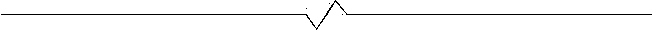最近哦，金星正行进在巨蟹座，木星又刚来到双鱼座不久有木有发现， 人间四处弥漫着**温柔与浪漫****的彩色泡泡**。

在占星学里，

金星守护的天秤座与木星守护的射手座

都是阳性星座，

彼此呈**六分相**。

六分相的能量会带来**活力和好奇心**，

通常也代表着**友谊、机会与他人的良性互动**。

天秤座与射手座的友谊告诉我们，“**美貌与智慧**”是可以兼得的，“**金钱、快乐与爱**”之间存在着某种神秘的良性互动。

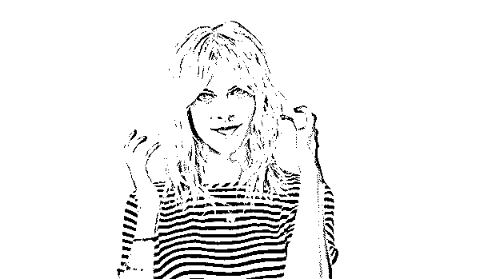

这么说可能有点抽象，若道君举个众所周知的例子帮助大家深度解析。若道占星的创始人**大卫·瑞雷**老师，就是一位太阳天秤座、月亮射手座的奇男子。见过大卫老师的人都知道，他**温暖、活泼、并且长得帅**，**心胸开阔、有幽默感、正直并且坦率**。

在他**40 余年**的占星咨询职业生涯中，大卫老师总是**能以宏观的角度给别人建议**，**激起他人对生命的信心**。没有人会想错过**与他共处的美好时光**。若道的学员中也不乏这个组合的可爱人物。毕业于英国伯明翰城市大学的 Flora，也是一位太阳天秤座月亮射手座的神奇小姐姐。

早在英国学习珠宝设计的时候，Flora 就对可以探索生命宏大议题的占星学充满了兴趣，回国后一面经营餐厅、做设计，一面继续深入对占星学的学习。珠宝、设计与美食满足了 Flora 天秤座的**爱与美**，**占星学、宇宙与哲学性的生命思考****给了 Flora 快乐和自由**。在一次大卫老师与 Flora 天马行空的占星对话中，**双倍的天秤座能量和双倍的射手座能量**，碰撞出了不止翻倍的关于**宇宙哲学灵感的美**。Flora**把占星学抽象的概念进行了图像化的诠释**，以**富有创意的视角重新定义了十二星座的理念**。

在这个巨蟹座和双鱼座并重的天象里， 金钱与爱（金星）需要交换快乐、智慧与自由（木星）。若道君为大家隆重推荐**“美貌与智慧”双修的十二星座 925 纯银项链**，来自大卫·瑞雷老师的星系灵感，与独立珠宝设计师 Flora 的美妙创意。

**饰品采用 925 纯银打造**，**所选用的宝石或其颜色都与星座能量契合**，从设计到制作，每一个细节都精心考究。

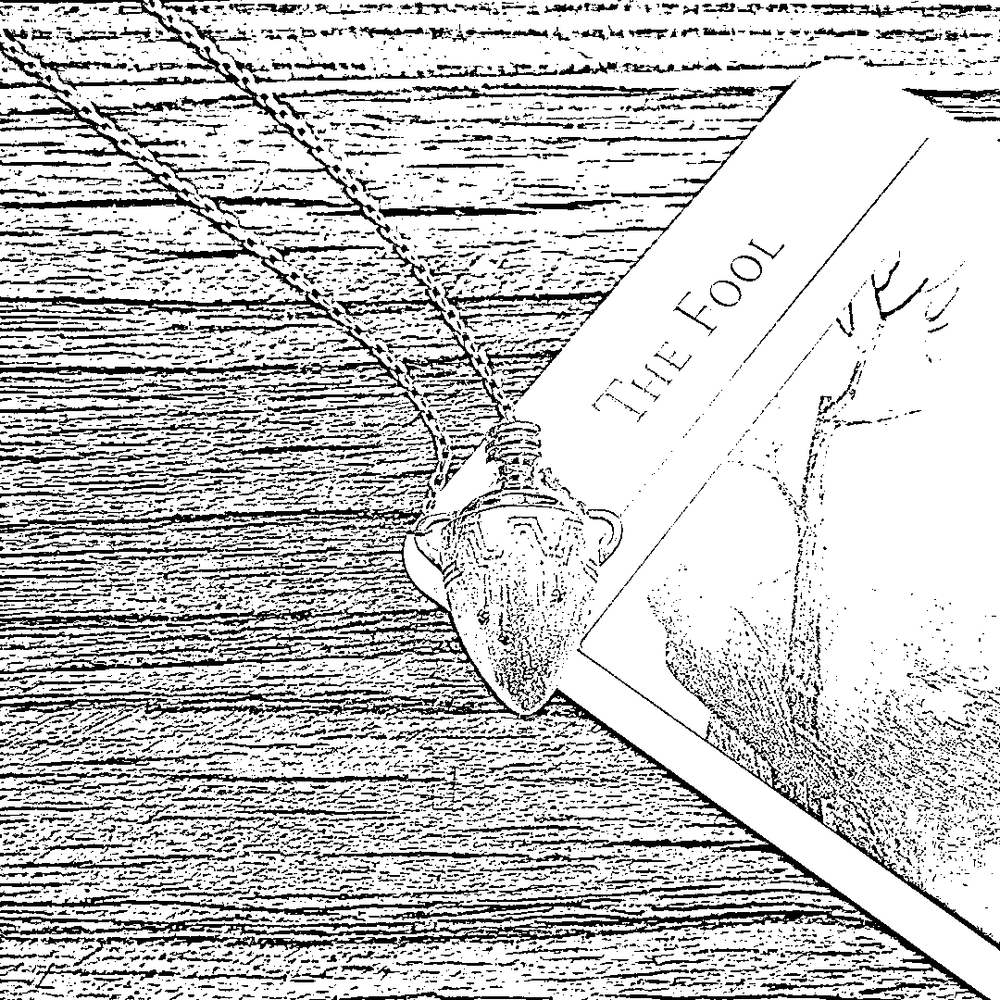

设计师 Flora 的星座律令：“**如同天上的星星一样，每个星座是独一无二的存在**。”♈**白羊座 Aries**白羊座为**火象星座**，原型为“**战士**”，代表了**勇敢纯粹、一往无前**。设计中采用**剑的形态来展示“战士”的性格**，剑柄部分是火焰的形态。红色锆石镶嵌的剑身，象征白羊座的**勇敢和热情**。Inspiration comes from fire and sword. The archetype of Aries is a warrior，so the designer chose sword to express the courage of Aries. It is also one of the fire element, so the piece combined fire with sword together. The red Zircon used here also symbolise the Aries.

**长按二维码了解详情**

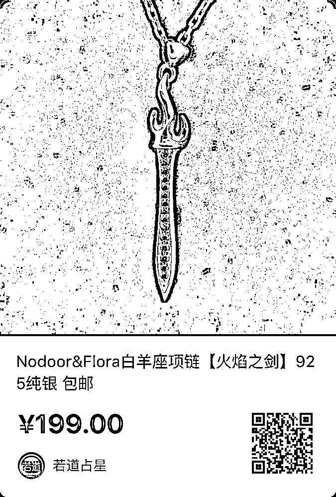

♉**金牛座 Taurus****金牛座崇尚自然田园，拥有稳固舒适的能量**。选用优雅的植物——**马蹄莲**来表达金牛座，对应自然风格的同时，简洁的外形也与金牛座追求**简单自然**相契合。马蹄莲形态还巧妙地与牛角结合在了一起。**作为花蕊的橙色锆石也对应了金牛的能量座**。Because Taurus have some relationship with nature, the designer chose to express it through the image of callalily (simple shape，simple and nature is what Taurus always searches for) and combined the shape of Ox horn. The orange Zircon used here is also have some connection with Taurus.

**长按二维码了解详情**

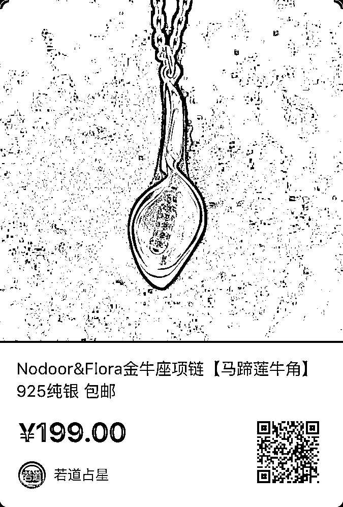

♊**双子座 Gemini****双子座，机敏、双面性格，擅于语言沟通**，因此用两张张着嘴交谈的人脸来表达。现代艺术风格的人物脸庞，对应了双子座的潮流性。设计中，强调两张脸的不同：右脸镶嵌绿玉髓（对应双子座的能量），左脸眼睛镶嵌白色锆石；两张脸分别用磨砂和抛光的不同质感来彰显不同。Gemini has double personality, talkative. There are two faces, opening their mouth, talking. Abstract style of the shape, Chrysoprase on one cheek, and one white Zircon in the other’s eye. The matte and polishing surface of each face also shows the different character of Gemini.

**长按二维码了解详情**

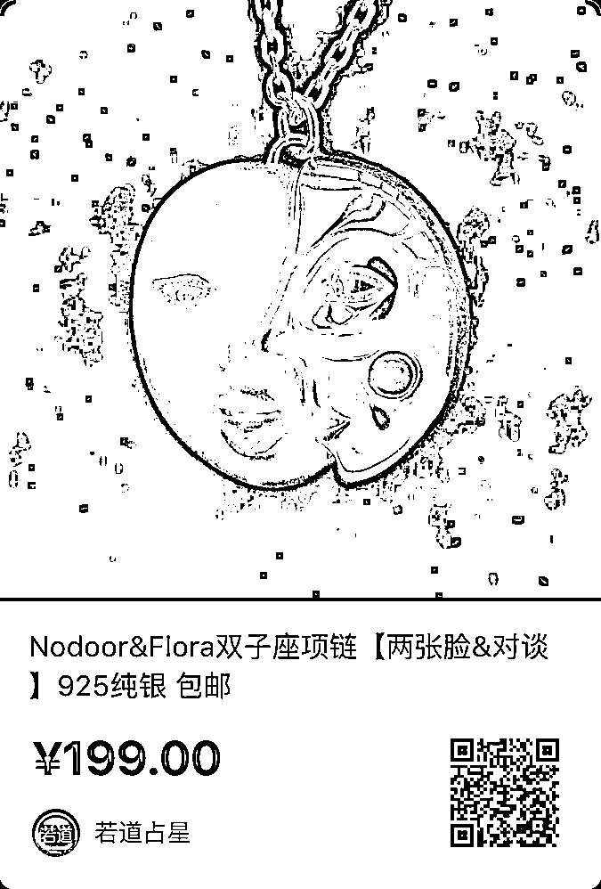

**♋****巨蟹座 Cancer****巨蟹座具有滋养保护的能量**，采用豆荚形态包裹着珍珠，就像巨蟹座保护着自己柔软的内心。两个弯弯的豆荚形态象征了巨蟹座的符号♋，也同时象征了巨蟹座的守护星——月亮。珍珠，作为来自海里的珍宝，对应了生活在海中的巨蟹。Two bean pod symbolise the sign of Cancer, also like two crab claws, and Moon (the ruler star of Cancer). The pearl inside the bean pod is like something soft hiding inside of Cancer, as Cancer has the power of protection and nutrition. Pearl also shows that Cancer comes from the sea.

**长按二维码了解详情**

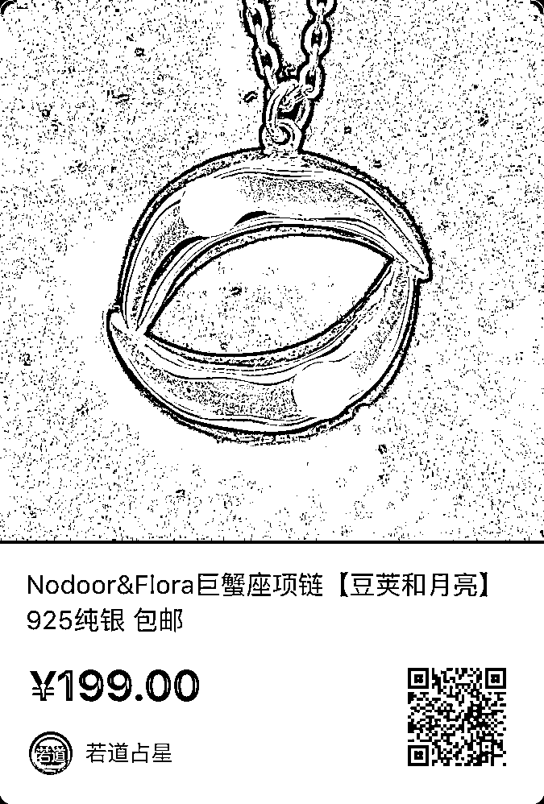

**♌****狮子座 Leo****（已售罄）**
**狮子座是天生的王者，一枚皇冠代表了它的自豪与骄傲**。中间晃动着的一颗几何形态的心，对应了与狮子座相关的**心脏**。中间镶嵌的红色锆石、上面呈放射状的刻线，都象征了狮子座的守护星——**太阳**。同时，狮子座与第 5 宫能量相关，所以 5 个皇冠的尖角、5 颗镶嵌的锆石、抽象的 5 边形头部都指向了这一点。A crown shows that Leo is a king or queen, and there are an abstract “heart” with a red zircon under it, which is the organ corresponding to Leo. On this heart, there are some radial pattern symbolise the Sun (the ruler star of Leo). The crown has 5 points, pentagon head has 5 sides, and there are 5 white zircon on the crown, because the energy of Leo connects the 5th house.

**长按二维码了解详情**

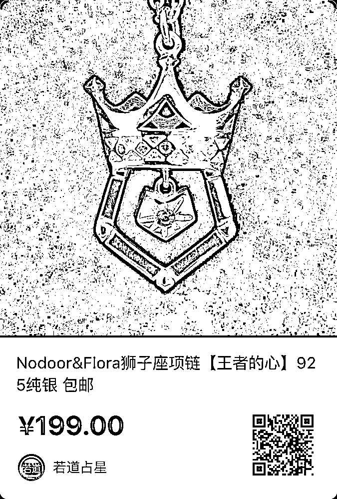

♍**处女座 Virgo****麦穗在希腊神话中，是丰收女神的象征，丰收女神即是处女座的守护神**。交叉的麦穗形态也对应了处女座符号中的交叉部分♍。在麦穗上，镶嵌了很多小小的白色锆石，像闪亮的麦粒，契合了处女座**细致精巧、纯洁臻美**的性格。The cross shape of the ear of wheat shows the cross part of the sign♍. The ear of wheat also represents the goddess of the harvest who is the patron saint of Virgo in Greek mythology. There are some white Zircons setting there, delicate and pure like the Virgo.

**长按二维码了解详情**

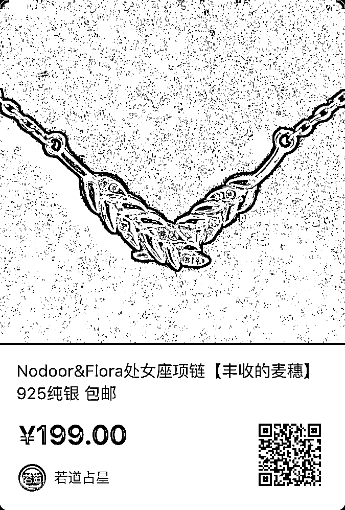

♎**天秤座 Libra****追求公正与平衡的天秤座**，用两边可上下摆动的称来表达。简练的结构，平直但有弧度的线条，显示天秤优雅的风格。**白色带有幻彩的欧泊，是属于天秤座的宝石**。Here shows scale and balance. The two bowls can move up and down, which represents the character of Libra ”keep balance”. The concise structure, and straight with curved lines shows the elegant of Libra. The colorful white Opal is the stone of Libra.

**长按二维码了解详情**

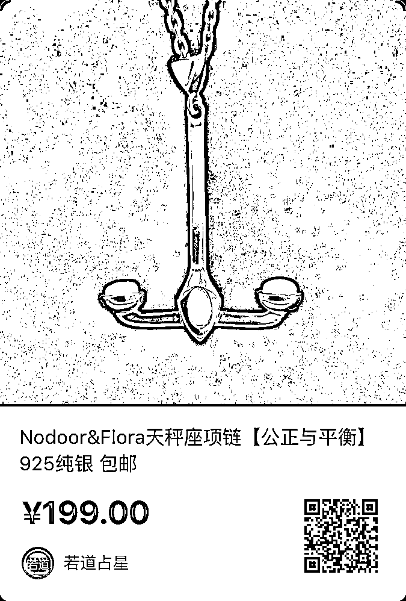

♏**天蝎座 Scorpio****（已售罄）****天蝎座追求掌控感、深入骨髓的感情，拥有神秘的气质**。设计中采用两只骨感的双手，紧握住一颗视若珍宝的黑曜石。骨头表达了天蝎座的深邃，黑曜石是天蝎的宝石，同时黑色也透着神秘性。Two bony hands hold a black Obsidian. The hands show the willing of grasp and the power of control, which is the character of Scorpio. “Bony” also represents the deep and down to the bone meaning of Scorpio. Black Obsidian is the stone of Scorpio, with the sense of mystery.

**长按二维码了解详情**

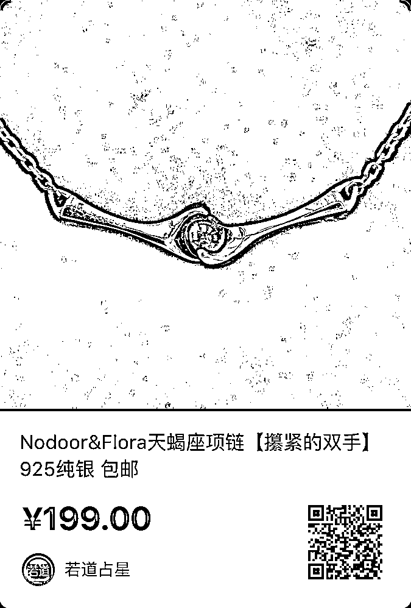

♐**射手座 Sagittarius****射手座追求真理、爱学习、向往自由**。一本书页变作翅膀的书籍来表达射手座热爱学习及爱自由的特点，知识的真知会带领他们飞向自由。绿松石是属于射手座的宝石。A book ( knowledge) with wings (freedom). The book page turns into wings, meaning that Sagittarius loves learning, and the wings of knowledge will give them freedom, to the ideal place they want. Turquoise is the stone corresponding to Sagittarius.

**长按二维码了解详情**

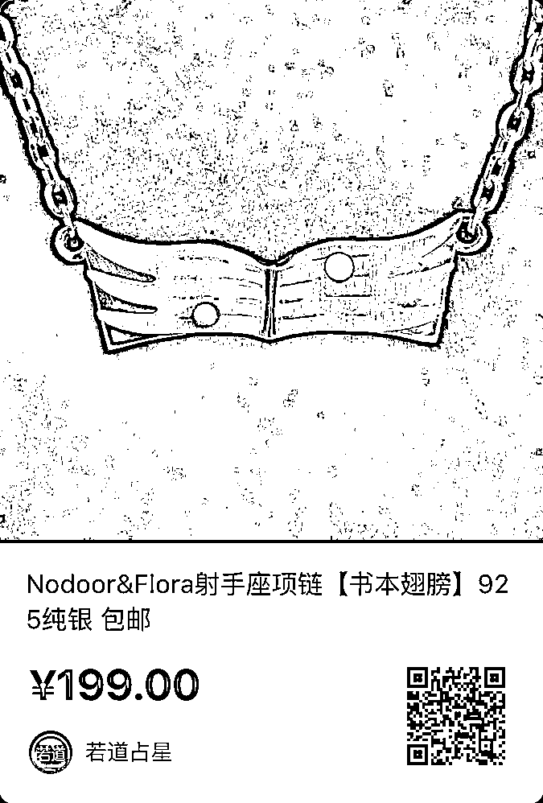

♑**摩羯座 Capricorn****（已售罄）** **摩羯座个性严谨、拥有清晰的目标感，追求人生的成功**。采用抽象几何线条构成的金字塔表达摩羯的结构性。金字塔底部镶嵌母贝，表达了摩羯座也来自于大海，与位于对面的巨蟹座对应（巨蟹使用了珍珠）。在金字塔顶端，一颗深蓝锆石指向了成功的目标。A pyramid symbolise that Capricorn want to gain success, achieve something, go to the top in their lives. The line structure also shows the quality of Capricorn. At the bottom, mother of pearl is used to symbolise that Capricorn comes from the sea, and is an opposite sign against Cancer (in which pearl are used). At the top of the pyramid, a blue zircon is the goal of Capricorn.

**长按二维码了解详情**

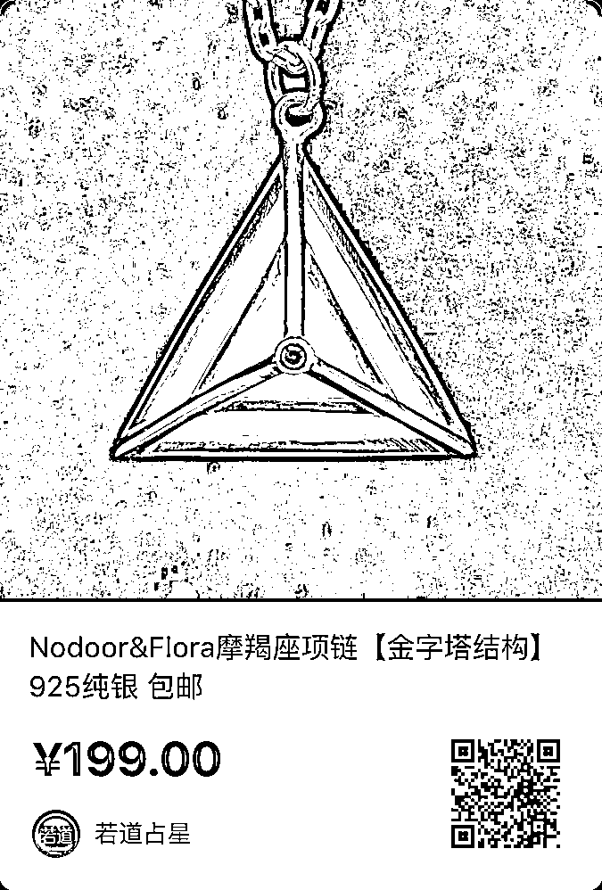

♒**水瓶座 Aquarius****水瓶座是革新者和开拓者**，用古老的尖底罐造型表达水瓶的原始意象，在上面刻画电路板纹理代表水瓶座的高科技偏好，纹理也同时组成了水瓶座的符号♒。**尖底罐造型也是一枚灯泡，指出水瓶座的革新特点**，就像灯泡的发明点亮了人类的生活。罐子的背面也采用了水瓶座的♒造型。镶嵌的紫红色锆石是水瓶的颜色。The main shape is a water jug with a pointed bottom which comes from the primal times. On it，there is some pattern of circuit board, which composes the sign of Aquarius. Circiut board represents the quality of hi-technology. If you view the jug upside down, it also a light bulb, just as the invention of bulb lighten human’s life. Aquarius always has this kind of revolutionary idea. At the back of it, there is also the symbol of the sign. Some red violet zircon used here. Red violet is the Color of the sign.

**长按二维码了解详情**

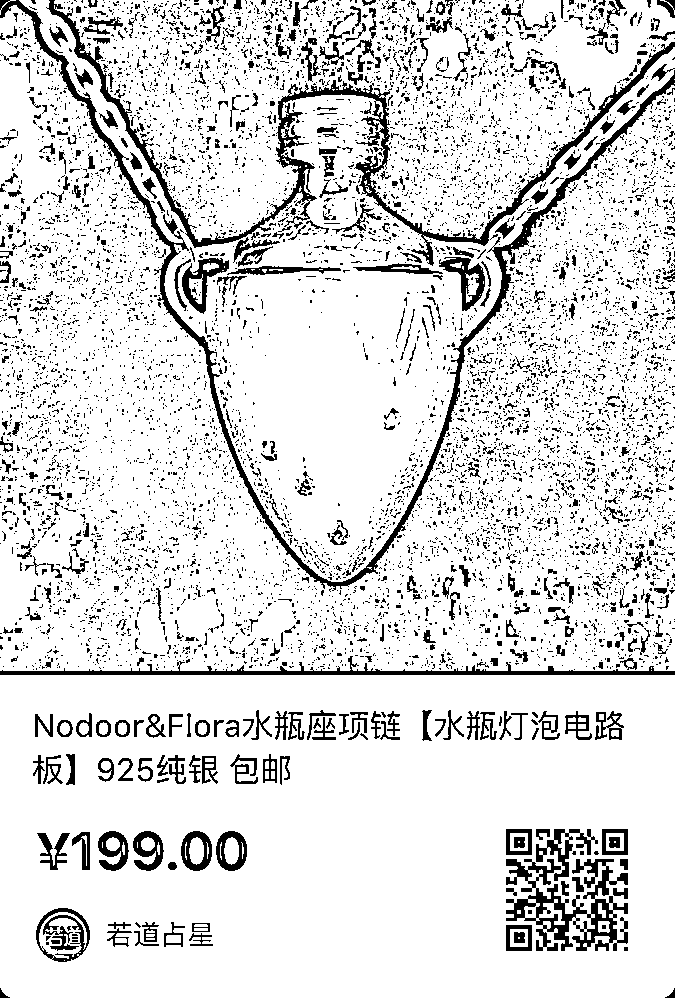

♓**双鱼座 Pisces****双鱼座浪漫的个性、具有灵性的气质与宽阔无边的海洋相关**。用波浪的形态表达双鱼座，上下两部分可以摆动的波浪也像两只抽象的小鱼。吊坠背面也是波浪状的造型。紫水晶是属于双鱼座的宝石。Pisces is romantic and spiritual, which is related to the boundless sea. Designer Uses water waves to show Pisces, and the two parts also like two fishes. It is moveable. At the back of it, it also some waves shape there. Amethyst is the stone corresponding to Pisces.

**长按二维码了解详情**

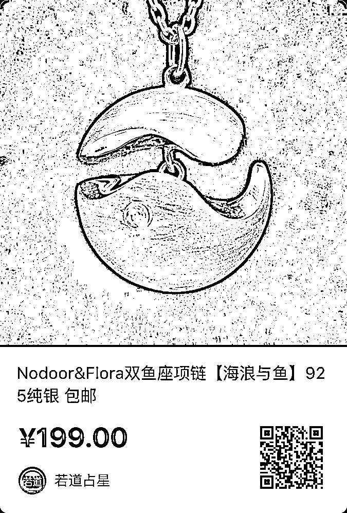

**好神奇，星座项链还可以这样用！**❶** 佩戴不同星座的首饰，帮助你提醒自己想培养的星座能量**。比如，我最近想提醒自己要“自律”，可以带摩羯座金字塔项链，提醒自己觉察；最近想提醒自己多运用“灵感与想象力”，就佩戴双鱼座的海浪与鱼项链。❷ **根据月亮每天行进于不同的星座，你可以佩戴与之呼应的星座能量**，感受每日不同的物质与能量间的共时性频率。比如，今天月亮行进在处女座，就直接佩戴处女座的项链，提醒自己可以体验专业又高效的一天。❸ **长期佩戴自己出生星图里北交点所在的星座项链，感受北交点的吸引，帮助你更有效走向自己的北交点**。比如，我是南交天秤座，日常工作我就可以佩戴白羊座项链，火焰的大宝剑可以时刻提醒我向白羊座学习，愤怒和勇敢是捍卫自我的最强利刃。❹ **刚学习占星的初学者，可以购买自己的日月升星座三件套组合**。终结你的选择障碍，从日常生活入手入星图能量做连接，还有日月升优惠哦。❺ **送给你想感谢的人**。比如，感恩节我想感谢一个双鱼座的人，送她双鱼座项链。结婚纪念日我想感谢双子座的爱人，送她双子座项链。

**微信又又又改版啦，不想错过若道的推送？**

**就把若道设为星标吧！**

**▼**

********购买 12 星座项链入口在这里哦********

# 黄金市场会持续上涨吗？| 雷蒙德·梅里曼黄金周期 7 月报告上线！

> 原文：[`mp.weixin.qq.com/s?__biz=MzA5NjA0NTAxNg==&mid=2651446899&idx=2&sn=be977cdedeccb03b456ecd792b7ad9b7&chksm=8b4b6cc4bc3ce5d22cfd0db3895d5c062c4a53ceed3749f8a2da024d8967a1a51e58381ed435&scene=126&sessionid=1692737974#rd`](http://mp.weixin.qq.com/s?__biz=MzA5NjA0NTAxNg==&mid=2651446899&idx=2&sn=be977cdedeccb03b456ecd792b7ad9b7&chksm=8b4b6cc4bc3ce5d22cfd0db3895d5c062c4a53ceed3749f8a2da024d8967a1a51e58381ed435&scene=126&sessionid=1692737974#rd)

自 3 月 8 日以来，金价已经上涨了 245.90 美元，升值了 14.7% 。

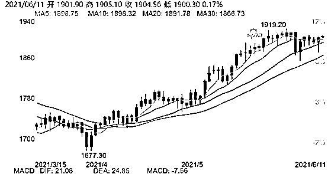

| 黄金价格 K 线图

6 月 11 日，美国劳工部发布了 5 月消费者价格指数（CPI）。本来市场就预计美国 5 月 CPI 数据会高于 4 月数据，但没想到，5 月的数据竟同比增幅达到 5%，创 2008 年夏季以来新高；除去食品和能源等价格变动较大的参数外，5 月核心 CPI 更是创下自 1992 年以来近 30 年来的新高。然而，美联储仍然认为目前的通胀只是一个暂时现象，而市场也似乎非常有效地消化了 CPI 高于预期这个信息。美股继续上涨。美联储的观点是正确的吗？近 10 年，宏观政策最直接的转变是，决策者似乎不再担忧通胀和政府债务升级，冥王星进入摩羯座后，主权国家的债务已经上升到 10 年前无法想象的水平，在许多国家，财政刺激政策和货币宽松政策携手并进，毫无约束，也毫无恐惧。难道如洪流般泄出的货币有一个隐形的蓄水池和大坝，让它们只是蜂拥进入投资市场，无法流入商品市场？在这样的政策气候变化下，通货膨胀难道是消失的恐龙？还是，滔天的洪水正在蓄势，那消失许久的猛兽正在我们看不见的地方撼动铁门？在梅里曼老师过去关于黄金的报告中，他指出**：****“黄金从 3 月 8 日和 31 日的双底低点 1673-1678 开始了一轮新的 31.33 个月周期。5 月份是新一轮 31.33 个月周期的第 2 个月。这将是 2015 年 12 月开始的更大的 7.83 年周期中的第三个也是最后一个 31.33 个月的周期阶段。此外，黄金正处于其更大的 23.5 年周期的第三个 7.83 年周期阶段。我们对第三个阶段了解多少？它们通常会上探第二阶段的高点，但在大约 25%的情况下，它们会变成抛物线，远远超过那个波峰。“**

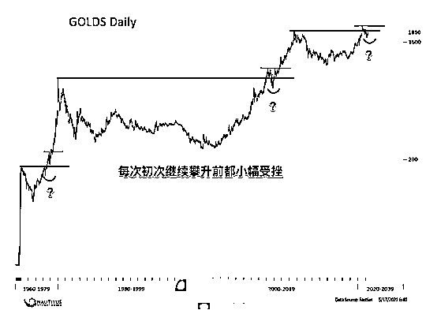

**通胀如劫犯般暴虐，如持枪强盗般恐怖，如杀手般致命。****——罗纳德·里根**天王星行进金牛座的 7 年，我们将会看到国际货币体系不可思议的震动。在这个报告期，我们也将看到土天第二次四分相。7 月黄金报告已经上线，上证报告也会在月底前上线。欢迎了解。也可以按照季度和 1 年期订阅，有更多优惠。季度和年度的好处是，你可以持续了解梅里曼老师对于不断在变化的市场的看法。即便他某一次看法和市场不一致，你也看到在下一期他如何调整自己的看法，并看到金融占星在一个长期时间段内对你把控风险的帮助。而能够长期控制风险、尽量找到安全的投资时机才是投资的长久之计。点击文末阅读原文，黄金周期 7 月度报告带来有 40 年黄金市场研究经验的世界著名金融占星大师——雷蒙德·梅里曼对当前黄金市场的研究。投资有收益，投资有风险，希望这份金融占星学的研究帮助你更好地评估黄金投资。

**7 月黄金报告上线**

**黄金月度报告价格**

**单月报告**：280 元/月 

**季度套餐价格**：780 元（260 元/月）

**年度套餐价格**：2400 元（200 元/月）

**双报告年度套餐更优惠（直降 900 元）**

**12 个月黄金报告+12 个月上证指数报告：仅需 3900 元**

**长按下图识别二维码购买黄金报告**

▼

**购买者需知**

**① **梅里曼市场时机学院《中国上证指数月度研究报告》是梅里曼市场时机学院（以下简称 MMA）的研究“预报”，而不是市场“预测”，是梅里曼老师及 MMA 金融占星分析师对人类活动周期历史与行星周期之间相关性的研究，二者在大部分情况下具有 80%或更高的相关性，而不是因果关系。报告中的研究完全存在错误的可能性。即便是非常认真的研究和几十年的研究经验，金融占星师无法总是正确地解读出各种征象在实际层面上会如何相互作用，并显化为事件结果。所以请将报告看作一个研究参考，务必结合其他市场研究和你个人对市场的理解，根据你的自由意志做决策。**②** 此报告一旦售出，**即不接受退款。**

**③** 上证、黄金月度报告每月固定 1 期，**并非都是在每月相同日期发布。**

**④** **我们收到英文报告的当天，即发布该英文报告。3 天后，上线报告中文版。此报告仅支持手机网页阅读，不支持电脑阅读和下载。**

**以上须知，请仔细阅读。一旦付款，即视为已了解并接受所有须知内容。**

在过去的 39 年中，唯有梅里曼逐渐完善，并在梅里曼市场时机学院月度周期报告中阐释了将地球宇宙学与周期相结合的研究方法，以惊人的精确性预报了黄金价格发生重大变化的时间。

**黄金购买 Tip**各大银行均可购买黄金或黄金 EFT 基金，也可以在诸如天天基金或者支付宝购买黄金及黄金相关产品。不明白的可以百度搜索。**购买后如何查看报告？**

**购买后有疑问怎么办？**

请联系技术客服

**微信：nodoor201705**

**购买黄金+上证报告直达入口**

# 月亮与金星在巨蟹座，你如何面对脆弱和悲伤？

> 原文：[`mp.weixin.qq.com/s?__biz=MzA5NjA0NTAxNg==&mid=2651446894&idx=1&sn=811ffedbf613af405654b0e1b2170531&chksm=8b4b6cd9bc3ce5cf7f0efe25491e9f5af6fe714b6bad333fe17c8005e781b8bd887ec9e155d1&scene=126&sessionid=1692737974#rd`](http://mp.weixin.qq.com/s?__biz=MzA5NjA0NTAxNg==&mid=2651446894&idx=1&sn=811ffedbf613af405654b0e1b2170531&chksm=8b4b6cd9bc3ce5cf7f0efe25491e9f5af6fe714b6bad333fe17c8005e781b8bd887ec9e155d1&scene=126&sessionid=1692737974#rd)

**2021 年 6 月 12 日天象：**

*   **月亮在巨蟹座**
*   **太阳四分海王星**
*   **金星六分天王星、四分凯龙星、与土星呈梅花相**

**今天是端午节假期第一天，恰逢月亮在巨蟹座，**并会在中午到下午的时间里与巨蟹座金星合相。和家人在一起聚餐、与老友聚会让我们感受到情感的支持与滋养。这段时间你可能想起一些旧人旧事并沉浸其中。巨蟹座是敏感细腻的，**月亮与金星的合相**意味着我们在今天可能会变得很柔软，而**金星又和凯龙星呈四分相、六分天王星并和土星呈梅花相**，象征着我们可以在当下体会到安全和勇气，并在自由的互动关系里感受到群体的疗愈力量。

**双子座的太阳和双鱼座的海王星形成压力四分相**。今天不要给自己太大的压力，如果你觉得有些“失焦”或有“无力感”产生，不如让自己放松下来，深呼吸。“顺势而为”、以直觉做指引是很好的方法。

**昨天晚上 9 点 34 分，火星进入狮子座。**这是一段非常有助于个人魅力、创造力和表达力的展现。（点击[【火星进狮子座】](http://mp.weixin.qq.com/s?__biz=MzA5NjA0NTAxNg==&mid=2651446801&idx=1&sn=e7ae9b622955614a11e3d340bb03a575&chksm=8b4b6ca6bc3ce5b05afd12b56a439b25df6a87c1179819e4504a928b712ade011d68b9c82315&scene=21#wechat_redirect)查阅昨日头条文章）

月亮和金星都在巨蟹座的日子里，我们有机会接纳自己的脆弱和悲伤，也是我们与柔软内心连接的重要时刻（点击[【群星进巨蟹座】](http://mp.weixin.qq.com/s?__biz=MzA5NjA0NTAxNg==&mid=2651446600&idx=1&sn=4b950fec4339af2ee745fb0fd2dec033&chksm=8b4b6fffbc3ce6e987c46eded3cd4617f2346f741eb4cea4362cbfefde6e9c7b15671ed96f2e&scene=21#wechat_redirect)查看相关文章）。**你愿意直面自己的悲伤与脆弱吗？****你是如何与它们相处的呢？**欢迎与我们分享呀~

端午小假期快乐！我们明天见！

**更多精彩占星文章长按二维码查看**

# 火星进入狮子座｜诗人用它来为爱人创造舞台，留后世一片星空

> 原文：[`mp.weixin.qq.com/s?__biz=MzA5NjA0NTAxNg==&mid=2651446801&idx=1&sn=e7ae9b622955614a11e3d340bb03a575&chksm=8b4b6ca6bc3ce5b05afd12b56a439b25df6a87c1179819e4504a928b712ade011d68b9c82315&scene=126&sessionid=1692737974#rd`](http://mp.weixin.qq.com/s?__biz=MzA5NjA0NTAxNg==&mid=2651446801&idx=1&sn=e7ae9b622955614a11e3d340bb03a575&chksm=8b4b6ca6bc3ce5b05afd12b56a439b25df6a87c1179819e4504a928b712ade011d68b9c82315&scene=126&sessionid=1692737974#rd)

******************☆ 后******************台******************回复“今日”，给你一句生命态度******************

作者/郑玮玲 ISAR 认证占星师

编辑/玫瑰 封面/书君 图片/pexels**火星进入狮子座****北京时间 6 月 11 日 21:34，火星进入狮子座，并将持续行进到 7 月 30 日。**作为**战斗、力量、勇气、愤怒、性与行动**之原型的火星此番在狮子座的旅程，将激励出怎样的现实火花？支持我们实现哪些突破？行进的火星是我们现实行动的引导能量，也是很多快速事件的触发器。每个人出生星图都有火星，表达着**如何捍卫自己的能力，天然的行动力以及愤怒、进攻、抗争的方式**。作为白羊座的天然守护星，火星一方面带来了**无畏、果敢**的精神，另一方面提供了勇往直前的进攻力，是充满信心的引导、表率行动。在任何时候，火星也预示了**危险、破坏、捣乱、冒险**的可能性，因此，火星赋予了**自我保护能力和向外突破、进攻、防御、表达的能力**，也**为免受伤害建立了天然有效的自我保护机制。**在每个人的**职业生涯**中，火星提供了最有力的动能，如同现实的燃料一般，**将内在的才能、技艺、信念转化为价值、财富与现实成就。**在**关系**中，火星是**性的吸引力**，以及**在关系之初让两个个体穿透朦胧感，透过身体去感受彼此的爱意，快速推入亲密地带的动能。**在太阳系中，火星所处的位置正是金星与木星之间。无论从符号的征象和意义上看，显然火星并不是一颗联结的行星，它**划分了个人与集体、主观与客观的界限**。火星为金星以内的所有个人行星提供捍卫和保护，阻挡、对抗外来个体、集体的攻击、侵扰，也能激活金星以内行星的能量。太阳系里所有的行星都是为太阳的精神意志服务的，火星正是为个体意志、理想和未来而奋战的能量。

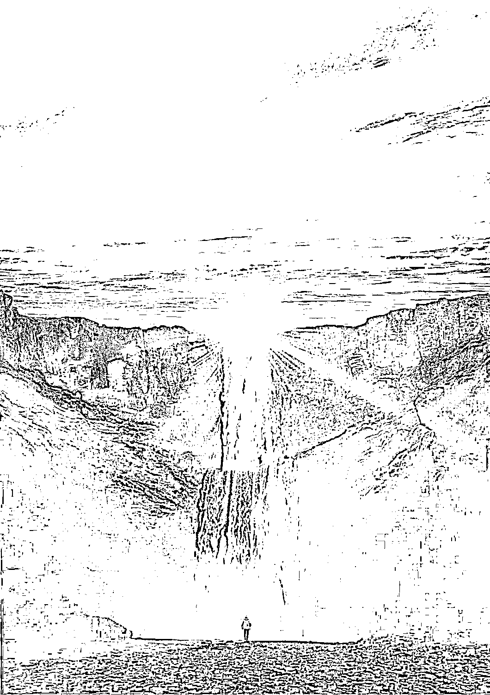

**火星在狮子座的特质**狮子座是一个具有**群体效应**的星座，火星在此能带来个体与团体联动的机制，非常有助于个人魅力、魄力、领导力的发展与运作，但不支持不符合自我意志的社群意图的行动，既：**你所投入的集体活动必然忠于你心**。火星在狮子座能将属于阳性、战士的勇猛、活力、热血情怀顺畅并且更华丽地发挥出来，比白羊座的火星更具持续恒久的意志力。**太阳是狮子座的守护星，狮子座也共振五宫这个制造、享受快乐的能量场。**狮子座的火星提供给雄心、意志力以燃料，鼓励我们在既定道路上创造丰盛，带来强烈、冲动的制造快乐的动机与行动力，**通过享受舞台、戏剧、游戏、掌声、赞美和庆祝仪式鼓舞我们的创造性和表达性，助燃了对生命的热情。**在金融占星学里，火星正是与黄金相对应的原型能量，**当火星进入狮子座，值得关注黄金的周期波动，具体波动还受金融市场大环境以及外行星对火星造成的影响。**

**重点影响人群**

火星在行进过程中会以较快速度触发**狮子座、天蝎座、射手座、水瓶座、白羊座、金牛座**的**个人行星、四轴、交点**。凡有以上元素的人，在接下来 50 天中需留意可能的**外伤、流血，发烧、炎症和冲突事件**，尽可能**有意识地避免不必要的对抗、争执，在日常生活与工作场所都注意不要因大意和盲目带来的肢体受伤，有必要可以备用一点烫伤、割伤类紧急用药，注意饮食和冷暖变化，劳逸结合，减少感冒和发烧、发炎的可能性。**火星的触碰也会令现实生活、工作中更加有热情和冲劲，非常适合**投入具有创造性、仪式感的工作**中，尤其适合**挥洒热情于舞台工作，群体创意活动，声光、色彩艺术创作中。****火星狮子座的人**他们是**天生能吸引众人关注**的人类，通常也**在成长过程中发展出独特的领导魅力，在人生中必然要行使引领族群的使命——用精神去引领、照护他们的族群，用行动去鼓舞爱他人**。他们生活中的一举一动常给人**戏剧化、华彩、令人瞩目**的感觉，**赢得大众的美誉和赏识**也是相对容易的事。因为狮子座的独特与夺目，火星狮子座的人其力量也会相对**独特、恒定，不易受外界和他人干扰**。他们**热衷社群并乐享归属感**，但**其强烈的个人特质、魅力则令他们在群体中呈现出天然尊贵的地位和偶像般的影响力。****火星狮子座的人十分在意原创能力，并极力去追求、选择个人原创，他们的行为、品质总呈现出强烈对比感。**比如**前后的恋爱对象是非常迥异的人，或在恋爱过程中发掘对方戏剧化的转变**；**女性会对伴侣的阳性魅力有强烈而独特的要求，比如毛发、脾气、特殊才华，男性通常毛发浓密，容易在伴侣面前表现出盲目自信和自我标榜**。

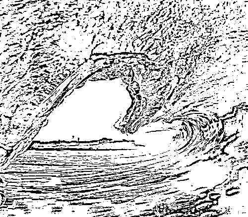

他们因**无法得到想要的人给予的赏识、赞美，以及个人的创造力、独特性未被肯定而愤怒或压抑愤怒。**若能向内认知真实自我的力量，火星狮子座便能用热情的创造性行动去服务理想和愿景，从中感受到成功与持续不断的完成感，自然吸引到共频的群体，去有效引领群体的目标达成，用被爱的赞誉和群体的喝彩来荣耀自我身份感。

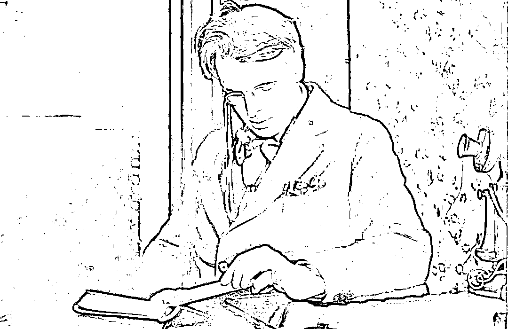

| 威廉·巴特勒·叶兹

**威廉·叶兹的火星**

爱尔兰现代主义诗人、剧作家威廉·巴特勒·叶兹可谓爱尔兰文学史上屈指可数的灵魂人物，他是 1923 年诺贝尔文学奖得主，但他鲜为人知的身份是金色黎明组织被推选的最高领导人。叶兹的诗歌里有大量神秘主义作品，他还研究占星学，他在 51 岁结婚的原因正是他用占星学的预测所致，他写下令人费解的占星学著作《Vision》。在以上所有身份之外，叶兹还是爱尔兰国家大剧院的创始人。无论从年轻时步入政坛担当国会议员，还是一生的诗歌创作，以及他对戏剧的热爱，叶兹所触及的领域无不令他的追随者狂热。这其中就包括年轻时因仰慕他文学才华而令他误以为对他有爱慕的女演员矛德冈。叶兹的出生星图中，火星位于狮子座七宫，与水瓶座的月亮，金牛座的金星、冥王星共同形成 T 三角。这组 T 三角凝结了这位伟大诗人、唯灵论者一生的才华与羁绊。叶兹早年为矛德冈创作戏剧时的野心在于：让矛德冈演女王，而他自己成为爱尔兰的维克多·雨果。雨果的火星落在水瓶座，与叶兹的火星处于对宫轴线，并且精准合相了叶兹的上升点。对于雨果戏剧才华的向往与冲动为叶兹持续助燃着戏剧艺术创作的激情。尽管叶兹最高的艺术成就来自于诗歌而不是戏剧，但他年轻时致力于创建艾比剧院（爱尔兰国家大剧院的前身），直到老年都热衷戏剧创作——为所爱恋的女人写剧本。狮子座的火星通过投入戏剧艺术实现诗人的力量与雄心，艾比剧院是年轻的叶兹向他心中的缪斯女神矛德冈奉上的生命大戏的浓缩，也是他一生狂热无望的爱恋燃烧出的璀璨火花。火星是纯粹的性能量。在叶兹星图中的火星因处在月金冥共同构成的 T 三角相位中，令火星受制于金冥的压力，也与月亮天然的滋养能力带来拉扯与冲突。叶兹在一生中有多次怀疑自己的性能力，矛德冈也曾坦言叶兹过于温文，并不符合她心中理想男性的形象。

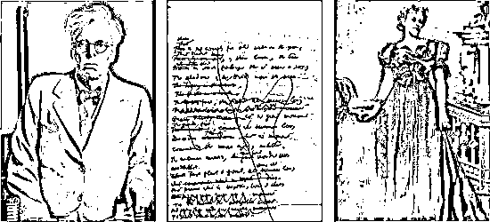

| 叶兹为矛德冈所做诗作《当你老了》叶兹在 70 高龄欣然接受了当时盛传“可回春”的单侧输精管结扎术。此后，也就是他生命中最后五年时光里，他不仅在诗歌创作中再度进入旺盛的创作期，还先后与五个女人建立了亲密关系。当然，在此也无法忽略他星图中落在天秤座的，与土星形成合相的月亮北交点，的确在强化年老时成长出的建立亲密关系的能力。由于金星守护着北交点，还是在通过间接的方式演化着月火金冥的 T 三角的激越能量。这次手术对叶兹来说不仅是身体的，更是心灵和情感的疗愈与焕新，同时还增添了他对自己男性魅力的信心。手术之后的发生在诗人生命暮年完美演化出了位于狮子座七宫的火星的原型：充满激情与创造力的亲密关系。而叶兹晚年最重要的情人是年方 27 岁的玛戈·拉多克，她是他狂热又深具诗歌才华的粉丝，他指导她的诗作，为她的诗集作序，将她的诗作收入他主编的《牛津现代诗选》之中，还力推她担任戏剧女主角——这与年轻时为矛德冈写专属于她的神秘主义戏剧的动机如出一辙，那颗狮子座的火星在表达和输出能量。由于叶兹对于完美的追求令玛戈感到无法承受的压力，最终，她在对自我极度的失望中走向沧茫海滩，于海沫雨雾间疯狂起舞，而后的玛戈陷入了长期的精神失常和治疗中。正是玛戈在马霍卡海滩起舞的影像深深触动并点燃了叶兹的创作激情，为他心中的“失意的悲剧性天才”写下了《美妙的舞者》、《一个疯姑娘》。虽然叶兹一生中更令人熟知的虐恋是追求矛德冈而不得的悲情（向矛德冈求婚五次，无一不遭拒绝），但无论矛德冈还是玛戈于叶兹都是他星图中月火金冥 T 三角的尽致演化：**在爱的道路中尝尽纷争失望，在无法平衡的关系中生出令人仰止的卓越艺术并成为了世界的遗产。**| 此歌正是叶兹诗作
穿越时空，聆听矛德冈对叶兹说的话，你心底会是怎样的感觉？“你从你那些所谓的不幸中写出了美丽的诗歌。世界会因为我没有嫁给你而心怀感激。”**火星加入土天四分**6 月 20 日-7 月 18 日，火星与逆行在水瓶座的土星以及金牛座天王星共同构成 T 三角。**重点影响人群：有个人行星、四轴、交点位于狮子座、天蝎座、水瓶座、金牛座 4°-23°的人。**土天目前在渐亏四分相之中，集体层面，重重旧有机制面临天王星式的革新力、创造力的打破，新兴政策、意识的冲击与摩擦诸如当下：房产与税收新政，鼓励三胎措施，新冠病毒肺炎疫苗不断的研发与投入使用，以及从小范围的踊跃尝试接种到大面积的供不应求，土天剧烈震荡能量正在刷新大众持续已久的思维模式和认知。

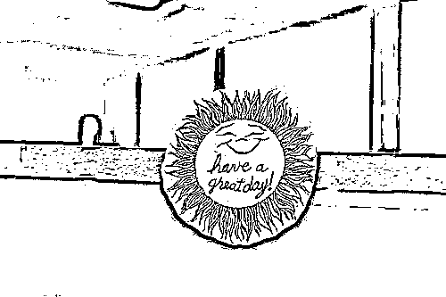

比如，即使众人皆知面对日趋明显的老龄化，鼓励生育扶持的政策总有一天会到来，但突然宣布的那一天还是引发了民众巨大的反应和争议。**面对天王星，我们总是感受到震惊与错愕，而老旧意识的墙也需较漫长的时日等待、消磨和瓦解。****两股能量在交错的时空中是为着更新的集体意识与活力，更具创造性和生命力的集体未来。**天王星将金牛座的丰产传递给水瓶座的群体意识，土星所代表的旧有意识与社会形态，正在完成将对未来美好期许落地实现的进程中。新旧时代与意识在当下进行着强有冲击力的交接仪式，而火星来完整的这个 T 三角正是将一切充满仪式感的行动带到当下，也让受政策、行进影响的个体感受到了紧迫与切实压力，催生出急于完成、实现的行动力，尤其在接种疫苗这件事上。狮子座的火星也会带来欢庆色彩，比如疫苗接种成功的人群会因特殊符号出现在健康码上感受到喜悦和小小荣耀。火土天的 T 三角也会将现实危机突显、激化，对于所有亟待处理的老旧问题提出刻不容缓的解决方案，很可能让人在高压、极速中完成拖延很久的工作。**6 月 30 日，金星开始在狮子座与火星形成合相，同时加入土天的 T 三角之中。**这组三角相位，强烈指向了**重点影响人群需要处理的，现实中的多角的或是令人烦扰的关系，包括竞争关系**。金星以平均每日 1°的速度与火星保持合相的关系，直到它来到处女座 4°，7 月 25 日才会结束与火星的合相。

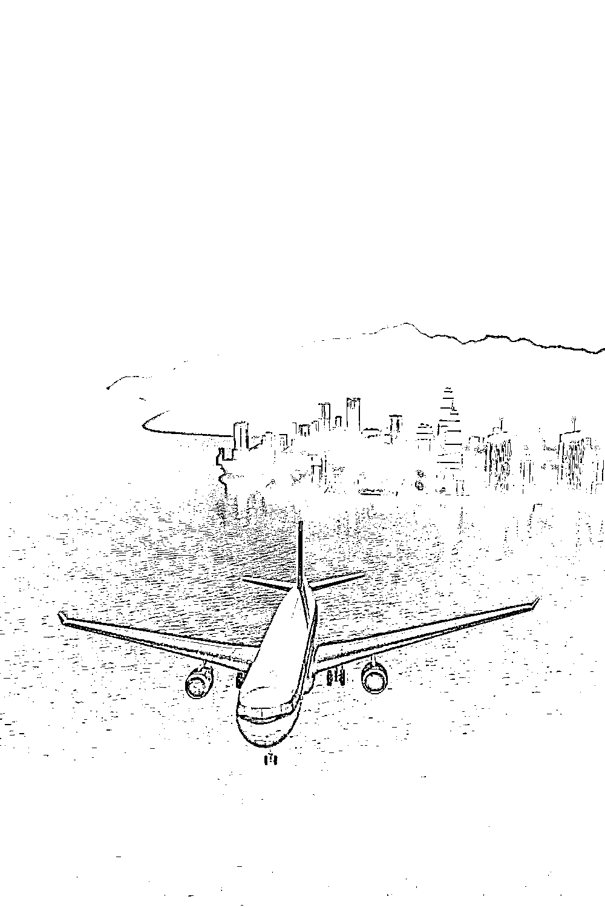

金火相遇，是宇宙阴阳能量互撞的火花，我们极可能**体验到充满性的吸引力的场景、感受，关系的粘合力也因吸引力，快乐的渲染而更紧密，对爱与自由的渴望也炽热如火。**狮子座提示了喧哗的背景，会让人经历关系中的炫烂、高光时刻，也可能导致不平衡关系中的争端、吵闹、霸凌。加上土天四分的绝对压力，对于渴望在关系中得到赞美的人来说这不是一个容易的时刻，对于想要锁定关系，求婚的人来说极需一个有突破、有创意的行动。即使是在良好递进的关系中，也要谨慎相处，保持热情的同时维护一种微妙的平衡，留意随时可能的崩塌与撕裂之痛。天王星的不可预测性与创伤机制无时无刻都可能对关系造成绝对的颠覆。但好处是，**让我们经历剧烈震荡与破碎，重新建构并稳定真实自我力量，让更符合未来的意识进驻心灵。**金星所代表的爱与价值同样在经历这一轮激烈变革的进程，当我们通过充满激情的奋斗去突破旧的模式与局限，将创造性才能转化为与生命意志相符的财富。每一个在不断自我更新的人，都能在与现实的抗衡和时代的冲击中重新定位并稳定自身价值，将对自我高度热情的期待，化为理想达成的欢庆与自豪。

**版权声明：**原创文章由作者授权首发于若道平台，欢迎转发，反对抄袭。友号转载请申请白名单。

**郑玮玲**

ISAR（国际占星研究协会）认证占星师（2016 年获得）

若道占星专栏作者

将占星咨询、教学与音乐、舞蹈相结合的疗愈者

**微信号**：zhengviolin

**新浪微博**：@郑玮玲

**微信公众号**：Sampriya-Astrology

长按打赏

**系统学习占星学**

**点击图片了解详情**

**微信又双叒叕改版啦，不想错过若道君的推送？**

**就把若道设为星标吧！**

**▼**

就是这个“在看”，戳戳戳 ☟

******报名直达入口******

# 小行星的故事 | 这颗小行星在神话中和贞洁相关

> 原文：[`mp.weixin.qq.com/s?__biz=MzA5NjA0NTAxNg==&mid=2651446801&idx=2&sn=02ae5fcb3e34fe44f0c2c23a406e984e&chksm=8b4b6ca6bc3ce5b0b6c6627261f34f564a2ca8291f7d4bf36b35081b06317ba69eb97088cdb7&scene=126&sessionid=1692737974#rd`](http://mp.weixin.qq.com/s?__biz=MzA5NjA0NTAxNg==&mid=2651446801&idx=2&sn=02ae5fcb3e34fe44f0c2c23a406e984e&chksm=8b4b6ca6bc3ce5b0b6c6627261f34f564a2ca8291f7d4bf36b35081b06317ba69eb97088cdb7&scene=126&sessionid=1692737974#rd)

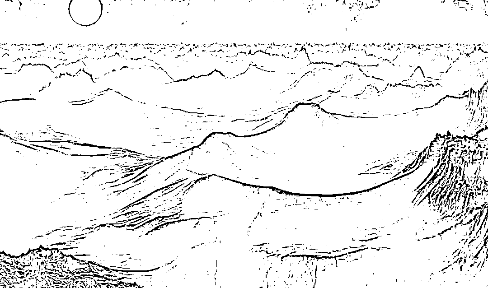

作者/格洛丽亚·西格里亚诺

译者/亚麻林恩 校对/Leisha

编辑/玫瑰 图片/pexels 在若道推出的新课程：[ISAR 选修课丨唤醒女神，在占星学中使用小行星](http://mp.weixin.qq.com/s?__biz=MzA5NjA0NTAxNg==&mid=2651445804&idx=3&sn=cbc451e5f34506fc1b0ab8c3d3bb67c3&chksm=8b4b689bbc3ce18d1ea6311351bb71bcebc1d4f0944238e343951a2fefa56dc76bcb429182b8&scene=21#wechat_redirect)（点击链接可阅读）中，我们会学到形形色色的小行星和他们的故事。那么，你知道灶神星的由来吗？一起来看看吧。**灶神星的故事**希腊人称罗马女神灶神星为赫斯提亚。她是第一个出生的奥林匹斯山女神，是克洛诺斯（土星）和瑞亚的女儿。赫斯提亚和她的兄弟姐妹克瑞斯、朱诺、普鲁托和尼普顿，刚一出生就被克洛诺斯吞进了肚子，因为他试图阻止被自己的孩子推翻的预言。显然，那样做并不奏效。瑞亚偷偷生下了另一个孩子（木星-宙斯），他长大以后推翻了克洛诺斯，从克洛诺斯的胃里解救出他的兄弟姐妹。赫斯提亚**举止温和友善，宽容慈悲**。关于她如何**宣誓贞洁**有几个不同的版本。相传她拒绝过阿波罗和波塞冬的求爱，又差点被好色的天神普里阿波斯玷污，在那以后，她请求宙斯准她永保处女之身；另一说是她如此喜爱单身的生活，以至于当宙斯提出要赐于她任何想要的东西时，她想要的只是保有贞洁。于是宙斯指派赫斯提亚负责维持奥林匹斯山壁炉之火的燃烧，并照料奥林匹斯山众神的家园。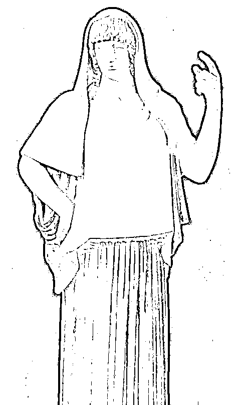| 赫斯提亚普罗米修斯帮人类从奥林匹斯山的壁炉中盗走天火，促进了进步和文明。而当他为自己的行为受到惩罚之时，灶神星被尊为了**“圣火”的守护神**，人们必须用“圣火”来取暖和做饭。她庙宇中的圣火由维斯塔贞女守护，而且绝不允许圣火熄灭，以免人类失去火种。在许多古老的城市，她的庙宇是一个简单的公共壁炉，作为火之源，供大家取走珍贵的小火苗带回自己家。帕特里夏·莫纳汉在她的书《女神与女英雄》中说，赫斯提亚的庙宇里从来没有塑像，因为她**“只在壁炉之火中出现，住在每家每户的中心，是一位尊贵的客人，对屋主很有帮助。”**

在希腊时代之前的化身中，灶神星并不是禁欲者。**维斯塔贞女被认为贞洁，并不是因为她们在性上贞洁，而是因为她们不属于任何男人，完全属于自己。**在每年举办一次的节日里，会挑出六个维斯塔贞女和六个国王的拥护者配对。他们在黑暗的山洞里做爱，因此没人知道与自己做爱的是谁。任何由这种结合而产生的孩子都被认为是神圣的。如果王后没有儿子，新国王会从其中一个维斯塔贞女所生的孩子中选出。

罗马的第一位国王罗穆卢斯，和他的孪生兄弟雷姆斯，据说是神话中的瑞亚·西尔维亚所生，她的叔叔强迫她成为了一名维斯塔贞女。她声称自己在森林里散步时，战神玛尔斯引诱了她。到了罗马人的时代，关于维斯塔贞女的故事是，为保纯洁性，她们从最好的罗马家族中被挑选出来，在青春期前被任命为神职人员，并宣誓禁欲三十年。如若违背贞洁誓言将会遭受严厉的惩罚。**对于这些关于贞洁的说法，你怎么看？留言区评论吧！**

**版权声明：**本文由若道翻译发布，欢迎转发，反对抄袭。友号转载请申请白名单。

**格洛丽亚·西格里亚诺**美国占星协会成员

**更多小行星内容**

**点击下图了解课程详情** 

**就是这个“在看”，戳戳戳 ☟**

**********报名直达入口**********

# ISAR 选修课丨唤醒女神，在占星学中使用小行星

> 原文：[`mp.weixin.qq.com/s?__biz=MzA5NjA0NTAxNg==&mid=2651446801&idx=3&sn=a791bf2b4c49985c55d678247ba1e455&chksm=8b4b6ca6bc3ce5b04da1a4b2cd15f65f71b502ae5820a268b17f50c49d07c29e50e6bf38298e&scene=126&sessionid=1692737974#rd`](http://mp.weixin.qq.com/s?__biz=MzA5NjA0NTAxNg==&mid=2651446801&idx=3&sn=a791bf2b4c49985c55d678247ba1e455&chksm=8b4b6ca6bc3ce5b04da1a4b2cd15f65f71b502ae5820a268b17f50c49d07c29e50e6bf38298e&scene=126&sessionid=1692737974#rd)

对于占星师来说，巨大的小行星带中有成千上万的滚落岩石在太空中呼啸而过，这似乎是一次令人生畏的雪崩，蕴含着潜在的新信息。因此，当你将它们整合到你的工作中时，辨别并正确理解每一颗小行星的意义是很重要的。

包括选择小行星在星图的解读，增加微妙的细微差别和令人惊讶的细节是无法从任何其他占星工具中获得的。

1

**课程简介**

理解小行星带所蕴藏的神圣女性力量的流动将帮助你在占星实践中创造更多的和谐与平衡。**小行星为你的解读带来细节、精确性和深度，同时也使你能够研究和阐释那些被忽视或低估的生命领域。**

**我们将讨论主要的女神小行星，并学习如何与之合作。**我们将借助大量现实生活中的例子，深入探讨它们的象征意义。你会真正了解这些重要的占星元素，从而拓展自己的实践。

**此课程可作为 ISAR 选修课。**

2

**课程安排**

**课程安排：6 月 8 日--7 月 27 日 （每周二）**

*   **6 月 08 日** **小行星简介**

*   **6 月 15 日** **谷神星，丰饶女神**

*   **6 月 22 日** **婚神星，婚姻女神**

*   **6 月 29 日** **智神星，智慧女神**

*   **7 月 06 日** **灶神星，壁炉女神**

*   **7 月 13 日 健神星，健康女神**

*   **7 月 20 日** **灵神星，灵魂女神**

*   **7 月 27 日** **综合应用，展望未来**

3

**课程大纲**

**第*****1*****讲  6****月 8 日  小行星简介**

小行星概述，小行星的发现、科学以及一些占星学历史。

**第*****2*****讲  ****6 月 15 日 谷神星，丰饶女神**

母神、农业女神，但其影响力远不止如此。这是我们所知的最大的小行星，也是最重要的小行星。她掌管养育、滋养、救助、管理等方面。

**第*****3*****讲  ****6 月 22 日 婚神星，婚姻女神 **

荣誉、伙伴关系、契约和婚姻：众神中的女王是正直的女主人。她在出生星图和行进中有什么意涵？她与“丈夫”木星朱庇特是什么关系？

**第*****4*****讲  ****6 月 29 日 智神星，智慧女神**

战地记者、棋手和占星师有什么共同之处？来自智慧、策略、洞察力和远见女神的帮助。

**第*****5*****讲 **** 7 月 6 日 灶神星，壁炉女神**

掌管神圣的火焰、家庭生活、厨房灶台、家人、遗产的女神：这颗关键的小行星被严重误解了。她可以给你一把钥匙，让你了解家庭关系、你的祖先和你的目标意图。

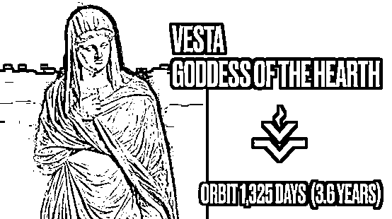

**第*****6*****讲  ****7 月 13 日 健神星，健康女神**

在我们应对全球疫情的过程中，掌管健康和福祉女神目前显得尤为重要。她能提供如何应对新型冠状病毒肺炎的线索吗？她在出生星图中的意涵是什么？幸福原来蕴含着相当广泛的含义。

**第*****7*****讲  ****7 月 20 日 灵神星，灵魂女神**

灵神星是唯一一位以人类身份开始生命的女神，她代表着人类的灵魂。这颗小行星与爱情故事、童话故事和灵魂之旅有关。

**第*****8*****讲  ****7 月 27 日 综合应用，展望未来**

你们刚刚开启探索使用小行星可能性的旅程。我们会探索评估某些理论有效性的方法，以及在实践中检验这些理论的重要性，我们还会探索其他数百万小行星中的一些。这堂课既有提醒告诫，也鼓励你深化自己的占星实践，并拓展你对象征的理解。

4

**课程试听**

📹 [`v.qq.com/iframe/preview.html?width=500&height=375&auto=0&vid=d3241mm7xdw`](https://v.qq.com/iframe/preview.html?width=500&height=375&auto=0&vid=d3241mm7xdw)

解锁全部沙龙内容欢迎购买：[**ISAR 会员沙龙 29 期 | 天空的细节——小行星如何提升扩展占星学**](http://mp.weixin.qq.com/s?__biz=MzA5NjA0NTAxNg==&mid=2651437295&idx=2&sn=8816fb50331dff6f6d25686ff80d7b5b&chksm=8b4b0a58bc3c834e54fb7d13e5bc11c98067fd93b29c5fbfc8f9745a516cbd8bfa3b90696324&scene=21#wechat_redirect)（点击可获取详情）

5

**主讲老师**

**克里斯蒂娜·罗登贝克**

克里斯蒂娜·罗登贝克（Christina Rodenbeck）是一名全职职业占星师，在牛津大学城生活和工作，深受周围知识和文化氛围影响；她拥有伦敦大学（University of London）的人文荣誉学位，曾在伦敦占星学馆（Astrological Lodge of London）、心理占星中心和占星研究学院学习。

作为一名占星师，在过去的 20 年里，克里斯蒂娜在她的网站“牛津占星师”上写了大量关于时事、艺术和文化的文章；她每月主持一个占星播客：“与克里斯蒂娜和萨莉一起占星”，并定期在《占星杂志》(Astrological Journal)上撰写时尚专栏；她定期在英国授课，并保持着蓬勃发展的专业实践。

6

**此次课程适合哪些人？**

*   有一定占星学基础，若道核心课 L3 以上水平；

*   希望成为优秀的占星师，想要借鉴国际大师次限解读思路并融入自己的体系的人；

*   热爱占星学、天文学、神话学的研究型占星学者；

*   计划考取 ISAR 认证占星师，寻觅中意选修课的学员；

*   走在自我探索和个人成长道路上的人。

7

**课程价格**

**价格**：**6800 元**

还有限时 ISAR 选修课联报套餐价格，具体请咨询课程顾问：Maggie 老师（微信：18510107057，请备注“小行星”）

长按二维码添加 Maggie 老师

8

**授课时间**

**2021 年 6 月 8 日（周二）20:00-22:00 开始，网络课程**

9

**退转课程**

*   **退款原则请详看《教学协议》，如有疑问请咨询课程顾问。**

****ISAR 选修课：小行星****

**授课老师：克里斯蒂娜·罗登贝克**

**授课时间：**2021 年 6 月 8 日（周二）起

**授课方式：**网络课程**，**英文授课，中文翻译

**费用：**6800 元

**课程负责人：Maggie 老师**（微信：18510107057，请备注“小行星”）

长按二维码添加课程负责人咨询~

****报名请点击“阅读原文”****

# 重磅天象 | 这个双子座日食竟如此特别？！（别忘记许愿）

> 原文：[`mp.weixin.qq.com/s?__biz=MzA5NjA0NTAxNg==&mid=2651446709&idx=1&sn=930fda92d5f6a1e15aba110442018341&chksm=8b4b6f02bc3ce61411e5dd4cbc6f9296f3c9e1c8c3a25a122574ccc69906b994e993416176c0&scene=126&sessionid=1692737974#rd`](http://mp.weixin.qq.com/s?__biz=MzA5NjA0NTAxNg==&mid=2651446709&idx=1&sn=930fda92d5f6a1e15aba110442018341&chksm=8b4b6f02bc3ce61411e5dd4cbc6f9296f3c9e1c8c3a25a122574ccc69906b994e993416176c0&scene=126&sessionid=1692737974#rd)

****☆ **后台回复“今日”，给你一句生命态度**

作者/王芝桦 编辑/玫瑰 图片/全景网

**双子座日食****北京时间 2021 年 6 月 10 日 18:52 迎来双子座新月，太阳与月亮精准合相于双子座 19°47′，并靠近 10°21′的双子座北交点，形成双子座日环食。**此次双子座日食周期，正值莘莘学子学子们考试升级的日子，在此祝福各位莘莘学子们奔往美好的未来！一年一度的升级，像年轮般一圈又一圈地重复着轨迹，却又留下一个又一个不同的痕迹。时间啊，你在每年的双子月都记录着什么，又决定了什么呢？此次双子座日食，提示着“时间”的重要性，但不是时光匆匆，而是我们是否清楚自己在时光中的做出的选择和留下的痕迹。此次双子座日食的行星能量传导：

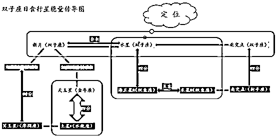

> **双子座日食重点影响人群**
> 
> **参考新月峰值影响期间各个行星的行进度数，以及逆行行星的轨迹影响；常规容许度，个人行星入相位 3°，出相位 1°；非个人行星入相位和出相位均为 3°。**
> 
> *   出生星图中，有**行星、四轴、南北交点**落入**固定星座（金牛座、狮子座、天蝎座、水瓶座）0°-16°**的人群。
>     
>     
> *   出生星图中，有**行星、四轴、南北交点**落入**变动星座（双子座、射手座、处女座、双鱼座）0°-5°,7°-27°**的人群。
>     
>     
>     
>     
> *   出生星图中，有**行星、四轴、南北交点**落入**基本星座（白羊座、巨蟹座、天秤座、摩羯座）6°-15°，21°-30°**的人群。

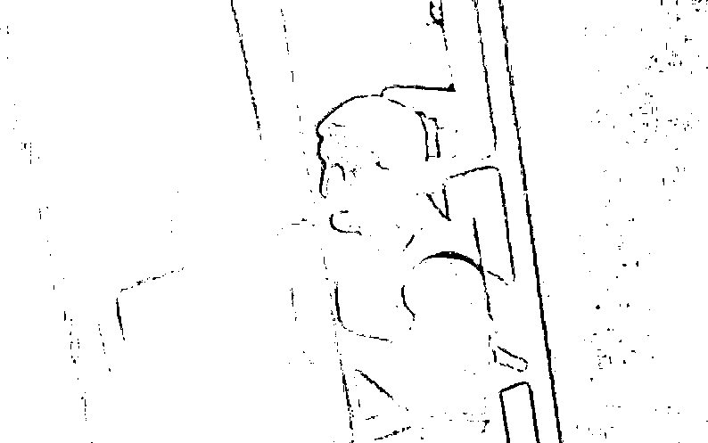

**愿景计划不在外边，而在生命最深处**

****

**故事是有生命的，但是它如何生长，取决于读它的人。**

**——约翰·康诺利《失物之书》**

**天象****· 日食合相水逆：**双子座日食合相逆行的双子座水星；**· 水海四分：**逆行的双子座水星四分双鱼座海王星；**· 木海互容：**双鱼座木星与双鱼座海王星形成合体的“互容结构”。不见月光的新月夜晚，我们的视觉总是因为黑暗而弱化，反而是听觉、感觉和直觉更加敏锐，就像关上灯或闭上眼睛，我们距离自己的心才能更近。这就是新月的秘密，打开通往生命内在空间的通道，引领我们感应内心的希冀与渴望，开启全新的计划与愿景，更何况是将新月“开启能量”呈三倍放大、影响周期拉长至 3-6 个月之久的日食呢？但是，等等……此次双子座日食，先不要急着许愿，也不要忙着做出决策，因为“狡猾的墨丘利”来了。但，真是这样吗？

**1. 日食+“水逆”的组合拳，看明白再出手**

双子座日食发生时刻，精准合相于双子座的太阳和月亮，也同时合相了逆行的双子座水星，打出一套“日食+水逆”的组合拳——“日食超级许愿日”遇见“水逆麻烦精”！好吧，只能谨慎一点。说起这次 2021 年第二波的水星逆行，可以说是能量超级强劲，但“麻烦”超级尖锐的水逆。水星与双子座是一组共振守护的关系，水星行进在双子座的时候，是**各种“流动性”能量相当活跃和相当敏感**的时期；而水星逆行于双子座，则令各种“流动性”能量变得**缓慢、延误、反复和困难**起来，于是也会爆出很多**人流和物流的阻滞，交流和信息流的误解，现金流和交易流的混乱**的事件和新闻。这一波双子座水星的逆行周期之内，双子座水星在逆行前影响期的**5 月 23 日**、逆行期的**6 月 6 日**、逆行后影响期的**7 月 6 日**，先后 3 次与双鱼座海王星形成“水海四分”结构。**四分结构具有激烈的矛盾性和摩擦感，容易将结构中两颗行星的能量拉向低阶的风险，呈现内耗的状态。** “水海四分”结构中，快速运转的水星忙乱于杂乱无章的双子座之内，逃避真相的海王星迷失在难以聚焦的双鱼座之内，而**5 月 14 日-7 月 27 日，**双鱼座木星和双鱼座海王星形成的“木海互容”结构，更是放大了“水海四分”结构**“快、乱、躲、糊”**的风险——重重迷雾之中，焦虑的情绪更浓，激进的态度更甚，于是**3 次“水海四分”结构能量峰值的前后 5 天，也是无序状态和混乱事件的高发期。****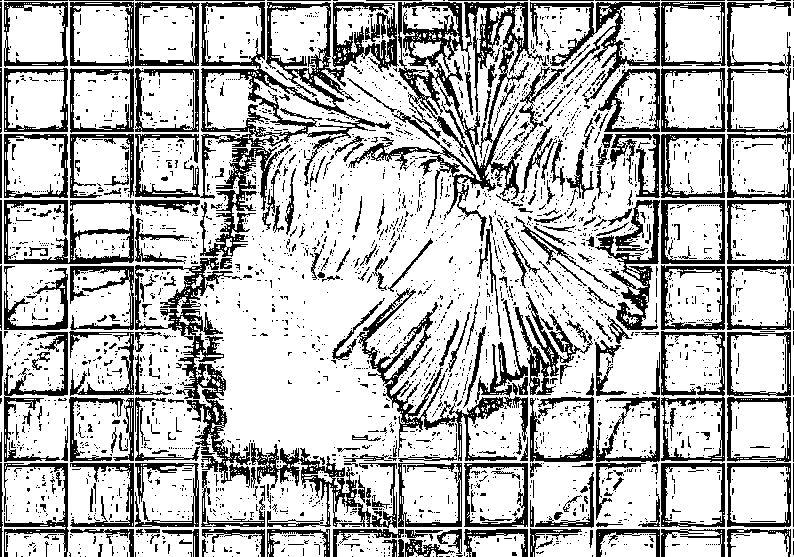**此次双子座日食，我们正处于第二次“水海四分+木海互容”结构的能量影响之下，而“日食+水逆”的组合拳，则提示我们注意以下几点：

**· 检视与反思：**当下正在逆行的双子座水星蕴藏着**“重走旧路”**的可能性，故而，**自 5 月开始爆发出来的没有完结的事件、没有反思的问题，可能会再度重现和复来；**

没有一颗行星是来惩罚我们的，逆行令行星的能量转而向内，提示我们将意识的触角转向生命内在，透过现实事件回头检视并向内反省，洞悉真相并做出修正。

**· 有权与勇敢：6 月 6 日**，巨蟹座火星与摩羯座冥王星形成**“火冥对分”**结构，该组结构的能量影响直至双子座日食仍有余韵。

“火冥对分”结构，既是一组可能**爆发内在力量、面对内在阴影**的结构，也是一组容易**触发情绪冲动、陷入内心脆弱**的结构，怎么引导和运用，取决于每个人的内在觉察和内在态度。但无论哪种情况，记得我们“有权”做出自己的选择，没有好坏对错之别，而“勇敢”能够帮助我们接纳真实的自己，穿越一切的考验。

**· 慢行与功课：**此次双子座日食，逆行的双子座水星合相双子座日食，提示我们——如果你恰好想要转换工作、取舍关系或决定投资，建议**不要急着做出重大决策，不要激进地付诸行动，以免出现反复与后悔，记得让自己慢下来，甚至停下来。**在这里，必须说一句实话，**这并不是一个适合轻率开启计划、盲目许下愿景的日食**——先做好功课，再开启愿景，不怕计划慢，只怕计划错。此次双子座日食，让我们在逆行的双子座水星的引领之下，去往生命的内在深处，与神相遇，与自己面对吧。

**2. 墨丘利：与自我相遇的“神秘时刻”**

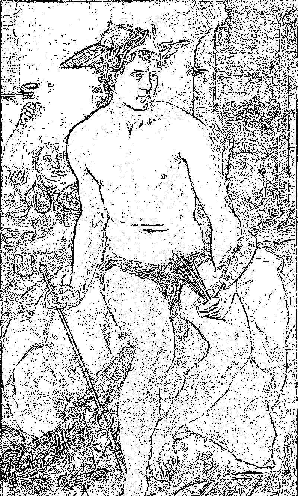|墨丘利罗马神话中，水星的主宰神名叫“墨丘利”（希腊神话中名叫“赫尔墨斯”），他神通广大且足智多谋，但同时也善于雄辩且狡猾无比，于是“众神之神”宙斯把他留在身边，做唯一可以自由穿梭“神人冥三界”的神——“神的信使”。墨丘利穿着飞鞋，手持“象征商业，引渡灵魂”的双蛇权杖，一方面掌管着商业领域的流通、协议和流程，另一方面帮助死后的灵魂忘掉前生记忆并引领去往冥界。但是，就这样一位指天指地且精明绝伦的神，却经常做出鸡鸣狗盗和狡诈欺骗之事，简直令人刷新下限和跌破眼镜。“神”不应该是完美和圣洁的吗？我们一直这样“理想化”地认为。水星守护双子座——**就像双子座象征着“光明与黑暗”的一体两面，墨丘利（水星的主宰神）也代表着“模棱两可”的二元可能，而水星也是十大行星中唯一的“中性”行星。**每一位神都住在我们的生命之内，就像每一位神所主宰的行星都存在于我们的出生星图之中。墨丘利（水星）在我们的生命之内，主导着**心智层面的思维分析、交流表达、才华技能和逻辑决定的敏捷运作**。可以说，除去睡眠时间，我们无时无刻都在与墨丘利一起工作，享受他的保护——当走到十字路口的时候，他为我们指点出路；当争取利益的时候，他为我们送上奖赏。但问题是，我们时常在做出选择的时候，对墨丘利感到担心，对未来感到焦虑，因为我们不知道他的指点是真是假，奖赏是多是少，未来通往哪里，完全不能确定——墨丘利这位“模棱两可”的神，就像“薛定谔的猫”一样，代表着无意识之下的“神秘时刻”。我们在生命之内与墨丘利一起工作：墨丘利引领我们学习知识并进行思考，帮助我们理清逻辑并指点迷津；但是，当我们被现实的混乱和烦恼击中的时候，墨丘利就呈现出“黑暗”的一面——**我们被自己的无能激怒，因自己的不成熟羞愧，却怪罪命运捉弄了自己；我们和现实讨价还价，对外界指责，对责任推诿，却从不去怀疑自我的“内在阴影”。**很多时候，墨丘利这位“神”比我们真实，比我们诚实，因为他并不掩饰自己身上“光明与黑暗”的一体两面，从不恐惧“模棱两可”的二元可能。但是，我们呢？**最近一段时间的“焦虑和暴躁”，究竟是来自外界的人和事，还是来自“对自己无能的恼怒，对自己不成熟的逃避”呢？**天不怕地不怕的墨丘利就在我们的生命之内，我们害怕什么呢？难道我们不能像墨丘利一样做个真实和诚实的人（神）吗？既然人生不能彩排，那么为什么我们不能试错？为什么不能？谁不允许？故事是有生命的，关键是我们如何解读它。此次双子座日食，合相并定位日食能量的双子座水星，透过墨丘利的故事和“水海四分”结构，揭示出“最重要的愿景”是什么——**停止对神的理想化，停止对自己的强迫性，不再以“够好和成熟”的标准束缚和为难自己，**允许并接纳“不够好和不成熟”的自己，而支撑这份真实和诚实的“勇敢”，将会像熊熊火焰一样，将生命之中冰冻的弹性融化，将生命之中僵化的灵动点燃，引领我们穿越时光的隧道，遇见无限可能的未来。此次双子座日食，就让我们顺着时间线回顾过往，**向内检视和反省，与真实的自己相遇，与内在的功课面对，然后才能真正地开启计划和许下愿景。****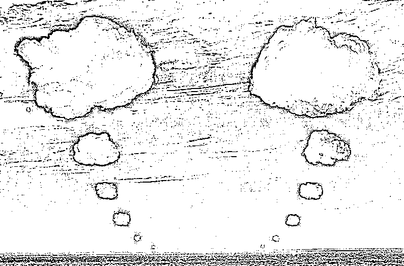****“创新”取决于“告别”的态度和方式**

****

**我对将要失去他们的可能性过于忧心，以至于他们的存在也没有让我真正快乐过。****——约翰·康诺利《失物之书》****天象****·土天四分：**逆行的水瓶座土星四分金牛座天王星。 水瓶座土星和金牛座天王星组成的年度重磅天象——“土天四分”结构贯穿 2021 年全年，并在**2 月 18 日、6 与 15 日和 12 月 24 日**形成三次能量峰值。此次双子座日食的重点影响期内的 6 月 15 日，我们迎来“土天四分”结构的第二次能量峰值。四分结构虽然携带着强烈的紧张感和矛盾性，但也蕴含着**强烈的进化动力和进化机缘**。2021 年度重磅天象“土天四分”结构，就像一份用“艰难”包装起来的礼物——当下，在必须走出舒适区，必须创新未来的宇宙进程里，只有在**“保守与创新”**之间不断地磨合与尝试，将过去的陈旧意识打破，将过去的习惯模式改变，才能一步一步突破束缚，一点一点超越过去，沉淀出真正的全新未来——这注定是一场“在痛苦中重生”的旅程。2021 年上半年，每个人都很辛苦。我们一直在努力，但一路的奔忙、现实的卡顿和未知的前景，也令我们相当的疲惫、焦虑和迷茫。6 月 15 日“土天四分”结构的第二次能量峰值，逆行的水瓶座土星将“新旧磨合”进程推进到一个“关键的分水岭”——**自年初以来的所有努力，正在接受现实的检验，并呈现出阶段性的结果，通过检验的将会更加确信并趋于稳定，未通过检验的只能打碎重立并重新来过。**宇宙再次推动我们在“过去的陈旧”与“未来的创新”之间确认内心的选择，故而，我们也会在这波严肃的强气流下，再次感觉到现实的紧迫感和危机感。此次双子座日食发生时刻，“土天四分”结构也发出同样的提醒——在盲目之中慢下来，在忙乱之中踩刹车，回头检视并向内反思：**·** 正在开启的愿景计划是已经确信的梦想，还是不得已抓住的“救命稻草”？**·** 那些走不下去的路，需要重做的规划，我们是否愿意回头梳理、总结经验并反思问题？**·** “这不行，哪行？他（她）不行，谁行”？离开过去的人和环境，过去的问题就不再重来了吗？**·** 我们是否愿意为现实的挫败，为过去的选择负起责任？此次双子座新月，“土天四分”结构提醒我们望向“时间的法则”——**“创新未来”绝不能建立在“逃离主义”的基础上，因为为过去付出的时间和努力，决定着未来拥有的品格与实力，故而“创新未来”取决于“告别过去”的态度与方式。**“土天四分”结构这份用“艰难”包装起来的礼物，最大的困难不是里面的礼物，而是束缚着礼物、系得无比顽固的“艰难”包装——我们必须拆掉“艰难”的包装，才能得到里面的礼物。但是，这份“艰难”的包装，我们也舍不得撕下，甚至我们对将要失去它们的可能性过于忧心；但其实，它们的存在也并没有让我们真正快乐过，甚至并没有让我们真正关注过。不信，我们可以自问一下：“我的艰难包装是什么”。我们真的知道吗？（PS：如果你找不到答案，就找专业的心理占星师咨询一下吧。）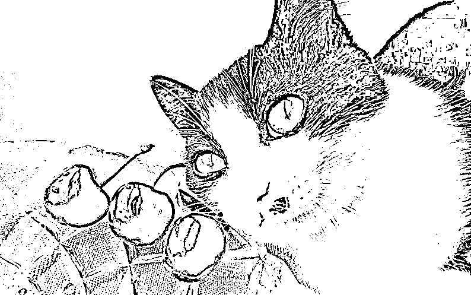**寄语**

****

**每个大人心里都住着一个孩子；而每个小孩心里，都有个未来成人在静静等候。****——约翰·康诺利《失物之书》**孩子和成人，站在时间线的不同位置，如果我们能对自我生命中的孩子阶段和成人阶段都升起意识，就能看见自我生命的脉络和变化。此次双子座日食，寻找一个静谧的时光，顺着时间线回溯自我生命中“孩子和成人”之间的旅途：在我们的生命轨道上，发生了哪些成长与转化，又遗失了哪些乐趣与美好？我们的人生，我们的生活，是在有意识地勇敢尝试，还是在无意识地疲于奔命？祝福大家，愿每个灵魂安好。**新月如何许愿？**

**许愿时间**：2021 年 6 月 10 日北京时间 18:52 后，48 小时内有效、8 小时内最佳。 

**许愿人群**：所有人。

**许愿数量**：每人最多 10 个。

**许愿方式**：静心冥想，身心祈祷或记录收藏。

**许愿格式**：请万能的宇宙赐予我能量，我将以我的能量吸引**（什么）来到生命中……

**许愿原则**：发心诚善利人。

**版权声明**：原创文章由作者授权首发于若道平台，欢迎转发，反对抄袭。友号转载请申请白名单。

****

****想阅读更多作者的文章，请在后台回复******王芝桦****** 即可。****

****王芝桦****

心理占星师，统合疗愈师，占星专栏作者

全职于个案咨询与占星教学工作 16 年

**个案预约咨询微信号**：zhihua0621 

**微信公众号**：daoxi-life

**长按打赏**

****

**微信又双叒叕改版啦，不想错过若道君的推送？**

**就把若道设为星标吧！**

**▼**

**福利来啦**

**点击**

**“阅读原文”**

**获取最好用的免费**

**新月报告**

**获取免费新月报告，请点击文末“阅读原文”**

# 这里有一份免费的新月报告，送给最近辛苦了的你

> 原文：[`mp.weixin.qq.com/s?__biz=MzA5NjA0NTAxNg==&mid=2651446709&idx=2&sn=bf78e29c83f16a0f6993fab02da97dde&chksm=8b4b6f02bc3ce6141b843290a40cd276900ec01567220df78f1801ca134a1d63dd7863c4b2f3&scene=126&sessionid=1692737974#rd`](http://mp.weixin.qq.com/s?__biz=MzA5NjA0NTAxNg==&mid=2651446709&idx=2&sn=bf78e29c83f16a0f6993fab02da97dde&chksm=8b4b6f02bc3ce6141b843290a40cd276900ec01567220df78f1801ca134a1d63dd7863c4b2f3&scene=126&sessionid=1692737974#rd)

编辑/玫瑰 图片/网络

北京时间 2021 年 6 月 10 日 18:52，新月日食发生在双子座 19°47′。每到新月时分，若道君都会为你奉上根据你出生星图量身打造的免费新月报告。可是新月为什么要许愿？新月报告该如何领取？让若道君来教你。

　**什么是日食？**　从占星学看，新月是月亮周期的一种相位。新月是开始，又称为朔，对应中国农历初一，太阳、月亮在此时合相。此时月亮运行到太阳与地球之间时，月亮以黑暗的一面对着地球，并且与太阳同升同落，地球上看不见月亮。如果新月发生的位置靠近月亮交点，则称之为日食。
本次新月时间

**2021 年 6 月 10 日 18:52，日食发生在双子座 19°47′。**

为什么新月要许愿？

新月是一个周期的开始，新月发生的时候，太阳与月亮合相，能量很强。当新月出现时，你也许会发现灵感忽现，非常适宜开启新领域、项目与行动，缔结一段新的关系或合作。许愿会加强新月的能量，也有助于你了解自己现阶段适合开启的方向。

本次新月最佳许愿时间

从新月开始到其后的 48 小时内，许愿的力量最强。

**最佳许愿时间：2021 年 6 月 10 日 18:52～6 月 12 日 18:52**

属于你的免费新月报告每到新月时刻，看着占星文章里写着：看看你新月的宫位，如果新月在第 X 宫，你可以许愿的方向是……是不是常常一头雾水？新月的宫位？我到底该看哪里啊？而有时，那些标注上升星座的文章也会让你忍不住想：虽然我的上升星座是这个，可是我的新月好像并不落在你说的宫位啊？你是不是写错了？

虽然这些文章都没有写错，可是好像对你而言都太不友好了。

**Don't Worry！**别着急，让博学又体贴的若道君来帮你！

我们推出了一份**免费**又**好用**的新月报告！

而且是专门为你设计的哦，**根据你出生星图为你量身打造的，只****属于你的独家新月报告**。

报告有哪些内容？

**新月时间****最佳许愿时间**

**如何许愿 **属于你的**许愿关键词**

本次新月给你的**建议**

你会有怎样的**感受 **

****机会****

********

如何许愿？

许愿方式也很简单。

你可以把愿望写下来，或者双手合十后交叉，闭上眼睛来祈祷。 

报告中会为你提供**祈祷词示例**，可以多多参考哦～ 

你还可以适当添加自己的语言，创造属于你自己的祈祷文！

如果报告拿到手了，快对照着许愿吧！

**这份好用又暖心的报告，点击阅读原文即可领取！**

****

****点击“阅读原文”即可获取新月报告****

# 群星进巨蟹座丨世界不相信眼泪，但我们拥有哭的权利

> 原文：[`mp.weixin.qq.com/s?__biz=MzA5NjA0NTAxNg==&mid=2651446600&idx=1&sn=4b950fec4339af2ee745fb0fd2dec033&chksm=8b4b6fffbc3ce6e987c46eded3cd4617f2346f741eb4cea4362cbfefde6e9c7b15671ed96f2e&scene=126&sessionid=1692737974#rd`](http://mp.weixin.qq.com/s?__biz=MzA5NjA0NTAxNg==&mid=2651446600&idx=1&sn=4b950fec4339af2ee745fb0fd2dec033&chksm=8b4b6fffbc3ce6e987c46eded3cd4617f2346f741eb4cea4362cbfefde6e9c7b15671ed96f2e&scene=126&sessionid=1692737974#rd)

**☆ 后台回复“今日”，给你一句生命态度**

作者/李妍（理想国的女巫）
编辑/翀子 封面/书君 图片/作者提供你允许自己哭泣吗？你接纳自己的脆弱吗？如果我们无法接受悲伤，便也无法享受快乐。当能坦诚面对自己，我们才有拥抱幸福的可能。6 月和 7 月，当群星进入巨蟹座，那是我们与内在连接、对情感世界进行升级的重要时期。

如果人类的悲伤可以量化，估计已经装满了几个星球，快要溢出银河系了吧。

这包括显性的悲伤，隐性的悲伤，默默无闻的悲伤，和那些明明很悲伤，却不知道自己很悲伤的故事。

而一个能大哭的人，才能大笑。因为人类的情绪管道里本身就同时装载着快乐和悲伤，以及其它各类情绪。

当我们不去感知、接纳、允许自己悲伤的时候，我们也很难遇见真正的快乐。**注意：是真正的快乐。不是那种转瞬即逝，通过某种自我麻醉获得的快乐。**

所以你就明白为何我们这个星球活的真正开心的人是那么稀有了吧。

**因为大多数人都不愿意直面，或无法直面自己的悲伤，我们不擅长哭。**

起码这是其中一个原因。

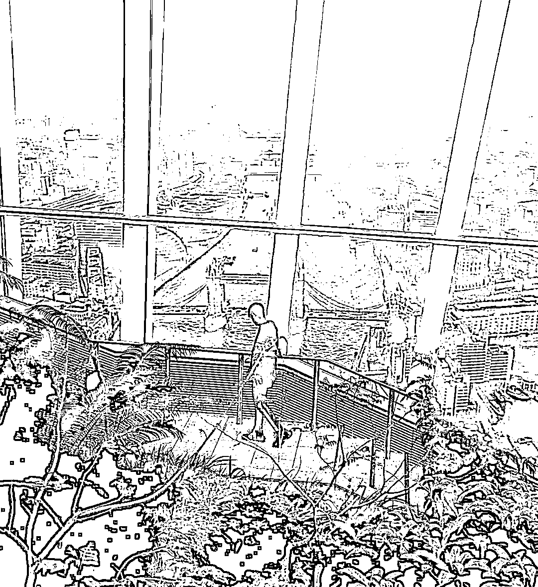

**更佳的存在方式**

然而，我们总是在向前的，总是在不断进化的（虽然有的时候也会越进化越差）。人类在向前进化的长征中不断地寻找更佳的存在方式。

**而什么才是更佳的存在方式？**

站在不同人的视角会有不同的答案。

但是，相信将**“由心的喜悦和幸福”**列进**《人类最佳存在方式》**之一，应该持反对意见的人是极少数吧。

说到这里会发现一个明显的 bug：我们都渴望这份“由心的喜悦和幸福”，但为何却很少实现呢？

**答案是：我们的想法（期待）很好，但实践方法总是错误。**

关于什么才是正确的实践方法？在文章的一开头其实就揭晓了。

如果你忘记了，或者还没有领会到精髓，没有关系，我们再来展开说明一下：

**你能哭，你就能笑。你能大哭，你就能大笑。**

如果你拼命的屏住眼泪和悲伤，那同时你也在与你的快乐和幸福失联。

因为悲伤和快乐同时共生在你的情绪管道中，你堵住了悲伤，也将无法释放快乐。也就是当你难过的时候能表达悲伤，那开心的时候也能表达快乐。

然而，当我们的人生出现一些我们无法接受的悲伤剧情时，我们的生命会自动启动防御机制，为了保护当事人的意识，心智和情绪不被瞬间击垮，**这会出现情绪“冻结”的情况。**

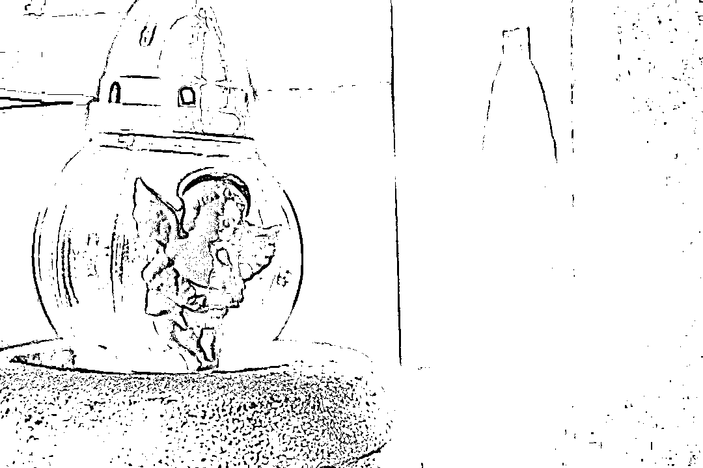

而有些人不表达悲伤是源自意识和思维的二元对立，也就是将悲伤和快乐对立了起来。认为快乐才是对的好的，认为悲伤是错的、是“低级”情绪，不应该去感知和表达，或者根本不应该存在。

这些人通常不仅不让自己感知悲伤，还不能接受身边的人表达悲伤。说悲伤、流泪是弱者的表现（虽然在某些时候，从某些角度来看是成立的），不允许身边的人表达脆弱。

这其实是自己**无法接纳自己的脆弱，**然后当这种被自己“誓死抵抗”的脆弱在他人的身上发现的时候，那份深埋在潜意识里对脆弱防御的恐惧就会瞬间弹跳出来咆哮，将那份真正的脆弱（连自己的悲伤都无法直面的脆弱）投射在他人身上，爆发出来，变成对他人的斥责和否定。

所以，你就明白有多少小朋友内在本真自由流动的情感和情绪是如何被堵住的，是的，和他们的父母、原生家庭、重要的照料者对情绪情感的错误认知有直接的关系。

**然而，每个大人的曾经都是孩童，每个成人的内在都有一个小孩，所以一切都不晚，或者说从灵魂的进化角度永远都不晚。**

关于晚的感受可能会是出现在你突然某一天醒来的时候，你会问自己：“为何我不早点醒来？为什么要等到现在？为何我和快乐仅一门之隔，我却没有早些懂得？“

关于悲伤是坏的、是不应该存在的、是低级的，这些信念和认知，是小我在人类的意识没有提升之前制造的荒诞把戏罢了。

**因为不论你承不承认，接不接受，它都会在那。并且在我们人类给它贴上“这是不好“标签之前，它是中性的。**

既然是把戏，那一戳就破。所以在此之前你认为的很难或许并没有那么难。

要不，你试试，看看会不会有“奇迹”出现。

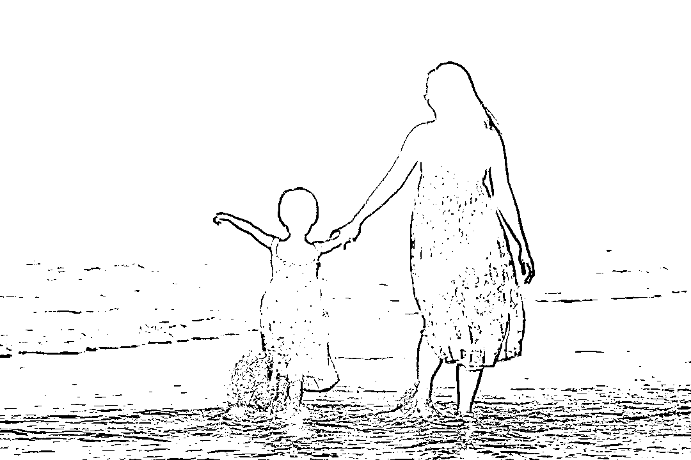

**真诚面对内心**

在这里和大家讨论关于正确的认识悲伤不仅是为了帮助更快遇见快乐和幸福，也是为了帮助大家不再继续在痛苦的深渊中越走越深，越活越糟，将自己的生命无尽的下沉。

**因为越不被承认的悲伤作用力会越大，对你的身心带来的破坏性作用会越强。**

如果不及时将它正向的释放和转化，那悲伤的情绪就会停留在你的体内发酵、繁衍，衍生出其它更多的负性能量，将你困住。

只有当你不再压抑自己的悲伤情绪，能通过正向正确，以及适合自己的方式表达和释放的时候，那它就不会一直在你的体内对你持续产生恶作用了。

所以让自己及时表达、释放、清理和转化自己的悲伤，以及其它的不好情绪吧，这样才能给自己的心灵腾出更多的积极空间，装载喜悦。

**一个对自己的生命足够尊重，对自己的内心足够真诚的人，则越容易遇见内在真我，遇见幸福。**

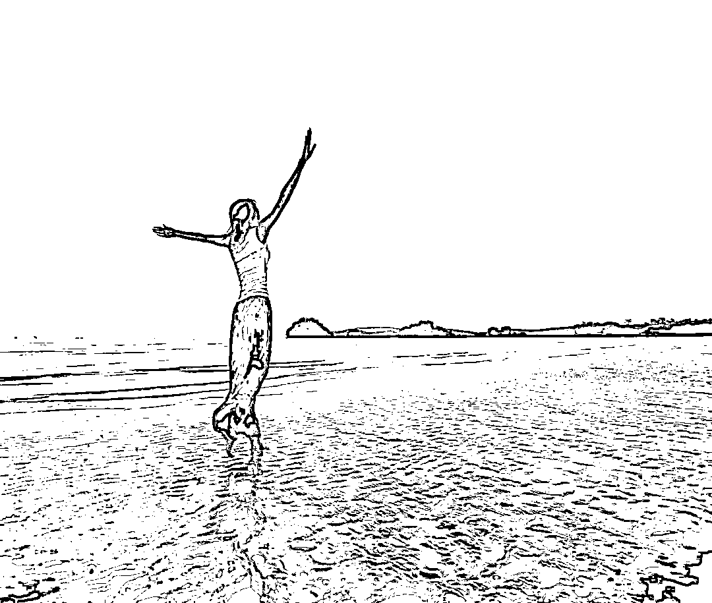

**群星入巨蟹座**

对情绪的照看和呵护是需要持续永恒的展开。但我们总在一些特殊的时间迎来情绪情感的管道更大的打开。

**在整个 6 月和 7 月的宇宙天象中，我们迎来群星在巨蟹座的综合天象：**

*   **6 月 2 日，金星进巨蟹座；**

*   **6 月 21 日，太阳进巨蟹座**

*   **6 月 25 日，摩羯座满月；**

*   **7 月 10 日，巨蟹座新月；**

*   **7 月 12 日，水星进巨蟹座。**

巨蟹座，就是那个有名的情感至上，用情绪来渗透一切，以家为乐的“生物“。

所以在 6 月和 7 月，是人类情感管道变得更加充盈的时间，认知生命的方式会发生显著变化。**从更走脑转为更走心，会更主动的和自己的内心情感世界进行连接。**

我们到了需要给自己的情感世界进行全面调频和升级的时间。

在这期间我们适合做的事情如下：

群星巨蟹座适合做：

*   看见和接纳自己的情绪；

*   正向的表达和释放自己的情绪；

*   主动的爱自己，爱他人；

*   给居家环境进行调频、整理、提升；

*   改善与家人，以及其他亲密关系的连接；

*   再忙也要花时间做一些让自己感到滋养、温馨、快乐，愉悦的事情；

*   和有情感连接或信任的人进行一次深入的交谈；

*   练习拥抱；

*   换一套好的床品，优化居所的灯光，聆听温柔的音乐；

*   通过呼吸、冥想、瑜伽等练习来改善和修复自己心轮与脐轮能量，让情绪能量在身体里更平衡自由的流动。

亲爱的伙伴们，不要再相信哭也没用这样的话了，那都是弱者无法面对自己的脆弱所编织的谎话。

一个能直面自己脆弱的人才是对自己生命坦诚的人。一个只有真正面对自己内心世界的人，才有可能遇见真正的幸福。 

**虽然世俗世界不相信眼泪，但我们有哭的权利。**

是生而为人的权利。

相信我，当你放肆的哭的时候，就离大笑不远了。 

祝大家幸福。

**版权声明：**文章由作者授权发布于若道平台，欢迎转发，反对抄袭。友号转载请申请白名单。

****

****李妍**（**理想国的女巫**）**

资深人本主义占星师；身心灵整合疗愈师心理咨询师，十二宫理想国创始人，全职于教学和咨询工作
**公众号：**house12ta**工作微信****：**house12_star1

长按打赏

**系统学习占星学**
**点击图片了解详情**

**微信又双叒叕改版啦，不想错过若道君的推送？**

**就把若道设为星标吧！**

**▼**

**就是这个“在看”，戳戳戳 ☟**

********报名直达入口********

# 六月有奖征集丨这个神奇的 app，将召唤出你星图的六位女神！

> 原文：[`mp.weixin.qq.com/s?__biz=MzA5NjA0NTAxNg==&mid=2651446600&idx=2&sn=445d6dd6d5d7ed0818642b4f29f3c63c&chksm=8b4b6fffbc3ce6e9300851306d8df795e4b418648eaf19fd16fda3d4e0accafd39ad24aee676&scene=126&sessionid=1692737974#rd`](http://mp.weixin.qq.com/s?__biz=MzA5NjA0NTAxNg==&mid=2651446600&idx=2&sn=445d6dd6d5d7ed0818642b4f29f3c63c&chksm=8b4b6fffbc3ce6e9300851306d8df795e4b418648eaf19fd16fda3d4e0accafd39ad24aee676&scene=126&sessionid=1692737974#rd)

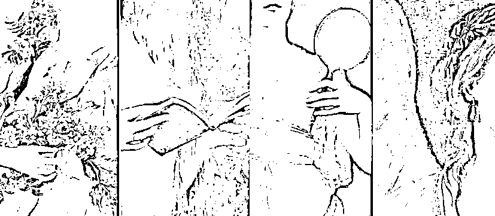

**若道 APP 小行星功能更新啦！**

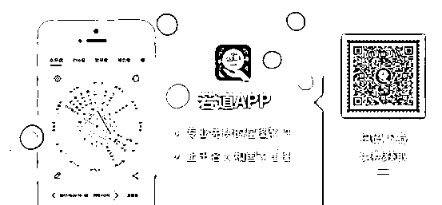

**下载打开若道 APP，点击****任一红框里的按钮****就可以直达“星盘”功能**

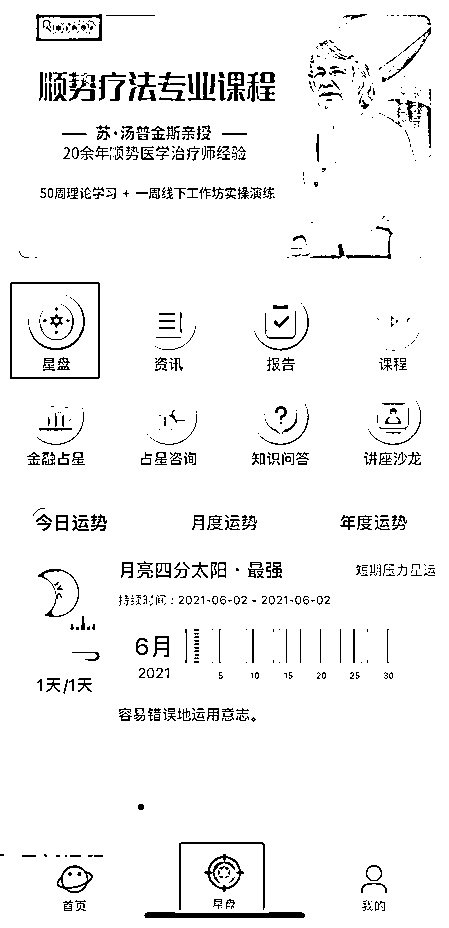

**点击红框“设置”按钮，进入设置**

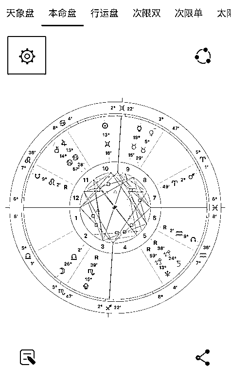

**点击打开红框里的六颗小行星按钮**

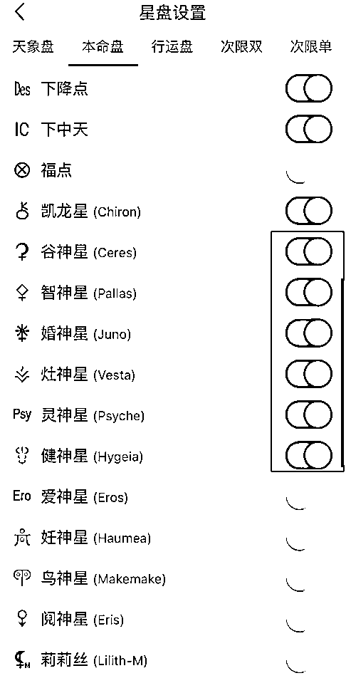

**即可召唤出星图中的六位女神**

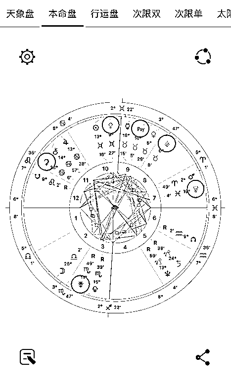

**六月有奖征集**

**提供本命星图中六位女神的位置信息，即可获得 100 元若道课程代金券。**

**★****参与征集条件：出生时间准确，****误差不大于 15 分钟****。**

**★****征集时间：6 月 2 日-6 月 30 日。**

需要提供的信息

*   姓名

*   出生地

*   现居地

*   出生年月日（阳历）

*   出生时间（精确到分钟）

*   谷神星星座度数宫位

*   智神星星座度数宫位

*   婚神星星座度数宫位

*   灶神星星座度数宫位

*   灵神星星座度数宫位

*   健神星星座度数宫位

示例姓名：echo
出生地：天津河西现居地：北京朝阳出生年月日（阳历）：1990.6.4 出生时间（精确到分钟）：12:23 谷神星星座度数宫位：巨蟹 6°23′H11 智神星星座度数宫位：双子 9°27′H10 婚神星星座度数宫位：天蝎 11°49′H3 灶神星星座度数宫位：金牛 0°8′H8 灵神星星座度数宫位：金牛 10°5′H9 健神星星座度数宫位：双鱼 19°4′H7

**填好信息添加若道 Maggie，发送给她，等待审核通过即可。**

长按二维码添加 Maggie 老师

****先认识一下我们星图中的六位守护女神****

****★**谷神星，丰饶女神**

****★**婚神星，婚姻女神**

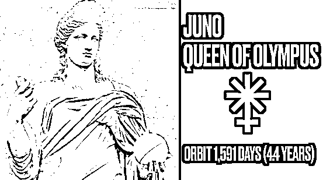

****★**智神星，智慧女神**

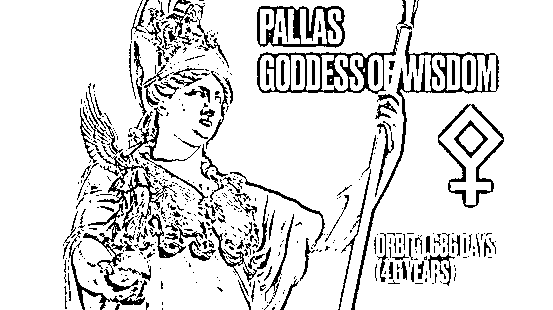

****★**灶神星，家庭女神**

****★**健神星，健康女神**

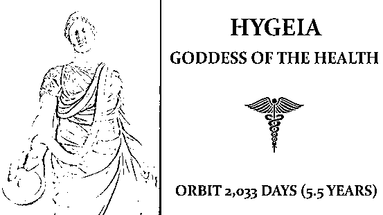

****★**灵神星，灵魂女神**

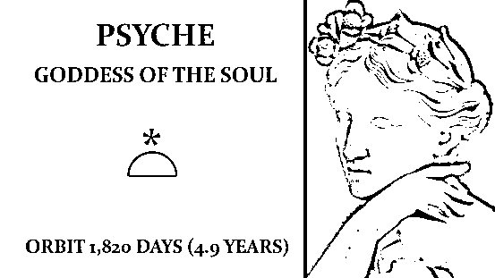

**六位守护女神，在星图中，等风，也等你！****小行星相关文章：**[小行星的故事  | 智慧女神雅典娜和这颗行星有啥关系？](http://mp.weixin.qq.com/s?__biz=MzA5NjA0NTAxNg==&mid=2651445064&idx=2&sn=66224414e6726f1341e53a72bc8164fb&chksm=8b4b65ffbc3cece9cd7bdcf0d1d02d33fc28298ce01cd9649b8e49b05581b9b3dc4137adad0d&scene=21#wechat_redirect) [原来，代表爱情的不只金星，还有这颗小行星！](http://mp.weixin.qq.com/s?__biz=MzA5NjA0NTAxNg==&mid=2651444745&idx=2&sn=58dd8bda221ebe299fd90477ac7fe92d&chksm=8b4b64bebc3ceda8f1801eda83373da39a0cb2649b4606a92d924041066b83cb8f184254644c&scene=21#wechat_redirect)**** 

**更多小行星内容**

**点击下图了解课程详情** 

# 一个求知若渴的占星学生，在若道会获得怎样充实的学习体验？！

> 原文：[`mp.weixin.qq.com/s?__biz=MzA5NjA0NTAxNg==&mid=2651446600&idx=3&sn=e15be9f5fba5182c4321b47bd00dcc86&chksm=8b4b6fffbc3ce6e9d017371b6df58cdeb009c4324124689ebe817c740b321ccc106555429b3e&scene=126&sessionid=1692737974#rd`](http://mp.weixin.qq.com/s?__biz=MzA5NjA0NTAxNg==&mid=2651446600&idx=3&sn=e15be9f5fba5182c4321b47bd00dcc86&chksm=8b4b6fffbc3ce6e9d017371b6df58cdeb009c4324124689ebe817c740b321ccc106555429b3e&scene=126&sessionid=1692737974#rd)

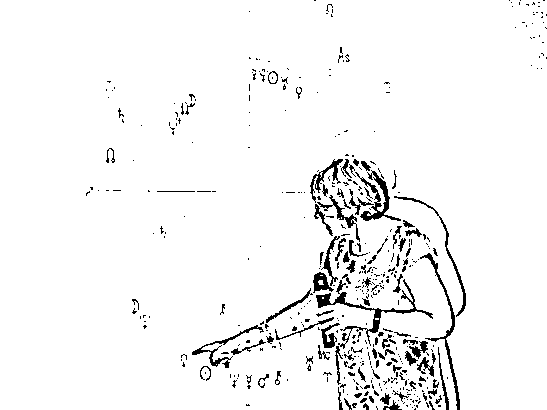

**下周，若道核心课程的学员们就要进入 Level 3 的学习阶段了。**

**你是否想知道这期学员有哪些经历和感想呢？**

**若道君带你来****康康****吧。**

“

**Sue 老师讲课什么样？**

”

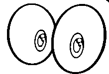

**百闻不如一见，听听本届学生怎么说：**

| **Sue 老师是怎样的一位老师呢？** |
| **2021 年 Sue 的学生们这么说** |
| 老师用她的亲身经历，讲解占星学在现实中的运用，深入浅出，容易理解 |
| 优雅又风趣幽默，严谨且真实 |
| 可能我个人认为的好老师就是不觉得自己是权威人士的那种，这是 Sue 老师最吸引我的地方，当然讲课也很有趣 |
| 详细的分析，丰富的知识，重视基础，实用、谦逊、专业、朴实、真诚   |
| 真实友善，从苏汤老师身上学到对占星学、对专业的敬畏的态度！ |
| 是案例分析部分，会从中学到职业占星在咨询过程中对案主的引领，以及思考问题的视角 |
| 老师讲的干货很多，分享的真实案例很受用，很喜欢理论性强的内容 |
| 老师丰富的学识、经验，以及她身为占星师所具备的专业品质，例如谦逊 |
| 知识体系清晰全面，老师经验丰富，有独特的个人魅力 |
| 适合系统的占星入门，可以打下扎实的基础，尤其是纠正了坊间的很多误区 |
| 很有体系，案例多，幽默，知识点丰富 |
| 苏老师是一位温和平静充满爱心和智慧的老奶奶 |
| 案例分析，星图解读特别有趣，很多让人意想不到的相位解读和小知识点 |
| 课堂上的案例讲解以及苏老师的客观、诚实，最重要的是谦卑，一点都没有大师的架子 |
| 核心课程，基本上把所有常见的、基础的知识技法都系统地讲到了 |
| 干货满满，理智客观 |
| 亲切可爱，讲解清晰易懂接地气，可以在一遍遍复习中有更多新的理解 |
| 是老师的不评判的态度，没有预设的对错 |
| 老师的解盘思路，让我从不同的角度去理解星图 |
| 苏老师多年沉淀出的态度对我的影响深远 |

“

**听说你们学员微信群每天垒高楼，咔咔老师、助教 Conrad、童童班班出没其中……？**

”

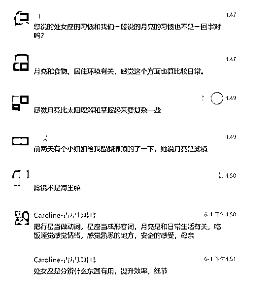

“

**我下课后还有很多很多问题，有人解答吗？**

”

**我们的助教就是高质量的问答机，有问必答。**

这班同学不仅在微信群里聊得热火朝天，还在若道 APP 端用 90 多个问题表达自己对占星学的好奇和热爱，发誓不让助教老师闲着：

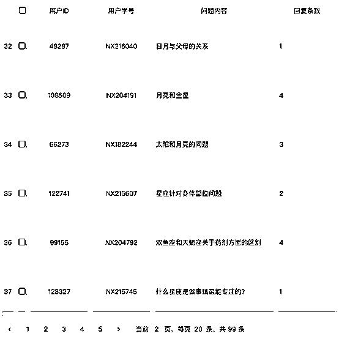

**同学们可以随时用碎片时间在手机查看所有同学的提问和 ISAR 认证职业占星师助教 Conrad 老师的回答。**

“

**我是一个很有理想和抱负的同学，发誓要考过 ISAR，成为职业占星师，我怎么知道自己每个阶段学得怎么样？**

”

嘿嘿，我们就喜欢写作业、做练习的同学，你出手，我们就让你知道你有没有：

“

**若道文章太多了，怎么跟着学习进度读呢？**

”

**助教下午茶，每天来一杯：**

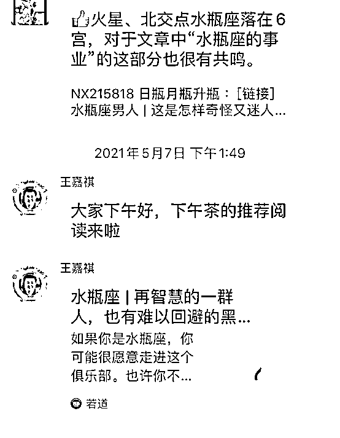

**这样的学习氛围，因此同学们才这样说：**

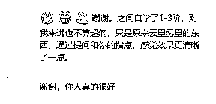

一直当做兴趣爱好来学习，但是 1-2 阶完成以后会用词、定位更加精准。之前印象中很多领域其实是模糊的，比如某一件事归于哪一个星座、属于哪一个行星的范畴不太明确，但是 1-2 阶完成后发现是可以精准定位的，虽然有些定义是发散性思维联想出来的，但是有迹可循。

群里同学们的分享和讨论很有趣，也能在课程之外学到不少东西。

1、2 阶段课程很重要，系统学习下来感觉很不一样，一环扣一环，打好基础很有必要 。通过学习感觉占星学能帮助我们借助星图中认识和探寻更好的自己。

**占星界的权威，有很多外面学不到的细致内容。**

起初被占星吸引是出于对真实自己的好奇，为了更好地了解自己、治愈自己。在 L1-L2 的学习过程中，自己的这些小私心得到了初步的满足，当然，对我而言，占星学习光靠上课是不够的，即使再加上完成作业也还不够，抽空多看几遍课程视频来回顾唤醒并加深记忆是很必要的。有些惭愧的是，现时课程时有时犯困还会打瞌睡才免不了要补课，接下来，6 月 7 日开启的 L3 课程，一定要加强自控力好好听课。

开启了一扇崭新的大门，新奇丰富有趣，博大精深。

老师那两本很著名的书《当代占星研究》和《顺逆皆宜的人生》我之前看过，但听了老师的课再看就感觉到完全不同。所以我们学习不能仅靠自学，无论学什么，都需要老师亲自指导。这是我个人的学习感受。

**不仅学占星交朋友，参加课程的同学还有其他惊喜：**

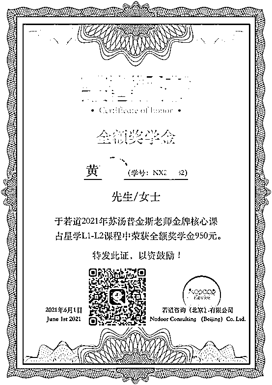

**鼓励、鼓励，我们是鼓励式的教学，只要按时出勤、做作业，不管答案对不对、好不好，就有奖学金向你砸来！**

而这些只是带你从门缝中一瞥若道占星教学的魔法学校中的一个侧影，期间种种有趣和感触无法一纸写尽。

**2 年一次跟 Sue 老师学习的机会，动心没有，心动你就来呀！现在插班跟着学，2 年后成为职业占星师！**

**英国目前最资深****的占星学家和咨询师之一，她拥有****超过 40 年****的占星经验，是占星学习者必备之两本圣经《顺逆皆宜的人生》与《当代占星研究》作者。**

**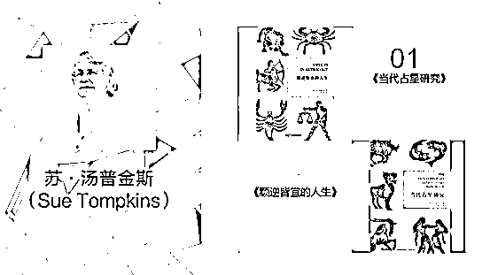**

**她以自己的冷幽默、****抽丝剥茧的研究天分****和****占星直觉****而闻名。她是一名执业占星师，也是一名顺势疗法医师，是心灵和身体的****敏锐诊断专家。**

**2003 年，为表彰其卓越贡献，英国占星协会为苏·汤普金斯授予查尔斯·哈维****终身成就奖。**

**2017 年第一届苏·汤普金斯核心课****金牌助教******、2019 年第二届核心课中与苏·汤普金斯老师******联合授课******的******ISAR 认证占星师咔咔。**

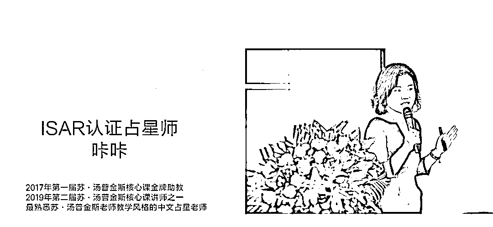

****作为最熟悉苏·汤普金斯老师教学风格的中文占星老师，咔咔老师将在 2021 年第三届苏·汤普金斯核心课中负责教授部分课程，帮助学员更好地********梳理知识架构,********了解学员的********学习进度和疑问**，补充丰富**********占星咨询的中国案例。************

1

**苏老师写给学员们的信**

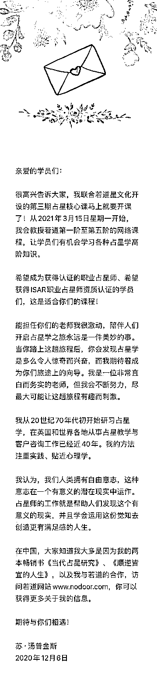**<****滑动查看中文版邮件****>**

2

**课程安排是怎样的呢？**

**第*****1*****阶**

2021 年 3 月 15 日开课，每周一晚上 20:00-22:00 上课，共 4 次课

**第*****2*****阶**

2021 年 4 月 12 日开课，每周一晚上 20:00-22:00 上课，共 4 次课

**第*****3*****阶**

2021 年 6 月 7 日开课，每周一晚上 20:00-22:00 上课，共 15 次课

**第*****4*****阶**

2021 年 10 月 25 日开课，每周一晚上 20:00-22:00 上课，共 13 次课

**第*****5*****阶**

2022 年 2 月 28 日开课，每周一晚上 20:00-22:00 上课，共 27 次课

3

****1-5 阶你将学到什么？****

**第*****1*****阶 ****黄道星座**

*   概要介绍占星学与星图

*   四元素与三形态

*   黄道 12 星座

**第*****2*****阶****行星**

*   太阳、月亮及其他行星

*   练习将它们组合在一起

**第*****3*****阶 ****宫位、相位以及初步解读星图**

*   四轴与宫位

*   相位概论

*   困难相位

*   柔和相位

*   数字游戏，练习找相位

*   容许度，出入相位

*   相位模式

*   将它们全部组合在一起

*   解读的基本原则，权重，失衡

*   如何解读一张星图......丰富的案例，包括学员的案例

**第*****4*****阶 ****出生星图解读（进阶）以及关系与职业议题**

*   了解灵魂进化的路径：月亮交点

*   天文学基础知识

*   综合星图解读，把知识串联起来

*   职业占星解读

*   财富占星解读

*   亲密关系解读

*   丰富的案例，包括学员案例

*   开始学习预测：行进

**第*****5*****阶 ****预测、关系、咨询、为执业和考试做准备**

*   继续学习预测
*   次限推进和其他推进：什么是推进以及如何使用推进？ 
*   太阳弧：什么是太阳弧以及如何使用太阳弧？
*   返照星图：太阳返照、月亮返照和其他行星回归星图
*   将预测技法结合起来
*   原理和时机；蚀相和其他月相
*   解读和预测：更多示范和案例
*   介绍中点
*   如何运用择时星图（婚礼、商务活动等）
*   创造性的相位 ：五分相与七分相
*   关系议题概论
*   对比技法
*   对比图、组合图和其他常用关系图
*   其他有效但鲜为人知的对比技法，比如龙首图
*   更多预测与对比案例
*   心理学、咨询模式及技巧（主要是精神动力、人本主义和超个人心理学方面）
*   当代心理学倾向、“以人为本”的占星师核心思想
*   倾听技巧，咨询，道德议题
*   为练习做准备；如何作为占星师谋生；学习必备的历史和天文学知识，为考试做准备

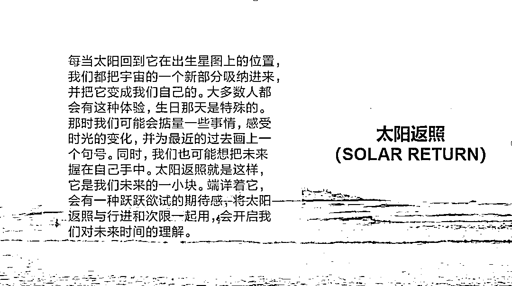

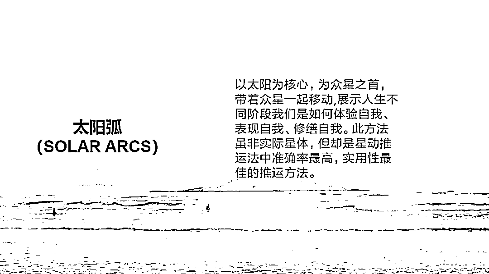

**综合以上技法**

系统的解读步骤来帮助你把焦点对准需要聚焦的地方。

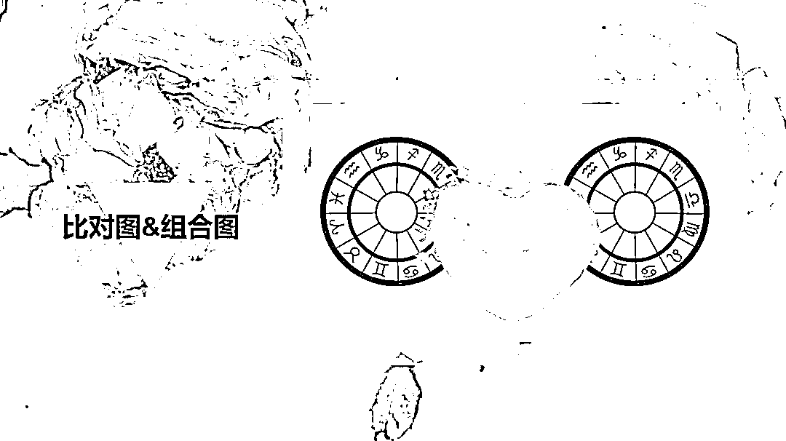

4

**想更多了解导师？**

**主讲导师**

**苏·汤普金斯（Sue Tompkins）**

**英国目前最资深的占星学家和咨询师之一，她拥有超过 40 年的占星经验。**占星学习者必备之两本圣经**《当代占星研究》**和**《顺逆皆宜的人生》**作者。

2003 年，为表彰其卓越贡献，英国占星协会为苏·汤普金斯授予**查尔斯·哈维终身成就奖**。苏同时是一位接受过心理学与心理咨询训练的注册顺势疗法医师，并经常在英国、法国、挪威、瑞典、澳大利亚等地举办占星研讨会和公开演讲。

**苏以实际、生动而幽默的风格闻名于世**，她的教学经验非常丰富，能够胜任从初学者教育到毕业生督导等针对不同占星程度学员的教学工作。这来源于她在地方公立学校以及在英国占星学院(FAS)长达 19 年的教学经历，并在 1986 年-2000 年任学院院长并负责现场教学的所有事务，以及随后在世界各国教学积累的经验。2000 年，英国占星研究学院授予其研究员职位，以表彰她为学校做出的突出贡献。

**中文讲师**

**占星师咔咔（Caroline）**

2010 年师从美国占星师大卫·瑞雷学习，并得到世界名师斯蒂芬·弗里斯特、罗伯特·汉德、苏·汤普金斯传授各种占星学技法。若道首届学员，国内最早获得 ISAR 职业占星师资质的职业占星师之一，现兼任若道核心课程助教。在国际知名广告公司和市场研究公司从事的市场研究和推广工作十余年，曾任职于阳狮集团、尼尔森市场研究有限公司、MTV 和《Madame Figaro》杂志。

**助教**

**助教王嘉祺 Conrad**

**ISAR 认证占星师**，**若道认证生时校正资质，**从 2010 年开始学习占星学，2015 年开始在若道系统学习，并开始个案咨询。2018 年担任若道核心课程助教，以及选修课卜卦占星学和太阳返照课程助教，并带领学员进行经世占星学及太阳返照方面研究。2019 年 11 月作为演讲人之一参加了 ISAR 北京大会，也是 ISAR Star Club 中国区第 16 期的主讲人。

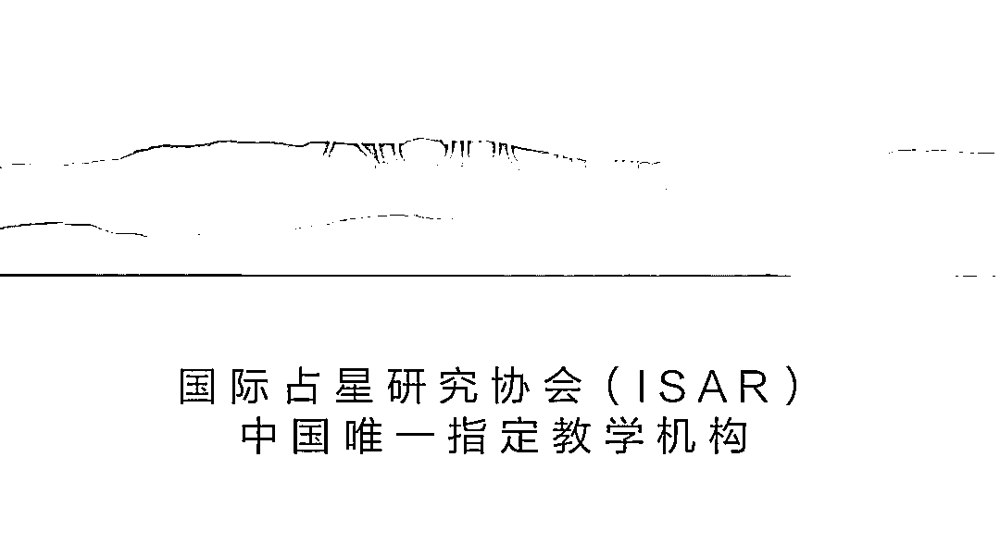

5

**选择若道学习占星学的优势**

**运用自由意志，扭转破坏性模式，绽放天赋潜能**

若道是人本主义占星学的旗手。因为我们相信，**人通过了解模式、觉察习性、积极疗愈、终将释放其潜能，与命运共舞**。

**进入国际权威职业占星师认证的快车道**

占星界的“联合国”ISAR（国际占星研究协会），是具有全世界影响力的占星教学和研究组织和职业占星师全球认证机构，认证占星师遍布 45 个国家。**在 ISAR 的 19 所附属学校中，大中华地区的附属学校只有若道一家**。在国际化的教学理念大纲标准下，**若道毕业生在 ISAR 国际认证占星师的考试通过率多次位居全球首位**。

**十年占星学教育中国本土化教学经验**

**根据中国学生的学习习惯不断优化占星教学体系，让学员学成后更自如地应对本土咨询市场的需求。**学好占星学不仅仅需要邀请一两位老师教学，更需要对教学难点有充分了解，且有持续的教学跟进服务。**10 年来多次核心课程和各种专题课程的教学，让若道非常了解中国学生学习占星学的难点和卡点，合理有效地拆分、提炼课程知识点，同时也积累了丰富的国外老师和中国老师、助教紧密配合以及课程顾问密切配合教学的经验**。若道还专门开发了有助于占星学习的“**若道**”APP，每门课程都设有答疑板块，学员能够方便快捷地提交问题，助教及时答疑解惑和批改作业。**融入中国顶尖的职业占星师群体**若道是中国职业占星师的“黄埔军校”。职业占星师的培养从若道开始，**进入若道，你就走进了中国顶尖的职业占星师群体，和一群志同道合的师兄师姐联谊，获得经验，共同成长**。**多种奖学金支持**为了鼓励学员不因为暂时的经济困难而放弃学习，我们特意设置了各种**技能交换和奖学金**。对于有一技之长的学员，我们推出的技能交换的项目包括**“笔译”、“笔记整理”、“平面设计”、“课本朗读”、“班级服务”**等技能交换项目；而对于努力学习、出勤率高、完成作业率高的学员，我们设置的**土星奖、木星奖**等各种奖学金在等着你。为了感谢帮助我们推荐学员的老学员们，我们设置了“**老学员推荐奖**”；对于通过问卷提建议，帮助我们提高服务的学员，我们也设置了相应的奖学金。ISAR 中国还设置了**国际会议奖学金**，符合条件并通过甄选的申请者最高可获取 5000 元奖学金。当美好的知识遇上奖学金，你可以在学习旅途中乘风破浪，直挂云帆济沧海。**开启占星咨询的职业规划和支持**若道为占星学员搭建了占星问答平台和占星咨询平台，并提供严肃占星学影响力最大的媒体平台，全力为毕业生提供宣传渠道，帮助你吸引和积累咨询生涯初期的种子客户。若道为学员开发了适用于占星学习的“若道”APP，并不断更新完善。**①  微信平台**若道微信平台作为业内颇具影响力专业平台，为文笔好的若道毕业生提供传播占星学并免费宣传自己的机会。有的学员因为文笔获得众多粉丝喜爱，在 3 年多时间积累起 2000 多人的潜在客户。**②  问答平台**若道问答平台帮助学员接触客户的实际问题，并在毕业前就进行演练答题。自问答平台 2016 年上线运营以来，学员接触到 3200 多个问题， 回答问题最多的学员在问答平台收入达 5 万多元。**③  咨询平台**若道咨询平台是我们为优秀毕业生所搭建的平台，帮助毕业生在自己的咨询拓展之外，用若道提供的平台扩展咨询客户群。自咨询平台 2017 年 8 月上线运营以来，咨询平台共入驻 65 人，收入最高者达 32 万元。此处所列学员收入仅供参考，收入高的学员和其专业水准、努力程度密切相关。若道平台尽其所能将自己定位为辅助学员开展职业生涯的桥梁。**在 10 年的占星教学耕耘后，两位创始人——大卫·瑞雷及蒋颖再次邀请苏·汤普金斯老师开设占星核心课程。**

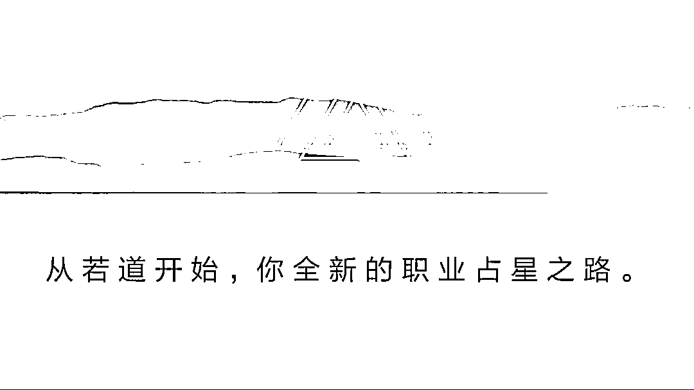

6

**此次课程适合哪些人？**

*   对占星学感兴趣，想要入门的零基础者

*   占星学小白，但有志成为职业占星师的人

*   有一定占星学基础，但不知道该如何整合星图复杂碎片的人

*   希望成为优秀的占星师，想要借鉴国际大师解读思路并融入自己的体系的人

*   苏·汤普金斯的粉丝，学过占星学，但就是想跟着偶像再学一遍的人

*   走在自我探索和个人成长道路上的人

7

**占星业内推荐**

**苏·汤普金斯的《顺逆皆宜的人生》令人赞叹！苏是一名倍受爱戴的老师，并且任教多年。苏以自己的冷幽默、抽丝剥茧的研究天分和占星直觉而闻名。她是一名执业占星师，也是一名顺势疗法医师，是心灵和身体的敏锐诊断专家。**

** ——法国心理占星学协会会长琳恩·贝尔**

8

**苏汤班学员评价**

9

**苏汤老师水瓶座试听课**

（温馨提示：手机请注意流量）

📹 [`v.qq.com/iframe/preview.html?width=500&height=375&auto=0&vid=p3210llaq7f`](https://v.qq.com/iframe/preview.html?width=500&height=375&auto=0&vid=p3210llaq7f)

10

**课程价格**

**L1-2：**4000 元

**L1-3：**13200 元

**L1-5 原价：**49400 元 

其他各阶段课程单报价格，请咨询课程顾问：童老师（微信：196267205，请备注**“苏·汤普金斯核心课”**）

长按二维码添加童老师

11

**退转课程**

*   **退款原则请详看《教学协议》，如有疑问请咨询课程顾问。**

****苏·汤普金斯金牌核心课程****

**授课老师：苏·汤普金斯**

**授课时间：**2021 年 3 月 15 日起

**授课方式：**网络课程**，**英文授课，中文翻译

**费用：**L1-2：4000 元；L1-3：13200 元；L1-5：49400 元

**课程负责人：****童老师**（微信：196267205，请备注“苏·汤普金斯核心课 L1-L3”）

长按二维码添加课程负责人咨询~

****报名请点击“阅读原文”****

# ISAR 选修课丨两年一次的生时校正课，独家技术流软件首公开！

> 原文：[`mp.weixin.qq.com/s?__biz=MzA5NjA0NTAxNg==&mid=2651446524&idx=4&sn=ba67c20f5dbd346ffa1d0dfc23e9fbdb&chksm=8b4b6e4bbc3ce75d5910be9567c8207afe25d24de92f2ddd7a696a05e751f95077bb05fea7c2&scene=126&sessionid=1692737974#rd`](http://mp.weixin.qq.com/s?__biz=MzA5NjA0NTAxNg==&mid=2651446524&idx=4&sn=ba67c20f5dbd346ffa1d0dfc23e9fbdb&chksm=8b4b6e4bbc3ce75d5910be9567c8207afe25d24de92f2ddd7a696a05e751f95077bb05fea7c2&scene=126&sessionid=1692737974#rd)

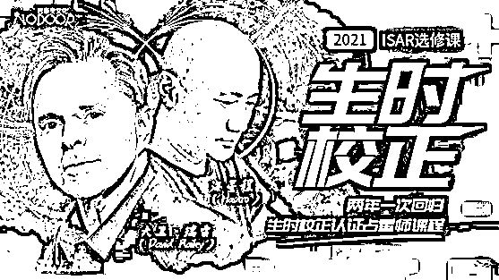

在这门课的学习过程中，你将成为一名“宇宙侦探”，**学习如何构建恰当的问卷，综合运用行进（Transit）、次限（Progression）和太阳弧（Solar Arc）等技术**，比对客户生命中**重大的事件发生时间**，揭示**真正的出生时间**。

**简单来说，就是：那些出生时间不准确的客户，你可以直接搞定啦！**

**此课程可作为 ISAR 选修课。**

1

**师资阵容：名师&高徒**

**这次的师资阵容也是很强大。**

参加过若道线下工作坊的学员，有一个身影一定不会陌生。

海星程老师是占星圈里名副其实的“**学术技术流**”，早期研习东方传统文化融合多年的占星研习和咨询教学经验，沉淀出了**理性、严谨、有灵性**的占星风格和底蕴。

*   **海星程老师在 2015 年若道首次“生时校正考核”中精准计算出大卫老师真实案例的出生时间而以满分成绩获得****第一名****，生时校正案例累积 800+。**

*   **在 2019 年作为若道金牌中文讲师和大卫老师联袂教授了《生时校正》课程。**

*   **2019 年开始海星程老师结合精湛的占星技术和缜密的逻辑体系设计出了专业的生时校正工具，配合若道专业的技术开发团队，即将为生时校正毕业生们提供一款省时省力精确高效的工具。**

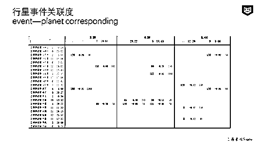

**福利：**

课后通过生时校正考试的同学将获得若道颁发的**生时校正认证占星师证书**，并在若道官网“推荐占星师”栏目进行推荐。

2

**为什么学习生时校正？**

*   **很多中国人的出生时间都不准确，生时校正是国内占星咨询中最常见的客户需求。**
*   生时校正需要**高超的技术、极大的耐心、浓厚的兴趣 ，是一个术业专攻的领域，**是对占星综合知识的整合实战应用机会。

*   星图中四轴的精准性直接影响了预测时间，1 度的相差可能会让预测偏离 1 年，因此，注重预测的占星师需要了解这门技术。
*   深入理解本命星图的意义以及三种预测技法在人生经历中的呈现。

3

**课程目标**

生时校正是一个**严谨而又细腻**的工作，需要校正占星师同时具备熟练掌握出生星图解读和预测技能（三种主要预测方法：行运、太阳弧、次限）的基础上，整合这两项技能，通过系统培训和训练达到准确分析和计算出客户的四轴度数，从而确定客户的准确出生时间。

**课程中会提供多个校正案例供学员练习。**

**授课方式：****原理方法讲解+案例演示+作业练习**

4

**课程内容**

**此次课程内容由 4 个部分组成，每个部分两次课，共 8 次课，每两周一节课：**

**第一部分：生时校正原理和概括**

（主讲老师：大卫老师）

**课程内容：****整体介绍生时校正的原理，讲解校正主要工具“问卷表”的设计原则和用途，如何根据表中内容线索应用到生时校正的分析中，并演示一个完整校正案例，让学员体验校正的全过程。**

**学习目标：****通过这部分学习对校正有个整体的认知和了解。**

**案例讲解：**1 个案例讲解（具体案例个数根据学员掌握程度而定）

**第二部分：四轴星座的分析**

（主讲老师：海星程老师）

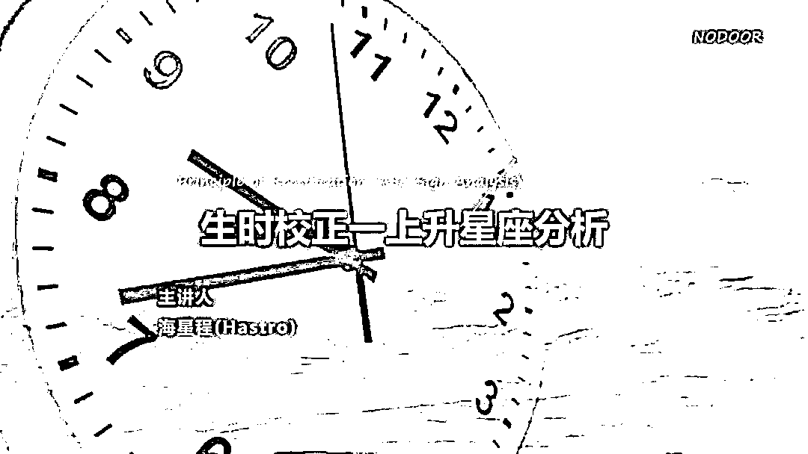

**课程内容：****讲解如果根据“问卷表”中的相关描述信息，运用出生星图解读技能和占星原型理论，通过逻辑分析判断出****四轴星座**。如果我们把星图解读看做是演绎推理过程（根据星图已知信息得出个人特质），那么我们也可以通过溯源推理（根据占星原型关系和充分条件的假言命题的逻辑性，从已知个人特质推溯星图对应信息的非演绎推理）分析出四轴星座。

**学习目标：****通过这部分学习和练习，掌握如果通过客户提供的已知信息和星图中确定因素，推理出星图的不确定因素，得出我们需要的四轴星座。**

**案例讲解：**2 个的上升星座分析案例作业练习和讲解（具体案例个数根据学员掌握程度而定）

**第三部分：四轴度数的计算**

（主讲老师：海星程老师）

**课程内容：****讲解如何根据“问卷表”中人生重大事件，运用行运、太阳弧、次限预测手段，计算中****四轴落入星座的度数****。**如果我们根据出生星图用占星预测技术可以做相关预测的话，那么反过来，如果我们已知过往发生的对个人影响重大的事件，那么我们就可以通过事件发生时间的流年行星位置推测出本命相关四轴度数。

**学习目标：****通过这部分的学习和练习，了解最基础和普遍应用的“枚举法”（单点分析方式）以及可以结合人工智能 AI 发展趋势的“筛选法”（全谱扫描分析方式），掌握如果在计算过程中合理应用每个时间点的“事件数”、“相位数”、“匹配度”做最后判断。**

**案例讲解：**2 个四轴度数计算案例作业练习和讲解（具体案例个数根据学员掌握程度而定）

**第四部分：完整生时校正案例练习**

（主讲老师：海星程老师）

**课程内容：****演示综合运用“上升星座分析”和“上升度数计算”进行完整生时校正过程，通过课后作业练习以及讲解的方式，让学员进行实践生时校正的分析和计算，最后介绍生时校正考核的标准和要求。**

**学习目标：****通过这部分的学习和练习，掌握生时校正分析和计算，理解四轴和出生时间地点的关联。**

**案例讲解：**2 次完整校正案例作业练习和讲解（具体案例个数根据学员掌握程度而定）。

**补充知识：开普勒占星软件讲解（视频）**

*   **介绍专业占星软件在生时校正中的辅助作用（重点了解四轮盘和星图旋转功能）。**

*   **补充讲解手工绘制星图计算方法和过程。**

**课后软件购买使用培训：BirthTimeFinder 生时校正软件讲解**生时校正是一门非常严谨的学科，占星师需要对比不同出生时间，行进、次限、太阳弧三种技法的各自变化；每一个人生大事件对应本命星图、行进、次限、太阳弧的不同征象的比较；过程中需要细致、认真、严谨、有耐心地处理大量的星图数据。没有趁手的工具，确实让很多过往的生时校正的学员对于生时校正工作望洋兴叹。而本次生时校正课程的最大亮点就是即将开发完成的：**Birth Time Finder 生时校正软件。****Birth Time Finder 生时校正软件**可以帮助实现，本命星图、行进、次限、太阳弧四轮图的数据化对比，节省制图、对比、初步筛选的复杂工作。**本次课程包含软件的讲解和训练，欢迎往期生时校正学员参与复训。**

5

**讲师介绍**

**大卫·瑞雷（**David Railey**）**

‍‍

‍‍

*   ISAR 全球副主席，ISAR 考试委员会主席，若道创始人；
*   被称为占星界的“马可·波罗”，第一位将西方严肃占星学系统教学和多位西方占星学大师引入中国的西方占星师；
*   第一位在美国用电视和广播媒体推广严肃占星学的职业占星师；
*   培养最多中国职业占星师的老师；
*   《灵魂的目标》、《一生的旅程》作者；
*   研究占星 48 年，拥有三十多年的占星咨询的执业经验，其服务客户包括学生、工人、市长、州长、议会议员、企业家、心理咨询师、工程师、艺术家、演员、知名企业家等，客户年龄跨度从襁褓婴儿到耄耋老人（大卫老师的老客户常常是一家三代人）；
*   2010 年 6 月，大卫的书《灵魂的目标》中文版出版。在 2011 年春季的北京之行期间，大卫接受了《南方周末》记者的采访。

**海星程（****Hastro****）**

*   国家咨询协会工商管理高阶注册咨询师；

*   ISAR 国际占星研究协会职业资质认证占星师、若道认证授课老师；

*   早期研习东方传统文化；后跟多名国际著名占星师研习现代占星学；

*   2014 年通过 ISAR 职业占星师考试，获得职业占星师资质认证；

*   2015 年若道首次“生时校正考核”中精准计算出大卫老师真实案例的出生时间而以满分成绩获得第一名；

*   2016 年和 2017 年连续两年若道核心课程高阶助教；

*   2017 年若道生时校正课程助教；

*   2019 年若道生时校正课程主讲老师；

*   2020 年开始尝试使用计算机工具辅助生时校正计算；

*   2021 年和若道软件团队一起开发生时校正专业软件；

*   生时校正案例 800+。

**往期生时校正学员对海星程老师的评价？**

老师对待工作的认真程度、细心、耐心以及不厌其烦的回答我们的问题的专业度及好性格，真的让我很庆幸参加老师的课程，收获很大。我个人喜欢占星学，是我觉得占星是一门科学，是人生非常有用的工具，老师的课也是我非常喜欢的风格。最吸引我的是占星也是一门有证可考的实用工具，度数计算，经度纬度的知识等，都很吸引我。

 ——NX181896

理性，逻辑思维清晰，拥有人道主义大爱一样的精神在帮助我们每一个人。清晰的思路和海大师的耐心，讲解真的很务实很有耐力。可能我月亮南交水瓶，就是喜欢这一款太阳水瓶的讲解方式。

——NX192795

海大师有条理，技术高，脾气好，觉得上升星座的判断方法很神奇，每次判断对了就觉得很有成就感。校正的时候需要各种复习预测的知识和方法，感觉很有收获。

 ——NX171629

海大师严密系统的逻辑观给我印象很深刻。按照海大师教授的方法，可以科学得出数据范围，提高了校正的正确率。

 ——E729

严谨的推演体系，用大量数据来反复论证结果，非常处女式的老师，条理、逻辑、数据，每个步骤都那么清晰。还有印象深刻的胶片，美观又简洁，佩服之至。

 ——NX171050

学习完生时校正课程对星座特性和推运技法学习更深入！非常优秀耐心和专业老师，做到授人予鱼不如授人予渔！

——NX171281

课程节奏合适，老师技术强，练习机会充足，注重实操，对海大师印象最深的是超强的逻辑性，很严谨。

 ——NX171338

专业、有料、逻辑清晰且干货丰富。美观生动的 PPT 绝对是老师讲课的神器 有效提升学渣理解力，学习了星图制作原理，复习星座特质和推运技法。

——NX191736

**生时校正课程助教**

**小鹿花花**

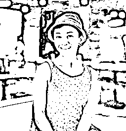

*   若道 2016 届核心课程毕业生；‍‍‍‍‍‍‍‍‍‍‍‍‍‍

*   ISAR 认证占星师（2017 年获得）；

*   生时校正师（2019 年若道认证）；

*   上海大学 MBA；

*   国家心理咨询师。

6

**此次课程适合哪些人？**

*   **对生时校正有浓厚兴趣的占星师；**

*   **细致、认真、有耐心的占星高阶学生和职业占星师；**

*   **想要服务出生时间不准确的咨询个案的职业占星师；**

*   **想要学习生时校正软件操作方法的占星师；**

*   **想要获得生时校正认证证书的职业占星师；**

*   **想要入驻若道生时校正咨询平台的占星师。**

7

**课程价格**

正价：7500 元（包含考试费）

**早鸟价：6800 元（包含考试费）**

**早鸟价截止日期：2021 年 7 月 7 日**

往期学员复训价：3500 元（包含考试费）

往期学员单独报名认证考试：1000 元

**课程负责人：Maggie 老师**（微信/手机：18510107057，请备注“生时校正”）

长按二维码添加 Maggie 老师

‍‍‍‍

8

**开课时间**

**2021 年 7 月 23 日（周五）20:00-22:00** 网络课程

**共 8 次网络课，每两周一次**

9

**退转课程**

*   **退款原则请详看《教学协议》，如有疑问请咨询课程顾问。**

****ISAR 选修课：生时校正****

**授课老师：大卫·瑞雷&海星程**

**授课时间：**2021 年 7 月 23 日起，周五 20:00-22:00（共 8 次）

**授课方式：**网络课程**，**英文授课，中文翻译

**费用：**7500 元；**早鸟价 6800 元（截止日期：2021 年 7 月 7 日）**

**课程负责人：Maggie 老师**（微信/手机：18510107057，请备注“生时校正”）

长按二维码添加课程负责人咨询~

****报名请点击“阅读原文”****

# 那么美的限量版星座项链，再不下手就没了！

> 原文：[`mp.weixin.qq.com/s?__biz=MzA5NjA0NTAxNg==&mid=2651446524&idx=2&sn=bcfee89db3f6a7efed6567a28953a0e0&chksm=8b4b6e4bbc3ce75d936f4d5153fbb06e4008f011da51672ad72205300a47926e54729c6e9c90&scene=126&sessionid=1692737974#rd`](http://mp.weixin.qq.com/s?__biz=MzA5NjA0NTAxNg==&mid=2651446524&idx=2&sn=bcfee89db3f6a7efed6567a28953a0e0&chksm=8b4b6e4bbc3ce75d936f4d5153fbb06e4008f011da51672ad72205300a47926e54729c6e9c90&scene=126&sessionid=1692737974#rd)

嗨，喜大普奔的消息，木星终于进到**双鱼座**了，若道君决定不定期给大家推荐一些适用于时下天象的“**自我觉察**”生活小窍门。最近哦，金星正行进在巨蟹座，木星又刚来到双鱼座不久有木有发现， 人间四处弥漫着**温柔与浪漫****的彩色泡泡**。

在占星学里，

金星守护的天秤座与木星守护的射手座

都是阳性星座，

彼此呈**六分相**。

六分相的能量会带来**活力和好奇心**，

通常也代表着**友谊、机会与他人的良性互动**。

天秤座与射手座的友谊告诉我们，“**美貌与智慧**”是可以兼得的，“**金钱、快乐与爱**”之间存在着某种神秘的良性互动。

这么说可能有点抽象，若道君举个众所周知的例子帮助大家深度解析。若道占星的创始人**大卫·瑞雷**老师，就是一位太阳天秤座、月亮射手座的奇男子。见过大卫老师的人都知道，他**温暖、活泼、并且长得帅**，**心胸开阔、有幽默感、正直并且坦率**。

在他**40 余年**的占星咨询职业生涯中，大卫老师总是**能以宏观的角度给别人建议**，**激起他人对生命的信心**。没有人会想错过**与他共处的美好时光**。若道的学员中也不乏这个组合的可爱人物。毕业于英国伯明翰城市大学的 Flora，也是一位太阳天秤座月亮射手座的神奇小姐姐。

早在英国学习珠宝设计的时候，Flora 就对可以探索生命宏大议题的占星学充满了兴趣，回国后一面经营餐厅、做设计，一面继续深入对占星学的学习。珠宝、设计与美食满足了 Flora 天秤座的**爱与美**，**占星学、宇宙与哲学性的生命思考****给了 Flora 快乐和自由**。在一次大卫老师与 Flora 天马行空的占星对话中，**双倍的天秤座能量和双倍的射手座能量**，碰撞出了不止翻倍的关于**宇宙哲学灵感的美**。Flora**把占星学抽象的概念进行了图像化的诠释**，以**富有创意的视角重新定义了十二星座的理念**。

在这个巨蟹座和双鱼座并重的天象里， 金钱与爱（金星）需要交换快乐、智慧与自由（木星）。若道君为大家隆重推荐**“美貌与智慧”双修的十二星座 925 纯银项链**，来自大卫·瑞雷老师的星系灵感，与独立珠宝设计师 Flora 的美妙创意。

全宇宙限量**100 套**， 只配得上美丽与智慧都有的你。**饰品采用 925 纯银打造**，**所选用的宝石或其颜色都与星座能量契合**，从设计到制作，每一个细节都精心考究。

设计师 Flora 的星座律令：“**如同天上的星星一样，每个星座是独一无二的存在**。”♈**白羊座 Aries**白羊座为**火象星座**，原型为“**战士**”，代表了**勇敢纯粹、一往无前**。设计中采用**剑的形态来展示“战士”的性格**，剑柄部分是火焰的形态。红色锆石镶嵌的剑身，象征白羊座的**勇敢和热情**。Inspiration comes from fire and sword. The archetype of Aries is a warrior，so the designer chose sword to express the courage of Aries. It is also one of the fire element, so the piece combined fire with sword together. The red Zircon used here also symbolise the Aries.

**长按二维码了解详情**

♉**金牛座 Taurus****金牛座崇尚自然田园，拥有稳固舒适的能量**。选用优雅的植物——**马蹄莲**来表达金牛座，对应自然风格的同时，简洁的外形也与金牛座追求**简单自然**相契合。马蹄莲形态还巧妙地与牛角结合在了一起。**作为花蕊的橙色锆石也对应了金牛的能量座**。Because Taurus have some relationship with nature, the designer chose to express it through the image of callalily (simple shape，simple and nature is what Taurus always searches for) and combined the shape of Ox horn. The orange Zircon used here is also have some connection with Taurus.

**长按二维码了解详情**

♊**双子座 Gemini****双子座，机敏、双面性格，擅于语言沟通**，因此用两张张着嘴交谈的人脸来表达。现代艺术风格的人物脸庞，对应了双子座的潮流性。设计中，强调两张脸的不同：右脸镶嵌绿玉髓（对应双子座的能量），左脸眼睛镶嵌白色锆石；两张脸分别用磨砂和抛光的不同质感来彰显不同。Gemini has double personality, talkative. There are two faces, opening their mouth, talking. Abstract style of the shape, Chrysoprase on one cheek, and one white Zircon in the other’s eye. The matte and polishing surface of each face also shows the different character of Gemini.

**长按二维码了解详情**

**♋****巨蟹座 Cancer****巨蟹座具有滋养保护的能量**，采用豆荚形态包裹着珍珠，就像巨蟹座保护着自己柔软的内心。两个弯弯的豆荚形态象征了巨蟹座的符号♋，也同时象征了巨蟹座的守护星——月亮。珍珠，作为来自海里的珍宝，对应了生活在海中的巨蟹。Two bean pod symbolise the sign of Cancer, also like two crab claws, and Moon (the ruler star of Cancer). The pearl inside the bean pod is like something soft hiding inside of Cancer, as Cancer has the power of protection and nutrition. Pearl also shows that Cancer comes from the sea.

**长按二维码了解详情**

**♌****狮子座 Leo****狮子座是天生的王者，一枚皇冠代表了它的自豪与骄傲**。中间晃动着的一颗几何形态的心，对应了与狮子座相关的**心脏**。中间镶嵌的红色锆石、上面呈放射状的刻线，都象征了狮子座的守护星——**太阳**。同时，狮子座与第 5 宫能量相关，所以 5 个皇冠的尖角、5 颗镶嵌的锆石、抽象的 5 边形头部都指向了这一点。A crown shows that Leo is a king or queen, and there are an abstract “heart” with a red zircon under it, which is the organ corresponding to Leo. On this heart, there are some radial pattern symbolise the Sun (the ruler star of Leo). The crown has 5 points, pentagon head has 5 sides, and there are 5 white zircon on the crown, because the energy of Leo connects the 5th house.

**长按二维码了解详情**

♍**处女座 Virgo****麦穗在希腊神话中，是丰收女神的象征，丰收女神即是处女座的守护神**。交叉的麦穗形态也对应了处女座符号中的交叉部分♍。在麦穗上，镶嵌了很多小小的白色锆石，像闪亮的麦粒，契合了处女座**细致精巧、纯洁臻美**的性格。The cross shape of the ear of wheat shows the cross part of the sign♍. The ear of wheat also represents the goddess of the harvest who is the patron saint of Virgo in Greek mythology. There are some white Zircons setting there, delicate and pure like the Virgo.

**长按二维码了解详情**

♎**天秤座 Libra****追求公正与平衡的天秤座**，用两边可上下摆动的称来表达。简练的结构，平直但有弧度的线条，显示天秤优雅的风格。**白色带有幻彩的欧泊，是属于天秤座的宝石**。Here shows scale and balance. The two bowls can move up and down, which represents the character of Libra ”keep balance”. The concise structure, and straight with curved lines shows the elegant of Libra. The colorful white Opal is the stone of Libra.

**长按二维码了解详情**

♏**天蝎座 Scorpio****天蝎座追求掌控感、深入骨髓的感情，拥有神秘的气质**。设计中采用两只骨感的双手，紧握住一颗视若珍宝的黑曜石。骨头表达了天蝎座的深邃，黑曜石是天蝎的宝石，同时黑色也透着神秘性。Two bony hands hold a black Obsidian. The hands show the willing of grasp and the power of control, which is the character of Scorpio. “Bony” also represents the deep and down to the bone meaning of Scorpio. Black Obsidian is the stone of Scorpio, with the sense of mystery.

**长按二维码了解详情**

♐**射手座 Sagittarius****射手座追求真理、爱学习、向往自由**。一本书页变作翅膀的书籍来表达射手座热爱学习及爱自由的特点，知识的真知会带领他们飞向自由。绿松石是属于射手座的宝石。A book ( knowledge) with wings (freedom). The book page turns into wings, meaning that Sagittarius loves learning, and the wings of knowledge will give them freedom, to the ideal place they want. Turquoise is the stone corresponding to Sagittarius.

**长按二维码了解详情**

♑**摩羯座 Capricorn****摩羯座个性严谨、拥有清晰的目标感，追求人生的成功**。采用抽象几何线条构成的金字塔表达摩羯的结构性。金字塔底部镶嵌母贝，表达了摩羯座也来自于大海，与位于对面的巨蟹座对应（巨蟹使用了珍珠）。在金字塔顶端，一颗深蓝锆石指向了成功的目标。A pyramid symbolise that Capricorn want to gain success, achieve something, go to the top in their lives. The line structure also shows the quality of Capricorn. At the bottom, mother of pearl is used to symbolise that Capricorn comes from the sea, and is an opposite sign against Cancer (in which pearl are used). At the top of the pyramid, a blue zircon is the goal of Capricorn.

**长按二维码了解详情**

♒**水瓶座 Aquarius****水瓶座是革新者和开拓者**，用古老的尖底罐造型表达水瓶的原始意象，在上面刻画电路板纹理代表水瓶座的高科技偏好，纹理也同时组成了水瓶座的符号♒。**尖底罐造型也是一枚灯泡，指出水瓶座的革新特点**，就像灯泡的发明点亮了人类的生活。罐子的背面也采用了水瓶座的♒造型。镶嵌的紫红色锆石是水瓶的颜色。The main shape is a water jug with a pointed bottom which comes from the primal times. On it，there is some pattern of circuit board, which composes the sign of Aquarius. Circiut board represents the quality of hi-technology. If you view the jug upside down, it also a light bulb, just as the invention of bulb lighten human’s life. Aquarius always has this kind of revolutionary idea. At the back of it, there is also the symbol of the sign. Some red violet zircon used here. Red violet is the Color of the sign.

**长按二维码了解详情**

♓**双鱼座 Pisces****双鱼座浪漫的个性、具有灵性的气质与宽阔无边的海洋相关**。用波浪的形态表达双鱼座，上下两部分可以摆动的波浪也像两只抽象的小鱼。吊坠背面也是波浪状的造型。紫水晶是属于双鱼座的宝石。Pisces is romantic and spiritual, which is related to the boundless sea. Designer Uses water waves to show Pisces, and the two parts also like two fishes. It is moveable. At the back of it, it also some waves shape there. Amethyst is the stone corresponding to Pisces.

**长按二维码了解详情**

**好神奇，星座项链还可以这样用！**❶** 佩戴不同星座的首饰，帮助你提醒自己想培养的星座能量**。比如，我最近想提醒自己要“自律”，可以带摩羯座金字塔项链，提醒自己觉察；最近想提醒自己多运用“灵感与想象力”，就佩戴双鱼座的海浪与鱼项链。❷ **根据月亮每天行进于不同的星座，你可以佩戴与之呼应的星座能量**，感受每日不同的物质与能量间的共时性频率。比如，今天月亮行进在处女座，就直接佩戴处女座的项链，提醒自己可以体验专业又高效的一天。❸ **长期佩戴自己出生星图里北交点所在的星座项链，感受北交点的吸引，帮助你更有效走向自己的北交点**。比如，我是南交天秤座，日常工作我就可以佩戴白羊座项链，火焰的大宝剑可以时刻提醒我向白羊座学习，愤怒和勇敢是捍卫自我的最强利刃。❹ **刚学习占星的初学者，可以购买自己的日月升星座三件套组合**。终结你的选择障碍，从日常生活入手入星图能量做连接，还有日月升优惠哦。❺ **送给你想感谢的人**。比如，感恩节我想感谢一个双鱼座的人，送她双鱼座项链。结婚纪念日我想感谢双子座的爱人，送她双子座项链。

**微信又又又改版啦，不想错过若道的推送？**

**就把若道设为星标吧！**

**▼**

********购买 12 星座项链入口在这里哦********

# 从史前洞穴到 21 世纪，占星学竟能带领我们穿越万年历史？！

> 原文：[`mp.weixin.qq.com/s?__biz=MzA5NjA0NTAxNg==&mid=2651446524&idx=1&sn=bec12d695a45d30326535262ba432194&chksm=8b4b6e4bbc3ce75d5c088c02f22c62004ac925d4291e3f06c0d6dc3989ecf18e1a71c320f874&scene=126&sessionid=1692737974#rd`](http://mp.weixin.qq.com/s?__biz=MzA5NjA0NTAxNg==&mid=2651446524&idx=1&sn=bec12d695a45d30326535262ba432194&chksm=8b4b6e4bbc3ce75d5c088c02f22c62004ac925d4291e3f06c0d6dc3989ecf18e1a71c320f874&scene=126&sessionid=1692737974#rd)

******☆ ****后台回复“今日”，给你一句生命态度******

来源/克莱门斯·路德维西
译者/Leisha 校对/江艺编辑/翀子 封面/书君 图片/网络占星学的象征主义激发了许多伟大艺术家的创作灵感。在这篇全景式的概览文章中，德国占星师协会的主席将带我们领略从史前洞穴艺术到 21 世纪的艺术作品，其中涉及提香、达芬奇、达利、沃霍尔、希尔马·阿夫克林特、百水等艺术家。

**占星学的象征主义是整个艺术史的中心主题。**这是在意料之中的，因为艺术是以视觉形式表达当前和永恒的理念。占星学为这些理念赋予了更广阔的意涵，表达出“我们并不孤独，而是与传统相连”的视野，它帮助人们寻找方向。**艺术和占星学都追求宇宙的和谐与美学。**

在这种背景之下来进行思考，那么最伟大的艺术家们（如列奥纳多·达芬奇、提香、拉斐尔、阿尔布雷特·丢勒）使用占星学的符号就不足为奇了。同样在作品中使用占星学符号的还有现代艺术大师，如萨尔瓦多·达利和安迪·沃霍尔，以及没有留下姓名的大教堂建筑师们。

**占星学的符号**不仅出现在陈列于博物馆或记载于古书上的作品中，还常常出现在城堡、宫殿、市政厅、大教堂、洗礼堂、钟楼和中产阶级人群的住宅之上（在各个时代，这些建筑物常常以黄道艺术为装饰）。

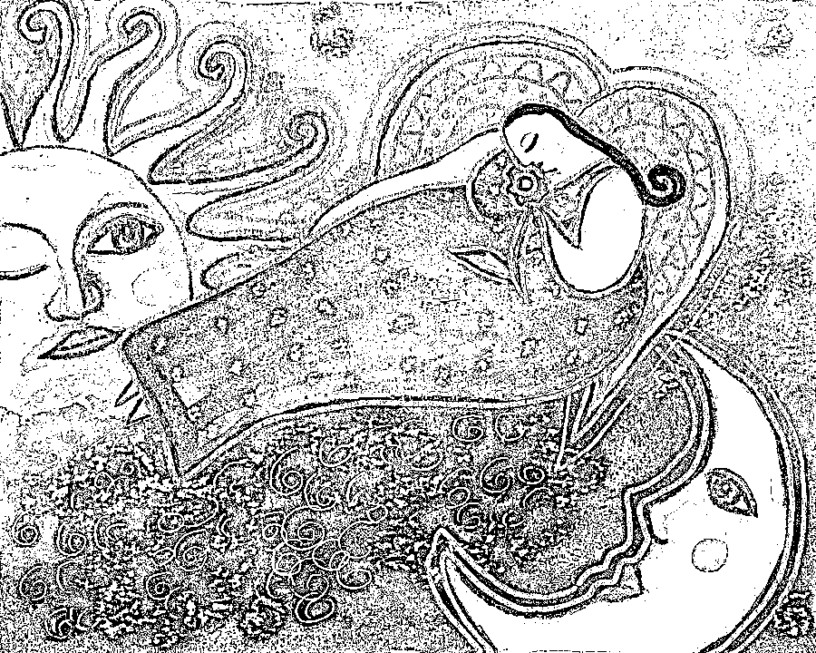

**隐秘的开端**

**寻找人类早期受占星学启发的建筑或膜拜星辰的场所，其踪迹可追溯至远早于“基督时代”的数千年前。**一些历史学家声称，甚至在西班牙北部和法国南部的洞穴壁画中（约 2.5 万年前）也绘有人类早期膜拜星辰的各种符号，例如，可以发现洞穴中画的牛与现代金牛座的符号类似。

当然，这纯属推测。我们可能永远不会知道史前人类看到的天空是什么样，也不会知道他们如何将所见融入宗教信仰之中，正如我们永远无法知道是什么人建造了英国的巨石阵、爱尔兰的纽格莱奇墓或德国的内布拉星象图一样。

但我们可以确定，**这些地方曾是举行冬至和夏至祀礼的重要场所，而冬至和夏至是占星学中的两个关键时间点。**还有一点显而易见，人类一直将诸如日、月、星、树、石、泉、湖等自然现象视为神性的表达，并常常以此为灵感进行宗教膜拜和艺术创作。

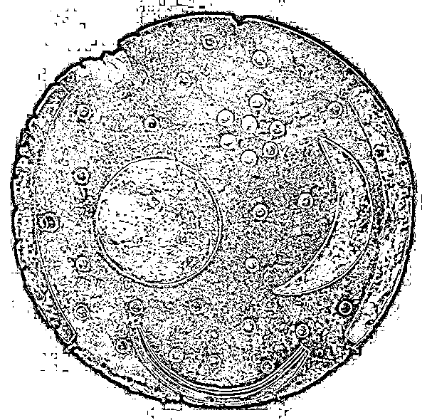

**以我们熟悉的黄道为灵感创作的最古老的艺术作品可追溯至古罗马时代，**至今仍可为世人所鉴赏。古代世界很可能是占星学和艺术不受限于赞颂精神和世俗领袖的第一个时代，尊贵人士别墅中的壁画和马赛克画可以证明这一点。可惜，幸存的例子不多。

在前德国首都波恩的莱茵河博物馆，可以看到其中一件精美的艺术品。那是一幅公元 2 世纪的马赛克画，**画的中心绘有黄道和太阳神**，于 19 世纪末在波恩以南 200 公里的莱茵河区域被人发现。河道沿岸还发现了密特拉教的圣坛。密特拉教在罗马帝国时期盛行，它起源于波斯，**并广泛应用了占星学的象征主义。**

**人们在以色列发现了许多以黄道为原型的古代物品。**尽管一些先知强烈反对占星学，**但犹太传统中仍充斥着大量的占星学符号。**

例如，犹太教使用的枝状大烛台，**七个分枝代表七颗古典行星**。正中间的蜡烛象征黄道上的太阳。**行星以其守护星座的天然对宫位置排列**：金星（金牛座）在左，火星（天蝎座）在右；接下来，水星（双子座）在左，木星（射手座）在右；最后，月亮（巨蟹座）在左，土星（摩羯座）在右。

**在以色列北部的加利利海附近，可以看到最完整的以黄道为原型的古代物品**。令人吃惊的是，这些物品保存于犹太教堂中，如提比里亚古城遗址的教堂中，在罗马人摧毁耶路撒冷后，提比里亚成为了犹太文化的中心。

公元 3 世纪创作的十二星座现在看来仍栩栩如生。在贝斯阿尔法、纳兰、苏西亚、胡斯发、塞法里斯这些犹太教堂中也可以看到以黄道为原型的物品，都在提比里亚古城附近。

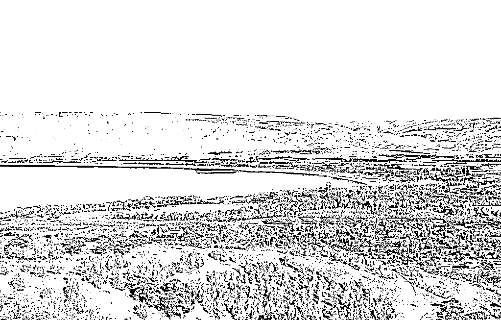

| 加利利海

**神圣的艺术**

罗马帝国的覆灭导致了文化衰退，其中包括占星学的式微。直到 9 世纪，查理大帝在阿尔卑斯山以北地区建立起一个新的帝国（将其势力范围扩张至地中海地区）之后，文化才以各种形式复兴起来。

在查理大帝的三儿子虔诚者路易的统治下，**莱顿于 820 年创作出黄道手稿，其中包含黄道星座和行星的 35 个微缩图。**与此同时，《乌得勒支诗篇》（*The Utrecht Psalter*）现世，这是加洛林王朝时期的图书艺术杰作之一，书中绘有耶稣基督在山顶上，黄道环绕四周的画作。

**同时期其他突出占星学符号的重要图书艺术作品包括**《亨特里安诗集》（*The Hunterian Psalter*，现于格拉斯哥大学展出），以及 12 世纪哲学家乔治乌斯·凡杜勒斯（Georgius Fendulus）所著的《占星书》（*Liber Astrologiae*）。

**在中世纪早期，罗马风格时期，教堂的建筑和画像通常会加入占星学的符号****。**要记住，这一时期的艺术在很大程度上被局限为“神圣的艺术”。

黄道通常被绘在教堂入口的拱顶中心处。这个入口是罪恶俗世和神圣领地的分界区。进入神圣领地是一种入会仪式，要求全神贯注地投入从俗世进入圣地的过程。当信徒在黄道之下进入圣地时，**星辰显然是神向人授谕的一部分。**

当然，拱顶上最常见的是耶稣基督的画像；黄道通常环绕在他周围，表明**星辰是宇宙之主所用的工具。**许多地方的大教堂中都有这样的拱顶，如勃艮第、欧坦、韦兹莱、阿瓦隆（法国）和莱昂（西班牙）。

在意大利北部皮亚琴察的圣萨维诺古教堂中，有两处绘有黄道。同样，建于 1093 年的德国著名的玛丽亚拉奇修道院喷泉教堂，其入口大门和圣坛上方的圆顶也绘有黄道。除了拱顶之外，黄道还常以马赛克画的形式出现在地板上，如科隆的圣格里安圣殿，和佛罗伦萨最古老宏伟的教堂之一圣米尼亚托大殿。威尼斯的圣马可大教堂中有一个黄道时钟。

令人吃惊的是一些洗礼堂中绘有黄道，比如佛罗伦萨和帕尔马。洗礼是加入基督教教会的标志，也是加入宇宙秩序的标志，**而黄道曾是宇宙秩序的征象。**

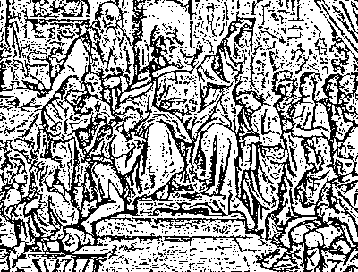

| 《乌得勒支诗篇》

**占星学：公共自我表达的一部分**

在 12 世纪向 13 世纪过渡的时期，欧洲社会发生了翻天覆地的变化，对艺术和占星学造成了广泛深远的影响。新的技术和更好的气候条件使农业产能越来越高效。人口与贸易和城市数量一同增长。商人变得越来越重要，当时非常成功的商人有如美第奇家族和富格尔家族，其影响力比旧贵族更大。祖荫不再是决定人们命运的唯一条件。

社会变得开放，艺术也是如此，尤其是建筑艺术。由此进入了哥特风格时期，在此期间建造出了许多看似高耸入云的著名大教堂。**占星学在这个时期仍然是社会的重要组成部分。**

**黄道出现在许多著名哥特风格大教堂的拱顶上，**如沙特尔大教堂、亚眠大教堂和巴黎圣母院。哥特风格大教堂的一个典型特色是鲜艳华丽的玻璃窗，这种制作工艺至今仍是未解之谜。**黄道星座和行星是常见的教堂玻璃窗装饰图案**（如沙特尔大教堂和洛桑大教堂）。

社会变化，加上城镇和商人的影响力日渐增长，艺术家们获得了自罗马帝国覆灭以来首次得以向神职人员和贵族以外的人寻求资助的机会。**这也使艺术家们有机会在更广阔的场景下展现占星学的象征主义。**

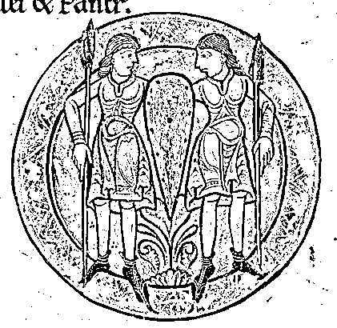

意大利北部的共和制城市尤其喜爱用黄道星座的符号来装饰市政厅和其他代表性建筑。艺术史学家迪特·布鲁姆认为在这个时期中，**“占星学是公共自我表达的一部分”**。

例如，著名建筑师乔托在帕多瓦建造的拉乔内宫，以及威尼斯总督府，还有不久之后在文艺复兴时期建于费拉拉的斯齐法诺亚宫中的月鉴房。

尽管社会在文艺复兴之前就发生了翻天覆地的变化，但文艺复兴（总体而言）标志着中世纪时期的结束，和“现代时期”的萌芽开端。**1398-1400 年的海王星-冥王星合相代表了这个新开始。**这个合相每 493-494 年发生一次，的确是全球根本性剧变的征象。

**当时的第一次海冥合相是 1398 年 6 月 22 日，落在双子座，火星也在双子座。**仅仅几年后，1405 年 1 月 25 日发生了木星-土星在水瓶座的大合相，太阳也在水瓶座。

在最重要的两个世俗星图中，**风象星座双子座和水瓶座是“新时代”的指征。**人类开始偏重个性、自由、科学、道德和对自己负责。宗教决定论观念作为神圣计划的一部分，在理性革命面前逐渐没落。

**与此同时，占星学在社会上获得了前所未有的影响力**，神职和非神职人员同好此道。尤利乌斯二世 1503 年当选教皇后，甚至请占星师为他的就任典礼择选一个最佳日期。还有许多神学家与他一样，相信上帝会利用星辰揭示自己的意愿。

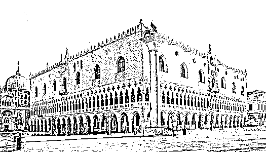

| 威尼斯总督府

**隐藏的象征主义**

除了传统的教会资助外，富甲一方的美第奇、齐吉、斯福尔扎-维斯康蒂家族**为艺术家和占星师们提供了大量传播作品和信息的机会**。列奥纳多·达芬奇、拉斐尔、提香、丢勒**将占星学视为重要的创作灵感来源。**

在圣洛伦佐的美第奇小教堂中，圣坛上方有一幅完整的星图（时间为 1442 年 7 月 4 日上午 10：30）。没人知道这是什么人还是什么事物的星图。还有一个实例在齐吉家族的法尔内西纳别墅中可以看到。

**象征主义通常隐藏在艺术作品中。**最著名的例子是达芬奇的《最后的晚餐》，艺术史学家们对这幅作品感到非常困惑，因为他们忽略了占星学对十二门徒形象刻画的影响。

**《最后的晚餐》隐秘地描绘了黄道。**从右至左：西门是白羊座，朝气蓬勃，双臂向前伸出；旁边是达太，金牛座，脖颈粗壮，用手臂保护自己，可能还保护着自己的财物；马太，双子座，对一切保持敞开的态度，与每个人接触，头偏向一侧，手臂伸向另一侧；腓力，巨蟹座，脆弱敏感，充满女性能量；大雅各，狮子座，独立自主，宛如国王一般坐在自己的位置上，大大地张开双臂；等等，依此类推。

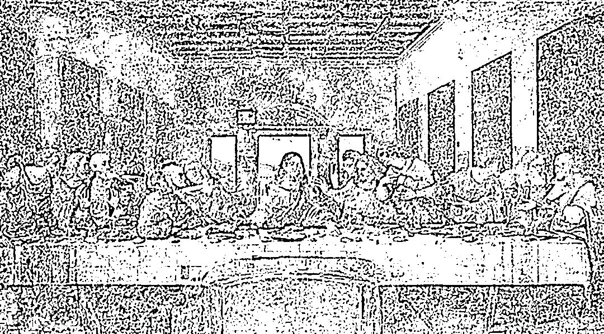

| 达·芬奇《最后的晚餐》

提香和丢勒也在许多作品中以隐藏或玄奥的方式加入了占星学原则。**这些艺术家生活在占星学备受推崇的时期，**因而引起了一个问题，**为什么在占星学不受质疑的时期，一些最伟大的艺术家们还要以暗文密码的形式传递占星学信息？**

看起来他们只想让内行人理解更深层的意义。**普通人接触的占星学与内行人理解的占星学之间存在巨大的差异。**平民大多目不识丁，关注星辰和月亮主要是为了农耕目的。艺术家和其他内行人使用占星学是为了更深刻地理解宇宙和生命的周期循环，大多数农民和工匠没有时间研究这些主题，因为生存才是他们的第一要务。

达·芬奇和提香都曾是神秘组织的成员。达·芬奇还使用了镜像书写法，因此，只有少数经过筛选的人才能看懂他写的内容。这些艺术家是想要在发掘人生意义的志向中向势均力敌的同仁致意。同样，许多没有留下姓名的建筑大师在大教堂中留下占星学和神秘的符号，也有此用意。

**图书艺术也变得极为流行，包括占星学符号的使用。**其中最著名的两个例子是《天球图册》（*De Sphaera*）和《贝里公爵的最美时祷书》（T*rès Riches Heures du Duc de Berry*）。

许多市政厅或教堂中悬挂的黄道时钟使占星学成为了日常生活的一部分。

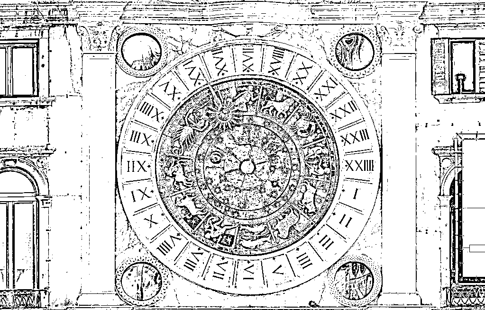

| 威尼斯黄道时钟

**衰落后再崛起**

占星学经过这一巅峰时期，便无可避免地衰落了。**随着自然科学的影响力越来越强，占星学受到质疑，**不再是社会中无可争议的组成部分。此外，一些政治领导人强烈反对占星学和“其他形式的算命”，**这对艺术产生了影响。**

在巴洛克风格时期，仍然有描绘黄道和行星的作品，**但不如之前频繁。**这是一个对占星学观感极为矛盾的时期。三十年战争摧毁了欧洲大部分地区，死亡成为常态。人们意识到每一天都可能是生命的最后一天，因而想要及时行乐，并出现了表达这种心态的名言：“记住你一定会死”（memento mori）和“把握当下”（carpe diem）。

**罗马天使与殉教者圣母大殿中可以看到巴洛克风格时期的占星学艺术作品，**这个教堂的地板上绘有壮观的黄道。布拉格华伦斯坦宫的天花板上绘有行星及其守护神。如今，这个宫殿是捷克议会的一部分。

启蒙运动和工业革命时期为当今世界垫下基石。科学家将人们对宇宙秩序的探索转移到了科学实证主义领域，将这一探索从“纯粹的”主观意念和相对主义中剥离。即使到了现在，**“理性主义者”依然拒绝以更宽广的视角看待物质世界和形而上的世界，**也拒绝承认形而上的世界。

与此同时，社会又在更短的时期内发生了翻天覆地的变化。中世纪时期，社会基本架构在数百年间都保持不变。工业革命开始后，世所周知的模式在短短几十年间就发生了根本的变化。这对艺术产生了巨大的影响，由此开创了后来许多互有重叠的艺术风格时代：古典主义、浪漫主义、现实主义、自然主义、历史主义、新艺术主义。

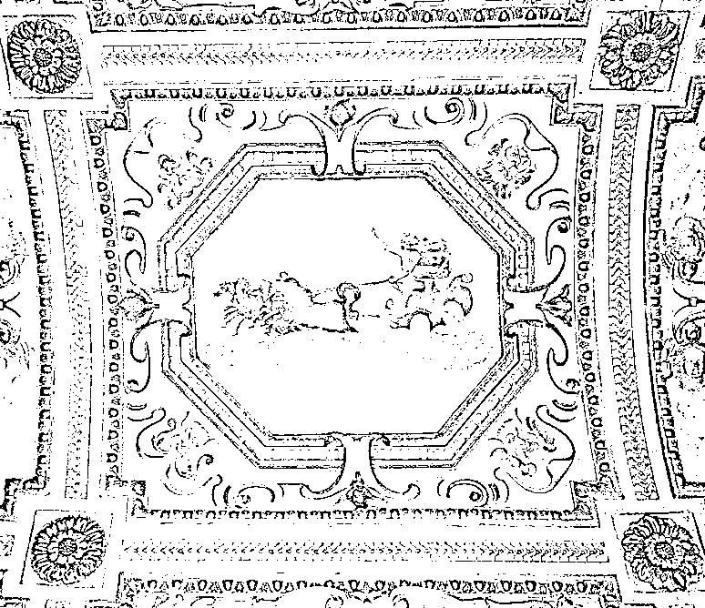

| 布拉格华伦斯坦宫

**占星学的影响力在这一时期继续衰退。**新时代的“大教堂”是工厂大厦、火车站、新兴资本家的宅邸和不断增长的城市人口的居住区。新的统治阶级对形而上学的象征主义不感兴趣。

**然而，占星学从未完全消失过。**理性、科学的世界观很快表现出局限性。科学并不能满足哲学和灵性层面的需求，它一直试图排挤这些经验性的现实。

**这种反应导致****占星学再次崛起，并再次回到艺术创作中。**历史主义和新艺术主义的艺术家们喜爱将占星学符号融入自己的作品中。例如，1880 年，多瑙河之源使用了典型历史主义风格的黄道作装饰，不来梅的王宫也是如此。

新艺术主义其中一位最著名的艺术家是捷克画家阿尔丰斯·穆夏，他一生中大部分时间在巴黎度过。**他创作的著名石版画《黄道》是个让人印象深刻的作品**，画中描绘了一位年轻女性，她头部的光环由十二个星座组成。

新艺术派的中心是德国达姆施塔特的玛特尔德恩赫。尽管这个地方在第二次世界大战中大部分被摧毁，但人们依然可以感受到这里曾经的辉煌。玛特尔德恩赫的地标性建筑是所谓的婚礼塔，上面的黄道装饰物是一个环绕日冕的正方形。

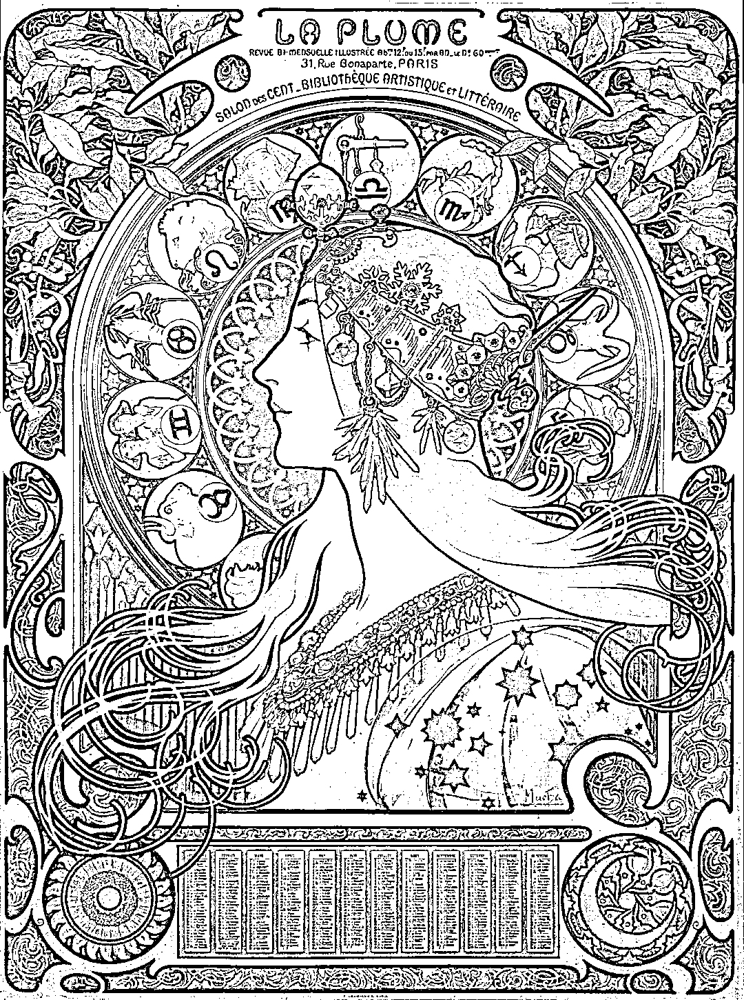

| 阿尔丰斯·穆夏《黄道》

**现代艺术家**

在 20 世纪的大灾难之中，艺术家们寻求新的、试验性的艺术表达方式。越来越明显的情况是，技术进步不等于道德进步，许多人拒绝相信永恒真理和确实可靠性。毕加索、百水、达利等艺术家在作品中反映了这种迷惑彷徨，并力图为人指明宇宙的方向，其中一部分是通过运用占星学来完成。

表现主义、立体主义、抽象艺术、超现实主义风格是对已确立的或正统的艺术体系的一种抗议。**艺术家对灵性问题的态度愈发开放。**占星学本身也变得更有影响力，因为**占星学受到了心理学，尤其是荣格的影响，发生了根本性的变化。**瑞典艺术家、神秘主义者希尔马·阿夫克林特是抽象艺术的精神先驱，她用黄道星座创作了《鸽子》系列画作。紧随其后的是保罗·克利、瓦西里·康定斯基、汉娜·霍克。法裔加拿大艺术家弗朗索瓦·达雷格里特用赛车的形式描绘了黄道十二星座。

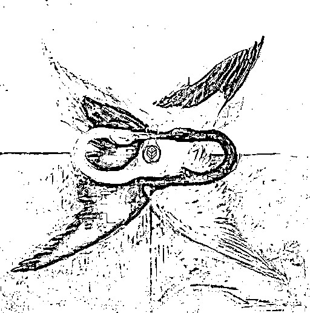

| 西尔马·阿夫克林特画作

**波普艺术大师安迪·沃霍尔也使用占星学符号。**1959 年，他刊印了黄道十二星座，附上手写的解读，展现了他对占星学的深刻理解。超现实主义大师萨尔瓦多·达利也很重要，值得一提。1967 年，他创作了石版画《黄道十二星座》。荷兰超现实主义画家乔夫拉·波斯查特（Johfra Bosschart）创作的星座海报，后来非常受欢迎。在现代，在手工艺品和珠宝中加入占星学符号已是司空见惯。最后，不要忘记奥地利艺术家百水（佛登斯列‧汉德瓦萨）。百水在维也纳的家门口有一座黄道喷泉，体现出这位艺术家与占星学的紧密联系。是以，**占星学回归了，不仅回到了我们的文化中，也回到了艺术中。**即便如此，许多正统艺术史学家和学者仍选择忽略或否认占星学艺术作品的重要性。这种狭隘的观点忽视了 100 年前阿比·瓦尔堡给出的建议：**没有一些占星学的基本知识，便无法全面完整地解读重要的艺术作品。**尽管瓦尔堡仍是最有影响力的艺术史学家之一，但他的观点受到很大程度的忽视。

**版权声明：**本文由若道翻译发布，欢迎转发，反对抄袭。友号转载请申请白名单。

**克莱门斯·路德维西**是一位作者，兼德国占星师协会主席。他从 20 世纪 80 年代末开始实践占星学，发行了数本关于占星学的著作，包括《艺术中的占星学》。

**系统学习占星学**

**点击图片了解详情**

**微信又双叒叕改版啦，不想错过若道君的推送？**

**就把若道设为星标吧！**

**▼**

**喜欢记得点一下在看哦☟**

********报名直达入口********

# 他说爱你的时候，只是想“啪啪”么？ | 柏拉图恋爱的背后

> 原文：[`mp.weixin.qq.com/s?__biz=MzA5NjA0NTAxNg==&mid=2651446135&idx=1&sn=b976892599b6ffe33c4ae679718c2588&chksm=8b4b69c0bc3ce0d64985291164b04eeba14cd3a691aa8bea1ed20ef00e711c3ec6895e445f33&scene=126&sessionid=1692737979#rd`](http://mp.weixin.qq.com/s?__biz=MzA5NjA0NTAxNg==&mid=2651446135&idx=1&sn=b976892599b6ffe33c4ae679718c2588&chksm=8b4b69c0bc3ce0d64985291164b04eeba14cd3a691aa8bea1ed20ef00e711c3ec6895e445f33&scene=126&sessionid=1692737979#rd)

**************☆ ************************后台************************回复“今日”，给你一句生命态度**************

作者/达比·科斯特洛

译者/江艺 校对/Leisha

编辑/玫瑰 封面/书君 图片/全景网提到爱，就难免想到性。爱和性可以分开，还是并存？含有性的爱是否是“不纯洁”、“不纯粹”的呢？让我们来看看这对占星学师生关于柏拉图的对话吧。**对话录：在性中寻找使性成为性的东西****维塔：**你有没有遇到过柏拉图式的爱情？当我说柏拉图式的爱情实际上是情欲之爱时，你可能会感到惊讶。
**塞尔维：**当然了。我以为柏拉图式的爱是无性之爱而情欲之爱是性爱。**维塔：**很长一段时间我也是这么想的，直到我发现了创造“柏拉图式的爱情”这个短语的人的作品。我们通过他的书信和著作来了解他的生活经历，并将其与行进行星穿过他出生星图的历程联系起来，得出了一些有趣的结论。最近有个人一直在跟我谈论他们爱情上的不幸。这个男人的爱情经历和痛苦使他发生了深刻的转变。他创造的术语“柏拉图式的爱情”就是其中一部分。他的名字叫马尔西利奥·费奇诺，是一个聪明的年轻人，在很年轻的时候就发现了柏拉图，由于他严肃、专注，拉丁语和希腊语都很流利，因此受科西莫的委托，将柏拉图的所有作品从希腊语翻译成拉丁语。他对占星学充满热情，努力将其融入自己的天主教义——他的一生似乎都在努力调和不可调和之物：柏拉图和新柏拉图主义思想和基督教；异教多神论和犹太-基督教一神论。以及个人层面：他强烈的性本能和禁欲。

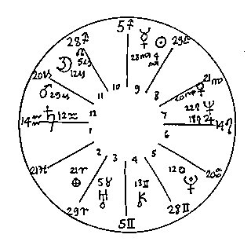

这是他的星图。我们可以看到他从父亲那里获得了激情的天性——太阳和水星在天蝎座，火星在摩羯座。从母亲方面，他有压抑自己对爱和亲密的自然欲望的强烈本能——月亮在摩羯座，金星在处女座。**塞尔维：****太阳在天蝎座，火星在摩羯座——“强有力”、“饥渴”、“不屈不挠”地从生活中寻求满足，并且“性欲”很强。**女性行星——月亮和金星，都在土象星座，但在摩羯座和处女座这两个更“自我控制”的星座。他通过摩羯座月亮继承了母亲被控制和控制性的情感天性，通过处女座金星继承了母亲对其服务和善良被重视的渴望。所有这些加在一起可能表明了一种**严酷和苛求的天性，受到强烈的控制，自然倾向于自我压抑和自我控制，当然，还有性禁欲。**众所周知，天蝎座擅长将其基本的人类本性转变或重新疏导，成为在某个层面上为他们赢得权力的天赋。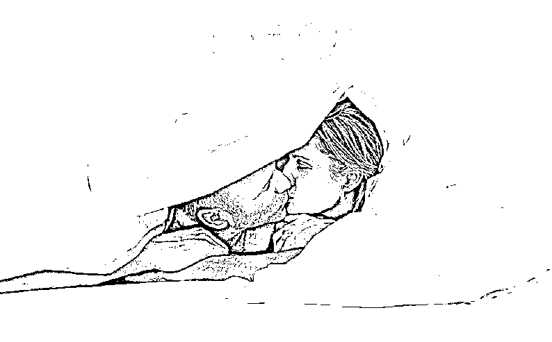**维塔：**是的，这些特质通过相位和宫位得到加深。他的天蝎座太阳在第九宫，与落在水瓶座上升的土星成四分相。金星在处女座，刚刚进入第八宫，与第十二宫的火星成三分相。**塞尔维：**土星在水瓶座合相上升点——他的理想主义生活方式，以及对表达实现理想的需求。土星的落点也必然表明了他与身体之间的尴尬关系，最不舒服和最需要自我成长的那种强烈的害羞忸怩。土星与太阳形成挣扎的四分相，表明他不得不非常努力地工作来实现他的目标。因为他的太阳在第九宫，能不能说这是一场实现他自己哲学的斗争？**维塔：**是的。通过活出天蝎座的激情来达到哲学家意识的山顶。第九宫旅程的更高目标，无论是在身体还是心灵和想象层面，都是哲学的目标——在我们所看到的时间和空间中不断变化的模式中寻找永恒的真理和意义。因此，土星在上升点四分他的第九宫太阳，表明了实现这个目标需要巨大的努力。他必须表达土星在水瓶座的崇高理想，成为其他人的榜样；他必须转变自身，在智慧中注入激情的本性。他的太阳也因为与巨蟹座冥王星成三分相而加强，冥王星还与他第十一宫的摩羯座月亮对分。因此，为了实现他转变为真正哲学家和教育家的目标，他要与各种团体和他们的目标进行了激烈的碰撞。冥王星这个死亡与重生之主正在秘密地促使他突破自己的本性——让自己的本性死亡从而获得一些深刻的东西。冥王星与月亮的对分相向我们展示了他是多么容易因太亲密的情感接触而感到窒息，而他的个人情感强度又创造了一些必然使他们感到幽闭恐惧的关系情境。他的金星在第八宫宫头，重复着这个主题——强烈渴望被爱，渴望被所爱之人的眼睛映照。这被摩羯座的土象火星（隐藏在代表牺牲的第十二宫）进一步加剧。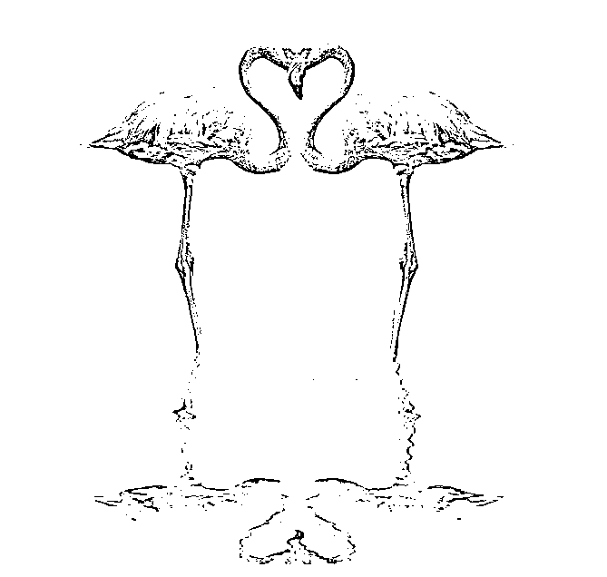**塞尔维：**如果他的火星隐藏在第十二宫，那么他是否倾向于牺牲他的欲望？也许他从未允许自己陷入爱河过！也许禁欲对他来说很容易。**维塔：**记住，他是天蝎座太阳。丹恩·鲁伊尔说天蝎座的本质特征是：**“个体渴望与其他个体绝对融合，以共同构成一个更大的有机整体。”**这是其中一种描述天蝎座最关注性的说法，不管性后来会转化成什么。他还说，**天蝎座不仅仅是关于繁殖的性，也关于“神秘的性……这是一种自我遗忘的渴望，并通过另一个人，与更大的整体，甚至与“上帝”结合**。这不是一种简单或直接的本性。但是在这个星图中还有一个你必须知道的因素——木星。

他的木星在狮子座第七宫——“他者”之宫，在这个宫位里，我们献出自己的一部分，并在别人身上寻找它们。而他的狮子座木星与土星对分。 

**塞尔维：**所以他放弃了自己身上闪耀的、高贵的阿波罗特质，而保留了土星苛刻的监工特质。**维塔：**正是如此。他在别人身上看到自己最好和最快乐的部分，并认同于土星。事实上，他在给朋友阿马尔菲大主教的一封信中说：**“我认为你猜得到，我是多么想和某个天性快活的人一起生活，这样，我的出生星体所赋予我的，或哲学所加之于我的苦痛和忧郁成分，可能最终会被木星光芒下出生的人所带来的甜蜜情谊缓解。”****塞尔维：**我看到海王星和木星在狮子座合相。他一定深深为那些他认为“高贵”的人倾倒。他一定视他们为神。这对他来说一定是多么痛苦啊——一个充满激情的天蝎座，有着土象的性本能，渴望与他人神秘结合。他对这些配置做了什么？这又怎么让他陷入柏拉图式的爱情?**维塔：**这个短语首先出现在他写给朋友阿拉曼诺·多纳蒂的一封信中，他们二人都很喜爱柏拉图：**“喔，阿拉曼诺，我们的友谊会被称为什么？既然它完全是源于柏拉图式的爱情，那么我们一定要称它为柏拉图式的爱情......这种由美德的火焰点燃的神圣的爱，从天国的光芒中变得愈加强烈，它寻求回到崇高的天堂，在那里不惧任何尘世疾病的烦恼。”**他从来没有告诉我们，他们在什么意义上是“爱人”，但一切都指向他自己禁欲的生活。他似乎一直在寻找某种方式来表达他对阿拉曼诺的深刻感情——而这就是他的方式。也许这里面有性的感觉，但是他在寻找另一条路径来表达他的感觉。
另一个人在他的挣扎和转变中更为重要。他的名字叫乔瓦尼·卡瓦尔康蒂，费奇诺在 1468 年左右遇见他。从他给这个人写的许多信中，我们可以看出他对他的感情有多深。听听这个：**“照顾我自己和我父亲的多病之身是我的一个负担。你的缺席是另一个。二者都必须泰然忍受，以免因为不耐烦而变得更加烦累。”**尽管他在一个美丽的地方做着自己喜欢的工作，但这些年来他仍然饱受折磨，我认为这是因为他那可怕的渴望，热情的天性，这似乎无解。他在那个时代是注重灵性的人，而基督教总是拒绝生育之外的身体欲望。其更高的目标是精神的解脱，他发现这种传统与他自己复杂的本性非常相容。例如，他在《爱》一书中写道：**“性的疯狂导致放纵，因而导致不和谐。因此，它似乎同样导致丑陋，而爱则导致美丽。丑与美是对立的；因此，任何把我们带到它们那里的动机，似乎都是彼此对立的。因此，交媾的欲望和爱不是相同的动机，而是对立的。”**接下来还有，但我们开始听到了柏拉图的思想：**“一个人，当他被幻象召唤到崇高境界时，因为触碰而掉落泥淖，我们必须把他看作是既疯狂又痛苦的人。虽然他可以通过人类的美来思考神性，从而变成神而不是人，但他也因为更喜欢形式的物质阴影而不是真正的精神之美，从而由人返归野兽。”**最后一段实际上是写给卡瓦尔康蒂的。这是他土星回归的那年，直到七年之后（渐盈的四分相时），他的信件和他的星图，表明他在与他自己的本性激烈斗争。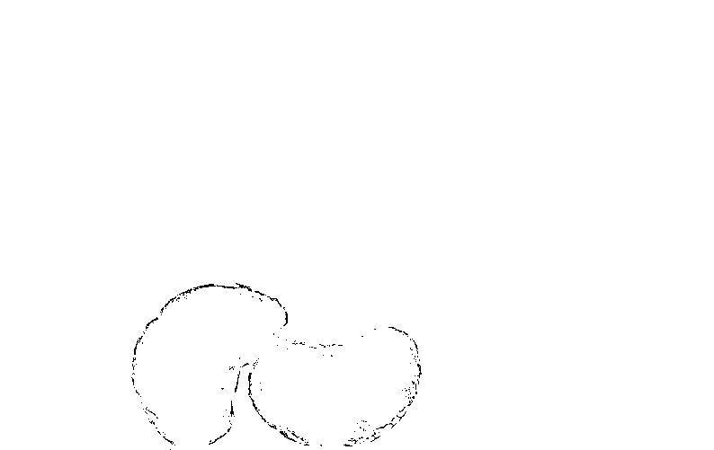**塞尔维：**你曾经把土星回归描述为我们被要求，或被告知，要为我们为此生必做之事承担起责任的时期。接下来的七年一定是这项工作的开始。**维塔：**是的。在这七年结束的时候，发生了一些事情。1469 年，他 35 岁，土星在金牛座正对分他的天蝎座太阳，并四分他尴尬的、理想主义化身的水瓶座上升合土星，同时四分他关系之宫的浪漫木星（和海王星）——一些改变发生了。无论何时当土星在金牛座时，个人在爱情本性方面都有需要去完成的工作，因为他对每个行星在更高层面的意义很敏感，所以他真的努力简化他的爱情本性。当然，土星是三分他的月亮和金星，在这段时间里，通过恩典和工作——他找到了他的方式。他对柏拉图《会饮篇》的评论著作《爱》，就是结果。他在给心爱的卡瓦尔康蒂的信中写道：**“很久以前，亲爱的乔瓦尼，我从俄耳甫斯那里得知了爱的存在，它掌管着开启整个世界的钥匙。然后，从柏拉图那里，我学到了爱的定义及本质。但是，这位神的力量和影响力一直对我隐藏，直到我三十四岁时，一位神圣的英雄，用天堂的眼睛向我惊鸿一瞥，点一点头，向我表明了爱的力量是多么伟大。****在我看来，通过这种方式，我对爱情的故事有了充分的了解，于是我写了一本关于爱的书。这本我亲手撰写的书，我已定意专献于你，好将你之所有归还于你。”****塞尔维：**他称卡瓦尔康蒂为“神圣的英雄”。真是对木星与海王星合相在狮子座在第七宫的完美描述！当然，他并没有意识到当时尚未被人发现的海王星。有趣的是，天王星、海王星和冥王星似乎只是加深了“七星星图”所展现的费启诺的形象——它们并都没有揭示出矛盾的故事。他知道木星在他的第七宫，也知道这表明他渴望“木星光芒下出生的人所带来的甜蜜情谊”。我们知道海王星在那里，增加了对神秘结合的渴望和对所爱之人的理想化以及幻灭。**维塔：**他的幻灭有许多是生命中所崇拜之人造成的，但他似乎并不责怪他人或世界——听起来仿佛他为自己人生旅途中发生一切承担了责任，但他确实抱怨和“指责”土星带给他的许多挣扎！让我告诉你他从柏拉图那里学到了关于厄洛斯和爱情的什么东西。**厄洛斯是一个希腊语的词，是“性欲”这个词的基础，但在柏拉图那里，它的意思是在性之中寻找某种东西，可以这么说，是使性成为性的东西。**柏拉图把它独立出来，带到大家眼前，萃取其精华，因为这个词在他的时代和我们的时代一样被误解了。我认为柏拉图试图为那些让他感觉迷失了方向的朋友和学生们澄清一些东西；错误地把性当成了他们在寻找的东西，忽略了一个事实，那就是他们通过性寻找的是另一种东西。据我所知，柏拉图有关厄洛斯的理念来源于在他出生之前盛行的一些神秘宗教。这些宗教通过神话解释了人的双重本性（世俗性和神圣性），诸如匝格瑞俄斯或狄俄尼索斯的神话，狄俄尼索斯是宙斯的儿子，在小时候就被泰坦们杀死并吃掉了，宙斯大发雷霆，用雷电杀死了泰坦们，然后用他们身体的灰烬创造了人类。因此，神话表明，我们的本性是泰坦的、世俗的，但通过他们所吃掉的匝格瑞俄斯，同时也是神圣的。俄耳甫斯的传统显然是**寻求通过净化和狂喜将神圣元素从尘世的肉欲部分中解放出来，这样它就可以与神圣重新结合**。其他宗教也曾有过，现在仍然有，这种双重性的观念，世俗性和神圣性，他们都通过这样或那样的仪式来寻找方法，把神性从感官中解放出来，这样神圣的部分就可以找到它正当的天堂家园。**这种来自我们自身神圣部分对神性的渴望，就是厄洛斯。**即使在基督教中，也有很长一段传统表达对上帝的这种渴望。圣保罗，真正构建了基督之爱的概念——犹太-基督教的上帝对我们的爱的概念，也表达了他自己对上帝的渴望。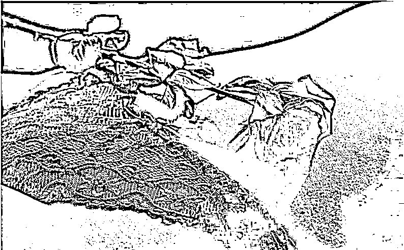圣奥古斯丁，甚至伟大的中世纪学者圣·托马斯·阿奎那都以这样的方式描写上帝，人们可以感受到他对这个神圣他者的渴望。因此，即使在基督教传统中，也有早于费奇诺的渴望神性的先例。但据我所知，他并不是在这里发现了给他解决方法的想法。这一定是在他翻译《会饮篇》的时候；他的整本书《爱》就是对这部作品的一篇详尽评论。在《会饮篇》中，狄奥提玛，曼提尼亚的女先知和苏格拉底尊敬的老师，告诉苏格拉底关于厄洛斯的事。然而，她并不称厄洛斯为神，她称他为守护神，或者我们也可以说是精灵。像所有的守护神一样，他的职责是在神与人之间来回传递信息，或者是作为联结世俗与永恒的桥梁。她说他是在阿芙罗狄蒂出生那天众神庆祝的宴会上出生的。花园里智慧神正在酣睡，贫穷神进来，使自己怀上了他的孩子。那孩子就是厄洛斯。狄奥提玛说厄洛斯或爱是贫穷的，像他的母亲一样，总是缺乏并渴望一些东西。但他也像他的父亲一样睿智和聪明，所以他可以从生活中得到他想要的，而他想要的就是通过拥有他认为好的和美丽的东西来变得快乐。**塞尔维：**我记得柏拉图说过，在理念的领域，真、美、善是最高的，是灵魂的更高层面最终追求的东西。**维塔：**没错。狄奥提玛说，当一个人坠入爱河时，是心爱之人的美吸引了他。如果他与心爱的人相处得当，自我约束，那么他所看到的美就会让他瞥见他的灵魂真正在寻找的神圣之美。看到一个人的美会让他在另一个人身上看到美。你知道坠入爱河的状态就好像你被施了一种魔法，在这种状态下，一切都变得光彩夺目。狄奥提玛说：**“这是接触和开始了解爱的奥秘的正确方式，开始于在这个世界上发现美的例子，并将其作为步入不断提升绝对之美的目标，从一个物质之美的例子到二个，再从二到多，然后从物质之美到道德之美，从道德之美到知识之美，最后从知识之美到绝对之美。”**狄奥提玛说，你只能通过培养你自己和你所爱的人的真正的善来做到这一点，这是唯一的目标，可以让爱实现它的承诺。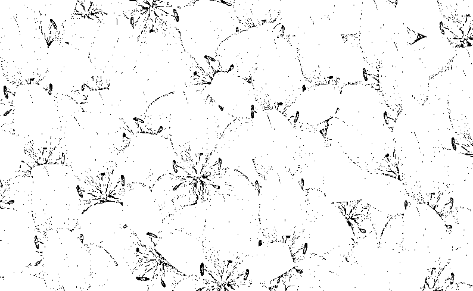**塞尔维：**所以，她的意思是，当我坠入爱河时，我所追求的就是永恒的美，即使我自己并不知道。然后，因为我不知道，所以当那个人被证明一点都不美丽时，我的幻想就破灭了——老实说，当我看到自己表现出一种丑陋的模样时，这种幻灭变得更糟。我从没见过我爱上的人身上带着某种神圣的火花。为了保持我通过坠入爱河而达到的那种状态，我必须保持“正确的行为”，必须培养自己和他人的良善之心。我想我几乎期待着再次恋爱了——至少我已经对爱情的真谛有了初步的了解。我开始对马尔西利奥·费奇诺这个人有了一些了解，他读柏拉图，并创造了柏拉图式的爱情这个术语。他的木星-海王星在狮子座在第七宫！他在他爱的人身上寻找神圣的火花。然后随着时间让爱变得晦暗，他的幻想也破灭了。当土星进入金牛座时，他经受了考验，并以某种方式通过了考验。然后他理解了柏拉图！
**维塔：**没错。在某个时候，他对他心爱的卡瓦尔康蒂写道：**“当然，爱（正如所有哲学家所定义的那样）是对美的渴望。身体的美不存在于物质的阴影中，而存在于形式的光明和优雅中；不是黑暗谜团中，而是在清晰的比例中；不是在迟钝无意义的重量中，而是在和谐的数量和度量中。****但我们只能通过思考、视觉和听觉获得那光明，那优雅、比例、数量和度量。一个真正爱人的真正激情会延伸到此为止。然而，当其他感官的欲望驱使我们走向与美或爱相反的物质、重量和缺陷时，那就不是爱了，而是一种愚蠢、粗俗和丑陋的欲望。”**柏拉图确实承认感官或“庸俗”的厄洛斯，对感官或性满足的渴望，但他似乎更重视“神圣的”厄洛斯，即灵魂的更高面向。他认为这是与形式合一的渴望——**我们短暂、时限性、不断衰退的世界背后的真实世界，我们对美的爱就是我们对纯粹形式的爱**。在《会饮篇》中，他让狄奥提玛将厄洛斯的两个面向都描述为对永生的渴望。世俗的厄洛斯引导男人为繁衍后代而与女人发生性结合。这就带来了肉体上的永生。神圣的厄洛斯引导男人为了思想和精神的伟大成就而去爱男人，这是另一种形式的永生。然而，她说，如果这种爱表现在性行为中，那么我们就迷失了方向，陷入了沉沦。作为一个现代女性，我不同意柏拉图关于性爱只是关于男女之间繁衍生息的观点。我认为**爱可以通过两个人之间的性行为来表达，而不仅仅是为了繁衍后代。**但我同意，除非双方都珍惜自己和对方对永生领域的灵魂渴望，无论是渴望善、真、美、神圣、永恒，或者仅仅是神，否则他们的爱几乎不可能在时间的磨灭中幸存。在这些奇怪、无神的时代，当心灵的知识——通过想象力到达的现实已经丢失，我们已经忘记了这个隐藏的、永恒的现实存在。我们想要去相信，我们所要做的就是找到一个能让我们完全满意的人，然后我们就会快乐、得救、被救赎。或者，我们所要做的就是充分改变自己，让自己值得让别人带给我们快乐。**塞尔维：**这确实很有趣。但有一件事让我困惑。我们谈话之初，你说过，他对爱和爱的痛苦的体验让他发生了深刻的转变。你是说这种转变让他摆脱了爱带来的所有痛苦吗?他所经历的这种“柏拉图式-厄洛斯式”的爱解决了所有的爱情痛苦吗?**维塔：**从我们所知道的一切来看，他确实在他生命的最后获得了一种深刻的平静。但到那时——他去世时已经 65 岁，似乎他已经燃烧殆尽走向平静……**塞尔维：**当一个人身处情爱的浪潮中，善与真可能不那么容易被察觉，然而这正是费奇诺用来促使自己转变的方法。现在我要想想这个人，马尔西利奥·费奇诺，下次我再陷入对美的爱时，我要把眼睛聚焦在所爱之人身上的神圣火花。此时此刻，我的愿望是在真、善、美的观念中前行。我开始意识到我可能根本不知道该怎么做。我突然在想，我刚刚跨进这扇门是不是开启了一段漫长的学徒之旅？看，外面晴了，我甚至能看到一两颗星星!

**版权声明：**本文由若道翻译发布，欢迎转发，反对抄袭。友号转载请申请白名单。

**达比·斯科特洛**

若道签约老师。在美国波士顿学习占星学，在非洲生活过 12 年，于 1983 年移居英国伦敦。她曾在长达 25 年的时间里担任心理占星中心的首席教师，是占星研究学院的任课教师，也是伦敦占星学院的客座导师。此外，她拥有“文化天文学与占星学”硕士学位。她在世界各地授课与写作，服务全球客户是她占星师生涯的核心。其著作包括《占星学中的月亮》《水元素与火元素》、《土元素与风元素》、《火星四重奏》、《占星学》。

**系统学习占星学**

**点击图片了解详情**

**微信又双叒叕改版啦，不想错过若道君的推送？**

**就把若道设为星标吧！**

**▼**

**就是这个“在看”，戳戳戳 ☟**

**********报名直达入口**********

# 雷蒙德·梅里曼金融占星周运 | 密切关注 10 号左右的行情

> 原文：[`mp.weixin.qq.com/s?__biz=MzA5NjA0NTAxNg==&mid=2651446135&idx=2&sn=8ee9e59ec01abacb4955740d0b26957f&chksm=8b4b69c0bc3ce0d6963592cb15cc2d78d6da40f44ebfa7ffdc2d86a41a364fccc1c0bbe7f8db&scene=126&sessionid=1692737979#rd`](http://mp.weixin.qq.com/s?__biz=MzA5NjA0NTAxNg==&mid=2651446135&idx=2&sn=8ee9e59ec01abacb4955740d0b26957f&chksm=8b4b69c0bc3ce0d6963592cb15cc2d78d6da40f44ebfa7ffdc2d86a41a364fccc1c0bbe7f8db&scene=126&sessionid=1692737979#rd)

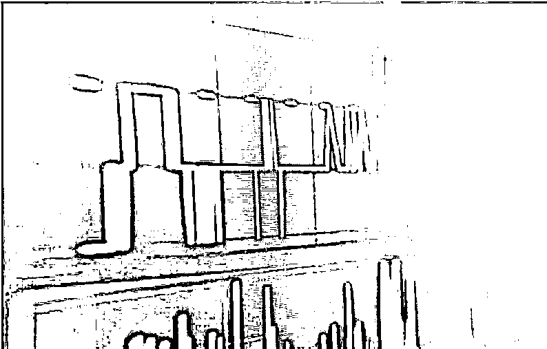

作者/雷蒙德·梅里曼 译者/Luke
编辑/玫瑰 图片/全景网

雷蒙德·梅里曼是在金融占星学界稳坐第一把交椅的占星师，同时他也是若道签约的金融占星课老师，我们引进了雷蒙德·梅里曼老师的《[上证指数月度报告](http://mp.weixin.qq.com/s?__biz=MzA5NjA0NTAxNg==&mid=2651445061&idx=2&sn=dfe830475f87883733c5c4d45d95c49c&chksm=8b4b65f2bc3cece41c3e917164f80546202cd12c2f6cdc8756761ad80457f3561a87d4a97e1a&scene=21#wechat_redirect)》及《[黄金报告](http://mp.weixin.qq.com/s?__biz=MzA5NjA0NTAxNg==&mid=2651445061&idx=2&sn=dfe830475f87883733c5c4d45d95c49c&chksm=8b4b65f2bc3cece41c3e917164f80546202cd12c2f6cdc8756761ad80457f3561a87d4a97e1a&scene=21#wechat_redirect)》《[2021 年金融预报](http://mp.weixin.qq.com/s?__biz=MzA5NjA0NTAxNg==&mid=2651436458&idx=3&sn=a7522c271761ef772fc91991ff11d965&chksm=8b4b071dbc3c8e0b452375ae3593028ab68b7b6157b45ee7c92943ff3396990d7748d7cd0967&scene=21#wechat_redirect)》。我们经老师的授权，将每周刊登梅里曼老师的周运，供大家参考和学习。于是，这是本周的周运（6.7-6.11）。

**说明：以下时间采用纽约证券交易所所在地美国东部标准时间。**

**展望与回顾**

**5 月新增就业数再次让人失望。美国劳工部周五报告称，非农就业人数增加 559000 人，基本与过往持平，仍然未达到预期。预期的非农就业人数增加是 671000 人。**

**——杰夫·考克斯**

**《新增就业数加速，却仍然未能达到预期》**

**www.cnbc.com**

**2021 年 6 月 4 日**

**拜登总统描绘了一幅美国经济复苏的美好前景，并声称他在上任的头 3 个月里在创造就业机会方面击败了所有其他总统。事实上，拜登确实在上任头 3 个月创造了比其他总统更多的就业机会——大约 150 万，但这主要是因为美国人口比过去更多了。如果按占劳动力的百分比计算，从 1977 年 2 月到 4 月，吉米·卡特总统领导下的就业增长比今年同期的 3 个月要快得多。**

**——玛丽莎·舒尔茨**

**《拜登标榜自己是美国历史上创造就业机会最快的总统》**

**www.foxbusiness.com**

**2021 年 5 月 28 日**

我们又到了这儿。上一次土星与天王星形成渐亏四分相是 45 年前的 1976-1977 年。我们发现，乔·拜登和吉米·卡特之间存在相似性。后者在 1976 年被选为总统，于 1977 年 1 月开始总统任期。两者在个性、选举年周期和地球宇宙学征象之间存在对应之处，而且他们在上任的头 3 个月里，经济业绩也差不多。你可能还记得后来发生了什么。1976-1977 年是恶性通胀飙升的起点，最终导致了接下来十年期的滞胀。我们的未来可能再一次重复历史上发生的事，正如行星周期和人类活动周期之间的关联所表示的那样。

**在接下来 1-3 年里发生的事情非常重要。**就现在来说，快乐的日子回来了，因为越来越多的人重返工作岗位，享受乐趣，并且可以去那些有新冠病毒肺炎疫苗的地区旅行。正如《[2021 年金融预报](http://mp.weixin.qq.com/s?__biz=MzA5NjA0NTAxNg==&mid=2651436458&idx=3&sn=a7522c271761ef772fc91991ff11d965&chksm=8b4b071dbc3c8e0b452375ae3593028ab68b7b6157b45ee7c92943ff3396990d7748d7cd0967&scene=21#wechat_redirect)》（点击可阅读）（写于 2020 年 11 月）所预测的那样，**行进海王星将在 2021 年 2 月离开与处女座 15°-19° “超级度数”**（也是 1965-1966 年天王星-冥王星合相的度数）的对分相。这代表新冠病毒肺炎大流行会在 2021 年 2 月前后 3 个月中达到顶峰。

在春末夏初之际，最糟糕的情况已经结束了。事后来看，美国疫情的峰值确实在 2021 年 2 月。如果我的预测准确，直到 2026 年+/-1 年的白羊座土星合相海王星以前，我们都不再需要担心下次疫情流行出现了。

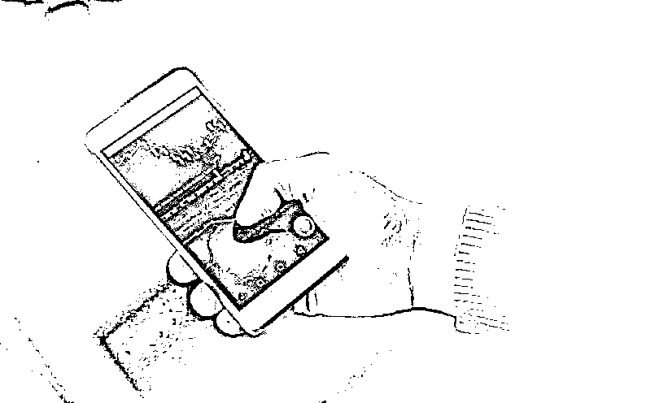

回到当下，上周全球股票指数又有着积极的表现。荷兰 AEX 指数、德国 DAX 指数、苏黎世 SMI 指数、澳大利亚 ASX 指数印度 NITFY 指数和巴西 Bovespa 指数均创下历史新高。其他指数则维持了 2 月 16-18 日的多年高点，这些高点在土星-天王星第一次形成精准四分相期间出现。中国的上证综合指数、香港恒生指数和日本日经指数就是如此。纳斯达克当时也与历史最高点构成双顶。这很重要，因为有影响力的土星-天王星四分相将在下周一 6 月 14 日展开。它是 2021 年所有地球宇宙学征象中最强有力的。

其他市场，黄金在 6 月 1 日升至 1919.20。这是自 1 月 6 日以来的最高价格。白银不甘落后，在 6 月 1 日升至 28.71，但仍低于 5 月 18 日的近期高点 28.91。这次市场间看跌背离之后，贵金属市场在上周四和周五出现了剧烈的抛售。原油上周表现强势，飙升至 2018 年 10 月以来的最高价位，接近 70.00 美元。这与我们对木星在 5 月 13 日-7 月 28 日短暂进入双鱼座的预期一致。木星、海王星和双鱼座守护原油价格。**短期占星趋势和长期考量**

**白宫的经济分析结论是，经济增速放缓是不可避免的。人们相信长期来看，美国经济增速不可能超过 1.9%……增速如此缓慢的经济，不可能承担起高额的国防预算和拜登的社会福利政策。说白了，这一预算将促成美国的经济和政治衰退。问题是，美国人民是否接受。**

**——《未来的经济滞胀》**

**《华尔街日报》社论版**

**2021 年 6 月 2 日**

**这是一个巨大的赌注，赌的是政府投资可以取代私人投资并取得更好的结果。这方面的历史记录并不令人鼓舞……这让我们想到了美联储。它拥有巨额抵押贷款证券的投资组合。现在，联邦债务和抵押贷款证券正好是小型固定收益投资者偏好的投资方案。美联储的大规模购买计划大幅降低了回报率。**

**美联储奉行伤害小储户利益的政策，已经超过 10 年了。这种不道德的行为没有得到足够的关注……这份预算也假定，除了伤害小储户以外，没有其他的负面后果。去年 11 月，选举人团投票决定逃离特朗普的政治舞台剧。在财政和货币政策上进行如此大的冒险是没有必要的。**

**——罗伯特·罗布**

**“拜登的预算是一场巨大的赌博”**

**亚利桑那共和国**

**2021 年 6 月 4 日**

我们现在正处于本年中地球宇宙学活动最剧烈的时期之一。**它始于水星逆行，逆行发生在其守护星座双子座，5 月 29 日-6 月 22 日。**众所周知，恶作剧者水星往往对应着**反复无常的市场活动，在给出看跌或看涨的技术信号后价格突然反向运动**。这通常是政府领导人含混不清的信息或经济报告自相矛盾造成的。在水星逆行期间，困惑甚至比往常更加严重，因为逆行的恶作剧者水星将与双鱼座的海王星形成四分相。**海王星和双鱼座与困惑、误解或蓄意传播虚假信息相关，一定程度上与水星逆行的影响力相仿**。接下来的几周在很多层面上可能是光怪陆离的，至少金融市场会受影响。到底是牛市，还是熊市？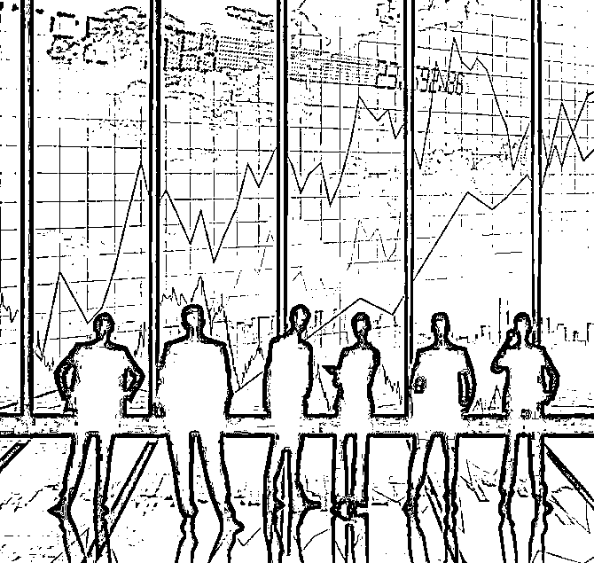**在这轮水星逆行的中期——6 月 10 日，在双子座 19° 将出现日环食。**这次日食合相逆行的水星，四分双鱼座的海王星。事实上，6 月 10 日也是水星逆行周期的中点，**此时市场容易再次反转，如果它没有在水星逆行的起点 5 月 29 日+/-2 日反转的话。**日食（水星逆行的中点）加剧了当前的问题。换句话说，**困惑和虚假信息、谣言可能会加剧**。一个人完全有权提问：什么正被掩盖？什么正被隐藏？是什么转移了人们对正在发生事件的注意力？**如果你相信某事正在发生或将要发生，那么明智的做法是考虑相反的事件发生的可能性**。如果看起来市场将要上涨，那么不妨考虑一下它其实是在为下跌做准备，或反之亦然。你所看到的或你所认为正在发生的事情可能根本不会发生。这种天象组合指示着大众的幻觉。不要误解我。如果不需要负责任的话，幻觉也可以是令人愉快的。但是如果你要负责，这不是逃避责任的时刻。在这些奇怪现象发生的同时，**土星也将在 6 月 14 日与天王星第二次形成精准渐亏四分相**。正如之前提到的，如果一个人不负责任的话，将会付出代价。代价可能是失去地位，或终止职责。考虑到火星将要在 6 月 11 日进入戏剧性的狮子座，加上所有的这些变动星座带来的疯狂（双子座日食，以及在双子座逆行的水星四分双鱼座海王星），不太可能得到谨慎或安静的处置。火星在狮子座很容易表演一出戏剧让每个人都看见。可能会让人尴尬。这对金融市场有何影响？可能就像一场没有人预见的爆炸、风暴或地震降临。可能这周就会爆发，或直到 7 月的前 10 天，当火星与土星-天王星形成 T 三角时爆发。可能在水星逆行期间会有第一幕，随后在水星转向顺行穿过先前逆行度数时展开第二幕。这既危险又令人兴奋。尽量保持安全，远离危险。**对于头寸交易者来说，这 1-4 周不好度过。**海王星-双鱼座元素代表自满。**木星在 7 月 20-25 日有利的行进指示着“非理性繁荣”**。但是所有这些变动星座带来的疯狂，加上 7 月初的土星-天王星-火星能量预示着一场粗鲁的觉醒。**歇斯底里，甚至恐慌的可能性会增加**。**密切关注原油（配给中断）和利率**。关注你的交易头寸，为防止市场突然反转，抵制过度交易或承担过大风险的冲动，因为这些天象模式指示这可能会发生。另一方面，那些细心和灵活的人可能会发现这是一个非常有利的时机，可以从短时间内价格的急剧变化中获取巨额利润。

**说明：以上日期基于纽约证券交易所所在的美国东部标准时间，由于存在时差，中国地区可能需要加一天。**

**版权声明：**本文由若道翻译发布，欢迎转发，反对抄袭。友号转载请申请白名单。

**雷蒙德·梅里曼（Raymond Merriman）**

若道签约老师。著名金融占星师，ISAR（国际占星研究协会）前主席，梅里曼市场分析公司的总裁。他由于“提升了占星学的职业形象”，在 1995 年国际占星大会上被授予轩辕十四奖；在 2012 年国际占星大会上，被授予轩辕十四终身成就奖。

1“中国上证指数月度报告”发售

**若道推出了****中文版****的雷蒙德·梅里曼中国上证指数月度报告，并持续发行该报告！**

当把金融市场的周期和占星学的周期相结合时，雷蒙德·梅里曼老师的金融占星学研究**为投资者应对金融市场的周期波动，并随之调整投资策略提供了极大的价值参考**。

**6 月中英文报告已上线！**

2“黄金价格周期月度报告”发售

**若道推出****中文版****的雷蒙德·梅里曼黄金价格周期月度报告！**不仅仅为广大读者在中国股市的投资出谋划策，更将视角放眼黄金市场。

**每当世界经济形式不明朗的时候，有一个地方是保值的港湾，那就是****黄金**。自 1982 年雷蒙德·梅里曼出版第一本研究《地球宇宙学征象与黄金价格的关联》的著作以来，**他一直作为最重要的黄金市场时机预测者之一享誉国际**。6 月黄金报告已上线，梅里曼老师将会告诉你他对这个关键时期如何操作的想法。也可以按照季度和一年期订阅，有更多优惠。季度和年度的好处是，你可以持续了解梅里曼老师对于不断在变化的市场的看法。即便他某一次看法和市场不一致，你也看到在下一期他如何调整自己的看法，并看到金融占星在一个长期时间段内对你把控风险的帮助。而能够长期控制风险、尽量找到安全的投资时机才是投资的长久之计。

**6 月中英文报告已上线！**

**购买套餐**，买得越多越优惠

中国上证指数月度报告套餐价

*   **单月报告**：280 元

*   **3 个月套餐**：780 元（260 元/月）

*   **12 个月套餐价**：2400 元（200 元/月）

**长按下图识别二维码**

**购买金融报告****套餐**

**▼**

黄金周期月度报告优惠

*   **双报告年度套餐更优惠（直降 900 元）**
*   **12 个月黄金报告+12 个月上证指数报告：仅需 3900 元**

**长按下图识别二维码购买黄金报告套餐**

▼

**2021 年金融年报发售中**

**1976 年以来，由雷蒙德·梅里曼撰写的梅里曼市场时机学院每年一次的年度预报沙龙和每年一本的《年度预报》一直在应用占星学原理为投资者们服务，提供卓越洞见，从未间断。**过去两年，3 小时的年度预报讲座和长达 200 页左右对金融市场的分析报告，帮助许多若道读者做出正确的投资决策，降低了投资风险，并获得相当不菲的投资收益。在群星摩羯座的时候，我们和你一起提早规划自己今年的投资安排。2021 年年度预报发售中**2021 年金融年报价格**：1280 元**沙龙时间**：2021 年 1 月 9 日（视频已上线）**沙龙形式**：英文讲座，配有中文翻译**点击下图了解详情**

▼

**点击阅读原文购买金融报告**

# ISAR 选修课 | 深度掌握次限月亮的技法（插班中）

> 原文：[`mp.weixin.qq.com/s?__biz=MzA5NjA0NTAxNg==&mid=2651446135&idx=3&sn=0900e19e413a0282b5344af6a0d27315&chksm=8b4b69c0bc3ce0d627f9e5a9009348e29bb34f043692891797c6a1e4327dbe1c031ba8999ceb&scene=126&sessionid=1692737979#rd`](http://mp.weixin.qq.com/s?__biz=MzA5NjA0NTAxNg==&mid=2651446135&idx=3&sn=0900e19e413a0282b5344af6a0d27315&chksm=8b4b69c0bc3ce0d627f9e5a9009348e29bb34f043692891797c6a1e4327dbe1c031ba8999ceb&scene=126&sessionid=1692737979#rd)

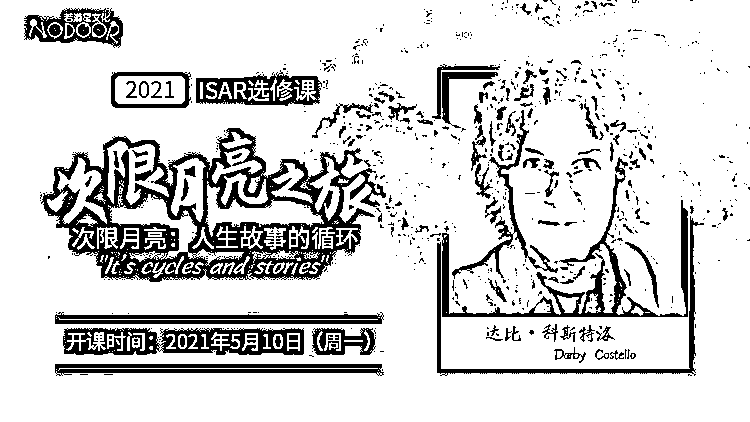

**星图中的月亮描述了我们在婴幼儿期和童年早期如何接收母亲的能量。**我们从出生开始就通过月亮的反射来体验母亲，正如月亮反射太阳的光一样。月亮也会描述一些我们可能会称之为灵魂的事物：**我们的人生经历在时间和永恒之间的内在反射物。**次限月亮通常被视为用于预测以及为事件择时的因素，但实际上它的内涵远远不止如此，要更为深刻和微妙。

**次限推进月亮**（Secondary Progressed Moon）：用次限推进，也即**一天即一年**的推进法时的推进月亮。次限推进月亮平均每月移动 1 度，虽然速度并非恒定。

**次限推进：托勒密时期，2 千年前发明。**

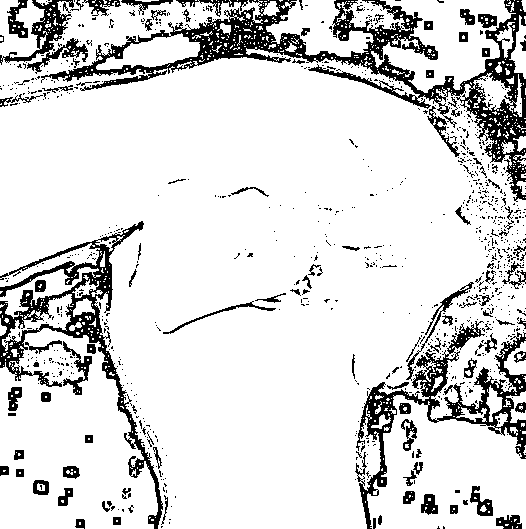

**当次限月亮在我们星图上的星座和宫位推进时，它会以唤起我们个体本质以及人性的方式，反映我们成长和发展的经历。**对于那些同时开展内在和外在生活的人来说，次限月亮可以成为一个向导，照亮自我反思和内在滋养的面向。**在八周的课程中，**我们将学习次限月亮是如何像镜子一样映照出我们最深的本质的。

**此课程可作为 ISAR 选修课。**

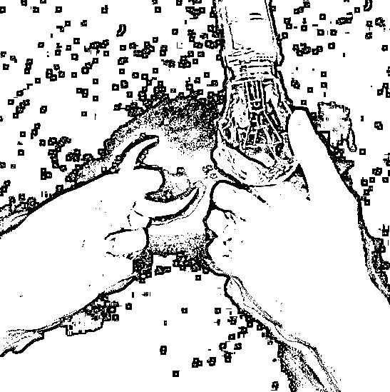

1

**课程安排**

**课程安排：5 月 10 日--6 月 28 日 （每周一）**

*   **5 月 10 日** 出生星图中的月亮与它在童年 0-7 岁的推进

*   **5 月 17 日** 7-14 岁：从自我到他人

*   **5 月 24 日** 14-28 岁：从他人到自我

*   **5 月 31 日** 次限月亮推进 vs 土星行进

*   **6 月 07 日** 次限月亮与其他行星形成的相位

*   **6 月 14 日** 30-60 岁的次限月亮推进：再次回转

*   **6 月 21 日** 60 岁以后的次限月亮之旅

*   **6 月 28 日** 次限月亮与次限太阳的关系

2

**课程大纲**

**第*****1*****讲  ****5 月 10 日 **

**出生星图中的月亮与它在童年的推进**

我们将学习出生星图中月亮的象征意义，以及它如何反映你的母亲以及你童年的家庭生活。我们将从元素的角度观察月亮，并研究从出生起你是如何得到母亲的关注的，我们将观察出生后几年的月亮的推进。

**第*****2*****讲  ****5 月 17 日 **

**从 7 岁到 14 岁：从自己到他人**

次限月亮与出生星图中月亮的第一个四分相在 7 岁左右出现。我们将学习在这个关键时间点我们是如何开始意识到自己是独立存在的个体，以及它如何让我们向家庭以外的其他人寻求滋养和生命。

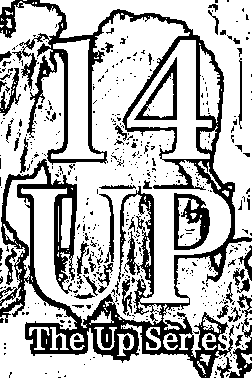

**第*****3*****讲  ****5 月 24 日 **

**从 14 岁到 28 岁：从别人到自己**

从十六七岁到 28 岁左右第一次次限月亮回归，我们完成了与他人和与自己的月亮的灵魂之旅。从次限月亮回归开始，我们就开始对自己的情感生活以及我和其他人之间所发生的负责。

**第*****4*****讲  ****5 月 31 日 **

**从 14 岁到 28 岁：从别人到自己**

当次限月亮描述我们内心的旅程时，土星的行进描述了我们与周围世界的联系，以及作为社会发展中的个体，世界对我们的要求。在我们生命的头 30 年里，它们几乎以相同的速度运行。

**第*****5*****讲 **** 6 月 7 日 **

**次限月亮与其他行星的相位**

我们将从次限月亮的旅程中抽身出来，看看它与各种不同人的星图的其他行星产生有趣而特别的相位时发生了什么，这样我们来了解次限月亮触及我们星图中的这些行星时会发生什么，以及我们该如何为自己的生命导航。

**第*****6*****讲  ****6 月 14 日 **

**30-60 岁的次限月亮推进**

当月亮再次绕着出生星图运行时，我们有机会将意识带到我们的情绪反应中，并开始引导我们的内在本性，而不是对发生在我们身上的事情束手无策。

**第*****7*****讲  ****6 月 21 日 **

**60 岁以后的次限月亮之旅**

在当今时代，60 岁以后过着积极生活的人比历史上任何时候都多。有的人在 70 多岁的时候坠入爱河并第一次结婚。我们将在这一讲探讨如何在我们生命的最后几十年里对自己和他人有用，这样我们就可以体验到生命的丰富多彩。

**第*****8*****讲  ****6 月 28 日 **

**次限月亮与次限太阳的关系**

最后，我们来研究次限月亮绕着星图运行时与次限太阳推进的关系。我们将通过星图案例来进行探讨。

3

**此次课程适合哪些人？**

*   有一定占星学基础，若道核心课 L3 以上水平；

*   希望成为优秀的占星师，想要借鉴国际大师次限解读思路并融入自己的体系的人；

*   希望研究自身人生周期，想好更好的规划人生的占星学者；

*   走在自我探索和个人成长道路上的人。

4

**主讲老师**

**达比·科斯特洛（Darby Costello）**

达比·科斯特洛（Darby Costello）在美国波士顿学习占星学，在非洲生活过 12 年，于 1983 年移居英国伦敦。她曾在长达 25 年的时间里担任心理占星中心的首席教师，是占星研究学院的任课教师，也是伦敦占星学院的客座导师。此外，她拥有“文化天文学与占星学”硕士学位。她在世界各地授课与写作，服务全球客户是她占星师生涯的核心。

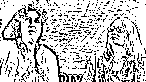

| 达比·科斯特洛与琳恩·贝尔

**网站个人简介：**

达比·科斯特洛（Darby Costello）出生于美国，1960 年代曾跟随弗朗西斯·萨科安（Francis Sakoian）、路易·阿克（Louis Acker）以及伊莎贝尔·希基（Isabel Hickey）在波士顿学习占星学。随后，她去了非洲，与部落疗愈者和占卜者一起共事多年，并在期间精进自己的占星学实践。1983 年，她去英国伦敦寻找占星团体。令她高兴的是，她找到了这样的团体，并在许多层面上参与其中。到伦敦后不久，她就开始拓展占星客户，并于 1988 年开始在由丽兹·格林和霍华德·萨司波塔斯创立的心理占星中心任教。十年后，她成为首席讲师，并为心理占星中心出版社撰写了几本书。

达比还是占星研究学院的导师，并于 2014 年获得荣誉文凭。她是心理占星学水星网络学校（MISPA）和占星大学的讲师，也是伦敦占星学院的客座导师。她在欧洲和世界其他地方教书和授课，也曾在巴厘岛、中国大陆和台湾等亚洲地区以及阿拉斯加等北美地区授课。2013 年，达比被授予查尔斯·哈维奖，以表彰她对占星学做出的卓越贡献。

2006 年，达比获得在巴斯斯巴大学（Bath Spa University）“文化天文学与占星学”专业硕士学位。这段学习经历也让她更懂得品读历史，并对写作产生了更深的热爱。不过，她最爱还是解读星图，她遍布世界各地的客户也滋养并进一步激发了她的占星学灵感。

**达比·科斯特洛的著作：**《占星学中的月亮》《水元素与火元素》、《土元素与风元素》、《火星四重奏》、《占星学》。

5

**课程价格**

**正价**：6800 元

6

**退转课程**

*   **退款原则请详看《教学协议》，如有疑问请咨询课程顾问。**

****ISAR 选修课：次限月亮****

**授课老师：达比·科斯特洛**

**授课时间：**2021 年 5 月 10 日（周一）起

**授课方式：**网络课程**，**英文授课，中文翻译

**费用：**6800 元

**课程负责人：Maggie 老师**（微信：18510107057，请备注“次限月亮”）

长按二维码添加课程负责人咨询~

****报名请点击“阅读原文”****

# 天象指南 | 当巨蟹座遇上摩羯座，火星和冥王星的较量如何破？

> 原文：[`mp.weixin.qq.com/s?__biz=MzA5NjA0NTAxNg==&mid=2651446126&idx=1&sn=a82568f23c52c4efa19f8ee95176cc2d&chksm=8b4b69d9bc3ce0cfcc6ed6b5b4ae0b2653a485992bc6e5e54a13348b9fb2697763a6a90559b5&scene=126&sessionid=1692737979#rd`](http://mp.weixin.qq.com/s?__biz=MzA5NjA0NTAxNg==&mid=2651446126&idx=1&sn=a82568f23c52c4efa19f8ee95176cc2d&chksm=8b4b69d9bc3ce0cfcc6ed6b5b4ae0b2653a485992bc6e5e54a13348b9fb2697763a6a90559b5&scene=126&sessionid=1692737979#rd)

** 后台回复“今日”，给你一句生命态度 **

**作者/编辑/玫瑰  图片/网络**

**火冥对分，我们可能经历的**6 月 6 日，火星在巨蟹座精准对分逆行在摩羯座的冥王星。火冥对分的天象作用于所有人，可能引起以下效应：**·** 遭遇不公正对待，一直隐忍情绪，却总被挑战极限，愤怒无法发泄，只能憋屈；**·** 家族中、社会上的权威人物对我们施加压力，勾起内在安全感的丧失和因此而生发的情绪崩溃；**·** 社会上极端暴力事件增加，一些暗中的构陷、欺诈等社会性新闻可能浮出水面；**·** 情侣、夫妻之间权力博弈升级，有种“不能再忍，要么说清要么分”的张力，却又无法明确表达不满而演变成情绪大战；**·** 感受到莫名地躁动、逼仄、焦躁、恐慌，无缘由地想哭，无力感和压迫感……要解读这个天象，就得让我们从 2021 年娱乐圈轰动人物说起——这两位明星都在经历着**行进摩羯座冥王星对分出生星图中火星巨蟹座**的“涅槃”之旅，让我们一起来看看他们是如何应对这个行进，或许能给你一些启发。

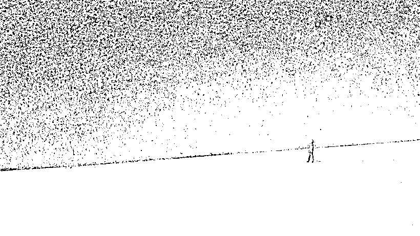

**张译：《悬崖之上》**

2021 年，张艺谋导演的《悬崖之上》中，张译以精湛的演技赢得了无数掌声和好评。张译曾因长相被严重低估，最终通过日复一日的“磨活儿”成为今年影帝最高呼声的男演员，这其中离不开对分太阳的土星狮子座“十年磨一剑”的岁月历练。 

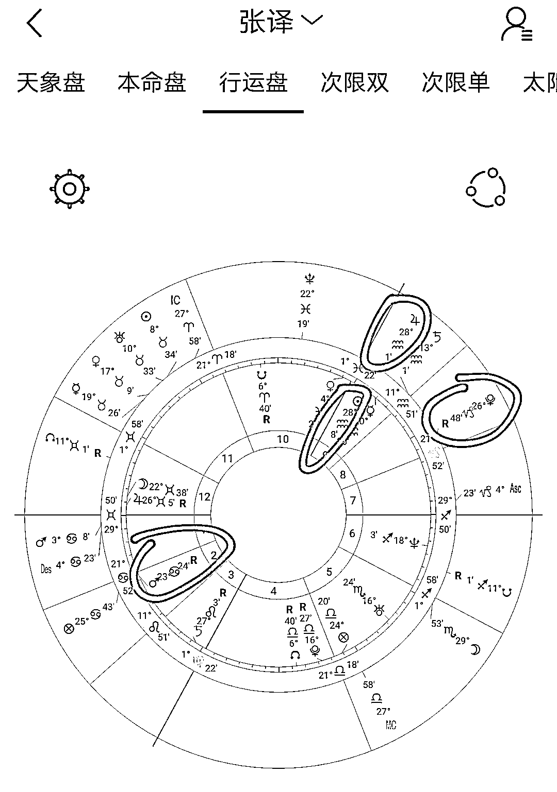

| 2021 年 4 月 28 日，《悬崖之上》在北京首映四天后的行进星图，行进冥王星逆行，对分张译出生星图中的巨蟹座火星；行进木星精准合相张译星图中的太阳。打开张译的出生星图，会发现一个重大行进——2019 年 11 月，《悬崖之上》开拍时，行进冥王星摩羯座正在 2°内入相，对分张译出生星图中落入巨蟹座 23°的火星；2020 年 1 月，行进土星、冥王星合相在摩羯座 23°，精准对分他的巨蟹座火星；2020 年 8 月 4 日，《悬崖之上》预告片发布时，行进冥王星逆行在摩羯座 23°，再一次精准对分张译的火星；2021 年 4 月 24 日，《悬崖之上》在北京首映，4 天后，冥王星在摩羯座 26°逆行，再次对分张译的火星，木星在 28°合相张译落在水瓶座 28°的太阳。当木星的光芒照亮太阳，将掌声和光环放大再放大地加诸身上，令张译大放异彩的时候，冥王星行进似乎也在告诉我们：这部作品，承载了太多张以本人的创伤和议题。长达一年多的拍摄、宣传历程，同张译饰演的张宪臣一样，也是同最神的黑暗周旋、较量、宣战的历程。

**张宪臣：四人特工小组核心人员，和王郁是夫妻，他与张兰同组行动。两人在火车正面遭遇特务，最终携手反杀，逃过一劫。他在寻找破译密码母本的行动中，因寻找自己丢失多年的儿女而让敌人有了可乘之机。在受到敌人非人般的酷刑折磨后，他和卧底周乙联手布下险棋迷局并成功实施了乌特拉行动，最终他却牺牲了。**

**——《百度百科》**

**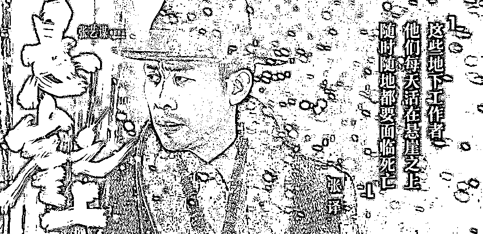**

从这段角色介绍中，我们能看到**孩子（巨蟹座）、密码、地下工作者、死亡（冥王星）**的元素。也能看到**斗争、反杀（火星）**的元素。

**记住，勇敢不是不害怕，而是即使害怕，也要勇往直前。****——贝尔·格里尔斯《越野千里》**人生如戏，戏如人生，当角色选中演员，一定是这个演员在那个当下有了同角色一样的命运剧情。**行进的剧情如果不在现实生活中发生，便会显化在那段时期演员所塑造的角色中**。整个拍摄过程，张译经受了各种心理和生理的痛苦磨难。尤其是那段电击酷刑，为诠释被电后抽搐的真实感受，张译在拍摄时坚持被多次泼冷水，身体多处夹上电极，实拍的时候脸上的肉都是抖动的……

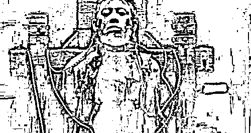

| 《悬崖之上》中的电刑片段都说巨蟹座的火星是难以发挥之处，但别忘记，为了守护自己的孩子和家园，巨蟹座是会挥舞起大钳子狠狠殊死搏斗到最后一刻的！在巨蟹座的世界里，最痛的莫过于丢失自己的孩子，这也是张宪臣拼尽全力甚至牺牲生命去做的事，然而最终，他心系的还是整个国家的孩子，这是属于巨蟹座的大爱。张译饰演过太多军人。这同他落在白羊座的南交点不无关联——**南交点在白羊座的人，前世很可能从军做过战士，而这一生，战斗的号角始终吹响在他们耳边**。而南交点的守护星正是落在巨蟹座的火星。这一切串联起来，便有了张宪臣这个角色。还有什么比为了保护孩子，保护家园，保护祖国而潜入敌军喉舌，同黑暗势力光荣战斗到最后一息，更能淋漓尽致地诠释冥王星对分火星巨蟹座的议题呢？

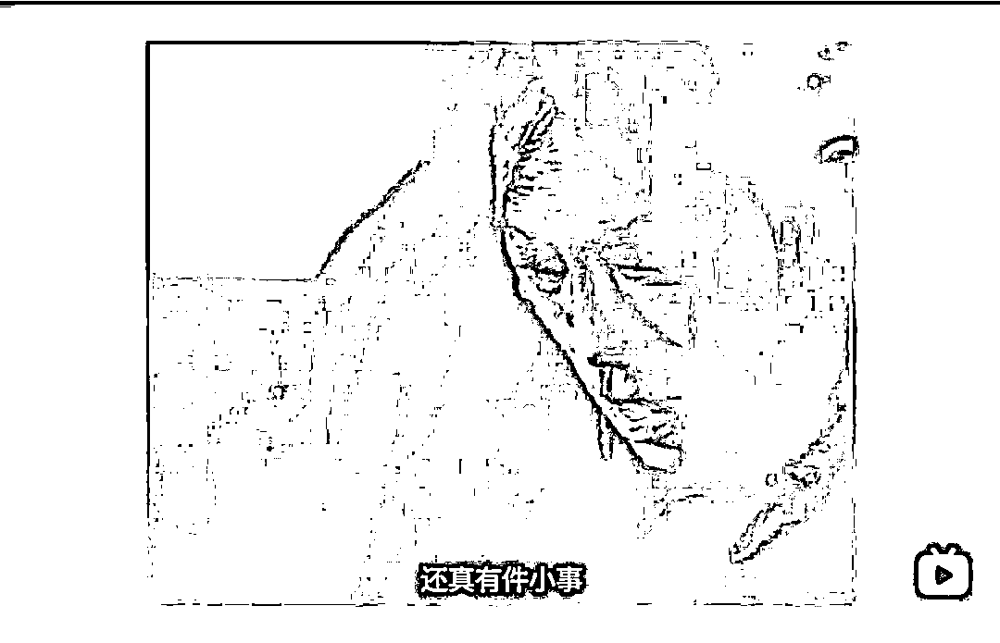

| 张宪臣最后才说出心底最深的牵挂——孩子。
在本可以脱身的情况下，选择了去寻找失散多年的孩子。张宪臣是经历过严格训练的资深特工，岂会不知这样做的凶险？而在那一刻，舐犊之情还是让他做出了最后令自己丢掉生命的选择。这一定也诠释了演员张译内心的独白：即便知道会牺牲，会死去，还是会在这一刻做这样的选择，是因为这就是人性，是无论经历多少酷刑考验，无论如何隐藏潜伏，都深入骨髓的人性：**为了我们的孩子，为了我们的家园，在巨大无边的黑暗和恐惧面前，就算再想逃生也不会退缩。**巨蟹座代表**母性**。母性是人类得以世代繁衍的神圣信念，也是如许多天灾人祸，战火纷飞也不能将人类灭绝的原因——有人说过，中国人总是他们中最勇敢的一些人保护得很好。家族、家园、家庭的观念，根植在炎黄子孙心中。是革命先驱者用血肉筑起的长城，才能让现在的我们能有着安全幸福的生存环境。

**谁活着就去找孩子。****——《悬崖之上》**

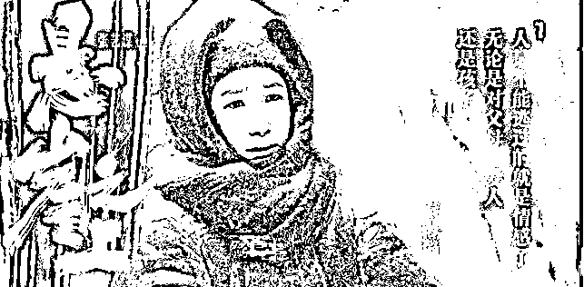

这样的主题，除了让观者热血沸腾、热泪盈眶，也时刻提醒我们，**面对冥王星的挑战，面对那些灾难、屠戮、折磨、侮辱、欺凌之时，只有竖起心中爱的信念，才能驱散这团令人恐惧的阴霾**。当你有了想要保护的人，为此做出真正遵从内心的选择，因爱而生的勇气会令人有了软肋，也有了最坚硬的铠甲**。当这种勇气赋予我们勇敢和力量，再深的罪恶也敢与之搏斗的时候，就是冥王星的议题破解的那一刻。**电影的最后，张宪臣开着车冲向敌人时，角色外的张译也一定会被唤回曾经殊死搏斗到最后一滴血，再硬碰硬毫无畏惧地干掉敌人那些属于南交点白羊座记忆吧。那颗被点燃的南交点守护星——火星也一定令他体验到了涅槃重生的痛与乐。这是生命给予将角色融入人生的演员最高的恩赐和嘉奖。

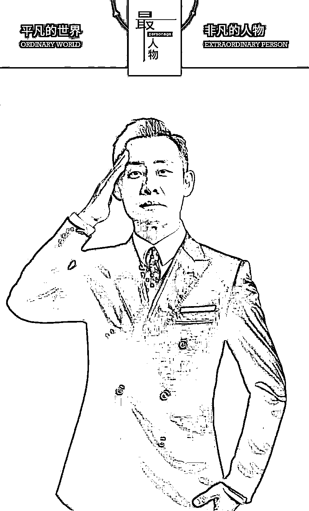

| 张译

**佟丽娅：官宣离婚**

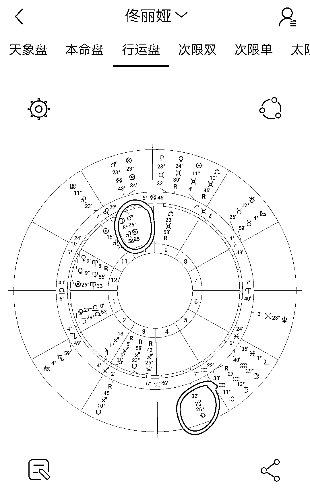

| 当下，行进冥王星正精准合相佟丽娅出生星图中的巨蟹座火星

当张译正在电影中同冥王星较量之时，演员佟丽娅也正经历着一样的行进——1983 年 8 月 8 日出生的佟丽娅，火星落在巨蟹座 26°。2020 年上半年，行进冥王星在 24°轻轻碰了一下她的火星，并于 2021 年 4 月在 26°精准对分；4 月底，行进冥王星在 26°逆行，于是，接下来的事情我们都知道了——陈思诚和佟丽娅在 5·20 官宣离婚。离婚声明中，陈思诚还若有似无地指出，二人离婚的时间早在 2020 年。

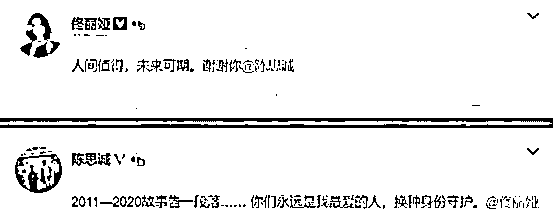

| 陈思诚离婚声明中提到的时间线为 2011-2020 年，暗指二人 2020 年便已接触婚姻关系于是，我们可以推测，他们也许在 2020 年上半年，冥王星第一次对分佟丽娅火星的时候便已经开始着手离婚事宜了。冥王星是运行最慢的一颗行星，一个完整的冥王星行进要持续**3 年**，而这其中，冥王星会不断顺行、逆行、在顺行，在一个度数上来回摩擦碾压。通常，**第一次碰撞触发了事件，接下来的几轮逆行，是不断反刍、接受、调整；在几轮顺行，是推进、处理、蜕变，直到最后，彻底为事件画上句号。**冥王星行进更多是心理层面的涅槃，**当冥王星对分火星，我们需要关注在关系（对分相）中的暗中操控、精神虐待、强大的公众势力和权威势力的胁迫（冥王星摩羯座）对于当事人行动力、愤怒和勇气的摧残**。而火星巨蟹座的人处理内在愤怒、创伤和勇气的源头，大多可以追溯到**家族、孩童、父母、安全感**的议题上。同样是冥王星对分出生星图中火星巨蟹座的行进，如果说张译在自己的影视角色中完成了议题处理，佟丽娅则是用真实生活中婚姻的瓦解来“渡劫”。这就牵扯到了占星界一个老生常谈的问题——如果你和他们一样，即将经历冥王星对分火星的行进，那么，到底是会离婚，还是会被黑势力“迫害”，又或者有其他的可能性呢？在这两个人生动的例子中，我们便能发现，同样的行进在不同的人身上，会有不同的事件性演绎，其根源都是**针对我们心理上最脆弱、最薄弱、最想要掩饰、最不真实的地方，这种针对并非为了摧毁我们，而是让我们真正对自己和对他人诚实。**如同《悬崖之上》中的张宪臣，最终做出了最真实的选择，那就是宁肯暴露自己也要去救孩子，找孩子。那是他无论经过多少培训和伪装，纵然能骗过狡猾的敌人，也无法说服自己去面对的——去找也许会死，但不去找，会生不如死，痛悔终生。而这种生死较量，却也是最难的抉择：谁不怕死，谁不怕折磨？这就是冥王星最难过的关：你敢不敢去面对那个会死的可能，纵身一跃，还是继续伪装着骗人骗己，把这一次行进糊弄过去，日日压制着内心摄魂怪一样恐惧的影子，等待下一轮冥王星行进继续触发更顽固、更难医治的伤痛？只有勇敢的人才能通过冥王星的考验。而这种勇敢并不是与生俱来的，尤其对于巨蟹座的火星，这样看似懦弱、胆小、迂回而无法爆发的落位。于是，这股勇气对于佟丽娅来说，生生培养了数年。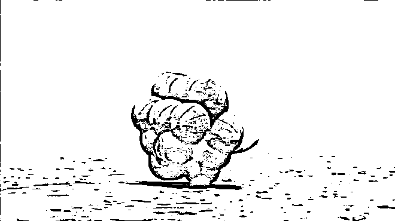有时候，毁掉过去，是为了在废墟上建造起更好的家园。在这一点上，冥王星是来帮助我们的。但前提是，我们需要明白，**哪些关系和家值得维系，哪些只是基于身份、地位、面子等原因被牵制，却无法真正建立巨蟹座式的亲密和安全感的关系。**2014 年 1 月 16 日，佟丽娅在大溪地嫁给了陈思诚。其时，行进冥王星刚刚同佟丽娅处女座 9°的金星成三分相。冥王星碰金星时结婚，碰火星时离婚，这是一个充满了冥王星能量的关系。在此，我无意揣测当事人究竟是如何将这份早已充满着各种桃色绯闻，各种不被外界看好的婚姻维持到今天，但，不会说谎的冥王星也多少向我们展示了其中错综复杂，不足为外人道的纠缠、操控和利用。她能从少数民族中走到大北京，她从来不是个低眉顺眼的小媳妇儿，而是个“儿子娃娃”；为了这段关系，她不顾陈思诚的尴尬，在节目中大胆披露二人交往，并希望得到大家祝福。很熟悉的桥段不是么？当年，张靓颖的金星被冥王星六分的时候，也曾在演唱会上大胆求婚冯珂——**冥王星式的关系里，除了自以为深刻到奋不顾身的爱，还有很多欲望、征服、执著，以及说不清道不明，当事人都不愿直面的诱惑和利益绑定。**一个冥王星做引子的婚姻里，是丈夫的各种绯闻、越轨，甚至公开张狂的开放性言论，似乎都只是帮助她走向真实——陈思诚不算是个“清白”的好男人，然而，他“渣”得坦诚，只能说，在他的世界里，开放关系是正常的，他并没有刻意想要隐瞒佟丽娅，更遑论隐瞒公众。

不羁的导演更迷人——对于处女座的金星，循规蹈矩，清规戒律的爱情里需要一股横冲直撞，带着野性和“不忠”的力量，而冥王星三分金星时选择嫁给陈思诚的佟丽娅，也一定感受到了这股原始野蛮的驱力：冥王星在说：“你要全面占有和降服这个男人！"

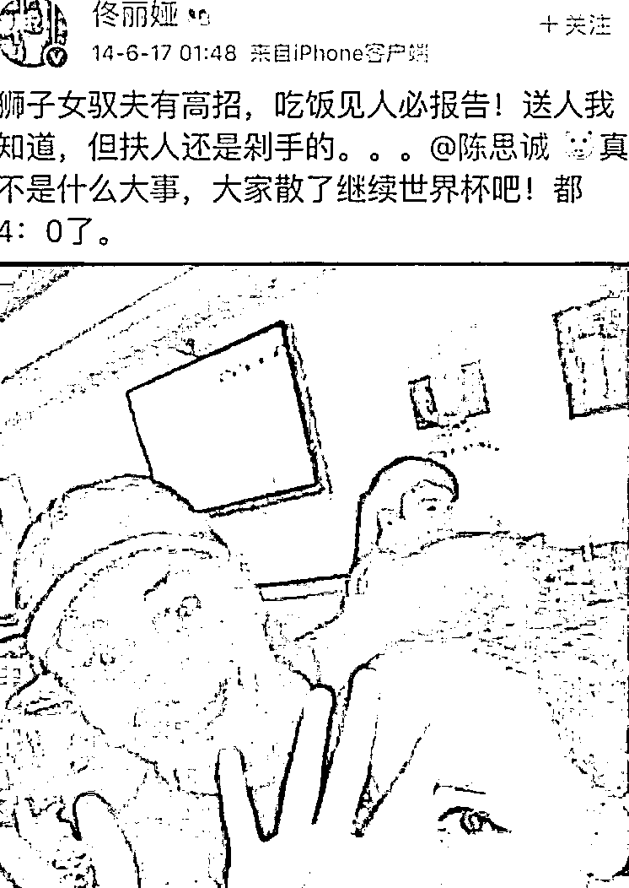

| 面对陈思诚意思出轨的新闻，佟丽娅微博回应

于是，她想将并不那么规矩的丈夫驯化成一心一意的王子——他的蠢蠢欲动激发起了她属于冥王星的占有欲和控制性。正如在陈思诚第一段绯闻时佟丽娅发的微博所言：**“狮子女御夫有高招。”**

然而，**试图驾驭和****控制别人，一定会失败**。于是，在陈思诚第二次疑似出轨时，佟丽娅只在朋友圈发了：“重新开始，丫丫加油。”那时，行进冥王星正踏踏实实碾压在她的太阳上。

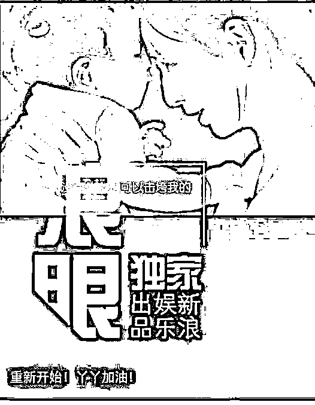

| 佟丽娅的朋友圈，图片上一行字为：“没有什么可以击垮我的”

而火星巨蟹座的人，要真的做出舍弃的决定却并不容易——就像巨蟹座的马伊琍也是在文章出轨数年后才选择离婚。因为巨蟹座太念情了，何况还有孩子，更何况，还有那么传统的父亲和家族。这些年，佟丽娅想必是非常艰难的吧，要面对公众的质疑，还要面对来自家族的压力，更主要的，是要面对一段婚姻，一个家庭的解体。

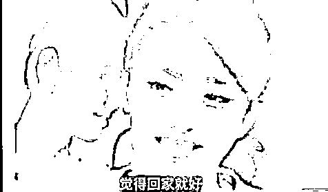

| 问及对于丈夫的态度，佟丽娅回答：“觉得回家就好。”于是，“回家就好”，做小伏低，试图通过包容和宽容，源源不断的爱去挽回。这或许是每一个巨蟹座都曾经做过的事了。

然而，最后她终于发现了，那不是爱，不是值得她忍辱负重的男人，那只是一种安全感，一种习惯，一种害怕失去的恐惧驱使的妥协。

这是冥王星最拿手的招数——**它会拿走你最害怕失去的东西**。哪怕这个东西早已是毒疮，只会继续拖累、恶化整个生命，也还是有大把的人抱着死死不放手。所以，当冥王星再次碾压过佟丽娅的火星时，她终于为自己争取了。那么，当初是什么让这样骄傲的狮子座宁可忍耐也不愿离婚呢？还是**怕**吧，怕自己离开了这样一个手握资源的导演没了倚仗，怕自己不够美、不够好、演技不够佳，离婚后也未必有更好的路，怕给家族蒙羞，父母丢人，怕孩子没有了父亲，自己没有了丈夫……然而怕也没用，冥王星的手术是没有麻醉剂的硬碰硬，毒疮不割掉，只会把整个生命力都吞噬。**闭上眼睛，想起这个男人，感受到了什么？如果不是快乐、信任、深沉的爱，那么，再怕也要离开的。**

如果一个火星巨蟹座的女人能够在冥王星压力行进下选择离婚，她一定是勇敢的，也是做好了准备，去面对未来的。为了这一天，她也一定隐忍到了忍无可忍，如同一瓢开水兜头而下，想起都皮开肉绽，才能不再反复反刍当年的快乐和甜蜜，而继续说服自己回到那人身边，索取早已所剩无几的温暖，浑然不顾自己所经受的羞辱和疼痛。

而最后的声明里，仍是“谢谢你”，那么温柔，还是火星巨蟹座不撕逼，不冷漠的包容。所以，除了祝福佟丽娅，说不出别的。张宪臣所经受的惨烈，在佟丽娅身上也一丝不少地经历过了。这也是每一个曾经、现在和即将经历冥王星行进的人必须面对的。**有时候，我们不得不割舍，甚至失去曾经最珍视的，为了我们自己，也为了其他的人，最重要的，是为了找到并守护值得彼此依靠，撑过日脚的那群人，那才是真正属于巨蟹座概念的亲人。****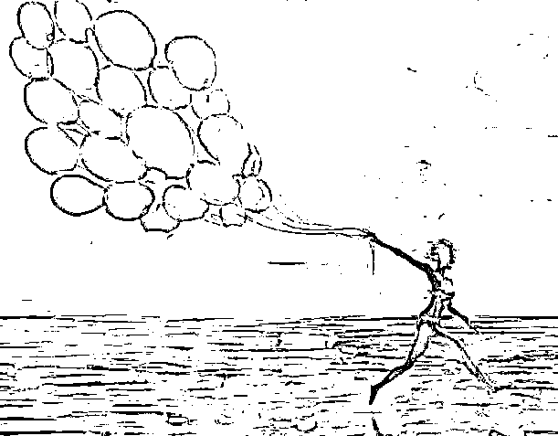****写在最后**当冥王星来临，“夺走”我们的爱人，“夺走”我们的孩子，“夺走”我们的家园甚至生命，但它夺不走我们爱人的能力，夺不走我们心底的亲情，夺不走我们内心的信念和安定。绝境下是新的路，废墟上是最娇艳的鲜花。
在这里，不仅想提到最近热议的“三胎”政策。代表摩羯座的政府组织发布的关于孩子——巨蟹座的政策，激发起了很多女性深层的，属于火星-冥王星的恐惧。而这些女性人群可能只生育了一胎，甚至还未曾生育，并不属于三胎政策最直接的影响者。这告诉我们：对待生育这件事，整个女性集体潜意识里的内容是彼此渗透，代代传承，共通的。那么，是什么让我们对于生育有如此大的恐惧呢？我想，也许这个社会向我们传导的——“男人和女人因为爱情而选择结婚，在爱情的基础上生育儿女，从爱情延展出亲情，去抚养更多孩子”这最原始、真实和纯然的理念太少了。**当生育成了传宗接代的责任，缺少丈夫的支持、家族的支撑、社会对女性的关怀，缺少了这些情感上的抚慰和安全，火星巨蟹座便没有了生育的动力，火星的功能丧失了。**随着土木水瓶座的新时代开启，人们会变得越来越独立、疏离，还是继续发展出属于巨蟹座的家族式家庭结构？在这个火冥对分的当下，深入自己最深的，关于孩子、家庭、亲情、安全感的恐惧，你会发现，不是只有你自己在经历这一切，你也一定能够穿越这些黑暗，走向新生，在那里，你将会遇到真正相濡以沫，骨肉相连的亲人。也许在那个时刻，我们会为了寻找和维护孩子、家庭而挑战生命的极限，真正实现火冥对分所带给我们的深度成长。

**版权声明：**原创文章由作者授权首发于若道平台，欢迎转发，反对抄袭。友号转载请申请白名单。

****

**玫瑰**

英国 Cass Business School 管理学硕士

若道 2015 届核心课程毕业生，若道微信公众号兼职编辑

占星师，咨询时长超过 800 小时

**个人微信号：**stillrosy

**公众号**：一个娘娘 

长按二维码，给作者打赏

**系统学习占星学**

**点击图片了解详情**

**微信又双叒叕改版啦，不想错过若道君的推送？**

**就把若道设为星标吧！**

**▼**

就是这个“在看”，戳戳戳 ☟

******报名直达入口******

# 水星四分海王星，最近你做了什么奇特的梦吗？

> 原文：[`mp.weixin.qq.com/s?__biz=MzA5NjA0NTAxNg==&mid=2651446076&idx=1&sn=20117bbf6559dcb2bc148e32310848d1&chksm=8b4b698bbc3ce09d72e34a73b44ca78e5d6e63f75aef3063143ab5d401dd539f240d963322f6&scene=126&sessionid=1692737979#rd`](http://mp.weixin.qq.com/s?__biz=MzA5NjA0NTAxNg==&mid=2651446076&idx=1&sn=20117bbf6559dcb2bc148e32310848d1&chksm=8b4b698bbc3ce09d72e34a73b44ca78e5d6e63f75aef3063143ab5d401dd539f240d963322f6&scene=126&sessionid=1692737979#rd)

**2021 年 6 月 5 日天象：**

*   **月亮在白羊座**
*   **水星（逆行）四分海王星**
*   **火星对分冥王星**

**月亮今天在白羊座，**我们的情绪是积极好战的，不过同时也很毛躁。不如选择一些竞技类的运动吧，无论亲自参与还是在一旁观看，都可以度过酣畅淋漓的一天！ 

**水星在双子座逆行，最近一直处于和海王星的四分相影响范围里。**沟通表达容易出现“断片”和失序的情况，文字也极易出现错误，不过积极一面是，我们很可能从意想不到的途径获得灵感的火花。若道君还听说，最近有很多小伙伴的梦境十分有“启示感”，逆行水星和海王星的四分相，不仅在现实生活中体现了它的影响，还在梦中让我们“回顾”了不同层面和维度的生命画面。

**这两天火星还和冥王星形成了对分相，**这也引发了现实与梦境中的“激烈”事件。这组行星间的压力相位，意味着我们通过面对有挑战的事件并与其抗争，可以带来内心的积极转化。用积极的方式面对生存威胁，是这组行星能量带来的启发。如果你想了解更多，可点击[【火星与冥王星】](http://mp.weixin.qq.com/s?__biz=MzA5NjA0NTAxNg==&mid=2651446032&idx=1&sn=a92f57e1b72ab7b34ded807a57e98220&chksm=8b4b69a7bc3ce0b14981b70426e04c20fd15bc61bd65be8d4e81d80e1a8280515fbf28016843&scene=21#wechat_redirect)查看昨天头条文章。（点击[【水逆】](http://mp.weixin.qq.com/s?__biz=MzA5NjA0NTAxNg==&mid=2651445366&idx=1&sn=745adece55f6072110424a2a60abbed1&chksm=8b4b6ac1bc3ce3d7a35afd1686887cafe235aec3a49109b08ad9e301a9efd7d2112bac177ec5&scene=21#wechat_redirect)查看此次水星逆行文章）

**说了这么多，这几天你有哪些奇特的梦境、以及生活中的“水逆”事件，愿意分享给我们呢？留言区等你哦~**

周六快乐！我们明天见！

**更多精彩占星文章长按二维码查看**

# 这两颗行星不为伤害你，而是让你产生“创伤后成长”的巨大能量！

> 原文：[`mp.weixin.qq.com/s?__biz=MzA5NjA0NTAxNg==&mid=2651446032&idx=1&sn=a92f57e1b72ab7b34ded807a57e98220&chksm=8b4b69a7bc3ce0b14981b70426e04c20fd15bc61bd65be8d4e81d80e1a8280515fbf28016843&scene=126&sessionid=1692737979#rd`](http://mp.weixin.qq.com/s?__biz=MzA5NjA0NTAxNg==&mid=2651446032&idx=1&sn=a92f57e1b72ab7b34ded807a57e98220&chksm=8b4b69a7bc3ce0b14981b70426e04c20fd15bc61bd65be8d4e81d80e1a8280515fbf28016843&scene=126&sessionid=1692737979#rd)

**☆ 后台回复“今日”，给你一句生命态度**

作者/薇安 ISAR 认证占星师编辑/玫瑰 封面/书君 图片/网络**火星与冥王星：幸存者**5 月 22 日，成了“中国越野最黑暗的一天”，突发的极端天气夺走了 21 名选手的生命，幸存下来的人们仍沉浸在与死神擦肩而过的惊恐之中……5 月 21 日深夜，云南大理漾濞 6.4 级地震、次日凌晨青海省玛多县 7.4 级地震，难免也激起很多人因 2008 年的“5.12”延续至今的心灵伤痛……过去两年肆虐全球的新冠病毒肺炎疫情，更是把人类集体性地暴露在死亡、恐惧和无助的体验里……除了这些群体事件，更多个体生命在承受着因长期被羞辱或虐待的经历、绝症、至亲离世等带来的巨大心理创伤……无论我们如何祈愿，世界从未停止对人类生命的残酷考验。但也正是这些或集体或个人极端事件中的幸存者，让我们真实见证到生命力在灵魂暗夜中的坚韧力量。（注：**心理创伤研究中，“幸存者”指从严重创伤经历中反而获得积极个人成长的个体**。这个词既代表他们经历了负面的人生体验，又强调他们有力量地度过了那些负面事件。）心理学家 Richard Tedeschi 和 Lawrence Calhoun 早在 1995 年就提出了 **“创伤后成长（post-traumatic growth）”**的概念，用来描述**一部分人在和具有高度挑战性的生命境遇抗争之后，所经历的积极的心理变化——在创伤后，个体发展出了比原先更高的适应水平、心理功能和生命意识。****“与具有高度挑战性的生命境遇抗争，带来内在心理的积极转化”**，再生动不过地描述出一组占星符号——**火星与冥王星**共同昭示的心灵潜能。

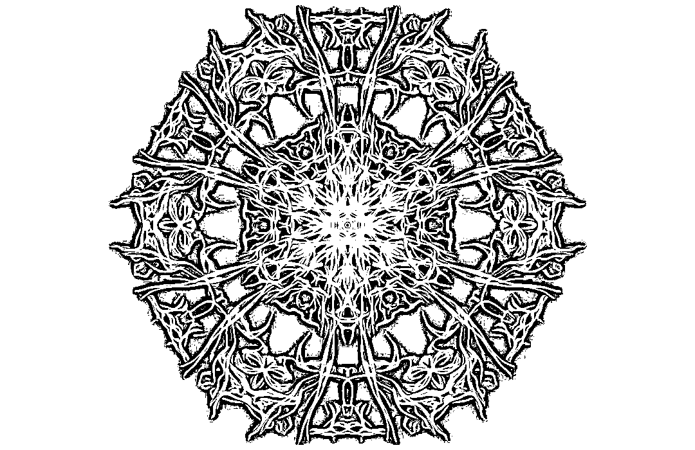

**占星学上的火星**

在个体层面，人们常将**火星**与**攻击性、性、愤怒表达**等行为关联起来。让我们走得更深入一些，借用荣格对原型的描述——心灵中最深、最原始的元素，作为原型的火星，则象征这样一种深层的生命意愿——**去生存，去存在，去定义出一个独立的自我！**从这个意义上讲，它甚至是太阳能够展开英雄之旅不可或缺的前提。

火星不仅指物理或生理层面的纯粹存在，在人类的心智世界中，它还隐喻着**心理体验上强烈的生存愿望和信念，驱使人们采取行动与外界压力抗争，做成一些具体的事情来定义自己的存在。**

**在不需要应对威胁生命的情景时，这股驱力会投射到对财富、社会地位、职业生涯、荣誉或声望的追求和创造上，以证明我们能赢得生活的战役。**

火星是一股年轻而活力充沛的能量，是勇气的代名词。但同时它也是脆弱的，因为渴望生存的另一面，必然是对**“被毁灭”的恐惧**。就像神话故事中的战神 Ares，总是由他的两个儿子 Phobos 和 Deimos 相伴左右，他们在希腊语中意为**“畏惧与恐慌”**。

这些都是火星的面向，也是人们在遭遇压力、挑战和威胁时真实的情感体验，**“逃跑-战斗”**的冲动会同时被激起。但**火星的功能会让逃跑更倾向于战斗，只要我们的意志能够与之联结上。**

认知心理学中一个重要概念：**积极的认知重评**（Positive cognitive re-appraisal），能够帮助我们**在危机情景中重新唤起并保持住火星的战斗力。**

积极的认知重评，是指**用一种更积极的方式去理解产生负性情绪的事件**。它是一种“先行关注”的情绪调节策略，即**不要等到对情绪做出反应，而是在产生和接收情绪的当时，就对情绪进行重新解释。**

这个过程包括：**当我们遇到一件让自己感受到负面情绪的事件时，先试着识别情绪，给他们打标签，比如“我开始有愤怒的情绪了”或者“我感到非常焦虑”。然后，系统地重新分析这件事对我们个人产生的影响，并从乐观的视角思考新行动。**这一策略在对心理创伤研究中，被认为是**“让幸存者感到强大、能够控制和管理艰难情境的最有效策略**(Castro, 2016)”。当我们一次次在挑战中亲验到火星的能量，它会变得更强壮，并持续提升生命勇气，因为这是个体经由切实的体验所增强的意识变化。回到原型层面，**火星同时守护了白羊座和天蝎座，正是隐喻着——生存力不会脱离与“死亡”的交锋而单独存在。**随着冥王星的象征被引入到占星学中，基于内涵意义的共振，它也被视为天蝎座的守护。

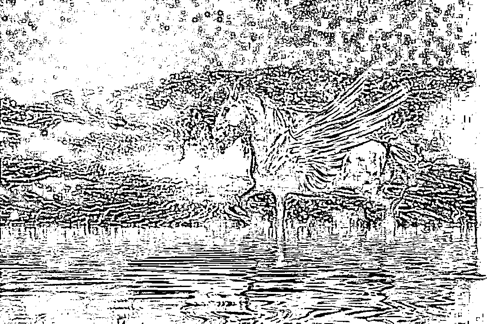

**占星学上的冥王星**

当人们只片面地看到冥王星的部分象征：**“无法预知的力量、腐朽、腐败的、死亡等”**时，第一反应可能是排斥和恐惧。就像生活中若遭遇带来这类感知体验的事件和境遇，人们在初始时也会试图挣扎抵抗，却又深感无力，被恐惧淹没。

但冥王星真正象征的，是**意识为获得进化必须穿越的“净化之火”**。它是**“死亡-重生”**的原型，强调出：**成长的进程是人类心灵的本质，而在进程中的某些时候，心灵必须承受包含毁灭与重生的危机。**

“痛苦、创伤、腐烂、毁灭、死亡…..”这些被放入集体意识阴影中的内容，实则蕴藏着巨大的能量。个体在穿越它们时会经验到力量的提升，带来生命完全的改变。

不难想象，**要完成冥王星式的转化，对火星能量的运用必不可少，它提供求生的意愿和行动力**。同时，个体也需要升起强大的精神信念，相信此时在“冥府”中的历练，是在获得更长远的、更宏大的人生奖赏。在对创伤后成长的研究中，心理学家继积极的重述评估后，提出了另外两个重要策略：**· 接受式应对（acceptance coping）****即在应对创伤时，平静地接受已经发生的创伤事件。**接受不能改变的事情，是能够促进创伤后成长的一项重要策略 (Butler et al., 2005)。相反，**如果采用防御性应对，即对灾难性事件表现出否认、愤怒，则不利于个体积极的成长。****· 追求意义感**研究证明，如果个体具有**较强的意义感**（觉得世界是有意义的，正面和负面的经历都是有意义的，并且愿意去追求意义，认为具有挑战性的情形也值得为之投入），那么他们就会更好地获得创伤性成长(Zoellner, 2006)。如果我们愿意信任占星符号象征的灵性启蒙，冥王星无疑详实地讲述了这里的意义所在。在占星学的经验研究中，我们看到那些出生星图中火星与冥王星形成相位的个体，更加生动地显化着：**“我一定会战胜，无论如何我一定会存活下来”**的精神品质。拥有这类相位配置的个体，或许人生早期，有过真实的**权利被剥夺或压制**的经历。为对抗深埋的无力感反而促成他们成年后强烈的求生和战斗需求。有些人可能由于创伤经历，一度无法确立自我和展现战斗力，但在经由心理治疗或其他方式的疗愈后，会重新被赋能，再度展现超人的勇气和耐力。他们也可能**真的经历过威胁生命的疾病，存活下来后身体反而更具活力**；甚至会利用这些经验洞察到心灵深处的意义，从而转化自己的生命。

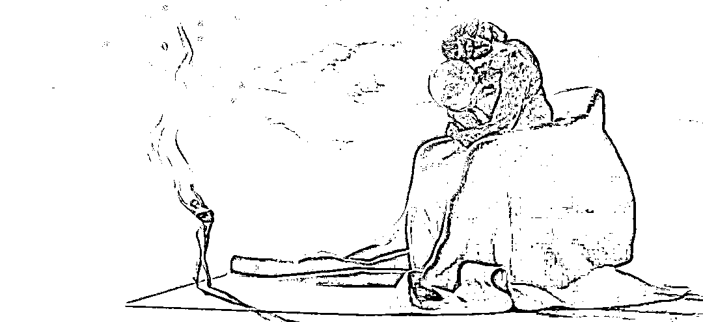

即使没有遭到外显的威胁，这组原型驱力蕴含的超人般的意志也能被个体主动地、建设性地用于生命的求索之中。出生星图中日冥合相四分火星的生死学大师——伊丽莎白·库伯勒·罗斯就以这样方式“向死亡宣战”，她先驱性地探讨死亡与临终经验，并以此教导活着的哲学；不仅著作等身，更长期致力于照顾重症病童、艾滋病患者与老年人。无数人在面对死亡或亲人临终时，从她身上获得了安慰与理解。更大范围内，人们会在自身的生命节律中，当冥王星行进触发火星时，**经由外部事件的推动，强化与火星能量的联结，去接受我们本质中力图主张自我的渴望和驱力，唤起必须为生命而战的勇气和行动。**作为心理占星咨询师，我在许多个案身上感受过生存意志在逆境中的强大力量及其带来的心灵成长。即使他们在历程中会因痛苦而质疑惶恐，愿意暴露脆弱来寻求帮助和支持，但你会发现他们早已用自己的方式在真实的生活中努力生存和转化着。有时候咨询师需要做的，就是以一个见证者的身份把这个观察反馈给他们。**Ying 的真实案例**在此，用一位我非常敬重的朋友的真实故事，致敬在生命进化中真实显化了火星与冥王星原型力量的人们（特别致谢 Ying 同意我在文中分享她的经历，为保护隐私，我会隐去具体的个人信息）。Ying 第一次近距离接触死亡，是妈妈突然被宣告癌症晚期。令人欣慰的是，经过手术和长程化疗后，母亲扭转了病情恢复了健康。这期间曾以为将与至亲告别而经历的痛苦和恐惧，感受到的生命无常和有限，以及母亲的坚韧和勇敢，唤醒她开始了对生与死的探索，对人生意义的追寻。她开始系统学习心理咨询的课程，并在“5.12”汶川大地震后作为志愿者赴灾区一线进行心理援助，其后一直积极地投入到相关的公益活动中。也就在这时，她了解到在国内，癌症临终几乎无医院可去，临终关怀领域尚一片空白。

母亲的经历，以及目睹过许多临终病人的无奈境况，点燃了她强烈的信念，她在 09 年毅然辞去工作，开始孵化中国内地第一家致力于临终关怀和死亡教育的非盈利机构。

这是一条少有人走的路，个中艰苦自不必说，先生形容她“在做从海里喝水的事”，但见过太多生死的 Ying 只觉得“生命无常，想做什么就行动起来。”在一边参与香港理工大学“社会服务管理”硕士专业的学习，一边克服着重重困难与瓶颈，努力践行使命之时，2018 年，她自己被确诊淋巴癌。这一次，她几乎是与死神肩并肩地站在了一起。生命进入了倒计时，家人希望她能专心修养身体，好好享受生活。但经历了痛苦的放疗、化疗后，她却体验到自己角色发生的转变：从对临终病人“隔岸观火”到自己“身临其境”，“**我才体会到他们所说的难受，到底是一种什么样的难受**。”七个月后，病情得到了有效控制，她比任何时候都更坚定地投入到公益机构的经营运作中。而且这一次，她褪去了更多无谓的羁绊，带着放松而全然专注的态度去做。工作不再只是为别人服务，更不为证明自己，纯粹地就是生命的滋养所在。

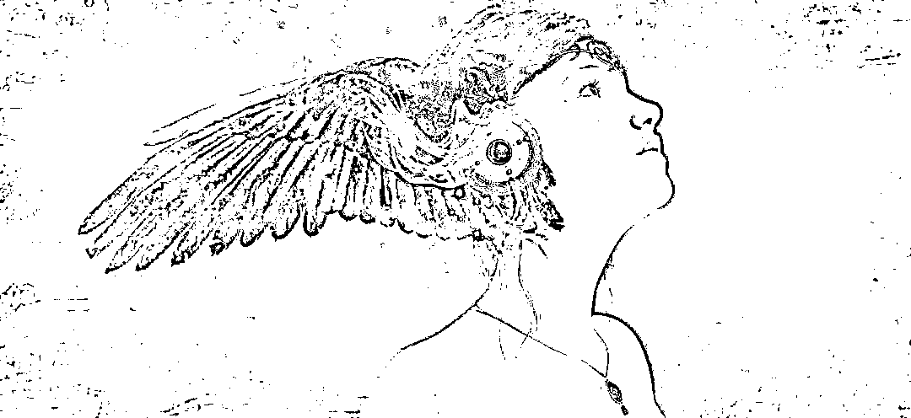

2020 年的疫情，因筹款的艰难让机构一度陷入危机。她一边积极专注地做着所有能为之事，一边坦然地和同事讨论关闭组织的可能性。“只要患者和家属需要，有没有这个组织，临终关怀这件事我都可以继续做下去。”我在疫情期间听闻她的故事后，特别邀请她来做了一场探索死亡的讲座。和她短短一日的相处，我如此真切地感受到：**这是一个真正和死亡和解了的生命**。

今天，公益机构正向死而生地运作着，并在越来越多的城市延伸发展；Ying 也日日继续着高强度的工作。“继续呀，做公益一定要坚持！”——这是她对工作，也是对生命最真挚的计划。

我并没有和 Ying 深入交流过她在历经这一切时的内在感受，也鲜见她在采访中谈及。她只是用行动践行着自己对生命理解，而我则看到她对自己出生星图的完美诠释。

她出生星图中：**太阳合相火星落于水瓶座，三分天秤座的冥王星；同时月亮、金星合相海王星落于射手座**。Ying 本是媒体人，在广告行业工作了八年。冥王星行经她射手座星群时，命运将死亡编织进她的生命中。她经验了可能失去母亲的哀伤和迷茫，被恐惧笼罩的窒息和黑暗，却也从中升华出了海王星的**至高理想**——有一天，**任何有需求的临终者都能免于痛苦，带着尊严离开这个世界**。这个理想也激励着她离开了熟悉的月亮领域，义无反顾踏上了太阳的人道主义英雄之旅，带着火星的勇气在无人涉足的领域冒险、探索。行进冥王星四分出生星图中的冥王星期间，她的太阳和火星更直接地完成了冥王星“死亡-重生”的深度净化，彻底地释放出全然无畏的生命活力，点燃了灵魂的火焰。她让我更加确信：**如果说原型为命运定下了一个结构框架，而个人意志则绝对地决定了它在世间如何被表达和演绎**；生命的潜能在两者的交互中创造着动人心魄的个人传记。每个人都有独特的内在经验，而人类的集体意识是将我们相连的海洋，在任何一处升起的力量都会泛成涟漪，扩散到更多生命体上。研究创伤的心理学家将幸存者于艰难困境中获得积极成长的策略提炼分享，给相似境遇中的人们以希望。我们从占星的角度讲述火冥人的故事，也意在用这些原型典范，激励人以用意志活化自己火星和冥王星的能量，最大程度地去相信——**生命无论于何时、用何种方式与危机相遇，它都渴望着，并能够勇敢投身其中，在无畏的战斗中去荣耀和进化自己**。每个人出生星图中的火星和冥王星，都吟诵着这首诗歌，与神对话：

**让我不乞求庇护，无惧地面对危险。**

**让我不求痛苦止息，有勇气征服它。**

**让我不寻找人生战场上的盟友，试着去发现自己的力量。**

**让我不渴求被拯救，有耐性赢得自身的自由。**

**让我不变成一个懦夫，能够在成就中感受到你的悲悯，在失败中发现你手中的力量。**

**——泰戈尔**

**版权声明**：原创文章由作者授权首发于若道平台发布，欢迎转发，反对抄袭。

****

**薇安**

全职心理占星师、ISAR 认证占星师（2016 年获得）、若道兼职助教

北大心理学硕士、MBTI 国际认证施测师

若道认证生时校正资质及 COAC 高阶资质毕业生

**微信 ID**：weianhuilai

**公众号 ID**：Radio-for-Alice

长按打赏

**系统学习占星学**

**点击图片了解详情**

**微信又双叒叕改版啦，不想错过若道君的推送？**

**就把若道设为星标吧！**

**▼**

就是这个“在看”，戳戳戳 ☟

******报名直达入口******

# 福利丨 950 元的奖学金砸向你，不要吗？！

> 原文：[`mp.weixin.qq.com/s?__biz=MzA5NjA0NTAxNg==&mid=2651446032&idx=2&sn=e747eda75c5b73ac9dc5b19b148c1b51&chksm=8b4b69a7bc3ce0b1e8dda75304a660353d720c3724c1e2220fcc67f2d62becb486e0a4ee29db&scene=126&sessionid=1692737979#rd`](http://mp.weixin.qq.com/s?__biz=MzA5NjA0NTAxNg==&mid=2651446032&idx=2&sn=e747eda75c5b73ac9dc5b19b148c1b51&chksm=8b4b69a7bc3ce0b1e8dda75304a660353d720c3724c1e2220fcc67f2d62becb486e0a4ee29db&scene=126&sessionid=1692737979#rd)

**下周，若道核心课程的学员们就要进入 Level 3 的学习阶段了。**

**你是否想知道这期学员有哪些经历和感想呢？**

**若道君带你来****康康****吧。**

“

**Sue 老师讲课什么样？**

”

**百闻不如一见，听听本届学生怎么说：**

| **Sue 老师是怎样的一位老师呢？** |
| **2021 年 Sue 的学生们这么说** |
| 老师用她的亲身经历，讲解占星学在现实中的运用，深入浅出，容易理解 |
| 优雅又风趣幽默，严谨且真实 |
| 可能我个人认为的好老师就是不觉得自己是权威人士的那种，这是 Sue 老师最吸引我的地方，当然讲课也很有趣 |
| 详细的分析，丰富的知识，重视基础，实用、谦逊、专业、朴实、真诚   |
| 真实友善，从苏汤老师身上学到对占星学、对专业的敬畏的态度！ |
| 是案例分析部分，会从中学到职业占星在咨询过程中对案主的引领，以及思考问题的视角 |
| 老师讲的干货很多，分享的真实案例很受用，很喜欢理论性强的内容 |
| 老师丰富的学识、经验，以及她身为占星师所具备的专业品质，例如谦逊 |
| 知识体系清晰全面，老师经验丰富，有独特的个人魅力 |
| 适合系统的占星入门，可以打下扎实的基础，尤其是纠正了坊间的很多误区 |
| 很有体系，案例多，幽默，知识点丰富 |
| 苏老师是一位温和平静充满爱心和智慧的老奶奶 |
| 案例分析，星图解读特别有趣，很多让人意想不到的相位解读和小知识点 |
| 课堂上的案例讲解以及苏老师的客观、诚实，最重要的是谦卑，一点都没有大师的架子 |
| 核心课程，基本上把所有常见的、基础的知识技法都系统地讲到了 |
| 干货满满，理智客观 |
| 亲切可爱，讲解清晰易懂接地气，可以在一遍遍复习中有更多新的理解 |
| 是老师的不评判的态度，没有预设的对错 |
| 老师的解盘思路，让我从不同的角度去理解星图 |
| 苏老师多年沉淀出的态度对我的影响深远 |

“

**听说你们学员微信群每天垒高楼，咔咔老师、助教 Conrad、童童班班出没其中……？**

”

“

**我下课后还有很多很多问题，有人解答吗？**

”

**我们的助教就是高质量的问答机，有问必答。**

这班同学不仅在微信群里聊得热火朝天，还在若道 APP 端用 90 多个问题表达自己对占星学的好奇和热爱，发誓不让助教老师闲着：

**同学们可以随时用碎片时间在手机查看所有同学的提问和 ISAR 认证职业占星师助教 Conrad 老师的回答。**

“

**我是一个很有理想和抱负的同学，发誓要考过 ISAR，成为职业占星师，我怎么知道自己每个阶段学得怎么样？**

”

嘿嘿，我们就喜欢写作业、做练习的同学，你出手，我们就让你知道你有没有：

“

**若道文章太多了，怎么跟着学习进度读呢？**

”

**助教下午茶，每天来一杯：**

**这样的学习氛围，因此同学们才这样说：**

一直当做兴趣爱好来学习，但是 1-2 阶完成以后会用词、定位更加精准。之前印象中很多领域其实是模糊的，比如某一件事归于哪一个星座、属于哪一个行星的范畴不太明确，但是 1-2 阶完成后发现是可以精准定位的，虽然有些定义是发散性思维联想出来的，但是有迹可循。

群里同学们的分享和讨论很有趣，也能在课程之外学到不少东西。

1、2 阶段课程很重要，系统学习下来感觉很不一样，一环扣一环，打好基础很有必要 。通过学习感觉占星学能帮助我们借助星图中认识和探寻更好的自己。

**占星界的权威，有很多外面学不到的细致内容。**

起初被占星吸引是出于对真实自己的好奇，为了更好地了解自己、治愈自己。在 L1-L2 的学习过程中，自己的这些小私心得到了初步的满足，当然，对我而言，占星学习光靠上课是不够的，即使再加上完成作业也还不够，抽空多看几遍课程视频来回顾唤醒并加深记忆是很必要的。有些惭愧的是，现时课程时有时犯困还会打瞌睡才免不了要补课，接下来，6 月 7 日开启的 L3 课程，一定要加强自控力好好听课。

开启了一扇崭新的大门，新奇丰富有趣，博大精深。

老师那两本很著名的书《当代占星研究》和《顺逆皆宜的人生》我之前看过，但听了老师的课再看就感觉到完全不同。所以我们学习不能仅靠自学，无论学什么，都需要老师亲自指导。这是我个人的学习感受。

**不仅学占星交朋友，参加课程的同学还有其他惊喜：**

**鼓励、鼓励，我们是鼓励式的教学，只要按时出勤、做作业，不管答案对不对、好不好，就有奖学金向你砸来！**

而这些只是带你从门缝中一瞥若道占星教学的魔法学校中的一个侧影，期间种种有趣和感触无法一纸写尽。

**2 年一次跟 Sue 老师学习的机会，动心没有，心动你就来呀！现在插班跟着学，2 年后成为职业占星师！**

**英国目前最资深****的占星学家和咨询师之一，她拥有****超过 40 年****的占星经验，是占星学习者必备之两本圣经《顺逆皆宜的人生》与《当代占星研究》作者。**

****

**她以自己的冷幽默、****抽丝剥茧的研究天分****和****占星直觉****而闻名。她是一名执业占星师，也是一名顺势疗法医师，是心灵和身体的****敏锐诊断专家。**

**2003 年，为表彰其卓越贡献，英国占星协会为苏·汤普金斯授予查尔斯·哈维****终身成就奖。**

**2017 年第一届苏·汤普金斯核心课****金牌助教******、2019 年第二届核心课中与苏·汤普金斯老师******联合授课******的******ISAR 认证占星师咔咔。**

****作为最熟悉苏·汤普金斯老师教学风格的中文占星老师，咔咔老师将在 2021 年第三届苏·汤普金斯核心课中负责教授部分课程，帮助学员更好地********梳理知识架构,********了解学员的********学习进度和疑问**，补充丰富**********占星咨询的中国案例。************

1

**苏老师写给学员们的信**

**<****滑动查看中文版邮件****>**

2

**课程安排是怎样的呢？**

**第*****1*****阶**

2021 年 3 月 15 日开课，每周一晚上 20:00-22:00 上课，共 4 次课

**第*****2*****阶**

2021 年 4 月 12 日开课，每周一晚上 20:00-22:00 上课，共 4 次课

**第*****3*****阶**

2021 年 6 月 7 日开课，每周一晚上 20:00-22:00 上课，共 15 次课

**第*****4*****阶**

2021 年 10 月 25 日开课，每周一晚上 20:00-22:00 上课，共 13 次课

**第*****5*****阶**

2022 年 2 月 28 日开课，每周一晚上 20:00-22:00 上课，共 27 次课

3

****1-5 阶你将学到什么？****

**第*****1*****阶 ****黄道星座**

*   概要介绍占星学与星图

*   四元素与三形态

*   黄道 12 星座

**第*****2*****阶****行星**

*   太阳、月亮及其他行星

*   练习将它们组合在一起

**第*****3*****阶 ****宫位、相位以及初步解读星图**

*   四轴与宫位

*   相位概论

*   困难相位

*   柔和相位

*   数字游戏，练习找相位

*   容许度，出入相位

*   相位模式

*   将它们全部组合在一起

*   解读的基本原则，权重，失衡

*   如何解读一张星图......丰富的案例，包括学员的案例

**第*****4*****阶 ****出生星图解读（进阶）以及关系与职业议题**

*   了解灵魂进化的路径：月亮交点

*   天文学基础知识

*   综合星图解读，把知识串联起来

*   职业占星解读

*   财富占星解读

*   亲密关系解读

*   丰富的案例，包括学员案例

*   开始学习预测：行进

**第*****5*****阶 ****预测、关系、咨询、为执业和考试做准备**

*   继续学习预测
*   次限推进和其他推进：什么是推进以及如何使用推进？ 
*   太阳弧：什么是太阳弧以及如何使用太阳弧？
*   返照星图：太阳返照、月亮返照和其他行星回归星图
*   将预测技法结合起来
*   原理和时机；蚀相和其他月相
*   解读和预测：更多示范和案例
*   介绍中点
*   如何运用择时星图（婚礼、商务活动等）
*   创造性的相位 ：五分相与七分相
*   关系议题概论
*   对比技法
*   对比图、组合图和其他常用关系图
*   其他有效但鲜为人知的对比技法，比如龙首图
*   更多预测与对比案例
*   心理学、咨询模式及技巧（主要是精神动力、人本主义和超个人心理学方面）
*   当代心理学倾向、“以人为本”的占星师核心思想
*   倾听技巧，咨询，道德议题
*   为练习做准备；如何作为占星师谋生；学习必备的历史和天文学知识，为考试做准备

**综合以上技法**

系统的解读步骤来帮助你把焦点对准需要聚焦的地方。

4

**想更多了解导师？**

**主讲导师**

**苏·汤普金斯（Sue Tompkins）**

**英国目前最资深的占星学家和咨询师之一，她拥有超过 40 年的占星经验。**占星学习者必备之两本圣经**《当代占星研究》**和**《顺逆皆宜的人生》**作者。

2003 年，为表彰其卓越贡献，英国占星协会为苏·汤普金斯授予**查尔斯·哈维终身成就奖**。苏同时是一位接受过心理学与心理咨询训练的注册顺势疗法医师，并经常在英国、法国、挪威、瑞典、澳大利亚等地举办占星研讨会和公开演讲。

**苏以实际、生动而幽默的风格闻名于世**，她的教学经验非常丰富，能够胜任从初学者教育到毕业生督导等针对不同占星程度学员的教学工作。这来源于她在地方公立学校以及在英国占星学院(FAS)长达 19 年的教学经历，并在 1986 年-2000 年任学院院长并负责现场教学的所有事务，以及随后在世界各国教学积累的经验。2000 年，英国占星研究学院授予其研究员职位，以表彰她为学校做出的突出贡献。

**中文讲师**

**占星师咔咔（Caroline）**

2010 年师从美国占星师大卫·瑞雷学习，并得到世界名师斯蒂芬·弗里斯特、罗伯特·汉德、苏·汤普金斯传授各种占星学技法。若道首届学员，国内最早获得 ISAR 职业占星师资质的职业占星师之一，现兼任若道核心课程助教。在国际知名广告公司和市场研究公司从事的市场研究和推广工作十余年，曾任职于阳狮集团、尼尔森市场研究有限公司、MTV 和《Madame Figaro》杂志。

**助教**

**助教王嘉祺 Conrad**

**ISAR 认证占星师**，**若道认证生时校正资质，**从 2010 年开始学习占星学，2015 年开始在若道系统学习，并开始个案咨询。2018 年担任若道核心课程助教，以及选修课卜卦占星学和太阳返照课程助教，并带领学员进行经世占星学及太阳返照方面研究。2019 年 11 月作为演讲人之一参加了 ISAR 北京大会，也是 ISAR Star Club 中国区第 16 期的主讲人。

5

**选择若道学习占星学的优势**

**运用自由意志，扭转破坏性模式，绽放天赋潜能**

若道是人本主义占星学的旗手。因为我们相信，**人通过了解模式、觉察习性、积极疗愈、终将释放其潜能，与命运共舞**。

**进入国际权威职业占星师认证的快车道**

占星界的“联合国”ISAR（国际占星研究协会），是具有全世界影响力的占星教学和研究组织和职业占星师全球认证机构，认证占星师遍布 45 个国家。**在 ISAR 的 19 所附属学校中，大中华地区的附属学校只有若道一家**。在国际化的教学理念大纲标准下，**若道毕业生在 ISAR 国际认证占星师的考试通过率多次位居全球首位**。

**十年占星学教育中国本土化教学经验**

**根据中国学生的学习习惯不断优化占星教学体系，让学员学成后更自如地应对本土咨询市场的需求。**学好占星学不仅仅需要邀请一两位老师教学，更需要对教学难点有充分了解，且有持续的教学跟进服务。**10 年来多次核心课程和各种专题课程的教学，让若道非常了解中国学生学习占星学的难点和卡点，合理有效地拆分、提炼课程知识点，同时也积累了丰富的国外老师和中国老师、助教紧密配合以及课程顾问密切配合教学的经验**。若道还专门开发了有助于占星学习的“**若道**”APP，每门课程都设有答疑板块，学员能够方便快捷地提交问题，助教及时答疑解惑和批改作业。**融入中国顶尖的职业占星师群体**若道是中国职业占星师的“黄埔军校”。职业占星师的培养从若道开始，**进入若道，你就走进了中国顶尖的职业占星师群体，和一群志同道合的师兄师姐联谊，获得经验，共同成长**。**多种奖学金支持**为了鼓励学员不因为暂时的经济困难而放弃学习，我们特意设置了各种**技能交换和奖学金**。对于有一技之长的学员，我们推出的技能交换的项目包括**“笔译”、“笔记整理”、“平面设计”、“课本朗读”、“班级服务”**等技能交换项目；而对于努力学习、出勤率高、完成作业率高的学员，我们设置的**土星奖、木星奖**等各种奖学金在等着你。为了感谢帮助我们推荐学员的老学员们，我们设置了“**老学员推荐奖**”；对于通过问卷提建议，帮助我们提高服务的学员，我们也设置了相应的奖学金。ISAR 中国还设置了**国际会议奖学金**，符合条件并通过甄选的申请者最高可获取 5000 元奖学金。当美好的知识遇上奖学金，你可以在学习旅途中乘风破浪，直挂云帆济沧海。**开启占星咨询的职业规划和支持**若道为占星学员搭建了占星问答平台和占星咨询平台，并提供严肃占星学影响力最大的媒体平台，全力为毕业生提供宣传渠道，帮助你吸引和积累咨询生涯初期的种子客户。若道为学员开发了适用于占星学习的“若道”APP，并不断更新完善。**①  微信平台**若道微信平台作为业内颇具影响力专业平台，为文笔好的若道毕业生提供传播占星学并免费宣传自己的机会。有的学员因为文笔获得众多粉丝喜爱，在 3 年多时间积累起 2000 多人的潜在客户。**②  问答平台**若道问答平台帮助学员接触客户的实际问题，并在毕业前就进行演练答题。自问答平台 2016 年上线运营以来，学员接触到 3200 多个问题， 回答问题最多的学员在问答平台收入达 5 万多元。**③  咨询平台**若道咨询平台是我们为优秀毕业生所搭建的平台，帮助毕业生在自己的咨询拓展之外，用若道提供的平台扩展咨询客户群。自咨询平台 2017 年 8 月上线运营以来，咨询平台共入驻 65 人，收入最高者达 32 万元。此处所列学员收入仅供参考，收入高的学员和其专业水准、努力程度密切相关。若道平台尽其所能将自己定位为辅助学员开展职业生涯的桥梁。**在 10 年的占星教学耕耘后，两位创始人——大卫·瑞雷及蒋颖再次邀请苏·汤普金斯老师开设占星核心课程。**

6

**此次课程适合哪些人？**

*   对占星学感兴趣，想要入门的零基础者

*   占星学小白，但有志成为职业占星师的人

*   有一定占星学基础，但不知道该如何整合星图复杂碎片的人

*   希望成为优秀的占星师，想要借鉴国际大师解读思路并融入自己的体系的人

*   苏·汤普金斯的粉丝，学过占星学，但就是想跟着偶像再学一遍的人

*   走在自我探索和个人成长道路上的人

7

**占星业内推荐**

**苏·汤普金斯的《顺逆皆宜的人生》令人赞叹！苏是一名倍受爱戴的老师，并且任教多年。苏以自己的冷幽默、抽丝剥茧的研究天分和占星直觉而闻名。她是一名执业占星师，也是一名顺势疗法医师，是心灵和身体的敏锐诊断专家。**

** ——法国心理占星学协会会长琳恩·贝尔**

8

**苏汤班学员评价**

9

**苏汤老师水瓶座试听课**

（温馨提示：手机请注意流量）

📹 [`v.qq.com/iframe/preview.html?width=500&height=375&auto=0&vid=p3210llaq7f`](https://v.qq.com/iframe/preview.html?width=500&height=375&auto=0&vid=p3210llaq7f)

10

**课程价格**

**L1-2：**4000 元

**L1-3：**13200 元

**L1-5 原价：**49400 元 **（六月内插班连报优惠价 33000）**

其他各阶段课程单报价格，请咨询课程顾问：童老师（微信：196267205，请备注**“苏·汤普金斯核心课”**）

长按二维码添加童老师

11

**退转课程**

*   **退款原则请详看《教学协议》，如有疑问请咨询课程顾问。**

****苏·汤普金斯金牌核心课程****

**授课老师：苏·汤普金斯**

**授课时间：**2021 年 3 月 15 日起

**授课方式：**网络课程**，**英文授课，中文翻译

**费用：**L1-2：4000 元；L1-3：13200 元；L1-5：49400 元****（六月内插班连报 L1-5 优惠价 33000）****

**课程负责人：****童老师**（微信：196267205，请备注“苏·汤普金斯核心课 L1-L3”）

长按二维码添加课程负责人咨询~

****报名请点击“阅读原文”****

# 你的灵魂、理想、婚姻与战斗力，都藏在这四颗绝妙的小行星里！

> 原文：[`mp.weixin.qq.com/s?__biz=MzA5NjA0NTAxNg==&mid=2651445804&idx=1&sn=93d11a70d18f6daad0910e3539f6ee8a&chksm=8b4b689bbc3ce18d91a8e89cd6b161ca4571d9660fcc47033c05d7e247697a56b43c10214e3d&scene=126&sessionid=1692737979#rd`](http://mp.weixin.qq.com/s?__biz=MzA5NjA0NTAxNg==&mid=2651445804&idx=1&sn=93d11a70d18f6daad0910e3539f6ee8a&chksm=8b4b689bbc3ce18d91a8e89cd6b161ca4571d9660fcc47033c05d7e247697a56b43c10214e3d&scene=126&sessionid=1692737979#rd)

******☆ ****后台回复“今日”，给你一句生命态度******

来源/astrotheme.com
译者/Jun 校对/Leisha 编辑/翀子 封面/书君 图片/网络我们称为小行星的天体大多位于火星和木星之间，其中谷神星、智神星、婚神星和灶神星是占星学里关注的四颗小行星。它们的特征、神话和占星学解读分别是什么呢？让我们来读文章吧~
**小行星与不同看法**

**专家们对小行星的看法不一****。**有些人认为必须考虑这些天体的影响，**它们大多位于火星和木星之间。**小行星的大小不同，通常很小，轨道可能是有些膨胀的椭圆形轨道，形状不一定稳定或精确。小行星的成分也不一而同，主要是岩石，也可能有金属、二氧化硅或碳。

对于许多占星师来说，小行星的象征意义是次要的，或者由于缺乏知识，小行星的象征意义还没有得到充分阐述。不过，有一些有趣的作品，比如让·比伦《小行星的宇宙》（*The Universe of Asteroids* by Jean Billon），开辟了激动人心的途径——至少对谷神星（Ceres）、智神星（Pallas）、灶神星（Vesta）、婚神星（Juno）而言——我们决定在此讨论它们。

**必须牢记的是，尽管对这些对小行星的研究只好从实验占星学的角度来进行，但它们仍然是有意义的。**

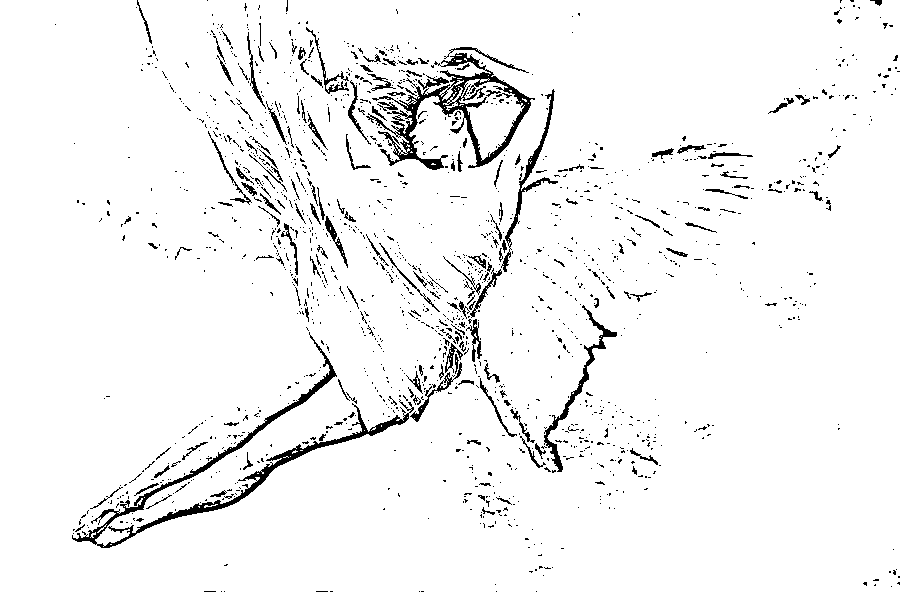

**小行星的历史**

关于小行星的形成，有几种假说仍然盛行。

**16 世纪，天文学家兼占星师约翰内斯·开普勒（Johannes Kepler）宣称火星和木星之间存在一颗行星****。**1801 年，他的直觉被证明是正确的，当时天文学家**朱塞佩·皮亚齐(Giuseppe Piazzi)正式发现了谷神星。**他本以为自己发现的是一颗彗星，可他意识到这个天体有自己的运行轨道。

**在接下来的几年里，另外三颗小行星被发现。1802 年，智神星被发现了。**这让天文学家们迷惑不解，因为他们被两个天体如此靠近彼此的运行轨迹弄糊涂了。**而当 1804 年的婚神星和 1807 年的灶神星**正式加入小行星的行列时，天文学家更惊讶了。

直到今天，直径大于 1 公里的小行星估计有数十万颗(只有 26 颗直径超过 200 公里)。鉴于其大小，**谷神星是唯一一颗几乎呈球形的小行星。**它的直径为 946 公里，略小于月球直径的三分之一。它的质量约为火星和木星之间小行星带总质量的三分之一。

为了解释小行星的起源，人们已经阐发了几种理论。**目前，大多数天文学家一致认为，**小行星要么是一组不能形成行星的硬块，要么由于木星强大引力而中止了活动。**另一种理论认为，**小行星是我们太阳系的一颗行星爆炸后的碎片; 然而，这种理论更难自圆其说。**第三种观点认为，**这些小行星是一颗行星在碰撞中被摧毁所形成的碎块，这一理论优于前一种的原因是，该行星碎块与小行星的总质量一致。

矛盾的是，**当天文学家在 2006 年将冥王星降格为矮行星时，引起了人们对主要小行星（我们提到的那些）的注意。**事实上，太阳系失去了第 10 颗行星，这让许多科学家非常不满，他们认为国际天文联合会（International Astronomical Union）做出了一个武断的决定，宣布冥王星太小，不能成为行星俱乐部的一员。冥王星的半径只有 1188 公里，即地球半径的 20% ; 冥王星的周长为 7242 公里，相当于从华盛顿到夏威夷的距离。

**所幸冥王星重获了太阳系行星的地位。与此同时，占星家们借此机会加深了他们对天体的全面思考。**一些人还找到了新的方法来丰富他们所钟爱的占星学。

然而，我们应该接受这些数以千计的矮行星的信息吗？**它们在占星解读中真的有一席之地吗？**这里有一些问题。目前，这些问题当然还没有得到明确解决，但是争论已经发展出了更好的认知。从技术角度来看，很容易在星图中找出小行星，因为星历表指出了它们的精确位置。

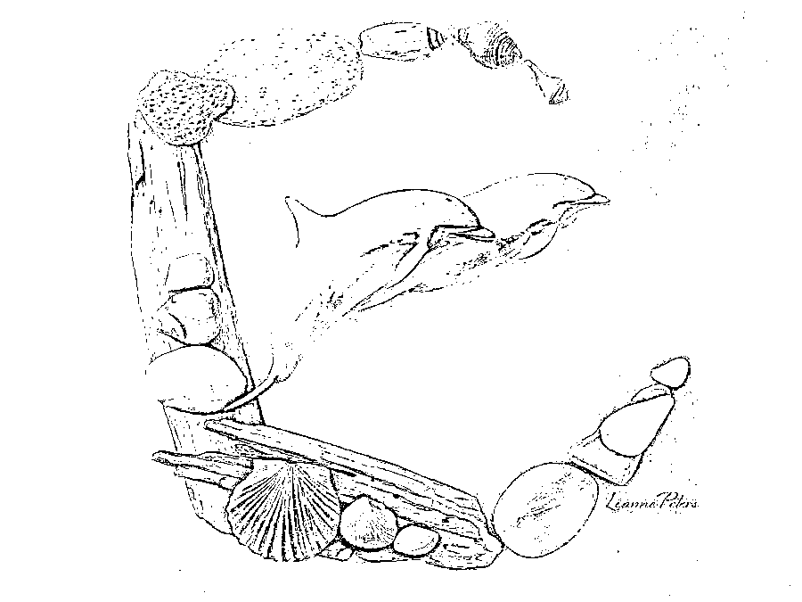

**小行星的特征、角色和功能**

使小行星流行起来的是希腊-拉丁神话。

**谷神星**

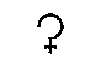

如上图所示，谷神星的符号是一把镰刀，象征着丰收。它也可以表示一个十字架被半圆所覆盖，十字架象征着物质，半圆象征着灵魂。
**★****谷物女神克瑞斯的神话** 

在罗马神话中，克瑞斯（Ceres）相当于希腊女神得墨忒耳（Demeter），也就是**丰收女神**。**她是生育能力的化身，**她的崇拜仪式在夏天进行。克瑞斯是土星克洛诺斯（这不奇怪，因为克瑞斯具有一种朴素的美）和瑞亚（Rhea）的女儿，她千方百计保护着耕作的土壤。

**她经常被描绘成一个高挑而美丽的女人，**目光看向远方，长发像麦田一样金黄。有了这样的外形，她讨朱庇特（即宙斯）喜欢也就顺理成章了，他们生了一个女儿，叫普鲁塞庇娜（Proserpina）。

普鲁塞庇娜还是少女时，冥界主神普鲁托渴求得到并且绑架了她。悲痛欲绝的克瑞斯向朱庇特恳求，朱庇特于是命令普鲁塞庇娜冬天留在冥界，夏天和她的母亲在一起。**这个神话故事的出众之处是，当母女团聚时，大自然被茂盛的植被完全覆盖。**

**★****谷神星的占星学解读** 

**谷神星代表了照料养育和被照顾的需求。**推而广之，**它强调的是滋养原则。**谷神星努力照顾自己的肉体，也愿意为人类奉献自己。

**谷神星所在的星座表明星图的主人需要什么样的食物滋养才能感受被爱，他对这种天赋作何反应，以及他是什么样的母亲。**

需要强调的是，**谷神星的角色与月亮不同，**月亮代表的是整个母性法则的原型。而谷神星必然**与土元素或处女座的意义有关**。要记得母亲既实际又合理的一面。这个故事强调了发人深省的一刻，就是当女儿从母亲的保护中解脱出来后，被冥王星绑架的时刻。

**必须注意一些与冥王星有关的类比，**因为克瑞斯来到冥界与冥王谈判她女儿的命运。因此，**谷神星的角色也有关灵魂和心智的食物，因为她与无形的世界有接触。**与冥王星达成的协议体现出“饱含爱意的分离”这个概念。

**综上所述，谷神星意味着生产力、方法、具体的分析、母爱、教育意识、自我脱离的能力，但也意味着缺乏信心、遗弃、痛苦和低自尊。**

注意

**在男性的星图中**，每当谷神星得到加强，无论是由于发光体、四轴或相位，它都表示一个男人将不得不承担传统上由母亲承担的角色：喂养、洗涤、抚养。谷神星也可以用来形容一位单身父亲。

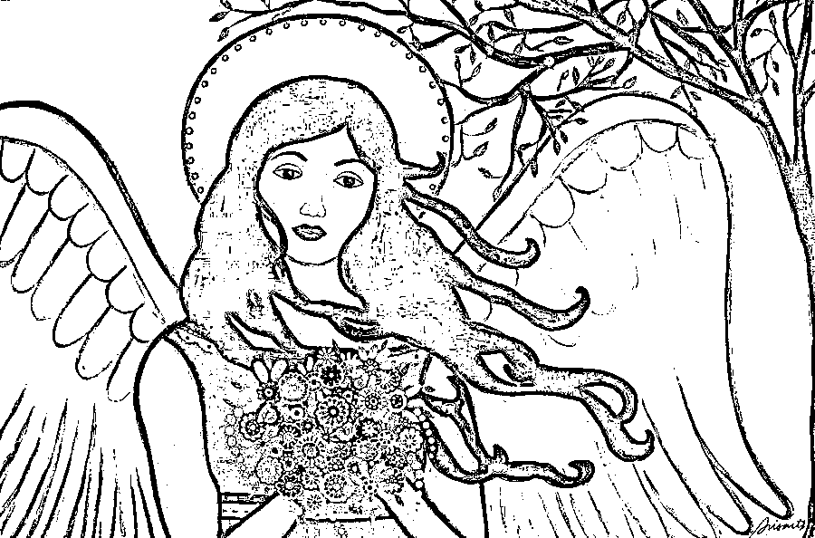

**灶神星**

从符号上来看，灶神星表示为一个正在燃烧着火焰的花瓶。花瓶的 V 字形可能被看作是**经过火的净化后的胜利象征**，这促进了我们的进化。火焰的原则也是为了重新激活过去世的记忆。

**★****女灶神维斯塔的神话** 

维斯塔是罗马女神，属于奥林匹斯十二主神那一代。她也是罗马最美丽的神祇，通常被描绘成戴着面纱。她是朱庇特的姐姐。她还竟然拒绝嫁给阿波罗！**她更愿意扮演大地之火女神的角色，因此成为家庭守护者的原型，并延伸为市政府和国家的守护者。**在古代，每家每户都会放置一个带有圣火的祭坛，甚至在城镇中心也有。

灶神维斯塔成为了掌管城市和圣火的人，**她要负责保持圣火不灭**。灶神的概念催生了古罗马的灶神女祭司（the Vestals）。

**★****灶神星的占星学解读** 

在出生星图中，灶神星**象征着对理想、事业或宗教的奉献。**当这颗小行星在星图中被强调时，它可能表示**对神秘主义（圣火）的喜好。**

灶神星也体现了**对纯洁度和距离的需求**。她汇聚了一股非常集中的能量，**鼓励无数人为了集体利益做出个人牺牲** (至于是何种集体利益，会根据星座、宫位及所有相位来解读）。

**消极的一面是**，灶神星可能会引起一种时而**不灵活或过于抽象的行为****。**专家认为，受到这颗小行星影响的人最好去静修，从象征性上烧掉他们身上残留的业债（对于业力占星学感兴趣的人来说可以如此解读）。

**婚神星**

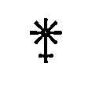

婚神星的符号是一个皇家权杖，中间一根重要的竖轴象征正义和伟大，连接着上方的物质十字架，十字架由两个互呈 45 度的十字架组成，从而形成一个罗盘玫瑰，**代表着和谐**。

**★****天后朱诺的神话** 

朱诺是朱庇特的姐姐，也是妻子。古代神话不太注重偏见和道德。朱诺喜欢珠宝、饰品和华服。朱庇特对她爱慕不已，绑架并强奸了她。然后，为免羞耻，他同意娶她为妻。对于希腊人和罗马人来说，赫拉/朱诺成为了**婚姻女神**，**主宰所有女性的活动**。朱诺是一位杰出的女士，并且不乏某种程度的自负。

**★****婚神星的占星学解读** 

在出生星图中，**这颗小行星提供了案主婚姻的额外信息****。**它表明了接受平等婚姻关系的倾向。婚神星**也关注社交生活**。换句话说，**朱诺的强势落位会促使案主一生都在体验第七宫的功课。**

**婚神星首先处理的是人际关系，关心的是如何维护自己的权利。**然而，在职业生涯上，这颗小行星也可能指向美容领域的职业。如果婚神星过于突出，她可能会促使人们把夫妻关系放在首位，甚至不惜损害事业。

比对图的专家注意到，在伴侣星图中，一方的婚神星常常落在另一方的太阳星座上。然而，**就目前而言，这还不是一个行之有效的规则。**

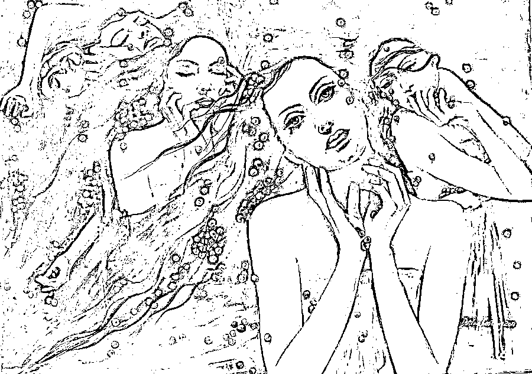

**智神星**

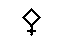

从符号上看，智神星是一个钻石形状的菱形位于一个十字架之上。从象征意义上讲，菱形类似于一张朝上的脸，而十字架则象征着一支长矛。**★****智慧女神帕拉斯的神话** 

帕拉斯就是雅典娜或古老的密涅瓦。因此，**她与智慧和创造性智力有关。**她是朱庇特最喜欢的女儿，因其**从手工艺到艺术的众多才能**而闻名。**她是精明的战士**，也象征着胜利。与火星不同，她的胜利不是野蛮获得的。她比其他人更深谋远略，能够成功地运用计谋来得到她想要的东西。从这个意义上说，她是无敌的。事实上，有一个神话故事里，当众神与巨人开战时，**她为大家出谋划策**。

**★****智神星的占星学解读** 

智神星体现了星图主人**战斗的一面**。她也表示我们的**感知能力、远见以及灵光一现的绝妙想法**。她促使我们在社交和职业上得到满足。此外，她可以被看做事是促进妇女赋权的代理人。她既有男性的一面，也有女性的一面，并寻求平衡与和谐。

**受智神星影响的女性**好斗且不愿意妥协。但从**智神星的男性面向**来看，他又会表现出非常发达的女性面相。

**结论**

有些人在解读出生星图时喜欢加入象征和神话的内容，他们可能认为小行星可以为经典的解读添加许多额外的细节。然而，在这个阶段，有必要避免高估它们的重要性，因为与行星相比，它们仍然只具有次要的辅助作用。

不管怎么样，小行星都是令人兴奋的研究课题，有一天它们也许会为自己正名并变得可靠实用。

**版权声明：**本文由若道翻译发布，欢迎转发，反对抄袭。友号转载请申请白名单。

**六一特别直播活动**

**今晚七点半上线第三场**

**扫描下图二维码参与直播**

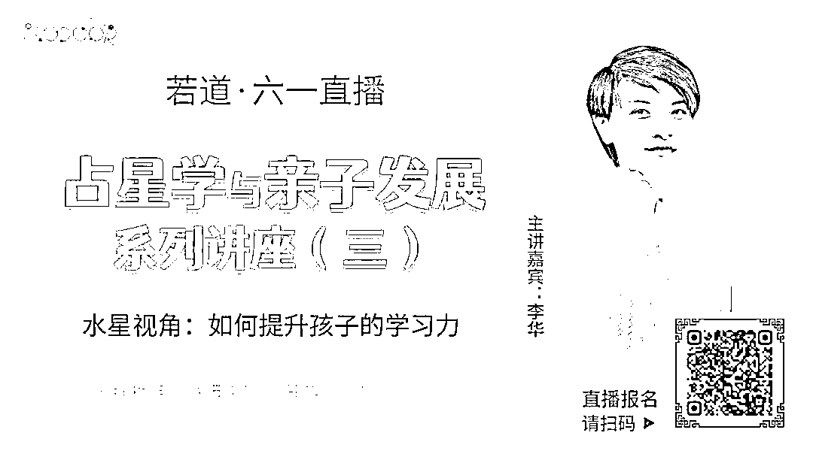

**更多小行星内容**

**点击下图了解课程详情** 

**微信又双叒叕改版啦，不想错过若道君的推送？**

**就把若道设为星标吧！**

**▼**

**喜欢记得点一下在看哦☟**

********报名直达入口********

# 六月有奖征集丨这个神奇的 app，将召唤出你星图的六位女神！

> 原文：[`mp.weixin.qq.com/s?__biz=MzA5NjA0NTAxNg==&mid=2651445804&idx=2&sn=627c48241631bb2621919d35ffe31853&chksm=8b4b689bbc3ce18dd0ff7c24c3c7c94ea48fab668f719655457cce909d52049947e43b98e907&scene=126&sessionid=1692737979#rd`](http://mp.weixin.qq.com/s?__biz=MzA5NjA0NTAxNg==&mid=2651445804&idx=2&sn=627c48241631bb2621919d35ffe31853&chksm=8b4b689bbc3ce18dd0ff7c24c3c7c94ea48fab668f719655457cce909d52049947e43b98e907&scene=126&sessionid=1692737979#rd)

**若道 APP 小行星功能更新啦！**

**下载打开若道 APP，点击****任一红框里的按钮****就可以直达“星盘”功能**

**点击红框“设置”按钮，进入设置**

**点击打开红框里的六颗小行星按钮**

**即可召唤出星图中的六位女神**

**六月有奖征集**

**提供本命星图中六位女神的位置信息，即可获得 100 元若道课程代金券。**

**★****参与征集条件：出生时间准确，****误差不大于 15 分钟****。**

**★****征集时间：6 月 2 日-6 月 30 日。**

需要提供的信息

*   姓名

*   出生地

*   现居地

*   出生年月日（阳历）

*   出生时间（精确到分钟）

*   谷神星星座度数宫位

*   智神星星座度数宫位

*   婚神星星座度数宫位

*   灶神星星座度数宫位

*   灵神星星座度数宫位

*   健神星星座度数宫位

示例姓名：echo
出生地：天津河西现居地：北京朝阳出生年月日（阳历）：1990.6.4 出生时间（精确到分钟）：12:23 谷神星星座度数宫位：巨蟹 6°23′H11 智神星星座度数宫位：双子 9°27′H10 婚神星星座度数宫位：天蝎 11°49′H3 灶神星星座度数宫位：金牛 0°8′H8 灵神星星座度数宫位：金牛 10°5′H9 健神星星座度数宫位：双鱼 19°4′H7

**填好信息添加若道 Maggie，发送给她，等待审核通过即可。**

长按二维码添加 Maggie 老师

****先认识一下我们星图中的六位守护女神****

****★**谷神星，丰饶女神**

****★**婚神星，婚姻女神**

****★**智神星，智慧女神**

****★**灶神星，家庭女神**

****★**健神星，健康女神**

****★**灵神星，灵魂女神**

**六位守护女神，在星图中，等风，也等你！****小行星相关文章：**[小行星的故事  | 智慧女神雅典娜和这颗行星有啥关系？](http://mp.weixin.qq.com/s?__biz=MzA5NjA0NTAxNg==&mid=2651445064&idx=2&sn=66224414e6726f1341e53a72bc8164fb&chksm=8b4b65ffbc3cece9cd7bdcf0d1d02d33fc28298ce01cd9649b8e49b05581b9b3dc4137adad0d&scene=21#wechat_redirect) [原来，代表爱情的不只金星，还有这颗小行星！](http://mp.weixin.qq.com/s?__biz=MzA5NjA0NTAxNg==&mid=2651444745&idx=2&sn=58dd8bda221ebe299fd90477ac7fe92d&chksm=8b4b64bebc3ceda8f1801eda83373da39a0cb2649b4606a92d924041066b83cb8f184254644c&scene=21#wechat_redirect)**** 

**更多小行星内容**

**点击下图了解课程详情** 

# ISAR 选修课丨唤醒女神，在占星学中使用小行星

> 原文：[`mp.weixin.qq.com/s?__biz=MzA5NjA0NTAxNg==&mid=2651445804&idx=3&sn=cbc451e5f34506fc1b0ab8c3d3bb67c3&chksm=8b4b689bbc3ce18d1ea6311351bb71bcebc1d4f0944238e343951a2fefa56dc76bcb429182b8&scene=126&sessionid=1692737979#rd`](http://mp.weixin.qq.com/s?__biz=MzA5NjA0NTAxNg==&mid=2651445804&idx=3&sn=cbc451e5f34506fc1b0ab8c3d3bb67c3&chksm=8b4b689bbc3ce18d1ea6311351bb71bcebc1d4f0944238e343951a2fefa56dc76bcb429182b8&scene=126&sessionid=1692737979#rd)

对于占星师来说，巨大的小行星带中有成千上万的滚落岩石在太空中呼啸而过，这似乎是一次令人生畏的雪崩，蕴含着潜在的新信息。因此，当你将它们整合到你的工作中时，辨别并正确理解每一颗小行星的意义是很重要的。

包括选择小行星在星图的解读，增加微妙的细微差别和令人惊讶的细节是无法从任何其他占星工具中获得的。

1

**课程简介**

理解小行星带所蕴藏的神圣女性力量的流动将帮助你在占星实践中创造更多的和谐与平衡。**小行星为你的解读带来细节、精确性和深度，同时也使你能够研究和阐释那些被忽视或低估的生命领域。**

**我们将讨论主要的女神小行星，并学习如何与之合作。**我们将借助大量现实生活中的例子，深入探讨它们的象征意义。你会真正了解这些重要的占星元素，从而拓展自己的实践。

**此课程可作为 ISAR 选修课。**

2

**课程安排**

**课程安排：6 月 8 日--7 月 27 日 （每周二）**

*   **6 月 08 日** **小行星简介**

*   **6 月 15 日** **谷神星，丰饶女神**

*   **6 月 22 日** **婚神星，婚姻女神**

*   **6 月 29 日** **智神星，智慧女神**

*   **7 月 06 日** **灶神星，壁炉女神**

*   **7 月 13 日 健神星，健康女神**

*   **7 月 20 日** **灵神星，灵魂女神**

*   **7 月 27 日** **综合应用，展望未来**

3

**课程大纲**

**第*****1*****讲  6****月 8 日  小行星简介**

小行星概述，小行星的发现、科学以及一些占星学历史。

**第*****2*****讲  ****6 月 15 日 谷神星，丰饶女神**

母神、农业女神，但其影响力远不止如此。这是我们所知的最大的小行星，也是最重要的小行星。她掌管养育、滋养、救助、管理等方面。

**第*****3*****讲  ****6 月 22 日 婚神星，婚姻女神 **

荣誉、伙伴关系、契约和婚姻：众神中的女王是正直的女主人。她在出生星图和行进中有什么意涵？她与“丈夫”木星朱庇特是什么关系？

**第*****4*****讲  ****6 月 29 日 智神星，智慧女神**

战地记者、棋手和占星师有什么共同之处？来自智慧、策略、洞察力和远见女神的帮助。

**第*****5*****讲 **** 7 月 6 日 灶神星，壁炉女神**

掌管神圣的火焰、家庭生活、厨房灶台、家人、遗产的女神：这颗关键的小行星被严重误解了。她可以给你一把钥匙，让你了解家庭关系、你的祖先和你的目标意图。

**第*****6*****讲  ****7 月 13 日 健神星，健康女神**

在我们应对全球疫情的过程中，掌管健康和福祉女神目前显得尤为重要。她能提供如何应对新型冠状病毒肺炎的线索吗？她在出生星图中的意涵是什么？幸福原来蕴含着相当广泛的含义。

**第*****7*****讲  ****7 月 20 日 灵神星，灵魂女神**

灵神星是唯一一位以人类身份开始生命的女神，她代表着人类的灵魂。这颗小行星与爱情故事、童话故事和灵魂之旅有关。

**第*****8*****讲  ****7 月 27 日 综合应用，展望未来**

你们刚刚开启探索使用小行星可能性的旅程。我们会探索评估某些理论有效性的方法，以及在实践中检验这些理论的重要性，我们还会探索其他数百万小行星中的一些。这堂课既有提醒告诫，也鼓励你深化自己的占星实践，并拓展你对象征的理解。

4

**课程试听**

📹 [`v.qq.com/iframe/preview.html?width=500&height=375&auto=0&vid=d3241mm7xdw`](https://v.qq.com/iframe/preview.html?width=500&height=375&auto=0&vid=d3241mm7xdw)

解锁全部沙龙内容欢迎购买：[**ISAR 会员沙龙 29 期 | 天空的细节——小行星如何提升扩展占星学**](http://mp.weixin.qq.com/s?__biz=MzA5NjA0NTAxNg==&mid=2651437295&idx=2&sn=8816fb50331dff6f6d25686ff80d7b5b&chksm=8b4b0a58bc3c834e54fb7d13e5bc11c98067fd93b29c5fbfc8f9745a516cbd8bfa3b90696324&scene=21#wechat_redirect)（点击可获取详情）

5

**主讲老师**

**克里斯蒂娜·罗登贝克**

克里斯蒂娜·罗登贝克（Christina Rodenbeck）是一名全职职业占星师，在牛津大学城生活和工作，深受周围知识和文化氛围影响；她拥有伦敦大学（University of London）的人文荣誉学位，曾在伦敦占星学馆（Astrological Lodge of London）、心理占星中心和占星研究学院学习。

作为一名占星师，在过去的 20 年里，克里斯蒂娜在她的网站“牛津占星师”上写了大量关于时事、艺术和文化的文章；她每月主持一个占星播客：“与克里斯蒂娜和萨莉一起占星”，并定期在《占星杂志》(Astrological Journal)上撰写时尚专栏；她定期在英国授课，并保持着蓬勃发展的专业实践。

6

**此次课程适合哪些人？**

*   有一定占星学基础，若道核心课 L3 以上水平；

*   希望成为优秀的占星师，想要借鉴国际大师次限解读思路并融入自己的体系的人；

*   热爱占星学、天文学、神话学的研究型占星学者；

*   计划考取 ISAR 认证占星师，寻觅中意选修课的学员；

*   走在自我探索和个人成长道路上的人。

7

**课程价格**

**价格**：**6800 元**

还有限时 ISAR 选修课联报套餐价格，具体请咨询课程顾问：Maggie 老师（微信：18510107057，请备注“小行星”）

长按二维码添加 Maggie 老师

8

**授课时间**

**2021 年 6 月 8 日（周二）20:00-22:00 开始，网络课程**

9

**退转课程**

*   **退款原则请详看《教学协议》，如有疑问请咨询课程顾问。**

****ISAR 选修课：小行星****

**授课老师：克里斯蒂娜·罗登贝克**

**授课时间：**2021 年 6 月 8 日（周二）起

**授课方式：**网络课程**，**英文授课，中文翻译

**费用：**6800 元

**课程负责人：Maggie 老师**（微信：18510107057，请备注“小行星”）

长按二维码添加课程负责人咨询~

****报名请点击“阅读原文”****

# 新课首发丨 ISAR 选修课：两年一次的生时校正课，独家技术流软件首公开！

> 原文：[`mp.weixin.qq.com/s?__biz=MzA5NjA0NTAxNg==&mid=2651445656&idx=2&sn=5efd5313cde28d6d9a37080773aa4e9b&chksm=8b4b6b2fbc3ce2395f2a06cc152a46015c71f9aadc94e01ad41bf15165fb2b220d3bddc7752b&scene=126&sessionid=1692737979#rd`](http://mp.weixin.qq.com/s?__biz=MzA5NjA0NTAxNg==&mid=2651445656&idx=2&sn=5efd5313cde28d6d9a37080773aa4e9b&chksm=8b4b6b2fbc3ce2395f2a06cc152a46015c71f9aadc94e01ad41bf15165fb2b220d3bddc7752b&scene=126&sessionid=1692737979#rd)

在这门课的学习过程中，你将成为一名“宇宙侦探”，**学习如何构建恰当的问卷，综合运用行进（Transit）、次限（Progression）和太阳弧（Solar Arc）等技术**，比对客户生命中**重大的事件发生时间**，揭示**真正的出生时间**。

**简单来说，就是：那些出生时间不准确的客户，你可以直接搞定啦！**

**此课程可作为 ISAR 选修课。**

1

**师资阵容：名师&高徒**

**这次的师资阵容也是很强大。**

参加过若道线下工作坊的学员，有一个身影一定不会陌生。

海星程老师是占星圈里名副其实的“**学术技术流**”，早期研习东方传统文化融合多年的占星研习和咨询教学经验，沉淀出了**理性、严谨、有灵性**的占星风格和底蕴。

*   **海星程老师在 2015 年若道首次“生时校正考核”中精准计算出大卫老师真实案例的出生时间而获****第一名****。**

*   **在 2019 年作为若道金牌中文讲师和大卫老师联袂教授了《生时校正》课程。**

*   **2019 年开始海星程老师结合精湛的占星技术和缜密的逻辑体系设计出了专业的生时校正工具，配合若道专业的技术开发团队，即将为生时校正毕业生们提供一款省时省力精确高效的工具。**

**福利：**

课后通过生时校正考试的同学将获得若道颁发的**生时校正认证占星师证书**，并在若道官网“推荐占星师”栏目进行推荐。

2

**为什么学习生时校正？**

*   **很多中国人的出生时间都不准确，生时校正是国内占星咨询中最常见的客户需求。**
*   生时校正需要**高超的技术、极大的耐心、浓厚的兴趣 ，是一个术业专攻的领域，**是对占星综合知识的整合实战应用机会。

*   星图中四轴的精准性直接影响了预测时间，1 度的相差可能会让预测偏离 1 年，因此，注重预测的占星师需要了解这门技术。
*   深入理解本命星图的意义以及三种预测技法在人生经历中的呈现。

3

**课程目标**

生时校正是一个**严谨而又细腻**的工作，需要校正占星师同时具备熟练掌握出生星图解读和预测技能（三种主要预测方法：行运、太阳弧、次限）的基础上，整合这两项技能，通过系统培训和训练达到准确分析和计算出客户的四轴度数，从而确定客户的准确出生时间。

**课程中会提供多个校正案例供学员练习。**

**授课方式：****原理方法讲解+案例演示+作业练习**

4

**课程内容**

**第一部分：生时校正原理和概括**

（主讲老师：大卫老师）

**课程内容：****整体介绍生时校正的原理，讲解校正主要工具“问卷表”的设计原则和用途，如何根据表中内容线索应用到生时校正的分析中，并演示一个完整校正案例，让学员体验校正的全过程。**

**学习目标：****通过这部分学习对校正有个整体的认知和了解。**

**案例讲解：**1 个案例讲解（具体案例个数根据学员掌握程度而定）

**第二部分：四轴星座的分析**

（主讲老师：海星程老师）

**课程内容：****讲解如果根据“问卷表”中的相关描述信息，运用出生星图解读技能和占星原型理论，通过逻辑分析判断出****四轴星座**。如果我们把星图解读看做是演绎推理过程（根据星图已知信息得出个人特质），那么我们也可以通过溯源推理（根据占星原型关系和充分条件的假言命题的逻辑性，从已知个人特质推溯星图对应信息的非演绎推理）分析出四轴星座。

**学习目标：****通过这部分学习和练习，掌握如果通过客户提供的已知信息和星图中确定因素，推理出星图的不确定因素，得出我们需要的四轴星座。**

**案例讲解：**2 个的上升星座分析案例作业练习和讲解（具体案例个数根据学员掌握程度而定）

**第三部分：四轴度数的计算**

（主讲老师：海星程老师）

**课程内容：****讲解如何根据“问卷表”中人生重大事件，运用行运、太阳弧、次限预测手段，计算中****四轴落入星座的度数****。**如果我们根据出生星图用占星预测技术可以做相关预测的话，那么反过来，如果我们已知过往发生的对个人影响重大的事件，那么我们就可以通过事件发生时间的流年行星位置推测出本命相关四轴度数。

**学习目标：****通过这部分的学习和练习，了解最基础和普遍应用的“枚举法”（单点分析方式）以及可以结合人工智能 AI 发展趋势的“筛选法”（全谱扫描分析方式），掌握如果在计算过程中合理****应用每个时间点的“事件数”、“相位数”、“匹配度”做最后判断。**

**案例讲解：**2 个四轴度数计算案例作业练习和讲解（具体案例个数根据学员掌握程度而定）

**第四部分：完整生时校正案例练习**

（主讲老师：海星程老师）

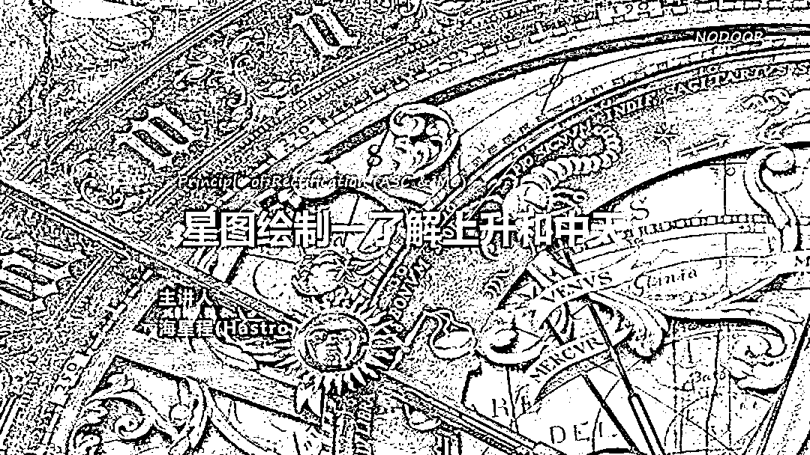

**课程内容：****演示综合运用“上升星座分析”和“上升度数计算”进行完整生时校正过程，通过课后作业练习以及讲解的方式，让学员进行实践生时校正的分析和计算，最后介绍生时校正考核的标准和要求。**

**学习目标：****通过这部分的学习和练习，掌握生时校正分析和计算，同时了解专业占星软件和手工绘制星图过程，理解四轴和出生时间地点的关联。**

**案例讲解：**2 次完整校正案例作业练习和讲解（具体案例个数根据学员掌握程度而定）。

**第五部分：BirthTimeFinder 生时校正软件讲解**

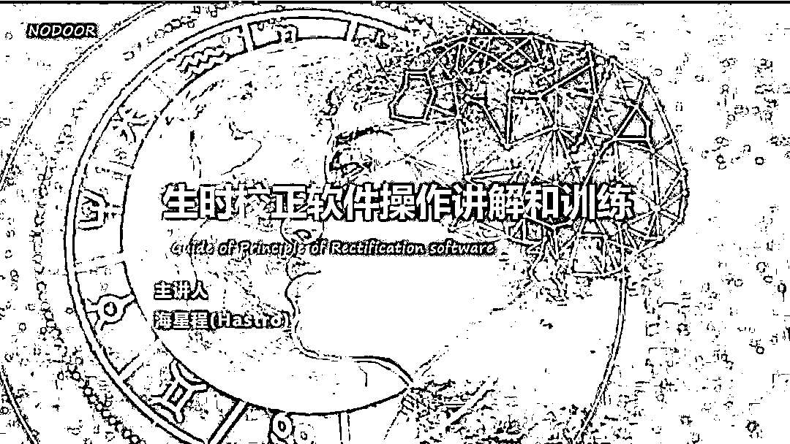

**Birth Time Finder 生时校正软件的使用方法和案例训练。****补充知识：开普勒占星软件讲解（视频）**

*   **介绍专业占星软件在生时校正中的辅助作用（重点了解四轮盘和星图旋转功能）。**

*   **补充讲解手工绘制星图计算方法和过程。**

5

**讲师介绍**

**大卫·瑞雷（**David Railey**）**

‍‍

‍‍

*   ISAR 全球副主席，ISAR 考试委员会主席，若道创始人；
*   被称为占星界的“马可·波罗”，第一位将西方严肃占星学系统教学和多位西方占星学大师引入中国的西方占星师；
*   第一位在美国用电视和广播媒体推广严肃占星学的职业占星师；
*   培养最多中国职业占星师的老师；
*   《灵魂的目标》、《一生的旅程》作者；
*   研究占星 48 年，拥有三十多年的占星咨询的执业经验，其服务客户包括学生、工人、市长、州长、议会议员、企业家、心理咨询师、工程师、艺术家、演员、知名企业家等，客户年龄跨度从襁褓婴儿到耄耋老人（大卫老师的老客户常常是一家三代人）；
*   2010 年 6 月，大卫的书《灵魂的目标》中文版出版。在 2011 年春季的北京之行期间，大卫接受了《南方周末》记者的采访。

**海星程（****Hastro****）**

*   国家咨询协会工商管理高阶注册咨询师；

*   ISAR 国际占星研究协会职业资质认证占星师、若道认证授课老师；

*   早期研习东方传统文化；后跟多名国际著名占星师研习现代占星学；

*   2014 年通过 ISAR 职业占星师考试，获得职业占星师资质认证；

*   2015 年若道首次“生时校正考核”中精准计算出大卫老师真实案例的出生时间而获第一名；

*   2016 年和 2017 年连续两年若道核心课程高阶助教；

*   2017 年若道生时校正课程助教；

*   2019 年若道生时校正课程主讲老师；

*   2020 年设计迭代生时校正专业软件；

*   2021 年配合开发生时校正专业软件。

6

**此次课程适合哪些人？**

*   **对生时校正有浓厚兴趣的占星师；**

*   **细致、认真、有耐心的占星高阶学生和职业占星师；**

*   **想要服务出生时间不准确的咨询个案的职业占星师；**

*   **想要学习生时校正软件操作方法的占星师；**

*   **想要获得生时校正认证证书的职业占星师；**

*   **想要入驻若道生时校正咨询平台的占星师。**

7

**课程价格**

正价：7500 元

**早鸟价：6800 元**

**早鸟价截止日期：2021 年 7 月 7 日**

往期学员复训价：3500 元

往期学员参加认证考试：1000 元

**课程负责人：Maggie 老师**（微信/手机：18510107057，请备注“生时校正”）

长按二维码添加 Maggie 老师

‍‍‍‍

8

**开课时间**

**2021 年 7 月 23 日（周五）20:00-22:00** 网络课程

**共 8 次网络课**

9

**退转课程**

*   **退款原则请详看《教学协议》，如有疑问请咨询课程顾问。**

****ISAR 选修课：生时校正****

**授课老师：大卫·瑞雷&海星程**

**授课时间：**2021 年 7 月 23 日起，周五 20:00-22:00（共 8 次）

**授课方式：**网络课程**，**英文授课，中文翻译

**费用：**7500 元；**早鸟价 6800 元（截止日期：2021 年 7 月 7 日）**

**课程负责人：Maggie 老师**（微信/手机：18510107057，请备注“生时校正”）

长按二维码添加课程负责人咨询~

****报名请点击“阅读原文”****

# ISAR 选修课 | 深度掌握次限月亮的技法（插班中）

> 原文：[`mp.weixin.qq.com/s?__biz=MzA5NjA0NTAxNg==&mid=2651445656&idx=3&sn=8192ddf2f714343341e34b6e3d53aff7&chksm=8b4b6b2fbc3ce239b54631069816d6b55cbc658836f7f4c7aeef6bb41fb2adbf3f17aae05d6b&scene=126&sessionid=1692737979#rd`](http://mp.weixin.qq.com/s?__biz=MzA5NjA0NTAxNg==&mid=2651445656&idx=3&sn=8192ddf2f714343341e34b6e3d53aff7&chksm=8b4b6b2fbc3ce239b54631069816d6b55cbc658836f7f4c7aeef6bb41fb2adbf3f17aae05d6b&scene=126&sessionid=1692737979#rd)

**星图中的月亮描述了我们在婴幼儿期和童年早期如何接收母亲的能量。**我们从出生开始就通过月亮的反射来体验母亲，正如月亮反射太阳的光一样。月亮也会描述一些我们可能会称之为灵魂的事物：**我们的人生经历在时间和永恒之间的内在反射物。**次限月亮通常被视为用于预测以及为事件择时的因素，但实际上它的内涵远远不止如此，要更为深刻和微妙。

**次限推进月亮**（Secondary Progressed Moon）：用次限推进，也即**一天即一年**的推进法时的推进月亮。次限推进月亮平均每月移动 1 度，虽然速度并非恒定。

**次限推进：托勒密时期，2 千年前发明。**

**当次限月亮在我们星图上的星座和宫位推进时，它会以唤起我们个体本质以及人性的方式，反映我们成长和发展的经历。**对于那些同时开展内在和外在生活的人来说，次限月亮可以成为一个向导，照亮自我反思和内在滋养的面向。**在八周的课程中，**我们将学习次限月亮是如何像镜子一样映照出我们最深的本质的。

**此课程可作为 ISAR 选修课。**

1

**课程安排**

**课程安排：5 月 10 日--6 月 28 日 （每周一）**

*   **5 月 10 日** 出生星图中的月亮与它在童年 0-7 岁的推进

*   **5 月 17 日** 7-14 岁：从自我到他人

*   **5 月 24 日** 14-28 岁：从他人到自我

*   **5 月 31 日** 次限月亮推进 vs 土星行进

*   **6 月 07 日** 次限月亮与其他行星形成的相位

*   **6 月 14 日** 30-60 岁的次限月亮推进：再次回转

*   **6 月 21 日** 60 岁以后的次限月亮之旅

*   **6 月 28 日** 次限月亮与次限太阳的关系

2

**课程大纲**

**第*****1*****讲  ****5 月 10 日 **

**出生星图中的月亮与它在童年的推进**

我们将学习出生星图中月亮的象征意义，以及它如何反映你的母亲以及你童年的家庭生活。我们将从元素的角度观察月亮，并研究从出生起你是如何得到母亲的关注的，我们将观察出生后几年的月亮的推进。

**第*****2*****讲  ****5 月 17 日 **

**从 7 岁到 14 岁：从自己到他人**

次限月亮与出生星图中月亮的第一个四分相在 7 岁左右出现。我们将学习在这个关键时间点我们是如何开始意识到自己是独立存在的个体，以及它如何让我们向家庭以外的其他人寻求滋养和生命。

**第*****3*****讲  ****5 月 24 日 **

**从 14 岁到 28 岁：从别人到自己**

从十六七岁到 28 岁左右第一次次限月亮回归，我们完成了与他人和与自己的月亮的灵魂之旅。从次限月亮回归开始，我们就开始对自己的情感生活以及我和其他人之间所发生的负责。

**第*****4*****讲  ****5 月 31 日 **

**从 14 岁到 28 岁：从别人到自己**

当次限月亮描述我们内心的旅程时，土星的行进描述了我们与周围世界的联系，以及作为社会发展中的个体，世界对我们的要求。在我们生命的头 30 年里，它们几乎以相同的速度运行。

**第*****5*****讲 **** 6 月 7 日 **

**次限月亮与其他行星的相位**

我们将从次限月亮的旅程中抽身出来，看看它与各种不同人的星图的其他行星产生有趣而特别的相位时发生了什么，这样我们来了解次限月亮触及我们星图中的这些行星时会发生什么，以及我们该如何为自己的生命导航。

**第*****6*****讲  ****6 月 14 日 **

**30-60 岁的次限月亮推进**

当月亮再次绕着出生星图运行时，我们有机会将意识带到我们的情绪反应中，并开始引导我们的内在本性，而不是对发生在我们身上的事情束手无策。

**第*****7*****讲  ****6 月 21 日 **

**60 岁以后的次限月亮之旅**

在当今时代，60 岁以后过着积极生活的人比历史上任何时候都多。有的人在 70 多岁的时候坠入爱河并第一次结婚。我们将在这一讲探讨如何在我们生命的最后几十年里对自己和他人有用，这样我们就可以体验到生命的丰富多彩。

**第*****8*****讲  ****6 月 28 日 **

**次限月亮与次限太阳的关系**

最后，我们来研究次限月亮绕着星图运行时与次限太阳推进的关系。我们将通过星图案例来进行探讨。

3

**此次课程适合哪些人？**

*   有一定占星学基础，若道核心课 L3 以上水平；

*   希望成为优秀的占星师，想要借鉴国际大师次限解读思路并融入自己的体系的人；

*   希望研究自身人生周期，想好更好的规划人生的占星学者；

*   走在自我探索和个人成长道路上的人。

4

**主讲老师**

**达比·科斯特洛（Darby Costello）**

达比·科斯特洛（Darby Costello）在美国波士顿学习占星学，在非洲生活过 12 年，于 1983 年移居英国伦敦。她曾在长达 25 年的时间里担任心理占星中心的首席教师，是占星研究学院的任课教师，也是伦敦占星学院的客座导师。此外，她拥有“文化天文学与占星学”硕士学位。她在世界各地授课与写作，服务全球客户是她占星师生涯的核心。

| 达比·科斯特洛与琳恩·贝尔

**网站个人简介：**

达比·科斯特洛（Darby Costello）出生于美国，1960 年代曾跟随弗朗西斯·萨科安（Francis Sakoian）、路易·阿克（Louis Acker）以及伊莎贝尔·希基（Isabel Hickey）在波士顿学习占星学。随后，她去了非洲，与部落疗愈者和占卜者一起共事多年，并在期间精进自己的占星学实践。1983 年，她去英国伦敦寻找占星团体。令她高兴的是，她找到了这样的团体，并在许多层面上参与其中。到伦敦后不久，她就开始拓展占星客户，并于 1988 年开始在由丽兹·格林和霍华德·萨司波塔斯创立的心理占星中心任教。十年后，她成为首席讲师，并为心理占星中心出版社撰写了几本书。

达比还是占星研究学院的导师，并于 2014 年获得荣誉文凭。她是心理占星学水星网络学校（MISPA）和占星大学的讲师，也是伦敦占星学院的客座导师。她在欧洲和世界其他地方教书和授课，也曾在巴厘岛、中国大陆和台湾等亚洲地区以及阿拉斯加等北美地区授课。2013 年，达比被授予查尔斯·哈维奖，以表彰她对占星学做出的卓越贡献。

2006 年，达比获得在巴斯斯巴大学（Bath Spa University）“文化天文学与占星学”专业硕士学位。这段学习经历也让她更懂得品读历史，并对写作产生了更深的热爱。不过，她最爱还是解读星图，她遍布世界各地的客户也滋养并进一步激发了她的占星学灵感。

**达比·科斯特洛的著作：**《占星学中的月亮》《水元素与火元素》、《土元素与风元素》、《火星四重奏》、《占星学》。

5

**课程价格**

**正价**：6800 元

6

**退转课程**

*   **退款原则请详看《教学协议》，如有疑问请咨询课程顾问。**

****ISAR 选修课：次限月亮****

**授课老师：达比·科斯特洛**

**授课时间：**2021 年 5 月 10 日（周一）起

**授课方式：**网络课程**，**英文授课，中文翻译

**费用：**6800 元

**课程负责人：Maggie 老师**（微信：18510107057，请备注“次限月亮”）

长按二维码添加课程负责人咨询~

****报名请点击“阅读原文”****

# 双子座在 12 宫头丨愿你永保好奇心，并散发少年的光芒

> 原文：[`mp.weixin.qq.com/s?__biz=MzA5NjA0NTAxNg==&mid=2651445656&idx=1&sn=9b7689d7524a6986dab2144f8470ee60&chksm=8b4b6b2fbc3ce23972433c316c13571dbb2dd4b329b056a20f826e9bf51507e8f4454220d3a9&scene=126&sessionid=1692737979#rd`](http://mp.weixin.qq.com/s?__biz=MzA5NjA0NTAxNg==&mid=2651445656&idx=1&sn=9b7689d7524a6986dab2144f8470ee60&chksm=8b4b6b2fbc3ce23972433c316c13571dbb2dd4b329b056a20f826e9bf51507e8f4454220d3a9&scene=126&sessionid=1692737979#rd)

********************☆ 后****************************台****************************回复“今日”，给你一句生命态度********************

作者/阿兰·欧肯 翻译/轩轩 校对/王宏编辑/翀子 封面/书君 图片/网络

昨天是儿童节，大家节日快乐！而身为成年人，生活中也需要保有童心，那如何做个“孩子”呢？还需要学习双子座，它会带给我们很多不同的生活内容。查看你星图中双子座落入的宫头，会帮助你更好地了解自己的双子座面向。一起来看看吧。

**双子座联结着我们的生命**

代表古老智慧的占星学将双子座描述为**“相互作用的光芒”**，指的是，正是**双子座揭示了表现的基本二元性**。这是**精神、造物者和形式、被创造者**之间的关系。因而，双子座的最高境界是**通向灵魂的道路**，因为灵魂及其产物意识正是解决这股巨大张力的关键。

双子座在我们日常生活方面的目标是，**让人们觉察到所有人、地点和事物之间存在的关系**。在人格方面，双子座并没有解决这些关系中固有的二元性和冲突。**双子座将我们的注意力聚焦于众多、多重和数量极大的事物，关注潜力和可能性**。它打开了一扇门，让个性得以在各种环境和人生境遇中去体验自己。

所以说，**双子座开阔了我们的思想，还拓展了我们和生命的联结感。但是，它不会创造出人格层面的合一性，这本就不是它的作用**。双子座和处女座、射手座、双鱼座都是变动星座。所有这些变动星座的首要功能就是**创造持续的不断变化的状态**。这是时间和空间周期性的循环运动，在我们的日常生活中表现为形式的变化。但是，变动性的高阶目的，尤其是对于双子座来说，是**为人生和灵魂的功能提供可拓展的表达领域。**正是这种人生经验的累积，以相关性和关系的运动为基础，构成了双子座的根本。双子座关联万物，并且在这么做的过程当中，揭示灵魂的真实意图：**精神和物质的相互作用和相互联结**。如果我去描述双子座如何依据个人的意识水平来运作，那我们或许就会更好地了解双子座及其表达的各个层面。**太阳或上升点落在双子座的人，主要以自我为中心，并且主要依据个人欲望来运作，此人被困在了自我二元性的斗争当中。这是个体在回应完全由欲望驱动的心灵指示。**

如上所述，我们可以正确地认为，当双子座落在出生图中各个宫位的宫头上时，它会倾向于产生和该宫位本质相关的**多样性、不稳定性、变动性，以及经验的扩张。**它也将意味着，一旦达到了更高层次的意识，在该宫位描述的情景方面，会获得更大的和谐感。现在我们来看看这些星座、宫位组合的一些最普遍的影响。

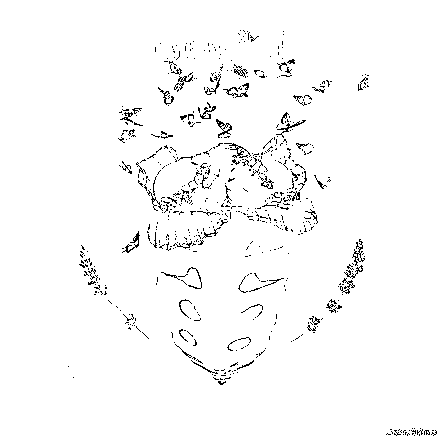

**双子座落在 12 个宫头**

**双子座位于*****第 1 宫*****宫头（上升点）**

**上升双子座的人天生多才多艺，并且一直渴望改变自己周边的境况。这会导致个体逃避例行公事、爱动，从而集聚了多种多样的人生经历。**

此位置的双子座也可能会带来**相当肤浅的生活态度**，因为这类人通常会**通过依恋于过多的人、地点和事物而消耗自己的能量。**除非木星和该宫头形成强有力的相位，否则此人往往**比较苗条，走路很快，有神经质的倾向。**他们可能**喜欢在白天频繁换衣服。**

二元性是生活的一个主题，如果水星在出生星图中也落在变动星座中，那么二元性的特质就会更强烈。但是，如果处理得当，只要思维受到了整合和综合的训练，那么二元性就不一定会带来冲突。**上升双子座是天生的沟通者，当为了更大的利益而将人们联系在一起时，他们的状态最佳。**

****双子座位于*********第 2 宫*********宫头****

在使用自己的资源来获得回报时，**个体会表现出一定程度的多样性。**此处的双子座启发个体，在建立学习和赚钱的方式、方法时，朝不同的方向去发展。**自我价值感通过试验建立起来，一般来讲是通过沟通自己的观点和人生洞见的方式来建立的**。这种自我表达能力的受阻，尤其是水星和土星形成困难相位时，可能会导致严重的心理后果。

必须要注意的是，**此人不会将自己的财产同时花费在太多地方。**水星如果相位良好，且落在固定星座（金牛座、狮子座、天蝎座、水瓶座）中，最有利于抑制这种倾向并带来适当的自律。

************双子座位于*******************第 3 宫*************宫头******

这意味着**非常活跃和忙碌的头脑**。由于双子座天然对应着第 3 宫，所以其在这里的影响可以是**非常正面**的。

当水星在第 3 宫中处于有利位置，尤其是在与土星或月亮形成良好相位时，心智的关注点和合理使用，以及成功联结世界的能力会得到提高和增强。水星在与金星形成六分相时总是令人愉快的！

双子座在第 3 宫宫头上意味着**兄弟姐妹的重要性**，如果水星位于某个角宫中时（角宫是古典占星的说法，为 1 宫、4 宫、7 宫、10 宫），其重要性将格外显著。此处的双子座也倾向于**指示各种智力兴趣，与个人早期环境的强有力联结**（并且，如果意识得到了发展，就是和一般性环境的强有力联结），**以及渴望和他人沟通自己的观点**。如果水星落入天秤座，则沟通观点的特质会得到重点强调。

****************双子座位于*************************第 4 宫*********************************宫头****************************（下中天）************************

这意味着**频繁更换住所，尤其是当水星或月亮在出生星图中落入变动星座时。**个体很容易感觉到**过于稳定的人生是一种陷阱。内心常常感到不安，**因为还应该记住，双子座在该宫头的人，双鱼座（另一个变动星座）就会位于上升点的宫头上。**了解自我的需求通过对多种多样体验的渴望而表达出来，这种体验再加上住所的变动，很容易带来旅行生活**（通常为**短距离的**）**。****此人的母亲可能非常忙碌，兴趣广泛。**如果水星和月亮形成困难相位，那么这些兴趣就可能排除了亲子之间温暖的情感联结。

********************双子座位于*******************************第 5 宫*****************************************宫头******************************

因为第 5 宫是**“愉悦之宫”**，而双子座代表着**多才多艺**，所以我们可以期待此种星座-宫头组合会**产生众多爱好和愉快活动的倾向**。此倾向可能很容易扩展到此宫位的另一个兴趣领域之中——**浪漫爱情**。因而，此处的双子座可能意味着**个体玩弄爱情，享受风流韵事。**

当水星和以下一颗或多颗行星形成相位时，此特质将得到大力加强：**第 8 宫守护星、火星和金星。水星落在狮子座、天秤座或天蝎座中**，也会增强这种**玩乐性的“融合冲动”**。个体也可能**对儿童有强烈的亲和力**，并且在年轻人的陪伴下，很容易感觉自己像孩子一样。第 5 宫是太阳的天然宫位，**当双子座落在此处时，各种形式的写作和沟通都是天然的创意表达通路。**

************************双子座位于*************************************第 6 宫*************************************************宫头************************************

此处，双子座天生的多才多艺**带来了同时处理多种情况的能力。**双子座天性中固有的**对多样性的渴望**，**在工作领域中通过一般性的灵活和适应性而显现出来**。个体肯定会喜欢那些能**改变自己日常生活的活动**；出差会是天然的加分项。**该宫位中位置不良的水星（尤其是落在变动星座中）可能会导致过多的工作变动。**位置不良的白羊座水星意味着过早换工作，而金牛座或巨蟹座水星四分土星和（或）月亮，可能让个体在同一份工作上待得过久。行星对我们说得十分清楚，我们只需要知道如何去倾听它们！**健康问题通常涉及到神经系统，过度分析性的心智特征可能会导致焦虑，**尤其是当**水星在处女座中位置不良时**。**肺部**往往比较敏感，因此应避免吸烟。

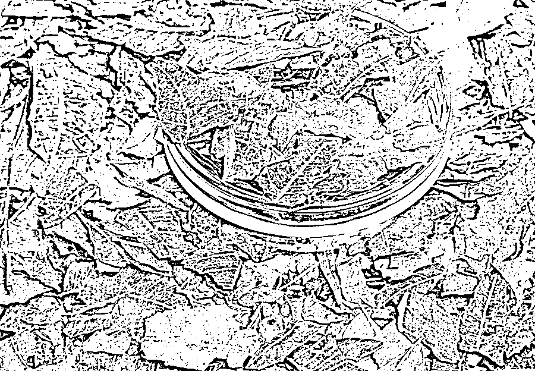

****************双子座位于*******************************第 7 宫*********************************************宫头****************（下降点）**********************************************

**此星座-宫位组合通常会带来对关系中的多样性、多才多艺和自由的需求**。自由的特质会得到大力强化，因为双子座在第 7 宫意味着“伟大的流浪者”射手座落在第 1 宫。此位置通常也意味着，此人倾向于**同时拥有好几段关系，或者至少会多次结婚，或多次建立严肃的伴侣关系**。这种对多重或连续的伴侣关系的渴望，在水星落入变动星座，并且与月亮或木星形成困难相位时，会得到强化。此人具有明确的**独立倾向**（尤其是当天王星和木星形成相位时，但是当水星落入巨蟹座或摩羯座时，此倾向会减弱）。**此人会更喜欢投身于自己兴趣当中的伴侣，以及将此类兴趣带入关系当中的伴侣**。当双子落在下降点上时，**沟通以及和他人的心智联结将是至关重要的**。

****************双子座位于*********************************第 8 宫*********************宫头********************************

此处，**个体通常能够轻松地适应生活中的重大变化**。个体可能**“顺其自然”**，**并释放旧有模式**，因为这种释放一直是第 8 宫对我们提出的要求。在性生活频繁的阶段及其他独身阶段之间，性生活和性向可能会有所波动。当星图中有其他指征的时候，此星座-宫位组合可能意味着**双性恋**。天王星、金星和水星之间强有力的行星相位可能会强化这种倾向；水星如果落在金牛座、巨蟹座或摩羯座中，和月亮或土星形成困难相位，就会减轻这种倾向。此宫头上的双子也意味着个体可能会担任**财务代理人**，作为**股票经纪人、银行柜员、房地产经纪人或其他类似职业人员**，处理人们的实际事务。海王星、冥王星或木星如果在此处和水星形成困难相位，可能意味着**错误处理他人的资源，或者关于遗嘱、遗产的法律困境或其他困境。**

******************双子座位于*************************************第 9 宫*******************************************************宫头************************************

此位置意味着**对生活的强烈好奇心，和对激励心智的渴望**。但是双子座不是固定星座，其变动性会导致**改变学习学科**的倾向，因此**个体知识广泛，但是却没有特定领域的专业知识**。拥有此星座-宫位组合的人必须**注意不要去教授他们刚刚学会，但还没有体验过的东西。****旅行**将是这类人生活中非常重要的一部分，尤其是当水星落在白羊座、双子座或射手座中时；如果水星落在金牛座、巨蟹座或摩羯座中，那么旅行的重要性就会降低。如果水星落在双鱼座，或者和海王星形成良好相位，那么神秘学和形而上学的倾向将十分显著；而当水星落在水瓶座中时，代表的就是技术性学习。**注意：一定要关注行星的定位星所落的星座，因为它会给占星学生提供很多信息。**

********************双子座位于*****************************************第 10 宫*************************************************************宫头****************************************

**双子座在第 10 宫宫头的人所需要的事业需要具有多样性，因为例行公事是绝对要避免的**。双子座在中天意味着，如果个体要坐在书桌后面，那么这张桌子必须配备多条电话线，有好几个电脑屏幕，还要有众多的沟通机会。此星座-宫位组合的完美出路有：**写作、记者、设计，或是代理人或中介的工作**。**旅行的能力**也可能在职业考量中扮演着重要的角色。双子座的二元性表现为**同时担任多项职位的倾向，并且渴望通过进修来升职**。如果出生星图中的水星落在变动星座中，那么父亲在此人青年时期可能经常离家；而如果水星和土星形成困难相位，那么亲子沟通可能受到限制。

**********************双子座位于*********************************************第 11 宫*******************************************************************宫头********************************************

**个体往往会拥有广泛的友谊和社交关系**。如果出生星图中的水星落在风象星座中则尤其如此。如果水星和月亮、金星或木星形成良好相位，那么对活跃社交生活的渴望就会很强烈，也很可能取得成功。双子座在此位置上时，天王星与水星形成的相位对应社交或技术联网的能力——毫无疑问，电脑和互联网将在此人的生活中扮演重要的角色。一般说来，**此星座-宫位组合让人渴望了解社会各阶层中各种各样的人**。但是个体应该**避免融入到过多的群体和组织当中**，因为**不同的忠诚可能导致与朋友和同事的冲突。**

************************双子座位于*************************************************第 12 宫*************************************************************************宫头************************************************

**此位置警告个体是无法让所有人满意的**。个体必须要注意，**在所有形式的沟通中都要保持一致和诚实**。当水星与海王星和（或）冥王星形成困难相位时尤其如此。如果星图的其他部分揭示了性格某种程度的成熟，以及更坚定的本性，那么双子座在第 12 宫就是能够**在所有社交场合找到“缺失的环节”**的绝佳位置。它意味着，**个体能够找到丢失的传真，找到消失多年的朋友，并在正确的时间说出对的事情**。当出生图中的水星和月亮形成良好相位时，更有可能在正确的时间说出对的事情。此位置的水星，特别是和金星或月亮形成良好相位时，可能对冲突的解决带来非常积极的影响，因为此位置让个体可以从全局的视角去看待事物。

**版权声明：**本文由若道翻译发布，欢迎转发，反对抄袭。友号转载请申请白名单。

**阿兰·欧肯**

1944 年出生于纽约，毕业于纽约大学罗曼语言及语言学专业。著有包括《灵魂占星》、《星图中的守护关系》、《阿兰·欧肯完全占星》等数十部著作。他还为《戴尔星运杂志》以及其他许多国内外评论与期刊撰写过数百篇文章。他是译者、老师、环球旅行家和国际导游。

**六一特别直播活动**

**今晚七点半上线第二场**

**扫描下图二维码参与直播**

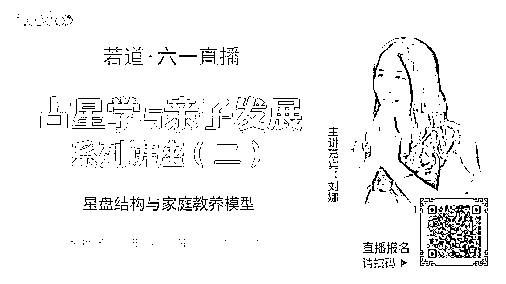

**想系统学习占星学？**

**点击图片了解详情**

**微信又双叒叕改版啦，不想错过若道君的推送？**

**就把若道设为星标吧！**

**▼**

**就是这个“在看”，戳戳戳 ☟**

********报名直达入口********

# 六一直播沙龙丨“看见”孩子，占星学与亲子发展系列讲座

> 原文：[`mp.weixin.qq.com/s?__biz=MzA5NjA0NTAxNg==&mid=2651445537&idx=2&sn=cde2678fb8f3bf1d85f472ee31d89218&chksm=8b4b6b96bc3ce2809977e27d24bedde8d216b061bd27c69a7745ad1c4705eb032a817e327b3b&scene=126&sessionid=1692737979#rd`](http://mp.weixin.qq.com/s?__biz=MzA5NjA0NTAxNg==&mid=2651445537&idx=2&sn=cde2678fb8f3bf1d85f472ee31d89218&chksm=8b4b6b96bc3ce2809977e27d24bedde8d216b061bd27c69a7745ad1c4705eb032a817e327b3b&scene=126&sessionid=1692737979#rd)

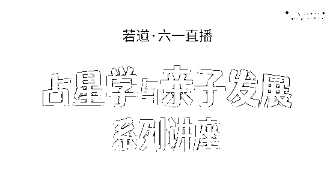

六一将至，**若道历时半年匠心打造的**[《幼儿报告》](http://mp.weixin.qq.com/s?__biz=MzA5NjA0NTAxNg==&mid=2651445332&idx=2&sn=89add9dd264d5f3d6cd4ecde0871f6f1&chksm=8b4b6ae3bc3ce3f51062b1e4a65841f52d96b003854b786477530ac33f125cd1f443c9605821&scene=21#wechat_redirect)（点击了解相关内容）也顺利上线，报告上线以来，我们收到了很多报告购买用户的热心反馈。很多用户说通过《幼儿报告》更好地了解了自己的孩子，更好的认识到孩子的天性，也希望能在今后的抚育过程中可以更好地理解、接纳和支持到孩子。

**六一期间（6 月 1 日-6 月 4 日）**，若道也将邀请到四位 ISAR 认证占星师，**分别从不同的角度一起探讨“占星学与亲子发展”**，以期能够用占星学更好地支持到亲子关系的发展。

**讲座一** 

**5 个孩子的星图与出生故事**

**——结合占星学的婴幼儿成长观察**

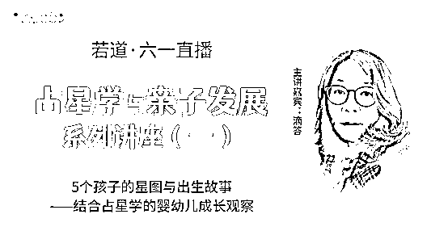

讲座信息

*   **演讲嘉宾：**滴答

*   **讲座时间：**2021 年 6 月 1 日（周二）19:30-21:00

*   **嘉宾简介：**

       ☑ISAR 认证占星师（2015 年获得）

       ☑幼儿报告主要策划者、撰写者

       ☑潜心道家、佛家修行多年

       ☑微信号：di2019da

**讲座简介：**

听 4 岁男生、10-11 岁兄妹、18 岁女生、27 岁帅哥，5 个孩子的出生故事：**出生前后父母亲的状态与外部环境的变化，如何呼应星图中上升、月亮，太阳的展现。**对孩子们成长中的**性格情绪、饮食健康和其他方面的影响与表现。**

讲座中有冥王星合上升摩羯座，月海四分的孩子，有月亮和土冥成冲突相位的孩子，相同的相位和不同的落座与宫位演绎了怎样不同故事；还有上升白羊座、巨蟹座、天秤座、金牛座的孩子，他们的上升和月亮如何显化了出生的故事。这是我们这场沙龙的重点。另外太冥四分、太火四分、太土对分，太阳落座与宫位，我们还会提到他们的父亲当时是怎样的状况，还会提到孩子们南交点的一些观察。

**讲座二** 

**星图结构与家庭教养模型**

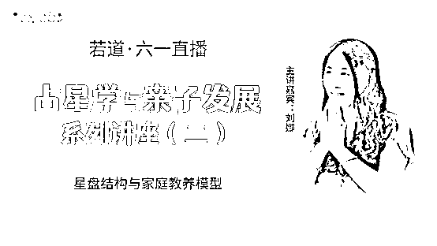

讲座信息

*   **演讲嘉宾：**刘娜

*   **讲座时间：**2021 年 6 月 2 日（周三）19:30-21:00

*   **嘉宾简介：**

       ☑若道核心课程（2012 届）英文班毕业生

       ☑ISAR 认证占星师（2012 年获得）

       ☑国家二级心理咨询师

       ☑企业 EAP 执行师与咨询师

       ☑绘画心理咨询师（高级）

       ☑微信号：NApsychology

**讲座简介：**

家庭的教育和亲子的教养，是融合在一点一滴日常的教养模型中的。在心理学中，有哪些不同的家庭教养模型？它们是如何体现在平日的场景和事件中？而不同的孩子的星图结构，又是**如何折射这些模型**、并且由此发展出应对机制的？**身为父母，如何根据孩子星图，有意识的去觉察和调整自己跟孩子的沟通方式和相处之道？**

并且，借由孩子星图的能量，能看到自己内在深处的期待，或者个体创伤与代际创伤。最终，更好的与自己和解、了解孩子、发挥家庭教育对个体的积极作用。

讲座会从现实场景说起，**通过具体的案例故事，心理结合星相，让我们更好的“看见”孩子。**

**讲座三** 

**水星视角：如何提升孩子的学习力？**

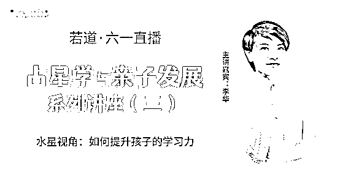

讲座信息

*   **演讲嘉宾：**李华

*   **讲座时间：**2021 年 6 月 3 日（周四）19:30-21:00

*   **嘉宾简介：**     

       ☑若道 2016 届核心课程毕业生

       ☑ISAR 认证占星师（2018 年获得）

       ☑资深舞台剧导演（毕业于上海戏剧学院）

       ☑微信号：hlhdrama

**讲座简介：**

**现代占星学中的水星是什么含义？水星落在 12 星座的孩子具有怎样的学习力？**如何根据孩子的水星星座，**定制他们专有的学习方式，**了解他们喜欢阅读的书籍，喜欢的课程及学习领域？本命星图中的**水星与外行星形成相位**，会给水星带来哪些影响、又会让水星拥有哪些天赋力量？

**讲座四** 

**火星与青春期成长困境**

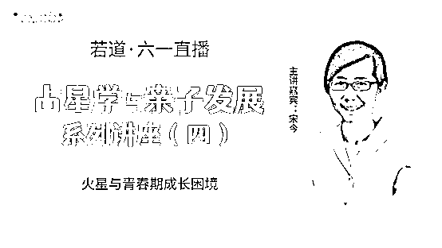

讲座信息

*   **演讲嘉宾：**宋今

*   **讲座时间：**2021 年 6 月 4 日（周五）19:30-21:00

*   **嘉宾简介：**        

       ☑若道 2016 届核心课程毕业生

       ☑ISAR 认证占星师（2017 年获得）

       ☑若道咨询平台入驻咨询师

       ☑中科院计算机博士

       ☑国家二级心理咨询师

**讲座简介：**

现在的孩子到底怎么了？新闻报道里触目惊心的青春期学生自伤自杀事件，到底应该找谁负责？十年寒窗苦，一朝跃龙门，熬过了高三，上了大学的孩子是不是就真的解脱了？“你都上北大了，你还抑郁啊？”

**迷茫昏暗的青春期隧道，每个人早晚都要走，**我不知道你孩子的隧道到底有多长，到底要转几个弯，我只知道前方一定有出口，出口处一定会有光。我愿意陪你一起，窥探这隧道的曲折和隐秘，**给予孩子们深深的理解和拥抱。**

**如何参加六一直播沙龙？**

****参与方式 1：****

**直接扫描下图二维码**或在文末点击 **“阅读原文“**付费购买，四场直播沙龙原价 300 元，**六一特惠价 61 元**；

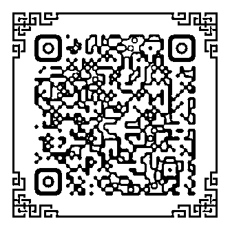

**参与方式 2：**

扫描下图二维码，**购买《幼儿报告》**，购买后，添加客服微信 nodoor201705，提供报告购买支付截图，即可**免费获取**讲座直通券。

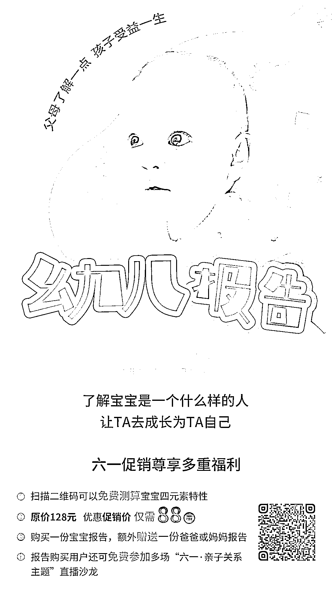

********沙龙报名入口********

# 插班中 | 如何解读星图要素？这门课程一网打尽

> 原文：[`mp.weixin.qq.com/s?__biz=MzA5NjA0NTAxNg==&mid=2651445537&idx=3&sn=3fc3a09f9182bc75a669a54208ae1a20&chksm=8b4b6b96bc3ce28047044e25cc1cd2f53d16a388ffdeb4cb19ea4e2b44f78c46f53bd3d5a7fa&scene=126&sessionid=1692737979#rd`](http://mp.weixin.qq.com/s?__biz=MzA5NjA0NTAxNg==&mid=2651445537&idx=3&sn=3fc3a09f9182bc75a669a54208ae1a20&chksm=8b4b6b96bc3ce28047044e25cc1cd2f53d16a388ffdeb4cb19ea4e2b44f78c46f53bd3d5a7fa&scene=126&sessionid=1692737979#rd)

占星学这门古老的学科，历经了历史长河里的起起伏伏，也直面了现代科学的质疑与探索，依旧陪伴在我们身边。时至今日没有消亡，反而以不同的方式进入现代人的生活，述说着时代的语言，疗愈现代人的心灵。

占星学是一种符号语言，它为宇宙无形的力量穿上了意象的外衣。这使我们可以与不可见的世界交流，将不可见变为可见。

由此，它提供了一面镜子，在这面镜子中，个体经验被看做是更大模式的一部分。占星学核心的生命理念是：在我们居住的宇宙中，万事万物都相互关联、生机勃勃，我们是这个宇宙的参与者。我们常说占星学是一种个人成长的工具， 如何运用占星学来实现自我成长呢？

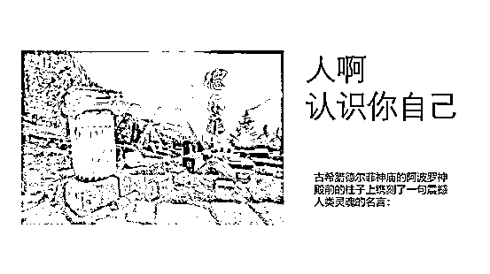

**1. 占星学可以帮助我们了解自己的天赋与潜能**

非常喜欢的格言是：“性格即命运。”个体的智力和才华有着丰富的类型，有的人的天赋显而易见，比如擅长绘画、写作、运动或者歌唱；有的人的天赋需要更长的时间来探索和接纳，比如善于倾听、善于交流或者善于带动气氛等等。占星学可以帮助你认识自我，找到人生的养份。 

学习占星学还可以让我们慢慢养成随时保持“觉知”的习惯，每时每刻知道自己是谁，在哪里，在做什么。遇到问题时不是去质问结果，而是去寻找根源，发现和开发自己的潜能。

**每个人都有自己独一无二的潜质、能力和局限。我们通过选择获得权力。而占星学是帮助我们了解这些信息的工具。**

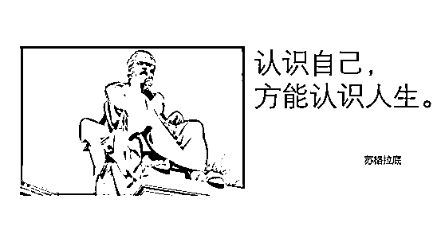

**2.占星学可以帮助我们了解人生的轨迹**

**占星学能够帮我们迅速发现成长过程中形成的思维模式和行为模式。**

客户在咨询结束后会对占星师说，感觉你是心理医生，和你聊一聊，心情就好了很多。如果没有星图的帮助，单纯只是心理咨询，可能我们需要花上更多的时间才能发现问题的根源。有了星图的帮助，我们可以很快地知道，我们的人生在哪里出了问题，我们可以如何去改进，从而过好我们的人生。

**占星学能够帮助我们了解人生的轨迹。**透过一张出生星图，我们可以看到个人生命循环模式，以及外行星在人的一生中可能带来的生命挑战和转机。

通过对人生不同阶段行进的把握，我们可以提升自我觉察，知道什么时候该进、什么时候该退、什么时候该抓住、什么时候该放手。人生漫长，与其盲目地、惴惴不安地前行，不如把握住生命的节奏，安然过好每一天。

**3. 占星学能够帮助我们抓住时机**

我们经常听到“时机就是一切”的说法。如果能知道当下正处于一个周期的哪个阶段，这对我们是非常有利的。机会来来去去，除非我们伸手抓住它们，否则它们只会擦身而过。如果我们能更充分地理解我们通往本真、成为真我的旅程，我们将获益良多。而占星学的符号语言正是帮助我们选择在对的时间做对的事的一个工具。

**4. 占星学可以帮助我们更有效地面对人生**

**占星学能够帮助我们更有效地过好一生。**了解自己的天赋，把握生命的轨道，可以让我们不再盲目和急躁。我们不会在坏情绪里面浪费时间，不会去做无用功。

**我们知道顺境和逆境都会在某个周期结束的时候停止。**我们也会知道让我们摔跤的模式是什么，从而在下一个周期来临的时候做好准备。我们不会在同一个坑里跌倒无数次，在命运的滚滚车轮下头破血流，还负隅顽抗。我们对于挫折和机会更有觉知，而不是在自怨自艾中虚度一生，或者在得意忘形中浪掷时光。就像苏·汤普金斯老师的著作《顺逆皆宜的人生》一样，享受顺逆皆宜的时光。

**5. 占星学可以帮助我们理解和接纳生活**

**占星学可以帮助我们更加宽容地对待他人和世界。了解个体的差异性可以帮助我们消除偏见。**

每个人都是带着自己既有的性格特点和思维行为模式出生，从星图上能看出我们的父母是如何对待我们的，我们的成长环境、我们的情感特质、我们和他人的互动模式、我们的事业路径、我们人生路上会遭遇的困难和挑战。意识到这一点，我们就没有理由迁怒或者归罪于他人和社会。

要知道，是我们自己的特质吸引来了能够帮助我们发现问题、解决问题的人和事。越是讨厌的人和讨厌的事情，越像一面镜子，能够照亮我们心底隐藏的阴暗面。而我们能不能经由这些获得成长，就要看我们是否有勇气去接纳和面对它们。

这就是占星学为什么有价值的原因。因为它能帮助我们互相理解。它让我们感到快乐，因为我们认出了自己，感觉到被理解。我们更能理解我们的朋友了；我们也更能理解我们的生活了。**通过这种接纳和快乐的感觉，我们就更能敞开心扉去拥抱生活。如果你对生活更加敞开，就更能创造一个更有成就感和满足感的生活。**

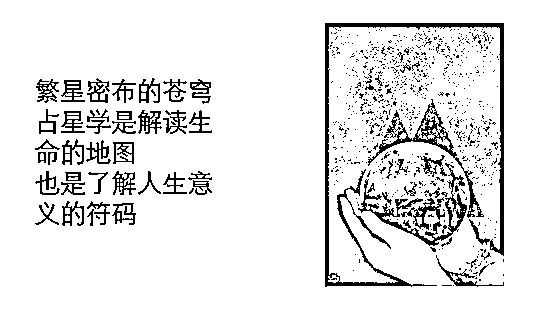

**6. 占星学可以帮助我们不断拓展认知边界**

占星学是很棒的意识进化工具。它的原型概念覆盖了头脑能理解的各个层面，它的体系完整又开放，使它可以和其他东西方知识体系中的内容相融合。它帮助我建立起一个意识结构，之后无论现实或书本中的领悟和理解都可以在其中各就其位并有机地互相关联。

**你会在持续的学习占星学的过程中不断地推翻陈旧认知，开拓视野，一再重新认识自己及世界，甚至会改善个人的学习方法。**

**7. 占星学可以帮助我们联结宇宙，探索灵魂的奥秘**

**占星学能够帮助我们了解到自己是独一无二的个体，同时也是这个世界的一部分。**

虽然最早的占星学书面记录可以追溯到大约公元前 2000 年的美索不达米亚，但它更深的起源其实可以追随到史前。人类本能地被天空吸引，这不仅表现了宇宙的神秘力量，也揭示了神的智慧与人类生活的各个面向相互影响着。当你默默注视着布满繁星的夜空，很容易升起一种对永恒时间的敬畏感。

发现自己的天赋，贡献自己的力量，这才是完整的循环。给自己和世界之间树立一面高墙，并不能让你变得更有力量，也不会对世界有任何影响，反而会阻碍你去认清世界的真相。**占星学可以帮助我们探索我们的灵魂，和更大的宇宙智慧相连，从而找到自己的人生使命。**

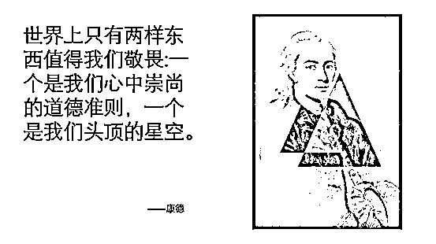

**苏·汤普金斯老师（Sue Tompkins）**

****

**英国目前最资深的占星学家和咨询师之一，她拥有超过 40 年的占星经验，是占星学习者必备的两本圣经《当代占星研究》与《顺逆皆宜的人生》的作者。她还是伦敦占星学院的创始人。****她以自己的冷幽默、抽丝剥茧的研究天分和占星直觉而闻名。她是一名执业占星师，也是一名顺势疗法医师，是心灵和身体的敏锐诊断专家。****2003 年，为表彰其卓越贡献，英国占星协会为苏·汤普金斯授予查尔斯·哈维（Charles Harvey Award）终身成就奖。****咔咔老师（Caroline）**

****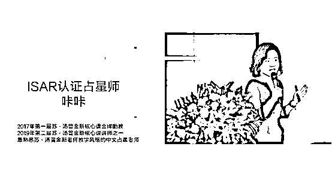****

**2017 年第一届苏·汤普金斯核心课金牌助教、2019 年第二届核心课中与苏·汤普金斯老师联合授课的 ISAR 认证占星师咔咔。****作为最熟悉苏·汤普金斯老师教学风格的中文占星老师，咔咔老师将在 2021 年第三届苏·汤普金斯核心课中负责教授部分课程，帮助学员更好地梳理知识架构,了解学员的学习进度和疑问，补充丰富占星咨询的中国案例。**

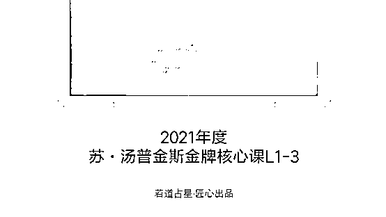

1

**课程安排是怎样的呢？**

**第*****1*****阶**2021 年 3 月 15 日开课，每周一晚上 20:00-22:00 上课，共 4 次课**第*****2*****阶**2021 年 4 月 12 日开课，每周一晚上 20:00-22:00 上课，共 4 次课**第*****3*****阶**2021 年 6 月 7 日开课，每周一晚上 20:00-22:00 上课，共 15 次课

2

**1-3 阶你将学到什么？**

**第*****1*****阶  黄道星座**

· 概要介绍占星学与星图· 四元素与三形态· 黄道 12 星座

**第*****2*****阶  行星**· 太阳、月亮及其他行星· 练习将它们组合在一起

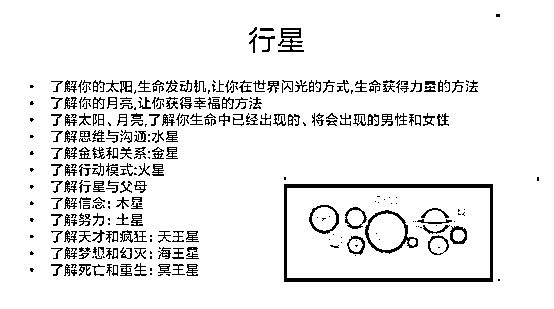

**第*****3*****阶  宫位、相位以及初步解读星图**· 四轴与宫位· 相位概论· 困难相位· 柔和相位· 数字练习，练习寻找相位· 容许度，出入相位· 相位模式· 将它们全部组合在一起· 解读的基本原则，权重，失衡· 如何解读一张星图……丰富的案例，包括学员的案例

3

**想更多了解导师？**

******苏·汤普金斯（Sue Tompkins）****英国目前最资深的占星学家和咨询师之一，她拥有超过 40 年的占星经验。**占星学习者必备之两本圣经**《当代占星研究》**和**《顺逆皆宜的人生》**作者。2003 年，为表彰其卓越贡献，英国占星协会为苏·汤普金斯授予**查尔斯·哈维终身成就奖**。苏同时是一位接受过心理学与心理咨询训练的注册顺势疗法医师，并经常在英国、法国、挪威、瑞典、澳大利亚等地公开演讲，教授占星学。**苏以实际、生动而幽默的风格闻名于世**，她的教学经验非常丰富，能够胜任从教授入门课程到对毕业生进行督导等针对不同占星程度学员的教学工作，这得益于她多年累积的教学经验。她曾在地方公立学校以及在英国占星研究学院(FAS)教学 19 年， 1986 年-2000 年任学院院长并负责现场教学的所有事务，并于 2000 年创立伦敦占星学院这所声誉卓著的专业学府，并经常在世界各国教学，具有丰富的教学经验。2000 年，英国占星研究学院授予其研究员职位，以表彰她为学院做出的突出贡献。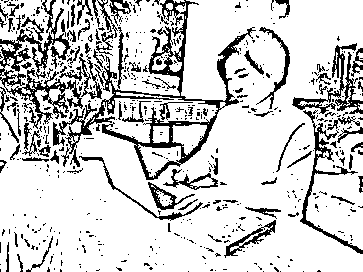**占星师咔咔（Caroline）**2010 年师从美国占星师大卫·瑞雷学习，并向斯蒂芬·弗里斯特、罗伯特·汉德、苏·汤普金斯等世界名师学习各种占星学技法。若道首届学员，国内最早获得 ISAR 职业占星师资质的职业占星师之一，现兼任若道核心课程助教。在国际知名广告公司和市场研究公司从事的市场研究和推广工作十余年，曾任职于阳狮集团、尼尔森市场研究有限公司、MTV 和《Madame Figaro》杂志。

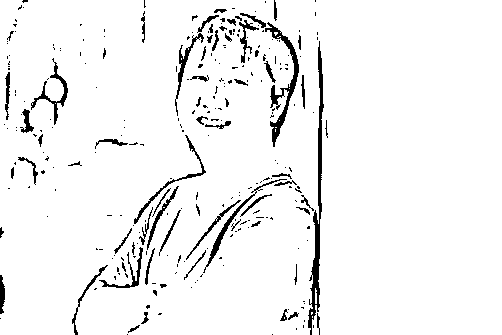

**助教王嘉祺 （Conrad）**ISAR 认证占星师，具有若道认证生时校正资质，从 2010 年开始学习占星学，2015 年开始在若道系统学习，并开始个案咨询。2018 年担任若道核心课程助教，以及选修课卜卦占星学和太阳返照课程助教，并带领学员进行经世占星学和太阳返照方面的研究。2019 年 11 月作为演讲人之一参加了 ISAR 北京大会，也是 ISAR 星空俱乐部中国区第 16 期的主讲人。

4

**选择若道学习占星学还有哪些优势**

**运用自由意志，扭转破坏性模式，绽放天赋潜能**若道是人本主义占星学的旗手。因为我们相信，**人通过了解模式、觉察习性、积极疗愈、终将释放其潜能，与命运共舞**。

**进入国际权威职业占星师认证的快车道**

占星界的“联合国”ISAR（国际占星研究协会），是具有全世界影响力的占星教学和研究组织和职业占星师全球认证机构，认证占星师遍布 45 个国家。**在 ISAR 的 19 所附属学校中，大中华地区的附属学校只有若道一家**。在国际化的教学理念大纲标准下，**若道毕业生在 ISAR 国际认证占星师的考试通过率多次位居全球首位**。

**十年占星学教育中国本土化教学经验**

**根据中国学生的学习习惯不断优化占星教学体系，让学员学成后更自如地应对本土咨询市场的需求。**学好占星学不仅仅需要邀请一两位老师教学，更需要对教学难点有充分了解，且有持续的教学跟进服务。**10 年来多次核心课程和各种专题课程的教学，让若道非常了解中国学生学习占星学的难点和卡点，合理有效地拆分、提炼课程知识点，同时也积累了丰富的国外老师和中国老师、助教紧密配合以及课程顾问密切配合教学的经验**。若道还专门开发了有助于占星学习的“**若道**”APP，每门课程都设有答疑板块，学员能够方便快捷地提交问题，助教及时答疑解惑和批改作业。**融入中国顶尖的职业占星师群体**若道是中国职业占星师的“黄埔军校”。职业占星师的培养从若道开始，**进入若道，你就走进了中国顶尖的职业占星师群体，和一群志同道合的师兄师姐联谊，获得经验，共同成长**。**多种奖学金支持**为了鼓励学员不因为暂时的经济困难而放弃学习，我们特意设置了各种**技能交换和奖学金**。对于有一技之长的学员，我们推出了**“笔译”、“笔记整理”、“平面设计”、“课本朗读”、“班级服务”**等技能交换项目。

而对于努力学习、出勤率高、完成作业率高的学员，我们设置的**土星奖、木星奖**等各种奖学金在等着你。为了感谢帮助我们推荐学员的老学员们，我们设置了“**老学员推荐奖**”。对于通过问卷提建议，帮助我们提高服务的学员，我们也设置了相应的奖学金。ISAR 中国还设置了国际会议奖学金，符合条件并通过甄选的申请者最高可获取 5000 元奖学金。

当美好的知识遇上奖学金，你可以在学习旅途中直挂云帆，乘风破浪。**开启占星咨询的职业规划和支持**

若道为占星学员搭建了占星问答平台和占星咨询平台，并提供严肃占星学影响力最大的媒体平台，全力为毕业生提供宣传渠道，帮助你吸引和积累咨询生涯初期的种子客户。若道为学员开发了适用于占星学习的“若道”APP，并不断更新完善。

**①  微信平台**若道微信平台作为业内颇具影响力专业平台，为文笔好的若道毕业生提供传播占星学并免费宣传自己的机会。有的学员因为文笔获得众多粉丝喜爱，在 3 年多时间积累起 2000 多人的潜在客户。**②  问答平台**若道问答平台帮助学员接触客户的实际问题，并在毕业前就进行演练答题。自问答平台 2016 年上线运营以来，学员接触到 3200 多个问题， 回答问题最多的学员在问答平台收入达 5 万多元。**③  咨询平台**若道咨询平台是我们为优秀毕业生所搭建的平台，帮助毕业生在自己的咨询拓展之外，用若道提供的平台扩展咨询客户群。自咨询平台 2017 年 8 月上线运营以来，咨询平台共入驻 65 人，收入最高者达 32 万元。此处所列学员收入仅供参考，收入高的学员和其专业水准、努力程度密切相关。若道平台尽其所能将自己定位为辅助学员开展职业生涯的桥梁。**在 10 年的占星教学耕耘后，两位创始人——大卫·瑞雷及蒋颖再次邀请苏·汤普金斯老师开设占星核心课程。**

5

**此次课程适合哪些人？**

*   对占星学感兴趣，想要入门的零基础者
*   占星学小白，但有志成为职业占星师的人
*   有一定占星学基础，但不知道该如何整合星图复杂碎片的人
*   希望成为优秀的占星师，想要借鉴国际大师解读思路并融入自己的体系的人
*   苏·汤普金斯的粉丝，学过占星学，但就是想跟着偶像再学一遍的人
*   走在自我探索和个人成长道路上的人

6

**占星业内推荐**

**苏·汤普金斯的《顺逆皆宜的人生》令人赞叹！苏是一名倍受爱戴的老师，并且任教多年。苏以自己的冷幽默、抽丝剥茧的研究天分和占星直觉而闻名。她是一名执业占星师，也是一名顺势疗法医师，是心灵和身体的敏锐诊断专家。**** ——法国心理占星学协会会长琳恩·贝尔**

7

**苏汤班学员评价**

8

**苏汤老师水瓶座试听课**

（温馨提示：手机请注意流量）

📹 [`v.qq.com/iframe/preview.html?width=500&height=375&auto=0&vid=p3210llaq7f`](https://v.qq.com/iframe/preview.html?width=500&height=375&auto=0&vid=p3210llaq7f)

9

**课程价格**

**L1-3**：13200 元**（联系童老师，获得优惠价）**其他各阶课程单报价格，请咨询课程顾问：童老师（微信：196267205，请备注**“苏·汤普金斯核心课”**）长按二维码添加童老师

10

**授课时间**

**2021 年 3 月 15 日（周一）20:00-22:00 开始，网络课程**

11

**退转课程**

**退款原则请详看《教学协议》，如有疑问请咨询课程顾问**。

****苏·汤普金斯金牌核心课程 L1-L3****

**授课老师：苏·汤普金斯**

**授课时间：**2021 年 3 月 15 日起

**授课方式：**网络课程**，**英文授课，中文翻译

**费用：**13200 元**（联系童老师，获得优惠价）**

**课程负责人：童老师**（微信：196267205，请备注“苏·汤普金斯核心课 L1-L3”）

长按二维码添加课程负责人咨询~

****报名请点击“阅读原文”****

# 6 月宇宙天气丨这个 6 月你不能错过，迎接下半年成果的孕育时期！

> 原文：[`mp.weixin.qq.com/s?__biz=MzA5NjA0NTAxNg==&mid=2651445537&idx=1&sn=07b28e14e745c6343ad5769ceaff425d&chksm=8b4b6b96bc3ce2801819f76d5271a6be1b594d3a2aaaea5b7173420a91ded186ceb63605ea51&scene=126&sessionid=1692737979#rd`](http://mp.weixin.qq.com/s?__biz=MzA5NjA0NTAxNg==&mid=2651445537&idx=1&sn=07b28e14e745c6343ad5769ceaff425d&chksm=8b4b6b96bc3ce2801819f76d5271a6be1b594d3a2aaaea5b7173420a91ded186ceb63605ea51&scene=126&sessionid=1692737979#rd)

****************☆ 后台回复“今日”，给你一句生命态度****************

作者/傅莎珈 ISAR 认证占星师
编辑/翀子 封面/书君 图片/网络 6 月，群星逆行给了我们反思与调整的时间，也让我们看见英雄之旅的召唤。第二次土天四分相、双子座日食等重要天象，使我们进入新的学习和重生阶段。通过整合矛盾与聚集资源，我们也有机会让自己放松下来并走得更加坚定。

6 月，宇宙继续踩逆行的踏板：木星、海王星加入了逆行———冥王星、海王星、土星、木星和水星都在逆行。**群星逆行给我们修正、反思、调整的时间。**上半年过得太匆忙，**是时候放慢速度看看这半年的快速转变给我们带来了什么。**

6 月双子月，**水星的能量非常活跃**，作为一个信息使者，它带领我们**通过逆行回溯过往忽略的信息**，更在双子新月中充当了木星的信使，带来未来世界的声音。在灵性层面，双子月我们真正在学习的是**集体的合一性**：意识到人类是个大家族，需要放下低阶的物质形式的一致性要求，走向集体认同的释放和重建。

在世俗层面，双子座水星的逆行，**帮助我们打开评估现有生活的新角度。**各种 why not（为什么不）的想法越来越丰富，借此掀开生活新篇章的一角。

6 月，从地下回到地面扮演晨星角色的金星，进入全盛时期。**金星换座巨蟹座，**让世界进入下半年成果的孕育时期。金星和海王星的联手，让这个开始逆行的月份，带着神圣丰盛的整合光芒。

6 月，**火星换座狮子座**，每个人都将在混乱之中**，****看见英雄之旅的召唤。**

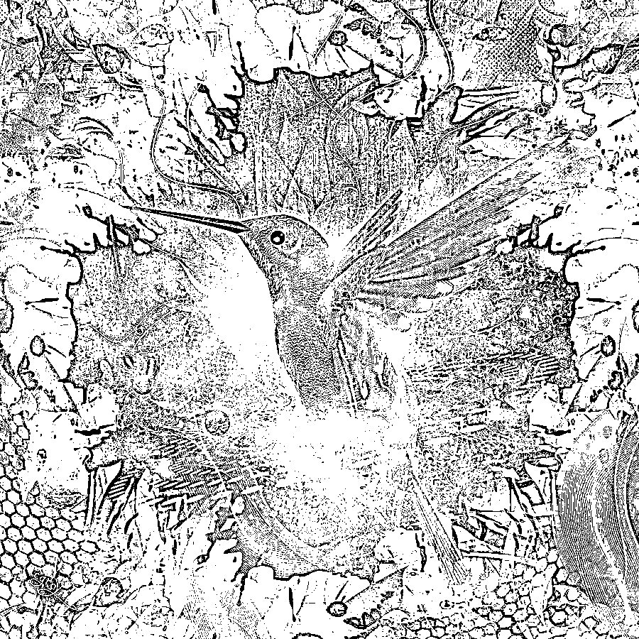

**6 月上旬**

6 月上旬天象

**6 月 02 日 ** 

*   双子座太阳六分白羊座凯龙星

*   金星换座巨蟹座

**6 月 03 日**  

*   双子座太阳三分水瓶座土星（逆行）

**6 月 04 日**  

*   双子座水星四分双鱼座海王星

*   巨蟹座金星三分双鱼座木星

**6 月 05 日 ** 

*   巨蟹座火星对分摩羯座冥王星（逆行）

**6 月 10 日**  

*   双子座日食

*   水星合相日食

5 月 26 日的射手座月食是一次重大的月食，开启了 2021 年重要天象—**第二次土天四分相的功课**：**你想要放弃哪些信念，进入哪些新的价值观、智慧的学习。**

这次月食的月亮合相月亮南交点，凯龙星六分双子座北交点，**将人类的集体意识带入死亡重生的阶段**：射手座是天蝎座之后的一个星座，意味着穿越先天的死亡恐惧，在精神上重生。

凯龙星是一个位于土星与天王星之间的小行星，寓意现实的限制 VS 解脱的自由之间的演化。

这个月食在集体意识领域要求每个人面对个人价值创伤，**打破那些在出生成长中困住自己的意识、思维枷锁。**

你只有升级到一个更高频率上，才能感知到那个频率上的事物。**因此改变自己的频率，**与你想要的“事（meng)实(xiang) ”   一致，**你就能看见、感受、体会到改变和梦想成真。**

最近的咨询里，要么在感情上缘木求鱼，要么在事业上面对扩张的枯竭。当你跑来问：就不能不分手么？如何与母亲和解？ 怎样才能完成事业突破。 **我的反问是：真的会死掉吗？还是死掉的恐惧感受，让你僵硬？**

你能想象情感与事业成功的样子么？不，不能。那么为何继续停留在连自己都知道无望的关系和事业里？你在以死亡和恐惧为食。

一阵阵沉默、哭泣……

5 月 30 日水星在双子座逆行。这意味着整个 6 月，太阳在双子座的时期，作为双子座太阳的定位星，**水星一直拽着我们向内看，更深的看见那些僵硬背后的痛。**你需要为自己做一些决定：是继续惯性的吃腐食，还是站起来走出泥潭，寻找新鲜有生命的食物。这没有标准答案，只是一个如何对待自己的选择罢了。

哀悼是告别起点，很多人为了忠于死亡而延长哀悼期，不肯面对现实，更不愿意走出来。

**水星在双子座逆行**，给了我们一个臣服于死亡的机会。更开了一个口子，让你多一个选择：**有关未来和复生的选择。**你可愿意尝试？

有些人说，

你必须战胜你的欲望。

我却说你只不过必须改变它们。

第一种方法感觉起来像是一种宗教性的训练，

第二种则是一种欢喜的练习。

——《与神对话》

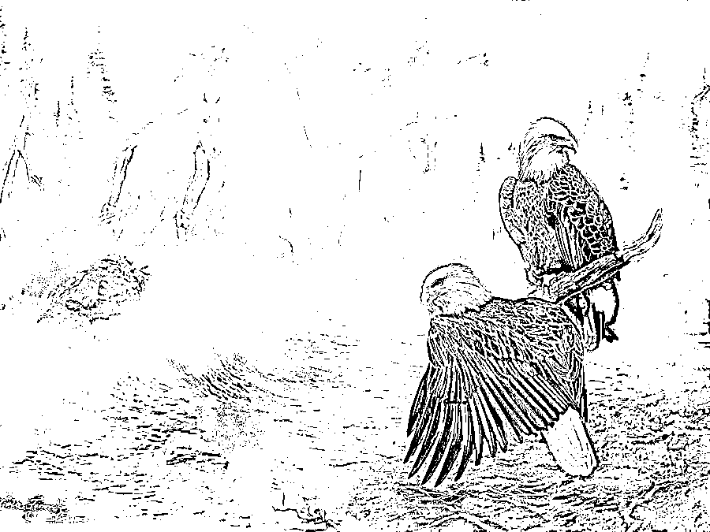

玛哈礼士·玛赫西大师讲过一句话：**思想是行动的根基。** 从宇宙能量的角度来说，如果你想要达成什么事情，先坐下来开始想象你已经成功。心理学家将这种做法称为”动觉思考”。

想象你想成为的模样不仅用头脑，并用到全身的感官的练习，这是以建设性的方式使用想象力。这也是为何在爱丽丝·贝瑞的奥义占星里，水星守护白羊座，意思是：**有想法才有行动目标。**

让你感觉兴奋、期待的目标是什么？轻松自在的想象它！如果一边想象一边否定，一边想象一边恐惧那就不是你真心想要的东西。你的身体和感受远比大脑敏锐诚实。请你听见身体的呼喊：**我要去做让自己感觉快乐的事情！**让你的大脑听从身体的召唤！

行星们的每个触碰，都有深远意义。接棒射手座月食和水星在双子座逆行，太阳进入双子座。

**奥义占星中，双子座的意思是“互相作用的光”**：灵魂与形式、造物主与造物这些关系中存在着巨大的张力。意识是灵魂的产物，意识与灵魂是应对这种巨大张力的关键所在。因此，**双子座的最高境界是通过意识的扩张，找到通往灵魂的道路。**

双子座的功能是让我们看见日常生活中人、事、物以及空间之间的关联。但它无法在人格层面协调这些人事物所产生的冲突，它的功能是让我们扩展心智，扩展每个人与生活的连接感。**但如何整合这些矛盾性呢？   **

**高阶水星和天王星承担了这个跨越的任务：**当人生价值取向从追求形式的统一发展成追求能量的统一，欲望的信使就变成神（木星）的信使。当我们感受到天王星的力量，双子座就开始服务于以灵魂为中心的沟通与交流。这是灵魂交给双子座和水星的使命。这个使命是人类的大爱，每当我们言及爱，我们就回到金星维纳斯的身边。金星的职责是在爱的驱动下联姻所有对立的事物。

6 月 2 日的太阳六分凯龙星，给我们带来生命中的引导力量，帮助领悟者从伤者转型成智慧导师。

6 月 3 日太阳三分逆行的水瓶座土星，自我期许会发生扩张与改变，推动每个人踏实的沉淀、调整目标。

**金星在 6 月 2 日的时候进入巨蟹座，开启了有关全新人格的孕育**：让情感、思维和身体对齐。

如果我们的欲求与我们的心智想法是相反的——感受向着一个方向，而头脑向着另一个方向，我们的肉身就会感到无所适从，不知道该做什么，不知道要去哪里。这样的话，我们的自我就会产生分歧，让我们的灵魂无处安放。因为灵魂是高级的自我，它无法存在于低级的、有冲突的自我中。

巨蟹座金星的作用，是让欲求、思维和身体统一起来，转向同一个方向。巨蟹座金星的工作是协同双子座水星让我们进入一个新的思维摇篮，在摇篮里养育和进化这些新的思维与生活智慧。

这是为何射手座月食后，有些灵性导向的占星师、灵性工作者号召大家多做冥想、内观的原因。**我们需要连接巨蟹座的能量，让新的想法进入身体，以金星式的整合对立面的方式，统合欲求本性和现有心智，让肉身变得稳定、聚焦。**在此基础上，在这具肉体之中，孕育发展你新的人格。

接下来的水星四分海王星、金星三分海王星，以及火星对分冥王星，都会让我们看见很多幻觉与灵感、谎言与理想、渴望与焦虑之间的拉扯。有些人看见很多机会，兴奋不已；有些人遭遇了非常不公平的待遇，感觉愤怒。

这些体验，一遍遍呈现了欲望、旧有思维惯性、身体本能反应的不一致性。要断舍离，先要把所有东西都堆在桌面上才能分拣。

**6 月 10 日的双子座新月是日食，**值得认真对待许愿，事关身体-情绪-心灵的统合，为 6 月中旬的土天四分相能量撞击提供空间。这个统合可以到什么程度，因人而异。

**低阶状态下，**我们看见生活中涌现了很多机会，发现自己的创造力，但依然以旧有的价值观理解物质。头脑接受了很多新观念，欲望依然停留在追逐更多物质、成就的安全保障。慢慢的，会再次感觉到兴奋之后的不满足、空虚、焦虑。

**若能站在更高意识层面**理解双子座日食和之前的几个相位，需要你从当下的情绪、欲望中抽离出来，意识到不断涌进来的新能量所伴随的智慧、正在推动我们见识到的新事物，是为了服务于新世界的创造。**一种打破僵局和限制的勇气将会不断产生。**

**那么，双子座日食将会让你发现自己的全新面向****。**无论是职业、生活还是情感上，都会有一种全新的渴望分享的自然流露。你会发现，自己能自然的进出不同的群里，对各种不同观点兼容并蓄，协助你发展出新的工作机会和生活洞见。

**高阶的双子座能量，协助我们更好的理解和转化水瓶座有关个人与集体，知识与智慧的统合性。**这时候双子座日食的能量，将会是一份宝贵的礼物带领我们进入水瓶座的世界。

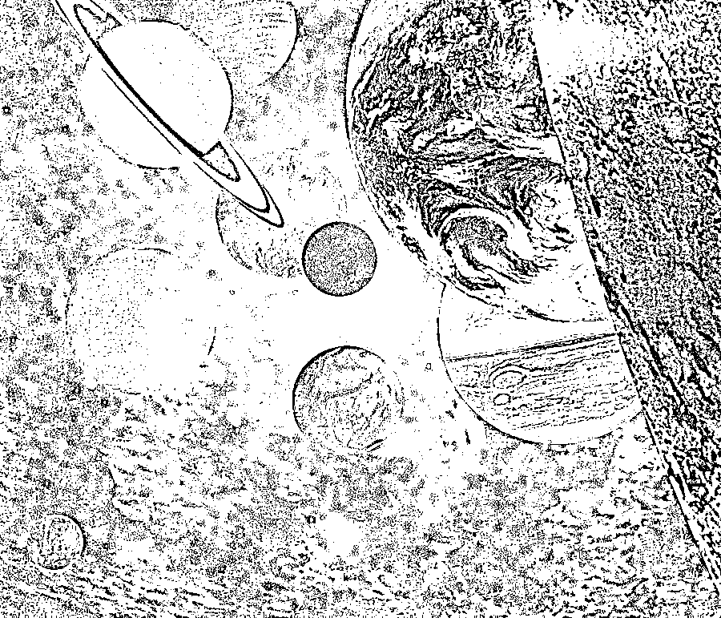

**6 月中旬：重建根基**

6 月中旬天象

**6 月 11 日**  

*   火星换座狮子座

**6 月 13 日**  

*   巨蟹座金星与水瓶座土星（逆行）呈梅花相

*   巨蟹座金星四分白羊座凯龙星

*   巨蟹座金星六分金牛座天王星

**6 月 15 日**  

*   狮子座火星与双鱼座木星呈梅花相

*   水瓶座土星（逆行）四分金牛座天王星

**6 月 17 日**  

*   双子座太阳与摩羯座冥王星（逆行）呈梅花相

**6 月 20 日 ** 

*   木星在双鱼座 2°11′逆行

**6 月中旬有 3 个节点：火星换座狮子座，土天第二次四分相，木星开始逆行。**

经历火冥对分相的压力、双子座新月日食的心脑打开，**很多人会收获追逐自己想要之物的勇气。**火星换座狮子座，象征着一场**内心的觉醒。**被太阳守护的狮子座，会唤醒每个人的意识、觉知和感悟的试炼中。**当我们选择试炼，也就代表告别死亡哀悼，走上个人意识的进化之旅。**

有些人会出现身体的各种反应，这是身体在接受双子座新月能量后的吸收消化时期，这种吸收消化和冥想结合，会让我们逐渐摆脱惯有的应激反应模式，开始思考练习如何发展自己真正的喜好/志愿。

然后你会开始整理周围环境/人际关系，选择那些能滋养你的群体和环境，反过来也滋养和支持所在的群体。在这个过程中，心不断打开，**希望、欢乐、勇气、创造力、自信跟随而来。**

一些狮子座和水瓶座能量强的人，或者火象能量比较强的案主，在火星进入狮子座后会对自己当下要做的事情变得信心十足，或者渴望一场冒险、特别想要展示自己。

这时候巨蟹座金星在旁边协助你的这种转变：巨蟹座金星依次和水瓶座（团体）土星、白羊座凯龙（个体灵魂创伤）、金牛座天王星（外部资源）发生相位，**将环境中有利于我们的能量和资源聚集起来，**帮助你体会安全感和勇气、群体的疗愈力量，群体智慧，群体资源。

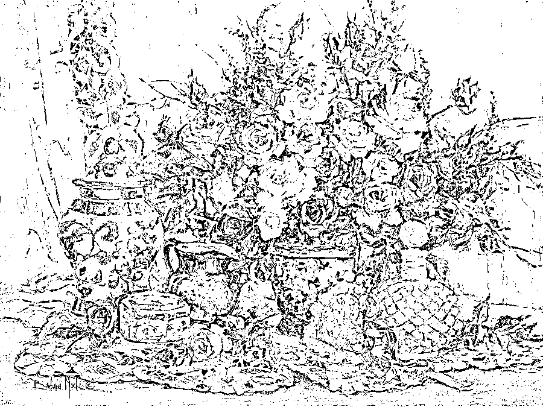

有些天蝎座、金牛座、双鱼座能量很强的人会因为害怕失败、选择错误而举棋不定，宁可要外部世界来帮助自己做决定，不断寻求外界的意见建议。在这个狮子座火星的时期，请特别试试跟随自己真正的直觉。

这个部分的体验深藏在你的盆骨和肚脐眼的位置。只要能每天花个 10 分钟，将呼吸带到那里，大约 21 天左右，你就会发现，**自己慢慢的触碰到一些新奇的情绪感受，日常想法也在发生变化。**

狮子座火星的这次行程，是一个慢慢积累自信心的过程。

在事情真正的秩序里，

一个人并不为了要快乐而做某一件事，

而是一个人是快乐的，

所以做某件事。

一个人并不为了有慈悲心而做某些事，

而是一个人是慈悲的，

所以以某种方式行事。

就一个高度有意识的人而言，

灵魂的决定先于身体的行动。

只有一个无意识的人，

才企图经由身体在做的事，

来产生一种灵魂的状态。

——《与神对话》

6 月 15 日，逆行的土星四分天王星。**这是第二次土天四分相。** 按照相位三次出入的法则，**第一次发生相位提醒我们事情正在变化，第二次逆行的触发帮助我们适应和理解改变，第三次触发让我们将改变后的收获融入自己的日常之中。**

第一次的土天四分发生在 2021 年 2 月 18 日，**我们可以回溯一下那时候发生了哪些事情，**产生了哪些议题，而现在到了吸收分解冲击的时候。

**请思考几个主题：**

*   **如何才能慢下来，尊重万物有时的法则？**

*   **在性别平等领域，你领悟到了哪些新的信念？**

*   **在社会规条和自然生命力的流露之间，你找到平衡的方式了么？**

*   **在社会责任和个人意愿之间的矛盾之间，你是找到了两全齐美的方式还是毅然决然投奔其中一方？**

外界环境里的金融环境震荡，暴力冲突事件愈发激烈。第二次土天四分相会出台一些管制制度、达成一些协议，撕毁一些合约，**制造更多新的冲突。这些调整都是建立新秩序、争夺资源主控权必经的调试。**

6 月 20 日，木星在双鱼座逆行。木星的关键是“多点”、“更多点”，很容易产生泡沫。木星逆行是一次撇沫。

中国的 A 股市场将会迎来一次重大震荡。**每次土天四分相，都更多是打压调整的力量。**上游大宗商品价格飞涨、下游消费力不振、中间企业支出大增收入不振的局面，会是这次木星逆行、土天四分时期的政策调整重点。 

我特别看好咖啡、酒类、奢侈品、艺术、医药行业在本次调整中的竞争力（只是个人碎片观察观点，毫无大数据支持，若要采纳，请先与专业投资人士洽谈数据对应验证，万勿盲从投机）。

在松赞旅行的时候，小伙伴在藏医诊所逗留了 3 个小时，扫遍心神调理、气血养护、呼吸、皮肤类的藏药。哪怕我说江南和藏区气候不同，这些药品在江南地区未必适合长期使用，也不能阻止小伙伴买买买。到松赞香格里拉，那里的酒庄和牦牛绒制品店铺，再次让团员们停不下手，几乎人手 1-2 条牦牛绒围巾、2 瓶葡萄酒。以至于松赞管家自嘲说：我还第一次带一个松赞旅行团花这么多时间“买买买” 。

这次不太一样。这些白天买买买的小伙伴，晚上也积极地画曼陀罗。在曼陀罗绘画整合中，她们一周的变化，超过一个月的持续心理咨询。这是个让我非常意外的提供了巨大情绪滋养和转化的月亮之旅。物质和精神的双重丰盛，很美妙啊。

**6 月中旬的星相，是内在继续震荡、点燃内在热情和意志，是外在迎接环境震荡、摧毁旧有秩序。**这种内外差异，尤其考验我们向内探索灵感火花，在外在震荡中专注发现机会，保持耐心和等待转机的信念。

**6 月下旬**

6 月下旬天象

**6 月 21 日**  

*   太阳换座巨蟹座

**6 月 22 日**  

*   巨蟹座金星三分双鱼座海王星

**6 月 23 日**  

*   巨蟹座太阳三分双鱼座木星（逆行）

*   水星在双子座 16°08′停止逆行

**6 月 24 日**  

*   巨蟹座金星对分摩羯座冥王星

**6 月 25 日**  

*   摩羯座满月

**6 月 26 日**  

*   海王星在双鱼座 23°12′开始逆行

**6 月 27 日**

*   金星换座狮子座

**6 月 28 日**  

*   狮子座火星六分双子座月亮北交点

**6 月 21 日太阳换座巨蟹座后**，太阳、金星、木星、海王星都在水象星座。**人的情感会变得非常细腻**。本质上水元素最容易受潜意识的影响，能觉知无意识的的力量。这个能量下，一旦知道生命的目标，就会让你成为最富有直觉力、最敏感的人，**能在环境中汲取支持、力量和灵感。**

但反过来如果无法觉知自己生命最深的感受，**反而会被自己的欲望、非理性的恐惧以及无处不在的危机意识所困扰。**

金星和太阳依次三分海王星和木星。机会还是幻觉，是硬币的两面，取决于抛硬币的人的心性。

生活中你会不自觉的花更多时间呆在家里一个人独处，或者招待朋友们一起做饭聊天听音乐。

亲密关系中会一再看见无法彼此滋养、强势索取和暧昧不清的关系，如何让自己无法忍受。

商业领域，你会选择让自己感到亲密、安全、熟悉的朋友一起合作，并且屡屡闪现精明的投资灵感。

这些事件都是太阳换座巨蟹座带来的祝福。**建立起内在的归属感，你才会在脱离死亡僵化分离的道路上，慢慢放松下来，走得坚定起来。**

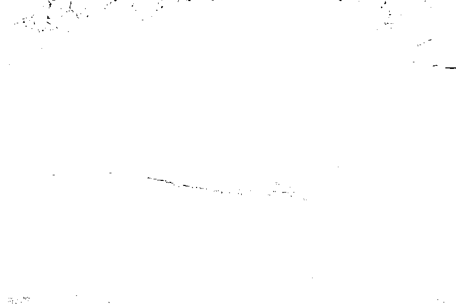

6 月 23 日，水星在双子座停止逆行。2021 年第二次水逆结束了。如果第一次水瓶座水逆，是在解决个人与家族体系中存在的业力；第二次水逆结束，**我们探索的是个体价值的重建**。到 10 月第三次天秤座水逆，开启的是关系合作领域的梳理。

6 月 28 日狮子座火星六分双子座月亮北交点，我们开始学习整合对立的矛盾。在这个过程中，记得随时连接一下巨蟹座金星的点石成金能量。

6 月 26 日，海王星在双鱼座再次逆行，如同退潮的海水，将那些幻象和泡沫撇清。谁在裸泳、谁具有真正的实力，在未来半年的逆行里都会一清二楚。

6 月 27 日，金星换座狮子座，和第二天的火星六分月亮北交点，一起进入了探索如何自信表达的课题。

**6 月下旬承接的水象群星能量，是每个人更深潜入自己的无意识之中、为进一步让未知却重要的生命课题呈现出来的时候。**

人生的关键不是到达任何地方，

人生是注意到你已经在哪儿，

并且一向都在那儿，

你一直并且永远都在纯粹创造的片刻。

所以，人生的关键是创造，

创造你是谁，是什么，

然后去经验它。

——《与神对话》

祝福每一位读者，在这个月因为失去而获得更大的自由，欣然遇见未知的自己，一个可以带着孩童般天真灿烂，无限制创造的自己。

**本月重要天象一览表**

| **日期** | **星象** |
| **2021.6.2** | **双子座太阳六分白羊座凯龙星****金星换座巨蟹座** |
| **2021.6.3** | **双子座太阳三分水瓶座土星（逆行）** |
| **2021.6.4** | **双子座水星四分双鱼座海王****巨蟹座金星三分双鱼座木星** |
| **2021.6.5** | **巨蟹座火星对分摩羯座冥王星（逆行）** |
| **2021.6.10** | **双子座日食****水星合相新月** |
| **2021.6.11** | **火星换座狮子座** |
| **2021.6.13** | ****巨蟹座金星与水瓶座土星（逆行）呈梅花相********巨蟹座金星四分白羊座凯龙星********巨蟹座金星六分金牛座天王星**** |
| **2021.6.15**  | **狮子座火星与双鱼座木星呈梅花相****水瓶座土星（逆行）四分金牛座天王星** |
| **2021.6.17** | **双子座太阳与摩羯座冥王星（逆行）呈梅花相**  |
| **2021.6.20** | **木星在双鱼座 2°11′逆行** |
| **2021.6.21** | **太阳换座巨蟹座** |
| **2021.6.22**  | **巨蟹座金星三分双鱼座海王星** |
| **2021.6.23** | **巨蟹座太阳三分双鱼座木星（逆行）****水星在双子座 16°08′停止逆行** |
| **2021.6.24** | **巨蟹座金星对分摩羯座冥王星** |
| **2021.6.25**  | **摩羯座满月** |
| **2021.6.26**  | **海王星在双鱼座 23°12′开始逆行‍**  |
| **2021.6.27**  | **金星换座狮子座**  |
| **2021.6.28**  | **狮子座火星六分双子座月亮北交点**  |

**版权声明**：原创文章由作者授权首发于若道平台，欢迎转发，反对抄袭。友号转载请申请白名单。

****

****傅莎珈****

ISAR 认证占星师（2015 年获得）

心理占星师/内观书写带领者/冥想带领者

国际著名传播集团工作 20 年

**微信公众号**：Helloshajia

长按打赏

**六一特别直播活动**

**今晚七点半上线第一场**

**扫描下图二维码参与直播**

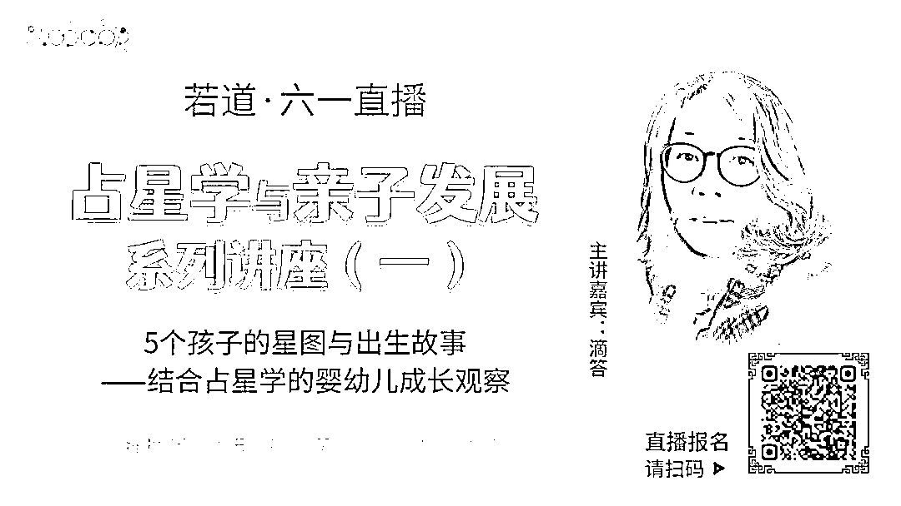

**系统学习占星学**

**点击图片了解详情**

**微信又双叒叕改版啦，不想错过若道君的推送？**

**就把若道设为星标吧！**

**▼**

**就是这个“在看”，戳戳戳 ☟**

********报名直达入口********

# 这颗“慷慨幸运”的行星，在 12 星座和 12 宫位会带来哪些生命眷顾？

> 原文：[`mp.weixin.qq.com/s?__biz=MzA5NjA0NTAxNg==&mid=2651445391&idx=1&sn=93d077c1c4be110a6ee1d85a361c18cb&chksm=8b4b6a38bc3ce32e5f65bed1c44436b9df76896774640ed8ed7d9bbb9be437d4a6d8447e95dd&scene=126&sessionid=1692737979#rd`](http://mp.weixin.qq.com/s?__biz=MzA5NjA0NTAxNg==&mid=2651445391&idx=1&sn=93d077c1c4be110a6ee1d85a361c18cb&chksm=8b4b6a38bc3ce32e5f65bed1c44436b9df76896774640ed8ed7d9bbb9be437d4a6d8447e95dd&scene=126&sessionid=1692737979#rd)

******☆ ****后台回复“今日”，给你一句生命态度******

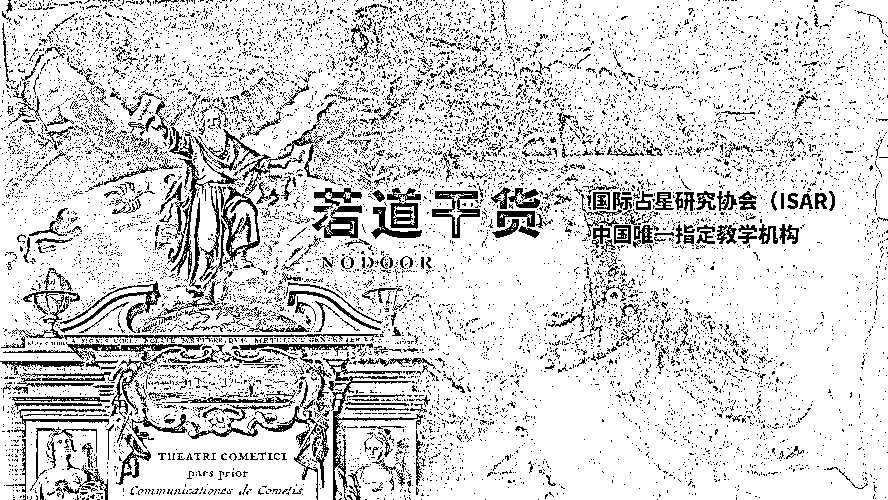

来源/astrotheme.com
译者/江艺 校对/Chang 编辑/翀子 封面/书君 图片/网络木星通常被认为是一颗大吉星，它在星图中的位置，指向了我们最有可能被生命眷顾的领域，而它所在的星座也被赋予了温暖和成长的巨大潜力。现在让我们看看木星在 12 宫位和 12 星座都会带来哪些好运吧~
**木星的特质**

在占星星图中，有一个点是大家考察的时候通常是非常愉快的，**因为它包含了好运的元素，**除非它与星图中的其他行星和轴线形成许多紧张相位。

**我们所指的正是木星的落点。**的确，分析快速移动的行星能够指出个性，而木星和土星则是社会性介入的行星，具有集体性和宿命论的“成分”。

**与木星和土星形成的相位，以及与土星外的——天王星、海王星和冥王星形成的相位，揭示了那些不服从个人意志的对个性和命运的影响，与个人行星形成的相位形成对照。**

**木星所落星座表明，这个星座的总体特征被赋予了一定程度的温暖、成长****。**此外，木星所落宫位指向**最有可能被眷顾的生命领域。**

下面我们解读这个来自大自然的礼物的特征，并且描述木星的宫位和星座如何影响这个人。它们是这颗行星没有受到任何特别影响的情况下的“纯粹”表达。**只有通过将出生星图作为整体来详细分析，才有可能发现木星在此人生活中实际的积极作用。**

**木星在 12 宫位**

现在就来探索这个礼物（或双重礼物）是什么吧。先享受你的木星的宫位中这第一个资产，然后沐浴木星所落星座的光芒。木星只有一个，但是，好吧，有两部分供你阅读！

**若道君：****你可以在 app store 或者应用商店搜索“若道”下载 app，输入个人档案，查看本命盘（也可以使用其他星图软件），找到木星符号，然后看该符号落在出生星图的第几宫，对照下文查看。**

**例如下图中，美国总统拜登个人星图的木王星落在第 8 宫。**

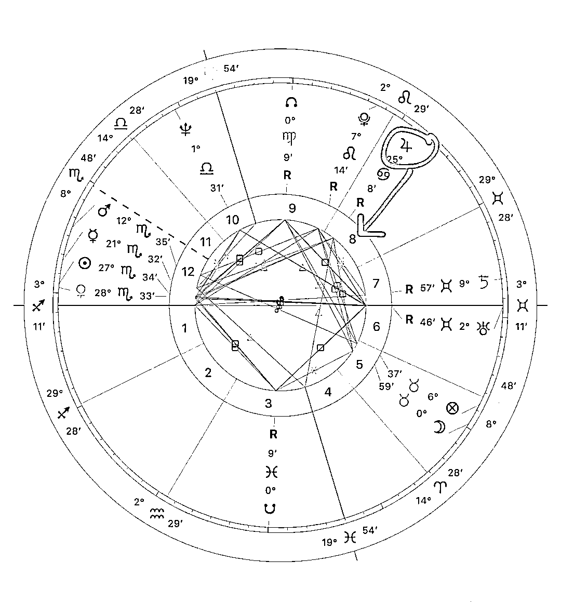

**1****木星在第一宫** 

自然给了你一个往正确方向前进的推动，赋予你热情和慷慨，带给你魅力和活力。**你引人注目，对群体有影响力。**你的外表是快乐而有魅力的。

**2****木星在第二宫** 

木星的落点是上天赐予的礼物。它会提升你的**赚钱能力**，也可能让你变成一个**固执、倔强、贪婪**的人。同时你也可能感性而忠诚。所以，有时候，物质上的运气和爱适于合作！

**3****木星在第三宫** 

大吉星在这个占星宫位中的落点会给你带来**轻松的人际关系**，你兄弟姐妹的爱，邻里之间的良好沟通能力，以及一生中**愉快的短途旅行**。

**4****木星在第四宫** 

噢！家庭！它对你至关重要，你在那儿很愉快。此外，大吉星落在这里带给你足够的所需，**让你可以成功地建立一个和谐、安全、舒适的家。**你的私人生活得到有利影响。你会很自然地被那些与泥土、石头和房地产打交道的事务所吸引。

**5****木星在第五宫** 

大自然的礼物包括在**休闲、娱乐、创造和爱**方面的许多极大的满足。有利于哪怕只带有一点点娱乐的事物。一个不受义务约束的奇妙世界照亮了你的生活。根据传统，你的好运也适用于**你和孩子之间的交流**，你的后代是和谐、成功的。

**6****木星在第六宫** 

大自然的馈赠是幸运守护神保护你远离疾病，并在日常工作中给你带来生活乐趣。因此，**你的健康和你的工作环境一直是满足感的源泉。**你的价值被充分欣赏，你很受欢迎，且能够助益他人。

**7****木星在第七宫** 

极为利于你在与他人交往时的仁爱之心。木星落第七宫**通常被认为是婚姻成功的最佳征象之一**，也是你社交生活的跳板！**你慷慨地表达感情**，有你的陪伴是愉快的。

**8****木星在第八宫** 

这颗大吉星落在这个宫位是一个天赐的礼物。**它预示着遗产、强烈和令人满足的性，以及强大、秘密的直觉**。你可能很满足！你的感情也会被放大和加深。不可否认，木星落在你星图中的这个位置，你非常幸运。

**9****木星在第九宫** 

木星给你带来了特别美好的天赐的礼物，因为这颗行星和这个宫位之间具有相似性。木星的宽广、仁慈和温暖的人生视野与第九宫所象征的**高等教育、哲学、政治和人文科学领域**相一致。随着你的成熟，你会散发出**智慧的光芒**。在具体的层面上，**有利于长途旅行****，**整个一生都如此。

**10****木星在第十宫** 

这个行星礼物绝不是无关紧要的。事业之宫被大吉星入主，只会让你的**职业生涯备受眷顾**。随着时间的推移，它会发展成一个最愉快的领域。迟早，它会给你带来成功和同行的认可。你不害怕责任，并会恰如其分地面对它们。

**11****木星在第十一宫** 

上天赐予的礼物以守护天使之名被继承给了你！你会得到强大的高层或家人的保护。利于你在一群朋友里的地位！**友谊、保护和集体项目是你应该铭记于心的三个关键词，**因为它们构成了你一生中的真实资产。

**12****木星在第十二宫** 

虽然自然向正确方向的推力在这里并不壮观，但它仍然非常真实。你的**奉献精神、慷慨和同情心**都发展到如此程度，以至于它们经常使你在**人道主义工作**和**慈善事业**等非附庸性的领域中快乐地找到成就感。利于当你默默无闻、沉默审慎地奋斗时你的人道品性。作为回报，你的人生丰富多彩，**不受物质偶然性限制。**

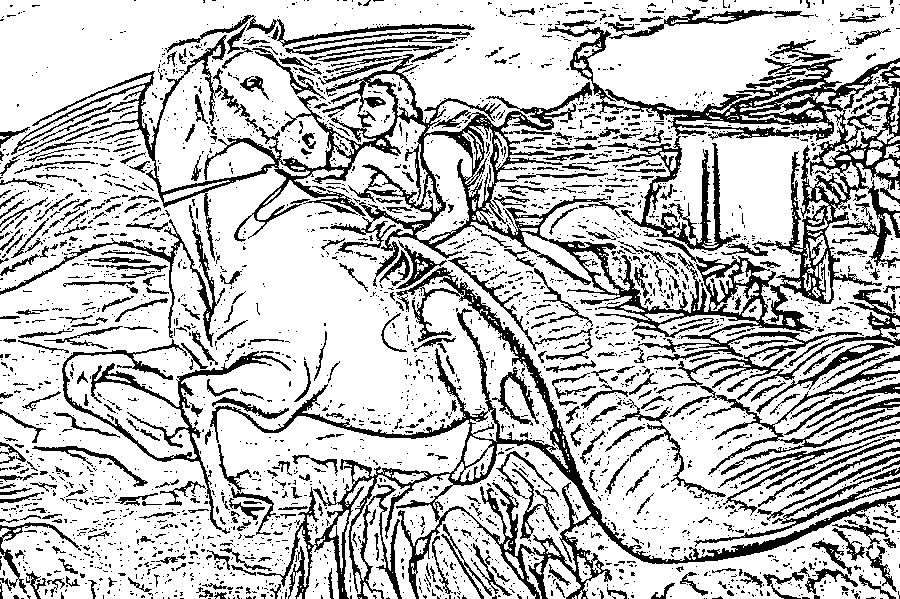

**木星在 12 星座****1****木星在白羊座**

大吉星落入这个星座**有利于自信，以及热心和展现温暖的能力。**你最有价值的资产是你能够轻松地表达你的火热，并热情投入到项目的实施中。然而，**危险在于，你的自信可能会成为反叛或无纪律的代名词，**在这种情况下，它会对你的利益产生不利影响。

**2****木星在金牛座**

大吉星落入这个和平而温暖的星座中，让你**组织和增加物质安全的实际能力得到加强。**你的情感作用被强化，你对舒适的品味和需求也不例外……不可否认，这有利于情感和物质满足。**硬币的另一面可能是过度的物质主义。**

**3****木星在双子座**

当大吉星落入这个星座，你的沟通能力和好奇心都得到了极大的加强。**你能言善辩，有一支雄辩之笔，你的兴趣中心多样化。**你比任何人都更有能力同时处理许多不同的智力问题，你会增加你的友谊的和职业上的联络人数量。利于经常的短途旅行。只是要小心，**不要贪多嚼不烂。**

**4****木星在巨蟹座**

这颗行星在你星图中的配置非常积极，因为大吉星木星在这里擢升，这意味着，它落在一个特权位置。**木星会保护你的家庭领域，之后会保护你自己的家。**你的责任感被提升了，你对舒适和习惯的偏爱增强了;通常，你会很好地融入了社会。你的情感成熟很早，这一事实使你避免了许多挫折。**这种令人愉快的配置的唯一危险可能是所有领域的好东西都吸引你**。

**5****木星在狮子座**

你的魅力、你天生的权威和你的慷慨都被这个落点支持。**你不计较小事，你的本性是胸怀大志，慷慨大方。**你天生喜欢愉快地看待事物，尽管这通常意味着你把自己放在首位。孩子会欣赏你，人们通常也会察觉到你的魅力。即使你星图中的其余部分显示出你较内向，这个位置也会凸显你性格中的温暖。很多都归功于你自己！如果你性格外向，**你必须提防虚荣的危险。**

**6****木星在处女座**

你星图中这颗大吉星的主要资产，是增加你对实际现实的感知和你在周遭创造秩序的能力。你很容易在你的活动中进步，在大多数情况下，**你是有效率、有用、谨慎的。危险可能是，当收获你努力的回报时，你会不把自己放在最先，**特别是当你星图中的其他部分显示出内向或缺乏自信的倾向时。

**7****木星在天秤座**

寻求共识和妥协，以及不惜一切代价的恰当适度，这些成分，都是你星图中的大吉星落点赋予你的天然特质的一部分。**它也可能带给你非常好的品味和魅力，提高你接触的人的品质，**特别是关于你所有的团体、职业上的联络人，以及比如婚姻这样最亲密的联系。

**8****木星在天蝎座**

大吉星带给你的礼物是：**调查的天赋、对神秘的品味和解决它们的能力。**你的情感被放大，并促使你无所畏惧或不加克制地采取行动一直到底。**你也有聪明地管理你的金融投资的才能。**根据传统，性和肉欲同样被这种幸运配置平衡。所以，尽情享受吧，快乐起来！

**9****木星在射手座**

这是你星图中这颗大吉星的最佳位置！它提供了很多**人性的温暖**（或者如果你星图的其他地方显示你会内向，它抵消了这种倾向)、**旅行的品味、乐观、活力和进取的思想。**你是机动的，你有一个宏大的愿景。智慧开始于从不同的角度思考生活，把所有的事情都纳入视野！

**10** **木星在摩羯座**

对你来说，大吉星的礼物是**组织素养，以及基于长远考虑进行彻底推理的能力****。**它也赋予你在一切事务上的权威和严肃。因此，这显然**有利于你的雄心壮志，**尽管它有损你的热情、灵活性或欢乐。然而，如果你愿意，你可以发展所有这些方面。

**11****木星在水瓶座**

当你处理你的项目时，尤其是集体项目，你的精神活动和你的热情都非常受这个行星结构的支持。**你最好的品质之一就是你能融入团队，同时又能保持你的原创性。**作为一个自然的结果，这有利于你的友谊，并且保护会贯穿你的一生。

**12** **木星在双鱼座**

当大吉星落入这个无边界的星座中，**大大提高了你的敏感性、情感、艺术能力，**特别是在音乐和节奏方面的能力。它赋予你艺术和可爱的面向，以及**灵活机动地思考你的关系和你的环境的方式。**你的幻想的心境和对他人痛苦的敏感，可能会促使你参与到伟大的人道主义事业中去。

**版权声明：**本文由若道翻译发布，欢迎转发，反对抄袭。友号转载请申请白名单。

**系统学习占星学**

**点击图片了解详情**

**微信又双叒叕改版啦，不想错过若道君的推送？**

**就把若道设为星标吧！**

**▼**

**喜欢记得点一下在看哦☟**

********报名直达入口********

# 雷蒙德·梅里曼金融占星周运 | 接下来六周，市场可能是“过山车”

> 原文：[`mp.weixin.qq.com/s?__biz=MzA5NjA0NTAxNg==&mid=2651445391&idx=2&sn=bf6e5eeb52fc33aa288db9b6ff5d60e0&chksm=8b4b6a38bc3ce32ec0b9945c006fecec378db21a0f232cd9dda3e625826ab222162f70f543e0&scene=126&sessionid=1692737979#rd`](http://mp.weixin.qq.com/s?__biz=MzA5NjA0NTAxNg==&mid=2651445391&idx=2&sn=bf6e5eeb52fc33aa288db9b6ff5d60e0&chksm=8b4b6a38bc3ce32ec0b9945c006fecec378db21a0f232cd9dda3e625826ab222162f70f543e0&scene=126&sessionid=1692737979#rd)

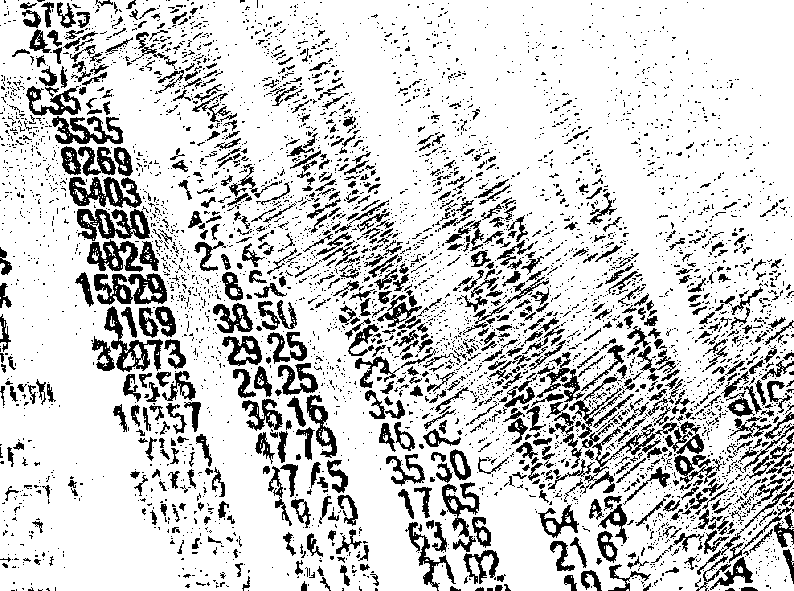

作者/雷蒙德·梅里曼 译者/Luke
编辑/玫瑰 图片/全景网

雷蒙德·梅里曼是在金融占星学界稳坐第一把交椅的占星师，同时他也是若道签约的金融占星课老师，我们引进了雷蒙德·梅里曼老师的《[上证指数月度报告](http://mp.weixin.qq.com/s?__biz=MzA5NjA0NTAxNg==&mid=2651445061&idx=2&sn=dfe830475f87883733c5c4d45d95c49c&chksm=8b4b65f2bc3cece41c3e917164f80546202cd12c2f6cdc8756761ad80457f3561a87d4a97e1a&scene=21#wechat_redirect)》及《[黄金报告](http://mp.weixin.qq.com/s?__biz=MzA5NjA0NTAxNg==&mid=2651445061&idx=2&sn=dfe830475f87883733c5c4d45d95c49c&chksm=8b4b65f2bc3cece41c3e917164f80546202cd12c2f6cdc8756761ad80457f3561a87d4a97e1a&scene=21#wechat_redirect)》《[2021 年金融预报](http://mp.weixin.qq.com/s?__biz=MzA5NjA0NTAxNg==&mid=2651436458&idx=3&sn=a7522c271761ef772fc91991ff11d965&chksm=8b4b071dbc3c8e0b452375ae3593028ab68b7b6157b45ee7c92943ff3396990d7748d7cd0967&scene=21#wechat_redirect)》。我们经老师的授权，将每周刊登梅里曼老师的周运，供大家参考和学习。于是，这是本周的周运（5.31-6.4）。

**说明：以下时间采用纽约证券交易所所在地美国东部标准时间。**

**展望与回顾**

**随着拜登总统公布 6 万亿美元的预算方案，美国股市周五触及历史高点。拜登提出的预算方案将用于资助大规模社会项目。这将导致 1.8 万亿美元的赤字。在不包括食品和能源在内的其他经济领域，核心个人消费支出月环比增长 0.7%，年环比增长 3.1%，是至少 28 年来的最大增幅。从 3 月份开始的 1.2%年增幅，是 1960 年有记录以来的最大值。**

**——乔纳森加伯**

**“尽管通胀上升，股市依然上涨，拜登的 6 万亿预算”**

**www.foxbusiness.com**

**2021 年 5 月 28 日**

木星在双鱼座的支出飙升开始成型，投资者们依然喜欢如此。为什么不呢？经济中更多的钱意味着有更多的钱用于购买股票——商品、比特币和房产。资产膨胀是政府和央行相信能够抑制债务水平的方式之一。接下来的三年里，随着冥王星在摩羯座展开长达 15 年的长途跋涉，我们将知道这一信念是真是假。尽管许多全球股指上周大幅上涨，但仍然有一些指数低于 2 月或 4 月底、5 月初的年内高点。表现突出的是澳大利亚 ASX、印度 NIFTY、苏黎世 SMI 和巴西 Bovespa 指数，它们都在 5 月 28 日创下了历史新高。德国 DAX 指数上周初也创下历史新高，然后在周五重新测试高点（但略低于前高）。然而，自我们两周前更新最后一期专栏以来，表现最活跃的还是加密货币市场。在 4 月 14 日创下 64899 的历史新高后，比特币下跌 53.77%，在 5 月 19 日达到低点。这一低点于 5 月 23 日再次被测试，当时比特币跌至 31000。以太坊的走势更令人震惊。它在 5 月 12 日达到历史最高的 4380 美元，比比特币晚了一个月。

仅仅 9 天以后的 5 月 23 日，以太坊骤降 60.5%，达到了 1730 的低点。同一天中，比特币在较高的价位形成双底结构，构成了市场间的看涨背离。这一天处于 MMA 三星级地球宇宙学关键反转时间区间中，同时还出现了土星逆行。这些市场走势符合我们在上周的年中金融市场网络研讨会中提供的分析。

在其他市场上也出现了令人兴奋的走势，包括黄金和白银。黄金在 5 月 26 日上涨至 1913.30，准确击中三星级关键反转日，形成新的周期高点，同时也是 1 月 8 日以来的最高价位。白银上涨至周内高点 28.34，但不及上周高点 28.90。原油在星期五上涨至 67.52，是 3 月 8 日年度高点 67.98 以来的最高价。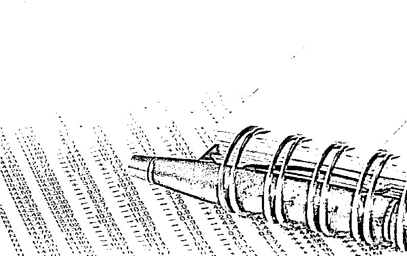**短期占星趋势和长期考量**

**本周主要的地球宇宙学征象是水星逆行，从 5 月 30 日-6 月 22 日。它将发生在双子座 24°，并在那里合相太阳和金星。**其中**每一个行星都将于双鱼座的海王星成四分相。木星现在也在双鱼座。**

在占星学研究中，双子座和双鱼座是“变动星座”。变动星座在向他人传递信息时，表现出**二元对立，甚至互相矛盾**的姿态。因此，伴随着双子座逆行的水星，以及 6 月 11 日的日食（也在双子座），我们将接下来几周视为**“变动星座疯狂”**。

这一时期的“疯狂”，将与**6 月 14 日土星-天王星第二轮渐亏四分相**叠加。第一次成相在 2 月 16 日，对应了全球许多股指的高点，紧随其后的是数周的下跌。比如说，日本日经指数，当时创下了 30 年的高点。随后从那高点开启了持续 11 周的下跌，跌幅接近 11%，直到两周前止跌回升。高点仍然完好。因此接下来的三周中，水星逆行、土星四分天王星、以及“变动星座疯狂”中期的日食，将会**传达一系列前后矛盾的信息**。这是一个疯狂和令人兴奋的时期，可能充满了突发事件，无法预测的政策改变，以及一系列的虚假谣言。它们将会震撼金融市场，甚至对应着社会动荡以及民众起义。亚利桑那州马里科帕县正在发生的 2020 年选举审计结果即将出炉，那里正好是我居住的地方。土星和天王星的第一次相位对应了对国家首都的攻击。考虑到这次审计的结果——该组织在审计选举方面没有可信的经验可能会造成巨大的动荡和怀疑，不能排除发生另一次叛乱的可能性。土星四分天王星是代表非和平抗议的经典指标。

**民主党人希望提高全球最低税率，以终止国家税率竞争，并减少高税收对美国企业的伤害。但是税率竞争为全球经济增长和投资带来了实惠，爱尔兰著名的低税率政策清楚地表明了这一点……在 1986 年和 2006 年期间他们的经济增长接近欧盟平均水平的 140%，就业率几乎翻了一番，并且 70 年代和 80 年代的人才外流情况发生了逆转。**

**在爱尔兰大幅降低税率并扩大企业税基后，他们的税收收入飙升。爱尔兰税改成功的另一个因素是，20 多年来，各种意识形态的政治家（一直支持）12.5%的企业税率……拜登（团队）提议的破坏性高税率向企业发出了一个信号，即税收政策仍然是一个政治难题。**

**—— “拜登可以从爱尔兰的税改中汲取教训” **

**华尔街日报社论版**

**2021 年 5 月 28 日**

随着美国接近第一次冥王星回归，这是一个极好的时机回顾冥王星的主题，因为它与这个国家的金融基础有关。 

在过去的专栏中，我常常提到**冥王星与金融的四个 D 有关：债务(debt)，赤字(deficits)，降级(downgrades)，和违约(defaults)**。我也观察到**税率改革常常发生在冥王星与其他行进行星或国家星图行星成相位的时刻**。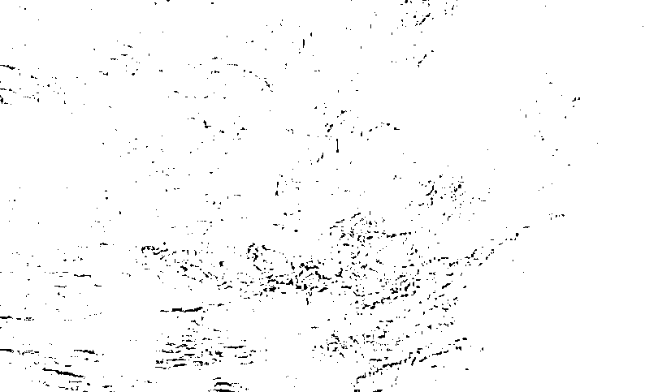对于美国 1776 年 7 月 2 日的星图，我发现这些关联大多是准确的。在该星图上，月亮与冥王星在摩羯座 25°-27°合相。在其 248 年的环绕太阳的轨道上，冥王星将在 2021-2023 年重新回到这些度数。这被称为一个国家的“冥王星回归”。这意味着冥王星将在其行为、态度、与人类相关的领域（四个 D，债务，赤字，降级，和违约）充分发挥影响力。本专栏感兴趣的是金融领域。**驱动冥王星的原则是改革，或“有意清除”那些有害和有破坏性的事物。**在它的努力下，伟大的项目被启动，以重建、修理、和改进既存的状况（比如“基础建设”。但为了做到这点，既存的结构（无论是物理的还是意识形态的）必须被摧毁和终结，以开始适当的“重生”。危险在于这一进程常常导致更大的伤害和损失，使情况变得比现状还要糟糕（“治疗比疾病更糟”）。与其改革和重建，不如说这是摧毁和终结，或许主要的意图是报复和解决怨恨，而不是为了改进现状以获得公众支持。这一切都取决于那些执意改革的掌权者（另一个冥王星术语）的潜在动机。对于冥王星来说，总是存在一个潜在的动机，可能与所声称的改革目标一致或不一致。到最后，冥王星基本不会在乎它所倡导的“品格”，尽管这些品格常常与社会正义和结束伤害他人的虐待行为有关。能否在不伤害另一批人的情况下实现这一目标？这是冥王星的挑战：保持本真，带着正义的承诺和目标，为它所倡导的改革获取支持，而不是获得权力后藉改革的口号，实行报复。这让我想起 1960 年代的古巴革命，和 30 年前在委内瑞拉的“改革”。另一个在冥王星身上观察到的特征是**“蛰伏”**。当冥王星行进发挥力量时，引发改革的“起因”开始呈现。但是这一觉知和行动往往直到冥王星行进结束后，才会有结果或结局。如果我们谈论的是，随着美国进入冥王星回归，为了偿付极速增长的国家债务，而启动重大税率改革。那么这一改革的结局可能要到几年后这个相位结束时才能知晓。而且，加税的动机真的是减少国家债务吗，还是为了报复那些被认为带来了社会不公现象的对手？对投资界来说，最重要的是预测这些“改革”会对国家的金融系统带来什么样的结果。一种说法是，这将带来更多的就业，以及雇员和雇主（企业主）之间收入的平衡。如果这是真的就太好了。前提是高额税收和收入减少，不会遏制企业主们扩大生产、扩大发展、雇佣更多工人，付更高工资的意愿。反面观点认为，这种“税率改革”政策最终会减少生产，减少发展，减少雇佣，更多失业，降低工资，以保持足够的利润率。然而，社会上“富人”和“穷人”之间严重的差距也是事实。正是这些两极分化推动了改革。在这一节的结尾，我想要关切一个占星学上冥王星预测的实际应用。我观察到**个人星图中，“破产”常常发生在行进的天王星、海王星或冥王星与出生星图的金星、木星或二宫主成“硬相位“（四分相或对分相）时。**这并不意味着一个人一定会破产。但这一时期**此人的支出常常大于收入**。如果不小心的话，支出会失控，大大超过利润或收入。关键词是**“小心”——觉察到自己的消费模式和过度消费的后果**。拜登总统正处于这样的时期，因此带来了这一关切。他出生星图中的木星作为星图的守护星，处于巨蟹座 25°，第 8 宫（债务）。他推进的水星（决策）正处于摩羯座 25°。美国的月亮-冥王星在摩羯座 25°-27°，正是行进冥王星在接下来两年中经过的度数。因此，拜登总统当前正经历这个可能“破产”的相位（冥王星与本命木星成硬相位），而且与美国的星图连结在一起。这并不意味着拜登或美国一定会经历破产。但是如果支出（消费）和收入的比例没有调整好，以抑制当前债务的爆发，这是可能发生的。较高税率会带来较高收入和经济增长的信念，将在接下来一两年里接受考验。几乎没有任何历史证据可以支持这一观点，爱尔兰就是一个很好的例子，代表相反的做法才能取得成功。但目前就这么多了。这是一个节假日的周末，也是美国夏季非官方的起点。同时还是“变动星座疯狂“的时期，因为日食和几个行星行进都将出现在变动星座。这是享受生活的时候。但是考虑到冥王星在国家星图里的位置，同时还有木星在双鱼座（5 月 13 日-6 月 28 日），以及土星将与天王星第二次四分相（6 月 14 日），明智的做法是控制消费支出，以避免“过了界”。由于土星（“界限”）四分天王星（不在乎“界限”——它们只是被用来打破和超越的），**“超越界限”或“超越边界”可能会带来突然的急剧下跌**。这在接下来的六周里也适用于金融市场。对许多人来说，即将到来的情绪和经济上的震荡，就仿佛是在游乐园里坐过山车一样。系好安全带，享受这一出戏吧。

**说明：以上日期基于纽约证券交易所所在的美国东部标准时间，由于存在时差，中国地区可能需要加一天。**

**版权声明：**本文由若道翻译发布，欢迎转发，反对抄袭。友号转载请申请白名单。

**雷蒙德·梅里曼（Raymond Merriman）**

若道签约老师。著名金融占星师，ISAR（国际占星研究协会）前主席，梅里曼市场分析公司的总裁。他由于“提升了占星学的职业形象”，在 1995 年国际占星大会上被授予轩辕十四奖；在 2012 年国际占星大会上，被授予轩辕十四终身成就奖。

1“中国上证指数月度报告”发售

**若道推出了****中文版****的雷蒙德·梅里曼中国上证指数月度报告，并持续发行该报告！**

当把金融市场的周期和占星学的周期相结合时，雷蒙德·梅里曼老师的金融占星学研究**为投资者应对金融市场的周期波动，并随之调整投资策略提供了极大的价值参考**。

**6 月中英文报告已上线！**

2“黄金价格周期月度报告”发售

**若道推出****中文版****的雷蒙德·梅里曼黄金价格周期月度报告！**不仅仅为广大读者在中国股市的投资出谋划策，更将视角放眼黄金市场。

**每当世界经济形式不明朗的时候，有一个地方是保值的港湾，那就是****黄金**。自 1982 年雷蒙德·梅里曼出版第一本研究《地球宇宙学征象与黄金价格的关联》的著作以来，**他一直作为最重要的黄金市场时机预测者之一享誉国际**。6 月黄金报告已上线，梅里曼老师将会告诉你他对这个关键时期如何操作的想法。也可以按照季度和一年期订阅，有更多优惠。季度和年度的好处是，你可以持续了解梅里曼老师对于不断在变化的市场的看法。即便他某一次看法和市场不一致，你也看到在下一期他如何调整自己的看法，并看到金融占星在一个长期时间段内对你把控风险的帮助。而能够长期控制风险、尽量找到安全的投资时机才是投资的长久之计。

**6 月中英文报告已上线！**

**购买套餐**，买得越多越优惠

中国上证指数月度报告套餐价

*   **单月报告**：280 元

*   **3 个月套餐**：780 元（260 元/月）

*   **12 个月套餐价**：2400 元（200 元/月）

**长按下图识别二维码**

**购买金融报告****套餐**

**▼**

黄金周期月度报告优惠

*   **双报告年度套餐更优惠（直降 900 元）**
*   **12 个月黄金报告+12 个月上证指数报告：仅需 3900 元**

**长按下图识别二维码购买黄金报告套餐**

▼

**2021 年金融年报发售中**

**1976 年以来，由雷蒙德·梅里曼撰写的梅里曼市场时机学院每年一次的年度预报沙龙和每年一本的《年度预报》一直在应用占星学原理为投资者们服务，提供卓越洞见，从未间断。**过去两年，3 小时的年度预报讲座和长达 200 页左右对金融市场的分析报告，帮助许多若道读者做出正确的投资决策，降低了投资风险，并获得相当不菲的投资收益。在群星摩羯座的时候，我们和你一起提早规划自己今年的投资安排。2021 年年度预报发售中**2021 年金融年报价格**：1280 元**沙龙时间**：2021 年 1 月 9 日（视频已上线）**沙龙形式**：英文讲座，配有中文翻译**点击下图了解详情**

▼

**点击阅读原文购买金融报告**

# 重要天象丨 2021 年第二波“强力修复”水逆来啦！12 星座该如何应对？

> 原文：[`mp.weixin.qq.com/s?__biz=MzA5NjA0NTAxNg==&mid=2651445366&idx=1&sn=745adece55f6072110424a2a60abbed1&chksm=8b4b6ac1bc3ce3d7a35afd1686887cafe235aec3a49109b08ad9e301a9efd7d2112bac177ec5&scene=126&sessionid=1692737979#rd`](http://mp.weixin.qq.com/s?__biz=MzA5NjA0NTAxNg==&mid=2651445366&idx=1&sn=745adece55f6072110424a2a60abbed1&chksm=8b4b6ac1bc3ce3d7a35afd1686887cafe235aec3a49109b08ad9e301a9efd7d2112bac177ec5&scene=126&sessionid=1692737979#rd)

**☆ 后台回复“今日”，给你一句生命态度**

作者/Ara 爱拉（王珊珊）编辑/翀子 封面/书君 图片/网络

2021 年的第二次水星逆行来啦！5 月 30 日早上 6:33，水星在双子座逆行。在本就处于“头脑风暴+心智活跃”的风象时代，遇到代表头脑思绪与神经感应功能的水星逆行，会是什么效果呢？又会带来什么不一样的感受？12 星座又有哪些考验和机遇呢？来看文章吧~

**今年的第二次水星逆行，于 5 月 30 日 6:33 在双子座的 24 度 43 分发生逆行。**

首先，这是水星入庙的位置。如果说水星（或者我们的心智头脑）的两大功能，一个是好奇心与学习领悟能力，另一个是组织协调的动手能力。那么水星在双子座便主要影响前者，**会加强我们对于日常生活和人生事件的“变化感知”、“现象领会”、“学习调整”、“灵活反映”等能力。**

于 5 月 5 日进入双子座的水星本身有着强大的能量，让生活中的这一切变得**速度加快**，即便那时群星都在水、土元素的星座，给我们这个水瓶时代带来“被迫保守稳定”的倾向，但是入庙的水星却帮助和引导我们去积极认知、接纳甚至”崇尚“这样慢下来的节奏。

**所以，在逆行之前的那段时间，我们的生活学习、人际交流、交通出行、工作流程和数据处理等方面，可能于慵懒慢节奏中也能进行得很顺畅、很知足。**

而当这个入庙位置的水星发生逆行，**会比在其他位置的逆行影响力更“显著”，也更“清醒”一些**——即以上相关事件的停滞、失误和反转不太因为糊涂或出错，而要么因为是“故意”，要么因为完全是“盲区”而去做无畏的探测。

同时我们也不想再简单地用“1+1=2”这种跟从逻辑去递进了解经验的过程，而是更想暂缓或改变流程、换种思维等，乃至会回过头来**“****反思我们的思想****”**，就好像一贯善于发现总结的水星，忽然开始对自己的思考“进行思考”、对总结“进行总结”……

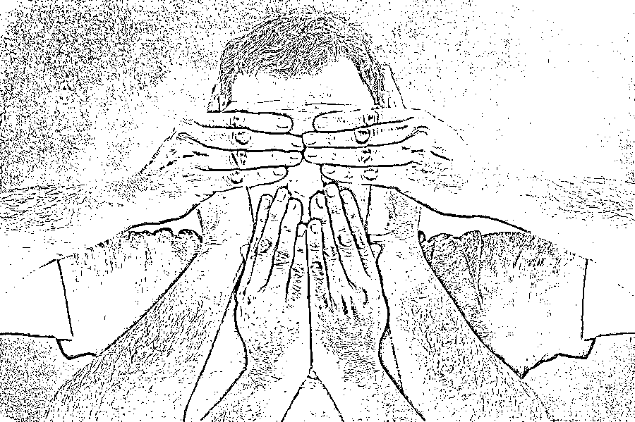

**双子座水逆**

本次水星逆行时的天象大环境又是怎样的呢？

逆行大天象

*   **木星刚刚进入双鱼座**。接着社会上发生了一些比往年异常的频繁地震，以及在同一天多位德高望重的科学院士逝世。并不严重的灾害，和寿终正寝的高寿老人——都引起社会一波带着温柔情感的缅怀和感伤。

*   巨蟹座的**火星**与摩羯座的**冥王星**形成渐近的对分相，并与顶点在双鱼座的**海王星呈**“封闭长三角”。

*   意味着我们虽然已经进入“孤独而自由的水瓶时代”，但此时期也正以强烈的情感共情力量，来重审和面对我们潜在的（火星与冥王星位置代表的）**对安全感、归属感与集体力量的渴求。**如果此时期有与家庭成员的互动，建议尽量“退居默认角色”，不要太正面对峙。

*   **逆行时的水星正合相金星**，等于水星间接定位了除了木星与海王星之外、全星图的行星能量。**在水星的视角来看****：**冥王星所带来的“被迫的责任与成就追求”到底要如何面对？土星带来的“自由结社的个性化机会”和“需要照顾社群利益的责任”应该如何兼顾？而天王星所要的“新旧价值体系的颠覆与发掘”又如何从内部消化？……

*   最终形成的**双子座与双鱼座四分相关系的对垒**——某种集体意识和集体情怀的审视与探究、个人生活理想和惯性（与瘾性）的觉察与反省、个人与集体关系的覆盖、兼容与跳脱，如何觉察？

在 6 月 23 日水星逆行结束恢复顺行的时间里，太阳已经进入巨蟹座，同时火星进入狮子座，而木星开始了在双鱼座的逆行。**这个过程好比我们用一种低调而后退式的观望态度，来经历最本能的生命和生机的浮现。**

**待水星再次回到逆行前的度数，则到了 7 月 8 日。**届时金星与火星合相在狮子座，与土星、天王星形成固定宫的 T 三角格局，月亮也与水星合相。意味着我们重整后的状态，是如同“舞台新秀”一样的活泼而天真的生命力，**我们将变得更开朗、绽放，积极开发和寻求满足我们价值感的舞台，并不惮于“献丑”自己的才华和价值。**

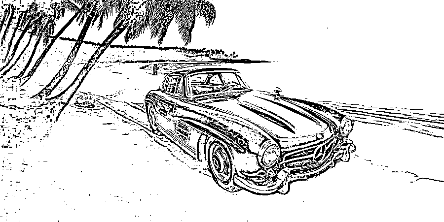

**水逆在 12 星座**

那么 12 星座在这个水星逆行并恢复原度数的期间（5 月 30 日-7 月 8 日），又将会各自经历怎样的“灵魂摆渡”之旅？

**若道君：****你可以在 app store 或者应用商店搜索“若道”下载 app，输入个人档案，查看行运盘（也可以使用其他星图软件），找到水星落在出生星图的第几宫，然后对照下文查看你的水逆影响~****例如下图中，水星行进在美国总统拜登个人星图的****第 7 宫****。**

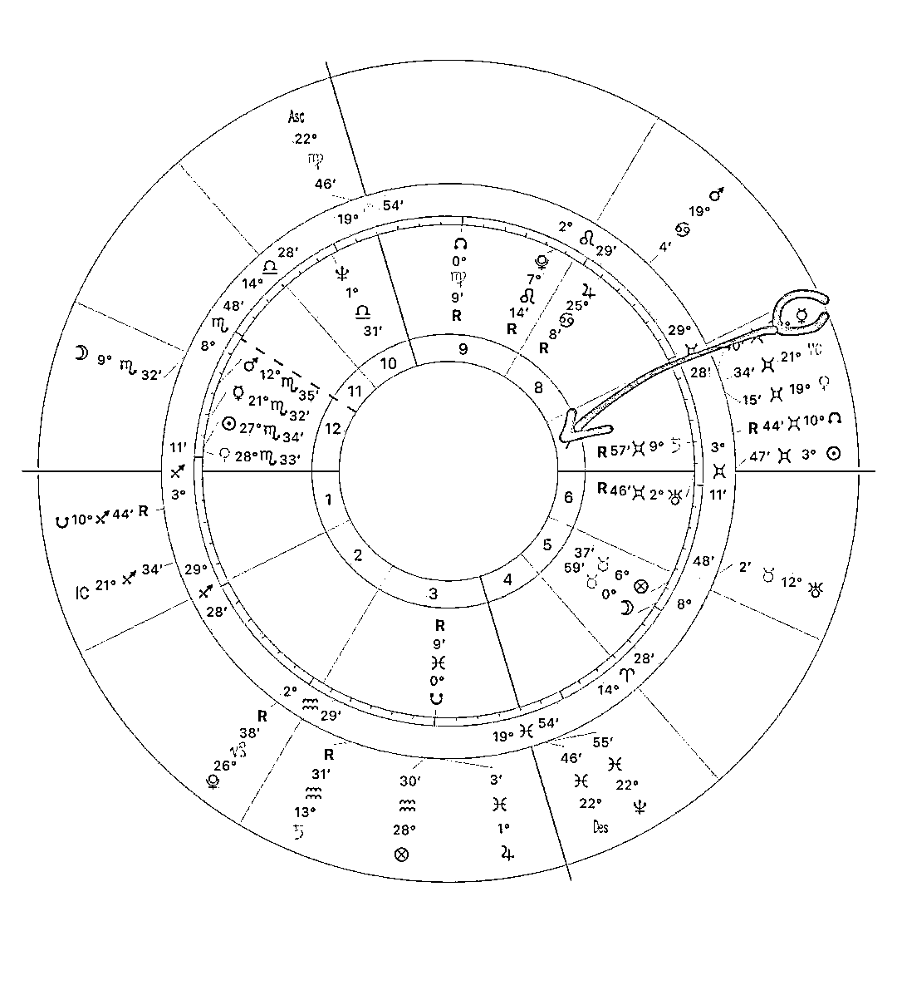

**太阳或上升在*****白羊座***

**水逆发生在你的第 3 宫（日常交流与出行）**，你最近还知道自己该往哪儿去吗？除了打乱一下你的生活节奏、破坏一下交流和谐度以及一贯“无脑行事作风”小碰个壁外，还会给你一些**“凡事果然还是需要多听听别人的意见”**的教训，让你不至于聪明反被聪明误。

——待水星恢复到原点，**又是一个在生活中任性挥舞的“大主角”呢！**

**太阳或上升在*****金牛座***

水逆发生在你的**第 2 宫（生活生存与财务）**，很可能直接影响到你的**收入和个人价值感**，好像收入和生活质量都变得反反复复没有规律可言。付出与收获好像平行世界里的两件不相干的事儿一样，到底怎样做才能投其（客户与老板）所好、而怎样做才能彰显自己光鲜亮丽的一面呢？……这个时期可能且要捉摸感受一下了。

——待水星恢复到原点，除了收成逻辑立马分明，你怕不是还要变身 party 女王，直接各种活动**邀约不断哦**！

**太阳或上升在*****双子座***

水逆发生在你的**第 1 宫（个人形象与立场）**，这段时间恨不能五分钟换一次头像和昵称的就是你吧？完全不知道该展现 72 个自己中的哪一个，话也说不囫囵，还觉得怎样都摸不准那些老板/上司/甲方们的喜好！同时你会感觉像被束缚在一个规则结界内，动作幅度都被限制得死死的，一点也不能表现你原本的聪明才智和形象魅力！

——而待水逆结束恢复到原点，**舞台可表现机会多了起来，**一下子全场话最多、戏最足的恐怕就是你了！

**太阳或上升在*****巨蟹座***

水逆发生在你的**第 12 宫（隐秘的角落）**，最近叫嚣失眠最多的就是你了吧？每天胡思乱想感觉所有人都跟你不对付，摸不准别人对你的心意态度也不敢直接去询问，却攒了许多的窝火，恨不得来一场无厘头的行为艺术来释放下？

——待水逆结束恢复到原点，你真的有机会在生活中搞一下温暖人心的“行为艺术”，整点让人眼前一亮的手艺展示来哟！

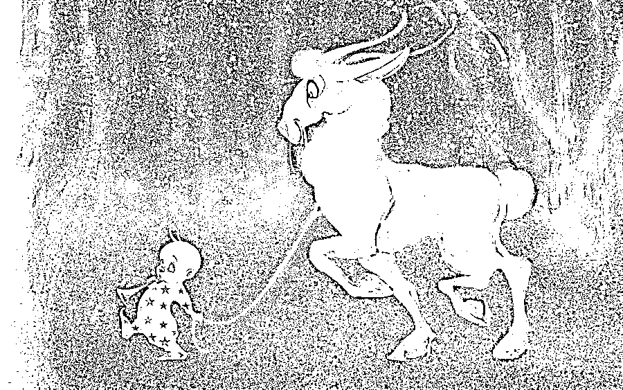

**太阳或上升在*****狮子座***

水逆发生在你的**第 11 宫（社团社交）**，最近的你在江湖上可谓“只闻其声、不见其人”：要么**躲起来不爱社交**，要么四下无人的空气中只听你吆喝一下子，也等不到别人回应。又想搞事情，又怕被事情搞，到底是要闹哪样？同时被一些基本的工作事务影响得迈不开腿脚，让你一身得侠义心肠都快被磨成了咸鱼有没有？

——待水逆结束恢复到原点，机会来了说的就是你，快随便搞点什么好玩的事情来呀，给大家热热场吧！

**太阳或上升在*****处女座***

水逆发生在你的**第 10 宫（事业与公众环境）**，最近是哪位跃跃欲试想当“霸道总裁”却不小心变成“笨拙小生”？你是不是感觉到自己本性里想要爆发的**才艺魅力**和**事****业威望**的树立之间有点冲突？以及有点摸不清自己应该在公众立场里“唱白脸”还是“唱红脸”？

——待水逆结束恢复到原点，你终于可以捕捉到一波**比较统合的群体效应**，然后进行各种角色的自由发挥和体验啦！

**太阳或上升在*****天秤座***

水逆发生在你的**第 9 宫（旅行与进修）**，闲不住的也是你，每跑到一处就待着懒得动的也是你。或者是在**表达自己的价值观时**，总觉得没把握好而错失了本该同道的朋友；或者做一些长远规划时，拿不准自己心里到底追求什么、要去哪个方向。

——待水逆结束恢复到原点，终于找到社团归属感的你，终于不用担心自己“失散/走丢”啦！

**太阳或上升在*****天蝎座***

水逆发生在你的**第 8 宫（隐私与危机）**，终于你还是注意到了生活中那些容易失控、或者根本无法可控的事？**看起来最平凡的日常，却也都有危机四伏的可能性**，原因可能是与自己某种“过于政治正确”的“信念安全感”的动摇有关。你可能一面遇到更形形色色的人，一面遭遇更多对自己“被架空”的担忧。

——待水逆结束恢复到原点，将不同的人物以类聚地组织起来的任务，可能就交由你去进行了，届时也会将你的一些**危机感变成有价值的经验**来与人分享。

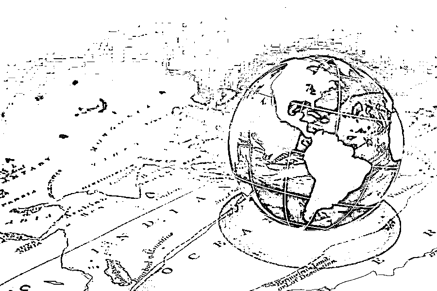

**太阳或上升在*****射手座***

水逆发生在你的**第 7 宫（合作与结伴）**，最近凭着你的“慧眼”结实的好友或合作伙伴，是否变得有些辗转腾挪、让你抓不住踪影？是在与你捉迷藏，还是其实**对你的（或你对他们的）真正立场与“人品”发生了质疑？**你要不要解释一下，或者还是先弄清楚自己的真实目的与“私心”再说？

——待水逆结束恢复到原点，终于拨云见日、前路昭彰，大家都愿意**为某个“价值共识”而继续交心与切磋**。

**太阳或上升在*****摩羯座***

水逆发生在你的**第 6 宫（作息与健康）**，每天摆出一副勤恳踏实模样的人是谁，不按时也不专心工作的人又是谁？你是否感觉到自己在**挑战自己的“健康作息”限度？**觉得自己所能开拓的自由，全在分分钟、快与慢、劳动与休息的调节中了？是否自己也会觉得很憋闷呢？

——待水逆结束恢复到原点，你会看到真正需要突破与冒险的地方，可能不是作息与肉身的保健，**而是心量的打开哦！**

**太阳或上升在*****水瓶座***

水逆发生在你的**第 5 宫（娱乐与子女）**，一向在生活中玩的花样百出的你，最近是否感觉有些黔驴技穷了？不晓得是被什么限制，只是累觉不爱、不想当地球人了呢？你可能隐隐感觉到自己所担任的角色，不是可随意自定义参数的“小自我”，而是**被更大的摸不着的“大千我”所塑形着**，而你要伸展自我，必须触摸这个大千世界的脉络。

——待水逆结束恢复到原点，**某种灵感回来了**，伙伴们支持与携手的力量也回来了，你再次“御风而行”开启了不费力的“凡间生活”呢……

**太阳或上升在*****双鱼座***

水逆发生在你的**第 4 宫（家庭与居所）**，除了每日在房间踱来踱去的脚步声，你的**居家生活**会不会有点太“沉默寡言”了？**与家人的关系**也有点敏感不自在。你是否感到很多的心事与渴望逃避的心情？偶尔崭露头角、发点感慨都会让你感觉格格不入，或许更多不舒服是因为不被人聆听的“无情大环境”。

——待水逆结束恢复到原点，终于你成了**“大环境本主人”**，有了发声的自由和被共情的支持感，还终于“进入”某个有意义的工作任务中，被任务带领，做一个宇宙与民间的“精准传声筒”吧……

**以上，你共鸣到了吗？——也欢迎将你的“水逆心路历程”勇敢地在下方评论里发出声音！**

**版权声明**：原创文章由作者授权首发于若道平台发布，欢迎转发，反对抄袭。

****

**Ara 爱拉（王珊珊）**

全职占星/塔罗咨询师

《星途》《心探索》专栏作者

2013 年至今咨询个案已累计超过 2000 小时

**咨询微信号**：622005740（添加注明“咨询”）

**微信公众号**：xiaoshu_astro

长按打赏

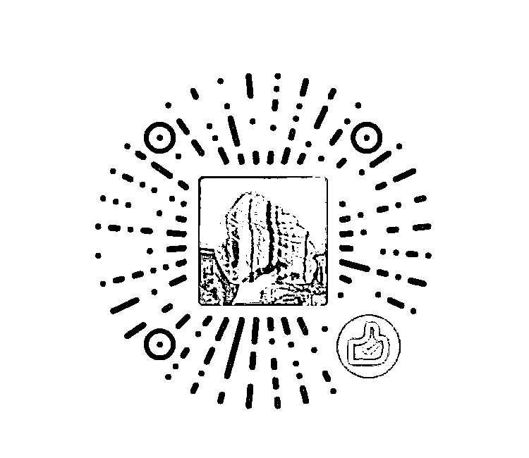

**长按下图二维码** 

**获取属于你的水逆报告**

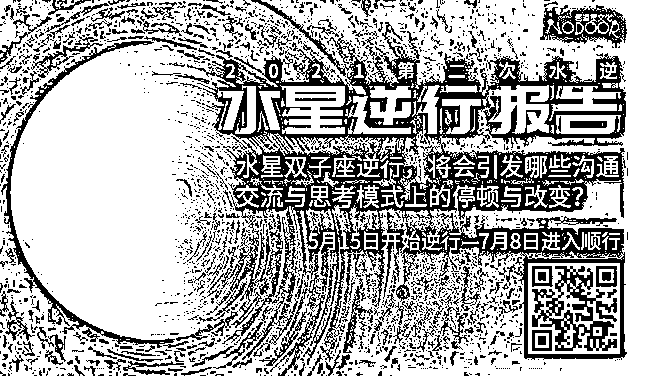

**系统学习占星学**

**点击图片了解详情**

**微信又双叒叕改版啦，不想错过若道君的推送？**

**就把若道设为星标吧！**

**▼**

**就是这个“在看”，戳戳戳 ☟**

******获取水逆报告直达入口******

# 来聊聊吧~大家对前两天的射手座月食有什么体会？

> 原文：[`mp.weixin.qq.com/s?__biz=MzA5NjA0NTAxNg==&mid=2651445363&idx=1&sn=df1802aef2f32301fe7279be869f57fc&chksm=8b4b6ac4bc3ce3d2d0b02fd4a2deae4d16a38e2b28107f7adc64ca2677923f51fa235291708b&scene=126&sessionid=1692737979#rd`](http://mp.weixin.qq.com/s?__biz=MzA5NjA0NTAxNg==&mid=2651445363&idx=1&sn=df1802aef2f32301fe7279be869f57fc&chksm=8b4b6ac4bc3ce3d2d0b02fd4a2deae4d16a38e2b28107f7adc64ca2677923f51fa235291708b&scene=126&sessionid=1692737979#rd)

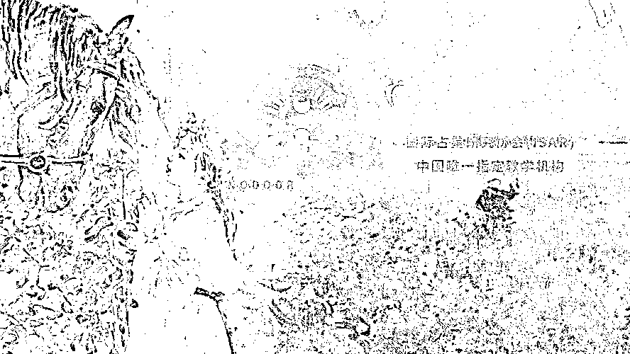

**2021 年 5 月 29 日天象：**

*   **月亮在摩羯座**
*   **太阳合相月亮北交点**
*   **金星合相水星**
*   ****金水四分海王星、与冥王星呈梅花相****
*   ****火星三分海王星****

金星与水星合相在双子座，太阳也与双子座的月亮北交点呈合相，这是增长见闻、接纳多元化新知识、与人沟通交流并提升自我的好时机。再加上月亮在“严肃”的摩羯座，脚踏实地的学习工作吧！金星和水星都与海王星形成了四分相，在面对感情和扑面而来的消息时，小心分辨那些迷惑性的信息哦~参加艺术活动、阅读精神与心灵方面的书籍、游泳和冥想等等，都能让我们度过美好的一天。

前两天的射手座月食是 2021 年的超级满月，也是非常混乱的时期（点击[【射手座月食】](http://mp.weixin.qq.com/s?__biz=MzA5NjA0NTAxNg==&mid=2651445275&idx=1&sn=7d32ae76e353544574a0c9f92dc64a75&chksm=8b4b6aacbc3ce3ba3a347f5145899be64f1282df15e9651a2a08735e799cb770b3cb95fb7cf9&scene=21#wechat_redirect)查看文章）。月食将满月的“完结能量”成倍放大，推动现实事件呈现结果，帮助我们直面恐惧、接纳痛苦并进行突破和转化。**你在这次月食中有什么体会愿意跟我们分享吗？留言区等你哦~~**明天早上 6 点 33 分，水星开始逆行，我们会有关于此次水逆的文章发布，敬请期待哦~周六快乐！我们明天见！**更多精彩占星文章长按二维码查看**

# 次限月亮在 12 星座丨每过两年半，你的人生功课会有哪些改变？

> 原文：[`mp.weixin.qq.com/s?__biz=MzA5NjA0NTAxNg==&mid=2651445337&idx=1&sn=400a8b0bf9734a6350daead28f3bd53f&chksm=8b4b6aeebc3ce3f8c4a31331e95e7cc58e16738cbfe41e411e5219ffd5ec3a1b42d198aa64ff&scene=126&sessionid=1692737984#rd`](http://mp.weixin.qq.com/s?__biz=MzA5NjA0NTAxNg==&mid=2651445337&idx=1&sn=400a8b0bf9734a6350daead28f3bd53f&chksm=8b4b6aeebc3ce3f8c4a31331e95e7cc58e16738cbfe41e411e5219ffd5ec3a1b42d198aa64ff&scene=126&sessionid=1692737984#rd)

****************☆ 后台回复“今日”，给你一句生命态度****************

作者/艾琳·格莱姆斯

翻译/Leisha 校对/江艺

编辑/翀子 封面/书君 图片/网络

我们的次限月亮每两年半会换一个星座，那在不同的星座，次限月亮都要求我们做哪些事情呢？

**次限月亮在 12 星座****若道君：****你可以在 app store 或者应用商店搜索“若道”下载 app，输入个人档案，查看次限盘（也可以使用其他星图软件），找到次限月亮落在哪个星座，然后对照下文查看你的次限月亮的影响~****例如下图中的次限单盘中，美国总统拜登的次限月亮在****双鱼座****。**

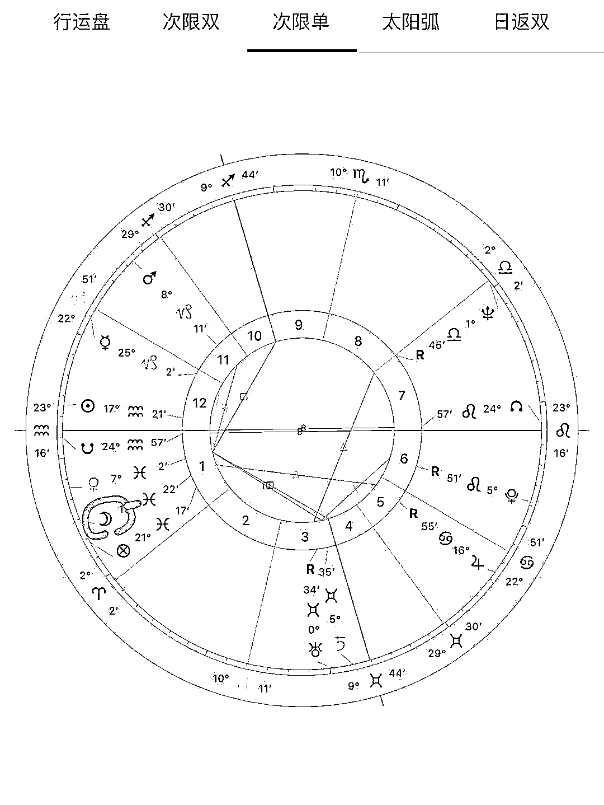

**☆****次限月亮在*****白羊座***

次限月亮在双鱼座的 2 年半期间，人生功课很轻柔而且转瞬即逝，那个时期有一种真正放下一切、在人生中寻找更大意义的感觉。生活节奏更慢、更易变化；情感方面的感受更敏锐，生活全靠直觉。**次限月亮开始进入白羊座之后，内心可能相当震动，**从双鱼座温柔多情的怀抱离开，猛冲进入白羊座的火焰。

伴随而来的是**身体精力的增强**和一种总体而言脑子**“更清醒”**的感觉。整个人不再漂浮摇摆，**完全变得 “蓄势待发”**；也不再把自己放在最后，**转而意识到必须把自己放在第一位。**

**当你说出“那我呢？”的第一个早晨，就是转变开始的标志。**次限月亮在白羊座的必要性是真正学会在接下来的 2 年半中把自己放在第一位，生活将设置这类挑战，**帮你学会勇敢和捍卫自我，而不是消极地生活。**

**☆****次限月亮在*****金牛座***

次限月亮在白羊座期间，我们的精力旺盛，不停地推动事情发生，有一种强烈想要发现自我的渴望。这个时期我们会感觉迫切地想要在最短的时间内完成尽可能多的事。生活节奏很快，很激烈，没有太多休息时间。

休息？哦，休息啊。当次限月亮快要进入金牛座时，我们可能会感觉精力能量突然全被耗尽，只想缩成一团，什么也不做。当了那么多个月的战士四处斗争之后，什么也不做会觉得奇怪吗？现阶段而言，战斗都结束了。消耗了那么多能量后，**身体需要休息，**现在是回家翘起双脚休息的时候。

这就是次限月亮在金牛座时期的功课。**感受自己的身体，感受身体的放松，享受休息，留在原地。除此之外，无需做任何别的事。**彼得·汤森创建谁人（The Who）乐队时，他的次限月亮就在金牛座；梦想/艺术有了现实的形式。

**☆****次限月亮在*****双子座***

次限月亮在金牛座的某个时候，你会想要离开沙发。休息时间结束了。当身体停下来休息，精力终于恢复得饱满之时，就该找点事做了。

次限月亮在金牛座时，我们身体的每个部位都得到了休息，包括头脑，此时的我们对肢体或头脑活动提不起任何兴趣，这是正常的。但是，**当我们感到风向朝着双子座转变时，头脑便苏醒过来，向往新的可能性**——如斯蒂芬·弗里斯特所言——**渴望对生活感到惊奇**。

这里感觉到的过度是从身体向头脑的过渡。让人感到惊奇的全是新的想法，像一个求知若渴、总有“十万个为什么”的孩子。**好奇心完全被打开。**次限月亮在双子座精力旺盛，随时随地都感受到发现的兴奋。每个房间里都会堆满了书，头脑在汲取信息方面不会餍足。而且，这是十分有趣的，可能还很多产，许多好书可能都是次限月亮在双子座期间创作而成的，如《指环王》。

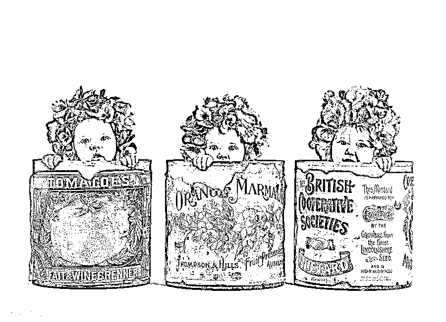

**☆****次限月亮在*****巨蟹座***

无论次限还是出生星图的月亮都在巨蟹座入庙，这会是一个与实体物质（或母亲）相关的点。经过次限月亮在双子座的头脑活跃期后，心灵和情感可能感觉被严重忽视了。那么，我们感觉如何？这是重点，我们有什么感觉？一旦头脑运作良好，就是时候检查一下感觉的性质了。

向内观照，目标是寻找愉快和关爱的时刻。次限月亮在巨蟹座不会寻求外部刺激，在这 2 年半期间，**我们将会体验到充足丰盛的内在激励。这个时期的目标是获得安全感。**斯蒂芬·弗里斯特说，获得安全感的方式是，不关心外界的事或外界的感受。**人们在此期间经常会寻求情感庇护，找一个私密的“藏身之处”来体验更高程度的安全感。**

在这个节点，不仅我们活动都围绕内在生活展开，而且家庭、父母、孩子也在这个进化过程中扮演着重要的角色。**学会滋养原则要从家庭、自己的内心、家居住所入手。**这个时期可能会有许多事件发生，例如成为母亲，或与他人一起承担育儿的责任。这是很宝贵的时期，因为次限月亮在巨蟹座感觉非常舒适自在。

**☆****次限月亮在*****狮子座***

次限月亮穿过巨蟹座，我们的内在生活变得更丰富充实。由于巨蟹座时期我们关注内心，因此内心会体验到新的快乐和满足。**随着次限月亮进入狮子座，内心的快乐会沸腾喷涌，想要被表达出来，想要被人注意到。**不要退缩，这就是要被人看见，而且享受被人关注的时期。

这里的驱动力是要我们离开巨蟹座的“藏身之处”，向世界和自己展现“我很厉害”。有谁比你更厉害吗？没有！这个时期不用太认真，**只需玩乐和再创造——这种情况下是恢复你内心孩童的生机活力。**

**次限月亮在狮子座很适合学习如何玩乐，**如果此前不知道该如何玩乐的话。那些在人生中成长过快的人可能会感觉困难，但这只是因为他们要学会发展小时候被忽视的自我部分。表达自我是次限月亮在狮子座时期的目标和重心。针对这一时期的首要建议当然就是要在舞台中心发光发亮。

**☆****次限月亮在*****处女座***

次限月亮穿过狮子座，我们确信自己是帝王，不可能犯错，然后次限月亮进入处女座，我们就不再有这种感觉。确实，这是一堂谦卑的艰难功课。需求突然改变，像在国王巡视王国的 2 年半期间，没有管家帮他打理居所，国王回来环顾四周，说：“天呐，我想我得打扫一下这个地方。”

**而且不仅要打扫现实空间，还要打扫内心的空间。**这可能是我们会意识到个人健康问题并着手解决的时期。**这个时期真正的功课是自我改善，而不是自我否定或自我批判，**虽然这也可能是自我改善的一部分，但主要是做有益于自我的事。这的确是个从精微细节处审视自我的好时机。最重要的是，在自己的内心中“做正确的事”。

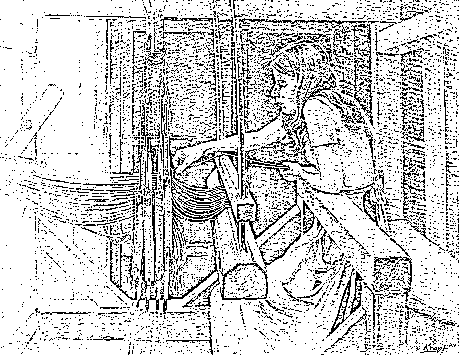

**☆****次限月亮在*****天秤座***

次限月亮从处女座进入天秤座后就可以松一口气了，因为在很大程度上，辛苦的自我改善工作会结束，个体将准备好以改善后的崭新状态示人。**针对这个时期的首要建议是了解自身的优雅魅力，这会使你更善于接受，也更容易建立新的关系。**

这可能是你彻底改头换面的一年。毕竟次限月亮刚从处女座离开，那是完善外貌形象的好时机，然后你就准备好遇见可能成为伴侣的人了。**天秤座希望我们开始与人建立联系。**在此期间，我们终于可以炫耀改善后的新自我，并接受那些饱含爱意的惊叹，我们十分需要通过这些惊叹来感受别人对我们的赏识。

**☆****次限月亮在*****天蝎座***

这是见真章的关键时期。天秤座要求我们关注人际关系，而天蝎座要求我们更深入。这两个星座的过渡时期会让人感觉不太舒服。前一秒，我们还沉浸在愉快的关系中，下一秒，关系就突然痛苦地结束了。这是次限月亮在天蝎座的第一次示警。**次限月亮在天蝎座要求更深入、更冒险的关系。**

这是最艰难的次限月亮位置之一，因为我们要进行一场深入灵魂暗夜的激烈之旅，天蝎座的功课正在于此。天秤座要求我们找到平衡与和谐，要求我们妥协。**在此期间，我们需要处理阻碍我们前行的无意识情感元素，会产生一种释放和舍弃情感模式的感受，**最终可能会磨灭我们的生气活力。次限月亮在天蝎座以及这个时期的功课不适合胆小怯懦之人。**过程很痛苦，但也极尽丰富。**

**☆****次限月亮在*****射手座***

经过天蝎座的激烈功课，我们会感觉情感能量变得特别沉重和压抑，因此，次限月亮进入射手座会感觉像“刑满出狱”！**这是非常能释放情感的时期。**我们为内心生活做了那么多努力，消耗了那么多能量，**次限月亮进入射手座之后，我们就可以起飞了，真的起飞。**

**这是拓展意识的时期**，我们也可能 90%的时间都待在飞机上，可能是内心的飞机，也可能是真实的飞机，但这不重要。重要的是，**我们的人生要开启一场旅程。**我们将可以自由地飞翔，并开始理解过往经历的意义。适用于次限月亮在射手座的词是“找乐子”。这是许多大门向我们敞开的时期，我们可以抓住机会拓展自己的社交圈和生活。

**换言之，生活是场冒险。**这是适合教学和写作的绝佳时机，教学和写作的内容甚至可能是次限月亮在天蝎座期间的经历，但是以一种更具幽默感的方式来看待那个过程！

**☆****次限月亮在*****摩羯座***

次限月亮从射手座进入摩羯座时，**从找乐子转变为认真做事的感受很明显。**

射手座几乎完全不自律，而且非常随性，不一定能完成许多事，更关注玩乐和探索。然而，摩羯座对待自己的人生目标和野心要认真得多，真的有一种想要固守现实的感觉。

这 2 年半期间，**我们会被迫着眼于长期目标，**尤其是当我们更年长的时候。这意味着当我们与世长辞之后，我们想要如何被人记住，有什么的财富可以留给后人？这是制定计划并实行到底的时期。

**次限月亮在摩羯座的困难之处在于，我们会只工作不玩乐**。不过，这个时期更重要的功课是**学会自我应用**，这也是可能会取得巨大成就的时期。此外，**首先要学会如何表达真实的自我，并学会如何在现实生活中活出真实的自我。**

**☆****次限月亮在*****水瓶座***

摩羯座关注遵守和制定规则，而水瓶座却要打破规则！**这将是个人重大反叛的时期，自由是关键词。**比如说，次限月亮在摩羯座的 2 年半期间，我们一直在勤奋努力地创业，然后这时突然决定不干了，要做些完全不同的事。或者，我们会突然决定把自己创办的公司变成非营利性机构。

关键在于：摩羯座寻求获取成就，**水瓶座意图回馈人类。**太多的工作和结构会使灵魂非常不安。这种不安会渗透到我们生活的每个领域，我们必须承认并接纳这种能量。**这确实是一个适合用来寻找个人目标的时期。**摩羯座给予我们实现目标和为自己制定规则的技术和能力，**水瓶座给予我们改变规则的能力。**

**☆****次限月亮在*****双鱼座***

从狂热的水瓶座能量中走来，我们在寻找真正的自我方面取得了长足的进展，而双鱼座时期会发生真正的改变。当我们开始通过自己的气质和独特个性认出真实的自我后，**双鱼座要求我们放下这些特性，与比自己更大的存在融为一体。这个过程真的是关于臣服和放手。**

水瓶座可能比较紧张焦虑，但双鱼座非常幸福且平静。这会是刚开始最明显的转变之一——**焦虑感离开身体，取而代之的是轻柔温和的舒适感。**由于我们要寻求的是安宁和平静，因此生活会发生剧烈的变化。我们也许会寻找一些途径来表达这种平静，像是做一些增强平静感的事，如听音乐、冥想，当然还有多休息。

对于严格自控的人而言，这将是极其困难的时期。**这个时期不适合雄心勃勃地工作，这是做灵性功课的时候。**次限月亮在双鱼座的时期有一种退隐避世的天然倾向。这个时期是必要的，因为身体、头脑、心灵要自我修复，为次限月亮进入白羊座的全新意识阶段做准备，然后再以一种全新的方式释放能量。

**版权声明：**本文由若道翻译发布，欢迎转发，反对抄袭。友号转载请申请白名单。

**艾琳·格莱姆斯**

职业占星师，定期为 About.com/Astrology 网站撰稿，著有《泰坦尼克号占星学分析》。

**ISAR 选修课，次限月亮**

**点击图片了解详情**

**微信又双叒叕改版啦，不想错过若道君的推送？**

**就把若道设为星标吧！**

**▼**

**就是这个“在看”，戳戳戳 ☟**

********报名直达入口********

# ISAR 选修课 | 深度掌握次限月亮的技法（插班中）

> 原文：[`mp.weixin.qq.com/s?__biz=MzA5NjA0NTAxNg==&mid=2651445337&idx=2&sn=951b362c053776d3539b590b7403bc1e&chksm=8b4b6aeebc3ce3f89f800aec94a9386f03d8702ae88a9db18a568ad1cf71a87bb115482cc292&scene=126&sessionid=1692737984#rd`](http://mp.weixin.qq.com/s?__biz=MzA5NjA0NTAxNg==&mid=2651445337&idx=2&sn=951b362c053776d3539b590b7403bc1e&chksm=8b4b6aeebc3ce3f89f800aec94a9386f03d8702ae88a9db18a568ad1cf71a87bb115482cc292&scene=126&sessionid=1692737984#rd)

**星图中的月亮描述了我们在婴幼儿期和童年早期如何接收母亲的能量。**我们从出生开始就通过月亮的反射来体验母亲，正如月亮反射太阳的光一样。月亮也会描述一些我们可能会称之为灵魂的事物：**我们的人生经历在时间和永恒之间的内在反射物。**次限月亮通常被视为用于预测以及为事件择时的因素，但实际上它的内涵远远不止如此，要更为深刻和微妙。

**次限推进月亮**（Secondary Progressed Moon）：用次限推进，也即**一天即一年**的推进法时的推进月亮。次限推进月亮平均每月移动 1 度，虽然速度并非恒定。

**次限推进：托勒密时期，2 千年前发明。**

**当次限月亮在我们星图上的星座和宫位推进时，它会以唤起我们个体本质以及人性的方式，反映我们成长和发展的经历。**对于那些同时开展内在和外在生活的人来说，次限月亮可以成为一个向导，照亮自我反思和内在滋养的面向。**在八周的课程中，**我们将学习次限月亮是如何像镜子一样映照出我们最深的本质的。

**此课程可作为 ISAR 选修课。**

1

**课程安排**

**课程安排：5 月 10 日--6 月 28 日 （每周一）**

*   **5 月 10 日** 出生星图中的月亮与它在童年 0-7 岁的推进

*   **5 月 17 日** 7-14 岁：从自我到他人

*   **5 月 24 日** 14-28 岁：从他人到自我

*   **5 月 31 日** 次限月亮推进 vs 土星行进

*   **6 月 07 日** 次限月亮与其他行星形成的相位

*   **6 月 14 日** 30-60 岁的次限月亮推进：再次回转

*   **6 月 21 日** 60 岁以后的次限月亮之旅

*   **6 月 28 日** 次限月亮与次限太阳的关系

2

**课程大纲**

**第*****1*****讲  ****5 月 10 日 **

**出生星图中的月亮与它在童年的推进**

我们将学习出生星图中月亮的象征意义，以及它如何反映你的母亲以及你童年的家庭生活。我们将从元素的角度观察月亮，并研究从出生起你是如何得到母亲的关注的，我们将观察出生后几年的月亮的推进。

**第*****2*****讲  ****5 月 17 日 **

**从 7 岁到 14 岁：从自己到他人**

次限月亮与出生星图中月亮的第一个四分相在 7 岁左右出现。我们将学习在这个关键时间点我们是如何开始意识到自己是独立存在的个体，以及它如何让我们向家庭以外的其他人寻求滋养和生命。

**第*****3*****讲  ****5 月 24 日 **

**从 14 岁到 28 岁：从别人到自己**

从十六七岁到 28 岁左右第一次次限月亮回归，我们完成了与他人和与自己的月亮的灵魂之旅。从次限月亮回归开始，我们就开始对自己的情感生活以及我和其他人之间所发生的负责。

**第*****4*****讲  ****5 月 31 日 **

**从 14 岁到 28 岁：从别人到自己**

当次限月亮描述我们内心的旅程时，土星的行进描述了我们与周围世界的联系，以及作为社会发展中的个体，世界对我们的要求。在我们生命的头 30 年里，它们几乎以相同的速度运行。

**第*****5*****讲 **** 6 月 7 日 **

**次限月亮与其他行星的相位**

我们将从次限月亮的旅程中抽身出来，看看它与各种不同人的星图的其他行星产生有趣而特别的相位时发生了什么，这样我们来了解次限月亮触及我们星图中的这些行星时会发生什么，以及我们该如何为自己的生命导航。

**第*****6*****讲  ****6 月 14 日 **

**30-60 岁的次限月亮推进**

当月亮再次绕着出生星图运行时，我们有机会将意识带到我们的情绪反应中，并开始引导我们的内在本性，而不是对发生在我们身上的事情束手无策。

**第*****7*****讲  ****6 月 21 日 **

**60 岁以后的次限月亮之旅**

在当今时代，60 岁以后过着积极生活的人比历史上任何时候都多。有的人在 70 多岁的时候坠入爱河并第一次结婚。我们将在这一讲探讨如何在我们生命的最后几十年里对自己和他人有用，这样我们就可以体验到生命的丰富多彩。

**第*****8*****讲  ****6 月 28 日 **

**次限月亮与次限太阳的关系**

最后，我们来研究次限月亮绕着星图运行时与次限太阳推进的关系。我们将通过星图案例来进行探讨。

3

**此次课程适合哪些人？**

*   有一定占星学基础，若道核心课 L3 以上水平；

*   希望成为优秀的占星师，想要借鉴国际大师次限解读思路并融入自己的体系的人；

*   希望研究自身人生周期，想好更好的规划人生的占星学者；

*   走在自我探索和个人成长道路上的人。

4

**主讲老师**

**达比·科斯特洛（Darby Costello）**

达比·科斯特洛（Darby Costello）在美国波士顿学习占星学，在非洲生活过 12 年，于 1983 年移居英国伦敦。她曾在长达 25 年的时间里担任心理占星中心的首席教师，是占星研究学院的任课教师，也是伦敦占星学院的客座导师。此外，她拥有“文化天文学与占星学”硕士学位。她在世界各地授课与写作，服务全球客户是她占星师生涯的核心。

| 达比·科斯特洛与琳恩·贝尔

**网站个人简介：**

达比·科斯特洛（Darby Costello）出生于美国，1960 年代曾跟随弗朗西斯·萨科安（Francis Sakoian）、路易·阿克（Louis Acker）以及伊莎贝尔·希基（Isabel Hickey）在波士顿学习占星学。随后，她去了非洲，与部落疗愈者和占卜者一起共事多年，并在期间精进自己的占星学实践。1983 年，她去英国伦敦寻找占星团体。令她高兴的是，她找到了这样的团体，并在许多层面上参与其中。到伦敦后不久，她就开始拓展占星客户，并于 1988 年开始在由丽兹·格林和霍华德·萨司波塔斯创立的心理占星中心任教。十年后，她成为首席讲师，并为心理占星中心出版社撰写了几本书。

达比还是占星研究学院的导师，并于 2014 年获得荣誉文凭。她是心理占星学水星网络学校（MISPA）和占星大学的讲师，也是伦敦占星学院的客座导师。她在欧洲和世界其他地方教书和授课，也曾在巴厘岛、中国大陆和台湾等亚洲地区以及阿拉斯加等北美地区授课。2013 年，达比被授予查尔斯·哈维奖，以表彰她对占星学做出的卓越贡献。

2006 年，达比获得在巴斯斯巴大学（Bath Spa University）“文化天文学与占星学”专业硕士学位。这段学习经历也让她更懂得品读历史，并对写作产生了更深的热爱。不过，她最爱还是解读星图，她遍布世界各地的客户也滋养并进一步激发了她的占星学灵感。

**达比·科斯特洛的著作：**《占星学中的月亮》《水元素与火元素》、《土元素与风元素》、《火星四重奏》、《占星学》。

5

**课程价格**

**正价**：6800 元

还有限时 ISAR 选修课联报套餐价格，具体请咨询课程顾问：Maggie 老师（微信：18510107057，请备注“次限月亮”）

长按二维码添加 Maggie 老师

6

**退转课程**

*   **退款原则请详看《教学协议》，如有疑问请咨询课程顾问。**

****ISAR 选修课：次限月亮****

**授课老师：达比·科斯特洛**

**授课时间：**2021 年 5 月 10 日（周一）起

**授课方式：**网络课程**，**英文授课，中文翻译

**费用：**6800 元

**课程负责人：Maggie 老师**（微信：18510107057，请备注“次限月亮”）

长按二维码添加课程负责人咨询~

****报名请点击“阅读原文”****

# 送别袁老｜“我见过最有品的男人，就是会在稻田里拉小提琴的袁隆平”

> 原文：[`mp.weixin.qq.com/s?__biz=MzA5NjA0NTAxNg==&mid=2651445332&idx=1&sn=d5c1fdceaf810443889b22713367acc0&chksm=8b4b6ae3bc3ce3f50873dac55f9a0714053029b307503a14bff1084433eb4e50ca2bc640aaad&scene=126&sessionid=1692737984#rd`](http://mp.weixin.qq.com/s?__biz=MzA5NjA0NTAxNg==&mid=2651445332&idx=1&sn=d5c1fdceaf810443889b22713367acc0&chksm=8b4b6ae3bc3ce3f50873dac55f9a0714053029b307503a14bff1084433eb4e50ca2bc640aaad&scene=126&sessionid=1692737984#rd)

******************☆ 后******************台******************回复“今日”，给你一句生命态度******************

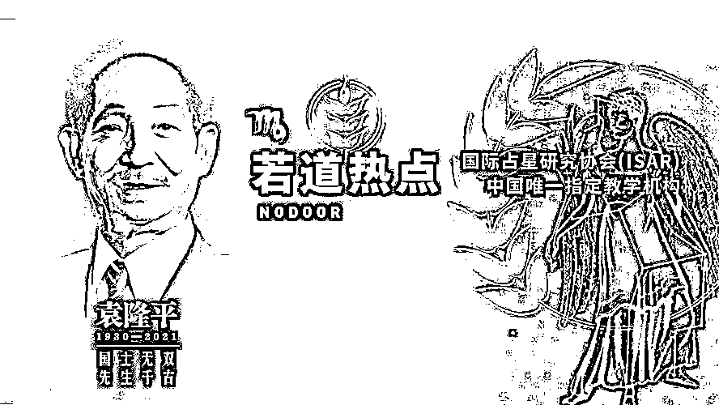

作者/郑玮玲 ISAR 认证占星师

编辑/玫瑰 封面/书君 图片/网络**送别袁老**5 月 22 日-23 日，长沙虽然阴雨，无数民众前往缅怀、送别袁隆平，期间有人提供免费菊花、免费水稻、免费口罩和免费接送服务，网络上持续不断刷屏缅怀，联合国、外媒纷纷发文送别。

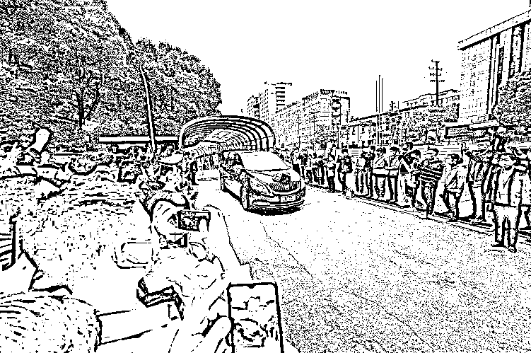

| 长沙民众送别袁隆平如此庞大又充满爱与秩序的送别仪式充分证明了：袁隆平无愧为中国脊梁，国民英雄。世上能有几个人在去世时能引致 14 亿人同悲同泣？尽管袁老已步入天年，可谓寿终正寝，但人们为之动容的不仅是生命的终结，是对他伟大的爱的无以为报，他一生默默付出爱，每一个感受到被爱的人只能默默将这份爱回馈给了伟大的灵魂。我们所处的时代有不断制造偶像的行业，我们也一次次将功名卓著的企业家、奥运明星捧上过神坛。但没有人像袁隆平一样，生时平凡简朴，做着微小不被世人关注、追随的工作，却用行动喂养了每一个中国人。而今在世的大多数人出生以来就从未挨饿，而我们都是从教科书中知道了袁隆平的名字，也从祖辈那里听来了饥荒年代的故事。袁隆平用他一生的悲悯践行造福了后世所有人，并将爱的种子播洒向世界。袁隆平从 1964 年开始试验杂交水稻，他成功选用世界上第一个食用高产杂交水稻品种，1995 年被中国工程学院封为院士，在新中国成立 70 周年之际，袁老被授予国家最高荣誉“共和国勋章”。20 多年来，袁隆平带领团队进行超级杂交水稻攻关，目前已研发到第三代杂交水稻，全年亩产 1530.76 公斤。杂交水稻技术目前已在印度、美国、巴西，菲律宾、越南等国家实行并大面积种植。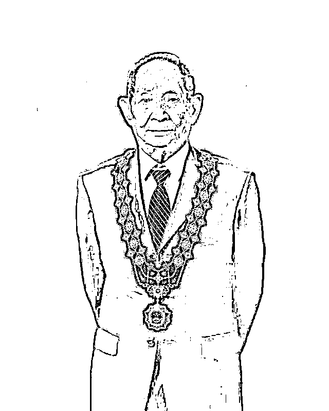**星图中的袁隆平**袁隆平的出生时间不详，以正午 12 点制作出生星图。月亮与金星都在当天换座，早上 5:07 月亮已经进入双鱼座，中午 12:06 金星进入天蝎座。由于生时不确定，在做星图分析时暂且忽略月亮与金星的星座，直接提取相位信息。

**日海合相，禾下乘凉梦**

袁隆平的太阳落在处女座，这是一个关于**农业、谷物、土地、研究、实践**的星座，处女座也是**质朴、天然、纯粹和奉献**的典范。处女座的形象正是拿着麦穗的女神，象征着被神祝福的大地以及人类辛勤的耕耘。袁老平常穿着几十元的衬衫，将心血投入到杂交水稻的研发培育中，这是属于处女座的质朴与伟大。

袁隆平的太阳与海王星处在宽泛的合相之中。（在此，我需要使用比日常更大的容许度，是基于原型占星学的标准，采用 10°甚至超过 10°的容许度，我们才能看到更大的原型呈现。）太阳与海王星的合相在出生星图中，通常情况会让一个人的意志、生命的目标，甚至生命力遭受海王星的侵蚀、消融，模糊自我意识与边界，丧失活力，容易涣散、沉溺和无力，甚至一生中大量时间活在幻想中，夹杂着“父亲消失”的心理体验，继而在余生不断追寻对父亲、内在男性的救赎。但这个相位最积极的，也是深入海王星超越性的一面则是，**为着追寻对个人充满意义的理想、抱负、职业、事业而投入富有创造性的道路中，由此不断筑就、显化人生大梦，最终向世界展现出理想壮阔的光芒，甚至留下史诗级的华章，成为偶像级的人物**。这正是袁隆平用生命所诠释的英雄梦想与生命的光芒。然而，即使在最完美的日海相位的整合中也难以避免自我奉献和牺牲，为着神圣伟大的生命目标前行中，将小我利益、现实所得化为微尘，竭尽所能服务于理想的生命目标。这同样也是我们所看到的袁隆平伟大却朴实无华的一生。日海相位的原型动力成为了袁隆平内心无比神圣的信念。从 1960 年开始就没有停止过对理想的追寻，并且一再壮大、深化它，直到 91 岁高龄都还坚持活跃在杂交水稻基地。曾有外媒采访他时提及：联合国粮农组织曾六次邀请袁隆平担任首席顾问，袁隆平表示杂交水稻技术不仅属于中国，也属于全世界。“生命不息，我将继续追寻，为了梦想，永不停息。”袁老说自己有两个梦想，一个是禾下乘凉梦，一个是杂交水稻覆盖全球梦。一次次的杂交水稻试验成功，袁老并没有因为现实的成功而满足或停止，海王星的大梦在他心中是超越生命长度和厚度的。在他临终前都还挂念着超级水稻的培育，而他的禾下乘凉梦终将穿越生命的长度，陪伴他到生命的另一端。

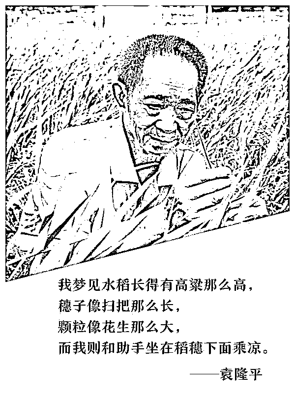

**我曾做过一个美丽的梦，我叫做禾下乘凉梦，试验田里的超级杂交水稻长得比高粱还高，稻穗比扫帚还长，籽粒比花生米还大，好高兴，我跟我的助手们，就在那个稻穗下乘凉。****——袁隆平**

**水天对分，拓荒研究**

访谈中的袁隆平总是风趣幽默，思维敏捷，尽管从事着农业研究的工作，还能说一口流利的英语，在他那一代人中恐怕是凤毛麟角。

他的出生星图中有不可忽略的水天对分相——作为处女座守护星的水星落在天秤座，与白羊座的天王星形成了有力的对分相。这相位强有力地支持了先锋的创举，拓荒的研究，天王星将创造性的思维带进现实中，让突如其来的智慧留驻于恒常的时空之中。

**月海对分，我还有一把小提琴**

袁隆平出生当天，月亮在早上 5:06 进入双鱼座，但那一整天月亮与海王星的对分相是成立的。月亮母亲是为生命提供滋养、安全与保护的原型能量，而月亮用非逻辑的阴性能量为我们输送流动的灵感、情感和情绪。月海相位的人生也总是难逃幻灭与无尽的悲伤。**海王星善于用苦难将我们的心包裹，在悲伤、痛苦的现实中追寻救赎，或是从母亲的苦难中发展出牺牲与救赎能力。** 

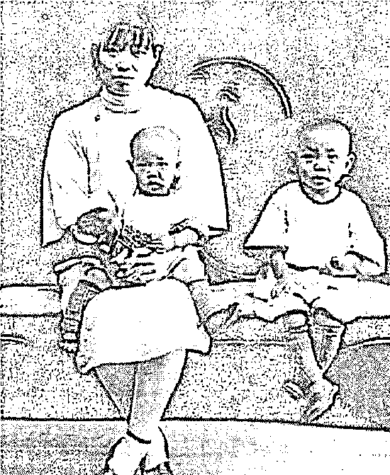

| 袁隆平（左）与母亲

袁隆平也曾表达对母亲为自己生命付出、牺牲的感概，他在曾在一封给母亲的信中说，母亲在自己的一生中付出太多，无以为报。每当他接过一座座奖杯，嘴里说着最感谢的人都是妈妈，母亲不仅是袁隆平的英语启蒙老师，还从幼年起给他讲尼采，让他从尼采昂扬的生命力和意志力中奠定了日后的坚信，也是母亲在他的心中播下了那颗改变世界的种子，最终，他把这颗种子洒向了人间，播进了每个人的心里。母亲离去的那个中秋节，袁隆平正召集全国杂交水稻的同行在长沙开会，这成为了他心中永远的亏欠。好的母亲成就的不止是一个生命，而是全世界，这便是月海相位充满爱的诠释，在袁隆平的生命中有幸得到母亲完美的滋养与支持，他也将这份爱灌溉为人间良田，用爱支持每一个生命。他所创造的价值是超越金钱、荣耀可以衡量的数字，这便是海王星对月亮——母亲，无限爱的回馈。

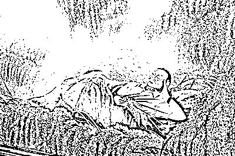

人生无论多少光彩荣耀，每个人内心所经历的痛苦都是一分一厘也少不了。在袁隆平的一生中也充满了各种无奈与不舍的别离，但还好他从未失去音乐的陪伴。音乐在我们痛苦的时候总是那一剂温柔的良药，永远抚慰脆弱的心灵。他曾在给母亲的信中提到：**还记得吗？1957 年，我从重庆的大学分配到这儿，是您陪着我，脸贴着地图，手指着密密麻麻的细线，找了很久，才找到地图上这么一个小点点。当时您感叹了口气说：“孩子，你到那儿，是要吃苦的呀……”我说：“我年轻，我还有一把小提琴。”**小提琴把音乐常留在了袁隆平的生命中，他在稻田里也可以拉起小提琴，也许只有音乐能将无形的痛苦消散在空气中。月海相位表达着灵魂对艺术的依恋，艺术对心灵充满魔力的疗愈力。

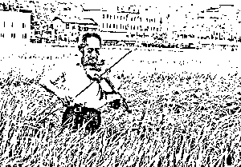

 | 在麦田里拉小提琴的袁隆平袁老星图中的日海、月海相共同描绘出他为何一生践行悲悯，无法停止为人类创造福祉。因为他早已将生命奉献给了整个世界，整个人类，从付出的爱中，他才能感受生命的安适与充盈。

**北交白羊座，勇敢的践行者**

袁隆平的出生星图中，金星合相天秤座的南交点，当天中午 12:06 金星进入天蝎座，和月亮一样都在经历变换的过程。无论金星在天秤座或天蝎座，它都与南交点处在合相容许度内，因此，它在强化着金星守护的南交天秤座，同样也为北交点白羊座带来了张力。

在袁隆平身上，我们能感受到关于南交天秤座天然的**友善、平和、温文**，这部分与袁老的母亲对他的影响不无关系——金星也是生命中重要的女性：母亲的另一面。母亲的知书答理带给了他天然爱与美的能力。然而，**南交点在进化的旅程中不仅有充足的天份，还有过度或无需再发展的意味。**也许正因如此，袁隆平必然从优渥的家庭，城市安适的生活投身到艰辛的农业研究中。

在建国初期，农村生活的艰辛非今日所能比拟。而水稻田间的泥泞、田埂的凹凸不平、烈日酷暑的炙烤都如同白羊座的表达：粗糙现实锻造出硬汉，在生命的战场挥洒汗水与热血。作为引路人、开拓者，袁隆平一生热血实践，哪怕暮年的他，站在田间也犹如少年般热情昂扬。在这里，他星图中不可忽视的日海合相其实在用隐晦的方式表达着**消隐的阳性能量**——杂交水稻最初的试验是去除水稻同株的雄性花，授以另一品种的花粉，让水稻基因改变、进化，从而超越原株的产量。海王星、双鱼座都关乎于**微小事物、微生物、基因**，肉眼难以看见的物质，而微小的变化所带来的巨大改变也是这组相位的另一种表达。雄性不育株是将水稻的阳性能量去除，也是对阳性能量换新的勇敢实践，这样的举动只是为了简单的生存——活下去！火星守护白羊座，火星是我们的意志力、行动力。而北交点白羊座是朝向现实的种种探险、尝试，敢于人先，勇于试探，遭受危险都不放弃。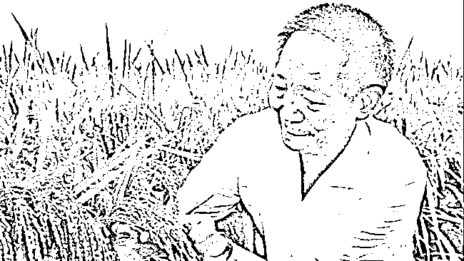

**土星重力，成就丰饶**

袁隆平的水稻在试验早期曾被人拔除，也曾因文革而暂停，无论遭受怎样的困难与阻碍，他都像斗士一样奋战在田间，亲自试验，直到生命的尽头。北交点的守护星火星落在巨蟹座，与摩羯座的土星形成紧密的对分相，土星摩羯座的压力正是让他成为共和国脊梁的那股现实动能。若不是生在粮食紧张的年代，若不是为着国民的生存而努力，恐怕他很难有机会去投入艰苦的农业践行中。 北交点守护星火星落在巨蟹座，意味着：**为食物而战，为了全国、全世界人民的餐桌幸福而奋斗**。由这样的动机助燃的白羊座的北交点，让袁隆平一生都朝向灵魂的目标精进前行。土星无疑是那股凝重、严酷的现实压力、劳作的艰辛、现实的阻碍，乃至早年经济、信息、生产材料、资源的匮乏。正是在土星压力之下，火星才必须放下属于巨蟹座的脆弱，用充满保护的情怀投入理想的奋战中。北交白羊座的激情、无畏与勇猛被火土的对抗力全然激发斗志、激情，袁隆平一生都没有停止过工作。北交白羊座与南交天秤座也微妙地演化着打破旧有的水稻生殖方式，从原始平衡中走出来，激发出更有生命力的产物。杂交水稻最初诞生于 1960 年，这一年袁隆平 30 岁，正值土星回归。那时的袁隆平是湖南湘西一所农校的的教员，他在试验田中意外发现的一株天然杂交水稻与其它水稻明显不同。60 年代，中国正面对境外强敌的威胁，国境之内正大面积饱受饥饿威胁。从此他更开始进入天然雄性不育的杂交水稻试验过程。袁隆平便立志用农业科学技术消除人类的饥饿，毕生最希望就是再也没有人挨饿。**土星既是现实的界限、生存的压力，更是帮助我们成熟、立足、扎根的原型能量。**袁隆平也和很多人一样，在土星回归的年纪确立了此生的使命，而这一扎根便是用尽了一生的力量。

**木冥巨蟹座，留世满仓粮**

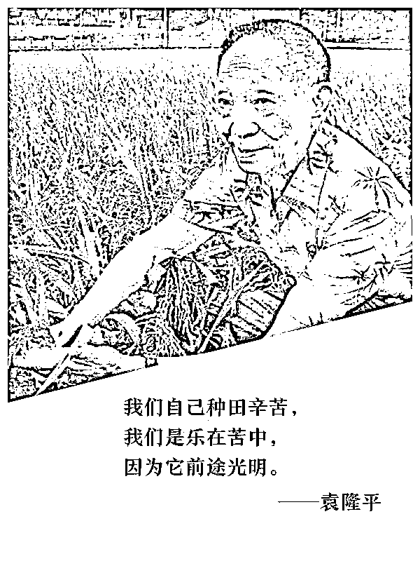

我们也需注意到袁隆平星图中的时代相位：**木冥合相巨蟹座**。他星图中强化的巨蟹座能量再一次让我们理解到**粮食、食物在他心中的重要性。**吃饭对他来说是如此重要。木星将对生存的信念扩张到了极致，并带入了转化的行动中去。木冥合相寓示着对生命深层资源的挖掘。金星与冥王星也在在星图中形成宽泛的四分相，但那些拥有掘金能力的人并不是毫不费力地得到金子的，而是通过艰苦卓绝的实践、转化才得到人生的财富。冥王星在星图中还四分了南北交点，在他所经历的 60 年代，死亡、贫困、饥饿曾紧紧抓住了人们，在生死与贫困的边缘挣扎，对饥饿、生存安全感的呐喊，袁隆平不得不从现实中找寻生机。最终，他通过冥王星的转化变现的“财富”就是：用全世界 7%的土地养育了世界上五分之一的人。
**离开，依然心怀民众**值得注意的是，在袁隆平离世的星图中，我们同样能看到**火星在巨蟹座，与他出生星图中的木冥合相**。这样的征象在表达着为着民众而生的信念不熄，袁隆平这颗伟大的灵魂似乎已许下生生世世的誓愿：为着滋养人类去燃烧生命。在他离世的那一刻，月亮在天秤座 2°，与双鱼座 22°的海王星处在对分相的出相位阶段，再一次，我们使用宽泛的容许度，让原型得以呈现。来时月海，走时月海，袁隆平用一生悲悯为人类消除饥饿。有人说，袁隆平带着梦的种子去了远方，留给了世界一片稻香。我们似乎更加明白了：“谁知盘中餐，粒粒皆辛苦。”从此，就让我们用好好吃饭，好好活下去，好好爱自己，珍惜粮食、土地和农作物来回报袁老伟大的爱吧。愿袁老在平行空间，在宇宙的另一端，禾下乘凉风，笑看禾稻，琴声悠长。

**版权声明：**原创文章由作者授权首发于若道平台，欢迎转发，反对抄袭。友号转载请申请白名单。

**郑玮玲**

ISAR（国际占星研究协会）认证占星师（2016 年获得）

若道占星专栏作者

将占星咨询、教学与音乐、舞蹈相结合的疗愈者

**微信号**：zhengviolin

**新浪微博**：@郑玮玲

**微信公众号**：Sampriya-Astrology

长按打赏

**系统学习占星学**

**点击图片了解详情**

**微信又双叒叕改版啦，不想错过若道君的推送？**

**就把若道设为星标吧！**

**▼**

就是这个“在看”，戳戳戳 ☟

******报名直达入口******

# 儿童节在即，精心编制了大半年的《幼儿报告》上线了！（内附分销指南）

> 原文：[`mp.weixin.qq.com/s?__biz=MzA5NjA0NTAxNg==&mid=2651445332&idx=2&sn=89add9dd264d5f3d6cd4ecde0871f6f1&chksm=8b4b6ae3bc3ce3f51062b1e4a65841f52d96b003854b786477530ac33f125cd1f443c9605821&scene=126&sessionid=1692737984#rd`](http://mp.weixin.qq.com/s?__biz=MzA5NjA0NTAxNg==&mid=2651445332&idx=2&sn=89add9dd264d5f3d6cd4ecde0871f6f1&chksm=8b4b6ae3bc3ce3f51062b1e4a65841f52d96b003854b786477530ac33f125cd1f443c9605821&scene=126&sessionid=1692737984#rd)

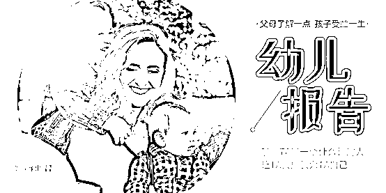六一前夕，若道筹备了大半年的《幼儿报告》终于上线了，这是国内第一个专门针对儿童的星图报告，帮助父母和养育者更好地认识和教养自己的孩子。在报告发布之前有两个多月的测试期，我们收到了不少父母的反馈，感谢我们的报告改变了他们对自己孩子的理解，而这正是我们期待看到的。**幼儿报告的缘起故事**为什么我的孩子有情绪问题？为什么我的孩子总是无法投入学习中？我觉得我的孩子太脆弱敏感，我该怎么办？……作为占星师，我们经常会在咨询里遇到焦虑的父母，想让我们看一看他们孩子的星图，解决他们困扰已久的教养问题。我们也常常能够通过星图的分析，帮助他们更理解和接纳自己的孩子，并看到孩子真正的需求和潜能。但到目前为止，来咨询孩子星图的仍然是少数人。我们遇到更多的是成年人的咨询，他们几乎大多数都有着令人痛心的原生家庭问题：在这些咨询者的童年成长环境中，父母并没有意识到孩子的需求，既不理解孩子，也缺乏自我认知，以错误的方式对待孩子。而这些在童年形成的创伤模式会一直持续到他们长大成人，成为他们的生活、工作、亲密关系中的阴影：有的人长期被父亲苛责、打压、忽视，无论怎样做都无法令父亲满意。长大后在工作中总是遇到苛刻的领导，挫败的经验，无法建立起自我和自信。有的人，父母以爱之名，对孩子有密不透风的安排和控制，不给孩子独立意志的空间，他成年后有很重的抑郁倾向，缺乏自我的生命动力。还有的人，长期目睹父母破碎的情感关系，成年后无法建立起良性的亲密关系。……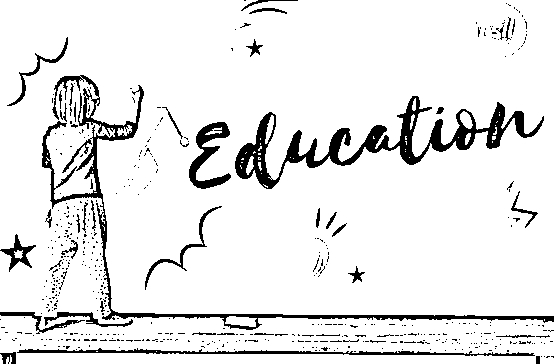**在儿童时期，我们的自我认知和评价都是依赖外界尤其父母的反馈。如果没有获得良性的反馈，我们真实的自我就会退缩到阴影中，产生无力的消极信念。**而这些早期形成的信念根深蒂固，会成为成人之后甚至伴随终身的阴影模式。正是因为看到太多惨痛的经验，促使我们产生了一个想法：如果能在孩子成长的早期，就引导父母去理解自己的孩子，支持孩子按照自己的天性成长，成为真正的他/她自己。那“受伤”的孩子就能够少很多，成年后带着创伤模式生活的人也会少很多，这是多么有价值的一件事。这也是若道做《幼儿报告》的初衷。在历时半年的写作过程中，我们经常会交换各自的案例经验，来验证报告的准确性。有一次讨论过程中，报告的主创者、资深占星师滴答没能控制住情绪，当场落泪哽咽，“我觉得那些孩子真的是太可怜，太不容易了”。作为月亮合下中天的人，滴答对孩子存有一片深挚的爱心。她看过很多的案例，包括她自己的童年成长经历，及对儿子的教养过程，都让她对“受苦的孩子”能够感同身受。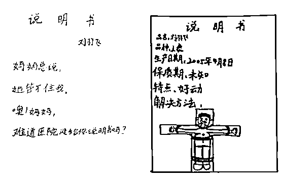**“父母的爱会造成偏狭，一叶障目、主观、盲目“**，滴答说，有一次一个单亲爸爸来咨询孩子的星图，滴答一眼看出来，父亲是把自己人生中没发展出的企图心，极其强烈地想要施加到孩子身上。孩子的星图中有很强的日火土的 T 三角，而父亲的北交合太阳天蝎在 10 宫。这个父亲恨不得自己的孩子就是一个瞩目的天才，给孩子施加很多的压力和期待，但父亲自己完全意识不到问题。大卫·瑞雷老师说，**父母真正的任务是帮助孩子发现如何做到富有创造力、成功地回应自我本能的喜好，从而增加孩子在人生中获得全面的满足感的可能性。**换句话说，**父母需要给孩子提供一个支持他们天性的成长环境，而不是以父母自己的意志去强加给孩子。**这也是我们对《幼儿报告》的定位：**帮助父母去真正认识自己孩子的天性，理解、接纳、支持他们。****理解和接纳我们的孩子**在报告初稿完成后，我们用了两个月的时间，找到很多父母进行测试。大多父母反馈报告帮助他们更加理解了自己的孩子。其中一个叫诚诚的小朋友，让我们印象深刻。他太阳巨蟹座，上升射手座，月亮射手座合上升，海王星四分月亮，冥王星对分太阳。他的妈妈告诉我，他有明朗积极的一面，也很会关心人。“但他太敏感了，总是动不动哭，这太让我们烦恼了”。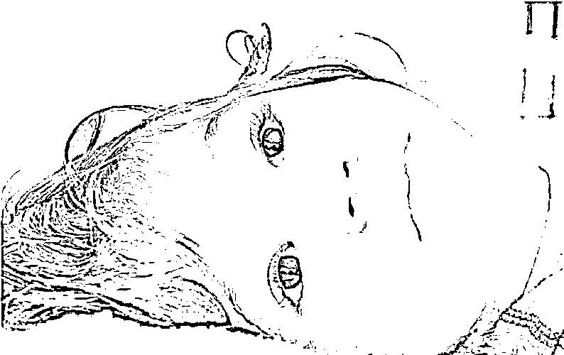诚诚的爸爸是一个软件工程师，标准的理科直男，他对儿子莫名的脆弱非常不耐烦，经常训斥儿子：“哪有一点男子汉的样子！”父亲彻底否定了孩子的自我（日冥）。为了“纠正”孩子”，他会凶孩子，要求孩子必须坚强，不许落泪。在看完诚诚的星图报告之后，妈妈有点懵，“原来他的敏感和脆弱是有原因的”。巨蟹座加上海王星能量的孩子，是需要更多的安全感与情感支持，帮助他发展出自己的直觉和灵感能力。而不是以某种父母的标准，或呆板的社会标准去要求孩子，抹杀孩子自己的天性。出生星图不仅能告诉我们孩子的天性，与生俱来的才华和挑战，同时也蕴藏了父母和子女之间关系的丰富信息，甚至父母的状况。诚诚的月海相位，在我跟他妈妈沟通之后发现，妈妈因为怀孕做了许多牺牲，放弃了自己渴望已久的升职加薪机会，但丈夫似乎并不理解也不在意。在孩子出生前后她一直有些幽怨。我问她：“你有没有想过，孩子的脆弱敏感，可能是与父母的状况相关联的？” 这个案例只是告诉我们，父母对于孩子常常是不理解的。虽然我们自认为很爱孩子，但其实可能连基本的接纳都难以做到，比如接纳一个敏感孩子的脆弱情绪。**在做《幼儿报告》过程中，我们最大的一个希望的就是，帮助父母去认识自己孩子的天性，去理解和接纳孩子本来的样子。这非常重要。****这份报告还能告诉我们什么？**我们在报告里希望提供这些信息：**· 你的孩子有什么与生俱来的天赋，又面临怎样的挑战？****· 他们内在渴望成为什么样的人？****· 在感到不安时，他们会如何追求安全感？****· 他们需要什么样的父母及环境，以更好支持他们的成长？****· 最适合他们的学习方式是怎样的？****· ·他们的兴趣点可能在什么领域？****· 如何应对他们的脾气与愤怒？**……每个孩子都有自己与生俱来的天赋才华，也带着与生俱来的考验。用大卫老师的话说，星图是最好的认识孩子的工具。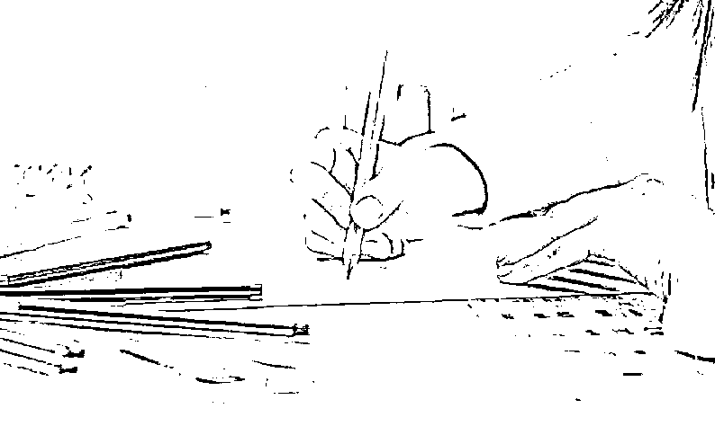你可以把每张出生星图看作一个剧本，当孩子出生时，剧本就给这个未展开的故事提供了情节框架。如果你会读这个剧本大纲，你就能够更好地帮助孩子走他们的人生旅程，让他们可以在一种天性得到支持的环境中长大。比如上文提到的巨蟹座的诚诚，他的敏感并不注定要非常脆弱，如果给他充分情感支持的环境，给他足够的安全感，能帮助他能发展出自己的直觉能力，通过直觉去做出正确的选择。他受到支持的温暖和同情心，同样会成为一种强大的个人力量。用滴答的话来说，**《幼儿报告》是一份基于中国的文化环境下，对身边孩子的观察认识，我们中国占星师自己写的一份对中国家庭，中国孩子的观察总结。**这只是一个开启，希望有更多的占星师加入进来，研究、收集案例，把这个项目持续深入研究下去。**如何获取《幼儿报告》**现幼儿报告已在若道平台上架发布，扫描下图二维码或者文章末尾点击**“阅读原文”**即可获取报告内容。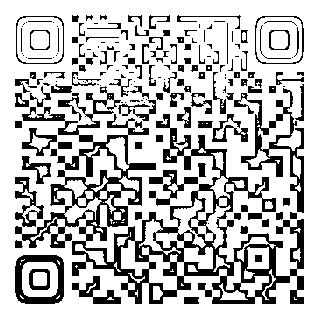扫码免费测算出生星图四元素分布六一期间，为回馈用户支持，购买报告用户，将可享受多重福利：
**①** 扫描二维码即可免费测算宝宝出生星图的四元素分布情况；**②** 原价 128 元，六一促销优惠价仅需 88 元；**③** 购买一份宝宝报告，额外赠送一份爸爸或妈妈的报告；**④** 购买报告用户可以免费参加价值 300 元的 “六一.占星学与亲子发展”系列讲座

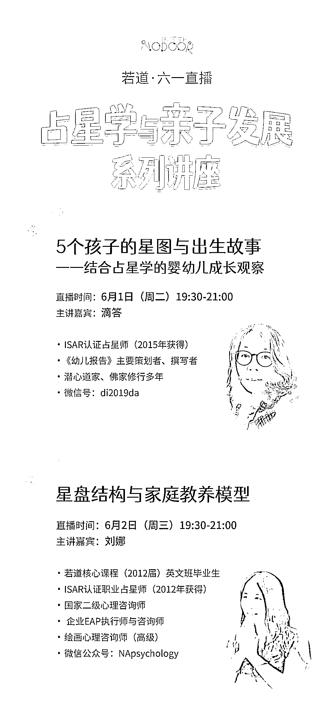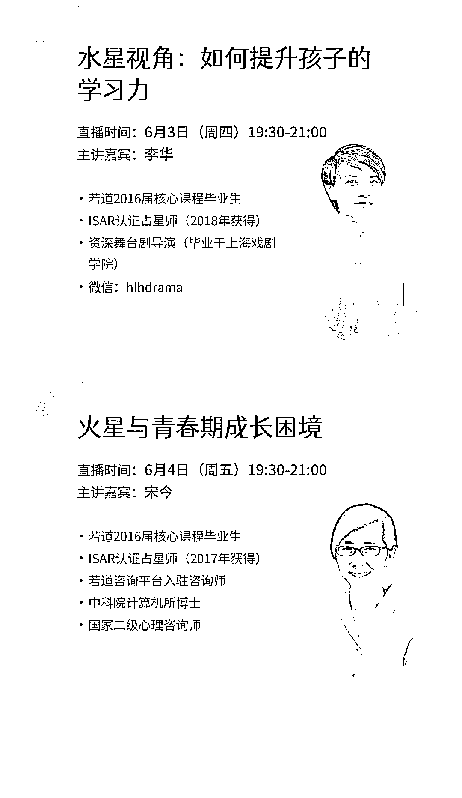

**《幼儿报告》分销合作伙伴招募计划**在 5 月 23 日报告上架后，我们收到了不少粉丝用户的反馈，说看了自己购买的《幼儿报告》后，感触颇深，受到 了很多启发，希望能够将报告分享给更多的亲朋好友。为回馈粉丝用户的厚爱，我们将推出《幼儿报告分销合作伙伴招募计划》，诚意邀请对《幼儿报告》感兴趣的个人或机构一起发力，让《幼儿报告》可以触达更多有需求的用户。**若道《幼儿报告》合作渠道****招募计划****· 合作内容**
若道《幼儿报告》产品分销**· 招募对象**《幼儿报告》主要面向 0-7 岁宝宝，对幼儿市场有兴趣或有资源的机构或个人均可报名申请，具有母婴市场分销资源的机构或个人优先。
**· 招募流程****1.** 有意向的机构或个人，添加渠道合作客服微信（nodoor201705），获取《渠道合作意向申请表》；**2.** 申请者填写《渠道合作意向申请表》，发送到指定邮箱（product@nodoor.com）；**3.** 《渠道合作意向申请表》审核通过后，申请者会收到合作渠道管理后台的登录地址、账号、密码；**4.** 申请者登录渠道管理后台，获取《幼儿报告》渠道专属的分销链接，并可实时查看分销的订单数据；**5.** 申请者每月 1 日可在渠道管理平台查看上个月的分销结算数据，并于每月 7 日前结算上个月分销收入。**· 渠道成长计划**《幼儿报告》分销渠道分为普通、初级、中级和高级四个等级，根据分销订单的累计销售额进行渠道等级的划分，不同的渠道等级对应不同的分销费用结算比例。

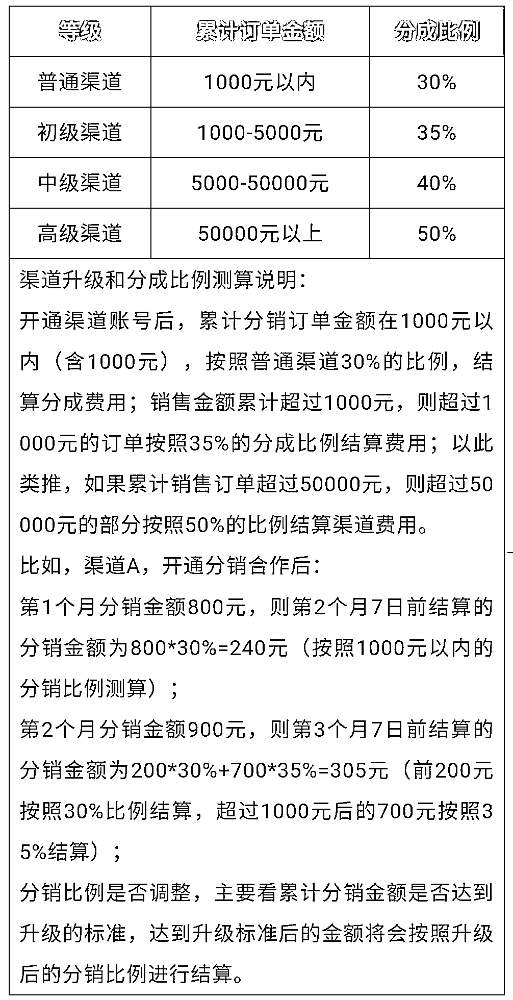

****点击阅读原文，购买报告****

# 2021 年 ISAR 考试结束，选修课联报优惠最后 1 天！

> 原文：[`mp.weixin.qq.com/s?__biz=MzA5NjA0NTAxNg==&mid=2651445275&idx=2&sn=efbfa54fc608c469712b64bffe03565e&chksm=8b4b6aacbc3ce3ba24d0c033ff65af012a3512324dee10d975584325358690dcbf15f7fffb22&scene=126&sessionid=1692737984#rd`](http://mp.weixin.qq.com/s?__biz=MzA5NjA0NTAxNg==&mid=2651445275&idx=2&sn=efbfa54fc608c469712b64bffe03565e&chksm=8b4b6aacbc3ce3ba24d0c033ff65af012a3512324dee10d975584325358690dcbf15f7fffb22&scene=126&sessionid=1692737984#rd)

**1**

****2021 年 ISAR 选修课套餐****

**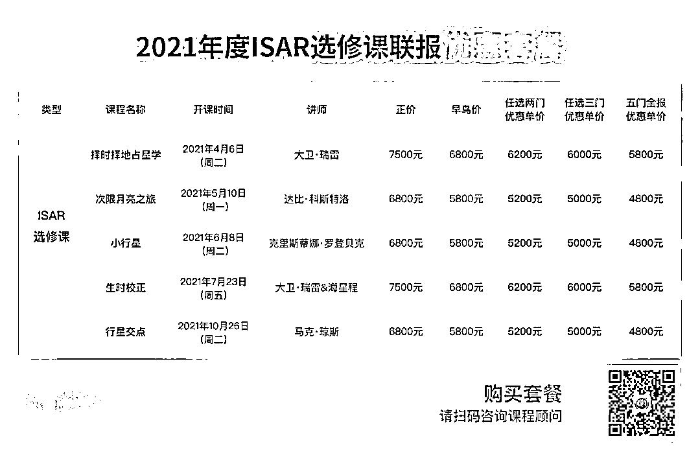**

**注意事项：**

❶** 本次联报优惠价格，不与其他优惠券、课程券、储值卡同时享受。**

❷ **本优惠套餐课程一经售出，不提供退课服务。**

❸ **本优惠套餐活动****5 月 26 日****结束，全部课程恢复原价出售。**

❹** 本优惠套餐活动最终解释权归若道星文化所有。**

**2**

**2021 年 ISAR 选修课简介**

**1**

**择时择地占星学**

**内容简介**

**择时择地占星学是占星学传统中的一个重要分支，也是占星师为客户提供的一个重要服务领域。**

宇宙天象在不停变化，就像潮汐一样。作为占星师的我们了解，每刻天象有不同意义。当我们有一个重要的事情要做，不论是企业选择开业、谈判、上市时间，还是个人选择面试、婚礼、手术、投资买卖时间，都好像选择在怎样的宇宙潮汐下开船。**适合的时刻就像孔明借到的“东风”，帮助我们顺风顺水，推动事情有个好开始及好的发展。**

点击图片链接，了解课程详情

**

**讲师介绍**

**大卫·瑞雷（David Railey）**

在过去 50 年中，大卫·瑞雷老师一直不间断为其客户提供占星咨询服务。他们中有国会议员、奥斯卡获奖演员、市长、企业家、工程师、天文学工作者、运动员、艺术家、大型活动组织者、导演、编剧、建筑师、心理咨询师等来自各行各业的人士。他们的年龄跨度，上至 80 岁老人，下至 10 多岁的青少年，均是大卫·瑞雷老师的客户。有些更是祖孙三代都是他的客户。

在 50 年的咨询生涯中，大卫老师为很多客户提供了大量择时择地服务，帮助他们安排人生中的重大事务，也因此积累了很多择时择地案例。

在这难得的 10 节课中，他将告诉你，他 50 年来成功为客户进行择时择地服务的秘诀。

**2**

**次限月亮之旅：人生故事的循环**

**内容简介**

**我们星图中的月亮描述了我们在婴儿期和幼儿期如何接受母亲的能量。**我们从一出生就通过它的反射体验母亲，就像月亮反射太阳的光一样。月亮也说明了我们所谓的灵魂——在时间和永恒之间，我们生活经验的内在反映。

月亮的行进通常被看作是预测和计时事件的一个因素，但它远比那更深刻和微妙。**当月亮穿过星座和宫位时，它反映了我们成长和发展的经历，唤起了我们个人的本性和人性。**对于那些既过着外在生活，也过着内在生活的人来说，它可以成为自我反省和内在营养的一个向导和启发性的维度。

**在次限月亮的课程中，我们将了解这面反映我们最深处本性的深刻镜子。**

*   出生星图中的月亮与它在童年的推进 

*   从 7 岁到 14 岁：从自己到他人

*   从 14 岁到 28 岁：从别人到自己

*   次限月亮与土星的推进

*   次限月亮与其他行星的相位

*   30-60 岁的次限月亮推进

*   60 岁以后的次限月亮之旅

*   次限月亮与次限太阳的关系

点击图片链接，了解课程详情

**

**讲师介绍**

**达比·科斯特洛（Darby Costello）**

达比·科斯特洛老师在波士顿学习占星学，在非洲待了 12 年，1983 年搬到伦敦。她在心理占星学中心担任了 25 年的首席导师，拥有文化天文学和占星术的硕士学位，并在全球各地教学、演讲和写作。她的全球客户是她作为占星家生活的核心。

**3**

**小行星如何增强和扩展占星学？**

**内容简介**

对于占星师来说，巨大的小行星带中有成千上万的滚落岩石在太空中呼啸而过，这似乎是一次令人生畏的雪崩，蕴含着潜在的新信息。因此，当你将它们整合到你的工作中时，辨别并正确理解每一颗小行星的意义是很重要的。包括选择小行星在星图的解读（出生星图或经世星图）增加微妙的细微差别和令人惊讶的细节，是无法从任何其他占星工具中获得的。

**在这门选修课中，老师将向你展示小行星们将如何卓越地提高你解读的深度和准确性。**

点击图片链接，了解课程详情

**

**讲师介绍**

**克里斯蒂娜·罗登贝克（Christina Rodenbeck）**

克里斯蒂娜·罗登贝克是一名全职职业占星师，在牛津大学城生活和工作，深受周围知识和文化氛围影响；她拥有伦敦大学（University of London）的人文荣誉学位，曾在伦敦占星学馆（Astrological Lodge of London）、心理占星中心和占星研究学院学习。

作为一名占星师，在过去的 20 年里，克里斯蒂娜在她的网站“牛津占星师”上写了大量关于时事、艺术和文化的文章。她每月主持一个占星播客：“与克里斯蒂娜和萨莉一起占星”，并定期在《占星杂志》(Astrological Journal)上撰写时尚专栏。她定期在英国授课，并保持着蓬勃发展的专业实践。

**4**

**生时校正认证课**

**内容简介**

生时校正是一个严谨而又细腻的工作，需要校正占星师同时具备熟练掌握出生星图解读和预测技能（三种主要预测方法：行运、太阳弧、次限）的基础上，整合这两项技能，**通过系统培训和训练达到准确分析和计算出客户的四轴度数，从而确定客户的准确出生时间。**

**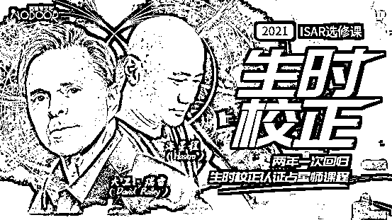**

**讲师介绍**

**大卫·瑞雷（David Railey）**

前 ISAR 全球副主席，前 ISAR 考试委员会主席，若道创始人。被称为占星界的“马可·波罗”，第一位将西方严肃占星学系统教学和多位西方占星学大师引入中国的西方占星师。第一位在美国用电视和广播媒体推广严肃占星学的职业占星师。培养最多中国职业占星师的老师。《灵魂的目标》、《一生的旅程》作者。研究占星 48 年，拥有三十多年的占星咨询的执业经验，其服务客户包括学生、工人、市长、州长、议会议员、企业家、心理咨询师、工程师、艺术家、演员、知名企业家等，客户年龄跨度从襁褓婴儿到耄耋老人（大卫老师的老客户常常是一家三代人）。

**海星程 （Hastro）**

国家咨询协会工商管理高阶注册咨询师；ISAR 国际占星研究协会职业资质认证占星师、若道认证授课老师。早期研习东方传统文化，后跟多名国际著名占星师研习现代占星学。2014 年通过 ISAR 职业占星师考试，获得职业占星师资质认证。2015 年若道首次“生时校正考核”中精准计算出大卫老师真实案例的出生时间而获第一名；2016 年和 2017 年连续两年若道核心课程高阶助教。2017 年若道生时校正课程助教，2019 年若道生时校正课程主讲之一。

**5**

**行星交点：探索行星交点的本质**

**内容简介**

**探索行星交点的本质和重要性**；木星、土星、天王星、冥王星和海王星的交点，及在出生星盘中的意涵；行星交点与个人生活、世界事件的集体原型；行星交点技法的应用指南。

****

**讲师介绍**

**马克·琼斯（Mark Jones）**

Mark 拥有超过数十年的治疗师和占星师经验，专注于过往生活分析和心理咨询，并为世界各地的客户提供占星咨询。作为一名认证进化占星师，Mark 每年在美国授课，也多次受邀参与北美各类占星大会和主题工作坊。著有《灵魂治疗：冥王星，天王星，和月亮交点》、《灵魂说：占星学的治疗力量》，探讨出生星图中隐藏的转化力量。

2021 年 ISAR 选修课套餐

**如果上述图片懒得点开仔细看，若道君在这里简单概括一下优惠套餐！**

也就是**任意两门**联报在**早鸟价**基础上再优惠**1200 元！****任意三门**联报在**早鸟价**基础上再优惠**2400 元！****如果五门全报**，在**早鸟价**基础上再优惠**5000 元！**

**如此优惠，还不速抢？**

**注意事项：**

❶** 本次联报优惠价格，不与其他优惠券、课程券、储值卡同时享受。**

❷ **本优惠套餐课程一经售出，不提供退课服务。**

❸ **本优惠套餐活动****5 月 26 日****结束，全部课程恢复原价出售。**

❹** 本优惠套餐活动最终解释权归若道星文化所有。**

**套餐咨询购买请联系课程顾问 Maggie 老师**

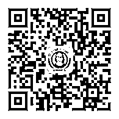

**祝大家在 2021 的春天种下一个占星梦想，努力耕耘，秋天收获 ISAR 认证证书。**

# 插班中 | 如何解读星图要素？这门课程一网打尽

> 原文：[`mp.weixin.qq.com/s?__biz=MzA5NjA0NTAxNg==&mid=2651445275&idx=3&sn=8a7bd209293547412210e75170b6c17f&chksm=8b4b6aacbc3ce3baad5455e0dc967b209d13b504751e69ab8207e8b9b37ee6a3fde92fd4d8a7&scene=126&sessionid=1692737984#rd`](http://mp.weixin.qq.com/s?__biz=MzA5NjA0NTAxNg==&mid=2651445275&idx=3&sn=8a7bd209293547412210e75170b6c17f&chksm=8b4b6aacbc3ce3baad5455e0dc967b209d13b504751e69ab8207e8b9b37ee6a3fde92fd4d8a7&scene=126&sessionid=1692737984#rd)

占星学这门古老的学科，历经了历史长河里的起起伏伏，也直面了现代科学的质疑与探索，依旧陪伴在我们身边。时至今日没有消亡，反而以不同的方式进入现代人的生活，述说着时代的语言，疗愈现代人的心灵。

占星学是一种符号语言，它为宇宙无形的力量穿上了意象的外衣。这使我们可以与不可见的世界交流，将不可见变为可见。

由此，它提供了一面镜子，在这面镜子中，个体经验被看做是更大模式的一部分。占星学核心的生命理念是：在我们居住的宇宙中，万事万物都相互关联、生机勃勃，我们是这个宇宙的参与者。我们常说占星学是一种个人成长的工具， 如何运用占星学来实现自我成长呢？

**1. 占星学可以帮助我们了解自己的天赋与潜能**

非常喜欢的格言是：“性格即命运。”个体的智力和才华有着丰富的类型，有的人的天赋显而易见，比如擅长绘画、写作、运动或者歌唱；有的人的天赋需要更长的时间来探索和接纳，比如善于倾听、善于交流或者善于带动气氛等等。占星学可以帮助你认识自我，找到人生的养份。 

学习占星学还可以让我们慢慢养成随时保持“觉知”的习惯，每时每刻知道自己是谁，在哪里，在做什么。遇到问题时不是去质问结果，而是去寻找根源，发现和开发自己的潜能。

**每个人都有自己独一无二的潜质、能力和局限。我们通过选择获得权力。而占星学是帮助我们了解这些信息的工具。**

**2.占星学可以帮助我们了解人生的轨迹**

**占星学能够帮我们迅速发现成长过程中形成的思维模式和行为模式。**

客户在咨询结束后会对占星师说，感觉你是心理医生，和你聊一聊，心情就好了很多。如果没有星图的帮助，单纯只是心理咨询，可能我们需要花上更多的时间才能发现问题的根源。有了星图的帮助，我们可以很快地知道，我们的人生在哪里出了问题，我们可以如何去改进，从而过好我们的人生。

**占星学能够帮助我们了解人生的轨迹。**透过一张出生星图，我们可以看到个人生命循环模式，以及外行星在人的一生中可能带来的生命挑战和转机。

通过对人生不同阶段行进的把握，我们可以提升自我觉察，知道什么时候该进、什么时候该退、什么时候该抓住、什么时候该放手。人生漫长，与其盲目地、惴惴不安地前行，不如把握住生命的节奏，安然过好每一天。

**3. 占星学能够帮助我们抓住时机**

我们经常听到“时机就是一切”的说法。如果能知道当下正处于一个周期的哪个阶段，这对我们是非常有利的。机会来来去去，除非我们伸手抓住它们，否则它们只会擦身而过。如果我们能更充分地理解我们通往本真、成为真我的旅程，我们将获益良多。而占星学的符号语言正是帮助我们选择在对的时间做对的事的一个工具。

**4. 占星学可以帮助我们更有效地面对人生**

**占星学能够帮助我们更有效地过好一生。**了解自己的天赋，把握生命的轨道，可以让我们不再盲目和急躁。我们不会在坏情绪里面浪费时间，不会去做无用功。

**我们知道顺境和逆境都会在某个周期结束的时候停止。**我们也会知道让我们摔跤的模式是什么，从而在下一个周期来临的时候做好准备。我们不会在同一个坑里跌倒无数次，在命运的滚滚车轮下头破血流，还负隅顽抗。我们对于挫折和机会更有觉知，而不是在自怨自艾中虚度一生，或者在得意忘形中浪掷时光。就像苏·汤普金斯老师的著作《顺逆皆宜的人生》一样，享受顺逆皆宜的时光。

**5. 占星学可以帮助我们理解和接纳生活**

**占星学可以帮助我们更加宽容地对待他人和世界。了解个体的差异性可以帮助我们消除偏见。**

每个人都是带着自己既有的性格特点和思维行为模式出生，从星图上能看出我们的父母是如何对待我们的，我们的成长环境、我们的情感特质、我们和他人的互动模式、我们的事业路径、我们人生路上会遭遇的困难和挑战。意识到这一点，我们就没有理由迁怒或者归罪于他人和社会。

要知道，是我们自己的特质吸引来了能够帮助我们发现问题、解决问题的人和事。越是讨厌的人和讨厌的事情，越像一面镜子，能够照亮我们心底隐藏的阴暗面。而我们能不能经由这些获得成长，就要看我们是否有勇气去接纳和面对它们。

这就是占星学为什么有价值的原因。因为它能帮助我们互相理解。它让我们感到快乐，因为我们认出了自己，感觉到被理解。我们更能理解我们的朋友了；我们也更能理解我们的生活了。**通过这种接纳和快乐的感觉，我们就更能敞开心扉去拥抱生活。如果你对生活更加敞开，就更能创造一个更有成就感和满足感的生活。**

**6. 占星学可以帮助我们不断拓展认知边界**

占星学是很棒的意识进化工具。它的原型概念覆盖了头脑能理解的各个层面，它的体系完整又开放，使它可以和其他东西方知识体系中的内容相融合。它帮助我建立起一个意识结构，之后无论现实或书本中的领悟和理解都可以在其中各就其位并有机地互相关联。

**你会在持续的学习占星学的过程中不断地推翻陈旧认知，开拓视野，一再重新认识自己及世界，甚至会改善个人的学习方法。**

**7. 占星学可以帮助我们联结宇宙，探索灵魂的奥秘**

**占星学能够帮助我们了解到自己是独一无二的个体，同时也是这个世界的一部分。**

虽然最早的占星学书面记录可以追溯到大约公元前 2000 年的美索不达米亚，但它更深的起源其实可以追随到史前。人类本能地被天空吸引，这不仅表现了宇宙的神秘力量，也揭示了神的智慧与人类生活的各个面向相互影响着。当你默默注视着布满繁星的夜空，很容易升起一种对永恒时间的敬畏感。

发现自己的天赋，贡献自己的力量，这才是完整的循环。给自己和世界之间树立一面高墙，并不能让你变得更有力量，也不会对世界有任何影响，反而会阻碍你去认清世界的真相。**占星学可以帮助我们探索我们的灵魂，和更大的宇宙智慧相连，从而找到自己的人生使命。**

**苏·汤普金斯老师（Sue Tompkins）**

****

**英国目前最资深的占星学家和咨询师之一，她拥有超过 40 年的占星经验，是占星学习者必备的两本圣经《当代占星研究》与《顺逆皆宜的人生》的作者。她还是伦敦占星学院的创始人。****她以自己的冷幽默、抽丝剥茧的研究天分和占星直觉而闻名。她是一名执业占星师，也是一名顺势疗法医师，是心灵和身体的敏锐诊断专家。****2003 年，为表彰其卓越贡献，英国占星协会为苏·汤普金斯授予查尔斯·哈维（Charles Harvey Award）终身成就奖。****咔咔老师（Caroline）**

********

**2017 年第一届苏·汤普金斯核心课金牌助教、2019 年第二届核心课中与苏·汤普金斯老师联合授课的 ISAR 认证占星师咔咔。****作为最熟悉苏·汤普金斯老师教学风格的中文占星老师，咔咔老师将在 2021 年第三届苏·汤普金斯核心课中负责教授部分课程，帮助学员更好地梳理知识架构,了解学员的学习进度和疑问，补充丰富占星咨询的中国案例。**

1

**课程安排是怎样的呢？**

**第*****1*****阶**2021 年 3 月 15 日开课，每周一晚上 20:00-22:00 上课，共 4 次课**第*****2*****阶**2021 年 4 月 12 日开课，每周一晚上 20:00-22:00 上课，共 4 次课**第*****3*****阶**2021 年 6 月 7 日开课，每周一晚上 20:00-22:00 上课，共 15 次课

2

**1-3 阶你将学到什么？**

**第*****1*****阶  黄道星座**

· 概要介绍占星学与星图· 四元素与三形态· 黄道 12 星座

**第*****2*****阶  行星**· 太阳、月亮及其他行星· 练习将它们组合在一起

**第*****3*****阶  宫位、相位以及初步解读星图**· 四轴与宫位· 相位概论· 困难相位· 柔和相位· 数字练习，练习寻找相位· 容许度，出入相位· 相位模式· 将它们全部组合在一起· 解读的基本原则，权重，失衡· 如何解读一张星图……丰富的案例，包括学员的案例

3

**想更多了解导师？**

******苏·汤普金斯（Sue Tompkins）****英国目前最资深的占星学家和咨询师之一，她拥有超过 40 年的占星经验。**占星学习者必备之两本圣经**《当代占星研究》**和**《顺逆皆宜的人生》**作者。2003 年，为表彰其卓越贡献，英国占星协会为苏·汤普金斯授予**查尔斯·哈维终身成就奖**。苏同时是一位接受过心理学与心理咨询训练的注册顺势疗法医师，并经常在英国、法国、挪威、瑞典、澳大利亚等地公开演讲，教授占星学。**苏以实际、生动而幽默的风格闻名于世**，她的教学经验非常丰富，能够胜任从教授入门课程到对毕业生进行督导等针对不同占星程度学员的教学工作，这得益于她多年累积的教学经验。她曾在地方公立学校以及在英国占星研究学院(FAS)教学 19 年， 1986 年-2000 年任学院院长并负责现场教学的所有事务，并于 2000 年创立伦敦占星学院这所声誉卓著的专业学府，并经常在世界各国教学，具有丰富的教学经验。2000 年，英国占星研究学院授予其研究员职位，以表彰她为学院做出的突出贡献。**占星师咔咔（Caroline）**2010 年师从美国占星师大卫·瑞雷学习，并向斯蒂芬·弗里斯特、罗伯特·汉德、苏·汤普金斯等世界名师学习各种占星学技法。若道首届学员，国内最早获得 ISAR 职业占星师资质的职业占星师之一，现兼任若道核心课程助教。在国际知名广告公司和市场研究公司从事的市场研究和推广工作十余年，曾任职于阳狮集团、尼尔森市场研究有限公司、MTV 和《Madame Figaro》杂志。

**助教王嘉祺 （Conrad）**ISAR 认证占星师，具有若道认证生时校正资质，从 2010 年开始学习占星学，2015 年开始在若道系统学习，并开始个案咨询。2018 年担任若道核心课程助教，以及选修课卜卦占星学和太阳返照课程助教，并带领学员进行经世占星学和太阳返照方面的研究。2019 年 11 月作为演讲人之一参加了 ISAR 北京大会，也是 ISAR 星空俱乐部中国区第 16 期的主讲人。

4

**选择若道学习占星学还有哪些优势**

**运用自由意志，扭转破坏性模式，绽放天赋潜能**若道是人本主义占星学的旗手。因为我们相信，**人通过了解模式、觉察习性、积极疗愈、终将释放其潜能，与命运共舞**。

**进入国际权威职业占星师认证的快车道**

占星界的“联合国”ISAR（国际占星研究协会），是具有全世界影响力的占星教学和研究组织和职业占星师全球认证机构，认证占星师遍布 45 个国家。**在 ISAR 的 19 所附属学校中，大中华地区的附属学校只有若道一家**。在国际化的教学理念大纲标准下，**若道毕业生在 ISAR 国际认证占星师的考试通过率多次位居全球首位**。

**十年占星学教育中国本土化教学经验**

**根据中国学生的学习习惯不断优化占星教学体系，让学员学成后更自如地应对本土咨询市场的需求。**学好占星学不仅仅需要邀请一两位老师教学，更需要对教学难点有充分了解，且有持续的教学跟进服务。**10 年来多次核心课程和各种专题课程的教学，让若道非常了解中国学生学习占星学的难点和卡点，合理有效地拆分、提炼课程知识点，同时也积累了丰富的国外老师和中国老师、助教紧密配合以及课程顾问密切配合教学的经验**。若道还专门开发了有助于占星学习的“**若道**”APP，每门课程都设有答疑板块，学员能够方便快捷地提交问题，助教及时答疑解惑和批改作业。**融入中国顶尖的职业占星师群体**若道是中国职业占星师的“黄埔军校”。职业占星师的培养从若道开始，**进入若道，你就走进了中国顶尖的职业占星师群体，和一群志同道合的师兄师姐联谊，获得经验，共同成长**。**多种奖学金支持**为了鼓励学员不因为暂时的经济困难而放弃学习，我们特意设置了各种**技能交换和奖学金**。对于有一技之长的学员，我们推出了**“笔译”、“笔记整理”、“平面设计”、“课本朗读”、“班级服务”**等技能交换项目。

而对于努力学习、出勤率高、完成作业率高的学员，我们设置的**土星奖、木星奖**等各种奖学金在等着你。为了感谢帮助我们推荐学员的老学员们，我们设置了“**老学员推荐奖**”。对于通过问卷提建议，帮助我们提高服务的学员，我们也设置了相应的奖学金。ISAR 中国还设置了国际会议奖学金，符合条件并通过甄选的申请者最高可获取 5000 元奖学金。

当美好的知识遇上奖学金，你可以在学习旅途中直挂云帆，乘风破浪。**开启占星咨询的职业规划和支持**

若道为占星学员搭建了占星问答平台和占星咨询平台，并提供严肃占星学影响力最大的媒体平台，全力为毕业生提供宣传渠道，帮助你吸引和积累咨询生涯初期的种子客户。若道为学员开发了适用于占星学习的“若道”APP，并不断更新完善。

**①  微信平台**若道微信平台作为业内颇具影响力专业平台，为文笔好的若道毕业生提供传播占星学并免费宣传自己的机会。有的学员因为文笔获得众多粉丝喜爱，在 3 年多时间积累起 2000 多人的潜在客户。**②  问答平台**若道问答平台帮助学员接触客户的实际问题，并在毕业前就进行演练答题。自问答平台 2016 年上线运营以来，学员接触到 3200 多个问题， 回答问题最多的学员在问答平台收入达 5 万多元。**③  咨询平台**若道咨询平台是我们为优秀毕业生所搭建的平台，帮助毕业生在自己的咨询拓展之外，用若道提供的平台扩展咨询客户群。自咨询平台 2017 年 8 月上线运营以来，咨询平台共入驻 65 人，收入最高者达 32 万元。此处所列学员收入仅供参考，收入高的学员和其专业水准、努力程度密切相关。若道平台尽其所能将自己定位为辅助学员开展职业生涯的桥梁。**在 10 年的占星教学耕耘后，两位创始人——大卫·瑞雷及蒋颖再次邀请苏·汤普金斯老师开设占星核心课程。**

5

**此次课程适合哪些人？**

*   对占星学感兴趣，想要入门的零基础者
*   占星学小白，但有志成为职业占星师的人
*   有一定占星学基础，但不知道该如何整合星图复杂碎片的人
*   希望成为优秀的占星师，想要借鉴国际大师解读思路并融入自己的体系的人
*   苏·汤普金斯的粉丝，学过占星学，但就是想跟着偶像再学一遍的人
*   走在自我探索和个人成长道路上的人

6

**占星业内推荐**

**苏·汤普金斯的《顺逆皆宜的人生》令人赞叹！苏是一名倍受爱戴的老师，并且任教多年。苏以自己的冷幽默、抽丝剥茧的研究天分和占星直觉而闻名。她是一名执业占星师，也是一名顺势疗法医师，是心灵和身体的敏锐诊断专家。**** ——法国心理占星学协会会长琳恩·贝尔**

7

**苏汤班学员评价**

8

**苏汤老师水瓶座试听课**

（温馨提示：手机请注意流量）

📹 [`v.qq.com/iframe/preview.html?width=500&height=375&auto=0&vid=p3210llaq7f`](https://v.qq.com/iframe/preview.html?width=500&height=375&auto=0&vid=p3210llaq7f)

9

**课程价格**

**L1-3**：13200 元**（联系童老师，获得优惠价）**其他各阶课程单报价格，请咨询课程顾问：童老师（微信：196267205，请备注**“苏·汤普金斯核心课”**）长按二维码添加童老师

10

**授课时间**

**2021 年 3 月 15 日（周一）20:00-22:00 开始，网络课程**

11

**退转课程**

**退款原则请详看《教学协议》，如有疑问请咨询课程顾问**。

****苏·汤普金斯金牌核心课程 L1-L3****

**授课老师：苏·汤普金斯**

**授课时间：**2021 年 3 月 15 日起

**授课方式：**网络课程**，**英文授课，中文翻译

**费用：**13200 元**（联系童老师，获得优惠价）**

**课程负责人：童老师**（微信：196267205，请备注“苏·汤普金斯核心课 L1-L3”）

长按二维码添加课程负责人咨询~

****报名请点击“阅读原文”****

# 射手座月食 | 月全食+超级满月，2021 年最混乱的阶段！

> 原文：[`mp.weixin.qq.com/s?__biz=MzA5NjA0NTAxNg==&mid=2651445275&idx=1&sn=7d32ae76e353544574a0c9f92dc64a75&chksm=8b4b6aacbc3ce3ba3a347f5145899be64f1282df15e9651a2a08735e799cb770b3cb95fb7cf9&scene=126&sessionid=1692737984#rd`](http://mp.weixin.qq.com/s?__biz=MzA5NjA0NTAxNg==&mid=2651445275&idx=1&sn=7d32ae76e353544574a0c9f92dc64a75&chksm=8b4b6aacbc3ce3ba3a347f5145899be64f1282df15e9651a2a08735e799cb770b3cb95fb7cf9&scene=126&sessionid=1692737984#rd)

****☆ **后台回复“今日”，给你一句生命态度**

作者/王芝桦 编辑/玫瑰 图片/全景网

**射手座月食****北京时间 2021 年 5 月 26 日 19:13 迎来射手座满月，双子座太阳与射手座月亮于 5°25′精准对分**，并与位于 11°的“射手座南交点-双子座北交点”轴线紧密靠近，形成射手座月全食；同时，由于**射手座月亮位于近地点**，故而此次射手座月食也是一次**超级满月**。月食将满月的“完结能量”呈数倍放大，整个影响周期长达 3-6 个月之久，而月食发生时间的前后 18 天也是“完结能量”推动“现实事件呈现结果”的高峰时间；超级满月发生在近地点，在我们从地球观赏又大又圆的月亮的同时，月亮也敞开强劲的能量通道照亮我们的心灵。

此次射手座月食，带来罕见的**“月全食”和“超级满月”**双剑合璧的能量巅峰。在最近连续不断的重磅新闻扑面而来、混乱不堪的现实状况令人彷徨的当下时刻，宇宙透过层层迷雾，对我们说：“迷茫和无力的时候，听听神怎么说。”

此次射手座月食的行星能量传导：

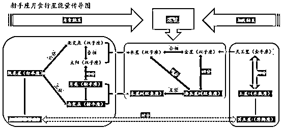

> **射手座月食重点影响人群**
> 
> **参考新月峰值影响期间各个行星的行进度数，以及逆行行星的轨迹影响；常规容许度，个人行星入相位 3°，出相位 1°；非个人行星入相位和出相位均为 3°。**
> 
> *   出生星图中，有**行星、四轴、南北交点**落入**固定星座（金牛座、狮子座、天蝎座、水瓶座）3°-16°**的人群。
>     
>     
> *   出生星图中，有**行星、四轴、南北交点**落入**变动星座（双子座、射手座、处女座、双鱼座）0°-14°,18°-26°**的人群。
>     
>     
>     
>     
> *   出生星图中，有**行星、四轴、南北交点**落入**基本星座（白羊座、巨蟹座、天秤座、摩羯座）17°-30°**的人群。

**宙斯和凯龙，“神”的伤痛与转化**

****

**我们看到的宇宙之所以如此是因为不如此我们便不存在。****——斯蒂芬·威廉·霍金 《时间简史》****天象**

**· 射手座月亮介入“南北交点”轴线：**射手座月亮合相射手座南交点，对分双子座北交点；

**· 凯龙星介入“南北交点”轴线：**白羊座凯龙星三分射手座南交点，六分双子座北交点。

火象元素、变动模式的射手座是黄道十二星座中排在天蝎座之后的第九个星——**在历经天蝎座象征的“死亡谷底”的生灭与顿悟之后，射手座在精神世界升起觉悟并不断探索，最终超越了必死的肉体形式，进入“神圣之光”，成为“永恒之神”。**

**1. 宙斯的伤痛与转化**

射手座的守护行星是木星，希腊神话故事里，木星的主宰神是第三代天神，“众神之神”宙斯。宙斯推翻父亲克洛诺斯（土星的主神）继承王位，离不开他的母亲瑞亚的谋划与助力。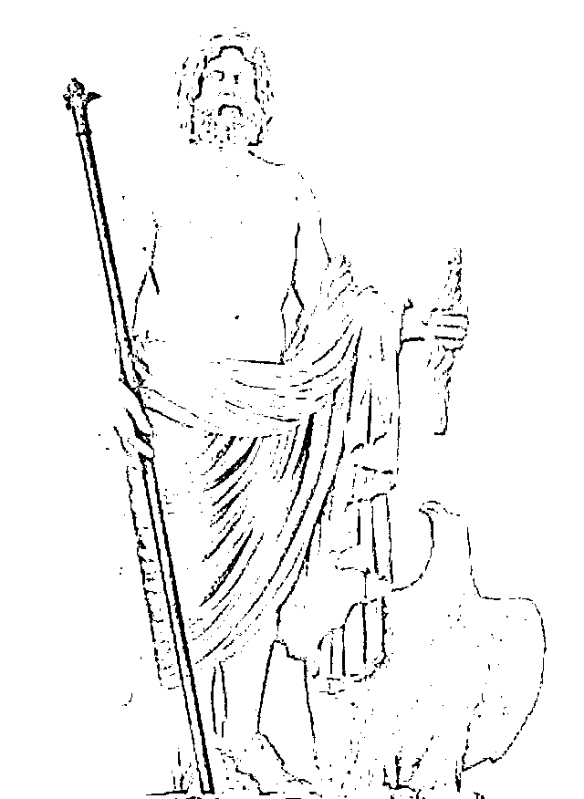| 宙斯宙斯娶了他的姐姐赫拉，赫拉成为神界的“天后”。宙斯与赫拉的婚姻故事众所周知，宙斯风流成性，不断出轨且私生子无数，赫拉时刻侦察、迫害情妇并追杀私生子。（请超越人间伦理阅读希腊神话，请勿执着，请勿模仿。）“众神之神”宙斯本来是位慷慨大方、酷爱自由的血性男儿，但母亲和妻子却不断地插手安排他的命运。亲情和婚姻充满了“道德的正确”和“应该的约束”，不能违背，不能解约。故而不愿做妈宝男和妻管严的宙斯，一直用风流浪荡的方式，与助他夺取权力的母亲、助他巩固权力的妻子做着博弈，抗争“命运的锁链”，夺回“命运的控制权”，也正是这种抗争和夺回的强烈意愿，驱动着宙斯迸发出“超越性的理想，坚定性的信念”。

**2. 凯龙的伤痛与转化**

射手座也称为“人马座”。神话故事中射手座的原型名叫凯龙，是宙斯同父异母的兄弟。因其形象上半身是人、下半身是马，故而一生下来就被母亲嫌弃丑陋并遭到遗弃，且只能屈居于“半神”的地位——**“天然的羞愧”是凯龙的第一个伤痛。****** | 凯龙凯龙被宙斯的孪生儿女阿波罗（太阳的主宰神）和阿尔忒弥斯（月亮的主宰神）养大，并教其艺术、预言、射箭和医药等知识。后来，凯龙成为誉满天下、慈悲仁德的“先知和医者”，教养了众多的英雄和神。但是，凯龙的命运相当的悲惨：一次，凯龙被“大力神”海格力斯的毒箭误伤腿脚，不要忘记，凯龙屈居于“半神”就是因为下半身是马，故而中了毒箭的仁慈医者凯龙也治不好自己的剑伤，以致下半身的凡胎终日受苦，但上半身的神胎却要服务众生——**“不能疗愈的伤痛”是凯龙的第二个伤痛。**最后，凯龙代替被囚禁的普罗米修斯到地狱受死，宙斯将其升上天空成为射手座，使其超脱痛苦并重获永生。这部分情节也对应着运行在土星和天王星之间的小行星“凯龙星”，寓意着**“现实的限制与解脱的自由”之间的痛苦演化**，代表着**“有限的时间与无限的空间”之间的联通桥梁。**

**3. 光明与黑暗，一体两面的转化**

射手座一直给人乐观、幽默和慷慨的印象，他在高耸的山顶上高瞻远瞩，他在精神的长河中热情探索，但如果没有宙斯和凯龙两个神话意向所揭示出的“伤痛带来转化的动力和超脱的契机”，就不能成就射手座的“精神觉悟和不朽灵魂”。此次射手座月食，射手座月亮合相射手座南交点，白羊座凯龙星三分射手座南交点，将南交点所揭示出来的“业力功课”指向宙斯和凯龙的神祗，引领我们重温射手座的“沉重伤痛”：· 每个人的生命之内都有宙斯“命运的锁链”，那些正确的标准，应该的约束，将我们囚困其中，于是我们时常一边拖着陈旧的经验，一边又与陈旧经验带来的束缚互相撕扯；· 每个人的生命之内都有凯龙“被拒绝和被嘲讽的羞愧，曾挫败和曾跌倒的伤痛”，于是我们一边增长着人生的经验，一边又对未知的旅程心生恐惧和望而却步。我们需要了解自己生命之内的“障碍”究竟是什么——**被陈旧的经验束缚，又放不下对陈旧经验的依赖与惯性；渴望自我的勇敢与独立，渴望突破限制和超越困境，又因曾经的“羞愧与伤痛”恐惧未知和踌躇不前。**但是，**只有呆在痛苦之中，才能学会“与痛苦相处”。****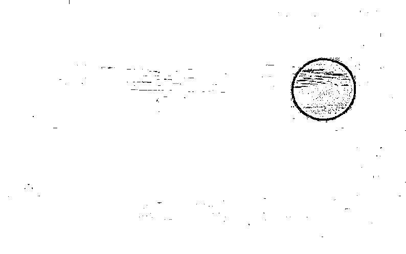**我们需要通过“内在的伤痛和现实的困境”思考生命——灵魂渴望着，生命努力着，但为什么宇宙中的“神”好像看不见我们的渴望与努力，而我们却看见了内心深处的无力感——之所以我们看到的宇宙（内在和外在）如此痛苦，是因为**不如此痛苦，我们便不会站在这里，便不可能完成超越和进化。**此次射手座月食也将引发**国际贸易、宗教法律、教育系统和慈善领域等方面的政策性消息或突发性新闻**，而**国际社会的领导人或重磅人物也有敏感性事件或变化性消息传出。****了解“神”的伤痛，学习“神”的智慧**

****

**宇宙中的物质是由正能量组成的。****——斯蒂芬·威廉·霍金 《时间简史》****天象****· 木海互容：**双鱼座木星与双鱼座海王星形成“木海互容”结构；**· 水金合相：**双子座金星紧密靠近双子座水星，形成不算精准但能量交叠的合相结构；**· “水海四分”和“金海四分”：**双子座水星四分双鱼座海王星，双子座金星四分双鱼座海王星。最近几天，一系列新闻事件带着轰隆隆的巨响而来，而 5 月 22 日无疑是最令人悲伤的一天：云南大理和青海果洛的强级地震，两位功勋国士千古全国举哀，大连轿车恶意撞人，甘肃马拉松选手遇难……国际层面也爆出 BBC 骗访戴安娜王妃，比特币大幅度下跌，刚果火山吞没城镇的相关信息。几乎所有人都在问：“最近这是怎么了”。我们顺着时间线，梳理一下最近一段时间的天象影响。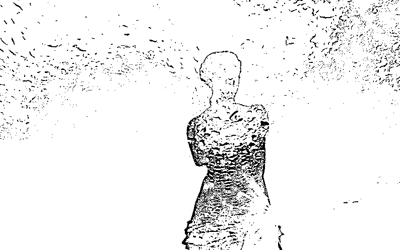

**1. 月食前的混乱**

5 月 14 日，木星进入双鱼座，旋即与海王星形成“木海互容”结构（木星和海王星同时守护双鱼座）。**5 月 14 日-7 月 27 日**，木星行进双鱼座期间，“木海互容”结构成为宇宙大背景，**一方面激发着我们内心的理想与热望，另一方面也触发出理想化、不着地、过度乐观和过度膨胀的风险。****5 月 23 日**，即将于 5 月 30 日开始逆行、从 5 月 15 日已进入逆行前影响期的双子座水星，与双鱼座海王星第一次形成**“水海四分”**结构（**第二次 6 月 6 日，第三次 7 月 6 日**），同时联动**“木海互容”**结构的能量。**木星**与**国际贸易、重磅人物和财富涨跌**有关，**海王星**与**水域潮汛、地壳运动和虚假消息**有关，**水星**与**沟通、流动和计划**有关，双鱼座就像足以隐藏和吞没一切的海洋，而双子座就像飘来飘去且毫无章法的坐标。不难理解 5 月 22 日一系列混乱和悲伤的事件。**5 月 23 日同天，土星于水瓶座开始逆行。**土星这颗代表“时间法则”和“现实规则”的行星发生逆行，提示我们看向时间的沉淀，以及未来 5 个月的功课：**·** 进入 2021 年以来，我们一直在“保守与创新”的磨合之中努力前行。现实中出现的考验和困顿，令我们感到“突破和转化”的艰难，但同时也在我们坚持挺过之后看到自身的成熟和超越。但，我们依然时时陷入迷茫感和无力感，对未来和未知充满恐惧和焦虑；**·** 行进在土星和天王星之间的凯龙星（凯龙，射手座的神话原型）教导我们——“现实的限制与解脱的自由”之间的演化过程“痛苦是必须的”，因为只有当我们在痛苦的心灵洞穴里呆够了，“独立和勇敢”才会跳出来，解锁限制，重获新生；**·** 此次射手座月食不是偶然，宇宙正在帮助我们“加速和终结”呆在心灵洞穴里的时间；而“突破和转化”，就从我们直面恐惧和接纳痛苦开始。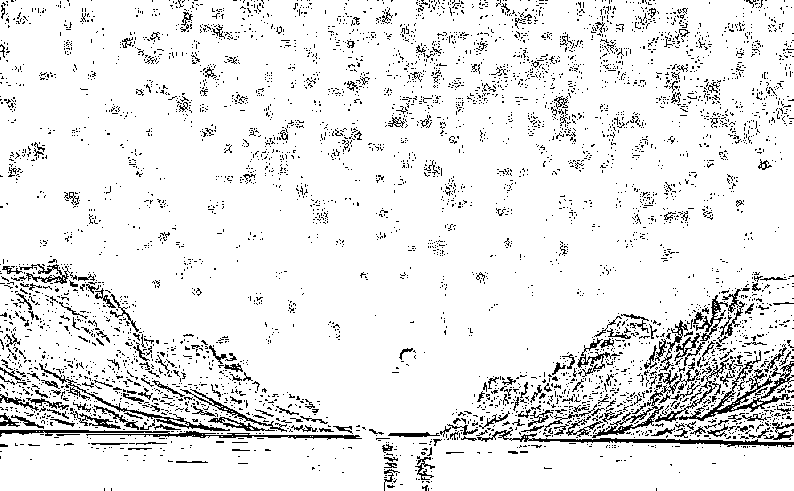

**2. 月食的爆发**

5 月 26 日射手座月食发生之时：水星和土星同时处于逆行前和逆行后的停滞期；金星与水星也进入“金水合相”结构的能量交叠；月食转天 5 月 27 日，双子座金星与双鱼座海王星形成“金海四分”结构。此次射手座月食，“月食”和“土天四分”两股强悍的能量，一左一右从两端向中间发力，向“木海互容”、“水海四分”和“金海四分”三组结构施加压力，触发“混乱”的能量登上巅峰，彻底拉开**2021 年最激烈、最关键、最混乱阶段**的序幕。其中，射手座的守护行星木星接纳着射手座月亮、射手座南交点和白羊座凯龙星揭示出来的“业力功课”和“沉重伤痛”，令人们**在表达自我的时候陷入极端的理想化和过度的膨胀，忽略现实情况和他人感受。****需要注意的****· 网络生活：**网络办公的稳定性，网络交易的安全性；**· 辨别真假：**不要轻信他人的诱惑言论，避免发生上当受骗的情况，心里感到不安的事别做，画大饼的话少听；**· 关系真相：**情感生活揭开真相，一厢情愿的幻想和执着，花言巧语的蒙骗和欺瞒，毫无诚意的示好和道歉，不再信任的猜忌和翻脸，这些事件当然令人难以接受，但却不是一天发展出来的结果，而是前期的价值观念和思维言论慢慢积淀下来的后果；**· 沟通不畅：**其实这是人际关系中常见的问题，但这段时间误解和矛盾被放大显现。这一波的水星逆行周期，提示我们通过人际沟通中“表达和理解”之间的偏差，检视和反思“自我理想化”和“自我合理化”的问题：我认为自己表达清楚了，为什么你没有理解？我认为自己在传递爱意，为什么你感觉到的却是控制和伤害？我们都认为自己没有问题，有问题的是另外一方，但其实对方和我们一样，也同样活在自己的理想化与合理化之中；**· 金融波动：**金融领域将会出现波动，理财的朋友最近两个月需要保持理智清醒，必要的时候及时止损；**· 谨慎决定：**这段时间容易过度理想化或头脑犯迷糊，急着跳槽、换工作、创业、合作的朋友们尽量谨慎做决定。或许你觉得现有工作给与的待遇不太满意、合作伙伴给与的条件不算丰厚，那么首先要知道，所有的商业合作都是基于同等价值的交换与共赢，待遇和条件其实取决于我们自身的价值和实力。我们只有提升自己，让别人值得投资。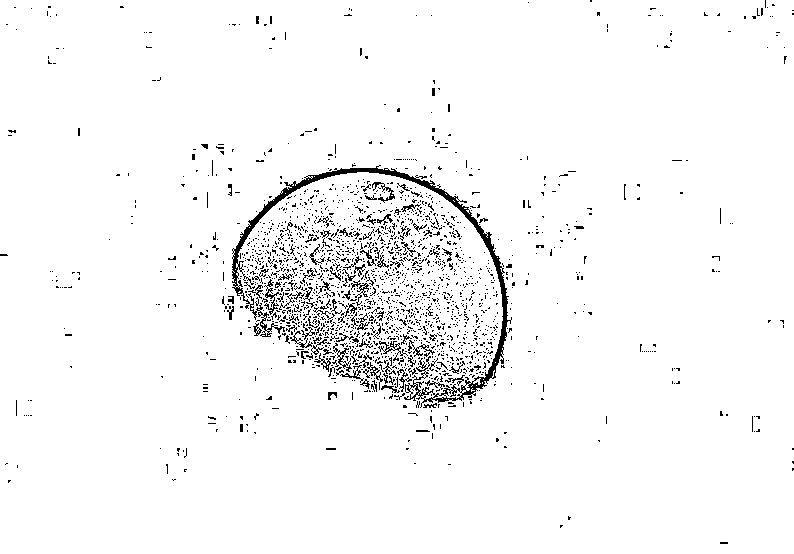

**3. 当下的出路**

此次射手座月食，双子座太阳合相双子座北交点，北交点的“进化解药”为我们当下的生活指点出路。**我们渴望精神世界的丰盛，渴望理想信念的实现，就要通过“超越自我原有视野之外”的人、事、交流和学习去增广见闻，接纳新知识，学习多元化，才能升级自我认知，沉淀自我实力。**所谓“创新”，其实是**“消亡陈旧-更换新生-逐渐成熟-成为陈旧”**的自然发展规律。**·** 创新的首要一步就是“消亡陈旧”，即觉察并转化那些“应该如此”的观念、“自我合理化”的模式，必须透过现实的困境和内心的伤痛，才能找到那些“内在限制”的部分去做转化的功课；

**·** 创新也需要不断地尝试和试错，才能在现实之中真正地实现。如果害怕会痛、恐惧挫败、屈服懒惰，“创新”就只能沦为嘴里的口号、大脑里的冲动、内心中的白日梦，而不是真正进入我们的生活。故而，创新需要实干；

**·** 最后，为自己建立一个长期的目标，超越当下，放眼未来，你希望 10 年后的自己在哪里、什么样？

此次射手座月食，在 2021 年最激烈、最关键、最混乱的阶段，宇宙引领我们深度思考并学习智慧，因为“宇宙中的物质是由正能量组成的”，所以我们要成为更好的自己。故而，了解“神”的内在伤痛，学习“神”的转化智慧，才能走“神”的超越之路。**寄语**

****

**我们可以回到过去，却终究无法改变历史。****——斯蒂芬·威廉·霍金 《时间简史》**“改变历史”，似乎是人类非常想做的一件事。“如果回到……那么我会选择……”，其实我们还会做当初的选择，因为我们只能做当下认知之内的选择。但是，虽然人类渴望改变历史，但真要改变谁的历史，那个人却并不愿意。“改变”这个词的背后，隐藏着“不够好”和“否定”的意味，故而虽然我们常常渴望改变历史，但同时也会拼命保护着历史并抗拒着改变。难道，2021 年“土天四分”之下的我们不是这样吗？那么，就让我们站在 10 年后的时间点上，提前“回溯”当下——如果想要做出更好的选择，那么当下需要突破的认知边界是什么，需要转化的行为模式有哪些？愿每一个灵魂安好。祝福大家。

**版权声明**：原创文章由作者授权首发于若道平台，欢迎转发，反对抄袭。友号转载请申请白名单。

****

****想阅读更多作者的文章，请在后台回复******王芝桦****** 即可。****

****王芝桦****

心理占星师，统合疗愈师，占星专栏作者

全职于个案咨询与占星教学工作 16 年

**个案预约咨询微信号**：zhihua0621 

**微信公众号**：daoxi-life

**长按打赏**

****

**系统学习占星学**

**点击图片了解详情**

**微信又双叒叕改版啦，不想错过若道君的推送？**

**就把若道设为星标吧！**

**▼**

喜欢记得点一下在看哦☟

****报名直达入口****

# 5 月 30 日丨与若道和鼓楼西剧场来一场浪漫的夏日约会！

> 原文：[`mp.weixin.qq.com/s?__biz=MzA5NjA0NTAxNg==&mid=2651445162&idx=1&sn=d3030e84406d17a76adb8f412788c8de&chksm=8b4b651dbc3cec0b1c3150017358a19a247734370d7d8940820ed734c0510f7b61f93a2445bf&scene=126&sessionid=1692737984#rd`](http://mp.weixin.qq.com/s?__biz=MzA5NjA0NTAxNg==&mid=2651445162&idx=1&sn=d3030e84406d17a76adb8f412788c8de&chksm=8b4b651dbc3cec0b1c3150017358a19a247734370d7d8940820ed734c0510f7b61f93a2445bf&scene=126&sessionid=1692737984#rd)

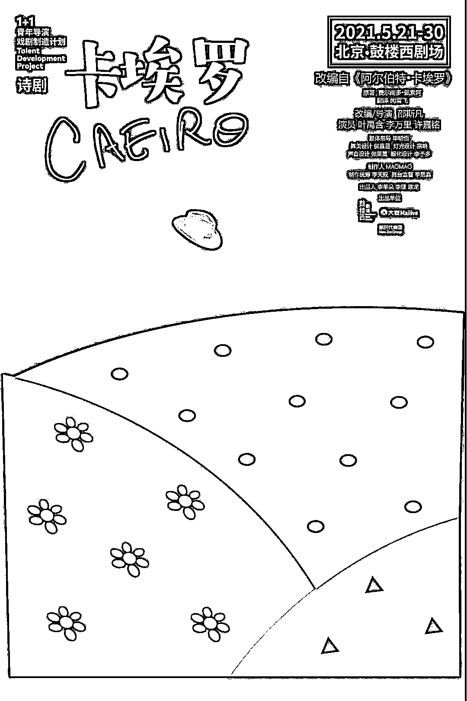**5 月 30 日戏剧结束后，若道的两位创始人——大卫·瑞雷和蒋颖和一些若道的校友及工作人员将和导演、演员和观众们一起共度 1 个小时，让我们一起来聊聊占星学、诗歌、戏剧。我们会有很多互动环节，来谈谈生命中这些美好的事情。**

占星、诗歌与戏剧，可以说是古希腊的三大瑰宝。

古希腊曾经诞生过人类早期占星学的集大成者托勒密，也诞生过荷马的长篇史诗《伊利亚特》与《奥德赛》。古希腊的戏剧则更有传奇色彩，它诞生于对酒神狄俄尼索斯的祭典上的酒神颂，后来逐渐发展为戏剧并出现了很多经典剧目，比如著名的《俄狄浦斯王》。

然而，虽然古希腊的占星、诗歌与戏剧都是伟大的，但是却从没有三者结合的作品产生。直到一百年前，经一位名叫费尔南多·佩索阿的葡萄牙诗人兼占星师，将三者联系了起来。

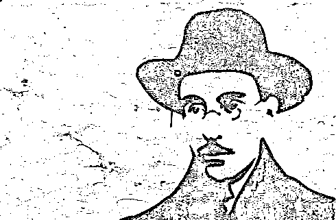

  费尔南多·佩索阿

### 费尔南多·佩索阿， 20 世纪最伟大的诗人之一，也是最为神秘的一位诗人，被誉为“欧洲现代主义的核心人物”，在葡萄牙现代文学史上享有至高无上的地位，在整个西方文学界也受到极大推崇。

### 费尔南多出生于葡萄牙，曾经在南非读书，后来回到葡萄牙，在他不算太长的 47 年生命里，在里斯本度过了人生大部分时光。他生前做过翻译、出版过杂志、写过文学批评、政治评论、发表过少数诗篇，但除了他过世之前 2 年出版的一本诗集《信使》（Message）引起很多人的关注并让他声名鹊起之外，他生前出版甚少，直到他过世 10 年后，有人发现了一个大的木箱，在这个木箱中，有 19 本笔记，还有成千上万页的笔迹难以辨认的手稿，这些手稿沉睡于这个木箱中，无人知晓。后来这些手稿被识别、编辑、出版成书，轰动了世界。

佩索阿不仅是一个诗人，也是一位占星师和神秘主义者。在他年轻时代，通过翻译一些灵性书籍，参与一些灵性的聚会，他曾经有很多神秘主义的体验，并且大量实践自动书写。

佩索阿对占星学一直怀着浓厚的兴趣，他曾研究过很多著名人物的星图，甚至还成为一名占星师，为他的客户提供占星咨询服务。他的占星咨询费用为 500-5000 埃斯库多。不仅如此，1915 年，他创造出一位名叫拉斐尔·巴尔达亚（Raphael Baldaya）的占星师，这位占星师计划撰写《占星学系统》和《神秘学研究概论》。而这位名叫拉斐尔·巴尔达亚是他的众多异名之一。

再回到作为诗人的佩索阿。当人们打开那个珍藏他所有手稿的大木箱，不仅发现了那些珍贵的手稿，还发现很多手稿上标注着作者的名字并不是费尔南多·佩索阿，而是其他名字，据说有 172 个之多。佩索阿称呼他们为异名，而不是笔名，因为这些名字对他而言并非一个名字而已，而是一个个生活在他想象中的真实的人物。小佩索阿从 6 岁起就开始创造这些人物，他们占据着他的生命和灵魂，通过他自己的日记、信件、手稿与他对话，与他人对话，彼此对话，这些人物彼此也有着复杂的关系，仿佛真实地活在这个世界上。佩索阿认为，他的很多作品是由这些有着自己名字的人物创造而并非他费尔南多·佩索阿写出的。而且，他们都拥有自己的出生星图，佩索阿为他们创建了有着准确出生年、月、日、时、地点的出生星图！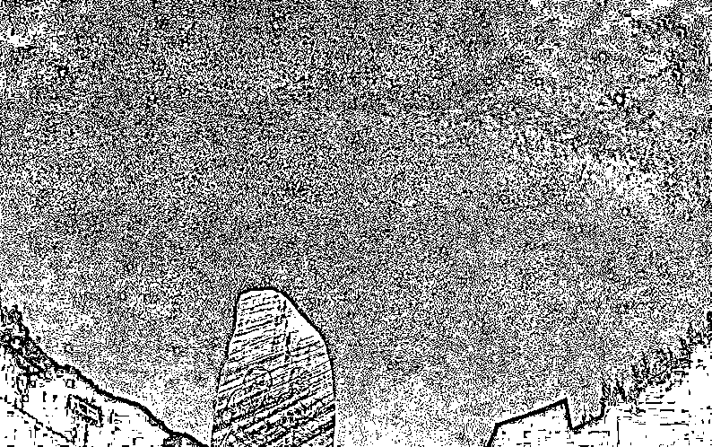这些异名——由他内心创造出来的“作者”来自不同的地方，有着不同的出身、家世、性格、职业、迥异的生活态度、哲学思想、迥异的写作风格。而这些异名中最重要的一位是牧羊人阿尔伯特·卡埃罗（Alberto Caeiro）。他是牧羊人，也是一位诗人，创作了一连串的诗歌，而且是佩索阿本人和其他几个重要异名的导师。我们回到 1914 年的 3 月 8 日，不到 26 岁佩索阿在一张高台前站立着，身心却进入了“无法定义的狂喜”状态，他自己说在那种状态下，他一下写出了三十多首诗（虽然佩索阿的研究者通过手稿的字迹辨认认为那 30 多首诗不可能是一下子写出的）！在把这些诗起名为《守羊人》之后，卡埃罗便出现在了他的身体内。在此后，卡埃罗不仅作为诗人创造了众多诗作，而且成为佩索阿的导师。在卡埃罗诞辰 91 年之后，2005 年 9 月，毕业于法国佛罗兰戏剧艺术学院高材生班、法国艺人协会 06 届戛纳新英才的导演邵斯凡走进了巴黎的一个小剧场。他对于剧的内容和作者全然不知，但听着一首又一首诗，听着小提琴中的一个又一个音符，感到心醉沉迷。而这部剧就是**《卡埃罗》**！

卡埃罗，一位活在葡萄牙诗人体内的守羊诗人，他的生命在星图中舞动着，在诗句中舞动着，在戏剧中舞动着。

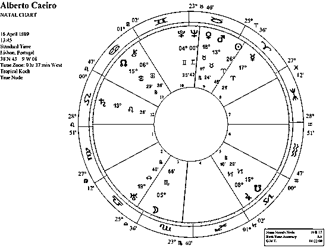

我们来看看佩索阿为卡埃罗创建的星图。作为一位看守羊群的诗人，卡埃罗有着明显的白羊座与金牛座的特征。白羊座是新生的，是活跃有朝气的。金牛座是安宁祥和的，又是恬静的。他在诗中的表达相当简练而直接，但又大都与田园牧歌相关。请看他的第一首诗的第一段：

**“我从来没有看守过羊群，****但是仿佛我曾经看守过。****我的灵魂宛若牧人，****知晓风，知晓太阳，****携着四季的手，****前行，观看。****无人的自然的全部安宁，****来到我身边坐定。****但是我却悲伤，****就像落日沉入我们的想象，****此时，夜冷却了平原深处，****感觉得到它的进入，****宛如蝴蝶翩入窗子。”**除了描绘田园的自然景象，卡埃罗还如此描绘自己：**“我每一刻看到的东西，****都是从前我从未看到的一切，****我懂得聚精会神地察觉……****我懂得拥有本质的愕然，****就像一个孩子，甫一出生，****便察觉到了他真的出生……****面对世界永恒的新奇，****我感到我每一刻都是新生。”**

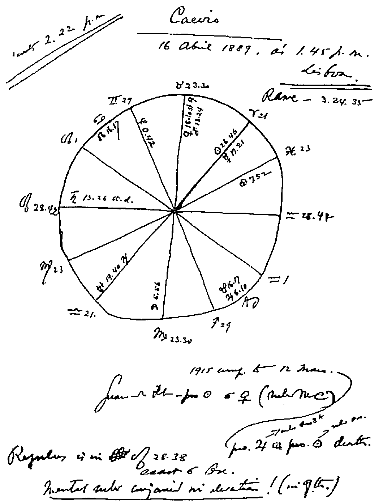

| 《卡埃罗》星图，佩索阿手绘版对于卡埃罗来说，一切都如白羊座那么新鲜，甚至他的生命都是一直常新的。卡埃罗的白羊座与金牛座的特质又非常明显，在这两个星座的太阳、金星、火星都位于第 9 宫——一个形而上学的宫位。然而卡埃罗并没有形而上学的一面，或者说，他一反形而上学的一面，独特构造了属于他自己的形而上学。请看这一段诗句：**“思考事物的内在意义，****是多此一举，好像去思索健康，****或把杯子拿到泉水旁。****事物唯一的内在意义，****在于根本没有任何内在意义。****我不相信上帝，因为我从未见过他。****如果他希望我相信，****毫无疑问，他会和我说话，****走进我的房门，****对我说：我在这里。****但是，如果上帝是花，是树，****是山脉，是太阳，是月亮，****那我相信他，****那我时时刻刻相信他，****我的生命是一次祈祷，一场弥撒，****是用双眼与双耳领受圣体。”**然而，卡埃罗并不只有白羊座与金牛座的部分。他的月亮落在天蝎座，冥王星也在第 10 宫显要的位置。天蝎座与其守护星冥王星都代表死亡与重生，是极端激烈的，热忱的，感情深到骨髓。相应的，卡埃罗的牧羊日子也不是一直阳光和煦的，也有天气转阴的时刻。他也有自己的深刻欲望，以及对死亡的感想。他在诗中这样描述：**“如果我能咬整个大地一口，****感觉它的味道，****如果大地是可以去咬的事物，****那一刻我会更幸福。****然而我并不希望永远幸福，****我需要时而不幸，****这样才是自然的……****所有的日子并非都是晴天，****当久旱无雨，那便需要求雨。****因此我自然地看待不幸与幸福，****就像有山峦也有平原，****有巉岩也有青草，****而人们并不觉得奇怪……****必须于幸福与不幸中，****做到自然与平静，****像观看那般感觉，****像行走那般思考，****将死之际，会记起一日将尽，****落日是美的，夜晚的到来是美的，****现在如此，并愿永远如此……”**卡埃罗是与众不同的，他本身就是一个处于他人体内的人。他的爱情也与众不同。卡埃罗的天王星与和写作密切相关的水星有紧密的对分相，与最终定位星金星也有紧密的相位，而且还是下降点守护星。天王星是水瓶座的守护星，是独特的，超然的，向往自由又容易陷入孤独。天王星是这样体现的：**“如今，每一天我醒来，又是欢乐，又是悲伤。****从前，我醒来时不会有任何情绪：只是醒来。****我欢乐而又悲伤，因为弄丢了我梦的一切，****而我又能身处于现实，这里有我梦的一切。****我不知道该拿我的感觉怎么办，****我不知道该拿我的孤独怎么办。****我希望她和我说点什么，让我再一次醒来。****恋爱的人和他自己不同了，****但他不是别人，依然是那个人。”**除了天王星与冥王星，卡埃罗还有着重要的海王星，它落在与表达相关的双子座，在第 10 宫靠近中天，又四分上升点。海王星守护双鱼座，是浪漫的，迷幻的，有同理心又有救赎性，也描述了生命最后的退场时刻。他的诗句富有浪漫色彩，而他又生命短暂，只有 24 岁。对于自己的逝去，他在诗歌中这样说：**“当春天到来，****如果我已死去，****花儿会同样地绽放，****树木不会比上一个春天少减绿意。****真实并不需要我。****想到我的死亡没有任何重要性，****我感觉到了巨大的快乐。****如果我知道明天我会死去，****而春天会在明天之后到来，****我会高兴地死去，因为它会在明天之后到来。****如果这正是它的时辰，不在它的时辰到来，又应该在什么时候到来？****我喜欢一切是真实，一切是理所当然；****我喜欢，因为就是这样，即便我不喜欢。****因此，如果我此刻便死，我会欣然赴死，****因为一切是真实，一切是理所当然。****人们可以在我的棺材前念诵祷文，如果他们愿意。****如果他们愿意，可以在棺材四周起舞、歌唱。****如果我已不能有偏爱，那我便不去偏爱。****无论何物，无论何时，一切顺其自然。”**然而卡埃罗并未真正死去，因为他活在他的诗歌中，一直都在。在佩索阿诞辰 133 年，卡埃罗诞辰 107 年后，2021 年 5 月，卡埃罗将被邵斯凡导演在鼓楼西剧场搬上戏剧舞台。3 位年轻的戏剧人——叶禹含、李万里、许嘉铭将把卡埃罗的生命、诗歌与星图下那活灵活现的身影重现在舞台中。古希腊的占星、诗歌与戏剧将合而为一！**有关 5 月 30 日的活动，也欢迎你提交问卷**

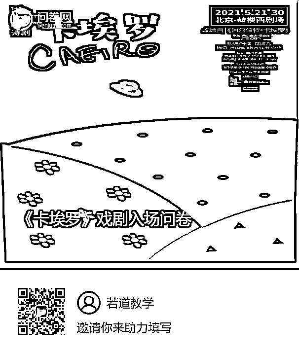

**5 月 30 日戏剧结束后，若道的两位创始人——大卫·瑞雷和蒋颖和一些若道的校友及工作人员将和导演、演员和观众们一起共度 1 个小时，让我们一起来聊聊占星学、诗歌、戏剧。我们会有很多互动环节，来谈谈生命中这些美好的事情。**5 月 30 日，欢迎你来。****《卡埃罗》售票通道****

**演出开始时间：5 月 30 日 14：30**

**演出地点：**北京鼓楼西剧场

**演出票价：**380 元、280 元、180 元、100 元（5 月 28 日截止售票）

**咨询工作人员：Maggie 老师**（微信：18510107057）购买后请务必添加工作人员取票！

长按下方二维码获取购票信息

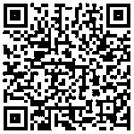

长按二维码添加 Maggie 老师

****购票通道，请点击“阅读原文”****

# 重磅天象｜土星逆行，重获岁月不曾给予的爱与力量（内附 12 星座攻略）

> 原文：[`mp.weixin.qq.com/s?__biz=MzA5NjA0NTAxNg==&mid=2651445064&idx=1&sn=4b9d493dd5011369a34ad54bf66d4744&chksm=8b4b65ffbc3cece959ae9d856e3d9bf8cc5857083d3ee1b12c09a918ad6148e2d005e9d9fc2b&scene=126&sessionid=1692737984#rd`](http://mp.weixin.qq.com/s?__biz=MzA5NjA0NTAxNg==&mid=2651445064&idx=1&sn=4b9d493dd5011369a34ad54bf66d4744&chksm=8b4b65ffbc3cece959ae9d856e3d9bf8cc5857083d3ee1b12c09a918ad6148e2d005e9d9fc2b&scene=126&sessionid=1692737984#rd)

******************☆ 后******************台******************回复“今日”，给你一句生命态度******************

作者/郑玮玲 ISAR 认证占星师

编辑/玫瑰 封面/书君 图片/全景网**土星逆行啦****5 月 23 日 17:20，土星在水瓶座 13°31′开始逆行，此次逆行时间持续到 10 月 11 日，届时土星将从水瓶座 6°52′开始恢复顺行。**土星有如严厉的老者，不苟言笑，不断给我们试炼，用困境和阻碍锤打我们的心性。它提醒我们，成长是一步接着一步的，保持谦卑与臣服才能让我们在不经意的努力中获得稳定的成就。**土星的行进速度是平均一个月一度，大约两年半走完一个星座，土星每年都会进入为期四个半月的逆行，这是强力校正、重振艰难现实议题的时期。**土星充满秩序的顺逆节律，是帮助人类在这个满是定义的世界不断获得清晰、稳定与成熟，将理想与创造化为有效与现实的能量。自 2020 年 12 月土星进入水瓶座以来，我们感受到了更加自由、宽广的生存方式。信息传播、分享越发便捷，至少在中国已实现了出门仅用手机就能完成一切社会行为：消费、社交、旅行、教育、就医，就连偏远乡村也进入了水瓶座所代表的“数字化”的时代。今年春天，伴随着土天四分的加持，各种现实裂变与革新与冲刷着视野：世界观、恋爱观、婚姻观、育儿观无一不在表达着：时代已变。地球还是那个地球，国与国的关系剧变，人与人更有距离，因为网络社交人们也习惯了孤独。单身不婚人群有增无减；无法降低的离婚率；每平米 3-4 万的房价让年轻人放弃买房；人口负增长、老龄化等。水瓶座赋予我们属于未来的眼光，比如不远的未来将面临的**空房率，劳动力减少和更加依赖数字化**。而人们关于未来、下半辈子的活法也有了有别于传统的打算：越来越多的人成为或正在成为终生学习者，集体养老和理想社区共建都成为了现实，理想与现实的联姻甚至让我们忘记了某些不得已的现实所迫——这正是人们面对土星压力而发展出的能力。当我们能直面现实困难实现自我意愿，那也是土星在成就我们的过程。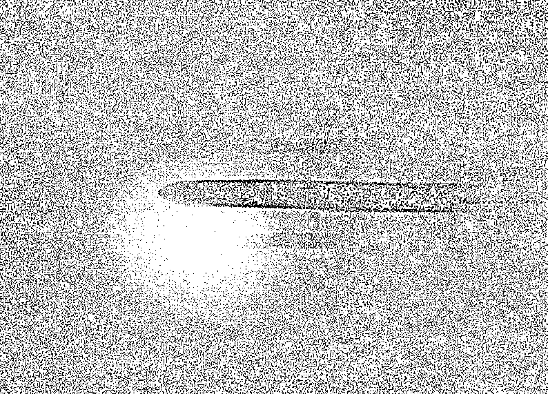**土星逆行重点影响人群**今年土星逆行的重点影响人群是：**有个人行星、四轴、交点位于水瓶座、金牛座、狮子座、天蝎座 4°-14°的人。**土星逆行将限制感、重压感带入心灵深处，让我们**对现实感到无力，产生自我怀疑，甚至退缩。**实际上，因为土星逆行前三周已经进入逆行阴影期间，重点影响人群已感受到**强大的内压、惶恐、不安**。具体呈现包括：财务困境、**创造力枯竭、职业瓶颈、资源短缺、社交障碍、关系阻滞等，所有这些情形必须通过有力的行动来改善，消极应对只会让现实更糟。**逆行的土星提出的问题是：**现在的你是否意识到是长久以来错误的意识、方向、方法导致的问题？你是否已经发现并承认自己的盲区：空白知识领域和经验匮乏领域？**如果答案是肯定的话，那被忽略的功课在等待你的后发之力。将无力，无所适从的感受转换为直面的能力和接受挑战的态度，这便是面对土星正确的态度。水瓶座的土星提示着向未来看齐，为你的内在真理而筑造现实，意识到并采用高科技，精准校对你的目标与行动，土星逆行给了你这样的时机。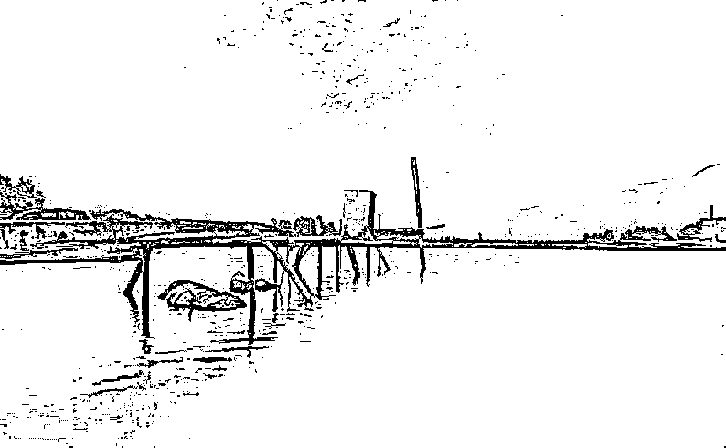然而，土星逆行退回的度数将印证一次**向内成熟、完善**的过程，犹如武侠小说里的主角因伤痛挫败而闭关修练，待重出江湖之日必是功力盖世；又如未成名的音乐家作品被拒绝、遗忘，曲谱只能被收不见光的阁楼书桌的抽屉里，却在几个世纪后被世人传颂；也如春蚕吐丝要先停止进食和生长，缓慢小心地寻找空间结茧，吐出丝将身体完全包裹，等待时光来蜕变、产出。土星逆行正是**一切能量向下沉降，向内收敛**的过程，是完整的螺旋上升过程中必不可少的聚合与收紧的力量，用积淀与修整的方式实现整体的成长。**土星逆行也是进入内压核心地带并将压力释放的过程。**如果我们认真对待，方法得当，够坚持，够努力，土逆之后，我们便因内在清晰而获得新的的力量。如同被岁月、风霜打磨成型，如同免疫力战胜了病毒而升级。通过土星逆行的考验，我们能从外在世界重新握住自我的权力，掌控现实某一部分或全部的架构。土星逆行的现实对策是：在时光里坚持，用坚韧的心回应你的脆弱与无助，放弃一切的幻想和侥幸，做一切可行的努力，最后，再等待时光的验证或奖赏——如果我们在重蹈中完成了未曾完善的人生必修课。每一次土星逆行都是帮助我们再次“成为”自己的路上更有力，更坚强的过程。生命的脆弱是需要历经风霜的洗礼，拥有了抗击打、抗压的能力我们才能为自己的使命护航。**土星逆行水瓶座的影响**

**空间掌管**

土星是掌管时间与空间的行星，它划分了时空，给予明确的界限。水瓶座强烈地提示着空间，个人的空间，空间的所属者。这轮土星逆行是非常好的**进行空间划分、调整**的时段。土星逆行期间，你可能**极度需要对空间受挤压、侵犯做出行动：隔离出个人的空间，向他人讨要、声明自己的私人空间。**如果你准备装修，土逆期间也是**非常适合进行装修设计**的时段。此刻我们对空间的想像力、联结力会增强，会更明确知道未来的空间是怎样的，**避免了装修失误带来不可修正的后果。**

**时间管理**

由于前期木星进入双鱼座，带来了**现实的沉溺、懒散、逃避与无力**，土逆的力量在提醒我们**仍要做现实功课，不可逃避**。现在是时候改善你的行动效率了。可**借助一些效率 APP 来帮助高效的时间管理**。如果你发现旧有的工作效率不理想，**更换办公地点和采用新的流程，或将执行的计划放在更适合的空间**也是值得的尝试。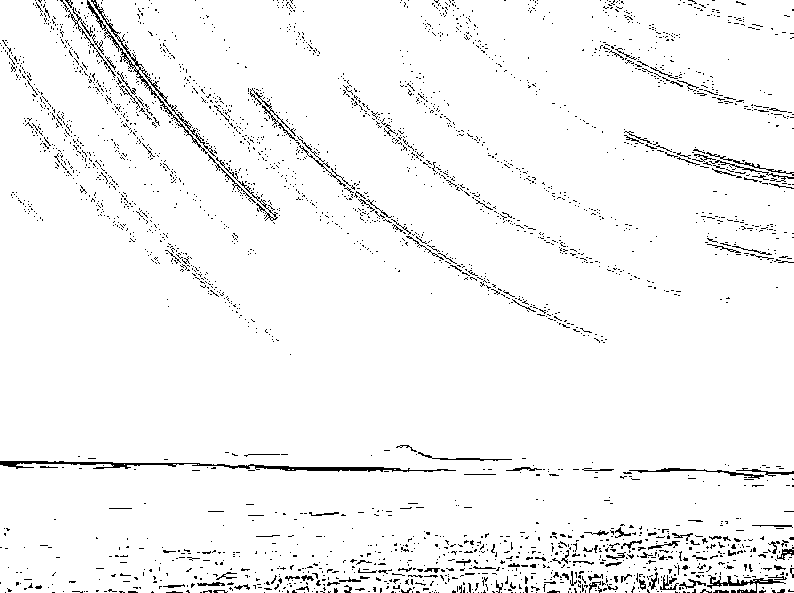

**运用科技**

水瓶座的土星强烈地提示着**个体的进步与高科技相连**。也许你当前的瓶颈、失误、拖延都是因为缺少科技手段，没有跟上时代步伐，自会被弄潮者所替代、超越。土星总是用困难的方式让我们学习成长，用谦卑与臣服的态度学习、掌握高新技能，去搜寻先行者们的分享，从零开始也不晚。你在哪里上车不重要，重要的是你得搭上时代的快车才能更快抵达理想的车站。 

**兑现承诺**

**土星逆行是兑现承诺的时期。**人有时会忘记曾经的承诺，但土星非常守旧，而且要求我们对自己忠诚。无论你曾承诺什么：一段感情、一次旅行、一份工作、一个愿景、一个期待、一顿饭、一杯茶，无论什么，去达成和完成它，就成了土星逆行必须面对的内在界限。**对自己和你的生命负责，这便是土星对你的要求，如果你做得够好，你会从中获得力量、信赖与自我肯定。**

**社交管理**

土星的界限还包括**人际间的界限**。如果你一段时间以来感受到**社交恐惧或是社交活动过多，无法拒绝的活动让你精疲力尽，**那么土逆可能会用**身体报警**的方式提醒你：停止过度的社交，回到内在关照之中。现在是时候**清晰你的社交圈以及社交的意义，把不值得耗散的精力收回为生命做更值得的服务。**

**健康管理**

**土星指代衰老、损耗性的疾病和拖延导致的一切因素。**

**· 疯狂投入工作和长期熬夜**的人，土逆期间极可能发现自己**明显老去、退化、减弱甚至病理化的脏器功能**；

**· 缺乏运动和自律**的人可能面临**骨骼、关节脆弱，肌力脆弱带来的损伤；**

**· 过度使用手机电脑**的人会感觉**视力退化**。

土星也关于一切**匮乏的疾病征象。**

**· 减肥的人们**可能在土星逆行期间发现自己**体力不支，营养不平衡**；

**· 只食用蛋白质不食用碳水化合物**的人群可能面临**脾胃虚弱导致的肌肤老化、脱垂现象**。

身体的智慧总是先于头脑，土星逆行时期会提醒**我们的意识首先遵循身体智慧**，这也是宇宙给予的自然界限的讯号。土星其实是**用严格的界限来护航我们的生命，让我们在有效的行事范围内去奋斗、发力，知道自己的界限才是对生命负责。**

**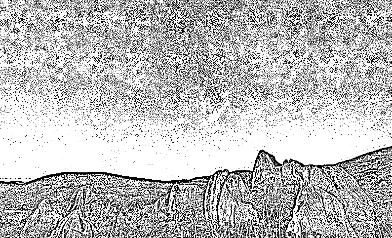**

**传播传统**

**土星关于传统，水瓶座是风象星座，会带来传统文化、文明的传播效应。**土星逆行是我们向内回归，溯源传统的好时机，我们在当下容易**意识、触碰到文化的边界，而强烈想要追溯自己所属的文化**。今年，汉服市场出现了前所未有的井喷，虽然热爱汉服的绝大多数是 25 岁以下的年轻人，相信在未来会有不同年龄层的人通过汉服回归、承接传统。同样，因为新冠肺炎病毒疫情中中医的发声与力量，也让更多人重新认识了了传统医学。随着土星从摩羯座行进到水瓶座，再进入双鱼座的进程，相信**传统服饰、传统音乐、中医养生、传统书画艺术、手工艺**都在同一轮回归与全新的整合的过程中，它们将相互融合，并呈现出这个时代的新的传统文化风貌。

**对抗内卷**

**“内卷”这个词与土星不无关系，指行业提高标准，压缩生存空间，其结果是行业与行业中人在不断压缩中走向崩溃、解离。**绝大多数人都痛恨内卷，除了在行业顶端的受益者、掌权者。土星逆行将我们带到了内卷的核心地带，走还是留？何时？怎么破？清晰有力对抗内卷便成为了很多人当下的突破点。

溯源内卷这个词，来自英文 Involution，用在医学上的意思是“退化”，这就完美进入土星的原型中，“内卷”这个中文翻译是在社会经济学中的运用。美国文化人类学家 Clifford Geertz 在 1963 年研究印尼农业时发现，农民为增产加大劳动投入却无法实现农业技术进步。他把这种停滞不前，无法进化、变革的状态称为“Involution”即内卷。

有趣的是，**“内卷”正好是“进化”同词根的反义词**。进化占星学正是 Envolution Astrology，而变革、革命——“Revolution”正是天王星的原型，与土星的架构与老旧是天然的冲突、抗衡的原型。所以，在占星学的角度，我们很容易知晓如何对抗内卷，那就是**用进化的意识和天王星的方式。**面临内卷的个体势必打破无止境的模式，才能停止外境对自身的消耗、侵蚀和辗压。土星逆行正是提醒每个在被内卷消耗的人，这股向内破坏的风气不会带来任何实质的收获与奖赏，因为无论你怎么努力，都只是原地踏步。而进化（Envolution）是螺旋上升的过程，也就意味着我们不再做笼子里的仓鼠，或是玻璃屋顶下的打工人，而是迈向了三维的成长空间：**身、心、灵共同进化；意识、直觉、行动都参与其中；过去、现在、未来作为整体运作**。进化过程中，没有一个部分是单独存在的，你当下所做的变革也是疗愈过去和未来的意图。当我们打破困境，跨出对进化无益的情境，既是进入整合成长中。比如，当教育机构不再用提高考试水准为教学标准，家长不再“鸡娃”时，进化的教育也才会呈现，学生、老师、家长都会得到真正的解放。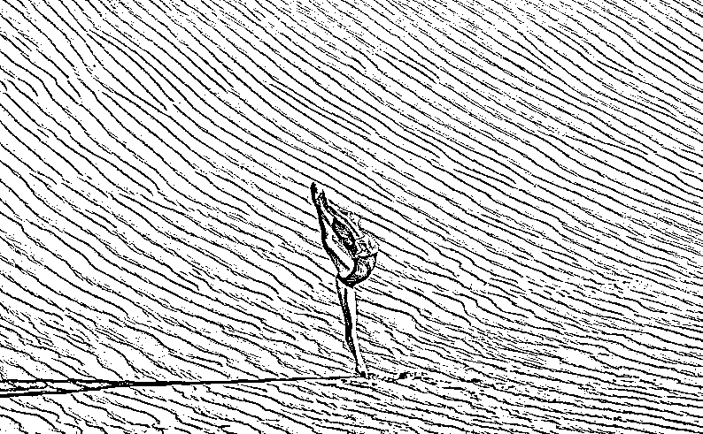**土星逆行在 12 宫****若道君：****你可以在 app store 或者应用商店搜索“若道”下载 app，输入个人档案，查看行运盘（也可以使用其他星图软件），找到土星（符号： ♄）落在出生星图的第几宫，然后对照下文查看土星逆行的影响~****例如下图中，土星逆行在比尔·盖茨个人星图的第 7 宫（婚姻 o(╥﹏╥)o）。**

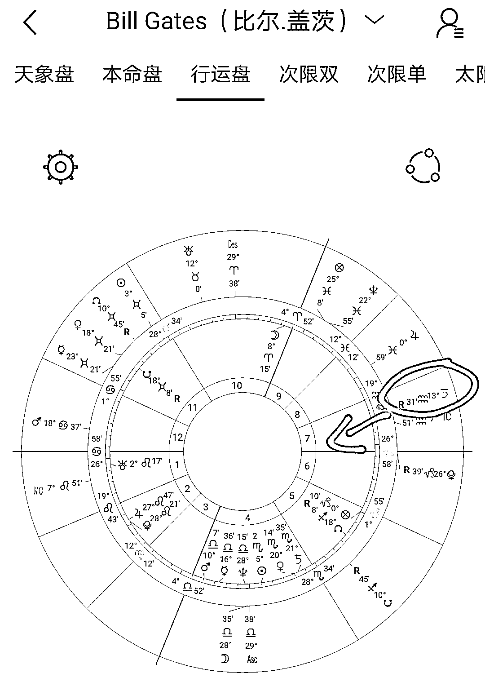

**土星逆行在****第*****1*****宫**

当土星行进在一宫时，人们常感受到**生命在快速消耗、消沉、消瘦，但同时也拥有承担更大压力的能力，对自我身份感到笃定**。当土星逆行在此，我们倾向于**将压力内化，默默承受，有苦难言、不言**。因为有可能这确实只是你自己的议题，无法牵责外界。你明白是自我整合的时期到来了，那就勇敢扎根现实吧。只有经历现实的打磨，才能完全通过土星的功课。

**土星逆行在****第*****2*****宫**

接下来四个多月里，你可能感受到**越发沉重的财务压力，生存的安全基石受到威胁**。**你越想证明自己，就越容易感到力不从心**。应当在此时**向内去挖掘不曾激发的价值区域，学习一些对你有帮助的理财知识，投资技能和赚钱的技术**。如果总是看向自己的短处，我们就很难充分肯定自己，**将那些缺失的内在条件化为可进化的空间，重新去拟定未来半年的金钱目标**，你会感受到更积极的生活态度带来的进化。

**土星逆行在****第*3*****宫**

**对于在学习任何课程的你来说，这段时间你可能感到精力严重不济，课业压力大或是曾高估了自己的时间管理能力。**是时候去与自己的身体和解了，从压力中走出来，给予自己宽松的氛围，允许自己将某些功课、工作滞后。拖延有时候反倒是好事，因为我们可能会遇到真正正确的时机。不求最早，但求最好。

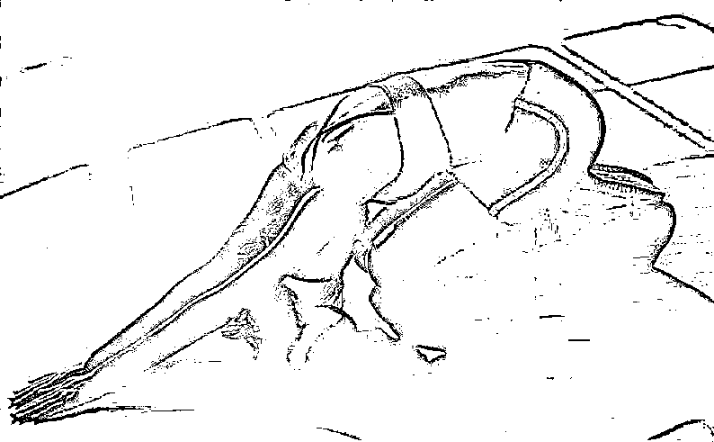

**土星逆行在****第*****4*****宫**

你应该**关注父母的健康**了，督促他们进行有效的养生保健，或是检查一下他们是否有足够的医疗保险，增添一份有效保障是一定有用的。如果**家里的网络总是掉线，某些电器老化**，也是时候可以更换调试，借此机会**升级相关设施**也能让家庭生活更加有序，某些**家庭数据管理也可以更新升级。**

**土星逆行在****第*5*****宫**

如果你这半年来**精心于创造性的工作**，那么土星逆行会让你**反复去调整你的工作步骤，很多细节等待完善和重审，也可能推翻重来**。作为父母的你，接下来四个月会发觉**自己越发力不从心，曾经在育儿、教育上满满的自信也会遭受现实的打击**。但这个过程正是向内自我探索的过程，我们所感受到的匮乏与瓶颈正支持更多实践的动力。

你可以对自己说：**不要怕错，生命就是不断试错的过程，错过才会走向更完美**。尝试更多，你的创造力才会重新焕新，而**重新学习玩耍，让自己放松下来，用看似懈怠的方式去体验也许能启发你的灵感。**

**土星逆行在****第*****6*****宫**

**职场 PUA、晋升制度都让你感受到精力消耗，自我怀疑或是对制度本身的漠视成为了你当前最大的障碍。**来自易经的智慧告诉我们，一动不如一静，动的可能性是不好的机会更多，而不动则可以稳住当下。尤其在你没有准备好的时候，不宜快速抽离，尽可能多地在当下寻找内在的资源，重新换一个角度去尝试，也许能打开新的局面。同时，你的**健康可能亮出红灯，给你提出使用身体的界限**，一定要予以关注，开始养生吧。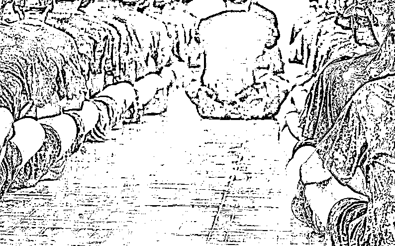

**土星逆行在****第*****7*****宫**

“离还是不离？”——即使携手到老的夫妻一生也会思考至少 50 次的问题。土星当下要你必须处理的问题正是你的亲密关系，也可能是你最重要的合伙人的关系，或是你和最好的朋友的关系，总之是**现在处在僵局的那段关系**。很可能你们都需要**更加认真对待彼此，给对方必要的承诺，在关系中建立全新的架构。**这取决于你们是否笃定地感到：**在这段关系里我能感受到自如**。现实案例中，土星经过七宫与木星经过七宫离婚的可能性都是存在的，但都不是绝对的。土星经过最重要的是：**更加负责，更有界限，更有要求。**如果不能满足这些，关系最终会质变。对于想要走入婚姻的人来说，这段时间你可以**深思熟虑，为结婚做出准确的承诺，最好是在土星顺行以后去履行内在承诺。**

**土星逆行在****第*****8*****宫**

**关注你的投资项目和帐户，你需要严肃地看待当前的亏损。**可能你已经感到一些惶恐，此时是需要**谨慎与沉着**的，也许你考虑用时间换利润空间，也许你也可以听听巴菲特的建议：**在他人贪婪的时候恐惧。**

**对于预期未达的利润要狠心收手，及时止盈才是投资的高阶智慧。**此时也应当**检验一下你和伴侣、合伙人之间深度的信任议题**，如果只能同甘不能共苦，那说明关系的长久度已到了尾声。**家族中某些老旧议题可能会浮出**，让你进入那个“黑洞”，重要的是你需要清晰家族中的界限，明白自己从中来，还要懂得从中转化、脱身。

**土星逆行在****第*9*****宫**

在当下，一场远行对大多数人来说已是不可能，也许你两年前计划的柏林之旅、澳洲之旅、南美之旅、土尔其之旅现在是无论如何也只能搁浅了。但是**“读万卷书”**是不受疫情阻挡的，或是**向祖国的大好河山前行**也是不错的选择。

土星赋予了我们**孤独**的质感，**一个人旅行，一个人出门**，你会从孤独的旅程中更深地体会到人生，体会出你的内在的寂寞，如同夜晚的星星一样在照亮宁静而璀璨的梦想。如果你**正在或准备考取职业认证、资格证**，现在正是艰苦的时段，所有你曾付出的努力，都会在时光中给予你回馈。

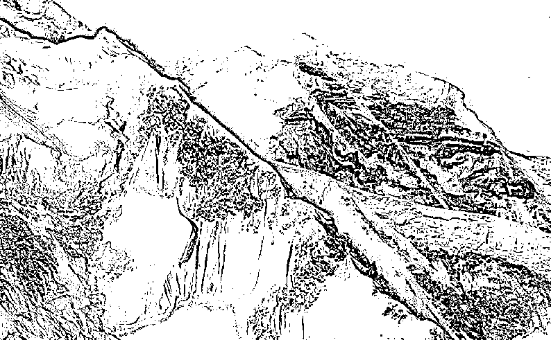

**土星逆行在****第*****10*****宫**

你以为你对自己产生怀疑了，其实是**对现实，对所秉持的信念，所扎根的事业，所身处的社会全都产生了怀疑**。也许是自己不够努力，也许是讨厌的内卷，也许可以赖疫情让自己懈怠了，眼下你在面对的是**对事业深深的失望，因为无法达到曾预期的目标**。

既然我们无法改变内卷，也无法控制外在环境，那就从自己开始整顿吧，**更有效的时间管理，更有计划的远景目标，更加有效的投资行动，让自己专注于困境**，你才能不负困境对你的青睐，得到一次重塑事业的飞升。不久之后，你的努力会让你看到更加成熟的形象，你原来在乎的事后来不再在乎，而你会发现有更加值得在乎的事。这段时间还可能接触到故乡、旧地的信息而坠入时光的旋涡中，**忆旧思今，**对当下的你来说也是极好的整合。

**土星逆行在****第*****11*****宫**

**什么时候开始社恐了？或是感受到社交压力，有了“出门困难症”。**你需要**退出一些社交活动，回到独自的状态，接受生命孤独的现实会让你更加稳定和满足**。**在团队中，你的意见也许不再有力，你会感受到你的出现给人无形的压力，你需要时间反省自己**。因为事实很可能是你当下不希望出席什么活动，不想参言。你意识到**应该去做一个更远期的计划，把时间用在锁定的目标上，而不是当下的饭局、酒局、派对上。**

**土星逆行在****第*****12*****宫**

**你会感觉自己在光鲜的世界消失了一样，或是已经被世界拒绝了，你困在了无声的水域，没有人可以拉你一把。**你在**沉溺消隐**之中，**精力体力不断消耗**，没有人能知道这里发生了什么，你**习惯了沉默**。灵性导师、灵性课程可能是你这段时间里最重要的陪伴，不然你会想要更多时间去做梦，因为现实太无力了。但这种丧失感会鼓励我们去造梦，去相信那些看不见的力量，去启发我们内在神圣的存在。在当下，放手现实是必要的，逆行的土星会更深地推进这一步。**只要你相信，你就能重新获得现实掌控力。**
最终，我们要明白，土星永远是通过困难的方式让我们学习和成长，实现坚实的进化，去跨越眼前的困境，掌控自己的人生。土星逆行也是在通过现实的困难和挑战让我们重新整合自己曾遗失的碎片，让我们带着毅力穿越时光的长河，重新获得岁月不曾给予的爱与力量。当我们充满力量重拾内在残缺的记忆时，土星也会将曾经空白的部分填写完美，赋予我们经历岁月打磨的加倍的奖赏。

**版权声明：**原创文章由作者授权首发于若道平台，欢迎转发，反对抄袭。友号转载请申请白名单。

**郑玮玲**

ISAR（国际占星研究协会）认证占星师（2016 年获得）

若道占星专栏作者

将占星咨询、教学与音乐、舞蹈相结合的疗愈者

**微信号**：zhengviolin

**新浪微博**：@郑玮玲

**微信公众号**：Sampriya-Astrology

长按打赏

**系统学习占星学**

**点击图片了解详情**

**微信又双叒叕改版啦，不想错过若道君的推送？**

**就把若道设为星标吧！**

**▼**

就是这个“在看”，戳戳戳 ☟

******报名直达入口******

# 小行星的故事 | 智慧女神雅典娜和这颗行星有啥关系？

> 原文：[`mp.weixin.qq.com/s?__biz=MzA5NjA0NTAxNg==&mid=2651445064&idx=2&sn=66224414e6726f1341e53a72bc8164fb&chksm=8b4b65ffbc3cece9cd7bdcf0d1d02d33fc28298ce01cd9649b8e49b05581b9b3dc4137adad0d&scene=126&sessionid=1692737984#rd`](http://mp.weixin.qq.com/s?__biz=MzA5NjA0NTAxNg==&mid=2651445064&idx=2&sn=66224414e6726f1341e53a72bc8164fb&chksm=8b4b65ffbc3cece9cd7bdcf0d1d02d33fc28298ce01cd9649b8e49b05581b9b3dc4137adad0d&scene=126&sessionid=1692737984#rd)

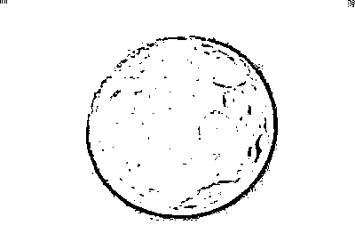

作者/cornerstone-astrology.com

译者/林恩 校对/Leisha

编辑/玫瑰 图片/全景网在若道推出的新课程：唤醒女神，在占星学中使用小行星（详细课宣见三条）中，我们会学到形形色色的小行星和他们的故事。那么，这颗以雅典娜的名字命名的小行星来头又有多大呢？**神话中的智神星**智神星（帕拉斯）直径约 535 公里，是四颗主要小行星中的第二大小行星，于 1802 年被德国天文学家兼医生威廉·奥尔伯斯发现。智神星到太阳的平均距离为 4.14 亿公里（2.585 亿英里），轨道周期为 4.61 年。轨道与黄道呈 35°倾斜。它以希腊战争与智慧女神帕拉斯·雅典娜的名字命名。帕拉斯·雅典娜（希腊女神雅典娜）根本没有母亲，她从宙斯的前额中诞生。雅典娜是宙斯最喜欢的孩子，而她也作为一个全心全意顺从的女儿予以回报，尽管事实上，她拥有很强的自我意志。她总是会聆听父亲的忠告，但常常基于自己的智慧行事，这样能获得很不错的结果。雅典娜作为智慧女神，必要的时候也打了很多仗，但每当战争爆发，她还是更喜欢外交而不是冲突。她把一个与宙斯作战的巨人扔进海里，这样就产生了西西里岛。她教柏勒洛丰如何控制天马帕加索斯，并从帕加索斯那儿得到蛇发女妖的头，将其嵌入自己的盾牌之中。赫丘利（赫拉克勒斯）在雅典娜的协助下与弥尼埃人作战，赶走了斯廷法罗斯湖怪鸟。为避免冲突，雅典娜还归还了赫丘利从赫斯帕里得斯花园那里交换得来的金苹果。她送给造船工阿格斯一根神圣的橡树梁，这根梁可以说话，被嵌入一艘名为阿尔戈号的船前部，指引伊阿宋和阿尔戈英雄们。在希腊一座著名的城市，海神波塞冬和智慧女神雅典娜，就谁应该是它的守护神发生了争执。为赢得守护权，众神命令，双方各向这座城市赠送一份礼物，谁的礼物好这座城市就归属于谁。波塞冬赠送的高贵的马被认为与城市的石头地面不匹配，但雅典娜赠送的橄榄树却可以茁壮成长，并在许多方面对市民有用。因此，这座城以其守护神雅典娜的名字命名为雅典城。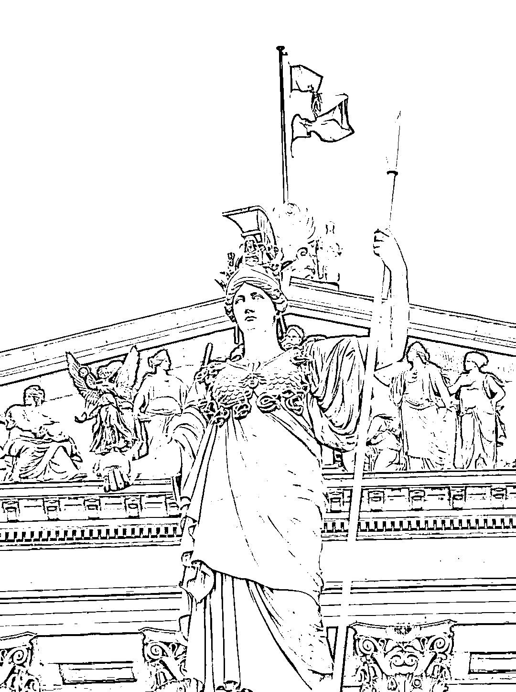| 雅典娜**占星学中的智神星****个体展现的勇气和智慧可以归入智神星掌管的范畴。我们的信心、创造力、足智多谋和渴望成为和平战士的能力，可能取决于这颗小行星在我们出生图中的位置。**如同神话所示，这颗小行星掌管**父女关系**，而父女关系又进一步延伸到**一位女性如何与她的男性同伴相处。**智神星的黑暗面或挑战面可能描绘**乱伦的关系、虐待孩子的父母和虐待男人的女人**。**以敌意、残暴和怨恨的方式将战士的形象扩展得太远，只会导致自我毁灭，这与智神星为我们树立的榜样背道而驰。**

**版权声明：**本文由若道翻译发布，欢迎转发，反对抄袭。友号转载请申请白名单。

**更多小行星课程内容**

**见今日三条** 

**就是这个“在看”，戳戳戳 ☟**

**********报名直达入口**********

# ISAR 选修课丨唤醒女神，在占星学中使用小行星

> 原文：[`mp.weixin.qq.com/s?__biz=MzA5NjA0NTAxNg==&mid=2651445064&idx=3&sn=88e7fc23de438a6fbdd0e9a6a02c3561&chksm=8b4b65ffbc3cece96750b69074c82839478b3e2412344c69cadb6889d6d551b289deb9e8c1e9&scene=126&sessionid=1692737984#rd`](http://mp.weixin.qq.com/s?__biz=MzA5NjA0NTAxNg==&mid=2651445064&idx=3&sn=88e7fc23de438a6fbdd0e9a6a02c3561&chksm=8b4b65ffbc3cece96750b69074c82839478b3e2412344c69cadb6889d6d551b289deb9e8c1e9&scene=126&sessionid=1692737984#rd)

对于占星师来说，巨大的小行星带中有成千上万的滚落岩石在太空中呼啸而过，这似乎是一次令人生畏的雪崩，蕴含着潜在的新信息。因此，当你将它们整合到你的工作中时，辨别并正确理解每一颗小行星的意义是很重要的。

包括选择小行星在星图的解读，增加微妙的细微差别和令人惊讶的细节是无法从任何其他占星工具中获得的。

1

**课程简介**

理解小行星带所蕴藏的神圣女性力量的流动将帮助你在占星实践中创造更多的和谐与平衡。**小行星为你的解读带来细节、精确性和深度，同时也使你能够研究和阐释那些被忽视或低估的生命领域。**

**我们将讨论主要的女神小行星，并学习如何与之合作。**我们将借助大量现实生活中的例子，深入探讨它们的象征意义。你会真正了解这些重要的占星元素，从而拓展自己的实践。

**此课程可作为 ISAR 选修课。**

2

**课程安排**

**课程安排：6 月 8 日--7 月 27 日 （每周二）**

*   **6 月 08 日** **小行星简介**

*   **6 月 15 日** **谷神星，丰饶女神**

*   **6 月 22 日** **婚神星，婚姻女神**

*   **6 月 29 日** **智神星，智慧女神**

*   **7 月 06 日** **灶神星，壁炉女神**

*   **7 月 13 日 健神星，健康女神**

*   **7 月 20 日** **灵神星，灵魂女神**

*   **7 月 27 日** **综合应用，展望未来**

3

**课程大纲**

**第*****1*****讲  6****月 8 日  小行星简介**

小行星概述，小行星的发现、科学以及一些占星学历史。

**第*****2*****讲  ****6 月 15 日 谷神星，丰饶女神**

母神、农业女神，但其影响力远不止如此。这是我们所知的最大的小行星，也是最重要的小行星。她掌管养育、滋养、救助、管理等方面。

**第*****3*****讲  ****6 月 22 日 婚神星，婚姻女神 **

荣誉、伙伴关系、契约和婚姻：众神中的女王是正直的女主人。她在出生星图和行进中有什么意涵？她与“丈夫”木星朱庇特是什么关系？

**第*****4*****讲  ****6 月 29 日 智神星，智慧女神**

战地记者、棋手和占星师有什么共同之处？来自智慧、策略、洞察力和远见女神的帮助。

**第*****5*****讲 **** 7 月 6 日 灶神星，壁炉女神**

掌管神圣的火焰、家庭生活、厨房灶台、家人、遗产的女神：这颗关键的小行星被严重误解了。她可以给你一把钥匙，让你了解家庭关系、你的祖先和你的目标意图。

**第*****6*****讲  ****7 月 13 日 健神星，健康女神**

在我们应对全球疫情的过程中，掌管健康和福祉女神目前显得尤为重要。她能提供如何应对新型冠状病毒肺炎的线索吗？她在出生星图中的意涵是什么？幸福原来蕴含着相当广泛的含义。

**第*****7*****讲  ****7 月 20 日 灵神星，灵魂女神**

灵神星是唯一一位以人类身份开始生命的女神，她代表着人类的灵魂。这颗小行星与爱情故事、童话故事和灵魂之旅有关。

**第*****8*****讲  ****7 月 27 日 综合应用，展望未来**

你们刚刚开启探索使用小行星可能性的旅程。我们会探索评估某些理论有效性的方法，以及在实践中检验这些理论的重要性，我们还会探索其他数百万小行星中的一些。这堂课既有提醒告诫，也鼓励你深化自己的占星实践，并拓展你对象征的理解。

4

**课程试听**

📹 [`v.qq.com/iframe/preview.html?width=500&height=375&auto=0&vid=d3241mm7xdw`](https://v.qq.com/iframe/preview.html?width=500&height=375&auto=0&vid=d3241mm7xdw)

解锁全部沙龙内容欢迎购买：[**ISAR 会员沙龙 29 期 | 天空的细节——小行星如何提升扩展占星学**](http://mp.weixin.qq.com/s?__biz=MzA5NjA0NTAxNg==&mid=2651437295&idx=2&sn=8816fb50331dff6f6d25686ff80d7b5b&chksm=8b4b0a58bc3c834e54fb7d13e5bc11c98067fd93b29c5fbfc8f9745a516cbd8bfa3b90696324&scene=21#wechat_redirect)（点击可获取详情）

5

**主讲老师**

**克里斯蒂娜·罗登贝克**

克里斯蒂娜·罗登贝克（Christina Rodenbeck）是一名全职职业占星师，在牛津大学城生活和工作，深受周围知识和文化氛围影响；她拥有伦敦大学（University of London）的人文荣誉学位，曾在伦敦占星学馆（Astrological Lodge of London）、心理占星中心和占星研究学院学习。

作为一名占星师，在过去的 20 年里，克里斯蒂娜在她的网站“牛津占星师”上写了大量关于时事、艺术和文化的文章；她每月主持一个占星播客：“与克里斯蒂娜和萨莉一起占星”，并定期在《占星杂志》(Astrological Journal)上撰写时尚专栏；她定期在英国授课，并保持着蓬勃发展的专业实践。

6

**此次课程适合哪些人？**

*   有一定占星学基础，若道核心课 L3 以上水平；

*   希望成为优秀的占星师，想要借鉴国际大师次限解读思路并融入自己的体系的人；

*   热爱占星学、天文学、神话学的研究型占星学者；

*   计划考取 ISAR 认证占星师，寻觅中意选修课的学员；

*   走在自我探索和个人成长道路上的人。

7

**课程价格**

**价格**：**6800 元**

还有限时 ISAR 选修课联报套餐价格，具体请咨询课程顾问：Maggie 老师（微信：18510107057，请备注“小行星”）

长按二维码添加 Maggie 老师

8

**授课时间**

**2021 年 6 月 8 日（周二）20:00-22:00 开始，网络课程**

9

**退转课程**

*   **退款原则请详看《教学协议》，如有疑问请咨询课程顾问。**

****ISAR 选修课：小行星****

**授课老师：克里斯蒂娜·罗登贝克**

**授课时间：**2021 年 6 月 8 日（周二）起

**授课方式：**网络课程**，**英文授课，中文翻译

**费用：**6800 元

**课程负责人：Maggie 老师**（微信：18510107057，请备注“小行星”）

长按二维码添加课程负责人咨询~

****报名请点击“阅读原文”****

# 儿童节马上到了，想好给孩子送一份什么样的礼物了吗？

> 原文：[`mp.weixin.qq.com/s?__biz=MzA5NjA0NTAxNg==&mid=2651445061&idx=1&sn=0e71449363d32070224a03505292b851&chksm=8b4b65f2bc3cece46afbb208081d46d9dc42aee4f0f66cb38d79392d1c65f407797a90aa77f8&scene=126&sessionid=1692737984#rd`](http://mp.weixin.qq.com/s?__biz=MzA5NjA0NTAxNg==&mid=2651445061&idx=1&sn=0e71449363d32070224a03505292b851&chksm=8b4b65f2bc3cece46afbb208081d46d9dc42aee4f0f66cb38d79392d1c65f407797a90aa77f8&scene=126&sessionid=1692737984#rd)

**今年六一，给孩子送什么礼物？**

六一儿童节马上要到了，

想好给孩子送什么礼物了吗？

一份儿童套餐，

一次游乐场的狂欢，

一件美丽的衣裳，

亦或又给 Ta 增报了一个兴趣培训班？

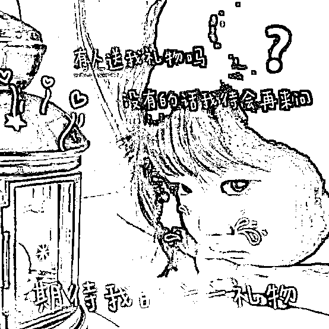

**今年六一，可以给自己一份礼物吗？**

今年的六一节，也许可以好好关爱自己，**给自己“内在的小孩”****送一份特别的六一礼物。**毕竟成年人也仅仅是过期了的小朋友而已。

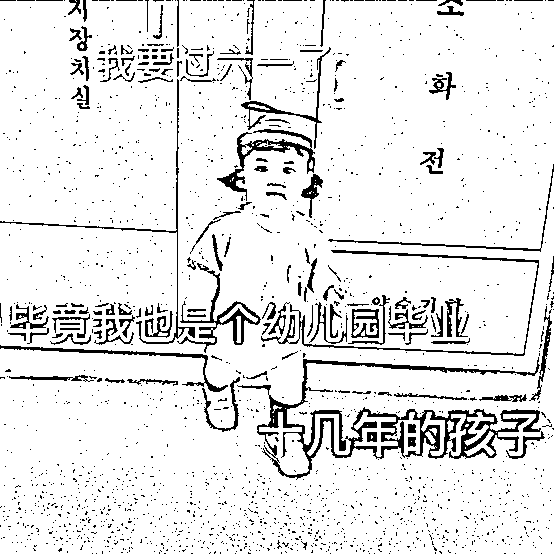

 如果你还没想好，

值此六一节即将来临之际，

**若道君将陆续为你送出**

**最贴心的六一节礼物。**

**六一重磅福利来啦！**

**若道匠心打造的**

**《幼儿报告》隆重发布啦**🎉🎉

孩子生下来不是一张白纸，

**他们有天生的性格和潜能。**

就像老鹰适合在天空飞翔，

而狮子需要在草原捕猎，

兔子喜欢吃草，

而乌龟需要慢慢爬行。

**当你能够了解你孩子的性格和潜能时，**

**你就会提供给孩子更适合他们的东西。**

稍微复杂的产品都有说明书，

但是对于最重要的宝贝——孩子，

当他们出生时，

父母却对他们一无所知。

**占星学则可以为此提供很多非常有益的信息。**

出生星图就像一面镜子，

可以让我们更好**洞察到这个孩子是谁，**

**TA 有什么样的****脾气****和****沟通模式，**

**TA 有什么****天赋才华**

**可能会经历什么意象的****挑战****，**

**而抵达 TA 的目的地。**

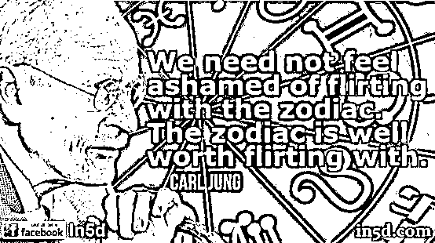

20 世纪最伟大的心理学家之一

——荣格本人也是占星师曾经说过：

**“占星学建立在‘共时性’的基础上，**

**如果心理学家不用占星学，**

**就好像在黝黑的隧道中，**

**手里拿着电筒却不打开它。”**

**而在儿童的教育中，**

**占星学也像一个手电筒，**

**帮你看到孩子的很多信息。**

**这份《幼儿报告》报告就像这个手电筒，**

**帮你照亮你的孩子。**

若道匠心打造的《幼儿报告》

**5 月 23 日正式上线发布**

**促销期内（5 月 23 日-6 月 10 日）**

扫描下图二维码

即可尊享多重福利：

**六一福利大派送**

**①  扫码上图二维码即可免费测算宝宝四元素特性；**

**②  报告原价 128 元，六一促销价仅需 88 元；**

**③  购买宝宝报告，额外免费赠送一份爸爸或妈妈的报告；**

**④  报告购买用户还可免费参加多场”六一.亲子关系”直播沙龙。**

**购买报告，六一直播免费看**

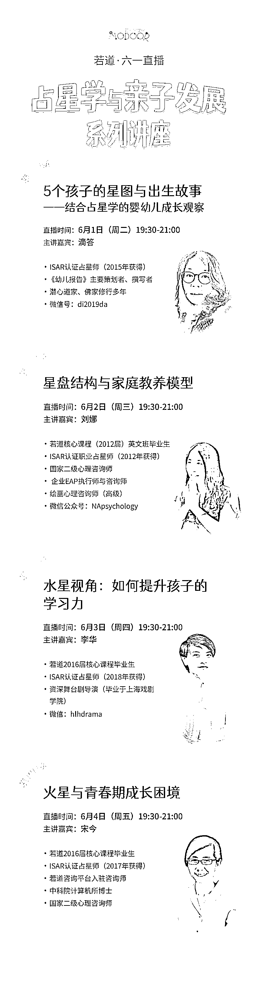

（**温馨提示：**报告购买后，**记得添加客服微信号 nodoor201705**，领取价值 300 元的 4 场”六一.亲子关系”沙龙直通券，每场沙龙仅限 200 个名额，先到先得！）

**幼儿报告适用对象**

**① 父母买给宝宝**

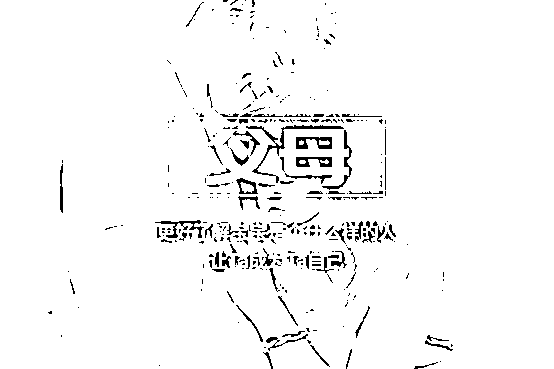

了解 “宝宝是一个什么样的人，

并努力让 Ta 成长为 Ta 自己”，

对于初为人父、人母的你来说，

是一个很重要的人生功课。

**这份《幼儿报告》也许可以告诉一些答案，**

**让你更好了解你的宝宝是一个什么样的人，**

**Ta 需要什么的父母和养育环境……**

**② 买一份送给自己**

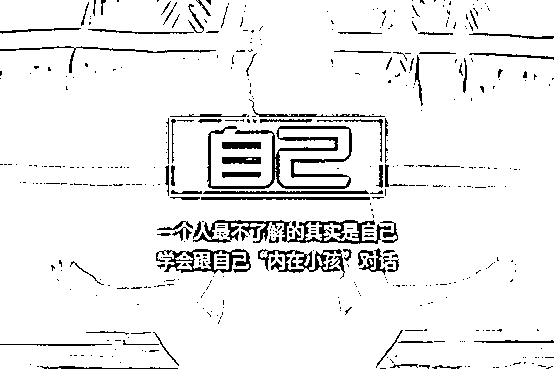

“

**一个人对自己的了解与他真实的样子越接近，他就越拥有智慧。他对自己的想象跟他真实的样子相差越大，他就越疯狂。”**

**——罗德尼·科林**

”

**③ 买一份送亲友**

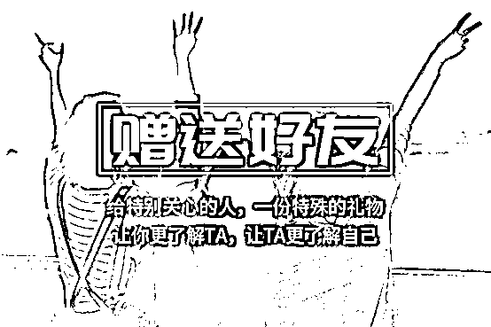

“

**好的礼物不一定是最贵重的，而是别人急需却又一时无法获得的。**

**——汪国真**

”**听听购买用户怎么说**

**LISA， 年龄：30+（宝宝 2 岁）， 职业：媒体人**

我看了宝宝的报告，也看了自己的报告。在看自己的报告时，说真的，我哭了，感觉我被理解了。

**HONG, 年龄 30+（宝宝 4 岁）， 职业：UI 设计师**

我第一次阅读幼儿报告的时候对内容的感受并不是特别深刻，过了几天再次回看的时候，细细品味了一下，针对每一个点在结合宝宝平时的表现，宝宝显征的表现感觉挺明显的，对于爸爸妈妈的那些也感触深刻。对于内在的表现有些已经表现出来了，还有一些感觉还没发展出来。因为宝贝还小，可能我还没有发现。因此我感觉幼儿报告还是很有指导性的。

**大宝，年龄 50+，职业：人力资源总监**

读到“我需要一个这样的爸，我需要一个这样的妈”的内容时，我被深深的触动到了，如果我的父母在我小时候能够知道我需要他们怎么与我相处，也许，我跟他们的关系不会是现在这个样子。

**米雪，年龄 30+，职业：产品经理**

我从小就很自律的小孩，凡事努力做到最好，努力想让身边的人开心，但是往往忽略了自己。当我读到“诉苦、哭泣、表现脆弱，闹个小情绪，发泄一下，是可以的”，我瞬间泪流满面……原来我是可以不用那么努力地告诉自己要坚强。

**报告购买后，如果你也有想分享的心得体会或成长故事，欢迎在留言区留言，****留言点赞量最高****的两位粉丝用户，将可以****免费获赠****报告撰写者 30 分钟一对一亲子关系在线咨询服务。**

**购买后如何查阅报告**

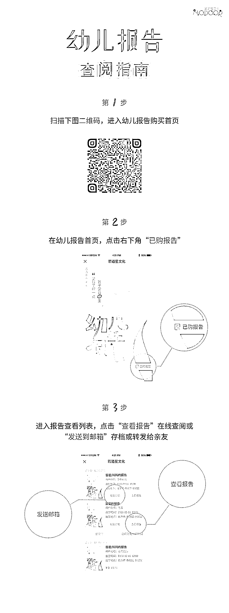

********点击阅读原文，购买报告********

# 土天四分前，我们还会看到如今年 2 月的行情吗？丨 6 月上证+黄金报告上线

> 原文：[`mp.weixin.qq.com/s?__biz=MzA5NjA0NTAxNg==&mid=2651445061&idx=2&sn=dfe830475f87883733c5c4d45d95c49c&chksm=8b4b65f2bc3cece41c3e917164f80546202cd12c2f6cdc8756761ad80457f3561a87d4a97e1a&scene=126&sessionid=1692737984#rd`](http://mp.weixin.qq.com/s?__biz=MzA5NjA0NTAxNg==&mid=2651445061&idx=2&sn=dfe830475f87883733c5c4d45d95c49c&chksm=8b4b65f2bc3cece41c3e917164f80546202cd12c2f6cdc8756761ad80457f3561a87d4a97e1a&scene=126&sessionid=1692737984#rd)

从 3 月 9 日上证指数跌到 3328 以来，上证指数几乎一直在一个箱体内震荡，筑了三重底。

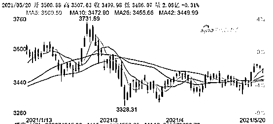

| 上证指数日 K 线图

**而现在离土天四分第二次精准成相的日期 6 月 14 日还有 3 周时间。**

当然，土天四分的影响并不只是在一天，它的影响力容许范围可以**从 5 月底持续到 7 月中旬。**

2 月 18 日，当土星和天王星形成第一次四分相时，上证指数到达从 2019 年股市开始上涨以来的最高点 3731。此后，上证指数开始掉头下跌，跌至 3 月 9 日的低点 3328 点，跌幅达 10.8%**。****第一次的土天四分相是一个关键的反转点。**

**第二次土天四分，我们还会看到如今年 2 月份的行情吗？**

5 月有几个重要的占星征象：

*   **5 月 21 日太阳四分木星**

*   **5 月 23 日土星逆行**

*   **5 月 30 日水星逆行**

*   **5 月 31 日火星四分海王星**

因为容许度的关系，每个征象都有前后几天的影响期。所有这些都是强有力的金融市场出现反转相关征象，届时可能出现一个主要的周期波峰或波谷。

在 6 月份可以如何操作？**金融占星大师雷蒙德·梅里曼的《2021 年 6 月上证指数报告》已上线，**《2021 年 6 月黄金报告》也已上线，欢迎购买。

**6 月上证报告上线**

**上证指数月度报告价格**

**单月报告**：280 元/月 

**季度套餐价格**：780 元（260 元/月）

**年度套餐价格**：2400 元（200 元/月）

**双报告年度套餐更优惠（直降 900 元）**

**12 个月黄金报告+12 个月上证指数报告：仅需 3900 元**

您也可以购买《[2021 年金融预报和沙龙](http://mp.weixin.qq.com/s?__biz=MzA5NjA0NTAxNg==&mid=2651436458&idx=3&sn=a7522c271761ef772fc91991ff11d965&chksm=8b4b071dbc3c8e0b452375ae3593028ab68b7b6157b45ee7c92943ff3396990d7748d7cd0967&scene=21#wechat_redirect)》（点击可阅读），以了解梅里曼老师对于上证、黄金及主要金融市场 2021 年走势的整体看法。

投资有收益，投资有风险，希望金融占星学的研究帮助你更好地评估你的投资。

“**黄金是金钱。其他的只是信贷。**

**——约翰·皮尔庞特·摩根**

”黄金价格在 3 月 31 日跌至双底低点 1673.30 以来，一直处于上涨之中。

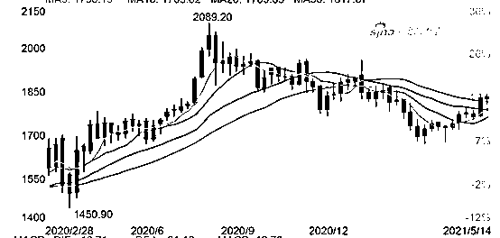

从疫情发生以来，美国政府增加了接近 6 万亿美元的国家债务，继续通过其史无前例的经济刺激计划确保市场有充足的资产流动性。尽管数据显示通胀正在加剧，但美国联邦储备委员会仍在继续实施零利率政策（ZIRP）。美联储坚称，通胀增长只是暂时的。然而市场的反映并非如此，美国 5 年通胀预期攀升至 2005 年的水平。2005 年，大宗商品价格大幅上涨，随后 4 年通胀率达到平均 6.5%。为了保持金融市场的稳定，提供失业保障，美国在货币霸权之下，在全球范围内造成的巨大的美元流动性风险，而这种风险在未来还将更加显化。下面是一张很有趣的图，显示了 70 年代高通胀时期大类资产年化回报。

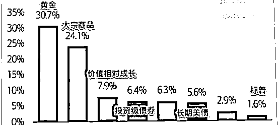

当然，这个只是历史。现在的问题是，历史会重复吗？

**6 月黄金报告已经上线，**上证报告也会在月底前上线。欢迎了解。也可以按照季度和 1 年期订阅，有更多优惠。**季度和年度的好处是，你可以持续了解梅里曼老师对于不断在变化的市场的看法**。即便他某一次看法和市场不一致，你也看到在下一期他如何调整自己的看法，并看到金融占星在一个长期时间段内对你把控风险的帮助。而能够长期控制风险、尽量找到安全的投资时机才是投资的长久之计。

点击**阅读原文**，雷蒙德·梅里曼黄金周期 6 月报告带来有 40 年黄金市场研究经验的世界著名金融占星大师雷蒙德·梅里曼对当前黄金市场的研究。

投资有收益，投资有风险，希望这份金融占星学的研究帮助你更好地评估黄金投资。

**6 月黄金报告上线**

**黄金月度报告价格**

**单月报告**：280 元/月 

**季度套餐价格**：780 元（260 元/月）

**年度套餐价格**：2400 元（200 元/月）

**双报告年度套餐更优惠（直降 900 元）**

**12 个月黄金报告+12 个月上证指数报告：仅需 3900 元**

**长按下图识别二维码购买黄金报告**

▼

**购买者需知**

**① **梅里曼市场时机学院《中国上证指数月度研究报告》是梅里曼市场时机学院（以下简称 MMA）的研究“预报”，而不是市场“预测”，是梅里曼老师及 MMA 金融占星分析师对人类活动周期历史与行星周期之间相关性的研究，二者在大部分情况下具有 80%或更高的相关性，而不是因果关系。报告中的研究完全存在错误的可能性。即便是非常认真的研究和几十年的研究经验，金融占星师无法总是正确地解读出各种征象在实际层面上会如何相互作用，并显化为事件结果。所以请将报告看作一个研究参考，务必结合其他市场研究和你个人对市场的理解，根据你的自由意志做决策。**②** 此报告一旦售出，**即不接受退款。**

**③** 上证、黄金月度报告每月固定 1 期，**并非都是在每月相同日期发布。**

**④** **我们收到英文报告的当天，即发布该英文报告。3 天后，上线报告中文版。此报告仅支持手机网页阅读，不支持电脑阅读和下载。**

**以上须知，请仔细阅读。一旦付款，即视为已了解并接受所有须知内容。**

在过去的 39 年中，唯有梅里曼逐渐完善，并在梅里曼市场时机学院月度周期报告中阐释了将地球宇宙学与周期相结合的研究方法，以惊人的精确性预报了黄金价格发生重大变化的时间。

**黄金购买 Tip**各大银行均可购买黄金或黄金 EFT 基金，也可以在诸如天天基金或者支付宝购买黄金及黄金相关产品。不明白的可以百度搜索。**购买后如何查看报告？**

**购买后有疑问怎么办？**

请联系技术客服

**微信：nodoor201705**

**购买黄金+上证报告直达入口**

# 向“工匠”迈进的处女座，该如何爱自己并解锁“超能力”？

> 原文：[`mp.weixin.qq.com/s?__biz=MzA5NjA0NTAxNg==&mid=2651444954&idx=1&sn=085b07ea30a7bbacdd145500f9439252&chksm=8b4b646dbc3ced7b44e1010df15ccd5e3610aaa51f15b50d3e62788b0b69c378f6f8fbceec00&scene=126&sessionid=1692737984#rd`](http://mp.weixin.qq.com/s?__biz=MzA5NjA0NTAxNg==&mid=2651444954&idx=1&sn=085b07ea30a7bbacdd145500f9439252&chksm=8b4b646dbc3ced7b44e1010df15ccd5e3610aaa51f15b50d3e62788b0b69c378f6f8fbceec00&scene=126&sessionid=1692737984#rd)

******************☆ ****************************后台****************************回复“今日”，给你一句生命态度******************

作者/胡曦兮

编辑/翀子 封面/书君 图片/网络

今天月亮在处女座，说起这个星座，很多人都觉得他们挑剔又喋喋不休，殊不知他们是真正“工匠精神”的体现。如果你的星图上有显著处女座能量，你的进化之路是怎样的呢？这篇文章就告诉你如何做一个更好的自己。
**向“工匠”迈进的处女座**

提起处女座，很多人都会禁不住的皱起眉头，“洁癖”、“挑剔”、“喋喋不休”的形象跃然眼前，这样的形象也被娱乐占星迅速的标签化，深入人心。

然而，处女座的能量到底是什么呢？

**处女座，作为土象星座的变动星座，它代表着人类的一切劳动与工作。**劳动创造使用价值，马克思说，它是人类区别于动物的本质，通过人与自然之间的物质、能量、信息的变换而实现，其根本标志是能够制造和使用工具。

无论承认与否，每一个人内在都希望自己是“有用的”，没有人愿意做一个废人。当处女座能量强大时，劳动的能力便成为专业技能技艺，造福世界，反之则是低水平劳作，制造垃圾。

**提升处女座的能量，个体需要练就一技之长，**就好似某种“超（级）能力”一样，处理技术活儿，小到手工工艺修脚剃头，大到高科技技术航天航空，可以是祖传手艺，也可以是现代科学。练就技能技艺的过程需要以既定的水准为目标，“取法乎上得乎中，取法乎中得乎下”；遵循操作章法、完成各项步骤；不间断重复练习，在一次次练习中纠正上一次的错误与问题，自我进步。

在整个过程中，**”师徒传承”是处女座能量流动的纽带，**个体的寿命有限，而技能技艺却可以世代传承；专业的工具是处女座能量得以实施的重要媒介，没有金刚钻不揽瓷器活。**处女座的高阶能量便是通过个体的不断精进，成为行业的“大师”，**产出顶尖产品与服务的同时传承技能技艺。

一丝不苟、精益求精的认真敬业精神是我们当今社会非常或缺的**“工匠精神”**。台上一分钟，台下十年功，我们可以在所有的非物质文化遗产传承者，各行各业的工艺大师和技术牛人身上，看到强大的处女座高阶能量，令人赞叹与钦佩。

**每个人都具备处女座的能量，**或多或少，而出生星图中太阳、月亮、上升（或其所落星座的守护行星）落入处女座的人，处女座能量非常多，本文且称之为处女座人。**日月升是每个人星图中的三大重要引擎****，**分别代表我们的活力（心智系统）、快乐（情感系统）、个人风格 （立足社会的能力）。**处女座人需要找到并解锁属于自己的“超能力”，朝“大师”的方向迈进。**

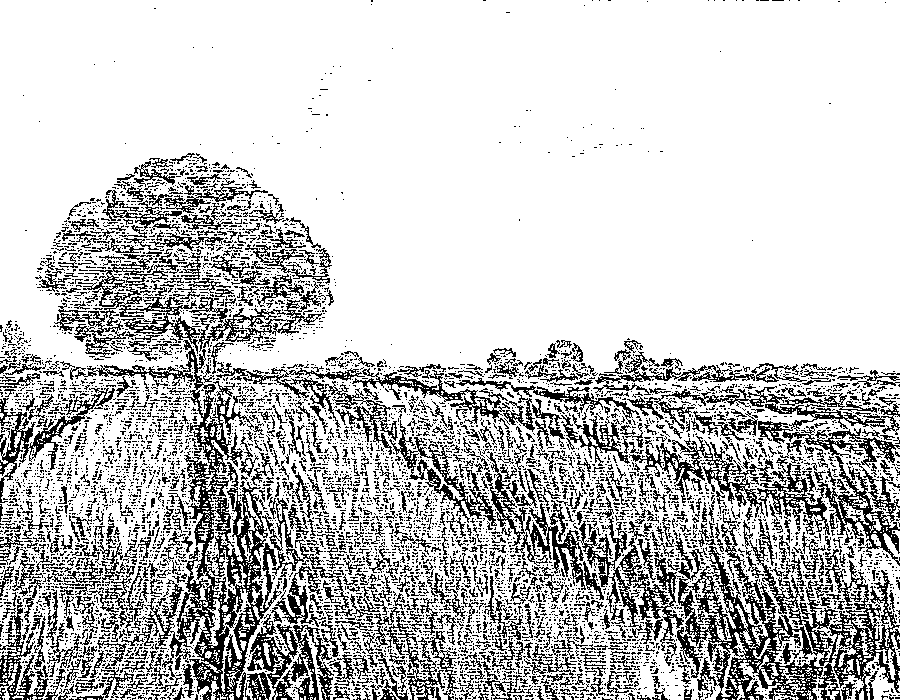

**解锁“超能力”**

每个人来到人间都和宇宙签订了一份灵魂契约，它写在你的出生星图中，这并不是一份强制合约，人类拥有自由意志，可以自己做出选择，但宇宙希望每个灵魂在生命旅程中都可以做出对的选择，收获成长。因此，**出生星图中的每一个能量都是你所需要的，对灵魂有所助力的良药。**

**很多处女座人说自己不像处女座，**经常懒散而混乱，物品乱七八糟，油瓶倒了都不扶；**但又有一种处女座人，事事苛求，**忙忙碌碌整洁成癖，却诸多不满与挑剔。

在这里，**两种表象不一的处女座人，都有着同样的功课——找到并解锁属于自己的“超能力”。**

每个处女座人的灵魂深处都有着这样的情绪“毒素”——**紧张焦虑，永远觉得自己不够好甚至以之为耻。**处女座人的骨子里似乎天生流淌着某一种自惭形秽的渺小感，觉得自己做得再好也没有用，战战兢兢，如履薄冰。卑微与耻辱感在潜意识的层面让自己无法自重自爱，苛求自己挑剔他人并不能疏解内在。

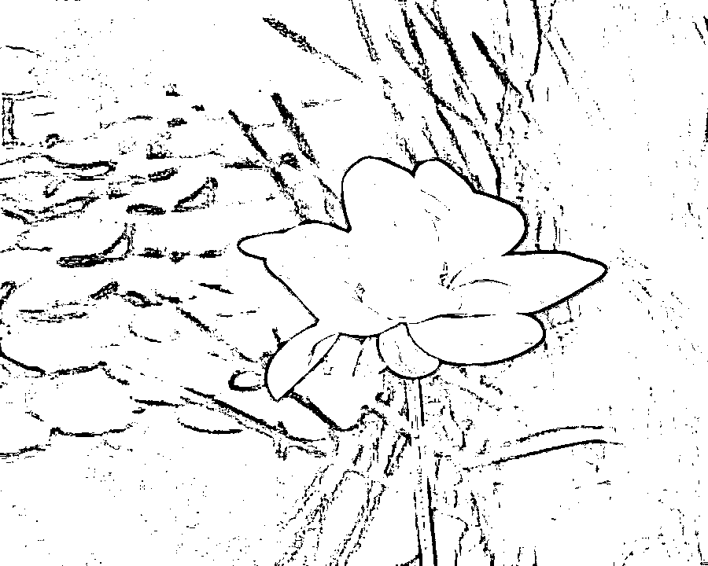

这样的情绪“毒素”来自于灵魂累生累世的业力创伤。中国是一个长时期处于封建体制的国家，君君臣臣，男尊女卑，造就了不同阶级下的奴性，几乎从每个处女座人的南交点故事里都可以找到因时代背景造成的被物化被压榨的过去世经验，作为奴才面对主子的吹毛求疵、刻意刁难只得遵从，作为女人只能作为生育机器依靠子嗣存活……在那样的时代下，作为“奴隶”只能像一个陀螺一样转动，而别无选择。

物换星移，沧海桑田，这一世处女座人再一次来到人间，现代社会可以自主选择所从事的职业，有一份可以解锁自己“超能力”的职业尤为重要。

辨认的方法很简单——你是否讨厌“星期一”？做一颗流水线上的螺丝钉，和做一个四两拨千斤的职业选手答案可能不一样。宇宙为了帮助处女座人，总会在无形之中支持着这样的灵魂，**处女座人会发现自己对于某些技能的掌握似乎优于常人，**也更容易获得千里马的伯乐与服务对象的赞赏。

每当处女座人可以运用个人“超能力”成功解决问题，会意识到“原来我能起这么大的作用！我这么牛！”由此灵魂深处的焦虑与紧张、自卑与耻辱开始释放，**开始真正学会尊重与珍爱自我**——我的能力超乎我想象！天空开始晴朗，心情开始愉悦，自我开始成长！

意识到这样的能量运转模式，对于处女座人来说异常重要，这好似宇宙给你的一个定制承诺——天生我材必有用，功夫不负有心人！

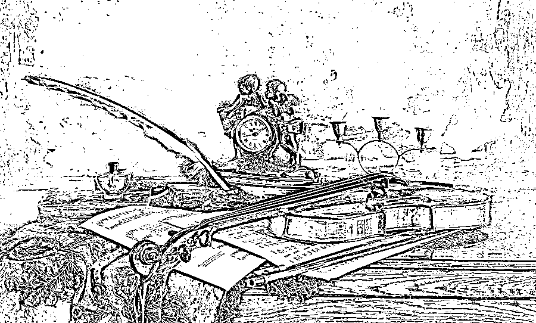

**怎样不断提升处女座能量？**

没有一条河流可以笔直地流向大海，没有一个处女座人可以瞬间解锁“超能力”，走向高阶。能量的提升永远是曲线前进，千锤百炼出深山，烈火焚烧若等闲。

**处女座人需要剔除低阶的能量杂质**——悲观主义，自我贬低；执迷不悟，钻牛角尖；焦虑不安，过度紧张。每个人的出生星图中都拥有不同的能量组合，在生命的长河中都会经历各种长期或短期的行星推进，**保持良好的自我觉察，有意识的整合内在能量，可以让现实的打磨变成处女座人精进的良机，逐步解锁自我的“超能力”。**

*****Step1 *********提纯处女座能量****

*   **摒除片面观点**

    **处女座人时常有一些根深蒂固的片面观点**，比如“婚姻不幸福是因为我长得不好看”。学会逻辑推理很重要，多数时候大脑的执念匪夷所思不合逻辑。客观来看，“长得好看”和“婚姻幸福”的相关性是什么？答案是并非直接相关，有意识地在头脑中纠正这些观点。

*   **释放焦虑情绪**

    **处女座人时常惧怕犯错**，生怕自己一失足成千古恨，一着不慎满盘皆输，引发自我焦虑。然而没有一个常人可以不犯错，犯错是所有人类进步的必经之路，学会犯错，知错就改，不能因为怕踩坑而止步不前。

*   **改正挑剔苛求**

    **处女座人时常会习惯性地苛求自己，**乃至诸多挑剔，练习多动手少动嘴，从实际出发，亲力亲为，便会发现再好的运动员也拿不到奥运会的所有金牌，再好的美玉也达不到到玻璃的标准。知足者常乐矣！

*****Step2*********  平衡双鱼座能量****

**双鱼座是处女座的对分相位星座，**代表灵性、意识本身，一切微妙的非物质阴性能量。

**处女座人要学会虚实结合，平衡双鱼座的能量。**一幅美的画作需要留白，一首好的乐曲需要休止符。处女座人习惯性使用“疲劳战术”，消耗精力却效率低下，“一张一弛，文武之道”，试着按下暂停键，静坐冥想，或者仅仅是睡上一觉，醒来发现一直难以掌握的技术居然能够一气呵成，甚是奇妙。

俗话说孰能生巧，一遍遍的练习可以形成肌肉记忆，从而把头脑解放出来，学会关注呼吸，练习“放松的专注”，手忙心闲，老司机可以一边聊天一边开车毫不耽误；注重细节，每一次的重复都尝试减少多余的动作，让技艺趋于精巧，正如庖丁解牛，游刃有余。

**当处女座人可以摒除杂念渐入佳境，在习练中获得一种禅定，进入心流状态，便是完美地平衡了双鱼座的能量。**

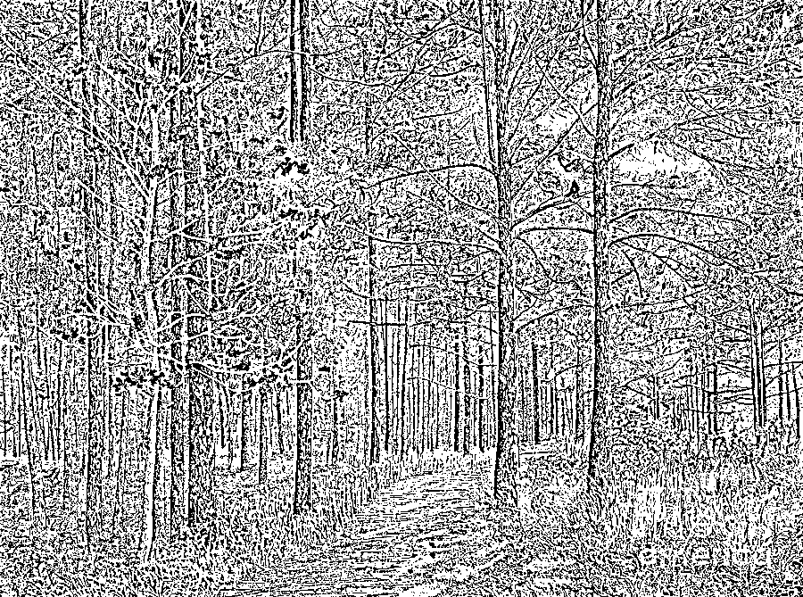

*****Step3*********整合双子座能量****

**双子座是处女座的四分相星座，代表信息的流通、内在的求知欲、发出自己的声音。**双子座和处女座都由水星守护，两者都代表学习的能量，有其互通之处又有所区别。前者侧重知识和表达，后者侧重逻辑和技能。

**处女座人面对各种变化，需要整合双子座的能量。**处女座人遇到问题容易习惯性地大惊小怪一惊一乍，快速审时度势，临场应变非常重要，随时观察与调整，保持积极思考，调动大脑做出应变，司马光砸缸的故事便是典型的例子。

脑子越用越灵，除了师承学习，**处女座人还需要对一切自己不知道的事情保持好奇，**勤学好问，触类旁通，三人行必有我师；养成归纳总结的习惯，吾日三省吾身，三思而后行。“认死理”或者“盲人摸象”只能以偏概全，钻进牛角尖。

此外，处女座人还需承担起**技艺传承**的责任，用年轻人听得懂的语言传授技能，对不同特点的学生因材施教。**扎实的基本功加上随机应变的能力，处变不惊，机智老练是处女座和双子座的能量整合。**

*****Step4*********整合射手座能量****

**射手座是处女座的四分相星座，**代表幸运与意义、信念体系、宗教信仰，通常需要通过亲身的体验和经历来获得。

**处女座人需要学会乐观豁达，找到信念感，**需要整合射手座的能量，这并不是一件容易的事。处女座人总是习惯于悲观，看不到希望。试着切换视角，半杯水用悲观的眼光看是没有了一半，用乐观的眼光去看是还有一半！硬币永远都有正反两面，看到希望，做出努力，尽人事听天命，自助者天助也。

此外，**学会问自己为什么，这份职业的意义是什么？**去寻找自己的答案。行万里路，体验不同人生，读万卷书，寻找理论支撑。建立属于自己的信念体系，找到职业的意义。笔者太阳处女座四分射手座天王星，选择成为一进化占星师，通过专业星图的解读帮助有需要的生命灵魂疗愈与绽放，便是这份职业的意义。

**当处女座人走在一条有意义的职业道路上，不再悲观，坚定自己的方向不动摇，便是整合了处女座和射手座的能量。**

**尾声**

到这里，我们不禁追问，生命的意义是什么？进化占星学给出了很好的答案，是“灵魂的进化”——意识到业力的模式，让我们的灵魂遵循南北交的路线从低阶走向高阶，从过去走向未来，从伤痛走向绽放。**这样的进化修行过程，正是处女座的核心目的**——**做更好的自己**——世界因此而美好！

**版权声明：**原创文章由作者授权首发于若道平台，欢迎转发，反对抄袭。友号转载请申请白名单。

**想阅读更多处女座文章**

**请在后台回复****”处女座“**

**胡曦兮**

若道 2012 年毕业生

师从斯蒂芬·弗里斯特，全职进化占星师

北京大学传播学硕士，星寓占星工作室创始人

公众号：星寓文化

**长按打赏**

**系统学习占星学**

**点击下图了解详情**

**微信又双叒叕改版啦，不想错过若道君的推送？**

**就把若道设为星标吧！**

**▼**

**喜欢记得点一下在看哦☟**

********报名直达入口********

# 土天四分前，我们还会看到如今年 2 月的行情吗？丨 6 月上证+黄金报告上线

> 原文：[`mp.weixin.qq.com/s?__biz=MzA5NjA0NTAxNg==&mid=2651444954&idx=2&sn=45200302869043d2c220d6b7283c2e0a&chksm=8b4b646dbc3ced7b72a04236c04635ddc1e5606521100bed99ad9d16e151531807fb4861337c&scene=126&sessionid=1692737984#rd`](http://mp.weixin.qq.com/s?__biz=MzA5NjA0NTAxNg==&mid=2651444954&idx=2&sn=45200302869043d2c220d6b7283c2e0a&chksm=8b4b646dbc3ced7b72a04236c04635ddc1e5606521100bed99ad9d16e151531807fb4861337c&scene=126&sessionid=1692737984#rd)

从 3 月 9 日上证指数跌到 3328 以来，上证指数几乎一直在一个箱体内震荡，筑了三重底。

| 上证指数日 K 线图

**而现在离土天四分第二次精准成相的日期 6 月 14 日还有 3 周时间。**

当然，土天四分的影响并不只是在一天，它的影响力容许范围可以**从 5 月底持续到 7 月中旬。**

2 月 18 日，当土星和天王星形成第一次四分相时，上证指数到达从 2019 年股市开始上涨以来的最高点 3731。此后，上证指数开始掉头下跌，跌至 3 月 9 日的低点 3328 点，跌幅达 10.8%**。****第一次的土天四分相是一个关键的反转点。**

**第二次土天四分，我们还会看到如今年 2 月份的行情吗？**

5 月有几个重要的占星征象：

*   **5 月 21 日太阳四分木星**

*   **5 月 23 日土星逆行**

*   **5 月 30 日水星逆行**

*   **5 月 31 日火星四分海王星**

因为容许度的关系，每个征象都有前后几天的影响期。所有这些都是强有力的金融市场出现反转相关征象，届时可能出现一个主要的周期波峰或波谷。

在 6 月份可以如何操作？**金融占星大师雷蒙德·梅里曼的《2021 年 6 月上证指数报告》已上线，**《2021 年 6 月黄金报告》也已上线，欢迎购买。

**6 月上证报告上线**

**上证指数月度报告价格**

**单月报告**：280 元/月 

**季度套餐价格**：780 元（260 元/月）

**年度套餐价格**：2400 元（200 元/月）

**双报告年度套餐更优惠（直降 900 元）**

**12 个月黄金报告+12 个月上证指数报告：仅需 3900 元**

您也可以购买《[2021 年金融预报和沙龙](http://mp.weixin.qq.com/s?__biz=MzA5NjA0NTAxNg==&mid=2651436458&idx=3&sn=a7522c271761ef772fc91991ff11d965&chksm=8b4b071dbc3c8e0b452375ae3593028ab68b7b6157b45ee7c92943ff3396990d7748d7cd0967&scene=21#wechat_redirect)》（点击可阅读），以了解梅里曼老师对于上证、黄金及主要金融市场 2021 年走势的整体看法。

投资有收益，投资有风险，希望金融占星学的研究帮助你更好地评估你的投资。

“**黄金是金钱。其他的只是信贷。**

**——约翰·皮尔庞特·摩根**

”黄金价格在 3 月 31 日跌至双底低点 1673.30 以来，一直处于上涨之中。

从疫情发生以来，美国政府增加了接近 6 万亿美元的国家债务，继续通过其史无前例的经济刺激计划确保市场有充足的资产流动性。尽管数据显示通胀正在加剧，但美国联邦储备委员会仍在继续实施零利率政策（ZIRP）。美联储坚称，通胀增长只是暂时的。然而市场的反映并非如此，美国 5 年通胀预期攀升至 2005 年的水平。2005 年，大宗商品价格大幅上涨，随后 4 年通胀率达到平均 6.5%。为了保持金融市场的稳定，提供失业保障，美国在货币霸权之下，在全球范围内造成的巨大的美元流动性风险，而这种风险在未来还将更加显化。下面是一张很有趣的图，显示了 70 年代高通胀时期大类资产年化回报。

当然，这个只是历史。现在的问题是，历史会重复吗？

**6 月黄金报告已经上线，**上证报告也会在月底前上线。欢迎了解。也可以按照季度和 1 年期订阅，有更多优惠。**季度和年度的好处是，你可以持续了解梅里曼老师对于不断在变化的市场的看法**。即便他某一次看法和市场不一致，你也看到在下一期他如何调整自己的看法，并看到金融占星在一个长期时间段内对你把控风险的帮助。而能够长期控制风险、尽量找到安全的投资时机才是投资的长久之计。

点击**阅读原文**，雷蒙德·梅里曼黄金周期 6 月报告带来有 40 年黄金市场研究经验的世界著名金融占星大师雷蒙德·梅里曼对当前黄金市场的研究。

投资有收益，投资有风险，希望这份金融占星学的研究帮助你更好地评估黄金投资。

**6 月黄金报告上线**

**黄金月度报告价格**

**单月报告**：280 元/月 

**季度套餐价格**：780 元（260 元/月）

**年度套餐价格**：2400 元（200 元/月）

**双报告年度套餐更优惠（直降 900 元）**

**12 个月黄金报告+12 个月上证指数报告：仅需 3900 元**

**长按下图识别二维码购买黄金报告**

▼

**购买者需知**

**① **梅里曼市场时机学院《中国上证指数月度研究报告》是梅里曼市场时机学院（以下简称 MMA）的研究“预报”，而不是市场“预测”，是梅里曼老师及 MMA 金融占星分析师对人类活动周期历史与行星周期之间相关性的研究，二者在大部分情况下具有 80%或更高的相关性，而不是因果关系。报告中的研究完全存在错误的可能性。即便是非常认真的研究和几十年的研究经验，金融占星师无法总是正确地解读出各种征象在实际层面上会如何相互作用，并显化为事件结果。所以请将报告看作一个研究参考，务必结合其他市场研究和你个人对市场的理解，根据你的自由意志做决策。**②** 此报告一旦售出，**即不接受退款。**

**③** 上证、黄金月度报告每月固定 1 期，**并非都是在每月相同日期发布。**

**④** **我们收到英文报告的当天，即发布该英文报告。3 天后，上线报告中文版。此报告仅支持手机网页阅读，不支持电脑阅读和下载。**

**以上须知，请仔细阅读。一旦付款，即视为已了解并接受所有须知内容。**

在过去的 39 年中，唯有梅里曼逐渐完善，并在梅里曼市场时机学院月度周期报告中阐释了将地球宇宙学与周期相结合的研究方法，以惊人的精确性预报了黄金价格发生重大变化的时间。

**黄金购买 Tip**各大银行均可购买黄金或黄金 EFT 基金，也可以在诸如天天基金或者支付宝购买黄金及黄金相关产品。不明白的可以百度搜索。**购买后如何查看报告？**

**购买后有疑问怎么办？**

请联系技术客服

**微信：nodoor201705**

**购买黄金+上证报告直达入口**

# ISAR 选修课丨唤醒女神，在占星学中使用小行星

> 原文：[`mp.weixin.qq.com/s?__biz=MzA5NjA0NTAxNg==&mid=2651444954&idx=3&sn=50bd51515912a6e2756967226954d734&chksm=8b4b646dbc3ced7bc9f61807b7e1dcfe2274929c5f421ed2b8853f25412b89a93d6c976f2a84&scene=126&sessionid=1692737984#rd`](http://mp.weixin.qq.com/s?__biz=MzA5NjA0NTAxNg==&mid=2651444954&idx=3&sn=50bd51515912a6e2756967226954d734&chksm=8b4b646dbc3ced7bc9f61807b7e1dcfe2274929c5f421ed2b8853f25412b89a93d6c976f2a84&scene=126&sessionid=1692737984#rd)

对于占星师来说，巨大的小行星带中有成千上万的滚落岩石在太空中呼啸而过，这似乎是一次令人生畏的雪崩，蕴含着潜在的新信息。因此，当你将它们整合到你的工作中时，辨别并正确理解每一颗小行星的意义是很重要的。

包括选择小行星在星图的解读，增加微妙的细微差别和令人惊讶的细节是无法从任何其他占星工具中获得的。

1

**课程简介**

理解小行星带所蕴藏的神圣女性力量的流动将帮助你在占星实践中创造更多的和谐与平衡。**小行星为你的解读带来细节、精确性和深度，同时也使你能够研究和阐释那些被忽视或低估的生命领域。**

**我们将讨论主要的女神小行星，并学习如何与之合作。**我们将借助大量现实生活中的例子，深入探讨它们的象征意义。你会真正了解这些重要的占星元素，从而拓展自己的实践。

**此课程可作为 ISAR 选修课。**

2

**课程安排**

**课程安排：6 月 8 日--7 月 27 日 （每周二）**

*   **6 月 08 日** **小行星简介**

*   **6 月 15 日** **谷神星，丰饶女神**

*   **6 月 22 日** **婚神星，婚姻女神**

*   **6 月 29 日** **智神星，智慧女神**

*   **7 月 06 日** **灶神星，壁炉女神**

*   **7 月 13 日 健神星，健康女神**

*   **7 月 20 日** **灵神星，灵魂女神**

*   **7 月 27 日** **综合应用，展望未来**

3

**课程大纲**

**第*****1*****讲  6****月 8 日  小行星简介**

小行星概述，小行星的发现、科学以及一些占星学历史。

**第*****2*****讲  ****6 月 15 日 谷神星，丰饶女神**

母神、农业女神，但其影响力远不止如此。这是我们所知的最大的小行星，也是最重要的小行星。她掌管养育、滋养、救助、管理等方面。

**第*****3*****讲  ****6 月 22 日 婚神星，婚姻女神 **

荣誉、伙伴关系、契约和婚姻：众神中的女王是正直的女主人。她在出生星图和行进中有什么意涵？她与“丈夫”木星朱庇特是什么关系？

**第*****4*****讲  ****6 月 29 日 智神星，智慧女神**

战地记者、棋手和占星师有什么共同之处？来自智慧、策略、洞察力和远见女神的帮助。

**第*****5*****讲 **** 7 月 6 日 灶神星，壁炉女神**

掌管神圣的火焰、家庭生活、厨房灶台、家人、遗产的女神：这颗关键的小行星被严重误解了。她可以给你一把钥匙，让你了解家庭关系、你的祖先和你的目标意图。

**第*****6*****讲  ****7 月 13 日 健神星，健康女神**

在我们应对全球疫情的过程中，掌管健康和福祉女神目前显得尤为重要。她能提供如何应对新型冠状病毒肺炎的线索吗？她在出生星图中的意涵是什么？幸福原来蕴含着相当广泛的含义。

**第*****7*****讲  ****7 月 20 日 灵神星，灵魂女神**

灵神星是唯一一位以人类身份开始生命的女神，她代表着人类的灵魂。这颗小行星与爱情故事、童话故事和灵魂之旅有关。

**第*****8*****讲  ****7 月 27 日 综合应用，展望未来**

你们刚刚开启探索使用小行星可能性的旅程。我们会探索评估某些理论有效性的方法，以及在实践中检验这些理论的重要性，我们还会探索其他数百万小行星中的一些。这堂课既有提醒告诫，也鼓励你深化自己的占星实践，并拓展你对象征的理解。

4

**课程试听**

📹 [`v.qq.com/iframe/preview.html?width=500&height=375&auto=0&vid=d3241mm7xdw`](https://v.qq.com/iframe/preview.html?width=500&height=375&auto=0&vid=d3241mm7xdw)

解锁全部沙龙内容欢迎购买：[**ISAR 会员沙龙 29 期 | 天空的细节——小行星如何提升扩展占星学**](http://mp.weixin.qq.com/s?__biz=MzA5NjA0NTAxNg==&mid=2651437295&idx=2&sn=8816fb50331dff6f6d25686ff80d7b5b&chksm=8b4b0a58bc3c834e54fb7d13e5bc11c98067fd93b29c5fbfc8f9745a516cbd8bfa3b90696324&scene=21#wechat_redirect)（点击可获取详情）

5

**主讲老师**

**克里斯蒂娜·罗登贝克**

克里斯蒂娜·罗登贝克（Christina Rodenbeck）是一名全职职业占星师，在牛津大学城生活和工作，深受周围知识和文化氛围影响；她拥有伦敦大学（University of London）的人文荣誉学位，曾在伦敦占星学馆（Astrological Lodge of London）、心理占星中心和占星研究学院学习。

作为一名占星师，在过去的 20 年里，克里斯蒂娜在她的网站“牛津占星师”上写了大量关于时事、艺术和文化的文章；她每月主持一个占星播客：“与克里斯蒂娜和萨莉一起占星”，并定期在《占星杂志》(Astrological Journal)上撰写时尚专栏；她定期在英国授课，并保持着蓬勃发展的专业实践。

6

**此次课程适合哪些人？**

*   有一定占星学基础，若道核心课 L3 以上水平；

*   希望成为优秀的占星师，想要借鉴国际大师次限解读思路并融入自己的体系的人；

*   热爱占星学、天文学、神话学的研究型占星学者；

*   计划考取 ISAR 认证占星师，寻觅中意选修课的学员；

*   走在自我探索和个人成长道路上的人。

7

**课程价格**

**价格**：**6800 元**

还有限时 ISAR 选修课联报套餐价格，具体请咨询课程顾问：Maggie 老师（微信：18510107057，请备注“小行星”）

长按二维码添加 Maggie 老师

8

**授课时间**

**2021 年 6 月 8 日（周二）20:00-22:00 开始，网络课程**

9

**退转课程**

*   **退款原则请详看《教学协议》，如有疑问请咨询课程顾问。**

****ISAR 选修课：小行星****

**授课老师：克里斯蒂娜·罗登贝克**

**授课时间：**2021 年 6 月 8 日（周二）起

**授课方式：**网络课程**，**英文授课，中文翻译

**费用：**6800 元

**课程负责人：Maggie 老师**（微信：18510107057，请备注“小行星”）

长按二维码添加课程负责人咨询~

****报名请点击“阅读原文”****

# 520 快乐丨让这颗浪漫又迷惑的行星，送给你极致理想化的爱情故事

> 原文：[`mp.weixin.qq.com/s?__biz=MzA5NjA0NTAxNg==&mid=2651444860&idx=1&sn=307033c4bc7a9e8576e67aac42697878&chksm=8b4b64cbbc3ceddd7ba2412167b2dd97049b778727b8c14d6a547dca13c6d2feb802876bc33d&scene=126&sessionid=1692737984#rd`](http://mp.weixin.qq.com/s?__biz=MzA5NjA0NTAxNg==&mid=2651444860&idx=1&sn=307033c4bc7a9e8576e67aac42697878&chksm=8b4b64cbbc3ceddd7ba2412167b2dd97049b778727b8c14d6a547dca13c6d2feb802876bc33d&scene=126&sessionid=1692737984#rd)

******☆ ****后台回复“今日”，给你一句生命态度******

作者/大卫·瑞雷 若道占星创始人
整理/Cora、Amor 编辑/翀子 封面/书君 图片/网络

今天是 520，据说是个浪漫的日子~说到浪漫，我们会想起海王星，我们很难用一两句话概括它，毕竟它复杂又迷人。大卫老师在文章里为我们列举出海王星的一些关键词，它们能帮助你更好的了解这颗行星的特质，而文章后半段讲述的感人案例，更展现了海王星所有的正向影响，希望你们喜欢。

**海王星的关键词****☆****启迪**

对我来说，海王星可以带来更多的觉察，好像就是那种“啊哈”的感觉，当我发现了什么会“啊哈”，**恍然大悟**，又伴随着了悟之后的喜悦和极乐。

**☆****幻觉**

当你的灵魂进入到物质世界的时候，先经历很可怕的冥王星试炼（核心层面上的含义是缺失或被抛弃的感觉）之后，灵魂怎么得到安慰呢？海王星会说：“别担心，这不过都只是幻觉。”

如果你真的想找到你所要寻找的那些经历的话，是需要这个幻觉，**所以我把人生之旅称为是必要的幻觉，**这也意味着日常生活中会经历到所谓的幻觉。

**☆****理想、理想化**

无论我们是否意识到这一点，我们在生活中每时每刻都在进行比较，将我们目前的现实生活与想像中的理想进行比较。当我和我的客户讨论海王星的相关议题时，我总是会与他们谈到：**“你的理想是什么，你理想中的生活是什么？”**

谈及这个话题很多人会觉得羞愧，因为我们总是会觉得现实与理想之间的差距太大了，**而那些羞愧和内疚会阻碍海王星能量的流动，**你们每个人都比允许自己想像成为的自己更加奇妙和神奇。 

在海王星的影响下，我们也**会理想化一些事情**，如果你是一个海王星特质强的人，当你看到别人时，**你能够感觉到那个人自己都没有发现的更大的潜力，**你可能在他们身上看到他们自己都没觉察到的一些东西。

**从心理学上讲，是将自己理想的东西投射到那个人身上了，**发生这种投射的原因有很多，有时候可能只是一个人的一个动作、一个眼神，恰好引动了你脑中的部分理想情境，然后你就在他们身上投射了自己的理想。 

在许多的宗教中，雕像都扮演了很重要的角色，人们往往只要看着那些雕像的面孔就会升起许多情感。不仅是这样，有时候你见到一个人，你会觉得他符合你对理想中的另一半的全部想象，所以你就认定了他就是你的真命天子，你觉得他一定就是！**而那个人可能根本不知道发生了什么，不知道他对你来说已经这么“重要”了。**

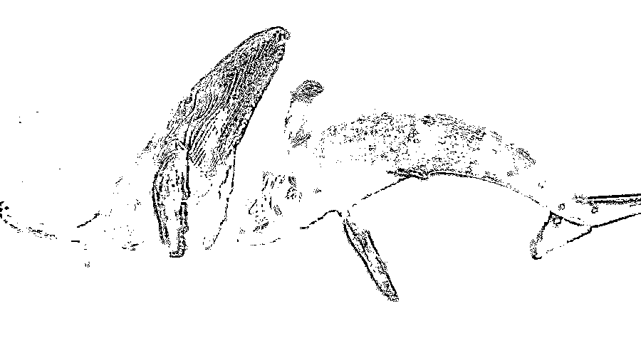

**☆****敏感**

**海王星最重要的关键词就是敏感。**无论我们什么时候看到海王星或者双鱼座，都会看到很多敏感的东西存在，敏感意味着**细腻、脆弱，容易被影响**。可以想象一下，如果你希望一道伤口愈合，你不能很粗暴地对待它，它需要柔软、湿润的环境，这就是海王星的感觉。

**☆****直觉**

有时候，在其它行星上面也有这个关键词，比如天王星，但是它更是一个符合海王星的关键词。**这里讲到的直觉，更像是下一个关键词，类似于灵性、通灵的那种。**

在中国我有一个很有趣的案例，在前年秋天（2010 年），遇一个海王星在 2 宫的女士，她用直觉去赌博，每次都会赢，她所从事的行业也是非常具有创造性的。可以说，她利用了她的直觉来赚钱。

**☆****预知**

预知性这个词，也跟通灵有些联系，有些人可以用他们灵媒的能力去预测未来。

**☆****想象力**

没有比双鱼座更有想像力的星座了。双鱼座出了不计其数的充满想象力的艺术家、作家、电影人、音乐家——从事各类艺术创作事业的人，他们用**丰富的想像力**创作出大量的艺术作品。

**☆****梦想家**

这里的“做梦”不仅仅是一个比喻——**海王星特质强的人确实比其他人需要更多的睡眠。**如果是海王星在你的星图中更突出，或者双鱼座突出的话，你比一般的人需要更多的睡觉。

**但是一旦当你有灵感的时候，你就不需要睡觉了。**到一定时间，久了，不可能一直不需要睡眠，**你会产生幻觉，**幻觉也是海王星的作用——某种程度上，有些人可以用幻觉代替睡眠。 

**有时候海王星也会影响对环境的感觉。**举个例子，假如你的月亮刑海王星，你可以需要一个非常安静舒适、像圣殿一般的家居环境才能觉得舒服，听到邻居的哭声可能会让你难过得无法入睡，闻到别人家炒菜的香味你可能也想躲起来。海王星在第四宫或是海王星刑月亮的人都可能有类似的表现。我观察到的这类人，如果他们不能在水边居住，他们往往也会在家里摆上金鱼缸。 

海王星还跟**愿景**关，以及**预想**、**可视化**。指导冥想的老师常常会说，**想象你们能够“看到”某种情景。**

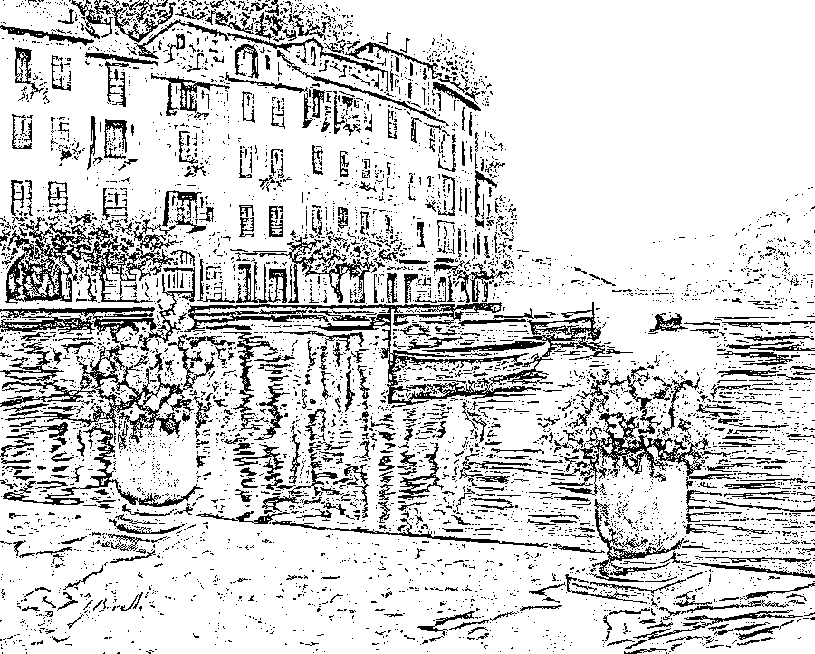

**☆****灵感和幻灭感**

这是我特别喜欢的两个海王星的关键词。我们都知道那种看了一场电影，听了一首歌，感到被打动、被激励是什么感觉。**所以海王星很强的人需要筛选他们要看的电影、要听的音乐，因为他们太容易受到影响了。**

在我的星图中，我的个人行星或者落在十二宫，或者就是跟海王星合相。当我还是个小孩的时候，我在看完一场电影之后还会沉浸在电影的世界里两到三个星期之久，整个人就像丢了魂一样，我还会生活在这个电影场景里，有时会说我们生活在石头里。所以我的姐姐常说我是个疯子，她都不愿意跟我一起走在大街上。她是太阳摩羯座，月亮金牛座。 

而对于一个梦想家，一个被灵感启迪的人，反面是什么呢？就是他的幻灭感。你要知道，当你对那些激动人心的梦想敞开的时候，你要冒的风险是，有一天当理想的大厦崩塌，你可能坠入幻灭感的无尽深渊。这就是一个硬币的两面。**在海王星行运来临的时候，特别需要提醒人们处理好理想与幻灭的课题。**

**☆****妄想**

我怎么知道，我的那些愿景、灵光是真实的，而不是自欺呢？我是真的获得了启发，还是在妄想？

**☆****困惑、迷惑**

我的老师曾经说，困惑是很好的藏身之处（*Confusion is a good place to hide*）。**你试图躲藏的原因是，你很敏感。**当你对自己的敏感不知所措，你只有说，我有些迷惑。

**☆****掩饰、伪装**

海王星有时像一只变色龙，**擅长伪装**。这也是为什么演艺圈的许多人都有非常强烈的海王星特质，因为他们非常**善于表演**。表演就是假装跟真的一样。**海王星重要作用之一就是提醒你，一切都没什么，一切都是幻觉，我们不过是在一个更大的舞台上表演而已。**

**☆****脆弱**

**脆弱是因为太敏感，**敏感过了头——我的姐姐总是知道怎样能让我哭出来。 

脆弱可以引出另一个关键词——逃避。**上瘾就是逃避的一种表现。**此外，还有避免、躲闪。 

正面的关键词还有**同理心**——更够体会他人的感受。 

**还有同情。**极度的高峰体验、入迷、极乐、狂喜，就像涅槃的感觉。 

下面这个词让人联想到人们喝醉酒时的样子——**陶醉**。中国伟大的诗人李白酷爱饮酒，酒给了他丰富的创作灵感，让他能够与天地融为一体。我认为他一定有颗非常强的海王星。 

另一个词是**淹没**，有时候我们的生活就像经历一场海啸，所有的事情都乱了套，没有一样是对的。有时候这感觉就像溺水，被漫无边际的潮水淹没——海王星也确实跟淹死有关。 

**海王星的其他关键词还有音乐、电影、摄影、舞蹈、冥想、太极、药物/酒精、医药。**还有你的松果腺，它与我们对光的感知相关，是“非常海王星”的腺体。与海王星相关的身体部位还有脚，如果一个人的海王星和火星有困难相位，那么这个人的脚可能会出些毛病。

**还有过敏**——身体对外界环境表现出过于敏感的反应，空气过敏、食物过敏等。如果一个人的海王星和水星有合相、刑相或者冲相，这个人有可能患偏头痛的症状。海王星还跟难以诊断的失调症有关，可能你感到哪里不舒服，但是医生检查不出你哪出了问题。

**当然在海王星的影响下，身体上所呈现出的症状都跟灵性与精神相关。**有些症状会神秘地出现，又神秘地消失。我的太太从前做过护士，她还有生物学的学位。她喜欢给别人做诊断。她说我身上常常出现难以解释的症状，无端出现又无端消失。有时候医生会把这称为身心失调，这个诊断往往会让患者很生气，好像他们身体上的不舒服是自己妄想出来的。但是身体上的不适也确实可能由精神问题引发。

**☆****疗愈、安慰剂、奇迹**

在药物领域，安慰剂是什么呢？安慰剂不含任何药理成分，做成药的样子，但实际上只是淀粉或葡萄糖。医生们拿这个给病人吃，说这是可以治病的药，但只不过它是一颗糖粒而已，确实一部分人真的因此而好了，康复了。

这部分人大概海王星都比较强。**医生告诉他吃了这个你就会好，他们真的相信了。**在医疗领域这个现象让医生们困惑了很久，因为这种康复是无法解释的，这是医疗上的奇迹。**海王星引起的病症，其负面意义在于，脆弱敏感、难以诊断。好的一面是，或许别人给你一个积极的暗示，你便自己痊愈了。**

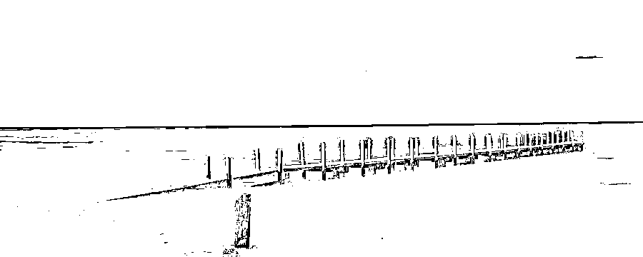

**海王星的疗愈：案例**

这是我所知道的最富传奇色彩的浪漫故事。

在十九世纪时，有一位叫做伊丽莎白·芭蕾特·布朗宁的女士，那时她已经 39 岁了。她是一个很有名的诗人，但是她的遭遇非常悲惨。她有肺病，已经病了很多年。她跟父母住在一起，几乎无法下床，终日呆在自己的卧室里。她觉得自己很快就会死去，她感到生命中已经没有什么值得期待的，除了她的诗。

她喜欢自己写的诗——还有一个人也喜欢。那也是一位诗人，名叫罗伯特·布朗宁，他不如伊丽莎白有名。他给她写信，告诉伊丽莎白他有多么喜欢她的诗，他还把自己的诗寄给伊丽莎白。他们开始了长期的通信。**他们发现了他们在文学和灵性上的共同追求和相通的情感。**他们不仅给对方写诗，他们还在信上写歌、谱曲，后来他们几乎每天都会给对方写信。

**在频繁的通信过程中，他们相爱了。但他们从来没有见过对方。**他们会猜想二人见面时会是怎样的情景，他们能不能见面呢。由于伊丽莎白的身体状况，她的父母拒绝任何陌生人来见她。但罗伯特·布朗宁非常执着，他爱伊丽莎白，他必须见到她。伊丽莎白也恳求她的父母让他们见面。最终，伊丽莎白的父母同意让布朗宁见她。

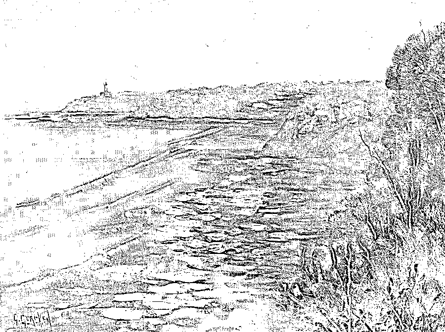

在伊丽莎白父母的监督下，布朗宁来到了伊丽莎白的房间。**他们面对面地交谈，他们能感受到他们在通信中流露出的爱情。**他们深情对视，眼睛代表着灵魂的窗户连接在一起，好像房间里其他的一切都不存在了。

令伊丽莎白的父母不高兴的是，布朗宁每天都会来看望伊丽莎白。他们不相信布朗宁对伊丽莎白的真心，因为他们知道布朗宁不如伊丽莎白有名。他们怀疑布朗宁是要借伊丽莎白提升自己的名气。但事实并不是他们想的那样。

布朗宁每天都来看望伊丽莎白，他观察伊丽莎白的生活状态，他发现她每天都会吃一些医生开的药。**直觉告诉他，这些药对伊丽莎白的身体并不好，甚至这可能就是导致伊丽莎白卧病在床的原因。**于是布朗宁开始劝伊丽莎白试着不要吃药。这把伊丽莎白的父母吓坏了，但是伊丽莎白相信布朗宁，开始停药。

当伊丽莎白不再吃药，她渐渐可以下床了。布朗宁将她抱到楼下，她开始学习走路，她已经瘫痪了很多年。伊丽莎白越是不吃药，她的身体变得越好。他们走得越来越远，甚至可以去郊外踏青。他们在郊外散步、吟诵诗歌。最后伊丽莎白奇迹般地痊愈了！但尽管如此，伊丽莎白的父母还是不相信罗伯特·布朗宁爱他们的女儿。但他们彼此相爱，他们一定要结婚，最终他们还是在一起了。

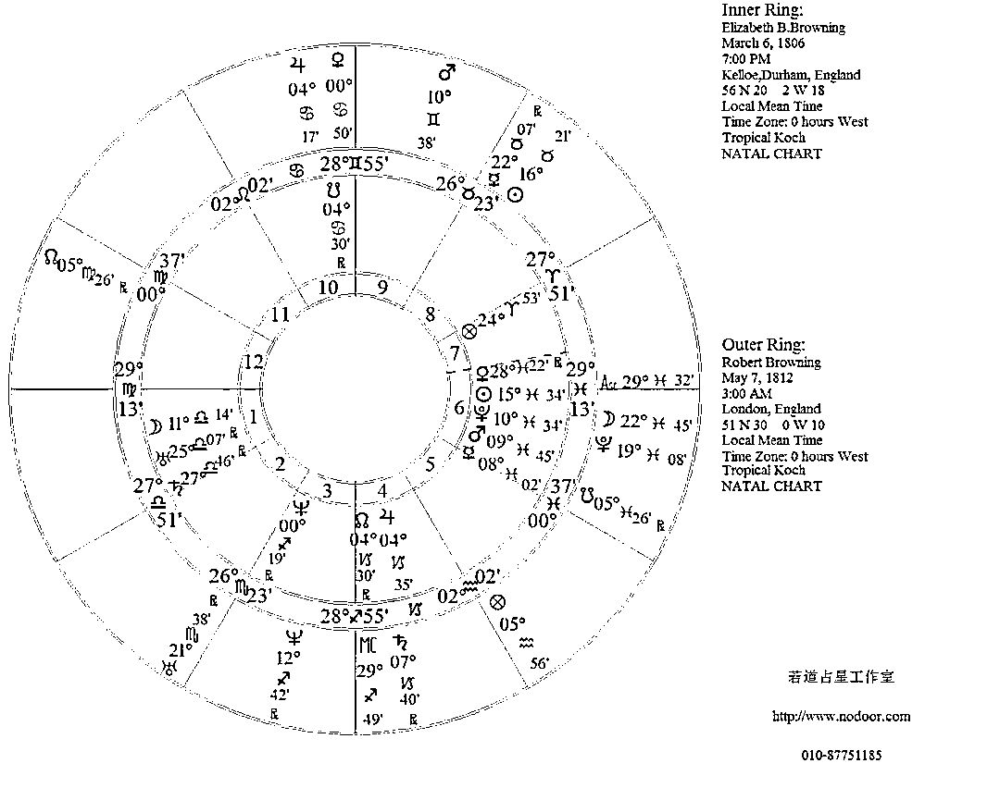

| 里圈：伊丽莎白 外圈：布朗宁

让我们看看布朗宁夫妇的星图。先看伊丽莎白的星图。她的金星在双鱼座，而且与下降点成合相。再看罗伯特的星图，他的上升点在双鱼座，并且南交点和月亮都在双鱼座 12 宫。观察度数会发现，罗伯特的上升点正好合伊丽莎白的下降点和金星。这是非常令人印象深刻的戏剧化的联系。

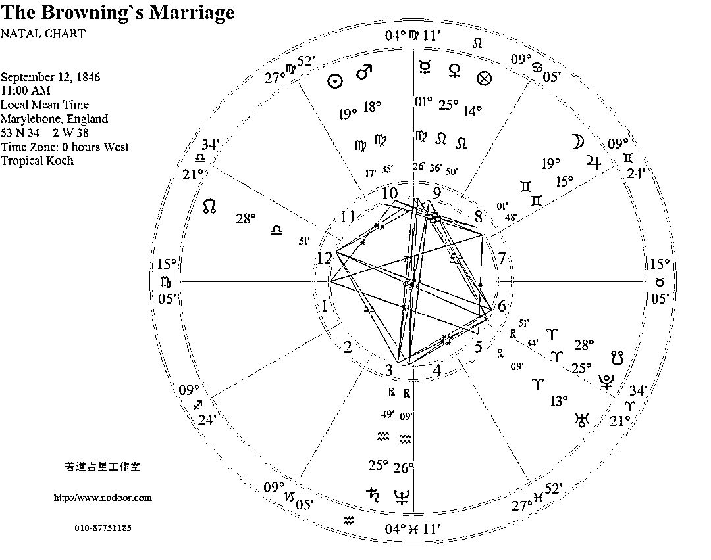

| 结婚星图

再看他们结婚时的星图。想想看，他们结婚的时候伊丽莎白已经 40 岁了，在那个年代这是非常特殊的事件。而且在遇到布朗宁之前伊丽莎白觉得自己不会结婚了，她已经对人生失去了希望。他们结婚的这天，金星对分海王星，海王星与土星合相，这意味着他们的浪漫爱情终于获得了法律上的证明，“梦想成真”。北交点在天秤座，12 宫，这也是他们婚姻很幸福的一个标志。

他们结婚以后去了意大利，度过了一个很长的蜜月并决定在那里定居，生活并且继续写诗。他们度过了 20 年，并且有一个儿子。在 19 世纪的时候，这样的故事简直像是一种奇迹。下面看看布朗宁夫妇儿子的星图。他有这么多的星在双鱼座！他的南交点也在双鱼座。他是一名很成功的画家。

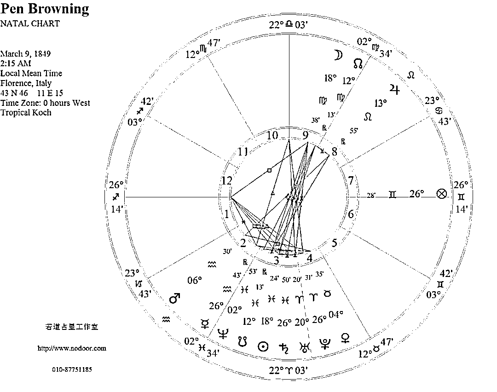

| 伊丽莎白和布朗宁的儿子的星图

这是一个跟双鱼座/海王星有关的非常戏剧化的故事，好莱坞真应该把这个故事拍成电影。他们度过了一个幸福的婚姻，他们在海边互相给对方写诗歌，当伊丽莎白去世的时候，布朗宁在她身边，感觉她就像是去睡觉一样。她在他的怀抱中瞑了目。她的容貌，像少女一般，微笑，快乐。

他们的故事正如伊丽莎白所说：**“****这比她能想象到的任何幸福都更加美好****。”**这就是爱所带来的疗愈。这个传奇般的爱情故事，**是非常理想化的浪漫爱情，**几乎包含了**海王星的所有正面影响——灵感、诗歌、疗愈、无私的爱、对生命的信仰、最理想化的生活。**

**版权声明：**原创文章由作者授权发布于若道平台，欢迎转发，反对抄袭。友号转载请申请白名单。

****想阅读更多作者的文章，请在后台回复******大卫****** 即可。****

**喜欢文章请长按下方二维码打赏**

**给大卫老师加杯咖啡呗~**

**▼**

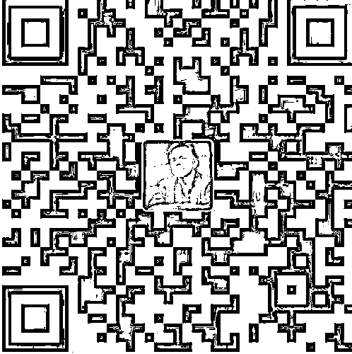

**获取爱情报告**

**扫描下图二维码了解详情**

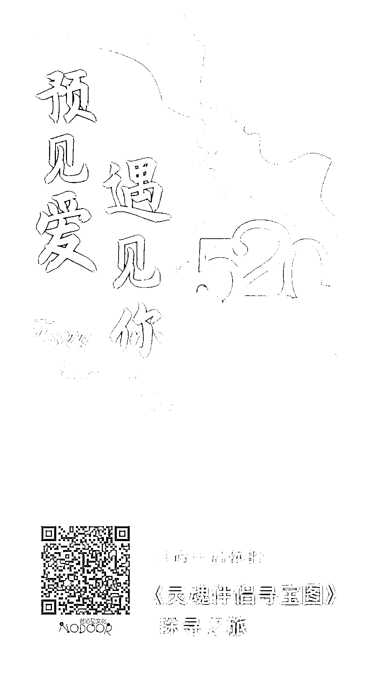

**微信又双叒叕改版啦，不想错过若道君的推送？**

**就把若道设为星标吧！**

**▼**

**喜欢记得点一下在看哦☟**

****获取报告直达入口****

# 520，来收取若道和鼓楼西剧场送的浪漫之爱

> 原文：[`mp.weixin.qq.com/s?__biz=MzA5NjA0NTAxNg==&mid=2651444860&idx=2&sn=495c253ccb23c11f3b2438a28c266270&chksm=8b4b64cbbc3ceddd60e35183b8bcee3128195f44bb923f8fbc99714d4fb5426c8f1336417bc4&scene=126&sessionid=1692737984#rd`](http://mp.weixin.qq.com/s?__biz=MzA5NjA0NTAxNg==&mid=2651444860&idx=2&sn=495c253ccb23c11f3b2438a28c266270&chksm=8b4b64cbbc3ceddd60e35183b8bcee3128195f44bb923f8fbc99714d4fb5426c8f1336417bc4&scene=126&sessionid=1692737984#rd)

**5 月 30 日戏剧结束后，若道的两位创始人——大卫·瑞雷和蒋颖和一些若道的校友及工作人员将和导演、演员和观众们一起共度 1 个小时，让我们一起来聊聊占星学、诗歌、戏剧。我们会有很多互动环节，来谈谈生命中这些美好的事情。**

占星、诗歌与戏剧，可以说是古希腊的三大瑰宝。

古希腊曾经诞生过人类早期占星学的集大成者托勒密，也诞生过荷马的长篇史诗《伊利亚特》与《奥德赛》。古希腊的戏剧则更有传奇色彩，它诞生于对酒神狄俄尼索斯的祭典上的酒神颂，后来逐渐发展为戏剧并出现了很多经典剧目，比如著名的《俄狄浦斯王》。

然而，虽然古希腊的占星、诗歌与戏剧都是伟大的，但是却从没有三者结合的作品产生。直到一百年前，经一位名叫费尔南多·佩索阿的葡萄牙诗人兼占星师，将三者联系了起来。

  费尔南多·佩索阿

### 费尔南多·佩索阿， 20 世纪最伟大的诗人之一，也是最为神秘的一位诗人，被誉为“欧洲现代主义的核心人物”，在葡萄牙现代文学史上享有至高无上的地位，在整个西方文学界也受到极大推崇。

### 费尔南多出生于葡萄牙，曾经在南非读书，后来回到葡萄牙，在他不算太长的 47 年生命里，在里斯本度过了人生大部分时光。他生前做过翻译、出版过杂志、写过文学批评、政治评论、发表过少数诗篇，但除了他过世之前 2 年出版的一本诗集《信使》（Message）引起很多人的关注并让他声名鹊起之外，他生前出版甚少，直到他过世 10 年后，有人发现了一个大的木箱，在这个木箱中，有 19 本笔记，还有成千上万页的笔迹难以辨认的手稿，这些手稿沉睡于这个木箱中，无人知晓。后来这些手稿被识别、编辑、出版成书，轰动了世界。

佩索阿不仅是一个诗人，也是一位占星师和神秘主义者。在他年轻时代，通过翻译一些灵性书籍，参与一些灵性的聚会，他曾经有很多神秘主义的体验，并且大量实践自动书写。

佩索阿对占星学一直怀着浓厚的兴趣，他曾研究过很多著名人物的星图，甚至还成为一名占星师，为他的客户提供占星咨询服务。他的占星咨询费用为 500-5000 埃斯库多。不仅如此，1915 年，他创造出一位名叫拉斐尔·巴尔达亚（Raphael Baldaya）的占星师，这位占星师计划撰写《占星学系统》和《神秘学研究概论》。而这位名叫拉斐尔·巴尔达亚是他的众多异名之一。

再回到作为诗人的佩索阿。当人们打开那个珍藏他所有手稿的大木箱，不仅发现了那些珍贵的手稿，还发现很多手稿上标注着作者的名字并不是费尔南多·佩索阿，而是其他名字，据说有 172 个之多。佩索阿称呼他们为异名，而不是笔名，因为这些名字对他而言并非一个名字而已，而是一个个生活在他想象中的真实的人物。小佩索阿从 6 岁起就开始创造这些人物，他们占据着他的生命和灵魂，通过他自己的日记、信件、手稿与他对话，与他人对话，彼此对话，这些人物彼此也有着复杂的关系，仿佛真实地活在这个世界上。佩索阿认为，他的很多作品是由这些有着自己名字的人物创造而并非他费尔南多·佩索阿写出的。而且，他们都拥有自己的出生星图，佩索阿为他们创建了有着准确出生年、月、日、时、地点的出生星图！这些异名——由他内心创造出来的“作者”来自不同的地方，有着不同的出身、家世、性格、职业、迥异的生活态度、哲学思想、迥异的写作风格。而这些异名中最重要的一位是牧羊人阿尔伯特·卡埃罗（Alberto Caeiro）。他是牧羊人，也是一位诗人，创作了一连串的诗歌，而且是佩索阿本人和其他几个重要异名的导师。我们回到 1914 年的 3 月 8 日，不到 26 岁佩索阿在一张高台前站立着，身心却进入了“无法定义的狂喜”状态，他自己说在那种状态下，他一下写出了三十多首诗（虽然佩索阿的研究者通过手稿的字迹辨认认为那 30 多首诗不可能是一下子写出的）！在把这些诗起名为《守羊人》之后，卡埃罗便出现在了他的身体内。在此后，卡埃罗不仅作为诗人创造了众多诗作，而且成为佩索阿的导师。在卡埃罗诞辰 91 年之后，2005 年 9 月，毕业于法国佛罗兰戏剧艺术学院高材生班、法国艺人协会 06 届戛纳新英才的导演邵斯凡走进了巴黎的一个小剧场。他对于剧的内容和作者全然不知，但听着一首又一首诗，听着小提琴中的一个又一个音符，感到心醉沉迷。而这部剧就是**《卡埃罗》**！

卡埃罗，一位活在葡萄牙诗人体内的守羊诗人，他的生命在星图中舞动着，在诗句中舞动着，在戏剧中舞动着。

我们来看看佩索阿为卡埃罗创建的星图。作为一位看守羊群的诗人，卡埃罗有着明显的白羊座与金牛座的特征。白羊座是新生的，是活跃有朝气的。金牛座是安宁祥和的，又是恬静的。他在诗中的表达相当简练而直接，但又大都与田园牧歌相关。请看他的第一首诗的第一段：

**“我从来没有看守过羊群，****但是仿佛我曾经看守过。****我的灵魂宛若牧人，****知晓风，知晓太阳，****携着四季的手，****前行，观看。****无人的自然的全部安宁，****来到我身边坐定。****但是我却悲伤，****就像落日沉入我们的想象，****此时，夜冷却了平原深处，****感觉得到它的进入，****宛如蝴蝶翩入窗子。”**除了描绘田园的自然景象，卡埃罗还如此描绘自己：**“我每一刻看到的东西，****都是从前我从未看到的一切，****我懂得聚精会神地察觉……****我懂得拥有本质的愕然，****就像一个孩子，甫一出生，****便察觉到了他真的出生……****面对世界永恒的新奇，****我感到我每一刻都是新生。”**

| 《卡埃罗》星图，佩索阿手绘版对于卡埃罗来说，一切都如白羊座那么新鲜，甚至他的生命都是一直常新的。卡埃罗的白羊座与金牛座的特质又非常明显，在这两个星座的太阳、金星、火星都位于第 9 宫——一个形而上学的宫位。然而卡埃罗并没有形而上学的一面，或者说，他一反形而上学的一面，独特构造了属于他自己的形而上学。请看这一段诗句：**“思考事物的内在意义，****是多此一举，好像去思索健康，****或把杯子拿到泉水旁。****事物唯一的内在意义，****在于根本没有任何内在意义。****我不相信上帝，因为我从未见过他。****如果他希望我相信，****毫无疑问，他会和我说话，****走进我的房门，****对我说：我在这里。****但是，如果上帝是花，是树，****是山脉，是太阳，是月亮，****那我相信他，****那我时时刻刻相信他，****我的生命是一次祈祷，一场弥撒，****是用双眼与双耳领受圣体。”**然而，卡埃罗并不只有白羊座与金牛座的部分。他的月亮落在天蝎座，冥王星也在第 10 宫显要的位置。天蝎座与其守护星冥王星都代表死亡与重生，是极端激烈的，热忱的，感情深到骨髓。相应的，卡埃罗的牧羊日子也不是一直阳光和煦的，也有天气转阴的时刻。他也有自己的深刻欲望，以及对死亡的感想。他在诗中这样描述：**“如果我能咬整个大地一口，****感觉它的味道，****如果大地是可以去咬的事物，****那一刻我会更幸福。****然而我并不希望永远幸福，****我需要时而不幸，****这样才是自然的……****所有的日子并非都是晴天，****当久旱无雨，那便需要求雨。****因此我自然地看待不幸与幸福，****就像有山峦也有平原，****有巉岩也有青草，****而人们并不觉得奇怪……****必须于幸福与不幸中，****做到自然与平静，****像观看那般感觉，****像行走那般思考，****将死之际，会记起一日将尽，****落日是美的，夜晚的到来是美的，****现在如此，并愿永远如此……”**卡埃罗是与众不同的，他本身就是一个处于他人体内的人。他的爱情也与众不同。卡埃罗的天王星与和写作密切相关的水星有紧密的对分相，与最终定位星金星也有紧密的相位，而且还是下降点守护星。天王星是水瓶座的守护星，是独特的，超然的，向往自由又容易陷入孤独。天王星是这样体现的：**“如今，每一天我醒来，又是欢乐，又是悲伤。****从前，我醒来时不会有任何情绪：只是醒来。****我欢乐而又悲伤，因为弄丢了我梦的一切，****而我又能身处于现实，这里有我梦的一切。****我不知道该拿我的感觉怎么办，****我不知道该拿我的孤独怎么办。****我希望她和我说点什么，让我再一次醒来。****恋爱的人和他自己不同了，****但他不是别人，依然是那个人。”**除了天王星与冥王星，卡埃罗还有着重要的海王星，它落在与表达相关的双子座，在第 10 宫靠近中天，又四分上升点。海王星守护双鱼座，是浪漫的，迷幻的，有同理心又有救赎性，也描述了生命最后的退场时刻。他的诗句富有浪漫色彩，而他又生命短暂，只有 24 岁。对于自己的逝去，他在诗歌中这样说：**“当春天到来，****如果我已死去，****花儿会同样地绽放，****树木不会比上一个春天少减绿意。****真实并不需要我。****想到我的死亡没有任何重要性，****我感觉到了巨大的快乐。****如果我知道明天我会死去，****而春天会在明天之后到来，****我会高兴地死去，因为它会在明天之后到来。****如果这正是它的时辰，不在它的时辰到来，又应该在什么时候到来？****我喜欢一切是真实，一切是理所当然；****我喜欢，因为就是这样，即便我不喜欢。****因此，如果我此刻便死，我会欣然赴死，****因为一切是真实，一切是理所当然。****人们可以在我的棺材前念诵祷文，如果他们愿意。****如果他们愿意，可以在棺材四周起舞、歌唱。****如果我已不能有偏爱，那我便不去偏爱。****无论何物，无论何时，一切顺其自然。”**然而卡埃罗并未真正死去，因为他活在他的诗歌中，一直都在。在佩索阿诞辰 133 年，卡埃罗诞辰 107 年后，2021 年 5 月，卡埃罗将被邵斯凡导演在鼓楼西剧场搬上戏剧舞台。3 位年轻的戏剧人——叶禹含、李万里、许嘉铭将把卡埃罗的生命、诗歌与星图下那活灵活现的身影重现在舞台中。古希腊的占星、诗歌与戏剧将合而为一！

**5 月 30 日戏剧结束后，若道的两位创始人——大卫·瑞雷和蒋颖和一些若道的校友及工作人员将和导演、演员和观众们一起共度 1 个小时，让我们一起来聊聊占星学、诗歌、戏剧。我们会有很多互动环节，来谈谈生命中这些美好的事情。**5 月 30 日，欢迎你来。****《卡埃罗》售票通道****

**演出开始时间：5 月 30 日 14：30**

**演出地点：**北京鼓楼西剧场

**演出票价：**380 元、280 元、180 元、100 元

**咨询工作人员：Maggie 老师**（微信：18510107057）

长按下方二维码获取购票信息

****购票通道，请点击“阅读原文”****

# 什么？你还不知道 2021 年的重大食相在这两个星座？（内附攻略）

> 原文：[`mp.weixin.qq.com/s?__biz=MzA5NjA0NTAxNg==&mid=2651444745&idx=1&sn=aa6776c93b8f9d523ab4a14a60ff9b59&chksm=8b4b64bebc3ceda8bebeb96b83bcc998fa393b454860ee327608f197a5273752e1f8d6633742&scene=126&sessionid=1692737984#rd`](http://mp.weixin.qq.com/s?__biz=MzA5NjA0NTAxNg==&mid=2651444745&idx=1&sn=aa6776c93b8f9d523ab4a14a60ff9b59&chksm=8b4b64bebc3ceda8bebeb96b83bcc998fa393b454860ee327608f197a5273752e1f8d6633742&scene=126&sessionid=1692737984#rd)

**☆ 后台回复“今日”，给你一句生命态度 **

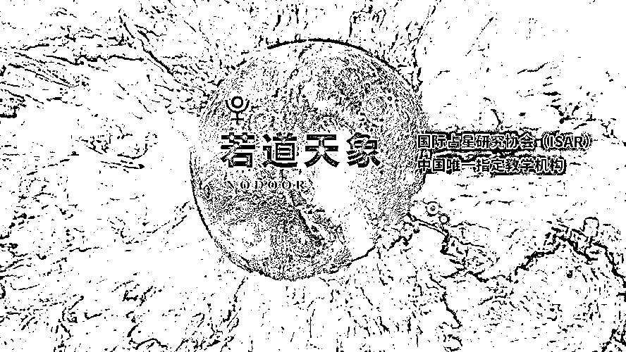

作者/斯嘉丽·库特 译者/李含 校对/江艺
  编辑/玫瑰 图片/全景网

2021 年，会发生的一个重大天象是双子座-射手座食相。它引领我们去学习生命中哪些地方需要更深入地探索，哪些地方需要重新平衡。

**关于食相**自然界中的壮观景象很少有能与食相这一宇宙奇观比肩的。食相的故事揭示了它们在历史长河中对人类意识的强大影响。一些文化认为它们是存在的威胁，尤其是对权力的威胁，另一些文化则将其看做宇宙的结合，太阳和月亮在其中产生新的恒星。在一些人看来，食相是宇宙魔术师恶作剧的混乱。人们认为，对生命与和谐至关重要的太阳或月亮的光突然被遮挡，就会破坏自然秩序。**即使在今天，食相仍然是变化的重要预兆，催生洞察力，揭示出潜在的模式和渴望。**它们的行进是重大的抉择时刻，可以戏剧性地改变你的生活形态。

**南北交点**

**当新月或满月出现在月亮南北交点 18°范围内时，就会发生食相。**这对交点是太阳和月亮路径相交的一对天空中的虚点。几个世纪以来，由于它们在预测食相方面的重要性，人们一直在计算这些不可见但有意义的点。

与行星典型的前进运动相反，这些交点在黄道带中大部分是逆行的，并且在黄道带中总是彼此相对；它们代表了一种二元性的张力，与事物通常的模式形成对照。

**神，恶魔和不朽**

在印度，交点被认为和七颗可见行星一样重要，它们被想象成恶魔的头部和躯干。故事是这样的，由于渴望不朽，争执不休的神和魔鬼缔结了一项协议，联合力量搅动原始海洋，从其深处提取赋予生命的甘露——阿姆里塔。当阿姆里塔最终出现时，神和恶魔排成一列，从最高神毗湿奴那里领取长生不老药，毗湿奴显现在他们面前的样子是美丽的少女莫希尼。她开始分配不朽的甘露，她只打算将其奉献给神。一个形迹可疑的恶魔名叫天光罗睺（ Svarbhānu）识破了这个诡计，溜进了神的队列中太阳和月亮之间。当他从莫希尼的杯子里啜饮神圣的阿姆里塔时，太阳和月亮看穿了他的伪装，大声喊叫，揭露他是一个恶魔。被激怒的莫希尼将恶魔斩首，但因为他已经喝下长生不老药，并没有死去，而是成为了两个新的生物: **他的头，叫做罗喉（北交点），他的尾巴，叫做计都（南交点）。**为了报复他们揭穿自己身份，罗喉和计都追逐太阳和月亮，吞噬了它们。但是，由于罗喉只是一个头，而计都只是一个躯干和尾巴，对光的吞噬和阻挡就像食相时一样，都是暂时的。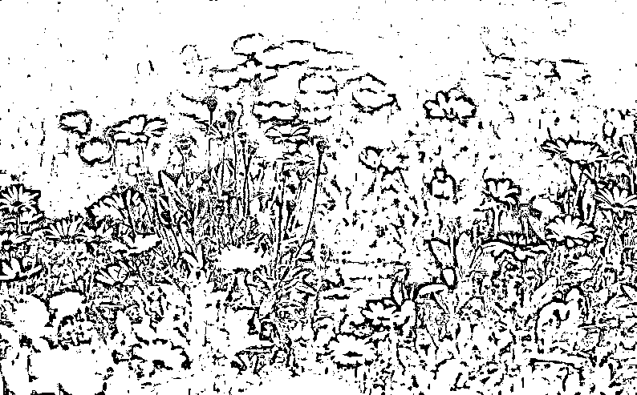**南北交点：翻天覆地的变化**

就像神魔搅动海洋一样，在 18 个月的周期里，对分的交点搅动着你生活中两个相对的领域。在这个周期中，月亮交点所代表的往复的过程，以及被食相激活的点将聚焦机遇，使之更加深入，重新平衡你的优先选项，把目标的线索编织回你生活中它们所强调的领域。**这些交点可以催化戏剧性的启示和事件以及“突然出现”的人。**

为了更好地了解这些时期是如何影响你的星图和生活的，让我们来看看月亮交点相互关联但又相互对立的功能。

**南交点与过去**

**南交点——计都关联着过去；是你人格的过往，你祖先的故事，甚至前世和继承的业债。计都是禁欲和灵性的，象征着解放和分离。**据说它拥有“烈火”——一种祭祀用的火，你可以把你不再喜欢或者不想再依恋的东西投入其中。被南交点转变的对象是根深蒂固的。它将你的注意力吸引到内在的探索上，以便回溯到它正在影响的领域之源头，创造一次深刻的内在转变。  

**北交点和你的未来**

**与此相呼应的是北交点——罗喉，它关联着你未来的雄心壮志或目标，代表着你自己书写的个人传奇。**作为一个没有身体的脑袋，罗喉对物质存在、快乐和成功有着无尽的渴望。它所触及之处会得到增长，因此代表了**发展和新开端的机会**。它也可能**引起执念**。**罗喉有一种进取的特质，吸引你的精神向外追求，推动你走出你的舒适区，以实现你心之向往。**  

当适应这些交点在生活中触发的激进能量时，将重心从轴的一边或另一边转移是正常的，但这些交点间的相互缠绕是无法分开的。这些交点告诉你，有时通往平衡的道路包括走向极端。

2020 年 5 月，月亮交点进入了双子座和射手座，整个 2021 年它们都会停留在此。2021 年所有的食相都会发生在这两个星座之一，除了一次食相发生在金牛座（当月亮交点接近换座的位置时会发生跨星座的食相）。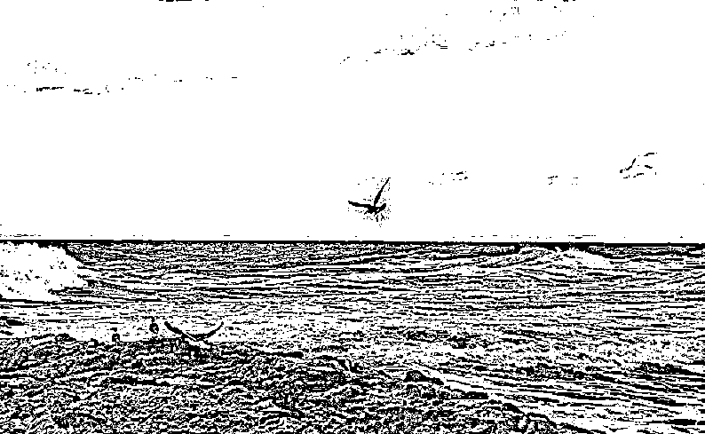**双子座和射手座****双子座和射手座都是双体星座和变动星座，这将进一步强调今年食相不稳定的双重性质。**很可能出现重大转变。意识到这些波动的力量，对新的可能性和突然的变化持开放态度，可以在混乱中开启共同创造的机会。当计都来到贤者射手座时，你对真理的追求转向内在。**射手座那种不受约束的乐观情绪会得到缓和，因为计都会阻碍对外在目标的追求**。如果你愿意真诚地面对被激活的生活领域中所持的信念，与内在的探索调和，就可能与内在洞见和真理建立更深层的联结。过去既带来礼物，也带来不安的灵魂。计都要求你清除和释放它曾经的足迹，这样才可能被邀请对木星在 2019 年行进射手座所孕育的宏大愿景和追求进行修整和排列优先次序。与此相对，罗喉在早熟的双子座，迫使你**聚焦思想、联系和数据，并在此时此地组织和阐明它们**。诺贝尔奖得主莱纳斯·鲍林有句名言：**“拥有伟大想法的最好方式就是有很多想法。”**面临的挑战是**为你的努力排列优先级，并磨练思维敏捷性和技巧**。**你生活中的双子座区域可能会经历大量的活动和新的可能性。拥抱不确定性和灵活性**可以支持这个领域中出现多种可能性。接受好奇心的引导，接受同行评议。食相周期在你生命中的意义将取决于个人星图中的出生元素以及时机。一般来说，**食相会触发紧张激烈的、不稳定的气氛**。意想不到的机遇会出现在眼前，过去和未来以突然而令人惊讶的方式交汇在一起，重要的人出现在你的生活中，你的面前就是交叉路口。这些遭遇可能会有一种命运感。共时性增强了，所以要注意一切不寻常的和重复的事件。正如已故作家乌苏拉·勒奎恩所说：“陌生的道路有陌生的向导。”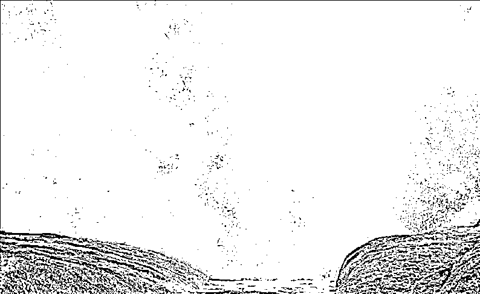**2021 年的食相**下面是对 2021 年食相更详细的观察。**射手座 5°月食****美国东部时间 2021 年 5 月 26 日晚上 9:13**计都把你拉回过去寻求真理。如果你生活中有一座射手座阁楼，你会在那里发现什么？你可以发现一条被遗忘的意义线索，让你重新校准你的目标。关于你生命的这一部分，你给自己讲述了一个怎样的故事？是什么阻碍了你的脚步？与自己或者一个值得信赖的导师进行一次坦诚的对话，可以揭示什么是值得坚持的，什么是需要释放的。这可能是紧张和势不可挡的情绪，但这次食相的守护星木星落在了自己守护的双鱼座，在这个过程中信念允诺了它自己的回报。想象一下，当你清理掉那些不再滋养你的信仰或不再在你的旅途中支持你的东西时，可能会是怎样的情况。让它们随潮水褪去，而礼物，就像神圣的甘露阿姆里塔，会被冲上你的海岸。这次食相与 2020 年 12 月中旬的射手座日食相关联。**双子座 19°日食****美国东部时间 2021 年 6 月 10 日上午 8:52****水星即将逆行，并且与日月聚首，能量是动态和不稳定的。**随时准备改变方向。食相之后的几天和几周可能会带来灵光一现的时刻。在这里会涌现出无数想法、关系和增长，也仍然有可能出现突然的发展和机会。缺失的拼图可能是与朋友或老师的偶然相遇，或者是一条新的信息。留出一些时间来满足好奇心，但要注意不相干的话题。与水瓶座土星的三分相有助于在你星图中双子座领域重新构建你的优先事项，同时也明确你的发展。**金牛座 27°月食****美国东部时间 2021 年 11 月 19 日下午 6:57****这次金牛座的月偏食预示着下一轮食相周期，它将于 2022 年在金牛座和天蝎座展开。**在你的生活中，它激活了金牛座天王星长期行进（2018 年 5 月-2026 年 4 月）的叛逆和创新的主题。**这次食相可能会揭示你在感官和物质领域的情感依恋。**接近恒星大陵五**触发了潜在的挫折和不公平**。太阳、火星、水星在天蝎座对分这次的月食，暗示着**一次艰难的对话可能会引出隐藏的情绪和信息。**水瓶座木星落于这个食相轴线的另一端，如果有疑虑，请明确自己的立场，但是要保持开放的头脑。

## 这次食相的守护星金星在摩羯座，提供了实际的经验智慧。这可能是一份意想不到但实至名归的礼物，比如一件传家宝或古董，或者是意外联系到一位善良但苛刻的长者。**围绕这次食相的事件可能与五月的金牛座新月有关。**

**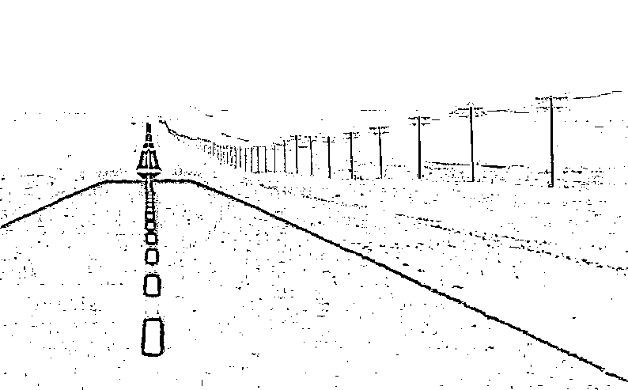**

**射手座 12°日食****美国东部标准时间 2021 年 12 月 4 日下午 5:42**灵魂在这次食相期间转而向内。这次日食靠近恒星心宿二，会赋予你勇气去做出必要的牺牲，以便在你射手座的生活领域中迈开前进的步伐，但首先要回顾来路。你可能会觉得**被催促回到你在这个生活领域中根深蒂固的信仰的起源**，也许是几天前水星与太阳的交汇使情况更加明晰。来自过去的意想不到的礼物或信息可能会出现。土星以及这次食相的守护星木星落在水瓶座，可能**提供一种超然的情绪，帮助你看到宏观的蓝图。因为这是这条轴线上的最后一次食相，它可能会触发生命中这个领域的一次结束或完结**。用玛丽·伊丽莎白·埃文斯的话来说，“你的真理在等着你，你完全有能力勇敢地去寻找它。”**2021 年食相与你的星座**

食相会带来突然的变化和发展，所以预测它们在你生活中的具体表现并不简单。然而，你可以预期，它们在你星图中所落宫位代表的生活领域会有一个来回激活的过程。**如果你有行星落在食相所落的星座，即双子座或射手座，或者与它们成相位的星座——处女座和双鱼座，这些都是你在这个食相周期中个人经历的重要部分。**

在下面找到你的星座，预览一下 2021 年的食相会激活哪些人生主题。 

**白羊座**

罗马诗人贺拉斯说过：“那些横渡大海的人改变了他们的天空，却改变不了他们的灵魂。”你正在学习**将你的哲学和精神认识根植于日常世界。**由于有很多机会让你离家更近，于是海外旅行被放在了次要位置，所以要**期待****更繁忙的行程**。**交流成为了一个巨大的焦点。你可能会重新评估你对高等教育的长期承诺。**

**金牛座**

**你与所爱之人、商业伙伴和银行的交流被强调了。**在释放债务（物质的、情感的，甚至是业力的）的过程中，你可能会发现**亏欠你的会以意想不到的方式回到你身边**。**直面你对金钱、权力和死亡的恐惧和信念**，可以打开你心灵和资源的通道。可能会**开发出多种新的收入来源。**

**双子座**

**随着你的重心从伙伴关系转移，是时候找回你的自主权了。**诚实和说真话带来所需的清晰度，使亲密的关系受到考验。这一行进是**破坏不稳定、不健康关系模式**的重要一步。对自己的自我表达持开放和玩乐的态度，可以刺激你重新发现自己令人惊讶的多维身份认同。
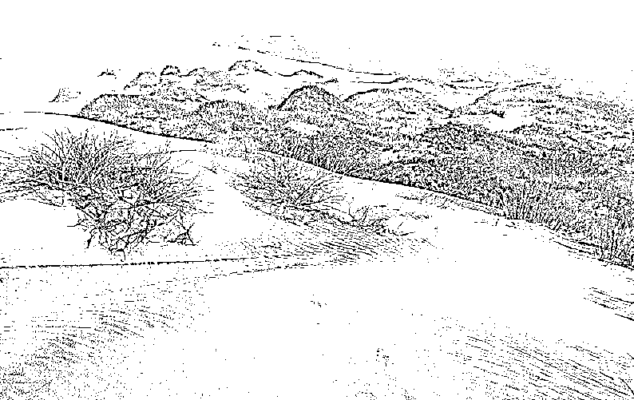

**巨蟹座**

当你聚焦于自己心灵的神秘层面，在你的日常工作、健康或惯例中发现日常生活具体问题的隐藏根源时，你被要求**独处**。释放对多产的信念可以改掉长期以来的坏习惯。灵性和世俗相互交织，灵性实践可以开启身体和心灵的深层转变。你可能无法向任何人解释，但这没关系。

**狮子座**

**你的重心从单打独斗转向合作项目和社会关系。**当你的社交网络放大了你的志向抱负，你能提供什么创造性的资源给友人和社群进行交换？接受社会邀请，出现在你的朋友圈和社区里。讲述故事可以富于创造性及灵性地把你与你内在的真理和目标联系起来。

**处女座**

在这一行进期间，升起了一种**想要在世界上留下印记**的无尽愿望。**当你追求自己的抱负时，你的公开活动会增多，但要当心不要沉迷于成就**。调和你与家庭和家人的关系可以消除继承而来的模式。尊重你自己祖先的故事，认识到是什么让你走上了自己的道路。

**天秤座**

**对知识、目的和意义怀有强烈的渴望，**所以拥抱冒险和新视角吧。借助**旅行、灵性和教育**来明确几个长期目标。当你忽略了更大的目标时，**评估一下你的每日计划和短期目标是否能支持你的宏大梦想。**
**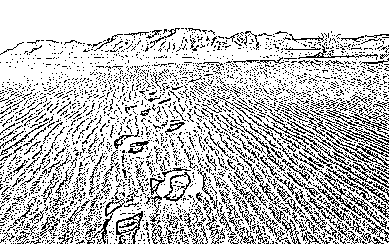**

**天蝎座**

什么是我的，什么是你的，什么是我们的？**理解关于金钱的主张和信念可能引发重大的转变，从而在经济上赋予你力量**。**警惕在这个周期中财政上或精力上的债务增长**，尽管把你的和其他人的资源结合起来的强大机遇可能会让你吃惊。别忘了**表达恐惧的力量**。小心花钱如流水。

**射手座**

现在是时候在你重要的人际关系中露面了。**你可能命中注定要和多个人见面，这会给人际关系带来新的可能性和尝试。**全身心的投入可能是一次宝贵的学习经历。回到你对自己身份认知的核心信念可以开启新的内在认知之路。

**摩羯座**

**改变既定的生活习惯**可能会让你畏缩，但你会情不自禁地去想象日常生活中新的可能性。**邀请参与游戏、娱乐表演和运动。**考虑用新的方式来支持你的健康。重新评估你的精神健康实践的效果，记住一个干净的空间和身体的净化作用。
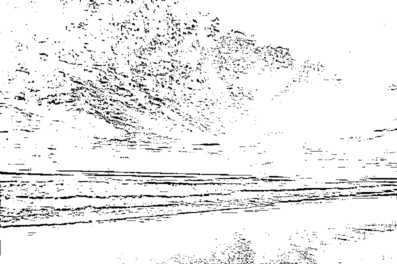

**水瓶座**

当你探索多种创造性的追求时，神圣的灵感会眷顾你。在这一行进中**享受玩乐和乐趣**。你可能不得不从人群中脱离出来，才能重新发现自己的火花，但当你诚实地面对在团体和友谊中的信念和依恋时，就可能获得一种轻松和清晰的感觉。

**双鱼座**

**拥抱你内心世界的多样性。**你的努力和注意力会从事业和公共生活上转移，以便看到在你的家庭和家庭生活中即将出现的新的开始。把你过去的成就和大项目想象成你生活中更宏大的故事的一部分，你就有可能洞察它们。

**版权声明：**本文由若道翻译发布，欢迎转发，反对抄袭。友号转载请申请白名单。

**斯嘉丽·库特**斯嘉丽·库特是一位居住在澳大利亚悉尼的年轻占星师。她跟随或近或远的老师学习，研究心理学和希腊化占星学，以及占星学魔法，也受到传说的启发，特别是奇幻的传说。

**系统学习占星学**

**点击图片了解详情**

**微信又双叒叕改版啦，不想错过若道君的推送？**

**就把若道设为星标吧！**

**▼**

就是这个“在看”，戳戳戳 ☟

******报名直达入口******

# 原来，代表爱情的不只金星，还有这颗小行星！

> 原文：[`mp.weixin.qq.com/s?__biz=MzA5NjA0NTAxNg==&mid=2651444745&idx=2&sn=58dd8bda221ebe299fd90477ac7fe92d&chksm=8b4b64bebc3ceda8f1801eda83373da39a0cb2649b4606a92d924041066b83cb8f184254644c&scene=126&sessionid=1692737984#rd`](http://mp.weixin.qq.com/s?__biz=MzA5NjA0NTAxNg==&mid=2651444745&idx=2&sn=58dd8bda221ebe299fd90477ac7fe92d&chksm=8b4b64bebc3ceda8f1801eda83373da39a0cb2649b4606a92d924041066b83cb8f184254644c&scene=126&sessionid=1692737984#rd)

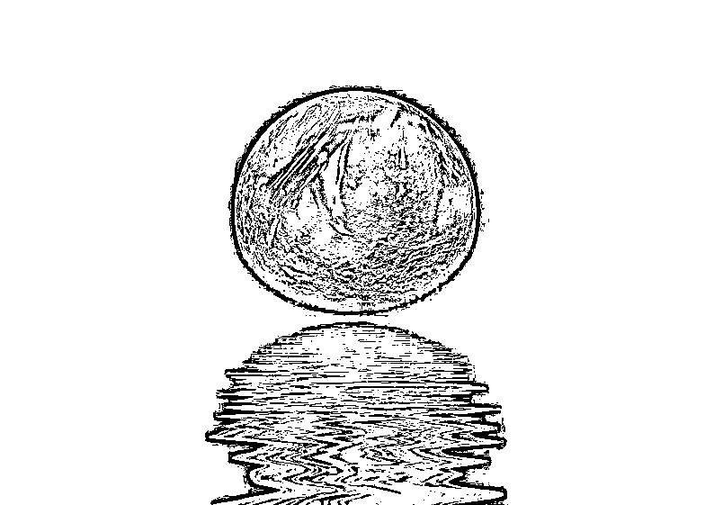

作者/alwaysastrology.com

译者/Betty 校对/Leisha

编辑/玫瑰 图片/全景网提到爱情、婚恋，我们习惯从金星那里寻求答案。但是，婚神星却也能更好地向我们展示这些奥妙。你不想来学习一下吗？点击链接阅读课程详情：[唤醒女神，在占星学中使用小行星](http://mp.weixin.qq.com/s?__biz=MzA5NjA0NTAxNg==&mid=2651444502&idx=2&sn=9fba4d5ea80cfb8de1e969ade9cec8d2&chksm=8b4b67a1bc3ceeb77c3631c479dd2b16e04e7840e621a0e760a7be04e77c96e53085a6056ee8&scene=21#wechat_redirect)**如何查看婚神星？****若道君：****你可以在 app store 或者应用商店搜索“若道”下载 app，输入个人档案，查看本命盘，点击左上角符号（见下图）**

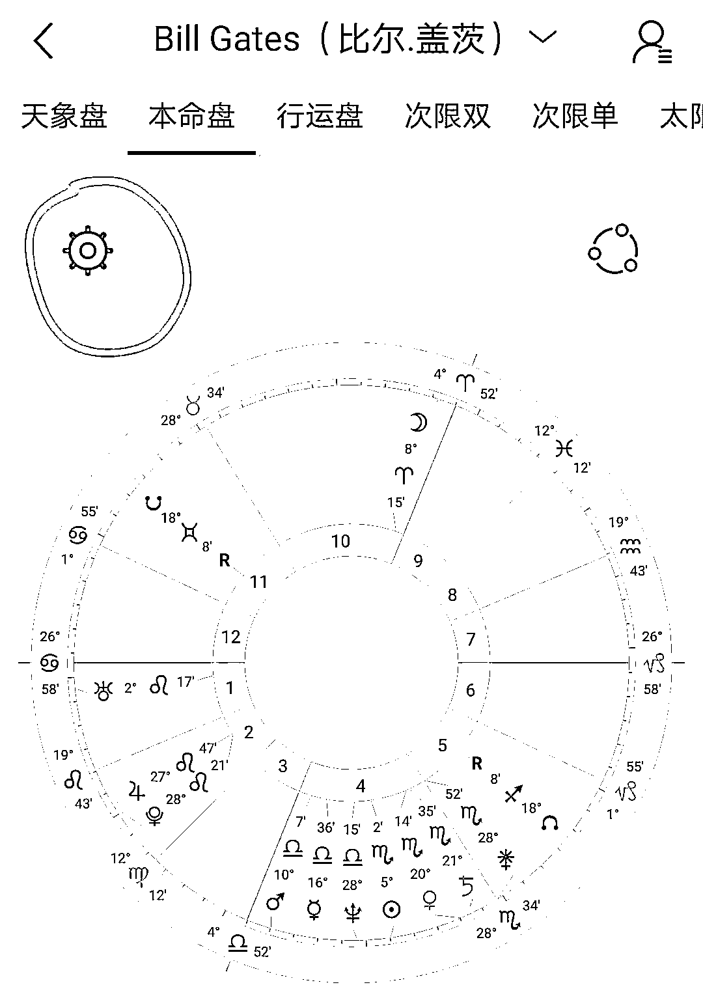

**在行星一栏勾选婚神星（见下图）**

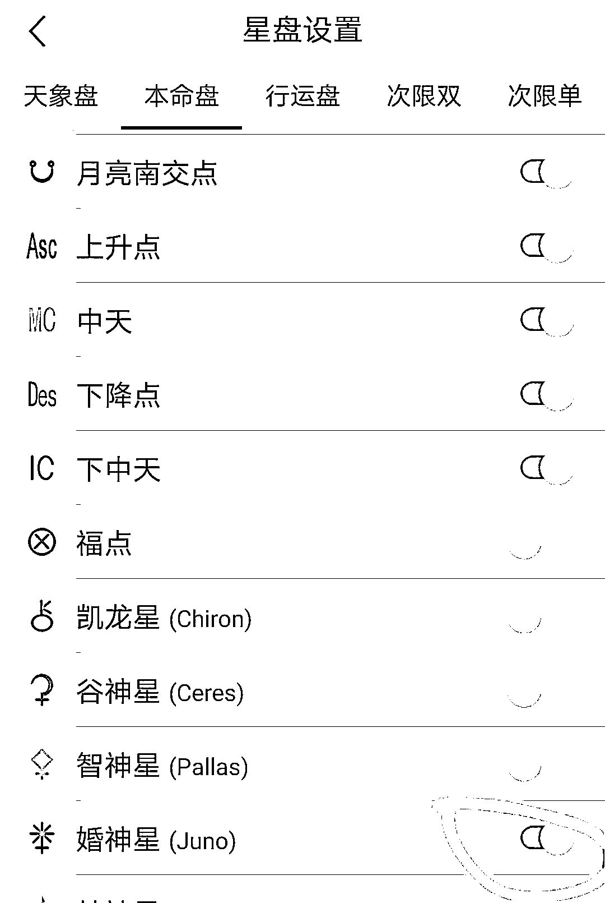

**回到本命盘，找到婚神星的符号，例如下图中，比尔·盖茨的婚神星在****第 5 宫，****天蝎座****。**

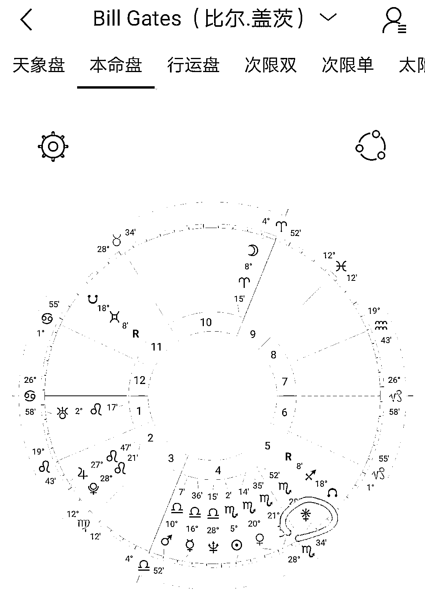

**婚神星落在 12 星座****1****婚神星在****白羊座****· 婚神星在白羊座需要自主权；****· 如果在关系中没有自主权，可能会出现偏头痛或其他身体不适的现象；****·** 往往会被**积极进取或主导型**的伴侣所吸引；**·** 不仅想要自由，也想要一个**将会成为权威人物的伴侣；****·** 可能会**将伴侣视为竞争对象**，喜欢**和伴侣一起冒险；****·** 他们可能需要**学习如何在关系中取得平衡**，以便双方都可以满足自己的需求。**2****婚神星在****金牛座****·** 婚神星在金牛座的人想要那种**建立在物质安全和忠诚度之上的牢固关系；****·** 他们想要一个**可靠和值得信赖的伴侣**，希望伴侣**既会赚钱又会花钱；****·** 他们想要一种**一生都保持和谐的家庭关系；****·** **享受肉体关系，并真正希望与伴侣分享他们的目标；****· ****永远全心全意而且忠诚，希望伴侣也能如此；****·** 可能有**占有欲或控制欲，或吸引到拥有相同特质的伴侣；****·** 只要身边有忠贞不渝的伴侣，他们就愿意为自己的理想挺身而出。**3****婚神星在****双子座****·** 婚神星在双子座需要一个**可以与他们交流**的伴侣；**·** 他们想要**善于表达并且能在心智上让他们兴奋**的伴侣；**·** 他们**喜欢和伴侣一起活动；****·** 有时，他们会**更喜欢同时拥有多个关系，而不仅仅是投入某一个关系**；反过来说，他们可能**更喜欢友谊而并非承诺；**· 他们喜欢**玩耍；****·** 这段关系可能最终会呈现出**一个伴侣拥有更高的教育程度或社交水平，而另一个伴侣拥有更高的依赖性；****·** 他们可能也会**认为自己的伴侣有能力追求自己的梦想；****· 无法清晰地沟通时，他们可能会变得紧张和激动**。他们需要**立即澄清所有的误会，而且要总能保持清晰的沟通，才会感到快乐。****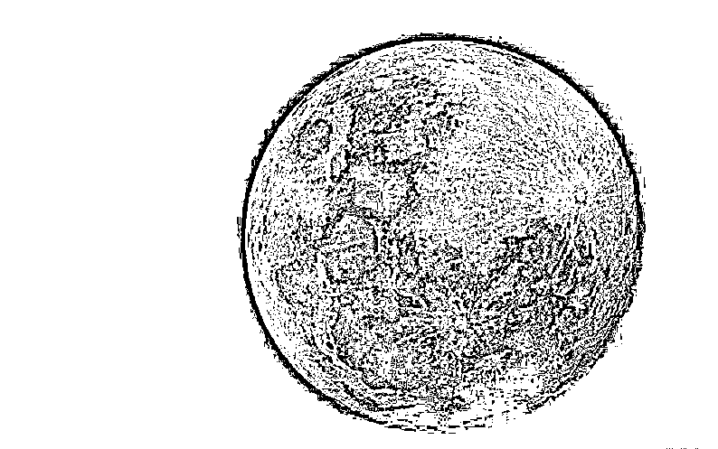****4****婚神星在****巨蟹座****·** 婚神星在巨蟹座需要**亲密的情感和温暖的家庭环境；****·** 他们**通过向别人提供美味的食物来滋养他人，也会被善于滋养和照顾他人的伴侣所吸引；****·** 他们可能表现得**很依赖伴侣，或者黏人和喜怒无常；****·** 可能会**使用情感敲诈来获得他们认为自己应得的东西；****·** 通常可以**以非常微妙的方式操控他人；****·** 强烈地认为**必须伸张正义**，**需要一个传统且重视家庭的伴侣**；**· 喜欢照顾家人，也喜欢得到家人的照顾；****·** 他们强烈地感到**需要尽全力投入到他们的关系中**。**·** 他们可能**需要大量的关注**，如果需求得不到满足，可能会感到不满意；**·** 对**关系全心全意而且忠诚**。**5****婚神星在****狮子座****·** 婚神星在狮子座**需要浪漫和兴奋才能快乐；****·** 他们想要一个**可以引以为傲的伴侣**，这个人也能够欣赏他们；**·** 他们**不喜欢被忽略或拒绝，**可能变得很自私，或者使用不适当的方式引起关注；**·** 他们想要事物能够**平等；****·** 他们是**天生的表演者，想要被关注**。**·** 他们**对伴侣有强烈的感情。****·** 他们可能**自大或不成熟，而且很专横；****·** 他们也可以**很慷慨并且充满爱心；****·** 他们是**果断的，一旦决定就很少改变主意**。**6****婚神星在****处女座****·** 婚神星在处女座的人**对其伴侣寄予厚望**，就像对所有其他事务一样；**·** 他们会**经营自己的关系，并期望关系保持高效运作；****·** 他们想要完美，**如果伴侣无法达到完美的顶峰，他们可能会变得过分挑剔；****·** 他们被**高效且专注于手头事务**的伴侣所吸引；**·** 他们有一份**独特的正义感，**他们**欣赏非常干净而且在公众场合十分谦逊的伴侣；****·** 健康对他们而言非常重要，因此他们想要一个**对健康习惯也很感兴趣的伴侣；****·** 他们**想要稳定，也会相应地一直保持忠诚。****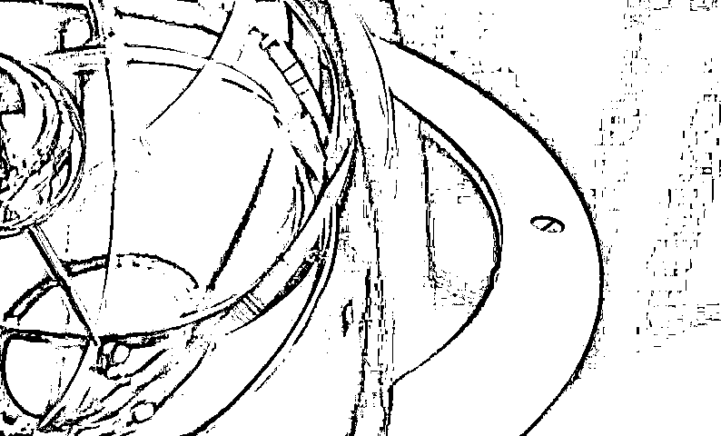****7****婚神星在****天秤座****·** 婚神星在天秤座的人**希望他们的关系能保持平衡与平等；****·** 他们**希望有人能够分担做决策的琐事，并在所有事情上与他们进行协商；****·** 他们会被**良好的举止和诱人的外表**所吸引；**·** 他们希望**与伴侣分享社交活动和艺术领域的兴趣爱好；****·** 他们喜欢**浪漫；****· 当关系变得不平衡时，他们往往会变得具有竞争性。****8****婚神星在****天蝎座****·** 婚神星在天蝎座的人需要一种**包含大量深度亲密和性爱的激烈关系；****·** 他们的**操控欲和嫉妒心可能会变得很强，通过性来控制伴侣；****·** 想要**激情、忠诚和力量；****·** 可能**具有占有欲，并且必须随着时间慢慢地学会信任别人；****·** 喜欢**神秘的事物和权力**；**·** 他们可能**要求很高或很难伺候；****·** 一旦赢得了他们的心，他们就会**忠诚和付出**，尽管他们可能总是显得有点疑神疑鬼。**9****婚神星在****射手座****·** 婚神星在射手座的人**希望在关系中获得心智上的刺激；****·** 他们还希望**与伴侣分享自己的信念体系；****·** 他们**想要一个旅行伙伴，喜欢冒险；****·** 他们**崇尚自由主义**，而且**处变不惊**，可能会**直言不讳或具有竞争性；****·** 他们喜欢**独立和人身自由**，因此那种要与伴侣日夜相对的关系对他们来说行不通；**·** 他们希望双方拥有**同志般的情谊**，既可以支持彼此的自由，又可以增强他们的承诺；**·** 他们更喜欢**运动、法律、哲学和户外活动**。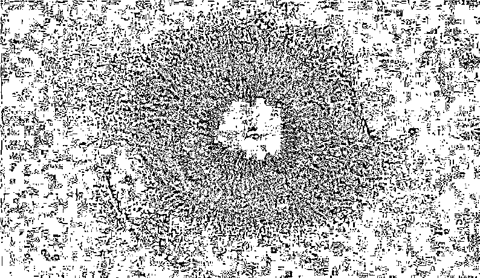**10****婚神星在****摩羯座****·** 婚神星在摩羯座的人**忠诚而传统；****·** 他们的关系可能更多地是**基于社会期望，而不是彼此的情感；****·** 他们想要一个**务实而且井井有条**的人；**·** 他们**不会太情绪化，保守和负责任的，并期望他们的伴侣也能做到这一点；****·** 他们想要一个**可以信任**的人。**一旦对某人做出承诺，他们就会非常忠诚。****·** 可能会**晚婚**，对“对的人”有**非常强的肉欲吸引力**。**11****婚神星在****水瓶座****·** 婚神星在水瓶座的人想要一种让他们自由的关系；**·** 他们非同寻常，可能更喜欢**开放式婚姻或其他选择；****·** 他们也可能**保持单身**，却很喜欢**“炮友”**这样的观念；**·** 他们在关系中**不一定支持平等，**要么扮演饱含爱意的伴侣，要么希望伴侣完全顺从自己；**·** 他们**欣赏伴侣身上古怪的特质；****·** 他们是**进取和友善**的，**不太热情**。他们有时候可能很没安全感。他们会心血来潮和冲动地行事。他们需要一个了解他们以及他们的需求和目标的人。
**12****婚神星在****双鱼座****·** 婚神星在双鱼座的人想要一种**特殊的灵性联结；****·** 他们想**与伴侣分享理想；****·** 他们会被那些**直觉力很强或敏感**的人所吸引；**·** 他们喜欢**分享音乐、灵性议题和诗歌；****·** 当他们感到沮丧或想要躲进幻想世界时，往往会**避世退隐；****·** 他们可以**利用自己的魅力巧妙地操控他人的思维方式，**在某些情况下，可能会**假扮受害者；****·** 他们可能会**利用自己的想象力来创造理想中的完美伴侣；****·** 他们**非常情绪化**，可能**难以应对这个世界的严酷现实**。

**版权声明：**本文由若道翻译发布，欢迎转发，反对抄袭。友号转载请申请白名单。

**更多小行星内容**

**点击下图了解课程详情** 

**微信又双叒叕改版啦，不想错过若道君的推送？**

**就把若道设为星标吧！**

**▼**

**就是这个“在看”，戳戳戳 ☟**

**********报名直达入口**********

# 早鸟价最后 1 天！丨唤醒女神，在占星学中使用小行星

> 原文：[`mp.weixin.qq.com/s?__biz=MzA5NjA0NTAxNg==&mid=2651444745&idx=3&sn=67a960f7512c1b90be916310a7434e67&chksm=8b4b64bebc3ceda8f14e61c15cc39305c2b951742ee84d4390f962c32dd7fd4b343d2b236ac4&scene=126&sessionid=1692737984#rd`](http://mp.weixin.qq.com/s?__biz=MzA5NjA0NTAxNg==&mid=2651444745&idx=3&sn=67a960f7512c1b90be916310a7434e67&chksm=8b4b64bebc3ceda8f14e61c15cc39305c2b951742ee84d4390f962c32dd7fd4b343d2b236ac4&scene=126&sessionid=1692737984#rd)

对于占星师来说，巨大的小行星带中有成千上万的滚落岩石在太空中呼啸而过，这似乎是一次令人生畏的雪崩，蕴含着潜在的新信息。因此，当你将它们整合到你的工作中时，辨别并正确理解每一颗小行星的意义是很重要的。

包括选择小行星在星图的解读，增加微妙的细微差别和令人惊讶的细节是无法从任何其他占星工具中获得的。

1

**课程简介**

理解小行星带所蕴藏的神圣女性力量的流动将帮助你在占星实践中创造更多的和谐与平衡。**小行星为你的解读带来细节、精确性和深度，同时也使你能够研究和阐释那些被忽视或低估的生命领域。**

**我们将讨论主要的女神小行星，并学习如何与之合作。**我们将借助大量现实生活中的例子，深入探讨它们的象征意义。你会真正了解这些重要的占星元素，从而拓展自己的实践。

**此课程可作为 ISAR 选修课。**

2

**课程安排**

**课程安排：6 月 8 日--7 月 27 日 （每周二）**

*   **6 月 08 日** **小行星简介**

*   **6 月 15 日** **谷神星，丰饶女神**

*   **6 月 22 日** **婚神星，婚姻女神**

*   **6 月 29 日** **智神星，智慧女神**

*   **7 月 06 日** **灶神星，壁炉女神**

*   **7 月 13 日 健神星，健康女神**

*   **7 月 20 日** **灵神星，灵魂女神**

*   **7 月 27 日** **综合应用，展望未来**

3

**课程大纲**

**第*****1*****讲  6****月 8 日  小行星简介**

小行星概述，小行星的发现、科学以及一些占星学历史。

**第*****2*****讲  ****6 月 15 日 谷神星，丰饶女神**

母神、农业女神，但其影响力远不止如此。这是我们所知的最大的小行星，也是最重要的小行星。她掌管养育、滋养、救助、管理等方面。

**第*****3*****讲  ****6 月 22 日 婚神星，婚姻女神 **

荣誉、伙伴关系、契约和婚姻：众神中的女王是正直的女主人。她在出生星图和行进中有什么意涵？她与“丈夫”木星朱庇特是什么关系？

**第*****4*****讲  ****6 月 29 日 智神星，智慧女神**

战地记者、棋手和占星师有什么共同之处？来自智慧、策略、洞察力和远见女神的帮助。

**第*****5*****讲 **** 7 月 6 日 灶神星，壁炉女神**

掌管神圣的火焰、家庭生活、厨房灶台、家人、遗产的女神：这颗关键的小行星被严重误解了。她可以给你一把钥匙，让你了解家庭关系、你的祖先和你的目标意图。

**第*****6*****讲  ****7 月 13 日 健神星，健康女神**

在我们应对全球疫情的过程中，掌管健康和福祉女神目前显得尤为重要。她能提供如何应对新型冠状病毒肺炎的线索吗？她在出生星图中的意涵是什么？幸福原来蕴含着相当广泛的含义。

**第*****7*****讲  ****7 月 20 日 灵神星，灵魂女神**

灵神星是唯一一位以人类身份开始生命的女神，她代表着人类的灵魂。这颗小行星与爱情故事、童话故事和灵魂之旅有关。

**第*****8*****讲  ****7 月 27 日 综合应用，展望未来**

你们刚刚开启探索使用小行星可能性的旅程。我们会探索评估某些理论有效性的方法，以及在实践中检验这些理论的重要性，我们还会探索其他数百万小行星中的一些。这堂课既有提醒告诫，也鼓励你深化自己的占星实践，并拓展你对象征的理解。

4

**课程试听**

📹 [`v.qq.com/iframe/preview.html?width=500&height=375&auto=0&vid=d3241mm7xdw`](https://v.qq.com/iframe/preview.html?width=500&height=375&auto=0&vid=d3241mm7xdw)

解锁全部沙龙内容欢迎购买：[**ISAR 会员沙龙 29 期 | 天空的细节——小行星如何提升扩展占星学**](http://mp.weixin.qq.com/s?__biz=MzA5NjA0NTAxNg==&mid=2651437295&idx=2&sn=8816fb50331dff6f6d25686ff80d7b5b&chksm=8b4b0a58bc3c834e54fb7d13e5bc11c98067fd93b29c5fbfc8f9745a516cbd8bfa3b90696324&scene=21#wechat_redirect)（点击可获取详情）

5

**主讲老师**

**克里斯蒂娜·罗登贝克**

克里斯蒂娜·罗登贝克（Christina Rodenbeck）是一名全职职业占星师，在牛津大学城生活和工作，深受周围知识和文化氛围影响；她拥有伦敦大学（University of London）的人文荣誉学位，曾在伦敦占星学馆（Astrological Lodge of London）、心理占星中心和占星研究学院学习。

作为一名占星师，在过去的 20 年里，克里斯蒂娜在她的网站“牛津占星师”上写了大量关于时事、艺术和文化的文章；她每月主持一个占星播客：“与克里斯蒂娜和萨莉一起占星”，并定期在《占星杂志》(Astrological Journal)上撰写时尚专栏；她定期在英国授课，并保持着蓬勃发展的专业实践。

6

**此次课程适合哪些人？**

*   有一定占星学基础，若道核心课 L3 以上水平；

*   希望成为优秀的占星师，想要借鉴国际大师次限解读思路并融入自己的体系的人；

*   热爱占星学、天文学、神话学的研究型占星学者；

*   计划考取 ISAR 认证占星师，寻觅中意选修课的学员；

*   走在自我探索和个人成长道路上的人。

7

**课程价格**

**价格**：**6800 元**

**早鸟价：5800 元**

**早鸟价截止时间：2021 年 5 月 19 日**

还有限时 ISAR 选修课联报套餐价格，具体请咨询课程顾问：Maggie 老师（微信：18510107057，请备注“小行星”）

长按二维码添加 Maggie 老师

8

**授课时间**

**2021 年 6 月 8 日（周二）20:00-22:00 开始，网络课程**

9

**退转课程**

*   **退款原则请详看《教学协议》，如有疑问请咨询课程顾问。**

****ISAR 选修课：小行星****

**授课老师：克里斯蒂娜·罗登贝克**

**授课时间：**2021 年 6 月 8 日（周二）起

**授课方式：**网络课程**，**英文授课，中文翻译

**费用：**6800 元（**早鸟价：5800 元，5 月 19 日截止**）

**课程负责人：Maggie 老师**（微信：18510107057，请备注“小行星”）

长按二维码添加课程负责人咨询~

****报名请点击“阅读原文”****

# 2021 年金牌核心课 | 《职业占星师养成计划》你不了解一下？

> 原文：[`mp.weixin.qq.com/s?__biz=MzA5NjA0NTAxNg==&mid=2651444740&idx=2&sn=732ca31333c6e2528e6695c02b0e0df1&chksm=8b4b64b3bc3ceda5ade3fd20c1b8fefea1cf3c0aea4962f62fc0a5d7ccca588043198f8944eb&scene=126&sessionid=1692737984#rd`](http://mp.weixin.qq.com/s?__biz=MzA5NjA0NTAxNg==&mid=2651444740&idx=2&sn=732ca31333c6e2528e6695c02b0e0df1&chksm=8b4b64b3bc3ceda5ade3fd20c1b8fefea1cf3c0aea4962f62fc0a5d7ccca588043198f8944eb&scene=126&sessionid=1692737984#rd)

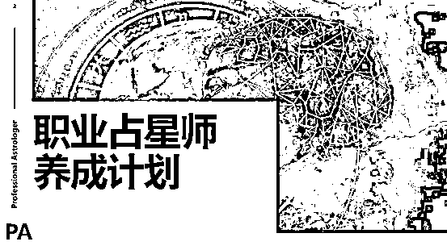

**沉淀十年占星学教育中国本土化教学经验，2021 年若道占星核心课全面升级**

**根据中国学生的学习习惯不断优化占星教学体系，为了让若道学员学成后更自如地应对本土咨询市场的需求。**

**我们研发了“职业占星师养成计划”，报名核心课程，即可参与该计划。**

**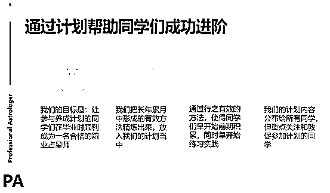**

**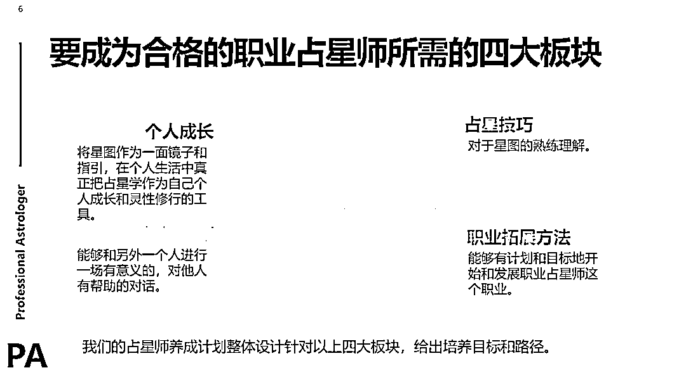**

**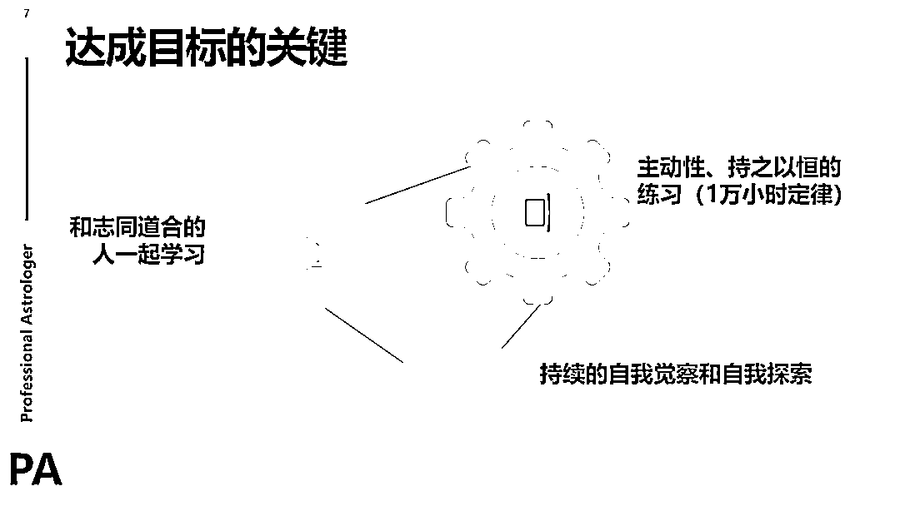**

**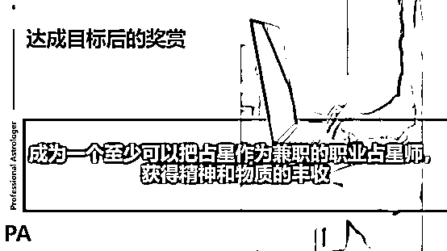**

**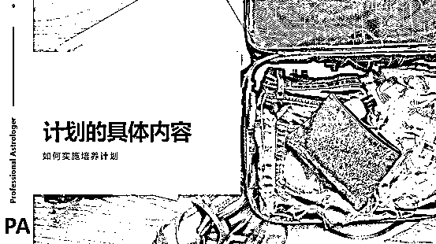**

**如果对“职业占星师养成计划”具体内容感兴趣，欢迎扫码添加课程顾问沟通。**

**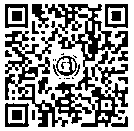**

**加入核心课程“职业占星师养成计划”，获得若道专业平台支持。**

**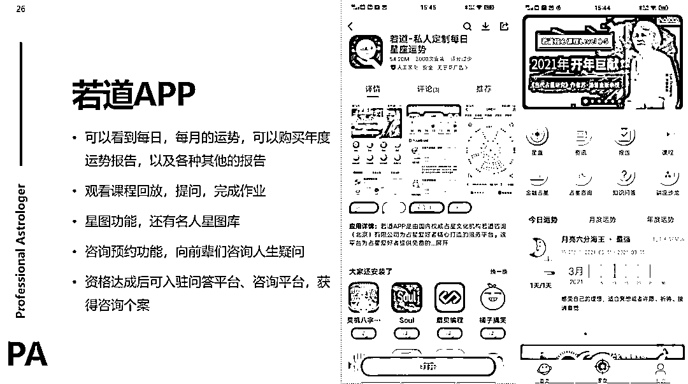**

**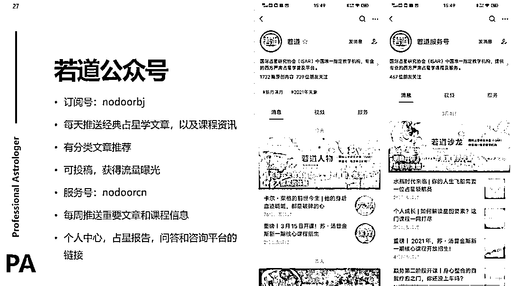**

**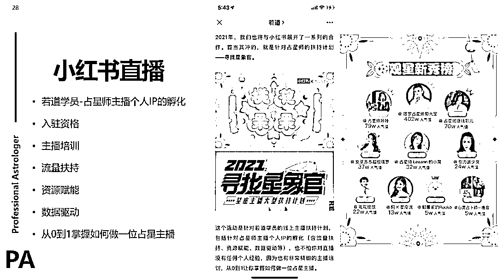**

**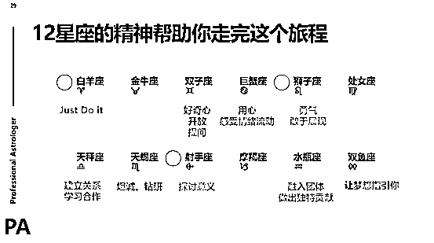**

**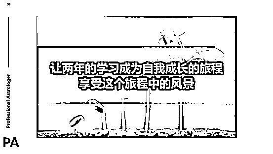**

**沉淀十年占星学教育中国本土化教学经验，2021 年若道占星核心课全面升级**

**英国目前最资深****的占星学家和咨询师之一，她拥有****超过 40 年****的占星经验，是占星学习者必备之两本圣经《顺逆皆宜的人生》与《当代占星研究》作者。**

****

**她以自己的冷幽默、****抽丝剥茧的研究天分****和****占星直觉****而闻名。她是一名执业占星师，也是一名顺势疗法医师，是心灵和身体的****敏锐诊断专家。**

**2003 年，为表彰其卓越贡献，英国占星协会为苏·汤普金斯授予查尔斯·哈维****终身成就奖。**

**2017 年第一届苏·汤普金斯核心课****金牌助教******、2019 年第二届核心课中与苏·汤普金斯老师******联合授课******的******ISAR 认证占星师咔咔。**

****作为最熟悉苏·汤普金斯老师教学风格的中文占星老师，咔咔老师将在 2021 年第三届苏·汤普金斯核心课中负责教授部分课程，帮助学员更好地********梳理知识架构,********了解学员的********学习进度和疑问**，补充丰富**********占星咨询的中国案例。************

1

**苏老师写给学员们的信**

**<****滑动查看中文版邮件****>**

2

**课程安排是怎样的呢？**

**第*****1*****阶**

2021 年 3 月 15 日开课，每周一晚上 20:00-22:00 上课，共 4 次课

**第*****2*****阶**

2021 年 4 月 12 日开课，每周一晚上 20:00-22:00 上课，共 4 次课

**第*****3*****阶**

2021 年 6 月 7 日开课，每周一晚上 20:00-22:00 上课，共 15 次课

**第*****4*****阶**

2021 年 10 月 25 日开课，每周一晚上 20:00-22:00 上课，共 13 次课

**第*****5*****阶**

2022 年 2 月 28 日开课，每周一晚上 20:00-22:00 上课，共 27 次课

3

****1-5 阶你将学到什么？****

**第*****1*****阶 ****黄道星座**

*   概要介绍占星学与星图

*   四元素与三形态

*   黄道 12 星座

**第*****2*****阶****行星**

*   太阳、月亮及其他行星

*   练习将它们组合在一起

**第*****3*****阶 ****宫位、相位以及初步解读星图**

*   四轴与宫位

*   相位概论

*   困难相位

*   柔和相位

*   数字游戏，练习找相位

*   容许度，出入相位

*   相位模式

*   将它们全部组合在一起

*   解读的基本原则，权重，失衡

*   如何解读一张星图......丰富的案例，包括学员的案例

**第*****4*****阶 ****出生星图解读（进阶）以及关系与职业议题**

*   了解灵魂进化的路径：月亮交点

*   天文学基础知识

*   综合星图解读，把知识串联起来

*   职业占星解读

*   财富占星解读

*   亲密关系解读

*   丰富的案例，包括学员案例

*   开始学习预测：行进

**第*****5*****阶 ****预测、关系、咨询、为执业和考试做准备**

*   继续学习预测
*   次限推进和其他推进：什么是推进以及如何使用推进？ 
*   太阳弧：什么是太阳弧以及如何使用太阳弧？
*   返照星图：太阳返照、月亮返照和其他行星回归星图
*   将预测技法结合起来
*   原理和时机；蚀相和其他月相
*   解读和预测：更多示范和案例
*   介绍中点
*   如何运用择时星图（婚礼、商务活动等）
*   创造性的相位 ：五分相与七分相
*   关系议题概论
*   对比技法
*   对比图、组合图和其他常用关系图
*   其他有效但鲜为人知的对比技法，比如龙首图
*   更多预测与对比案例
*   心理学、咨询模式及技巧（主要是精神动力、人本主义和超个人心理学方面）
*   当代心理学倾向、“以人为本”的占星师核心思想
*   倾听技巧，咨询，道德议题
*   为练习做准备；如何作为占星师谋生；学习必备的历史和天文学知识，为考试做准备

**综合以上技法**

系统的解读步骤来帮助你把焦点对准需要聚焦的地方。

4

**想更多了解导师？**

**主讲导师**

**苏·汤普金斯（Sue Tompkins）**

**英国目前最资深的占星学家和咨询师之一，她拥有超过 40 年的占星经验。**占星学习者必备之两本圣经**《当代占星研究》**和**《顺逆皆宜的人生》**作者。

2003 年，为表彰其卓越贡献，英国占星协会为苏·汤普金斯授予**查尔斯·哈维终身成就奖**。苏同时是一位接受过心理学与心理咨询训练的注册顺势疗法医师，并经常在英国、法国、挪威、瑞典、澳大利亚等地举办占星研讨会和公开演讲。

**苏以实际、生动而幽默的风格闻名于世**，她的教学经验非常丰富，能够胜任从初学者教育到毕业生督导等针对不同占星程度学员的教学工作。这来源于她在地方公立学校以及在英国占星学院(FAS)长达 19 年的教学经历，并在 1986 年-2000 年任学院院长并负责现场教学的所有事务，以及随后在世界各国教学积累的经验。2000 年，英国占星研究学院授予其研究员职位，以表彰她为学校做出的突出贡献。

**中文讲师**

**占星师咔咔（Caroline）**

2010 年师从美国占星师大卫·瑞雷学习，并得到世界名师斯蒂芬·弗里斯特、罗伯特·汉德、苏·汤普金斯传授各种占星学技法。若道首届学员，国内最早获得 ISAR 职业占星师资质的职业占星师之一，现兼任若道核心课程助教。在国际知名广告公司和市场研究公司从事的市场研究和推广工作十余年，曾任职于阳狮集团、尼尔森市场研究有限公司、MTV 和《Madame Figaro》杂志。

**助教**

**助教王嘉祺 Conrad**

**ISAR 认证占星师**，**若道认证生时校正资质，**从 2010 年开始学习占星学，2015 年开始在若道系统学习，并开始个案咨询。2018 年担任若道核心课程助教，以及选修课卜卦占星学和太阳返照课程助教，并带领学员进行经世占星学及太阳返照方面研究。2019 年 11 月作为演讲人之一参加了 ISAR 北京大会，也是 ISAR Star Club 中国区第 16 期的主讲人。

5

**选择若道学习占星学的优势**

**运用自由意志，扭转破坏性模式，绽放天赋潜能**

若道是人本主义占星学的旗手。因为我们相信，**人通过了解模式、觉察习性、积极疗愈、终将释放其潜能，与命运共舞**。

**进入国际权威职业占星师认证的快车道**

占星界的“联合国”ISAR（国际占星研究协会），是具有全世界影响力的占星教学和研究组织和职业占星师全球认证机构，认证占星师遍布 45 个国家。**在 ISAR 的 19 所附属学校中，大中华地区的附属学校只有若道一家**。在国际化的教学理念大纲标准下，**若道毕业生在 ISAR 国际认证占星师的考试通过率多次位居全球首位**。

**十年占星学教育中国本土化教学经验**

**根据中国学生的学习习惯不断优化占星教学体系，让学员学成后更自如地应对本土咨询市场的需求。**学好占星学不仅仅需要邀请一两位老师教学，更需要对教学难点有充分了解，且有持续的教学跟进服务。**10 年来多次核心课程和各种专题课程的教学，让若道非常了解中国学生学习占星学的难点和卡点，合理有效地拆分、提炼课程知识点，同时也积累了丰富的国外老师和中国老师、助教紧密配合以及课程顾问密切配合教学的经验**。若道还专门开发了有助于占星学习的“**若道**”APP，每门课程都设有答疑板块，学员能够方便快捷地提交问题，助教及时答疑解惑和批改作业。**融入中国顶尖的职业占星师群体**若道是中国职业占星师的“黄埔军校”。职业占星师的培养从若道开始，**进入若道，你就走进了中国顶尖的职业占星师群体，和一群志同道合的师兄师姐联谊，获得经验，共同成长**。**多种奖学金支持**为了鼓励学员不因为暂时的经济困难而放弃学习，我们特意设置了各种**技能交换和奖学金**。对于有一技之长的学员，我们推出的技能交换的项目包括**“笔译”、“笔记整理”、“平面设计”、“课本朗读”、“班级服务”**等技能交换项目；而对于努力学习、出勤率高、完成作业率高的学员，我们设置的**土星奖、木星奖**等各种奖学金在等着你。为了感谢帮助我们推荐学员的老学员们，我们设置了“**老学员推荐奖**”；对于通过问卷提建议，帮助我们提高服务的学员，我们也设置了相应的奖学金。ISAR 中国还设置了**国际会议奖学金**，符合条件并通过甄选的申请者最高可获取 5000 元奖学金。当美好的知识遇上奖学金，你可以在学习旅途中乘风破浪，直挂云帆济沧海。**开启占星咨询的职业规划和支持**若道为占星学员搭建了占星问答平台和占星咨询平台，并提供严肃占星学影响力最大的媒体平台，全力为毕业生提供宣传渠道，帮助你吸引和积累咨询生涯初期的种子客户。若道为学员开发了适用于占星学习的“若道”APP，并不断更新完善。**①  微信平台**若道微信平台作为业内颇具影响力专业平台，为文笔好的若道毕业生提供传播占星学并免费宣传自己的机会。有的学员因为文笔获得众多粉丝喜爱，在 3 年多时间积累起 2000 多人的潜在客户。**②  问答平台**若道问答平台帮助学员接触客户的实际问题，并在毕业前就进行演练答题。自问答平台 2016 年上线运营以来，学员接触到 3200 多个问题， 回答问题最多的学员在问答平台收入达 5 万多元。**③  咨询平台**若道咨询平台是我们为优秀毕业生所搭建的平台，帮助毕业生在自己的咨询拓展之外，用若道提供的平台扩展咨询客户群。自咨询平台 2017 年 8 月上线运营以来，咨询平台共入驻 65 人，收入最高者达 32 万元。此处所列学员收入仅供参考，收入高的学员和其专业水准、努力程度密切相关。若道平台尽其所能将自己定位为辅助学员开展职业生涯的桥梁。**在 10 年的占星教学耕耘后，两位创始人——大卫·瑞雷及蒋颖再次邀请苏·汤普金斯老师开设占星核心课程。**

6

**此次课程适合哪些人？**

*   对占星学感兴趣，想要入门的零基础者

*   占星学小白，但有志成为职业占星师的人

*   有一定占星学基础，但不知道该如何整合星图复杂碎片的人

*   希望成为优秀的占星师，想要借鉴国际大师解读思路并融入自己的体系的人

*   苏·汤普金斯的粉丝，学过占星学，但就是想跟着偶像再学一遍的人

*   走在自我探索和个人成长道路上的人

7

**占星业内推荐**

**苏·汤普金斯的《顺逆皆宜的人生》令人赞叹！苏是一名倍受爱戴的老师，并且任教多年。苏以自己的冷幽默、抽丝剥茧的研究天分和占星直觉而闻名。她是一名执业占星师，也是一名顺势疗法医师，是心灵和身体的敏锐诊断专家。**

** ——法国心理占星学协会会长琳恩·贝尔**

8

**苏汤班学员评价**

9

**苏汤老师水瓶座试听课**

（温馨提示：手机请注意流量）

📹 [`v.qq.com/iframe/preview.html?width=500&height=375&auto=0&vid=p3210llaq7f`](https://v.qq.com/iframe/preview.html?width=500&height=375&auto=0&vid=p3210llaq7f)

10

**课程价格**

**L1-2：**4000 元

**L1-3：**13200 元

**L1-5 原价：**49400 元 **（五月内插班连报优惠价 33000）**

其他各阶段课程单报价格，请咨询课程顾问：童老师（微信：196267205，请备注**“苏·汤普金斯核心课”**）

长按二维码添加童老师

11

**退转课程**

*   **退款原则请详看《教学协议》，如有疑问请咨询课程顾问。**

****苏·汤普金斯金牌核心课程****

**授课老师：苏·汤普金斯**

**授课时间：**2021 年 3 月 15 日起

**授课方式：**网络课程**，**英文授课，中文翻译

**费用：**L1-2：4000 元；L1-3：13200 元；L1-5：49400 元****（五月内插班连报 L1-5 优惠价 33000）****

**课程负责人：****童老师**（微信：196267205，请备注“苏·汤普金斯核心课 L1-L3”）

长按二维码添加课程负责人咨询~

****报名请点击“阅读原文”****

# 《魔戒》重映丨木星进双鱼座，总有美好值得我们视为信仰！

> 原文：[`mp.weixin.qq.com/s?__biz=MzA5NjA0NTAxNg==&mid=2651444740&idx=1&sn=7257dd8d53f18315ca22a8a1bb96164c&chksm=8b4b64b3bc3ceda5d1b03f904f5c4312d1539d26f1e41055eb741122f096368c9a961ff0bd37&scene=126&sessionid=1692737984#rd`](http://mp.weixin.qq.com/s?__biz=MzA5NjA0NTAxNg==&mid=2651444740&idx=1&sn=7257dd8d53f18315ca22a8a1bb96164c&chksm=8b4b64b3bc3ceda5d1b03f904f5c4312d1539d26f1e41055eb741122f096368c9a961ff0bd37&scene=126&sessionid=1692737984#rd)

******☆ ****后台回复“今日”，给你一句生命态度******

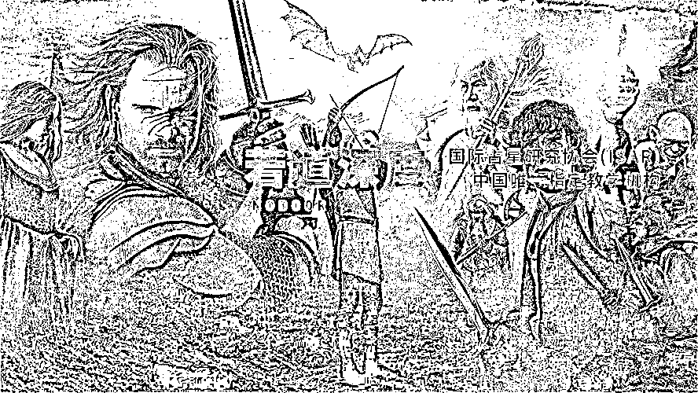

作者/编辑/翀子 ISAR 认证占星师

封面/书君 图片/网络

5 月 14 日，[木星进双鱼座](http://mp.weixin.qq.com/s?__biz=MzA5NjA0NTAxNg==&mid=2651444548&idx=1&sn=f25973610acd10926e9a7955f77dbefb&chksm=8b4b67f3bc3ceee50cce757b720a43194a531d62b63867c6575720fcae8ee26b7cb3c268df52&scene=21#wechat_redirect)（点击链接文章），魔戒系列电影的第三部《魔戒：王者归来》这天在国内重映，而作者托尔金的木星也在双鱼座，它们之间似乎种神秘的呼应。我们从中看到双鱼座木星怎样的图景？电影的故事情节、人物和台词又给我们什么启发？

**2021 年 5 月 14 日，木星进双鱼座。**同一天，电影《魔戒》三部曲的第三部在中国大陆重映。**我又去查作者托尔金的出生信息（1892 年 1 月 3 日），那时木星恰好也在双鱼座。**这几者之间似乎有什么关联，或者说给我们提供了某些关于双鱼座木星的信息，我在感觉，在想象，希望获取某些“神启”和灵感。

忽然，《魔戒》终曲的最后一个画面进入我的脑海：一艘大船，在金灿灿的光芒中驶向远方宁静宽广的海面，船上有精灵、巫师和善良平凡的哈比人，我们不知道这艘船驶向何方，但那里似乎是远离尘世的天堂。

**这正是描绘双鱼座木星的绝美图景。**

**木星是画面里那艘远航的大船，**它畅快前行，“东风”吹鼓了它的帆。木星也是一艘**冒险的船**，它探索行经地域的每个角落，让我们全然领略那个地域的“风貌”，我们既看到最美好的东西，也碰触最放肆的张扬，它们**让人叹为观止或错愕惊讶。**这艘船没什么顾忌，它担忧的，大概就只是乘客看不到它展示的画面， **因此它特别在意去“放大”它们，让乘客不虚此行。**

木星这艘船，在驶过坚硬的群山（摩羯座）和各自为政的新新社区（水瓶座）后，放下些许疲累和紧绷，**终于来到属于自己的领地——一望无际的海洋（双鱼座）。**我们站在船上，看它行过的风景，领略它想让我们得到的体验。

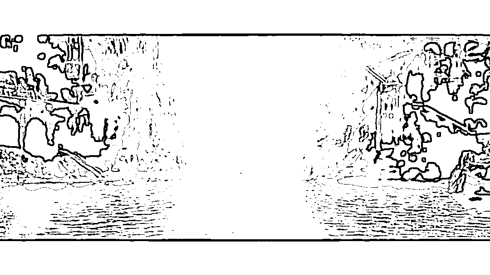

| 《魔戒：王者归来》剧照

**驶向愿景，释放想象**

如果说射手座象征了个人化的远大理想和生活愿景，那双鱼座就是超越个体生命局限、象征对人类集体或是宇宙万物的美好勾画。它是想象力的天堂，每个人的“天堂”都不尽相同，但或多或少，是超越现实世界的生活样貌。

**因此当木星行驶在双鱼座，我们会领略到想象力的美妙、创造力的无限和“一万种非现实的美好”。**

**文学、艺术、音乐、电影……**那些源于生活又高于生活的存在，是人们释放自我、沉浸投入的“天堂”。人们把对生命最生动的畅想和期待灌注其中。而托尔金的笔就是那艘承载读者的船，畅游在奇幻文学的天地间。

体型矮小、淳朴忠诚的霍比特人、圣境瑞文戴尔、白袍巫师甘道夫、怪物聚集的魔多军队……《魔戒》和古往今来的传奇故事一样，是生命之旅的隐喻，是复杂人生的神话。

每个平凡人都有自己的英雄之路要走，TA 有同伴、向导、老师、敌人，有开心、痛苦、绝望、希望和平静，TA 有独属于自己的使命，除了自己，没人可以替 TA 完成。托尔金将我们代入虚构的时空，**乘着他想象力的翅膀，翱翔在生命的宏大隐喻里。**

木星在双鱼座，**正是创意和想象力彰显力量的时候，**时光流转，我们又会看到各类型艺术大放异彩。它们超越了平日生活的限制，唱出人们心中的**最单纯的美好渴望和向往**。双鱼座是理想的化身，而艺术正是化日常为神奇的魔术师，我们在其中暂时离开现实生活的压力，唱出更美妙归真的生命之歌。

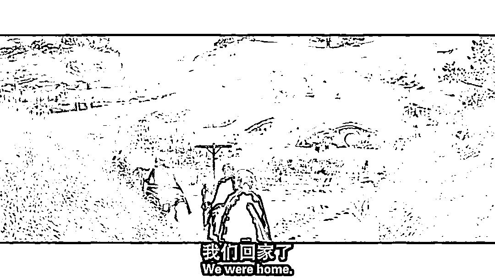

| 《魔戒：王者归来》剧照

**有一位中国人，他和托尔金的出生年份相近，星图上的木星也在双鱼座，**他是中国的流行音乐奠基人、儿童歌舞音乐作家、近代歌舞之父，他叫黎锦辉（1891 年 9 月 5 日出生）。黎锦辉创作了中国最早的流行歌曲，还把它们推出国门。

现在再听他的作品，在吱吱呀呀的磨损音质中，有孩子的天地、田间的虫鸣、小兔子的生活、人间情爱的心动。选一个有阳光、白云、蓝天的下午，然后打开这些歌曲，听着它们打会儿盹儿，那也是双鱼座木星的味道。

云儿飘 星儿耀耀

海早息了风潮

声儿静 夜儿悄悄

爱奏乐的虫 爱唱歌的鸟 爱说话的人 

都一齐睡着了

待我细细地观瞧

趁此夜深人静时 撒上些快乐的材料

鼾儿起 梦儿迢迢

人都含着微笑

嘴儿开 心儿跳跳

疼爱你的人 佩服你的人 帮助你的人

都一齐入梦了

大家好好地睡觉 不要等到梦醒时

失掉了甜美的欢笑

**——黎锦晖《明月之夜》**

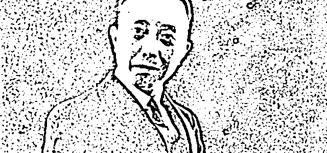

| 黎锦晖

**相信超我**

在睡梦中，你造访了哪里？弗罗多梦见凯兰崔尔给他鼓励，阿拉贡梦见爱人将面临不幸。双鱼座是梦境的象征，**当木星来到双鱼座，我们会比之前更了解梦境吗？对梦境的研究会更深入吗？**这个并不能确定，因为双鱼座是如此**变幻莫测、不可捉摸，**即使在今天，凭借强大的大脑检测技术，我们也很难弄清楚梦里到底发生了什么。

但我确定的是，会有越来越多的人在这个时期感受到个人潜意识、集体潜意识和直觉传递的信息，**我们想去探索梦境背后的意义、觉察直觉给予的灵感并把目光转向超个人的力量。**

双鱼座拥有模糊界限的能力，它不仅模糊现实与虚幻（艺术作品的魅力所在）、人与人之间的隔阂（更有同理心）、也模糊了心灵与物质之间的界限**。****木星是那艘巨大的船，它也是国王、导师、是传播与布道，当它来到双鱼座，我们会在直觉里产生一个“灵性导师”的形象，**象征着我们逐渐明白物质的局限，开始探索精神和心灵世界的海洋。

在《魔戒》的世界里，精灵族群正是这样一个代表。他们拥有清澈又带着迷雾的双眼，当他们往向你，就像穿过一层眼前的纱，看到你在宇宙中的“全息影像”，看到你未来的各种可能性，预知旅途中的艰险，给予你需要的帮助。

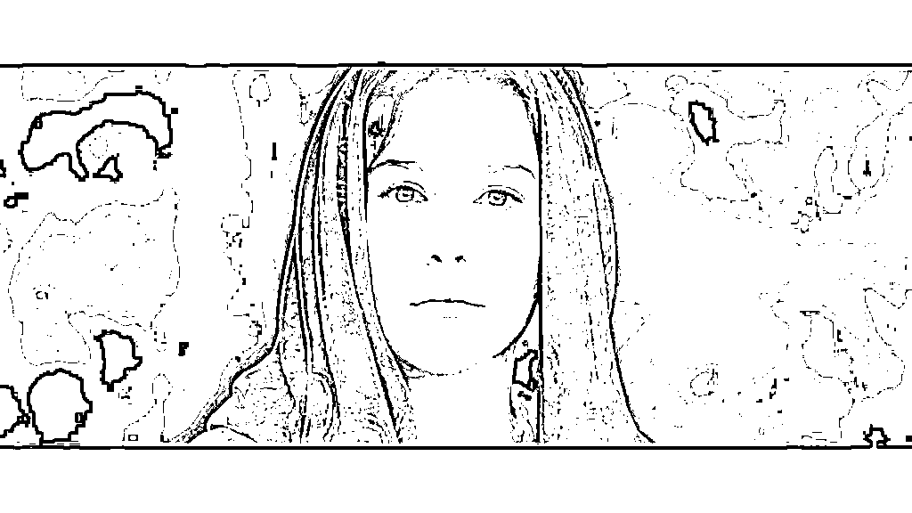

| 《魔戒：王者归来》剧照

护戒使者们离开瑞文戴尔时，精灵女王凯兰崔尔赠与他们每人一份礼物，还赋予了别有意涵的话语，那是灵性的耳语，既是祝福也赐予了力量，**让人在面对阻碍时不会丧失希望。**

**你可以把精灵族群当作人类梦境、直觉、精神力量的象征****，**它们超越了日常思维的惯性和限制，直接融入到更神秘未知的心灵和命运运作中去，透过它们，我们和宇宙本源连接。**当木星来到双鱼座，我们会更加确信对于身体里的宇宙来说，我们意识的能量超乎自己的想象****，**也开始相信，除了自然界，还有超自然界的存有们和我们同在一个宇宙。

**然而，在这当中也有异常危险的水域。**当过度沉浸在超现实的体验中时，现实世界的所有限制、法则、底线、逻辑判断和种种标准便被通通虚化。看看那些**蛊惑人心的“精神领袖”**是如何让信众们陷入心灵陷阱、人们又如何在虚无缥缈的愿景中抛开身上责任、坠入空想的吧！木星在放大双鱼座的正向力量时，**也会放大它的阴暗面**——让我们看到，**心灵力量既能鼓舞人心，也能吞噬人心。**

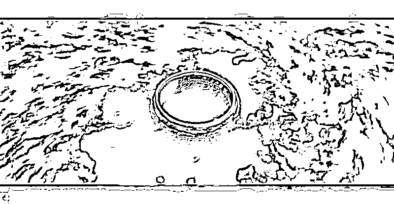

| 《魔戒：王者归来》剧照

魔戒不就是这样一股强大的心灵力量吗？它作用于心智，让每个接触它的人都产生“投靠我便拥有全世界”的感受。这里没有绝对的正义和大义凛然，每个人都面对魔戒的诱惑。那强大的超越小我的力量，让每个人都产生了幻觉和迷乱，它不仅诱惑了咕噜、比尔博·巴金斯，也对刚铎摄政王长子博罗米尔、巫师萨鲁曼、甚至精灵女王凯兰崔尔产生了强大吸引力。

**双鱼座的“超我”能量既能激励人心，也能迷乱心智，**它可以披着神明的外衣、陷人于头脑混乱和心灵泥潭中，也能让黑白不分、是非不明，让人处于模糊不清的灰色地带。

**当木星来到双鱼座，我们又会看到一个怎样被放大的心灵力量的世界呢？**是让我们对各种存有更开放、还是沉迷于“心灵导师”的诱惑中呢？

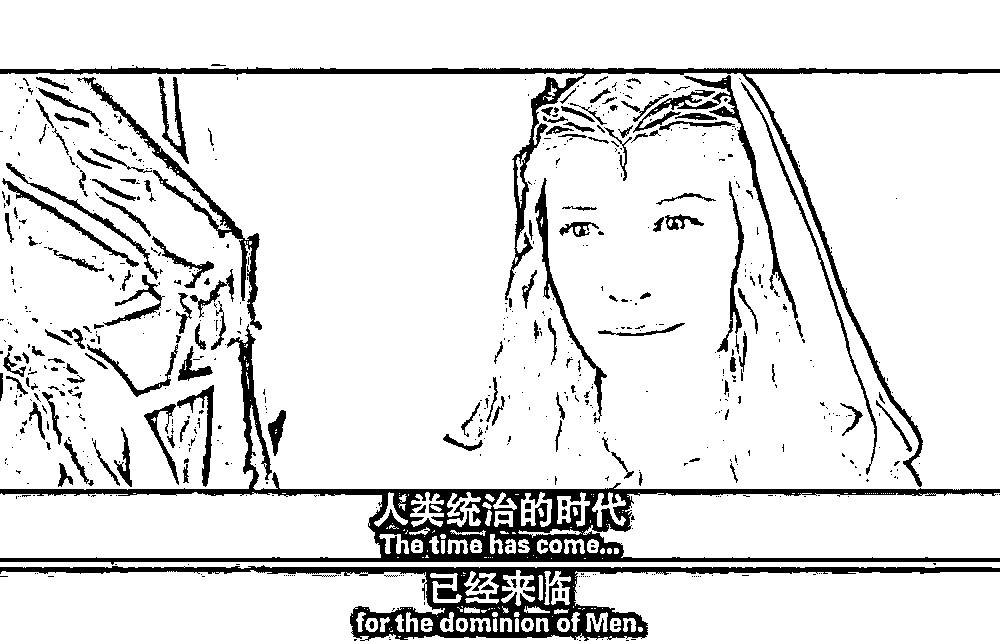

| 《魔戒：王者归来》剧照

**慈悲为怀**

那片海，在平静时就像最温柔的摇篮，它包容万物，体恤众生。每个生命体内都有水分子流动，它们和大江大河大海共振，而后者也同样感受到微小个体的脉动。**当木星行驶到双鱼座，**我们对生命之间的联结更加敏感，对他人的情感、集体的情感更加感同身受。**人们渴望彼此相拥、渴望消除苦难、渴望理解与共融。**

这里没有性别、种族、高低贵贱，即便 “邪恶”之人，也是芸芸众生的一员。人们对彼此充满同情、怜悯与慈悲，相信“性本善”，认为“大奸大恶”之人也必有其不得已的苦衷。弗罗多相信咕噜的誓言，甚至因为相信咕噜的忠诚与好友翻脸（而罔顾咕噜的种种可疑行经）。**我们的情感变得柔软和敏感，他人的苦难与病痛“如在我身”，见不得弱势被欺凌、众生有苦难。**

**人们很容易被代入“受害者”的立场，**急急伸出援手，伸张正义。因此木星在双鱼座的时期，社会救助、公益慈善、医疗健康等领域都会获得大量关注。人们渴望消除灾厄、疾病与贫困，即便大家不在“同一个世界”，也希望共赴“大同”。

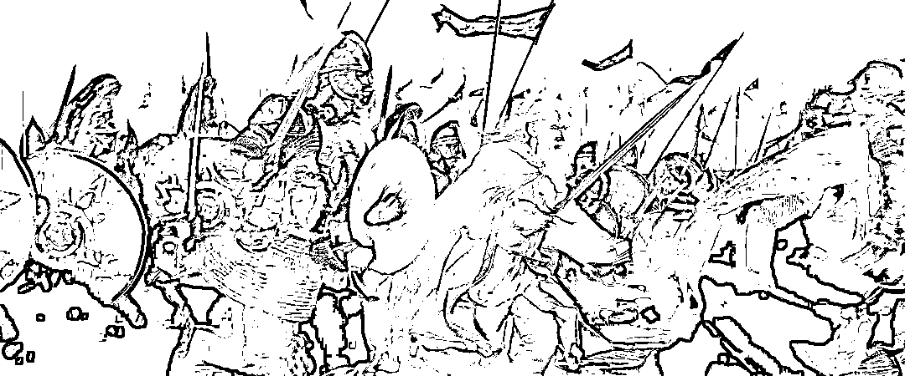

《魔戒》里打动我的场面，是被放逐的洛汗骑士们返回国土、营救希优顿王；是树人们跳出事不关己的中立立场、攻向艾辛格；更是那一座座被接连点燃的烽火台，接到求救信号的洛汗军队不计前嫌、不惧艰险奔赴刚铎，共同抗击魔多大军。当人们抛开小我立场与彼此间的隔阂仇怨、为共同的“爱与和平”付出情感和行动时，**那是双鱼座木星最动人的表达之一。**

**然而，我们也应该警惕这份普世之爱的软肋。**双鱼座是模糊一切边界的高手，**真相与骗局暧昧不清**、善良和“别有用心”难以分辨、**受害者的无辜和施害者的无良并不容易简单下结论**…..在《魔戒》终曲里，“委屈装可怜”的咕噜早已将弗罗多和山姆引向一条最危险的路。设计陷害、挑拨离间一对好友，一副弱小模样的咕噜，以受害者的身份做着施害者的事情。

当木星在双鱼座，人们的情感因为过于细腻、柔软有同理心，很容易就被一些表面的“不公”、“委屈”和“伤害”影响，从而掀起舆情的大风大浪。“假作真时真亦假，无为有处有还无”，**在同理心喷涌而出前，小心求证，不被表象牵着鼻子走、不妄下结论，**是矫正双鱼座木星软肋的方式之一。

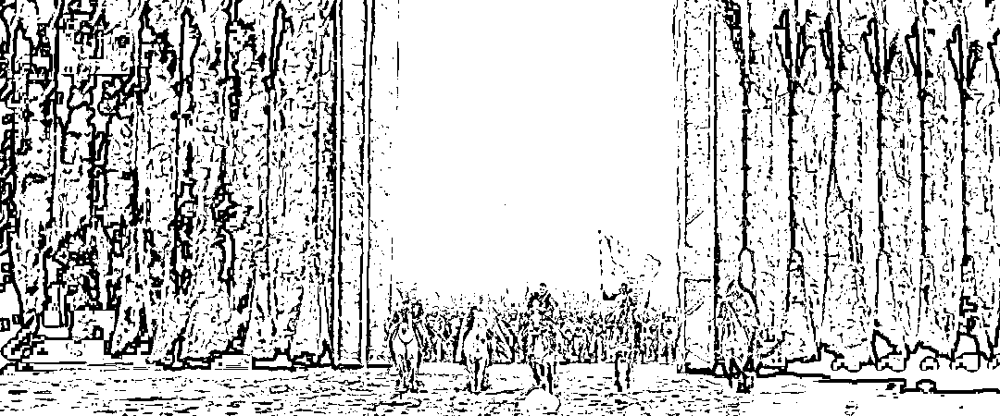

| 《魔戒：王者归来》剧照

**臣服命运**

**每个人遇到难关都会这么想，但这不是我们所能决定的。我们能决定的，是在苦难中该去做些什么。弗罗多，世上除了邪恶以外还有别的力量，毕尔博注定会找到魔戒，你也注定要得到它。** 

**——《魔戒：王者归来》**

哪吒面对魔童的身份标签，喊出“我命由我不由天”，少年热血、豪气万丈。与天命抗争，用自由意志书写自己的命运，是《哪吒》的精神内核。而《魔戒》里的霍比特人弗罗多，被“天命”选中成为魔戒的拥有者，被赋予了消灭魔戒的使命，他被迫离开世外田园般的家乡，进入黑暗艰险的旅程。

没有甘道夫的法术、没有阿拉贡的身世、没有莱戈拉斯的箭法、没有凯兰崔尔预知未来的能力，弗罗多作为不起眼的“一介凡人”，虽然恐惧害怕，却没有推卸自己的重担、躲在树底洞里。**他坦然接受命运的安排，去完成属于自己的使命。**

在这里，我们遇到了双鱼座的另一个关键词——**“臣服”，臣服于宇宙的安排和命运的召唤。**在更广大的存有面前，个体的喜怒哀乐、偏好与厌弃、兴奋与恐惧、渴望与逃避，都无法帮你躲开那个“更高”的指挥棒。唯有臣服于命运的安排，才能从中获得解开困境的钥匙，峰回路转，柳暗花明，得到命运赐予的丰厚奖赏。

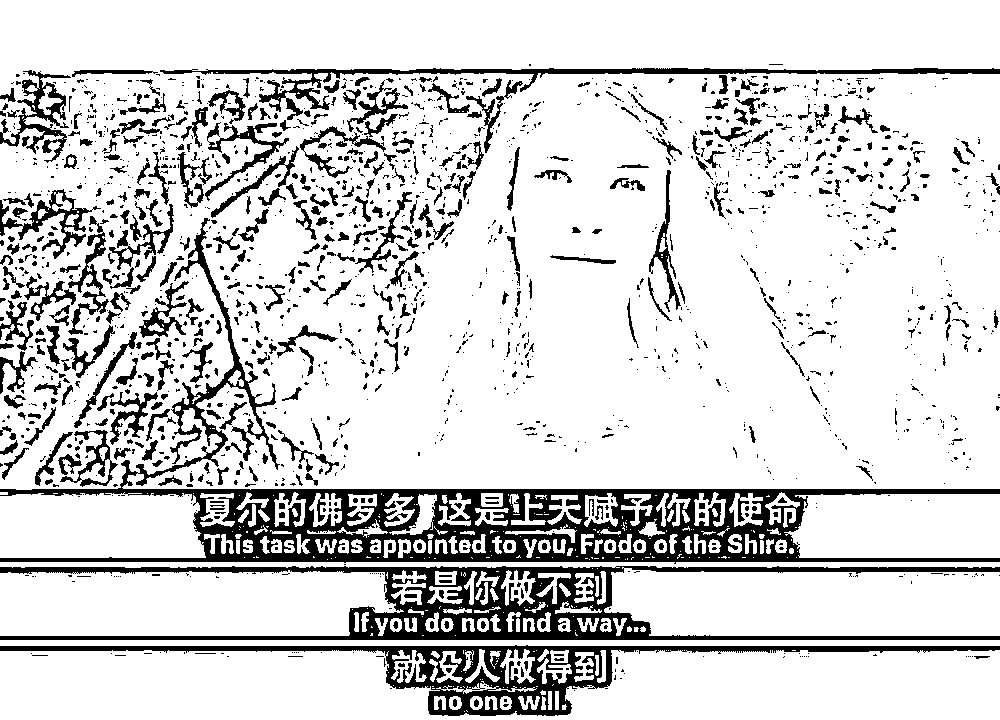

| 《魔戒：王者归来》剧照

我又想起了《哈利波特》中的情节，当哈利知道他必须“赴死”时，他虽然害怕但知道命该如此，坦然向前，然而最后的结局出乎他的意料，他也最终明白“赴死”的目的是什么——那是命运更为巧妙的设计。

顺势而为，“一切都是最好的安排”。**当木星来到双鱼座，学习“臣服”的功课，**并相信命运终会待你不薄，大概会让很多人深有体会。**臣服而不消沉，接受却不服输，**是双鱼座木星的积极表达。命运自有深意，如果你不踏入进去，又怎么知道它最终的目的是什么。

**而臣服的负面表达是逃避，“顺势而为”的阴暗面是放弃抵抗。**刚铎的摄政王德内索尔看到敌军将至，感到必死无疑，便下令放弃抵抗，把自己关在宫门内，不闻外面的战火声，还亲自烧死自己的儿子。他看到了命运的表象，被它牵动了心神，他向命运跪倒和认输，而不是平心接受之后找出解药。

人们往往容易把臣服简单的等同于“认输”，等同于认可命运的“高高在上”。不是这样的，臣服是**“平等的接受”**，顺势是**不去“逆天而为”、且在“天”的变化中寻找转化契机。**一切都不是字面上看到的那么简单，记住，双鱼座是非常有迷惑性和变化性的，小心被它骗了去。

**双鱼座的木星，既让我们学习顺势而为与臣服命运；也让我们学习如何伺机而动，回应生命的感召。**相信宇宙的安排，相信你体内的小宇宙。

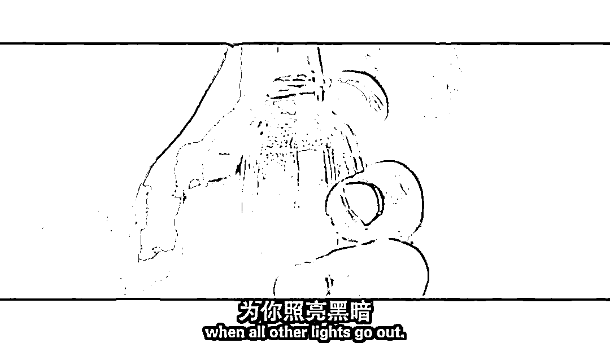

| 《魔戒：王者归来》剧照

**写在最后**

这是一篇写于木星进双鱼座当天的文字，在这天凌晨，我做了一个梦。

梦境中，我坐着热气球低空飞过大海，看到海面上数量巨多的企鹅。它们像飞鱼一样跃出海面，而我拿着手机连续拍下了多张企鹅出海的照片。梦的最后，我的热气球降落在了一个游乐场。

早晨醒来，当我回味这个梦境，忽然想到它与双鱼座木星的关联——飞跃海洋的快乐之旅。真是太妙了。然后灵感袭来，我决定要在《魔戒 3：国王归来》重映的第一天——也就是木星进入双鱼座的日子，写下以上文字。

愿每个人，都能在这段双鱼座木星的日子里，踏上奇妙的灵感与想象力之旅，拥抱柔软与广博的心灵，领悟宇宙的浩瀚与慈悲。

**美好存在于这个世界，弗罗多先生，它值得我们为之奋战。** 

**——《魔戒：王者归来》**

**版权声明**：原创文章由作者授权首发于若道平台，欢迎转发，反对抄袭。友号转载请申请白名单。

**翀子**

ISAR 认证占星师（2019 年获得）

若道 2019 届核心课程毕业生，若道微信公众号兼职编辑

**咨询微信**：carolinemichong

**微信公众号**：LumosTrueSelf

长按打赏

**系统学习占星学**

**点击图片了解详情**

**微信又双叒叕改版啦，不想错过若道君的推送？**

**就把若道设为星标吧！**

**▼**

**就是这个“在看”，戳戳戳 ☟**

********报名直达入口********

# 雷蒙德·梅里曼金融占星周运 | 需要谨慎操作的一周

> 原文：[`mp.weixin.qq.com/s?__biz=MzA5NjA0NTAxNg==&mid=2651444628&idx=2&sn=7ee051cd3cacaee008e263cb5c47b333&chksm=8b4b6723bc3cee3549ec60ba8be97cf8a409e121393fe8e3329fe8f9d11b0bf9e34597daf262&scene=126&sessionid=1692737989#rd`](http://mp.weixin.qq.com/s?__biz=MzA5NjA0NTAxNg==&mid=2651444628&idx=2&sn=7ee051cd3cacaee008e263cb5c47b333&chksm=8b4b6723bc3cee3549ec60ba8be97cf8a409e121393fe8e3329fe8f9d11b0bf9e34597daf262&scene=126&sessionid=1692737989#rd)

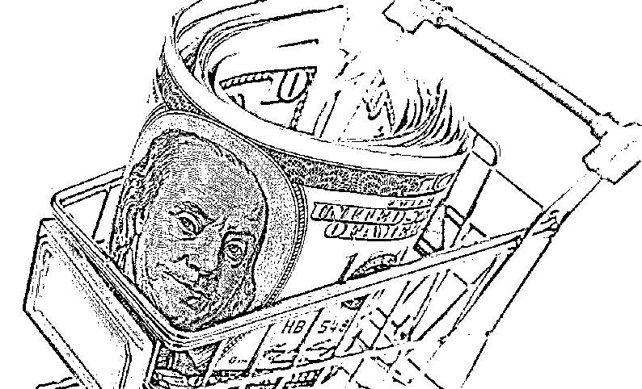

作者/雷蒙德·梅里曼 译者/Luke
编辑/玫瑰 图片/全景网

雷蒙德·梅里曼是在金融占星学界稳坐第一把交椅的占星师，同时他也是若道签约的金融占星课老师，我们引进了雷蒙德·梅里曼老师的《[上证指数月度报告](http://mp.weixin.qq.com/s?__biz=MzA5NjA0NTAxNg==&mid=2651443556&idx=1&sn=971def1aa74c2662394b35531d7018da&chksm=8b4b63d3bc3ceac5cf124611e8386478226581ff46a5d4f248df5671c3a5e189104125b14143&scene=21#wechat_redirect)》及《[黄金报告](http://mp.weixin.qq.com/s?__biz=MzA5NjA0NTAxNg==&mid=2651444606&idx=1&sn=ab870ea48530a466b5d8a495eef3b29e&chksm=8b4b67c9bc3ceedfacd9b2aacb6e745d1155da0b9faafd320eb3f11eedde889a335241a91f3d&scene=21#wechat_redirect)》《[2021 年金融预报](http://mp.weixin.qq.com/s?__biz=MzA5NjA0NTAxNg==&mid=2651436458&idx=3&sn=a7522c271761ef772fc91991ff11d965&chksm=8b4b071dbc3c8e0b452375ae3593028ab68b7b6157b45ee7c92943ff3396990d7748d7cd0967&scene=21#wechat_redirect)》。我们经老师的授权，将每周刊登梅里曼老师的周运，供大家参考和学习。于是，这是本周的周运（5.17-5.21）。

**说明：以下时间采用纽约证券交易所所在地美国东部标准时间。**

**展望与回顾**

**美国劳工部公布，4 月份美国消费者物价指数同比上涨 4.2%。这一数据令道琼斯工业平均指数和标准普尔 500 指数创下近 7 个月来最大的 3 日跌幅。**

**——格温·吉尔福德**

**《通胀飙升扰乱市场》**

**《华尔街日报》**

**2021 年 5 月 13 日**

上周的全球股市，是典型的变动星座和行星入座的表现。全球股指上周开盘强劲。在美国，道琼斯工业平均指数和标准普尔指数都创下历史新高，但纳斯达克指数未创新高。这些历史新高没有持续很长时间。到了周三时，道琼斯工业平均指数下跌 1536 点，自 3 月 4 日形成基本周期低点以来首次测试 45 日移动均线。标准普尔指数下跌更多，2 天之内跌幅接近 5%，跌至 45 日移动均线以下。纳斯达克综合指数未能创下历史新高。它的历史高点依然是 4 月 29 日的 14217，处于 4 月 26 日三星级关键反转日期的 3 天容许度之内。截至 5 月 12 日时，月亮位于双子座，木星即将离开水瓶座，入座双鱼座（变动星座），纳斯达克指数测试 13000，从最近的历史高点算起跌幅为 8.5%。一天之后的 5 月 13 日，伴随着月亮在双子座和木星入座双鱼座，下跌的趋势突然反转。比如说，道琼斯工业平均指数，分别在周二和周三下跌 473 点和 683 点。在周四时，日内交易上涨超过 600 点，收盘上涨 433 点。第二天，周五，又涨了 360 点。正如上周所讨论的，“双鱼座是四个变动星座之一，可能是所有变动星座中，最容易产生市场反转的星座。这对于股票、贵金属（白银大于黄金）和原油市场来说都是如此。如果一个金融市场正在创下数月以来的新高，通常会止步并大幅反转。与此相对的是，如果一个市场正迅速下跌至数月来的低点，可能会在此时形成长周期或中周期波谷，随后反转向上。” 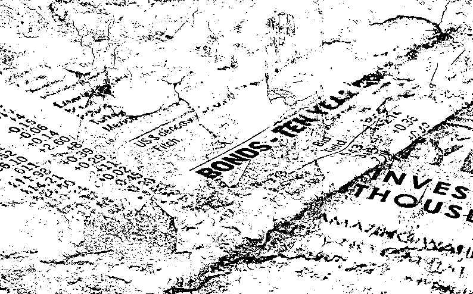周一时，道琼斯工业平均指数和标准普尔指数创下历史新高。2 天后，周三时，它们创下了月度新低。到周五，它们已经收复了 60%的跌幅，并在上周结束时强劲反弹。**这种周初上涨，周中快速下跌，周末又强势上涨至收盘的模式，出现在多个全球股市上。这一模式是变动星座能量的典型表现。**当变动星座得到强调时，市场的变化是快速的，尤其还牵扯天王星的困难相位。今年的主要相位是连续三次精准的土星-天王星渐亏四分相，将在 1 个月后第二次精准成相。你可能还记得 2 月 17 日第一次精准成相。当时许多世界股指创下了多年来的高点。一些高点目前仍然没有突破，比如日经指数。纳斯达克指数当时也创下历史高点的双顶结构。随后 2 周的下跌比上周的下跌还要猛烈。但全球股市的这两轮下跌，都未达到梅里曼市场时机学院周期研究中预期的 15.5 月周期波谷（道琼斯工业平均指数）的下跌幅度。其他市场，黄金和白银上周也上涨到了周期新高。黄金测试 1850，白银测试 28.00。两者都在周四有所回落，但随后又继续上涨，收盘接近当周最高价。如果你喜欢贵金属，你可能有兴趣阅读[黄金月度周期报告](http://mp.weixin.qq.com/s?__biz=MzA5NjA0NTAxNg==&mid=2651444606&idx=1&sn=ab870ea48530a466b5d8a495eef3b29e&chksm=8b4b67c9bc3ceedfacd9b2aacb6e745d1155da0b9faafd320eb3f11eedde889a335241a91f3d&scene=21#wechat_redirect)（点击链接可阅读），其中对黄金的长周期标注提供了新观点。比特币上周的表现颇为有趣。在 4 月 14 日于 64900 触顶后，比特币在 4 月 26 日剧烈下跌至 47000。在一轮健康的反弹再次冲击 60000 后，比特币在 5 月 13 日下跌至更低的低点 45000。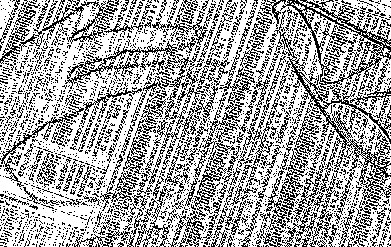**短期占星趋势和长期考量**

**我们越是文明，就越需要凝视黑暗。**

**——艾略特·阿克曼和詹姆斯·斯塔夫里迪斯上将**

**有声书《2034:下一次世界大战》**

**2021 年 3 月**

**给我发行和控制一个国家货币的权力，那么我就不在乎谁来制定法律。**

**——迈尔·阿姆谢尔·罗斯柴尔德**

**1790**

**摘自 www.cmgwealth.com 的故事《在我的雷达上》**

**作者史蒂夫·布卢门塔尔**

**2019 年 10 月 25 日**

**金钱不仅仅是一种经济产物；它是一种理念，是文明的核心特征，在一个自由的社会里，它的健康取决于它价值的可预测性、稳定性，不仅在今天，而且在遥远的未来。**

**——罗伯特·A.·蒙代尔**

**1999 年诺贝尔经济学奖得主**

**《债务危机：原因和解决办法》**

**《华尔街日报》**

**1983 年 1 月 31 日**

我们即将进入 2021 年三个最强有力的地球宇宙学时间段中的第二个。第一个是 1 月-2 月，在那时土星-天王星渐亏四分相第一次精准成相。对应事件是前总统特朗普的支持者攻击美国国会，以扰乱 2020 年大选的认证过程。也对应了 2 月 16-18 日全球多个股票指数的历史高点和多年高点，随后股市回落进入 3 月初。在一些股指市场上，这些高点仍未被突破。**第二个最强有力的地球宇宙学时间段始于本周——5 月 17 日，并将持续到 7 月中旬。**它将包含土星-天王星四分相在 6 月 14 日的第二次精准成相。这一最强有力的地球宇宙学行星组合的中期阶段，往往对俗世事件和金融市场趋势产生最明显的影响。但接下来 2 个月要发生的，不仅是土星-天王星相位。**·** 在**6 月 10 日**还会出现**双子座日食；****·** 在那之前，**土星和水星将分别在 5 月 23 日和 30 日开始逆行；****·** 在那以后，**木星和海王星也会开始逆行，分别在 6 月 20 日和 25 日；****·** 而**水星会在木星和海王星开始逆行期间（6 月 22 日）转为顺行。**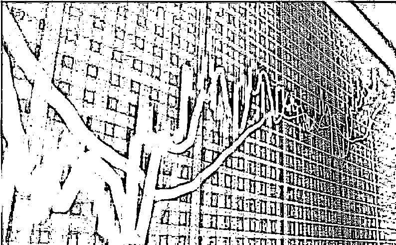这是一段行星集中改变运行方向的时期，与此同时，木星处在容易走神的双鱼座，同时期，土星还会四分天王星。换句话说，接下来 2 个月世界可能变得奇特、超现实，有点像在美国 1 月份发生的暴乱。**挑战在于如何保持神志清醒，不走极端，不要“凝视黑暗”，也不要吸引一些非理性的人进入你的生活。**是的，我知道，木星在双鱼座，有谁想要“理性”呢？如果你按着理性行事和思考，那么如何享受木星在双鱼座的爱交际、浪漫和梦幻的乐趣呢？将木星在双鱼座，土星四分天王星和所有行星改变运行方向结合起来，有助于创见性和令人愉悦的未来愿景。这有利于原创性思考，或许还有电脑游戏。但不太有利于那些让别人（或你自己）大吃一惊的破坏性行为。**区分现实和“非现实”之间的区别是很重要的。小心那些带领你进入未知领域的冲动。**这些在宇宙中发生的平行现实，与一个人在市场中的行为有何关联呢？**金融市场可能变得非常奇特**。你可能会觉得自己知道接下来会发生什么。你可能是对的，只不过“接下来”指的是接下来的“接下来”，而不是马上发生的“接下来”。上周你已经见证了这一点，而上周仅仅是接下来 11 周奇幻之旅的起点。**由于天王星的参与，人们往往过早地做出预测。他们的预见未必是错的，但时机可能是错的**。另一方面，**由于土星的参与，人们往往会迟到**。土星掌管“延迟”。**一方来早了，另一方来晚了，前者在后者抵达之前就离开了**。结果是不“接纳”。现在把木星在双鱼座加入其中，使人们**对金融市场变得非常欣快**（“非理性繁荣”）。我们还没结束。考虑到与此同时，土星-天王星也在跳着不符合节奏的机器人舞蹈，再加上一系列的行星停滞（改变方向），**欢快可能很快变成恐慌和歇斯底里**。你可能会想，（加上你的口头禅）到底发生了什么？

**接下来几周里做交易可能会赚很多钱，因为短时间内价格波动的幅度可能比任何人去年见到的还要多。**与此同时，**对于那些冲动进入未知领域的人，他们可能亏损很多钱**。了解边界在哪儿——你认知的边界在哪儿，并待在其中。如果你这么做，你获利的可能性比亏损的可能性大得多。无论是做交易，个人健康，社交，还是爱情生活，这个建议都适用。

记住这一点，准备好一次疯狂的旅行，这才刚刚开始。玩得开心，负起责任。不要把你的整个生活押注在任何交易上，除非你想换成另一种生活方式。

**说明：以上日期基于纽约证券交易所所在的美国东部标准时间，由于存在时差，中国地区可能需要加一天。**

**版权声明：**本文由若道翻译发布，欢迎转发，反对抄袭。友号转载请申请白名单。

**雷蒙德·梅里曼（Raymond Merriman）**

若道签约老师。著名金融占星师，ISAR（国际占星研究协会）前主席，梅里曼市场分析公司的总裁。他由于“提升了占星学的职业形象”，在 1995 年国际占星大会上被授予轩辕十四奖；在 2012 年国际占星大会上，被授予轩辕十四终身成就奖。

1“中国上证指数月度报告”发售

**若道推出了****中文版****的雷蒙德·梅里曼中国上证指数月度报告，并持续发行该报告！**

当把金融市场的周期和占星学的周期相结合时，雷蒙德·梅里曼老师的金融占星学研究**为投资者应对金融市场的周期波动，并随之调整投资策略提供了极大的价值参考**。

**5 月中英文报告已上线！**

2“黄金价格周期月度报告”发售

**若道推出****中文版****的雷蒙德·梅里曼黄金价格周期月度报告！**不仅仅为广大读者在中国股市的投资出谋划策，更将视角放眼黄金市场。

**每当世界经济形式不明朗的时候，有一个地方是保值的港湾，那就是****黄金**。自 1982 年雷蒙德·梅里曼出版第一本研究《地球宇宙学征象与黄金价格的关联》的著作以来，**他一直作为最重要的黄金市场时机预测者之一享誉国际**。6 月黄金报告已上线，梅里曼老师将会告诉你他对这个关键时期如何操作的想法。也可以按照季度和一年期订阅，有更多优惠。季度和年度的好处是，你可以持续了解梅里曼老师对于不断在变化的市场的看法。即便他某一次看法和市场不一致，你也看到在下一期他如何调整自己的看法，并看到金融占星在一个长期时间段内对你把控风险的帮助。而能够长期控制风险、尽量找到安全的投资时机才是投资的长久之计。

**6 月英文报告已上线！**

**购买套餐**，买得越多越优惠

中国上证指数月度报告套餐价

*   **单月报告**：280 元

*   **3 个月套餐**：780 元（260 元/月）

*   **12 个月套餐价**：2400 元（200 元/月）

**长按下图识别二维码**

**购买金融报告****套餐**

**▼**

黄金周期月度报告优惠

*   **双报告年度套餐更优惠（直降 900 元）**
*   **12 个月黄金报告+12 个月上证指数报告：仅需 3900 元**

**长按下图识别二维码购买黄金报告套餐**

▼

**2021 年金融年报发售中**

**1976 年以来，由雷蒙德·梅里曼撰写的梅里曼市场时机学院每年一次的年度预报沙龙和每年一本的《年度预报》一直在应用占星学原理为投资者们服务，提供卓越洞见，从未间断。**过去两年，3 小时的年度预报讲座和长达 200 页左右对金融市场的分析报告，帮助许多若道读者做出正确的投资决策，降低了投资风险，并获得相当不菲的投资收益。在群星摩羯座的时候，我们和你一起提早规划自己今年的投资安排。2021 年年度预报发售中**2021 年金融年报价格**：1280 元**沙龙时间**：2021 年 1 月 9 日（视频已上线）**沙龙形式**：英文讲座，配有中文翻译**点击下图了解详情**

▼

**点击阅读原文购买金融报告**

# “我是养猫还是养狗”？用占星学给你解答这个“千古谜题”

> 原文：[`mp.weixin.qq.com/s?__biz=MzA5NjA0NTAxNg==&mid=2651444628&idx=1&sn=e9fd2b66304a9f0915f91cf741b1bbe7&chksm=8b4b6723bc3cee35de3a5ab4b8dea249f2eede6ad9c95d84863c738960422ebf0202483b47a0&scene=126&sessionid=1692737989#rd`](http://mp.weixin.qq.com/s?__biz=MzA5NjA0NTAxNg==&mid=2651444628&idx=1&sn=e9fd2b66304a9f0915f91cf741b1bbe7&chksm=8b4b6723bc3cee35de3a5ab4b8dea249f2eede6ad9c95d84863c738960422ebf0202483b47a0&scene=126&sessionid=1692737989#rd)

**********☆********************后台回复“今日”，给你一句生命态度**********

作者/狄狄 

 编辑/翀子 封面/书君 图片/网络很多人在养宠物前都有个疑问：我是养猫好还是养狗好？如果从占星学的角度出发，我们能从猫咪和狗狗身上得到哪些有趣的角度呢？它们分别被哪颗行星象征？养不同宠物的人又有怎样的特质？让我们来看文章吧？

早在 15000 年前，古代中国境内就有人与狗一起打猎的记载。而大约 3600 年前，古代埃及人开始畜养宠物猫，他们是最早驯化猫的人类。漫长的岁月猫狗与人互相达成共识彼此是最适合同居的生物，即使现在大多数人类早已不用狩猎，大多数楼房也没有老鼠。

但是近二十年，一场又一场猫狗并不知情的大战在互联网上争论不休，一旦出现类似如下的提问就会引发爱猫人士和爱狗人士的大战：“我想养宠物了，养猫好还是养狗好？”

作为一名养了一只狗和三只猫的占星师，**也许我们可以从占星学的角度解答一下这个人和宠物间的“千古谜题”。**

**冥王星与狗的关****联**

**曾有占星师研究，狗是太阳系里最能代表冥王星的动物，冥王星推进的时候也往往会出现些狗的故事。**1930 年冥王星被发现并命名为 Pluto，5 个月后，电视荧幕上迪士尼的米老鼠被赋予了一只宠物狗，也叫 Pluto。85 年后，甚至在冥王星照片被公布时，爱狗网友更为它身上出现的普鲁托狗图案的巧合欢呼雀跃。

冥王星的关键词

*   生存、死亡、禁忌、集体阴影、性；

*   压抑、隐私、危机、操控、征服诱惑、虐待；

*   净化、排泄、淘汰、摧毁、蜕变。

这些黑暗色调的词语看似离生活中“软萌”的狗狗没啥关系，实际大有关联，只是关联也带着**“冥王星式的隐秘”**，举几个例子：

冥王星一向与体面无关，或者说冥王星一向与拆毁人类的文明体面有关。**那些不喜欢狗的人经常抱怨狗的排泄物很难清理。**城市里稍微体面一点的场所门口，也都会标有“禁止狗进入”的警示牌。而为了“净化”城市每年定期收容流浪狗，并将无人收养的狗实施安乐死“淘汰”，也成为了许多体面的城市“禁忌”的“伤痛”。

巧合的是，排泄以及排泄物、还有“拒绝”以及“禁忌”、“死”、“伤痛”、“净化”，**这些都是冥王星负责的议题。**

观察一些养狗以及训练狗的人，**尤其是在城市里“违反禁令”饲养了烈性犬或巨型犬的人，不难发现冥王星的影子。**通过一点点美味的零食、大声的命令、以及一条狗绳，就可以驯服一只狗。

翻译成冥王星的语言**，****就是诱惑、操控和征服三部曲（其中也可能暗含虐待）****。**而当被征服的狗越庞大或越凶猛，征服者体内的紧张感就越能得以释放，也就是越爽。

**很多时候，狗还替它的主人，甚至是替一个群体，表达出了被压抑的愤怒。**

比如有时候主人们还在寒暄着打招呼，他们的狗却打起来了；比如狗会朝主人偷偷讨厌的邻居“犬吠”。也可能狗什么都没做，它们正常的出街，只是身形比较庞大、或是面容比较凶悍，就会透露给路人一个讯息“不要惹我的主人”。

通常狗会有意无意的替主人“唱了红脸”，主人就可以继续安然做一个善于压抑和控制愤怒的人。压抑到一定程度再释放也是冥王星的作风，如同火山爆发或性高潮。

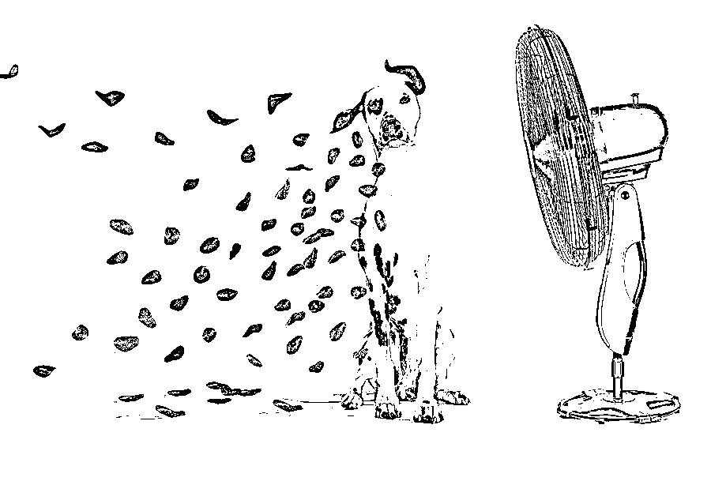

**在占星学里，冥王星主宰天蝎座和第八宫。**作为水象星座和宫位的代言人，隐藏在那些黑暗、禁忌、愤怒和恐惧的背后，**冥王星最想要操控的还是感情**。它象征了人世间最深切最真实的爱，是来自冥府之爱，要爱到地心那么深。

而这样深刻的情感需求，还伴随着天蝎座式的痛苦考验，最好就像结婚誓词里说的那样“无论是健康或疾病、贫穷或富有、顺境或逆境、无论是年轻漂亮还是容颜老去，你们都愿意不离不弃直到永远”。

然而这种“至死不渝”的感情无疑是奢侈的，也是罕有的。探究人们从远古到现在始终爱狗的根本原因，**也许是只有狗给出的爱，才能不惧考验，才能永不离弃，才能跨越生死。**

最具代表性的经典狗狗电影《忠犬八公的故事》，改编自日本的真实事件原型，这种典型的冥王星式的虐心故事让所有养狗爱狗的人感动到哭瞎了双眼：

忠犬小八每天早晚都到车站接送主人教授上下班，教授因病突然去世，小八在之后的 9 年时间里依然每天按时在车站等待风雨无改，直到最后死去。在这个故事的原型中，人们还在车站为八公树立了忠犬的铜像，纪念人和狗之间的最深的情谊。

无论主人贫穷、疾病、失败、年老、甚至是死亡，**狗只要认定了这个人，都会不离不弃直到自己生命的尽头。**当狗被主人遗弃了，或与主人走散了，狗会堕入无边的黑暗。**这是冥王星的诉求，**狗和主人之间无言的契约，胜过人类间无数的甜言蜜语。

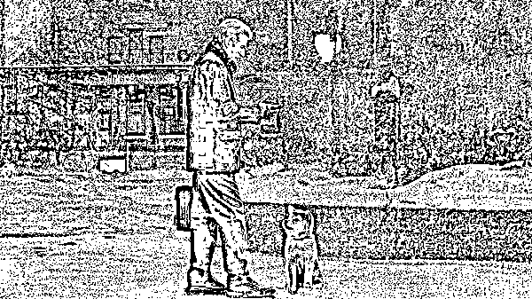

| 电影《忠犬八公的故事》剧照

**冥王星还主宰了气味、以及对气味的直觉。**科学研究嗅觉神经不同于其他感官，会直接连入大脑的记忆模块。在所有感觉记忆中，气味感觉最不容易忘记。视觉记忆在几天甚至几小时内就可能淡化，而产生嗅觉的事物却能令人记忆长达几十年之久。**“嗅觉记得我爱你”**，狗的嗅觉比人类强大一百万倍，**这方面尤其体现了冥王星和天蝎座的意义。**

**我注意到在找我咨询的客户里，养狗人士基本都有明显的冥王星属性：**

*   **个人行星（日月水金火）落入天蝎座**

*   **上升点、下降点、或月亮南北交点落入天蝎座**

*   **冥王星与个人行星、上升点或中天形成紧密托勒密相位**

开始养狗的时候，往往是“冥王星人”人生处于失控、或是没有意义的时期，生活中没有更多的可以滋养他们“控制感”的感情和事物，这些人会无意识的选择“养一条狗”。**这可能源自一种对于丧失个人力量的恐惧。**

而狗的绝对的“忠诚”和无期限的“爱”，**可以持续滋养“天蝎座式”的巨大的情绪黑洞，抚平人们内心身处隐秘的伤痕，**获得情绪上的平衡、宁静以及安全感。

**狗狗和冥王星教导我们思考的事**

*   在我的生活中，我到哪里去找持久的意义？

*   在我的工作中，哪些能满足我的操控感？

*   我是否为了正当意义，就可以不择手段？

*   在什么地方我必须小心有教条或暴君的行为？

*   在拥有绝对强大的力量时，能否对其他生命保持谦卑？ 

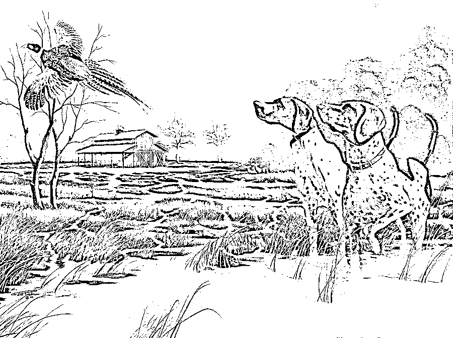

**海王星与猫的关联**

“时而疏离冷淡时而蜜意柔情，时而恬静似水时而野性难驯，时而令人恼火时而可人讨喜——猫咪喜怒无常，却是极讨人欢心的宠物。”**如果说猫咪有一个最大特点，那就是永远让人捉摸不透。它更靠近占星学里海王星的意义。**

海王星的关键词

*   梦幻、虚无、神秘；

*   慈悲、浪漫、艺术、精致、理想主义；

*   消除边界、牺牲、欺骗、上瘾；

*   催眠、疗愈、救赎。

时下流行的说法莫过于“一日养猫，终生想猫；一日吸猫，终身复吸”。爱猫的原因糊里糊涂，人们甚至无法用语言总结自己为什么喜欢猫，**“吸猫族”只能通过找到猫与毒品之间的共同点表达彼此对猫莫名狂热的情绪。**

比如“使用时有强烈的愉悦感，会对身体带来伤害，**容易沉迷，不能自拔**，离开后情绪低落、意志消沉，看到相关信息、图片就产生冲动，消耗大量金钱与精力。”**这些都是海王星的写照。**

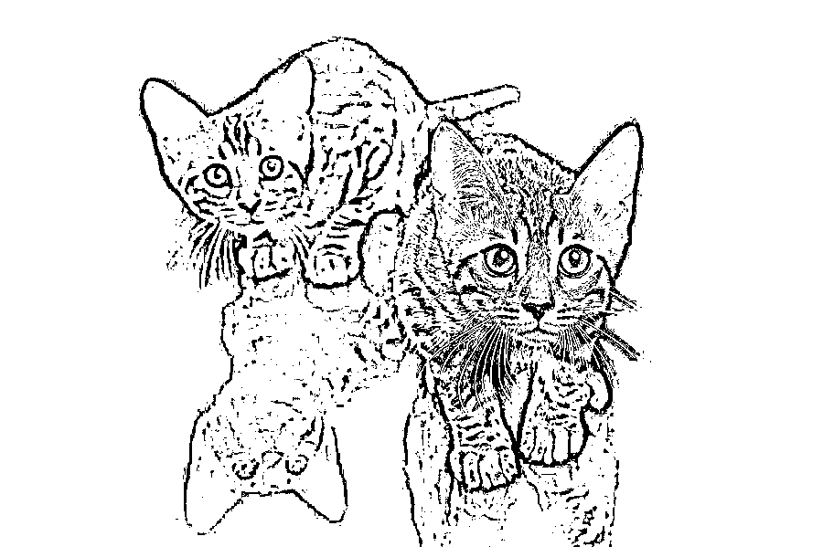

2016 年大热的电影《流浪猫 Bob》同样改编自真人真事，它是一部讲**从“吸毒”转变为“吸猫”电影，**海王星色彩非常浓烈：流浪汉詹姆斯勉强算得上是个流浪艺人，实际上他的弹唱收入并不足以支撑基本的温饱，他是个被家庭和社会边缘化的人，活在对家人的怨恨和做为艺术家的白日梦里，最糟糕的是还被毒瘾困扰。

**这个悲惨开篇已把海王星的负面意义发挥的淋漓尽致：**主人公性格善良而逃避，被父亲“遗弃”，人生没有方向，生活虚无无意义，他逃避自己“流浪汉”、“瘾君子”的真实身份，梦想自己是个浪漫的艺术家。

当一只流浪的橘猫 Bob 进入詹姆斯的生活后，**他仿佛接收到被救赎的神秘能量**，并在 Bob 的陪伴下走上了积极自救的道路，成功戒掉毒瘾，有了稳定工作，收获甜蜜爱情，出书拍电影拥有自己的粉丝，帮助流浪动物和流浪者，找到自己生命真正的意义。

**海王星的积极面向是“无条件的爱”、“慈悲心”和“救赎”。**丽兹·格林认为海王星的主要法则就是**“救赎”**（redemption）。

《当代占星研究》一书中也有写到：redeem 这个词的意思是**“偿清债务”**，把暂时典当出去的东西以指定的钱数赎回，也就是还债或做出一些补偿。譬如，我们以前可能把一件事做的很糟，但我们被告知可以做点别的事来弥补，这意味着重新恢复我们的声誉和荣耀。

**救赎就是被宽恕、得到恩宠、内心获得和解。这是我们与猫相处时，大多数时候的感受。**即使只是猫咪独特的呼噜声响起，人类都会感觉无比治愈。更有研究表示，猫咪的呼噜声确有治愈情绪焦虑、以及骨骼受损的奇效。

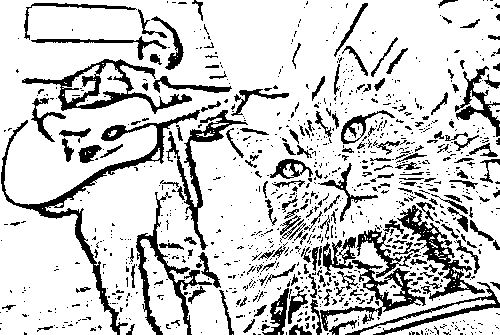

| 橘猫 Bob

不同于养狗需要每天遛狗，猫是可以常居于室内的动物，所以更受“宅男宅女”的青睐，**为“远离现实世界”或是“投入网络世界”提供了基本的情感保障****。**而在无法被驯服的猫面前，我们可以直白的丧失自我，俯首甘为铲屎官。**当人们不再醉心现实世界的事物，野心和自我需求都会降低，进入艺术或灵性的世界。**

而海王星也有一大作用就是把事物**“改善得更精致”**，当一个东西改造到虚假失真，它也就更完美更合乎理想。猫就是一群活得相当精致的动物，它们永远知道屋子里哪个角落睡起来更舒服，甚至要选择跟自己皮毛颜色最接近的位置，也永远记得吃完饭立即洗手洗脸，不然这顿饭可能不够完美。

**猫还是消除边界的高手，**连物体的边界都可以轻易消除。我们永远无法理解猫是怎么躲到床单与褥垫的夹层里的，也无从知晓猫为什么要把自己的身体弄得像水一样变化无穷，只为了睡遍所有不同形状的盒子。

**当然它们消除人和猫的边界更不在话下，**比如一定要喝主人杯子里的水、或是在主人努力工作的时候不慌不忙地趴在了电脑键盘上。有些吸猫过渡人士一厢情愿的认为，这是猫在提醒主人“该休息一下了别太累”。好吧，**休息也是海王星的主题**，你们都见过那些猫是如何每天昏迷式“休息”20 个小时以上的吧。

当我们为别人的痛苦感到难过和同情时，事实上有很大一部分是自怜。**海王星让社会特别同情某些人或某些事物，甚至想要做出一点弥补。**

我曾经见过一些流浪猫保护人士，小小的院子里养了几十只猫，猫和人之间的疆界被彻底消融了，流浪猫救助者感受不到自己的感受和需求，他完完全全活在猫的感受里。**他成了海王星式的牺牲者。而这些牺牲者同样有很多狂热的粉丝。**

猫在长久以来也很受艺术家和神秘学人士的喜爱，很多艺术家或占星师、塔罗师家里都养猫。而艺术创作和灵性修行都是逃避粗糙现实世界的方式。**这也是猫咪海王星能量运作的佐证。 **

**吸猫群众的星图里常有以下海王星特征：**

*   **个人行星（太阳、月亮、金星、火星、水星）落入双鱼座**

*   **上升点、下降点、或月亮南北交点落入双鱼座**

*   **海王星与个人行星、上升点或中天形成紧密托勒密相位**

**猫咪和海王星教导我们思考的事**

*   我是否正沉溺于白日梦，缺乏现实验证的能力？

*   我在哪些问题上最容易逃避和软弱，寻求酒精依赖或陷入幻觉？

*   怎样能将一闪而过的灵感落实在现实层面？

*   我能否分辨清，这是他人的痛苦、还是自己的痛苦，我们的牺牲是否值得？

*   我是否有能力作为一个独立的个体而运作？是否有能力守护自己的边界？

*   我们是否认同自己的身份？

那么问题来了，**是选择冥王星的深爱，还是海王星的救赎？**这似乎成了比“猫还是狗”更难以抉择的问题......你现在是不是想要像我一样猫狗“双修”了？

**版权声明：**原创文章由作者授权发布于若道平台，欢迎转发，反对抄袭。友号转载请申请白名单。

**狄狄**

若道核心课程 2014 届学员，职业占星师

跨界艺术、园艺、疗愈活动发起者

**咨询微信**：diyuhua2

长按打赏

**系统学习占星学**

**点击下图了解详情**

**微信又双叒叕改版啦，不想错过若道君的推送？**

**就把若道设为星标吧！**

**▼**

**就是这个“在看”，戳戳戳 ☟**

********报名直达入口********

# 黄金市场会持续上涨吗？| 雷蒙德·梅里曼 6 月黄金报告上线！

> 原文：[`mp.weixin.qq.com/s?__biz=MzA5NjA0NTAxNg==&mid=2651444606&idx=1&sn=ab870ea48530a466b5d8a495eef3b29e&chksm=8b4b67c9bc3ceedfacd9b2aacb6e745d1155da0b9faafd320eb3f11eedde889a335241a91f3d&scene=126&sessionid=1692737989#rd`](http://mp.weixin.qq.com/s?__biz=MzA5NjA0NTAxNg==&mid=2651444606&idx=1&sn=ab870ea48530a466b5d8a495eef3b29e&chksm=8b4b67c9bc3ceedfacd9b2aacb6e745d1155da0b9faafd320eb3f11eedde889a335241a91f3d&scene=126&sessionid=1692737989#rd)

“**黄金是金钱。其他的只是信贷。**

**——约翰·皮尔庞特·摩根**

”黄金价格在 3 月 31 日跌至双底低点 1673.30 以来，一直处于上涨之中。

从疫情发生以来，美国政府增加了接近 6 万亿美元的国家债务，继续通过其史无前例的经济刺激计划确保市场有充足的资产流动性。尽管数据显示通胀正在加剧，但美国联邦储备委员会仍在继续实施零利率政策（ZIRP）。美联储坚称，通胀增长只是暂时的。然而市场的反映并非如此，美国 5 年通胀预期攀升至 2005 年的水平。2005 年，大宗商品价格大幅上涨，随后 4 年通胀率达到平均 6.5%。为了保持金融市场的稳定，提供失业保障，美国在货币霸权之下，在全球范围内造成的巨大的美元流动性风险，而这种风险在未来还将更加显化。下面是一张很有趣的图，显示了 70 年代高通胀时期大类资产年化回报。

当然，这个只是历史。现在的问题是，历史会重复吗？

**6 月黄金报告已经上线，**上证报告也会在月底前上线。欢迎了解。也可以按照季度和 1 年期订阅，有更多优惠。**季度和年度的好处是，你可以持续了解梅里曼老师对于不断在变化的市场的看法**。即便他某一次看法和市场不一致，你也看到在下一期他如何调整自己的看法，并看到金融占星在一个长期时间段内对你把控风险的帮助。而能够长期控制风险、尽量找到安全的投资时机才是投资的长久之计。

点击**阅读原文**，雷蒙德·梅里曼黄金周期 6 月报告带来有 40 年黄金市场研究经验的世界著名金融占星大师雷蒙德·梅里曼对当前黄金市场的研究。

投资有收益，投资有风险，希望这份金融占星学的研究帮助你更好地评估黄金投资。

**6 月黄金报告上线**

**黄金月度报告价格**

**单月报告**：280 元/月 

**季度套餐价格**：780 元（260 元/月）

**年度套餐价格**：2400 元（200 元/月）

**双报告年度套餐更优惠（直降 900 元）**

**12 个月黄金报告+12 个月上证指数报告：仅需 3900 元**

**长按下图识别二维码购买黄金报告**

▼

**购买者需知**

**① **梅里曼市场时机学院《中国上证指数月度研究报告》是梅里曼市场时机学院（以下简称 MMA）的研究“预报”，而不是市场“预测”，是梅里曼老师及 MMA 金融占星分析师对人类活动周期历史与行星周期之间相关性的研究，二者在大部分情况下具有 80%或更高的相关性，而不是因果关系。报告中的研究完全存在错误的可能性。即便是非常认真的研究和几十年的研究经验，金融占星师无法总是正确地解读出各种征象在实际层面上会如何相互作用，并显化为事件结果。所以请将报告看作一个研究参考，务必结合其他市场研究和你个人对市场的理解，根据你的自由意志做决策。**②** 此报告一旦售出，**即不接受退款。**

**③** 上证、黄金月度报告每月固定 1 期，**并非都是在每月相同日期发布。**

**④** **我们收到英文报告的当天，即发布该英文报告。3 天后，上线报告中文版。此报告仅支持手机网页阅读，不支持电脑阅读和下载。**

**以上须知，请仔细阅读。一旦付款，即视为已了解并接受所有须知内容。**在过去的 39 年中，唯有梅里曼逐渐完善，并在梅里曼市场时机学院月度周期报告中阐释了将地球宇宙学与周期相结合的研究方法，以惊人的精确性预报了黄金价格发生重大变化的时间。**黄金购买 Tip**各大银行均可购买黄金或黄金 EFT 基金，也可以在诸如天天基金或者支付宝购买黄金及黄金相关产品。不明白的可以百度搜索。**购买后如何查看报告？**

**购买后有疑问怎么办？**

请联系技术客服

**微信：nodoor201705**

**购买黄金+上证报告直达入口**

# 你在金牛座新月许了什么愿？一起聊聊呗~

> 原文：[`mp.weixin.qq.com/s?__biz=MzA5NjA0NTAxNg==&mid=2651444589&idx=1&sn=120932a0e4fa0576158aa76affc87c19&chksm=8b4b67dabc3ceecc42c36355f4a3881ada4178701bb1d20e2c3bd59ba1708e38a1c932b0ec74&scene=126&sessionid=1692737989#rd`](http://mp.weixin.qq.com/s?__biz=MzA5NjA0NTAxNg==&mid=2651444589&idx=1&sn=120932a0e4fa0576158aa76affc87c19&chksm=8b4b67dabc3ceecc42c36355f4a3881ada4178701bb1d20e2c3bd59ba1708e38a1c932b0ec74&scene=126&sessionid=1692737989#rd)

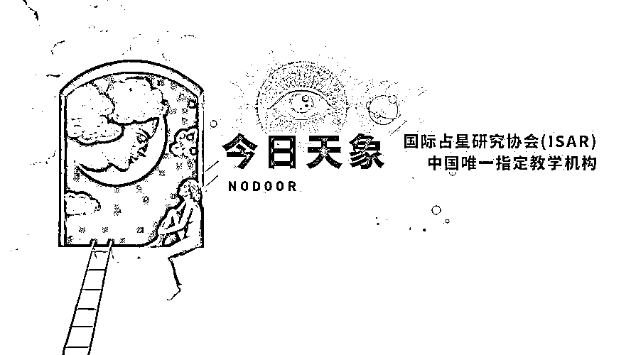

**2021 年 5 月 15 日天象：**

*   **09:30 月亮进巨蟹座**
*   **太阳三分冥王星**
*   **火星与土星呈梅花相**

月亮在今天上午进入了温柔居家的巨蟹座，适合与三两老友叙旧或是和家人度过温馨的一天。虽然今天意志力满满（太阳三分冥王星），但也要注意身体疲乏的压力信号哦（火星和土星呈梅花相）。

昨天，木星终于走进了自己最舒适的双鱼座。当木星进入双鱼座，人们会在打破物质安全感的基础上，大步跨向“精神安全感”的探索，既开启了新的希望之路，也会隐藏一些麻烦（点击[【木星进双鱼座】](http://mp.weixin.qq.com/s?__biz=MzA5NjA0NTAxNg==&mid=2651444548&idx=1&sn=f25973610acd10926e9a7955f77dbefb&chksm=8b4b67f3bc3ceee50cce757b720a43194a531d62b63867c6575720fcae8ee26b7cb3c268df52&scene=21#wechat_redirect)查看相关文章）。

而再往前两天，金牛座新月为我们开启了一个寻找平衡的机会，我们能从中激发更大的生命潜能（点击[【金牛座新月】](http://mp.weixin.qq.com/s?__biz=MzA5NjA0NTAxNg==&mid=2651444372&idx=1&sn=96b84add3c73e57875ddbb646620fe0e&chksm=8b4b6623bc3cef35315fc7dbec52687f103846d459c695b4b137e323d1b921627d53aaf09c15&scene=21#wechat_redirect)查看相关文章）。

这个金牛座新月你许下了怎样的愿望？生活里又有哪些新开端呢？欢迎跟我们分享哦～

周六快乐！我们明天见！**更多精彩占星文章长按二维码查看**

# 重磅天象 | 木星进入双鱼座，一年中最好运的 2 个月把握起来！

> 原文：[`mp.weixin.qq.com/s?__biz=MzA5NjA0NTAxNg==&mid=2651444548&idx=1&sn=f25973610acd10926e9a7955f77dbefb&chksm=8b4b67f3bc3ceee50cce757b720a43194a531d62b63867c6575720fcae8ee26b7cb3c268df52&scene=126&sessionid=1692737989#rd`](http://mp.weixin.qq.com/s?__biz=MzA5NjA0NTAxNg==&mid=2651444548&idx=1&sn=f25973610acd10926e9a7955f77dbefb&chksm=8b4b67f3bc3ceee50cce757b720a43194a531d62b63867c6575720fcae8ee26b7cb3c268df52&scene=126&sessionid=1692737989#rd)

************☆****** ****后台回复“今日”，给你一句生命态度******

作者/查理 ISAR 认证占星师编辑/玫瑰 封面/书君 图片/全景网
**木星进入双鱼座****5 月 14 日 6:35，木星进入双鱼座，并在双鱼座停留到 7 月 28 日。**木星换星座通常意味着**个人、企业、社会环境面临新的机遇和变化**。双鱼座的核心能量是**“融合”**。如果我们把水象元素的三个星座“巨蟹座、天蝎座、双鱼座”放在一起理解，那其实就是“水”的一生：**·** **巨蟹座对应源头活水**（引申为养育、家族）；**· 天蝎座对应翻腾江水**（引申为蜕变和转化，“活水”转化成了“江水”，代表着一次“死亡”）；**· 双鱼座对应大海之水**（引申为融合、无边界）。

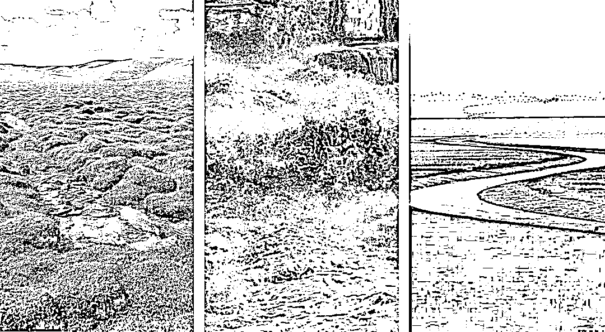

| 从左至右，以此代表巨蟹座-天蝎座-双鱼座

双鱼座的融合、无边界感，如果进一步扩展：

**·** 如果在感受方面没有边界，模糊“个人感受”，就会更容易和集体共情，或者在潜意识层面产生梦境。“梦是个人的神话，神话则是集体的梦”（心理学家佛洛依德的名言，他本人木星落在双鱼座）；**·** 如果在人际方面没有边界，会更愿意设身处地为弱者着想，“救赎别人”，产生“慈悲心、慈善、救助”的倾向，负面的情况也容易受到情感欺骗，也容易成为所谓的“海王”、“中央空调”；**·** 如果在现实层面没有边界感，模糊了时间和空间的先后顺序，容易造就“想象力”，产生电影、绘画等艺术，当然也容易产生“幻觉”，“现实幻灭”；**·** 如果在精神层面没有边界感，模糊了“个人信念”，这就容易与集体信念、智慧产生共鸣，产生“宗教感”，但也容易产生逃避、遁世的倾向。木星有点像“宇宙功放”，它来到哪里，哪里的能量就被会放大。当进入双鱼座时，被放大的将会是与双鱼座有关的**“想象力、梦幻、慈善、艺术、医疗、宗教、缘分”**，负面的**“逃避、欺骗、幻灭”**也可能被一起放大。**社会层面的变化**

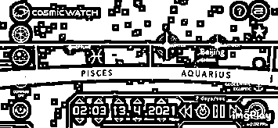

（木星从今年 4 月到 8 月的运动轨迹）

具体而言，在这两个半月期间，个人、企业、社会、文化、经济不同层面可能会发生什么样的变化？我们可以以史为鉴，“历史不是简单的重复，但却有惊人的相似”。

**影视和文化**

1986 年，木星在双鱼座，有一部神话类电视剧在春节后播出，随即轰动全国，获得了极高评价，造就了 89.4%的收视率神话，至今仍是寒暑假期间被各电视台争相重播的热门剧目，累计重播次数超 3000 次，成为一部观众公认的无法超越的经典，这部剧就是 86 版《西游记》。主题曲《云宫迅音》至今还让人念念不忘，里面混合了东西方的不同乐器：电子乐器、西方管弦乐、古筝、琵琶、竖琴、三角铁、管钟、中国的编钟、非洲鼓（邦戈鼓）、康佳鼓、架子鼓（爵士鼓）、低音吉他（贝斯），另外加上声乐（女高音）、器乐声乐结合。也由于这些组合，使得《云宫迅音》被誉为中国电子音乐鼻祖。作曲家许镜清在创作它的经历更为奇幻：“我写东西从来没有这么费劲过，真是夜不能寐啊，我躺在床上，迷迷糊糊，晚上我睡觉的时候，脑子里头完全装着《西游记》里头的各种形象，天宫什么的，突然就远远飘来一个女生的感觉，我就赶紧爬起来了，就把前边那段曲子，两段应该有的都有了。| 《西游记》配乐《云宫迅音》那么小号和铜管的这段音乐显得雄壮，很有力度，那是对一种正义的，就是按照我们那时候对音乐的理解，那就是说一种向前的，一往直前的那种感觉，它有一定的力度。那么那个女生一出来飘的声音，那就是一种幻想的东西，一种神话的东西，一种美的东西，让你产生无限的遐想，只要你可以想，给你一个充分的想象空间，那么就是这两种东西在里边交叉着应用，就形成了现在《西游记》的前奏。”有意思的是，许镜清出生于 1942 年 11 月 15 日，月亮南交点落在双鱼座。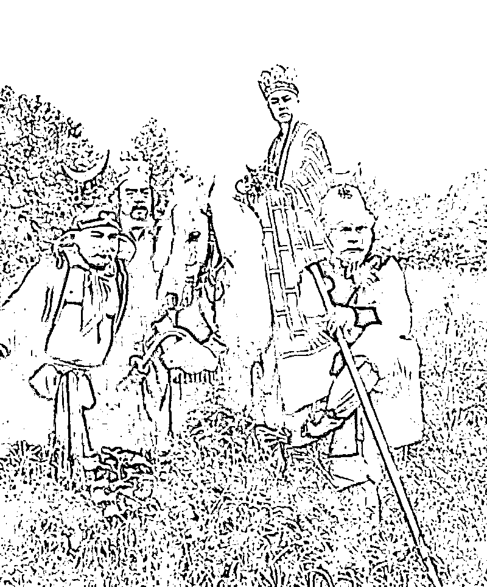| 《西游记》剧照 2010 年，《西游记》又被重新翻拍，那一年，木星又落在双鱼座。木星在双鱼座的年份中，电影的主题也更容易出现“救赎”、“魔幻”、“梦境”、“隐喻”，比如《美丽人生》（1998）、《拯救大兵瑞恩》（1998）、《楚门的世界》（1998）、《盗梦空间》（2010），《爱丽丝梦游仙境》（2010）、《让子弹飞》（2010），其中的几部电影至今活跃在抖音的电影媒体号中。同样是 1986 年，“朦胧诗“的新诗体受到大学生的热爱，诗人北岛、舒婷、顾城等走到了前台。纵观那几年，双鱼座的神奇力量，透过荧幕、电波和书本，散播到了人群中。

**A 股、行业和企业**

有意思的是，A 股的星图很可能是上升落在双鱼座，难怪股民们总说股市有点模糊，让人看不清楚。

双鱼座与**医疗、医药、生物、化学、酒类、港口、新能源、影视**等行业相关度比较大。3000 家沪深 A 股主板上市的公司中，301 家木星在双鱼座，上述几个行业的公司比例不低，特别是医疗和医药类的公司。联想到 2010 年，木星同样在双鱼座时，医疗和医药板块曾经极为辉煌，预测今年接下来的 5 月-7 月可能有一波不错的涨幅。

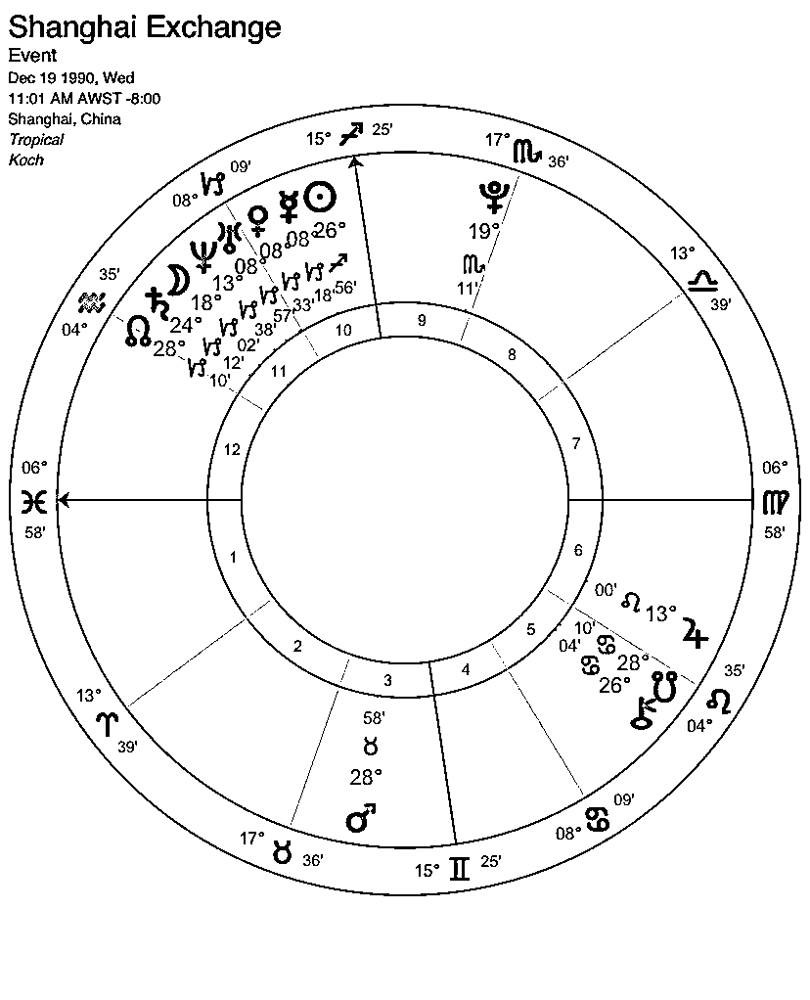| 上证的时间采用 1990 年 12 月 19 日，上午 11 点整，上海

当然，由于大盘在此期间经历行进土星对分本身星图木星的情况，根据我的一些研究表明，当行进土星与上证的星体产生硬相位时，通常 A 股整体表现不佳。所以预计今年 5 月-7 月整体情况表现并不理想。不过，等到明年 1 月之后，木星完全进入双鱼座时，A 股表现可能会更佳。届时我们再另起文章讨论。

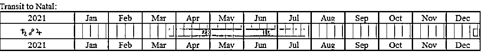

| 上证在今年经历的土星行进时间表，3 月末到 7 月会经历土星对分木星行进，横盘或者下行压力比较大。
还有一些大家熟悉的公司，也拥有很强的双鱼座的能量，他们大多有很强“造梦”特点。比如：· 泡泡玛特（2010 年 10 月 20 日，木星双鱼座）· 小米科技（2010 年 3 月 3 日，群星在双鱼座）· 微播视界科技（2016 年 3 月 11 日，抖音 APP 主体公司，群星双鱼座）· 快手科技（2015 年 3 月 20 日，群星双鱼座，双鱼座新月）考虑到**5 月-7 月期间，木星会停留在双鱼座 0°-3°附近**，所以无论你是投资人、企业主、高管还是员工，都可以注意**与自己相关的公司有没有星体落在双鱼座，特别是双鱼座的 0°-3°（巨蟹座或者天蝎座的 0°-3°也可以）**，也就是 5 月-7 月木星停留的位置，**说不定有非常不错的扩张机遇。**以下我选出来的太阳、金星、火星、木星落在这个范围的 A 股上市公司列表，供大家参考，说不定能帮你在接下来的三个月选到有潜力的股票。想象如果有一天，你真的能够利用占星学在茫茫股市找到一座灯塔，至少把在占星学上的投入都挣回来，应该会是很神奇的体验。

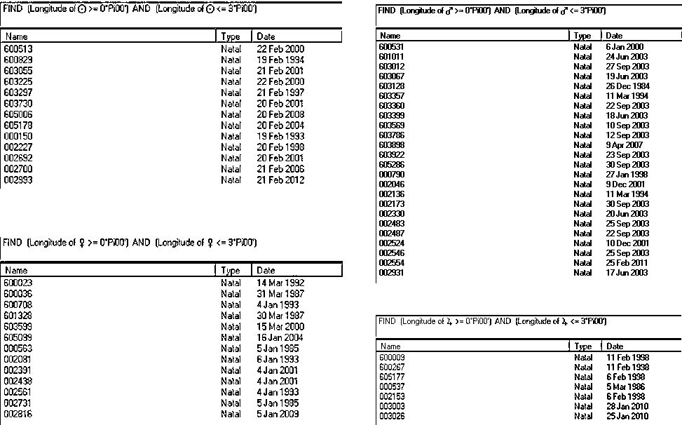

**若道君：以上数据仅代表作者个人研究结果，股市有风险，投资需谨慎。** 

**经济和金融**

在经济方面，由于中国国家星图中代表财政领域的 2 宫落在双鱼座，也将在 5 月-7 月可能会迎来的新的机会。回顾之前几次木星进入双鱼座，可以观察到在财政方面有类似的发展模式。比如，木星进入双鱼座的 1998 年，正是国家开始实施积极财政政策的时候。当年受 97 年亚洲金融危机影响，我国经济形势严峻，国内消费和投资需求增长乏力，对外贸易受到严重冲击，通货紧缩出现。在货币政策效力十分有限的情况下，政府开始求助于另一种稳定政策工具——积极财政政策。主要通过大规模增发国债扩大财政支出，辅以减税来促进出口和吸引外资，从而达到拉动经济增长的目的。那一年开始的积极财政政策带来 A 股将近 3 年、涨幅超 50%的牛市。2010 年，木星进入双鱼座，为了应对 08 年次贷危机带来的影响，中国也采取了更为积极财政政策。不过，我们也要注意**物价潜在失控**的可能性。在 2010 年 1 月-6 月期间，木星在双鱼座飞速穿过，伴随着上半年的农产品价格飙升。这一轮农产品接力般的涨价潮，在网络上也催生了一系列的网络热词：“豆你玩”、“油他去”、“蒜你狠”、“姜你军”、“苹什么“、“鸽你肉”。

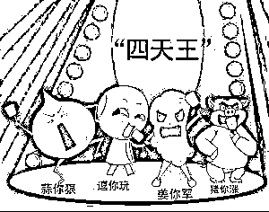

**社会和地理**

在社会层面，木星进入双鱼座都有对应标志性事件，比如中国红十字会，就成立于木星在双鱼座的 1904 年。**当然，木星在双鱼座时候，中国也更容易面临水患。**据统计，上几次木星在双鱼座的 1974、1986、1998 年，2010 年都发生过不同程度的洪水灾害，其中 1998 年的那次载入史册的特大洪水很多人记忆犹新，最终我们依靠举国之力取得了抗洪胜利。在共和国成立以前，木星进入双鱼座时发生的水患则带来了极为惨重的代价。1938 年 6 月，国民政府蒋介石下令掘开花园口黄河大堤以阻挡日军南下，造成黄河改道。决堤后的黄河水一方面的确起到了迟滞日军南下进程的作用，一方面也造成豫、皖、苏三省人民的灾难。有资料统计，1938 年 6 月 9 日夜，黄河花园口大堤正式决堤，“当时直接淹死和饿死的群众多达 89 万人……河南、安徽、江苏共计 44 县市被淹，受灾面积 29000 平方公里，受灾人口 1000 万以上，冲毁 140 万民房、淹没近 2000 万亩耕地。黄水所到之处，房倒屋塌，饥民遍野”。还好，这样的事件我们再也不会遇到。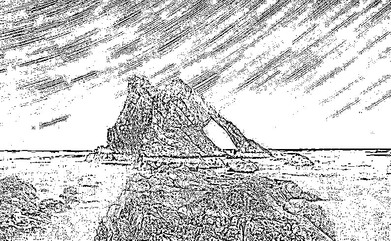**个人层面的影响**我们每一个人都拥有双鱼座的能量，这些能量落在我们不同的生活领域中，比如上升落在双鱼座，那么你自己可能就是“艺术家、梦想家”，温和而柔软；下中天落在双鱼座，那么你会透过原生家庭和家族感受到双鱼座能量，比如你的原生家庭可能有艺术的气息，或者家族错综复杂；下降点落在双鱼座，那么你会透过关系感受到双鱼座能量，比如你的伴侣会更接纳和包容；中天在双鱼座，你会透过事业感受到双鱼能量，比如从事水产、救助、艺术、疗愈或者灵性有关的行业。当 5 月-7 月，木星短暂进入双鱼座时，个人的双鱼座能量和所在的宫位能量会被放大：**若道君：****你可以在 app store 或者应用商店搜索“若道”下载 app，输入个人档案，查看行运盘（也可以使用其他星图软件），找到木星（符号：**♃**）落在出生星图的第几宫，然后对照下文查看你的水星进双鱼座的影响~****例如下图中，木星双鱼座行进在美国总统拜登个人星图的第 3 宫。也就是****3 宫落双鱼座****。**

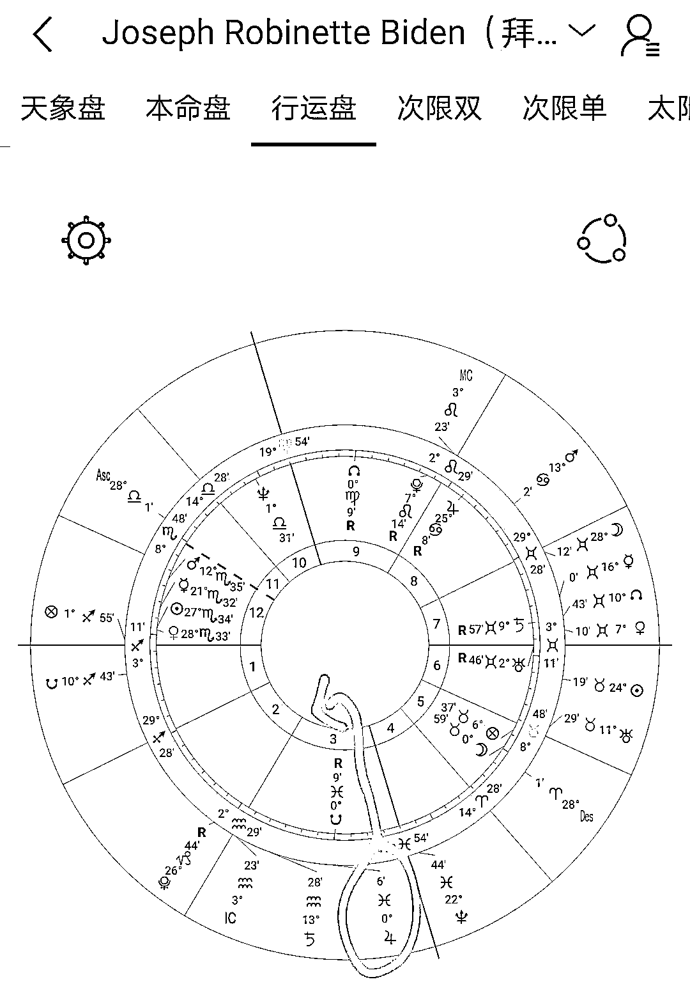

***1 宫*****落双鱼座**在此期间你会有更多的成长机会，做什么都一帆风顺，灵感爆棚，很多神奇缘分会集中奔向你。***2 宫*****落双鱼座**个人财务状况更容易改善，价值感会有显著提升，有更多神奇的机会获得收入，当然也可能会不知不觉的情况下增加支出。***3 宫*****落双鱼座**你可能会极富写作灵感，出口成章、妙笔生花，学习考试都会更加顺利，可以尝试去学习新的知识，或者考个驾照也不错。***4 宫*****落双鱼座**你可能会期待搬个更大的住所，居住环境大为改善，和父母的关系更加和谐。***5 宫*****落双鱼座**恰好你正在期待孕育新生儿，那这是不错的时间，这段时间也会更适合恋爱、艺术创造、娱乐活动，再有机会买个彩票，说不定会有好彩头。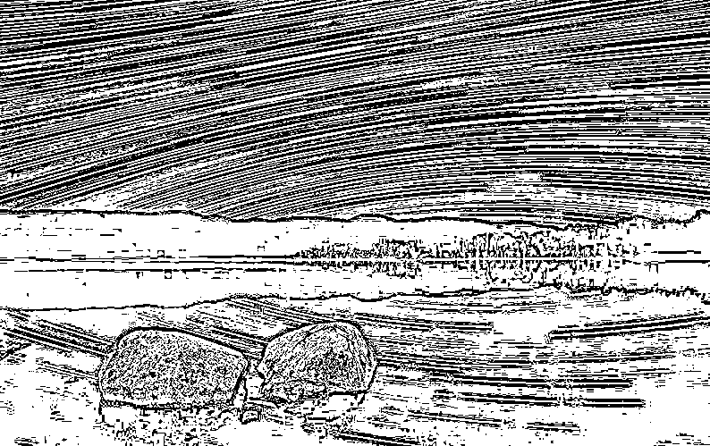***6 宫*****落双鱼座**你可能会迎来神奇的工作机会，或者开始实践新的工作技能，身体状况也会大为改善。
***7 宫*****落双鱼座**

你可能会迎来神奇的合作关系和人脉关系，也可能有不错的结婚机会，你会更容易遇到心有灵犀的人，也会更容易沉浸在美好的关系中。

***8 宫*****落双鱼座**

你可能会迎来神奇的资源，比如会更容易获得他人资源、信贷资源、财富继承等，也更加容易享受“性”带来的愉悦和乐趣。

***9 宫*****落双鱼座**

你可能会对哲学有更加丰富的体会，更立体的视野，对人生意义有更多元的思考，也可能有更神奇的求学机遇。

***10 宫*****落双鱼座**

你可能会迎来事业上的神奇小高峰，比如获得上司、领导的认可，也会出现更适合你的职位，你也有更多抛头露面和出人头地的神奇机遇。

***11 宫*****落双鱼座**

你可能会迎来更广泛的圈子、社群，甚至可能所在圈子里更容易出名，你也更容易遇到心心相惜的朋友。

***12 宫*****落双鱼座**

你可能会变得极富同情心，更愿意去帮助弱势人群，当你有难时，也更容易获得神奇的帮助，这段时间特别适合心灵成长。

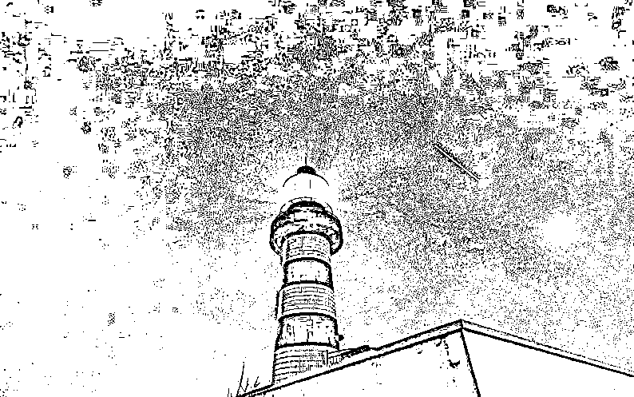

**结语**从古典占星学理论来讲，自 2019 年末，木星离开射手座进入摩羯座之后，木星就一直“受制于”土星，因为摩羯座和水瓶座的定位星都是土星，并且土星一直处于入庙的状态。对应到社会层面，似乎大家都越来越“内卷”，越来越压抑，透不过气来。很多人的信仰、信念、愿景都被现实打败，越来越多人开始只相信“实力”，排斥“运气、缘分、信念、宗教”的力量。但是，当 5 月 14 日木星进入双鱼座后，木星终于再一次“入庙”自己的守护星座，木星开始能够独立地汇聚自己的力量，为我们带来更多的希望、愿景和神话。版权声明：原创文章由作者授权首发于若道平台，欢迎转发，反对抄袭。友号转载请申请白名单。

**查理**

ISAR 认证占星师（2017 年获得），全职占星师

若道 2016 届核心课程学员，5 年企业占星研究和咨询经验

13 年企业管理咨询从业经验，上海交通大学物理与天文学院毕业

**咨询微信：**qinglee821

**微信公众号**：suoyingmk

长按打赏

**系统学习占星学**

**点击图片了解详情**

**微信又双叒叕改版啦，不想错过若道君的推送？**

**就把若道设为星标吧！**

**▼**

就是这个“在看”，戳一下☟

****报名直达入口****

# 12 星座最最核心的“需求机制”丨快来看看你的是什么？

> 原文：[`mp.weixin.qq.com/s?__biz=MzA5NjA0NTAxNg==&mid=2651444502&idx=1&sn=6129e7b356f6a9993bbe3bb198e1490b&chksm=8b4b67a1bc3ceeb74634d5e6ba9896807ddae0be36313b7feba9e940cef3aef4a8d50930c9da&scene=126&sessionid=1692737989#rd`](http://mp.weixin.qq.com/s?__biz=MzA5NjA0NTAxNg==&mid=2651444502&idx=1&sn=6129e7b356f6a9993bbe3bb198e1490b&chksm=8b4b67a1bc3ceeb74634d5e6ba9896807ddae0be36313b7feba9e940cef3aef4a8d50930c9da&scene=126&sessionid=1692737989#rd)

**☆ 后台回复“今日”，给你一句生命态度 **

作者/格伦·佩里 译者/江艺 校对/Christy
  编辑/翀子 封面/书君 图片/网络

需求激励是心理占星学的核心观点，在这个过程中，我们需要明白情绪和感受的运作机制是什么，以及心理占星学是如何用每个星座和特定的情绪范围相关联。而行星间的困难相位也意味着，内在动机朝不同方向运动，从而产生内心冲突。

**心理占星学的核心是什么？**

**心理占星学的核心是这个简单的观点：需求激励。**但是一种心理模型要解释动机，就必须处理人类的**情绪**（emotion）和**感受**。一旦感觉到某种需求开始主导意识，这个人就被驱使去做出满足这种需求的行为。人们表现出愤怒、恐惧、好奇、爱、兴奋、骄傲、羞耻、审美享受等等。

**行星和星座的关系是我们理解感受的关键。**行星是个性的演员，每个行星代表一种特定类型的行为，旨在满足特殊的需求。

我们如何知道哪个行星和哪种行为适合一种既定情况呢？是什么告诉我们何时行动，以怎样的强烈程度来行动呢？答案是黄道星座。

**每个黄道星座都可以与一组相互关联的心理需求和相关感受联系起来。**

当需求被事件触发时，需求就会通过感受传达给适当的行星功能，告诉它要做什么，何时做，应该做多少。

简而言之，感受为划分需求的轻重缓急提供了一种手段。

举一个简单的例子：**双子座与学习的需求关联。**如果一个人对**某个特定话题感兴趣，**他们的好奇心就**激活了水星的探究功能。**

**学习是双子座的需求，好奇是感受，探究是水星的行动。**

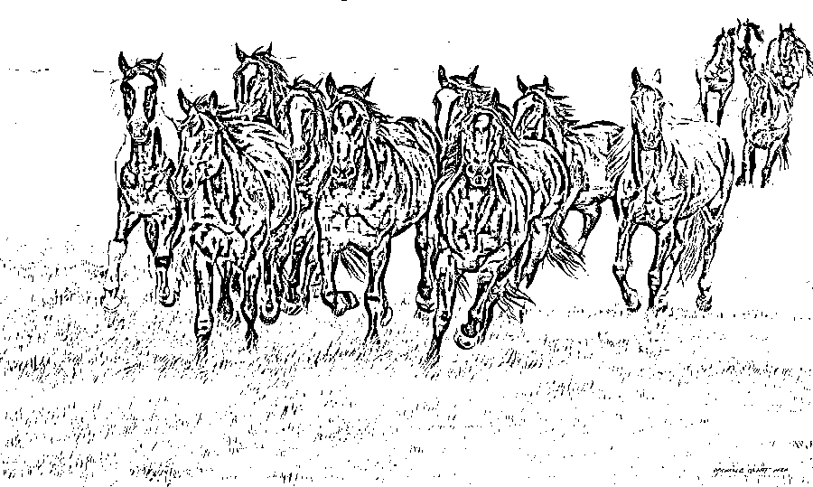

**情绪与感受**

在进一步讨论之前，我们有必要先区分一下情绪和感受。

**情绪**

**情绪可以理解为对一个对象或事件含义做出的复杂生理反应。**

情绪是由一系列核心反应构成，这些反应可能源自宇宙的基本组织原则（遍布自然界各个层面的原型），并且构建起了我们的主观经验。

例如，动物甚至植物对事件的情绪反应与人类情绪没有明显差别，这是已经被确立的事实。

从白羊座到双鱼座，**每一个星座都可以与一组相关的情绪关联。**从每个星座中举一个情绪的例子，我们会看到：愤怒、冷静、好奇心、关怀、快乐、担心、吸引力、恐惧、希望、决心、超然和同情。

**感受**

感受是比情绪更普遍、更深一层的术语，因为其涉及到**对情绪（和感官）体验的评价反应。**

你可能觉得鱼很滑，并进一步将它的粘性评价为奇怪的、好的或坏的，这些都可以被称为“感受”，但都不是情绪。相反，一个人可能看到一条梭鱼向他游来，感到恐惧。这种情绪是恐惧，恐惧的感觉驱使他躲避梭鱼。

虽然一种被直接感受到的情绪几乎与感觉毫无差别，但它先于感觉，就好像热先于被烧的感觉。**公平地说，所有感觉到的情绪都是感受，但并非所有的感受都是情绪。**

**一种情绪可能会被感觉到，也可能不会。**

如果一个人充分意识到自己陷入了恐惧，我们可以说他感到害怕。但是如果他抵御自己的恐惧，就可能完全感觉不到。然而，恐惧仍然存在，在无意识层面上影响着他的行为。**无论他是否感受到，恐惧的情绪都存在。**

**为了简单起见，我在下文中所使用的“情绪”和“感觉”二词可以互换。**

**情绪是如何产生的？**

情绪反应的确切性质是一个复杂的现象，在过去的 100 年里催生了大量的研究,包括用整本书来探讨这一主题。

我自己的观点是，**情绪是星座——行星动机体系的原型声音**。因此，它们的作用就是需求满足的指标。

从古希腊到 18 世纪中叶，我们现在所称的**情绪通常被称为激情**（passion）。**激情**源自拉丁语 pati，进而与希腊语 pathos 关联，意思**是痛苦**。

另外，**被动和耐心也与激情关联**。情绪的体验是被动的，它们超出了个人的控制，就像一个病人“屈服于”疾病。

情绪一词来源于拉丁语 e + movere，最初指的是从一个地方迁移或转移到另一个地方。它也被用于指身体或心理上兴奋或不安的状态。

因此，**情绪常常强调了我们激烈或动荡的反应，以及这些反应引发或激活行为的倾向。**

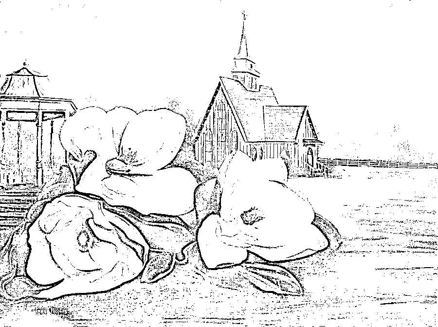

**情绪的体验是被动的**

这些概念的根本观点是：体验到情绪的人正在经历或遭受一些改变，而不是主动发起改变。换句话说，**情绪体验是被动的而不是主动的。**

在口语中，被动的情绪体验可以在许多表达中看到。我们“陷入”爱情，被恐惧“麻痹”，受怀疑“折磨”，被内疚“缠绕”，被猜忌“撕裂”，被欢乐“带走”,被嫉妒“吞噬”,被悔恨“攻占”等等。

在原型心理学中，一个人说“恶魔附身”，意味着被一个分裂的部分篡夺了整个人格。这种表达方式意味着**情绪是发生在我们身上的东西，而不是我们做的事情。**就好像情绪是外来的力量，“压制”和“占有”了一个人。

**抽离的水瓶座也是有情绪的**

占星课本倾向于把月亮与感觉关联。这过于简单化且有误导性，因为每个星座——行星系统都有对应于自身的感受范围。甚至**像水瓶座这样的风向星座也具有某种情绪特征**——疏离、疏远、遥远、宽容、冷静、冰冷、冷漠。这样的感受与天王星功能（客观视野和整体视角）关联。

这足以说明，**每个行星的行动都有自己的情绪暗流，**包括我们通常认为是无感受的行为。作为一种心理功能，**月亮只是我们控制和反思由每个星座——行星系统传达的需求/感受的能力。**

情绪是先于符号的，因为它是一种不依赖于我们所谓的语言符号系统的认知方式，它是一个动机的经验表征，因为**它传达了我们在任何特定时刻的存在状态，以及我们需要什么。**

简而言之，情绪就类似于一种心理——生理状态。正如大脑中的感觉器官通过饥饿、口渴和体温等感觉监测着身体的状态和需求。同样，情绪也为心理的运作情况提供着连续不断的信息输出。

举个例子

如果一个人的自由（白羊座）受到威胁，他就会感到愤怒；如果他对学习的渴望（双子座）被激发，他就会感到好奇；如果他对自尊的需求（狮子座）得到满足，他就会感到自豪。

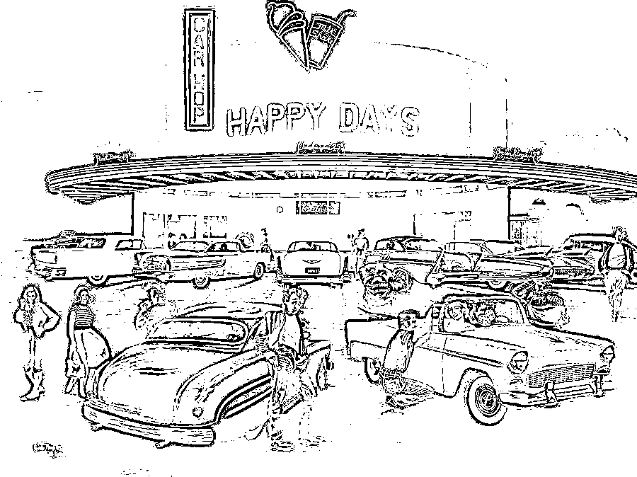

**占星学如何与情绪相互关联**

我们可以从占星学层面对此进行思考，**将每个星座——行星动机体系与一种特殊的情绪范围关联。**

第一个例子

**我们来思考狮子座——太阳系统。**

我们知道，一个星座的需求可以从那个星座的行为特征上推断出。所有的狮子座特征都可以从**狮子座对证实、自尊和认可的需求**背景下来理解。如果这些需要得到满足，个人就达到了狮子座——**太阳的目标状态，即骄傲和自信。**

然而在追求这种状态时，他可能在短时间内就经历了狮子座的全部情绪，从正面到负面：自信、快乐、蓬勃向上、好玩、有价值、任性、固执、防御性强、待人轻蔑、无价值、自我怀疑、缺乏信心、感到丢脸或羞耻。这些感觉让他知道，自己离骄傲/自信的太阳目标状态还有多少距离。

行星彼此之间是存在关联的，这可能引起**多种情绪的混合，**这些情绪的优先程度取决于**哪种需求/感觉是最强烈、最直接的。**

第二个例子

一个年轻男子有火星四分月亮的相位，他同时渴望自由（白羊座）和亲密（巨蟹座）。当一个动机系统与另一个竞争时，**个体通过竞争情绪的强烈程度迅速整合出信息的重要程度，并作出决定。**

如果我们的这位年轻男子最近花了大量的时间独自追求个人兴趣，那么很可能他的巨蟹座——月亮动机系统将带着更大的情绪强度进入意识，从而激发他去寻求亲密关系。

然而，如果他刚和女朋友在家享受了亲密的周末时光，他的白羊座——火星动机系统很可能成为主导，他会感觉到一种想要分开的冲动。

**情绪驱动我们的行动**

情绪和动机之间的关联可以由这两个词的语源历史来说明。这两个单词都源自拉丁语 movere 及其过去分词 motivere。实际上，**情绪是主观体验**，**动机“驱动”我们去行动**。心理学家亚伯拉罕·马斯洛将需求称为“冲动之声”。如果个体将这些原型声音充分调和，他就能“听到”自己的需求。

在第二个例子中，如果要这位年轻男子解释他突然与女朋友分开的原因，他可能会说：“有个声音要我离开，我不得不走。”进一步探究后我们可能会发现，他感到不安。通常，当一个人与伴侣有了过长时间的亲密，就会感到厌烦，常常会引起争吵。回想一下，你会发现，无论是厌烦的感觉还是随之而来的争吵，都是为了达到内心的需求——分离。

**倾听行星的情绪声音**

这再次说明，**情绪是行为的主要推动者**。利希滕贝格写道：“典型情况下，情绪为识别瞬息万变的主导动机提供了根本手段。”换句话说，情绪提供的信号暗示了哪种动机系统正在运作。如果行星会说话，那么**每个行星都有一个独特的命令，每个行星都有其独特的内在声音。**

**听听行星对我们发出的指令：**

★**白羊座——火星**

“想做就做！去做吧！这是你的权利。”

★**金牛座——金星**

“如果感觉好，享受它吧。让自己快乐，放松。”

★**双子座——水星**

“这很有趣，给它下个定义分个类。发挥你的思维。”

★**巨蟹座——月亮**

“倾听，转内向在，你现在感觉怎么样?”

★**狮子座——太阳**

“宝贝，闪现你的光芒。表达自己！”

★**处女座——水星**

“小心，这里有一个问题。解决它。”

★**天秤座——金星**

“展现魅力，建立关系。思考、妥协、合作。”

★**天蝎座——冥王星**

“面对你的恐惧，将它推向极限。决一死战，全心投入。”

★**射手座——木星**

“保持信心，宝贝。上帝是好的，做对的事就好。”

★**摩羯座——土星**

“全力以赴，专心致志。集中精神，控制自己。”

★**水瓶座——天王星**

“期待意料之外的事，保持开放和超然的态度”。

★**双鱼座——海王星**

“放手，顺其自然。屈服，相信宇宙。”

上面的示例展现了我们如何**以一种自我对话的形式来体验行星。**这些都是我们内心的声音、原型的命令，它们通过转化为符号语言的特定情绪信号，告诉我们应该做什么。

我们可能感到**愤怒（火星）**，然后对自己说：“我必须战斗，他不能那样对我！”如果我们感到**吸引力（金星****）**，我们可能会想：“太好了，让他们知道你很有趣。”每个行星状态都有自己的议题和行为命令。

与心理——生理状态类似，情绪的体验是通过一系列强度来实现的。这个强度的梯度变化可以用连续区域中一对代表相反极端情绪的词语来描述。在我们的占星模型中，**每个行星都有不同的情绪范围。**火星是快乐——愤怒；太阳是骄傲——羞耻；海王星是极乐——悲痛等等。

体验强度的变化是复杂感官系统的类似表征，让我们能够做出定量的区分，比如这个人有多愤怒（火星），多坚定（土星），或多么自豪（太阳）。**情绪的强度变化**为需求优先顺序的排列提供了手段：最深刻、最强烈的情绪让我们全神贯注，因此**激活**了相应星座——**行星系统的行为序列。**

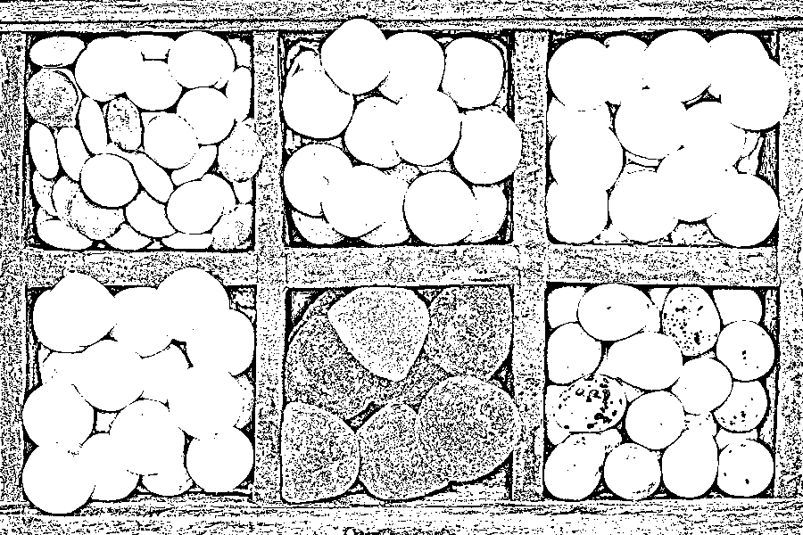

**如何发展好冲突相位**

行星情绪在一系列连续的情绪状态上也有质的区别。这个质的范围说明了星座——行星动机体系的不同整合程度。**一个整合良好、功能齐全的行星往往被体验为积极的情绪，而压抑、虚弱的行星功能通常会被体验为负面的情绪。**

如果一个人的摩羯座——土星动机存在困难，他更有可能体验到土星情绪序列中负面的一端——绝望、悲观、自卑。然而，如果他克服了这一趋势，致力于强化土星功能，那么他更有可能体验到积极的状态——一种控制的感觉、成功和优越的地位。

正如第二个例子中所展示的，**行星之间的困难相位可能导致一个人体验到相互矛盾的情绪和声音。**在这种情况下，两颗行星同时被激活，每个行星都有自己的情绪、动机命令和行为冲动。**行星冲动朝着不同的方向发挥作用，这就是“内心冲突”的含义。**

出生星图象征着全部的内心和情绪冲突，**困难相位往往意味着动机能量的阻滞和强化，**导致行星功能在发挥时过度或不及。

第三个例子

如果一个人有太阳四分土星的相位，太阳的功能可能暂时被土星偏爱工作超过玩乐的命令阻碍。当情绪发出信号：是时候寻求快乐、与朋友交往了，这个信号被忽略了，因此狮子座的需求在内心中堆积。当这些需求最终被释放的时候，这个人可能会过分努力去获得认可和确认，好像必须要弥补内心自卑的感觉。

这一相位也可能朝着另一个方向发展：更喜欢玩乐而非工作。情绪发出信号：该认真起来，创造效益了，但这个信号却被忽略（拖延）。未满足的摩羯座需求在内心中堆积，当最终被释放时，这个人可能通过加班加点来弥补失败和不足的感觉。

**有时，外部环境会同时反映出内在的冲突。**当太阳——土星四分相的这个人拒绝土星的冲动时，这种冲突可能外化为一个专横的老板，有不切实际的要求。当然，也可能出现太阳四分土星的整合形态。

**版权声明：**本文由若道翻译发布，欢迎转发，反对抄袭。友号转载请申请白名单。

**格伦·佩里**

若道签约老师，著名占星师，前 ISAR 董事会成员，共出版 8 本占星著作；心理/意识研究专业博士；占星心理学学院（Academy of AstroPsychology）的创办人；康涅狄格州研究生院（the Graduate Institute of Connecticut）原型宇宙学与意识进化项目的负责人。

**ISAR 选修课，咨询技巧全攻略**

**点击图片了解详情**

**微信又双叒叕改版啦，不想错过若道君的推送？**

**就把若道设为星标吧！**

**▼**

就是这个“在看”，戳戳戳 ☟

********报名直达入口********

# 早鸟价倒计时 7 天！丨唤醒女神，在占星学中使用小行星

> 原文：[`mp.weixin.qq.com/s?__biz=MzA5NjA0NTAxNg==&mid=2651444502&idx=2&sn=9fba4d5ea80cfb8de1e969ade9cec8d2&chksm=8b4b67a1bc3ceeb77c3631c479dd2b16e04e7840e621a0e760a7be04e77c96e53085a6056ee8&scene=126&sessionid=1692737989#rd`](http://mp.weixin.qq.com/s?__biz=MzA5NjA0NTAxNg==&mid=2651444502&idx=2&sn=9fba4d5ea80cfb8de1e969ade9cec8d2&chksm=8b4b67a1bc3ceeb77c3631c479dd2b16e04e7840e621a0e760a7be04e77c96e53085a6056ee8&scene=126&sessionid=1692737989#rd)

对于占星师来说，巨大的小行星带中有成千上万的滚落岩石在太空中呼啸而过，这似乎是一次令人生畏的雪崩，蕴含着潜在的新信息。因此，当你将它们整合到你的工作中时，辨别并正确理解每一颗小行星的意义是很重要的。

包括选择小行星在星图的解读，增加微妙的细微差别和令人惊讶的细节是无法从任何其他占星工具中获得的。

1

**课程简介**

理解小行星带所蕴藏的神圣女性力量的流动将帮助你在占星实践中创造更多的和谐与平衡。**小行星为你的解读带来细节、精确性和深度，同时也使你能够研究和阐释那些被忽视或低估的生命领域。**

**我们将讨论主要的女神小行星，并学习如何与之合作。**我们将借助大量现实生活中的例子，深入探讨它们的象征意义。你会真正了解这些重要的占星元素，从而拓展自己的实践。

**此课程可作为 ISAR 选修课。**

2

**课程安排**

**课程安排：6 月 8 日--7 月 27 日 （每周二）**

*   **6 月 08 日** **小行星简介**

*   **6 月 15 日** **谷神星，丰饶女神**

*   **6 月 22 日** **婚神星，婚姻女神**

*   **6 月 29 日** **智神星，智慧女神**

*   **7 月 06 日** **灶神星，壁炉女神**

*   **7 月 13 日 健神星，健康女神**

*   **7 月 20 日** **灵神星，灵魂女神**

*   **7 月 27 日** **综合应用，展望未来**

3

**课程大纲**

**第*****1*****讲  6****月 8 日  小行星简介**

小行星概述，小行星的发现、科学以及一些占星学历史。

**第*****2*****讲  ****6 月 15 日 谷神星，丰饶女神**

母神、农业女神，但其影响力远不止如此。这是我们所知的最大的小行星，也是最重要的小行星。她掌管养育、滋养、救助、管理等方面。

**第*****3*****讲  ****6 月 22 日 婚神星，婚姻女神 **

荣誉、伙伴关系、契约和婚姻：众神中的女王是正直的女主人。她在出生星图和行进中有什么意涵？她与“丈夫”木星朱庇特是什么关系？

**第*****4*****讲  ****6 月 29 日 智神星，智慧女神**

战地记者、棋手和占星师有什么共同之处？来自智慧、策略、洞察力和远见女神的帮助。

**第*****5*****讲 **** 7 月 6 日 灶神星，壁炉女神**

掌管神圣的火焰、家庭生活、厨房灶台、家人、遗产的女神：这颗关键的小行星被严重误解了。她可以给你一把钥匙，让你了解家庭关系、你的祖先和你的目标意图。

**第*****6*****讲  ****7 月 13 日 健神星，健康女神**

在我们应对全球疫情的过程中，掌管健康和福祉女神目前显得尤为重要。她能提供如何应对新型冠状病毒肺炎的线索吗？她在出生星图中的意涵是什么？幸福原来蕴含着相当广泛的含义。

**第*****7*****讲  ****7 月 20 日 灵神星，灵魂女神**

灵神星是唯一一位以人类身份开始生命的女神，她代表着人类的灵魂。这颗小行星与爱情故事、童话故事和灵魂之旅有关。

**第*****8*****讲  ****7 月 27 日 综合应用，展望未来**

你们刚刚开启探索使用小行星可能性的旅程。我们会探索评估某些理论有效性的方法，以及在实践中检验这些理论的重要性，我们还会探索其他数百万小行星中的一些。这堂课既有提醒告诫，也鼓励你深化自己的占星实践，并拓展你对象征的理解。

4

**课程试听**

📹 [`v.qq.com/iframe/preview.html?width=500&height=375&auto=0&vid=d3241mm7xdw`](https://v.qq.com/iframe/preview.html?width=500&height=375&auto=0&vid=d3241mm7xdw)

解锁全部沙龙内容欢迎购买：[**ISAR 会员沙龙 29 期 | 天空的细节——小行星如何提升扩展占星学**](http://mp.weixin.qq.com/s?__biz=MzA5NjA0NTAxNg==&mid=2651437295&idx=2&sn=8816fb50331dff6f6d25686ff80d7b5b&chksm=8b4b0a58bc3c834e54fb7d13e5bc11c98067fd93b29c5fbfc8f9745a516cbd8bfa3b90696324&scene=21#wechat_redirect)（点击可获取详情）

5

**主讲老师**

**克里斯蒂娜·罗登贝克**

克里斯蒂娜·罗登贝克（Christina Rodenbeck）是一名全职职业占星师，在牛津大学城生活和工作，深受周围知识和文化氛围影响；她拥有伦敦大学（University of London）的人文荣誉学位，曾在伦敦占星学馆（Astrological Lodge of London）、心理占星中心和占星研究学院学习。

作为一名占星师，在过去的 20 年里，克里斯蒂娜在她的网站“牛津占星师”上写了大量关于时事、艺术和文化的文章；她每月主持一个占星播客：“与克里斯蒂娜和萨莉一起占星”，并定期在《占星杂志》(Astrological Journal)上撰写时尚专栏；她定期在英国授课，并保持着蓬勃发展的专业实践。

6

**此次课程适合哪些人？**

*   有一定占星学基础，若道核心课 L3 以上水平；

*   希望成为优秀的占星师，想要借鉴国际大师次限解读思路并融入自己的体系的人；

*   热爱占星学、天文学、神话学的研究型占星学者；

*   计划考取 ISAR 认证占星师，寻觅中意选修课的学员；

*   走在自我探索和个人成长道路上的人。

7

**课程价格**

**价格**：**6800 元**

**早鸟价：5800 元**

**早鸟价截止时间：2021 年 5 月 19 日**

还有限时 ISAR 选修课联报套餐价格，具体请咨询课程顾问：Maggie 老师（微信：18510107057，请备注“小行星”）

长按二维码添加 Maggie 老师

8

**授课时间**

**2021 年 6 月 8 日（周二）20:00-22:00 开始，网络课程**

9

**退转课程**

*   **退款原则请详看《教学协议》，如有疑问请咨询课程顾问。**

****ISAR 选修课：小行星****

**授课老师：克里斯蒂娜·罗登贝克**

**授课时间：**2021 年 6 月 8 日（周二）起

**授课方式：**网络课程**，**英文授课，中文翻译

**费用：**6800 元（**早鸟价：5800 元，5 月 19 日截止**）

**课程负责人：Maggie 老师**（微信：18510107057，请备注“小行星”）

长按二维码添加课程负责人咨询~

****报名请点击“阅读原文”****

# 水瓶座时代的江湖剧 | 来看看你是《山河令》中的哪个门派？

> 原文：[`mp.weixin.qq.com/s?__biz=MzA5NjA0NTAxNg==&mid=2651444423&idx=1&sn=9eff4714c9ed8c9f787d72b8a0305b79&chksm=8b4b6670bc3cef664b25f464743ee139865ef4c47c848093e68d769d3a3c9f5af4504354e6e2&scene=126&sessionid=1692737989#rd`](http://mp.weixin.qq.com/s?__biz=MzA5NjA0NTAxNg==&mid=2651444423&idx=1&sn=9eff4714c9ed8c9f787d72b8a0305b79&chksm=8b4b6670bc3cef664b25f464743ee139865ef4c47c848093e68d769d3a3c9f5af4504354e6e2&scene=126&sessionid=1692737989#rd)

**☆ 后台回复“今日”，给你一句生命态度**

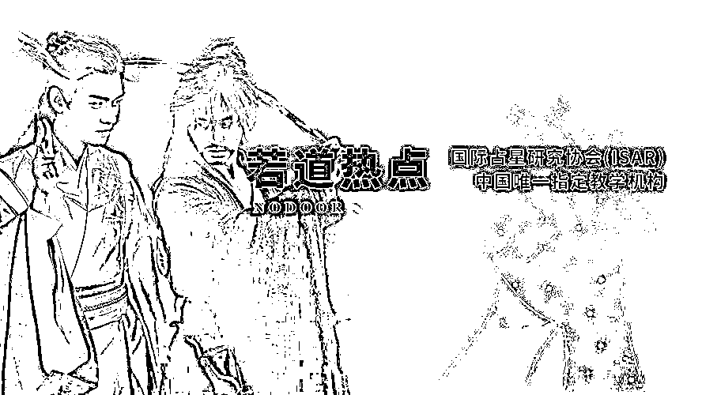

作者/Ara 爱拉（王珊珊）编辑/玫瑰 图片/优酷视频

**作者的话**

原作《天涯客》的武侠小说，被改编为电视剧《山河令》在近期上映后，带来一波可谓惊人的收视狂潮，而剧中两位男主堪称惊艳的演绎所引起的“看剧磕 CP”，则成了这波狂潮下粉丝们最全民一心的行为奇观。

《山河令》这部剧的“现象级”表现，除了制作足够精良、故事足够精彩、引起一波收视狂潮外——可能还是唯一一部剧组能在剧外为了满足粉丝“磕 CP”需求、而在线下特又定制出一场《山河令演唱会》的直播活动的剧。表面是一场类似“售后服务”的见面会 or 演唱会，实则是从戏内到戏外地满足观众“陷入剧情无法自拔”的沉浸式观剧（磕 CP）心理。总之无论是从内容制作的良心呈现，还是商业套路的运作，都堪称成功典范。

而今天要重点解析和玩味的，是这部经典武侠剧于 2021 这个特别的水瓶时代之节点的播出，所带来的种种应景呈现，以及反映出的一些特别“时代寓意”和启示。

**水瓶座时代与“江湖画风“？**””
2021 年，是木土合相水瓶座，开启“水瓶座时代”的第一年。水瓶座是 12 星座中第 11 个星座，由天王星守护，也是星图中第 11 宫领域的原型代表——在我们的人生走过了前 6 个宫位的个人生存能力打拼过程，然后经历 7-9 宫的进入“他人世界影响力”之相互交织与蜕变，并终于在第 10 个宫位开始占据社会舞台之一方天地、打开了为自己人生做主的权限之后——第 11 个宫位是关于我们**在“官方公众视野”的舞台之外，所自由呈现出的、满足业余兴趣的造作能力之体现**的一个宫位。11 宫、水瓶座所呈现的行为现象包括并不限于：创造个性化的理想乌托邦小社区，或隐居山林做世外高人；自愿奉献的公益活动，或拉帮结派搞兴趣圈子；竞赛比拼求某种美名，或草根创业与网红造流量；路遇不平捍卫正义，或性格奇葩而做个边缘人；轰轰烈烈爱恋厮杀，或不拘功名只留下江湖传说……三教九流、魑魅魍魉，亦真亦假，多么的“江湖感”。天下之大，无奇不有，在一切皆有可能中，因更多是让人模仿不来套路的奇迹传说，而更加显得神秘有趣。这一切与过往“摩羯座时代”或“射手座时代”的“众志成城、创造梦想”主题有了本质不同。我们在这个水瓶座时代，**越来越不 Care 那些“官方美德”，而只想要在自己有限的权利范围内，活出独我选择的精彩。****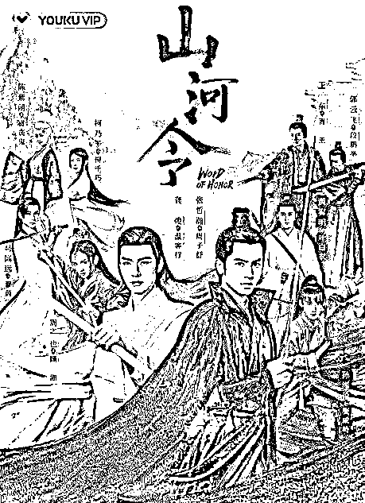****盘一盘《山河令》的星图**“山河令”——江湖令。这个出自于故事中江湖各门派为了联合起来清剿恶鬼聚集的“鬼谷”而发起的被叫做“山河令”的“集结号”——也可以说是牵动整个故事冲突的高潮点，让我们同时看到大千江湖之下各门派活出的花样面孔。**上映日期 2021 年 2 月 22 日，这个时间正是太阳刚刚进入双鱼月，被海王星定位，并联合入庙巨蟹座的月亮一起带来的“情怀造梦时期”。**此时木星、土星、水星、金星又都在水瓶座，且金星与金牛座的天王星（分别定位了火星、冥王星等其余行星后）发生互容——**就像一场“社交舞台联合下的利益声讨”之号令，也是我们在主观意识上渴望着一种“江湖视角”的价值回归。**同时，就像所有经典武侠剧应有的江湖视角一定是符合“道法自然”的那样，这部剧所“集结”起的各路门派的章法演绎、对不同英雄侠客命运的多面观察、对“武林众望”之宝藏 or 秘籍的定义等，也都符合占星视角所呈现的各种“相位合作与冲突”之逻辑和“业力演化”之理念（比西方那些天真而狂妄的超级英雄剧不知要“高级”多少）。那么，在这个水瓶座时代的“江湖视角”下，再分别来看各路门派，又会与占星学元素有着怎样的对应呢？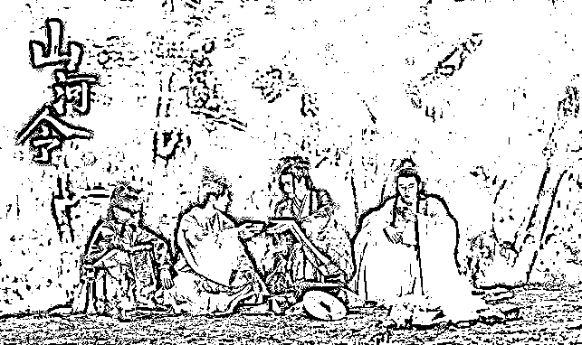**·** 一号男主周子舒前期以天窗锦衣卫身份加入的、以晋王为首的**“朝野政治”**一方，象征着星图中的**土星势力**——只是这土星的本能总是一面治理天下，一面却忙于内部的权势斗争，而牺牲了我们男主本来光明励志的“事业梦想”；**·** 被江湖人士赋予众望的正规江湖门派**“五湖盟”**，正是这个门派中人聚集了天下武功宝典秘籍——象征着星图中汇集优势资源的**木星势力**，只是这各有追求的“木星小组”也常免不了阿谀奉承、被表面义气所蒙蔽的短见与膨胀，还喜欢动不动搞个“英雄大会”来标榜自己；**· “非主流”的丐帮、安吉四贤、少林寺等山野门派**，象征着星图中“企图与世无争”的**海王星势力**，只是这有着江湖美名、代表梦想的海王星比较冷暖自知、势单力薄而常常清浊不分，或者清者难以自清；**·** 二号男主所加入的，江湖闻之色变的专门恶鬼聚集的**鬼谷“邪恶大反派”**，象征着星图中的**冥王星势力**，正是这看似黑暗邪恶的“人心鬼蜮”之势力背后，却又透出世间最真纯的痴情和爱念；**·** 美名四方，专门济世救人的**神医谷**，象征着星图中**善于“智慧分享”的水星势力**，只是当这一厢情愿的水星只有技术高超而威武不足时，也会不幸落得被他人拖累和利用；**·** 以超前科技的机关布阵术和傀儡术而闻名于江湖的**龙渊阁**，象征着星图中自成一派的**天王星势力**，只是这黑白通吃、不站门派的天王星有时候聪明反被聪明误，自己的技术核心“紫流金”被人拿来反炸毁了自己；**·** 附属名门的黑暗杀手**“毒蝎”组织**，有着忠诚而专一的服侍精神和精准的杀伐决断之力，象征着星图中的**凯龙星势力**，只是这股发自于对亲情庇护之爱的寻求之心，终控制不住自己的犀利暴裂之性而“破坏纪律”，使得后半生不得不带着伤痕活在被自己破坏的亲情形式里；**·** 超凡脱俗武功盖世的**“独行侠”**叶白衣，以及父母双亡、体格弱小但“孤勇侠义”的少年张成岭，他们一强一弱，都是**火星**势能的代表，都有着独立为自己的立场选择而忘我牺牲、负责到底的勇士精神。**· **象征**金星**势能的伉俪组合之桃红绿柳、柳千巧与于丘峰、顾湘与曹魏宁等，以及两位男主周子舒与温客行——这些棋逢对手、各有因缘所结合的**“CP 党”**们也都有相互情深意重的一面，只是金星的世界哪有爱与现实的两全其美？端看彼此的心意交合有多极致、共同理念有多纯粹，以至于这些伴侣们要么抱残苟活相依下半生，要么交付真心时死去，要么是以最决绝的赴死之心才终于成就彼此的共存，而那份共存也只能以远离人间的方式……**那么“你”——又自认为目前处于哪颗行星势力的立场中呢？**

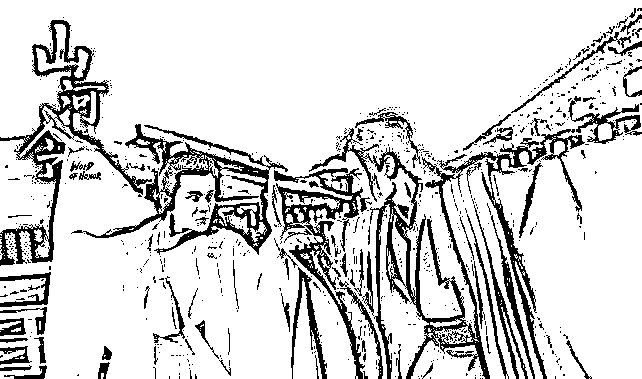

这些“体统分明”又于杂糅交合中征战不休的各门派，在江湖重要的历史性阶段，共同谋划着这一件事：寻求琉璃甲钥匙—打开武库大门—获得阴阳册—习得天人合一之超越生死的至高武功秘籍——这个尤其象征星图里**“终极生命能”的所谓“法宝”。**同时，以上行星代表的门派斗争，牵强地说，也都能对应着其出生星图所体现的行星关系征象：火星、天王星之独立者无法独善其身，被金星的“关系”牵绊而献祭自己；金星、水星、木星、土星等各门派也无法团结协作，被天王星的各种私心需求影响而分裂又牺牲……至于最后真正获得“法宝秘籍”者，反而是最无意以私心占有、也绝不刻意去逃避需求的寻求者（就像星图中的水瓶座和金牛座能量的整合状态）。为了江湖安宁，为了最值得的人；既然被卷入，既然有使命——那么所谓秘籍不过是“全心全意的信任和交付”。**最完美“CP”：周子舒和温客行**一位是从朝中暗设的杀手组织“天窗”领头人卸任后自绝身命的周子舒，一位是自小在父母双亡的血海深仇中忍辱负重，进入鬼谷，当上最大恶霸的鬼谷头子温客行。前者是表面正义势力下，被权势斗争操控作恶的盲目小卒，后者是表面邪恶势力下，隐藏着复仇之念的赤子之心——这两者何尝不像转动着的太极符号中的阳中至阴、阴中至阳？两两背负着各自见不得天日的苦衷，却在白日街头不打不相识，在一次次深入彼此心意后、不问来路地结为挚友。以心之明镜，赌对了各自身份源头的初衷。然因彼此的身后各自都牵绊着一整个“江湖恩怨”，而于报应的尽头一次次为对方交付性命。才终于换来“不求而得”的一个“神仙相守”。一个充满反转与落差、最终于苦难中练就美满眷侣的故事，塑造出两位“风华绝代”的男主之精彩演绎，无论是故事之内的一位落拓流浪 vs.一位执意情长，还是故事之外的一个含蓄温婉 vs.一个傻笑奔放，正是这种无意中相辅相成的默契性情，带来了观众粉丝们对这对 CP 意犹未尽“磕不完”的浪漫意味。根据网络提供的资料，就各自出生星图显示的实际个性与人生轨迹来看，这两位男主扮演者张哲瀚与龚俊又分别是怎样的人格命运呢？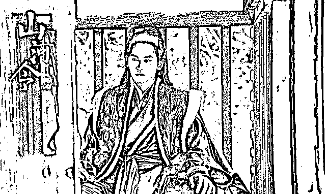简单来说，金牛座的张哲瀚星图中有个全部落入阴性星座的日-冥对分、火凯-海天对分组成的“信封”格局。其中，火星、凯龙星合相南交点于巨蟹座，对分了天王星、海王星合相北交点的摩羯座，是一个**天然自带强烈的情绪渲染力、又不断被牵引到理性与责任制约之境地**的状态。而加入了信封格局更是带来一种**对“终极价值-终极信任”之无尽试探和试图交付的一股张力。**这也是为何他的外表总是显出更多忧郁封闭的气质，也总会接到一些性情比较内敛木讷、或深情苦情的角色人设，而这些角色往往又**于闷声不响中作出惊人突破性的决策**（就像他演绎的周子舒）。同时，他还有一个木星狮子座和土星水瓶座的对分相，这组对分相也定位和接应了信封格局里大部分的阴性行星的能量，并配合在 T 三角顶点位置的白羊座的月亮和水星——好比那些苦情或沉重的心事与决策，又会以轻巧直白而善解人意的方式表达出来。一面让人感觉亲善自然地了知其态度立场，一面又似乎触及更深处的某些不被动摇的深沉意志。这样一个星图格局，带来的是用自己对初始价值认定下的坚忍原则和踏实信念，在不断努力的创作表达中，获得最终可以展现“爆发力量”的机会，并在这个过程中再度析出更真纯的价值标准。****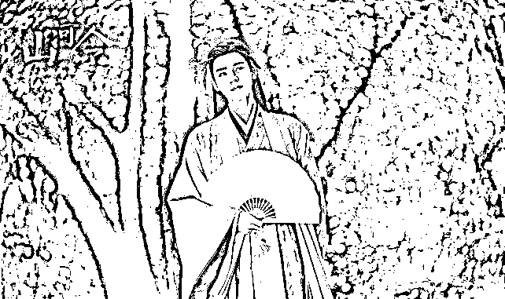****再看演员龚俊的星图：一个被木星天秤座精准六分相接纳了的太阳射手座，加上南北交也位于双子和射手座的阳性元素——这是个极易让人眼前一亮、明净又快活的一种能量气质。不过在这“开阔大度”的背后，有个水星、冥王星精准合相于天蝎座、并三分火星巨蟹座而带来的“敏感睿智”一面。同时，四分接纳了木星的金星与海王星、天王星合相于摩羯座，定位的土星与月亮则同时落在水瓶座。这就好像一个**于轻松愉快的人际关系中发展出了鹰一般犀利的“辨识目光”，可以非常轻易地发现到什么是自己感知到的人心真相、与自己“看好”的价值与功绩。**没错，他的整个“功课使命”都是与**主动去试探并发现“商机”和“良友”**有关，而这个过程也并非单纯为了利益功名（龚俊经常挂在口中的“我赚到钱啦”、“赚钱最重要嘛”），而是某种发挥并证明自己的智能优越性、以赌注来换取“放心交付信任”的成就倾向。说白了：**我要用赚到钱、获得最好的搭档伙伴，来表示我很聪明也很正确，然后好让自己被更大的事业项目看好和“使用”……**

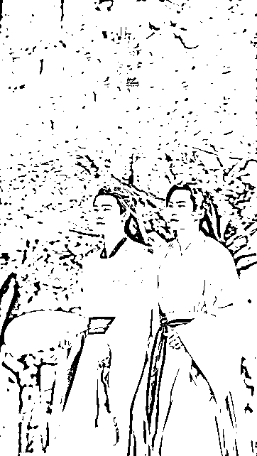

再看两个人的比较图与组合图：彼此的火星巨蟹座合相，且彼此的太阳都有被对方代表价值辨识力的水星与木星“看到”，尤其龚俊是非常被张哲瀚所欣赏、接纳和“点缀”到的。而张哲瀚的金星不管在出生星图还是比较图都是空相，就是他在关系中可能总有一种出离的、不易被人联结到的部分。而两个人的组合图中，被强调的水瓶座与天王星之影响力，更显出彼此**这一场合作既有默契相助的责任，又有不得不保持距离的“分离命运”。**以上，虽然是概括性的出生星图解读，也可以看出一个演员本身的特质与其扮演角色的吻合之处。包括两个人戏外的关系和命运，以及是否未来还能更好的剧本可以“撮合”到他们？——都如这个水瓶时代的因缘戏码一样：“合”之惊艳，“解”也干脆！演员拿出毕生的命运等待一个好剧本，剧本作者倾注大量的热血信念塑造一个集体梦想，当演员遇到剧本，集体梦想又应景了时代征象——那些“磕 CP”出不来的粉丝们有错吗？毕竟谁还需要分得清演员和角色、梦想和现实？无论怎样，有“江湖梦”可以做，有“豪情”与“恩义”可以企望，总归这是个促使我们每个人的梦想舞台之搭建和实现的最好时代。

**版权声明**：文章由作者授权首发于若道平台发布，欢迎转发，反对抄袭。

****

**Ara 爱拉（王珊珊）**

全职占星/塔罗咨询师

《星途》《心探索》专栏作者

2013 年至今咨询个案已累计超过 2000 小时

**咨询微信号**：622005740（添加注明“咨询”）

**微信公众号**：xiaoshu_astro

长按打赏

**系统学习占星学**

**点击图片了解详情**

**微信又双叒叕改版啦，不想错过若道君的推送？**

**就把若道设为星标吧！**

**▼**

就是这个“在看”，戳戳戳 ☟

******报名直达入口******

# ISAR 选修课 | 深度掌握次限月亮的技法（插班中）

> 原文：[`mp.weixin.qq.com/s?__biz=MzA5NjA0NTAxNg==&mid=2651444423&idx=2&sn=5f3f7bdac465dfd975c2973c535e3e93&chksm=8b4b6670bc3cef6651905020213fa6f22955717677e1362a211c398093bb64d5051b584830bc&scene=126&sessionid=1692737989#rd`](http://mp.weixin.qq.com/s?__biz=MzA5NjA0NTAxNg==&mid=2651444423&idx=2&sn=5f3f7bdac465dfd975c2973c535e3e93&chksm=8b4b6670bc3cef6651905020213fa6f22955717677e1362a211c398093bb64d5051b584830bc&scene=126&sessionid=1692737989#rd)

**星图中的月亮描述了我们在婴幼儿期和童年早期如何接收母亲的能量。**我们从出生开始就通过月亮的反射来体验母亲，正如月亮反射太阳的光一样。月亮也会描述一些我们可能会称之为灵魂的事物：**我们的人生经历在时间和永恒之间的内在反射物。**次限月亮通常被视为用于预测以及为事件择时的因素，但实际上它的内涵远远不止如此，要更为深刻和微妙。

**次限推进月亮**（Secondary Progressed Moon）：用次限推进，也即**一天即一年**的推进法时的推进月亮。次限推进月亮平均每月移动 1 度，虽然速度并非恒定。

**次限推进：托勒密时期，2 千年前发明。**

**当次限月亮在我们星图上的星座和宫位推进时，它会以唤起我们个体本质以及人性的方式，反映我们成长和发展的经历。**对于那些同时开展内在和外在生活的人来说，次限月亮可以成为一个向导，照亮自我反思和内在滋养的面向。**在八周的课程中，**我们将学习次限月亮是如何像镜子一样映照出我们最深的本质的。

**此课程可作为 ISAR 选修课。**

1

**课程安排**

**课程安排：5 月 10 日--6 月 28 日 （每周一）**

*   **5 月 10 日** 出生星图中的月亮与它在童年 0-7 岁的推进

*   **5 月 17 日** 7-14 岁：从自我到他人

*   **5 月 24 日** 14-28 岁：从他人到自我

*   **5 月 31 日** 次限月亮推进 vs 土星行进

*   **6 月 07 日** 次限月亮与其他行星形成的相位

*   **6 月 14 日** 30-60 岁的次限月亮推进：再次回转

*   **6 月 21 日** 60 岁以后的次限月亮之旅

*   **6 月 28 日** 次限月亮与次限太阳的关系

2

**课程大纲**

**第*****1*****讲  ****5 月 10 日 **

**出生星图中的月亮与它在童年的推进**

我们将学习出生星图中月亮的象征意义，以及它如何反映你的母亲以及你童年的家庭生活。我们将从元素的角度观察月亮，并研究从出生起你是如何得到母亲的关注的，我们将观察出生后几年的月亮的推进。

**第*****2*****讲  ****5 月 17 日 **

**从 7 岁到 14 岁：从自己到他人**

次限月亮与出生星图中月亮的第一个四分相在 7 岁左右出现。我们将学习在这个关键时间点我们是如何开始意识到自己是独立存在的个体，以及它如何让我们向家庭以外的其他人寻求滋养和生命。

**第*****3*****讲  ****5 月 24 日 **

**从 14 岁到 28 岁：从别人到自己**

从十六七岁到 28 岁左右第一次次限月亮回归，我们完成了与他人和与自己的月亮的灵魂之旅。从次限月亮回归开始，我们就开始对自己的情感生活以及我和其他人之间所发生的负责。

**第*****4*****讲  ****5 月 31 日 **

**从 14 岁到 28 岁：从别人到自己**

当次限月亮描述我们内心的旅程时，土星的行进描述了我们与周围世界的联系，以及作为社会发展中的个体，世界对我们的要求。在我们生命的头 30 年里，它们几乎以相同的速度运行。

**第*****5*****讲 **** 6 月 7 日 **

**次限月亮与其他行星的相位**

我们将从次限月亮的旅程中抽身出来，看看它与各种不同人的星图的其他行星产生有趣而特别的相位时发生了什么，这样我们来了解次限月亮触及我们星图中的这些行星时会发生什么，以及我们该如何为自己的生命导航。

**第*****6*****讲  ****6 月 14 日 **

**30-60 岁的次限月亮推进**

当月亮再次绕着出生星图运行时，我们有机会将意识带到我们的情绪反应中，并开始引导我们的内在本性，而不是对发生在我们身上的事情束手无策。

**第*****7*****讲  ****6 月 21 日 **

**60 岁以后的次限月亮之旅**

在当今时代，60 岁以后过着积极生活的人比历史上任何时候都多。有的人在 70 多岁的时候坠入爱河并第一次结婚。我们将在这一讲探讨如何在我们生命的最后几十年里对自己和他人有用，这样我们就可以体验到生命的丰富多彩。

**第*****8*****讲  ****6 月 28 日 **

**次限月亮与次限太阳的关系**

最后，我们来研究次限月亮绕着星图运行时与次限太阳推进的关系。我们将通过星图案例来进行探讨。

3

**此次课程适合哪些人？**

*   有一定占星学基础，若道核心课 L3 以上水平；

*   希望成为优秀的占星师，想要借鉴国际大师次限解读思路并融入自己的体系的人；

*   希望研究自身人生周期，想好更好的规划人生的占星学者；

*   走在自我探索和个人成长道路上的人。

4

**主讲老师**

**达比·科斯特洛（Darby Costello）**

达比·科斯特洛（Darby Costello）在美国波士顿学习占星学，在非洲生活过 12 年，于 1983 年移居英国伦敦。她曾在长达 25 年的时间里担任心理占星中心的首席教师，是占星研究学院的任课教师，也是伦敦占星学院的客座导师。此外，她拥有“文化天文学与占星学”硕士学位。她在世界各地授课与写作，服务全球客户是她占星师生涯的核心。

| 达比·科斯特洛与琳恩·贝尔

**网站个人简介：**

达比·科斯特洛（Darby Costello）出生于美国，1960 年代曾跟随弗朗西斯·萨科安（Francis Sakoian）、路易·阿克（Louis Acker）以及伊莎贝尔·希基（Isabel Hickey）在波士顿学习占星学。随后，她去了非洲，与部落疗愈者和占卜者一起共事多年，并在期间精进自己的占星学实践。1983 年，她去英国伦敦寻找占星团体。令她高兴的是，她找到了这样的团体，并在许多层面上参与其中。到伦敦后不久，她就开始拓展占星客户，并于 1988 年开始在由丽兹·格林和霍华德·萨司波塔斯创立的心理占星中心任教。十年后，她成为首席讲师，并为心理占星中心出版社撰写了几本书。

达比还是占星研究学院的导师，并于 2014 年获得荣誉文凭。她是心理占星学水星网络学校（MISPA）和占星大学的讲师，也是伦敦占星学院的客座导师。她在欧洲和世界其他地方教书和授课，也曾在巴厘岛、中国大陆和台湾等亚洲地区以及阿拉斯加等北美地区授课。2013 年，达比被授予查尔斯·哈维奖，以表彰她对占星学做出的卓越贡献。

2006 年，达比获得在巴斯斯巴大学（Bath Spa University）“文化天文学与占星学”专业硕士学位。这段学习经历也让她更懂得品读历史，并对写作产生了更深的热爱。不过，她最爱还是解读星图，她遍布世界各地的客户也滋养并进一步激发了她的占星学灵感。

**达比·科斯特洛的著作：**《占星学中的月亮》《水元素与火元素》、《土元素与风元素》、《火星四重奏》、《占星学》。

5

**课程价格**

**正价**：6800 元

还有限时 ISAR 选修课联报套餐价格，具体请咨询课程顾问：Maggie 老师（微信：18510107057，请备注“次限月亮”）

长按二维码添加 Maggie 老师

6

**退转课程**

*   **退款原则请详看《教学协议》，如有疑问请咨询课程顾问。**

****ISAR 选修课：次限月亮****

**授课老师：达比·科斯特洛**

**授课时间：**2021 年 5 月 10 日（周一）起

**授课方式：**网络课程**，**英文授课，中文翻译

**费用：**6800 元

**课程负责人：Maggie 老师**（微信：18510107057，请备注“次限月亮”）

长按二维码添加课程负责人咨询~

****报名请点击“阅读原文”****

# 免费新月报告来啦 | 许下愿望，获取由内而外的丰盛吧！

> 原文：[`mp.weixin.qq.com/s?__biz=MzA5NjA0NTAxNg==&mid=2651444372&idx=2&sn=7bf2e8edd6c31ae986bf5367c70511c6&chksm=8b4b6623bc3cef350a006dd5860a65c75f15dca0dd0810c42806405d8f4aa6a29626b688ff2d&scene=126&sessionid=1692737989#rd`](http://mp.weixin.qq.com/s?__biz=MzA5NjA0NTAxNg==&mid=2651444372&idx=2&sn=7bf2e8edd6c31ae986bf5367c70511c6&chksm=8b4b6623bc3cef350a006dd5860a65c75f15dca0dd0810c42806405d8f4aa6a29626b688ff2d&scene=126&sessionid=1692737989#rd)

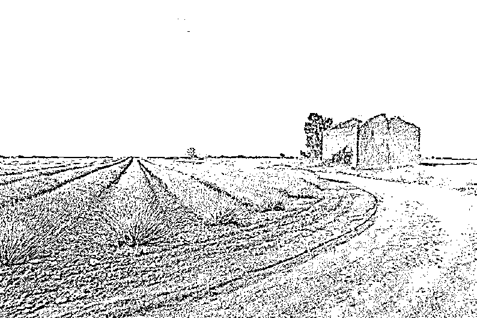

北京时间 5 月 12 日 2:59，新月发生在金牛座 21°17′。每到新月时分，若道君都会为你奉上根据你出生星图量身打造的免费新月报告。可是新月为什么要许愿？新月报告该如何领取？让若道君来教你。

　**什么是新月？**　

从占星学看，新月是月亮周期的一种相位。新月是开始，又称为朔，对应中国农历初一，太阳、月亮在此时合相。此时月亮运行到太阳与地球之间时，月亮以黑暗的一面对着地球，并且与太阳同升同落，地球上看不见月亮。

本次新月时间

**5 月 12 日 2:59，新月发生在金牛座 21°17′。**

为什么新月要许愿？新月是一个周期的开始，新月发生的时候，太阳与月亮合相，能量很强。当新月出现时，你也许会发现灵感忽现，非常适宜开启新领域、项目与行动，缔结一段新的关系或合作。许愿会加强新月的能量，也有助于你了解自己现阶段适合开启的方向。 本次新月最佳许愿时间

从新月开始到其后的 48 小时内，许愿的力量最强。

**最佳许愿时间：5 月 12 日 2:59-5 月 14 日 2:59**

属于你的免费新月报告

每到新月时刻，看着占星文章里写着：看看你新月的宫位，如果新月在第 X 宫，你可以许愿的方向是……

是不是常常一头雾水？新月的宫位？我到底该看哪里啊？

而有时，那些标注上升星座的文章也会让你忍不住想：虽然我的上升星座是这个，可是我的新月好像并不落在你说的宫位啊？你是不是写错了？

虽然这些文章都没有写错，可是好像对你而言都太不友好了。

**Don't Worry！**别着急，让博学又体贴的若道君来帮你！

我们推出了一份**免费**又**好用**的新月报告！

而且是专门为你设计的哦，**根据你出生星图为你量身打造的，只****属于你的独家新月报告**。

报告有哪些内容？

**新月时间****最佳许愿时间**

**如何许愿 **属于你的**许愿关键词**

本次新月给你的**建议**

你会有怎样的**感受 **

****机会****

********

如何许愿？

许愿方式也很简单。

你可以把愿望写下来，或者双手合十后交叉，闭上眼睛来祈祷。 

报告中会为你提供**祈祷词示例**，可以多多参考哦～ 

你还可以适当添加自己的语言，创造属于你自己的祈祷文！

如果报告拿到手了，快对照着许愿吧！

**这份好用又暖心的报告，点击****阅读原文****即可领取！**

****

****点击“阅读原文”即可获取新月报告****

# 插班中 | 如何解读星图要素？这门课程一网打尽

> 原文：[`mp.weixin.qq.com/s?__biz=MzA5NjA0NTAxNg==&mid=2651444372&idx=3&sn=f595e6e775fb571ad84fd31477fe05f4&chksm=8b4b6623bc3cef350329102b3bb625a0c494e2371b8e00fb650e87f0b335a746b24d608bea8d&scene=126&sessionid=1692737989#rd`](http://mp.weixin.qq.com/s?__biz=MzA5NjA0NTAxNg==&mid=2651444372&idx=3&sn=f595e6e775fb571ad84fd31477fe05f4&chksm=8b4b6623bc3cef350329102b3bb625a0c494e2371b8e00fb650e87f0b335a746b24d608bea8d&scene=126&sessionid=1692737989#rd)

占星学这门古老的学科，历经了历史长河里的起起伏伏，也直面了现代科学的质疑与探索，依旧陪伴在我们身边。时至今日没有消亡，反而以不同的方式进入现代人的生活，述说着时代的语言，疗愈现代人的心灵。

占星学是一种符号语言，它为宇宙无形的力量穿上了意象的外衣。这使我们可以与不可见的世界交流，将不可见变为可见。

由此，它提供了一面镜子，在这面镜子中，个体经验被看做是更大模式的一部分。占星学核心的生命理念是：在我们居住的宇宙中，万事万物都相互关联、生机勃勃，我们是这个宇宙的参与者。我们常说占星学是一种个人成长的工具， 如何运用占星学来实现自我成长呢？

**1. 占星学可以帮助我们了解自己的天赋与潜能**

非常喜欢的格言是：“性格即命运。”个体的智力和才华有着丰富的类型，有的人的天赋显而易见，比如擅长绘画、写作、运动或者歌唱；有的人的天赋需要更长的时间来探索和接纳，比如善于倾听、善于交流或者善于带动气氛等等。占星学可以帮助你认识自我，找到人生的养份。 

学习占星学还可以让我们慢慢养成随时保持“觉知”的习惯，每时每刻知道自己是谁，在哪里，在做什么。遇到问题时不是去质问结果，而是去寻找根源，发现和开发自己的潜能。

**每个人都有自己独一无二的潜质、能力和局限。我们通过选择获得权力。而占星学是帮助我们了解这些信息的工具。**

**2.占星学可以帮助我们了解人生的轨迹**

**占星学能够帮我们迅速发现成长过程中形成的思维模式和行为模式。**

客户在咨询结束后会对占星师说，感觉你是心理医生，和你聊一聊，心情就好了很多。如果没有星图的帮助，单纯只是心理咨询，可能我们需要花上更多的时间才能发现问题的根源。有了星图的帮助，我们可以很快地知道，我们的人生在哪里出了问题，我们可以如何去改进，从而过好我们的人生。

**占星学能够帮助我们了解人生的轨迹。**透过一张出生星图，我们可以看到个人生命循环模式，以及外行星在人的一生中可能带来的生命挑战和转机。

通过对人生不同阶段行进的把握，我们可以提升自我觉察，知道什么时候该进、什么时候该退、什么时候该抓住、什么时候该放手。人生漫长，与其盲目地、惴惴不安地前行，不如把握住生命的节奏，安然过好每一天。

**3. 占星学能够帮助我们抓住时机**

我们经常听到“时机就是一切”的说法。如果能知道当下正处于一个周期的哪个阶段，这对我们是非常有利的。机会来来去去，除非我们伸手抓住它们，否则它们只会擦身而过。如果我们能更充分地理解我们通往本真、成为真我的旅程，我们将获益良多。而占星学的符号语言正是帮助我们选择在对的时间做对的事的一个工具。

**4. 占星学可以帮助我们更有效地面对人生**

**占星学能够帮助我们更有效地过好一生。**了解自己的天赋，把握生命的轨道，可以让我们不再盲目和急躁。我们不会在坏情绪里面浪费时间，不会去做无用功。

**我们知道顺境和逆境都会在某个周期结束的时候停止。**我们也会知道让我们摔跤的模式是什么，从而在下一个周期来临的时候做好准备。我们不会在同一个坑里跌倒无数次，在命运的滚滚车轮下头破血流，还负隅顽抗。我们对于挫折和机会更有觉知，而不是在自怨自艾中虚度一生，或者在得意忘形中浪掷时光。就像苏·汤普金斯老师的著作《顺逆皆宜的人生》一样，享受顺逆皆宜的时光。

**5. 占星学可以帮助我们理解和接纳生活**

**占星学可以帮助我们更加宽容地对待他人和世界。了解个体的差异性可以帮助我们消除偏见。**

每个人都是带着自己既有的性格特点和思维行为模式出生，从星图上能看出我们的父母是如何对待我们的，我们的成长环境、我们的情感特质、我们和他人的互动模式、我们的事业路径、我们人生路上会遭遇的困难和挑战。意识到这一点，我们就没有理由迁怒或者归罪于他人和社会。

要知道，是我们自己的特质吸引来了能够帮助我们发现问题、解决问题的人和事。越是讨厌的人和讨厌的事情，越像一面镜子，能够照亮我们心底隐藏的阴暗面。而我们能不能经由这些获得成长，就要看我们是否有勇气去接纳和面对它们。

这就是占星学为什么有价值的原因。因为它能帮助我们互相理解。它让我们感到快乐，因为我们认出了自己，感觉到被理解。我们更能理解我们的朋友了；我们也更能理解我们的生活了。**通过这种接纳和快乐的感觉，我们就更能敞开心扉去拥抱生活。如果你对生活更加敞开，就更能创造一个更有成就感和满足感的生活。**

**6. 占星学可以帮助我们不断拓展认知边界**

占星学是很棒的意识进化工具。它的原型概念覆盖了头脑能理解的各个层面，它的体系完整又开放，使它可以和其他东西方知识体系中的内容相融合。它帮助我建立起一个意识结构，之后无论现实或书本中的领悟和理解都可以在其中各就其位并有机地互相关联。

**你会在持续的学习占星学的过程中不断地推翻陈旧认知，开拓视野，一再重新认识自己及世界，甚至会改善个人的学习方法。**

**7. 占星学可以帮助我们联结宇宙，探索灵魂的奥秘**

**占星学能够帮助我们了解到自己是独一无二的个体，同时也是这个世界的一部分。**

虽然最早的占星学书面记录可以追溯到大约公元前 2000 年的美索不达米亚，但它更深的起源其实可以追随到史前。人类本能地被天空吸引，这不仅表现了宇宙的神秘力量，也揭示了神的智慧与人类生活的各个面向相互影响着。当你默默注视着布满繁星的夜空，很容易升起一种对永恒时间的敬畏感。

发现自己的天赋，贡献自己的力量，这才是完整的循环。给自己和世界之间树立一面高墙，并不能让你变得更有力量，也不会对世界有任何影响，反而会阻碍你去认清世界的真相。**占星学可以帮助我们探索我们的灵魂，和更大的宇宙智慧相连，从而找到自己的人生使命。**

**苏·汤普金斯老师（Sue Tompkins）**

****

**英国目前最资深的占星学家和咨询师之一，她拥有超过 40 年的占星经验，是占星学习者必备的两本圣经《当代占星研究》与《顺逆皆宜的人生》的作者。她还是伦敦占星学院的创始人。****她以自己的冷幽默、抽丝剥茧的研究天分和占星直觉而闻名。她是一名执业占星师，也是一名顺势疗法医师，是心灵和身体的敏锐诊断专家。****2003 年，为表彰其卓越贡献，英国占星协会为苏·汤普金斯授予查尔斯·哈维（Charles Harvey Award）终身成就奖。****咔咔老师（Caroline）**

********

**2017 年第一届苏·汤普金斯核心课金牌助教、2019 年第二届核心课中与苏·汤普金斯老师联合授课的 ISAR 认证占星师咔咔。****作为最熟悉苏·汤普金斯老师教学风格的中文占星老师，咔咔老师将在 2021 年第三届苏·汤普金斯核心课中负责教授部分课程，帮助学员更好地梳理知识架构,了解学员的学习进度和疑问，补充丰富占星咨询的中国案例。**

1

**课程安排是怎样的呢？**

**第*****1*****阶**2021 年 3 月 15 日开课，每周一晚上 20:00-22:00 上课，共 4 次课**第*****2*****阶**2021 年 4 月 12 日开课，每周一晚上 20:00-22:00 上课，共 4 次课**第*****3*****阶**2021 年 6 月 7 日开课，每周一晚上 20:00-22:00 上课，共 15 次课

2

**1-3 阶你将学到什么？**

**第*****1*****阶  黄道星座**

· 概要介绍占星学与星图· 四元素与三形态· 黄道 12 星座

**第*****2*****阶  行星**· 太阳、月亮及其他行星· 练习将它们组合在一起

**第*****3*****阶  宫位、相位以及初步解读星图**· 四轴与宫位· 相位概论· 困难相位· 柔和相位· 数字练习，练习寻找相位· 容许度，出入相位· 相位模式· 将它们全部组合在一起· 解读的基本原则，权重，失衡· 如何解读一张星图……丰富的案例，包括学员的案例

3

**想更多了解导师？**

******苏·汤普金斯（Sue Tompkins）****英国目前最资深的占星学家和咨询师之一，她拥有超过 40 年的占星经验。**占星学习者必备之两本圣经**《当代占星研究》**和**《顺逆皆宜的人生》**作者。2003 年，为表彰其卓越贡献，英国占星协会为苏·汤普金斯授予**查尔斯·哈维终身成就奖**。苏同时是一位接受过心理学与心理咨询训练的注册顺势疗法医师，并经常在英国、法国、挪威、瑞典、澳大利亚等地公开演讲，教授占星学。**苏以实际、生动而幽默的风格闻名于世**，她的教学经验非常丰富，能够胜任从教授入门课程到对毕业生进行督导等针对不同占星程度学员的教学工作，这得益于她多年累积的教学经验。她曾在地方公立学校以及在英国占星研究学院(FAS)教学 19 年， 1986 年-2000 年任学院院长并负责现场教学的所有事务，并于 2000 年创立伦敦占星学院这所声誉卓著的专业学府，并经常在世界各国教学，具有丰富的教学经验。2000 年，英国占星研究学院授予其研究员职位，以表彰她为学院做出的突出贡献。**占星师咔咔（Caroline）**2010 年师从美国占星师大卫·瑞雷学习，并向斯蒂芬·弗里斯特、罗伯特·汉德、苏·汤普金斯等世界名师学习各种占星学技法。若道首届学员，国内最早获得 ISAR 职业占星师资质的职业占星师之一，现兼任若道核心课程助教。在国际知名广告公司和市场研究公司从事的市场研究和推广工作十余年，曾任职于阳狮集团、尼尔森市场研究有限公司、MTV 和《Madame Figaro》杂志。

**助教王嘉祺 （Conrad）**ISAR 认证占星师，具有若道认证生时校正资质，从 2010 年开始学习占星学，2015 年开始在若道系统学习，并开始个案咨询。2018 年担任若道核心课程助教，以及选修课卜卦占星学和太阳返照课程助教，并带领学员进行经世占星学和太阳返照方面的研究。2019 年 11 月作为演讲人之一参加了 ISAR 北京大会，也是 ISAR 星空俱乐部中国区第 16 期的主讲人。

4

**选择若道学习占星学还有哪些优势**

**运用自由意志，扭转破坏性模式，绽放天赋潜能**若道是人本主义占星学的旗手。因为我们相信，**人通过了解模式、觉察习性、积极疗愈、终将释放其潜能，与命运共舞**。

**进入国际权威职业占星师认证的快车道**

占星界的“联合国”ISAR（国际占星研究协会），是具有全世界影响力的占星教学和研究组织和职业占星师全球认证机构，认证占星师遍布 45 个国家。**在 ISAR 的 19 所附属学校中，大中华地区的附属学校只有若道一家**。在国际化的教学理念大纲标准下，**若道毕业生在 ISAR 国际认证占星师的考试通过率多次位居全球首位**。

**十年占星学教育中国本土化教学经验**

**根据中国学生的学习习惯不断优化占星教学体系，让学员学成后更自如地应对本土咨询市场的需求。**学好占星学不仅仅需要邀请一两位老师教学，更需要对教学难点有充分了解，且有持续的教学跟进服务。**10 年来多次核心课程和各种专题课程的教学，让若道非常了解中国学生学习占星学的难点和卡点，合理有效地拆分、提炼课程知识点，同时也积累了丰富的国外老师和中国老师、助教紧密配合以及课程顾问密切配合教学的经验**。若道还专门开发了有助于占星学习的“**若道**”APP，每门课程都设有答疑板块，学员能够方便快捷地提交问题，助教及时答疑解惑和批改作业。**融入中国顶尖的职业占星师群体**若道是中国职业占星师的“黄埔军校”。职业占星师的培养从若道开始，**进入若道，你就走进了中国顶尖的职业占星师群体，和一群志同道合的师兄师姐联谊，获得经验，共同成长**。**多种奖学金支持**为了鼓励学员不因为暂时的经济困难而放弃学习，我们特意设置了各种**技能交换和奖学金**。对于有一技之长的学员，我们推出了**“笔译”、“笔记整理”、“平面设计”、“课本朗读”、“班级服务”**等技能交换项目。

而对于努力学习、出勤率高、完成作业率高的学员，我们设置的**土星奖、木星奖**等各种奖学金在等着你。为了感谢帮助我们推荐学员的老学员们，我们设置了“**老学员推荐奖**”。对于通过问卷提建议，帮助我们提高服务的学员，我们也设置了相应的奖学金。ISAR 中国还设置了国际会议奖学金，符合条件并通过甄选的申请者最高可获取 5000 元奖学金。

当美好的知识遇上奖学金，你可以在学习旅途中直挂云帆，乘风破浪。**开启占星咨询的职业规划和支持**

若道为占星学员搭建了占星问答平台和占星咨询平台，并提供严肃占星学影响力最大的媒体平台，全力为毕业生提供宣传渠道，帮助你吸引和积累咨询生涯初期的种子客户。若道为学员开发了适用于占星学习的“若道”APP，并不断更新完善。

**①  微信平台**若道微信平台作为业内颇具影响力专业平台，为文笔好的若道毕业生提供传播占星学并免费宣传自己的机会。有的学员因为文笔获得众多粉丝喜爱，在 3 年多时间积累起 2000 多人的潜在客户。**②  问答平台**若道问答平台帮助学员接触客户的实际问题，并在毕业前就进行演练答题。自问答平台 2016 年上线运营以来，学员接触到 3200 多个问题， 回答问题最多的学员在问答平台收入达 5 万多元。**③  咨询平台**若道咨询平台是我们为优秀毕业生所搭建的平台，帮助毕业生在自己的咨询拓展之外，用若道提供的平台扩展咨询客户群。自咨询平台 2017 年 8 月上线运营以来，咨询平台共入驻 65 人，收入最高者达 32 万元。此处所列学员收入仅供参考，收入高的学员和其专业水准、努力程度密切相关。若道平台尽其所能将自己定位为辅助学员开展职业生涯的桥梁。**在 10 年的占星教学耕耘后，两位创始人——大卫·瑞雷及蒋颖再次邀请苏·汤普金斯老师开设占星核心课程。**

5

**此次课程适合哪些人？**

*   对占星学感兴趣，想要入门的零基础者
*   占星学小白，但有志成为职业占星师的人
*   有一定占星学基础，但不知道该如何整合星图复杂碎片的人
*   希望成为优秀的占星师，想要借鉴国际大师解读思路并融入自己的体系的人
*   苏·汤普金斯的粉丝，学过占星学，但就是想跟着偶像再学一遍的人
*   走在自我探索和个人成长道路上的人

6

**占星业内推荐**

**苏·汤普金斯的《顺逆皆宜的人生》令人赞叹！苏是一名倍受爱戴的老师，并且任教多年。苏以自己的冷幽默、抽丝剥茧的研究天分和占星直觉而闻名。她是一名执业占星师，也是一名顺势疗法医师，是心灵和身体的敏锐诊断专家。**** ——法国心理占星学协会会长琳恩·贝尔**

7

**苏汤班学员评价**

8

**苏汤老师水瓶座试听课**

（温馨提示：手机请注意流量）

📹 [`v.qq.com/iframe/preview.html?width=500&height=375&auto=0&vid=p3210llaq7f`](https://v.qq.com/iframe/preview.html?width=500&height=375&auto=0&vid=p3210llaq7f)

9

**课程价格**

**L1-3**：13200 元**（联系童老师，获得优惠价）**其他各阶课程单报价格，请咨询课程顾问：童老师（微信：196267205，请备注**“苏·汤普金斯核心课”**）长按二维码添加童老师

10

**授课时间**

**2021 年 3 月 15 日（周一）20:00-22:00 开始，网络课程**

11

**退转课程**

**退款原则请详看《教学协议》，如有疑问请咨询课程顾问**。

****苏·汤普金斯金牌核心课程 L1-L3****

**授课老师：苏·汤普金斯**

**授课时间：**2021 年 3 月 15 日起

**授课方式：**网络课程**，**英文授课，中文翻译

**费用：**13200 元**（联系童老师，获得优惠价）**

**课程负责人：童老师**（微信：196267205，请备注“苏·汤普金斯核心课 L1-L3”）

长按二维码添加课程负责人咨询~

****报名请点击“阅读原文”****

# 从他们身上，看到越界月亮的影响力

> 原文：[`mp.weixin.qq.com/s?__biz=MzA5NjA0NTAxNg==&mid=2651444269&idx=2&sn=d82132cbe0328980f4471cc78e96c4c9&chksm=8b4b669abc3cef8cffe5269bcf0ada5ff6544d77fa21483773ca39c2767543c44aef0081bba7&scene=126&sessionid=1692737989#rd`](http://mp.weixin.qq.com/s?__biz=MzA5NjA0NTAxNg==&mid=2651444269&idx=2&sn=d82132cbe0328980f4471cc78e96c4c9&chksm=8b4b669abc3cef8cffe5269bcf0ada5ff6544d77fa21483773ca39c2767543c44aef0081bba7&scene=126&sessionid=1692737989#rd)

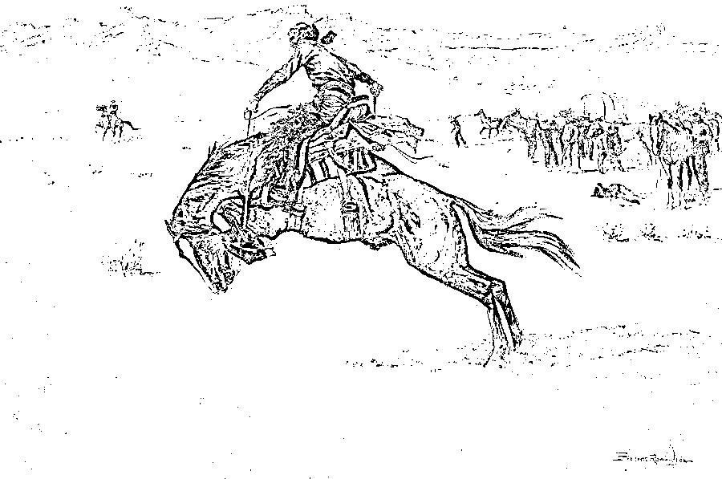

作者/斯蒂芬·弗里斯特

译者/江艺 校对/李含

编辑/翀子 图片/网络今天的头条文章介绍了行星越界和越界月亮的九个特征，然而在我们熟悉的名人里，又有哪些人的星图上有越界月亮呢？让我们从名人身上更好的了解越界月亮的概念吧~
**著名人物的越界月亮**

**下面你将看到出生图中拥有越界月亮的著名人物列表。**我把他们列入这些宽泛的行为范畴中。有的人可能不仅仅出现一次，因为他们表现出不只一种越界月亮的特征。

**1****选择离开**

*   20 世纪 60 年代的音乐巨星**凯特·斯蒂文斯**（Cat Stevens），为了皈依穆斯林信仰，放弃了他的明星之路。
*   **亨利·大卫·梭罗**（Henry David Thoreau）放弃了正常的舒适生活，远离社会，隐居瓦尔登湖。
*   音乐家**科特·科本**（Kurt Cobain），在声名鼎沸之时自杀。
*   **艾伯特·戈尔**（Al Gore）离开美国政界，全身投入环境事业，成为“局外人”。
*   **维多利亚女王**在丈夫艾伯特逝世后，从公众中隐退 40 年。

| 凯特·斯蒂文斯

**2****勇敢，开创性的天才**

*   著名的意大利小说家**安伯托·艾柯**（Umberto Eco）。
*   永远辉煌的英国音乐家**彼得·盖布瑞尔**（Peter Gabriel）。 
*   先锋派作曲家**约****翰·凯奇**（John Cage）。
*   思维扭转的图形艺术家**摩里茨·科奈里斯·埃舍尔**（M.C. Escher）。
*   **比利·霍丽岱**（Billie Holiday），蓝调歌手，使美国黑人在白人社会中显得性感而重要。
*   **路易斯·巴斯德**（Louis Pasteur），第一个理解细菌感染的人。
*   打破范式的物理学家**阿尔伯特·爱因斯坦**（Albert Einstein）。
*   **贝比·鲁斯**（Babe Ruth）, 通常被认为是史上最伟大的棒球运动员。
*   **威廉·赖希**（Wilhelm Reich）,奥地利-美国心理分析家和性解放运动的倡导者。

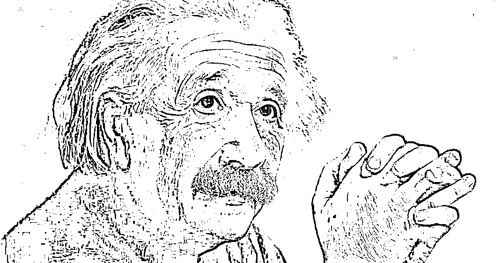

| 阿尔伯特·爱因斯坦

**3****打破社会体制**

*   **奥普拉·温弗瑞**（Oprah Winfrey）, 改变了电视节目的面貌和目的。 

*   **杰西·文图拉**（Jesse Ventura）, 从职业摔角手到州长。 

*   **阿诺德·施瓦辛格**（Arnold Schwarzeneggar）, 动作电影巨星，后来当上了州长。 

*   **埃德加·米歇尔**（Edgar Mitchell）, 从登月宇航员变身心理研究者。 

*   **弗雷迪·默丘里**（Freddie Mercury）, 皇后乐队的主唱，公开的同性恋，第一个使同性恋显得很“酷”的人。

*   **阿梅莉亚·埃尔哈特**（Amelia Earhart），开拓了女性在飞行技术中的角色。 

*   **克里斯托弗·里夫**（Christopher Reeve）, 扮演超人的演员，后来瘫痪了。

*   **鲍勃·吉尔道夫**（Bob Geldof）, 被女王誉为庞克摇滚爵士。

*   我们再一次看到**比利·霍丽岱**，使美国黑人在白人社会中显得性感而重要的蓝调歌手。

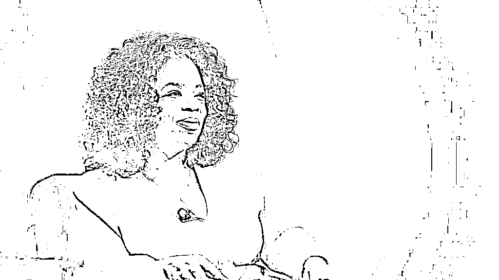

| 奥普拉·温弗瑞

**4****反社会和犯罪行为**

*   **豺狼卡洛斯**（Carlos the Jackal），国际杀手。

*   **迈克·泰森**（Mike Tyson）, 常常陷入法律事件的重量级拳击手。

*   **雷格斯·戴尔蒙德**（Legs Diamond），著名的美国恶棍 。 

*   **彼得·苏特克里夫**（Peter Sutcliffe）, 约克逊开膛手。 

*   **约瑟夫·迪特里希**（Josef Dietrich）,纳粹党卫队全国总指挥。 

*   **奥古斯托·皮诺切特**（Augusto Pinochet）, 残酷的智利军事独裁者。 

*   **罗曼·波兰斯基**（Roman Polanski）, 电影导演，因恋童癖而被判罪。 

*   **曼纽尔·诺列加 **（Manuel Noriega）, 腐败的中美洲独裁者。 

*   **查理·卢西安诺**（Lucky Luciano）, 早期美国黑帮人物。 

*   **斯奎克·弗洛姆**（Squeaky Fromm）,试图刺杀美国总统杰拉尔德·福特 。 

*   **约翰·威尔克斯·布斯**（John Wilkes Booth）, 刺杀美国总统亚伯拉罕·林肯的凶手。 

*   **保罗·约瑟夫·戈培尔**（Paul Joseph Goebbels）,纳碎党宣传部部长 。

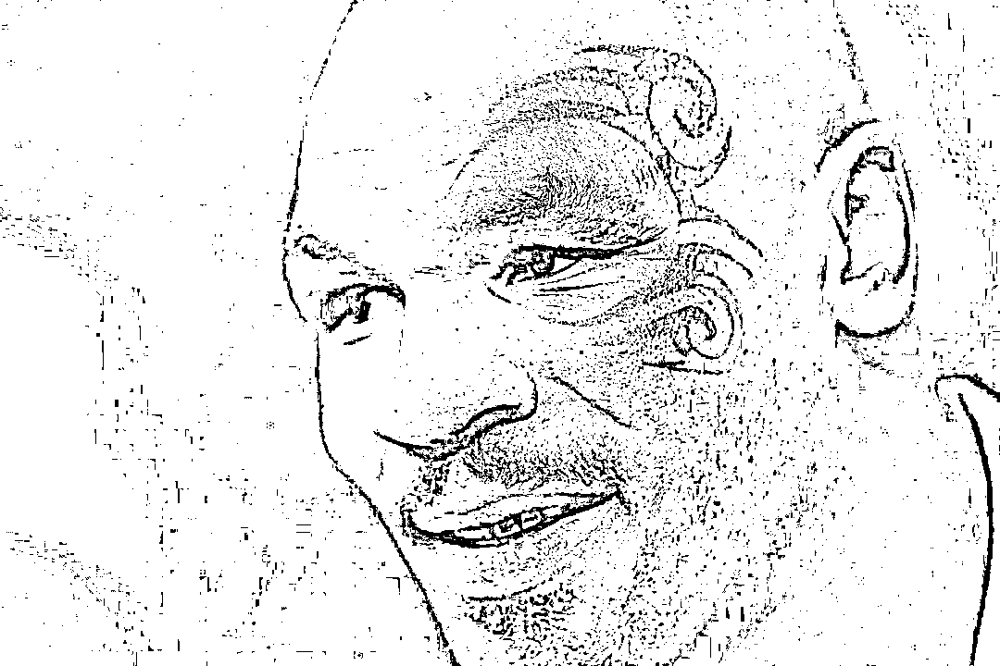

| 麦克·泰森

**5****所谓的反社会和犯罪行为**

*   **苏格兰的玛丽皇后**，因所谓的密谋反对王国政府而被砍头处决。 

*   **萨尔曼·拉什迪**（Salman Rushdie）, 由于亵渎伊斯兰的作品而成为宗教裁决的牺牲品。 

*   **吉米·霍法**（Jimmy Hoffa），据说与黑手党关系密切的被谋杀的工会主席 。 

*   所谓的逃税者**鲁珀特·默多克**（Rupert Murdoch），传媒大亨， 由于左翼政治而变成众矢之的。 

*   **伊迪丝·琵雅芙**（Edith Piaf）, 法国夜总会歌手，吸毒成瘾。 

*   **俄国女皇叶卡捷琳娜二世**（Catherine The Great）, 据说为了成为俄国女皇而谋杀了自己的丈夫。

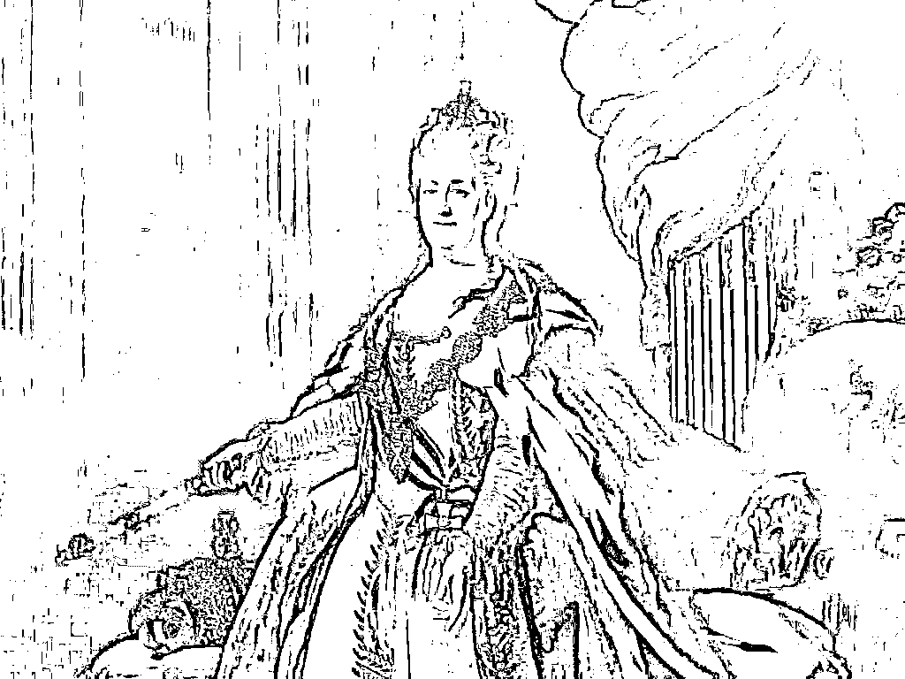

| 叶卡捷琳娜二世

**6****“优秀的”流放者**

*   美国的拓荒者**大卫·克洛科特** （Davy Crockett）。

*   女射击手**安妮·奥克利**（Annie Oakley）。 

*   独树一帜的歌手**威利·纳尔逊**（Willie Nelson）, **吉米·本内特**（Jimmy Buffet）, **汤姆·威兹**（Tom Waits）。

*   **卡米拉·帕克·鲍尔斯**（Camilla Parker Bowles），查尔斯王子的爱人。

| 安妮·奥克利

**7****叛经离道**

*   精神导师**瑞姆·达斯**（Ram Dass）。

*   异教徒预言家**斯塔霍克**（Starhawk）。

*   **凯特·斯蒂文斯**（Cat Stevens），拥护其文化中不受欢迎的宗教。 

*   **斯蒂芬·金**（Stephen King），将神秘带入主流 。 

*   **薄伽凡室利·拉杰尼希**（Bhagwan Shree Rajneesh），破坏偶像，有争议的古鲁 。

*   **克里希那穆提**（Jeddu Krishnamurti），反古鲁的古鲁。 

*   **华纳·爱哈德**（Werner Erhard），EST 训练法的创始者。 

*   **阿尔伯特·爱因斯坦**（Albert Einstein）需要再次提到，其相对论重塑了我们对现实本身的共有观点。

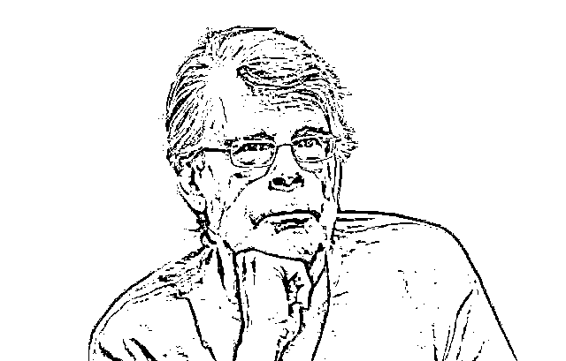

| 斯蒂芬·金

**8****荒唐人物**

*   俄罗斯前总统**鲍里斯·叶利钦**（Boris Yeltsin）。 

*   激进分子、政治家**艾尔·夏普顿**（Al Sharpton）。

*   **阿梅莉亚·埃尔哈特**（Amelia Earhart），回避她那个时代对女性的要求，因此在那时的社会背景下看起来很荒唐。 

*   **杰西·文图拉**（Jesse Ventura），脱口秀主持人，从前职业摔角手变为明尼苏达州州长。 

*   **阿克巴大帝**（Akbar The Great），土耳其—波斯大亨，拥有 500 名妻子。  

*   **乔瓦尼·卡萨诺瓦**（Giovanni Casanova），“史上最伟大的风流浪子”。 

*   **伊莎多拉·邓肯**（Isadora Duncan），兴旺的 20 年代攻击传统观念的人。 

*   **小野洋子**（Yoko Ono），艺术家，约翰·列侬的妻子，引发巨大争议。

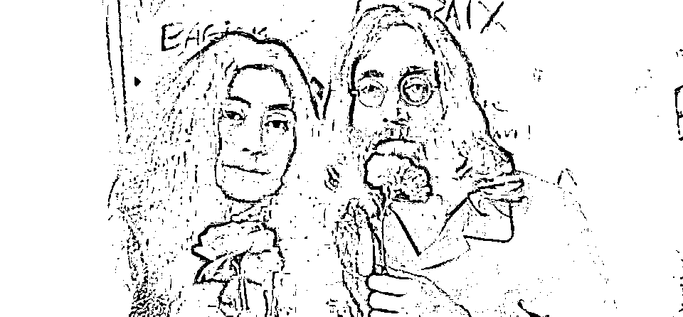

| 小野洋子与约翰·列侬

**9****真实中，生活于世界之外**

*   **尤里·加加林**（Yuri Gagarin），第一个进入太空的人。

*   **埃德加·米歇尔**（Edgar Mitchell），登上月球，之后又进行超自然研究 。

*   **伦纳德·尼莫伊**（Leonard Nimoy）,在《星际旅行》中扮演斯波克，大概是世界上最熟悉的外星人吧。

*   接下来又是**阿梅莉亚·埃尔哈特**（Amelia Earhart），1937 年，当她试图环球飞行时从这个世界上消失了。

**当然，****你必须将越界月亮融入到更大的占星框架之中。**但是仅仅就传统的星座、宫位和相位思考月亮，确实会遗漏许多可能非常强有力的修饰因素。

这里我只是专注于一点。我期待有一天，当我问某人关于她月亮的时候，我可以听见他说：它在天秤座第四宫，渐亏的凸月，并且是越界月亮。

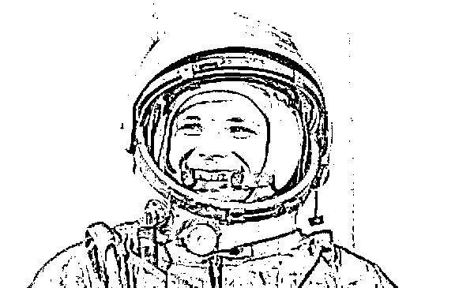

| 尤里·加加林

**推进月亮越出界线**

**在二次限推进中，月亮也可能越界，此时的月亮拥有超凡的影响力。**如果我们思考片刻，想想二次限推进是如何计算的，那么我们马上会认识到，有许多人一生都不会经历这种情况。

理由很简单：要了解你 30 岁生日时行星的二次限推进在哪里，只要在星历表中往前数三十天。那些行星的位置就是你的二次限推进。换句话说，一天即一年。**因此婴儿期的大约前三个月就是你剩余生命的二次限推进。**

但是也许在你出生的那一年，月亮的赤纬永远都不会走向极端——比如 1978 年。月亮赤纬在 1982 年 1 月之前都不会达到临界的 23°28′，那么你需要活到 1800 岁，你的月亮才会推进到界外！

例如，U2 的主唱**博诺**（Bono）就生于平静的一年，他的月亮在他一生中都不会推进到界外。同样的情况还有以镇定著称的**贝拉克·奥巴马**（Barack Obama），他生于 1961 年。像博诺一样，他也避免了越界的情况。

但是只比他晚出生 6 个月的**科特·科本**，却拥有全然不同的人生故事。1991 年夏天，他的月亮推进到界外——他以乐队主打首张专辑迅速成为世界巨星，这还不算什么。他的月亮在 1993 年末到达了引人注目的最大赤纬 27°48′。四个月后，他将自己锁在奢华的家中，吸食毒品，与世隔绝，谢绝公众，最后持枪自杀了。

| 科特·柯本

当我写下这些字句时，这个国家还被 2009 年 11 月 5 日在德克萨斯州胡德堡发生的大规模杀戮的噩梦笼罩着。**纳达尔·马里克·哈桑**（Nidal Malik Hasan）被伊拉克或阿富汗指使，在疯狂的枪击中杀死 30 人，杀伤 28 人。

我只知道他 1970 年 9 月 8 日出生在维吉尼亚的阿林顿。幸运的是，要知道某人是否有跨界月亮，无论是出生时还是在推进中，只要知道出生日期就足够了。在枪杀案发生时，哈森的月亮刚在不久前推进到界限外。那是 2009 年 5 月的事，只比枪杀时间早了 6 个月。在枪杀案发生那一天，月亮的赤纬是 25°14′。

**在科特·科本的故事中，我们看到了悲剧和疏离**——**还有“选择离开”的典型例证。**而很明显**纳达尔·马里克·哈桑**则体现了**“反社会和犯罪行为”**。我们可以在广泛的意义上，将我们探索到的关于出生星图中越界月亮的逻辑应用于推进中的越界月亮。只是在推进中，这并不是一种根本的、相对稳定的心理状态，我们看到的是一种更为短暂的心理状态。

另外，**科本和哈森的出生图中也有跨界月亮，而天生状况和推进之间的互动使得这种倾向得以膨胀，**当然也就格外剧烈了。

阿诺德·施瓦辛格在 2003 年 10 月被选为加利福尼亚州的州长。他的月亮在 2000 年春天推进到界外，并且这种情况一直持续到 2004 年末。从口音严重的澳大利亚动作电影明星变身州长，在这一不可思议的现实中，**他很好地诠释了“打破社会常规”。**

他也是一位很棒的“荒唐人物”。在早年经验中，推进的越界月亮开始于 1960 年春，施瓦辛格真的会在周末闯入关闭的体育馆，在那儿锻炼身体。我认为我们可以公正地称之为“所谓的反社会和犯罪行为。”**他打破了规则，但是没有伤害任何人。**也许他还具有“优秀的流放者”特质。

| 阿诺德·施瓦辛格

1517 年，马丁·路德·金出版了他著名的 95 篇论文，矛头直指可以用金钱来赎罪的教会教义。这些针对威腾伯格教堂的出色论文常常被看作新教改革的关键导火线。**在那个时候，路德的推进月亮刚好穿过顶峰，到达赤纬 28°01′——野蛮的越界月亮。**这里我们也许看到对**“****叛经离道”**的最好诠释。

1905 年 9 月，就在**艾伯特·爱因斯坦**的推进月亮越过界限六个月之后，他出版了打破范式的狭义相对论。他因此契合了我们的**“勇敢，突破性的天才”**荣誉。14 年之后，他的月亮又一次推进至界外。正如所发生的，当发现光波在日全食发生的时候因太阳引力转变方向时，相对论从根本上被证明了。很快，爱因斯坦突然置身于陌生的名誉世界“之外”，这是他仍然保有的传奇头衔。

最后，**当他的推进月亮又一次过界，**也就是在 1946 年到 1950 年末之间，爱因斯坦决定拥护不得人心的社会信仰，与核武器扩散做斗争。对此，让我们给他一个“优秀的流放者”称号。他也应得“荒唐人物”的称号，这要赋予他绝妙的头发和聪明—笨拙的感情，这还是电影星球大战中的约旦的灵感来源。

最后但同样重要的是，对于我们的“在真实世界里，生活在世界之外”的标题，没有谁比第一个环游地球的人更应得此殊荣呢？在 1961 年 4 月 12 日，尤里·加加林（Yuri Gagarin）勇敢地去了之前谁也没去过的地方。——**他的推进月亮位于南纬赤纬为 27°26′，他简直就等同于他的跨界月亮。**

我们现代占星师一直被蜂拥而至的新技术连番轰炸。人生太短暂，要全都掌握实在太难，更不用说要将他们运用于占星咨询的实践背景之下，在时钟的滴答声中一小时的时间悄悄流逝。我们所有人都必须在这些财富中进行挑选、做出选择。**我希望我已经向你们清楚展示了越界月亮，虽然它常常被忽视，但却是占星谜题中重要的一环。**

**版权声明：**本文由若道翻译发布，欢迎转发，反对抄袭。友号转载请申请白名单。

**斯蒂芬·弗里斯特**

若道签约老师。进化占星学的创始人之一，当今世界最有影响力的占星大师之一；1985 年，他凭借《内在的天空》一书获得职业占星师协会奖（Professional Astrologers Incorporated Award）。他四次获得占星界最高的占星学联合协会奖（United Astrology Congress Regulus Award）提名，2018 年获得轩辕十四教育奖。

**ISAR 选修课·次限月亮之旅**

**点击下图了解课程详情** 

**微信又双叒叕改版啦，不想错过若道君的推送？**

**就把若道设为星标吧！**

**▼**

**就是这个“在看”，戳戳戳 ☟**

****************报名直达入口****************

# 雷蒙德·梅里曼金融占星周运 | 木星即将进入双鱼座，市场反转！

> 原文：[`mp.weixin.qq.com/s?__biz=MzA5NjA0NTAxNg==&mid=2651444269&idx=3&sn=9e208975d8f10679db5fae8260ea8ff2&chksm=8b4b669abc3cef8c081abc45d165845512403ee5edbc551ded3936963f2afff2237e05a21e62&scene=126&sessionid=1692737989#rd`](http://mp.weixin.qq.com/s?__biz=MzA5NjA0NTAxNg==&mid=2651444269&idx=3&sn=9e208975d8f10679db5fae8260ea8ff2&chksm=8b4b669abc3cef8c081abc45d165845512403ee5edbc551ded3936963f2afff2237e05a21e62&scene=126&sessionid=1692737989#rd)

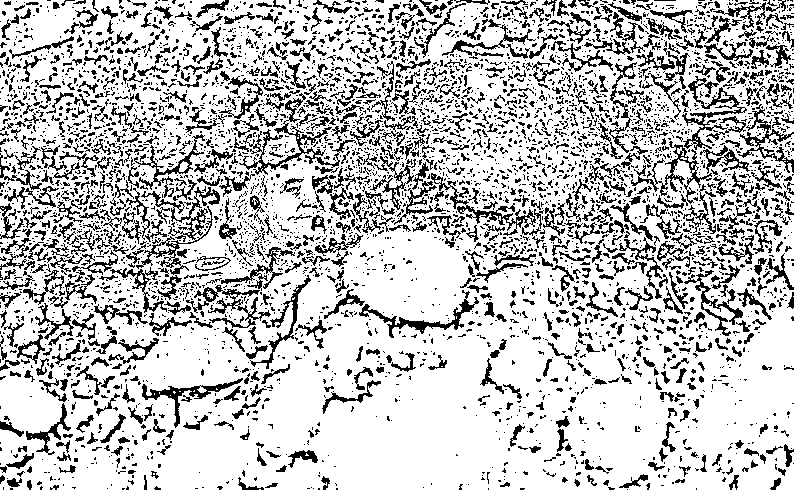

作者/雷蒙德·梅里曼 译者/Luke
编辑/玫瑰 图片/全景网

雷蒙德·梅里曼是在金融占星学界稳坐第一把交椅的占星师，同时他也是若道签约的金融占星课老师，我们引进了雷蒙德·梅里曼老师的《[上证指数月度报告](http://mp.weixin.qq.com/s?__biz=MzA5NjA0NTAxNg==&mid=2651443556&idx=1&sn=971def1aa74c2662394b35531d7018da&chksm=8b4b63d3bc3ceac5cf124611e8386478226581ff46a5d4f248df5671c3a5e189104125b14143&scene=21#wechat_redirect)》及《[黄金报告](http://mp.weixin.qq.com/s?__biz=MzA5NjA0NTAxNg==&mid=2651443556&idx=1&sn=971def1aa74c2662394b35531d7018da&chksm=8b4b63d3bc3ceac5cf124611e8386478226581ff46a5d4f248df5671c3a5e189104125b14143&scene=21#wechat_redirect)》《[2021 年金融预报](http://mp.weixin.qq.com/s?__biz=MzA5NjA0NTAxNg==&mid=2651436458&idx=3&sn=a7522c271761ef772fc91991ff11d965&chksm=8b4b071dbc3c8e0b452375ae3593028ab68b7b6157b45ee7c92943ff3396990d7748d7cd0967&scene=21#wechat_redirect)》。我们经老师的授权，将每周刊登梅里曼老师的周运，供大家参考和学习。于是，这是本周的周运（5.10-5.14）。

**说明：以下时间采用纽约证券交易所所在地美国东部标准时间。**

**展望与回顾**

**可用劳动力日益短缺的现状下，新增就业人口仅仅增加了 26.6 万，远低于华尔街的预期。劳工部在周五上午发布的月度就业报告中提出，失业率出人意料地上升到 6.1%，虽然仍远低于 2020 年 4 月的峰值 14.7%，却是危机前的两倍左右。路孚特调查的经济学家们曾预期这份报告中失业率下降到 5.8%，增加 97.8 万就业人口。**

**——克里斯汀·阿尔特斯**

**《美国劳工部部长评论为什么美国人不肯回去工作》**

**www.foxbusiness.com**

**2021 年 5 月 7 日**

无论如何，上周并未发生全球股市回落。5 月的第一周——在这一周投资者喜欢叫嚷 “五月抛售，然后走人”。唯一的问题是“五月抛售，然后走人”自 2015 年后就不管用了。以前的情况是，5 月可以卖，10 月再买回来，并不会错过什么。但最近几年来都不是这种情况。或许今年有所不同，因为有一个市场中周期即将结束。现实是，全球股票指数上周上涨，好几个市场（不是全部）到达了历史新高或多年来的新高。正是这种无视地心引力的表现，激发了许多新投资者和交易者抱着一夜暴富的想法进入市场。用流行语来说，这叫“害怕错过”。在“害怕错过”和大型网络公司（脸书、亚马逊、苹果、网飞、谷歌）的推波助澜下，一个人很容易陷入致命的傻瓜投资原则心态。驾驭市场投资或交易绝非易事。是的，追涨令人兴奋，直到悲剧发生。只要问问最近的游戏驿站受害者就知道了。上周，全球多个股市创下新高，包括道琼斯工业平均指数、标准普尔指数、荷兰 AEX 指数和澳大利亚 ASX 指数。几乎所有的股市都上涨了，除了中国上证指数以外。黄金和白银最近几周表现出色。黄金周五飙升至 1844.60，是 2 月中旬以来的最高价位。同样，白银周五测试 28.00，也是 2 月底以来的最高。不过，表现最好的还是谷物市场。玉米、小麦、大豆继续向多年来的新高上涨。玉米和大豆正在逼近历史新高。外汇市场上周也表现强势，欧元上涨到了自 2 月以来的最高价位，与此同时，美元跌至 2 月来的最低价。比特币保持强势，上周测试 59000，距 4 月 14 日的历史高点 64900 还有一点距离。但是以太币，另一种流行的加密货币，上周五首次超越 3600。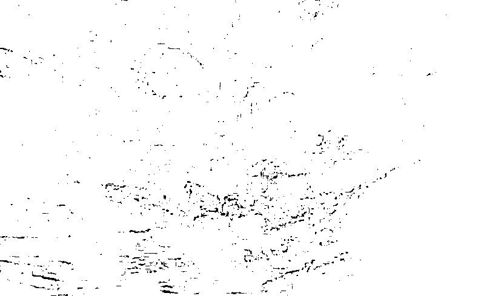**短期占星趋势和长期考量**

**美国财政部长珍妮特·耶伦周二承认，可能必须提高利率，以遏制美国经济的快速增长，这在某种程度上是政府万亿美元的经济刺激导致的。**

**——杰夫·考克斯****《财政部长耶伦说可能必须提高利率，以避免经济过热》****www.cnbc.com****2021 年 5 月 4 日****美联储周二在一份报告中警告说，股票市场和其他资产价格的上涨为金融系统带来了越来越大的威胁。****——杰夫·考克斯****《美联储警告称，随着资产估值攀升，价格可能出现“大幅下跌”》****www.cnbc.com****2021 年 5 月 6 日**没人能说他们没得到警告。财政部长珍妮特·耶伦和美联储发表了评论，认为**利率可能上涨，资产价格可能大幅下跌**。这就是故事的开端——央行或政府成员抛出了这“仅是一种可能性”的观点。它就要来了，每个人都预先得到了警告。但由于周五出人意料的疲软的就业报告，可能利率上升的想法至少还要被拖延一个月。这周木星将进入双鱼座，支持了这一观点。它进入双鱼座时，将与美联储的成立星图（1913 年 12 月 23 日）的冥王星形成三分相，与太阳形成六分相。这些被认为是“柔和”或和谐相位。当木星牵扯进来，美联储往往会采取宽松，而不是限制性的政策。在占星学研究中，我们称行星从一个星座进入下一个星座为“入座”。本周的 5 月 13 日-7 月 28 日，木星将从水瓶座入座双鱼座。**“入座”对应着与行星和星座相关的集体心理的变化**。木星的主要原则是夸大、扩张、成长和乐观主义。水瓶座是与人道主义、空间、科技、创新相关的星座。在水瓶座，木星提供了对人类未来宏大、乐观和令人兴奋的愿景，尤其是与科技或外太空探索相关领域。

双鱼座同样富有想象力，但更偏情绪化和直觉（有人甚至认为是灵性），不擅长发明或智力。作为水象星座，它与情绪有关。**木星入座双鱼座意味着集体心理更受情感驱动。它涵盖了从“非理性繁荣”到歇斯底里和恐慌的光谱。**

市场中周期和长周期形成时，木星往往位于变动星座。双鱼座是四个变动星座之一，可能是所有变动星座中，最容易产生市场反转的星座。对于股票、贵金属（白银大于黄金）和原油市场来说尤其如此。**如果一个金融市场正在创下数月以来的新高，通常会止步并大幅反转**。与此相对的是，**如果一个市场正迅速下跌至数月来的低点，可能会在此时形成长周期或中周期波谷，随后反转向上。****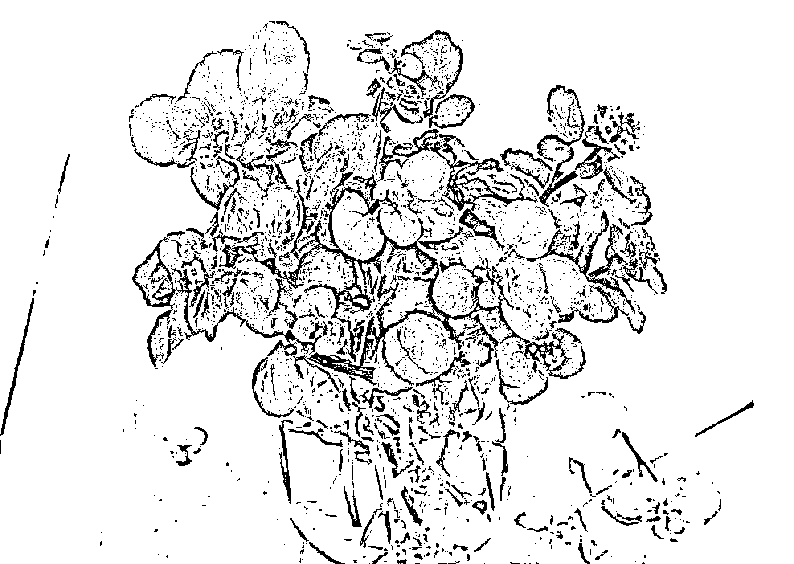**两种周期类型（波峰和波谷）都有可能在这一时期发生，这也是因为**土星将与天王星在 6 月 14 日第二次形成精准渐亏四分相。届时可能会发生非常剧烈但短暂的价格变化。**记住：2021 年 2 月 17 日的第一次精准成相，对应了全球数个股市多年来的高点，尤其是亚洲股市。下一个四分相可能同样重要。**危险和机遇。**这是土星-天王星相位与木星在双鱼座组合的性质。我们仍然要警觉**土星-天王星四分相可能显化为股市崩盘的可能性**。历史上，这种情况每间隔一个 45 年周期（1930-1931 年、 1839-1840 年）发生一次。然而，迄今为止，股市持续向新高攀升，投资者必须面对继续持仓赚取收益，还是因恐惧而清仓的抉择。因为**在某一点上，估值将变得过高，无法维持市场进一步上涨，反而大幅下跌。如果投资者不能及时锁定利润，就会承担巨大的经济损失。**这就是市场上最古老的冲突：**贪婪还是恐惧，木星还是土星。**自 2020 年 12 月 22 日冬至起，这两颗行星进入水瓶座，本周 5 月 13 日才离开。这一时期的市场是非常看涨的。**从 5 月 13 日到 7 月 28 日，木星将入座变动星座双鱼座。**这是市场最可能走极端的时候。对于变动星座，高点和低点常常被夸大了，这既体现在市场价格，也体现在集体心理情绪上。接下来的几周里，每个人都有机会更充分地享受生活。这可以是一场聚会，爱的盛宴，和长期压力和隔离后，带着喜悦重新社交的机会。这也可以是爱情的冲动增强的时期。然而，当你聚会太多，冒风险太大，不采取自律措施，可能会招致宿醉和损失。这也是木星在双鱼座外加土星四分天王星的意涵。

**说明：以上日期基于纽约证券交易所所在的美国东部标准时间，由于存在时差，中国地区可能需要加一天。**

**版权声明：**本文由若道翻译发布，欢迎转发，反对抄袭。友号转载请申请白名单。

**雷蒙德·梅里曼（Raymond Merriman）**

若道签约老师。著名金融占星师，ISAR（国际占星研究协会）前主席，梅里曼市场分析公司的总裁。他由于“提升了占星学的职业形象”，在 1995 年国际占星大会上被授予轩辕十四奖；在 2012 年国际占星大会上，被授予轩辕十四终身成就奖。

1“中国上证指数月度报告”发售

**若道推出了****中文版****的雷蒙德·梅里曼中国上证指数月度报告，并持续发行该报告！**

当把金融市场的周期和占星学的周期相结合时，雷蒙德·梅里曼老师的金融占星学研究**为投资者应对金融市场的周期波动，并随之调整投资策略提供了极大的价值参考**。

**5 月中英文报告已上线！**

2“黄金价格周期月度报告”发售

**若道推出****中文版****的雷蒙德·梅里曼黄金价格周期月度报告！**不仅仅为广大读者在中国股市的投资出谋划策，更将视角放眼黄金市场。

**每当世界经济形式不明朗的时候，有一个地方是保值的港湾，那就是****黄金**。自 1982 年雷蒙德·梅里曼出版第一本研究《地球宇宙学征象与黄金价格的关联》的著作以来，**他一直作为最重要的黄金市场时机预测者之一享誉国际**。5 月黄金报告已上线，梅里曼老师将会告诉你他对这个关键时期如何操作的想法。也可以按照季度和一年期订阅，有更多优惠。季度和年度的好处是，你可以持续了解梅里曼老师对于不断在变化的市场的看法。即便他某一次看法和市场不一致，你也看到在下一期他如何调整自己的看法，并看到金融占星在一个长期时间段内对你把控风险的帮助。而能够长期控制风险、尽量找到安全的投资时机才是投资的长久之计。

**5 月中英文报告已上线！**

**购买套餐**，买得越多越优惠

中国上证指数月度报告套餐价

*   **单月报告**：280 元

*   **3 个月套餐**：780 元（260 元/月）

*   **12 个月套餐价**：2400 元（200 元/月）

**长按下图识别二维码**

**购买金融报告****套餐**

**▼**

黄金周期月度报告优惠

*   **双报告年度套餐更优惠（直降 900 元）**
*   **12 个月黄金报告+12 个月上证指数报告：仅需 3900 元**

**长按下图识别二维码购买黄金报告套餐**

▼

**2021 年金融年报发售中**

**1976 年以来，由雷蒙德·梅里曼撰写的梅里曼市场时机学院每年一次的年度预报沙龙和每年一本的《年度预报》一直在应用占星学原理为投资者们服务，提供卓越洞见，从未间断。**过去两年，3 小时的年度预报讲座和长达 200 页左右对金融市场的分析报告，帮助许多若道读者做出正确的投资决策，降低了投资风险，并获得相当不菲的投资收益。在群星摩羯座的时候，我们和你一起提早规划自己今年的投资安排。2021 年年度预报发售中**2021 年金融年报价格**：1280 元**沙龙时间**：2021 年 1 月 9 日（视频已上线）**沙龙形式**：英文讲座，配有中文翻译**点击下图了解详情**

▼

**点击阅读原文购买金融报告**

# 越界月亮丨在自己的规则中，做率真烂漫的孩子

> 原文：[`mp.weixin.qq.com/s?__biz=MzA5NjA0NTAxNg==&mid=2651444269&idx=1&sn=13ea4422ab0557bbba2309d21caee2bb&chksm=8b4b669abc3cef8c103568fd29c28d7b573896a0f6298e000688dabd24936b128f4eb3502c70&scene=126&sessionid=1692737989#rd`](http://mp.weixin.qq.com/s?__biz=MzA5NjA0NTAxNg==&mid=2651444269&idx=1&sn=13ea4422ab0557bbba2309d21caee2bb&chksm=8b4b669abc3cef8c103568fd29c28d7b573896a0f6298e000688dabd24936b128f4eb3502c70&scene=126&sessionid=1692737989#rd)

**************☆ ************************后台************************回复“今日”，给你一句生命态度**************

作者/斯蒂芬·弗里斯特

译者/江艺 校对/李含

编辑/翀子 封面/书君 图片/网络太阳的运行路径定义了黄道带的范围，因此月亮和其他行星在运行中很可能出现“越界”的行为。在所有的越界行星中，月亮的影响力最突出，越界月亮拥有天王星/水瓶座的特质，但同时我们也要考量星图中的其他因素。
**越过界线的行星**

**熟悉的十二星座周期循环是一个非常有用的假想。**就像时间、空间、性别和金钱一样，它帮助我们将我们对现实特殊而有限的感知组织起来。我们观察行进或推进，看着他们沿着天空中这条想象中的路线（我们称之为黄道带）加速前进或是缓步慢行，仿佛它就是广阔太空中一条狭窄的高速公路，两边镶着坚硬的护栏。

例如我们在星历表中看见水星欢快地呼啸而过，1°、2°、3°。我们看见冥王星也经过了同样的里程标志牌——却不知道冥王星实际上可能离水星还有 30 度的距离，在天空中或高于或低于水星。**即便如此，我们还是说他们“合相了”。**

**事实上，在占星学的行星或虚点中，唯一严格按照黄道带运行的只有太阳。**实际上，**正是太阳的运行路径定义了黄道带。**而其它行星都只是大致沿着黄道行进。

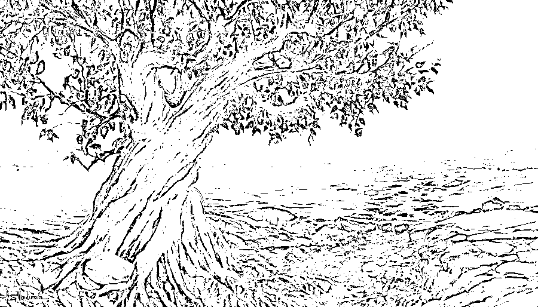

你是否也曾心存疑惑，**为什么不是每个月都有一次全日食呢？**确实，就在你的电脑屏幕上，你清楚地看到行进的太阳和行进的月亮在 15°24′连成一线——但是没有发生全日食。

原因是，**月亮通常会稍微高于或低于太阳。**他们“合相”了，但只是在我们想象中的天空铁轨（黄道带）上“合相”。**他们在黄道的二维结构中排成一线，却没有在天空的三维结构中，如同亲眼所见那样连成一线。**

**当一颗行星离黄道带足够远的时候，它便开始制造出一些非常奇妙的影响力。**可以说它**“越过了界限”**。事实上，它在天空中的怪异行为在其占星学涵义上给了我们极大地暗示。我们很快会谈到这一点。关键是，用熟悉的星座-度数的方式来查看黄道带，我们可能甚至都无法注意到这种情况。

行星的位置似乎只是普通的黄道度数，仅此而已。但是抛开传统占星学，我们清楚地发现**跨界行星在我们生活中真实的影响。**

就我的经验来看，**在所有越界行星中，月亮的影响力最为突出。**事实上，在所有被主流占星实践完全忽略的天文学细枝末节中，这个越界的月亮具有最为惊人的影响力。但是要准确地理解它，我们需要跳出传统思维，更准确地说，要跳出这样一种假想：即行星都是沿着天空中狭窄的轨道移动的。要挣脱这种思维的桎梏，**我们必须先来思考四季。**

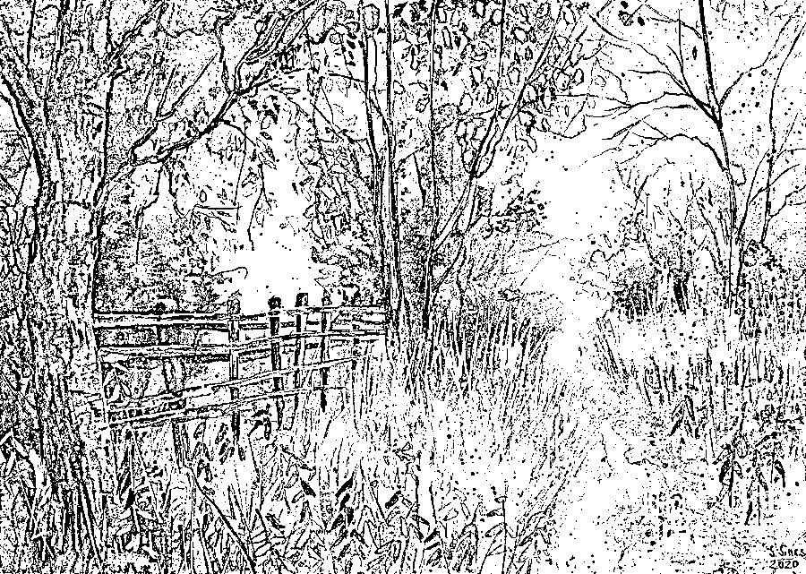

**行星越界的天文学知识**

在学校，我们大多数人都曾学习过地球上为什么有季节。**夏天，**我们的星球朝太阳倾斜。可见可感的影响是，太阳在空中升得更高，白天持续的时间更长。**冬天**则与此相反——地球朝远离太阳的方向倾斜，因此太阳高度降低，白天也变得更短——还有气候变冷了。

关于地球的倾斜角度曾有过很长时间的争执，但是现在，在太阳火（Solar Fire）的帮助选项中，**目前数值大约是 23°28′。**而维基百科给出的是 23°26′。在这篇文章中，我将应用太阳火的数值。

**在脑海中想象：你正坐在一艘太空船上，离地球赤道十万八千里**——也就是说，你离地球的“边缘”很远。你在遥远的太空中足以看见太阳，看见地球绕着它旋转。从你的视角看来，在某一时刻，地球顶部看起来会向左倾斜 23°28′。6 个月以后，地球绕太阳旋转了半圈，它仍然向左倾斜 23°28′（见下图）。

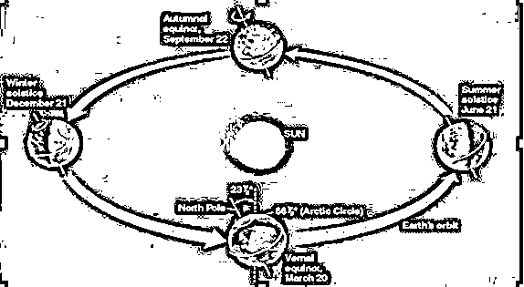

所以一开始时，由于地球的上半部分朝向太阳，所以北半球将获得更多的阳光照射。六个月后，地球仍然向同一方向倾斜，但却来到了太阳的另一边，地球的上半部分现在远离太阳倾斜。现在轮到澳大利亚享受日光浴了。

**这是我们理解链的第一个关键环节，下面是第二个：**

如果你在北半球，那么你常常发现太阳稍微有些“偏低”。这就是为什么“朝南”的房屋卖得好——**在北方，太阳常常以优美的弧度穿过南方的天空。在南半球则是相反的情况。那里的太阳更钟爱北方的天空。**

炎炎夏日的正午时分，我们可能满头大汗地抱怨太阳当头照。但事实却并非如此，**在北半球的天空中，太阳总是会稍微偏向南方一点，**即便在夏至，季节性的倾斜达到最大值，太阳运行到天空的最高处，情况也是如此。只有在接近赤道的地方，我们才能真正看见骄阳当头。

换种说法，当太阳真正位于头顶正上方时，垂直的棍子将不会留下影子。要亲身体验那样的风景，你得去到北纬 23°28′以南或是南纬 23°28′以北的地方——也即是说，非常接近赤道。否则，太阳和垂直面之间通常都会有一个小小的夹角。

真正被阳光垂直照射的无影子地带被称为热带，他们以天文学的方式被严格地定义。**只有在热带区域内，太阳才能完全位于头顶正上方，**而且即便在那儿，一年中也只有短短几天可以看到这种情况。热带之外，太阳绝不会升到如此高度。

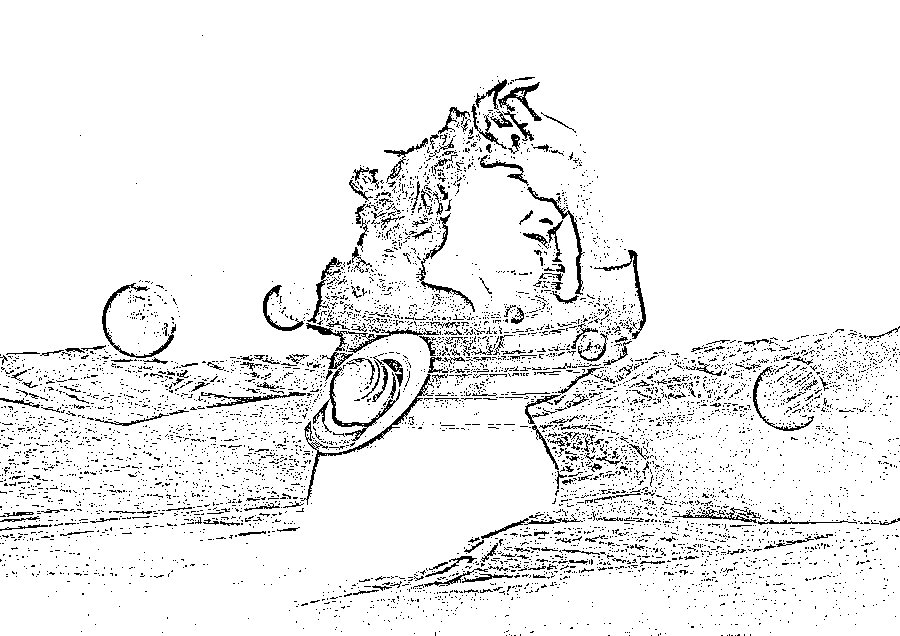

**下面是我们链条的第三环：**

我们可以将地球赤道向外延伸进入太空，设想它投影到假想中环绕我们周围的“天球”上。同样地，随着它投影到星罗棋布的太空里，“天球热带”也像地球上一样，沿天赤道向北延伸 23°28′，向南延伸 23°28′。太阳每年就在这些边缘之间运转。

**因此在北半球的夏至，太阳的赤纬是北纬 23°28′**——这是它离天赤道的距离，也是它在北半球能够到达的最高点。**在北半球的冬至，太阳的赤纬是南纬 23°28′**——即使在正午时分，太阳也低低地悬挂着，靠近南边的地平线。因此，**太阳的轨道随着季节的变迁在热带的边界之内上下移动，**在两分点时穿越天赤道两次，但是也会达到其上 23°28′，然后在六个月后的至点，位于其下 23°28′。

**在南半球，时间是相同的，只是六个月的阶段恰好相反。**

**向南或向北 23°28′的最大赤纬严格应用于太阳。但是却并非适用于月亮或行星。他们可以超过这一界限。**水星和火星可以达到 27°，金星偶尔能超过一度。其余的通常都呆在热带之内。

好的，我们的科学课程到此为止。**当一颗行星的赤纬超过南或北 23°28′时，它就被描述为跨过界限的行星。**这里没有灰色地带，没有逐渐地或微妙的过度。就刚好在那一点，机关启动了。

跨过界限（Out of Bounds）这个词是由已故的占星师凯媞·博尔（Kay Tee Boeher）在她现在已非常难找到的书《赤纬，另一种维度》(Declinations, The Other Dimension)中首次提出的。

十年前，NCGR（国家地球宇学研究机构）的《地球宇宙》（Geocosmic）杂志出版了完整的一期严格以赤纬为主题的杂志（1998 年春）。它的编辑是已故的伟大人物弗朗西斯·麦克沃伊（Frances McEvoy），我曾和她就该主题有过许多珍贵的讨论。

这一期杂志中刊出文章的作者包括查尔斯·杰恩（Charles Jayne）, 莉·韦斯廷（Leigh Westin）, 卡伦·克里斯提那（Karen Christino）, 马萨·拉姆齐（Martha Ramsey）, 肯·吉尔曼（Ken Gillman）,芭芭拉·科瓦尔（Barbara Koval）, 理查德·纳尔逊（Richard Nelson）, 瓦莱丽·沃恩（Valerie Vaughan）,布鲁斯·斯科菲尔德（Bruce Scofield）, 克里斯·勃兰特·里斯克（Kris Brandt Riske）, 查尔斯和罗伊斯·汉农（Charles and Lois Hannon）,以及爱德华·迪尔伯恩（ Edward Dearborn）和凯媞·博尔自己的文章。然而，尽管它轰动一时，现在却没有多少占星师应用这一跨界的技术。

我猜想距今一百年以后，我们都将会应用它，原因我马上给大家演示。

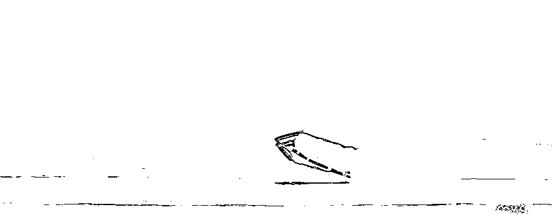

**越界月亮**

**在占星学上，越过界限的月亮意味着什么？从一个叛经离道的观念开始：**当月亮的赤纬超出南或北 23°28′时，它就逃离了由太阳系之“主”（太阳）所主宰的物理空间。

现在我们来自由联想。

换句话说，月亮逃离国王的势力范围。不再受老爹管束。我们可以说**它走出了管辖范围，不受控制，或者成了自由的野孩子。**它打破了规则，粉碎了界限，打破了模式，跨过了卢比肯河。勇敢地、或是趁着酒醉，月亮说“来玩骰子吧。”

**越界的月亮率真、无拘无束、自由烂漫、释放自我、完全由自己做主。**它大声宣布：“你可以做这件事（结婚，礼拜，责任，道德准则，城市，义务......）然后丢到一边。”

**月亮肯定自身的天赋、热情，勇敢做它自己。**不需要迷惑，不需要手段策略，也不需要再向任何人撒谎——除非你喜欢那么做。再没有违心的假笑，不需要再费力博得任何人的青睐赏识。

**在界限之外，月亮不再按规则行事。它拒绝所有不由自己制定的规则。**马丁·路德·金博士说“终于自由了，终于自由了！感谢全能的神，我们终于自由了！”。这些言辞激起我们的热情。但是我们还需要他们来激发我们的头脑。

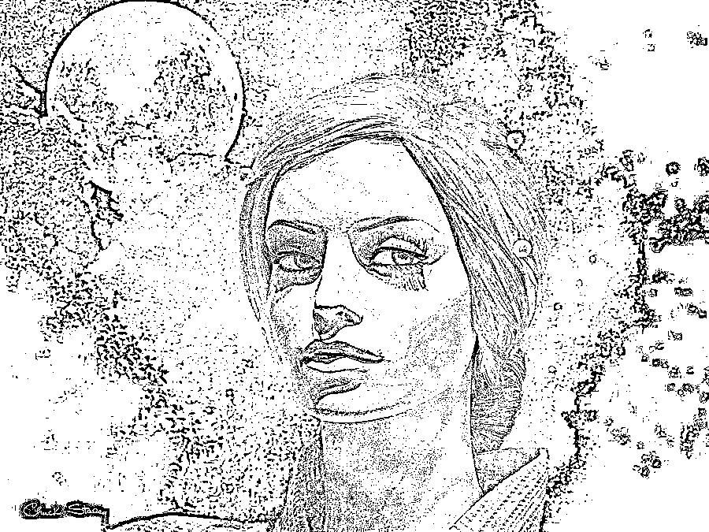

结构、纪律、在这个世界中为自己的行为承担后果——这些都不单纯是负面的东西。社会及其价值可以给我们带来稳定，即便是在我们对其感到失望的时候。**跨界月亮，就像占星学中其他的因素一样，都有不愉快、危险的一面，当然也有其神圣的目的。**

**它的黑暗面是具有反社会性，甚至犯罪——或者只是单纯的自私、不关心他人。它可能非常冷漠，甚至缺乏人性。**

你可能在这些词中发现**天王星**和**水瓶座**的某些本质精神。完全正确！在我的经验中，**越界月亮确实有水瓶座的特质。**我们看见熟悉的天王星“三位一体”正在发挥作用——天才，革命者和罪犯。此三者都处于正常社会结构之外，致力于改变它——并且为此而遭到抵抗、谴责并承担相应后果。

在水瓶座或天王星的影响下，**越界月亮常常让某人在真实世界中与人疏离。**这当然是典型的共时性运作——我们在内部世界遇见的（或未能面对的）都会“偶然”在外部的现实生活中遭遇。

**在内心，越界月亮常常让人感觉他是局外人，**无法融入社会，在世界上无处容身。这可能非常痛苦——也可能导致无所谓的态度。或者会导致被动性或怨恨，以及用激进的创造力来表达自己的存在。

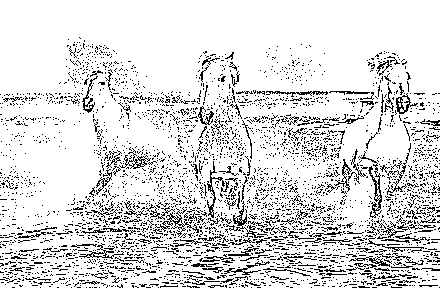

**我是否拥有越界月亮？**

有现代占星技术的帮助，这个问题很容易回答。大多数占星软件（工具栏）都能够计算赤纬。**只要先设置你的出生图，然后查看月亮的赤纬就可以了。如果大于南纬或北纬 23°28′，那就越过了界限。**

大多数软件的流行样式都提供了许多不同类型的星图，无论是在电脑屏幕上呈现出来的还是打印出来的。一般来说，除了占星师给予客户的简单版，还有很多技术版本。在这些技术版的列表中，你很可能会找到赤纬。同样，许多星历表也会列出赤纬。

**更广泛的来说，有一些年份出生的小孩中大多数都有越界的月亮，而在另一些年份出生的小孩则全都没有越界的月亮。**这与月亮轨道平面 18.6 年的逆行周期有关——这也是月亮交点的成因。后面我们会给出细节，这里先大概陈述一下。

**每 18.6 年，月亮会达到它的最大赤纬 28.5°，整整超出黄道 5 度。**在这些年的中间时期，我们受到“最低点”的影响，因为此时月亮绝不会超过天赤道两端 18.5°。在后面这种情况下，跨界月亮完全不可能存在。生于那些年的人都不会有越界月亮。

因此在 18.6 年的时间段里，大约有一半的人出生时可能有越界月亮，而另一半人出生时则可能没有。再者，在跨界月亮的“丰”年中，有些年份也会比另一些更加多产。那是因为月亮超过界限越远，它就会在界外呆得更长，因此几率更大。

即使在“丰”年，月亮的每月运转周期每两周就会把它带回“界限内”，即当它穿过赤纬北纬最大值和南纬最大值之间的中间地带时。

换句话说，在某人的出生图中可能有一个狂野的跨界月亮，但是在仅仅一周后出生的另一个人的星图中，月亮的赤纬为 0°，就像香草冰激凌那么正常。但是又过了一周，它又再次成为野性的跨界月亮。

你真的必须计算它，这里只是概要。

请牢记我们所有的附加说明，**过去曾有一些年份绝对是跨界月亮出现的高峰年：**1913、1931-32、1950、1969、1987-88、2006。我们将在 2024-2025 年迎来又一个高峰。记得在前后至少拓宽的两年时间范围。

**在这些年期间出生的许多小孩都有跨界月亮。但是他们都与大量更为稳定、传统的类型混同在一起。**观察那些年，注意他们如何明显地与社会动荡和社会创新的时期联系在一起。一如既往，占星学中，特定时刻“在天空中”的情况会在孩子身上以全息的形式存在几十年之久。 

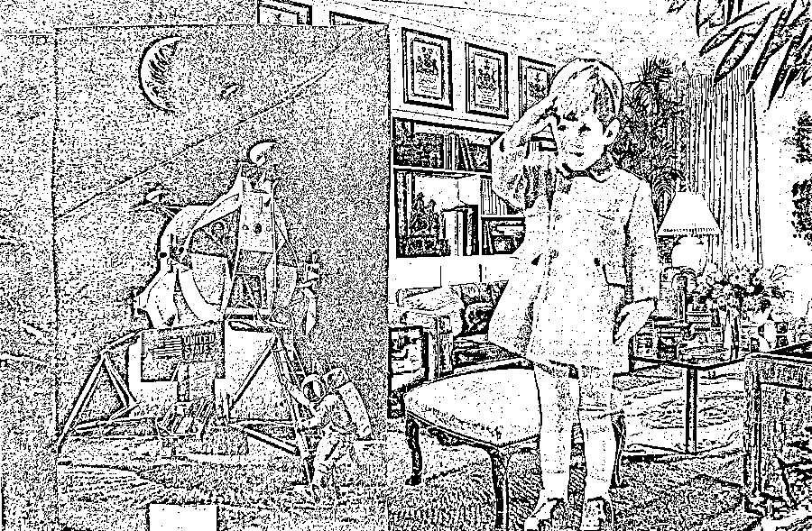

**越界月亮的九个特征**

我已经识别了与越界月亮相关的九个特征。他们是随意的，且相互重叠。无疑，也有其他的类别有待发掘。我想要首先在理论层面上简要介绍这些类别，然后举出一些著名人物的案例，将理论带入实践领域。

**1****选择离开**

出生时有越界月亮的人，**对常人向往的享有声望和称心如意的生活不屑一顾，**他们倾向于远离这些追求。不由自主地将自己从成功中放逐，因为这不过是在部族层面上界定的成功。

**2****勇敢，开创性的天才**

天才的传统定义是**“跳出常规思考”**的能力，而出生在越界月亮之下的人常常能尽显这种特质。当然，他们不一定是名垂千古的“天才”。他们通常只是平常人，拥有独特的才华和奇异的兴趣。我相信历史上的天才拥有越界月亮的可能性超出了平均水平，但是也要注意到许多公认的天才并没有越界月亮。

**3****打破社会体制**

我们从童年开始就一直受到社会学和人口统计学规划的大量干预。出生在贫民区的灵魂和生于乡村俱乐部的灵魂，其人生道路天生就是不同的。但是在越界月亮的影响下，我们常常看到一种模式，**即逃离社交训练和社会期待的约束。**

**4****反社会和犯罪行为**

在这个等式的黑暗面，越界月亮可能表示**对公认的和普遍遵循的道德和伦理行为准则满不在乎。**可能产生冷酷的破坏性和不道德行为——我们可能会将此称之为绝对层面上的“犯罪行为”，而非法律层面上。

**5****所谓的反社会和犯罪行为**

当然，犯罪在某种程度上只是旁人的看法。有些人**只是在走自己的路，**遵循自然法则的召唤，却可能被指控为离经叛道的行为。例如，耶稣曾遭到正当的审讯并被判罪。还有一些所谓的犯罪情况没有得到证实，真理仍旧被朦胧的迷雾笼罩。拥有越界月亮的人常常被牵连到所有各种各样此类境遇之中。

**6****“优秀的”流放者**

如果没有那些**尝试挑战伦理、常态和危险边界的人**，我们现在还停留在什么地方呢？我们自身之中“任性”的那个部分认同他们并且赞赏他们。我们可能没有足够的勇气去遵循他们的脚步，但是我们的一部分与他们产生共鸣，体验到情感上的鼓舞。拥有越界月亮的人往往符合这种描述。

**7****叛经离道**

每个社会都有其宗教，有时候会用这个词来代替——信仰体系，由此界定现实和伦理行为。界外的月亮常常出现在思想家和精神导师的星图中，他们都**立足于这些框架之外**。他们可能启示我们，或者激怒我们，或者仅仅是鼓励我们去问**挑战范式问题**。

**8****荒唐人物**

每个城市中都有怪人，**他们可能显得边缘化、危险，或者有趣，或者讨人喜欢，或者喜剧，或者仅仅是怪诞。**每个古怪的人都有其怪异的独特方式——这就是关键之所在！无论是哪种风格或方式，这些怪人都可能会扩展我们的期望界限，在这些人星图中找到越界月亮的可能性很大。

**9****真实中，生活于世界之外**

有时，象征主义的表现是非常具体的。我们发现，**很多星图中有跨界月亮的人都或多或少地以具体的方式生活在世界的界限之外。**

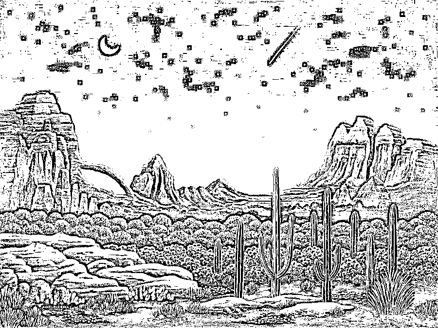

**注意多重因素的作用**

以上就是我对越界月亮的理论观点，这是我从多年的占星咨询经验中总结而来的。**请永远记住，占星学包含有多重因素。**

**许多人符合上述描述，但是他们也许并没有越界月亮。**其他各种各样的占星格局，大多属于**天王星—水瓶座**的范畴，**都可能产生相似的影响。**关键是我们常常遇见具有这些特质的人，但是从更为主流的占星视角来看，他们应该更为传统。那就是跨界月亮对自身的证明。

同样要说明的是，“在其他条件相同的情况下”，缺乏越界月亮也有可辨识的涵义。它暗示的，并不是迟钝的人，而是更为稳定的人。他们行事稳健，渴望获得奖赏。大体上他更期待在人生的主要领域中拥有长期的稳定：事业、婚姻、地域、住所、精神导向等等。

**未完，余下内容****见今日二条**

**版权声明：**本文由若道翻译发布，欢迎转发，反对抄袭。友号转载请申请白名单。

**斯蒂芬·弗里斯特**

若道签约老师。进化占星学的创始人之一，当今世界最有影响力的占星大师之一；1985 年，他凭借《内在的天空》一书获得职业占星师协会奖（Professional Astrologers Incorporated Award）。他四次获得占星界最高的占星学联合协会奖（United Astrology Congress Regulus Award）提名，2018 年获得轩辕十四教育奖。

**ISAR 选修课·次限月亮之旅**

**点击下图了解课程详情** 

**微信又双叒叕改版啦，不想错过若道君的推送？**

**就把若道设为星标吧！**

**▼**

**就是这个“在看”，戳戳戳 ☟**

****************报名直达入口****************

# 母亲节快乐丨听说妈妈怀孕时的状态，决定了你的上升星座？！

> 原文：[`mp.weixin.qq.com/s?__biz=MzA5NjA0NTAxNg==&mid=2651444253&idx=1&sn=73d5f7c20d639612380c28722b6e50cc&chksm=8b4b66aabc3cefbcf8ca4e330d4f539f963befe916d0b9bd0b0fdc407c9301c20a43ff80e988&scene=126&sessionid=1692737989#rd`](http://mp.weixin.qq.com/s?__biz=MzA5NjA0NTAxNg==&mid=2651444253&idx=1&sn=73d5f7c20d639612380c28722b6e50cc&chksm=8b4b66aabc3cefbcf8ca4e330d4f539f963befe916d0b9bd0b0fdc407c9301c20a43ff80e988&scene=126&sessionid=1692737989#rd)

****************☆ 后台回复“今日”，给你一句生命态度****************

作者/琳恩·柯纳

翻译/江艺 校对/Leisha

编辑/翀子 封面/书君 图片/网络

今天是个特别的周日，若道君祝全天下的妈妈们节日快乐！这是一篇角度新鲜有趣的文章。你想过上升星座会和母亲怀孕期间的状况有关系吗？看完对 12 个上升星座的妈妈们的分析，感觉打开了新世界大门，你是否也觉得和妈妈的连接更紧密了呢？

**上升星座与母亲孕期状态**

**我的理论和论点是，上升星座是由母亲在妊娠期间的态度、情感和经历决定的。**上升星座通常被看做是受环境的影响，但我认为这种环境就是怀孕期间的状态。

**母亲在生命中这一脆弱的时期所创造的环境决定了个体会对特定刺激做出反应。**这个“环境”可能与个人的真实自我并不协调。

例如，如果一个人**上升巨蟹座**而太阳在射手座，母亲可能非常情绪化，特别是在妊娠期，因此，个体经历了他/她无法识别的情绪反应。**上升摩羯座或土星合上升的人****，**可能有一种不被需要的内在感受，即使月亮的有利相位显示其在童年早期获得了大量的爱。

以下是有关我理论的例子。请保持开放的心态，把这些例子和你的自身经历进行比较。然而，**我确实发现，任何位于第一宫的行星都会替代上升星座本身的影响。**例如，如果上升狮子座，母亲可能在怀孕期间得到了很多关注，但如果冥王星落在狮子座合上升，其体验会更像上升天蝎座的描述。

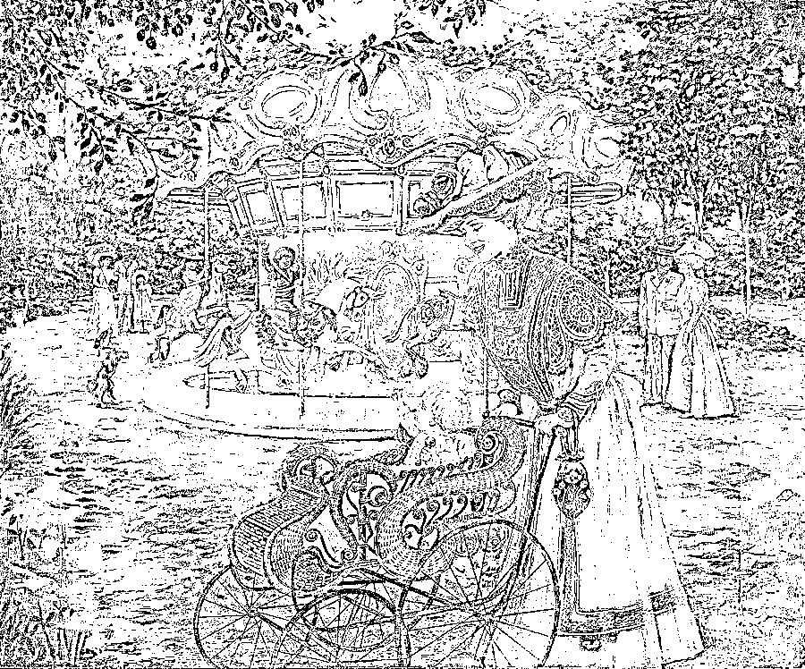

**12 上升星座的母亲孕期**

**上升*****白羊座***

**怀孕期间，母亲频繁地接触到很多新的兴趣和活动。**一位朋友说，当她怀着她的上升白羊座的孩子时，一个新世界的大门为她敞开，带她走进研究深奥秘义的世界。另一位朋友觉得她的整个生活变得更好了，因为她摆脱了生活中古老和过时的东西，开始了新的生活和经历。

与白羊座的性格相一致，一位上升白羊座的女性形容她的母亲是一个非常没有耐心的女人，特别是当她怀孕的时候。另一位则觉得，怀着上升白羊座的孩子时，她要一个人做很多事情，要独自负责很多事，还要处理那时生活中的许多危机。你将在白羊座的描述中读到，白羊座会在良好危机的挑战中茁壮成长。**母亲在怀孕期间的经历会成为孩子经历、性情和倾向的一部分。** 

**当上升落在火象星座白羊座、狮子座或射手座时，母亲们在怀孕时表达了强烈的幸福感。**

**上升*****金牛座***

**在孕育金牛座小孩的时候，父母可能正处于他们关系的获取阶段。**获得可爱的“东西”对母亲来说感觉很好，因此，**金牛座的孩子在购买某个听起来、感觉起来、闻起来或看起来不错的东西时，会感觉回到了安全的子宫里。**

金牛座是一个富有创造力的星座，**我发现母亲在怀孕期间经常接触文化活动。**一位出生时月亮和金星落在金牛座上升的学生说，父母双方都很有创造力，所以在怀孕过程中很可能有这方面的接触。月亮、金星和海王星经常指示音乐，尤其是在金牛座、天秤座和双鱼座。

一位木星落金牛座上升的孩子的母亲说，她在整个怀孕期间都在听音乐跳舞。其舞蹈是一种流畅的风格，而不是现代舞。当孩子出生后，他天生就喜欢跳舞。**木星在妊娠期掌管运动和舞蹈，特别是在创造性的星座中。**

**上升*****双子座***

**母亲在怀孕期间经常体验大量的走动、景致的变化或环境的改变。**一位母亲在怀孕期间搬到了另一个街区；其他一些母亲经历了大量的旅行，尤其是短途旅行。

一位母亲对双子座的四处走动给予了一种不同寻常的解释。当我问她怀孕的时候是不是经常走来走去时，她觉得并不是这样，但接着她想起来，**一直到她去医院生孩子的那天她都在做有氧运动！**

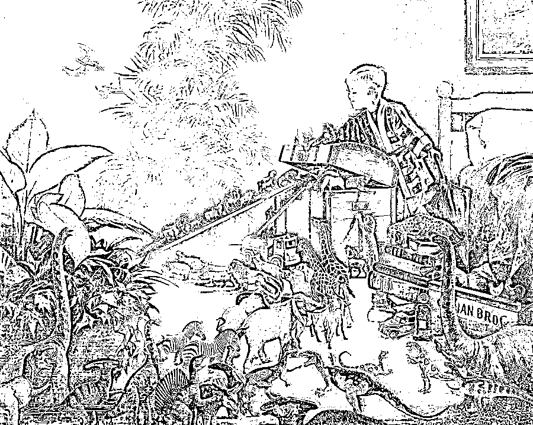

**上升*****巨蟹座***

我发现，**生下上升巨蟹座孩子的母亲在怀孕期间普遍感到不适，**尤其是晨吐。**这可能就是为什么巨蟹座在胃和消化区域更敏感的原因**——这是从怀孕时遗传的体质。一位女性告诉我，她的儿子是上升巨蟹座，怀孕期间她感觉很好——后来我发现这个孩子太阳落上升点。太阳和火象星座有助于母亲感觉良好。

在这种体验过程中，**母亲经常情绪化、敏感和喜怒无常；这些情感体验可以是积极的也可以是消极的。**当月亮落上升时也是这样。一位朋友生下了一个月亮和火星合上升的孩子，她怀孕时感到强烈的愤怒，因为她不想要这个孩子，但她的丈夫不同意堕胎。还有一个女人，她的孩子出生时月亮合上升且相位良好，她体验到和谐、“调和”的美妙情感。

**上升*****狮子座***

**母亲在怀孕期间经常得到大量的关注。**一位朋友说，她肚子越大，得到的关注就越多——人们侍候她，对她说她长得有多美，她觉得自己很重要。**这为上升狮子座的孩子赋予了要成为重要的人的定位，因为在妊娠期被看重的感觉就如此地好。**

**合相上升的行星强烈地影响着这个上升星座。**在 20 世纪 40 年代末，有好几颗外行星落在狮子座，尤其是冥王星。如果冥王星合上升，请阅读上升天蝎座的描述。我总是在星图中使用冥外行星（Transpluto：影响冥王星的假想行星），这颗行星从 20 世纪 30 年代末开始行进穿越狮子座，它将继续穿越狮子座直到世纪之交过后。

当冥外行星落上升时，**母亲可能曾表现出强烈的自给自足特质，**感觉她必须自己做所有的事情，其中融入了批评或区别对待的倾向。母亲可能曾抱怨所有事都要自己做，但这往往是一种个人选择。自给自足意味着人们不能批评你、试图改变你或告诉你该做什么!

**上升*****处女座***

**母亲在怀孕时常常表现出非常挑剔的习惯。**她很可能非常注意饮食，费尽心思不会伤到孩子。在一些情况下，母亲之前有过流产，因此采取了所有预防措施，以免这种情况再次发生。我经常发现母亲本身有一些处女座配置，所以在她怀孕期间就养成了这种挑剔的习惯。

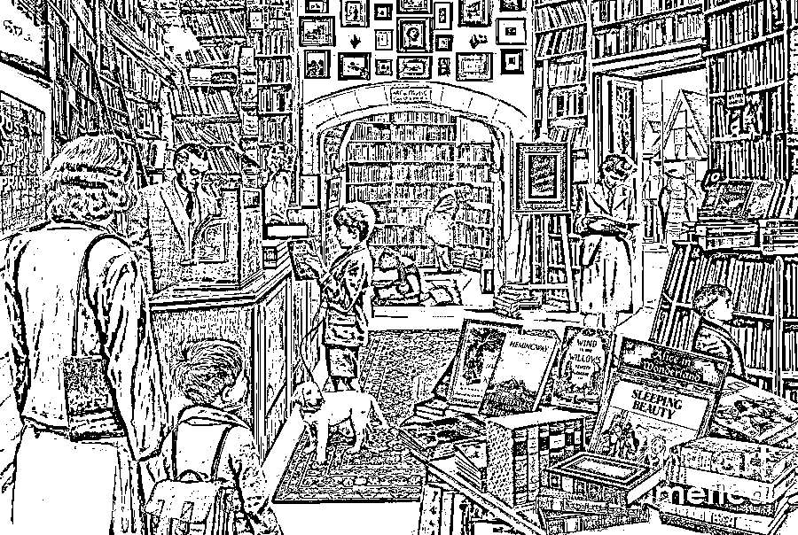

**上升*****天秤座***

**母亲总是试图保持生活的平衡，有时甚至到了对自己不公平的地步，在这个过程中失去了自我。**一位母亲说，她试图在家庭生活和事业之间取得平衡——事实上，在这种平衡中她失去了一些自我。内心的平静是很重要的，而这通常会通过一些创造性的途径来实现——可爱的花朵，美妙的音乐和美丽的色彩。

**家庭可能确实曾带来压力，但母亲总是让一切保持平衡**，先考虑别人的需要再考虑自己的，压抑任何想要表达愤怒或不愉快的倾向。

在这里我想提一下，**金星合上升（但不合凶星）通常表明怀孕期间孩子感到非常被宠爱。**内华达州的占星师帕特丽夏·芒恩斯发给我一篇文章，描述一位死去的母亲生下孩子——孩子出生前母亲一直靠生命支持系统维持生命。当我绘出星图来看时，金星在处女座合上升。我觉得，即使在死去的母亲的身体里，孩子也能感受到强烈的爱。帕特丽夏告诉我这是真的。当母亲躺在医院里的时候，父亲每天都去看望孩子并和孩子说话。

**上升*****天蝎座***

上升天蝎座或冥王星合上升，**母亲通常在怀孕时感觉到愤怒、怨恨，非常不喜欢失控的情况。**家庭内部可能出现了紧张的状况，母亲用强烈的情绪将愤怒内化。即使是未出生的孩子也会因为怀孕期间发生的事情而感到失控！

有一些非常重要的例外！我的一个学生是上升天蝎座，但她的月亮在摩羯座(通常是父母最喜欢的孩子——这似乎很奇怪)，并且相位很好。我觉得，虽然母亲在怀孕期间体验到怨恨，但在孩子出生后，她是非常爱孩子的。

那个学生告诉我，她在经济大萧条时期出生在一个非常贫困的社区。她的母亲确实非常怨愤，因为她知道她只能去一家福利医院，而她那高傲的天性觉得这是很难接受的。然而，当孩子出生了，这种感受被她抛在脑后，怨恨也消失了。然而，**因为孩子在怀孕期间感受到这种强烈的情感，她成年后对失控和操纵非常敏感。**

我在占星大会上还听到了一个相当不同寻常的经历！那位母亲告诉我，**她非常享受怀孕，所以她非常努力地不让孩子出生。**很明显，宝宝感到这是一个控制问题！还要记住，**吉星合上升会改变上升天蝎座的影响。**类似的情况是，一个人报告说是引产。

**上升*****射手座***

和其他火象星座一样，**妈妈们在孕期感觉很幸福美好。**通过这种积极的输入**，****孩子会发现自己在整个一生中都很容易培养出积极的内在态度。**受访的母亲中只有一位健康状况不佳，但她认为后一种表述是正确的。

一些母亲说，在怀孕期间有重大迁居，但在怀孕期间，**所有女性提到的主题是一种内在的期望，事情会变得更好，繁荣就在眼前，而且她们都会追寻新的前景。**他们把过去抛在身后，发现自己充满信心地行动。**母亲们在怀孕期间感受到一种强烈的精神或哲学前景。**这是一个意识扩张的时期，相信一些比她们自己更伟大的东西，并按照这种信念行事。

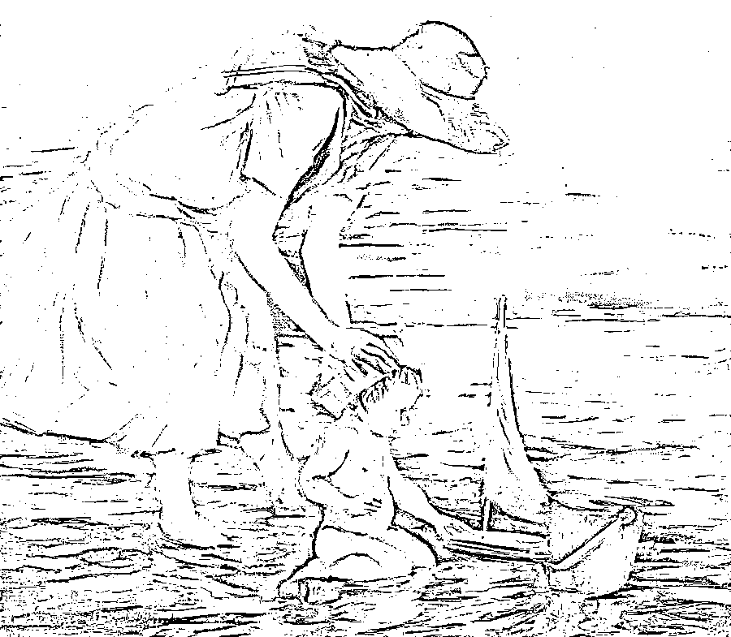

**上升*****摩羯座***

土星合上升或上升摩羯座的孩子**经常是第一个或最后一个出生的。**

**对于第一个出生的孩子**，母亲会对新的经历感到焦虑。孩子可能是被热切期待的，但是，当母亲四处走动，感觉好像她的裙子下有一张桥牌桌时，就会产生“哦不，我让自己陷入了什么!”的情绪。

**对于最后一个出生的孩子**，母亲的态度是:“就这样吧——不要再有孩子了!”有时，几年过去了，母亲可能会改变她的想法，但这改变不了她对那个她认为即将“收尾”的上升摩羯座/土星合上升的孩子的态度。

**有时候真的会有不想怀孕的感觉，或者有些“恐惧”的感觉。然而，这种恐惧可能并不是不想要这个孩子。**一个朋友笃定地说，她想要她那最后一个上升摩羯座的孩子，而且之后计划要更多的孩子。后来，她意识到我提到的恐惧的来源。她告诉我，她和丈夫都信奉新世纪哲学，但他的父母信奉一种严格的传统宗教。每当她怀孕的时候，他所有的亲戚都会从纽约赶来，试图改变他们孩子的宗教信仰，让他们恢复传统的宗教信仰。

这是她怀上上升摩羯座孩子时的一种强烈的思维模式，**她确实感到了强烈的恐惧情绪**——“哦，不！我又得去对付他的亲戚们了!”

**一个未出生的孩子不可能区分这种情绪的来源。它只知道感觉自己不受欢迎；它能感受到妈妈对怀孕的恐惧。**当一个人在最脆弱的发展阶段感到不受欢迎时，他的内心就会充满强烈的保守、不安全和不信任感——这种不受欢迎的感觉会被嵌入身体的细胞中。

因此，**上升摩羯座或土星合上升的人通常有一种保守的光环，**直到他们觉得自己可以信任并向周围的环境敞开心扉。向他们证明他们可以去信任的生活经历有助于消除这种设计。

几年前，我为一位女性的孩子们解读星图。她第二个孩子的土星合上升，出生的月亮与木星四分。我问她是不是不想怀孕，但后来为了弥补不想要孩子的罪恶感，又纵容了孩子。她承认第一个孩子给她带来了许多麻烦，因此她害怕再要一个，但第二个孩子出生后，她真的爱她，确实试图通过更纵容第二个孩子来弥补。

**上升*****水瓶座***

**上升水瓶座或天王星合上升，母亲可能正处于其发展的叛逆期。**有时母亲想要摆脱家和怀孕的限制，所以她反抗的这段经历。一位母亲遭遇了天王星式的健康问题——神经压迫使她的手麻痹。我的一些上升水瓶座或天王星合上升的学生表达了他们的母亲不想怀孕的想法——**但这是一种对怀孕经历的叛逆情绪，而不是摩羯座/土星的恐惧。**

一个朋友生了一个天王星在狮子座合上升的孩子。她的医生曾告诉她，身体条件不允许她怀上这个孩子，如果她真的要怀这个孩子，她肯定无法喂母乳。

虽然我的朋友是一个甜美、随和的土象星座女性，但她对权威人物——医生们却表现出强烈的反叛情绪！她下定决心要生下这个孩子，按照她自己的方式去做，而且如果她愿意的话，就要母乳喂养。这种**“我要做我想做的事，我要用我自己的方式去做！”**的态度占据了主导。显然，她生的这个孩子，虽然我觉得他很可爱，**但对权威人物有一种叛逆的态度。 **

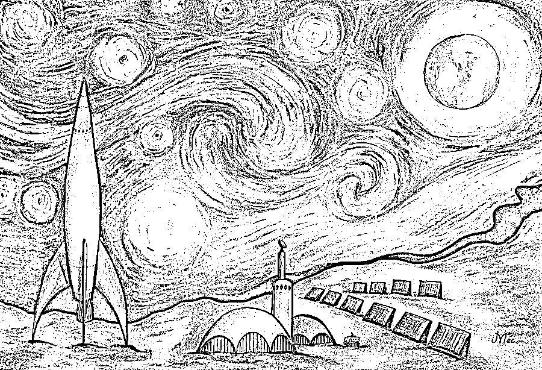

**上升*****双鱼座***

上升双鱼座或海王星合上升，**母亲在怀孕期间经常走神。**她有一种矛盾的情绪，心不在焉——不能做到现实理智，还漠不关己。一些母亲说她们试图通过**艺术、阅读、研究神秘主义和想入非非地做白日梦**来逃避现实。有时母亲在怀孕期间可能服用了使她精神涣散的药物；在一些罕见的情况下，母亲在怀孕期间患上了神经症，因此心理上变得**迟钝昏沉。**

**如果有来自月亮或金星的积极影响，母亲创造性的逃避方式会在孩子身上产生创造力。**孩子通过母亲学会了逃避现实的健康方法。但在前面提到上升巨蟹座/月亮合上升的例子中，这位女性因为不想要孩子又不能堕胎感到非常愤怒，她学会了在矛盾的情绪中走神——这个孩子出生时月亮和火星在双鱼座合相。有时为了应对负面情绪，母亲可能会嗑药或饮酒。

无论这是否是一种积极的经历，**母亲“心不在焉”的特质使她在怀孕期间无法脚踏实地。**这就给即将到来的生命带来了一个困境。母亲的失联使即将到来的生命难以有效地融入厚重的物质身体中。在身体的厚重和微妙之间似乎有一些间隙或空间，使孩子对外部氛围高度感同身受和敏感。

由于高度的接受能力，这种敏感性会使个体在地球上生活感觉压力大。显然，对于这样的人来说，如果找不到有创意的逃避方法，可能更容易通过上瘾来寻求解脱，包括烟瘾，因为吸烟往往会切断从太阳神经丛发出的联系。我发现许多通灵者在解读结束时会点燃一支香烟，**这有助于切断已经建立的联系。**

**尾声**

**太阳代表了我们的真实自我；上升代表环境对我们的影响——我们的早年生活和出生前的发育。**

**如果太阳星座和上升星座不和谐，我们可能会被鼓励去成为与真实自我不符的人。**例如，一个学生上升狮子座，太阳在处女座，她觉得自己总是被推到重要的位置，被迫吸引眼球，被迫上台表演，而她本质上是一个害羞、内向型的人。狮子座通常喜欢大城市的快节奏，而处女座则喜欢安静私密的小社区。

当发生冲突时，个体会发现，**那些上升星座强大的人会期望他们成为父母和早期环境塑造的那个人，从而使任何成为真正内在自我的尝试遭到挫败。**以狮子座/处女座为例，狮子座的男人会希望她光鲜亮丽，善于社交，成为关注的焦点，不希望她做害羞、安静的自我。

**版权声明：**本文由若道翻译发布，欢迎转发，反对抄袭。友号转载请申请白名单。

**琳恩·柯纳**

自 1969 年 6 月以来一直是全职专业占星师，担任美国地球宇宙研究学会巴尔的摩和安纳波利斯分会的主席、副主席和简报编辑。诺·泰尔《占星学的具体度量》的撰稿人，医疗占星课程导师。

**系统学习占星学**

**点击图片了解详情**

**微信又双叒叕改版啦，不想错过若道君的推送？**

**就把若道设为星标吧！**

**▼**

**就是这个“在看”，戳戳戳 ☟**

********报名直达入口********

# 金星四分木星，你最“败家”的经历是什么？

> 原文：[`mp.weixin.qq.com/s?__biz=MzA5NjA0NTAxNg==&mid=2651444252&idx=1&sn=962ada2d632473837599a170ef268b46&chksm=8b4b66abbc3cefbd5e7e00f94ff5ee7ff5da905ccbfabb416782156b41c196669feca43ffdd0&scene=126&sessionid=1692737989#rd`](http://mp.weixin.qq.com/s?__biz=MzA5NjA0NTAxNg==&mid=2651444252&idx=1&sn=962ada2d632473837599a170ef268b46&chksm=8b4b66abbc3cefbd5e7e00f94ff5ee7ff5da905ccbfabb416782156b41c196669feca43ffdd0&scene=126&sessionid=1692737989#rd)

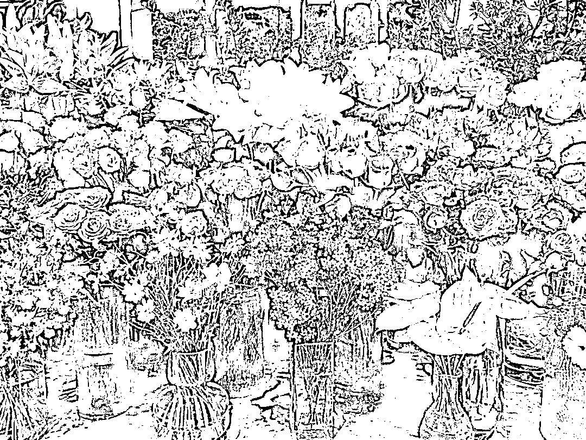

**2021 年 5 月 8 日天象：**

*   **月亮在白羊座**

*   **金星四分木星**

月亮在白羊座，你是不是觉得自己斗志上扬呢？今天还是工作日，快把之前没做的事情一举处理完吧！不过从早上到下午，白羊座月亮和巨蟹座火星呈压力四分相，人们也容易变得冲动好斗、被情绪左右。我们依然处在金星和木星的四分相影响下，冲动消费、不假思索就大把花钱或是盲目投资是非常容易出现的情况，因此对于金木四分相，我们格外强调“理智消费”。此外，社交生活在今天也可能很丰富哦，不要让自己忙不过来哈哈～不过说到理智消费，你最夸张的“败家行为”是什么呢？来聊聊呗。评论区等你哦！周六快乐！我们周一见！**更多精彩占星文章长按二维码查看**

# 想知道散发魅力的关键？不如看看行星如何影响我们的行为

> 原文：[`mp.weixin.qq.com/s?__biz=MzA5NjA0NTAxNg==&mid=2651444183&idx=1&sn=b797d87bd30fa4683e3de5d194f63960&chksm=8b4b6160bc3ce87642e30fca827e6f79096c163142c2200521a5a5e1c40ff4abb2fb25f38634&scene=126&sessionid=1692737994#rd`](http://mp.weixin.qq.com/s?__biz=MzA5NjA0NTAxNg==&mid=2651444183&idx=1&sn=b797d87bd30fa4683e3de5d194f63960&chksm=8b4b6160bc3ce87642e30fca827e6f79096c163142c2200521a5a5e1c40ff4abb2fb25f38634&scene=126&sessionid=1692737994#rd)

**☆ 后台回复“今日”，给你一句生命态度 **

作者/格伦·佩里

译者/Jun 校对/Arrow

  编辑/翀子 封面/书君 图片/网络

为什么有的人在吸引另一半时简单直接、积极主动，而有的人则会运用自己的博学多才、能言善辩去散发个人魅力？这些都与我们星图中的行星有关，行星所在的星座不仅象征着它的行为风格，也象征着其行为目标的本质。这篇文章，让我们一起跟随格伦老师深入地了解行星是如何影响我们的行为目标。

**行星对行为目标有什么影响？**

**在占星心理学中，星座和它们的守护星可以理解为一个星座-行星系统，**在这个系统中星座的感受会触发行星的行动。由此可见，行星是它们所守护的星座的主动代理。**不同的感受组合成情感的信号，从而促使行星采取行动。**行星所采取的行动取决于当时的情境所唤起的感受本质。

例如，当一个女人在社交活动中被一个男人吸引时，她的金星会经由天秤座对吸引力的感受而激活。她可以通过各种方式来表达自己的爱慕之情——积极主动的（白羊座）、感官的（金牛座）、博学多识的（双子座）、关心他人的（巨蟹座）等等。换句话说，**她金星行动的特质是由金星所在的星座决定的。这是她的金星风格。**

然而，**风格只是行星所在的星座其中一个含义。**当人们通过必然的情绪反应意识到动机时，他们就建立了一个行为目标。这个行为目标旨在满足动机需求，并达成一种满意的状态。鉴于行星描述了行动，**比如社交（金星），星座位置不仅暗示了行动的风格，也暗示了其目标——行为目标。**

如果一个女人的**金星在摩羯座**，她的社交风格可能是**严肃而有计划的**；她的**行为目标可能是通过与有钱有势的人建立关系网络来推进自己的事业。**她喜欢的那个男人可能是她希望被录用的公司的首席执行官。如果她能成功与他搭上话，并给他如愿留下正面印象，那她就完成了两件事：

*   通过严肃而有计划的行动来满足天秤座对社会关系的需求；

*   促成了她摩羯座提升自我地位的目标。简而言之，**摩羯座的金星不仅描述了她的风格，也描述了她行动的目标。**

要辨别一颗行星的风格，我们只需要陈述行星的行为，然后问：怎么做？如果金星进行社交，会如何社交？它所在的星座回答了这个问题。**金星在白羊座的人热衷于社交；金星在金牛座的人，慢热而平静；金星在双子座的人，健谈而博学。**

相反，在辨别行星的目标（行为目标）时，**行星所在的星座回答了“做什么”的问题。**如果火星要主张，它主张的是什么？如果金星要吸引，它吸引的是什么？如果水星要学习，它学习的是什么？行星所在的星座是行星动词的直接宾语。直接宾语接受动词的动作，并回答**“（行动者的）目标是什么？”**

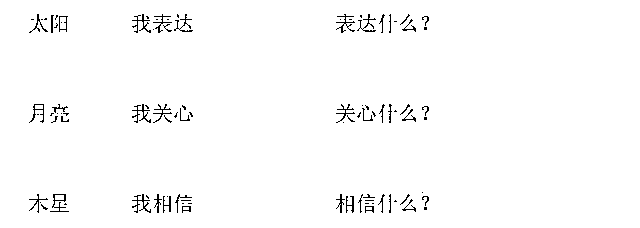

当个体通过体验必然的情绪反应而意识到星座动机时，他们就必须满足这个动机。因此，**每一个星座动机都会激活它的守护星。**当感到社交上孤立时（天秤座），一个人也许必须寻求关系（金星）；如果感到好奇（双子座），这会刺激她去学习（水星）；如果有野心（摩羯座），这会驱使他追求成功（土星）。

**简而言之，人们建立他们所期望的一般行为目标，这些目标将使他们达到想要的满意状态，我们称之为目标状态。**由此可见，行为目标是为达到特定的情感状态服务的。**这种动机序列可以分为三个阶段：情感、行动和目标。**

**以金星为例，它看起来是这样的：**

*   **第二阶段：行动**——金星人为了满足天秤座的需求而参与、考虑和适应的行为。

*   **第三阶段：目标**——设定一个具体的目标，让金星人的行动专注于追求实现目标状态。

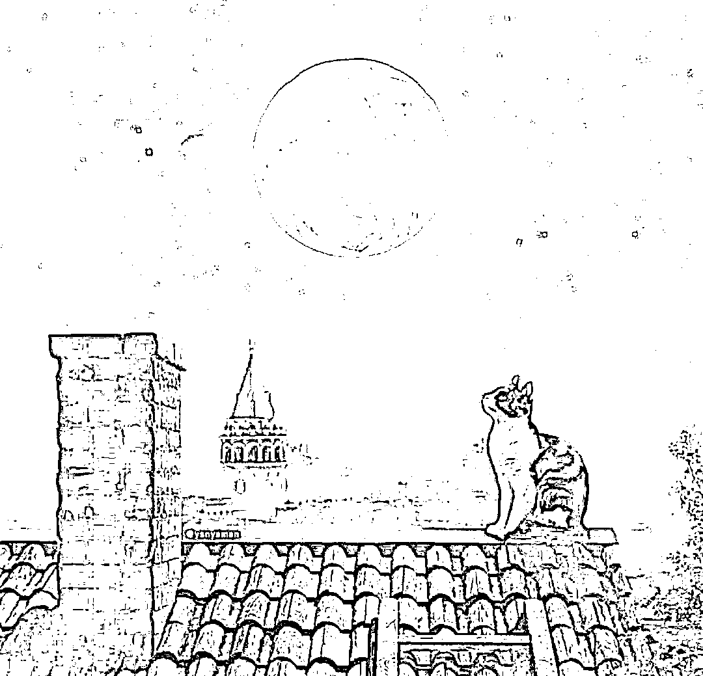

**每颗行星都象征着一种行为。**太阳要表达，月亮要倾听，水星要学习，火星要主张，金星要吸引，木星要扩张，土星要命令，天王星要觉醒，海王星要消融，冥王星要转化。

**事实上，每颗行星都象征着一类相关的行动，所有这些行动都旨在满足动机需求以及达到目标状态。**例如，金星不仅是吸引，它还会参与、社交、合作、妥协和调解。

**星座所象征的基本需求是人类固有的。我们都有相同的 12 个核心需求。**

**例如，白羊座象征着我们生存的需求，**这推动了行星行动去主张（火星），主张是为了满足生存的内在需求而设计的行为。如果一个人成功地达到了他的行为目标，那么确认他存在的权利就是一种内在回报。换句话说，如果火星的行动带来一种充满活力的状态，并让人感到自己是一个自由和自主的主体，还能为自己的利益而有效行动，那么火星的目标状态就实现了。

**目标状态是行星的主观目标，同时也有一个隐含的行为目标。**行为目标与目标状态的不同之处在于，行为目标与外在回报或外部结果有关，外部结果的实现将引发目标状态。在上图中，这个人的内在目标是生存；他的行为目标是生活。如果他成功生活，他将达到他生存的目标状态，随之而来的是勇敢、有力量和有活力的感觉。总之，他会受到鼓舞。

**行星的内在目标（目标状态）由行星守护的星座所象征，而特定的行为目标由行星落入的星座所象征。**

例如，一个人决定主张自我，可能为了努力保护他的爱人（巨蟹座的火星），或可能为了捍卫占星学的信仰体系（射手座的火星），或为了在竞争中占据优势（摩羯座的火星）。在每个例子中，他都主张他的白羊座存在的权利；然而，**每个例子里火星的行为目标都是不同的**——保护所爱之人，捍卫占星学，或在竞争中主导。这些目标与他作为一个自主生命而存活的需求相关联。

注意外在回报和内在回报的区别。**火星的内在目标（目标状态）总是相同的：生存、感觉活着、勇敢和自由，这些由白羊座所象征。**然而，**火星所在的星座指明了实际的行为目标。**

火星在巨蟹座，外在回报是爱人得到保护，射手座成功地捍卫了他对占星学的信仰，而摩羯座则认为自己凌驾于竞争对手之上。这些不同的结果说明了行星所在的星座如何描述行动的目标，而行星守护的星座则描述了目标背后的动机。

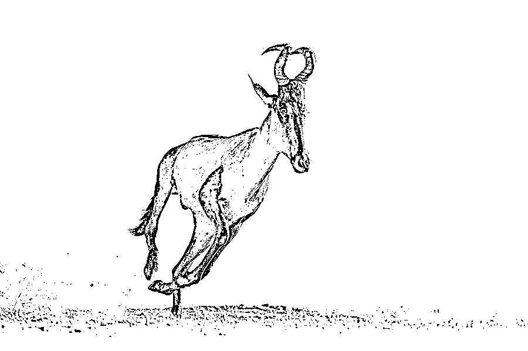

**同样，行星的星座构成了三阶段动机序列的最后一个阶段。**第一阶段是意识到表达需求的**情感**，然后是为满足需求而**以某种方式行事的冲动**。第三阶段是**为必要的行动确定具体目标**。这个行为目标——外在回报——是由行星所在的星座决定的。

想象一下，一个人感到好奇，因此意识到对信息的需求（双子座）。他水星的学习功能被激活了。但他好奇的是什么呢？他想学什么？如果水星在天蝎座，他可能对性、死亡、犯罪或权力的阴谋感到好奇。然后他带着这个目标行动起来，选择阅读连环杀手泰德·邦迪的传记，因为其中性，死亡，犯罪和权力的主题可能非常明显。如果阅读邦迪的传记满足了他的学习欲望，那么行为序列就会终止。

注意，水星所在的天蝎座象征着这个序列的行为目标：阅读邦迪的传记来满足他对天蝎座式信息的渴望。如果目标状态没有得到满足，也就是说，如果他觉得没有得到足够的信息，他将为水星建立另一个行为目标。

**无论他选择学习什么，都极有可能与天蝎座的水星相吻合**。或许他会着手调查全球恐怖主义、性交易或企业腐败，所有这些都是天蝎座的话题。

**行星行动的目标并不总是与其所在的星座相关。**一个人可能有火星在双子座，并且为保护挚爱之人而争斗，这与双子座无关。在这种情况下，**星座位置仅仅描述了行星的行为风格。**双子座的火星可能会为了挺身保护爱人，在口头上痛斥冒犯者！虽然一个行星的行为并不局限于其星座位置所象征的目标，**星座位置往往会为该行星确立一个主要的主题或兴趣领域。**

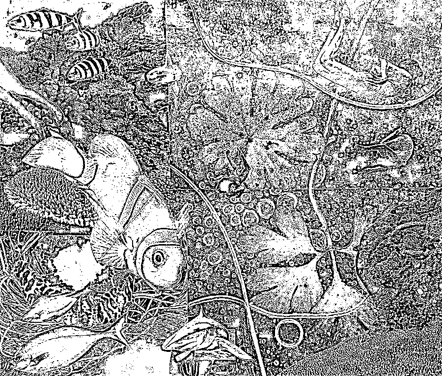

**特朗普为什么如此“疯狂”？**

**在考虑到行星所在的星座时，同时描述风格和目标会带来更完整、更细致的解释。**

例如，唐纳德·特朗普**狮子座的火星和狮子座的上升点合相，因此火星显得尤为突出。**无论落入哪个星座，火星在上升点就像给火星打了兴奋剂。火星狮子座在上升点就像漫威漫画中的超级英雄钢铁侠，或是从大炮里射出来的马戏团演员。无畏而有趣，但过于夸张，反而有点可笑！

如果我们拆解这个配置，就会清楚为什么这些因此的组合如此不同寻常，虽然出奇地管用。**上升点在星图中起着火星点的作用。**它就像一个火箭准备就绪的发射台（上升星座）；所以，**火星在上升点实际上是双倍的火星能量，**就像一个有超大载重的巨型火箭。

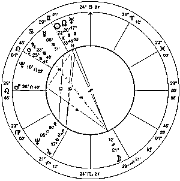

**| **特朗普出生星图（1946.6.14 上午 10 点 54 分，牙买加区，纽约市）

**作为火象星座白羊座的守护星，火星是冲动的、自主的且好斗的。**这一点在特朗普高亢的、充满活力的个性中显而易见。说明白些就是，他是一个鲁莽、厚颜无耻、咄咄逼人、不屈不挠且不断行动的人。特朗普的精力过人，每晚只需要睡四小时。

此外，他极度独立，以事无巨细地管理项目而闻名。作为一个典型的企业家，特朗普自力更生、独断专行、直觉敏锐，他相信自己的直觉，不会听从专家的建议。特朗普一直是个快乐的战士，他在各个方面步步紧逼，以致于四面受困，甚至和自己党派的成员都打过仗。**所有这一切都符合火星在上升点的情况，无关星座。**

**如果我们在这个组合中再加入火象星座狮子座，特朗普就会更加引人注目。**火象星座的火星在上升点将是无法抑制的，就像一个开足马力的火车头沿着轨道飞驰而下。**火星象征着一系列行动：发起、主张、宣布、竞争和战斗。**同样，它所在的星座回答了“怎么做？”的问题。**火星狮子座自信地主张，激烈地竞争，英勇地战斗！**

人们很容易把特朗普夸张的公众形象误认为仅仅是在表达狮子座的特质，**但这没有抓住重点。**火星会激发、鼓励和表现出侵略性，让狮子座的特质在他的性格中非常突出。特朗普不仅仅是上升点在狮子座，他的狮子座还是从一门上升的大炮里发射出来的。他是咄咄逼人的狮子座，他是钢铁侠般的狮子座。既没有自我审查，也不是深谋远虑，它是不自觉且自发的。当他彰显自己，并且坚持他必须这么做的时候，那是炫耀的、有趣的、好玩的、魅力非凡且极度自信的。

**简而言之，特朗普无法控制自己，他就是这样一个人。**

当然，**特朗普火星的目标与风格有关。**特朗普主张的是什么？狮子座再次回答了这个问题。要理解这一点，我们必须明白狮子座的一切都可以归结为确认和巩固自我认同的需求，以及建立自尊的需求。所有狮子座人的行为都服从于这些目的。

实际上，**特朗普所主张的是他的意志、骄傲和身份。**一时的目标可能会改变，**但归根结底都是这个基本需求：特朗普宣告特朗普，也就他的身份是一个有价值的人。**

开车绕着纽约市转一圈，你会发现特朗普的名字随处可见：特朗普大楼、特朗普国际酒店、特朗普广场、特朗普世界大厦、特朗普大厦、特朗普公园大道、特朗普 Soho、特朗普高尔夫球场等等。而这仅仅是在纽约。

**火星/上升点原型与出生、从零开始和新的起点有关。**在包括公司、组织和其他实体的创立。**同样，火星在狮子座的特朗普创立了他自己，即一遍又一遍地宣告着他的品牌。**特朗普推出的以他名字命名的事物几乎不计其数，特朗普大厦、酒店、赌场、度假村、高尔夫球场、广场、酒厂、餐厅、杂志、书籍、电视和广播节目、游戏、航空公司、服饰品牌、学校等等。

在大多数的这些类别中，特朗普拥有的不只是一个品牌，而是多个。他拥有 17 个高尔夫球场、9 座特朗普大厦、6 个娱乐度假村、6 家国际酒店、4 座特朗普广场、4 个图书公司等等。**如果白羊座—火星原型与播种有关，**那么特朗普已经把种子播撒到了全世界，他已经成为地球上最著名的人。

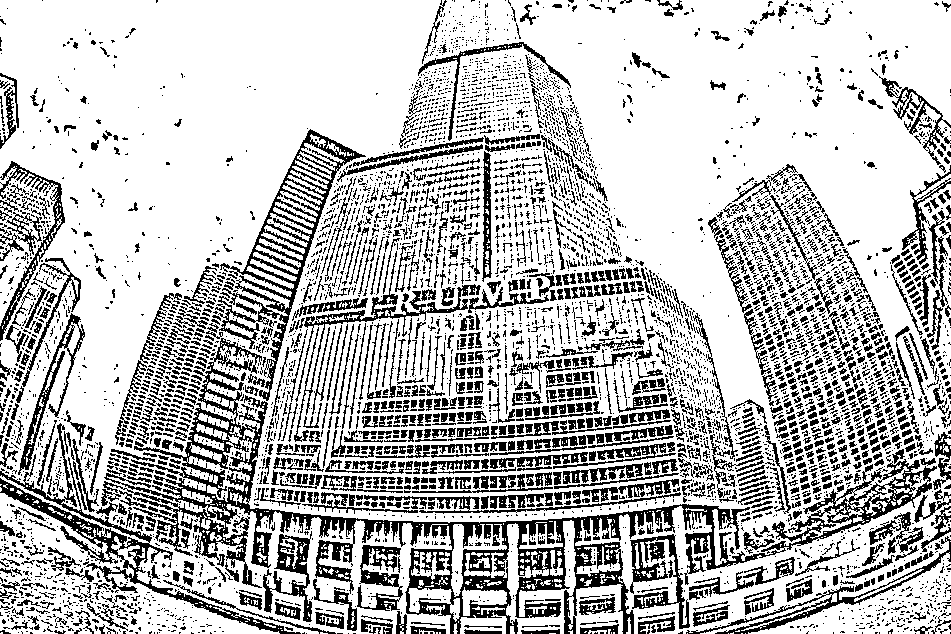

**作为与玩耍、游戏和运动相关的原型，狮子座的一切都是为了赢。**赢意味着赢得芳心，从交易中获利，在竞争中胜出，夺得奖杯，成为明星，在聚光灯下看到你的名字！这没有什么错，事实上，我们为它庆祝。然而，**如果过分追求胜利，人们会怀疑这是自恋情结，**就好像这个人在过度补偿某些内在缺陷。

特朗普的自恋如此张扬，以至于人们等着他随时泄气。**在病态自恋中，自信是一种补偿。**人的膨胀是为了抵御内心的空虚和无价值感，就像一个画上笑脸的大气球，其实里面没有任何实质的东西。一旦虚假的骄傲被戳穿，伎俩就会瓦解，自恋者就会自我毁灭。

**多年来，他一直是我认为的自恋型人格障碍的典型代表。**后来他成为了总统。自那以后，在左翼媒体无情的连番攻击下，他时时刻刻遭受着名誉诋毁，他的政治对手不断地诽谤和调查他。根据穆勒和霍洛维茨的报道，司法部对他发起了不实指控和暗中破坏，蓄谋破坏他的总统职位。然而，如果对他有任何影响的话，只会让他变得更强大。

这迫使我重新评估我最初的评价。有没有可能我们看到的不是传统意义上的自恋，而是某种类似自恋，但又有别于病态自恋的东西呢？**凭借一种真诚的过度自信，再加上一种不受约束的本能，来主张自己的价值。**这与火星狮子座在上升点相一致。虽然他夸夸其谈、自我膨胀的风格可能并不赏心悦目，但也不一定是病态的。

**真正的自恋不仅仅是一组令人讨厌的特质，更是一种由内在匮乏和外在显现所共同定义的人格结构。**特朗普更像是一只劲量兔（劲量电池广告中的兔子），不管他被打击多少次，他都不停地前进。作为总统，他表现出了非凡的韧性。他一生的成就不言自明，即使动静大得惹人厌烦。

还有一件事让我怀疑特朗普是否真的自恋。他是个矛盾的人，一方面，特朗普似乎过分关注自己的形象和人气；另一方面，他非常独立而且无拘无束，经常说一些政治上不正确的东西，肯定会冒犯别人。

在真正的自恋中，自我认同（太阳）被夸大了，过度地补偿了内心的缺陷，这种缺陷使自恋者暗自担心自己的渺小、不重要和可有可无。通过激发、加强和渲染更有侵略性的、狮子座的自我推销倾向，上升点的狮子座火星模拟了自恋的表象；**然而，这种表达并不是补偿。**

**这是狮子座突然爆发出的力量，如同压力下的喷泉，是一种纯粹创造力的源泉，真实的东西都在内部。**

**特朗普不在乎别人怎么想，他要做真实的自己，做他认为正确的事，不管多么不受欢迎，他会继续这样做。**当受到挑战时，他会严词辩护，并且猛烈反击。**但这就是火星狮子座**，不屈不挠的国王捍卫他的荣誉。特朗普自己说得好：“我唯一有点弱的就是我的个性，但谁在乎呢？”

我们需要记住，**火星的行为总是为了满足对自主、自由和生存的动机需求。火星所在的星座象征着它的行动风格和行为目标，但两者都是为了肯定自己存在的权利。**

特朗普的火星就是一个很好的例子。他以一种以自我为中心的戏剧性方式彰显自我，并且不断地彰显他的品牌——他的名字、形象和骄傲，仿佛他的生命就依赖于此。对他来说，也许确实如此。**这就是占星学的美妙之处，它能提升我们的同理心，让我们换位思考。**

**版权声明：**本文由若道翻译发布，欢迎转发，反对抄袭。友号转载请申请白名单。

**格伦·佩里**

若道签约老师，著名占星师，前 ISAR 董事会成员，共出版 8 本占星著作；心理/意识研究专业博士；占星心理学学院（Academy of AstroPsychology）的创办人；康涅狄格州研究生院（the Graduate Institute of Connecticut）原型宇宙学与意识进化项目的负责人。

**ISAR 选修课，咨询技巧全攻略**

**长按图片二维码咨询客服**

**微信又双叒叕改版啦，不想错过若道君的推送？**

**就把若道设为星标吧！**

**▼**

**就是这个“在看”，戳戳戳 ☟**

********报名直达入口********

# 这颗“浪漫无私”的行星，在 12 星座和 12 宫位会带来什么“灵感”体验？

> 原文：[`mp.weixin.qq.com/s?__biz=MzA5NjA0NTAxNg==&mid=2651444079&idx=1&sn=734b9cb4c8c7a9906f8d8cf0ce7824c2&chksm=8b4b61d8bc3ce8ce6623f59fa561e1cbab46246309266222dfb60bd6d35ddf011ce3eb5a171f&scene=126&sessionid=1692737994#rd`](http://mp.weixin.qq.com/s?__biz=MzA5NjA0NTAxNg==&mid=2651444079&idx=1&sn=734b9cb4c8c7a9906f8d8cf0ce7824c2&chksm=8b4b61d8bc3ce8ce6623f59fa561e1cbab46246309266222dfb60bd6d35ddf011ce3eb5a171f&scene=126&sessionid=1692737994#rd)

******☆ ****后台回复“今日”，给你一句生命态度******

来源/astrotheme.com
译者/Chang 校对/Leisha 编辑/翀子 封面/书君 图片/网络五一假期刚结束，大家都要返回工作状态，怎么样？是不是有点晕晕的，需要调整一下？我们可以体验一下被“海王星”撞了一下腰的感受。海王星是高八度的金星，它的特质是与外界融为一体并放大感情系统，由于它的运行速度比较慢，所以它在星图中所处的宫位更值得讨论，描述了灵感和自我放纵的领域。让我们看看海王星在 12 宫位和 12 星座都带有哪些含义吧~
**海王星的特质**

海王星，土星轨道外的第二颗行星。它不像天王星那样令人着迷，天王星是一颗爆炸性的行星，而且被当作典型。海王星相反，**是双鱼座的形象，非常难以捉摸、难以理解。**

海王星也像天王星一样运行缓慢，比天王星还要慢一倍，因为它绕黄道带一圈需要约 164 年。**因此，出生星图中的海王星更多是集体性的符号，除非它和一个敏感点有联系，**比如与四轴或某颗个人行星形成相位，或者它是上升点、中天或星群的守护星。

**海王星是湿润的、情绪化的、缓慢的、寻求共识的，**而天王星是干燥的、理性的、迅速的、残酷的。**不论海王星落在哪里，它将接触到的一切都模糊了，**不管是行星还是出生星图的宫位都类似。

海王星的模糊不是这样负面，而且它影响力的表现方式取决于星图的其他部分以及所形成相位的特性。确实，**这颗行星的特质就是要融化、与外界融为一体，并且放大整个人类感情系统，这会带来一些财富，**比如灵感、丰富的想象力、同理心、慈悲、自我牺牲、情感的强度，以及依靠梦想、灵性和信念来生活的可能性。**但是它也表明了危险，**比如依赖性、恐惧、“易受影响”、脆弱、逃避、健忘、困惑、欺骗、歪曲、神经症、幻觉、绝望。

**海王星增加一个人的感受性，既可能是优势，同样也可能是失望。海王星位于哪个星座并不那么重要，**这一点比天王星更甚。**宫位才有意义。**

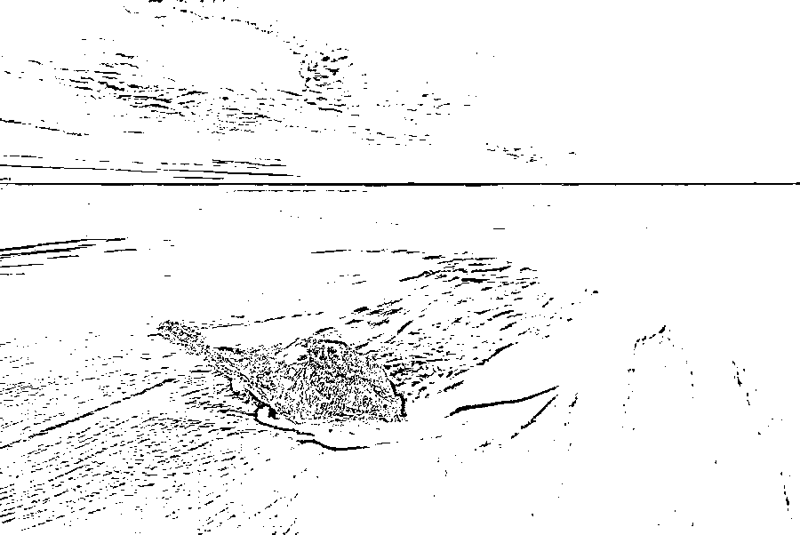

比如，海王星在第二宫，那么这个人不想照管财务收益这类问题，这类问题处于一种模糊和近似的状态中。海王星合相上升点可能带来某种程度的无意识——对自己的行动可能对他人产生的后果无意识。尽管另一方面，这个人感觉到和整个世界都绝妙地融为了一体。

**海王星是高八度的金星，让人可以通过情感和感官理解到非常深刻的程度，**通灵者和其他先知普遍被认为是从这颗行星直接获得他们的天赋。同样的道理也适用于神秘主义者和宗教人士。

**水星（智力）与海王星（灵感）的良好组合**，通常赋予人某种洞察力或第六感。**月亮—海王星组合**也个性鲜明，把人变成移动的情感雷达，碰到一件极小的事都能泪流满面或点燃热情。

**海王星是浪漫主义与无私的行星**、接受与敏感的行星、灵感与想象的行星，同样是神秘与随之而来的魅力的行星。**但同时它也是毒品、成瘾、消极状态、焦虑、诈骗、骄奢淫逸和自我放纵的行星。**

在性与浪漫的领域，海王星不像天王星那样被当作典型，天王星代表了枯燥和理性。海王星更多是欣然接受，而不是去激怒，并且总是通过间接的方式发挥其影响力。

**海王星会为其所在的出生星图领域创造出一种迷雾般的氛围，**原因或好或坏。因此，充满激情的浪漫（其中性与感受紧密缠绕在一起），或者仅仅存在于想象中的爱情故事，都可以冲昏此人的头脑。

**很多时候，艺术家的星图中有很强的海王星。具体特性由它在星图中的位置和与其他行星所形成的相位所决定，**决定了这个人工作的方向。比如，海王星与一个发光体形成紧张相位，最有可能让艺术家的创造性带有苦难和忧郁的气质，然而与水星的柔和相位则带有一种智力的甚至是神秘的面向。

**金星和海王星的区别究竟是什么？**确实，尽管两颗行星都是感性的，它们的区别却很大。**金星努力去取悦，**并且决定了一种特定的爱的方式，**然而海王星不带任何“指令”地创造出情绪和感受。**

海王星更多是关于情感包裹的，对于一个特定的决定或行为没有直接的影响。**海王星的同义词是放任和与世界融合，金星的同义词是爱与引诱的需求。**只有当金星位于第十二宫或者双鱼座的时候，她的本质才变得和海王星相似。

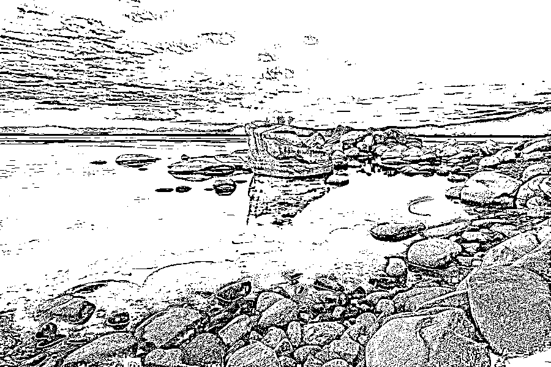

我们很难弄清楚海王星的影响，这是这颗行星固有的特性。由于**海王星传达了某种程度的神秘性，**因此它无法帮助到占星师的工作。在预测分析中，海王星的影响通常先被抑制，然后逐渐渗透，开始于一种高涨的情绪状态，或者相反，始于一种逐渐增长的厌恶或感觉有什么不对，即使在实际事件中通常没有什么能解释这种感觉。

有时候，一次海王星行进被看成是“没有事件”。没有任何实质性的事情发生，但是内在，有一场真正的狂风暴雨在肆虐。海王星移动缓慢而深刻，去影响这个人。类似海水，**通过连续的波浪，随着时间的推移，海王星成功地改变了这个人，**或者让他根据他被驱使进入的情绪状态行事。 

要记得，海王星很慢，非常慢，**它要花约 14 年时间才能穿过一个宫位或一个星座。**此外，**当它形成合相时，这一相位的影响有时会持续两年或两年半。**

这篇文章论述了我们所有人身上的灵感和自我放纵的部分。**海王星的宫位显示它的影响在哪个生命领域被感受到。**海王星所在的星座位置并不重要，因为对于这些出生相隔几月或几年的人，移动缓慢的行星都处于同一个星座。然而，**星座位置会给海王星的影响沾染一些气息。**我们下面提供更多信息。

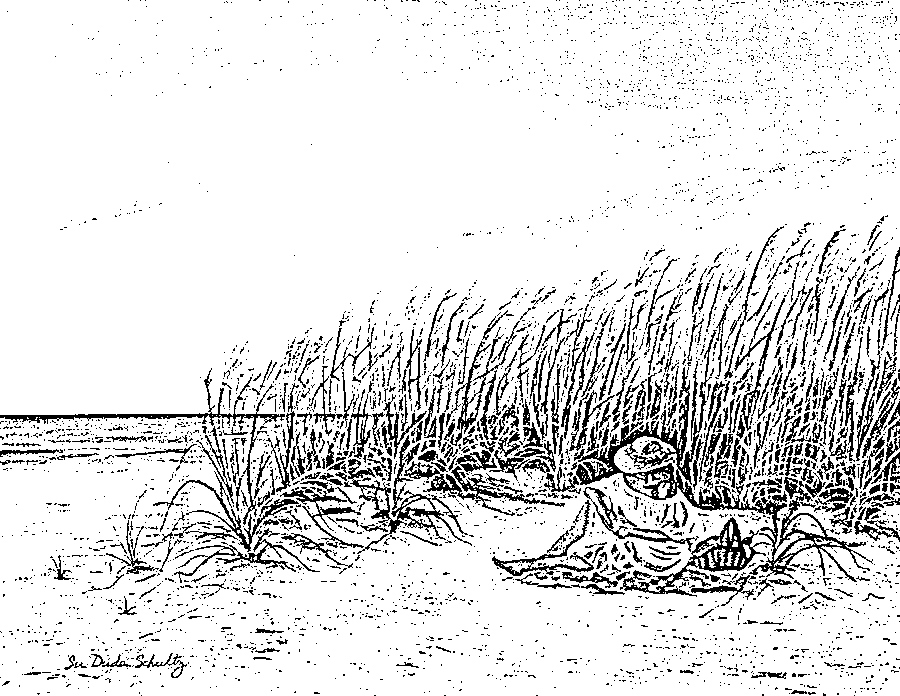

**海王星在 12 宫位**

提醒

这里提供的信息的重要性，取决于海王星是否和你出生星图中的个人点有关联，比如个人行星、四轴，或者它是否是某个特殊格局的一部分。

**若道君：****你可以在 app store 或者应用商店搜索“若道”下载 app，输入个人档案，查看本命盘（也可以使用其他星图软件），找到海王星符号，然后看该符号落在出生星图的第几宫，对照下文查看。**

**例如下图中，美国总统拜登个人星图的海王星落在第 10 宫。**

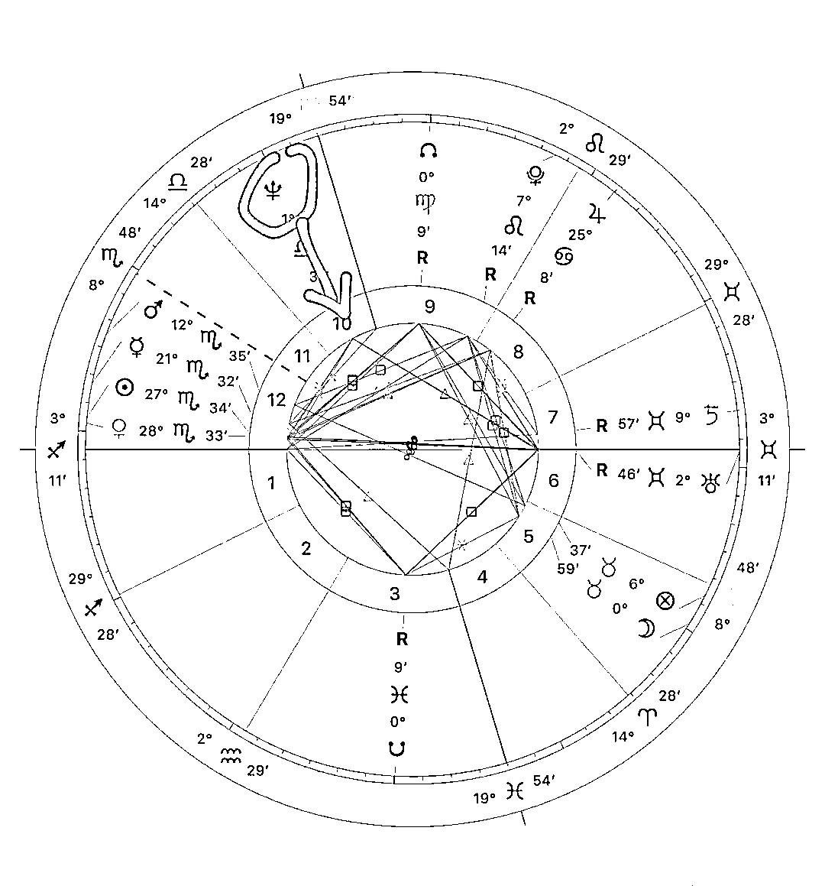

**1****海王星在第一宫** 

**你非常敏感和具有直觉，你有丰富的想象力。**你对其他人来说可能显得神秘莫测，其实对你自己来说也是如此。你可能并不知道自己的行动可能造成怎样的后果，因为你沉浸在一种模糊的印象中，与物质世界隔绝。

你的行为举止可能出人意料，因为**你的第六感非常发达，**以至于你可能会采取完全不同的态度，而且**你对事物拥有超出普通人理解范围的敏锐觉知****，**这会让你周围的人感到惊奇。

你对也许不得体或违反道德标准的新体验感兴趣，仅仅为了好玩，并且由于一定程度的粗心……你感觉到你是超越法律和规则的，并且**你的情绪主义可能让你做出过分的事。**

**2****海王星在第二宫** 

你与金钱的关系尤其模糊。**你倾向于避免分析自己的财产资源，**就好像这个话题既不重要也不真实。**你属于永远不知道自己的银行账户和钱包里有多少钱的那类人。**

这一点的积极之处在于，**如果你有很强的第六感，你就能比别人更容易做成合算的买卖**……它可能是某种蒙住眼睛碰到的幸运，尽管实在有着失去很多并且被骗的危险。

**注意不要跨过法律的边界，**以免某一天你在财务方面的粗心大意让你陷入大麻烦。如果损失了第六感帮你获得的钱财，那真的很遗憾。

**3****海王星在第三宫** 

**你思考和交流的方式，以及你对行程的组织，非常情绪化、敏感，并且缺乏严谨性。**另一方面，**你能够直接“感知”事物。**你的头脑在分析能力方面所失去的，在综合能力方面赚了回来。

你有着放荡不羁的想法，**看待事物的方式也非常灵活。**当你做白日梦和沉浸于自己的情感中时，你可能会和现实切断联系并失去重要的关系！**不要逃跑，不要说谎话****，**利用这一相位最好的方面：**直觉与灵感。**

**4****海王星在第四宫** 

**你感知的童年家庭或父亲的形象，非常模糊，**但你在这些领域的情感非常强烈。**你在家中极需要感觉舒适，**因为不然的话，你会想象只存在于你头脑中的恐怖景象。

在你的出身或者房产方面，你可能遇到复杂情况、理解的缺失或神秘事件。不论如何，**对你来说很难分辨你什么时候“在家”**，并且，即使全都很好的时候，你也倾向于**理想化自己的家庭。**

**5****海王星在第五宫** 

这个令人愉快的组合可能会**放大你的风流韵事和你的创造力，**并让这些事务染上**浪漫和奇趣的色彩。**如果你是一位艺术家，你经常感觉受到爱和情绪冲动的鼓舞，甚至忘乎所以。

你生活中的这个领域是强烈的，因此，你比其他人更加脆弱。需要由你自己去理清楚，**一方面是你积极的、创造性的影响力，另一方面是由于沮丧事件而导致的你不成比例的反应。**

你一定要知道，**你容易陷入爱情的妄想中。**然而，当一切都顺利的时候，你也有权享受爱情里最好的那部分。**在娱乐的领域，以及与孩子的关系的领域，你很容易受到影响，**并且你更多地跟随自己的直觉而不是理性的头脑；相当情绪化而不理智。

**6****海王星在第六宫** 

你对待日常生活的态度和在工作环境中的举止，有些古里古怪，**只遵守一条法则：你当下的情绪或感受！**

尽管这可能对你自己的条理性不利，但它也为你赋予了一些特质，如**容易相处、乐于助人，并且随时准备好协助你认为是好人的人。**

你的健康状况非常脆弱，如果情绪的方面令人不满意，**你可能会将自己的情绪转移到身体层面，**比如，你可能受到过敏的困扰，或其他难以辨识的问题。

**7****海王星在第七宫** 

在人际关系的领域，你的态度可能有些暧昧不清。**你倾向于理想化自己的伴侣**，并且你可能很容易被影响，而且当你估量自己的人际关系的价值时非常不理智。但是，当时机来到，你表现出令人钦佩的直觉力，**你的第六感“认出了”你未来的伴侣。**

在人际关系领域你可能有点软弱、容易受骗并且易受伤害。由于存在被欺骗的危险，**你必须运用理智，避免和所遇之人有关的陷阱，不管他们给你留下多么甜美而令人迷惑的印象。**

在与人的一般关系中，尽量不要太散漫随意。**如果你作出太多牺牲，如果你拒绝面对真相，你可能会经历巨大的损失**；在作出承诺前尽量先退后一步，甚至是……结婚之前！这样，你就可以从这一配置的积极方面受益。

**8****海王星在第八宫** 

**在以下领域中存在着某种形式的困惑或模糊的认知**：性、投资、继承，以及一般而言，别人的财务和不是自己赚来的钱。

**你有天赋发出心灵深处的声音，能感受到别人的动机，**并且以一种敏感的、情感的、非理性的方式彻底地理解人们的行为模式。

这种配置**既可能带来财富，也可能带来背信弃义。**在**投资和金融方面**，信任任何人之前都要非常谨慎。

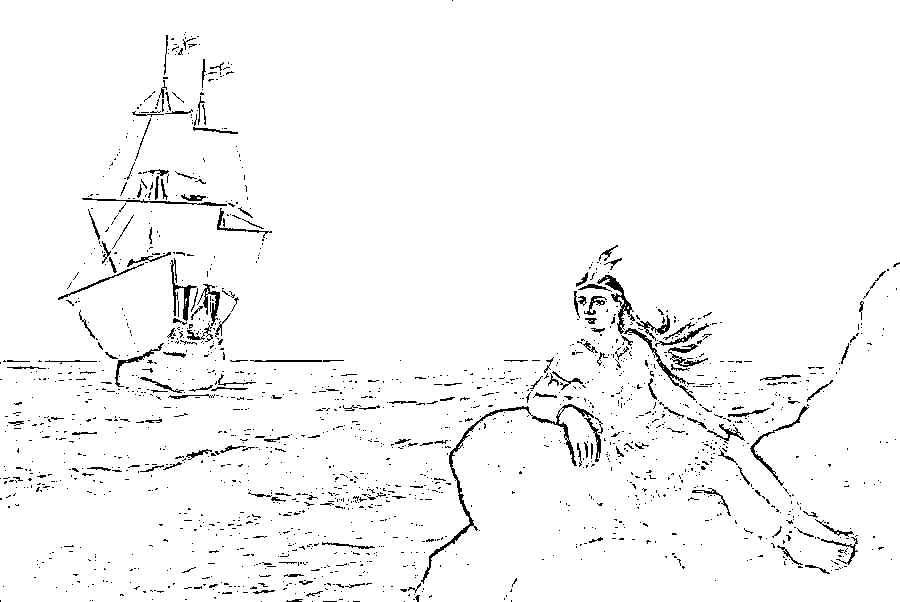

**9****海王星在第九宫** 

**你的灵感来源于你对政治、哲学，**以及一般来说，**对更高的知识和抽象的事物上的概念和想法。**但与此同时，你的大脑在这些领域有点混乱和没有条理。

遥远的土地、逃避，从字面上(长途旅行)或比喻上(更高的知识)给你一种困惑的感觉，关于无限、关于与整个世界的融合互通；危险是你可能会迷失方向。旅行时一定要小心谨慎，**在处理大的概念和理想时要尽量后退一步**，以免误入歧途。

有一种**强烈的理想化倾向**，同时伴随着许多才能和许多危险。

**10****海王星在第十宫** 

这个配置表明了一个显著的可能性，**你的职业命运——甚至你的总体命运——是与超越你个人的集体活动联系在一起。**集体活动可能是你赢得指挥棒的好机会。

潮流或者集体思想对你的渗透，可能会影响你的自信，通常是因为**你对“时代精神”非常敏感。**硬币的另一面是，你可能只是集体理想的一个代表，或是它的受害者，陷入丑闻或遭受欺骗。

你很喜欢音乐、喜剧等任何可以让你满足情感欲望、**与外界和观众融为一体的事物。**

**11****海王星在第十一宫** 

一旦你身处一个团队中或者参与了一个项目，你的态度就会变得很奇怪。你不会坚持自己的主张、让自己与众不同，而是**努力完全融入群体，因为你不打算给人留下深刻印象或被区分开来。**危险可能是**失去自己的身份**，或受到群体或群体某个成员（你的朋友）的欺负和欺骗。

一般来说，由于你的感觉和强烈的直觉，**你能够很好地融入到群体中，并在群体环境中慢慢获得自信。**

这同样适用于你的友谊生活。你倾向于融合，完全投入，根据朋友的个性灵活地调整自己。然而，**你很难捍卫自我****，**可能会被错误地认为缺乏信念，尽管你不是一个软弱的人。

**12****海王星在第十二宫** 

**你可能对其他人的苦难尤为敏感，并且想要为人道主义事业献身。**你的精神生活可能是如此激烈，以至于为你带来**孤独的时刻**，你用这些时刻来改变自己，在纯粹的真诚中依靠理想来生活。

这些独处的时刻可能会让你苦恼。在极少数情况下，不明确的担忧或隐藏的敌人可能会造成麻烦。

在任何情况下，这个配置都不是那么负面，因为海王星与第十二宫和双鱼座之间存在相似性。你的同情心和情感满足可能会在你的周围创造奇迹，同时，**它们使你在精神上进化。**

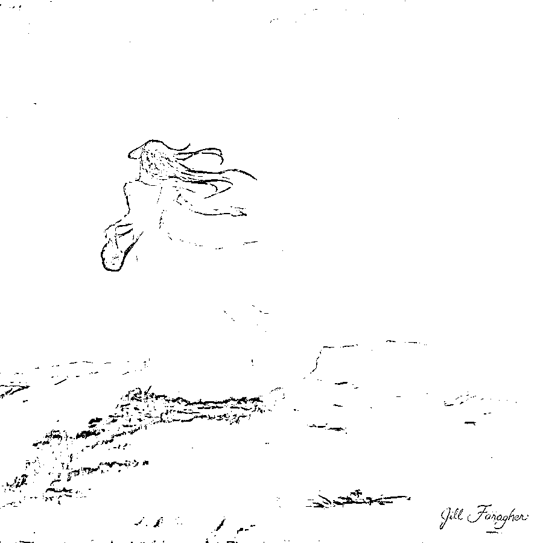

**海王星在 12 个星座****1****海王星在白羊座**

这颗代表溶解、愉悦和交融的行星，在这个个人主义的星座，有时会**给你冲动的行为增加理想主义甚至乌托邦的一面。**

**2****海王星在金牛座**

**你在攫取物质和感官欲望层面**可能变得模糊和无边无沿，它们可能矛盾地减少你的占有本能。

**3****海王星在双子座**

你的想法通常带着一丝敏感与强烈的灵感。

**4****海王星在巨蟹座**

你的灵感和想象力在这个富饶、怀旧的星座里得到了极大的放大。因此，你可能和你的家人很亲近。由于海王星在巨蟹座被看作擢升，这一配置**非常有利于你的情感生活。**

**5****海王星在狮子座**

你强烈的情感生活可能会服务于你的**创造力**，尤其是在艺术领域。在你生命中的某些时刻，你也可能表现出**很强的理想主义。**

**6****海王星在处女座**

**你想提升自己和工作的意愿是真实的，**但它是**以感觉和情感的形式**表达出来的，而不是有形和精确的决定的形式。你可能觉得有必要逃避现实或放弃你的职业努力。然而，你在任何情况下都应该要鼓起勇气和毅力！

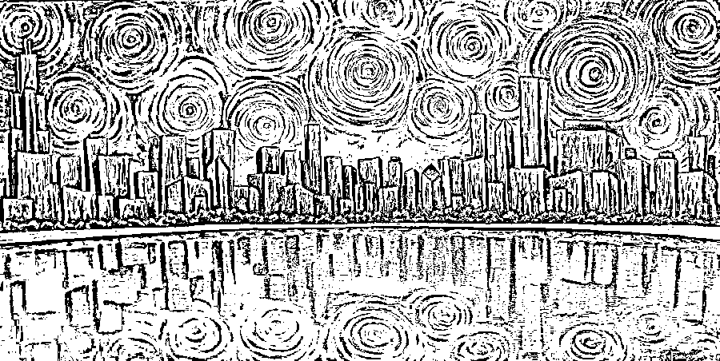

**7****海王星在天秤座**

**你处理人际关系的方式灵活而人性化，**你关心的是达成一个妥协的解决方案。你的艺术生活可能在你人生的某些阶段特别充实。

**8****海王星在天蝎座**

如果你对**神秘和秘密的主题**感兴趣，或者你的活动涉及神秘领域，或者甚至是警察(分析者)，你可能会把这个配置变成一个有价值的才能，因为你的灵感和洞察力非常敏锐。

**9****海王星在射手座**

灵感的行星位于这个**与更高的知识、灵性和道德**相类似的星座，只会是有益的。有一天，这可能会促使你**超越普通的、实际的、世俗的事件。**

**10** **海王星在摩羯座**

这个配置的重要性并不高。你的灵感可能会被引导到**长期项目**中和**政治**中，如果符合你大致的生活背景的话。

**11****海王星在水瓶座**

如果你参与**集体事业、人道主义或科学项目等**，你的灵感很可能使你留下你的印记，并戏剧性地展示你的天赋。

**12** **海王星在双鱼座**

这一美好的配置可能会加深你**天生的同情心**，增加你帮助他人的需求，有时甚至达到为了那些遭受困难的贫苦人民而自我牺牲的程度。

**版权声明：**本文由若道翻译发布，欢迎转发，反对抄袭。友号转载请申请白名单。

**系统学习占星学**

**点击图片了解详情**

**微信又双叒叕改版啦，不想错过若道君的推送？**

**就把若道设为星标吧！**

**▼**

**喜欢记得点一下在看哦☟**

********报名直达入口********

# 插班中 | 如何解读星图要素？这门课程一网打尽

> 原文：[`mp.weixin.qq.com/s?__biz=MzA5NjA0NTAxNg==&mid=2651444079&idx=2&sn=c01e06923629752c7781d12c9df0dde9&chksm=8b4b61d8bc3ce8ce76871f4594127ebff700a2e925a2438be2407f1e19b11d7dbee26d8832bc&scene=126&sessionid=1692737994#rd`](http://mp.weixin.qq.com/s?__biz=MzA5NjA0NTAxNg==&mid=2651444079&idx=2&sn=c01e06923629752c7781d12c9df0dde9&chksm=8b4b61d8bc3ce8ce76871f4594127ebff700a2e925a2438be2407f1e19b11d7dbee26d8832bc&scene=126&sessionid=1692737994#rd)

占星学这门古老的学科，历经了历史长河里的起起伏伏，也直面了现代科学的质疑与探索，依旧陪伴在我们身边。时至今日没有消亡，反而以不同的方式进入现代人的生活，述说着时代的语言，疗愈现代人的心灵。

占星学是一种符号语言，它为宇宙无形的力量穿上了意象的外衣。这使我们可以与不可见的世界交流，将不可见变为可见。

由此，它提供了一面镜子，在这面镜子中，个体经验被看做是更大模式的一部分。占星学核心的生命理念是：在我们居住的宇宙中，万事万物都相互关联、生机勃勃，我们是这个宇宙的参与者。我们常说占星学是一种个人成长的工具， 如何运用占星学来实现自我成长呢？

**1. 占星学可以帮助我们了解自己的天赋与潜能**

非常喜欢的格言是：“性格即命运。”个体的智力和才华有着丰富的类型，有的人的天赋显而易见，比如擅长绘画、写作、运动或者歌唱；有的人的天赋需要更长的时间来探索和接纳，比如善于倾听、善于交流或者善于带动气氛等等。占星学可以帮助你认识自我，找到人生的养份。 

学习占星学还可以让我们慢慢养成随时保持“觉知”的习惯，每时每刻知道自己是谁，在哪里，在做什么。遇到问题时不是去质问结果，而是去寻找根源，发现和开发自己的潜能。

**每个人都有自己独一无二的潜质、能力和局限。我们通过选择获得权力。而占星学是帮助我们了解这些信息的工具。**

**2.占星学可以帮助我们了解人生的轨迹**

**占星学能够帮我们迅速发现成长过程中形成的思维模式和行为模式。**

客户在咨询结束后会对占星师说，感觉你是心理医生，和你聊一聊，心情就好了很多。如果没有星图的帮助，单纯只是心理咨询，可能我们需要花上更多的时间才能发现问题的根源。有了星图的帮助，我们可以很快地知道，我们的人生在哪里出了问题，我们可以如何去改进，从而过好我们的人生。

**占星学能够帮助我们了解人生的轨迹。**透过一张出生星图，我们可以看到个人生命循环模式，以及外行星在人的一生中可能带来的生命挑战和转机。

通过对人生不同阶段行进的把握，我们可以提升自我觉察，知道什么时候该进、什么时候该退、什么时候该抓住、什么时候该放手。人生漫长，与其盲目地、惴惴不安地前行，不如把握住生命的节奏，安然过好每一天。

**3. 占星学能够帮助我们抓住时机**

我们经常听到“时机就是一切”的说法。如果能知道当下正处于一个周期的哪个阶段，这对我们是非常有利的。机会来来去去，除非我们伸手抓住它们，否则它们只会擦身而过。如果我们能更充分地理解我们通往本真、成为真我的旅程，我们将获益良多。而占星学的符号语言正是帮助我们选择在对的时间做对的事的一个工具。

**4. 占星学可以帮助我们更有效地面对人生**

**占星学能够帮助我们更有效地过好一生。**了解自己的天赋，把握生命的轨道，可以让我们不再盲目和急躁。我们不会在坏情绪里面浪费时间，不会去做无用功。

**我们知道顺境和逆境都会在某个周期结束的时候停止。**我们也会知道让我们摔跤的模式是什么，从而在下一个周期来临的时候做好准备。我们不会在同一个坑里跌倒无数次，在命运的滚滚车轮下头破血流，还负隅顽抗。我们对于挫折和机会更有觉知，而不是在自怨自艾中虚度一生，或者在得意忘形中浪掷时光。就像苏·汤普金斯老师的著作《顺逆皆宜的人生》一样，享受顺逆皆宜的时光。

**5. 占星学可以帮助我们理解和接纳生活**

**占星学可以帮助我们更加宽容地对待他人和世界。了解个体的差异性可以帮助我们消除偏见。**

每个人都是带着自己既有的性格特点和思维行为模式出生，从星图上能看出我们的父母是如何对待我们的，我们的成长环境、我们的情感特质、我们和他人的互动模式、我们的事业路径、我们人生路上会遭遇的困难和挑战。意识到这一点，我们就没有理由迁怒或者归罪于他人和社会。

要知道，是我们自己的特质吸引来了能够帮助我们发现问题、解决问题的人和事。越是讨厌的人和讨厌的事情，越像一面镜子，能够照亮我们心底隐藏的阴暗面。而我们能不能经由这些获得成长，就要看我们是否有勇气去接纳和面对它们。

这就是占星学为什么有价值的原因。因为它能帮助我们互相理解。它让我们感到快乐，因为我们认出了自己，感觉到被理解。我们更能理解我们的朋友了；我们也更能理解我们的生活了。**通过这种接纳和快乐的感觉，我们就更能敞开心扉去拥抱生活。如果你对生活更加敞开，就更能创造一个更有成就感和满足感的生活。**

**6. 占星学可以帮助我们不断拓展认知边界**

占星学是很棒的意识进化工具。它的原型概念覆盖了头脑能理解的各个层面，它的体系完整又开放，使它可以和其他东西方知识体系中的内容相融合。它帮助我建立起一个意识结构，之后无论现实或书本中的领悟和理解都可以在其中各就其位并有机地互相关联。

**你会在持续的学习占星学的过程中不断地推翻陈旧认知，开拓视野，一再重新认识自己及世界，甚至会改善个人的学习方法。**

**7. 占星学可以帮助我们联结宇宙，探索灵魂的奥秘**

**占星学能够帮助我们了解到自己是独一无二的个体，同时也是这个世界的一部分。**

虽然最早的占星学书面记录可以追溯到大约公元前 2000 年的美索不达米亚，但它更深的起源其实可以追随到史前。人类本能地被天空吸引，这不仅表现了宇宙的神秘力量，也揭示了神的智慧与人类生活的各个面向相互影响着。当你默默注视着布满繁星的夜空，很容易升起一种对永恒时间的敬畏感。

发现自己的天赋，贡献自己的力量，这才是完整的循环。给自己和世界之间树立一面高墙，并不能让你变得更有力量，也不会对世界有任何影响，反而会阻碍你去认清世界的真相。**占星学可以帮助我们探索我们的灵魂，和更大的宇宙智慧相连，从而找到自己的人生使命。**

**苏·汤普金斯老师（Sue Tompkins）**

****

**英国目前最资深的占星学家和咨询师之一，她拥有超过 40 年的占星经验，是占星学习者必备的两本圣经《当代占星研究》与《顺逆皆宜的人生》的作者。她还是伦敦占星学院的创始人。****她以自己的冷幽默、抽丝剥茧的研究天分和占星直觉而闻名。她是一名执业占星师，也是一名顺势疗法医师，是心灵和身体的敏锐诊断专家。****2003 年，为表彰其卓越贡献，英国占星协会为苏·汤普金斯授予查尔斯·哈维（Charles Harvey Award）终身成就奖。****咔咔老师（Caroline）**

********

**2017 年第一届苏·汤普金斯核心课金牌助教、2019 年第二届核心课中与苏·汤普金斯老师联合授课的 ISAR 认证占星师咔咔。****作为最熟悉苏·汤普金斯老师教学风格的中文占星老师，咔咔老师将在 2021 年第三届苏·汤普金斯核心课中负责教授部分课程，帮助学员更好地梳理知识架构,了解学员的学习进度和疑问，补充丰富占星咨询的中国案例。**

1

**课程安排是怎样的呢？**

**第*****1*****阶**2021 年 3 月 15 日开课，每周一晚上 20:00-22:00 上课，共 4 次课**第*****2*****阶**2021 年 4 月 12 日开课，每周一晚上 20:00-22:00 上课，共 4 次课**第*****3*****阶**2021 年 6 月 7 日开课，每周一晚上 20:00-22:00 上课，共 15 次课

2

**1-3 阶你将学到什么？**

**第*****1*****阶  黄道星座**

· 概要介绍占星学与星图· 四元素与三形态· 黄道 12 星座

**第*****2*****阶  行星**· 太阳、月亮及其他行星· 练习将它们组合在一起

**第*****3*****阶  宫位、相位以及初步解读星图**· 四轴与宫位· 相位概论· 困难相位· 柔和相位· 数字练习，练习寻找相位· 容许度，出入相位· 相位模式· 将它们全部组合在一起· 解读的基本原则，权重，失衡· 如何解读一张星图……丰富的案例，包括学员的案例

3

**想更多了解导师？**

******苏·汤普金斯（Sue Tompkins）****英国目前最资深的占星学家和咨询师之一，她拥有超过 40 年的占星经验。**占星学习者必备之两本圣经**《当代占星研究》**和**《顺逆皆宜的人生》**作者。2003 年，为表彰其卓越贡献，英国占星协会为苏·汤普金斯授予**查尔斯·哈维终身成就奖**。苏同时是一位接受过心理学与心理咨询训练的注册顺势疗法医师，并经常在英国、法国、挪威、瑞典、澳大利亚等地公开演讲，教授占星学。**苏以实际、生动而幽默的风格闻名于世**，她的教学经验非常丰富，能够胜任从教授入门课程到对毕业生进行督导等针对不同占星程度学员的教学工作，这得益于她多年累积的教学经验。她曾在地方公立学校以及在英国占星研究学院(FAS)教学 19 年， 1986 年-2000 年任学院院长并负责现场教学的所有事务，并于 2000 年创立伦敦占星学院这所声誉卓著的专业学府，并经常在世界各国教学，具有丰富的教学经验。2000 年，英国占星研究学院授予其研究员职位，以表彰她为学院做出的突出贡献。**占星师咔咔（Caroline）**2010 年师从美国占星师大卫·瑞雷学习，并向斯蒂芬·弗里斯特、罗伯特·汉德、苏·汤普金斯等世界名师学习各种占星学技法。若道首届学员，国内最早获得 ISAR 职业占星师资质的职业占星师之一，现兼任若道核心课程助教。在国际知名广告公司和市场研究公司从事的市场研究和推广工作十余年，曾任职于阳狮集团、尼尔森市场研究有限公司、MTV 和《Madame Figaro》杂志。

**助教王嘉祺 （Conrad）**ISAR 认证占星师，具有若道认证生时校正资质，从 2010 年开始学习占星学，2015 年开始在若道系统学习，并开始个案咨询。2018 年担任若道核心课程助教，以及选修课卜卦占星学和太阳返照课程助教，并带领学员进行经世占星学和太阳返照方面的研究。2019 年 11 月作为演讲人之一参加了 ISAR 北京大会，也是 ISAR 星空俱乐部中国区第 16 期的主讲人。

4

**选择若道学习占星学还有哪些优势**

**运用自由意志，扭转破坏性模式，绽放天赋潜能**若道是人本主义占星学的旗手。因为我们相信，**人通过了解模式、觉察习性、积极疗愈、终将释放其潜能，与命运共舞**。

**进入国际权威职业占星师认证的快车道**

占星界的“联合国”ISAR（国际占星研究协会），是具有全世界影响力的占星教学和研究组织和职业占星师全球认证机构，认证占星师遍布 45 个国家。**在 ISAR 的 19 所附属学校中，大中华地区的附属学校只有若道一家**。在国际化的教学理念大纲标准下，**若道毕业生在 ISAR 国际认证占星师的考试通过率多次位居全球首位**。

**十年占星学教育中国本土化教学经验**

**根据中国学生的学习习惯不断优化占星教学体系，让学员学成后更自如地应对本土咨询市场的需求。**学好占星学不仅仅需要邀请一两位老师教学，更需要对教学难点有充分了解，且有持续的教学跟进服务。**10 年来多次核心课程和各种专题课程的教学，让若道非常了解中国学生学习占星学的难点和卡点，合理有效地拆分、提炼课程知识点，同时也积累了丰富的国外老师和中国老师、助教紧密配合以及课程顾问密切配合教学的经验**。若道还专门开发了有助于占星学习的“**若道**”APP，每门课程都设有答疑板块，学员能够方便快捷地提交问题，助教及时答疑解惑和批改作业。**融入中国顶尖的职业占星师群体**若道是中国职业占星师的“黄埔军校”。职业占星师的培养从若道开始，**进入若道，你就走进了中国顶尖的职业占星师群体，和一群志同道合的师兄师姐联谊，获得经验，共同成长**。**多种奖学金支持**为了鼓励学员不因为暂时的经济困难而放弃学习，我们特意设置了各种**技能交换和奖学金**。对于有一技之长的学员，我们推出了**“笔译”、“笔记整理”、“平面设计”、“课本朗读”、“班级服务”**等技能交换项目。

而对于努力学习、出勤率高、完成作业率高的学员，我们设置的**土星奖、木星奖**等各种奖学金在等着你。为了感谢帮助我们推荐学员的老学员们，我们设置了“**老学员推荐奖**”。对于通过问卷提建议，帮助我们提高服务的学员，我们也设置了相应的奖学金。ISAR 中国还设置了国际会议奖学金，符合条件并通过甄选的申请者最高可获取 5000 元奖学金。

当美好的知识遇上奖学金，你可以在学习旅途中直挂云帆，乘风破浪。**开启占星咨询的职业规划和支持**

若道为占星学员搭建了占星问答平台和占星咨询平台，并提供严肃占星学影响力最大的媒体平台，全力为毕业生提供宣传渠道，帮助你吸引和积累咨询生涯初期的种子客户。若道为学员开发了适用于占星学习的“若道”APP，并不断更新完善。

**①  微信平台**若道微信平台作为业内颇具影响力专业平台，为文笔好的若道毕业生提供传播占星学并免费宣传自己的机会。有的学员因为文笔获得众多粉丝喜爱，在 3 年多时间积累起 2000 多人的潜在客户。**②  问答平台**若道问答平台帮助学员接触客户的实际问题，并在毕业前就进行演练答题。自问答平台 2016 年上线运营以来，学员接触到 3200 多个问题， 回答问题最多的学员在问答平台收入达 5 万多元。**③  咨询平台**若道咨询平台是我们为优秀毕业生所搭建的平台，帮助毕业生在自己的咨询拓展之外，用若道提供的平台扩展咨询客户群。自咨询平台 2017 年 8 月上线运营以来，咨询平台共入驻 65 人，收入最高者达 32 万元。此处所列学员收入仅供参考，收入高的学员和其专业水准、努力程度密切相关。若道平台尽其所能将自己定位为辅助学员开展职业生涯的桥梁。**在 10 年的占星教学耕耘后，两位创始人——大卫·瑞雷及蒋颖再次邀请苏·汤普金斯老师开设占星核心课程。**

5

**此次课程适合哪些人？**

*   对占星学感兴趣，想要入门的零基础者
*   占星学小白，但有志成为职业占星师的人
*   有一定占星学基础，但不知道该如何整合星图复杂碎片的人
*   希望成为优秀的占星师，想要借鉴国际大师解读思路并融入自己的体系的人
*   苏·汤普金斯的粉丝，学过占星学，但就是想跟着偶像再学一遍的人
*   走在自我探索和个人成长道路上的人

6

**占星业内推荐**

**苏·汤普金斯的《顺逆皆宜的人生》令人赞叹！苏是一名倍受爱戴的老师，并且任教多年。苏以自己的冷幽默、抽丝剥茧的研究天分和占星直觉而闻名。她是一名执业占星师，也是一名顺势疗法医师，是心灵和身体的敏锐诊断专家。**** ——法国心理占星学协会会长琳恩·贝尔**

7

**苏汤班学员评价**

8

**苏汤老师水瓶座试听课**

（温馨提示：手机请注意流量）

📹 [`v.qq.com/iframe/preview.html?width=500&height=375&auto=0&vid=p3210llaq7f`](https://v.qq.com/iframe/preview.html?width=500&height=375&auto=0&vid=p3210llaq7f)

9

**课程价格**

**L1-3**：13200 元**（联系童老师，获得优惠价）**其他各阶课程单报价格，请咨询课程顾问：童老师（微信：196267205，请备注**“苏·汤普金斯核心课”**）长按二维码添加童老师

10

**授课时间**

**2021 年 3 月 15 日（周一）20:00-22:00 开始，网络课程**

11

**退转课程**

**退款原则请详看《教学协议》，如有疑问请咨询课程顾问**。

****苏·汤普金斯金牌核心课程 L1-L3****

**授课老师：苏·汤普金斯**

**授课时间：**2021 年 3 月 15 日起

**授课方式：**网络课程**，**英文授课，中文翻译

**费用：**13200 元**（联系童老师，获得优惠价）**

**课程负责人：童老师**（微信：196267205，请备注“苏·汤普金斯核心课 L1-L3”）

长按二维码添加课程负责人咨询~

****报名请点击“阅读原文”****

# 青年节快乐！你赶上今年的“内卷”潮了吗？ | 这里有个纾解方法

> 原文：[`mp.weixin.qq.com/s?__biz=MzA5NjA0NTAxNg==&mid=2651444076&idx=1&sn=a51aac88ea3a3822fd261d7323ba8bbe&chksm=8b4b61dbbc3ce8cd67fe507a84061c61ec4bae36b02f821c37a60ed4b6d0618e06781f489779&scene=126&sessionid=1692737994#rd`](http://mp.weixin.qq.com/s?__biz=MzA5NjA0NTAxNg==&mid=2651444076&idx=1&sn=a51aac88ea3a3822fd261d7323ba8bbe&chksm=8b4b61dbbc3ce8cd67fe507a84061c61ec4bae36b02f821c37a60ed4b6d0618e06781f489779&scene=126&sessionid=1692737994#rd)

******************☆ 后台回复“今日”，给你一句生命态度******************

文字整理/懿真 编辑/佳黛

头图制图/书君 图片/全景网

首先，祝大家青年节快乐！你会健康积极地发火吗？其实，发火是必要的，这是一种纾解自身愤怒的印象中，一个人处于愤怒状况，要不是火山爆发，要不就是只能按捺住重重愤怒，自己生闷气，最后导致内伤。其实愤怒是一个正常的情绪，它没那么可怕，也不是一个传统意义上的“有毒”的情绪，它恰恰是健康的，只是缺乏健康的认知。**火星有自己的发挥方式**

**火星拥有自己的议题和意义，火星既是愤怒，又是勇气**。如果没有火星我们就做不了任何事，我们就没有办法划定界限。

**火星是一个勇士**。如果我们将太阳看作是星图中的主帅，那么当我们出去打仗或者和谈的时候，火星很多时候都扮演冲锋陷阵的前锋，**帮助我们面对危险，保证我们能生存，确保我们可以感到安全**。但在中国这个礼仪之邦，可能对于所有人来说，表现出火星都是有些难度的。对于女性来说，则是更有难度。火星在 7 宫的人可能会吸引来一个更直率或者是更鲁莽的伴侣。她自己可能不骂脏话，但是她可能会吸引来一个会骂脏话的伴侣。在这样的过程中，火星在 7 宫的女性，因为她的伴侣展现出来这种火星的意义，慢慢地，她也会吸收这样的特质，她可能从原来不是很容易谈判、很容易抗争的状态，在马路上被人踩一脚、撞一下也不会说什么的状态，成长成为一个关系里的谈判者。首先她可能先与老公谈判：“我们家今年要更换吊灯”。接下来她可能做一种贸易或者交易，与客户进行交易谈判。也可能这样发挥着火星特质。

然而情绪的东西是需要很长的时间去学习。我们再举个火星在巨蟹座姑娘的例子。 

在她很长的生命岁月当中，每当她受到侵犯，比如说小时候做游戏被小朋友攻击，她的身体会出现一个反应。**巨蟹座对应的是胃部**，所以她的体验就是：立即感到胃部非常不舒服。但是她完全没有力量去反抗或者表达，所以慢性胃炎伴随了她很多年。 有一次，一个事件对她有很深刻的冲击。在很久以前的一段恋爱关系当中，当时她与伴侣吵架。她明显感觉到脑子里出现了一些画面。当时很愤怒，感觉情感被欺骗了，她直觉需要有一个很激烈的表达让对方知道她受伤了。她那时的身体感觉已经到了很强烈的程度，但她始终有一个清醒的意识，就是不知道该怎么办。她觉得自己需要去做点什么，她并没有被愤怒和悲伤的情绪淹没，她看到它们了，但又不知道该怎么做。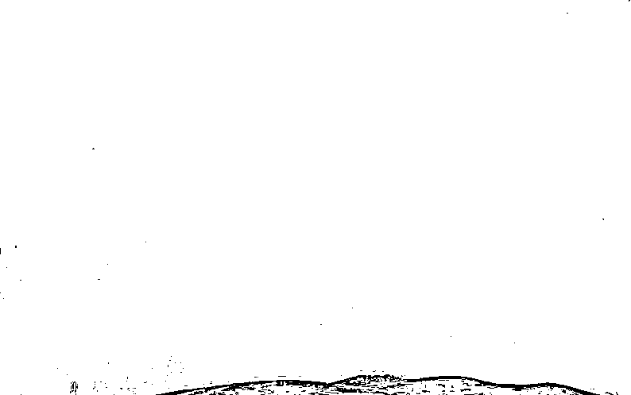于是她做了一个选择，做了一个有点搞笑的事情，模仿电视剧里砸杯子的情节。她拿起一个水晶的酒杯将它砸到地上。整个过程中，她都有另外一个自己在观察自己，这个过程一点都不顺畅。但是当那个杯子砸下去之后，它还是有效果的。后来这个事情过去后，她也不断在做自我探索。那个时候她深刻地意识到，可能于她而言，会有一些优势和特质，但是也会有一些明显弱的部分——就是在**主张自我权力**的时候。

我们都有非常本能和动物性的一面，这一面往往是通过无意识的情绪来体现。当然，它的出现是为了维护我们的生存和需求，但**如果成长过程中我们没有去很好地学习对情绪有正确的认知，以及找到很好的表达途径，那就可能会对生活造成很多困扰**。

**火星也可能变成自我攻击**

**回到之前说的一点，脑中可能不知道自己生气，但是身体是有反应和感知的。**当身体有反应后，比如火星巨蟹座可能会得胃炎，火星在处女座可能是肠炎，火星白羊座可能是头疼……炎症这个东西是发炎、发红，自我攻击性等等。**能量如果没有找到方式发挥出来，就会内化，变成对自己的某种攻击**。

**当火星不能很好地发挥，并且长期处于压抑和挑战状态时，有些人可能会有过敏。**像有一些人会对蛋、奶这些蛋白质过敏，还有阳光过敏，过敏源各种各样。其实**过敏也是火星运作失调的一种表现**，因为它不确定什么东西能够被允许进入到身体里，什么东西是不被允许进入的。当免疫系统要保护自己的时候，可能就将身体以外的东西视定为对身体的进攻者。所以这些会经常出现**非常严重的过敏**。过敏的症状是发红、发炎、发痒，自己会忍不住去挠，这些也是火星的一种象征。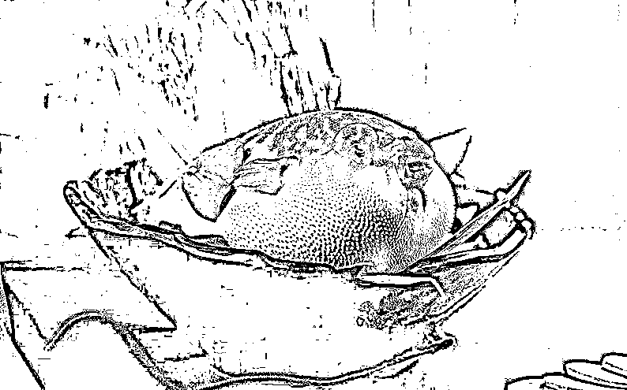**愤怒的时候可以参考这两种对策**当有些人勃然大怒的时候，往往对事件的解读具有一定片面性，并不客观。这就像是我们自己对事件做出的诠释，并不是对方真实的意图。 而有时候，当你生气时，脑中可能会浮现一些对话，不断放大让你生气的事情，就像在给你的怒火加柴。于是越想越生气。**一个比较有建设性的方式，是观察自己因何而生气**。你可以试着去分析和观察，自己总是生气、发生矛盾的状况，你一定会**看见一个相似的模式——你常常会因什么事情而生气**。这里有两种应对愤怒的方式，当你处于愤怒状态的时候，你可以参考一下：❶ 当你处于愤怒状态时，先试着**让念头安静下来**。因为脑海中的那些喋喋不休大多数是为愤怒煽风点火，使思绪变得狭隘，钻进死胡同。接着，当你安静下来之后，试试去**注意你的身体**。也许会觉察到，胃特别堵，或者肩膀特别堵……此时你可以有意增强这个部位的情绪能量，有时候这么做的时候，就会发现这个能量变化了。❷ 另一个方法，当你很生气，或者已经吵起来了，你争取停一下，退后一步想想，**我的需求到底是什么**？这个时候，**你需要把需求想清楚，思考用哪种方式更容易达成你的需求**：“那么现在这种方式（争吵），我是不是能够达成我的需求？还是说我换种方式才能达成我的需求？”所以不管是愤怒也好，生气也好，听上去是大家认为负面的情绪，但是它还是要被郑重的去对待，你必须要结合自己的情况去找到一个很好的管理模式，来发展它。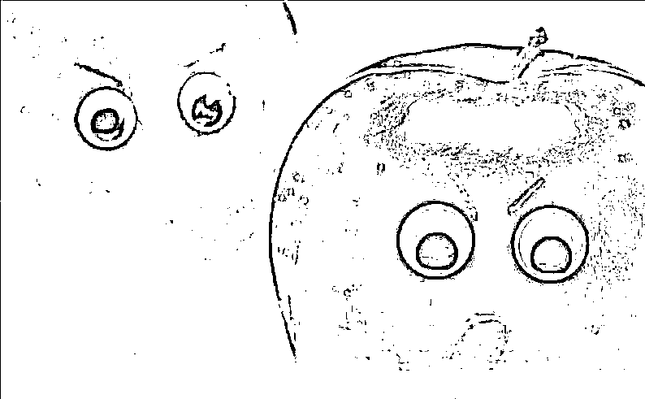**火星的发展道路****人的这一生从灵性的层面来讲，就是荣格说的一个个体化的进程，占星的语言就是太阳的英雄之旅**。你真的要达成这个英雄之旅的目标就是变成“完人”——达到所有部分的整合。我们可能这一世的功课，出发的时候，有些长处和一些短处，最终要完成英雄之旅的话，就是把所有个体的正向部分发展出来。回到最开始火星巨蟹座的例子，对于火星巨蟹座而言，它其实是需要去保护的。**当她成为一个保护他人的人时，用巨蟹座的方式成为他们生活中的权威，带给他们安全感和情感的滋养，她会变得特别有勇气**。去保护别人，不只是当 TA 哭泣的时候把 TA 揽在怀里，有的时候你需要为 TA 挺身而出，你才能够保护 TA。就像妈妈保护孩子一样，你得去战斗。所以**火星巨蟹座如果发展好得话，就能够变成一个拥有勇气和力量去保护他人的人**。
**从试错中练习管理情绪**

我们经常说的反思和觉察，我们所有情绪服务的目标，都是为了让这个生命体可以存活下去。包括你在婴儿期的时候，需求迟迟得不到满足，就会尖声惊叫，那可能也是在释放身体本身的一种化学能量，另外一个方面也是在情境中引起外界的一种关注。

当我们长大后，可以满足基本的生存需求时，就希望可以在这个世界行使更多的意志力和主张，火星会继续服务这样一个目标。日常生活中我们可能会用情绪、愤怒、生气这样一些词来描述。但最终都是为了满足某种目的或者目标。

所以**不管当下是否因为过去的模式而产生破坏性行为，在学习管理情绪的过程中我们都会逐步累积知识**，我们可能还是会发火，或者发错火，或者要发发不出来，但是这一切过去之后我们会有一个很大的空间去反思。

然后我们就回去寻找到更有效的方式，在这个过程中，我们就在**练习管理情绪——你不是被情绪控制，而是情绪成为我们发展中的一个管理工具**。成长的过程中叫做觉知也好、觉察也好，其实就是这个过程。**我们不管过去怎么样，还是要全然地接纳自己，同时也一定要告诉自己有一个发展空间在那里，通过咨询和讨论探索到那个根源，在一遍一遍练习中建立起新的模式**。

**版权声明：**本文由若道整理首发于若道平台，欢迎转发，反对抄袭。友号转载请申请白名单。

**系统学习占星学**

**点击图片了解详情**

**微信又双叒叕改版啦，不想错过若道君的推送？**

**就把若道设为星标吧！**

**▼**

**就是这个“在看”，戳戳戳 ☟**

****报名直达入口****

# 雷蒙德·梅里曼金融占星周运 | 一个新世界的秩序正在展开……

> 原文：[`mp.weixin.qq.com/s?__biz=MzA5NjA0NTAxNg==&mid=2651444075&idx=1&sn=f0fe907c70101c8f6dff619dd11b1a46&chksm=8b4b61dcbc3ce8ca8661b10c9d05fa28b9a8061c6c607a6aea60bc419e0729e00ead790b6550&scene=126&sessionid=1692737994#rd`](http://mp.weixin.qq.com/s?__biz=MzA5NjA0NTAxNg==&mid=2651444075&idx=1&sn=f0fe907c70101c8f6dff619dd11b1a46&chksm=8b4b61dcbc3ce8ca8661b10c9d05fa28b9a8061c6c607a6aea60bc419e0729e00ead790b6550&scene=126&sessionid=1692737994#rd)

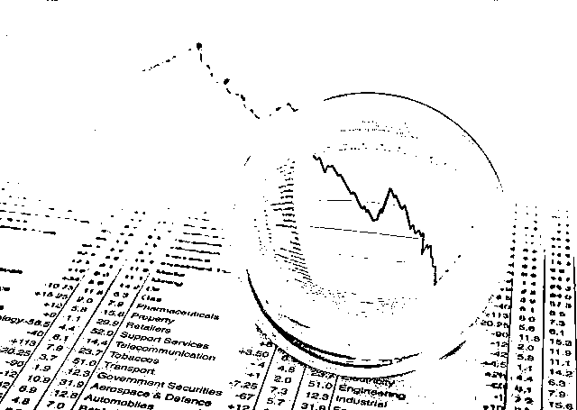

作者/雷蒙德·梅里曼 译者/Luke
编辑/玫瑰 图片/百度

雷蒙德·梅里曼是在金融占星学界稳坐第一把交椅的占星师，同时他也是若道签约的金融占星课老师，我们引进了雷蒙德·梅里曼老师的《[上证指数月度报告](http://mp.weixin.qq.com/s?__biz=MzA5NjA0NTAxNg==&mid=2651443556&idx=1&sn=971def1aa74c2662394b35531d7018da&chksm=8b4b63d3bc3ceac5cf124611e8386478226581ff46a5d4f248df5671c3a5e189104125b14143&scene=21#wechat_redirect)》及《[黄金报告](http://mp.weixin.qq.com/s?__biz=MzA5NjA0NTAxNg==&mid=2651443556&idx=1&sn=971def1aa74c2662394b35531d7018da&chksm=8b4b63d3bc3ceac5cf124611e8386478226581ff46a5d4f248df5671c3a5e189104125b14143&scene=21#wechat_redirect)》《[2021 年金融预报](http://mp.weixin.qq.com/s?__biz=MzA5NjA0NTAxNg==&mid=2651436458&idx=3&sn=a7522c271761ef772fc91991ff11d965&chksm=8b4b071dbc3c8e0b452375ae3593028ab68b7b6157b45ee7c92943ff3396990d7748d7cd0967&scene=21#wechat_redirect)》。我们经老师的授权，将每周刊登梅里曼老师的周运，供大家参考和学习。于是，这是本周的周运（5.3-5.7）。

**说明：以下时间采用纽约证券交易所所在地美国东部标准时间。**

**展望与回顾**

**1 月到 3 月美国按季节调整的国内生产总值的年增长率为 6.4%。这使世界上最大的经济体美国与 2019 年末新型冠状病毒肺炎疫情前的峰值差距缩小到 1%以内。**

**——乔希·米切尔****《美国经济反弹接近峰值》****《华尔街日报》****2021 年 4 月 30 日****随着疫苗的推出，封锁的放松，以及美国人开始消费 12 月的刺激支票，这一时期（1 月-3 月）的真实国内生产总值增长率为 6.4%。政府的经济刺激支票阻碍了经济复苏，因为削弱了人们工作的动力。全国各地的雇主表示，由于联邦政府提高了每周 300 美元的失业救助金，他们找不到工人。该救助金将在 9 月份到期。接近一半的失业者不工作就能领到和工作时一样多的钱。****——《大流行后的繁荣：拜登继承了非常强力的复苏，而不是“着火的房子”》****《华尔街日报》社论版****2021 年 4 月 30 日**对全球金融市场来说，这是奇特和混乱的一周，充满了突发却短暂的反转，这符合**4 月 22-30 日天王星合相水星、金星和太阳的征象**。天王星活跃的时期通常充满了**惊奇和突发的改变**。再一次的，全球股市在这一轮强有力的地球宇宙学关键反转时间段，充满了市场间看跌背离的案例。当前地球宇宙学征象密集出现的时间段**从 4 月 9 日持续到 5 月 8 日**。在美国，上周四 4 月 29 日，标准普尔指数和纳斯达克指数创下历史新高。但道琼斯工业平均指数未能创下新高，它在 4 月 16 日创下的历史高点 34256 没有被突破。除非三个指数在同一周创下历史新高，否则市场间看跌背离的情况仍然存在。然而，尽管出现了背离，美国市场并没有下跌太多。比如说，道琼斯工业平均指数仍然在 33700 之上找到支撑，距离它的历史最高点只有 500 点。在欧洲，荷兰 AEX 指数在 4 月 29 日创下历史新高。但欧洲其他的股票指数未能创下新高。DAX 指数 4 月 19 日创下的历史高点依然没有被突破。同一天，伦敦富时指数和苏黎世 SMI 指数都创下了年度高点。因此，在欧洲，市场间看跌背离的情况也存在，直到所有 4 个指数都在同一周创下年度高点。在远东只有澳大利亚 ASX 指数上周打平历史高点，在 4 月 29 日周四到达 7358，与 4 月 19 日的高点相同。在中国，上证指数和香港恒生指数创下新的月度低点，远远低于它们的年度高点。在印度和日本，印度 NIFTY 指数和日本日经指数在 2 月 16 日分别创下历史高点和多年高点，依然没有被突破。它们是很重要的高点，因为那天只比强有力的土星-天王星渐亏四分相第一次精准成相早 1 天。其他几个金融市场上周也出现了显著的价格波动。比特币从 4 月 16 日的历史高点 64900 下跌 27.5%，在上周 4 月 26 日创下当周的低点 47000。然后，在天王星的影响下，它开始了另一轮 10000 以上的上涨，直至周五。欧元在 4 月 29 日周四飙升至 1.2161，是 9 周来的最高价位。但在 4 月 30 日周五，随着**太阳合相天王星**，它也经历了快速的下跌。原油在 4 月 29 日上涨至 65.47，接近 3 月 8 日的年度高点 67.98。贵金属市场相对平静，但是谷物市场的表现十分壮观，反映了**天王星在农业星座金牛座的爆发性能量**（天王星还合相水星、金星）。大豆价格飙升至 1608，接近 2012 年 9 月 1794 的历史高点。玉米价格飙升至 746，创下 2013 年 7 月以来的最高价格。小麦也出现了爆炸性增长，达到 773，是 2013 年 2 月以来的最高水平。《[2021 年金融预报](http://mp.weixin.qq.com/s?__biz=MzA5NjA0NTAxNg==&mid=2651436458&idx=3&sn=a7522c271761ef772fc91991ff11d965&chksm=8b4b071dbc3c8e0b452375ae3593028ab68b7b6157b45ee7c92943ff3396990d7748d7cd0967&scene=21#wechat_redirect)》对这些上涨都做出了准确描述。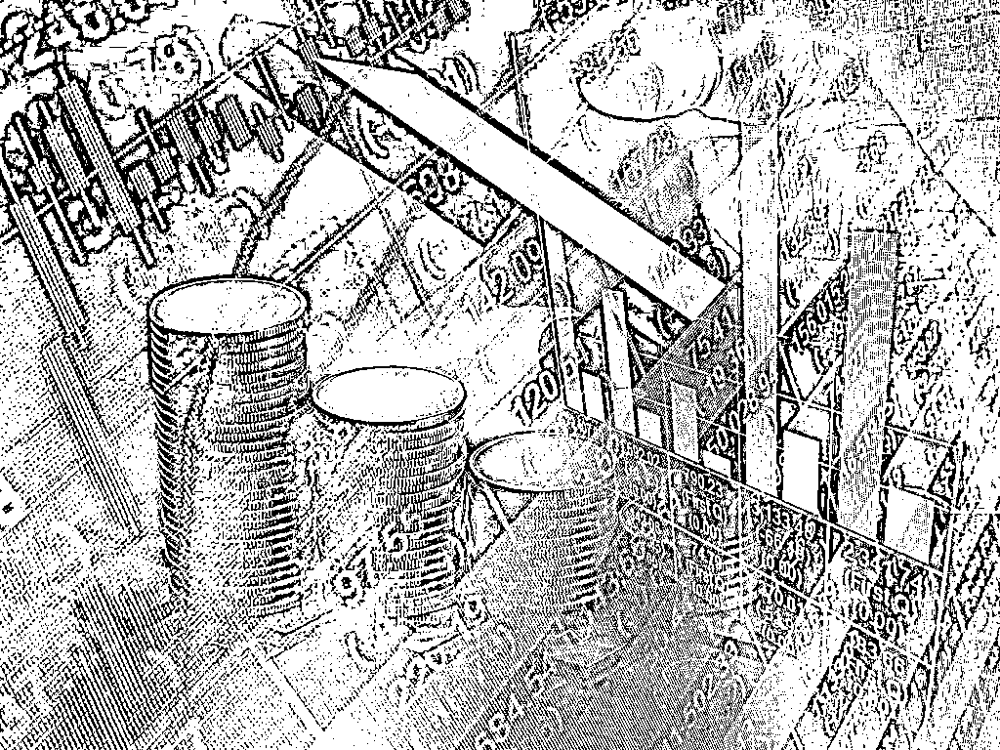**地球宇宙学象征与长期考量**

**当劳伦斯·萨默斯最近几周批评拜登政府的新经济政策是 40 年来最不负责任的政策时，你可能觉得这一警告会惊动民主党人。正好相反，萨默斯先生基本被他的民主党同僚忽略了。在他警告新政府 1.9 万亿美元的经济救援项目可能会过度刺激经济并加重通胀后，改革论者用叫喊声淹没了他……**

**在这场戏剧背后，党内人士对萨默斯先生呼吁温和经济政策的抵制表明传统的经济思想和经济政策正在被抛弃。**

**——乔恩·希尔森拉特****《拜登的大开支计划暗示，小心谨慎的经济政策正被抛诸脑后》****道琼斯公司****2021 年 4 月 29 日**截至 2021 年 4 月，股市创纪录的表现证明了行星相位与俗世事件有关，但未必一定或直接反映在股票价格上。2021 年最强有力的地球宇宙学征象是**土星与天王星的渐亏四分相**。在传统占星学中，四分相，尤其是渐亏四分相，可以说是最难顺利穿越的相位。**天王星代表社会中“新的”和重大的变化，而土星的动力是抗拒变化**。**土星愿意保留经验证明可靠、传统和已知的事物。土星与天王星的相位是冒险与追求安全之间的较量**。 对于一些人来说，这意味着**未来（天王星）正被历史（土星）所挟持，必须不计一切代价得到解放**。从这一角度说，代价是前所未有的，可能引领我们进入一个大胆、令人兴奋却未知的未来。但这一未来也是木星-土星接下来在**风象星座的 140 年会合周期**，也就是“风元素新时代”所昭示的。也就是说，在经历了过去 200 年在谨慎、实际、传统的土象星座合相后，木星和土星现在开始了为期 140 年在风象星座合相的时期。与土象星座不同，风象星座非常重视那些**原创的理论、智性和抽象的概念**。与土象原则代表的传统主义者相比，风象星座非常大胆，也可能看似相当傲慢，愿意冒险。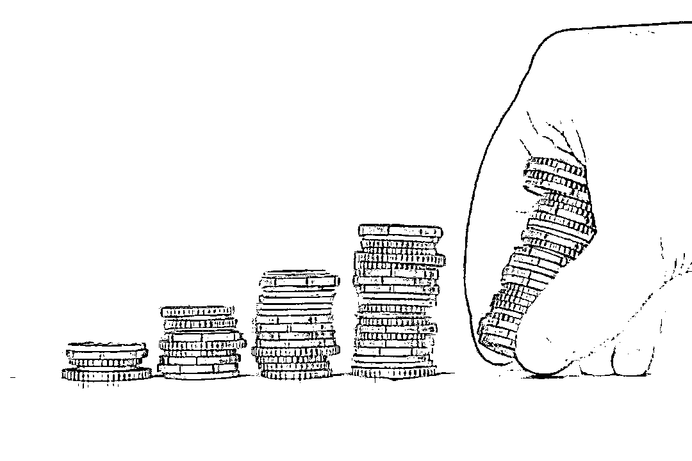这些突然之间流行起来的“现代货币理论”实际可行吗？没有人知道。但我们很快就会发现，因为在土星和天王星渐亏四分相下，这些理论很快就会投入积极应用。**我们看到这两股力量在激烈地对抗。一个新的世界秩序正在展开**。没有任何地方比政治和经济领域表现得更明显了。那些“新凯恩斯主义经济学家”迫不及待地想要测试他们的伟大思想，而没有任何历史记录表明这些思想可以成功。他们几乎不恐惧失败，也不在乎政府无限举债导致的“未知后果”。此外，他们相信只要美元还是标准世界货币，只要美联储可以随意印钞（因为只要美国央行能印钞并将债务货币化，美国永远不会违约），他们就可以自由消费而不会产生负面影响。这可能是真的，直到通胀变得越来越明显。但谁还记得或在乎 40 年以前是什么样子呢？那“古代的历史”将不被允许继续挟持我们的未来。或许它可以？随着土星（历史）四分天王星（冒险和大胆），我们将发现答案。与此同时，土星-天王星四分相显然与过去的现实（土元素和土星）和光明而大胆的未来的智性意识形态（风元素和天王星）之间的交战有关。但迄今为止，这两颗行星的四分相还没有导致全球股市的崩溃，而这是这两颗行星相位的经典解读之一。正好相反，全球股市继续向一个又一个的新高或多年高点进发，这是因为越来越多的“新凯恩斯主义”经济政策带来了越来越多的刺激、开支和债务。就好像这些“新凯恩斯主义者”相信偿还债务不是一个问题，因为美联储可以印更多的钞票。就好像只要美联储可以继续印制美元这一国际标准货币，美国就永远不会违约或破产。  但如果这一现代货币理论没问题，那么为什么要坚持更高的税收？还是说高税收另有所图？是政治原因？个人原因？还是某些与“古代历史”有关的原因？问题是，正如经济学家拉里·萨默斯所警告的那样，“经济规律仍然在发挥作用。”换句话说，债务将不得不偿还，而且没有免费的午餐。即使一个在零利率下随意印制国际法定货币的机构，也是如此。尽情享受这段旅程吧，只要记住不仅经济规律会发挥作用，重力规律也是如此。

**说明：以上日期基于纽约证券交易所所在的美国东部标准时间，由于存在时差，中国地区可能需要加一天。**

**版权声明：**本文由若道翻译发布，欢迎转发，反对抄袭。友号转载请申请白名单。

**雷蒙德·梅里曼（Raymond Merriman）**

若道签约老师。著名金融占星师，ISAR（国际占星研究协会）前主席，梅里曼市场分析公司的总裁。他由于“提升了占星学的职业形象”，在 1995 年国际占星大会上被授予轩辕十四奖；在 2012 年国际占星大会上，被授予轩辕十四终身成就奖。

1“中国上证指数月度报告”发售

**若道推出了****中文版****的雷蒙德·梅里曼中国上证指数月度报告，并持续发行该报告！**

当把金融市场的周期和占星学的周期相结合时，雷蒙德·梅里曼老师的金融占星学研究**为投资者应对金融市场的周期波动，并随之调整投资策略提供了极大的价值参考**。

**5 月中英文报告已上线！**

2“黄金价格周期月度报告”发售

**若道推出****中文版****的雷蒙德·梅里曼黄金价格周期月度报告！**不仅仅为广大读者在中国股市的投资出谋划策，更将视角放眼黄金市场。

**每当世界经济形式不明朗的时候，有一个地方是保值的港湾，那就是****黄金**。自 1982 年雷蒙德·梅里曼出版第一本研究《地球宇宙学征象与黄金价格的关联》的著作以来，**他一直作为最重要的黄金市场时机预测者之一享誉国际**。5 月黄金报告已上线，梅里曼老师将会告诉你他对这个关键时期如何操作的想法。也可以按照季度和一年期订阅，有更多优惠。季度和年度的好处是，你可以持续了解梅里曼老师对于不断在变化的市场的看法。即便他某一次看法和市场不一致，你也看到在下一期他如何调整自己的看法，并看到金融占星在一个长期时间段内对你把控风险的帮助。而能够长期控制风险、尽量找到安全的投资时机才是投资的长久之计。

**5 月中英文报告已上线！**

**购买套餐**，买得越多越优惠

中国上证指数月度报告套餐价

*   **单月报告**：280 元

*   **3 个月套餐**：780 元（260 元/月）

*   **12 个月套餐价**：2400 元（200 元/月）

**长按下图识别二维码**

**购买金融报告****套餐**

**▼**

黄金周期月度报告优惠

*   **双报告年度套餐更优惠（直降 900 元）**
*   **12 个月黄金报告+12 个月上证指数报告：仅需 3900 元**

**长按下图识别二维码购买黄金报告套餐**

▼

**2021 年金融年报发售中**

**1976 年以来，由雷蒙德·梅里曼撰写的梅里曼市场时机学院每年一次的年度预报沙龙和每年一本的《年度预报》一直在应用占星学原理为投资者们服务，提供卓越洞见，从未间断。**过去两年，3 小时的年度预报讲座和长达 200 页左右对金融市场的分析报告，帮助许多若道读者做出正确的投资决策，降低了投资风险，并获得相当不菲的投资收益。在群星摩羯座的时候，我们和你一起提早规划自己今年的投资安排。2021 年年度预报发售中**2021 年金融年报价格**：1280 元**沙龙时间**：2021 年 1 月 9 日（视频已上线）**沙龙形式**：英文讲座，配有中文翻译**点击下图了解详情**

▼

**点击阅读原文购买金融报告**

# 五一劳动节快乐！放假啦，你会做点什么激动人心的事呢？

> 原文：[`mp.weixin.qq.com/s?__biz=MzA5NjA0NTAxNg==&mid=2651443948&idx=1&sn=2f9db9b77a489823bd9a05af61ae0932&chksm=8b4b605bbc3ce94ddf75e8f7d78a19e0ddce32965927a7e30cd27a071f0dfad47fc0acdb0691&scene=126&sessionid=1692737994#rd`](http://mp.weixin.qq.com/s?__biz=MzA5NjA0NTAxNg==&mid=2651443948&idx=1&sn=2f9db9b77a489823bd9a05af61ae0932&chksm=8b4b605bbc3ce94ddf75e8f7d78a19e0ddce32965927a7e30cd27a071f0dfad47fc0acdb0691&scene=126&sessionid=1692737994#rd)

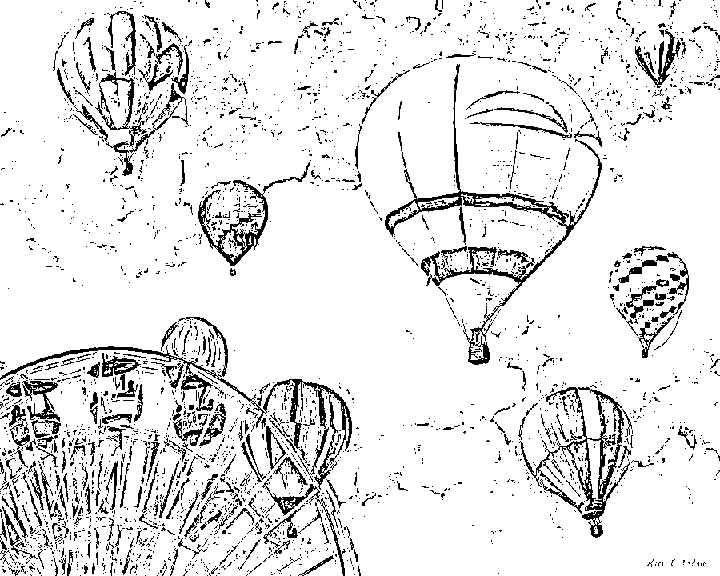

**2021 年 5 月 1 日天象：**

*   **0:15 月亮进摩羯座**

*   **太阳合相天王星、四分土星**

*   **水星三分冥王星**

*   **金星六分海王星**

五一假期快乐！今天是激动人心的一天，请对改变保持敞开，做点儿突破自己、和以往不同的事情吧（太阳与天王星合相）！如果没有旅行计划，不如和家人朋友来一场聚会、去看电影或艺术展。金星与海王星的六分相很适合参加和艺术有关的娱乐活动哦。大家五一假期都有哪些安排呢？欢迎分享呦～～～虽然是假期第一天，但由于月亮在摩羯、太阳四分土星，我们依然会显得严肃或觉得身上有些责任要负担起来。同时也容易和家里长辈、权威人士发生冲突，这时候看看彼此能否做出适当调整。五月到了，这是重生与复苏的月份，但我们也同时会在 5 月下旬迎来新一轮震荡，如果想了解 5 月月运，可以点击[【5 月月运】](http://mp.weixin.qq.com/s?__biz=MzA5NjA0NTAxNg==&mid=2651443924&idx=1&sn=fbd285c7aa3b4912a9d39a4bcfe7936e&chksm=8b4b6063bc3ce975d9b534d411e6bf406d0df001244b7c6d840a11526ee0343e8381a05b5dd4&scene=21#wechat_redirect)查看文章。ISAR 考试今天开始，若道君在这里祝诸位考生取得好成绩，在秋天获取 ISAR 认证证书！假期快乐！**更多精彩占星文章长按二维码查看**

# 5 月宇宙天气丨震荡再度出现，准备迎接英雄之旅的考验吧！

> 原文：[`mp.weixin.qq.com/s?__biz=MzA5NjA0NTAxNg==&mid=2651443924&idx=1&sn=fbd285c7aa3b4912a9d39a4bcfe7936e&chksm=8b4b6063bc3ce975d9b534d411e6bf406d0df001244b7c6d840a11526ee0343e8381a05b5dd4&scene=126&sessionid=1692737994#rd`](http://mp.weixin.qq.com/s?__biz=MzA5NjA0NTAxNg==&mid=2651443924&idx=1&sn=fbd285c7aa3b4912a9d39a4bcfe7936e&chksm=8b4b6063bc3ce975d9b534d411e6bf406d0df001244b7c6d840a11526ee0343e8381a05b5dd4&scene=126&sessionid=1692737994#rd)

****************☆ 后台回复“今日”，给你一句生命态度****************

作者/傅莎珈 ISAR 认证占星师
编辑/翀子 封面/书君 图片/网络 5 月来了！未来图景在刚过去的天蝎座满月后出现。在重生复苏中，木星进入双鱼座带来了未来一年的预告，随着时间进入 5 月下旬，环境中又将出现震荡，我们会再度踏上英雄之旅接受考验。

今年的时间真的不经用。竟然已经五月了！**回顾一季度，财务安全感成了很多人最关注的话题。**但我最关注的，是那些致力于**创新**，**打破传统**的创造者们。因为他们的存在，才有我们的投资机会。

昨天在网上看到一个小朋友说：曾在一次次对生活的求索中坠入虚无主义，觉得做什么都没有意义，动一根手指头都觉得多余。但在跌入谷底后，突然有一瞬感悟：**若是任何事物都无意义，那也意味着你可以赋予任何事物以任何意义。**

五月就是这样的月份吧，**承接了四月底天蝎座满月的转化力量，让未来的图景出现在你我眼前。**要去承接这份图景，需要我们**以退为进**的转变信息接受和处理方式。有趣的一个月。

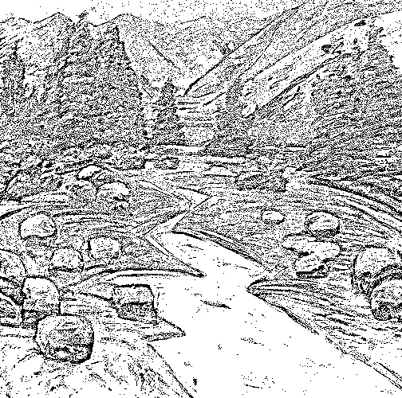

**5 月上旬：重建根基**

5 月上旬天象

**5 月 01 日 ** 

*   太阳和天王星在金牛座合相

**5 月 03 日**  

*   金牛座太阳四分水瓶座土星

*   金牛座金星六分双鱼座海王星

**5 月 04 日**  

*   水星换座双子座

**5 月 06 日 ** 

*   金牛座金星三分摩羯座冥王星

**5 月 09 日**  

*   金星换座双子座

**5 月上旬的主题和重建根基有关。**4 月 27 日天蝎座满月，28 日冥王星逆行，提醒所有人注意“恐惧” 议题的转化。如果以上海作为起盘地区，天蝎座满月发生在第四宫，**会激发全人类生活在地球上的生存危机感，**每个人**来自家族深处的情感阴影也会在这个阶段陆续曝光。**满月激发了土天四分相位，为下一个土天合相，重建秩序，提供了动力。

地球的生存危机和最近的核废水排放有关。日本福岛的核废水排放，并不仅仅污染海域。被污染的海水蒸发成水汽，再化作雨飘落到周边的土地、土地、森林、果实、稻谷，动物们也跟着一起被污染……再加上冰川融化、疫情病种变体、塑料危机……**环境保护的议题是涉及到每个人的后代生存环境的。**

在家庭和社会层面，**家族的情感阴影、生存焦虑全面爆发。**谈了这么久的内卷，已经让社会各阶层都感受到巨大的窒息感。

5 月是金牛月。每次遇到金牛座和天蝎座能量的行运，我就会想起心经中的句子：色即是空，空即是色，受想行识亦复如是，空中无色……心无挂碍无有恐怖，远离颠倒梦想，究竟涅槃。

**金牛座—天蝎座轴线描述了每隔一个阶段，物质毁灭升频，再度以高一级的精神重生，降频创造出新的物质的过程。**

金牛座的**物质主义**，是他想要挣脱所有的想象，以肌肤作为抵达世界的方式。五感，是我们无法说谎的最真实的感受啊。可惜这种物质主义的真实被滥用成僵化的以物质获得安全感的方式，内在的平静和感受当下的满足感，也被外化成不断追逐金钱、财富……**我们被物质安全感奴役。**

**当某一个波段已满，天蝎座就要开始毁灭工作，好清空旧有结构的呈现，让光重生，再回到新的物质生成上来。**

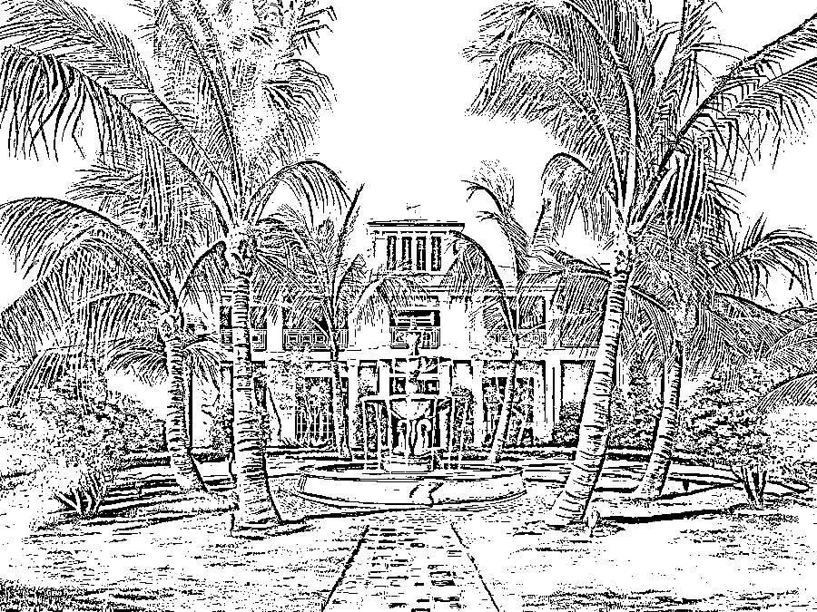

5 月 1 日太阳合相天王星，是个重要的看见：**打破当下僵硬和死亡感的力量来了，**变化出现了，使命出现了，要不要跟随？这个选择关乎**“我的生命是为了安全而来，还是为了成长而来”**。每个人的选择都有 TA 的道理，并没遇对错之分，只是走在不同的生命阶段。

但要记得，天王星在金牛座的 7 年正帮助**唤醒我们对新价值观的认知**，改变我们对丰盛和金钱的固有理解，学习更深层和广阔的自我价值定义，**看见深层的自我关爱。**太阳和天王星的相位带来了激动人心的一天。如果我们执着的想控制和解决所有问题，这些改变就不会发生。如果为变而变，被焦躁裹挟，很容易冲动和反应过度。 请保持清晰的辨识力，对改变保持敞开，做一些和以往不同的事情。5 月 3 日太阳四分土星，会在**集体归属感**和**个人价值感**之间产生矛盾。我要追求更多财富，但社会环境的动荡让我很难完成这个追求。或者，在集体利益中感觉被挟持，想要回归最单纯的简单生活之中，又觉得诸多责任脱不了身。家庭中容易出现和父亲，权威之间的权力斗争，意识冲突。请抽离出来，看看彼此有哪些值得为对方调整的部分。

5 月 3 日金星六分海王星，特别适合五一假期中的人们聚会、看电影、参与各种和艺术有关的娱乐活动，好好享受五月的阳光鲜花。暂时忘记工作、加班、鸡娃吧。

5 月 4 日，水星换座双子，为改变太阳金牛座的固执和僵化，**双子座水星的架构适应金牛座天王星的转化动力:** 双子座代表去看、去感受、去搜集各种信息、去接触、去体验。**带着开放的、不评判的态度，搜集不同的生活方式，和不同价值观的人聊天，** 也许会对物质安全感焦虑，有新的认识。

水星在双子座回到了自己的家。**这是个学习新知识的黄金时间。**加上**土星会在月底逆行。**那些上半年报了课程却来不及听的，正好有机会补回来。**这也是个梳理自己专业的时间段。**水星会和土星形成三分相位，在成为某一领域的专家还是博而不精继续神农尝百草之间，我们需要做一个方向性的选择。思考一下 2021 年白羊座新月的许愿，围绕这个许愿，来做知识资源的选择。

5 月 6 日金星三分冥王星，是假期后上班的头一天，金融市场估计会出现一波反转，是好是坏不知道，但这是金星在金牛座最后的日子，还是很有可能赶一个“红色” 翘尾巴。

天蝎座满月所曝光的死亡能量到这个时候，会出现转化和继承的特质：冥王星象征死亡，金牛座金星意味着复苏，摩羯座代表着企业。**有些企业可能以重组，更换领导人，吸收新投资的方式，进入发展的快速轨道。**感谢这个三分相位带来木星式的幸运。

5 月 9 日金星从金牛座换座双子座，收获天蝎座满月有关爱的智慧。满月后的第一周是下弦月，代表着赫卡特女神中的第三个面向：智慧祖母。**我们在这个阶段收获有关爱的智慧。**

从奥义占星的角度上讲，双子座是第二道光，代表爱与智慧。奥义占星中双子座的守护星是金星。双子座的奥义是灵魂和人格，灵魂和人格的相遇，结束二元对立。双子座守护连接原则。

从金牛座金星的物质而简单的占有式爱恋，转向双子座式“有爱的疏离”，指的是活在灵魂意识中，**观察自己和世界连接的方式，交流的方式，相爱的方式，**形成对“关系”、“爱”、“连接” 的客观觉察。我们可以全然的爱着，但同时也是抽离的，客观的，不断感受着经由对方触发的自己的感受。

学会从和爱有关的情绪里跳出来也许你会发现自己对爱的定义，不是你的头脑以为的。有着太多惯性和被环境文化影响的部分。看见这点，你要去思考，加入自己的独立意识，以此时此刻的诚实心境，投入这段关系。

**所谓的连接，是在保持独立的基础上有连接的渴望。**连接是人的本性，大部分人担心独立到没有连接欲望的事情是不可能发生的。到某一个阶段，独立人格的满足感会驱使你去创造和爱，强烈需要分享，那时候自然而然的你想要再次连接世界。某一个阶段的封闭和自我疗愈，是灵魂修复的一个阶段。

**爱也是一个学习过程，帮着我们享受物质，体会金钱之中蕴含的创造力和分享的智慧。**

旧有土星与木星合相的文明智慧印记，正在告别人类社会，给新的风向文明，腾出空间。

**5 月中旬**

5 月中旬天象

**5 月 11 日**  

*   水星和月亮北交点在双子座合相

*   双子座水星六分白羊座凯龙星

**5 月 12 日**  

*   金牛座新月

*   巨蟹座火星六分金牛座天王星

*   巨蟹座火星四分白羊座凯龙星

**5 月 13 日**  

*   金牛座太阳六分双鱼座海王星

*   双子座水星三分水瓶座土星

**5 月 14 日**  

*   木星换座双鱼座

**5 月 17 日 ** 

*   金牛座太阳三分摩羯座冥王星

**5 月 18 日 **

*   金星和月亮北交点在双子座合相

**5 月 20 日**

*   双子座金星三分水瓶座土星

**五月中旬迎来了重要的木星换座双鱼，让我们看见未来一年的生活预告。**

5 月 11 日，水星合相月亮北交点，六分凯龙星。双子座水星将那些物质和精神转化的智慧，经由语言交流，一层层改变我们的旧有思想，影响我们的财务态度、亲密关系、合作选择。**我们将变得更自由，以尝试的心态，接触很多新的人、事、物。**这些改变将会**协助我们发展新生的自我价值，以及力量感。**

5 月 12 日金牛座新月种下了一颗看不见但感受得到的种子：新月与射手座婚神星形成精确梅花相，同时合相黑月。我们有机会和一些自己从未接触过的、价值观非常不一致的、强调自由、有理想有信念的人产生合作意愿。但内在又被固有的物质安全感惯性往回拽：这个不靠谱，高谈阔论，一点不实际，都是理论！可是很吸引人啊……**一种悬疑、犹豫又好奇的吸引力溢染整个新月**，相当英吹斯挺。

5 月 12 日新月的同时，火星六分天王星、四分凯龙星，情绪上可能会相当冲动莽撞，特别注意意外身体伤害。

5 月 14 日木星换座双鱼座，为处于土天四分高压锅里的世界打开了一个意识上的出口。好的方面，**木星终于走进了自己最舒适的双鱼座。**在过去 2 年里，无论是摩羯座还是水瓶座，都和木星的天性不匹配，木星的自由精神被土星的物质主义、现实主义压制。**当木星进入双鱼座，****人们会在打破物质安全感的基础上，大步跨向“精神安全感”的探索，**双鱼座式的跃（逃）进（避）一片深深的蓝海里：

*   **传媒、电影、视屏传播，文化主题旅行（**云贵川青海滇藏新疆……) 行业开始急速增长；

*   **民族艺术**（波斯工艺品/土著手工制品等) 越来越多出现在市中心的 shopping mall（购物中心）；

*   **咖啡馆、茶馆、瑜伽馆、占星、塔罗**不可阻挡的越来越受欢迎；

*   **一些新的现在看起来过于玄幻的治疗方式**将因为有效而引起公众的学习热情；

*   **宗教领域**不仅仅会出现真正的精神领袖，还可能诞生一些全新的修行方式；

*   世界范围内会崛起不止一个**政教合一**的国度。

2021 年开始，木星的行走路径就开始跳跃。本来木星顺行逆行都在一个星座。今年开始，顺行尾巴快速进入下一个星座，然后再逆回本星座。好像一个时空 bug 让我们先穿越体验一下下一年，然后再通过逆行回到现实世界，进行土星时间里的循序渐进。

当你体验到了未来一年的信息，再逆行回到本年度星座的时候，我们是不是就会对如何调整当下的局势更有方向？是不是之前的那些恐惧啊，慌张啊，会变得小一些？或者找到一个逃避的树洞，先醉生梦死了再说？

5 月 15 日之后，太阳和金星分别触发冥王星（摩羯座）、北交点（双子座）、土星（水瓶座），为木星进入双鱼座，提供了资源、思维、意识上的支持。**接下来 2 个月，投资、零售贸易、电商、传播、教育领域将出现一段非常短暂的爆发期。**请大家**特别留意 5 月 15 日到 7 月 31 日**这一时期的生活变动，这对下一年度的投资，事业选择，都会有预示性的展现。

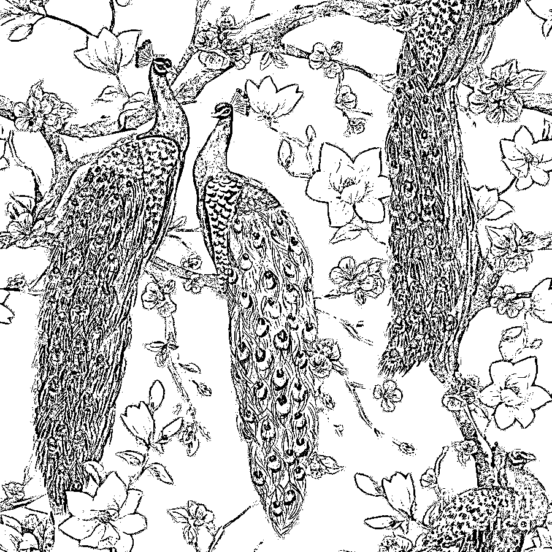

**5 月下旬**

5 月下旬天象

**5 月 21 日**  

*   太阳换座双子座

*   双子座太阳四分双鱼座木星

**5 月 23 日**  

*   土星在水瓶座开始逆行

*   双子座水星四分双鱼座海王星

**5 月 26 日**  

*   射手座月食

**5 月 29 日**  

*   双子座金星合相双子座水星

**5 月 30 日**  

*   水星在双子座逆行

**5 月 31 日**  

*   巨蟹座火星三分双鱼座海王星

5 月下旬的能量波动聚焦于社会环境的再度震荡，**推动每个人发展心性智慧，踏上英雄之旅接受考验，**为新世界的一席之地搜集圈地所需的牛群。

5 月 21 日，太阳换座双子座。太阳在双子座是开启学习和交流的黄金一月。双子座要求看见，这种看见不仅仅是视觉上的，还是心智和意识上的，尤其当太阳落在双子座，更广泛的看见不同的景象是这个月的经历。**这里的“看见”，不仅仅指“眼睛”的看见，还是指“直觉/感受”上的看见被心智所“看（理）见（解）”。**

太阳换座双子座之后，依次四分双鱼座的木星和海王星，提醒我们降低逻辑思维的运行，**更多去体验潜意识、无意识，**而非逻辑。这对很多人来说非常困难。纳尼，这么强大的头脑要我放弃？其实，伴随地球频率的升级，我们的身体也正在从碳基结构转向水晶结构。这是为何去年开始身心灵圈子里突然爆发了一波水晶热潮，人人都在买水晶卖水晶（**若道君友情提示：消费需理智**）。那个源头，是某些人率先知晓了水晶在未来扮演的角色开始行动，慢慢波及到各个族群。借助这种身体结构的转变，**我们正在连接新的宇宙资源，开启各种全新技能的学习。**

当太阳四分双鱼座木星的相位出现时，建议有时间掌控权的你，**从繁忙工作中退出来，做更多非头脑的活动：**冥想、瑜伽、艺术创作或者学习、旅行…… 好让身体有更多时间重组和连接高频能量。有些身体敏感的人或者 12 宫强的人，已经很强烈的接受到了这种能量，并且被巨大的能量折腾得只有躺倒了事。那就好好休息消化吸收吧，直到身体能运用这些新频率的能量为止。

如果你不得不朝九晚五，**尝试着一天之内留 10-30 分钟放空。** 我们的身体正在新的频率上重建学习方式，请留白给身体。

世俗世界里，5 月 21 日太阳换座双子座之后也会点燃人们的学习、交流积极性。太阳四分木星是我们学习非逻辑类知识技能的开始；但如果用头脑来学习，恐怕会令人失望。**“体验” 比提问更重要，**练习观察，感受，聆听的能力，先浸泡，再抽离的学习方式，更适合双鱼座型的知识传导。

不过双子座太阳四分双鱼座木星，要小心“生活在别处”症状。总觉得生活在远方，不能脚踏实地的面对当下生活；或者对现实困境估计不足，过度乐观，导致悲剧；又或者受困于现实压力找不到解决之道沉湎于令人上瘾的事物之中，**就是对双鱼座木星能量的误用。**

5 月 23 日水星四分海王星，**同时土星在水瓶座开始逆行。**在世俗社会，一些丑闻的引爆，比如和污染、传染、谎言、或者引发人类社会的生存危机感，导致法律监管加大执法力度。

**土星逆行后将会再度触发土天四分相位，**国家和国家之间将再度爆发政治，经济相关的危机/争斗，或者集体面对不可抗自然灾害。

**土星在水瓶座的逆行会让我们看见“墙”在哪里。**为了争夺资源，国家之间、民族之间、企业之间造了很多墙来防止资源流失，导致恶性循环。**真正要实现水瓶座的利他、尊重不同个体、不同族群的独立意志，需要拆毁壁垒。**这个壁垒的拆毁过程必然十分激烈，资源共享如真正的挑战是如何平衡人性中自私占有的亘古难题。土星教会人们在漫长的调整与适应中，仔细检查自己的价值观，对人性有完整的认识，不放弃交流连接，直到达成新的集体服务于个人、个人奉献于集体的平衡。

5 月 26 日射手座月食，是 5—7 月超级满月三部曲中的第二部。4 月 27 日的天蝎座满月，展现了灵魂重生的死亡之旅，让我们看见生命的焕然一新。**5 月的射手座月食将要面对个人身份的创伤转化，**以让每个人重登社会舞台，我们即将踏上自己的英雄之旅，为赢得自己的王国经历各种考验。

5 月 29 日，金星和水星在双子座合相。查看一下 2020 年 11 月前后，你在个人收入、事业成长以及合作关系上的变动，现在是收获红利的时期，在这些领域，你会遇见各种新的资源和机会，**请敞开接纳各种可能性。**

5 月 30 日，水星在双子座逆行。**这是本年度第二次水逆。**提醒我们**审视职场发展方向，觉察思维中的盲点，更新学习方式。**为接下来的社会身份重建工作，找到更多可能性。

5 月 31 日，巨蟹座火星三分双鱼座海王星，会激发每个人身上的同情心、重建家园的勇气，对那些身处灾难之中的人伸出援助之手。**在第二次土天四分即将被触发的时候，需要有英雄站出来领导大家共度难关。**

英雄是时势里有着远大理想、听见命运召唤的人，无论是否做好准备，都义无反顾上路的人。巨蟹座火星或许是迂回的，却细致入微，能够在保持环境和谐、减少冲突的基础上，坚定不移。

你得到的任何信息，若没有切身体验过，都是无意义的。

——萨古鲁

祝福大家，在金牛座的月份，通过感官，发现一个死生循环的喜悦世界。

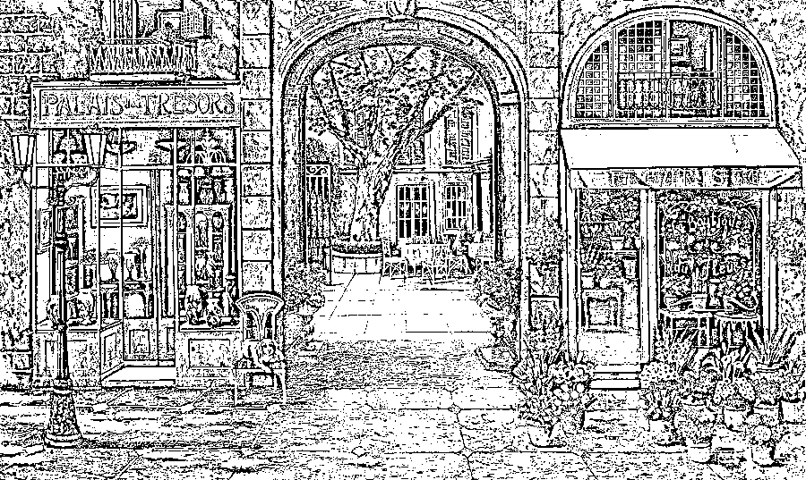

**后记：**

这篇文章写于天蝎座满月。本来有点紧张，天蝎座满月的高能量让我的大脑变得非常迟钝，很担心写不出来交不了稿。最终以一种极其罕见的慢吞吞的但又非常高效的方式完成了这篇稿子。我也不知道怎么发生的，只知道在打扫卫生，收拾花园，给墙面补腻子的间隙，就这么完成了。这种写作方式，让我如释重负。下次试试学手碟的间隙写月运。

**本月重要天象一览表**

| **日期** | **星象** |
| **2021.5.1** | **太阳和天王星在金牛座合相** |
| **2021.5.3** | **金牛座太阳四分水瓶座土星****金牛座金星六分双鱼座海王星** |
| **2021.5.4** | **水星换座双子座** |
| **2021.5.6** | **金牛座金星三分摩羯座冥王星** |
| **2021.5.9** | **金星换座双子座** |
| **2021.5.11** | **水星和月亮北交点在双子座合****相******双子座水星六分白羊座凯龙星**** |
| **2021.5.12** | ****金牛座新月********巨蟹座火星六分金牛座天王星********巨蟹座火星四分白羊座凯龙星**** |
| **2021.5.13**  | **金牛座太阳六分双鱼座海王星****双子座水星三分水瓶座土星** |
| **2021.5.14** | **木星换座双鱼座**  |
| **2021.5.17** | **金牛座太阳三分摩羯座冥王星** |
| **2021.5.18** | **金星和月亮北交点在双子座合相** |
| **2021.5.20**  | **双子座金星三分水瓶座土星** |
| **2021.5.21** | **太阳换座双子座** |
| **2021.5.23** | **土星在水瓶座开始逆行****双子座水星四分双鱼座海王星** |
| **2021.5.26**  | **射手座月食** |
| **2021.5.29**  | **双子座金星合相双子座水星**  |
| **2021.5.30**  | **水星在双子座逆行**  |
| **2021.5.31**  | **巨蟹座火星三分双鱼座海王星**  |

**版权声明**：原创文章由作者授权首发于若道平台，欢迎转发，反对抄袭。友号转载请申请白名单。

****

****傅莎珈****

ISAR 认证占星师（2015 年获得）

心理占星师/内观书写带领者/冥想带领者

国际著名传播集团工作 20 年

**微信公众号**：Helloshajia

长按打赏

**系统学习占星学**

**点击图片了解详情**

**微信又双叒叕改版啦，不想错过若道君的推送？**

**就把若道设为星标吧！**

**▼**

**就是这个“在看”，戳戳戳 ☟**

********报名直达入口********

# 资深占星师备盘都离不开的这个技法，你一定得了解

> 原文：[`mp.weixin.qq.com/s?__biz=MzA5NjA0NTAxNg==&mid=2651443924&idx=2&sn=a615114d2bba9f0835e466cb6c9ae387&chksm=8b4b6063bc3ce9751e364c058a80ddeb7ffec19aa24089bdf66da45b0ea2f0f5d3ebd76c7127&scene=126&sessionid=1692737994#rd`](http://mp.weixin.qq.com/s?__biz=MzA5NjA0NTAxNg==&mid=2651443924&idx=2&sn=a615114d2bba9f0835e466cb6c9ae387&chksm=8b4b6063bc3ce9751e364c058a80ddeb7ffec19aa24089bdf66da45b0ea2f0f5d3ebd76c7127&scene=126&sessionid=1692737994#rd)

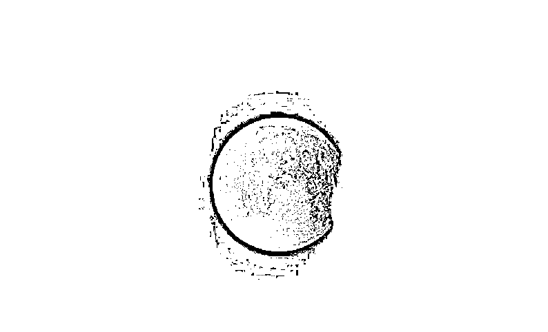采访/编辑/玫瑰 封图片/全景网
全新课程——[次限推进技法](http://mp.weixin.qq.com/s?__biz=MzA5NjA0NTAxNg==&mid=2651443867&idx=3&sn=41d742e848db1b6271b50d684a4c156a&chksm=8b4b602cbc3ce93adb55ff107c3154106b88cfccafee5c2fb553aea0d631993eaa114594ed87&scene=21#wechat_redirect)就要开始报名啦！为了帮助大家了解这种神奇的占星技法，我们特别采访了几位资深占星师，看看他们在咨询过程中如何运用次限推进，又有怎样有趣的发现吧！**当资深占星师们使用次限技法**

**受访者：郑玮玲** 

ISAR（国际占星研究协会）认证占星师（2016 年获得） 

若道占星专栏作者

**问：****平时咨询或者研究、学习的时候会使用次限星图么？**

**郑玮玲：**日常占星咨询和教学中都会使用次限技法。那是**生命进程不可或缺的内在太阳系测度系统，清晰呈现了当事人的心境和内在进化路径。**

****问：******通常是在怎样的情况下使用？**

**郑玮玲：**但凡涉及出生星图的工作都会准备好当下的次限行进星图，以及**次限月亮换座、换宫位，次限月亮、水星、金星、四轴与出生星图形成任何有力相位，或发生顺逆切换时还要加注时间与周期。**

**问：****觉得次限星图对于咨询的帮助大么？****郑玮玲：**对于一次有效的占星咨询来说，次限是不可或缺的背景材料，让我在占星咨询工作中快速清晰个案的心境，对方能因为精准的内在感受被理解而快速打开心灵，让咨询有效性自然发酵。每一次咨询中，**但凡次限月亮换座、换宫位，都与个案现实中明确的计划、行动有关，**那些快速短期的变幻是行进与太阳弧并不一定能呈现的，但次限有力地补足了这一视角。另一方面，**对于个人成长来说，次限更是精准的计时器，如同宇宙给了我们每个人均等的机会，去体验作为 12 星座人不同的人生滋味。**即使我们认为星图具有宿命的色彩，但只要生命足够长，就拥有了 12 个星座次限月亮的周期，也能拥有每一种月相的人生体验。即是江湖所言：“命好不如运好，运好不如修行好。”由此可知宇宙精妙的设计与广博的爱，占星学将我们带往了更具意义的人生哲思与历练当中。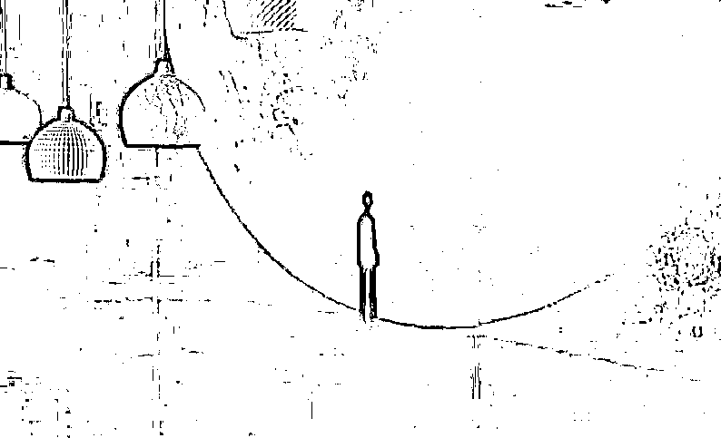**问：****可否举例说明？****郑玮玲：**次限月亮合相上升点时，是我在人生第一份长期职业上稳步成熟的标志，那时作为外企最年轻的新人，第一次获得了晋升。很多人会认为木星在七宫会有谈恋爱的迹象，但行进木星经过我七宫时，我只是专注投入在占星学的工作中，甚至省去了所有非工作的社交。而次限月亮进入我的五宫以及次限月亮在天秤座，才对应了生命中的恋爱期。次限月亮在天秤座时，天然舒适的合作关系无需找寻就来到生命中，并留下有建设性的长久友谊。当次限月亮与我的命主星、土星、天王星产生相位，以及次限月亮经过下中天时，都对应了买房置产的时期。而所有这些动迹在行进、太阳弧中并不是全部对应。**次限月亮的月相也极富参考价值。**在人生新月时期，年轻的我在人群中摸索寻找自己的位置，听凭心中的声音全力以赴于当下，做尽可能的尝试和努力。最终在新月阶段末，也是次限水星恢复顺行的时刻，找到了自己最初的职业定位：在我喜欢的顶尖影像公司走过了十年满足的职业生涯。多年以后，来到次限满月阶段，正是我考取了 ISAR 职业占星师认证的时期。当次限金星来到我的上升点时，那个微妙的发生正是充满爱的频率，是我的恩师斯蒂芬·福里斯特在工作坊中解读了我的星图，并鼓励我去享受生命，从创伤中复元去接受被爱的可能性。后来，很多人关心我有没有在恋爱？事实上并没有，也许我还需要时间。但我再次投入到喜爱的艺术学习中，现在的我正在学习书法，也在持续深入现代舞的课程，希望从古典文化符号和肢体语言的深入体验中吸取更多对占星艺术研究有用的素材，来完整我的占星学道路。

**受访者：Ara 爱拉（王珊珊）**

全职占星/塔罗咨询师《星途》《心探索》专栏作者**问：****平时咨询或者研究、学习的时候会使用次限星图么？******Ara 爱拉：****经常用。

****问：******通常是在怎样的情况下使用？**

****Ara 爱拉：****看年度运势、月度运势或者观察某种长久的人生状态（比如事业节点、婚恋阶段、人生整体境况）的时候，都会用。

**问：****觉得次限星图对于咨询的帮助大么？**

****Ara 爱拉：****很大。

**问：****可否举例说明？**

****Ara 爱拉：******次限可以作为当前年份“心境状态”的写照，月亮的落宫、落座和相位尤其体现一个人的外在气场和心境表现**。**·** 落在风（双子座、天秤座、水瓶座）、火（白羊座、狮子座、射手座）象星座、宫位时比较可能是开朗、激进的几年；**·** 落在水（巨蟹座、天蝎座、双鱼座）、土（金牛座、处女座、摩羯座）星座、宫位则蛰伏和低调）。身边一个喜欢对外打拼的友人，次限月亮在 12 宫摩羯座的将近 3 年里，就是宅在家里为兴趣范围的事自娱自乐，今年次限月亮刚出 12 宫，合相上升点，立马组织活动、郊游远行起来。另外，**个人行星在出生星图中顺行，在次限推进中转逆行时，通常会有 2-3 年的停滞期。**逆行行星转顺行也一样。比如某位过往桃花很旺的案主，在次限金星转顺行的几年停滞期里，忽然变得绝缘体一般，跟人无法建立深入的关系。另外，**月亮的月相过程也会映照一个人的打拼阶段**，比如在听某案主表示：“这几年是事业的关键时期”时，通常月亮正在进入满月时期；而某案主表示：“放弃打拼想要休息、考虑自己”的时候，是从满月到亏凸月的时期。版权声明：原创文章由作者授权首发于若道平台，欢迎转发，反对抄袭。友号转载请申请白名单。

**什么是次限推进技法？**

**星图中的月亮描述了我们在婴幼儿期和童年早期如何接收母亲的能量。**我们从出生开始就通过月亮的反射来体验母亲，正如月亮反射太阳的光一样。月亮也会描述一些我们可能会称之为灵魂的事物：**我们的人生经历在时间和永恒之间的内在反射物。**次限月亮通常被视为用于预测以及为事件择时的因素，但实际上它的内涵远远不止如此，要更为深刻和微妙。

次限推进月亮（Secondary Progressed Moon）：用次限推进，也即**一天即一年**的推进法时的推进月亮。次限推进月亮平均每月移动 1 度，虽然速度并非恒定。

**当次限月亮在我们星图上的星座和宫位推进时，它会以唤起我们个体本质以及人性的方式，反映我们成长和发展的经历。**对于那些同时开展内在和外在生活的人来说，次限月亮可以成为一个向导，照亮自我反思和内在滋养的面向。**在八周的课程中，**我们将学习次限月亮是如何像镜子一样映照出我们最深的本质的。

**此课程可作为 ISAR 选修课。**

**长按下图了解更多课程信息**

**

就是这个“在看”，戳一下☟

****报名直达入口****

# ISAR 选修丨心理占星大师格伦·佩里助你提升咨询技巧

> 原文：[`mp.weixin.qq.com/s?__biz=MzA5NjA0NTAxNg==&mid=2651443924&idx=3&sn=37001896d6944faf450062f328c7f9ed&chksm=8b4b6063bc3ce97593e1aa47e9d377a205639d6b98a542c67860fef5d2d0e78b28807644cb55&scene=126&sessionid=1692737994#rd`](http://mp.weixin.qq.com/s?__biz=MzA5NjA0NTAxNg==&mid=2651443924&idx=3&sn=37001896d6944faf450062f328c7f9ed&chksm=8b4b6063bc3ce97593e1aa47e9d377a205639d6b98a542c67860fef5d2d0e78b28807644cb55&scene=126&sessionid=1692737994#rd)

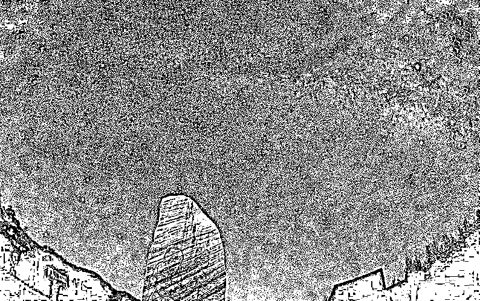

**1**

**课程描述**

格伦·佩里老师是被若道学员“考验”了六年的金牌讲师，浑身上下数不尽是优点，但最被学员和助教认可的两点：一是**太严谨了**，以最清晰的方式，将心理学和占星学两大领域融合为一。二是**太实用了**，恐怕再也没有第二人能像他一样，明白地告诉我们纵有满腹的占星学知识，究竟在实战咨询中该怎么使用出来。

**“对我来说，咨询就像是与一位美丽的女士共舞。这个活动的活力让我的头脑保持灵活、强大，而不断的学习只不过是为优雅的舞姿做准备 ，所以我绝不会踩到任何人的脚！****——格伦·佩里”**

**2**

**咨询技巧系列课程干货内容**

**即学即用的 ISAR 咨询考试定心丸****占星咨询技巧之初出茅庐 6 次课**在这个阶段的课程中，学员们将学习咨询技巧，比如如何选取一段经历，询问相关问题，提出假设，进行解读，重塑冲突，预测成长机遇，深化疗愈。我们会审视各种咨询理论，重点强调它们在占星学中的运用。学员们将学习如何处理危机，做出恰当的推荐引介。我们强调有效沟通的原则、聆听技巧、言语和非言语沟通，以及占星学如何帮助我们建立共情关系。我们会专门介绍伦理道德法则，因为它关系到职业责任问题、资质能力、咨询和预测。我们会特别关注占星师的阴影以及我们在自卑和膨胀问题上的集体脆弱。

**课程安排**

**第一课：导言与概述**

**第二课：确定咨询范围**

**第三课：会见客户**

**第四课：厘清问题（剥开占星学的洋葱）**

**第五课：认出生活模式（隐喻思维）**

**第六课：提出假设与辨识核心信念**

**占星咨询技巧之深入江湖 6 次课**

在这个阶段的课程中，参与者将继续学习咨询技巧，包括如何选取一段经历，询问相关问题，提出假设，进行解读，重塑冲突，预测成长机遇，深化疗愈。我们还将考察各种电影，考察它们与理解人们寻求帮助的共同议题的关系。我们会审视各种咨询理论，着重强调它们在占星学中的运用。学员们会学到如何处理危机，做出恰当的推荐引介。

我们会强调有效沟通的原则，以及聆听技巧、言语和非言语沟通，以及占星学如何帮助我们建立共情关系。我们会专门介绍伦理道德法则，因为它关系到职业责任问题、资质能力、咨询、预测和古代术语的运用。

**课程安排**

**第一课：检验假设**

**第二课：对星图做出初步解读**

**第三课：建设性解读星图的艺术**

**第四课：洞悉客户经历的目的**

**第五课：提供希望和方向**

**第六课：案例研究和督导**

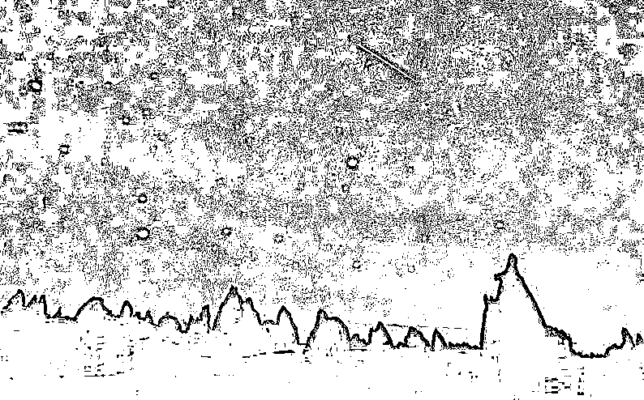

**3**

**适合人群**

**·** 2021-2022 年准备考 ISAR 认证考试的人**·** 若道核心课 L3 以上的学员**·** 非若道核心课学员 但具备占星实战咨询的理论基础**·** 已是占星咨询从业者 但对咨询中的说话技巧不够满意**·** 厌倦了抬不起头的“野路子”聊占星，想立即加入“学院派”阵营做咨询

**4**

**课程收益** 

**· **搞定占星咨询界的“社交礼仪”**· **是心理占星学版的《好好说话》和《情商课》**· **教学风格相当学术、严谨、深入浅出**· **是任何人都能即学即用的咨询技巧**· **也是 ISAR 咨询考试的入场票和定心丸 

**5**

**学员福利**

**· **跟大师一起“看电影” 考察人类共同议题**· **格伦老师男神的颜值、萌帅的笑容**· **享受他“比脸更迷人”的嗓音**· **意外在别人的案例里疗愈了自己的创伤**· **任何一对一的谈话都比以往更自信

**“当我们这些老教师还在的时候，好好珍惜，我们愿意和你们分享与客户工作的毕生经验。我们很高兴为你们提供这些知识，我们很期待看到你们在线，或是出现在若道的教室中。格伦运用自己的学术背景，同时还有作为家庭疗愈师和职业占星师的 35 年丰富经验，来创造了一门非凡的课程，一门如果存在于 30 年前，我会毫不犹豫参加的课程。****——大卫·瑞雷”****诚实的若道君友情提示**报名 204-205 网络课，以及咨询技巧大师案例演示工作坊，只能帮你大幅度提升 ISAR 咨询考试的通过率，可不是百分百过考哦。毕竟师傅领进门修行在个人，若道君可以百分百承诺的是，如果你真的学习了此次占星咨询技巧课程，受益绝对是可以持续终身的。

**6**

**导师简介**

**格伦·佩里(Glenn Perry)**这位传奇的占星师，也是一名拳击和摩托车爱好者。他毕业于赛布鲁克学院（Saybrook Institute），是心理/意识研究专业博士，也是拥有 30 余年经验的加州注册婚姻和家庭治疗师 （CAMFT）。他曾任国际占星研究协会 （ISAR）以及联合占星大会董事会（UAC）副主席，也是 ISAR 突破性道德标准的设定者。

**7**

**课程价格**

**课程价格：**7500 元**优惠价：**2 人同行 6800 元**退款原则请详看《教学协议》，如有疑问请咨询课程顾问。**

**8**

**开课时间**

**4 月 28 日-8 月 11 日（每周三）20:00-22:00**网络课程，12 次课英文授课，中文翻译

**9**

**退转课程**

  退款原则请详看《教学协议》，如有疑问请咨询课程顾问。

****咨询技巧全攻略****

**授课老师：格伦·佩里**

**授课时间：****4 月 28 日（周三）20:00-22:00**

**授课方式：**网络课程：英文授课，中文翻译

**费用：7500 元 ****优惠价：2 人同行 6800 元**

**课程负责人：Margaret（微信号：nodoor233）**请备注“咨询技巧”

长按二维码添加课程负责人咨询~

****报名请点击“阅读原文”****

# 重大天象丨冥王星开始逆行，12 星座都要面临什么考验？！

> 原文：[`mp.weixin.qq.com/s?__biz=MzA5NjA0NTAxNg==&mid=2651443867&idx=1&sn=fd29e875eb324186f01c4a8e9505475a&chksm=8b4b602cbc3ce93a0cb58c5f50c85d83976dfbf4e8151d4e8c8c361cad6e690efb0fe39482fc&scene=126&sessionid=1692737994#rd`](http://mp.weixin.qq.com/s?__biz=MzA5NjA0NTAxNg==&mid=2651443867&idx=1&sn=fd29e875eb324186f01c4a8e9505475a&chksm=8b4b602cbc3ce93a0cb58c5f50c85d83976dfbf4e8151d4e8c8c361cad6e690efb0fe39482fc&scene=126&sessionid=1692737994#rd)

******☆ ****后台回复“今日”，给你一句生命态度******

作者/图片提供/Justine ISAR 认证占星师
编辑/翀子 封面/书君

2021 年 4 月 28 日，冥王星将开始它为期 5 个月的逆行。冥王星意味着不可逆转的改变，当它逆行，通常会带来深刻的内省过程。

**2021 年 4 月 28 日，冥王星从摩羯座 26°48’开始逆行，直到 10 月 7 日回到摩羯座 24°19’。**

**将恐惧转化为力量与信任**

在占星学上，冥王星是环绕太阳运转的最遥远的星体，也是最深不可测的行星之一。**冥王星的主题，集中在最深的自我，禁忌神秘、转化和潜意识上，**这种原型可能会让某些人感到恐惧。

尽管冥王星的能量并不是最舒适的，但绝对有必要。当我们做出改变人生的决定时，冥王星就会出现。**冥王星代表不可逆转的转变****。**通过冥王星，灵魂象征性地被拆除和更新。**冥王星的行进，会将恐惧转化为力量和神圣的信任。**

**自 2008 年 11 月以来，冥王星一直在摩羯座。**摩羯统治着一切结构、制度和社会性的事物。**摩羯座的冥王星的目的是重组社会**（彻底改革全球政治和经济），使我们可以再次与地球和更广阔的宇宙与自然循环和谐相处。

过去的 12 年来，摩羯座的冥王星，**暴露了虚伪、腐败和贪婪的的全球失败体系，**凸显人类社会发展、科技进步与环境、自然之间的议题，**揭露了当下地球上阴性能量和阳性能量之间的巨大不平衡。**

2020 年，木星、土星与冥王星在摩羯历史性大合相之后，目前只剩下冥王星还驻守摩羯座，但冥王星在摩羯座的时代（从顶部开始控制的霸权或专制）已经进入了末期。

**摩羯座最后几度，在经世占星中被视为“独裁统治”增强的度数**——我们看到，不仅是政治领导人的独裁（特朗普已经下台，但霸权主义的美国在持续衰弱），还有想要控制世界的机构与公司（国内反垄断法开始对大平台的监管加强）。**摩羯座最后几度最不容易，但抵抗的力量也将是强大的。**

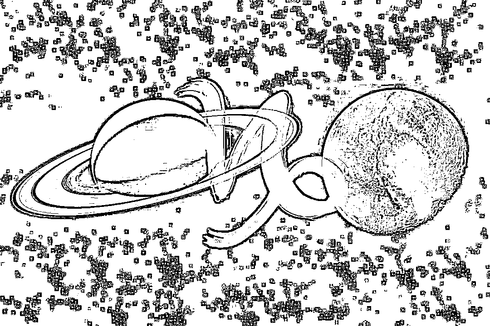

**真正的突破发生在内在**

外行星的逆行是很常见的，**每年有 5 个月左右的时间在逆行，**但非常重要。因为真正重要的发展和突破，**通常发生在内在，**而且需要时间来积累，**最后才通过外在的事件与环境表达。**

当冥王星逆行，其能量向内强化。**对于个体而言，这会带来反省——深入向内看的心理驱力。**

此次逆行敏感人群

**如果你有太阳、月亮、上升点的守护星、四轴在开创星座（白羊座、巨蟹座、天秤座、摩羯座）的 23-27 度，你会是这次冥王星逆行的敏感人群。**

这意味着，行进的冥王星与你星图上的关键点成合相、四分、对分相，冥王星这次逆行，至少会是与这些敏感点的第二次精确成相。

一颗外行星的行进，平均与个体本命盘中的某一点三次精确成相（偶尔会有五次或一次）。每一次，都标志着行进的一个阶段。巧合的是，**个人学习也有三个阶段。**

学习三阶段

**第一个阶段：投射或观察（外行星顺行，第一次精确成相）**

可能是最震撼的，因为这股能量一开始在我们的意识之外。当其第一次被观察到，从而可以成为我们意识的一部分。

**第二个阶段：认可或接受（外行星逆行，第二次精确成相）**

我们开始意识到问题的存在，接受自己是其中的一部分，不知道该怎么做或该如何处理。

**第三个阶段：同化（外行星顺行，第三次精确成相）**

我们在生活中吸收并同化了这股能量。曾经如此陌生、如此奇怪、如此令人不安的能量，似乎与其他日常的记忆和经历，一起消失在了背景中。

**当冥王星逆行，我们在经历的是第二个阶段。**

因此，这是一段来自灵魂深处的旅程。**通过由内而外冥王星的加压，直到出现一个新的自我。**正是每年五个月的冥王星逆行，使我们年复一年地接近自己的最真实的核心——**“我必须成为谁”**。

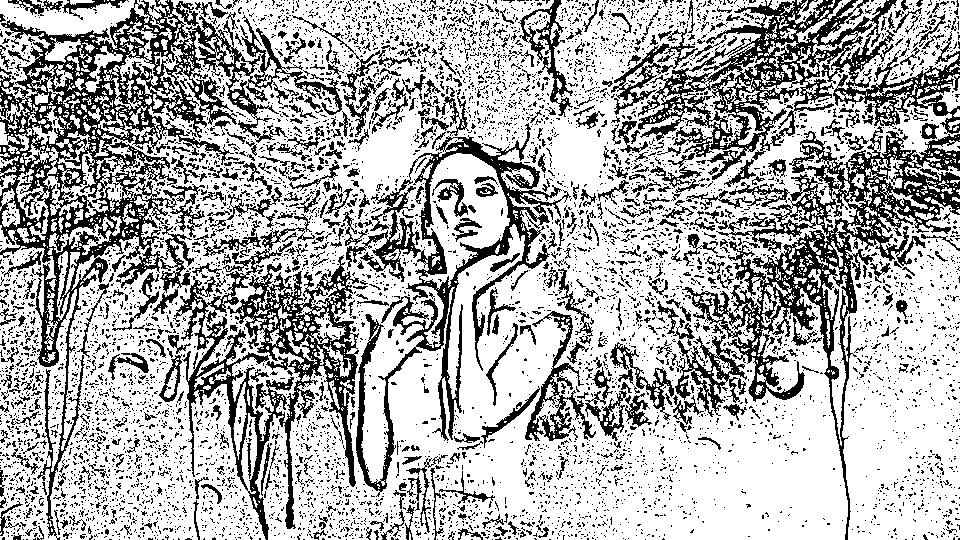

**冥王星逆行的关键日期**

**4 月 28 日冥王星开始逆行**，**几天后就会跟水星和金星形成和谐的相位，**使我们在进行这种充满力量的转变时，能够软着陆。这将是清理你的精神壁橱，或断舍离房屋中旧物件的好时机。

**5 月 17 日，冥王星与太阳呈和谐的三分相，**将带给我们一些重大的变革能量，鼓励我们不要害怕，勇敢踏上新的角色与征程。

**6 月 6 日，**会是一个紧张的日子，因为**冥王星、月亮和火星之间形成了 T 三角。**如果你松懈责任或鲁莽行事，会付出代价。

**6 月 24 日，冥王星和金星对分，**通常会面临关系的挑战，且涉及其核心的某些现实。关系的另一方无论哪里让你不满意，会进一步暴露其缺点。任何不能为你带来最大利益的合作伙伴关系，都可能瓦解。

**7 月 18 日，冥王星来到了巨蟹座太阳的对面，**非常强大的能量，你的个人野心可能会被激起，也可能会引起你与上司或其他权威的权力斗争。需要小心，审视自己的动机，不要试图强迫别人做一些违背他们意愿的事情。

**9 月 17 日，冥王星与处女座太阳形成三分相**，将带来一些释放的感觉，你终于从过去的沉重挑战中幸存下来，并且更加强大、高效、有力，能彻底地向他人表达自己。

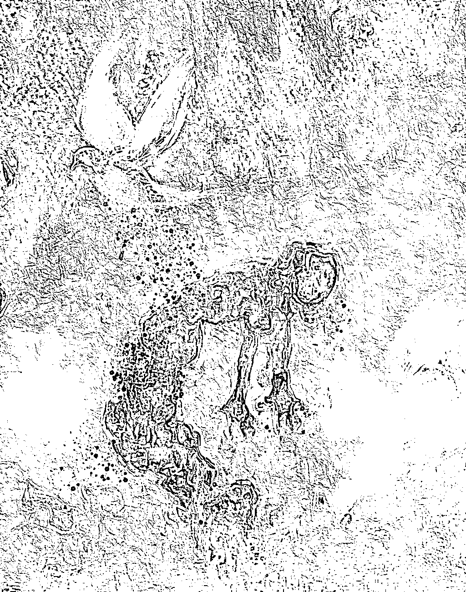

**冥王星逆行对 12 星座的影响**

即使行进的冥王星没有跟你的星图上的敏感点形成相位，它也会通过其行进的宫位，给你的个人生活带来微妙的变化，**督促你向内处理涉及业力、结构和稳定性的事务。**

**若道君：****你可以在 app store 或者应用商店搜索“若道”下载 app，输入个人档案，查看行运盘（也可以使用其他星图软件），找到行运冥王星落在出生星图的第几宫，然后对照下文查看冥王星逆行的影响。**

**例如下图中，行运冥王星在美国总统拜登个人星图的第 2 宫。**

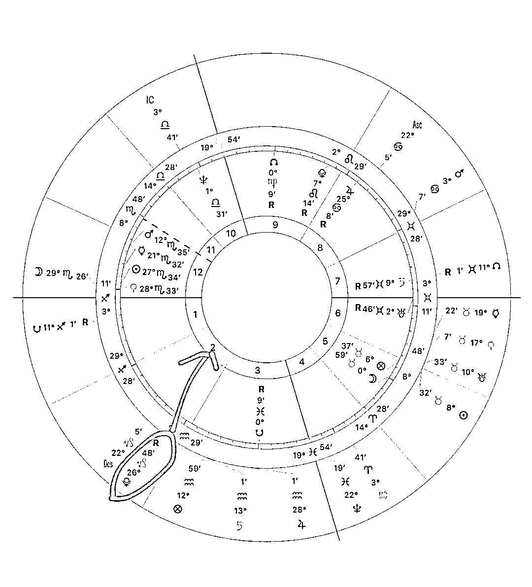

**上升*****白羊座*****（冥王星逆行在第*****10*****宫）**

亲爱的白羊座，你以热爱自由闻名，但这次逆行要求你看看这到底意味着什么。如果你一直被自己的工作所束缚，却因为安全感而避免采取某些行动，那么宇宙现在可能对此有话要说。

请务必利用这段时间弄清楚：**如何发挥你的全部职业潜力****。**责任可能很很压抑，但是要**勇敢地面对它，**而不是逃避。**拿回你自己的权威和力量**，要不然，你将不得不在职场上面对给你不断制造挑战的人。

**上升*****金牛座*****（冥王星逆行在第*****9*****宫）**

亲爱的金牛座，安全性和稳定性对你很重要，你甚至有点过于习惯了。**这次逆行将要求你以并非总是准备好的、突破固有的方式去面对一切。**

请深入听从自己内在的呼唤，继续吸收生命中深奥的一面。**花一些额外的时间进行冥想，深入研究你真正感兴趣的议题，并从学习中获得极大的满足感。**你会从这段逆行期间得到启发和活力，内心成长的机会是无限的。

**上升*****双子座*****（冥王星逆行在第*****8*****宫）**

亲爱的双子座，在这次逆行期间，你的人际关系可能会紧张。**亲密关系内部的、深层的、黑暗的秘密会显现，你不得不深入水域去探索它。**在与关系中的另一方，陷入内心冲突或权力斗争前，**你可以试着跟对方谈谈自己最真实的感受。**

记得为自己安排一些时间，不要害怕释放不再为你服务的人或情境。在这五个月里，会有很多内在变革性的能量，只有你可以决定是否能抓住它。

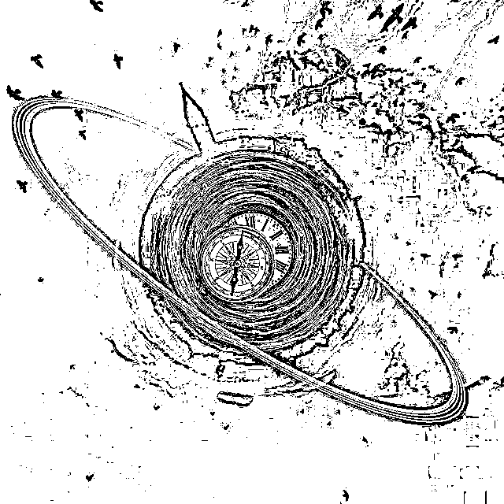

**上升*****巨蟹座*****（冥王星逆行在第*****7*****宫）**

亲爱的巨蟹座，这次逆行可能对你而言并不那么容易。因为冥王星在摩羯座，在你黄道星座的另一端，因此你将直接面对逆行的能量。你关系的过山车，可能会起伏不定，一波三折。

**现在，是时候面对你一直在回避的任何关系议题了。**另外，人际关系的边界和沟通的技巧会很重要。你会内省并发现：爱，不等于与控制，占有、怨恨、内疚和权力斗争……**在关系的波折中，你会成长，更清楚地看到自己。**

**上升*****狮子座*****（冥王星逆行在第*****6*****宫）**

亲爱的狮子座，在这次逆行中，你可能需要**检查自己的时间安排，调整睡眠、饮食、锻炼的生活方式，**让你的工作与生活之间能更好地平衡。

如果今年你一直在过度消耗自己的体力，那么在冥王星逆行的过程中，你可能会感受到其对身心健康的影响。另外，工作中出现的权力斗争或任何戏剧，都可以作为一种修行，帮助你来面对和处理自己需要改变的部分。

**上升*****处女座*****（冥王星逆行在第*****5*****宫）**

你是一位完美主义者，亲爱的处女座，你总是专注在如何让事情将更有效地运行，总是在寻求有效的变革。你会强迫自己工作，但如果你的愿望在现实世界受挫，你可能憎恨聚光灯下的人，或者消极地自我厌恶。

**这段时间，去让自己尝试新的东西，发挥自己的创造力。**通过探索新事物，你的思想将开辟新的途径，你也会弄清楚自己独一无二的价值——**一个比以往任何时候都真实可信的新身份。**

**上升*****天秤座*****（冥王星逆行在第*****4*****宫）**

亲爱的天秤座，**这次逆行会让你专注于自己的内在世界、家与家庭生活。**

**一些久远的记忆，**特别是你童年时代的经历，可能会跟现实中爱、母亲、房屋的议题夹杂在一起，**重新出现。**特别当你有强势的或缺乏爱的父母，或你的童年经历过死亡、遗弃、分离，这段时间会是探索内在的好时机。**去直面童年的创伤和怨恨，**无论通过什么方式，找到你的恐惧和焦虑的来源。**你有能力治愈自己早期的创伤。**

**上升****天蝎座****（冥王星逆行在第*****3*****宫）**

亲爱的天蝎座，深入内在、转化重生的冥王能量对你而言并不陌生，**在这段时间，你会发现需要建设性地使用语言的力量。**你可以用语言来操纵、伤害他人，甚至摧毁一切，也可以通过语言来疗愈别人，直接触及问题的核心。

**这是一段内省的时间，试着让自己变得更有洞察力，让思维和沟通更深刻。**你的目标，是用语言来影响和授权他人，把冥王星的积极能量带给更多的人。

**上升*****射手座*****（冥王星逆行在第*****2*****宫）**

亲爱的射手座，每个人都喜欢你自由、乐观、冒险的特质，但这些也许只是你的面具。**你需要在这段逆行期间，重新评估你真正想要的是什么，或重新找回你的自信。**

在过去几年，如果你的财务持续出现问题，**现在是时候收紧财务状况，制定计划，**来偿还过去悬而未决的所有债务了。金钱议题是自我价值的体现，请向内探索自己赚钱的能力，**去想自己有哪些资源可以转化为财富。**你可以成为吸引丰盛、显化财富的魔术师。

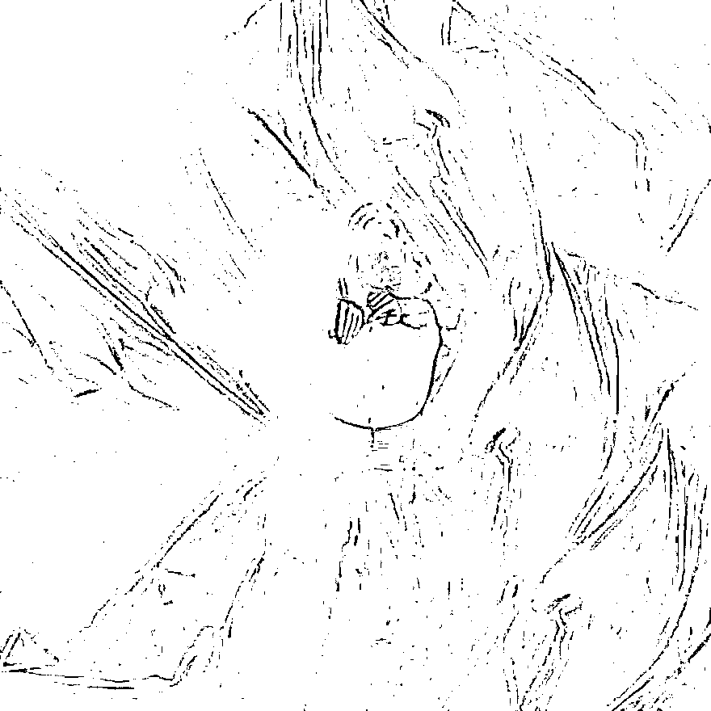

**上升*****摩羯座*****（冥王星逆行在第*****1*****宫）**

亲爱的摩羯座，冥王星的逆行，对你而言并不轻松。**你需要重新评估你到底是谁。**你会向内探索自己的力量：什么时候适合炫耀自己的力量？什么时候需要行驶自己的权力？必须对他人施加压力、让自己处在支配地位才安全吗？

在这个逆行期间，这对你来说是一个鼓舞人心的机会——你永远不会知道你是谁，除非你摆脱你虚假的面具。**只有你看到真实自己，才能看到其他问题的核心。**

**上升*****水瓶座*****（冥王星逆行在第*****12*****宫）**

亲爱的水瓶座，你会有些激进，但拥有关于人类如何共同改变的愿景。**在这次逆行期间，你可能会更加意识到社会需要如何发展。**冥王星的能量会打动你的内心深处，如果你不小心，可能会使你沮丧。不要压抑自己的情绪，这会引发躯体的不舒服。**当你对世界感到忧虑时，请采取一些措施，不要让自己丧失生活的热情。**

也许你本身就是一个疗愈师或咨询师，**这段时间是你为他人做深入疗愈的好时机。**深入 12 宫的黑暗秘室，为你希望看到的心灵变化投入精力。

**上升*****双鱼座*****（冥王星逆行在第*****11*****宫）**

亲爱的双鱼座，如果你的朋友圈需要更新，那么这次逆行很可能就是改变的催化剂。**你会重新评估人际关系的面向，**花时间考虑一下，你的哪些朋友和熟人是带来支持和积极的能量，那些不是？**在这个过境结束时，你会失去一些朋友，但存留下来的友谊将更加强大和坚固。**

在某段时间内，你可能会选择保持孤立，因为很难信任其他人。但慢慢地，你会找到一些志趣相投的人建立联系。**友谊会成为你个人转变的契机，**当你遇到一些不害怕激烈和强度的冥王星人，与之交往和互动，可以帮助彼此疗伤。

**冥王星率先引领群星逆行**

**4 月 28 日，冥王星会率先引领群星的集体逆行，随后紧跟各个行星**：土星（5 月 23 日）、水星（5 月 30 日），木星（6 月 20 日）和冥王星（6 月 26 日）。

这些行星逆行的能量，将要求我们慢下来反思：**为了在生活中找到健康和平衡，你是如何与你的行为、思想和感觉共舞的？**

**而冥王星的反思，也是群星中最深邃直达核心的。**因为冥王星代表了不可逆转的转变——可以经历的**最深层次的、终极进化。**冥逆行会净化了地下世界，提取我们的潜意识记忆中的悲伤和恐惧。

掌握内心最深的无意识能量是非常困难的，这使得冥王星逆行的功课非常有挑战。

**但是请相信，到这个逆行周期结束时，你将对自己当下最深入、最具挑战性的生命课题会有新的了解。**你也会收到冥界之神的礼物：通过带走你不再需要的东西，让你破茧成蝶，进入新的生命阶段。

**版权声明**：文章由作者授权首发于若道平台发布，欢迎转发，反对抄袭。

****

**Justine**

ISAR 国际认证占星师（2014 年获得）/塔罗师

毕业于浙江大学，十年跨国企业 HR 经验

咨询时长超过 1000 个小时

**咨询微信**：Justine_JT

**公众号**：星光体

长按打赏

**系统学习占星学**

**点击图片了解详情**

**微信又双叒叕改版啦，不想错过若道君的推送？**

**就把若道设为星标吧！**

**▼**

**喜欢记得点一下在看哦☟**

**报名直达入口**

# 现代占星学，创造性的预测工具

> 原文：[`mp.weixin.qq.com/s?__biz=MzA5NjA0NTAxNg==&mid=2651443867&idx=2&sn=72a3708c961e6a5dcf5b2b9431dd439e&chksm=8b4b602cbc3ce93a3c50676bec5a2bcd98be4f9bbc12fe40d7b2e7ec751955b217b9f70ba9d4&scene=126&sessionid=1692737994#rd`](http://mp.weixin.qq.com/s?__biz=MzA5NjA0NTAxNg==&mid=2651443867&idx=2&sn=72a3708c961e6a5dcf5b2b9431dd439e&chksm=8b4b602cbc3ce93a3c50676bec5a2bcd98be4f9bbc12fe40d7b2e7ec751955b217b9f70ba9d4&scene=126&sessionid=1692737994#rd)

作者/大卫·瑞雷 若道占星创始人译者/李含 校对/江艺编辑/翀子 图片/网络

现代占星学与古典占星学最重要的差别在哲学理念上，我们选择什么样的占星学取决于我们的信念体系，取决于我们如何定义“命运”。现代占星学和古典占星学同样关注预测，我们可以亲身去体验不同占星学的哲学差异。

**古典占星学与现代占星学**

这是探讨现代西方占星学简明定义系列文章的第一篇，主要阐述传统的根源。近 15-20 年古典占星学在占星圈中又重绽光芒，这主要得益于“后见之明计划”（Project Hindsight）。

这是一项极好的研究项目，由罗伯特·施密特（Robert Schmidt）、埃伦·布莱克（Ellen Black）、罗伯特·汉德（Robert Hand）和罗伯特·左勒（Robert Zoller）在 1993 年组织发起，他们研究“希腊语”和“拉丁语”，能够更好地将现存的古典占星资料“翻译”成英文。罗伯特·施密特是主编者。

学习和研究古典占星学具有十分重要的“历史”意义，它向西方现代占星师们展示了他们所遗忘、忽略或很少使用的技巧。**以现代视角审视如此古老的方法可能获得一些有价值的信息。**但是回顾占星学传授和实践的历程，现代占星师们看到了巨大的差异，这种差异不仅体现在技巧上，更体现在“信念体系”上，这才是更为根本和重要的。

事实上，**西方现代占星学与古典占星学最重要的差别体现在哲学理念上。**阅读这篇文章，你可以判断哪种占星学更吸引你：古典占星学还是西方现代占星学？

正如你将读到的，**这在很大程度上取决于你的信念体系。**相信 “宿命论”的人，认为自己不可能改变“命运”的人很可能会被**古典占星学**所吸引，但是那些认为“命运掌握在自己手里”的人，认为通过努力可以获得更具有满足感的人生，会更倾向于选择**现代占星学**。一些人或许会说“两者都对”，“有一些事是注定的，而有些则不是”。

**当然，这要看你如何定义“命运”。**天气预报是“注定”的吗？“眼睛和头发的颜色是命运的安排吗”？以现代语言来说，这些预测性要素都不是“命中注定的”。天气预报说有 70%的几率会下雨是一回事，但预测“某人”在下雨时会去做什么则是另一回事了！同样，这种天气可能非常适应耕种，但某人可能选择不下田！

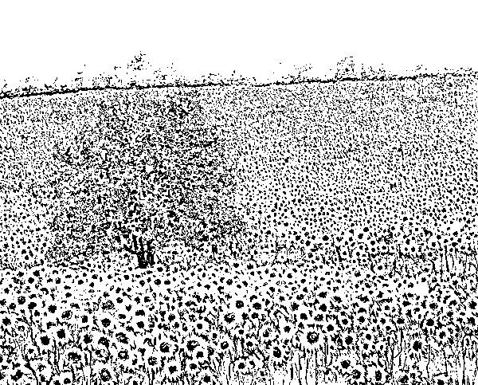

**现代占星学的预测**

**现代占星学是一门预测科学，**这一点需要明确！当我听到有人说现代占星学并没有运用占星技巧作为预测工具时感到十分震惊！之前杰夫·焦耳在北京时，我跟他谈起此事，我告诉他，在中国有些占星师说现代占星师“不作预测”。杰夫回答道：“什么？！我在美国从未听到这种说法？这是谁说的？”

**但是负责任的预测和不负责任的预测之间是有分别的。**我相信，在任何时候，做出言之凿凿的预测，而否定了一个人可以做出更佳选择的能力，都是不负责任的行为。我为客户咨询预测已经 37 年了，**我从未将绝对性的预测强加于任何客户。**一次又一次，客户回头来告诉我“多亏了你的预测，我作出了正确的决定，结果棒极了！”有客户曾对我说，我“拯救了他的人生——一字不差！这种满足感无以言表！

**对于预测的“方式”，占星界有不同的看法。**明显属于“心理学占星师”的，比如格伦·佩里就非常好地阐述了决定性预测的危害，**提醒占星师审视每一个预测带来的心理影响。**

我非常同意格伦·佩里的观点，**但我对预测更为开放。**占星师们的预测方式多种多样。但大部分现代西方占星师都会很自然地从事预测事务——即使他们只是简单做出“行为预测”，如同心理咨询师所做的那样。**每一张出生星图说到底都是一份预测脚本。**

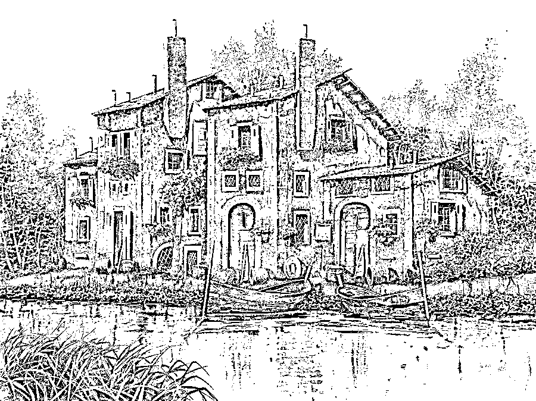

声称古典占星学比现代占星学预测得更准确，这是一种很有趣的论调。且不说这种论调对于那些努力实践占星学的现代占星师来说很不尊重，我实在无法想象这种说法的立足点是什么。希望预测准确是显而易见的；人们很自然地希望预测体系是可靠的。

一些占星师付出巨大的心力寻求“魔弹”，希望作出始终正确的长期预测。然而，如果你寻求绝对的“科学式的精准”，要求“每一步运势”都与预测完全一致，那你最终一定会对所有的占星预测体系失望，理由很简单，因为**个人自由包含了非常多变数，**都可以将之归为一个混沌体系了。当然，如果你认为自由意志是一种幻觉，不断变化的混沌体系也不过是海市蜃楼，那么你会继续寻求占星预测的“圣杯”。

我不是科学家，也不能拿出统计数据来支持我几十年的占星预测工作。但我可以告诉你，我的客户这么多年一直追随着我。**我把预测作为一种创造性的规划工具，**我的客户们年复一年的来咨询运势预测。职业生涯中，我还与一些商业客户保持着咨询关系。假使我不能准确预测商业趋势，这些客户就会离开，我也无法持续从事全职占星师的工作。

比如，25 年多以来，我一直为一家公司进行预测服务，它后来成为全球最大的建筑分析师公司，公司的名称是 A.W. Hutchison&Associates。我为这家公司的高管出谋划策，从公司初创一直到所有者卖掉公司，选择退休。（我已征得公司负责人的同意，将公司名字写出来。）

这家公司主要由工程师和建筑师组成，**他们需要“准确而有价值”的预测信息，为团队建设和危机管理提供支持。**我可以告诉你，“工程师”可不会和颜悦色地回应错误的信息，如果我的预测不准确，他们就不会继续找我咨询了。我甚至参与了公司最后成功出售的策略分析工作，他们最后卖给了 Navigant Consulting International 这家公司。

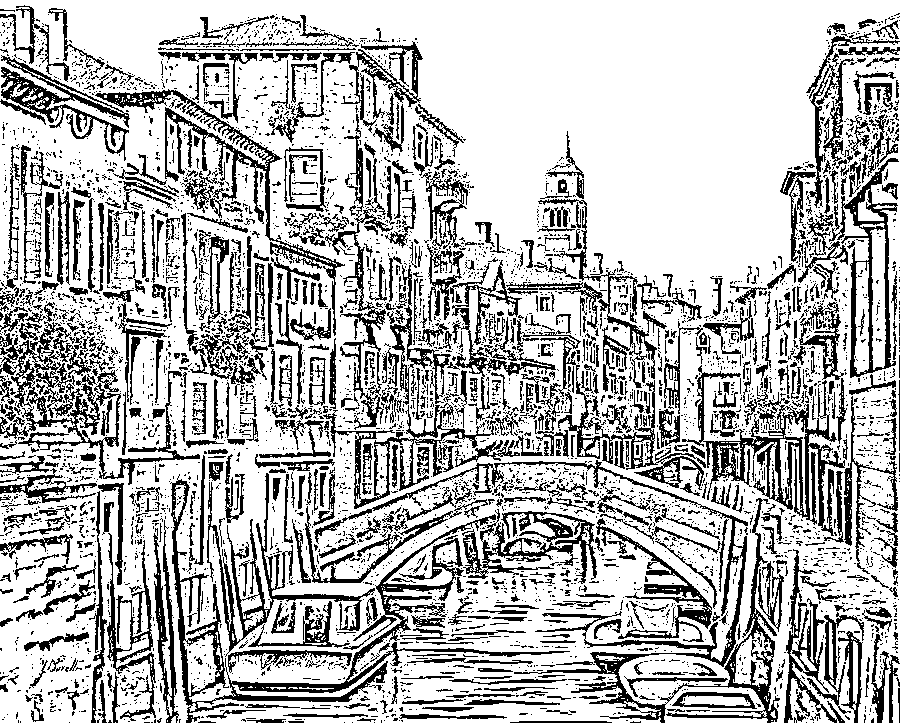

这只是我职业生涯里的一个例子，但是我知道许多现代占星师都曾做过，而且也在继续做着类似的工作。那些声称现代占星师只不过向女性贩售“安慰剂”的人，不仅是在故意侮辱占星师，更是对这些女性的污蔑，同样也表现出了他们的偏见和无知。自然/进化选择由女性生育繁衍后代，因为她们比男人更能控制压力。

我的经验告诉我，男人比女人笨，他们的生活风险比女人更高。男人在迷路时也不愿停下来问路，只是继续兜圈子。而女人则会停下来，问清楚方向，而不会白耗汽油和时间，到处乱窜！女人不是在寻求安慰，她们寻求的是“信息”。

有关预测，最后再说一点，当经济学家作出预测，或者是社会学家预测社会趋势，没人会说他们是“算命术士”！即使是在西方社会，占星师还是有时会被“贬斥”为算命术士，**很大程度是因为古典占星学的宿命论哲学。**我会在随后的文章举一些古典占星阐释的例子来说明为何在西方现代占星学能够作为一种严肃的咨询方式，同时也作为一个自我觉知和个人成长的工具出现在西方——而不是继承传统作为算命的技法。

**我想要为认真学习占星学的同学们界定现代占星学，**然而，正如我经常对学生们说的那样**“请学习和钻研任何你感兴趣的占星学领域”！**古典占星学绝对值得阅读和学习。**进阶的学生至少要熟悉西方占星学的历史和起源，亲身去体验古代与现代世界的哲学差异。**

**版权声明：**原创文章由作者授权发布于若道平台，欢迎转发，反对抄袭。友号转载请申请白名单。

****想阅读更多作者的文章，请在后台回复******大卫****** 即可。****

**喜欢文章请长按下方二维码打赏**

**给大卫老师加杯咖啡呗~**

**▼**

**系统学习占星学**

**点击图片了解详情**

**微信又双叒叕改版啦，不想错过若道君的推送？**

**就把若道设为星标吧！**

**▼**

喜欢记得点一下在看哦☟

********报名直达入口********

# 重磅丨 ISAR 选修课·深度掌握次限月亮的技法

> 原文：[`mp.weixin.qq.com/s?__biz=MzA5NjA0NTAxNg==&mid=2651443867&idx=3&sn=41d742e848db1b6271b50d684a4c156a&chksm=8b4b602cbc3ce93adb55ff107c3154106b88cfccafee5c2fb553aea0d631993eaa114594ed87&scene=126&sessionid=1692737994#rd`](http://mp.weixin.qq.com/s?__biz=MzA5NjA0NTAxNg==&mid=2651443867&idx=3&sn=41d742e848db1b6271b50d684a4c156a&chksm=8b4b602cbc3ce93adb55ff107c3154106b88cfccafee5c2fb553aea0d631993eaa114594ed87&scene=126&sessionid=1692737994#rd)

**星图中的月亮描述了我们在婴幼儿期和童年早期如何接收母亲的能量。**我们从出生开始就通过月亮的反射来体验母亲，正如月亮反射太阳的光一样。月亮也会描述一些我们可能会称之为灵魂的事物：**我们的人生经历在时间和永恒之间的内在反射物。**次限月亮通常被视为用于预测以及为事件择时的因素，但实际上它的内涵远远不止如此，要更为深刻和微妙。

**次限推进月亮**（Secondary Progressed Moon）：用次限推进，也即**一天即一年**的推进法时的推进月亮。次限推进月亮平均每月移动 1 度，虽然速度并非恒定。

**次限推进：托勒密时期，2 千年前发明。**

**当次限月亮在我们星图上的星座和宫位推进时，它会以唤起我们个体本质以及人性的方式，反映我们成长和发展的经历。**对于那些同时开展内在和外在生活的人来说，次限月亮可以成为一个向导，照亮自我反思和内在滋养的面向。**在八周的课程中，**我们将学习次限月亮是如何像镜子一样映照出我们最深的本质的。

**此课程可作为 ISAR 选修课。**

1

**课程安排**

**课程安排：5 月 10 日--6 月 28 日 （每周一）**

*   **5 月 10 日** 出生星图中的月亮与它在童年 0-7 岁的推进

*   **5 月 17 日** 7-14 岁：从自我到他人

*   **5 月 24 日** 14-28 岁：从他人到自我

*   **5 月 31 日** 次限月亮推进 vs 土星行进

*   **6 月 07 日** 次限月亮与其他行星形成的相位

*   **6 月 14 日** 30-60 岁的次限月亮推进：再次回转

*   **6 月 21 日** 60 岁以后的次限月亮之旅

*   **6 月 28 日** 次限月亮与次限太阳的关系

2

**课程大纲**

**第*****1*****讲  ****5 月 10 日 **

**出生星图中的月亮与它在童年的推进**

我们将学习出生星图中月亮的象征意义，以及它如何反映你的母亲以及你童年的家庭生活。我们将从元素的角度观察月亮，并研究从出生起你是如何得到母亲的关注的，我们将观察出生后几年的月亮的推进。

**第*****2*****讲  ****5 月 17 日 **

**从 7 岁到 14 岁：从自己到他人**

次限月亮与出生星图中月亮的第一个四分相在 7 岁左右出现。我们将学习在这个关键时间点我们是如何开始意识到自己是独立存在的个体，以及它如何让我们向家庭以外的其他人寻求滋养和生命。

**第*****3*****讲  ****5 月 24 日 **

**从 14 岁到 28 岁：从别人到自己**

从十六七岁到 28 岁左右第一次次限月亮回归，我们完成了与他人和与自己的月亮的灵魂之旅。从次限月亮回归开始，我们就开始对自己的情感生活以及我和其他人之间所发生的负责。

**第*****4*****讲  ****5 月 31 日 **

**从 14 岁到 28 岁：从别人到自己**

当次限月亮描述我们内心的旅程时，土星的行进描述了我们与周围世界的联系，以及作为社会发展中的个体，世界对我们的要求。在我们生命的头 30 年里，它们几乎以相同的速度运行。

**第*****5*****讲 **** 6 月 7 日 **

**次限月亮与其他行星的相位**

我们将从次限月亮的旅程中抽身出来，看看它与各种不同人的星图的其他行星产生有趣而特别的相位时发生了什么，这样我们来了解次限月亮触及我们星图中的这些行星时会发生什么，以及我们该如何为自己的生命导航。

**第*****6*****讲  ****6 月 14 日 **

**30-60 岁的次限月亮推进**

当月亮再次绕着出生星图运行时，我们有机会将意识带到我们的情绪反应中，并开始引导我们的内在本性，而不是对发生在我们身上的事情束手无策。

**第*****7*****讲  ****6 月 21 日 **

**60 岁以后的次限月亮之旅**

在当今时代，60 岁以后过着积极生活的人比历史上任何时候都多。有的人在 70 多岁的时候坠入爱河并第一次结婚。我们将在这一讲探讨如何在我们生命的最后几十年里对自己和他人有用，这样我们就可以体验到生命的丰富多彩。

**第*****8*****讲  ****6 月 28 日 **

**次限月亮与次限太阳的关系**

最后，我们来研究次限月亮绕着星图运行时与次限太阳推进的关系。我们将通过星图案例来进行探讨。

3

**此次课程适合哪些人？**

*   有一定占星学基础，若道核心课 L3 以上水平；

*   希望成为优秀的占星师，想要借鉴国际大师次限解读思路并融入自己的体系的人；

*   希望研究自身人生周期，想好更好的规划人生的占星学者；

*   走在自我探索和个人成长道路上的人。

4

**主讲老师**

**达比·科斯特洛（Darby Costello）**

达比·科斯特洛（Darby Costello）在美国波士顿学习占星学，在非洲生活过 12 年，于 1983 年移居英国伦敦。她曾在长达 25 年的时间里担任心理占星中心的首席教师，是占星研究学院的任课教师，也是伦敦占星学院的客座导师。此外，她拥有“文化天文学与占星学”硕士学位。她在世界各地授课与写作，服务全球客户是她占星师生涯的核心。

| 达比·科斯特洛与琳恩·贝尔

**网站个人简介：**

达比·科斯特洛（Darby Costello）出生于美国，1960 年代曾跟随弗朗西斯·萨科安（Francis Sakoian）、路易·阿克（Louis Acker）以及伊莎贝尔·希基（Isabel Hickey）在波士顿学习占星学。随后，她去了非洲，与部落疗愈者和占卜者一起共事多年，并在期间精进自己的占星学实践。1983 年，她去英国伦敦寻找占星团体。令她高兴的是，她找到了这样的团体，并在许多层面上参与其中。到伦敦后不久，她就开始拓展占星客户，并于 1988 年开始在由丽兹·格林和霍华德·萨司波塔斯创立的心理占星中心任教。十年后，她成为首席讲师，并为心理占星中心出版社撰写了几本书。

达比还是占星研究学院的导师，并于 2014 年获得荣誉文凭。她是心理占星学水星网络学校（MISPA）和占星大学的讲师，也是伦敦占星学院的客座导师。她在欧洲和世界其他地方教书和授课，也曾在巴厘岛、中国大陆和台湾等亚洲地区以及阿拉斯加等北美地区授课。2013 年，达比被授予查尔斯·哈维奖，以表彰她对占星学做出的卓越贡献。

2006 年，达比获得在巴斯斯巴大学（Bath Spa University）“文化天文学与占星学”专业硕士学位。这段学习经历也让她更懂得品读历史，并对写作产生了更深的热爱。不过，她最爱还是解读星图，她遍布世界各地的客户也滋养并进一步激发了她的占星学灵感。

**达比·科斯特洛的著作：**《占星学中的月亮》《水元素与火元素》、《土元素与风元素》、《火星四重奏》、《占星学》。

5

**课程价格**

**价格**：6800 元

还有限时 ISAR 选修课联报套餐价格，具体请咨询课程顾问：Maggie 老师（微信：18510107057，请备注“次限月亮”）

长按二维码添加 Maggie 老师

6

**退转课程**

*   **退款原则请详看《教学协议》，如有疑问请咨询课程顾问。**

****ISAR 选修课：次限月亮****

**授课老师：达比·科斯特洛**

**授课时间：**2021 年 5 月 10 日（周一）起

**授课方式：**网络课程**，**英文授课，中文翻译

**费用：**6800 元

**课程负责人：Maggie 老师**（微信：18510107057，请备注“次限月亮”）

长按二维码添加课程负责人咨询~

****报名请点击“阅读原文”****

# 插班中丨苏·汤普金斯 Level 1-2，国际大师手把手领你入门占星学！

> 原文：[`mp.weixin.qq.com/s?__biz=MzA5NjA0NTAxNg==&mid=2651443796&idx=2&sn=084a5a97af22d8cba13b052d9c4f3789&chksm=8b4b60e3bc3ce9f536e481f8ddee7d3f890f1fadcf2907cf88490770ec3f50eae87a59226cc2&scene=126&sessionid=1692737994#rd`](http://mp.weixin.qq.com/s?__biz=MzA5NjA0NTAxNg==&mid=2651443796&idx=2&sn=084a5a97af22d8cba13b052d9c4f3789&chksm=8b4b60e3bc3ce9f536e481f8ddee7d3f890f1fadcf2907cf88490770ec3f50eae87a59226cc2&scene=126&sessionid=1692737994#rd)

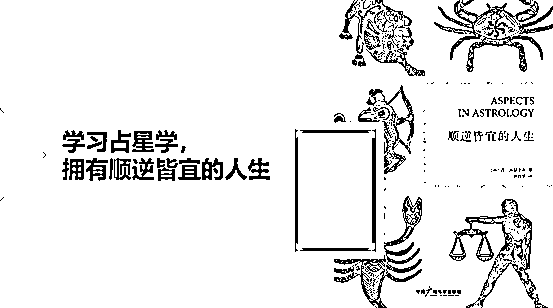

**随着土星和木星进入水瓶座并形成合相，新时代的浪潮已经到来。未来 200 年的风象时代，你是否已经做好准备迎接它了呢？**

经历了五味杂陈的 2020 年，我们正踏着木土水瓶座的能量脉动进入 2021 年，你可能有这样的疑问：我需要储备什么样的**知识和技能**，可以让我**更从容的面对生活，拥有顺逆皆宜的人生呢？**

开始学习一门**天王星能量**的学科，无疑是一个智慧的选择。

天王星，正是**占星学**的守护星。天王星，也是**水瓶座**的守护星。

2021 年若道的开年大课就是英国最权威资深的占星导师**苏·汤普金斯**（Sue Tompkins）老师带来的严肃占星学系列课程，她将陪伴你完成从小白到职业占星师的华丽蜕变。

如果学习占星学已经是你内心酝酿了很久的计划，如果你感受到了占星学和新时代的召唤，如果你期待不一样的自我认知和自我突破。

那么机会来了！

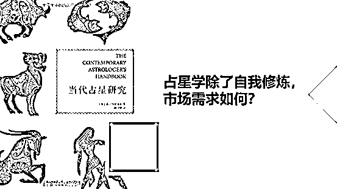

**通过占星学习你可以帮助自己，也可以选择成为自助助人的占星师，开启受益终生的第二事业。**

一方面，社会快速发展人们压力山大，抚慰心灵的咨询市场需求巨大。

另一方面，市场鱼龙混杂，能给人带来真正助益的严肃占星从业者十分稀缺。 

**最重要的是，占星学能够帮助你自己，无论你是否进行占星咨询从业，掌握了占星学，你都将拥有一位能终身陪伴你成长的睿智好伙伴。**

**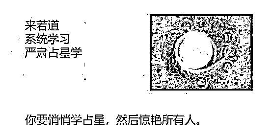**

如果你对占星学一无所知，跟随专业机构、资深老师系统学习占星学，完成从小白到高手的蜕变就是你的最佳选择。

如果你是新手，了解一些知识知识，但不知道如何将它们串联起来，综合解读星图，那么跟随专业机构、资深老师系统学习占星学，夯实基础，稳步前行，成为真正的高手，同样是你的最佳选择。

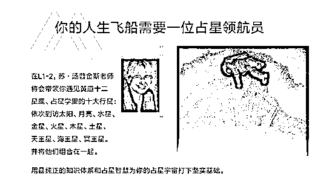

1

**苏·汤普金斯老师（Sue Tompkins）**

**英国目前最资深****的占星学家和咨询师之一，她拥有****超过 40 年****的占星经验，是占星学习者****必备****之两本圣经《顺逆皆宜的人生》与《当代占星研究》作者，她还是伦敦占星学院的创始人。**

****

**她以自己的冷幽默、****抽丝剥茧的研究天分****和****占星直觉****而闻名。她是一名执业占星师，也是一名顺势疗法医师，是心灵和身体的****敏锐诊断专家。**

**2003 年，为表彰其卓越贡献，英国占星协会为苏·汤普金斯授予查尔斯·哈维****终身成就奖。**

**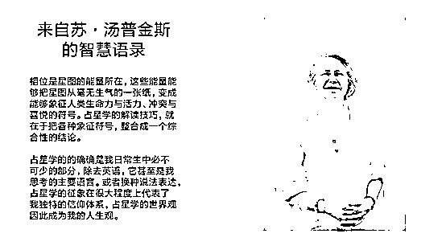**

****

2

**课程安排是怎样的呢？**

**第*****1*****阶**

2021 年 3 月 15 日开课，每周一晚上 20:00-22:00 上课，共 4 次课

**第*****2*****阶**

2021 年 4 月 12 日开课，每周一晚上 20:00-22:00 上课，共 4 次课

3

**1-2 阶你将学到什么？**

**第*****1*****阶 ****黄道星座**

*   概要介绍占星学与星图

*   四元素与三形态

*   黄道 12 星座

**第*****2*****阶****行星**

*   太阳、月亮及其他行星

*   练习将它们组合在一起

4

**想更多了解导师？**

**主讲导师**

**苏·汤普金斯（Sue Tompkins）**

**英国目前最资深的占星学家和咨询师之一，她拥有超过 40 年的占星经验。**占星学习者必备之两本圣经**《当代占星研究》**和**《顺逆皆宜的人生》**作者。

2003 年，为表彰其卓越贡献，英国占星协会为苏·汤普金斯授予**查尔斯·哈维终身成就奖**。苏同时是一位接受过心理学与心理咨询训练的注册顺势疗法医师，并经常在英国、法国、挪威、瑞典、澳大利亚等地举办占星研讨会和公开演讲，教授占星学。

**苏以实际、生动而幽默的风格闻名于世**，她的教学经验非常丰富，能够胜任从教授入门课程到对毕业生进行督导等针对不同占星程度学员的教学工作，这得益于她多年累积的教学经验。她曾在地方公立学校以及在英国占星研究学院(FAS)教学 19 年， 1986 年-2000 年任学院院长并负责现场教学的所有事务，并于 2000 年创立伦敦占星学院这所声誉卓著的专业学府，并经常在世界各国教学，具有丰富的教学经验。2000 年，英国占星研究学院授予其研究员职位，以表彰她为学院做出的突出贡献。

**中文讲师**

**占星师咔咔（Caroline）**

2010 年师从美国占星师大卫·瑞雷学习，并得到世界名师斯蒂芬·弗里斯特、罗伯特·汉德、苏·汤普金斯传授各种占星学技法。若道首届学员，国内最早获得 ISAR 职业占星师资质的职业占星师之一，现兼任若道核心课程助教。在国际知名广告公司和市场研究公司从事的市场研究和推广工作十余年，曾任职于阳狮集团、尼尔森市场研究有限公司、MTV 和《Madame Figaro》杂志。

**助教**

**助教王嘉祺 Conrad**

**ISAR 认证占星师**，**若道认证生时校正资质，**从 2010 年开始学习占星学，2015 年开始在若道系统学习，并开始个案咨询。2018 年担任若道核心课程助教，以及选修课卜卦占星学和太阳返照课程助教，并带领学员进行经世占星学及太阳返照方面研究。2019 年 11 月作为演讲人之一参加了 ISAR 北京大会，也是 ISAR Star Club 中国区第 16 期的主讲人。

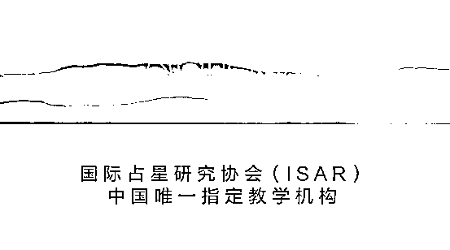

5

**选择若道学习占星学的优势**

**运用自由意志，扭转破坏性模式，绽放天赋潜能**

若道是人本主义占星学的旗手。因为我们相信，**人通过了解模式、觉察习性、积极疗愈、终将释放其潜能，与命运共舞**。

**进入国际权威职业占星师认证的快车道**

占星界的“联合国”ISAR（国际占星研究协会），是具有全世界影响力的占星教学和研究组织和职业占星师全球认证机构，认证占星师遍布 45 个国家。**在 ISAR 的 19 所附属学校中，大中华地区的附属学校只有若道一家**。在国际化的教学理念大纲标准下，**若道毕业生在 ISAR 国际认证占星师的考试通过率多次位居全球首位**。

**十年占星学教育中国本土化教学经验**

**根据中国学生的学习习惯不断优化占星教学体系，让学员学成后更自如地应对本土咨询市场的需求。**学好占星学不仅仅需要邀请一两位老师教学，更需要对教学难点有充分了解，且有持续的教学跟进服务。**10 年来多次核心课程和各种专题课程的教学，让若道非常了解中国学生学习占星学的难点和卡点，合理有效地拆分、提炼课程知识点，同时也积累了丰富的国外老师和中国老师、助教紧密配合以及课程顾问密切配合教学的经验**。若道还专门开发了有助于占星学习的“**若道**”APP，每门课程都设有答疑板块，学员能够方便快捷地提交问题，助教及时答疑解惑和批改作业。**融入中国顶尖的职业占星师群体**若道是中国职业占星师的“黄埔军校”。职业占星师的培养从若道开始，**进入若道，你就走进了中国顶尖的职业占星师群体，和一群志同道合的师兄师姐联谊，获得经验，共同成长**。**多种奖学金支持**为了鼓励学员不因为暂时的经济困难而放弃学习，我们特意设置了各种**技能交换和奖学金**。对于有一技之长的学员，我们推出的技能交换的项目包括**“笔译”、“笔记整理”、“平面设计”、“课本朗读”、“班级服务”**等技能交换项目；而对于努力学习、出勤率高、完成作业率高的学员，我们设置的**土星奖、木星奖**等各种奖学金在等着你。为了感谢帮助我们推荐学员的老学员们，我们设置了“**老学员推荐奖**”；对于通过问卷提建议，帮助我们提高服务的学员，我们也设置了相应的奖学金。ISAR 中国还设置了**国际会议奖学金**，符合条件并通过甄选的申请者最高可获取 5000 元奖学金。当美好的知识遇上奖学金，你可以在学习旅途中乘风破浪，直挂云帆济沧海。**开启占星咨询的职业规划和支持**若道为占星学员搭建了占星问答平台和占星咨询平台，并提供严肃占星学影响力最大的媒体平台，全力为毕业生提供宣传渠道，帮助你吸引和积累咨询生涯初期的种子客户。若道为学员开发了适用于占星学习的“若道”APP，并不断更新完善。**①  微信平台**若道微信平台作为业内颇具影响力专业平台，为文笔好的若道毕业生提供传播占星学并免费宣传自己的机会。有的学员因为文笔获得众多粉丝喜爱，在 3 年多时间积累起 2000 多人的潜在客户。**②  问答平台**若道问答平台帮助学员接触客户的实际问题，并在毕业前就进行演练答题。自问答平台 2016 年上线运营以来，学员接触到 3200 多个问题， 回答问题最多的学员在问答平台收入达 5 万多元。**③  咨询平台**若道咨询平台是我们为优秀毕业生所搭建的平台，帮助毕业生在自己的咨询拓展之外，用若道提供的平台扩展咨询客户群。自咨询平台 2017 年 8 月上线运营以来，咨询平台共入驻 65 人，收入最高者达 32 万元。此处所列学员收入仅供参考，收入高的学员和其专业水准、努力程度密切相关。若道平台尽其所能将自己定位为辅助学员开展职业生涯的桥梁。

**在 10 年的占星教学耕耘后，两位创始人——大卫·瑞雷及蒋颖再次邀请苏·汤普金斯老师开设占星核心课程。**

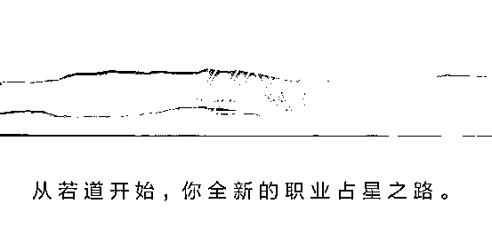

6

**此次课程适合哪些人？**

*   对占星学感兴趣，想要入门的零基础者

*   占星学小白，但有志成为职业占星师的人

*   有一定占星学基础，但不知道该如何整合星图复杂碎片的人

*   希望成为优秀的占星师，想要借鉴国际大师解读思路并融入自己的体系的人

*   苏·汤普金斯的粉丝，学过占星学，但就是想跟着偶像再学一遍的人

*   走在自我探索和个人成长道路上的人

7

**占星业内推荐**

**苏·汤普金斯的《顺逆皆宜的人生》令人赞叹！苏是一名倍受爱戴的老师，并且任教多年。苏以自己的冷幽默、抽丝剥茧的研究天分和占星直觉而闻名。她是一名执业占星师，也是一名顺势疗法医师，是心灵和身体的敏锐诊断专家。**

** ——法国心理占星学协会会长琳恩·贝尔**

8

**苏汤班学员评价**

9

**苏汤老师水瓶座试听课**

（温馨提示：手机请注意流量）

📹 [`v.qq.com/iframe/preview.html?width=500&height=375&auto=0&vid=p3210llaq7f`](https://v.qq.com/iframe/preview.html?width=500&height=375&auto=0&vid=p3210llaq7f)

10

**课程价格**

**L1-2**：4000 元**（联系 Maggie 老师，获得优惠价）**

其他各阶段课程单报价格，请咨询课程顾问：**Maggie 老师**（微信：18510107057，请备注**“苏·汤普金斯核心课”**）

长按二维码添加 Maggie 老师

11

**授课时间**

**2021 年 3 月 15 日（周一）20:00-22:00 开始，网络课程**

12

**退转课程**

*   **退款原则请详看《教学协议》，如有疑问请咨询课程顾问。**

****苏·汤普金斯金牌核心课程****

**授课老师：苏·汤普金斯**

**授课时间：**2021 年 3 月 15 日起

**授课方式：**网络课程**，**英文授课，中文翻译

**费用：**4000 元**（联系 Maggie 老师，获得优惠价）**

**课程负责人：Maggie 老师**（微信：18510107057，请备注“苏·汤普金斯核心课”）

长按二维码添加课程负责人咨询~

****报名请点击“阅读原文”****

# 天蝎座满月 | 冥王星逆行前的试炼，在变化中重建安全感

> 原文：[`mp.weixin.qq.com/s?__biz=MzA5NjA0NTAxNg==&mid=2651443715&idx=1&sn=5791f324ee9d230b44dceadd7ab4a349&chksm=8b4b60b4bc3ce9a28abd52cf7e252b0b0eeb7e928fdb9e71821e793696e8a50532df5df4f24c&scene=126&sessionid=1692737994#rd`](http://mp.weixin.qq.com/s?__biz=MzA5NjA0NTAxNg==&mid=2651443715&idx=1&sn=5791f324ee9d230b44dceadd7ab4a349&chksm=8b4b60b4bc3ce9a28abd52cf7e252b0b0eeb7e928fdb9e71821e793696e8a50532df5df4f24c&scene=126&sessionid=1692737994#rd)

**☆ 后台回复“今日”，给你一句生命态度**

作者/王芝桦 编辑/玫瑰 图片/全景网

**天蝎座满月****北京时间 2021 年 4 月 27 日 11:31 迎来天蝎座满月，金牛座太阳与天蝎座月亮于 7°06′精准对分。**此次天蝎座满月发生时刻，月亮正位于近地点，带来这一次张力十足、能量激烈的天蝎座超级满月。希腊神话中，“蛇发女妖”美杜莎在“智慧女神”雅典娜的神庙中被“海神”波塞冬玷污，作为处女座女神、代表宙斯智慧的雅典娜看到神圣被侮辱，愤恨之下便惩罚了美杜莎，将其面孔变得扭曲和狰狞，并令看到她眼睛的人瞬间石化。故而，美杜莎“面孔和魔力”的故事，一方面寓意着人生必然经历的伤痛与仇恨，另一方面寓意着“智慧女神”雅典娜不能接受的破坏与阴影。后来，宙斯之子、英雄帕尔修斯在各路神力的帮助下杀死了美杜莎，并从美杜莎喷血的脖子中释放出美杜莎和波塞冬的两个儿子“巨人”和“天马。其中，“天马”是生有双翼，可以从地面飞往天堂、从现实进入灵性、将魔性转为神性的奇幻生物。“杀死美杜莎和释放天马”的神话故事，又一次演绎了“英雄战胜妖魔”的神性之旅，也揭示出天蝎座“一念成魔，一念成佛”的心理性历程。此次天蝎座超级满月，天蝎座月亮近距离地俯视着地球，那是美杜莎燃烧着“伤痛与仇恨”的眼睛，还是飞马“联通着二元，引领着超越”的桥梁呢？此次天蝎座满月的行星能量传导：

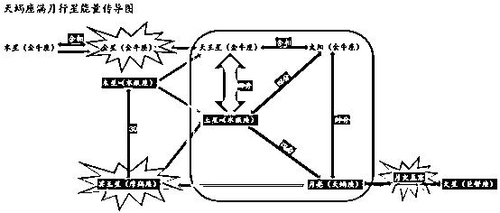

**天蝎座满月重点影响人群**

参考满月峰值影响期间各个行星的行进度数，以及逆行行星的轨迹影响；常规容许度，个人行星入相位 3°，出相位 1°；非个人行星入相位和出相位均为 3°。

**·** 出生星图中，有**行星、四轴、南北交点落入固定星座（金牛座、狮子座、天蝎座、水瓶座）4°-30°**的人群； 

**· **出生星图中，有**行星、四轴、南北交点落入基本星座（白羊座、巨蟹座、天秤座、摩羯座）0°-11°，21°-30°**的人群；

**·** 出生星图中，有**行星、四轴、南北交点落入变动星座（双子座、射手座、处女座、双鱼座）9°-15，19°-25°**的人群。

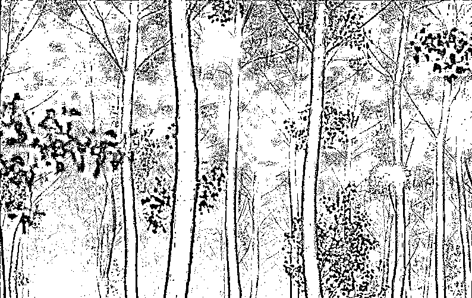

**真正的安全来自何处？**

**我既是旁观者清，亦是当局者迷。**

**——弗·司各特·菲茨杰拉德 《了不起的盖茨比》****天象：**

**· ****“日月对分”轴线介入“土天四分”结构：**宽泛容许度下，金牛座太阳合相金牛座天王星，天蝎座月亮对分金牛座天王星；宽泛容许度下，水瓶座土星四分金牛座太阳，四分天蝎座月亮；

**·** **月火互容：**天蝎座月亮与巨蟹座火星形成“月火互容”结构。

**1\. 三重禅释**

《指月录》中记载，青原惟信禅师在给学生们讲课时说：老僧三十年前，未参禅时，见山是山，见水是水。及至后来亲见知识，有个入处，见山不是山，见水不是水。而今得个休歇处，依前见山只是山，见水只是水。三重禅释，揭示出“金牛座-天蝎座-金牛座”的旅途：**· 第一重的金牛座：**初识世界的质朴与简单，世间现象，千差万别，但在“人眼”之中有差别却无分别，故而，看见什么就是什么；**· 第二重的天蝎座：**探寻世界的真相与究竟，学习知识，心识飞跃，了悟“一切皆空”的同时也有了“二元取相”，因为要证明“没有”，就必须否定“有”，故而，“心眼”之中有了我执和分别心；**· 第三重的金牛座：**回归世界的万象与共性，大彻大悟，道法自然，无论是万物万象的千差万别，还是心识心念的瞬息万变，“道眼”所见均是自然相和普遍相，有别即无别，万象即共性，故而，既然事事一如，不如安住当下。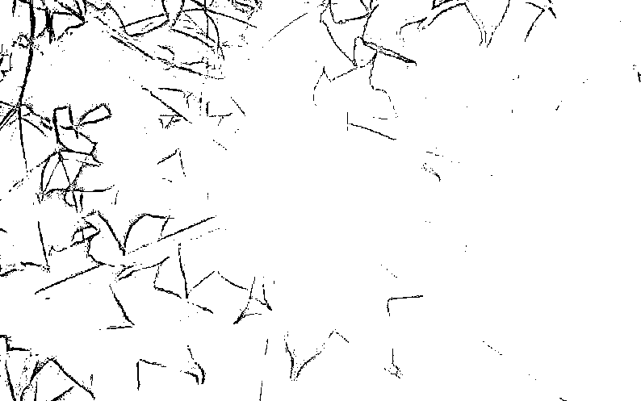金牛座象征着现实世界的旅途，通过守住物质和资源的安稳，获得内在的宁静；天蝎座象征着内在心灵的旅途，通过直面恐惧和欲望的生灭，获得灵魂的超越。金牛座和天蝎座这组对宫星座，象征着**现实层面和心理层面的互相辉映，内在力量创造现实价值，现实价值激发内在力量。**天蝎座满月，金牛座太阳与天蝎座月亮的“日月对分”轴线：简单地说，揭示出现实生活与心理过程的互相辉映；但深入地讲，则揭示出每个人的现实生活与心理过程正走在“阐释”的第几重，以及更好的选择和路径又在“阐释”的第几重。

**2. 激活“求稳”或“求变”的选择项**

此次天蝎座满月，正处于年度重磅天象“土天四分”结构 2 月 18 日第一次能量峰值、6 月 15 日第二次能量峰值中间的时间点，而“日月对分”轴线的介入，则将“土天四分”结构再次激活。最近两年，金牛座天王星掀起的“现实变革”之风，几乎撼动着每一个人的“安全根基”，过去的安稳已经不在，我们必须走出舒适区，从意识到行动全然地做出改变。但是，我们并不知道自我的重塑、安全根基的重塑，究竟要做到什么样子才能通关。故而，2021 年宇宙安排[年度重磅天象“土天四分”结构](http://mp.weixin.qq.com/s?__biz=MzA5NjA0NTAxNg==&mid=2651439115&idx=1&sn=5361a9cb24ef972d771abb3a8ebbcd1e&chksm=8b4b72bcbc3cfbaaef0fb46d56e0d594ba728d578666ce7624d0f98a05ec5227c3374720b2c2&scene=21#wechat_redirect)（点击可阅读）引领我们在“保守和创新”之间不断磨合，但这也意味着我们将会在打破过去和重塑未来的过程中，经历更为深入的考验，更为具体的磨合。此次天蝎座满月，宽泛容许度下，太阳、天王星、金星和水星齐聚金牛座，并与天蝎座月亮形成对分阵营，而“土天四分”结构中的水瓶座土星则站在“日月对分”轴线的中间，与金牛座太阳和天蝎座月亮分别形成四分结构。

这是不能跳过去的一步！变革之风似乎吹破了最后一扇窗，呼啸灌入的冷风催促我们必须在“求稳或求变”之间做出选择。

**可能经历的：**一些误会或僵局有望解决，一些隐瞒和真相将被曝光，一些人走进我们的内心，一些关系淡出我们的生活；我们可能会看到某位“特别关注”人物的真实样貌，也可能会与某份“内心温暖”意外告别；我们可能会转换一个轨道并重燃希望，也可能会放下一份固执并彻底改变。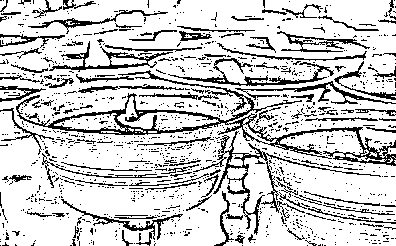

**3. 变量的执著与转化**

安全是什么？安全又究竟来自哪里？· 我们拥有什么？· 我们是否真的拥有，是否正在失去？· 如果我们真的拥有，为什么还会失去？· 我们真的拥有吗？我们只是宇宙万象万物的一个组成，只是宇宙能量流动的一部分——**我们明明是宇宙中的“变量”，安全明明来自于不断地“变化”，却执着地渴望“拥有”和“不变”。**故而，即使我们好像拥有了，却仍在恐惧失去。此次天蝎座满月，强烈的情绪骇浪来自于“既是旁观者清，亦是当局者迷”——我们发现**最安全的是做一个“以不变应万变”的变量，而最不安全的却是自己“执着和恐惧”的心。**不要忘记天蝎座的故事神话，“英雄战胜妖魔”亦是每个生命自我成就的内在旅程——“一念成魔，一念成佛”，我们可以陷入“我执”的沼泽，也可以将“我执”释放和超越，如何取舍，不过是一念之间的转化（第二重禅释）。此次天蝎座满月，金牛座阵营中太阳、天王星、金星和水星的能量被金牛座金星定位（金星守护金牛座），天蝎座月亮的能量被“月火互容”结构定位（火星守护天蝎座，月亮守护巨蟹座），提示我们——**只有升起内在的力量，直面内在的恐惧，才能从美杜莎的“死亡”之中释放出飞马，从内在的阴影之中超越自我的执着，才能真正做好宇宙中的“变量”，安住当下，不断突破（第三重禅释）。**真正的安全来自于“变”，这既是宇宙的韵律，亦是生命的本质。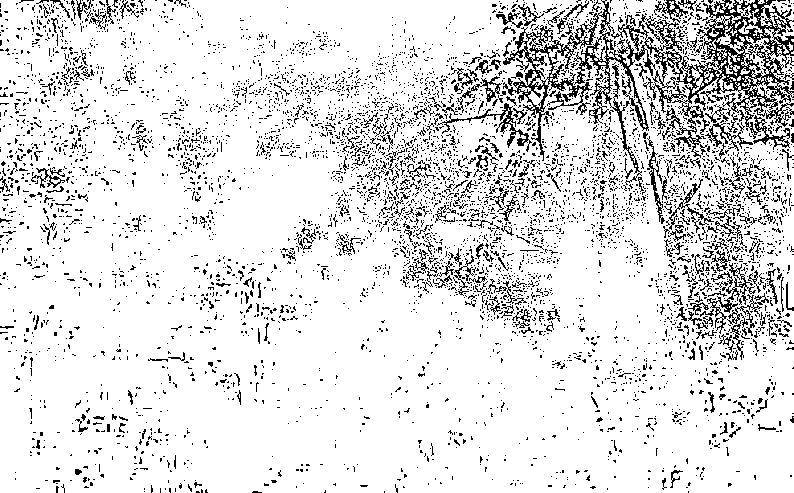**做一个“变量”该做的事情****我们继续奋力向前，逆水行舟，被不断地向后推，直至回到往昔岁月。****——弗·司各特·菲茨杰拉德 《了不起的盖茨比》****天象：****· 木冥 30 度：**水瓶座木星与摩羯座冥王星形成 30 度结构。**· 冥王星逆行：**4 月 28 日，冥王星于摩羯座开始逆行。此次天蝎座满月，天蝎座的另一颗守护行星冥王星于 4 月 28 日——天蝎座满月的转天开始 5 个多月的逆行周期。冥王星这一次的逆行轨迹是从摩羯座 26°-24°，而这个度数区间，冥王星曾在 2020 年走过。行星的逆行就像是回头检视曾经的来路，再度反思过去的旅程，那么，2020 年需要我们检视和反思的还有哪些功课呢？本轮冥王星行进摩羯座的周期是 2008 年-2024 年，直至 2020 年，冥王星已经在摩羯座行进了 12 年，而这个 12 年也恰恰是木星行进黄道一周天的周期。**· 12 年前的 2008 年：**当冥王星进入摩羯座的时候，木星也进入了摩羯座，并在摩羯座冥王星周期“成就现实辉煌的绝对力量”之中，再加一把“扩张和放大”的催化剂。故而，**过去的 12 年，我们从自我的内心层面感到“不进则退”的恐惧，也从现实的各个层面看到“只能更好”的推进。**无论是现实世界，还是我们的内心，都像上满发条、绷得紧张、不停运转的机器，难道不需要维护和保养吗？**· 12 年后的 2020 年：**当木星绕行黄道一周天后再次进入摩羯座的时候，恰逢从“土元素周期”迈入“风元素周期”的时代更替、巨大换挡的时刻。年初“土冥合相”摩羯座，宣告“现实彻底洗牌”的进程正式开始；全年 3 次“木冥合相”摩羯座，则在金牛座天王星“现实变革”的震荡下、一场疫情的催化下，将过去 12 年形成惯性的“不进则退”的恐惧、“只能更好”的欲望燃得更旺。从 2020 年至今，我们从恐慌和抗拒，开始慢慢接受“现实彻底洗牌”的洗礼，慢慢意识到“原有的安全根基”已被瓦解，只有突破陈旧的限制和壁垒，升级全新的意识和模式，才能“重塑安全根基”。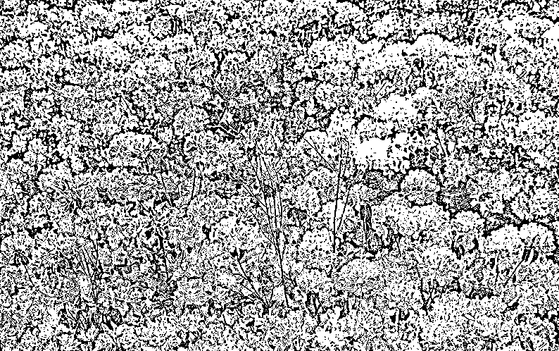我们积极行动和努力改变，但行至今日，却依然不断地撞上现实的壁垒。为什么会这样？此次天蝎座满月，即将开始逆行、正处于停滞状态的摩羯座冥王星，与早已换座进入水瓶座的水瓶座木星形成 30°的联动结构，提醒我们检视 2020 年-2021 年的旅途，反思“摩羯座到水瓶座”的功课——**我们是更成熟了，还是更激进了？我们是对“安全根基”有了智慧的了悟和全新的规划，还是紧抓着对“安全根基”的陈旧认知和过时经验依赖不放？**

此次天蝎座满月，现实的荆棘坎坷和情绪的惊涛骇浪，或许会再一次将我们拍回到岸上，但在被打回原形、回到往昔岁月的同时，也将会带来绝地重生和触底反弹的转化时机——彻底洗牌过去，才能重塑安全！而这一份洗牌和重塑，不能来自外在现实的逼迫，而只能来自内在心灵的选择！

**放下那些正在“死亡”的东西，无论是过往的安稳，还是曾经的执着，去做一个“变量”该做的事情——生命在宇宙能量的流动中不断变化，才能收获“一切皆有可能”的成长与突破。**

2021 年的冥王星逆行，即将开启未来 5 个月“量变到质变”的旅途。此次天蝎座满月，刚刚开始。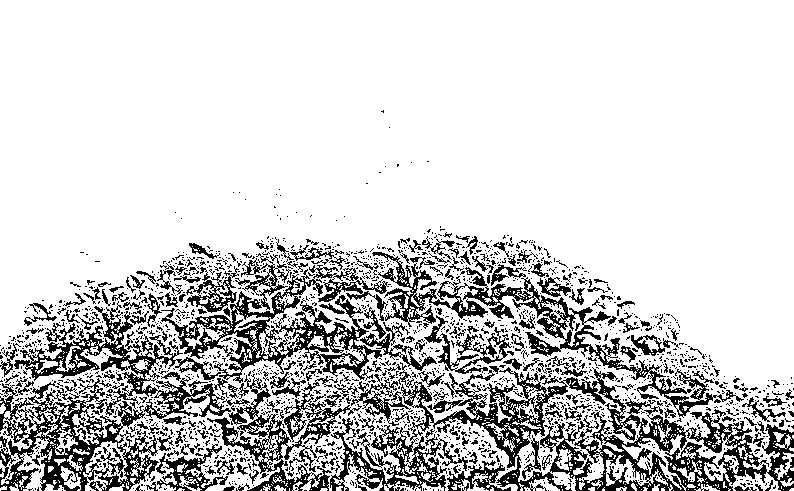**寄语****世界不会在意你的自尊，人们看到的只是你的成就。在你没有成就以前，切勿过分强调自尊。****——弗·司各特·菲茨杰拉德 《了不起的盖茨比》**很多人以为自己追求的是“成就”，但其实追求的是“自尊”。这里的成就，是指成就自我的意志，成就生命的绽放。故而，成就是一件发生在生命内在的个人化和个性化的事情。但问题是，过分强调自尊却是一件向外投射的事情，希望通过外界的认同证明自尊，获得满足和安全，但外界并不会在意、也根本看不到这些心理性的运作。很多时候，自我成就和自我尊严就形成了“二元对立”的矛盾。我们以为阻碍脚步和消耗能量的是外界的现实，但其实是将自己的能量投到了不恰当的地方——总是“恐惧”自我价值不够充盈，“不信任”自己的力量，于是转而期待外界的加持；然而，现实的风浪一次又一次地将我们拍回到岸上，摧毁一切的期待，失去一切的依赖；最后，我们只能战胜内在的恐惧，信任自己的力量。于是，重生时刻，如此而至——天蝎座满月如是说。愿每一个灵魂安好。祝福大家。**若道君：近期将有冥王星逆行的文章推送，敬请期待！**

**版权声明**：原创文章由作者授权首发于若道平台，欢迎转发，反对抄袭。友号转载请申请白名单。

****

****想阅读更多作者的文章，****

****请在后台回复******王芝桦****** 即可。****

****王芝桦****

心理占星师，统合疗愈师，占星专栏作者

若道占星“新月和满月”专栏作者，腾讯视频特约占星师

全职于个案咨询与占星教学工作 17 年

**个案预约咨询微信号**：zhihua0621 

**微信公众号**：daoxi-life

**长按打赏**

****

**系统学习占星学**

**点击图片了解详情**

喜欢记得点一下在看哦☟

****报名直达入口****

# 新课首发 | ISAR 选修课：唤醒女神，在占星学中使用小行星

> 原文：[`mp.weixin.qq.com/s?__biz=MzA5NjA0NTAxNg==&mid=2651443715&idx=2&sn=10f401c7b86cb8a13442da996a83b144&chksm=8b4b60b4bc3ce9a2792fecd8eccc4f05206e743e64688c0135bfcfbf15ed5a1eef40a3e3e03c&scene=126&sessionid=1692737994#rd`](http://mp.weixin.qq.com/s?__biz=MzA5NjA0NTAxNg==&mid=2651443715&idx=2&sn=10f401c7b86cb8a13442da996a83b144&chksm=8b4b60b4bc3ce9a2792fecd8eccc4f05206e743e64688c0135bfcfbf15ed5a1eef40a3e3e03c&scene=126&sessionid=1692737994#rd)

对于占星师来说，巨大的小行星带中有成千上万的滚落岩石在太空中呼啸而过，这似乎是一次令人生畏的雪崩，蕴含着潜在的新信息。因此，当你将它们整合到你的工作中时，辨别并正确理解每一颗小行星的意义是很重要的。

包括选择小行星在星图的解读，增加微妙的细微差别和令人惊讶的细节是无法从任何其他占星工具中获得的。

1

**课程简介**

理解小行星带所蕴藏的神圣女性力量的流动将帮助你在占星实践中创造更多的和谐与平衡。**小行星为你的解读带来细节、精确性和深度，同时也使你能够研究和阐释那些被忽视或低估的生命领域。**

**我们将讨论主要的女神小行星，并学习如何与之合作。**我们将借助大量现实生活中的例子，深入探讨它们的象征意义。你会真正了解这些重要的占星元素，从而拓展自己的实践。

**此课程可作为 ISAR 选修课。**

2

**课程安排**

**课程安排：6 月 8 日--7 月 27 日 （每周二）**

*   **6 月 08 日** **小行星简介**

*   **6 月 15 日** **谷神星，丰饶女神**

*   **6 月 22 日** **婚神星，婚姻女神**

*   **6 月 29 日** **智神星，智慧女神**

*   **7 月 06 日** **灶神星，壁炉女神**

*   **7 月 13 日 健神星，健康女神**

*   **7 月 20 日** **灵神星，灵魂女神**

*   **7 月 27 日** **综合应用，展望未来**

3

**课程大纲**

**第*****1*****讲  6****月 8 日  小行星简介**

小行星概述，小行星的发现、科学以及一些占星学历史。

**第*****2*****讲  ****6 月 15 日 谷神星，丰饶女神**

母神、农业女神，但其影响力远不止如此。这是我们所知的最大的小行星，也是最重要的小行星。她掌管养育、滋养、救助、管理等方面。

**第*****3*****讲  ****6 月 22 日 婚神星，婚姻女神 **

荣誉、伙伴关系、契约和婚姻：众神中的女王是正直的女主人。她在出生星图和行进中有什么意涵？她与“丈夫”木星朱庇特是什么关系？

**第*****4*****讲  ****6 月 29 日 智神星，智慧女神**

战地记者、棋手和占星师有什么共同之处？来自智慧、策略、洞察力和远见女神的帮助。

**第*****5*****讲 **** 7 月 6 日 灶神星，壁炉女神**

掌管神圣的火焰、家庭生活、厨房灶台、家人、遗产的女神：这颗关键的小行星被严重误解了。她可以给你一把钥匙，让你了解家庭关系、你的祖先和你的目标意图。

**第*****6*****讲  ****7 月 13 日 健神星，健康女神**

在我们应对全球疫情的过程中，掌管健康和福祉女神目前显得尤为重要。她能提供如何应对新型冠状病毒肺炎的线索吗？她在出生星图中的意涵是什么？幸福原来蕴含着相当广泛的含义。

**第*****7*****讲  ****7 月 20 日 灵神星，灵魂女神**

灵神星是唯一一位以人类身份开始生命的女神，她代表着人类的灵魂。这颗小行星与爱情故事、童话故事和灵魂之旅有关。

**第*****8*****讲  ****7 月 27 日 综合应用，展望未来**

你们刚刚开启探索使用小行星可能性的旅程。我们会探索评估某些理论有效性的方法，以及在实践中检验这些理论的重要性，我们还会探索其他数百万小行星中的一些。这堂课既有提醒告诫，也鼓励你深化自己的占星实践，并拓展你对象征的理解。

4

**课程试听**

📹 [`v.qq.com/iframe/preview.html?width=500&height=375&auto=0&vid=d3241mm7xdw`](https://v.qq.com/iframe/preview.html?width=500&height=375&auto=0&vid=d3241mm7xdw)

解锁全部沙龙内容欢迎购买：[**ISAR 会员沙龙 29 期 | 天空的细节——小行星如何提升扩展占星学**](http://mp.weixin.qq.com/s?__biz=MzA5NjA0NTAxNg==&mid=2651437295&idx=2&sn=8816fb50331dff6f6d25686ff80d7b5b&chksm=8b4b0a58bc3c834e54fb7d13e5bc11c98067fd93b29c5fbfc8f9745a516cbd8bfa3b90696324&scene=21#wechat_redirect)（点击可获取详情）

5

**主讲老师**

**克里斯蒂娜·罗登贝克**

克里斯蒂娜·罗登贝克（Christina Rodenbeck）是一名全职职业占星师，在牛津大学城生活和工作，深受周围知识和文化氛围影响；她拥有伦敦大学（University of London）的人文荣誉学位，曾在伦敦占星学馆（Astrological Lodge of London）、心理占星中心和占星研究学院学习。

作为一名占星师，在过去的 20 年里，克里斯蒂娜在她的网站“牛津占星师”上写了大量关于时事、艺术和文化的文章；她每月主持一个占星播客：“与克里斯蒂娜和萨莉一起占星”，并定期在《占星杂志》(Astrological Journal)上撰写时尚专栏；她定期在英国授课，并保持着蓬勃发展的专业实践。

6

**此次课程适合哪些人？**

*   有一定占星学基础，若道核心课 L3 以上水平；

*   希望成为优秀的占星师，想要借鉴国际大师次限解读思路并融入自己的体系的人；

*   热爱占星学、天文学、神话学的研究型占星学者；

*   计划考取 ISAR 认证占星师，寻觅中意选修课的学员；

*   走在自我探索和个人成长道路上的人。

7

**课程价格**

**价格**：**6800 元**

**早鸟价：5800 元**

**早鸟价截止时间：2021 年 5 月 19 日**

还有限时 ISAR 选修课联报套餐价格，具体请咨询课程顾问：Maggie 老师（微信：18510107057，请备注“小行星”）

长按二维码添加 Maggie 老师

8

**授课时间**

**2021 年 6 月 8 日（周二）20:00-22:00 开始，网络课程**

9

**退转课程**

*   **退款原则请详看《教学协议》，如有疑问请咨询课程顾问。**

****ISAR 选修课：小行星****

**授课老师：克里斯蒂娜·罗登贝克**

**授课时间：**2021 年 6 月 8 日（周二）起

**授课方式：**网络课程**，**英文授课，中文翻译

**费用：**6800 元（**早鸟价：5800 元，5 月 19 日截止**）

**课程负责人：Maggie 老师**（微信：18510107057，请备注“小行星”）

长按二维码添加课程负责人咨询~

****报名请点击“阅读原文”****

# 深度金牛座丨 内秀的美，这回真的藏不住了……

> 原文：[`mp.weixin.qq.com/s?__biz=MzA5NjA0NTAxNg==&mid=2651443674&idx=1&sn=2cfd22807efb773205b1c7a39a8880b1&chksm=8b4b636dbc3cea7b7261962cab0f61f27fadd1a8718a8a34018bda382937df0d5d27cdc3d2a1&scene=126&sessionid=1692737994#rd`](http://mp.weixin.qq.com/s?__biz=MzA5NjA0NTAxNg==&mid=2651443674&idx=1&sn=2cfd22807efb773205b1c7a39a8880b1&chksm=8b4b636dbc3cea7b7261962cab0f61f27fadd1a8718a8a34018bda382937df0d5d27cdc3d2a1&scene=126&sessionid=1692737994#rd)

******************☆ ****************************后台****************************回复“今日”，给你一句生命态度******************

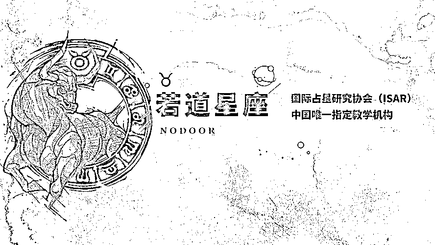

作者/摇光 编辑/翀子 封面/书君 图片/网络

金牛座务实、喜欢闲适安稳的生活且不喜欢改变。不过，自天王星进入金牛座以来，相信金牛座们也正被推着走出舒适区，冒险革新，迎接蜕变。

金牛座的生日月（4 月 20 日-5 月 21 日）到了，先祝各位生日快乐。天王星在金牛座已经呆了快两年，在这个期间最不愿意变化的金牛座们相信或多或少地感受到了天王星颠覆式的威力。

最好的例子看看娱乐圈，几十年的常青树金牛座何炅，从去年年底开始频频爆出负面新闻，好人品人设危在旦夕。另外在娱乐圈混了多年，大男主戏配角都红了就他没红的金牛座张哲瀚，今年也凭着一部耽改剧爆红，他自己都开玩笑说“十年硬汉无人闻，一朝老婆天下知”。

**天王星的变化没法谈好坏，但会****将你从习惯的舒适区里推出来，**所以金牛座的朋友们，哪怕再害怕变化，也是时候动起来啦。

**大众对金牛座的标签很多，**倔强、抗拒改变、爱钱、抠门、懒、冷暴力......写到这里，我想起有一对射手座和金牛座的怨偶，在一起很多年，相爱相杀，金牛座女孩最喜欢的一句话是：“我愿意化身石桥，受五百年风吹，五百年日晒，五百年雨打，但求此人从桥上走过。”

射手座男生抓狂：“求求你别等五百年了！有什么话你现在跟我说不好吗？给我个及时的反应求求了！”但也正是因为金牛座稳定的状态，才拴住了风筝一样时刻想要仗剑走天涯的射手座。

话说回来，金牛座的这份稳定或者说固执到底从何而来呢？

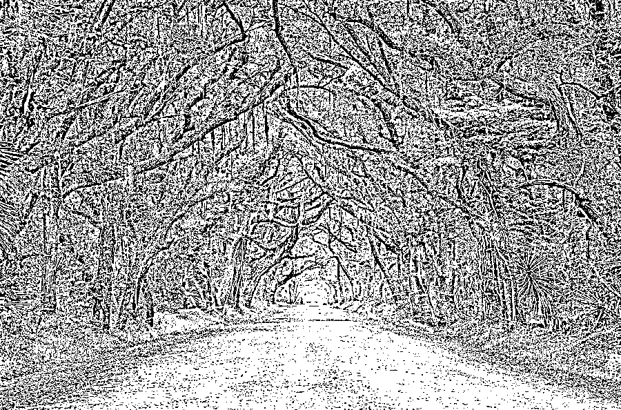

**金牛座的内核：我存在**

**金牛座守护黄道的第二宫，**这里掌管着所有人都离不开的东西：**物质世界活下去的资源：**食物、衣服、放在现在的社会环境，也就是可以用来换取这些资源的钱。

作为二宫的守护者，**金牛座爱钱真是爱得天经地义，与此同时金牛座的思维模式是相当务实简单的，**他们不像风象星座那样轻易被天花乱坠的概念洗脑，不像水象星座被情绪左右，不像火象星座被一时上头的激情冲昏脑袋，不像处女座那样纠结于细节和成长体验，也不像摩羯座一样考虑框架或者上不上台面。

**纯粹的金牛座们，只关心一个问题：好吃吗？舒适吗？有钱吗？**

不要认为这样简单粗暴的状态非常容易，在当今这个信息爆炸的互联网新时代，我们被大量的信息和情绪裹挟着，被脑子里的念头拖来拖去，**金牛座所代表的这种存在即合理的稳定感，其实是非常难得。**

这也就是经常在讲的：**自我价值感。**较之以往，现代人多了很多情绪问题，例如焦虑症和抑郁症，其中很大一部分都是自我价值感出了问题。

我们生存在一个高速发展的时代，每个人都在说要不断变优秀，变成功，变得更好。在这样的集体潜意识认同中，当你向往更好，就说明现在不够好，如果你有“当我更值得，才能拥有好生活”的观念，那么当下便是不够值得。未来永远不确定，那些更好，你不知道它会不会来，你会一直活在不确定的追寻中。

但是金牛座是不追的，**他们觉得当下就很好，**想象一头牛，慵懒地躺在草地上，阳光晒着背，抬起头吃两口草，又悠悠地低下头去。**这样闲适安稳的状态，可以击碎一切企图制造焦虑的言论。**

*   **要更成功才配有时间好好吃饭吗？**

*   **我都享受不了美食了我还成功干嘛？**

*   **要更有钱了才能拥有这条真丝裙子吗？**

*   **我拥有了不就已经享受到跟有钱人一样的快乐了吗？**

*   **上流社会 party 里的蛋糕会更好吃吗？**

*   **在树林里烧烤，还能打一瓶山上的泉水不香吗？**

**在享受人生这件事情上，金牛座从来不会亏待自己，**生于富饶四五月的他们，先天就拥有着比生于肃杀秋季的天蝎座或者冰冷寒冬的摩羯座更丰盛的资源。那些不配得感、讨好型人格等等，在很强的金牛座能量身上是见不到的。

他们可以很世俗，很小气，很算计，很市侩，但他们都很自我，知道自己要吃好喝好舒服着过日子。

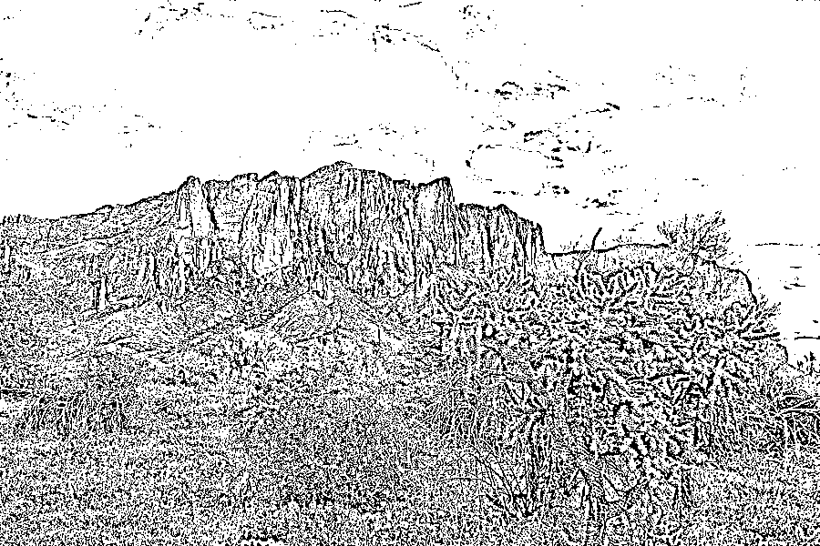

**金牛座的魔咒：匮乏感和贪婪**

作为土元素的第一个宫位，**阴性的金牛座蕴含着大地母亲的力量，**他们足够丰盛肥沃，可以产出粮食与水果。**很多金牛座都有相当发达的五感**，敏锐的味觉，精微的触觉，结构感的视觉，拥有着把无米之炊都变出花儿来的巧妇天赋，连华尔街的吉祥物，都是一头大公牛，可见**金牛座对于钱财的天赋。**

但很多时候，未经淬炼的天赋都是诅咒。**当金牛座过于看重钱财，或者所拥有的资源，便会成为腐败的开始。**

金钱其实也是一种能量，需要流动，你花钱到我这里买来种子，种出粮食卖给磨坊，磨坊主磨成面粉卖给面包店，我再花钱买来面包吃饱了好去研发新的种子。循环流动会催生社会的活力，**而当一个金牛座的贪婪起来，只想不断地要更多更多更多的时候，堆砌和囤积就阻碍了能量的流动。**河流被截断，开始淤积泥土和垃圾。

**金牛座的安全感展现在对于资源的把控之上，**安全感不足之时便会有强烈的囤积癖，买一堆食物塞满冰箱，坏掉，囤一抽屉的化妆品，过期，新型号的手机出一款换一款，刷爆信用卡也要把限量款的鞋塞满鞋柜，更严重的就像《人民的名义》里那个贪官，专门买一个别墅来放钞票，没事看看也不花，日常还是过着清贫的生活，最后为了这种扭曲的欲望锒铛入狱。

贪念是无法被满足的，就像黑洞一样，不断吞噬掉你的本心，若不及时察觉控制，人性便无从谈起，金牛座的光芒和智慧也会被过多的欲念所覆盖。

同时，**这种对“拥有”的执念会让金牛座抗拒改变，**因为任何的改变都需要舍弃，哪怕最简单地换掉一个发型，也会丧失原本发型，从而面临变难看的风险。

**冒险对于金牛座来说，是最可怕的事情。**但天赋如果不革新成长，便会成为守旧的模式，**稳定成了僵化，**内心像堆满杂物的房间一样，变得破旧沉重。

毕竟时间在变，世界在变，整个宇宙本就无常，当金牛座们一直用同一套模式去做事情，总有一天会面临淘汰的风险。

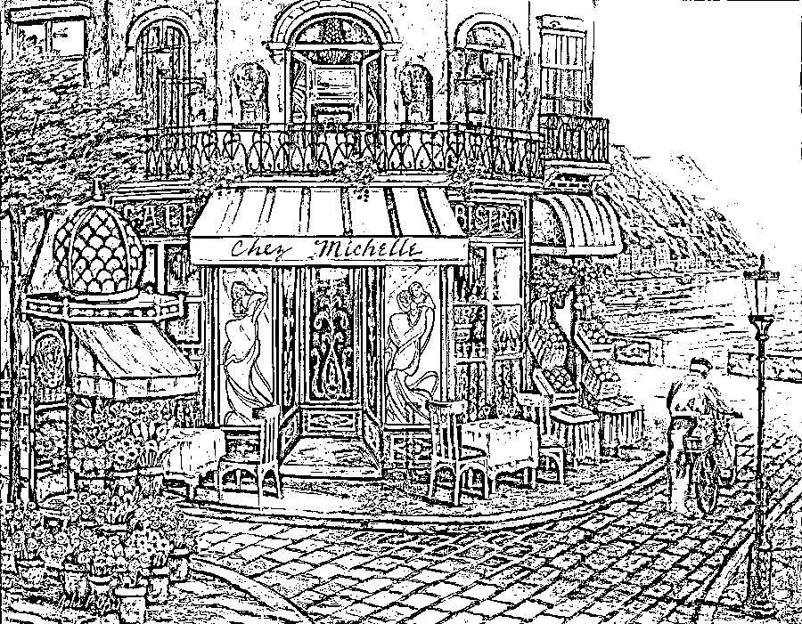

**对宫的解药：勇敢赴死，迎接新生**

能否勇敢地迎接变化，是衡量一个金牛座能否成功的重要指标，这里的变化，不是小的调整，而是**向对宫天蝎座学习**，彻底地放弃旧模式，再塑造一套新的出来。不破不立，涅槃重生。

一条轴线两端的星座，虽然有着很强烈的对比，但内核有很多的一致性，**同为固定宫和阴性元素的金牛座和天蝎座，有着共同强烈的占有欲，操控欲和极端性，**只是对不同元素的反应和表达方式有所不同。

*   **天蝎座：伤我的心，我要你的命。**

*   **金牛座，搞我的钱？抱歉，你搞不到。什么？你搞到了？毁灭吧世界。**

就像神话中的德墨忒尔，当哈迪斯抓走她最心爱的女儿，她盛怒之下让大地贫瘠，四季只剩下寒冬。虽然天蝎座背了腹黑的锅，但去考证一下，像希特勒这样的金牛座大佬反叛起来，才是真正的毁天灭地。当愤怒的公牛伸出头上的角，大地也要为之颤抖。

但现实生活中，那些还在为糊口奔波，又懒又馋又怂的金牛座们却比比皆是，**缺少的，就是迎接革新的魄力。**

日子要舒服了自己没错，但长久以来只顾自己，不想更大的世界，不愿意付出去经营关系，家庭，社会责任，自然会滑入孤独并得过且过的陷阱。

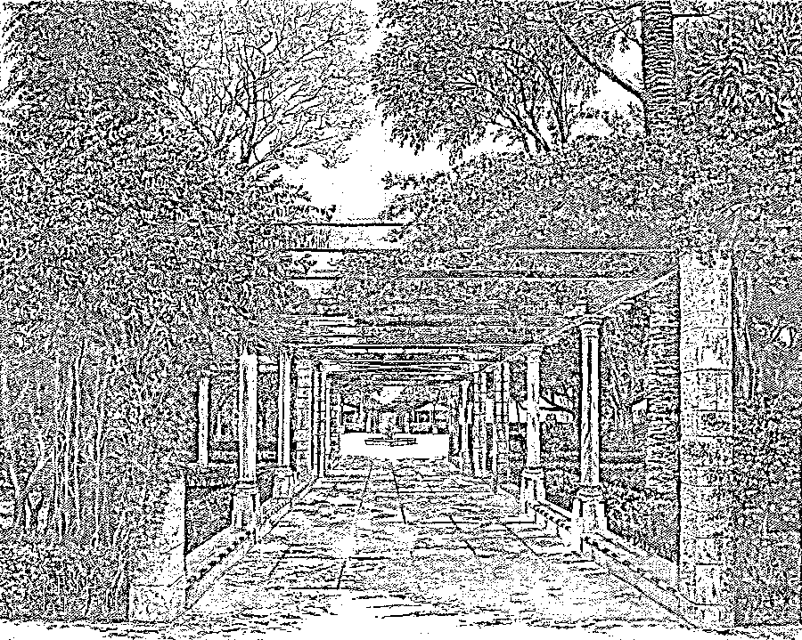

**金牛座的神性**

金牛座其实是很有神性的星座，虽然提到这个词，更多人会率先联想到双鱼座、水瓶座这类黄道后期的星座，经历更多更复杂，似乎从物质层面向精神层面上升得更多。但是不要忘了，为联合国儿童基金会做了大量贡献的奥黛丽·赫本是金牛座，写出不朽名篇的莎士比亚是金牛座，精神分析的创始人弗洛伊德是金牛座，悟道成佛的释迦牟尼也是金牛座。

这些在人类历史上熠熠发光的名字，显然不止带来了物质上的推动和丰盛，这种超越个人上升到集体的精神能量来源于哪里呢？

**金牛座主管的身体部位是喉咙，**在印度的脉轮系统中，喉轮是超越物质世界的第一个层次。从海底轮到心轮，依次是土、水、火、风等物质世界的元素，**而到了喉轮，开始通过声音来联结更大的世界。**

当你身在北京，无法立刻到达千里之外的纽约，但你可以打一个电话，用声音来接收或者传达信息，你也可以打开电视电脑，用眼睛接收当地的画面。当你说：“请给我一个苹果”你就创造了一个得到苹果的现实，当别人听到你歌声传递的情感感同身受，你便通过震动创造了自己的场域。

信息虽然是三宫双子座的领域，但是这条管道却是金牛座所象征的。旋律被吟唱时不需要歌词，他人也能感受到原始的悲伤或者喜悦，**这就是金牛座所象征的人类最原始的底层联结。**

然而，当金牛匮乏于物质的不安全感，不敢发出声音，通往神性的大门便关闭了。而打开他的方式，**便是回归于他们最原始的天赋：我存在。**

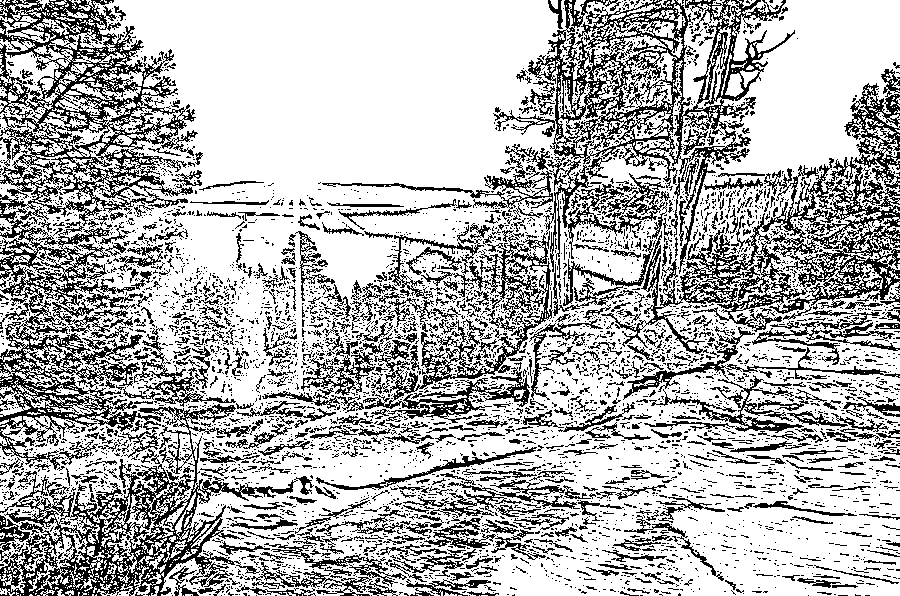

如第一段所说，当金牛座与土地联结，便可以感知到当下，但更深一层，是感受到，在自然中，当下即无常。

果实长出来的时候，花儿就掉落，河流会一直不停地流动，从来没有停下来，太阳落下时月亮会升起，大自然中的当下，从来都是鲜活的。

**体会到这一个层次的金牛座，就会安心地把自己交付给当下，**如果你需要我改变，那好吧，我会放下这朵花，等待她结出甘甜的果子。

这个时候的金牛座，就会开始接收到来自宇宙的信息和连接自然的规律，这枚果子，需要什么样的土壤环境，什么样的水，什么时候应该去晒太阳。当他们安心且心无旁骛地去照料他们的果子，**他们的一切行动就会充满神圣的智慧，金星所赋予的灵性，美丽，性感，丰盛，也会毫无保留地展现出来。**

所以，金牛座需要确认自己的节奏，当你感受到需要改变，就勇敢迎接，哪怕是要丢掉目前已经拥有的一切，也只是为了撬动更大的回报，但这个过程需要的是净化、意愿、专注和创造。

目前天王星还在金牛座来来回回地撞击，不断创造着新的机遇，**是时候从旧有的模式里探出头，去碰撞更大的世界了，**小花盆的破碎，也许不是为了让你无处存活，而是让你体会到大地的丰厚与富饶，清空当下意味着为更好的东西腾出空间，万事万物的来去都合理丰盛，更大的圆满即将到来。

**版权声明：**原创文章由作者授权首发于若道平台，欢迎转发，反对抄袭。友号转载请申请白名单。

**摇光**

若道 2016 届 Level 4 学员

全职占星师，咨询时长超过 700 小时

**咨询微信：**yaoguangnihao

**微信公众号**：yaoguang-zx

长按打赏

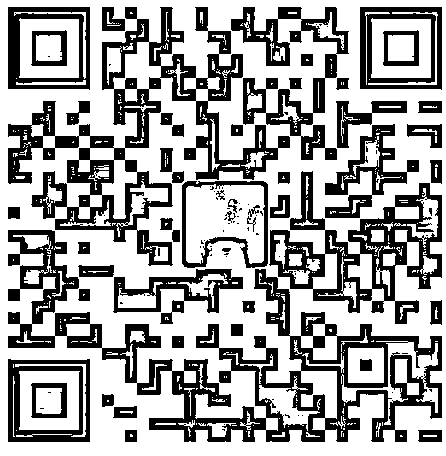

**系统学习占星学**

**点击图片了解详情**

**微信又双叒叕改版啦，不想错过若道君的推送？**

**就把若道设为星标吧！**

**▼**

**喜欢记得点一下在看哦☟**

********报名直达入口********

# 雷蒙德·梅里曼金融占星周运 | 经济还能继续繁荣下去吗？

> 原文：[`mp.weixin.qq.com/s?__biz=MzA5NjA0NTAxNg==&mid=2651443674&idx=2&sn=4691d881b9534f1cdf51d01390a69afb&chksm=8b4b636dbc3cea7be924ec577d8c563e147e161d4aa1b74526c91b0940e00ffb797af41b0dd1&scene=126&sessionid=1692737994#rd`](http://mp.weixin.qq.com/s?__biz=MzA5NjA0NTAxNg==&mid=2651443674&idx=2&sn=4691d881b9534f1cdf51d01390a69afb&chksm=8b4b636dbc3cea7be924ec577d8c563e147e161d4aa1b74526c91b0940e00ffb797af41b0dd1&scene=126&sessionid=1692737994#rd)

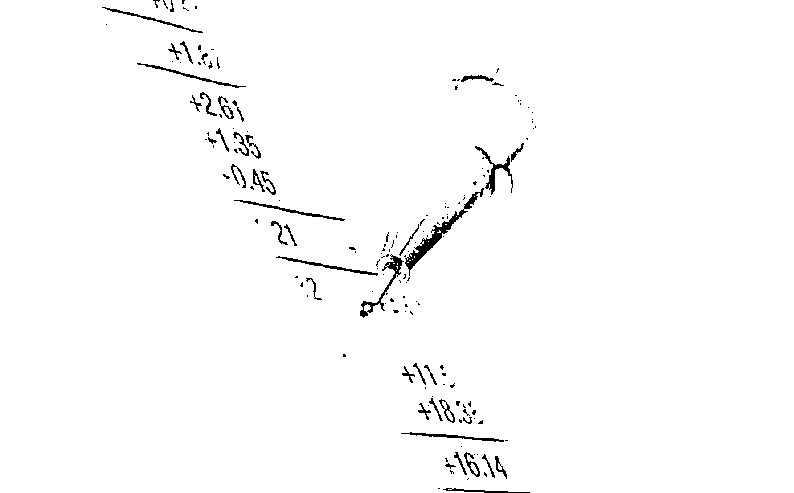

作者/雷蒙德·梅里曼 译者/Luke
编辑/玫瑰 图片/全景网

雷蒙德·梅里曼是在金融占星学界稳坐第一把交椅的占星师，同时他也是若道签约的金融占星课老师，我们引进了雷蒙德·梅里曼老师的《[上证指数月度报告](http://mp.weixin.qq.com/s?__biz=MzA5NjA0NTAxNg==&mid=2651443556&idx=1&sn=971def1aa74c2662394b35531d7018da&chksm=8b4b63d3bc3ceac5cf124611e8386478226581ff46a5d4f248df5671c3a5e189104125b14143&scene=21#wechat_redirect)》及《[黄金报告](http://mp.weixin.qq.com/s?__biz=MzA5NjA0NTAxNg==&mid=2651443556&idx=1&sn=971def1aa74c2662394b35531d7018da&chksm=8b4b63d3bc3ceac5cf124611e8386478226581ff46a5d4f248df5671c3a5e189104125b14143&scene=21#wechat_redirect)》《[2021 年金融预报](http://mp.weixin.qq.com/s?__biz=MzA5NjA0NTAxNg==&mid=2651436458&idx=3&sn=a7522c271761ef772fc91991ff11d965&chksm=8b4b071dbc3c8e0b452375ae3593028ab68b7b6157b45ee7c92943ff3396990d7748d7cd0967&scene=21#wechat_redirect)》。我们经老师的授权，将每周刊登梅里曼老师的周运，供大家参考和学习。于是，这是本周的周运（4.26-4.30）。

**说明：以下时间采用纽约证券交易所所在地美国东部标准时间。**

**展望与回顾**

**欢迎来到拜登繁荣。“预测”实际经济增长将在 7%-8%之间……如果这发生了，标志着自 1984 年来最快的第四季度增速。**

**——艾伦· S.·宾德**

**《欢迎来到乔·拜登的经济繁荣》**

**《华尔街日报》**

**2021 年 4 月 22 日**

**拜登政府官员周四透露，他们将很快提议联邦资本利得税从目前最高的 23.8%提高到 43.4%。这一消息使得股市大幅下挫，标准普尔指数创下一个月来最大跌幅。受此消息影响，美国国债收益率也下跌，因为投资者对经济增长前景持怀疑态度。**

**——《43.4%的资本利得税？》**

**《华尔街日报》社论版**

**2021 年 4 月 23 日**

**在华盛顿对经济发表的所有愚蠢评论中，没有什么比“暂时性通货膨胀”更危险的了……生活水平降低不是偶然的，这完全是现今的经济政策导致的。****——约瑟夫·C.·斯特恩伯格****《关于暂时性通货膨胀的永恒真理》****《华尔街日报》****2021 年 4 月 23 日**上周的大多时间市场下跌，这是因为突然宣布了即将大幅加税的提议。由于与冥王星有关的行进将在下周发挥影响，过去两周里本专栏已经提前指出了税收对市场的重要影响。事实上，冥王星将在 4 月 27 日逆行停滞，这恰好是天蝎座满月的前一天。冥王星守护天蝎座，因此与税收以及其他本周将讨论的“冥王星”事宜相关。上周大多数全球股市收跌。尽管上周开局不错，好几个市场在 4 月 19 日创下历史新高或多年来的高点，但随后在接下来的 1-3 天大幅下跌，直到金星合相天王星时出现反转。在欧洲，德国 DAX 指数和荷兰 AEX 指数在 4 月 19 日创下历史新高，随后 4 月 20 日快速下跌，然后反弹持续至周五收盘。苏黎世 SMI 指数在 4 月 19 日到达 11266，几乎创下新高，略低于 2020 年 2 月 20 日的历史最高点 11270。伦敦富时指数出现了类似的模式，也就是说，在周一创下年度高点，周二快速下跌，然后反弹至周末的收盘价。类似的模式也在澳大利亚的 ASX 指数出现，它在周一创下历史新高后，快速下跌至周三，然后在周五开始了另一轮反弹。但其他的亚洲市场表现没有这么好。除了日本和印度，亚洲股市表现相对平静。对于前者，日经指数在 4 月 21 日创下三重底。另一方面，印度 Nifty 指数跌至 2 月 1 日以来的最低点。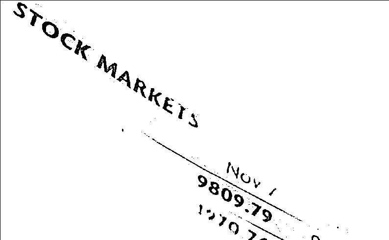上周的大赢家是谷物市场。大豆周五测试了 2013 年 7 月以来的最高位 1550，接近 2012 年 9 月的历史最高 1794。玉米飙升至 636，是 2013 年 6 月来的最高位。小麦也动起来了，上涨至 714，是 2014 年 5 月以来的最高位。黄金和白银最近几周表现不错，两者都在 4 月 21 日达到了月度高点。另一方面，比特币出现了严重的下跌，周五时跌至 47266，较前一周 4 月 14 日的历史最高点 64900 下跌了 27%。考虑到金星和太阳与天王星的合相分别在 4 月 22 日和 4 月 30 日发生，我们在上周的专栏里讨论了这一可能性。天王星与数码设备有关，合相发生在金牛座，与金钱和货币相关的星座。这周它依然在发挥影响力，这意味着不仅是比特币，在这一时间段所有市场都可能发生突然的反转。**短期占星趋势和长期考量**

**“有没有人觉得自己是一个懒惰的完美主义者，患有注意缺陷与多动障碍、慢性疲劳，除了偶尔的恐慌发作外都很冷静，喜爱朋友，但是仇恨人类？”**

**——汉娜·伯纳@beingberz,**

**千禧一代的推特**

**2021 年 4 月 21 日**

上面的引文是我的儿子提供给我的，他也是千禧一代。他告诉我这种感受反映了许多千禧一代的看法。我告诉他这种观点准确地反映了土星四分天王星的原则，尤其是在 2020 年摩羯座大合相以后。婴儿潮一代也经历过许多这样的情感。有趣的是，天王星代表年轻人，土星代表社会中的老年人。同样有趣的是，这些特征进一步反映了整个国家（美国）的集体情绪，可能甚至是全世界的。让我们从全球股票指数的角度来解读它，全球股市在蓬勃上涨，美国建国星图显示出了对未来的大体感受。后者是为什么我认为美国的情况比其他国家更严重。这个国家的情绪有些不对劲的地方。首先，要理解股票市场上周出现的问题和当前的经济无关。由于多重的刺激法案和美联储承诺继续致力于货币宽松政策，经济正在蓬勃发展。然而，这很快成了消费需求驱动的繁荣，却没有足够的供应（产品）来满足需求。如果生产不快速提升以满足需求，这将产生后果（通胀）。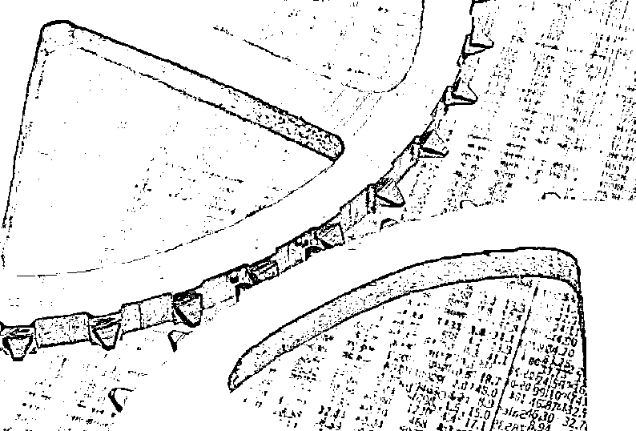 通货膨胀率已经在上升，美联储坚持认为这是暂时的，但投资界并不买账。倘若投资者和企业未来将面临更高的税收，这将是当前繁荣的终结。这些庞大的增税计划不鼓励私营经济为商品生产项目增加投资，以满足增长的需求。这是迫在眉睫的问题，更不要提它在国家债务下一轮爆发中扮演的角色。因此，人们达成了共识，尤其是年轻人和老年人，他们认为这轮繁荣不会持续，终将以衰退告终。这也符合天王星行经各个星座的历史，尤其当它在象征金钱和“安全感”的金牛座行进时，尤其是它还和土星形成困难相位。鉴于在千禧一代短暂的人生中，已经经历过好几次金融和社会的“冲击”，他们害怕这轮繁荣不会持续，也是可以理解的。在本世纪初的头两年，互联网泡沫破裂，导致深度衰退，此外还发生了 2001 年 9 月 11 日的恐怖袭击和 2003 年美国入侵伊拉克。当时不仅经济下滑，校园枪击案件也频频发生，进入了一个恐怖主义的时代，国家安全和个人安全的幻觉也随之消失。这都发生在土星-天王星的渐盈四分相，和随后的土星-冥王星对分相期间，在这些对应创伤事件的行星组合下，千禧一代跌跌撞撞地进入了新世纪。就在几年以后，随着土星-天王星周期的下一个 1/4 阶段（对分相）的发生，加上冥王星与土星-天王星对分相形成 T 三角，2007-2009 年的大衰退展开了，这主要是由于次贷银行业的萧条。许多家庭失去了家园和工作。这对于千禧一代又是一个创伤时期，他们刚刚成年（可能还承担着无力支付的学生贷款）。同时，婴儿潮的一代人本打算退休，却做不到，因为他们的家庭价值缩水了一半（或更多），或遭到裁员。他们和他们家人的经济焦虑再次升级。没过多久，下一个创伤周期又展开了，这就是我们当前经历的。伴随着宇宙时钟的节奏，这次危机又对应着土星-天王星的四分之一周期（渐亏四分相），以及刚刚发生的土星-冥王星合相。2020 年又一轮的冲击和创伤继续为千禧一代带来着噩梦和焦虑。由于天王星在金牛座，这又是一段经济上没有安全感的时期，尽管当前经济是繁荣的，挥之不去的是繁荣将再次突然结束的恐惧。人们几乎不相信繁荣会持续下去，可能是因为千禧一代已经在千禧年起的 21 年中，三次见证了这出悲喜剧的发生。不止如此，让我们关注美国。一个国家的集体情绪由其建国星图中的月亮代表。使用美国独立宣言投票日 1776 年 7 月 2 日设置美国的建国星图，这个国家建国星图中的月亮在摩羯座尾度合相冥王星。行进冥王星自 1776 年以来首次回归其建国星图的位置。冥王星不仅代表税收。它还掌管黑暗和对未知的恐惧。冥王星是死亡后带灵魂穿越冥府的摆渡人。从象征学意义上来说，当冥王星来到，一个重大的转化——重生就会发生。某些事物必须死去才能重生。建国星图的主题被铭刻在国家自身的灵魂上。由于月亮的参与，国家整体的情绪将受巨大的影响，因为这些主题又返回了集体意识中。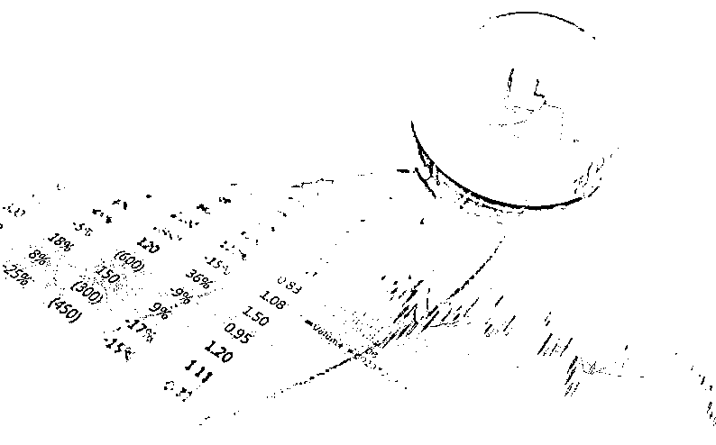关于美国从英国独立，以及它的冥王星回归，有两件事浮现在脑海中。第一件是奴隶制和种族主义，这是早期国家灵魂上的污点。第二件事是税收，因为独立宣言的口号不仅是“人人生而平等”，而且也是“无代表权则不纳税”。具有讽刺意义的是，冥王星同时代表这两个原则（税收和奴隶制）。更具有讽刺意义的是，我们正处于发生强有力的冥王星行进时刻，而且美国正在经历冥王星回归，合相建国星图的月亮。在上周我们不仅见证了投资界对大幅加税的担忧，因为这会对经济造成未知的长期的负面后果，同时也见证了白人警察德里克·肖文因谋杀非洲裔美国人乔治·弗洛伊德而被定罪。这样的定罪在几年前是前所未闻的。尽管冥王星代表黑暗，对未知的恐惧，以及随之滋生的焦虑。但就像占星学里的所有原则一样，它也有光明的一面，希望的一面。对于冥王星，它与救赎有关，也和愿意承诺去真正改变有关。当那种臣服和重生发生，你开始重建一个新的人生和人格。与其恐惧死亡和未知，情绪被一种更新、重生和变得有力的感觉所填充；与其“仇恨人类”，只爱自己的朋友，一种对所有人的爱和尊敬开始浮现；与其在试炼中承受创伤，流下悲伤的眼泪；一个人的眼里仍然充满泪水，但这次是出于对那些通过了考验的人发出的慈悲和希望。这就是双鱼座海王星在天体轨道上，与冥王星一起演出的宇宙之舞。

**说明：以上日期基于纽约证券交易所所在的美国东部标准时间，由于存在时差，中国地区可能需要加一天。**

**版权声明：**本文由若道翻译发布，欢迎转发，反对抄袭。友号转载请申请白名单。

**雷蒙德·梅里曼（Raymond Merriman）**

若道签约老师。著名金融占星师，ISAR（国际占星研究协会）前主席，梅里曼市场分析公司的总裁。他由于“提升了占星学的职业形象”，在 1995 年国际占星大会上被授予轩辕十四奖；在 2012 年国际占星大会上，被授予轩辕十四终身成就奖。

1“中国上证指数月度报告”发售

**若道推出了****中文版****的雷蒙德·梅里曼中国上证指数月度报告，并持续发行该报告！**

当把金融市场的周期和占星学的周期相结合时，雷蒙德·梅里曼老师的金融占星学研究**为投资者应对金融市场的周期波动，并随之调整投资策略提供了极大的价值参考**。

**5 月中英文报告已上线！**

2“黄金价格周期月度报告”发售

**若道推出****中文版****的雷蒙德·梅里曼黄金价格周期月度报告！**不仅仅为广大读者在中国股市的投资出谋划策，更将视角放眼黄金市场。

**每当世界经济形式不明朗的时候，有一个地方是保值的港湾，那就是****黄金**。自 1982 年雷蒙德·梅里曼出版第一本研究《地球宇宙学征象与黄金价格的关联》的著作以来，**他一直作为最重要的黄金市场时机预测者之一享誉国际**。5 月黄金报告已上线，梅里曼老师将会告诉你他对这个关键时期如何操作的想法。也可以按照季度和一年期订阅，有更多优惠。季度和年度的好处是，你可以持续了解梅里曼老师对于不断在变化的市场的看法。即便他某一次看法和市场不一致，你也看到在下一期他如何调整自己的看法，并看到金融占星在一个长期时间段内对你把控风险的帮助。而能够长期控制风险、尽量找到安全的投资时机才是投资的长久之计。

**5 月中英文报告已上线！**

**购买套餐**，买得越多越优惠

中国上证指数月度报告套餐价

*   **单月报告**：280 元

*   **3 个月套餐**：780 元（260 元/月）

*   **12 个月套餐价**：2400 元（200 元/月）

**长按下图识别二维码**

**购买金融报告****套餐**

**▼**

黄金周期月度报告优惠

*   **双报告年度套餐更优惠（直降 900 元）**
*   **12 个月黄金报告+12 个月上证指数报告：仅需 3900 元**

**长按下图识别二维码购买黄金报告套餐**

▼

**2021 年金融年报发售中**

**1976 年以来，由雷蒙德·梅里曼撰写的梅里曼市场时机学院每年一次的年度预报沙龙和每年一本的《年度预报》一直在应用占星学原理为投资者们服务，提供卓越洞见，从未间断。**过去两年，3 小时的年度预报讲座和长达 200 页左右对金融市场的分析报告，帮助许多若道读者做出正确的投资决策，降低了投资风险，并获得相当不菲的投资收益。在群星摩羯座的时候，我们和你一起提早规划自己今年的投资安排。2021 年年度预报发售中**2021 年金融年报价格**：1280 元**沙龙时间**：2021 年 1 月 9 日（视频已上线）**沙龙形式**：英文讲座，配有中文翻译**点击下图了解详情**

▼

**点击阅读原文购买金融报告**

# 插班中丨择时择地占星学，助力“天时、地利、人和”

> 原文：[`mp.weixin.qq.com/s?__biz=MzA5NjA0NTAxNg==&mid=2651443674&idx=3&sn=75f0c278e638324d233703dc7f8ced12&chksm=8b4b636dbc3cea7be455680d4209270e4d0559547144b64c1ceb7c1c542f4dcc4c3f42abf1ab&scene=126&sessionid=1692737994#rd`](http://mp.weixin.qq.com/s?__biz=MzA5NjA0NTAxNg==&mid=2651443674&idx=3&sn=75f0c278e638324d233703dc7f8ced12&chksm=8b4b636dbc3cea7be455680d4209270e4d0559547144b64c1ceb7c1c542f4dcc4c3f42abf1ab&scene=126&sessionid=1692737994#rd)

1

**为什么要学习择时择地占星学？**

**择时择地占星学是占星学传统中的一个重要分支，也是占星师为客户提供的一个重要服务领域。**

宇宙天象在不停变化，就像潮汐一样。作为占星师的我们了解，每刻天象有不同意义。当我们有一个重要的事情要做，不论是企业选择开业、谈判、上市时间，还是个人选择面试、婚礼、手术、投资买卖时间，都好像选择在怎样的宇宙潮汐下开船。**适合的时刻就像孔明借到的“东风”，帮助我们顺风顺水，推动事情有个好开始及好的发展。**

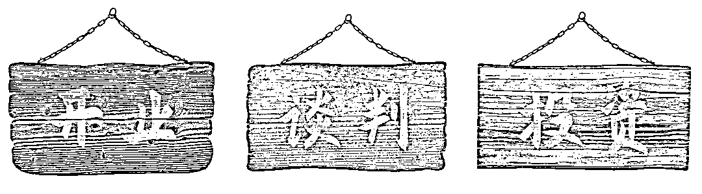

同时，在国际化、地球村的今天，我们和客户都有了更大的可能性在全球范围内移动，开展一些重要的事情，而选择合适的地点也将有助于事情的开拓，并带来一些在本地无法实现的机会。

而最最重要的，在所有这些事件中，我们都需要考虑人的要素。一个精心挑选出来的时间和地点需要和当事人的星图契合。

因此，**择时择地占星学就是帮助我们及客户找到成功的三个关键要素——“天时、地利、人和”的一门重要占星技法。**

**拥有这门技法，可以迅速帮你扩展你的占星业务内容，特别是为服务高端客户带来更多可能。**

2

**课程大纲**

**此课程可作为 ISAR 选修课。**

**在这 10 节课的时间里，我们将以案例方式学习择时择地占星学的重要应用，包括但不限于：**

*   确定择时图的优先顺序，了解自己和客户的需求

*   了解当下的大趋势，认识可选择的时段内任意时刻的利弊

*   研究公司事务相关的择时，比如开业、产品上市、网站上市、谈判、诉讼、上市、收购、会议、重大活动等

*   研究和个人相关的择时，比如面试、考试、投资买卖、结婚登记和婚礼、手术（比如剖腹产、整容手术）等

*   介绍择地理论

*   用案例研究如何进行择地

**本课程讲主要使用案例讲解，并有作业和认证考试。**

**完成作业，且通过考试者将会获得择时择地占星学认证证书。**

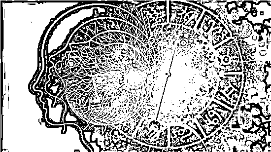

3

**导师介绍**

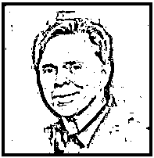

**大卫·瑞雷（David Railey）**

在过去 50 年中，大卫·瑞雷老师一直不间断为其客户提供占星咨询服务。他们中有国会议员、奥斯卡获奖演员、市长、企业家、工程师、天文学工作者、运动员、艺术家、大型活动组织者、导演、编剧、建筑师、心理咨询师等来自各行各业的人士。他们的年龄跨度，上至 80 岁老人，下至 10 多岁的青少年，均是大卫·瑞雷老师的客户。有些更是祖孙三代都是他的客户。

在 50 年的咨询生涯中，大卫老师为很多客户提供了大量择时择地服务，帮助他们安排人生中的重大事务，也因此积累了很多择时择地案例。

在这难得的 10 节课中，他将告诉你，他 50 年来成功为客户进行择时择地服务的秘诀。

**大卫老师寄语：**

**如果你想要拥有长期客户的话，首先是要跟他们建立有信任的关系。你要跟这个人建立一种连接。因为那些会问你最多关于择时择地问题的客户，将会是你建立最紧密关系的客户。他们会慢慢信任你，你也能慢慢了解他们。**

以下是一位跟随了大卫老师 40 年的 70 多岁老客户 Caroline 给大卫老师的信，大卫老师在她 73 岁时为她的飞行考试进行择时。她写了这封信表达感谢，并同意刊登。

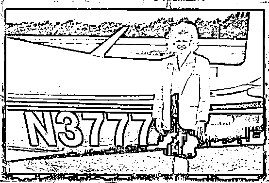

（向上滑动查看内容）

“Flying went just GREAT!  Thank you so much.  Thank you, thank you, thank you.

You picked it perfectly - weather turned out fine.  I am soooo Happy.  Just thrilled.“

“飞行棒极了。太感谢你了。谢谢你，谢谢你，谢谢你。你挑选的日子棒极了-天气特别好。我特别开心。真的太激动了。”

4

**授课时间和方式**

**授课时间（共 10 次课，每周二）：**

*   2021 年 4 月 6 日

*   2021 年 4 月 13 日

*   2021 年 4 月 20 日

*   2021 年 4 月 27 日

*   2021 年 5 月 4 日

*   2021 年 5 月 11 日

*   2021 年 5 月 18 日

*   2021 年 5 月 25 日

*   2021 年 6 月 1 日

*   2021 年 6 月 8 日

5

**授课方式**

**线上网络直播课，英文授课，中文翻译。**

6

**课程价格**

**价格：7500 元**

**特别优惠：**

**转发课宣至朋友圈，不分组，并写上走心的推荐语，即可获得 200 元优惠券！**

**（截图发给客服小姐姐领取）**

**往期学员复训：3750 元**

**往期学员参加认证考试：1000 元**

7

**退转课程**

*   **退款原则请详看《教学协议》，如有疑问请咨询课程顾问。**

****择时择地占星学网络课****

**授课老师：大卫·瑞雷**

**授课时间：**2021 年 4 月 6 日-6 月 8 日

**授课方式：****线上课程，英文授课，中文翻译**

**费用：7500****元**

**课程负责人：Maggie 老师**（微信：18510107057，请备注“择时择地占星”）

长按二维码添加课程负责人咨询~

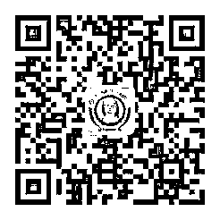

****报名请点击“阅读原文”****

# 水星与金星合相在金牛座，让你印象最深的美食是什么呢？

> 原文：[`mp.weixin.qq.com/s?__biz=MzA5NjA0NTAxNg==&mid=2651443589&idx=1&sn=a6917b719a1337d9984fb6f8bdafe3ff&chksm=8b4b6332bc3cea2430bc44a9c4f8a6d9609c6ab970afec985e889f0fa3f11e8c47550dea4d52&scene=126&sessionid=1692737999#rd`](http://mp.weixin.qq.com/s?__biz=MzA5NjA0NTAxNg==&mid=2651443589&idx=1&sn=a6917b719a1337d9984fb6f8bdafe3ff&chksm=8b4b6332bc3cea2430bc44a9c4f8a6d9609c6ab970afec985e889f0fa3f11e8c47550dea4d52&scene=126&sessionid=1692737999#rd)

**2021 年 4 月 25 日天象：**

*   0:05 月亮进天秤座

*   金星与水星合相在金牛座

*   金星、水星四分土星

*   土星与月亮北交点呈三分相

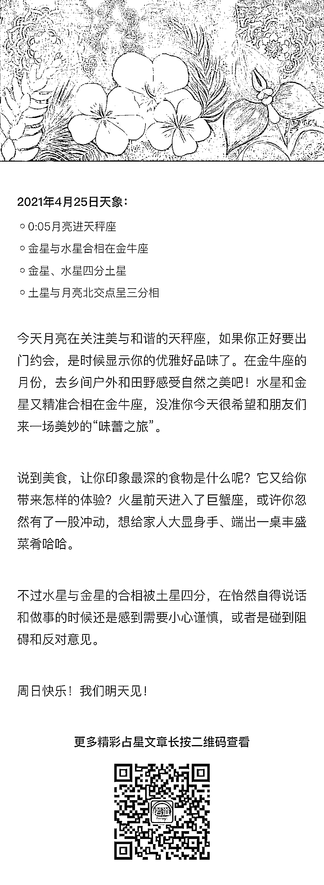

# 土天四分又将被触发，股市该如何操作？ | 5 月上证+黄金报告上线啦！

> 原文：[`mp.weixin.qq.com/s?__biz=MzA5NjA0NTAxNg==&mid=2651443556&idx=1&sn=971def1aa74c2662394b35531d7018da&chksm=8b4b63d3bc3ceac5cf124611e8386478226581ff46a5d4f248df5671c3a5e189104125b14143&scene=126&sessionid=1692737999#rd`](http://mp.weixin.qq.com/s?__biz=MzA5NjA0NTAxNg==&mid=2651443556&idx=1&sn=971def1aa74c2662394b35531d7018da&chksm=8b4b63d3bc3ceac5cf124611e8386478226581ff46a5d4f248df5671c3a5e189104125b14143&scene=126&sessionid=1692737999#rd)

2 月 18 日，土星和天王星形成第一次四分相时，上证指数到达 3731——2019 年股市开始上涨以来的最高点。此后，上证指数跌至 3 月 9 日的低点 3328 点，跌幅达 10.8%。第一次的土天四分相是一个关键的反转点。此后，上证指数一直在震动中。

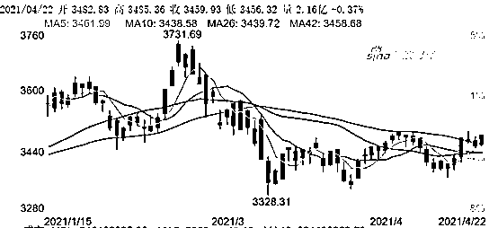

| 上证指数日线根据梅里曼老师对上证指数的研究，上证指数处于从 2019 年 1 月 4 日的低点——2440 开始的一个 5.5 年的周期中，而这个周期又可以分为 2 个 33 个月的半周期，我们正在开始进入范围为 27-40 个月的 33 个月半周期的第 28 个月。现在的问题是：2 月 18 日的 3731 点是 33 个月半周期的高峰吗？3328 点是 33 个月周期的波谷吗？如果 3328 是 33 个月周期的波谷，那么上证完全可能出现新的 33 个月周期的第一轮上涨。但如果 2 月 18 日的 3731 点是 33 个月半周期的高峰，而 3328 还不是 33 个月周期的波谷，上证仍然可能在走向波谷的途中。**今年，对于金融市场最重要的天象——土天四分还有两次成相。一次在 6 月 14 日，另一次在 12 月 24 日。**事实上，**从本周（4 月 19-25 日）到 7 月 9 日的整个时间段，存在好几个强有力的地球宇宙学征象，其中任何一个都可能对应重要的波峰和波谷。**首先，太阳和金星将在**4 月 22 日-5 月 3 日**期间触发土星-天王星四分相。然后，火星将在**7 月的前两周**触发土星-天王星四分相。而在这两个时间段之间，木星、水星和海王星将在**6 月 20-25 日**之间或逆行停滞或顺行停滞。行星集体停滞也是一个与基本周期低点或高点对应的地球宇宙学一贯征象。此时你是应该逢低买入，等待指数的反弹？还是应该继续按兵不动，等待更大的下跌？金融占星大师雷蒙德·梅里曼的《2021 年 5 月上证指数报告》已上线，《2021 年 5 月黄金报告》也已上线，欢迎购买。

**5 月上证报告上线**

上证指数报告价格

**单月报告**：280 元/月 

**季度套餐价格**：780 元（260 元/月）

**年度套餐价格**：2400 元（200 元/月）

**双报告年度套餐更优惠（直降 900 元）**

**12 个月黄金报告+12 个月上证指数报告：仅需 3900 元**

**长按下图识别二维码购买黄金报告**

▼

****

您也可以购买《[2021 年金融预报和沙龙](http://mp.weixin.qq.com/s?__biz=MzA5NjA0NTAxNg==&mid=2651436458&idx=3&sn=a7522c271761ef772fc91991ff11d965&chksm=8b4b071dbc3c8e0b452375ae3593028ab68b7b6157b45ee7c92943ff3396990d7748d7cd0967&scene=21#wechat_redirect)》（点击可阅读），以了解梅里曼老师对于上证、黄金及主要金融市场 2021 年走势的整体看法。**长按下图了解详情**

▼

投资有收益，投资有风险，希望金融占星学的研究帮助你更好地评估你的投资。

“**黄金是金钱。其他的只是信贷。**

**——约翰·皮尔庞特·摩根**

”

自上期报告发布以来，黄金价格已经下探了 3 月 8 日的低点 1673.30，并在 3 月 31 日跌至双底低点 1673.30，**这是自 2020 年 6 月 5 日以来的最低价格。**

**从这以后，黄金价格开始上升。**

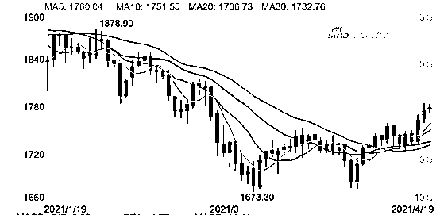

| 黄金日线

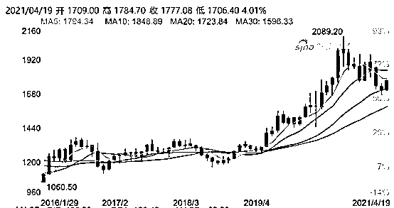

| 黄金月线图

现在的问题是，1673.30 是否是 31.33 月周期的低点，**黄金是否已经开启一个新的上涨周期？**

**5 月黄金报告已经上线，**上证报告也会在月底前上线。欢迎了解。也可以按照季度和 1 年期订阅，有更多优惠。**季度和年度的好处是，你可以持续了解梅里曼老师对于不断在变化的市场的看法**。即便他某一次看法和市场不一致，你也看到在下一期他如何调整自己的看法，并看到金融占星在一个长期时间段内对你把控风险的帮助。而能够长期控制风险、尽量找到安全的投资时机才是投资的长久之计。

点击**阅读原文**，雷蒙德·梅里曼黄金周期 5 月报告带来有 40 年黄金市场研究经验的世界著名金融占星大师雷蒙德·梅里曼对当前黄金市场的研究。

投资有收益，投资有风险，希望这份金融占星学的研究帮助你更好地评估黄金投资。

**5 月黄金报告上线**

**黄金月度报告价格**

**单月报告**：280 元/月 

**季度套餐价格**：780 元（260 元/月）

**年度套餐价格**：2400 元（200 元/月）

**双报告年度套餐更优惠（直降 900 元）**

**12 个月黄金报告+12 个月上证指数报告：仅需 3900 元**

**长按下图识别二维码购买黄金报告**

▼

**购买者需知**

**① **梅里曼市场时机学院《中国上证指数月度研究报告》是梅里曼市场时机学院（以下简称 MMA）的研究“预报”，而不是市场“预测”，是梅里曼老师及 MMA 金融占星分析师对人类活动周期历史与行星周期之间相关性的研究，二者在大部分情况下具有 80%或更高的相关性，而不是因果关系。报告中的研究完全存在错误的可能性。即便是非常认真的研究和几十年的研究经验，金融占星师无法总是正确地解读出各种征象在实际层面上会如何相互作用，并显化为事件结果。所以请将报告看作一个研究参考，务必结合其他市场研究和你个人对市场的理解，根据你的自由意志做决策。**②** 此报告一旦售出，**即不接受退款。**

**③** 上证、黄金月度报告每月固定 1 期，**并非都是在每月相同日期发布。**

**④** **我们收到英文报告的当天，即发布该英文报告。3 天后，上线报告中文版。此报告仅支持手机网页阅读，不支持电脑阅读和下载。**

**以上须知，请仔细阅读。一旦付款，即视为已了解并接受所有须知内容。**在过去的 39 年中，唯有梅里曼逐渐完善，并在梅里曼市场时机学院月度周期报告中阐释了将地球宇宙学与周期相结合的研究方法，以惊人的精确性预报了黄金价格发生重大变化的时间。**黄金购买 Tip**各大银行均可购买黄金或黄金 EFT 基金，也可以在诸如天天基金或者支付宝购买黄金及黄金相关产品。不明白的可以百度搜索。**购买后如何查看报告？**

**购买后有疑问怎么办？**

请联系技术客服

**微信：nodoor201705**

**购买黄金+上证报告直达入口**

# 当冥王星落在星图最神秘之处｜你灵魂中无声又绝望的恐惧，究竟何处安放？

> 原文：[`mp.weixin.qq.com/s?__biz=MzA5NjA0NTAxNg==&mid=2651443520&idx=1&sn=d2f1b6b4e8b41bee0ae6071dab6d280b&chksm=8b4b63f7bc3ceae154d6bf8570b7966d9f5899b5f3ea9dda47c8996168c8512a61f7688186f0&scene=126&sessionid=1692737999#rd`](http://mp.weixin.qq.com/s?__biz=MzA5NjA0NTAxNg==&mid=2651443520&idx=1&sn=d2f1b6b4e8b41bee0ae6071dab6d280b&chksm=8b4b63f7bc3ceae154d6bf8570b7966d9f5899b5f3ea9dda47c8996168c8512a61f7688186f0&scene=126&sessionid=1692737999#rd)

**☆ 后台回复“今日”，给你一句生命态度**

作者/蓝女巫 ISAR 认证占星师
编辑/翀子 封面/书君 图片/音乐/蓝女巫

本文写给冥王星十二宫。拥有这个配置的人，灵魂中似乎带着深深的恐惧和隐秘的伤痛。这篇文章将带你走进冥王星十二宫的世界，它告诉我们如何从这些迷失与伤痛中获取力量。

（本文适合冥王星在 12 宫、12 宫天蝎座、6/12 对宫人、以及火海特质者）

**冥 12，你在恐惧什么？**

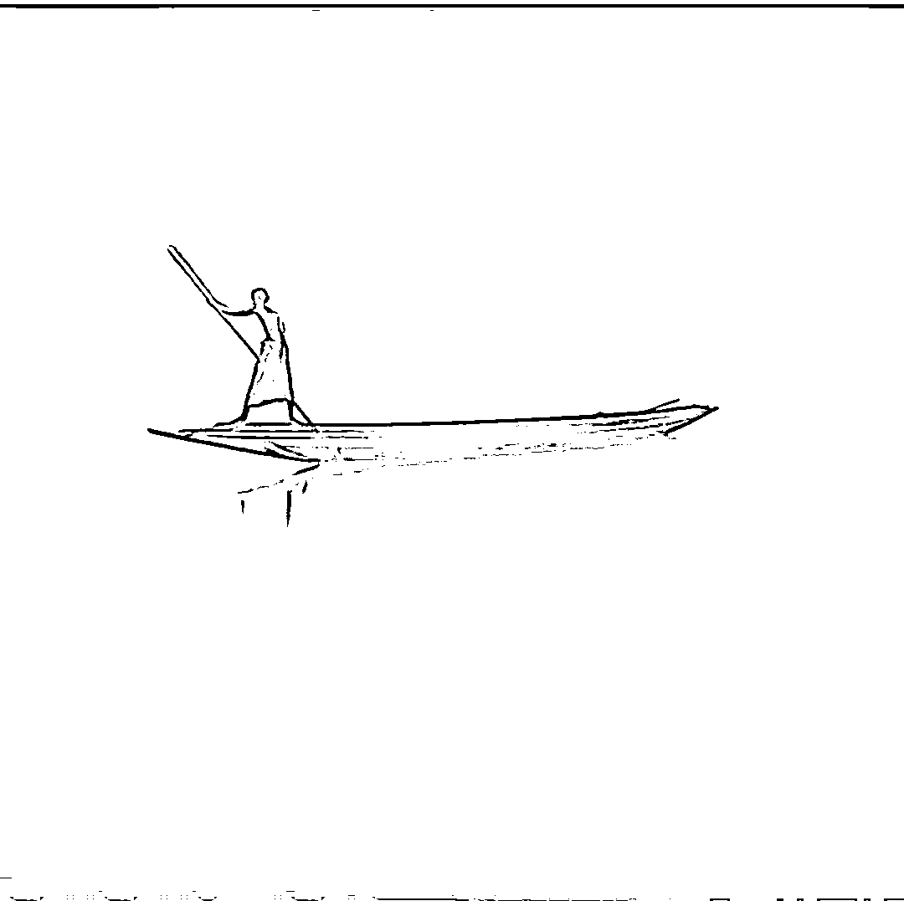

**梦**

**一位冥 12 客户的梦：**

我悬浮在一个特别巨大的无边无际的海洋的正中间，周围是特别湛蓝湛蓝的海水，我不知道怎么进入这片海水中间的，但是，我可以肯定的是我很恐惧，我在大声呼喊求救，但是，却听不到任何自己的声音，也感觉不到任何人能够听到自己的声音。

我感觉我自己即将死去，又似乎没那么绝望。如你所说，我明白了这个是前世的记忆，就是我对于深陷深海孤独一人，无可依靠的这种恐惧。

**同理，再来看一位北交双鱼座的：**

这位个案的突破口，是当我观察到，她的梦中及她身边的人，**不只一次出现溺水而亡的意象**……其实这不过是投射出了她自己对海洋的恐惧。北交双鱼座，这类人**对置身于星辰大海间的不确定性，有一种近乎失控的绝望。**灵魂功课就是要习得无力感，随波逐流，体验臣服。 

**对比一下，南交双鱼座海王星人的我：**

**最美梦境之一：**我悬浮在静谧之极的夜空中，瞥见天边长颈鹿化身的星座，它在眨眼，在低吟……

**最美梦境之二：**我一个人仰卧在夜色空旷的海滩上，呼吸着头顶那片月光的流泻，难以描绘的美好。一片真空，很久很久......

可见，恰恰相反，南交双鱼座的我，对海洋有一种难以言说的亲昵，一个人游向深海时总会本能地流泪，然后浑然一体……我懂，因为那里是故乡。我最美的梦都是关于星辰大海，不但没有恐惧，反而都是最幸福最明亮的童话式的沉浸，出于对本源的爱。 

于是，我告诉她：那个夜半独木舟，消失在百慕大的木海人，他最终会是安详的。因为死得其所。南交双鱼座 8 宫，我最懂得什么叫作**“深夜的海洋”……**

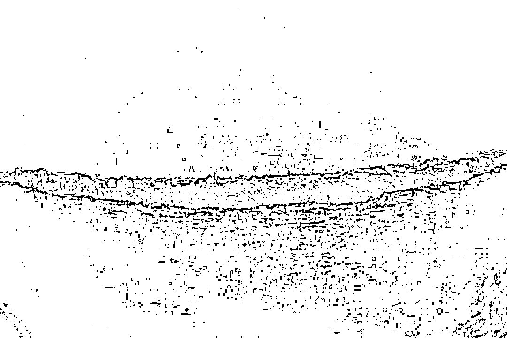

**梦，是最深层的愿望！**而冥 12，**你是自己最终极的谜题。** 

一个穿着黑袍子的人......他在你梦境的**人群**中？

来自另一维度的什么**能量**，正透过屏幕在跟你说话？

你惧怕后花园里的未知，一生用尽全力顶着那道**门**？

你对玄秘学爱恨交加？我猜那感觉叫作**“悚栗”**吧？

需要在睡前的黑夜里留一盏**灯？**你怕被什么吞噬？

你是一条有深海恐惧症的鱼吗？冥 12 难以像其它鱼类那么放任自如，他们注定**被一切海的意象所折磨，却又执迷于海。他们一面怕被毁灭，却又一面不停自毁着。**

这便是冥王星落宫在此处的矛盾。我在想，**那是怎样的一种对海的执着？**而这时，我眼中，怎么却有温热的海浪？我所共情到的是，**深沉的呼吸，厚重的摇晃……虚空，就是我们的源头和归宿吧。**当你害怕星尘大海，**你怕的是宇宙的本源，**超越自我的源头。因为你恐惧消融，恐惧像泡沫一般，就那么化为了乌有......

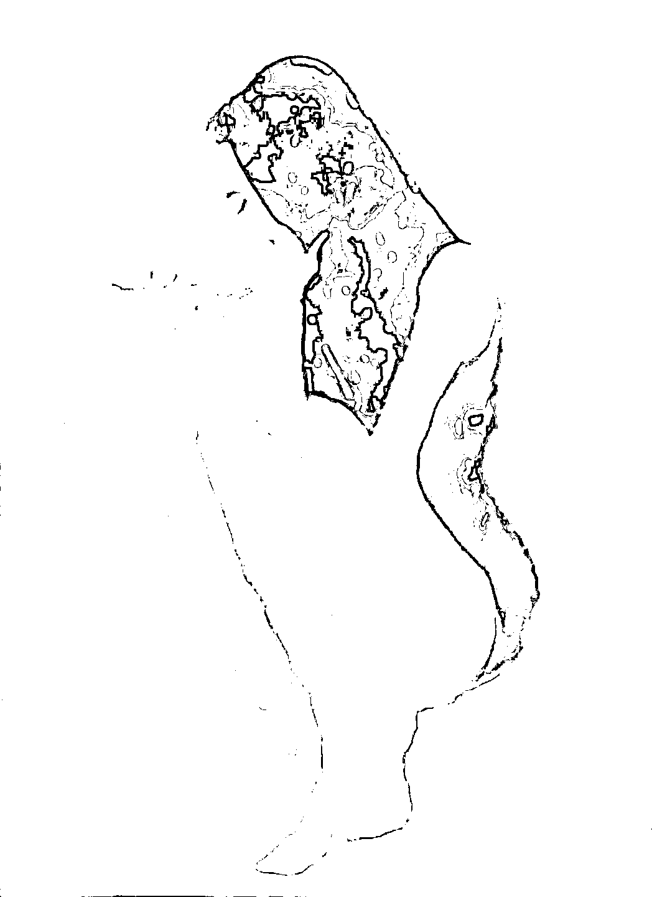

**| **蓝女巫画作 2020.3

**消融**

只要我愿意，我可以知道世界上所有事物。而我是支离破碎的；我不再是一个完整的人。

——伍尔夫《海浪》

冥 12 是海绵宝宝，作为全然感受者的同时，也就成了**灵魂吸尘器**。边界感因无边共情而岌岌可危。常因潜意识而失序。

敏锐如你，总能如此**犀利的刺入宇宙。故当你恐惧的时候，不知怎么就挖到了世界的海床。你令空气变得可以触摸。共情似熨贴般，感同身受的温度。**洞若观火，对他人秘而不宣的动机，而裸露的神经却令你显得格外脆弱。敏感于周遭场域能量氛围的暗流，导致你高度紧张，甚至生病。

你是能够转化社会阴影的魔法师，或是成为社会垃圾桶的替罪羊。**你的能量足以撼动集体潜意识？影响世界的过去，现在与未来。然而善于操纵愿力的人，也常会受到心理暗示的反噬吧。**

所以，个人无意识和集体潜意识，让你腹背受敌。**时时受到暴击。常常支离破碎。**如何有效疏导转化这些能量？**你会在千钧一发时选择逃亡。**

我同时是很多很多的人；我完全弄不清楚我究竟是谁；我也不知道该怎样把我的生活和他们的区分开来。

——伍尔夫《海浪》

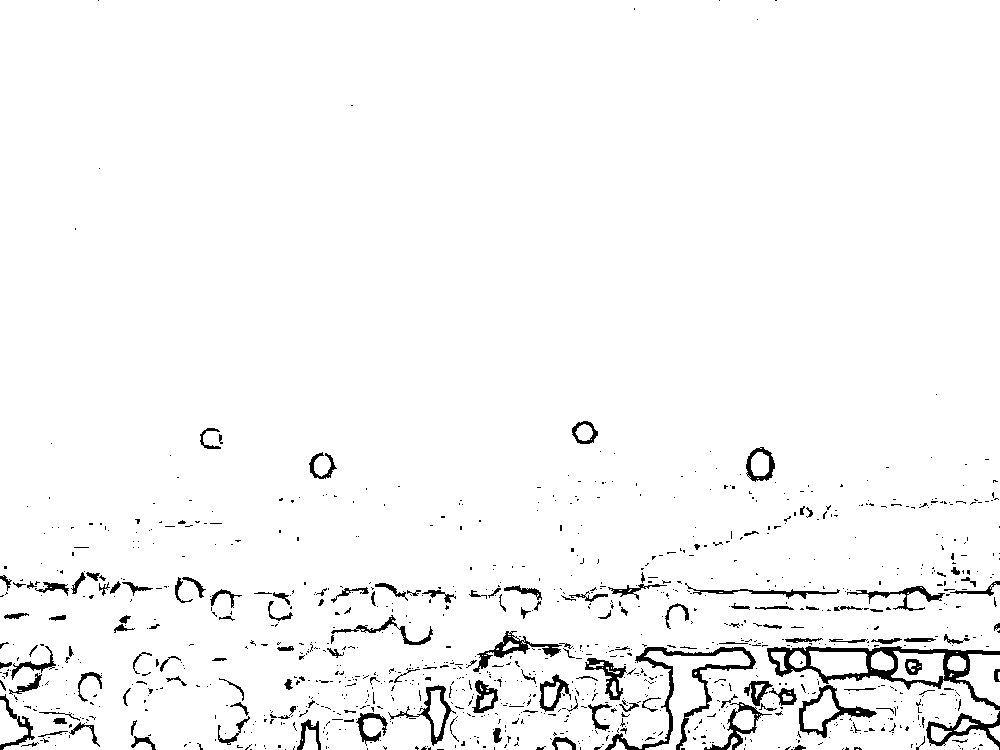

**独处**

他们总是问这问那，他们总是打搅。

——伍尔夫《海浪》

**冥 12 需要留白，永远都不够。**你是很萌的物种，对适应社会缺乏圆融。坚持以自己的方式，入世或遁出，不被改造。你始终在用**无限的拖延，**默默反击。社会互动，总会激起恼人的情绪，引动你复杂的情结。每隔一段时间，就会令你状态低迷。故迫切需要人间蒸发，不理任何人。且不惜弄伤自己，以生病达到**在危险社会中隐退**的目的。选择长期独处，追求全然的静默。或是阶段性的隐退，变得 anti-social。

冥 12 祈求黑暗，因恐惧也同时会是其极度的快感。**彻底绝对的黑暗，**那是内心的无限。因凡寻求无限者，只须闭上眼睛。**而当你在内世界变得越来越大，外在形象就会变得越来越小。**

**是留在肮脏的世界，成为人质？还是回去内在的黑暗中，毁弃自我？**这应该是他们的终极难题了。**海浪拍岸声声碎！**

**我好想找个地方安静的生活。**

寂静，咖啡杯，桌子，**这一切是多么美好啊；一个人独自坐着，**就像那孤独的海鸟张开翅膀站在一根木桩上。请不要过来烦扰我，提醒我什么现在到了关门的时间并且应该走了。**我愿意把我身上所有的钱全都给你，只要你别来打搅我，让我一直坐下去，静静地，一个人。**啊，该死。**不论我是多么疲惫和厌倦了这一切，**我必须硬撑着站起身来，接着**找到属于我的那件****外套。必须强使自己离开这里，****去赶最后一班火车。**

——伍尔夫《海浪》

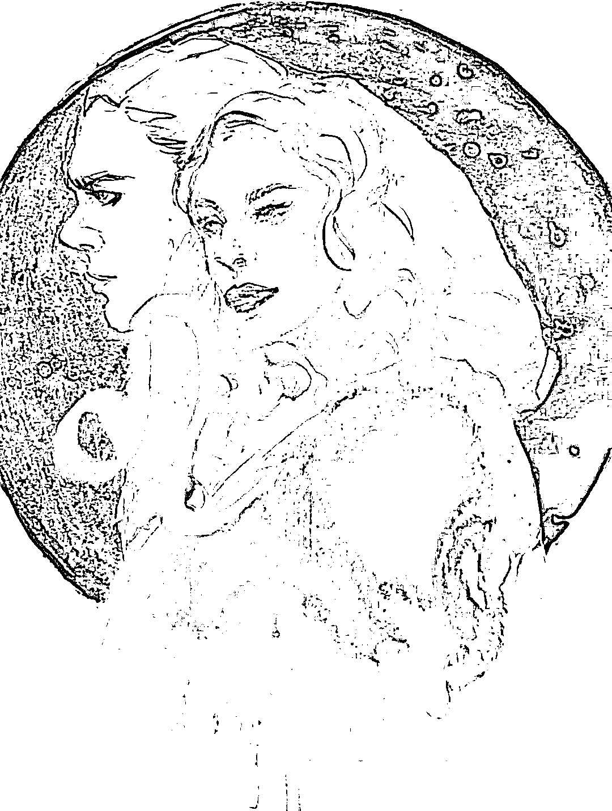

**| **蓝女巫画作 2020.3.8

**爱情**

因为他陷入了爱情。**爱情的不祥阴影主宰了我们刚才的会面。**

——伍尔夫《海浪》

**有时候冥王星也愿意弃绝，为了爱；但有时候冥王星也会反抗，为了存在。**

当**被消融被吞没的恐惧蔓延到情感关系**中。你总会本能的退缩躲闪，**莫名的恐慌害怕。**尽管他人全无恶意，但只要略显主动靠近你。被侵犯的不安和企图心的警惕就会迅速升起，**一不小心仿佛就被打搅了你内心的宁静。**真切的危险，来自遥远的经验。前世创痛如此真实，故难以信任。尽管你也渴望被靠近，但是**退缩仍是一种本能。**

**情执过重的人，才不敢轻易交付自己，连同你致命的疯狂。**自觉业力深重，情感激烈荒唐，宁可与人**保持安全距离。这等同于对海的恐惧。**生怕不再属于自己，而完全属于了他人。形同**献祭**，成了**傀儡**。

而且有过一阵风，响过一阵猛烈的雷。一天夜里，**有一颗星星划过天空，**我对那颗星星说：**‘毁灭我吧。’**

——伍尔夫《海浪》

**而出于对海的渴望。**你又有强烈的情绪融合的需求。一旦防线被突破，便会甘心屈从于控制，一种**自我牺牲的委身。缴械的冥王星，像一个投降的士兵，放弃力量，失去防备之后，只能等待那致命的一击......是故焦虑。**心怀**凄美而悲壮**，这种心情跟你下意识弄伤自己的时候，同理......当然，**爱上一个有限凡人的弃绝，注定无常。**你也只是在她身上，迷恋着你那个完美的理想。而你最终那一跃，还是要指向无限的。所以，任何关系长期相处，都仍会**疲惫耗竭。**当你决定住进混沌深海，别人也只能无望等待。

我要采摘花朵；我要将花儿扎成一顶花冠，紧紧抓住它，把它献给——哦！献给谁呢？

**在我生命的流淌中似乎存在着某种阻碍；一股深沉的潜流拥塞在某种障碍前面；它痉挛；它挣扎；在它的中心似乎有一个顽冥不化的结。唉，这真是痛苦，这真是苦恼！我晕倒了，我失败了。现在我的身体消融了；我获得了解脱；我浑身散发出炽热的白光。现在那股潜流犹如汹涌的暗潮泻出，冲开闸门，冲退阻力，畅通无阻地奔腾起来。**

——伍尔夫《海浪》

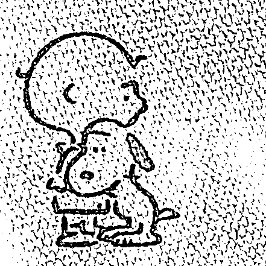

**纯粹**

我相信冥 12 独具**“慧眼”**。或许他们最懂得欣赏纯洁真挚的无华之美，觉得灵气灵犀可遇不可求，浑然天成才够美。**通过神情，看穿本质。他们认同的完美，就是纯粹吧？**基于乌托邦的脆弱作为投射的基础，坚持理想化的标准到偏执的程度。

没有谁会像他们那般**被不纯粹的焦虑所折磨。**社会中阴暗丑陋尽可以有，但美好的纯度不容侵犯。守护心中的海神庙，那是**不可动摇的核心原则？**就像会追求高纯度的精神口感，黑咖啡不加糖。理想国人，他们自己也不接受世界的改造。

**就让我永远坐在这里，伴着这些纯粹的东西，**这个咖啡杯，这把餐刀，这把餐叉，**保持它们各自本性的东西，保持我的本性的我本人。**

——伍尔夫《海浪》

**沉默**

“你低头不说一句。你朝着灰色走去。沉默一句一句，都是谜题。我们一声不吭，慢慢窒息。”**冥 12 的世界主要是靠感觉的**——最真的那种；而不是像冥 3 那么依赖语言的。所以经常话不多说。感受不来就别说......因此，冥 12 会**沉迷于影像**，所谓真正深刻的思想都是通往虚无和无解。

12 宫的无限信息量，完全不是 3 宫之有限可以企及的。正是因为是巨大的信息量，才不需要表达。**因为你如何表达？表达巨大无边的感受？**无力。**辞穷。**

 其实，**沉默，**正是后文中**信仰骑士的试金石**。**这才是他们最真实的时刻。面具褪去，方显灵魂无限的深度。**当他们把真正的灵魂力量，低调隐藏了下去。然后，**你在注视他的眼睛时，却发现了深邃的宇宙。**

**我只需要一种简单的语言，**就像恋人们经常使用的那种；只需要那种单音节的只言片语，就像小孩子喃喃的那种语言。**我需要一种咆哮；一种呐喊。当暴风雨掠过沼泽地，从我身上——我躺在一条土沟里，无人过问——扫过时，不会再有任何牢牢立足于地板上的东西。我已经不再需要那些语词了。**

——伍尔夫《海浪》

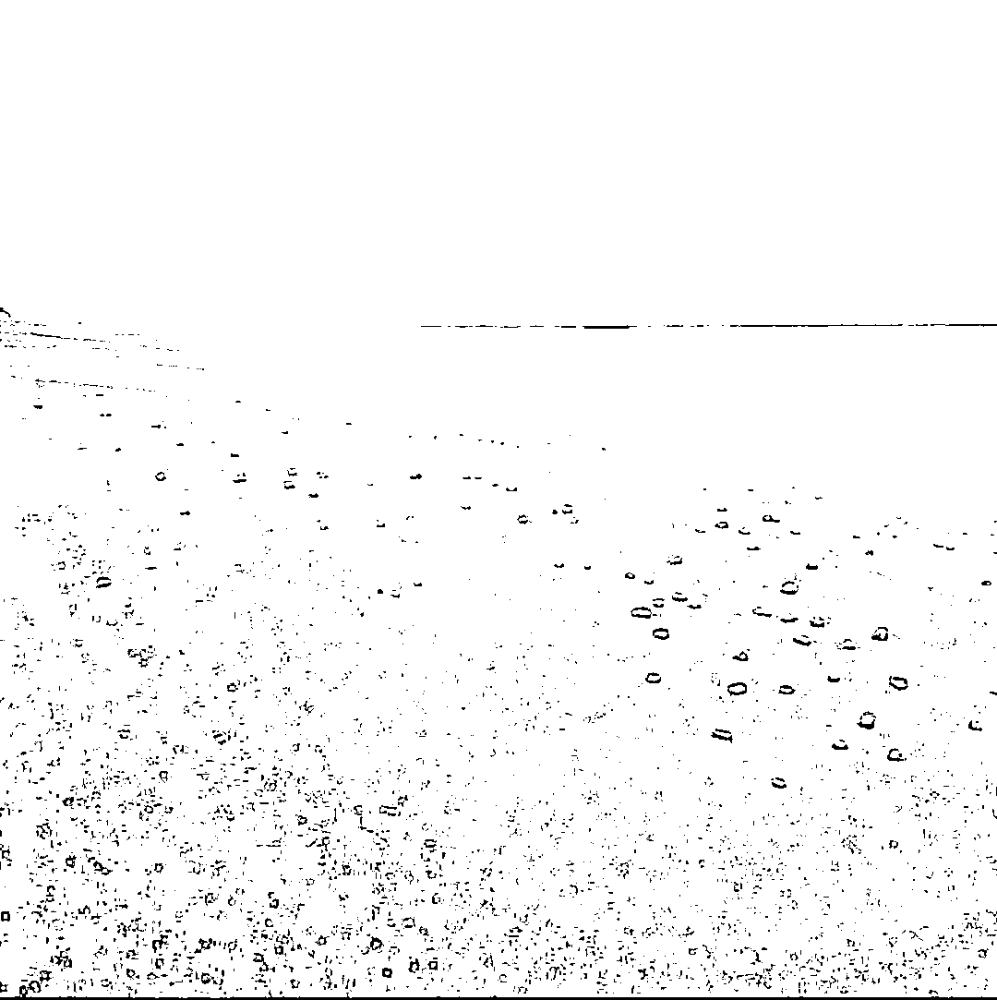

**失去**

**大风和暴雨**渲染着七月的色彩。还有，当我手里拿着一只信封**去给别人送信**的时候，那个**死气沉沉的、令人望而生畏的灰楚楚的烂泥坑，**就横卧在院子的正当中。我走到那个烂泥坑跟前。**我没法走过去。我不知所措。**我们真是**不中用**，我这么说，**然后就倒了下去。**我就**像一根被狂风舞荡的羽毛，我被吹送进了坑道。**之后，非常小心谨慎地，我迈步跨了过去。我一只手扶在砖墙上面。**我提心吊胆地跨过那个灰色的、死气沉沉的大泥坑，十分艰难地返回我的房间。这就是我那时注定要过的生活。**

——伍尔夫《海浪》

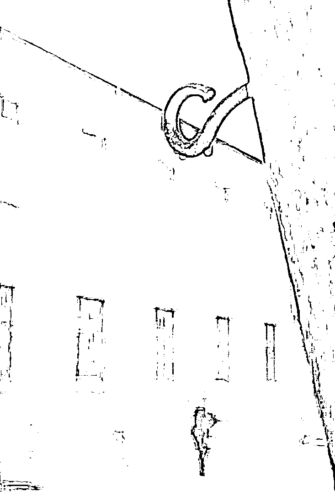

12 宫是代表损失和不幸的宫位。且可能是巨大的灾难。**Catastraphy, lost everything**那种。冥 12 无意识海洋中深埋的沉痛，说他们过去世是**奥斯维辛的色彩**，都不为严重......悲伤的人，没有脸孔。今世的月光洒向腐蚀的骸骨，照见你潜意识中那艘重创的沉船。未竟之伤的泡沫，翻涌在你记忆的岸边。那些**不可抗力的灾难，巨大的丧失感，被刻入灵魂。**这就是你本能的**深沉未解的恐惧之源。**今生就是用来疗愈它。

所以，冥 12 是**对世界危险程度预测度最高**的族群。冥 12**为拥有所付出的代价无疑也是最高昂的。**而愤怒和哭号都于事无补，**除了承受，你别无选择。**但其实，他们早已在累世的重创消磨中，发展出了应付的技能。别担心，痛苦真正降临时，你会有**临危不惧的天赋，超越痛苦的能力。**事儿越大，越平静。

当然，其实看似的痛苦，也只是看似的罢了。**想过吗，为什么要失去？**因为那些都是**“有限”之物。**从更深意义层面，是妨碍于你进化之路的。不过是些惯性的执着。是死亡焦虑的分解。而失物本身，即是潜意识对新生的呼唤。你今生就是**来学习如何接受失去的。**一个饱尝失去的人，才能更好地去拥抱无限，不是吗？**无法改变不幸的处境，但仍然可以选择面对困境的态度。**

我厌恶个人生活的所有细枝末节。**但是我被钉在这里，被迫去听。在我身上压着一种巨大的压力。如果不能卸掉那数世纪的重压，我就没法移动一步。无数枝利箭将我射穿。**我，一个敢于挺胸面对暴风雨、甘愿被冰雹窒息而死的人，却被钉死在这个地方，**无处藏身。猛虎扑了过来。有什么护身符能使我避开这种灾难呢？**

——伍尔夫《海浪》

**冥 12，你在补偿什么？**

Fight or flight？如何**面对至深的恐惧**，下面来探讨**冥 12 的战逃模式**。

**一种是控制（fight）。**

 “请赐我平静，去接受我无法改变的；请赐我勇气，去改变我所能改变的；请赐我智慧，去区分两者。”人生之大苦，不过都是些源自控制欲的挫折。**我们控制不了什么？**过去与未来。已经失去的人。他人的看法；**我们能控制什么？**只有当下。那些留下的人。我们自己！控制能带来安全和力量，失控就会无助和恐慌。一切外在控制，其实都是内在失控，自我瓦解的表现。而控制议题在冥 12 这里，则显现得非常微妙。**浪是海的挣扎，所谓冥王星在 12 宫……**

**可如果一心想要去控制海洋？你一定是疯了。**

**你每每挑战极限，却每每事与愿违。**正因冥 12 经常发现很难控制世界，也无力约束他人，于是，其控制欲渐渐从主动转为了被动。所以，**说到控制，冥 12 用的其实是影响力。**他们非常擅长**影响别人**，那种被海王消融的潜移默化。**冥 12 是最魔性的**，给人不明觉厉的印象，有着让人单曲循环的能力。你是巨鲨！一石激起千层浪。磁场感人，所到之处，鱼群环绕……

 因此，当**你压抑了直接的权利欲，**便会通过一些**连自己都不了解的迂回的方式在控制，**所谓**消极攻击**。比如，用生病来惩罚自己时，其实却是惩罚别人？令他人负疚，遵从你的意愿。受害者用精神胜利，来折磨加害者的情感，以脆弱来控制，**这正是受害者的力量。也是其自身间接的权欲和隐藏的怨恨之表现。** 

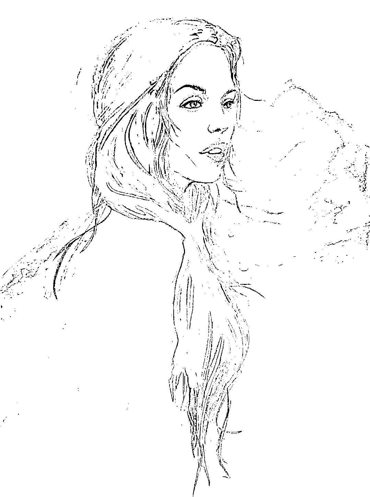

**| **蓝女巫画作 2018

**不确定性**

在这个世界上，没有一样东西是恒久不变的，没有一样东西是永远固定的。一切都在波动，一切都在跳荡；一切都显得短暂匆忙，狂欢得意。

——伍尔夫《海浪》

**未知的东西，才最有力量。一切对未知的恐惧，就是对失控的恐惧。**其实，**不确定性就是你自己心灵的放大镜。**它如此可怖，只因它放大了所有你内在最核心的恐惧。投影就有多大，焦虑就有多大。永远不要低估人类的想象力。想想情感中的怀疑，我们都是怎样妖魔化之，并为之赋能的……

**海，是不可计量的！**天灾人祸太多变量。尝试用彻底的控制来稳定内心的一切行为，注定失败。任何控制预判的妄念，都令我**顿生一种怜悯。**比如期待着铁口直断的天真问卜者。面对不确定性，当以积极的态度而非消极面对之。**去拥抱它的无处不在，去接受它的无法避免。**在无序中保持有序，是一种生命必备的弹性。

生活翻腾着阴暗的浪涛从大海中浮现，**断断续续发生一些令人震惊的事件，像猛虎的腾跃一样突如其来。**我们没法摆脱这种境遇；我们为这种境遇所束缚，**就像身体被困在野性的马背上一样。**不过我们还是**发明了一些方法**来弥补这些裂纹，掩饰这些缝隙。

——伍尔夫《海浪》

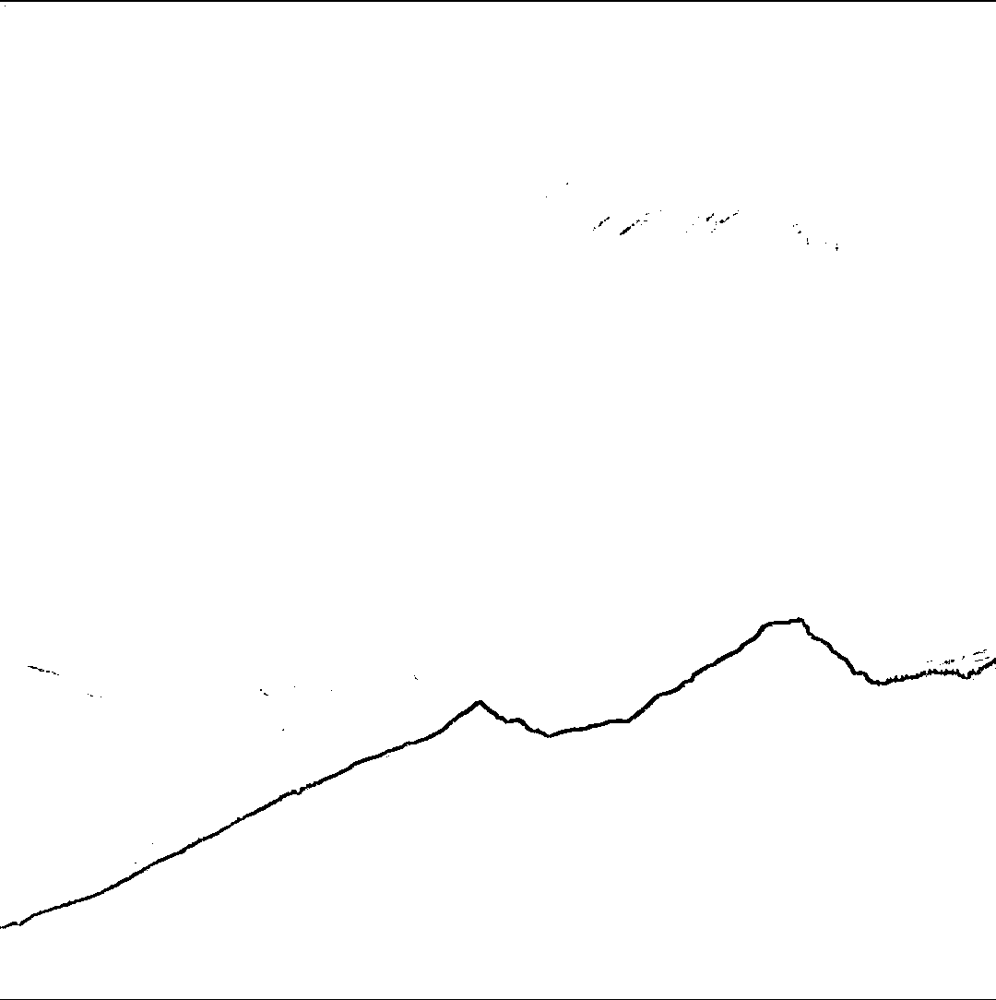

**一种是逃避（flight）。**

 为能试图对恐惧视而不见，你都秘密地采取了哪些逃避活动？**当人无法独自面对自己的时候，**可能就会去不停地行走；害怕面对梦魇的人，总是夜深了，还尽量不去闭上眼睛；**用工作来逃向可控？**用高强度的工作过度消耗自己。忙碌不息，逼到肉体的极限，直到筋疲力尽为止。最终，都还是需要用更长的时间去留白去休息。**冥 12，你是有多么恐惧内在的虚空？**

**秘密**

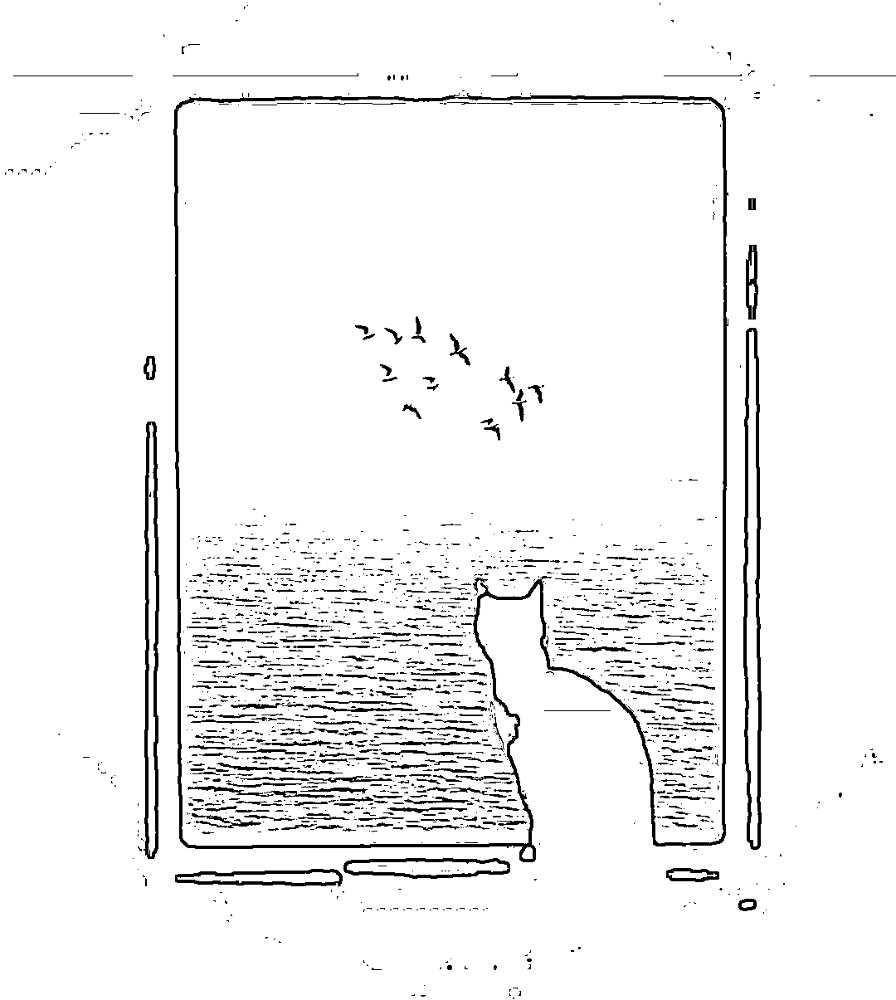

而**我却总是疑虑重重；总是浑身发颤；**总是看见那**疯狂的荆棘树在荒野中摇曳它的阴影。**

——伍尔夫《海浪》

**世界像是个集中营，没有秘密。**你的秘密如何安放？它们经常藏无可藏。而你的秘密是什么，你看清它们了吗？**你问过自己，为什么要藏吗？**

**行人车辆的喧嚣也可能是别的什么东西在喧哗骚动，**比如**森林中的树木的呼啸，或是野兽的怒吼。**

——伍尔夫《海浪》

**12 宫，是秘密敌人的宫位****。**你总能轻易洞悉世界最晦暗的阴影，擅于觉察他人的所有动机。**你总本能而秘密地觉得，世界不可信任。你总把人生想得太坏。**你是否已能识别自己那些**潜伏的幽暗**？它们**向外投射着各种影子，**让你的心理冲突经由外在威胁来展露：比如上演着外在世界里不断重复的自我毁灭；比如人格化成了没完没了的秘密敌人；又比如遇见情感表达相当激烈的人，来间接演绎延展出你自身跌宕的内在……

现在，它们一边东张西望，**一边望向更深的地方，**望向那些花朵下面，**透过那些晦暗的通道向下探视**积满败叶落花的**没有亮光的世界。**

——伍尔夫《海浪》

否认自己人格的一部分，会导致**分裂。压抑进入潜意识中**的一切，仍会持续影响。而恰因是来自于潜意识，意识对它一无所知，因而**丧失了控制力****。**所以，一切**回避**最终都会**制造出被控制**的情境。所以真正免除摆脱受制于人的方式，就是**要去直接面对。不是向外面对敌人，而是向内面对自己。**要在意识中不断地去反省潜意识，去正视你 12 宫里的疯狂和顽抗，去净化你的欲望。**为一切深度阴暗找到根深蒂固的症结。以获得内心真正的宁静。**

**我还想到我们的身体实际上是赤裸着的。**我们只是被一层**薄薄的扣着扣子的衣服遮掩着；而在这些人行道的下面，则是贝壳、骨头和寂静。**

——伍尔夫《海浪》

**看上去无畏的人，都有深藏的恐惧。意识的围墙外，一切安好；潜意识的仓库中，危机四伏：**恐惧，威胁，脆弱，羞愧，痛苦，绝望，种种心灵残余物，反复触动着你的不安形成了无意识非理性的负面驱力动机。**在这里你使尽浑身解数，正深深地隐藏着一个秘密的自我，带着一种冥王式的强迫。这秘密埋得很深，到了你自己都无法了解的深度。已变成了你沉重的心理负担。**

门打开了；老虎扑了过来。门打开了；恐惧冲了进来；恐惧连着恐惧，对我紧追不舍。

——伍尔夫《海浪》

**对秘密花园的开放，冥 12 有着一种极端的执拗。最难敞开隐秘，也不愿它们被迫见光。**严防一切你无意识中觉得会**扼杀自我**的东西，严控企图从各路感官入侵你的“敌人”，惧怕那些要**威胁你去作改变**的动机。**你怕的是失控，怕的是自己无法掌控的人生，怕的只是那瓦解的声音本身。你将某些改变等同于死亡。失去就是死亡。**

我还是希望深入下去；希望去探究那隐秘的深处；去倾听朦胧、古老的树枝坼裂的声息和猛犸的吼叫。

——伍尔夫《海浪》

但**灵魂进化最终还是为了完整，**不是吗？而冥 12 的你，**就是来学习如何接受各种失去。一切置之不理的事都会来反噬，**这就是冥 12 的宿命。所有生命早期尚未解决的事，迟早都会重启，与你在当下重逢。**甚至是比子宫更远的业力宫……**毕竟，**冥 12 的老灵魂，今生注定要以终结业力拖欠为己任****。**否则来生还要重来，你还会是冥 12。**冥王星不会说，你别怕。冥王星说，你一定会害怕！**残酷的真相，一定最恼人。但那只是出于一种神性的严厉，暗黑的正直。此处的**冥王星，并不是为了来毁灭你的。**不敢面对深藏的恐惧，不可能被拯救。**你已经准备好了。**

**（未完，见今日二条）**

**版权声明：**本文由作者授权在若道平台发布，欢迎转发，反对抄袭。

**蓝女巫**

英国伯明翰大学 市场营销学硕士

职业占星师/专栏作者/芳疗师/珠宝设计师

中国首批 ISAR 英文认证占星师（2012 届）

**微信公众号**：cecilia_sui

长按打赏

**系统学习占星学**

**点击图片了解详情**

**微信又双叒叕改版啦，不想错过若道君的推送？**

**就把若道设为星标吧！**

**▼**

**就是这个“在看”，戳一下☟**

********报名直达入口********

# 站在个人意识与永恒意识的悬崖边，你该如何跳跃？

> 原文：[`mp.weixin.qq.com/s?__biz=MzA5NjA0NTAxNg==&mid=2651443520&idx=2&sn=e3bca13b228a5fd75f7715ef152871e3&chksm=8b4b63f7bc3ceae123d2088fdf65f7451dfe438b1cafb66db1d848dff9123982abfa857709c9&scene=126&sessionid=1692737999#rd`](http://mp.weixin.qq.com/s?__biz=MzA5NjA0NTAxNg==&mid=2651443520&idx=2&sn=e3bca13b228a5fd75f7715ef152871e3&chksm=8b4b63f7bc3ceae123d2088fdf65f7451dfe438b1cafb66db1d848dff9123982abfa857709c9&scene=126&sessionid=1692737999#rd)

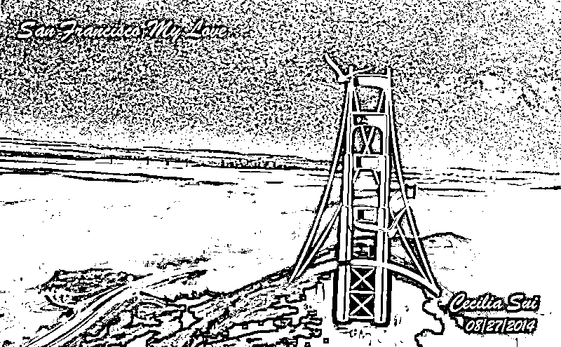

作者/蓝女巫 ISAR 认证占星师
编辑/翀子 图片/音乐/蓝女巫**（本文上篇见今日头条）****冥 12，你将在何处崩塌？**

一个不断要求**出人头地**的人，总有一天会感到**发晕**。是我们**身下那片空虚**里发出的声音，它在引诱我们，迷惑我们，是往下跳的渴望，我们后怕，拼命去抗拒这种渴望。**软弱**的时刻，她真忍不住想**回应**这种呼唤，回去。她时刻感感到一种不可抑制的想要**摔倒的渴望**，活在一种时刻发晕的状态中。脚步变得摇摇晃晃，几乎每天都要摔倒，会撞到什么，弄丢手里拿的东西。

——米兰·昆德拉

这是一种最常见的 12 宫意象。每个人在中年危机**海王星行运**时，都会遇到它。一种**被无意义击中**时的无所适从感，便是萨特所称的**“恶心”**，即人在无知的沉沦之后，觉醒时分**剧烈的晕船感**；而昆德拉将行为脱轨失控的晕眩归因于，**一种无法遏制的堕落的欲望。**倒是让我联想到了冥 12，时刻抗拒却又终其一生被之诱惑的东西**。****想要摔倒的渴望，就是想要回归本源吧！ **

冠军运动员更容易受伤，是因为总**能够成功克服疼痛，才更有可能去伤害自己。**冥 12，他们自知有一种**超越痛苦的能力**，于是下意识地渴望反复去经历。我又想到一些相近的意象：**生病的孩子，投降的士兵，牺牲的英雄，受伤的运动员。**其实，都在共同折射出，一种**想要摔倒的渴望**......隐藏在一切**盲目意志力的背后**，那种终究**想要臣服的渴望**，也就是**瓦解和消融的渴望。**

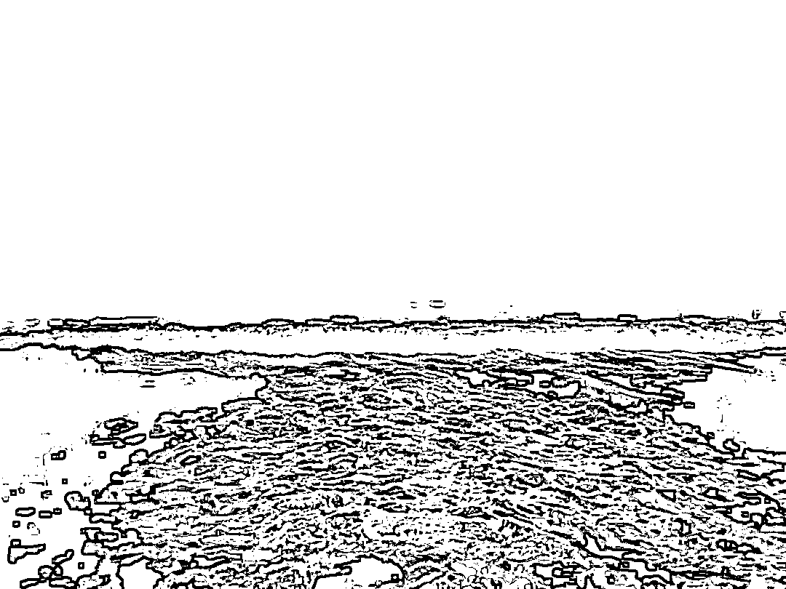

**无能与意志**

**你害怕深度，而且也不愿意承认自己害怕深度。**尽管你害怕自己是一件好事，但是**你要大声讲出来你害怕自己。害怕自己是一种智慧，只有英雄们才说自己无所畏惧，**但你知道英雄身上都发生了什么？**无能也想存活下去，但是它会击败你的神。**它代表的就是这个**夸大的意志。**这次谋杀是**无能对意志的愤怒导致的**。如果**你是自己**，那么就会意识到自己的无能。英雄也饱受无能之苦。**用无所不能，你无法与无能共处。**

——荣格《红书》

火星与海王星的相位以及冥 12，都在揭示**无所不能的意志与现实无能为力感**之间的矛盾撕扯。**控制与失控，力量与瓦解。英雄与脆弱**之间的一线之隔。这些人，尤其会在**使用盲目意志力的时候，遭到惩罚。**拒绝与本源融合，就会引来海啸，夺走你刚获得的一切，削弱你个人的野心，让你绝望无助中，向更大的势力低头。人若不能够丧失自我，就不能够获得拯救。**一切都是为了体验臣服。**

世界之船帆突然折断，砸在我的头顶上。一切全完了。世界之光熄灭了。前面耸立着那棵我无法逾越的大树。时间仿佛永无止境，雄心勃勃则总是虚幻一场。一种人类的所有努力全属徒劳的感觉笼罩着一切。我们往前所走的短短的几步，算是白走了。

——伍尔夫《海浪》

他们也会经常觉得生命完全不受控制，常常通过身心出个事，逼你认怂。他们最懂，什么叫作**巨大的延误，**巨大的遗憾，巨大的悲怆。**那种越想做越做不成的挣扎。**一切根本不会按照你的意志和计划。心有余而力不足。那是怎样的一种承受。人生的巨轮，你常常只能眼睁睁地迟到。**最后，你一定会说你真的尽力了。但你是真的去不了。海王星的战斗里，抗争不太能够帮到你。只有充分认出恐惧，接受脆弱。**不再徒劳挣扎，将自己交付给更大的存有。放弃的那一刻，你就真正的赢了。**所谓臣服，就是放弃内心抗拒，全然无保留无条件地接受当下。**

我看到一个人影，白色的，它在移动。**在它的身后，大海在咆哮。它是我们所无法企及的。**但是**我却冒险到过那里。我到那里去充实过我的空虚，延长过我的黑夜，使它们尽可能地充满各式各样的梦境。**而且即使是在此时此地，**转眼之间我就可以抵达我的目标跟前**，告诉它：**‘别再游荡了。一切别的东西全都是考验和伪装。这里就是目的地啊。’**

——伍尔夫《海浪》

**“它”是什么？我猜：它是“浪”！****浪，是海的挣扎****……**当冥王星的意志融于 12 宫的深海，有一种心情，叫作，**深夜里的太平洋……我看见过它，且终生难忘。**

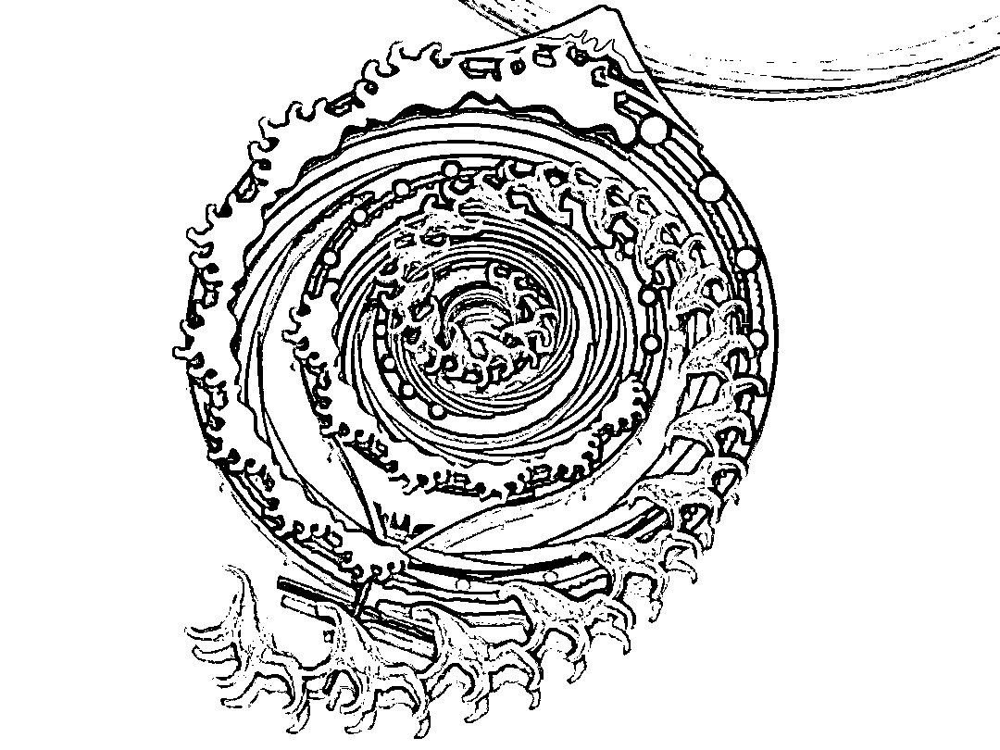

**| **蓝女巫画作 2014.2.12

我是一堆泡沫，白花花地飘浮着，附着在天涯海角的礁石边缘上。

——伍尔夫《海浪》

**冥 12，你将回归于何处？**

杰夫·格林说：冥 12 一来到此生，就会深刻地感受到自己正站在悬崖边缘，他们的身后是一个已知的光明世界（文化，时空的结构），而前方则是无垠的黑暗深渊（永恒及宇宙性的特质）。这些人正站在悬崖边缘，必须选择往哪个方向前进：**纵身一跳？转身回头？还是留在原地不动，哪儿也不去。**

**冥 12，今生就是来体验那个介于个人意识与永恒意识之间，象征终极矛盾的悬崖。**该如何对待回归本源的强烈欲望，**你将何去何从？**依据其灵魂进化阶段的不同，我们看到**三种反应模式：**

*   **第一种人****：**用小我 ego 的力量排拒进化欲望。紧抓熟悉和传统，否认超越于自我，更大力量源头的存在。

*   **第二种人：**意识到了与本源的连接，但因强烈的恐惧，而无法动弹，驻足观望。抗拒本源，就会周期性的经历生命无意义的空虚幻灭，困惑迷茫，疏离崩解。最终通过世俗中的颠覆，让你发现生命的有限性。逼你承认自己有发展灵性的需求。去与超验的信仰系统连接。

*   **第三种人：**用宇宙化，心灵化的超验信念来转化身心。飞跃深渊，融入大海，拥抱宇宙终极本源，获得深度精神解脱。信仰已助你摆脱外部世界中传统的禁锢，也不再受限于社会认同。瓦解了合一的障碍，消融了小我的标签，能放手一切源于分离欲望的产物。

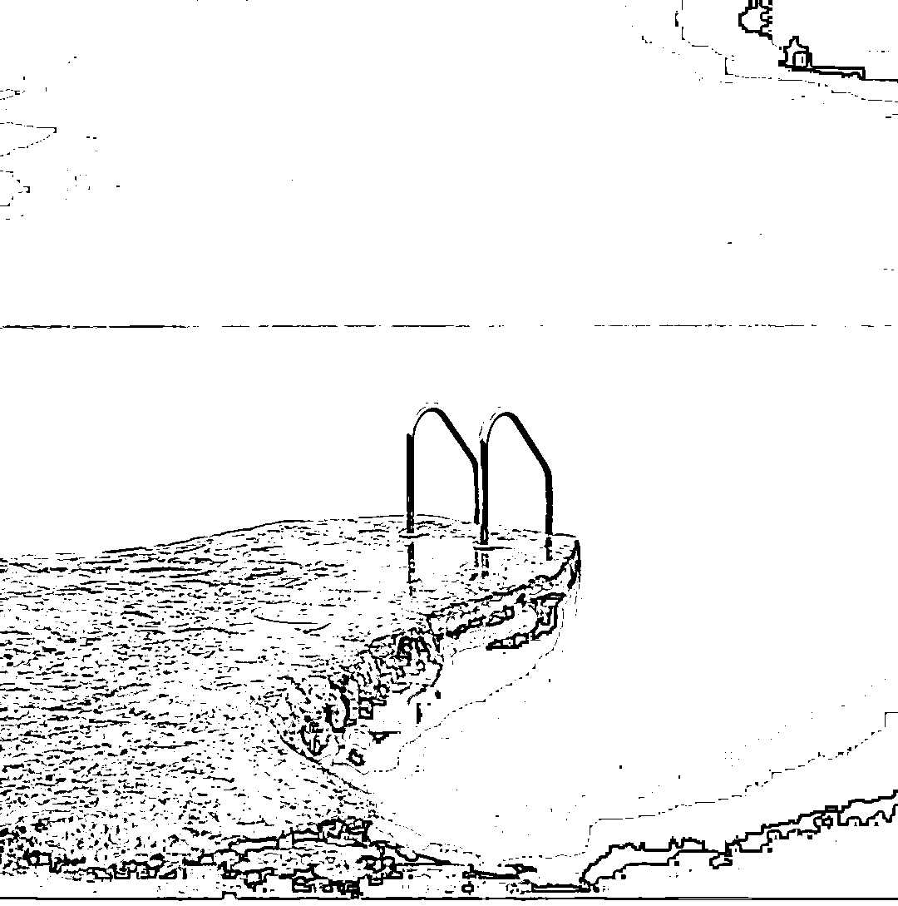

**“外在世界”**的路人行色匆匆，态度漠然，他们被普遍法则所支配，关于那些法则与自身生命有无关系？这并不重要！外部世界的人们，**最缺乏“畏惧”，也畏惧着“畏惧****”**；而**“内在精神世界”**中，发生的一切都直击着你独一无二的生命和灵魂，你**因“畏惧”而战栗**，因强烈的精神力灵而获得转化。

**每一个冥 12，都会被这种分裂感所折磨，作为今生一切深层恐惧的根源。往前冲，与自己失联；往后退，被黑洞所稀释****。**一面是，回到繁华社会，被人群所消融。成为工作狂，忘记身体感受，耗尽自己。**但似乎有个东西并没有跟自己往前冲？就是那深度的感性；**另一面是，回归悬崖底部的那片海水边，在此能感受到最深灵魂之处与世界相联。却又会被这深度的漩涡，拉进宇宙的黑洞，那虚空令人绝望，你总害怕被其消融殆尽。如此，**感性与理性并没有办法配合。**这分裂的恐惧，真让人心慌。**你需要一个怎样的绳索？往返于身后与人间。**

虚空毕竟太远，关于信仰跳跃，我更喜欢尼采的诠释，他的悲剧精神显得更加实用？**失控进入“醉”的状态……把疯狂的自己献祭给艺术，**因我坚信艺术也可以让永恒栖居。**“危险存在于跳跃前的微妙时刻。善于在令人眩晕的山脊上站稳。这就是诚实。其余皆为托辞。”**

**跳跃，是为了自我超越，而非自我毁灭。**跳跃最终的目的**不是为了跌落山崖，化成海水。而是为了能够飞卷起来，汲取海水。“醉”只是一个仪式，它只是觉醒的起点****。**更关键是，你要**能够最终自我拯救****。**那么如何能在跳跃前的微妙时刻，于深渊边缘充分**站稳？**这是一种能力。这叫做**生命的自制。要去保持身体的平衡，你就必须要创造出一种更大更强的力量来抗衡“醉”。比如说，美！** 

人在**灵魂矛盾撕裂中的张力中**，会产生一种亟待迸发的能量，那种感觉令人**无法承受。**艺术，作为一种**创造性的自我表达出口**，对其可以完美承接。当你变成了超验力量的管道时，就创造了美。即用**绝望的消融来创造美。**这**需要自我淬炼的能力。**是要以冥王星最恐怖的方式，最激烈的化学反应，去最大限度地汲取它的力量，转化为最终爆发的惊人生命力。而它的产物并不是虚无，而是艺术。或称是**人生的创造****，**艺术家都是这样向宇宙更宏大整体致敬的。将虚空中的瑰丽宝藏，带回人间。

**大真大美为什么会震撼人心？因它吸取了毁灭的力量，又抵抗了毁灭。这就是创造，这通向完整。**最终将毁灭的力量转化为了生命的力量。于是让冥王所代表的生命意志，得以继续活下去。以不断创造，破茧为蝶的方式。如此，**醉，就成了一种有意识的疯狂。可以控制的疯狂，所谓冥 12。**这就是冥 12 所需要的**“有能力的随波逐流”**。**你骑在野马的背上，但勿忘你仍手持着缰绳。**这就是**冥 12 你的终点！**

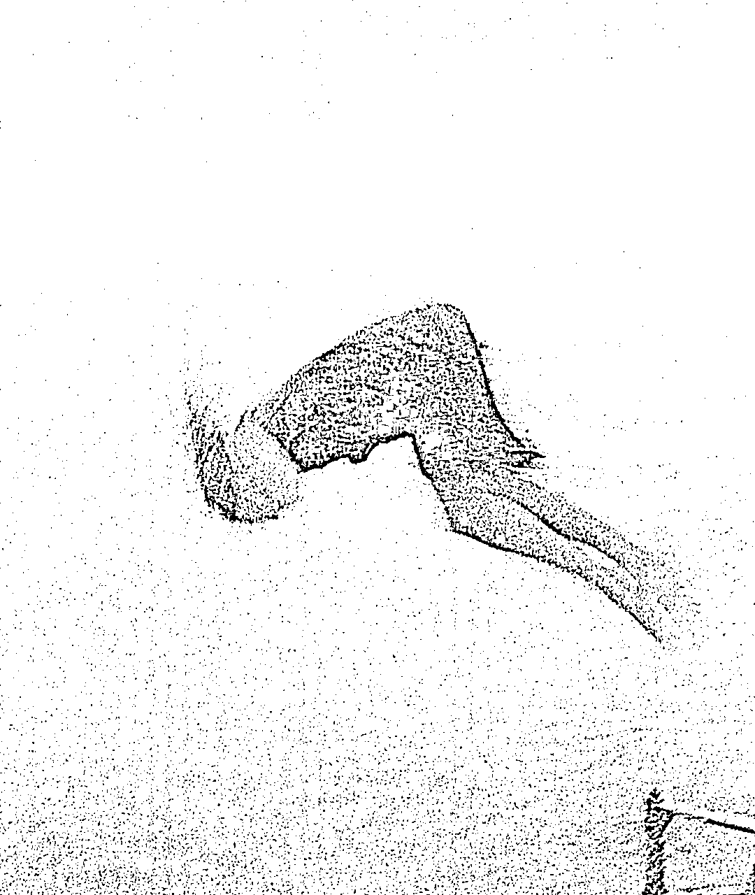

冥 12，是一种**永恒的张力**。即冥王的**恐惧**相对于 12 宫的**信仰**。而矛盾的紧张状态，才是恐惧的根源。而**恐惧正是信仰的本质**。也只有难以自拔的冲突绝境中，才能逼出刻骨铭心的真相。这让我想到了**“悚栗”的感觉，**一种击穿你生命的强烈力量。它激发灵魂，提供转化。于是，关于冥 12 的终极难题，克尔凯郭尔的**《畏惧与战栗》**提供了最好的答案，**信仰骑士那无限弃绝的一跃。一个有限可朽的人，为信仰而悚栗，最终向着那无限超越的完美存在，心无旁骛地去激情的一跃，所谓弃绝。来实现精神上的自我超越。**

无限弃绝，即是信仰的前夜。信仰骑士，指能为精神理想坚持到底的人。跳跃，是为了彻底放弃尘世有限的一切。准备就绪的他来到悬崖边，**不再彷徨与不再犹豫。**无限弃绝，距离信仰还差最关键的一步，那就是**激情，一种能将自己卷出去的巨大力量。信仰则是人身上的最高激情，它能为生命提供强烈持续的根本动力，**提供至死不渝的勇气。 

**但无限弃绝，其实无法实现****。**因你毕竟是个有限的活人，无论怎么跳向上跳，重力都还是会把你拉回来，落回到此生此世。**尽管注定失败，但它又是个绝对必经之路****。**经过这样的抽象一跳，**你的精神生命已经激烈转变。**让你将凡人生命中最好最宝贵的东西，无限彻底的献祭。尤当你不甘心这是一场注定的有限，你会站起身来继续跳。不停跃起又重重跌落。

每一次坠落回人间的瞬间，让你越发真切地感受到自己还活着。**对于生命，更加体认。真正信仰了此生此世！**而并非要消融于遥远的天国。你唯一能牢牢抓住的只有自己的这一场生命，和为你的人生所承担起的责任。**原来信仰不是终点，最终目的是，根据信仰去抓住生存！去直面自己的人生，这才是最强意义的信仰。**用整个生命去承担，**活出真实的自我。**

**这才是一个真正信仰的精神强度。而荒谬恰恰是生命最高的真理**。人也只有在无限弃绝的终极时刻，才能够彻底地燃烧，因知未来不复存在。**为什么要跳跃？就是为了最终找回你自己。成为你自己！是涅槃重生后的自性化的你。**

况且你毕竟是**冥 12**，而不是海 12，那就充分证明了**你的重量。你仍有欲望继续在荒谬人生中起伏挣扎！**冥王星根本无法成为风筝，彻底解脱，轻松飘远......**因为你太重。**生命之轻，不可承受。**潜入“深度精神”之中，经历极致的危机，非为了放弃，是为了更完整的回归。**即**对自我的放弃，却是对生命本真的回归。**

而冥 12，你有**无限的自我更新资源和自我淬炼的能力。**且**此处的信仰**不是让你**失去作为个人的强烈需要****，**去牺牲于所谓的普遍法则。而是鼓励你**作为独特个体的精神力量，活生生的直面无限！**而非那种让你牺牲小我成全大我，受限于伦理层面的信念与普遍规范的“信仰”。 

结论是，**你所需要信仰的仍是今生今世，目标就是要抓住你的生命，坚守在脚下的大地；**但同时作为一个**趋向完美的无限者**，在**灵魂至深处**始终**保有一种不可遏制的面向无限与自我超越的渴望！**

我想对身陷**第一阶段**仍在冥顽不化中的冥 12 们说：**Good Luck**；而对于正站在悬崖边观望，态度中立疏远的**第二阶段**冥 12 们，我想鼓励你们**卷进去！要去行动，而非胶着。**想祝福并提醒已在**第三阶段**正在拥抱超验信仰的冥 12，过度沉迷其中或许终是也一种自我欺骗？**记得回来！**

所以，冥 12，无论你正身处三个阶段的哪一个。读完这一篇，你仍可以为你手中的事继续前行。但只需记住一个词：**无限！**以此作为你梦想蓝图的基础。

 耳边回荡起那句冥 12 式的叹惋：**唯一的确定，就是不确定。**我想帮你转换一下焦点，改写成：**唯一的确定，是无限！**

When you fear of missing out, in fact you are missing out, that's Failure of the moment. Only coward fear of uncertainty. Just do it!（当你焦虑得失时，你就已经失去了它。因你已失去了当下的这个时刻。只有懦夫才会惧怕不确定。做！就对了。） 

**至此，我才深深懂得了冥 12 你的这句话。**

**浪潮正在我的胸中涌起。它昂着头，拱着背，翻腾而起。**我又感觉到一种簇新的欲望，犹如某种东西从我心中升了起来，**就像一匹骄傲的骏马，**骑手先用马刺一催，随即又紧紧地勒住马头。现在，我骑在你背上，当我们挺直身子，在这段跑道上跃跃欲试的时候，我们望见那正在朝着我们迎面冲来的是什么敌人啊？那是死亡。死亡就是那个敌人。**我跃马横枪朝着死亡冲了过去，我的头发迎着风向后飘拂，**我用马刺策马疾驰。死亡啊，我要朝着你猛扑过去，**决不屈服，决不投降！**

——伍尔夫《海浪》

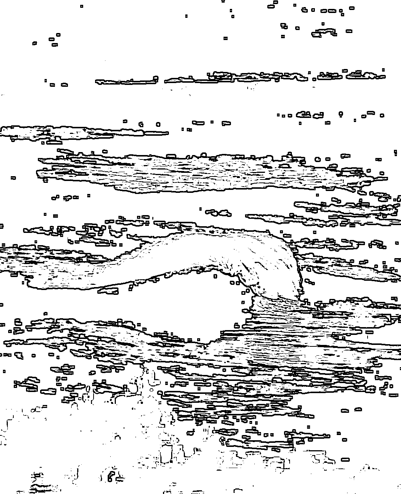

**对应点**

**灵魂病了，对宫有药。**最后，**对应点 6 宫**所代表的**工作道场**中，依然提供了解药。6-12 鱼处对宫轴线，是涉及**注意力**的，**涣散无聊**的反面是**全神贯注**。当今，人们在被海量刺激狂轰滥炸短暂兴奋的日常中，不但发现注意力已完全无法集中，同时发现竟已没什么能令你想要全情投入的了？用什么才能给本来就犯晕的冥 12 们提供精神聚焦点？

**工作是一个很好的镜子，**不但照见冥 12 们潜意识中错综复杂的心理情结，更能帮助你聚精会神于自身，将泛滥的精神集聚到**一个意识活动中。**全神贯注地去投入自己。**让你能够聚焦当下去做事，而不是再无限拖延。**毕竟，当整体已令你发晕或胶着时，就要去盯住一个点，从细节入手，从局部做起，这样才能克服**畏难情绪**，最终连成片。然而，你不应忘记的是，究竟在为何而劳碌？无聊，不在于你有没有事情做，而在于你能不能被真正**唤醒了精神**。究竟用什么，才能真正全然地凝结你全身心的精神力与行动力？比如，无限弃绝的骑士，就有一种专注，**追求无限（12 宫），却不失焦于（6 宫）。用信仰带来了一种精神上的巨大凝聚力，这是非常冥 12 的意象。**

总之，当你成功到别无所求，当你麻木到毫无兴致，当你迷茫到不知所措......**这时的你，就需要去无限弃绝了。**用抽象地一跳，杀死自己一回。以极端的方式，让自己死而复生。**相信最终你会看到桥。**

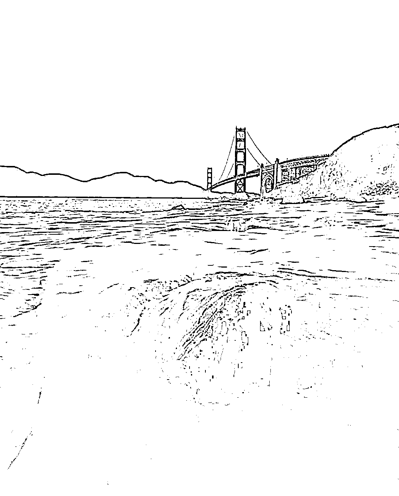

**结语：桥**

**走上伟大的道路，抓住最近的东西。**不要向外看，不要想，只是举起双手。**黑暗的礼物充满谜语。**道路已经为那些能够**在谜中继续**前行的人打开。向谜和无法理解的事物屈服，深不可测的深渊上架有光彩夺目的**桥**。但你要跟随谜语……

——荣格《红书》，腓利门说

**版权声明：**本文由作者授权在若道平台发布，欢迎转发，反对抄袭。

**蓝女巫**

英国伯明翰大学 市场营销学硕士

职业占星师/专栏作者/芳疗师/珠宝设计师

中国首批 ISAR 英文认证占星师（2012 届）

**微信公众号**：cecilia_sui

长按打赏

**系统学习占星学**

**点击图片了解详情**

**微信又双叒叕改版啦，不想错过若道君的推送？**

**就把若道设为星标吧！**

**▼**

**就是这个“在看”，戳一下☟**

********报名直达入口********

# ISAR 选修丨心理占星大师格伦·佩里助你提升咨询技巧

> 原文：[`mp.weixin.qq.com/s?__biz=MzA5NjA0NTAxNg==&mid=2651443520&idx=3&sn=1f4657072d0d41cc8ef72a73a0501be7&chksm=8b4b63f7bc3ceae1ee06e7205f4b2d9f012c495c642dc8a6790e67ede55b3c1ca3738ac3b362&scene=126&sessionid=1692737999#rd`](http://mp.weixin.qq.com/s?__biz=MzA5NjA0NTAxNg==&mid=2651443520&idx=3&sn=1f4657072d0d41cc8ef72a73a0501be7&chksm=8b4b63f7bc3ceae1ee06e7205f4b2d9f012c495c642dc8a6790e67ede55b3c1ca3738ac3b362&scene=126&sessionid=1692737999#rd)

**1**

**课程描述**

格伦·佩里老师是被若道学员“考验”了六年的金牌讲师，浑身上下数不尽是优点，但最被学员和助教认可的两点：一是**太严谨了**，以最清晰的方式，将心理学和占星学两大领域融合为一。二是**太实用了**，恐怕再也没有第二人能像他一样，明白地告诉我们纵有满腹的占星学知识，究竟在实战咨询中该怎么使用出来。

**“对我来说，咨询就像是与一位美丽的女士共舞。这个活动的活力让我的头脑保持灵活、强大，而不断的学习只不过是为优雅的舞姿做准备 ，所以我绝不会踩到任何人的脚！****——格伦·佩里”**

**2**

**咨询技巧系列课程干货内容**

**即学即用的 ISAR 咨询考试定心丸****占星咨询技巧之初出茅庐 6 次课**在这个阶段的课程中，学员们将学习咨询技巧，比如如何选取一段经历，询问相关问题，提出假设，进行解读，重塑冲突，预测成长机遇，深化疗愈。我们会审视各种咨询理论，重点强调它们在占星学中的运用。学员们将学习如何处理危机，做出恰当的推荐引介。我们强调有效沟通的原则、聆听技巧、言语和非言语沟通，以及占星学如何帮助我们建立共情关系。我们会专门介绍伦理道德法则，因为它关系到职业责任问题、资质能力、咨询和预测。我们会特别关注占星师的阴影以及我们在自卑和膨胀问题上的集体脆弱。

**课程安排**

**第一课：导言与概述**

**第二课：确定咨询范围**

**第三课：会见客户**

**第四课：厘清问题（剥开占星学的洋葱）**

**第五课：认出生活模式（隐喻思维）**

**第六课：提出假设与辨识核心信念**

**占星咨询技巧之深入江湖 6 次课**

在这个阶段的课程中，参与者将继续学习咨询技巧，包括如何选取一段经历，询问相关问题，提出假设，进行解读，重塑冲突，预测成长机遇，深化疗愈。我们还将考察各种电影，考察它们与理解人们寻求帮助的共同议题的关系。我们会审视各种咨询理论，着重强调它们在占星学中的运用。学员们会学到如何处理危机，做出恰当的推荐引介。

我们会强调有效沟通的原则，以及聆听技巧、言语和非言语沟通，以及占星学如何帮助我们建立共情关系。我们会专门介绍伦理道德法则，因为它关系到职业责任问题、资质能力、咨询、预测和古代术语的运用。

**课程安排**

**第一课：检验假设**

**第二课：对星图做出初步解读**

**第三课：建设性解读星图的艺术**

**第四课：洞悉客户经历的目的**

**第五课：提供希望和方向**

**第六课：案例研究和督导**

**3**

**适合人群**

**·** 2021-2022 年准备考 ISAR 认证考试的人**·** 若道核心课 L3 以上的学员**·** 非若道核心课学员 但具备占星实战咨询的理论基础**·** 已是占星咨询从业者 但对咨询中的说话技巧不够满意**·** 厌倦了抬不起头的“野路子”聊占星，想立即加入“学院派”阵营做咨询

**4**

**课程收益** 

**· **搞定占星咨询界的“社交礼仪”**· **是心理占星学版的《好好说话》和《情商课》**· **教学风格相当学术、严谨、深入浅出**· **是任何人都能即学即用的咨询技巧**· **也是 ISAR 咨询考试的入场票和定心丸 

**5**

**学员福利**

**· **跟大师一起“看电影” 考察人类共同议题**· **格伦老师男神的颜值、萌帅的笑容**· **享受他“比脸更迷人”的嗓音**· **意外在别人的案例里疗愈了自己的创伤**· **任何一对一的谈话都比以往更自信

**“当我们这些老教师还在的时候，好好珍惜，我们愿意和你们分享与客户工作的毕生经验。我们很高兴为你们提供这些知识，我们很期待看到你们在线，或是出现在若道的教室中。格伦运用自己的学术背景，同时还有作为家庭疗愈师和职业占星师的 35 年丰富经验，来创造了一门非凡的课程，一门如果存在于 30 年前，我会毫不犹豫参加的课程。****——大卫·瑞雷”****诚实的若道君友情提示**报名 204-205 网络课，以及咨询技巧大师案例演示工作坊，只能帮你大幅度提升 ISAR 咨询考试的通过率，可不是百分百过考哦。毕竟师傅领进门修行在个人，若道君可以百分百承诺的是，如果你真的学习了此次占星咨询技巧课程，受益绝对是可以持续终身的。

**6**

**导师简介**

**格伦·佩里(Glenn Perry)**这位传奇的占星师，也是一名拳击和摩托车爱好者。他毕业于赛布鲁克学院（Saybrook Institute），是心理/意识研究专业博士，也是拥有 30 余年经验的加州注册婚姻和家庭治疗师 （CAMFT）。他曾任国际占星研究协会 （ISAR）以及联合占星大会董事会（UAC）副主席，也是 ISAR 突破性道德标准的设定者。

**7**

**课程价格**

**课程价格：**7500 元**优惠价：**2 人同行 6800 元**退款原则请详看《教学协议》，如有疑问请咨询课程顾问。**

**8**

**开课时间**

**4 月 28 日-8 月 11 日（每周三）20:00-22:00**网络课程，12 次课英文授课，中文翻译

**9**

**退转课程**

  退款原则请详看《教学协议》，如有疑问请咨询课程顾问。

****咨询技巧全攻略****

**授课老师：格伦·佩里**

**授课时间：****4 月 28 日（周三）20:00-22:00**

**授课方式：**网络课程：英文授课，中文翻译

**费用：7500 元 ****优惠价：2 人同行 6800 元**

**课程负责人：Margaret（微信号：nodoor233）**请备注“咨询技巧”

长按二维码添加课程负责人咨询~

****报名请点击“阅读原文”****

# 比去年更“艰难”的 2021 年，土木水瓶座的解药都藏在《司藤》里！

> 原文：[`mp.weixin.qq.com/s?__biz=MzA5NjA0NTAxNg==&mid=2651443388&idx=1&sn=71f15b1ce7e5eaa3747bc3075a64b15d&chksm=8b4b620bbc3ceb1da1bf68b69aefba2cdc867ceb83f80d1f83b4af2e5d8bffe8e90f9b490a3b&scene=126&sessionid=1692737999#rd`](http://mp.weixin.qq.com/s?__biz=MzA5NjA0NTAxNg==&mid=2651443388&idx=1&sn=71f15b1ce7e5eaa3747bc3075a64b15d&chksm=8b4b620bbc3ceb1da1bf68b69aefba2cdc867ceb83f80d1f83b4af2e5d8bffe8e90f9b490a3b&scene=126&sessionid=1692737999#rd)

** 后台回复“今日”，给你一句生命态度 **

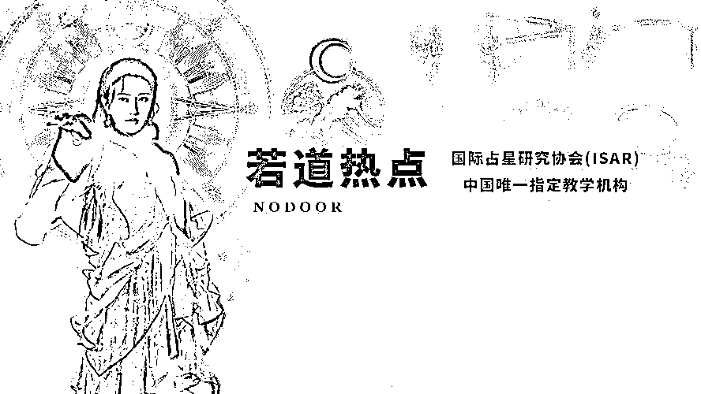

**作者/编辑/玫瑰  图片/网络**

**作者的话**《司藤》大火之后，有人感叹，女主司藤的扮演者景甜终于能红了吧？几年前，景甜同水瓶座的张继科恋爱，如今这对情侣早已分道扬镳，但参照司藤的个性，也能看出当年为何两个无甚关联的人能走到一处的一点原因——景甜通过司藤一角大放异彩，也要得益于这个角色身上浓重的水瓶座色彩。事实上，《司藤》整部剧都透露出浓厚的水瓶座元素，再一次让人感叹，电影实在是人类集体潜意识的最高表现形式。2020 年 12 月，土星、木星这两颗社会行星合相在水瓶座 0°，《司藤》在这之后的热映，可以说是非常共时了。具体表现在何处？我们一起来梳理一下吧。**水瓶座的“神力”**
《司藤》的热播引发了每个人在当下都需要进行的，属于土木水瓶座的思考——**何为同类？**
如果说传统剧情是几个主角，那么这部剧便是几个“主群”——苅族、半苅族、悬门、“麻瓜”人类。而苅族中还分藤、树、蘑菇……整部剧人数众多，故事线看似互不相干却又彼此牵扯。这也从一个侧面反映出土木水瓶座社会大背景的更迭：在占星学中，水瓶座、11 宫对面是狮子座、5 宫。**狮子座代表“我”，我的创造力、我的爱、我的自我展现、我的孩子。**要突出自己，必然会踩踏他人。而**水瓶座则代表着“我们”，我们的群体、我们的理念、我们的平等和结盟、我们的内在精神传承。**因此，水瓶座特质明显的影视作品里，通常是一群身份、背景、个性迥异的人为了一个理念结盟，形成平等的互助关系，甚至族群之间的联盟，再形成更大、更密集的联盟。这个联盟的领袖通常并不是位高权重、有钱有势、唯我独尊、好大喜功的（狮子座），而是最具有精神意义上的领导力、通过强有力的理念和平等的感召力，为了共同的精神目标而能将大家集结在一起。**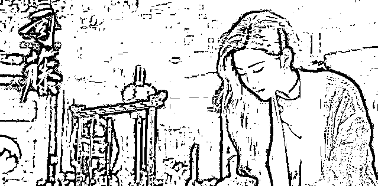**| 清冷而遗世独立的水瓶座特质

景甜饰演的，司藤的一个分身便是这样的代表：她非人类，对人类的钱、权、资源根本不感兴趣，这一路的目标只是搞清自己的来龙去脉，回归山野，回归自由。而这种对自由的渴求正是水瓶座最为向往的。我们常说，**水瓶座来自外星球（苅族也是），他们对地球土星能量所代表的金钱、地位并不是那么感兴趣，他们最想要搞清的便是自己的来处和归处，以及回归那个自在肆意，不被物欲、俗世、万物所累的自由的状态。**

也正是这种真正的不在乎，才令司藤的本质得以在重重误解和矛盾中被其他群体看见、感召，甚至最后同她结盟，愿意助她一臂之力。她被强行异变（异变是水瓶座的守护星天王星的关键词），在童年受尽“师父”丘山的折磨；情窦初开，又被爱人看到藤身之后大为嫌弃。历尽劫难令她很早便看透了世态炎凉，保持了自己独立的个性，在师父的压迫下反抗，观若洞火地看清了懦弱虚伪的男女情爱，这些都映衬出水瓶座正面的能力：**革新、反抗、智慧、独立的思考能力。****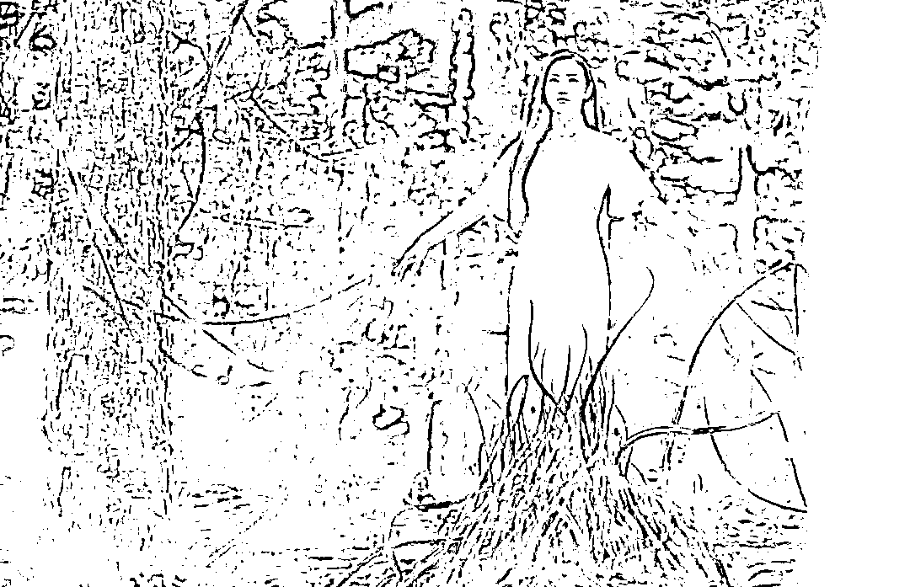****|** 藤身人形的司藤
**反叛者——生而为人的隐痛**硬币的另一面是：扑朔迷离的身世使得她最开始成为了“杀同族，食同族”的怪物，“善绞”的恶魔，无论人类还是同族都成为了她的敌人，这也反应出水瓶座（天王星）的另一个蚀骨之痛：**反叛者。**在这里，我们不妨回顾 2009 年首映，2021 年重新热映的电影《阿凡达》——两次上映间隔 12 年，都是木星在水瓶座时。男主本是人类，最终帮助阿凡达消灭人类并加入其种族——在人类眼中，他是反叛者，在开始的阿凡达族中，他也是一个异类。星图中有浓重水瓶座（天王星）色彩的人，非常容易出现这种身份认同的困扰。从进化占星学的角度，似乎可以推断他们在某一世曾经是一个“反叛者”。我们也许会在一个天王星合相四宫头的人的人生经历中发现，他始终觉得和家族格格不入，一直试图叛逃；也能在天王星合相太阳的人的故事中发现那种令他无法安住于自己身份的不安动力，使得他不断打破自己的身份试图获得突破，却又始终无法对其认同——**和别人不一样，而始终无法被接纳，是这群人最大的困惑。****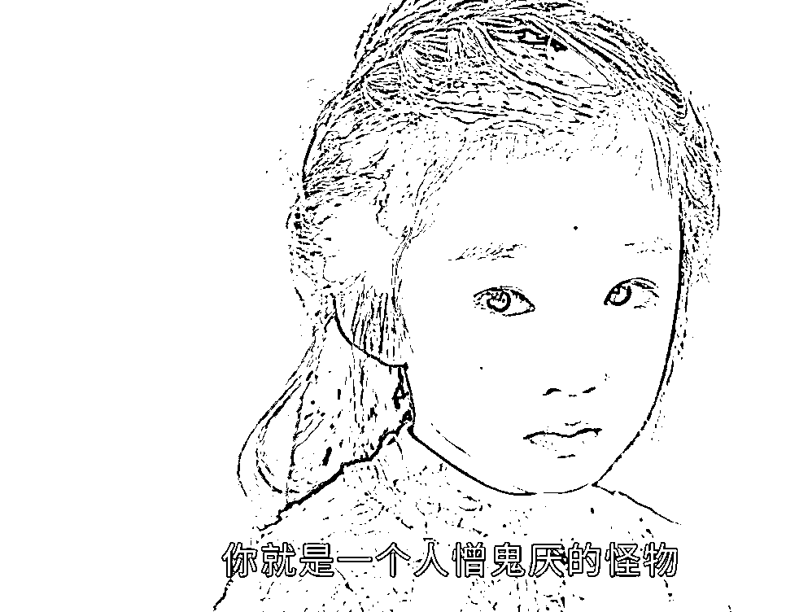****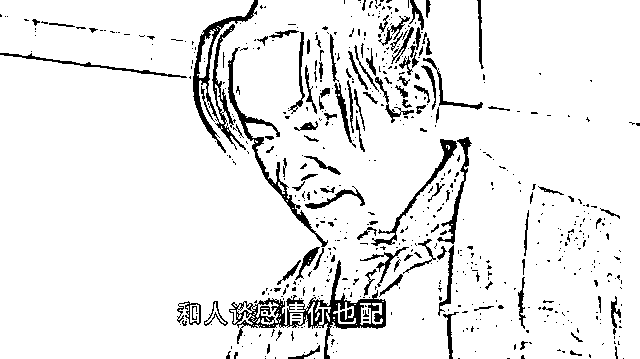**| 丘山对司藤极尽羞辱，说她不配和人类谈感情

**世间万物都无法独立存活，我们需要一群人的认同和支持，需要通力协作，才能创造希望。**可以想象，当一个生物无法被其同类接纳，又无法找到接纳它的其他群族时那种凄惶无助和自我分裂。如同异变后的司藤，无法再回到苅族的身份，被迫与同族相残，更无法被人类认可，结婚生子，于是分身成两个个体——一部分的她恪守自己所坚持的理念，另一部分的她进击人类世俗。

这是水瓶座（天王星）的第一次演化，也代表了**水瓶座的第一个冲突：坚持独立的自我认知，便无法得到接纳自己的群体，于是只有掩藏自己的本质，学着做一个“人类”。**我不知道有多少水瓶座（天王星）人有相似的体验：将那部分冷清、洞穿的对世俗的不认同藏匿，如同司藤在达那长眠；自己化作白英，装作一个“正常”的人类，学着人类的姿态、模式，生儿育女，试着被接纳，过普通人的一生……然而，白英的失败是注定的，纵然她付出一切，也无法换来认可和爱情，这也反映出封建社会中的“异类”几乎只有死路一条。正如白英临死前所说：遇到她，也是邵琰宽（白英所爱男人）的灾难。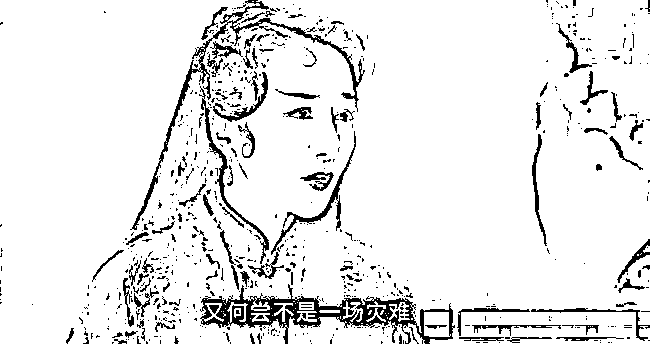| 白英临死时方能从更大的视角洞悉彼此的爱恨情仇。在“三从四德”、“三妻四妾”的时代，没有一个人类的男性敢同她相爱并缔结誓约，因为人类有共同的弱点：贪婪、懦弱、背信弃义。而白英在选择了进入人类社会的时候，便也选择了去洞穿这些弱点，同时，也在这个过程中看到了自己的弱点：一样的贪婪、控制，不择手段。当你爱的时候，在意的，是这个躯壳、身份背后的灵魂，还是地位、容貌等其他附加的条件？这是白英在人类情爱中幻灭的原因——水瓶座**认为的爱，是爱上“我”本身——去掉容貌、身份、种族之外，我还剩下的精神力量，那才是我之价值。能够得到这样的接纳，才算是真正的被爱着。****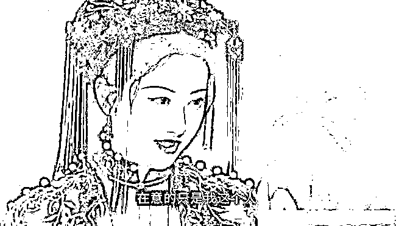****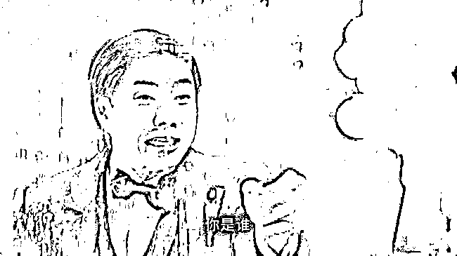****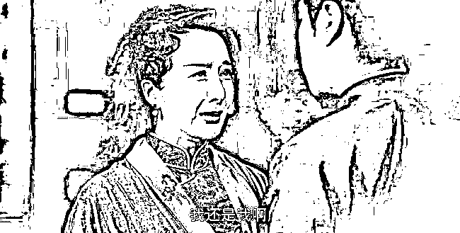**| 白英无法理解邵琰宽为什么在她变了一张脸之后就视同怪物，在她看来，皮相背后的“我”才是最重要的。白英无法从一个人类男子身上得到这种爱。源自于当时的人类社会还无法进化出这样的认知。于是，她走向了水瓶座偏执的负面——**极度冷血无情**。失去了“我”，就谈不上“我们”。无法被认同的痛苦令白英因爱生恨，开始为自己谋划，甚至偷来别人的孩子，却毫不在意腹中血脉的保存。这也是水瓶座反人性负面发挥的体现——**成为一个真正的反叛者，反社会，反人伦，反人道，所有的智能都用来保存自我，为此不惜伤害周边的人**。这样的水瓶座是极度危险的高智商犯罪分子。**艰难的认同之路**那么，水瓶座（天王星）人该如何得到身份和群体的认同？司藤也一样有过如此的困惑，神通广大的她，在面对秦放可能是自己的血亲时，发觉人类社会的制度（土星规则、木星法律）非常在意这一点，她很痛苦。**司藤：****“如果所有的鱼都游向一个方向，那条独自向上的鱼是不是有问题？”****秦放：**** “独自向上游没有错，只是她缺了一个能够和她一起向上游的伴。”**这便是土星、木星进入水瓶座后，将引起人类社会极大变化和振荡的、直击心灵的问题：**究竟怎样才算是同类？是通过肤色、血液的颜色、种族、地域、星球来划分吗？如果自己的种族做出了邪恶凶残的事情，你是否愿意坚持自我理念，成为一个“反叛者”？不同的种族甚至物种之间是否有和平共处，甚至相爱的可能？****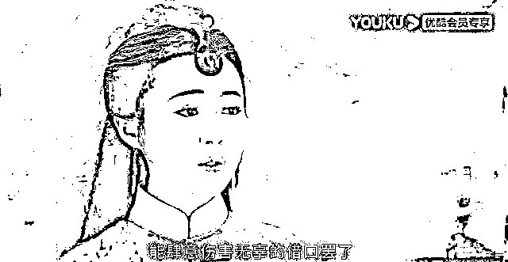**对此，剧中也体现了思考。丘山临死前，他的爱人长生一语道破：“我不过是给了你一个能肆意伤害无辜的借口罢了。”是的，**那些所谓的土星疆界、规则，木星的伦理、道德，如果仅仅被从来捍卫某个种族和群族的权益，便很可能导致内部的分裂争端，互相憎恨和仇视。**丘山因为被一个苅族背叛，便从此仇恨并扼杀整个苅族族群，如同我们也经常会**因为某个点而扩击到整个面，因为一个个体而对整个群体产生隔阂憎恶。****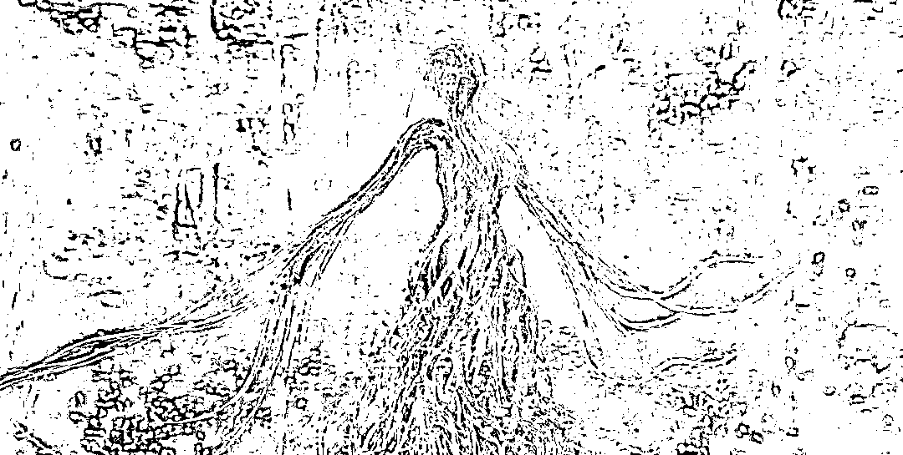****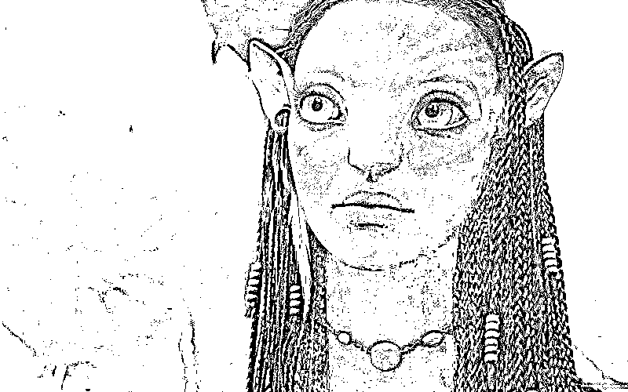**| 不同种群能否互通结盟？**土木合相水瓶座：隔离背后的意义**《司藤》一剧中，每个人都有恶的一面，难得的是，导演将这些恶的前因也都展示在剧情中，正如长生对丘山所言，我们没有资格评判别人的善与恶。**站在自我视角上的善恶观，势必带来不够客观和全面的行动后果**。我们时常会发现**水瓶座（天王星）能量重的人在一些社会热点问题上不战队，他们没办法一义愤填膺地声讨某一方，力挺另一方**。其实，这并非“无情”，而是代表着水瓶座更高阶的善恶观。土木合相水瓶座之后，土星代表的社会规范和疆界，以及木星代表的道德准则和法律精神，势必受到水瓶座革新力量的挑战，引发整个社会以及全人类的思考。**建立一种新型的、超出自我认知疆界范围内的、站在更宏大视角上的人文关怀和世界观，去理解那些在自己看起来无法理解、离经叛道的人事物，甚至理解那些非自己群体的群体，是真正客观又不失人情味的法治和社会制度的基础。****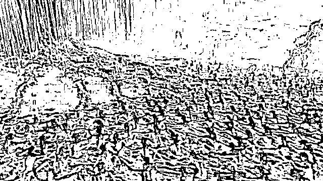**| 阿凡达族人的联结方式**这需要我们每个人都学习用全新的视角看待世界，看待群体，重新建立联盟和团结。**那是一种怎样的状态呢？在《阿凡达》中已经出现了雏形——所有阿凡达种族的个体手拉着手坐在地上，围成网络状，每个人保持动作、声音的一致频率，由精神领袖带队。这样的仪式具有起死回生的疗愈功效，这并非一种迷信和特技——**肉眼可见的不同个体是通过土星的皮肤疆界来划分的，而真正能打破这种疆界的便是共同的、木星式的信念。****信念不死，信念无敌。**2020 年起，土冥合相下，疫情爆发使得人类不得不将自己同其他人隔离，渐渐地大家习惯了距离，分离。这是宇宙为 2020 年底土木合相水瓶座做的提前铺垫——**隔离，**是土木水瓶座给人类带来的最难的课题。被隔离的时候，我们会感到什么呢？孤独、无法联结的恐惧，或许还有更多。然而，正如天王星所代表的**量子纠缠和能量共振**，很多时候，**人与人之间的联结和沟通并不仅仅靠着看得见、摸的着的方式**。这也是很多**水瓶座（天王星）人习惯有距离的接触更甚于彼此贴近**的原因。当整个时代都走向这一趋势，意味着**所有人都需要培养和感受这种通过距离的方式互相联结的能力。**

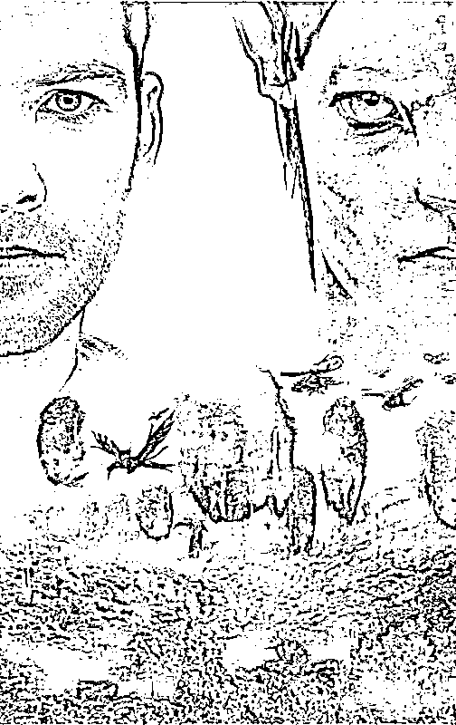

| 人种、物种的背后，不变的是互为一体的信念，团结协作的精神，尊重万物生灭。

这需要我们发现一种更高层次的联结方法，这种方法在《阿凡达》和《司藤》中都有所体现——**意识和意念的融合，这种融合不惧距离，无谓古今。**2021 年，也许很多人的人生都会发生变化，原本聚集的群体可能会分散在物理意义上的各个地方，隔离和距离、频繁走动、不确定的未来成为常态，亲密关系也可能面临多种不同形态并存的可能，甚至面临当下的道德和伦理的挑战，这些都是水瓶座时代带来的效应。

**突破口在哪儿？**

**我不同意你的说法，但我誓死捍卫你说话的权利。**

**——伏尔泰**

白英复活后，对司藤步步紧逼，本是一体的她们到了你死我活的境地。对此，司藤反思：“我不该阻拦你去过人类的生活，哪怕你爱上的是一个不值得的人，那是你的自由，是你的体验，我无权干涉。”这句话令白英动容，最终同司藤和解。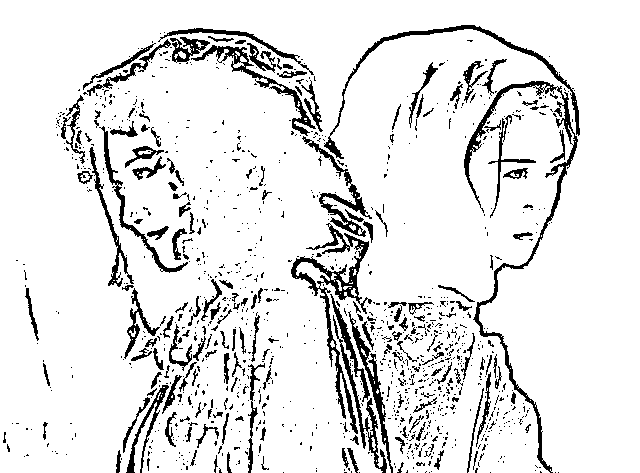对一个人最高形式的爱便是理解。对于外界的狭隘和不接纳，规则和教条，所谓的道德标准，都是自身对自己的不接纳和不认可。当司藤不认同白英，却能够允许她按照自己的意志生活的时候，她理解了她，她们之间的对抗和敌意便消失了。这也是水瓶座高阶的爱的形式体现——**客观却又带有朴素的人文关怀，尊重彼此的意志并有界限。**
命运给了司藤第二次机会。当司藤强行异变出西西时，秦放尊重了司藤生前的理想：做一个普通人，过普通人的生活，他将西西送养到一户人类人家，抹去了她的记忆。成年后的西西找到秦放和司藤时，西西问秦放，自己该不该问身世？秦放说，你可以问，但要知道自己所面临的结果。最后，西西没有问，对此，司藤很诧异，但秦放很坦然——**如果说第一次的异变是不得已的，第二次的异变则是可以做出自由意志的选择：**同当年的司藤一心想要追究自己身世来历不同的是，西西选择了接受当下的生活，没有了执念。这也是水瓶座（天王星）人第二次突破自我，达到更高层级的必经之路——向下一个星座双鱼座发展，意味着**放下那些属于固定星座的顽固的信念和棱角，给自己真正的自由**：可以为了所谓的真理鄙视全人类，如司藤一般执著地想要回到原来的地方去，也可以接受当下这个自己属于人的一面，那些不够智慧，不够理性的一面，那些婆婆妈妈，不冷静，居然会牵挂和牵缠在世间情爱的一面。那一刻，**水瓶座失去了遗世独立的自由，却获得了变成人类最宝贵的能力——爱的能力，感受的能力。**那是一种真正的理解和融入：**我不再是独一无二，与众不同的，我看到了其他个体，接纳是融合的第一步。这样的水瓶座，才能真正获得属于他的群组的支持体谅，有了自我的标签。**这样的自由，是从水瓶座走向对宫狮子座之后的自由——将狮子座的温暖、热情和爱的能力普及到自己的族群，进而别的族群，以及更大的个体，直至山川万物，宇宙的尽头。**人类的意识进化之路**

**如果打算爱一个人，你要想清楚，是否愿意为了他，放弃如上帝般自由的心灵，从此心甘情愿有了羁绊。**

**——《了不起的盖茨比》**希腊神话中的乌拉诺斯同地母盖亚无止境地交合，却无视地母无法将孩子生出的痛苦。我曾为如此不“慈悲”，不神性的做法十分困惑。现在，我想，也许乌拉诺斯作为天空之神，作为天王星的代表，本就来自外星，他不是人类，也就不懂人类的爱恨情仇。

如同司藤，开始的她对人世情感并不理解，也不感冒，冰冷又高傲，拒人千里。那时的她万般不愿做人，只想回到那个上下自由的世界里去。可是，最终当她能够回去的时候，却拼命逆天异变。只因想要再和秦放在一起，应该也有这一路走来对颜福瑞、瓦房、悬门其他人，这一群从敌对到支持的群体的想念吧，还有人类的衣服、食物……

想来，每一个来到这个地球的外星人，都有一个不舍的念头，让他们宁肯放弃自由的人间值得吧。做一个有眼有口，能说能看的人，也是一种莫大的幸福啊。
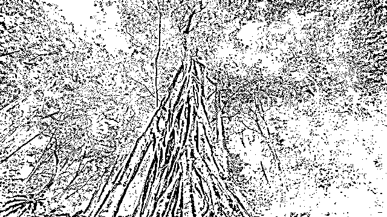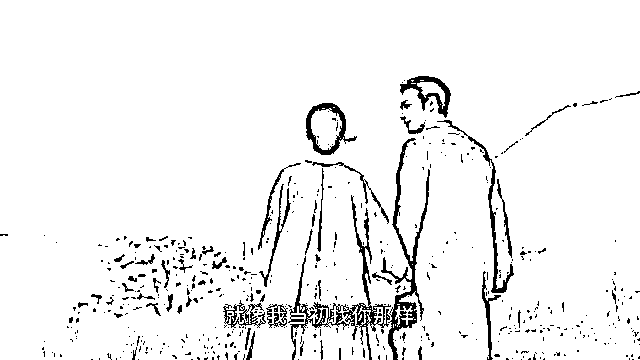|《司藤》的两个结局。其实，无论是树和藤还是男人和女人，内在都是两种互相陪伴的精神能量纠缠。这也是水瓶座最认同的爱情模式。古往今来，多少物种历尽千年修行，只想化为人形，人类的魅力在何处呢？也许就是生生不息的依恋和爱，如果有一天，这种爱能令乌拉诺斯动容，便是人类同神性真正的交合吧。愿每个人在土木水瓶座的时代都能唤起更为广阔辽远的视角，去理解一切的不同，去爱这些不同，那么，等到土木进入双鱼座时，真正的融合将会带领我们进入更高频率的世界，如同司藤和秦放在各种开放性的结局可能中，有一种可能，是从此归隐山林，永远彼此守护，心心相通。

**版权声明：**原创文章由作者授权首发于若道平台，欢迎转发，反对抄袭。友号转载请申请白名单。

****

**玫瑰**

英国 Cass Business School 管理学硕士

若道 2015 届核心课程毕业生，若道微信公众号兼职编辑

占星师，咨询时长超过 800 小时

**个人微信号：**stillrosy

**公众号**：一个娘娘 

长按二维码，给作者打赏

**系统学习占星学**

**点击图片了解详情**

**微信又双叒叕改版啦，不想错过若道君的推送？**

**就把若道设为星标吧！**

**▼**

就是这个“在看”，戳戳戳 ☟

******报名直达入口******

# 搬家、怀孕都能预测？这么神奇的占星技法，你一定要了解一下！

> 原文：[`mp.weixin.qq.com/s?__biz=MzA5NjA0NTAxNg==&mid=2651443388&idx=2&sn=8fbe5379ae39f5c2e1f8790d839bb9a9&chksm=8b4b620bbc3ceb1d5250be6aa504790fb6ddd27604f69c46403375facd91d85f9b7c4dbe942d&scene=126&sessionid=1692737999#rd`](http://mp.weixin.qq.com/s?__biz=MzA5NjA0NTAxNg==&mid=2651443388&idx=2&sn=8fbe5379ae39f5c2e1f8790d839bb9a9&chksm=8b4b620bbc3ceb1d5250be6aa504790fb6ddd27604f69c46403375facd91d85f9b7c4dbe942d&scene=126&sessionid=1692737999#rd)

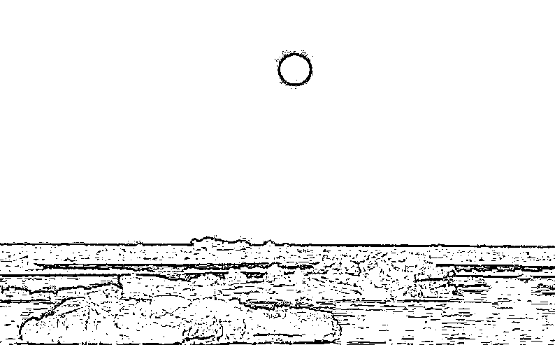采访/编辑/玫瑰 封图片/全景网全新课程——[次限推进技法](https://mp.weixin.qq.com/s?__biz=MjM5MjQwNjAyMQ==&mid=2649438333&idx=2&sn=8a972f531f584573cbbb7a68893b1ff0&scene=21#wechat_redirect)就要开始报名啦！为了帮助大家了解这种神奇的占星技法，我们特别采访了几位资深占星师，看看他们在咨询过程中如何运用次限推进，又有怎样有趣的发现吧！**关于次限行进的一些有趣观察**

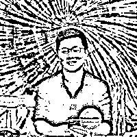

**受访者：查理**

ISAR 认证占星师（2017 年获得），全职占星师若道 2016 届核心课程学员，5 年企业占星研究和咨询经验 13 年企业管理咨询从业经验，上海交通大学物理与天文学院毕业**问：****平时咨询或者研究、学习的时候会使用次限星图么？****查理：**会。**问：****通常是在怎样的情况下使用？****查理：**无论个人星图、企业星图，还是国家星图，都会使用，并且在现实层面找到无数对应，十分神奇。**问：****可否举例说明？****查理：**我的一个朋友在次限月亮进白羊座的第一天办了健身卡，在这之前的很多年他都没有健身过，在那个时候忽然开始想健身，想运动。也变得更有动力去做事了。当次限月亮在双鱼座的时候，他比较嗜睡，开始养花，觉得自己能和植物对话。我有一个客户，次限月亮进巨蟹座的时候忽然想搬出来，找一个清静的地方居住。在家里开始做园艺，自己做饭给自己吃，自我滋养。在这之前她和家人一起住，因为是月天蝎，和婆家之间关系一直都很紧张。搬出来住这段日子，她觉得很舒服。还有出生星图中月亮在水瓶座十宫的客户，是做科研工作的。来找我咨询的时候，次限月亮进入狮子座四宫。他说自己开始考虑家人，但又特别喜欢待在研究所办公室里面。

我给他的建议是把获得的各种奖状放到家里，能让家里人更加关注他和他获得的奖。他对我这条建议比较认同。他是抗疫期间做出很大贡献的人，获得很多奖项。都是在次限月亮进入狮子座的时候获得的，他也付出了很多努力，当时土星、冥王星也有一个非常困难的行进。

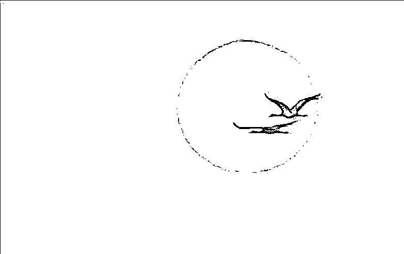

大体上讲，**我会通过次限月亮去观察他在这段时间用什么样的方式能让自己感觉更舒服一些，会更加能够休息好。**出生星图的月亮是从小到大一种习惯的方式，次限月亮就是这一阶段，他用怎样的方式可以更好地滋养自己。另外，还有一个次限月亮进入五宫，立刻怀孕的案例，本身案主是完全不想怀孕的，我是在去年 12 月的时候和她说如果想要孩子可以开始考虑了。当时是次限月亮进处女座五宫。她说不要不要，等了一个月，忽然有一天她打电话和我说：“你这个乌鸦嘴！”这也是一个比较有趣的案例。

我有个客户，之前在一家外资银行做保险，业绩做的非常不错，已经是 top sales，觉得在里面可以养老了。然后去了一家很多行星在白羊座的保险公司。她说想挑战一下自己，觉得在原来的地方有点无聊。当时恰巧次限中天从双鱼座切换到白羊座，整个事业切换到了需要很强竞争，环境。非常狼性，大家要去很多客户。之前的外资银行是比较柔和，关系和睦，没有很强的竞争。到了保险公司后，经常加班，没空陪孩子，把她的事业心完全激发出来了。

我太太也是在次限行进下产生内在动力，从去年经历一些事情后台觉得要去努力挣钱，让自己忙起来，找到事业方向。去年次限火星合了太阳在四宫，所以觉得要为家里去做一些事情，之前她兜兜转转做了很多不同方向的工作，比如疗愈等；从去年七、八月左右，她就把疗愈的工作停了，去努力 social，做微商。因为她太阳在天秤座，次限火星也进天秤座，她就很有动力去联络不同的关系，从那个时候开始就在微信上天天联络不同的人。我自己感受很强烈的是，我的次限月亮刚进水瓶座不久，开始合相上升的时候，我就搬家了。之前找苏·汤普金斯座个案的时候，也预测到了这一点，她说次限月亮过上升的时候我会搬家。我当时真的搬家了，找了一个相对比较远离闹市的房子。当次限下降点经过我的七宫主太阳时，我遇到了我的太太。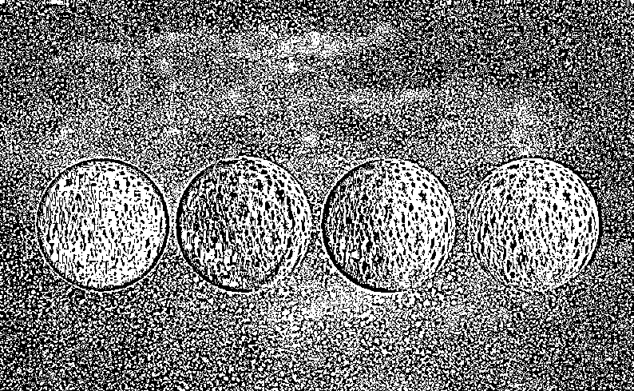我在解读企业占星的时候也会去观察次限，有两个比较经典的案例，一个是某手机品牌，企业星图里金星在巨蟹座尾度，成立没多久，次限金星进入狮子座，在一家公司里，金星代表公司产品的特点，当次限金星进入狮子座，整个 slogan 变成了“逆光也清晰，照亮你的美”，特别张扬，请了吴亦凡来做广告。另一个案例就是抖音的一个主体公司，叫微播视界。这家公司成立的时候，金星在水瓶座 28°-29°，当次限金星进入双鱼座，logo 就变成记录生活的美好，一个很双鱼座的说法。在此之前，他的很多东西都是很酷的，整个产品特质比较小众，比如说一些变脸阿，换脸换衣服等等。国家层面就更有感受了。例如中国的星图，木星在摩羯座 22°，12 宫，当次限木星从 09 年开始进入水瓶座，合相上升，中国有一个比较大的转变——2010 年中国举办的世博会。那时起，中国整个经济发展总量超过日本，开始势不可挡，有很多自主研发的数字化东西。之前 karen 预测中国在 2032 年左右会成为全球经济中心，用的核心技法就是次限木星会在那时三分中国的太阳，次限木星一旦进入中国的一宫，在 100 多年内都不会逆行，会一直停留在中国的一宫里。所以中国在未来很可能越来越扩张，一宫代表国家版图、影响力等。我们可以非常好地运用一宫的力量去发展经济，木星在摩羯座的时候，中国整个经济扩张是靠基建的，在 12 宫里，很多力量用在扶贫上面。而当次限木星进入水瓶座，是以互联网来带动整个经济发展，中国目前是全球整个互联网遍及民生最多的一个国家。另外，中国加入 TWO 是 2001 年 12 月，那时候是次限水星刚进入射手座，水星代表国家的贸易、沟通、宣传，从这个时候，中国开始面向全世界做生意。当次限水星进入摩羯座，整个内循环要开始启动；次限水星在射手座的时候，我们更加遵从国际规则，很多发言比较“打太极”；次限水星进入摩羯座后，外交部发言变得更强硬，很实事求是。次限换座、换宫、合轴，无论用在个人企业还是国家角度都很有用。
另外，次限月相也有很强的意义，我有客户就是从次限新月开始创业，新月时没有光亮，各种摸着石头过河。另外，次限越界，会带来非常独特的功能。比如出生星图中月亮越界，会有情绪不可掌控的情况；水星越界，思维方式非常像外星人；金星越界会有不同寻常的品味；火星越界就会极具勇气。周杰伦就是水星在摩羯座越界，邓文迪金星在摩羯座越界，会找超级成熟的男人，例如默多克。老虎伍兹火星在巨蟹座越界，特别有力量。次限行星越界这段时间，也会产生类似的能力。次限月亮和出生星图中月亮在双子座、巨蟹座越界比较多，还有射手座、摩羯座，在至点附近越界情况比较多。次限月亮在这几个星座越界，案主都会不同程度出现泪流满面，莫名其妙控制不住自己的感受。版权声明：原创文章由作者授权首发于若道平台，欢迎转发，反对抄袭。友号转载请申请白名单。

**什么是次限推进技法？**

**星图中的月亮描述了我们在婴幼儿期和童年早期如何接收母亲的能量。**我们从出生开始就通过月亮的反射来体验母亲，正如月亮反射太阳的光一样。月亮也会描述一些我们可能会称之为灵魂的事物：**我们的人生经历在时间和永恒之间的内在反射物。**次限月亮通常被视为用于预测以及为事件择时的因素，但实际上它的内涵远远不止如此，要更为深刻和微妙。

次限推进月亮（Secondary Progressed Moon）：用次限推进，也即**一天即一年**的推进法时的推进月亮。次限推进月亮平均每月移动 1 度，虽然速度并非恒定。

**当次限月亮在我们星图上的星座和宫位推进时，它会以唤起我们个体本质以及人性的方式，反映我们成长和发展的经历。**对于那些同时开展内在和外在生活的人来说，次限月亮可以成为一个向导，照亮自我反思和内在滋养的面向。**在八周的课程中，**我们将学习次限月亮是如何像镜子一样映照出我们最深的本质的。

**此课程可作为 ISAR 选修课。**

**长按下图了解更多课程信息**

****

就是这个“在看”，戳一下☟

****报名直达入口****

# 重磅丨 ISAR 选修课·深度掌握次限月亮的技法

> 原文：[`mp.weixin.qq.com/s?__biz=MzA5NjA0NTAxNg==&mid=2651443388&idx=3&sn=775643dac2e3aa5bc89f92448f060f7d&chksm=8b4b620bbc3ceb1d96add5ef309e5c931f4811855cf61e6b3fd36c11f2d06885de6ce011658e&scene=126&sessionid=1692737999#rd`](http://mp.weixin.qq.com/s?__biz=MzA5NjA0NTAxNg==&mid=2651443388&idx=3&sn=775643dac2e3aa5bc89f92448f060f7d&chksm=8b4b620bbc3ceb1d96add5ef309e5c931f4811855cf61e6b3fd36c11f2d06885de6ce011658e&scene=126&sessionid=1692737999#rd)

**星图中的月亮描述了我们在婴幼儿期和童年早期如何接收母亲的能量。**我们从出生开始就通过月亮的反射来体验母亲，正如月亮反射太阳的光一样。月亮也会描述一些我们可能会称之为灵魂的事物：**我们的人生经历在时间和永恒之间的内在反射物。**次限月亮通常被视为用于预测以及为事件择时的因素，但实际上它的内涵远远不止如此，要更为深刻和微妙。

**次限推进月亮**（Secondary Progressed Moon）：用次限推进，也即**一天即一年**的推进法时的推进月亮。次限推进月亮平均每月移动 1 度，虽然速度并非恒定。

**次限推进：托勒密时期，2 千年前发明。**

**当次限月亮在我们星图上的星座和宫位推进时，它会以唤起我们个体本质以及人性的方式，反映我们成长和发展的经历。**对于那些同时开展内在和外在生活的人来说，次限月亮可以成为一个向导，照亮自我反思和内在滋养的面向。**在八周的课程中，**我们将学习次限月亮是如何像镜子一样映照出我们最深的本质的。

**此课程可作为 ISAR 选修课。**

1

**课程安排**

**课程安排：5 月 10 日--6 月 28 日 （每周一）**

*   **5 月 10 日** 出生星图中的月亮与它在童年 0-7 岁的推进

*   **5 月 17 日** 7-14 岁：从自我到他人

*   **5 月 24 日** 14-28 岁：从他人到自我

*   **5 月 31 日** 次限月亮推进 vs 土星行进

*   **6 月 07 日** 次限月亮与其他行星形成的相位

*   **6 月 14 日** 30-60 岁的次限月亮推进：再次回转

*   **6 月 21 日** 60 岁以后的次限月亮之旅

*   **6 月 28 日** 次限月亮与次限太阳的关系

2

**课程大纲**

**第*****1*****讲  ****5 月 10 日 **

**出生星图中的月亮与它在童年的推进**

我们将学习出生星图中月亮的象征意义，以及它如何反映你的母亲以及你童年的家庭生活。我们将从元素的角度观察月亮，并研究从出生起你是如何得到母亲的关注的，我们将观察出生后几年的月亮的推进。

**第*****2*****讲  ****5 月 17 日 **

**从 7 岁到 14 岁：从自己到他人**

次限月亮与出生星图中月亮的第一个四分相在 7 岁左右出现。我们将学习在这个关键时间点我们是如何开始意识到自己是独立存在的个体，以及它如何让我们向家庭以外的其他人寻求滋养和生命。

**第*****3*****讲  ****5 月 24 日 **

**从 14 岁到 28 岁：从别人到自己**

从十六七岁到 28 岁左右第一次次限月亮回归，我们完成了与他人和与自己的月亮的灵魂之旅。从次限月亮回归开始，我们就开始对自己的情感生活以及我和其他人之间所发生的负责。

**第*****4*****讲  ****5 月 31 日 **

**从 14 岁到 28 岁：从别人到自己**

当次限月亮描述我们内心的旅程时，土星的行进描述了我们与周围世界的联系，以及作为社会发展中的个体，世界对我们的要求。在我们生命的头 30 年里，它们几乎以相同的速度运行。

**第*****5*****讲 **** 6 月 7 日 **

**次限月亮与其他行星的相位**

我们将从次限月亮的旅程中抽身出来，看看它与各种不同人的星图的其他行星产生有趣而特别的相位时发生了什么，这样我们来了解次限月亮触及我们星图中的这些行星时会发生什么，以及我们该如何为自己的生命导航。

**第*****6*****讲  ****6 月 14 日 **

**30-60 岁的次限月亮推进**

当月亮再次绕着出生星图运行时，我们有机会将意识带到我们的情绪反应中，并开始引导我们的内在本性，而不是对发生在我们身上的事情束手无策。

**第*****7*****讲  ****6 月 21 日 **

**60 岁以后的次限月亮之旅**

在当今时代，60 岁以后过着积极生活的人比历史上任何时候都多。有的人在 70 多岁的时候坠入爱河并第一次结婚。我们将在这一讲探讨如何在我们生命的最后几十年里对自己和他人有用，这样我们就可以体验到生命的丰富多彩。

**第*****8*****讲  ****6 月 28 日 **

**次限月亮与次限太阳的关系**

最后，我们来研究次限月亮绕着星图运行时与次限太阳推进的关系。我们将通过星图案例来进行探讨。

3

**此次课程适合哪些人？**

*   有一定占星学基础，若道核心课 L3 以上水平；

*   希望成为优秀的占星师，想要借鉴国际大师次限解读思路并融入自己的体系的人；

*   希望研究自身人生周期，想好更好的规划人生的占星学者；

*   走在自我探索和个人成长道路上的人。

4

**主讲老师**

**达比·科斯特洛（Darby Costello）**

达比·科斯特洛（Darby Costello）在美国波士顿学习占星学，在非洲生活过 12 年，于 1983 年移居英国伦敦。她曾在长达 25 年的时间里担任心理占星中心的首席教师，是占星研究学院的任课教师，也是伦敦占星学院的客座导师。此外，她拥有“文化天文学与占星学”硕士学位。她在世界各地授课与写作，服务全球客户是她占星师生涯的核心。

| 达比·科斯特洛与琳恩·贝尔

**网站个人简介：**

达比·科斯特洛（Darby Costello）出生于美国，1960 年代曾跟随弗朗西斯·萨科安（Francis Sakoian）、路易·阿克（Louis Acker）以及伊莎贝尔·希基（Isabel Hickey）在波士顿学习占星学。随后，她去了非洲，与部落疗愈者和占卜者一起共事多年，并在期间精进自己的占星学实践。1983 年，她去英国伦敦寻找占星团体。令她高兴的是，她找到了这样的团体，并在许多层面上参与其中。到伦敦后不久，她就开始拓展占星客户，并于 1988 年开始在由丽兹·格林和霍华德·萨司波塔斯创立的心理占星中心任教。十年后，她成为首席讲师，并为心理占星中心出版社撰写了几本书。

达比还是占星研究学院的导师，并于 2014 年获得荣誉文凭。她是心理占星学水星网络学校（MISPA）和占星大学的讲师，也是伦敦占星学院的客座导师。她在欧洲和世界其他地方教书和授课，也曾在巴厘岛、中国大陆和台湾等亚洲地区以及阿拉斯加等北美地区授课。2013 年，达比被授予查尔斯·哈维奖，以表彰她对占星学做出的卓越贡献。

2006 年，达比获得在巴斯斯巴大学（Bath Spa University）“文化天文学与占星学”专业硕士学位。这段学习经历也让她更懂得品读历史，并对写作产生了更深的热爱。不过，她最爱还是解读星图，她遍布世界各地的客户也滋养并进一步激发了她的占星学灵感。

**达比·科斯特洛的著作：**《占星学中的月亮》《水元素与火元素》、《土元素与风元素》、《火星四重奏》、《占星学》。

5

**课程价格**

**价格**：6800 元

还有限时 ISAR 选修课联报套餐价格，具体请咨询课程顾问：Maggie 老师（微信：18510107057，请备注“次限月亮”）

长按二维码添加 Maggie 老师

6

**退转课程**

*   **退款原则请详看《教学协议》，如有疑问请咨询课程顾问。**

****ISAR 选修课：次限月亮****

**授课老师：达比·科斯特洛**

**授课时间：**2021 年 5 月 10 日（周一）起

**授课方式：**网络课程**，**英文授课，中文翻译

**费用：**6800 元

**课程负责人：Maggie 老师**（微信：18510107057，请备注“次限月亮”）

长按二维码添加课程负责人咨询~

****报名请点击“阅读原文”****

# 2021 年金牌核心课 | 《职业占星师养成计划》首次公开

> 原文：[`mp.weixin.qq.com/s?__biz=MzA5NjA0NTAxNg==&mid=2651443179&idx=3&sn=80d953731a8a0a799e94217f6eb455e0&chksm=8b4b7d5cbc3cf44af263beadd1f65a52aa1da279366fb16d182d8109aee71aac1780e09374eb&scene=126&sessionid=1692737999#rd`](http://mp.weixin.qq.com/s?__biz=MzA5NjA0NTAxNg==&mid=2651443179&idx=3&sn=80d953731a8a0a799e94217f6eb455e0&chksm=8b4b7d5cbc3cf44af263beadd1f65a52aa1da279366fb16d182d8109aee71aac1780e09374eb&scene=126&sessionid=1692737999#rd)

**沉淀十年占星学教育中国本土化教学经验，2021 年若道占星核心课全面升级**

**根据中国学生的学习习惯不断优化占星教学体系，为了让若道学员学成后更自如地应对本土咨询市场的需求。**

**我们研发了“职业占星师养成计划”，报名核心课程，即可参与该计划。**

****

****

****

****

****

**如果对“职业占星师养成计划”具体内容感兴趣，欢迎扫码添加课程顾问沟通。**

****

**加入核心课程“职业占星师养成计划”，获得若道专业平台支持。**

****

****

****

****

****

**沉淀十年占星学教育中国本土化教学经验，2021 年若道占星核心课全面升级**

**英国目前最资深****的占星学家和咨询师之一，她拥有****超过 40 年****的占星经验，是占星学习者必备之两本圣经《顺逆皆宜的人生》与《当代占星研究》作者。**

****

**她以自己的冷幽默、****抽丝剥茧的研究天分****和****占星直觉****而闻名。她是一名执业占星师，也是一名顺势疗法医师，是心灵和身体的****敏锐诊断专家。**

**2003 年，为表彰其卓越贡献，英国占星协会为苏·汤普金斯授予查尔斯·哈维****终身成就奖。**

**2017 年第一届苏·汤普金斯核心课****金牌助教******、2019 年第二届核心课中与苏·汤普金斯老师******联合授课******的******ISAR 认证占星师咔咔。**

****作为最熟悉苏·汤普金斯老师教学风格的中文占星老师，咔咔老师将在 2021 年第三届苏·汤普金斯核心课中负责教授部分课程，帮助学员更好地********梳理知识架构,********了解学员的********学习进度和疑问**，补充丰富**********占星咨询的中国案例。************

1

**苏老师写给学员们的信**

**<****滑动查看中文版邮件****>**

2

**课程安排是怎样的呢？**

**第*****1*****阶**

2021 年 3 月 15 日开课，每周一晚上 20:00-22:00 上课，共 4 次课

**第*****2*****阶**

2021 年 4 月 12 日开课，每周一晚上 20:00-22:00 上课，共 4 次课

**第*****3*****阶**

2021 年 6 月 7 日开课，每周一晚上 20:00-22:00 上课，共 15 次课

**第*****4*****阶**

2021 年 10 月 25 日开课，每周一晚上 20:00-22:00 上课，共 13 次课

**第*****5*****阶**

2022 年 2 月 28 日开课，每周一晚上 20:00-22:00 上课，共 27 次课

3

****1-5 阶你将学到什么？****

**第*****1*****阶 ****黄道星座**

*   概要介绍占星学与星图

*   四元素与三形态

*   黄道 12 星座

**第*****2*****阶****行星**

*   太阳、月亮及其他行星

*   练习将它们组合在一起

**第*****3*****阶 ****宫位、相位以及初步解读星图**

*   四轴与宫位

*   相位概论

*   困难相位

*   柔和相位

*   数字游戏，练习找相位

*   容许度，出入相位

*   相位模式

*   将它们全部组合在一起

*   解读的基本原则，权重，失衡

*   如何解读一张星图......丰富的案例，包括学员的案例

**第*****4*****阶 ****出生星图解读（进阶）以及关系与职业议题**

*   了解灵魂进化的路径：月亮交点

*   天文学基础知识

*   综合星图解读，把知识串联起来

*   职业占星解读

*   财富占星解读

*   亲密关系解读

*   丰富的案例，包括学员案例

*   开始学习预测：行进

**第*****5*****阶 ****预测、关系、咨询、为执业和考试做准备**

*   继续学习预测
*   次限推进和其他推进：什么是推进以及如何使用推进？ 
*   太阳弧：什么是太阳弧以及如何使用太阳弧？
*   返照星图：太阳返照、月亮返照和其他行星回归星图
*   将预测技法结合起来
*   原理和时机；蚀相和其他月相
*   解读和预测：更多示范和案例
*   介绍中点
*   如何运用择时星图（婚礼、商务活动等）
*   创造性的相位 ：五分相与七分相
*   关系议题概论
*   对比技法
*   对比图、组合图和其他常用关系图
*   其他有效但鲜为人知的对比技法，比如龙首图
*   更多预测与对比案例
*   心理学、咨询模式及技巧（主要是精神动力、人本主义和超个人心理学方面）
*   当代心理学倾向、“以人为本”的占星师核心思想
*   倾听技巧，咨询，道德议题
*   为练习做准备；如何作为占星师谋生；学习必备的历史和天文学知识，为考试做准备

**综合以上技法**

系统的解读步骤来帮助你把焦点对准需要聚焦的地方。

4

**想更多了解导师？**

**主讲导师**

**苏·汤普金斯（Sue Tompkins）**

**英国目前最资深的占星学家和咨询师之一，她拥有超过 40 年的占星经验。**占星学习者必备之两本圣经**《当代占星研究》**和**《顺逆皆宜的人生》**作者。

2003 年，为表彰其卓越贡献，英国占星协会为苏·汤普金斯授予**查尔斯·哈维终身成就奖**。苏同时是一位接受过心理学与心理咨询训练的注册顺势疗法医师，并经常在英国、法国、挪威、瑞典、澳大利亚等地举办占星研讨会和公开演讲。

**苏以实际、生动而幽默的风格闻名于世**，她的教学经验非常丰富，能够胜任从初学者教育到毕业生督导等针对不同占星程度学员的教学工作。这来源于她在地方公立学校以及在英国占星学院(FAS)长达 19 年的教学经历，并在 1986 年-2000 年任学院院长并负责现场教学的所有事务，以及随后在世界各国教学积累的经验。2000 年，英国占星研究学院授予其研究员职位，以表彰她为学校做出的突出贡献。

**中文讲师**

**占星师咔咔（Caroline）**

2010 年师从美国占星师大卫·瑞雷学习，并得到世界名师斯蒂芬·弗里斯特、罗伯特·汉德、苏·汤普金斯传授各种占星学技法。若道首届学员，国内最早获得 ISAR 职业占星师资质的职业占星师之一，现兼任若道核心课程助教。在国际知名广告公司和市场研究公司从事的市场研究和推广工作十余年，曾任职于阳狮集团、尼尔森市场研究有限公司、MTV 和《Madame Figaro》杂志。

**助教**

**助教王嘉祺 Conrad**

**ISAR 认证占星师**，**若道认证生时校正资质，**从 2010 年开始学习占星学，2015 年开始在若道系统学习，并开始个案咨询。2018 年担任若道核心课程助教，以及选修课卜卦占星学和太阳返照课程助教，并带领学员进行经世占星学及太阳返照方面研究。2019 年 11 月作为演讲人之一参加了 ISAR 北京大会，也是 ISAR Star Club 中国区第 16 期的主讲人。

5

**选择若道学习占星学的优势**

**运用自由意志，扭转破坏性模式，绽放天赋潜能**

若道是人本主义占星学的旗手。因为我们相信，**人通过了解模式、觉察习性、积极疗愈、终将释放其潜能，与命运共舞**。

**进入国际权威职业占星师认证的快车道**

占星界的“联合国”ISAR（国际占星研究协会），是具有全世界影响力的占星教学和研究组织和职业占星师全球认证机构，认证占星师遍布 45 个国家。**在 ISAR 的 19 所附属学校中，大中华地区的附属学校只有若道一家**。在国际化的教学理念大纲标准下，**若道毕业生在 ISAR 国际认证占星师的考试通过率多次位居全球首位**。

**十年占星学教育中国本土化教学经验**

**根据中国学生的学习习惯不断优化占星教学体系，让学员学成后更自如地应对本土咨询市场的需求。**学好占星学不仅仅需要邀请一两位老师教学，更需要对教学难点有充分了解，且有持续的教学跟进服务。**10 年来多次核心课程和各种专题课程的教学，让若道非常了解中国学生学习占星学的难点和卡点，合理有效地拆分、提炼课程知识点，同时也积累了丰富的国外老师和中国老师、助教紧密配合以及课程顾问密切配合教学的经验**。若道还专门开发了有助于占星学习的“**若道**”APP，每门课程都设有答疑板块，学员能够方便快捷地提交问题，助教及时答疑解惑和批改作业。**融入中国顶尖的职业占星师群体**若道是中国职业占星师的“黄埔军校”。职业占星师的培养从若道开始，**进入若道，你就走进了中国顶尖的职业占星师群体，和一群志同道合的师兄师姐联谊，获得经验，共同成长**。**多种奖学金支持**为了鼓励学员不因为暂时的经济困难而放弃学习，我们特意设置了各种**技能交换和奖学金**。对于有一技之长的学员，我们推出的技能交换的项目包括**“笔译”、“笔记整理”、“平面设计”、“课本朗读”、“班级服务”**等技能交换项目；而对于努力学习、出勤率高、完成作业率高的学员，我们设置的**土星奖、木星奖**等各种奖学金在等着你。为了感谢帮助我们推荐学员的老学员们，我们设置了“**老学员推荐奖**”；对于通过问卷提建议，帮助我们提高服务的学员，我们也设置了相应的奖学金。ISAR 中国还设置了**国际会议奖学金**，符合条件并通过甄选的申请者最高可获取 5000 元奖学金。当美好的知识遇上奖学金，你可以在学习旅途中乘风破浪，直挂云帆济沧海。**开启占星咨询的职业规划和支持**若道为占星学员搭建了占星问答平台和占星咨询平台，并提供严肃占星学影响力最大的媒体平台，全力为毕业生提供宣传渠道，帮助你吸引和积累咨询生涯初期的种子客户。若道为学员开发了适用于占星学习的“若道”APP，并不断更新完善。**①  微信平台**若道微信平台作为业内颇具影响力专业平台，为文笔好的若道毕业生提供传播占星学并免费宣传自己的机会。有的学员因为文笔获得众多粉丝喜爱，在 3 年多时间积累起 2000 多人的潜在客户。**②  问答平台**若道问答平台帮助学员接触客户的实际问题，并在毕业前就进行演练答题。自问答平台 2016 年上线运营以来，学员接触到 3200 多个问题， 回答问题最多的学员在问答平台收入达 5 万多元。**③  咨询平台**若道咨询平台是我们为优秀毕业生所搭建的平台，帮助毕业生在自己的咨询拓展之外，用若道提供的平台扩展咨询客户群。自咨询平台 2017 年 8 月上线运营以来，咨询平台共入驻 65 人，收入最高者达 32 万元。此处所列学员收入仅供参考，收入高的学员和其专业水准、努力程度密切相关。若道平台尽其所能将自己定位为辅助学员开展职业生涯的桥梁。**在 10 年的占星教学耕耘后，两位创始人——大卫·瑞雷及蒋颖再次邀请苏·汤普金斯老师开设占星核心课程。**

6

**此次课程适合哪些人？**

*   对占星学感兴趣，想要入门的零基础者

*   占星学小白，但有志成为职业占星师的人

*   有一定占星学基础，但不知道该如何整合星图复杂碎片的人

*   希望成为优秀的占星师，想要借鉴国际大师解读思路并融入自己的体系的人

*   苏·汤普金斯的粉丝，学过占星学，但就是想跟着偶像再学一遍的人

*   走在自我探索和个人成长道路上的人

7

**占星业内推荐**

**苏·汤普金斯的《顺逆皆宜的人生》令人赞叹！苏是一名倍受爱戴的老师，并且任教多年。苏以自己的冷幽默、抽丝剥茧的研究天分和占星直觉而闻名。她是一名执业占星师，也是一名顺势疗法医师，是心灵和身体的敏锐诊断专家。**

** ——法国心理占星学协会会长琳恩·贝尔**

8

**苏汤班学员评价**

9

**苏汤老师水瓶座试听课**

（温馨提示：手机请注意流量）

📹 [`v.qq.com/iframe/preview.html?width=500&height=375&auto=0&vid=p3210llaq7f`](https://v.qq.com/iframe/preview.html?width=500&height=375&auto=0&vid=p3210llaq7f)

10

**课程价格**

**L1-2：**4000 元

**L1-3：**13200 元

**L1-5 原价：**49400 元 **（四月内插班连报优惠价 33000）**

其他各阶段课程单报价格，请咨询课程顾问：**Maggie 老师**（微信：18510107057，请备注**“苏·汤普金斯核心课”**）

长按二维码添加 Maggie 老师

11

**退转课程**

*   **退款原则请详看《教学协议》，如有疑问请咨询课程顾问。**

****苏·汤普金斯金牌核心课程****

**授课老师：苏·汤普金斯**

**授课时间：**2021 年 3 月 15 日起

**授课方式：**网络课程**，**英文授课，中文翻译

**费用：**L1-2：4000 元；L1-3：13200 元；L1-5：49400 元****（四月内插班连报 L1-5 优惠价 33000）****

**课程负责人：Maggie 老师**（微信：18510107057，请备注“苏·汤普金斯核心课”）

长按二维码添加课程负责人咨询~

****报名请点击“阅读原文”****

# 大师沙龙丨次限太阳：你人生的精神奇旅

> 原文：[`mp.weixin.qq.com/s?__biz=MzA5NjA0NTAxNg==&mid=2651443179&idx=2&sn=3e20343f4e85ada69228cf6a2461ae53&chksm=8b4b7d5cbc3cf44a296ea567044231186af2a2c9055dd666c2c79391e87fd15033aba6b426e0&scene=126&sessionid=1692737999#rd`](http://mp.weixin.qq.com/s?__biz=MzA5NjA0NTAxNg==&mid=2651443179&idx=2&sn=3e20343f4e85ada69228cf6a2461ae53&chksm=8b4b7d5cbc3cf44a296ea567044231186af2a2c9055dd666c2c79391e87fd15033aba6b426e0&scene=126&sessionid=1692737999#rd)

****4 月 23 日（星期五）晚上 8 点，国际占星研究协会（ISAR）中国星空俱乐部沙龙由达比·科斯特洛老师带来一场讲座！ ****

次限推进太阳的运动突出了你生命旅程中的许多里程碑。**新的意识升起，改变自我形象。**

次限太阳的建设性如果被健康的表达，有时可以强大到可以改变自我认知、社会身份、尊严体系。太阳作为一个预测指标，显示什么是至关重要的，推进的太阳帮助你确定生命中那些已经或将要成为至关重要的时间。太阳照耀着，照亮你生活中的主要问题。

**换星座**：模塑一个人的选择的潜在价值观和动机在发生根本变化；

**换宫位**：人个的环境和典型行为转移到一个新的舞台；

**形成相位**：尤其是合相、四分和对分相——不过进行太阳的所有相位都很重要。

沙龙主题

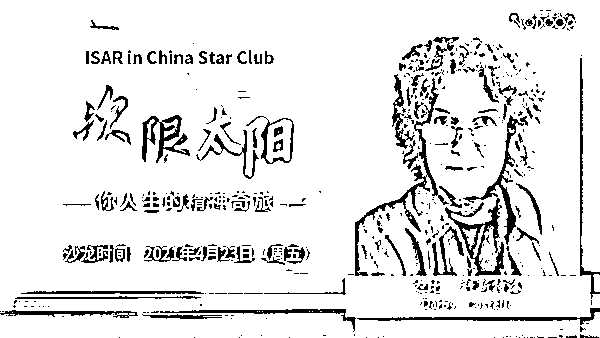

**沙龙主题：次限太阳：你人生的精神奇旅****主讲人：达比·科斯特洛（Darby Costello）**

**沙龙时间：2021 年 4 月 23 日 星期五   北京时间 20:00-21:30**

**沙龙方式：线上沙龙（含有英文翻译）**主讲嘉宾

**达比·科斯特洛（Darby Costello）**

**·** 达比·科斯特洛出生于美国，上世纪 60 年代在波士顿跟随弗朗西斯·萨克伊恩（FrancisSakoian）、路易斯·阿克（Louis Acker）和伊莎贝尔·希基（Isabel Hickey）学习占星学。从那里她又去了非洲，与部落治疗师和占卜师一起工作了很多年，同时发展了她的占星实践；**·** 1983 年，她去伦敦寻找占星社团。她到美国不久就开始吸引占星客户，1988 年开始在利兹·格林（LizGreene）和霍华德·萨斯波塔斯（HowardSasportas）创办的心理占星学中心（Centre for PsychologicalAstrology）任教。十年后，她成为首席老师，并为 CPA 出版社写了几著作；**·** 达比还是占星研究学院的一名导师，并于 2014 年获得了荣誉文凭。她是米斯帕和占星大学网课的教师，也是伦敦占星学院的访问导师。她在欧洲和世界其他地方教书和讲课。她曾在巴厘岛、中国大陆和台湾等遥远的地方，以及包括阿拉斯加在内的北美许多地区举办过研讨会。2013 年，她获得了查尔斯·哈维占星术杰出贡献奖；**·** 2006 年，她在巴斯斯帕大学(BathSpa University)获得了“文化天文学和占星学”硕士学位。这让她对历史有了更浓厚的兴趣，对写作也有了更深的热爱。然而，她对占星学最初的热爱是做星图，全球各地的客户是她的占星灵感滋养的基础。如何参加本次沙龙？

本讲座也是本月的国际占星研究协会（ISAR）星空俱乐部讲座。**ISAR 会员可以免费收看。**请注意邮件通知，具体参与方式见邮件。

❶ 如果你**已经是 ISAR 会员**，请注意邮件通知，告知如何参加。

❷ 如果你**不是 ISAR 会员**，非 ISAR 会员价格：98 元。如有任何问题请咨询工作人员

Maggie 老师（微信：18510107057，请备注“次限太阳”）

**非 ISAR 会员报名请长按下图**

**▼**

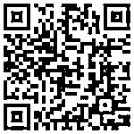

**ISAR 明星俱乐部**

2019 年，ISAR 在主席亚历山大·因舍阿吉克的带领下，成立了 ISAR 明星俱乐部，每月为全球 ISAR 会员提供在线直播讲座，邀请全球著名占星师开讲，学习和分享新的理念。讲座时长一小时，涉及占星学的不同领域、不同观点，每个会员都可以参与其中，每次讲座之后还有 20-30 分钟问答时间向老师们提问。

每一场在线讲座都会记录下来，ISAR 除了提供视频，还会提供相关的讲座资料，以及单独的问答录音，自动发送到专门的 ISAR 明星俱乐部页面存档，每位 ISAR 会员可以在 ISAR 网站上自己的会员主页俱乐部页面找到。在 2018 年最初几个月，ISAR 明星俱乐部会每月举办一场在线演讲。之后，两周举办一场演讲，最终每周举办一场演讲。

但是，过去明星俱乐部讲座只有英文沙龙，因此，中国会员只有懂英文才能受益。为了使得更多不懂英文的中国会员能够受益，我们特别和 ISAR 总部协商，今后会安排有中文翻译的明星俱乐部占星沙龙，作为给中国 ISAR 会员的福利！

如何成为 ISAR 会员？

**如果你也想成为 ISAR 会员，请复制链接在浏览器打开**

http://www.nodoor.com/isarcert.do?contentId=3588（仅支持网站支付）

**或直接长按下方二维码，微信购买会员：**

ISAR 会员有什么福利？

一年期会员仅需支付**人民币 420 元**，即可享受：

**☆ 星空俱乐部免费沙龙**

**☆每年出版 3 次的《国际占星师》（目前只有英文）；**

**☆每周电子邮件交流汇总杂志（目前只有英文）；**

**☆专项研究基金和奖学金资格；**

**☆ISAR 主办的会议和论坛的会员折扣，包括国际占星大会（UAC）、ISAR 的会议和研讨会等会员权益。**

有疑问怎么办？

关于 ISAR 星空会员俱乐部以及我们的讲座，如果你还有任何疑问，**请联系工作人员**：

**yiyi**

**微信：YY18513802156**

**若道 Conrad**

**微信：nodoor2016**

****非 ISAR 会员报名请点击“阅读原文”****

# 巨蟹座、天蝎座、双鱼座的爱情，都藏在这个故事中

> 原文：[`mp.weixin.qq.com/s?__biz=MzA5NjA0NTAxNg==&mid=2651443179&idx=1&sn=71cdd7544f743ec41e0951a0c9dbc911&chksm=8b4b7d5cbc3cf44a31ab16a08ea05c95081a1ab254547448bd6b6206081640ef412272408d40&scene=126&sessionid=1692737999#rd`](http://mp.weixin.qq.com/s?__biz=MzA5NjA0NTAxNg==&mid=2651443179&idx=1&sn=71cdd7544f743ec41e0951a0c9dbc911&chksm=8b4b7d5cbc3cf44a31ab16a08ea05c95081a1ab254547448bd6b6206081640ef412272408d40&scene=126&sessionid=1692737999#rd)

********☆ ****后台回复“今日”，给你一句生命态度********

作者/Anastasia ISAR 认证占星师

编辑/玫瑰 图片/全景网

什么是爱？你心目中理想的爱情是什么样？你需要什么样的爱情？人生的每个阶段是否需要不同的爱情？关于爱，我们有成千上百的疑问，而每个人心中也有着各自不同的见解。作者从占星学的角度给了我们一个关于“爱”的答案，一起来听听吧。一说到爱情，每个人的脸上都会浮现心领神会的笑容。可是如果再继续问，什么是爱？你心目中理想的爱情是什么样？意见却鲜有相同的时候。有些人觉得是**志同道合三观一致（水瓶座、射手座）**；有些人觉得是**浪漫温馨无微不至（双鱼座、巨蟹座）**；有的人觉得是**激情四溢生死相许（白羊座、天蝎座）**；有的人觉得是**执子之手白头到老（金牛座、天秤座）。**东方和西方，男人和女人对于爱情的理解都不一致。可以说 12 星座每个人心中都有自己的男神和女神。没有一个是相同的，月亮只有一个，可月光泼洒万物，就有了万千各种各样的形态。科技发达，讯息爆炸，关于爱，我们讨论的也太多。我们满不在乎，脱口而出，爱和理想，像是蛋糕上点缀的樱桃，美则美矣，太过轻浮泛滥。许许多多微不足道的东西都以其名义行走天下，于是它们变得不再高高在上，不再有力量。美好的爱情都是相似的，两情相悦，你侬我侬。但不美好的爱情，各有各的不同。某种意义上说，爱是理想，是我们希望在别人身上看到的完美自己。**我们每个人都是一个完整的圆残缺的一半，急于找到另一半。所以和代表自我的第一宫相对的第七宫就是我们的伴侣宫。**情是性情，是我们每个人最深沉的内心波澜。落实在星图上，就是我们的水象星座，**巨蟹座、天蝎座和双鱼座**。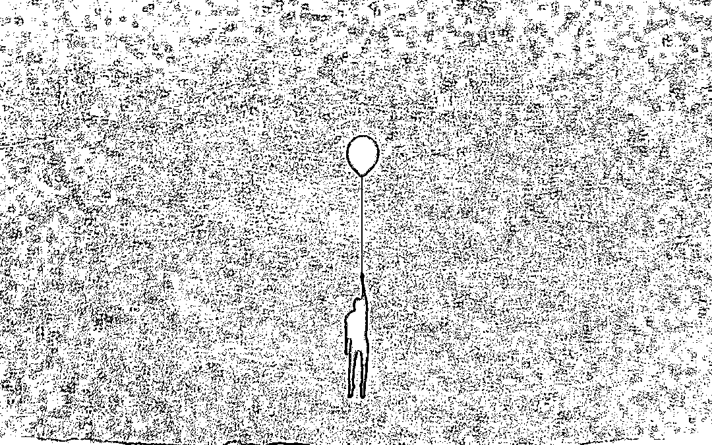**爱情，激发了我们星图中的水元素****水元素****脆弱、敏感、细腻，可以感受到纤微的细节和变化，紧密联结我们的内心。****水元素和我们的情感和感受相关，和我们灵魂最深的渴望相关。**所以，爱情可以带来觉醒，可以带来蜕变，可以使人脱胎换骨，使人飞天升仙或者堕入深渊。爱和理想，都是抽象的概念，难以琢磨。人性却是倾向于自己感觉到的情绪和看得见摸得着的具体事例。我们苦苦寻觅的人生伴侣，就是我们在人生当中寻找的具体事例之一。于是，当我们看到感动我们的爱情故事，我们会说：“**那样的感情才是我要的**。”看到偶像剧中的男主女主，我们会说：“**他（她）那样才是我的 Mr. Right**。”说起爱情，千言万语也抵不上一部《梁祝》或者《泰坦尼克号》或者《太阳的后裔》。我们每个人，每个阶段，都有自己的人生理想，对爱情也会有不同的理解。但这个理解最终都是基于我们自身的性情， 所谓一万个读者，就有一万部红楼梦。但凡一流的作品，总是能让人于微尘中见大千，在刹那中见永恒，可以让各怀心事的读者各取所需。《月亮与六便士》也是这样一部作品，流传广，解读多，是英国作家毛姆的盛名之作。表面看，这本书讲述了一个离经叛道追求自我的故事，故事原型是生前落魄死后哀荣的后印象派画家高更。书名《月亮和六便士》的意象说的就是天壤之别，正是对应星图上的对分相。**对分相****意味着两个行星的位置处于 180 度，是一组互相冲突的能量，表现形式往往会只顾一端，因此协调与平衡是这个相位必须学习的功课。**《月亮与六便士》，我们可以认为这是一本关于**实现自我 VS 家庭生活**的书（摩羯座、巨蟹座轴线），一本关于**诗意远方 VS 现实苟且**的书（射手座、双子座轴线），关于**工作 VS 情怀**的书（处女座、双鱼座轴线）。当然，书里不可避免地描写了多段爱情，我们也可以清晰地看到，这是一本关**于个体和他人**（白羊座、天秤座轴线），以及各种爱情形态的书。**让我们追随斯特里克兰的脚步，来看看他一生经历的三段爱情。****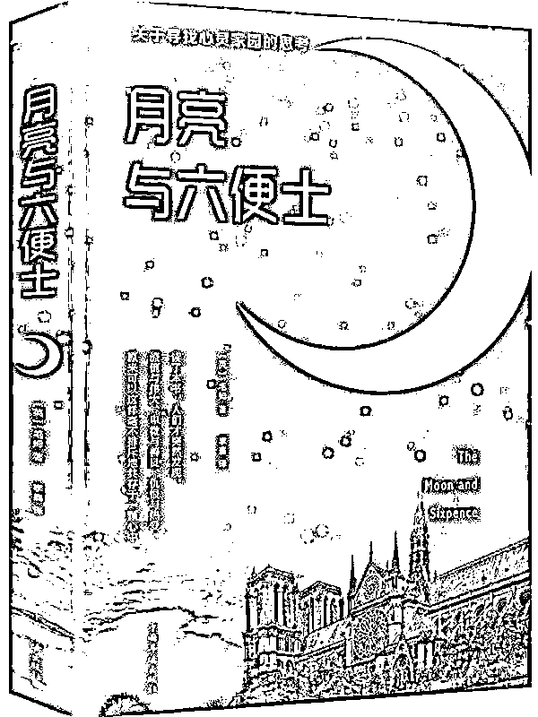**

| 《月亮与六便士》

**巨蟹座的爱，稳定、安全、僵化**主人公斯特里克兰刚出场的时候，是一个面目模糊，毫无特点和过失的人。他是一个伦敦的股票经纪人，努力工作，养家糊口。他的妻子贤惠能干，喜欢风雅，结交了很多作家和艺术家。有一儿一女，漂亮活波。与妻子的左右逢源不同，他给人的印象是无聊刻板，对文学艺术毫无兴趣，是个庸俗普通的小市民。“这肯定是人世间无数对夫妻的故事，这种生活模式有一种简单之美。它让你想起平静的涓涓细流，蜿蜒流淌过翠绿的牧场和宜人的树荫，最终涌入浩瀚的海洋”。 **这肯定也是大多数人希望的爱情，巨蟹座式的爱。男主外，女主内，一个赚钱养家，一个勤勉持家。**在现实的风雨中，两个人共同努力构筑一个安全的港湾。生儿育女，繁衍血脉。关起门来，就是自己的世界，外人不得入内。对于巨蟹座的爱来说，一点点的激情体验就能够维持很久，他们要的是柴米油盐，恐惧冒险和改变，他们需要安全和稳定。这样一段追求稳定的关系很容易变得僵化，所有人都在原地打转，没有一个人得到自我提升。**巨蟹座****特质的爱稳定、安全，但是容易流于形式，一成不变，变得僵化，没有新鲜感。**如果你是巨蟹座特质的爱人，就需要**克服自己内心的多愁善感和自怜自怨，以及对于变化的恐惧，减少自己的依赖心**。变得更加**自主、独立、坚强，为日常生活带来一些积极主动的变化。****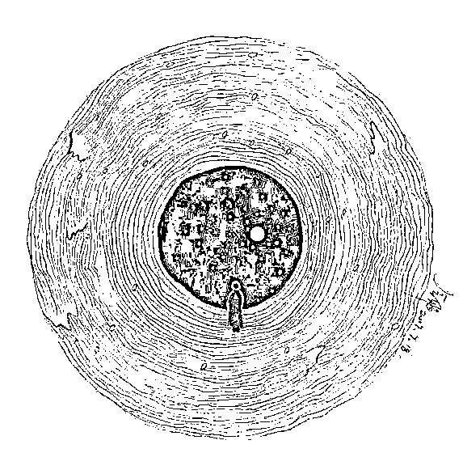****天蝎座的爱，激烈、深刻、致命**

一个和美的家庭显然是不够的，“大海是如此平静，如此沉默，如此漠然，以至于你突然感到莫名的焦躁。”我们生而为人，不只是吃饱穿暖繁衍后代就可以满足的。人生有更重要的事情，我们需要更多，需要狂野的、自由自在的激情。于是某一天，斯特里克兰突然不辞而别，毅然决然地舍弃了舒适的中产生活，让仰仗他生活的妻子儿女陷入生活窘境。他自己则选择去过一种有上顿没下顿的落魄日子。

这一切的开始，只是因为他想画画。他来到了巴黎，他的天才受到了画商施特罗夫的赏识，并且在穷困潦倒、病入膏肓的时候得到了他无私的救助。可是画商的妻子布兰奇却点燃了他心底的欲望，她疯狂地爱上了他。斯特里克兰背叛了朋友，和布兰奇暗通款曲，霸占了画室，又在激情退却后抛弃了她，导致她自杀身亡。

斯特里克兰从一个面目模糊的老好人变成一个人们眼中彻头彻尾的混蛋。他完全不在乎别人的眼光，纲纪伦常也约束不了他。他对所有的一切都视若无睹，他只看得见他灵魂中的那种压抑不住的骚动。饥渴是无止境的，欲望是无法满足的。**这就是天蝎座的爱。天蝎座的爱处理好了就是刻骨铭心永生难忘，处理不好就是致命的毒药。**显然，如果你无法找到内心这种饥渴的源头，你就会转向最容易得到满足的欲望，性或者金钱或者权力。

**天蝎座****特质的爱激烈、深刻，但是容易让彼此筋疲力尽，饱受折磨。**如果你是天蝎座特质的爱人，就需要**正视自己内心对于失去和背叛的恐惧，在感情生活中要敢于冒险，主动敞开自己，和对方进行深层次的交流和接触，避免卷入不必要的情感动荡状态**。你需要相信自己的直觉，变得简单和纯净，停止内心的纠结猜忌，好好欣赏和享受舒适自在的感情生活。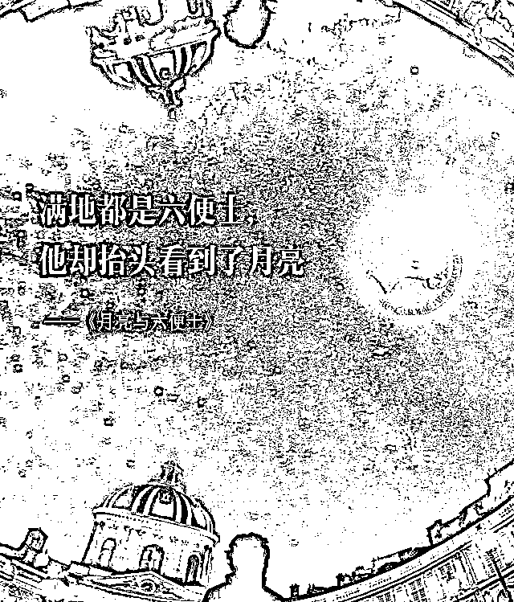**双鱼座的爱，包容、联结、逃避**斯特里克兰知道自己要什么，他很清楚内心的骚动要通过什么方式来表达，那不是家庭，也不是性。他曾以为可以在女人的臂弯里找到宁静，但那里并没有他要的解脱。他只有画画，他要去表达他灵魂的状态，只有画画可以帮助他解脱。他离开巴黎，辗转几个地方，最后来到了太平洋上的塔希提，那时候他已经 47 岁。在这个遥远小岛上他度过了生命中的最后几年。他创作出的画作让他名垂青史。在岛上，他娶了当地的土著女人艾塔，住在山谷密林深处。接下来的 3 年是斯特里克兰一生中最快乐的时光。艾塔有一块地，他们靠收获的农作物生活。他们的房子离村子很远，很少有人来叨扰他们。他画画、读书，乐得逍遥，不再过问世间之事。这是一个偏僻的小岛，他的奇行怪癖并没有引起任何反感，反而引发了人们的同情。不论在英国，还是法国，他在人们眼里就是一个怪人，但这里的人早就习惯他的古怪，他变得温柔、变得没那么自私和粗鲁。将斯特里克兰束缚住的那股狂热，在这里得到了完全的接纳和包容。后来他得了麻风病，死了一个孩子，艾塔不离不弃，眼中洋溢着一种超凡脱俗的爱。承诺和牺牲会让人深深地爱着彼此，心怀虔诚，终结姻缘。**这就是双鱼座的爱，我们必须对自己的意识忠实，并且全身心的投入，甘于奉献。**走进双鱼座的爱，你就可以丢开世界。爱，可以以一种更深刻的形式表达出来，不只是性，还有艺术。这就是为什么，伟大的艺术会唤醒我们。这种内在的激情，会和我们血液中的激情融合在一起，对于自己和身边的人来说，都是一份弥足珍贵的礼物。斯特里克兰从没抱怨过自己的命运，也未曾丧失过勇气。在他生命的最后一年，他失明了。他终日坐在最后创作壁画的房间里，用失明的眼睛看自己的作品，他看到的东西比他一生中看到的还要多。直到生命最后一刻，他都是那样平静，没有收到外界的干扰。**双鱼座****特质的爱浪漫、慈悲、包容，彼此会觉得有心灵上的联结。**如果你是双鱼座特质的爱人，就需要意识到**爱情并不是逃避现实的避风港，也不要沉溺在自己的白日梦中。**要将这种浪漫的、充满创造性的力量落实到现实中，勇于承担生活和工作中的责任，有效地执行工作计划，并且建立整齐清洁的生活秩序。通常我们说的爱情，指的是我们付出的爱，所以爱需要有自甘示弱的姿态，要低到尘埃里；要有保护和照顾对方的心意，要无私忘我，有乐于奉献；要有取悦别人的心理，把私心隐藏得不露痕迹。这样的爱很容易带着控制和依赖，一旦受到挫折，就会转变成怨念和愤恨。**昆德拉说：你所在意的总是那个你最无法掌握、最摸不透的人，无论男人女人。你觉得自己无法完全拥有，患得患失，这样的感情既让人焦虑，又让你乐此不疲，止不住的想要得到全部。**爱是自私的。但是也有可能，你身上承载的激情，让另一方感觉到承受不住。这并不意味着你身上有如此激烈的面向就有什么错。只是你需要留意，在什么时候，以一种怎样的方式来表达身上的激烈。**爱情会激发我们星图****上的水元素，****让我们如痴如醉，爱恨交织。这种深刻的体验让我们的平凡人生具有独特的魅力。****你需要什么样的爱情？**每个人的爱情生活都是不一样的。有的人可能在一段感情中就经历了这三种特质的爱情，有的人可能会花上几十年，通过好几段恋情来体验，也有的人可能一生就经历了其中的某一种甚至混沌终生，什么体验都没有得到。 不管我们有过什么样的感情经历，我们只有更加深入地去了解自己，体谅对方，才能体验到情感的复杂和真实的本质。让我们回到文章的开头，回到月亮和六便士的隐喻上。让看一看我们星图上的上升和下降，中天和下中天，想一想我们的付出与接受。星图是一个整体，任何一极的过度认同，都会带来由分裂而产生的痛苦。**只有当我们处在一种均衡状态的时候，我们的爱情不仅可以转化自己，也可以转化所爱的人，甚至可以转化周围的人，所有人都会感觉到爱的力量。**爱情正如月光，在心里总是比说出来更恳切，除非你找到一种方式，在自身把它创造出来。

**版权声明：**原创文章由作者授权发布于若道平台，欢迎转发，反对抄袭。友号转载请申请白名单。

**Anastasia**

职业占星师/专栏作者/策展人

于 2015 年通过 ISAR 占星能力考试

若道认证生时校正资质（2015 年获得）

**微信公众号**：KairosMoment

长按打赏

**系统学习占星学**

**点击图片了解详情**

**微信又双叒叕改版啦，不想错过若道君的推送？**

**就把若道设为星标吧！**

**▼**

喜欢记得点一下在看哦☟

****报名直达入口****

# 2021 年最美好的月份开始啦！学习这个星座，开启富足人生！

> 原文：[`mp.weixin.qq.com/s?__biz=MzA5NjA0NTAxNg==&mid=2651443098&idx=1&sn=6cb39089c3c254e424561bdb13a72b3d&chksm=8b4b7d2dbc3cf43bda3a5165ba6459055679e0ab1692caf92d80a9c1b1b8ba82141e7408e70d&scene=126&sessionid=1692737999#rd`](http://mp.weixin.qq.com/s?__biz=MzA5NjA0NTAxNg==&mid=2651443098&idx=1&sn=6cb39089c3c254e424561bdb13a72b3d&chksm=8b4b7d2dbc3cf43bda3a5165ba6459055679e0ab1692caf92d80a9c1b1b8ba82141e7408e70d&scene=126&sessionid=1692737999#rd)

******☆ ****后台回复“今日”，给你一句生命态度******

作者/大卫·瑞雷 若道占星创始人
译者/李含 校对/Chirsty 编辑/玫瑰 图片/全景网

4 月 20 日 4:34，我们迎来了金牛座的月份——一年中最美好、最惬意，最适合赚钱和保养自己的一段时光！该如何把握这段日子，活出富足而有价值的人生呢？一起来学习金牛座的美好特质吧！

**金牛座特质的一体两面****当你随着年龄的增长，开始放松地做一个有性格的演员时，你必须喜欢你此刻的生活和工作，我就十分享受现在的工作。****——乔治·克鲁尼**

**金牛座那些美好的特质**

**关键词：**价值、保养、持久、耐力、毅力、冷静、可靠、值得信赖、舒适感。
如果白羊座是一次旅程的起点，金牛座就是我们在旅途中开始放松的地方。我们长舒一口气，然后深呼吸。我们坐在自己舒适的位子上，享受这次旅程。也许随着越来越放松，我们甚至会小憩一下。我们知道旅程尚远，所以本能地开始保存体力。金牛座比其他星座更有能力感知事物的价值。金牛座代表着一种**尽情享受所拥有之物的能力，以及对获得有价值之物的欲望。**我们想**拥有一切自认为有价值的事物**，这便是**“占有”**的本质。占有原则首先应用于自己的身体。如果出生图中金牛座特质强烈的人会**本能地、有意识地去保养自己的身体**：累的时候会休息，饿的时候会吃东西。**在明确一件事的价值之前，不会在上面浪费或消耗精力**。然而，**一旦决定全力以赴，就能够付出持久的努力。****当感知到自身努力会有回报时，耐力和毅力就会自然发挥出来。****在危机中能保持冷静，除非绝对必要，否则不会仓促行事。**通常，他们有着从容不迫的步调，因此在别人眼里是可靠又值得信赖的。**他们非常喜欢感官上和物质上的舒适感，同时排斥任何没有明确价值意义的改变。**

**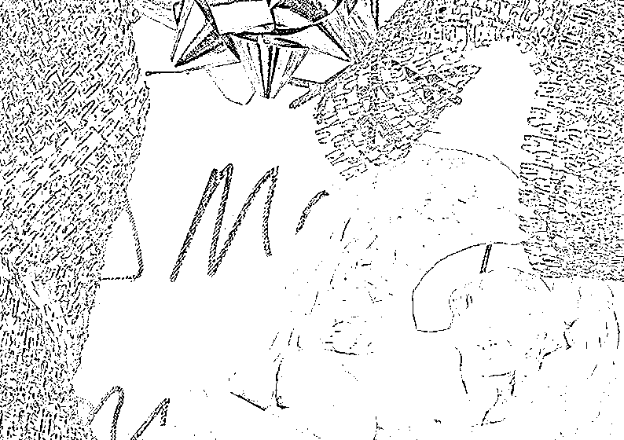**

**对金牛座的负面评价**

**关键词：**自私、贪婪、反应迟缓、懒惰、顽固、不中用、占有欲、缺乏主动性。
恐惧之下的评判会削弱金牛座的享乐能力，阻碍他们创造丰裕的生活，还会引发极端的惰性，导致他们无法享受生活的乐趣。
没有什么星座比金牛座更容易困在一成不变之中了！如果在他们的人生经验中，生活确实没有回报什么，要说服他们信任这种回报的话，的确太难了。**负面信息能通过各种方式强化“恐惧之下的评判”，**认识到这一点非常重要。对金牛座来说，这种评判常常附带着**“自私”或“贪婪”**的标签，如果此人成长于经济实力薄弱的家庭，这些标签也许产生于负罪感。或者，也可能来自惩罚之中。每当一个小孩拒绝与其他小孩分享玩具时，他的玩具就会被收走，并始终被斥责为“自私的坏小孩”，只是因为他想要保护或是抓住自己拥有的东西不放而已。更可怕的后果来自于虐待，**当孩子对自己身体的所有权遭到大人侵犯时，不管是暴力还是性虐待，都会严重破坏这个孩子未来享受愉悦的能力。**比如，有个带有两倍金牛座特质（指：太阳、月亮、上升中有两个位置都在金牛座）的客户回忆起，小时候妈妈常骂她：“自私又贪婪的猪！对什么都不会心存感激，什么也不配拥有！”当我们一起探索，是什么导致她信用卡欠债 9 万美元、濒临破产的边缘时，上述童年记忆浮现了出来。如此巨大的金额代表着心理的严重失衡，她负债消费的都是她“买不起的，或是买来后似乎能享用很久的东西”（引自客户档案）。对金牛座的批评性标签常见的还有**“懒惰、顽固、不中用”**等版本。就如上文所言，金牛座从容不迫的作风甚至可以让棘手的任务看起来变简单了，但这样的小孩也许会让父母失去耐心。这些父母醉心于把小孩培养成看上去勤奋积极的样子，如果小孩做不到，就做出**“反应迟缓”或“缺乏主动性”**的结论，也就是通俗的“懒惰”。早上穿衣上学不是什么需要争分夺秒冲到终点的比赛，父母催促得越快，金牛座小孩就更加倾向于拖拖拉拉，拒绝穿上材质不够柔软舒适的衣物，因此被贴上“顽固”的标签。“不中用”则是非常有害的标签，是对自我价值的直接攻击，为小孩日后不思上进埋下伏笔。因为“无用”的标签一旦在一个人的头脑中留下印记，他会下意识地暗示自己，**无论付出怎样的努力，最终还是什么都得不到的。****“占有欲”**是另一个典型的金牛租标签。我又要开始讨论失衡的行为了。一点点“占有欲”是健康、正常的金牛座特质，但金牛座和其他固定星座（狮子座、天蝎座、水瓶座）一样，都容易变得**“固着”**。金牛座的“固着”表现在**“所有权”**上——“她是我的！”或者“他属于我！”这种对所有权的宣示可能会变得极端。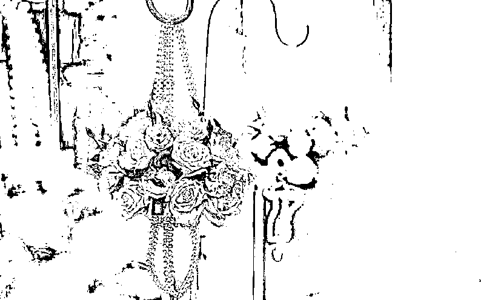我的客户中有位金牛座男性，在跟妻子离婚后，还持续数年跟她睡在一起——金牛座放手很慢。然而，极端的占有欲通常产生于早年得到的评判。我的一位月亮金牛座的客户曾回忆起小时候，晚上，当他在母亲床边逗留太久，父亲就会被激怒。他说，当父亲抓住他时，他紧紧抓住被子，而母亲则对父亲尖叫，让他把儿子放下，然后他被父亲拽着，连带着被子什么的，被拖回到自己的房间。“我还能听到爸爸在耳边吼着：‘这才是你的房间！’他一边说一边狠狠把我摔到床上，再‘砰’地把门甩上。”“这孩子一定哪里不对劲！”他听爸爸这么说过很多次。后来父母离婚的时候，他才 9 岁。这位客户说，他当时无比确信，是自己导致了父母的婚姻破碎。这位客户首次来我这里咨询的时候，正在为一段两年恋情的结束痛苦挣扎。“我越是努力不要产生占有欲，占有欲就变得越强！”在一次咨询中，他大声喊出这句话。渐渐地，他开始认识到，对父母离婚这件事的内疚感强化了他对于占有欲的负面评判，这种评判进而又不断地给他和女友的关系带来负面影响。当他学会不带“评判”地“承认”自己对占有欲的感觉时，他的焦虑变少了。更棒的是，一年之后，他遇到了在相处中“没人能像她那样让我放松”的人。现在，他俩的婚姻已经持续了 18 年，有一个儿子和一个女儿。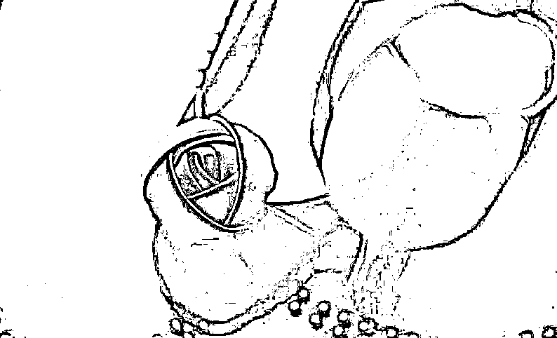**你可以改变根深蒂固的自我设定**

改变并不简单，但绝对值得！得到的回报将是一个更有乐趣、更丰富的人生，能用轻松的心态感激生命中所有美好的事物。毕竟，**金牛座生来就比其他星座有更强的享受舒适的能力，尤其是触觉、味觉、嗅觉等感官体验。**

**金牛座总是表现得轻松沉着，他们的行为鼓励他人将自己视作依靠。**当人们说，他们想要一个强大有力的依靠时，指的就是金牛座这种人，尤其是当他们再加上一句：“噢，还要性感！”金牛座的感官特质就像在说：“我不着急。我们应该花些时间享受这一切。”舒适对你来说十分重要。事实上，**舒适指引着你的感官，让金牛座可以感知什么是有价值的，什么是没有价值的！**但是，如果有人因为金牛座被动的外在表现而错误地认为他们容易任人摆布，这些人一定会大吃一惊！在不想动的时候，哪怕试图推动半步，金牛座都会岿然不动！没有任何星座比他们更顽固，更抗拒改变。这仅仅是因为不想去做那些觉得没什么价值的事情，尤其是在已经感觉很舒适的时候！除非有相当大的机会能获得回报或收益，否则为什么要离开那把舒服的椅子呢？金牛座的肢体语言是不慌不忙、平静温和的。在运动中，他们可以看似轻松地完成艰难的壮举。看到李连杰在电影中展现出的高超武技，那些能力稍逊的人也想试一试，结果发现自己根本做不到。这种表面的轻松是建立在一个强有力的“核心”基础之上。大师们教授的，**根植于身体更深处的“气”**是武术的精要，也是金牛座的天性。这种根基更强的力量是金牛座力量的核心。**即使是金牛座著名的“耐力”也部分归功于其对精力的合理分配，不浪费，才能有更多的能量储备。**

人们无法预计金牛座的财富收入数字后有多少个零，这一点取决于他们的“舒适区”。金牛座以贪婪闻名，一些人甚至因此招来指责，比如煤炭巨富邢利斌花费 1500 万位女儿举办婚礼。但是这样的奢侈——如果是真的话，并不是典型的金牛座作风。

金牛座是最重视物质舒适的星座，无论是新宝马车中的真皮座椅，还是最爱的老座椅上已经老旧磨损的柔软舒适的面料。同样，**金牛座能够敏锐感知有价值有品质的东西。****那些著名的金牛座人士**

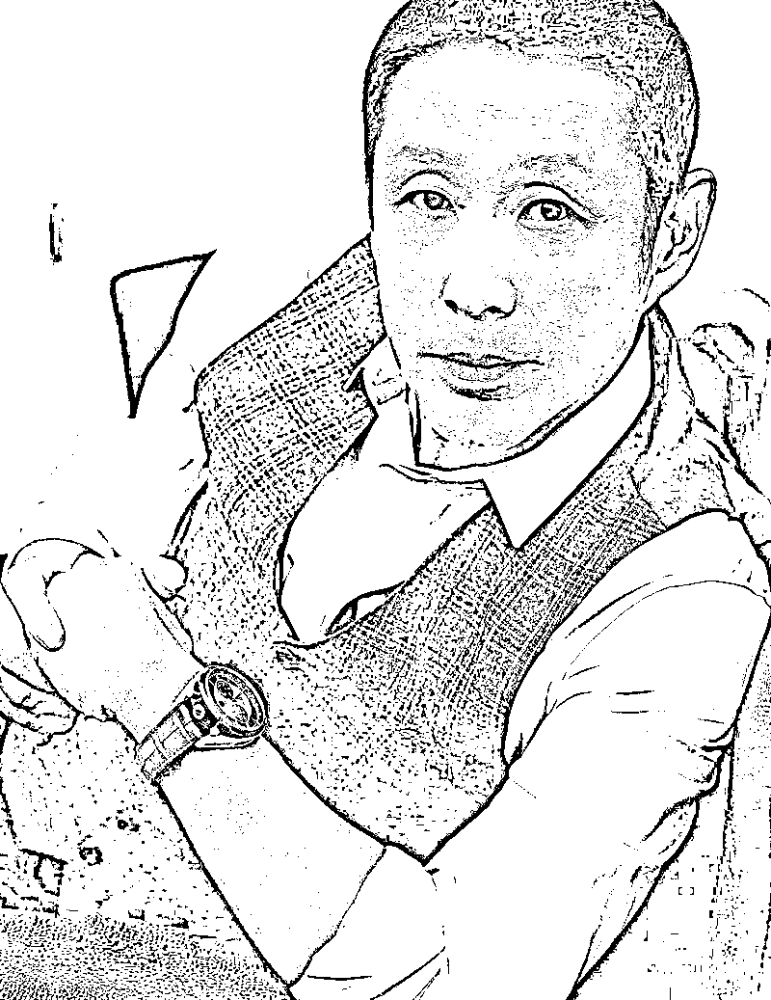

**▲演员陈道明**“事业”长青也是金牛座演员的标志，他被称作中国演艺界的皇帝，在各种各样的影视作品中熠熠生辉。

**▲香港演员周润发**周润发轻松惬意的表演方式，是典型的、金牛座自然悠闲的行事本性。

**▲英国足球明星大卫·贝克汉姆**力量和耐力是金牛座的标志，始终保持着外场球员出场的记录。当然，贝克汉姆将他帅气的外表和长久的职业生涯转化为了可观的财富，这常常是另一个金牛座的标志——吸金。**金牛座的事业和爱情**

**金牛座的爱情**

**关键词：**沉着冷静、精力充沛、自然真实、危机应对、占有欲、务实、顽固、抗拒改变、自私。

在爱情关系中，金牛座的积极特质是**在危机之中沉着冷静，在床上精力充沛持久，以及一种自然真实的魅力。**

得益于优秀的危机应对能力，让他们成为可以支撑关系长久下去的“坚强后盾”。他们面对的挑战是**占有欲**。他们认为自己“拥有”爱人，也就是说：“爱人属于金牛座”！**金牛座非常顽固，抗拒改变，可能表现出自私的行为。他们非常看重伴侣的身体特征和物质资产，这样务实的考虑影响着金牛座对关系问题的决策。**

**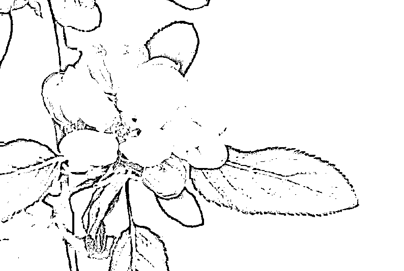**

**金牛座的事业**

**关键词：**敬业精神、直觉、可靠、稳定市场价值、消费者要求、坚持耐力、抗拒革新。

金牛座的决心会带来回报，至少他们会因为在任何情况下都坚持工作的敬业精神而获得奖励。因为对事物的价值有着良好的直觉，人们常常**仰赖金牛座做出有关资金的正确判断。****金融市场常常对他们有着巨大的吸引力，他们喜欢用可靠的方式赚钱。建筑、不动产、银行业、农产品或稳定的能源资源，比如煤炭，可以作为收入来源或职业。**即使从事创造性工作，金牛座依然会关注自己工作的市场价值。他们不会满足于成为一个“快饿死的艺术家”，会按照消费者的要求改变自己的创造性工作。一旦找到一种赚钱的好方法，他们就会坚持下去。**金牛座在商界耐力十足，他们的企业以长久屹立而令人刮目相看。**他们对改变的缓慢适应力会让自己处于危险之中，**在新的理念被证明具有实际价值之前，他们都会抗拒革新。**

**版权声明：**原创文章由作者授权发布于若道平台，欢迎转发，反对抄袭。友号转载请申请白名单。

****想阅读更多作者的文章，请在后台回复******大卫****** 即可。****

**喜欢文章请长按下方二维码打赏**

**给大卫老师加杯咖啡呗~**

**▼**

**系统学习占星学**

**点击图片了解详情**

**微信又双叒叕改版啦，不想错过若道君的推送？**

**就把若道设为星标吧！**

**▼**

喜欢记得点一下在看哦☟

****报名直达入口****

# 黄金市场会开始一轮持续上涨吗？丨雷蒙德·梅里曼 5 月黄金报告上线

> 原文：[`mp.weixin.qq.com/s?__biz=MzA5NjA0NTAxNg==&mid=2651443098&idx=2&sn=4a7479def28edc0c51308f066bf38727&chksm=8b4b7d2dbc3cf43b816767a2c382e18dfddcf3e74131c5c238a88c7ac54edeb2ada1420d3c10&scene=126&sessionid=1692737999#rd`](http://mp.weixin.qq.com/s?__biz=MzA5NjA0NTAxNg==&mid=2651443098&idx=2&sn=4a7479def28edc0c51308f066bf38727&chksm=8b4b7d2dbc3cf43b816767a2c382e18dfddcf3e74131c5c238a88c7ac54edeb2ada1420d3c10&scene=126&sessionid=1692737999#rd)

“**黄金是金钱。其他的只是信贷。**

**——约翰·皮尔庞特·摩根**

”

自上期报告发布以来，黄金价格已经下探了 3 月 8 日的低点 1673.30，并在 3 月 31 日跌至双底低点 1673.30，**这是自 2020 年 6 月 5 日以来的最低价格。**

**从这以后，黄金价格开始上升。**

| 黄金日线

| 黄金月线图

现在的问题是，1673.30 是否是 31.33 月周期的低点，**黄金是否已经开启一个新的上涨周期？**

**5 月黄金报告已经上线，**上证报告也会在月底前上线。欢迎了解。也可以按照季度和 1 年期订阅，有更多优惠。**季度和年度的好处是，你可以持续了解梅里曼老师对于不断在变化的市场的看法**。即便他某一次看法和市场不一致，你也看到在下一期他如何调整自己的看法，并看到金融占星在一个长期时间段内对你把控风险的帮助。而能够长期控制风险、尽量找到安全的投资时机才是投资的长久之计。

点击**阅读原文**，雷蒙德·梅里曼黄金周期 5 月报告带来有 40 年黄金市场研究经验的世界著名金融占星大师雷蒙德·梅里曼对当前黄金市场的研究。

投资有收益，投资有风险，希望这份金融占星学的研究帮助你更好地评估黄金投资。

**5 月黄金报告上线**

**黄金月度报告价格**

**单月报告**：280 元/月 

**季度套餐价格**：780 元（260 元/月）

**年度套餐价格**：2400 元（200 元/月）

**双报告年度套餐更优惠（直降 900 元）**

**12 个月黄金报告+12 个月上证指数报告：仅需 3900 元**

**长按下图识别二维码购买黄金报告**

▼

**购买者需知**

**① **梅里曼市场时机学院《中国上证指数月度研究报告》是梅里曼市场时机学院（以下简称 MMA）的研究“预报”，而不是市场“预测”，是梅里曼老师及 MMA 金融占星分析师对人类活动周期历史与行星周期之间相关性的研究，二者在大部分情况下具有 80%或更高的相关性，而不是因果关系。报告中的研究完全存在错误的可能性。即便是非常认真的研究和几十年的研究经验，金融占星师无法总是正确地解读出各种征象在实际层面上会如何相互作用，并显化为事件结果。所以请将报告看作一个研究参考，务必结合其他市场研究和你个人对市场的理解，根据你的自由意志做决策。**②** 此报告一旦售出，**即不接受退款。**

**③** 上证、黄金月度报告每月固定 1 期，**并非都是在每月相同日期发布。**

**④** **我们收到英文报告的当天，即发布该英文报告。3 天后，上线报告中文版。此报告仅支持手机网页阅读，不支持电脑阅读和下载。**

**以上须知，请仔细阅读。一旦付款，即视为已了解并接受所有须知内容。**在过去的 39 年中，唯有梅里曼逐渐完善，并在梅里曼市场时机学院月度周期报告中阐释了将地球宇宙学与周期相结合的研究方法，以惊人的精确性预报了黄金价格发生重大变化的时间。**黄金购买 Tip**各大银行均可购买黄金或黄金 EFT 基金，也可以在诸如天天基金或者支付宝购买黄金及黄金相关产品。不明白的可以百度搜索。**购买后如何查看报告？**

**购买后有疑问怎么办？**

请联系技术客服

**微信：nodoor201705**

**购买黄金+上证报告直达入口**

# 插班中丨择时择地占星学，助力“天时、地利、人和”

> 原文：[`mp.weixin.qq.com/s?__biz=MzA5NjA0NTAxNg==&mid=2651443098&idx=3&sn=36baa512e21da051857593f5d9a2da50&chksm=8b4b7d2dbc3cf43be01743af9857696a03cb5cf25697ab9430116fecf42de9f1d9ca4ce4b741&scene=126&sessionid=1692737999#rd`](http://mp.weixin.qq.com/s?__biz=MzA5NjA0NTAxNg==&mid=2651443098&idx=3&sn=36baa512e21da051857593f5d9a2da50&chksm=8b4b7d2dbc3cf43be01743af9857696a03cb5cf25697ab9430116fecf42de9f1d9ca4ce4b741&scene=126&sessionid=1692737999#rd)

1

**为什么要学习择时择地占星学？**

**择时择地占星学是占星学传统中的一个重要分支，也是占星师为客户提供的一个重要服务领域。**

宇宙天象在不停变化，就像潮汐一样。作为占星师的我们了解，每刻天象有不同意义。当我们有一个重要的事情要做，不论是企业选择开业、谈判、上市时间，还是个人选择面试、婚礼、手术、投资买卖时间，都好像选择在怎样的宇宙潮汐下开船。**适合的时刻就像孔明借到的“东风”，帮助我们顺风顺水，推动事情有个好开始及好的发展。**

同时，在国际化、地球村的今天，我们和客户都有了更大的可能性在全球范围内移动，开展一些重要的事情，而选择合适的地点也将有助于事情的开拓，并带来一些在本地无法实现的机会。

而最最重要的，在所有这些事件中，我们都需要考虑人的要素。一个精心挑选出来的时间和地点需要和当事人的星图契合。

因此，**择时择地占星学就是帮助我们及客户找到成功的三个关键要素——“天时、地利、人和”的一门重要占星技法。**

**拥有这门技法，可以迅速帮你扩展你的占星业务内容，特别是为服务高端客户带来更多可能。**

2

**课程大纲**

**此课程可作为 ISAR 选修课。**

**在这 10 节课的时间里，我们将以案例方式学习择时择地占星学的重要应用，包括但不限于：**

*   确定择时图的优先顺序，了解自己和客户的需求

*   了解当下的大趋势，认识可选择的时段内任意时刻的利弊

*   研究公司事务相关的择时，比如开业、产品上市、网站上市、谈判、诉讼、上市、收购、会议、重大活动等

*   研究和个人相关的择时，比如面试、考试、投资买卖、结婚登记和婚礼、手术（比如剖腹产、整容手术）等

*   介绍择地理论

*   用案例研究如何进行择地

**本课程讲主要使用案例讲解，并有作业和认证考试。**

**完成作业，且通过考试者将会获得择时择地占星学认证证书。**

3

**导师介绍**

**大卫·瑞雷（David Railey）**

在过去 50 年中，大卫·瑞雷老师一直不间断为其客户提供占星咨询服务。他们中有国会议员、奥斯卡获奖演员、市长、企业家、工程师、天文学工作者、运动员、艺术家、大型活动组织者、导演、编剧、建筑师、心理咨询师等来自各行各业的人士。他们的年龄跨度，上至 80 岁老人，下至 10 多岁的青少年，均是大卫·瑞雷老师的客户。有些更是祖孙三代都是他的客户。

在 50 年的咨询生涯中，大卫老师为很多客户提供了大量择时择地服务，帮助他们安排人生中的重大事务，也因此积累了很多择时择地案例。

在这难得的 10 节课中，他将告诉你，他 50 年来成功为客户进行择时择地服务的秘诀。

**大卫老师寄语：**

**如果你想要拥有长期客户的话，首先是要跟他们建立有信任的关系。你要跟这个人建立一种连接。因为那些会问你最多关于择时择地问题的客户，将会是你建立最紧密关系的客户。他们会慢慢信任你，你也能慢慢了解他们。**

以下是一位跟随了大卫老师 40 年的 70 多岁老客户 Caroline 给大卫老师的信，大卫老师在她 73 岁时为她的飞行考试进行择时。她写了这封信表达感谢，并同意刊登。

（向上滑动查看内容）

“Flying went just GREAT!  Thank you so much.  Thank you, thank you, thank you.

You picked it perfectly - weather turned out fine.  I am soooo Happy.  Just thrilled.“

“飞行棒极了。太感谢你了。谢谢你，谢谢你，谢谢你。你挑选的日子棒极了-天气特别好。我特别开心。真的太激动了。”

4

**授课时间和方式**

**授课时间（共 10 次课，每周二）：**

*   2021 年 4 月 6 日

*   2021 年 4 月 13 日

*   2021 年 4 月 20 日

*   2021 年 4 月 27 日

*   2021 年 5 月 4 日

*   2021 年 5 月 11 日

*   2021 年 5 月 18 日

*   2021 年 5 月 25 日

*   2021 年 6 月 1 日

*   2021 年 6 月 8 日

5

**授课方式**

**线上网络直播课，英文授课，中文翻译。**

6

**课程价格**

**价格：7500 元**

**特别优惠：**

**转发课宣至朋友圈，不分组，并写上走心的推荐语，即可获得 200 元优惠券！**

**（截图发给客服小姐姐领取）**

**往期学员复训：3750 元**

**往期学员参加认证考试：1000 元**

7

**退转课程**

*   **退款原则请详看《教学协议》，如有疑问请咨询课程顾问。**

****择时择地占星学网络课****

**授课老师：大卫·瑞雷**

**授课时间：**2021 年 4 月 6 日-6 月 8 日

**授课方式：****线上课程，英文授课，中文翻译**

**费用：7500****元**

**课程负责人：Maggie 老师**（微信：18510107057，请备注“择时择地占星”）

长按二维码添加课程负责人咨询~

****报名请点击“阅读原文”****

# 深度丨释放被困住的金星力量，去拥抱爱的狂喜

> 原文：[`mp.weixin.qq.com/s?__biz=MzA5NjA0NTAxNg==&mid=2651443015&idx=1&sn=0d896a2fcb9f05d54b5efbc0f898311b&chksm=8b4b7df0bc3cf4e6ea5a15183cea71e68e9c987fa28523bee52426bbcf8386537bd2cbc87c18&scene=126&sessionid=1692737999#rd`](http://mp.weixin.qq.com/s?__biz=MzA5NjA0NTAxNg==&mid=2651443015&idx=1&sn=0d896a2fcb9f05d54b5efbc0f898311b&chksm=8b4b7df0bc3cf4e6ea5a15183cea71e68e9c987fa28523bee52426bbcf8386537bd2cbc87c18&scene=126&sessionid=1692737999#rd)

******************☆ **************后台回复“今日”，给你一句生命态度****

作者/达比·科斯特洛

译者/李含 校对/Leisha

编辑/翀子 封面/书君 图片/网络

这篇关于金星的文章是即将在若道开设[【次限月亮课程】](http://mp.weixin.qq.com/s?__biz=MjM5MjQwNjAyMQ==&mid=2649438324&idx=2&sn=404299d09f0d1db8dde11c9ac1f3be44&chksm=beb9571e89cede08df0a363cb15c5a776274d849558fd76263f5e7e63bb76ddfe395ae28a03b&scene=21#wechat_redirect)（点击了解详情）的达比老师所写。在当今这个充满焦虑和过度忙碌的时代，我们可以通过追溯金星神明的原型、把维纳斯带出她的秘密花园，拥抱她“爱的狂喜”的世界。**消失的维纳斯**

在六世纪初，一位来自帕多瓦的主教为新郎新娘写了一首结婚诗。在这首诗中，丘比特去见他美丽的母亲维纳斯，在她郁郁葱葱的花园里，抱怨他们的‘旧帝国’已经消失，现在“冰冷的童贞”占据了整个世界。他告诉她，“起来！别睡了！”但她回答说，她还不会离开她的花园，“休息会让我们所有人变得更加强大。让众生知道，当没有人想到女神的时候，她的力量在壮大。”

在我们今天的世界里，驱使维纳斯进入她秘密花园的不是“冰冷的童贞”，而是我们持续的焦虑和非常过度的忙碌。也许，在这背后，失去的是过去对神和女神所代表的无形力量的尊敬。

今天，我们要求彼此和我们的父母、领导者来代表我们已经失去的神和女神。不仅人际关系会受到影响，我们人类享受快乐的能力也会受到影响，在这个美丽的世界中，我们能享受滋养灵魂的快乐。

**渴望事物变得不同，人们变得与众不同，我们自己变得与众不同，似乎是我们所处时代的一种疾病。**

在我作为占星师的咨询实践中，我试图理解自己和他人的集体痛苦感，并将其带入意识中，而不是被集体自由弥漫的焦虑所淹没，**这种焦虑通常会被投射到某个人、某个团体或某个社群身上。**我们身处这样一个不稳定、不断变化的世界，对芸芸众生来说，感觉是如此不安。

我和客户做的很多工作，都涉及到去发觉这些侵入我们生活中私密花园的痛苦、焦虑、忙碌、想法、图像和感觉。**我们是否注意到金星的馈赠，即她在我们的星图上所展现的美？我们是否能从个人的角度认同金星王国的维度，从而在我们自己的生活以及我们周围的世界中带来更多的快乐和美？**在这样一个充满困惑和痛苦的世界里，这是一件值得做的事情，还是一件自私的事情？

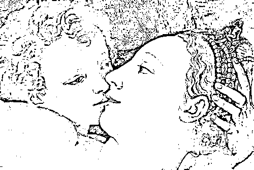

**溯源金星的神灵**

为了解决这些问题，**我们有必要回到与金星相关的神灵那里**——当现存的神灵仍然与行星相关的时候！四千年前，美索不达米亚人已经知道晨星和昏星是同一颗星。**在不同的时期，女神依南那和伊斯塔是这个行星的神灵。**

在人类早期历史的星辰传说中，这些女神是无比强大的，万物与众生都对她们做出了回应。**这首献给依南那的赞美诗已有 3000 多年的历史了：**

**在一天结束的时候，灿烂的星星，****弥漫在天空中的万丈光芒。**

**昏星小姐出现在天上。**

**世间众生皆抬头仰望她的身姿。**

赞美诗继续说，男人们洗净自身，女人们清洁自身；牛和羊以及草原，花园，果园，芦苇和树木，海洋和天堂的所有生物都响应了她的命令并尊敬她。老妇人为她准备了一场盛宴，然后：

**这位女士在这片土地上养精蓄锐。**

**苏美尔人非常快乐。**

**年轻人和心爱的人颠鸾倒凤。**

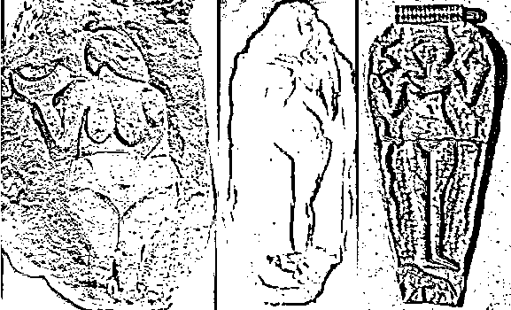

很久以后，在公元前 8 世纪，当赫西俄德写下《阿佛洛狄忒》时——**这位希腊爱情女神是我们占星学中金星最直接的原型**——他告诉我们，她出生于一场最残酷的谋杀：

她的父亲乌拉努斯在母亲盖亚的怂恿下被他的儿子克罗诺斯暴力肢解并杀害。当乌拉努斯断肢的泡沫从海面漂浮至岸边时，阿佛洛狄忒（“从泡沫中出生”）诞生了。然而，这个异常黑暗的开端却孕育了一件奇妙的事情：

白色泡沫包裹着不朽的肉体，里面孕育出了一个女孩……。女神走了出来，她可爱又令人敬畏。在人类和众神中，她的名字叫阿佛洛狄忒……爱神厄洛斯是她的伴侣；美好的欲望从一开始就跟随着她……。她得到了这份荣誉，也获得了这股力量：女孩温柔的喃喃自语、微笑、花招，甜蜜的欢乐、友善和魅力。

——赫西俄德《阿佛洛狄忒》

这位女神吸收了早期美索不达米亚星神灵依南那和伊斯塔的特征，甚至吸收了东方女神的特征，但在希腊，阿佛洛狄忒变成了一种独特的存在：

**她从大海的漩涡中升起，带着弑父的记忆泡沫，她不再是一种宇宙的力量，而是一种新的、特别的存在——“狂喜女神。”**

正是从这个时候起，通过阿佛洛狄忒，照亮了众生之间自然吸引力的美被赋予了形状、形式和自己的生命。希腊人用这种方式梳理宇宙的各个部分，使每一部分都有独特的性格和生命，**阿佛洛狄忒被分离出来，获得属于她自己的世界——爱的美丽时刻。**她体现了**“拥抱爱的狂喜”**。

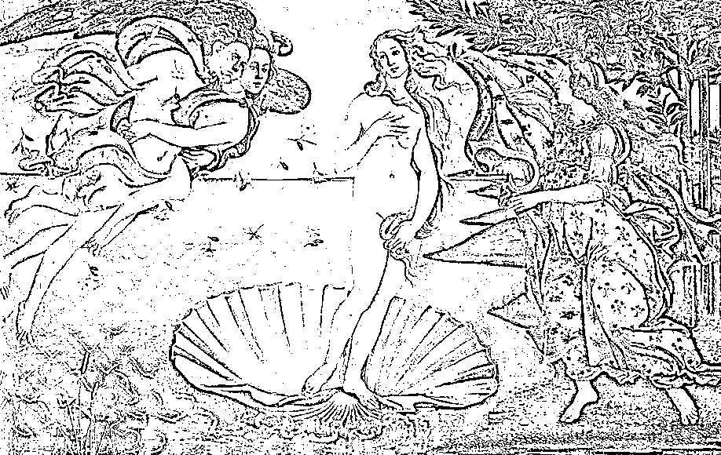

**永恒的快乐**

阿佛洛狄忒是一种永恒的快乐维度，当蕴藏潜在创造力的事物彼此相遇时，就会体验到这种快乐。众生因她而跃向对方。当两种生物（人类，牛，鱼，甚至植物）蕴藏创造潜力时，她就在那里。她的身影就藏在那些美好之中。**她就是快乐。**

几个世纪后，当希腊人正在开发新的复杂模式来理解宇宙的本质时，哲学家/诗人恩佩多克尔斯指出，**“爱”和“冲突”是创造的两个主要原则。**他讲述了大地如何锚定在“阿佛洛狄忒的完美港口”中，并与各种事物融合在一起，产生了血与肉。

他说，阿佛洛狄忒把火、土、风、水混合而成的所有凡人形象和颜色融合在一起。**这个阿佛洛狄忒是一位女王，她使人们产生爱的想法，使人们向往和平。**她被植入凡间，**被称为“欢乐”**，**阿佛洛狄忒用爱将万物联结****。**这是多么美妙的画面啊！

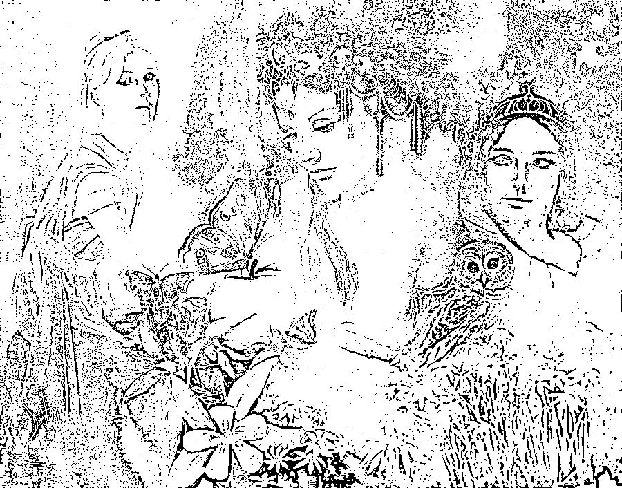

**这些快乐的时刻是转瞬即逝的**——就像晨星和昏星的美丽会在白昼开始和黑夜来临之前转瞬即逝。**希腊人认为这些短暂的美好时刻是神圣的，介于白天严酷的现实和夜晚黑暗的危险之间。**阿芙洛狄忒是这些奇迹时刻的化身，转瞬即逝，枯萎凋谢，除了在黄昏和黎明现身之外，甚至会长时间消失。**她是短暂的，转瞬即逝的——片刻的喜悦。**

**阿佛洛狄忒也与文明冲动有关。**当原始的冲动和情感被塑造成艺术时，她就在那里。**她不仅有生殖能力，而且还沉浸在创造本能的喜悦中；创造的再创造。**

几个世纪以来，她的世界以真正的希腊风格生动地表现在诗歌和戏剧中。从诗人荷马、索福克勒斯、埃斯库罗斯和尤里佩德斯那里，我们了解到了她可怕的一面。当她不受尊重时，我们听说过她可怕的复仇能力；当爱情出问题时，我们也知道那是多么可怕。

因为当美丽和快乐消失的时候，我们会遭受极大的痛苦，从柏拉图那里我们学到了如何将对物质美的渴望转变为对永恒美的渴望。后来，从罗马诗人那里，尤其是贺拉斯和奥维德那里，我们了解到当维纳斯从一段关系中消失时，可怕的悲伤所带来的痛苦。**爱与失去似乎是她的领域中固有的一部分。**

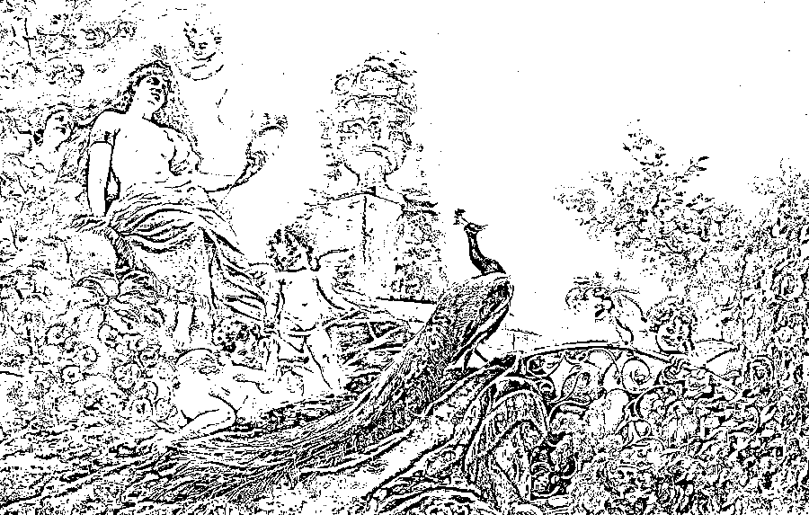

**躲在花园里的维纳斯**

两千年前，当比现代占星学更古老的占星学形成时，金星维纳斯保留了早期神话中神灵的特征，但她失去了她力量的完整魔力**。****她是“吉星”，但相对木星来说是“小吉星”**，而木星是“大吉星”。有时，当她是唯一守护星时，她被赋予了良善的强大力量，但她常常沦落到掌管爱情和化妆品的地步，大多数时候带来的麻烦多于快乐。

我们可能想知道这是否影响了我们几个世纪以来对爱、美和快乐的态度。**维纳斯现在似乎确实躲在她的花园里，尽管在中世纪和意大利文艺复兴时期，她确实显赫一时。**如果我们这些愿意的人能再次把她引诱出来，那该多好啊！如果我们能以这样一种方式来尊敬她，让她把她那无与伦比的美带进我们生活的中心，带进我们的占星学中，那该多好啊。

我们每个人都有办法培养她的天赋，使其持续一生。但我们真的想这么做吗？而且，**我们怎样才能发展出承担她天赋带来的损失的能力呢？**我们不再崇拜星星的神灵，但作为占星师，我们必须尊重每个行星所代表的维度。

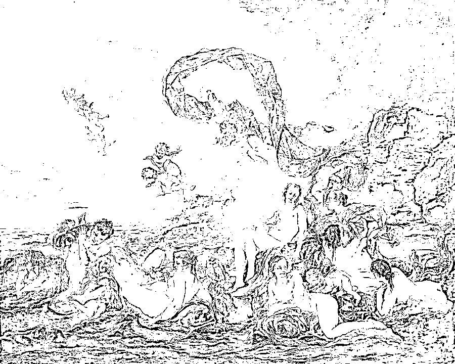

**尊敬金星意味着什么？**它意味着尊重生命中短暂的美；日出与日落；被剪下的花朵；失去的爱，逝去的美好。**要充分地接受她的礼物，就意味着要学会在我们所爱的事物消失时放手。**接纳他人和周围世界的美，意味着要面对我们经历过的种种失去，并学会如何等待另一个百花盛开的季节。

我们似乎处在一种越来越失控的文化中。我们中的许多人觉得自己是超个人力量的受害者，因为我们不再尊敬我们曾经相信主宰我们生活的神和女神——甚至是我们生命和决策的主宰者，我们感到无助。我们在 20 世纪长大，相信我们对自己的生活有自主权，而现在我们可能正在遭受这种信仰带来的一些损失。

**从 1989 年土星、天王星、海王星合相开始，一个新的社会原型诞生了，但新世界尚未成形。我们中的许多人正陷入伴随着所有转变而来的混乱和迷惘之中——而这一转变涉及到地球上的所有文化。**作为占星师，我们希望在这个混乱的文化过渡时期里给我们的客户和我们自己带来洞见和智慧（天王星在双鱼座与海王星在水瓶座互容——在这一段混乱的文化转变期，我们每个人的个性火花感到不知所措，淹没在深不可测的水域）。

**荣格是这样描述的：**

没有上帝作为锚定的人，不能用自己的资源来抵抗世界上物质和道德的诱惑。为此，他需要内在的、超然的经验的证据，只有这样才能保护他，否则他不可避免地会被淹没于大众之中。

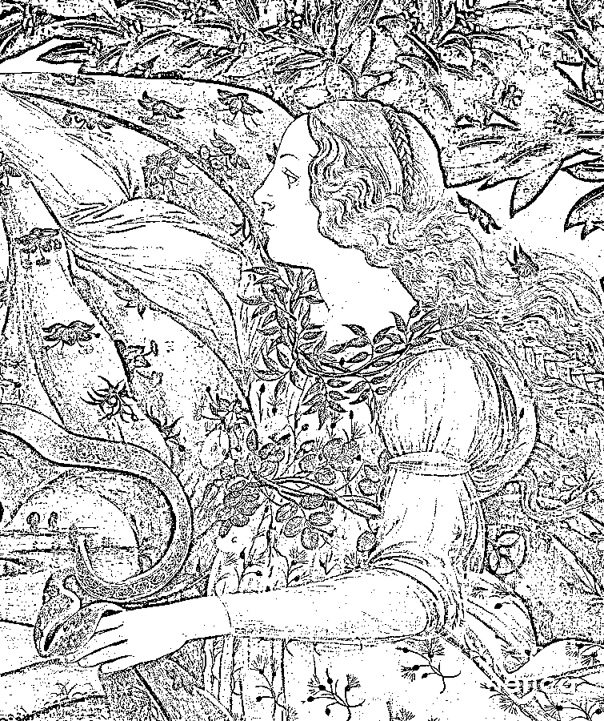

**把维纳斯带出花园**

失去自我的方式有很多，找回自我的方式也有很多。有很多方法可以体验到与永恒的联系，永恒是我们内心深处的神圣存在。有很多方法可以找到“内在的、超然的经验的证据”，这可以让我们回到创造的美与快乐中，使我们不枉此行。

对占星师来说，恢复金星的力量是其中一种方法。**借助探索我们星图中金星的位置以及推进和行进的情况，思考金星出现在我们生活中的位置，如何出现，在什么特定的条件下出现。**理解我们个人的接纳能力，理解我们认可生活中真善美的能力，可以把她从秘密花园中带出来，请进我们自己的花园中。

作为占星师，**我们可以在各自的星图中观察金星，目的是想办法把她带出秘密花园，进入灵魂的想象世界，这样我们每个人都可以找到自己通往那座花园的独特途径。**在混乱和焦虑之中，通过凝视我们的维纳斯，我们可能会花更多的时间与她在一起，在我们的生活中，她守护着我们灵魂在爱与美中享受快乐的能力；美稍纵即逝却又反复出现，永恒却又永远消失，一旦学会了如何失去，美就会再次出现。

我们如此去做会将恩典带给自己和周围的人：为世间带来无与伦比的快乐。在我们短暂而宝贵的生命中，还有什么比这更美好的吗？

****版权声明：**本文由若道翻译发布，欢迎转发，反对抄袭。友号转载请申请白名单。**

****

**达比·斯科特洛**

若道签约老师。在美国波士顿学习占星学，在非洲生活过 12 年，于 1983 年移居英国伦敦。她曾在长达 25 年的时间里担任心理占星中心的首席教师，是占星研究学院的任课教师，也是伦敦占星学院的客座导师。此外，她拥有“文化天文学与占星学”硕士学位。她在世界各地授课与写作，服务全球客户是她占星师生涯的核心。其著作包括《占星学中的月亮》《水元素与火元素》、《土元素与风元素》、《火星四重奏》、《占星学》。

**ISAR 选修课：次限月亮之旅**

**点击图片了解详情**

**微信又双叒叕改版啦，不想错过若道君的推送？**

**就把若道设为星标吧！**

**▼**

喜欢记得点一下在看哦☟

********报名直达入口********

# 雷蒙德·梅里曼金融占星周运 | 未来两周，意想不到的事情可能发生

> 原文：[`mp.weixin.qq.com/s?__biz=MzA5NjA0NTAxNg==&mid=2651443015&idx=2&sn=645157265d4877236dc045f0e04653e7&chksm=8b4b7df0bc3cf4e6028754a854b81b65dceadec8a64bc43714e60aa0c5725577ac557708586c&scene=126&sessionid=1692737999#rd`](http://mp.weixin.qq.com/s?__biz=MzA5NjA0NTAxNg==&mid=2651443015&idx=2&sn=645157265d4877236dc045f0e04653e7&chksm=8b4b7df0bc3cf4e6028754a854b81b65dceadec8a64bc43714e60aa0c5725577ac557708586c&scene=126&sessionid=1692737999#rd)

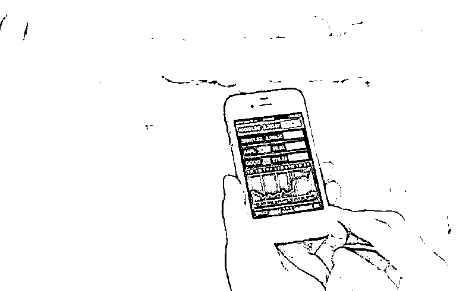

作者/雷蒙德·梅里曼 译者/Luke
编辑/玫瑰 图片/全景网

雷蒙德·梅里曼是在金融占星学界稳坐第一把交椅的占星师，同时他也是若道签约的金融占星课老师，我们引进了雷蒙德·梅里曼老师的《[上证指数月度报告](http://mp.weixin.qq.com/s?__biz=MzA5NjA0NTAxNg==&mid=2651441841&idx=2&sn=987355ccf64034dd39e5b4e654df44ad&chksm=8b4b7806bc3cf11091e91531ea2f92aa5882e396f4b482ee5e3fb43af102859d85bfbe772c41&scene=21#wechat_redirect)》及《[黄金报告](http://mp.weixin.qq.com/s?__biz=MzA5NjA0NTAxNg==&mid=2651441841&idx=2&sn=987355ccf64034dd39e5b4e654df44ad&chksm=8b4b7806bc3cf11091e91531ea2f92aa5882e396f4b482ee5e3fb43af102859d85bfbe772c41&scene=21#wechat_redirect)》《[2021 年金融预报](http://mp.weixin.qq.com/s?__biz=MzA5NjA0NTAxNg==&mid=2651436458&idx=3&sn=a7522c271761ef772fc91991ff11d965&chksm=8b4b071dbc3c8e0b452375ae3593028ab68b7b6157b45ee7c92943ff3396990d7748d7cd0967&scene=21#wechat_redirect)》。我们经老师的授权，将每周刊登梅里曼老师的周运，供大家参考和学习。于是，这是本周的周运（4.19-4.23）。

**说明：以下时间采用纽约证券交易所所在地美国东部标准时间。**

**展望与回顾**

**“我们遭受了难以置信的打击，但是看看我们复苏的速度有多快”，阿兰西奈说。“我们正处于复苏的早期，还有三到五年的路要走。我相信我们最终迎来的是繁荣。”这种繁荣可能产生令人不安的副作用。当 3 月份的数据周二发布时，以消费者物价指数来衡量的通货膨胀，预计将从 2 月份的 1.7%起大幅上涨。“这让人很难预测，因为我们从来没见过这样的情况，”西奈先生说。**

**——格温·吉尔福德和安东尼·德巴罗斯**

**《预测员准备迎接不明起飞》**

**《华尔街日报》**

**2021 年 4 月 12 日**

**恭喜那些想要更高通胀率的人。你们得到它了。美国从未在经济火热的情况下推行如此大规模的政府支出和货币扩张。美联储说等长期通货膨胀出现后再开始改变。祝你好运。**

**——《通胀来了，这是“暂时”的吗？》**

**《华尔街日报》社论版**

**2021 年 4 月 12 日**

**当人们踏上一条扭曲的道路，通向一个新型的错乱的美国梦时，一个时代开启了。这条道路不是建立在道德之上，而是建立在金钱之上。不是建立在个人自由之上，而是建立在个人放纵之上。不是建立在对未来的承诺，而是建立在对当下垂涎欲滴的贪婪之上。 **

**———格伦·斯托特**

**《虎妞和糖果小子》**

**爱德华·科斯纳发表在《华尔街日报》上的书评**

**2021 年 4 月 15 日**

美国和全球其他股票市场上周再次创下记录，因为这趟高速列车正在轰鸣着全速前进。人们的情绪越来越激动，因为源源不断的现金流和经济刺激不断地为火车加满了油。你可能会想这与太阳在白羊座有关。哎呀！是的！还有火星（白羊座的守护星）在双子座。在过去两个交易日里，这两颗火热的行星与木星三者之间形成了强有力的和谐相位。但到周一，当木星的积极影响开始减弱，太阳（和水星）进入更加稳定和谨慎的金牛座时，情况会开始变化。这就好像龟兔赛跑，白羊座是兔，金牛座是龟。有时后者也被亲切地称为“沙发土豆”，但当它开始努力工作或者发脾气的时，乌龟就变成了公牛，而你最好闪开。**这并不是说当太阳进入金牛座时股票价格会猛烈下跌。但它们上涨的节奏可能会变慢。**然而，这一回，“上涨”的步伐可能被打乱。因为**金牛座的守护星金星将与天王星合相。**天王星是个著名的捣乱者，可能导致任何有节奏的运动变得磕磕绊绊，或变成激烈的冲刺。**对于天王星，你永远不知道这将是一个突破（已经在向上突破），还是一个反转。**在它的影响下，市场绝不会像沙发土豆一样。看看本周谁将获胜是很有趣的：是具有地震性质的天王星，还是“愉快地在花园”漫步的金牛座金星？我认为未来两周，乌龟可能会经受些震动。因为**天王星无法抗拒打乱金牛座思想定式和创造一些混乱的诱惑。****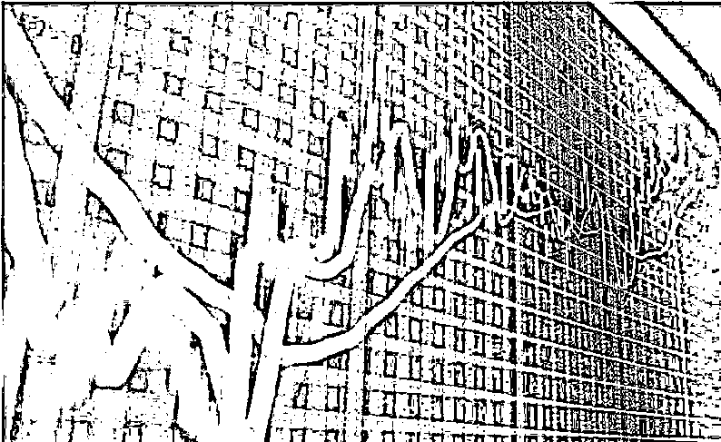****短期占星趋势和长期考量**

**美国国税局局长查尔斯·雷蒂格周二对立法者表示，由于错误、欺诈和缺少适当的执行手段，多达一万亿的联邦税款可能被拖欠。在 2019 财年，国税局收到了超过 3.5 万亿的税款。国税局认为，每增加 1 美元的执法费用，就可以增加 5 到 7 美元的额外税收。**

**——约翰·麦考密克**

**《国税局局长说每年可能有高达 1 万亿的未缴纳税收》**

**《华尔街日报》**

**2021 年 4 月 14 日**

啊，是的。每当立法者想从加税问题上转移注意力时，声称“真正问题”在于骗税者的文章就多起来了。这就好像，花费惊人数额的人民的税款，以及国家债务巨额的增加，永远跟立法者和他们的行为无关似的。这就好像他们真的相信，如果利率被人为地压低，债务就不会增加。尽管利率正处在历史上的低点，当前的支出却“相对”巨大，最终所有的开销仍需被偿还。这种将问题归咎为“骗税”的做法，仅仅转移了人们对立法者无穷无尽支出和国税局觊觎更大预算的注意力。与此同时，当天空中的冥王星被其他行进行星激活，这类的故事似乎总能成为全国性的头条新闻。上周就是如此，当时太阳和金星与摩羯座（政府）的冥王星（税收）形成渐盈四分相。随着 4 月 27 日月亮进入天蝎座，冰冷的冥王星开始转向逆行，这类话题很可能继续成为热点新闻。冥王星和天蝎座（其守护星座）与那些生命中所有能让你陷入麻烦的有趣事物有关：**死亡、赤字、债务、税收、还有（感谢上帝）性。**但让我们谈谈比税收和债务更有趣的话题吧：金融市场，比如货币市场，尤其是比特币那样的加密货币，占据了新闻的焦点。对于这个话题，我们切换到天王星，这颗与空间、科技和未来相关的行星。它正在经历为期 7 年的穿越金牛座之旅中（2018-2025 年），金牛座掌管货币。天王星掌管科技和电子方面的事物，但也和与其所落星座相关的经济和金融市场的“繁荣-衰退”周期有关。没有人能反驳这一事实，那就是比特币正处于“繁荣”周期。截至 2020 年 3 月 13 日，比特币的交易价格还不到 4000 美元。现在已经上涨了 15 倍以上，创下了 6 万美元以上的历史新高。许多“专家”叫价 10 万美元甚至更高，而各大央行（如中国和美国）都在研究如何创建国家数字货币。当然，加密货币最大的零售商 Coinbase 上周进行了声势浩大的首次公开募股。这都符合金星（金牛座的守护星，另一颗与“货币”相关的行星）合相天王星（电子）在金牛座（与金钱相关的星座）的征象，这一相位将在 4 月 22 日发生。在这以后，处于金牛座的太阳也将在 4 月 30 日合相天王星。这就是乌龟可能会经受震动的原因。一些金融占星师认为，比特币（和其他加密货币）的垂直上涨与行进的天王星三分比特币首次交易星图的太阳有关，比特币的首次交易发生在 2009 年 1 月 3 日。我认为这与天王星在金牛座的行进更有关，因为行进天王星所处的星座相关领域发生繁荣-衰退模式的案例很多。不幸的是，我们没有行进天王星三分比特币星图太阳的历史案例。目前是第一次成相。至于比特币是否会很快从“繁荣”走向“衰退”，两种分析方法认为这是有可能的。“衰退”的征象之一是行进天王星、海王星或冥王星与比特币诞生星图的金星或木星、可能还有土星，形成困难相位。行进的冥王星，生命的终结者和冥府摆渡者，将在 2023-2024 年合相比特币诞生星图的木星。天王星将在 2025-2026 年四分其金星。**比特币的上涨能持续那么久吗？可能不会。**比特币“诞生”于 2009 年，正处于全球股票市场崩溃和大衰退的高潮，当时土星对分天王星。**土星与天王星的困难相位也可被认为是“崩溃”的征象。**目前，土星-天王星的下一个四分之一阶段正在展开。这是渐亏的四分相阶段，将在 2021 年 2 月 17 日-12 月 24 日期间发生三次。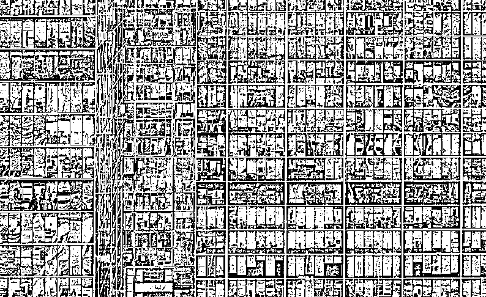有趣的是，行进海王星正在合相比特币诞生星图的天王星，对分土星。海王星是欣快的感受，显然对比特币来说，这是一段欣快的时光。但是土星-天王星的相位也可能对应剧烈的趋势改变。这可能会在一瞬间发生，体现为崩溃、黑客或电脑故障。所以，目前来看，比特币正处于欣快和动荡兼具的一年。甚至可能在明年，行进天王星三分比特币诞生星图的太阳之前，“繁荣”就已经准备好了变成“衰退”。享受这趟旅程。但永远不要忘记重力法则：任何上涨都会下跌，而且上涨得越高，下跌得越猛。这有点类似“骄傲”和“生命周期”的概念。这是那些对自己判断过于自信或吹嘘他们成功的人，可能会感受天王星震撼的时刻。从炖兔子和乌龟汤中我们学会了谦虚的教训。教授谦虚的最好老师就是市场。**接下来两周，期待意想不到的事情发生，就在一瞬间发生。**

**说明：以上日期基于纽约证券交易所所在的美国东部标准时间，由于存在时差，中国地区可能需要加一天。**

**版权声明：**本文由若道翻译发布，欢迎转发，反对抄袭。友号转载请申请白名单。

**雷蒙德·梅里曼（Raymond Merriman）**

若道签约老师。著名金融占星师，ISAR（国际占星研究协会）前主席，梅里曼市场分析公司的总裁。他由于“提升了占星学的职业形象”，在 1995 年国际占星大会上被授予轩辕十四奖；在 2012 年国际占星大会上，被授予轩辕十四终身成就奖。

1“中国上证指数月度报告”发售

**若道推出了****中文版****的雷蒙德·梅里曼中国上证指数月度报告，并持续发行该报告！**

当把金融市场的周期和占星学的周期相结合时，雷蒙德·梅里曼老师的金融占星学研究**为投资者应对金融市场的周期波动，并随之调整投资策略提供了极大的价值参考**。

**4 月中英文报告已上线！**

2“黄金价格周期月度报告”发售

**若道推出****中文版****的雷蒙德·梅里曼黄金价格周期月度报告！**不仅仅为广大读者在中国股市的投资出谋划策，更将视角放眼黄金市场。

**每当世界经济形式不明朗的时候，有一个地方是保值的港湾，那就是****黄金**。自 1982 年雷蒙德·梅里曼出版第一本研究《地球宇宙学征象与黄金价格的关联》的著作以来，**他一直作为最重要的黄金市场时机预测者之一享誉国际**。4 月黄金报告已上线，梅里曼老师将会告诉你他对这个关键时期如何操作的想法。也可以按照季度和一年期订阅，有更多优惠。季度和年度的好处是，你可以持续了解梅里曼老师对于不断在变化的市场的看法。即便他某一次看法和市场不一致，你也看到在下一期他如何调整自己的看法，并看到金融占星在一个长期时间段内对你把控风险的帮助。而能够长期控制风险、尽量找到安全的投资时机才是投资的长久之计。

**4 月中英文报告已上线！**

**购买套餐**，买得越多越优惠

中国上证指数月度报告套餐价

*   **单月报告**：280 元

*   **3 个月套餐**：780 元（260 元/月）

*   **12 个月套餐价**：2400 元（200 元/月）

**长按下图识别二维码**

**购买金融报告****套餐**

**▼**

黄金周期月度报告优惠

*   **双报告年度套餐更优惠（直降 900 元）**
*   **12 个月黄金报告+12 个月上证指数报告：仅需 3900 元**

**长按下图识别二维码购买黄金报告套餐**

▼

**2021 年金融年报发售中**

**1976 年以来，由雷蒙德·梅里曼撰写的梅里曼市场时机学院每年一次的年度预报沙龙和每年一本的《年度预报》一直在应用占星学原理为投资者们服务，提供卓越洞见，从未间断。**过去两年，3 小时的年度预报讲座和长达 200 页左右对金融市场的分析报告，帮助许多若道读者做出正确的投资决策，降低了投资风险，并获得相当不菲的投资收益。在群星摩羯座的时候，我们和你一起提早规划自己今年的投资安排。2021 年年度预报发售中**2021 年金融年报价格**：1280 元**沙龙时间**：2021 年 1 月 9 日（视频已上线）**沙龙形式**：英文讲座，配有中文翻译**点击下图了解详情**

▼

**点击阅读原文购买金融报告**

# 白羊座新月后，大家都有什么体会呢？

> 原文：[`mp.weixin.qq.com/s?__biz=MzA5NjA0NTAxNg==&mid=2651442995&idx=1&sn=555c2140aa55030a79e82a99d4e37532&chksm=8b4b7d84bc3cf4923d40630253b62300f531184191a53fb6d9013be052755fa25ff70678a5eb&scene=126&sessionid=1692737999#rd`](http://mp.weixin.qq.com/s?__biz=MzA5NjA0NTAxNg==&mid=2651442995&idx=1&sn=555c2140aa55030a79e82a99d4e37532&chksm=8b4b7d84bc3cf4923d40630253b62300f531184191a53fb6d9013be052755fa25ff70678a5eb&scene=126&sessionid=1692737999#rd)

**2021 年 4 月 17 日天象：**

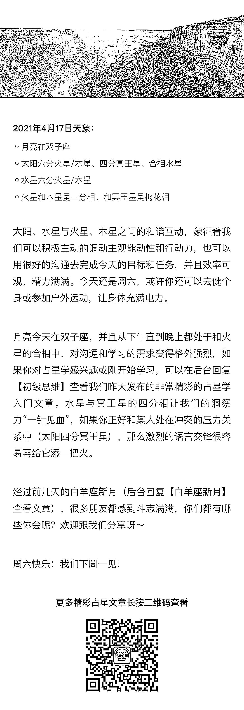

# 测试丨占星学初级思维，你是不是一个标准的占星入门学生？

> 原文：[`mp.weixin.qq.com/s?__biz=MzA5NjA0NTAxNg==&mid=2651442990&idx=1&sn=e70df6376f0c649760847559086601fe&chksm=8b4b7d99bc3cf48f45b21f2e48d534b889aedba5d14ee669b346cef5bc090132cc6af4fba52f&scene=126&sessionid=1692737999#rd`](http://mp.weixin.qq.com/s?__biz=MzA5NjA0NTAxNg==&mid=2651442990&idx=1&sn=e70df6376f0c649760847559086601fe&chksm=8b4b7d99bc3cf48f45b21f2e48d534b889aedba5d14ee669b346cef5bc090132cc6af4fba52f&scene=126&sessionid=1692737999#rd)

**☆ 后台回复“今日”，给你一句生命态度**

作者/比尔·赫布斯特 译者/Leisha 校对/江艺

编辑/翀子 图片/网络

对刚接触占星学的朋友们来说，星座、宫位、相位之间的关系总让人一头雾水，而这篇文章使用“火车”这一生动比喻，详细解释了这些基本的占星学概念，清晰厘清了这几个初学占星学时需要掌握的重要概念。当然，你也可以用这篇文章自检，看自己是否具备了占星学的初级思维~

刚开始学占星的人通常会先努力背熟不同象征元素（行星、星座、宫位、相位）的含义。这种做法总的来说没什么问题，但学习这些单独的部分并不能帮助学生理解星图是什么，以及星图的动态。

星图看似静止，实则不然。**星图只是定格的画面，其实一切都在活动中。**理解这些动态对于理解如何解读星图大有裨益。

要做到这一点，也许可以采用一种形象化的比喻。

想象你在离地面 2000 英尺的直升机上，然后想象你垂直往下看可以看到一条圆形的铁轨，铁轨被分为十二个不同的区域。把铁轨中间的地面想象成馅饼也许会有帮助，**我们将馅饼切成了十二块。**

铁轨上有一列火车，总共有十二节车厢：火车头、十节车厢和火车尾。火车刚好与铁轨一样长，因而火车头的前端会触碰到火车尾的末端。

**铁轨=宫位**

铁轨像是编了号的十二个宫位。当然，圆形的铁轨并不会移动，它就在那里，固定在地面上。**同样，宫位似乎也是固定在星图中的。**第一宫始终在左侧（或东侧），第七宫始终在右侧（或西侧）；第十宫正好在头顶，第四宫正好在脚下。

铁轨内部每一个饼状区域代表一个宫位。如果想要精美一点，我们可以想象用各种协调的配色方案来代表各个宫位或轨道区域的特质。

例如，我们可以用红色标记第一、五、九宫，用绿色标记第二、六、十宫，用黄色标记第三、七、十一宫，用蓝色标记第四、八、十二宫。或者，我们可以用粉蜡笔的不同颜色将元素特质与形态或四轴关系混合起来。不过，一切任由你自己想象，所以请随心所欲地发挥自己的想象力。

**现在，只需想像铁轨有十二个区域。**

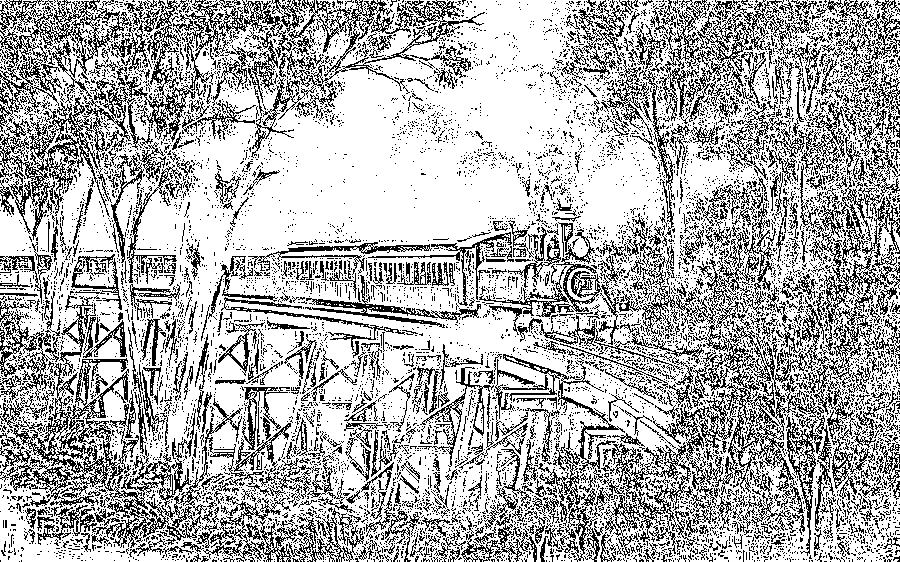

**火车=黄道及星座**火车的**十二节车厢**代表黄道及其**十二个星座**。**火车头是白羊座，火车尾是双鱼座。**火车不停地围绕铁轨行驶，但速度非常缓慢。这列火车只是一趟“慢车”，每天环绕整个轨道行驶一圈。

**这就是从我们的视角所看到的天空中发生的事：**由于地球绕地轴自转，我们在地球表面上体验到保持静止的状态，因此我们认为四周的天空在 24 小时内完整地旋转了一周。因此，太阳看起来会“升落”。

一些愚笨的批评者指责占星学不懂太阳系中的“客观”运行原理，暗指我们不懂是地球绕太阳转。这太傻了，**我们当然知道是地球绕太阳转，但这不是重点。**

**问题在于视角。**没人会谈论地球的“升落”，**我们说的是自己的主观体验——日升和日落。**在很大程度上，出生星图占星学是一门**以人为本**的学科。我们试图透过个体人生的镜头来象征性地理解宇宙，因此我们选用某个人的独特视角。理应如此。

公平地说，占星学的确也为希望从太阳的角度看问题的人提供了以太阳为中心的星图，但日心星图完全要另当别论。

**从我们的视角看，黄道火车每天绕宫位轨道行驶一周。**一般情况下，每节车厢（星座）行驶经过特定的轨道区域（宫位）需要两小时左右，但时长不一，因为火车行驶的速度并不恒定，会随着逐渐加速和减速而波动。

所以，想象火车在每天绕行轨道的过程中时而加速时而减速。（写给对技术感兴趣的人，这种现象在占星学中被称为“长短上升星座”，但目前而言，只需要考虑火车每天绕行轨道一周。）

好的，接下来我们加入行星，这个比喻将变得越来越有趣。

**乘客=行星**

**行星像火车上的乘客。**车上有多少位乘客？**传统占星学使用十颗星体**（被称作“发光体”的太阳和月亮，以及八颗主要行星）。自 20 世纪 70 年代以来，科学家已在太阳系中发现了数千颗星体，因此，现在有其他许多具有象征意义的乘客可供占星师添加到火车中，如小行星、彗星等。

一些占星师的星图中遍布许多乘客，而另一些占星师偏好坚持只使用主要的星体。我本人在星图中使用十一颗星体：十颗标准行星，外加一颗凯龙星。

**无论我们使用多少位乘客，他们都会在车厢中缓缓移动，**非常缓慢地换座位，一节车厢的座位换完后移动至下一节车厢。他们在车厢中向后移动，从火车头移动至火车尾，然后再这样转圈，**移动方向与火车在铁轨上的行驶方向相反。**

换言之，火车每天在轨道上顺时针绕行一周，乘客则更为缓慢地逆时针穿行于火车车厢之中。所有乘客都会依次穿过每节车厢，速度各不相同。实际上，他们穿行车厢的速度大为不同。

**例如，月亮是运行速度最快的星体，**在占星学中类似于一个坐不住的孩童，从一个座位跳到另一个座位，每两天半就会换一节车厢，或者说火车在轨道上每绕行两圈半，月亮就会换车厢。**月亮需要一个月的时间（或火车绕行轨道约 28 圈）就能穿过整列火车的所有十二节车厢。**（这就是所谓的“月份”，即月亮绕行天空一周的时长。）

速度标尺的另一头是冥王星，他像一位步履蹒跚的老人，走两步就得歇很长时间。当前，**冥王星需要约 13 年的时间才会换车厢**，意味着火车要完整地绕行轨道 5 千圈，冥王星才会进入下一节车厢。而且这对冥王星来说已经很快了，他在某些车厢中可以停留长达 22 年。总的来说，冥王星穿行经过整列火车的十二节车厢，火车已绕轨道行驶超过 9 万圈。

**由于冥王星先生的速度非常非常缓慢，因此他换车厢（星座）的时间点非常重要。**冥王星 1995 年进入名为“射手座”的车厢，要到 2008 年才会换进下一节车厢——摩羯座。

**关系=相位**

由于乘客以不同的速度穿过车厢，因此他们常常会擦肩而过。他们有时在同一节车厢中比邻而坐，有时望向窗外会看见另一位乘客正在圆形轨道对面的车厢中穿行。**每位乘客在车厢中穿行时互相形成的关系，代表行星在黄道上运行时互相形成的几何或角度关系。**

**这些关系叫做相位，凸显了行星间不断变化的能量联系。**

难怪星图如此复杂。

现在，想象所有这些动态同时发生。**一切都在不停地移动、变化、改变与其他事物的关系。**在特定的时刻，特定的乘客身处特定的车厢之中，特定的车厢在特定的轨道区域行驶，而乘客作为一个整体形成了千变万化的模式：他们有时全都挤在一起，有时分散开来，有时占据一半的车厢，另一半车厢空置。**变化形式无穷无尽，而且似乎永远不会出现完全重复的情况。**

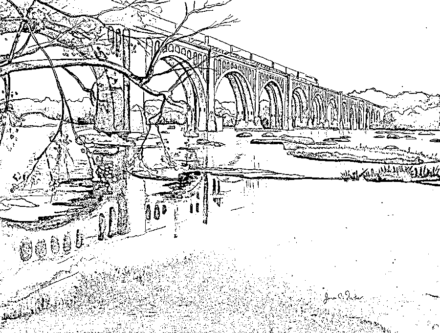

**抓拍一张照片**

如果我们从直升机上拍张照，**像截取时间碎片一样定格不同的动态，我们就会得到一张照片，**上面有火车、铁轨、乘客及乘客间的关系——**星座、宫位、行星和相位。**

用星历表和宫位表徒手绘制出生星图就像在暗室里冲印这张照片，几十年前的大多数占星师都是这样绘制星图的。我们曾必须费时费力地计算各种不同动态中的确切位置。不过，我们现在都用电脑绘制星图，相当于数码相机的即时快照。

**这就是星图的本质：从宇宙中的特定视角拍摄一张瞬间定格住复杂的天体动态及其关系的照片。**

**在出生星图占星学中，我们采用的视角是人类个体呼吸此生第一口空气，建立起肉身自主性和生命气息的节奏之时。**观察出生星图及分散于圆盘上的神秘符号，还有圆盘中各符号间的彩色线条，这是从特定婴儿出生时的视角准确展示不同星体动态配置的图表。

我们所观看的这个星图曼陀罗，是那个个体视角中的太阳系，**这是他/她独有的宇宙视角。我们要设法理解这个时空时刻的象征意义。**

学习星图的各种动态很简单，但很关键。如果你理解（自己的或别人的）出生星图真正展示的是什么，那么你就拥有了带着敬畏心和领悟力运用占星学的巨大起步优势。

**版权声明：**本文由若道翻译发布，欢迎转发，反对抄袭。友号转载请申请白名单。

比尔·赫布斯特

比尔·赫布斯特，1973 年起任全职占星师，完成了超过 1.2 万个占星咨询，大多是个体的一对一咨询，但也包括与夫妻、家庭和团体的一对多咨询。

**系统学习占星学**

**点击图片了解详情**

**微信又双叒叕改版啦，不想错过若道君的推送？**

**就把若道设为星标吧！**

**▼**

就是这个“在看”，戳一下☟

********报名直达入口********

# 深度｜心理占星学解读与传统星图解读有什么不同？

> 原文：[`mp.weixin.qq.com/s?__biz=MzA5NjA0NTAxNg==&mid=2651442990&idx=2&sn=f6e6f78155b63b18fc13b8b1bd8f7141&chksm=8b4b7d99bc3cf48f84e4cb79f888022232d4c3ef223463040024fda30b478abb1477e9844098&scene=126&sessionid=1692737999#rd`](http://mp.weixin.qq.com/s?__biz=MzA5NjA0NTAxNg==&mid=2651442990&idx=2&sn=f6e6f78155b63b18fc13b8b1bd8f7141&chksm=8b4b7d99bc3cf48f84e4cb79f888022232d4c3ef223463040024fda30b478abb1477e9844098&scene=126&sessionid=1692737999#rd)

作者/格伦·佩里

翻译/姬佳宇 校对/王宏、esme

编辑/翀子 图片/网络

心理占星学把星图看成进化的故事，是不断演进的生命剧本。通过出生星图上行星、星座和宫位的互动，我们可以写出不同的描述案主各个面向的故事段落，然后把它们组织起来，形成有逻辑和有解读顺序的故事情节。 

**把星图看作进化的故事**

**传统星图解读方法关注性格分析和事件预测**，把两者解读为相对固定的结果。而**心理占星学则将星图看成进化的故事，反映的是随时间演变而成长的过程。**性格分析和事件预测尽管仍然是诠释的内容，但却不再以固定的结果这种形式出现。相反地，**事件被诠释为完善个性发展这一过程的载体。**

随着性格的发展，人们对外在世界的诠释也会随之改变。升级和改进后的故事替代了之前较为局限的版本，这会带来愈发让人满意的体验，刚好反映了内在的演变。

实际上，**出生星图**是一部鲜活的档案，或**是生命剧本**，它可以被持续性地涂改和修正。我尤其喜欢“剧本”这个说法，因为它传达了故事的概念，以及已经书写下来的一系列说明，就好比“按照剧本来演”。

事实上，这就是我的观点：**出生星图既是讲述生命的故事，又是一系列对人生，即进化的指引。**

**在星图中，故事的所有元素都暗含其中。行星是内在与外在的角色，它们被特定的需求激发，有潜力完成一些特定的任务。**在努力达成目标的过程中，它们在不同的场景中扮演自己的角色，这些场景就是宫位；它们相互之间还发生互动，这些互动就是相位。冲突必然会出现，这在紧张相位上有所体现，之后的生活便会专注于化解紧张相位。

整体而言，**星图反映了角色构成和情节构成**；实际上，情节是角色的展开。这种展开的内在逻辑，是通过将行星连接起来的**一连串定位星**展示出来的，由此**揭示了人生的行为结构。**这种“过程结构”通常围绕着一个**核心问题：故事的主题或寓意，以及个人的人生目标。**

 这种**分析星图的方法**与心理学家所说的**叙事疗法**或者**个人神话**一脉相承。**叙事疗法认为，**通过故事比喻可以比“事物”比喻更好地理解人。事件分析方法是将性格概念化的传统方法，将人简化为静态的性格类型：外向的、边缘的、歇斯底里的，或只是九型人格中的某一个数字。

我个人厌恶将人分类，即使是使用占星学的方法将人简化为星座或者行星，比如，他是一个天蝎男，或者她是个海王星人。**类型学往往过于简化、**直来直去、过分简单、静态、具体化、病态化和缺乏人性。

**我认为以讲故事的方式描述一个人更为合适，**因为故事是复杂的、非病态化的，其间自有变化，象征着改变的过程，该过程可推进矛盾的解决并**促进性格成长。**

**占星学教导我们，性格不是简单和固定的。**相反地，人是复杂的，并因行运和推运而持续改变。**出生星图上的每颗行星都代表一个子人格或者一部分自我。**这些子人格可能随时间流逝而**不断变化**，只要付出足够努力，就可以逐步整合为一个或多或少完整的自我，这个完整的自我可以自由并开放地表达自身不同的部分。

人不单单是多重层面的，还有多重故事。**星座便可以展现出许多可能发生的故事。**个性（或者说故事）是由我们赋予经验的意义构筑而成的，该过程从婴儿时期开始，一直延续到成年时代。

**我们创造意义的能力源于自由意识，因此，****即使在星图上看到了在某种程度上命中注定的特定经历，人类仍然可以自由选择如何诠释。**

人们诠释自己经历的方法构成了世界概念和自我概念，两者相结合，就完成了生命故事或“剧本”。当人们愈发成熟，故事也随之完善。故事被编辑和修改，以称赞已发生的成长，并为新的成长准备好舞台。故事和人一样会进化。

实际上，**从经验中提炼的意义构成了故事。**因为许多构成经验的意义在童年时就已确定，因此构成了我们个人现实理论的基础，它们不可避免地是狭隘的、随意的和扭曲的。更糟的是，它们还可能是可怕的、虚伪的和自我限定的。

这些意义通常会预判，如果我们追求最基本的需求，不好的事情便会发生，并使得我们修改会带来痛苦的解决方法，而这些痛苦本来是那些解决方法所避免出现的。

不合适的信念和错误的观点像自身会应验的预言一样起作用。它们期望未来不经历苦难，然而，它们确实又带来了所有已知的苦难：贫困、孤独、耻辱、疏离、背叛、损失、失败、震惊和失望。**幸好****我们可以通过意识到这些僵化的内容，而对其进行修正，最好的办法就是分析个人的出生星图。**

**从星图中组织故事**

**行星、星座和宫位的互动构成了我们故事的每一个句子。各种语法规则被用于构成句子。**

例如，**在行为层面**，**火星在射手座第十宫**可以诠释为：“他开创了新理论，并由此开始了自己的事业”。**在经验层面，**这可以诠释为：“我的父亲是一个愤怒的人，特别是关于宗教和政治问题。他告诉我，当权者往往为一己私利和个人利益而制定法律。”当然，这只是对该格局众多可能解释中的两种。**要想精确解读，就必须与客户沟通，让他们一起组织意义。**

**通过整合行星、星座和宫位这些相关变量，**就有可能把与行星、星座、宫位相关的语句**组织成段落。**用一样的方法诠释每一颗行星，**我们可以写出大概十个段落，**这些段落都描述了相关个体**可能的行为和经历。** 然而，解读不会只依靠段落来完成。为了让读者充分理解，解读必须是统一的和连贯的。每个段落逻辑上都是相关的，因此组合在一起才能形成情节结构。**只有将故事看为整体，才能整理出情节。**

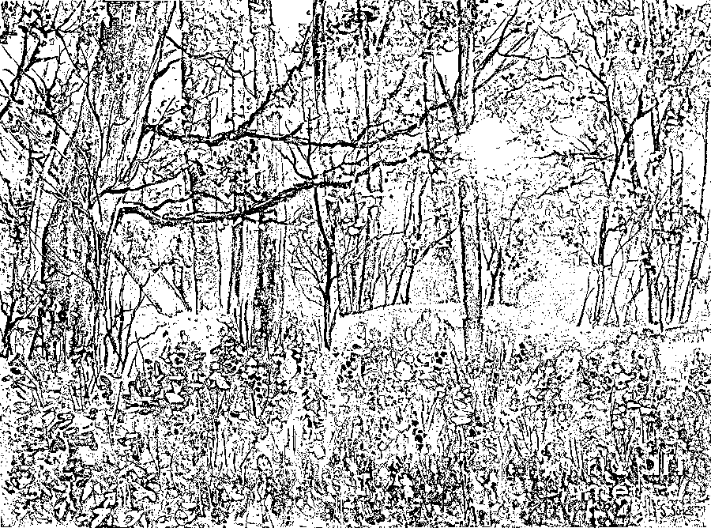

**星图的解读也是如此。**个人不是零散片断的简单集合，而是一个需求和功能密切关联的复杂网络。我们将这种解读星图的方法称为是协同的，其意思是**整体要大于各个部分的单纯相加。**

**通过星图构建故事的过程可以被概括如下：**

**行星**代表故事人物；**行星所掌管的星座**代表潜在动机；**行星所占据的星座**表示角色和行为模式；**行星所在的宫位**代表各种场景，为故事发生提供背景。

**行星相位和定位**揭示了星图的整体故事线索（情节）。**紧张相位**代表着象征叙述主题或冲突的不合时宜的想法。**最后，**定位星将星座、行星和宫位联系起来，形成一个连续流畅的整体，**揭示故事的框架结构以及解读顺序。**

**版权声明：**原创文章由若道翻译发布，欢迎转发，反对抄袭。友号转载请申请白名单。

**格伦·佩里**

若道签约老师，前 ISAR 董事会成员，共出版八本占星著作；心理/意识研究专业博士；占星心理学学院（Academy of AstroPsychology）的创办人；康涅狄格州研究生院（the Graduate Institute of Connecticut）原型宇宙学与意识进化项目的负责人。

**ISAR 选修课**

**咨询技巧全攻略**

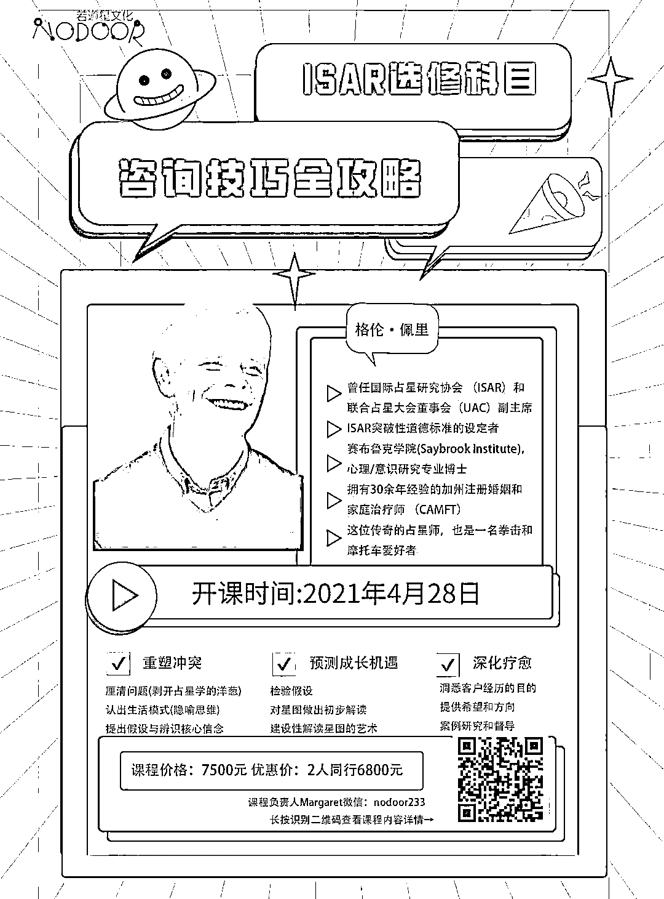

喜欢记得点一下在看哦☟

******报名直达入口******

# ISAR 选修丨心理占星大师格伦·佩里助你提升咨询技巧

> 原文：[`mp.weixin.qq.com/s?__biz=MzA5NjA0NTAxNg==&mid=2651442990&idx=3&sn=99db8c9b2797f741ea7de007b7067aab&chksm=8b4b7d99bc3cf48f4e88573d26a0fafb0a9e2fbe5decfc90594f8de744e4d26695840ef6c88c&scene=126&sessionid=1692737999#rd`](http://mp.weixin.qq.com/s?__biz=MzA5NjA0NTAxNg==&mid=2651442990&idx=3&sn=99db8c9b2797f741ea7de007b7067aab&chksm=8b4b7d99bc3cf48f4e88573d26a0fafb0a9e2fbe5decfc90594f8de744e4d26695840ef6c88c&scene=126&sessionid=1692737999#rd)

**1**

**课程描述**

格伦·佩里老师是被若道学员“考验”了六年的金牌讲师，浑身上下数不尽是优点，但最被学员和助教认可的两点：一是**太严谨了**，以最清晰的方式，将心理学和占星学两大领域融合为一。二是**太实用了**，恐怕再也没有第二人能像他一样，明白地告诉我们纵有满腹的占星学知识，究竟在实战咨询中该怎么使用出来。

**“对我来说，咨询就像是与一位美丽的女士共舞。这个活动的活力让我的头脑保持灵活、强大，而不断的学习只不过是为优雅的舞姿做准备 ，所以我绝不会踩到任何人的脚！****——格伦·佩里”**

**2**

**咨询技巧系列课程干货内容**

**即学即用的 ISAR 咨询考试定心丸****占星咨询技巧之初出茅庐 6 次课**在这个阶段的课程中，学员们将学习咨询技巧，比如如何选取一段经历，询问相关问题，提出假设，进行解读，重塑冲突，预测成长机遇，深化疗愈。我们会审视各种咨询理论，重点强调它们在占星学中的运用。学员们将学习如何处理危机，做出恰当的推荐引介。我们强调有效沟通的原则、聆听技巧、言语和非言语沟通，以及占星学如何帮助我们建立共情关系。我们会专门介绍伦理道德法则，因为它关系到职业责任问题、资质能力、咨询和预测。我们会特别关注占星师的阴影以及我们在自卑和膨胀问题上的集体脆弱。

**课程安排**

**第一课：导言与概述**

**第二课：确定咨询范围**

**第三课：会见客户**

**第四课：厘清问题（剥开占星学的洋葱）**

**第五课：认出生活模式（隐喻思维）**

**第六课：提出假设与辨识核心信念**

**占星咨询技巧之深入江湖 6 次课**

在这个阶段的课程中，参与者将继续学习咨询技巧，包括如何选取一段经历，询问相关问题，提出假设，进行解读，重塑冲突，预测成长机遇，深化疗愈。我们还将考察各种电影，考察它们与理解人们寻求帮助的共同议题的关系。我们会审视各种咨询理论，着重强调它们在占星学中的运用。学员们会学到如何处理危机，做出恰当的推荐引介。

我们会强调有效沟通的原则，以及聆听技巧、言语和非言语沟通，以及占星学如何帮助我们建立共情关系。我们会专门介绍伦理道德法则，因为它关系到职业责任问题、资质能力、咨询、预测和古代术语的运用。

**课程安排**

**第一课：检验假设**

**第二课：对星图做出初步解读**

**第三课：建设性解读星图的艺术**

**第四课：洞悉客户经历的目的**

**第五课：提供希望和方向**

**第六课：案例研究和督导**

**3**

**适合人群**

**·** 2021-2022 年准备考 ISAR 认证考试的人**·** 若道核心课 L3 以上的学员**·** 非若道核心课学员 但具备占星实战咨询的理论基础**·** 已是占星咨询从业者 但对咨询中的说话技巧不够满意**·** 厌倦了抬不起头的“野路子”聊占星，想立即加入“学院派”阵营做咨询

**4**

**课程收益** 

**· **搞定占星咨询界的“社交礼仪”**· **是心理占星学版的《好好说话》和《情商课》**· **教学风格相当学术、严谨、深入浅出**· **是任何人都能即学即用的咨询技巧**· **也是 ISAR 咨询考试的入场票和定心丸 

**5**

**学员福利**

**· **跟大师一起“看电影” 考察人类共同议题**· **格伦老师男神的颜值、萌帅的笑容**· **享受他“比脸更迷人”的嗓音**· **意外在别人的案例里疗愈了自己的创伤**· **任何一对一的谈话都比以往更自信

**“当我们这些老教师还在的时候，好好珍惜，我们愿意和你们分享与客户工作的毕生经验。我们很高兴为你们提供这些知识，我们很期待看到你们在线，或是出现在若道的教室中。格伦运用自己的学术背景，同时还有作为家庭疗愈师和职业占星师的 35 年丰富经验，来创造了一门非凡的课程，一门如果存在于 30 年前，我会毫不犹豫参加的课程。****——大卫·瑞雷”****诚实的若道君友情提示**报名 204-205 网络课，以及咨询技巧大师案例演示工作坊，只能帮你大幅度提升 ISAR 咨询考试的通过率，可不是百分百过考哦。毕竟师傅领进门修行在个人，若道君可以百分百承诺的是，如果你真的学习了此次占星咨询技巧课程，受益绝对是可以持续终身的。

**6**

**导师简介**

**格伦·佩里(Glenn Perry)**这位传奇的占星师，也是一名拳击和摩托车爱好者。他毕业于赛布鲁克学院（Saybrook Institute），是心理/意识研究专业博士，也是拥有 30 余年经验的加州注册婚姻和家庭治疗师 （CAMFT）。他曾任国际占星研究协会 （ISAR）以及联合占星大会董事会（UAC）副主席，也是 ISAR 突破性道德标准的设定者。

**7**

**课程价格**

**课程价格：**7500 元**优惠价：**2 人同行 6800 元**退款原则请详看《教学协议》，如有疑问请咨询课程顾问。**

**8**

**开课时间**

**4 月 28 日-8 月 11 日（每周三）20:00-22:00**网络课程，12 次课英文授课，中文翻译

**9**

**退转课程**

  退款原则请详看《教学协议》，如有疑问请咨询课程顾问。

****咨询技巧全攻略****

**授课老师：格伦·佩里**

**授课时间：****4 月 28 日（周三）20:00-22:00**

**授课方式：**网络课程：英文授课，中文翻译

**费用：7500 元 ****优惠价：2 人同行 6800 元**

**课程负责人：Margaret（微信号：nodoor233）**请备注“咨询技巧”

长按二维码添加课程负责人咨询~

****报名请点击“阅读原文”****

# 具有怎样的特质，才会让 12 星座自动眼冒小星星？

> 原文：[`mp.weixin.qq.com/s?__biz=MzA5NjA0NTAxNg==&mid=2651442957&idx=1&sn=178bb55b00db26c11735c3781209cbd2&chksm=8b4b7dbabc3cf4ac87b6f8e086c87a5cc942bb95f9dbebf82c29056ed973b47486dd2fa55ffd&scene=126&sessionid=1692737999#rd`](http://mp.weixin.qq.com/s?__biz=MzA5NjA0NTAxNg==&mid=2651442957&idx=1&sn=178bb55b00db26c11735c3781209cbd2&chksm=8b4b7dbabc3cf4ac87b6f8e086c87a5cc942bb95f9dbebf82c29056ed973b47486dd2fa55ffd&scene=126&sessionid=1692737999#rd)

******************************☆ **************后台****************************回复“今日”，给你一句生命态度****************作者/聆宇 Cora ISAR 认证占星师

编辑/翀子 封面/书君 图片/网络

在 12 星座的眼里，哪些人会自带光环并吸引他们的注意力？本文将 12 星座的特点和他们欣赏的类型，描绘得生动又具体。1 白羊座

**白羊座是个人英雄主义者，**在他们眼中，勇敢无畏的人都自带光环。他们最看不上的就是怂包，最欣赏的是那些勇于追逐自己的渴望，有行动力的人。本质上，他们崇敬火星能量。**面对挑战，不服输不低头，**仰着脖子正面刚，会让他们觉得魅力非凡。

**白羊座的原型是战士**，他们也欣赏战士。逃兵不在此列，他们欣赏的是“能打”的人。那些体格超能的男人或女人，常常能够吸引他们的注意。他们并不是喜欢健壮的肌肉，而是在集体潜意识里，体格的强壮与“攻击力强”存在原始的关联。

无论是多么不爱运动的白羊座，看到那些在运动场上挥汗搏命的人，也会感到热血沸腾。潜意识里，他们可能觉得用拳头解决问题是最有效的；**在现代社会生活中，这可能表现为快速、直接的攻击，明确追求自己想要的东西，并愿意为此克服任何挑战。**

白羊座会被“第一名”折服，第一名并不特指比赛的冠军，它还有一层意思是，“冲在最前面的人”。白羊座当然想要赢，但那跟狮子座想要站在“C 位”受人瞩目的荣耀感不同，和摩羯座希望凭能力树立权威、有所成就的自重也不同。**他们想要当“第一”的心理特别简单，只是单纯地——不喜欢有任何东西挡在自己和自己的目标之间，碍眼。**

**所以他们也会特别追求速度，喜欢干净利落、行事麻利的人。**拖泥带水黏黏糊糊的人，会让他们觉得烦透了。

2 金牛座

从外貌上来说，金牛座喜欢散发着健康的“自然美”的人，身体有点“肉感”，皮肤细腻透着微光，可以有点小麦色，因为那是阳光的印记。如同西方传统油画中，希腊神话里的健壮的男人，和丰腴的女人——**是那种看上去就活得饱满圆润的人。**

金牛座不爱折腾，**他们喜欢简单实在、稳定可靠的人。**从容淡定、举重若轻、泰山压顶而不乱的人，会获得他们的由衷赞叹。**他们渴望“岁月静好”的生活，**喜欢跟那些让他们感到宁静、放松的人待在一起。

金牛座**重视感官享受****，**他们也欣赏那些在物质生活上有品味的人。吃穿用度未必奢华，但要有品质。而对金牛座来说，**“有品质”常常意味着未经加工的天然，以及能带来感官上的舒适。**

所以他们会特别喜欢那些对物质的自然品质有敏感度的人，可能是做得一手好菜的美食达人，也可能是对茶、花、香、精油、木料、宝石等自然好物有鉴赏力的“生活家”，或者就是简单地比较“识货”，**很容易辨别出事物的真实价值的人。**

如果上面的都没有，但有钱，那也会管用——越多越好。**但仅仅有钱，却不会合理地使用金钱和享受金钱，金牛座也不会太喜欢。**

3 双子座

聪明，聪明，聪明，重要的事要说三遍！双子座无法忍受脑袋不灵光的人。因为**他们太需要头脑上的刺激，需要在智力上能够跟他们相匹敌的对手。**如果不够聪明，就要尽可能**有趣**，因为他们对愚钝和无聊的忍耐度极低。他们喜欢**新鲜好玩**的东西，**特别是在沟通交流中，**比如在微信聊天时使用一些搞笑小表情来生动、快速地表达某些微妙的含义。

双子座太需要有话聊，“最怕空气突然安静”，就是他们的心情写照。**他们欣赏懂得多、反应快、会说话的人。**如果你有丰富的信息渠道，总是能为他们提供一些重要的消息或八卦秘事，你会成为他们心中的 VIP！

**他们非常欣赏能为他们提供信息或建议的人，同时也希望自己的心声能够被听到，被理解。**所以当他们滔滔不绝时，你最好能够有来有往，get 到他们的点。否则他们可能很快在心里给你贴上“愚笨”的标签，迅速将注意力转移到别处。

双子座宝宝非常有好奇心，这也是他们会广泛接触各类信息的原因。**好奇心也驱动了学习，**双子座是以学习和模仿能力著称的，他们也会特别仰慕那些学习能力强的人，特别是语言方面的学习能力。

4 巨蟹座

巨蟹座喜欢情绪感受力强，能够敏感地体察到他人的情绪，能够关心照顾别人的人。**他们重视情感上的滋养，**这常常体现为**对“自家人”的照顾和保护。**身上有“母性”的人会吸引他们的注意，他们会本能地欣赏那些擅长照顾人或小动物，能将基础生活的衣食住行打理得舒适、安全的人。

**他们也喜欢有家庭意识、重视亲情的人。**哪怕是再追求自由与独立的巨蟹座，或是巨蟹座中的丁克们，**也会天然地被那些对家人用心、与家人亲近的行为所打动。**如果一个妈妈为了让自己的孩子不挨饿而去偷盗，那一定不会受到巨蟹座的谴责，他们可能会觉得有更好的方式，但面对这样的事他们第一时间肯定是理解大于评判——除非，被偷的是自己的孩子的东西。

**巨蟹座很需要安全感。**如果你是巨蟹座身边的人，那么获得他们青睐的很重要的一点是，你要在他们需要你的时候保持“在场”。在他们看来，满足需求，并且最好立刻满足，才是关系够铁的表现。这种需求可能只是在他们有烦心事想要倾诉的时候，静静听着；**重点不在于你做了什么，而是你为他们提供了情绪上的安全感。**

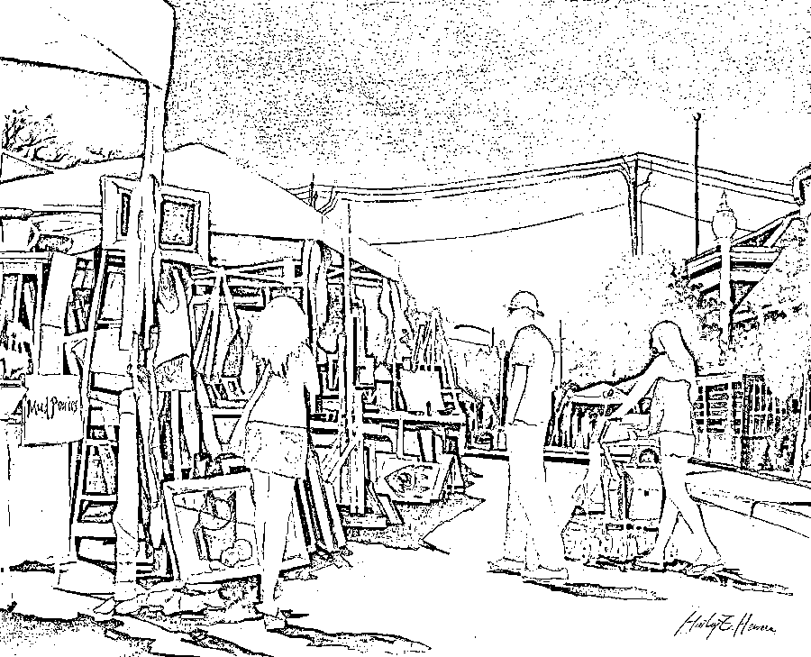

5 狮子座

**狮子座是王或女王。**“大女主”这种词汇简直就是为狮子座设计的。**他们享受被当成明星般的重视和优待，他们也喜欢“有光芒”的人。**能入狮子座法眼的，都不是等闲之辈，至少看上去不是。

他们喜欢“自带 BGM”、出场有气势、衣着打扮或行为表现带点戏剧性的人。懂点时尚，知道最高档的餐厅在哪，对名牌和奢侈品有一定见解，会去看最潮的演唱会会，常常是吸引狮子座关注的最简单的方式。

“王霸之气”这个词同样也非常狮子座，**狮子座喜欢带点霸气、有领导力的人**。但“一山难容二虎”，两只狮子在一起，常常会上演抢风头的戏码。**所以很多时候狮子座需要一些能够配合到他们的“自恋”的人，**毕竟国王需要臣民，明星需要崇拜者。

有些狮子座会比较贪玩，他们天生觉得**生命是一场庆祝**，开心最重要。所以，会玩，并且能和他们“玩到一起”，也是狮子座眼里重要的加分项。

6 处女座

**处女座是非常低调务实的星座，**就像某个男装广告词说的，“简约不简单”。**他们会被看起来低调谦逊，但有“内秀”、注重细节的人吸引。**在着装打扮上，处女座偏爱中性风的、设计简洁、颜色素淡的服饰，“格子衫”是很典型的处女座标配。

**处女座是完美主义的**。完美不是一个结果，完美是一个不断精进的过程。他们喜欢工作时**专注认真、就事论事**地解决问题、不断追求卓越的人。**他们也欣赏分析能力强、逻辑严谨的人。**

处女座是非常有要求的星座，但其实他们更想看到的，是一种态度。因为他们其实知道，绝对的完美是达不到的，但有了追求完美的态度和目标，就可以不断趋于完美。

处女座常常因为太过挑剔而被吐槽，其实会导致别人不满的，不是他们“指出问题”这件事本身，而是**他们太过关注他们眼中的问题，而没有考虑到他们的言行给别人带来的心理感受。**换句话说，他们太“就事论事”了。

所以，那些可以理解他们的良苦用心，也把注意力单纯地放到“解决问题”上，而不在情绪上闹别扭的人，会得到他们由衷的欣赏和感激。

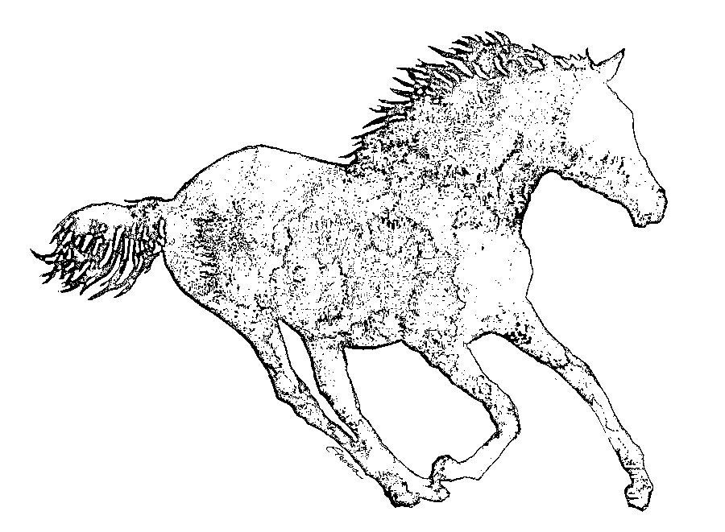

7 天秤座

希望天秤座看你顺眼吗，只要够美就可以了！如同金牛座对钱的热爱，**天秤座对美的热爱，是一种本能。**所有人都爱美，但天秤座会比其他星座更爱一点，“头可断，发型不能乱”说的就是他们了。

天秤座的审美口味是比较主流的，他们喜欢的人的形象，是那种大多数人第一眼看到都会觉得美或帅的类型，通常不会存在异议，但可能也没有很鲜明的特点。因为**天秤座十分重视“平衡”与“和谐”，**会导致两极化评价的人事物，不会是他们的首选。

天秤座重视颜值，但也不是只看颜。**他们欣赏的，是一个人整体散发出的美感，**这常常也包括举手投足间的优雅，行为举止的得体。所以天秤座也是很重视**礼貌和礼仪**的星座，做人做事要“体面”。

对形象的重视，反映了深层的社交需求。**天秤座是象征关系的星座，**是黄道十二星座中开启社会化功能的星座。**他们天生就有做“外交工作”的才能，**能够在复杂的人事环境中快速感知到不同人的立场和需要，是很好的调节者和润滑油。他们也喜欢这方面“开窍”的人，不识趣、没有眼力价，或没有合作精神的人，会让他们很反感——但他们也不会表现出来。

8 天蝎座

天蝎座容易吸引来相爱相杀、爱恨交织的关系，这是因为，无论是什么关系，但凡他们选择要跟一个人走得更近，就不可能不去深挖关系中那些危险复杂的主题。**所以天蝎座，会被带有危险气息、有些神秘的人吸引，**皆因他们骨子里就有刺穿幽暗的渴望。

而深入关系中的危险地带，恰恰是为了**锻造真正深刻的、牢不可破的关系。**这就是天蝎座的逻辑。如果我们看透了彼此的阴暗和弱点，依然能够选择携手向前；如果我们经历了大风大浪关系都还没散，那才说明这段关系是可信任的，是有价值的。

所以，天蝎座虽然**情感激烈，容易戳到别人的痛处，**但反过来说，他们自己也不介意被戳，因为如果能换来对关系中的真相的确认，那一切都是值得的。

说到底，天蝎座喜欢真实又勇敢的人，这点和同被火星守护的白羊座稍有相似。**他们可能会用危机和冲突来试探，看你是不是能“共患难”的人。**他们会逼你直面惨淡的人生，正视淋漓的鲜血。你说你不想看？那你们的关系就完了。不敢正视真相，不能穿越痛苦的人，无法真正走进天蝎座的心。

或者他们会选择一直“作”，直到要到他们想要的答案。粉饰出的美丽，不如真实的残酷黑暗——**他们是要真相的。**如果在疼痛中可以收获真实，也会让他们舒服。

其实说起来，天蝎座对一个人各方面的条条框框的要求可能是最少的，**因为他们真正想要的东西非常纯粹——是一种足以性命相托的灵魂感。**但这也是最难的。

在较为通俗的方面，他们喜欢性感、坚韧、有谋略的人。他们会被有权力和有资源的人吸引，因为**他们渴望价值的交换和能量的整合。**

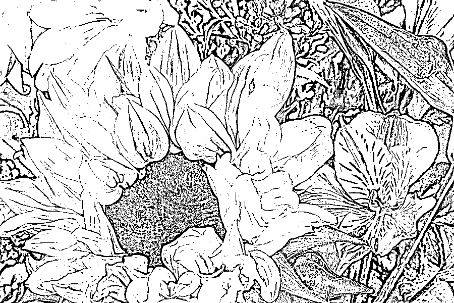

9 射手座

“天空飘来五个字儿，那都不是事儿。”这句话生动描绘了射手座的蜜汁乐观。如果说天蝎座看到的是“杯子里只剩半杯水”，那么射手座代表的就是“还有半杯呢……而且，其他地方肯定还有水，虽然我现在还不知道它在哪！”

射手座不喜欢沉重、苦情的角色，**他们天然会被那些积极乐观、充满天真的理想主义热忱的人吸引。**有**幽默感**也非常重要，因为幽默可以瓦解痛苦和限制，带来**开阔感**——哪怕那只是暂时的麻醉。

**射手座欣赏有智慧的人，重视对人生意义的探寻。**他们也容易被宗教人士吸引。

**追求智慧和成长，是他们重要的人生目标，**如果有人能在这方面引领他们，做他们的“老师”，他们会心甘情愿追随。所以射手座也非常重视精神共鸣，如果不能做他们的老师，就做他们的学生或同学（道友）吧。

射手座是天生的“传道者”，**他们非常乐意将自己认同的理念和价值观传递出去，来帮助到他人的成长。**只要你们在精神的道路上有交集，你就在他的朋友圈里占有了一个重要的位置。

在实际生活层面，**射手座热衷旅行、求学和探险。**如果你精通异域文化，或是在某些方面可以帮他们开阔眼界，射手座也会很愿意和你交朋友。

10 摩羯座

十二星座中，摩羯座可能是最崇尚强者的。摩羯座**强烈的成功欲**和**对社会阶层划分的敏感**，会让他们对社会层级中排位靠前的人有种本能的尊重和仰慕。

**简单说，他们喜欢成功人士。**“有多少钱”或许可以成为一个简单的衡量指标，但这不是最重要的。**摩羯座欣赏的，是凭专业能力在行业中受到尊重、树立了某种权威，获得相应的社会认同和“身份感”的成功者。**摩羯座需要被尊重，他们也希望别人通过自己的实力来赢得他们的尊重。

在公认的成功人士之外，**摩羯座喜欢敬业、勤奋、自律、负责、脚踏实地的人。**靠谱是特别重要的。能力强当然最好，能力不够也不要紧，但要诚实表达自己可以承担的范围，以及做出承诺就认真履行。摩羯座喜欢**信守承诺、有责任心**的人，这跟他们非常重视规则、有计划性有关。他们自己也是非常守信的人，并且认为责任是互相的。

外在打扮上，摩羯座可能比其他星座都更喜欢职业套装，他们喜欢看上去就很专业、干练、有效率的人。他们骨子里有种职场精英情结，**不管他们外在表现得多么随意、不修边幅，在他们内心，都有一部分渴望“出人头地”，并无时无刻不在以外人难以想象的严苛标准要求自己。**

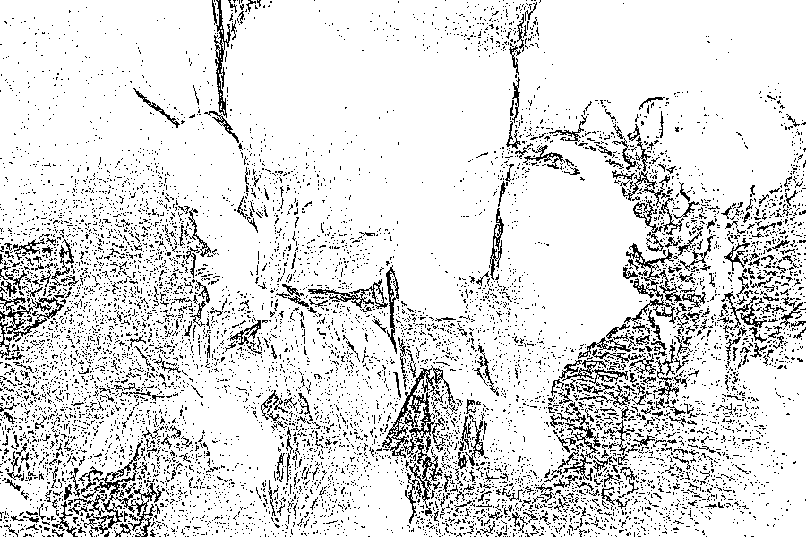

11 水瓶座

水瓶座喜欢“外星人”，这个地球人都知道。他们对于传统的、规范的、大部分人都认同的东西，总是怀着本能的质疑和反叛。**他们喜欢与众不同的人，会被身上有某种“边缘气质”的人吸引。**他们也很欣赏那些能够在集体狂热中冷眼旁观、以抽离客观的态度理性思考的人。

虽然水瓶座倡导自由平等博爱，但他们潜意识里可能有点**“精英情结”**，因为他们常常站在**社会改革家**的位置上来思考，很容易有“众人皆醉我独醒”的孤独感。这种孤独，是智力上的。

他们心里始终有一个**人道主义的宏观图景，有为群体带来改革和进步的意愿**，所以他们喜欢“公益”。能在这些方面跟他们产生碰撞，有共鸣或交流的人，在他们心中会有种“革命战友”的分量。要革命的人，可以没有亲人，但不能没有战友。

不是所有水瓶座都热衷于推动社会进步，但基本上，**他们都很重视在团体中的归属感，以及友谊。**对于水瓶座来说，朋友关系或许就是最好的关系。而比起生活上的照顾和情感上的陪伴，他们更珍视“志同道合”的精神交流。

彰显个性的外表，“酷酷的”神情或打扮，或许可以在第一时刻吸引一个水瓶座的目光，**但水瓶座喜欢的是真正的个性和思想的独立，而不是为了叛逆而叛逆。**

12 双鱼座

双鱼座有悲天悯人的情怀，也多少有拯救者情结，他们容易被敏感脆弱的人吸引。说句玩笑话，面对双鱼座，扮可怜，博同情，会迅速吸引他们的注意。**他们通常都充满爱心，容易被感动，对人间疾苦充满同情，渴望与无条件的爱的感觉融为一体。**他们经常被诟病的“没原则”、“暧昧”，跟他们太容易爱心泛滥、**缺乏界限感**有关。

同样，他们也喜欢有**包容心**、**善良慈悲**的人——或者说，佛系。那些真正能够放下小我，追求大爱，能够为他人的利益无私奉献的人，会令他们感动并心有向往。从事慈善活动的人会吸引他们的注意，尤其是那些跟“帮助弱小”、“救苦救难”相关的慈善事业。

**双鱼座喜欢带有“梦幻感”，能激发他们的想象力的人，**比如有艺术气质的人，从事创作工作的人。

因为这样的人可以帮助他们从庸常的世俗生活中走出来，去体验人类情感与想象力世界的丰富与无限。他们希望看到很多不同的可能性，这跟射手座有点像。**双鱼座是需要做梦的，他们需要的是能够跟他们一起在梦中徜徉的人，或是愿意帮助他们梦想成真的人。**如果你不理解双鱼座的梦，那么他们早晚会从你身边游开。

**版权声明：**原创文章由作者授权发布于若道平台，欢迎转发，反对抄袭。友号转载请申请白名单。

**聆宇 Cora**

ISAR 认证占星师（2014 年获得）

斯蒂芬·弗里斯特《变幻的天空》译者，大卫·瑞雷《一生的旅程》译者

全职占星师，从事占星个案咨询及教学工作

**个人微信号**：CoraAstro

**微信公众号**：聆宇 FM

长按二维码，给作者打赏

**系统学习占星学**

**点击图片了解详情**

**微信又双叒叕改版啦，不想错过若道君的推送？**

**就把若道设为星标吧！**

**▼**

就是这个“在看”，戳戳戳 ☟

********报名直达入口********

# 重要通知丨 2021 年 ISAR 考试时间定档，选修课联报优惠加油助力

> 原文：[`mp.weixin.qq.com/s?__biz=MzA5NjA0NTAxNg==&mid=2651442957&idx=2&sn=217e07560ec8d96275bafc76534b1f59&chksm=8b4b7dbabc3cf4acf4cc23113ff671a544dbe62724311b2b044e2f51ae3a7134feb8862b467e&scene=126&sessionid=1692737999#rd`](http://mp.weixin.qq.com/s?__biz=MzA5NjA0NTAxNg==&mid=2651442957&idx=2&sn=217e07560ec8d96275bafc76534b1f59&chksm=8b4b7dbabc3cf4acf4cc23113ff671a544dbe62724311b2b044e2f51ae3a7134feb8862b467e&scene=126&sessionid=1692737999#rd)

**1**

**ISAR 资质认证的版块组成及时间安排**

**要获得 ISAR 认证占星师证书，考生应完成 5 个项目：**

❶** 道德培训（Ethics）**

具体时间：2021 年 5 月 1 日上午 9 点到 12 点，下午 2 点到 3 点。

❷ **咨询技巧培训（CST）**

具体时间：2021 年 5 月 1 日下午，5 月 2-3 日全天。

❸ **笔试（Written Exam）**

具体时间：2021 年 5 月 5 日。考试时长约 6 个小时，中间有午休。

❹ **录音评估（Consultation Exam）**

与真实客户进行 45-60 分钟的“录音”咨询，规定时间内寄送给指定的所在国 ISAR 评分员。

❺ **三门选修课（3 Elective courses）**

若道作为 ISAR 在中国的唯一附属学校，2021 年开设了 5 门专业、实用、有趣的直播选修课，供大家选择，为了助力大家的 ISAR 考试，在国际占星日即将来临之际，推出限时联报套餐活动，套餐最高优惠 5000 元，限时抢购哦。

项目无先后顺序的要求。ISAR 会为申请者保存各项成绩记录，直至所有要求都被满足。**成功通过各项认证考核之后，申请者将被授予占星师资格证**（CAP, Certificate of  Astrological Proficiency），**正式成为 ISAR 认证占星师。**

**2021 年度 ISAR 培训及考试地点：北京。**

**报名 ISAR 资质认证***长按下图二维码进入报名页面*

**2**

****2021 年 ISAR 选修课套餐****

****

**注意事项：**

❶** 本次联报优惠价格，不与其他优惠券、课程券、储值卡同时享受。**

❷ **本优惠套餐课程一经售出，不提供退课服务。**

❸ **本优惠套餐活动****5 月 26 日****结束，全部课程恢复原价出售。**

❹** 本优惠套餐活动最终解释权归若道星文化所有。**

**3**

**2021 年 ISAR 选修课简介**

**1**

**择时择地占星学**

**内容简介**

**择时择地占星学是占星学传统中的一个重要分支，也是占星师为客户提供的一个重要服务领域。**

宇宙天象在不停变化，就像潮汐一样。作为占星师的我们了解，每刻天象有不同意义。当我们有一个重要的事情要做，不论是企业选择开业、谈判、上市时间，还是个人选择面试、婚礼、手术、投资买卖时间，都好像选择在怎样的宇宙潮汐下开船。**适合的时刻就像孔明借到的“东风”，帮助我们顺风顺水，推动事情有个好开始及好的发展。**

点击图片链接，了解课程详情

**

**讲师介绍**

**大卫·瑞雷（David Railey）**

在过去 50 年中，大卫·瑞雷老师一直不间断为其客户提供占星咨询服务。他们中有国会议员、奥斯卡获奖演员、市长、企业家、工程师、天文学工作者、运动员、艺术家、大型活动组织者、导演、编剧、建筑师、心理咨询师等来自各行各业的人士。他们的年龄跨度，上至 80 岁老人，下至 10 多岁的青少年，均是大卫·瑞雷老师的客户。有些更是祖孙三代都是他的客户。

在 50 年的咨询生涯中，大卫老师为很多客户提供了大量择时择地服务，帮助他们安排人生中的重大事务，也因此积累了很多择时择地案例。

在这难得的 10 节课中，他将告诉你，他 50 年来成功为客户进行择时择地服务的秘诀。

**2**

**次限月亮之旅：人生故事的循环**

**内容简介**

**我们星图中的月亮描述了我们在婴儿期和幼儿期如何接受母亲的能量。**我们从一出生就通过它的反射体验母亲，就像月亮反射太阳的光一样。月亮也说明了我们所谓的灵魂——在时间和永恒之间，我们生活经验的内在反映。

月亮的行进通常被看作是预测和计时事件的一个因素，但它远比那更深刻和微妙。**当月亮穿过星座和宫位时，它反映了我们成长和发展的经历，唤起了我们个人的本性和人性。**对于那些既过着外在生活，也过着内在生活的人来说，它可以成为自我反省和内在营养的一个向导和启发性的维度。

**在次限月亮的课程中，我们将了解这面反映我们最深处本性的深刻镜子。**

*   出生星图中的月亮与它在童年的推进 

*   从 7 岁到 14 岁：从自己到他人

*   从 14 岁到 28 岁：从别人到自己

*   次限月亮与土星的推进

*   次限月亮与其他行星的相位

*   30-60 岁的次限月亮推进

*   60 岁以后的次限月亮之旅

*   次限月亮与次限太阳的关系

**

**讲师介绍**

**达比·科斯特洛（Darby Costello）**

达比·科斯特洛老师在波士顿学习占星学，在非洲待了 12 年，1983 年搬到伦敦。她在心理占星学中心担任了 25 年的首席导师，拥有文化天文学和占星术的硕士学位，并在全球各地教学、演讲和写作。她的全球客户是她作为占星家生活的核心。

**3**

**小行星如何增强和扩展占星学？**

**内容简介**

对于占星师来说，巨大的小行星带中有成千上万的滚落岩石在太空中呼啸而过，这似乎是一次令人生畏的雪崩，蕴含着潜在的新信息。因此，当你将它们整合到你的工作中时，辨别并正确理解每一颗小行星的意义是很重要的。包括选择小行星在星图的解读（出生星图或经世星图）增加微妙的细微差别和令人惊讶的细节，是无法从任何其他占星工具中获得的。

**在这门选修课中，老师将向你展示小行星们将如何卓越地提高你解读的深度和准确性。**

**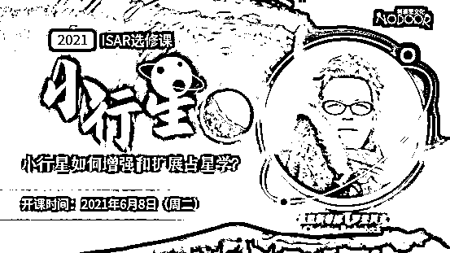**

**讲师介绍**

**克里斯蒂娜·罗登贝克（Christina Rodenbeck）**

克里斯蒂娜·罗登贝克是一名全职职业占星师，在牛津大学城生活和工作，深受周围知识和文化氛围影响；她拥有伦敦大学（University of London）的人文荣誉学位，曾在伦敦占星学馆（Astrological Lodge of London）、心理占星中心和占星研究学院学习。

作为一名占星师，在过去的 20 年里，克里斯蒂娜在她的网站“牛津占星师”上写了大量关于时事、艺术和文化的文章。她每月主持一个占星播客：“与克里斯蒂娜和萨莉一起占星”，并定期在《占星杂志》(Astrological Journal)上撰写时尚专栏。她定期在英国授课，并保持着蓬勃发展的专业实践。

**4**

**生时校正认证课**

**内容简介**

生时校正是一个严谨而又细腻的工作，需要校正占星师同时具备熟练掌握出生星图解读和预测技能（三种主要预测方法：行运、太阳弧、次限）的基础上，整合这两项技能，**通过系统培训和训练达到准确分析和计算出客户的四轴度数，从而确定客户的准确出生时间。**

****

**讲师介绍**

**大卫·瑞雷（David Railey）**

前 ISAR 全球副主席，前 ISAR 考试委员会主席，若道创始人。被称为占星界的“马可·波罗”，第一位将西方严肃占星学系统教学和多位西方占星学大师引入中国的西方占星师。第一位在美国用电视和广播媒体推广严肃占星学的职业占星师。培养最多中国职业占星师的老师。《灵魂的目标》、《一生的旅程》作者。研究占星 48 年，拥有三十多年的占星咨询的执业经验，其服务客户包括学生、工人、市长、州长、议会议员、企业家、心理咨询师、工程师、艺术家、演员、知名企业家等，客户年龄跨度从襁褓婴儿到耄耋老人（大卫老师的老客户常常是一家三代人）。

**海星程 （Hastro）**

国家咨询协会工商管理高阶注册咨询师；ISAR 国际占星研究协会职业资质认证占星师、若道认证授课老师。早期研习东方传统文化，后跟多名国际著名占星师研习现代占星学。2014 年通过 ISAR 职业占星师考试，获得职业占星师资质认证。2015 年若道首次“生时校正考核”中精准计算出大卫老师真实案例的出生时间而获第一名；2016 年和 2017 年连续两年若道核心课程高阶助教。2017 年若道生时校正课程助教，2019 年若道生时校正课程主讲之一。

**5**

**行星交点：探索行星交点的本质**

**内容简介**

**探索行星交点的本质和重要性**；木星、土星、天王星、冥王星和海王星的交点，及在出生星盘中的意涵；行星交点与个人生活、世界事件的集体原型；行星交点技法的应用指南。

****

**讲师介绍**

**马克·琼斯（Mark Jones）**

Mark 拥有超过数十年的治疗师和占星师经验，专注于过往生活分析和心理咨询，并为世界各地的客户提供占星咨询。作为一名认证进化占星师，Mark 每年在美国授课，也多次受邀参与北美各类占星大会和主题工作坊。著有《灵魂治疗：冥王星，天王星，和月亮交点》、《灵魂说：占星学的治疗力量》，探讨出生星图中隐藏的转化力量。

2021 年 ISAR 选修课套餐

**如果上述图片懒得点开仔细看，若道君在这里简单概括一下优惠套餐！**

也就是**任意两门**联报在**早鸟价**基础上再优惠**1200 元！****任意三门**联报在**早鸟价**基础上再优惠**2400 元！****如果五门全报**，在**早鸟价**基础上再优惠**5000 元！**

**如此优惠，还不速抢？**

**注意事项：**

❶** 本次联报优惠价格，不与其他优惠券、课程券、储值卡同时享受。**

❷ **本优惠套餐课程一经售出，不提供退课服务。**

❸ **本优惠套餐活动****5 月 26 日****结束，全部课程恢复原价出售。**

❹** 本优惠套餐活动最终解释权归若道星文化所有。**

**套餐咨询购买请联系课程顾问 Maggie 老师**

**祝大家在 2021 的春天种下一个占星梦想，努力耕耘，秋天收获 ISAR 认证证书。**

# 插班中丨苏·汤普金斯 Level 1-2，国际大师手把手领你入门占星学！

> 原文：[`mp.weixin.qq.com/s?__biz=MzA5NjA0NTAxNg==&mid=2651442957&idx=3&sn=e46f311e3759b9e441ce8a0a2626679a&chksm=8b4b7dbabc3cf4ac01753a8dc01527478913add1d2bc53a7df4865b404d012279a19c82122ac&scene=126&sessionid=1692737999#rd`](http://mp.weixin.qq.com/s?__biz=MzA5NjA0NTAxNg==&mid=2651442957&idx=3&sn=e46f311e3759b9e441ce8a0a2626679a&chksm=8b4b7dbabc3cf4ac01753a8dc01527478913add1d2bc53a7df4865b404d012279a19c82122ac&scene=126&sessionid=1692737999#rd)

**随着土星和木星进入水瓶座并形成合相，新时代的浪潮已经到来。未来 200 年的风象时代，你是否已经做好准备迎接它了呢？**

经历了五味杂陈的 2020 年，我们正踏着木土水瓶座的能量脉动进入 2021 年，你可能有这样的疑问：我需要储备什么样的**知识和技能**，可以让我**更从容的面对生活，拥有顺逆皆宜的人生呢？**

开始学习一门**天王星能量**的学科，无疑是一个智慧的选择。

天王星，正是**占星学**的守护星。天王星，也是**水瓶座**的守护星。

2021 年若道的开年大课就是英国最权威资深的占星导师**苏·汤普金斯**（Sue Tompkins）老师带来的严肃占星学系列课程，她将陪伴你完成从小白到职业占星师的华丽蜕变。

如果学习占星学已经是你内心酝酿了很久的计划，如果你感受到了占星学和新时代的召唤，如果你期待不一样的自我认知和自我突破。

那么机会来了！

**通过占星学习你可以帮助自己，也可以选择成为自助助人的占星师，开启受益终生的第二事业。**

一方面，社会快速发展人们压力山大，抚慰心灵的咨询市场需求巨大。

另一方面，市场鱼龙混杂，能给人带来真正助益的严肃占星从业者十分稀缺。 

**最重要的是，占星学能够帮助你自己，无论你是否进行占星咨询从业，掌握了占星学，你都将拥有一位能终身陪伴你成长的睿智好伙伴。**

****

如果你对占星学一无所知，跟随专业机构、资深老师系统学习占星学，完成从小白到高手的蜕变就是你的最佳选择。

如果你是新手，了解一些知识知识，但不知道如何将它们串联起来，综合解读星图，那么跟随专业机构、资深老师系统学习占星学，夯实基础，稳步前行，成为真正的高手，同样是你的最佳选择。

1

**苏·汤普金斯老师（Sue Tompkins）**

**英国目前最资深****的占星学家和咨询师之一，她拥有****超过 40 年****的占星经验，是占星学习者****必备****之两本圣经《顺逆皆宜的人生》与《当代占星研究》作者，她还是伦敦占星学院的创始人。**

****

**她以自己的冷幽默、****抽丝剥茧的研究天分****和****占星直觉****而闻名。她是一名执业占星师，也是一名顺势疗法医师，是心灵和身体的****敏锐诊断专家。**

**2003 年，为表彰其卓越贡献，英国占星协会为苏·汤普金斯授予查尔斯·哈维****终身成就奖。**

****

****

2

**课程安排是怎样的呢？**

**第*****1*****阶**

2021 年 3 月 15 日开课，每周一晚上 20:00-22:00 上课，共 4 次课

**第*****2*****阶**

2021 年 4 月 12 日开课，每周一晚上 20:00-22:00 上课，共 4 次课

3

**1-2 阶你将学到什么？**

**第*****1*****阶 ****黄道星座**

*   概要介绍占星学与星图

*   四元素与三形态

*   黄道 12 星座

**第*****2*****阶****行星**

*   太阳、月亮及其他行星

*   练习将它们组合在一起

4

**想更多了解导师？**

**主讲导师**

**苏·汤普金斯（Sue Tompkins）**

**英国目前最资深的占星学家和咨询师之一，她拥有超过 40 年的占星经验。**占星学习者必备之两本圣经**《当代占星研究》**和**《顺逆皆宜的人生》**作者。

2003 年，为表彰其卓越贡献，英国占星协会为苏·汤普金斯授予**查尔斯·哈维终身成就奖**。苏同时是一位接受过心理学与心理咨询训练的注册顺势疗法医师，并经常在英国、法国、挪威、瑞典、澳大利亚等地举办占星研讨会和公开演讲，教授占星学。

**苏以实际、生动而幽默的风格闻名于世**，她的教学经验非常丰富，能够胜任从教授入门课程到对毕业生进行督导等针对不同占星程度学员的教学工作，这得益于她多年累积的教学经验。她曾在地方公立学校以及在英国占星研究学院(FAS)教学 19 年， 1986 年-2000 年任学院院长并负责现场教学的所有事务，并于 2000 年创立伦敦占星学院这所声誉卓著的专业学府，并经常在世界各国教学，具有丰富的教学经验。2000 年，英国占星研究学院授予其研究员职位，以表彰她为学院做出的突出贡献。

**中文讲师**

**占星师咔咔（Caroline）**

2010 年师从美国占星师大卫·瑞雷学习，并得到世界名师斯蒂芬·弗里斯特、罗伯特·汉德、苏·汤普金斯传授各种占星学技法。若道首届学员，国内最早获得 ISAR 职业占星师资质的职业占星师之一，现兼任若道核心课程助教。在国际知名广告公司和市场研究公司从事的市场研究和推广工作十余年，曾任职于阳狮集团、尼尔森市场研究有限公司、MTV 和《Madame Figaro》杂志。

**助教**

**助教王嘉祺 Conrad**

**ISAR 认证占星师**，**若道认证生时校正资质，**从 2010 年开始学习占星学，2015 年开始在若道系统学习，并开始个案咨询。2018 年担任若道核心课程助教，以及选修课卜卦占星学和太阳返照课程助教，并带领学员进行经世占星学及太阳返照方面研究。2019 年 11 月作为演讲人之一参加了 ISAR 北京大会，也是 ISAR Star Club 中国区第 16 期的主讲人。

5

**选择若道学习占星学的优势**

**运用自由意志，扭转破坏性模式，绽放天赋潜能**

若道是人本主义占星学的旗手。因为我们相信，**人通过了解模式、觉察习性、积极疗愈、终将释放其潜能，与命运共舞**。

**进入国际权威职业占星师认证的快车道**

占星界的“联合国”ISAR（国际占星研究协会），是具有全世界影响力的占星教学和研究组织和职业占星师全球认证机构，认证占星师遍布 45 个国家。**在 ISAR 的 19 所附属学校中，大中华地区的附属学校只有若道一家**。在国际化的教学理念大纲标准下，**若道毕业生在 ISAR 国际认证占星师的考试通过率多次位居全球首位**。

**十年占星学教育中国本土化教学经验**

**根据中国学生的学习习惯不断优化占星教学体系，让学员学成后更自如地应对本土咨询市场的需求。**学好占星学不仅仅需要邀请一两位老师教学，更需要对教学难点有充分了解，且有持续的教学跟进服务。**10 年来多次核心课程和各种专题课程的教学，让若道非常了解中国学生学习占星学的难点和卡点，合理有效地拆分、提炼课程知识点，同时也积累了丰富的国外老师和中国老师、助教紧密配合以及课程顾问密切配合教学的经验**。若道还专门开发了有助于占星学习的“**若道**”APP，每门课程都设有答疑板块，学员能够方便快捷地提交问题，助教及时答疑解惑和批改作业。**融入中国顶尖的职业占星师群体**若道是中国职业占星师的“黄埔军校”。职业占星师的培养从若道开始，**进入若道，你就走进了中国顶尖的职业占星师群体，和一群志同道合的师兄师姐联谊，获得经验，共同成长**。**多种奖学金支持**为了鼓励学员不因为暂时的经济困难而放弃学习，我们特意设置了各种**技能交换和奖学金**。对于有一技之长的学员，我们推出的技能交换的项目包括**“笔译”、“笔记整理”、“平面设计”、“课本朗读”、“班级服务”**等技能交换项目；而对于努力学习、出勤率高、完成作业率高的学员，我们设置的**土星奖、木星奖**等各种奖学金在等着你。为了感谢帮助我们推荐学员的老学员们，我们设置了“**老学员推荐奖**”；对于通过问卷提建议，帮助我们提高服务的学员，我们也设置了相应的奖学金。ISAR 中国还设置了**国际会议奖学金**，符合条件并通过甄选的申请者最高可获取 5000 元奖学金。当美好的知识遇上奖学金，你可以在学习旅途中乘风破浪，直挂云帆济沧海。**开启占星咨询的职业规划和支持**若道为占星学员搭建了占星问答平台和占星咨询平台，并提供严肃占星学影响力最大的媒体平台，全力为毕业生提供宣传渠道，帮助你吸引和积累咨询生涯初期的种子客户。若道为学员开发了适用于占星学习的“若道”APP，并不断更新完善。**①  微信平台**若道微信平台作为业内颇具影响力专业平台，为文笔好的若道毕业生提供传播占星学并免费宣传自己的机会。有的学员因为文笔获得众多粉丝喜爱，在 3 年多时间积累起 2000 多人的潜在客户。**②  问答平台**若道问答平台帮助学员接触客户的实际问题，并在毕业前就进行演练答题。自问答平台 2016 年上线运营以来，学员接触到 3200 多个问题， 回答问题最多的学员在问答平台收入达 5 万多元。**③  咨询平台**若道咨询平台是我们为优秀毕业生所搭建的平台，帮助毕业生在自己的咨询拓展之外，用若道提供的平台扩展咨询客户群。自咨询平台 2017 年 8 月上线运营以来，咨询平台共入驻 65 人，收入最高者达 32 万元。此处所列学员收入仅供参考，收入高的学员和其专业水准、努力程度密切相关。若道平台尽其所能将自己定位为辅助学员开展职业生涯的桥梁。

**在 10 年的占星教学耕耘后，两位创始人——大卫·瑞雷及蒋颖再次邀请苏·汤普金斯老师开设占星核心课程。**

6

**此次课程适合哪些人？**

*   对占星学感兴趣，想要入门的零基础者

*   占星学小白，但有志成为职业占星师的人

*   有一定占星学基础，但不知道该如何整合星图复杂碎片的人

*   希望成为优秀的占星师，想要借鉴国际大师解读思路并融入自己的体系的人

*   苏·汤普金斯的粉丝，学过占星学，但就是想跟着偶像再学一遍的人

*   走在自我探索和个人成长道路上的人

7

**占星业内推荐**

**苏·汤普金斯的《顺逆皆宜的人生》令人赞叹！苏是一名倍受爱戴的老师，并且任教多年。苏以自己的冷幽默、抽丝剥茧的研究天分和占星直觉而闻名。她是一名执业占星师，也是一名顺势疗法医师，是心灵和身体的敏锐诊断专家。**

** ——法国心理占星学协会会长琳恩·贝尔**

8

**苏汤班学员评价**

9

**苏汤老师水瓶座试听课**

（温馨提示：手机请注意流量）

📹 [`v.qq.com/iframe/preview.html?width=500&height=375&auto=0&vid=p3210llaq7f`](https://v.qq.com/iframe/preview.html?width=500&height=375&auto=0&vid=p3210llaq7f)

10

**课程价格**

**L1-2**：4000 元**（联系 Maggie 老师，获得优惠价）**

其他各阶段课程单报价格，请咨询课程顾问：**Maggie 老师**（微信：18510107057，请备注**“苏·汤普金斯核心课”**）

长按二维码添加 Maggie 老师

11

**授课时间**

**2021 年 3 月 15 日（周一）20:00-22:00 开始，网络课程**

12

**退转课程**

*   **退款原则请详看《教学协议》，如有疑问请咨询课程顾问。**

****苏·汤普金斯金牌核心课程****

**授课老师：苏·汤普金斯**

**授课时间：**2021 年 3 月 15 日起

**授课方式：**网络课程**，**英文授课，中文翻译

**费用：**4000 元**（联系 Maggie 老师，获得优惠价）**

**课程负责人：Maggie 老师**（微信：18510107057，请备注“苏·汤普金斯核心课”）

长按二维码添加课程负责人咨询~

****报名请点击“阅读原文”****

# 重磅丨 ISAR 选修课·深度掌握次限月亮的技法

> 原文：[`mp.weixin.qq.com/s?__biz=MzA5NjA0NTAxNg==&mid=2651442858&idx=3&sn=33170f7ad8c1b11bcfe2d587b86c683f&chksm=8b4b7c1dbc3cf50bb485dcb72041d9b159ab476e54868e8f3b45fe18544ea618cbda8f1dd88f&scene=126&sessionid=1692738004#rd`](http://mp.weixin.qq.com/s?__biz=MzA5NjA0NTAxNg==&mid=2651442858&idx=3&sn=33170f7ad8c1b11bcfe2d587b86c683f&chksm=8b4b7c1dbc3cf50bb485dcb72041d9b159ab476e54868e8f3b45fe18544ea618cbda8f1dd88f&scene=126&sessionid=1692738004#rd)

**星图中的月亮描述了我们在婴幼儿期和童年早期如何接收母亲的能量。**我们从出生开始就通过月亮的反射来体验母亲，正如月亮反射太阳的光一样。月亮也会描述一些我们可能会称之为灵魂的事物：**我们的人生经历在时间和永恒之间的内在反射物。**次限月亮通常被视为用于预测以及为事件择时的因素，但实际上它的内涵远远不止如此，要更为深刻和微妙。

**次限推进月亮**（Secondary Progressed Moon）：用次限推进，也即**一天即一年**的推进法时的推进月亮。次限推进月亮平均每月移动 1 度，虽然速度并非恒定。

**次限推进：托勒密时期，2 千年前发明。**

**当次限月亮在我们星图上的星座和宫位推进时，它会以唤起我们个体本质以及人性的方式，反映我们成长和发展的经历。**对于那些同时开展内在和外在生活的人来说，次限月亮可以成为一个向导，照亮自我反思和内在滋养的面向。**在八周的课程中，**我们将学习次限月亮是如何像镜子一样映照出我们最深的本质的。

**此课程可作为 ISAR 选修课。**

1

**课程安排**

**课程安排：5 月 10 日--6 月 28 日 （每周一）**

*   **5 月 10 日** 出生星图中的月亮与它在童年 0-7 岁的推进

*   **5 月 17 日** 7-14 岁：从自我到他人

*   **5 月 24 日** 14-28 岁：从他人到自我

*   **5 月 31 日** 次限月亮推进 vs 土星行进

*   **6 月 07 日** 次限月亮与其他行星形成的相位

*   **6 月 14 日** 30-60 岁的次限月亮推进：再次回转

*   **6 月 21 日** 60 岁以后的次限月亮之旅

*   **6 月 28 日** 次限月亮与次限太阳的关系

2

**课程大纲**

**第*****1*****讲  ****5 月 10 日 **

**出生星图中的月亮与它在童年的推进**

我们将学习出生星图中月亮的象征意义，以及它如何反映你的母亲以及你童年的家庭生活。我们将从元素的角度观察月亮，并研究从出生起你是如何得到母亲的关注的，我们将观察出生后几年的月亮的推进。

**第*****2*****讲  ****5 月 17 日 **

**从 7 岁到 14 岁：从自己到他人**

次限月亮与出生星图中月亮的第一个四分相在 7 岁左右出现。我们将学习在这个关键时间点我们是如何开始意识到自己是独立存在的个体，以及它如何让我们向家庭以外的其他人寻求滋养和生命。

**第*****3*****讲  ****5 月 24 日 **

**从 14 岁到 28 岁：从别人到自己**

从十六七岁到 28 岁左右第一次次限月亮回归，我们完成了与他人和与自己的月亮的灵魂之旅。从次限月亮回归开始，我们就开始对自己的情感生活以及我和其他人之间所发生的负责。

**第*****4*****讲  ****5 月 31 日 **

**从 14 岁到 28 岁：从别人到自己**

当次限月亮描述我们内心的旅程时，土星的行进描述了我们与周围世界的联系，以及作为社会发展中的个体，世界对我们的要求。在我们生命的头 30 年里，它们几乎以相同的速度运行。

**第*****5*****讲 **** 6 月 7 日 **

**次限月亮与其他行星的相位**

我们将从次限月亮的旅程中抽身出来，看看它与各种不同人的星图的其他行星产生有趣而特别的相位时发生了什么，这样我们来了解次限月亮触及我们星图中的这些行星时会发生什么，以及我们该如何为自己的生命导航。

**第*****6*****讲  ****6 月 14 日 **

**30-60 岁的次限月亮推进**

当月亮再次绕着出生星图运行时，我们有机会将意识带到我们的情绪反应中，并开始引导我们的内在本性，而不是对发生在我们身上的事情束手无策。

**第*****7*****讲  ****6 月 21 日 **

**60 岁以后的次限月亮之旅**

在当今时代，60 岁以后过着积极生活的人比历史上任何时候都多。有的人在 70 多岁的时候坠入爱河并第一次结婚。我们将在这一讲探讨如何在我们生命的最后几十年里对自己和他人有用，这样我们就可以体验到生命的丰富多彩。

**第*****8*****讲  ****6 月 28 日 **

**次限月亮与次限太阳的关系**

最后，我们来研究次限月亮绕着星图运行时与次限太阳推进的关系。我们将通过星图案例来进行探讨。

3

**此次课程适合哪些人？**

*   有一定占星学基础，若道核心课 L3 以上水平；

*   希望成为优秀的占星师，想要借鉴国际大师次限解读思路并融入自己的体系的人；

*   希望研究自身人生周期，想好更好的规划人生的占星学者；

*   走在自我探索和个人成长道路上的人。

4

**主讲老师**

**达比·科斯特洛（Darby Costello）**

达比·科斯特洛（Darby Costello）在美国波士顿学习占星学，在非洲生活过 12 年，于 1983 年移居英国伦敦。她曾在长达 25 年的时间里担任心理占星中心的首席教师，是占星研究学院的任课教师，也是伦敦占星学院的客座导师。此外，她拥有“文化天文学与占星学”硕士学位。她在世界各地授课与写作，服务全球客户是她占星师生涯的核心。

| 达比·科斯特洛与琳恩·贝尔

**网站个人简介：**

达比·科斯特洛（Darby Costello）出生于美国，1960 年代曾跟随弗朗西斯·萨科安（Francis Sakoian）、路易·阿克（Louis Acker）以及伊莎贝尔·希基（Isabel Hickey）在波士顿学习占星学。随后，她去了非洲，与部落疗愈者和占卜者一起共事多年，并在期间精进自己的占星学实践。1983 年，她去英国伦敦寻找占星团体。令她高兴的是，她找到了这样的团体，并在许多层面上参与其中。到伦敦后不久，她就开始拓展占星客户，并于 1988 年开始在由丽兹·格林和霍华德·萨司波塔斯创立的心理占星中心任教。十年后，她成为首席讲师，并为心理占星中心出版社撰写了几本书。

达比还是占星研究学院的导师，并于 2014 年获得荣誉文凭。她是心理占星学水星网络学校（MISPA）和占星大学的讲师，也是伦敦占星学院的客座导师。她在欧洲和世界其他地方教书和授课，也曾在巴厘岛、中国大陆和台湾等亚洲地区以及阿拉斯加等北美地区授课。2013 年，达比被授予查尔斯·哈维奖，以表彰她对占星学做出的卓越贡献。

2006 年，达比获得在巴斯斯巴大学（Bath Spa University）“文化天文学与占星学”专业硕士学位。这段学习经历也让她更懂得品读历史，并对写作产生了更深的热爱。不过，她最爱还是解读星图，她遍布世界各地的客户也滋养并进一步激发了她的占星学灵感。

**达比·科斯特洛的著作：**《占星学中的月亮》《水元素与火元素》、《土元素与风元素》、《火星四重奏》、《占星学》。

5

**课程价格**

**正价**：6800 元

**早鸟价：5800 元**

**早鸟价截止时间：2021 年 4 月 21 日**

还有限时 ISAR 选修课联报套餐价格，具体请咨询课程顾问：Maggie 老师（微信：18510107057，请备注“次限月亮”）

长按二维码添加 Maggie 老师

6

**退转课程**

*   **退款原则请详看《教学协议》，如有疑问请咨询课程顾问。**

****ISAR 选修课：次限月亮****

**授课老师：达比·科斯特洛**

**授课时间：**2021 年 5 月 10 日（周一）起

**授课方式：**网络课程**，**英文授课，中文翻译

**费用：**6800 元；**早鸟价：5800 元（2021 年 4 月 21 日截止）**

**课程负责人：Maggie 老师**（微信：18510107057，请备注“次限月亮”）

长按二维码添加课程负责人咨询~

****报名请点击“阅读原文”****

# 次限月亮丨当碰到这两颗行星，你需要独立和直面恐惧

> 原文：[`mp.weixin.qq.com/s?__biz=MzA5NjA0NTAxNg==&mid=2651442858&idx=2&sn=2ba657d506a50152a06e298bd7b70bf8&chksm=8b4b7c1dbc3cf50b26ee0f9b08cf834f45a727200cc7583311b2df59c867dffc74a387c9fdf7&scene=126&sessionid=1692738004#rd`](http://mp.weixin.qq.com/s?__biz=MzA5NjA0NTAxNg==&mid=2651442858&idx=2&sn=2ba657d506a50152a06e298bd7b70bf8&chksm=8b4b7c1dbc3cf50b26ee0f9b08cf834f45a727200cc7583311b2df59c867dffc74a387c9fdf7&scene=126&sessionid=1692738004#rd)

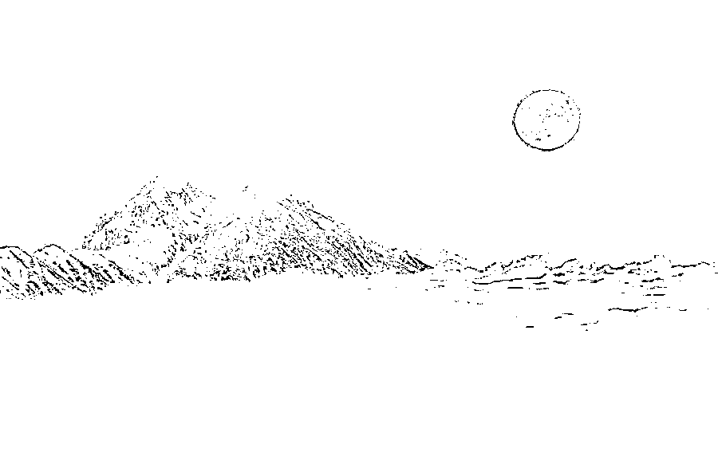

作者/斯蒂芬·弗里斯特 译者/逸月 速记/佳黛编辑/翀子 图片/网络本文根据往年斯蒂芬老师工作坊片段整理当次限月亮与我们出生星图上的天王星和冥王星发生关联时，“我是我自己”和面对真实自我的需求就会被触动，让我们的生命得以转化。
**次限月亮碰到出生星图的天王星**

**当我说次限月亮和天王星发生关系，可以是四分相、三分相、合相。合相最激烈，**它代表的就是我谈到的东西最纯粹的表达。

**天王星的基本逻辑是，它需要自由，**那种独立性的需求，那个积极形容的语言是：**我就是我自己，**我不需要讨好你，我可以选择讨好你，但是我不需要。不要告诉我该做什么，**给我一些空间，**我需要自主性，这就是这个行星的精神。

所以我谈到太阳的时候，我们把太阳简单化形容成社会的法则，**天王星讨厌所有的法则，它的精神就是违背那些法则。**

**所以当次限月亮和天王星发生关系的时候，进入心智的情绪和关系的法则是反叛性的，就是把事情搞砸的感受，它会给你带来变化。**

我们在英文中有通常的俗语，人们通过把它运行到工作中，为了两分钱我就愿意辞职，这个工作我已经忍受很多了，这样的情绪我们都是熟悉的。因为我们已经到爆炸的边缘，其实不是很聪明事情的边缘，这个也许是自我摧毁。因为我们只是无法忍受，这就是天王星的情绪。

这是危险的事情，**次限月亮跟天王星发生关系，也许是通过危险的状况发生爆炸性的情况，**想象阴影的时候，完全可能发生，以干扰性的方式发展。

你违反规则仅仅是你喜欢违反规则，月亮不会思考，这种不会思考加上冲动，这个组合非常危险。这个状况下我们需要小心，我们需要回到之前的架构。

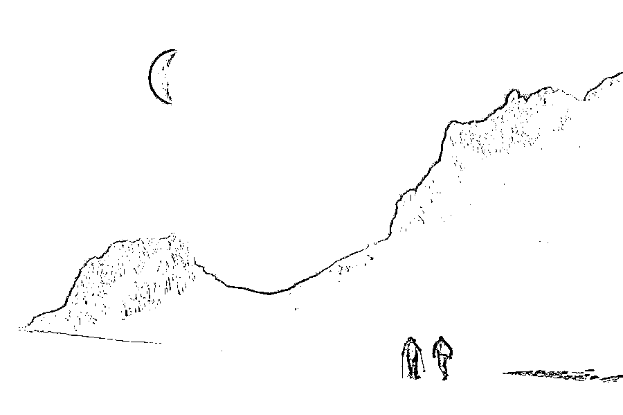

**次限月亮行进的目的是，需要跟我们内心真正的需求本质去协作，我们需要感受到确实的感觉，当我们和那个感受联系在一起的时候，次限月亮就完成了它的工作。**它带来的信息，它贡献给了所有的心智和星图，我们会做出实际的反馈，在现实世界中，什么样最好的方式才能让我满足基本的需求。

让我们想象一个虚弱的、冲动的，次限月亮和天王星发生关系的可能性，头脑的觉知和运作都已经跳过了，所以当我们不跳过那个过程会怎么样？我们会回到核心，**天王星的本质是什么？**它不是简单的叛逆，核心是：**天王星是你真正自我独立性的守护者，**如果你没有被误导、培养和教育的话，你会是谁？这是一个天王星式的问题，如果你有了不同的父母，你会成为谁？

任何人都知道这个问题的答案是广阔的，我们如何回答这个问题呢？在你内在的核心是真正的你是谁？但是你曾经受到过不同教育影响、扭曲，**所以当我们经历天王星刺激的时候，它就是那个让你真实自我深发的机会。**

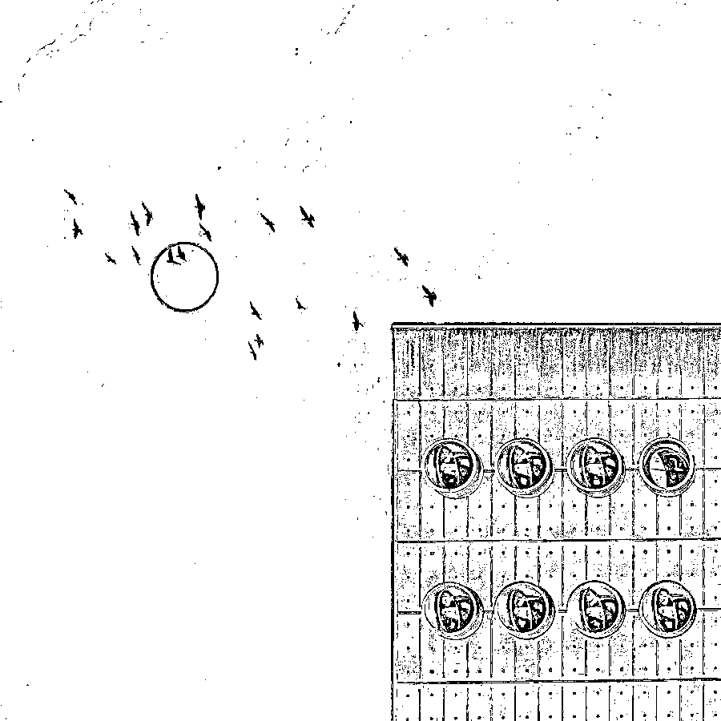

**想象一个人出生星图天王星在 3 宫，**3 宫有很多含义，一个是演讲，我们发表言论很大程度上受到社会的规范，大多数人都是教育对方礼貌。也许我们知道在公共场合有些话不适合说，我们受到教育，**次限月亮触发了天王星，**你内在跟一个需求发生了运作，**我有一个需求就是真实地表达我自己。**但是我受到的训练是不能这么表达，天王星三宫代表什么呢？

我在这里做的工作就是了解内在需求实际的本质，不要因为冲动把需求看错了，我们做的工作是珍重了解我们的需求是什么。**3 宫是言论的宫位，**这是基础的占星学。那个是你头脑中的言论，也是你嘴里的言论，你的想法没有觉知的话，是不会产生的，我们需要看见什么，然后才能思考，然后才会说。所以当我们深入地想到 3 宫，是有这三层维度。

觉知是重要的，也许我们会说，你是通过 3 宫的窗口观察世界，玻璃是不清晰的，它带着 3 宫的特质。

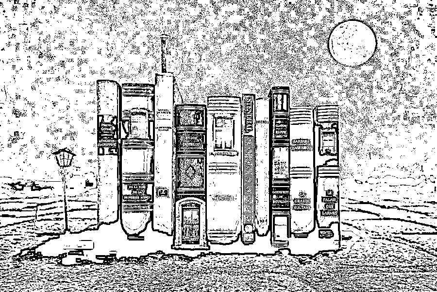

当我和一个拥有这样配置的客户在一起，我通常会说，你是一个小孩，你在学校的历史课，老师在跟你说中国的历史，这时候你在想，也许他说的一大半真的发生，但是你怀疑那部分，**你在怀疑所有的东西。**特别是跟历史相关，你怀疑所有是个好事，其他所有的孩子都记下了知识。不论什么时候，我们对于天王星做出的反馈是积极的，我们都会受到惩罚。

也许某一个人经历那个次限的运行，他会决定到北京若道参加占星课程，这是个好的例子，因为我们的教育系统告诉我们不能相信占星学，而这个人就是好奇，**好奇心是 3 宫的词。****他对天王星的视角产生好奇，**他对内心的需求感到觉知。我好像对占星学有很多年的兴趣，为什么我从来没有追随那个需求？因为我被教育不要尊崇那个需求，不要对占星的产生的兴趣做任何事。

**月亮总是深入你内在的部分，不要害怕感受，**不要陷入这些情绪感受，不会自然生发的陷入，他们通过迷雾的方式生发，**我们需要清除迷失。**

**月亮跟金星发生关系，**非常强烈的需求就是和他人发生关联；**月亮和天王星发生关系，**强烈的就是自由。次限的月亮跟你的天王星发生联系，你的婚姻会受到很大的益处。如果你能够一两周不看到你伴侣的脸，会让你的婚姻受益。

独自旅行是个好事，让你的伴侣独自旅行也是个好事。也许我们很可能需要这样说，但是星图中其他东西会发言，它会说，也许那样表达会有更好的方式，也许你说，亲爱的，你可以离开一会。我们可以善良地表达同样的意思。**也许在你天王星的时期，**你的伴侣确实有理由离开一会，这就是占星学最美妙的地方。 

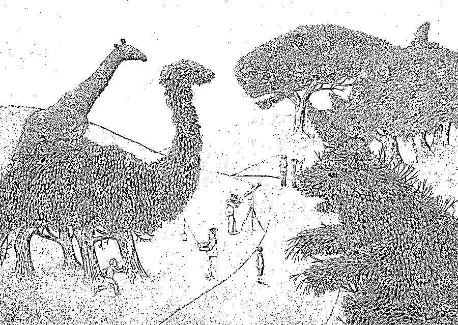

**次限月亮碰到出生星图的冥王星**

另外一个例子，**次限的月亮合相冥王星。**

**冥王星是天蝎座的现代守护星，**天蝎座的东西在冥王星身上也是管用的。他们有些平行也有些差异，**在冥王星身上我们看到占星学会代表无意识的头脑，**在冥王星最高阶的表达中，我们看到一些技能帮助我们探索无意识的头脑，我们看到我们情绪的波涛，以及对于我们自己产生洞见的能力。

冥王星让我们看到非常强的情感和情绪，**次限的月亮和冥王星发生关系，确实是非常情绪化的时期。**最关键的是**发现我们真实的感受是什么。**

当我想到冥王星的时候我想到的就是深入黑暗的旅程，**这个旅程是让人觉得害怕的，如果我们有足够的勇气进行这个旅程，会发现穿越黑暗过后，我们又会进入光明，到达那个赋予我们权力的地方。**冥王星不仅可以让我们变得强大也可以让我们变得快乐，但是我们必须面对那些我们不愿意面对的部分。

几年前我和客户有一个长程咨询，她有一个糟糕的童年经历，并持续在成年时期上演。她经历很多失败和尴尬，她有三个孩子，她只能通过妓女的职业养活自己的孩子，她穿越了那些经历，但是她受到了很多伤害。她和我一起工作，我们开始慢慢的接近了问题的核心。

她开始意识到她应该去看到的那些东西，也就是说她在一个冥王星的时期 ，我不记得她次限的月亮在哪。但是我记得行进冥王星对分她的月亮，在这个进程中有一个比喻，好像从自己的内在找到了，**找到了一个充满悲伤的深井。**

这是她自己的话，这只不过是有一天从她自己的嘴中说出，**她意识到她有一个信念，悲伤的井是无限深的，一旦她陷入井底她永远不知道尽头在哪。**

我的工作是那并不是无限深的深井，你可以穿越，这并不是一个争论，我并不是在改变她的信念。那是我们对话的比喻。

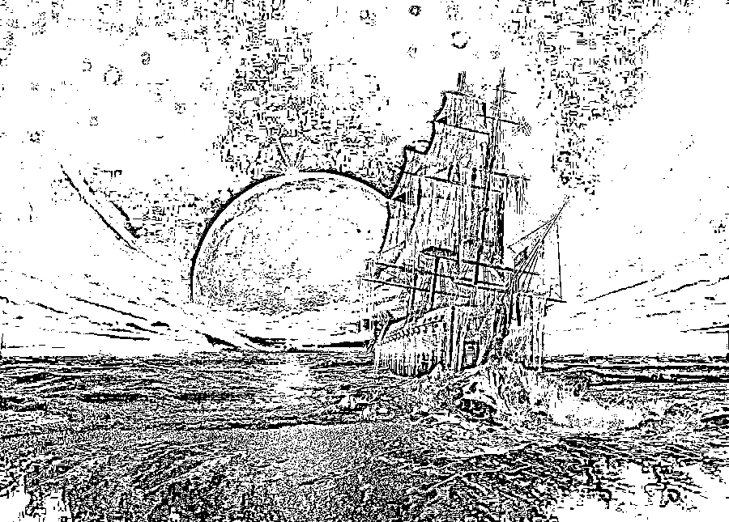

当我们面对无限深的悲伤，不去看似乎是管用的，这是冥王星的虚幻。月亮接近了冥王星，你可能会感受到很多东西，**在核心你可能感觉到恐惧，你害怕进入那里。**冥王星是噩梦之神，代表所有你不想知道东西，**当冥王星被凸显，这意味着你已经准备好了，你现在已经够强大了。**

**因为共时性，你生命中相应的情景会出现。**当次限月亮与冥王星相遇，**你也许会感觉到沉重，**不知道该做什么，也许会在一个冥王星的时期见占星师，这就是共时性，因为你已经准备好去做冥王星的工作。在过程中你也许会得到一些朋友的支持，你是可以得到的，这会向你呈现出来。你也许会说谢谢，也许没有去见那个占星师，或者是去做心理咨询，触发了更深的内在。

你的感受是怎么样的？你会感觉到恐惧，**当那个让我们害怕的东西来的时候，我们想要逃避，但是现在我们需要接近那个东西，**那个恐惧可能是一个线索，而那个充满了悲伤的深井并不是无限的深邃的，现在是你需要花时间去看的时候。

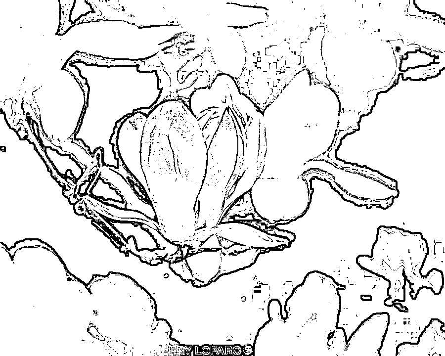

**冥王星处理的是无意识的头脑，**有时候无意识的头脑会掌管我们的生活。我记得一个女士在经历一个非常深的冥王星的时刻，在做一个非常棒的工作，落下了眼泪也出现了很多深刻的情绪，我们彼此之间的联系是很好的，在这个咨询中一些感受全部浮现了。

无意识的头脑不想显露某些东西，某种程度无意识头脑是你自己的敌人。**你次限的月亮接近了冥王星，也许你会开始思考关于你童年的生活。**有一些意识有一些事情回忆起来对于你来说是非常重要的，你对于那些记忆马上就要接近了，然而你的头脑突然转换频道，你突然想吃披萨，喝茶，你不知道刚发生了什么，只是头脑转换了频道。

冥王星时期注意到这个情况对于你是很有帮助的。那些我们不去看的部分会在生命中呈现出来，**如果你不去疗愈，你内在的创伤会驾驭你。**

次限的月亮来到冥王星，也许你会发现自己处于一种疯狂的状态，可能会伤害自己或他人。**如果我们能够穿越那些部分，创伤便会得到疗愈，**因为如果你要变得疯狂会花掉你很多能量的。

如果你不再疯狂会如何？答案是花在任何你想花的地方，**你的能量会转换成创造力、爱、职业，你可以选择如何运用你的能量，这就是冥王星，光明的地方，它的奖品。**

**版权声明：**本文由若道翻译发布，欢迎转发，反对抄袭。友号转载请申请白名单。

斯蒂芬·弗里斯特

若道签约老师。进化占星学的创始人之一，当今世界最有影响力的占星大师之一；1985 年，他凭借《内在的天空》一书获得职业占星师协会奖（Professional Astrologers Incorporated Award）。他四次获得占星界最高的占星学联合协会奖（United Astrology Congress Regulus Award）提名，2018 年获得轩辕十四教育奖。

**ISAR 选修课·次限月亮之旅**

**点击下图了解课程详情** 

**微信又双叒叕改版啦，不想错过若道君的推送？**

**就把若道设为星标吧！**

**▼**

就是这个“在看”，戳戳戳 ☟

****************报名直达入口****************

# 次限月亮与五大行星丨你内心隐藏的汹涌情绪，即将被触发！

> 原文：[`mp.weixin.qq.com/s?__biz=MzA5NjA0NTAxNg==&mid=2651442858&idx=1&sn=5e8de4e530c0fe5f0f725574c43c7e09&chksm=8b4b7c1dbc3cf50be2e168e0641c59ea9960efe0f9d591c0cb6ec70b8551701630fd2084b103&scene=126&sessionid=1692738004#rd`](http://mp.weixin.qq.com/s?__biz=MzA5NjA0NTAxNg==&mid=2651442858&idx=1&sn=5e8de4e530c0fe5f0f725574c43c7e09&chksm=8b4b7c1dbc3cf50be2e168e0641c59ea9960efe0f9d591c0cb6ec70b8551701630fd2084b103&scene=126&sessionid=1692738004#rd)

**************☆ ************************后台************************回复“今日”，给你一句生命态度**************

作者/斯蒂芬·弗里斯特 译者/逸月 速记/佳黛编辑/翀子 图片/网络本文根据往年斯蒂芬老师工作坊片段整理次限月亮代表了我们的情绪议题，当它与我们出生星图上的不同行星发生关联时，与那颗行星的星座与宫位相联系的需求就会被触动，让我们感受并表达出那颗行星的能量。
**关于次限月亮的小知识**

**次限的月亮会花 27 年 4 个月绕一圈。**对每个人来说，在那个阶段都会走过 12 个星座、12 个宫位，那是个很大的主题。

一个很好的对于次限月亮解释的画面，**它是你情绪的议题，**当我们想象次限月亮、行星、不同的宫位，我们会把每个阶段描述成你生命情绪不同的篇章。你的心的关注力是放在星座上的，**那个次限月亮发生的行星的本质是什么，我们会直觉感受到哪些能力？**

当我说到情绪的关注力，我们会引导情绪。不开心，我不想一直说月亮会让我们不开心，这不是它的功能，**月亮的一个维度就是不开心。**当我们关注哪些情绪性的东西的时候，可能不会让我们感觉很好。

那么，**次限月亮和出生星图中不同行星发生联系会怎样呢？**

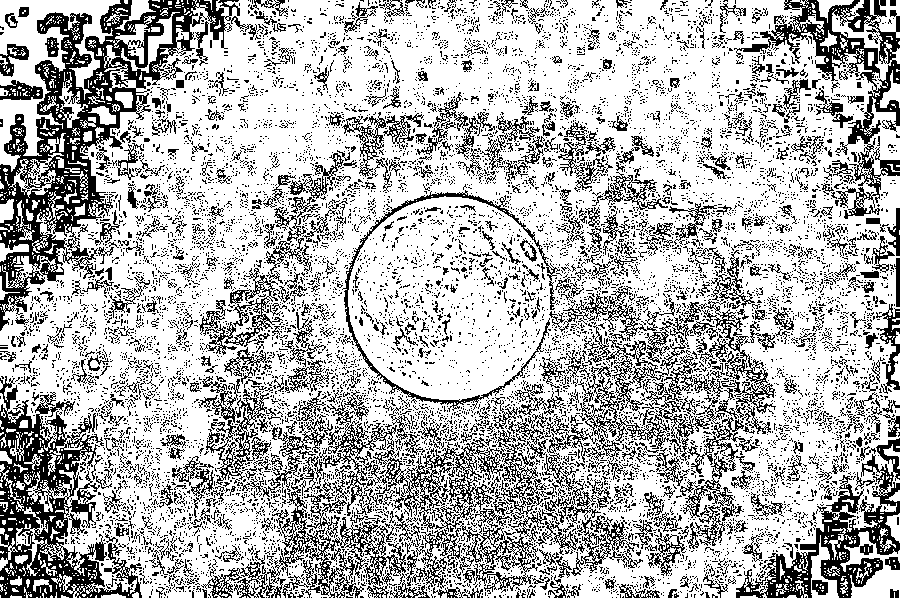

**次限月亮碰到出生星图的太阳**

我认为这个世界上最没有用的语言就是偶然、巧合，它和宇宙如何真实运作的法则没有关系。当然，我们会看见金星和天王星都有共时性的关系，**太阳和次限月亮发生关系是怎么样的呢？**

太阳是个大的东西，**照顾好太阳就是你活得理智的理由。**看到太阳有很多基因型的特质，**太阳真实的含义是把它放在星座和宫位，**宽泛的理解是，我会把将越界月亮的知识放过来。我们会说同样的事情，会用正向的方式，太阳说，你会绕着我转，所有的东西都绕着我转，我说实话感觉很糟糕。

但是你拥有太阳，**你生命中的某一些时刻需要你用你的方式运作，你获得自私不是一件总是坏的事情。**

**你有理由和权力坚持自己，你有权力使用你的资源，你有权力说想要用你的方法运作。**当然很明显，那个人只是用这种方式运作，你很难真的接近他们，一个人永远不是那样的。你可能也无法阻止那个人。

我来呈现一下，我想象一个人拥有虚弱太阳，你和他进入关系，你问他，你今晚想要吃饭，那个人说，好啊，如果你愿意的话。你会说，我们可以说中餐还是西餐，你喜欢哪一种？我不知道你喜欢那种？你知道这个类型，他们可能认为在跟你写作，你会认为，你在哪？你好！你的体内住着一个人吗？跟我发生联系吧，你的小我出现吧！

成为某个人，我们要有你的方式运作，我爱你，所以按照你的方式运作我也很开心，请给我这个礼物，让你按照自我运作一次。**所以月亮和太阳发生关联，在这个组合中，你需要获得更自私。**它的需求是有理由，没有任何次限行进是没有理由，它们总是有意义，在该出现的时候出现。

让我们把所有事情组合在一起。**当次限月亮和太阳发生在一起的时候，你过去没有足够自私，这种需求到了重要的时刻，你要照顾好这个需求。**

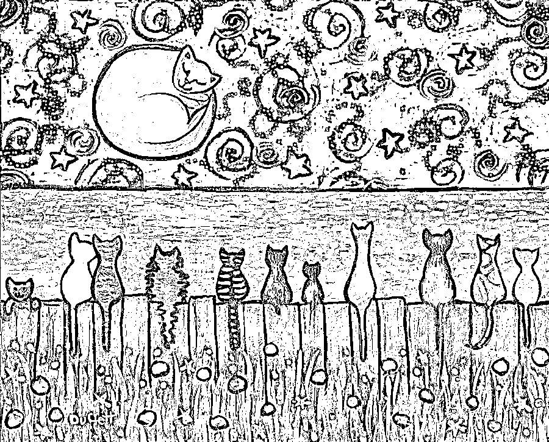

**举个例子**

我之前也讲到太阳的本质非常强地受到其他落座、宫位、相位的影响，我不想细节性的分析。让我更进一步，太阳在巨蟹座，这是一个很大的主题，巨蟹座的一个维度是家的能量，**次限月亮和太阳巨蟹座发生关联。**

**你跟你家庭相关的需求出现了，在那个的范围下，可能性就是关系。**我已经说了很多关系的例子，所以我会说其他的方面，你的家对你来说，足够舒服，你要新的沙发、床吗？要重新粉刷吗？我们可以说很多东西，**但是当次限月亮和太阳巨蟹座发生关系，在你的家庭做一些改善，这是为你自己做的。**

花钱是个好事，巨蟹座有滋养的需求，月亮和巨蟹座发生关系，所以她滋养的需求就是巨蟹式的，我需要在我的怀抱中抱着一个生物，我喜欢那种感受，**我为自己做这件事情，这就是次限月亮与太阳巨蟹座发生关联。**

**次限月亮和太阳双子座发生关联，**我会买一个新的电脑，一个大屏幕的电视，这些都是双子座的呈现，因为这些和双子座相关的。该是我写文章、参加课程的时刻，我可以想象那个很有趣的课程，大家在周末的下午团聚，假设我们平时每个周日的下午都会去拜访父母。

现在的月亮影响了太阳双子座，你对父母说，爸爸妈妈接下来六周我参加课程，周末下午的团聚我就不会参加了，你看着这种原型在生命中的显现，这是非常简单的话语。这是宇宙共时性的另外一种显现。

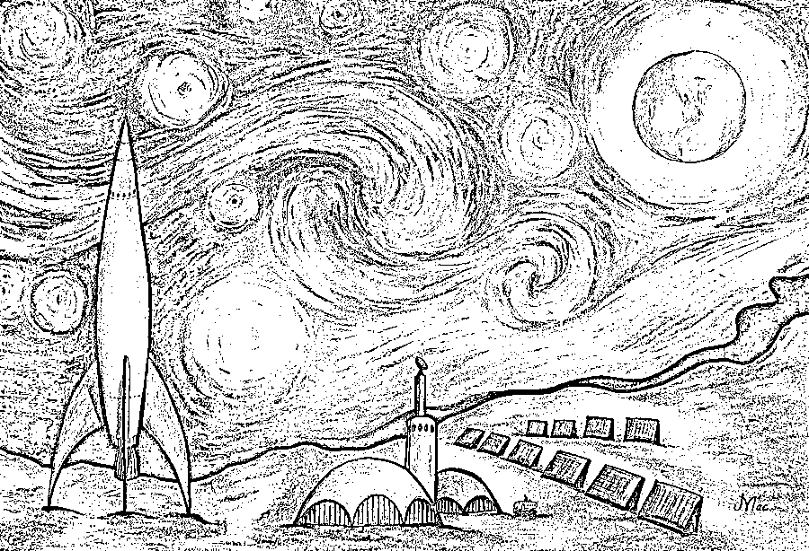

**次限月亮碰到出生星图的金星**

**当次限的月亮触发你任何敏感的地带，你就会对它代表的需求感到敏感。**

你的金星落在 7 宫，为了有亲密的感受，你从那个金星的东西上受益，我们从不同的情境下感受这一点。金星有浪漫的面向，7 宫是亲密关系，两个人建立关系之后，他们的生活可能不是浪漫的。他们也许是伙伴，也许会互斗，也许他们关注在自己的职业上，这都是可以的，**但是你的金星在 7 宫，你需要一些浪漫。**

你的伴侣会给你买一些花，你的伴侣没有任何理由送给你花，只是因为爱你。你的伴侣给了你惊喜，穿上美丽的衣服，我们去吃晚餐。他们都是金星式的东西。你需要那些东西，金星在 7 宫是很大的主题。

但是这是一部分，你在漫长的婚姻中，你是成熟的成年人。我们可以说，在你和你的伴侣之间的情境很久没有发生，你没有怨言，你很久没想到的，你们都过着成熟的、负责任的生活，互相尊重、支持对方，这里重要的一点，你的关系中缺失了什么？当那个月亮和金星发生了关系，也许是个合相。

最简单的例子，事实上，任何相位都管用。**次限月亮每个月行进一段，这个相位会持续几个月的时间。**在那段时间的周期中，你的情绪的关注点就是次限的月亮。

月亮是伟大的母亲的形象，对金星说，坐在我的腿上，跟我聊聊吧，**所有的事都好吗？你所有的需求都得到满足了吗？**也许你说，还好。婚姻中怎么样？还行吧。他们是完美的吗？还可以有更好的地方吗？难道你对你的妻子和丈夫没有微笑的怨言吗？也许不久我们就流泪了。

**因为内在孩童的能量来到了金星这里，这是个微妙的时刻。**在这个描述中，我们可以意识到月亮让我们在关系中缺少滋养，需求没有得到满足，在这个过程升起的孤单和挫败确实是月亮的工作。

很快大家有个问题，这个问题的答案需要整张星图来看，也包括土星，我们如何处理这个问题，看到吗？**月亮只是给了我们感受，这只是开始，**我们对这个事情是有智慧的，所以我们对我们的伴侣有挫败感，互相的相处缺乏浪漫和沟通。

接下来是聪明的做法，给你的伴侣买些花吧，不要惩罚他们没给你花，要意识到你是这些关系中的一部分，你要触发满足你需求的进程。但是并不是月亮的产品，**月亮不会思考，它只是感受。**那个对于感受和需求的觉知，就是**次限月亮触发了金星**的意思，**一旦我们跟那个需求进行运作，其他的体系必须加入这个系统，我们才会给出答案。**

**想象完全土星式的答案，**我在我的婚姻中感觉挫败、孤单，我希望有些浪漫。但是我的伴侣正处于糟糕的境地，他有很大的工作量，她的母亲诊断出了癌症，这个时间不是我要求鲜花的正确时间，但我希望是鲜花。但是我对这个人做出了承诺，我会在这个困难的时间跟我的婚姻站在一起，我会意识到我的需求，我会对这个有些视角，小孩子不会这么做，但是成年人有能力这么做，**从进化的角度来说，我们需要了解这个需求，对那个行星代表的状态敞开我们的心。**

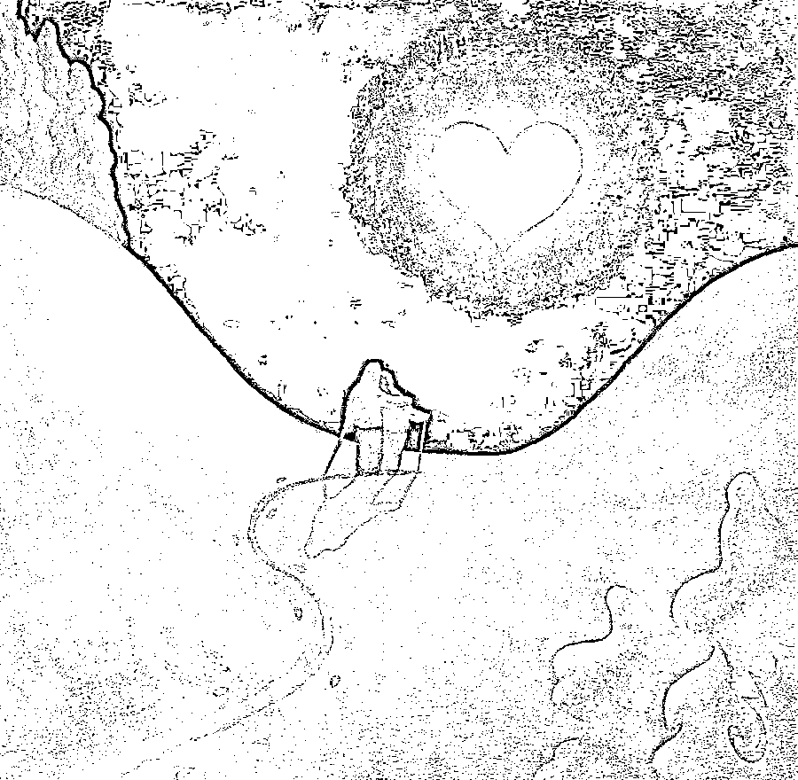

**次限月亮碰到出生星图的火星**

**次限月亮与火星发生关系，**这可能是边缘性的例子。

想象你有一辆车，你住在北京，在北京糟糕的交通中驾驶，在开车的时候你头脑中有多少想杀了别人冲动出现呢？北京的交通可能让大家非常愤怒，但你也不会杀害别人，有些人驾车的素质非常糟糕，也许伤害到了你甚至让你的生命遭受危险。如果你没有觉知，他们很可能对于你造成很严重的伤害，你对于这一点感受如何？如果你一直愤怒不休会怎样呢？

想象一个人在糟糕的交通中有愤怒经验，6 个小时后他还是为这个愤怒，他还在那谈对于这个该死的笨蛋该如何做。那有些歇斯底里，**你需要放下那个情绪，**这是现实世界。在北京每天驾车可能经常遇到这样的情景，不要让愤怒充满你整个生活。当然很明显我说的是好的建议，你需要放下很多东西。

比它看起来更深，那个行为可能让你受到伤害，那个行为可能会杀害你，原谅这一点是很难的，10 分钟之后你就不去想这个东西，问题是，那个愤怒到哪里去了？答案就是它进入到了潜意识中，进入那个深井。

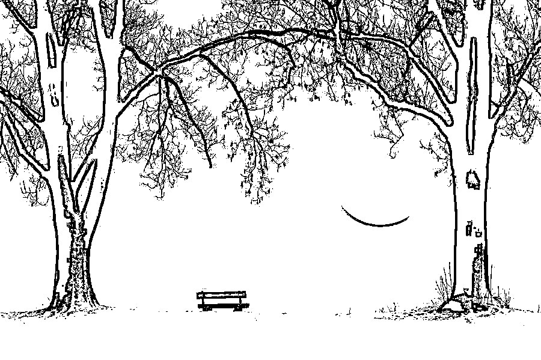

**在占星学中我们把愤怒放在哪里了呢？也许最简单的答案是火星。**这是最直接的回答，代表愤怒的行星，我们知道答案。想象北京糟糕的交通，假设发生在 2011 年。10 年前，你已经完全忘记了那个事情，从意识层面忘记了，但是愤怒被塞到了火星中，刚才只不过是一个小例子，如果你经常开车在北京，每年可能都会碰到类似的事情。

如果你在北京工作，老板有时候会责怪你，你会生气吗？当然，你会告诉老板你的感受吗？很可能不会，你会忍气吞声。想象这个事情发生在 2012 年，这个事情会过去，你会持续你的工作。所有的挫败和羞辱感都存储在我们的体内，**被存储的东西是一种感受，一种愤怒的感受。**

**当次限的月亮和火星发生关系，**伟大的母亲说，小火星你今天感觉如何？小火星说：“我想杀人！”想象你嫁给一个人，那个人正在经历次限月亮和火星，你的伴侣正在和愤怒发生关系，你的伴侣想要杀人，而你的位置非常方便。

唯一的理由是：有一天你次限的月亮也会和火星发生关联，**我们能够理解我们真正愤怒的东西是什么吗？**理解那个核心的议题，然后去做一些事情。去理解这个问题的方式，就是去理解出生星图的火星，它有很多不同的方式。

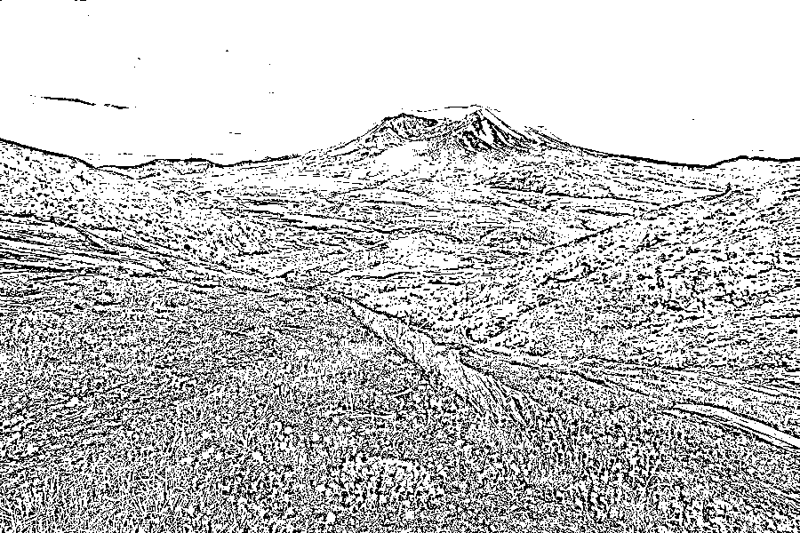

**举个例子**

**让我们假设火星在天蝎座，**当一个行星在一个星座的时候，我们意识到那个星座给这个行星带来了一个意图。之前月亮星座讲过这个法则，这样的分析方式是理解占星学的基础。

**天蝎座的意图为何？**我们正向的思考可以说**把真相放到桌面**，不舒服但是还是要去看到的面向，**把那些无意识的东西带到意识中来**，为什么那些东西会变为无意识呢？以为那些东西会让我们不舒服，天蝎座的东西是不让人那么舒服的。

如果你在和一个人交谈，谈到关系中的困难的面向，你和朋友诉说，你的朋友说你可能忽略看到一些面向。你说，我不想听，朋友用身体语言告诉你可以，你的朋友告诉你对于这个情况完全不同的看法和观点，那就是你自己也是问题的根源。这个话听上去很困难，没有人想获得这样的信息，你意识到你的朋友这样说是勇敢的，然后你意识到有一些真理在其中，然后你对朋友说，谢谢你！

**这是一个天蝎座的时刻，**天蝎座最好的运作的时刻，因为它需要和正确的人有足够的勇气才能经历的部分。但我们大多数关系是不能够这样做的，**人们对于真相是有愤怒的。**

**如果你的火星在天蝎座，你一生中有多少东西是吞下去的呢？**你可能会微笑说妈妈你是对的，那会形成一种长期的痛苦和根源，火星在天蝎座代表什么？它可以帮助我们，我们是以这样的方式在运作的。

**当次限月亮和火星发生关系，我们就有一些情绪升起了，**占星学帮助我们问正确的问题，得出正确的答案，我们知道内心存储的真正的本质是什么。与其是以一种坏脾气的方式呈现，**我们内在有些部分曾经没有得到满足和允许，**你和有些朋友无法全部诉说真相，你需要新朋友，但不代表你要把曾经的朋友扔掉。

**未完，余下内容****见今日二条**

**版权声明：**本文由若道翻译发布，欢迎转发，反对抄袭。友号转载请申请白名单。

斯蒂芬·弗里斯特

若道签约老师。进化占星学的创始人之一，当今世界最有影响力的占星大师之一；1985 年，他凭借《内在的天空》一书获得职业占星师协会奖（Professional Astrologers Incorporated Award）。他四次获得占星界最高的占星学联合协会奖（United Astrology Congress Regulus Award）提名，2018 年获得轩辕十四教育奖。

**ISAR 选修课·次限月亮之旅**

**点击下图了解课程详情** 

**微信又双叒叕改版啦，不想错过若道君的推送？**

**就把若道设为星标吧！**

**▼**

就是这个“在看”，戳戳戳 ☟

****************报名直达入口****************

# 插班中丨择时择地占星学，助力“天时、地利、人和”

> 原文：[`mp.weixin.qq.com/s?__biz=MzA5NjA0NTAxNg==&mid=2651442759&idx=3&sn=042c3bf3e77c5161a70eb20a49af1b46&chksm=8b4b7cf0bc3cf5e6c49d47ca8347f08bd0203204deaee3c83b32d941e351541ff3975883e182&scene=126&sessionid=1692738004#rd`](http://mp.weixin.qq.com/s?__biz=MzA5NjA0NTAxNg==&mid=2651442759&idx=3&sn=042c3bf3e77c5161a70eb20a49af1b46&chksm=8b4b7cf0bc3cf5e6c49d47ca8347f08bd0203204deaee3c83b32d941e351541ff3975883e182&scene=126&sessionid=1692738004#rd)

1

**为什么要学习择时择地占星学？**

**择时择地占星学是占星学传统中的一个重要分支，也是占星师为客户提供的一个重要服务领域。**

宇宙天象在不停变化，就像潮汐一样。作为占星师的我们了解，每刻天象有不同意义。当我们有一个重要的事情要做，不论是企业选择开业、谈判、上市时间，还是个人选择面试、婚礼、手术、投资买卖时间，都好像选择在怎样的宇宙潮汐下开船。**适合的时刻就像孔明借到的“东风”，帮助我们顺风顺水，推动事情有个好开始及好的发展。**

同时，在国际化、地球村的今天，我们和客户都有了更大的可能性在全球范围内移动，开展一些重要的事情，而选择合适的地点也将有助于事情的开拓，并带来一些在本地无法实现的机会。

而最最重要的，在所有这些事件中，我们都需要考虑人的要素。一个精心挑选出来的时间和地点需要和当事人的星图契合。

因此，**择时择地占星学就是帮助我们及客户找到成功的三个关键要素——“天时、地利、人和”的一门重要占星技法。**

**拥有这门技法，可以迅速帮你扩展你的占星业务内容，特别是为服务高端客户带来更多可能。**

2

**课程大纲**

**此课程可作为 ISAR 选修课。**

**在这 10 节课的时间里，我们将以案例方式学习择时择地占星学的重要应用，包括但不限于：**

*   确定择时图的优先顺序，了解自己和客户的需求

*   了解当下的大趋势，认识可选择的时段内任意时刻的利弊

*   研究公司事务相关的择时，比如开业、产品上市、网站上市、谈判、诉讼、上市、收购、会议、重大活动等

*   研究和个人相关的择时，比如面试、考试、投资买卖、结婚登记和婚礼、手术（比如剖腹产、整容手术）等

*   介绍择地理论

*   用案例研究如何进行择地

**本课程讲主要使用案例讲解，并有作业和认证考试。**

**完成作业，且通过考试者将会获得择时择地占星学认证证书。**

3

**导师介绍**

**大卫·瑞雷（David Railey）**

在过去 50 年中，大卫·瑞雷老师一直不间断为其客户提供占星咨询服务。他们中有国会议员、奥斯卡获奖演员、市长、企业家、工程师、天文学工作者、运动员、艺术家、大型活动组织者、导演、编剧、建筑师、心理咨询师等来自各行各业的人士。他们的年龄跨度，上至 80 岁老人，下至 10 多岁的青少年，均是大卫·瑞雷老师的客户。有些更是祖孙三代都是他的客户。

在 50 年的咨询生涯中，大卫老师为很多客户提供了大量择时择地服务，帮助他们安排人生中的重大事务，也因此积累了很多择时择地案例。

在这难得的 10 节课中，他将告诉你，他 50 年来成功为客户进行择时择地服务的秘诀。

**大卫老师寄语：**

**如果你想要拥有长期客户的话，首先是要跟他们建立有信任的关系。你要跟这个人建立一种连接。因为那些会问你最多关于择时择地问题的客户，将会是你建立最紧密关系的客户。他们会慢慢信任你，你也能慢慢了解他们。**

以下是一位跟随了大卫老师 40 年的 70 多岁老客户 Caroline 给大卫老师的信，大卫老师在她 73 岁时为她的飞行考试进行择时。她写了这封信表达感谢，并同意刊登。

（向上滑动查看内容）

“Flying went just GREAT!  Thank you so much.  Thank you, thank you, thank you.

You picked it perfectly - weather turned out fine.  I am soooo Happy.  Just thrilled.“

“飞行棒极了。太感谢你了。谢谢你，谢谢你，谢谢你。你挑选的日子棒极了-天气特别好。我特别开心。真的太激动了。”

4

**授课时间和方式**

**授课时间（共 10 次课，每周二）：**

*   2021 年 4 月 6 日

*   2021 年 4 月 13 日

*   2021 年 4 月 20 日

*   2021 年 4 月 27 日

*   2021 年 5 月 4 日

*   2021 年 5 月 11 日

*   2021 年 5 月 18 日

*   2021 年 5 月 25 日

*   2021 年 6 月 1 日

*   2021 年 6 月 8 日

5

**授课方式**

**线上网络直播课，英文授课，中文翻译。**

6

**课程价格**

**价格：7500 元**

**特别优惠：**

**转发课宣至朋友圈，不分组，并写上走心的推荐语，即可获得 200 元优惠券！**

**（截图发给客服小姐姐领取）**

**往期学员复训：3750 元**

**往期学员参加认证考试：1000 元**

7

**退转课程**

*   **退款原则请详看《教学协议》，如有疑问请咨询课程顾问。**

****择时择地占星学网络课****

**授课老师：大卫·瑞雷**

**授课时间：**2021 年 4 月 6 日-6 月 8 日

**授课方式：****线上课程，英文授课，中文翻译**

**费用：7500****元**

**课程负责人：Maggie 老师**（微信：18510107057，请备注“择时择地占星”）

长按二维码添加课程负责人咨询~

****报名请点击“阅读原文”****

# 当新时代来临，婚姻还是每个人的必须选项吗？

> 原文：[`mp.weixin.qq.com/s?__biz=MzA5NjA0NTAxNg==&mid=2651442759&idx=1&sn=cc181bd3035b6113b3e7798faf0d2747&chksm=8b4b7cf0bc3cf5e62929aa0403a914879cd67afc5a0fab20b5b0548bb5f1b21dc7b2710db087&scene=126&sessionid=1692738004#rd`](http://mp.weixin.qq.com/s?__biz=MzA5NjA0NTAxNg==&mid=2651442759&idx=1&sn=cc181bd3035b6113b3e7798faf0d2747&chksm=8b4b7cf0bc3cf5e62929aa0403a914879cd67afc5a0fab20b5b0548bb5f1b21dc7b2710db087&scene=126&sessionid=1692738004#rd)

********************☆ 后**********************台**********************回复“今日”，给你一句生命态度********************

作者/郑玮玲 ISAR 认证占星师
编辑/翀子 封面/书君 图片/网络

现代婚姻的意义和从前有很大差异，现代人的婚姻观也不再和以前相同。天王星与冥王星的四分相（2012 年到 2015 年）唤醒了女性的独立意识，而当 2026 年到来，我们面对三王星同时换座，又将迎来怎样的情感新时代呢？让我们来读文章吧。

如今，越来越多人不想结婚了，离婚率比 A 股还稳定地持续上涨……这到底是为什么？到一定年龄就必须要结婚吗？占星学要给你答案。

中国的单身人口已达 2 亿。2015 年，日本终生未婚男性达 23.37%，女性 14.06%，日本年轻人中的不婚族已达 74%；韩国 30 岁以上未婚人数占 36.3%，英国中产阶级中仅有 60%的恋人会选择结婚。

**“不敢结”和“没空结”**

现今城市人结婚成本至少百万，这笔钱足够穷游地球村了。越来越难看到婚姻优势的同时风险却在显著增加：生孩子的职业、健康风险，高额的教育费和时间成本。婚姻对富豪一样有风险，吴佩慈、梁洛施都为富豪生了三子，被赠巨额财产都未能成婚。上一辈的婚姻挣扎也让泡影般的围城不复存在。

生活的丰富性让人们享受自由的同时也能享受孤独。精子库，冻卵子技术彻底瓦解了婚姻的绝对优势。所以，人类还有什么理想非得通过婚姻获得？

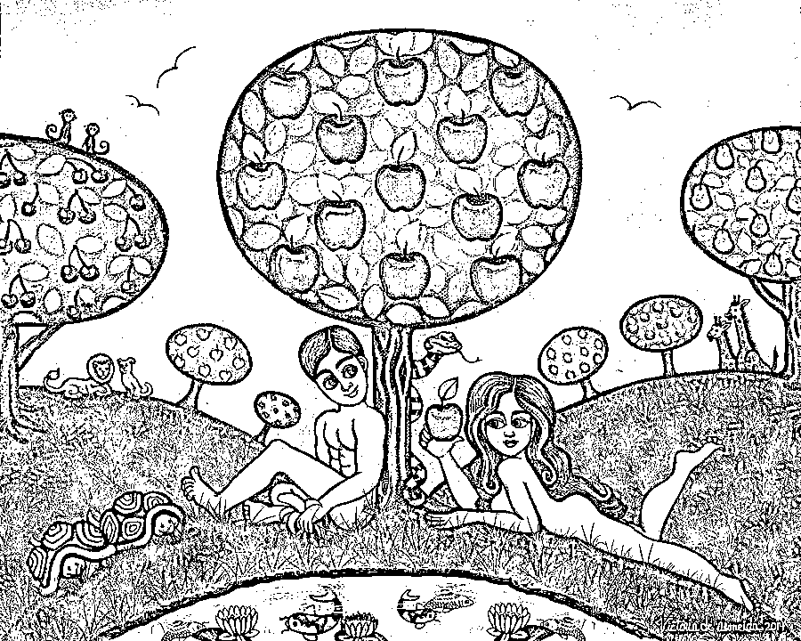

**天冥唤醒女性意识**

**1965 至 1966 年期间，天王星和冥王星合相在处女座，“性解放”也就是女权主义运动标志着女性意识的苏醒。**性不再只是繁衍的手段，作为人类生存、享乐需求第一次消除了性别区隔。经济独立让女人无需依靠婚姻存活。当时的东方未曾经历“女权运动”，可变革的浪潮也默默在时代中演化，不然，怎么会冒出“剩女”这个西方并不存在的称谓？

越来越丰厚的教育背景让女人更客观地认识世界，知识确实就是力量，女人拥有多样的选择，也有能力为自己的选择负责，在内心深处有了自给自足的安全感，实现了情感独立。把有限的时间精力用来实现个人理想，情愿用一生等一个也许不存在的对的人，也绝不将就。或许，只是婚姻的时限被无限拉长了吧。

从前日子很慢，一生只够爱一人。而今时间太快，我怕一生还不够爱自己。

**天王星和冥王星推动人类底层意识变革****，**从 2012 年 6 月到 2015 年 3 月期间，天王星、冥王星 7 次精准成相的岁月里，你的生活，你的内在，你的婚姻，你的意识都发生了什么样的变化？

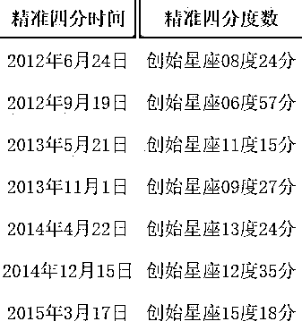

| 天王星与冥王星的 7 次精准四分相

2017 年 1 月 21 日，美国发起的 Woman’s  March 得到了 60 多个国家的响应，上百万女性和支持她们的男性、老人、小孩一起向世界声明：女性的权利即人类的权利。**天王星与冥王星四分相的威力帮助人类呐喊出了个体的真实的平等权，革新的狂澜也必然令老旧的社会形态面临崩解。**

**天王星和冥王星的四分相至 2020 年结束，人类在自己的生命经验里学习真正的亲密。**每个人生来就在寻找能使自己完美的另一半，寻求遗失的重逢，走向个体的完整。**冥王星的真实要求我们跟自己内心的深刻黑暗相处，有时也不得不为时代的转化与集体的伤痛付出个体的牺牲**——比如，一次或多次婚姻失败对于年不过百的个体来说的确太沉重了。可如不面对，就只能终此一生活在恐惧与制约中。

**2018 年 5 月，天王星进入金牛座。这股闪电般的革命性力量将帮助个体彰显自我的实质价值。**需要解放的意识领域是：拥有充分享受生命的自由。每个人都要学习明白“自己想要什么东西”本就是一种独特的自我价值。

**金牛座式的先锋生活态度会让我们拒绝人为造作和多余修饰，无需外在的浮华证明什么，真正的奢华是内在的丰美知足。**不做笼子里的仓鼠——追着循环无终的目标，而是有意识地精减物质需求，知道自己要什么，避免盲目从众，对有限的自然资源更为敏感和珍惜，生活和工作的重心从更人性的角度考虑，不以牺牲健康和生而为人的基本权利为代价。

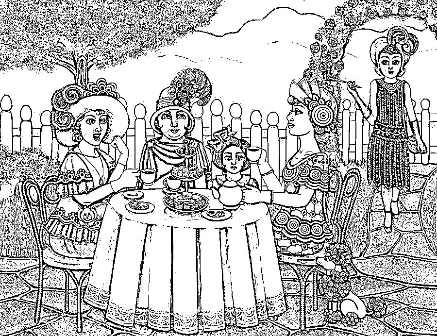

**个体为先的年代**

未来天象

*   **冥王星在 2023 年 3 月首次进入水瓶座**，但在 2024 年前它都在摩羯座与水瓶座交界地带周转，直至 2024 年 12 月彻底离开摩羯座。

*   **海王星会在 2025 年 4 月首次进入白羊座**，2026 年 1 月彻底离开双鱼座。

*   **天王星会在 2025 年 7 月首次进入双子座，**2026 年 2 月彻底离开金牛座。

*   **三王星将在 2026 年 2 月引领人类进入全新的时代**——这是革命性的意识交汇时代，需要清晰果敢的爱与信仰的力量入注，先锋主义的转化力推动了意识的更迭。

**未来社会的最小单元将不再是“家庭”，而是“个人”，**这从根本上威胁着婚姻制度——这种经济合作契约制在未来是无力支撑个体的理想、情感、自由与灵性的。

如果不进入一段受法律制约的关系中，精神与道义上得以减负，人生自由度扩张。你不会把爱作为一种责任附加给对方或自己，你不会把情感的需求作为义务来要求对方或约束自己，更不会有经济、性、权力的控制、被控制和反控制。

自足而纯粹伴侣关系，不影响每个人享受生命本身。过去的人抱怨为了婚姻家庭牺牲了自己，可是他们从没想过选择不进入婚姻。而今清醒地选择不婚，是真正为自己的生命负责。**生活呈现给我们多种多样幸福的面貌，要是觉得一个人的生活很舒心，不必迁就另一个人。**

婚姻的版图日渐消亡，有些东西会随之死去，比如对爱情的幻想。**取而代之的是因自己真正想要什么而带来的价值感与尊重感。**个体得到尊重，每个人都独特、认真地为自己而活，选择更简朴精致的人生，对周围的一切更有觉知，付出关切也保持适当的距离，才会与外界、他人产生真实的联结。

人类的青春期似乎也被无限延长了，每个人都更懂得了爱真实的自己，也会为世界奉出真爱。**不再以婚姻为手段目的联结，是更纯粹的人与人的联结。**

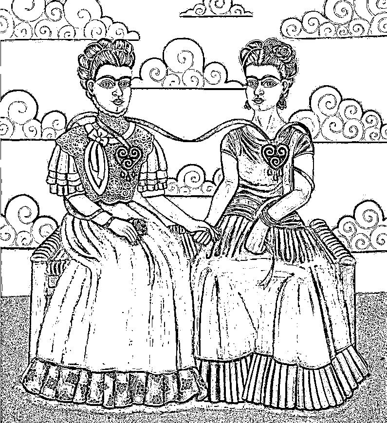

**婚姻不是爱情，更不是爱**

爱情，是荷尔蒙作用引发的情感与肉体互动，通常它的存活期不超过两年。**两年是一个火星的周期，对于任何一对伴侣来说，再长的相处都是两年里所有模式的升级和变形。**

**两年以后叫作亲密关系更适当。**爱情的生化反应经过时光发酵后可维持更长效的稳定性。了知对方的口味、习性、禁忌，无需猜测、询问就能让对方舒服。亲密关系尚无经济利益和责任义务，更没有双方家庭的碰撞，只是无限深入到双方的情感世界，有享受，有冲突，也有调整。

溯源“婚姻”二字，本是男女在黄昏时行礼，女因男而来的意思。既然婚姻是男女双方的事，为何婚姻两个字都是女字旁而没有男字？不是“亻昏 亻因”或“彳昏 彳因 ”呢？因为男权社会最初的奴隶是女性，“女”字旁正有“奴”意。**古代婚姻实质上是男人对女人的所有权的经济制度，是女人从属于男人的关系。**

**现代婚姻却是是两个独立个体的合作关系，用于优化生存资源，越稳固的婚姻越有着不可分割的经济利益。**婚姻中必然有一方经济实力强过另一方，女性意识的苏醒引发了更多的权力斗争。所以离婚率才会比Ａ股还稳定持续上涨。

但婚姻本身并不是单纯经济商业合作那么简单，一旦组建家庭，就衍生出复杂的家族关系。两个原生家庭碰撞，所有的爱情泡沫，亲密关系里建立的信任都在面临考验和瓦解。对方的一个小黑点后面可能就是一个更大的黑洞。

当然，很多人依然认可婚姻制度，依然需要婚姻。就算你是水瓶座，也会害怕自己没人爱。生命有风险，我们都需要安全感，希望有个伴能帮你撑伞。而所有这些期待背后都掺杂了恐惧。**我们对于婚姻的需求可能更多被心底深处的恐惧驱使，而不是爱的本能。**所以，很多女人找到一个男人为自己遮风挡雨，但我们却看到是这个男人为她带来了人生的风雨。

**爱不是爱情，不是婚姻，更不是控制、占有。**爱情和婚姻都会占有，婚姻更是合法控制和占有，当它与爱或爱情绑在一起，就扭曲了它们。

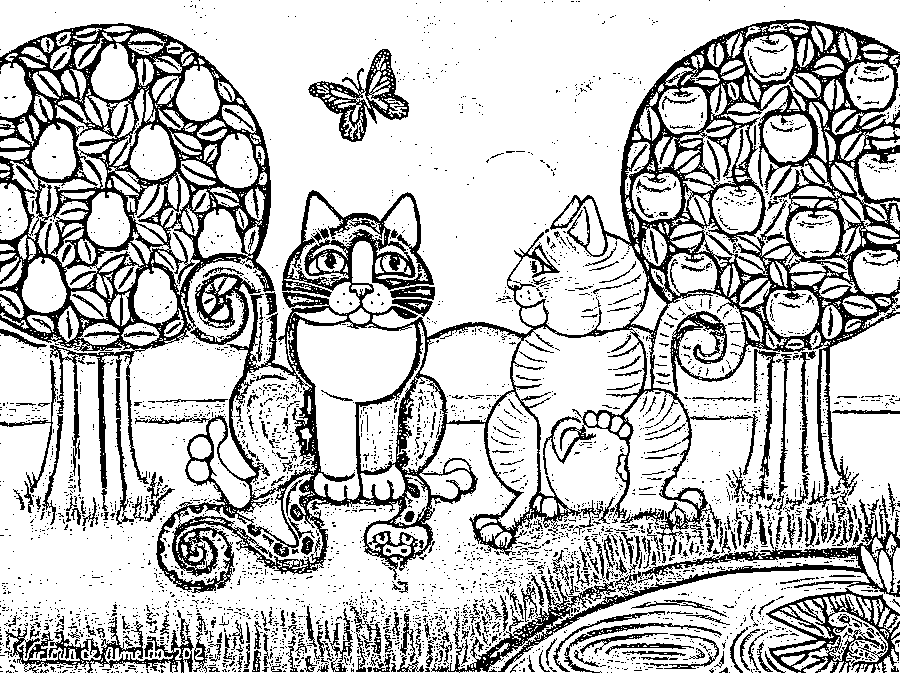

**问爱是什么，你会吓得不敢知道答案，你必须拆掉自己一手建立起来的房子，你可能永远再也回不了原来的寺庙。爱不是恐惧，爱不是依赖、嫉妒、占有、支配、责任、义务、自怜，或者传统上加诸爱的任何东西。如果你能够去除这一切，如雨水洗去树叶上多日的灰尘，而非硬生生地剥除，你就会看见这朵人类渴望多时的花朵。**

**　　——克里希那穆提**

爱不是一种感情，是一种意识形态，一种无防备的承接力，一种无界的交流能量，无所不包，超越生死，带来出神，体悟圆满，无限如宇宙。**爱应该是海王星一般的存在，也似月亮与生俱来的联结与包容。**想像在母亲子宫里被保护滋养的状态，在曼妙的羊水与浩翰无垠无所不包的宇宙中的感受，你与它们之间没有任何区隔。

婚姻不仅是跟同一个人做 4000 次爱，比起一起旅行 70 次，一起看 500 场电影，在一起吃 25000 顿饭和一起睡 100000 个小时，以及听对方无数次放屁打嗝打鼾的声音才是婚姻惯常的样子。还有无数次的白眼、挤兑、妥协、博奕和争吵，即便你是天秤座也无法假装幸福 50 年吧。

**婚姻需要的是：**50 年里有共同的兴趣爱好和思维方式，可以聊工作，制定生活策略，喜欢同类人事物，在同一个社交圈感受一致，能吃到一起，喝到一起，玩到一起，睡在一起互不嫌弃。否则，还是做路人吧。

**爱真的可以无条件，爱情也只需等待机缘，而婚姻的续航条件，太苛刻。**

**世上居然没有亲密关系的大学**

理工科的学生需要良好的数理化基础，文科、艺术生需要良好的文学艺术根基。每个人都会面临的亲密关系，却没有被像学知识一样有的放矢地教授过，我们能学到它的唯一途径就是原生家庭。

你的父母是你唯一的老师，**你的原生家庭就是亲密关系的学校，**哪怕它很糟。所以，最终我们都背着家族的“学术架构”去碰到另一个架构，吻合的或是摧毁性的事件就会发生。

当我们要进入婚姻，没有方法识别双方是否有承担经济契约的能力，除了情感的共鸣以外是否有持久的耐力与不断打破、融合的进化力，并且两人的进化速度与方向是否一致？没有任何权威机构来教授我们亲密关系与婚姻。**我们只能开始从盲目到清醒的探索，经历一轮又一轮的痛苦风波，用生命经验去换取爱与自由。**

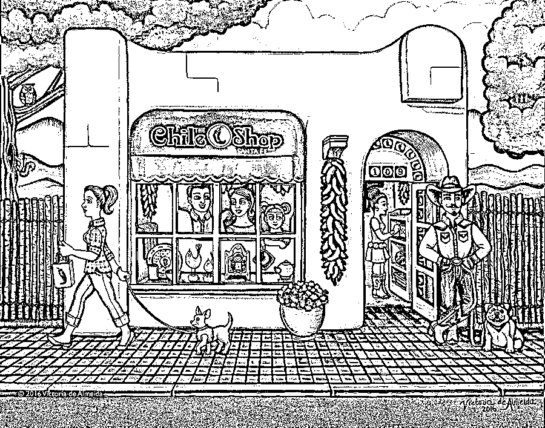

**12 星座在亲密关系里的底线**

我们可以通过简单的方法去判断什么样的关系能满足你对婚姻的需求，在关系中你不可承受的底限在哪里？

*   **白羊座：不能自己作主，失去独立的存在感**

*   **金牛座：不能拥有自我价值感，不被允许的慵懒**

*   **双子座：不被倾听，无趣，无法交流**

*   **巨蟹座：失去安全感，情绪被无视，缺乏温暖关爱**

*   **狮子座：不能忍受刻板，被限制想像力，失去主导性**

*   **处女座：对秩序、规则的无视，对完美的践踏**

*   **天秤座：取悦被拒，不被赞美，太过直白地摆事实**

*   **天蝎座：背叛，被控制，被试探的信任——叛我者死，逆我者亡**

*   **射手座：被泼冷水，被阻止追寻和传播**

*   **摩羯座：插曲和失败**

*   **水瓶座：没有个人空间，不平等互动，独特性被压抑**

*   **双鱼座：梦想被阻挡，才华被打压**

爱因斯坦曾说：

人类总以为自己和他人有分别，而不知自己其实就是整体的一部分。所以我们便将感情拘禁在身边的少数人身上。我们的任务就是将自己人这种囚禁中解放出来，扩大自己的圈子，拥抱一切生命，没有人完全做到这一点，但这种努力本身就是解放的一部分。

如果说爱或者说更博大的爱曾经只是理想，在未来它将是人类赖以生存的根本。2026 年，三王星同时换座就意味着地球新时代的到来。现在就开始拥抱你内在的太阳和月亮，用跨越沧海桑田的勇气去赴这场爱的约会吧。

**版权声明：**原创文章由作者授权发布于若道平台，欢迎转发，反对抄袭。友号转载请申请白名单。

**郑玮玲**

ISAR（国际占星研究协会）认证占星师（2016 年获得）

若道占星专栏作者

将占星咨询、教学与音乐、舞蹈相结合的疗愈者

**微信号**：zhengviolin

**新浪微博**：@郑玮玲

**微信公众号**：Sampriya-Astrology

长按打赏

**系统学习占星学**

**点击图片了解详情**

**微信又双叒叕改版啦，不想错过若道君的推送？**

**就把若道设为星标吧！**

**▼**

就是这个“在看”，戳戳戳 ☟

********报名直达入口********

# 如何与占星师一起正确工作？帮你活出人生的实相

> 原文：[`mp.weixin.qq.com/s?__biz=MzA5NjA0NTAxNg==&mid=2651442759&idx=2&sn=c95647e94c78f4c5370d112217bd765e&chksm=8b4b7cf0bc3cf5e6dc253d3eb78405d0af06b1580a1f3e34035efc1bab28ce258500d77f480c&scene=126&sessionid=1692738004#rd`](http://mp.weixin.qq.com/s?__biz=MzA5NjA0NTAxNg==&mid=2651442759&idx=2&sn=c95647e94c78f4c5370d112217bd765e&chksm=8b4b7cf0bc3cf5e6dc253d3eb78405d0af06b1580a1f3e34035efc1bab28ce258500d77f480c&scene=126&sessionid=1692738004#rd)

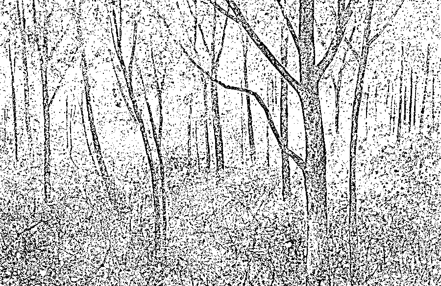

作者/杰西卡·默里 

译者/Christy 校对/王宏

编辑/翀子 图片/网络

出生星图上的行星排列，是一种符号化的语言，占星师可以从中看到你生命中的潜能与挑战。出生星图无法告诉我们是否会遇到“正缘”，但可以解释我们内心强烈渴望出现的时间，以及这个阶段对生命成长和人生路径的意义。**占星师是怎样工作的**

占星学是一种符号化语言。出生星图正是用这种符号语言设定的、展现个人人生目标的地图。**出生星图源于在你出生的那一刻，你所出生的确切地点上天空中行星的排列。**这些符号之所以抽象是有原因的。正如埃及象形文字指代的概念远比一个单独的字可以传达的概念复杂得多，**行星文字和星座以及行星之间的几何角度都有着丰富的多层意义。**

如果你想让占星师绘制你的星图，你可以进行预约，要么去他们的办公室进行解读，要么在电话里进行。**占星师会让你提供出生日期和地点，理想状态下，还要说明是几时几分出生的。**不知道自己具体出生时间的人也能让人绘制出自己的星图，虽然精确性会打折扣，但仍然会揭露大量信息。

我喜欢当面做解读，尤其是在第一次与某人见面时，因为面对面能提供更多的渠道让直觉信息流动。占星学包含一个神秘的（隐藏的）部分，该部分将死记硬背的技巧与更为玄妙的东西结合在一起。当我们坐下一起喝茶时，我们的对话从纸上的数据开始，然后快速扩展到这些数据在心理—精神层面的含义上。星图成为了通往心灵的渠道。

在解读完你的星图后，大多数占星师都会给你一份星图以及咨询的录音。

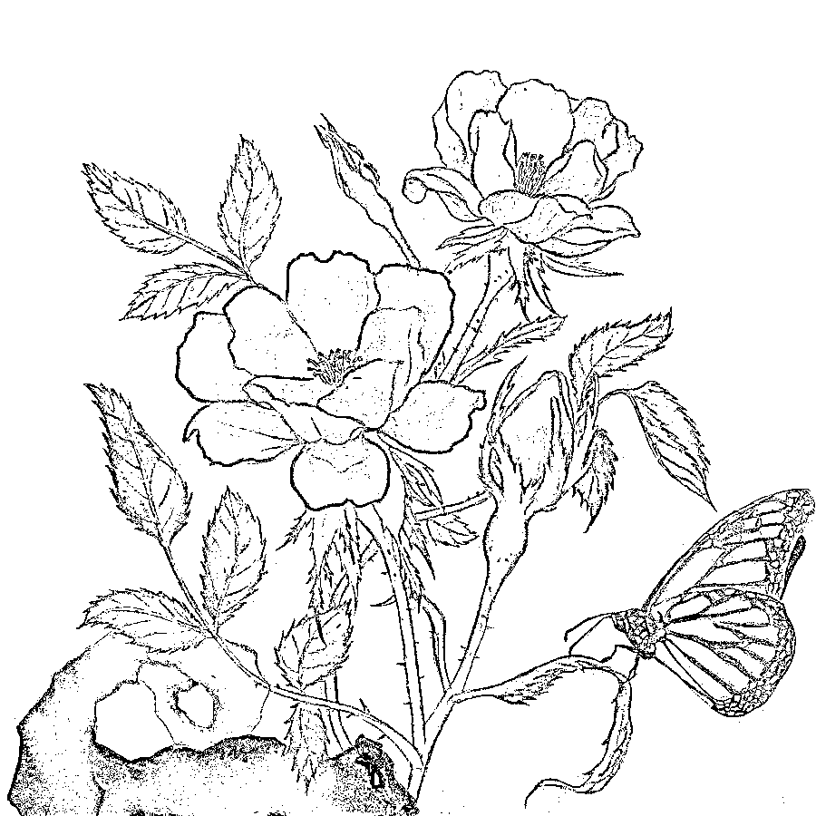

**占星师能给你提供什么信息**

利用你的出生星图（这通常是一个人的切入点），占星师可以提供给你关于你是谁的不偏不倚的概述。**星图向占星师展示了你潜在的优势、挑战和先天禀赋，以及你容易陷入困境的领域。**你的占星师会向你描述，星图展示出了你怎样的内在资源，以及你需要努力的地方。更倾向于精神层面的执业占星师会从灵魂的目标角度来进行描述。

星图中有一些主题暗示了为什么我们每个人会来到这一世。

**在行进或推进的解读中，占星师可以解读出那时发生在你身上的任何事件的更大的意义。**她可以看出，星图展现出的在你人生的这一阶段、这个月、这一周，甚至这一天，你更高的自我正在努力学习的是什么。比如，导致你换工作的真正原因是什么？你可能认为是财务问题，但她或许会查看你的星图并看出一种不可避免的情绪转变，无论你在做什么工作，或你挣多少钱，这种转变都会发生。

在比对图中，占星师能帮你认清，你的需求是否与你新男友的需求看起来相像。**占星学很擅长精确地找出一个人的需求、品味、信仰和欲望，并将之与另一个人的进行对比。**一段关系背后可能不那么明显的主题因此得以揭露。当你知道你与某人在哪些方面有本质上的不同，以及在哪些方面是步调一致的时，你就有了许多可利用的信息。

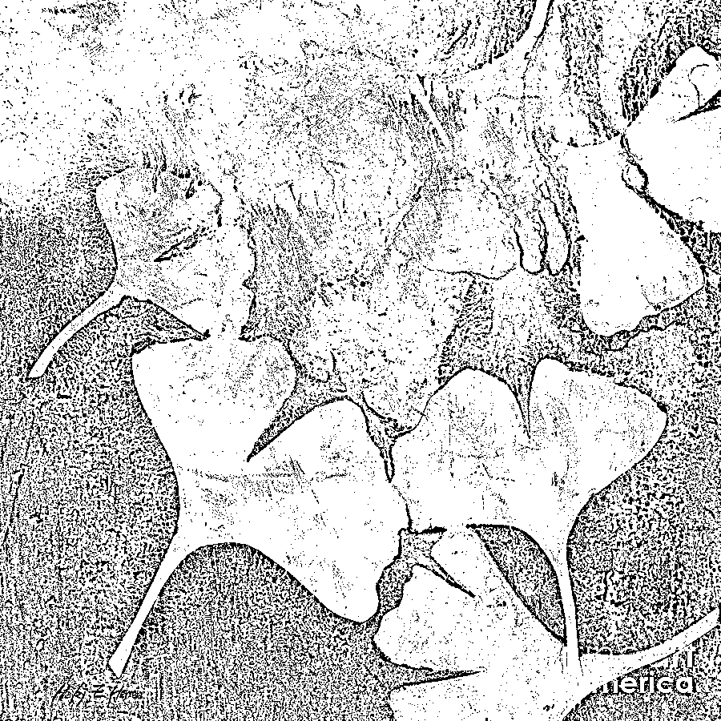

**占星师可不只是用来预测的**

一个常见的错误观念是，现代占星学可以进行预测。事实上，几个世纪以前，占星师的确这么做过，一些占星学派依然在这么做，最显著的是在印度这类社会中，在那里主流的世界观更具宿命论特色。

然而，**大多数西方当代占星学是基于心理学而非占卜的。**的确，由于占星学具有超越几何的超感官层面，因此你可能在做星图解读的过程中听到一些来自你的占星师的极其精准的反馈。甚至连占星师自己也很难解释她是如何想到自己所想到的这些情境的。

比如，她可能在你的星图中看到，一场朝向清理的突如其来的转变即将发生在你身上，她可能想到旧货出售的场景。她可能尝试将这一场景作为比喻告诉给你，却得知你真的在下周安排了旧货出售。

这种情况之所以发生，是因为**人生中的一切都是象征符号。**你的人生已经选择了旧货出售的象征符号来表达那一清理的主题，无论以什么方式，这一主题都会在提及的时间段里被表达出来。**占星师能看出该时间段的意义所在，但只是以主题的形式。你更高的自我选择完美的方式来将其表达出来。**

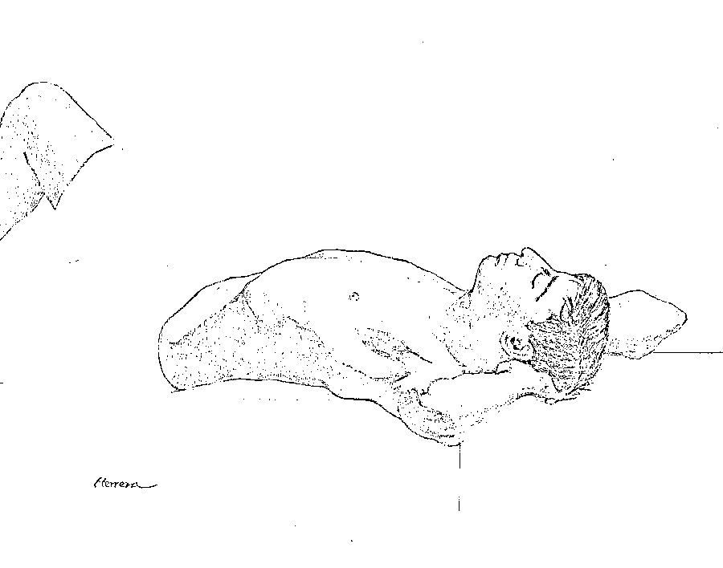

**如何正确使用占星师**

**占星师能够看出你星图中的趋势，无法看到细节。**她不需要知道你如何体现自己特定的主题，她会以一般形式来看待它们，这对你而言是去看它们的最有用的方式。这样一来你就能开始领会你不断变化的细节之下始终如一的趋势。

尤其是初次做星图解读的时候，你的占星师所用的比喻可能非常抽象。她根本就不认识你，**只会解读整体的模式，而不会试图猜测它们所采取的形式。**在查看你的星图时想象出旧货出售情景的占星师并不知道你是否要精简你的公司、扔掉你的旧鞋，或是对你的内在价值推陈出新。这取决于需要发生什么样的事件才能教会你即将到来的宇宙功课。

而这才是你真正想知道的。在你急着把背景故事告诉给占星师之前，要考虑到，通过在这一层面倾听你星图的真相，你会从首次星图解读中获得更多的信息。

**行星本身不会预测你会做些什么，它们只会透露你为什么要这么做。**知道原因能让我们更有意识地参与到所发生的事件中。

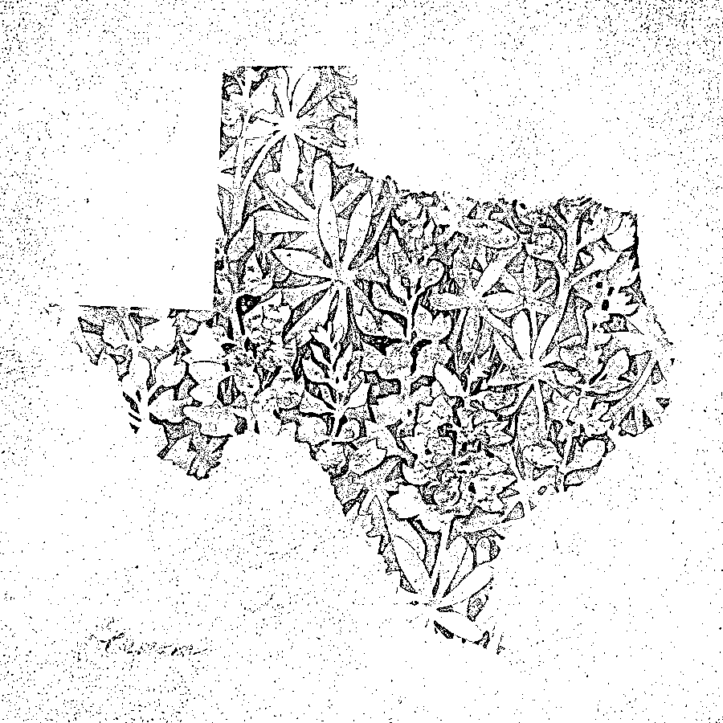

**占星师无法告诉你什么是“正缘”**

**你的出生星图是一张编码的地图，而不是一张等待发生的刻板事件的清单。**大多数占星师认为，不存在与人类意志相分离的名为“命运”的这种东西。因此，所有这一切之中的未知因素是自由选择，**一个人变得越有意识，他的选择就越自由。**

有些人听到以下内容可能会很失望：没有特定的事件会因为天空中的天体形成特定的角度而发生。**天体周期也不会强迫我们理解任何事，**它们没有得到授权。**它们只是宣布主题，**这些主题如果是带有洞察力地被解读，就可能变成我们的经验教训。**它们还明确了这些经验教训何时会被教授。**

星图会说出我们与谁相处最和谐吗？**在我们吸引的是与自己相同的人这一方面而言，星图确实会给出答案。**比如，我们每个人对于理想的男子气概都有自己的版本，这是通过火星这一行星表达的。星图中如果有颗好战的火星，就会比带有内敛火星的星图更有可能倾心于海军、警察和竞技运动员。

**但是你的星图完全不会真的描绘外在现实，它只会描绘你自己心灵的状态。**一个有着炽热火星的、有自我意识的人可以将其展现为无畏的勇气，并容易吸引其他表现出这种特质的人。

**占星师可以帮助你了解你内在的雄性特质**（无论男人、女人，我们都有火星，无论我们的性倾向如何）**的最高潜能**。占星学的目标是让你重新认识你的火星最强且最优的特质。这让你重新接触自己心灵中可能变得疏远的或未被充分利用的部分。逐渐了解你的火星会让你更有可能遇见这种增强形式的男性能量。你可能会开始吸引英雄，而不是恶霸。

**你星图中的其他所有行星也都是如此，每一颗都往往会在其他人的镜子中，以更有创造力的方式反射到你身上。**

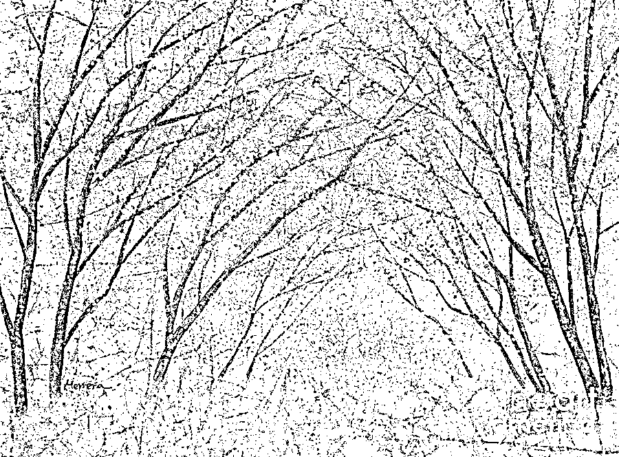

**没有别人，只有你自己**

别让你的占星师告诉你，你是否会在今年夏天遇见你一生的挚爱。你的亲戚可能知道，而你的占星师却不知道。**占星师只看哪些主题被强调了。**如果一位新男友会主动教给你有关其中一个主题的事，那么你就可能遇见一位新男朋友。

当然，**一个人的星图上会显现出重要的情感和心理功课，**而众所周知，宇宙常常将人际关系运用到极致，来教授这类经验教训。但是如果一位男友在这类行进期间出现了，**他会作为那个主题的载体而来到你身边，不一定会满足你想象中男友应有的样子。**

也就是说，你的占星师可能看出，今年夏天你的工作场所对你而言会成为热点，或者你与父亲之间的老矛盾即将显现，同样可能看到你的人际关系区域被激活了。这将意味着议题会出现。你可能发觉自己更在意浪漫了，你可能真的遇到某个对你很浪漫的人，你可能沉浸在展现浪漫的一部电影、一本书或一首歌当中。

**所以说，虽然你不能在星图本身中看到你的灵魂伴侣，但星图可能展现出去找到他的强烈欲望（因为意向创造现实，所以这常常等同于一回事）。**这种欲望在某些时候会比其他时候更强烈，这一点是在星图中能确切看到的。同样地，**你无法从自己的出生图中看到你配偶的变化，但你能看到你对这些变化的态度。**

**简单来说，你的星图中没有其他人，**但有许多关于你人际关系业力及其发展方式的征象。比如，占星师可能看到一种想要从关系的限制中挣脱的迫切需求。如果这种态度转变导致了你婚姻的实际转变，那也没什么奇怪的，对吧？

**但星图所展现的肯定都是内在事件。这是一位好的占星师可以帮助你理解和准备的。**

**占星学以加密的形式揭示了你的人生路径，并准确指出你现在所处的位置。**占星师能帮助你看到难以言说的欲望和强烈的渴望背后的神秘含义，以及在不同方面可能让你感觉武断、难以理解和尴尬的日常情绪和方向的变化。她能向你展示，这些是如何与你整个一生的四季相契合的。这种观点能让人以更优雅的姿态生活。

**版权声明：**本文由若道翻译发布，欢迎转发，反对抄袭。友号转载请申请白名单。

**杰西卡·默里**在旧金山从事执业占星 40 年。在从布朗大学心理学、美术和语言学专业毕业后，1975 年搬到西部，在那里她开始研究卡尔·荣格，并因此接触到占星学。她著有《灵魂生病的国度》和《在十字路口》，并曾在《超个人占星学》选集中贡献笔耕。

**系统学习占星学**

**点击图片了解详情**

**微信又双叒叕改版啦，不想错过若道君的推送？**

**就把若道设为星标吧！**

**▼**

就是这个“在看”，戳一下☟

********报名直达入口********

# 走上属于自己的全新征程，从领取这份免费的新月礼物开始

> 原文：[`mp.weixin.qq.com/s?__biz=MzA5NjA0NTAxNg==&mid=2651442701&idx=3&sn=ac321cdbf8d2ef0b2e872f5bd4ff4a85&chksm=8b4b7cbabc3cf5ac073bd2cdd6bb02aa10b4f8a34d61c7d8dd88419dc50b9baa0b95695be6c0&scene=126&sessionid=1692738004#rd`](http://mp.weixin.qq.com/s?__biz=MzA5NjA0NTAxNg==&mid=2651442701&idx=3&sn=ac321cdbf8d2ef0b2e872f5bd4ff4a85&chksm=8b4b7cbabc3cf5ac073bd2cdd6bb02aa10b4f8a34d61c7d8dd88419dc50b9baa0b95695be6c0&scene=126&sessionid=1692738004#rd)

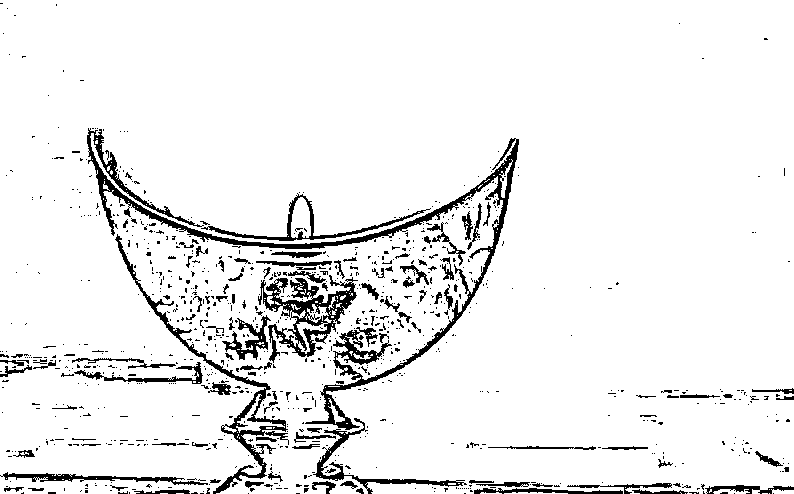

北京时间 4 月 12 日 10:30，新月发生在白羊座 22°25′。每到新月时分，若道君都会为你奉上根据你出生星图量身打造的免费新月报告。可是新月为什么要许愿？新月报告该如何领取？让若道君来教你。

　**什么是新月？**　

从占星学看，新月是月亮周期的一种相位。新月是开始，又称为朔，对应中国农历初一，太阳、月亮在此时合相。此时月亮运行到太阳与地球之间时，月亮以黑暗的一面对着地球，并且与太阳同升同落，地球上看不见月亮。

本次新月时间

**4 月 12 日 10:30，新月发生在白羊座 22°25′。**

为什么新月要许愿？新月是一个周期的开始，新月发生的时候，太阳与月亮合相，能量很强。当新月出现时，你也许会发现灵感忽现，非常适宜开启新领域、项目与行动，缔结一段新的关系或合作。许愿会加强新月的能量，也有助于你了解自己现阶段适合开启的方向。 本次新月最佳许愿时间

从新月开始到其后的 48 小时内，许愿的力量最强。

**最佳许愿时间：4 月 12 日 10:30-4 月 14 日 10:30**

属于你的免费新月报告

每到新月时刻，看着占星文章里写着：看看你新月的宫位，如果新月在第 X 宫，你可以许愿的方向是……

是不是常常一头雾水？新月的宫位？我到底该看哪里啊？

而有时，那些标注上升星座的文章也会让你忍不住想：虽然我的上升星座是这个，可是我的新月好像并不落在你说的宫位啊？你是不是写错了？

虽然这些文章都没有写错，可是好像对你而言都太不友好了。

**Don't Worry！**别着急，让博学又体贴的若道君来帮你！

我们推出了一份**免费**又**好用**的新月报告！

而且是专门为你设计的哦，**根据你出生星图为你量身打造的，只****属于你的独家新月报告**。

报告有哪些内容？

**新月时间****最佳许愿时间**

**如何许愿 **属于你的**许愿关键词**

本次新月给你的**建议**

你会有怎样的**感受 **

****机会****

********

如何许愿？

许愿方式也很简单。

你可以把愿望写下来，或者双手合十后交叉，闭上眼睛来祈祷。 

报告中会为你提供**祈祷词示例**，可以多多参考哦～ 

你还可以适当添加自己的语言，创造属于你自己的祈祷文！

如果报告拿到手了，快对照着许愿吧！

**这份好用又暖心的报告，点击****阅读原文****即可领取！**

****

****点击“阅读原文”即可获取新月报告****

